# 电脑爱好者2014合订本（下）第二部分

## 轻松管理 多网盘不再凌乱

现在各式各样的云存储服务非常多，比如Dropbox、Google Drive、OneDrive等。很多用户注册了多个服务，但是要想管理这些云存储中的文件，要么需要登录相应的管理网页，要么需要安装相应的客户端软件。其实无论采用哪种方法进行单一管理都比较麻烦，因此今天为大家推荐两种不同的多网盘统一管理方法。

文|阿立

## 云端管理跨平台

有些用户不喜欢安装客户端，因此热衷于云端直接操作，这里就可以利用MultCloud云服务进行操作。首先进入MultCloud的官方网站（https://www.multcloud.com），点击网页下方的“Create an Account”进行注册并激活，然后登录到MultCloud的操作界面。虽然MultCloud是国外开发的云服务，但是自带的简体中文界面让操作更加方便。

首先点击左侧列表中的“添加云盘”，再在右侧管理页面中选择需要管理的云盘。MultCloud支持目前常见的云盘，包括Dropbox、Google Drive、OneDrive等，以及国内的百度云和FTP的连线管理等（图1）。这里以常见的Dropbox为例，点击Dropbox图标后再点击“下一步”，设置好云盘名称，接着点击“添加Dropbox”按钮，弹出登录窗口，输入自己的Dropbox账号和密码（图2）。登录成功后同意授权MultCloud可以访问Dropbox，这样相关的设置就完成了。接下来按照同样的方式，可以添加其他需要管理的云盘。

在MultCloud管理页面的操作，和在一般的云盘管理页面操作差不多，比如通过网页上方的按钮，可以实现文件的上传、下载以及新建文件夹等操作。当然在选择文件或文件夹后，右键菜单里面的操作命令更多，包括文件删除、移动、分享等。有时候云盘一多就记不清楚某个文件具体放到哪个云盘中，这时利用MultCloud提供的搜索功能，即可同时在多个云盘中搜索，搜寻结果会直接显示出全部云盘中符合关键字的文件，通过“路径”前面的云盘名称就可以知道文件的具体所在了（图3）。

除此之外，MultCloud还有一个特色就是可以跨平台操作。比如需要将Dropbox中的文件复制到Google Drive中，首先在Dropbox列表中选择需要复制的文件，右击选择“复制”，接着切换到Google Drive的文件列表中，右击选择“粘贴”就可以了。由于文件的复制是在云端进行操作，基本上可以忽略带宽和系统配置等因素，传输速度在瞬间即可完成，这可比下载后再上传要快多了，也方便多了。

## 客户端托管多个网盘

当然并不是所有的人都喜欢在云端进行操作，还是有人喜欢通过客户端进行文件管理。但是云存储厂商推出的客户端，都只对自家的服务器进行支持，所以想要综合管理就得使用第三方的客户端软件。

FileGee是一款同步软件，运行后，点击工具栏中的“新建任务”，在弹出的对话框中选择执行方式，比如需要像普通的客户端那样，就选择“双向同步”项即可。如果只是想将硬盘中的文件上传到云存储备份，那么就选择“单向同步”即可。接下来在“任务名称”的输入框里面，输入一个同步的任务名称，并点击“下一步”继续设置。

接下来在“源目标”对话框中，点击“本机或共享目录”后的按钮，在弹出的窗口中选择本地系统存放文件的目录（图4）。设置完成以后点击“下一步”，在“目标目录”对话框中点击“云存储”选项，然后在列表中选择要进行管理的云存储名称（图5）。FileGee支持金山快盘、百度网盘、新浪微盘以及Dropbox等常见的云存储管理。

> **小提示：**
> 如果想直接在云端进行操作，那么就在“源目标”对话框中选择“云存储”选项，然后在列表中选择相应的云存储名称并设置即可。

这里选择“百度网盘”项，点击其后的“详细设置”，如果是第一次使用这个功能，那么需要获得网盘的访问授权才可以。在弹出的对话框中点击“添加用户”，接着点击“获取授权码”，这时会自动连接到百度网盘的授权网页。在网页中分别输入自己的百度账号和密码，登录成功后就可以看到一个授权码。将这个授权码粘贴到“添加用户”按钮下的输入框中，再点击“进行授权”按钮就可以看到授权成功的输入框了（图6）。接下来从“用户”列表中选择自己的百度账号名称，然后点击“网盘目录”后的按钮，选择备份文件存放到百度网盘的目录。

设置完毕返回“目标目录”对话框，如果觉得有必要的话，还可以选择“对文件进行压缩”项，这样所有的备份文件都会被制作成一个压缩包，再备份到相关的网盘空间里面。如果为了更好地保护压缩包的安全，还可以点击“设置密码”为压缩包添加密码。点击“完成”确认这个任务的设置，同时在FileGee软件的任务列表中，就可以看到我们刚刚设置的这个任务了。接下来按照同样的方法，添加设置其他需要管理的云存储。

以后当我们需要将文件备份到云存储时，首先选择列表中的任务名称，再点击工具栏中的“执行”按钮就可以（图7）。跳过窗口下方的信息栏，可以看到文件上传的百分比，以及文件已经上传成功的提示。当所有的文件上传备份完毕，软件会在桌面的右下角弹出一个提示窗口。由于是在本地系统进行文件的管理，然后再同步到不同的云存储里面，因此这样的操作也是非常方便的。如果想将同一个文件备份到不同的云存储，那么“源目标”中的设置一定要保持一致才行。

> **小提示：**
> 由于FileGee和MultCloud支持的云存储不尽相同，不过由于它们都支持百度云，因此可以利用百度云进行过渡，从而实现其他云存储数据的管理。

## 晨练音乐串串烧

忙碌了一辈子的父母现在已经退休，为了排解老人们空虚的生活状态，社区开办了一个太极拳学习班，于是每天晨练的时候就是从太极拳开始的。可是为了掌握好太极拳的节奏，伴奏音乐当然是不可或缺的。但是现成的音乐又非常难找，于是只有自己动手进行制作。

文|倚楼

## 串烧音乐的制作

经过学习和了解才知道，太极拳也是多种多样的，比如简化的24式太极拳以及88式太极拳等。但是动作越多所用的时间也就越长，而普通一首曲子的时间太短，不能满足这些太极拳伴奏的需求，所以最好的方法就是将多首不同的曲子串烧在一起。合并多首曲子可通过GoldWave这款音频编辑软件（下载地址：http://tinyurl.com/m65fz8w）来完成。

每首曲子的开头和结尾可能会有空白段落等，都需要剪切掉。软件运行后，点击工具栏中的“打开”，选择需要处理的音乐。添加完毕，点击工具栏中的“播放”开始播放歌曲，当开头部分播放得差不多时点击“暂停”，通过时间轴记录下当前的时间位置。接着点击鼠标右键，选择“选区”菜单中的“设置”命令。如果要减去开头的部分，就在“基于时间位置”的“结束”选项中，输入刚刚记录下的当前位置时间。设置完成后点击“确定”按钮（图1），再点击工具栏中的“删除”按钮并进行保存即可。以同样方法对其他几首歌曲素材进行处理。

## 增加音乐特效

当然练习太极拳只有音乐串烧还不行，还需要根据早晨晨练的特点进行加工，比如伴奏音乐的音量需要适当的增加，这样才可以保证所有晨练的人都听清楚。还是运行GoldWave这款音频编辑软件，在弹出的窗口中点击工具栏中的“打开”，打开上面制作好的串烧音乐。接着点击“效果→音量→改变音量”菜单命令，在弹出的音量改变对话框中既可以自定义设置，还可以在“预设”列表中选择已有的设置方案，比如本例选择的是“两倍”（图3）。设置完毕点击“预览当前设置”试听，如果满意的话点击“确定”按钮就可以了。这里需要提醒大家，音量不要增加太大，以免影响其他人的休息。

## 为伴奏乐添加节奏元素

我们从网上下载到的音乐，有可能自身的节奏感并不强，所以就需要加入一些节奏性元素。首先找一段纯节奏元素的音乐，要保证它的节奏与歌曲的节奏相同。接下来在GoldWave中加载原有的串烧歌曲，然后再将节奏音乐加载到另一条音轨中，如果节奏音乐较短，可以将它复制几次直到与串烧音乐等长。接下来点击“编辑”菜单中的“混音”命令，在弹出对话框的“进行混音的起始时间”中进行设置，一般情况下保持默认设置即可（图4）。配置完毕点击“确定”完成，然后点击“文件→另存为”菜单命令，以“MPEG音频（*.mp3）”格式保存，一首强节奏感的串烧歌曲就完成了。

## 挖掘隐秘功能 让网络访问快又稳

在用谷歌Chrome访问某些网站时，有时会出现不稳定或速度较慢的情况，这时我们可以利用Chrome一些没有开放的功能来缓解这一问题。

## 1 启用新的QUIC协议

从最新的Chrome浏览器版本开始，内置了一种全新的网络协议——QUIC协议，该协议是在传统的TCP和UDP协议的基础上发展而来。传统的TCP协议强调的是传输的可靠性，UDP协议凸显的是它的效率高和速度快，而QUIC协议则集中了两种协议的优点，可以让浏览器快速、稳定地访问互联网。

在Chrome浏览器的地址栏中输入“about:flags”并按回车键，进入Chrome的实验室设置页面，从中找到名为“实验性QUIC协议”和“经由实验性QUIC协议发出的HTTPS请求”的两个选项，分别点击每个选项下面的“已启用”（图1）。设置完毕按照提示点击下方的“立即重新启动”重启浏览器就可以了。

## 2 强制启用页面缓存

如果是使用火狐浏览器的用户，又该如何解决类似的问题呢？这里首先点击“工具”菜单中的“附加组件”命令，然后在弹出的窗口中点击左侧的“扩展”，为浏览器安装一款名为“Mason”的扩展。接下来在附加组件列表中找到Mason扩展，点击该项目下面的“选项”。在弹出的配置窗口中点击“添加”，再在弹出对话框的“描述”中任意设置一个名称，比如设置为“强制页面缓存”。接下来在“包括地址”中输入代码“^http\:\/\/.*”（不含外侧引号），并在“不包含地址”中输入如下代码：(^http\:\/\/.*bbs.*\.htm.*)|(^http\:\/\/.*\.php(.*check.*)|(.*edit.*)|(.*notice.*))|(^http\:\/\/tieba\.baidu\.com\/p\/\d+)|(^http\:\/\/tieba\.baidu\.com\/f?.*)|(^http\:\/\/.*\/(\w+$)|(.*\?.*\d+$))

接下来在“功能”列表中选择“自定义Http头信息”项，并且点击“配置”弹出设置对话框（图2），在“Http Request/Response”中设置为“Both”，“Header Key”中设置为“cache-control”，“Header Value”中设置为“max-age=2592000”（图3）。设置完毕点击“确定”退出，按提示重启浏览器即可。

以后当我们访问网页时，该插件就会强制页面进行缓存，从而达到上网加速的效果。

## 图片管理的好搭档

图片管理是PC上一项最常见的应用。除了在图片编辑器的窗口中管理和处理图片文件外，我们更希望在文件资源管理器窗口中通过鼠标右键菜单方便地处理图片。借助于窗口图片管理能手Xnview和右键图片管理插件XnView Shell Extension这对好搭档，可轻松搞定图片之事。

### ① JPEG图片无损转换

通常，将图片转换为JPEG格式，或者对JPEG格式的图片进行旋转变换时，都会有不同程度的图片精损失度。通过XnView的特殊旋转和转换功能，可以实现JPEG图片的无损转换或旋转。

先通过XnView官网http://www.xnview.com免费下载该软件。安装之后在任一图片文件夹上点右键，选择“用XnView浏览”即可管理和处理图片。在XnView浏览器窗口中选择要旋转的图片，点击右键并选择“JPEG无损旋转”，然后选择旋转的角度。其中比较有特色的一项是“根据EXIF值旋转图片”，它可以根据照片拍摄时记录的方向智能判断，实现照片的自动转正处理。此外，还可以通过“垂直翻转”和“水平翻转”实现照片的镜像显示（图1）。

如果要批量转换图片为无损JPEG格式，只需在选中图片后使用右键菜单中的“批量转换”命令，在弹出的批量转换窗口中将目标格式选择为JPEG，然后点击其后的“选项”按钮（图2），在弹出的选项设置窗口中，选择格式为“JPEG-XR”，将滑块拖动到最右侧，可见上面标注有最优（无损），这时的照片质量为100%，为无损状态，确定转换即可获得无损的图片（图3）。

### ② 创建图片缩略图画廊

可以将一大批图片按日期自动创建为缩略图画廊。在XnView浏览器窗口中选择要创建画廊的所有图片，然后点击工具栏上的创建画廊按钮，这时会弹出“生成联系表”窗口，在其中设置画廊参数，包括缩略图尺寸、间距、页面尺寸、边距，还有各种页面元素颜色参数等。设置完毕后点击“创建”按钮开始创建（图4）。

### 3 创建图片网页缩略图

创建结果后，我们就可以看到页面上以日期分类创建好的系列画廊页面（图5）。

将图片做成网页缩略图的方式，不需要网页制作软件即可搞定。

在XnView浏览器窗口中选择要做成网页的图片，然后点击Ctrl+G快捷键，启动创建网页缩略图窗口，在其中设定缩略图尺寸、其他参数、输出目录，然后点击“创建”按钮（图6），即可获得一套完整的图片网页缩略图。

> 小提示：相似度的大小会直接影响到查找速度，相似度定义得越高，查找所用时间就会越长。

### 4 相似图片查找比较

如果希望找到相似或重复的图片，可以使用相似文件查找功能来实现。

点击“工具→查找相似文件”命令，在弹出的“查找相似的”窗口中，添加要查找图片文件所在的目录（可以添加多个目录，目录之间甚至可以跨分区），选中下方的“包括子目录”选项，然后选择“相似的图片内容”选项，通过滑块定义图片的相似度，然后点击“查找”按钮进行查找比较即可（图7）。

除了以上应用外，XnView还可实现图片属性批处理、图片文件批量重命名、应用各种滤镜特效加工照片等实用功能。

### 5 右键管图灵活方便

在文件资源管理器中管理图片，最方便的操作莫过于用右键直接控制和操作当前位置的文件。当我们在Windows系统中安装了图片管理插件XnView Shell Extension之后，只用鼠标右键命令，就可轻松完成图片预览、格式的成批转换、方向旋转、壁纸替换等非常实用的图片操作。可以说，XnView Shell Extension是XnView浏览器精华功能在右键上的体现，是一个功能简化但操作更方便的图片利器。

在Windows文件资源管理器中选择要处理的图片，点击右键并选择XnShell命令，可以看到其下所有可用的实用命令，包括上方的预览缩略图，下方的转换、旋转等命令，图片的所有操作均可一键完成（图8）。

> 小提示：点击图片预览缩略图可以调用图片编辑器进行编辑，编辑图片所用的程序可以通过“选项”命令进入自行设定。

## 给网络下载雇个“金管家”

浏览器自带的下载功能不尽人意，缺乏一些人们喜欢的专业下载功能，如断点续传、多任务下载、站点内容成批搬取、定时下载、下载限速、安全检查、下载自动分类保存等。而使用的浏览器不同，下载文件的方法和管理文件也很不统一，给下载管理带来不便。有什么办法实现下载的统一管理？

如果电脑中安装有不同的网络浏览器，那么使用 Internet Download Manager（简称IDM）网络下载管理软件将是管理下载的好选择（下载地址：http://rj.baidu.com/soft/detail/14383.html?ald）。因为它不但可以解决以上提到的种种问题，更让整个系统的下载归为一统。

### ## 1 下载管理 一软统领

#### ### 让多款浏览器和谐共管

如果安装有多款浏览器，可让IDM接管所有网络浏览器的下载任务。通过“选项”窗口的“常规”页面选择或添加浏览器，开启监视项目即可（图1）。

如果不想让IDM接管某个网络浏览器中的下载事件，无需卸载IDM软件，只要在列表中关闭对某浏览器的集成即可。或者在点击下载链接时同时按住Alt键，IDM也将被暂停调用（此快捷键可在“选项→常规→快捷键”中重新指定）。

**小技巧：** 如果要下载一个文件，但无法自动调用IDM，说明下载的文件类型未包括在IDM的监测范围内，这时，可通过“选项→文件类型”添加需要监测的文件类型。如果添加了浏览器IDM下载集成，但仍无法用IDM下载，可修改所用浏览器的默认下载方式为“IDM下载”或“IE下载”。

#### ### 下载归类自定义分类

虽然IDM软件的下载分类窗口中默认提供了“压缩文件”、“文档”、“音乐”、“程序”、“视频”等5种类别的下载项目，我们可以根据自己的下载需求，将下载内容归入这些项目当中（图2），但也许这些项目无法满足我们归类下载文件的需求，这时可以通过自定义，在其中新建更多的下载项目。

要添加下载分类项目，只需点击“选项”窗口中的“保存至”选项卡，然后点击“新建”按钮，创建新的分类即可。

#### ### 过滤下载提效率排除干扰

在提交给IDM下载的网址当中，其下级链接可能包含了一些我们不希望下载的内容，一股脑下载是一种浪费，这时可在“选项”窗口“文件类型”选项卡下，设定排除下载的站点或网页。

#### ### 绑定杀毒保安全下载无忧

上网下载软件或资料，人们最担心的一个问题就是下载的链接或压缩包是否含有病毒或恶意程序。

### 2 特色下载 功能超群

#### 断点续传与多任务并发控制

无论用什么网络浏览器，不管对几个网页中的链接和文件进行下载，可以同时提交给IDM，它会以多任务的形式进行下载，而且支持断点续传。通过软件设置窗口的“连接”选项卡，可指定网络的接入方式、网络的最大连接数，设定下载流量限制等（图4）。

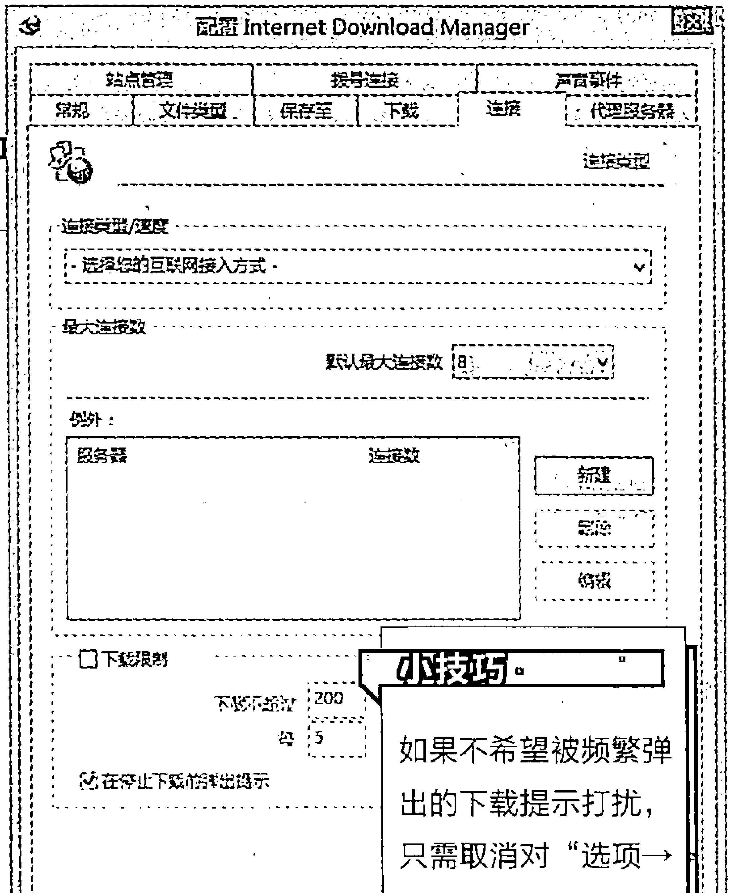

#### 定时下载避开带宽使用高峰

下载需要占用带宽，尤其当许多人共享一个局域网时，我们总是希望下载工作能在人们不用网络的空闲时间内完成（比如后半夜）。点击工具栏上的“计划任务”图标，可设置定时下载计划任务。比方说，我们可以设定让下载任务在晚上23点开始，到早上8:30时无论下载是否完毕都要暂停下载，以免影响别人上网（图5）。

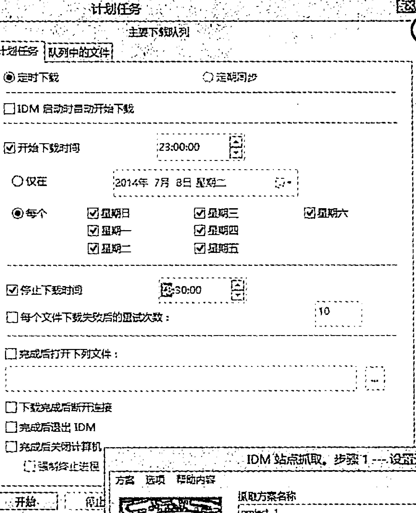

> 定制有效的下载时间还可以按一周七天来任意选择，比如设定计划下载任务仅在工作时间段的周一到周五有效，周末两天不受定时下载的限制。

#### 网站抓取克隆站点或频道

有的时候，碰到一个网站上有好的图片、好的音乐、好的视频，总希望能一股脑地将它们下载到本地欣赏。还有的时候，或许需要将一个很有特色的小站抓取到本地进行研究或收藏。或者，希望将一个网站中自己认为没用的元素排除掉以后，将其余的内容下载到本地使用。这时，IDM的站点抓取功能就能派上用场。

点击IDM工具栏上的“站点抓取”按钮，在弹出的窗口中命名抓取方案名称，粘贴或输入要下载的网站地址，然后从“方案模板”中选择要抓取的方式，如果列表中的现成方案不能让自己满意，那么选择“自定义设置”一项进行详细的自定义设置（图6）。之后执行网站、网页或文件抓取任务。

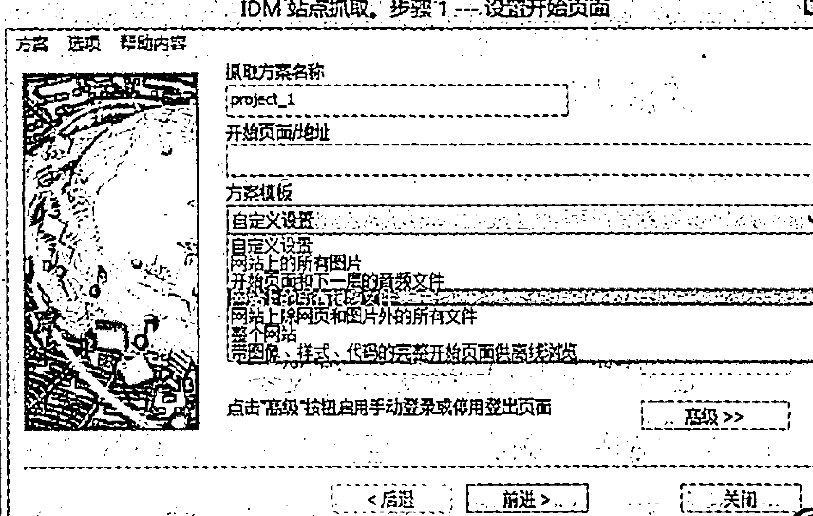

> 有的服务器的文件下载需要输入用户名和密码，如果不想反复输入，可将该服务器以及登录信息通过“选项→站点管理”添加到站点登录列表中。

## 传统路由器变“智能”

现在有不少所谓的智能路由器，只不过在设置方面比传统路由器简单易用一些，另外附加了一些广告过滤功能而已。如果仅仅为了这些就放弃现有的传统路由器，实在有些得不偿失。实际上现在出现了一类功能性软件，通过它们也可以让传统路由器的使用更方便。除此之外，通过一些软件工具配合，还可以在路由器之外，增加防蹭网等功能。

文|重楼

### 1 快速检测路由状态

首先需下载安装“路由卫士”这款工具（http://www.luyou007.com），运行后会发现，它的界面和我们常用的360等安全卫士非常相似。点击“立即检查”，接下来软件就会对路由器的状态进行检测。稍等片刻，就会一项项显示出检测结果。比如现有的路由器的登录密码就存在安全隐患，因此需要对其进行修改，尽量减少被黑客进行攻击和破坏的风险（图1）。

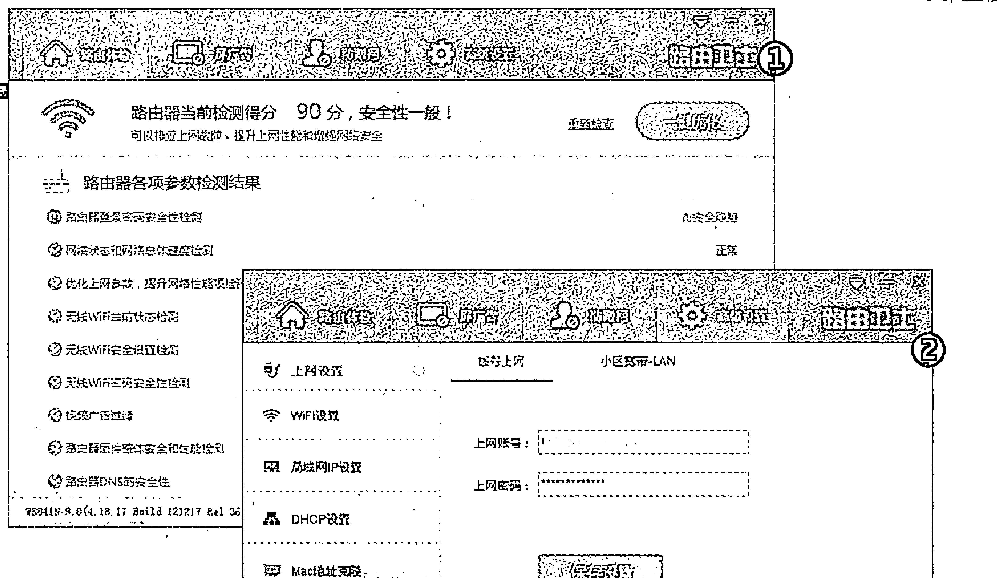

如果想要修改路由器的登录密码，可点击工具栏中的“高级设置”，在弹出的窗口中点击左侧的“路由器密码”，接下来分别在“原密码”中输入路由器默认的密码，再分别在“新密码”和“确认新密码”中输入一个不容易被黑客破解的新密码（图2）。设置完毕点击“保存设置”，最后点击“重启路由器”中的“立即重启”即可。以后进行路由器的登录操作，需要使用新设置的密码才行。

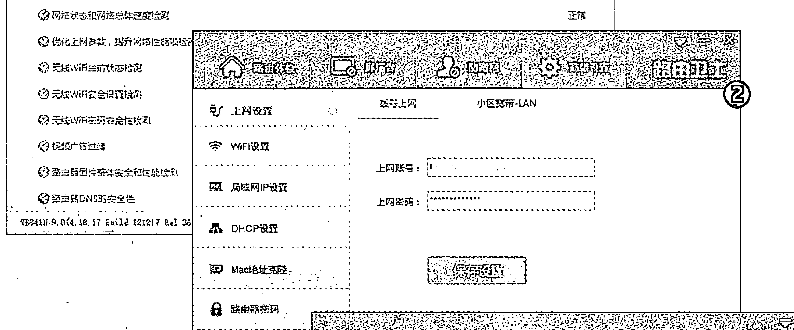

### 2 常见参数一目了然

当然对于一个路由器来说，还有其他的一些专业设置。新买的一个路由器，首先需要设置账号密码，不然将无法拨号上网。点击左侧的“上网设置”，选择自己的上网类型，如果是拨号上网就分别设置上网账号和上网密码，如果使用的是小区宽带则根据提示选择自动连接或手工配置即可。

家庭购买无线路由器一般都是为了解决无线上网的问题，点击“WiFi设置”，在“路由器当前WiFi状态”中选择“开”。接着在“WiFi名称”中设置路由器识别名称（不能使用中文名，图3），然后在“WiFi密码”中设置连接Wi-Fi的确认密码，设置完成点击“保存设置”即可。

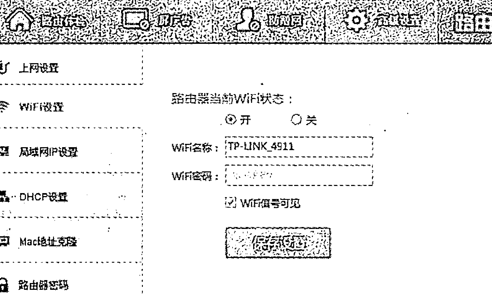

由于家里的上网设备比较多，因此需要路由器自动为其分配IP地址。点击“DHCP设置”按钮，选择“开启DHCP”，再在“IP分配范围”中设置一个IP地址的分配段落即可（图4）。除此之外，还可以设置“主DNS”和“备用DNS”等选项。

## 屏蔽广告杜清爽浏览

路由卫士除了可让用户更加方便地设置外，也增加了屏蔽广告和防蹭网等其他功能。点击工具栏中的“屏广告”按钮，在窗口中点击“立即开启”，这样通过该路由器上网的设备，不用安装其他的广告过滤扩展，就可以成功屏蔽掉广告内容。而且对于QQ、迅雷等自带有广告内容的软件，也可以起到一定的广告拦截效果。

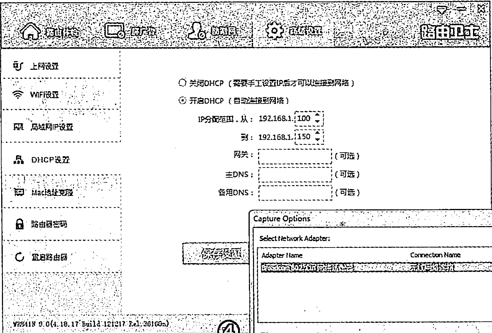

## 识别设备防范蹭网

随着无线路由器的增加，蹭网的现象也是越来越多。虽然路由卫士也有一个防蹭网的功能；但是其中的内容显示特别简单，这样无法一眼识别出蹭网设备。于是这里需要借助于第三方工具，通过它们的配合找出背后的蹭网者。

现在可以用于检测蹭网的工具其实有很多，如WifiChannelMonitor就是一款小巧的Wi-Fi流量监控工具。由于这一工具是通过微软的网络监视器进行操作的，所以首先要安装Microsoft Network Monitor（下载地址：http://tinyurl.com/dxj995v），接下来运行监控工具WifiChannelMonitor（下载地址：http://tinyurl.com/lm5zh4r）。

点击工具栏中的“Start Capture”按钮，在弹出的对话框中选择列表中的网络适配器。接下来在“Channel to monitor”列表中设置无线通道等参数，设置完毕，点击“OK”即可开始监控工作（图5）。WifiChannelMonitor首先检测周围的无线信号，发现无线信号后就会显示到窗口列表中（图6）。从中选择绿色图标的无线信号，在窗口下方就可以看到所有连接到该无线信号的设备。双击任意一个设备的名称，在弹出的对话框中可以看到MAC地址、数据字节数、客户端类型等信息（图7）。不过我们只需要查看“Company”中显示的设备制造商信息，判断是否是自己所用的上网设备，从而轻松找出危险的蹭网者。

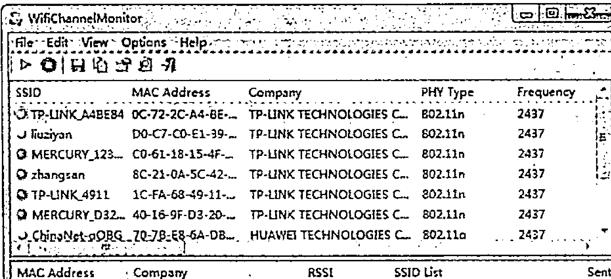

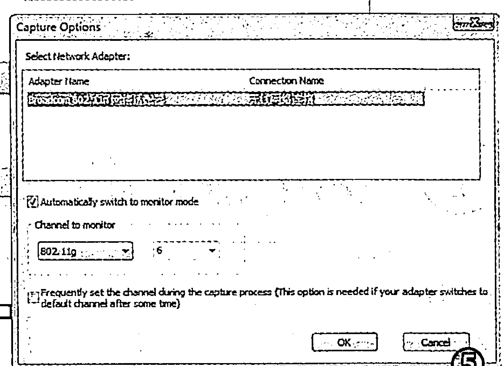

当判断出蹭网者使用的设备后，返回到WifiChannelMonitor主窗口，在列表中记录下这个设备的MAC地址。接着切换到路由卫士的主界面，点击工具栏中的“防蹭网”按钮，就可以看到当前所有通过路由器上网的设备名称。通过MAC地址的对比找出蹭网设备后，点击列表后的“禁用”按钮，就可以将蹭网设备踢下线（图8）。除此之外，由于路由卫士在后台实时的工作，不仅可以在线检测已经连接路由器的情况，还可以实时检测所有连接路由器Wi-Fi的情况，一旦发现就会弹出警示框，从中选择是允许连接还是禁止连接Wi-Fi。当发现是陌生的设备要求连接，直接拒绝即可，从而有效防止他人蹭网。

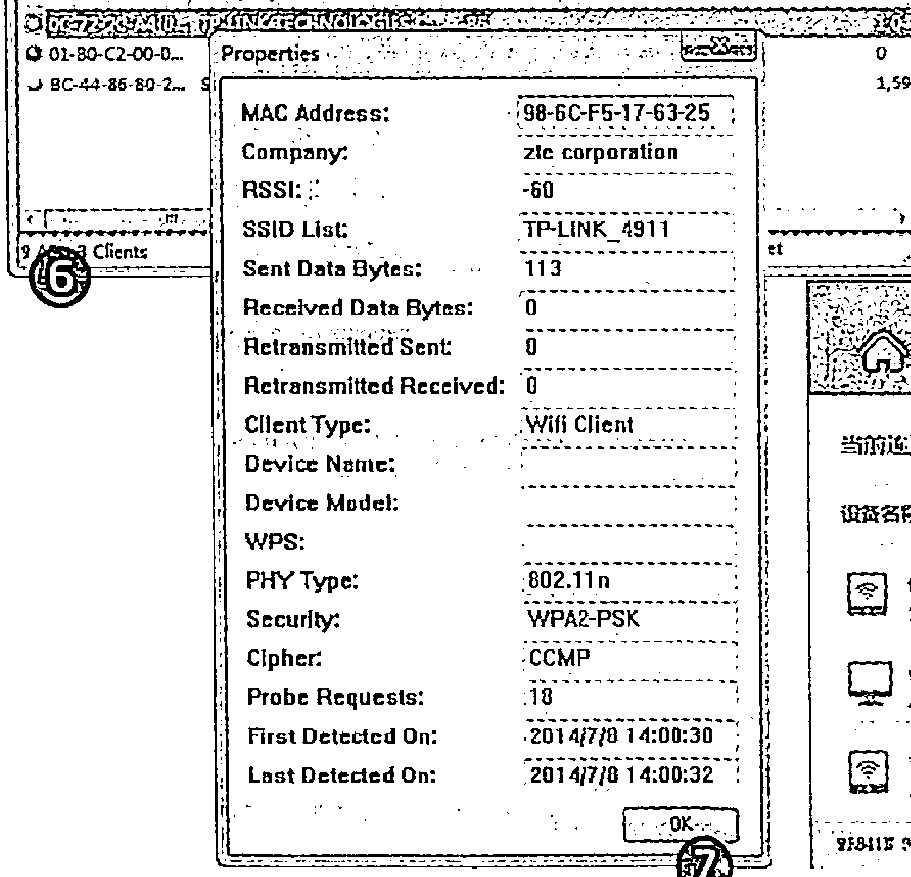

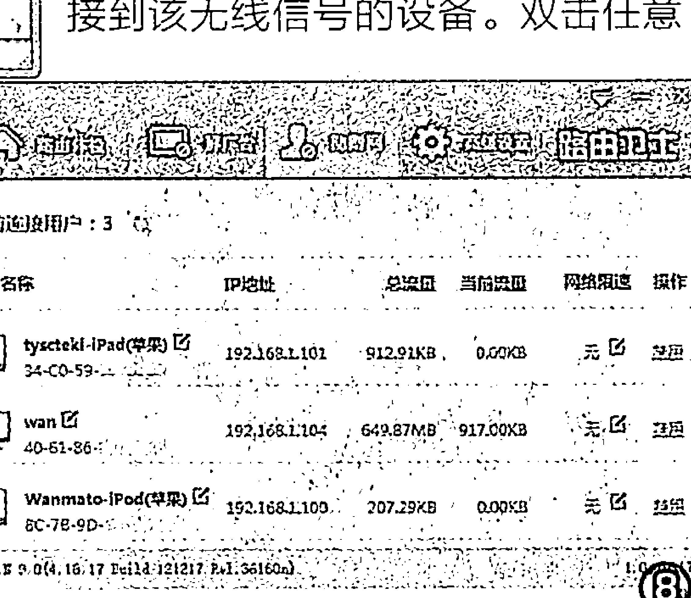

## # “照片”应用不“鸡肋”

不少人往往会误以为Windows 8.1自带的“照片”应用是一个看照片的工具，其实不然。我们可以用它来搞定数码照片几乎所有常见的后期处理。

文|李恒忠

> > **小提示：照片应用哪里找**
> 在Windows 8.1桌面上搜索“照片”，从搜索结果列表中点击“照片”应用即可启动该应用。

### ① 左右为难 搞定操作控制


> 搜索结果列表显示“照片”应用

与以往我们操作软件的方式不同，在照片应用中，菜单的激活方式一变再变，耐人捉摸。启动“照片”应用，进入照片浏览界面，需要右键点击管理界面空白处，才能激活控制面板，从而对照片进行“全选”和“幻灯片放映”演示等操作。

当点击一幅照片进入单幅图片的浏览界面后，右键点击鼠标又看不到任何控制菜单，换用左键点击，才发现激活菜单的操作又变为用鼠标左键。感觉微软在和用户捉迷藏。

这时，如果要选择多张图片，又会不知该如何是好。以往我们多选图片一般用Ctrl加鼠标左键点击，或者用左键点击选择框。但这次软件又出了个新花招，需要依次点击鼠标右键才能选择多张图片，再次点击右键取消图片选择。

### ② 个人照片 也能轻松调用

“照片”最让初学者郁闷的不仅仅是控制键的迷惑上，调用自己的照片是一个最大的难题。初次进入“照片”应用，会显示一个只包含“图片库”和OneDrive来源的界面。该照片管理器对纳入“图片库”和OneDrive中的照片进行获取显示没有问题，而不少用户习惯于将照片放在系统分区之外的其他分区，或者放在大移动硬盘的某个文件夹中，这些照片该如何调用？

最简单最熟悉不过的鼠标左右键操作，在“照片”应用中一会儿左一会儿右，足可以把你搞晕，难怪许多人在用了一两下“照片”应用之后便得出“不好用”或“鸡肋”的结论。实际上，如果你熟悉了微软在左右键操作上的这些名堂，基本控制操作还是挺方便的，只不过是一个打破传统习惯的问题而已。

如果要对存放在非系统分区的照片进行管理和处理，首先要将照片文件夹设置包含在“图片库”中，或可以传送到OneDrive中。将照片文件夹包含在库中的方法是：在文件夹上点击右键，然后选择“包含到库中→图片库”命令。

> > **小技巧：在传送照片到OneDrive的过程中，照片的质量是可控的，通过对OneDrive设置窗口中的“本机照片”项进行选择，可控制上传照片的质量。**

> > **小提示：通过“导入”按钮可直接导入照相机或移动设备中的照片，但缺点是接入后开始全盘自动扫描，不会理会用户的感受，如果只有几十张照片还好说，如果移动硬盘或存储卡的照片数量多，无法由用户来控制选择性导入。**


> 上传到OneDrive的照片质量可自由选择

## 后期编辑 风格统一轻松

经历了上述的种种“不习惯”之后，进入到后期编辑界面后的操作就方便和统一多了。点击照片基本操作界面右下角的“编辑”按钮进入照片编辑界面。


从自动修复结果中挑选满意的结果


通过各项颜色调整足以获得满意的照片色彩

> **小技巧**
点下“红眼”或“修整”按钮，在画面上就会出现小圆点，在出现红眼或瑕疵的地方点击鼠标，即可获得更满意的结果，该操作可根据需要多次点击处理。其余参数数值大小的调整可直接通过鼠标滚轮来控制，免去点击和转动的麻烦。


“晕影”和“背景优化”让普通照片变专业

> **小提示**
编辑照片的过程中可随时通过“查看原始版本”按钮将修改结果与原始版本的照片作对比。修整照片完成后，最后别忘了点击右键，选择“更新原始照片”或“保存副本”来应用照片编辑效果。

## 焦外虚化 抓住你我眼球

玩过单反的人都知道，高级相机和高级镜头最吸引人的功能之一便是“焦外虚化成像”效果，大光圈单反镜头可以很轻松地完成目标清晰但前景或背景虚化的高级效果。普通的镜头和傻瓜相机是很难拍出这种效果的。即便是用Photoshop这样的专业软件进行后期处理，做出这样的效果也需要一定的技能。而如果借助“照片”应用的两个高级处理功能，对照片进行“晕影”和“背景虚化”处理，非单反相机拍摄的照片也可以做出“专业化”效果。只需点击“效果”按钮，然后使用“晕影”和“背景虚化”两个按钮，适当调整参数，就可轻松实现高档单反镜头才能实现的效果。如此一来，没有单反的用户也有福了。


对处理后的照片有两种保存方式选择

## # 巧用浏览器 无缝读文章

通过浏览器阅读是当今电子化阅读的一条重要途径。由于移动技术的发展和不同平台系统的共存，加之阅读时间的碎片化现状，跨越设备、跨越系统接续阅读的需求越来越明显。那么，如何实现浏览器的跨越式接续阅读？

文|杨冲

跨越式无缝阅读，是以浏览器为主体，以网盘、网络账号、二维码、轻应用、插件等为辅助的阅读手段。当今各种主流浏览器不同程度地具备跨越式无缝阅读的功能，但有的需要安装插件，实现起来不太方便。而相比之下QQ浏览器所包含的无缝跨越式阅读功能，是这些浏览器中最全面的，因此我们重点以此浏览器来介绍，兼顾其他浏览器的相关功能。本文介绍中涉及到的各种浏览器版本均以当前最高版本为准。

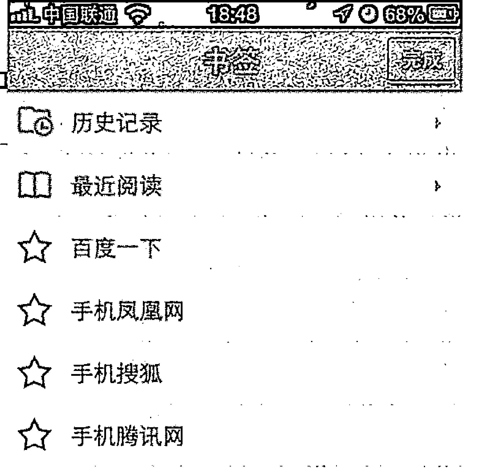

### 1 手机书签 电脑轻松用

我们常常会利用碎片时间在手机上阅读，但是，由于手机屏幕的限制，有的文章阅读体验不佳（如图文版）。这时，我们可能希望先将网页作为一个书签记下来，然后等有时间了在PC上阅读。那么，PC上如何访问手机的书签？

在手机QQ浏览器中登录自己的账号进行阅读，将当前网页作为书签保存，然后到“书签/历史”页面中点击“同步”按钮将书签同步到网上（图1）。之后，在PC上打开QQ浏览器并用相同账号登录，在菜单“网络书签→手机书签”中选择点击，即可访问手机中收藏的网页了。

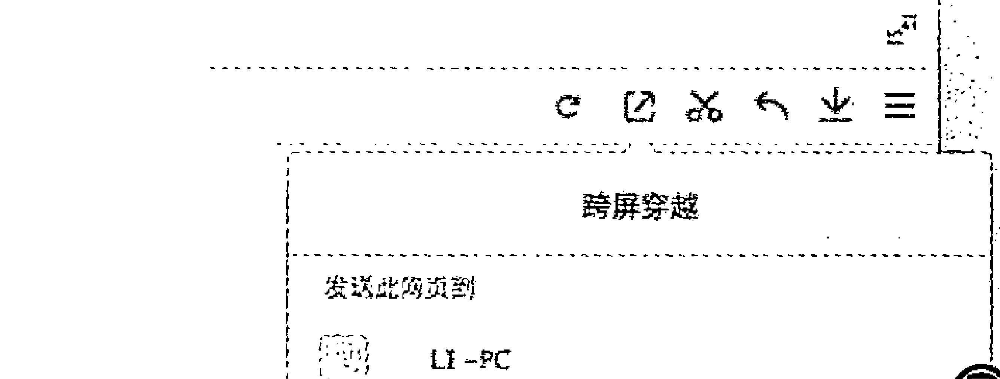

> ### 小提示
如果使用其他浏览器，可先登录浏览器个人账号，开启相应的收藏夹自动同步功能，将未读完的网页地址加入收藏夹中自动同步。然后开启PC设备上的相同类别浏览器，登录自己的账号即可通过收藏夹获得未读完的网页。

### 2 跨越平台 网页共享易

现在大家都习惯于在不同场合下用不同平台的设备上网，对于一个没有读完的精彩网页，还可以使用“跨屏穿越”进行共享。

实现“跨屏穿越”功能需要在自己的各种设备上安装相应版本的最新QQ浏览器，同时还必须在不同设备上使用自己的同一个QQ号登录。在不同设备的QQ浏览器中，均会有一个“跨屏穿越”按钮，在浏览到需要“穿越”的网页时，只需点击当前浏览器中的“跨屏穿越”按钮，然后在弹出的选单中选择接收设备，即可完成网页的发送（图2）。

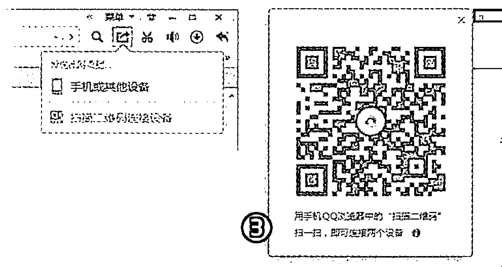

> ### 小技巧
如果是在公用电脑上阅读网页，希望跨屏阅读，那么，可以使用临时绑定发送端和接收端的方式来共享网页。点击微云收藏按钮菜单下的“扫描二维码连接设备”，会出现一个二维码图片，用手机QQ浏览器的“扫描二维码”扫一扫，即可连接两个设备实现网页共享（图3）。

在办公室和家里两台PC之间来回穿梭，这是上班族的常事。两台PC间实现网页接续阅读，用QQ浏览器7的云标签功能可迎刃而解。两台PC用相同的QQ号登录QQ浏览器，一台电脑中QQ浏览器打开但未关闭的所有网页，切换到另一个电脑中后，只需从菜单中选择“个人中心→其他设备的标签页”，即可选择打开。按住Ctrl键可一次性打开多个网页（图4）。注意：在未读完网页的PC一端，关闭QQ浏览器时，不能手动关闭未读完的网页标签，直接关闭网页浏览器，或者直接关闭电脑即可。

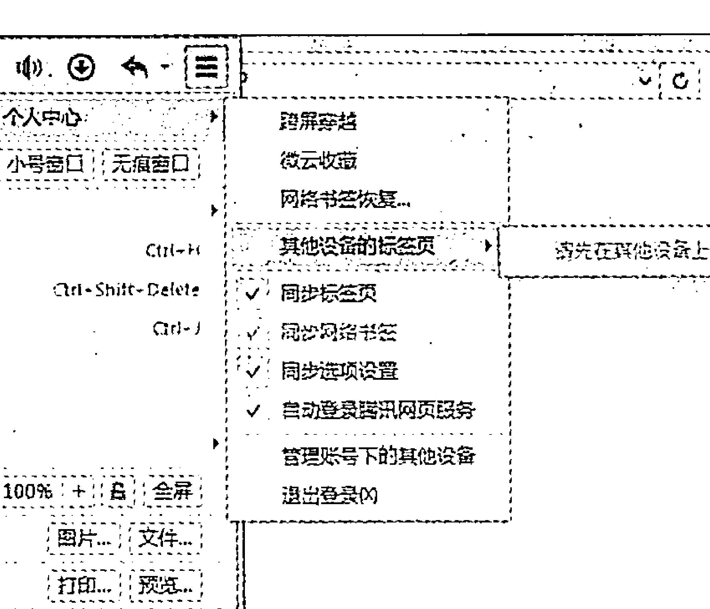

> > 对于其他类型的网络浏览器，虽然可能没有专门的多标签页一次保存功能，但可通过浏览器自身的云收藏夹实现多次添加网页收藏和异地阅读。

### 微云收藏 网页随时读

以上的网页续读方法仅仅是用二维码或云为桥梁传送网址信息，如果网页内容更新或原网址失效，那么就无法续读了。在这种情况下，可借助微云实现内容的接续阅读。

微云收藏不需要安装任何软件，只要使用QQ最新版浏览器即可。先用QQ账号登录浏览网页，点击工具栏上的“微云收藏”按钮，当前网页内容就会永久保存云端。

微云收藏的内容，在手机QQ浏览器的主页中，可通过“微云收藏”图标或输入网址http://sc.qq.com查看。如果没有看到“微云收藏”图标，请尝试在手机酷站里添加。在PC端QQ浏览器中，通过“微云收藏”图标后的下拉菜单选择“查看微云收藏”查看，或通过网址http://sc.qq.com查看。如果PC浏览器中没有显示出微云收藏按钮，可通过在浏览器标题栏空白处点击鼠标右键，选择“微云收藏”即可激活。其他浏览器可以通过添加微云插件，将网页内容添加到微云中。微云中收藏的阅读内容，可通过QQ的“我的收藏”按钮进入，随时进行阅读。

> > 在360安全浏览器中，通过添加“网页快存”轻应用，可实现将PC端的网页存放在360云盘中。更换了PC或移动设备后，只需登录自己的360云盘账号，即可阅读快存的网页了。对于使用其他浏览器的用户，可通过安装微云、百度、115网盘等上传控件，实现网页到云端的存储。然后通过在其他设备或平台上登录相应的云盘，调用保存的文章或页面。

### 网页续读 二维码搭桥

下班前，将在公司未读完的网页地址发送到手机继续阅读，网址传送如何完成？只需借助浏览器“网址二维码”即可轻松搞定。PC版的360安全浏览器或QQ浏览器在地址栏的每个地址后会自动生成一个相应的小二维码图标，只需用手机QQ浏览器的扫一扫功能扫描一下这个图片，网址就传送到手机上了（图5）。其他浏览器可通过添加二维码轻应用或插件来实现二维码网址功能。

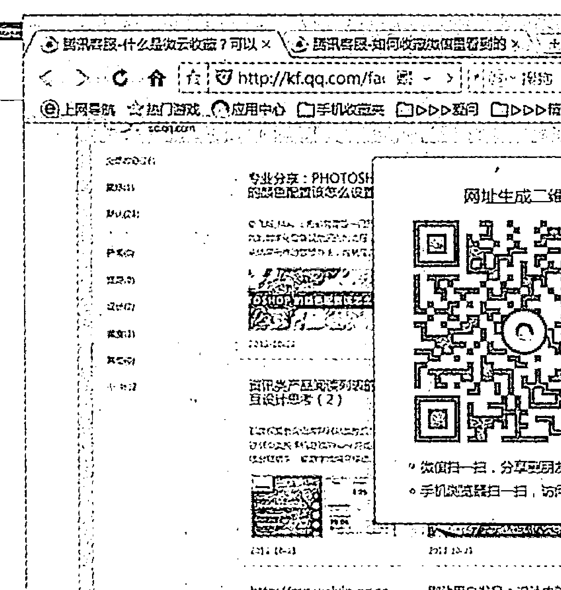

> > 如果要将好文章共享到朋友圈，只需用微信的扫一扫功能扫描该二维码图片即可。如果手机中没有安装QQ浏览器，则可用手机中安装的其他二维码扫描应用扫描，届时会弹出选择浏览器的窗口，从中选择自己使用的浏览器打开网页阅读即可。

## # 下载未动预览先行

网上的许多资源都是以ZIP、RAR等压缩包的形式提供的，而仅通过压缩包名称无法确定其内容，经常导致下载的内容并非我们需要的。另外网上鱼龙混杂，很多下载包名不副实，尤其是体积庞大的压缩包，当费时费力下载完成却发现并不是“真货”，难免令人懊恼。如果能在下载之前即对这些资源“预览”一番，就可以避免许多无用功了。

> 文|郭建伟

### 探路先锋 摸清网络资源的“秉性”

在本机上查看文件属性非常简单，但如何预知下载文件的各项属性呢？这可以请Internet File Size来帮忙。在IE中打开对应的网页，在所需下载链接上右击，选择“Get file size”项，然后在Internet File Size窗口中即可显示原始下载网址（Source URL）、真实下载网址（URL）、文件的真实大小（Size）、文件类型（Content type）等。在“Estimated time”栏中还将显示其下载所需的时间，当然前提是预先指定平均下载速度，方法是在Internet File Size窗口右侧点击“Open menu→Settings”，在打开的设置窗口中的“Average down speed”栏中进行设置即可。

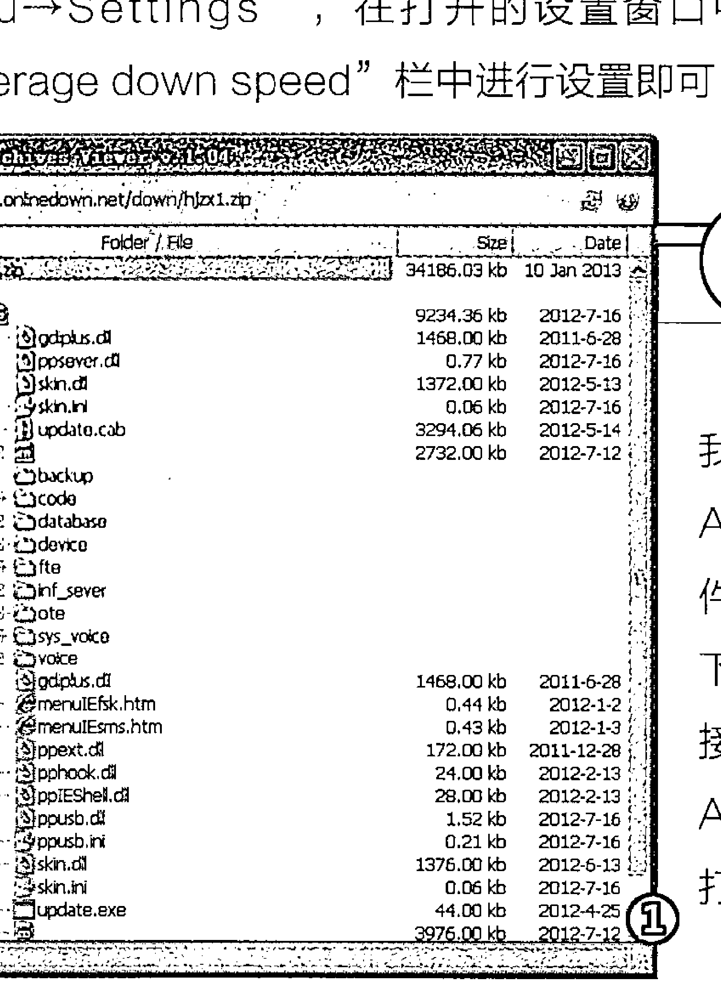

### 在线解压 明了网络压缩包“内部详情”

要想预先了解网络压缩包的内部详情，可以对其在线解压。打开网址http://wobzip.org/index.php，在“URL”中输入网络压缩包地址，如果是加密型压缩包，还要在“Password ”中输入解压密码。接下来点击“Uncompress”，WobZIP网站即可对其进行分析，并完整显示该压缩包中的所有文件信息。更棒的是，WobZIP还会自动对该压缩包进行远程扫描，检测其中是否含有病毒。WobZIP还可以对压缩包文件有选择地下载，在列表中选择对应的文件，再点击“Download all file as .zip”即可。WobZIP支持常见的压缩包类型，不过它支持的压缩包尺寸不能超过200MB。

### 潜入压缩包 自由提文件

压缩包中的文件不一定都是我们所想要的，这时可通过Web Archives Viewer这款小巧的IE插件，在网络压缩包中有选择地进行下载。在目标网页对应的下载链接上右击，选择“Open in Web ArchivesViewer”即可将其在线打开，之后在压缩包名称左侧点击“+”号就可以浏览其内容了（图1）。双击需要的文件，即可将其单独提取出来并下载到本地。对于FTP网站中的压缩包来说，WebArchivesViewer同样提供了预览功能。在“ftp://”链接的右键菜单中点击“Open in Web ArchivesViewer”，WebArchivesViewer可以打开一个界面简单的FTP资源浏览器，以树形结构显示目标压缩包中的内容。

### 轻松预览FTP资源

WebArchivesViewer虽然可以浏览FTP中压缩包的内容，但是功能简单，要想有更复杂的控制，可以试试SmartFTPPlayer。在SmartFTPPlayer主窗口右上角的“Login”和“Password”栏中输入FTP服务器的用户名和密码，如果勾选“Anonymous”项，表示使用匿名登录。输入FTP服务器的地址后，点击窗口左上角的第一个按钮，SmartFTPPlayer即可连接到目标服务器并显示其中的目录结构。该FTP服务器，之后在窗口左侧的列表中显示该FTP服务器上的文件列表，在其中双击对应的ZIP或者RAR压缩包，即可自动对其进行解析，点击该压缩包左侧的“+”号，之后就可以直接打开该压缩包，显示其中包含的所有文件（图2）。SmartFTPPlayer已经内置了文件下载功能，在相应文件（包括压缩包内的文件）上右击，选择“Download”，就可以将其下载到指定的路径中了。此外，SmartFTPPlayer还可以预览FTP中的图片、音频或者视频文件。

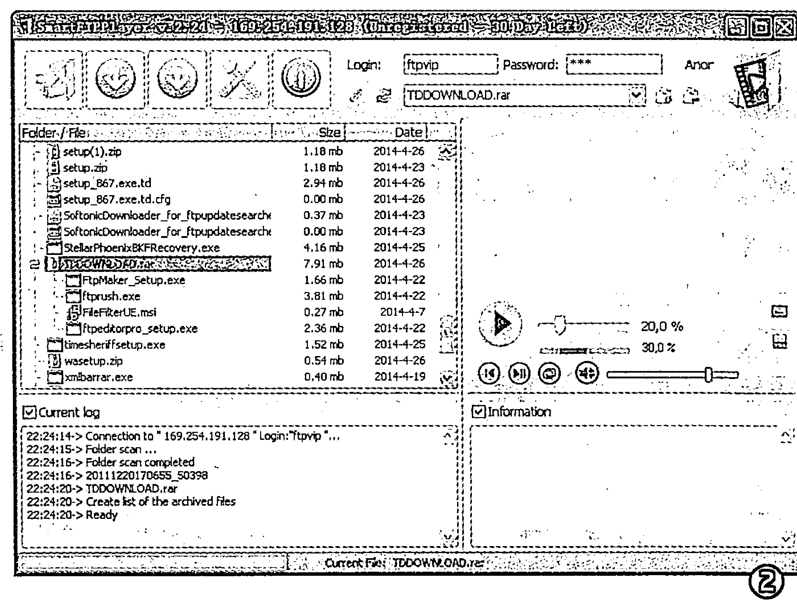

### 5 虚位以待 透视网络ISO镜像文件

网上有很多光盘镜像ISO文件可供下载，有时我们仅仅需要其中部分文件，没有必要下载体积庞大的ISO文件，这时可以借助“NetCD网络光盘”（下载地址：http://tinyurl.com/pmbuu8c），将网上的ISO镜像包虚拟成本地驱动器，然后再自由地提取其中的文件。在系统托盘中右击网络光盘图标，选择“更改光驱盘符”为虚拟盘选择空闲的盘符。点击“加载新的网络光盘”，在弹出的窗口中输入ISO镜像文件的网址，点击“打开”按钮，就可以将其虚拟为本机的虚拟磁盘了。用同样方法，可以针对不同地址的ISO文件创建多个虚拟盘。

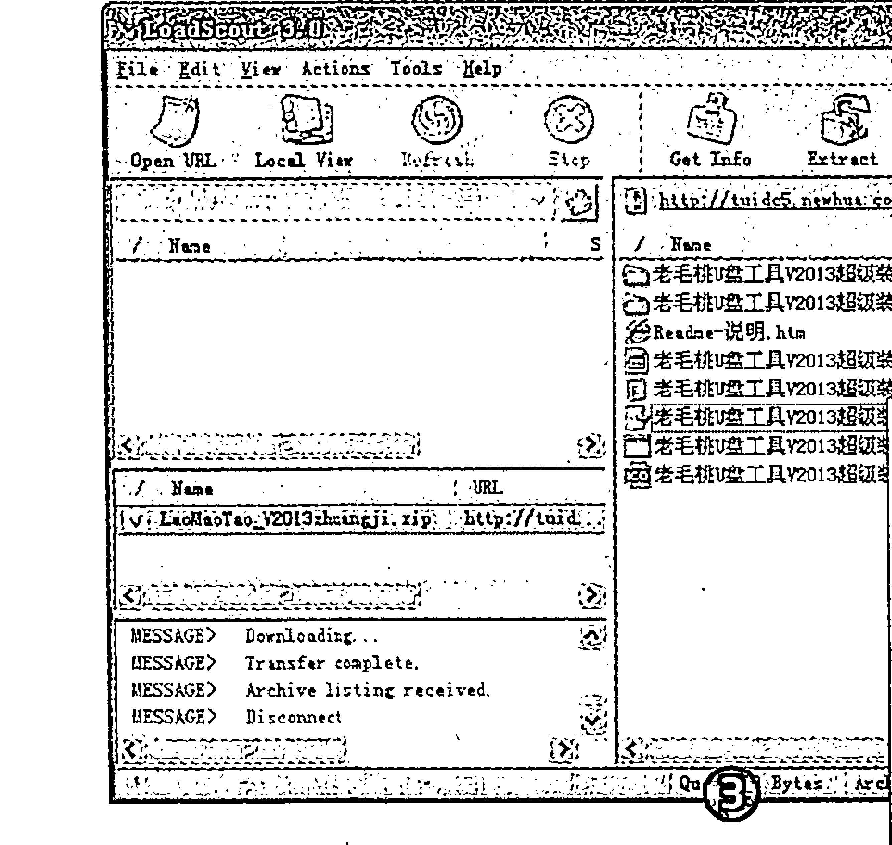

### 6 为网络下载找个专职“验货员”

和以上软件相比，Load Scout提供了更加完善的资源预览能力。在IE中打开目标页面，在下载链接上点击“Open with LoadScout”项，Load Scout自动从对应的网络服务器上获取该压缩包的详细信息，并将其显示在Load Scout窗口右侧的分析列表中，包括文件名称、尺寸、压缩率、类型等信息，让你彻底摸清该压缩包的“底细”（图3）。如果这正是你需要的压缩包，即可点击工具栏上的“Download”进行下载。如果只想获取压缩包中的某个文件，可以在列表中选择所需文件，右击选择“Extract”项，设置好合适的存储路径后点击“Start”就可以下载了。如果使用的是其他类型的浏览器，可以先将下载链接复制出来，之后在Load Scout工具栏中点击“Open URL”按钮，粘贴下载链接后，同样可以执行预览、下载和提取操作。

如果想预览压缩包中的视频或音频文件，依照上述方法，在Load Scout中打开压缩包，再在音频或视频文件上右击，选择“Extract”项，在弹出的“Get part of xxx”对话框中拖动滑块，选择想预览的片段，设置好缓冲数据存放的路径后点击“Start”，就可以聆听或者观赏精彩的影音片段了。

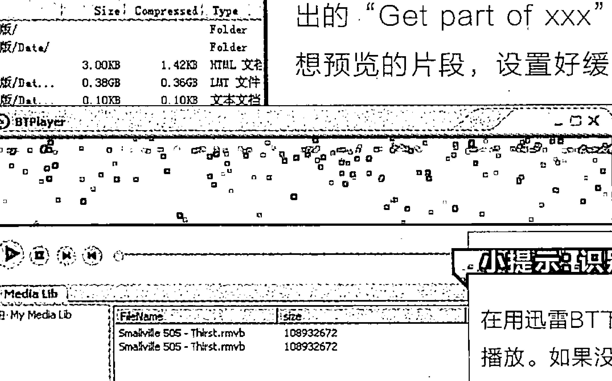

> 小提示：识别BT视频中的冒牌货
在用迅雷BT下载影音文件时，可以边下载边播放。如果没有使用迅雷，也可以使用其他软件来实现，比如BTPLayer（下载地址：http://tinyurl.com/kkeprp7，图4）。

## 超越看图 搞定照片二三事

看照片，本来用Windows自带图片浏览器就能搞定，然而，由于其功能的单一，不少人总是要选择第三方看图工具。笔者对2345看图王这款软件（以下简称看图王）情有独钟。喜欢上这个软件，不单单是因为它能看图，更因为它“看”得与众不同，且能满足更多的实用图片处理需求。

> 文|那舍

> **小技巧**
如果在看图过程中也要切换到全屏模式，除用鼠标左键双击图片，还可以单击鼠标滚轮来实现。此外，同时按住鼠标左右键，然后松开右键，也能达到同样的效果。够方便吧！

### 1 滑动滚动 由我做主

Windows 8.1资源管理器对文件图标大小的预览选择是固定的几个选项，若能自由控制缩略图大小就方便多了。在看图王图片管理窗口中，通过拖动窗口上方的滑动条，即可让窗口中的照片实现任意比例的缩放（图1）。这显然比系统资源管理器的图标显示更加人性化。

> **小技巧**
缩放图片除了在图片预览窗口中使用鼠标拖动滑动条进行外，还可以在看图窗口中通过鼠标滚轮上下滑动进行缩放控制。看图王中鼠标滚轮的功能可被定义为翻页或图片缩放两种。如果发现滚动滚轮的结果变成了照片翻页，只需在软件设置窗口中点击“习惯设置”，然后将“鼠标滚轮设置”一组下的“启用鼠标滚轮”复选框选中，然后选择“鼠标滚轮为缩放”即可。滚轮定义为缩放后，翻页便失去了作用，这时可通过“常规设置”选中“启用鼠标指针翻页”项，这样就可以通过点击图片左右两侧出现的箭头来实现方便的翻页了。

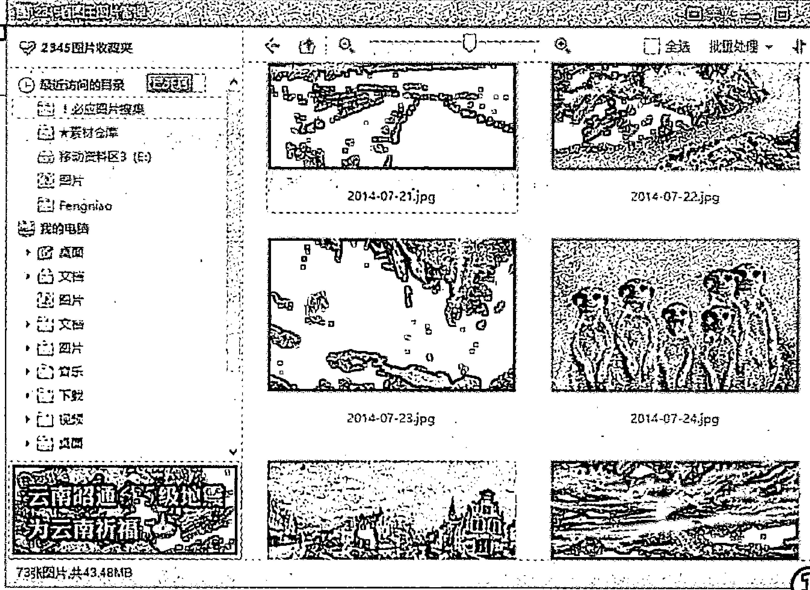

### 2 图片旋转 不损精度

当我们竖向拍摄一张照片后，照片传送到电脑中浏览，照片是躺倒了的，必须执行旋转90度的命令才能让照片摆正。即便是在最新版的Windows 8.1中，系统自带的照片预览功能也不能自动将“躺倒”的照片自动扭正过来。然而，通过先旋转90度而后看图的方式，由于旋转过程中往往会损失照片精度，因而这种看图方式多少也有点缺憾。

如果使用看图王，通过简单设置，浏览图片时就会自动转正播放。由于看图王软件自动进行的旋转播放操作，不会保存旋转后的图片，因此，不会像其他软件执行旋转操作后损失照片精度，这一招对保持照片原始精度非常有用。

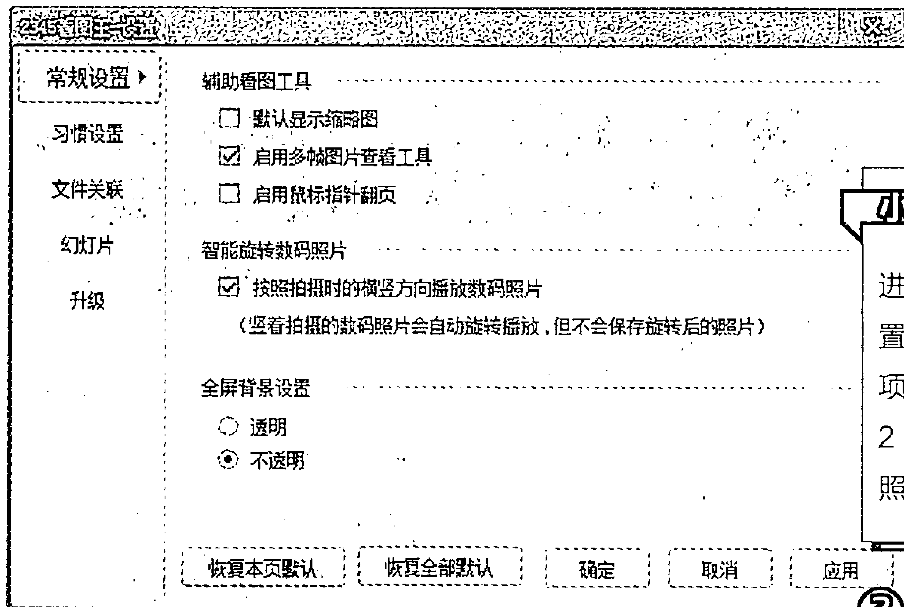

> **小技巧**
进入看图王看图页面，点击“菜单→设置→常规设置”，选中“智能旋转数码照片”组下的唯一选项“拍照拍摄时的横竖方向播放数码照片”（图2）。之后，在看图过程中，遇到竖着拍摄的数码照片，软件会自动旋转为正确位置进行播放。

### 批量转正 方便大众

虽然看图王本身在浏览照片时具有转正功能，但它本身并未在实质上旋转图片，因此，这些照片如果拿到别的电脑上，用系统自带的或其他不具备自动转正功能的第三方浏览器来观看，仍然是躺倒着的。在这种情况下，可用看图王提供的批量转正功能来一次性处理照片。

在看图王图片管理窗口中选中要处理的照片，执行右键菜单命令“批量照片转正”，设置照片输出目录（若不留原图，可选择“覆盖原图”）和输出照片格式（默认为原始格式，另可选PNG、JPG、BMP等常见格式），点击“开始转正”按钮进行批量处理（图3）。

**小技巧** 处理前选择照片时，不必刻意选择拍倒了的照片，可放心一次选择目录下的所有照片，看图王会智能识别躺倒的照片进行处理，对于正常拍摄的照片，在处理时看图王将不予理会。

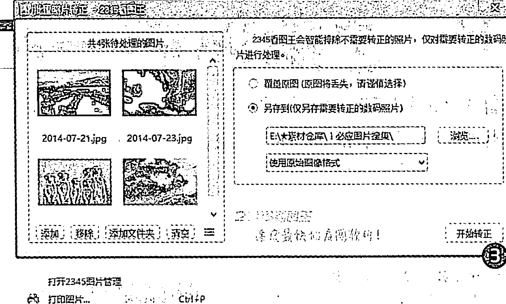

### 成批处理 无所不能

除了查看躺倒的照片外，我们常常还需要对照片进行各种各样的批量处理。对于图片处理软件所具有的批量处理功能，如图片批量重命名、图片批量加文字、图片批量加水印、图片尺寸批量转换（按比例或自定义像素）等（图4），用看图王都能解决，且功能并不简单。方法与常用图片处理软件中类似，此处不再详述。

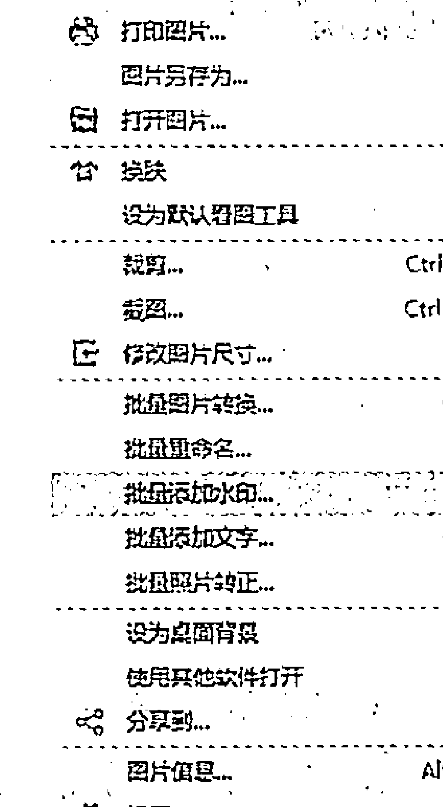

### 缩放裁剪 三项全能

看图过程中，难免会遇到认为照片拍摄不合适的情况，例如边缘出现多余的东西，这时就需要进行裁剪；如果需要将照片按一定比例或尺寸进行缩小，然后分享，则需要能改变图片尺寸；如果希望将图片连同看图环境桌面一并抓下来发给网友，那么能截图也变得很有必要。

只需在看图王看图窗口中用快捷组合Ctrl+Alt+P即可进行图片裁剪，用Ctrl+Alt+A可执行桌面任意区域截图和标注，通过Ctrl+E可修改图片尺寸（图5）。

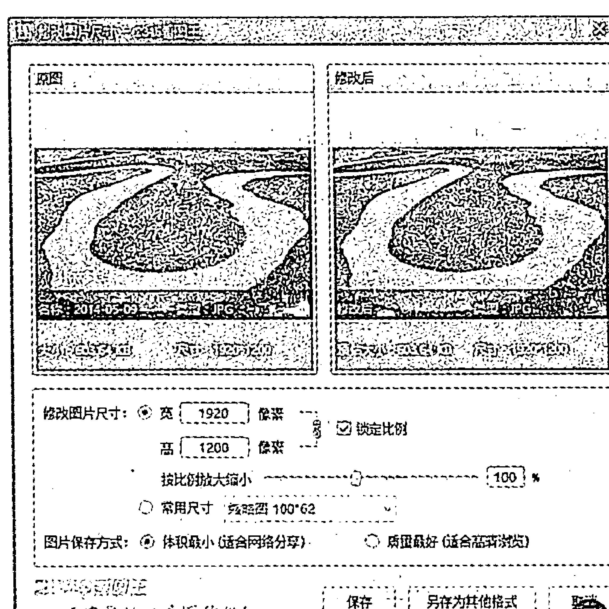

### EXIF信息 人性显示

对数码照片稍有研究的人，就会对照片的EXIF信息感兴趣。当一幅照片拍得好的时候，可通过EXIF信息取得经验；当一幅照片拍摄有所欠缺时，又能通过EXIF信息汲取教训。

在看图王看图界面，要查看EXIF信息，只需右键单击图片并选择“图片信息”，或直接用键盘快捷组合Alt+Enter，即可调出EXIF信息显示窗口（图6）。

**小提示** 看图王可做的事情绝不仅上面这些。在照片预览窗口可选择其他图片软件查看或编辑当前照片。在照片上选择“通过QQ发送到我的手机”右键命令可将照片发送到手机上。此外，还可通过右键菜单直接将图片共享到各种流行的网络空间中。

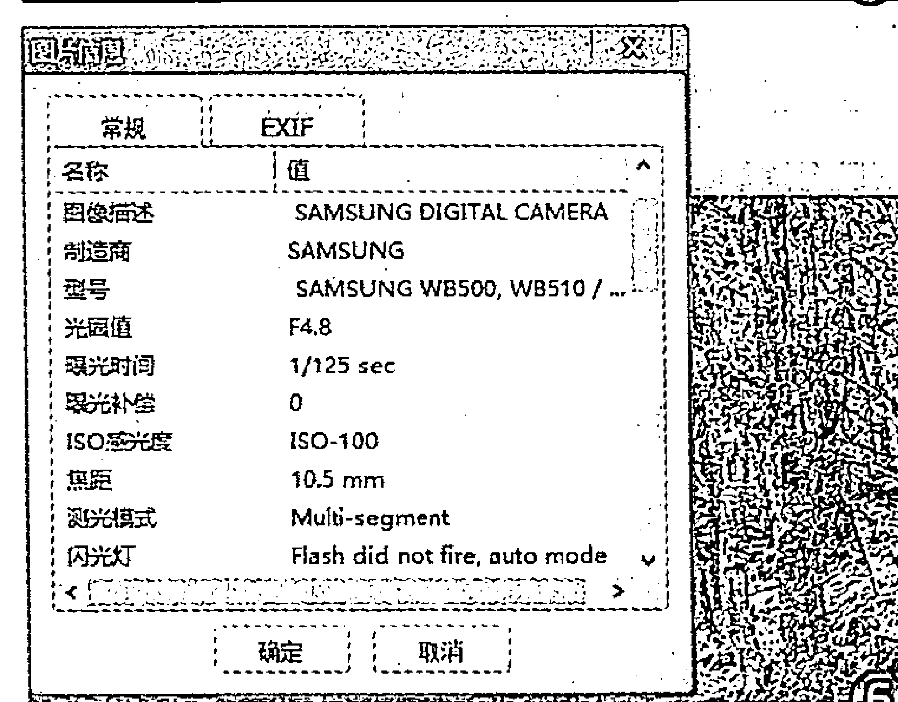

## 暴风看片 这病那病一次除

暴风影音以左眼看片增强技术和流畅播放而著称，然而也以超级信息弹窗为许多人所诟病。但是，在流畅播放的过程中也许会出现这样的问题需要解决，而弹窗问题其实也没啥了不起。人是活的，好软件也需要用户去完善。

文|方向红

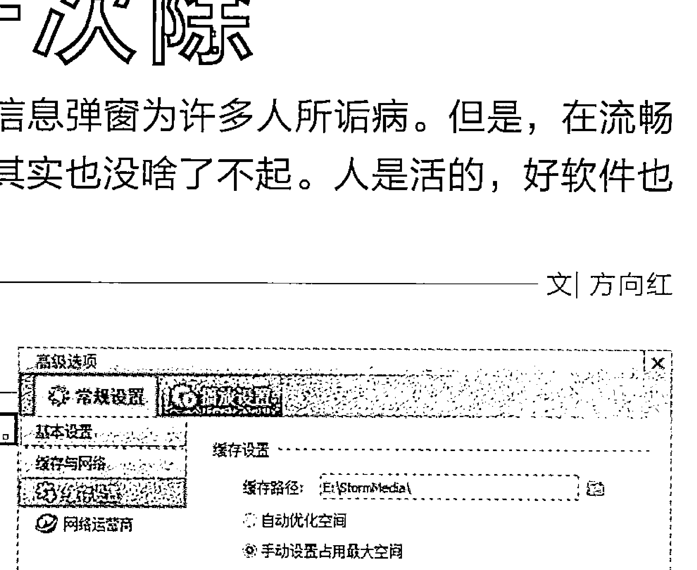

### 1 调校网络 播放下载无忧

自己的网络本来标准不低，但有时视频播放流畅度不够，体验不佳。这时，首先要想到正确设置网络运营商参数，以便更好地吻合视频流传输服务，获得更流畅的观看体验。

通过暴风影音“高级选项”设置窗口，根据自己所用的网络类型，在“常规设置”选项卡下选择“缓存与网络”项，设置网络运营商所在城市、运营商名称、网络类型、接入方式、网络带宽等参数。这样，播放器就可以用最合适的内设标准参数，提供最合适的视频流量服务（图1）。

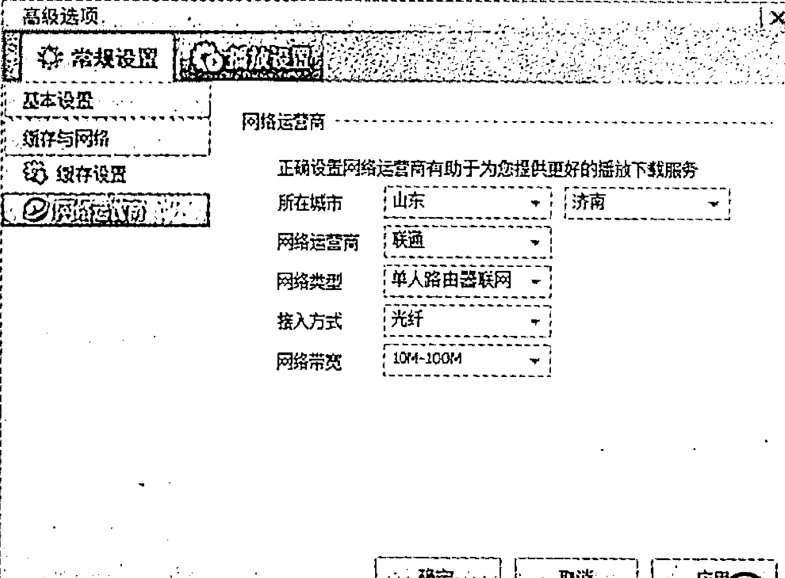

> > 系统默认提供的网络设置参数为空白，多数情况不存在问题，可以默认设置为准，不予理会。但 if 出现问题，可通过上述方法设置。

### 2 限制缓存 防止磁盘爆满

经常观看网络影视，缓存文件会越积越多，如果所在磁盘空间紧张，就可能会出现磁盘爆满的情况，影响其他文件的存放。

遇到这种情况，一是可以改变缓存路径位置，指定磁盘空间更丰富的磁盘分区目录作为缓存路径；二是可以手动限定缓存文件占用本磁盘剩余空间的百分比，以便留出更多的空间给其他程序使用。当然，大家都知道，同时清空缓冲文件夹是必需的。

### 3 消除干扰 清清净净看片

暴风影音播放流畅和效果清晰是出了名的，但有事没事乱弹窗的坏名声也让不少人敬而远之。首先，暴风影音安装后开机时会自动启动，如果你不每天看片，这显然没有必要。不仅如此，软件启动后还会弹出“暴风盒子”，里面的消息五花八门、乱七八糟，有的甚至不堪入目。其次，软件启动后还会随机显示暴风资讯，播放时还会显示一些赞助商的推荐广告链接，另外还会不定时地弹出一些推介的消息。其实，只要动动手，这些问题可一次性解决。

要消除启动时自动加载和自动弹出暴风盒子，可通过常规设置项下的“启动与退出”项，取消对“启动时弹出暴风盒子”和“开机时自动运行暴风”两个选项的选择（图3）。


要取消资讯或推荐消息的干扰，只需在软件高级设置窗口的“资讯与推荐”项下，取消对“显示暴风资讯窗口”、“取消播放时赞助商推荐内容”、“弹出推荐给我的消息”等3项的选择即可（图4）。

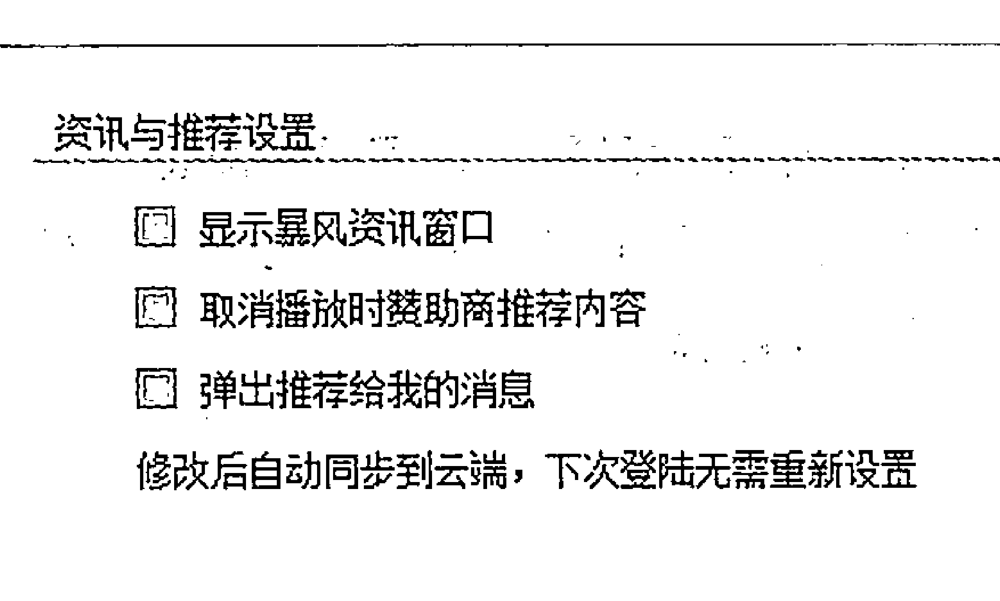

> 小技巧：
如果使用软件时登录个人账号，这些设置会自动同步到云端，下次只要以相同账号登录，不管在哪里都可以沿用这种清净设置了。

### 4 看片无痕 自动清除隐私

用暴风影音看片，默认会开启播放记录，这本是为下次看片提供方便。但如果软件图标被锁定到任务栏上，只要点击右键，别人便会看到前面曾看过的片名，且通过任务栏菜单找不到清除列表的命令。

这时，只需进入高级选项设置窗口，切换到“播放设置→隐私设置”项目下，将“退出时清空播放列表记录”一项选中并应用即可。此外，在“播放设置→基本播放设置”项下，将“打开文件时清空原列表”一项选中，可以做到在别人使用暴风影音播放时，先行删除前面用户的文件列表的作用，不至于因播放列表而泄露隐私（图5）。

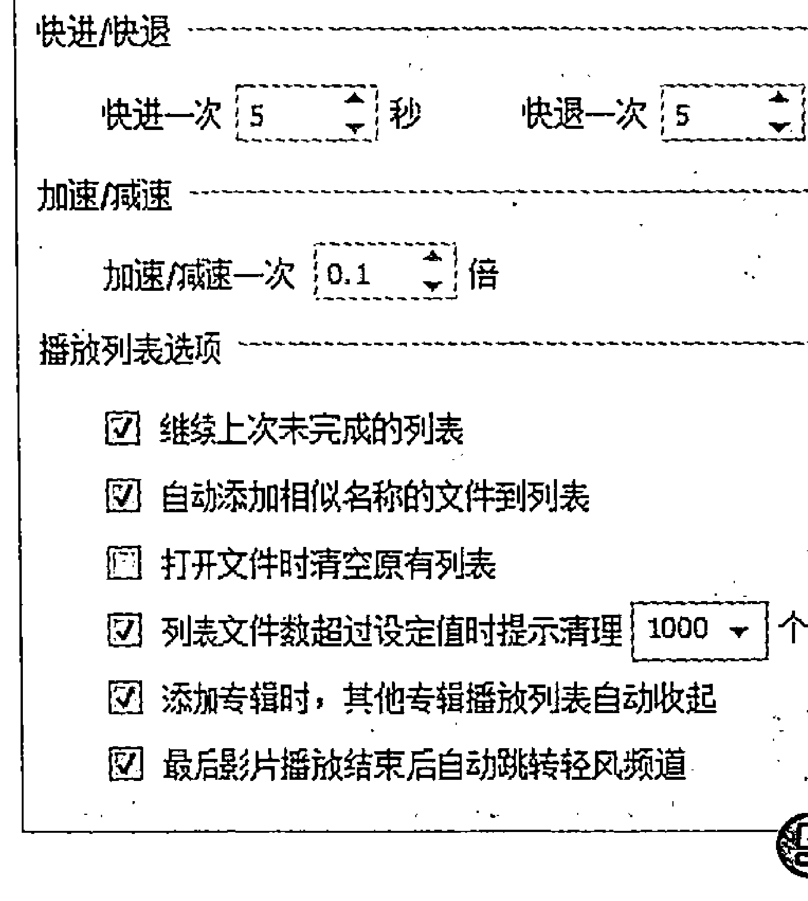

### 5 进度记忆 接续看片无忧

不管是网络播放还是本地播放，无论是播放单个文件还是播放专辑，如果片子没有播完就因事中途退出，那么下次接着观看时寻找断点就是一件麻烦事。

如果在“播放设置”窗口下选择三个选项“专辑播放从已播放文件开始”、“记录在线播放进度”和“记录本地播放进度”，即可实现播放进度的自动记忆（图6）。这样，下次打开播放器选择该文件就能断点续播了。

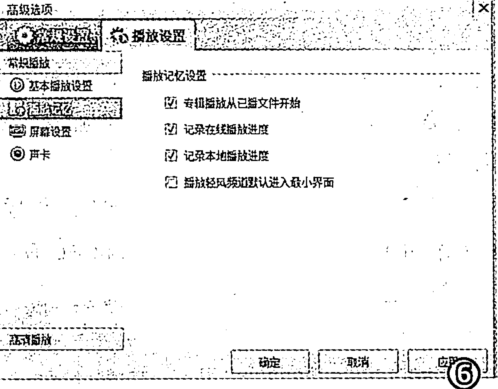

### 6 智能连续 只需添加一集

下载了连续剧之后，也许从第一集开始看，也许通过中间的某一集切入。如果将整个列表添加到软件中观看，或者看一集就点一集，都比较麻烦。

实际上，如果在“基本播放设置”窗口下选择“自动添加相似名称的文件列表”，同时请选中“继续上次未完成的列表”选项。这样就可以保证列表的自动添加，以及下次自动从上次未看完的地方连续播放了（图7）。

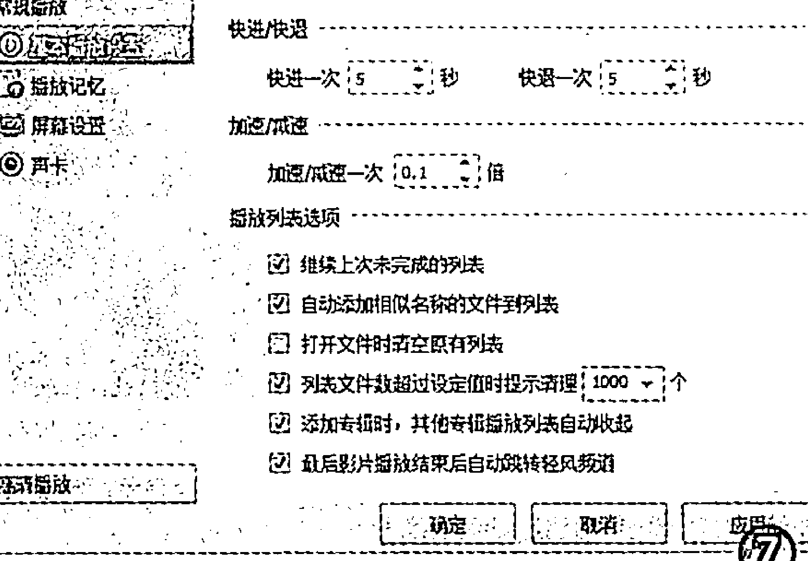

> 小技巧：
在线播放剧集总是有许多片头插播广告，短的一两分钟，长的三五分钟，注册跳过广告需要花钱，不注册则烦恼无穷。要消除广告烦恼，最好的办法就是下载视频观看，尤其是对于一些有连续性的剧集，这种方法更能让人看爽。下载视频可用客户端自带的下载或离线功能，如果客户端无此功能，可借助硕鼠软件下载。此工具我刊曾有过多次专门介绍。

## **打造个性化静默自动下载器**

文|易元

以往我们要下载一些文件，总需要启动一个下载工具，在窗口中添加下载。如果已经知道一系列文件的下载地址（如网上论坛帖子给出的下载列表），那么完全可以用记事本结合IDM软件的下载主程序，通过组织简单的命令行，打造一个在命令提示符窗口中自动运行的个性化静默下载器。

### **1. 静默下载的基础条件**

大家知道，Internet Download Manager（简称IDM）是一个知名的网络浏览器下载辅助软件，它可以应用于各种浏览器中的文件下载。但是，它的下载是依赖于从各种浏览器中获取链接并接管其下载和管理过程的。实际上，IDM还支持另一种下载方法，那就是脱离窗口界面，以命令行的方式直接调用下载地址，这样就可以既不需要启动浏览器，也不需要启动IDM的程序界面，便可以对给定网址的文件进行下载。如果将每一个文件的下载地址均与此命令结合，组成批处理文件，配以必要的参数，那么便可以实现批量文件的后台自动静默下载。

可以先通过命令行 `PATH [[drive:]path[;...][;%PATH%]]`，添加IDMan.exe的路径到系统路径中，且保留系统原有的路径设置。%PATH%表示系统原有路径。例如，用 `PATH "C:\Program Files\Internet Download Manager";%PATH%` 为系统路径添加新的路径“C:\Program Files\Internet Download Manager”。这样无论在哪里下达命令，直接调用不带路径的IDMan命令，皆可找到并运行下载主程序IDMan.exe。

命令构造要调用IDM软件的一个主程序，它位于“C:\Program Files\Internet Download Manager”路径下，文件名为IDMan.exe。用命令行调用该程序时，也可省略exe扩展名。如果路径已经加入到系统路径PATH环境变量中，那么也可省略路径而直接引用该文件名IDMan。

有关Internet Download Manager的窗口环境下的用法技巧，请参考本刊2014年第15期文章《给网络下载雇个“金管家”》。

### **2. 获取下载地址的方法**

由于使用此种方法下载，要求首先知道下载地址，这些地址可能是现成的地址，比如一些帖子中给出的成批下载地址列表，这时可将这些下载地址拷入到文本文件中备用。此外，我们也可以通过任何一种浏览器的网页获取文件的下载链接地址，只需右键单击页面文件链接，查看“属性”选项，获得下载地址并复制即可。如果网址比较多且有规律，还可以通过打开页面查看源代码的方式，通过文字处理软件（如EmEditor等），经过有效代码过滤，筛选出有用的成批下载地址。此外，也可以通过在页面上单击右键菜单，用迅雷等下载工具成批获取下载地址。

- 一些帖子中给出的成批下载地址列表，这时可将这些下载地址拷入到文本文件中备用。
- 通过任何一种浏览器的网页获取文件的下载链接地址，只需右键单击页面文件链接，查看“属性”选项，获得下载地址并复制即可。
- 如果网址比较多且有规律，还可以通过打开页面查看源代码的方式，通过文字处理软件（如EmEditor等），经过有效代码过滤，筛选出有用的成批下载地址。
- 此外，也可以通过在页面上单击右键菜单，用迅雷等下载工具成批获取下载地址。

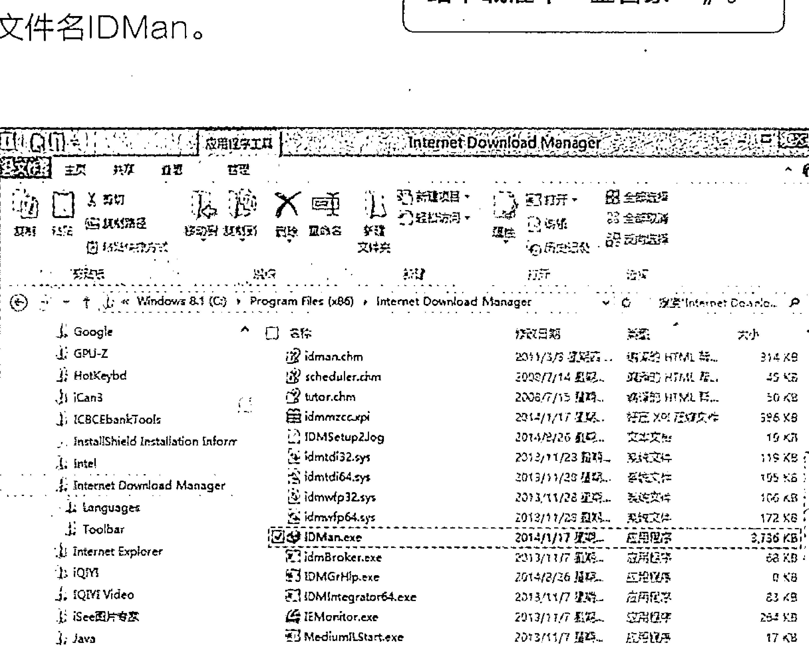

静默下载所用的主程序IDMan.exe

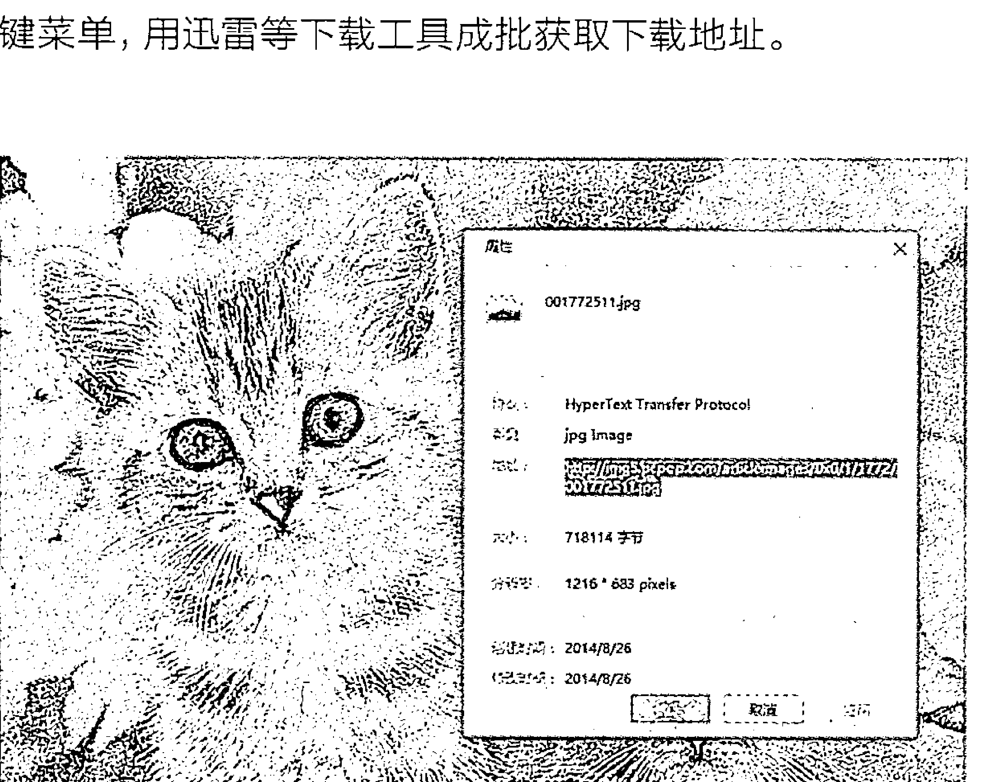

通过右键属性获取有效下载地址

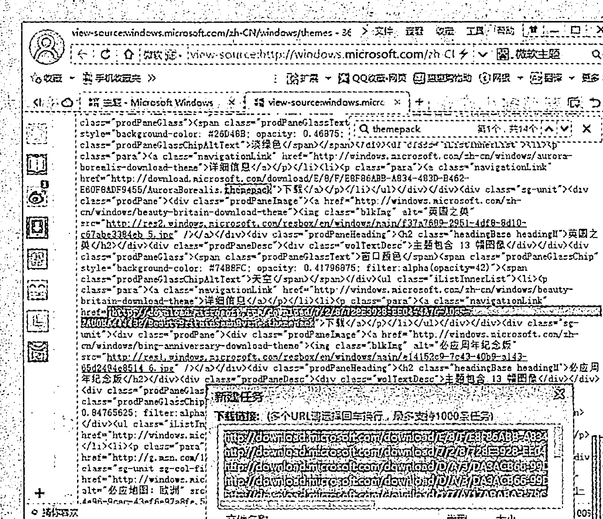

通过网页源码成批过滤有效下载地址

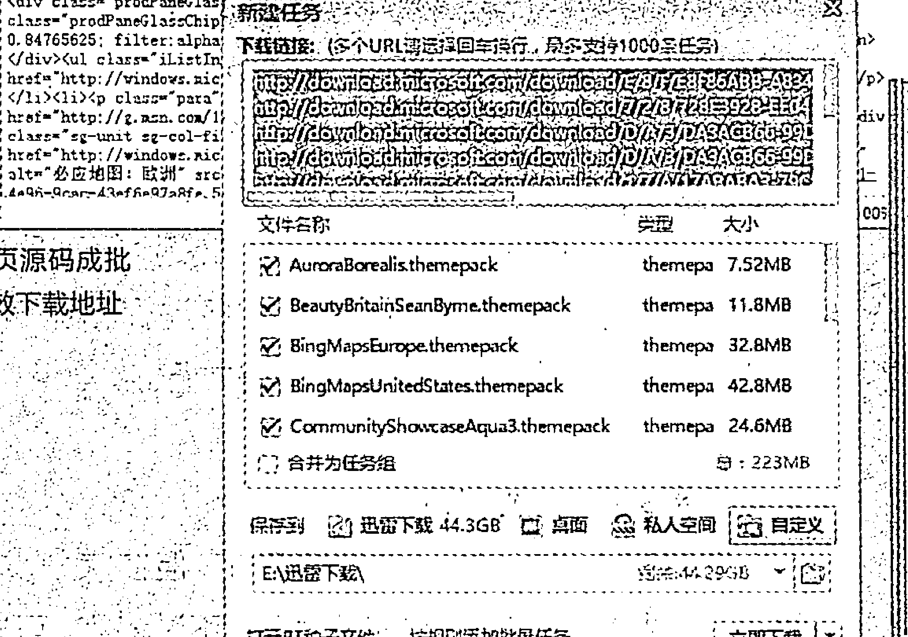

通过迅雷成批获取有效下载地址

> **小提示**
命令行中除了最主要的/d /n参数外，还可以使用下列参数：
/p -本地路径，定义要保存的文件放在哪个本地路径
/f -本地文件名，定义要保存的文件改名后保存在本地
/q - IDM将在成功下载之后自动退出
/h - IDM将在成功下载之后挂起连接
/a - 添加一个指定的文件，用/d到下载队列，但是不开始下载
/s -开始任务调度里的队列

```
1 idman.exe/n/d/p d:\download,http://www.cfan.com.cn/download/AVI001.MP4
2 idman.exe/n/d/p d:\download,http://www.cfan.com.cn/download/AVI002.MP4
3 idman.exe/n/d/p d:\download,http://www.cfan.com.cn/download/AVI003.MP4
4 idman.exe/n/d/p d:\download,http://www.cfan.com.cn/download/AVI004.MP4
5 idman.exe/n/d/p d:\download,http://www.cfan.com.cn/download/AVI005.MP4
6 idman.exe/n/d/p d:\download,http://www.cfan.com.cn/download/AVI006.MP4
7 idman.exe/n/d/p d:\download,http://www.cfan.com.cn/download/AVI007.MP4
8 idman.exe/n/d/p d:\download,http://www.cfan.com.cn/download/QIKAN2014-01.PDF
9 idman.exe/n/d/p d:\download,http://www.cfan.com.cn/download/QIKAN2014-02.PDF
10 idman.exe/n/d/p d:\download,http://www.cfan.com.cn/download/QIKAN2014-03.PDF
11 idman.exe/n/d/p d:\download,http://www.cfan.com.cn/download/QIKAN2014-04.PDF
12 idman.exe/n/d/p d:\download,http://www.cfan.com.cn/download/QIKAN2014-05.PDF
13 idman.exe/n/d/p d:\download,http://www.cfan.com.cn/download/QIKAN2014-06.PDF
14 idman.exe/n/d/p d:\download,http://www.cfan.com.cn/download/QIKAN2014-07.PDF
```

自动下载批处理文件示例

用如上方法获得下载地址后，将所有下载地址拷贝到一个文本文件中备用。

### 3. 构造静默下载批处理文件

构造下载命令行的主命令为idman，其命令基本格式为：

```
idman /d URL [/p 本地_路径] [/f 本地_文件_名] [/q] [/h] [/n] [/a]
```

其中参数/d URL 表示下载URL地址指定的一个文件。

```
例如： idman.exe /d "http://www.internetdownloadmanager.com/path/FileName.zip"
```

命令可下载如上网址指定的FileName.zip文件。
如果增加一个/n参数时，启动静默下载模式，也就是说，在执行命令过程中，IDM不会作出任何提醒。
例如： idman.exe /n /d http://www.tonec.com/download/idman317.exe
可实现后台静默下载idman317.exe文件。
按照如上命令格式的规定，建立一个BAT批处理文本文件，将要下载的网址复制到这个文件中，然后用复制粘贴的办法，在这些网址之前均加上合适的下载命令前缀，如“idman.exe /n /d ”或“idman.exe /d ”等，此外还可使用“/p <路径名>”指定本地保存路径，然后将此批处理文件存盘待用。

> **小提示**
一劳永逸 下载方案修改易
以上批处理文件可以留存，以后如果要下载不同的链接列表，只需要修改批处理文件中的下载链接即可。如果下载的任务多，可借助于EmEditor等替换能力强的编辑器，对下载命令的格式进行统一快速处理。

### 4. 执行静默批量下载过程

按如上方法创建批处理文件之后，将批处理文件放在接收下载文件的文件夹中，执行此文件，便可开始列表中文文件的自动下载了。

# 闲置小U盘 发挥大作用

文/曹春华

随着U盘容量价格比不断突破极限，很多用户家里都已闲置着很多小容量U盘。与其让它们尘封在抽屉里，不如想想办法旧物再利用。那么，如何才能让它们发挥余热呢？

## 1. 锁电脑、存隐私、同步文件

U盘文件管理专家（下载地址：http://www.dwz.cn/rawvA）这款软件，可以让U盘的价值发挥得淋漓尽致，用它来锁定电脑、隐藏重要文档、同步文档，都能实现，软件大小不到3MB，用200MB的U盘就行了。

插入U盘并运行软件，指定U盘盘符后确定，将软件安装到U盘上，弹出“试用授权码启用成功”后单击“确定”，设置好管理密码，完成全部安装过程。

### 锁定电脑 U盘把关

平时用系统密码来锁机，但有时碍于同事的面子，只能将密码告诉同事，搞得自己心里很不痛快，用U盘来锁定，就有了冠冕堂皇的借口了。

需要锁定电脑时，右击托盘中软件图标，单击右键菜单中的“启动主机锁护”，输入管理密码，然后设定锁定时间，比如指定为1小时（图1），启动后，按正常方式退出U盘，最后拔出U盘将锁定电脑，在指定时间之后，必须插入U盘才能解锁，否则，只有等到设定时间到达后，输入系统密码方可。

> **小提示**
>
> 如果未按正常方式拔出U盘，同样可以锁定电脑。插入U盘开锁后，软件仍处于待命状态，一旦再次拔出U盘，又将锁定，除非我们右击托盘中的软件图标，单击“终止主机锁护”。

### 隐私文件有处藏

如果需要在U盘中存放一些比较重要的文件，这些文件U盘中能够容纳得下的话，可以用此软件实现保护。

打开软件主界面，单击“行动保密压缩文件”图标，输入管理密码，将打开一个特定的文件夹My Security DOC，在此文件夹中存放的文件，在资源管理器中是不能看到的，只有运行管家软件，进入“行动保密压缩文件”才能查看，而这一步，必须要输入密码才行。

### 同步文件 一键实现

笔者有个习惯，办公文档随身带，但在家中、办公室中同步U盘中的文件时就比较麻烦了，不过，现在可以实现一键同步，非常方便。

先单击“同步中心”按钮，选择同步方向（图2），单一方向是指只从电脑到U盘或只从U盘到电脑的同步，而复合方向则指电脑与U盘之间的双向同步。根据以上需求，应该选择复合方向，然后单击“设定”，设置U盘与电脑中的同步文件夹，“储存”后，以后需要同步U盘与电脑间的文件，打开同步中心，只需单击“执行”即可。

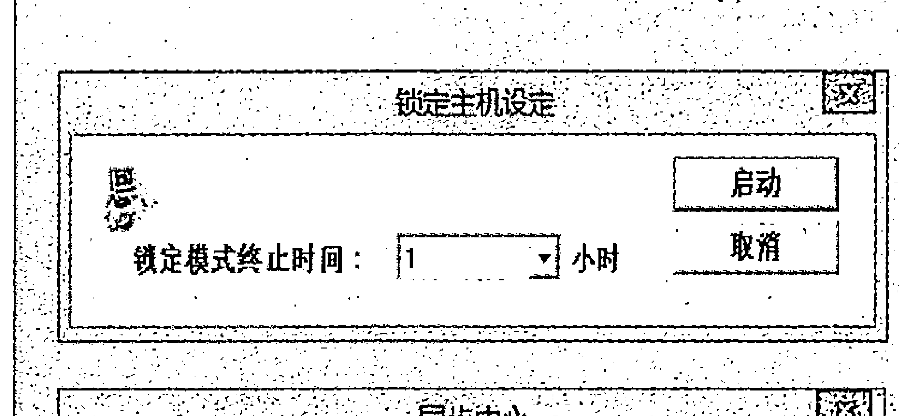

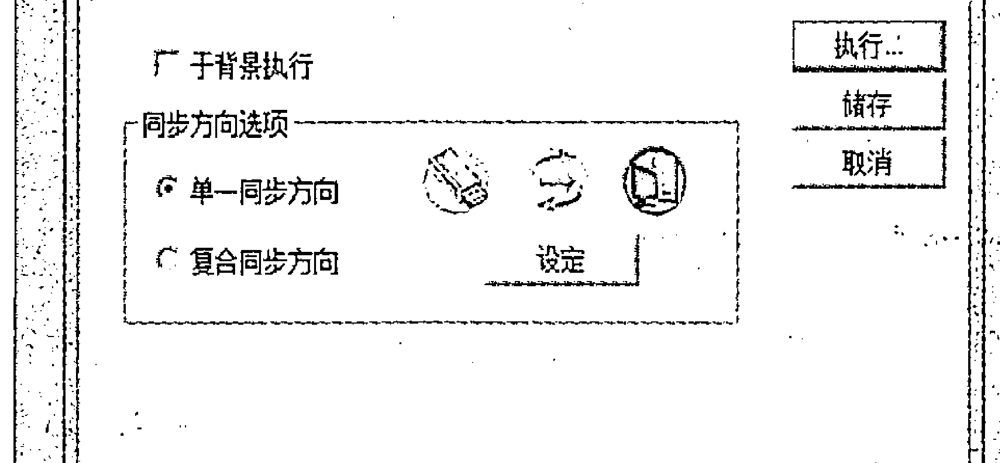

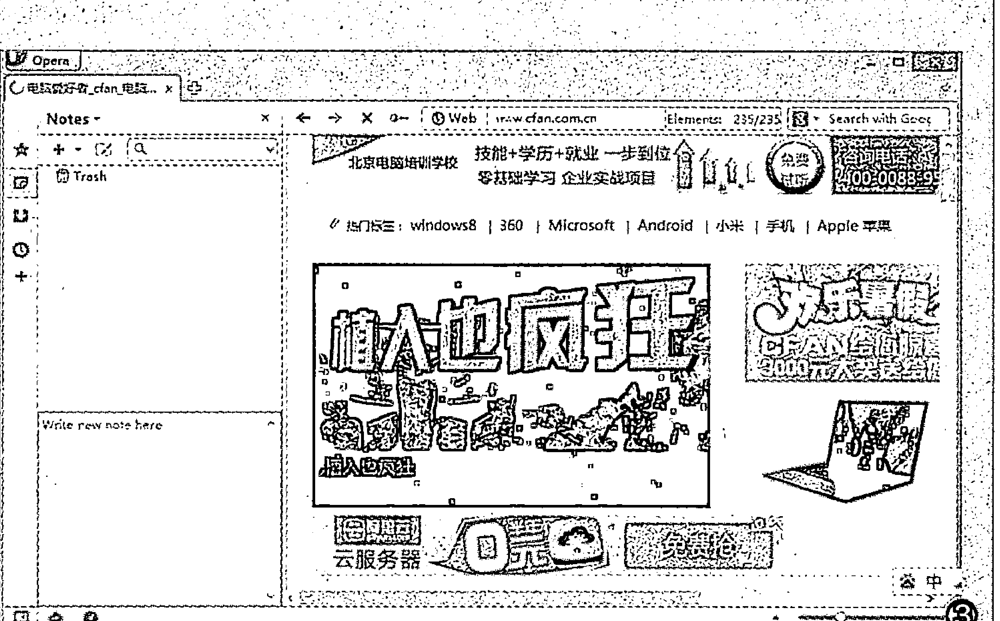

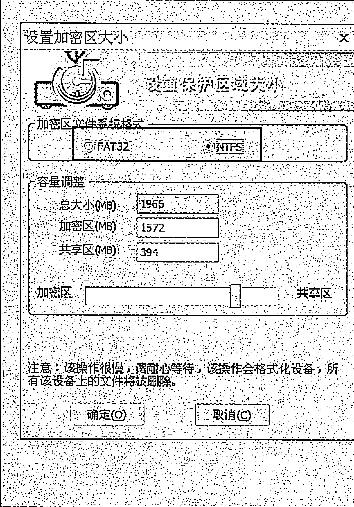

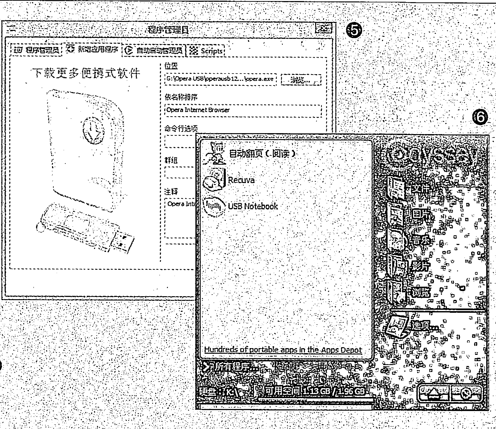

## 2. 打造随身携带的浏览器

现今浏览器种类五花八门，有些浏览器的界面常令人无所适从，与其去忍受不同电脑中不同浏览器的脾气，不如将自己的浏览器装入U盘中，无论在哪个电脑中，都可以使用同一种类型的浏览器。

Opera USB (http://www.dwz.cn/rax4P) 是一款可以装入U盘中的浏览器软件，解包拷入U盘，直接运行主程序文件opera.exe就可开始浏览，除了浏览网页外，书签、浏览历史等都会自动保存，每次打开浏览器，都会自动打开上次浏览的最后一个网页。

值得一提的是，软件还提供了笔记本功能，若有灵感，可以随时记录，而且，记录内容也会自动保存到U盘（图3）。

> **小提示**
>
> 现在用U盘安装系统和维护系统的人越来越多。其实，我们完全可以将手上各种容量的闲置U盘制作成PE维护盘，然后根据容量在其中安装各种工具和系统镜像，灵活进行系统安装和维护。

## 3. 在U盘中开辟私密地带

2GB或者4GB的U盘一般是放在办公室抽屉里，主要用于临时备用，有时同事借用一下U盘也未尝不可，但其中有些文档并不想让同事看到，用“迅软优盘加密软件”（下载地址：http://www.dwz.cn/raxvR）这款软件，在U盘中划出了一块隐密分区，存放自己的文件，加密分区以外的则为共享分区。

创建加密分区之前，应该把U盘中的所有文件进行备份。第一次运行时，提示未找到加密区，是否创建？单击“是”，选择加密分区的文件系统格式、加密分区大小（图4），确定后开始格式化，然后输入密码即可创建成功。

已经创建了加密分区的U盘，无论在什么电脑上使用，用户都只能在共享区中对文件进行各类操作，加密区无法看到，如何使用加密分区呢？在创建加密分区时，软件已在共享区中创建了自己的运行程序，运行此程序，输入密码就可打开加密分区。

## 4. 随身开始菜单 专为绿色软件打造

收集了许多绿色小软件，这些小软件为平时的工作帮了大忙，将这些绿色软件拷贝在U盘中，感觉使用不太方便——使用某个软件时，要从一大堆文件中查找，现在用软件CodySafe（下载地址：http://www.dwz.cn/ray8u）打造一个专用的开始菜单，运行起来就方便多了。

软件安装前，需将U盘插入，安装后，在U盘中可以看到StartCodySafe.exe主程序，运行此程序，右击系统托盘中的软件图标，打开“选项”菜单，依次单击“程序管理员→新增应用程序”（图5），即可通过“浏览”按钮向其中添加绿色软件。以后需要使用U盘中的这些软件，运行StartCodySafe.exe并右击托盘中的软件图标，即可看到漂亮的开始菜单（图6），在这里启动绿色程序非常方便。退出U盘也很简单，单击“移除装置”按钮即可。

# Everything远程搜索

文/倚楼

通常我们都是通过即时通讯工具，或者电子邮件进行文件传输。不过有时在需要文件的时候，同事可能并不在工位上，这时想要取得他的文件，怎么办？其实可以利用Everything来搭建一个搜索系统，这样就算同事不在，也可以直接进行远程搜索和下载。

## 搭建远程服务器

这里以最新的Everything正式版来进行演示（下载地址：http://tinyurl.com/ohyqs37）。软件运行后，点击“工具”菜单中的“选项”，在打开的选项窗口中点击“HTTP”，再在右侧窗口中选中“启用HTTP服务器”项。为了避免和其他的网络软件发生冲突，这里在“HTTP服务器端口”中设置一个不常见的端口，比如本例使用的是1234。

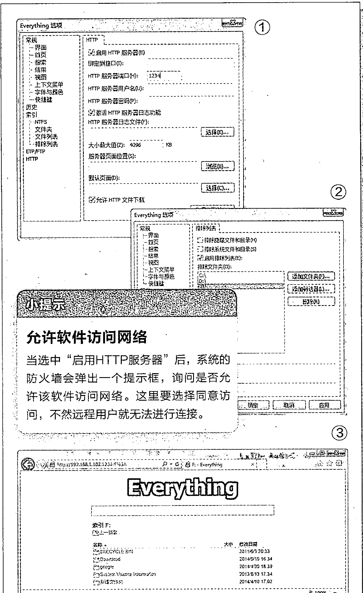

> **小提示**
>
> 允许软件访问网络
>
> 当选中“启用HTTP服务器”后，系统的防火墙会弹出一个提示框，询问是否允许该软件访问网络。这里要选择同意访问，不然远程用户就无法进行连接。

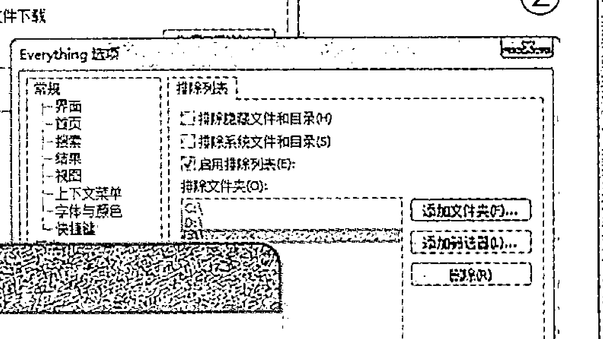

接下来选择“激活HTTP服务器日志功能”，并点击该选项下面的“选择”，在弹出的窗口中设置一个日志名称，这样可以通过日志随时了解有哪些远程用户访问了本地磁盘。最后选择“允许HTTP文件下载”项，这样远程用户在发现想要的文件后，就可以直接通过浏览器进行下载（图1）。全部设置完毕，点击“确定”，一个远程搜索服务器就搭建完成了。

## 设置访问的权限

因为Everything默认是对整个磁盘文件进行搜索，而一台电脑中肯定既有公务文件也有私人文件，这样就很容易泄露自己的私人数据。其实要解决这个问题也非常简单，可以设置将私人文件排除出去。

同样打开软件的选项窗口，在左侧选择“索引”中的“排除列表”，然后在右侧窗口选中“启用排除列表”选项。接下来点击“添加文件夹”，在弹出的对话框中选择要排除的文件夹目录。由于我将公务文件都存放到F盘，所以我分别将C、D、E盘都加入到排除列表中了（图2）。

不过还有另外一个问题，因为软件默认可以让网络中的所有用户都进行访问，而我电脑中的文件都是公司内部交流的，并不能让所有人查阅，所以还需要设置一个访问权限。在“HTTP服务器用户名”和“HTTP服务器密码”中分别设置远程用户访问所需要的验证用户名和密码即可。

## 远程架设的系统

接下来就需要将自己系统的IP地址，以及访问服务器的验证用户名和密码，通过电子邮件或QQ发送给可以访问的同事。当同事接收到这些信息以后，首先随意运行一个网页浏览器，接着在地址栏按照“IP地址：端口”的形式进行输入，回车后就可以连接到架设的系统中。然后在登录网页中分别输入用户名和密码，即可进入共享的系统里面。

用户既可以在磁盘目录中一层一层地寻找想要的各种文件，也可以在搜索框中输入文件名来进行搜索（图3）。一旦找到自己想要的文件，点击搜索结果中的文件名，浏览器将会弹出文件保存提示框，点击“保存”就可以下载到本机了，方便吧。

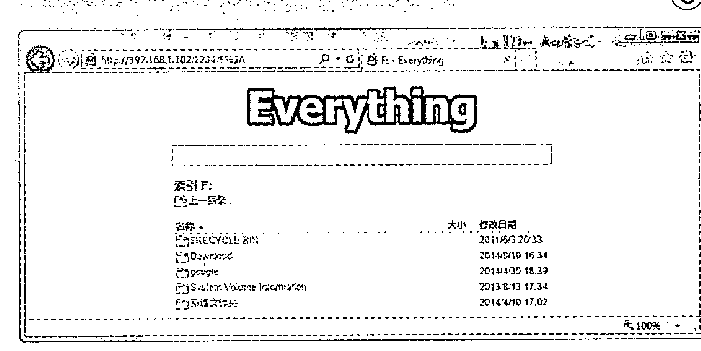

# 使用Google开源字体

前段时间，Adobe与Google宣布推出一款新的开源字体“思源黑体”。由于该字体可以支持中文信息，因此很多用户都想试一试这款字体。那么如何在Windows系统里配置使用这款字体，又如何在网页浏览器里调用这款字体呢？

## 开源字体的多重安装

我们首先从官方网站下载Google的开源字体压缩包，解压后待用(下载地址: http://tinyurl.com/n8xd4xq)。接着打开系统的控制面板，找到“外观和个性化”双击打开它，在弹出的窗口中找到“字体”并点击它，这样就可以看到存放字体文件的目录。接下来只需要将下载的字体文件拖放到这个字体文件夹中就可以了。

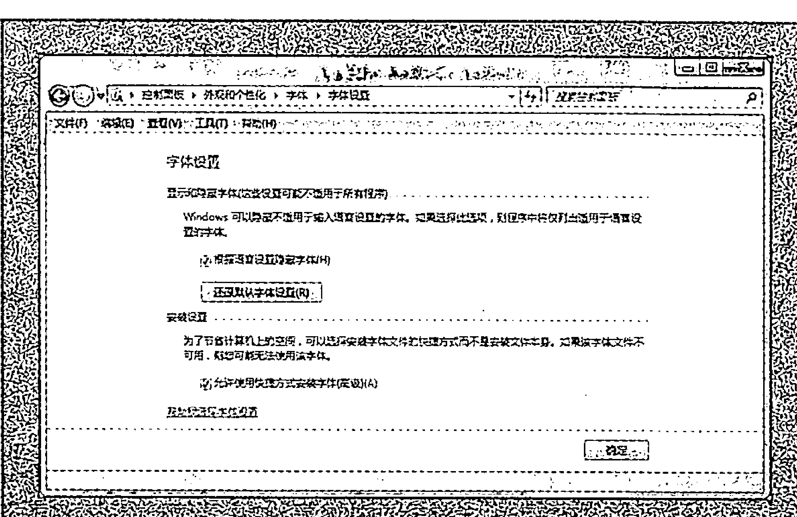

当然如果一次性安装很多的字体(尤其是中文字体)，上述的安装方法就会导致占用大量的系统盘空间。可是如果将字体放到其他分区中，Windows系统又无法识别，这时可通过其他方法来解决。在控制面板的“字体”设置窗口点击“更改字体设置”项，接着在弹出的设置窗口找到“安装设置”项，选择其中的“允许使用快捷方式安装字体”。设置完成后点击“确定”，重新启动操作系统确认刚刚的配置(图1)。

接下来进入到解压存放字体的文件夹目录，找到需要进行安装的字体文件后，点击鼠标右键，选择右键菜单中的“作为快捷方式安装”命令，即可自动以快捷方式的形式导入到Windows的字体文件夹里(图2)。这时在Windows字体文件夹里面就可以看到，以快捷方式安装的字体都会有个快捷图示。如此一来既可以使用更多的字体，又不用担心占用大量的系统盘空间。以后当不想用Google开源字体的时候，将整个文件夹一起删除就可以了。

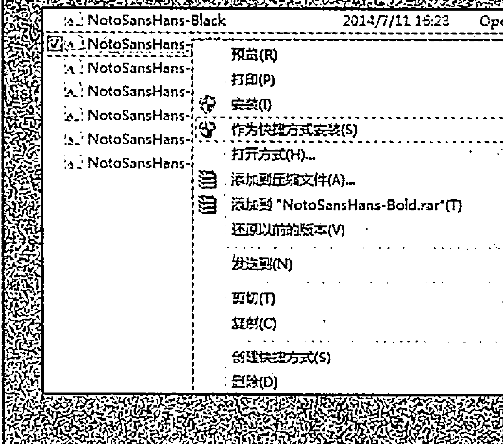

## 浏览器的调用与设置

如果用户对这套字体比较满意的话，可能也想将其用到常用的浏览器上，比如现在比较流行的谷歌浏览器。不过要想在谷歌浏览器上调用这套字体，首先需要在应用商城安装一款名为“Advanced Font Settings”的扩展。接下来点击谷歌浏览器右上角的自定义按钮，在弹出的菜单里面依次选择“工具”子菜单中的“扩展程序”命令，这样在弹出的窗口里面就可以看到刚刚安装的扩展程序。

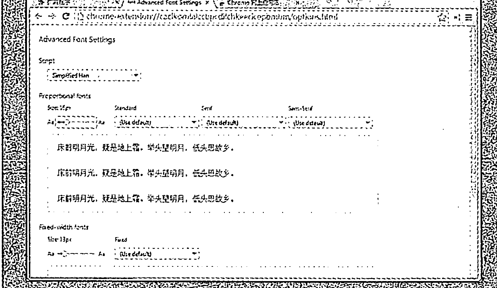

点击该扩展程序名称下方的“选项”命令，在弹出的窗口就可以对字体文件进行设置了。首先在“Script”里面选择简体中文的“Simplified Han”选项，然后在下方的多个字体选项里面，根据自己的需要选择字体的显示方式、字体大小等内容，而且所见即所得看到字体显示预览(图3)。

所有的设置完成以后，点击最下方的“Apply settings”按钮，这样谷歌浏览器就可以用这套字体来显示网页内容了。如果使用久了想回到以前的设置，点击“Reset settings for this script”按钮就可以了。

# 定位软件Hosts为美网提速

文/万立夫

无论是浏览器上网还是网络软件联网，有一个必不可少的环节就是域名解析，域名解析的好坏将影响到上网的速度。而Windows系统中的Hosts文件，其主要作用就是将域名直接转换成对应的IP地址，从而节省域名解析的转换时间，让软件运行更快。那么如何才能快速找到网络软件所需的Hosts规则呢？

## 嗅探程序访问网址

首先我们需要知道应用程序暗中访问了哪些网址，这可以通过嗅探器来获取。以金山快盘的客户端为例，关闭所有暂时不用的网络软件，接着启动嗅探器DNSQuerySniffer（下载地址: http://tinyurl.com/lte5hdt），点击工具栏中的“开始捕捉”，选择“捕捉方式”中的“Raw Sockets (Windows 2000/XP)”项，接下来在“选择网络适配器”中设置当前系统所用的网卡（图1）。设置完毕点击“确定”即可开始数据嗅探了。接着运行金山快盘的客户端，很快就会在嗅探器列表中显示金山快盘访问过的网站地址信息（图2）。

## 域名解析获取地址

复制上述得到的网址到一个文本文件中（只保留网址信息）。接着运行PingInfoView（下载地址: http://tinyurl.com/6oaksr），点击工具栏中的“Ping选项”按钮，在弹出对话框的“Ping列表”中粘贴刚刚整理出的网址选项（图3），确定后即可开始批量Ping操作了。返回PingInfoView主界面，在“IP地址”一栏中就可以找到这些网址对应的IP地址（图4）。

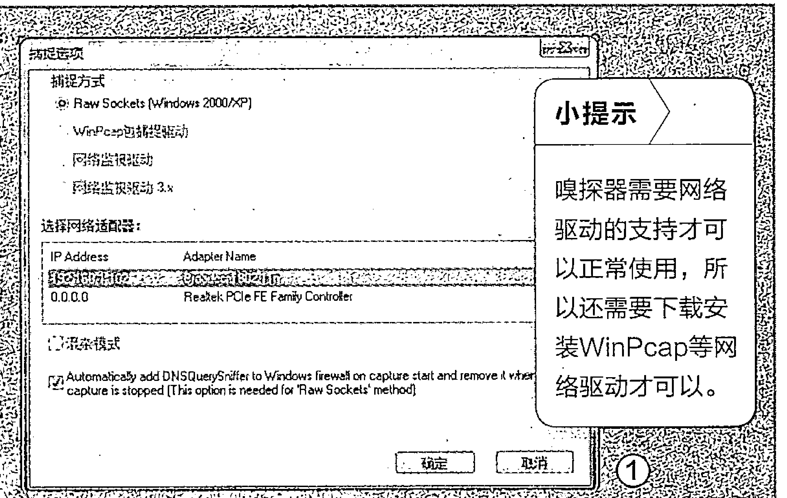

> **小提示**
>
> 嗅探器需要网络驱动的支持才可以正常使用，所以还需要下载安装WinPcap等网络驱动才可以。

## 添加地址到Hosts

接下来的操作就很简单了，复制上述解析出来的IP地址信息，粘贴到文本文件中。然后按照“可用IP地址 目标域名”的格式，一行一行整理这些域名解析信息就可以了（图5），比如：

`42.62.61.26  www.kuaipan.cn`

整理完毕，打开C:\Windows\System32\Drivers\etc下的Hosts文件，将其剪切到其他的磁盘，然后通过文本编辑器打开该文件，将上述整理出来的Hosts规则写入到此文件中。

修改完成以后将Hosts文件重新粘贴到它原先的目录中，这时将会提示用户需要提供管理员权限，直接点击提示窗口中的“继续”按钮，就可以成功将Hosts文件粘贴回去。重启系统后再试试登录金山快盘，就会明显比之前的快了很多。其他联网软件的提速，同样可以参考以上方法进行。

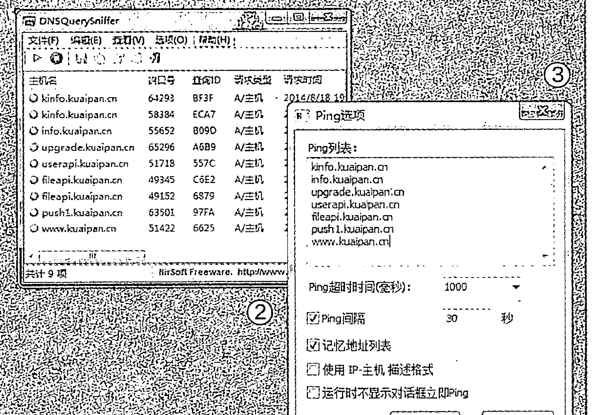

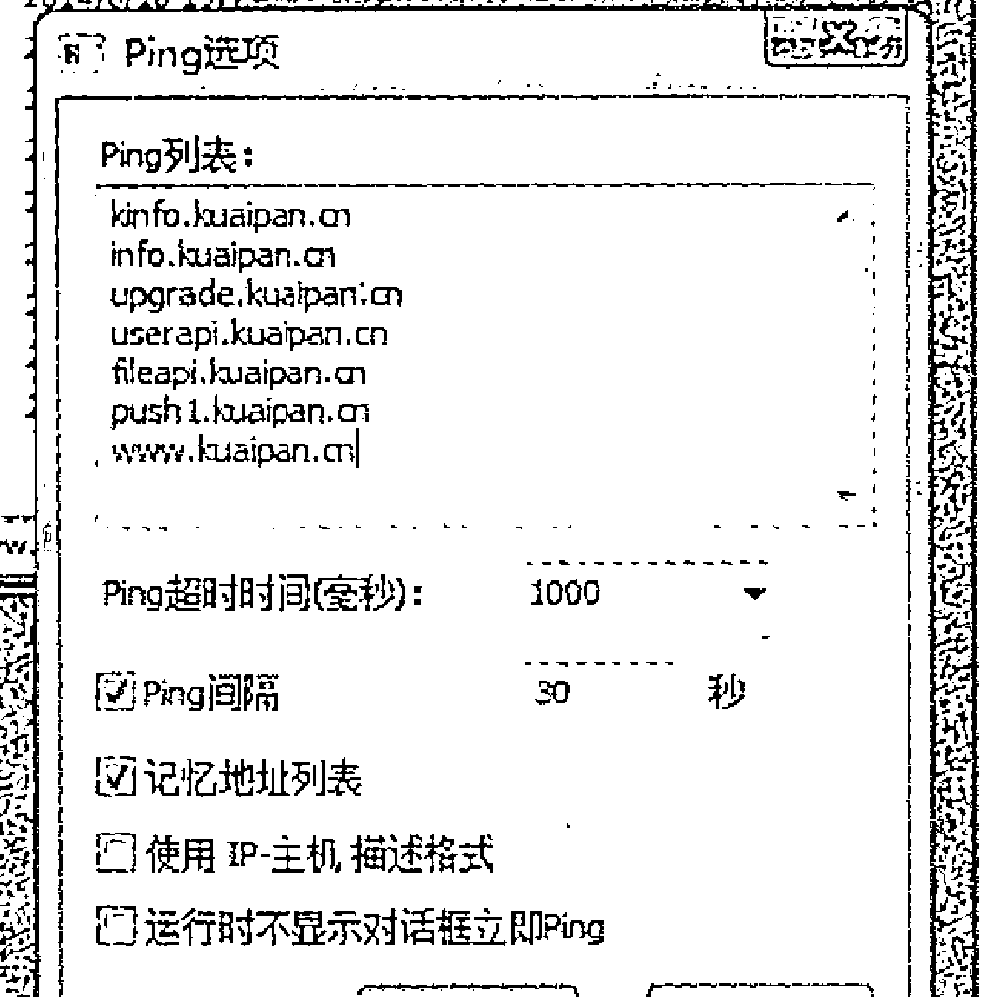

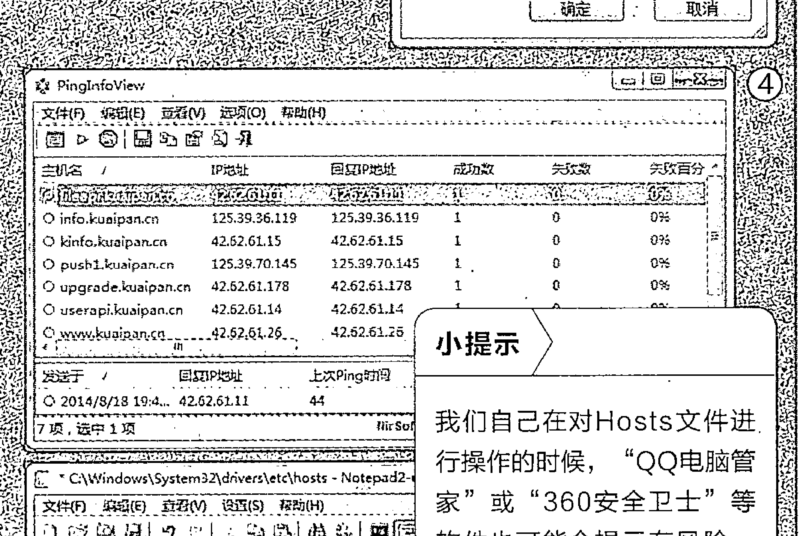

> **小提示**
>
> 我们自己在对Hosts文件进行操作的时候，“QQ电脑管家”或“360安全卫士”等软件也可能会提示有风险，这时只需要信任这个操作并将文件添加到白名单中即可。

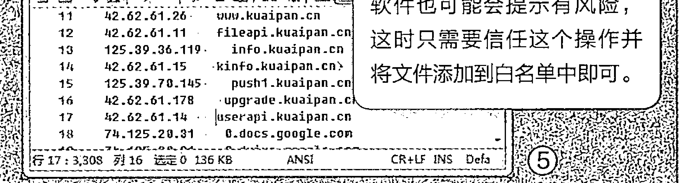

# 不用装软件 云端修图修视频

文/倚楼

以前无论是编辑图像还是视频，基本上都是在本地完成。不过对于普通用户来说，很多专业软件用起来不顺手。并且对于偶尔需要的人来说，专门装个软件得不偿失。而现在不用装任何软件，对图片或视频的编辑直接在线即可完成。

## 网络修图就这么简单

Rollip是一个非常不错的照片在线处理网站（http://www.rollip.com），打开网站后可以看到主页面显示的是繁体中文，为了更好地操作，可以将页面拖动到最下方，在“语言”列表中选择“中文”切换到简体中文界面。接下来点击页面中的“点击创建”按钮，在弹出的窗口中选择一个需要使用的相片滤镜效果（图1）。稍后根据提示在“上传您的照片”中点击“选择文件”，按提示选择上传需要处理的图片文件。图片上传完毕即可预览刚刚选择的滤镜效果，如果感觉满意，点击“下载图片”下载保存就可以了（图2）。需要说明的是，下载的图片分辨率会自动进行调整。如果用户上传的是数码照片的话，那么也可以点击“使用原尺寸处理”，处理完成后再点击“下载高质量照片”下载处理后的原图。如果用户对预览效果不满意的话，点选右侧的“选取另一个滤镜”按钮，就可以重新为照片更换其他的滤镜了。

> **小提示**
>
> 除了调用滤镜效果以外，通过右侧的按钮还可以为照片添加边框、添加文字甚至添加特效，从而使得照片看上去更加与众不同。

## 视频短片的云端编辑

除了拍摄照片外，现在大家还喜欢用移动设置拍摄一些视频短片，不过同样令人头疼的是后期处理。不过利用Magisto这款云端视频编辑服务，繁琐的操作就会降低到只需要点击几下鼠标即可完成。首先登录Magisto的官方网站（http://www.magisto.com），根据提示注册一个账户，当然也可以利用自己的谷歌账户进行登录。登录成功后点击右上角的“CREATE MOVIE”按钮，在弹出的网页中就可以进行编辑操作了。编辑操作是根据向导一步步完成的。首先点击“SELECT FILES”按钮，在弹出的对话框中选择想要编辑的视频文件。当然也可以点击“Google Drive”链接，存放在谷歌云端硬盘存储的视频中选择一个。接下来就是等待视频完整地上传到网站服务器中。当视频成功上传后，点击“CHOOSE EDITING STYLE”按钮，选择视频编辑的处理方案。Magisto网站为用户提供了多个处理方案，用户可以首先对这些方案进行预览，然后点击选择需要的处理方案。接下来就是选择视频的背景音乐，网站不仅提供了很多国外歌手的音乐，也提供了很多国内歌手的音乐（图3）。如果用户对这些音乐都不满意的话，那么还可以点击“Upload your music”按钮，在弹出的窗口选择喜欢的音乐上传即可。最后为自己编辑的视频起一个名称，再点击“CREATE”按钮就可以进行处理了。编辑完成后网站会通过注册的电子邮箱，通知用户进行查看和下载已经处理好的视频。当然用户也可以登录网站，直接查看所有处理完成的视频。

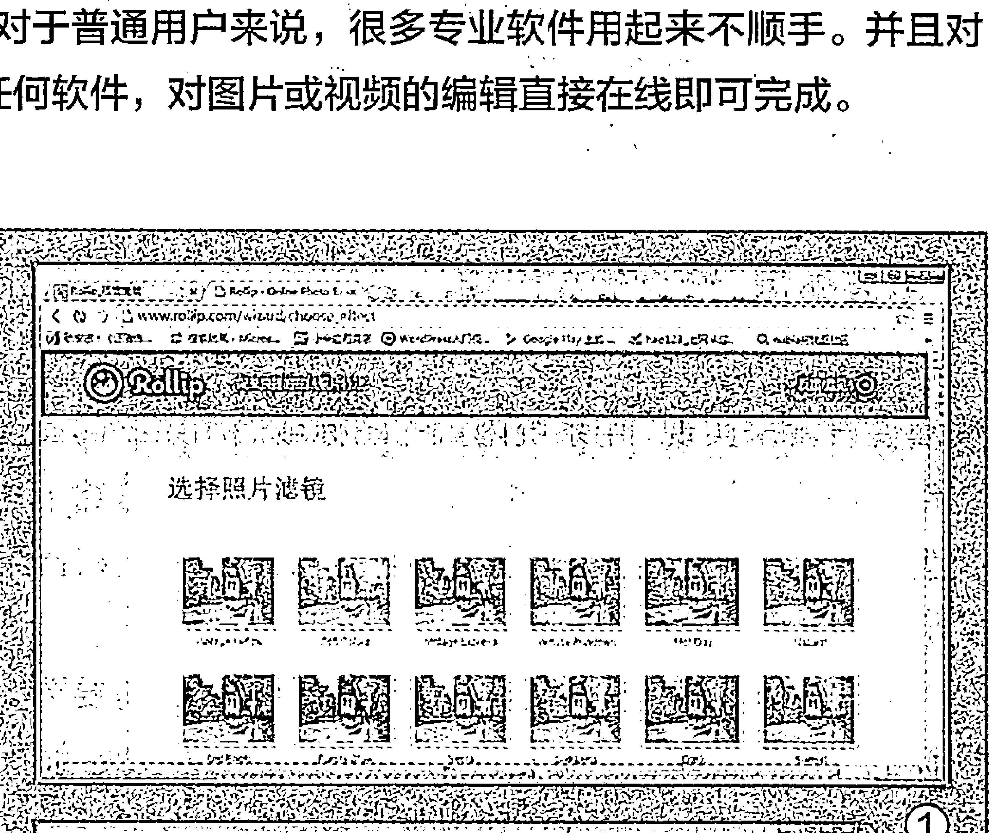

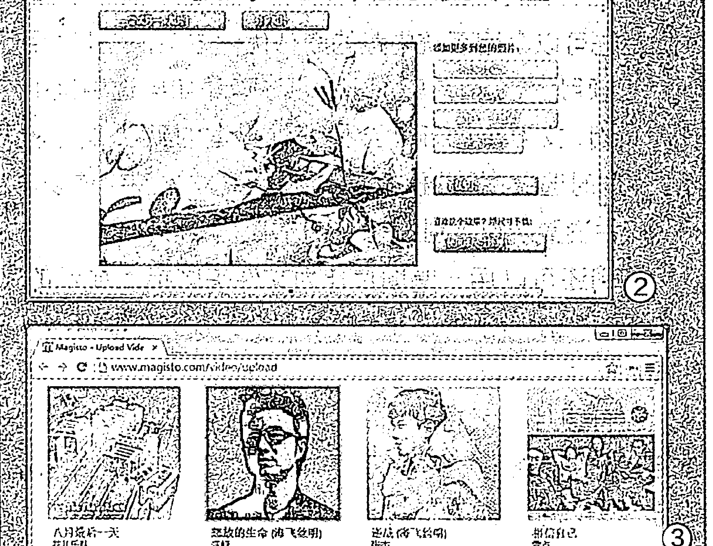


## 换换装 文件夹管理更方便

文|温佳豪

办公室的文件多装在文件夹或档案盒中，除了添加标签外，给不同类别的文件夹定制不同的外观，查找文件就会变得更容易。如今的文件越来越多地电子化了，那么，电脑中的文件夹是不是也可以换一换金色的面孔，展现给我们一些更易于访问的新花样呢？

### 1. 不用外援 给文件夹换装

修改文件夹图标的最基本方法是使用系统自身的文件夹属性设置来实现，用系统内置的图标或借用系统内其他程序的图标来达到更换文件夹图标的目的。用此法给不同类型的文件夹定义不同样式的外观，便于一眼认出和直达目标。

以在Windows 8.1桌面环境下操作为例，在需要更换图标的文件夹上单击鼠标右键，选择“属性”菜单项，切换到“自定义”选项卡（图1），可以从三种途径对文件夹外观进行更改。

首先可以套用系统内置的默认优化方案，这些项目包括常规项目、文档、音乐、图片、视频等，如果选中其中的任一项目，文件夹图标就会按此种类 型的默认样式来显示。若同时选中“把此模板应用到所有子文件夹”选项，则可一次性设置所有级别的文件夹（图2）。

我们还可以用一幅图片作为文件夹图标上显示的文件，点击“选择文件”按钮，指定一个图片文件即可。支持的图片文件类型有10多种。

由于图片有大有小，应用到文件夹上显示效果不一定合适，因此最好的方法是更改文件夹图标。点击“更改图标”按钮，弹出系统默认的包含于“%SystemRoot%\system32\SHELL32.dll”文件中的图标库，在这个图标库中，有我们常见的各类文件图标，基本可以满足日常需求（图3）。从中选择一个图标，确定并应用之后即可完成文件夹的图标换装。

默认的文件夹图标会显示文件夹内容的预览，但是当我们通过“更改图标”按钮给文件夹指定另一个图标样式之后，文件夹上将不会再显示文件夹内容的预览。

### 2. 使用工具 换装更方便

用系统自身功能实现文件夹换装，操作起来比较复杂，如果文件夹比较多，设置起来更显麻烦。这时，可借助于专用的文件夹图标管理工具Folder Marker Pro来完成文件夹图标的统一换装管理（下载地址：http://www.foldermarker.com/）（图4）。

Folder Marker Pro作为一款办公助手工具，能轻松帮我们随时标记文件夹的样式，达到文件夹样式的个性化管理。在文件夹数量庞大的办公室中，使用这种方法来管理日常文件夹，可让我们从“一片金黄”的文件夹堆中解放双眼，大大提高文件夹的识别效率。

软件运行后，先通过“Language→Simplified Chinese”菜单命令，将软件界面语言设为简体中文。接下来便可以采用两种方式来标示现有文件夹的样式。

一种方法是通过窗口上方的文件夹定位框定位到要修改的文件夹，然后点击下方图标分类中的任一种文件夹，点击“应用”按钮即可（图5）。

另一种方法只需在资源管理器中要改变样式的文件夹上点击右键，选择“标记文件夹”，然后选择自己喜欢的文件夹样式类别即可（图6）。由于这种方式不需要先启动软件到窗口中操作，直接在资源管理器中用右键即可完成，因此对日常管理办公文件样式非常简单易行。

> **小技巧**
> 除了系统SHELL32.dll文件中含有大量图标外，其实每个EXE文件或DLL文件都包含有一个或多个图标，我们可以通过“浏览”按钮定位到这些文件，就能预览到其中所包含的图标样式，从而选择自己喜欢的图标。

> **小知识**
> ICO是Windows文件或文件夹图标的常用格式。Windows XP操作系统中，ICO图标可达到真彩色（32位色深）、32像素×32像素大小。在Vista以上系统下最大可以支持256像素×256像素。

### 3. 寻找现成的文件夹好图标

无论用系统的方法还是工具软件的方法更改图标，都支持自定义图标载入。最省事的获取自定义图标的方法是通过专门的网站进行下载，建议到IconPng.com爱看图标网或EasyIcon免费图标搜索下载网下载自己所需的图标。此外，还可通过站长素材库（http://www.dwz.cn/sgpBN）按照分类选择下载文件夹图标。

> **小提示**
> 软件默认提供的文件夹样式类别有“附加”、“颜色”、“主要”、“字母”几种，还有“自定义”一项可通过在素材网站下载喜欢的ICO图标添加到用户图标中。此外，可以通过下载和添加更多的Additional Icons文件夹样式来充实软件的图标库（下载地址：http://www.dwz.cn/sgjhi或到官网下载）。Additional Icons图标集下载解压后，将文件直接复制到安装目录下的ICL目录中即可。

### 4. 自己制作文件夹漂亮图标

在软件自带或网上搜索的图标无法满足自己的需求的情况下，我们还可以通过自己制作图标来满足文件夹图标换装的需求。可以使用Axialis IconWorkshop这款软件来完成制作，该软件还有个非常方便的功能，通过选择一幅图片简单点击“从图像创建Windows图标”，就可以将一幅图片变成自己想要的文件夹图标。

## 右键菜单 自做主张

文|雯雯

右键菜单我们经常要用到，然而，随着电脑中安装软件的增多，系统中的右键菜单越来越臃肿。仔细看看，其中不少项目自己可能永远也用不上，而迫切需要的功能又不具备。右键菜单项目都是登记在注册表中的，那么，如何才能将不用的命令删除掉，将自己想要的命令加进去，打造一个最具个性化的右键菜单？不用手动修改注册表，也能搞定吗？

### 1. 临时隐藏 用时放出

右键菜单命令有的使用频率不高，可将其临时藏起来，到某个特殊的场合需要使用时将其放出来，这样既不用重装软件，又可满足临时任务，一举两得。

> **小提示**
> 使用360安全卫士的“电脑清理”功能可自动扫描和彻底清除一些无用的右键菜单项目。先用此功能对系统进行自动扫描，切换到“清理插件”选项卡，其中会列出一些无用的右键菜单建议项目，选中它们，点击“立即清理”即可（图3）。

注意，用这种方法清除右键菜单项目后，如果希望今后再次使用，只能重新安装软件来注册该项目。所以，清除此类项目时要小心确认，防止因误操作而丢失有用项目。

> **小提示**
> 临时屏蔽的项目仍然存在于电脑系统中，若在必要时需要用该项目，不用重装软件，只需用同样的方法，在Glary Utilities设置窗口中选中该项目即可使其再度显示出来。

### 2. 无用项目 彻底删除

对于那些确认永远都不可能用到的右键菜单累赘项目，可毫不犹豫地将其删除掉。仍以上面的QvodMenu菜单项为例，只需在设置窗口中选中该项目后，点击右下角的“删除”按钮，这个项目便不再出现在系统右键菜单中。

### 3. 新建项目 任我增删

许多右键“新建”项目是软件安装时自动创建的，有的很方便，比如“TXT文件”项，要比我们通过附件来寻找记事本再新建文件要方便得多。而有的我们几乎不用，比如“RTF文件”，留在菜单中纯属多余。那么能不能自己定制“新建”菜单，将其变为一个最实用的“精干”列表？

通过Glary Utilities的右键菜单管理窗口，点击“新建”选项卡，我们可以看到系统现有的“新建”项目中包含的有效选项列表，只需选中自己需要的那些项目，将暂时不要的项目统统取消选择。若确认永久不再使用，点击“删除”即可（图4）。

> 如果想在“发送到”菜单中添加更多的自定义项目，可点击“添加”按钮，在随后弹出的窗口中选择发送到的目标文件夹，确定即可。

> 除了系统自带的一些新建项目，我们还可以给驱动器、文件夹、文件添加一些自己需要的新命令项目。使用软媒设置大师系统工具，点击选择“右键菜单”选项卡按钮，在左侧栏内点击“添加右键菜单项目”，在右侧窗口中便可按需选择为右键菜单添加各种项目，只需点选所需项目后点击“应用”按钮即可（图5）。

### 4. 发送项目 自我定制

大家知道，在系统右键菜单中，有一个“发送到”项目，使用它可方便地将文件发送到目标磁盘或目录，但其中的不少项目也是系统或软件默认添加的，如果项目一多，本来很方便的“发送到”操作反而成了一个需要挑挑拣拣的过程，让“快捷”变得不再方便。其实这个菜单也可借助于工具来方便地实现自我定制。

使用软媒设置大师的“右键菜单”设置功能，选择“发送到菜单”一项，在右侧窗口中选择不需要出现的“发送到”项目，然后点击“删除”按钮，即可实现“发送到”菜单的精简（图6）。

### 5. IE右键项 一键减肥

类似于Windows资源管理器右键菜单，在IE浏览器网页窗口中，右键菜单往往也会出现臃肿的情况，这与我们平时在IE中使用各种客户端程序安装的各种插件有关。这些右键项目中，往往真正用得着的项目也不多。我们也可以借助于工具给其减肥。

启动软媒IE管理大师，切换到“右键菜单设置”选项卡，在列表中选择要操作的右键菜单项目，然后就可以用下方的按钮对其进行“启用”、“禁用”或“删除”操作了（图7）。

> 选择“禁用”与“删除”的区别在于，暂时不用的选择“禁用”，永久不用的选择“删除”。

## DIY自己的网页资料库

文/倚楼

无论是办公族还是学生老师等，经常需要上网查询各种资料。有时我们在查询某一专题资料时，可能会打开很多个相关的资料网页，这时如果一个一个地保存网页，一是操作麻烦，另外也不便于以后查找。这时候，我们可以换一种方式来保存和管理。

### 多网页一键转成列表清单

我在准备毕业论文时就曾遇到上述问题，后来通过为Chrome安装一款名为OneTab的扩展而轻松解决（同样支持Firefox）。

安装完OneTab会在工具栏中看到一个蓝色的扩展图标。现在按照平常的方法进行资料的查阅，自然就会打开大量有用的网页。当需要对这些网页进行整理时，只要点击一下OneTab扩展图标，刚刚打开的所有网页标签就会被整合到同一个OneTab标签页面中，并且通过列表的方式将所有网页名称显示出来（图1）。

为了方便以后的查阅，可以点击网页中“More”链接并选择菜单中的“Name this tab group”命令，这时列表清单的前面将显示一个输入框，可在其中为此列表清单输入简介内容。

### 为列表清单加把锁

如果所搜集的内容非常重要，为了避免误操作将其删除，还可以点击“More”链接中的“Lock this tab group”命令将其锁定。如果这个列表清单中的内容格外重要，那么还可以点击“More”链接中的“Star this tab group”命令，就可以将其特别标注出来并置顶显示。以后当我们需要重新查看这些网页内容时，既可以一个个点击列表中的网页链接来打开，也可以点击“Restore all”链接将所有的网页一次性恢复。

### 同步转移列表清单

虽然平时都是在学校里完成论文，但周末经常回家看看，这时就涉及到列表清单的转移，方便在家中查阅。点击OneTab扩展标签页面中的“Share as web page”链接，在弹出的网页窗口中显示某个列表清单中的所有内容链接。接下来用谷歌账号登录Chrome浏览器，然后简单将这个列表清单网页添加到收藏夹中，即可将它同步到谷歌的服务器端。以后在任意其他电脑上，只要上网并登录Chrome浏览器，即可在收藏夹中打开这个列表清单了。

当然我们也可以点击Chrome浏览器右上角的功能按钮，在弹出的菜单中选择“网页另存为”命令，将这个列表清单以网页的形式保存到本地磁盘中，并通过任意云存储软件完成同步操作（图2）。

#### 文章拓展 云笔记辅助共享

如果希望收藏的列表清单同样能在其他电脑中可用（其他电脑中的浏览器不限，除Chrome之外的Firefox或者别的浏览器都可以），还可以与云笔记相结合进行共享。

这里以Evernote为例，点击Chrome浏览器中已经安装的Evernote剪藏扩展，在弹出对话框的“选择保存的内容”中选择“整个页面”，然后在“整理”中选择页面存储的笔记目录（图3）。设置完毕点击“保存”按钮，这个列表清单就被保存到云笔记中。

以后无论何时何地，通过电脑或者移动设备打开云笔记软件，就可以查看到这个列表清单了，点击其中的链接马上就可以浏览这个资料网页。而且一旦有什么好的想法或个人感受，还可以立即将其记录到云笔记软件中，方便以后随时整理和查看。

## 解除“绑架” 还你干净的浏览器

文|万立夫

现在很多软件商为了自己的利益，会对用户的软件属性进行修改。比如作为上网入口的浏览器，就经常被各种各样的插件所绑架，篡改浏览器首页、修改默认搜索引擎等。这样不仅影响用户的上网速度，还会带来安全威胁。那么如果浏览器已经被绑架，用户该如何进行处理呢？

### 专业工具快速清洁

在大家常用的360安全卫士中，点击工具栏中的“木马查杀”，在弹出的窗口中点击“快速扫描”按钮，即可对包括浏览器插件在内的多个项目进行扫描，当发现问题后，选中需要修复的问题并点击“立即处理”即可进行清除操作（图1）。不过360安全卫士一般只会对恶意的浏览器插件进行清除。

如果不想使用360安全卫士，针对绑架浏览器的插件还可以考虑使用Junkware Removal Tool（JRT），它可以一键完成所有的修复操作。运行JRT工具后，它会在线升级病毒库等文件，接下来根据工具的提示，按下任意键就可以进行操作了。该工具会依次对系统的进程、启动项、系统服务等内容进行扫描分析（图2）。在这个过程中会出现系统桌面消失、任务栏重新启动等情况，这时用户不需要有任何的担心。当所有的操作完成后会出现“The scan completed successfully”的提示，接下来重新启动系统就可以了。

### 手工清理更干净

无论是使用360安全卫士还是JRT，都需要有一个先决条件，那就是软件的病毒库里面有这个恶意插件的信息。如果这些工具无法清除的话，那么就需要通过安全工具来进行操作。比如这里我想清除系统里面的hao123插件，首先运行安全工具AntiSpy，接着点击“网络”中的“IE插件”标签。

在列表中可以看到两种不同颜色的插件，其中黑色代表和微软相关的内容，这种颜色的插件我们就不需要理睬。蓝色代表第三方软件商的插件，这些属于重点关注的内容。如果不知道每一个项目代表哪个插件，那么就在该项目上点击鼠标右键，选择菜单中的“在线搜索插件名”命令，通过搜索结果来了解该插件的信息。如果可以不使用的话，那么将这个插件前面的钩去除，这样该插件就被暂时禁用了。如果肯定以后不需要使用该插件，那么单击右键选择“删除注册表和文件”命令，就可以进行彻底的清除（图3）。

有些插件之所以非常难清除，是因为它有驱动在后台进行保护。现在点击“启动项”标签左侧的“驱动程序”这项，在右侧列表就可以看到一个名为“hao123protect”的驱动名称，单击右键选择“删除启动信息和文件”命令即可清除掉（图4）。

当所有的操作完成后，建议大家重新启动一下系统，以确认刚刚进行的操作。

## 用好数码照片的‘黑匣子’

文|苏通

Exif参数可以看作是数码照片的‘黑匣子’。当一幅照片出现问题时，查看所拍照片的Exif参数可以找出失误原因；而查看一幅优秀数码照片的拍摄参数信息，则可以学到拍摄经验。摄影师常建议人们安装专门的小工具或插件来查看数码照片的Exif拍摄参数，但实际上，能够查看数码照片Exif参数的软件不限于专用的Exif工具，而且Exif参数还有一些别的用途。

### 1. 让Exif参数显示更直观

在Windows 8.1环境下，用系统自带的照片查看器就能查看数码照片的Exif信息。右击一张数码照片，选择‘预览’命令进入照片预览界面，在照片上点击鼠标右键，弹出照片属性窗口，切换到‘详细信息’选项卡，可看到包含‘图像’、‘照相机’和‘高级照片’在内的照片精度和拍摄所用的相机、镜头等Exif参数设置。

但是这种方式显示照片Exif信息需要操作，不直观，我们可以将照片拍摄时的各种Exif参数，以列表的形式显示在资源管理器文件列表项目中。具体方法是在资源管理器详细列表模式下，右键单击文件列表标题栏上的名称条，在弹出菜单中选择‘其他’，然后在‘选择详细信息’窗口中选择要显示的照片Exif信息项目。其中可供选择的参数信息项目有好几十项，但与数码照片参数有关的只有十五六项，从中挑出有用的显示即可。

> **小知识**
> Exif是附加了照片拍摄参数的JPEG格式图片，JPEG照片中存储的拍摄参数被称为Exif参数。

### 2. 显示Exif参数的途径多

**Windows应用查看Exif参数**

我们还可以在Windows商店中搜索下载一款名为‘Exif查看器’的应用，安装之后在‘开始’屏幕上点击Exifviewer图标，即可启动Exif查看器应用查看照片Exif信息。在Exifviewer中点击‘选取照片’按钮，选择电脑中的照片，在照片的下方显示出照片拍摄时所用的Exif参数。

> **小提示**
> 照片要包含在Windows库中才能被Exif查看器选取，如果照片不在库的范畴内，请先将照片所在的文件夹包含在系统的任意库中，也可以给文件夹新建一个库。

**办公组件来查看Exif参数**

在微软Microsoft Office组件中，有一个图片管理工具Microsoft Office Picture Manager，如果电脑中安装有带有此工具的Office版本，也可以用它来查看数码照片的Exif信息。

首先用Microsoft Office Picture Manager打开某张照片，然后在照片上单击鼠标右键，在弹出的菜单中选择“属性”命令，这时照片窗口的右侧会弹出一个“属性”面板，在“图片属性”和“相机属性”组属性后，点击“展开”文字链接，两组属性随即展开，我们就可以看到照片的分辨率以及拍照所用的Exif参数信息。

### 看图工具快速查看Exif参数

常用看图软件查看照片的Exif信息当然不在话下，但你要找到它们快速调用这些信息的方法。在iSee看图精灵窗口中，默认会在窗口右侧显示Exif详细信息，如果没有显示这个窗口，可用F9功能键开启这个窗口，也可以在照片上单击鼠标右键，然后选择Exif命令开启该窗口。2345看图王中查看Exif的方法是按Alt+Enter组合键后点击图片信息窗口中的Exif选项卡。

### 压缩软件也能查看Exif参数

如果照片已经被压缩在一个ZIP包中，不必解压文件，直接用360压缩软件打开此压缩包，双击窗口中的照片，开启压缩包照片查看器，按F9功能键也能看到照片的Exif信息。

### 3. Exif参数的更多用法

如果要修改或出于信息保密的目的要删除照片的Exif信息，可以安装更为专业的Exif工具，比如Opanda PowerExif，即可直接清除Exif信息。

如果要快速管理照片，可以借助于Turbo Photo相册程序的高级搜索功能，按某个Exif参数进行搜索（比如按曝光时间或快门速度等），找到符合条件的照片。

使用Exif Print照片打印软件打印照片，该软件会自动判断拍摄参数，这样就不至于将午夜的星轨照片按白天风景照配色打印，准确度更高。

通过NeatImage Pro降噪工具可自动对拍摄有噪点的照片进行降噪处理，其原理是自动读取照片中的Exif参数并分析拍摄环境而进行降噪处理的。对于没有Exif信息的JPEG照片，将无法获得理想的降噪效果。

## 闲置U盘变身Windows 8 “护卫”

随着网盘的盛行，U盘作为传输资料的功能已渐渐没落。然而作为更实用和常用的系统安装维护和数据备份（加密）功能，U盘却是网盘无法替代的。五种实用方法，让你的闲置U盘变身Windows 8 “护卫”。

### 1. 建立Windows 8应急PE启动盘

建立Windows 8 PE启动盘，可以在系统损坏不能启动时，用它来引导启动机器，进入一个类似于Windows的环境，然后拷贝出硬盘中的有用数据资料。也可以用Windows PE启动盘启动后，执行系统安装程序修复或重新安装硬盘中的原有Windows系统。

但要注意，不是任何一个版本的Windows PE都能启动维护和安装Windows 8的，需要支持Windows 8安装的版本才能，我们可以很容易在网上搜索到适合于32位或64位Windows 8系统的PE映像文件。

制作应急Windows PE的方法是，先安装UltraISO工具，再从网上下载Windows 8 适用的PE ISO映像文件，启动UltraISO，通过“文件→打开”命令选择打开ISO映像文件，然后选择“启动光盘→写入硬盘映像”命令，选择U盘盘符，写入方式选择USB-HDD+或USB-ZIP+（一种不行尝试另一种），点击“写入”按钮（图1）。

### 2. 建立Windows 8系统恢复盘

直接通过Windows 8.1系统建立Windows 8.1系统恢复U盘，用来在紧急情况下引导系统并修复系统。可根据U盘剩余空间的大小，考虑是否可将系统恢复分区中的数据拷贝到这个U盘中。

通过系统控制面板依次选择“所有控制面板项→恢复→创建恢复驱动器”，为当前正在运行的Windows 8.1系统创建一个系统恢复U盘（图2）。如果系统中已经包含恢复分区数据，且U盘空间大约有4GB，则足以连同恢复分区一并写到U盘中，让恢复U盘不但可以启动系统，还可以用来恢复和初始化系统。

> 小提示：若空间不足以装下恢复分区数据，则此U盘只能启动系统。

### 3. 建立移动应急Windows 8系统

Windows 8.1系统支持建立移动系统，我们可以将系统安装在U盘中直接启动机器，而机器内完全可以不用装硬盘。这样的移动启动盘不但可以代替硬盘来工作，还可以起到系统维护或安装盘的作用。如果硬盘系统出现问题，可临时用这个移动U盘启动电脑，然后进行修复或重装硬盘系统，甚至进行日常工作。

建立移动应急系统的方法是，将U盘插在一台具有Windows 8.1企业版的电脑上，然后通过控制面板的“Windows To Go”功能来制作移动Windows 8.1系统。或者使用Win To USB工具，读入任一种Windows 8/8.1安装文件的ISO映像包，然后直接写入到U盘中制成启动盘（图3）。

> 用系统自带的Windows To Go功能制作移动U盘系统，仅有企业版才能支持，但用WinToUSB工具则不受这个限制。

### 4. 建立多合一Windows 8安装盘

如果闲置的U盘空间比较大，例如有16GB或32GB空间，那么完全可以先将U盘做成一个Windows 8 PE启动盘，然后将不同版本的Windows 8安装包拷贝到此U盘中，这样此U盘便成了一个多系统安装盘，可任意选择安装不同版本的Windows 8系统。如果PE环境中集成了ISO虚拟工具，则可以直接拷入ISO文件，否则需要解包后拷入到U盘中。

> 注意移动系统或Windows 8 PE与要安装的Windows的位数对应关系，32位的启动盘只能安装32位的Windows系统，64位的启动盘只能安装64位的系统。不同版本是指位数相同情况下的不同版本。

### 5. 建立用户资料加密U盘

说到资料加密，大家可能会想到去寻找某款资料加密软件来进行处理。实际上，利用Windows 8.1的驱动器加密特性，可以很方便地实现U盘资料的加密。

准备好一个U盘，将个人资料统统保存到该U盘中。进入Windows 8.1系统的控制面板，点击“BitLocker驱动器加密”进入加密驱动器加密窗口。点击要加密的U盘后的“启用BitLocker”文字链接，进入初始化驱动器的过程。接着会提示选择用输入密码或使用智能卡两种方式之一加密驱动器，一般选择使用密码方式，两次输入相同的密码即可。接下来从三种保存恢复密钥的方式（保存到文件或微软账户、打印）中选择一种，以备忘掉密码后恢复。随后选择要加密的驱动器空间的范围，如果是新U盘则选用“仅加密已用磁盘空间”，BitLocker会在用户新添加数据时对其进行自动加密处理。如果是已经使用中的U盘则选择“加密整个驱动器”，以便确保U盘上的所有数据甚至包括已经删除的数据得到保护（图4）。

U盘加密之后，可在BitLocker驱动器加密窗口对已经加密的U盘进行更改或删除密码、备份恢复密钥、添加智能卡、启动自动解锁或关闭BitLocker等操作。要访问经过加密的U盘，插入U盘后系统会提示输入密码解锁，密码正确后才能打开访问U盘文件。

如果觉得在自己的计算机上使用U盘，没必要每次都输入密码，那么可以在第一次解锁时，选中密码框下方的“在这台电脑上自动解锁”复选框后解锁即可。如果忘掉密码，可通过此前建立的密钥恢复。

> 加密过程中，不要拔掉U盘。在加密过程未完成之前，如果要弹出U盘，需要先暂停加密过程，否则可能会损坏U盘中的文件。U盘加密之后，可通过“BitLocker驱动器加密”窗口中的“管理BitLocker”和“关闭BitLocker”对加密的U盘进行管理。

## 禁自动同步保护云隐私

文|万立夫

最近由于苹果iCloud的自动同步功能，造成许多人隐私泄露，这一事件在网上被炒得沸沸扬扬。其实iCloud归根结底只是苹果推出的一项云存储服务，而现如今网络中的云存储服务又特别的多，所以非苹果的用户同样也要注意保护云存储中的个人隐私。

### 关闭不用的iCloud同步

首先点击苹果设备界面中的“设置”，在弹出的功能列表中找到“iCloud”，点击该按钮以后就可以看到iCloud同步的具体项目。这次好莱坞事件主要和照片有关，如果是要保护照片隐私，点击其中的“照片”项，在弹出的设置窗口中将“iCloud照片图库”选项关闭，再从弹出的询问窗口中点击“好”确认即可。不过为了验证是否为本人操作，关闭时会要求输入你的Apple ID密码进行确认。

其实在iCloud同步的项目中，涉及到个人隐私的还有很多，比如通讯录、备忘录、文稿与数据等等，用户可以根据自己的需要选择开启或关闭哪些同步项目。如果想一次性关闭所有的iCloud同步项目，只需要在iCloud的列表最下面找到“储存与备份”功能，在弹出的窗口将“iCloud云备份”功能关闭就可以了。

### 其他云存储同步的关闭

除了苹果的移动设备外，还有很多用户使用的是Android系统设备。虽然Android系统并没有类似iCloud的云存储功能，但是应用于这一系统中的其他云存储应用同样会出现类似的问题。

这里以腾讯的“微云”为例进行讲解。首先点击微云工具栏中的“更多”按钮，在弹出的列表找到“相册备份”项并点击它。接着在弹出的窗口中点击右上角的设置按钮，然后在设置列表中将“自动备份”功能关闭掉即可（图1）。

当然仅仅关闭自动备份是不够的，因为在手机遗失的情况下，其他人很容易下载云存储中的文件。所以接下来返回到“更多”列表，点击其中的“设置”选项，然后选择“安全与隐私”这项（图2）。最后开启“独立密码”项，这样即使是在账号密码遗失的状况下，别人也无法登录到服务器里面来下载文件了。

### 创建一个超级密码

其实之所以接二连三地出现各种网络安全问题，很多时候是和用户使用的密码过于简单有关的。那么如何才可以创建一个不容易被破解的超级密码呢？

首先通过浏览器登录到一个名为PassCreator的网站（http://passcreator.com/），它的作用就是帮助用户创建不易被破解的超级密码。在网站的页面中，根据提示选择创建密码所需要的内容信息选项，其中包括大小写的字母、数字以及自定义字符等信息。如果用户需要在密码中使用某个指定的词组，可以选中“Word”选项后在输入框里面设置需要的内容（图3）。

然后在“Specify Password Length”列表中，选择创建的超级密码的长度。最后点击“Create Password”按钮就可以生成密码了。如果对生成的密码不太满意，可以再次点击该按钮来重新创建一个新的密码。

有了超级密码，无疑对安全多加了一层保障，用起来就更放心了。

## 不用望远镜也看最圆的月亮

文|倚楼

不久以前通过新闻知道，中国将在未来发射天宫二号飞行器，这个新闻又把人们的目光吸引到浩瀚的宇宙星辰中。平时人们要想观察宇宙，天文望远镜是不可或缺的，但是普通人又很难拥有它。好在微软推出了一款名为“世界望远镜（WorldWide Telescope）”的应用，通过它也可以一窥宇宙的奥秘。

### 让世界望远镜“说”中文

首先下载WorldWide Telescope最新的安装包（下载地址：http://www.worldwidetelescope.org），根据向导提示很容易安装软件，不过它的运行需要.NET Framework 4.0的支持。软件默认为英文界面，为了更好地进行操作，可以将窗口语言修改为中文。双击窗口上方的“Settings”，在弹出的菜单中点击“You language”，再在弹出对话框的下拉菜单中选择“Simplified Chinses”项，最后点击OK按钮保存，重新启动软件后界面就会变成简体中文了（图1）。

### 查找天体了解信息

现在就可以查询自己喜欢的天体了，WorldWide Telescope为用户提供了两种不同的查询方式。首先单击工具栏中的“探索”按钮，在弹出的菜单中可以看到一些常见的天体，比如地球、月球、火星等。当查询到自己需要的天体后，用鼠标单击该天体的缩略图，这时WorldWide Telescope就可以加载天体的相关图片。除此以外，还可以单击“搜索”按钮，在弹出的菜单搜索框中输入天体的名称，按下回车键就可以进行搜索查询。不过需要提醒大家的是，搜索的时候只能使用英文信息，比如查询月球就输入Moon即可。

当月球图片加载完成，在主窗口就可以看到月球的模样。按住鼠标左键移动图片，可以360度全方位地查看月球（图2）。通过滚动鼠标的滑轮，可以对图片进行实时的缩放操作。如果仔细观察的话，还可以看到离月球不远处的地球。

只看图片可能看不出所以然，所以需要详细了解某些信息的时候，可将鼠标移动到某个位置后右击，在弹出的消息框中就可以显示出这里的详细信息了，其中包括这个位置的名称，以及地平高度等（图3）。

> 这款软件有一个非常奇怪的现象，就是同一个按钮通过左键单击和双击，效果和弹出的命令是完全不一样的。比如单击弹出的是Ribbon界面的菜单命令，而双击弹出的是传统的菜单命令。

### 让星空成为自己的壁纸

人类迄今为止已经发射了大量的飞行器，也拍摄了大量的图片信息。那么如何将这些照片下载到电脑中，用作自己的桌面壁纸呢？首先在界面左下角的“指向”下拉菜单中选择“Panorama”选项，接着在后面的“图像”列表中就可以选择相应的图片名称，稍后全景图片就可以在软件中显示出来。

如果喜欢这个图片的话，点击“图像”列表后的“！”叹号按钮，在弹出的对话框中点击“图片来源”链接。然后在弹出的网页窗口点击图片链接，就可以进行图片的下载操作了（图4）。由于下载的图片分辨率比较大，因此需要进行批量的转换操作。最后在系统桌面上点击“个性化”命令，再点击“桌面背景”选项设置为存放下载图片的文件夹就可以啦。

## 自制微信专属强迫症头像

文/倚楼

自从微信在手机上流行开来，很多人都跟得了强迫症一样，时不时就打开微信来看一看。于是就有人根据微信发送消息会在用户头像上显示出对应信息数字的特性，制作出一些类似的头像来恶搞朋友，俗称“强迫症头像”。

### 电脑中的制作

网上制作恶搞头像的网站有不少，这里介绍一个制作网站http://plusone.sinaapp.com。打开网页后，点击其中的“选择图片上传”，选择本机中想要作为头像的图片上传。接下来在“输入小红点中的文字”中输入需要显示的数字信息，比如需要在头像上显示10条信息的提示，就在输入框中输入10即可（图1）。最后“点击提交生成头像”后的“提交”，制作完成后会显示出头像的预览效果，如果满意的话就点击“PC用户点此保存”，将恶搞头像保存到本地系统（图2）。

当然仅仅是简单的恶搞已经没有意思了，于是不少用户开始向个性化的方面发展。如不在图标上显示简单的数字，而是在其中显示出一些个性化的文字或图案。在“输入小红点中的文字”输入框中设置需要的词组，或者直接在下方选择一个由网站提供的个性图案即可。不过经过测试后非常遗憾地发现，网站不支持中文信息的设置和显示。

### 手机应用也能制作

虽然在电脑上制作非常方便，还是需要将制作的头像上传到Android手机，如果觉得麻烦，那么可以直接在手机中进行制作。首先启动“头像加1”这款应用，点击应用上方的按钮来选择头像背景的来源。这款应用为用户提供了三种来源方式，分别是手机图库、手机相机和自带图库等。本例从手机图库中选择一张照片，这时应用会要求用户对其进行剪裁，从而成为一个头像标准的正方形图形。

裁剪完成后就可以设置显示的内容了，应用为用户提供了“恶搞”、“身份”、“姓氏”等项目，只要从中选择一个喜欢的图案即可（图3）。如果对这些图案都不满意的话，还可以点击右下角的“输入”按钮，输入自己喜欢的内容信息即可。“头像加1”应用允许用户输入汉字，但是也只能输入一个单字而已。当头像创建完成，点击右上角的“保存&分享”按钮，图片就会自动保存到Android手机“Sdcard/H1”文件夹中。

### 头像的转移和设置

由于微信头像的图片来源只可以从Android手机图库里面读取，所以需要将其从H1文件夹转移到“Sdcard/dcim/camera”文件夹中（从PC上复制来的图片也是如此）。首先打开“RE管理器（Root Explorer）”应用，找到并选中生成的头像文件。接着点击工具栏中的“剪切”命令，然后切换到Camera文件夹，点击工具栏中的“移动到此”按钮即可。

现在打开微信客户端，点击右下角的“我”按钮。在弹出的列表中选择自己的微信名称，再点击“头像”按钮就可以进行更换设置了。让你的那些“强迫症”朋友们发狂吧。

## 别羡慕了 我也有“iPhone 6”

文|老万

苹果公司刚刚发布了最新的iPhone 6手机，由于这款手机比较紧俏，因此更加给人一种“高大上”的感觉。当已有iPhone 6的人发微博、微信显示出“XXX地，来自iPhone 6客户端”的信息时，着实令众多网友艳羡。其实，iPhone 6可以没有，但是这个小尾巴，我们却可以自己制造一个，没有人能辨出真假。

### 利用网页直接制作尾巴

现在微博已经成为很多人了解信息的重要途径，当然也就成为不少人“得瑟”的地方。那么如何在微博发送信息的时候，带上“高大上”的iPhone 6尾巴呢？

首先通过浏览器登录自己的新浪微博，接着打开一个新的浏览器网页标签，在地址栏中输入“自定义新浪微博尾巴”的网址链接（http://tinyurl.com/mqInr6d）。打开后根据网页中的提示点击“用微博登录”按钮，由于我们刚刚已经登录了自己的微博，因此浏览器可以自动从缓存中调用账户信息，从而能快速登录。在弹出的一个授权信息窗口，点击“同意”即可完成操作。

接下来在“选择功能”列表中选择“发布”，然后在“微博尾巴”列表中选择iPhone 6的尾巴即可，当然用户也可以选择其他设备的尾巴。最后在信息窗口输入要发送的微博信息，点击“发布”按钮就可以了，整个过程和常见的微博操作一模一样（图1）。当别人看到这条微博时，一定马上会被醒目的iPhone 6尾巴所吸引（图2）。

> 需要提醒大家的是，如果在网页上方没有看到“微博尾巴”列表的话，这时可以将浏览器窗口最大化，即可让列表显示。

### 妙用定位功能显示尾巴

除了新浪微博外，微信朋友圈也是显摆的一个好地方，那么如何在微信朋友圈中显示iPhone 6尾巴呢？这次我们不需要借助第三方的平台，利用微信自带的定位功能就可以做到，而且是免费的哦。

首先进入到自己的朋友圈，按照以前的方法选择一张要发布的图片，这时在分享页面的图片下方可以看到“所在位置”这个选项。点击它以后在弹出的设置窗口中的搜索栏内输入“来自 iPhone 6 客户端”信息，然后点击“搜索”按钮进行搜索查找（图3）。

由于列表中没有这个莫名其妙的地址，所以微信会显示出“没有找到你的位置”的提示。点击下面的“创建新的位置”选项，在“位置名称”中已经显示出“来自 iPhone 6 客户端”的内容，接下来只要在“详细地址”选项中随便输入一点内容，最后点击“完成”，一个尾巴就伪造好了。

接下来返回到图片分享窗口，点击右上角的“发送”按钮，就可以把图片分享到朋友圈里面。而那个“吊炸天”的“来自 iPhone 6 客户端”的尾巴，就会很明显地显示在图片的下方（图4）。

## 开放桌面 如何保障隐私 文 | 曹春华

放在办公室里的电脑，经常被同事借用，所以每次离开电脑时锁定电脑是不合适的，但为了保护桌面上的隐私，每次离开电脑时都要关闭正在运行的程序、打开的窗口等，也颇为麻烦。有没有在开放电脑桌面的前提下，又尽可能地保护自己的隐私呢？这样的方法有多种！

### 1. 开辟隐私区域

桌面空间较大，如果能在桌面上划分一块或几块区域，把自己所用的程序、临时文件等放置于自己的区域中，并给这些区域设置密码，是不错的一种方法。软件“桌面人生”（下载地址：http://www.dwz.cn/ulpVL）就可以为我们在桌面上划分多个私密地盘。

安装软件，首次运行时，单击“开始整理”，软件会将桌面上的图标进行分类整理，单击“完成”可看到整理效果，如果觉得分类不如意，可以单击“还原”进行恢复。

怎样在桌面上开辟自己的隐私区域呢？右击托盘中的软件图标，选择右键菜单中的“创建桌面框”，在桌面上可以看到一个标题为“框”的小“桌面”，既可以把原来桌面上的程序快捷方式拖放到此框中，也可以右击该框，从“新建”菜单中新建文件夹、文档等（图1）。我们可以把自己的程序、文件或文件夹放到这个名为“框”的小“桌面”之中。右击框标题，可以修改框的名称，如改为“我的小桌面”。

如何给这个小小的“桌面”加密并锁定呢？单击框右上角的倒三角按钮，选择下拉菜单中的“设置”（图2），设置“开机锁屏”为“锁屏”，输入锁屏密码后单击“保存”，这样开机后该框自动锁定，不能看到框中的任何图标（图3），单击此框时，要求输入正确密码后，才能看到这个小桌面中的程序图标。如果离开电脑时，需要再次锁定，右击此框，选择“锁屏”即可。

默认情况下，各个框的位置、大小都可改变，为使桌面整洁，可以固定各个框的位置，只需要从倒三角按钮下选择“锁定”即可。

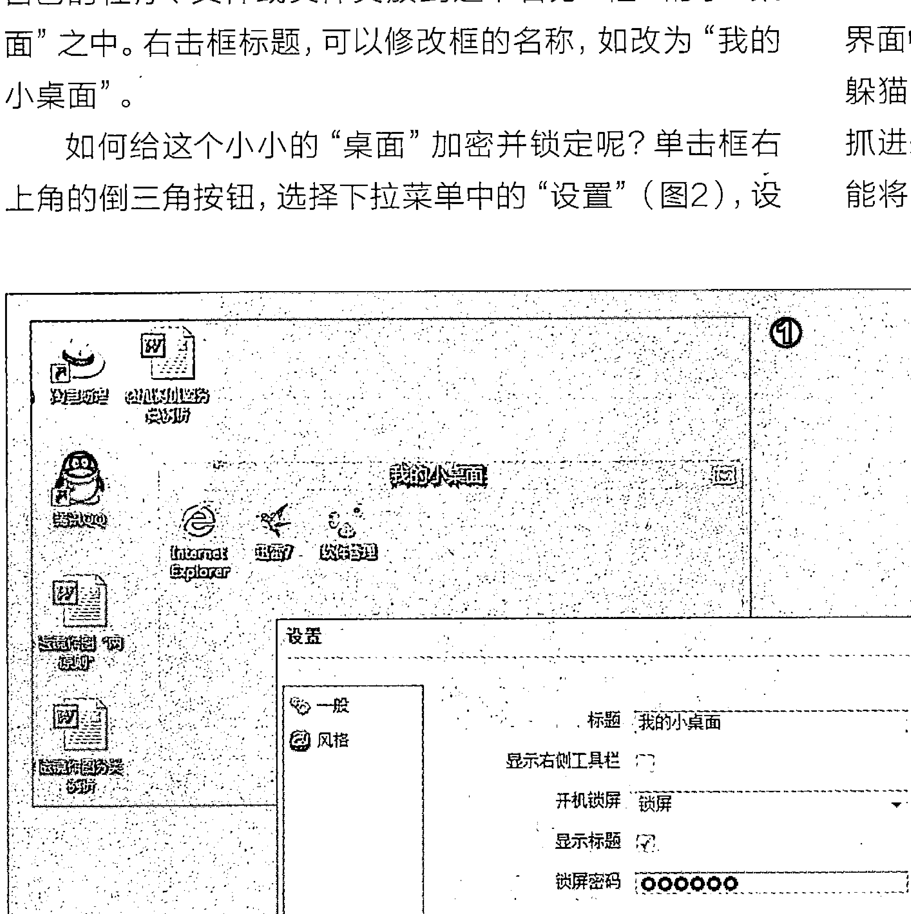

### 2. 窗口躲猫猫

若离开电脑一会儿，既不想关闭桌面上正在打开的程序窗口，又不想让别人看到，可以用软件“躲猫猫窗体管理”（下载地址：http://www.dwz.cn/ulqFe），把需要隐藏的窗口集中“抓捕”，然后实现隐藏。

软件运行后，单击被抓窗口使之激活，然后单击软件界面中的“抓”按钮，桌面上该窗口消失，表明它已被抓到躲猫猫窗口列表中（图4）。用同样的方法，可将其他窗口抓进来，在被抓窗口列表中，可以拖动它们改变位置，但不能将它们拖出该软件窗口范围。需要释放被抓窗口时，从窗口列表中选中它，然后单击“放”即可。

软件运行后，右击托盘中的软件图标，单击右键菜单中的nSpaces，打开nSpaces窗口（图5），从虚拟桌面预览窗口中选中需要加密的桌面后，再单击“密码”标签，输入密码，最后单击“保存”。

需要隐藏被抓窗口时，有多种方法。一是将鼠标移动到屏幕顶端时，软件会最小化，但没有隐藏，在任务栏中以记事本图标出现；二是将鼠标移动到屏幕的左上角时，软件隐藏，只有将鼠标移动到屏幕的左下角时，才能恢复。为防止他人通过此法打开，可以先在“密码”输入框中设置一个密码，这样在恢复窗口时，将弹窗要求输入密码，只有输入正确密码后才能恢复。

以后，我们进行带有私密性操作的程序或窗口时，右击托盘中的软件图标，打开“切换器”菜单，单击加锁标志的桌面，弹出窗口要求输入密码（图6），输入正确密码才能显示出该桌面。而离开电脑时，可以切换到没有加密的公用桌面。

和其他隐藏窗口的软件相比较，该软件操作方便，更重要的是，还可以给窗口加密，一旦有人误碰该软件，想打开窗口的话，没有正确的密码是行不通的。

我们可以通过右键菜单中的“切换器”来切换桌面，喜欢快捷键的用户，可以通过“Ctrl+Shift+→”、“Ctrl+Shift+←”依次切换桌面，还可以为特定的桌面指定专门的快捷键，在nSpaces窗口中，选中预览窗口中的桌面，单击“热键”。然后指定某个热键后，就可以通过热键直接切换到此桌面。

### 3. 加密虚拟桌面

用虚拟桌面，不但可以“拓展”屏幕空间，而且可以让不同的程序、文档窗口分门别类地放到不同的桌面上。对于私密桌面，我们可以用软件nSpaces（下载地址：http://www.dwz.cn/uIr1d）进行加密，从而不让其他人窥探到该桌面上的内容。

另外，软件默认虚拟出4个桌面，需要增加时，同样在nSpaces窗口中，单击行或列后面的“+”号即可增加出多个虚拟桌面（图7）。

## 理性购买 细情分析帮大忙 文 | 汪梦月

当人们上网购买一个数码产品之前，总会在对比了一些产品后，看完商品的官方评价，再仔细看看用户的正反两方面的评价，然后才决定是否购买。但是，看评价也是一件累人的事，如果看的评价数量少则起不到作用，看的多了又需要时间、费神费力。怎么办？有没有更好的办法？

借助于舆情分析工具可提高商品购买过程中评价分析的效率和科学性。我们以百度的舆情分析工具为例来说明舆情工具如何帮助我们解决实际购买参考问题。

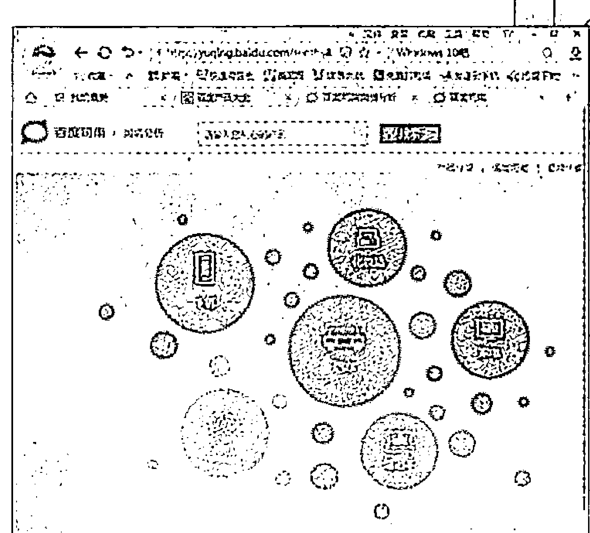

先登录分析工具站(http://yuqing.baidu.com/)，选择购买商品所在的类别，比如“相机”（图1）。这时画面会给出当前最热的品牌和型号的产品放射图，如果你关心的商品不在此图之列，可通过关键词进行搜索。鼠标光标放在放射图的任何一个圆饼上，会给出浮动提示，显示该产品的评论指数（图2）。点击某个具体产品，会显示该产品的各项指标的放射图。点击某项具体指标（如“噪点明显”），会给网上关于该项指标的具体评价列表（图3）。

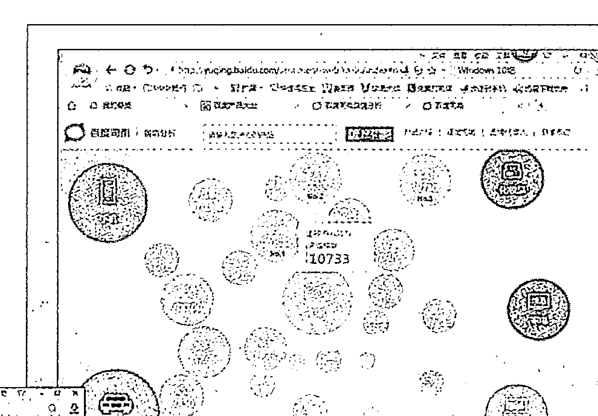

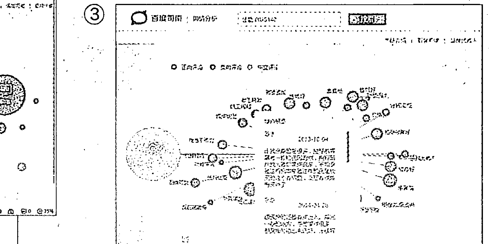

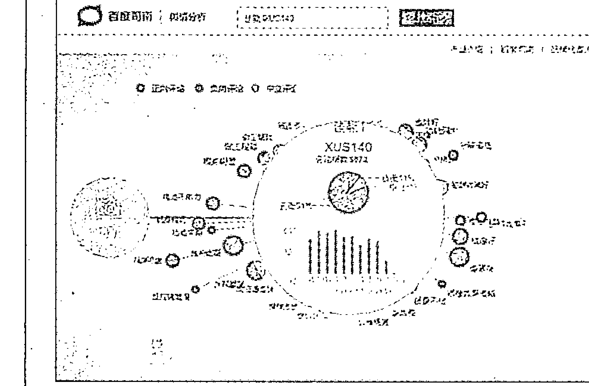

而当光标移动到该产品中间的大圆环上时，会显示对该产品的整体评价。比如正面评价和负面评价所占的百分比，还有每个月正负评价所占的百分比都用柱状图或圆饼图形象地显示出来，让人一目了然（图4）。产品放射图的好处是，你可以在这里集中查看自己所关心的某个项目的具体评价。比如，你关心电池是否给力，那么这里就会列出各大电商网站关于该产品电池是否给力的用户评价。这相当于它在顷刻间将这项性能从各大网站中帮你抽取出来了，如果靠用传统的方法在几个电商网站去看评价，需要的功力就可想而知了（图5）。

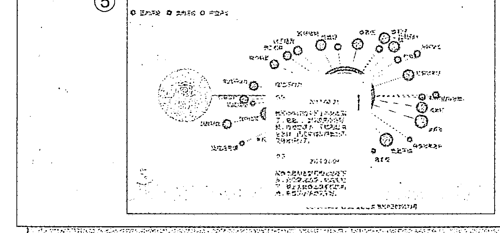

> 这些商品的信息都是采集自各大电商网站的一手资料，是大数据发挥作用的结果，不是任何一个单一的电商网站的数据可以相比的，所以更具有科学性。

## 应用软件 患患也要忽视 文 | 杜江松

关于电脑安全，人们往往更加重视Windows系统漏洞，因此对Windows更新补丁都不会小视。但对于日常使用的浏览器、输入法、程序图标、工具软件等，重视的程度往往不够。因此，人们常常会纳闷于为何每次规规矩矩地升级系统补丁，系统还是被感染了。其实，这些多是对应用软件的安全重视不够惹的祸。

### 1. 浏览器引擎被利用

搜索引擎是每个浏览器都必须具备的工具，一般每个浏览器都会默认关联一种搜索引擎。也正是这一普遍特性，让不少木马和恶意软件设计者将目标瞄准了浏览器搜索引擎这块“肥肉”。它们先将木马或恶意软件注入到某个浏览器的搜索引擎，然后将系统的默认浏览器改为使用该浏览器，这样用户理所当然就会在使用这些浏览器的同时中招。

为了避免这种情况的发生，我们需要选择一款带有安全防护的网络浏览器，然后再将默认浏览器进行锁定，最后再进行浏览器防修改的设置。这样，一旦有木马或恶意程序侵犯，无论从视觉提示上，还是从实际安全上都可以保证有自动防御的条件和主动处理的空间。

### 2. 输入法劫持藏木马

输入法是我们每天都要使用的工具，如果出现漏洞，后果可想而知。输入法漏洞具有很大的危害性。伪装成输入法程序的木马，常常会让人们中招，其原理是在系统中伪造一个或几个中文输入法，添加到系统输入法列表中，然后将这个伪造的输入法挂上木马并设置为系统的默认输入法，这样，启动了输入法就是启动了木马程序。而当你发现输入法不好用时，去手动选择你的输入法，但此时木马已经运行。

在这种情况下，通过注册表有关Keyboard Layout选项，可以查看到预加载的选项是指向一个与输入法不相干的木马模块。但对于普通用户来说，由于技术门槛较高，因此无法轻易获知这种情况的真面目，因此危险性极高。不过我们也可以通过安全工具来解决问题。

> 小提示
如果我们嫌手动查看修改设置或使用各种防御软件麻烦，也可以安装“360安全卫士”，并在其中开启相应的各种防护选项，这样就会在危险发生时自动拦截或做出相应提示。此外，也可以使用360杀毒软件的软件净化模块来杜绝捆绑软件的安装。

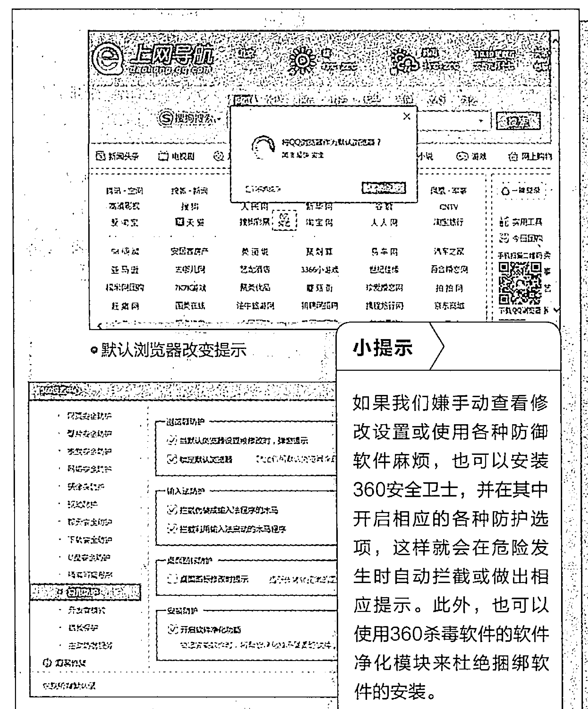

### 3. 快捷图标也有危险

桌面图标是大家每天都要见到的，这些图标也可能暗含着危险。如果恶意程序修改桌面或其他位置的程序快捷图标指向，运行了这些图标就是在运行恶意程序。要发现快捷图标是否被恶意程序劫持，可通过图标属性的程序指向来检查，也可以通过安全工具来自动检查。

> 火眼金睛
有关恶意程序如何利用桌面图标的技术，请参看本刊2014年第15期特别话题文章《桌面图标绑定程序运行》。

### 4. 安装软件包藏隐患

软件安装文件被污染是常有的事，或者被官方捆绑一些相关或不想干的插件，或者被第三方软件绑架后再捆绑一些不三不四的东西。如果我们不加分析和处理，一股脑地点下一步安装软件，就很可能给自己的系统种下一些麻烦和累赘。

我们可以通过安装专用的软件净化工具来拦截捆绑内容。例如，可以使用360捆绑软件净化器或Unchecky工具。这些工具均是以服务的方式运行，通过主动拦截，提示捆绑信息，主动去除插件勾选，杜绝不必要或恶意程序的运行。

## 《电脑爱好者》·2014下半年合订本 软网生活

## 局域网也玩“云同步” 文 | 倚楼

不少单位为了实行无纸化办公，会架设一台服务器来共享文件。后来随着云存储的出现，又通过云存储来共享文件。可是要想使用云存储服务的话，首先网络要能连接到互联网中，而有些单位的内网因为安保等原因，是不能连接到外网的。对于这类情况，可以通过架设局域网内的“云服务”来解决。

### 配置局域网内的“自同步”

首先下载安装最新版本的“自同步”客户端（下载地址: http://www.zisync.com），注意在新版Windows系统中，需要使用管理员权限进行安装才行。安装完成后会弹出一个设置向导，在“设备名称”中为自己的设备设置一个名称，主要用于和其他用户的设备进行区别。接着点击“下一步”，在“同步口令”中设置一个密码，它主要用于客户端程序的连接确认操作（图1）。继续点击“下一步”，分别设置“设备发现端口”、“同步服务端口”、“状态通知端口”等，通常情况下不建议大家对默认的端口进行修改。最后根据需要选择“开机自启动”项并点击“完成”即可。

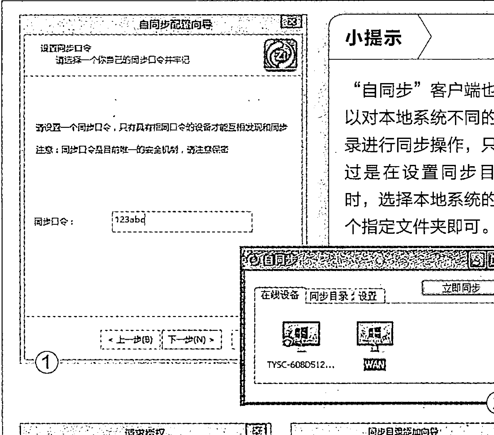

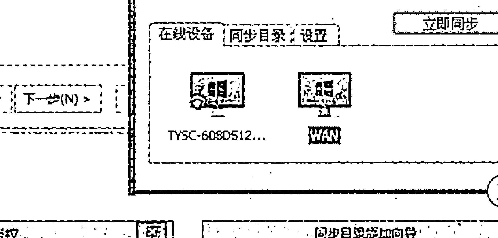

“自同步”客户端也可以对本地系统不同的目录进行同步操作，只不过是在设置同步目录时，选择本地系统的某个指定文件夹即可。

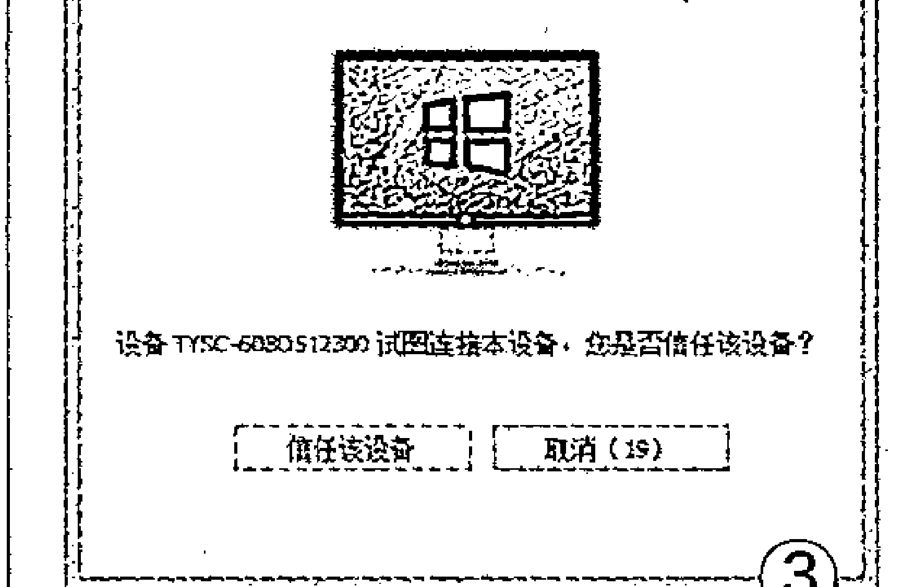

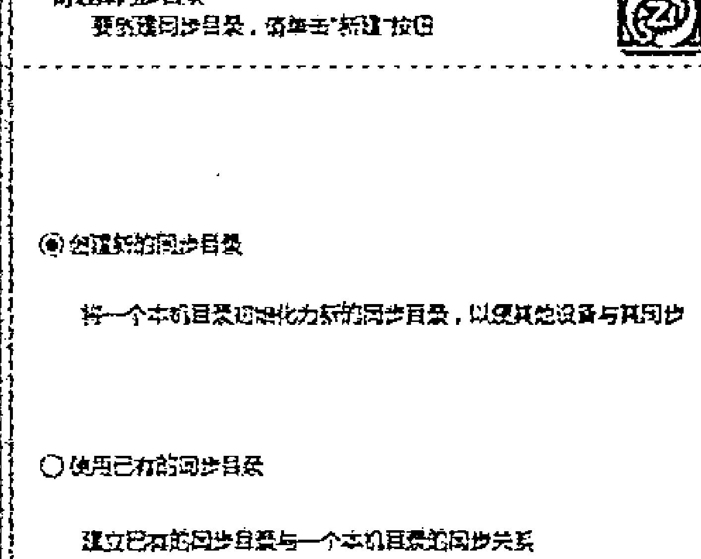

### 同步电脑建立“信任”

当“自同步”客户端配置完成后，就可以在系统托盘中看到它的图标，右击该图标，选择右键菜单中的“进入自同步”命令。在“在线设备”标签中，可以看到当前网络中所有已经安装“自同步”客户端的设备。通过设备名称即可辨识出其他用户，如果愿意和这个用户进行文件共享的话，那么就在设备名称上右击，从右键菜单中选择“添加信任”命令即可（图2）。这时客户端程序会向该设备的客户端发送一个请求信任的消息，接收到信息的用户点击消息框中的“信任该设备”后，两台设备的连接就建立起来了。

### 创建同步文件目录

既然不同设备之间的连接已经完成，那么接下来就是设置同步文件的目录了。首先点击“在线设备”旁边的“同步目录”标签，接着点击左下角的“添加”按钮来建立同步目录。在弹出的向导窗口中选择“使用已有的同步目录”项，然后点击“下一步”就可以看到当前网络中的所有设备（图4）。从设备列表中选择一个需要进行同步的设备，接着点击“创建同步目录”按钮，在弹出的磁盘列表中选择远程系统的同步文件夹。

继续点击“下一步”，在本地的磁盘列表中也选择一个同步文件夹，接下来在“同步目录”标签就可以看到刚刚建立的同步关系了（图5）。以后无论哪个文件夹中的文件有所变化，都会马上同步到另外的一个设备中。如果任意一方的用户不想再进行文件同步操作，那么在“同步目录”标签选中该同步关系后，点击“删除”按钮就可以结束它们之间的同步操作。

## 另类方法隐藏指定文件 文 | 万立夫

有时我们需要临时隐藏一些文件，但是去下载专业的软件又比较麻烦，这个时候应该怎么解决呢？其实信手拈来一些系统中常用的软件，如杀毒软件、压缩软件等，就可以快速实现对文件的隐藏。

### 妙用隔离区隐藏文件

杀毒软件可以说是很多用户的标准配置，但是有的用户可能还不知道，所有的杀毒软件都有一个名为“病毒隔离区”的模块。这样当杀毒软件检测到病毒木马时，就会将它们从原位置移动到隔离区里面，这样病毒文件就无法对系统进行破坏。而今天我们正是利用这个“病毒隔离区”来隐藏系统中的一些重要文件。

本例使用的杀毒软件是最新版本的NOD32（大家可以举一反三选用其他的软件）。首先双击系统托盘中的NOD32图标，在打开的窗口中选择左侧工具栏中的“工具”，接着点击右侧窗口中的“隔离区”命令（图1）。然后在“隔离”窗口的列表中右击，选择右键菜单中的“隔离”命令，这时将弹出一个文件浏览窗口，在“文件类型”列表中选择“所有文件”项。接着选择需要隐藏的文件，点击“打开”将它添加到隔离列表中，最后将原来的文件从原位置删除就可以了。这时有谁会想到在隔离区隐藏着文件呢？

由于病毒隔离区往往是一个特殊的文件夹目录，隐藏在其中的文件不但利用搜索软件无法查询到，而且即便是系统中毒也不会对这些文件进行破坏。以后当用户需要使用这些文件时，只需要在隔离列表中选择要查看的文件（图2），右击它，选择“恢复”命令，就可以将该文件还原到以前的存放位置了。当然通过“恢复至”命令，可以将文件恢复到用户指定的任何位置。

不过千万要注意，如果点击了“从隔离区中删除”命令，隐藏在其中的文件将被彻底删除掉，所以一定要自己当心。

### 文件压缩也能瞒天过海

有些用户不喜欢使用杀毒软件，而是喜欢在互联网里面裸奔，那么这个时候就只能改用其他的软件来隐藏了，比较适合的是日常工作中最常见的压缩软件。我们可以为隐私文件换一个马甲，让它以另外一个面目出现在人们面前。

首先准备一个用于掩饰隐私文件的文件，如我这里选择了一首MP3的音乐文件。接下来将音乐文件和隐私文件复制到同一个目录，选中两个文件后单击鼠标右键，选择菜单里面的“添加到压缩文件”命令。在弹出的设置参数窗口中，在“压缩文件格式”中选择“ZIP”项。接着在“压缩方式”列表中选择“存储”项。设置完成后点击“确定”，就可以进行文件的捆绑操作了（图3）。当然这个时候并没有完，最后还需要将压缩文件的后缀名修改为MP3。

人们常说“假作真时真亦假”，为了避免有些人运行这个MP3文件时播放器弹出错误的提示信息窗口，所以建议大家将MP3文件关联到可以播放压缩文件格式的播放器上，比如国内用户常用的Foobar 2000等（图4）。

以后当我们需要提取隐私文件时，在这个伪装的MP3文件上点击右键，在弹出菜单的“打开方式”里面选择WinRAR。然后在弹出的压缩软件窗口中，选择需要使用的隐私文件，再点击“解压到”按钮，就可以提取到指定的目录中了。

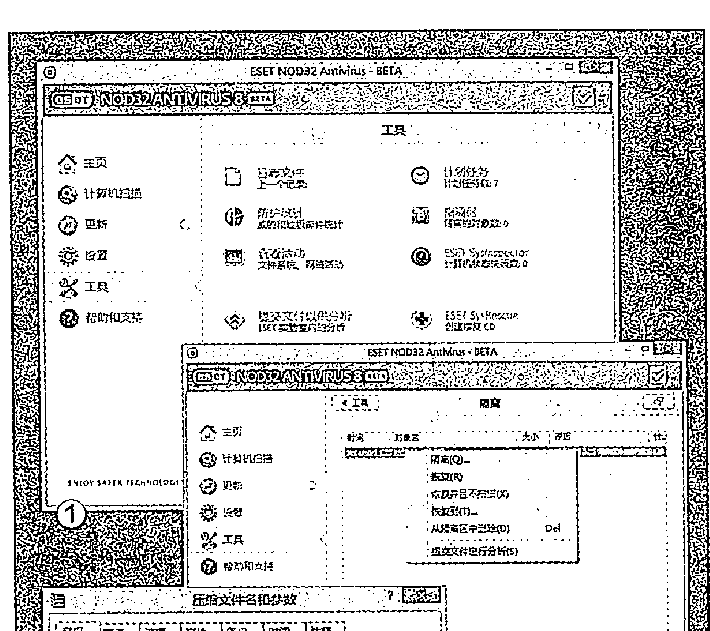

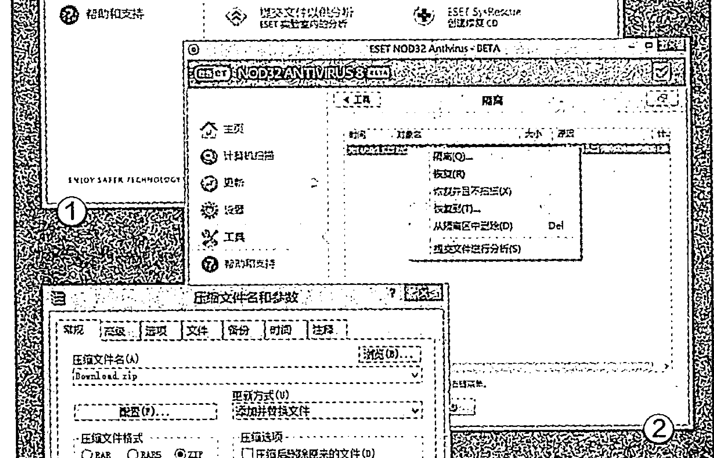


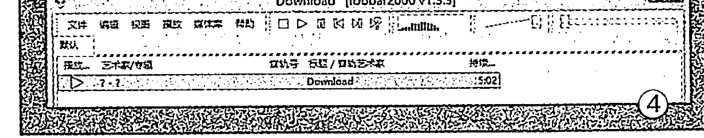

## 博客文章自动转发到微博

ifttt如同一个中间人一样，它通过接入很多网络服务的接口，将不同的网络服务连接贯通为一体。最近ifttt服务还开通了微博平台的接口，这样当我们在博客上发表文章后，它会自动转发到微博平台上，从而扩大博客文章的影响力。

### 获取博客RSS地址

要想让ifttt服务知道博客已经更新了内容，就需要它定时对博客网站进行检测，而检测的方法最好通过RSS订阅的方式来实现。首先打开任意浏览器，登录自己常去的软件博客。在右侧的功能栏中点击“文章RSS”链接，这时浏览器会自动跳转到一个新的页面。将这个页面的地址链接记录下来，它就是该博客的订阅地址了（图1）。将这个订阅地址记录下来，下面的操作中将会用到它。

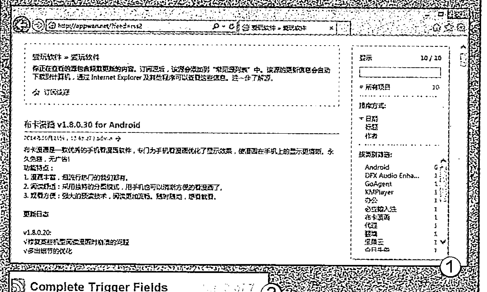

### 设置新的任务条件

接着打开一个新的浏览器标签，在地址栏中输入ifttt服务的网站地址（http://ifttt.com）。进入到网站的设置页中，点击蓝色的“Create a Recipe”按钮，从而开始创建一个全新的任务条件。首先在弹出的窗口中点击蓝色的“This”按钮，接下来在弹出的功能列表中选择“Feed”项。在随后出现的页面中点击“New feed item”按钮，再在弹出的“Feed URL”输入框中，设置刚刚记录下的博客订阅地址（图2）。设置完毕，点击“Create trigger”按钮，接下来需要设置规则的执行部分。

现在在弹出的网页中点击蓝色的“That”按钮，接着在弹出的列表中选择“Sina Weibo”项。由于是第一次使用新浪微博的接口，因此需要根据提示点击窗口中的“Activate”按钮。这时会弹出一个新浪微博账号的登录窗口，分别输入自己的新浪微博账号和密码。登录成功后将弹出一个询问窗口，点击“授权”同意将ifttt服务接入到自己的新浪微博。授权完成后返回到ifttt服务的任务设置页面，然后点击任务列表中的“Publish a new post”命令（图3）。

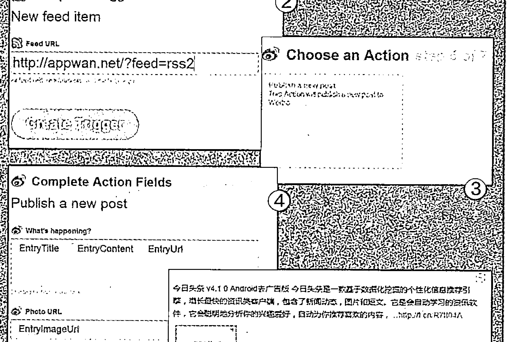

### 查看同步微博信息

这时ifttt服务会自动设置转发的内容参数，比如EntryTitle、EntryContent、EntryUrl参数就分别代表博客的标题、内容和链接，只需要点击“Create action”按钮就完成设置（图4）。最后ifttt服务会让用户进行检查，如果检查无误的话点击“Create Recipe”按钮进行确认即可。

到此为止，ifttt系统就会自动将博客文章转发到设定的微博账户上了，而且每15分钟会自动检测一次并自动进行转发。以后当网友登录到新浪微博后，就可以看到由ifttt服务转发的博客文章简介（图5）。点击微博文字后面的网页链接，即可打开这篇博客文章进行阅读。

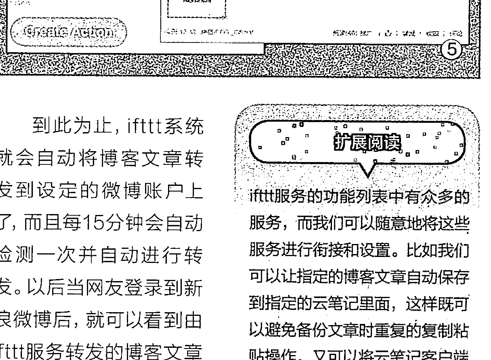

### 扩展阅读

ifttt服务的功能列表中有众多的服务，而我们可以随意地将这些服务进行衔接和设置。比如我们可以让指定的博客文章自动保存到指定的云笔记里面，这样既可以避免备份文章时重复的复制粘贴操作，又可以将云笔记客户端当作RSS阅读器使用。其实很多网友会在微博里面分享一些文件，而利用ifttt服务也可以将其自动转存到云存储里面。

## 自动分白数码录像与照片

文|陈颖

数码相机多具有拍摄照片和录像功能，录像和照片默认存在同一个文件夹中，一年下来，电脑中的数码文件夹可能会有百八十个。由于录像文件都比较大，与照片混杂不便于管理，如果希望将录像文件分离出来单独存放，有何快捷的方法？

### 1. 系统搜索的方法

假设照片文件夹为“F:\数码照片”，如果相机生成的视频文件格式为MP4，那么可以通过系统自身的功能来过滤所有的视频文件。

首先在Windows 8.1资源管理器中点击打开数码照片文件夹，接下来在窗口右上角的搜索框中输入“MP4”关键词。这时，系统会自动过滤出照片目录下的所有录像文件（图1）。用Ctrl+A全选这些文件，用Ctrl+X剪切，然后到一个新建的文件夹中执行Ctrl+V，即可将所有录像文件转移到新位置。这样，照片文件夹下就只留下照片文件了。

> 用这种方法过滤出的视频文件就全在一个文件夹中，无法保持原有目录结构。若要保持原有目录结构，可用下面的方法。

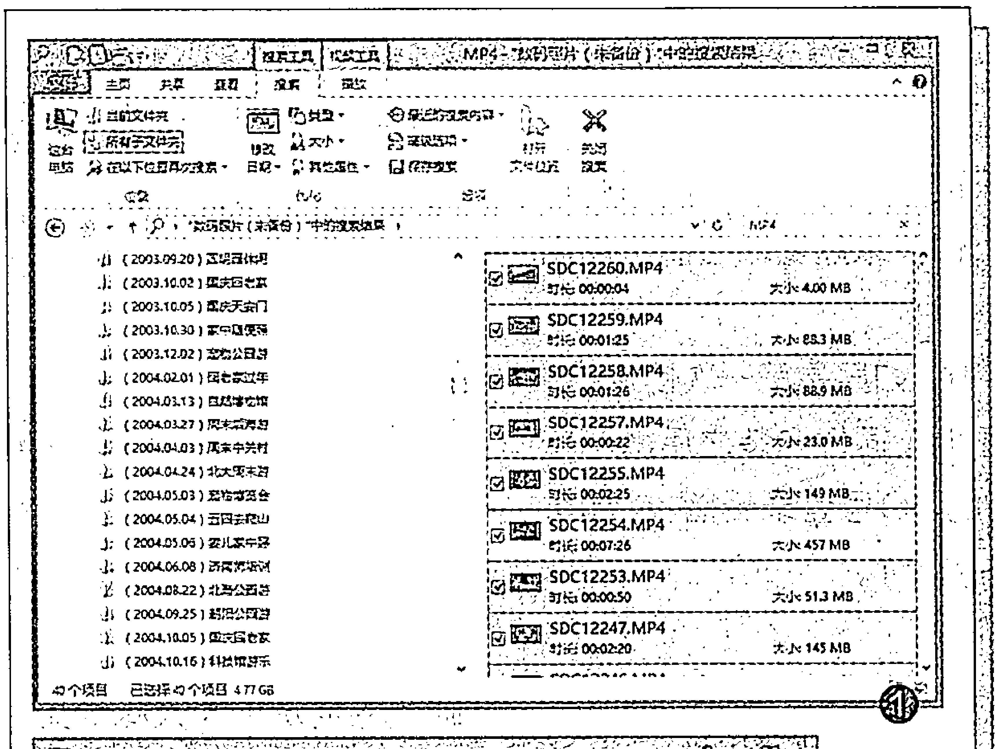

### 2. 压缩软件过滤法

为了保持视频文件的目录结构，我们可以借助于WinRAR等压缩软件来实现自动提取。

在“数码照片”文件夹上点击鼠标右键并选择“WinRAR→添加到压缩文件”

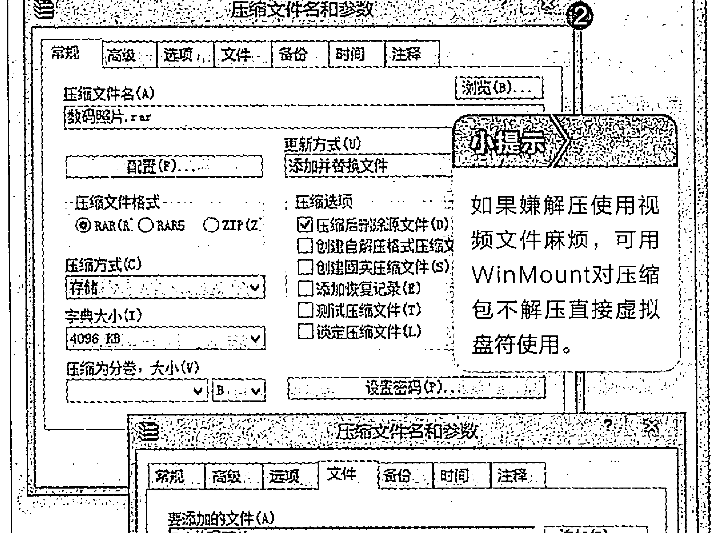

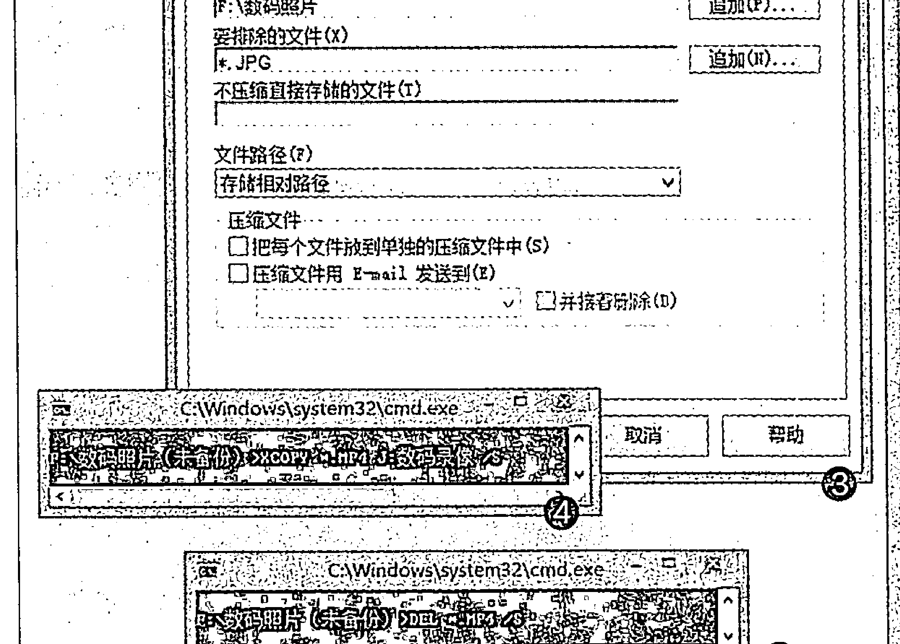

缩文件”，在“常规”选项卡下定义压缩包存储路径和文件名，压缩方式选择“存储”，并选中“压缩后删除源文件”（图2）。然后切换到“文件”选项卡，在“要排除的文件”中输入“*.JPG”（图3）。最后执行压缩，即可获得所有视频文件的压缩包。而原有的视频文件已被删除，只剩下照片文件。

> 如果嫌解压使用视频文件麻烦，可用WinMount对压缩包不解压直接虚拟盘符使用。

### 3. 内部命令转移法

还可以通过系统内部命令的方法快速完成这项任务。

先在要存放数码录像的盘（如J盘）中建立一个“数码录像”文件夹。转入数码照片原文件夹所在的命令提示符窗口，执行如下命令（图4）：

```
XCOPY *.MP4 J:数码录像 /S
```

这样就会自动将所有数码录像文件连同目录结构复制到目标文件夹中。复制工作完成后，执行如下命令将原文件及其子文件夹中的所有数码录像文件都删除掉（图5）：

```
DEL *.MP4 /S
```

这样，就实现了保持文件夹结构的同时，彻底分离数码录像和数码照片。


## “播”外之事一软搞定

文|鲁超

在PC中，借助任意一款常用的播放器就能播放几乎所有格式的音视频文件。然而，如果涉及到形式各异的平台和播放设备，面对播放这件事，不能播、占空间、太多余、不满足……还有许多麻烦事要做。于是，人们会借助这样那样的音视频工具来进行处理。实际上，用QQ影音播放器的“编外”功能，就可以搞定播放之外的所有事情。

> > 可用拖动批量文件到合并窗口的方法来添加文件，但要注意添加碎片文件的先后顺序，如果顺序弄错会造成合并文件前后不连贯或错位。

### 1. “云”中播放音视频

以往我们的影音文件多依赖本地硬盘，而今随着网速的加快和带宽性价比的提高，人们越来越多地习惯于使用“云”中的影音文件。在QQ影音中调用云播放模块，如果是第一次使用，需要根据提示安装云播放组件（图1）。插件安装之后即可登录云播放，这时只需用自己已有的QQ号登录云播放，即可播放此前用QQ旋风离线下载的影片了。

### 2. 提高硕鼠视频合并效率

用硕鼠下载工具下载的网络文件多是一些碎片文件，用其软件自身的合并功能效率极低，易拖慢系统。这时，改用QQ影音的合并工具可大大提高硕鼠下载的碎片文件的合并效率。启动QQ影音视频合并工具，点击“添加文件”加入要合并的碎片文件，定义合并后的文件名和文件保存的路径，点击“开始”按钮即可合并视频。如果对合并的视频有特别要求，点击“自定义参数”按钮，可对输出格式、分辨率、码率等进行个性化设置（图2）。

### 3. 小手机播放更多高清视频

目前下载的高清视频文件体积很大，一个电影几个GB很正常。如果在小手机屏幕上观看，用如此占比的文件实在没有必要。这时，可对文件进行适当压缩，在不影响清晰度的情况下大大减少文件对空间的占用，从而可在相同空间中拷入更多的文件。启动视频压缩功能组件，添加要压缩的文件，通过参数设置选择自己的移动设备支持的文件格式，然后选择适合于移动设备的分辨率，确定之后点击“开始”压缩（图3）。这样就可以获得体积与质量更加平衡的个性视频文件。

### 4. 解决设备对视频的不兼容

大家手头上的播放设备千差万别，不是每一种设备都能通吃所有视频文件格式。如果遇到格式不兼容的视频文件

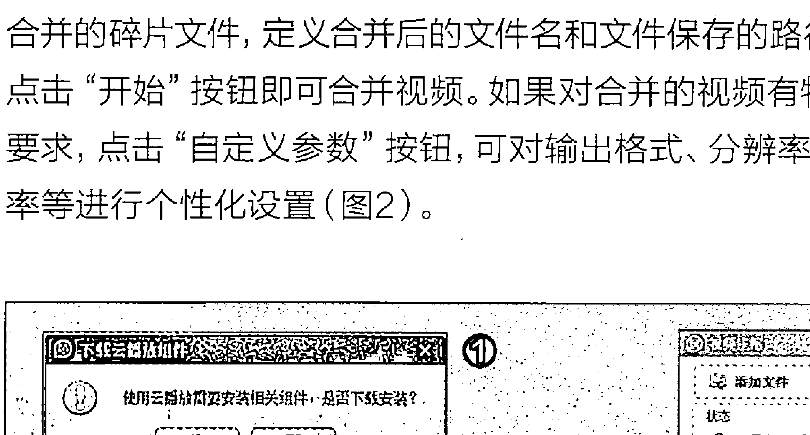

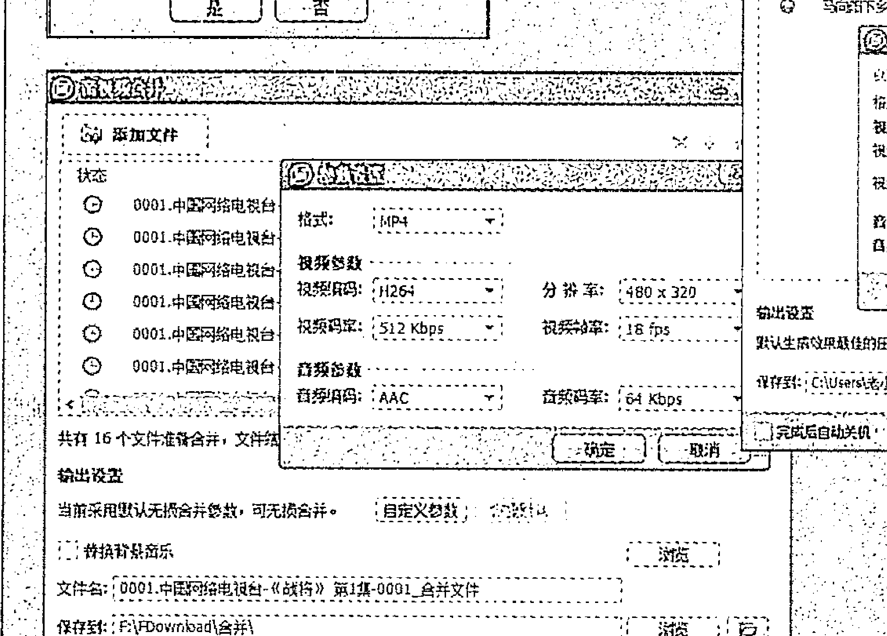

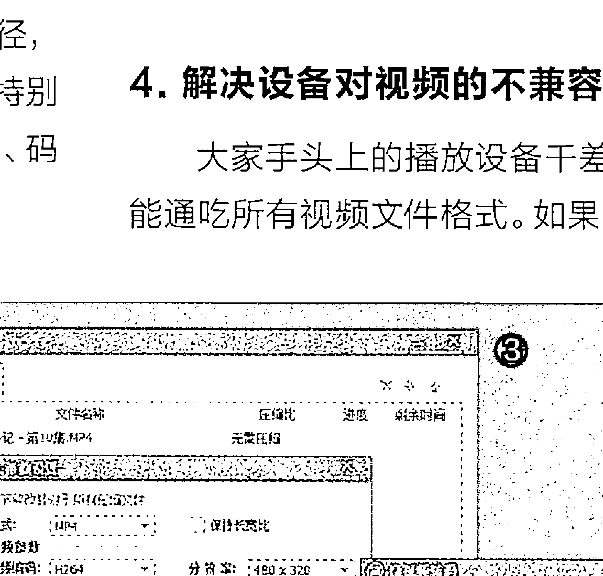

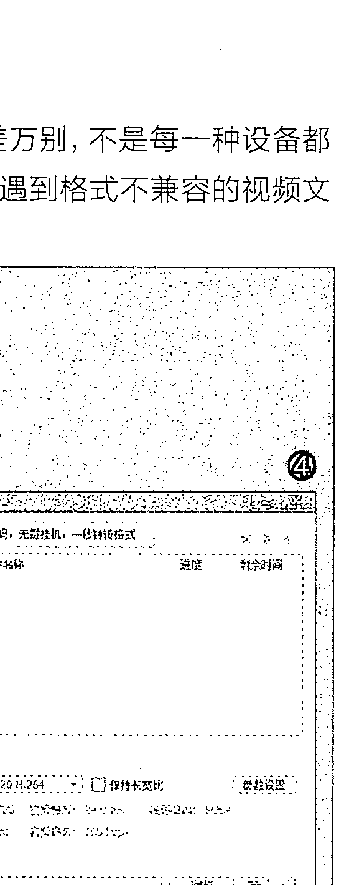


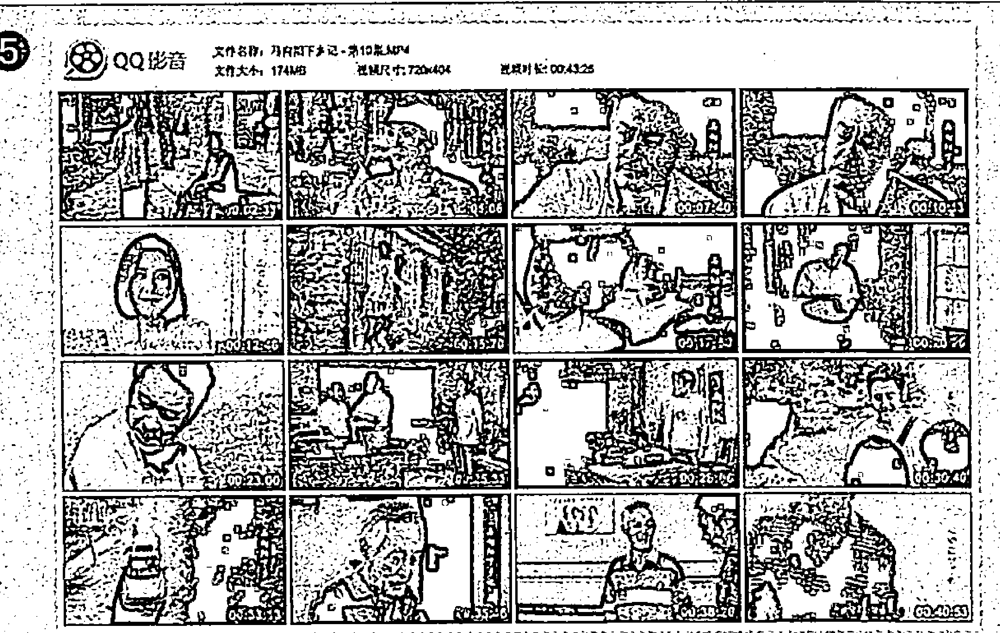

> **小提示**
>
> 如果要转换的文件比较大，转码所需时间可能会比较长。这时尽量充分利用QQ旋风的离线转码功能，实现关机快速转码，待转码完成后实现在线播放或下载播放。

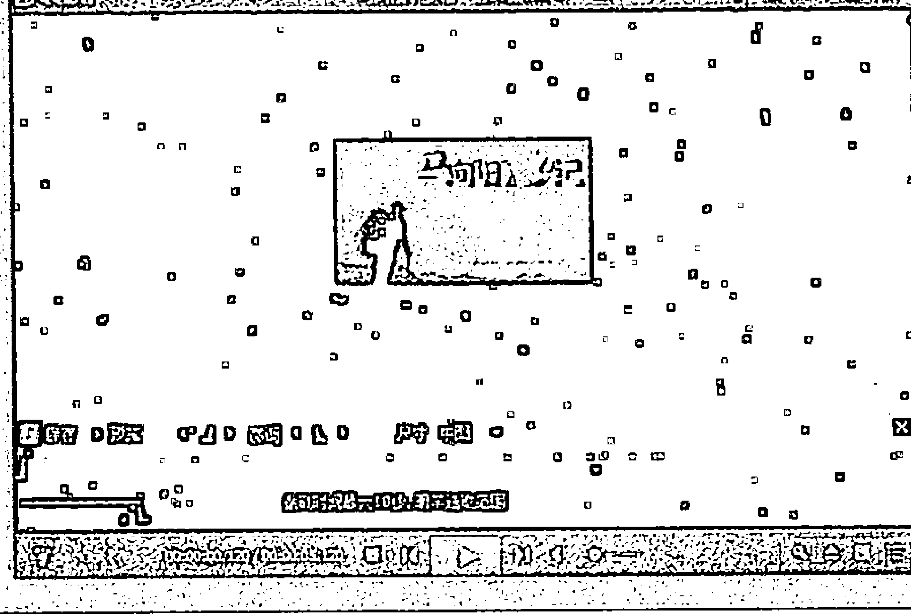

> **小提示**
>
> QQ影音APP声称具有全格式支持和无需转码的特点，所以通过PC QQ影音传输到苹果设备的视频直接用QQ影音APP即可播放。

件，可以借助于QQ影音的音视频转码器，进行针对于具体设备的转码。启动音视频转码工具，添加要转换的文件后选择自己所用的输出设备（如苹果iPhone 4），选择输出目录后点击“开始”按钮进行转码（图4）。

### 5. 轻松共享大视频精彩片段

我们常常需要将网上获得的电影或自拍长篇录像的片段发送给朋友共享，从中截取视频片段就成为必需。利用QQ影音的视频“截取”功能，用拖动指针的办法，在预览视频的同时定义要截取的片段的首尾位置，然后点击“保存”按钮即可获得所需视频片段（图5）。

### 6. 快速生成剧情连拍照片墙

有段好视频要介绍给好友，传送不方便，是不是将剧情做成照片墙发送更为便捷？在这种情况下，大可不必用抓图软件一张张地截取影视画面，只需利用QQ影音的“截取”功能，即可自动生成一张视频的照片墙（图6）。

> **小提示**
>
> 如果只需要正在播放的当前画面，那么只需用影音工具箱中的“截图”保存即可。截图有常用的几种格式可供选择。

### 7. 视频变动画其实也很容易

你是不是总看到QQ聊天窗口中有人发来的小视频，下载了一看原来是GIF格式文件，视频不短体积却很小？这是怎么生成的呢？其实，只需使用QQ影音播放器载入一段视频，然后利用其“动画”制作模块，定义截取动画的始末位置，点击“保存”按钮即可生成所需动画文件（图7）。

> **小技巧**
>
> QQ窗口中播放的动画一般画面不要求太大，为了减小体积，可通过转换窗口的“尺寸”定义功能，将尺寸定义为较小的画面，然后再保存。

### 8. 向“苹果”设备供“料”

大家知道，在iPhone或iPad上播放影音，传送文件不像其他平台那样灵活自由，一般需要iTunes管理软件来完成。我们可利用QQ影音来开辟一条新的影音传输方便途径。

在iPhone或iPad上安装iOS版的QQ影音应用并开启该应用，在电脑上开启QQ影音并启动影音工具箱中的“传输”模块，连接成功后，可直接将PC中的影音和字幕文件传送到苹果设备的QQ影音软件中，供这些设备用QQ影音应用来直接播放（图8）。

## 为孩子构建绿色健康桌面

文|洁森

鱼龙混杂的网络信息对儿童成长有不利的一面，我们有必要采取措施对孩子使用的电脑实行净化。然而，此前见到的防护软件要么是收费软件，要么质量不高。使用“儿童安全桌面”方案可有效地解决这些问题。

### 1. 净化浏览环境没商量

家长最担心的是儿童上网看到“儿童不宜”的内容。通过安装“儿童安全桌面”，用专用安全浏览器上网，所有不适合儿童浏览的内容都会被过滤掉，家长就可放心地将电脑交给儿童使用了。

下载并安装免费软件“儿童安全桌面”，安装时开启儿童上网防护功能（图1）。先设置家长密码，通过手机号获得验证码并配置环境，点击“立即开启”生效。

进入儿童桌面后，点击桌面上方工具条右侧的锁头按钮，可锁定儿童桌面，防止儿童退出该环境。之后就可以交给儿童使用了。

家长如果要使用电脑，只需点击工具条左侧的“桌面”图标，输入家长密码即可退出儿童桌面（图2）。

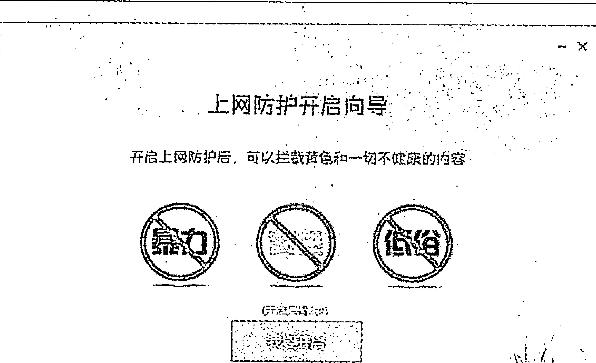

> 还可以通过“常规设置”页面，选中“定时启动眼睛卫士”选项，并设置启动间隔时间，实现每隔一定时间的眼睛保护。

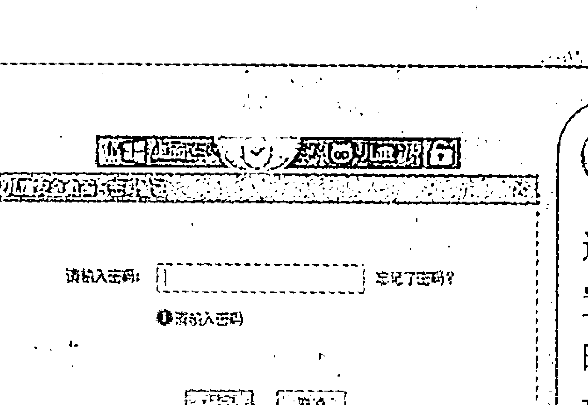

### 2. 淘选精品资源不用愁

网络资源虽然海量，但鱼龙混杂，为孩子挑选合适的内容是个问题。通过儿童安全桌面上的分类资源，可以很容易找到适合儿童学习和娱乐的内容，省去了家长为孩子挑选资源的时间。孩子只需根据自身需求，点击自己感兴趣的图标，即可进入学习和娱乐过程（图3）。

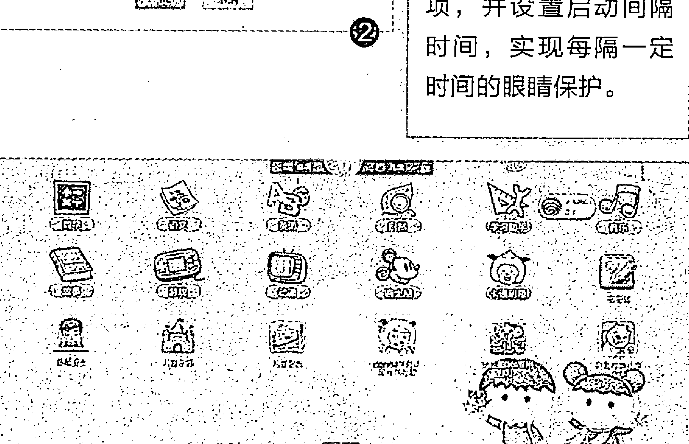

> 为充分保证安全，儿童安全上网环境默认使用360安全浏览器，并会关闭其他浏览器。

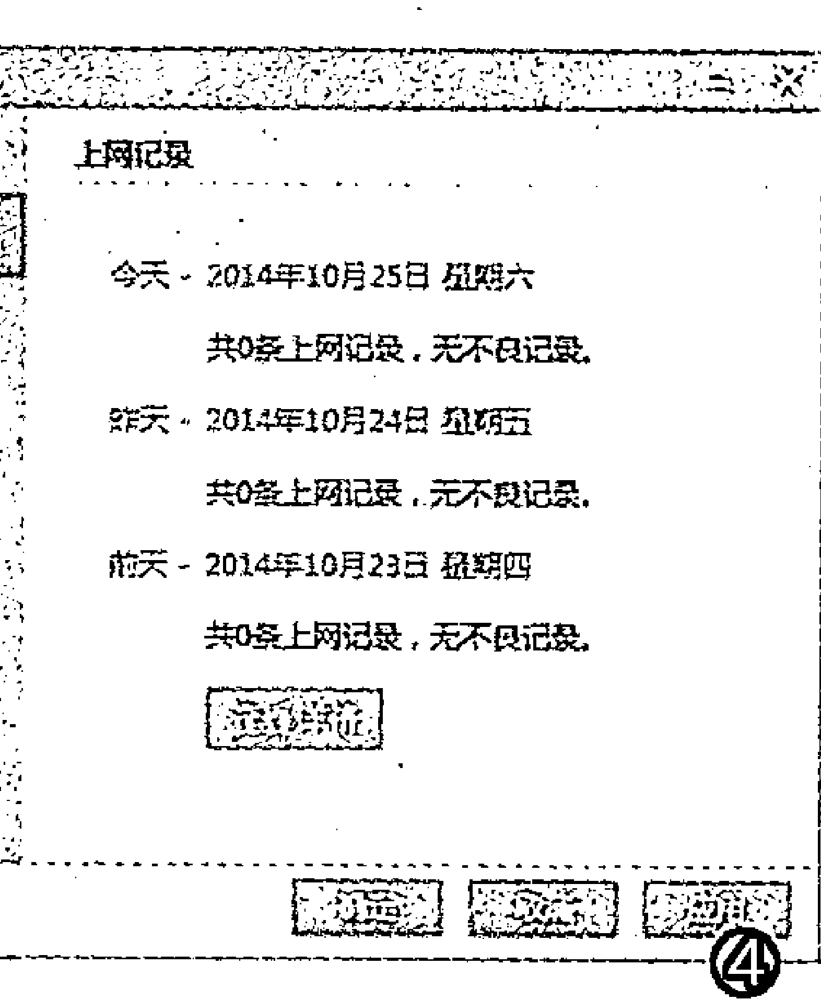

| 上网防护 | 上网记录 |
|----------|----------|
| 今天: 2014年10月25日 星期六 | 共0条上网记录，无不良记录。 |
| 昨天: 2014年10月24日 星期五 | 共0条上网记录，无不良记录。 |
| 前天: 2014年10月23日 星期四 | 共0条上网记录，无不良记录。 |

### 3. 节制使用电脑保健康

孩子沉迷于电脑上好玩的内容会上瘾，如何控制孩子使用电脑的时间是令家长们头疼的问题。使用安全桌面软件提供的控制功能，可有效地解决这个问题。

家长只需点击软件工具条上的“设置”按钮，进入软件设置中心，在“定时锁屏”一页中设置每次使用电脑的超限时间，应用之后，当儿童桌面开启的时间到达设定的限度，就会自动锁定屏幕不能操作。

### 4. 监控不良网站随时查

软件拦截了什么内容，孩子什么时间上了什么网站，这也是许多家长想知道的。家长可随时从软件后台查看这些内容。

输入家长密码进入软件设置中心“上网记录”窗口中，即可看到孩子最近的上网记录条数以及不良记录条数，点击“查看详情”还可以看到具体的访问内容。

> 开启儿童安全桌面后，请尽量不要使用360加速球等清理工具，有可能会使儿童安全限制失效。

## 手机变身超级数学达人

文|mcfans

数学一直是一门让许多学生头疼的科目，许多复杂的问题更是让广大学子百思不得其解。很多时候，我们可能有思路，但因为太过抽象或者能力不够而无法继续，而直接查阅答案的话又不能真正理解解题的思路。不过随着智能手机的发展，它上面开发出的许多应用能够很好地解决这一问题。下面要给大家介绍的一款MathStudio应用（Android及iOS平台均可），就是帮助解数学题的一款利器。

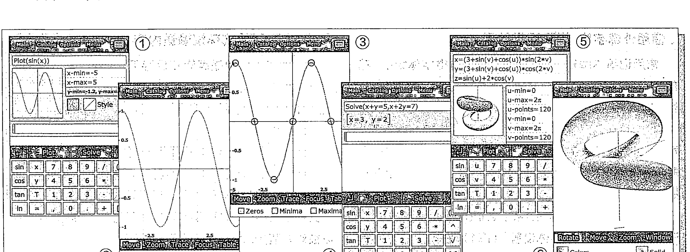

### 函数图轻松绘制

函数是数学中很有分量的一部分，也是高考的重点内容。在高考中，我们可以通过求导等方法来确定函数的大概样子，但在平时的练习中，尤其是一些复杂的问题，一个模糊的图像不利于我们思考。通过MathStudio，则即使是一些复杂的函数也可以被描绘得一清二楚。这里以“y=sinx”为例。首先在屏幕下方的键盘上选择sin，再选取自变量x，点击Plot（二维线画图函数），就能获得一个“y=sinx”的图像（图1）。点开这个图像（图2），分别在Zero、Maxima、Minima上选择（图3），MathStudio就能用不同的颜色将零点、最大值点、最小值点等特殊点分别标注出来。

### 快解复杂方程组

由于某些数据的原因，方程组可以变得很复杂，解方程组也就变得繁琐。而很多时候，方程组只是一个过程，为了保持思维的连贯性，我们需要迅速得到结果，但却难以实现。MathStudio可以帮我们轻松解决这一问题，既可以用它来解方程，也可以用它来进行化简。假设这里要解“x+y=5,x+2y=7”这个方程组，首先分别输入两个方程，中间一定要用英文逗号“,”隔开不能用空格，然后点击Solve（求解代数方程函数）。屏幕上瞬间就会显示出“x=3, y=2”（图4）。当然这只是一个简单例子，MathStudio完全可以帮我们计算出比这更加复杂的方程，大大降低我们的计算量，并且提高准确性。至于化简，只需要在逗号后面输入我们想要的主元，再点击Solve，这时获得的就是一个关于所设置主元的表达式。这一点在实际做题中非常有用。上述都是二元方程，其实对多元方程的解决方法是相同的，只不过记得要在中间用逗号隔开即可。

### 绘制数学3D立体图形

MathStudio中有功能极为强大的图形绘制工具，可以通过设置时间t来绘制一个动态图形，也可以通过空间中的参数方程绘制出立体图形，不过这些需要较高的数学功力。这里仅为大家介绍一个MathStudio自带的演示Demo。在这个Demo中，MathStudio展示了一个以u、v、z为参数的三元方程在空间坐标系中的图像，并用不同的颜色绘制（图5、图6）。MathStudio软件中有着大量的实例来展现许多函数的用法，通过百度也能搜索到很多教程，甚至有人绘制出了一个太阳系八大行星的动图，总之完全能满足大多数人的需要。

## 平淡记事本 用法不一般

文|柳超

记事本常被我们用来编辑一些简单的文字或代码。别小瞧这个简单的工具，它可是许多人爱不释手的“小伙伴”呢。如果能更好地利用这个系统工具，会让你的工作更得心应手。下面以Windows 8.1自带记事本为例，介绍几个用好记事本的特别方法。

### 1. 借用外部字体 增强视觉效果

常用记事本编辑文本，你是不是会觉得字体太小、花样太少，不如Word文档看起来更爽？那就借用外部字体资源来丰富你的编辑视觉感受吧！

假如有一个汉字库文件夹（如F:\汉仪字库），这里边存有上百款精美汉字库，希望将其中的一款或几款用在记事本当中，又不希望占用太多的系统磁盘空间，可用如下方法来实现。

首先打开Windows 8.1系统Windows\Fonts文件夹下，在窗口左侧选择“字体设置”（图1），在随后打开的字体设置窗口中选中“允许使用快捷方式安装字体（高级）”复选框（图2）。之后，我们可以将C盘之外的字库文件以快捷方式的形式安装到系统Fonts文件夹下。这样，既节省了系统盘空间，又能像平常那样使用更多款式的字体。

最后回到记事本中，通过“格式→字体”菜单命令，在字体设置窗口窗口中选择已经安装的来自于其他分区的字体，同时设置字体的显示大小（图3），确定之后，记事本的编辑环境就变成以大字体和特别形式的艺术字显示的视觉效果了（图4）。

### 2. 为非TXT格式环境输送内容

记事本不单单是编辑和保存TXT格式文件的工具，如果我们编辑的文件将用作其他用途，那么在保存时可以灵活处理文件格式。

当我们写的一份文档要提供给人以Word打开，那么在写完存盘时可选择“另存为→所有文件(*.*)”，然后输入“文件名.doc”，这样保存的文件就可以被对方直接以Word打开了。

如果要用记事本建立一个创建文件夹并进入文件夹的批处理，那么先在记事本编辑窗口输入一行“MD D:\我的备份”，回车后再输入“CD D:\我的备份”，文件写完后，执行“另存为→所有文件(*.*)”命令，文件名输入“创建并进入文件夹.BAT”，保存之后，执行该BAT文件，就会自动在D盘创建“我的备份”文件夹，并进入这个文件夹（图5）。

> > 小提示：文中介绍的部分方法也适用于流行的其他版本Windows中的记事本。读者可自行尝试其对自己所用版本的适用性。

### 3. 巧妙控制 打印也能出效果

记事本缺乏必要的排版功能，因而别指望用它来打印

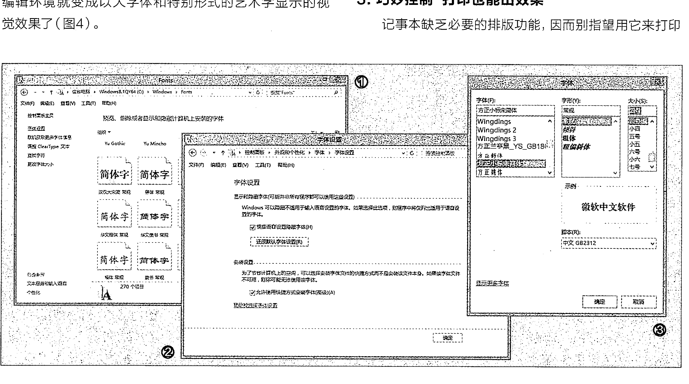

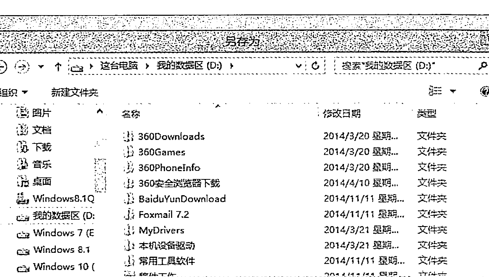

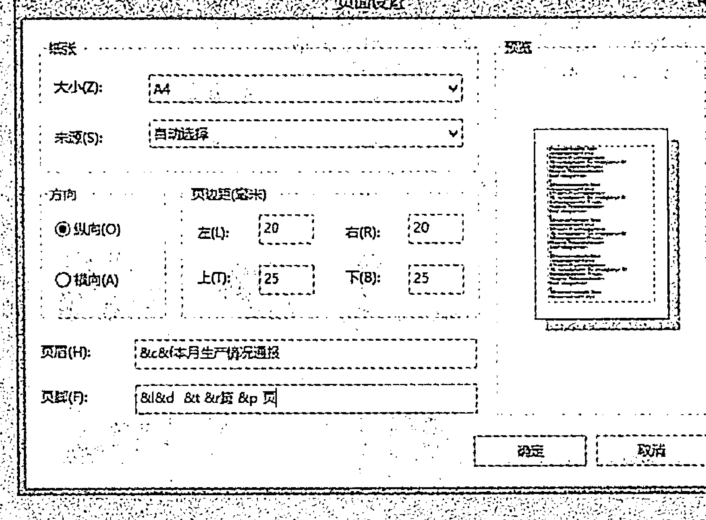

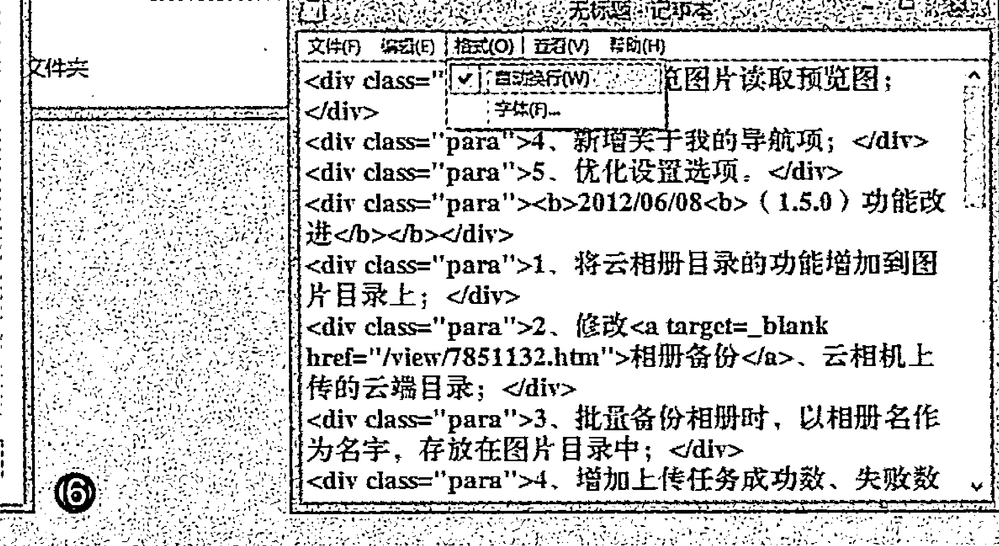

出多漂亮的版面。但这并不代表任由记事本的默认设置来摆布我们的打印结果，我们可以自行控制一些打印项目。

文本正文的打印效果受显示字体的影响和窗口是否换行的影响，所以设定显示的字体就是打印看到的字体。另外还与设定的纸张大小有关，如果纸张大小与页面显示宽度不匹配，打印前会有提示，进行调整后打印，否则会出现打印出版式自动换行、参差不齐的情况。

通过在打印控制的“页面设置”窗口下的“页眉”和“页脚”文本框中输入相应的控制符号，也可以实现应有的版面效果。例如：在页眉中输入“&c&f本月生产情况通报”则可以打印出居中的页眉标题文字“本月生产情况通报”；

在页脚输入“&l&d &t”可以在页脚左侧打印出日期和时间；在页脚输入“&r第 &p 页”则可以在页脚右侧打印出页码信息（图6）。其中的控制符&l、&c 或 &r表示向左、中、右对齐，&f表示标题引导，&d和&t分别表示日期和时间，&p表示插入页码。

我们如果能灵活将这些参数和我们自己设定的字符串信息组合在一起使用，那么打印符合要求的页面首位版式也不在话下。

### 4. “转到”功能失效的处理

通过快捷键Ctrl+G或（“编辑→转到”菜单命令），可以快速将光标定位到文本的某个行上。但是，有时你可能会发现，明明打开的文本包含有许多行的内容，但执行Ctrl+G没有任何反应，或者菜单中的这个“转到”命令却是灰色不可选状态。

这是因为，记事本是以程序行的方式来标记每一行的，这里所说的行就说一个物理回车换行，而不是依据窗口的改变而进行的那种换行。知道了这个道理，我们就去检查一下窗口换行设置。在“格式”菜单中将“自动换行”选择去掉（图7），这时的文章段落就会变成按自然段换行而不是依窗口边框来换行。然后再去执行“转到”命令，这时就会发现，可以顺利地快速转到需要的跳转设置窗口了。

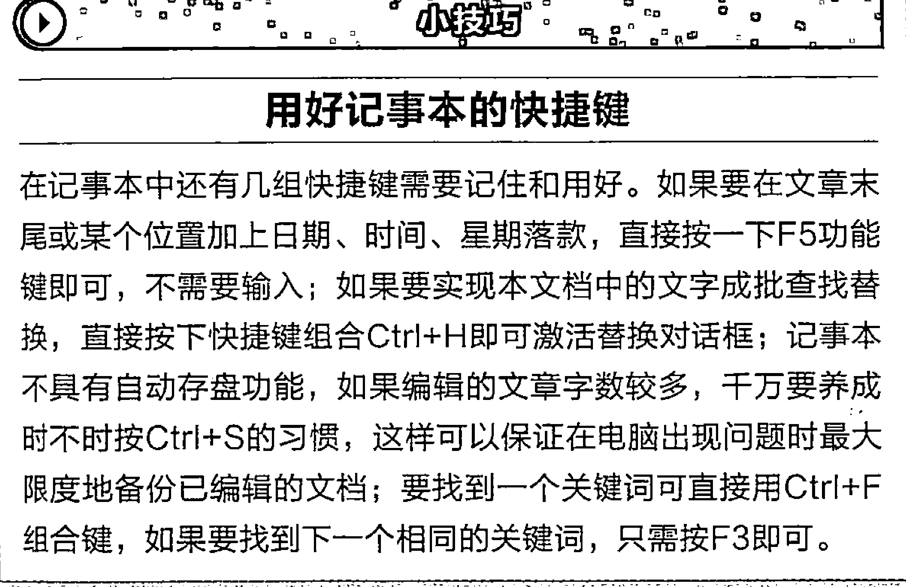

### 用好记事本的快捷键

在记事本中还有几组快捷键需要记住和用好。如果要在文章末尾或某个位置加上日期、时间、星期落款，直接按一下F5功能键即可，不需要输入；如果要实现本文档中的文字成批查找替换，直接按下快捷键组合Ctrl+H即可激活替换对话框；记事本不具有自动存盘功能，如果编辑的文章字数较多，千万要养成时不时按Ctrl+S的习惯，这样可以保证在电脑出现问题时最大限度地备份已编辑的文档；要找到一个关键词可直接用Ctrl+F组合键，如果要找到下一个相同的关键词，只需按F3即可。

## 快速拿下微软官方分类壁纸

文 | 白璐

微软官方网站桌面壁纸频道提供摄影、绘画艺术大师和社区网友倾情奉献的精美作品。面对种类繁多的大量精美作品，在网上挑选翻来翻去也比较费时，想不想将其一股脑儿地下载到电脑中使用呢？如何快速分类下载，在电脑中得到一个分类壁纸库？

### 1. 获取类别 自动创建文件夹

在目标盘（如D盘）的Downloads文件中建立文件夹“Windows壁纸官方下载”，在该文件夹下建文本文件“Windows壁纸类别.TXT”。到微软壁纸官方主页(http://www.dwz.cn/vQNWC)复制壁纸类别名到以上文本文件中，将类别名以半角空格分隔，最后在类别列表的最前端输入MD并加上一个半角空格，然后保存文件（图1）。

将上述TXT文件的扩展名改为BAT，双击执行这个文件，会在“Windows壁纸官方下载”文件夹下生成壁纸分类文件夹。

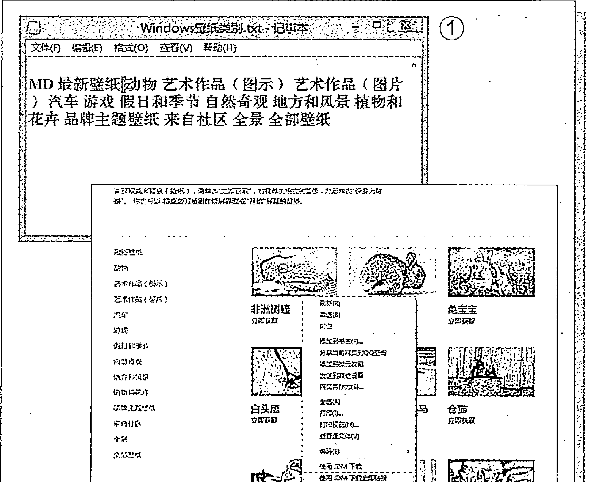

### 2. 过滤下载 壁纸按类一锅端

安装IDM下载工具，并设置该工具对当前所用浏览器有效监视。在浏览器中打开微软官方壁纸主页，点击左侧壁纸分类目录，切换到其中一个类别（如“最新壁纸”），在右侧窗格栏中点击鼠标右键，从菜单中选取“使用IDM下载全部链接”（图2）。

在弹出的IDM下载设置对话窗中，选中“隐藏HTML网页”、“隐藏该网页上的图片”、“隐藏重复文件”3个选项，然后点击“全部选择”按钮，这样就在自动排除网页上无关的HTML链接和图片链接的前提下，将网页上所有连接背景图片的文件作为下载对象选中。在左下角通过“浏览”按钮确定所有图片文件的下载位置“最新壁纸”文件夹，点击“确定”按钮（图3）。随后在右下角弹出一个队列确认对话框，选中“开始执行队列”复选框，然后点击“确定”按钮即可开始下载。

用同样的方法，将各个类别的图片添加到相应的下载文件夹中，这些类别的图片就会被自动下载到对应的文件中。这样，就可以获得以分类文件夹存放的微软桌面背景图片。

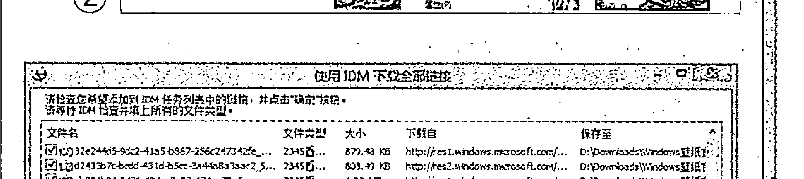

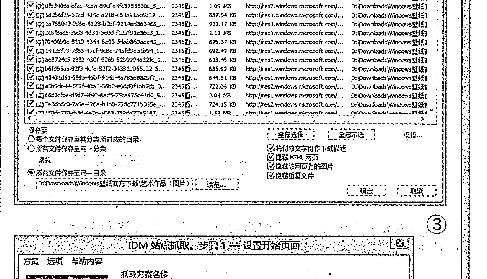

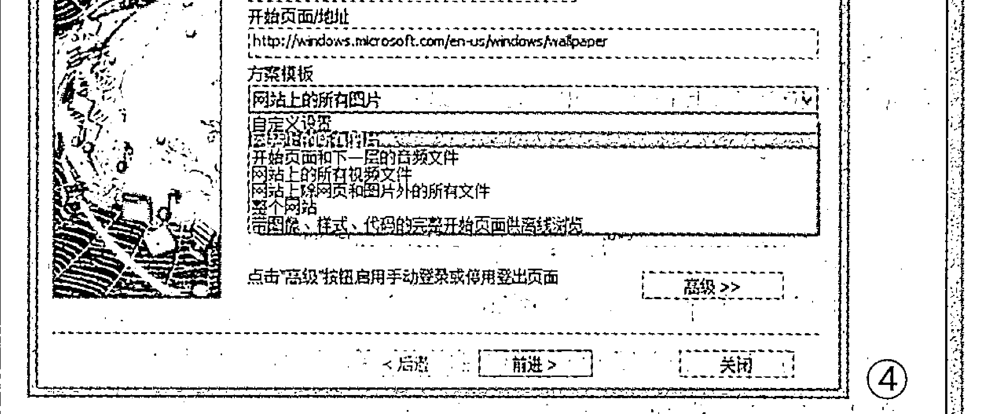

> 用网站抓取功能也可以实现同样的任务，不过抓取后的目录图片也需适当整理。IDM软件也具有网站抓取功能，只需建立一个抓取工程，给出主地址，设定方案模板或抓取方法，然后就可进行抓取了（图4）。

## 网银保安 借用游戏保险箱

文 | 吴昊

在360安全系列软件中，有一款推广游戏和保护游戏的工具“360游戏保险箱”，对于不玩游戏的人按理说这个软件没啥用，殊不知，用它来保护通讯软件和网上购物、网银交易的安全，也是一个不错的选择。

大家知道，网上交易使用的最大隐患就是误入钓鱼网址，而判断钓鱼网址单靠肉眼是很难把关的，一不小心因看错0与O、1与I的疏忽就会误入歧途，招来损失。因此，各大银行纷纷推出安全类工具为网银保驾护航。但如果一个人拥有许多网上购物账号和网银之后，电脑中可能就要安装一大堆此类工具。其实，借助360游戏保险箱不需要安装众多保安工具，也能防止网络钓鱼，实现网络交易的安全(图1)。

### 1. 添加安全保护

下载最新版的游戏保险箱（下载地址：http://www.dwz.cn/vQU9j），安装后会自动运行在系统托盘上。

### 添加网聊软件保护

双击系统托盘图标启动程序，点击“保护应用”标签，添QQ、飞信等即时通信软件（图2）。点击“添加应用”按钮后，可选择以自动或手动两种方式添加（图3），自动添加会扫描系统安装的所有应用并自动找出保护对象，而手动添加需要指定应用程序的主文件。

### 添加网银购物保护

点击“网银购物”标签，添加购物网站或网络银行的快捷方式到保护列表中（图4）。点击“添加银行”按钮后，会列出常见网银、常见购物网站的快捷方式图标，共有3个页面可选（图5）。点击自己所需即可添加到保护列表中，已选图标上会标示红字“已经添加”。

### 2. 进行安全交易

通讯软件、网购、网银链接添加之后，以后要聊天或交易，就不用开启浏览器搜索或输入网址，也不用直接点桌面快捷方式了（注：桌面快捷方式有时会被黑客篡改利用，因此也不靠谱）。只需进入游戏保险箱的保护列表中，点击相应的聊天软件、网银或购物网站图标，即可登录官方网站了。

> 小提示
杜绝被钓鱼，除了用上面的游戏保险箱外，还有另一个办法——在360安全浏览器中启用网银轻应用，也可以实现安全交易保护。前者用软件为桥梁，后者则以浏览器为桥梁，作用相同。

> 小技巧
自动设置
为省却手工设置的麻烦，对于已经安装的网银或聊天软件，可通过软件设置窗口开启“程序开启前进行智能扫描”选项，进行自动扫描添加。


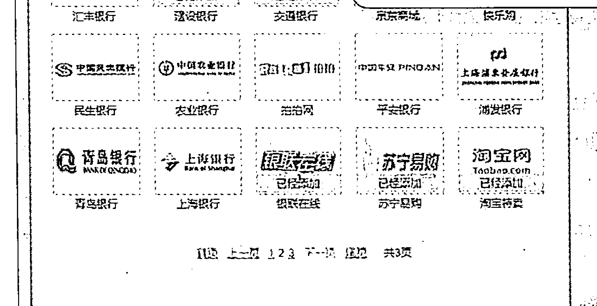


## 无损音乐的快速下载

文 | 阿立

虽然现在很多网站都提供音乐下载服务，但是下载的音乐文件音质相对较差，如果用户想要下载高音质音乐文件时，就必须花钱升级为会员才可以。那么还有没有什么巧妙的方法，可以快速下载到自己想要的高清音乐呢？

### 网盘里面淘宝

现在很多用户通过网盘分享文件，音乐当然是其中重要的一部分。因此通过对知名网盘进行搜索，也许可以找到自己喜欢的音乐文件。首先通过浏览器打开一个网盘搜索页面(http://www.pansou.com)，在搜索框中输入音乐名称以及要求的格式，比如“山丘320k”或者“山丘 ape”等。然后点击“盘搜一下”按钮，这样就可以在国内的各大网盘中进行搜索了。当搜索结果出来后根据介绍进行选择，从而下载到高质量的无损音乐(图1)。

### 音乐间谍搜索高清音乐

虽然通过网盘可以淘到不少好东西，但是由于这些文件往往是网友分享的，因此并不能保证所有需要的文件都可以找到。这里我们就需要借助于“音乐间谍”这款软件，它可以绕过百度音乐、虾米音乐、QQ音乐等音乐网站的限制，从而下载到高音质的无损音乐文件。

需要特别说明的是，“音乐间谍”的运行需要.NET Framework框架的支持才可以，而现在较新的系统都默认安装了.NET Framework框架，只是默认安装的版本不尽相同而已，所以用户需要根据系统的不同来运行不同的“音乐间谍”软件版本。比如Windows 7的用户就选择MusicSpy_NET35，而Windows 8的用户就选择MusicSpy_NET40。软件运行后首先弹出一个设置窗口，根据要求分别设置“下载路径”、“默认搜索”和“下载音质”等选项，设置完毕点击“保存设置”按钮(图2)。

接下来在弹出的“音乐间谍”窗口的上方，输入需要下载音乐的名称或者歌手的名称，点击搜索按钮就可以在指定的网站进行查找操作了。当查询到相应的音乐文件后，会通过列表的形式显示出来，选中音乐并点击鼠标右键，就可以通过其中的命令进行试听，满意的话，再点击“下载无损”命令开始下载。在默认的网站中没有找到喜欢的音乐，那么点击窗口上方的“下载”按钮，这时会在窗口右侧出现所有支持的音乐网站名称，重新选择网站进行搜索即可(图3)。

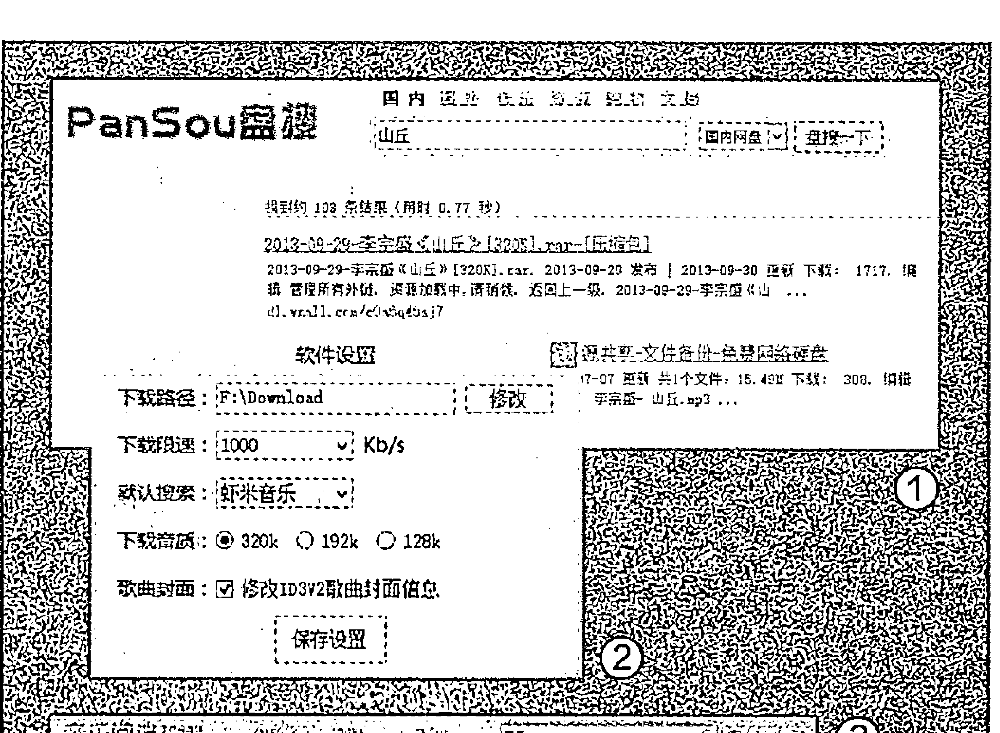

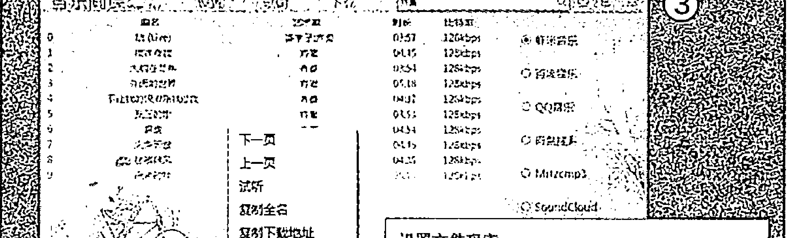

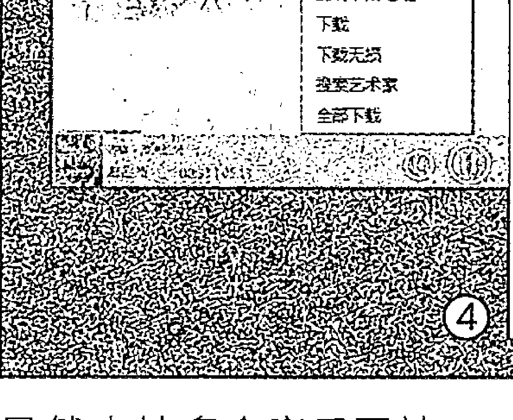

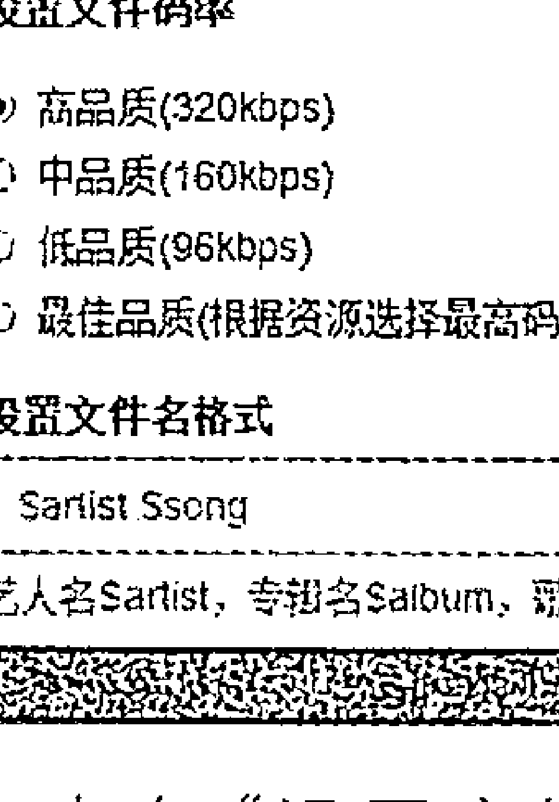

### 网易音乐照样下载

“音乐间谍”这款软件虽然支持多个音乐网站，但是却无法支持“网易云音乐”这个网站。如果用户经常在这个网站试听的话，那么通过一个浏览器扩展就可以解决，但是要求用户使用的是谷歌或其衍生浏览器(如360、百度等)。

首先访问谷歌应用市场，安装一款名为“网易云音乐下载插件”的应用扩展。安装完成后会要求用户选择文件码率，通常情况下选择“高品质(320kbps)”项。接下来在“设置文件名格式”中设置下载音乐的保存格式，比如输入“$artist $song”就代表“歌手 音乐名称”这样的格式，设置完毕点击“保存”按钮(图4)。然后通过浏览器登录“网易云音乐”网站(http://music.163.com)，通过右上角的搜索框查找喜欢的音乐，你会发现在音乐名称的下面多了一个“下载”按钮。接下来该怎么做，就不需要再说了吧。

## 时光倒流 微博还是旧的好

文 | 倚楼

最近新浪微博的界面升级到全新的V6样式，虽然新的V6样式看上去很炫很漂亮，但是很多用户在使用时感觉很不习惯，而官方又没有提供退回原版本的功能。下面的两种非官方方法，可助你时光倒流，回到好用的旧版微博上。

### 巧用CSS文件还原样式

既然是修改网页的内容样式，那么有一个最简单也是最传统的方法，就是使用CSS样式文件对加载的网页内容重新进行调节。不过要想做到这一点，无论是谷歌浏览器还是火狐浏览器，都需要安装一个名为Stylish的扩展。这里以火狐浏览器为例，首先点击“工具”菜单中的“附加组件”命令，在弹出的窗口中选择左侧列表中的“获取附加组件”项，再在窗口的左上角输入关键词“Stylish”来搜索。搜索到之后点击该扩展名称后的“安装”按钮进行安装，安装完毕根据提示重新启动浏览器即可。

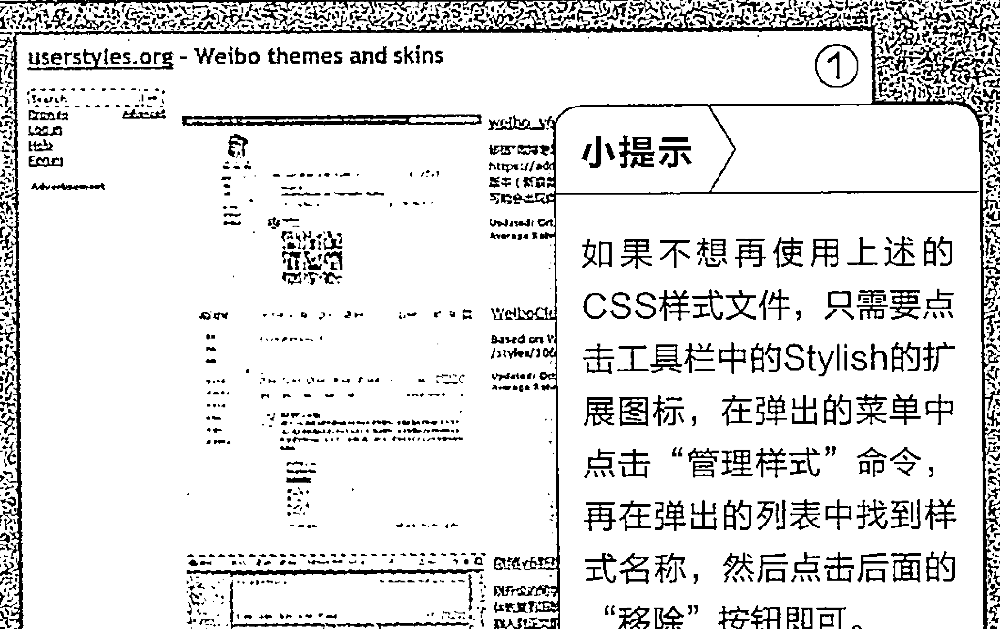

> **小提示**
如果不想再使用上述的CSS样式文件，只需要点击工具栏中的Stylish的扩展图标，在弹出的菜单中点击“管理样式”命令，再在弹出的列表中找到样式名称，然后点击后面的“移除”按钮即可。

接下来进入自己的新浪微博首页，点击工具栏中Stylish的扩展图标。在弹出的菜单中点击“查找适合此网站的样式”命令（图1）。这样浏览器就会自动跳转到http://www.userstyles.org网站，搜索查询和新浪微博相关的CSS样式文件。最后通过搜索结果的样式介绍，寻找一个自己比较满意的CSS样式文件，点击该链接后在弹出的网页点击“Install with Stylish”按钮（图2）。

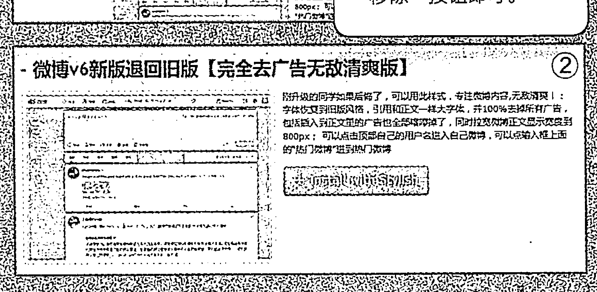

然后在弹出的“安装用户样式”窗口点击“安装”按钮，就可以完成这个CSS样式文件的安装操作了。重新返回新浪微博的首页并进行刷新，就可以看到页面返回到以前的版面样式啦。

### 利用扩展轻松解决问题

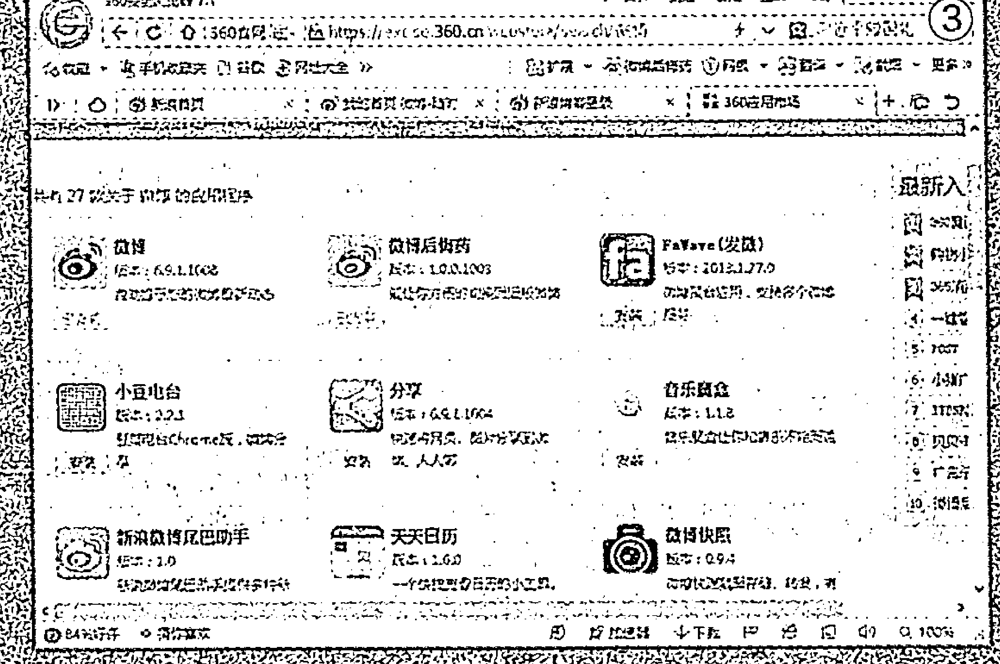

当然并不是所有的用户都使用谷歌或火狐浏览器，自然无法通过Stylish扩展来加载CSS样式文件。不过好在现在很多浏览器都是谷歌浏览器的衍生版，这样利用一款功能扩展就可以轻松地解决。以360安全浏览器为例，运行它之后，点击工具栏中的“扩展”按钮，在弹出的对话框点击“更多扩展”按钮。接着在360的应用市场中搜索一款名为“微博后悔药”的扩展，找到以后点击下面的“安装”按钮，然后在提示窗口点击“添加”按钮完成扩展的安装（图3）。


> **小提示**
如果想要重新切换到新版的微博样式，只需要按照提示框的说明重新点击一下“微博后悔药”扩展，然后刷新一下微博页面就可以了。

接下来进入到自己的新浪微博首页，点击一下刚刚安装好的“微博后悔药”扩展。这时系统托盘处会弹出一个提示，说明已经换成了旧版本的微博样式，再点击浏览器的刷新按钮就可以看到老版本的微博样式回来啦（图4）。

## 另类重装 大型软件快速引用

文 | 豪督

重装并使用大型软件，由于涉及文件数较多，根据Windows软件安装过程的特点，需要先解开安装包文件，然后将许多单一的文件复制到临时的安装目录中，最后才进行安装。由于Windows同时处理大批文件和目录的能力相对较弱，这样，如果一款大型软件有成千上万个文件、数百个文件夹时，电脑配置再高，安装进度也会显得相对比较缓慢。有过安装Office办公套装、VC开发工具的你一定会有此体会。那么，如果经常需要重装测试大型软件，有什么办法能更快速地实现重装与使用呢？

### 1. 虚拟安装 另谋新路

**准备大型软件安装包**

如果大型软件安装文件载体为光盘，可使用软碟通或WinISO工具将安装盘制作成一个ISO光盘映像文件。以使用UltraISO为例，只需从制作光盘映像界面中选择光盘所在的光驱，然后给出映像文件所在的保存路径和文件名，点击“制作”即可完成ISO文件的生成（图1）。如果是直接从网上下载的ISO文件，则可以免去如上所述的制作过程，直接将ISO保存在硬盘中即可。如果下载的安装文件为RAR或ZIP格式的压缩包文件，也可以不转换为ISO格式，直接将压缩文件保留备用。以上文件安装包，最好存储在用来备份数据的专用分区中，以备日后安装或修复软件时使用，也可省去重新下载、打包和复制的麻烦。

**创建目标虚拟文件盘**

首先在电脑中安装文件压缩和驱动器虚拟软件WinMount（下载地址：http://cn.winmount.com/）。软件有32位和64位两种版本可选，请根据自己所用操作系统的版本选择安装。

用WinMount创建一个WMT格式的虚拟盘（如M:盘），专门用来将大型软件安装到此盘，虚拟盘将以一个WMT扩展名的磁盘文件存在（图2）。

**创建虚拟安装源盘**

之后到存放ISO安装包或RAR、ZIP压缩安装包的分区中找到该大型软件的安装包，右键点击并选择WinMount命令“挂载至…”（图3），将压缩包虚拟为一个新的虚拟盘（如W:盘）（图4）。

打开W:盘，寻找SETUP安装文件（或能够启动该软件安装程序的其他安装文件），执行软件的安装（图5）。在安装过程中选择将软件安装在自定义的路径M:\中（即先前建立的虚拟驱动器中），像平常安装软件过程一样进行软件安装，直到软件安装完成。

**生成安装后软件映像包**

软件安装完成之后，如果测试可正常使用，再用WinMount或WinRAR软件，将M盘的所有文件压缩为一个ISO或RAR文件，并将此文件保存在硬盘数据分区中。这样，数据分区中就备有了与此软件有关的两个压缩包文件，一个是此前的安装包，一个是软件安装之后的目录压缩包。

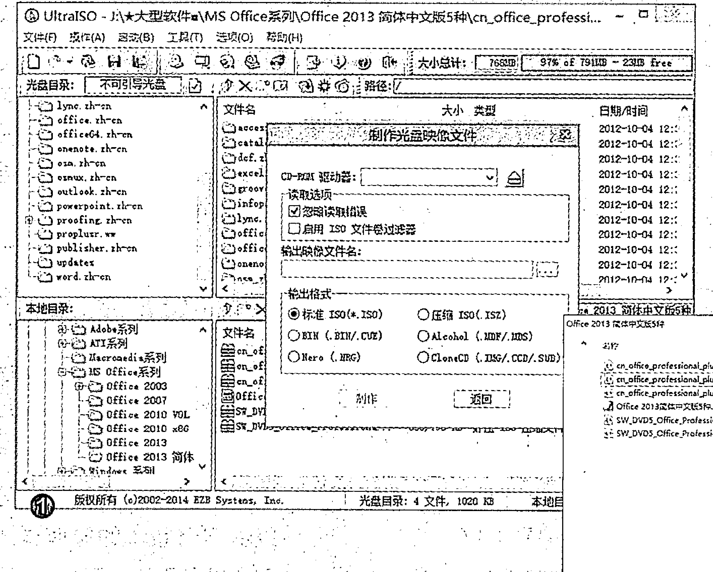

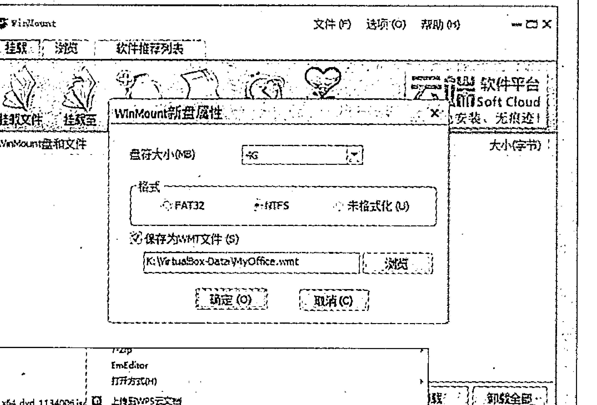

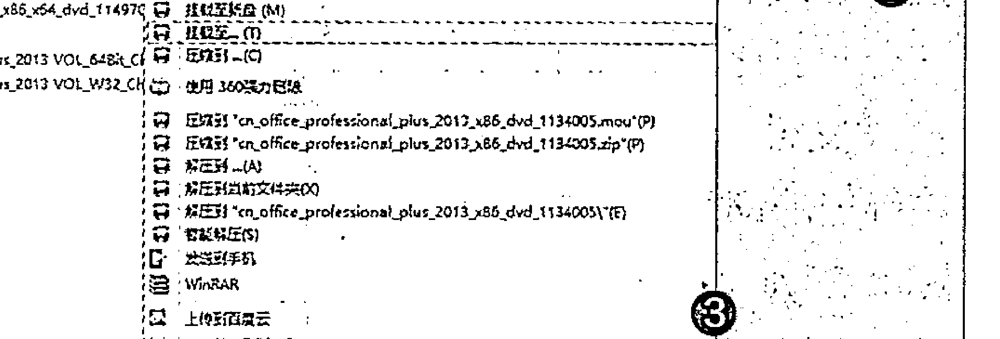

### 2. 重装升级 秒钟搞定

> 小提示
当安装完软件之后，只需右键点击盘符W:并选择弹出命令，即可将安装虚拟盘卸掉（图6）。如果测试或使用完软件之后，同样也只需用右键点击M:盘符，将软件卸掉（如果系统提示文件锁定，可先通过任务管理器中中断与该软件有关的进程和服务，然后再弹出该盘符）。这时，仅有注册表中的一些参数，以及开始菜单和桌面的软件图标没有被卸掉，这些勿删，以后还会用到。

如果要再次使用该软件，下达一个虚拟盘符的右键命令，将位于数据分区的、安装后形成的WMT软件压缩包，虚拟为原目标盘符M:，即可不用重新安装而继续使用该软件（图7）。
如果软件出现错误，只需再次虚拟原安装文件为W:盘，执行安装文件，安装目标仍选为M:盘，即可自动修复该软件。由于M:盘中已经有了该软件安装后的内容，所以安装文件只会检查不同部分进行修复，安装速度自然很快，免去整个软件重新安装的漫长过程。

此外，如果软件有升级版本，也可以用同样的方法将软件直接升级安装到M:盘中。升级完成之后，可以用WinMount将安装后软件的压缩包数据回写入硬盘保留，这样以后再虚拟使用，就是升级版的软件了。
如此测试或使用软件，就会大大提高安装和使用的效率，同时也会大大减轻系统分区或其他分区的空间负担，不使用软件的时候就会腾出资源让给其他软件。

> 小提示
用传统方法安装大型软件的用户，安装完软件之后，为了下次出现问题时安装更加快速，许多人会选择将安装文件解压并拷贝到硬盘数据分区中留存，这样虽然方便，但也无形中侵占了大量硬盘空间，且容易丢失其中的文件，造成安装过程不能进行或安装不完整。其实，只需将安装包以ISO光盘映像的方式或ZIP、RAR压缩文件的方式，保存在硬盘的一个数据分区中即可。当再次需要安装时，用右键调用WinMount，虚拟为一个安装盘就可以安装。而对于使用Windows 8以上操作系统的用户来讲，甚至连这样的WinMount命令也不需要，利用系统自身的功能即可直接调用压缩包中的安装程序进行安装。这是一种节省磁盘空间和防止安装文件目录中文件丢失或损坏的好方法。

## 自动时间标记 备份不难找

文 | 王之欢

大家都会用WinRAR对文件进行压缩备份。但以后查找备份文件，如果曾记得备份日期，但就是记不得具体文件名，那么日期查找就成了最方便的选择。也许你会说，按压缩包文件属性排序，一看不就知道了吗？但你是否明白，那个日期不靠谱。如果能给压缩文件名添加当时的日期时间，是最可靠的。那么，难道必须每次压缩后都要给压缩包文件名手动标上日期吗？不用，可以实现自动化。

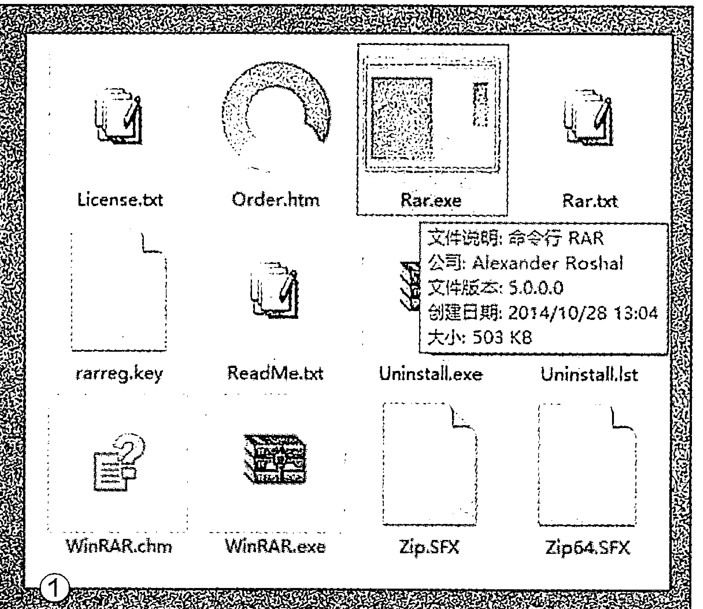

> 小提示
为何不直接使用文件属性中的时间标记？因为文件属性的时间标记容易被改变。一些杀毒软件或系统优化工具对备份文件压缩包处理之后，压缩包的日期属性随即可能会发生变化，不能反映压缩时的时间。

在使用WinRAR压缩软件时，我们常用的其实是其主文件WinRAR.exe。在该软件的安装目录下，还有一个功能非常强大的压缩控制台程序Rar.exe（图1）。如果我们需要按备份日期或时间来命名备份文件，就可以利用这一程序。

假设我们要将当前目录及其子目录下的所有文件压缩备份为backup20141126100158.rar形式的文件，其中20141126100158为压缩时的系统日期和时间，要求自动添加，可用如下办法实现。

首先用记事本在压缩文件目录下创建一个文本文件“压缩.BAT”，注意扩展名为BAT而不是TXT。然后在文本中输入“"C:\Program Files\WinRAR\rar" a -ag backup”一行字符串（注意中间的空格）（图2）。

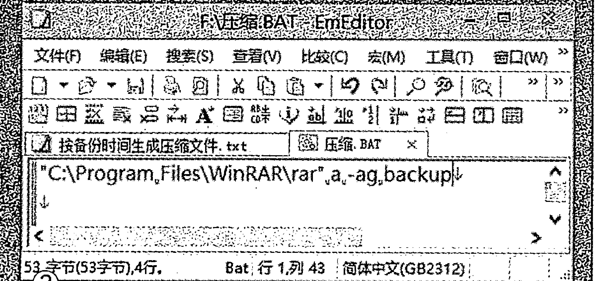

存盘后双击“压缩.BAT”文件，就会产生如backup20141126100158.rar这样的压缩文件。这样就可以日期时间关键词搜索压缩包文件了。

将这个BAT文件保存下来，以后需要压缩备份哪个目录，只需拷贝到该目录下，执行一下就OK了。当然，如果你要增加文件名关键词识别特性，只需将其中的backup替换为中文关键词即可。

以上参数 -ag 的后面默认以YYYYMMDDHHMMSS年月日时分秒格式产生压缩文件名，其实格式还可以自定义，例如用“-agDD-MM-YY”可生成形如“26-11-14”的日期格式，其他格式可自行推演。

## 小技巧
随意更改压缩包日期时间

将要更改日期的所有文件选中并拖入拖把更名器窗口中，点击工具栏右侧的“更改文件日期”表状图标，在弹出的修改窗口中可随意修改文件的创建日期、访问日期、修改日期，也可以直接使用当前系统的日期时间（图3）。

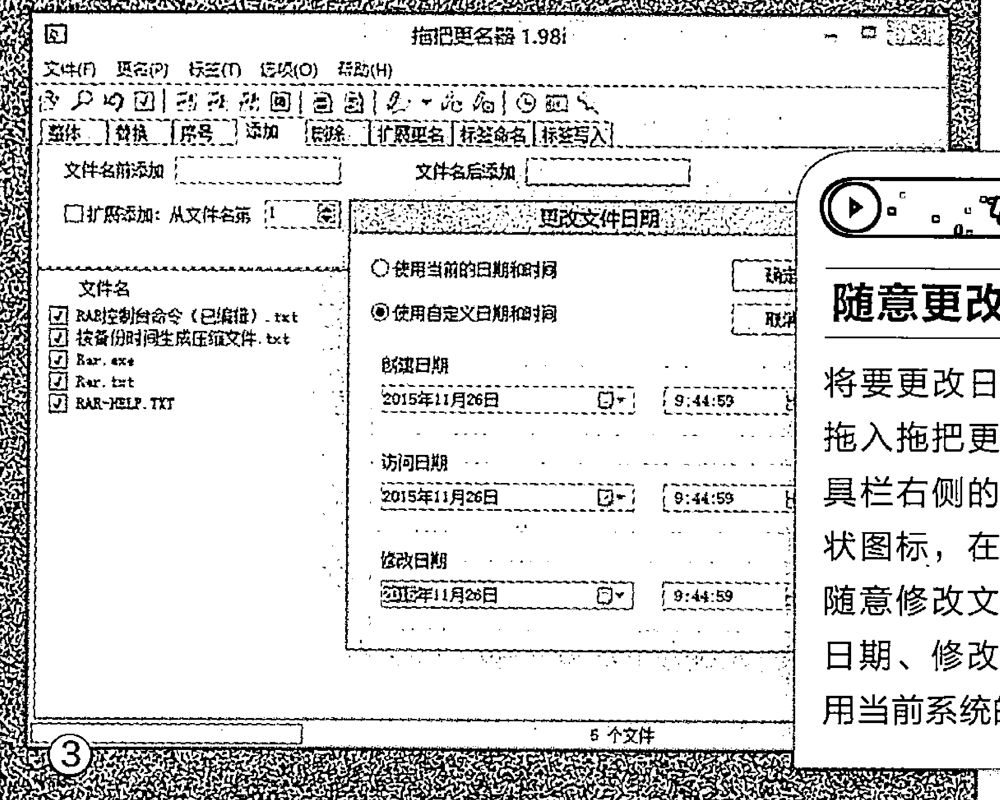

不一样的场合选不一样的翻译

随着网络的普及，用户能够获取到的信息越来越多。但是大量的外文信息也让不少人望文兴叹，这时翻译技术就显得很重要。不过传统的翻译软件只有英汉互译功能，当遇到其他的外文信息时我们又该怎么办呢？

简单翻译直接网页操作

现在很多知名网站都推出了翻译服务，比如谷歌、百度、必应、有道等。如果遇到简短的段落需要翻译，那么直接进入这些网站进行操作就可以了。这里以谷歌翻译为例，首先打开谷歌翻译的链接 (http://translate.google.cn，本链接国内可以访问)，在网页左侧的工具栏中粘贴需要翻译的文字。如果粘贴的是非英文的外文信息，则需要单击工具栏中的“检测语言”按钮，自动分析要翻译的外文类型。接着在右侧的工具栏上选择“中文(简体)”选项。设置完毕点击“翻译”按钮，稍等片刻就可以在右侧窗口显示出翻译的内容了(图1)。

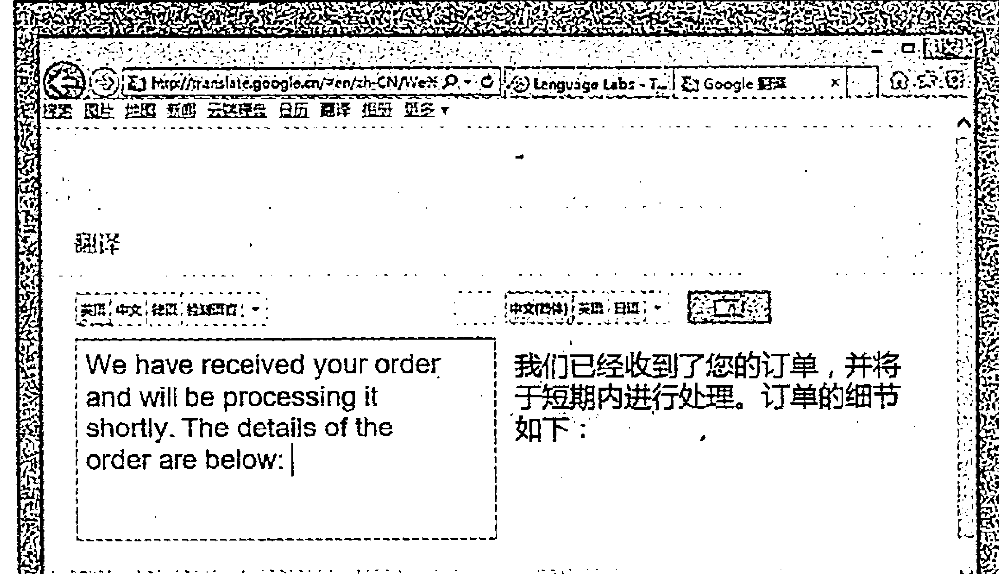

如果临时想翻译成其他的语言，则可以在翻译工具条的语言栏中重新选择，然后点击“开始翻译”按钮就可以翻译成其他的语言了。

整页翻译巧用功能书签

如果遇到查询百科信息或者浏览国外新闻的时候，采用前面的方法一段段地进行翻译，未免有些繁琐。这时我们可以换用其他的方法，而带有翻译功能的小书签就是不错的选择。在浏览器中打开http://tinyurl.com/7drgjom，在“Select your language”列表中选择要翻译成的语言种类，我们自然选择的是“简体中文”项了。这时在“Install Bookmarklet”选项后会出现一个“翻译”链接，通过鼠标将这个“翻译”链接拖到浏览器的书签栏或者收藏夹中即可(图2)。

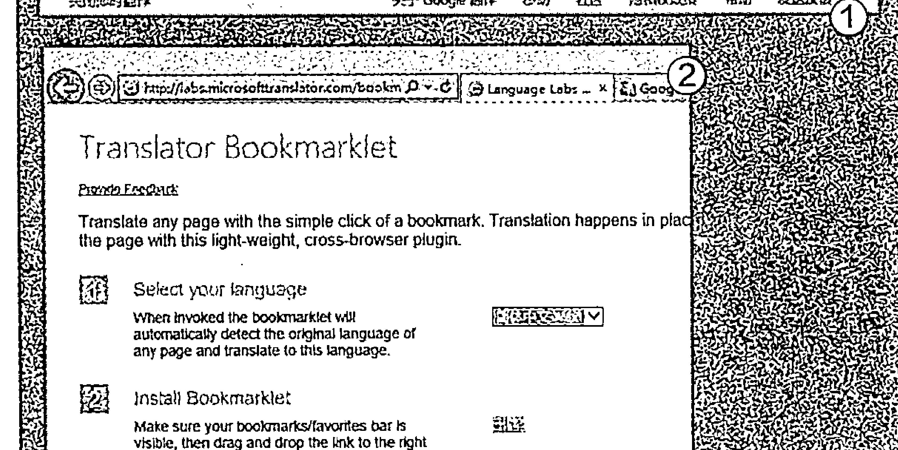

多引擎翻译随意选择

无论是通过翻译网站还是功能小书签，它们都或多或少有一些使用限制，所以很多用户还是喜欢使用翻译软件。这里就为大家推荐一款QTranslate翻译软件，因为它集成了多款优秀的翻译引擎，而且操作方法也和其他的翻译软件类似。运行QTranslate后，在系统托盘找到软件的图标，右击软件图标，选择“鼠标模式”中的“启用”命令，这样软件的划词功能就被激活了。接下来双击软件图标打开操作界面，在中间的翻译条左侧选择“Auto-Detect”，右侧选择“Chinese (Simplified)”(图3)。

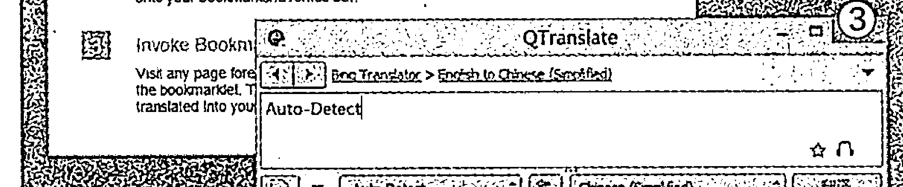

接下来打开自己要浏览的外文网页，再点击书签栏或者收藏夹中的“翻译”链接，网页会立即载入“翻译小书签”功能代码，载入完成后即会自动开始翻译了。通过网页上方的翻译工具条，可以看到翻译的进度提示。当我们将光标移动到网页中翻译过的内容时，还会显示出该处原有的外文信息，以便和中文对照。如果临时想翻译成其他的语言，则可以在翻译工具条的语言栏中重新选择，然后点击“开始翻译”按钮就可以翻译成其他的语言了。

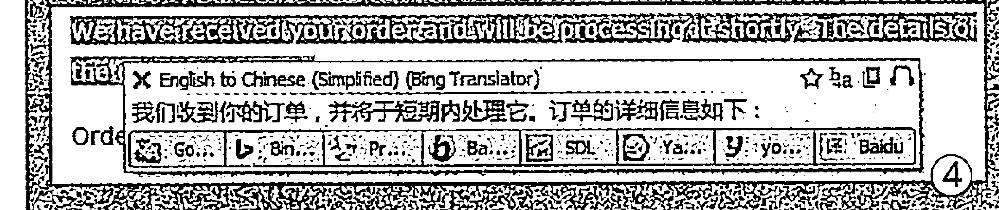

以后选中需要翻译的外文后，就会弹出一个翻译的提示图标，点击该图标后就可以马上进行翻译。如果用户对某个翻译引擎不太满意，可以点击翻译框中的其他翻译引擎图标，然后利用其他的翻译引擎重新进行翻译，非常方便(图4)。

轻松制作儿童趣味算术软件

文 | 马震安

兴趣是学习的动力，以动感的软件和自动判断得分的形式测试孩子的算术能力，总要比在白纸上出几道题来得有趣。

如果对网上的少儿算术软件不满意，那就亲自动手编一个Excel版的算术测试软件吧！用Excel借助简单的VBA代码就可以编出这样的测试软件。

### 1. 卡通人物装点界面引兴趣

利用工作表制作软件的主要操作界面，可以利用小朋友喜闻乐见的动画人物装点操作界面，如喜羊羊、灰太狼等（见右上图）。

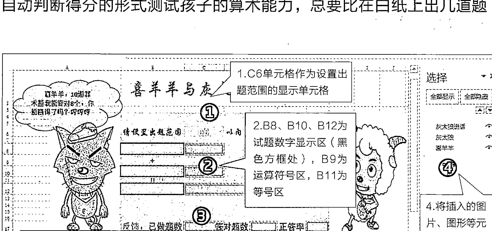

### 2. 利用数据验证实现一表多能

用数据验证来设置运算符号的选择，以便实现一个程序多种功能，如既能进行加法运算又能进行减法运算。

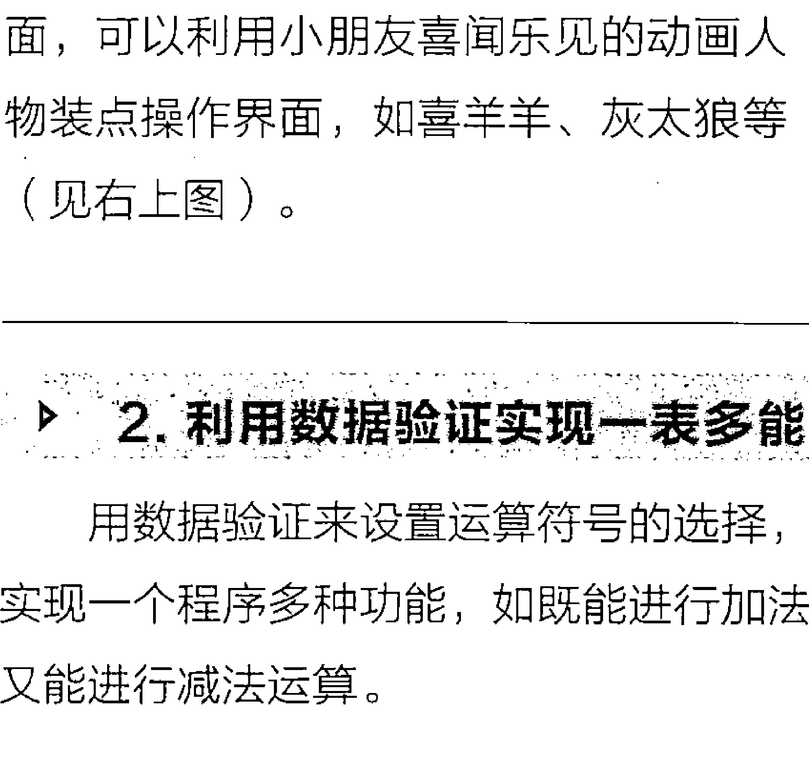

### 3. 显示信息巧设置

这个过程主要是利用简单函数来为单元格设置显示信息。

```
=IF($B$12=AAA,"√"&REPT("★|",$B$12),IF($B$12="","? 宝贝，开始算术吧？祝您好运！","× 宝贝，您算错了，再算一遍吧？"))
```

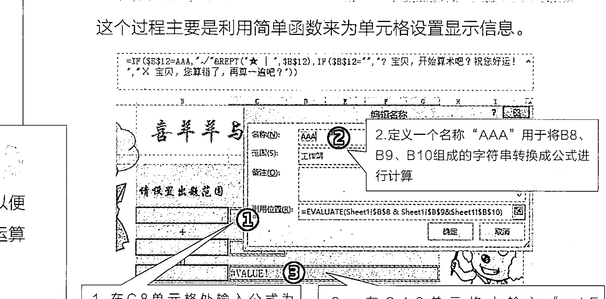

### ▶ 5. 实现自动化VBA代码显神威

带奖励及语音提示的交互相信宝贝一定喜欢。这个过程就是利用VBA代码实现出题、判断答题结果的自动化，并且根据答题结果进行不同的语音提示及图片奖励。单击“开发工具”选项卡的Visual Basic按钮，在左边窗口的Sheet1处双击，在右边窗口输入图中代码（可在http://pan.baidu.com/s/1kTyXl7t下载代码粘贴到窗口中）。

```
Sub 初始化()
    On Error Resume Next
    Range("c17").Value = ""
    Range("e17").Value = ""
    Range("h17").Value = ""
    Range("b8").Value = ""
    Range("b10").Value = ""
    Range("b12").Value = ""
    For i = 1 To Shapes.Count
        If Mid(Shapes(i).Name, 1, 7) = "Picture" Then
            Shapes(i).Delete
        End If
    Next
End Sub
Sub 出题()
    On Error Resume Next
    fv = Range("c6").Value
    shu1 = Application.WorksheetFunction.RandBetween(0, fv)
    Range("b8").Value = shu1
    If Range("b9").Value = "+" Then
        shu2 = Application.WorksheetFunction.RandBetween(0, fv - shu1)
    End If
    If Range("b9").Value = "-" Then
        shu2 = Application.WorksheetFunction.RandBetween(0, shu1)
    End If
    Range("b10").Value = shu2
    Range("b12").Value = ""
    Range("c17").Value = Range("c17").Value + 1
    Application.Speech.Speak "宝贝，开始算术了，祝你好运！"
End Sub
Sub 提交()
    If Range("b12").Value = Evaluate(Range("b8").Value & Range("b9").Value & Range("b10").Value) Then
        Application.Speech.Speak "宝贝你真聪明，这道题答对了，你将获得一个哇哇贴！"
        If Range("e17").Value < Range("c17").Value Then
            Range("e17").Value = Range("e17").Value + 1
        End If
        Shapes.AddPicture ThisWorkbook.Path & "\哇哇.jpg", True, True, 60 * Range("e17").Value, 380, 60, 60
    Else
        Application.Speech.Speak "宝贝这道题答错了，再好好想想！"
    End If
    Range("g17").Value = Range("e17").Value / Range("c17").Value
End Sub
```

1.  “初始化”这个宏过程的主要功能是清除算式、提示信息。
2.  “出题”这个宏过程的主要功能是根据设定的出题范围及运算符号生成加数、被减数、减数，并用Application.Speech.Speak进行语音提示。当然，也可以删除语音提示语句或对语音提示内容进行更改。
3.  “提交”这个宏过程的主要功能是判断宝贝的答题结果，并进行相应的语音提示及更新提示信息。可将代码中的“哇哇.jpg”更改成宝贝喜欢的卡通图片文件名，但是图片文件必须和这个Excel文件在同一个文件夹中。

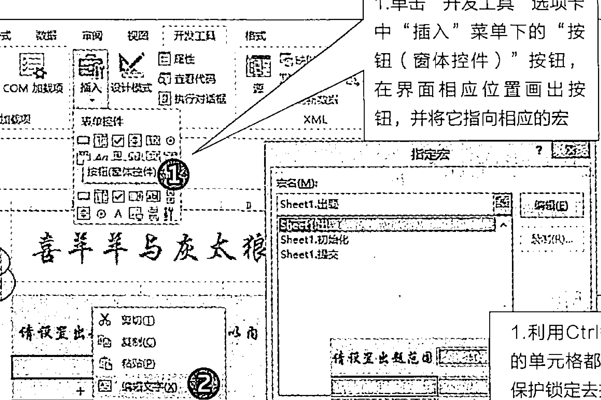

1.  单击“开发工具”选项卡中“插入”菜单下的“按钮（窗体控件）”按钮，在界面相应位置画出按钮，并将它指向相应的宏。

### ▶ 6. 添加操作按钮

操作越简单，宝贝越容易上手。这个过程就是利用窗体控件中的“按钮”控件来实现简单的操作，让宝贝只通过3个按钮就能快乐地学习。

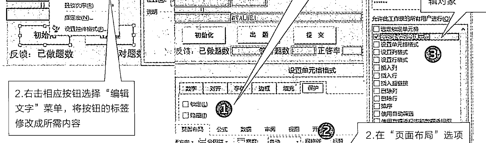

1.  利用Ctrl键将界面中活动的单元格都选中，将它们的保护锁定去掉。
2.  右击相应按钮选择“编辑文字”菜单，将按钮的标签修改成所需内容。
3.  保护工作表并勾选“选定未锁定的单元格”和“编辑对象”。

### ▶ 7. 保护工作表

为了防止宝贝对其他单元格的误操作而影响学习，利用保护工作表进行相应的设置。

1.  在“页面布局”选项卡中将网格线、标题的查看勾选去掉。
2.  保护工作表并勾选“选定未锁定的单元格”和“编辑对象”。

上述步骤操作完成后，在操作界面点击各个按钮进行测试，看看宝贝是不是对这样的学习方式感兴趣呢？

### ▶ 4. 对错提示用颜色

在宝贝还认字不多的情况下，利用颜色提示对错对宝贝来说不失为一个好主意。这个过程是设置根据宝贝的答题对错显示不同的颜色。


批量资料分别归档有术

文 | 黄海峰

办公室常常会有许多资料分别存放在百十个不同的文件夹下，到一定时期，需要将它们压缩后归档备份。虽然说将所有资料压缩为一个包，或者干脆不压缩直接转移来得更省事，但分包压缩更有利于在日后使用中有目标地获取和传输文件。

针对以上需求，如何一次性对多个文件夹进行处理呢？常用压缩软件带有将多个压缩包一次解压到不同文件夹的命令，但没有能直接分别压缩多个文件夹的命令，可这并不表示压缩软件不具备这个能力。无论我们用哪个压缩软件，办法总是有的。由于大家使用的压缩工具不尽相同，而各种压缩工具的实现方法也有所不同，所以我们针对目前最常用的几种压缩工具（包括WinRAR、好压和7-zip）来分别说明。我们选择压缩备份一个洗衣机相关资料的目录，目标是将每个组每个月的资料分别独立压缩为一个文件。

## 1. WinRAR实现成批单独压缩

在资源管理器中多选要压缩的洗衣机资料目录下的所有文件夹，通过右键菜单命令“WinRAR→添加到压缩文件”，启动“压缩文件名和参数”窗口。在“压缩文件名和参数”窗口中点击“文件”选项卡，选中“把每个文件放到单独的压缩文件中”复选框进行压缩，即可获得所需的独立压缩包（图1）。

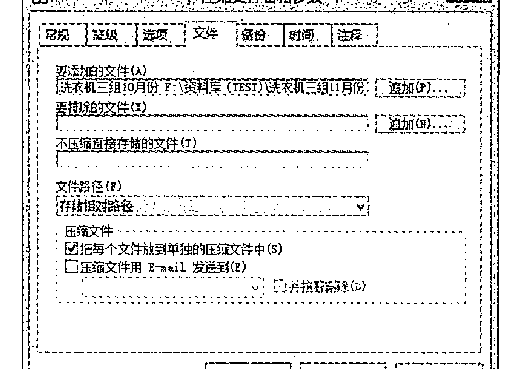

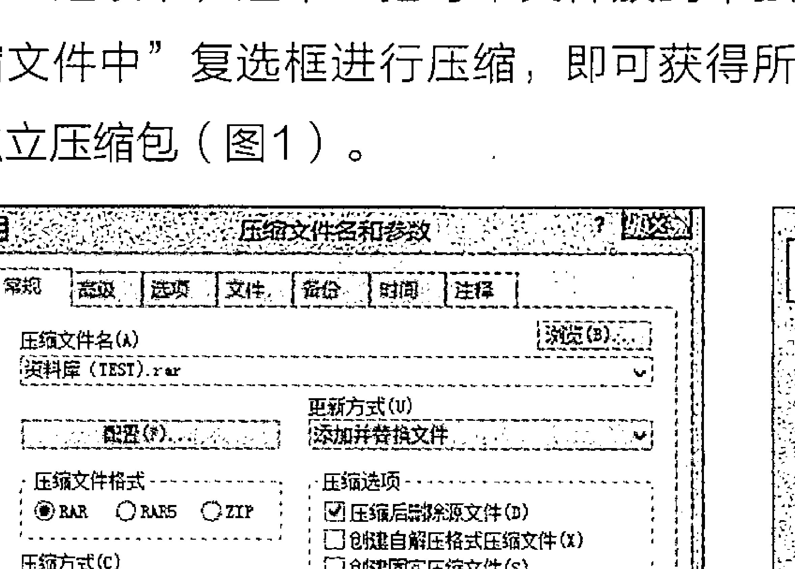

> > **小提示**
> 作为资料备份，若要腾出本地磁盘空间，需要在压缩之后删除原来的文件夹。WinRAR不需人为干预，可以在压缩结束后自动删除原来的文件。但这需要事先选中一个选项，即需要选中“压缩文件名和参数”设置窗口中“常规”选项卡下的“压缩后删除源文件”复选框（图2）。

## 2. 好压成批单独压缩更顺手

打开存放洗衣机资料的文件夹，全选所有小组的文件夹，并在选择区上单击鼠标右键，在右键菜单中选择“好压→添加到压缩文件”命令（图3）。在弹出的压缩文件窗口中，单击“常规”选项卡，选中窗口右栏中的“压缩每个选中项到单独的压缩文件”（图4）。

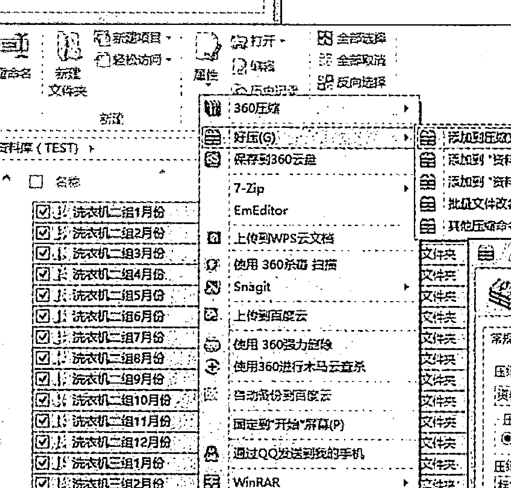

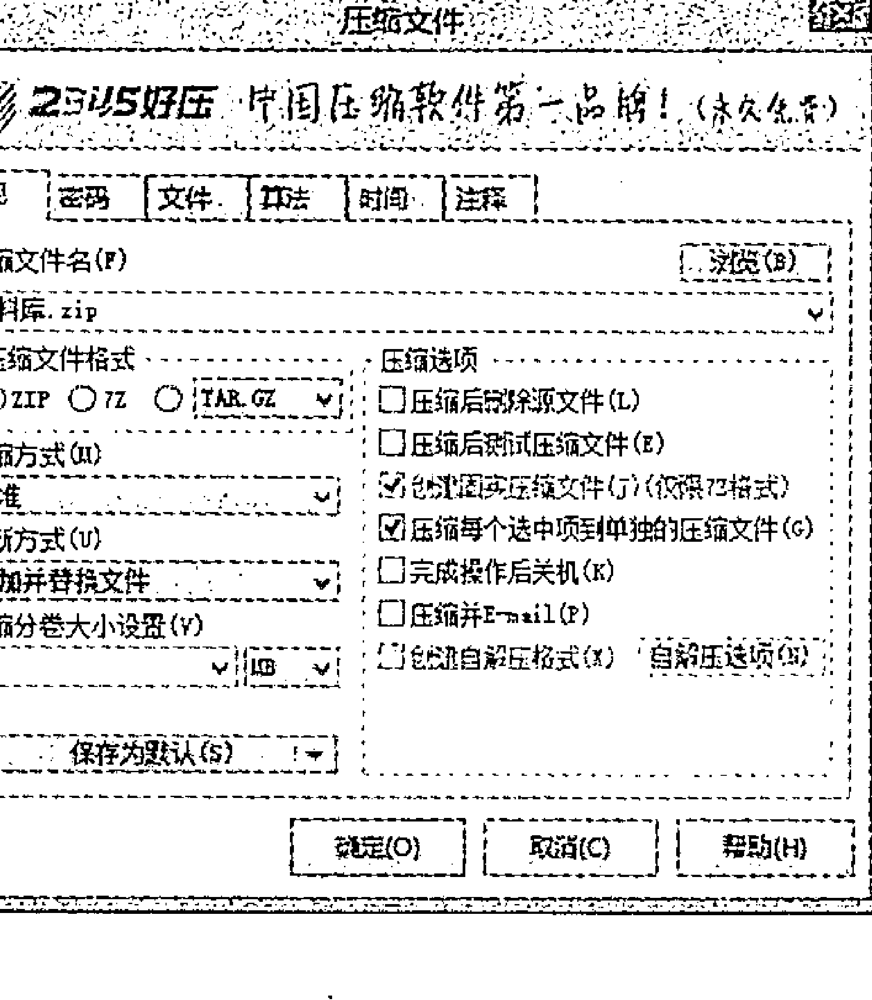

确定之后，我们可以看到，目标目录下已经生成了每个文件夹的压缩包（图5）。
如果有的项目不希望压缩，或者还希望增加来自于他处的项目，则可以在“文件”选项卡下点击“编辑”按钮进行增删操作（图6）。

### 小技巧：定制好压右键一键批量压缩

如果觉得上面的方法复杂，那么，我们可以通过设置给好压添加一个右键批量压缩的命令。在好压主窗口选择“选项→设置”命令，在“综合”选项卡下的“外壳整合”组中点击“关联菜单项目”按钮，在弹出的关联菜单项目选择窗口中，选中“每个文件添加到单独的压缩文件”并确定（图7）。之后，只需多选要压缩的文件夹，从好压右键菜单中就会发现多出了一个“每个文件添加到单独的压缩文件”项目，选择该项目就可以方便地实现文件夹成批一次性分别压缩了（图8）。

| 名称 | 修改日期 | 类型 |
|---|---|---|
| 洗衣机一组8月份 | 2014/6/5 星期四... | 文件夹 |
| 洗衣机一组9月份 | 2014/6/5 星期四... | 文件夹 |
| 洗衣机一组10月份 | 2014/6/5 星期四... | 文件夹 |
| 洗衣机一组11月份 | 2014/6/5 星期四... | 文件夹 |
| 洗衣机一组12月份 | 2014/6/5 星期四... | 文件夹 |
| 洗衣机二组1月份.zip | 2014/6/5 星期四... | WinRAR ZIP压缩文件 |
| 洗衣机二组2月份.zip | 2014/6/5 星期四... | WinRAR ZIP压缩文件 |
| 洗衣机二组3月份.zip | 2014/6/5 星期四... | WinRAR ZIP压缩文件 |
| 洗衣机二组4月份.zip | 2014/6/5 星期四... | WinRAR ZIP压缩文件 |
| 洗衣机二组5月份.zip | 2014/6/5 星期四... | WinRAR ZIP压缩文件 |
| 洗衣机二组6月份.zip | 2014/6/5 星期四... | WinRAR ZIP压缩文件 |
| 洗衣机二组7月份.zip | 2014/6/5 星期四... | WinRAR ZIP压缩文件 |
| 洗衣机二组8月份.zip | 2014/6/5 星期四... | WinRAR ZIP压缩文件 |
| 洗衣机二组9月份.zip | 2014/6/5 星期四... | WinRAR ZIP压缩文件 |
| 洗衣机二组10月份.zip | 2014/6/5 星期四... | WinRAR ZIP压缩文件 |
| 洗衣机二组11月份.zip | 2014/6/5 星期四... | WinRAR ZIP压缩文件 |
| 洗衣机二组12月份.zip | 2014/6/5 星期四... | WinRAR ZIP压缩文件 |
| 洗衣机三组1月份.zip | 2014/6/5 星期四... | WinRAR ZIP压缩文件 |
| 洗衣机三组2月份.zip | 2014/6/5 星期四... | WinRAR ZIP压缩文件 |
| 洗衣机三组3月份.zip | 2014/6/5 星期四... | WinRAR ZIP压缩文件 |
| 洗衣机三组4月份.zip | 2014/6/5 星期四... | WinRAR ZIP压缩文件 |

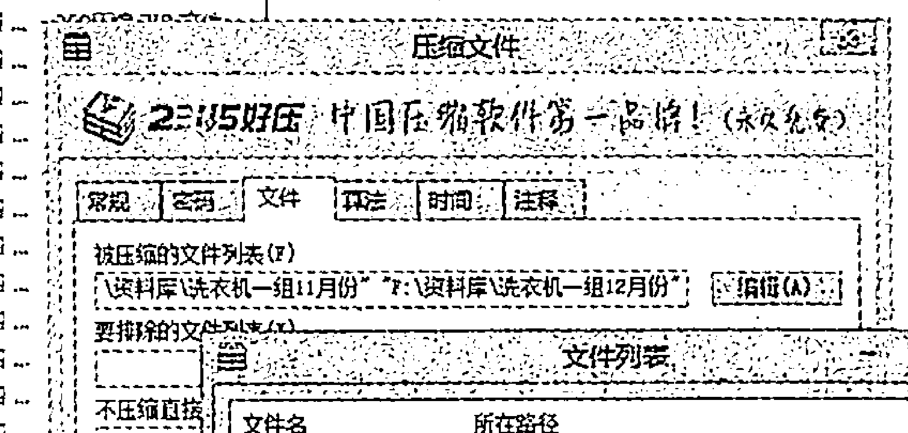

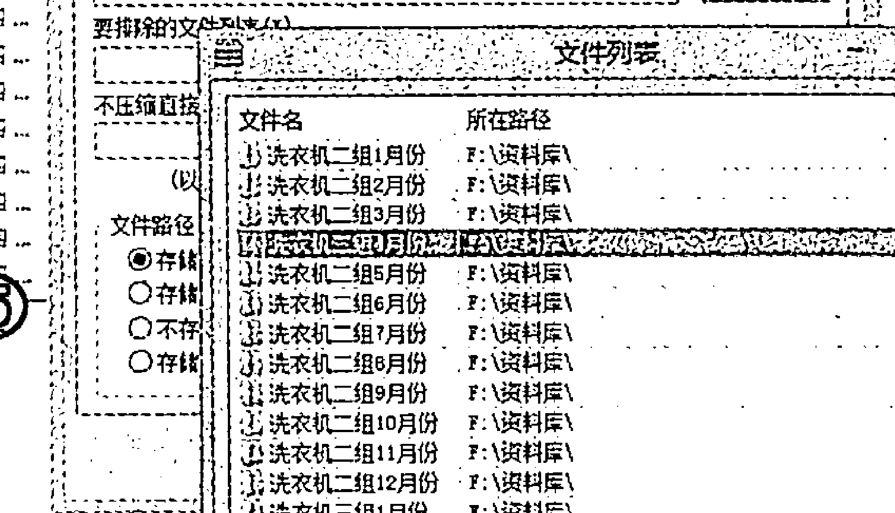

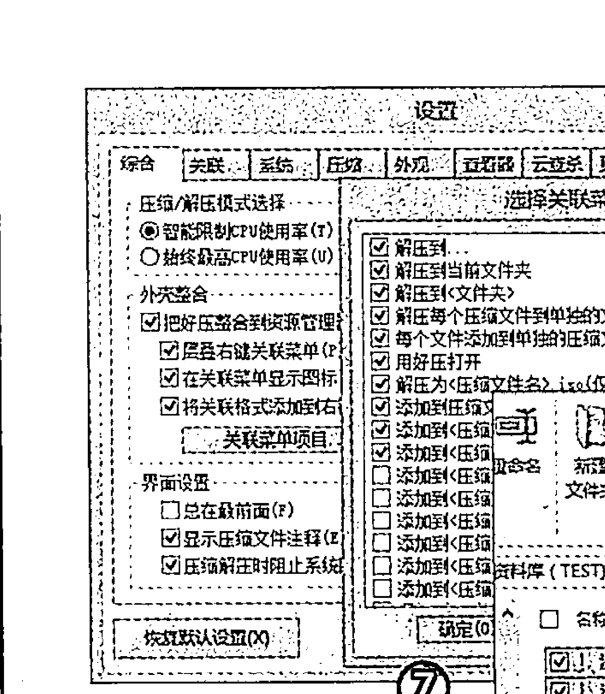

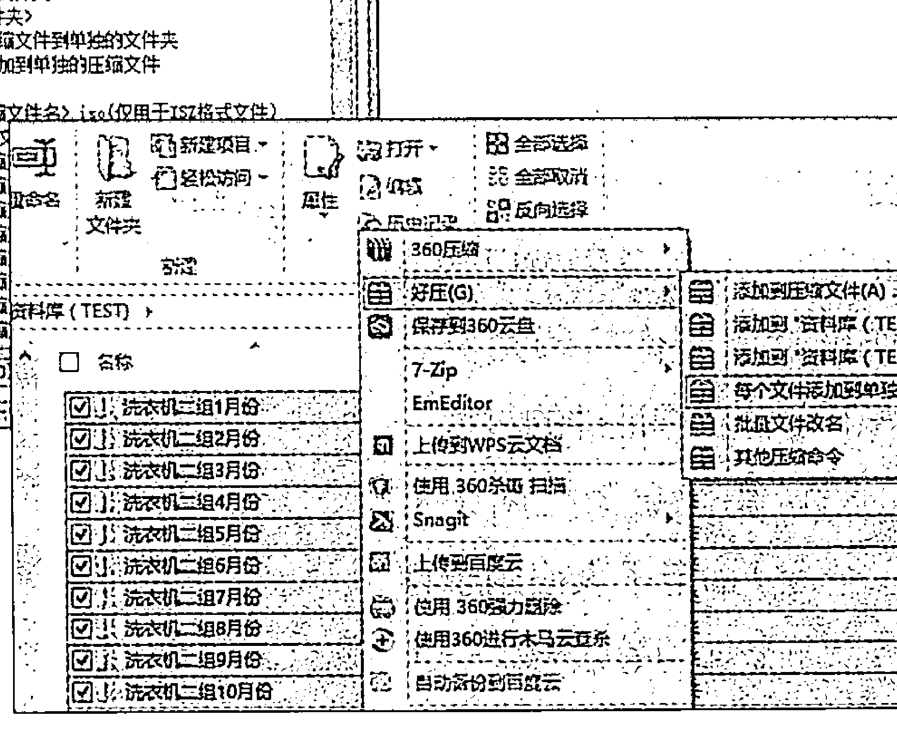

## 3. 7-zip循环单独压缩有高招

在分别压缩这个问题上，虽然7-zip没有现成的命令或选项可用。但我们可以利用其命令行模式，构造一个自动循环的批处理来实现任意多个文件夹的一次性分别压缩。

打开记事本编辑一个文本文件，内容仅有如下一行（图9）：
文本文件建好后，将扩展名改为bat，并把该文件放置在上述洗衣机资料批量文件夹所在的目录下。双击执行这个批处理文件，即可获得按文件夹单独压缩的系列压缩包。

```
for /d %%X in (*) do "c:\Program Files\7-Zip\7z.exe" a "%%X.7z" "%%X"
```

将该批处理文件保存起来，以后无论哪个文件夹下的资料需要分别压缩，都可以拷贝过去执行一下就OK了，可谓一劳永逸。

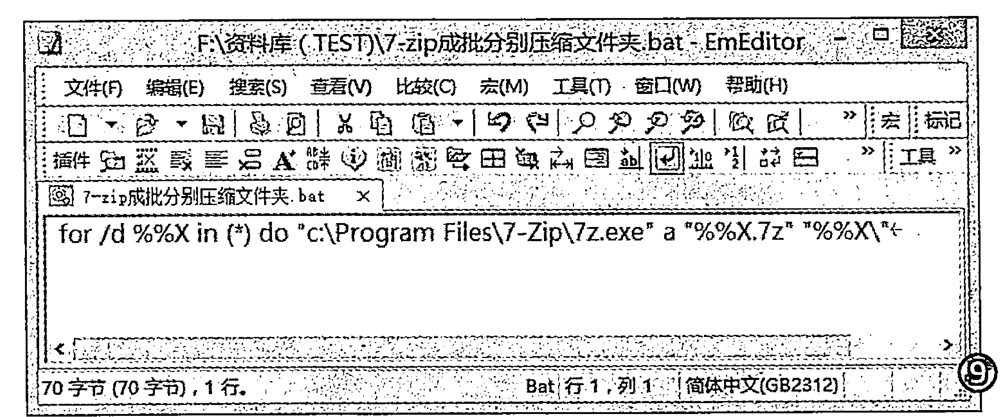

注意7-zip压缩软件的安装路径，这里假设7-Zip安装在"c:\Program Files\7-Zip"，命令引用的路径要根据软件安装的实际路径有所变动。上例是压缩为7z格式的情况，如果要把文件打包成ZIP格式，只需把命令行中的"%%X.7z"改成"%%X.zip"即可。

Office校园创意使用攻略

文 | 魏晓聪

据说Office组件你已经用烦了？！Word用作记事本，Excel只是存数据，PowerPoint只是做讲稿……物尽其用的时代这怎么能行！其实它们的用途不止这些。下面我来支几招，用我们用惯了的Office组件这个“旧瓶”来装点“新酒”，化身校园创意实用工具。

### ▶ 批量制作会员证

学生活动需要批量制作证件，依次录入打印工程量浩大。然而若采用Word的邮件合并功能就会事半功倍。下面就以学生会工作证批量制作打印为例，介绍一下批量制作证件的过程。

整体的设计思路是建立两个文件：一个Excel电子表格用于存放姓名、所在部门等信息，一个Word文件作为工作证样板调用电子表格中的信息。

- Step 1: 新建Word文档，打开，将标签切换至“邮件”，单击“选择收件人”按钮，选择“使用现有列表”。找到所要打印的Excel数据，确定Excel的表格（图1）。
- Step 2: 在“邮件”标签下，单击“插入合并域”按钮，选择相对应的字段（图2）。
- Step 3: 单击“完成并合并”按钮，单击“编辑单个文档”确定后，弹出一个名为“信函1”的新文档。
- Step 4: 调整工作证卡片到合适的大小，打印即可。

> 小提示
> 复选框、文本域等控件使用方法同理。请读者自行完成。

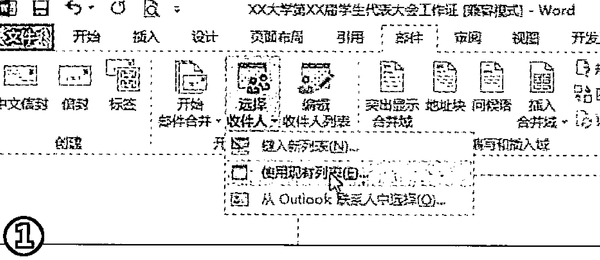

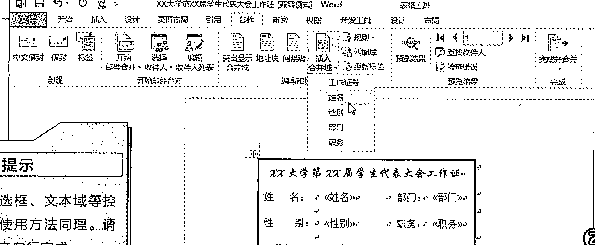

### ▶ 电子版调查问卷

担心研究创意问卷创意被抄袭？担心回收的问卷高亮下划线加粗倾斜各种标记令你统计时眼花缭乱？采用以下设计问卷的方法，一切问题迎刃而解！以一个问题的设计为例。

如果要调查被调查者的年级，问卷通常是这样的：
QA: 您的年级：大一 大二 大三 大四

现在，我们删除冒号后面的内容。单击菜单栏的“文件→选项→自定义功能区”，添加“开发工具”功能，然后单击“确定”按钮。单击“开发工具”按钮，单击“旧式按钮”，选择“组合框”（图3）。

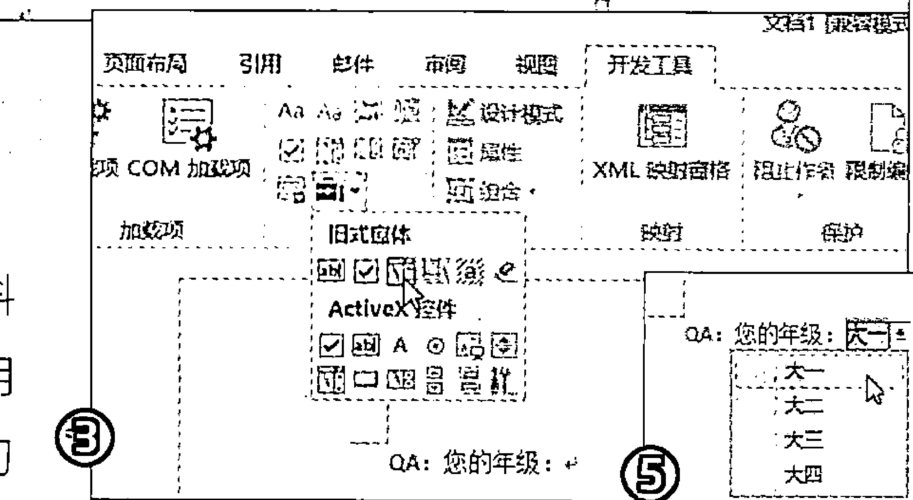

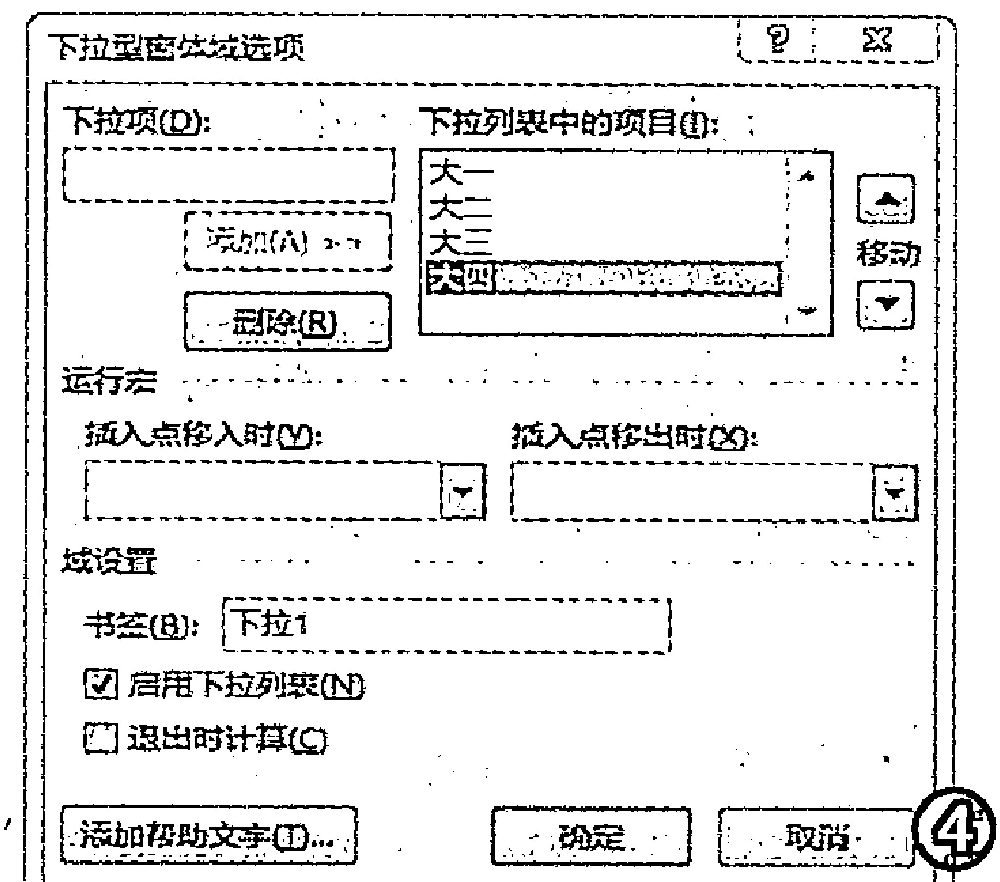

问题后面会出现灰色长方形区域。双击灰色区域，将刚才的选项添加进去，添加完成后单击“确定”按钮（图4）。

此时，单击限制编辑按钮，对文档进行设置。注意将限制编辑中的“仅允许在文档中进行此类型的编辑”勾选，选择“填写窗体”并启用强制保护，输入密码。

这样被调查者在完成问卷时不可以对文档进行编辑。
单击“确定”后效果如图所示（图5）。

## GPA计算器

绩点和分数的对应法则微复杂，课程多、学分各不同，笔算可不是上策。下面我们用Excel来解决这个问题。

以部分课程为例，这一步主要是建立好成绩对应法则。

这里要发挥LOOKUP函数的妙用。在E1中输入=LOOKUP(D2,A2:A11,B2:B11)，它的意思是在列A中查找D2的值，匹配最小值，然后返回列B同一行中的值。比如在D2中输入高数A成绩97，它会在列A中查找97，匹配次小值90，然后返回列B同一行中的值4.0（图6）。

| 成绩 | 绩点 |
|------|------|
| 0    | 0    |
| 60   | 1.5  |
| 64   | 1.5  |
| 68   | 2    |
| 72   | 2.3  |
| 75   | 2.7  |
| 78   | 3    |
| 82   | 3.3  |
| 85   | 3.7  |
| 90   | 4    |

最后在H13处进行简单加权平均计算即可。测试效果如图（图7）。

课程基本一致的同学就可以一人制作，造福其他小伙伴了！

| 科目名称 | 分数 | 对应绩点 | 学分 |
|----------|------|----------|------|
| 高数A    | 97   | 4        | 5.5  |
| 线代     | 84   | 3.3      | 3    |
| 1.5微观经济 | 90 | 3.5      | 3.5  |
| 2思修    | 92   | 4        | 3    |
| 2.3计算机 | 94   | 4        | 2    |
| 2.7管理学 | 92   | 4        | 3    |
| 3英语    | 76   | 2.7      | 3    |
| 3.3体育  | 86   | 3.7      | 1    |
| **你的GPA** |      | **3.74** |      |

## PPT讲义变笔记

老师授课的PPT内容不错，但直接打印一版9页或1版6页的幻灯片确实不够实用。复习的时候既要翻书翻笔记，还要翻讲义实在太乱。如果把幻灯片内容变成文字，排版打印出来粘贴到笔记本或者课本的对应位置就方便多了。下面介绍将幻灯片内容转换为纯文字的方法。

以选修课的专题设计为例：单击菜单栏的“视图”按钮，选择“大纲视图”。在左侧文字处任意位置单击鼠标右键进行复制，再粘贴到Word文档里，就可以重新进行排版打印了。

## PPT做简单海报

你是否也有过同样的苦恼呢？又要做海报做宣传单页了，Photoshop不会用，这可如何是好？下面我们就用PPT来解决这个问题。

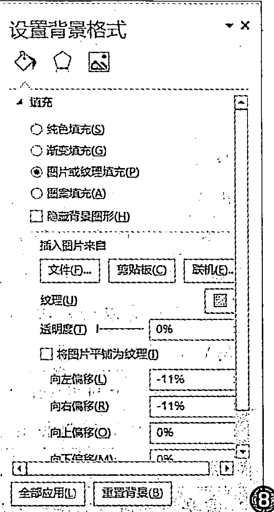

单击菜单栏中的“设计”按钮，单击幻灯片大小，并且设置成A4纸张，横向幻灯片。单击鼠标右键，设置背景格式（图8）。

单击“文件”按钮，单击菜单栏的“插入→形状”，选择合适的图形素材。之后再发挥自己的想象，叠加图形、更改透明、图像模糊处理等。然后再添加标题。最后，就可以进行打印操作了。


小提示
系统自带字体可供挑选的较少；建议下载更多其他风格的字体包。安装到系统的Fonts文件夹下。左图是一个简易的例子（图9）。本篇攻略不仅适用于校园，也可以具体应用到更多的办公环境下。

### 一键实现Word表格自动填充

文 | 马震安

总用Word做报告，虽然里边涉及到的一些简单数据表的统计用表格菜单中的公式也能很好地解决，但在Word表格中，公式的填充不能像文本或编号那样可以一次填充多行。如果能办一件一劳永逸的事情——在Word中搞一个按钮，可以方便地实现表格公式的填充功能，就省去了将表格转移到Excel中运算，再转回Word中的麻烦。

需求 在Word表格中计算每名销售人员的销售总量及月销量。

分析 在Word表格中进行公式的填充是一个难题，利用普通的方法是很难实现的。不过，我们可以利用VBA代码来很好地完成上述任务。大家不要以为每次都要编写VBA代码，那样真是太麻烦了，还不如利用Excel完成呢！其实我们可以把这段代码做成一个按钮放在Word中，需要用到时只需单击它就可以了，省了在Word和Excel之间来回切换。可谓一次费事，终生受用！

在Word 2013中单击开发工具选项卡中的“Visual Basic”按钮，进入VBA的编辑窗口，在左侧工程窗口中双击“Normal→模块”下的“NewMacros”，在右侧代码区输入代码。具体的代码可在“http://pan.baidu.com/s/1gdpBuL1”处下载。

关闭这个VBA编辑窗口，接下来，就是将这段VBA代码赋予一个按钮。首先，选择“文件→选项”菜单，在“Word选项”窗口选择“自定义功能区”菜单，从“从下列位置选择命令”处选择“宏”，在“自定义功能区”处选择“工具选项卡”并进一步展开到“表格工具→布局”，选中“布局”后单击“新建组”按钮，右击新建的组重命名为“表格公式填充”。然后，将“Normal.NewMacros.表格公式填充”拖动到新建组的下面，并右击重命名为“表格公式填充”，最后点击“确定”按钮就完成了按钮的添加。以后就可以将此按钮当作一个工具按钮，随时使用了（图1）。

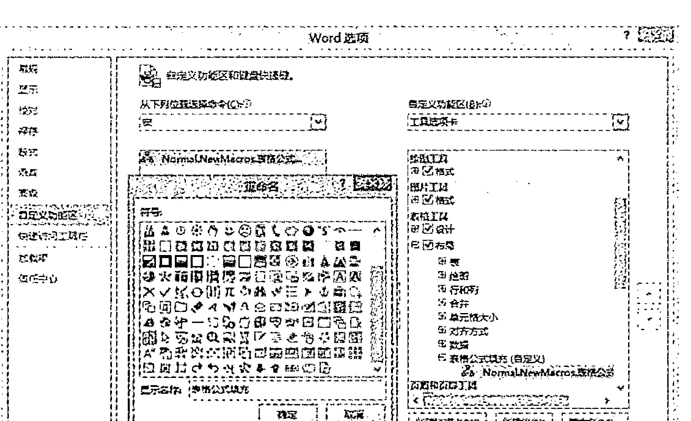

按钮添加完成后，就可以对表格进行公式的填充了。首先，利用公式求出第一条记录的销售总量（即将光标放在第一条记录的合计处，在“布局”选项卡的“数据”区选择“fx公式”，在出现的窗口中默认公式为“=SUM(LEFT)”，直接点击“确定”。然后，选定这个公式及所要填充的单元格，点击新添加的“表格公式填充”按钮，就会把连续选中的单元格以选定的公式为蓝本进行自动填充（图2）。

| 姓名 | 1月 | 2月 | 3月 | 4月 | 5月 | 合计 |
|------|-----|-----|-----|-----|-----|------|
| 唐一 | 10  | 3   | 10  | 8   | 15  | 46   |
| 田二 | 7   | 9   | 7   | 1   | 8   | 32   |
| 张三 | 10  | 3   | 10  | 8   | 7   | 38   |
| 李四 | 9   | 3   | 2   | 8   | 9   | 31   |
| 王五 | 9   | 7   | 4   | 2   | 8   | 30   |
| 赵六 | 2   | 2   | 7   | 8   | 7   | 26   |
| 陈七 | 5   | 4   | 1   | 8   | 6   | 24   |
| 马八 | 8   | 1   | 7   | 3   | 9   | 28   |
| 强九 | 5   | 10  | 8   | 6   | 11  | 40   |
| 郑十 | 4   | 2   | 3   | 6   | 12  | 27   |
| 彭十一 | 6 | 5   | 1   | 8   | 10  | 30   |
| 关十二 | 2 | 9   | 2   | 9   | 13  | 35   |
| 孙十三 | 4 | 4   | 10  | 4   | 15  | 37   |
| 刘十四 | 3 | 4   | 6   | 6   | 14  | 33   |
| 合计 |     |     |     |     |     |      |

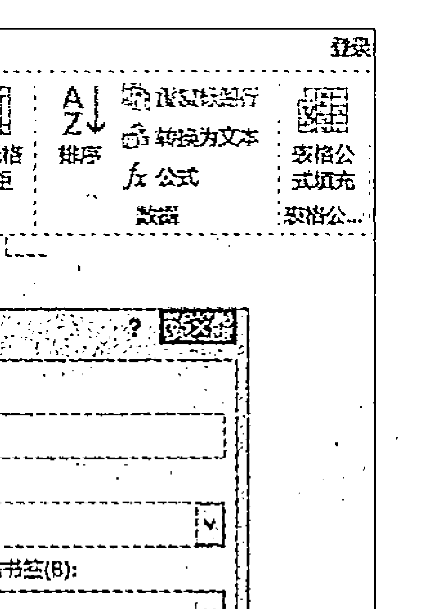

怎么样，没有想到Word表格也能如Excel工作表一样实现公式序列的自动填充吧？赶快试试吧！

## 忘记密码 PDF文档照样编辑

文 | 刘长德

在文档编辑过程中，为了防止别人修改我们的文档，常常会给文档设置限制编辑的密码。不过有时也会“聪明反被聪明误”，这不同事就遇到了这样的烦心事，前段时间在编辑文档时，为了防止别人修改，特意将文档输出为PDF格式，并且还设置了编辑限制。没成想今天自己打开文档后忘记了密码，既不能编辑修改，也不能打印，这可咋办呢？

### ▶ 解除限制网站帮忙

在日常工作中，遇到无法编辑、打印的PDF文档是常有的事，比如好不容易从网上搜索、下载的PDF文档打开后，很多命令却是呈灰色不可用状态，根本无法编辑、复制和打印，只能是无奈地将其删除。其实此时最简单的方法就是打开http://freemypdf.com/#网站，在页面中单击“选择文件”，接着在弹出的“打开”对话框中双击要解除限制的PDF文档，然后在网站中点击“Do it!”，即可将文档上传到网站中进行解密处理了（图1）。

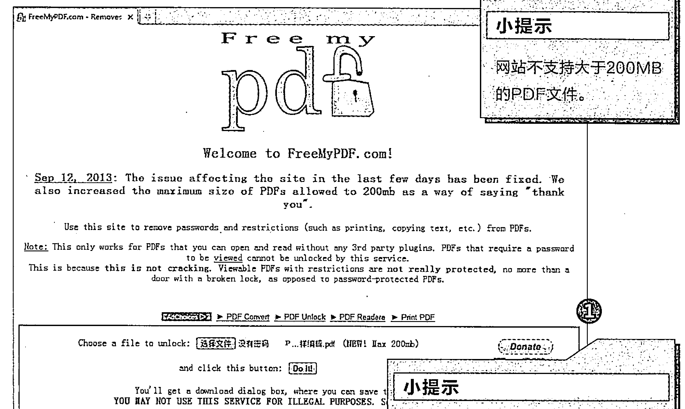

**小提示**
网站不支持大于200MB的PDF文件。

待文档处理完成后会弹出一个“新建下载任务”对话框，选择好文档的保存路径后单击“下载”，打开下载的PDF文档就可以对文档进行编辑、打印等操作了。

### ▶ “PDF补丁丁”有大用

虽说通过网站解除PDF文档编辑限制简单方便，但是往往会受网速或文件大小的限制，而“PDF补丁丁”这款软件正好弥补了上述不足（下载地址：http://www.cnblogs.com/pdfpatcher/archive/2011/02/25/Index.html），待软件下载完成后，双击压缩包内名为PDFPATCHER.EXE的文件即可运行软件。

首先单击“添加文件”，在打开的“选择需要处理的PDF文件”对话框中，用鼠标双击要解除限制的PDF文档即可打开。接着在“选择功能”下选择“PDF文档选项”，然后在右侧单击“文档杂项”选项卡，并在“源文档处理”下将“清除复制、打印等限制”选中（图2），再单击“返回文档处理页面”。接着单击“生成PDF文件”，并在弹出的“指定输出PDF文件路径”的对话框中，选择好保存路径及文件名后单击“保存”，此时会弹出一个“此PDF文档作者设置了修改文件的权限设置”的提示（图3），无需理会单击“是”，即可清除文档的编辑、打印等限制了。

**小提示**
无论是http://freemypdf.com/#网站还是“PDF补丁丁”，只能破解PDF文档的编辑限制，对于需要密码才能打开的PDF文档则无能为力了。

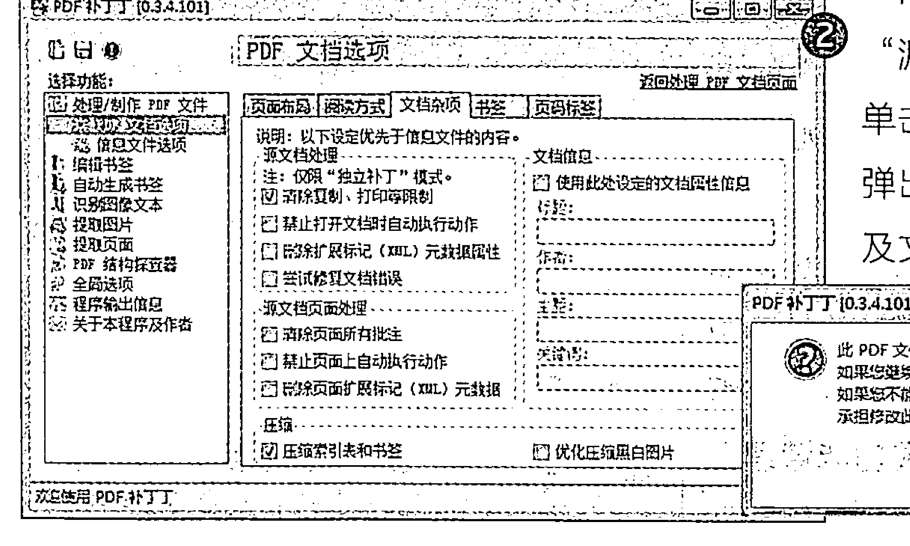

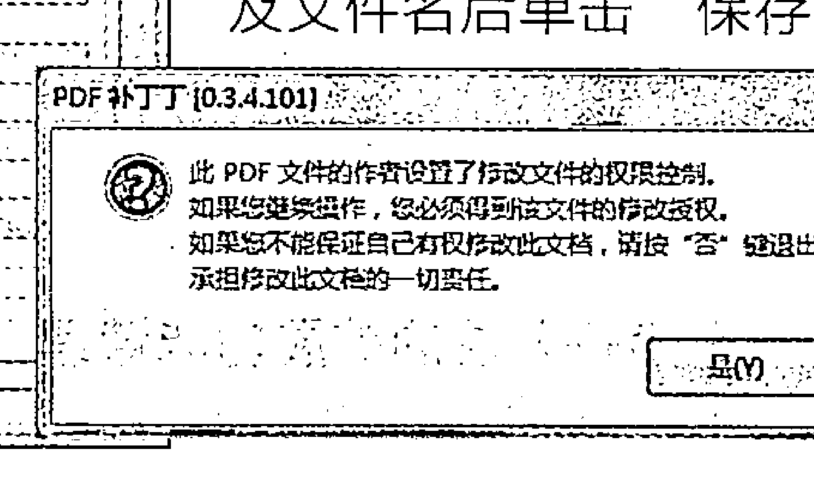


## 巧用输入法 办公也提效

文 | 刘德江

办公效率不光依靠MS Office、WPS Office等办公软件。如果能将各类汉字输入法的功能挖掘出来，也会助力提高办公效率。

### 理科老师 专业符号不用愁

中学代数老师常常会用到一些角度、集合、等式的专业符号，而物理、化学或生物老师又常常会遇到一些与容积、距离、压力等有关的物理量或单位符号。以前老师们总是要借助于Word的符号库、ASCII码表、输入法软键盘等进行录入。

其实，如果安装了QQ拼音输入法，利用该输入法提供的拼音符号输入器，可以很方便地输入各类数理化生单位符号。QQ拼音符号输入器开启后，不用像软键盘那样反复切换，只需摆放在与编辑器并列的位置，就可以在不影响当前文字正常输入的情况下，随时任意选择各种符号了（图1）。

> 小提示
开启QQ拼音符号输入器的方法是，点击QQ拼音输入法输入条右侧的扳手按钮，在弹出的面板中选择“符号”按钮。

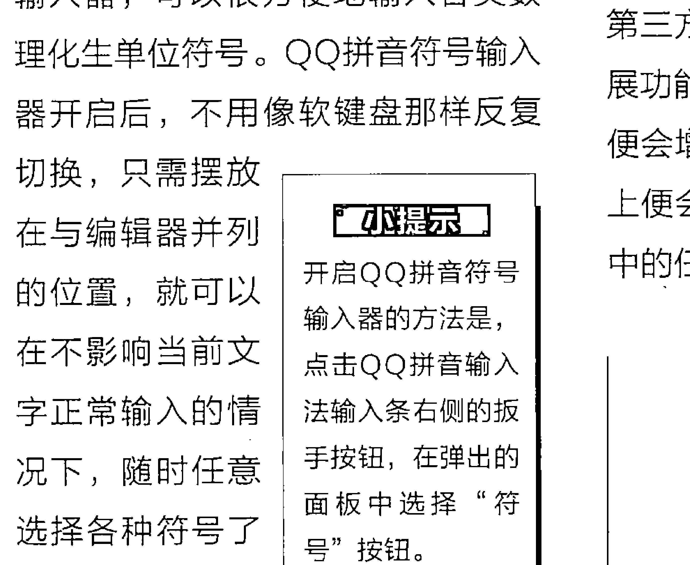

### 文章配图 截图也打马赛克

给文章配上软件或网页截图是最常用的图文编辑方法，有时出于某种目的，我们不希望别人看到图片中的某些内容（比如手机号、用户个人隐私或版权敏感信息等），这时往往需要借助于图像处理软件将图片的局部做马赛克处理。

如果我们用百度拼音输入法来截图，处理马赛克的工作就不需要“劳驾”第三方软件了。安装或升级到最新版的百度拼音输入法，从工具箱菜单的“扩展功能管理”中添加并安装截图功能插件（图2），选择启用插件后，输入条上便会增加一个歪“女”形的截图按钮。需要截图时，点击此按钮，在截图界面上便会出现一个工具条，上面就有一个处理马赛克的按钮，点此按钮可对图片中的任何区域进行框选，做马赛克处理（图3）。

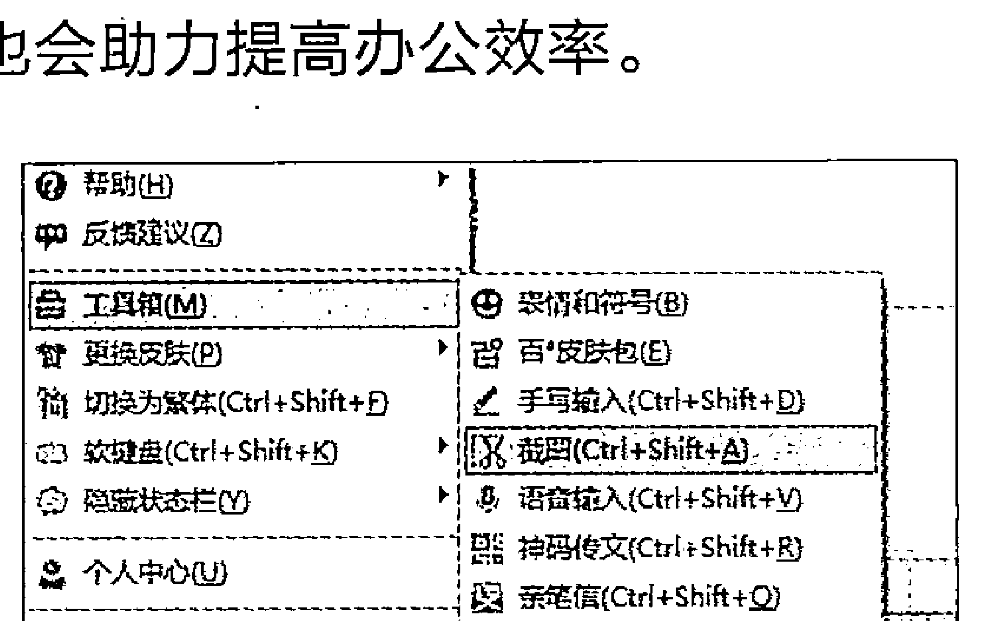

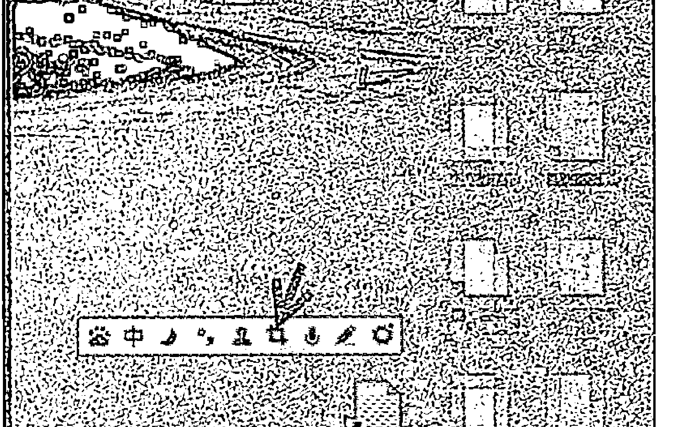

### 亲笔签名 信手拈来巧制作

在网上人际交往过程中，大家总喜欢充满个性的内容。如果给朋友或自己所爱的人发送一个重要的电子档，用手写内容并签上自己的名字，在显示自己个性的同时，总能让对方看着心里更踏实一些。

其实，手写签名也不需要去找什么手写板软件，用百度输入法就能搞定。在百度输入法的扩展功能管理面板中安装一个“亲笔信”小插件，开启后输入条上就会出现一个信封图标，点此图标就可使用它来手写输入个性签名了（图4）。用亲笔信功能手写输入，可将手写签名随意安插在任意一种图文编辑器编辑的文章当中。


### Word内部 也能控制输入法

也许一台电脑的Windows 8.1操作系统中会安装有多种中文输入法，如果在Word 2013中使用这些输入法，是否可以直接控制某个输入法的设置呢？答案是肯定的。

打开Word 2013编辑环境，选择“文件→选项”菜单命令，在随后弹出的“Word选项”窗口中，选择“高级”，然后选中右侧窗口中的“输入法控制处于活动状态”按钮，这时再点击下面的“输入法设置”按钮，启动的就是当前系统正在使用的输入法设置。如此一来，就实现了Word对输入法设置的控制（图5）。

**小提示**
目前搜狗拼音输入法计算功能所支持的运算或函数有22种之多，基本可以满足日常的计算需求（图6）。

### 输入工具 充当函数计算器

在文字编辑软件中办公，如果遇到一些简单的算术问题，还需要求助于系统的计算器或Excel表格来计算吗？不用！输入法本身就能解决问题。以搜狗拼音输入法为例，在简拼输入模式下直接按v键，在双拼模式输入则要用Shift+v组合键进入计算器模式。假设我们要计算2的3次方的结果，直接输入v2^3之后就可以实现。在候选列表中，如果选择a项，那么会在编辑器内得到计算结果8，如果选择b项，那么可将算式与计算结果“2^3=8”一并输入到编辑器当中（图7）。

| 函数名 | 缩写 | 函数名 | 缩写 |
|--------|------|--------|------|
| 加     | +    | 开平方 | sqrt |
| 减     | -    | 乘方   | ^    |
| 乘     | *    | 求平均数 | avg |
| 除     | /    | 方差   | var  |
| 取余   | mod  | 标准差 | stdev|
| 正弦   | sin  | 阶乘   | !    |
| 余弦   | cos  | 取最小数 | min  |
| 正切   | tan  | 取最大数 | max  |
| 反正弦 | arcsin | 以e为底的指数 | exp |
| 反余弦 | arccos | 以10为底的对数 | log |
| 反正切 | arctan | 以e为底的对数 | ln  |
| 如：v3+2 |      |        |      |

**搜狗输入法-输入法管理器**
请选择您要使用的输入法：
☑ US [中文(简体，中国)] 默认输入法
☑ 中文(简体) - 百度输入法 [中文(简体，中国)]
☑ 中文(简体) - 必应 Bing 输入法 [中文(简体，中国)]
☑ 搜狗拼音输入法 [中文(简体，中国)]
☑ QQ拼音Win8版 [中文(简体，中国)]
☑ 微软拼音 [中文(简体，中国)]
只选择您经常使用的输入法，能使输入法的切换更快捷，也能减少系统资源占用。
☑ 以此为默认设置
☑ 切换搜狗拼音快捷键：Ctrl+
[确定] [取消]
[上移] [下移] [设为默认] [全选] [反选] [添加键盘] [添加输入法]

### 多人共用 输入启用巧定义

在多人共用一台电脑的办公室里，如果几个人使用几种不同的输入法在一个系统下办公，那么输入法的调用会很混乱。这时，借助于搜狗拼音输入法的输入法管理器，不同人都可以用最快捷的方法调用自己习惯的输入法（图8）。选中自己所用的输入法，然后点击“上移”按钮，直至其处于第二位，这样在系统中就可以用输入法切换快捷键“Win+空格”快速切换到自己的输入法。

**小提示**
也可以用每种输入法自带的快捷键定义功能指定启动快捷键，比如定义搜狗拼音为Ctrl+1启动，百度输入法为Ctrl+2启动，QQ拼音为Ctrl+3启动。


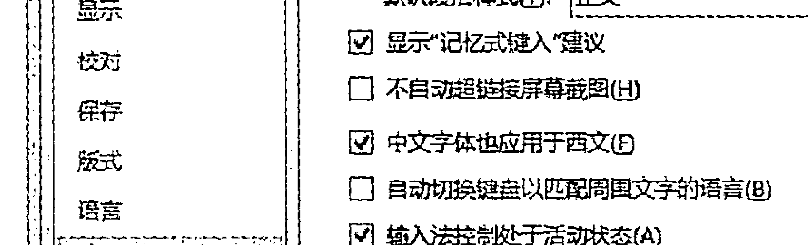


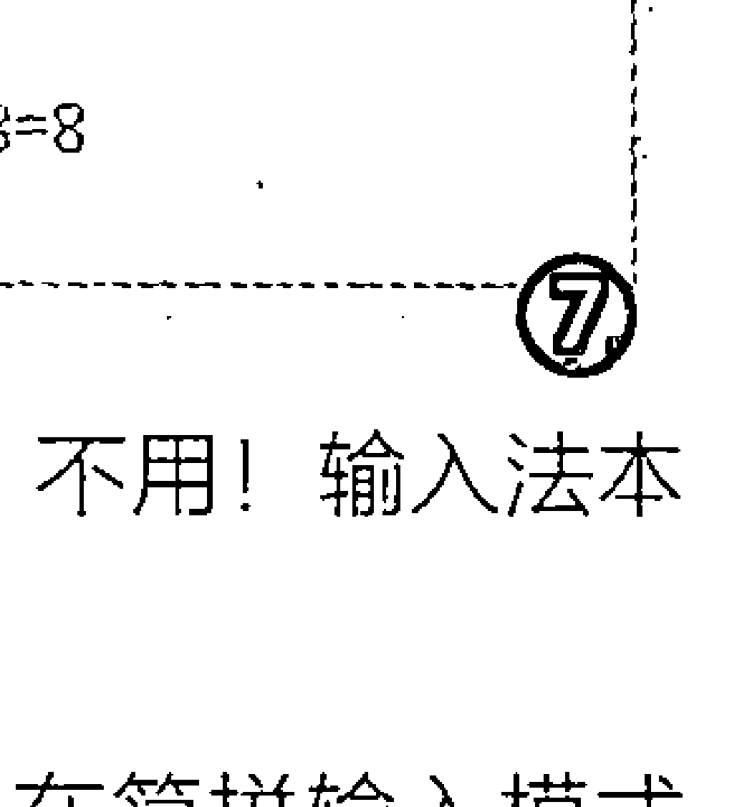


## PPT新视角 幻灯片新感觉

文 | 马震安

你还在为去掉插入到PPT中的Flash背景而发愁吗？你还在为幻灯片中多个素材的定位而苦恼吗？你还在为找不到专业图形而苦苦地搜寻吗？你还在为幻灯片中单一的渐变效果而抱怨吗？好了，现在有了PPT新视角工具集，它能让你的这些烦恼一扫而光，会让你对PPT有新的认识、新的感觉。

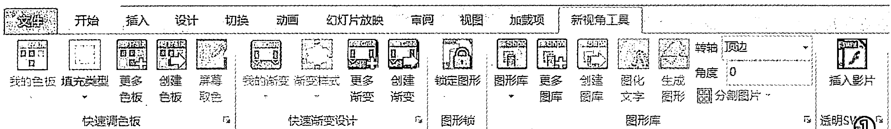

在http://www.blogbus.com/pptaddins-logs/235346050.html分别下载每个插件并进行安装。以使用Office 2010为例，打开PPT2010后就会发现在选项卡栏中多了一个“新视角工具”选项卡，它下面就是安装好的插件（图1）。

### ▶ 透明Flash 一键搞定

利用插件中的“插入影片”按钮，可把Flash动画像插入图片一样轻松插入到幻灯片中，只不过插入的这个Flash，动画背景被去掉了（图2）。

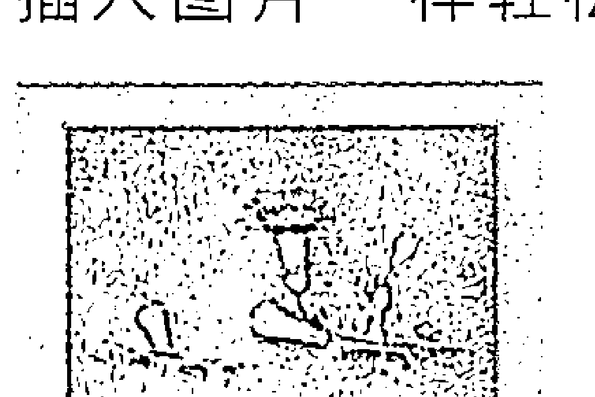


### ▶ 锁定图片 灵活多样

利用“锁定图形”按钮将选中的图形进行位置、大小、旋转等锁定，使其无法被操作。比如锁定移动后，所选中的图片就不能被移动了。

除了上述功能外，这组插件也提供了一些特殊功能，如PPT图形锁、密码等（图3）。

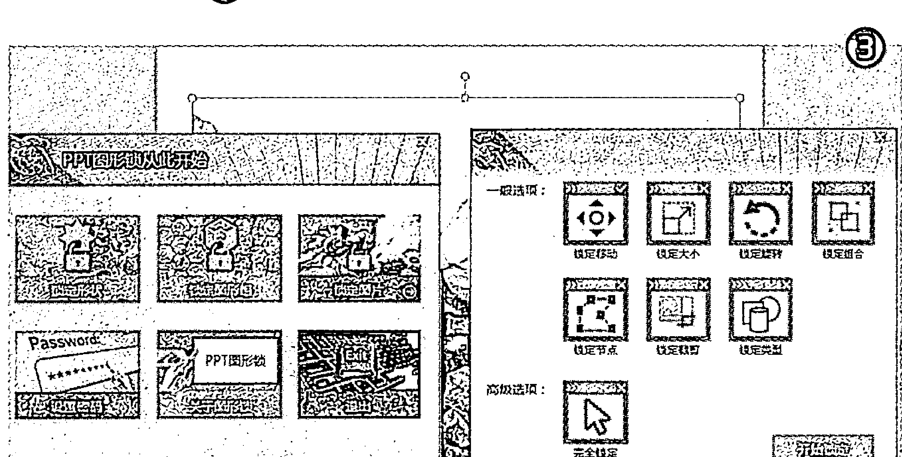

### ▶ 更多渐变 更多选择

如果你觉得PPT中的渐变有些单一，不能满足需要的话，可以试试插件中的“更多渐变”按钮，在弹出的对话框中选择渐变文件后，在“我的渐变”中选择所需要的渐变样式，这时所选图形就进行了渐变设置，仅需一秒就能为图形增加专业而美丽的渐变颜色。渐变样式为创意提供了无限的空间，更能为你的幻灯片增光添彩（图4）。

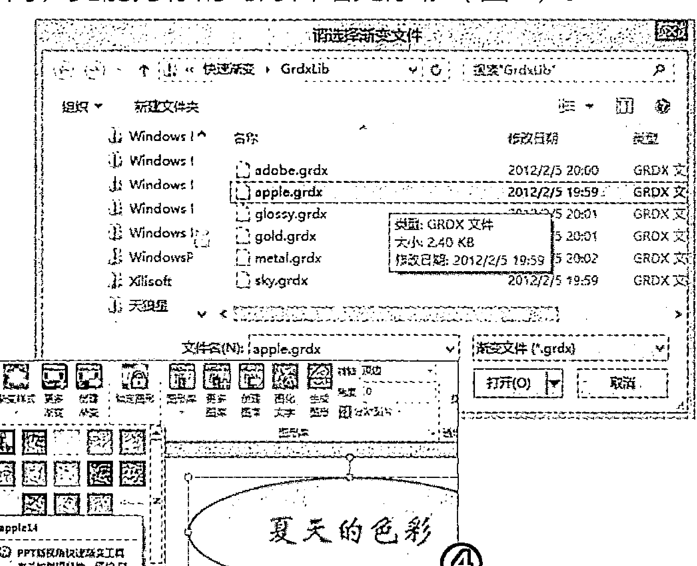

### ▶ 专业图库 你我最爱

当你为找不到专业图形而烦恼，为管理和存储图形而发愁时，新视角工具集中的图形库能为你提供极大的帮助。图形库中的“图化文本”和“迭代生成复杂几何图形”工具能为图形的创意提供无限的可能。

## 轻松制作生活点滴记录册

文 | 马震安

生活中的每张照片、每段视频都包含着美好的故事和回忆，如果要将生活中的照片、视频分类集合为一个电子相册，有什么方便高效的好办法呢？

要将照片、视频按照年份记录在一个文件中，并附上文字说明，用iSpring Kinetics软件中的Timeline程序就能轻松完成这项任务。运行iSpring Kinetics并在开始界面中点击Timeline程序，在出现的主界面中添加主标题、子标题及图片、视频、音频等元素就可以轻松制作出多媒体演示作品。

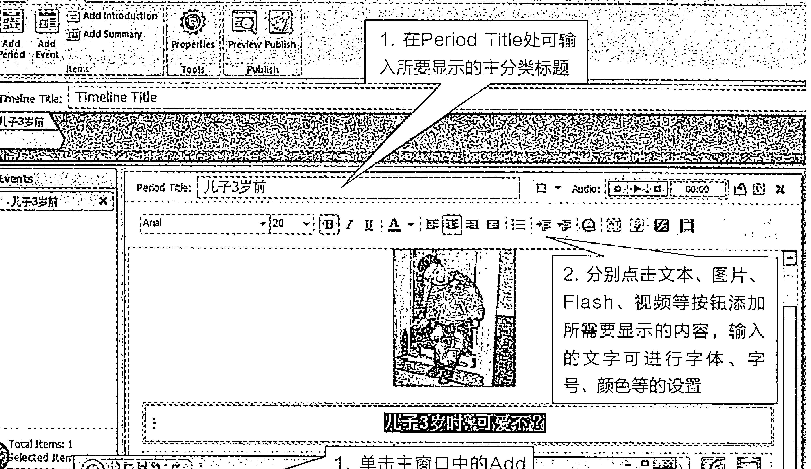

### 1.主标题设置及元素添加

为了更好地留下美好回忆，可按时间或年龄段来设置成主分类标题。这个过程通过主窗口中的Add Period按钮来添加。

### 2.添加分类子标题

如果还想将不同阶段的内容规划到不同的分类里，这就需要为每个分类添加子标题。子标题的设置和主标题设置是一样的。

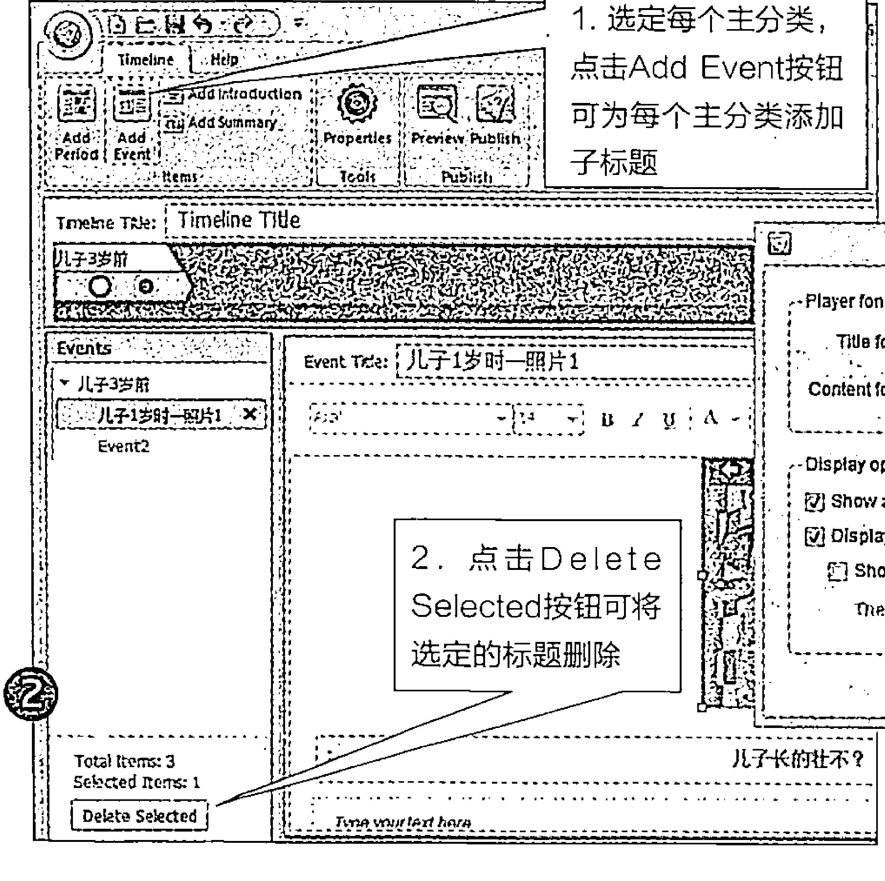

### 3.添加简介及更改记录册标题

为相册添加特定标题和内容简介，更能提起提示的作用。

### 4.发布前设置与作品发布

所有设置及元素都添加完成后，就要生成成品了，在发布成品前还要进行发布前的设置。

所有设置完成后，在主窗口中可以点击Publish按钮准备进行成品文件的发布。在弹出的窗口中设置好输出文件夹、窗口大小及输出品质，点击发布（Publish）按钮输出成品文件。成品文件是SWF格式，在网络浏览器和视频播放器中都可打开，很方便。

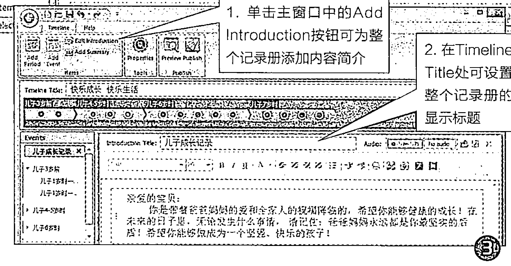

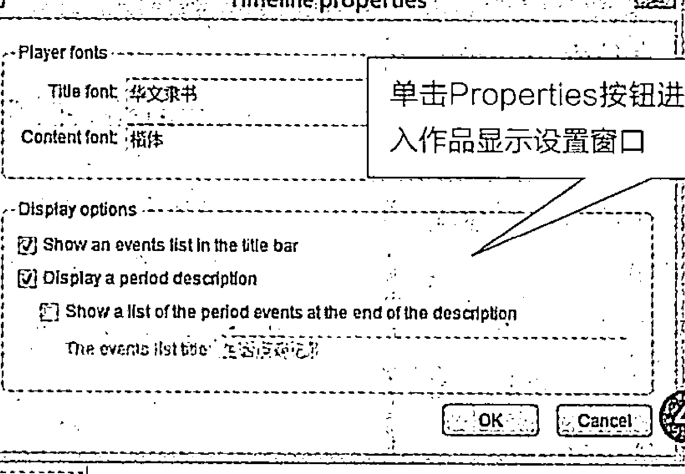

## 反道而行 文档快速变图片

文 | 左骏

以前我们常遇到希望将图片中的文字变成可编辑的文档的情形，然而反过来的情况我们也会遇到。比如不希望别人轻易获取文字内容以保护版权的情形。如果将当前的文档变成一幅图片，就可以有效防止文字内容被复制。然而文档有长有短，页码有多有少，单单靠简单的抓图不能很好地解决问题。那么有哪些方法可以为我们所用呢？

### ▶ 自编文档保存为图片

我们最常使用的文档为Word文档或WPS文档，如果要将正在编辑的文档以图片格式输出，Word和WPS均不具有输出此格式的功能。这时，可以巧妙地借助于WPS最新抢鲜版“办公空间”模块中的一个长微博功能来实现。

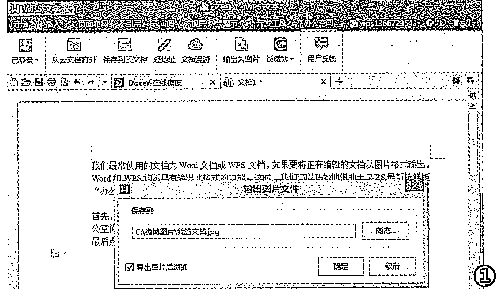

首先，在WPS编辑页面中正常编辑文档，文档编辑完成后，复制全部内容。接着，点击“办公空间”选项卡，新建一个长微博文档，然后将刚才复制的文档内容粘贴到该长微博页面中。最后点击“输出为图片”按钮，将文档内容输出为一幅JPG格式的图片（图1）。

> 小提示
如果是Word文档，由于WPS兼容Word文档，所以可先用WPS打开该Word文档，然后再用如上方法保存为图片即可。

也有人想出先将Word文档以全屏打印预览的方式显示，然后用系统抓图功能将图片抓取并复制到画图软件中，再保存图片，或者借用抓图软件一页接一页手动抓取。这种方法虽然可行，但对于页码比较多的文档来说，操作起来比较繁琐，可谓是一种笨办法，一般不建议采用。

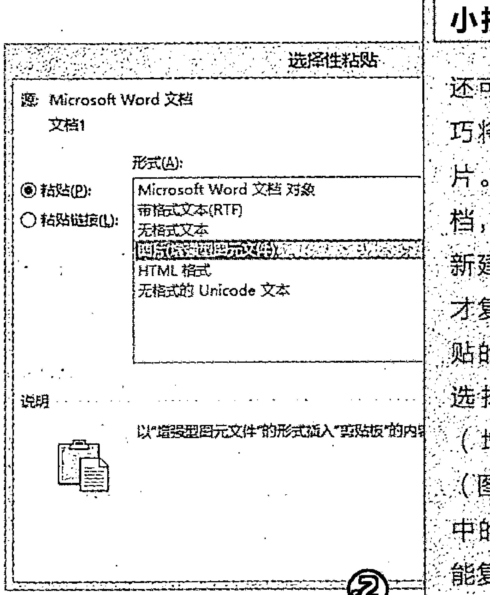

> 小技巧
还可以用选择性粘贴的技巧将Word文档转换为图片。先打开原有Word文档，全选所有内容，然后新建另一个空文档，将刚才复制的内容以选择性粘贴的方式进行复制，注意选择粘贴形式为“图片（增强型图元文件）”（图2）。这样获得的文档中的文字就变成只能看不能复制的状态了。

### ▶ 特殊文档打印为图片

由于编辑软件不仅仅是Word和WPS，不同人所用的编辑环境可能会有所不同，如果所用的编辑软件没有另存为图片功能，又该怎么办？

这时，我们可以利用虚拟打印技术，先在电脑中建立一台虚拟打印机。虚拟打印机与实体打印机不同的是，文件送往实体打印机打印出来的是纸质文件，而虚拟打印机打印出来的是另一种类型的文件格式，不是实体纸质文件。当然，虚拟打印也不需要电脑中安装有实体打印机。

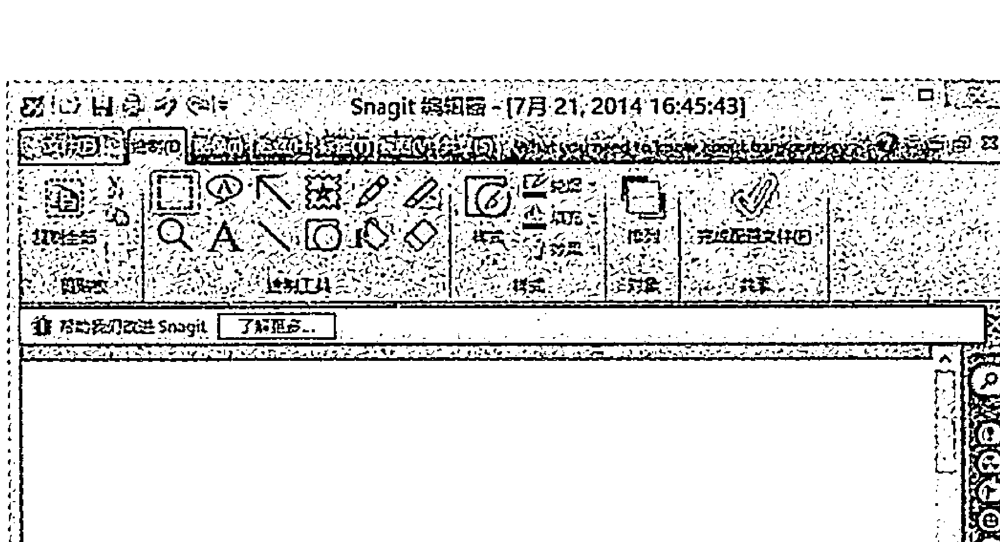

> 也可以利用图像处理软件（如Photoshop）来解决问题。在编辑软件中全选编辑内容并复制，然后将复制内容粘贴到图像处理软件中，稍加编辑后保存为自己所需的图片格式即可。

例如，我们给电脑安装Sngit 11虚拟打印机（安装Snagit抓图软件时附带此组件），安装之后，在打印文档时打印机输出选择Snagit 11打印机（图3）。这样，执行打印命令之后，我们就可以获得一个成系列的抓图结果，系列图片的数量正是我们正在编辑的文档的页数（图4）。

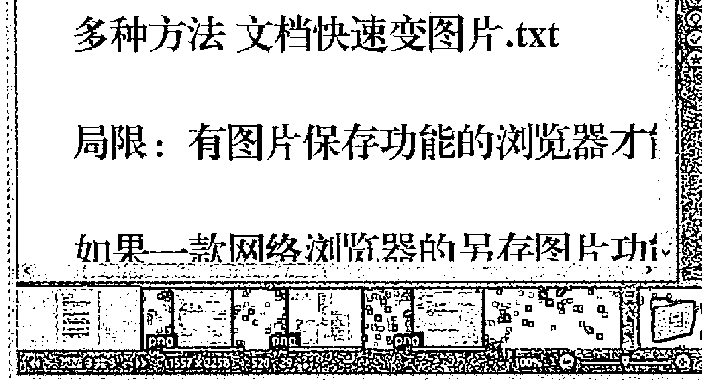

## 超长网页转换为图片

除了Word格式或WPS格式的文档，我们希望展示的文档可能还会是网页格式，我们希望提供给别人的文档看上去是网页格式的，但实际上是不能被复制内容的图片形式。如果要给网页格式的文档加上复制保护，可利用某些网络浏览器自带的将网页另存为图片的功能来实现，比如搜狗高速浏览器（图5）或360安全浏览器（图6）均带有此功能，从其浏览器“文件”菜单或用快捷键即可实现网页变图片。但是，网页保存图片的功能也不是万能的。笔者在用搜狗高速浏览器保存一批超长网页的过程中，发现保存操作可正常完成，也能获得保存的图片文件，但看文件字节却是清一色的数百KB等大小文件，而当用图片浏览器浏览这些网页图片文件时，却发现全部显示为黑色，根本看不到任何内容。最后的解决办法是，将同一网页地址复制到360安全浏览器中进行浏览，然后用360的网页另存图片功能（快捷键Ctrl+M）保存，保存的图片版网页就可以正常浏览了。

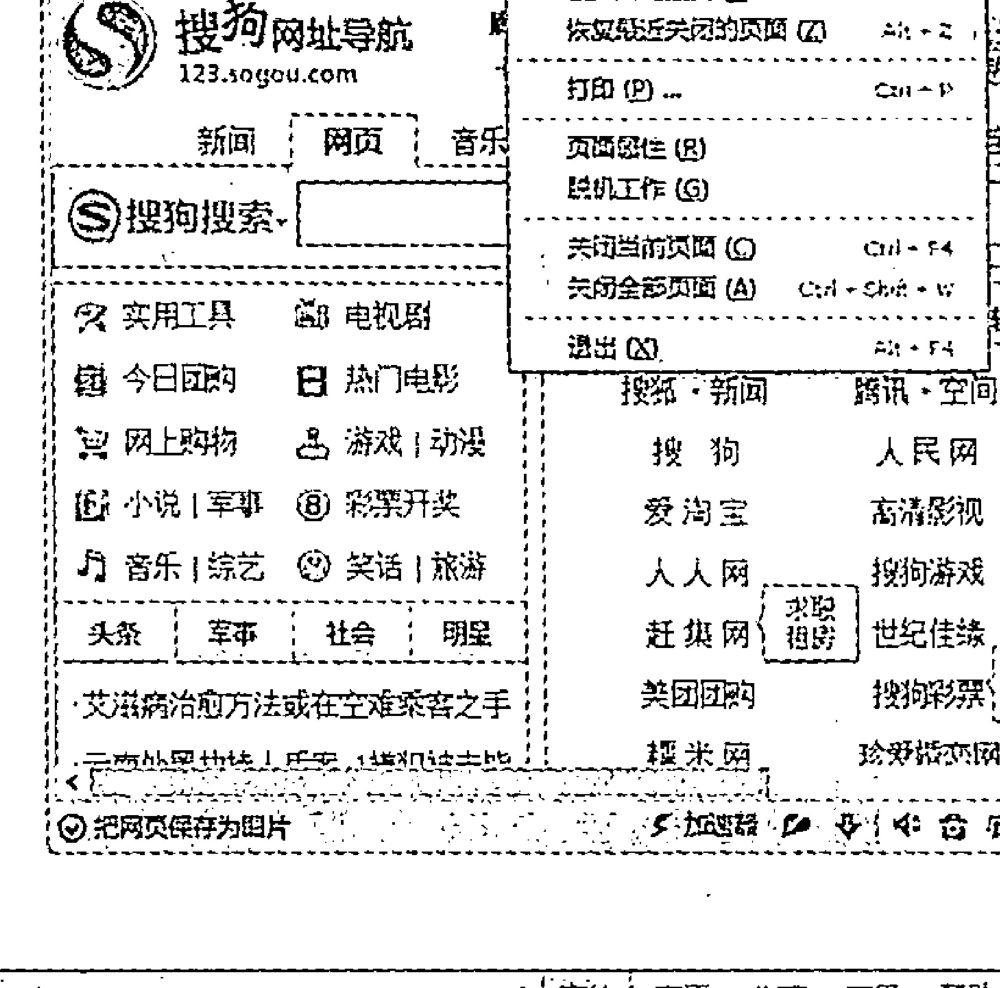

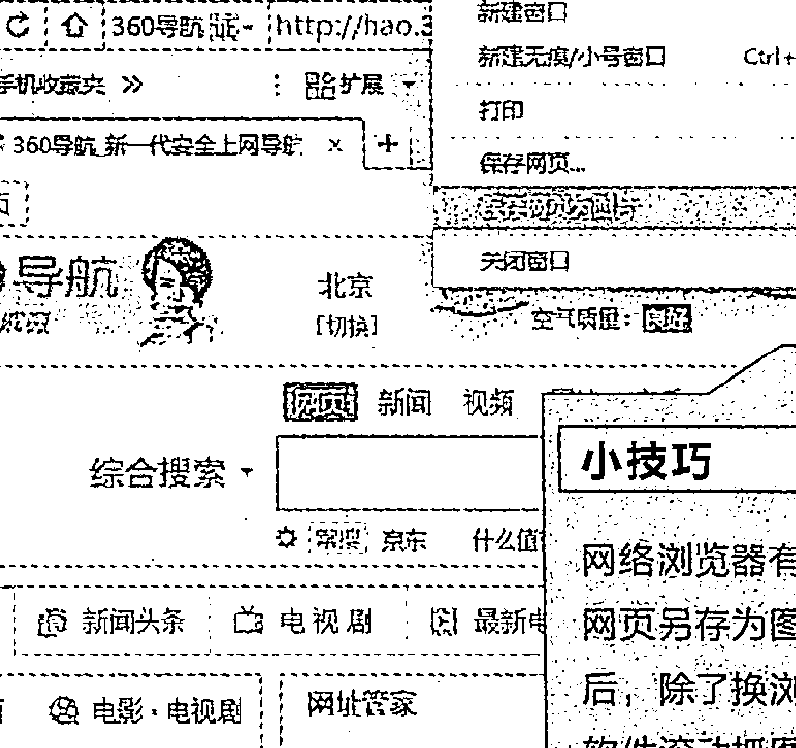

> 网络浏览器有很多，不是每个浏览器都具有网页另存为图片功能。那么，遇到这种情况后，除了换浏览器保存外，还可以借助抓图软件滚动抓图功能来实现超长网页的图片转换。以使用Snagit最新版抓图软件为例，只需将捕获类型设置为“高级→滚动活动窗口”，然后执行超长网页抓图，即可一次性获得超长网页图片（图7）。

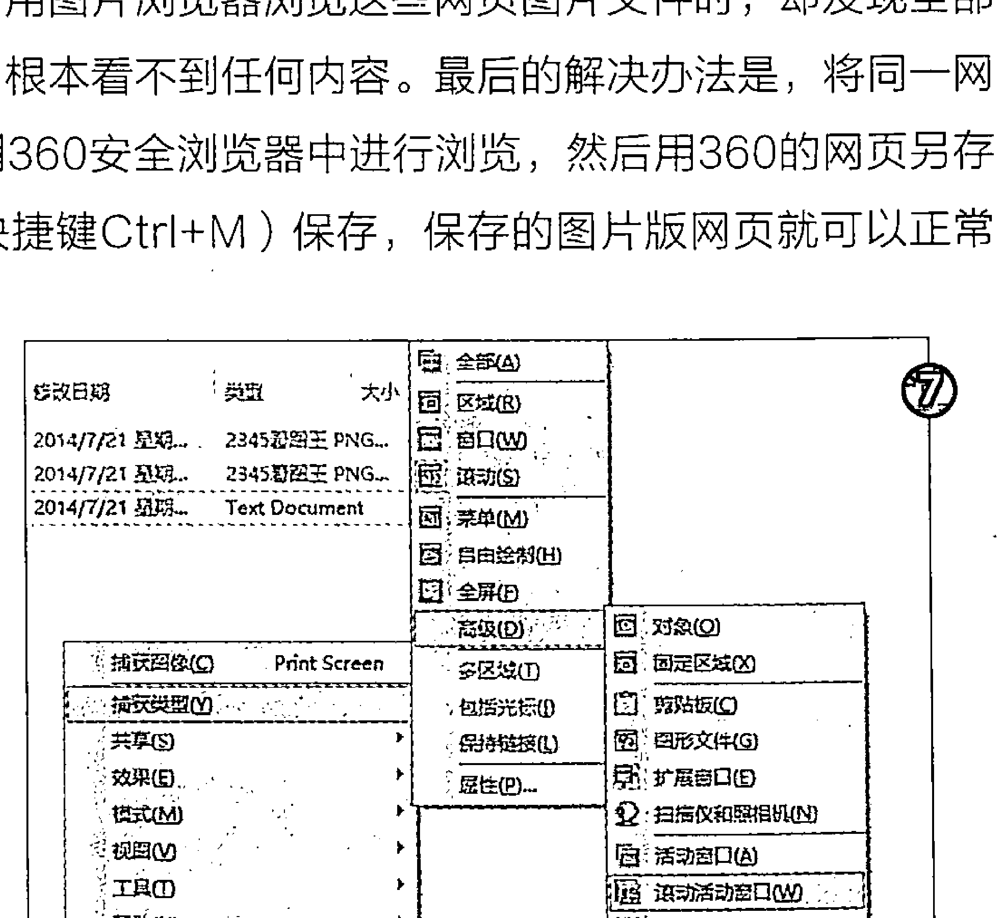

## 交互式动画图表轻松做

文 | 马震安

如果你将一个交互式较强、动画效果较好的图表展现给老板，老板想看哪部分数据的图表时随手一点，图表内容就会以Flash般的炫丽呈现出来，这比起简单、呆板的普通图表来定会让老板更好看。只要安装了水晶易表，这样的图表就能轻松制作出来。

- 对电信公司月销售数据进行图表分析，要求：
1. 能够利用标签式按钮切换显示量表所表示的单个项目各月销售的最大值、最小值和平均值；
2. 能够利用单选按钮切换用柱形图或折线图所表示的单个项目每月销售数据；
3. 用量表显示单个项目单月销售数据，当点击柱形图或折线图中的数据时随之改变；
4. 图表显示具有动画及音视频效果，对图表进行装饰性美化（图1）。

### 一键导入Excel数据

再亮丽的图表也需要数据的支持，所以在打开的Xcelsius 2008（水晶易表2008）程序中，可利用“数据→导入”菜单将图表所需要的Excel数据表格导入到窗口中。


### 部件添加超简单

部件的添加可用鼠标在部件窗口中将所需部件拖动到画布窗口中即可。可利用“格式”菜单对各部件进行调整，也可通过其中的“主题”菜单来改变部件的显示（图2）。

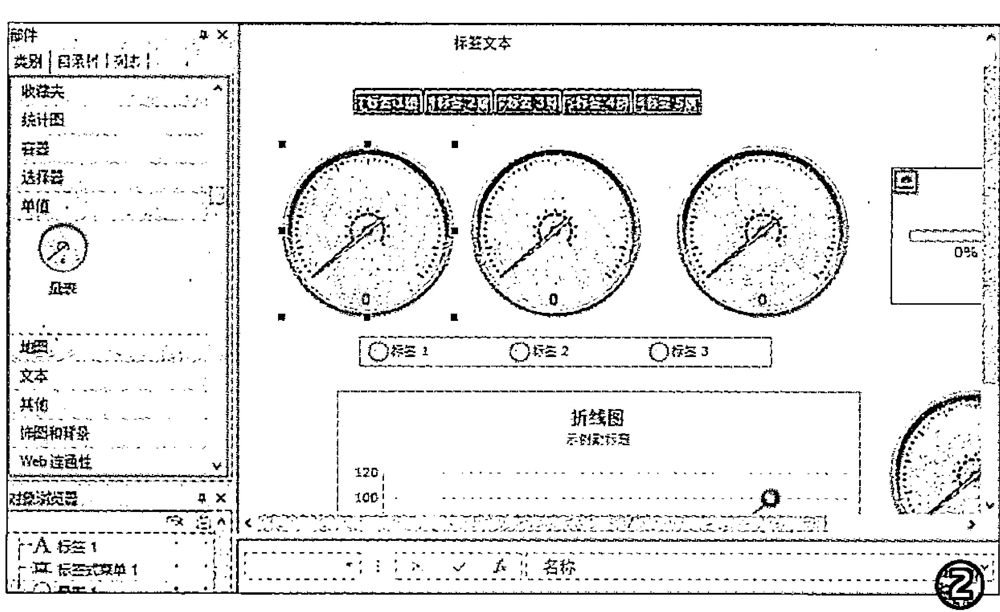

### 部件属性巧设置

要让图表更亮丽、更具有交互性，就需要对每个部件的属性进行设置。对于部件属性的设置，需要右击部件选择“属性”菜单。

### Step2
标签式菜单部件的设置。将标签式菜单部件的标签属性设置为Sheet1中的A3:A5单元格，插入类型选择“行”，源数据选择Sheet1中的A3:M5，目标选择Sheet2中的A2:M2，意思是根据标签按钮的选择在源数据中进行筛选，把选择好的数据整行复制到Sheet2中的A2:M2。可在“行为”选项卡启用声音效果（图3）。

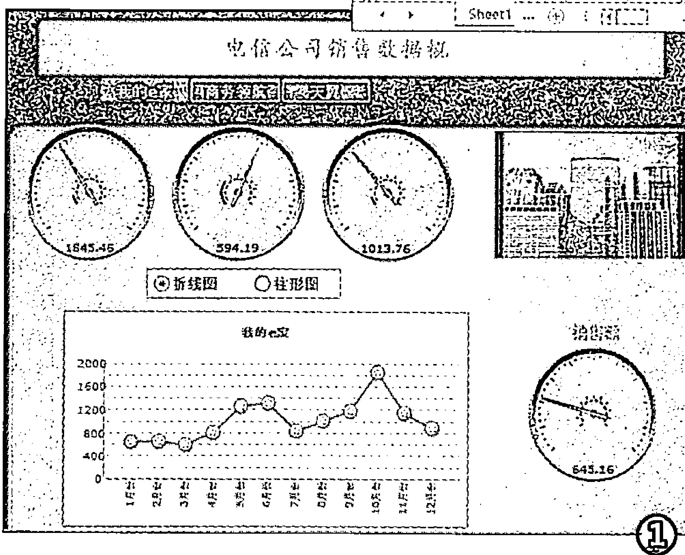

### Step1
标题标签部件的设置。在“常规”选项卡中输入标签内容，在“行为”选项卡中可设置动画和效果，在“外观”选项卡中可设置文本的字体、大小、颜色、边框等。

### Step3
量表部件的设置。选择第一个量表，将它的标题设置为Sheet2的A10，值设置为B10，最小值限制为0，最大值限制为5000；启用警报，占目标百分比设置为Sheet2的C10，百分比可根据需要输入，颜色也可更改；颜色顺序选择“高值为好”。第二个、第三个量表的设置与此类似，第二个量表的最大值限制为1000，第三个量表的最大值限制是3000（图4）。

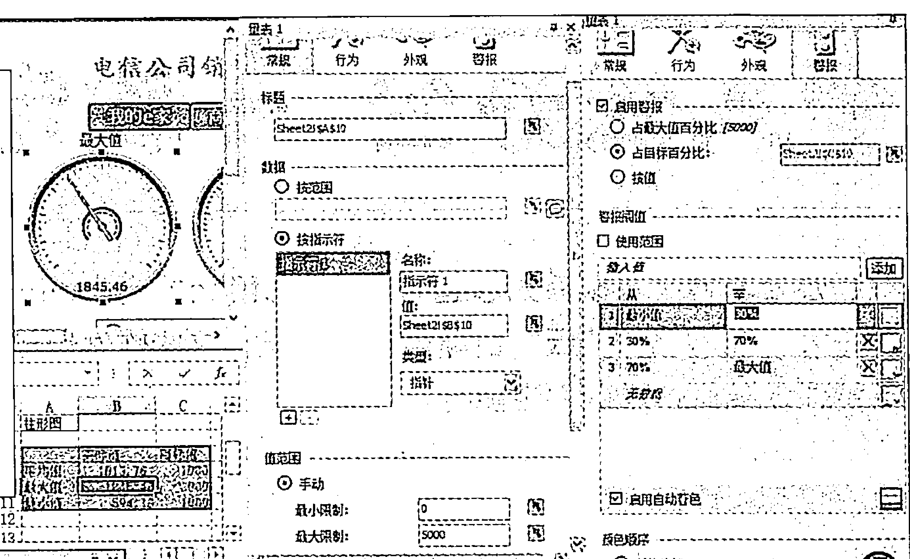

### Step4
单选按钮部件的设置。将单选按钮部件的标签设置为Sheet2中的A5:A6；目标设置为Sheet2中的B5（当选择折线图时B5的值就是1，当选择柱形图时B5的值就是2）；在“行为”选项卡的“常用”标签下将选定条目设置为“标签1”（图5）。

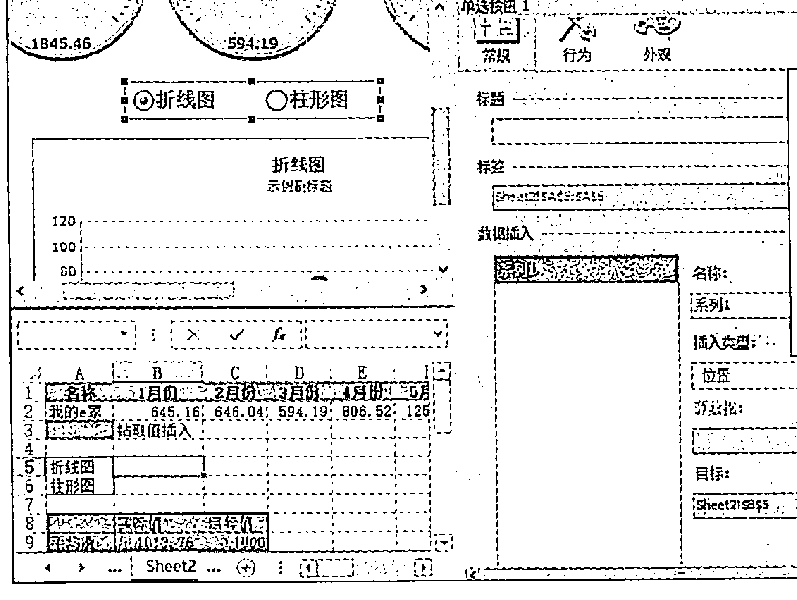

### Step5
统计图的设置。选择折线图，将它的标题设置为Sheet2中的A2，数据选择“按系列”，名称为“销售额”，值为Sheet2中的B2:M2（这与标签式菜单部件的数据插入目标是相对应的），类别标签为B1:M1。

其他属性还需要设置向下钻取，系列名称目标是“销售额”，插入类型为“值”，目标是Sheet2中的A3；“行为”属性中设置动态可见性，状态为Sheet2中的B5，代码为1（意思是当B5中的值为1时显示折线图），并启用数据动画。柱形图的设置与之类似，只不过它的动态可见性的代码为2（图6）。

### Step6
销售额量表的设置。选定销售额量表，将它的标题设置为“销售额”，选择按指示符，值为Sheet2中的A3（这与统计图向下转取中系列的目标相对应），最大限制值为3000（图7）。

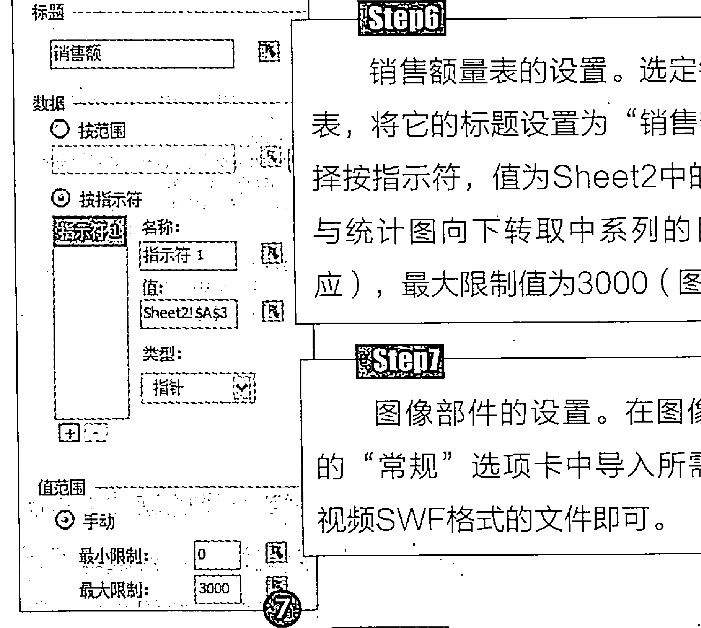

### Step7
图像部件的设置。在图像部件的“常规”选项卡中导入所需要的视频SWF格式的文件即可。

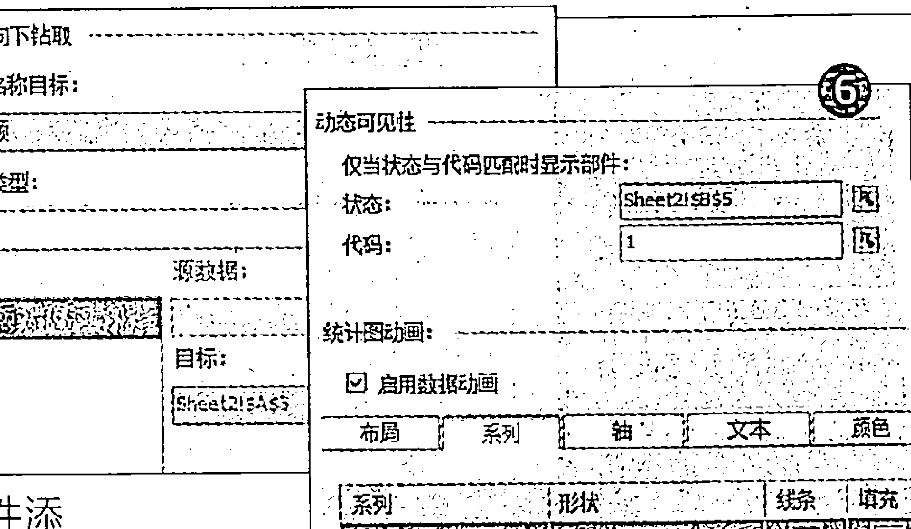

> 小提示
由于单击标签式菜单时会改变Sheet2中A2:M2的数据，最大值、最小值、平均值也要随之改变，所以Sheet2中B10处的公式为“=MAX($B$2:$M$2)”，B11处为“=MIN($B$2:$M$2)”，B9处为“=AVERAGE($B$2:$M$2)”。

### 图表美化更亮丽

可利用背景部件为各个部件添加相应背景以达到美化图表的效果。在对象浏览器窗口可拖动部件上、下移动以调整部件在画布中的层次关系，同时可对部件进行重命名以便选择操作。

利用“文件→导出”菜单导出图表，既可以生成单独的SWF文件，也可将图表导出到PPT等文件中，让你有了更多的选择。

## 个人云办公 一软定乾坤

文 | 亦云

说起办公软件，大家首先想起的是微软Office或金山Office套装软件。没错，这些软件可谓办公软件中的大哥大。在网络和“云”日渐盛行的今天，这些软件也加入了云的成分。但是，对于普通的个人办公或事务管理，离开这些软件也能行！

我们撇开微软和金山这两个“大头货”，尝试用一个小小的笔记软件——有道云笔记，来完成跨平台的一站式信息管理和处理，完成我们需要做的日常事务。

### 创建自己的复杂文档

图、文、表格内容的文档是我们最基本的办公文档，如何用一个云笔记软件来创建这么复杂的文档？
点击工具栏上的“新建笔记”按钮，右侧窗口随机会出现一个空白页面，在上部标题栏内输入文档标题。当然也可以不输入标题，这时，系统会自动提取正文的第一句作为文档标题，存盘时以此为标题自动命名。

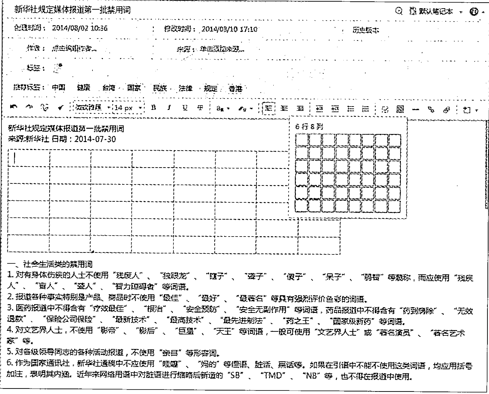

小技巧
在有道文档设定待办事项：点击编辑窗口格式栏上表格工具左侧的对勾按钮，在有道云文档中可以插入待办事项。点击时钟图标设定设置提醒时间标志，在后面填入待办事项提醒内容。这样，待办事项会通过网络同步到自己的所有设备当中，无论在家还是在外，只要身边携带一台装有有道云笔记的设备并使其处于开启状态，到时就会有实时提醒，不会让自己耽误要办的事情。

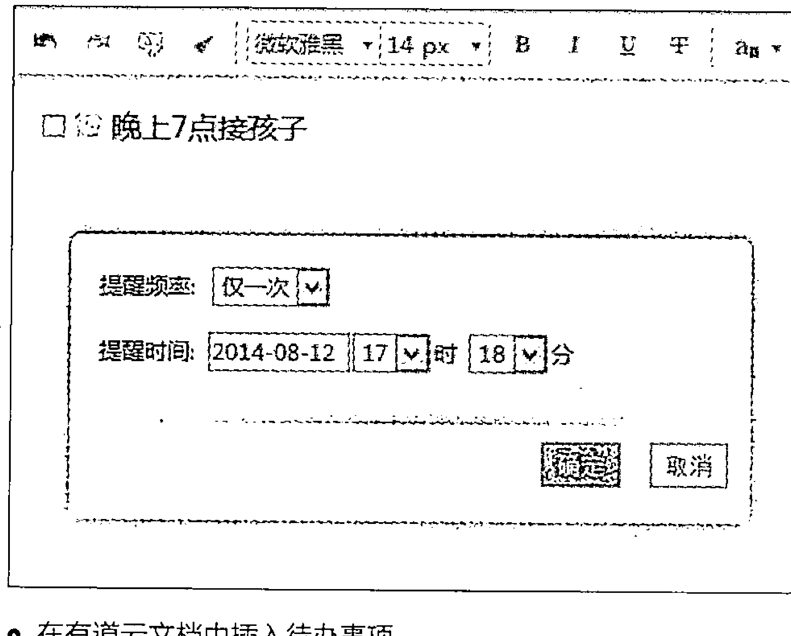

在编辑区直接输入文字或从别的软件中复制文字到这里，对于文字的样式设置，有道云笔记提供了丰富的选择，包括从字体类型和大小，加黑、斜体、下划线，文字颜色与背景，对齐、缩进与项目列表，这些基本的文字样式与格式设置，毫不逊色于Word和WPS等专业软件。
千万别以为有道云笔记只能编辑文字，实际上，它中间能融入的内容可以非常丰富，从表格制作、文档线条、外部网络链接，到待办事项、各类附件文件等一应俱全。这大大拓展了文档内容的空间。

### ▶ 截图插文不用找外援

如果遇到需要插图的地方，也不用另找抓图软件。有道云同样具有图片功能，除了可以用附件的方式将图片纳入有道云文档的管理之外，利用有道云笔记格式栏最后一个按钮——截图按钮，可以将任意想要的图片以截图的方式插入到文档当中。

> 小提示
如果在截取桌面或窗口图片的过程中，有道云窗口遮盖了要截取的区域，那么截图时可选择“截图并隐藏笔记窗口”选项。

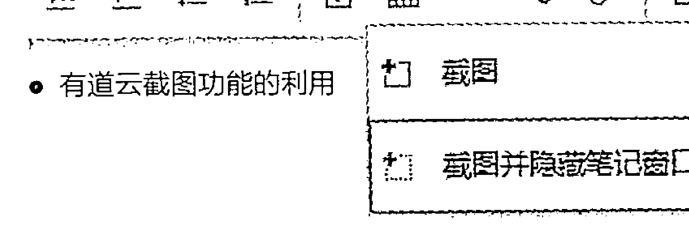

### ▶ 跨越不同设备平台共享

微软Office和金山Office在跨越不同类型设备、不同操作系统目前很不完善，在打通平台共享方面，因为各种原因，有的问题至今没有解决。由于有道云笔记生来的天性便是“云端同步”，再加上如上所述的它对各种主流平台和主流设备的广泛支持，因此，对于这边编辑，那边同步接续的用户需求，都可以很好地满足。专用的网络服务大空间和不断升级的同步技术，可以保证高效的文档同步。这一点值得我们信赖，没有必要去深究，只要一用便知。实践胜过空谈。

### ▶ 文档管理胜过Office

除了处理文档外，管理文档也是我们的日常需求。微软Office和金山Office在管理文档方面并不在行。我们管理这些文档往往需要借助于一些文档管理软件。而有道云管理文档则不需要那么麻烦，因为它自己就能办好这件事情。

在有道云编辑窗口的左侧，我们可以根据需要建立若干个文档分类目录，每个目录下还可以建立子目录。对于建立的文档，我们可以随时对其进行归类，分别存放在合适的目录下。待需要查找时，既可以通过分类或时间、标签来选择，也可以通过窗口上面的搜索按钮，以关键词来搜索文档。

### ▶ 新建和管理高级图文表

别以为有道云文档小小个头不中用，实际上，它能统领别的“大头目”。就连微软的三大文档它也能在自己的窗口中直接新建和纳入自己的管理范畴。
在有道云文档的窗口中，点击鼠标右键，在弹出的“新建”菜单项下，可选择新建TXT文本、Word文本、Excel表格和PPT演示文稿等。这样一来，小小的文档就变成一个统领各种流行文档的“万金油”。

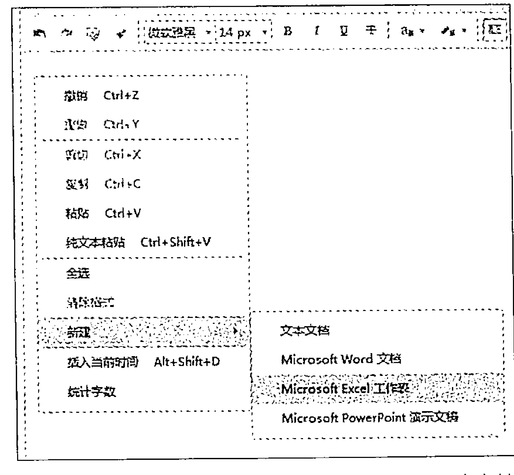

### ▶ 剪报、记账、管单样样能

收集网页资料、个人财务记账、日常信息清单管理，这些都是我们在日常个人办公中涉及的问题，以往都需要专门的小软件来进行。现在，我们可安装有道云笔记提供的三个附件：网页剪报、记账·有道云笔记、清单·有道云笔记，有效地解决这些问题。[图标]

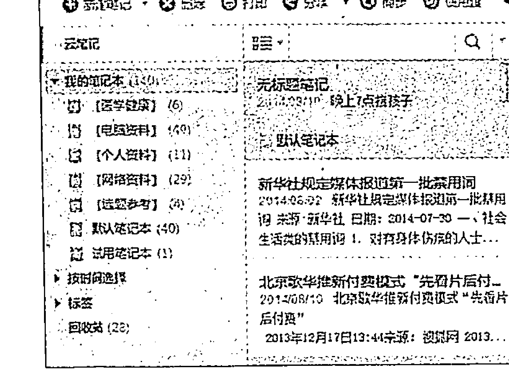

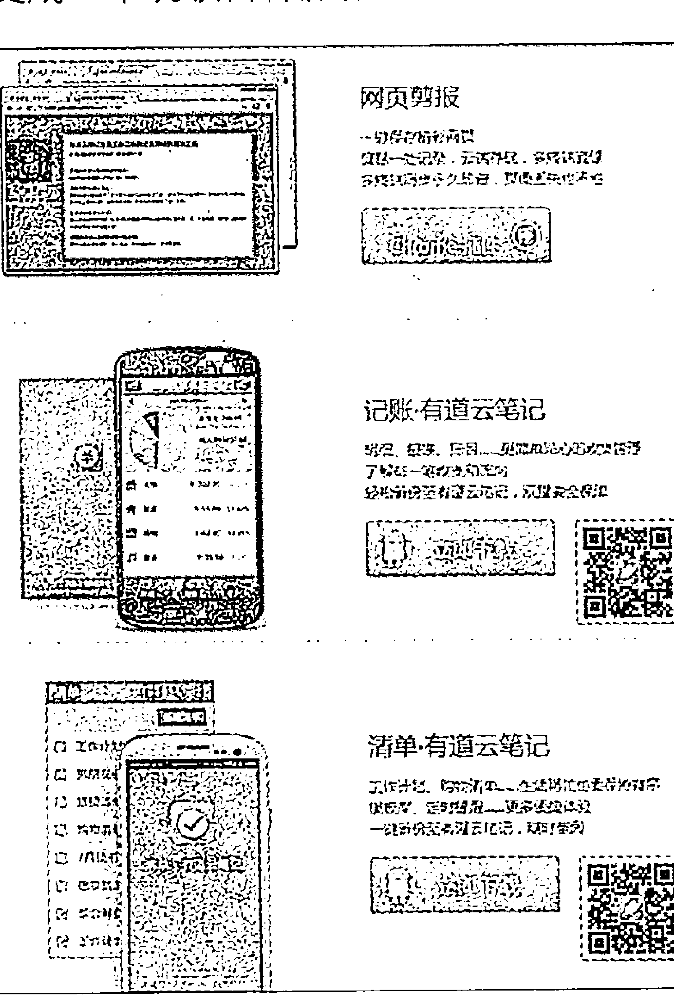

## 文件批量更名 右键更省事

文 | 吴昊

在处理办公文档的过程中，我们常常为大量的不规则文件名或不符合规定的批量文件命名而烦恼。文件批量改名工具具有许许多多，然而，如果能在选择了批量文件或文件夹之后，一点右键便可实现成批文件或文件夹的批量重命名，岂不更加省事？

### ▶ 先行设置 添加右键菜单

启动好压，执行菜单命令“选项→设置”，在设置窗口的“综合”选项卡下，点击“外壳整合”分组下的“关联菜单项目”按钮（图1）。 在“选择关联菜单项目”窗口中，滚动列表到最底部，然后选中倒数第3个选项“批量文件改名”（图2），依次点击两次“确定”。 经过如上设置，在文件资源管理器的好压右键菜单项中，会出现一个“批量文件改名”的新项目。

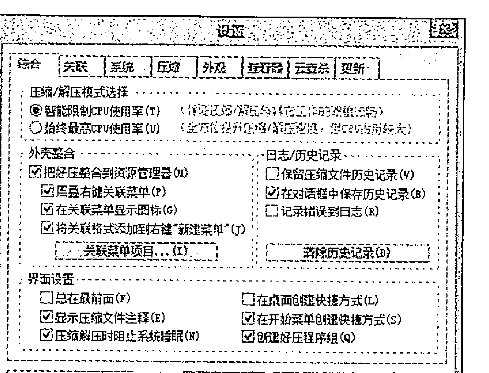

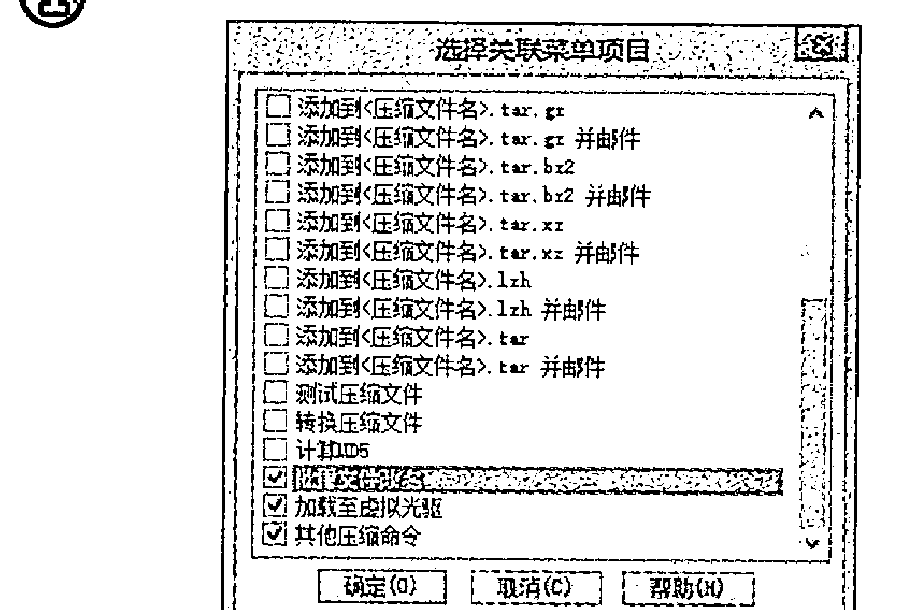

### ▶ 多重选择 右键批量命名

如果要对某文件夹中的一批文件夹或文件更名，先多选要更名的文件夹或文件，然后单击右键，从右键菜单选择“好压→批量文件改名”（图3）。 在随后弹出的“批量文件改名”窗口中，设置改名参数并执行重命名操作（图4）。可根据需要选择增删、替换字符，或使用通配符按序列命名。

> 小提示
虽然经典的文件更名软件拖把更名器支持在资源管理器中直接用右键批量命名文件，但是由于该软件对高版本Windows的兼容性不好，尤其是对Windows 8/8.1，会造成与系统文件资源管理器的冲突而导致资源管理器失效，而且在命名框中无法支持中文输入，因此不推荐使用。

> 小技巧
用系统自有的功能也可以为一批文件加上序列号。只需全选要命名的文件，在第一个文件上点击右键并选择“重命名”，输入文件名主体部分（如“泰山旅游照”），然后回车，随即便可看到以“泰山旅游照”打头、后附括号数字的序列文件。但比起上述方法，此方法功能太单一，很难满足个性化的特殊更名需求，作为简单应急尚可。

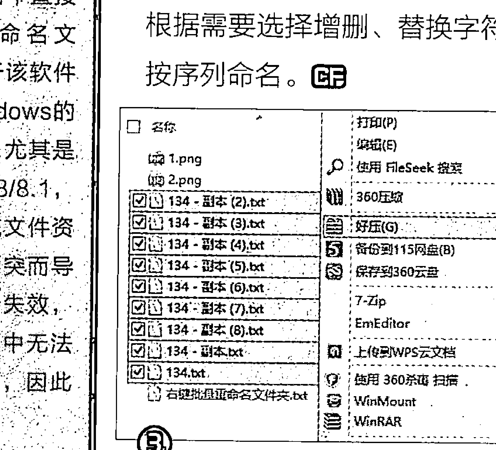

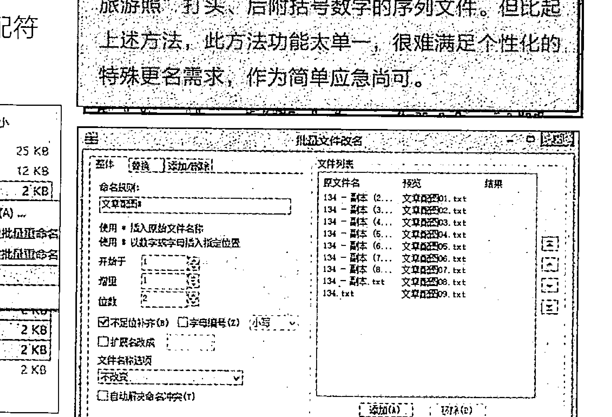## PPT也玩旋转跟随

文 | bhgoshawk

很多人在PPT中做路径动画时，常常会遇到这样一个问题，就是物体不能随着运动路径的曲率自动发生旋转。但是在Flash等专业动画软件中却很容易实现。那么，在PPT中如何实现呢？

### ▶ 宁折不转 一路走到黑

此处以笔者工作中遇到的演示一架飞机做“俯冲—拉起”运动为例，探究该演示功能的实现过程。

把飞机图片插入到PPT中，并加入运动曲线，如果此时直接播放动画，动画过程的截屏如图1所示。此时飞机的机头方向始终指向正前方，并没有跟随路径的曲率而发生任何改变，大有“宁折不转”、“一条道走到黑”的气势。这显然不符合飞机的运动规律。飞机机头的指向应该始终和曲线的切线方向一致才对。

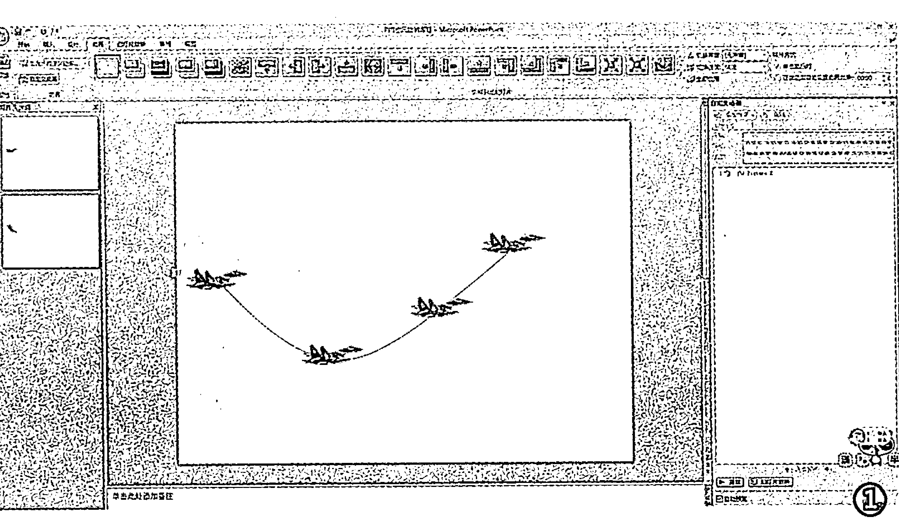

### ▶ 略施小计 乖乖跟着转

下面我们做一点小修改，略施小计便可使动画满足我们的要求。首先，在起点位置，旋转飞机使机头的方向大概与路径起点切线的方向保持一致。
如果我们的路径动画设置的是中速（2秒）的话，假设飞机匀速飞行，那么飞到曲线最低点的大概用时为1秒。
下面是具体的操作步骤，如图2所示：
选择飞机，在动画面板中加入“强调→陀螺旋”；设置陀螺旋开始方式为“之前”，在动画面板中右键选择“显示高级日程表”选项；拖动陀螺旋的动画起始时间至0.8秒的位置；拖动陀螺旋的动画结束时间至1.2秒的位置；改变陀螺旋的角度为逆时针60°。
如此设置之后，如果播放动画，动画过程的截屏如图3所示。这样，飞机的运动就符合我们的要求了。

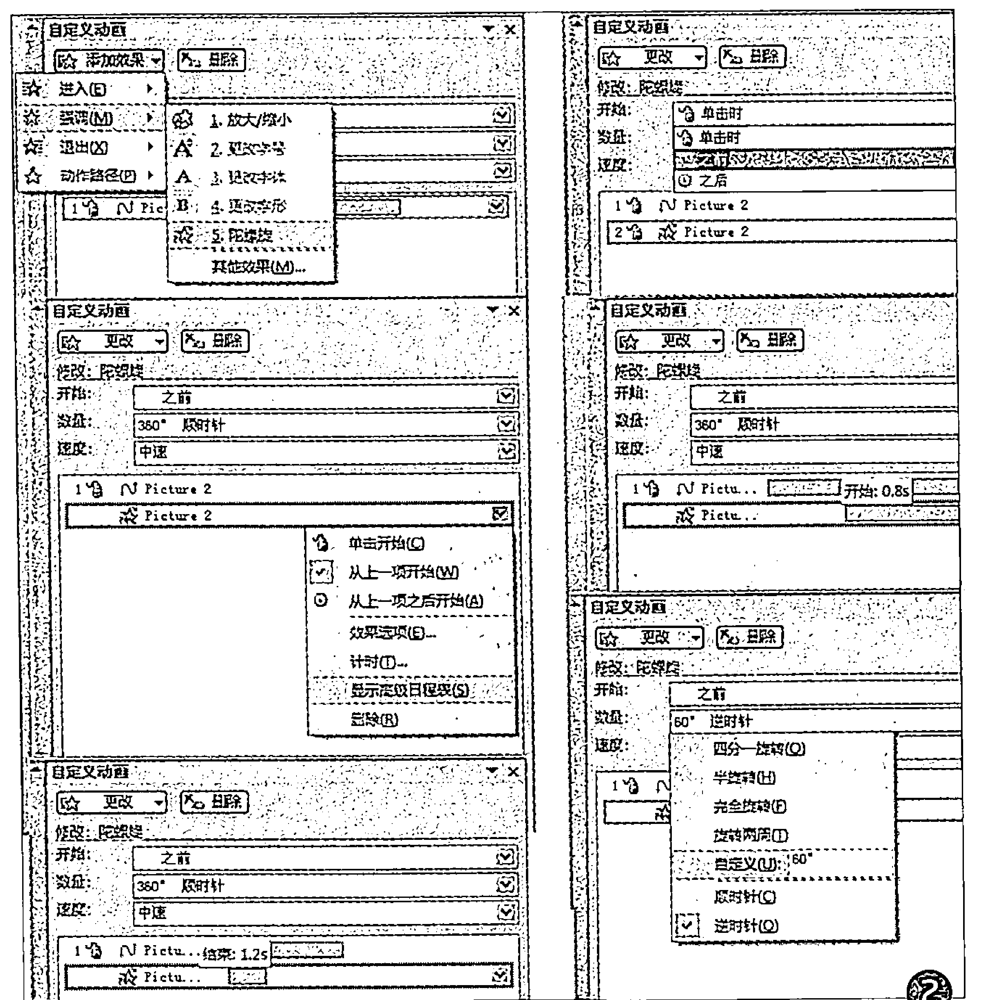

通过以上的制作，我们可以得出结论：
上述方法只是在“关键点”通过陀螺旋进行了角度旋转，并没有使飞机时刻沿曲线切线方向飞行，但是对于PPT动画已经足够了，在视觉上已经能基本满足我们的需求。对于更复杂的曲线运动，可以照此方法如法炮制，只是多增加几个“关键点”的问题。

## Excel也做交互幻灯片

文 | 马震安

也许你会奇怪：Excel也能做幻灯片？用Excel单独制作幻灯片的确有些困难，但如果在水晶易表（Xcelsius 2008）的协助下，制作交互式的幻灯片就轻而易举了。

### 制作缩略图式照片演示


我们做一个利用缩略图式图片菜单进行图片切换展示的幻灯片（图1）。

在Xcelsius 2008中，交互式行为都是由窗口部件完成的。打开Xcelsius 2008后，在“部件”窗口将所需类别的子部件选中后直接拖到右边画布中即可。本例中，笔者选择的是“选择器”类别中的“鱼眼图片菜单”部件（拖动1次）及“饰图和背景”类别中的“图像部件”（拖动6次），可在“对象浏览器”窗口为部件进行重命名（图2）。

要想使部件具有动画、交互及外观等效果，还需要对它的属性进行设置。右击部件选择“属性”菜单。

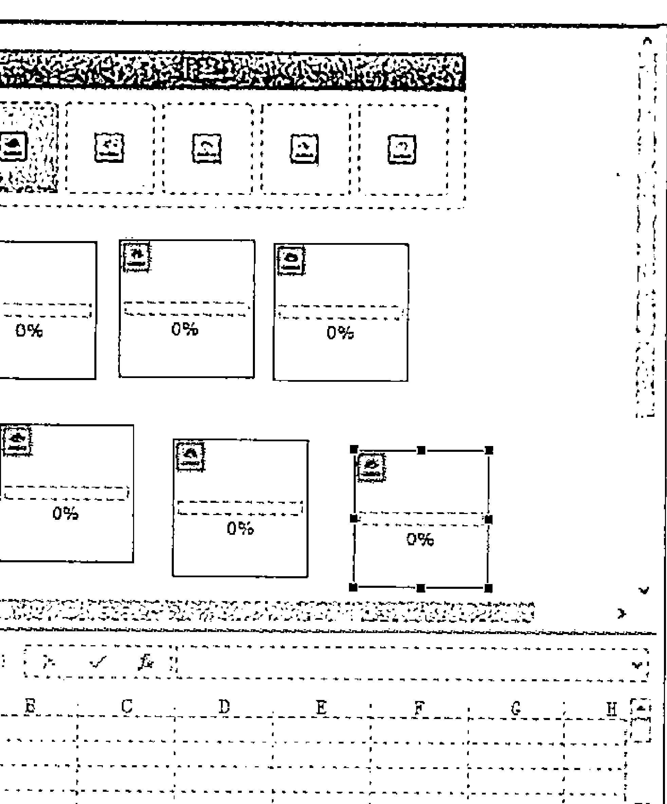

### 第一步：设置“鱼眼图片菜单”部件属性

在它的“常规”属性中，“标题”处输入所需要的标题（当然如果需要，可在Excel中选择相应单元格内容），在“标签”可单击最右端的按钮来修改标签的显示内容，在“图像”处选择“嵌入”后点击“导入”按钮选择相应图像（选择的图像要与标签显示内容一致），在“数据插入”处插入类型选择“位置”，目标选择Sheet1中的A1（目的是存放所选择缩略图的顺序索引值，如选择了第2个缩略图，A1处的值就是2）。

在部件“行为”属性的“常用”标签中将选择条目设置为“缩略图1”，在“动画和效果”标签中勾选“启用声音”。当然也可以在“外观”属性中设置缩略图的大小及标题、标签的显示效果等。

### 第二步：设置“图像”部件属性

选择第一个图像部件，在它的“常规”属性中勾选“根据窗口部件调整图像大小”后导入所需要的图片，利用鼠标拖动改


下面我们制作一份包含3个单选的测试题交互幻灯片，选择过程中会自动计算和显示所得总分（图4）。

首先设计题库表格。在本例中，将3道试题放在一个Excel表中。其中，E2得分处的公式为“=IF(C2=D2,1,0)”（意思是如果正确答案和回答答案相同则给1分，否则给0分），在E5处的公式为“=SUM(E2:E4)”。将A6单元格作为存放选择列表框项目的索引值（图5）。

打开Xcelsius 2008后，利用工具栏上的“导入电子表格”按钮将表导入窗口中。

接下来设置部件属性。同样道理，将所需要的1个列表框、5个标签及3个单选按钮拖入到画布中，并对它们的属性进行分别设置。

第一步：“列表框”部件属性的设置。在它的“常规”属性的“标题”处输入所需标题，在“标签”处选择Sheet1中的A2:A4单元格，在“数据插入”处插入类型选择“位置”，目标是A6单元格。在“行为”属性“常用”标签中将选定条目设置为“标签1”，在“动画和效果”标签中启用声音。当然，也可在“外观”属性中设置部件的字体、颜色等格式（图6）。

第二步：“标签”部件属性的设置。选择第1个标签部件，在它的“常规”属性中将它的单元格链接选择为B2，在“行为”属性“常用”标签中设置动态可见性状态为A6单元格，代码为1；第2个标签的单元格链接为B3，动态可见性状态为A6单元格，代码为2；第3个标签的单元格链接为B4，动态可见性状态为A6单元格，代码为3；第4个标签的单元格链接为D5；第5个标签的单元格链接为E5，用于显示总分分值。可用“外观”属性对这些标签进行美化。

第三步：“单选按钮”部件属性的设置。选择第1个单选按钮，在它的“常规”属性中修改它的标签名称为A、B、C、D，在“数据插入”处插入类型选择“标签”，目标为D2单元格。在“行为”属性“常用”标签中设置动态可见性状态为A6单元格，代码为1；在“动画和效果”标签中启用声音。

同理，第2、3个单选按钮也这样设置，只不过第2个单选按钮数据插入处的目标为D3单元格，动态可见性的代码为2；第3个单选按钮数据插入处的目标为D4单元格，动态可见性的代码为3。

这些部件的属性设置完成后，分别将显示题目的3个标签选定，将3个单选按钮选定，利用“格式”菜单中的对齐、相同大小等子菜单进行位置、大小的调整。最后，利用“文件→导出”菜单生成SWF文件就可以了。

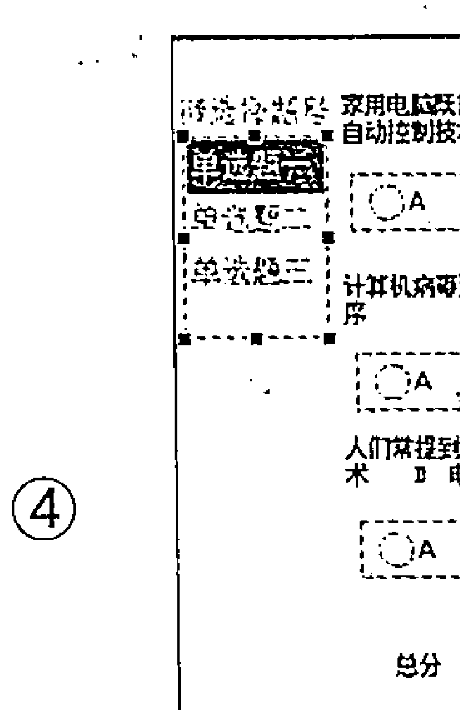

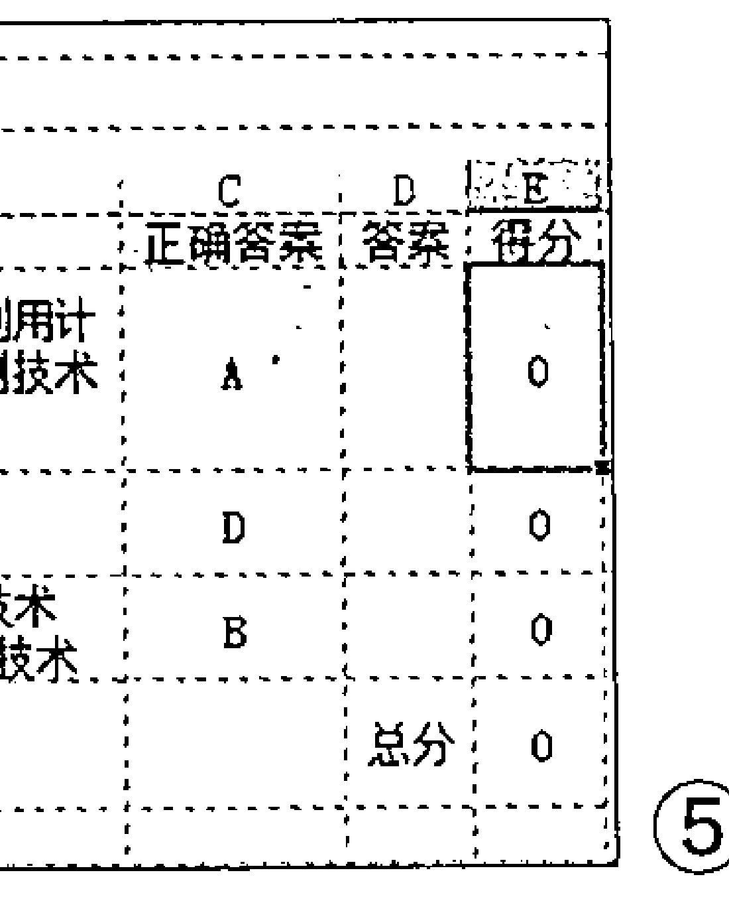

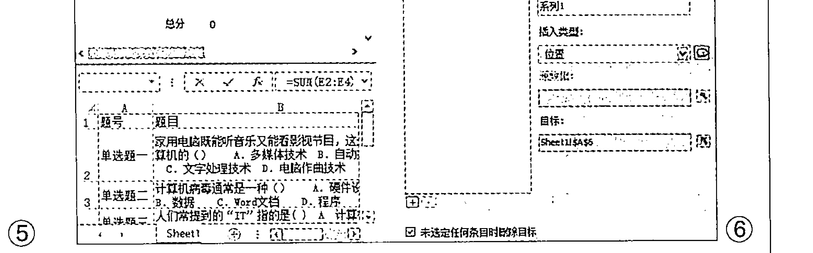

## 何止存储？挖掘“云”办公

“云”作为保存文件的功能尽人皆知，然而，“云”不仅仅是保存文件这么简单。作为在现代办公环境下的应用，如何充分发挥“云”存储及其各项功能，真正为提高办公效率服务，是办公一族应该掌握的技能。那么，有哪些“云”技巧可以为我们日常办公所用呢？

### 配合QQ下发员工任务

将文件存放在云盘中，按照不同的任务给不同的员工分配不同的文件。只需针对不同的员工生成不同的文件链接，附带不同的访问密码（图1），然后将这些文件链接和密码，通过QQ、微信等通信工具，分别发送给相应的员工。这样，工作小组中的每个人都可以及时通过下载获得自己的工作文件。

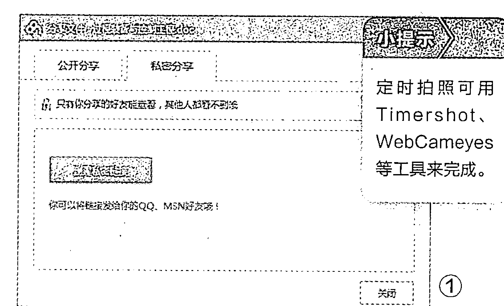

> 小提示：定时拍照可用Timershot、WebCameyes等工具来完成。

### 工作现场进行实时监控

在PC端连接摄像头，或者直接用笔记本电脑的摄像头，安装定时拍照软件，将照片存储文件夹设置为系统库中的“图片”文件夹（图2）或其他云盘的指定同步文件夹。这样，每次自动拍摄的照片都会自动同步到云盘当中，访问者在另一地点，只要用同样的账号登录云盘，就能看到工作场所拍摄的实时画面。

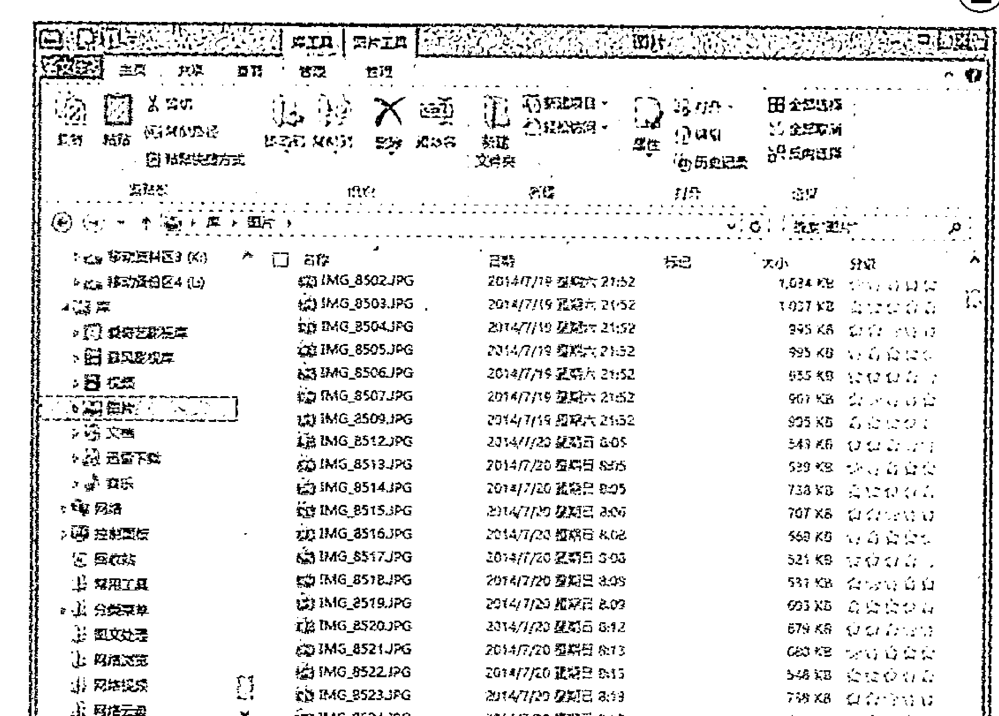

### 员工资料联合自动备份

云盘的自动备份文件夹一般都有个数限制，例如百度云管家最多同时自动备份5个文件夹，而360云盘为6个文件夹。那么，倘若一个办公室需要将多于5个文件夹的资料自动备份到云端，该怎么做？我们可以在办公室员工的多台电脑上安装同一个云盘，用同一个账号登录，但每台电脑上设置不同的自动备份文件夹。以百度云为例，假设办公室有5台电脑，就可以设置25个自动备份文件夹。让每台电脑分工负责不同的备份任务，但云端获得的是全套25个备份任务。

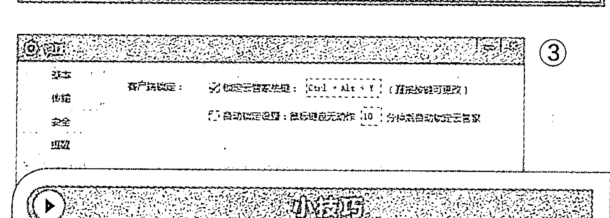

> 小提示：对于一台电脑中的文件，若需要自动备份的文件夹多于规定的最大限度5个或6个，可以用建立二级文件夹的办法自动备份更多的文件夹。由于自动备份的文件包含各级子文件夹下的文件，因此，只要先将需要备份的多个文件夹纳入到5个或6个以及自动备份文件夹下，这个文件夹下的所有文件夹都会被自动备份到云盘中。之后，用户可访问云端文件目录，将备份文件夹下的不同文件夹用转移命令转移到云盘的任意位置。不论文件夹有多大，转移操作基本上是秒传，不占用时间。

### 办公云盘锁定资料安全

办公室资料放在云盘中，这样可以免于本地灾难发生时数据遭殃。但是，云盘客户端常开着，电脑可能被闲杂人等接触，云端存储的数据可能会被别人看到。在这种情况下，可使用多种方法锁定云盘。以百度云管家为例。

在系统托盘云管家图标上右击，选择“锁定云管家”命令锁定云盘。还可在云管家设置窗口的“安全”页面下，设定键盘在若干时间段内无操作后自动锁定云盘，时间可由用户来设定，以分钟为单位。此外，也可以给锁定云盘操作定义一个热键，需要锁定云盘时，随手按动热键组合，即可让云盘处于锁定状态。这更适合于正在进行键盘操作的环境下使用（图3）。

### 移动办公资料异地下转

让每位员工的手机中都安装与办公室PC同类的云客户端软件，并用单位的工作账号登录。这样，无论是出差在外，还是在上下班的路上，遇到紧急情况，都可以随时登录云盘，访问工作文件。甚至可以配合手机中安装的各类办公软件，在云盘中直接处理办公文件。

> 如果云盘中存放的文书资料很多，一时难以定位，可利用云盘的搜索功能，直接用文件名关键词来搜索文件。

首先在云端分门别类地创建各级文书目录的文件夹，然后将各类Office文档、PDF或TXT、JPG等文书资料保存在相应的文件夹中。需要阅读时，只需进入云盘，直接按类定位文书文件，点击可直接打开预览文档或图片，不需要安装第三方阅读工具（图4）。推介使用360或百度云盘。

### 免装工具进行文书管理

以往的一些文书资料，如通行版Office或PDF文件，总需要找专门的阅读器来阅读。如果用云盘来管理PDF文书资料，无论是文件管理还是阅读都会更加省心。

### 创建小组协作办公方案

以往的协作办公离不开邮件工具，而相互之间传送资料常常会使用U盘。云盘的出现可以让邮件和U盘下岗。

对于需要协作工作的项目，可以在小组云盘中建立一个专门的工作项目文件夹，接下来每个小组成员根据自己的需要在其中创建自己的工作文件夹，把各自的资料上传到其中。需要共同讨论修改的文档，每个人都可以在自己的终端打开修改，然后同步上传到云端。个别文件如果涉密，可通过文档自身的二级密码功能或压缩软件的加密功能，添加访问权限，确保文档内容的安全。

### 办公首选软件自带云盘

除了诸如百度云、360云盘的一些专门云盘外，越来越多的软件自带有云盘功能。例如Windows 8.1便自带了OneDrive云盘，国内办公软件WPS也自带了云盘。这些软件的云盘不用单独申请，在使用软件的过程中，只要用个人账户登录，即可将生成的文档保存在云盘当中（图5），云盘与软件的衔接和使用更加自然方便，尤其对普通电脑用户，更能带来便利。

> 如果小组外部人员需要访问特定的文件，可使用上面所说的生成私密文件链接的方法，用密码来下载。

> 如果你在使用新版的Windows 8.1操作系统，最好请注册网络账户登录系统，这样自带的云盘就能发挥作用。对于处理办公文档的用户，使用WPS前将账户设置为自动登录，在使用过程中养成将文档保存到云端的习惯，这样对于异地访问文档、文档协作共享、特殊情况下的灾难恢复等都大有益处。

## 巧解棘手事 版面更美观

文 | 马震安

打开文档时，首先映入眼帘的是文档的页面布局，其次才是文档的内容。因此，漂亮的版面能为文档锦上添花。但在力求将文章排得更美观的过程中，我们可能会遇到一些棘手的问题，如不规则图片的文字环绕、双栏页面的左右页码设置等，这些问题如何解决？我们在Word 2013操作环境下一一说明。

### 1. 文字环绕不规则图片

有的图片含有许多无效空间，如果能对插入文档中的图片进行云形裁剪，并使文字对其环绕得更加紧密，版面利用会显得更有效。

选中图片，利用图片工具中的“裁剪为形状”将图片裁剪为云形，将其环绕方式设置为紧密型即可。

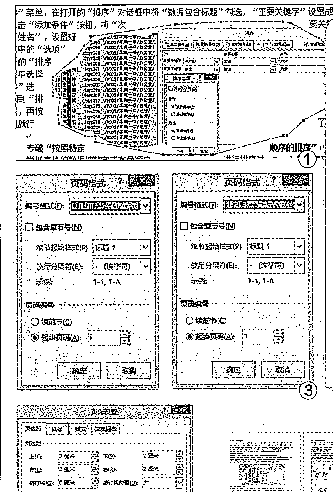

设置完成后，有可能文字环绕得不够紧密，这时可右击图片选择“自动换行→编辑环绕顶点”菜单，利用鼠标拖动各个环绕顶点来改变文字对于图片的环绕紧密度（图1）。

### 2. 双栏页面左右页码

双栏页码也不容易设置。在页面分为左右两栏的版面上添加页码，设置成“第×页，共×页”的形式，该怎么做？

利用插入页码命令，却只能在整个页面插入一个页码，上述效果就只能利用“域”技巧来实现。首先，将文档分为两栏后编辑页脚并切换至第一页的页脚，在左栏合适位置输入“第页，共6页”（可以利用插入空格的方式将文字调整到合适位置），将光标插在“第”和“页”两字中间，按住Ctrl键不松手，连续按两次F9键，这时就会在这两个字中间出现两对大括号“{{}}”，在大括号中输入字符（注意使用英文状态来输入），形成这个样子：={page}*2-1。域代码输入完成后，右击它，选择“更新域”，这时就会出现“第1页，共6页”。利用插入空格的方式调整位置，在文档右栏合适位置输入“第页，共6页”，输入如下域代码“={page}*2”，更新域后就会出现“第2页，共6页”（图2）。

```
={page}*2-1
```

```
={page}*2
```

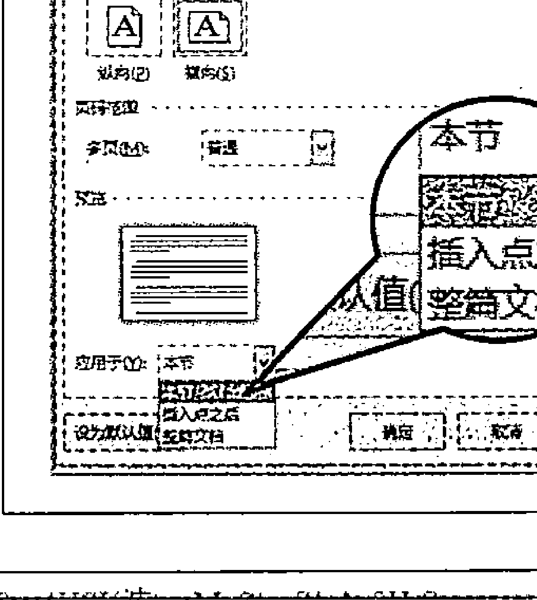

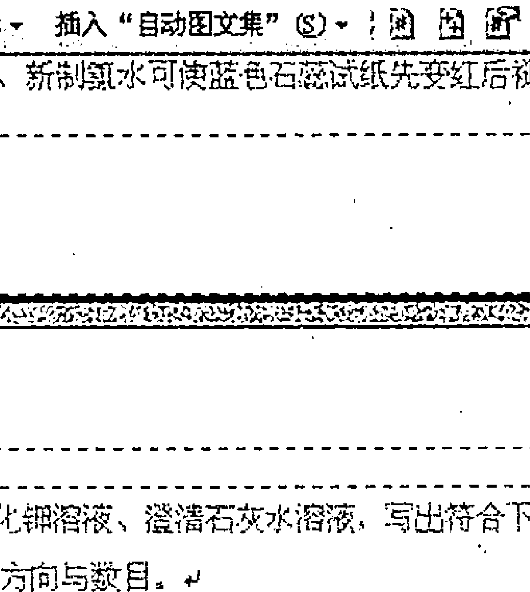

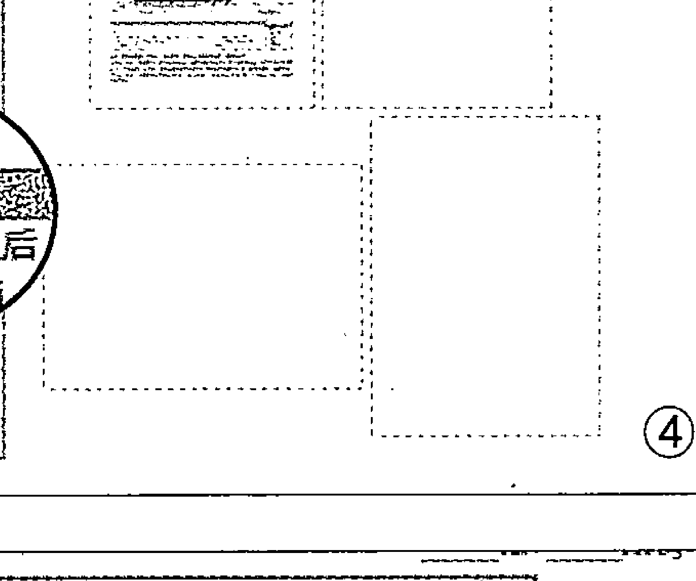

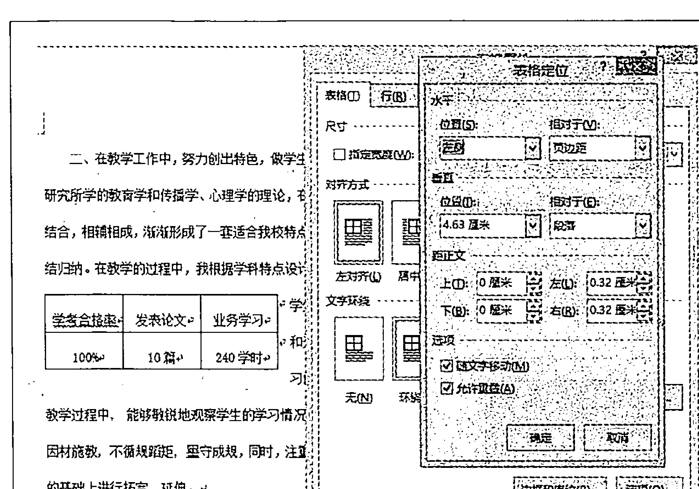


### 3. 同一文档两种页码

在同一文档中目录页的页码设置为Ⅰ、Ⅱ、Ⅲ、Ⅳ、Ⅴ的格式，文档内容页码设置为1、2、3、4、5的格式，这是报告或图书排版时常遇到的问题。如果用普通的方法是很难实现在同一文档中插入两种格式的页码的。要想实现上述效果，可将光标分别放在目录页起始位置和文档内容的起始位置，选择“页面布局”选项卡“分隔符”下的“下一页”菜单，在这两处分别插入分隔符。在页脚处右击选择“编辑页脚”，如果有封面就在“页眉和页脚工具”的设计选项卡中将“首页不同”勾选，在目录页插入页码，并将页码的编号格式设置为Ⅰ、Ⅱ、Ⅲ，起始页码设置为Ⅰ；将光标放在内容起始页码处，将页码的编号格式设置为1、2、3，起始页码设置为1。这样，就实现了同一文档中两种不同格式页码的设置（图3）。

### 4. 同一文档双向纸张

一般的报告纸张方向都是纵向的，但如果报告中有一个字段名比较多的表格，要想显示全表格内容就需要将存放表格的那页设置成横向。首先，将光标放在需要设置成横向页面的起始位置，选择“页面布局→纸张大小→其他页面大小”，在弹出的“页面设置”窗口中纸张方向选择“横向”，“应用于”处对于已经存在的页面可选择“本节”，而对于新建的页面要选择“插入点之后”，确定后此页面及以后的页面都设置成了横向。如果“应用于”处选择了“插入点之后”，还需要将光标定位到下一页面起始处。用同样的操作将不需要设置成横向的页面设置成纵向（图4）。

### 5. 文字环绕表格排版

一般的表格都是独占许多行，若表格较窄就会浪费左右版面空间，这时就需要对表格进行文字环绕设置。右击表格选择“表格属性”，文字环绕处点击“环绕”后点击“定位”按钮，在弹出的表格定位窗口就可以精准设置表格的文字环绕了（图5）。

> **小提示** 也可以拖动表格左上角的十字按钮来拖动整个表格以进行表格位置的定位。

### 6. 文字填满自选图形

有时为了版面更加生动活泼，我们需要将文字填充到自选的图形当中，同时希望文字尽量填满自选图形。对于自选图形添加的文字即使设置成顶端对齐、上下左右边距为0也不能很好地控制其填充位置，也不能充分地填充整个图形的空间，这时可以利用编辑顶点及手动换行的方法来达到理想的效果。首先，选定自选图形后，点击“格式”选项卡插入形状处的“编辑顶点”菜单，拖动任意一个顶点后再拖回到原位置，这样自选图形的形状未变而填充文字的位置却发生了改变（或者在自选图形红色的边线上右击鼠标增加一个顶点也能达到同样的效果）。然后，利用回车键进行人工换行，从而实现文字在自选图形中的填满效果（图6）。

> **小提示** 在这个域代码中，第1页中的Page域所代表的就是页码1，第2页中的Page域所代表的就是页码2，……依次类推。*2中的2表示的就是页面中的栏数。所以如果文档分为三栏，并要在每栏下显示页码，可以将“第页”之间的域代码修改为“{={page }*3-2}”、“{={page }*3-1}”和“{={page }*3}”，有更多分栏时同理。

## 高效创建花名册信息

文 | 刘长德

领导安排行政办的老刘做个含有职工花名册的报告文档，其中除了要包含一些文字介绍外，表格中要包含干部职工的姓名、出生年月、职务、参加工作时间等信息，要求尽快完成。还不到一个小时，老刘便将报告交了上去。老刘是用国产办公软件WPS做好的，他怎么会有如此高的编辑效率呢？

### 1. 年月信息输入大简化

最终效果：当输入姓名后将光标移动到出生年月或参加工作时间的单元格时，直接输入年份和月份的后两位即可。比如某位职工的出生年月是1988年08月，只需在单元格中直接输入8808即可，当光标移到下一单元格后，前面的单元格中即可自动显示1988年08月。这样一来，年月这项的输入效率就大大提高了。如何实现的呢？

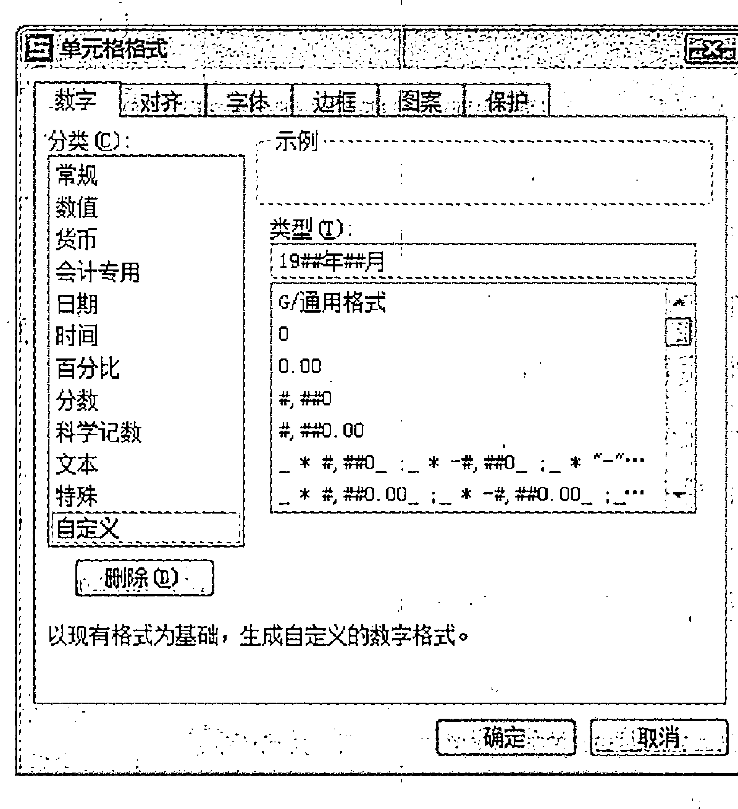

实现方法：首先用“WPS表格”组件打开表格，设置好花名册的标题及格式，接着用鼠标选中要输入出生年月的所有单元格，然后在键盘中按住Ctrl键的同时，用鼠标再选中参加工作时间的所有单元格，之后在选中的单元格中右击鼠标，执行“设置单元格格式”命令，接着在打开的“单元格格式”对话框中“数字”选项卡下的“分类”中单击“自定义”，并在右侧的“类型”下的文本框中输入“19##年##月”（图1），单击“确定”退出。

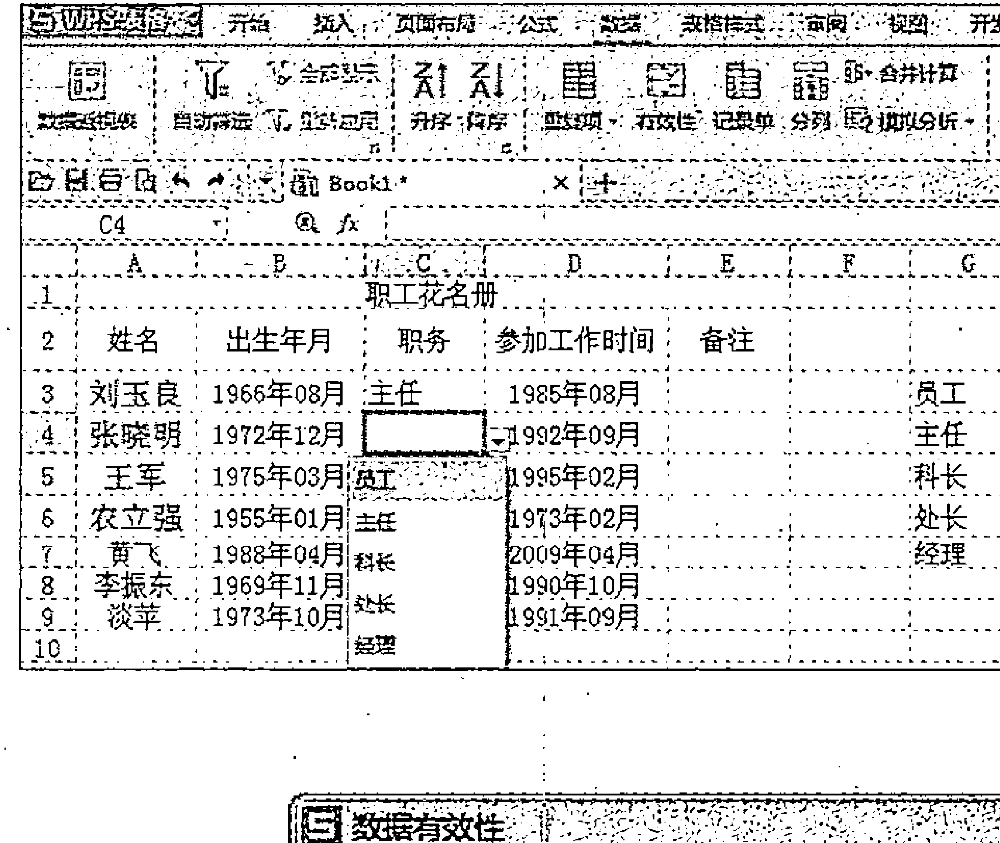

> **小提示** 在输入过程中移动光标后显示错误时，返回并删除错误内容，然后在英文状态下先输入一个单引号，再完整输入出生年月即可。

### 2. 职务输入只需选菜单

在职务这一列中，老刘又实现了怎样的快速输入方法呢？

最终效果：当光标定位到要输入职务的单元格时，在单元格右侧就会显示一个下拉箭头，单击下拉箭头后就会显示出所有的职务内容（图2），将光标指向相应的职务，并按下回车键，即可快速输入相应的职务。

实现方法：首先是在打开的表格的其他位置输入在职务一列中要显示的所有职务，然后在表格中将需要输入职务的所有单元格选中，接着执行“数据→有效性”命令，在“数据有效性”对话框中“设置”选项卡下的“允许”列表中选择“序列”，在“来源”框中输入序列来源单元格的绝对地址（图3）。或者单击其右侧的隐藏窗体按钮，用鼠标选择要显示职务的内容区域，并再次单击隐藏窗体按钮返回“数据有效性”对话框，最后单击“确定”关闭对话框即可。

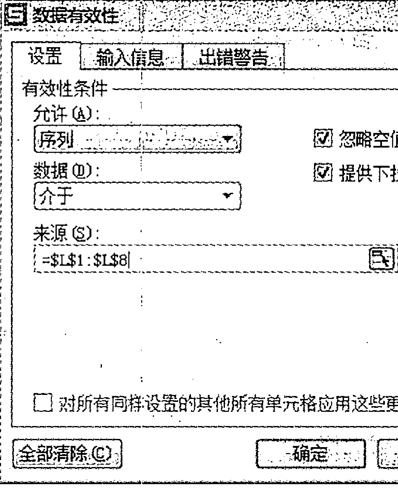

### 3. 文档中的选择性输入

问题呈现：上报的报告中文字与表格共存，因而需要以“WPS文字”格式为...小提示
无论是在“WPS表格”还是在“WPS文字”中插入的表格，在单元格的编辑过程中，通过设置单元格特定格式或使用选择性输入，不仅可以减少输入错误，还可以大大提高工作效率。若使用微软Office，也可使用类似技巧，但操作界面会因所用版本的不同而有所不同。

文档底本，而在“WPS文字”中编辑表格时，实现选择性输入是个难题。我们已经知道，通过“WPS表格”组件的“数据有效性”可以实现选择性输入从而提高工作效率，但在“WPS文字”组件中如何实现选择性输入？

解决方法：在“WPS文字”中插入并设计好表格，将光标定位到相应的单元格，然后单击“插入”选项卡，在最右侧的功能区中找到并单击“下拉型窗体域”，即可在单元格中插入一个下拉型窗体域了。用鼠标双击该窗体域，然后在打开的“下拉型窗体域选项”对话框中单击“添加”，此时在“下拉列表项目”中会添加一个文本框，在文本框中输入相应的内容（图4）；然后再次单击“添加”，直到添加完需要的内容为止，最后单击“确定”关闭对话框。

当返回“WPS文字”后，在插入的表格中将插入的“下拉型窗体域”选中并复制，然后用鼠标再将相应的单元格全部选中，并右击鼠标，执行“粘贴”命令，将复制的“下拉型窗体域”粘贴到所有选中的单元格中。接着用鼠标单击“保护窗体域”按钮将窗体域锁定，这样，在插入的窗体域右侧即可显示一个下拉箭头，用鼠标单击该箭头，即可打开下拉列表（图5）；用鼠标指向相应的内容按下回车键，即可实现选择性输入了。输入完成后再次单击“保护窗体域”解锁，即可编辑其他单元格了。

### 4. 插入对象解决排序问题

问题呈现：在“WPS文字”插入的表格中，虽说借助窗体域也可以实现选择性输入，但老刘又发现问题，无法同时进行排序等操作，怎么办？老刘立即改用插入对象的方式，借助“WPS表格”来实现。

解决方法：首先执行“插入→对象”命令，打开“插入对象”对话框，在（新建）“对象类型”中选择“WPS表格工作簿”，单击“确定”启动WPS表格。这样，就可以在WPS表格中设置单元格格式、数据排序等编辑操作了。

## 方寸之地显示大量图片

文|马震安

网站主页以有限空间显示多幅照片，用同一位置交替显示是上策。实现这个效果并不需要Flash等专业软件，也不需要自己编写程序代码，借助一个小工具即可实现。

我们以3幅图片轮番演示，用按钮实现跳转播放为例来说明。更多图片的复杂的演示设计按此技术扩展即可（图1）。

### 1. 简单设计播放界面

这个过程主要是图片播放界面的设计。

打开Axure RP Pro 7.0后，在左边的“站点地图”面板右击，将其余页面删除，只保留一个主页面，并将其重命名为“照片欣赏”。从部件库将“图片”部件拖入到这个主页面中并调整好大小。在图片部件的属性窗口点击“导入”按钮导入所需图片，导入时不要自动调整大小（图2）。

### 2. 动态面板展现神奇

这个过程就是利用动态面板的各种状态来轮番显示图片。

首先，将添加的图片部件右击转换为动态面板，并将这个动态面板命名为“轮番显示”。在“部件管理”窗口复制“状态1”两次，双击复制出的状态并在窗口中选定相应的图片部件，利用导入按钮将所需要的图片分别导入到两个新复制的状态中。可在部件管理窗口双击动态面板对动态面板的每个状态进行重命名（图3）。

返回到照片欣赏主页，在动态面板合适位置添加3个形状按钮，在“部件属性和样式”面板设置每个按钮的名称，填充色为蓝色，选择形状为圆形，选中后的颜色设置为红色，设置选项组名称为“状态点”（第一次需要输入，以后只需点取）（图4）。

要想使动态面板显示神奇效果，还需要对它进行设置。选中动态面板，在“部件交互和注释”面板双击“载入时”，在弹出的“用例编辑器”窗口的“第二步：点击新增动作”处点击部件下的“设置选择/选中”，在“第四步：配置动作”处勾选“d1（形状）”（意思是当名称为d1的按钮选中时该按钮的颜色变为红色）。

接下来添加杂项下的“等待”动作并设置时间为3000毫秒。最后添加动态面板下的“设置面板状态”动作，在配置动作处勾选“设置轮番显示”，选择状态设置为“Next”，勾选循环和循环间隔，并设置间隔时间为3000毫秒，进入和退出时动画均为“向左滑动”，用时500毫秒（图5）。

双击“鼠标移入时”，添加动态面板下的“设置图板状态”

以上动画等待时间和滑动用时参数可以改变，值越大，效果越明显。若值设得太小会一闪而过，则没有动的效果。

### 3. 控制按钮随心设置

以上的设置满足了图片的自动播放，如果想要人为控制图片播放还需要对3个形状按钮进行设置。选定第1个形状按钮，在“部件交互和注释”面板双击“单击鼠标时”，新增动态面板下的“设置图板状态”动作，在配置动作处勾选“设置轮番显示”，选择状态设置为“图片1”，勾选循环和循环间隔，并设置间隔时间为3000毫秒，进入和退出时动画均为“向左滑动”，用时500毫秒（图7）。其他两个按钮的设置与之类似。

### 4. 文件发布易于分享

所有部件都设置完成后，接下来就是见证奇迹的时候了。选择“发布→生成HTML文件”菜单对文件进行发布。发布完成后直接运行生成的index.html文件，看看是不是图片进行轮番播放了？

生成的HTML网页类型的文件可以在大多数电脑上运行，便于和朋友分享，但分享时要把发布生成的所有文件都发给朋友，直接运行index.html文件就可以了。

## 让文档中表格听话又易改

文|林立峰

大家知道，在Word报告中插入Excel表格链接，用数据表格来展示报告内容，会让报告更加直观。这样当外部的Excel表格数据发生变化时，Word文档中的表格也能随即关联变化。但是，有时我们的报告表格反映的是当时的数据内容，不一定希望打开表格就看到最新的数据内容。这时，在保留原有数据内容的前提下不丧失表格的易编辑性就显得尤为重要。那么如何做到两全其美呢？

用复制后只粘贴数据或复制为图片后粘贴的办法来插入到Word文档中，这些办法虽然可以解决问题，但这样操作之后，这个表格就变成一个固定表格和固定图片。如果日后想要根据最新版Excel表格内容更新Word报告中的表格，还需要重复插入表格或重新生成表格图片，显然比较麻烦。如果通过将表格转换为对象的方式来插入表格，问题就可得到解决。

- Step1：以Office 2013为例。在Excel中打开要使用的工作表，选定表格中要使用的区域内容，单击“开始”选项卡下的“复制”按钮，将表格存入剪贴板（图1）。
- Step2：切换到Word报告编辑页面，将光标移到要插入表格的地方，执行“开始”选项卡下的“粘贴→选择性粘贴”命令，弹出“选择性粘贴”窗口，将选择更改为第一项“Microsoft Excel 工作表对象”，然后确定（图2）。
- Step3：随后即可在Word中看到插入的表格。这个表格的内容不会随着外部的Excel原表格的数据变化而变化。但是，当我们需要修改文档中表格的内容时，不需要动用外部的表格数据，直接双击报告中的表格，即可实现对表格数据的编辑。编辑完毕点击表格外部返回文档（图3）。

小技巧
如果希望表格在文档中仅以一个图标来显示，需要时才展开，选中“显示为图标”复选框即可。否则表格仍将普通表格的样式在文档中显示。

小提示
在Office 2013版本中，选择性粘贴除了可以用窗口文字项目来选择外，不同组件都提供了更为直观的图标式选项，可以直接通过图标来选择粘贴格式（图4）。

通过以上方法，巧妙地实现了既可以方便地编辑表格，又不至于因外部表格数据的变化而造成报告中表格数据的随意变化。表格数据是否需要变化，完全由用户来掌控。对需要在Word文档中插入表格并可能随时编辑，但又不希望任意自动变更内容的许多场合都适用。

## 没装工具 怎能打开文件

文|政豪

有时，当我们想要在某台电脑上打开一些Office文档时，却发现这台电脑根本就没有安装任何一种Office软件；兴冲冲地下载了歌曲或电影大片想欣赏过瘾，却发现电脑上没有安装可用的播放器，只得去网上下载后再安装欣赏。事实上，即使没有安装这些软件，我们仍可以打开观看甚至编辑这些格式的文件。

### 1. 借用浏览器打开文件

Google Chrome（包括使用Chrome内核的浏览器）可以直接打开PDF文档，只需右击PDF文件，在弹出的菜单中点击“打开方式→选择默认程序”（图1），然后在下级程序列表中点击“更多选项”，通过资源列表找到Google Chrome主程序，点击即可（图2）。

想要在线打开Office文档，首先要将文件上传到OneDrive，在浏览器中打开https://onedrive.live.com并登录，点击“上传”按钮，将文档上传至OneDrive的任意位置。上传完毕后，点击文档即可打开。如果需要编辑文档（以Word文档为例），只需点击“编辑文档”，选择“在Word Online中编辑”即可（图3）。

### 2. 微软在线打开文档

如果系统没有安装Office软件，而你只是偶用一次Office文档，无需为一次使用而安装Office或WPS。如果有一个微软账号，可以使用微软官方提供的在线Office，其中包含了Word、Excel、PowerPoint、OneNote这些组件。

### 3. 手机应用别有用途

在手机上，打开Office文档无需安装WPS等应用，手机QQ浏览器就可以打开PDF、Office文档，可以播放常见的音频和视频文件，甚至可以浏览压缩包中的内容（图4）。有道词典除了“词典”功能外，还可以打开PDF文档。手机QQ、微信等本身已经可以直接转码许多文件，并不需要借助其他软件来打开。因此，如果不需要对文件进行编辑之类的高级操作，我们无需专门安装针对这类文件的应用。

小提示：Chrome浏览器不仅可以打开PDF文档，MP3、WAV等常见网络音频格式，MP4、WEBM等常见网络视频格式也可以用它来打开。将文件拖拽至浏览器中也是打开文件的一种快速方法。

## 翻亮图片 幸运抽奖

文|马震安

我们经常会在电视综艺节目中看到翻牌抽奖游戏，这类游戏的制作一般需要用编程软件编写代码来完成。那么，对于我们普通电脑用户来说，如果不熟悉编程软件，是否也可做翻牌抽奖游戏呢？让我们一同尝试！

实例
如图所示，在页面中有3行3列9个图片构成的抽奖区，点击开始按钮后在抽奖区中点击任意图片，图片就会翻转显示奖品并锁定；当鼠标移入其他图片时图片翻转可以看到其他奖品，移出时图片翻转成原样；点击“再来一次”按钮可进行再一次抽奖游戏（图1）。

### 1. 显示图片轻松设置

打开Axure RP Pro 7.0软件，在站点地图面板将不需要的页面右击删除掉，将所保留的页面重命名（如“幸运大抽奖”）。在部件库拖动中继器到页面中，双击这个中继器，在中继器页面利用部件属性和样式面板对原有的矩形进行样式设置；在中继器数据集面板增加3列，字段名分别为ImgA（用于存放背景图）、ImgB（用于存放不同的奖品图）、sjs（用于图片的随机显示），添加行并分别在ImgA和ImgB列右击导入背景图和奖品图。在Repeater Style面板设置布局为水平，勾选换行，每个row包含3个（图2）。

接下来，右击矩形转换成动态面板并命名为“图片显示”，在部件管理面板双击动态面板中的“状态1”，在状态1窗口，拖动图片部件到矩形中，调整其大小与矩形内径相同，导入临时背景图。右击状态1复制成状态2和状态3，调整状态2和状态3窗口中的矩形和图片宽度，越来越小（图3）。

依次复制状态3、状态2、状态1，把状态1-6从上到下排列好，重新命名为1-6，这样就能实现图片的翻转效果。为了在选中图片时，图片边框变红，需要把状态6中的图片命名为tu，点击部件属性和样式面板中属性标签交互样式中的“选中”属性，设置好选中时的边框颜色为红色，线形加宽。

接着，切换到中继器窗口，在中继器项目交互面板双击Case 1，在用例编辑器窗口右击删除原有语句，添加6个“设置图像”动作，在配置动作处勾选图片显示下的“设置（图片）”，默认设置为“值”，点击fx按钮，在编辑值窗口点击“插入变量、属性、函数或运算符”，在弹出的下拉列表中前3个选择Item.ImgA，后3个选择Item.ImgB（图4）。

### 2. 动画效果按需控制

利用“项目→全局变量”菜单添加名称为bian、默认值为1的变量。然后，为中继器窗口中动态面板的“鼠标单击时”新增用例，在用例编辑器窗口新增变量bian等于1时的条件，添加设置面板状态动作，在配置动作处勾选当前部件，选择状态设置为6; 增加选中动作，勾选tu; 添加禁用动作，勾选图片显示; 添加设置变量动作，勾选bian，值为空。分别为“鼠标移入时”和“鼠标移出时”添加用例，在各自的用例编辑器窗口都新增一条变量bian等于空时的条件，都添加设置面板状态动作，勾选当前部件，鼠标移入时选择状态为Next，鼠标移出时选择状态为Previous，循环间隔都为50毫秒（图5）。

小提示
可通过改变循环间隔时间调整动画效果为最合适。

### 3. 巧设奖品随机排列

首先，在中继器窗口的图片上添加单选按钮部件，命名为xz，右击它设置为隐藏，并为它的“选中状态改变时”添加用例。在窗口中新增条件为这个部件的选中状态为true时添加更新行动作，选择sjs列，值为Math.random(); 添加新增排序动作，勾选中继器，属性为sjs，顺序为升序（图6）。

### 4. 不用代码控制抽奖

在幸运大抽奖主页中增加一个矩形部件，大小与图片区域相等，透明度为30%，置于顶层，名称为fg。在主页合适位置添加形状按钮，双击标签修改为开始。右击它转换成动态面板，名称为anniu。右击anniu的状态1复制成状态2，将状态2里面的按钮标签改为“再来一次”。为状态1中“开始”按钮的“单击鼠标时”增加用例，添加选中动作，勾选xz，值为true; 添加隐藏动作，勾选fg; 添加设置面板状态动作，勾选anniu，选择状态为状态2; 再增加选中动作，勾选xz，值为false。同样为状态2中“再来一次”按钮的“单击鼠标时”增加用例。添加选中动作，勾选xz，值为true; 增加设置面板状态动作，勾选图片显示，选择状态设置为1; 增加设置变量值动作，勾选bian，值为1; 增加显示动作，勾选fg; 增加设置面板状态动作，勾选anniu，选择状态为“状态1”; 再增加选中动作，勾选xz，值为false（图7）。
切换到“幸运大抽奖”主页面，在“页面交互”面板为“页面载入时”增加用例，添加设置面板状态动作，勾选“图片显示（动态面板）”，选择状态设置为1。
以上任务完成后，发布生成HTML文件。点击该文件启动网络浏览器，便能够演示抽奖了。

## 探索Word 2013七种“新武器”

文|傅琳

原以为Word 2013主要是菜单栏发生了变化，所以一直懒得升级。偶然的机会使用了一周Word 2013，体验过之后，它的七种让人欲罢不能的“新武器”让笔者彻底改变了这种看法。

如果你还在使用Word 2007、Word 2010，甚或是WPS，希望本文能点燃你更新软件的热情：这些细微的改变，为我们带来的是沟通和传达上的巨大便利。

### 1. PDF 编辑重排

无论是著名的Adobe家族，或者是专业的Nitro系列，还是后起之秀福昕系列，都曾经是编辑PDF文档不能逾越的选择。但是，现在有了Word 2013。

Word 2003及之前的版本，需要安装官方虚拟打印机输出PDF格式。在2007版本中，可以“另存”为PDF格式。2010及以后的版本，在“文件”选项卡中，增加了“导出”功能，方便直接存储文本为PDF格式——这些都是输出；而现在，我们可以直接在Word 2013中编辑PDF文档了！对于成天需要套用各种资料的人来说，这真是个天大的好消息！

直接把PDF文档拖入Word 2013的窗口，或右键选择用Word打开文件。窗口会出现提示（图1）。

选择“确定”后，软件下方蓝色边框区域会显示转换进度。然后，就可以随心所欲地在Word 2013中像编辑普通文档一样编辑PDF了。

### 2. 跳转阅读 显而易见

无法直接定位到文档此前编辑或者阅读的位置，是Word常常为人诟病的一个弱点。当然我们也可以通过快捷键实现这一功能，但总是没那么直观，于是难得的，用WPS的人可以沾沾自喜地说：“看，我们可以直接跳转到上次编辑的地方！”

现在不一样了。Word 2013会直接生成文档最近一次打开时停留的位置，页面右侧显示蓝色书签标志。鼠标挪移至标签图案，还能看到相应的文字描述（图2）。别看改变非常微小，使用的频率却非常高！

小提示 Word 2013的阅读视图也设置得更为舒适：文字会随着视图的切换自动排列，提供更好的阅读体验。

### 3. 增行增列 易如反掌

在以往的Word版本中，如果需要增加表格的行或列，我们需要选中插入行/列的位置，再挪移至相关菜单栏，进行操作……

现在，这些操作永远成为历史了！在Word 2013中为表格增加行/列，只需要把鼠标挪移至指定位置，无需点击，表格中会出现带加号## 4. 图片格式 高效编辑

在Word 2010及以前的版本中，可以通过自定义选项按钮，把图片的布局选项设置放在可以快速访问的位置，但到底不如直接浮动在图片右上角的这个小按钮方便。图4中图片右上角的那个小符号，是2013版布局选项的快速设置按钮。点击小按钮，会出现优化后的菜单选项：不光是界面友好了，而且最常用的文字移动选项也放在了首选系列。若右键单击环绕形式，还可以设置该格式为默认值：这样，每插入一张图片，就会按照习惯自动设置，大大简化了设置步骤，让我们在编排图片格式时更为高效而迅速。

### 5. 实时布局 图文对齐

在Word 2013之前，若是将图片设置为文字环绕形式，并且移动了图片，那必然要等图片的位置彻底落定，才能看到挪动后的效果：遇到放置的不理想，就需要重新移动图片，直至达到要求为止。现在，我们可以一次性完成这项工作！

在挪动图片过程中，Word 2013会实时显示图片插入到各个位置的实际效果。在这个可视化的操作过程中，我们便能够积极地避免因为挪动图片引起的格式混乱。在挪动图片至某一段落或页面某个边缘时，还能看到绿色的线条。这个时隐时现的绿色线条，和Photoshop或PPT中常常被召唤的参考线是一样的：Word 2013贴心设置自动对齐参考线，让我们无需苦恼于图片和文字对齐这个重要的排版事件。

### 6. 可见小“锚” 绑定图文

你是不是也遇到过这样的情况：想把文字和图片都保留在同一页，但是图片总是和文字相隔两端？那都是因为这个小小的符号：锚（图5）。图片和文字的关系，就是“锚”在控制。在Word 2013之前，“锚”都不是默认可见的，需要专门设置。在Word的规则中，图像和它的锚必须在同一个页面上：图像就好比需要锚才能固定的船只。所以，当需要控制图片位置时，把“锚”固定在需要的位置，就能控制图像了。

> 不要被那句提示吓倒：“您需要Microsoft账户才能启动联机演示文稿。”——你曾经有MSN账户吗？你有Hotmail或者Outlook邮件吗？拥有其中任何一个，就可以登录了！当然，正版Word 2013才能实现以上所有操作。

### 7. 协作办公 沟通无限

会议、邮件、各种同步软件、各种聊天软件中的屏幕共享功能……现代办公环境中，协作与沟通的需求比想象的更为频繁。所以，Word 2013适时推出了联机演示功能。它的美妙之处在于：即使对方没有安装Word软件也可以一同阅读文档。并且，你能够控制共享的节奏：当你在屏幕上通读文档时，对方可以在自己的浏览器中随着一起阅读。如果有人的进度落后了，还会收到相关提示。进入“文件”标签页的“共享”功能，点击“联机显示”按钮，会出现屏幕提示（图6）。点击启动演示文稿，会进入演示界面。通过点击左上角的按钮可控制演示进度。

# 让沟通变得更有趣

文/马震安

现在用QQ作为沟通工具的人非常之多，无论在工作场合还是日常生活，无论是用传统电脑，还是用手机等移动设备，如果能让沟通过程变得妙趣横生，不但可以加深对方对你的好感，增进相互之间的友谊，还能给紧张的工作或生活增添几分欢乐气氛。要让聊天过程变得妙趣横生，借助QQ之外的辅助工具很有必要。笔者在用Android手机聊天时就采用一款“美图聊聊”辅助软件配合QQ，快速生成各类妙趣横生的个性图片。

## 文字变图 聊天更有趣

想和好友打个招呼，但总是觉得单纯的文字显得很是单调？那么，就在QQ中调用了美图聊聊吧！利用它的一键删字、深度处理、图片剪裁、添加文字、边框、字体等功能帮助自己设计别具一格的图片，这样便可让自己的问候更显得有新意。

首先，用手机登录QQ后打开与好友的聊天窗口，在对话框中点击输入框左侧的“+”，选择“拍照”，在弹出的窗口中选择“美图聊聊”。这时，可以选择一个已有的问候语或单击“○+”按钮添加一个属于自己的问候语（图1）。

问候语设置完成后，就会进入图片选择界面。在这个界面中选择自己所需要的图片，在出现的窗口中对文字及图片进行裁剪、贴图、添加文字、特效、调色等深度处理。比如，点击“贴图”按钮后在工具栏上选择所需贴图，就可将其粘贴到图片上（图2）。

这些都设置完成后，直接点击发送按钮就可以了。

今天心情不错，想通过具有一定意义的图片、文字向好友表达一下。马上进入“美图聊聊”开始界面（当然通过QQ也可直接进入），点击“晒心情”，在进入的窗口中选择所需要的图片（或点击右上角的按钮选择图片类型及文字后选择图片）（图3）。图片选择好后，发现“美图”中的文字不是自己想要的，于是在图片详情窗口点击“一键换字”按钮，将原图片中的文字换成自己想要表达的文字。当然，如果是静态图片的话还可以进行深度处理。最后，点击QQ或微博，发送就可以了（图4）。

> **小提示**
> 在屏幕上触摸绿色控制钮可对贴图进行旋转及大小的调整。

## 图片分类 聊天更快捷

聊天时根据不同的好友、不同的聊天内容选择不同种类的图片，这样更有针对性。如果这些图片都混在一起，找起来比较麻烦。这时，可将表示不同聊天情景的图片进行分类使用。首先，在软件窗口点击“更多”按钮，在出现的界面中会有图片的不同分类，点击“自定义分类”后，在新出现的界面中，对于喜欢的图片类型进行搜索预览，再点击“添加”按钮，就会把喜欢的图片类型添加到“更多”图片内，以后用的时候直接找相应的分类就可以了（图5）。

> **小提示：** 在“更多”图片内，要想删除自定义的分类，需长按图片进入编辑模式后，点击出现的删除按钮即可。而对于聊天常用的图片或自己精心设计的图片，都可以在“图片详情”界面点击“五角星”将其进行一键收藏。想要调取这些心动的图片，在收藏夹中直接点取就可以了。如果想对收藏夹进行整理，点击编辑按钮就可对图片进行勾选删除了（图6）。

## 人机互动 压力巧释放

每天都在不停地忙碌，生活的压力也越来越大。于是，笔者在工作之余通过美图聊聊中的“压力馆”为自己找到了一种减压的方法。

在进入“压力馆”后，点击左边的图片包按钮，选择图片或输入相应文字，然后进行发送，系统就会根据用户输入的内容自动反馈相应的信息，与用户进行心灵的互动，好玩又好笑（图7）。

## 美图聊聊 微信也适用

也许你会问，如今使用微信的人也与日俱增，那么，微信上可不可使用美图聊聊呢？当然可以！在美图聊聊界面中，可以把编辑好的图片直接发送到微信上。此外，在微信中也可以直接调用美图聊聊，只需点击微信对话框中的“+”，在出现的附件栏中点击美图聊聊图标，弹出“工具简介”，然后点击下面的“加到附件栏中”，这样美图聊聊就被添加到微信中了。如果你发现聊天时网友发来的个性图片图文并茂，自己也想制作这样的图片，根据上面的介绍，你就不用苦于找不到高效快捷的解决办法了。

## 《电脑爱好者》·2014下半年合订本 高效办公

# 让写作更专心 更安心

文/曹春华

许多写作的朋友都会有共同的感受，很容易受外界因素的干扰，比如写作过程中会有意无意间打开屏幕上的浏览器，或者担心突然停电，而不停地按Ctrl+S进行保存，这些，都会直接影响写作的效率。如何让写作既专心又安心呢？

## 不怕分心的写作

写作效率不高的一个重要原因在于，不时会受到屏幕上其他信息的干扰。软件FocusWriter（下载地址： http://www.dwz.cn/v66uZ） 在这一方面做得很专业，它可以让我们尽可能地排除与写作无关的项目的干扰。

软件运行后，屏幕上只能看到编辑区，所有的工具栏都自动隐藏于编辑区上方，只有当鼠标移至那里时才显示出来。不仅如此，软件标题栏、系统任务栏信息也不会显示，我们要做的就是，在屏幕上安心地敲入文字。

除了在视觉上让人专心于写作外，还可以让听觉也专注于键盘的敲击之中。将鼠标移至屏幕顶端，呼出工具栏，依次单击“设置→偏好设置”，选中“一般”标签，勾选“打字机声音”（图1），这样在敲打键盘时，类似于打字机的“叭叭”声也会让听觉更加专注。

另外，为防止写作偷懒，还可以为自己设定任务完成量。同样在“偏好设置”中，可以设置每天应该写作的时长，也可以设置应该完成的字数。写作过程中，将鼠标指向屏幕底端，就会显示完成任务量的百分比。编辑完成后的文档，可以保存为TXT、RTF格式，支持多个文档全部保存。需要显示标题栏和任务栏时，按下F11进行切换。

## 不怕断电的写作

有些地区经常会发生停电事故，习惯于用PC记事本编辑文档，最担心的就是突然断电等事故导致文档灰飞烟灭。如果不想不停地按Ctrl+S来保存的话，可以用软件“工作自动保存”（下载地址： http://www.dwz.cn/v66zc）来设置多种条件进行自动保存。

打开记事本并命名保存后开始编辑，然后运行“工作自动保存”软件（图2），可以看到记事本程序已经添加到监控进程中，在“监控字符数”中，默认的数字为100，表示用记事本编辑时，键盘输入次数达100次，将进行一次自动保存，当然，我们也可以修改这一数值。另外，在编辑过程中使用Ctrl+V进行一次复制，或者5分钟无任何操作，都会自动保存一次。有这么多保险条件，应该放心了，那就单击“开始监控”吧，这样万一发生停电等事故，就会最大限度地保护好自己的文档。

我们也可以单击“浏览”按钮，把其他能通过Ctrl+S进行保存的文档编辑器进程加入到监控列表、并开启监控，以达到自动保存的目的。

> **小提示**
> 经测试，虽然有时退出记事本时会出现“溢出”提示，但文档仍然会在溢出之前自动进行保存。

352 | 电脑爱好者 2014下半年合订本

# 移动生活 多彩记录

文/马震安

公司老板决定组织员工到曹妃甸一日游，出发前特意叮嘱我要好好记录旅游中的精彩画面，回来后好制作宣传材料放到公司的网站上。旅游时的精彩瞬间时刻都在发生，要想做到快速记录，随身携带的手机无疑是最佳装备。但记录精彩可能需要以文本、图片、视频、语音、手绘等多种形式，那么需要动用几款软件呢？笔者只用一款天天记事Android应用就搞定了全部精彩记录。

## 新建一日游记事本

进入天天记事软件，新建一个名为“曹妃甸一日游”的记事本，并且在它下面建立两个子目录——图片记录、视频记录（图1）。

> **小提示**
> 选择记事目录后，点击窗口中的十字按钮进入记事本的编辑状态，利用工具栏中的图片工具、照相机等工具向编辑区域添加所需要的图片，文字的录入既可手工又可语音录入，并且还可以为记录加上项目符号。

> **小提示**
> 记录完成后，可以对记录进行加密码保护。

## 做拼图 记录更精彩

旅游过程中拍摄了许多照片，将凌乱的照片以拼图的形式放到记录中会更有趣味。

点击工具栏上的拼图按钮进入拼图窗口，选择“自由拼图”。在图库中选好了需要的图片，在屏幕上拖动图片更改它们的位置，并对照片进行放大和旋转，点击对号按钮将满意的拼图插入到记录里（图2）。

> **小提示**
> 通过灵活选择模板拼图、自由拼图、原图拼接等3种拼图方式，可灵活改变拼图布局。

## 录影音 回味更无穷

游泳时的心情真的不错，不如把此时的心情用歌声记录下来！

点击工具栏上的录音机进入录音界面，点击录音按钮就可以放声歌唱了，完成后音频文件就直接插入到了记录里。当然，此时的心情还可以用温馨的符号表达出来，点击符号按钮，选择笑脸符号即可。

用视频记录完整的精彩瞬间会更好。

点击工具栏上的录像机按钮，在窗口中点击录制按钮就可以录制视频，完成后视频文件自动插入到了记录中（图3）。

## 音乐相册 体现温馨

旅游过程中拍了不少照片，从图库中欣赏太费事，于是想到将它们整理到一个带音乐的相册里，带着音乐自动播放回忆岂不更美好！点击软件窗口右下角的“高级应用”按钮，在高级应用窗口点击第二页的“音乐相册”按钮，在弹出的窗口中点击“选择照片”，选好照片后添加背景音乐，最后保存电子相册就可以了（图4）。

# 拒绝庸懒 让照片走进生活

文/马震安

拍摄的数码照片“慵懒”地躺在文件夹中，只是一些图片文件罢了。然而，如果能用简单的工具进行适当的加工处理，它们就能为我们的生活增添无限光彩。我们既可以让照片活跃在桌边案头的台历卡中，又可以让它们变成贺卡游走五湖四海。

## 1. 制作照片月历卡

一张漂亮的台历离不开一个美丽的背景（图1）。打开Photo Collage Max软件，可在编辑窗口右侧的Background部件库中选择自己喜欢的背景。当然，也可使用自己的背景图片，只需在窗口编辑区空白处右击选择Background Setup菜单命令或单击窗口右侧Background部件库中的More Settings按钮，在弹出的Background窗口选择Color Fill选项，按颜色填充背景，选择Image选项后点击Load按钮，在弹出的Background Pattern窗口点击Import Pattern按钮导入自己所需要的背景图片。无论怎样设置背景，最终都需要设置好背景的显示方式（如Stretch and Crop）（图2）。

背景设置好后，就该插入日历了。在插入日历前，为了使台历更美观，不妨再给日历也加个背景，这个背景可不能使用上面所说的Background部件中的背景，而是Clipart部件库中的剪贴画。在Clipart部件库中选择Calendar类，将所需要的剪贴画拖到窗口中并调整好大小。利用Collage菜单或Add按钮下的Add Calendar命令来添加日历，在Add Calendar窗口只勾选Show Week Header选项（意思是只显示星期表头），设置好字体、颜色及日历的背景（Transparent表示透明），单击左右箭头调整好所需要的年份、月份，最后点击OK就可以了（图3）。

> 要将日历、剪贴画的大小、对齐等调整一致，可按住Ctrl键将相应部件选定，在工具栏中单击调整按钮的Make Same Both命令将它们的宽、高调整成一致，利用对齐按钮中的Align Lefts将它们左对齐。

日历插入完成后，如果想在日历上插入代表月份的数字，可选择Add Text，在Text Setting窗口，输入月份数字，设置好字体、字号、颜色及对齐方式等（当然也可设置背景图片）。右击数字选择Properties命令，将Opacity（不透明性）属性调整到30。

再添加一个年份数字，日历就基本设置完成了（图4）。
如果这时的台历略显单调的话，可利用Add Photo菜单插入照片。插入的照片都有一个外边框，这时可以右击照片选择“Clear→Clear Frame”命令将边框去掉。如果照片所显示的范围不太合适，可右击照片选择Crop Photo命令，在弹出的窗口中调整照片显示。为了使台历更漂亮，还可以加点装饰性的剪贴画或图片，当然可以使用Clipart部件库中的剪贴画或使用Add Photo命令插入自己的素材（图5）。

## 2. 制作新年贺卡

新年贺卡的制作与制作台历的操作步骤是类似，如果你觉得这些步骤有些费事的话，不妨试试利用这个软件自带的模板的制作方法（图6）。
点击“Options→Options”菜单命令，在弹出窗口的General选项卡中勾选Always show create new project wizard，再点击New按钮就会出现模板向导。选择模板分类中Greeting Card下的new_year01模板，下一步选取所需要的照片，再下一步点击Edit按钮就可对模板进行编辑了。如果想更改照片的边框，可选定照片，点击窗口右侧的Mask部件库，双击里面自己喜欢的相框即可。如果想对照片的阴影进行设置，可以右击照片选择Drop Shadow命令进行设置（图7）。

> 如果想给照片添加艺术性的边框，可使用Frame部件库中的边框。如果不喜欢模板中的装饰性图片，可以把它进行更换。当然，还可利用模板制作员工的照片墙，效果也是相当不错的！

## 3. 作品输出 控制成本

作品完成后，利用“File→Save Collage As Picture”保存成各种类型的图片，或选择“Print”命令将作品直接打印出来。
家庭彩色打印，用墨成本不容忽视，有关减少墨水的开销的技巧，请看本刊文章《家用打印机的用墨方式之争》（http://www.cfan.com.cn/2014/0624/108675.shtml）。此外，还可以利用网站服务节省成本，上传到喀嚓鱼网站制作专属产品。

> 选定照片后，可利用鼠标拖动照片中的绿色方框来调整照片的显示范围，拖动中间的绿色圆点可旋转照片。利用右键菜单中Layer命令或窗口中Layer面板中的按钮来调整它们的层次结构。

## # 思维导图 尽在掌握 文/马震安

演讲之前如果能将自己的思维内容以框图的形式表现出来，演讲时就会有一个清晰的脉络。然而，灵感不一定总是产生在办公室的台桌前，如果随时随地有好的想法希望用框图形式记录下来，最便捷有效的方式就是用智能手机存储idea！

### 1. 制作简单明了的导图

如果没有图片，只准备做文字结构图，用“思维导图”（SchematicMind）软件就能做出很好的效果来。启动软件点击New Map或白色+号，在弹出的窗口输入导图标题“二战导图”。OK后，在编辑窗口选中导图，在菜单中点击New，在弹出的窗口中输入分支项目，OK后就会生成导图的分支（图1）。

> **小技巧：** 选中要建立分支的项目后在屏幕空白处按住鼠标3秒以上就会自动弹出Text窗口，输入分支名称也可建立分支。

清一色的导图看上去是有些单调，有必要对其进行美化。点击某个导图分支，选择Shape、Border、Background，可改变组件的形状、边框、背景的颜色。
色。为了更具观赏性，通过Icon菜单为导图添加图标符号。经过颜色美化后，这幅二战导图是不是清晰了许多（图2）？

### 2. 制作图文并茂的导图

如果制作有图片、说明之类的较为复杂的二战导图，那就用Mindomo软件，它的功能较多，同时操作也复杂一些。

双击窗口中的导图符号更改其中的文字，分支的添加需选定主符号后在空白处双击。要添加图片，需选定符号，单击左边工具栏上的图片按钮选择添加。要对符号添加备注，需选定符号后单击左边工具栏上第1个按钮（图3）。

导图中符号或连线的美化，只需选定符号后单击工具中第6个按钮。如果想使用主题或分支模板的话可点击第7个按钮（图4）。

> **小技巧：** 运行这个软件后，首先打开的是最近编辑的导图，如果想找到以前的导图，可点击上面工具栏上的第1个按钮，一般导图都存放在Local Maps文件夹中。

## 多Sheet表快速操作提效
文|覃文成

Sheet表较多的Excel 2013文档，完成关键字的标记、任意文档的导出及Sheet表合并等操作，单凭查找和“另存”Sheet表的方法，操作起来费时且易出错。借助高级替换或VBA替换等快速操作，会起到事半功倍的效果。

### 标记关键字

打开待标记的文档，先选中整个文档，再单击窗口“开始”选项卡，在“编辑”功能区，打开“查找和替换”对话框。在“查找内容”输入标记的关键字，切换至“替换”选项卡。单击“高级”按钮后，选择“范围”下的“工作簿”列表。然后，打开“替换格式”对话框，切换到“字体”选项卡，单击“颜色”下拉按钮，选择某种调色板并确定后，单击“全部替换”按钮即可（图1）。

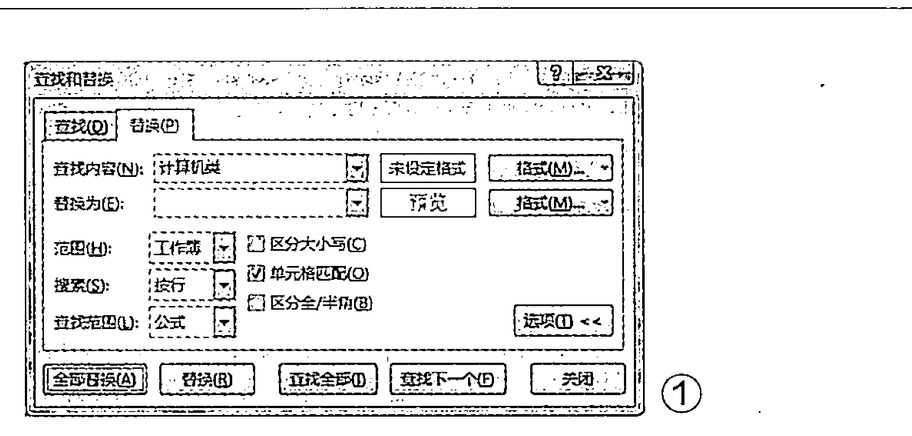

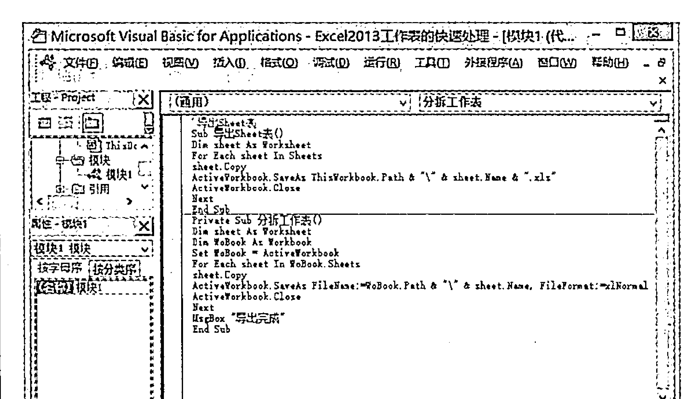

### 导出Sheet表

打开有多个Sheet表的文档，单击窗口的“开发工具”选项卡，选择“代码”功能区中Visual Basic按钮，进入VB窗口。单击窗口的“插入→模块”菜单，打开VB“模块”窗口。把代码复制到光标处，单击“保存”即可（图2）。返回至Excel 2013窗口，使用Alt+ F8快捷键，打开“宏”对话框。选择“导出Sheet表”宏，运行后，该文档的所有Sheet表保存为原文档所处的路径、文件名为原Sheet表的多个文档。

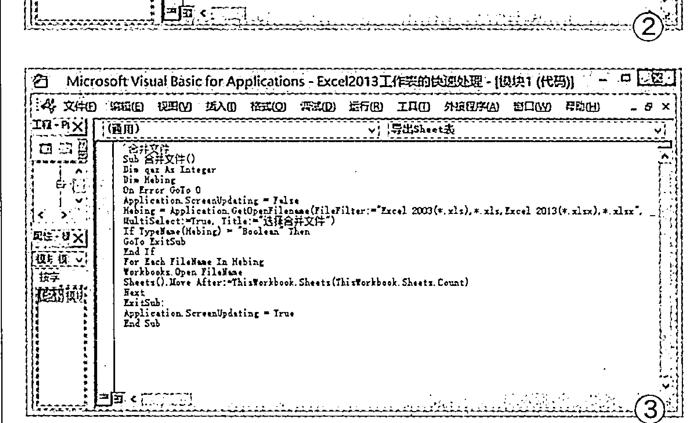

### 合并Sheet表

运行Excel 2013后，进入VB窗口。依次单击窗口的“插入→模块”菜单，在VB“模块”窗口下，把代码粘贴至代码窗口光标处，单击“保存”即可（图3）。回到Excel窗口后，按Alt+F8键，打开“宏”对话框。选择“合并Excel文件”宏，单击“运行”按钮，弹出文件选择框，选择所要合并的Excel文档，确定后，文档里的所有Sheet表会原封不动地合并到当前的工作簿中。

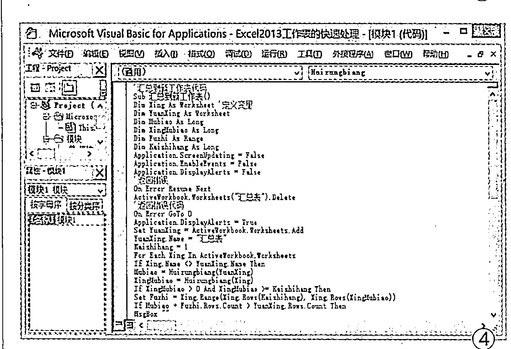

### 汇总Sheet表

打开要汇总的文档，按Alt+F11键进入VB窗口。把代码复制到代码窗口，单击“保存”按钮即可（图4）。在Excel窗口下，按下Alt+ F8快捷键，打开“宏”对话框。选择“汇总Excel文件”宏，确定后，在当前工作簿下新建一个“汇总表”的Sheet表，该“汇总表”包含当前文档中所有Sheet表的内容。

> 小提示
文中所涉代码可通过专用链接下载（http://u.163.com/ihoeymbk 提取码：7SUFejm2）。

## 流程图结构图制作更轻松
文|马震安

当领导要你制作流程图或结构平面图时，你还在为用什么样的结构而抓耳挠腮吗？当你制作流程图或平面图时，还是在Word或PPT中反复修改、美化，或只为了一次偶尔的制作去专门装一个微软的大块头Visio软件吗？不需要！小软件也可以轻松办大事。

### 1. 制作订单管理流程图（图1）

### 选好模板 开始制作

打开“亿图图示专家”软件，在“预定义模板”窗口，点击所需要的模板类型，在子模板处可选择相应的绘图类型。模板类型多，选择空间多。在这里，笔者选择了“流程图”下的“基本流程图”模板（图2）。

> 如果你选择了工程类的模板，还需要选择好绘图单位。

### 流程符号 一键拖入

流程图一般都是由若干个表示不同含义的图形符号用各种连接线连接起来的，所以首要的任务就是在绘图窗口添加所需流程图中的子符号。在模板窗口点击“创建”按钮后就会进入绘图窗口，在这个窗口左侧的符号库窗口就会出现与模板类型相关的符号选项卡，选项卡中的子元素可以通过拖动方式插入到绘图窗口中。当然，可以点击符号库按钮添加更多的符号选项卡（图3）。

> 在绘图中选定符号后，如果需要画连续的、一样的符号的话，可点击这个符号周围的四个箭头，就可生成一个相同的符号并有连线连接。对于可变符号，可以点击它右上角的“=”按钮，选择相应的菜单后就变成相应的形状符号。

### 添加文字 美化符号

符号添加完成后，看看，是不是比较别扭，不好看？所以还需要对流程图中的符号进行文字的添加及美化设置。对于符号中文字的添加，只需双击流程符号就可以输入文字了；而对于符号的美化，可利用“开始”选项卡中的按钮或右击符号调出快捷菜单来进行设置（图4）。

### 流程结构 有序连接

流程图的符号都添加、设置好后，就该用连接线把它们有序地连接在一起了。在“开始”选项卡的“连接线”按钮选择好连接线类型后连接两个符号的相应连接点。连线添加完成后，可选定并右击它，利用“设置形状格式”菜单对连接线进行设置（图5）。

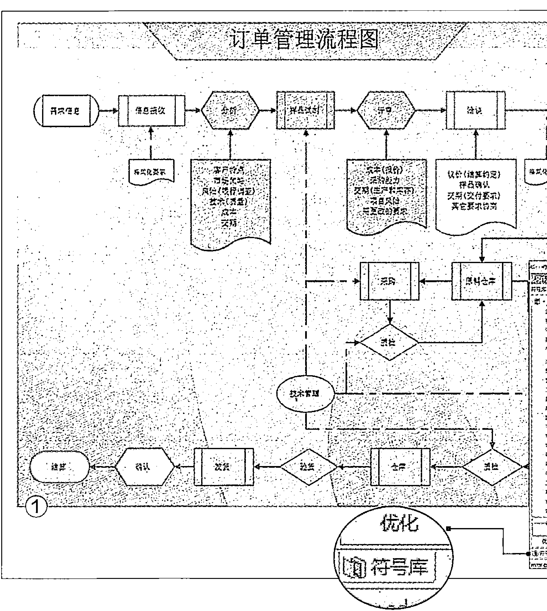

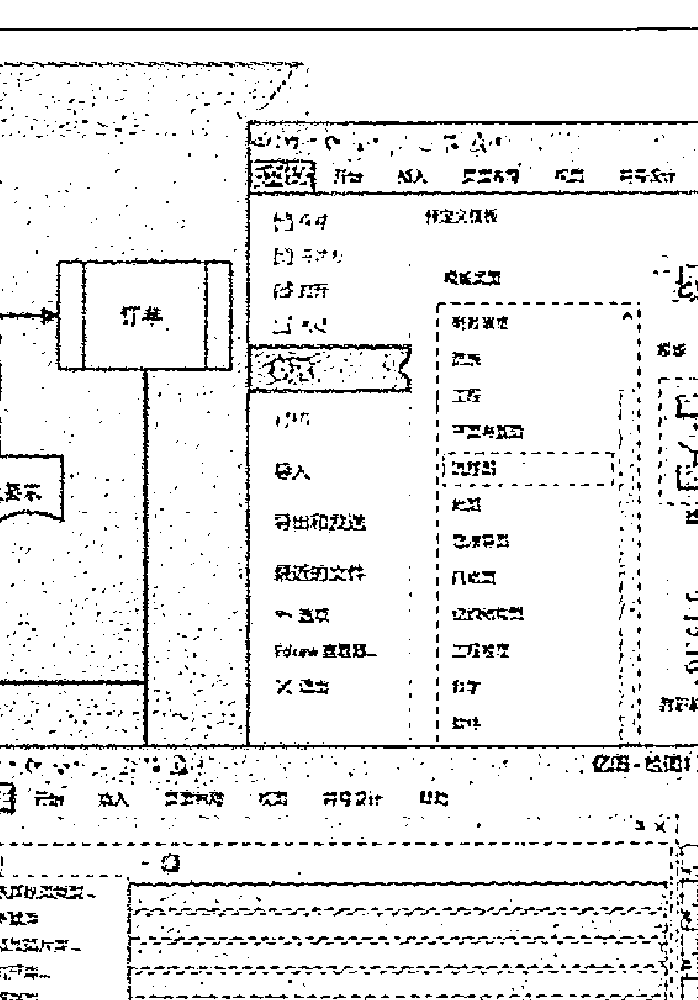

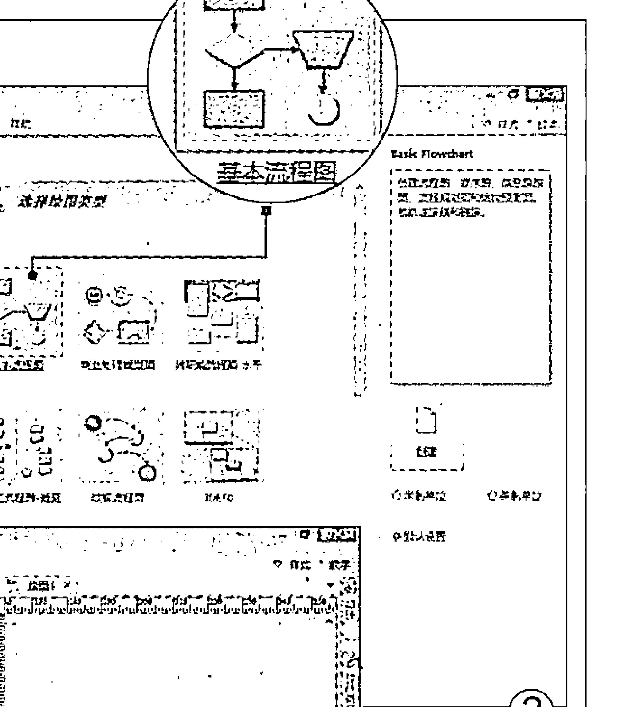

> 小提示
如果连接点的位置不合适，可点击“连接点工具”按钮来添加连接点；如果想删除连接点，只需要选中某个连接点后按Delete键即可。

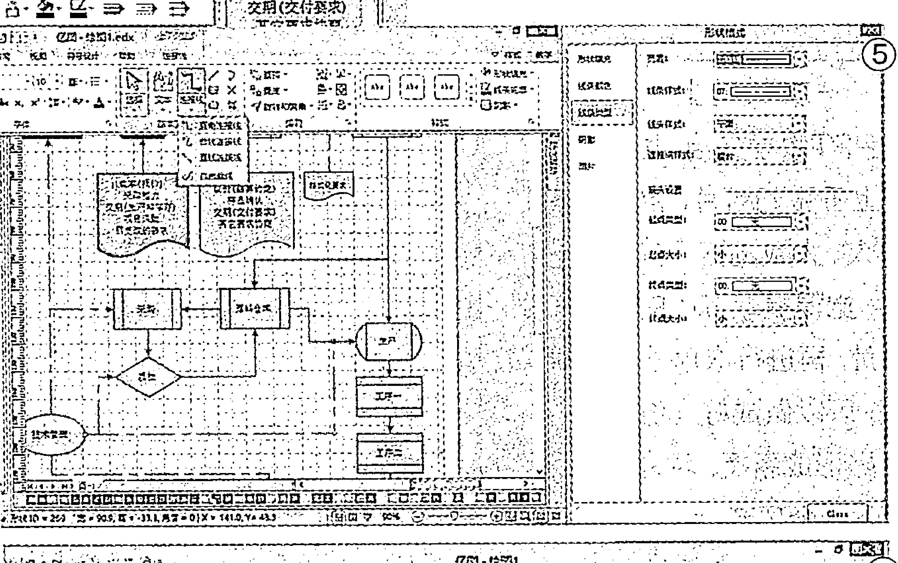

### 标题装饰 背景美化

漂亮的流程图需要一定的美化、修饰。在“边框和标题”选项卡中拖入所需的页眉到绘图窗口，双击此页眉输入标题；对于流程图的背景可在“背景”选项卡中直接向绘图窗口中拖入喜欢的背景即可（图6）。

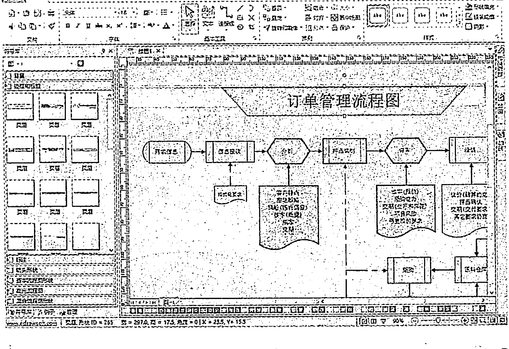

> 小提示
如果领导对图中的符号不太满意的话，可以选择其他选项卡中的符号将绘图中的符号进行替换。

### 2. 制作组织结构图（图7）

制作组织结构图，笔者选择的是“组织结构图”下的“带相片的组织结构图”模板，这个过程和制作流程图的过程相似，只不过向绘图窗口中拖入一个相片形状后右击它时，右键菜单有了更多的选择，使操作更加简单，以方便制作图。同时，可利用“图片格式”选项卡中的“替换图片”按钮来替换符号中的图片。

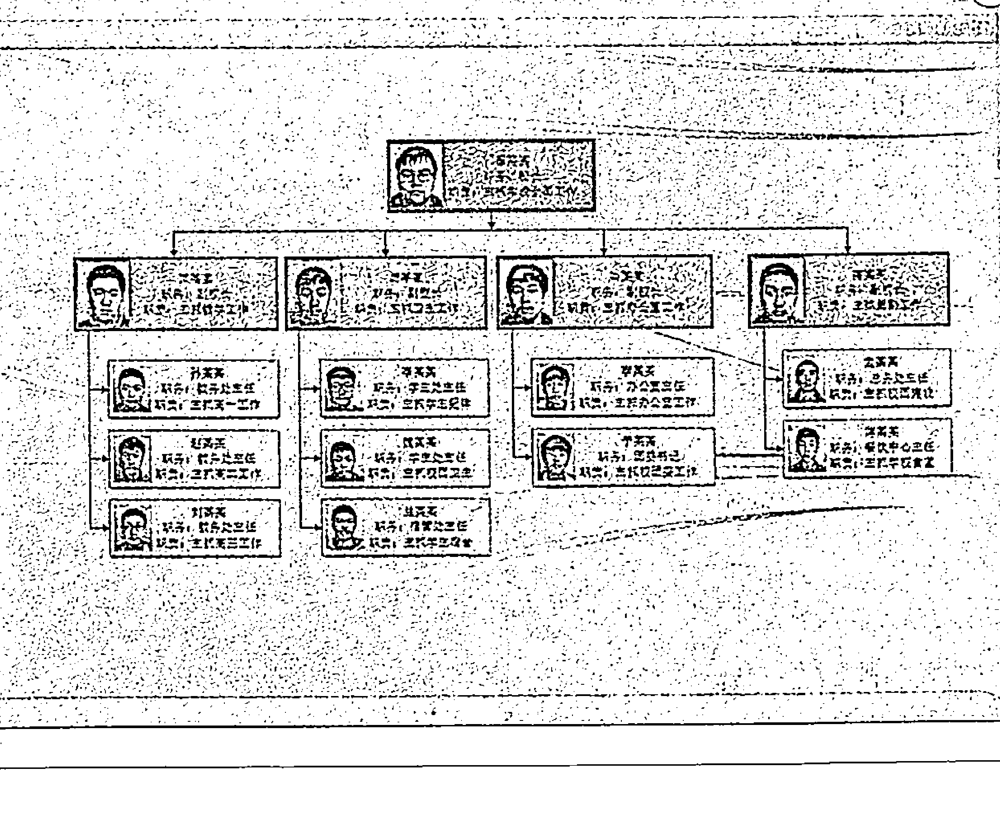

> 小技巧
也许你会觉得制作流程图或结构图最困惑的是图的结构，有没有什么好的办法？当然有。笔者给你一个“借鸡生蛋”的方法，就是在软件的每个模板下都有若干个例子，可以选择并打开自己所需要的例子，将例子中符号的内容修改成自己的，这岂不是让你既省时又省力的好办法吗？如果另有想法，也可在这些结构图的基础上对框架进行修改。

## 不强拆巧分秒合幻灯片
文|曹春华

制作幻灯片，不少人奉行“拿来主义”，即对从各种途径获取的幻灯片进行删除、剪切等“手术”，在剪、删过程中，不时地在源文件、目标文件窗口间切换。这种方法非常麻烦，稍不留心，就会将源文件搞得面目全非。有没有更为合理的“分合”幻灯片的方法呢？

### 大容量幻灯片巧“分身”

一次从网上下载了一份PPT教学文档，里面包含了上千张幻灯片，容量大得惊人。大致浏览了其中的内容，觉得提取其中的部分幻灯片，再进行次序的适当调整，可以做成好几份PPT，正好形成新授、习题讲解、复习几个环节。

打开幻灯片，依次单击“幻灯片放映→自定义幻灯片放映→自定义放映”（图1），弹出“自定义放映”对话框，然后单击“新建”按钮，输入自定义放映名称“新授”（图2）。从幻灯片列表中选中需要播放的幻灯片序号，添加到右侧的自定义放映列表中（可配合Ctrl或Shift键多选，用上下箭头调整顺序），最后单击“确定”返回到“自定义放映”对话框。

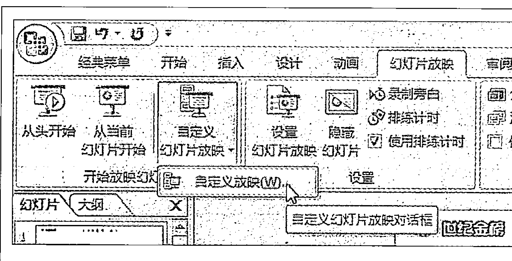

用同样的方法新建习题讲解、复习等多个自定义放映，并为它们分别添加各自所需的幻灯片，最后将文件保存。

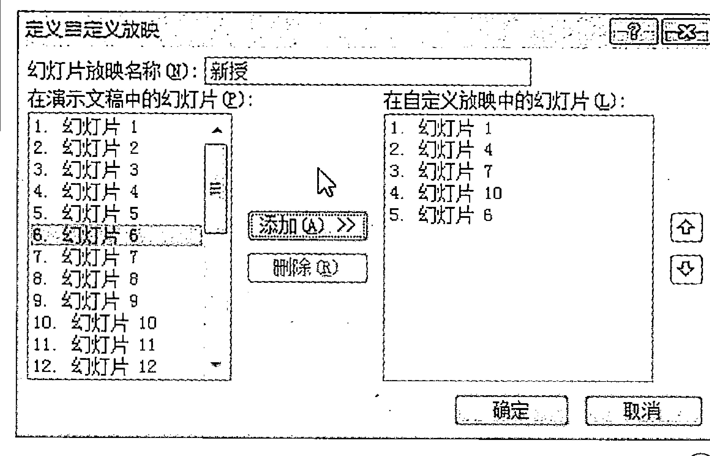

以后需要播放自定义放映内容时，依次单击“幻灯片放映→自定义放映”（图3），从下拉菜单中就能选择所需的自定义放映了。

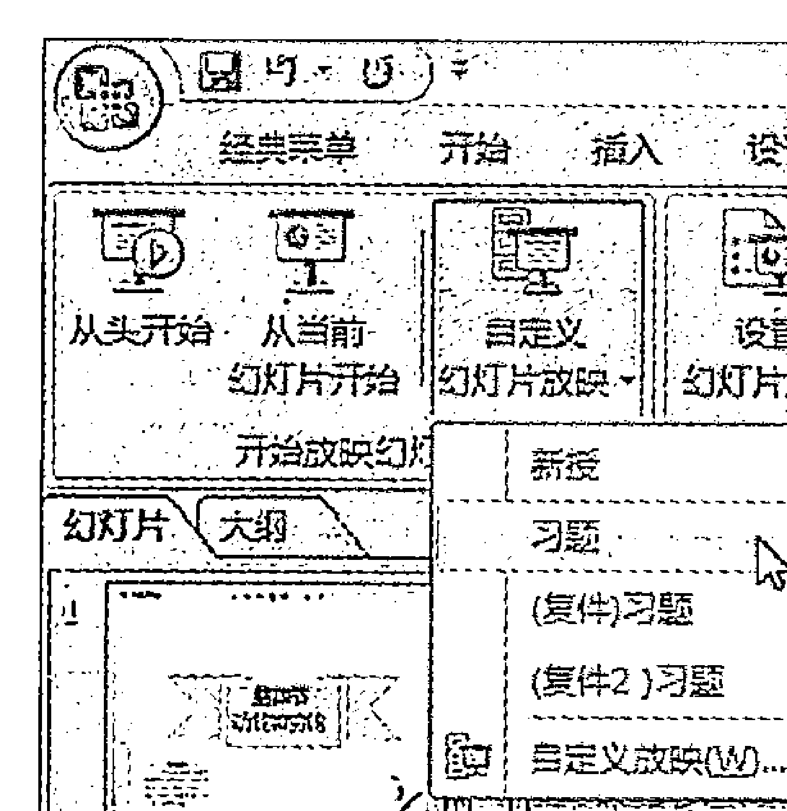

这种方法在对源文件中的内容没有任何改动的情况下，实现了文档的“分身”。

### 他方幻灯片巧“借用”

要将多个文件中的幻灯片借为己用，上述“分身”之法就不适用了。早期的Office版本中有一项“插入→幻灯片（从文件）”，可以方便地从其他幻灯片文件中插入需要的幻灯片，Office 2007或更高的版本中，这项实用的功能似乎不见了，其实并非如此。

在目标文件中选择要插入幻灯片的位置，依次单击“开始→新建幻灯片→重用幻灯片”，出现“重用幻灯片”窗口（图4），单击“浏览→浏览文件”按钮，指定需要引用幻灯片的源文件，单击“打开”按钮，所选文件中的所有幻灯片将以缩略图的方式显示在“重用幻灯片”对话框的幻灯片浏览窗口中，任意单击要插入的幻灯片即可插入，可以插入多张幻灯片。

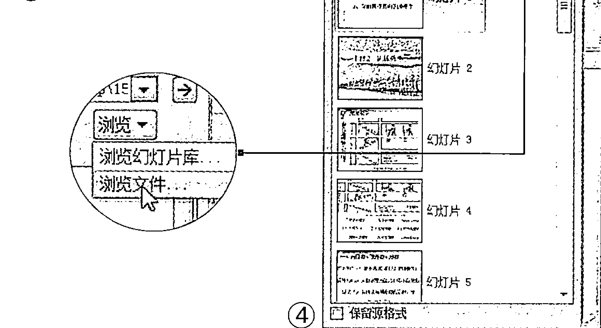

> 小提示
在插入前，还可以勾选“保留源格式”，让插入的幻灯片风格与源幻灯片保持一致。

## 网页输入文本备份不再丢

《电脑爱好者》2011年第20期《一键采集 资料进笼好轻松》一文，介绍了通过软件“Text Editor Anywhere”（下载地址：http://dwz.cn/wgbvg）来快速收集网页中的资料，非常不错。其实，该软件的功能不止于此，除了可以快速收集资料外，还可以通过它将我们在网页中输入的评论、心得等文本进行快速保存，以便以后查找。不但如此，还可以利用它快捷打开常用程序，可谓一举两得。

### 任意捆绑编辑器

首先在“Text Editor Anywhere”中指定文本保存的默认位置。右击托盘中的软件图标，打开“Options”菜单，单击“Save temporary files in”右侧的“Browse”按钮，指定位置后单击“OK”。

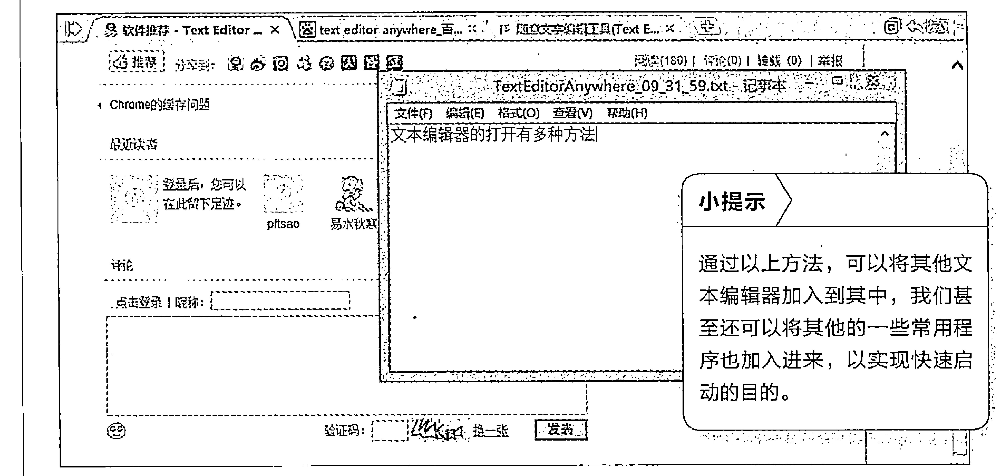

现在，我们在网页的任意文本输入框中单击鼠标后，按下热键Win+A，自动弹出文件编辑器（图1），在文本编辑器中输入文本后，单击关闭、保存按钮，它将自动命名保存。

保存后，在文本编辑器中输入的文本，会原封不动地出现在网页文本输入框中。比较可惜的是，此法适用于IE、淘宝等浏览器，在Firefox或者Chrome中不能自动显示于网页之中。

> **小提示**
通过以上方法，可以将其他文本编辑器加入到其中，我们甚至还可以将其他的一些常用程序也加入进来，以实现快速启动的目的。

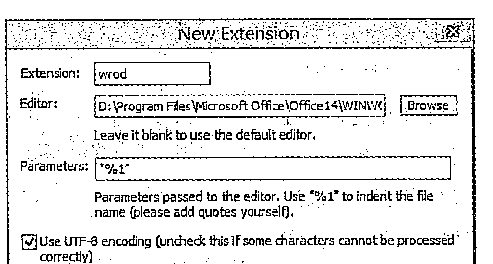

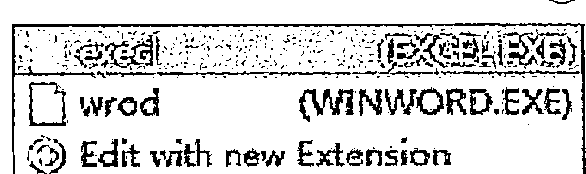

> **小技巧**
如果捆绑的是EmEditor，而在EmEditor中又开启了查看字数的插件按钮，那么输入过程中查看字数就比Word更加方便了。

### 随时打开编辑器

电脑中安装的文档编辑器一般不止一种，比如记事本、Word、WPS之类，在不同的环境下我们会调用不同的编辑器来进行编辑，利用该软件可以很方便地打开所需要的任一种编辑器，而不必从开始菜单或桌面的快捷方式中去打开。

打开“Options”菜单后，单击“+”按钮（图2），在“Extension”中输入编辑器名称，比如输入“Word”，然后单击“Browse”按钮，指定编辑器的主程序文件，单击“OK”。

以后在桌面任何位置，按住Win+A，弹出悬浮菜单（图3），这时再按住Win键，通过单击A键在菜单中切换，当切换到Word后松开快捷键，即可打开Word编辑器。

### 自动粘贴到另一编辑器

在记事本中编辑的文本，需要统计字数时，一般的方法是复制记事本中所有文本，然后打开Word，粘贴后进行统计。其实，有更为快捷的方式。

在记事本文件中按下快捷键Win+A不松开，弹出悬浮菜单，选中其中的Word，即可自动复制、粘贴到其中，这时直接在Word中利用命令查看字数就方便多了。

## 表错情？Virtu MVP的真正作用及用法
文|盖述功

目前许多7系或8系主板都支持Virtu MVP技术，据说只要启用该技术，即可大幅度提高显卡性能。不过，许多朋友在使用后发现，该技术貌似忽悠，因为即使开启，也未见得会提高显卡性能，有时反而会出现下降现象。那么，Virtu MVP究竟为何物？它的使命到底是什么？今天我们就和大家一起探讨一下。

### 认识Virtu MVP并弄清其作用

Virtu MVP除了能让用户轻松地在集显和独显之间切换外，还打破了独集显不能同时工作的限制，可以让独显和集显同时工作，从而在一定程度上提升操作响应速度。Lucid Virtu MVP拥有三大功能：GPU Virtualization、HyperFormance和Virtual Vsync。其中后两者只有在前者已开启的前提下才能使用。

### GPU Virtualization

该功能是Virtu MVP的核心功能，能够让独显和集显同时工作，并且能够在两者之间任意切换。比如我们只是在进行文字编辑、简单的图片处理或浏览网页等操作，对显卡的要求不是太高，集成显卡便能轻松胜任，可以通过切换到使用集显让独显0负载工作，以达到节能的目的。对于需要同时播放视频并使用PS等大型图片编辑软件，或播放视频的同时玩游戏的朋友，也可以通过使用该功能将这两个任务分别指派到集显和独显中，以达到降低某一显卡负担的目的。

Virtu MVP只是为了提高图形处理的并行能力，而非如许多朋友所认为的那样可以提高显卡性能。

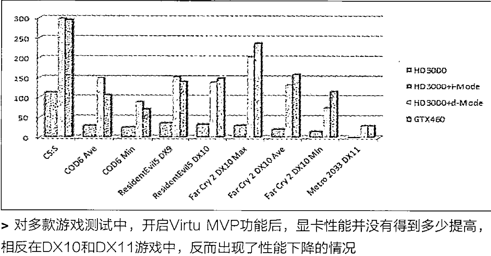

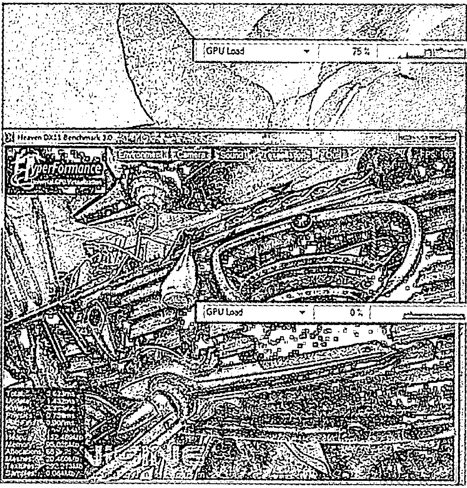


### Virtual Vsync

Virtual Vsync的中文意思是“虚拟垂直同步”，所以该功能是与垂直同步息息相关的，但它又不同于我们熟知的垂直同步。该技术可以将超过显示器刷新率的帧丢掉，以达到保证游戏画面连贯的目的。不过丢掉的帧中很可能包含着我们的操作指令，Virtual Vsync很好地解决了这一问题，它充分利用了独显和集显可以同时工作的优势，巧妙地将需要垂直同步的帧移交给集显处理，而让性能更高的独显，集中全力接受CPU的所有指令并加以处理，这样游戏画面连贯流畅了，同时用户的操作指令也不会丢失，可以说是“鱼与熊掌兼得”，两全其美。

Virtual Vsync功能的主要作用，是保证游戏在高FPS的情况下，不会因显示器刷新率低而出现画面断裂的现象，而不是像网络上有些文章宣传的那样，可以提高画面帧数。

> 传统垂直同步的流程图


> Virtual Vsync流程图


> 启用Virtual Vsync前后画面的效果对比


### HyperFormance

该功能看上去是最应提高显卡性能的一个功能（HyperFormance，即高性能），不过，该功能的作用其实是了提高显卡的操作响应速度。通常显卡工作时会对每一帧进行渲染，而且每一帧的渲染时间比较平均，基本保持在18ms-20ms之间。而HyperFormance功能则可以在处理器将相应数据提交给显卡前，预先判断哪些帧需要完整处理，哪些帧可以简单处理，对于可以简单处理的帧Virtu MVP只需要5ms左右就可以将其处理完毕，从而在一定程度上缩短有效帧的处理间隔，最大限度提高显卡的操作响应速度。

Benchmark Analysis In *Hardware.fr* :

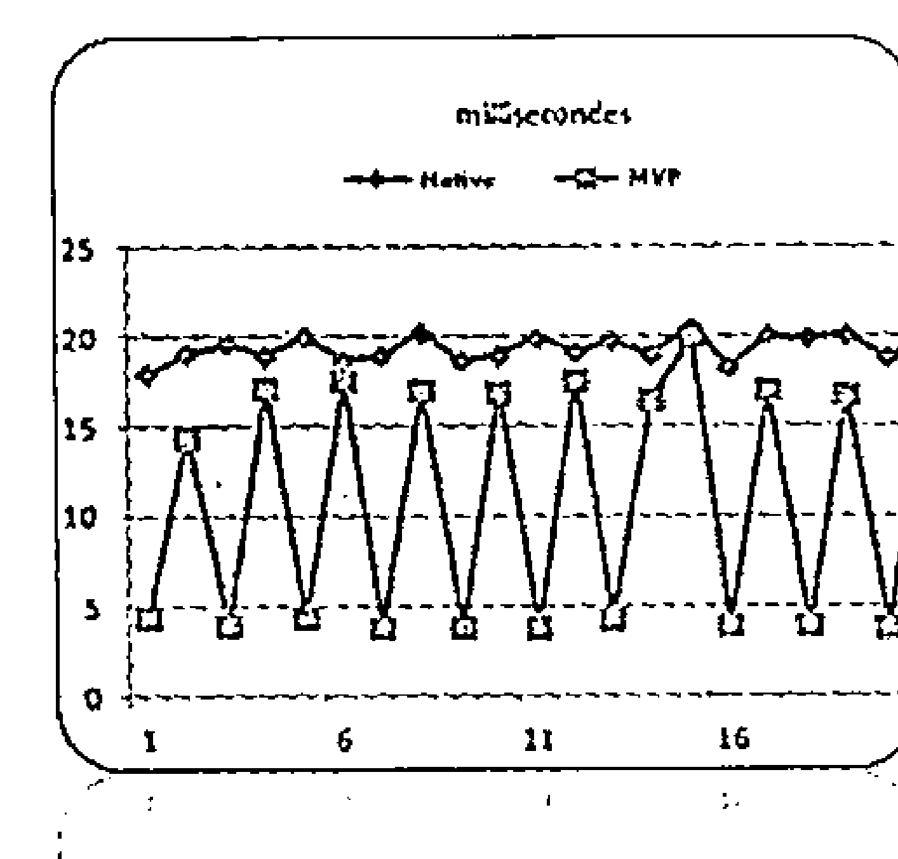

> HyperFormance功能可缩短有效帧的处理间隔

Missing Analysis :

Example, Frames #11,13,16: -In Native, the frame would be barely visible or already in pipeline (See below chart) -In MVP, those frames are detected/marked with redundancies and thus only partially processed

Native Response: Click in frame 12 see it in frame 14 -> 38ms MVP Response : Click in frame 12 see it in frame 14 -> 22ms

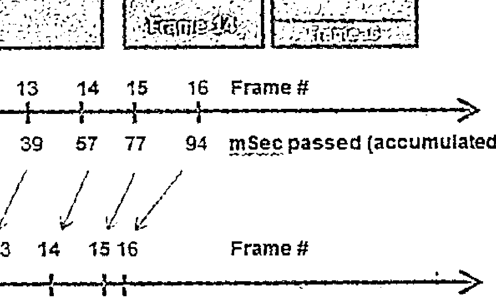

### 实战篇 利用Virtu MVP组建双屏并改善游戏体验

通过上面的介绍，想必大部分朋友已弄清了Virtu MVP的真正作用，即Virtu MVP的确可在一定程度上改善游戏体验，并能在需要的时候通过显卡切换来达到节能的目的。当然，除此之外，它所提供的集显和独显可独立工作、互不影响的功能，也可给我们的日常用机带来极大方便。

如果我们家中只有一台主机，

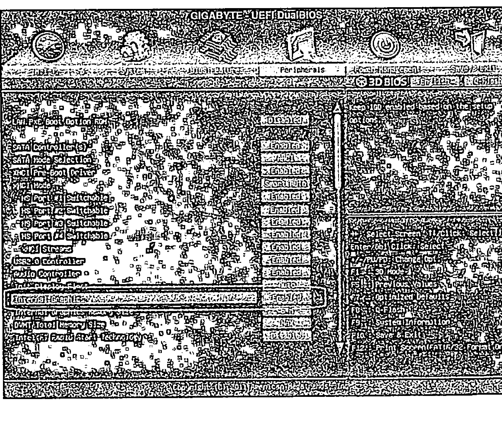

> 启用核心显卡，不同的主板此处的设置项有所不同

却有两台显示器，现在我们想用一台来播放高清视频，而另一台进行游戏，但独显的性能不足以强大到能同时流畅地进行这两大操作，这时该怎么办呢？很简单，我们可以利用Virtu MVP将视频和游戏分别分配到不同的显卡。

首先重启系统，进入BIOS设置界面，启用核心显卡。进入系统后，安装好集显和独显的驱动程序。然后安装Virtu MVP工具（32位版下载地址：http://www.dwz.cn/kWO0p；64位版：http://www.dwz.cn/kWO5n），重启系统，单击系统托盘区中的程序图标，进入程序主界面。

这里有四个标签，其中Main（主要）标签，可实现我们上面所说的第一个功能，即双显卡切换及同时工作功能。使用方法为：在GPU Virtualization（GPU虚拟技术）栏中，单击Integrated GPU（整合GPU），或Discrete GPU（独立GPU）按钮，会切换到集显或独显单独工作模式；而单击OFF（关闭）按钮，使之处于ON（开启）状态，会同时启用集显和独显共同工作模式（默认将使用独显）。在该模式下，我们只需将相应程序的窗口拖曳到Integrated GPU或Discrete GPU按钮上，即可让程序以指定的显卡工作。

而Performance标签则可启用或关闭我们上面所说的HyperFormance（高性能）和Virtual Vsync（虚拟垂直同步）功能，而且使用方法相当简单，要使用时只需在HyperFormance和Virtual Vsync栏中单击OFF（关闭）按钮，使其处于ON（开启）状态即可。

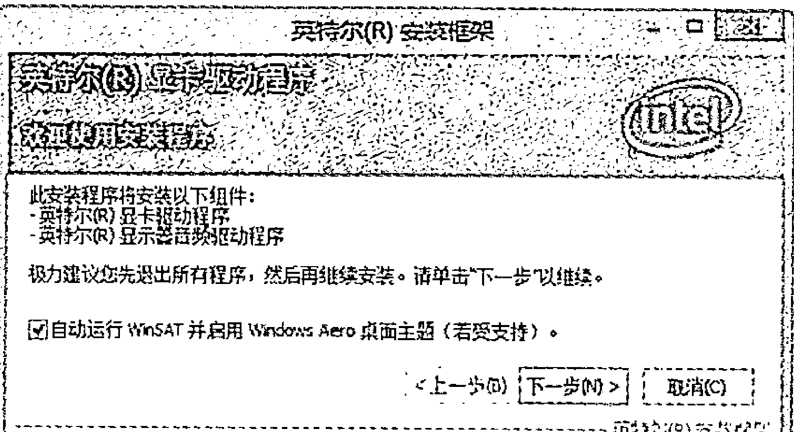

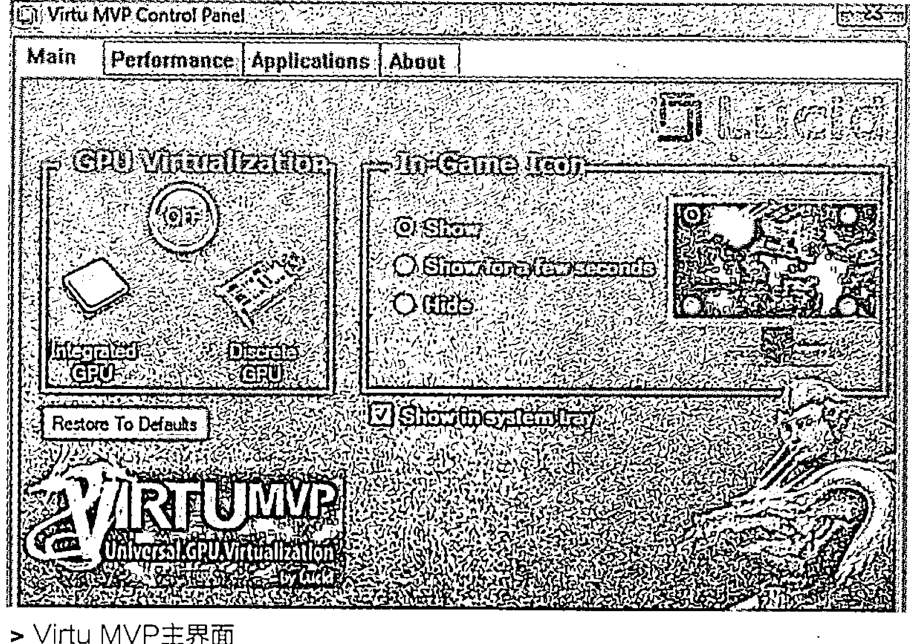

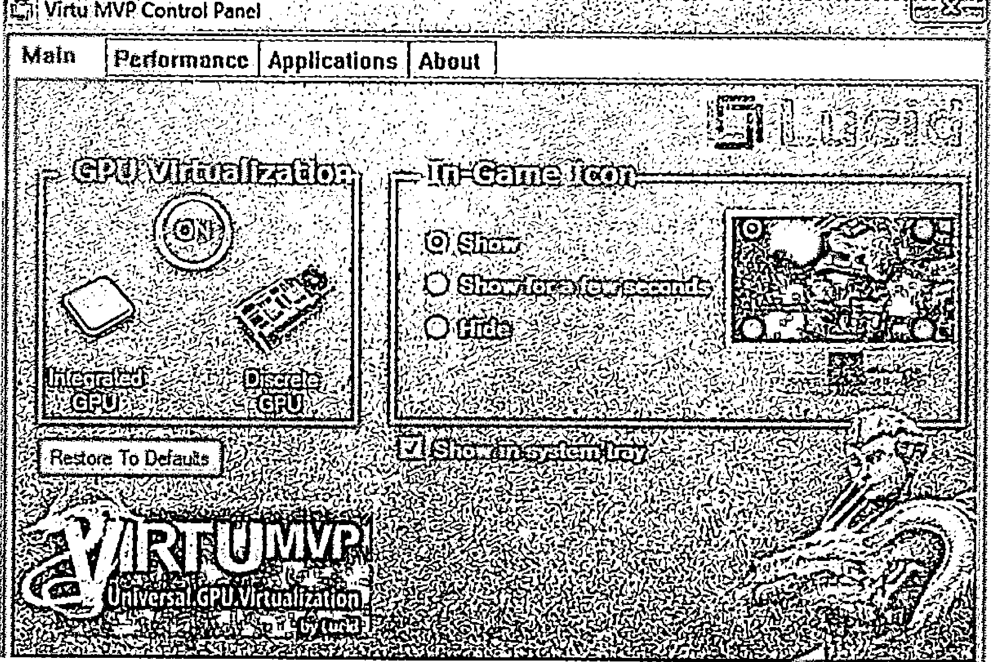

> 启用HyperFormance（高性能）和Virtual Vsync（虚拟垂直同步）功能有个前提，那就是Virtu MVP必须处于集显和独显共同工作模式，否则两大功能中的OFF（关闭）按钮是灰色的，无法操作。

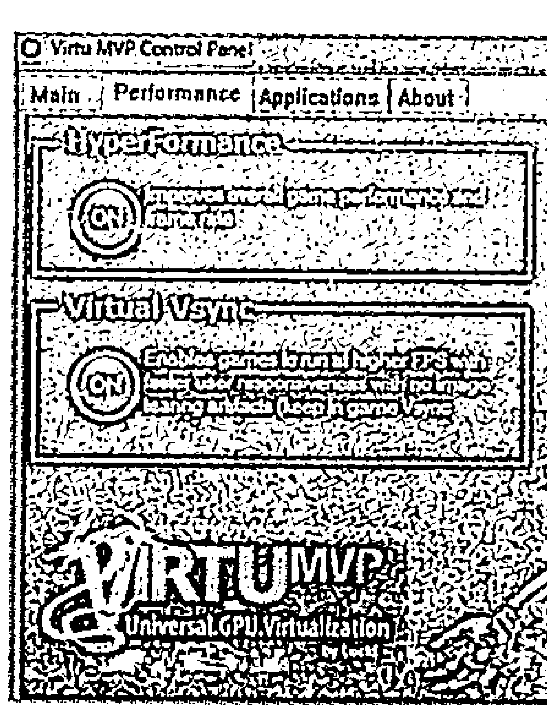

> 使用Virtu MVP必须注意的几个问题

主板BIOS必须含有可强行开启核心的选项，如果没有，说明主板不支持混显模式，则无法实现。其次需要集成了GPU的Intel CPU或AMD CPU。尽管Virtu MVP号称支持N卡和A卡混用，但在实际使用的过程中我们会发现，Intel CPU和A卡混用很可能会出现问题，反之，AMD CPU和N卡混用也是如此，所以使用时，最好让Intel CPU和N卡搭配，AMD CPU和A卡搭配。系统内存最好不少于2GB，操作系统应为Windows 7或Windows 8。

## 大内存让SSD“延年益寿”

文 | 静花水月

随着SSD硬盘渐渐逼近普及价位，越来越多的用户都将其作为PC的首选升级对象。但是，对经常与Photoshop等软件打交道的用户而言，为什么即使升级SSD并将Photoshop安装其中还是不够快呢？想延长SSD的寿命还有哪些方法呢？

### SSD有限的“寿命”

### 大内存“救驾”

SSD硬盘在读写速度上有着先天优势，但有限的写入次数却是它的致命死穴，想延长SSD的使用寿命，尽可能减少频繁的数据交换非常必要。回到正文，像Photoshop一类的设计软件在运行中就需要进行海量的数据交换，比如明明仅是制作一幅几十兆的海报，但在此过程中可能就会生成20GB左右的巨大页面文件。

问题来了，假如你的PC仅有4GB内存，每个步骤的存储操作自然会借道SSD，而SSD的速度又是低于内存的，此时哪怕是高速的SSD也会成为程序流畅运行的拖累。

理论上讲，当内存容量增大后，数据可以多次重复被系统直接从内存调用，而不用从硬盘读入内存再调用，可明显减少系统对硬盘数据的读写，同时提升运行效率。那么，这个理论成立吗？为此我们不妨先来看一组数据（见表）。

以Adobe Photoshop CS6为例，测试项目为在自动模式下将七张1800万像素的照片拼接为全景图，4GB内存时SSD需要5.01GB的数据写入，而升级到16GB内存后则下降至2.73GB，数据写入量减少了45%。而Microsoft Visual Studio 2010更为夸张，从源代码编译Google Chrome的过程中16GB内存可减少64%的数据写入。

可见，如果你经常要与类似的软件打交道，升级大内存可明显减少SSD数据的写入量，延长使用寿命，还能减少因内存不足而不得不调用SSD的机会，提升运行效率。

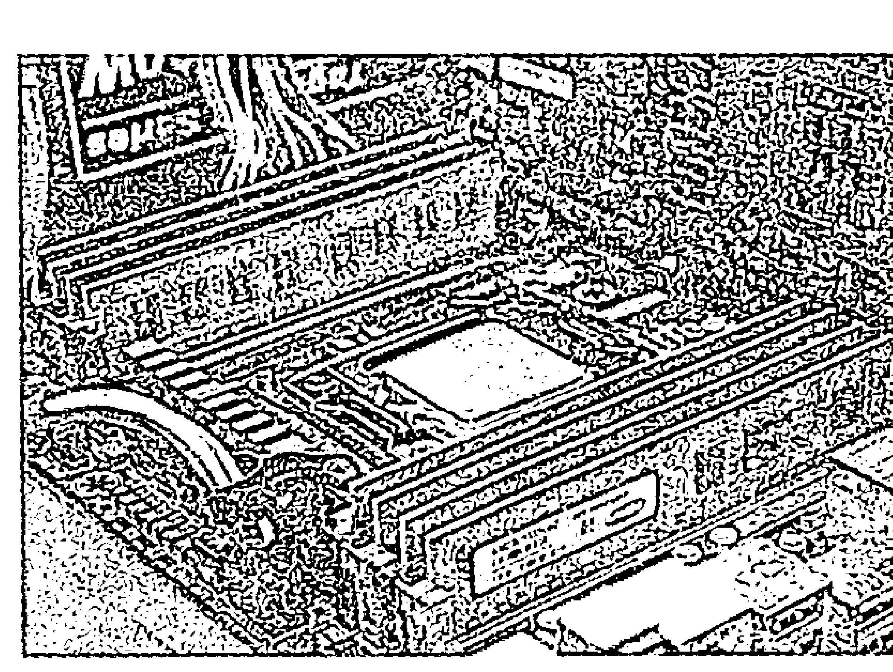

| 测试项目 | 4GB | 16GB | 数据写入减少量 |
| :--- | :--- | :--- | :--- |
| Autodesk 3ds Max 2012 | 393.4MB | 281.3MB | 28% |
| Adobe Photoshop CS6 | 5.01GB | 2.73GB | 45% |
| Microsoft Visual Studio 2010 | 26.49GB | 9.6GB | 64% |

*本次测试是建立在一部装有三星PM810（256GB）SSD的PC之上，分别在4GB和16GB内存时运行指定软件，并用hIOMon衡量固态硬盘在测试期间所有的数据写入量*

> **小提示**
>
> 如果PC的内存足够大，大家还可尝试使用RamDisk软件，将虚拟内存和IE临时文件放在上面。需要注意的是，Windows系统的临时文件不要放在其中，否则可能会出现安装重启才能完成的重要软件时出错。此外，RamDisk还有一项功能可以在重启时把所有内容拷贝到物理硬盘，但笔者不建议开启，因为设置后会导致开关机明显变慢，得不偿失。

在很多专业软件中，大内存可有效减少系统存储对SSD的需求量，进而起到延长SSD写入次数寿命的功效。如果你希望系统反应速度更极致，SSD可以延长退休年限，那么升级更大的内存自是首选之路。但是，目前内存价格尚处于高位，单条4GB内存价格约在250元，价格是最便宜时期的两倍。因此，大家不妨留意一下内存价格的波动，待合适的时机再出手。CF

## 数据无价

### 实践提升家用硬盘可靠性

文 | 黄健

一块1TB的硬盘不过400元，但其内部所保存的数据却很难用金钱衡量。问题是，硬盘属于易耗品，也是PC中最易出故障的部件，想保证无价数据的安全，想办法提升硬盘的可靠性势在必行。本文，我们将尝试通过硬件、厂商工具和应用软件三个层次进行“实战”。

### 硬件层次的可靠性

在开始文章前，先来看看两个小公式：当两个可靠度为80%的硬盘分别以串行和并行两种形式组成系统，哪个更为可靠？

串行系统正常工作的条件是两个硬盘都正常，所以它正常工作的概率就是0.8×0.8=0.64，也就是说两个可靠度为80%的硬盘组合可以得到可靠度为64%的产品；

并行系统失效的条件是两个硬盘都失效，所以它的计算公式为1-(1-0.8)×(1-0.8)=0.96。

由上可见，通过适当组合可以把可靠性不太高的硬盘组成一个高可靠性的系统，而RAID1就是这么出现的。

对于关注硬盘可靠性的用户而言，采购两块硬盘并将它们设置在RAID1状态无疑是最理想的解决方案。以华擎主板的BIOS为例，先设置SATA为RAID模式，再按“Ctrl+I”进入RAID配置并选择创建RAID卷（图1~2），移动光标依次做出设定，记得在RAID Level处选择RAID1（图3），其余选项默认，最后移动到Create Volume处回车。出现警告信息后选择“Y”（图4），RAID卷即创建完毕，之后即可开始安装操作系统。

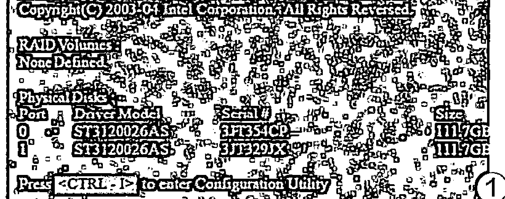

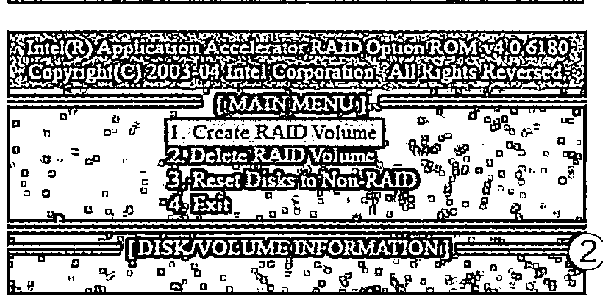

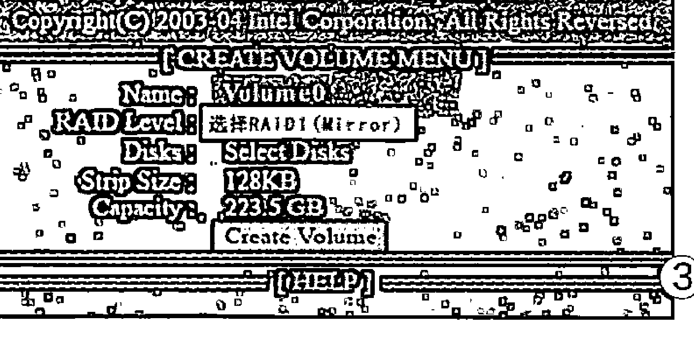

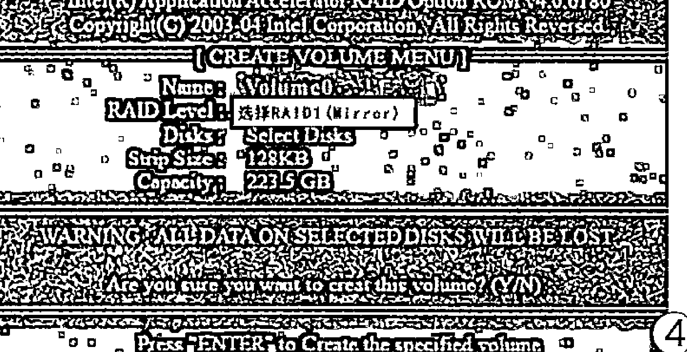

### 厂商工具层次的可靠性

根据统计表明SATA硬盘年故障率约为2.5%，其中70%为可修复缺陷，周期性的磁盘扫描可发现并及时修复缺陷、降低故障率。这里我们建议使用原厂工具来做扫描，毕竟“知子莫若父”。以销量最大的希捷和西数为例，它们都提供DOS版和Windows版的检测维修工具。

总之，磁盘检测和修复的软件很多，但建议大家还是优先挑选硬盘厂家官方提供的工具，不仅检测最细致，修复的效果也是最有保证的。比如市场占有率领先的希捷硬盘，可以使用SeaTools（下载地址：http://t.cn/RvIHKd5）进行扫描。

> > **小提示**
> >
> > DOS版和Windows版维修工具的使用时机不同：DOS版适用于硬盘操作系统已损坏、无法正常启动或未安装Windows系统时使用，通常修复效果较Windows版更好；Windows版则适用于尚可正常开机的硬盘或检测挂从盘的电脑，好处是检测速度较快。

### 实战案例1：

一台PC频繁卡顿，硬盘偶尔出现明显噪音，怀疑是内部的希捷硬盘存在缺陷，所以尝试用DOS版的SeaTools进行检测。运行该工具后，使用其中的长检测项对硬盘进行完整扫描，经检测后果然发现问题（图5），为下一步的修复盘面缺陷打下基础，所以及时准确的磁盘扫描是提升硬盘可靠性不可或缺的一步。

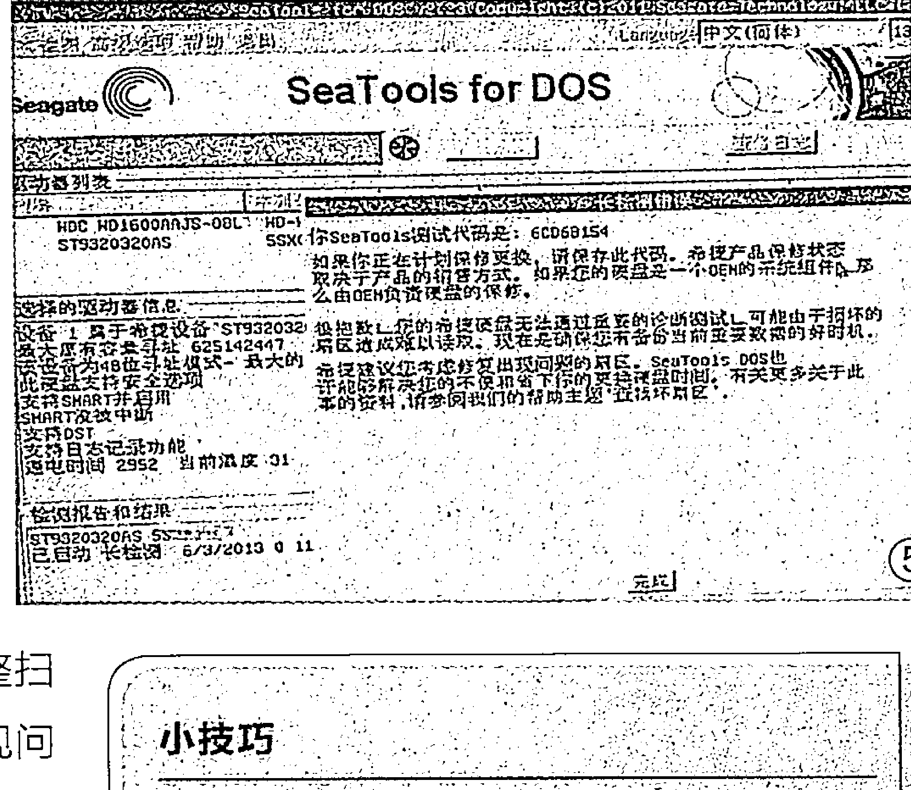

> **小技巧**
>
> 以希捷为例，在大多数情况下，“短检测”即可满足需要，如果需要更全面的检测，可以考虑运行“长检测”，不过它将花费较长的时间才能完成，因为它会读取每个扇区。WD DLGDIAG也有类似选项（Quick Test和Extended Test）。

### 实战案例2：

一块西数160G硬盘使用中时常出现问题，尝试用西数原厂工具WD DLGDIAG进行修复。经过DLGDIAG（DOS）检测错误代码为0007（图6），依照建议进行全盘扫描修复，提示修复成功后故障排除。WD支持库中提供了WD DLGDIAG诊断的错误代码解析，有助于判断问题（http://t.cn/Rv6cKgL）。

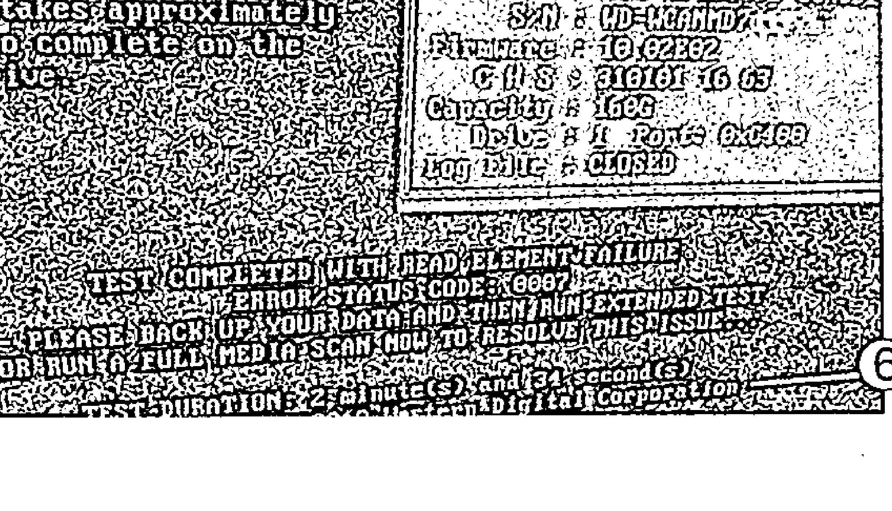

### 应用软件层次的可靠性

俗话说“防患于未然”，与其等出现问题再解决问题，不如养成定期检测硬盘健康值的习惯，一旦某些检测值出现预警就进行数据的备份，避免硬盘突然罢工引起的数据丢失与损坏问题。这在企业级存储中叫故障盘预拷贝，而我们则推荐大家用CrystalDiskInfo（监控）+DiskGenius（数据拷贝）两款第三方软件的组合形式。

CrystalDiskInfo（下载地址：http://t.cn/Rv6c1Nj）的使用方法非常简单，运行后它会通过硬盘SMART信息检测目前健康状态。健康状态为蓝色代表良好，如果是黄色或红色就需要尽快备份资料了（图7）。

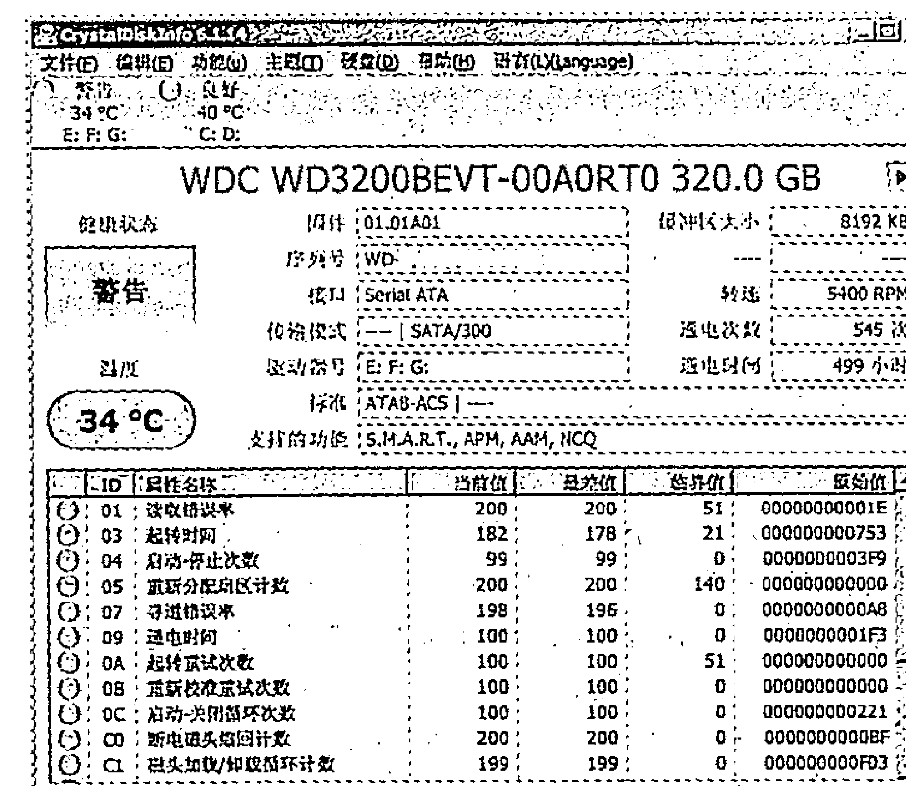

| ID | 属性名称 | 当前值 | 最差值 | 临界值 | 原始值 |
|----|-------------------|------|------|------|------------------|
| 01 | 读取错误率 | 200 | 200 | 51 | 0000000001EF |
| 05 | 重映射扇区计数 | 200 | 200 | 140 | 000000000000 |
| 07 | 寻道错误率 | 198 | 196 | 0 | 000000000A6B |
| 09 | 通电时间 | 100 | 100 | 0 | 000000001F31 |
| 0A | 启动-停止次数 | 100 | 100 | 51 | 000000000000 |
| 0B | 重校准尝试次数 | 100 | 100 | 0 | 000000000000 |
| 0C | 通电-断电循环计数 | 100 | 100 | 0 | 000000000221 |
| C5 | 当前待映射扇区数 | 200 | 200 | 0 | 0000000000BF |
| C6 | 无法校正的扇区数 | 199 | 199 | 0 | 0000000000D3 |

使用DiskGenius（下载地址：http://www.diskgenius.cn/）可方便地进行数据备份，运行后只需在左边窗格选定硬盘分区后，在右边窗格“浏览文件”选项卡下选择目录，点击鼠标右键复制到指定区域即可（图8）。如果拷贝目录时出现中断，可以进入目录选择文件拷贝，总之一原则是争取拷贝尽可能多的数据到安全的位置。

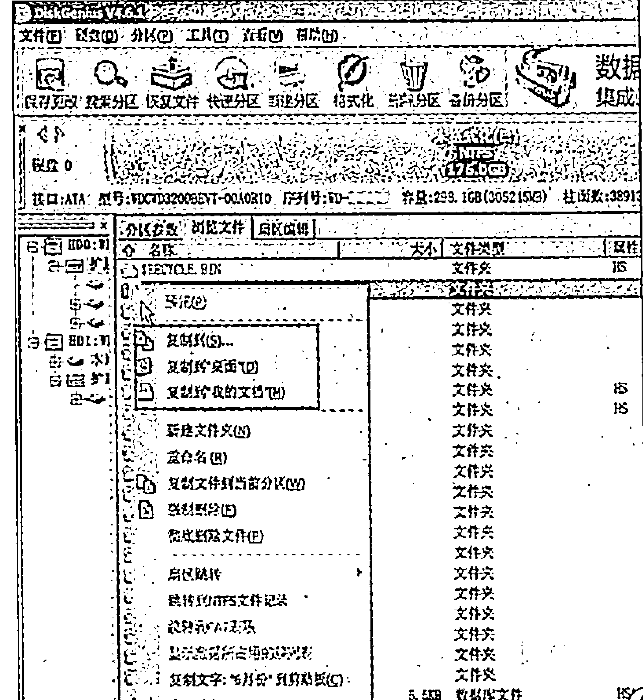

> **小结**
>
> 以上类似方法在企业级存储中已经普及使用；在普通家用机中，我们可以依据自己的需求，灵活采用本文的方法提升硬盘的可靠性，保护数据。CP

## 解决Android设备变慢问题

文 | 沈建苗

大家似乎都在抱怨Android设备的运行速度久而久之会慢下来。有许多问题会导致Android设备速度变慢，我们以Nexus 7平板电脑为例，介绍为Android设备提速的多种方法。

### 手动运行TRIM

大家都知道设备中安装东西越多速度越慢，所以很多人在系统变慢后首先都去删除应用程序和文件，用来腾出空间（图1）。其实关于存储，真正的问题并不在此。很多Android设备的NAND存储芯片的驱动程序存在Bug，Android无法向空闲的未使用扇区正确发出TRIM命令，这会引起写入速度大幅下降。更新Android系统版本到4.2.x之后可以修复这个Bug，但是无法修复在过去应该执行TRIM的现有扇区。如果想自己动手，可以试一下LagFix（http://www.dwz.cn/IVac5）。该应用程序是fstrim实用工具的前端部分，它会对你的空白存储区执行TRIM命令，以解决这个问题（图2）。

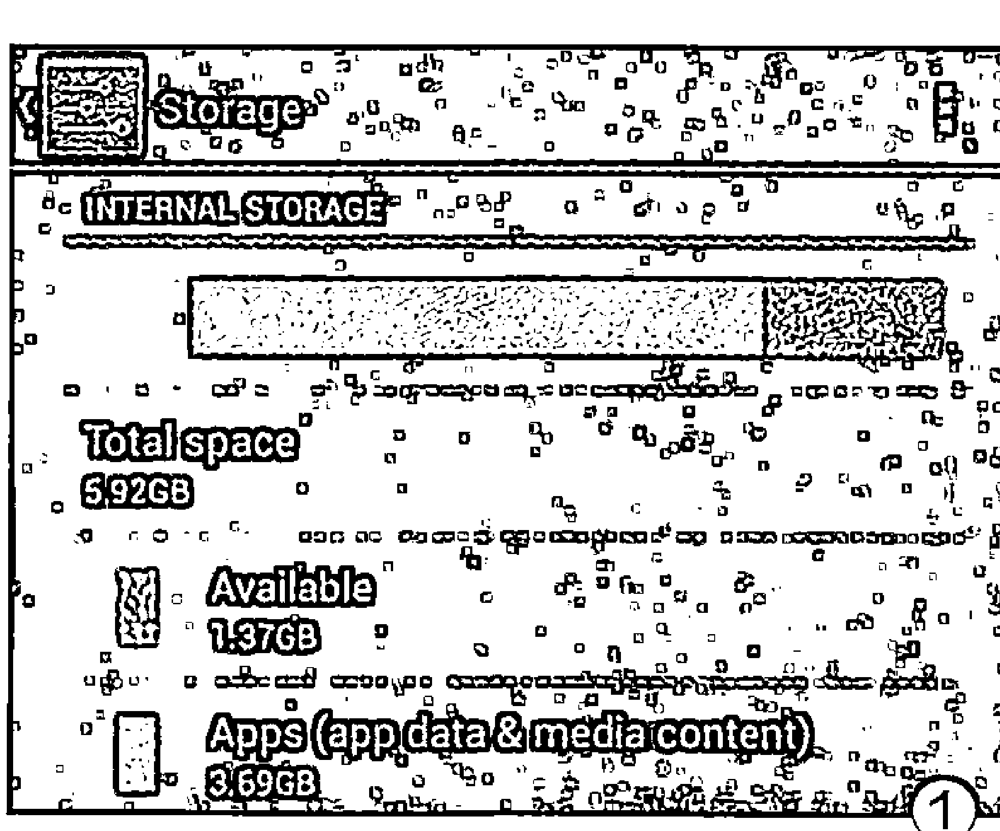

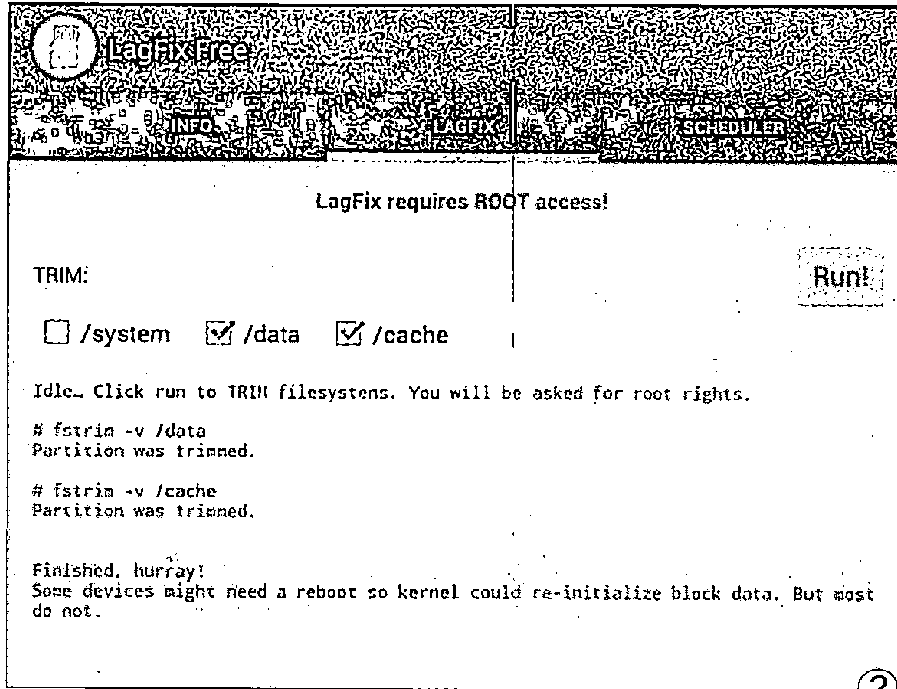

不过这个应用需要Root，如果我们的设备没有被破解，就需要使用Forever Gone（http://www.dwz.cn/IVaj2），它会用空白文件塞满你的存储区，然后删除这些文件，从而引起Android向存储区发送TRIM命令。

如果你想测试一下这招是否果真有效，可以在测试NAND存储芯片写入速度的前后，运行Androbench（http://www.dwz.cn/IVaoi）存储基准测试应用程序，看看情况是否有所改善。

### 禁用后台同步及其应用程序

很多看不见的后台同步是Android设备缓慢的主要原因。如果我们的设备速度太慢，或者未能迅速回应触摸事件，很可能是这些后台同步搞的鬼——在后台下载和写入数据。其他应用程序会引起类似问题。比如说Google潮流同步应用，进入到Settings设置屏幕，禁用Syncing同步选项（图3），这会防止Google潮流同步在后台不断下载和写入数据。其他应用程序中的后台同步关闭方法大同小异，我们也可以将它们设置成偶尔同步。

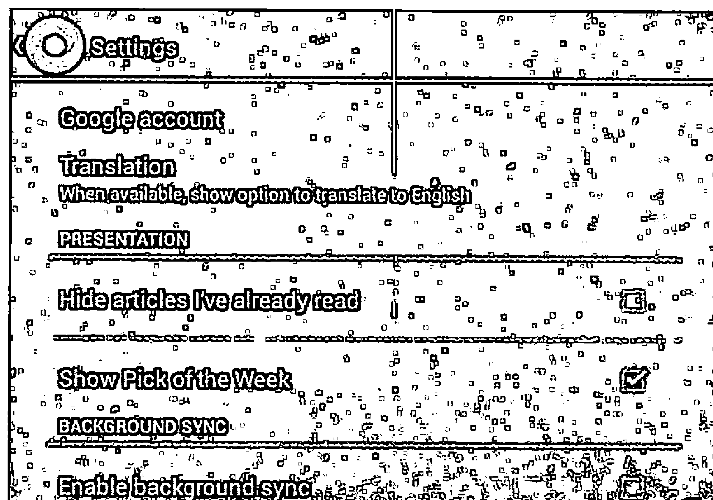

### 使用AOSP浏览器

尽管是“亲儿子”，但Chrome在Android上运行起来非常慢，需要很强的硬件配置才能保证其流畅运行。新版本的Chrome不断做出改进，但性能仍远远谈不上够好。在这种情况下，我们还不如去使用Android的内置AOSP浏览器，这个Android开源项目速度比Google Chrome更胜一筹，滚动起来尤其流畅（图5）。现在很多Android设备并不自带AOSP默认浏览器，我们可以手动去安装它（http://www.dwz.cn/IVdMY），然后在打开网站的时候将默认浏览器设置成“Browser”应用程序即可。

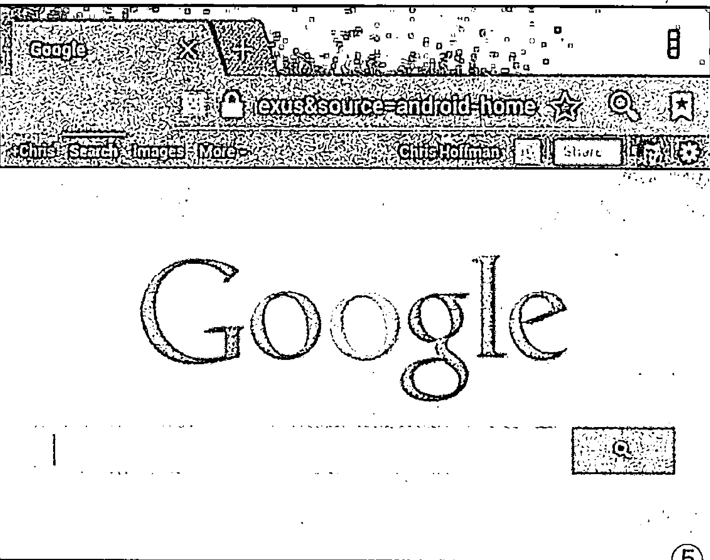

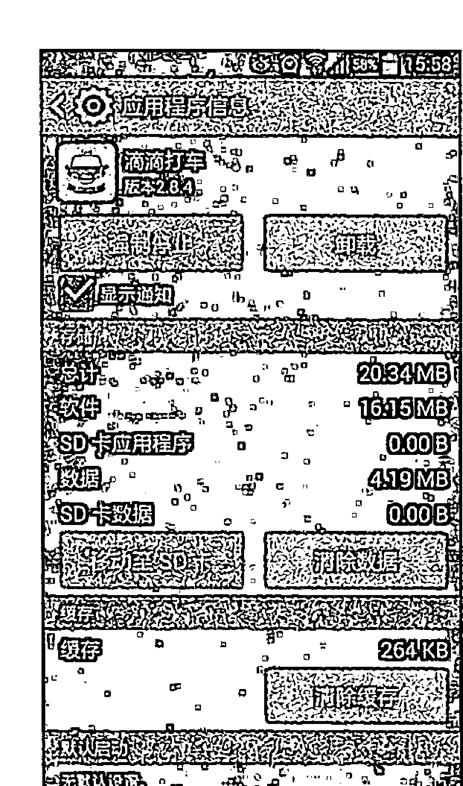

GPS及其他位置定位相关选项不仅是耗电大户，同时也可能在一定程度上影响我们的系统速度。如果禁用平板电脑上的位置访问，可以防止地图之类的应用程序不停地确定你的当前位置，这招值得一试。可以在设置的位置访问下找到该设置。不过要注意的是现在一些生活类软件是需要位置服务的，比如嘀嘀打车等应用。我们想使用必须要打开位置服务，但是这些应用在关闭后依然会不停地调用GPS定位，使用过后将嘀嘀打车等应用程序强行关闭，既省电又能缓解系统压力（图4）。

### 删除多个用户账户

我们如果在设备上设置了多个用户账户，应该尽可能禁用它们。很多应用程序会在后台同步数据，如果你有三个用户账户，三个不同的账户就会在后台同时同步，这也难怪系统运行速度会慢下来。在拥有多个用户账户的系统上删除其他的账户，从设置中找到用户相关选项就能完成这一操作（图6）。

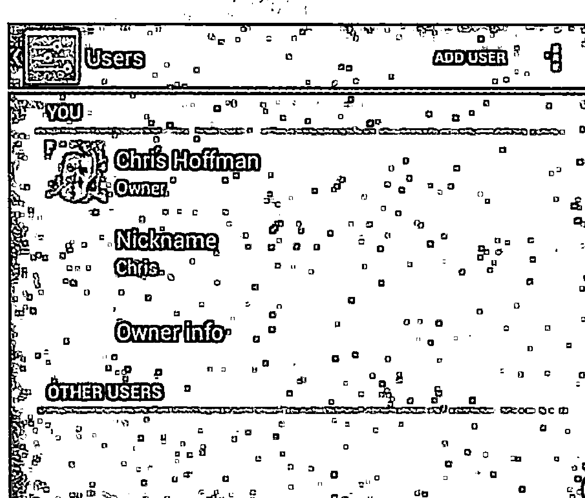

> 扩展阅读
>
> 如果以上操作依旧难以解决我们的问题，可以尝试清除系统缓存或者干脆恢复出厂设置。不过如此操作会丢失所有用户内容，只是一种最后不得不的方法。而且，很多用户使用陈旧的设备却不断追求更新更酷炫的操作系统（图7）。设备的硬件本来就不适合这些新版本系统，久而久之也会引起速度缓慢。对于这些安装了并不合适的ROM的设备，还不如换装那些稳定的系统来保证速度和使用体验。

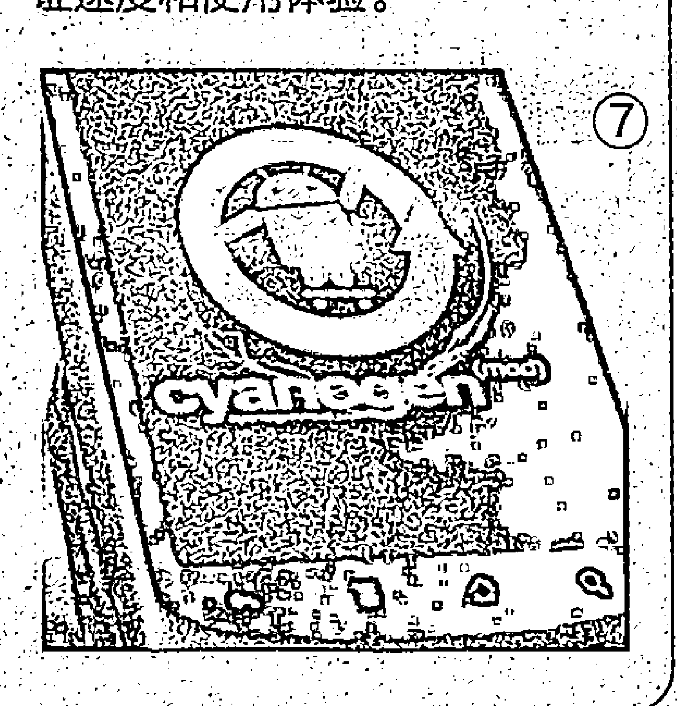

## 小心闹误会 读懂手机的“节能模式”

文 | 静花水月

同一型号的手机，为何有时你的跑分不如别人的机器？明明是正品手机，为何用安兔兔等软件验机后却爆出“非正品”的提示？为何有时当锁屏之后就无法接收微信的消息？实际上，在绝大多数情况下这些都是节能设置引起的“误会”。

### 没有平白无故的省电

首先需要我们明确一个观点：世上没有免费的午餐，故而没有无故的省电。所有的省电模式都是建立在牺牲部分功能或性能的基础之上。比如，降低屏幕亮度、关闭震动模块、限制CPU运行频率等等。因此，在硬件规格和电池容量相近时，谁能在待机时间上拔得头筹就成为彰显品牌技术实力的表现所在了。于是，几乎所有手机品牌都在产品上引入了所谓的“省电模式”，而引言中的各种误会就是源于大家对省电思路设计的合理性。

> **小提示**
>
> 如果你的Android手机没有高级节能设置选项，可以安装类似“360省电王”一类的第三方APP获得CPU智能调节或自动清理后台程序的功能（图3）。

### 入门篇

### 智能化省电

以Android手机或平板为例，很多产品都会在设置（或“设置→电池”）中加入节能选项，在这里可以手动选择“最长待机”（或称“最佳省电模式”）、“普通模式”和“性能模式”（图1）。其中，只有性能模式下CPU才能长时间工作在最高的频率之上，而其余模式则会通过限定CPU主频实现省电效果。如果你将设备设定在了“最长待机”模式，在各种跑分软件中自然不是设定在“性能模式”下同机型的对手。


此外，有些设备在节能模式中还添加了锁屏后强制查杀后台应用的功能（图2），或在锁屏时自动断开3G和Wi-Fi网络以节省电力消耗。因此，如果你的手机在锁屏时无法接收到微信、微博和QQ的消息，不妨检查一下是否因上述问题引起。对社交达人而言，保持3G永远在线，将微博、微信、QQ加入锁屏查杀后台应用的白名单至关重要。


### 中级篇

### 黑白色显示

三星Galaxy S5最令人侧目的卖点就是10%电量还可坚持一天待机。而该功能的核心在于S5引入了“超级省电模式”，即仅保留通话短信等最基础功能，且将屏幕转换为黑白色（图4）。要知道，S5的屏幕材质为Super AMOLED（黑色像素点不需要供电），因此该模式下屏幕的耗电可以降至最低。

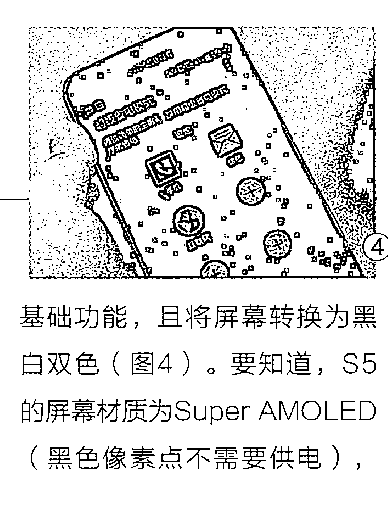


好消息是，类似Galaxy S5的“超级省电模式”已经被更多手机品牌引入，比如HTC M8所提供的“高级省电模式”就将界面色调改为黑色（图5），停用拍照和下拉菜单等功能和设置，以“黑白屏功能机”的身份来延长续航时间。此外，华为P7的“超级省电”原理也是如此（图6）。总之，将屏幕改为灰阶或纯黑背景并关闭手机的一切智能功能，就是实现靠10%电力坚持24小时待机的秘密。

> **小提示**
>
> 如果你的手机没有提供类似功能，可以手动用纯黑图片设为壁纸，并关闭通话外的一切联网功能，利用第三方APP开启锁屏自动查杀程序的功能，同样可以改善续航能力。

### 高级篇

### 更改硬件配置

如果说前面两种省电技术都是“可复制”，或是借助第三方软件实现的，那源自硬件底层的节能技术就是体现品牌真实研发实力的所在了。比如，如何在“高性能模式”下玩游戏还省电？长时间导航时减少GPS模块的耗电？减轻浏览网页屏幕长亮时的电量消耗？屏幕从720P升级到1080P分辨率后的耗电增益？在解决上述困局方面，三星和华为分别给出了自己的答案。

> **小提示**
>
> 如果你经常用手机上网，可以借助UC浏览器的“夜间模式”（其他浏览器也有类似功能），即将背景色改为黑色或深色，选择不显示图片和Flash同样可以获得类似WebExtend技术的效果。

还是以三星Galaxy S5为例，其在系统和硬件底层引入了NavExtend、WebExtend和Game Extend三大技术。其中，NavExtend在导航时会将地图画面的刷新率降低，从而减少使用GPS导航时耗电的问题；WebExtend技术会自动判断并关闭网页上的广告和消耗资源的Flash内容，从而延长续航时间；而GameExtend则可在保证游戏体验的前提下将画质尽量简单处理。以上三种技术都是借助GPU实现，因此无需人工干预即可在不知不觉间取得省电效果。

> **小提示**
>
> 最新版本的安兔兔软件修复了ROG模式下P7鉴别真伪的Bug。但今后再出现硬件层面的节能技术时可能仍会出现类似的误会，希望大家可以理性看待。

为了缓解1080P高分屏幕对电池的“压榨”，华为在新品等P7身上推出了ROG技术。在省电设置中勾选“ROG技术”即可将屏幕分辨率从1080P调整为720P（需要重启），从而起到节省电力的功效。需要注意的是，当P7开启ROG后，类似安兔兔和鲁大师等评测软件所检测到的屏幕硬件数据也就变成为720P（图7），点击“鉴别真伪”时会出现“该设备非正品”的提示。原因很简单，在设备信息库中P7理应为1080P，但联网校对时设备端却显示为720P，因此软件会判定机器为高仿或假冒产品。

> 在锂电池技术出现突破进展之前，我们希望看到更多软硬件层面的节能技术。但在享受它们所带来的延长续航效果的同时，还需要我们正视可能引起的一些误会。同时也希望厂商可以在节能选项中加入更为详细的说明和提示。CF

## 集显还是独显
## 笔记本显卡无需刻意切换

文 | 张日红

如今的独显笔记本都支持双显卡切换技术，很多注重续航省电的用户则会强制锁定在集显工作模式，玩游戏时再手动调整到独显状态，好不麻烦。实际上，如今CPU和GPU都有独到的节能技术，手动锁定显卡状态的方式已经“Out”了！

## 被冷落的“自动模式”:

以NVIDIA独显笔记本为例，在显卡控制面板中可以设定显卡模式为“高性能”、“集成图形”和“自动”状态（图1）。只是，很多用户担心独显只要一启动就会带来额外耗电，因此总会强制锁定在“集成图形”模式。问题是，NVIDIA从开普勒显卡起就引入了“Boost”（智能频率调节技术），可以根据系统负载自动调节频率来平衡能耗。那么，强制设定显卡模式还有意义吗？

## 用实际测试数据说话

为此，笔者对自己的笔记本进行了独显和集显状态下，在不同使用场景时的功耗表现。为了确保数据准确，测试期间会卸掉笔记本的电池只用外接电源供电，并使用功率测试仪测试闲置、网页浏览、在线影视、高清视频和游戏等项目的实时功耗（见表）。

由此可见，除了游戏之外，哪怕是在播放高清视频时集显和独显两个模式的功耗表现都是接近的。换句话说，如果你平时只用笔记本上网、浏览网页或看视频，强制集显和强制独显时的待机时间应该相差无几。但是，在游戏体验环境上，独立显卡就会突破“Boost”的枷锁而火力全开（图2~3），最终导致功耗达到集显模式的3倍左右！


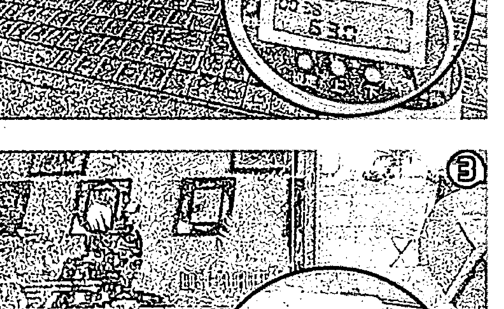

> 笔记本在集显/独显模式运行《失落的星球2》游戏时的功耗对比

| 笔记本状态 | 测试说明 | 集显模式 | 独显模式 |
|------------|----------|----------|----------|
| 闲置状态 | 开机后什么都不干 | 30.9W | 32.5W |
| 网页浏览 | 浏览同一个网站页面 | 35.3W | 36.3W |
| 在线影视 | 播放凤凰卫视 | 39W | 40.2W |
| 高清视频 | 播放《魔力女战士》 | 49.2W | 50.1W |
| 游戏体验 | 运行《失落的星球2》 | 63W | 161W |
|          | 运行《孤岛危机3》 | 65W | 184.5W |

*测试平台：15.6英寸1080P屏幕 + i7-4710MQ + 16GB内存 + 1TB HDD + 8GB SSD + GTX880M

> 通过测试可见，哪怕是GTX880M这类顶级独显，在“Boost”技术的帮助下依旧可以在非游戏环境下获得与集显接近的功耗表现。因此，平时强制笔记本工作在集显模式的意义不大，建议大家还是乖乖地设置为自动模式，让系统根据负载自动切换显卡来得实际，免去手动来回切换的繁琐。

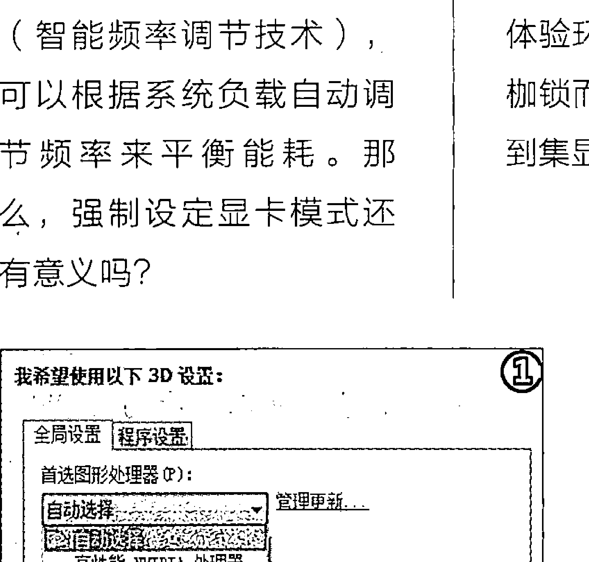

## 你的网络安全吗
## 隐藏的Telnet登录方式

文 | 陈俊名

对于家庭电脑来说，保障系统安全也许可以通过安装防火墙或杀毒软件来防止病毒对系统的损坏。但是，安全软件也有无法保护的一面，例如家里的第一网络设备——路由器。

## 漏洞让你变“肉鸡”

随着手机、平板电脑的普及，越来越多的家庭都喜欢通过路由器布局无线网络。但是，家用路由器常会因错误设置、固件Bug而暴露一些会导致安全问题产生的漏洞。如果这些漏洞被有心人发现，便很有可能会导致路由器被远程入侵，这些入侵者便可以利用入侵的路由器作为“肉鸡”，对其他电脑或网站进行攻击。

## 隐藏的Telnet登录方式

通常情况下，我们可以在路由器的Web设置界面打开远程登录路由器界面的允许选项，但除此之外，路由器还隐藏名为“Telnet”的登录方式（图1），而这种登录方式很多用户都不曾听说。使用端口扫描工具对公网进行扫描，不出几分钟便可扫描到成千上万的IP地址开放着23端口（图2），其中包括网站服务器、企业网关以及家用路由器。

### 扩展阅读

Telnet被大量用在网络服务器和高级网关上，可为网管提供远程设置的通道，也可以对故障系统进行非界面的维护，它使用的端口是23端口。正如双刃剑一般，但当它被用于入侵等用途时，也是很致命的一种“武器”。

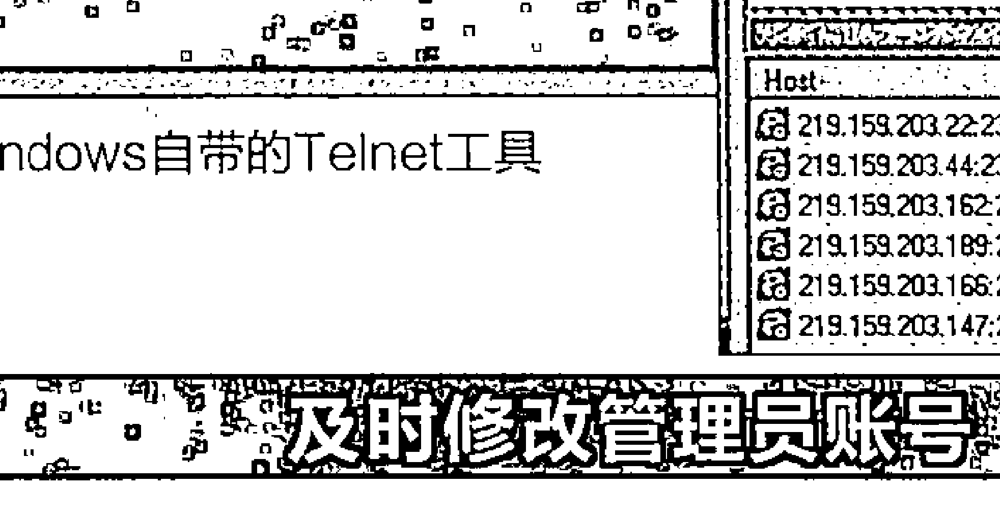

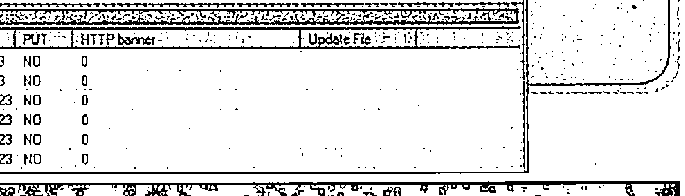

## 及时修改管理员密码

问题来了，很多用户买来路由器便直接使用，很少会修改默认的管理员账户和密码，这就为入侵者提供了良好的入侵环境（图3~4）。入侵者可以通过猜测常用的用户名和密码组合进行登录（一般是admin、guest、root等），一旦被入侵，你的网络就会沦为“肉鸡”。经过测试，部分的水星、迅捷等路由器都存在这些问题，用户自己可以通过网上的端口扫描工具来检测自己的23端口。（可用网站tool.chinaz.com/port，如果不知道自己的IP地址还可以通过ip138.com进行查询。）如果发现端口为开启状态，应该立刻修改路由器管理员的用户名或密码。如果路由器厂商有发布固件以修复该问题，我们可以到路由器官网下载对应的固件进行升级。

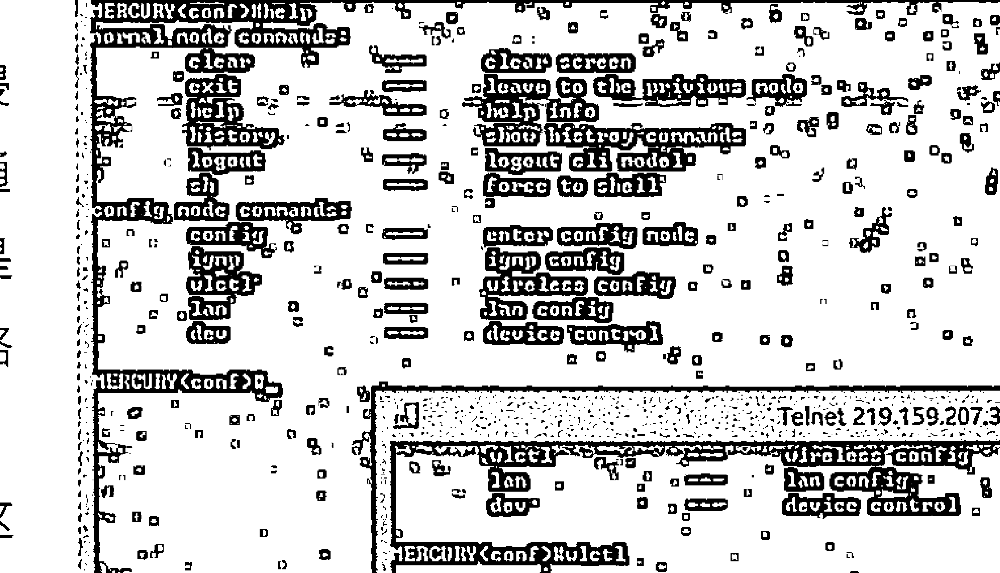

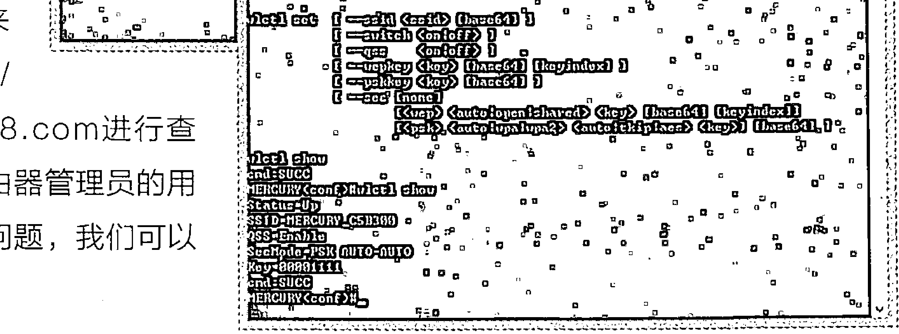

CF

## 将Windows平板改造成功能完备的Windows PC

文 | 沈建苗

微软及与之合作的PC厂商们在推出品种繁多的平板电脑，这些平板是运行标准Windows 8.1版本的标准PC。今天的Windows平板提供了异常强大的办公功能，只需借助几个外设外加一些优秀软件和几处设置改动，它们有望成为一台功能强大的工作站的核心部分。

### 视频输出方面的选择

如果希望平板像PC那样用，需要带视频输出端口的平板。市面上一些较便宜的Windows平板根本就不提供视频输出端口，而且提供接口的产品上也有不同类型的端口。比如联想ThinkPad 8提供了micro-HDMI端口，而微软的Surface Pro 2提供了Mini DisplayPort端口。你需要micro-HDMI转标准HDMI适配器，或者Mini-DisplayPort转HDMI适配器，那样才可以将平板连接至标准的电脑显示器或电视。

有些较便宜的平板没有任何视频输出端口，这时只能使用内置在Windows 8.1中的Miracast无线屏幕技术。但Miracast的效果往往不尽如人意，号称通过Miracast兼容认证的设备可能实际上并不兼容，而且可能还需要为屏幕购置无线Miracast适配器。有些Android手机提供了移动高清连接MHL支持，这让你可以使用Micro-USB转HDMI适配器，但要求显示器也必须支持MHL。

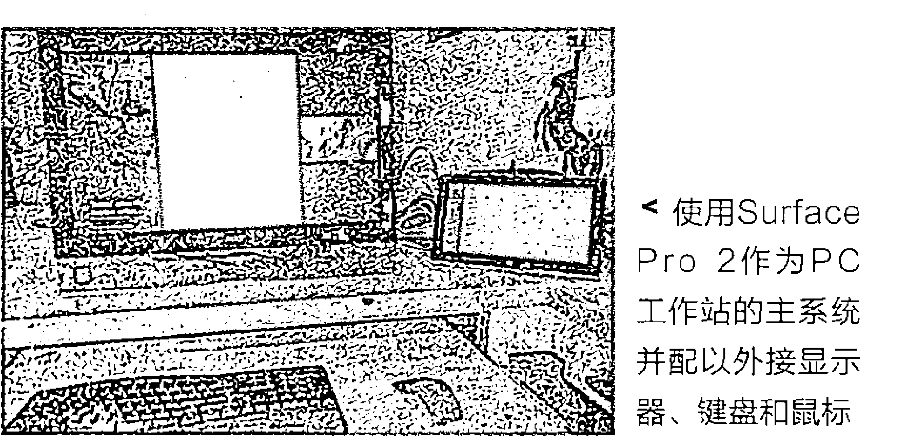

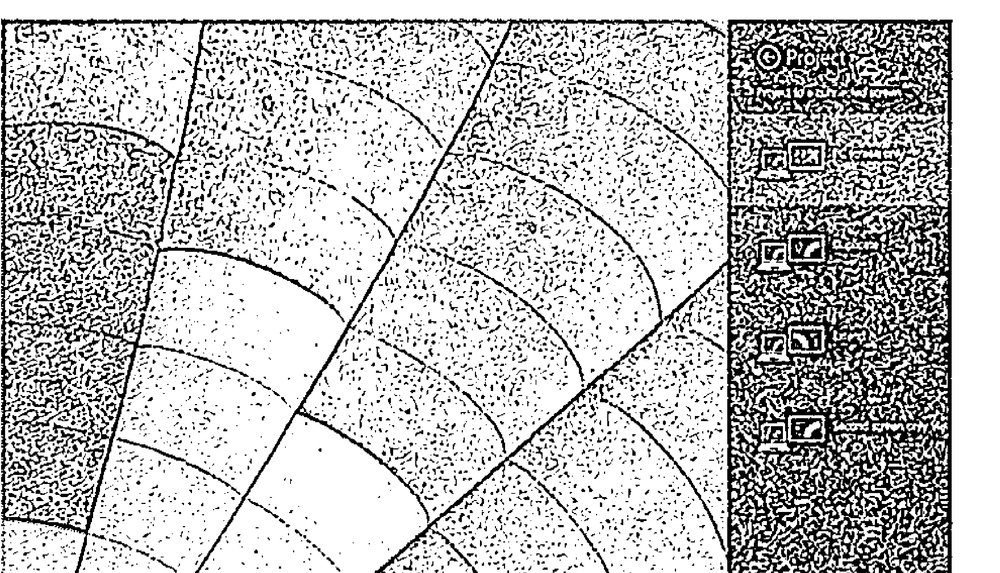

### 键盘和外设

实际上每部Windows 8.1平台都会支持蓝牙，所以你可以轻松使用蓝牙鼠标和键盘，无需担心端口。如果想使用标准的有线键盘和鼠标或者带接收器的无线键盘和鼠标，只要将USB鼠标和键盘插入到平板的USB端口即可。但一些平板只有micro-USB端口，需要micro-USB转USB适配器才能将USB设备连接至这类平板。

其他外设也是一样的道理，如果你购买了一只外置光驱并通过USB连接，就可以从平板读取和刻录光盘了。面对只有一个USB端口的平板，购买USB集线器可以解决问题。不过集线器必须带有外置电源功能，如果只通过平板端口提供电力，可能不足以为你可能想要连接的鼠标、键盘和各种存储设备提供电力。

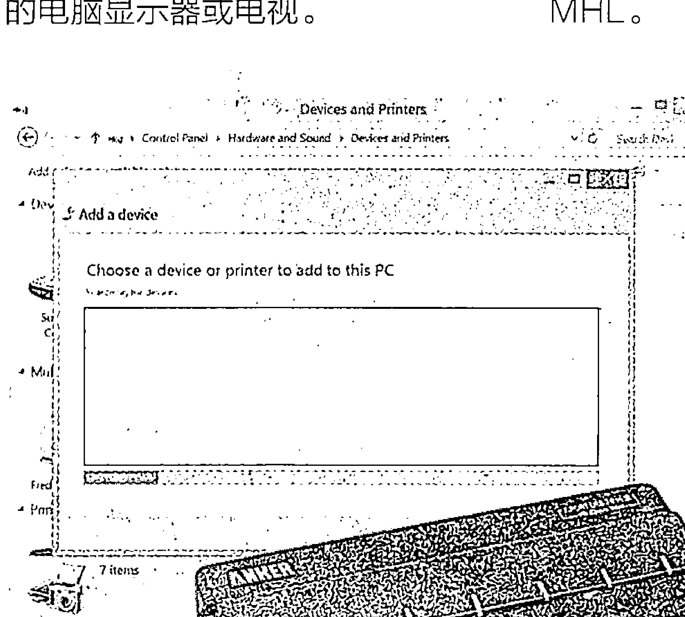

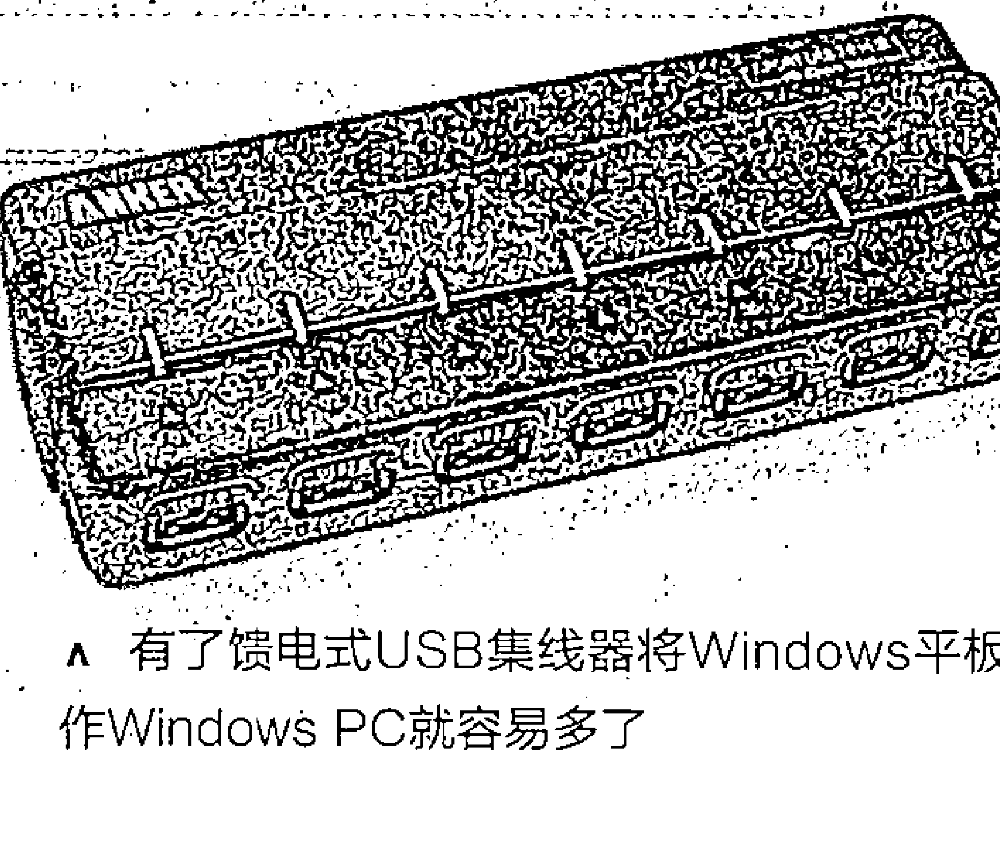

### 音频扩展可以一分为二

就像智能手机那样，Windows 8.1平板通常只有一个耳机/麦克风组合式音频插口。如果希望使用扬声器和麦克风，可以购买音频分配器适配器，那样可以将音频输出接口和音频输入接口连接至Windows平板上的单个音频端口。

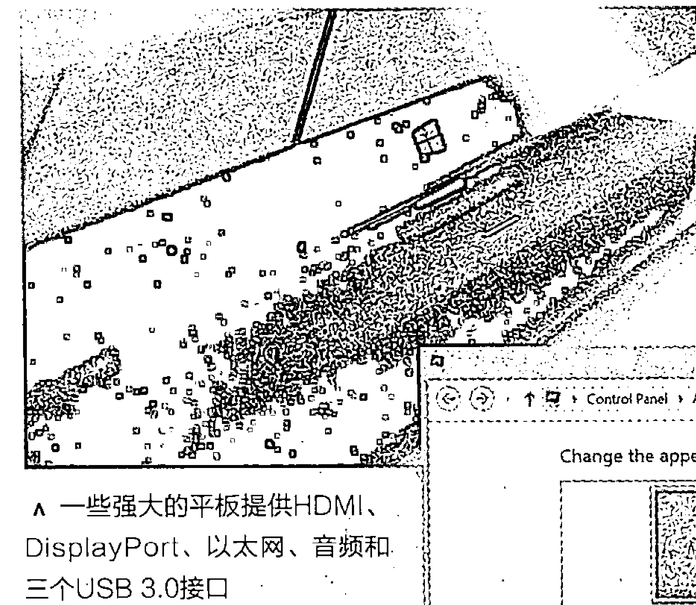

一些强大的平板提供HDMI、DisplayPort、以太网、音频和三个USB 3.0接口

### 多显示器配置

有几种方式可以使用外部显示器，可以从屏幕控制面板调整这些设置。鼠标右击桌面选择屏幕分辨率，就可以找到该面板查看已连接的外部屏幕。可以拖放这些屏幕以重新排列——比如说如果第二个屏幕目前位于平板的左边，你就应该将第二个屏幕拖放到左边。Windows 8为多个显示器提供了更好的支持，所以它可以在多个屏幕之间扩展任务栏。鼠标右击桌面任务栏选择属性，里面的多屏幕选项就可以控制任务栏面对多屏幕时如何工作。

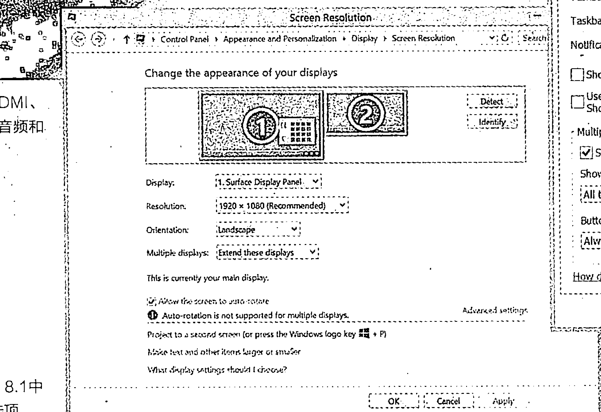

在Windows 8.1中调整多显示器选项

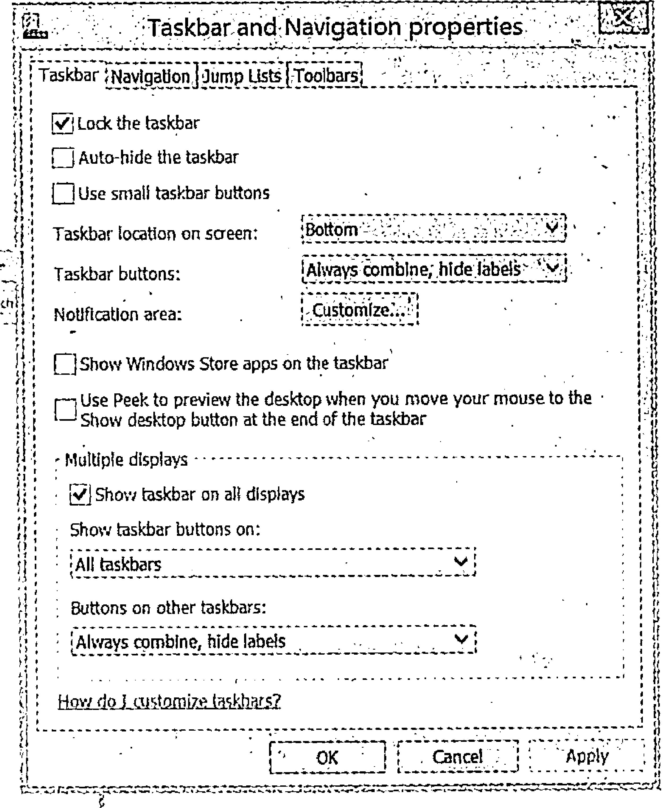

任务栏的属性选项卡的多屏幕部分让你可以定制任务栏面对两个或多个显示器时怎样工作

### 针对桌面优化平板

Windows 8.1最新版针对平板电脑作为PC办公进行了部分优化，比过去容易多了。鼠标右击桌面任务栏选择导航，使用这里的选项启动进入桌面，并调整Windows 8.1在你的PC上如何工作。想使用桌面应用程序作为默认，打开超级按钮栏，进入到设置→更改PC设置→搜索和应用程序→默认，即可选择你所需要的适合桌面PC使用的默认应用程序。

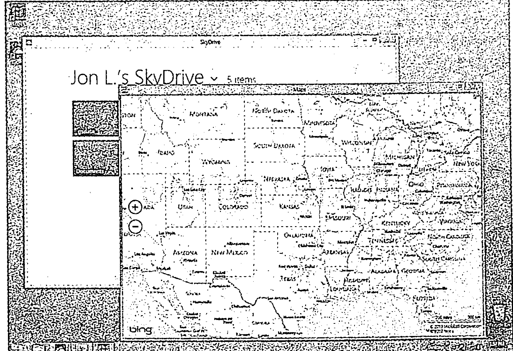

将平板用作PC时，很多软件可以在桌面窗口中运行Metro应用程序

如果我们将平板用作PC时更喜欢使用传统的桌面软件，不妨试试Windows 8内置的Snap多任务处理功能，在平板屏幕上显示触控应用，在大尺寸屏幕上显示传统桌面。两个屏幕在平板用作PC的环境下都可以派上用场，触摸屏和外接大屏各司其职，显得很方便。

## 无线变有线 巧为老电视升级Wi-Fi

文 | 俞木发

前几年购买的Android网络电视大多没有Wi-Fi功能，如果要配备无线网卡，我们就必须购买特定型号的专用无线网卡，这给老电视的Wi-Fi升级带来不便。其实现在的无线路由器都支持WDS无线扩展技术，我们可以利用无线路由器接收上一级的Wi-Fi，然后再借助网线就可以让老电视实现无线上网了。

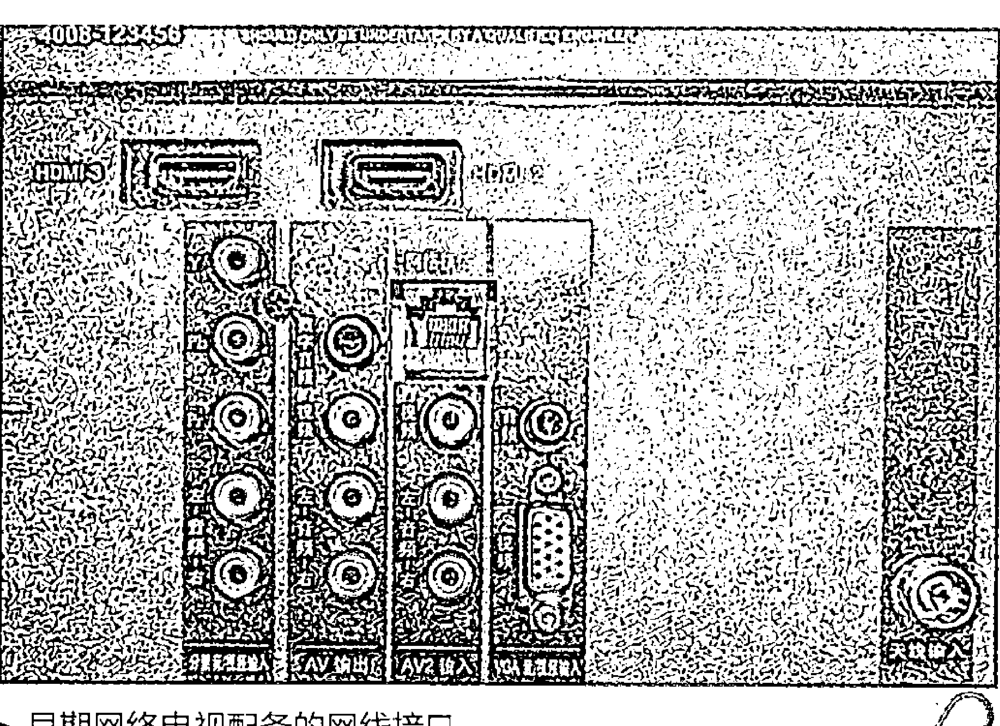

> 早期网络电视配备的网线接口

这里我们以水星MW305R路由器设置为例。首先要确认主路由LAN口的IP地址，为了描述方便这里假设主路由为A，使用WDS扩展的水星路由器为B。启动命令提示符，输入“ipconfig”，记住其中“默认网关”的地址信息，因为B路由的LAN口IP地址要和A路由在一个网段。


> 查看A路由的LAN口地址信息

> ## 小知识

### 什么是WDS无线扩展

WDS即无线分布式系统。在网络应用中，它是无线网络的中继器，如果你的无线路由器支持WDS扩展技术，那么该路由器就可以通过无线的方式连接到主路由器，同时自身还可以发射Wi-Fi信号，并且支持有线连接，实现无线信号的转发和中继。

接着进入B路由的设置界面，依次展开“网络信息→LAN设置”，然后将其IP地址更改为和A路由在同一个网段如192.168.1.2，然后点击“保存”。

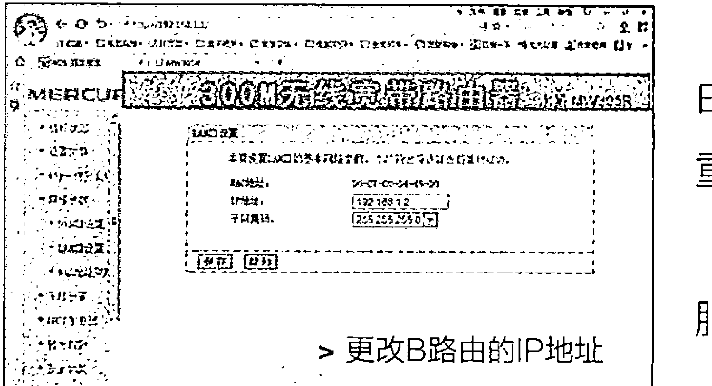

> 更改B路由的IP地址

更改IP地址后重启路由，使用上述设置的IP地址重新进入B路由，依次展开“DHCP服务器→DHCP服务”，将其设置为“不启用”。

> ## 小提示

由于需要有线接入网络，因此要求连接电视必须要有网卡接口，如果没有，则可以配置有线连接的Android盒子（淘宝上售价也只要几十元）实现。

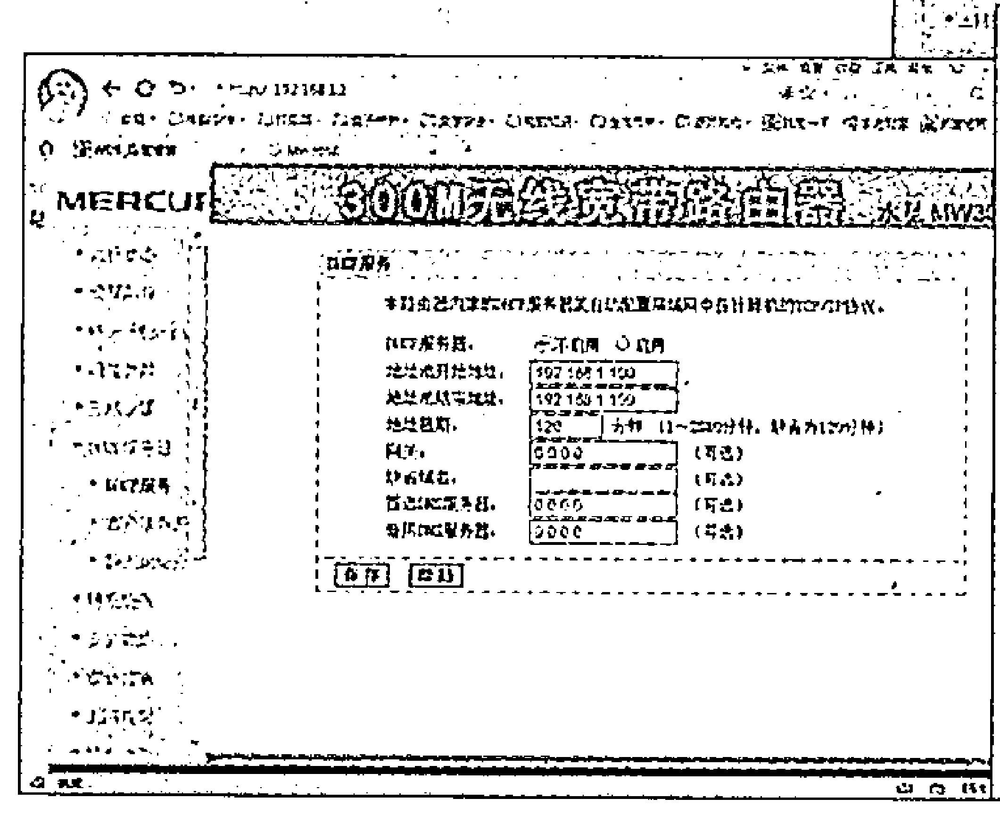

> 不启用DHCP服务

切换到“无线设置→基本设置”，在右侧勾选“开启WDS”，接着点击下方的“扫描”，在扫描列表选中A路由的Wi-Fi信号，然后输入密钥进行连接。

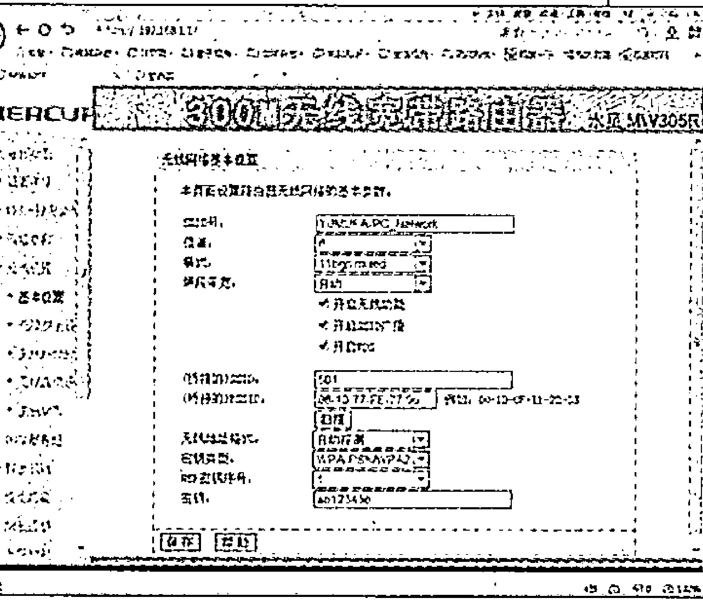

> WDS连接A路由

完成上述的设置后，现在准备一条网线，然后将B路由器拔下，将其插在电视插座上。启动路由器后就会自动无线连接到A路由，B通过网线和老电视连接，在老电视的网络设置里选择有线连接，其他参数选择默认设置，这样老电视机即可通过B路由“无线”上网了。上款路由在淘宝价格约40元，和专用无线网卡的价格差不多，但是通用性更强，可以适用于任何Android智能电视，有线Android电视盒也可以通过上述方法进行升级。

## 修复而不是丢弃
## 过保硬盘固件维修实战

文 | 黄健

对于已过保修期的故障硬盘，绝大多数用户会选择丢弃或拆解玩耍。但对真正的DIYer而言，选择修复故障硬盘才是“正道”。请放心，修复硬盘不一定得去外面花钱，自己动手也有一定几率令其复活。

### 通刷拯救“死刑”硬盘

笔者手头有一块西数故障硬盘，经过DLG软件检测提示无法修复（图1），联系厂家称过保硬盘已无法享受官方售后，至此该硬盘基本已被判处了“死刑”。
好消息是，对于此类故障硬盘还有一线生机，那就是以“通刷”的形式“抢救”。


> **扩展阅读：什么是通刷**

官方在修复硬盘时通常会使用“自动校准”来进行处理。自动校准的作用就好比是厂家的工厂测试程序，会自动对硬盘上的缺陷进行加表屏蔽。而我们所说的通刷，就是可以做自校准的固件，它是可以兼容同一电路板号和家族的维修固件。来源一般是用厂家返修好的盘，清除所有LOG和缺陷表，并生成工厂维修流程后备份下来的固件（注释B）。此类固件因为是工厂用于维修所用，一般P表（注释C）比原盘固件大得多，比如1640通刷固件P表两个头一共有25万的容量，而原盘一般几万就满了。

通刷需要工具软件和通刷固件的配合，以笔者的西数硬盘为例（注释A），工具软件目前市面常用的有效率源科技的西数专修（由于涉及软硬件，故仅适用于西数专修用户）和WDR（国内开发的一款西数维修工具，可在CHINAFIX等维修网站或论坛下载到该软件以及配套的通刷固件，覆盖面更广）。

> **注释A**
目前品牌硬盘都可以做自校准，比如WD、ST等，只不过每种品牌启动的方式不同，比如ST就是通过COM口采用指令启动即可（有机会我们会介绍ST部分）。

> **注释B**
为什么是返修盘而不是市售硬盘？因为市售的大多数硬盘，其流程表大都已经被破坏掉了，这导致硬盘维修者开启校准后，硬盘的修复效果很低。

> **注释C**
P表即永久缺陷表是硬盘出厂前由厂家生成的缺陷列表，在硬盘运行时会自动规避；与之对应的是G表，它是在硬盘使用过程中出现并记录的列表，也叫做增长缺陷表。每个硬盘都有P表和G表。

### 通刷前的准备工作

以WDR为例，通刷的基本流程为：备份原盘固件（ROM和固件模块）→使用维修软件写入对应板号和家族的通刷ROM，写后复位→写原盘ROM中的47号适配模块，复位→固件模块回写（先写0001模块后再写其他模块），复位→设置DCM，复位→设置LBA，复位→启动自校准→单独接电→校准完成后再次检测确认维修效果。
看起来很复杂，但我们只需把握住以下几个关键点即可顺利完成整套修复流程。

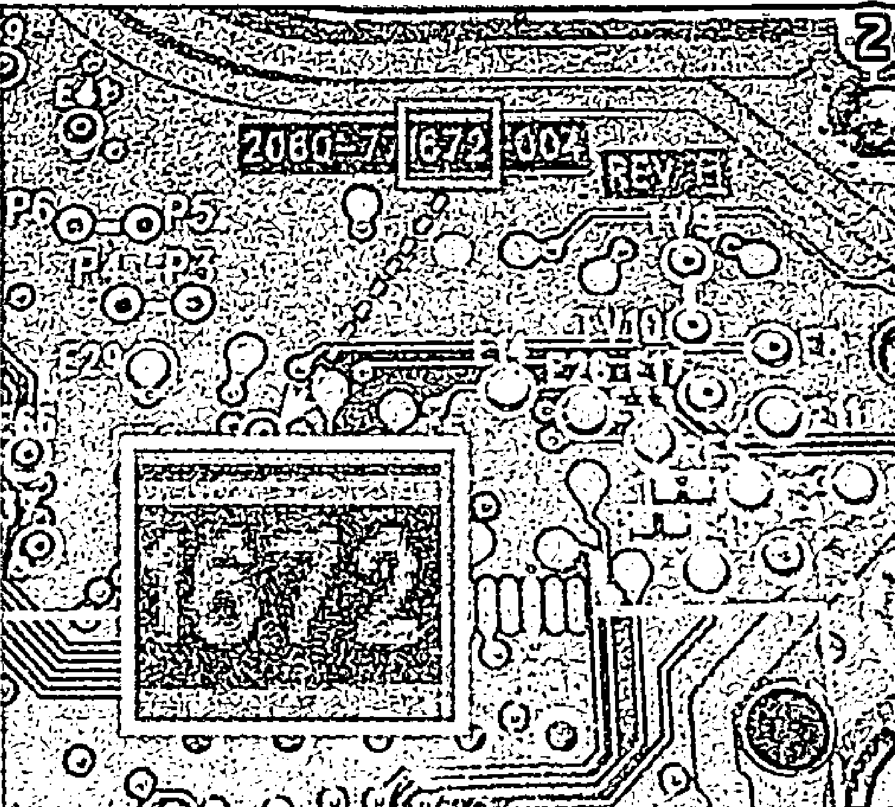

由于维修我们是基于电路板号和家族来进行的，所以需要提前确定故障硬盘的电路板号。电路板号在硬盘机身可见（图2），以笔者的硬盘为例，1672就是它的板号。

此外，硬盘家族可以通过WDR中的检测信息，不过最准确的是看固件中的C5模块，它包含家族号信息。在WDR备份的固件文件名为~id00C5.rpm，使用winhex或其他二进制编辑器打开C5模块就可以看到（图3）。考虑到待修的硬盘一般状态都有问题，可能会导致Windows系统启动缓慢甚至出错，如果你想提高修复速度，不妨采用WinPE来启动，会让你省心不少。

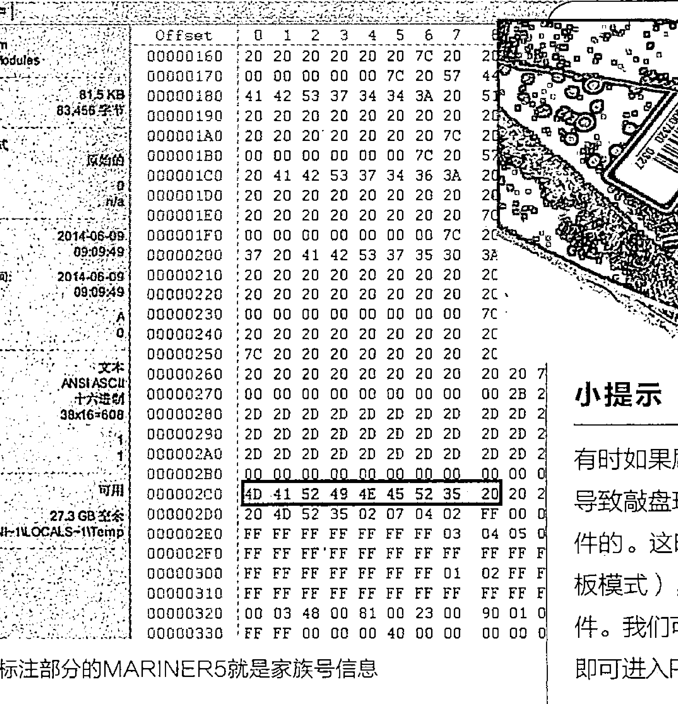

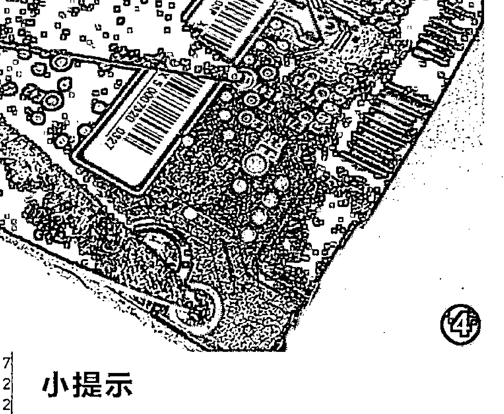

> 小提示

有时如果刷新了不正确的ROM，可能会导致敲盘现象，此时是无法写入ROM文件的。这时必须转到PCB模式（即电路板模式），即可重新写入正确的ROM文件。我们可以在开机时短接电路板这两点即可进入PCB模式（图4）。

在进行通刷之前，首先需要备份硬盘的原始Flash和ROM模块，ROM之中包括0A、0B、0D、30、4F、47共六个模块（图5），从备份的ROM文件中可以拆分出来。其中47模块通刷时我们会用到，它是固件区适配参数，原盘出厂的工厂适配参数肯定是最适合原盘的，接下来还需备份固件模块（图6）。

就像重装系统时需要先格盘一样，在做完备份之后我们也需要格式化问题硬盘的固件区（图7）。接下来需要写入对应板号和家族的通刷ROM（图8），如磁头有改动（比如砍头），还需编辑磁头位置后写入，之后复位电源。写入通刷ROM后，请返回Flash操作窗口，写入原盘ROM中的47模块（图9），之后复位电源。

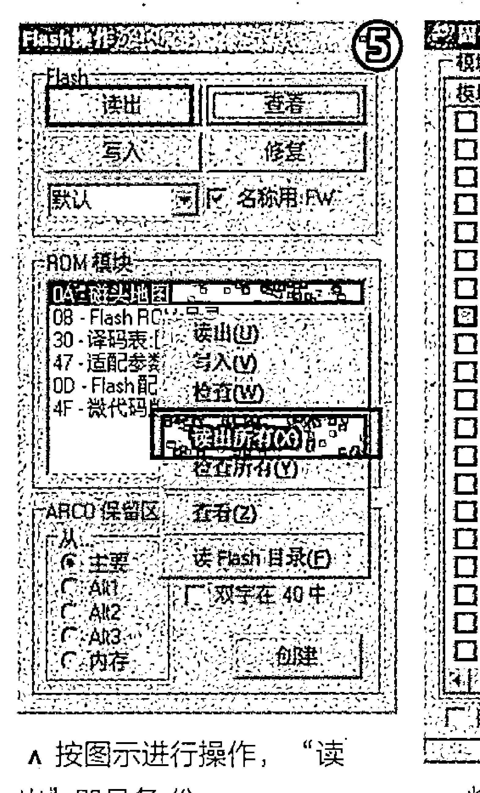

按图示进行操作，“读出”即是备份

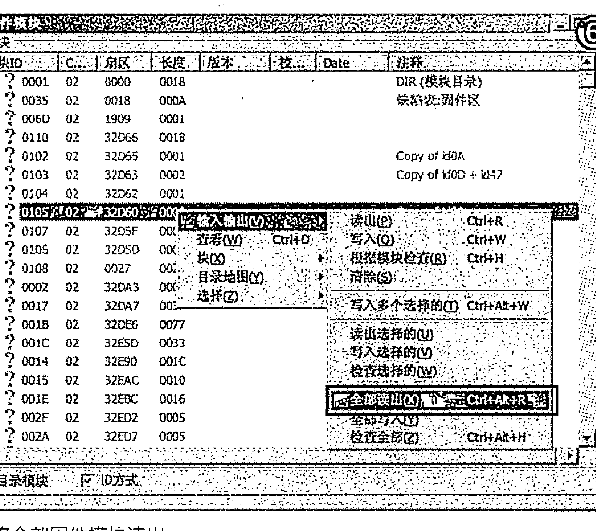

将全部固件模块读出

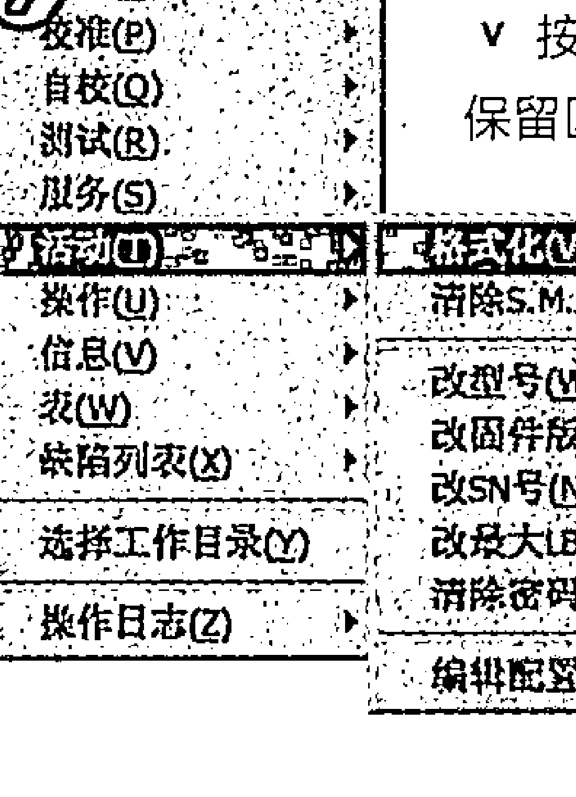

按照图示操作即可，固件区又称保留区

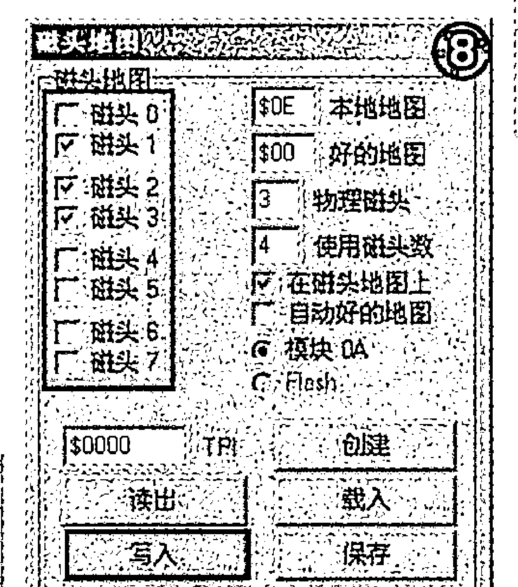

这里需要根据原盘做出选择，比如原盘是0.1.2头，那这里依样选择即可

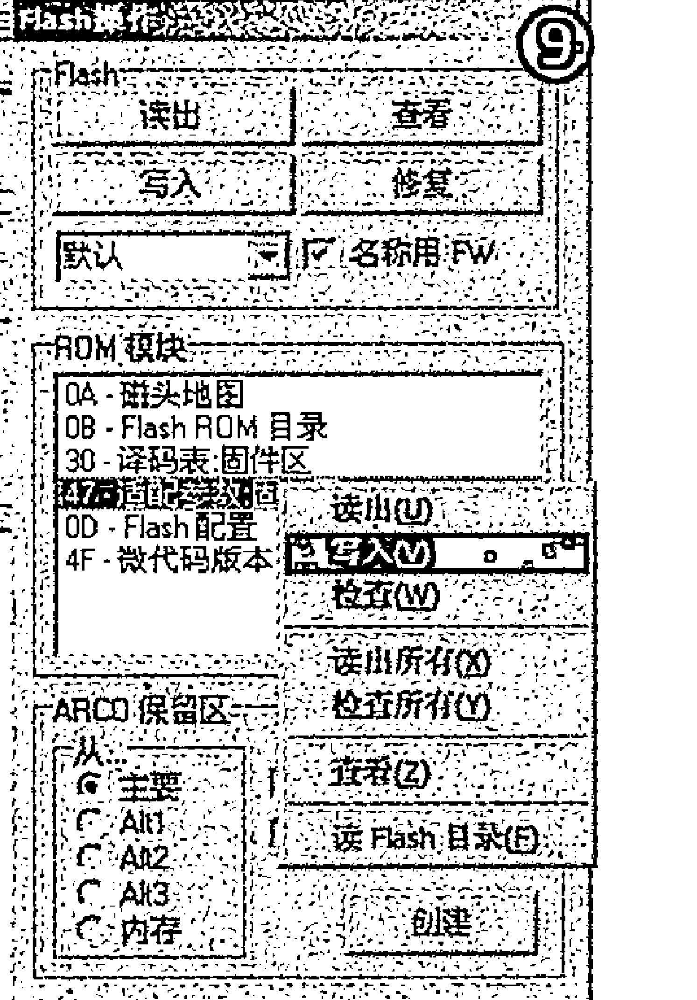

有些电路板型号在写模块前，还需要加载引导模块，比如1640进行通刷模块时需先写0001号模块，接下来再写入剩余模块（图10），写入完成点电源复位，完成复位。

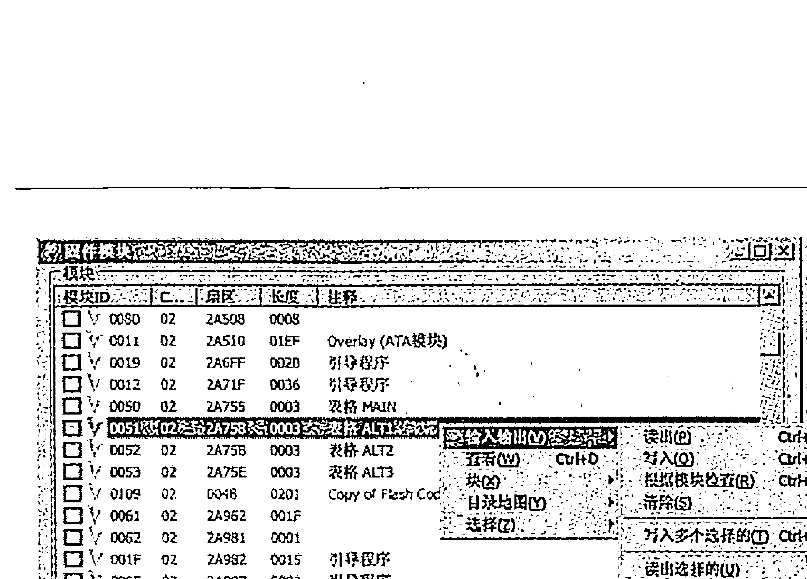

> **小提示**
硬盘要想换固件就必须写模块。0001号模块所在的硬盘固件区地址是固定的，而其他模块的地址是由0001模块规定的。如果写不进0001模块，要么就是磁头损坏，要么就是固件不能用。因此必须先写0001模块，之后才能写其他模块。

在进行自校准前我们还需设置DCM和LBA。设置DCM后可以初始化磁盘密度和容量，只要点DCM出来再点确定即可，默认是1还是2都不用管（图11），之后复位电源。如果不设置LBA，校准过程中会出错，所以请确保LBA0、LBA1、LBA2和HPA数值保持一致（图12）。同时型号和SN号也可做对应修改，比如可以改成电脑爱好者的拼音首字母+数字等，之后复位电源。

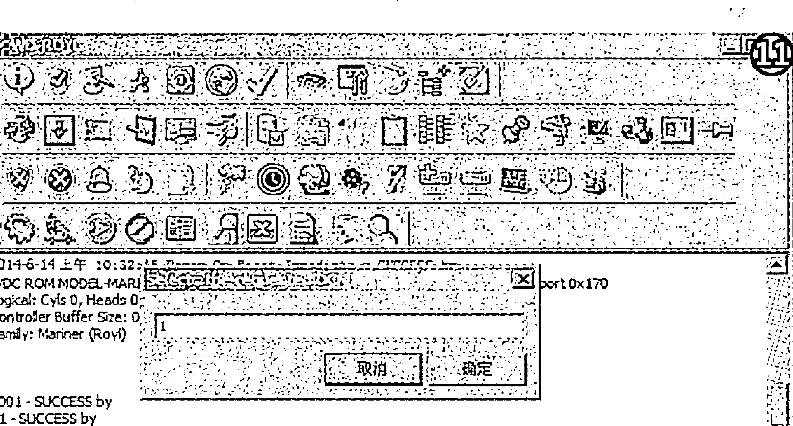

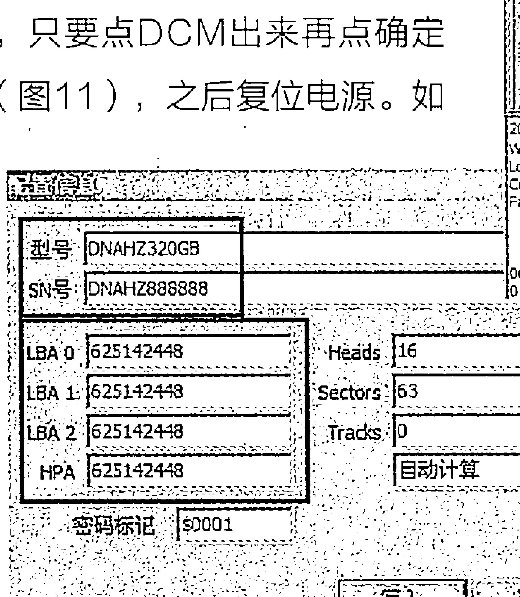

最后，点击开始自校准按钮（图13），此时PST还没开始跑起来，我们需要断电复位一次才能开跑。如果维修盘量比较大，此时就可以做离线了，方法是取下硬盘，接到单独电源上，挂盘跑校准。当然也可以在线跑，点复位后，一分钟左右开始跑起来（图14）。

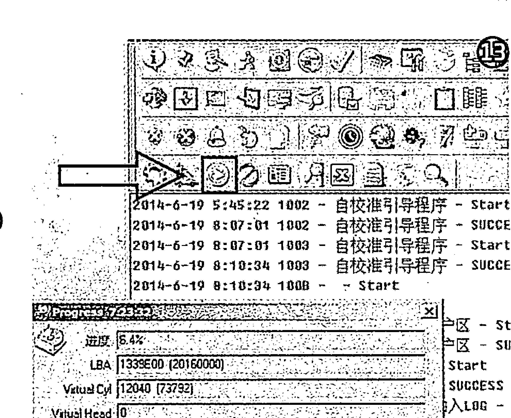

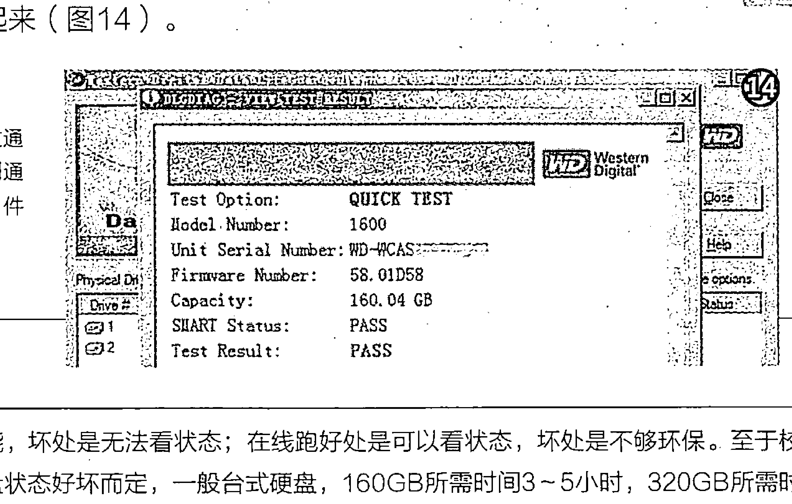

> **小提示**
离线跑好处是节能，坏处是无法看状态；在线跑好处是可以看状态，坏处是不够环保。至于校准时间，依据硬盘状态好坏而定，一般台式硬盘，160GB所需时间3～5小时，320GB所需时间6～10小时，以此类推，笔记本盘慢一半左右。

> 过保IT产品维修
有时可能会花去我们不少时间。不过在这个过程中我们却会学到很多未曾接触到的知识。其实关键是这个维修过程，而不是最后的那个结果。CF

# 过保希捷硬盘固件维修实战（续）

文 | 黄健

在15期杂志中，我们介绍了针对西部数据（下文简称WD）过保硬盘进行修复，并令其“复活”。与WD相比，希捷硬盘的普及率相对更高。那么，当希捷硬盘出现故障而无法使用时，我们又该如何修复呢？

> 自校准拯救希捷硬盘

对于出故障的过保希捷硬盘，自校准是一个大福音。与修复WD硬盘不同，希捷硬盘的自校准需要串口指令线和工具软件的配合。串口指令线可以上淘宝购买一条，最好是希捷维修专用的，这样连接起来方便些（扩展阅读1）。而工具软件则首选免费的STCOMTOOLS（下载地址：http://dl.vmall.com/c0b2ve4cuy）

> 扩展阅读1：希捷硬盘串口通讯

目前市场上硬盘类型和型号众多，但基本上可以当做一个小型嵌入式系统来看。为了方便生产调试等，大部分硬盘厂商都在硬盘电路板上添加了UART界面调试终端（UART是非同步串行通信口的总称，COM是PC上异步串行通信口的简写）。目前已知的有希捷、三星等具备该接口。通过串口调试终端，可以查看硬盘的运行情况和修改参数、更新固件、执行测试流程等。市面常见的希捷维修工具同样是基于串口连接和指令维修开发的，好处在于对指令和操作提供了菜单式的操作。

> 小提示

有关自动校准的意义请参考上期WD硬盘修复的文章。启动自校准后，硬盘的数据区将全面被清零，有重要数据的硬盘在做此操作以前应备份数据。

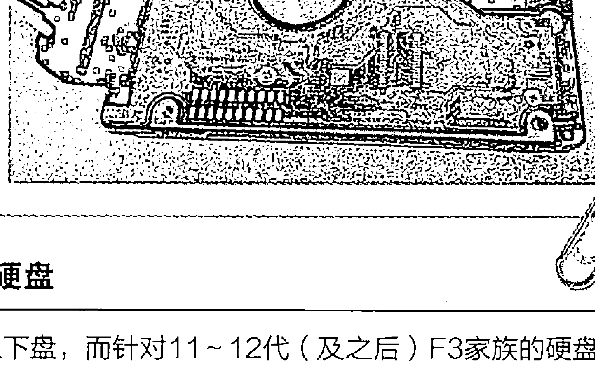

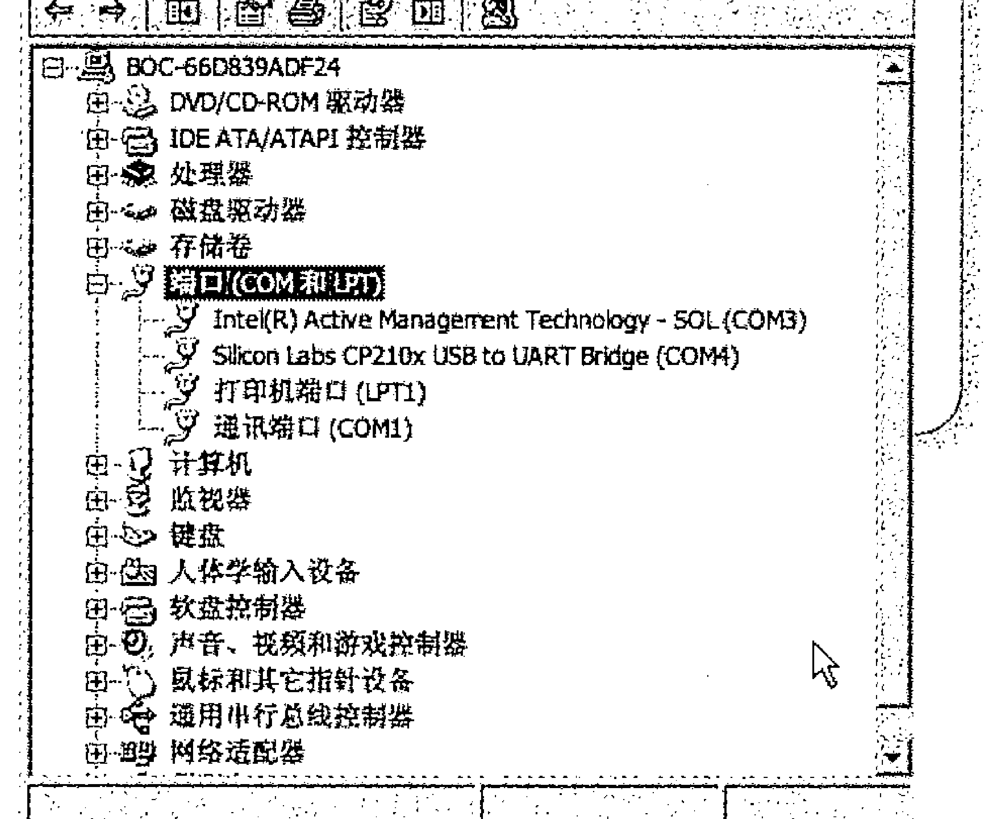

> 扩展阅读2：何谓F3家族硬盘

本实战教程仅针对希捷10代以下盘，而针对11～12代（及之后）F3家族的硬盘目前尚未见披露自校准方法，故不适用。因为F3跟酷鱼以及更早的家族固件结构已经完全不一样了。根据PC3000 FOR UDMA希捷说明手册的说法：希捷工厂这样做是为了统一SATA和SCSI硬盘的生产线。F3系列固件结构已经基于SCSI固件结构做了很大改变，这就是为什么该系列硬盘固件跟以前的不一样。其中最大的表现之一是在电路板上，电路板加入了适配参数和硬盘ID，可以脱离盘体进行ATA通讯。但它也继承了SCSI硬盘最常见的通病：编译器容易损坏。这就是我们经常遇到的固件问题，其实基本原因就在于此，也是希捷SCSI硬盘常见的问题。

打开STCOMTOOLS，选择指令线所在的COM口。选择波特率，F3家族硬盘波特率请设为38400（扩展阅读2），之前的盘（比如7200.10及以下）设置为9600。设置好COM口和波特率以后点击“打开串口”，再点击“认盘”按钮会出现一段硬盘信息（图3）。

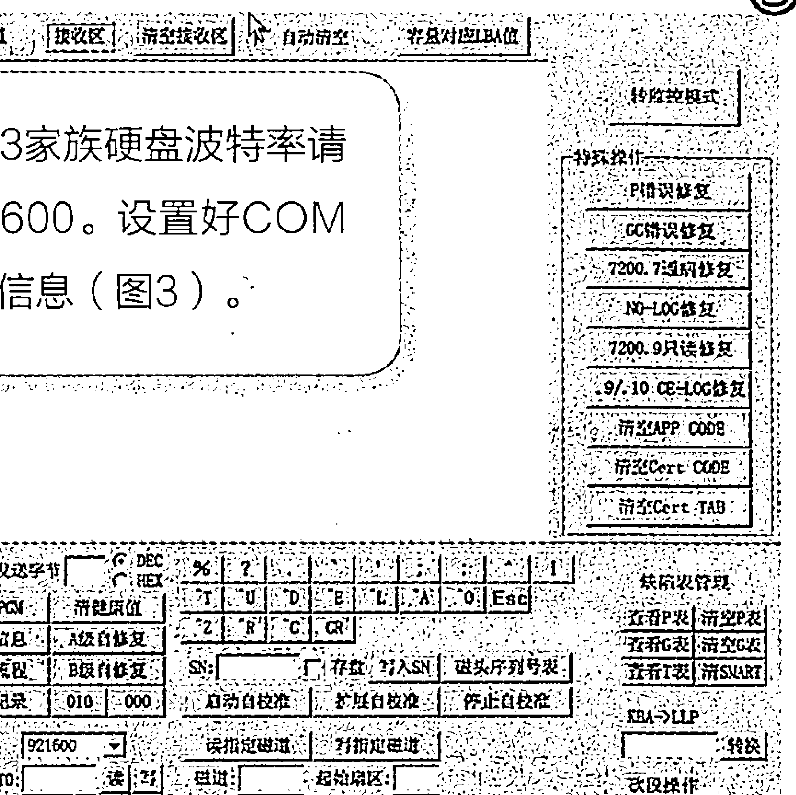

### 备份ROM和固件模块

对硬盘进行校准前先要备份ROM。点击“读写串口ROM”后先设置好备份路径（图4），再点击“指令方式读取”，备份时间可能比较长。备份ROM后硬盘处于F级（F级就是仅工作在电路板模式下的等级，这个等级是不依赖于盘体本身的。这时需要返回T级，才能做备份固件模块的操作，最简单的方法就是重启电脑，硬盘在复位后会退出F级，这样我们才能继续下步操作）。
接下来点击模块地址 A，然后获取到 APP、ATA、VEN、HDD ID、CERT0.TABLE 地址（图5），之后读取保存各固件模块。

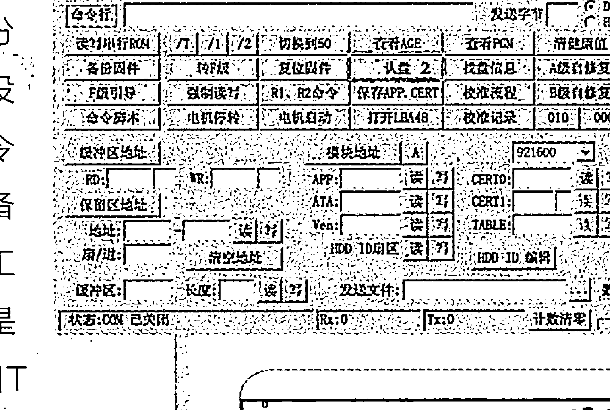

### 查看校准流程

点击“校准流程”按钮后，图6的界面就是硬盘自校的流程。我们可以看到99后面是10，对照该流程，部分盘跑到99后校准会自动停止回到T指令，不再继续。这个时候我们需要手动输入N10、22回车，然后用“Ctrl+T”从10继续跑，跑到50或者4F结束自校准才算完整跑完。

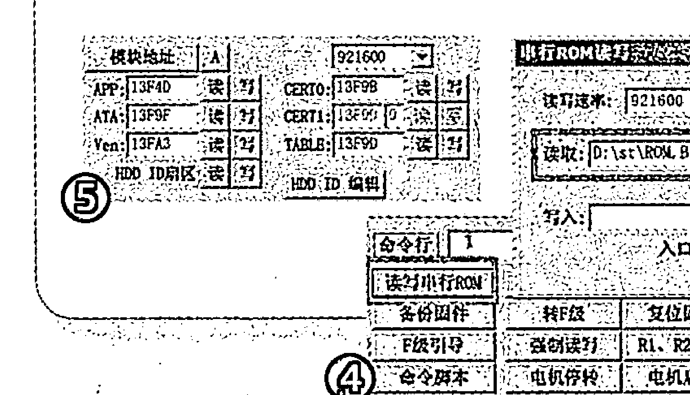

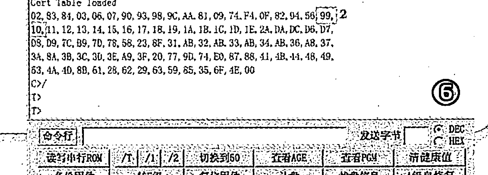

### 写入SN后启动自校准

此时点击“%”按钮获取到硬盘的SN号。其中“9RW35EC6”就是SN号，然后我们写入SN号后点击“启动自校准”（图7）。校准过程会持续较长时间。如果跑校准的过程中出现错误，可按图8点击对应的按钮进行修复后再跑。自校准结束后，接下来需回写ATA模块和HDD ID模块（图9），然后点击“找盘信息”看看正常与否，最后用MHDD等检测硬盘，修复即告完成。

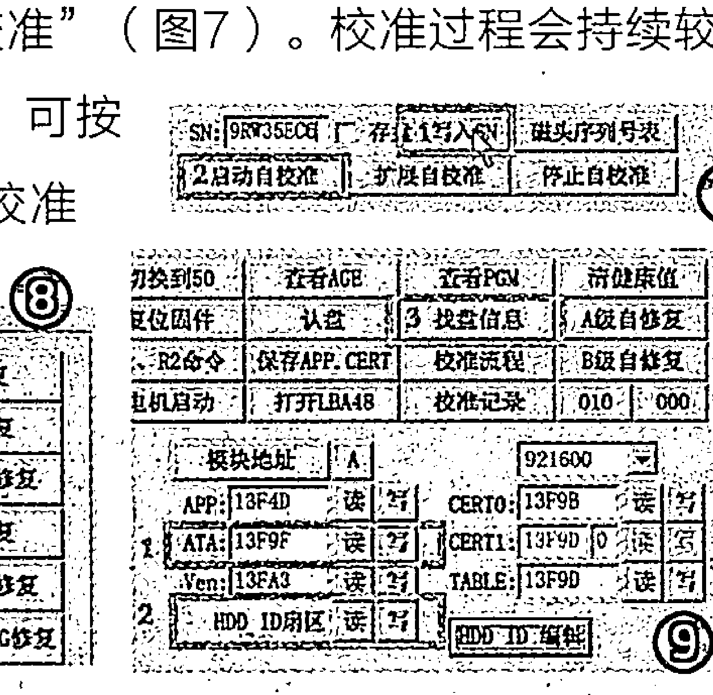

> 小提示 记得有句话是这样说的：如果你不去探索，你永远都不会知道你错过了什么。正如本次维修实战，重点其实不是最后的那个结果，而是中间的过程。您学到了很多未曾接触到的知识。CF

### 活用路由器的访客网络和无线隔离

文 | 沈建苗

访客众多的人希望为客人提供互联网服务，但是又不想招致安全问题。在这种情况下怎么办？访客网络和无线隔离功能能帮到你。


### 互联网局域网权限分开

在普通家庭路由器上，连接到路由器的每个设备都被认为是同一个本地网络的一部分，能够与该网络上的其他每个设备进行联系。如果我们客人的电脑可能已被感染，或者不怀好意的用户可能企图访问不安全的网络文件共享区，这时就会产生问题。

路由器的访客网络功能通常会提供两个独立的无线接入点：一个是安全的主接入点供自己使用；另一个是隔离的接入点供访客使用。加入访客无线网络的访客被限制在一个完全独立的网络，可以接入和访问互联网，但他们无法与有线网络或主无线网络进行联系（图1）。

其实还能够针对访客无线网络设置相应规则和限制。比如说可以禁止访客网络上的设备在某些时段接入和访问互联网，但又允许主网络上的设备在所有时间段都能接入和访问互联网。

### 设置无线隔离


无线隔离功能更为简单，只要启用隔离选项，连接到无线网络的所有客户端都被隔离起来，无法与本地网络上的其他设备进行联系。借助防火墙规则体系，连接到无线网络的客户端只能与互联网进行联系，而无法与对方或有线网络上的任何机器进行联系。

就跟路由器的其他功能一样，如果路由器提供无线隔离，那么这项功能就会出现在路由器的Web界面上。要注意这项功能并不出现在每一款路由器上，通常可以在高级无线设置下找到这个选项。比如在Linksys路由器上，可以在Wireless（无线）→Advanced Wireless Settings（高级无线设置）→AP Isolation（接入点隔离）下找到它（图2）。

在一些路由器（包括网件路由器）上，这个选项可能在主无线设置页面上。比如在网件（NETGEAR）路由器上，该选项在Wireless Settings（无线设置）→Wireless Isolation（无线隔离）下（图3）。

小结

总的来说，无线隔离功能是一种近乎“一刀切”式的处理，而访客网络则更为灵活化。如果你的家门客众多，不妨试试这种更为安全的互联网共享方式。

### 让无线网络覆盖更广

文 | 沈建苗

现在在我们的办公室或者家中，无线网络绝不是可有可无的东西。如果无线路由器的信号覆盖不到角落，工作生活会很不方便。我们不可能为了信号将路由器挪来挪去，如何消除无线网络的盲区呢？

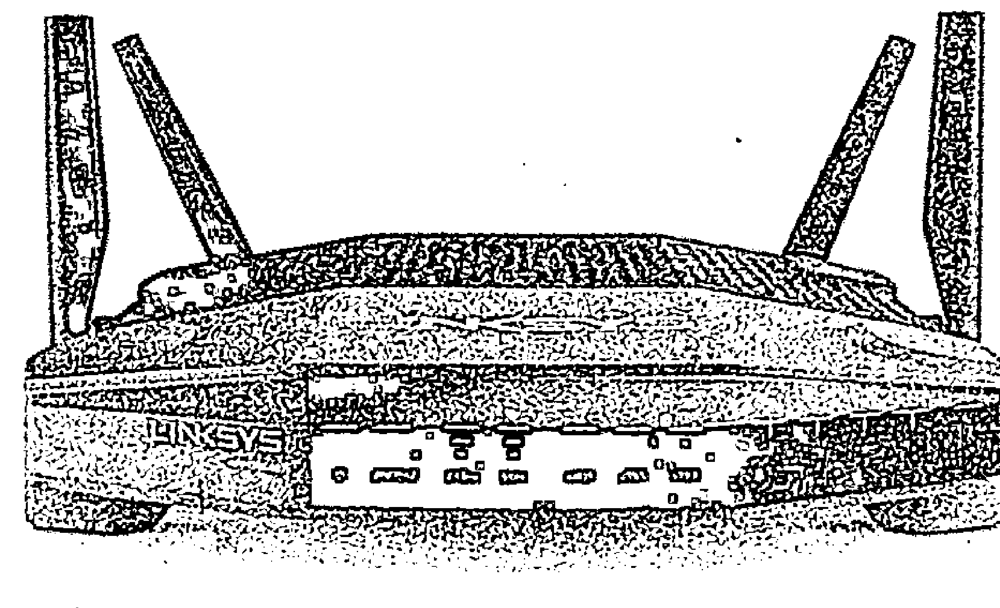

### 选择最佳位置

部署无线网络最重要的原则就是位置。很多人都知道路由器位于房间正中央的地方效果更好，但是路由器位于空旷架子上比位于地板上、墙壁边或者弱电箱中信号更好这点，知道的人就不多了。而像承重墙、大型家电（如冰箱）和金属文件柜这些障碍物都会影响无线的覆盖范围。

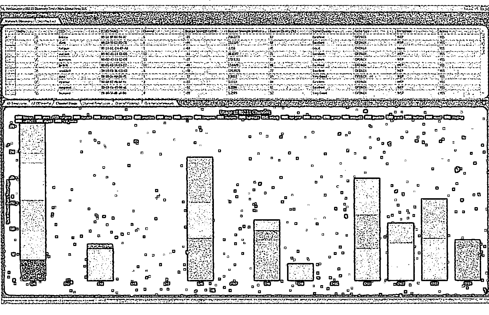

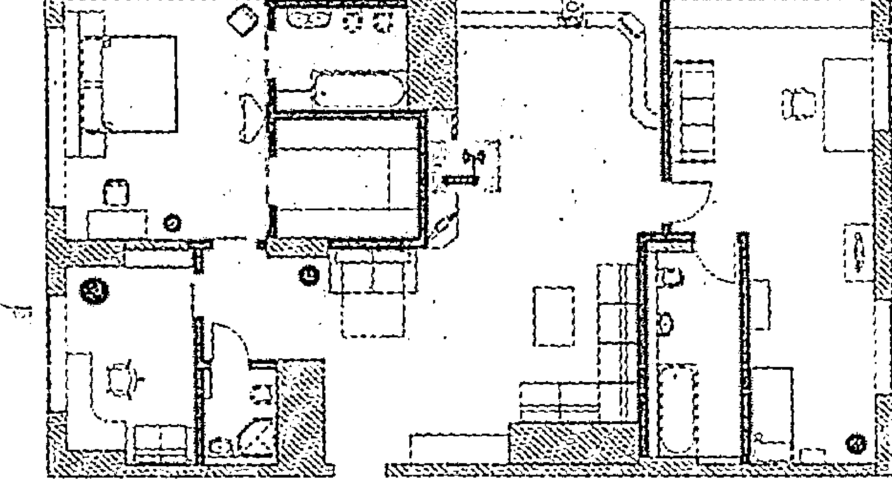

### 使用最空闲的无线信道

在确定我们的无线信道前，最好确定你所处的地方使用哪些无线信道。有许多免费软件可以完成这项任务，比如NetSurveyor和WiFi Channel Scanner，或者是面向智能手机的WiFi分析仪、Network Signal Info都可以做到。这些软件一般都使用柱状图代表信道情况，越低的信道柱形代表最空闲的信道，在测试环境下就能获得最高的无线性能和最大的覆盖范围。推荐每一两个月就要重新勘察所在环境，别想当然地以为周围的网络状况是静态不变的。

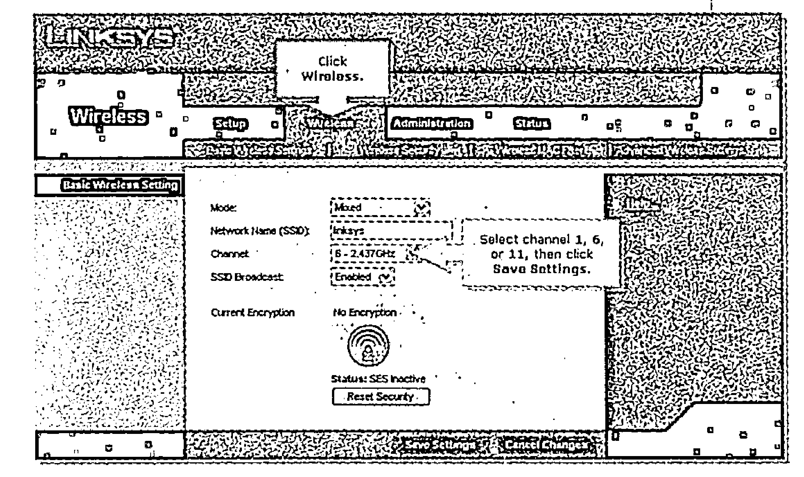

2.4GHz频段上有13个信道可用于无线网络，但其中只有信道1、6和11是不重叠的。5GHz频段上可用的非重叠信道数量要多得多，这个频段还往往不大拥挤。如果你的所有相关设备都支持5GHz频段，那么要比2.4GHz频段更合适。一般的路由器都是这么更改信道的：先进入接入点的Web设置页面点击无线相关选项，如果它支持信道调节的话，找到信道选项改成你需要的信道即可。一般来讲推荐的信道有信道1、信道6和信道11，因为它们被认为是非重叠信道，但也要根据实际情况决定。

### 替代固件DD-WRT

替代固件是厂商之外的某家公司开发的固件，替代固件有时能提供更高的性能，最重要的是它支持原厂商常规固件无法支持的硬件功能，而DD-WRT无疑是最有名的替代固件。不过刷固件有可能会丧失质保，也是需要新手注意的问题。

如果确定路由器支持DD-WRT固件，具体的安装步骤也很简单。先登录进入到路由器的管理页面找到固件更新，利用文件方式找到你的DD-WRT固件。之后就是上传固件，等路由器更新。在路由器完成更新之前，切忌拔下路由器电源插头或进行任何操作。

DD-WRT成功安装后，通过以太网或无线网络重新连接到网络，访问你的管理页面。DD-WRT可能要求输入用户名和密码，默认情况下是root/admin，在这里我们应该改成自己的用户名和密码。登录上去后，就会看到DD-WRT管理页面。

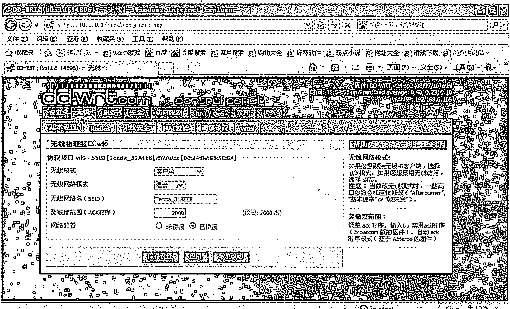

### 将路由器配置成接入点或中继器

几乎任何旧路由器都可以重新配置成无线接入点。从主路由器这头拉一条网线到你想要部署新无线接入点的位置，附属路由器选择无线AP模式即可。现在的电力猫也是同样的道理：一个节点连接到路由器，另一个节点靠近你想要部署无线接入点的位置。

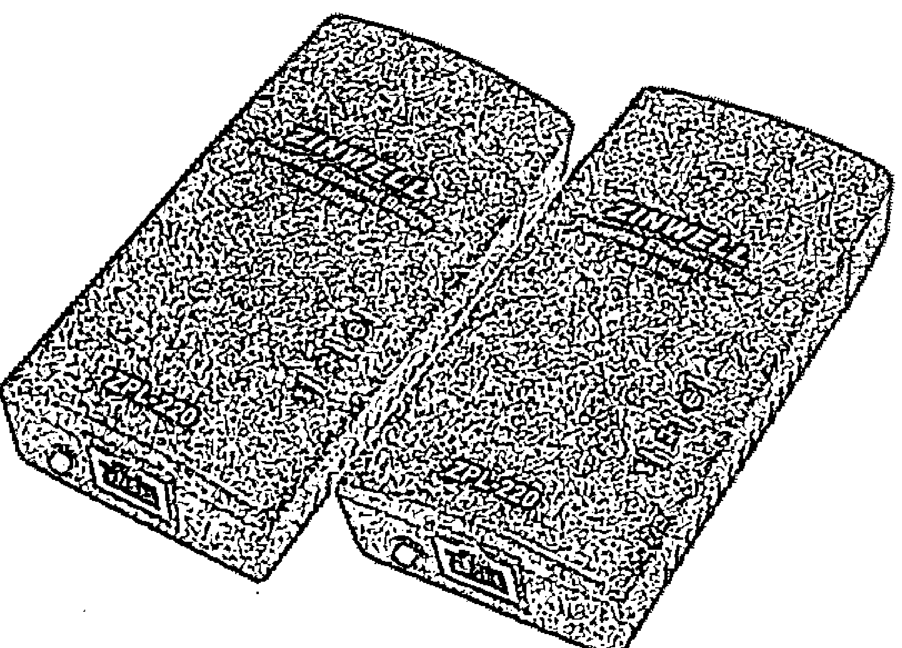

### 升级信号收发终端

现在一些USB网卡为了获得更好的信号，被设计成可折叠旋转式。在一些台式机被显示器挡住或者紧靠墙边时，这种设计显得尤为有用。如果我们现有的USB网卡不带这类功能也没关系，购买那种半刚性USB延长线连线也可以，只要能将无线USB网卡置于更高、更远离可能挡住无线信号的位置即可。

而关于路由器一端，信号主要是从天线向外输送的。很多路由器都使用通用规格的天线，这类产品支持天线升级。比如华硕RT系列或新款Linksys路由器，我们都可以试一试把天线换成提供更高增益的天线。

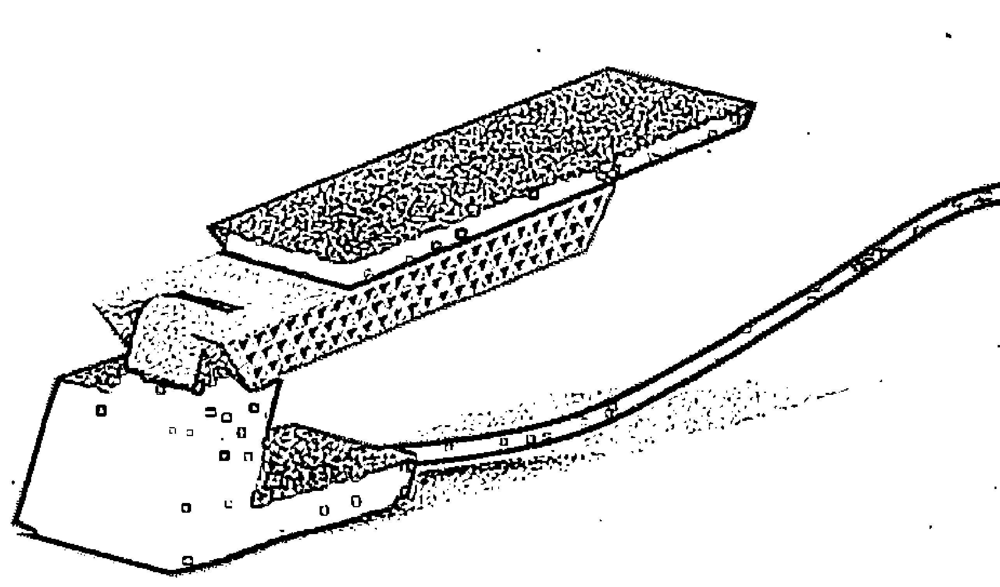

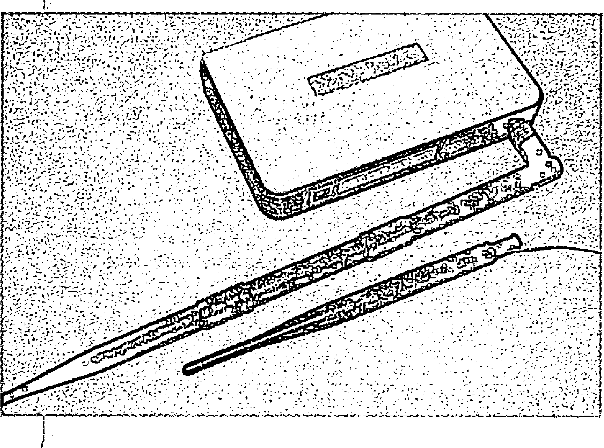

## 20周年纪念版 新奔腾带你尝鲜超频

文|丁丁

近几年的英特尔处理器，除了K系列都锁倍频。但是最新推出的20周年纪念版奔腾G3258处理器，却拥有了不锁倍频特性。默认频率3.2GHz，可以轻松超频至4.7GHz，绝对值得尝鲜！

### B85主板即可超频

进入到酷睿时代之后，英特尔就对主板的超频功能进行了严格限制。其中，超倍频功能只赋予给了Z系列主板，至于更低端的H系列和B系列主板则并不具备超倍频功能。但是从去年开始主板厂商就开始进行了破解，不仅H87主板可以超倍频，甚至就连三四百元的B85主板也可超倍频。就以映泰B85主板为例（图1），仅需刷新为官网新版的BIOS即可拥有超倍频能力，具体可以用映泰提供的官方BIOS刷新工具操作，BIOS刷新完成前请不要关闭电脑。

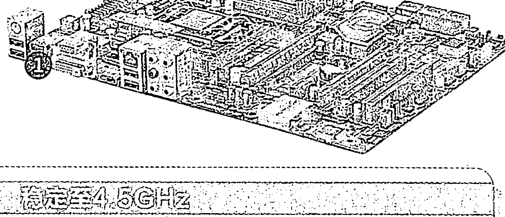

### 超频至4.5GHz

这代奔腾可以采用比较大胆的方案，先上4.5GHz，之后再慢慢向上调。具体操作方法是开机按Del键进入主板BIOS界面，将“系统语言”设置成“中文”（图2）。之后找到“CPU比率”这一项，将后面的参数从32调整为45（图3）。顺利开机之后，奔腾G3258便已超频至4.5GHz。之后慢慢向上调倍频，4.6GHz和4.7GHz均宣告成功，但4.8GHz则出现死机。可能是处理器体质不好，要么就是散热做得不太好，总之挑战5GHz失败，但却可以轻松且稳定运行在4.7GHz（图4）。而根据超频之后的测试成绩来看，4.7GHz的奔腾G3258处理器甚至可以威胁更高端的酷睿i3-4130，超频之后的性价比还是相当不错的。


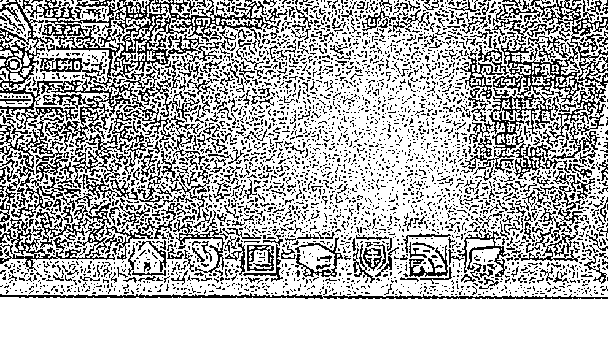

### 超频后散热别忽视

由于处理器的功耗与主频存在着正比关系，所以超频之后的发热量也急剧提升。最好搭配一个好的散热器，或者加强机箱散热对其进行辅助。另外需要特别注意，增加核心电压也会大幅提高处理器的功耗，所以并不建议大幅加电压，以免造成处理器因为散热不良而造成烧毁。最后要说的是，奔腾G3258还有少量ES版工程样品流入市场。使用CPU-Z即可清晰分辨，购买时一定要留意。

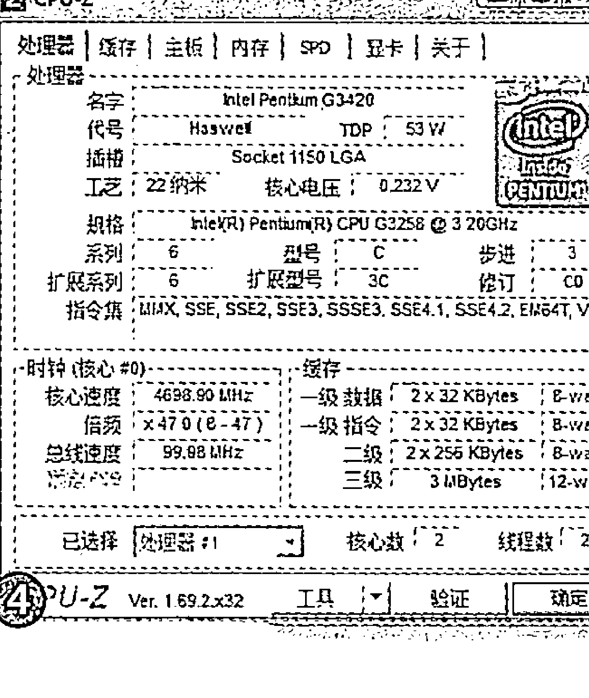

## 主机降噪大作战

文 | 丁丁

夏日里，机箱内的风扇都在高速运转，这个时候噪音也成了问题。主机降噪大作战，现在开始。

### 更换大尺寸风扇降噪

传统的机箱或电源风扇，经常会采用高转速的8cm风扇，噪音问题也就在所难免。这个时候，如果换成低转速的12cm风扇，噪音问题也就迎刃而解了。更换机箱风扇，通常都比较简单。因为机箱上通常都会有三套尺寸的风扇定位孔，分别是8/9/12cm（图1）。所以只需把8cm风扇拆下，再装上12cm风扇即可。至于电源风扇，也是同样的道理。需要注意的是，无论是机箱风扇还是电源风扇，12cm风扇通常都有“↑→”的标志（图2），分别代表了风向和转向。在更换完成后，必须保证风扇方向与原来的8cm风扇相一致。如果装反了的话，反倒会影响散热。

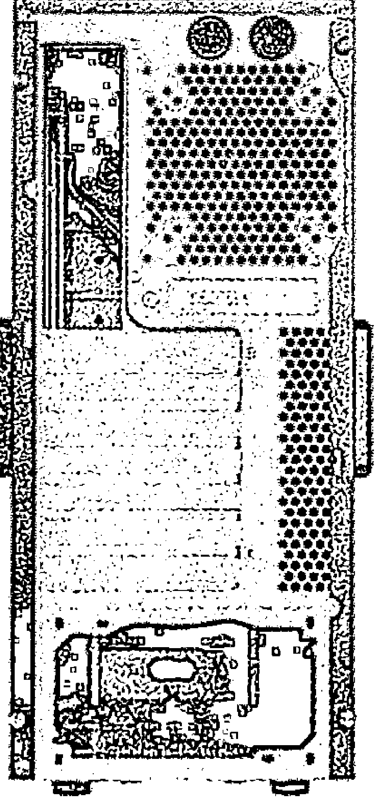


### 小小降速线搞定风扇噪音

有些显卡风扇的转速特别高，即便采用了温控调速技术，转速也不会降得太低，因此噪音也会更大一些。这个时候不妨使用一根“风扇降速线”（图3），即可轻松实现降噪。这种产品的售价通常只有1元钱，其原理就是在线路中加入电阻，起到分压作用，风扇的速度自然就被降了下来。这种降速线通常采用2Pin或3Pin设计，安装时只需将其变为显卡风扇的供电延长线即可（图4）。就算转速高达4000RPM的暴力风扇，也可以降到只有2000RPM的静音风扇，运行时的噪音也就不再是问题了。


### 消除机箱共振

有些时候高速风扇不仅噪音大，而且还会引起机箱共振。不仅影响了电脑用户的心情，而且长时间还会因为共振而影响机械硬盘的使用寿命。遇到此种情况，不妨使用家电包装箱里经常采用的塑料泡沫，并将其裁剪成4块，分别垫在机箱的四个脚下（图5）。这样便可改变机箱的共振频率，并对高速风扇所产生的震动进行缓冲化解，噪音及共振问题也就轻松搞定了。

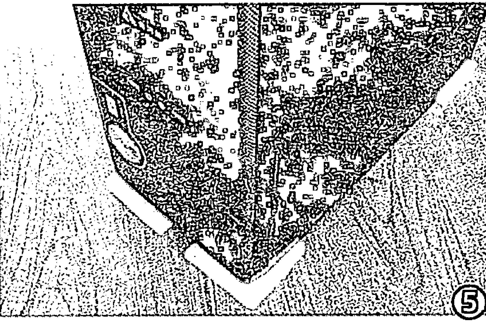

> > **傻博士有话说**
除了使用各种硬件来对风扇降速降噪之外，还可使用软件来进行操作。目前，很多新主板的BIOS当中都有风扇降速或限速功能，只需进行正确设置即可。显卡驱动也提供了风扇降速功能，同样可以进行相应设置来实现降噪。

舒服惬意 用你的手机遥控电脑

文 | 宁宁

平日里，躺在床上或窝在沙发里看电脑视频，经常因为突然来袭的困意而懒得去关电脑。这个时候，用你的手机遥控电脑绝对是一件舒服惬意的事情。

下载“百变遥控”APP

要想实现手机遥控电脑，首先需要的就是一个APP遥控软件，比如口碑不错的“百变遥控”安卓版。这款APP的Windows端需要从官网下载（http://bbyk.sinaapp.com/w），手机端则可在主流市场里下载，成功下载之后把Windows端和手机端正确安装即可。

两步搞定“无线连接”

“百变遥控”主要有Wi-Fi和蓝牙两种连接方式。首先，电脑运行百变遥控的Windows端，不用任何设置，最小化窗口即可（图1）。然后，如果使用了无线连接，那么手机开启Wi-Fi，与电脑处于同一个网络；如果使用了蓝牙连接，手机和电脑开启蓝牙并完成配对。最后，启动手机端的“百变遥控”，并点击主界面当中的“离线”按钮（图2），即可实现自动搜索，APP状态也从“离线”变成了“在线”。

播放、关机样样行

“百变遥控”安卓版是一款样样都行的全能软件，比如说“媒体播放”功能（图3）便可完美兼容包括快播在内的主流播放软件，播放、暂停、音量调节均可一键搞定。至于“系统管理”功能（图4）可以实现待机、休眠、重启、关机，同样是一键完成。还有就是“游戏手柄”功能（图5）可把手机变身成为一部“无线重力感应手柄”，在赛车类游戏时非常方便。

这款APP最具特色的“快捷方式”功能（图6），包括了“桌面”、“开始菜单”、“自定义”这三大选项，可以极为便捷地实现电脑文件及程序的快速启动。这一功能目前还存在Bug，必须先点击“自定义”，然后再点击“开始菜单”。如果直接点击“开始菜单”，就会造成APP运行错误并退出。

> 小结 “百变遥控”是一款性能强大的APP，除了上述功能外，还可以模拟键盘鼠标。

旧貌换新颜 翻新硬盘实战手记

文 | 黄健

在DIY领域，CPU、内存、显卡等硬件淘汰后可以随意处置，唯独存有数据的硬盘会始终陪伴在历代PC身旁。不过，一些“年过花甲”的硬盘始终存在外观积尘受损、内部磁盘坏道等困扰。如果能将硬盘重新“打理”一番，让其可以重获新颜再度上岗，不也是一桩美事吗？

看到这个标题是不是有些吃惊，怎么杂志会介绍这样非法盈利的手法？其实是您误解了，电脑外设市场鱼龙混杂，撰写本文的出发点是：让读者更多地了解，方能更好地防范。笔者在论坛以“白菜价”购买了一块二手硬盘，该产品可以被系统识别，但原盘扫描缺陷严重（图1），也就是行内称为的坏道盘。而本文，就将围绕这款坏道盘，看看如何让其内外焕发新春。

> 小提示
拆解电路板，工具是必不可少的，常用的是内六角螺丝刀。没有的话在淘宝上用“拆硬盘 六角螺丝刀”关键词搜索，选购一把即可。另外如果您是北方的朋友，冬季还需要注意静电问题，可通过触摸自来水管等方式将自己身上携带的静电放掉，避免造成板卡的损坏。有了工具，电路板的拆解相对简单，只需将背面的螺丝拧开，即可将电路板取下清洁。

外观清洁才顺眼

这款坏道盘被原主人尘封已久，表面落满了灰尘，金属触点也是氧化严重。为了让它看着更顺眼，首先要做的就是通过橡皮擦+刷子的组合（毕竟不是专业翻新，这样组合已经足够，而重度的业内人士会用到洗板水+刷子的组合），对其进行一番“美容”（图2）。该步骤的作用就是采用橡皮擦清洁金属触点、去除氧化，令接触更好，外观也更新（图3）。

硬盘数据的修复

处理完外观，下面开始维修硬盘。具体的步骤可参看《电脑爱好者》2014年15期和16期有关西部数据和希捷硬盘的修复文章，这里就不再赘述了。经过自校处理后的硬盘采用检测软件同出厂时的状态并无二致（图4）。

修改磁盘内外参数

如果硬盘状态不佳，经过砍头等出现容量下降的，还需要涉及序号和容量参数等的修改（具体步骤如下：进入WDR维修软件中的配置信息项，点击修改型号、SN号和LBA值，以LBA值为例，原盘如果为500GB，LBA值为976773168；如今砍头后，变为320GB，LBA值变为625142448；此外SN和型号肯定也要对应修改)。至于这部分信息也可上网搜索记录并修改，甚至可以到官网查询保修状态，以应付懂行的卖家（图5）。如修改了序号和容量等，还涉及到硬盘外壳上标签的修改，这个也有专门的渠道，这里我们就不演示了。

最后的收尾工作

至此，一个翻新硬盘基本成形，接下来还有些扫尾工作。比如针对部分西部数据笔记本盘，需要解决C1值增长太快的问题。C1是记录磁头加载/卸载的次数，笔记本硬盘出于节能的考虑，在不读取硬盘数据的时候，磁头会自动收回；当要再次读取数据的时候硬盘磁头又会进入盘片上方，重新读取数据。虽然Load/Unload技术有很多优点，但毫无疑问频繁的Load/Unload操作会造成磁头的磨损，严重的话会造成数据读写失效，也会出现“咔咔”的声音。另外，在游戏和视频播放中会出现卡顿的现象。
针对本文的坏道盘，笔者就采用了Synology的解决方案，使用WDIDLE3修改硬盘定时器，设置为WDIDLE3 /S300（图6）。到此盘体部分已经处理完毕，如果你觉得盘体的外观仍很难让人信服它是全新的话，那么找个移动硬盘盒给它装上吧（图7）。有“工匠”精神的玩家，还可在淘宝购买WD硬盘盒（图8），最后再在接缝处贴上易碎标，就能让该坏道盘华丽变身成酷酷的全新WD移动硬盘了。

> 小结 技术带来便利的同时，不可避免地也带来了问题，端看您如何应对。只有知己知彼，方能百战不殆，安然行走于江湖。CF

AMD碰上Intel 玩转英特尔集显与AMD独显

文/镜花水月

在今天的笔记本领域，英特尔处理器 + NVIDIA独显算是比较常见的搭配方案，双显卡切换技术成熟且稳定。但是，当英特尔处理器碰到AMD独显之后，如何才能玩转这对竞争对手的双显卡呢？

满城尽是“双显卡”

在笔记本领域，无论是英特尔旗下的酷睿、奔腾、赛扬、Atom，还是AMD旗下不同档次的APU，均已内含性能不等的集成显卡（图1）。为了进一步提升产品的游戏动力，绝大多数厂商还会为其额外武装一块独立显卡作为辅助（图2）。因此，除了主推纤薄的少数超极本/超薄本，市面上90%以上的笔记本均是标准的“双显卡”配置。问题来了，如何管理好两个显卡？

NVIDIA主打智能易用

相对而言，NVIDIA独显是比较“单纯”的，因为它只和英特尔处理器平台“合作”，而且在双显卡切换的设计上也颇为智能：在桌面点击鼠标右键即可看到“NVIDIA控制面板”选项，点击进入后在“管理3D设置”选项卡内就可对双显卡进行全局设置（强制集显、强制独显或系统自动选择），或单独为某一程序指定以哪款显卡运行的方式（图3）。

AMD独显遇到两种“芯”

AMD独显的境遇要比NVIDIA复杂一些，因为它既可以与AMD自家的APU搭配，也可以与英特尔处理器组合。不过无论它与哪种“芯”搭配，双显卡设置都要落实到“显示卡属性”（类似NVIDIA控制面板，同样桌面鼠标右键入）上。其中，当AMD独显碰到APU时，会增加一项“交火”（AMD Radeon Dual Graphics）的选项，可以同时让集成显卡与独立显卡协同工作，实现1+1的显卡模式。

考虑到AMD APU在当前笔记本的市场份额较小，在英特尔处理器平台是市场主力的情况下，AMD独显+英特尔处理器将成为我们后文讨论的重点内容，测试的笔记本型号为东芝P50t。

> 小提示
AMD APU与AMD独显“交火”时性能提升幅度取决于具体显卡型号以及驱动程序对运行游戏的优化。通常可以在测试软件和游戏中获得10%~30%的性能提升，但也有少数游戏会出现不升反降的情况。

稍显复杂的AMD控制中心

AMD的“显示卡属性”即Catalyst Control Center，其中与双显卡有关的设置都在“电源”选项卡里面。在这里，我们需要关注“PowerPlay”、“可切换显示器全局设置”和“可切换显卡应用程序设置”。下面笔者将通过几个实例，讲述一下三个功能的设置。

PowerPlay

该技术用于AMD独显，对集显没有任何影响。它提供了“最大化性能”和“最大化电池寿命”，设置在前者时AMD独显会工作在最高频率上以获得最强性能（图4），而后者则会强制降低独显频率而起到节能效果，
但相应的也会影响独显性能的发挥（图5）。
如果你平时只玩《英雄联盟》一类的3D游戏，在最高画质下用集成显卡运行会卡顿，但独立显卡又面临性能过剩问题。此时，我们就可以在PowerPlay中强制独显工作在“最大化电池寿命”，用降低频率的独显去挑战游戏，获得比集显更流畅的运行速度并节省电量的消耗。

可切换显卡全局设置

该功能与NVIDIA控制面板的全局设置类似，当设置在“强制省电显示卡”时，系统就会自动屏蔽独立显卡而以集成显卡的模式运行。这个模式适合带着笔记本外出时使用，避免
不经意间唤醒独显而消耗宝贵的电池电量。
通过笔者的测试发现，“可切换显示器全局设置”中的其他三个状态（优化省电、最佳性能、最大化性能）对AMD独显的性能没有任何影响（图6）。

可切换显卡应用程序设置

在这里可以指定某个程序运行时显卡的工作模式（图7）。有意思的是，在全局设置在非“强制省电显示卡”时，无论将制定程序的显示卡设定在任何模式，笔记本依旧会以独立显卡的模式运行，只是在省电模式下CPU性能会略有降低。

> **小结** 至此，我们可以对AMD独显+英特尔处理器平台的双显卡切换进行一下小结了：
如果你想强制集成显卡运行，必须进入可切换显示器全局设置并将其设定在“强制省电显示卡”，无法制定某一具体程序以集成显卡的模式运行；AMD独立显卡的性能只取决于PowerPlay中的设定，修改电源工作状态和可切换显卡相关设置并不影响它的性能发挥。反观AMD独显与APU搭配无需全局设置即可指定某一程序以集显模式运行，看来AMD独显与英特尔处理器还有一段的“磨合期”（需要驱动方面的优化）啊。CF

何需小米

打造NAS及迅雷离线下载攻略

文/盖述功

如果说小米路由器真有什么吸引人的话，那就是它提供了1TB硬盘和相应的迅雷离线下载、文件共享功能。利用这些功能，我们很容易将家中的智能设备，如手机、平板电脑、智能电视和PC等联系到一起，轻松共享并管理路由器中的文件。不过小米路由器较贵，一般用户无力问津。那么，我们能否自力更生/勤俭节约，利用家中现有的普通路由器和移动硬盘，打造出一台廉价的“小米路由器”呢？

做好前期准备工作

打造前，我们除了要确认自己的路由器已具备DIY为“小米路由器”的基本条件外，还应将相应的固件请回家，同时，还应对移动硬盘现有分区的文件系统进行一番改造。

打造小米路由器需具备的几个硬件条件

- ☆路由器需带有USB接口;
- ☆内存不少于8MB;
- ☆可刷OpenWrt系统。

查看路由器是否支持OpenWrt

下载并安装固件

第一步是下载。在http://www.dwz.cn/rzeZG页面中单击

的方法很简单，进入http://www.dwz.cn/rzeZG页面，在中间的Table of Contents（目录）栏中，选择好自己使用的路由器品牌，如TP-Link、Tend等。在接下来的页面列表中，可以看到系统支持的相应的型号，如果自己所用的路由器型号在其中，说明支持，记下Target(S)（目标）列中显示的字符（图1）。

Downloads（下载）项，打开相应页面，选择好要安装的系统（一般选择最新的attitude adjustment即可）。在接下来的页面中，选择好要使用的系统版本，进入下一个页面（图2）。

然后根据上面记下的Target(S)（目标）列中的名称，选择同名项目。在接下来的页面中，选择好与路由器型号对应的BIN文件（图3），将对应的OpenWrt系统下载到指定的存储设备中（如本地硬盘）。

安装的话以常见的TP-Link路由器为例，其他品牌路由器的安装方

法大同小异。在浏览器地址栏中输入192.168.1.1(目前的新型号应输入：tplogin.cn)，回车。在出现的登录界面中输入账户和密码，登录到路由器设置界面，选择左侧的“系统工具→软件升级”项，然后单击右侧的“浏览”按钮，在出现的对话框中选择好OpenWrt系统文件所在目录，单击“升级”按钮(图4)。稍等片刻，固件的升级工作就完成了。升级完成，路由器将自动重启。

格式化硬盘为EXT格式

由于OpenWrt是Linux系统，此系统一个显著的特点是，虽然它可以读取Windows系统下常见的Fat32或NTFS文件系统，但因为读取效率很低，所以在使用前，我们最好能借助相应的磁盘管理工具，将移动硬盘事先格式化为EXT3或EXT4文件系统。如这里我们将要介绍的Paragon Partition Manage (下载地址：http://www.dwz.cn/rzfqD)。

先将移动硬盘连接到电脑中，对其中的重要数据进行备份，安装并运行“硬盘分区魔术师”。程序运行后，在其主界面中选择左侧的Partition Manager (分区管理)项，然后在右侧单击Partition Manager按钮(图5)，进入相应的界面。

然后在下方的磁盘及分区列表中，右击移动硬盘的某一个分区，在弹出的右键菜单中选择Format Partition (格式化分区)，打开相应的对话框，选择分区的文件系统为Linux Ext4，单击Format (格式化)按钮(图6)。稍等片刻，分区的格式化操作就完成了。用同样的方法，格式化该硬盘的其他分区为Ext4文件系统。至此，DIY之旅的前期准备工作就大功告成了。

DIY实战并不复杂

接下来我们只需将移动硬盘挂载到路由器中，同时对路由器进行设置，使其能连接到网络并完成文件共享、离线下载等操作即可。

连接网络同时开启Wi-Fi功能

在浏览器地址栏中输入192.168.1.1，回车，打开OpenWrt登录界面(图7)，在“用户名”和“密码”文本框中输入相应信息(默认分别为root、admin)，单击“登录”按钮，进入OpenWrt设置界面。选择“网络→接口”菜单，切换到相应页面，然后根据自己所用的网络类型选

择。比如笔者所用的网络类型为需要用户名和密码才能连接的光纤用户，所以选择了PPPoE协议。选择完毕，在“用户名”和“密码”文本框中分别设置好网络运营商提供的相应信息（图8），单击“保存&应用”按钮。

然后开启无线网络，在菜单栏中选择“网络→Wifi→RADIO0”进入相应的界面，勾选“开启”项，依次在ESSID项中设置好无线网络名称，在“网络”和“加密”项中分别选择LAN、WEP，同时设置好“密钥”，单击“保存&应用”按钮。至此，路由器的网络设置工作就完成了。

挂载硬盘并开启Samba网络共享

之所以要开启Samba网络共享功能，是为了以后使用该设备上网的智能设备，如手机、平板电视、机顶盒和智能电视等，都能轻松访问并管理移动硬盘中的资源，从而达到可跨平台共享的目的。

将移动硬盘通过USB接口连接到路由器上，在OpenWrt设置界面的菜单栏中选择“系统→挂载点”，进入

相应的界面，OpenWrt会自动识别该硬盘，并将其显示在“已挂载的文件系统”列表中。其中显示的“文件系统”为“/dev/sda1”，“挂载点”为“/usb/sda1”。在“启用”项列表中勾选启用该设备（图9），单击“保存&应用”按钮，硬盘的挂载工作便告结束。

选择菜单“服务→Samba网络共享”，进入相应的界面，按提示设置

好“主机名”、“工作组”信息（一般使用默认值即可），单击“共享目录”项中的“添加”按钮，在出现的对话框中选择共享目录为“/dev/sda1”，确认后，返回上级界面，将该共享目录的访问权限设置为“允许匿名用户”（图10），单击“保存&应用”按钮，完成网络共享的设置工作。

如果我们要在局域网中的任一PC中访问该共享磁盘中的文件，只需在Windows资源管理器中选择“网络”，即可看到一个名为OpenWrt的网络设备，该设备就是路由器挂载的移动硬盘，双击它，在出现的登录界面中输入账号root、密码admin并登录，其中的文件就出现在眼前了，然后用与使用本地磁盘一样的方法，对其的文件进行管理即可（图11）。

而如果我们要使用iPhone、Android等设备访问共享资源时，只需在该设备中安装“ES浏览器”（下载地址：http://www.dwz.cn/rzfHJ），运行后，在地址栏中输入smb://192.168.1.1，回车，在出现的登录界面中输入相应信息并登录，共享资源同样会出现，是不是非常方便？

### 使用迅雷离线下载

OpenWrt内置了两大下载工具：Transmission和Aria2，二者的功能类似，都可方便而高速地进行BT和磁力下载，而且二者在经过设置以后，都能很好地支持远程离线下载。不过，相对来说，Aria2更符合国人的习惯，因为它支持迅雷离线下载，这对习惯了使用迅雷的朋友来说，无疑是一大福音。

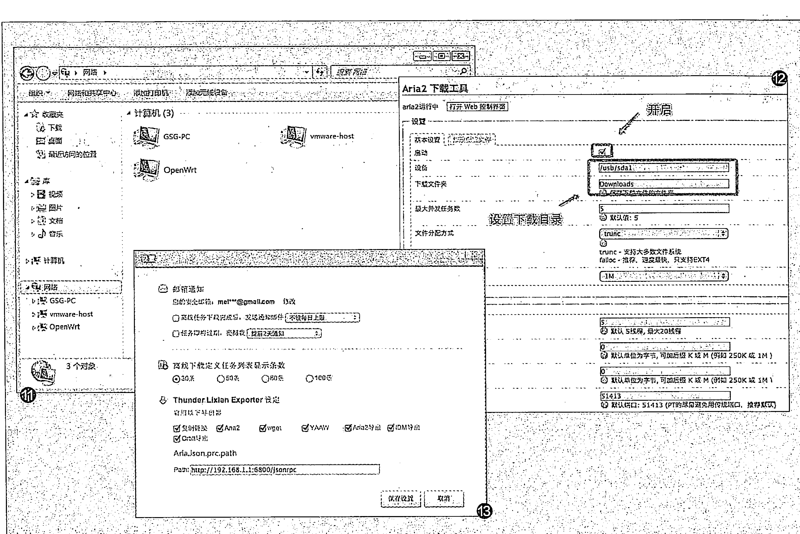

先指定文件存储目录。在OpenWrt设置界面的菜单栏中选择“服务→Aria2下载工具”，进入相应的界面，勾选“设置”栏中的“启动”项，同时设置“设备”为移动硬盘对应的目录，“下载文件夹”为Downloads，其他项保持默认值，单击“保存&应用”按钮（图12）。

然后添加迅雷离线下载助手。在360极速浏览器中（使用相同内核的猎豹和Google Chrome浏览器也可以），进入http://www.dwz.cn/rzfXc页面，下载并运行“迅雷离线下载助手”，在出现的对话框中单击“添加”按钮，该插件即会被添加到360极速和Chrome等浏览器中。

进入迅雷离线下载页面（http://www.dwz.cn/rzg7A）并登录，单击右上角的“设置”按钮，打开相应的对话框，勾选“Thunder Lixian Exporter设定”栏中的所有项，然后在Path（路径）文本框中输入http://192.168.1.1:6800/jsonrpc，单击“保存设置”按钮（图13）。

> 在浏览器中地址栏中输入192.168.1.1/aria2，回车，可进入aria2主界面，在这里，我们可查看当前正在进行的下载任务及相应的下载速度等项。

> 小结：通过改造，我们用很低的成本就实现了类似小米路由器的功能。我们不仅可以使用移动智能设备去访问这套系统，更能实现类似NAS那样的功能，很适合一些高清爱好者。怎么样，这套手工打造的局域网系统是不是有点像小米路由器了？

### 莫要浪费大内存
### 活用 “内存硬盘” 为PC提速

文/张日红

如今的PC，没有4GB内存都不好意思抛头露面，很多用户家里的PC更是早已配备8GB甚至16GB的海量内存。问题是，4GB就够Windows系统折腾了，如何才能进一步挖掘那些多出来的内存容量的潜力呢？内存盘是个不错的主意，但你真的懂得如何善用它吗？

### 32位与64位系统之争

将内存打造成“虚拟硬盘”（下文简称内存盘）最大的优势就是极致的读写速度（图1），如果PC内存在4GB以上，不建立内存盘就颇有浪费之嫌了。需要注意的是，内存盘的建立与操作系统版本有着莫大的关系。

我们都知道，32位的Windows系统最多仅能识别3.25GB左右内存，此时我们可以用“超级兔子虚拟磁盘加速器”（下载地址：http://pan.baidu.com/s/1qWryBgw）将无法被系统识别出来的内存全部划分为内存盘。该软件为绿色免安装版，解压缩后直接运行程序，并按默认设置一路“下一步”即可（图2）。

需要注意的是，用该软件建立的内存盘在关机后内部的临时文件会自动消失，不适合保存重要的文件和数据（图3）。此外，当你想卸载内存盘时，只需重新运行超级兔子虚拟磁盘加速器，即可卸载并恢复临时文件夹和虚拟内存。可惜的是，超级兔子虚拟磁盘加速器仅支持32位Windows系统，但很多PC现在出厂就已预装64位系统，此时我们又该用哪些软件实现内存盘的搭建呢？

### 64位系统的两种解决方案

如果你的PC安装了64位Windows系统，可以使用“魔方内存盘”（下载地址：http://t.cn/zjrdK0z）或“OSFMount”（下载地址：http://t.cn/RhyzigJ）进行内存盘的建立。只是，这两个软件分别代表了两种思路：

### 魔方内存盘

将系统临时文件转移到内存盘中，可以明显加快程序的二次启动速度，并提高很多操作的响应速度。可惜，内存盘断电后就会清空数据，导致

- 内存盘的读写速度秒杀SSD

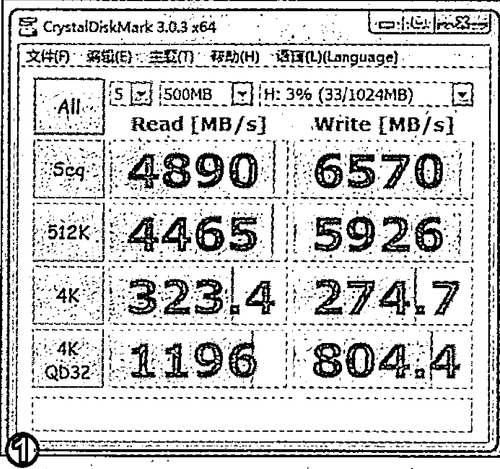

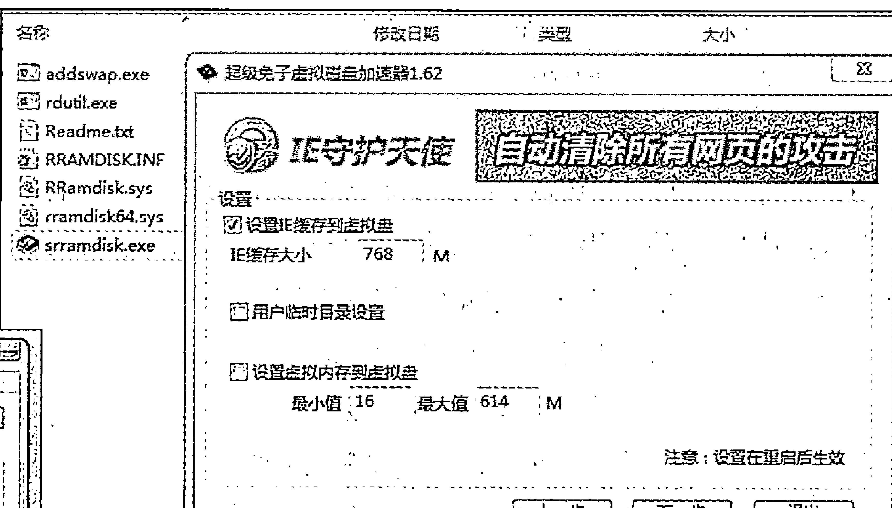

- 在缓存设置界面中，记得要勾选“用户临时目录设置”和“设置虚拟内存到虚拟盘”，软件会自动设置移动临时文件夹并设置虚拟内存到虚拟盘

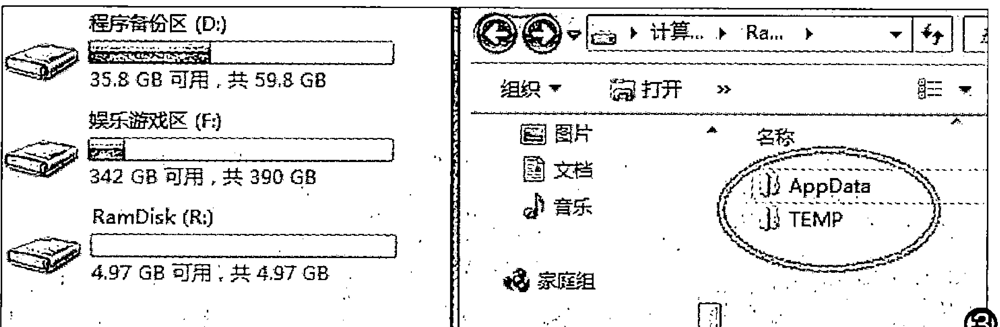

- 内存盘在格式化后，就可像普通硬盘一样，随意往里面拷贝数据

- 用魔方内存盘建立的内存盘容量越大，C盘生成的镜像备份也就越大，从而会影响开机时间

> **小提示**
> 想将IE临时文件夹转移到魔方内存盘建立内存盘，请依次进入“Internet属性→浏览历史记录属性→移动文件夹”，将临时文件夹指定到内存盘中（图6）。

临时文件夹变得毫无意义。而魔方内存盘最大的特色，就是解决了内存盘断电数据消失的困扰。
运行魔方内存盘后，点击左上角“创建内存盘”图标，然后在弹出的窗口里输入内存盘容量和盘符，再勾选“开机自动加载此内存盘”即可建立内存盘（图4）。需要注意的是，魔方内存盘在建立内存盘后，会在系统盘（C盘）里自动加载一个与内存盘容量相同的空间用于做镜像备用，比如我们划分1GB内存用于内存盘，那C盘就会因镜像占用1GB的硬盘空间。由于在C盘建立了内存盘的镜像备份，所以用魔方内存盘软件建立的内存盘在关机后就不必担心里面保存的文件会消失了。
但是，由于每次开机时内存盘会从C盘加载相同容量的镜像备份，而镜像备份越大，所需加载的时间也就越长。就笔者的经验而言，使用该软件建立的内存盘最好不要超过1GB，这样既可满足系统日常应用要求，也不会降低系统开机速度。

### OSFMount

我们可以将OSFMount理解为64位系统中的超级兔子虚拟磁盘加速器，运行程序后只需点击窗口下方的“新建装载”，在弹出的窗口中选择“空的内存磁盘”，输入内存盘容量并选择内存盘盘符和类型后就创建完成了（图5）。
需要注意的是，用OSFMount建立的内存盘在关机或重启后会自动消失，如果你想继续使用内存盘就必须重新建立一次。如果你想在不重启的情况下卸载内存盘释放内存，只需打开软件点击“卸载全部并退出”即可。

### 1+1挖掘大内存潜力

考虑到64位Windows以及超过4GB的内存容量已经成为时下PC的趋势，因此我们有必要对64位系统下的内存盘进行完善。而将魔方内存盘和OSFMount这两个软件结合使用，无疑就是一种最简单的解决方案。
简单来说，我们可以先使用魔方内存盘建立一个512MB或1GB的内存盘用于保存临时文件和常用的程序，该内存盘每次开机时会自动加载C盘中的镜像备份，可以长期使用。
用魔方内存盘建立用于存放临时文件的内存盘A后，我们可以再利用OSFMount建立另外一个用于保存希望程序提速的内存盘B。比如当你想玩一把《生化危机6》时，只需先用OSFMount建立足够容纳该游戏的内存盘，并将游戏拷贝其中，就可享受远超SSD的加载和运行速度了。

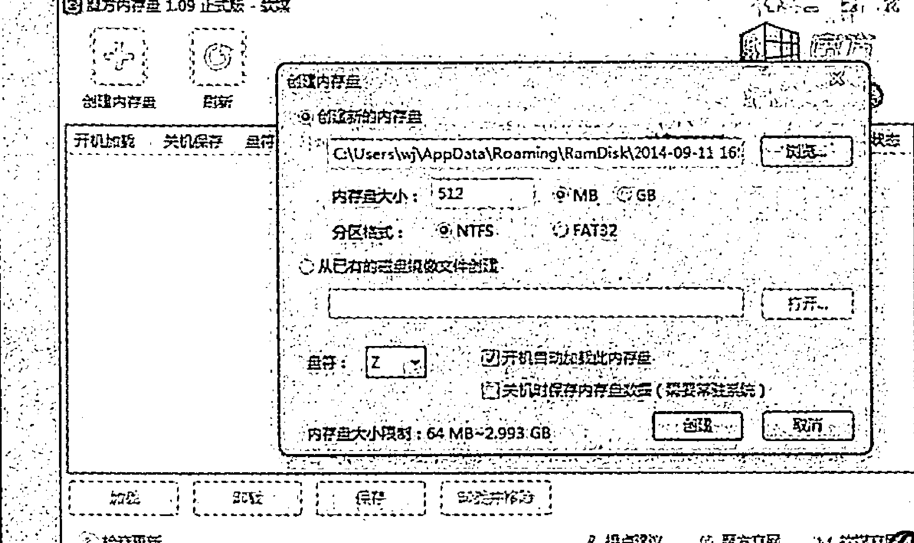

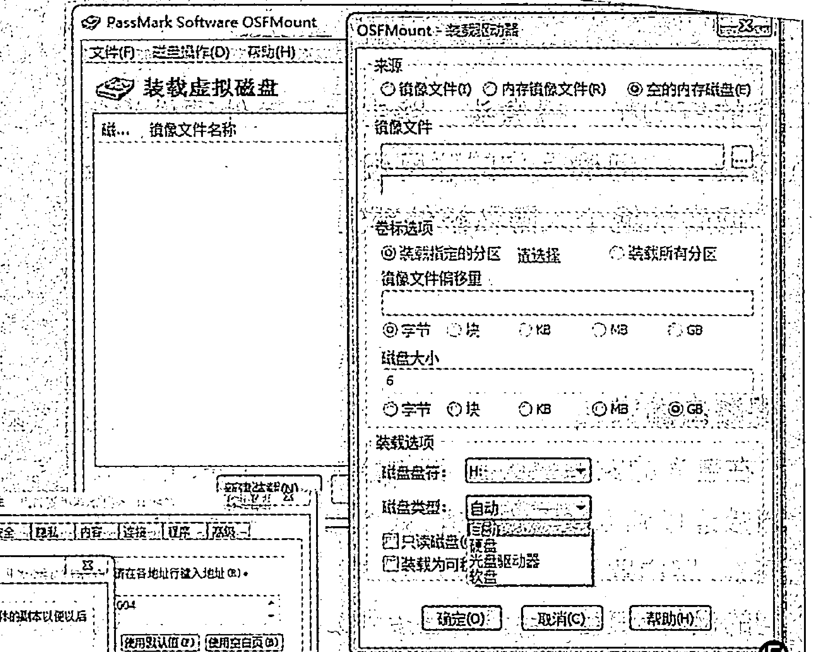

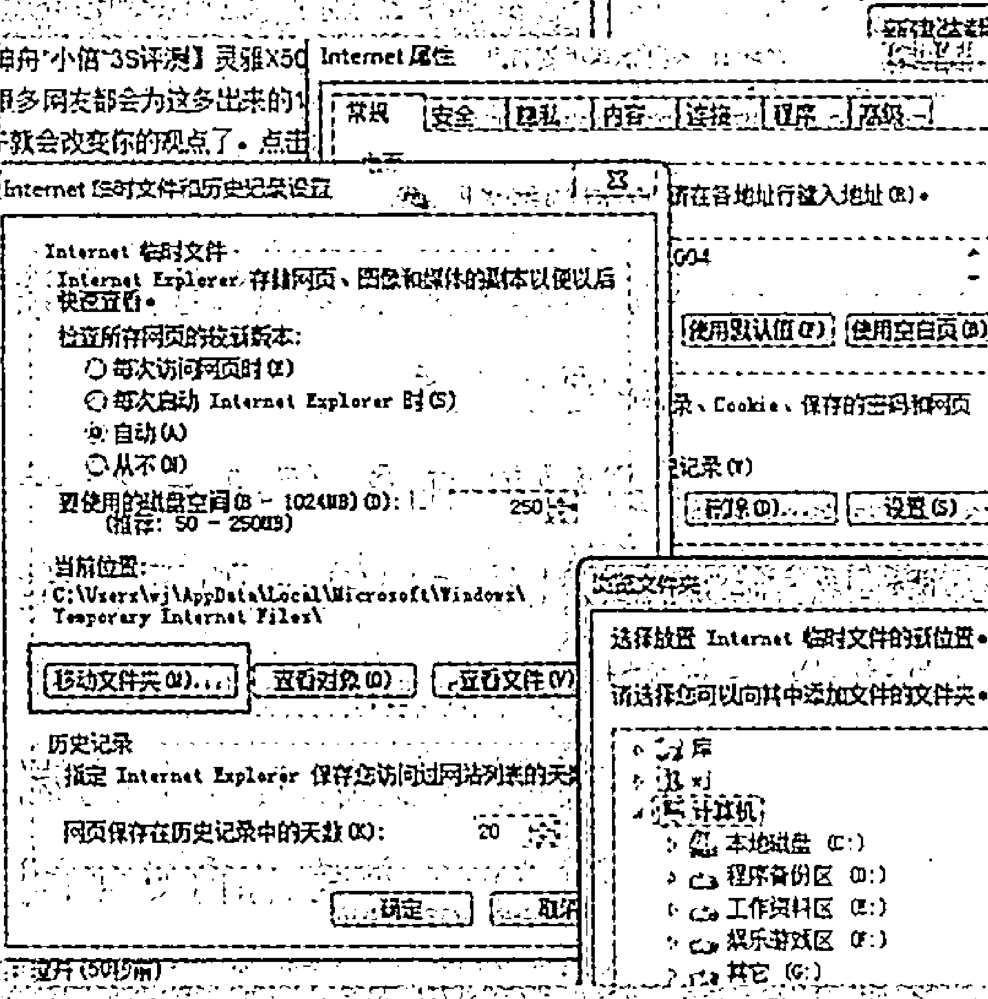

- 新建内存盘再对其格式化即可正常使用

## 杜绝本地设备被远程访问

文|沈建苗

现在的打印机、摄像头、路由器及其他硬件设备都可连接互联网，这就存在被远程访问的可能。如何确保你的联网设备与互联网实现安全隔离？我们要做的是各方面都配置到位，彻底杜绝个人隐私被外部侵犯。

### 确保路由器安全

在普通的家庭网络上，路由器是最直接连接到互联网的设备。如果配置正确，路由器是唯一可以从互联网访问的设备。其他所有设备连接到你的路由器，路由器就有可能泄露这些设备，所以一定要确保路由器本身很安全。

不仅是智能路由器，现在很多普通路由器也有“远程管理”功能，让用户可以通过互联网登录到路由器，并配置其设置。绝大多数人根本不用这项功能，所以你应该确保该功能已禁用。如果你启用了这项功能，密码又很薄弱，攻击者就有可能远程登录到你的路由器。你可以在路由器的Web界面找到这个选项关闭，要是你需要远程管理就得确保更改默认密码，可能的话还要定期更改（图1）。

许多消费级路由器存在一个严重的安全漏洞。UPnP是一种不安全的协议，让本地网络上的设备可以通过创建防火墙规则转发路由器上的端口。不过UPnP存在一个常见的安全问题，路由器会接收来自互联网的UPnP请求，让互联网上的人都能在你的路由器上创建防火墙规则（图2）。

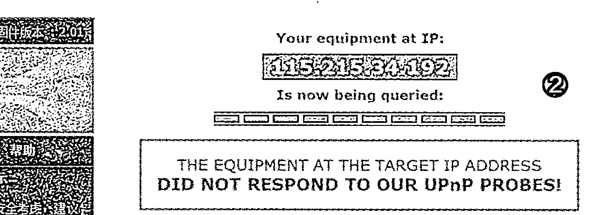

ShieldsUP网站提供专门的UPnP缺陷测试

访问ShieldsUP网站，运行UPnP缺陷测试（https://www.grc.com/x/ne.dll?bh0bkyd2），检查你的路由器是否存在这个UPnP安全漏洞。要是你的路由器存在安全隐患，应从厂商网站下载最新版本的固件加以更新，以解决这个问题。倘若这一招不管用，可以试着禁用路由器界面中的UPnP，或者购买没有这个问题的新路由器。更新固件或禁用UPnP后，记得重新运行上述测试，确保路由器确实安全（图3）。

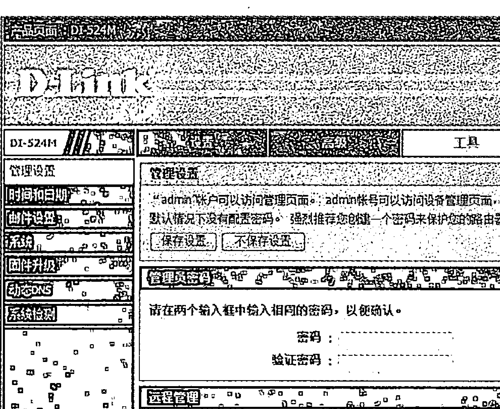

很常见的D-Link路由器一样具备远程功能

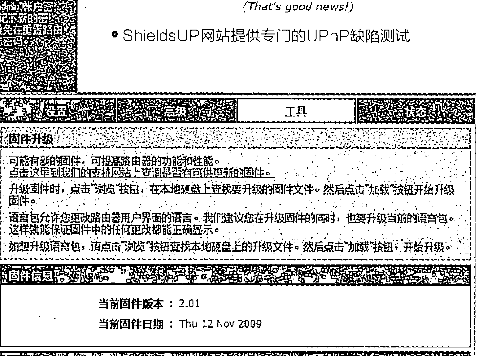

其实不断更新官方提供的新固件就是很好的防范

小提示：设备直接暴露在互联网面前时，记得为设备打上含有安全补丁的最新版固件，以确保版本最新。

- 最简单的方法就是直接关闭DMZ功能

- VPN工作区的安全性要比直连互联网高

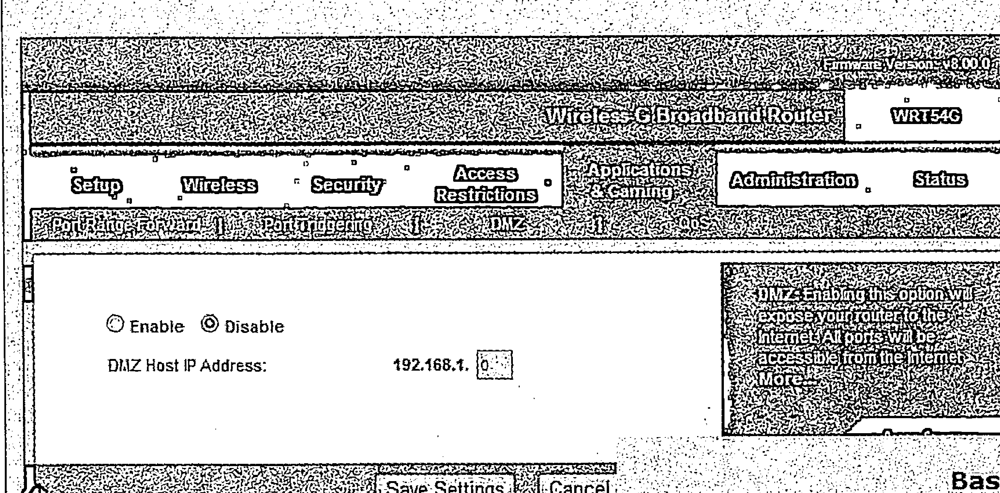

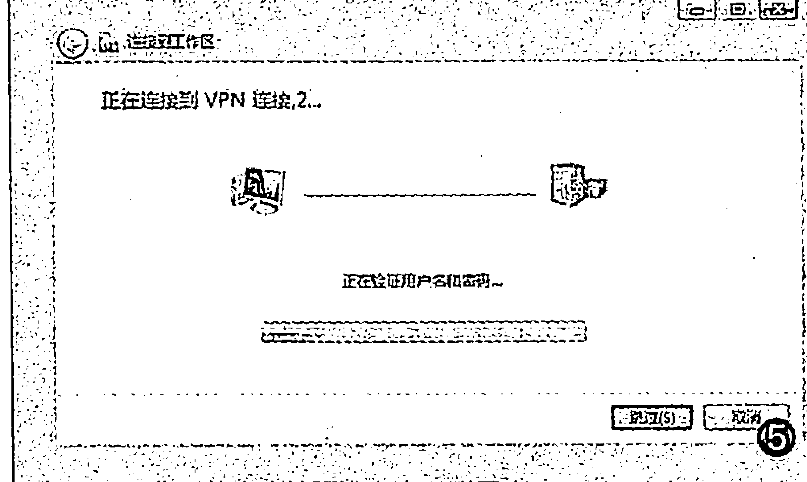

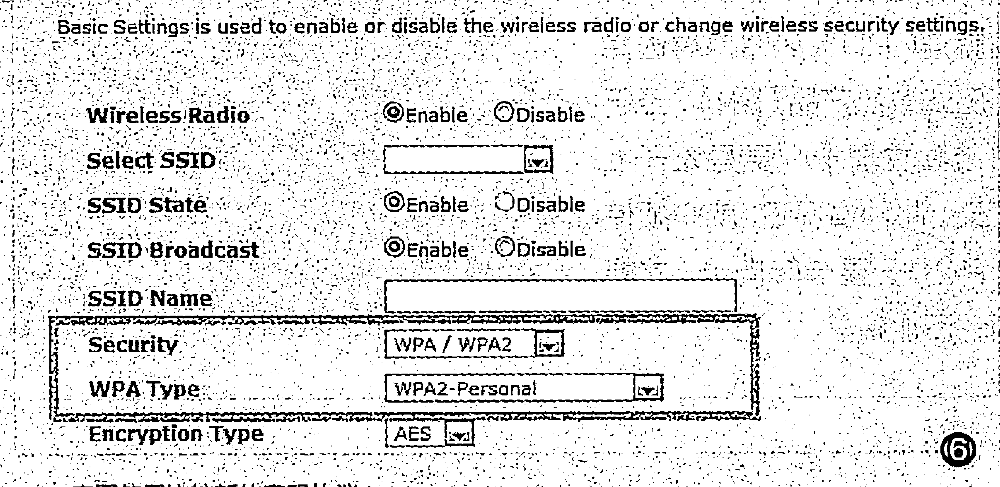

- 一定要使用比较新的密码协议

### 确保其他设备无法访问

相比路由器，确保打印机、摄像头及其他设备无法通过互联网来访问会容易一些。假设这些设备都连接了路由器，完全可以控制它们是否可以从路由器来访问。这些设备应该与互联网隔离，只能从本地网络来访问才比较安全。

一般路由器中的端口转发和DMZ功能会涉及到这些问题。解决办法也很直接，设置只转发真正需要转发的端口，并且避免使用DMZ功能。DMZ功能并非所有路由器都有，如果有的话路由器会收到所有的入站流量包括外接设备，就好像外接设备直接连接到互联网一样。换句话说，DMZ里面的设备也丧失了在路由器后面被保护起来的安全性（图4）。

如果确实想让自己的设备可以从互联网来访问，比如利用摄像头来监视自家的情况，就应该确保设备已安装设置好。转发路由器端口让设备可以从互联网来访问后，就要确保它们设置好了不容易猜中的强密码并定期更换，这是最基本并且也是最有效的方法。

如果想更安全一些，可以建立VPN。设备连接到本地网络，我们可以通过登录到VPN，远程连接到本地网络而不是设备直接连接到互联网。确保一台VPN服务器的安全性比保护几个各自内置Web服务器软件的设备的安全性来得容易。

如果只需要从一个地方远程连接到设备，可以在路由器上创建防火墙规则，确保它们只能从一个IP地址来远程访问。要是你想在网上共享打印机之类的设备，可以试着设置云打印之类的服务而不是直接暴露这些设备（图5）。

### 锁定无线网络

现在流媒体共享如此发达，无线网络上的任何设备都可以访问、使用和配置这些新的联网设备。不过只有本地无线网络确实安全才行，如果无线网络不安全，谁都可以连接并劫持你的设备，进一步浏览在网络上共享的任何文件也不是难事。这虽然是老生常谈但十分重要，应当使用WPA2加密和相当强的长密码，同时包括数字、符号以及字母。

我们还可以试着通过其他许多办法来确保家庭网络安全，比如使用WEP加密、启用MAC地址过滤以及隐藏无线网络，不过这些也都是建立在WPA2加密和强密码的基础上的（图6）。

### 显卡转向卡解决机箱空间问题

文|丁丁

在一些特殊的Mini-ITX平台和二手服务器上总有这样的问题，CPU及其散热空间没有问题，却没有为独显预留空间。此类ITX或者服务器的机箱很小，必须使用PCI-E显卡转向卡才能顺利添加独显。

### 小机箱的显卡空间问题

低价二手服务器的机箱与Mini-ITX机箱很相似，其特点都是空间很小。这种机箱就连CPU散热器都得选择下压式散热产品（图1），至于安装独立显卡则更是难于上青天。此种情况下，就必须使用PCI-E显卡转向卡，才能顺利添加独显。

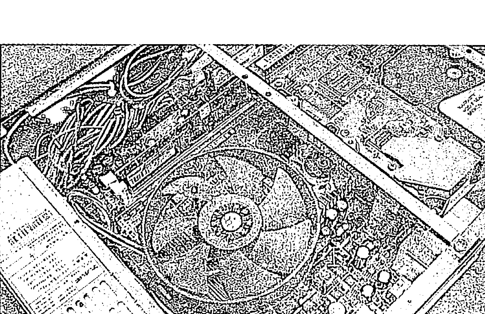

> 扩展阅读
> 基本上多数显卡转向卡都采用了PCI-E 2.0标准，所以最好还是搭配PCI-E 2.0显卡为宜。如果搭配最新的PCI-E 3.0显卡，可能只能运行在PCI-E 2.0速度上，还有可能会不正常工作。

### 显卡转向卡实现逆袭

PCI-E显卡转向卡最大的优势，就是把显卡从竖向安装变成了横向安装（图2）。这种转向卡的一边采用了金手指设计，使用时直接插入主板的PCI-E x16插槽中即可（图3）。另一边则采用了90度转向的PCI-E x16插槽设计，使用时则需要将显卡插入其中（图4）。
通过转接卡的金手指和插槽显卡就顺利完成了90°转向，服务器和Mini-ITX机箱添加独显的棘手问题也就迎刃而解了。不过需要注意的是，虽然上述显卡转向卡的售价只有二三十元，十分便宜，但却只能实现显卡的常规90°转向。在完成转向之后，显卡的散热器其实是向下的。也就是说，显卡的散热器就一定要严格限制厚度才行。必要时，甚至可以把偏厚的显卡原装散热器换成较薄的外排式散热器，只有这样才能保证显卡风扇的正常运转。


转向卡最大的好处就是不会影响性能，转向前后类似3DMark的跑分几乎没有任何影响。唯一的缺点就是显卡温度比以前高了，但在加装机箱风扇之后显卡的高温问题也可以有效缓解。

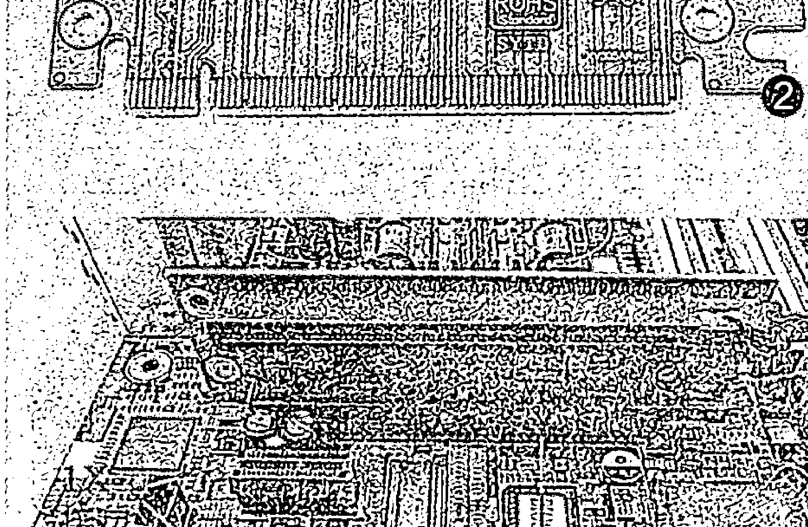


### “非主流”转向卡

除了二三十元的常规显卡转向卡之外，网上还有一种“非主流”的显卡转向卡，这种显卡转向卡可以实现反向的90°转向，但售价却要在七八十元甚至更贵。安装完成之后，显卡的散热器便可以向上了。而此时的显卡风扇则可以更顺畅地吸入冷空气，从而及时地对显卡完成散热。


### 信号功能随你定
### 学会更换笔记本的无线网卡

文|曹操

在笔记本“体内”除了内存和硬盘之外，无线网卡应该也算是最容易更换升级的部件之一。如果你觉得笔记本无线信号不给力，那就不妨来次“以旧换新”的好戏吧。

### 为啥要换无线网卡

随着智能手机和平板电脑的普及，无线路由器和蓝牙外设也成了很多家庭的必选“装备”。然而，有些笔记本在使用无线网络时总会出现频繁的掉线或网速不稳的现象。而很多早期的笔记本压根就不支持蓝牙，无法享用蓝牙键鼠或蓝牙耳机的便捷特性。好消息是，笔记本的无线网卡都是标准的Mini-PCIE接口（图1），有较强的通用性。这意味着，如果你对笔记本的无线连接能力不满意，或是想获得蓝牙功能，就可通过更换支持蓝牙功能的新无线网卡实现。

### 无线网卡的选购

生产笔记本无线网卡的品牌很多，比如英特尔（Intel）、博通（Broadcom）、Atheros、瑞昱（Realtek）和AzureWave等等。相对而言，英特尔自家的无线网卡的综合性能要优于其他品牌，除了信号稳定且捆绑蓝牙功能以外，英特尔无线网卡还支持WiDi无线显示技术（需要配合酷睿系列处理器），特别适合中高端笔记本升级使用。

以Intel 7260无线网卡为例（140元左右），其板卡表面的铭牌上都会印有一组TA号，如果TA号的后三位是001或002，则意味着该无线网卡为测试版，只有003或以上的数字才代表正式版（图3）。此外，Intel 7260还有三个不同的版本，分别为7260BN（不支持双频段）、7260AN（双频版本）、7260AC（支持双频且拥有876Mbps的超高传输速率），大家在选购时不要被商家以次充好。

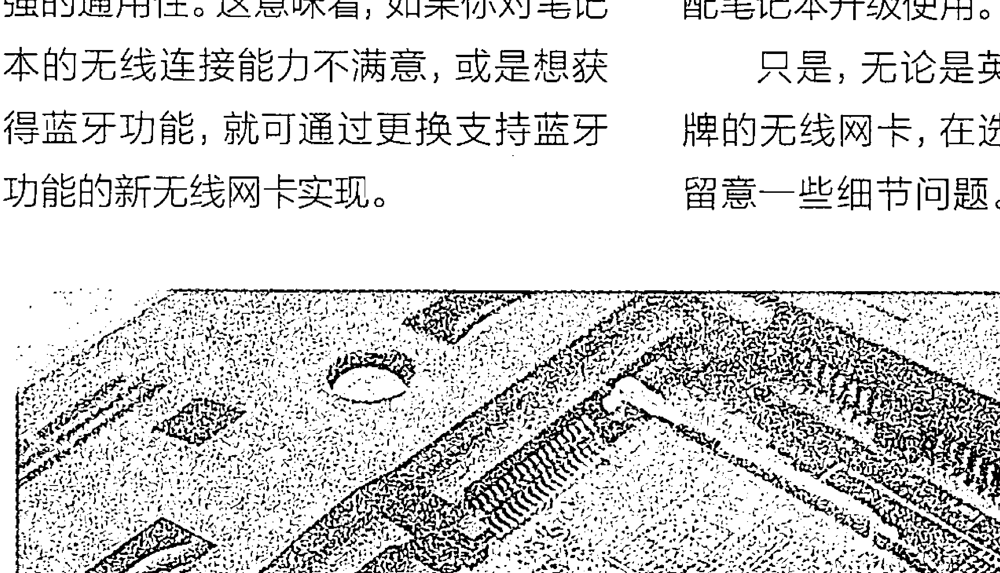

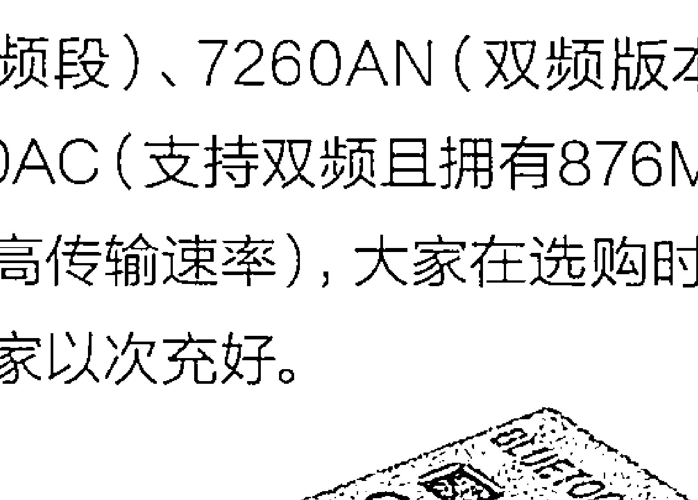

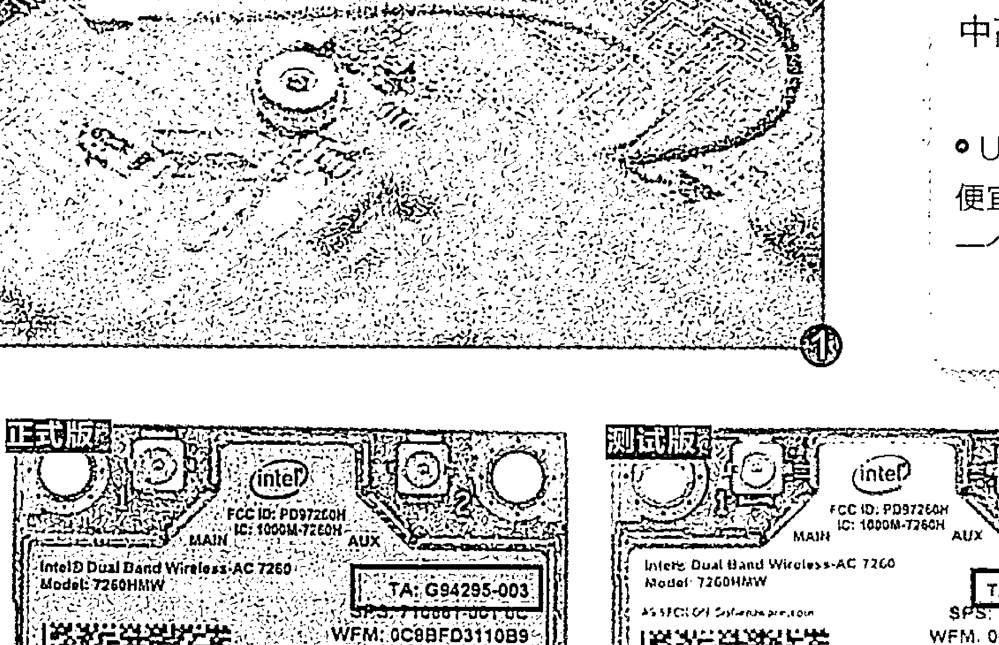

### 小提示

> 如果你想让笔记本获得蓝牙功能，在不更换无线网卡的前提下，可以考虑USB接口的蓝牙适配器，价格多在20元~100元之间（图2）。如果你只是为了连接蓝牙键鼠，选择便宜的V2.1+EDR适配器即可。如果你希望蓝牙耳机的声音更好听，就需要选择口碑更好的中高档V4.0适配器了。

- USB蓝牙适配器虽然便宜方便，但却会占用一个宝贵的USB接口

### 小提示

> 不同品牌不同型号的无线网卡在版本、功能和性能上都存在不等的差异，建议大家多逛逛相关的专业论坛，下单前多与卖家沟通，确定兼容性和具体的参数信息后再出手。

### 笔记本的半高与全高

和mSATA/NGFF接口的SSD一样，笔记本的无线网卡也有半高（Half Mini-PCIE）与全高（Mini-PCIE）之别（图4）。目前口碑较好的新一代无线网卡大都采用了Half Mini-PCIE标准，而早期的笔记本则多以Mini-PCIE规格为主。这就导致了老本购买Half Mini-PCIE无线网卡后，无法安装固定螺丝。此时，我们可以在淘宝购买“半高转全高支架”（图5），将Half Mini-PCIE无线网卡用螺丝固定在支架上就可顺利够到标准Mini-PCIE板位的螺丝孔了。需要注意的是，Half Mini-PCIE可通过转换支架向上兼容Mini-PCIE标准，但Mini-PCIE标准的无线网卡就无法向下兼容Half Mini-PCIE标准了。

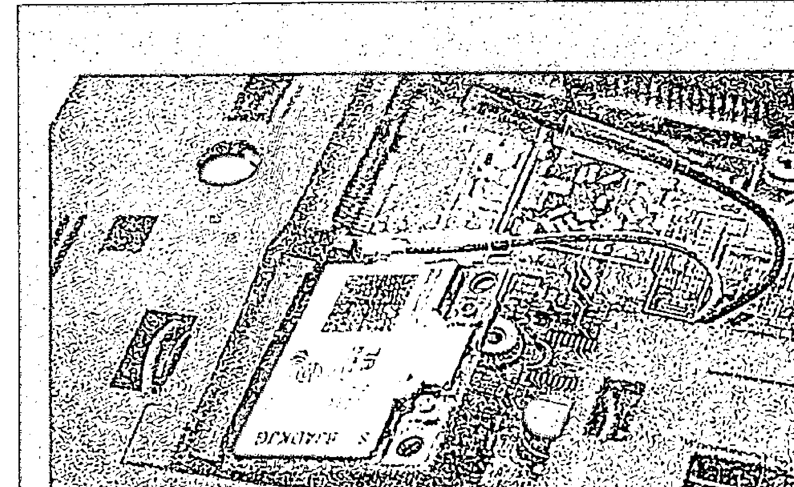


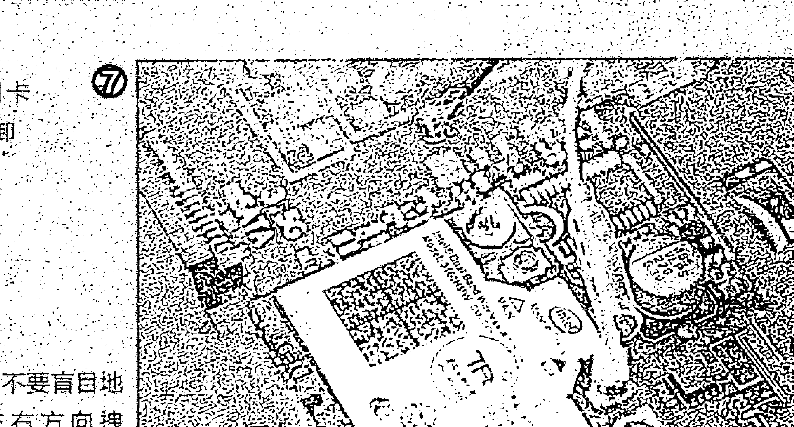

> 有些之前并不支持蓝牙的笔记本，在更换集Wi-Fi和蓝牙于一身的无线网卡后，按下“Fn+Fx”的快捷键可能不会弹出蓝牙功能的开关选择界面（图9），只能是Wi-Fi和蓝牙同时开启或同时关闭，这是正常现象。

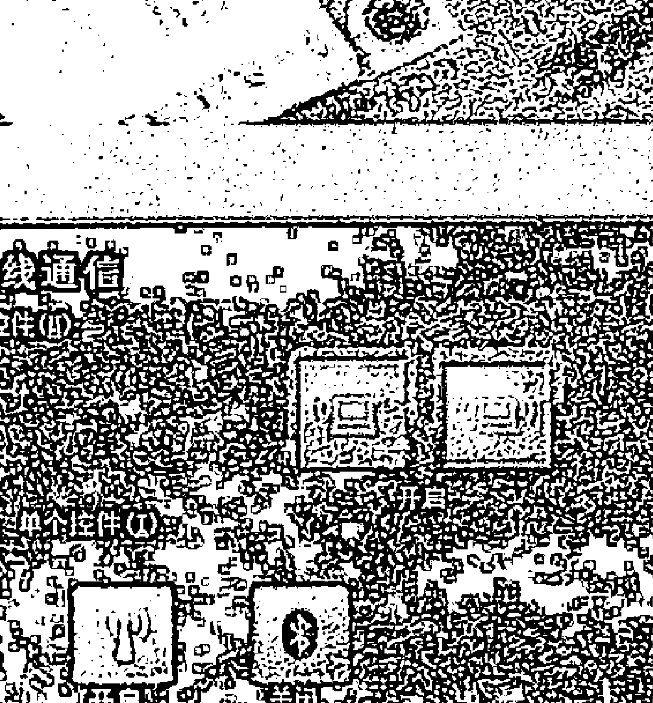

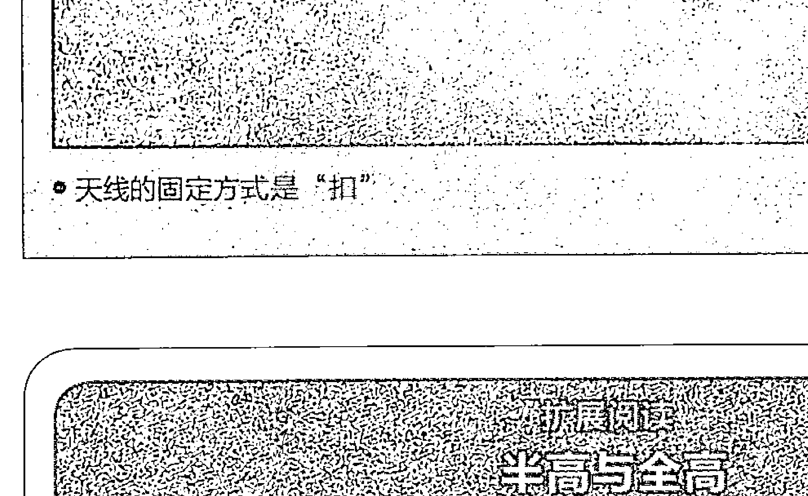

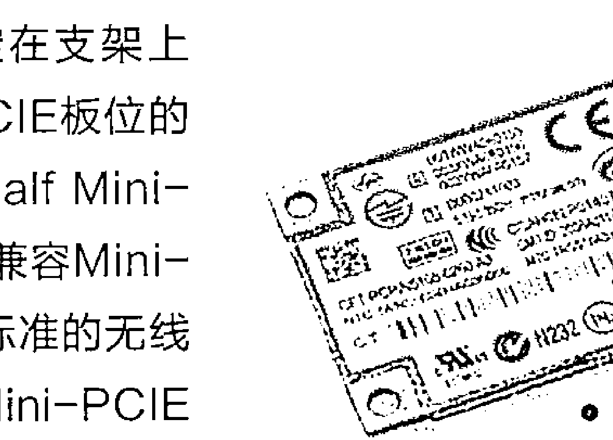

| Mini pcie半高转全高支架 Mini PCI-E Half Size to Full Size | 价格 | 数量 | 支付宝 | 购买 | 承诺 | 支付 | 备注 |
| :--- | :--- | :--- | :--- | :--- | :--- | :--- | :--- |
|  | 6.00 | 1 | 支付宝付款 | 立即购买 | 7天退换 | 支付宝 | 转换支架价格不高，多在5元~10元之间 |

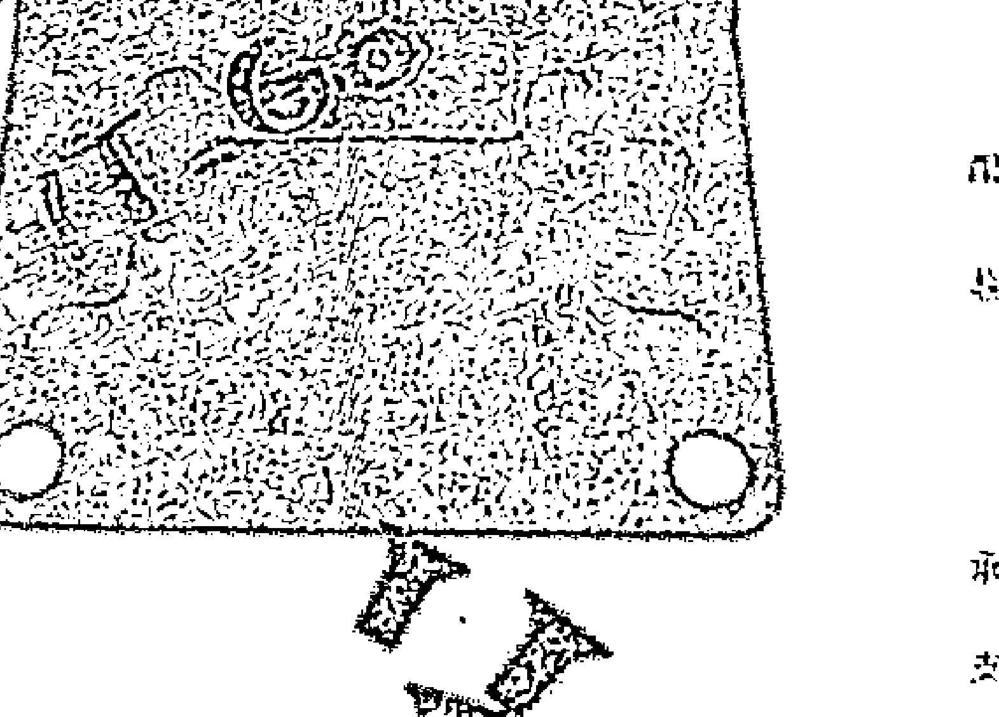

### 如何更换新的无线网卡

在更换新无线网卡之前，自然需要先拆下旧无线网卡。通常，笔记本的无线网卡仅由一颗十字螺丝固定，用普通的螺丝刀拧下螺丝，无线网卡就会自动弹起（图6），轻轻一拨就可将其与Mini-PCIE插槽分离。需要注意的是，无线网卡的表面会连接着2根~3根天线（起到增强Wi-Fi信号的作用），千万不要暴力扯拽，天线接头使用的是一种按压式的卡扣，需要捏住天线接头的金属部分往上拔才可安全地与无线网卡分离（图7）。此外，拆卸无线网卡前我们还需记住不同颜色天线的连接顺序，比如黑线接左侧、白线接右侧，接错了也会影响Wi-Fi信号的接收。接下来，我们需要按照相反的步骤，先将新无线网卡插入主板的Mini-PCIE插槽并用螺丝固定，再将对应的天线接头用力“扣”在无线网卡的天线接口上（图8）。在这里要注意扣紧天线，很多笔记本联网异常都是由于机身晃动让天线脱扣而导致的。最后，我们还需下载安装新换无线网卡的驱动程序，顺利的话就可享受到新卡的优质信号或更多功能了。

## 小心“白名单”拦截

需要注意的是，以联想、ThinkPad和惠普为代表的笔记本品牌，在产品出厂时会在BIOS层面加入“无线网卡白名单”信息，只兼容白名单列表中的无线网卡型号。换句话说，此类笔记本所更换的无线网卡若不在白名单范围里就会出现无法开机的问题。

此类笔记本要想加装非官方指定的无线网卡，需要通过PhoenixTool等破解软件解析并修改BIOS文件，或者将你想升级的无线网卡ID手动刷入到白名单列表（图10），或直接破除白名单限制，甚至还需屏蔽无线网卡的部分针脚。无论是哪一种都有较高的风险，因此只适合有足够动手能力的玩家尝试。对“小白”用户而言，可以直接在网上搜索由达人自制的修改版BIOS（搜索“型号+免白名单”的关键字即可）。

## 软件层面缓解掉线问题

当笔记本遭遇频繁掉线问题时，并非所有人都愿意花钱更换全新的无线网卡。如果你属于此类用户，可以通过软件层面的设置缓解掉线问题。

在进行下面设置之前，请先在品牌官网下载安装该笔记本型号的最新版无线网卡驱动。重启计算机后进入“设备管理器”，双击“网络适配器”的无线网卡进入其属性界面，先取消“电源管理”选项卡中“允许计算机关闭此设备以节约电源”的选项（图11）。然后再切换到“高级”选项卡，找到“AP兼容性模式”并将其设置到“更广泛的兼容性”（图12）。

接下来，鼠标右键点击笔记本当前连接的Wi-Fi热点并选择属性，点击“安全”选项卡中的“高级设置”按钮，最后勾选“为此网络启用联邦信息处理标准（FIPS）兼容（F）”即可（图13）。

> **小提示**

笔记本频繁掉线也不一定是无线网卡的问题，也可能是路由器端的设置引起，大家也可尝试修改路由器中兼容性的加密方式、信道和802.11模式等配置信息。

看到BIOS中有关无线网卡ID信息的复杂内容后，有没有觉得如同天书一般？

有些无线网卡型号没有AP兼容性模式选项，也就不必设置该项。

**小结**

看到这里，相信你已经掌握了最基本的笔记本选购、更换无线网卡的能力。如果你有更高的追求，可以考虑更换笔记本内置天线的长度、布局或数量，以进一步挖掘现有无线网卡的潜力。当然，这种改造的难度更高，如果你有相关的经验，欢迎给我们投稿与广大读者分享。[CF]

## SOS! 自己动手解决本本键盘进水故障

文|俞木发

本本键盘碰水是我们日常生活中经常会遇到的问题，比如不小心碰翻电脑旁边的饮料杯，饮料酒很容易洒到键盘上。键盘遇水后会导致键位无法使用，严重的则要更换键盘。下面就一起来看看如何解决本本键盘进水故障。

### 小知识

#### 了解本本键盘

大家知道本本键盘大多较为轻薄，而且都是使用内置排线和主板连接，它的电路是两层很薄的塑料印刷电路，电路和键位底座是粘连在一起的，大多键盘进水后会传到电路板上，导致电路受损，按键无法使用。因此本本键盘一旦发生故障，更换和维修就比较麻烦（图1）。

### 卡扣式
代表机型：华硕A550JK

判断方法：仔细查看键盘上方或下方，看看是否有卡扣和主机相连。这种本本键盘是通过卡扣和主机连接在一起的，拆卸时可以用指甲从左到右依次将卡扣往里推，将卡扣和键盘脱离接触。接着就可以将键盘拆卸下来了，然后拔下排线进行清理即可（图2、图3）。

### 本本进水 如何急救

由于笔记本结构紧凑，键盘下面连接的就是主板、CPU、硬盘等关键的部件，因此一旦键盘碰水，首要的任务就是切断电源（包括外接和内置电源），关闭当前系统。因为进水的部位在键盘，此时切记不要翻动笔记本（以免水流滚动到下面的主板），可以先进行关机操作，将键盘上的水先吸附干净，然后将笔记本轻轻平移到桌外悬空，找到本本电池将其卸载下来，彻底切断本本电源。

接着就要拆开键盘，断开键盘和主板连接的排线，准备好棉球、卫生纸等吸附工具，将渗透到键盘下方的水渍吸附干净，接着使用电吹风来吹干，确保将所有水分全部清除。完成操作后不要急于开机，将其晾干，第二天后再开机查看。

对于键盘的拆解，按照常见笔记本键盘类别区分，主要有三类，大家需要根据自己的键盘类型进行拆解。

### 内嵌式
代表机型：戴尔灵越游匣7000

判断方法：一般键盘和显示屏连接处都有一块挡板连接，可以通过连接缝隙看看能否将其撬起。这种本本键盘上方有一个固定挡板，我们需要先将挡板卸下，然后使用螺丝刀将挡板下面固定键盘的螺丝取下，这样就可以卸载键盘了（图4）。

### 螺丝固定型

判断方法：将本本翻转过来（注意进水时不可执行此操作，只是用于平时判断），查看底部是否有键盘标记的螺丝。

这种本本键盘使用螺丝固定，一般螺丝位置位于本本底部。首先准备一张四角方凳四脚朝上，将进水本本轻轻平移到凳子脚上承放，接着使用螺丝刀从下到上将固定键盘的螺丝卸下，接着将键盘下方的部位向上撬起，注意不要用力过猛。待整个键盘的下部脱离机体之后，再向下抽出键盘即可。

代表机型：惠普ENVY4

注意：由于水滴会滚动，在操作中尽量避免对本本做翻转、倾斜等动作，以免侵入的水滴滚动到其他部位（图5）。

## 键盘故障 对症下药修复

对于进水的键盘或多或少都会出现各种故障，轻的是一些键位无法进行输入，严重的则需要替换键盘。

如果重新连接键盘后只是几个特定的按键无法输入，我们可以借助“keymap”进行键位重新映射。到 http://suo.im/z80uf 下载后启动程序，点击“增加”，然后在打开的窗口中，原值处选择需要被替换的按键，映射值则选择需要替换的坏键。比如笔者键盘的1键损坏，这里选择使用F1替换，则依次选择上述两个键值，点击“确定”，这样重启后按下F1就可以输入数字1了（图6）。

键位替换首先要选择不常用的键，以免丢失原来的功能。比如对于笔记本，F3、F4、F5经常和Fn组合，尽量不要选择这些键用作替换键。其次为了便于输入，被替换和替换按键最好是相邻的按键，如F1和1相连，这样替换后只要手指上移即可输入原来的数字1。最后可以使用胶布（标注替换建）并粘贴在替换键位上，以免时间久了忘记是什么键位（图7）。

Keymap是使用更改注册表键值的方法实现按键重映射，为了方便重装后系统使用，替换完成后可以点击“导出”，将映射键值导出为“*.reg”备用，这样以后重装系统后直接导入上述文件就可以实现再次映射了（图8）。

如果键盘进水后彻底无法使用，我们就只能自行替换了。淘宝上基本每种型号本本键盘都有出售，买到自己型号的键盘后，首先插上排线，然后测试每个键位的输入是否全部正常，确定无误后再将键盘装到本本上即可。此外，现在笔记本都可以外接USB键盘使用，如果购买不到自己型号的键盘，我们还可以使用外置USB键盘。

CF

## 速度容量要兼得

## 笔记本存储空间的扩容实战

文|曹操

笔记本的内部空间可谓“寸土寸金”，它不可能像台式机那样随意就可接驳无数块硬盘。因此，当你想给笔记本扩容提速，就需要掌握它们的内部结构，以及一些最基础的硬盘拆装技巧了。

毫无疑问，硬盘是笔记本当前所面临的最大性能瓶颈。笔记本硬盘普遍为2.5英寸5400rpm标准，容量也多以500GB和1TB为主，这与台式机专用的7200rpm标准、动辄2TB起步的3.5英寸硬盘相比，实在搬不上台面。想弥补这种瓶颈，就需要笔记本用户自行更换SSD固态硬盘（提速）或更大容量的硬盘（扩容）。只是，无论你将采取哪种方案，都需要建立在对笔记本进行“肢解”的前提下。

### 扩容第一步：拆！拆！拆！

不用担心，笔记本的“肢解”并非将其大卸八块，就对硬盘的更换升级而言，只需要我们拿笔记本底盖（D面）“开刀”即可。就好像我们打开台式机机箱的侧板，拆卸笔记本的底盖就是升级硬盘的第一步。需要注意的是，不同品牌和型号的笔记本，其底盖设计将影响硬盘升级的难易度。

#### 独立扩展仓
绝大多数笔记本都在底盖上设立了大小不等的扩展仓（小盖板），拧下1~3颗螺丝后即可取下盖板，直接对硬盘、内存、无线网卡甚至处理器进行更换（图1）。此类产品升级最容易，几乎没有操作难度。

#### 整体扩展仓
很多笔记本并没有设立单独的扩展仓，需要拧下底盖上的所有螺丝，拆掉整个底盖才可看到笔记本的内部结构（图2）。此类产品拆机相对繁琐，难度在于隐藏的卡扣以及底壳边缘与USB、耳机接口之间容易卡到（图3），有时需要拆机撬棒才可顺利地拆卸。

#### 键盘扩展仓
有些“极品”笔记本不仅需要拧下底部所有螺丝，想升级硬盘需要拆掉整个键盘所在的C面，期间还要注意键盘与主板间的连接排线（图4）。此类产品拆机难度极高，不建议普通用户自行尝试。

### 掌握硬盘的固定方式
拆机后找到硬盘只是第一步，更换硬盘才是我们的最终目标。目前笔记本内部通常提供了两类标准的硬盘接口：2.5英寸的SATA标准，以及更为迷你的mSATA或NGFF标准。

#### 2.5英寸标准硬盘
2.5英寸SATA硬盘多是先将硬盘固定在金属托架（起到固定防震的效果）上，再用螺丝将金属托架固定在笔记本体内（图5）。此时需要我们先拧掉固定螺丝取下金属托架，再将旧硬盘与托架分离并换上新硬盘，最后再将新硬盘连同托架一起固定在笔记本体内。

#### mSATA/NGFF迷你硬盘
很多笔记本除了配备一个2.5英寸SATA接口外，还会预留一个mSATA或NGFF接口，供用户安装迷你的SSD之用。此类迷你硬盘都是通过一颗螺丝固定（图7），拧下螺丝迷你硬盘会自动弹起，插拔的方法与安装笔记本内存类似。需要注意的是，mSATA和NGFF接口并不兼容（图8），而且两种迷你硬盘也存在不同长度的规格（比如mSATA就有半高和全高之别）。在购买此类迷你硬盘时要多加留意。

> 有些超薄本可能仅提供了一个mSATA接口，无法安装标准的2.5英寸硬盘。

#### 找到那些隐藏的硬盘位

> 笔记本的硬盘托架上通常会配备一个提手，用手指捏着提手往SATA接口的反方向一拉即可取下硬盘。此外，有些笔记本受机身结构的限制，是通过连接线将硬盘与主板相连。还有一类产品的硬盘上面会有排线经过（图6），更换硬盘前可能需要先断开排线。

为了提高笔记本的扩展能力，很多高端笔记本甚至会提供额外的第二个2.5英寸标准硬盘位。比如神舟战神K680E，就在光驱的下面隐藏了一个SATA接口（图9），以便用户安装两块2.5英寸硬盘组建RAID磁盘阵列。此外，在笔记本扩容提速的道路上，光驱存在的意义也是不容小觑的。除了极个别产品外，绝大多数笔记本都可借助通用的光驱位硬盘托架（图10），安装额外的2.5英寸SATA硬盘。如果某款笔记本同时提供了标准硬盘、mSATA和光驱，意味着它一共可加装3块硬盘，无疑可最大限度解决磁盘在性能和容量上的瓶颈。

## 本提升USB设备传输速度

USB设备传输速度慢是人所共知的事情，那么，我们是否有一种简便且免费的方法，能让其传输速度快起来呢？答案是肯定的，我们可以借助Xfas usb（USB加速器）来实现（下载地址：http://www.ddooo.com/softdown/23688.htm）。

### 已不再是专有

Xfans usb是华擎主板推出的一款功能强大的USB加速软件，专用于华擎指定的部分主板，后来经过其他开发者改进，目前已能用于所有主板。Xfans usb支持的接口包括USB2.0和USB3.0，借助它，我们可让U盘和移动硬盘的传输速度得到大幅度提高（最高可提速300%），从而达到节省时间、提高工效的目的。

> **Xfan usb为什么可实现加速**

Xfan usb全称为ASRock XFast USB（涡轮加速USB），其加速原理在于，它采用了华擎独家创造的QOS（Quality of Service），可让主板提供更多的系统资源给USB设备，同时，改进了USB传输协议，将原本只支持单一任务处理能力，延伸到可同时处理多重任务。Xfan usb这两大改进，使得系统的运算性能得到大幅度提高，因而在极大程度上提升了USB接口的传输速度。

### 安装使用相当简单

Xfans usb是绿色工具，下载解压后，双击其中的“XFastUsb_破解.exe”文件即可运行（Windows 7及以后操作系统的用户，请右击文件，然后在弹出的右键菜单中选择“以管理员身份运行”）。程序运行后，会在系统托盘区添加一个程序图标，双击它进入程序主界面。

此时，程序会自动检测当前已接入的USB设备，并将信息显示在界面上，同时，屏幕上会出现一个对话框，提醒我们需重新拔插所有的USB存储设备（图1）。

按提示拔插设备，重新运行程序，在其主界面中，原先处于不可选的Normal（正常）和Turbo（涡轮增压）两项已处于可选状态。选择Turbo项（图2），USB接口加速功能即可开启，接下来我们就可以享受到USB设备高速传输的快感了。

### 加速效果非常明显

Xfan usb的真实加速效果究竟如何呢？从USB2.0接口来看，其加速效果还是非常明显的。图3是在开启加速和未开启加速两种情况下，将同一个文件复制到移动硬盘时得到的数据，测试文件大小为21.1GB。在该测试中，在同样的时间内开启加速功能后，文件的复制进度达到86%，写入峰值为129MB/秒，而在未开启加速功能的情况下，复制进度仅为73%，写入峰值则为119MB/秒。从中可以看出，在不增加硬件成本的前提下，Xfan usb的加速效果还是非常令人满意的。

## 低成本打造智能下载“吃香蕉”

文|盖述功

智能路由器最吸引人的地方就是可在不开机的情况下完成视频、游戏等大文件的磁力下载，从而达到节能的目的。实际上即使我们手头没有智能路由器，也可利用一些现有的设备，如网络机顶盒、旧手机以及一块大容量U盘或移动硬盘等，打造出一个低碳下载新方案。

### 手机应具备OTG线

目前大部分手机都不提供USB接口，要利用它完成大文件下载，除了可借助大容量的SD卡来实现外，对于使用U盘和移动硬盘的朋友而言，还应配备一根OTG线，以便用来连接移动存储设备。

特别是连接移动硬盘，由于此类设备功耗较大，需要外接电源才能正常运行，所以为它配备的OTG线应该自带电源接口。目前此种线在淘宝的价格一般在10元~30元（图1）。

### 下载选择工具是关键

从理论上来说，凡是支持Android系统的磁力下载工具都可用于机顶盒和手机下载，但由于在这两种设备中我们往往都需要移动存储设备才能满足大文件的下载要求，所以我们选择的下载工具必须要支持自定义保存目录才行，比如此处我们将要介绍的tTorrent Pro（下载地址：http://soft.shouji.com.cn/down/22498.html）。

tTorrent Pro内置了13种磁力种子搜索引擎，利用它热门和冷门资源几乎可一网打尽。首先自定义保存路径，将U盘或移动硬盘插入机顶盒或手机，安装后启动程序。在其主界面中点击右下角的点状按钮，在出现的菜单选择Settings（设置），进入如图2所示的界面。依次选择“Directories（路径）→Set save directory（设置保存路径）→/（根目录）→mnt”项，然后在接下来的界面中，将保存路径设置为移动存储设备对应的文件夹（如USBDrive或udisk），即可完成保存路径的设置工作。

然后就是搜索并下载。在程序主界面中点击左下角的放大镜状图标，在搜索框中输入要下载的文件名称，确认后，与之相关的种子文件就出现了（图3）。点击要下载的种子，在出现的界面中点击Download（下载）按钮，种子文件即会被下载下来。下载完成，程序会对其进行解释，然后自动将对应的文件下载保存到指定的目录中。

> **小提示**

tTorrent Pro对中文的支持不太好，如果我们要下载国内资源，可先用手机和机顶盒自带的浏览器进入种子网站下载，并保存相应的种子文件到移动存储设备中，然后在程序主界面中，点击下方的文件夹状图标，按提示使用该种子文件进行下载。

## 升级正当时
## 给入门超极本更换SSD

文|曹操

在过去的两年中，因预算有限而被迫选购大容量HDD + 小容量SSD组合的超极本用户不在少数。随着大容量SSD价格的滑坡，此类超极本也到了最佳的升级时刻。

### 低端超极本的尴尬

超极本的纤薄特性让无数用户为之疯狂，可惜当初纯SSD的超极本价格很高，因此绝大多数普通用户购买的都是那些采用500GB HDD + 16GB/24GB SSD（mSATA接口）混合存储的超极本（下文简称低端超极本）。借助英特尔智能响应和快速启动技术，让两类硬盘组成了一套RAID0（图1），从而获得了媲美纯SSD超极本的开机速度。

然而，这种“混合硬盘”除了能显著改善开机、唤醒速度外，对程序运行的启动和运行效率的增益有限，远不如将操作系统和软件游戏直接装进SSD里来得迅捷。可惜，这些低端超极本内置的SSD容量太小，开启智能响应和快速启动技术后就没有空间拿来它用了。

### 渐入佳境的SSD

另一方面，目前最便宜的128GB mSATA SSD的价格仅有400元左右，256GB容量的产品也有跌破600元大关的趋势（图2）。在这种大环境下，如果可以将低端超极本中的SSD加以升级，并将操作系统和常用软件都安装进新SSD中，无疑是追求速度和效率玩家们的最佳选择。那么，给此类超极本升级SSD的过程中有哪些注意事项呢？

### 升级前的注意事项

需要注意的是，低端超极本的操作系统都是安装在HDD机械硬盘上，并默认就已开启了英特尔智能响应技术。在更换SSD之前，首先要在Windows系统中先禁用智能响应技术的加速配置，也就是删除高速缓存卷。具体方法很简单：

以联想U410超极本为例，开机后运行“英特尔快速存储技术”，点击“加速”功能配置界面中的“禁用加速”（图3），然后再点击SSD配置设置中的“重置为可用”（图4），在弹出的确认提示窗口中点击“是”，高速缓存卷就被删除了。

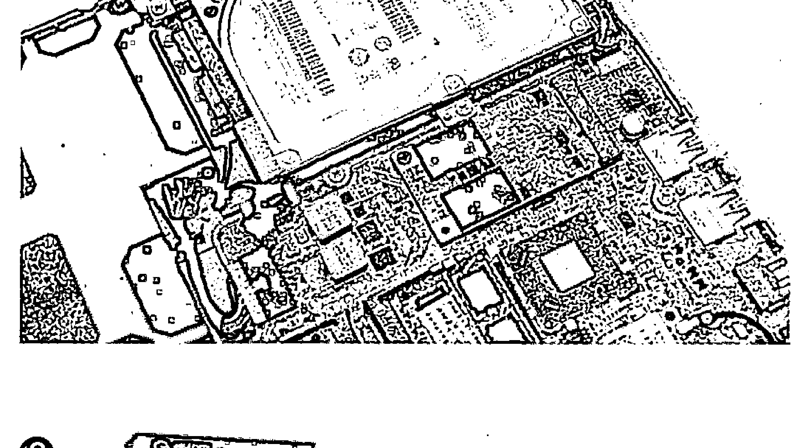

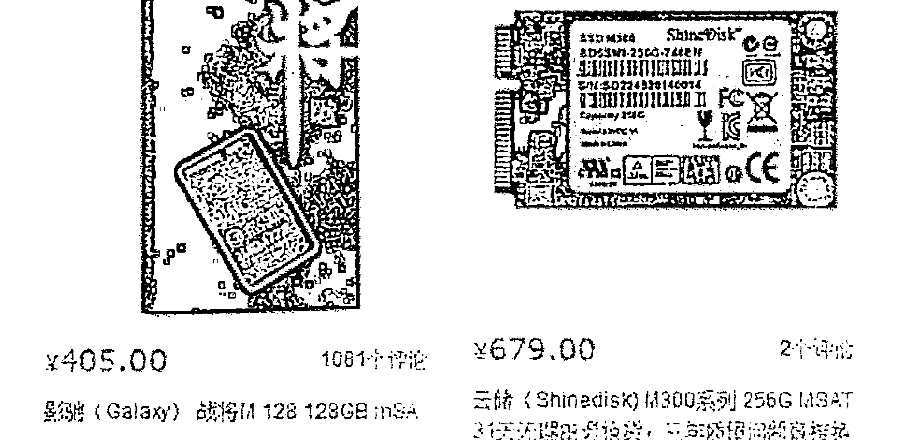

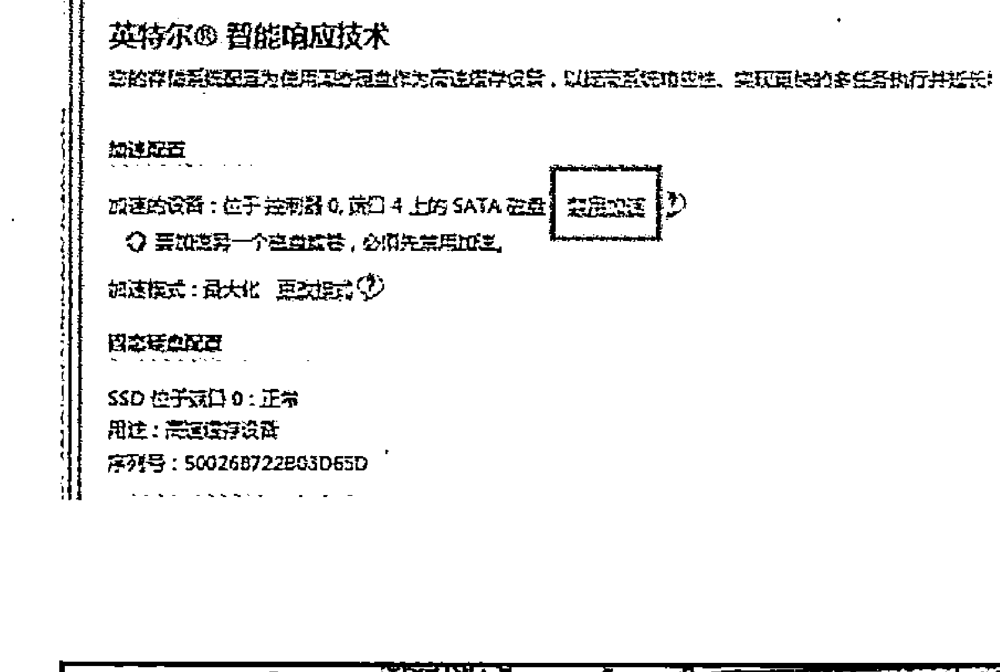

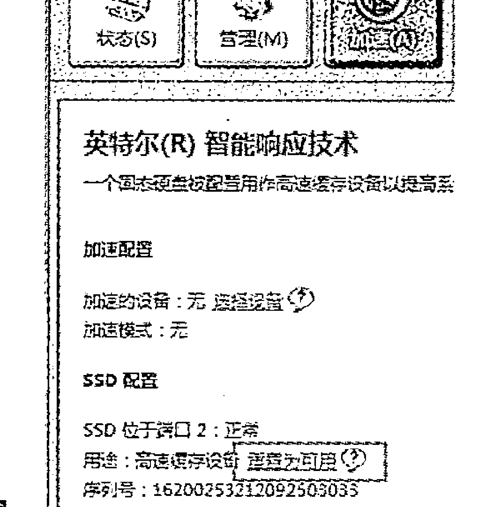

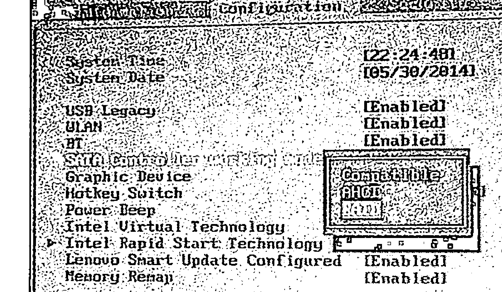

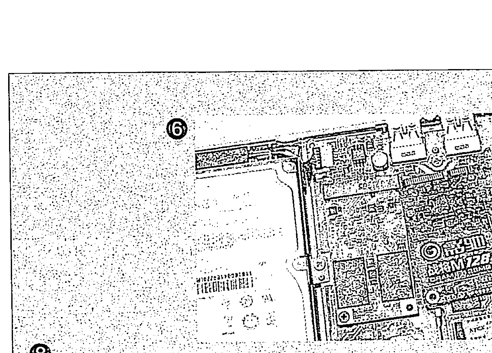

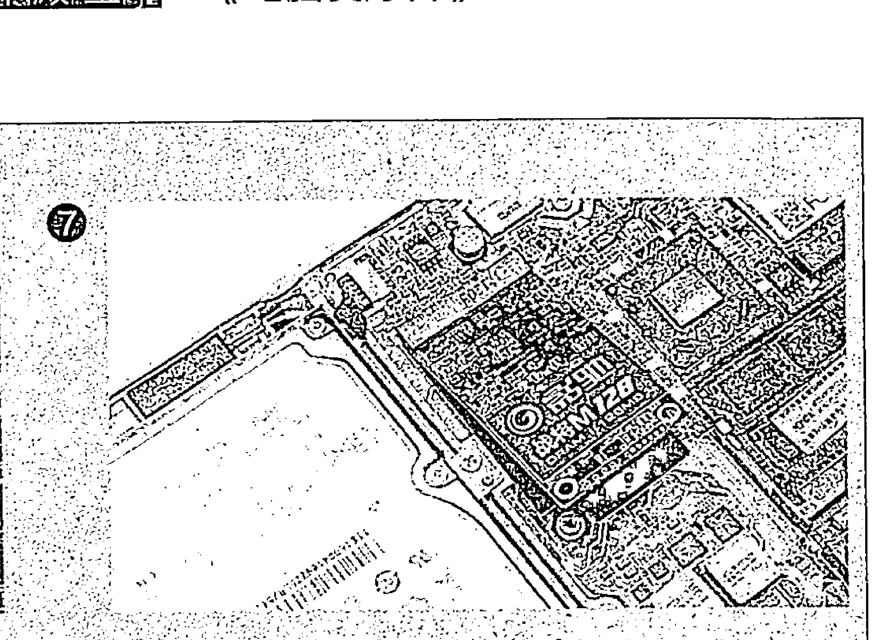

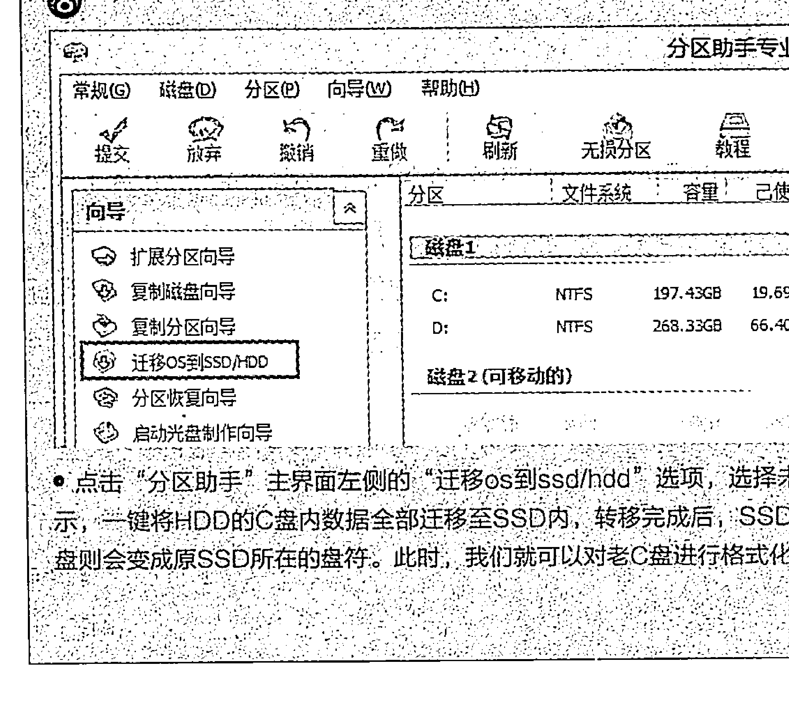

- 向导
- 扩展分区向导
- 复制磁盘向导
- 复制分区向导
- 迁移OS到SSD/HDD
- 分区恢复向导
- 启动光盘制作向导

| 分区 | 文件系统 | 容量 | 已使用 | 未使用 | 类型 | 状态 | 4KB对齐 |
| :--- | :--- | :--- | :--- | :--- | :--- | :--- | :--- |
| C: | NTFS | 197.43GB | 19.69GB | 177.74GB | 主 | 系统 | 是 |
| D: | NTFS | 268.33GB | 66.40GB | 201.93GB | 主 | 无 | 是 |

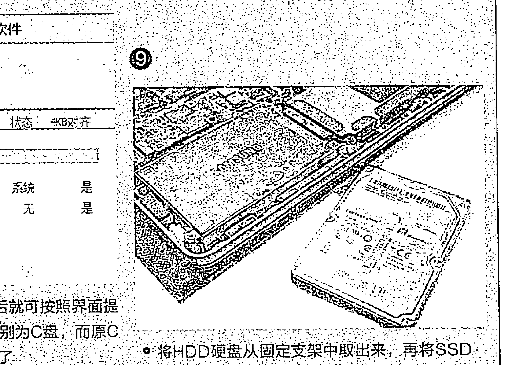

重启计算机并进入BIOS设置，在 “Configuration” 中将 “SATA Controller…” 从RAID模式修改为AHCI模式（图5），保存退出BIOS后直接关机。这个步骤在更换SSD之后再设置也可以。

### 更换mSATA SSD硬盘

在确保完全关机并切断电源线的情况下，拆开U410的底壳就可看到HDD旁边的mSATA SSD硬盘（图6）。拧下固定的螺丝后，SSD就会自动弹起。拔下旧SSD硬盘，再将新买的大容量SSD插入mSATA接口（图7），最后用螺丝固定即可。

如果你想重装操作系统，建议先拆下U410内的HDD硬盘，在只安装一个SSD硬盘的情况下安装系统，这样可以避免可能出现的选错盘符或引导问题。如果你原硬盘的C盘中有很重要的用户数据，或者你懒得重装系统、软件、驱动，则可借助 “分区助手”（下载地址: http://www.disktool.cn/）将HDD硬盘中的系统区（C盘）内的全部数据迁移至SSD（图8）。

### 超极本也能组建RAID0

如果你的预算比较充裕，在更换mSATA SSD后，还可以考虑将原HDD机械硬盘也升级到标准2.5英寸规格的SSD（图9）。这样一来，你的超极本就真正变成了“纯SSD”，可以享受到高速的读写体验。

而双SSD的另一大特色，就是可以组建更为高速的RAID0磁盘阵列模式。设置方法很简单，安装双SSD后进入BIOS，将“SATA Controller…”设置在RAID模式。重启后按“Ctrl+I”进入RAID设置界面，根据界面提示一步步建立新RAID卷（图10）。需要注意的是，RAID0模式下的容量，取决于容量较小的SSD。比如你安装了一块64GB的mSATA SSD、一块256GB的标准SSD，那RAID卷的最大容量就是128GB。

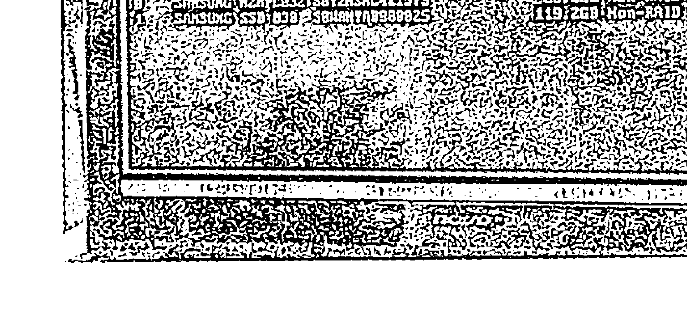

> **火星望远镜**
> 由双SSD组建的RAID0能带来多少性能提升，有哪些注意事项？如果你想了解相关的内容，请参考本刊2014年4期《嫌SSD性能不够？RAID0让双固态性能翻番》这篇文章。

## 小线材解决大问题
## 自定义模块化电源线缆

文|于晓煜

“逼格”有高大上之意，但更多表示个性与别具一格。要想达到这个效果，光花钱买昂贵配件是不够的，有时还需要自己动手、发散思维打造专门适合自己的配件。仔细想想究竟是什么让机箱杂乱不堪？相信90%的情况都是数量众多、粗细软硬不同的各类线缆造成的，而在这其中电源延伸出来的诸多供电线缆尤甚，现在让我们谈谈电源线缆的改造。

### 全模组电源

工欲善其事必先利其器，要想改造电源供电线缆，使用普通电源肯定是不靠谱的，原配线改造有一定难度，而自己重接线缆又有漏电危险，并不是很推荐这么做。其实为了机箱内部清洁和线缆自定义，已经有专门的全模组化电源了。根据需求自选所需线缆而多余的线缆全部不用插，对比以前的电源已经很人性化了。但依旧有很多高要求的用户不满意，因为虽然线缆可选，但其长度、颜色、接口数量和软硬程度都是厂家指定的，并不见得能和自己的机箱100%完美兼容，肯定还会有多余的线缆。

### 手工打造模组线

在打造模组线之前我们需要自行购买一些材料和工具，这是必不可少的环节。首先说说模块，模块就是连接电源或者设备那个方形的塑料接口，比如主板的24PIN、处理器的4或者8PIN和显卡6PIN等等。在手工打造模组线领域，JMT品牌的模块口碑一直相当不错，也是淘宝众多专业代做模组线商家的首选。需要注意的是类似CPU 8PIN和显卡8PIN这类模块外形很相似，制作起来一定注意。

模块之外是端子，这可能比模块本身更为重要。端子其实就是模块中可见的金属接口，另一头直接连接线缆。端子有公母之分，我们需要根据模块的作用来决定使用何种端子。端子连接线缆所用金属脚的长度不同，也分为长脚端子和短脚端子，如果压单线短脚即可，如果需要压制双线用长脚端子。挑选端子时很重要的一点就是一定要挑接口大一些的端子，这样在进入模块后才不至于由于后部线缆的扭动让端子接口也在模块中转圈。否则会造成接线困难，长时间扭动使用会引起安全隐患。

可能很多人认为线缆的选择是重中之重，其实相对接头的选择要简单一些。常见的线缆有普通线、镀银线还有硅胶线，很多淘宝商家还提供尼龙包网服务，其实我们自己也可以实现包网。如何分辨线材质量呢？并不一定是越粗越好，一般镀银线较细，我们选择直径1.8mm以上即可；但如果是硅胶线，一定要选择2.2mm以上直径的产品。当然还有更粗的尺寸，其电气性能肯定更好，但过粗过硬有些影响走线。


传统电源的线缆长度、软硬程度和颜色均不能自主选择

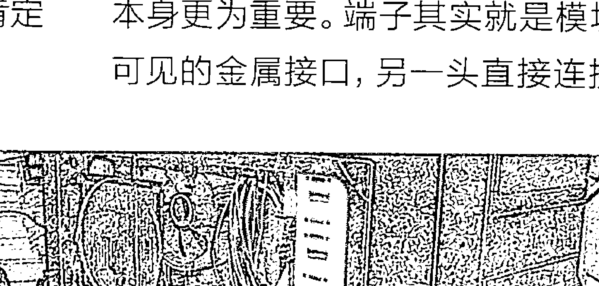

造成机箱内部混乱不堪最主要的原因就是电源的各类线缆

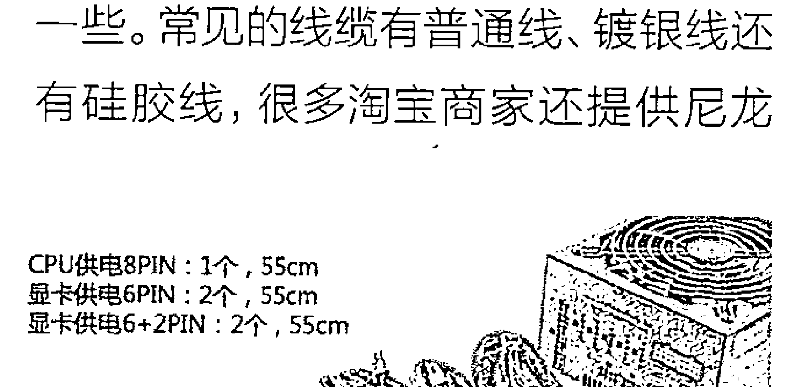

- CPU供电8PIN：1个，55cm
- 显卡供电6PIN：2个，55cm
- 显卡供电6+2PIN：2个，55cm

- SATA口：12个
- PATA口：6个

全模组根据需要连接线缆的方式更加合理

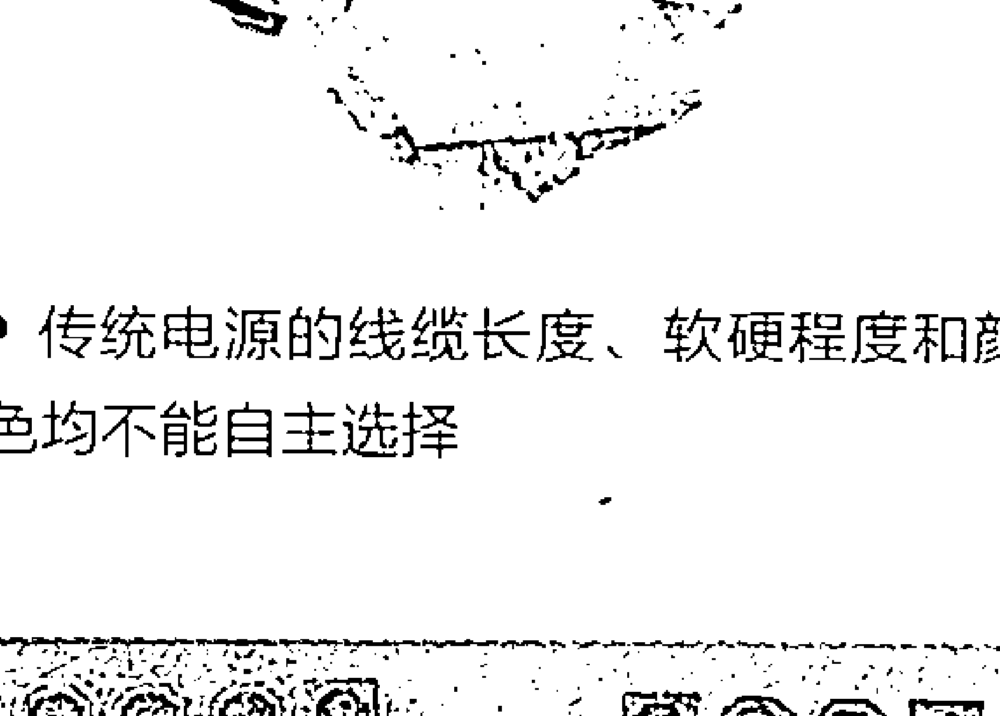

注意类似模块的区别，千万不要接错

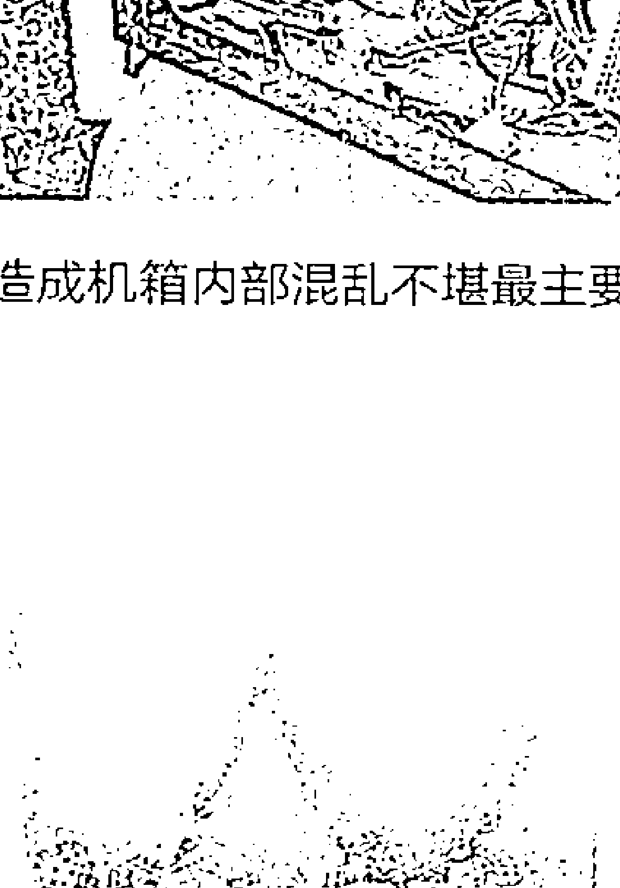

尽量选择连接处内径较大的端子

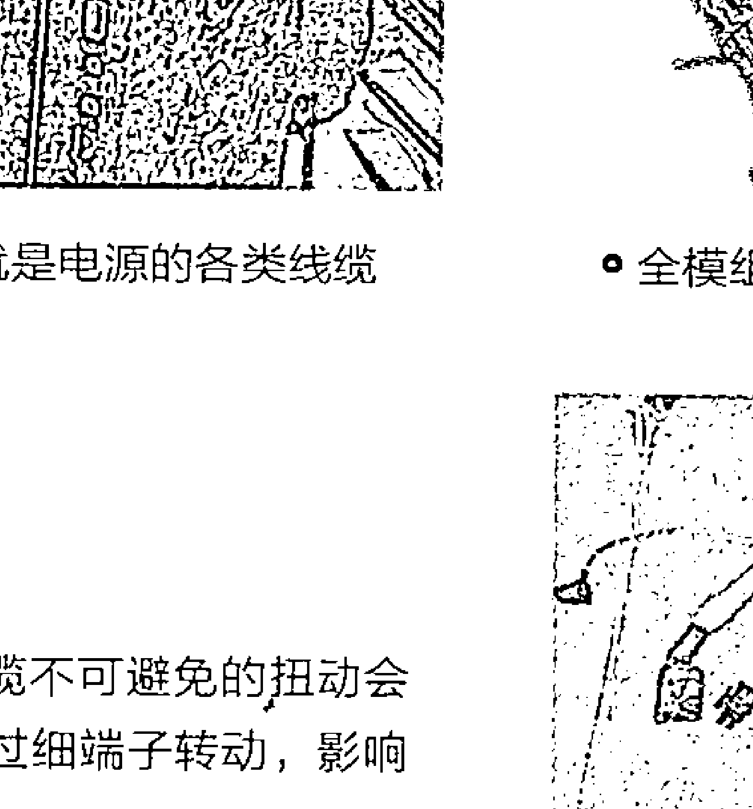

线缆不可避免的扭动会造成过细端子转动，影响连接

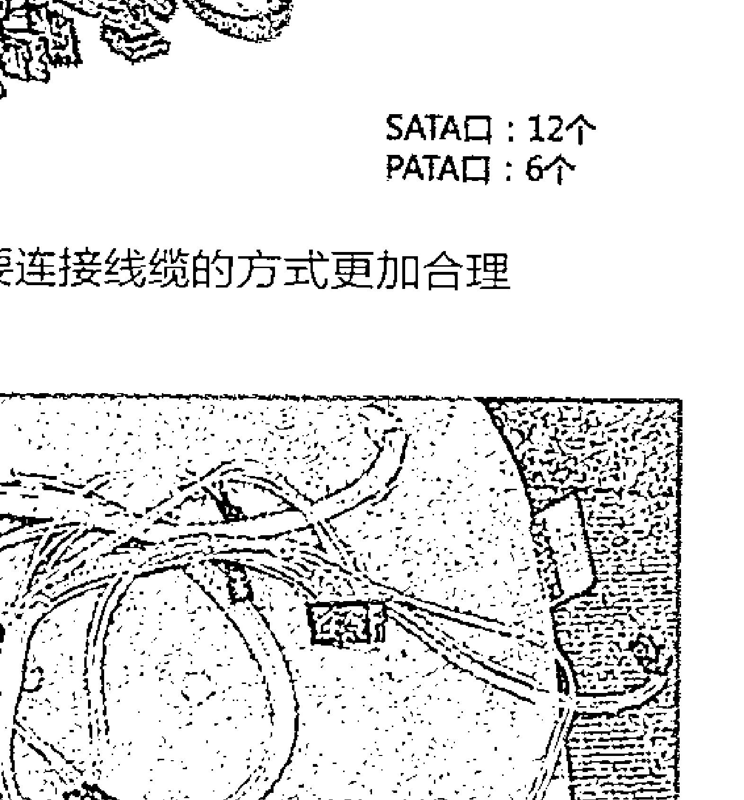

性能好的线缆不一定很粗，而越细的线缆越适合走线

### 挑选工具和具体做线

做线最重要的工具是压线钳，如果再有专门的剥线钳就基本可以开工了。剥线钳最主要的作用就是将线缆从外部材质上剥离3~4mm即可，如果实在没有，使用锋利一点的剪子将外部材质轻轻剪一圈也能取下，不过如果线缆数量众多可能会比较累。

冷压钳是非常重要的压线工具，主要处理的就是端子尾部和线缆的固定。先将端子尾部放入压线钳缺口处，稍微用力即可让末端变为近似圆形的状态；之后线缆不要取下，保持这个状态，将剥好的线缆插入端子尾部，然后闭合压线钳即可，具体操作可能需要几次练习才能掌握方法。如果手头没有冷压钳，用普通尖嘴钳子理论上也是可以完成这一操作的，但是处理几根线缆还可以，如果是处理整部模块电源所需的全部线缆，实在有点费力不讨好。


剥离工作其实并不是很复杂


压制好的状态，如果用普通尖嘴钳子很难如此完美

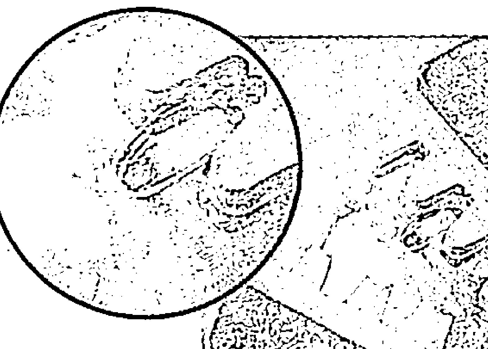

冷压钳是处理线缆最佳的方式

### 效果展示

我们费了这么多工夫，究竟能够达到一个什么样的效果呢？线缆长度、软硬、颜色均可自定义所带来的好处，其实是相当一目了然的。

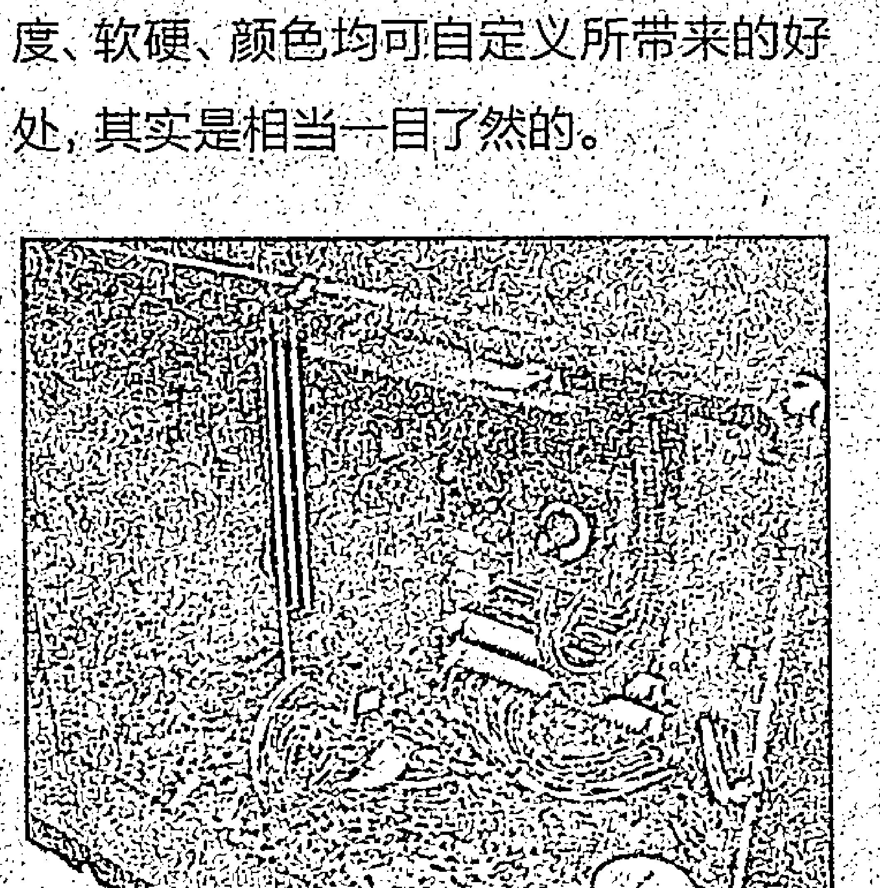

红黑配色不仅非常漂亮，还能和机箱内其他配件颜色完美搭配

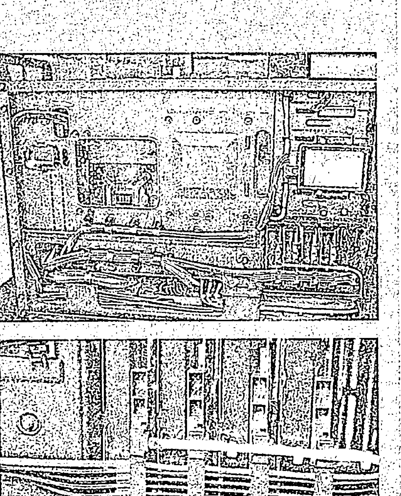

一切长度都恰到好处的定制线缆背线方案

### 小提示

### 关于网购定制线缆

上面由于版面所限只能介绍基本的做线方法，爱好者们具体操作起来根据个人动手能力的不同会遇到不一样的问题。如果动手能力不强、或者懒得去购买全套零部件和压制工具，在淘宝等平台挑选成熟的定制线缆商家其实是一个不错的选择。不过这一定要在充分考量机箱内部结构并测量了长度之后进行，如果费时费力购买回来的线缆过长或过短，都是很得不偿失的事情。

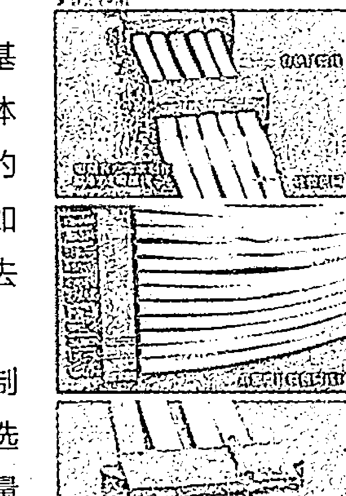

专业代理定制线缆的商家能够实现多种效果


硬盘的镀银线长度恰到好处，而其他设备所用的镀银线则留了一定余量

## 笔记本用户必看
## 电源模式也会影响SSD性能

文|张日红

很多笔记本用户在升级SSD后都有过类似的经历：为啥同一款SSD在自己笔记本上的跑分没有其他网友或者媒体评测的高呢？也许，电源管理就是制约你的SSD性能发挥的瓶颈所在。

### 解决SSD的后顾之忧

笔记本用户在升级SSD时，一定要将它安装在原生SATA3.0接口上。很多早期笔记本只有标准硬盘位是SATA3.0接口，对于此类产品建议购买光驱位的硬盘托架，将SSD安装在标准硬盘位，再把旧机械硬盘安装在光驱位(SATA2.0)接口上。

想充分发挥SSD性能，一定要确保SSD已经4K对齐(图1)，且工作在AHCI模式。此外，建议大家同时可以关闭Windows使用索引服务和系统还原、关闭磁盘整理计划和Windows搜索、关闭Prefetch (预取) 和 Superfetch (超级预取) 功能。

### 电源管理也是SSD的枷锁

很多笔记本用户出于省电的考虑，总习惯将系统置于节能模式，再调高亮度、修改睡眠时间使用。殊不知同一款SSD，在节能和高性能的电源模式下，其磁盘性能存在3.8%~123%的差异(见表、图2~图3)！

在我们的固有记忆中，电源计划至多影响CPU和GPU的性能，并决定笔记本进入睡眠和休眠的时间间隔，怎么会对磁盘性能造成如此显著的影响呢？看到这里，希望大家可以重新认识到电源管理对SSD性能的潜在影响，如果你的笔记本正工作在节能模式，SSD跑分自然比不过别人。

| 测试项目 | 节能模式 | 高性能模式 | 提升幅度 |
| :--- | :--- | :--- | :--- |
| PCMark7-系统盘成绩 | 5190 | 5395 | 3.8% |
| PCMark Vantage-HDD | 47656 | 53041 | 11.3% |
| AS SSD Benchmark-Score | 1012 | 1249 | 23.4% |
| ATTO Disk Benchmark-写入 | 483.7MB/s | 510.6MB/s | 5.5% |
| ATTO Disk Benchmark-读取 | 531MB/s | 561MB/s | 5.6% |
| HDTunePro5.0-4K | 26.395MB/s | 58.069MB/s | 123% |
| FastCopy-小文件复制 | 176.6MB/s | 200.1MB/s | 13.3% |

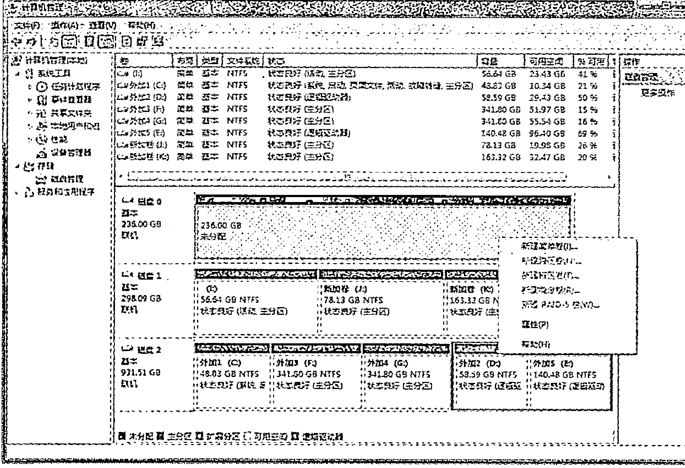

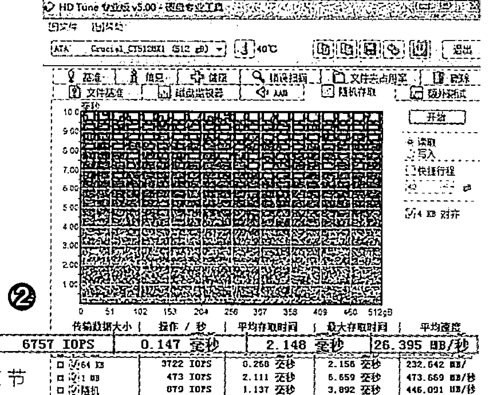

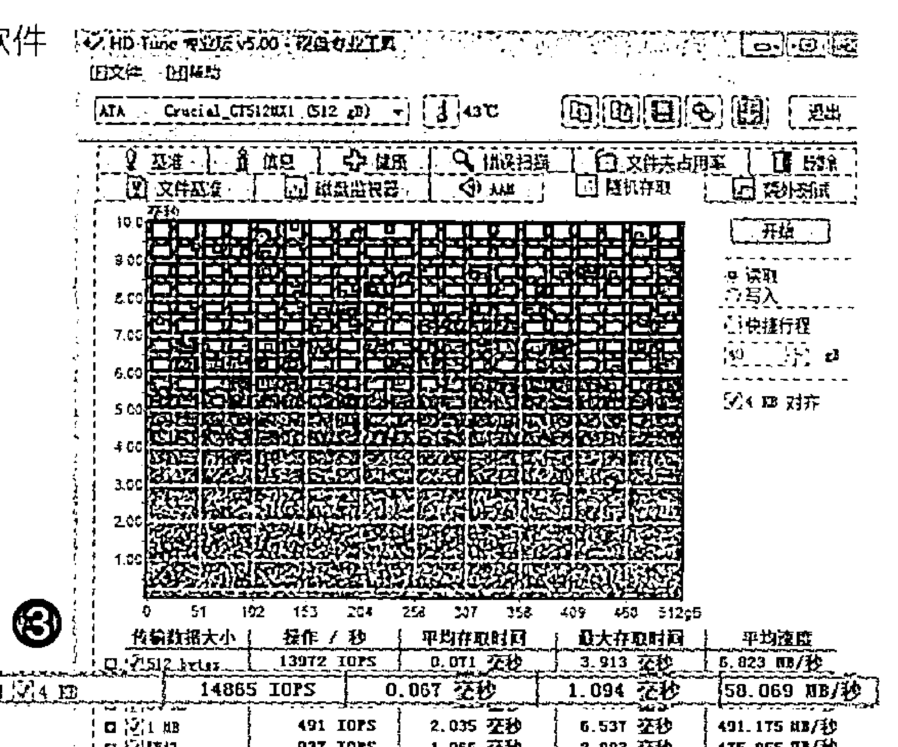

### 扩展阅读

有些PC在升级SSD后，偶尔会出现卡顿或停止响应的问题，而该问题则可能是SATA接口所具备的LPM (Link Power Management, 连结电源管理) 机制造成的。简单来说，LPM会以降低PHY总线速度的手法达到节能省电的目的，可惜此时可能会造成主控与装置端协同运作出现一些状况，代价就是当磁盘I/O发出存取指令时，装置端要回复到Active电源状态模式，其延迟时间增加而导致访问速度降低。想避免出现卡顿，就需要通过修改注册表完全关闭LPM功能。

## 不用L Camera玩转4K视频

文/沈建苗

Android 5.0底层出现了许多重大变化，其中一处变化是新增了一套功能强大的相机API。目前的应用程序L Camera开始充分利用这套新的API，不仅可以手动控制焦距、曝光和感光（ISO）灵敏度，甚至还提供了一种连拍模式。而最重要的是可以录制每秒30帧的4K的视频，可以说是智能手机上不小的突破。

### 安装L Camera

L Camera还没有出现在大多数应用程序商店上，想要使用需要在一台安装了Android 5.0预览版的手机上访问http://dwz.cn/vJY9J，然后接受apk提示开始下载安装文件（图1），下载完毕后安装L Camera即可（图2），注意打开手机的未知来源应用程序选项。目前所有刷了Android 5.0的手机、平板都可以用，主要集中在Nexus 4及更新的Nexus阵营，其余品牌虽然尚未跟进，理论上能刷Android L的手机就可使用。

### 静态相机扩展功能

L Camera在静态照片拍摄方面提供了很多功能，点击左下菜单按钮，有4个选项：焦距、曝光、连拍和相机模式（图3）。在Focus焦距菜单中关闭自动开关，就可以实现手动调整焦距。使用滑动条将相机的对焦点移近或移远，可以拍出自动对焦出不来的效果。

一般的手机都拥有感光度调节选项，但提供曝光时间设置的就很少。关闭Exposure曝光中的自动选项，就可以手动选择曝光时间，适应不同速度的拍摄环境。当然，感光度也可以在这里调节。

一般的手机并不会将连拍模式区分开来，但L Camera就有Focus Stacking（景深合成）和Exposure Bracketing（包围曝光）的不同选择。程序会以每秒30帧的速度拍摄照片，如果你打算进行一番后期处理，就可以选择包围曝光的方式，手机拍摄的照片会同时保存为经过处理的JPEG文件和原始的DNG文件（图4）。

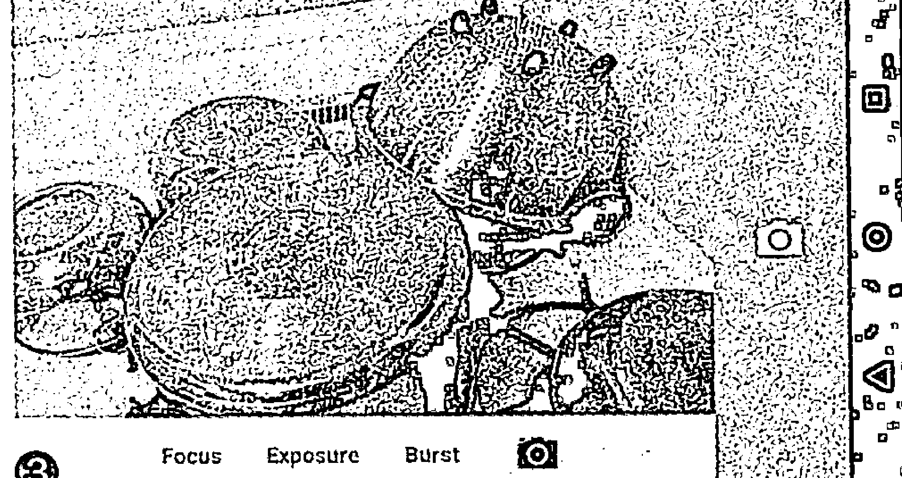

### 高码率4K视频拍摄

在L Camera的主设置菜单上点击相机图标，在这里可以切换到视频拍摄模式。视频模式下仍然可以使用手动曝光和焦距方面的选项，并且支持录制过程中的调整，通过L Camera录制的视频采用3264×2488高分辨率格式并且可以实现每秒30帧（图5）。

这套新的相机API已经提供了很多新功能，但仍处于测试阶段，除此之外应该还会有进一步的功能可供开发出来。

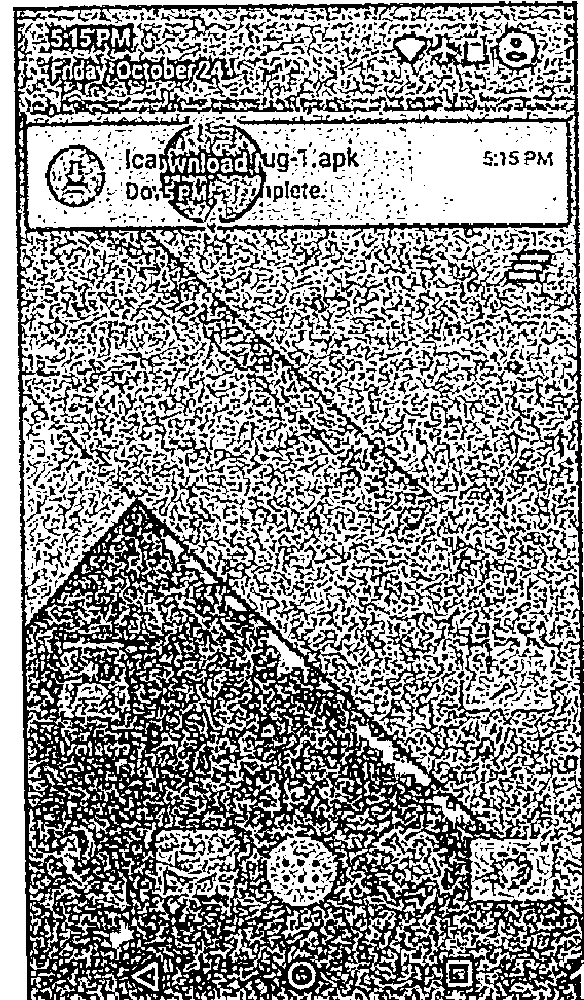

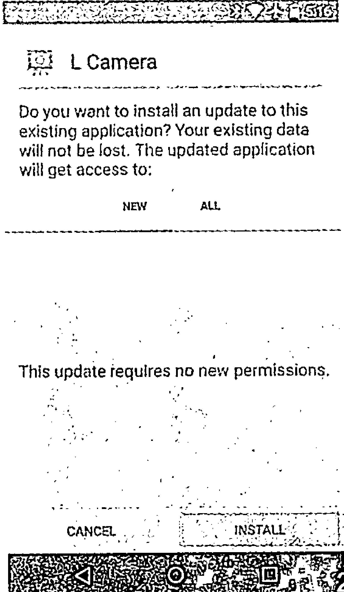


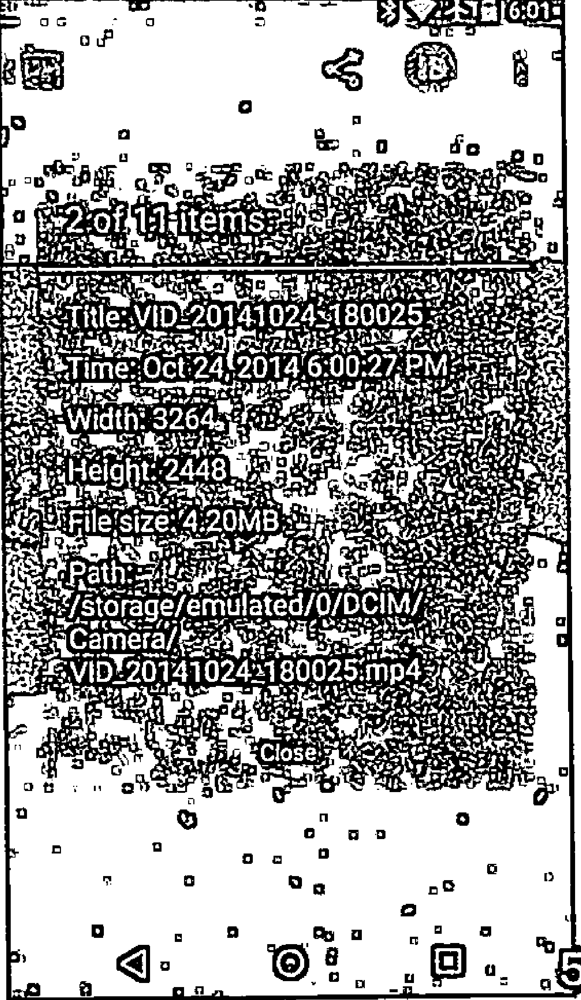## 免费性能提升谁不爱  
## Maxwell移动显卡超频攻略

文|曹操

随着GT840M、GTX850M、GTX860M等新一代独显大批量应用在最新款笔记本本身上，NVIDIA移动显卡也终于完成了从Kepler架构到Maxwell架构的过渡。那么，对最新Maxwell架构显卡而言，原先的那些超频技巧还适用吗？

### 惊喜连连的Maxwell

NVIDIA最新的Maxwell架构移动显卡可谓给力，低端的GT840M足以媲美上代中高端的GT750M、中端的GTX850M/GTX860M可掀翻上代高端的GTX765M，而高端的GTX970M更是超越上代顶级的GTX880M。最关键的是，新Maxwell显卡的功耗和发热量也得到了明显改善(图1)。可以说，如果你现在要选购一款游戏笔记本，那么一定要做到“非Maxwell独显不娶”。

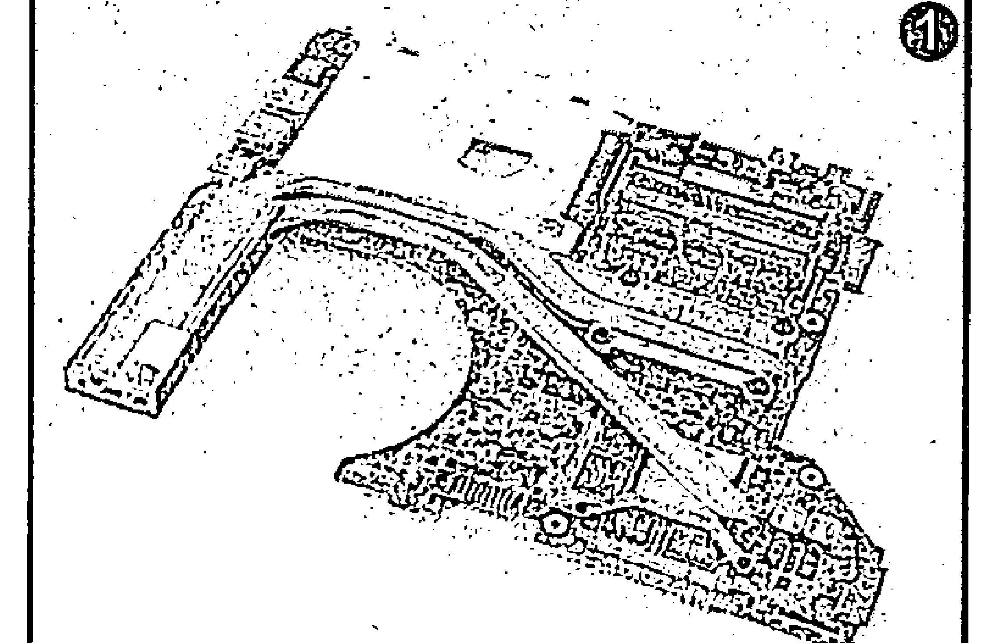

● 很难想象吧？只需如此简单的散热模块即可满足GTX850M独显的散热。图中产品为雷神G7000笔记本的散热结构。

### 依旧具备超频能力

得益于功耗和温度的降低，Maxwell独显自然也具备一定的超频能力。好消息是，那些曾经用于Kepler独显超频的软件和技巧同样适用于Maxwell独显。在这里，我们不妨就以配备了GTX970M独显的神舟战神Z7为例(图2)，简单了解一下Maxwell的超频潜质吧。

> 扩展阅读：检测显卡超频体质

最新版的GPU-Z软件提供了GPU芯片漏电率级别检测，通过此数据就可大致体现出GPU的超频潜质。运行GPU-Z软件并在标题栏点击鼠标右键，选择“Read ASIC Quality”就会弹出判断GPU体质的窗口，其中的百分比数值越高(图3)，意味着该显卡超频体质越好。可惜，最新的GPU-Z 8.0依旧无法读取GTX970M的体质数据，但类似GTX850M级别的显卡，已经可以被该软件检测出体质信息了。

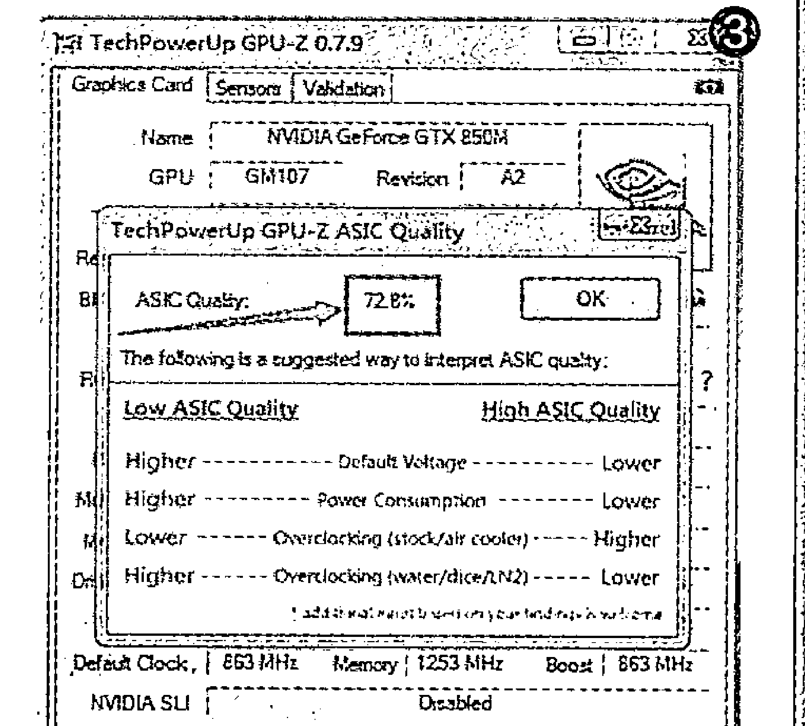

● 这块GTX850M独显的ASIC Quality值仅有72.8%，超频体质相对较差，一般80%以上的数值代表超频能力理想。

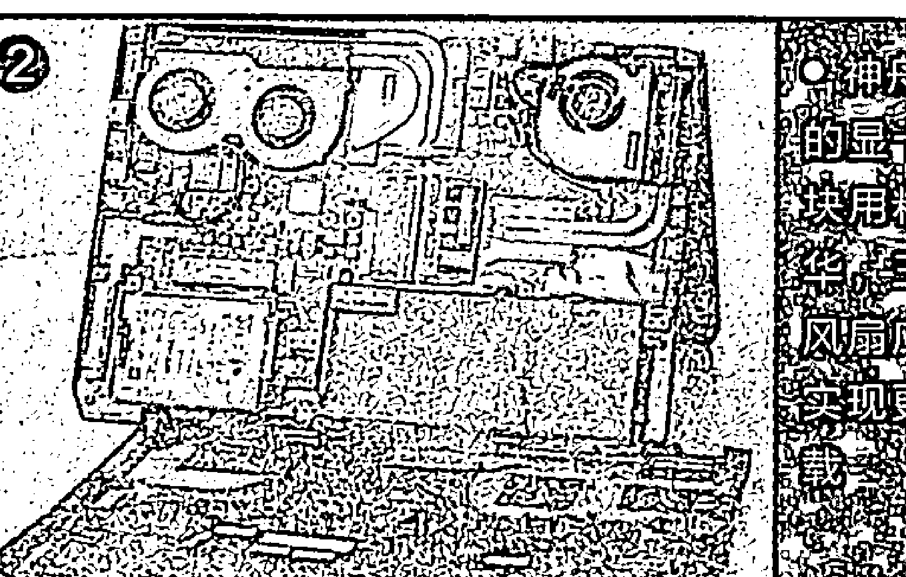

### GTX970M独显超频实战

在这里，笔者向大家推荐“NVIDIA inspector”这款超频软件(下载地址：http://t.cn/Rzzdzfl)，该软件可对GPU频率、显存频率、温度阈值以及GPU电压进行微调，不仅功能丰富，在因不稳定导致的关机重启后会自动恢复显卡默认频率，相对来说比较安全。当然，该软件也存在超频幅度偏小的缺陷，但对普通笔记本用户而言，安全才是第一位的。

考虑到战神Z7的散热设计比较出众，所以笔者直接将GPU核心频率提高到了NVIDIA inspector软件所支持的极限，即超频135MHz（图4）。出于稳定性和安全的考虑，显存和GPU电压依旧保持默认状态。接下来，就让我们用一系列专业测试软件，检测一下GTX970M超频前后的性能差异吧（见下表）。

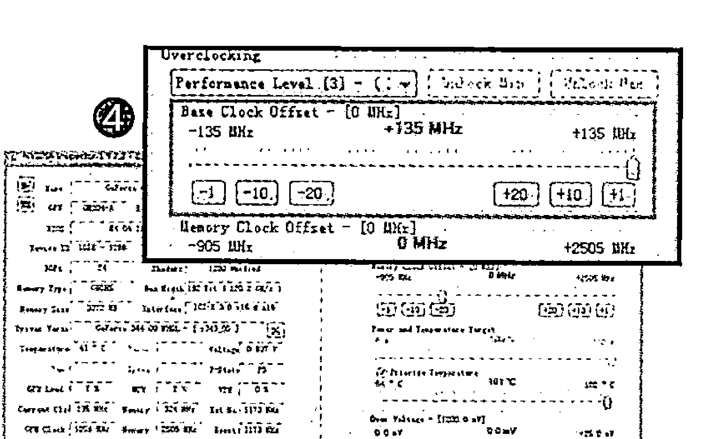

● NVIDIA inspector超频软件界面，如果大家对自己的笔记本散热性能没把握，建议以50MHz为单位，逐步进行超频并检测稳定性；点击右下角的Apply Clocks按钮即可保存当前频率。

| 测试软件 | 测试项目 | 超频前 | 超频后 | 提升幅度 |
|---|---|---|---|---|
| 3DMarkVantage | GPU成绩 | 85103 | 85301 | 0.23% |
| 3DMark11 | GPU成绩 | 10025 | 11141 | 11.13% |
| 3DMark–CLOUD GATE | GPU成绩 | 51122 | 53009 | 3.69% |
| 3DMark–FireStrike | GPU成绩 | 7318 | 7955 | 8.7% |

> > 小提示

由于神舟战神Z7的CPU和GPU的散热模块是相互独立的，所以给GPU超频并不会影响到CPU的温度。但绝大多数笔记本覆盖CPU和GPU的热管都是连体设计，单独给GPU超频也会影响到CPU的散热。所以大家在给自己的笔记本超频时，要根据实际温度的变化，指定合理的超频幅度。

通过测试成绩可见，GTX970M在超频后性能有了0.23%~11.13%的提升（图5），虽然增幅不大，但这毕竟是免费而来的。很多从DIY转至笔记本的玩家们总喜欢“压榨”硬件的每一分性能，而给Maxwell独显超频，自然是最最“得来全不费工夫”的选择了。

### Maxwell温度控制格外理想

增加GPU核心频率后会不会导致温度的激增？为此笔者通过Geeks3D FurMark对GTX970M独显进行拷机测试，并通过鲁大师检测GPU的温度变化。在超频之前，GTX970M的最高温度为76℃。令人欣喜的是，核心频率提高135MHz的GTX970M的GPU温度仅提升了1℃（图6）！用1℃的温度来换取最高约11%的性能提升，这笔买卖可谓划算。

当然，只用一款Maxwell独显笔记本进行测试肯定谈不上严谨，但这也已经达到了本文的初衷：Maxwell独显超频依旧容易，而且不会带来显著的温度提升。只要笔记本的散热模块品质过硬，超频还是很划算的买卖。

如果你的Maxwell独显笔记本平时散热表现就不太好，或者你想挑战更高的极限频率，那么笔者建议大家将NVIDIA inspector的“Prioritize Temperature”对应的温度调低（图7）。该项目对应的温度是NVIDIA对GPU温度的检测阈值，当GPU当前温度高于阈值温度时就会激活GPU Boost技术，强制降低GPU核心频率以实现快速降温，从而起到保护GPU的作用。反之，如果你对笔记本的散热模块有信心，也可考虑提高阈值温度，去挑战更高的频率。

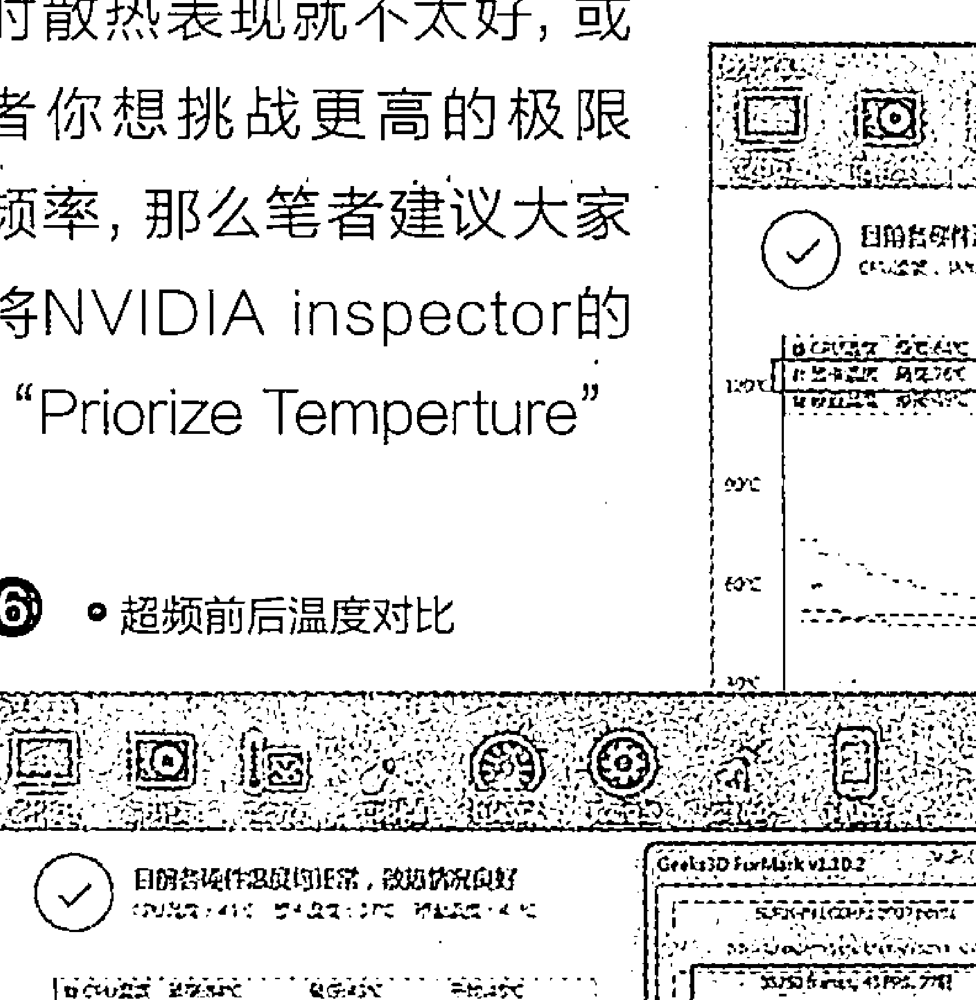

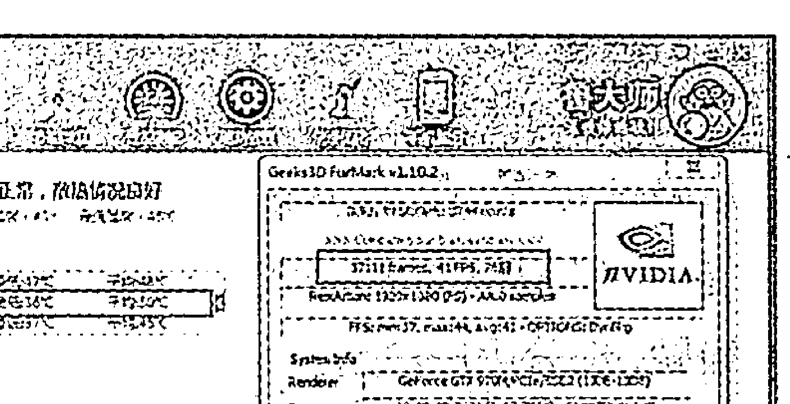

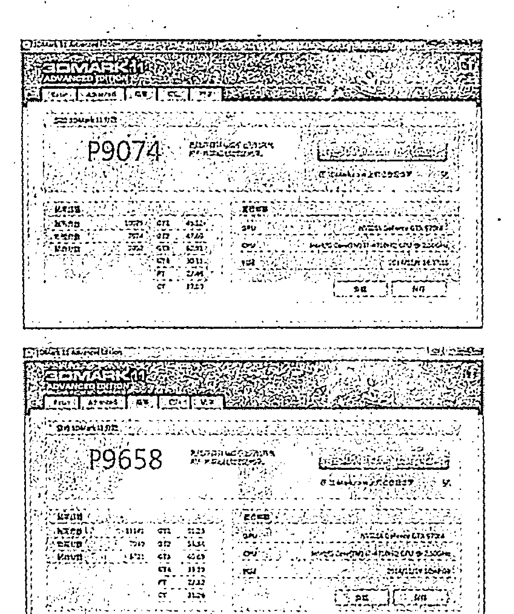

> > 小结

总之，当你拿到本期杂志时，笔记本独显市场的半壁江山也许已被Maxwell独显所占领，因此现在就掌握一些Maxwell独显的超频知识还是很有必要的。相对而言，Maxwell独显中最适合超频的型号就是GTX850M，它的主要参数与GTX860M完全一致，只是核心/显存频率略低一些。换句话说，只要GTX850M配备了GDDR5显存，那么只要简单超频即可媲美甚至超越GTX860M。

## 组建强力电脑 迎战年末游戏大作

每年的年底都是游戏大作的高发期，特别是今年的游戏大作对PC硬件有非常夸张的要求。如何才能选购一台适合游戏大作的电脑并搭建起来呢？下面我们尝试组装一台出色而静音的游戏电脑，希望大家举一反三。

### 硬件配置需反复斟酌

目前流行的Haswell由Ivy Bridge升级而来，性能只是小幅提升，本着IT设备买新不买旧的原则，处理器选择四代酷睿的话就必须选择最新版LGA 1150主板。i7-4770K搭配技嘉Z87X-UD3H，这是一套典型的Haswell平台。显卡推荐性能级NVIDIA显卡，比如GTX 780或者970。
只要性能是不够的，为了散热和静音还有一些设备是必需的。静音机箱以及低转速风冷散热器也很重要，可能很多人认为机箱的散热和静音难以兼顾，部分用户总是会为了前者舍弃后者。其实不然，最近很多机箱采用吸音板就没有影响散热。Thermaltake New Soprano（图1）其硕大的20cm正面风扇应该能吸入大量冷空气，12cm背面风扇保证出风。Haswell芯片普遍非常热，Phanteks TC14PE是市售最出色的风冷散热器之一。不过散热器尺寸很大，为了兼容性，最好使用矮版内存。
固态硬盘速度快并且完全静音，闪迪Extreme II使用了全新的Marvell “Monet” 控制器和19纳米toggle NAND。除了传统的MLC闪存外，它甚至还使用部分价格超贵的SLC NAND，组成了所谓的两层缓存机制，这有望加快从操作系统写入小文件的速度。

| 配件 | 产品 |
| :--- | :--- |
| 处理器 | 英特尔酷睿i7-4770K |
| 散热器 | Phanteks TC14PE |
| 主板 | 技嘉GA-Z87X-UD3H |
| GPU | GeForce GTX 780 |
| 内存 | 海盗船Vengeance 2x4GB |
| SSD | 闪迪Extreme II 240GB |
| HDD | 希捷3TB |
| 机箱 | Thermaltake New Soprano |
| 电源 | 海盗船HX750 |

### 安装顺序有窍门

DIY的安装顺序很多用户并不注意，但如果顺序搞反是会走弯路的。一般推荐先将处理器安装在主板上，均匀涂抹很薄一层散热硅脂后安装散热器。先进行这一步除了主板未上机前容易操作外，类似Phanteks TC14PE这样的塔式散热器都有背板，如果主板已经安装于机箱内，并且机箱背部开口尺寸不合适，就必须拆掉重新安装。另外如果散热鳍片有可能阻挡内存安装，请在安装散热器前插好内存。
说说Phanteks PH-TC14PE的安装步骤。先找到背板和合适的安装孔，背板背面为LGA1366、LGA1155/1156和LGA1366等主板作了标识。往每个角落装上4颗插座螺丝，确保它们与边沿齐平。将背板安装到主板背面上，将黑钮钉安到每颗插座螺丝上，并使用两条扣具转接片和螺帽固定住背板。确保扣具转接片上的插座孔向中央对齐，沿着插座区的顶部和底部安装转接片（转接片应该与散热器位置垂直）。将中间的安装板安装到散热片底座，并使用安装板螺帽来固定（图2）。给处理器涂上散热膏后，按扣具转接片上的螺纹，将弹簧式螺丝排成一行然后旋紧（图3）。

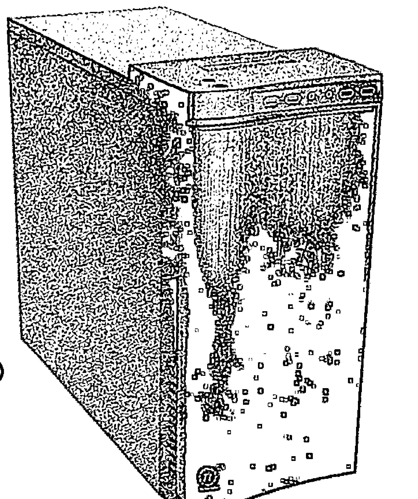

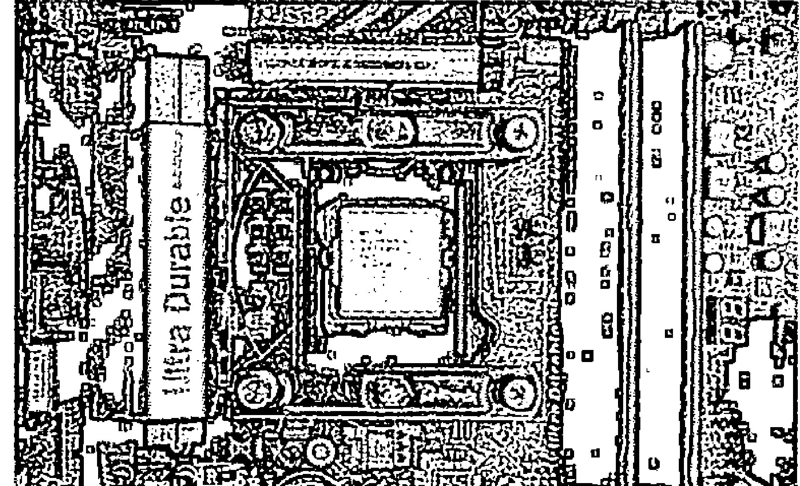


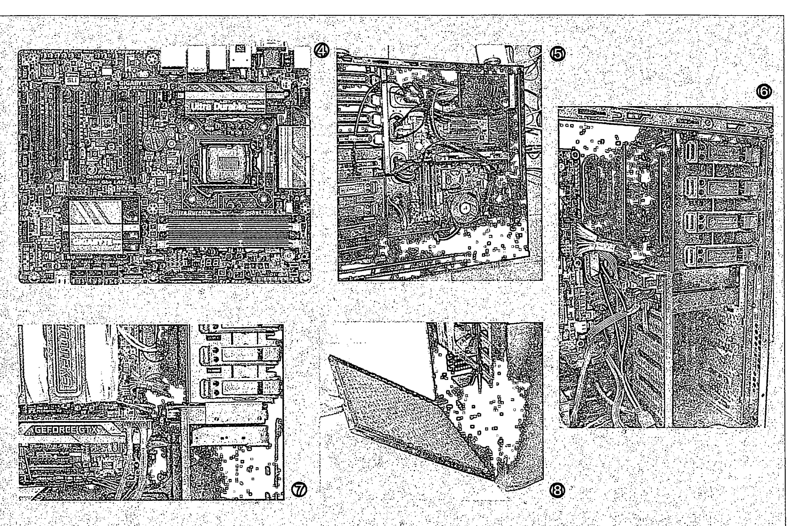

### 改善机箱内部风道

之所以选择技嘉Z87X-UD3H（图4），是因为技嘉UD3H系列在性能和做工方面一贯口碑甚好，而这款主板更上一层楼。技嘉主板拥有EasyTune性能调优软件，不仅可以管理风扇转速，现在还能大大提高控制精细度。而且SATA 6Gb/s端口数量由2个增加至8个，它还在处理器插座周围有更大块的散热片。值得称道的是，尽管安装庞大的Phanteks TC14PE，也没有遇到散热片带来的任何障碍。

在主板上机之前，其实还有一些细节需要处理。比如说如果我们想拆掉驱动器托架，为处理器和GPU尽量改善气流的话，就一定要在主板上机前进行。就算机箱无法支持硬盘架拆除，硬盘安装在哪里最合理，也是要在主板上机前就决定好的。如果上机后再去调整硬盘位置（图5），会遭遇无数线缆长度和硬度的阻力。

Thermaltake New Soprano是一款造型流畅的静音机箱，厚实的前门挡住了正面风扇发出来的噪音，不过进气口在侧面的设计肯定多少会影响一些进风。在这里将硬盘安装在3.5英寸驱动器位最上方比较合理，这样显卡以下的空间就一马平川了（图6）。类似GTX 780这类公版卡长度正好挨着存储驱动器，虽然空间有点挤，不过还能应付（图7）。如果是更长的显卡，就必须把硬盘往更下的位置安装，不过这样肯定多少会阻挡正常的前进后出风道。

### 防尘静音与散热的平衡

Thermaltake New Soprano机箱顶部和侧面没有风扇底座，这有助于降低噪音。两块侧面板都铺有消音泡沫（图8），右侧面板材料较薄，以容纳主板后面的线缆。如果需要更大的气流，机箱底部有12cm风扇位。机箱在主板侧边有橡胶走线孔，可以毫不费力地穿过线缆。CPU位置肯定不会过多受到风道的帮助，因为显卡耗用了从进气风扇进来的大部分空气。但气流即便不进入到处理器，起码快速地进入到更热的显卡。由于风道效果，基本上热风都被直接吹到机箱外面了。处理器和显卡风扇运转起来很安静，机箱一关上实际上悄无声息。如果走到离机箱一米开外的地方，这台电脑基本上很安静。

> **小提示**
其实这类官方带有消音泡沫的机箱安装起来还是比较简单的，如果用户使用一般机箱，也可以自己购买消音泡沫安装，不过在选材前还请测量一下背板与设备之间的空间，以免产生兼容性问题。

## 瞒天过海拯救XP？我看不行

**文 | 技术宅**

大家知道从2014年4月8日起，微软就停止了对Windows XP的技术支持并停止发布针对该系统的补丁。不过近日德国技术高手在论坛上发布了一则教程，可以将当前Windows XP “模拟” 为Windows Embedded POSReady 2009（以下简称为WEPOS）系统，从而继续下载到系统更新以保护Windows XP的安全。那么这个方法到底怎么实现？到底有没有效果?

### 教程解密：用注册表伪装系统

论坛上现在流行的Windows XP “模拟” 为WEPOS系统的方法，实际上仅是通过一个注册表文件即可实现。启动记事本输入下列代码，然后保存为REG文件并导入Windows XP系统即可：

```
Windows Registry Editor Version 5.00
[HKEY_LOCAL_MACHINE\SYSTEM\WPA\PosReady]
"Installed"=dword:00000001
```

完成上述文件导入后，打开注册表编辑器定位到[HKEY_LOCAL_MACHINE\SYSTEM\WPA]，可以看到系统注册表中添加了一个名为“PosReady”的项，它的值是“1”（图1）。

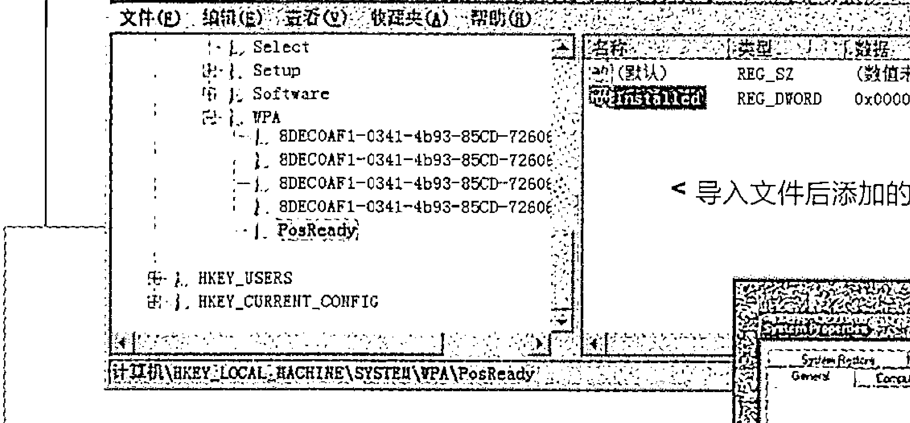

### 小知识: 什么是WEPOS系统

WEPOS是微软专为各种POS机开发的操作系统，它是一款基于Windows XP内核的内嵌式系统（图2）。微软对WEPOS官方支持期限截至2019年4月9日，所以当前Windows XP “模拟” 为WEPOS系统后，理论上可以在2019年4月9日之前下载到系统补丁。

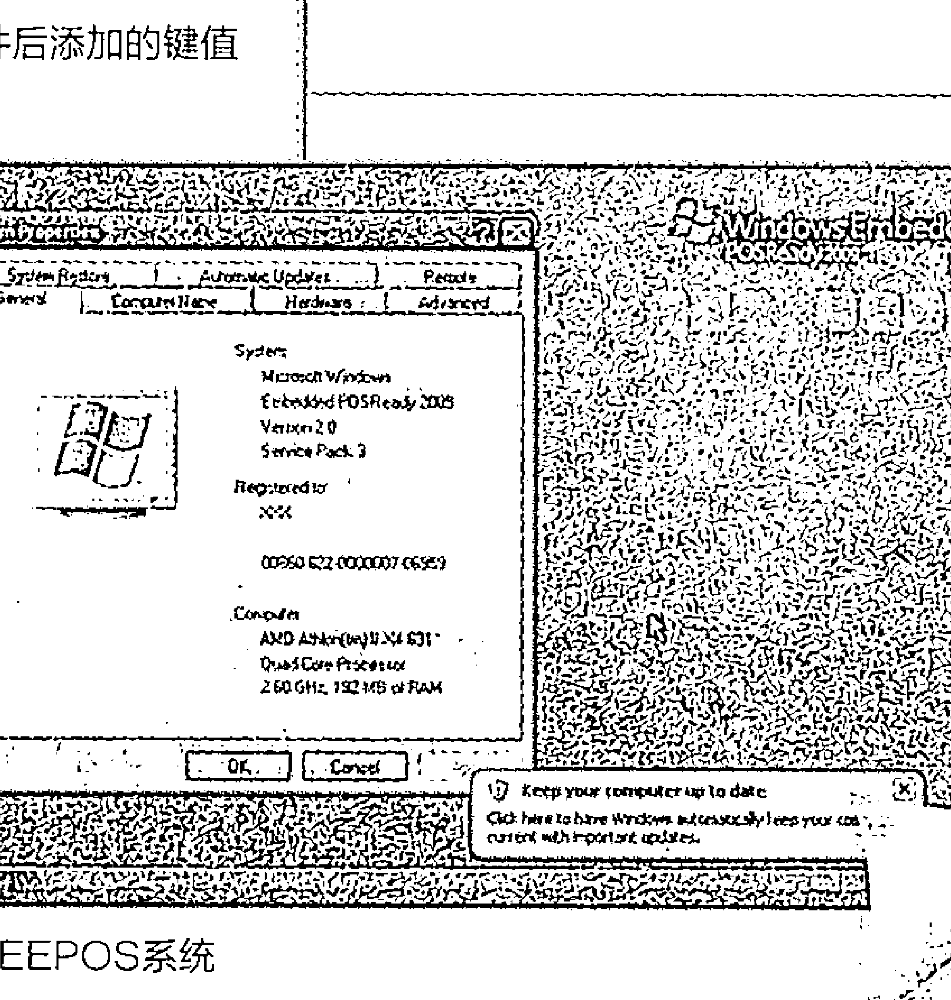

为什么更改注册表一个键值就可以让当前系统“变身”？因为在默认情况下Windows需要更新系统补丁的时候，电脑先连接到微软的升级服务器，服务器会读取当前系统的版本（使用同一核心系统被认为是一种版本系统）和安装语言，比如Windows XP内核的系统对应Windows NT 5.1，Vista对应6.0，Windows 7对应NT 6.1，确定操作系统版本后就会推送相应的补丁供用户下载（图3）。

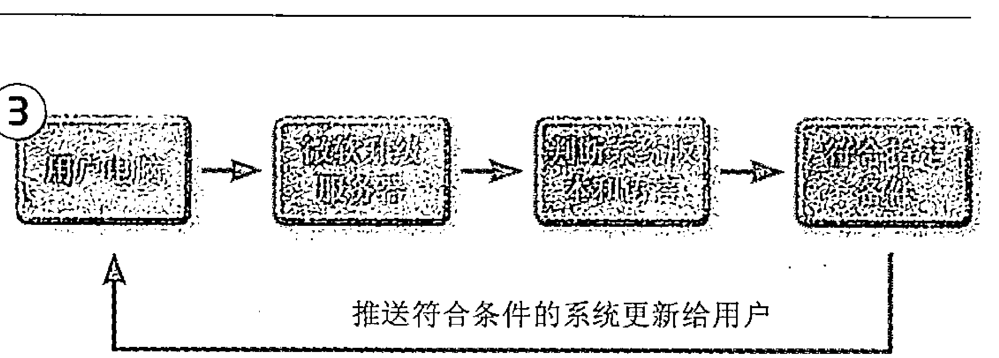

由于WEPOS和Windows XP使用的是同一核心，因此升级服务器都将其识别为Windows NT 5.1。Windows XP已经于2014年4月8日截止，不过在2019年4月9日之前，微软还要为WEPOS提供服务，所以在WEPOS系统提交升级更新的时候，微软的升级服务器为了方便将其和Windows XP识别，它会先下载Update.inf和Update_SP3QFE.inf文件，其中代码会指定扫描提交升级申请电脑中[HKEY_LOCAL_MACHINE\SYSTEM\WPA]的键值（图4）。

```
[Prerequisite]
condition=CompositeOp,OrOp,Prereq.XPInstallEmbedded.Section

[Prereq.XPInstallEmbedded.Section]
OrOp=Prereq.XPInstallEmbedded1.Section
OrOp=Prereq.XPInstallEmbedded2.Section
Display_String="%A6Blocked%"

[Prereq.XPInstallEmbedded1.Section]
EqualOp=CheckReg,HKLM,"System\CurrentControlSet\Control\WindowsEmbedded\ProductVersion",FeaturePackVe
equalOp=CheckReg,HKLM,"SYSTEM\WPA\WEPOS",Installed,0x10001,=,1
Display_String="%A6Blocked%"

[Prereq.XPInstallEmbedded2.Section]
EqualOp=CheckReg,HKLM,"SYSTEM\WPA\WEPOS",Installed,0x10001,=,1
Display_String="%A6Blocked%"
```

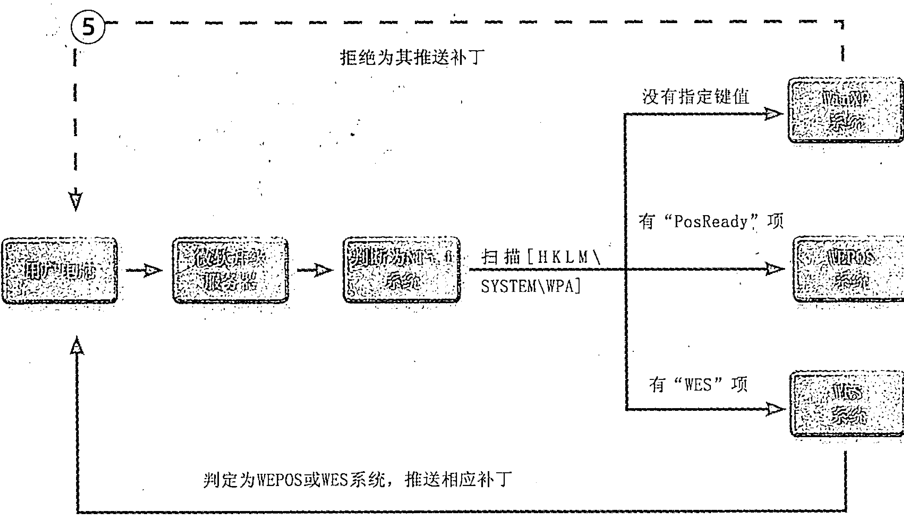

接着升级服务器会依据上述文件扫描指定键值，查看是否有“PosReady”项，如果有则判断其为WEPOS系统，准予其自动更新补丁，否则将其识别为Windows XP，拒绝其自动更新申请（图5）。
在Windows XP中添加上述键值并重启后，现在启动Windows XP系统的自动更新就可以下载那些为WEPOS或者WES系统准备的系统更新文件了。

### 瞒天过海 Windows XP安全没保障

通过上面的描述，我们知道在Windows XP中添加键值的真正作用是让微软的升级服务器将其误认为是WEPOS或者WES系统。实际上微软早已发现有Windows XP用户在使用这个方法升级补丁，因此微软也对这些用户发布安全预警，认为这种升级方法并不能保障Windows XP的安全。

首先Windows XP和WEPOS（或者WES系统）面向的用户和使用环境并不相同，前者主要是家庭和普通企业用户，后者则主要面向银行、超市等行业用户，因此微软针对行业用户发布的系统补丁并不能有效保障Windows XP。面对行业用户侧重的是系统稳定性，面对个人用户则侧重于防范网络威胁。因此很多针对行业用户的补丁并不能给Windows XP用户带来足够的安全保障。

其次，Windows XP和WEPOS（或者WES系统）虽然使用的内核相同，但是前者是完整的操作系统，后者则是组件化构建的嵌入式系统。2014年4月8日后针对WEPOS系统发布的补丁，微软并不会在Windows XP上测试，用户安装这类补丁后可能会对系统稳定性造成损坏，或者由于补丁的不兼容导致系统的宕机。

小提示
除了WEPOS系统，Windows Embedded Standard 2009（以下简称WES系统）的服务扩展支持延长至2019年1月8日，因此[HKEY_LOCAL_MACHINE\SYSTEM\WPA\WES]升级要求也是被允许的，Windows XP系统也可以添加上述键值实现变相更新。

因此，对于目前仍然在使用Windows XP的用户来说，我们不建议他们使用上述方法去升级系统补丁，而是应该使用其他安全工具对系统进行保护，当然升级到Windows 7及以上的操作系统才是标本兼备的良策！

# 解密未来书写者“数字墨水”
文 | 技术宅

关心Windows开发的朋友可能都知道，下一代操作系统（Windows 9）将原生支持数字墨水技术，这样无需第三方软件即可使用该技术。那么什么是数字墨水？它又会给我们的生活带来什么样的影响呢？

## 揭开数字墨水技术的面纱

虽然下一代Windows操作系统才开始原生支持数字墨水技术，但是数字墨水早已在市面上存在多年了。比如电视购物经常出现的“E人E本”就曾将支持数字墨水技术作为一大卖点，现在很多平板、电纸书也支持数字墨水技术（图1）。

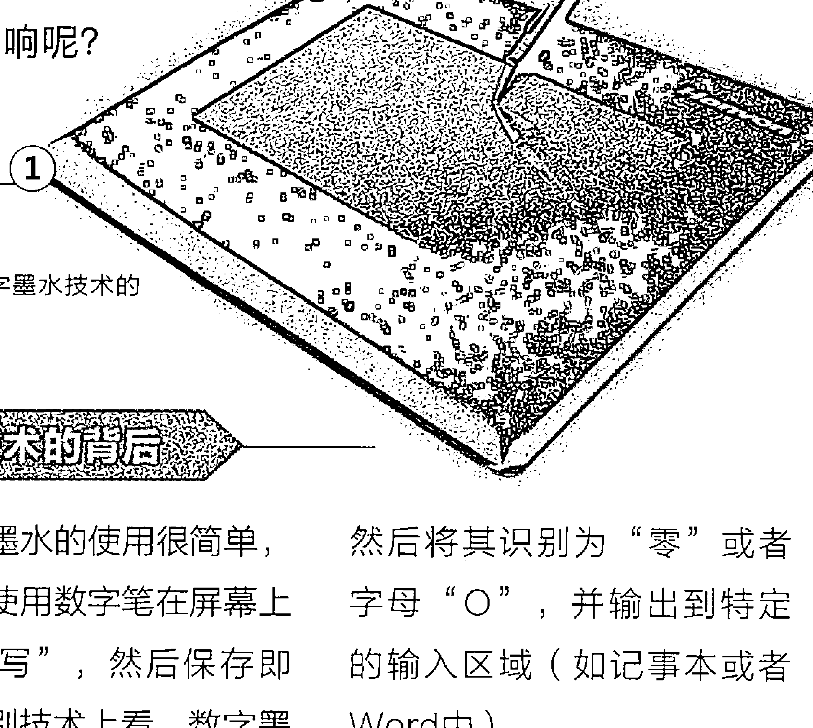

那么什么是数字墨水？严格说来数字墨水是一种显示技术，用户在使用数字墨水时，首先通过数字笔在显示器区域上“写字”，接着操作系统会将其保存为一种新的数据类型“ink”，它可以在各种文本处理软件，如Word、写字板、邮件客户端甚至MSN、微博里显示，就像我们平常输入的字符文本。在Windows中Ink数据类型被定义为和文本文件一样的“基本数据类型”之一，也就是说对于操作系统来说，数字墨水文件就像是文本文件，可以进行保存、发送、编辑和共享等日常操作。

## 数字墨水技术的后台

数字墨水的使用很简单，我们只要使用数字笔在屏幕上任意“书写”，然后保存即可。从识别技术上看，数字墨水技术类似“图形”+“手写识别”的组合，当我们使用数字笔在屏幕上写出特定字符时，操作系统会在后台进行一系列复杂的处理。它和常见的图形和手写识别又有一定的区别，比如屏幕上一个红色的“O”字形状图案，然后将其识别为“零”或者字母“O”，并输出到特定的输入区域（如记事本或者Word中）。

如果绘制的是普通的图片（比如在“画图”中绘制），Windows是将其保存为图片格式，通过在特定像素区域标记上红色作为这张图片的内容保存。

而对于数字笔绘制的数字墨水图案，系统会将手写的内容完全按照书写时的样子进行压缩存储。不过这时候被存储的并不是类似“图片”的文件，而是将书写内容进行复杂的矢量化转换而成的数学模型。首先它会分析用户之前的输入习惯，如果判断为“圆形”的图片，则通过定义圆心的坐标和半径进行保存，这样既可以减小保存体积，也方便后续编辑。比如下次打开时通过修改圆心或半径即可编辑之前的手写图片。如果判断为字符，则调用内置的手写字库进行识别，既可以直接识别为具体字符“零”或者字母“O”，也可以直接标示为Ink文件，插入到支持数字墨水的Office套件、邮件客户端等字符处理程序中，作为类似文本一样的字符直接进行处理。可以看出，数字墨水处理要比简单图片和手写识别复杂得多（图3）。

> 小知识：数字墨水≠电子墨水
如上所述，数字墨水是一种在电脑、平板上的显示技术，它的实体是一种Ink数据格式的文件。而电子墨水是由麻省剑桥的EInk公司开发的一种物理显示材料，在支持电子墨水技术的显示屏上，电子墨水屏表面附着很多体积很小的“微胶囊”，封装了带有负电的黑色颗粒和带有正电的白色颗粒，通过改变电荷使不同颜色的颗粒有序排列，从而呈现出黑白分明的可视化墨水效果（图2）。


## Windows 9中的数字墨水

当然，数字墨水的后台处理还包括数字墨水的标示、压缩和显示，智能墨水分析技术，墨水标记和注解技术，墨水的智能操作以及墨水存储和搜索等一系列有关技术。比如其中的智能墨水分析技术则可以对保存的墨水文件进行结构化和深度分析，便于系统地对用户各种书写（例如是写“字”还是写“图”）进行精准的判断。

Windows 9是怎么实现对数字墨水的原生支持？如上所述，墨水文件（Ink数据类型）在Windows中被定义为和文本文件一样的“基本数据类型”之一，所谓原生支持就是操作系统内置和文本文件一样的底层驱动，主要包括硬件驱动和对应的解码程序。
如操作系统原生支持文本文件，就需要在系统内置文本输入硬件（键盘）驱动，同样的对于墨水技术，则需要内置数字笔通用驱动（类似很多即插即用的硬件，如USB摄像头、键盘通用驱动），微软通过制定相应的驱动标准，实现第三方数字笔的即插即用。
另一方面，要实现墨水文件在Windows中的显示、编辑和保存，就需要在操作系统内部预置Ink数据类型的解码程序（类似内置的“记事本”程序可以识别和编辑文本文件）。这样在Windows 9中，我们可以随时插入符合标准驱动的数字笔，然后任意进行书写并保存（图4）。

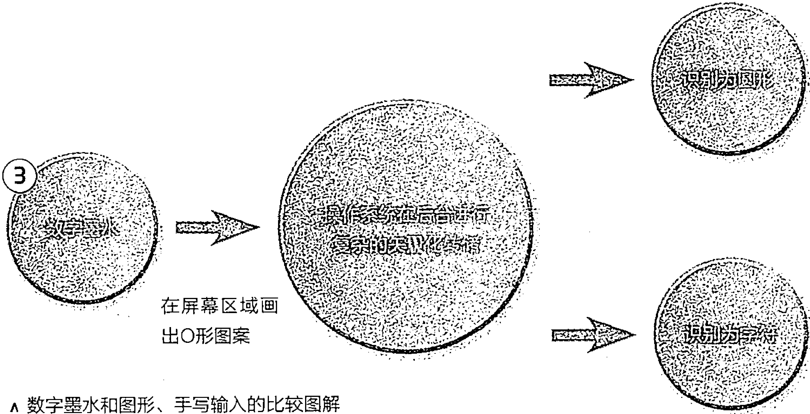

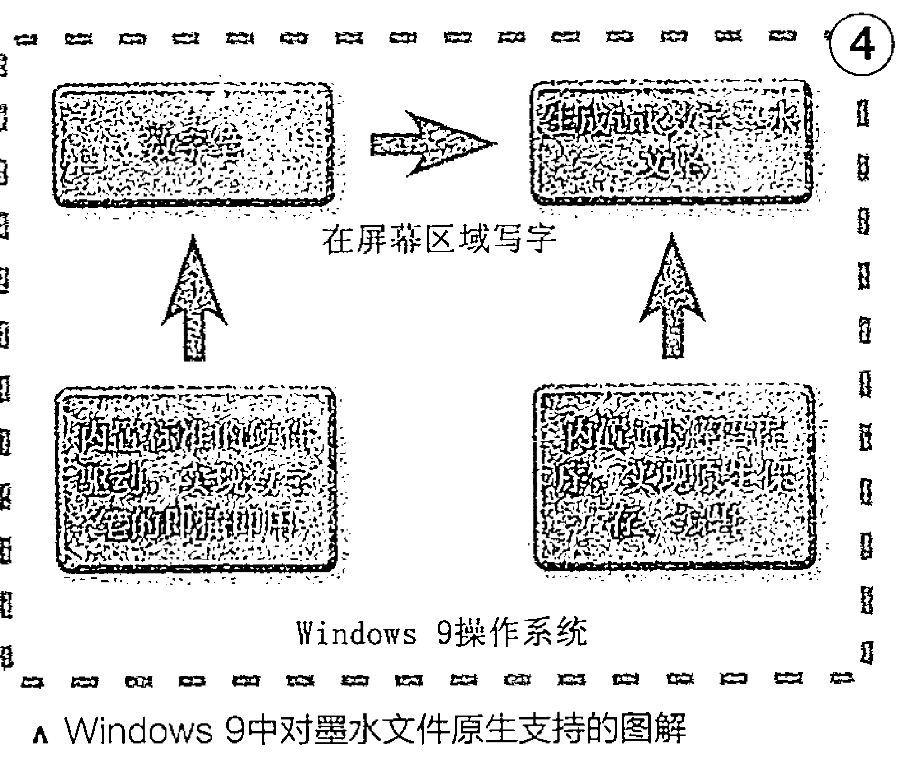

## 数字墨水——未来主流输入方式

一般来说我们和电脑、平板的交互输入，目前主要借助键盘/鼠标和手指（触摸输入），不过随着便携设备的普及，键盘/鼠标已经逐渐被淘汰，触摸输入虽然方便，但是识别的准确性和输入效率一直让人诟病。数字墨水技术则可以很好地解决触摸输入的上述弊端，必将给我们的生活带来巨大的影响。
首先是便利性，数字墨水能非常有效地表达和还原用户手写笔迹，而且输入后生成的文件很小，可以用墨水格式保存。只要操作系统原生支持，用户不再需要利用第三方应用程序即可实现墨水文件的保存、发送和编辑。以后大家就可以摆脱鼠标、键盘的束缚，只要一支笔就可以实现日常书写的基本功能。
其次是准确性，触摸和手写输入的准确性一直偏低，Windows 9原生支持数字墨水技术后，微软会在操作系统内部预置大量的手写样本字库，这样在使用数字墨水时可以精准进行识别，从而提高操作效率，也让信息输入更随意、及时。
此外，易用性也是数字墨水技术的一大特色。鼠标/键盘需要一定的练习才能熟练使用，而我们从小学就开始在学习用笔，使用“电子笔+数字墨水”可以说让任何一个人用起来都没有障碍。
可以预见在不久的将来，数字墨水必然会成为主流的输入方式！

## 深度搜索到底有多“深”

文 | 技术宅

我们几乎每天都在使用百度、谷歌等搜索引擎，不过在实际使用中，大家是不是觉得这些搜索引擎仍然不够智能？如百度和谷歌对自然语言的搜索结果效率就比较低，搜索的结果往往和我们实际搜索意愿不符。为了解决这个问题，“深度搜索”技术应运而生了。

### 普通搜索的一般流程

在了解深度搜索之前，我们先来了解一下什么是搜索。搜索过程简单理解就是用户键入搜索关键字，然后搜索服务器返回符合关键字要求的结果，这样一个交互过程。提供搜索服务的主体如百度、谷歌服务器，或者系统自带的搜索服务，它首先根据用户经常搜索的关键字对搜索资料建立索引，当用户键入的关键字符合索引要求时，就将数据库中所有符合要求的结果展示给用户选择（图1）。

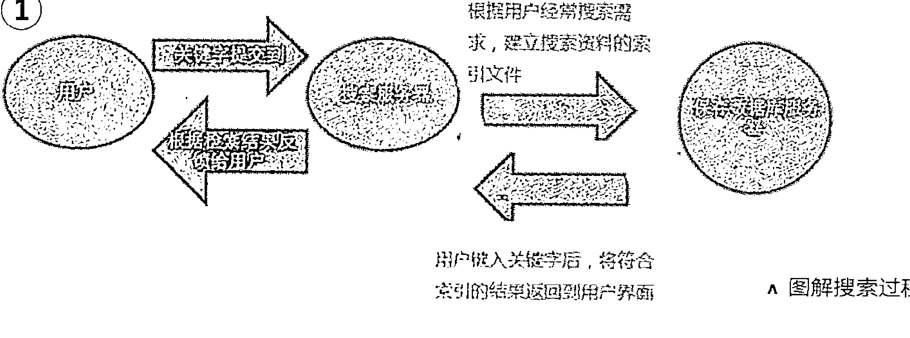

### 多方优化的深度搜索

虽然搜索过程看似简单，但是在实际使用中服务器返回的搜索结果却经常不如人意。比如在实际使用中我们经常要进行组合搜索，比如要在文档库中搜索包含“A”或“B”关键字的文章，此时就要用到高级搜索语法。对于一般用户来说，高级搜索语法显得晦涩难懂，作为普通用户，他们更倾向于使用自然语言进行搜索。现在深度搜索即可解决这些传统搜索引擎遇到的难题。

### 在结果中筛选的“分面搜索”

经常在淘宝购物的朋友都会使用淘宝提供的搜索服务，比如我们想购买价格最低并且包邮的小米手机，一般就在搜索框直接输入“小米手机”，然后勾选价格从低到高排序和包邮，这里的“价格排序”和“包邮”选项就是过滤条件，这样可以更精确地得到我们需要的结果（图2）。

在搜索术语中，淘宝提供的就叫分面搜索（Faceted Search），它可以实现更精准的搜索。深度搜索使用类似的分面搜索技术，但是那些过滤条件是内置在搜索引擎中的，而不是像淘宝那样显示放置在搜索页面中。深度搜索引擎具有卓越的检索词解析和自然语言理解能力，用户输入简单的搜索关键字，深度搜索则返回更接近用户需求的搜索结果。比如虽然直接输入的只是“小米手机”，但是返回的结果中默认会按价格排序，并且包含包邮选项。当然这些都是分析的结果，深度搜索服务器需要分析大量用户的搜索习惯，然后将最佳结果推送给用户。

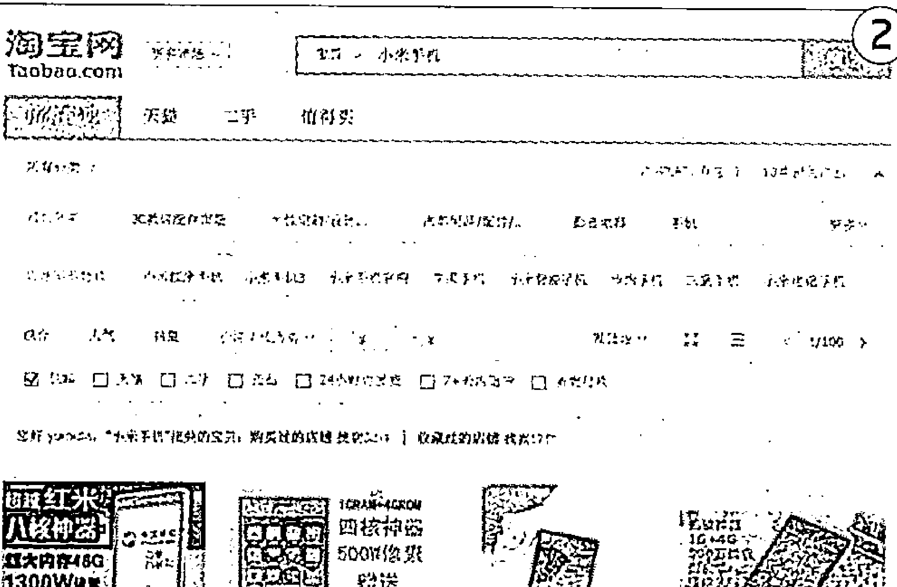

## 为搜索资料做深度索引

资料的索引是搜索的基础，搜索引擎必须为被搜索的资料建立详细的索引。传统的搜索引擎建立的索引包含的信息不够丰富，比如通过传统搜索引擎搜索一场演唱会的信息，一般得到的搜索结果就是演唱会举办地、价格、参加明星等信息（图3）。

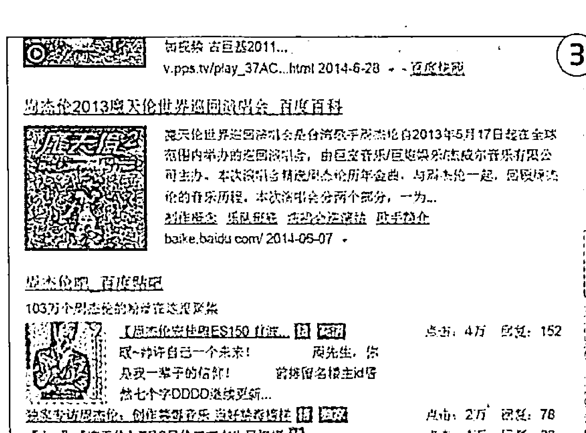

不过对于深度搜索，它建立的索引信息就要复杂得多，除了上述信息外还要分析很多元素，比如乐队以前的演出内容是否和最新演唱会类似？人们是否喜欢以前的演出？乐队粉丝呈现什么样的人口分布？演唱会会场如何等。深度索引通过建立搜索资料详尽的索引信息来满足用户的搜索需求。当然具体包含哪些索引信息，需要搜索服务器根据用户的地理信息、人口特征、兴趣点信息和位置数据库，以及社交网络等进行分析和处理（图4）。

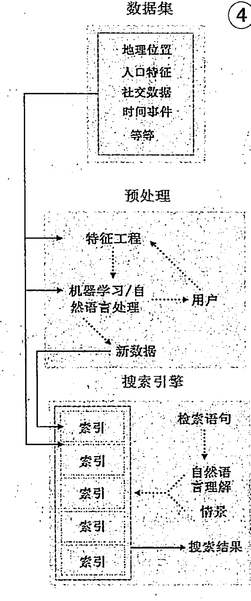

这样用户只要在前台简单输入“XX演唱会”作为搜索关键字，其他关于该演唱会的丰富索引信息，会全部被纳入深度搜索服务器的后台运算当中，从而给用户返回一个丰富而适当的搜索结果，比传统搜索要精确得多。

## 深度理解用户的搜索意图

深度搜索引擎在前台只需要用户使用他们熟悉的自然语言进行搜索，这样后台服务器就需要有强大的自然语言学习能力，涉及到查询解析和自然语言理解技术。比如用户输入“哪一家餐厅适合Mike的结婚周年纪念日”作为关键字进行搜索。

搜索引擎首先要理解用户搜索需求，比如上述例子，深度搜索要先解析出是“Mike结婚纪念日”+“餐厅”，解析出结果后，搜索引擎就需要在后台进行分析并推送检索结果。

但是深度搜索并非像传统搜索那样，直接推送XX餐厅。它使用了深度查询，比如会分析谁在搜索（如从搜索关键字判断可能是Mike的朋友）？他们在哪（可以通过IP地址确定）？天气怎样？他们过去搜索了什么？他们的亲人朋友是谁等因素进行后台复杂的分析，然后向用户推送查询结果。

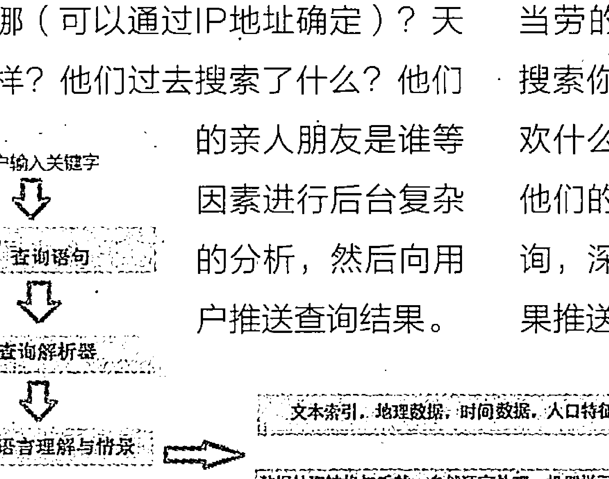

比如深度搜索知道搜索者在北京，那么就不会将其他地方的餐厅推荐给用户。如果深度搜索数据库知道搜索者讨厌垃圾食品，就不会显示麦当劳的结果给他/她。此外，它还会搜索你的社交信息，比如一般朋友喜欢什么你可能也会跟着喜欢，这样将他们的偏好都考虑进来，通过深度查询，深度搜索就能将最精确的搜索结果推送给用户（图5）。

> 写在最后
俗话说“大道至简”，任何先进的、科学的技术，要让普罗大众轻松使用，它和用户交互的界面必须简洁，使用简单，但是后台服务必须复杂、强大，这样才能更好地为用户提供服务。深度搜索正是这样一种大道至简的搜索服务，现在很多公司如http://www.weotta.com（目前只支持英文搜索）正在使用深度搜索服务，感兴趣的朋友不妨一试！CF

## 新型3D？解读Fire Phone的3D技术

文 | 技术宅

最近亚马逊推出一款Fire Phone手机，这是一款以3D为功能卖点的手机，号称采用了创新的3D显示技术。那么Fire Phone的3D到底是一项什么样的新技术？让我们看看它和之前的3D手机有什么不同，它又是怎么实现在手机上显示3D图像的。

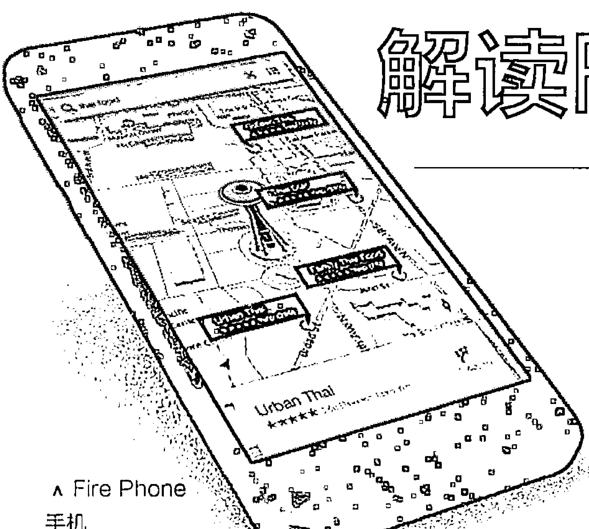

### 了解手机上的3D显示技术

手机上的3D显示并不是一项新鲜的技术，如早在2009年2月，日立就发布了号称是世界上第一部裸眼3D手机H001，其原理是利用左右眼视差的硬件3D处理来实现3D画面。

什么是裸眼3D？顾名思义就是不要借助眼镜就可以实现3D效果的显示技术，裸眼3D对应的是眼镜式3D。从显示原理来说，不管是哪种显示技术，3D显示本质就是让人的左右眼睛看到不同的图像，然后通过大脑自动把它们组合成立体图像，从而产生立体感。传统的3D显示大多需要佩戴特殊眼镜（如偏振眼镜、红蓝眼镜）来实现左右眼看到不同的画面。显然3D显示移植到手机上后，我们使用手机时不可能还要佩戴一副3D眼镜才能获得3D效果。因此目前手机上普遍使用的是裸眼3D显示技术。


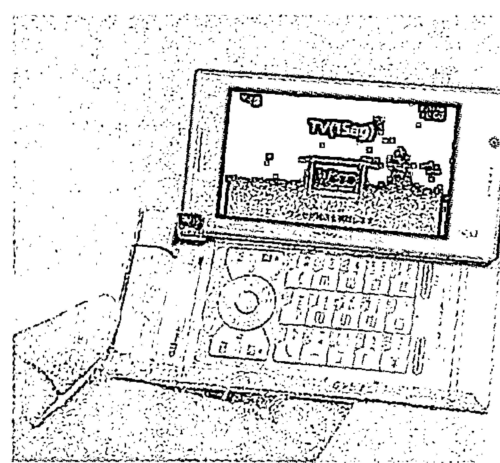

裸眼3D的秘密就在于屏幕，当切换到3D模式显示的时候，这块屏幕就相当于集成3D眼镜的显示屏。比如目前3D手机上普遍使用的视差屏障式技术，当我们在手机上开启3D模式的时候，屏幕会呈现出斑马般的条纹，成为透明和不透明交替排列的栅栏，通过栅栏左右眼看到的是不同颜色的色光，从而让人的左右眼睛看到不同的图像，并最终在大脑合成为3D图像。

目前大多数3D手机和游戏设备使用的就是这种技术，比如夏普SH8158U、LG Optimus 3D、任天堂3D掌机、HTC EVO 3D以及LG Optimus Pad等。

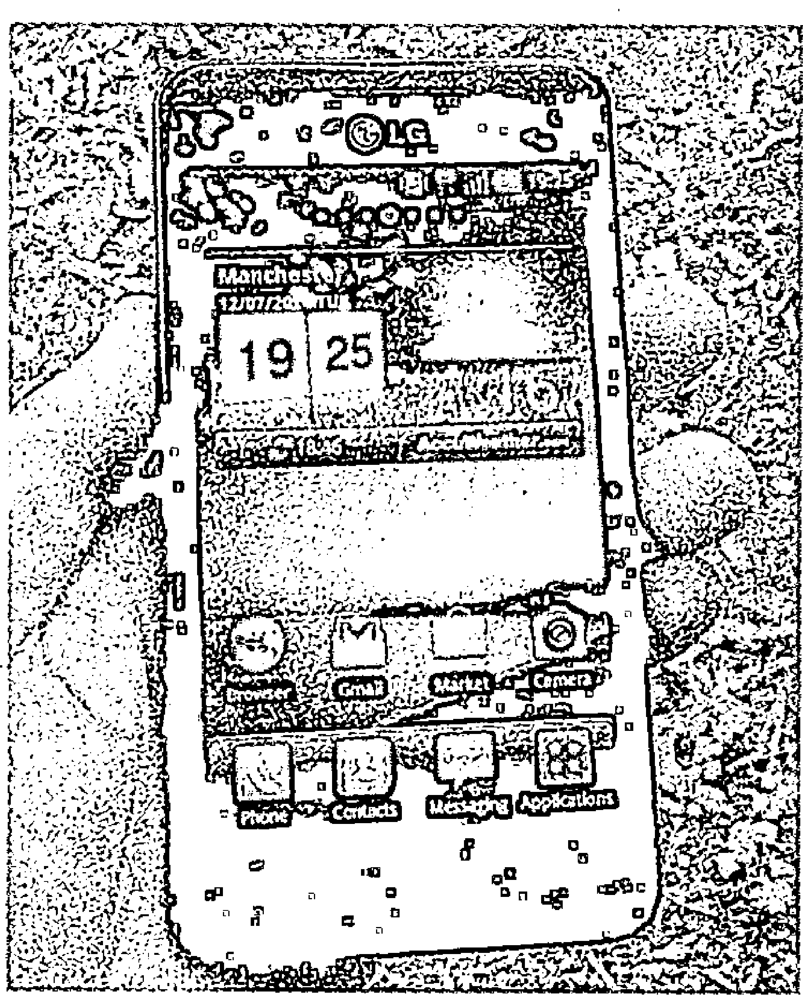

### 新型3D？看透Fire Phone背后的3D技术

那么这次亚马逊推出Fire Phone手机又是采用什么样的3D显示技术？从上面的显示原理我们知道，视差屏障主要是通过屏蔽色光实现3D效果，虽然这种3D技术推出的时间较早，但是仍有许多不可避免的缺点。

首先由于该技术是通过屏蔽部分色光实现，因此在视觉效果上亮度显得较低。其次这种3D显示还十分依赖于用户视角，如果角度不对双眼可能看到全部色光，从而导致3D效果失效。最后由于人的左右眼看到的是不同色光的视频，长时间观看很容易对眼睛造成伤害，所以很多3D制造商都会进行警告提示。比如任天堂发布了具有3D功能的3DS掌机后，也发布了声明，警告玩家在3D显示下的游戏时间不能过长。

为了解决上述的不足，亚马逊此次另辟蹊径使用另一种3D显示技术，亚马逊称之为“动态视角”技术。细心的朋友可能会发现，Fire Phone的界面多了四个摄像头，“动态视角”技术就是依赖这四个摄像头实现的。

Fire手机正面配置了4个在水平和垂直方向都是120度的摄像头，通过这4个摄像头来扫描手机正上方的周围环境。当用户脸部出现在手机正面的时候，这时候四个摄像头会通过手机内置的算法来计算用户眼睛和手机屏幕的距离，然后将调整手机显示的画面。当用户移动脸部时，手机屏幕上的画面会出现同步位移和景深，Fire手机上的摄像头通过辨别和追踪用户眼睛的活动，然后根据用户脸部位置和距离的变化，实时计算并重新绘制出三维图像，从而使人眼看到和实际环境感觉一样的效果。在Fire手机展示视频中我们可以看到，随着观察位置的不同，3D地图上的建筑物会以不同的形态展示在屏幕上，给我们身临其境的感觉。

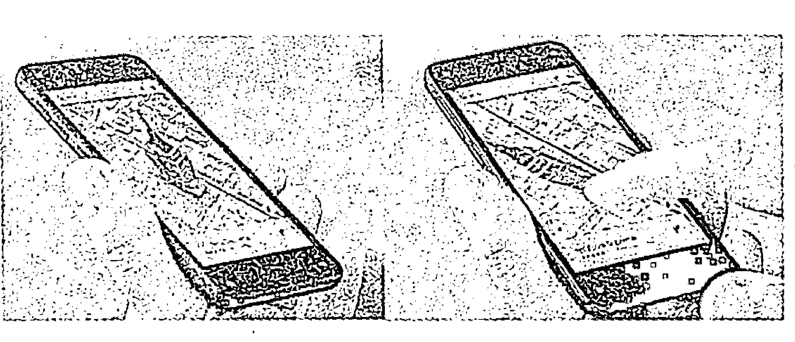

那么亚马逊的“动态视角”技术和LG、HTC采用的技术有什么不同？举个形象的例子，视差屏障技术就像是电脑上的3D图片，我们需要调整眼睛的焦距，找对画面的焦点，这样才能显示出3D图像，它是通过左右眼看到不同的图像进行合成才能显示3D效果。亚马逊的“动态视角”则类似国外街头的那些3D街景画，它本身就是3D显示，我们只要自然观看就可以获得3D效果。

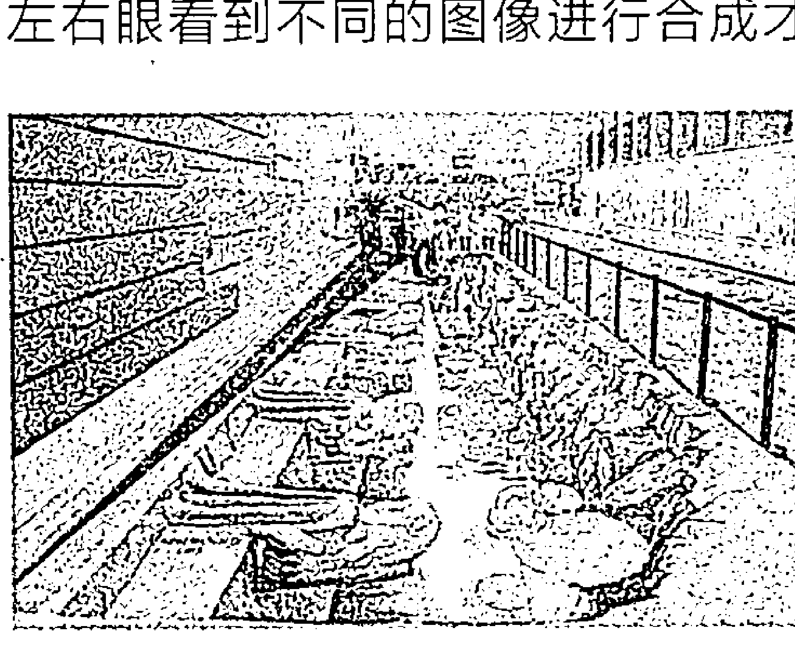

不过要注意的是，由于人体生理结构特性，长时间观看3D视频仍然会让人产生眩晕，无论是哪种3D技术目前都无法解决。因为在人耳中有个能判断身体平衡的器官叫耳前庭器官，在虚拟3D场景中观看者实际上变成电影或者游戏中的一份子，我们会随着其中的主角在不断变化位置，这样大脑就试图指挥我们和3D视频中的主角同步运动，但是实际上我们可能只是坐在沙发上安静地看3D电影，耳前庭器官认为人并没有在运动，传达给大脑的是静止的指令。这样一动一静的指挥就出现了矛盾，当矛盾出现的时候，大脑则有可能产生保护性的眩晕，这就是所谓的3D眩晕症。

### 3D显示带给我们更好的视觉体验

我们本来就生活在3D世界里，显然3D显示更加符合我们的视觉需求，而且这种显示效果必将给我们的生活带来各种变化。

比如对于游戏迷，3D游戏效果可以让用户更有身临其境的感觉，如CS游戏，在3D显示中就仿佛已经置身于真实的作战环境中，游戏玩起来自然更爽。而对于爱购物的用户，在网购时可以全方位、多角度查看商品的细节，肯定可以带来更好的购物感受。对于喜欢地图应用的用户，可以用3D方式查看道路、建筑、景观，就好比在真实环境中查看。这样的感觉是不是很酷？

## 有多安全？iPhone版移动钱包解密

文 | 技术宅

现在移动支付日益普及，移动支付的安全性也逐渐被大家重视。近日iPhone版移动钱包即将问世，苹果的移动支付方案号称最安全的移动支付。就让我们来看看它和传统移动支付有什么区别，以及它具备什么样的安全特性。

### 移动支付 掀起你的面纱来

说到移动支付，想必很多朋友都不陌生，简单来说它就是一种在手机、平板上的支付手段。和普通PC支付相比，移动支付只是支付平台不同而已，比如我们平时使用的支付宝钱包、百度钱包、中国移动的手机支付等都是移动支付。

### 移动支付怎么保障支付安全

移动支付的平台是智能手机、平板等移动设备，它和传统PC支付相比少了短信验证、证书、U盾和动态口令卡等安全措施，因此相对来说它需要有更强的安全手段。那么一般移动支付怎么保障支付安全的呢？这里我们以支付宝钱包为例。

首先在启动支付宝时需要输入支付宝账户和密码登录，这是第一道保护措施。接着支付宝钱包要求我们设置手势密码登录，这样每隔一段时间没有操作（或者支付宝钱包在后台运行后切换到前台）就需要重新输入手势密码登录，这是第二道保护措施。当我们要对具体某项交易进行支付时，支付宝钱包要求输入支付密码，这是第三道保护措施。

从上面可以看到，支付宝钱包主要就是通过上述三道保护措施来保证支付安全的。不过这些保护措施并不十分安全，比如支付宝钱包的手势密码实际形同虚设，只要知道支付宝账户和密码，随时可以点击“忘记手势密码”，然后使用支付宝账户和密码重新登录即可。至于支付宝账户和密码、支付密码，由于完全是字符密码，很容易被黑客窃取，特别是开放的Android系统密码极易泄露，比如Android平台的“窥私肉虫”就会在后台偷偷监控用户的输入，这样在移动支付时就很容易泄露自己的账户和密码。


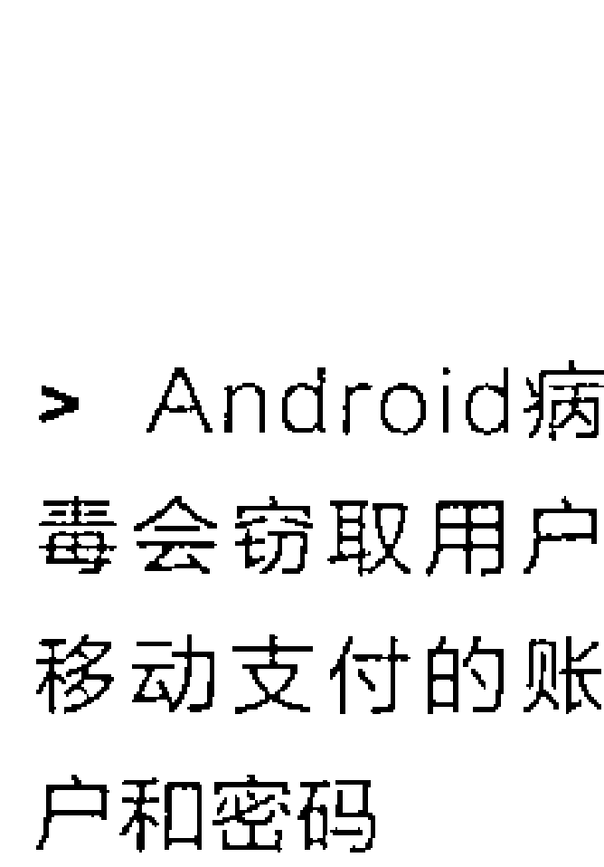

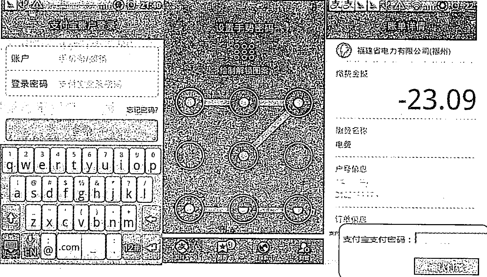## 更安全？解析苹果移动支付安全

可以看到一般移动支付安全性并不高，而在移动安全日益恶化的今天，我们迫切需要更为安全的移动支付方式。那么苹果即将推出的移动支付又是怎么保障支付安全的呢？

对于传统的移动支付，其实苹果早已经在实施。比如我们需要使用iPhone在苹果中国商店购买一个应用，只要先注册一个苹果ID并登录，然后充值金额到苹果账户，这样在iPhone上即可完成支付。显然这种移动支付和支付宝钱包并无两样，支付的安全也主要是通过苹果ID的登录密码保护。

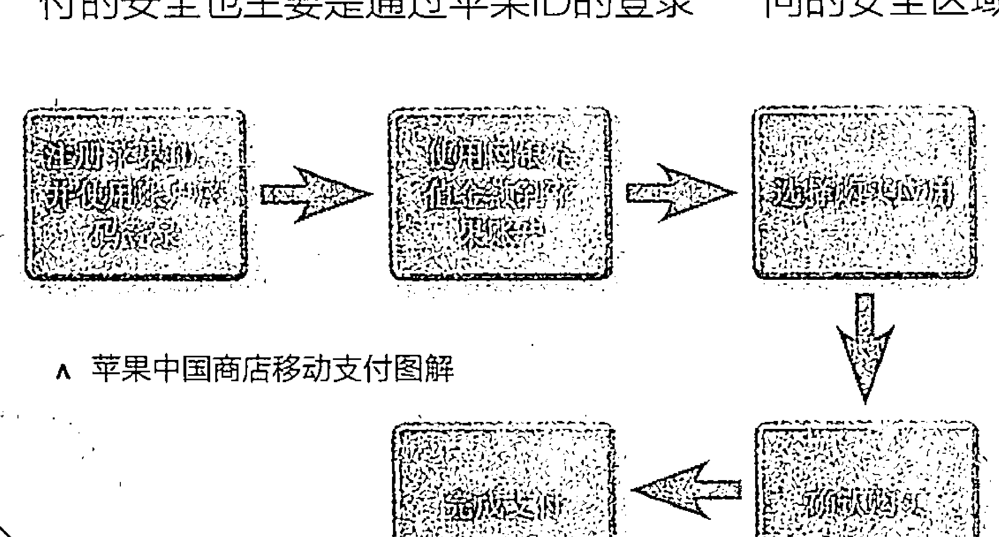

### 下一代移动支付的宠儿

由于指纹是每个人与生俱来的生理特征，指纹支付显然可以在给我们带来安全的同时带来极大便利。正是看到指纹支付的这种特性，现在除了苹果TouchID方案，很多IT大佬们也在使用指纹支付。比如支付宝最近在Android平台也推出指纹支付，用户只要使用三星最新的GALAXY S5，先在手机设置中录入指纹，之后在支付宝钱包的手机密码一栏中开启指纹密码，通过指纹比对和支付密码等一系列校验后即可使用。

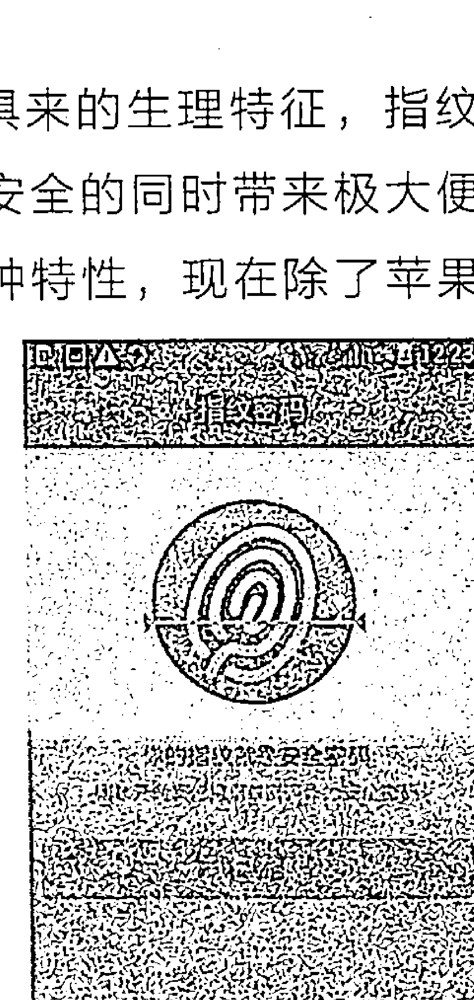

那么即将推出的苹果移动支付又是怎么样的呢？根据苹果披露的信息，移动支付安全主要是借助iPhone 5S新增的TouchID（即指纹验证）实现的。大家知道iPhone 5S的一个重要特性就是增加了指纹验证，我们只要通过预设的指纹就可以实现手机开锁。

首先我们需要在iPhone上进行指纹注册形成一个TouchID，指纹数据默认保存在一个当前用户无法访问的安全区域，并且数据不会联网上传，这样可避免指纹数据的网上泄露。接着我们就可以将银行账号、信用卡或其他应用的登录密码、支付密码全部绑定到TouchID下，即将我们本人的指纹替代了所有手机应用上的账号和密码。这样当我们需要进行移动支付时，首先要使用自己的指纹登录，在需要实际进行资金支付的时候，还需要使用自己的指纹进行确认，有效保证支付的安全。因为指纹是每个人的生理特征，世界上几乎找不出指纹相同的两个人，所以苹果手机上的指纹支付无疑是很安全的。

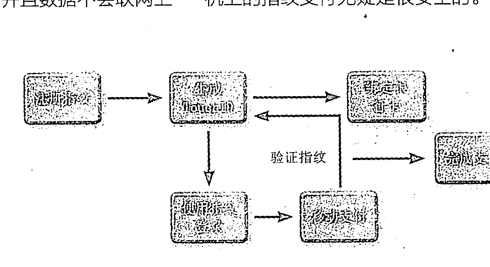

这样在使用支付宝钱包进行转账或者支付确认的时候，指纹支付就会替代原来的密码提示，此时我们只要点击“指纹支付”，然后进行指纹比对即可完成支付，大大提高了支付的安全性。

当然，由于Android平台硬件的碎片化，和iOS平台相比更难形成统一标准，Android上的指纹支付普及将很困难，截至目前也仅有三星GALAXY S5可以尝鲜这一功能。

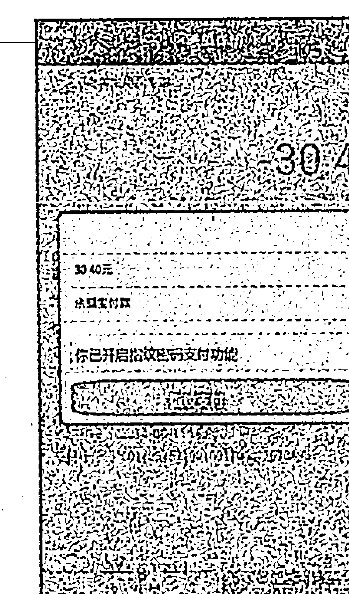

## 三面玲珑？三面显示屏解密

据三星韩国零部件供应商透露，该公司已经在移动设备上开测“三面显示屏”。有关这项技术的传闻已出现多时，现在终于水落石出了。那么什么是“三面显示屏”？为什么三星要在手机上使用“三面显示屏”技术？它又会给我们的生活带来什么样的便利？

### 三面玲珑——掀起它的面纱

三面显示屏顾名思义就是由三面显示器组成的屏幕，三面屏智能手机则是指手机正面屏幕、左侧屏幕、右侧屏幕这三面都有显示屏幕的智能手机。传统手机左侧、右侧一般附着电源、音量调整等物理按钮，三面屏智能手机则通过侧屏来取代这些按钮，并且通过在侧屏安装锁定、音量调整等应用来替代（或扩展）原来物理按键具备的功能（图1）。

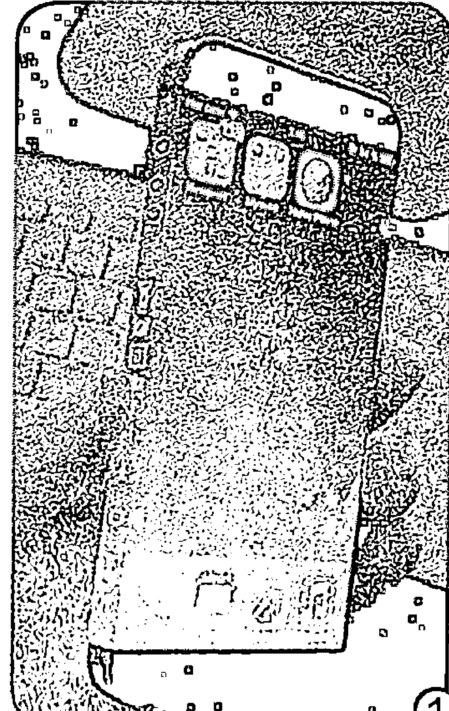

### 探根究底——了解背后的秘密

根据三星的计划，三面屏智能手机的三块屏幕将独立运行，我们可以从三个方向独立操作屏幕，从三个角度看到不一样的内容。那么这三块屏幕是怎么进行工作的呢？

其实它的原理类似PC上的多头显示输出技术，在Windows 7中只要通过多块显卡连接其他显示器，然后通过显示属性的设置就可以让桌面显示在多个屏幕上，而且每台显示器可以显示不同内容（图2）。

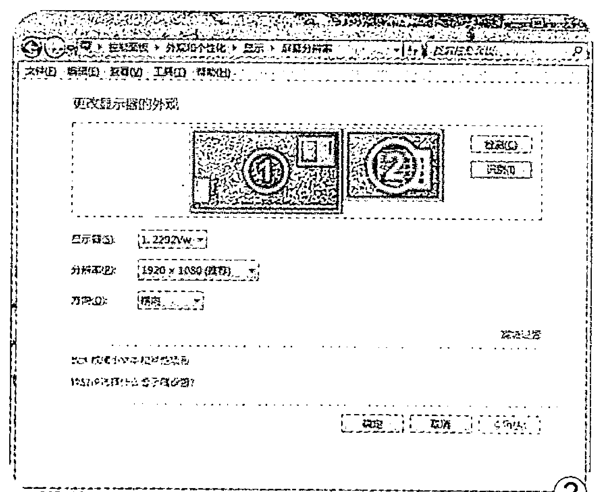

三面屏智能手机通过在手机系统内置类似Windows 7分屏技术，实现手机的三块屏幕显示不同的内容。当然和PC上不同的是，三块屏幕并非独立的显示屏，而是将一块屏幕折叠成三面显示，硬件技术的要求要比PC上的独立显示高得多。据说三星的三面屏是通过柔性主屏向左右侧弯曲而成的（图3）。

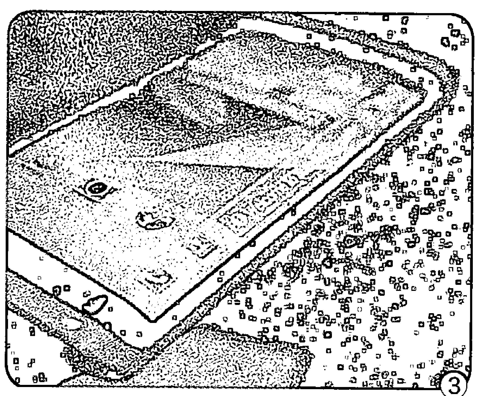

### 不仅是显示——更多便利

大家知道，传统的手机设计，左右两侧一般是电源、音量等物理按键，方便我们进行锁屏、调整播放音量。那么使用左右屏幕替换后，会给我们的使用带来什么样的便利呢？

- 1. 使用触摸替代物理按键

在日常使用中如果暂时不用手机需要锁屏，常用的方法就是按手机侧面的电源键进行锁定，时间长了很容易导致物理按键的损坏，因此很多朋友使用锁屏软件替代电源键锁定。三面屏智能手机则可以直接在侧屏设置锁定按钮，只要点击即可锁定手机，当然也可以添加其他常用的应用（图4）。

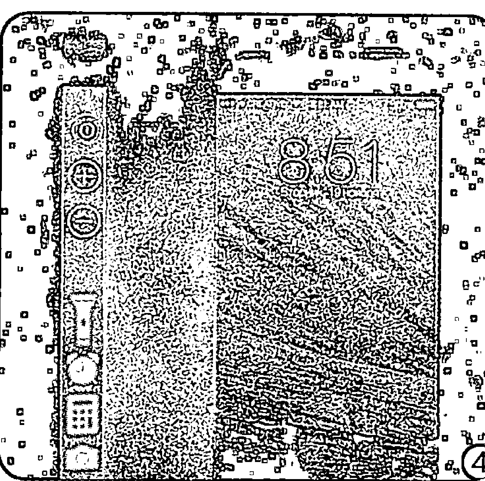

- 2. 方便自定义按钮功能

现在的手机大多是触屏操作，为了便于用户执行频繁的操作，很多手机都会预置一定的物理按键。比如很多Android手机都会在屏幕下方预置主页、菜单和返回三个物理按键。显然这样会增大手机平面的面积，占用主屏的显示空间（图5）。

侧面屏幕的出现则可以轻松解决这些问题，因为物理按键的功能都可以借助应用来代替，我们可以在侧边屏幕安装具备物理按键的应用来实现，添加功能只要增加相应的应用即可。

此外，侧屏的出现也方便我们在特定场景下执行常用的操作。比如平时我们都喜欢手持手机，睡觉的时候则喜欢将手机平放在床头柜等处，这样经常接触到的就是手机的侧面。对于三面屏智能手机，我们可以将一些常用的应用如锁屏、短信、闹钟、手电等放置在此，方便自己的操作。比如可以设置闹钟在侧屏并设置滑动解锁；这样闹钟响后，我们只要侧头就可以看到闹钟时间，轻滑手指解锁后即可继续等待下个闹钟。

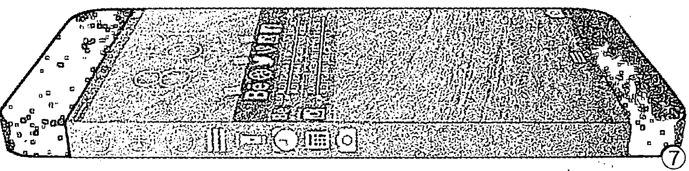

- 3. 增加独立显示面积查看特定信息

日常使用中我们经常查看一些内容简单的信息，比如收到的短信、微信消息、邮件标题等。在传统手机上，这些信息一般通过通知栏或者弹出信息条的方式出现。由于手机系统只允许一个应用为活动窗口，这样在玩一些全屏游戏时，弹出的信息提示就会挡住当前窗口，我们只有手动将其取消，或者退出当前游戏切换到信息应用界面才能查看具体信息（图6）。

三面屏智能手机则可以使用侧面屏幕来专门显示这些信息，这样如果有新的信息就可以直接显示在侧边屏幕上，既不会影响当前全屏游戏，又可以及时读取收到的信息。

### 并非完美无缺——它的不足

虽然三面显示屏的出现给我们带来很多的便利，但是三面显示也并非没有缺点。

首先是制作工艺难题，一块显示屏如果要制作成长方体状侧面显示，仅靠目前工艺还是有一定难度。即使是三星的柔性屏弯曲显示也会带来实际使用问题，因为这个三屏显示实际上仍然是一块完整的大屏幕，如果三面屏的任意部分出现问题，极可能会影响到整块屏幕。此外，手机侧边做成屏幕后，对屏幕材质耐摔性提出更高要求，我们的手机在滑落到地上时，手机侧边经常是最先着地的部位，如何保证手机摔下后侧边屏幕不破裂？

其次，三面屏智能手机的出现将改变我们的使用习惯。传统手机突起的物理按键可以让我们精确进行操作，比如通过上下按键可以实现对音量的精准控制，但是三面屏智能手机通过侧屏音量按钮来调节音量，在不用肉眼观察的情况下，有多少人可以实现精准的触摸？

当然，科技的发展永远都需要人们有足够的想象来支撑，我们欢迎任何一项可以给我们生活带来便利的新技术！

## 传感器 智能手机的神经末梢

文/技术宅

传感器已经成为智能手机的标配，现在的手机上经常可以看到方向感应器、重力感应器、陀螺仪感应器、指纹传感器等各类传感器（图1）。它们就像分布在手机上的神经末梢，可以快速对手机状态的变化做出感应操作。

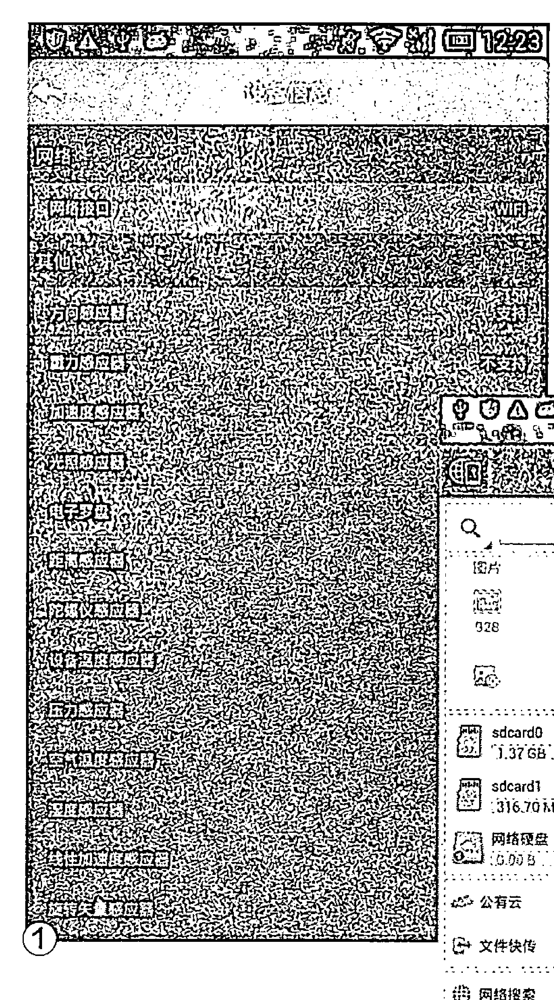

### 知识扫盲——认识手机传感器

手机传感器是可以对手机传输过来的特定状态变化进行感应的元件，这些状态可以是手机的方向、重心、位置、光线等常见元素（不同元素对应不同类型的传感器）。一旦这些状态发生变化，传感器就会感应并做出相应的操作。以手机方向为例，当手机从垂直状态变为水平状态时，手机中的重力感应器就会感知重心的变化，并且将屏幕的显示由纵向显示变为横向显示，方便浏览（图2）。

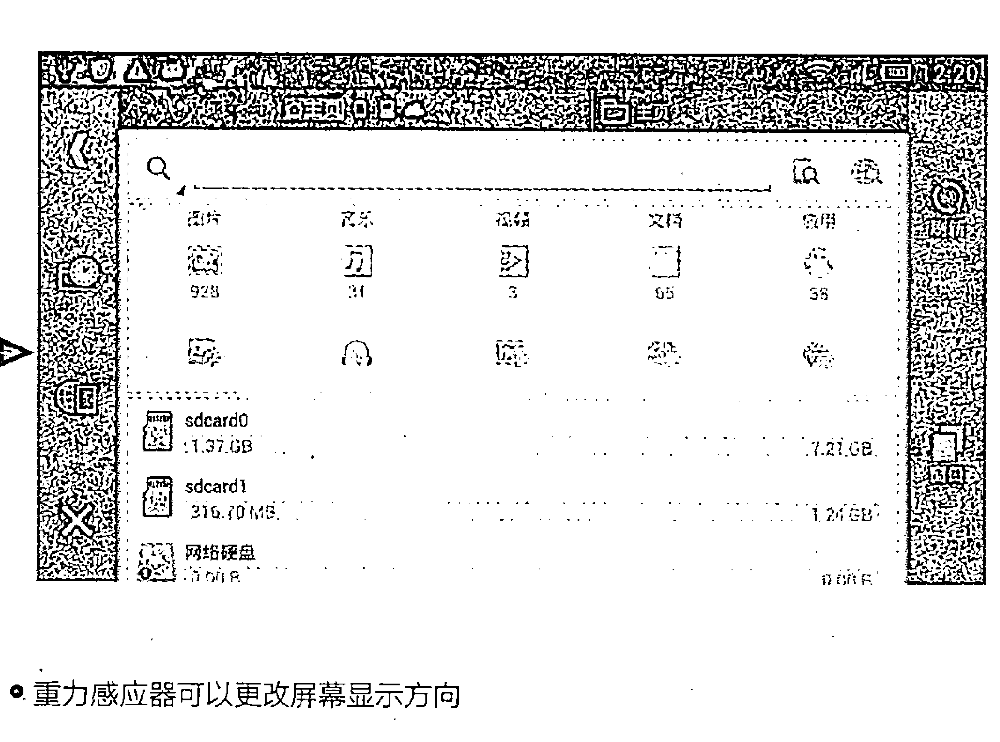

### 感应操作——传感器背后的秘密

从上面的描述可知，传感器会根据手机状态的变化做出感应操作，那么传感器是怎么进行感应，又是怎么根据感应到的状态变化执行操作的呢？这里以最近推出的三星Galaxy Note 4配置的“紫外线传感器”为例。Galaxy Note 4号称是世界上第一款配备紫外线传感器的移动设备，只要将手机以60度角对准太阳，手机上的传感器就可以准确监测出当前紫外线的强度，同时给出相应的防护建议（图3）。

紫外线传感器是怎么实现监测的？首先要了解一下传感器的工作流程。这里所说的手机传感器实际上是指一个感应系统，它包括感应器和数据分析系统，感应器用来感知外部状态变化，当其接收到状态变化时会将其反馈到分析系统中，分析系统借助预先存储的数据对状态进行对比，将状态变化转换为用户可以理解的量化数据，然后发出指令执行相应的操作（图4）。

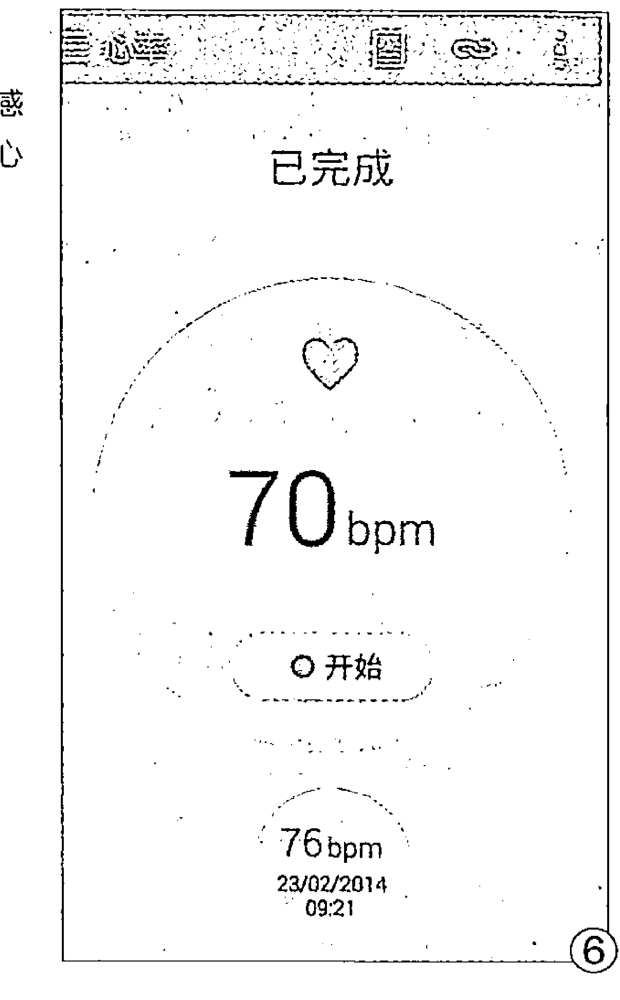

了解了传感器的工作原理，就很容易明白Note 4的紫外线传感器是怎么工作的了。首先三星需要在手机中内置紫外线数据，紫外线指数变化范围用0~15的数字来表示，通常夜间的紫外线指数为0，热带、高原地区晴天时的紫外线指数为15，不同指数对应不同的防护措施。

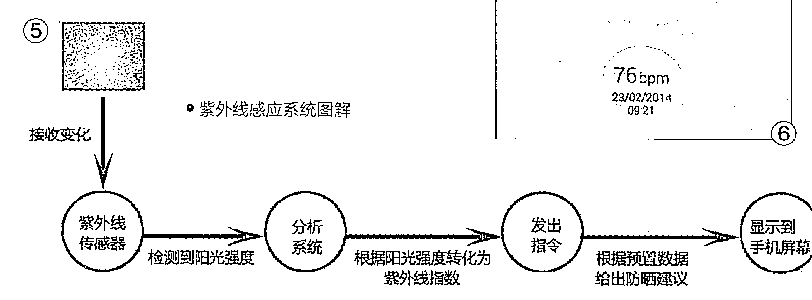

紫外线指数大小则主要和当前阳光的强度有关，手机上的分析系统可以将具体阳光强度和指数关联起来。这样当用手机对准太阳时，手机内的紫外线传感器就会感应到当前阳光的强度，分析系统会通过后台的计算将当前阳光的强度转换为对应的紫外线指数，然后将对应指数的防护措施呈现在用户的手机屏幕上，并提供出行建议（图5）。

上述介绍只是以紫外线传感器为例，实际上手机上其他传感器的工作原理大同小异。比如指纹传感器，首先分析系统要采集指纹数据，这样当用户的手指压在传感器上的时候，传感器就会感应到指纹数据，借助后台分析系统进行指纹比对，然后执行对应的操作，如指纹解锁、指纹支付等。

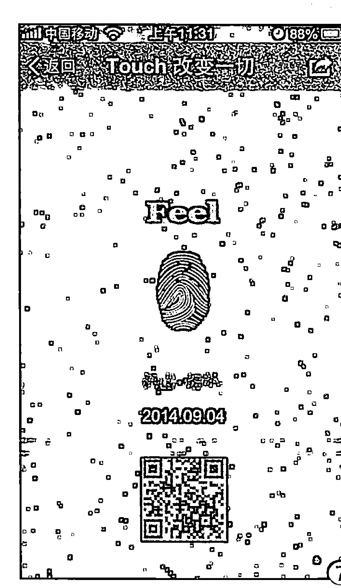

### 不只是感应——传感器带来更多应用

只要感应器捕捉到手机状态的变化即可完成很多的操作，这给我们的日常使用带来很多方便。下面就列举两点。

- 1. 传感器会成为大家的健康助手。现在工作、生活节奏越来越快，很多朋友都处于亚健康状态，怎么快速知道自己当前的身体健康状态？很多手机上的传感器就具有这些功能，比如三星Galaxy S5内置心率传感器，它可以非常方便地检测出你的脉搏情况，并且可以进行记录，以便进行长期观察使用（图6）。

- 2. 传感器会简化很多日常操作。在日常应用中，很多操作比较繁琐，比如手机上的移动支付，首先需要登录应用，激活支付界面，然后再输入支付密码才能完成支付操作。手机上内置指纹传感器后，这些繁琐的操作就可以交给传感器完成。最近发布的华为Mate7就可以直接使用支付宝指纹支付，不仅操作更简单，而且还有更高的安全性（图7）。

当然，随着传感器变得更加智能，生活中的其他产品和装备上也将会大量使用。在未来，装备了传感器的智能手机并不会单独工作，而是作为更大设备网络的一部分，各种智能传感器的出现必将让我们的生活更惬意。

## 手机里的秘密 SoC芯片解读

PC时代，很多人以486、586、酷睿双核作为电脑的代名词。移动时代，很多朋友在介绍自己的手机时，仍然以双核或者四核CPU作为手机硬件性能的代名词，似乎CPU就代表手机的主要硬件和性能。其实在手机上主要硬件是SoC（也叫系统级芯片）。

### 小知识

### 目前主要有哪些SoC开发商

- 按照CPU底层架构区分，目前手机市场主要有基于ARM架构（如高通骁龙801、英伟达Tegra 2、华为海思等）和基于x86架构的英特尔CPU如Atom Clover Trail。常见SoC开发商也多是CPU厂家，如高通、英特尔、Apple、英伟达、三星等，国内厂商比较有名的则有联发科（台湾）、展讯、华为海思等，全志、炬力、瑞芯微的SoC则主要用于平板。

### 何为SoC

SoC (System-on-a-Chip), 译为片上系统，也称为系统级芯片。实际上它是一个高度集成的芯片系统，除了包括常见的CPU外，还包括了数字信号处理器DSP模块、GPU、嵌入的存储器模块以及和外部进行通讯的接口模块等手机上常用的硬件，它和电脑机箱里的集成主板有些类似（图1）。

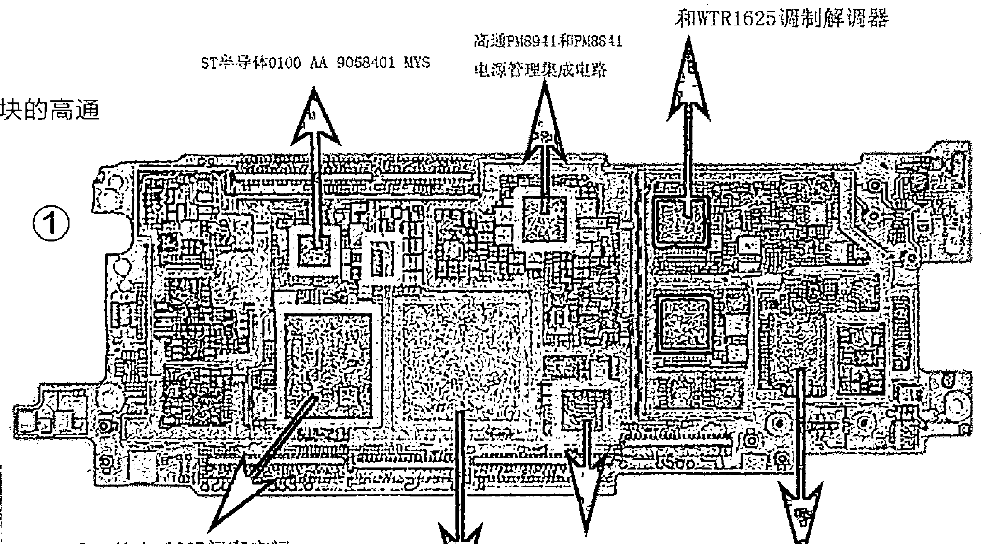


### 探根究底 手机为什么要用SoC

普通台式电脑上，主板大多只集成一般必要的芯片，至于显卡、CPU、内存、硬盘则大多由用户自行配置，进行硬件扩展。因此普通电脑都具备极佳的扩展性，只要主板支持，我们可以任意将CPU升级到支持的最高频率以提高性能（图2）。

虽然台式机主板扩展性好，但是随之带来的是工艺的复杂，因为一台组装的电脑需要多个硬件厂商的产品，既需要制定一套复杂的标准，还要进行各种硬件之间的兼容性测试。显然这并不适合移动设备的生产。

一方面现在的手机、平板等移动设备更新换代速度极快，这要求手机厂商研发一款新手机的周期要很短，根本没有时间也没有技术去开发和测试各种硬件，这就要求手机芯片开发商提供高集成度的芯片以降低手机开发周期。

另一方面，手机内部空间小，不可能像台式机主板那样内置各种丰富的扩展接口，现在手机上唯一可以扩展的就只有外置SD卡。

正是由于上述原因，现在手机芯片开发商都会针对手机厂商推出定制SoC芯片系统，基本上厂商只要换上自己的外壳就可以推出自己的手机了，大大简化了手机开发周期。这也是为什么联发科一推出新的八核芯片系统，市场上立刻就会出现铺天盖地的山寨八核手机的原因（图3）。

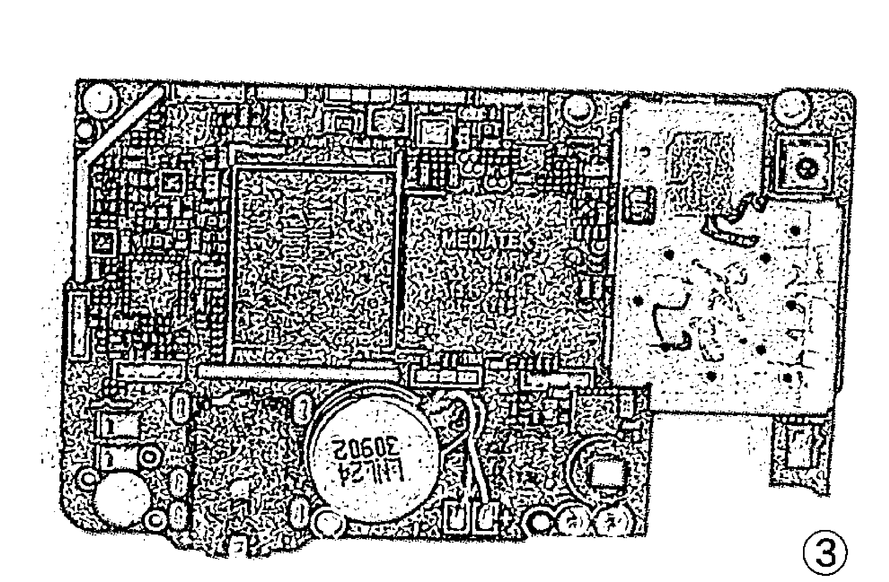

图形处理

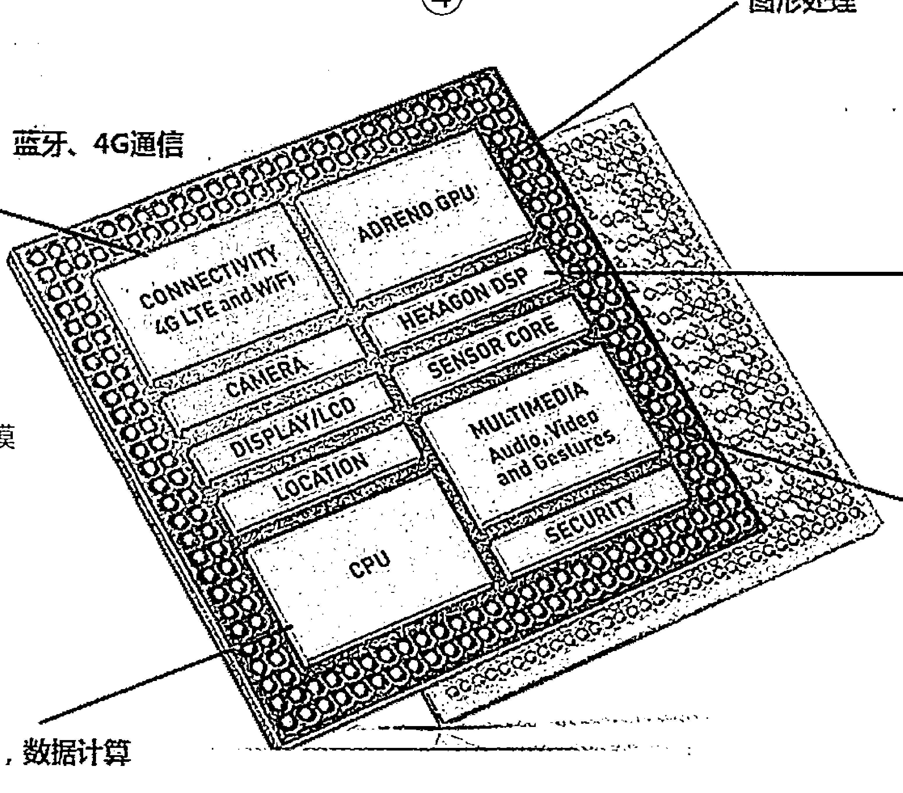

数字信号解码

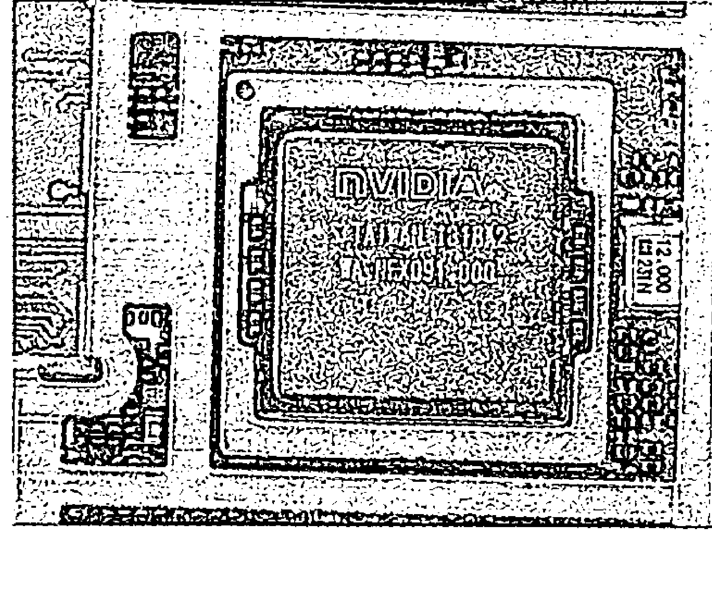

音频等多媒体解码

SoC会根据不同运行环境调用组件

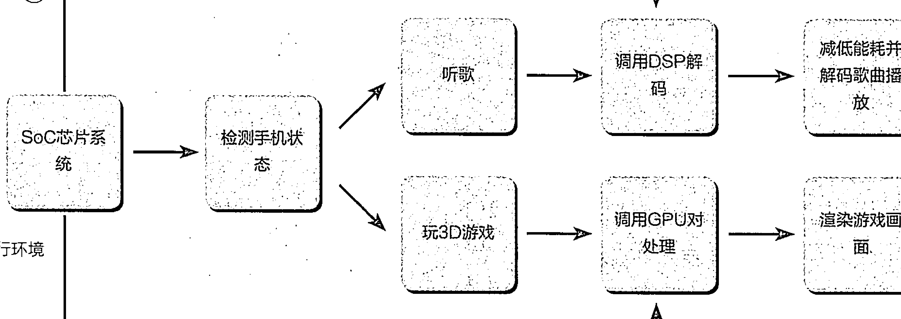

### 深入手机内部 全面解读SoC

从上面的描述可以知道，SoC是集成多个模块的集成芯片，那么里面集成的各个模块又是怎么进行工作的呢？SoC又和手机的性能有什么关系？

首先，手机SoC芯片里集成的模块有不同的分工，比如CPU主要负责计算和多任务处理，GPU主要负责图形解码，通讯模块主要进行手机通信和Wi-Fi、蓝牙通信（图4）。

不过在实际运行中，SoC芯片系统会根据不同的使用环境科学地调配模块的运行。比如高通骁龙SoC芯片，其中集成的DSP（数字信号处理器）和GPU都有解码能力，当用户在使用手机播放音乐的时候，由于音频解码处理要求较低，此时芯片系统就只是调用低功耗的DSP进行解码，从而降低智能手机的电量消耗。但是当用户切换到大型3D游戏时，由于游戏画面需要渲染，此时系统就会调用芯片上的GPU进行解码。这样既不会影响用户的使用体验，又可以大幅降低手机的电量消耗（图5）。

其次，SoC芯片性能直接决定手机性能的高低，不同技术的SoC芯片决定了其硬件性能。因此要说自己的手机性能怎么样，实际上是指SoC芯片的性能。比如小米平板使用的英伟达Tegra 4的SoC，它集成的GPU使用72核GeForce GPU光栅化处理单元，在安兔兔测试中，GPU的3D绘图（192×1080）得分高达7681分，而高通骁龙801（搭载Adreno 330图形处理器）相应得分则只有5500分左右（图6）。在不考虑游戏兼容性前提下，显然英伟达的SoC有着更好的游戏性能。

此外，不同芯片厂商对集成模块的优化技术水平也是决定手机性能的一个重要因素。比如SoC集成的ISP芯片是拍照过程中的运算处理单元，它的性能对手机相机最终的成像质量影响很大（约占15~20%）。因此对于使用不同SoC芯片的两款手机来说，即使它们使用的是一样的镜头，最终成像质量也会有很大的差异，其中就是由于ISP芯片对图像处理能力不同所致。所以市面上那些所谓的音乐手机、拍照手机之所以在手机某一方面有突出的表现，幕后功臣主要就是SoC所集成的芯片。

## 虚拟还是现实
## 解读虚拟现实设备

文/技术宅

最近Oculus推出了新一代Crescent Bay原型产品（图1），而在上个月，三星也刚刚发布了Gear VR，另一科技巨头谷歌则推出Cardboard。虽然上述三款产品名称各异，但是它们都有一个共同的特征，那就是虚拟现实设备。今天就让我们看看，虚拟现实设备到底有着什么样的功能，它又是如何工作的。

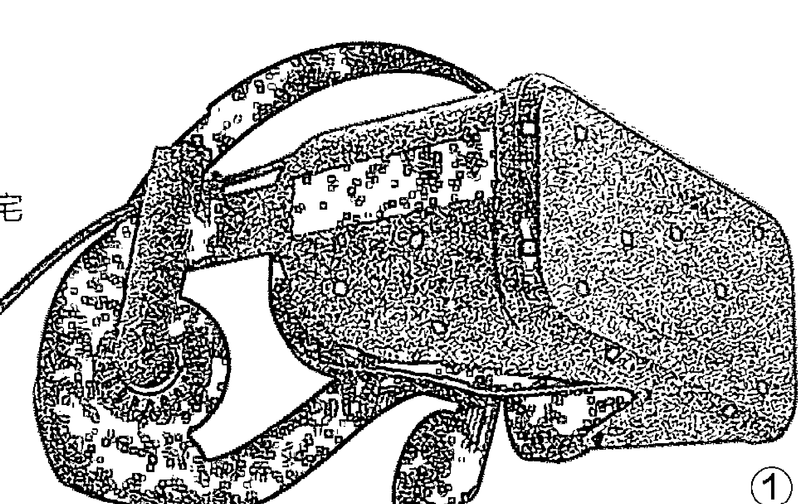

### 科技扫盲——认识虚拟现实设备

虚拟现实（Virtual Reality，简称VR）是近年来出现的高新技术。从字面理解就是一种通过虚拟设备模拟出现实环境的设备，它借助电脑、手机等设备模拟出一个立体三维空间，通过对人的视觉、听觉、触觉等感官的模拟，让用户在虚拟世界里感受到一种极度真实的现实感。

从视觉效果上来说，虚拟现实设备和我们之前介绍的3D显示有些类似，但是3D显示只是模拟出一种3D立体视觉效果，虚拟现实设备则在此基础上融入了各种交互体验，让使用者有更加逼真的全方位立体感受。比如根据试用者的描述，用户戴上Oculus公司的虚拟头盔后，它可以在一个房间里模拟出一个非常真实的高台环境，用户虽然是站在房间的平地上，但是根本不敢在这个虚拟高台上往下跳（实际跳跃只是弯腿并“跳”在平地上），因为这个模拟的虚拟环境实在太真实了（图2）。

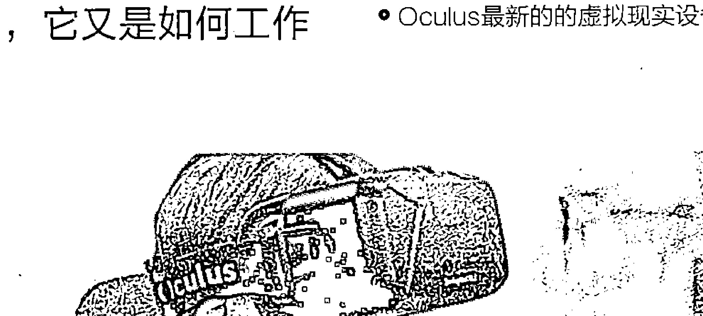

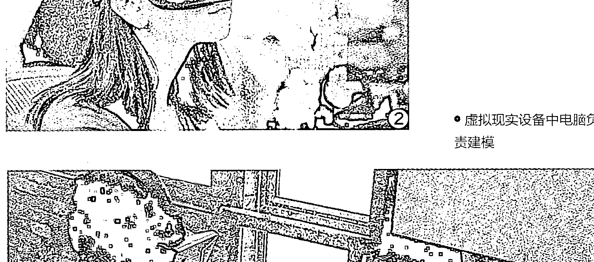

### 解密VR——虚拟现实设备怎么实现现实效果

虚拟环境毕竟还是“虚”的，它是怎么实现如此逼真的模拟呢？这里以上述虚拟高台为例。

首先了解一下虚拟现实设备的组成，一套虚拟设备主要包括建模设备、显示设备、定位设备和交互设备，四种设备各司其职。其中建模设备主要用于获取物体外表面的三维坐标及物体的三维数字化模型，在虚拟现实设备中主要通过电脑渲染完成。比如在虚拟现实游戏中，其中电脑就负责建立3D游戏画面并进行渲染，在上述虚拟高台例子中，这个虚拟场景同样是通过电脑来建模的（图3）。

显示设备则用于向用户呈现3D显示效果，不过为了获得更好的现实环境代入感，现在的虚拟现实设备大多集成了显示设备，比如Oculus Rift虚拟现实眼镜镜面上方就是一块1280×800的LCD（图4）。


因为在电脑上显示3D是左右画面，因此虚拟现实设备中还有一副合成3D画面的眼镜，这样电脑上的虚拟高台同步传输到虚拟头盔的LCD上后，用户看到的就是一幅真实的高台场景。

定位设备则用于确定用户在虚拟3D环境中的位置，在3D环境中每个物体相对于系统的坐标系都有一个位置与姿态，我们看到的景象是由用户的位置和头（眼）的方向来确定的。因此在虚拟现实设备中，定位是通过头盔中惯性传感器来捕捉头部运动以改变图像的视角，这样用户的视觉系统和运动感知系统之间就可以联系起来，感觉更逼真（图5）。

在虚拟高台例子中，用户通过移动脚步和头部，惯性追踪器就会追踪到这些变化，并在3D场景中实时改变场景，让用户有更为真实的环境代入感。

交互设备则用于用户和虚拟环境的交互操作，在虚拟高台例子中，如果高台上有扶手，当系统追踪到用户的手是放在扶手位置时，设备就可以给用户一个真实的反馈。在虚拟现实设备中，物体触摸反馈通过传感器完成，常见的设备如数据手套，在这种手套中设有各种传感器，可以将虚拟中的触摸转换为真实的体验（图6）。

- 通过电脑建模生成虚拟3D场景→同步显示到虚拟现实设备并通过3D眼镜展示在用户眼前→惯性传感器捕捉用户位置变化，同步调整虚拟场景→使用数据手套反馈用户触摸。这样用户就可以感知到一个真实的虚拟场景，并获得和现实生活中一样的体验。

### 廉价版虚拟现实设备——谷歌Cardboard

通过上述介绍可以知道，一套虚拟设备构造较为复杂，而且涉及到显示、追踪、定位、反馈等多个环节，因此设备的造价也比较昂贵。为此，谷歌另辟蹊径推出廉价版的Cardboard，它的主要材料是再生纸板盒，但是却可以将智能手机变成一个虚拟现实的原型设备。它的原理也很简单，主要就是通过光学结构造成虚拟距离。在手机上安装相应的应用后，它会将手机画面预扭曲，接着再通过Cardboard里的凸透镜恢复变形，从而产生了虚拟焦距，让手机画面呈现立体显示（图7）。

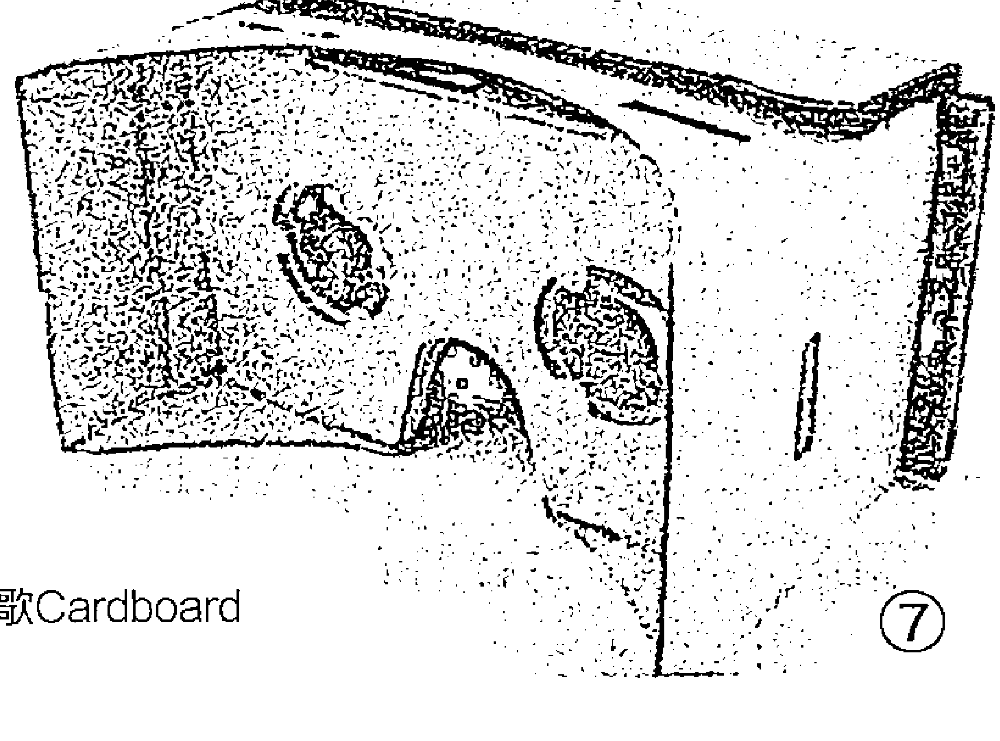

### 虚拟现实带给我们什么

显然虚拟现实设备的普及可以给我们的生活带来极大的影响，比如在射击游戏中，我们可以带着虚拟头盔，手握虚拟AK47，然后在完全真实的游戏环境中，或射击，或躲闪，或跃起进攻，这种真实的游戏感觉绝对是每个游戏迷追求的终极目标。

同样的在生活中，也可以用虚拟现实设备来为自己的新家做设计，比如你可以按自己的意愿在电脑上设计好新家的装修，然后戴上虚拟现实设备在其中漫步，看看哪里的设计有瑕疵。而在驾考的培训中，你则可以戴上虚拟现实设备在“真实”公路上驾驶。

不过，虚拟现实设备也并非完美无瑕，首先由于技术的限制，目前设备显示效果、实时追踪定位、触控反馈体验都还不足。其次，虚拟3D效果由于人体生理结构的限制，长时间使用后大部分人还是会产生眩晕现象，这一切尚有待改进。

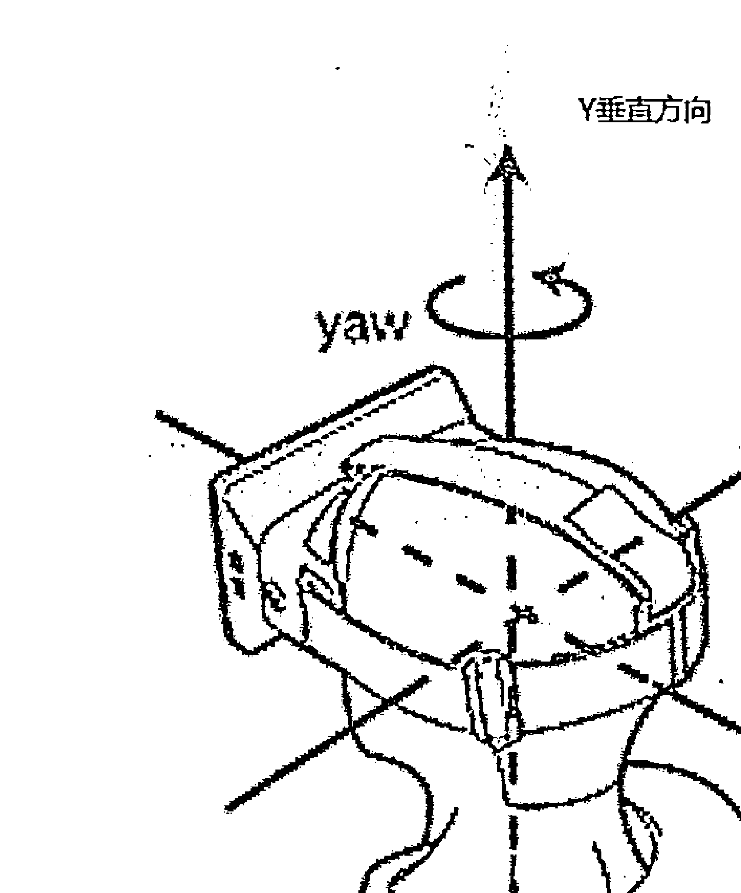

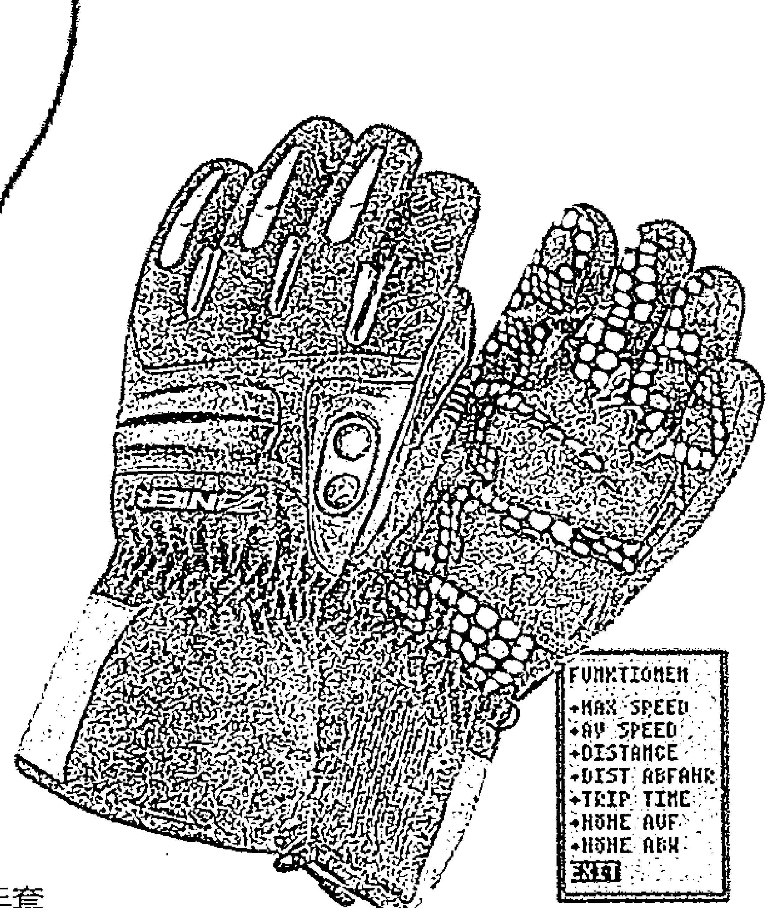

## 智慧插座到底有多智能

智能家居一直是个热门话题，最近小米公司上线了智能四件套，其中“小米插座”便是专为智能家居配套的插座，其他公司也纷纷推出各自品牌的智能插座（图1）。那么什么是智能插座？它有什么智能性？又会给我们生活带来怎样的影响呢？

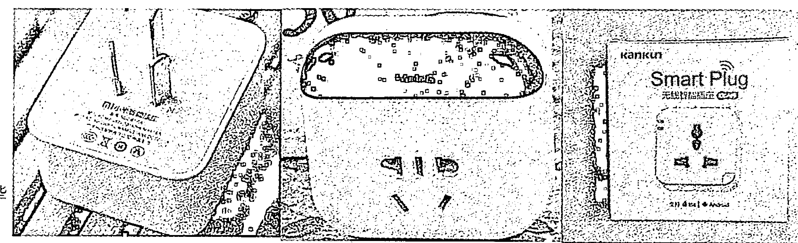

### 掀起你的盖头来 认识智能插座

插座是我们经常接触的电器，它的主要功能是作为家用电器（电灯、热水器、洗衣机等）和电路连接的通道。从外形上看，智能插座和普通的插座并没有什么区别，那么为什么它就叫智能插座呢？这主要是因为它有普通插座不具备的智能性。智能插座实际上是一个小的集成电路系统，主要包括开关电源、电阻、计量器、继电器、控制器和通讯模块，其中无线通讯模块和控制器就是智能插座的主要智能元素（图2）。

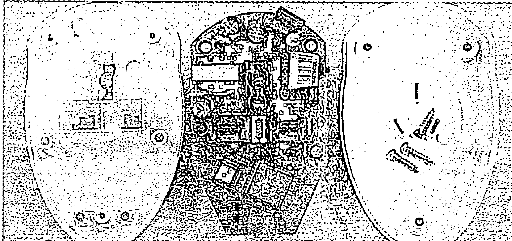

通过对智能插座的拆解可以看到，其内部电路有贴片系统、Wi-Fi模块、解码芯片等，看上去是不是和手机主板有些类似（图3）？

### 到底多智能 智能插座工作原理探秘

通过上面的介绍我们已经了解了智能插座的组成，那么在实际使用中，智能插座是怎么工作的？又是怎么展示它的智能性的呢？智能插座一般和路由器+智能手机配套使用，因此家里首先要有相应的路由环境。比如我们需要使用插座控制热水器的使用，首先将插座和热水器连接，智能插座通电后其内置的Wi-Fi通讯模块就会接入家庭Wi-Fi网络，需要控制插座的手机也接入同一Wi-Fi网络后，通过插座厂家提供的APP，在手机上将需要控制的插座添加到设备列表即可对其进行控制（图4）。

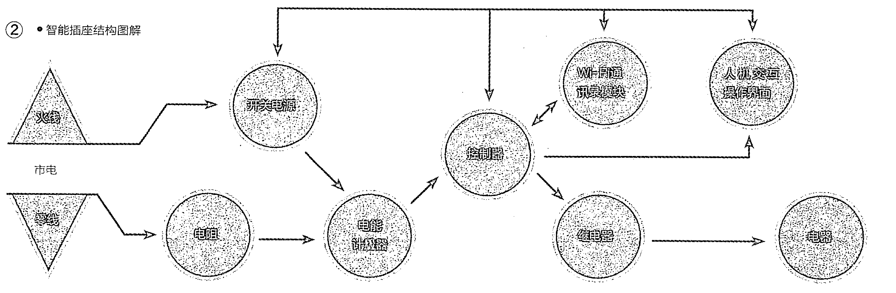

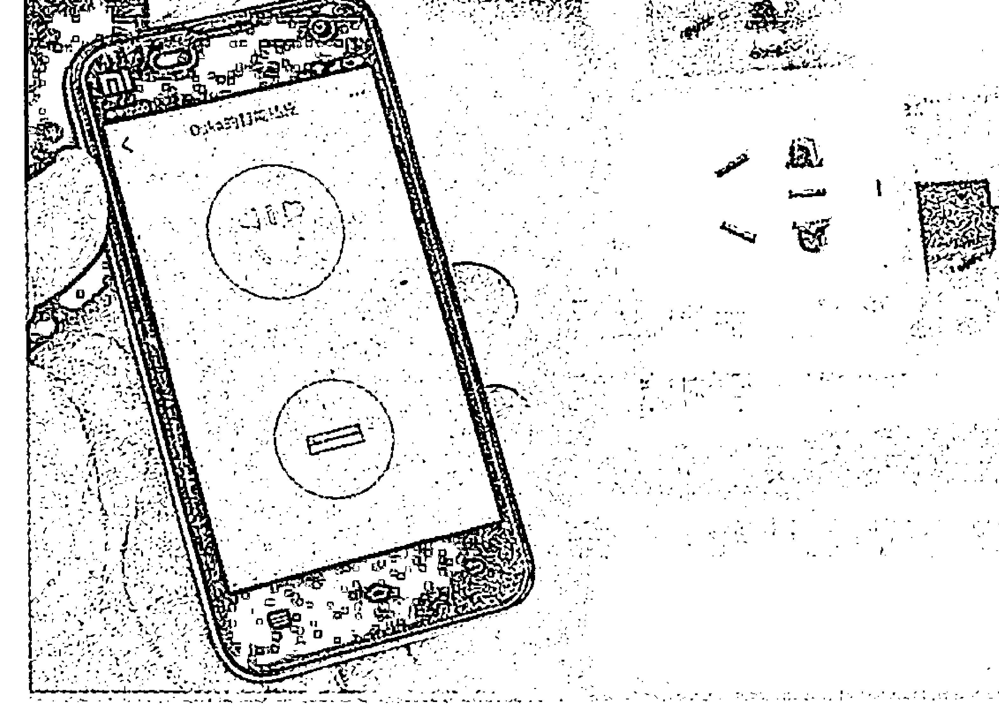

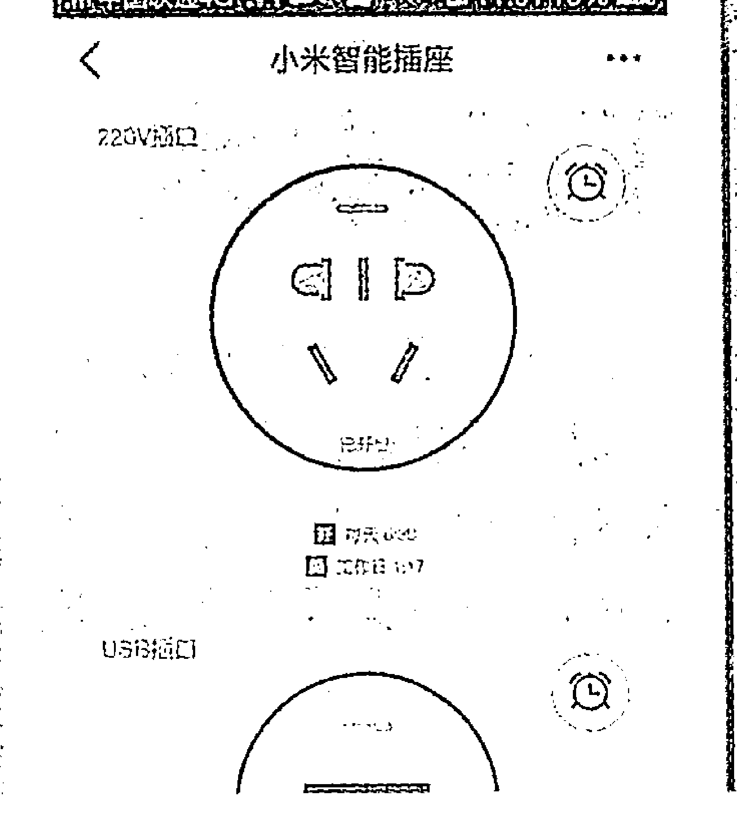

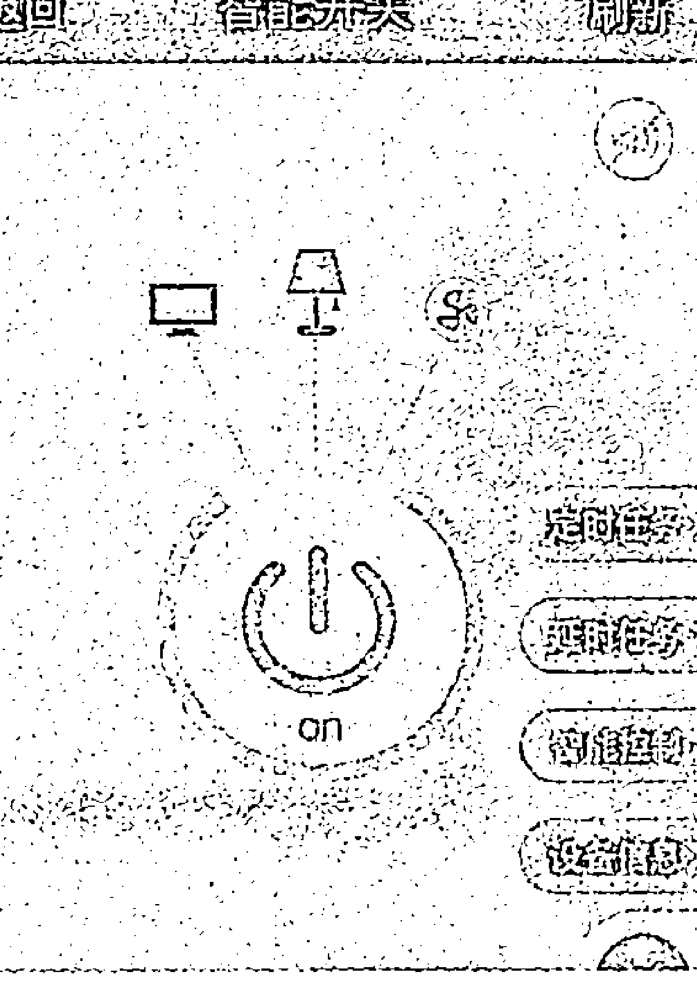

完成设备的添加后，我们就可以在手机上对插座进行智能控制了。比如切换到小米插座后点击屏幕插座的图标后就可以开启/关闭插座电源，这样任何普通家电连接小米智能插座后，都可以在手机上对普通家用电器实行远程控制（图5）。

通过上面的操作可以知道，智能插座之所以比普通插座更智能，关键就是这些插座配置了无线通讯模块，它可以接收手机发出的指令，然后传递给控制器对开关的通/断电状态进行控制。从原理上看，手机控制插座和我们日常使用的手机控制机顶盒、电视其实是一样的。手机就相当于智能插座系统的控制中枢，我们可以在手机屏幕上进行各种智能控制（图6）。

### 智能插座，想说爱你不容易

通过上面的介绍可以知道，智能插座能让普通电器具备智能控制功能，而插座的智能控制必然会给我们的生活带来便利。比如不少朋友喜欢使用砂锅炖汤，由于炖汤的时间较长，当出门购物或者做其他事情的时候就很容易忘记家里的砂锅还在工作。现在如果要控制家里的砂锅，使用智能插座连接后，只要手机可以上网，通过网络就可以轻松将砂锅的电源关闭。

不过，智能插座在目前状况下仍然有许多不可避免的缺陷。首先目前很多电器并非简单的通/断电就会被智能控制，如洗衣机通电后仍需设定模式才能清洗衣服，电饭煲通电后仍需手动设定模式才能做出香喷喷的干饭。而智能插座目前只能实现对电器简单的通/断电控制。

其次，目前智能插座的使用仍然有一定局限性，出于对线路的保护，目前智能插座负荷电流多在10A以内，而现在家用大功率电器如空调负荷则多在16A，这些电器就无法使用这些智能插座。此外由于内部添加智能模块，智能插座的体型都偏大，这样插在普通插座上时很容易抢占其他排插的位置（图7）。

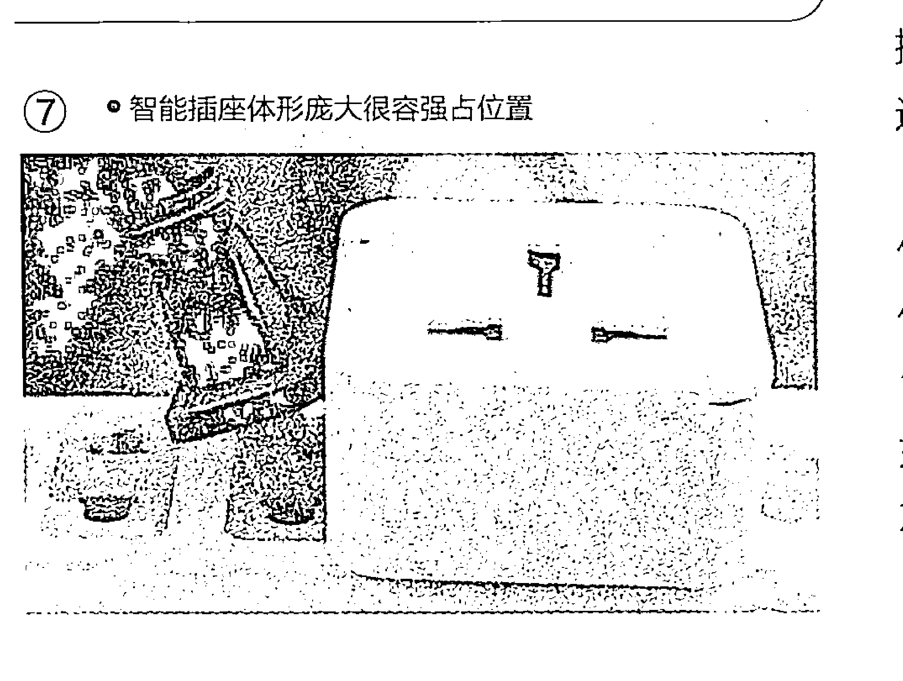

再次，智能插座控制是借助于Wi-Fi+APP实现控制，如果Wi-Fi信号无法覆盖，智能插座无法接收信号，如果我们在外面使用手机控制，则需要在路由器中对智能插座的端口进行映射，操作起来比较麻烦。

当然，任何一件新鲜事物的出现都不可避免有或多或少的缺点。随着智能家居系统的普及，在未来的智能生活中，智能插座并不是一个人在战斗，它是作为家居控制系统的一份子存在的，而且也具备更高的智能性。智能插座和家居控制系统相连后可以智能地对电路进行控制。一个比较现实的例子，冬天夜尿后，很多孩子都会忘记随手关灯，这样躲进被窝后又要起来关灯。而现在可以设定一个指定时间段，如“0:00-6:00”，卫生间电灯状态是通电后5分钟自动关闭，这样即可解决上述麻烦。总之，我认为，智能插座将会有不错的发展前景。

## 通话上网两相宜
## 解密VoLTE技术

文/技术宅

现在的手机除了通话，上网也是其一个重要的功能。随着4G的普及，手机上网速度越来越快，但是很多人会发现，手机在上网的同时如果又打电话，手机网络就会停顿。而使用VoLTE技术的网络就可以让我们通话、上网两不误，最近上市的iPhone 6就支持VoLTE。VoLTE究竟是怎么做到的呢？下面就让我们一探端倪。

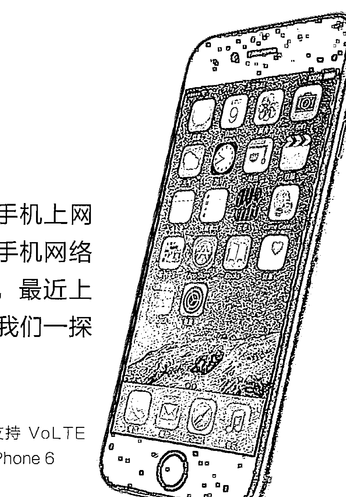

### 当前现状：网络/通话为何不能两相宜

早在2G时代，手机就可以通过GPRS技术实现上网。GPRS利用GSM网络中未使用的TDMA信道，提供中速的数据传递，从而实现手机上网功能。不过由于GPRS基站和手机终端的限制，我们仍然无法实现手机通话和上网同时进行。大部分手机（B类终端）只是可以自动切换，在打电话时将GPRS数据传输暂时挂起，通话结束再继续传送数据。不过由于GPRS网速较慢，现在已经被3G网络替代。

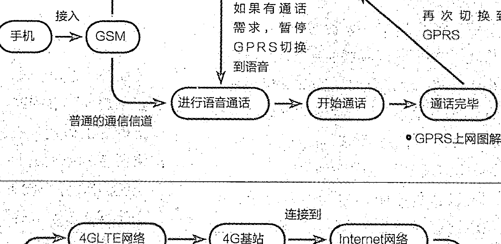

3G网络主要有三种，其中电信的CDMA2000由于通话和短信还是使用的CDMA 1X网络，数据流量则是3G和1X同时使用的，因此二者仍然不能同时使用。移动TD-SCDMA类似，而联通的WCDMA从技术上来说支持通话和上网，但是联通目前使用的是通话数据优先于网络数据策略，这样正常打电话的时候网络数据仍然会被断开的。不过随着4G的普及，现在的3G也逐渐被4G取代。

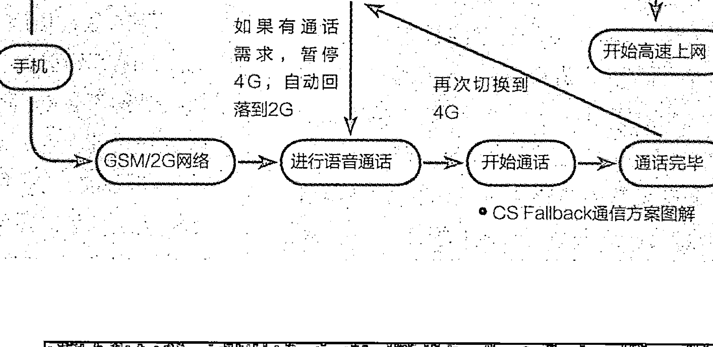

4G网络只有TDD-LTE和FDD-LTE两种制式，目前也只有移动的TDD-LTE正式投入商用。因此这里我们主要以TDD-LTE为例。虽然4G网络上网速度已经很快，但是为了保证用户通话质量（通话毕竟是每款手机的基本功能），目前4G使用的是“CS Fallback”通信方案。这种方案的特点是4G+2G网络同时运行，当用户使用4G上网时，使用的是LTE高速网络，但是目前TDD-LTE仍然无法直接传输通信数据，因此一旦切换到通话则自动回落到2G网络，以保证用户通话可以顺利进行，从而无法实现通话和上网同时进行。

### 通话+上网，VoLTE全盘护航

随着移动网络发展，用户对高速移动网络越来越依赖，大家都希望能够在通话的同时保证网络的联通，比如正在下载文件，此时突然需要打电话，我们自然不希望后台下载会中断。但是从上面的介绍可知，目前4G和之前GPRS在上网和通话之间切换实际上并没有什么不同，上网和通话仍然使用的是相对独立的线路，通话仍然需要借助传统的2G网络实现。

为了解决这个问题，VoLTE横空出世了。VoLTE即Voice over LTE，直译过来就是LTE上的语音服务。它是一种IP数据传输技术，无需2G/3G网，全部业务承载于4G网络上，可实现数据与语音业务在同一网络下的统一。它和传统“CS Fallback”通信方案的最大不同就是使用一套网络来实现通信和数据传输。

随着4G的发展，目前的移动网络已经可以实现大容量数据的传输。用户手机在连通4G网络后可以实现高速上网，这是利用4G本身的高速特性实现的。此外，VoLTE借助现有的4G宽带，通过引入高清编解码等技术，实现了通话语音数据在4G网络的传输。

由于4G网络的高网速，通过VoLTE传输语音数据不仅可以为用户带来更低的接入时延（拨号后的等待时间），并且可以提供更高质量、更自然的音视频通话效果。

简而言之，VoLTE就像把原来专门用于通信的网络整合在当前4G网络中，实现数据和语音传输的一体化。这样通过VoLTE我们就轻松实现通话和上网的完美兼容。当然VoLTE同样兼容2G/3G网络，当前区域如果没有4G覆盖，它则可以自动切换到原来的2G/3G网络保证语音呼叫的连续性。

### VoLTE离我们并不遥远

通过上述介绍我们了解了VoLTE的特性，那么要怎样才能使用上VoLTE？首先VoLTE需要运营商的支持，因为手机的通话和上网数据传输都必须在支持VoLTE的4G网络上才能完成。据中国移动的计划，今年年底就可以完成全国VoLTE的部署。联通和电信则在等待4G牌照正式发放，相信也很快就会完成对VoLTE的部署。

其次，VoLTE需要终端的支持，因为需要保证通话上网数据在同一网络传输，手机芯片就必须支持这两种数据的同时传输。比如中兴WiseFone 7510芯片（搭载该芯片手机为Q801T）、华为海思的Kirin 920芯片（搭载该芯片手机为荣耀6），最近发布的iPhone 6和iPhone 6 Plus等支持VoLTE技术，只要运营商部署好VoLTE网络就可以使用了。

显然，支持VoLTE的手机可以更好地满足我们通话和上网的需求。因此大家在以后购买手机的时候尽量购买支持该技术的4G手机。不过由于现在4G有TDD-LTE和FDD-LTE两种制式，所以购买全制式的手机应是一个不错的选择。

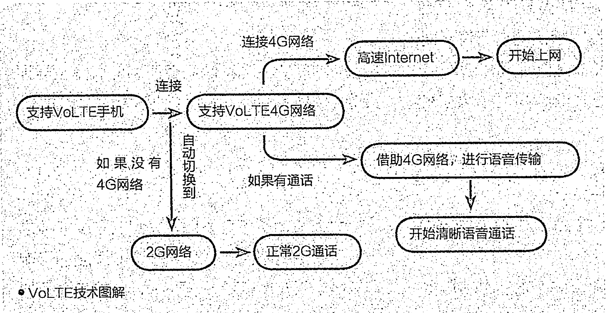

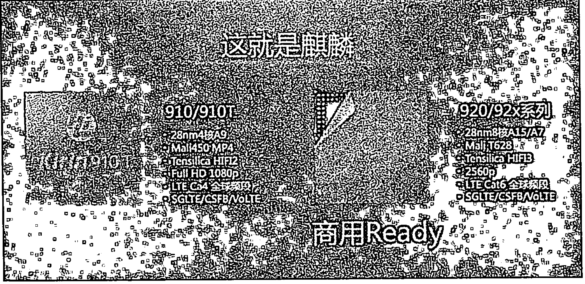

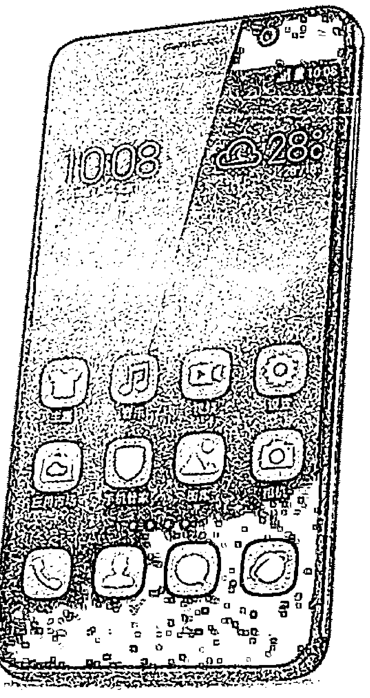

## 双11背后的功臣 认识网购网站服务器

文|技术宅

在过去的双11购物狂欢节，很多网购达人肯定疯狂购买了不少的商品。可是大家知道当数以亿计的网民在同一时刻点击购物的时候，是谁在保证我们的购物通道不阻塞？又是什么让我们能够在第一时间顺利付款？其中的幕后功臣就是网站高性能的服务器。那么它又是怎么工作的？为什么能够在海量访问下不宕机呢？

### 探访幕后英雄：认识网站高性能服务器

任何一个网站都需要服务器的支持，服务器是用户访问网站网络的节点，它存储网站大部分的数据、信息，并对数据进行高效的处理。举个形象的例子，如果我们把购物的网民看作是现实生活中超市购物的市民，那么网站服务器就相当于连锁超市的管理层，它既要统筹全国各个门店的销售，为顾客创造良好的购物环境；又要处理全国顾客的购物需求，为购物者提供足量、优质的商品。同样的，网站服务器（当然还需要IT技术人员的操控）也要担当起类似的功能，在前台它要及时响应网民的登录和点击，后台则要对网民实际购物进行高效处理，如商品的陈列、促销、结算、统计等。因此大型购物网站大多使用高性能的服务器，像淘宝使用的就是世界顶尖的IBM Power Systems服务器（图1）。

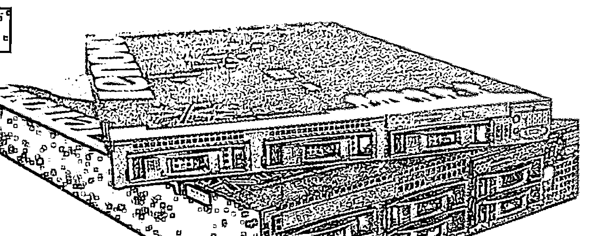

### 软硬兼施：网站服务器是怎么保障网购的

据统计，今年双11，在活动开始1分钟之内，天猫上有超千万人同时齐点，开场仅仅74秒，支付宝总成交额就超过1亿元，按照每单商品100元计算，这样支付宝服务器每秒就要完成14285单的支付（图2）。

显然这种高强度、并发式的海量数据是对网站服务器的严峻考验。那么在双11这场网购大战中，网站服务器怎么保障大家的网购？这里主要从硬件、软件两方面进行分析。

首先在硬件方面，网站服务器的配置都比较高端。这里以IBM Power Systems S822L服务器为例，这款服务器CPU由12核3.02GHz的POWER 8处理器组成，总计96个线程（每核芯512KB二级高速缓存、8MB三级高速缓存、16MB四级高速缓存），内存最大为64GB（1600MHz DDR3）。大家知道，缓存大小是CPU的重要指标之一，而且缓存的结构和大小对CPU速度的影响非常大。CPU缓存是位于CPU与内存之间的临时存储器，它的容量虽然比内存小，但是交换速度却比内存要快得多。在CPU调用大量数据时，CPU缓存越大就可避开内存直接从缓存中调用，从而加快读取速度，大大提高CPU的效率。


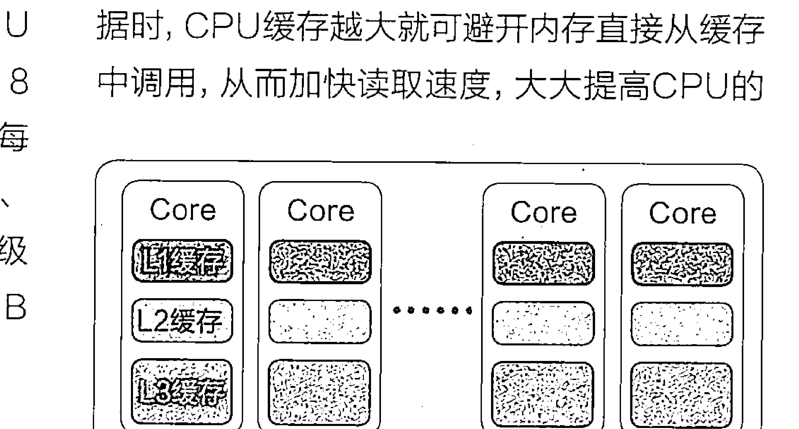

### 面向移动终端挑战 网站服务器移动优化措施

计算效率，特别是在针对双11这种突发性、高强度海量数据的读取时，CPU缓存起到了极其重要的作用。

因此，仅从硬件角度来看，单台服务器的配置就非常“高大上”，而且这些服务器都是针对大数据工作负载优化过，更何况类似淘宝这样的网站是数千台这样高性能服务器组成的集群，这样从硬件上就保证服务器有足够强悍的计算吞吐能力。

其次在软件上，大型购物网站服务器的数据库普遍使用数据镜像方式进行并行计算。如上所述，大型网站服务器是一个服务器集群，服务器数据库使用镜像方式来并行处理用户的访问。数据镜像就是将数据处理分发到多个镜像服务器同时处理，如果把双11比作农村婚宴，服务器就像是做菜的锅，网友就像是要参加婚宴的亲朋好友，因为来的客人很多，我们要准备很多的锅（服务器）同时煮菜（并行处理），这样才可以快速为每桌上好婚宴的饭菜。

网站服务器使用数据镜像方式既可以做好负载均衡，同时又保证了数据的一致性（并行镜像服务器使用同一数据库），而且还有高可用性，即使某台服务器挂了，其他镜像服务器仍可以提供同样的服务。

随着移动购物的兴起，现在在购物网站服务器还要针对移动端发起的购物请求做出优化。2014年双11的活动开始以来，淘宝消费者在移动端访问双11会场的流量几乎达到了PC端的两倍。

由于移动端网络不稳定性和终端多样性，为了确保移动交易完成，一方面购物网站服务器要结合移动终端特点（如手机屏幕小、配置较低、移动网络网速慢）进行优化，对网页进行瘦身，实行按需加载、内存精简等优化项目，确保移动端访问更高效。另一方面则要对常见的终端进行适配，在服务器要保存足够的适配页面，确保大多数的移动终端都可以正常访问购物页面。

会用到各种大数据处理技术以保障用户网购可以顺利完成。如异构计算技术（使用服务器CPU和GPU协同计算，提高服务器整体计算能力）、批量处理技术（把一堆基本相同的请求批量处理，如大家同时购买同一个商品，服务器在后台收集到一定数量的请求后一次性完成操作）、异步技术（即收集请求，然后延时处理，如网友在同一时间提交支付请求，如果达到服务器上限，服务器就会自动将请求进行排队以减轻服务器的压力）等，来尽可能保证用户的网购可以在最短时间内完成，同时又不会让服务器宕机。

总之，正是这些幕后强大的技术支持，才确保了我们网购时的痛快淋漓。

## 移动购物 省钱有道

文 | 俞木发

随着移动互联网的提速与智能终端的普及，呆板地坐在电脑前购物成为了过去式，掌间轻松购成为新的流行时尚。嗅觉敏锐的商家们为快速占领新兴领域自然不遗余力，吸引消费者的优惠措施层出不穷，作为消费者的我们如何能用智能手机购物获得更大的实惠呢？

### 线下查价

现在网上购物的朋友都喜欢线下查看实物，收集本地超市价格后和网上价格比较，然后选择便宜的购买。利用Android手机的“快拍二维码”，我们可以快速收集到商品的价格。

下载安装“快拍二维码”，在手机上启动程序后切换到“条形码”，接着将超市商品的条形码放置在手机屏幕下方，此时程序就会自动调用手机摄像头进行扫描。

成功识别条形码后，它会根据程序内置的数据库读取条码信息（信息来源于“中国物品编码中心”），正确识别后点击下方的“超市价格”，这里还会列出同一商品在不同超市的售价比较，这样我们就能轻松获得商品的线下价格了。

默认情况下扫描完成的数据会自动保存在“我的→我的历史”下，打开数据后点击下方的“分享”，接着选择“腾讯微博分享”，将扫描数据发送到腾讯微博。

> 小提示
> 如果程序无法识别条形码，我们还可以单击扫描界面的“手”图标，进入手动输入界面，在这里可以手动输入条形码，只要商品条形码在“中国物品编码中心”有，程序照样可以正确识别。

这样需要网购参考价格时，我们只要随时登录自己的腾讯微博，然后打开其中的微博消息即可看到价格。微博每条消息类似“XX购物时用#快拍二维码#拍条码查价格、辨真伪、看评论真方便，我刚扫的：”固定格式。

### 货比三家

收集到了需要购买的实物价格后，我们就可以准备到网上购买了。现在网上商城也很多，自然也是要货比三家。网上比价使用“我查查”（下载地址：http://www.wochacha.com/m.html）即可快速实现同一商品在京东商城、1号店、亚马逊等电商的价格数据。

启动程序后在搜索框中输入需要购买的商品名称进行搜索，然后在搜索结果中切换到下方的“网络商城”，在这里就可以看到同一商品在不同电商的价格。“我查查”还提供不同线下超市的价格比较，即使是实体店购物也可做参考。

当然，对于喜欢在淘宝购物的朋友，一淘客户端也是一个不错的比价工具。在手机上启动一淘后输入搜索商品，接着在搜索结果中就可以看到网友的评论和销量（评论可以作为是否购买的参考），在页面的最下方同样会列出不同电商的购买参考价格。

> 小提示
> 对于一些大型商品如平板电视、洗衣机等，一般超市会标注大幅的促销价格，我们可以利用微博的“图片+地址”功能进行采集。在手机上启动新浪微博客户端，登录后点击新建信息按钮，接着点击摄像，对着需要收集价格的商品拍照，完成照片的拍摄后，微博信息会自动添加上当前位置信息，然后点击“发送”。这样通过微博，我们就可以收集到商品价格和销售地址信息。

> 小提示
> 在购买商品时，价格是一个重要的参考，但是并非唯一的考虑因素。我们还要综合考虑以下因素：
> - 商家的信誉
> - 物流配送
> - 售后服务
> - 正品保障
> 比如淘宝上很多商家水货手机价格较行货便宜很多，但是售后并没有保障，因此不能认为价格最低的商品就最适合自己。

### 返利链接来省钱

完成上述的操作，如果已经确认购买的商品和商家，那么接下来就可以到电商网站去购买了。不过现在很多电商都提供了返利，我们还可以借助“返利网”客户端来省钱。

到http://www.51fanli.com/下载“返利网”客户端，在手机上启动后先使用返利网账户登录（可以使用淘宝、新浪微博、QQ账号），接着在搜索框输入购买商品的关键字，找到自己需要购买的商品和商家，接着在搜索结果点击“立即购买”。

这样会自动链接到购买商家，按提示使用自己的电商账号登录下单购买即可。查看购买后获得的返利，只要点击程序界面的“我的→我的账户→我的返利”，在这里可以提现、充话费等。

现在返利网站很多，而且鱼龙混杂，因此大家在选择返利网的链接进入购物网站后，一定要仔细查看是否为正确的官方购物网站，防止进入钓鱼网站被骗。此外，并非所有店铺、所有商品都支持返利，下单前请认真查看。

### 专享手机支付

完成商品的下单，接下来就是支付货款了。不过你可别按部就班地使用支付宝、网银等付款，因为很多移动支付都有不少优惠可以帮助我们省钱。比如淘宝商城很多商品都有手机专享价（只要使用“手机专享价 +商品”进行搜索即可）。

对于支持手机专享价的商品，可以在电脑上直接打开商品页面，然后打开手机淘宝的“扫一扫”，扫描页面下方的“扫手机专享价”二维码。成功识别后手机淘宝会自动转到购买页面，我们只要按提示进行购买并用支付宝手机钱包支付即可，比如上面的商品使用手机淘宝购买可以节省92.24元。

### 更多优惠

为了促进用户使用手机端购物，很多电商都有不少的优惠，比如京东使用手机端下单，第一次可以获取5元的京券，第一次使用微信支付也可以获得5元的红包，初次使用手机端购物的用户可以充分用好这些优惠。此外，现在很多银行也为开通手机银行的用户提供不少优惠，如华夏银行手机银行用户，首次开通就送10元礼券（可以用于购物），每日使用中行手机银行“中银掌上行”进行1笔活动有效交易，用户即可获得当日抽奖机会。大家可根据自己的实际情况使用手机银行支付货款，以获取更多的优惠。

### 物流收货——扫一扫赢红包

完成商品的购买，接下来就是准备收货了。大家可别忘记了收货还可以抽取红包，比如现在很多淘宝商城的商家在举行“扫码赢红包”的活动，有机会赢取支付宝现金红包金额2元、5元、10元、50元、100元、1000元或集分宝。如果你购买的商品有这样的活动，那么商家会在包裹内附送一张扫码赢红包的二维码图片。

确认收货后取出图片，然后在手机上安装淘宝客户端，启动后使用自己的淘宝账户登录（一定要购买该商品的淘宝账户），接着点击程序界面右上角的“扫一扫”图标。此时手机会自动打开二维码扫描组件，然后用手机对着包裹内的二维码扫描。成功识别二维码后会自动跳转到中奖界面，如果中奖红包则会自动添加到“我的淘宝→我的优惠信息→店铺红包”，下次在同一店铺购物就可以使用获得的红包了。

> **小提示**
> 随着移动购物的用户越来越多，很多商家各种优惠信息都在使用二维码发布，我们可以使用上述组件直接在很多店铺首页扫描获得优惠券。注意，成功识别二维码后会自动跳转到特定网址，不要随意扫描来历不明的二维码。

### 购后评价——领积分得优惠

收到了商品并非就没有优惠可言了，因为很多商城都支持对商品的评价，对于用心撰写商品评价的用户，可以获得网站给予的积分，这些积分可以在下次购物时使用。比如京东用户，购买商品后发表评价即可获得京豆（前五位评价的用户可获得双倍京豆，100京豆可抵1元现金使用）。由于手机客户端可以让我们随时随地发表评论，因此购买到商品后可以及时登录，然后在手机上对商品进行评论。

### 且用且珍惜——更多优惠在手间

由于移动互联网的普及和提速，以及各种移动支付手段的普及，移动购物也越来越普及。手机的随时、随处可以购物，也让各大电商趋之若鹜，纷纷针对移动端购物推出了各种各样的优惠措施。除了上述介绍的优惠方法外，我们还可以随时关注各大电商网站推出的优惠活动。

### 使用手机淘宝获得更多的金币

淘宝金币可以在很多商铺抵扣货款使用，手机淘宝则可以领取更多的金币。因此大家可以每天登录手机淘宝，然后在首页点击“领金币”，这样即可领取30个金币（一个折合0.01元），以后购物时就可以使用金币抵扣购物款。

### 使用微信领取京东红包

目前京东“10亿红包全民抢”活动正如火如荼在开展，在手机上登录自己的微信，然后查找“京东jd.com”并添加关注。成功添加后京东会自动发送一条信息给我们，在打开的对话窗口切换到“粉丝福利→抢红包”。接着在打开的窗口就会显示一个红包的图标，按提示用手指刮开涂层查看是否中奖，如果中奖红包会自动添加到“我的京东红包”，点击“去购物”就可以自动连接到京东网站购物了。

## 偏门而有趣的手机玩法

文 | 其心菩提

除了可当案板切菜或假冒榔头砸核桃外，智能手机通过安装相应的应用，或利用其本身具有的一些特性，还可实现其他一些匪夷所思的功能，而这些功能的存在，将为我们的日常生活带来极大便利。

### 问，又忘密码了？通信录变身密码本

邮箱、论坛等网络服务多了，同时手头拥有了几张银行卡，这时，最怕的是什么？当然是忘记用户名或密码，自己把自己锁在服务之外。实际上，要永远记住用户名和密码也简单，只需利用好手机中的通讯录功能即可。和保存到便笺、记事本等方式相比，将各种服务的用户名和密码以联系人的形式保存到通讯录中，具有隐蔽性强、查看方便等优点。只要设置得法，稍加变通，一般人就是看到相应内容，也不会想到它其实就是与我们生活息息相关的“超级隐私”。而且使用该方法还有一个好处，那就是我们可以随时将通讯录上传到网络服务器中，以后即使手机丢失，也能立即联网恢复。

以将农行信用卡的相关信息添加到通讯录为例。进入“新建联系人”界面，在“姓名”文本框中输入“尹信农”（一般情况下，为了将此类特殊联系人与常规联系人区分开，我们需要在此联系人的名称中，添加一点标记，比如，银行卡的“姓”可以为“尹”或“钱”，名字最好能透露出一点卡的属性，比如：开户行和卡类等信息。比如，我们此处设置的是农行信用卡，可以将其名字设置为“尹信农”，而如果设置的是存储卡的话，则可以将其称为“尹蓄农”等，以此类推。）

同时，将银行卡卡号和密码等信息添加到手机号或邮箱等文本框中。由于目前银行卡的卡号，一般是19位数字，而手机号码一般为11位数字，所以我们可以按8、8、3或8、6、6等规律，将其拆分成三组数字，然后将其分别保存为两个手机号码和一个固话号码（为了让手机号码看起来更逼真，手机号码的前三位应以186、155等号段开头）。至于密码，既可以保存成另一个固定号码，也可以保存成联系人的邮箱地址（密码作为@前部分），由于后一种方式更灵活，而且允许使用字母和特殊字符，所以适用范围更广，几乎可用来保存一切密码。

有时我们所用的网络服务，如邮箱、淘宝和论坛等，其用户名和密码往往是数字和字母混杂，有时甚至可能是汉字，对于此种服务，单纯依靠伪装成手机号来保存可行性不大。这时，我们可以通过点击“添加更多项”按钮，打开相应的界面，在出现的界面中，通过设置“即时消息”、“地址”和“网站”等项，将相应信息混杂进去。

| 项目       |
|------------|
| 姓名拼音   |
| 即时消息   |
| 地址       |
| 称呼       |
| 网站       |
| 互联网通话 |
| 生日       |
| 农历生日   |
| 备注       |

### 遥控器不好用 摄像头迅速告诉你坏没坏

使用遥控器进行电器遥控，却发现电视、机顶盒等无任何反应，难道是没电了？结果换上电池后情况依旧，这时，我们往往怀疑是遥控器坏了。那么，究竟是不是遥控器有问题呢？其实很简单，我们只需利用手机提供的拍照功能检测一下即可。启动相机，将遥控器前端的红外线发射器对准摄像头，观察一下手机屏幕，如果成像区出现紫色亮斑，说明遥控器信号发射功能正常，问题应该是出在电视或机顶盒的红外线信号接收器上。否则，说明遥控器损坏，直接更换或维修即可。

### 车锁遥控器不灵效 手机妙法帮你放大

出车在外，离开后却发现车门没锁，但走出的距离已比较远，用正常遥控的方式已不再奏效时，我们不妨随意拨通一个手机号码，然后将车钥匙放在手机旁边，这时，我们会发现，车钥匙遥控可能就发挥作用了。当然，用该方法，我们也可在较大且拥挤的停车场中，轻松找到自己的爱车。

上述方法之所以能扩展车钥匙的遥控范围，原因在于为了让用户能在偏僻地方接收到信号，手机中通常会内置信号放大器。这种放大器同时可作用于钥匙释放的电磁信号上，这样，当我们接通手机后，钥匙释放的信号就会被放大器放大，因而也就会出现钥匙遥控距离增加的现象。

不过，需要注意的是，这种扩大车钥匙遥控范围的方法，其能扩展的距离因车型不同而有差异，一般来说，近的可扩大几米，而远的则可扩大将近30米左右。

> 在较大的停车场里，可以拨通手机，通过该方法找车

### “监工”有绝招 纱帘屏幕半遮面

办公室某些同事总是爱偷懒，不过，都是那么大的人，如果老是瞪着眼睛一味监视，很容易将人盯毛了，产生厌烦情绪。这时，我们固然可用戴上墨镜的古老方法，隐藏一下目光，但办公室里戴墨镜，总让人觉得很怪。其实，如果愿意的话，我们完全可用“透明屏幕”这款应用（下载地址：http://www.mumayi.com/android-238615.html），让手机变成“透明”的遮板。

安装后启动程序，在其主界面中，按个人喜好及手机所拥有的屏幕分辨率，设置好透明度及分辨率等项，单击“打开”按钮，手机屏幕即会变成透明的。此时，我们只要将手机瞄向员工，员工的身影就会出现。在监视的过程中，我们可以根据自己的需要，随便启用相应的应用进行操作，如启动浏览器查看新闻，或者打开短信给好友发送短信等。这样做，一方面可鱼与熊掌兼得，让“监工”和工作两不误，一方面可更好地装扮自己，让周围人觉得你只是在用手机看新闻或发短信。

> 小提示
> 除了可应用于“监视”外，该应用同样适用于喜欢走路玩手机的朋友。路面上有什么障碍物能及时发现，不至于因视力不及而跌入下水道中。此外，这里需要提醒大家的是，由于该应用实际使用的是摄像头，比较耗电，所以不用的时候应及时关闭。

### 用手机必知的两大技巧

| 技巧名称 | 简介 |
|----------|------|
| 打电话这样才省钱 | 网络有1~2秒的延迟，这样，当我们通话到1分钟挂断，运营商会将通话时间计算成1分零1秒或2秒，因而会收2分钟的话费，所以没紧要事的时候，尽量控制在56秒~58秒之内吧 |
| 设置号码为空号 | 拨打**21*999999#号码，别人再给你打电话时会提示为空号，再按##21#并拨打，会恢复正常。该招对防骚扰很有用 |

如果送你一部智能手机，要求在几分钟之内开发出一款Android小游戏，你敢应战吗？其实在国外的教育中早就实现了，而且从幼儿园就开始这样培养孩子的计算机思维。

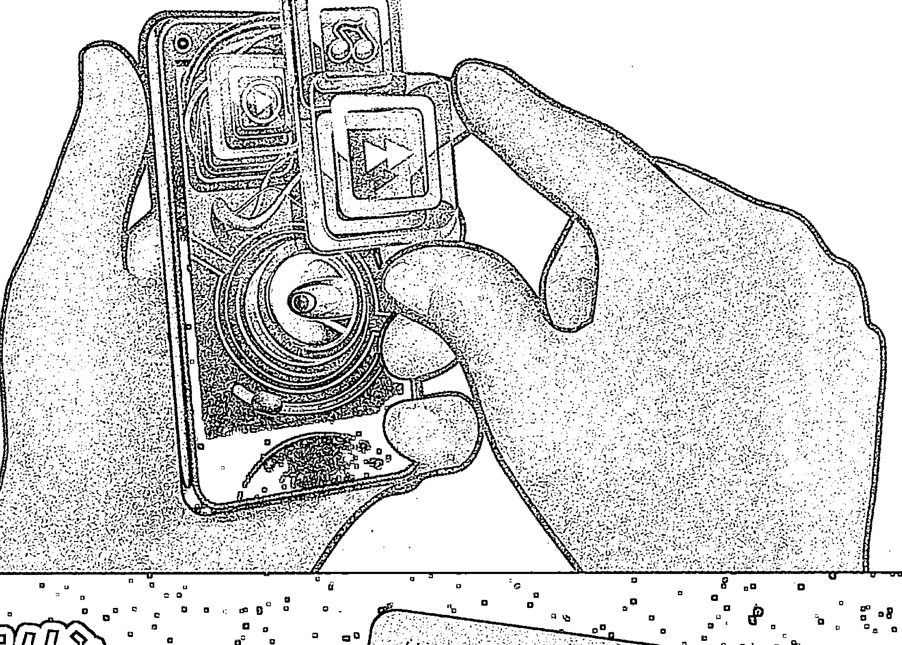

## 傻瓜化开发 Android小游戏
文|段晓东

使用MIT App Inventor开发工具——一款在谷歌Chrome浏览器下的云端开发工具，其搭积木式的编程理念，会让枯燥乏味的软件编程变得那么有趣。下面我们也小试牛刀，开发一个Android弹球小游戏。

### 硬件准备

一台能上网的笔记本电脑或台式机，最好都带有Wi-Fi，以便将来生成的程序更容易传送到手机中（图1）。否则，只能通过数据线下载安装，比较麻烦。对智能手机无特别要求，任何一部市面流行的普通Android智能手机足以符合开发要求。

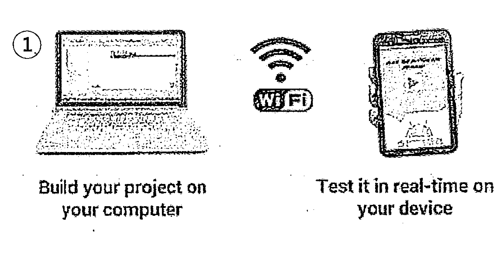

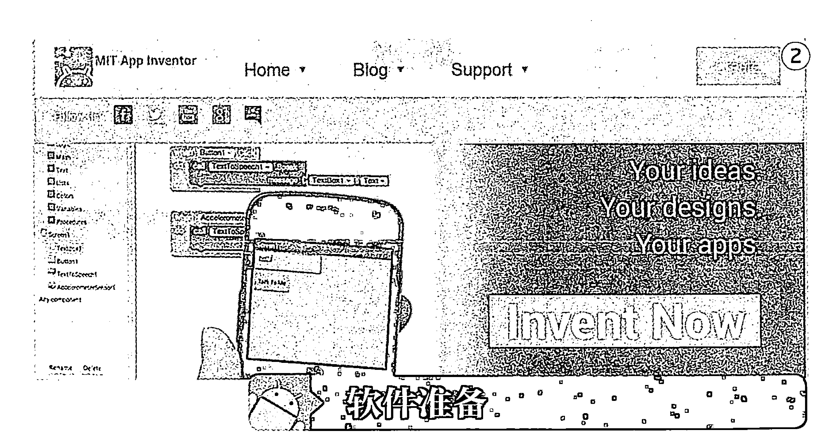

### 软件准备

安装谷歌Chrome浏览器或火狐23以上版本，苹果Safari也可，而微软的IE则无缘开发环境，否则系统提示浏览器不兼容。同时要注册谷歌的Gmail账户（gmail.google.com）。接着进入MIT App Inventor官网（appinventor.mit.edu），点击右上角的“Create”（图2），进入云端开发工具。

# 开发单机Android小游戏

大家在PC上大都玩过“打砖块”的游戏，游戏中的小球在碰到砖块时发出美妙的金属声音，当碰到图形区域的边界时，小球产生反弹极其逼真。但这背后蕴含的碰撞检测数学问题是十分深奥的。大多数朋友只能玩玩而已，而现在我们也可以用手指在智能手机中灵活操控小球的碰撞，自己来开发这样的“玩物”。

## 界面的制作

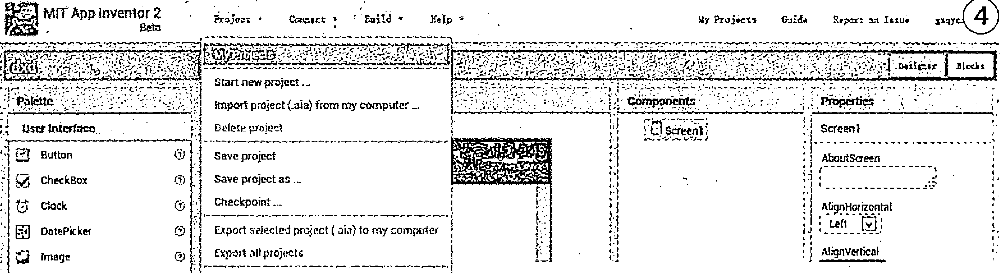

在开发工具的起始界面点击“Start new project”（新建工程），创建由英文字母、数字组成的工程文件名（图4、图5），单击“OK”进入工作界面。

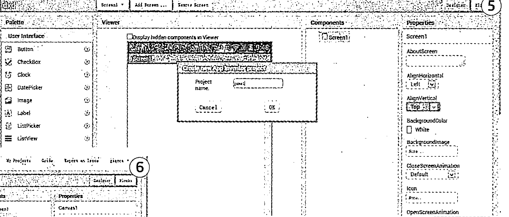

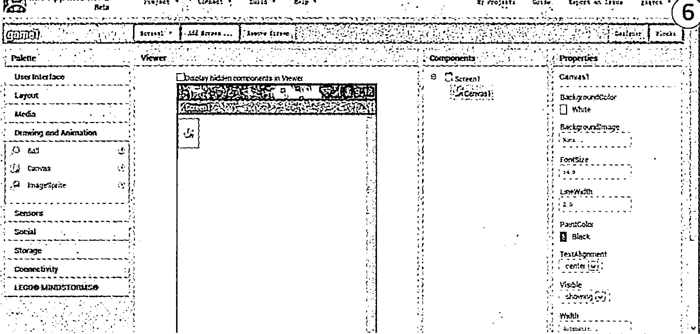

在左面的“组件”面板中拖入“Canvas”（画布）组件放入右边的“手机面板”（图6），作为游戏的地基。为了让画面更亮丽些，在最右面的“Properties”（属性）面板中，将“BackgroundImage”（背景图像）赋予一个上传的图片（图7、图8）。将“Canvas”的“Width”和“Height”同时设置为“Fill parent”（图9）。在“组件”面板中拖入“Ball”放到画布中，同前面的设置一样，设置它的“Radius”（半径）和“PaintColor”（颜色）。将“Screen1”组件的“Title”属性改为“手机小游戏”（当然也可以加上作者的姓名和联系方式等），到此你的手机游戏界面就已经设计完成了。

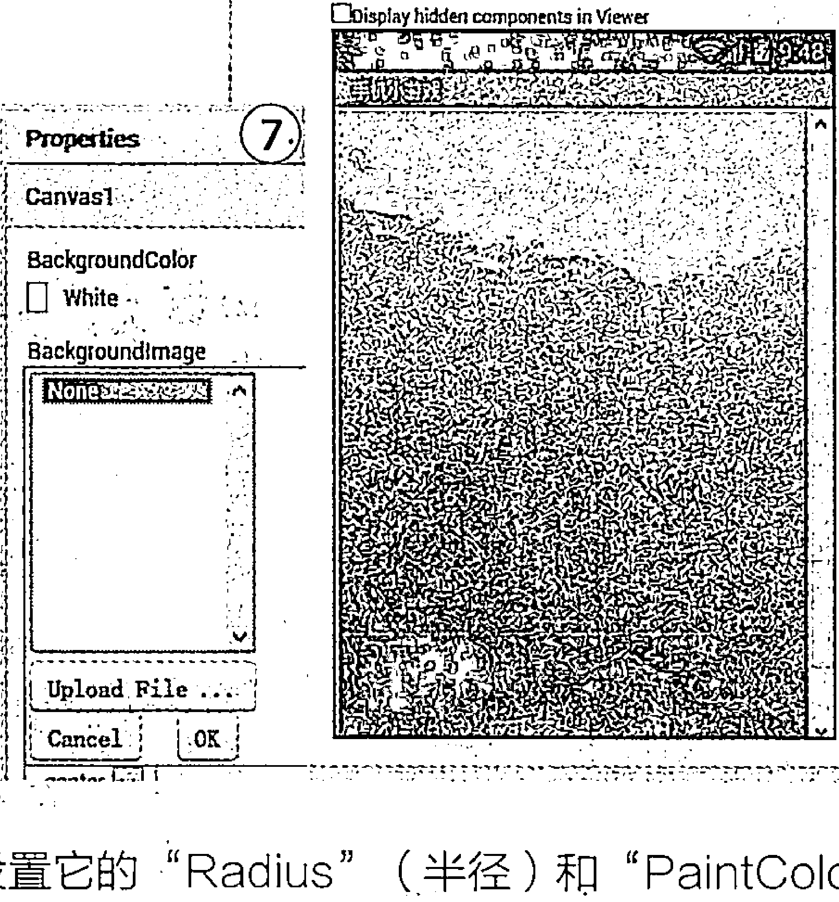


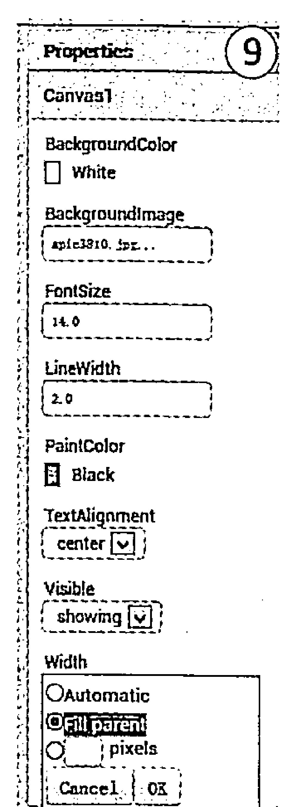

## 游戏控制部分


打开“Block”（块）编辑器（图10）。单击“Ball1”，出现小球的控制逻辑图（图11）。选择“when Ball1.Flung”拖动到右面工作区。因为游戏中要得到小球的“Speed”和“Heading”（速度和方向），所以再将“set Ball1.Speed”和“set Ball1.Heading”拖入工作区（图12），当然还要让游戏感知这两个参数的大小。所以分别选择红颜色的“Speed”和“Heading”，系统自动出现“get speed”和“get heading”放到对应的位置（图13）。若放错了，拖动到右下角的垃圾桶删除即可。

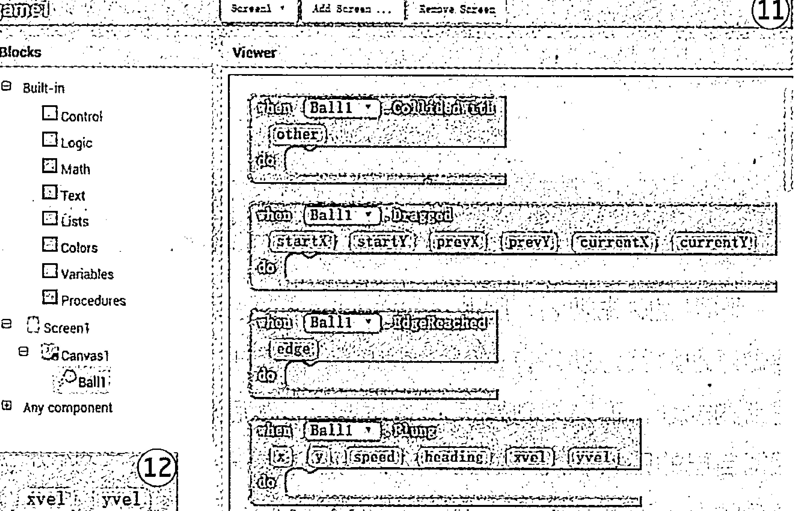

```
when Ball1.Flung do
  set Ball1.Heading to heading
  set Ball1.Speed to speed
```

```
when Ball1.Flung do
  set Ball1.Heading to get heading
  set Ball1.Speed to get speed
```

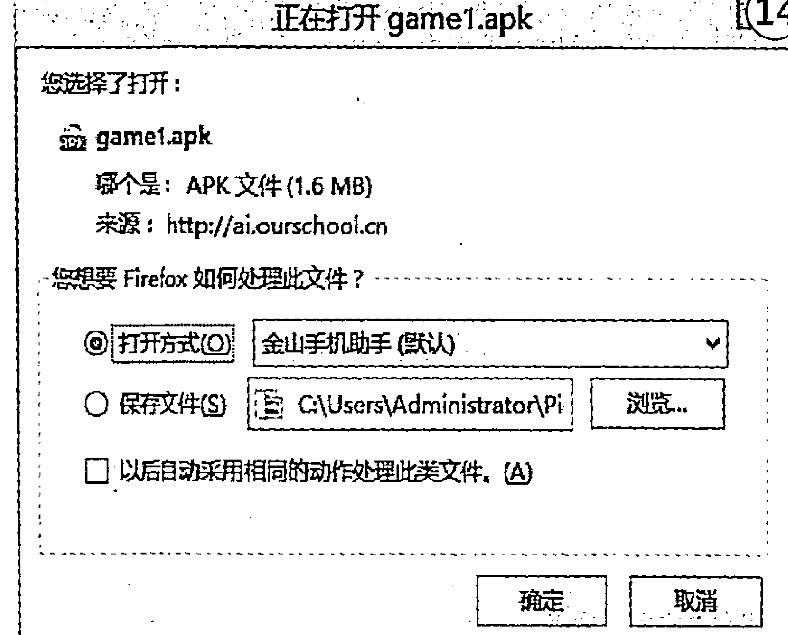

> 其实该系统功能非常强大，远非仅能制作本文所叙述的简单游戏。开发“计步器”、“复读机”、“短信群发”、“指南针”、“手电筒”等主流应用软件它都不在话下，所以我们绝不可以小视它的傻瓜化。本文权当抛砖引玉，当你真正投入进去时，你会是另外一番感受——其实它并不傻。

至此游戏雏形已具备，选择主菜单的“Build”包括“生成二维码下载和生成APK下载到手机”。选择第二项，因为有前面的Wi-Fi，所以选择放置文件路径，再从手机的Wi-Fi客户端拿到程序就可安装（图14）。最后，安装APK测试一下吧。


# 手机理财 越理越有
文 | 俞木发

## 做好规划 计划理财

聪明理财先规划，因此要做好理财就必须先有一个清晰的规划。理财规划是指根据自己的财务状况，建立合理的个人财务规划，并适当参与投资活动。随着智能手机的普及，我们可以在手机上制定和随时查看自己的理财规划。

理财规划是一项专业性非常高的工作，要制定自己的理财规划自然要借助专业的理财师来完成了，“好规划网”就为我们提供免费而专业的理财规划服务。打开手机浏览器登录www.guihua.com，按提示注册为用户，接着点击“免费定制规划”，然后输入自己的实际财务状况，网站专业的理财师会自动为我们免费量身打造一份理财规划报告（图1）。

完成上述的操作后，大约经过1个小时，我们就可以登录查看生成的理财规划报告了。登录上述网站后点击“我的理财规划”，即可在手机上查看专为自己打造的理财规划书了，当然也可以直接将PDF格式报告下载到手机上随时查看（图2）。

当然每个人的财务状况会随时发生变化（比如工资提高、获得额外收入等），当自己的财务状况发生变化需要重新生成规划报告时，只要登录上述网站，对变化的财务进行修改，重新生成报告即可。

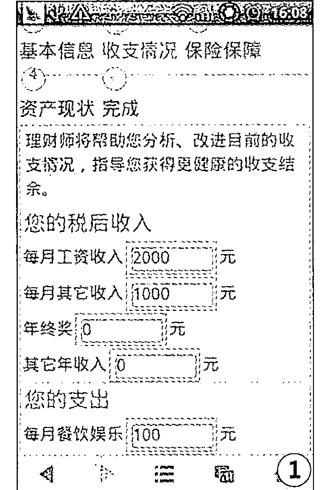

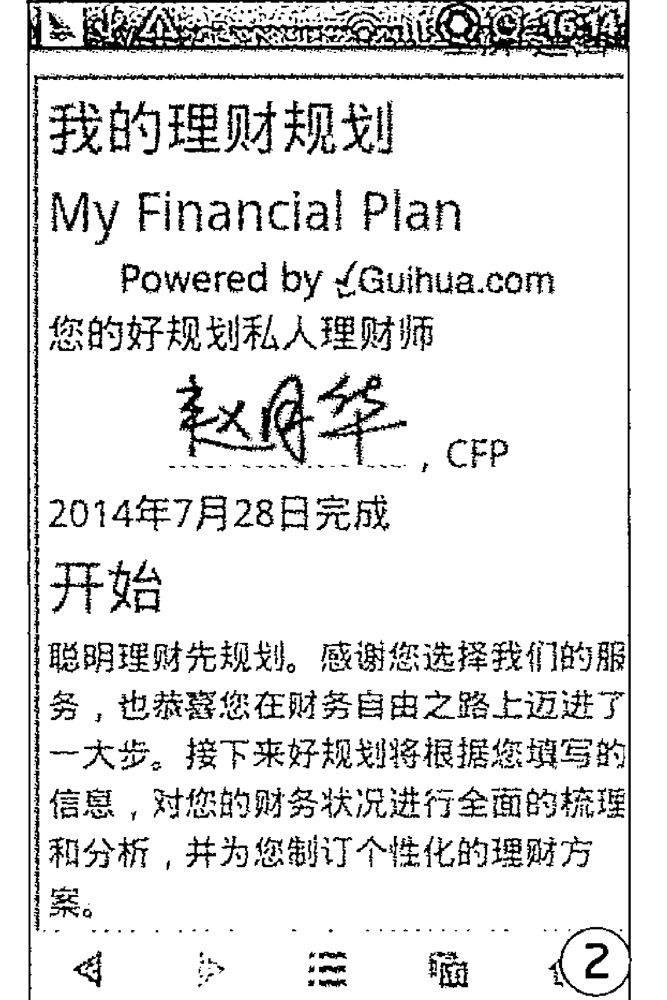

## 精打细算 省钱有招

做好了理财的规划，在每个月的实际消费中我们还要及时记账，这样才可以更好地控制自己的消费。因为记账是理财的第一步，知道记账的人才可以说具备了初步的理财观念。手机是我们的必备随身工具，现在利用“挖财”APP就可以随时记账。比如对于很多刚参加工作的“月光族”来说，现在可以用“挖财”来制定计划并及时记下自己的每一笔消费，争取早日告别“月光族”。

首先到http://www.wacai.com/下载应用，在手机上启动“挖财”后点击“预算”，先按照自己的实际情况制定一个本月的消费预算，比如为了强制储蓄，工薪族可以预先制定自己的投资预算，这样每次一发工资就将投资资金转到自己的余额宝，实现强制储蓄和投资（图3）。

在发生实际消费的时候，立即启动“挖财”，点击“记一笔”，然后根据自己的实际消费进行记录。比如买了一双新鞋100元，在选择“衣服鞋帽”后就可以看到自己制定的预算，看看现在购买后还剩下多少预算金额（图4）。

如果下次又购买了一双新鞋子花费250元，这样在月度预算里就超支了，记账的时候，软件就会以醒目的红色提醒你已经超支了，在实际付款之前你就要好好考虑了（图5）。

借助挖财，我们可以及时知晓每一笔的消费，并且可以和之前定制的预算进行比对。当然在月末的时候，我们还可以点击“报表”，查看自己的所有消费信息，看看你的钱到底去哪儿了。只要很好地执行预算，相信大家可以很快告别月光族！


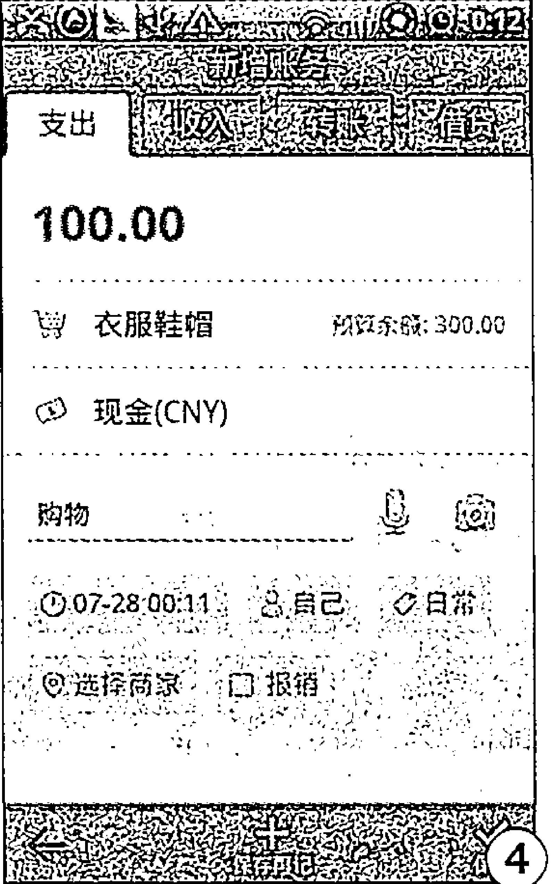

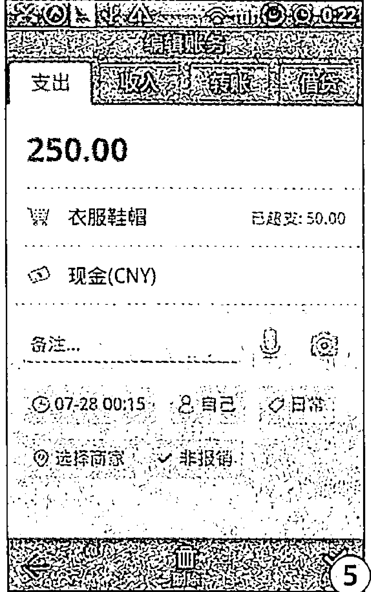

## 投资生财 理财增财

通过上面的开源节流，想必朋友们都会存下一定的财富，让自己的财富增值当然是理财的终极目标。如果你已经有一定的财富积累，那么还可以利用手机进行投资，使自己的财富增值。这里我们根据投资风险大小为大家推荐两类投资项目。

## 稳健型投资者  投资风险：极低 / 投资品种：货币型基金

对于稳健型投资者来说，投资自然首先要保证财富的保值，其次才是稳定的增值。现在互联网货币基金的投资非常火热，这种产品的投资风险也极低（虽然从理论上讲存在亏损的可能，但至目前还没有发生购买货币型基金亏损本金的先例），因此大家可以根据自己的实际情况选择投资品种。

比如很多读者是网购用户，大家经常会将一部分资金保存在支付宝账户。现在利用支付宝推出的“余额宝”服务，我们可以利用暂时闲置的资金购买货币基金获得收益，点击“确认转入”，就可以将支付宝的资金转入余额宝（图6）。


稳定的收益。在手机上启动支付宝钱包后点击“余额宝”进入，点击“转入”，按提示将支付宝上的资金转到余额宝即可（图6）。

这样经过基金公司的确认后就可以获得收益了，以后每天只要在手机上登录余额宝就可以看到前一天的收益了（图7）。

除了使用余额宝投资外，我们还可以利用支付宝钱包提供的手机免费转账来省钱。比如对于经常需要转账的用户，首先将需要转账的资金存在余额宝账户，进入自己的余额宝账户后点击“转账/转到银行卡”，然后按提示输入转账的银行和账户名等信息，即可免费实现现在多个银行之间的跨行转账（图8）。

> **小提示**

除了直接购买货币基金外，我们还可以使用其他方式购买。比如现在很多朋友更换手机的频率较高，如果是广东联通的用户，可以利用其推出的“联通沃百富”计划，这样需要购买手机时，只要到联通营业厅办理，通过存话费购买基金的方式获得收益。比如“话费理财”是用户存入1000元/2500元/5000元/10000元四档预存话费，承诺一定锁定期后，冻结的话费在基金账户中将获得基金收益（图9）。


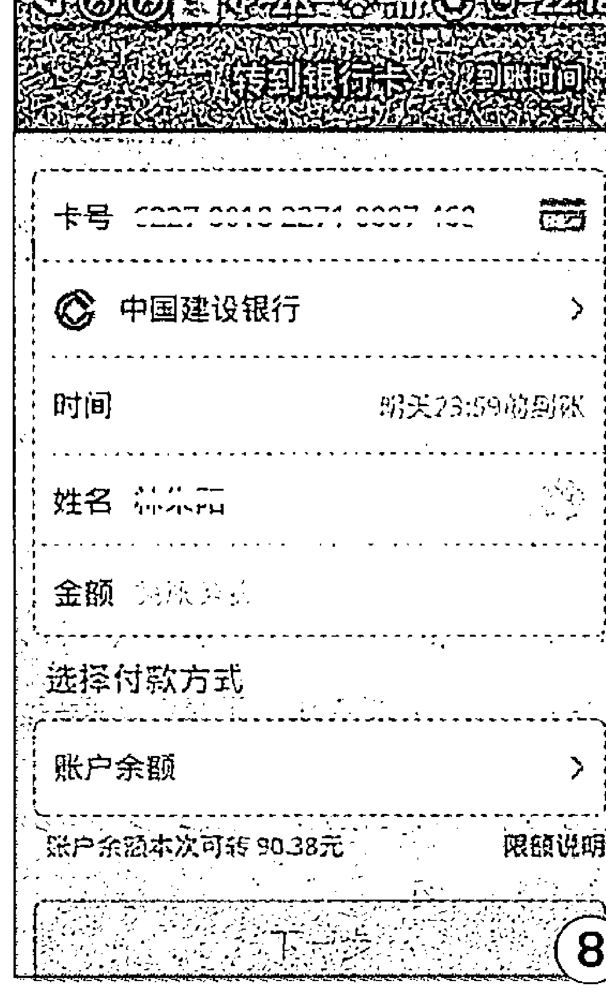


## 激进型投资者  投资风险：较高 / 投资品种：P2P网贷、股票等

货币型基金的投资虽然风险很低，但是相应的收益也比较低。如果你想获得较高的收益，还可以选择时下流行的P2P网贷，也就是将自己的资金通过网络中介贷给需要资金的客户，从而获得不菲的利息收入。不过这种投资的风险较大，首先大家一定要选择信誉较好、开放时间较长的平台进行投资。比如有利网（获得数千万美元的风投）、陆金所（中国平安保险公司旗下成员之一）都是较好的投资平台（图10）。

确定投资平台后，我们还要根据自己的实际资金状况选择投资项目。比如很多朋友手上可能并没有多少闲置资金，那么有利网的“月息通”就是一个很好的选择，投资金额100元起，每月都会有资金回笼，而且急用钱时可以随时进行转让变现。

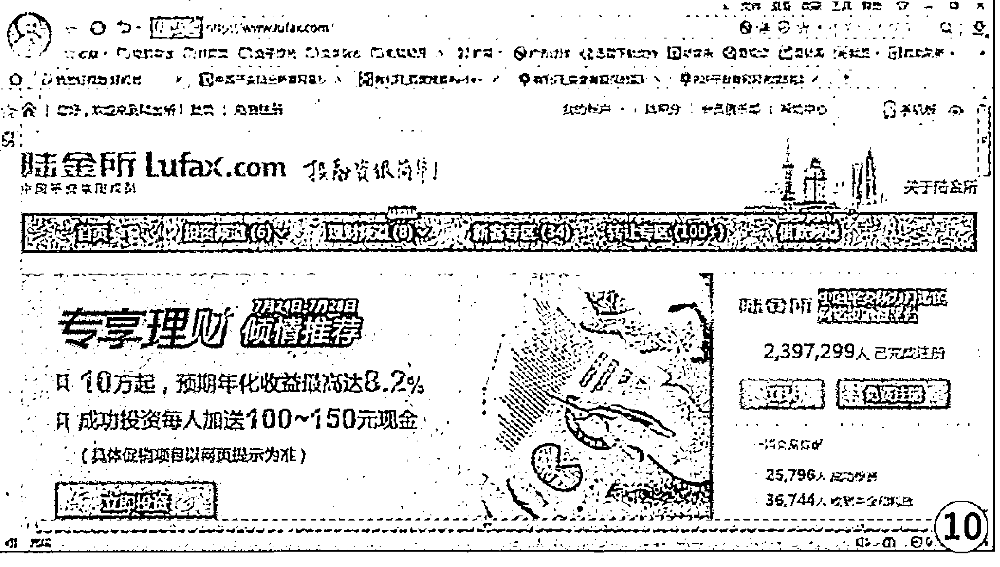

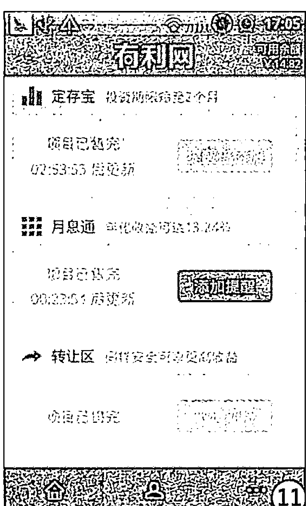

首先安装有利网手机客户端，启动软件后使用自己的有利账户登录，然后按提示设置手势登录密码。应用的主界面直接列出常用的投资项目，我们只要简单点击即可选择（图11）。接着在有利客户端切换到主页界面，选择月息通，然后按提示选择自己需要的项目，点击“投资”，输入投资的金额进行投资即可，以后就可以坐等利息的收入了。有利网的标比较抢手，借助手机我们则可以随时随地进行快速抢标（图12）。

以后我们还可以随时登录自己的账户查看利息收入，对于每月回款的金额，既可以转到自己的银行卡上，也可以再进行投资（图13）。

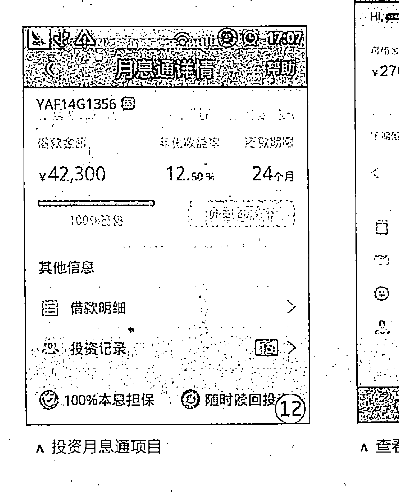

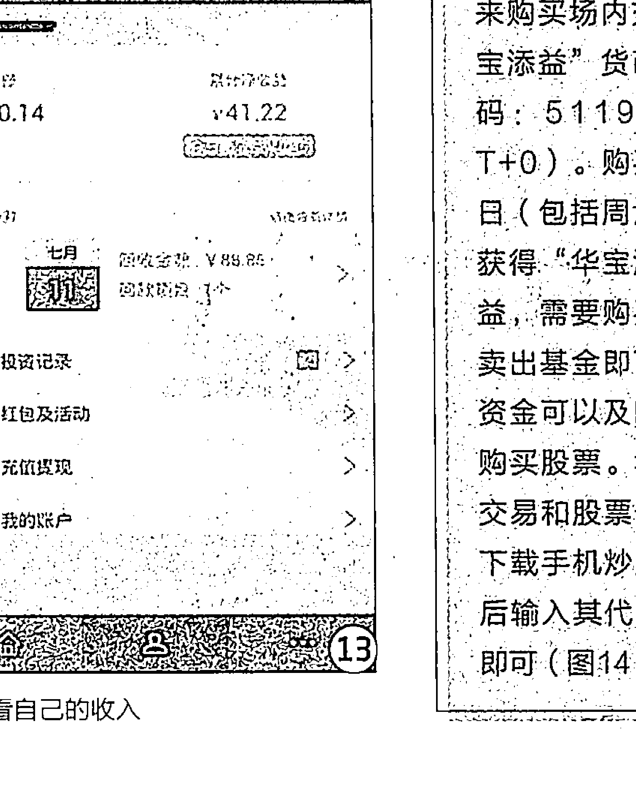

> **小提示**
>
> **如何在进行高风险投资的同时获得稳健收益**
>
> 无论是P2P网贷还是股票投资，在没有合适投资项目时我们的资金都会有闲置的时候。比如对于爱炒股的用户，在没有进行股票买卖的时候，资金经常会沉淀在账户作为活期存款使用。如果你确定某段时间（比如最近行情不好）不想进行交易，那么账户的资金可以用来购买场内交易的“华宝添益”货币基金（代码：511990，支持T+0）。购买后可以每日（包括周六、周日）获得“华宝添益”的收益，需要购买股票时再卖出基金即可，售出的资金可以及时到账用于购买股票。华宝添益的交易和股票一样，只要下载手机炒股软件，然后输入其代码进行交易即可（图14）。

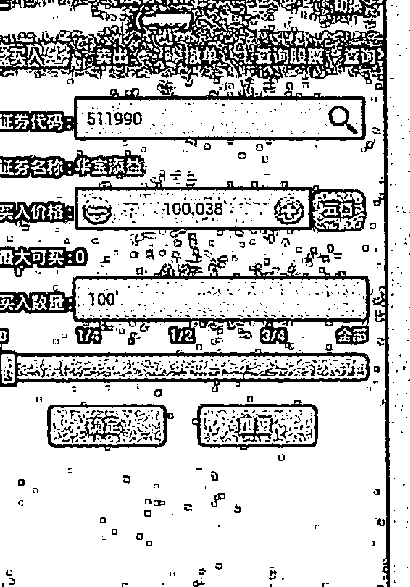

## 智能手机理财，且行且珍惜

智能手机的普及确实可以让我们理财更为方便，但是大家在享受便利的同时一定还要防范手机理财蕴藏的风险。

- 使用理财APP时要注意隐私泄露。比如现在很多记账类APP都记载用户详细消费信息，并且大都有云端同步功能，如果APP开发商技术薄弱，那相关产品就很容易被黑客攻破，导致用户信息被修改或泄露。此外理财类APP的运营者可以通过大数据分析，掌握消费者的消费模式，然后把相关信息卖出去，导致消费者信息泄露。因此选择理财类APP时，要尽量选择技术力量雄厚的公司开发的产品，并通过正规渠道下载，以防止重要信息泄露，造成不必要的损失。

- 购买理财产品的时候一定要防范交易风险。现在大多数网上理财都是通过网上银行完成的，在交易的时候一定要注意交易安全性。比如投资货币基金的用户可以使用百度金融服务，并选择绑定其中没有开通网银的银行卡，这样即使用户信息泄露，我们的资金也只能在自己名下的银行卡流动，而且由于没有开通网银，你的资金也不会造成额外的损失。

- 要防范手机本身的风险。手机是便携工具，在日常的外出中手机可能会丢失或被窃，这样可能会造成个人财产的损失。因此一定要做好相应的防范工作，比如预先记下手机SIM卡、手机银行挂失方法，或者在手机上预先安装远程删除工具，以便在手机遗失时可以有效采取保护措施。此外还要养成一些使用好习惯，比如不在自己手机上随意安装来历不明的APP，不随意介入陌生的Wi-Fi等。

神秘的Android L作为首个没有代号的Android版本，并且，是继Android 4.0之后首次外观设计大改的安卓版本，在这次谷歌大会的惊艳亮相，让众多用户艳羡不已，可惜至今只有谷歌的“亲儿子”Nexus系列才能体验。那么，现在想想办法，让平民也来抢先体验一下这个神奇的Android L吧！


# 无需等待 即刻尝鲜Android L
文|刘浩然

## 认识Android L

在不久之前的Google I/O大会上，安卓的最新版本Android L正式亮相，这个版本的与众不同，从“L”这个奇怪的版本号就猜得出来。果然，这个系统较上一代的Android 4.X由内而外有很大的改进，不仅是外表的界面UI元素、风格和布局的修改，更有内在的支持64位寻址、将从前默认的应用运行模式Dalvik虚拟机模式完全改用ART模式，以及对硬件的优化、更优秀的内存管理和更长的续航时间。不过，Google决定从Android L开始，不支持手机厂商个性化定制ROM，这也就会严重影响到大部分以二次开发、风格鲜明的ROM为卖点的大型手机厂商（比如小米的MIUI、魅族的Flyme OS等）。同时，对于安卓发烧友也不是什么好消息，因为这就表示在不远的将来第三方ROM也许真的就成为历史了。但这样做所带来的好处也是显而易见的，Android的碎片化也许就此终结。

Android L的市场化最快要等到秋季才可以开始，目前只有Google Nexus的拥有者和Android的开发者才可以尝鲜Android L，但是即使手里有Nexus的朋友，对于“开发版”可能带来的不确定因素，相信也会对直接升级望而却步。但是，我们完全可以通过成为半个“开发者”来体验Android L——通过使用安卓开发工具抢先体验Android L。

> **小知识：关于Dalvik和ART**
>
> Android系统从发布以来直到Android 4.x，都在使用一个叫Dalvik的虚拟机来运行APP，而APP每次运行时都要有部分代码需要重新编译，耗时耗内存，效率也因此而降低，但是这样做可以让更多的APP运行在不同架构的设备上，极大地提高兼容性。而与之相对的ART模式，则是通过APP在安装时就将其代码转换为机器码，一次安装终生无需再次编译，程序启动时间极大缩短，相比之下系统资源的耗费和效率的提升非常明显，系统流畅度和电池续航能力的提高相当可观，高版本系统可以运行在硬件门槛更低的设备上了。而这样做所带来的缺点就是消耗更多的存储空间和相对于Dalvik有待提升的兼容性。Android L系统明确使用ART模式，抛弃Dalvik模式。

## 准备体验Android L的工作

Step1: 先下载所需工具Android SDK和Android L系统映像文件（http://pan.baidu.com/s/1eQxibMq），将资源全选下载到指定目录即可（图1）。

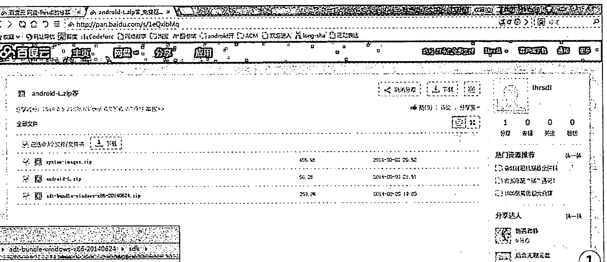

> > 小提示：这套开发工具是针对专业的Android开发者的；用来体验Android L更是绰绰有余。

Step2: 打开刚才下载文件所在的文件夹，发现有3个文件夹，system-images、Android-L和adt-bundle-windows-x86-20140624。将system-images文件夹移动到adt-bundle-windows-x86-20140624/sdk目录下（图2），把Android-L文件夹移动到platforms文件夹下。

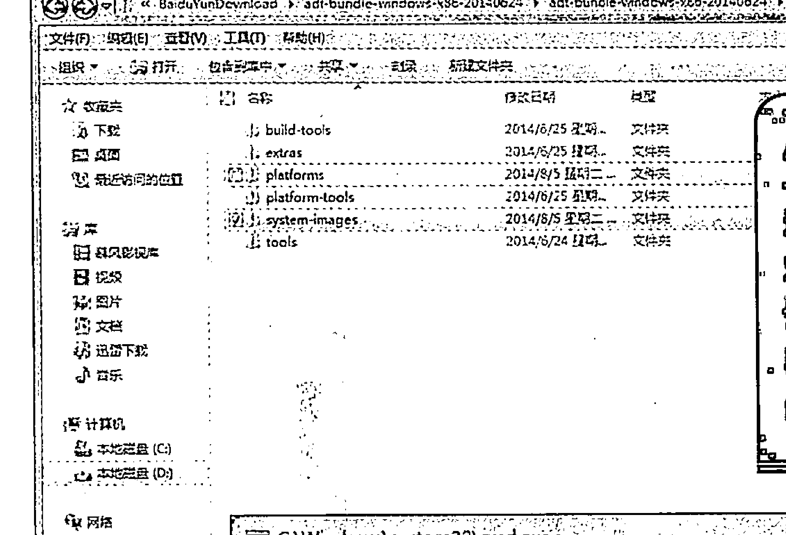

Step3: 去Oracle官网下载合适的Java版本并进行配置（配置方法见http://pan.baidu.com/s/1d3VDWP）。最后通过“开始→运行”输入cmd命令进入DOS终端，输入java -version（图3），显示如图所示的三行信息，说明配置成功。

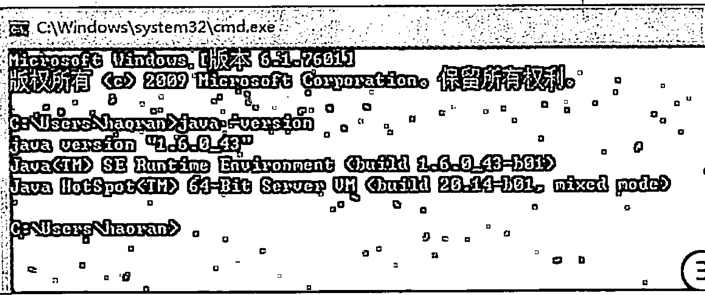

## 配置启动Android L

配备好所需要的工具，接下来，需要安装并启动一个Android L虚拟机。首先打开adt-bundle-windows-x86-20140624/eclipse目录下的eclipse，此时屏幕中央出现一个非常酷的安卓开发工具的Logo（图4），这表示我们已经开始启用开发工具，当完全进入开发工具时，会弹出workplace提示，直接回车确定即可。

接下来，点击eclipse工具栏左数第7个按钮（绿色小手机模样），打开Android Virtual Device Manager，在右边选择New，在AVD Name输入想为虚拟机创建的名字（这里我写的是Android-L，大家可以根据个人喜好随意命名），在Device里选择想体验的设备屏幕及分辨率大小（这里以标准4.0英寸、分辨率480×800为例子）。Target版本选

择是最重要的，我们当然要选择Android L，下面的CPU/ABI有两个选项，可以根据个人实际情况选择（详见小技巧）。然后往下找到Memory Options，将RAM设置为不大于768MB大小的合理值（这里用512MB内存）。Internal Storage和SD Card大小填200MB左右足矣。最后点击OK确定，至此我们的虚拟机就创建完成了（图5）。

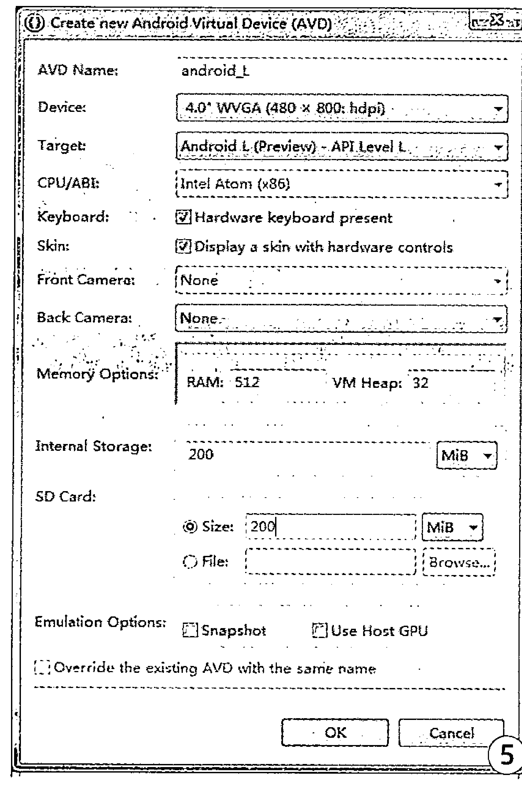

## 小技巧

配置Android L系统硬件的时候，要看所用的电脑硬件条件如何，如果电脑内存够大，CPU够强，那么多给虚拟机一些资源是没问题的。但如果电脑一般的话，还是遵循够用主义吧，否则影响虚拟机的速度；还有一个很重要的项，那就是架构。电脑都是X86架构的，所以如果后来发现配置的Android L没想象中的给力，那么回头将CPU/ABI改用X86架构会流畅许多。笔者设置SD Card为200MB，这因人而异，SD Card的大小一定要合理填写，因为默认情况下不设置SD卡容量就无法从网上下载安装APP，对于体验来说是一大损失。

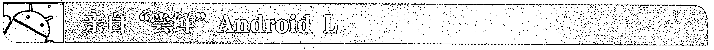

经历了这么多步骤，终于成功配置好Android L系统。现在我们只需选择刚刚配置好的系统并点击右边的Start按钮，在Launch Options界面点击Launch按钮就开始运行Android L系统（图6）。第一次启动系统会比较慢，不过几秒钟就会出现一个Android Logo不停地闪动（图7）。但是，若等待超过2分钟虚拟机还是漆黑一片，那么就说明工具没有完全配置好。没问题的话只需耐心等待便会看到Android L系统开机最后进入桌面，出现和以往一样的开始界面引导（图8）。新系统默认是英文的，进入设置界面（图9）找到Language & input，将Language改为简体中文。

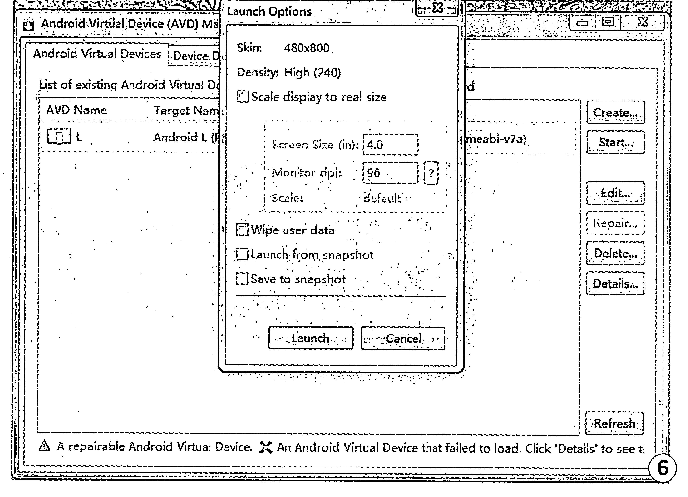

OK，剩下最后的一步就是亲自体验Android L了。本人经过一番体验后的第一感觉就是UI变化特别大，丰富了许多系统动画，由于ART模式的使用使得系统添加了更华丽的特效而丝毫不影响系统流畅性，流畅图标和常用按钮的设计风格更加扁平化，小清新风格十分明显，锁屏界面最能体现扁平化设计的简约之美，上滑解锁，侧滑进入拍照（图11），过渡动画让人眼前一亮，在这里先“点个赞”。打开浏览器就可以直接通过电脑的网络来访问Internet（图12）。

度甚至比往常版本更胜一筹，细节方面改进得也很多，比如长按Home键，出现更绚丽的任务列表（图10），系统中的各种按钮点击过渡动画更加人性化，上滑下滑触底的时候，底部阴影动画会根据手指滑动的方向改变，系统

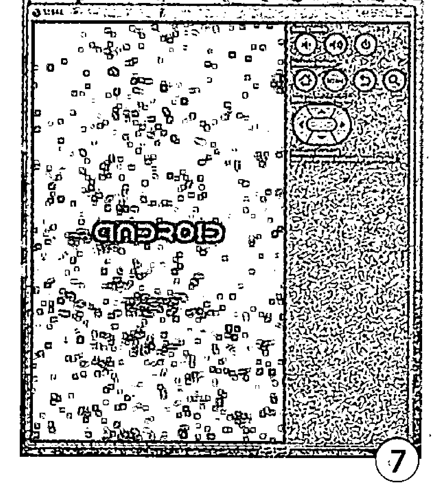


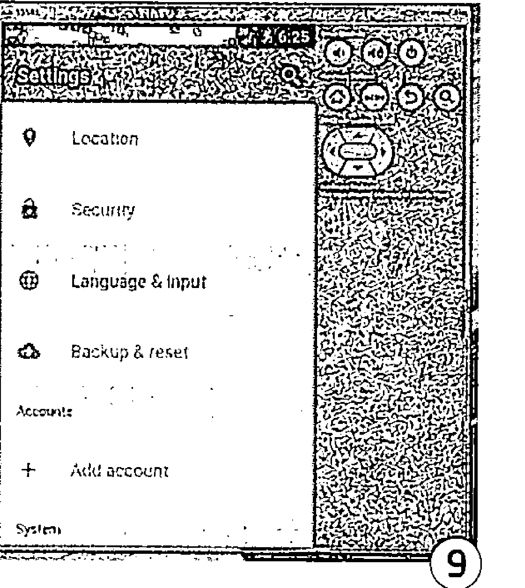

关于Android L的体验，限于篇幅先介绍这么多，剩下的惊喜就要靠大家自己亲自体验去发现了。

## 出现问题的解决方案

如果在操作中碰到了类似本文第4部分出现的虚拟机不启动的情况，不要急，有许多解决方案。这里介绍最简单有效的方法。

首先，仔细观察Android Virtual Device（AVD）Manager工具上面有“List of existing Android Virtual Devices located at......”这么一行（图13），后面就是虚拟系统所在路径，这个路径不能有中文和空格，如果路径有空格，把路径中有空格的地方修改一下即可。如果是有中文路径，首先将文件移动到没有空格和中文路径的位置，然后进入eclipse开发工具，在工具栏里找到Window，点击下面的Preferences，再选择Android下面的Build（图14），在Custom debug keystore一行点击Browse按钮找到刚刚移动的文件所在位置即可。

如果出现另一种问题：eclipse启动出现错误，弹出有关Java设置不符合版本的问题，即eclipse、Java版本一个是64bit而另一个是32bit，那么重新配置Java使其一致即可。若是eclipse找不到Java某些工具的路径，那么需要打开eclipse.ini配置文件将-VM下面那行路径修改为电脑中Javaw.exe文件的实际路径就搞定了（图15）。

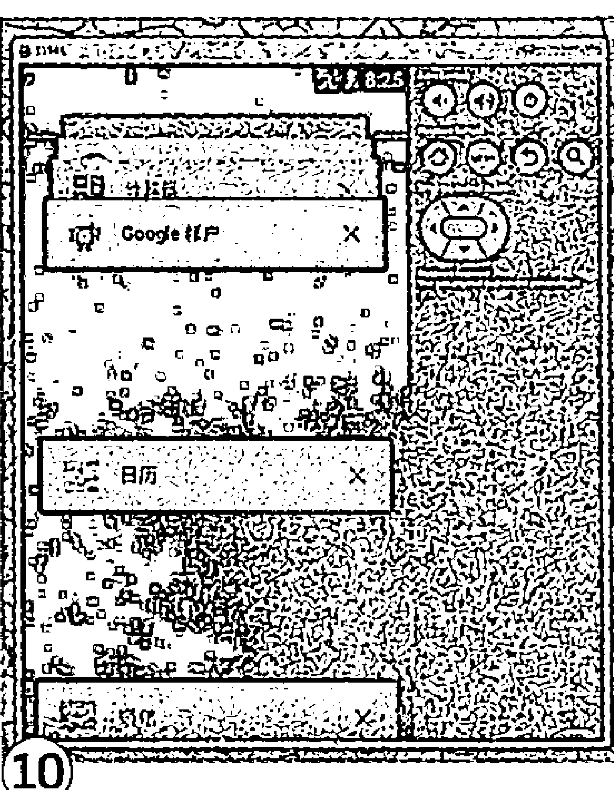


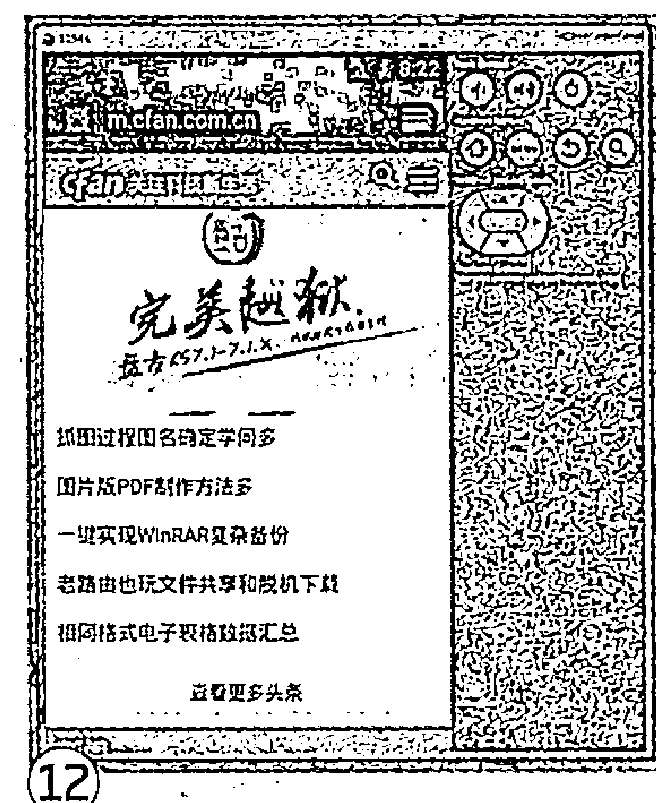

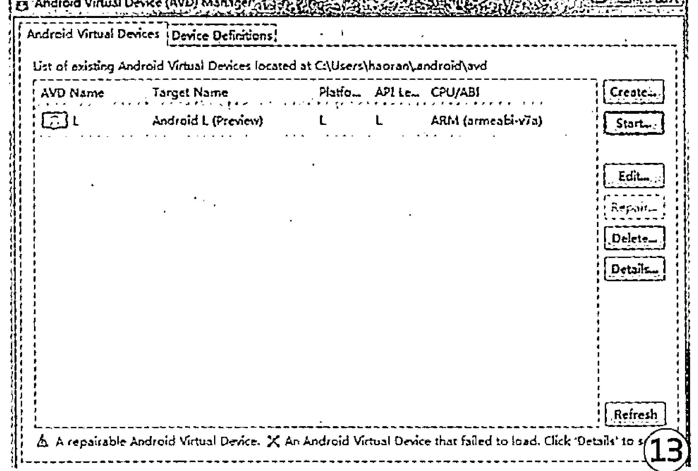

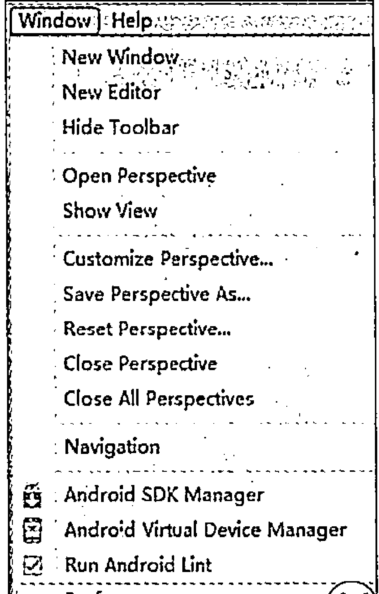

```
15   C:\Program Files (x86)\Java\jdk1.7.0_51\bin\javaw.exe
-openFile
-vmargs
-Dosgi.requiredJavaVersion=1.6
-Xms40m
-Xmx768m
-Declipse.buildId=v22.3.0-887826
-XX:MaxPermSize=512M
```

## 谁说手机不能办公

文|马震安

外出旅行没带电脑，老板下达的紧急任务如何完成？只有手机随身携带，复杂的办公任务是否可以胜任？一次旅行中的移动办公经历，告诉我们手机办公照样行！

### 1 数据处理不在话下

一连数日在外学习，正是公司月末业务汇总的日子，老板突然发来了紧急任务，让我把上个月整理的有关品牌手机销售月报的Excel数据表马上重新整理，需要添加本月的销售数据，重新汇总，重新排序，重新绘制图表。但是，身边没带笔记本电脑，周边也无电脑可用，怎么办？只能用手机办公软件来试着处理了。我的Android智能手机上装有WPS Office办公套件，它可以胜任这些往常一直在PC上进行的细活吗？

> 先让同事将Excel表格及数据发送到自己的电子邮箱中，然后下载到手机中再说。

### 添加数据能胜任

在手机上用WPS Office办公套件打开所需电子表格，数据列宽不合适，触摸两列之间通过来回滑动调整列宽。由于需要在已有数据的基础上添加新的一列数据，需要利用“工具”按钮调出“插入”选项卡来完成，点击它下面的“单元格”按钮，在新出现的窗口中选择“整列”，这样就在所选列的左边添加了新的数据列。然后，在表格中录入数据，操作就比较简单了（图1）。

### 统计数据可实现

还需要进行数据统计，这不禁让人想到电脑上顺手的Excel。手机上办公，能用函数吗？其实在手机上也能利用函数、公式轻松完成简单的数据统计。

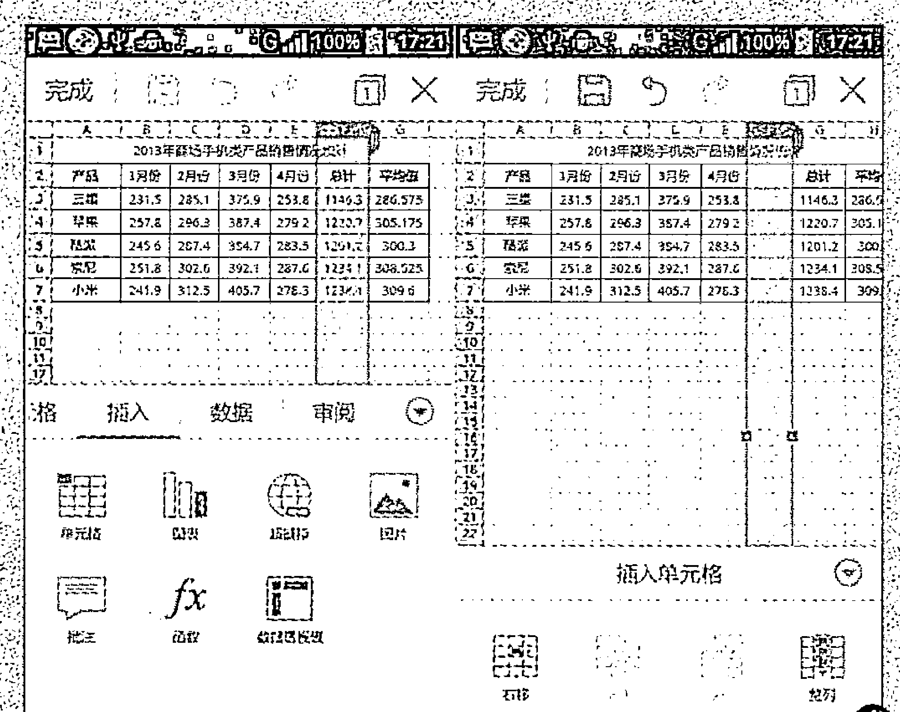

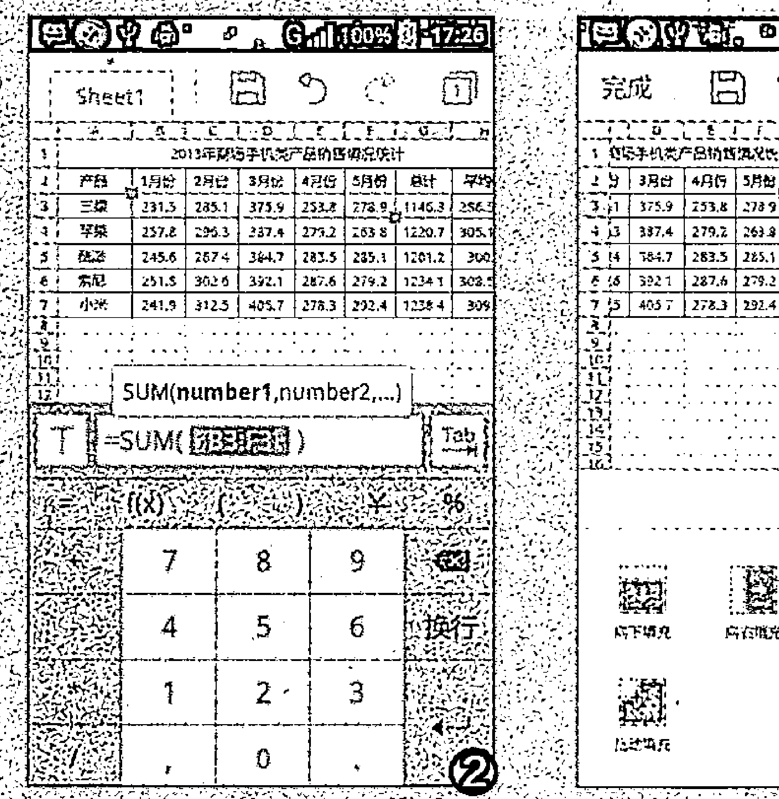

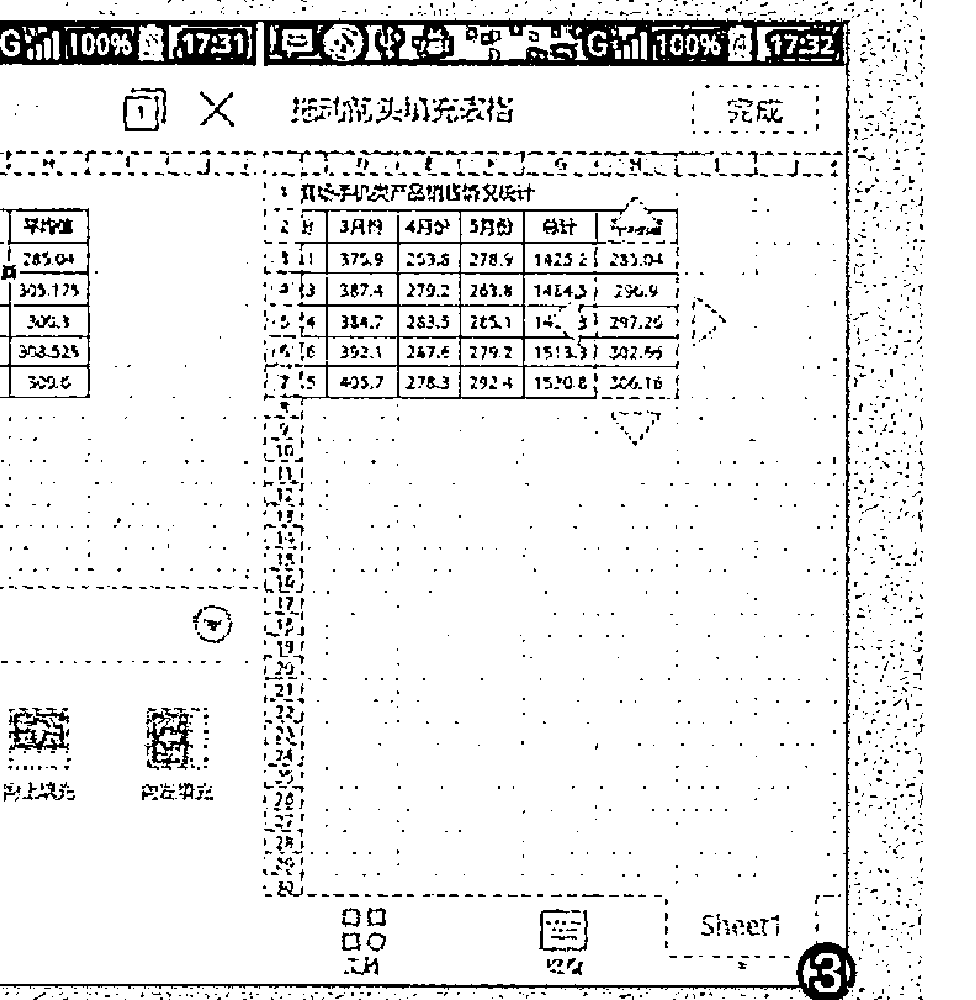

由于发来的数据表格总计中已有公式，当选中某个总计时就会显示出相应公式，只需要把它的单元格计算范围进行更改就可以了。

当然，如果没有现成函数或公式的话，只需单击“工具”按钮，在调出的“插入”选项卡点击“函数”按钮，选择适合的函数就可以进行统计了。这些操作和电脑中的Excel操作是一样的（图2）。

第一条记录的总计统计完成后，需要对其他记录的总计进行填充，这个操作和电脑中的Excel操作是不太一样的。在手机上填充需要通过“工具”按钮调出“单元格”选项卡，利用“填充”按钮来调出填充方式，选择“拖动填充”按钮就可在手机屏上通过触摸箭头进行拖动填充（图3）。

> 如果想要填充，最简单的方法是在第一条记录的总计单元格上触摸屏幕3秒以上，填充箭头就会出现，按住向下的箭头拖动就可以填充。

### 分析数据也在行

在老板交给的任务中需要对数据进行分析，包括排序、制作图表等。

对于数据的排序，与PC中的操作相仿，只需选定数据后在“数据”选项卡中选择升序或降序排序就可以了。

创建图表时，选择好数据源，在“插入”选项卡中单击“图表”后选定所需图表类型即可（图4）。

为了让老板更满意，让数据表现得更美观，需要对数据表格进行美化修饰。选定所要修饰的单元格，利用“格式”选项卡中的各个效果设置字号、字体颜色、单元格颜色、数字格式等。当然，还可以利用“单元格”选项卡中的“表格样式”对表格进行各种样式的填充（图5）。

经过如上操作后，完成表格的内容添加和数据汇总，将处理好的电子表格通过QQ及时地传给了老板，老板对此表的处理也比较满意。如果你遇到类似的紧急办公情况，不妨也利用手机试试吧！如果带的是Android平板，感觉会更好。

> > 在排序前选择数据时，按哪个字段排序就先选定哪个字段名，然后拖动单元格左上角和右下角的拖动柄扩大数据选择范围，否则，标题行也作为记录跟着一起排序。

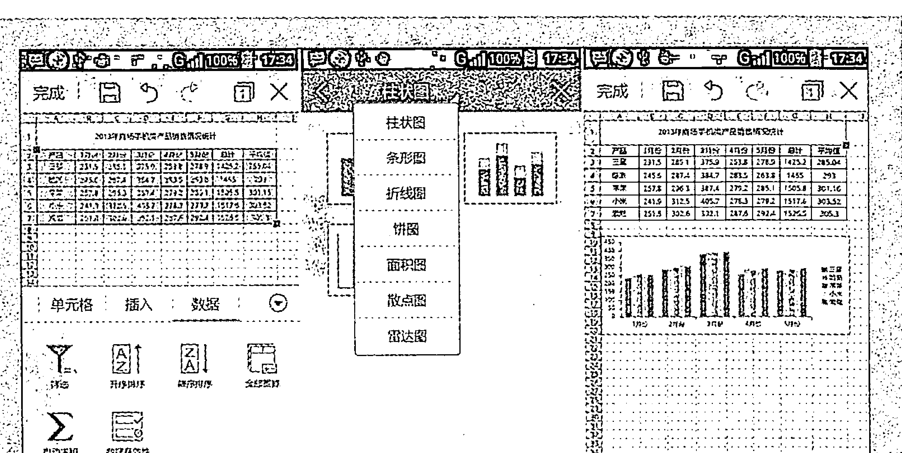

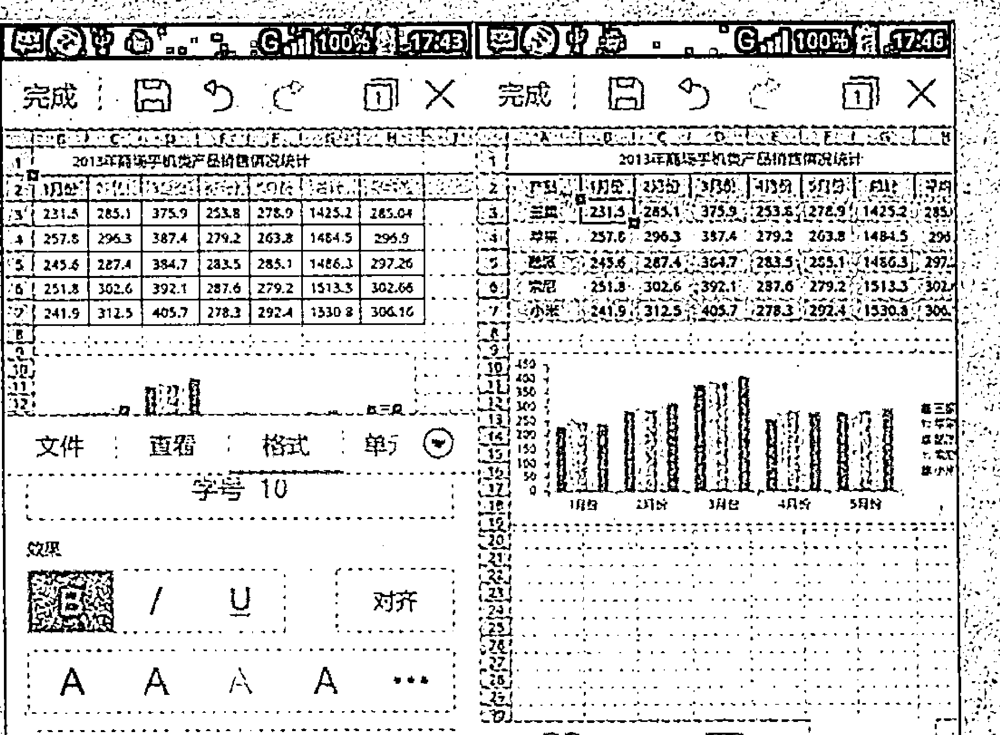

### 2 演示制作它也能行

本次培训老板特意叮嘱要好好听讲，回去后还要给单位的员工进行培训。于是，培训期间利用手机中的WPS Office和Office Suite这两款办公软件把培训的重点、难点做成了幻灯片，准备回单位时培训员工时使用。你可能要问，为什么用两款办公软件？一个不能解决问题吗？其实，这两款办公软件在制作幻灯片时各有优缺点，WPS Office对文字效果、幻灯片的版式等处理比较到位，而对于幻灯片切换效果的处理却显得力不从心了，而Office Suite正好相反，所以它们可以很好地互补，出色地完成幻灯片的制作。

### 幻灯片布局自己定

在用WPS Office建立新幻灯片时，版式默认的是标题幻灯片，可以在下面的幻灯片缩略图上单击选择“布局”后更改自己所需要的幻灯片版式（图6）。

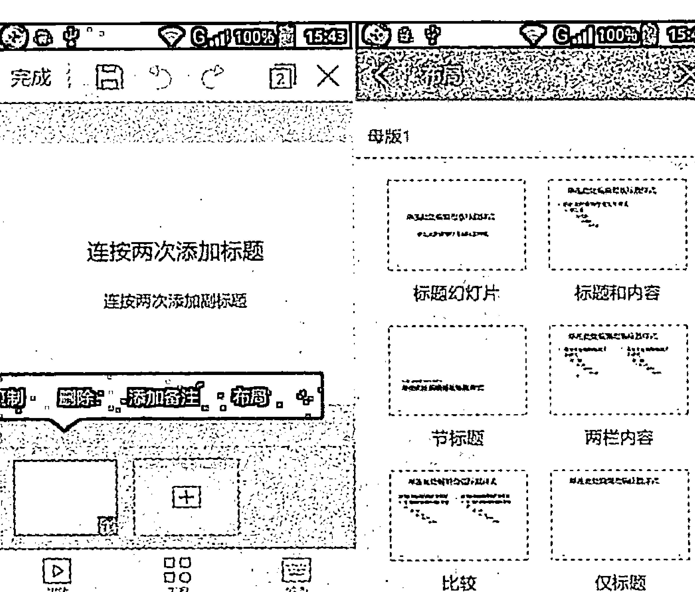

> > 布局的更改还可以通过“工具”按钮调出“查看”选项卡中的“布局”进行设置。

### 素材添加与控制

幻灯片版式设置完成后，通过“工具”按钮调出“插入”选项卡，利用它下面的各种按钮向幻灯片中插入文本框、图片等。通过其他的一些选项卡快速设置文字、文本框等格式（图7）。

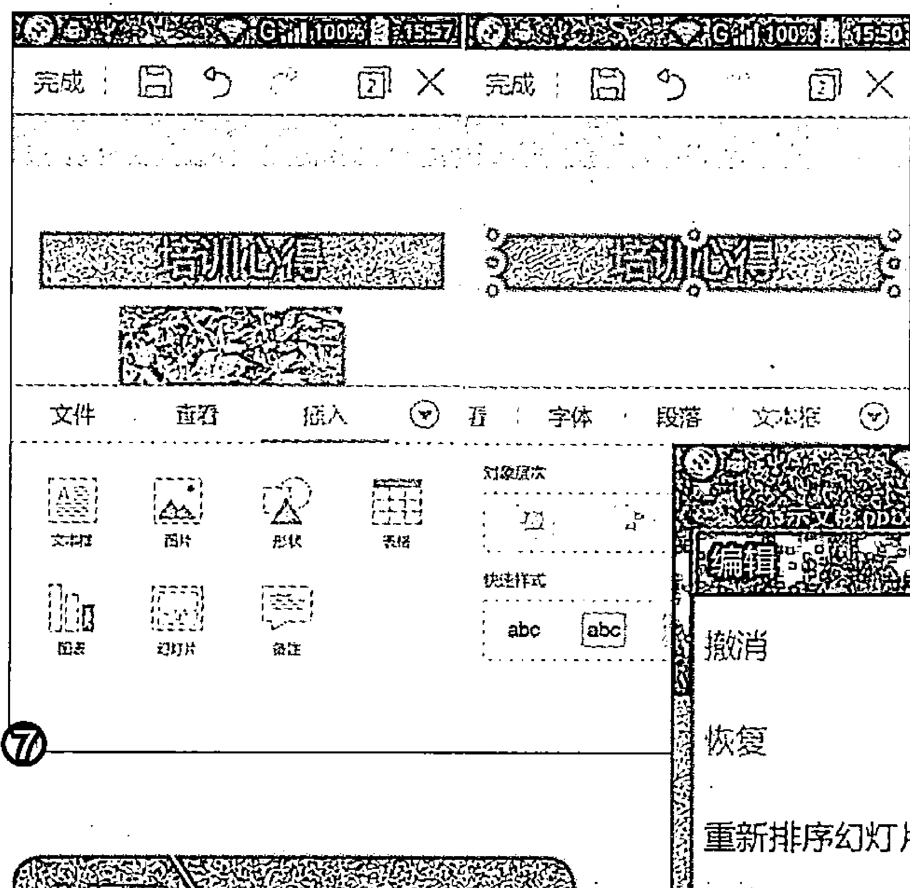

> 小提示
只需要拖动8个控制点，这些文本框、图片之类的元素位置、大小都可以改变。

### 过渡动画巧设置

每张幻灯片编辑完成后保存这个演示文稿，退出WPS Office。利用Office Suite再把这个演示文稿打开。单击手机的左侧触摸键后选择“编辑”菜单，单击“更改过渡效果”后选择需要的切换效果（图8）。

> 小提示
这些过渡效果不但在WPS Office中播放时同样有效，而且放到电脑中使用也依然有效。

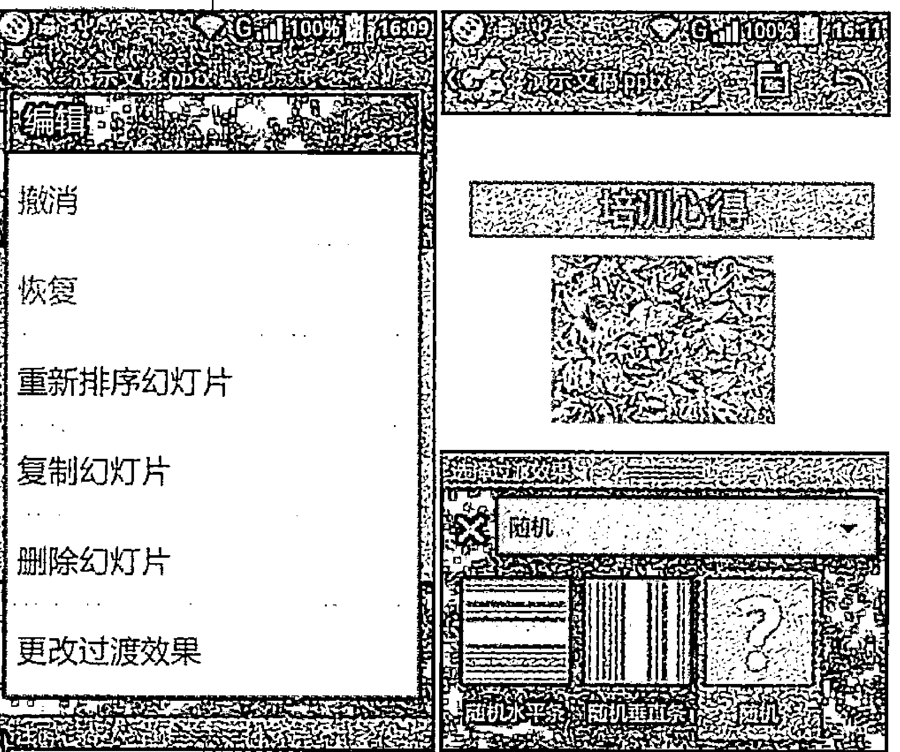

## 手机制作微型电影

这次出来培训，其实还带了另一位“领导”交给的任务——妻子让俺将此次培训地的一些好景色、好玩儿的地方拍下来与她分享。呵呵，这是不是她对我的“监视”呀？你别笑，老婆大人的任务咱还得好好完成呢！

光拍照片缺乏动感，全程视频又无太多存储空间，于是想到用手机制作微电影的方式，将拍摄的视频、照片进行编辑，弄了一个“手机上的中国”，也让她好好分享一下祖国的大好河山。手机中安装的微电影制作软件“小影”正好可以派上用场。

### 备好各类制作素材

为了使视频更加美观、炫丽，需要在手机上下载这个软件的主题、滤镜、字幕、转场、特效等素材。这些模板的下载会在视频编辑时有更多的选择，将为视频增光添彩（图9）。

### 善用视频镜头花样

在拍摄视频时让视频多一些花样、多一些乐趣，让视频更能吸引眼球，笔者在拍摄镜头上可谓下足了功夫。不同的地点、不同的景色使用什么样的镜头，这些都需要在拍摄前进行设置。

### 活用特色视频剪辑

点击“拍摄视频”按钮，在进入的界面中点击左边按钮选择各种拍摄镜头，并且在拍摄过程中选择各种效果，如搞怪镜头中的鱼眼、镜像、国字脸等（图10）。

培训期间拍摄了不少视频，但也不是每个视频都拍摄得那么完美，所以还需要对每个视频进行剪辑，把最美的东西展现给“领导”。

点击“视频剪辑”选取要剪取的视频文件，点击“开始剪取”后视频就开始进行播放，播放到需要结束截取之处，点击“结束剪取”完成视频剪取（图11）。

对于剪取好的视频，可根据需要给它设置主题，更改主题文字。比如将开始的视频主题选择为“夜生活”，并点击主题文字将之更改成了“我的培训旅程”（图12）。

当然，视频中的背景音乐也是必不可少的。笔者为这段视频设置了“唯美”的音乐背景。每段视频编辑好后，就将它们保存在相册里（图13）。

### 会用画中画表情感

培训的这段时间也挺想老婆和孩子，于是拍摄了一段自己的内心表白，并结合以前录制的视频做了一个画中画效果，想以此表达自己对他们的思念。

> 小提示
在画中画界面中点击其中的任一视频，在出现的工具中点击双向箭头，可将两个视频进行交换。

点击“画中画”按钮选择所需要的两个视频文件，在新窗口中选择所需要的画中画模板即可（图14）。

### 巧用高级剪辑添魅力

视频拍摄了不少，也编辑了不少，一个一个地发出挺麻烦也不像样，于是决定把这些视频合成为一个，让她一次看个够。

首先选择“高级剪辑”中的“添加镜头”按钮，通过确认、返回等操作添加多个视频文件（图15）。

添加视频后，对视频进行编辑操作，如镜头编辑、特效、滤镜、转场、字幕、配乐、配音等操作。每个环节设置好后，注意别忘了及时保存（图16）。

经过如上一系列的处理后，将生成的视频文件传给妻子，她很惊讶，利用手机也能制作出这么专业的视频来！

> 小提示
这些效果的添加不一定是在视频开始的时候，可以在视频播放到任何一帧时进行设置。

《电脑爱好者》·2014下半年合订本【移动天地】

## 舌尖上的手机 玩转美食

文|俞木发

《舌尖上的中国2》播出后迅速风靡网络，其中介绍的美食更是让“吃货们”艳羡不已。想做美食，又不知道怎么做？抑或你压根就没下过厨房？不要紧，如今智能手机已经流行，我们可以借助各种美食相关的APP制作一部“舌尖上的手机”，这样既可以在公车上掏出手机查找美食酒店位置，查看点评，也可以将手机放在灶台边看边做。那么，如何利用好手机来制作、品尝和共享美食？

### 美食基础 食材组菜

要想制作出可口的美食，我们首先要学会如何使用常见的食材进行组菜。一般一道美食都是通过主材加各种辅材组合而成的，比如《舌尖上的中国2》（以下简称为《舌尖2》）中第四集《家常》中介绍的“上海红烧肉”，除了五花肉主材外，还要准备鹌鹑蛋、老姜、八角、花椒、桂皮等各种辅材（图1）。


《舌尖2》中的菜谱，电视导演已经告诉我们如何组菜。那么对于其他常见的菜谱，我们又该准备什么食材？在日常生活中，大家接触到的一般都是常见菜，要把常见的食材组成可口的美食，我们需要借助专业菜谱来完成。“食材组菜”是一款可以在iOS、Android平台上运行的家常菜谱APP。

到http://dwz.cn/cfanp04下载“食材组菜”并启动应用，现在就可以根据我们经常购买的家常菜或者冰箱里已经储备的食材进行组菜了。比如我家里只有土豆和猪肉，启动应用后点击“添加食材”，然后将上述食材添加到系统中，接着切换到“组菜”即可看到很多使用土豆和猪肉组合的菜谱。想做份“土豆红烧肉”？在打开的列表选择这个菜谱进入，即可看到详细的介绍了（图2）。


### 美食制作首步 食材预处理

俗话说：磨刀不误砍柴工。好的食材来之不易，如何正确地处理食材是我们能更好地烹制的首要前提。有些时候，我们用好的食材却没能烹制出美味可口的食物，很可能是我们对其进行了错误的处理。因此确定了制作美食的菜谱后，接下来我们就要对食材进行选购和预处理，这样既可以做出更可口的美食，同时也可以大幅节约后续美食的制作时间。不过大部分朋友并不是巧妇能手，即使是很多常见的食材都不知道该如何选购和预处理。这时“伊特美食管家”可以出来帮忙，它详细介绍了各种常见食材的选购、处理和搭配。

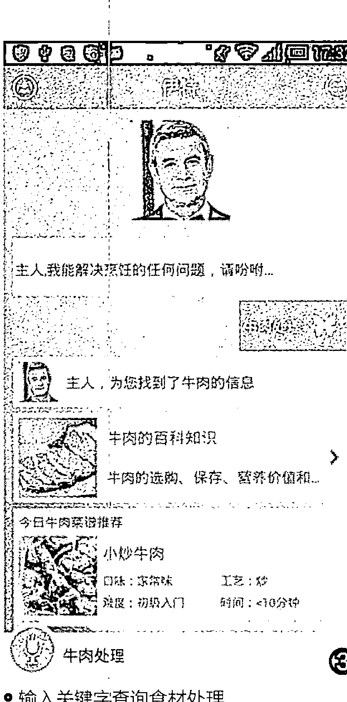

首先到http://dwz.cn/cfanp06下载应用，在手机上启动后点击“菜单→食材的保存与选购”，然后输入需要查询的食材即可。比如常见的牛肉、猪肉、鸡肉，质地不同，切法也不相同，切法不对会导致后续加工影响肉的口感。想知道怎么进行## 边看边学 开始制作美食

完成食材预处理后就可以开始准备制作美食了。不过大部分朋友的动手能力都不强，如果只是根据菜谱的简单文字描述或者电视上一闪而过的介绍，很难制作出可口的美食。显然，借助实战性的教学视频能够让我们有更直观的体验。

现在手机上就有很多制作美食的视频供我们边看边学。比如对于《舌尖2》中介绍的美食制作感兴趣的朋友，可以直接使用UC浏览器在线播放视频，启动UC后输入“舌尖上的中国2”进行搜索，接着将找到的播放页面添加到收藏夹并播放。以后制作《舌尖2》的美食时就可以在手机上播放视频，按照视频介绍一步步制作即可。对于复杂的操作步骤可以随时点击播放器的暂停、后退，拿起手机仔细比对视频中的操作来一步步制作美食（图5）。

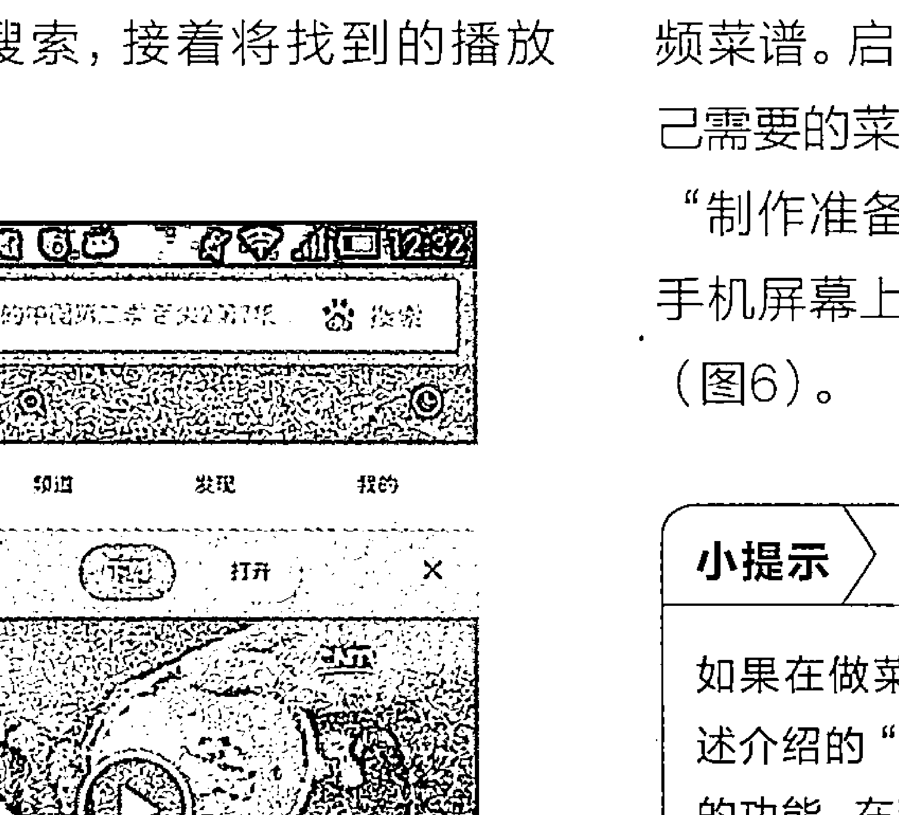

当然，中华餐饮文化博大精深，《舌尖2》介绍的也只是很少的一部分中华美食，如果需要制作更多的美食，可以借助“掌厨”APP（下载地址：http://dwz.cn/cfanp07）查看更多视频菜谱。启动应用后按提示搜索到自己需要的菜谱，接着点击菜谱名称下的“制作准备”和“制作过程”，即可在手机屏幕上查看详细的美食制作视频（图6）。

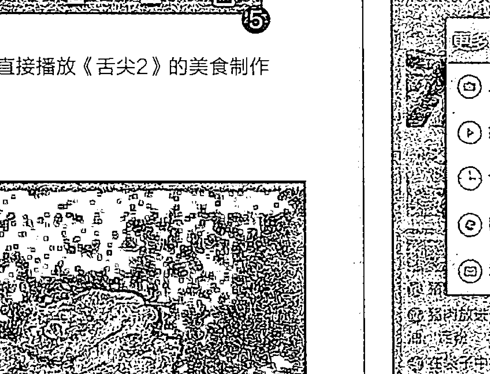

> > **小提示**
> 如果在做菜的时候不方便观看视频，上述介绍的“伊特-美食管家”有朗读菜谱的功能，在手机上启动“伊特”并打开需要的菜谱后，点击“菜单→更多→播放文本”即可朗读菜谱（图7）。

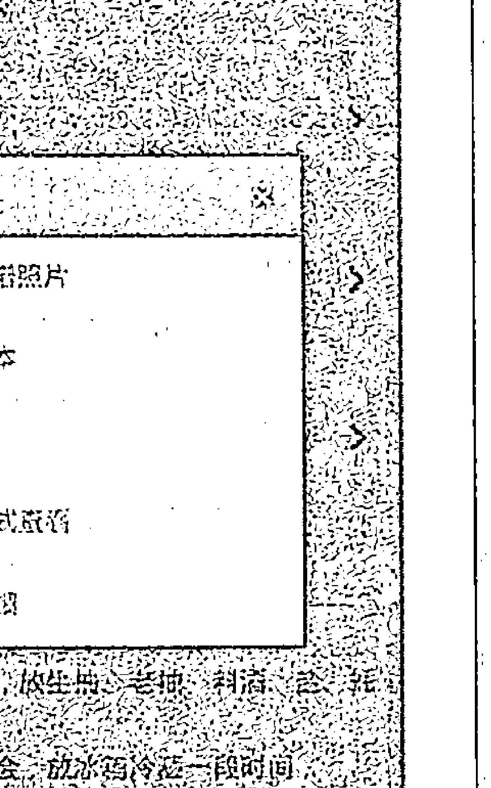

牛肉的预处理吗？只要在对话框输入“牛肉处理”，这样应用自带的机器人就会返回搜索结果（图3）。

在搜索列表点击“牛肉的百科知识”，在打开的页面就可以看到牛肉食材的选购技巧、食用建议（包括众多预处理技巧）以及搭配，即使是新手也可以按照它提供的详细介绍对牛肉进行正确的预处理（图4）。

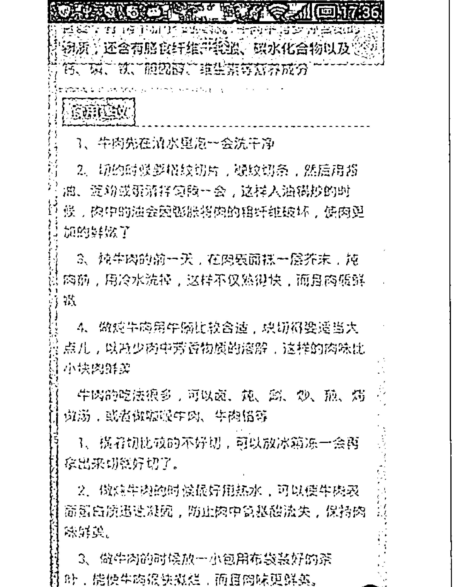

- 查看应用的提供的食材处理技巧

- 1. 牛肉先在清水中泡一会洗干净
2. 切的时候要顺纹切片，横纹切条，然后用料酒、淀粉或蛋清拌匀腌一会，这样入油锅炒的时候，肉中的油会浸润使肉的粗纤维破坏，使肉更嫩，炒时也嫩了
3. 炖牛肉的前一天，在肉表面抹一层芥末，炖肉前，用冷水洗掉，这样不仅熟得快，而且肉质鲜嫩
4. 做炖牛肉用牛腩比较合适，切的时候适当大点，以减少肉中芳香物质的溶解，这样的肉味儿比小块肉鲜美
牛肉的吃法很多，可以煎、炸、焖、炒、煎、烤、炖汤，或者做馅、牛肉丸子等。
1. 煎香而嫩的不好切，可以放冰箱冻一会再拿出来切就好切了。
2. 做炖牛肉的时候最好用热水，可以使牛肉表面蛋白质迅速凝固，防止肉中氨基酸流失，保持肉味鲜美。
3. 做牛肉的时候放一小包用布袋装好的茶叶，能使牛肉很快炖烂，而且肉味更鲜美。


> > **小提示**
> 对于其他常见食材，美食城网站的原料处理专题介绍大量常用食材的预处理技巧，大家可以直接在手机上登录http://www.tfysw.com/chufang/yuanliao/查看。

- 使用“掌厨”查看更多美食教学视频

- 在手机上直接播放《舌尖2》的美食制作视频

- 使用伊特朗读功能边听边做菜

### 可口又健康 制作养生美食

现代人的生活节奏快，工作压力大，饮食大多没有规律，很多朋友还有各种各样的疾病，比如不爱吃早餐的朋友就大多患有胃病。很多美食虽然看上去香艳可口，但是由于每个人的体质、身体状况不同，并不适合你来享受。因此除了会做可口的美食，我们还要制作出适合自己或者家人的养生美食，让家人吃出健康来。

当然，大部分朋友并不知道平时菜谱的营养搭配和食材的各种药用知识，怎么才能吃出健康？借助专业养生菜谱来制作养生美食是个简单有效的方法，比如“http://m.haodou.com”就拥有很多专业而又营养的健康食谱。在手机浏览器登录上述网站后点击“查看所有标签”，接着就可以根据自己实际情况在“人群功效”下选择自己的菜谱。比如胃不好的朋友可以点击“胃痛”，看看有什么菜谱可以养胃、调胃（图8）。


除了制作健康美食外，制作出安全可口的美食也是大家需要关注的事情。因为吃是一门很大的学问，各种美食之间常常相冲相撞，尤其是药食同源的一些物质。如果在制作美食的过程中将这些相冲撞的食物同食，不但不会得到美的享受，反而会损害身体。如果要快速查询哪些食物会相克，可以到http://suo.im/wi0o3下载《食物相克速查》，只需要输入食物名称，立刻就可以查到与之相克的食物，快速、简单、准确。

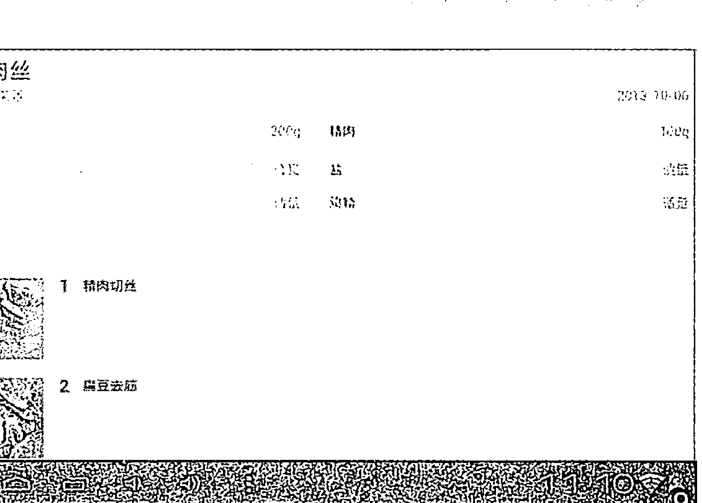

### 懒人一族 查找美食

现在大家的工作忙，可能并没有时间下厨，或者很多朋友压根就没有下厨的习惯。对于这类“吃货”来说，还是在外找家餐厅品尝一下美食来得更为实在。那么本地有哪些值得品尝的美食，又有哪家餐厅在制作可口的美食？其实这些问题即使是资深的“吃货”也无法回答，因为一个人的品尝经历毕竟有限。利用网友的共享来搜索本地美食无疑是最有效的方法了。“去哪吃”就是一款汇聚全国各地美食的APP，而且每个特色餐馆、每道特色美食都有网友的实际点评，非常方便我们快速找到真正的美食。

到http://www.qunachi.com/help/mobile.php下载应用，在手机上启动后切换到“首页”，接着就可以按自己的需要搜索美食餐厅了。比如本人最爱吃的美食是“牛肉面”，可是附近几家面馆做得都不地道。那么本地有哪些餐厅提供这道美食，并且味道最正宗？在应用界面搜索框输入“牛肉面”进行搜索，很快就可以找到本地多家特色面馆。此时可以点击搜索结果进入，查看网友吃后的评价，找到评价最高的餐馆（图10）。

接着点击评价下餐厅地址定位信息，在打开的窗口就可以打开地图定位。

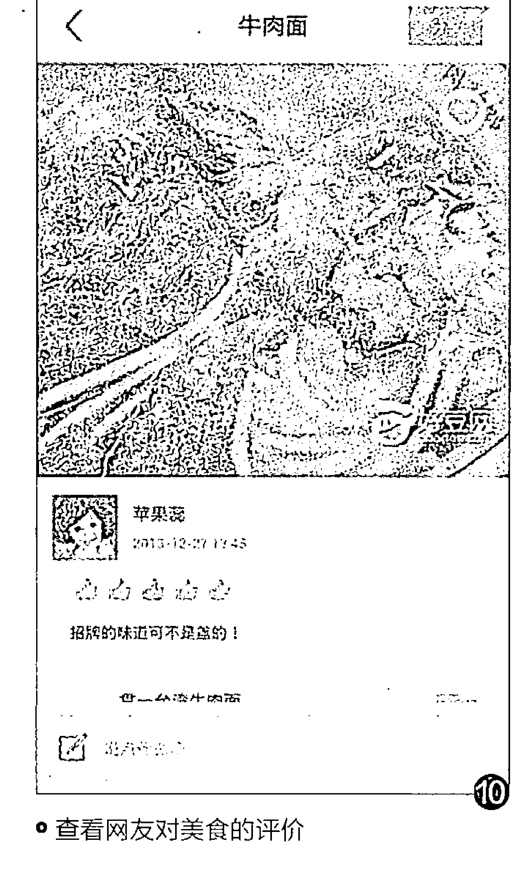

### 美食齐共享

“独乐乐，不如共乐乐”，自己制作了可口的美食，或者在某餐厅品尝到了绝味美食，此时当然要想到和好友分享了。

对于自己亲手制作的美食，可以利用手机的摄像功能制作视频教学，与好友共享，这样可以省去繁杂的文字描述和图片拍摄。要注意的是，拍摄的时候最好由他人代劳，并且摄像头尽量对准灶台和锅全程拍摄，对于一些特殊要求如煎蛋的翻转则还要靠近拍摄，尽量突出做菜细节（图12）。

完成视频的拍摄后，可以上传到上面介绍的“掌厨”与网友共享，也可以将拍摄的视频转换为FLV格式，上传到优酷等网站共享。

如果是在外餐厅品尝到的美食，则可以使用微信直接在朋友圈传送美食信息。进入朋友圈后点击“+→图片→拍摄照片”，然后启动相机的拍摄功能开始拍摄美食，为了能够激起大家的食欲，建议在菜刚刚端上桌时就开始拍摄，并且尽量使用相机的微距功能拍摄（图13）。

在将图片发送到朋友圈后，为了便于朋友们查找到美食餐厅，继续点击“+→位置→发送位置”，然后将当前餐厅位置也发送到朋友圈，顺便还可以做些文字介绍告诉朋友们（图14）。

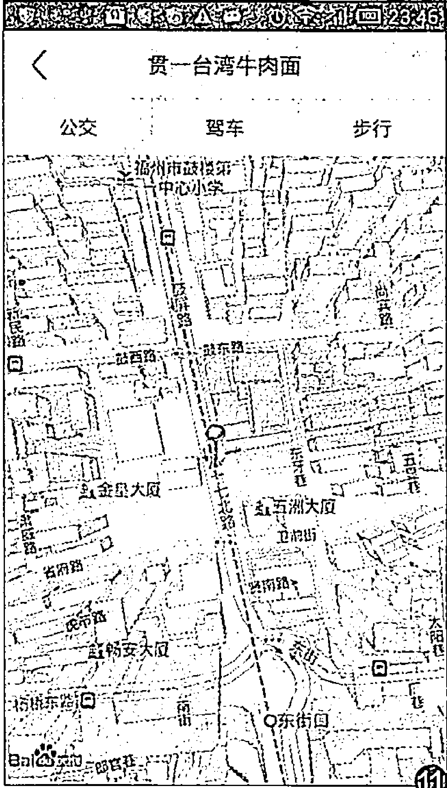

定位餐厅位置

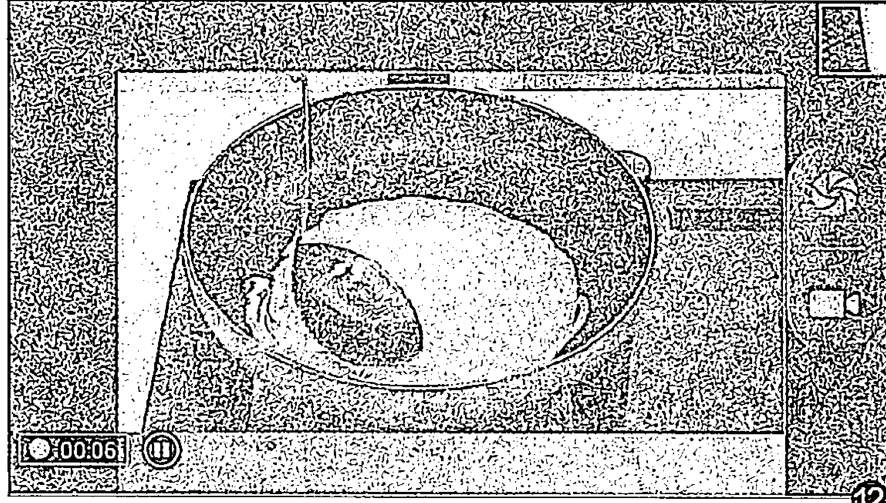

使用手机拍摄做菜视频

### 小提示

现在很多应用都有地理位置信息，除了使用位置信息告诉朋友地址外，我们还可以使用它来作为特色餐厅的标记，方便自己下次带朋友去品尝。比如可以及时使用腾讯微博发布信息，在发布信息的同时添加上位置信息，这样以后查看自己发布的微博信息，即可快速找到这家餐厅了（图15）。


使用手机拍摄美食图片

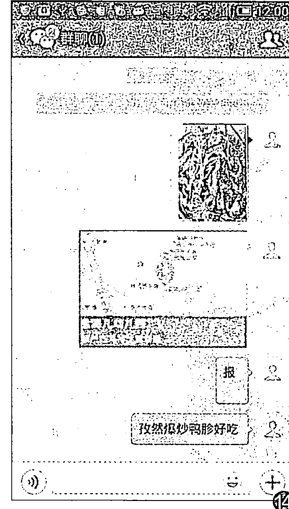

发送餐厅位置信息并且添加点评文字

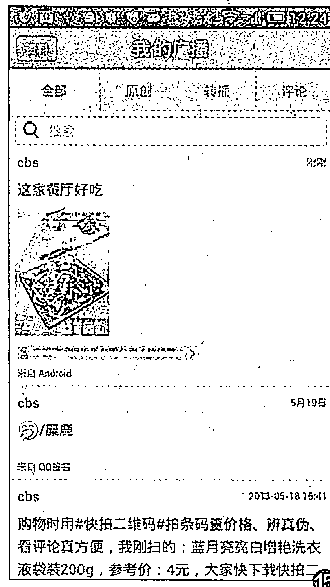

使用微博信息保存餐厅位置

## 鱼与熊掌要兼得 玩转平板双系统

文|俞木发

众所周知，Windows 8 Pro平板应用多，系统界面漂亮，我们可以在其上直接运行电脑上用惯了的软件。但是，Windows 8平板的价格普遍较高。Android平板的价格则要亲民得多，不足的是只能安装APK应用。正是看到上述不足，现在一些厂家便打出“Android+Windows 8”双系统来作为平板的卖点。其实只要稍加动手，自己也能打造出“Android+Windows 8”双系统平板（图1）。

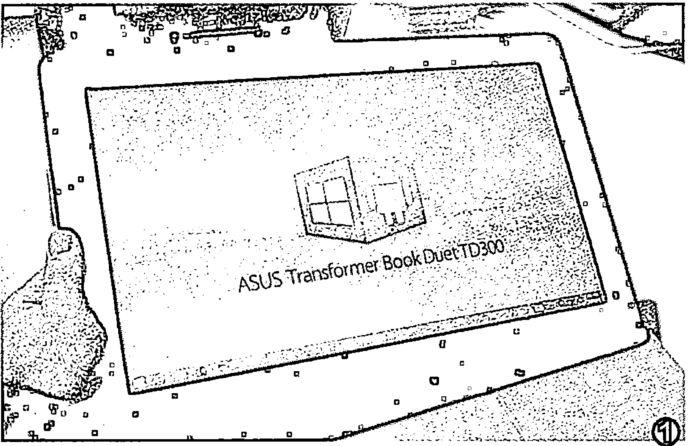

### 知识扩展：平板为什么能安装双系统

众所周知传统的Android平板使用的都是ARM架构，而我们常用的Windows 8平板则是x86架构，由于底层架构的不同，Windows 8是无法安装在ARM架构的Android平板上的。

> 注意：微软之前推出专为ARM配置的Windows 8 RT系统，现在推出的Windows 8主流平板大多使用Windows 8专业版，因此如果没有特别说明，本文的Windows 8均指x86架构上使用的Windows 8专业版。

不过，随着英特尔在平板领域的发力，越来越多的Android平板使用上了x86架构，由于它的架构和Windows 8系统使用的架构相同，因此在Android平板上安装Windows 8就成为可能。比如台电x98平板电脑，使用的就是基于x86架构的英特尔Bay Trail-T处理器（图3）。

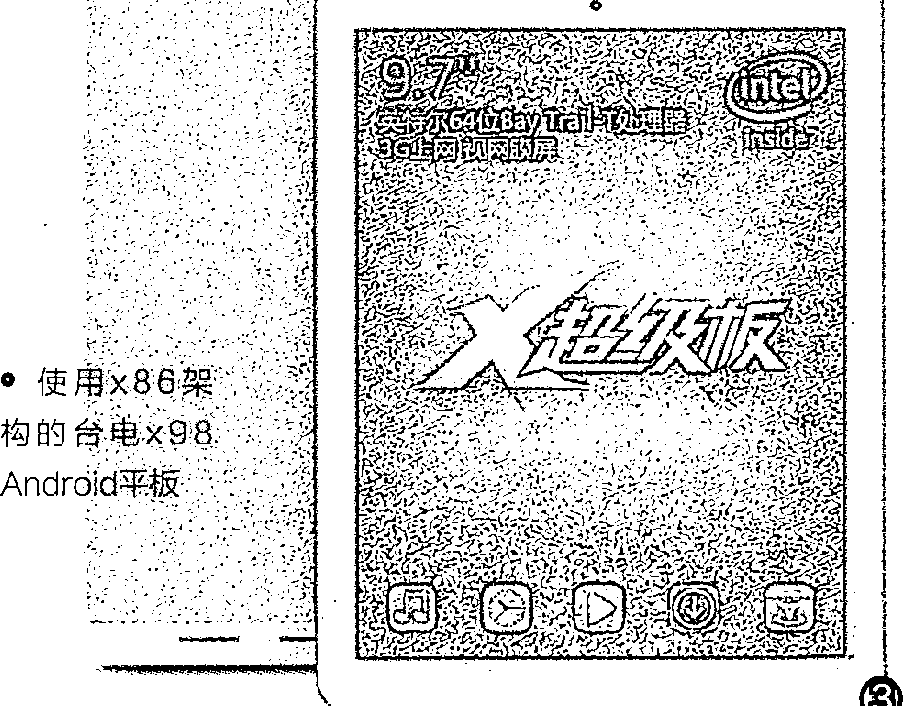

### 小知识：ARM与x86有什么不同

ARM是精简指令集（RISC）处理器架构，x86则是复杂指令集。复杂指令集更适合处理一些高密度的计算任务，而精简指令集则更适合处理一些简单重复的任务。ARM的优势在于效率和功耗，x86的优势则在于性能和速度。由于两者的设计思路完全不同，并不具备多少可比性（图2）。

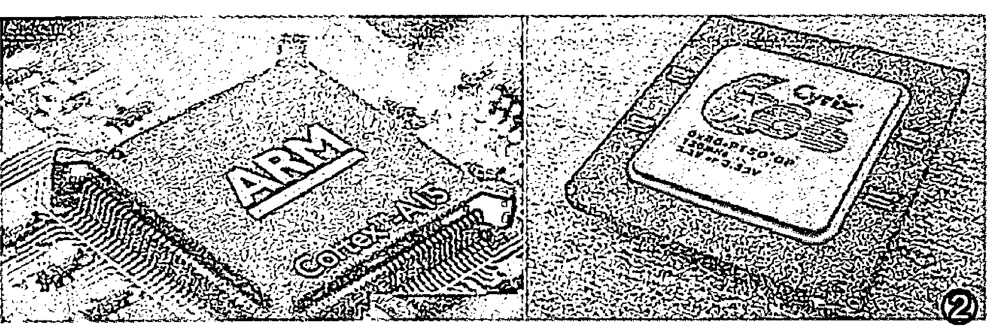

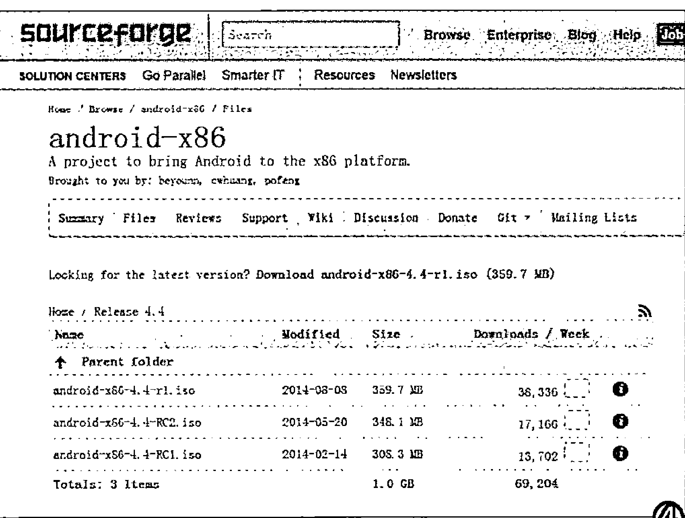

对于Windows 8平板，由于Android是基于Linux内核的开源系统，开源系统从来就是海纳百川，Android官方更是早就推出了x86版本，因此在Windows 8平板上安装Android系统并不是什么难事（图4）。

### 自己动手 Android平板加装Windows 8

通过上面的介绍获知，由于架构的限制，目前只有使用英特尔CPU（x86架构）的Android平板才能安装Windows 8系统，此外要求系统存储空间至少在16GB（含）以上。确保了你的平板符合上述的要求，接下来就可以在它上面安装Windows 8系统（在平板电脑上安装Windows 8操作系统大同小异，以下内容为标准流程及常规问题解决方案）。

首先在电脑上下载好驱动文件和所需的安装包（具体文件可以到台电官方论坛下载），下载后将所需文件全部解压到J:\备用，接着开始制作WinPE安装启动盘。准备一个4GB以上的U盘，然后将解压到的WinPE文件和Windows 8安装文件（解压得到的images目录）全部复制到U盘根目录下，最后文件目录结构是这样的（图5）。

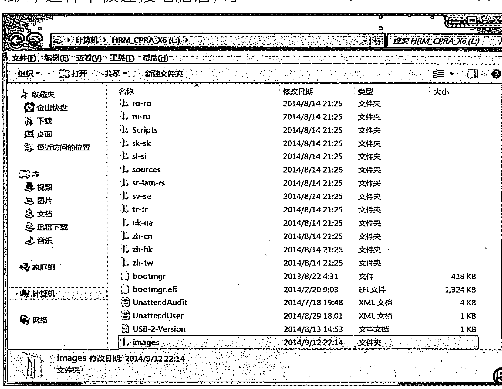

完成上述的操作后，返回Android平板，依次点击“设置→开发人员选项→勾选USB调试”，这样平板连接电脑后，才能将所需的刷机文件推送到平板上（图6）。

文件的推送需要借助ADB命令，在电脑上到http://dwz.cn/cfans14下载，下载后将所有文件全部复制到C:\windows\system32备用，到http://dwz.cn/cfans15下载所需BIOS文件，将其解压到J:\ fpt-tools-package备用。接着以管理员身份启动命令提示符窗口，输入“adb devices”命令，查看平板和PC连接是否正常，如果已经显示连接设备则表示正常连接，否则请安装所需驱动（只要使用91助手、豌豆荚等自动安装即可）（图7）。

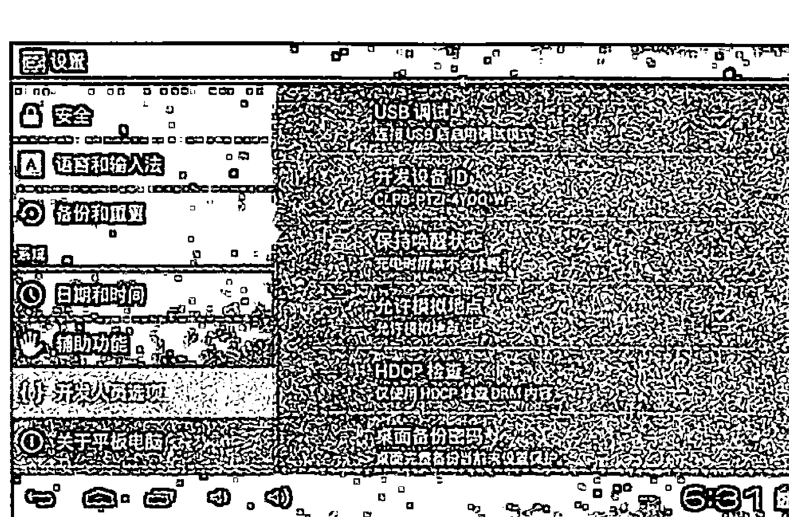

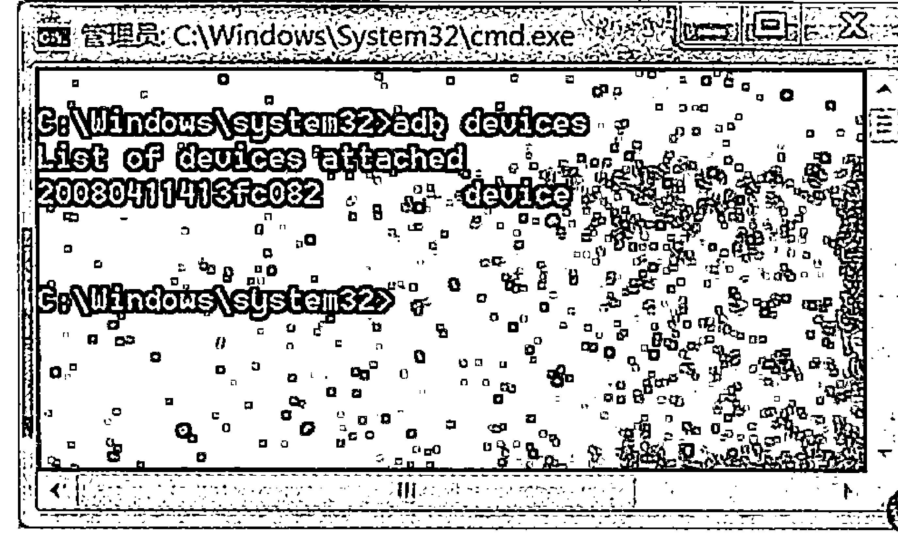

继续输入下列命令，将所需的刷机文件推送到平板上。完成文件的推送后长按电源键强制断电关机（括号中内容为注释，无需输入）：

```
adb push J:\fpt-tools-package data/local/tmp/(将fpt-tools-package目录文件推送到平板data/local/tmp下)
adb shell(进入ADB的shell环境)
cd data/local/tmp/(进入平板的data/local/tmp/目录)
chmod 0777 FPT (设置FPT权限为完全读写)
su(提权命令)
./FPT -F Rom_8MB_Tablet_Windows.bin(将BIOS文件写入到平板，注意命令前有个“.”)
```

使用OTG线+HUB将U盘和键盘全部连接到平板，重启平板后按住键盘的Del键进入BIOS设置，然后选择插入的U盘作为第一启动设备，按F10保存退出后即可开始从U盘安装Windows 8系统。这里的安装是使用DISM命令将“image/install.wim”释放到C盘，当屏幕出现“Applying image”提示时即可将U盘和键盘全部拔下（图8）。

完后镜像文件的解压后，平板会自动重启，重启后进入安装界面，剩下的步骤和在PC上安装是一样的。完成系统的安装后就可以在平板上使用Windows 8系统了。如果还要安装Android系统，大家可以参考下面文章的介绍。

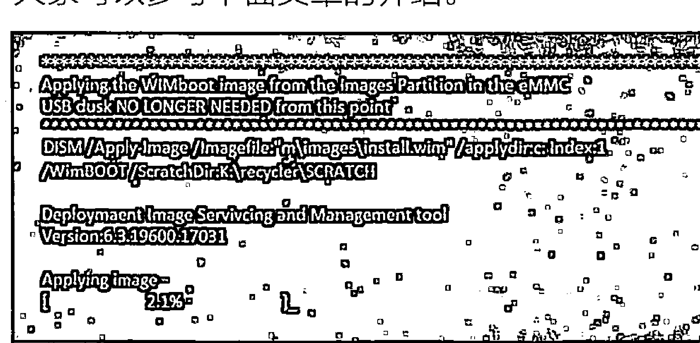

### 虚拟与实机两相宜 Windows 8平板加装Android系统

如上所述，作为开源的Android系统早就推出了x86版本，而且还有各种各样的Android虚拟机软件可以在Windows 8平板上运行，因此对于Windows 8平板加装Android系统，我们既可以直接使用虚拟系统，也可以实机安装Android系统。

由于现在Windows 8平板上都在使用EFI启动，我们需要使用支持EFI启动的Android镜像。对于使用英特尔芯片的平板，只要根据自己所用的CPU型号到https://01.org/zh/android-ia/downloads下载Android安装镜像即可，比如台电X98可以下载Bay Trail Generic 64bit UEFI Installer。

首先在平板上将下载的镜像解压到D:\备用，接着到http://www.cr173.com/soft/15480.html下载“UltraISO”，启动程序后点击“文件→打开”，打开下载到的“live.img”，继续点击“启动→写入硬盘镜像”，插入U盘制作Android启动盘（图9）。

启动Windows 8的磁盘管理组件，右击C盘选择“压缩”，为安装Android压缩出一个4GB的新空间，不要进行分区和格式化，用于安装Android系统（图10）。

准备好OTG线+HUB，将U盘和键盘全部连接到平板，重启平板后将U盘设置为第一启动，启动Android的安装后，选择“Run interactive installer”菜单进入，然后选择

> > **小提示**
> 在安装过程中会询问我们的选择，如“Keep Windows and dualboot? Yes( or No?)”（是否保持双系统的启动）、“Install bootloader? Yes( or No?)”（是否安装引导器），都选择Yes即可。

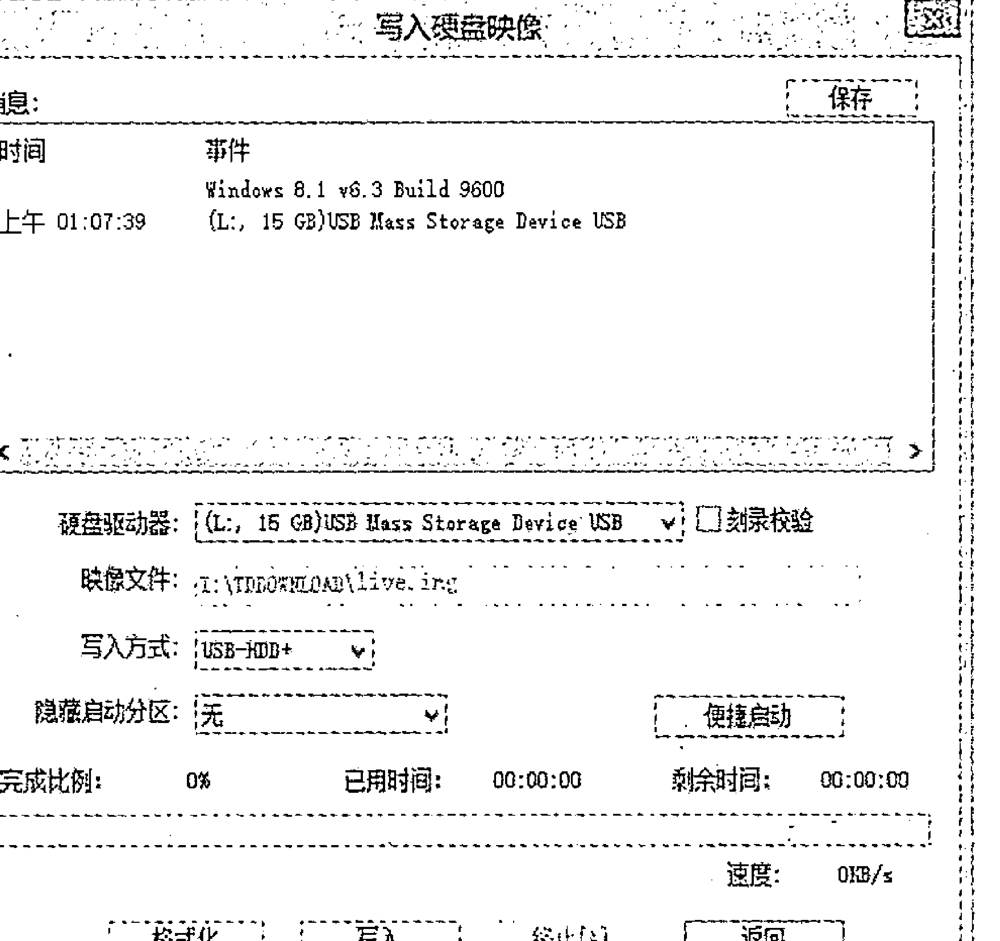

● 在Windows 8制作安装镜像启动盘

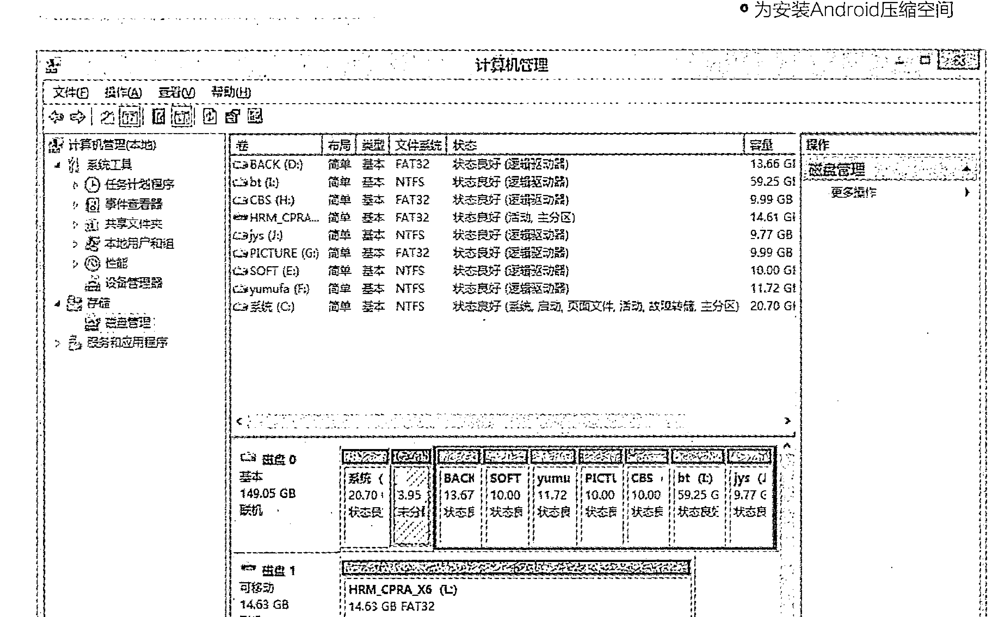

● 为安装Android压缩空间

> > **小提示**
> 这里介绍的只是在Windows 8安装第三方Android系统，如果Android平板需要重新刷回原生系统，同样需要先刷入Android底包文件（类似Windows的BIOS文件）。这样就可以重启平板后进入Recovery模式进行刷机，具体操作和我们此前介绍的Android手机刷机类似。当然动手能力强的用户也可以直接用线刷的方式（需要预先准备平板的Windows驱动文件），在电脑上一步到位将Android系统重新刷入平板。

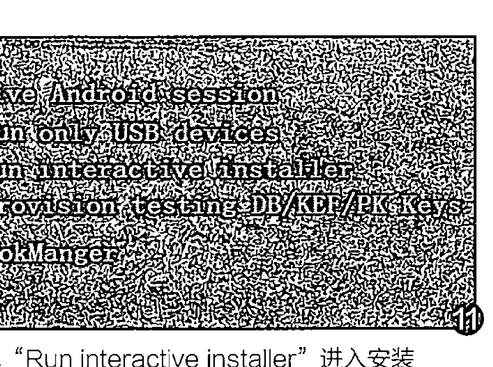

● 选择“Run interactive installer”进入安装

上述划分出的分区安装Android系统即可（图11）。

完成系统的安装后长按平板的电源键关机，重启后在出现的多重启动菜单中选择“Boot android system”进入Android系统（选择“Microsoft Windows”则进入Windows 8系统）。首次进入Android后点击“Setting→Language→简体中文”，切换到中文版后就可以开始使用Android系统了（图12）。


### 扩展阅读 通过安装Android模拟器实现双系统

实机安装Android操作比较复杂，操作不当还可能造成数据丢失，喜欢尝鲜的朋友可以安装Android模拟器BlueStacks。首先到http://www.bluestacks.cn/下载，启动BlueStacks后出现的就是类似Android平板的界面，具体使用和Android平板类似（图13）。

如果要下载其他Android应用，点击“百度手机助手”，然后在打开的窗口搜索需要下载的应用即可，应用安装后就可以直接运行（图14）。

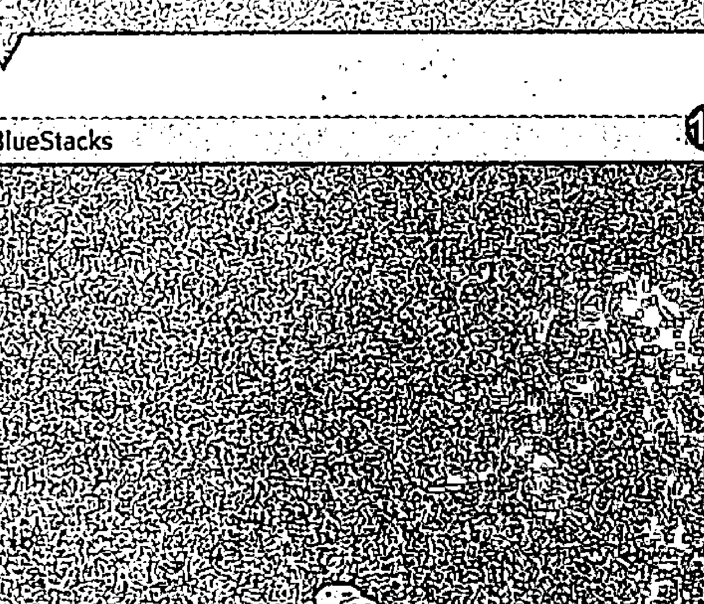

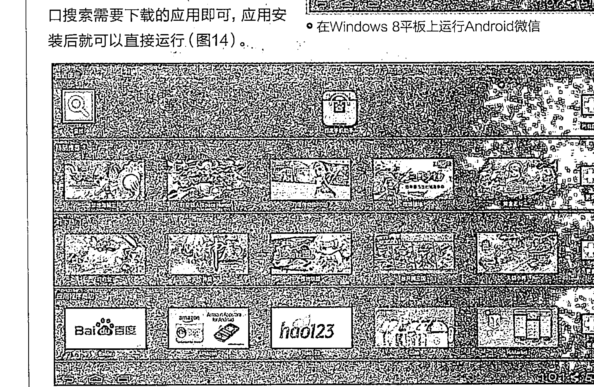

### 双系统常见问题QA

**为什么Android平板刷成Windows 8后触摸会不准确？**
主要是由于Windows 8下触摸的驱动不完善所致，因为自行安装的Windows 8硬件驱动都是网友自制。大家可以在搜索框中输入“校准”，然后点击“校准笔和触控输入的屏幕”进行调整。

**Android平板刷成Windows 8后，相机、3G网络为啥无法使用？**
这个原因也是由于驱动引起的，因为刷入的固件没有对应的驱动，请刷入最新的固件尝试能否解决问题。

**Windows 8平板安装Android后为什么无法使用重力传感器？**
硬件无法识别也是由于固件没有集成对应驱动，而且由于Android是内嵌系统，无法手动安装驱动，建议大家刷入和自己平板型号对应的固件。

**Windows 8平板安装Android后有些Android游戏为什么无法运行？**
原因是由于Android平台上很多游戏都是针对ARM架构的CPU开发的，而Windows 8平板用的是x86的CPU，会由于兼容性的原因无法运行。大家尽量到Google play里去下载应用，这里的应用兼容性较好。

# 手机助阵 越学越轻松

文|俞木发

俗话说：活到老、学到老。人的一生就是学习的一生，无论是在校学生，还是上班一族，我们都需要不断学习各种知识。不过，学习要讲究方法，现在手机已经成为我们必备的随身工具，利用手机随时随地学习无疑是个不错的选择。虽然随手学、随意学是许多人的做法，但如果能科学地使用手机，合理地进行学习规划，那么就可以少走弯路、节省时间、提高效率。

## 成功学习第一步 了解自己的学习类型

从生理角度来说，学习类型可以分为视觉型、听觉型和动觉型三种（三种特性都不明显的人则归属读写型，又叫混合型）。不同类型的人群有着不同的学习特性。比如视觉型的喜欢通过丰富的图像加深记忆，听觉型的喜欢听而没耐心看，动觉型的短程效率高（图1）。

因此要提高自己的学习效率，我们首先就要了解自己是属于哪种学习类型。测试自己的学习类型方法很简单，我们只要用手机直接登录http://suo.im/hedaf，然后按提示根据自己的实际情况回答网页提供的测试试题，最后根据具体答案统计分数，A、B、C、D最高得分就是自己最偏向的学习类型（图2）。

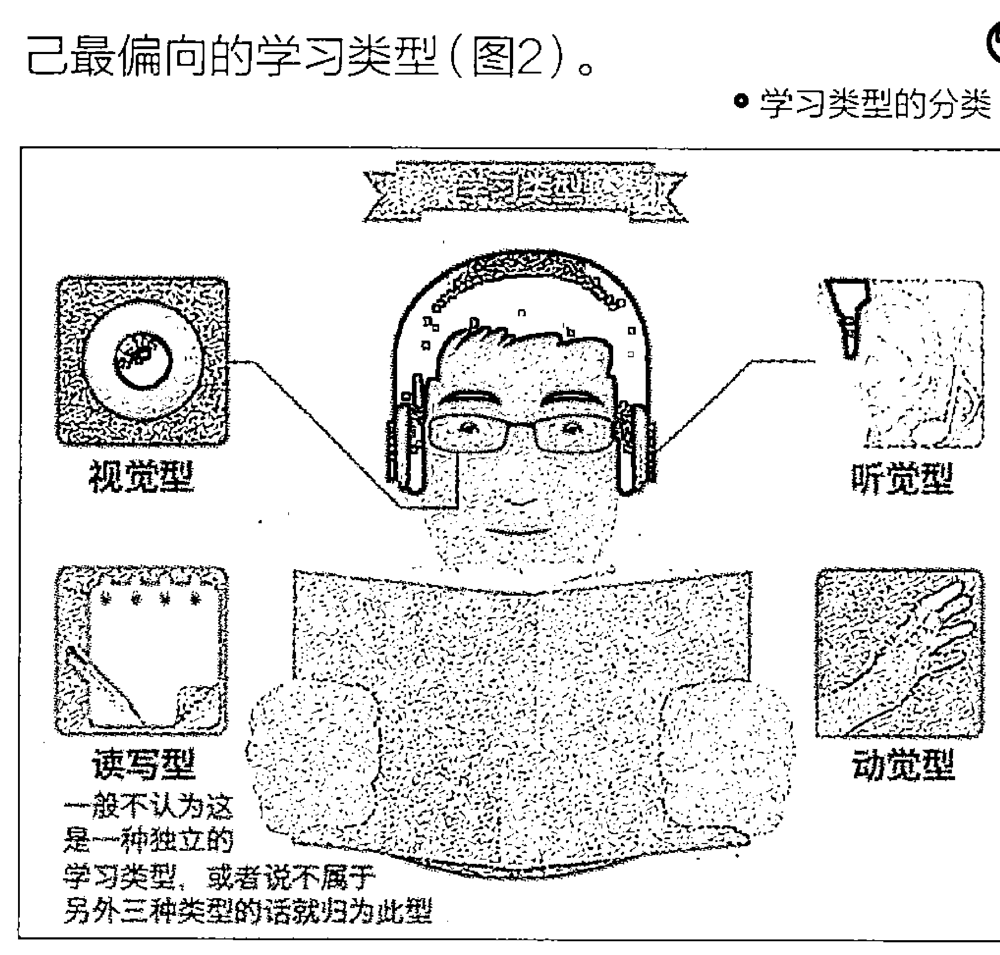

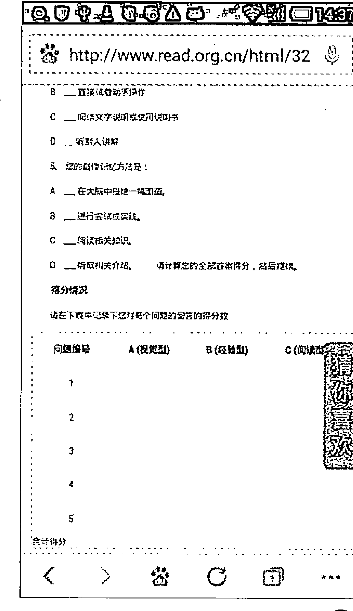

## 有的放矢找方法 选择自己最适合的学习方式

测试出自己所属的学习类型后，需要根据所属的学习类型寻找适合于自己的相应的学习方法。

### 1. 视觉型——视频学习更轻松

视觉型学习者善于通过接受视觉刺激而学习，他们喜欢通过图片、录像、影片等各种视觉刺激手段接受信息、表达信息。因此如果你属于这类学习者，可以充分利用智能手机的视频播放功能来帮助自己学习。比如很多朋友平时就喜欢用手机看电影、拍视频，那么利用目前火爆的各种网络视频公开课来帮助自己学习就是个不错的方法。

首先到http://m.163.com/openapp/下载适合于自己手机的《网易公开课》客户端，启动应用后切换到“全部课程”，

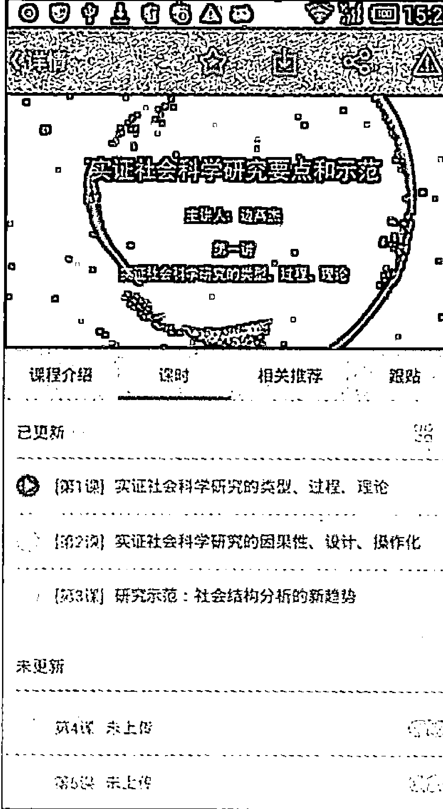

然后选择自己喜欢的课程进行学习即可。因为视频会耗费大量的流量，强烈建议在Wi-Fi环境下点击视频上方的“下载”按钮，将其下载到手机上慢慢学习（图3）。

和网易类似，它集成了国内外著名大学公开课资源。

#### 同类学习资源推荐：

- 新浪公开课（http://www.dwz.cn/tV7SM）：和网易类似，它集成了国内外著名大学公开课资源。
- 国家精品课程资源（http://video.jingpinke.com/）：集成百所高校，数万门的省级、校级精品课程。
- 央视公开课（http://opencla.cntv.cn/）：集成大学、高中、初中、小学、专业课堂、休闲生活等各类公开课资源。

> 现在很多商业性质的在线网校也提供大量的免费试听的学习资源，但是大多又不提供直接下载。如果是在线网站，我们可以在PC上通过嗅探软件找到真实下载地址；如果是集成在客户端的学习视频，大家则可以通过屏幕录制软件录制视频，然后将获得的视频资源复制到手机上播放。为了方便在手机上播放各种多媒体文件，建议安装Rockplay这款万能播放器。

### 2. 听觉型——音频助力学习

听觉型学习者善于通过接受听觉刺激进行学习，喜欢通过讲授、讨论、听磁带录音等口头语言的方式接受信息。而很多朋友平时也喜欢用手机来听歌，因此对于这类学习者，可以借助手机的音频播放来帮助学习。比如本科同学都要过英语四级，而其中听力和单词是很多“童鞋”的弱项，如果你是听觉型的学者，现在利用一些专业背单词应用可以有效帮助你学好英语。

这里以“给力背单词”为例，该应用可以自制或者直接导入背诵单词。首先在电脑上制作词库文件，启动记事本，按提示将需要背诵的单词输入（一个一行），完成后将其保存在桌面备用。接着下载词库制作工具（http://pr.udeu.cn/wp/tools/），启动其中的“点我启动.bat”启动词库制作工具。点击“浏览”导入上述制作好的单词库文件，然后设置生成字库的名称，点击“开始”（图4）。

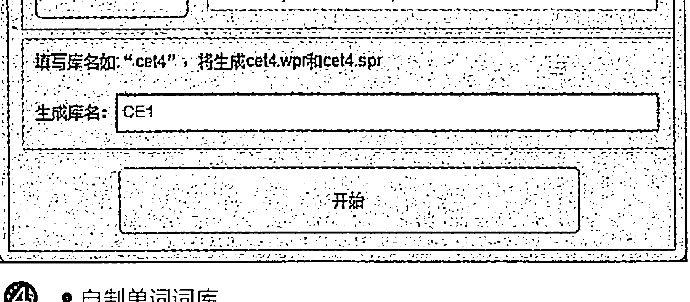

完成词库的制作后将其全部复制到手机SD卡上，在手机上启动“给力背单词”，然后点击右上角的“编辑→新建课程”，按提示建立一个新的课程，点击“导入词库”，导入上述保存在SD卡里的词库，剩余的操作按提示完成课程的创建即可（图5）。

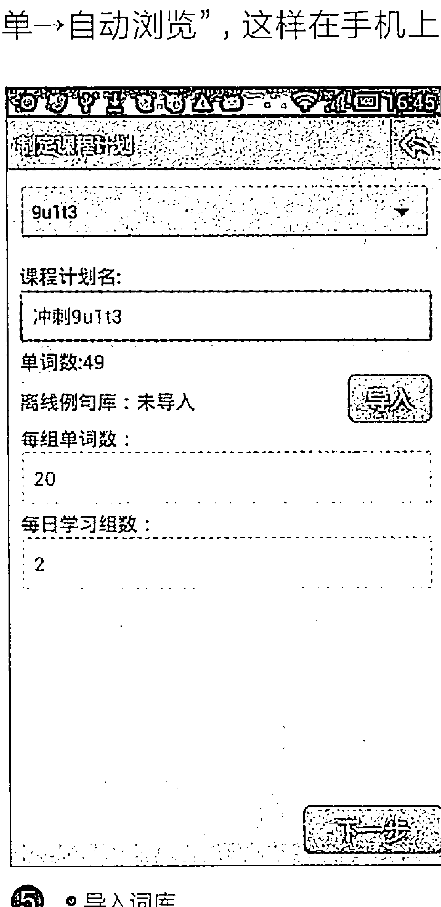

完成课程的建立后，以后只要在课程列表选中上述建立的课程，打开单词列表后点击“菜单→自动浏览”，这样在手机上即可自动播放单词，你只要戴上耳机就可以背单词和听例句了（图6）。

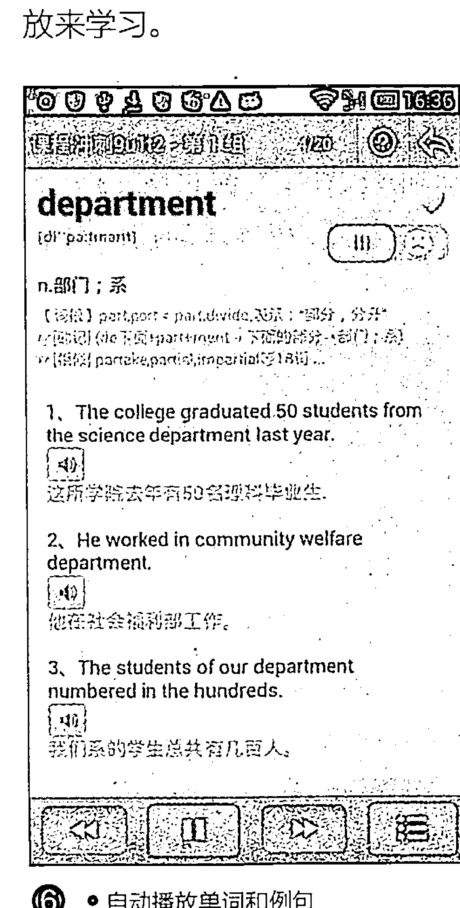

由于听觉型学习者善于通过接受听觉刺激进行学习，所以除了单词背诵外，还可以利用文本朗读工具（Windows 7已经自带）+Excel将需要背诵的语文课文转换为MP3音频，或者通过手机录制老师的讲解视频录音，然后在手机上通过音频播放来学习。

### 3. 动觉型——勤动手助学习

动觉型学习者喜欢通过双手和整个身体的运动进行学习，如通过做笔记、在课本上划线、亲自动手操作等来学习。对于这类学习者，除了在课堂上勤动手外，课外也可以在自己的手机上勤动手以助自己的学习。比如很多“童鞋”都有勤记笔记的习惯，现在利用“印象笔记”即可充分发挥自己的动手能力。

首先下载“印象笔记”（http://www.dwz.cn/ttCkK），在手机上启动印象笔记后，点击“新建笔记”，在打开的新笔记本中即可输入需要学习的内容，比如可以用它来建立自己的读书笔记（图8）。

印象笔记支持多种方式的输入，比如在某图书馆查阅资料，对于需要摘抄的书籍资料，可以点击窗口上方“+→拍照”，直接将资料拍成图片插入到读书笔记中。对于比较重要但是内容较少的内容，则可以添加“手写”，直接在屏幕上将内容书写保存，充分利用动觉型学习者的强项来助阵学习（图9）。

#### 同类资源推荐：

- OneNote (http://www.onenote.com/)：可以直接在手机上书写笔记，插入批注。
- 为知笔记 (http://www.wiz.cn/)：功能强大的笔记本软件，方便对收集的资料进行快速整理。

> 小提示
> 对于一些只在Android上运行的视频学习资料，由于Android本身不支持内录播放的声音，如果要录取其中的语音资料，可以借助BlueStacks模拟器将Android应用安装到PC上播放，然后通过系统自带的录音机录制音频，最后将其复制到手机上使用即可（图7）。

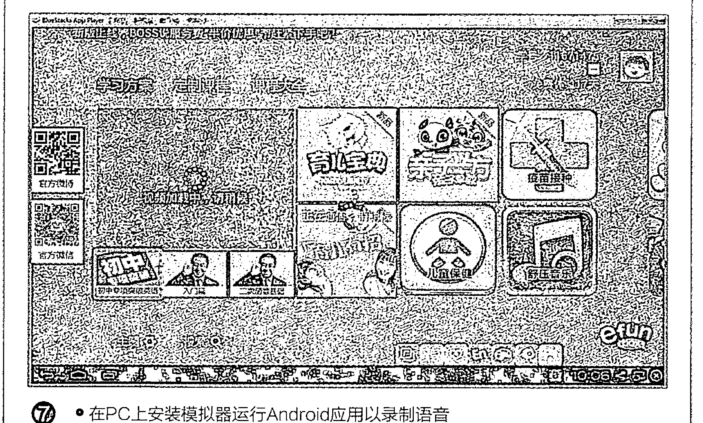


当然，每种学习技巧也不是只对某种类型的学习者有效。在移动生活越来越普遍的今天，每个人每天利用碎片时间学习的环境可能千差万别。比如，有的环境可能不适合于记录，而有的环境则不适合于阅读。无论是哪种学习者，都应该因地制宜地选择多种方式来帮助自己学习，力图成为一个混合型的学习者。比如既下载公开课视频，又录制公开课视频的伴音，同时使用“为知笔记”等及时记下学习心得，充分利用智能手机的多项功能来帮助学习。

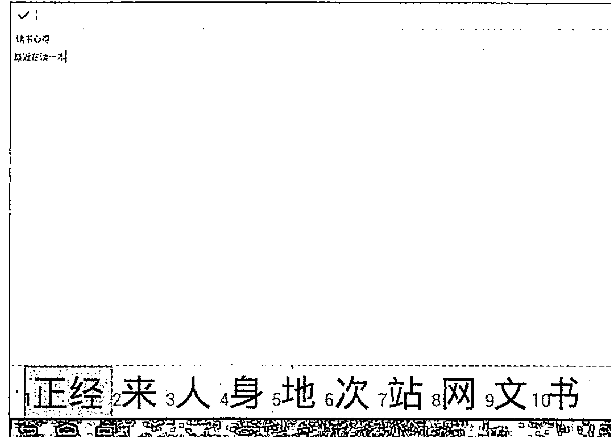

## 打造专用学习环境

也许你会说，方法不是问题，关键的是要保证学习时间。拿起手机之后，有几个人能规规矩矩地去学习？现在智能手机的功能越来越强大，手机用来学习的同时也可以用来娱乐，对于自制力不强的朋友，使用手机学习的时候会不自觉用它来玩游戏、上网看新闻，这样就会严重降低学习效率。为了让手机在特定学习时间只是专门用于学习，我们可以借助“Nemus Launcher”这款应用来锁定其他无关的程序。

首先下载“Nemus Launcher”（http://www.dwz.cn/tV8dd），安装完应用后点击手机上的主页按钮，在弹出的启动器选择“Nemus Launcher”切换到Nemus桌面（图10）。

切换到Nemus桌面后点击手机屏幕上的“菜单→启动器设置”，在打开的窗口切换到“启动器设置 → 锁设置”，点击“锁定程序运行后的“编辑”按钮（图11）。

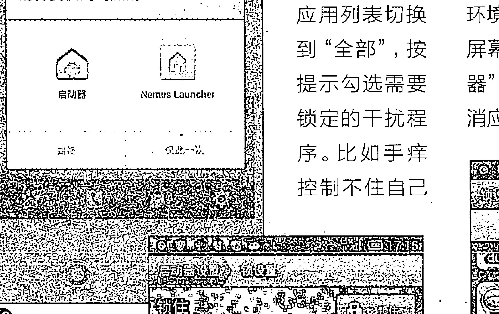

在打开的应用列表切换到“全部”，按提示勾选需要锁定的干扰程序。比如手痒控制不住自己上网的用户可以将手机浏览器锁定，喜欢玩游戏的用户则将最容易影响学习的游戏应用锁定。当然为了打造更纯净的学习环境，也可以设置只允许学习应用的运行，其他全部锁定（图12）。

完成应用的锁定后设置解锁密码（为了更好地使用手机学习，建议解锁密码由其他朋友来设置而并不让自己知道）。接着返回桌面，现在你就只能在手机上运行学习应用，而试图运行被锁定的应用时，系统会弹出需要输入解锁密码才能运行（学习应用则无此限制），这样就让你的手机用来专心学习了（图13）。

这些锁定的应用只是在Nemus桌面生效，我们这里只是将该应用作为学习专用桌面环境。学习完成后只要再次点击屏幕主页按钮，然后选择“启动器”，切换回原来的桌面即可取消应用的锁定。

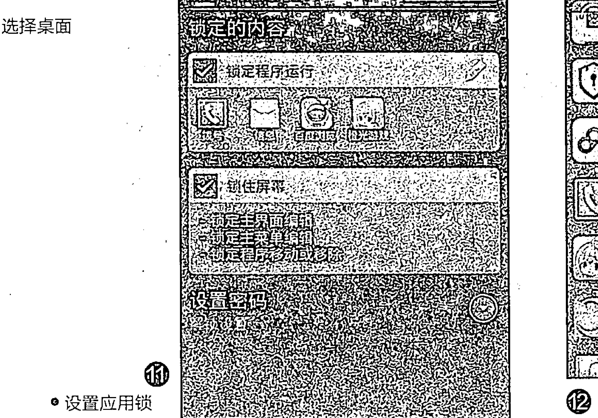

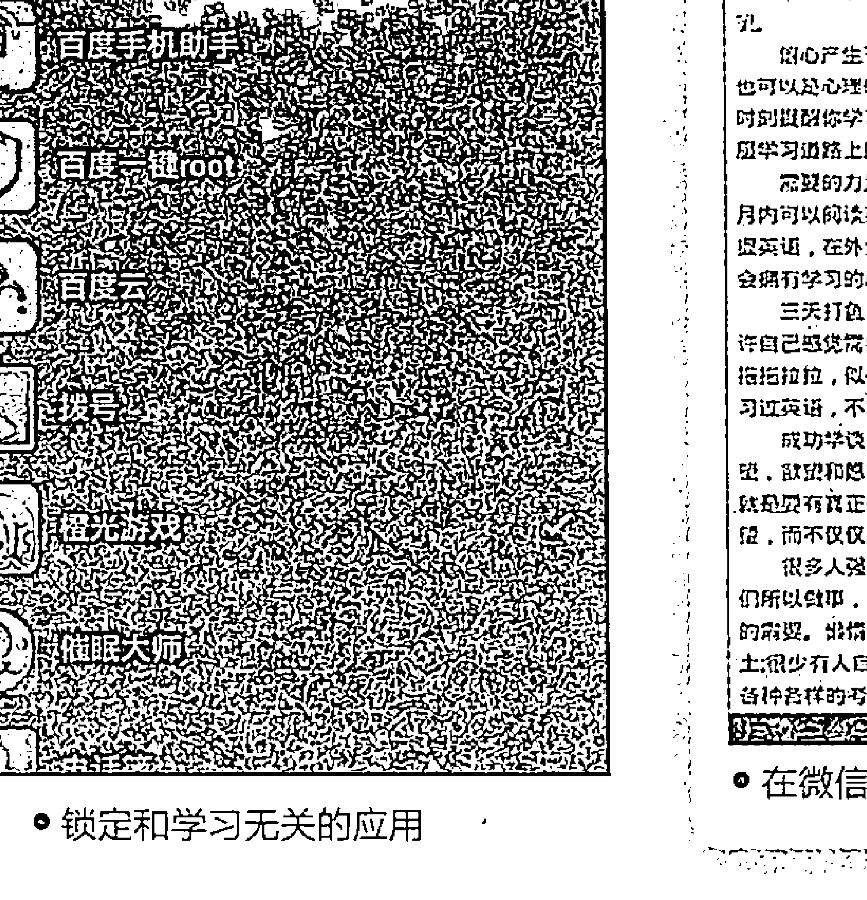

除了掌控好自己的学习时间外，要提高学习效率，还需要讲究一些任何类型学者都通用、有效的方法。比如对于理论和实际联系紧密的知识，可以使用“案例学习法”，用学到的知识结合案例，减少学习的枯燥感，增加对知识的效用性认识。如果要了解更多学习方法，可以直接用手机微信订阅学习达人的经验。启动微信后点击“搜索”，然后输入“学习方法”，对找到的关于学习的公众号进行关注即可（图14）。


- 运行锁定的非学习应用需要输入解锁密码

小提示

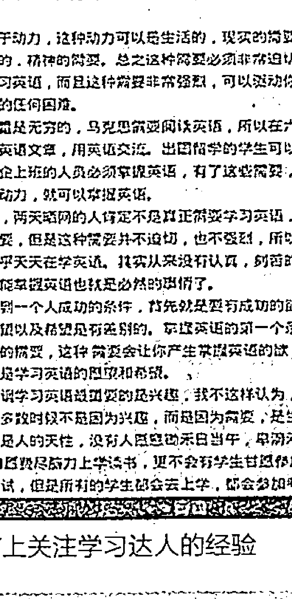

- 在微信上关注学习达人的经验

# Android平板华丽变身“笔记本”

文|俞木发

随着Android设备硬件性能的提升，Android平板和笔记本的差距越来越小。很多朋友也将Android平板作为笔记本使用，不过Android系统和笔记本的Windows毕竟不同，在操作方式上就有诸多不便。下面就让我们一起来“调教”Android平板，让它变为“笔记本”，更适合我们使用。

## 应用启动更便捷 为平板加装“开始”菜单

现在的笔记本大多使用Windows 8操作系统，在笔记本上平时我们都是使用开始菜单来快捷启动应用。Android平板则需要进入桌面，通过选择应用程序来启动应用。要想让Android平板像笔记本那样启动应用，可以借助Android“Windows 8桌面”获得类似Windows那样的开始菜单。

首先到http://suo.im/0rdfs下载该应用，启动应用后就可以看到Windows 8那样的磁贴桌面了。直接点击其中的图标（或者滑动桌面选择其他应用）即可启动其中的应用（图1）。

不过很多图标默认并没有关联到对应的Android程序，我们需要稍加编辑，比如点击“Maps”图标，然后在打开的窗口选择“百度地图”（尽量选择添加能和图标对应的应用），这样以后在这个开始菜单点击地图图标就可以启动百度地图。也可以直接点击“+”添加自己需要增加的应用到开始菜单上（图2）。

此外，还可以通过点击桌面“菜单→设置”，对桌面背景、颜色等进行个性化的设置。如果需要添加的应用较多，还可以将其添加到开始菜单最后的某个文件夹图标里，如游戏全添加到Games文件夹中。

要将这个界面作为平板的默认桌面，只要按下平板的主页按钮，然后在弹出的窗口中选择“Windows 8”，同时勾选下方的“设为默认选项”，这样每次启动平板后显示的就是上述的桌面了（图3）。

> 设置了默认桌面后需要恢复原来的桌面，则进入“设置→应用程序管理→Windows 8桌面→清除默认设置”即可。

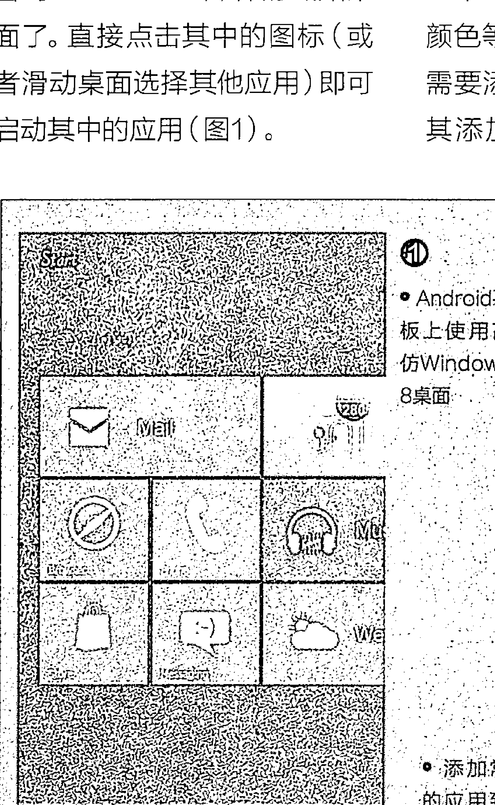

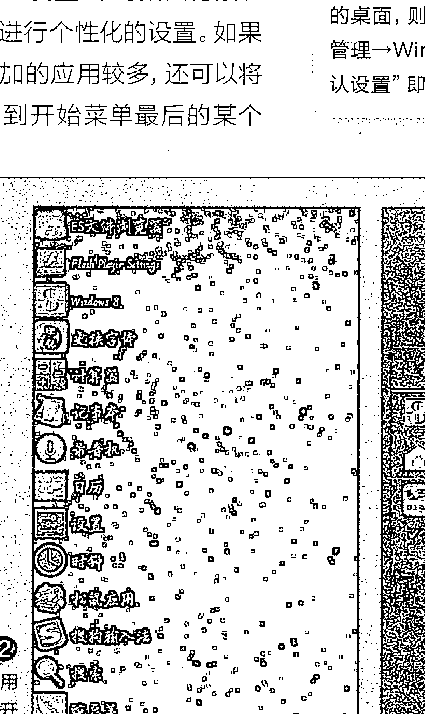

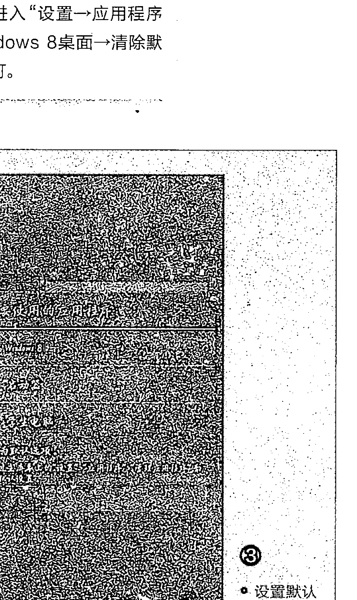

## 鼠标使用更顺手 更改鼠标指针大小

我们的笔记本都会配置鼠标，通过鼠标可以精准定位，更方便于我们操作。对于笔记本来说，如果连接鼠标后，鼠标指针过小会影响操作，我们只要进入控制面板的鼠标选项即可自定义鼠标指针（图4）。

对于Android平板来说，要像笔记本那样使用，配备鼠标显然是必不可少的。不过Android系统默认鼠标指针都较小，而且无法像Windows那样自行调整。这样在玩一些支持鼠标操作的游戏时，眼睛看起来就非常吃力。现在要像笔记本Windows那样自定义鼠标指针，我们可以通过修改Android系统文件来实现。

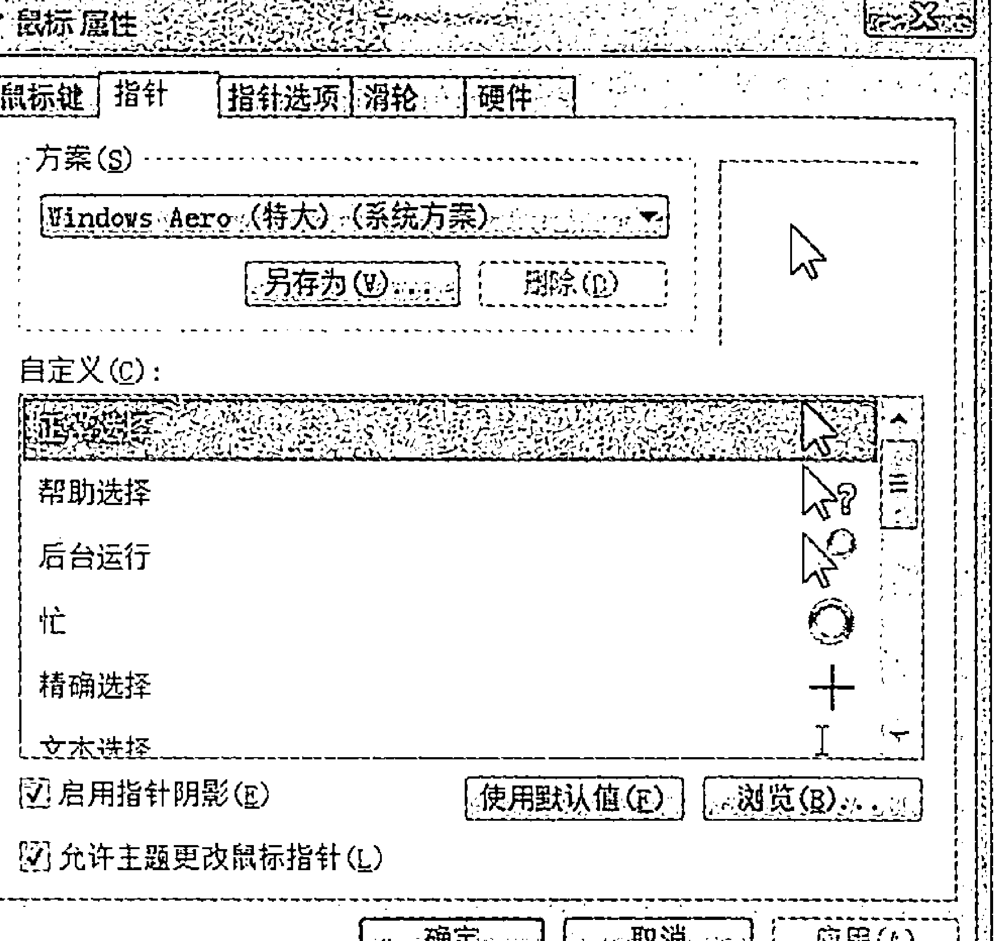

首先在平板（需要Root）上启动RE文件浏览器，然后定位到“/system/framework/framework-res.apk”，将其复制到电脑上桌面备用。在电脑上使用7-Zip打开上述文件，其中“framework-res.apk\res\drawable-mdpi\pointer_arrow.png”就是鼠标指针文件（图5）。

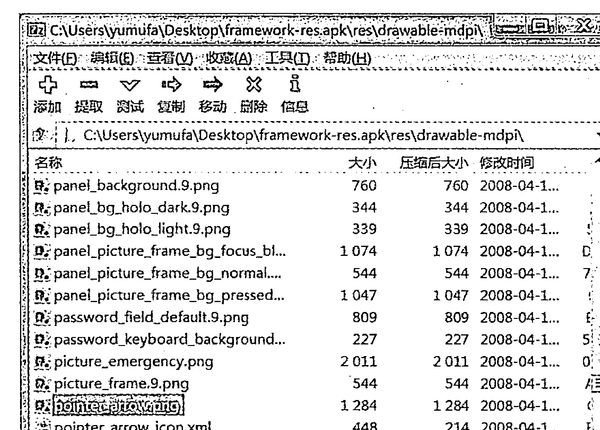

### 小知识

#### Android平板怎么外接鼠标、键盘

现在平板大多支持蓝牙和Micro USB接口，因此一种方法是使用蓝牙鼠标、键盘，只要在Android系统中开启蓝牙，然后通过蓝牙配对，和蓝牙鼠标、键盘配对成功后即可在Android系统下使用；另一种方法则是使用OTG+HUB+键盘、鼠标，或者OTG+无线键盘鼠标发射器，这样也可以在平板上使用键盘、鼠标。

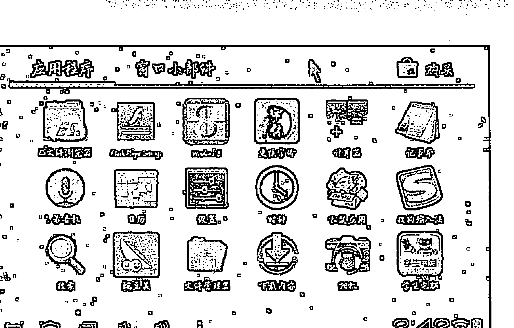

按提示将“pointer_arrow.png”拖到桌面备用。熟悉PS的朋友可以直接将其导入并修改大小，然后一定要将其背景作透明化处理（否则使用鼠标时会留下背影），当然也可以直接从网上下载背景透明的鼠标指针（PNG格式），下载后将其保存为“pointer_arrow.png”，最后将修改过的文件添加到framework-res.apk中，然后将其复制到SD卡上备用。

返回平板桌面，启动RE文件管理器定位到“SD卡”，然后将修改过的“framework-res.apk”复制到“/system/framework”替换同名文件，此时平板会自动重启，重启进入桌面后使用OTG线连接鼠标就可以看到自定义鼠标指针了（图6）。

> framework-res.apk是重要系统文件，更改不当可能造成平板无法开机，操作之前一定要做好数据备份。

小提示

### 优化Android外接键盘输入

键盘是笔记本的标配，Android平板通过OTG连接USB键盘同样可以像笔记本那样使用键盘。不过要在Android平板上实现高效输入，我们还需要进行一番优化。

Android平板默认使用的是触摸键盘输入法，在外接键盘后如果在输入界面还出现触摸键盘，这影响我们的输入。因此连接键盘后需要屏蔽触摸键盘的显示。对于Android4.2以上的系统，外接键盘后，进入“设置→语言和输入法→选择输入法”，将使用物理键盘选项（只有连接外接键盘才会出现）设置为“打开”即可屏蔽触摸键盘的显示（图7）。


不过，触摸键盘也有方便的地方，比如可以快捷输入一些特殊符号、直接手写不会输入的汉字等，因此在需要使用触摸键盘输入特殊字符时，同上进入输入法设置将物理键盘设置为“关闭”即可（图8）。

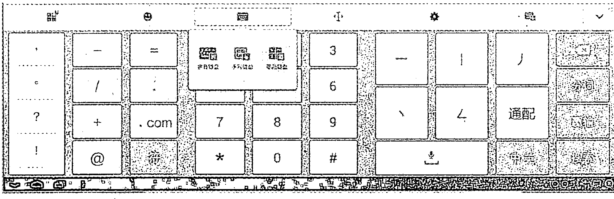

此外，为在Android平板实现高效的输入，我们还可以导入原来在电脑上的输入法词库和使用习惯。比如使用搜狗输入法，可以先在电脑上进入搜狗输入法的“设置→输入法账户”，按提示使用自己的搜狗账号登录，然后点击“操作→上传配置和同步字库”，将配置文件传送到服务器上（图9）。


接着在平板上也安装搜狗输入法并设置为默认输入法，进入搜狗输入法设置界面后点击“个人中心”，点击“同步个人词库”，这样可以将电脑上的词库同步导入到搜狗手机输入法，方便在平板上实现快速输入（图10）。


### 调整平板分辨率

大家知道对于笔记本Windows系统，我们可以非常方便地在笔记本上自定义屏幕分辨率，这样对于一些对分辨率有特定要求的程序（如很多旧游戏），也可以让其轻松地在笔记本上运行。不过Android平板默认无法调整分辨率，如果要想让Android平板能够像笔记本那样调整分辨率，我们可以借助于“分辨率修改器”来实现（平板需要Root）。

到http://suo.im/wy82j下载应用，启动应用后它会自动识别当前设备的DPI，只要拉动其中的滑块即可自动调整当前设备的分辨率。比如一些游戏在当前平板无法全屏运行，我们可以适当增加DPI数值，反之则减小（图11）。


### 真实体验 Android平板安全安装Windows 8系统

如果使用的是英特尔芯的Android平板，加装一个Windows 8系统无疑是最好的方法。在本刊20期杂志上已经介绍了如何在Android平板上安装Windows 8系统，其实还可以将系统安装到U盘或者移动硬盘上，来体验Windows 8。在移动硬盘各准备一个FAT和NTFS分区，然后准备好适合自己平板的Windows 8安装文件（需要64位），使用WinRAR打开后将其中的“EFI”目录解压到移动硬盘的FAT分区根目录下。到http://suo.im/io97u下载“bootice.exe”，启动程序后进入BCD编辑，选择“移动硬盘FAT分区/EFI/microsoft/boot/bcd”文件，单击“添加→Windows nt6.x VHD启动项”，按提示添加VHD启动，启动磁盘和分区选择移动硬盘（图14）。

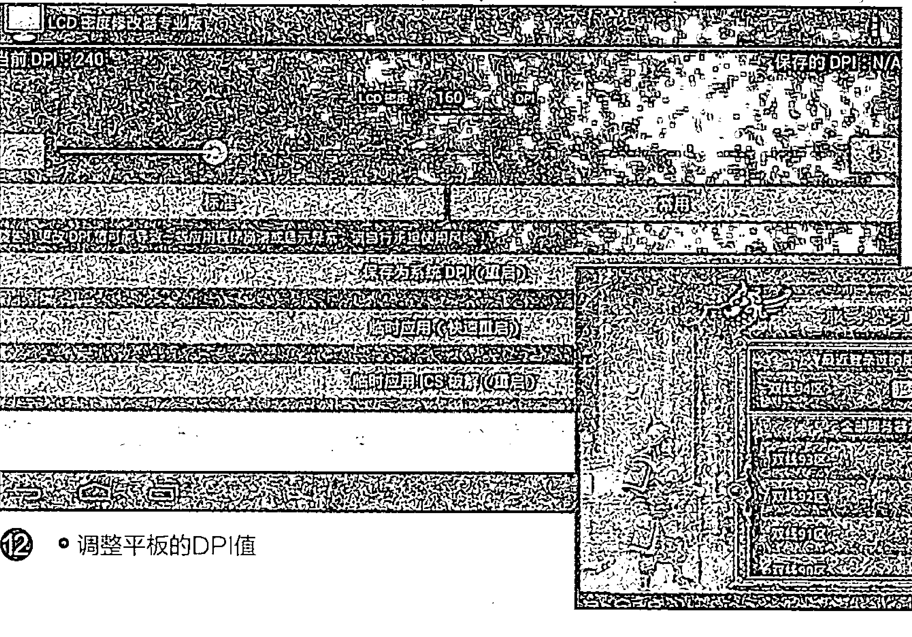

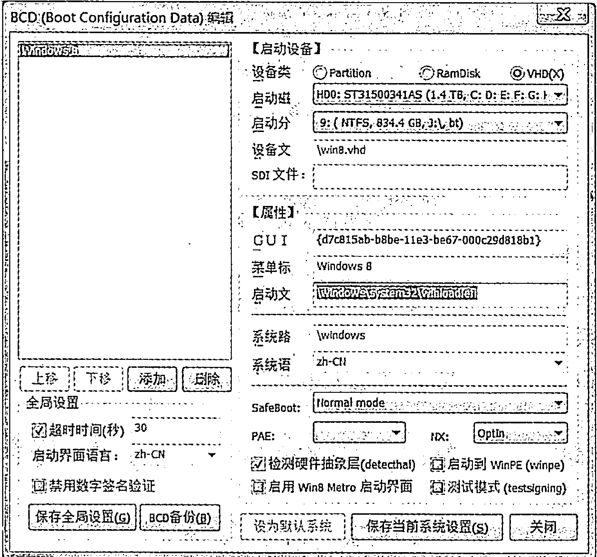

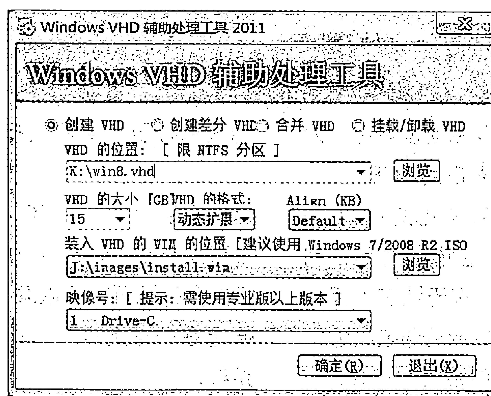

> 不要将DPI的数值设置得过大或过小（建议只在原值基础上增减10%），否则可能导致平板进不了系统。

### Windows 8平板也玩一键恢复
文|俞木发

现在使用Windows 8平板的用户越来越多，为了保证系统出现意外时可以方便地进行恢复，我们很有必要为自己的平板打造一键恢复功能。一键恢复在普通电脑上很容易实现，不过平板本身的一些特性却决定其一键恢复要比电脑上的更为复杂。下面让我们一起来在Windows 8平板上打造一键恢复。

### 为何需要打造一键还原系统——了解Windows 8平板特性

在电脑上我们经常使用一键Ghost、还原精灵等软件来打造一键恢复系统，不过平板和电脑不同，电脑上经常使用的一键还原软件和操作习惯在平板上并不适用，因为平板有自己独特的配置和操作习惯。

- **平板引导固件和普通电脑不同**
现在的Windows 8平板都在使用UEFI+GPT方式引导，常见的一键Ghost、还原精灵由于不支持UEFI引导，所以这些软件均无法在Windows 8平板上使用。要了解自己的平板是否是使用UEFI引导，进入系统后使用管理员身份启动命令提示符，接着输入“msinfo32.exe”，在打开的窗口查看右侧窗格的BIOS模式是否显示为“UEFI”即可（图1）。

- **平板操作习惯和普通电脑不同**
很多人的平板大多随身携带，但是平板和普通电脑不同，鼠标键盘并非平板的标配，而且大部分人并没有随身配备鼠标键盘的习惯（因为键盘、鼠标需要OTG线的连接，而且还需要HUB支持）。平板大部分使用的是触摸操作，但是很多还原软件的恢复界面又不支持触摸，因此平板上的一键恢复系统需要一键就可以自动完成，尽量减少手动操作。

- **平板使用的是特殊的SOC基板**
平板的基板和我们常见的主板不同，不仅启动设置也较为复杂，而且大多使用USB3.0、触摸屏等设备，常见的PE系统并没有集成上述驱动，导致自制的PE启动盘大多无法在平板直接启动，这样想像普通电脑那样用PE完成系统恢复也不可行。
正是基于上述特性，因此我们很有必要在平板上打造一个专用的恢复系统。这个恢复系统应该实现的目标是：不需要借助OTG、键盘、鼠标，仅仅利用平板本身的配置实现恢复，这样即便是在公车上也可以轻松恢复系统。

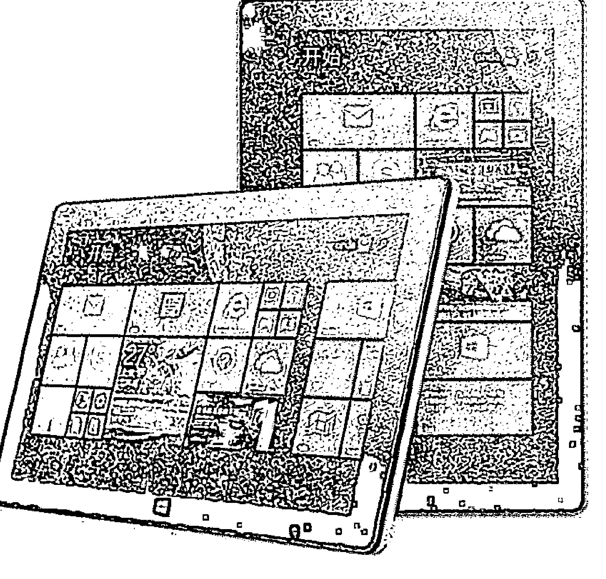

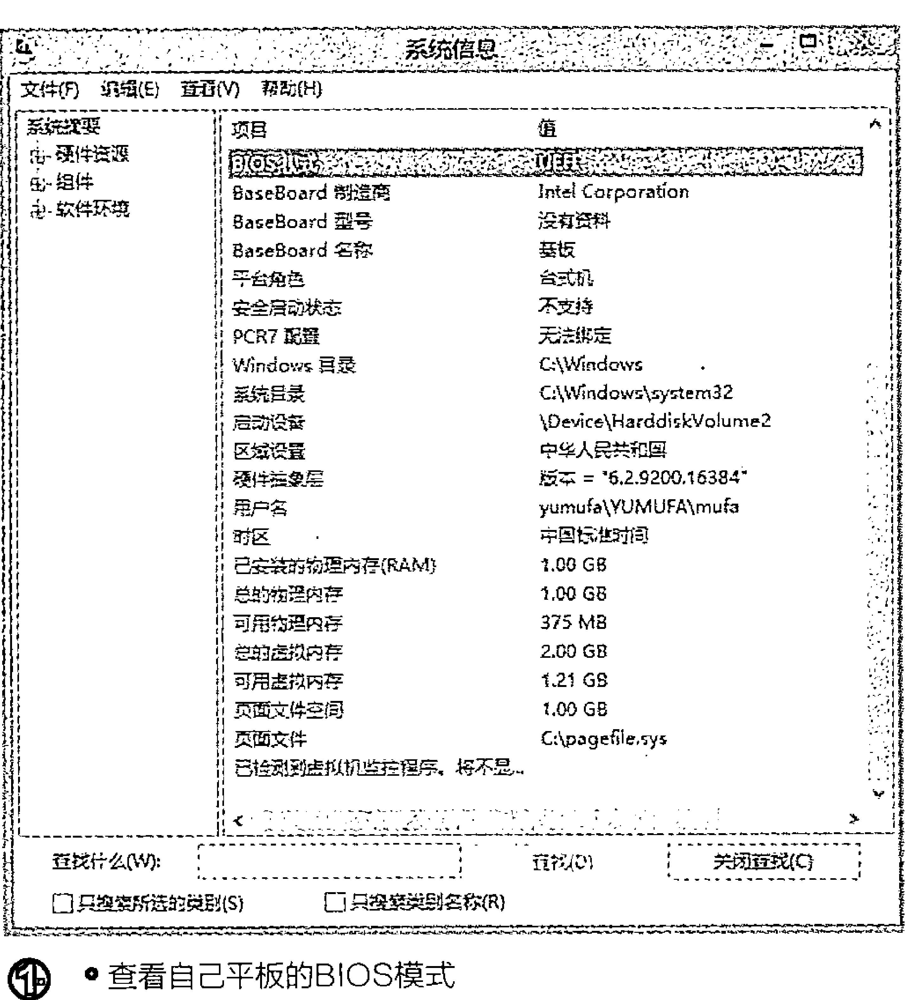

### 按部就班 打造一键恢复系统

了解了平板的特性后，下面就一起来看看如何结合平板特性来打造一键恢复系统。为了便于阅读，大家可以参考下列的制作流程图（图2）。

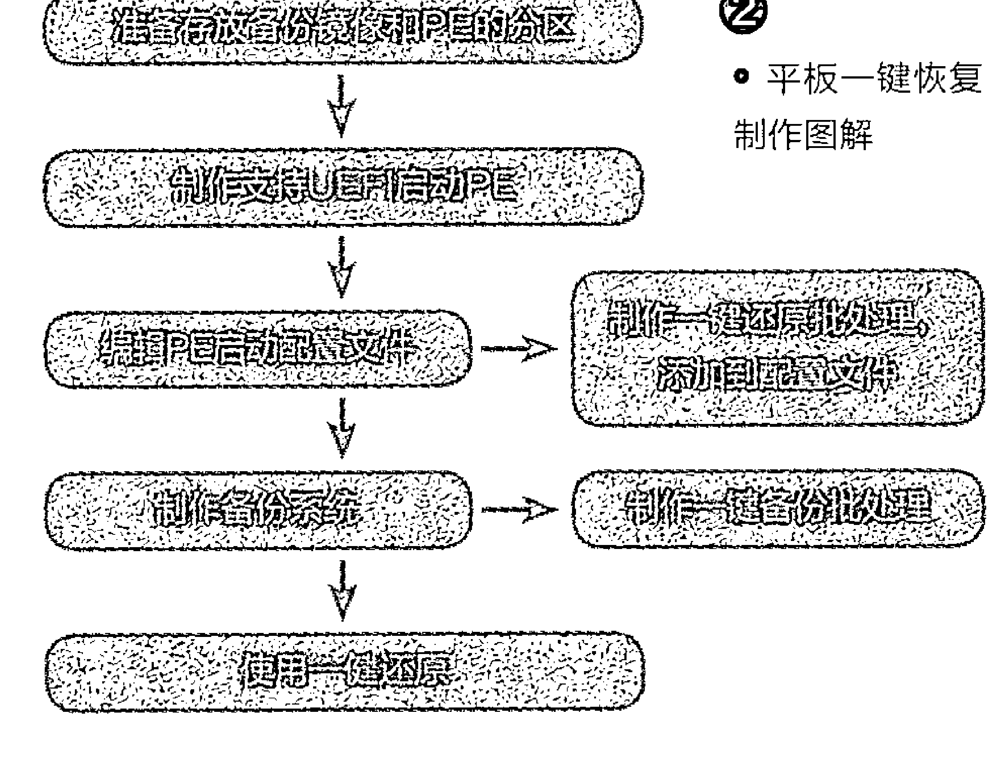

### 1. 准备所需分区及PE系统

由于是对当前操作系统进行备份和还原，具体操作需要在PE环境下进行，因此我们要在平板上划出特定的分区存放支持UEFI启动的PE。UEFI启动只支持FAT分区，而现在平板大多只有一个系统分区，因此首先需要压缩出存放恢复镜像和PE系统的分区。分区压缩操作很简单，只要打开磁盘管理组件，右击C盘选择“压缩”，然后在弹出的窗口划出一个至少5GB左右的空间（图3）。

接着按提示将压缩出的空间划分为二个分区，一个4GB的NTFS格式（假设为D盘）用作存放备份镜像，另一个1GB的FAT32格式（假设为E盘）用于存放PE系统，最终分区结构如图4所示。

完成上述操作后到http://www.itellyou.cn/下载制作PE系统的操作系统镜像，这里要注意版本的选择，如安装64位Windows 8.1用户则下载对应的简体中文64位系统。PE的引导是和你平板内置的UEFI版本一一对应的，64位和32位UEFI只能引导对应版本的PE系统。要查看自己平板的UEFI是什么版本，只要启动DiskGenius（下载地址：http://www.diskgenius.cn/），然后定位到ESP分区，在右侧的窗格切换到“浏览文件”，依次展开“EFI/boot”目录，其中引导文件“bootia32.exe”（对应32位系统）和“xboot64.efi”（对应64位系统）就分别对应不同版本的系统（图5）。

确定了自己的系统版本后下载安装UltraISO，启动程序后打开上述下载到的安装镜像文件，然后将“sources\install.wim”文件剪切到D盘，接着全选文件，点击“操作→提取到”，将所有文件提取到E盘备用，这样就完成了支持UEFI启动PE的制作（图6）。

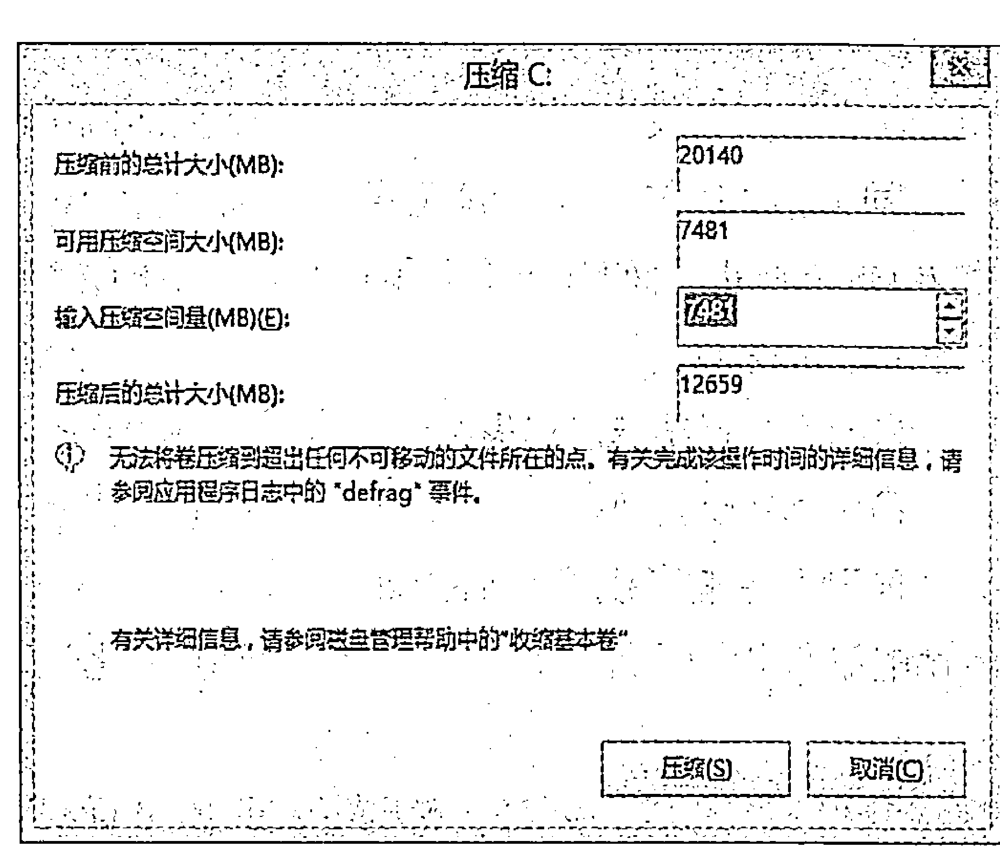

图3 压缩空间

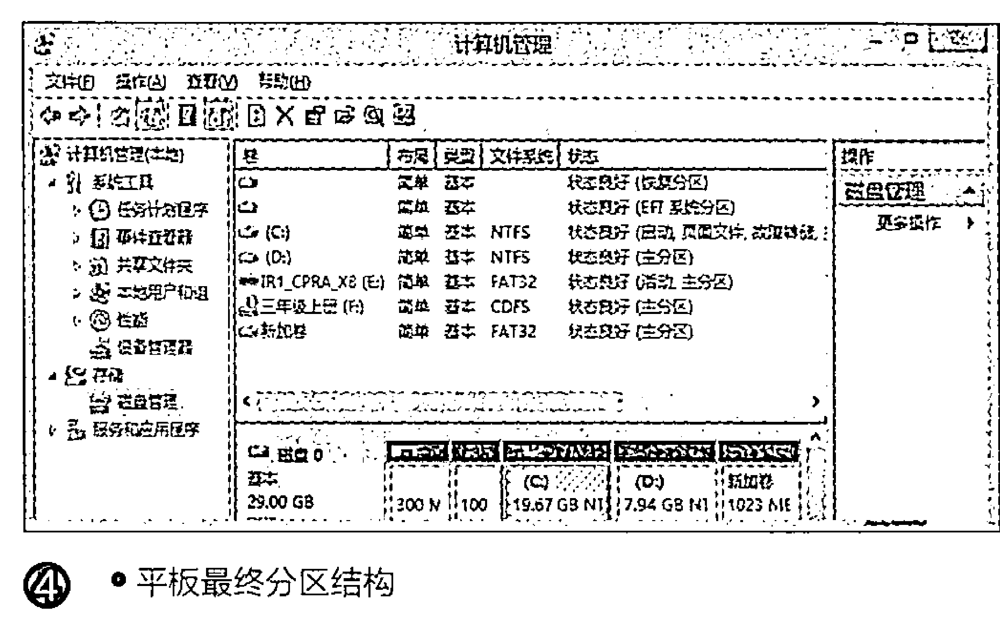

图4 平板最终分区结构

> 什么是镜像和映像
由于install.wim文件可以保存多个备份文件，这里把install.wim称之为镜像文件，其中的多个备份则称之为映像。在还原时要注意选择的是哪个映像用来恢复系统。

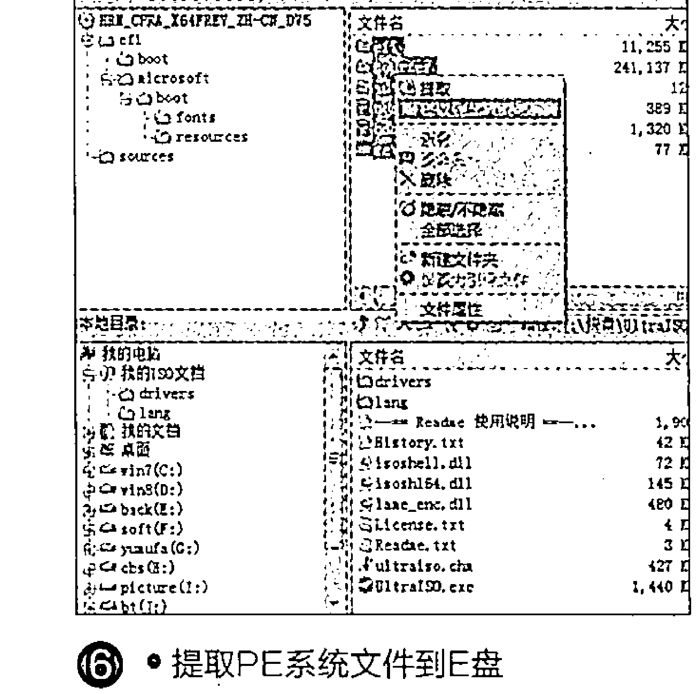

图6 提取PE系统文件到E盘

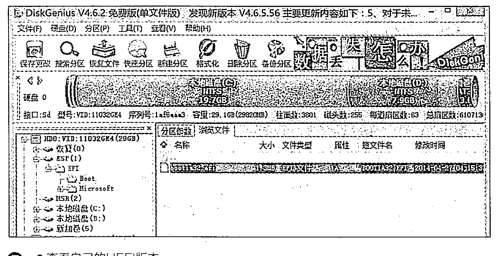

图5 查看自己的UEFI版本

### 2. 制作备份和还原批处理

一键还原主要借助批处理实现，因此我们首先要打造备份和还原批处理。启动记事本新建一个名为beifen.bat的批处理，放置在D盘备用，代码如下：

```
Dism /Append-Image /ImageFile:D:\install.wim /CaptureDir:C:\ /Name:Win8_Pro_3 /Description:"2014-11-03"
```

代码解释：
使用系统自带的Dism命令，捕捉C盘镜像到“D:\install.wim”中，/Name:和/Description:为镜像名称和注释，可以自行定义。

同上，再制作一个一键还原批处理hy.bat，代码如下（REM为注释，无需输入）：

```
REM 快速格式化C盘
Format c: /q /y
REM 将指定镜像d:\install.wim的映像2恢复到C盘
Dism /Apply-Image /ImageFile:D:\install.wim /Index:2 /ApplyDir:C:\
REM 恢复完成后自动重启
wpeutil reboot
```

由于批处理的输入较为繁琐且容易出错，这里可以到 http://www.dwz.cn/vlQGt 下载转化工具，启动程序后导入hy.bat批处理文件，另存为设置为“d:\aa.exe”，点击“编译”，生成aa.exe文件存放在D盘备用（图7）。

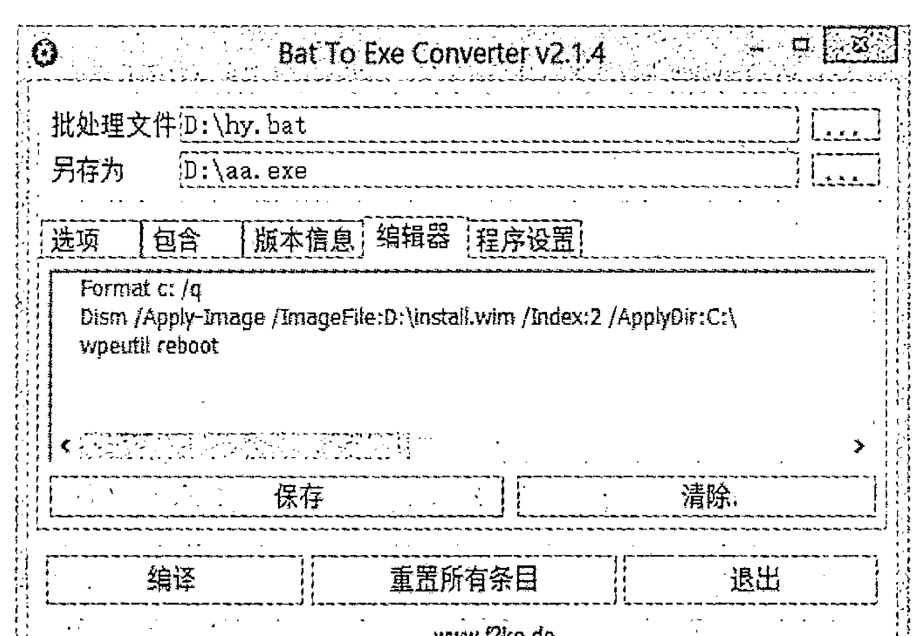

> 特别提示
命令中的格式化代码会删除C盘所有数据，操作前一定要做好数据备份。对于新手来说，为了数据安全，可以先不要添加该格式化代码，测试看看能否正常恢复系统再添加格式化代码。

### 3. 制作备份系统（需要准备键盘）

在桌面右侧内滑激活Charms菜单，点击“设置→更改电脑设置”，在打开的窗口切换到“更新和恢复→恢复”，然后点击右侧窗格的“高级启动→立即启动”，进入系统自带的高级启动界面（图8）。

> 小提示
上述代码是将d:\install.wim的映像2（映像1是上述提取的原版安装文件，如果要恢复到初始状态则设置为/Index:1）恢复到C盘，由于WIM文件支持增量备份，因此在后续的操作中新增了映像，如更新了大量的系统补丁重新制作增量映像/Index:3，则只要在此更改恢复映像代码即可。

接着在重启界面依次选择“更改默认值或者其他选项→疑难解答→高级选项→命令提示符”，按提示输入当前登录账户密码，然后会自动启动命令提示符（图9）。

接着在命令提示符窗口输入“D:\beifen.bat”，系统会自动开始将当前系统增量备份到d:\install.wim中（图10）。

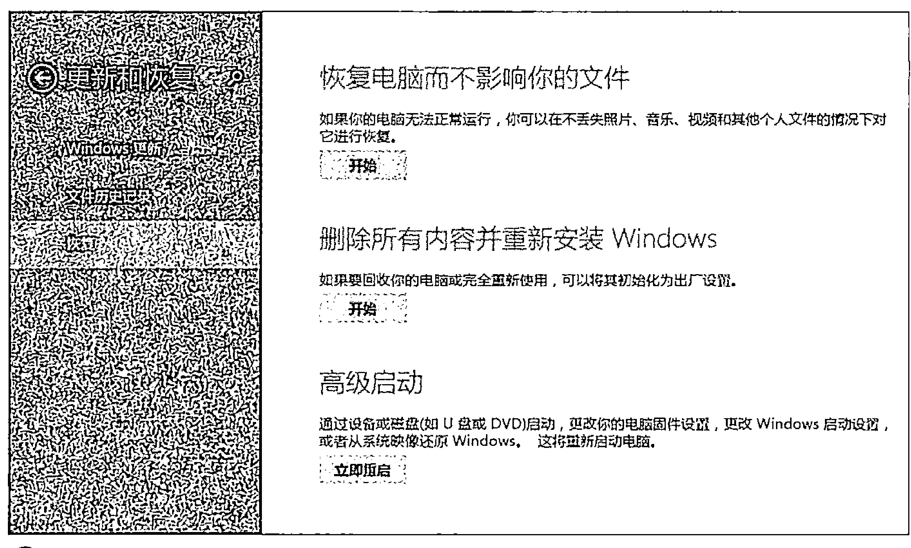

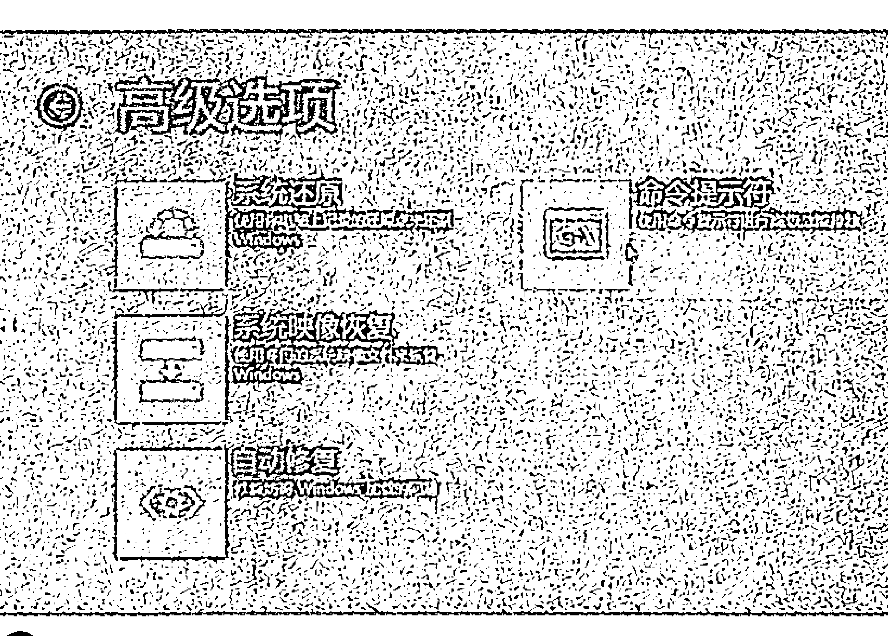

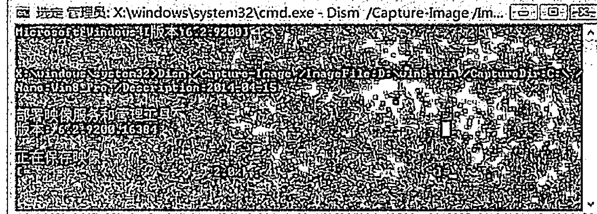

### 4. 配置一键还原

完成上述操作后重启平板进入Windows 8系统。从上述操作可以看到，利用系统自带的WinRE修复环境操作很麻烦，不仅需要多次选择菜单，而且还需输入账户登录密码和命令，这些操作在平板上执行起来很麻烦。因此这里制作的一键还原是通过添加winpeshl.ini配置文件到PE中，实现启动到PE后自动执行所有还原操作。

启动记事本输入下列的代码，然后保存为“winpeshl.ini”文件放置在桌面备用（注意：代码中“=”前后各有一个半角的空格）：

```
[LaunchApp]
AppPath = d:\aa.exe
```

接着到http://www.dwz.cn/vlRdr下载“Gimagex”，启动程序后切换到“装载镜像”，装载到“D:\pe”（需要预先建立该目录），装载的镜像文件为“E:\sources\boot.wim”，装载的映像卷选“2”（即windows setup映像），勾选“读取和写入”，点击“装载”（图11）。

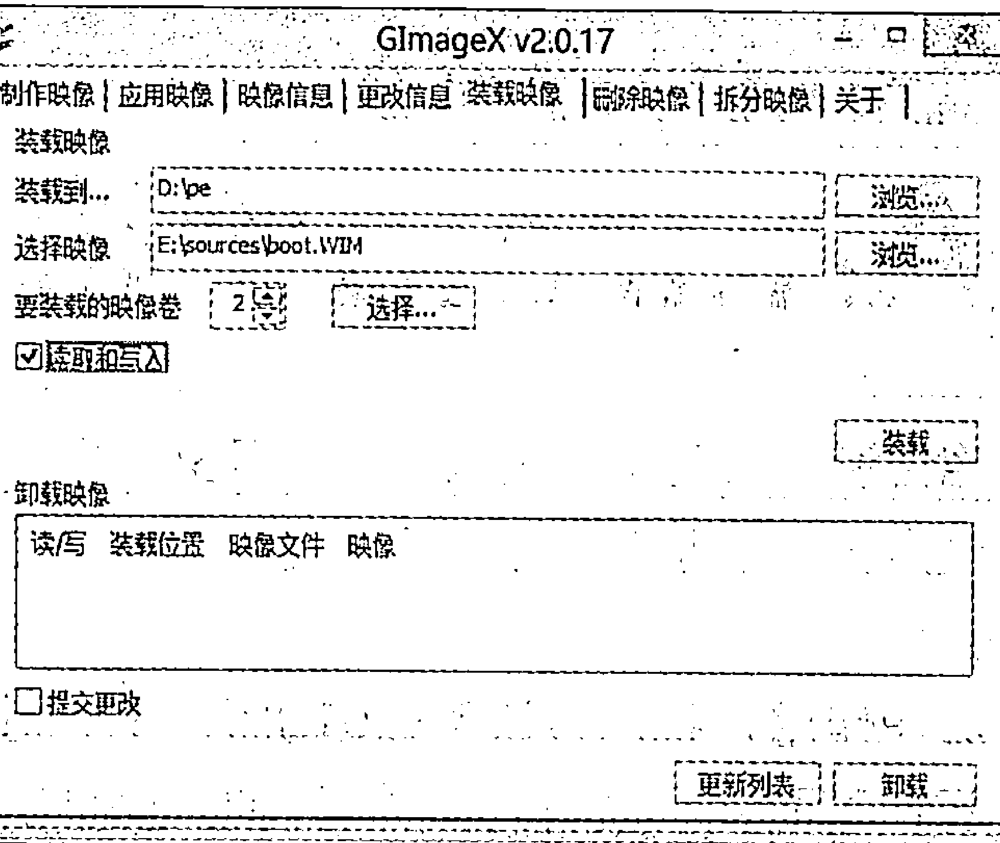

这样指定的映像就会被自动装载到D:\pe中，现在打开“D:\pe\windows\system32”，然后将上述制作好的winpeshl.ini文件拖到此处，这样这个PE启动后就会自动执行d:\aa.exe进行系统还原（图12）。

完成上述操作后返回Gimagex窗口，勾选“提交更改”，然后选择已经加载的镜像文件点击“卸载”，这样就完成了一键还原的配置。因为在winpeshl.ini文件中运行的一键还原是本地D:\aa.exe文件，如果下次需要选择其他映像，我们只要重新制作aa.exe文件并保存在D盘即可。

同样，可以再准备一个保存PE文件的FAT分区，使用“beifen.bat”作为PE开机启动运行的程序，实现一键备份系统。

### 5. 轻松使用一键恢复系统

完成上述所有准备工作后，以后如果需要还原系统。同上在桌面激活Charms菜单进入高级启动，接着在重启界面依次选择“更改默认值或者其他选项→选择其他选项→使用设备（使用U盘、网络连接或Windows 恢复DVD）→UEFI OS”，这样即可启动E盘中的PE系统（图13）。

由于我们已经在PE中添加winpeshl.ini文件，启动到PE后就会自动格式化C盘，同时将install.wim中自行备份的“映像2”恢复到C盘，恢复完成后会自动重启，所有的操作无需我们输入任何命令（图14）。

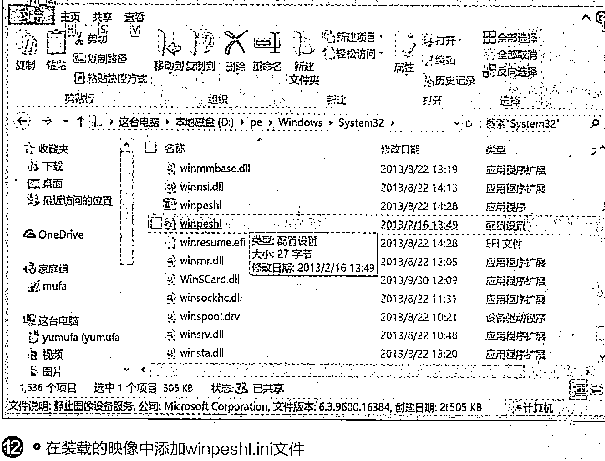

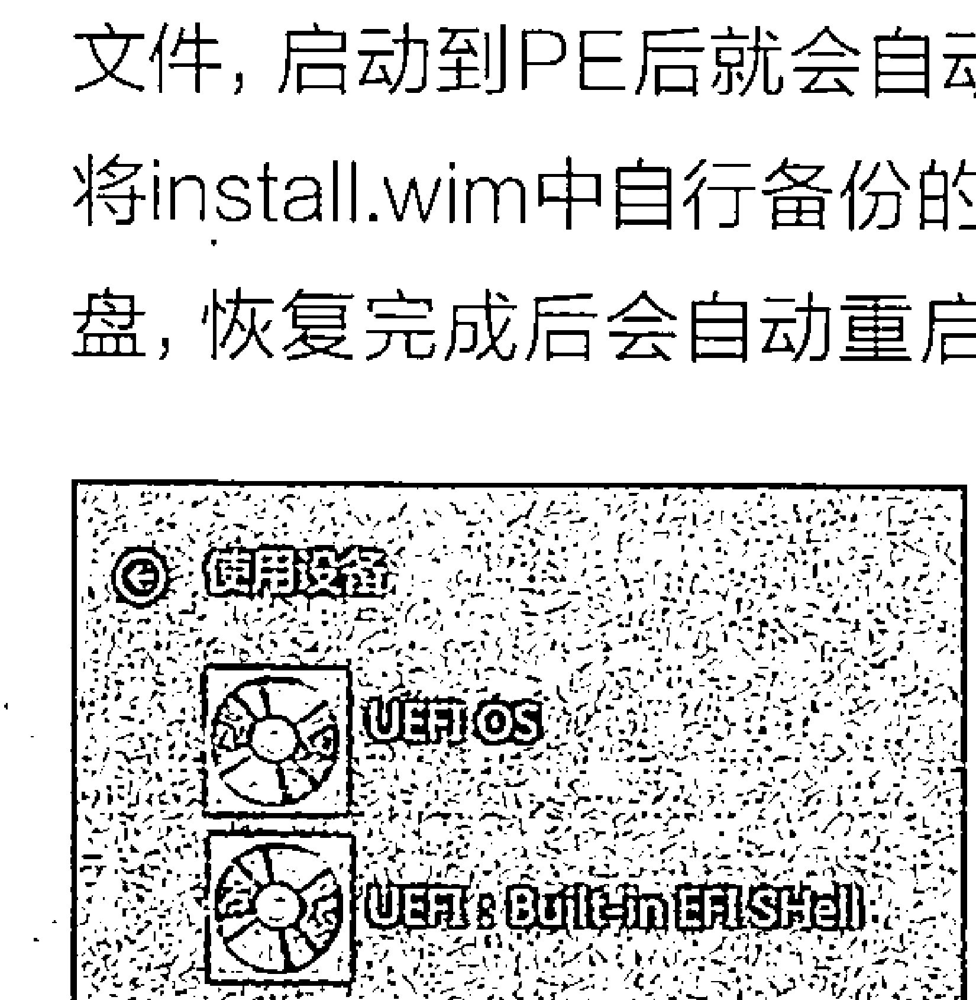

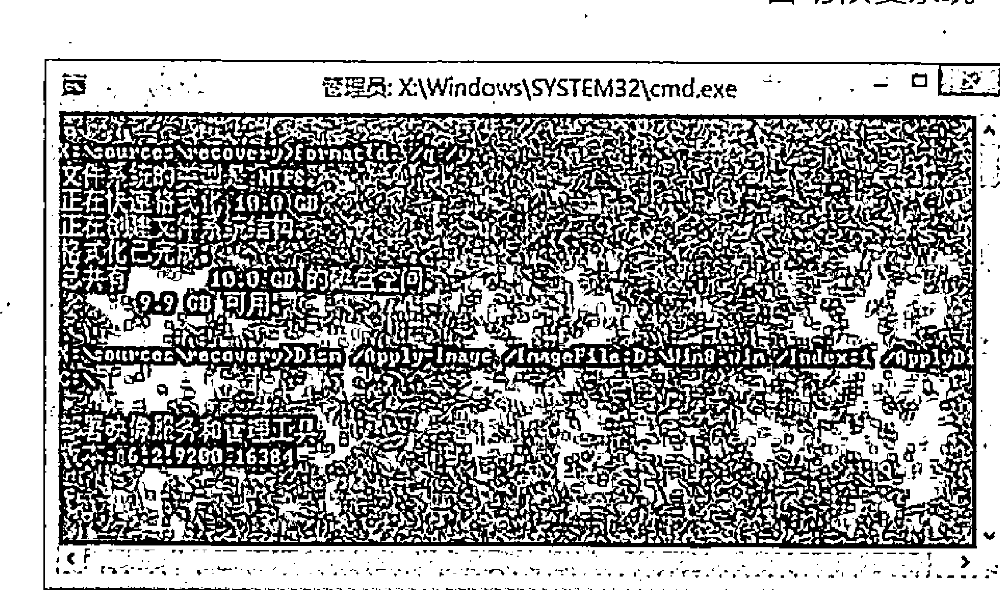

## 紧急时刻 Android手机显身手
文|俞木发

俗话说，天有不测风云，人有旦夕祸福。在日常生活中，我们也许会遭遇身处险境的情况，万一遇到这种情况，大家随身携带的智能手机可能会帮我们的大忙。那么，手机能在紧急关头起到哪些作用，我们应该怎么借助手机进行求救或者自救呢？下面我们就针对具体可能会遇到的情况，介绍如何利用Android手机来应对各种困境。

## 出外游玩 自救求救有妙招

典型环境:荒郊野外或者陌生景区
可能遭遇困境:迷路、无法描述清楚自己所处的环境、手机进水

很多朋友喜欢闲暇时间约上几个好友去爬山锻炼身体，或者在一些景区游玩的时候，喜欢涉足一些人迹罕至的景区探险。在这些环境下就很可能遭遇一些意想不到的困境，关键时刻你随身携带的手机可能帮你摆脱困境。

### 1. 陌生山峰不迷路——用好手机指南针

爬山迷路大多是因为找不到正确的方向，有经验的登山者会携带指南针辨明方向。不过对于大多数业余爱好者来说，登山携带的就大多只有手机。现在借助Android平台的“极品指南针”，你的手机可以立刻变身指南针。提前到http://suo.im/2ac60下载应用，如果迷路了，只要启动超级指南针，然后根据屏幕上指南针的方向即可确定方向了（图1）。

超级指南针无需网络信号和流量，因此即使是深山老林也可以使用。不过在很多时候仅仅知道方向还无法走出困境。现在很多手机都有GPS功能，还可以利用其定位功能确定自己的当前位置，然后结合特定的方向可以更好地帮助我们走出迷途（图2）。


① 使用超级指南针确定方向

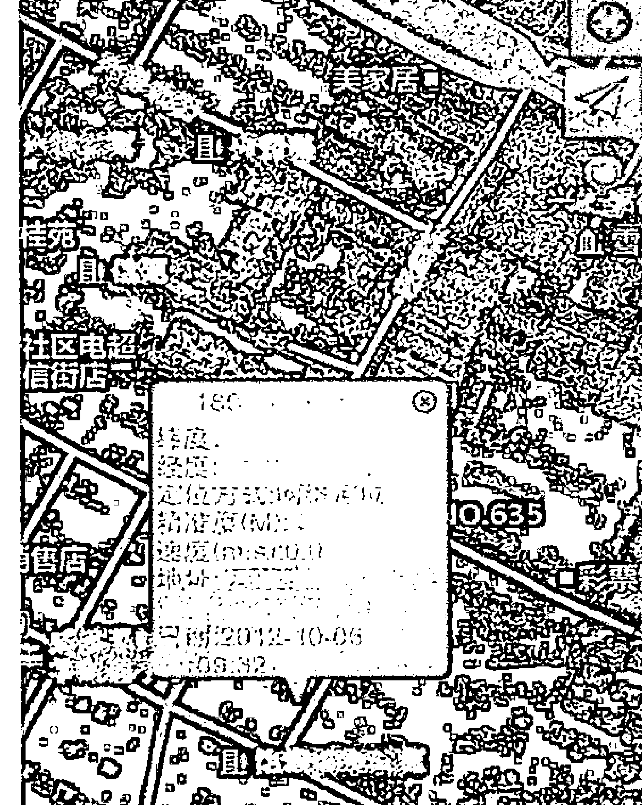

② 通过GPS定位自己的位置

### 2. 野外求助不盲目——用好手机常用软件求助

对于一些复杂的野外环境，仅仅依靠自身努力可能仍然无法让我们摆脱困境，不过现在大家的手机上都会安装浏览器、微博、微信等常用软件，危急时刻可以借助这些工具向外界求助。

比如在一些景区迷路，假如景区有手机网络覆盖，那么我们就可以利用手机上的专业论坛求助。因为通过文字+图片描述更容易让救援者找到我们，发表帖子借助手机自带的浏览器即可。比如可以登录到一些当地生活论坛或者专业救助论坛进行发帖求助。为了便于他人的救援，所发帖子最好详尽描述所在区域的情况，特别要标注一些标志性的地标，比如可以使用手机拍照的方式标注，使用图文并茂的求救帖可以让有经验的救援者判断出你所在的位置（图3）。

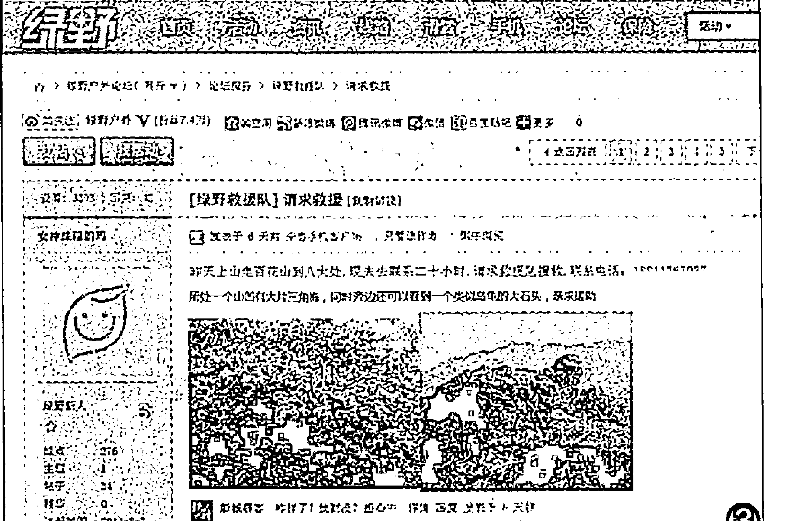

- 使用图文并茂的方式发布求救帖子
- 使用发送私信的方式向当地警方求助

> 如果是在野外多人一起遇险，为了保证有足够的通讯能力，建议只开启一部手机作为对外通讯的工具（如果这部手机没电，可以预先设置关机转移到下一部开启的手机上），同时尽量使用短信和救援者沟通，因为野外通讯信号较差，通过短信不仅可以节约电量，而且更容易说清当前状况。为了节约电量，重要的短信文本建议群发，让更多救援者可以收到我们的求救短信。

除了发布求助帖，使用微博、微信求助也是一个便捷而有效的方法。现在很多公安局都在新浪开通了官方微博，并且大多执行24小时值班。因此如果我们在景区遇险，可以在第一时间登录新浪微博，然后查找当地警方的官方微博，通过发送私信的方式（私信内容最好附上联系电话、被困地点、人数等基本信息）寻求警方的帮助（图4）。

此外，为了方便救援者确定自己的实际位置，我们还可以利用微信的定位功能，快速将自己的准确位置告诉救援者。比如可以在朋友圈的微信对话窗口，写清自己当前的环境状况，然后点击“+→添加自己位置”，这样发送的信息就会详细标注自己的实际位置。外界朋友可以将我们发送的微信@给救援机构，或者帮助我们将地理位置转告给救援者（图5）。

## 路上遇险求救有方

典型环境：高速公路、国道
可能遭遇困境：汽车抛锚、车祸受伤、手机欠费、不在服务区

现在有车一族越来越多，自驾游也成为很多朋友假日消遣的方式之一。不过开车在外难免会遇到一些不可预知的险境，如陌生路段汽车抛锚、车祸等。

### 1. 汽车救援有帮手——用手机地图找救援站

> 拓展阅读
使用防水设备保护手机不受雨淋

手机是我们遇到危急时和外界联络的主要通讯工具，但是电子产品最怕水淋，而在登山过程中经常会遭遇雷雨天气。如果要保护手机不受雨淋，可以预先到淘宝购买纳米防水涂层保护手机，涂层防护效果可以达到IPX6级别的防护标准（图6）。

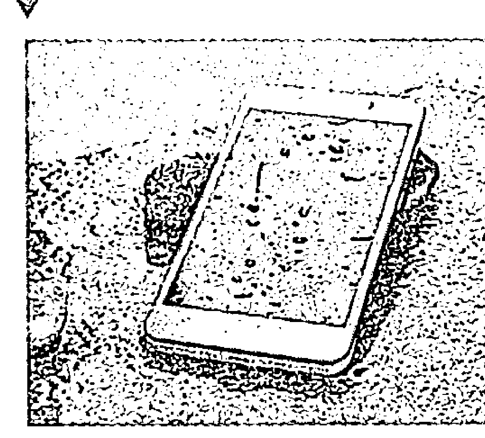

如果在陌生路段遭遇汽车抛锚自己无法维修，寻找最近的汽车救援无疑是个有效的应急方法。不过人生地不熟的地方，去哪儿找汽车救援站？又怎么才能避免被乱收费？
汽车遇险，大家最好在第一时间求助自己汽车品牌的4S店的协助。如果不知道当地4S店的服务电话，我们可以通过114电话查询。如果当地没有自己品牌的4S店，那么我们还可以使用手机地图来搜索最近的汽车救援中心。以百度地图为例，点击“附近/附近搜索”，输入汽车施救（也可以根据目前实际状况，查找加油站、高速出/入口等），这样即可快速找到离自己最近的汽车救援站信息（图7）。

### 2. 欠费不停机——用好应用的语音求助功能

开车在外遇到事情，我们总会不断向远方的好友拨打求助电话，如果是在外地漫游，在拨打大量漫游电话时就很可能遭遇欠费停机。如果遭遇欠费停机怎么办？其实大家手机上安装的很多应用如微信、手机QQ均可以实现免费语音通话，只要有Wi-Fi网络，即使手机欠费仍然可以继续语音求助。以手机QQ的使用为例。

因为语音通话需要Wi-Fi网络的支持，不过现在在很多高速公路或者国道旁都有Wi-Fi覆盖。为了更方便地查找热点，可以先到http://suo.im/m3v8q下载“WiFi伴侣”。在手机上启动应用后点击“设备商的WiFi”，然后在打开的地图窗口查找离自己最近的Wi-Fi热点（长按任一地点即可查找附近热点），驾车到附近区域即可连接使用（图8）。

找到相应的热点后，点击“免费上网”，这样成功连接到相应的热点后就可以使用Wi-Fi网络了（图9）。

成功连接到Wi-Fi后就可以使用QQ语音通话了，登录QQ后打开和好友的对话窗口，点击加号展开工具栏，接着在打开的窗口点击“免费通话”，成功连接后就可以直接和好友进行语音通话了（图10）。

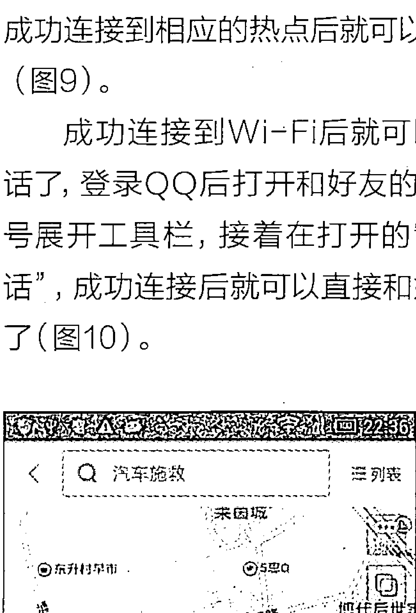

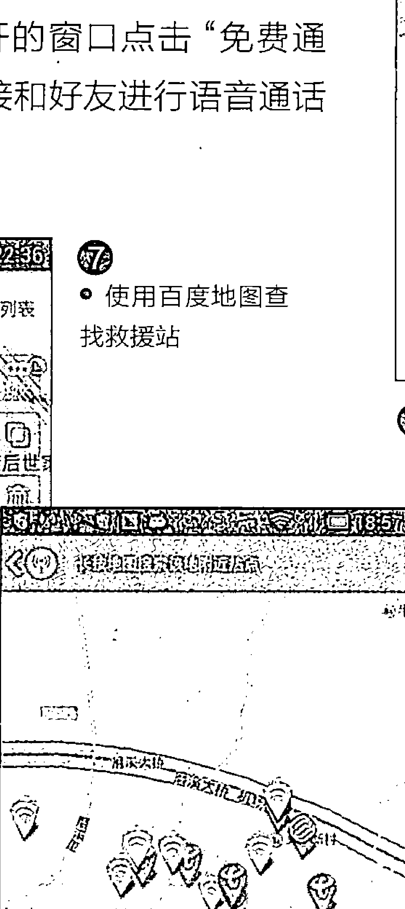

> 除了欠费停机，需要拨打电话时遭遇电量不足也是经常遇到的情况。为了确保出门在外时随时有充足的电量应付通信，我们可以到淘宝购买汽车点烟器转换头充电器，将其插入汽车上的点烟器后即可为你的手机、平板充电（图11）。

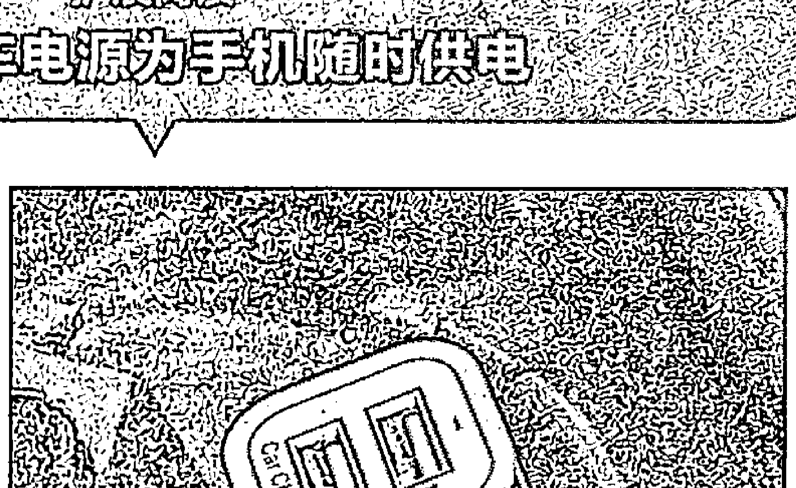

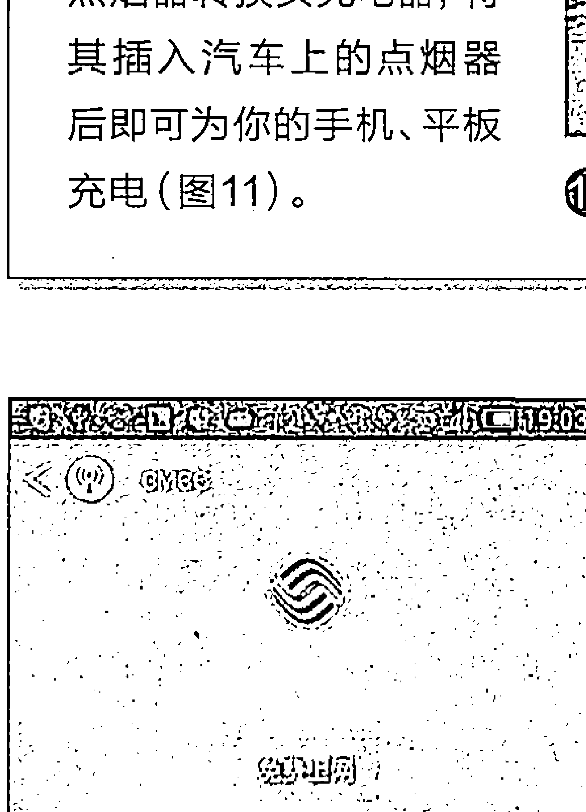

如果所在区域无法搜到有效的Wi-Fi网络，现在Android手机都有热点共享的功能，因此如果同行者的手机可以接入网络，这时可共享对方的网络。这样既不会占用对方的手机，同时可以让自己的微信发挥作用。此外即使手机欠费，公共服务电话110、119还是可以直接拨打的。

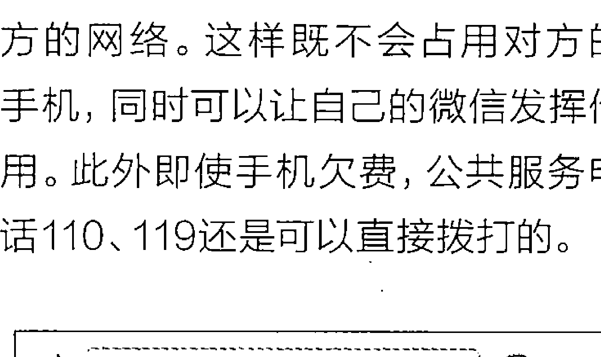

> 除了遭遇欠费停机外，在行车的过程中还会经常遭遇不在服务区的情况。因为现在很多地方移动网络信号覆盖还不是很好，如果家人有急事需要和行车在外的车友联系，但是提示对方不在服务区。此时我们可以借助“易信”（下载地址：http://www.yixin.im/）发送语音留言，启动“易信”后，点击右下角处的“十”，选择“电话留言”，选择需要留言的好友或者输入手机号，接着在打开的窗口选择“按住留言”，开始录制语音留言。这样只要汽车行驶到有信号的区域，接收者的手机就可以在第一时间收到语音来电。

## 居家遇险不慌张 用好手机快捷设置

典型环境: 家庭

可能遭遇困境: 亲人突然生病需要拨打求助电话

很多朋友的双亲都是年事已高、疾病缠身，虽然很多朋友在家里备了手机，不过现在智能手机操作复杂，为了方便在老人突发疾病的时候可以及时拨打求助电话，我们可以用好手机的快捷设置。比如小米用户，打开“联系人”，找到需要添加的联系人长按选择“发送到桌面”，继续在打开的窗口选择“直接拨打电话”，这样以后只要直接点击桌面上的联系人即可开始通话（图12）。

除了一键拨号，对于我们常用的微信、手机QQ也可以进行类似的设置。比如微信进入微信后在通讯录里面找到自己想要添加到桌面的联系人，打开联系人详细资料后点击右上方的菜单，在弹出的菜单选择“添加到桌面”即可。这样有紧急事需要联系时点击桌面图标即可快速打开和好友的微信对话窗口（图14）。

### 小提示

如果你的Android手机没有上述功能，还可以到http://dwz.cn/whzHP下载“一键拨号”，启动应用后依次设置好一键拨号的号码和姓名（如儿子），点击“创建快捷图标”即可（图13）。此外，普通手机很多也支持一键拨号，比如诺基亚5201手机，只要长按住1键，然后在弹出的窗口选择需要关联的手机号码即可。WP8.1手机则在拨号列表长按需要设置快速拨号的号码即可。

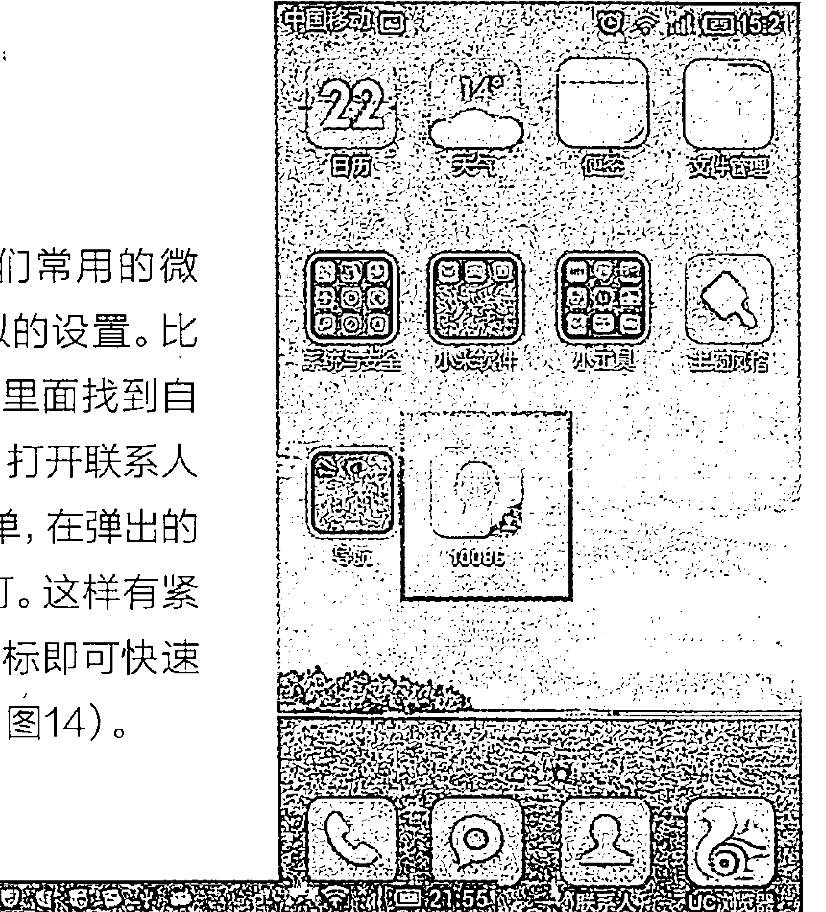


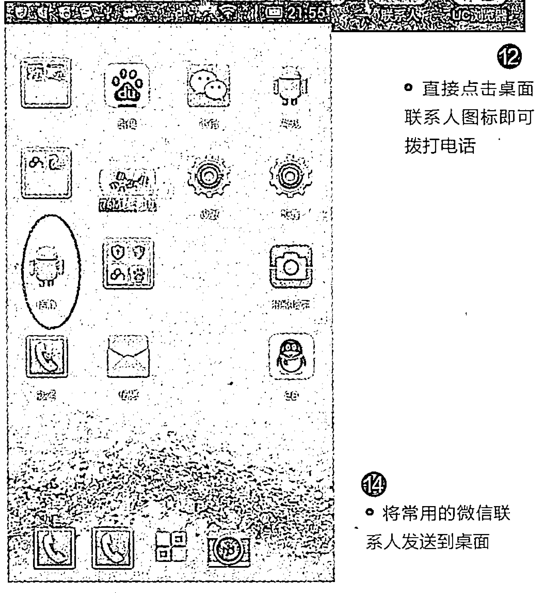

### 小结 有备方能无患

手机不是万能的，但是现在智能手机作为最普及的设备，在出现危急情况时没有它却是万万不能的。上面我们介绍了一些紧急情况下使用手机来应急的方案，不过每个人的实际情况不同，为了更好地使用手机来应急自救，大家最好结合自己的实际情况在手机上预备不同应用以备不时之需。比如业余时间喜欢爬山的朋友，可以在手机上预安装类似“指南针”的应用；家里有类似心脏病、冠心病老人的家庭，在手机上预装一款类似“现场急救指南First Aid”应用就很有必要，因为伤病随时随地都在发生，当专业救援队员还没到达或无法到达的时候，开展妥善的自救和互救对于保全生命和降低伤残率都至关重要。总之，大家只要充分挖掘手机的功能，在危急时刻它一定会给你带来意想不到的帮助！[489]

## 手机中深的风景

众所周知，手机的镜头光学焦距短，很难拍出有景深的照片，比起单反等相机拍出的大片，显得较为平面。其实如果能充分利用透视学的一些原理进行构图，手机也能拍摄出纵深感超强的照片来。

文|梦寻

> 所谓透视，通俗来讲就是人们在观察周边世界时所产生的近大远小、近宽远窄、近实远虚的现象在平面画面中（如照片）的反映。现代透视学研究一般有三大类：
- 线性透视，物体轮廓线形状处于不同距离、位置时的变化；
- 色彩透视，颜色因为距离的远近而产生的变化；
- 消逝透视，随着距离拉远，物体明暗对比和清晰度渐次减弱，越来越模糊的变化。

## 摄影中的线性透视

当我们注意观察地铁或火车的铁轨时，会发现两条明明平行的铁轨，在远处越靠越近，甚至聚集为一点，最后消失在地平线上，这就是线性透视现象。摄影时进行线性透视构图，最简捷的方法是寻找画面中的纵向线条，清晰的纵向线可以强烈体现出画面的纵深感。


△ 大桥就是很好的线条，取纵向的角度，可以加强画面纵深感

∨ 马路街道是线性透视构图的一个不错的场景，手机横向取景与竖向取景对纵深感会有一定的影响，另外取景角度的高低也会影响纵深感的表现


线性透视中，大多数直线都会变成斜线，产生很好的视觉张力和动感。所以在摄影构图中，要特别注意选择斜线。斜线不一定是实体，比如阳光投射下的物体投影，也可能会构成清晰的斜线。

如果一个建筑接近于方形（大部分人工建筑都是方形），如果我们正对着其中的一个角，那么可以看到这个方形的两个面。此时与一点透视不同，我们会发现这两个面的线条分别向两边汇聚，最终形成两个消失点，这就是两点透视现象。两点透视照片中经常用到对称构图，会形成一种威严感。

在两点透视中，如果我们不是水平观察，而是改成仰视或俯视，这时会出现第三个消失点，此时便是三点透视。三点透视构图经常用在很高的建筑物上，体现一种险峻的感觉。


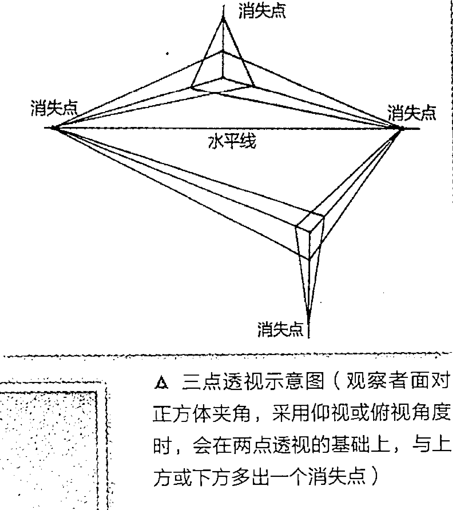

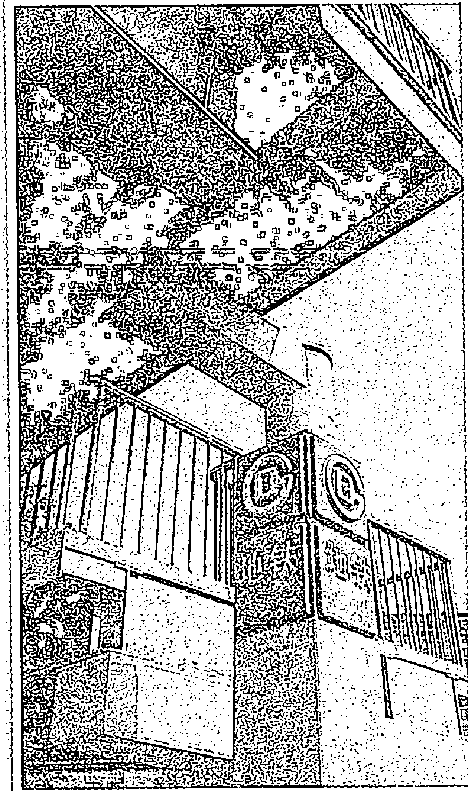


## 其他的透视

线条透视是平时应用得最多的，除此之外还有色彩和影调透视等。大家都知道色彩有冷暖之分，而冷暖色还有距离效果，暖色调容易给人感觉很靠前，冷色调则感觉靠后。另外，比较亮的物体有靠前感，比较暗的物有退后感。所以，搭配好画面中的冷暖色彩层次及黑白影调层次，就可以增强透视感。

上面介绍了一些摄影中的透视应用，大家可以在实战中积累更多经验，拍出有深度、有立体感的照片来。

## 摄影中的二次对焦魔法

使用HTC One（M8）的朋友知道，它采用了双摄像头技术，其中增加的第二摄像头主要用来记录空间信息和景深，从而实现“先拍摄后对焦”。它的UFocus技术，让用户拍照时不用再犹豫镜头该对准谁，正常拍摄一张照片后，点按UFocus，就可以在画面的任意人物身上进行二次对焦了。

文 | 梦寻


## 任意手机的二次对焦

HTC这种先拍摄后对焦的功能，在手机上会逐渐普及。不过现在大部分手机在硬件上仍然不具备这种功能，这时可通过APP应用来实现。谷歌发布的“Google Camera”就有此功能，可惜它目前只支持Android 4.4 KitKat以上版本的手机或平板。其他的手机，可以试试我们曾经介绍过的“移轴”功能，实际上它也有任意聚焦的功能。


首先要拍摄出足够清晰的照片。以K860i上面的“超级相机”为例，它升级到新版本之后，已经具有手机HDR功能。打开超级相机界面，点按右上角的向下箭头按钮，显示扩展菜单，点选“HDR”即可，不使用此模式时，可点按上面的“返回”。HDR技术与二次对焦实际上很接近，先在亮的地方对焦，再在暗的地方对焦，然后把两者合成，一起实现明暗两处都清晰的效果。

接下来在“超级相册”（与超级相机是配套应用）中打开刚刚拍摄的照片，点按显示菜单，点选其上的“编辑”，进入编辑界面后再点按“移轴”，此时就可以任意选择照片中的焦点了。具体方法以前已经介绍，这里不再赘述。

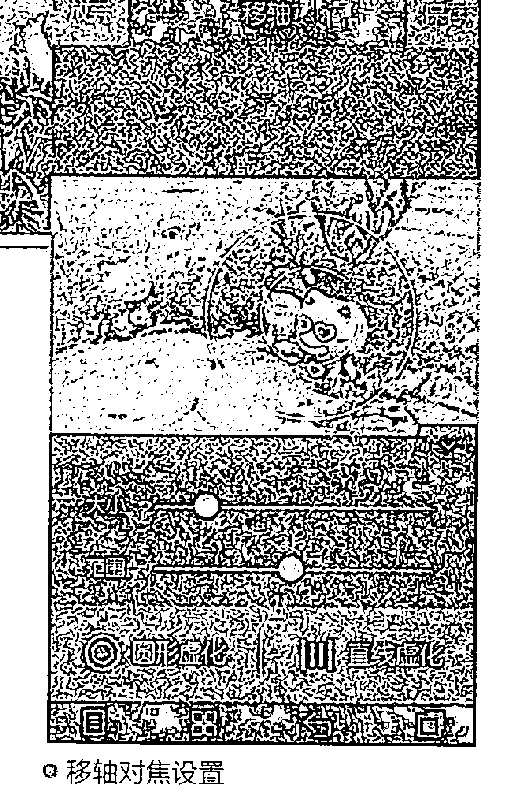

## 背景虚化——二次对焦的另类应用

所谓的“先拍摄后对焦”（或称之为“二次对焦”），就是记录下现场详细的信息，供我们后期根据需要选择。通俗来说，就好像是你在同一现场，按不同的对焦点同时拍摄了多张图片，然后再回来后再任意挑选对焦位置的图片而已，可以理解为一个多图层的照片。


在HTC One（M8）“背景虚化”中也有体现，这一功能实际上就是二次对焦的另类应用，只不过它对选取的区域不是进行虚化，而是应用其他特效，比如“速写”、“卡通”等。一般的手机暂且不提供此功能，但是我们可以将自己拍摄的照片导入Photoshop，在后期轻松实现，将比普通的对焦模糊应用效果更逼真、立体。下面我们就来试试这种“多层次”的特效应用。


首先在Photoshop中打开拍摄的原图，在图层面板中将背景图层拖放到下方的“创建新图层”按钮上，将会自动复制一个图层。接下来切换到背景图层中，应用任意你想使用的特效，比如这里我们首先使用“画笔描边”中的“强化的边缘”滤镜，再应用菜单“图像→调整→黑白”，完成一个黑白素描效果。

接下来回到上面复制的新图层中，先用磁性套索工具大致勾画出鹦鹉的轮廓，然后再在蒙版中对选取区域略做修改。接着按Ctrl+Shift+I键对选区进行反转，并执行菜单“选择→修改→羽化命令”柔化选区边缘。此时再按Del键删去本图层的背景区域，背景图层中素描处理的画面便显示出来。一个真实的鹦鹉和一个卡通化背景的混搭风格照片就完成了，很有意思吧。当然，你可以将背景处理成任意你想要的效果，就看你自己的兴趣了。

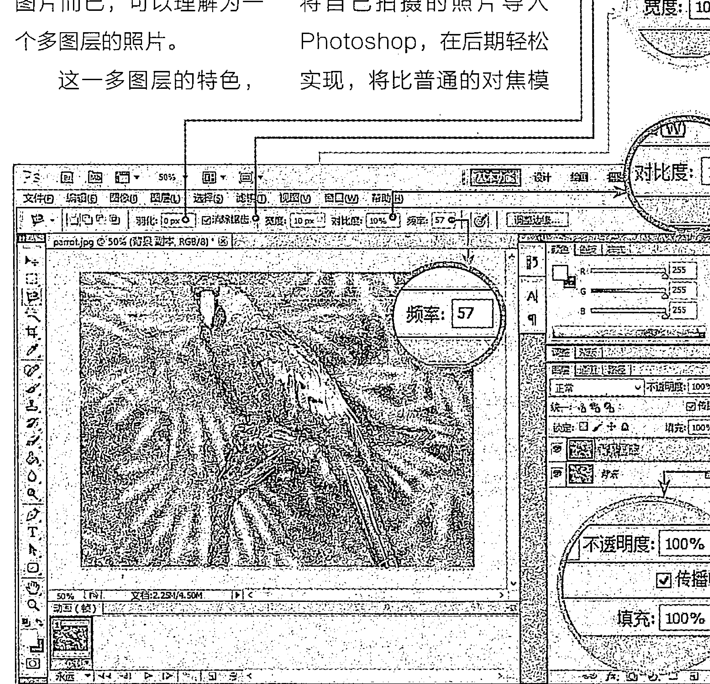


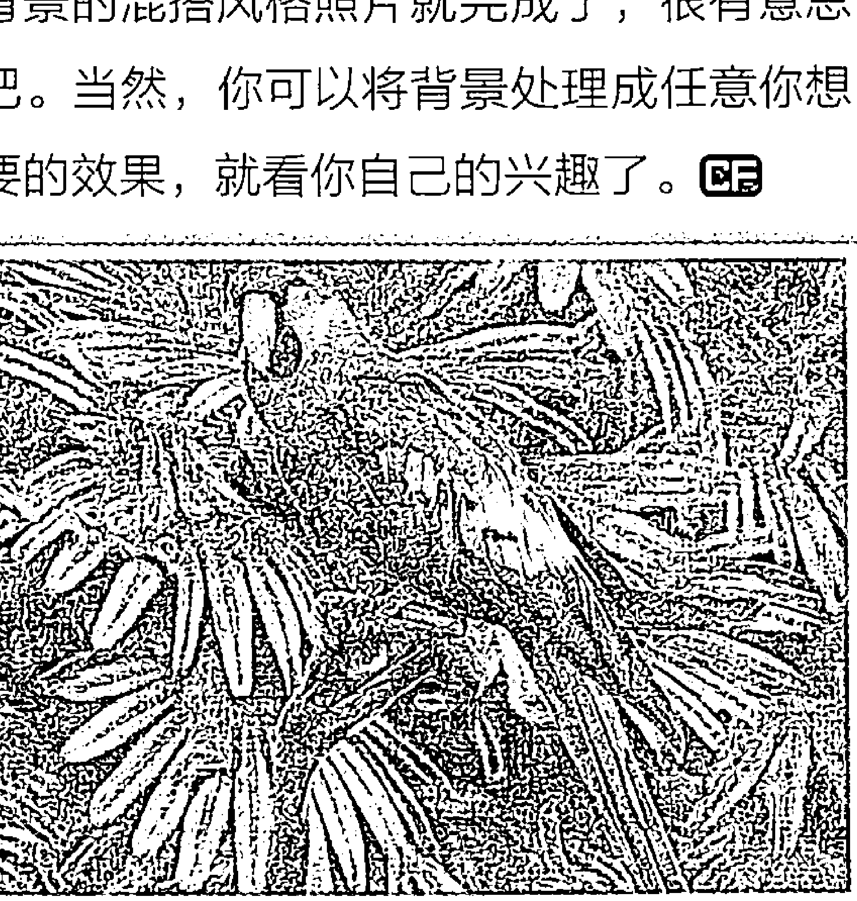

## 创意剪影拍摄

剪影本来是剪纸形式的一种，是一门手工艺术。剪纸艺人用剪刀将黑色纸张（或者色彩较重的纸）剪成人、动物或其他物体的外在轮廓。应用在摄影中，主要是通过明亮的背景来衬托较暗的主体，不显示被摄主体的内部细节，完全靠外在轮廓的造型来塑造形象。下面首先简单介绍一下剪影拍摄的技巧，然后再通过一些优秀的剪影作品，来盘点一些创意思路。

文|梦寻


平阔的海边或水边是剪影摄影最经典的场景

### 如何拍摄剪影效果

拍摄剪影，首先要确定剪影的主体。一般来说人物剪影作品比较多，其次是静物，如各种树木、花草、建筑等。另外还有一大类就是动物的剪影作品，不过因为动物不太好控制，拍摄时难度相对大一些。

不管选择的是哪种主体，都要想办法突出主体的形体特征。因为没有细节的展现，所以形体就成了剪影作品最主要的表述语言。在拍摄人物剪影时，可以适当的有一些动作，从而实现美感和生动。

为了突出剪影主体的效果，一般会选择比较明亮的背景。不过为了避免喧宾夺主，背景图像最好简单一些，不要太复杂（当然要视具体情况而定）。

接下来是比较技术性的技巧，就是拍摄最好要逆光进行，从而在背景与主体之间造成足够的反差。一般在日出或日落时分选择逆光，这时候的光线非常柔和、不刺眼，是比较理想的剪影拍摄时机。如果是在室内，以明亮的窗户作为背景


舞蹈动作的剪影非常优雅动人


简单的背景更能衬托剪影主体

景，也很容易形成剪影效果。除了自然光之外，也可以通过人造光（如灯光）营造逆光效果。

剪影拍摄的主要特征就是让主体曝光不足，除了利用外在的光线之外，手机（或相机）自身的一些设置也可以充分利用，原则就是尽可能让曝光不足。首先要关闭手机摄像头的闪光灯，以K860i为例，点按相机界面左下角的选项按钮进入设置界面，在“基本设置”中，点按打开“闪光灯”，选择“关”即可。进入“高级设置”界面，ISO默认为“自动”，这里可以手动设置成较低的ISO值，比如


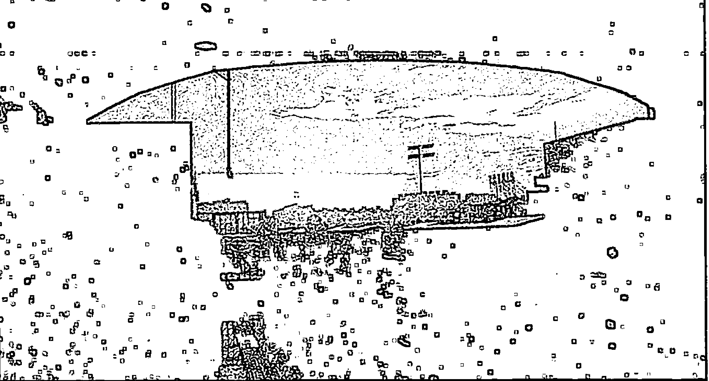

### 手机剪影拍摄中的创意构图

剪影拍摄并没有什么复杂的技巧，所以一个好的剪影作品，关键是看选题和创意构图。这里的一些作品，可以给我们带来一些不错的创作思路。

背景中的亮点，成为不少剪影作品中的创意性元素，比如借助透视形成的错觉，将太阳捏、捧在手中等。另外一种思路，就是通过阴影塑造成特殊的形状，如心形、动物等。还有一种常用的手法，就是借助阴影形成一种天然的画面边框，别有一番趣味。


100，可以减弱曝光。最后一个比较关键的设置，就是将测光方式设置为“点测光”。在拍摄剪影的时候，测光焦点一定要选择背景中的明亮点，这样前景中的拍摄主体就会因得不到充分曝光而变暗。

其实一些摄影技巧也可以在剪影中使用，比如大光圈小景深，让背景的亮点形成光斑，与剪影主体形成有趣的对比。


## 大美建筑摄影

提起建筑，不要想得太高大上，大到摩天大厦，小到蓬草小屋，水边凉亭，都是建筑。作为人类的智慧结晶，如何拍摄出建筑物的美，有着不少的经验总结。今天我们就来探讨一下如何用手机拍摄好建筑物。

文 | 流言


### 建筑摄影的分类

首先要说明的是，本文讨论的是非专业的建筑摄影，不需要专业的摄影设备，只通过平常使用的手机，拍摄生活中随时可见的建筑。建筑摄影，可以分为写实和写意两大类。顾名思义，写实类建筑摄影就是要忠实再现建筑的原貌，体现建筑师的设计意图，这类照片通常用于商业摄影。写意类摄影就比较宽泛了，更多表现的是摄影师自己对建筑的主观感受，照片最终呈现什么样的效果，往往因人而异。

### 远近高低各不同——建筑角度

建筑摄影的主题非常广泛，大至一个地区、一座城市、一组建筑群，小至一间小屋、建筑的局部。我们既可以在室外拍摄，也可以在室内拍摄，总之无所不包。而根据建筑的大小，以及要表现的主题，可以采用不同的拍摄角度。如果我们有机会登上高山，或者登临类似中央电视塔这样的高层建筑，我们就有机会拍摄俯瞰的全景图了，这可以反映出一个地区的整体特征，非常壮观。当然大多数的时候，我们要比建筑物低很多，这时为了体现建筑物的宏伟，可以采用仰视的角度。

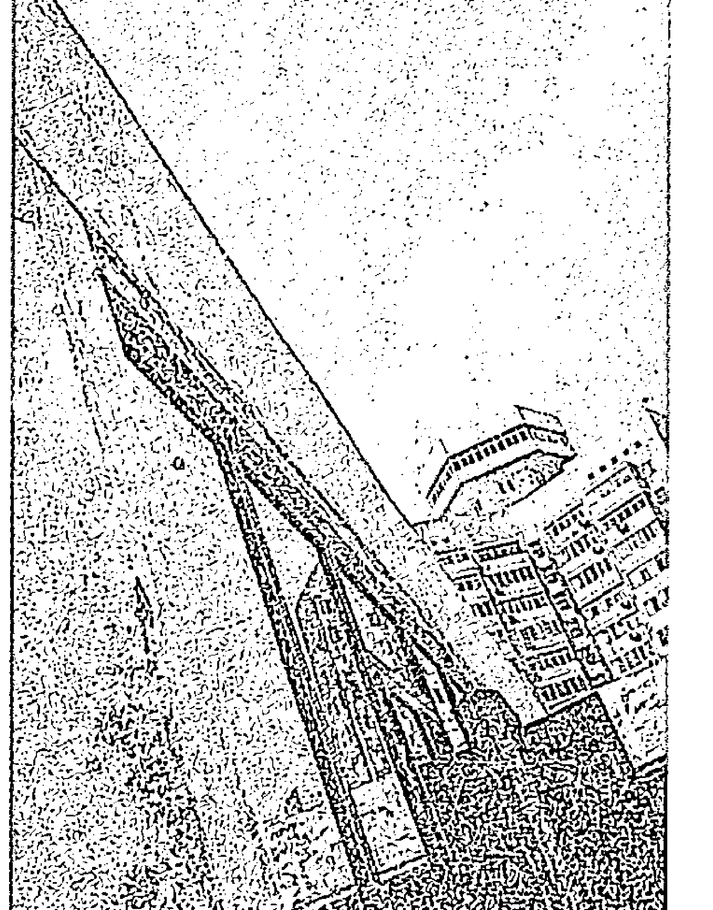

除了高低之外，我们面对建筑物不同的侧面，也会得到不同的效果：正对着建筑物的一个平面，得到的将是一点透视的效果，可体现出悠远的景深；侧对着建筑物（即正对着夹角），得到的将是两点透视效果，拍摄出的照片将会显得很宽阔。

除了角度之外，距离的远近也会形成不同的风格。远距离可以体现建筑物的全貌，而近距离的特写镜头可以真实再现建筑物的细节。

### 建筑摄影用光的策略

大多数的时候我们拍摄建筑物，都是采用侧光方式，这时建筑物上会显示出投影，非常有立体感。有时为了达到特殊效果，我们会故意采用逆光的方式，这时建筑物的细节几乎全部丢失，只留下灰黑的一片，达到一种剪影效果，也非常的美。

拍摄过程中的取光，除了注意光线的方向外，还要注意光线的强度，强光之下（如正午），拍摄出来的建筑物会显得比较硬朗有质感，而在阴天等光线较暗的时候，拍摄出的效果可能就柔和一些。

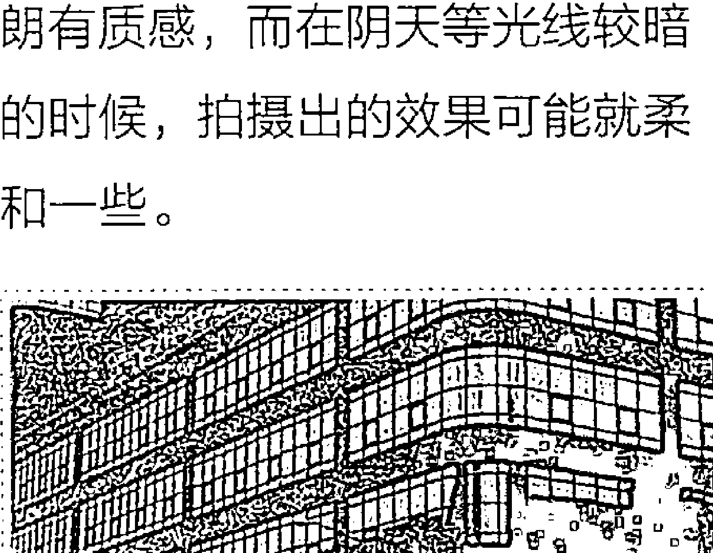


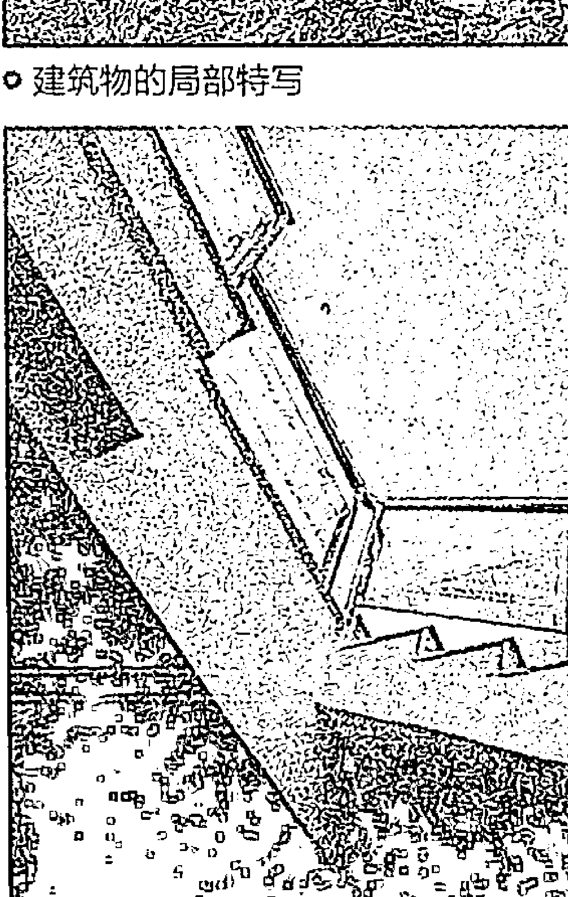


### 建筑摄影构图小技巧

建筑物是人为制作的，有着很强的几何属性，所以在构图的时候，我们很容易找到线和面。建筑物的线条千变万化，不但有水平线、垂直线、斜线等直线，也有曲线、折线、圆弧线等等，这些线条往往构成非常美的图案，非常有质感。要表现建筑物的挺拔高耸，就要注意选择垂直线；如果要表现平静、宽广，就要注意选择水平线；如果想要表现建筑物的一种节奏和律动，则要注意选择曲线及渐进变化的各种重复线。


### 建筑透视“失真”的处理

拍摄的时候如果手机镜头正对着建筑物，两者成平行关系，这时会得到比较真实的效果。不过在用这种角度拍摄时往往拍不下建筑物的全貌，高楼只能看到楼的底部而看不到楼顶。这时一般人会略微向上仰一下镜头，才能拍摄下高楼的全景，但是这种情况下的拍摄就有可能造成建筑物变形，即所谓“失真”，本来笔直的楼宇边线可能会变成弧线，像一只“桶”一样。对于平常的手机摄影来说，大部分人可能很喜欢这种“失真”效果，但如果你想要反映建筑物的真实面貌，则可以借助Photoshop中的桶形失真校正功能进行后期调整。

无论是高端单反，还是一般的手机摄影，构图都至关重要。构图之前，我们最好先问自己几个问题：我需要让观众注意的是什么？如何在画面中引导观众的注意力？如何消除令人分心的部分场景？一些简单的构图技巧，就可以帮助我们解决这些问题。

刘步

## 手机拍照构图8大“军规”

### 不可或缺的兴趣点

在学习构图之前必须要明确一点，一张照片应当包括一个主题或兴趣点。这个兴趣点赋予照片以意义，也给观赏者的眼睛提供了一个可休息的地方。没有一个兴趣点，照片就不可能长时间抓住观众的注意力。所以在拍照的时候，要不停地问自己：这个场景中最令人感兴趣的是什么？想要表达的主题是什么？

比如上面这幅花的照片，如果没有这两朵花的存在，那么就是一个无聊的绿叶背景图片，无法长时间吸引人注意。而花的存在，让眼睛不由自主就集中在它的上面，从而提供了一个兴趣点、一个休息点，由它为起点，从而看到图像周围更多的细节。

所以，一旦拍照时确定了主题或兴趣点，接下来就要围绕这个焦点大做文章，想办法突出它，引起注意。


● 绿叶中的红花是一个明显的兴趣点，我们的眼睛不由自主在它上面集中

### 沿着对角线的平衡

以前我们介绍过“三分法”规则，即将照片的焦点放在三分之线或三分之一点上，以突出兴趣点。这种构图方法可以形成有趣而和谐的场景，但是它也很可能留下一个比较空白的空间，从而导致照片中的场景不平衡。这种情况下，我们可以添加另外一个对象，就像在天平的另一端放上一个“砝码”，从而让图像平衡。

最实用的技巧就是使用“对角线原则”，在照片主体的上方或下方，沿着照片的对角线，添加一个对象来帮助平衡。下面的杯子图片中，两个对象都处于三分之一点上，符合三分法构图原则，但如果去掉一个点，图片中就会留下大片的空白，显得极不平衡。

● 大盆是主体，小碟是配角，对角线上的两个小碟，既平衡了画面，也不影响主次

● 处于对角线上的两件物体达到一定的平衡，又使得画面不至于太死板


### 低角度拍摄

当我们低于平常人的视线高度，蹲下身来，甚至是躺在地上以一个很低很低的角度拍摄，会发现一个不同于平常的风景。除了视线独特外，这一方法在构图上也很有益处，它可以将复杂的背景甩开，以相对单纯的天空为背景，能更加突出要拍摄的主体。

另外，低角度拍摄一般会是逆光，这样拍摄出来的花瓣，会有一种很通透的感觉，甚至可以看清花瓣上有趣的纹理细节。


> 仰拍可以甩开复杂的背景让画面构图更单纯

> 无法仰拍的场景中可以尽量找一些单纯的背景（如墙面）

### 其他构图技巧

### 填满整个画框

除上面提到的“三分法”规则我们以前介绍过，我们还在之前的栏目介绍过“框架主题”、“运动空间”等规则和技巧。框架主题，也就是寻找现实中已有的框架，比如门窗、车窗、洞穴、建筑物缝隙等作为画面的框架，别有一番趣味。运动空间，主要是指照片上人物所面向的方向，要适当留出多一些空间。如人物眼看右方则在右侧多留些空间，望向左方则在左侧多留些空间等。此外我们还介绍过“引导线”技巧，通过在画面中寻找各种线条来快速构图。加上今天介绍的几条，这八条规则或技巧，利用得当，相信能拍出更漂亮的照片来。

如果要拍摄的主体无法跟周边的环境分开，这样的照片是很难有感染力的。这时候不妨采用一个简单直接的方法，尽可能贴近被拍摄的主体，让它填满画框，这样周围的背景也就被消除了。填充整个画框架的照片，切割出不必要的背景细节，确保了主体获取到观赏者的充分注意。而且因为非常贴近物体，往往还能捕捉到更多令人意想不到的细节，创造出独特而抽象的作品。

下面的叶子图片，全景下它非常普通，甚至无法被人注意到，但是当它填满了画框之后，它的叶脉纹理，显示出一种非常独特的韵味。

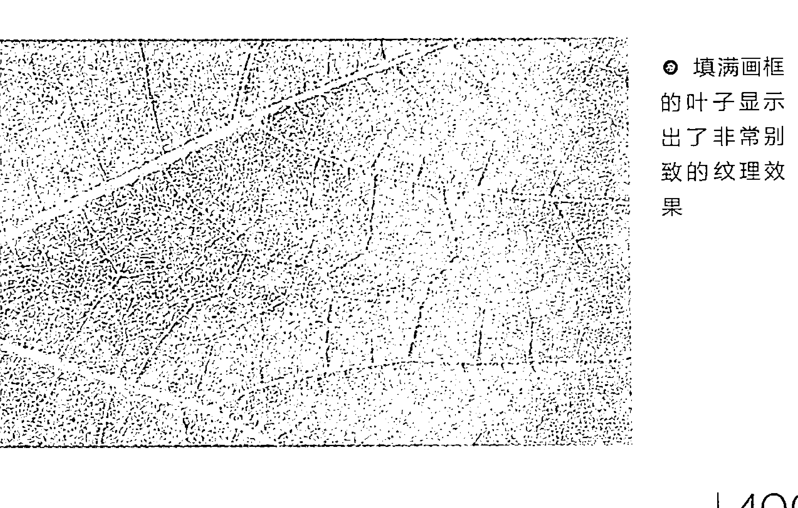

> 填满画框的叶子显示出了非常别致的纹理效果

### 未雨绸缪设置相机做准备

宠物具有某种不确定性，可能你刚刚构好图它却突然跑开，所以要提前对相机进行设置，方便快速抓拍。手机镜头相对简单，主要是对焦模式设置，因为宠物动作的不可控，最好选择“连续对焦”模式，以确保焦点能保持在宠物身上。以K860i自带的相机应用为例，启动超级相机应用后，点按左下角的选项按钮，切换到“其他设置”中，在其中的“对焦方式”中选择“连续”即可。

单反相机虽然有更多的手动设置，但是宠物的一些可爱的状态（比如打瞌睡）可能一闪而逝，为了抓拍，最好使用某种自动模式。而曝光模式则建议使用“光圈优先”，这样可以得到不错的景深控制。至于测光，则要视具体情况而变，比如有的宠物是黑色的，有的一身白，这就需要用到“白加黑减”的技巧，即对纯白的宠物曝光时，增加1档的曝光补偿，反之，对纯黑的宠物曝光时降低1档曝光补偿。不过这些技巧不适合手机拍摄。

### 宠物拍照的构图方法

除了相机的设置，拍照前还要尽可能地先明确自己的目标，拍摄什么样的宠物，表现它的什么状态等。确定了主题，接下来就要考虑构图方案了。为了方便快速地构图，可以在“基本设置”的“构图辅助线”中开启“9格”模式，手机屏幕上将显示9宫格线，拍摄时可以应用“三分法”规则，将宠物安排在三分线或三分点附近。

选择角度也是构图的重要内容，拍摄宠物，主要有三种角度：

- 1. 平视角度
宠物的高度远远不及人类，如果我们蹲下身来，甚至趴下来，将会以宠物的眼光看这个世界。这个角度的宠物，非常的萌。

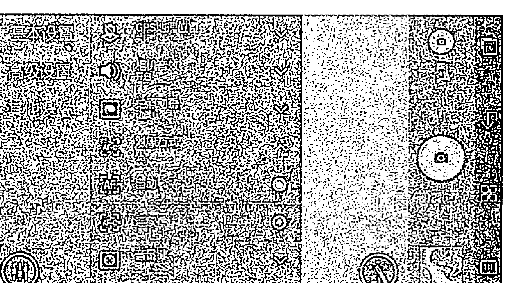

### 2. 俯视角度

俯视角度，会产生一种一切皆在掌控的感觉，这种视角下的宠物，比萌更多一点楚楚可怜的感觉。

### 3. 仰视角度

比平视更低的角度，或者是在较低的位置仰拍上方的宠物，即使很弱小的宠物，也会充满气势。不过这种角度不太容易操作。


### 宠物拍摄中的照明

因为闪光灯的光比较“硬”，有可能破坏宠物毛发所呈现出来的柔软感觉，而且还可能产生“红眼”现象，所以一般情况下最好禁用闪光灯。手机中，可以在相机“基本设置”的“闪光灯”中进行设置，选择“关”即可(K860i)。

宠物拍摄中最佳的照明非自然光莫属了。如果是在室内，可以让窗户透进来的光线照向宠物，而你则面对宠物拍照(顺光)。一般要避免阳光直射，否则因为明暗对比太强烈，有可能会丢掉细节。当然，如果想要拍摄剪影效果，可将宠物放在窗台上(一定要注意安全)，进行逆光拍摄。除了自然光，还可以自己设计光源，比如照片中，摄影师通过人工设置的灯光，从下往上打光，拍出的猫咪的表情，就显得非常的犀利。


### 让宠物充满画面

### 小提示

如果与宠物的关系较好，它不会害怕你，也不会伤害你，两者可以和睦相处，有这样的条件，可以贴近宠物拍摄，让宠物充满画面，这一小技巧，可有效消除背景的影响，更突出主题，宠物会显得超萌可爱。

如果有一个助理，在拍摄宠物时会更方便，比如可以让助理摇铃或制造出别的响声来吸引宠物的注意力，然后你再快速抓拍。

俗话说“一叶知秋”，各种颜色的叶子是秋天最重要的风景。不同形态的红叶、绿叶，每片叶子的颜色、图案和纹理，都是很好的摄影素材。使用随身携带的手机，就可以随时随地发现叶子的美。当然最好还要掌握一些拍摄小技巧。


文/图：修导

## 手机镜头下的秋叶

● 即使同样色调的叶子也有浓淡之分，突出主体

### 发现叶子的纹理

平时我们很少会仔细观察叶子，其实当你贴近看的时候，会发现不同的叶子有着不同的图案纹理，千变万化，非常漂亮。拍摄这样的照片，肯定要用微距。近距离拍摄的好处，除了可以体现出叶子的细节，还可以让叶片填满照片框架，完全没有了背景的干扰，从而创建一些真正令人震撼的抽象图像。

贴近拍摄时，如果镜头与叶片平行，拍摄出来的一般是图案效果，而如果镜头与叶片微微有一些夹角，因为微距很容易产生景深效果，可以让照片更有立体感。


> **小提示**
> 条件允许的情况，随身带着放大镜、远视眼镜等具有变化效果的透镜，可将它放在手机镜头前，能够让手机镜头更为“贴近”叶子，拍出的叶片纹理有令人震撼的效果。
> 逆光拍摄的时候，容易看不清手机屏幕上的图像，有条件的情况下，可以戴上鸭舌帽，拉低帽沿遮遮光，方便取景。

### 拍摄通透感的叶子

叶子一般都很薄，当采用背光的方法拍摄时（光源处于叶子的背后），叶子会有一种半透明的通透感，而且叶子的脉络会异常清晰，非常漂亮。假如是在室内拍摄，可以想办法将叶子用胶带固定在玻璃窗上，或者是有一个台灯，想办法将叶子固定在灯光前，然后进行拍摄，就可以得到背光的通透感了。

在户外，可以简单地将叶片置于镜头前，再对着太阳就可以了。不过有时可能无法手工进行干预，比如整株大树的叶子，这时只能是选择一个合适的角度，尽量让阳光从叶片的背后照射过来，这样拍摄的照片一样有通透的感觉。

个背后拍摄的角度。这种情况下，树叶有些是处于背光状态，有些则是侧光状态，参差不一，不过正好体现出一种层次感，也很漂亮。

背光拍摄的时候，要注意选择好曝光点，可以多选几处不同的曝光点，比较一下效果，选择最佳曝光点进行拍摄。

### 创建剪影效果

上面的背光拍摄技巧，是在近距离下显示的效果。如果拉开距离，照片中明亮的部分多，叶子的部分少，这时的叶子就会形成剪影效果。剪影拍摄，尤其能显示出叶子的轮廓特征，有着很强的视觉冲击力。

要确保叶子会变成一个剪影，拍摄时，曝光点一定要选择照片中明亮的部分，比如明亮的蓝天，这样叶子才会变暗，成为剪影。

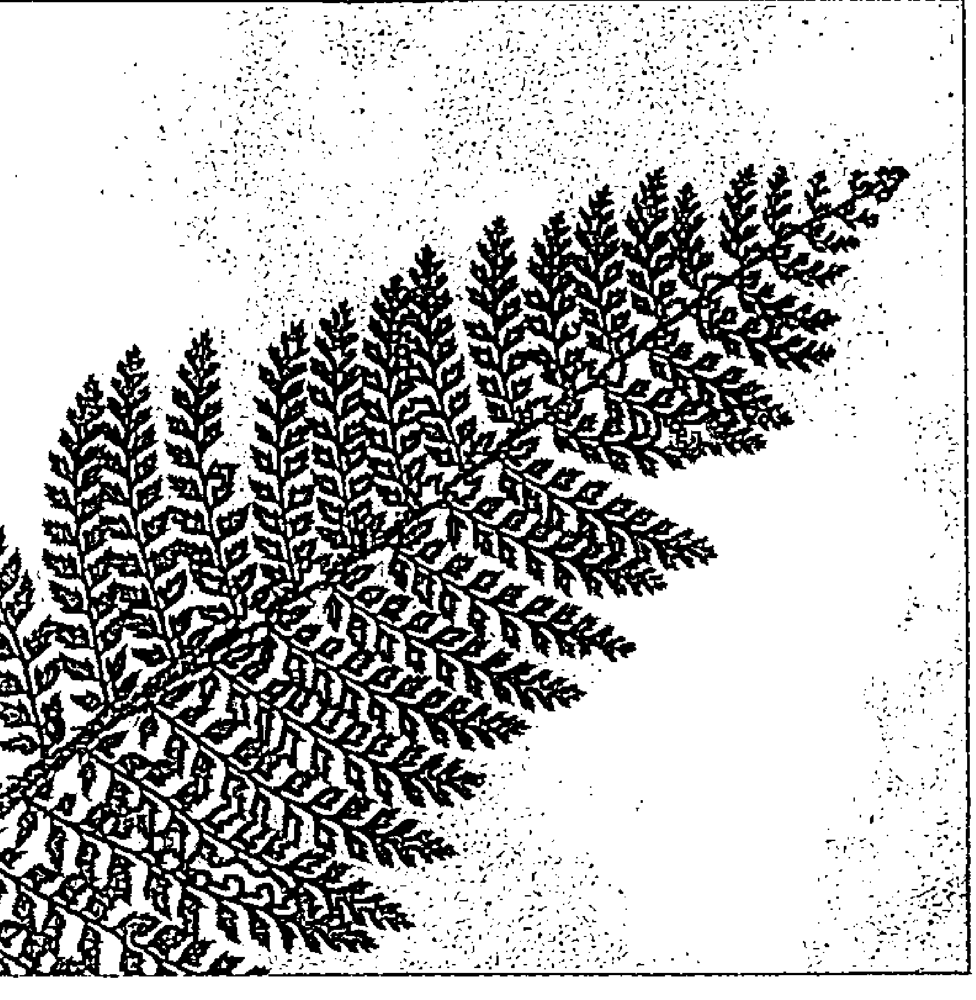

叶子的剪影效果

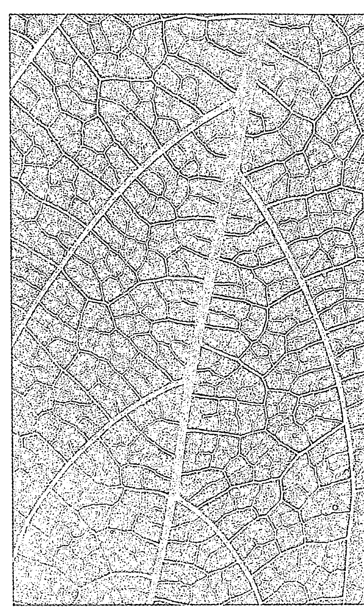

背光拍摄的绿叶非常通透，脉络清晰可见

### 寻找叶子的投影

除了叶子本身外，它们的投影也很有意思。这种场景，在墙边比较容易找到。把叶子和它的影子都包含到图像中，或者只拍它的影子，将会添加一种神秘感。


叶子的投影


贴墙而生的植物

### 四季皆有“美叶”

当然并非只有秋天的叶子，实际上一年四季，叶子各有不同的美，丰富多彩。通常我们都很忙，都只看着前方，尤其漫步于一道亮丽的风景或繁华的城市，而忘了看无所不在的叶子。

### 用叶子点缀画框

在一些叶子密集的地方，仔细观察，有时会发现它们若有若无地形成一个几何形的框架，以此框架构图，将会拍出一些妙趣横生的照片来。

在一张有着大片蔚蓝天空的照片中，如果有从上方悬垂下来的叶子做点缀，照片将会很有趣。当然，下方、左右两侧，甚至一个完整的“叶的画框”，也都会别有趣味。


选择适当的角度，路边的树很容易形成框架

## 色彩摄影

## 镜头中五彩缤纷世界

色彩能够为摄影作品添加意境、渲染气氛，让所要表现的对象更有真实感。在用手机（或相机等其他设备）进行拍摄时，如果能处理好一幅照片中的色彩关系，就可以让照片更有感染力。

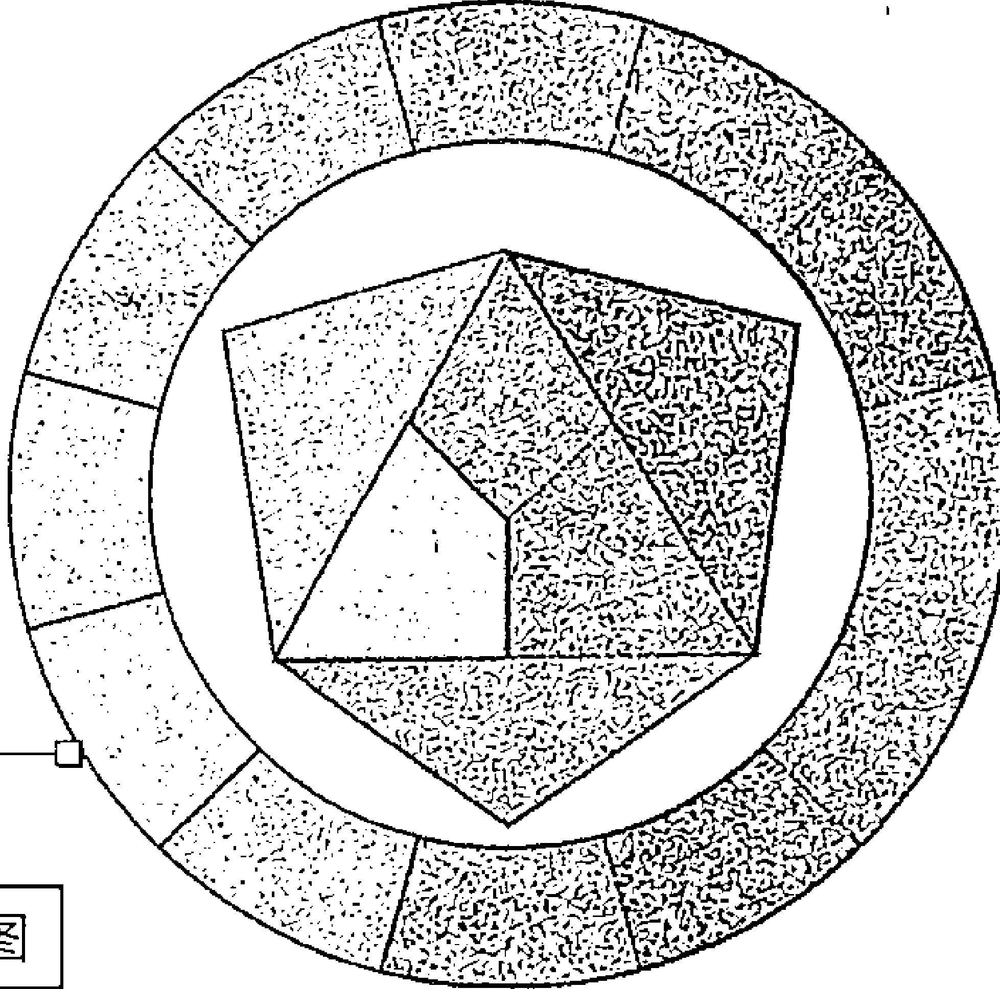

### 从色相环了解色彩关系

一般来说，色彩本身并没有好看和不好看之分，关键要看如何搭配，这就要求我们对不同色彩之间的关系有所了解，而色相环就是理解色彩关系的一个非常好的工具。

色相环有6、8、10、12、24等多种类型，以12色相环为例，它是由12种基本颜色组成，其中最核心的是三原色——青（C）、品红（M）、黄（Y）。三原色两两混合产生二次色，二次色再混合产生三次色。色轮中所有的颜色，除了三原色之外，其他都是混合产生的。每一种颜色都是与其左右相邻的两种颜色的等量混合，如此循环一周便构成了色相环。通过色相环，可轻松判断出单色、类比色、对比色、冷暖色等关系。下面就来分析它们在摄影时的应用。

> **小提示**
>
> 注意，上述的青、品红、黄是所谓的色料三原色，另外还有色光三原色，即红（R）、绿（G）、蓝（B），色相环也因此分为两大类型。像杂志印刷中的彩色图片就是属于色料色彩系统（CMYK），而显示器这类自身发光的设备所显示的图片则采用的是色光色彩系统（RGB）。

### 静中生变营造和谐

通过色相环，能够很容易地得出几组色彩关系。首先是单色搭配关系，顾名思义，就是整个画面中基本上只有一种颜色。只有单一的颜色并不一定单调，因为同一种颜色也会有很多层次变化。色相环上的每一种单一的颜色（色相），可因鲜艳程度（饱和度）以及色彩的光线强度（亮度）的不同，构成层次不同的系列，而这一系列仍属于同一种颜色。当然，摄影中纯粹的单色搭配基本上不存在，与单色相近的类比色构成，可达到与单色搭配类似的效果。所谓类比色，就是色相环中与某一色左右相邻的近似色，这种颜色搭配能够产生令人悦目、低对比度的和谐美感，而且又不会显得单一。

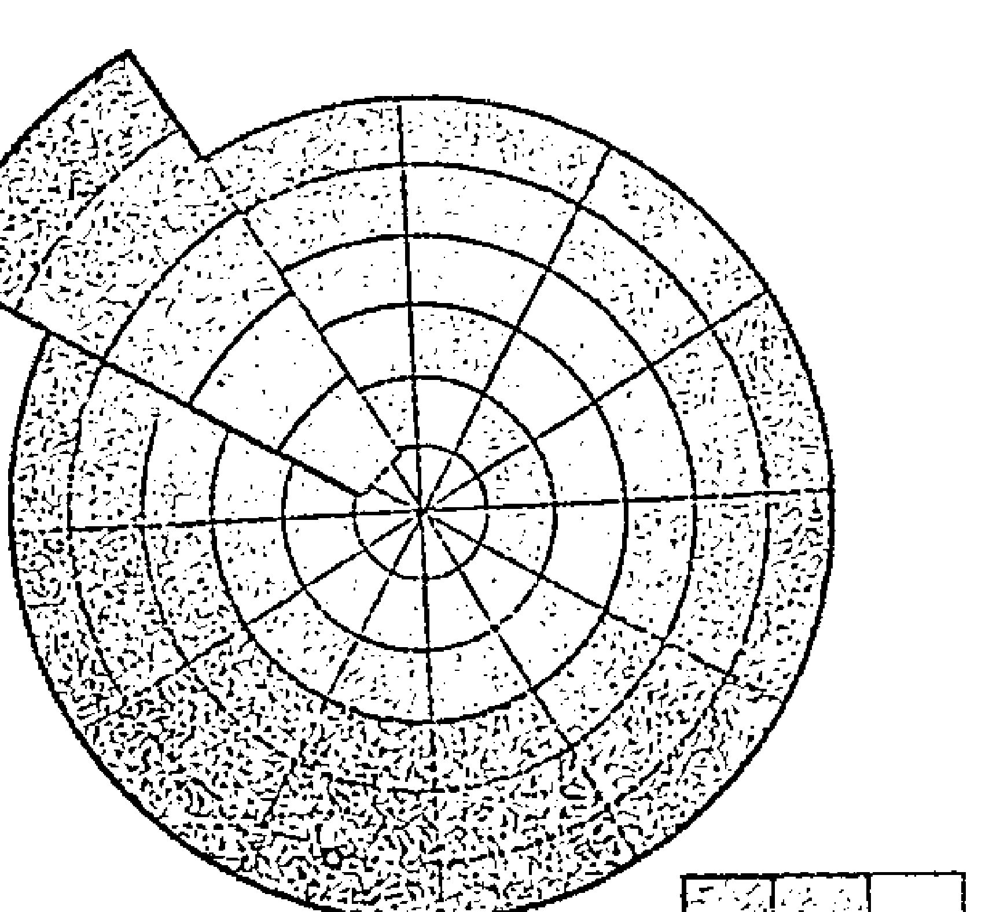

单色与类比色示意图

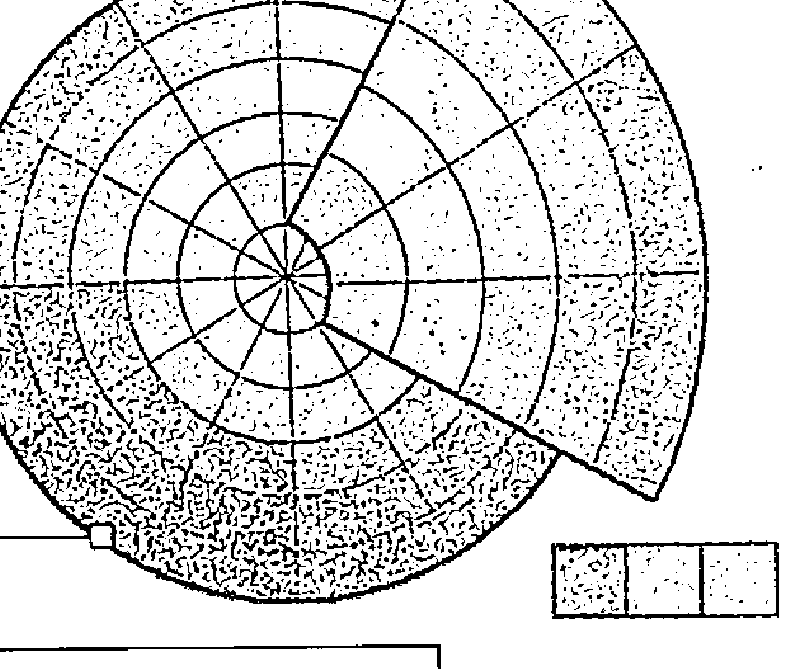

色相环中的补色搭配及分裂补色示意（补色之外增加近似色对比）


单一的紫色营造出咖啡一样的温馨感觉


冷色调能产生清凉之感

### 冷暖有人知

平时说到色彩，常会听到冷色调、暖色调之类的概念，实际这是一种形象说法。以蓝、绿为主的色调给人以冷静、静止的感觉，所以称为冷色调，这种色调有时会显得很开阔，但也会产生距离、压迫等消极感。以红、黄为主的色调给人以温暖、热情的感觉，所以称为暖色调，这种色调既有喜庆、温和的一面，但有时也会产生浮躁感。在摄影时就要充分利用色彩所产生的这种心理感觉，完美突出自己想要表现的主题。

### 在冲突中显示主题

单色或类比色的搭配，能产生和谐的感觉，但有时会显得主题不突出。要想强烈地突显主题，经常需要让画面中有两种截然相反的颜色产生对比。在色相环中，处于180°两极的颜色，是对比度最强的，将它们并置在一起，可形成强烈的对比效果，从而让画面具有很强的视觉冲击力。180°的对比色，又称之为补色。小于180°的两种颜色的对比，效果就会弱一些，角度越小就越弱。另外在实际拍摄时，还要注意色彩面积大小的对比，两种对比色不要等量齐观，最好有多有少。色彩多的部分将蜕变为背景，而色彩小的部分将突出成为主题。总之，摄影中的色彩应用，在原则上来说，应用对比色可以更好地突出主体，而应用单色或类比色则可以让整个画面更协调。而色彩不同的属性，比如冷或暖，则可以决定画面的情感基调。除此之外，我们拍摄时还可以临时“忘记”拍摄的对象，而纯粹将画面看成是一个个色块组成的，发现其中不同色彩的点、线、面的构成元素，巧妙搭配，一定会拍摄出美妙的作品。


冷暖色的对比更加突出主题

### ## 雾里看花
怎样拍摄梦幻雾景

秋天，是多雾的季节。在雾的笼罩下，身边看来极为平常的风景，凭空增加些梦幻的色彩，有着非同一般的意境。当然，要在雾中拍摄出好照片也是很不容易的，下面就给大家一些雾景拍摄的技巧，拍摄出自己的“仙境”。

### ### 雾景何处寻

自然，雾一年四季都有，不过秋季会更多见。当热空气与冷空气相遇后，雾就产生了。一般来说雾会在夜里形成，一直延续到第二天早晨，当太阳逐渐升起后，雾差不多也就散了。有些特别的区域，比如山里可能会常年有雾，而海岸边往往也是寻找雾的好去处。

虽然都是雾，也有多种不同的形态，按照形成过程的不同可分为四种。一种是“辐射雾”（也是大部分人最常见到的雾），夜间地面辐射渐渐冷却后，靠近地面的空气温度变低，低到一定程度就会出现逆温现象，水汽凝结悬浮而形成雾。这种雾不是很厚，稍高点的地方还能从雾中显露出来，并且随风产生变化的形态，是比较理想的拍摄素材。


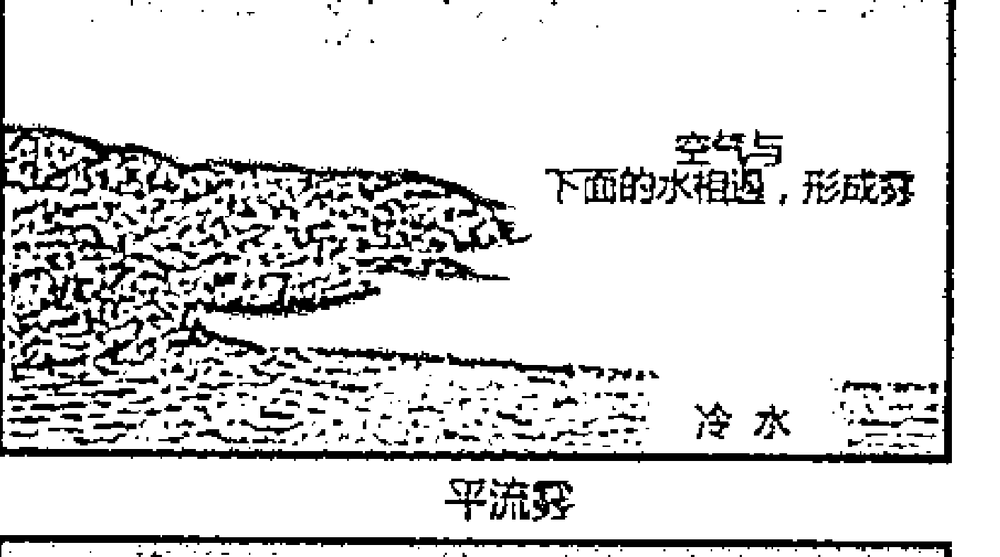


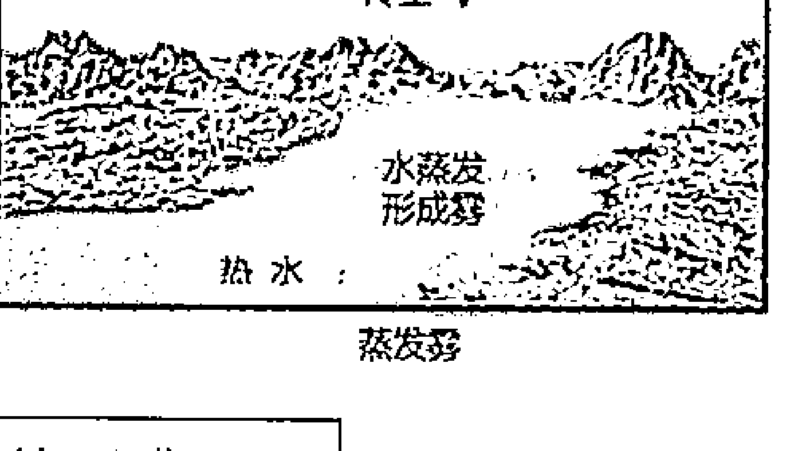

辐射雾、平流雾、上坡雾、蒸发雾的形成原理一种是“平流雾”，当暖湿空气移到较冷的地方，下面变冷却形成雾，这在海边较常见。平流雾浓而厚，持续时间较长。还有一种“上坡雾”，暖湿空气沿山坡上升，遇冷形成雾。因为是在山中，所以古人将这种雾称为“山岚”。另一种就是“蒸发雾”，是水分蒸发后遇冷空气形成，一般见于江、河、湖等水面上。

> 小提示
尽量别用相机闪光灯
雾景拍摄，最好关闭相机上的闪光灯，尽可能只使用自然光（当然也会有例外）。因为使用闪光灯的话，有可能在你和拍摄物之间的雾气中的水珠都会被照亮，从而影响到拍摄主题，以及造成不适当的明暗对比度。当然也不是不能使用人工光源，实际上一些专业摄影师在拍摄雾景人物时，是必须要打光的。

### 最佳的角度最佳的时间

拍摄雾景，最好选择高于雾的角度进行拍摄，这样最能体现出雾景的变化多端。有条件的情况下，如果是在乡下，可以试着找山坡高地，如果是城市，则可以找一些高层建筑的阳台等位置，俯视角度拍摄。这两种场景拍摄时，最好要找一些突出迷雾的高大物体或建筑物作为景色主体，否则的话，只有白茫茫一片的雾景，也会相当无趣。

至于时间上的选择，本质上就是对光线的选择。比如清晨，太阳刚刚升起一会，斜射进树林雾气中的光，会有很漂亮的衍射效果。再比如夜晚时候，从窗口透射出来的灯光照射在院落中的雾气上，也会有很好的意境。雾天拍摄，会发现很多意想不到的美景，但是因为雾气造成的低对比度，也会带来不少的麻烦。不过有所失必有所得，雾气正好可以隐藏场景中的很多细节，模糊成一个简单的形状，让背景变得简单，从而更容易突出真正的主体。

### 雾景拍摄的曝光技巧

如同雪一样，雾大多是白色的，当使用自动曝光模式拍摄的时候很容易造成曝光不足。根据“白加黑减”原则，这种情况下可以通过适当的曝光补偿来弥补，一般来说增加1.3EV左右的曝光补偿即可，当然具体的值还是要看你所使用的相机，以及实际的拍摄现场环境了。

因为在雾景中，阳光不是很充足，所以还要在光圈、快门、ISO上进行调节。对于手机来说，光圈和快门是无法手工调整的，只能适当调高ISO的值了。当然也不能过高，否则拍出的照片噪点太多，影响画质。

### 发现低调之美

> 打光上由上往下可以形成天使一样柔和的氛围

照片上大部分是黑色影调（暗部），只有很少部分白色影调的（亮部），称之为低调照片。相应的拍摄这种照片也就称之为低调(Low key)摄影了。这种照片给人的总体感觉浓重、深沉，而有意识选择的黑白强烈对比，则可以形成一种独特的氛围，如神秘或恐怖等。

### 小提示

对于专业相机来说，还可以通过调整曝光时间和光圈大小来控制曝光量，以达到低调摄影的目的。下面的示意图，显示了在相同ISO值和曝光时间的情况下，不同光圈大小所产生的不同效果。

打光时由下往上会让拍摄对象显得很凶悍

### 设置相机的拍摄模式

低调摄影需要一定的环境，在一个晴朗的室外是很难完成的，一般要选择光线较暗的地方，如较暗的室内、浓密的树荫下、夜晚等等。除了拍摄的环境，对相机也要进行适当的设置。对于手机摄影来说可手动调整的参数有限，所以最主要的是调整曝光补偿、ISO值等。一般来说拍摄依据的是“白加黑减，亮加暗减”的曝光补偿原则，但因为低调摄影就是要创建黑暗的主体氛围，所以在这里可以反其道而行，虽然在较暗的低光环境下进行，依然适当增加一些曝光补偿值。手机自带的相机应用，往往不具有曝光补偿的功能，可以借助第三方的相机应用来实现。Android手机上一个比较好的相机应用是Camera FV-5，在它的主界面右下方，可以直接拖动滑钮增亮或增暗照片。还有可以控制的就是ISO值的设置，这个标准的手机相机应用都有提供，其中ISO值越低（如ISO100），画面就会越暗。

树林形成天然的屏障只有部分光线漏下照射在树叶上

### 低调摄影中用好光线

低调摄影的关键并不是为了曝光不足，实际上它是有意通过曝光不足来忽略掉一些东西，从而使得真正想要表现的主题变得更加突出。所以低调摄影中的光线处理其实是非常讲究的，它的关键点就是：让主体受光，让背景无光。

仅仅利用自然光有相当大的挑战，不过也是可以做到的，这就要求我们拍摄时善于观察、寻找，比如可以拍摄站在隧道入口处的人，黑暗的隧道自自然然构建了一个黑暗的背景，而入口处的光线可以在脸上或其他需要表示的位置进行打光。还有一个例子，夜晚亮着灯的房间，人可以站在房门口进行拍摄。

其实通过人工光线更容易进行低调拍摄，现在大部人有手机或iPad，晚上的时候，关掉所有的灯，在一片黑暗中打开手机或iPad，就是一个很好的光线。其他的如LED灯、手电等，都可以充当打光的工具，随手可得。

在使用人工光源的时候有一定的规律，就是光源和拍摄主题（或背景）之间的距离，每当距离加倍时光的强度将减少75%左右。可以根据这一规律安排主体、背景和光源的距离，从而形成丰富的层次感。

也可以对光线进行适当的控制，比如用白纸板挡住反射光，让主体更突出，让背景更暗。如果是在室内拍摄并需要使用外面的自然光，可以关闭窗帘，只在中间留下一条缝，确保被拍摄主体有足够的光线，同时又可以让房间中其他的部分相对较暗。

非专业人士一般不会有专业的灯光，不过合理利用家中已有的资源条件，也可以拍摄出专业的低调照片。下面这个技巧，使用的就是两个房间的资源，主要房间完全是黑暗的，另一房间中则有灯光，打开门让灯光照射到暗屋中，被拍摄者站在门口，再通过反光板（可以用普通的白纸板代替）适当补光即可。

当技术上的问题解决之后，剩下的就是拍摄的问题了，比如如何构图，才会更突出主题和具有更大的冲击力，这些杂志以前已有过不少介绍，这里就不再赘述了。

微距下的花儿没有完整的花的轮廓，更多了图案的意味

### 留心处处有“抽象”
文|流言

### 从基本元素发现抽象

什么是抽象？画一个圆圈代表太阳，这就是抽象；画一个方框上面加一个三角形的尖顶，代表房子，这也是抽象。总之就是化繁为简，忽略掉不重要的细节而凸显某种主题。我们在摄影时，如果主要表现的是非理性的纯粹视觉形式的内容，而不在意照片显示的是什么具体内容，那就是所谓的抽象摄影了。

抽象摄影作品往往有着很高的艺术价值，而即使对于初学者来说，练习抽象摄影也是学习构图、理解构图的非常好的方法。下面就让我们从一些好的抽象摄影作品中，发掘出创作的灵感吧。

放眼现实世界，都是具体的实实在在的形象，何处才能发现抽象的图形呢？对于抽象摄影来说，想要捕捉的东西不会是寻常的一种形式，所以我们需要注意寻找事物的细节、图案、线条、形状、颜色等，从这些元素中发现构建照片的关键，从而在一些纯形式的律动中，让大家体验到原来平凡的世界，竟然还有这么一种震撼人心的抽象美。

我们进行抽象摄影练习的时候，会发现线条是最容易找到的抽象元素，各种线条有曲有直，各有不同的艺术性格，直线刚健直率，曲线温柔委婉等等。而除了单一的线条，更多是多线条的组合，有时甚至会错综复杂，表达出很抽象的内涵。

仔细观察，会发现所有的线最终会组成各种形状，生活中处处留意，就能找到不同的形状。当形状就是以形状进入镜头，而不是一个具体的事物的时候，就有了一种抽象的图案美。

照片属于平面的艺术，而平面构成的要素就是点、线、面。除了上面介绍的线和面的例子外，注意观察生活中的事物，会发现很多“点”的存在。如果忽略掉事物本身，而将这些点作为主题，也会形成很有意思的抽象照片。

简单的直线也能表达复杂的涵义

1.  微距下的吉它已经不再是吉它，它的直线弦更像是延伸的路或桥
2.  门钉的点构成有意思的图案
3.  逆光中树叶透射出的抽象图案
4.  通过多重曝光，在同一张照片中捕捉不同时间的图像叠加，产生奇妙效果
5.  线条组成的网状图案是很好的素材
6.  铅笔排列的抽象图案
7.  超近距观察，齿轮变成“庞然大物”
8.  巧妙的取舍让世界只留下黄蓝两色
9.  看不出是太阳伞或其他什么不重要，关键是这对比鲜明的色彩令人振奋

### 发现生活中的抽象图形

上面从平面构成元素的角度介绍了如何发现抽象图形，这里介绍一些如何通过不同的观察角度而发现抽象图形。一般来说，微距摄影能让我们忽略掉事物的总体印象，从而能直击细节，找出抽象的元素。当然，抽象摄影并不等于是微距摄影，一些宏大的景物同样也可以创建出抽象照片。

### 抽象的色彩

现实生活中的色彩变化无穷，而如此将这些丰富的色彩简单化，就会产生很戏剧性的抽象效果。上面的摄影作品，通过镜头的选择，实现简单的色彩块，并且还有对比，效果非常鲜明。上面的各种发现方法平时用手机就能实现。如果是控制参数灵活的单反相机等，还可人为制造出许多抽象的效果，最后就让我们来欣赏一些抽象摄影的佳作吧。

### 留心处处有“抽象”

只要足够细心地寻找，生活中处处可以采集到抽象照片的素材。上面图中，就是通过一片残败的树叶，对着阳光逆光拍摄得到的非常有趣的效果。其实还可以手工“创造”出抽象的效果图，将削好的铅笔有规律地排列，就是一个非常不错的图案。

## 手机也玩焦外光效

现在的手机摄影，一般都是智能自动对焦，不管是晃动或手抖，也照样能拍出清晰的照片。不过也正因为这一点，有时想要拍摄出朦胧效果的照片反而很难做到。比如在雨过天晴之后，树叶花草上还残留不少水珠，以此为背景逆光拍摄，单反相机通过景深的控制，很容易拍摄出梦幻般五彩缤纷的光斑背景，非常漂亮。下面的一些小技巧，则可以让你用手机也能拍摄出光斑效果。

### 关于焦外光斑

如前所述，那种因为落在相机镜头的焦点之外而形成的模糊光斑，一般称之为“焦外光斑”（图1）。从光学学术语来说，它实质上就是光点的“弥散圆”。如果想要拍摄出光斑效果，可以多注意背景中的灯光、烛光、水滴、间隙中的微光等，这些都可以形成焦外光斑（图2）。

### 手机拍摄焦外光斑

手机镜头基本上都是自动对焦的，无法手动控制，一般来说拍不出光斑效果。不过我们可以通过一个小技巧，通过“欺骗”的手法来实现。从下图中可以看出，手机随手一拍就是一张比较清晰的图片，很难形成光斑（图3，以下皆为K860i拍摄）。

如果我们非常快速地抖动相机，就会发现灯光变得模糊，不过这很难控制照片的构图，而且形成的模糊光斑形状也很难看。其实可以在固定好手机并构好图之后，先不要急着按下快门，而是就近取一些物体遮在镜头前面（微距范围内），最好是一本书（试过用自己的手背遮挡但是效果不好，对不上焦），直到对书上文字清晰对焦（图4），这时快速将书拿开，并按下快门，便可以得到一个不错的光斑效果的照片了（图5）。如果要拍摄的是静物，比如一些小玩具，想要得到有光斑的背景，可以在对散光源取景构图后，再将要拍摄的静物置于镜头前，手机镜头将会自动对近景对焦，背景中的散光变成好看的光斑了（图6）。

### 手机APP的光斑应用

手机拍摄好照片后，通过手机自带的APP应用，也可以为照片添加光斑效果。这里就以K860i为例，它的系统中自带有“超级相册”应用。首先通过“超级相册”打开拍摄好的照片，点按一下界面会显示出更多的功能项，有一项为“编辑”（图7），点按之后进入编辑界面，其中有“特效”、“美颜”、“移轴”等项。

其中的“移轴”效果，我们以前已有过介绍。这里点按“特效”进入特效界面，点按左下角的“颜色特效”，从弹出的菜单中选择“魔法特效”。

在特效制作界面中，向左滑动，点选最后一项“星芒”，此应用即可分析照片中的亮点，将其变化成星芒效果的光斑，非常漂亮。如果感觉满意，点按右上角的“确定”，再点按“保存”即可得到添加光斑效果的照片副本啦（图8）。