# 电脑爱好者2015合订本（上）第一部分

电脑爱好者杂志社

# 《电脑爱好者》2015年合订本（上）

主管：中国科学院
主办：北京《电脑爱好者》杂志社 中国计算机世界出版服务公司
编辑出版：《电脑爱好者》杂志编辑部
顾问：郭传杰

CCW MEDIA
计世传媒 荣誉出品

- 董事长：洪京一
- 副董事长：熊晓鸽
- 董事：万鹏远 许伟明 刘学义
- 总裁：黎争
- 副总裁：梁继有 覃超
- 出版人：梁继有
- 总编辑：许伟明
- 副社长：西浩铭
- 副总编辑：张博
- 出版部：聂静（主任）

作者：《电脑爱好者》编辑部
发行总代理：北京爱好者文化传媒有限公司
杨波（发行总监）
办公地址：北京市海淀区翠微中里14号楼4层
通信地址：北京123信箱（《电脑爱好者》杂志社）
邮编：100036
网址：http://www.cfan.com.cn
总机：010-88230000
广告客户部：010-88230596 010-88230597
读者服务部：手机短信：13801293315 电话：010-88230549
（发行） （周一至周五 9:30~11:30 13:30~17:00）
零售：全国各地邮局（所）
国内发行：北京报刊发行局
邮发代号：82-528
中国标准连续出版物号
ISSN1005-0043
CN11-3248/TP
印刷：北京新华印刷有限公司
广告许可证：京海工商广字第0055号
出版日期：2015年5月30日
法律顾问：周涛律师
网站：www.zt148.cn 电话：13366185341

本书如有印刷或装订质量问题，我们负责调换。
图文版权所有，未经同意不得转载、翻印
定价 39.8

## 特别话题

- 无可替代 IT产品生存法则 7
- IT大侦探 寻找IT的“蛛丝马迹” 29
- 时势造英雄 与经典一步之遥的差距 55
- 春节长假 软硬设备的“休闲”生活 84
- 拒绝“误会” 抓住一切性能提升机会 113
- IT攻防之五军之战 142
- 破除迷信 防止“被愚” 172
- 尝尝“苹果派” 198

## 系统应用

- 恢复Windows自带截图功能 230
- 用DEP筑起系统铜墙铁壁 231
- 全是误操作惹的祸 232
- 不容忽视的空文件夹 233
- “跳转列表”你用好了吗 234
- 定制一键永久删除文件按钮 236
- 巧用凭据管理 自动登录网络 237
- 双重压缩 向休眠文件要空间 238
- 层层深入 解决应用安装错误 240
- 解决Windows 8.1无法自动更新 242
- 弄坏硬盘 数据尚能保全 244
- 让Windows 10开始菜单更个性 246
- Windows巧解时差麻烦 247
- 对症下药 解决两种分区故障 248
- 小屏Windows任务栏不纠结 250
- Windows平板触屏不灵为哪般 252
- 升级Windows 8 为何无法打印 254
- 晒晒Windows 10里的那些新功能 256
- IE冲突引发的网银服务故障 258
- 轻松获知Windows系统信息 259
- 解决系统映像制作的麻烦 260
- 用好Windows 8.1视图重组 262

## 软网生活

- 百度网盘还能这样用 264
- 邮箱不爆满 丢失不再愁 266
- 双软联用 去除批量身份证号 267
- 干完活儿关机 让电脑听话 268
- 开源库“绕路”为网站提速 269
- 禁用SSL 3.0 免遭“贵宾犬攻击” 270
- 提取QQ自带的新头像 271
- 这回不假 打电话真的不花钱 272
- “骡马”结合 TB云盘极速利用 274
- 抓图搞“副业” 制图也全能 276
- 绕过黑客链 解包不中招 278
- DIY本地视频广告过滤系统 279
- 浏览器自备的秘密提速器 280
- 三招任选 完整网页快速抓图 281
- 疑难截图逐个数 282
- 远程下载 双管齐下任我选 284
- 给BT种子文件动动“手术” 286
- 解除WPS Office的强制推广 287
- 调教MPC 享受不一样的视听盛宴 288
- “榨取”PDF中的图片 290
- 发掘右键潜能 常见操作一键完成 291
- 绕道VIP限制 高效成批下载 292
- 双软结合 快速成批提取图书 294
- 自己动手给Chrome“换装” 296
- 武装Chrome 360应用大挪移 297
- 好进难出 应对迅雷“口袋战” 298
- 下载不停息 为云端上传让路 299
- 用文件统统不解压 300
- 借电脑过滤移动网络广告 302
- 吊销流氓软件的“执照” 304
- 自动操作魔法师为工作减负 305
- 一箭三雕 下载文件巧归类 306
- 右键快速生成目录列表 307
- 云盘还有别样用法 308
- 不怕QQ封锁 沟通另有捷径 310
- 不装软件 云端在线解压 311
- 被禁合法文件上传微云有招 312
- 让浏览器边边角角充满实用 314
- 艺术照设计打印一步到位 316
- 解决怪异的照片时间问题 318
- 条条大路通微云 319
- 跳过浏览器 MEGA文件直接下载 320
- 干干净净用Java 321

## 高效办公

- 大饼套小饼 老板更爽心 322
- 信息核对签字表巧制作 324
- 小插件让PPT脱离线性播放 326
- 文档表格 版本差异何在 328
- 10秒钟！排版图例批量加括号 330
- Word Excel组合 规整下载图片 331
- 员工信息网络化收集 332
- 游戏式学习幻灯片轻松做 334
- 电子邮件的再生之道 336
- 图层幻灯片 轻松玩拖动 338
- 测试轻松做 英语学习更给力 340
- 录入时间自动跟踪有招 341
- 轻松制作视频、照片串烧 342
- 表格也能找不同 344
- 巧用WPS表格“秒”建目录群 345
- 制作“时间轴 + 菜单控制”幻灯片 346
- 徒手巧求值 不算也知道 348
- 用C型环清晰表达占比 349
- 巧做灵动产品使用说明 350
- 用好WPS视图细节 352

## 软件与网络 28:移动新天地

- 前程无忧 手机助力找工作 354
- 轻松回家 手机抢票有高招 358
- 远离爆炸 手机充电要定时 362
- 金蚕脱壳 对付骚扰 363
- Windows 8平板不怕“熊孩子” 364
- 双卡巧周旋 “保号”特省钱 368
- 无惧大屏 单手玩转 370
- 解决Android平板换装Windows 8.1后的难题 374
- Windows 8平板看电影更轻松 378

## 傻博士有话说

- 傻博士有话说 382

## 硬件应用

- 英特尔 VS 微软 SSD的AHCI驱动选哪家 414
- 更清晰字体 调整ClearType还原“视界” 415
- 玩转无线充电 416
- 升级必看 寻找笔记本隐藏的扩展接口 418
- 使用802.1X设置 为移动设备保安全 420
- AMD VS 微软 SSD的AHCI驱动选哪家 422
- 丢了接收器 无线键鼠也能“起死回生” 423
- SSD挑战百万文件 正确认识硬盘4K性能的意义 424
- 一起来“补脑” 解决Windows 8.1平板四大问题 426
- 三招隐藏从盘数据 429
- 硬件罢工 驱动找问题 430
- 缓解笔记本散热压力 431
- 自己动手 更换iPhone电池 432
- 告别高温 笔记本逆天水冷改造 434
- 排查Mac OS中的蓝牙问题 437
- 克隆硬盘很简单 438
- 免费福利 善用三星笔记本特色软件 440
- 检查修复手机的OTG连接 442
- 修改无线信道改善手机信号 443
- 集成显卡逆袭之后 如何处理尴尬的AMD入门独显 444

## Cfan教你选

- 中端对决 宏碁VN7-591G VS 华硕FX50JK 446
- 64位的激情碰撞 金立F301 VS 酷派大神F2联通版 448
- 淘宝捡漏 低开销将昔日旗舰领回家 450
- ITX最佳搭档 小显卡也有大性能 452
- 小巧游戏机的对决 联想Y430P PK 微星GE40-2PC 454
- 低价64位手机的对决 联想乐檬K3 PK 酷派大神F1 Plus 456
- 性能至上 强悍且实惠的国产平板 458
- 便宜也有好货色 网罗那些实惠的“超薄本” 460
- 便宜、便携与实用 超值平板蓝牙键鼠大导购 462
- 诠释顶级力量 雷神G150P PK 神舟战神Z7 464
- 千元级的较量 荣耀畅玩4X PK 联想Note8 466
- 有钱？任性？理智挑选显示器附属功能 468
- 新旧酷睿的碰撞 中低端笔记本：追新 VS 实惠 470
- 双4G的诱惑 红米手机2 PK 中兴V5S 472
- 昔日神器？理智看待过时至强处理器 474
- 双核更比四核强？宏碁E1-472G PK E1-410G 476
- 你也是歌手 将智能手机打造成移动KTV 478
- IPS当道 入门广视角显示器 480
- 买SSD看主控 不同侧重点选固态硬盘 482
- 谁是未来趋势？游戏本的轻薄化 PK 外置显卡 484
- 3K“韩系党”的较量 三星Galaxy A7 PK LG G3 486
- 钟情“Broadwell” 直击第五代酷睿笔记本 488
- 优质之选 MVA/PLS显示器选购指南 490
- 桌面“盒武器” 方形电脑机箱选购 492
- 跟信号不好说再见 改善家庭无线网络攻略 494
- 大屏五代酷睿新秀 ThinkPad E550 PK 戴尔Inspiron 15 496
- 新机皇的较量 三星GALAXY S6 PK HTC M9 498
- 喜迎降价 市售主流内存选购指南 500
- 罗技全新G世代 挑选最专业的电竞鼠标 502
- 主流娱乐谁占优 惠普Pavilion 14 PK 华硕X450JN 504
- 质感与美丽并存 双玻璃材质的性感手机 506
- SSD选购须知的几大参数 508
- 安装小型游戏PC 510

## 无可替代
IT产品生存法则

被消费者认可的成功案例是同类产品竞相模仿的对象，“同质化”现象在各个行业领域都客观存在，日新月异的IT产品领域尤甚。如何在同类产品当中脱颖而出？自家产品被同行模仿后如何从困境中突围？这是IT产品研发之前就要考虑的问题。不过当中就有一些身怀绝技的产品几乎从未为此操心，将自身的特点、技术精益求精，打造成无可替代的优势，正是它们的“独门绝技”。只要拥有一手“独门绝技”别人难以模仿，就足够闯荡江湖了。聚焦这些无可替代的技术优势，见证这些IT产品独一无二的生存法则。

## “拿手绝活”
看系统工具

虽然Windows看上去是个大而全的系统，但是在日常操作中，Windows仍然有很多局限性，比如Windows默认就无法对闪存盘进行分区，这样就得借助一些有特色功能的软件来完成Windows无法完成的工作。

### 功能强大的磁盘工具：DiskGenius

- 特色及原理点评：
- DiskGenius是一款磁盘操作工具，它可对任意磁盘（包括闪存盘、SD卡、移动硬盘等）进行底层操作，因此在Windows下无法执行的很多磁盘操作（如闪存盘分区、容量异常SD卡格式化、隐藏分区的访问），现在都可借助DiskGenius来完成。

## 实例解读

### 使用DiskGenius对闪存盘进行分区

现在大家使用的闪存盘容量都很大，16GB甚至32GB的闪存盘都已普及。对于大容量的闪存盘，对它分区更便于使用，因为如果没有分区，当闪存盘借给其他人使用时，其中的数据很容易被误删。不过在Windows下默认无法对闪存盘进行分区，对于分区的闪存盘无法访问第一分区后的分区。现在可使用DiskGenius对闪存盘进行分区，下面以将16GB闪存盘分为系统启动和数据存储两个分区为例来说明。

插入闪存盘后启动DiskGenius，在左侧列表选中闪存盘，点击“分区→删除当前分区”（注意：删除分区会导致闪存盘数据全部丢失，操作前请备份好数据）。点击执行“分区→创建分区”命令，按需要创建2个分区即可（图1）。

由于Windows默认无法访问第二闪存盘分区，因此，如果要保护启动分区的文件，可将第二分区格式化为FAT32格式（容量只要4GB左右即可）。接着准备好Windows 8安装文件，使用WinRAR打开后将其全部文件解压到桌面文件夹中。返回DiskGenius窗口，选中第二分区后切换到“文件浏览”，右击选择“复制文件到当前分区”，将解压所获得的文件全部复制到该分区，这样即可制作出可启动闪存盘（图2）。

因为在Windows下默认无法访问闪存盘第二分区（但是现在可以使用第二分区作为启动盘启动电脑），所以现在即使在Windows中格式化双分区的闪存盘，其中的启动文件也不会被删除，能够很好地保护闪存盘的启动功能（图3）。

> 由于DiskGenius可以用底层的方式对磁盘进行访问，因此对于扩容闪存盘、插入电脑后无法访问的SD卡、出现逻辑坏道且无法访问的移动硬盘，我们都可以使用DiskGenius来进行访问和识别。

16G闪存盘分区后容量变小，即使格式化也不会删除第二分区的数据

### 高可用的搜索工具Everything

Windows默认的搜索使用系统建立的索引来搜索文件，因为索引文件庞大而且数据繁多，因此系统自带的搜索速度并不快。Everything搜索则利用了NTFS（只支持NTFS分区）文件系统的特性，它不需要遍历文件内容，直接通过读取NTFS分区的文件索引来进行搜索，所以搜索速度极快（文件搜索一般在1秒内完成）。

### 特色及原理点评:

首先以管理员身份启动Everything，点击“搜索→文档”，接着在文本框输入“win8”，几乎在输入完成的同时就可以看到搜索结果，搜索的速度的确非常高（图4）。

Everything可以极快地搜索文件当然在日常的搜索中，我们还经常要进行更为高级的搜索。Everything支持常见的高级搜索语法。为了缩小搜索范围，我们经常需要在指定目录中进行搜索，现在只要点击“搜索→匹配路径”，然后在搜索框输入“TDDOWNLOAD.iso”，这样即可快速在迅雷默认下载目录中搜索到所有文件后缀为.iso的安装镜像（图5）。

同样，Everything也支持常见的通配符、正则表达式、布尔运算符等高级搜索语法。具体使用大家可以参考软件的帮助文档。

**名称** | **路径** | **大小** | **修改时间**
--- | --- | --- | ---
2008x64.ISO | J:\TDDOWNLOAD | 2,883,782... | 2011/11/13 10:25
20110904_213952.iso | J:\TDDOWNLOAD | 188 KB | 2011/9/4 21:40
8x64.iso | J:\TDDOWNLOAD | 3,474,624... | 2012/12/12 4:59
[5]DEEPIN-LITEXP-6.2[52zy.com... | J:\TDDOWNLOAD | 691,472 KB | 2011/7/24 19:53
android-x86-2.2-generic.iso | J:\TDDOWNLOAD | 84,396 KB | 2011/7/13 22:25
cn_windows_7_server_2008_r2_... | J:\TDDOWNLOAD | 3,193,814... | 2011/11/13 23:14
cn_windows_7_ultimate_x64_dv... | J:\TDDOWNLOAD | 3,262,958... | 2010/4/17 0:35
cn_windows_8.1_preview_x86_... | J:\TDDOWNLOAD | 2,859,272... | 2013/6/28 11:03
linux.iso | J:\TDDOWNLOAD | 89,072 KB | 2011/9/5 22:46
linuxmint-12-gnome-dvd-32bit... | J:\TDDOWNLOAD | 1,052,128... | 2012/4/5 20:33
mac.iso | J:\TDDOWNLOAD | 4,588,544... | 2009/6/20 0:52
memtest86+-4.10.iso.zip | J:\TDDOWNLOAD | 68 KB | 2011/4/24 11:19
Microsoft Office 2010.iso | J:\TDDOWNLOAD | 864,494 KB | 2011/10/7 14:16
OS_X_Lion.iso | J:\TDDOWNLOAD | 4,047,248... | 2011/12/2 18:31
pxe_win7pe.iso | J:\TDDOWNLOAD | 431,748 KB | 2011/9/5 17:55
wpsdvk80_chs1.iso | J:\TDDOWNLOAD | 1,692,718... | 2012/12/11 3:07
XLJS_Windows7_SP1_WM_Lite_... | J:\TDDOWNLOAD | 1,623,112... | 2011/7/26 22:43
Ylmf_OS_4.0.iso | J:\TDDOWNLOAD | 680,994 KB | 2011/12/10 14:52

## USB端口保护工具：Lenovo Port Locker

## 特色及原理点评：

虽然Windows的组策略已经可以控制USB设备的使用，但系统功能是通过绑定USB设备硬件ID来进行限制，不仅操作麻烦，而且控制效果不灵活（因为它是针对所有USB设备，包括USB鼠标、键盘而生效）。Lenovo Port Locker则通过为USB接口加上密码的方式进行保护，它通过对系统USB存储驱动设备文件进行限制的方式来实现底层加密保护。

Lenovo Port Locker使用虚拟硬件的方式工作，安装完Lenovo Port Locker并重启后它就开始保护了。右击任务托盘程序图标并选择“设置向导”，按提示设置好开启USB使用的密码（即登录当前系统的账户密码），这样后续插入的USB设备就需要输入设置的密码才能使用（图6）。

此后如果在公司电脑插入USB存储设备，系统就会弹出需要输入密码才能使用的提示，如果没有密码或输入的密码错误，则当前系统无法使用插入的USB设备，而且在每次连接USB设备到电脑时会被要求输入安全密码认证。不过USB鼠标、键盘设备则不受影响（图7）。

如果用户强行在资源管理器中打开闪存盘，系统会提示“位置不可用，拒绝访问”。系统默认保护进程是“C:\Program Files\EgisTec Port Locker\EgisPLConsole.exe”，可在任务管理器中被终止，但Lenovo Port Locker仍然在后台实行保护（图8）。

当然如果确实需要使用闪存盘，右击任务托盘程序图标选择“暂时关闭”，按提示输入保护密码后才可以停止保护。

## 键盘管理软件 MapKeyboard

## 特色及原理点评：

键盘的键位值是通过注册表相对应的键值指定的，通过修改注册表的方法可以对键位实行替代，不过操作起来十分繁琐。MapKeyboard通过可视化设置的方法实现对键位的修改，我们只要简单地点击即可修改键位（后台对应的则是修改相应的注册表键值）。

启动MapKeyboard之后先选中左微软键LWin，接着点击左下方的“ Remap selected key to”，在其下拉列表下选择“Disable”（即将其屏蔽）。同样将右微软键也屏蔽，被屏蔽的键位会显示为绿色。最后点击“Save Layout ”保存即可。这样重启后微软键就失效了。如果要恢复，则点击“Reset keyboard layout”进行重置（图9）。

除了屏蔽按键，MapKeyboard还可以用来进行按键的替换。大家知道，游戏用户的A、S、D、F键最容易损坏，如果A键损坏，先选中A键，然后在“ Remap selected key to”的下拉列表中选择左Shift键进行替换即可。替换后左Shift键即可用于A的输入。

## 资源管理器缩略图预览工具 - Win7codecs

## 特色及原理点评：

如果系统包含对应文件类型的解码器，那么在资源管理器就可以显示对应文件的缩略图（如果是视频还可以直接预览播放）。不过系统自带的解码器只能支持有限的几种格式，Win7codecs则集成常见多媒体文件的解码器，这样在资源管理器就可以预览更多格式的媒体文件。

启动Win7codecs后按提示切换到MKV选项，接着“勾选 shark007 SUGGESTED settings”，开启程序对MKV格式文件的支持（图10）。

现在再打开资源管理器，找到保存MKV文件的目录，点击右侧窗格的“打开预览窗格”，这样在资源管理器中选中MKV视频后，点击右侧播放按钮即可开始预览指定的视频文件，其他视频文件的预览类似（图11）。

## 显示器检测神器 - DisplayX

特色及原理点评:
显示坏点是指显示屏上的某一点永远是显示同一种颜色。这种“坏点”是无法维修的，只有更换整个显示屏才能解决问题。因为坏点显示不会变化，因此我们可以通过设置纯色背景来发现，DisplayX正是通过这个原理来检测坏点，当然它还可以对显示器的其他参数如呼吸效应、锐利、色彩过渡等进行详尽的检测。

实例解读
购买笔记本或显示器时检测显示器坏点
在装机或者购买显示器的时候，我们都希望购买到完美无坏点的显示器。但是由于显示器生产工艺的限制，目前的国家标准是三个或者三个以内坏点都算合格的产品。因此在购买的时候我们就应该认真检测显示器，以免买到有坏点的“合格品”。不过坏点仅凭肉眼的检测是很难发现的，借助DisplayX即可轻松检测出显示器的坏点（包括暗点和亮点）。
启动DisplayX后点击“常规完全测试”，这样软件会对常见的显示参数进行检测，此时当前屏幕会自动进入各项测试状态（图12）。

测试具体操作只要按照屏幕的显示点击即可。对于坏点的测试，软件是通过显示不同颜色的纯色背景来检测的。如果是暗点，则在纯色背景下会显示为暗黑的点，亮点则在任何背景下（特别是黑色背景）都是常亮的一个点，通过DisplayX可以轻松分辨出来（图13）。

## 多媒体软件的“花样武功”

日常操作中，我们经常要对照片、音乐、视频等多媒体文件进行处理。比如放大图片、提升音乐品质等等。有时仅通过系统自带的功能来实现效果很不理想，这时，就可以考虑借助第三方工具的特色功能来完成了。

文|技术宅

## 特色及原理点评：

一般情况下大家使用的是双声道的普通耳机，这样在听音乐或者玩游戏时就无法获得环绕特效。Razer Surround使用先进的7.1虚拟环绕声引擎，在双声道立体声的基础上，不增加声道和音箱，而是把声场信号通过电路处理后播出，使聆听者感到声音来自多个方位，产生仿真的立体声场。

## 实例解读
让游戏在耳机中“震撼”

喜欢玩CS等枪战游戏的朋友都喜欢头戴耳麦，这样不仅方便和游戏中的好友语音联系，而且可以获得最佳的游戏音效。现在借助Razer Surround专为你的耳朵形状打造的先进音频应用以及你耳机的特性，就能够在自己最喜爱的游戏中感受到更完美的游戏体验。

启动Razer Surround安装程序，它会自动下载所需的组件并进行设置，可以看到在安装过程中需要安装一个设备软件，这就是虚拟模拟7.1虚拟环绕声引擎，按提示点击“安装”并重启后就可以开始使用了（图1）。

重启后再次启动Razer Surround并注册账号，然后就可以使用了。如果你的耳机被Razer Surround支持（可以访问http://tinyurl.com/mudhcdr获取官方支持列表），插入耳机后会自动激活。要享受7.1环绕效果，主要是在环绕声选项里进行声音源调教和收听者的角度（总共7个方位进行调试），剩余的操作按照屏幕提示一步步完成耳机的调校即可（图2）。

完成上述工作后，再进入游戏或者开启音乐播放器，就可以直接享受7.1声道的环绕立体效果了。

文|技术宅

## 集成声卡的音质“进修”

## 特色及原理点评：

很多朋友都在使用集成的声卡，而Windows自带的音频管理器只能对声音进行简单的大小调整，功能贫乏。SRS Premium Sound同样使用虚拟驱动的方式实现集成声卡音质的增强，可以增强声卡的音量、低音以及营造出众的声场，能够让你的电脑发出更加悦耳的声音。

## 实例解读 普通声卡增加声场效果

喜欢听音乐的朋友都知道，很多音乐播放客户端都自带EQ均衡器，它可有效提升音乐的品质。不过这些效果只能在播放客户端中生效。现在借助SRS Premium Sound则可以对声卡进行设置，使得通过声卡发出的所有声音都有类似的功效。

安装完程序之后打开系统自带的“音量合成器”，点击设备下的下拉列表，然后选择“扬声器（SRS Premium Sound）”，这样以后声卡播放的声音就会使用SRS Premium Sound设置的音效（图3）。启动SRS Premium Sound，程序已经内置常见的音源类型（包括音乐、视频和游戏）和输出设备（包括耳机、桌面扬声器和笔记本音箱），按照自己的实际设备选择，即可有效提升声卡的输出品质了（图4）。

文|阿发

## 实例解读 无损放大截取的电子书

一些限制打印和复制的电子书（如PDF书籍），如果要将其打印出来，一般采用截图的方式将书籍转换为图片。不过很多时候原版书籍分辨率就比较低，这样截取的图片需要适当放大打印出来才便于阅读。由于系统本身放大工具没有抗锯齿效果，实际放大效果并不理想，下图就是使用画图工具放大三倍后的实际效果（图5）。

PhotoZoom 放大图片 无限放大

特色及原理点评：在默认情况下，对于像素固定的图片，如果将其放大就会出现锯齿（即马赛克效果）。PhotoZoom使用具有独特的专利算法保证了图像放大时的失真维持在最小的范围，可以获得更佳的放大效果。

借助PhotoZoom进行放大，则可以获得更为清晰的图片。启动程序后点击“文件→打开”，打开需要放大的图片，在百分比处输入“300”（即放大三倍），调整大小的方式选择“s-sline XL”，然后预设的方案选择“文本”（这样可以更有效地针对文本文件进行优化）。软件支持所见即所得的操作，在选择处理参数后即可预览到处理结果。为了获得更好的效果，还可在“微调”下移动鼠标以获得更精细的放大效果，可以看到，同样放大三倍，PhotoZoom要比画图工具效果好得多（图6）。完成图片的放大后如果对预览效果满意，即可点击“保存”，将放大后的图片保存为“.tif”图片，这样进行打印就可以获得更清晰的效果（图7）。

> **小贴士**
PhotoZoom并不能完全实现无锯齿的放大，如果需要图片放大的倍数比较高，为了获得更好的放大效果，可以每次只放大110%，同时选择多个调整大小的方式，从中选出效果最好的滤镜，保存后重复放大操作，直到放大到合适的倍数。

文|平淡

## Nubia
手机摄影
与众不同

**特色及原理点评：**
单反相机一般都支持测光和对焦分离，这样可以拍出质量更高的照片。不过这些功能是通过相机本身的硬件功能实现的。而Nubia相机应用则通过软件模拟的方式实现类似的效果，可以提高手机拍照的效果。

## 实例解读
手机拍照也玩测光对焦分离

测光是计算合适曝光的过程，只有通过测光获得正确的曝光，这样才能拍摄出令人满意的照片。不过现在普通的手机拍照使用的大多是自动曝光，并不支持测光和对焦分离。借助Nubia相机应用则可让普通手机支持这个功能。

在手机上启动Nubia相机应用后进入拍照界面，点击右下角的AUTO进入PRO界面，此时在拍摄画面上就会出现对焦框（绿色四方框）和测光框（红色圆圈），按照自己的实际需要进行移动（即所谓的测光和对焦分离）即可。比如需要对较暗的部位进行曝光以增强亮度，则用手指拖动测光框到较暗部位，此时可以看到画面的曝光随之发生变化。同样可移动对焦框到合适的位置选择不同的对焦点（图8）。
依次确定对焦框和测光框的位置后，分别长按对应的标记，此时在屏幕上会出现小锁的标记，表示固定了对应的对焦位置或测光位置，接着按下屏幕的拍照按钮，即可拍摄出对焦和测光分离的照片了（图9）。

## 特色及原理点评：

除了使用手机拍照外，很多朋友还使用手机拍摄影像，但是对于大多数人来说，拍出的影像肯定都会抖动。vReveal软件则采用了CSI（犯罪现场调查）超高分辨率专利技术，可以修复视频中的色彩、模糊或抖动，还能有效增强晃动视频的稳定性。它通过分析连续多个视频帧来重建单一帧画面的细节，直至完成对整个视频的修复和增强。

## 实例解读
让抖动的视频变清晰

由于手机比较轻薄，在拍摄运动物体的时候总是避免不了抖动，这样拍摄出来的视频画面也会抖动，给我们日后的观赏带来不便。vReveal可以很好地解决这一问题。

- 在电脑上启动程序后点击“File→Import”，导入需修复的视频文件，成功导入视频即可在程序窗口进行预览播放（图10）。
- 切换到“Enhance(增强)”，在“Fix(修正)”选项下按需要选择合适的滤镜对视频进行调整。比如Stabilize（稳定）可以用于修复视频中的抖动，Fill Light（补光）则用于加强原来视频画面的亮度，也可以一次选择多个效果进行修复（类似Photoshop中的批处理功能，图11）。
- 完成滤镜的选择后继续点击播放器左下角的第一个方框图标，此时视频预览图上就会出现一条白色竖线，竖线右边就是所选择的修复效果预览图。
- 如果预览满意则可以切换到“Save & Share(保存和分享)→Computer(保存到电脑)”根据你的需要选择保存修复后的视频就可以了（图12）。

> 若无法导入视频，可能是缺少相应的解码器，可以自行下载最新视频解码包，或者安装暴风影音、KMPlay之类的万能播放器，也可以直接使用“格式工厂”将不支持的视频转换为WMV、AVI等常见的视频。

> 如果你还想增加其他滤镜效果，可以点击“Add Effects (附加效果)”，这里可以添加“Black & White (黑白)”、“Sepia Vivid Colors (发黄)”等滤镜，或点击“Fine Tune(微调)”进行更细致的调整。对软件中的其他参数不了解的话，最好不要自行设置，以免影响画质。如果已经改乱了，可以按F12键恢复所有默认值。

## 网络另类下载

我们经常要从网上下载音乐、影视、资料等，但是由于各种各样的限制，一些资源并不能直接获取下载地址，比如很多网站的在线视频就无法直接下载。这时也得需要一些特色软件来大显身手了。

### 视频下载嗅探器 SRSniffer
**文|俞木发**

## 特色及原理点评：
下载地址再怎么隐藏，所有数据也都要经过网卡流通，而SRSniffer正是通过对网卡数据的嗅探来获取文件的实际信息。因此，只要是能够在线播放的音频、视频，无论网站使用什么方式伪装，它都可以轻松获取真实的下载地址。

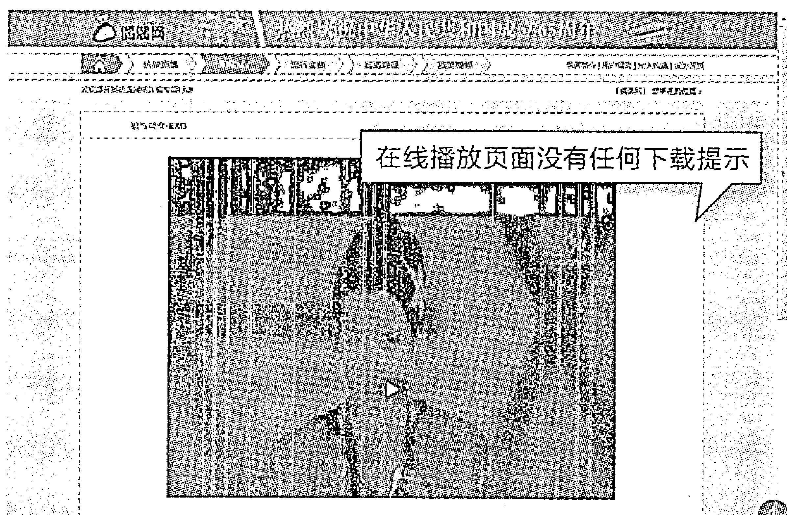

## 实例解读
#### SRSniffer下载网站加密视频

出于各种原因，网上一些视频没有提供直接的下载方式。不过由于这些视频可以在线播放，像偶偶网上就有很多MV没有提供下载，可通过SRSniffer嗅探获取下载地址。

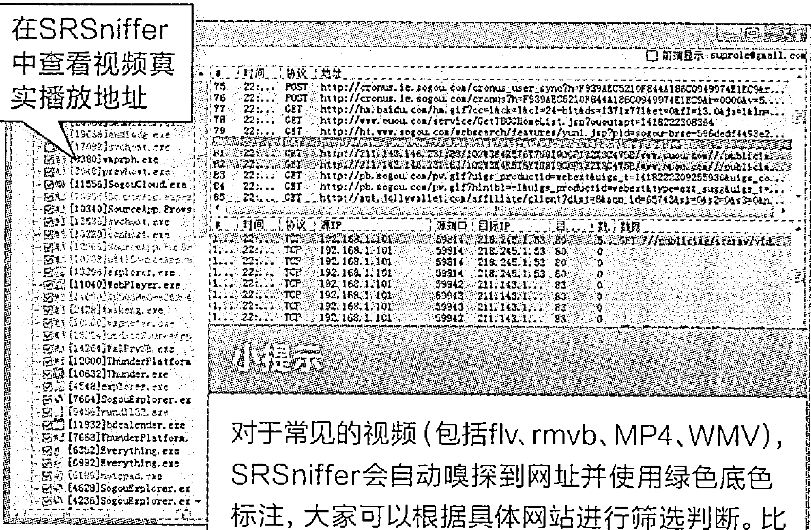

启动SRSniffer，点击“>”开始嗅探数据，接着启动浏览器播放在线视频(注意不要使用浏览器打开其他无关的网站，以免捕捉到过多的数据)。这里以http://tinyurl.com/mydxuem视频为例，在浏览器中开始播放视频后可以看到页面并没有任何下载地址(图1)。
开始播放后切换到SRSniffer窗口，在左侧窗格勾选需要嗅探的程序，为了减少干扰，一般只要勾选和浏览器进程有关的程序即可。此时在右侧窗格可以看到绿色下载资源，其中带.flv字样(http://www.ouou.com///publicimg/starmv/video/20141209langyumeinvEXO.flv)的就是当前视频的真实播放地址，右击选择“复制URL”(图2)。
新建浏览器窗口，然后将上述复制的地址粘贴到浏览器地址栏即可启动下载了(图3)。

对于常见的视频(包括flv、rmvb、MP4、WMV)，SRSniffer会自动嗅探到网址并使用绿色底色标注，大家可以根据具体网站进行筛选判断。比如现在视频网站标清、超清的视频大多为.flv格式，高清则为.MP4格式。当然如果不想看在线网站强加的片头广告，也可以提取网址，然后使用Windows Media Player(单击“文件→打开URL”)，输入获得的地址直接播放在线视频。

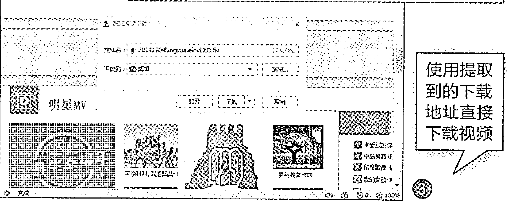

## 网盘下载 为何变蜗牛?
文|万立夫

### 特色及原理点评:

要想突破网盘下载的限制，首先需要搞清楚网盘限制的方法，这就需要说到User-Agent(UA)。UA其实是一种特殊的网络协议，在软件进行HTTP请求时发送到服务器，这样服务器就知道用户使用的是什么软件来访问的。就因为如此，现在很多网盘只允许用户用官方的客户端或者常见的浏览器进行下载，一旦遇到其他的下载软件的UA，不是拒绝访问就是下载缓慢。所以要想突破网盘的限制，只需要修改下载软件的UA即可。就好像把浏览器伪装成手机上网，从而可以过滤掉视频广告一样。

## 实例解读

#### 软件伪装下载

现在各种各样的网盘越来越多，而且有些网盘的功能越来越强大，比如在线播放、离线下载等功能一应俱全。于是很多用户采用一种变通的方法，先通过离线下载功能将文件下载到网盘中，再通过下载软件下载到本地硬盘。不过网盘往往对常见的下载软件进行了限制，这就需要对下载软件做一番伪装，从而突破限制了。

现在能够伪装UA的下载软件并不多，Free Download Manager(以下简称FDM)就是其中很特别的一款。

为了更好地激发FDM的潜力，首先需要对软件进行一番设置。点击工具栏中的“设置”按钮，在弹出的设置窗口中点击左侧的“新建下载项”命令，接着点击右侧窗口中的“高级操作”按钮。在弹出的对话框中点击“协议”标签，在“提交给服务器的识别名”列表中，可以看到一些常见的浏览器名称，这就是下载软件伪装的浏览器名称。伪装的浏览器名称包括IE浏览器、Opera浏览器等，这里选择最常见的IE浏览器测试（图4）。将下面的“使用Cookies”选项选中，最后点击“应用”按钮关闭该对话框，返回到下载软件的设置窗口。

点击左侧列表中的“基本设定”命令，在右侧窗口勾选上“使用内存缓存下载文件”选项，然后根据自己的内存大小设置后面的数值。一般设置为256MB或者512MB就可以了（图5）。

接下来点击左侧列表中的“网络”命令，在右侧窗口勾选“中流量模式”，然后将“流量限制”调整为80%即可。设置完成以后点击“OK”按钮，以后当我们通过IE浏览器打开网盘进行下载的时候，FDM就会自动获取到浏览器的Cookies信息，并且可以自动接管浏览器的下载任务（图6）。这样通过FDM下载软件，就可以高速下载网盘里面的文件了（图7）。

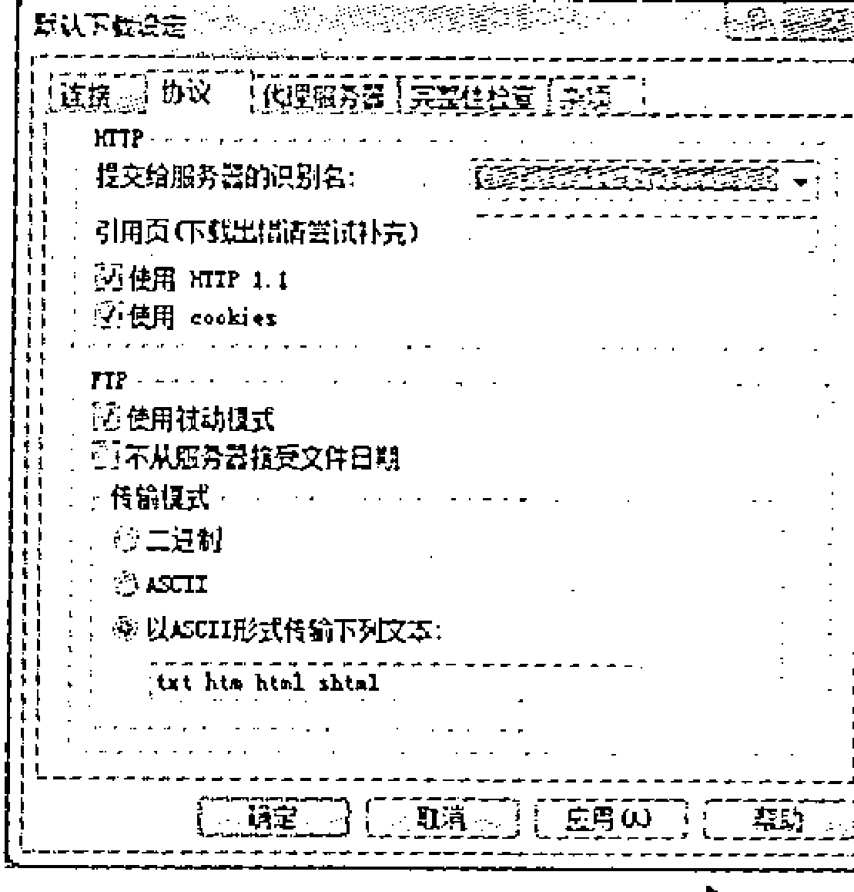

由于FDM是一款国外的下载软件，因此默认不能对UTF-8中文文件名进行识别，而是直接利用URL字符串的形式进行保存。不过现在利用网友开发的“FDM UTF8文件名自动重命名插件”可以解决这个问题，用户只需要将FdmRenamePlugin.dll插件存放到FDM安装目录下的Plugins文件夹，然后重新启动下载软件就可以了。

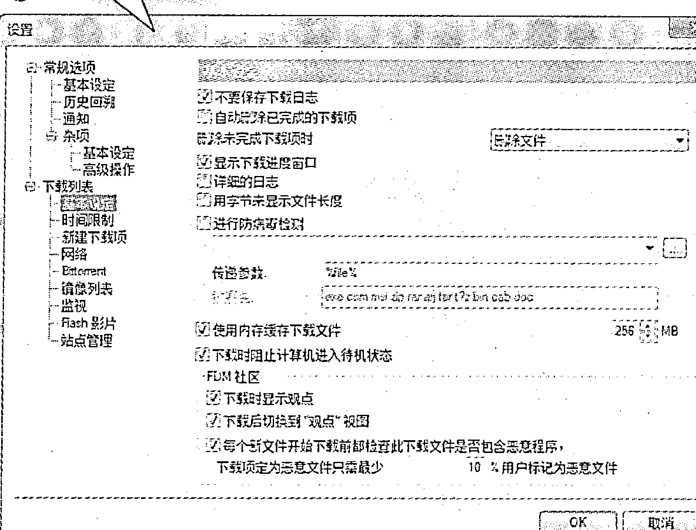

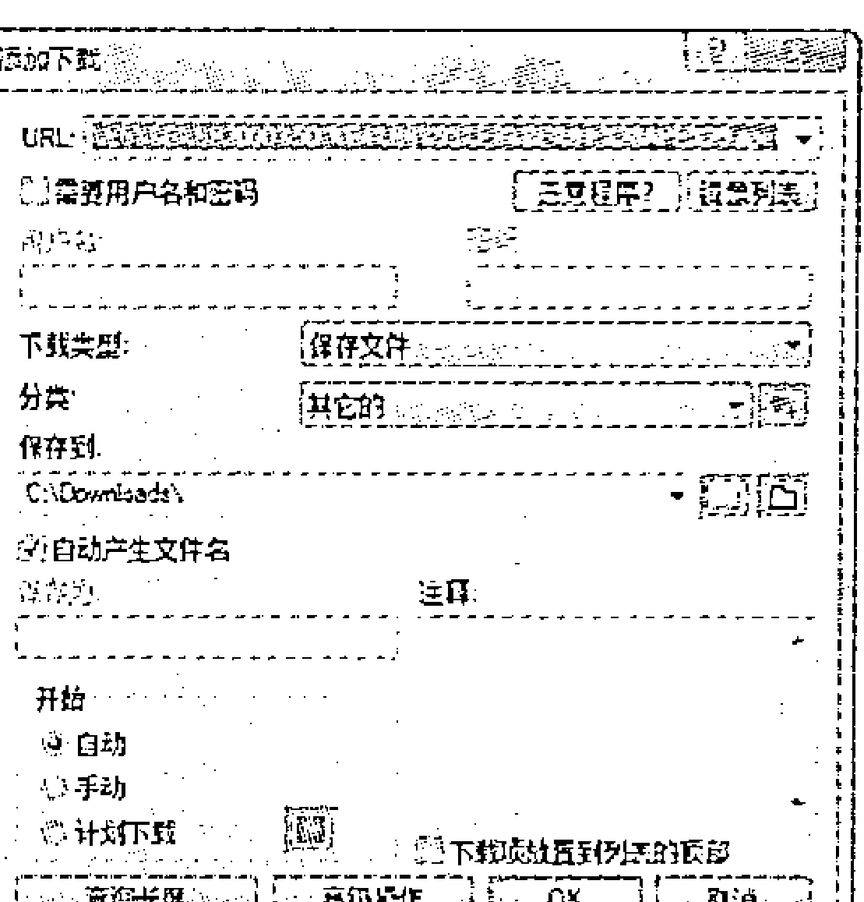

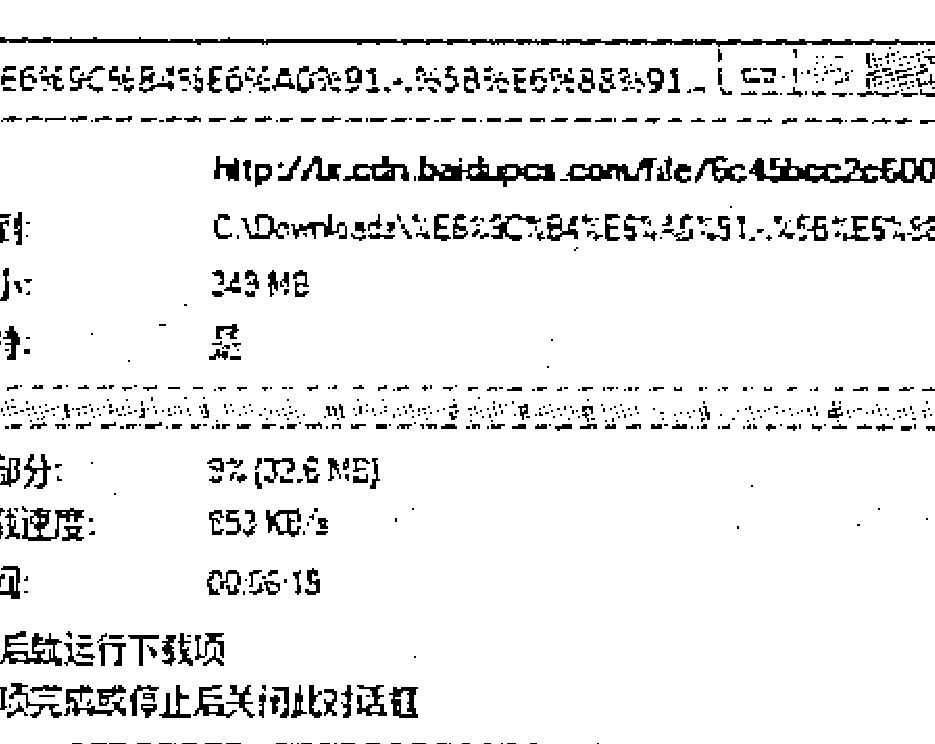

## 硬件出奇制胜
DIY领域产品的特色技术

台式机发展到今天，如果品牌旗下没有什么独门绝技，真的很难行走在DIY江湖当中。由于市场同质化现象过于严重，不出奇招很难出奇制胜。总有一些品牌或产品拥有自己的独门技术，同类产品与它们之间的差距相当明显。

### Intel HT
超线程技术

Intel自从奔腾4后期就加入HT超线程技术试水，在旗下酷睿和至强等产品上得到广泛应用。按照Intel的说明，HT超线程技术在不增加物理核心的情况带来10~20%的性能提升。

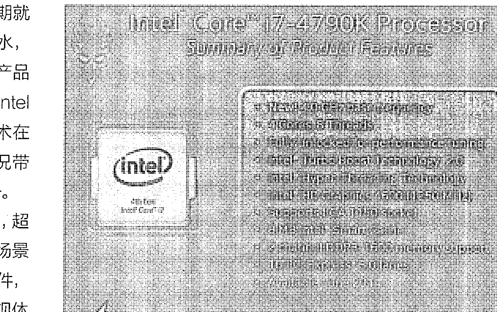

支持超线程技术是桌面版i7与i5的最大区别

对于普通家庭用户，超线程是否真如Intel所说的那么神奇？最常见的两个使用场景就是WinRAR这样的压缩解压缩软件和诸多视频后期软件，在开启超线程后确实会有10~20%不等的性能提升，直观体现在完成所需的时间上立竿见影。但在游戏领域又完全是另外一回事，绝大多数游戏对于多核心支持得并不好，在很多游戏还只是支持双核的当下，对超线程技术的支持更是无从谈起。玩家使用同一款CPU做过测试，有半数以上的游戏在关闭超线程技术时的平均帧数大于默认状态。这也让超线程技术在游戏领域十分尴尬。

不过随着2014年底游戏大作纷纷更换引擎，对PC硬件的压力达到史无前例的高度。不仅要6GB以上内存的游戏越来越多，切实支持处理器多核心（八核以上）的游戏也逐渐出现。对于超线程技术今后在游戏领域的表现是值得期待的。

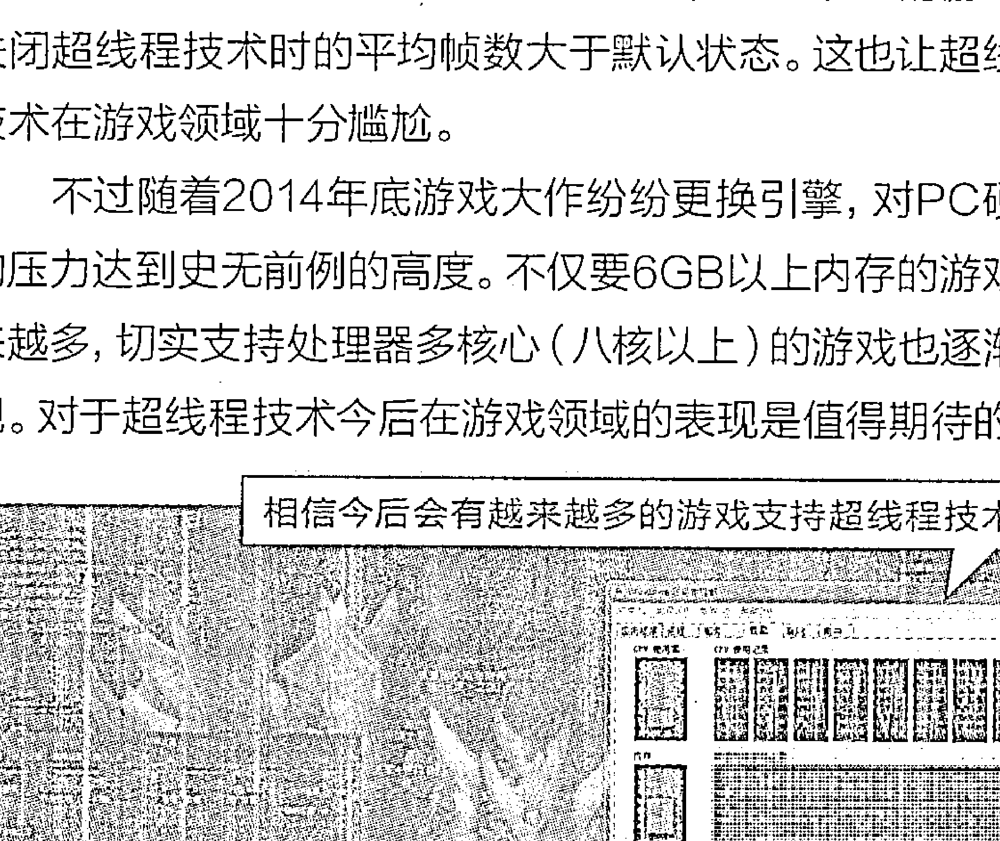

### 可以玩APP
的电源

DIY领域发展到现在，机箱内部任何一个配件几乎都能通过对应的软件进行检测和调节，但负责整个系统电力和稳定的电源依旧孤零零地位于机箱角落，显得格格不入。其实电源的运行状态、稳定与否对整个PC系统至关重要，甚至超过传统‘三大件’。

以往也有过通过PC前光驱面板安装控制台来监控电源的案例，不过那大多都是发烧友们自行改造实现，普通用户怕是难以企及。TT看准这一市场需求，推出80PLUS金牌的全模组电源Toughpower DPS TPG系列，不过规格高并非它的最大卖点，能够安装智能数位控制APP才是其独一无二的‘绝活’。

TT能够智能监控电源的软件名为DPSApp，可以在PC端实时监控电脑功耗、温度和风扇转速等基本信息，还可以根据电源监控的功耗来计算电费。所有这些信息都不是死板的文字表述，都通过简单明了的图形和图表展现出来，软件的使用程度和表现力甚至超过了很多传统板卡控制程序。DPSApp还可以智能化管理资料，并通过微博等平台分享，是不是有一种智能手机的感觉？在DPSApp面前，Toughpower DPS TPG系列80PLUS金牌和全模组设计反倒不那么显眼了。

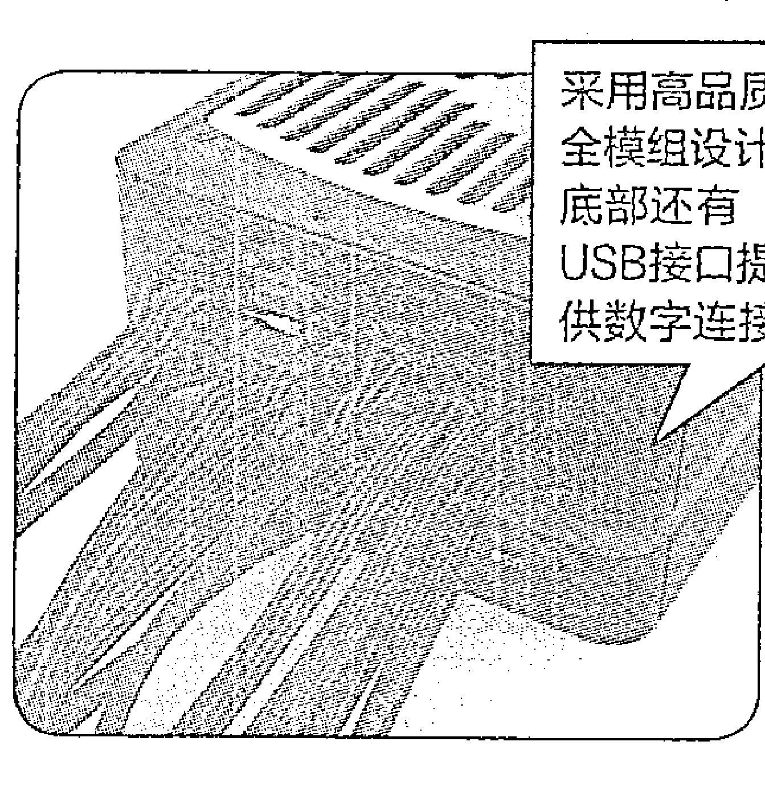

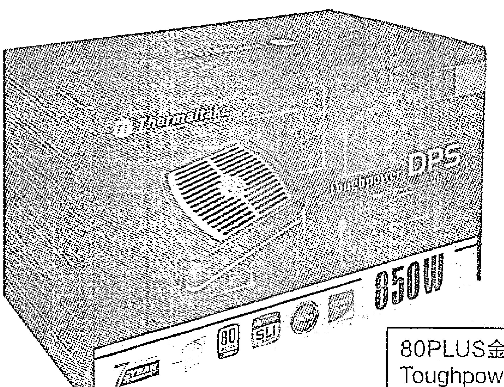

### SLC SSD的春天

固态硬盘在近年的发展突飞猛进，可供选择的品牌从最初的两三种发展到现在的数十种。为了能在庞大的SSD大军中脱颖而出，要不就在产品本身下足功夫，要不就另辟蹊径赐予产品更高的附加值。

SSD所用的闪存种类当中，SLC>MLC>TLC，这是由闪存颗粒的特性决定的。一般我们家用购买的都是中间这个档次的MLC产品，售价位于中游，性能也比较中庸。一般用户不会过分关心闪存种类问题，不过自从三星840 SSD系列开始使用TLC闪存，SSD闪存的老文件掉速问题也逐渐被用户重视起来。

富士通的至尊版系列SSD是他们最新的产品线，至尊版最大的卖点就是使用了Intel的SLC闪存。这类Intel 25nm SLC闪存性能比MLC闪存直接强上一个档次，而且寿命也远非MLC闪存产品可比。售价虽然并不便宜，但是比起顶级MLC产品，这样的SLC SSD更受爱好者欢迎。

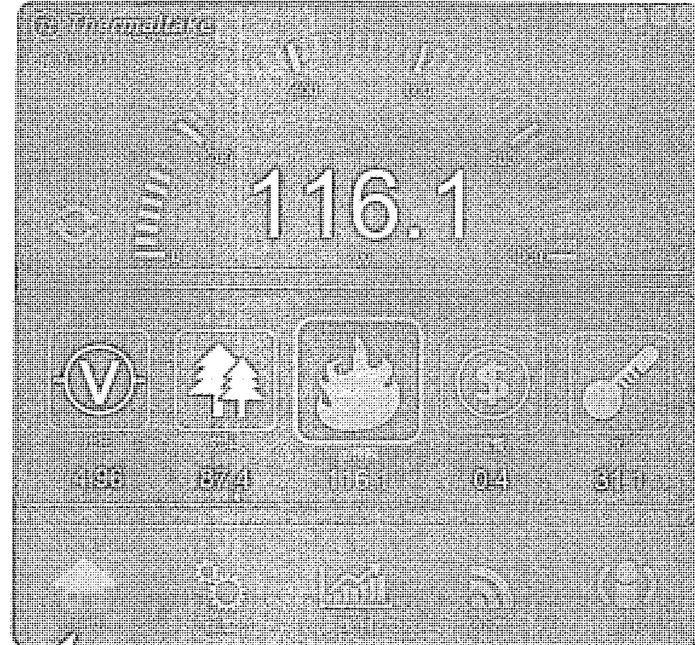

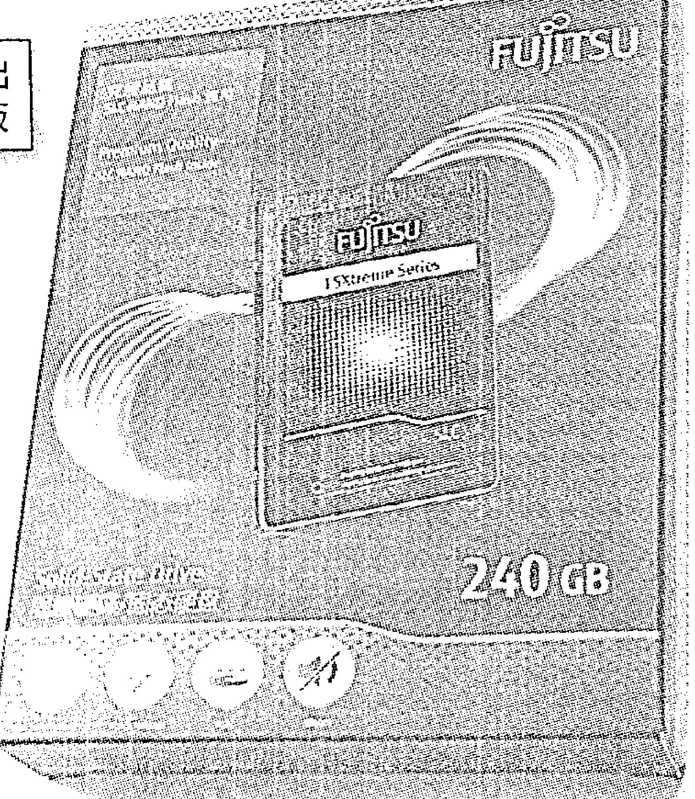

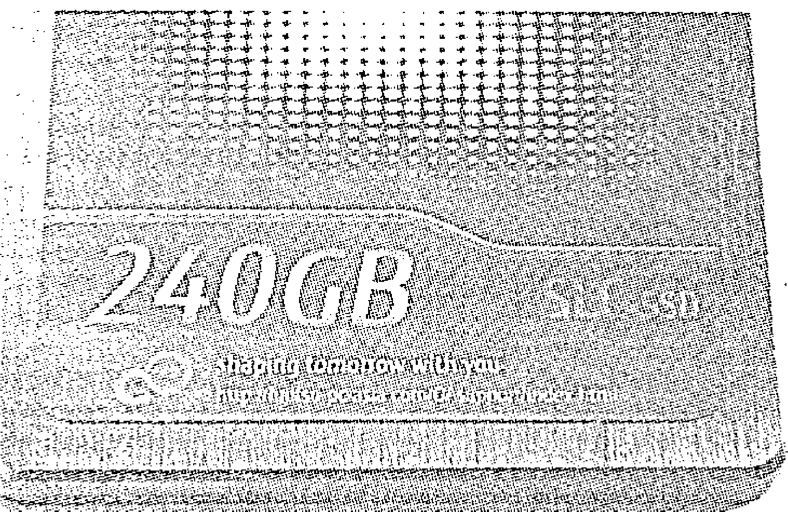

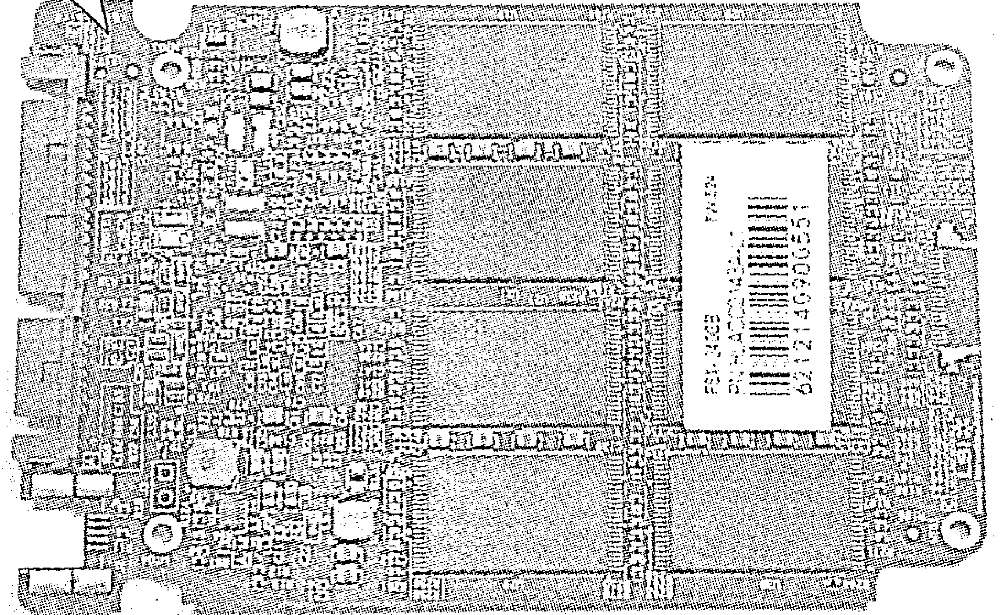


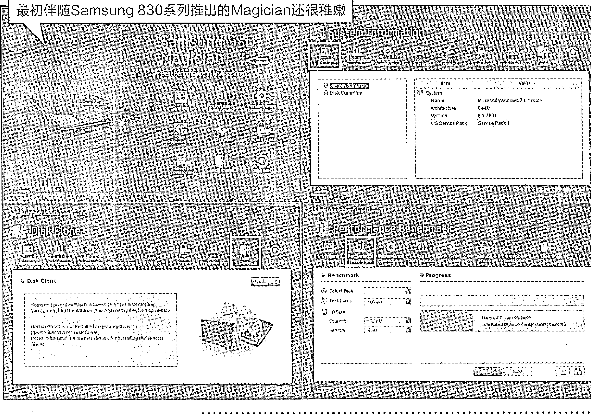

最初伴随Samsung 830系列推出的Magician还很稚嫩

三星的SSD从830系列开始让人眼前一亮，旗下每代产品的性能都在市售同类产品前茅。不仅性能出色，三星还为其打造了独特的软件，辅助用户操作和管理自己的SSD，这就是Magician。

Magician的功能经过几代进化更简单易用，很适合初学者使用。用户界面通过图形化的显示方式，可以轻松查看SSD的健康状态、SATA及AHCI的兼容性和状态。对于新手更有意义的是，软件提供3个优化配置文件，包括最高性能、最大存储量和最佳可靠性，我们通过选项卡就能从中切换。

这三个选项并非是噱头，是有实际功效的。最高性能选项以稍微缩短SSD使用寿命为代价获取最快的性能，它开启了一些需在SSD中进行额外写入操作的功能来实现提速。最大存储量功能可以自动去掉系统的休眠模式、虚拟内存文件和一些自动备份功能，释放SSD的大量空间，非常适合一些购买64GB或者128GB的用户。最佳可靠性将禁止运行会产生额外写入操作的功能，以有效延长SSD的使用寿命。如果用户使用的是840系列TLC产品，这个功能可以十分有效地减少SSD写入/擦除的次数。

三星通过Magician软件轻松满足三类常见用户的需求：寻求最高性能的用户、寻求最大存储量的用户和寻求最长使用寿命(可靠性)的用户。以往复杂的操作系统的相关设置，现在可以通过软件轻松实现。

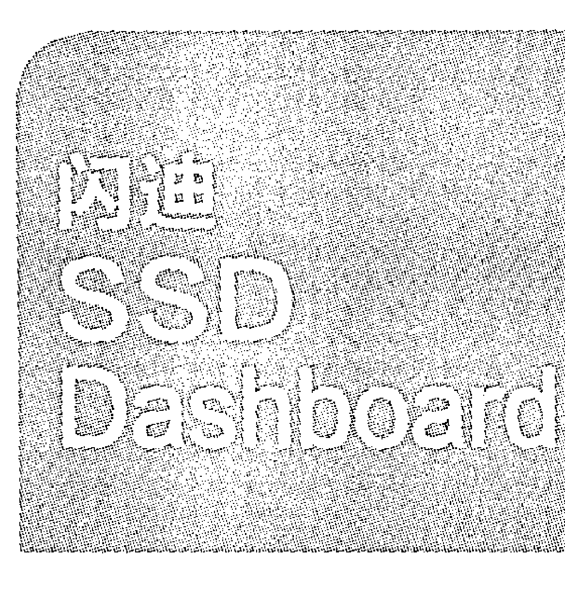

最早闪迪的SSD相关软件叫SSD Toolkit，不过当时由于界面不友好导致很难用。闪迪的SSD其实非常出色，但软件不好用难免美中不足，SSD Toolkit通过回炉重做变身为SSD Dashboard，各方面都有明显的改进。

SSD Dashboard的界面做得比较美观，而且功能也非常完善，通过图形化的界面，让用户监控了解SSD的运行状况。界面包括SSD状态、性能、工具、设置等功能，状态中可以查看硬盘的容量、剩余使用时间等等基本状况，温度和接口信息也可以显示在内。性能一项提供了SSD的性能测试，和主流测试软件一样也分为传输速度及随机性能，但比起其他测试软件密密麻麻都是文字的方式，SSD Dashboard以图表的形式直观呈现给用户。关于TRIM在一些操作系统中很难打开的现状，闪迪软件可以通过一键开启系统TRIM的功能十分适合新手。

工具中的Secure Erase、Sanitize、Cypto Erase不能乱点，是闪迪提供的三种SSD擦除功能。固件更新功能也非常方便，不用像以前那样去官网手动下载固件然后冒险升级，在这里就像更新手机APP一样操作就能完成SSD固件的更新。除此之外工具也提供了硬盘的S.M.A.R.T信息查看，有了这款软件我们就可以抛弃HDtune了。

从SSD Toolkit到SSD Dashboard，能很明显看出闪迪SSD软件的进步。虽然SSD Dashboard只支持闪迪硬盘比较可惜，但作为一款品牌SSD的功能软件已经相当出色了。

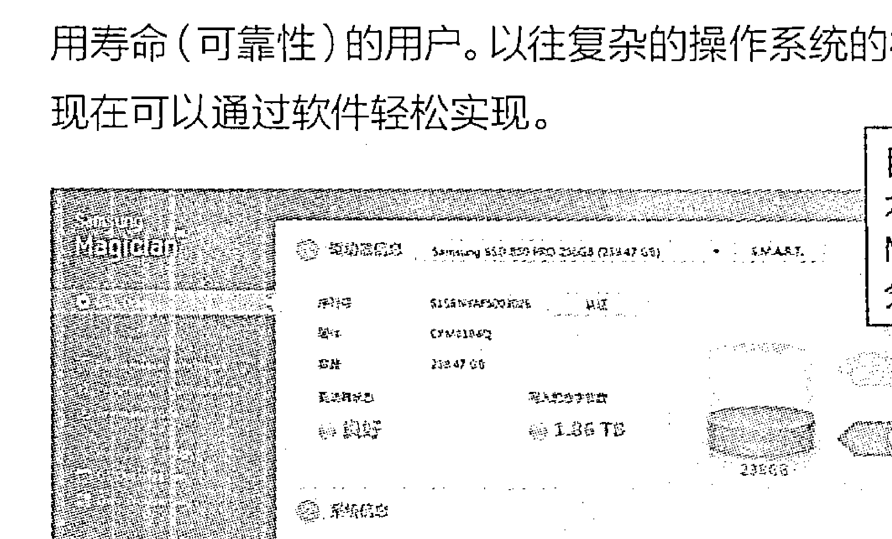

目前最新版本的三星Magician十分美观实用

### 希捷混合硬盘
SSHD

希捷是传统HDD硬盘双雄之一，近几年传统硬盘被固态硬盘冲击严重，老牌硬盘厂商希捷虽然也推出了旗下的SSD，但市场反响不温不火。去年间接收购了两大主控之一的SandForce，但融合之后的实际产品还需时日才能推出。眼下希捷如何应对SSD对硬盘市场的攻势呢？答案就是SSHD。

SSHD主体依然是盘体与磁头，不过在SSHD的PCB上集成了一个SSD模块主控和小容量MLC闪存，SSHD的核心技术就是通过这个独特的设计实现。首先通过一种名为Adaptive Memory的技术实现一种自学习算法，它逐渐让系统最常用的应用程序和文件能够实现类似SSD的响应。比如说操作系统或者程序启动时会读取大量零散文件，HDD由于寻道原理速度有限，而SSHD将这部分压力转至闪存，启动和读取速度能够大大加快。

希捷的这种“SSD缓存记忆”技术其实并没有改变HDD的持续读写速度，而加强了随机性能。在最新一代SSHD当中希捷甚至将盘体转速降为5400rpm，而单单加强了主控方面的学习和记忆能力。有人可能会质疑5400rpm盘体的性能，但其实希捷如此处理是十分合理的。我们日常使用硬盘感觉到慢，十有八九是其随机读写性能满足不了我们的要求，绝非持续读写速度跟不上。如果用户的硬盘位只有一个，又想在硬盘容量和随机性能上有所兼顾，希捷这类SSHD是非常合适的。

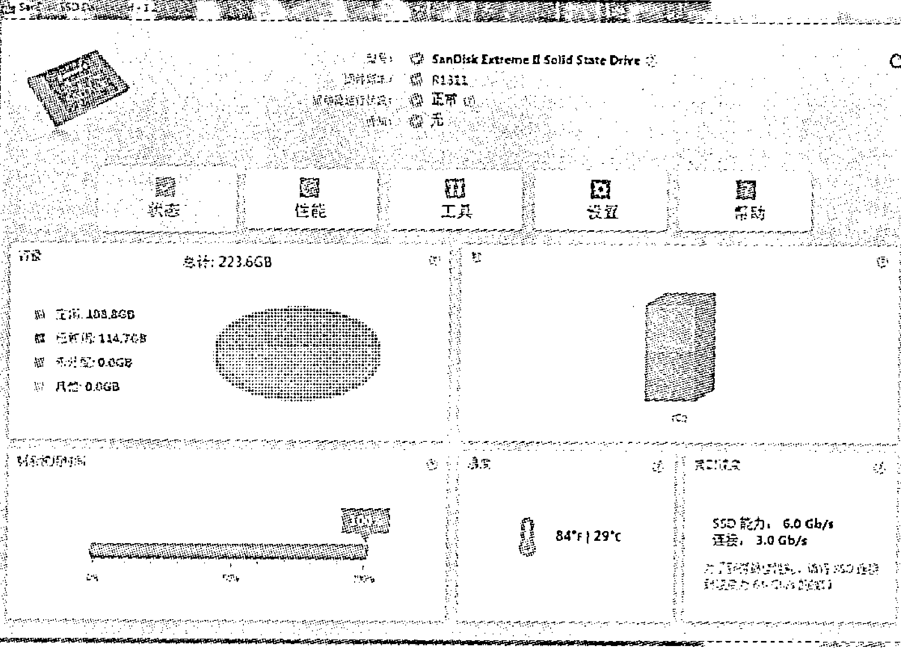

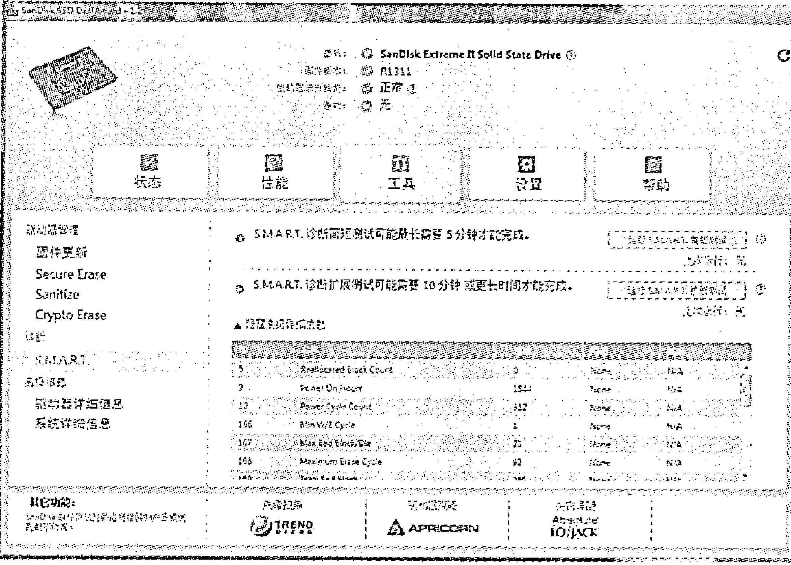

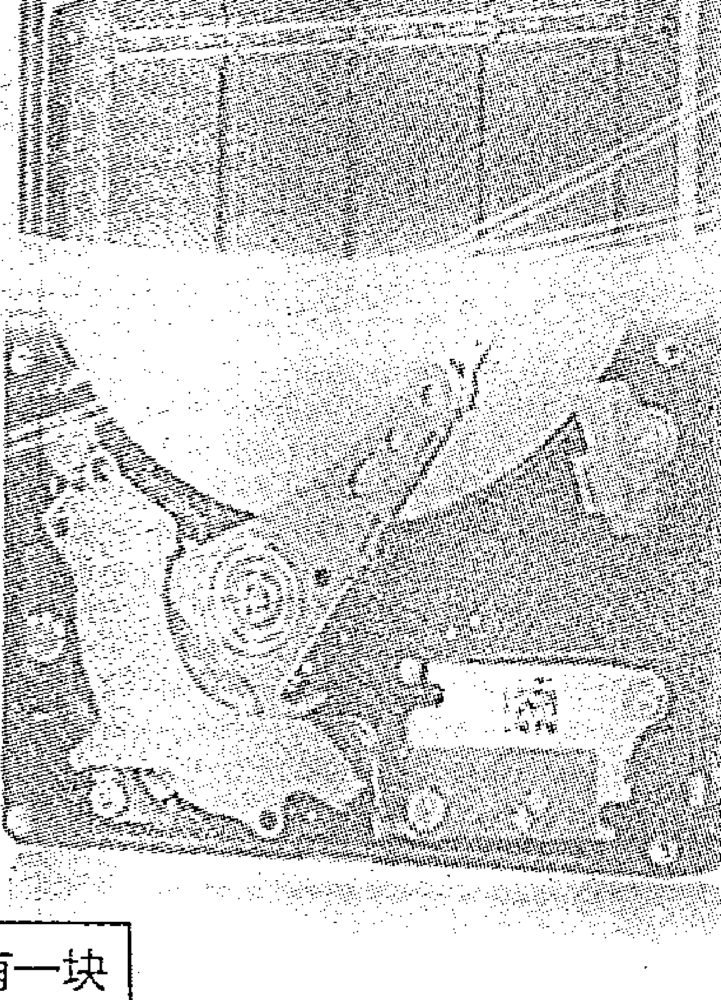

集合HDD和SSD优势于一身的SSHD

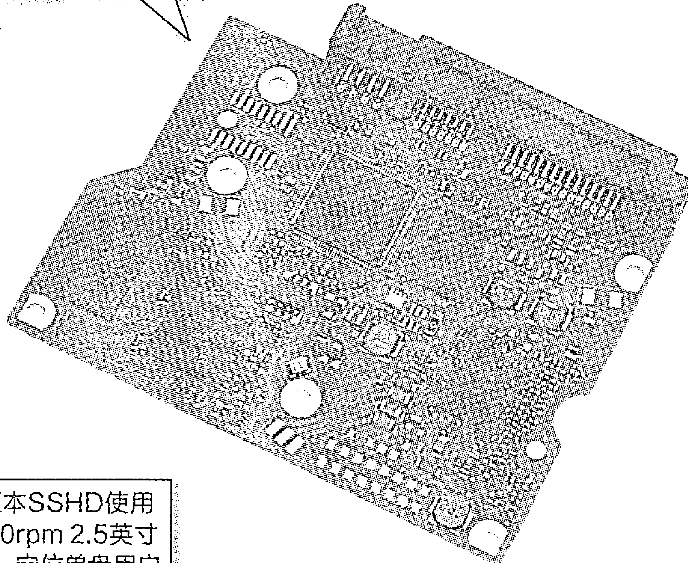

实际PCB上面拥有一块ASIC主控和东芝闪存

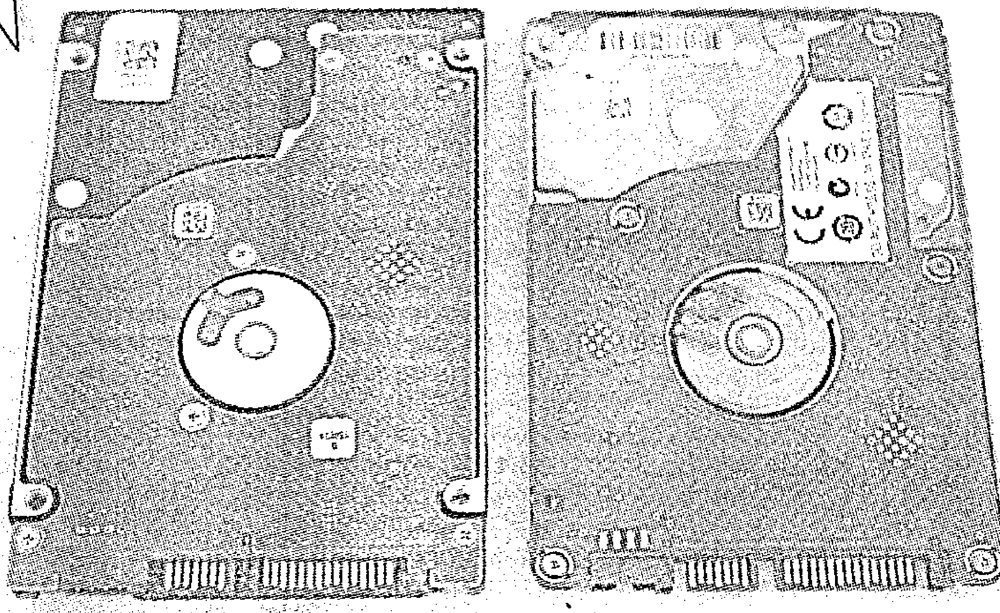

新版本SSHD使用5400rpm 2.5英寸盘体，定位单盘用户

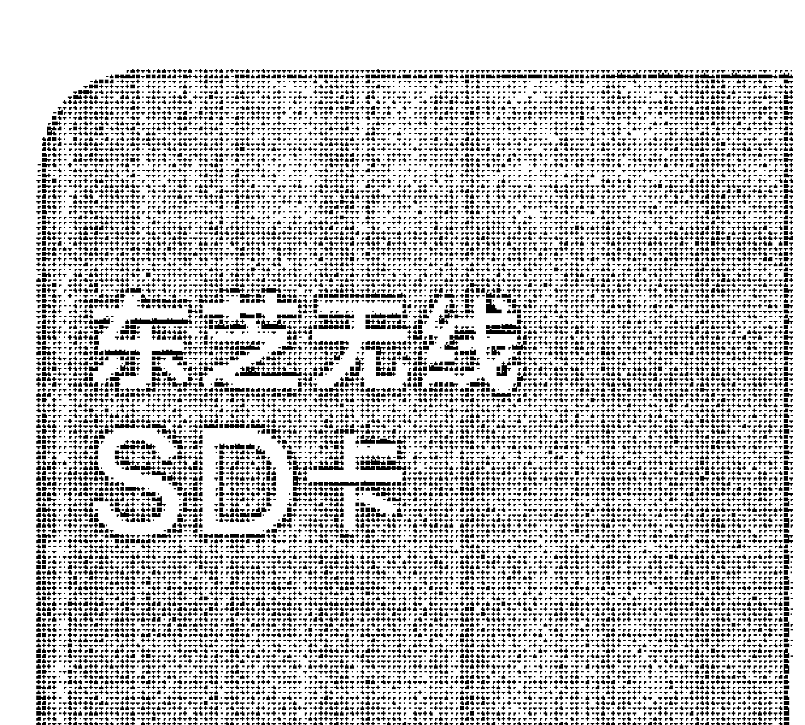

我们用单反照相，然后想把相片从相机存储卡里拷贝到手机或者平板电脑上观看，一般大家都怎么做？最原始的方法就是把存储卡取出，先将数据移至电脑，然后将手机/平板接入电脑拷入观看，这个步骤太麻烦了。后来有部分单反/微单品牌设计了独特的移动智能终端APP，旨在简化取卡步骤，直接用手机/平板访问相机存储内容，不过需要在同一个Wi-Fi环境下，同时移动端是否支持还需APP决定，总之多种限制并不方便。

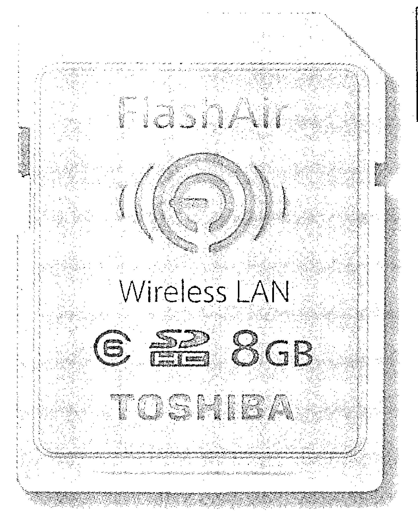

东芝推出的这种无线SD卡解决了这种问题，SD卡从硬件上解决了无线连接问题。只需将SD卡插入相机并开机，打开手机或者平板电脑的无线开关，搜索到无线SD卡提供的无线网络连接(flashair_xxx)，输入初始密码连接后打开浏览器就形成了连接。一般4MB左右的照片传输一张需要8秒左右，速度虽然不快但也不比很多相机无线传输APP慢。

问题也并非完全没有，首先部分单反机身由于是金属构造，无线SD卡形成的网络信号肯定会受此影响，速度和稳定性有待进一步提高。其次SD卡和其无线功能所需的电力肯定是相机提供，有很多相机屏幕自动关闭时进入省电模式，此时无线SD卡的无线功能也会随之一同关闭。最后比较关键的一点是由于手机或平板电脑在传输时连接的是无线SD卡形成的虚拟网络，并没有互联网功能，如果想边传边分享就是硬伤。手机可以利用3G信号，而多数平板电脑只能乖乖等传输完毕后才可以重新连接Wi-Fi进行分享。

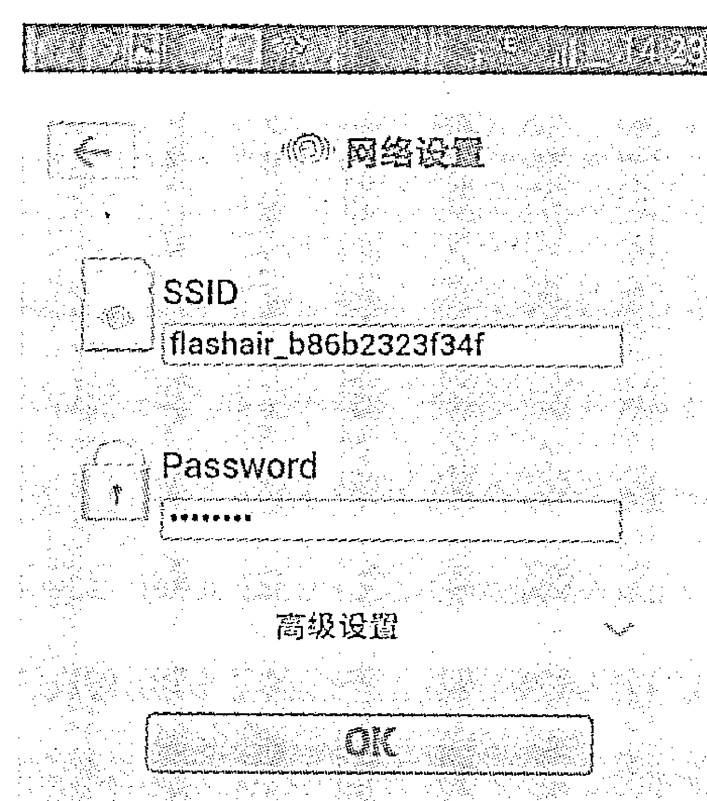

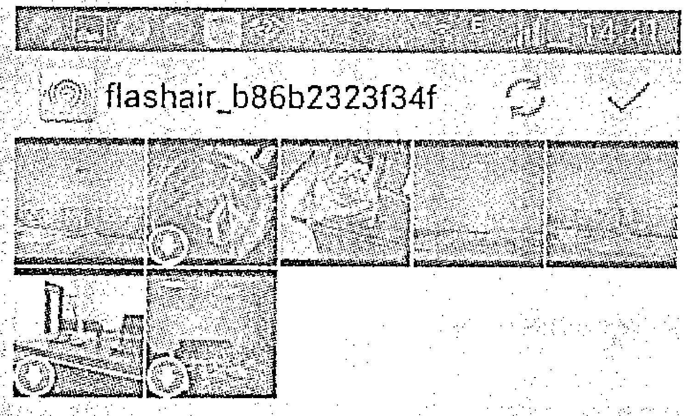

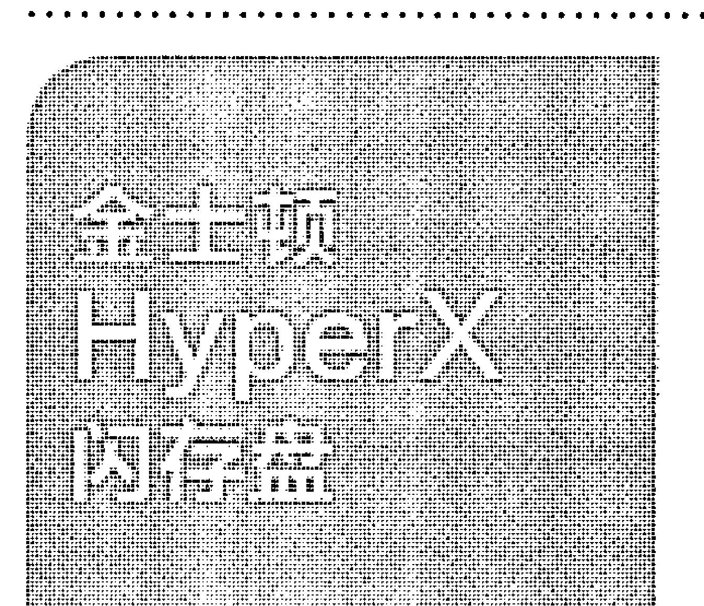

大家印象里的闪存盘（U盘）的读写速度是多少？一般也就是30-40MB/s这个程度，满足一般的文件拷贝似乎问题不大，但高端用户肯定无法接受如此缓慢的传输速度。金士顿旗下的HyperX品牌是其高端的存储品牌，而现在HyperX也推出了顶级品质的闪存盘DataTraveler HyperX Predator。

DataTraveler采用USB 3.0接口，它没有像其他USB 3.0闪存盘一样只是规格上支持，在读写速度上标称可达240MB/s和160MB/s，完全突破了USB 3.0能够达到的速率。外观方面金士顿的解释是大巧不工，金属外壳方方正正的造型，十分符合其高端大气的身份。容量方面金士顿提供了512GB和1TB两种容量，4999元和9999元的售价也吓跑了大多数用户。

不过DataTraveler HyperX Predator的表现配得上这样的价格，多种软件实测其读写速度并非虚标，一部10GB左右的电影通过闪存盘不到1分钟就可以传输完毕，这是很多移动硬盘都难以实现的。

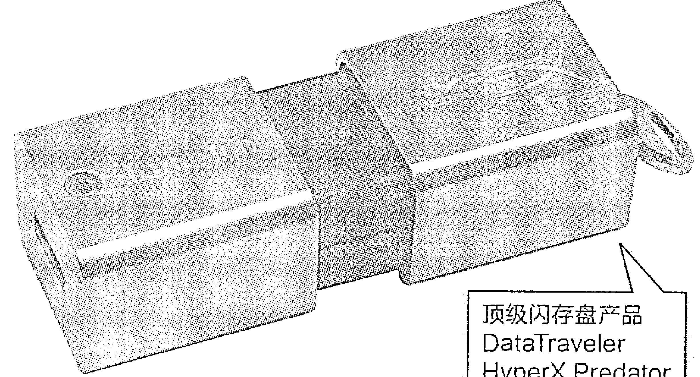

要说键盘，这两年机械键盘火了。机械键盘本来是在薄膜键盘之前的产物，但随着薄膜键盘的盛行，造价相对高昂的机械键盘被薄膜键盘所取代。但近年来由于用户对外设品质的要求逐渐提高，机械键盘的关注度正慢慢回升。目前市面上常见的机械键盘均使用德国Cherry公司的MX机械轴，爱好者们俗称樱桃，拥有标志性的十字口设计，目前我们见到的大多数机械键盘其实都属于这一派系。根据种类分为茶轴、青轴、黑轴以及红轴四种，也有白轴等稀有品种。用文字描述机械键盘与普通键盘的区别稍有难度，由于每一个按键都由一个独立的开关组成，按键的段落感根据轴体各异，但普遍都要大幅超越薄膜键盘。现通常为高端游戏外设，希望有条件的用户亲自体验。

可能很多用户连光学引擎鼠标和激光引擎鼠标都分不清楚，现在微软又来了个号称集合二者优势于一身的蓝影鼠标，它们之间究竟有何区别？它们都该称作是光学引擎，不过不同的捕捉原理决定了光学鼠标必须借助鼠标垫，而激光鼠标则能够在更多的表面上自如使用。微软全新推出的Blue Track蓝影技术更是要超过激光引擎，利用激光引擎的镜面反射原理，通过更强的光学传感器每秒钟拍摄数千张，经过对比最终得出鼠标移动的轨迹。蓝影技术的表面适应能力超强，定位能力比激光更为精确，在一些粗糙的表面依旧可以准确定位鼠标移动。

## 那些移动领域的不传之秘

在智能手机和平板电脑的“搅局”下，传统PC的计算霸主地位受到了严峻的挑战，因为用户无需固守在电脑桌前，无论身处何地都可借助掌中设备去解决学习、工作和生活中的各种问题。然而，在竞争更为激烈的移动市场，唯有“掌握核心科技”才能更好地立足和生存。

## 手机屏幕不简单

对智能手机而言，最能彰显品牌技术底蕴的并非CPU、内存和摄像头等参数，因为这些硬件都可公开批量采购。而真正的“独门秘籍”往往存在于整天与我们眼睛打交道的屏幕身上。

### 独特的曲面形态

提到“曲屏手机”，相信大家的第一反应就是LG在2013年底推出的“G Flex”，这款手机将聚合物有机发光二极管（POLED）显示屏和弯曲OLED面板安装在塑料基板上（没有安装在玻璃上），而且还选择了由堆叠与褶皱专利技术设计而成的弯曲形电池组，最终赋予了G Flex独特的外形和耐用性（图1）。

然而，2014年中旬三星推出的Galaxy Note Edge，则将“曲屏手机”的概念再进一步。Note Edge在2K级别屏幕的侧面再添加160像素的曲面屏幕，这个区域可显示系统通知、应用菜单、健康信息等不同的内容，作为“扩展屏幕”的形式独立存在（图2）。如果说LG G Flex弯曲的初衷是让用户获得更佳的持握感并提高通话质量，那么三星Note Edge弯曲的意义就在于开创了全新的使用体验和生态系统，借由APP去挖掘侧屏在功能和易用性上的潜力。虽然现在可充分发挥Edge侧屏优势的APP不多，但这种创新的技术却值得我们肯定。

### 艳丽的AMOLED屏幕

在“IPS”一统智能手机和平板电脑江山的今天，三星特有的“AMOLED”（如今以Super AMOLED为主）就显得有些鹤立独行了。用惯了三星Galaxy S或Note旗舰系列手机的用户，再接触其他品牌手机时往往很难适应：屏幕色彩不够艳丽，纯黑背景会有漏光，可视角度似乎也要下降不少。究其原因，则是AMOLED屏幕的每个像素点都能自发光，可呈现出超过90%的Adobe RGB色彩范围。此外，AMOLED还可完全关闭单个像素的亮光，使其对比度轻松超过100000:1。以上特性造就了AMOLED的独特优势：自发光无需背光灯（省电）、无视角盲区、色彩极为鲜艳、可完美显示纯黑的画面（图3）。当然，也有部分用户会觉得AMOLED屏幕的饱和度太高画面有所失真，但瑕不掩瑜，在与IPS屏幕的对比中，更多用户还是会偏向更讨好用户眼睛的AMOLED。好消息是，AMOLED并非仅被三星独占，其他品牌也可采购并武装到旗下的产品中。包括金立ELIFE S5.5/S5.1、OPPO R5和VIVO X5 Max（图4），这些主打极致纤薄的新品清一色都采用AMOLED。原因就是AMOLED更好看，而省电的特性，也能弥补超薄手机电池容量偏低的缺点。
总之，智能手机的硬件规格再高，只能体现在跑分和极少数大型游戏的体验中。而源自屏幕的技术创新和功能特色，则是最能打破消费者心理防线的卖点。

## 符合国情的双卡双待

虽然很多手机玩家会图便宜选择非正规渠道的水货，但更多的手机用户却钟情于国行产品。原因无它，国行手机大都支持“双卡双待”，而这个功能也就成为国内手机的“独门秘籍”。

### 最符合国情的功能

国外的运营商大都支持“携号转网”，用户完全可以根据资费和网络质量随时“倒戈”。而国内的通讯市场处于中国移动、中国联通和中国电信三足鼎立时代，不同的网络制式导致了设备间的兼容性问题。因此，以“全网通”、“双4G”、“双卡双待”等功能为卖点的手机在国内遍地开花。其中，可以安装更多SIM卡、支持更多4G网络的双卡手机自然成为了国内用户眼中的香饽饽。以三星历代的旗舰手机为例，都会针对各大运营商推出定制的双卡版。

### 双卡里面秘密多

虽然国内双卡双待手机不计其数，但它们在功能和技术上依旧存在很大差距，成为各大品牌彰显实力的舞台。首先是SIM卡槽，为了尽可能将手机打造得更轻薄，可同时容纳2个SIM卡的卡托已成趋势。如果能让某个卡槽选择性地安装SIM卡或TF存储卡，无疑是独门秘籍的体现所在了（图5）。

进入4G时代后，“双4G”成为很多双卡手机的卖点。但双4G的背后也大有乾坤。如某些手机只有主SIM卡位支持双4G，而辅SIM卡位仅支持2G。哪怕两个SIM卡都支持4G的手机，在使用上也存在一定限制。以华为Mate7顶配版为例，2个SIM卡槽均支持联通或移动4G/3G/2G网络，但同时只能指定一个卡槽使用4G网络（另一个卡槽自动切换到2G），在相关设置界面可手动进行软切换（图6）。

> 小提示
>
> 是否支持“双通”功能，也是考验双卡手机的准绳。简单来说，双卡双待单通手机在A卡通话时，B卡就会一直处于通话中；而双卡双待双通手机，A卡和B卡则可同时接通电话，随时进行手动切换。

## 旋转摄像头和闪充技术

自iPhone 5S开始，指纹识别技术已经在智能手机领域普及，不算是什么“独门绝技”了。因此我们不妨将目光投向那些更能激发“荷尔蒙”（购买欲望）的创新技术吧。

## 为自拍而生的旋转摄像头

对以女性为代表的时尚达人而言，智能手机的性能可以不是最强，但自拍的照片一定要是美美的。于是，智能手机逐渐走进了强化自拍的发展轨道上。可惜，限于机身结构的束缚，前置摄像头的规格往往不如后置摄像头，而这也就影响了最终自拍的成像效果。为此，有些自拍手机给前置摄像头添加闪光灯（图1），还有很多手机引入了旋转摄像头的概念，前后都能“共享”同一规格的摄像头。

其实旋转摄像头的历史很悠久，“功能机”时代的三星SGH-D828、诺基亚3250等手机就已配备了可180度旋转的摄像头。在智能手机时代，OPPO N1/N3无疑将旋转摄像头发挥到了极致，特别将手动旋转升级为电动旋转的N3，凭借精密的步进马达能以0.012度进行旋转拍照（图2），进一步增强了自拍体验。除了OPPO，朵唯推出的“逆客影像手机”也采用了旋转摄像头，只是该摄像头的旋转角度不如N1/N3，在旋转的结构上也不够精密和美观（图3）。

## 享受更快速的充电速度

对热衷微信、微博、QQ、游戏的手机玩家而言，很多智能手机连“一天一充”都做不到了，如何利用碎片化时间尽可能帮手机恢复电力就是重中之重了。而来自OPPO的“VOOC闪充”就是迄今为止手机领域的最佳解决方案。我们知道，功率（P）=电压（U）×电流（I），在电池电量不变的情况下，功率大小就等同于充电速度。而“VOOC闪充”的工作原理则是低电压高电流，并使用并联电路的方式进行分流，在保持5V电压不变的同时，将充电电流提升到了4.5A~5A（图4），从而大幅缩短电池的充电速度，只需30分钟即可充满75%的电量（以3000mAh电池为例）。

为了避免安全隐患，“VOOC闪充”需要对手机、电池、充电器进行重新定制。比如，将USB接口的针脚数量从5pin增加到7pin，充电器内加入MCU智能芯片以判断连接的手机是否符合闪充标准，在手机和电池内部也要设立安全防护机制，在电压或电流失控的时候进行调节和掐断。由于限制颇多，“VOOC闪充”技术目前也仅是OPPO独家的技术。

好消息是，今后所有采用高通处理器设计的手机也有机会拥有类似“VOOC闪充”的快速充电能力，而高通则将其称之为“Quick Charge 2.0”。和VOOC以增加电流提高充电效率的方式不同，Quick Charge 2.0选择了增加电压的方式，可通过从5V加压到9V或12V以缩短充电时间。高通表示该技术能在30分钟内为一款电池容量为3300mAh的智能手机充入60%的电量（图5）。可惜，Quick Charge在手机端和充电器端的技术还不成熟，仅有少数手机（如nubia）支持Quick Charge 2.0中的9V快充（还不支持12V），而且还需要另配专用的充电器。

## 用于“保命”的防水绝技

当移动设备用过一段时间后，其内部保存的数据和信息的价值，往往已经超越设备自身的价格。因此，能为设备寻得一项“保命绝技”就显得尤为重要了。

## 还原防水手机的秘密

在智能手机领域，防水功能并非某一品牌的独门绝技，早有摩托罗拉Defy，今有索尼、三星（S5）和LG（G3）等品牌的旗舰产品（图6），而这一功能也有望成为未来更多高端手机的标准。然而，迄今为止能将防水技术贯彻始终的，还要数索尼旗下的手机和平板们：论及防水手机的数量，索尼一家的产品要比其他品牌防水手机捆绑起来还要多（图7）。因此，将防水功能视为索尼手机的独门绝技也并不为过。

那么，手机是如何实现防水功能的呢？答案就源于隐藏在手机外屏（保护玻璃+触控屏）、LCD显示屏、边框、主板、电池、后盖等组件内的防水胶条和密封圈，以及防水纳米涂层等技术的帮忙了。需要注意的是，切忌拿防水手机蒸桑拿，因为桑拿过程温度和湿度会导致塑料膨胀和防水胶老化（破坏密闭结构）、玻璃内产生水雾或水滴（电路杀手）。

> S5应该是最被国内用户熟悉的三星品牌防水手机了
>
> 把防水功能引入民用平板领域的，目前也只有索尼一家

## 那些防水的“小玩意”

除了手机和平板外，防水功能也逐渐被更多移动设备所接纳，比如来自HTC旗下的RE相机（图8）。这款小玩意支持IPX7级别防尘防水，可在水下1米正常工作30分钟。如果购买了镜头盖和电池挡板等配件，则可将防水级别提升至IPX8（3米深的水下工作2小时）。就防水能力而言，HTC RE的表现足以让以“极限运动专用相机”自居的GoPro汗颜。
在防水功能未完全普及的今天，拥有这一“保命绝技”的设备应该值得我们尊敬。当遇到暴雨等极端天气时，支持防水的它们可以让你轻松应对各种突发情况。

在过去的很长一段时间内，以英特尔和微软为代表的“Wintel”阵营曾被ARM+Android阵营折腾得不轻，几乎失去了对移动设备的话语权。然而，在刚刚过去的2014年，各种Wintel平板终于得以翻身。而这背后，则是源于英特尔和微软的最新绝招。

## 上下通吃的移动版Windows 10

作为Wintel联盟成员，微软也将为Windows赋予最新的绝技。据最新的消息表明，微软将针对手机和平板等设备推出“Windows 10移动版”，该系统不仅支持X86架构处理器，还提供了对ARM处理器的支持（以高通旗下CPU为主）。此外，移动版的Windows 10还有可能直接安装和运行Android系统的APK程序，从而解决触控APP资源匮乏的窘境。令人欣慰的是，Windows 10移动版甚至还可能完全免费，进一步降低用户的投资成本。
我们可以将Windows 10移动版看做是Windows Phone和Windows RT综合版，它可能会失去对exe程序和传统桌面的支持，并仅能运行Windows Store和Metro Style里的应用，但有望将ARM和APK两大卖点集于一身的新系统，无疑是值得期待的。今后可在不同尺寸的设备上，体验到相同使用风格的Windows（图10）。

## 以工艺支撑横扫天下

X86架构处理器性能强悍，但功耗奇高；ARM架构处理器性能偏弱，但贵在省电。这是业内公认的事实，在手机平板变得越加纤薄之际，按理说X86处理器是没有机会进驻移动设备体内的，但英特尔却凭借制程工艺的领先优势做到了。
我们都知道，制程工艺越先进，可以在相同面积的晶圆上切割出更多的CPU从而降低成本（图9），还能在CPU内部集成更多晶体管来提高性能，最重要的是还可进一步降低CPU功耗和发热量。目前ARM阵营最先进的支撑工艺仍以28nm为主，而英特尔针对移动设备定制的BayTrail-T处理器已经更新到了22nm，最新推出的酷睿M更是进化到了14nm。在工艺上的绝对优势，已经将X86与ARM在功耗之间的差距抹平。有了独步天下的工艺技术，英特尔在2015年的表现值得期待。

> 微软在2015年1月21日才会发布更多有关Windows 10移动版的消息，其具体功能和特性可能与本文介绍的有所出入。

## IT侦探

## 寻找IT的“蛛丝马迹”

策划《电脑爱好者》编辑部

随着网络及各种终端设备的普及，一条微博、一张图片、一段留言，都有可能留下“蛛丝马迹”，或者帮你找到需要的信息，或让别人锁定你。换句话说，通过各种“蛛丝马迹”，我们可以玩出很多花样呢！此外，当软件或硬件即将出现问题前，也会出现种种征兆。透过这些蛛丝马迹般的征兆，一方面可以做到防患于未然，将问题扼杀于摇篮中；出现问题时也可根据这些蛛丝马迹迅速锁定问题源头，并作出最合理的解决方案。

> 当电脑出现各种问题时，通过蛛丝马迹，可以寻找到问题的根源
>
> 通过蛛丝马迹，可以寻找到问题的根源

很多人都不太注意细节问题，随便在某些论坛注册、发言；随便在微博上透露自己当前的位置信息；随便就上传自己的照片等等……实际上，这些在互联网上传播的信息或多或少都会存在一些“尾巴”（蛛丝马迹），而一些有心人，总能利用这些信息挖出让你意想不到的内容！这是蛛丝马迹中隐藏的风险。
当然，蛛丝马迹，说白了就是一种线索，善加利用，沿着这一线索，我们也可能找到一些信息，为我所用。

文|平淡

## 明察秋毫
找出用户的幕后软件

在论坛中我们经常会看到很多网友炫耀自己电脑或手机的桌面效果，可是这些网友又爱卖关子，不肯说出自己使用了什么美化软件。其实类似这种查找软件来源的方法，借助用户信息中留下的蛛丝马迹，即可找出他使用的产品。

### 查特点找出幕后美化软件

在某美化论坛可看到一款漂亮的3D主题桌面，但作者却没有放出主题下载地址，宣称只有获得1000个回复才开放下载（图1）。
首先观察一下桌面，上方的工具栏显然是模仿苹果专用的Dock工具栏，中央则是圆形的透明面板，可初步判定这是一款仿苹果的美化软件制作的桌面。因此可以使用“仿苹果Dock工具栏圆形面板桌面”（使用“|”符号，表示搜索包含Dock和圆形面板相关的所有页面）作为关键字进行搜索，在搜索结果中仔细查找，可看到一款名叫“酷点”的美化软件较符合要求，其网页的内容包含“Dock工具条、圆形面板”相符的关键字（图2）。

那么到底是不是这款软件呢？打开搜索页面查看，可以看到这是一款酷点软件的介绍，从网页的介绍和截图来看，酷点的实际效果和网友提供的桌面十分相似，它同样有苹果风格的工具栏和圆形面板，只是排列位置有所不同（图3）。

继续通过该页面切换到酷点的官方页面http://www.cooldock.com/，打开后可以看到这款软件特色正是拥有“世界独家的圆形和矩形双面板”，看来和我们的要求很接近。下载酷点实际使用，在初始设置界面就可以看到和实例中的桌面非常类似的图案，经过比对可以确定该用户正是使用酷点装扮的桌面（图4）。

对于一些操作比较复杂的软件，很多时候即使找到软件可能也无法做出网友展示的实际效果。此时可以继续使用搜索引擎查找软件教程，或者使用“软件名+XX效果制作”搜索到具体教程即可。

在搜索结果找到符合要求的页面

通过搜索页面介绍可以看到相似结果

专业工具快查手机美化软件

除了炫耀电脑桌面，手机或平板桌面也是很多朋友炫耀的资本。有人在QQ群中贴出自己的酷炫的手机桌面，可是问他用什么软件美化，他却说是其他人帮着弄的，他也不知道用了什么软件（图5）。

看来只有靠自己来找出这款美化软件了。

通过观察网友桌面可以看到，该桌面最大的一个特色就是3D化，显然这是一款支持3D的手机美化软件，通过桌面下方的主页、电话图标可以判断这是Android机型。因此搜索思路就是从Android、3D入手，因为已经有了桌面截图，打开百度的图片搜索，输入“安卓 3D桌面”进行搜索，可以看到其中“SPB shell 3D”手机桌面和网友的贴图比较类似（图6）。

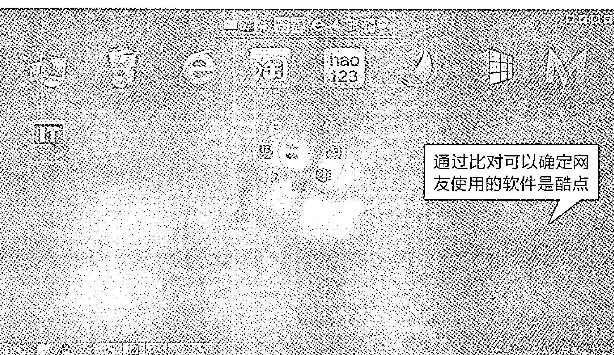

通过对比可以确定网友使用的软件是酷点。

那么到底是不是这款软件进行美化的？打开上述页面后进入查看，可以知道SPB shell 3D是一款强大的桌面软件，能够以独特的3D旋转的形式来显示你的桌面。网友贴图显示的也是可以旋转的桌面，再结合页面提供的软件截图进行比较，基本可以判断网友桌面使用的就是SPB shell 3D这款软件了（图7）。

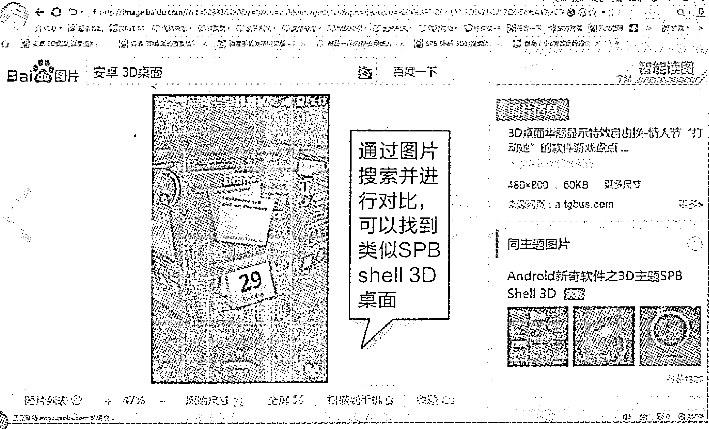

现在立即下载SPB shell 3D并安装，经过简单的设置并截图比较，可以看到我们找到的SPB shell 3D就是网友所使用的桌面美化软件了（图8）。

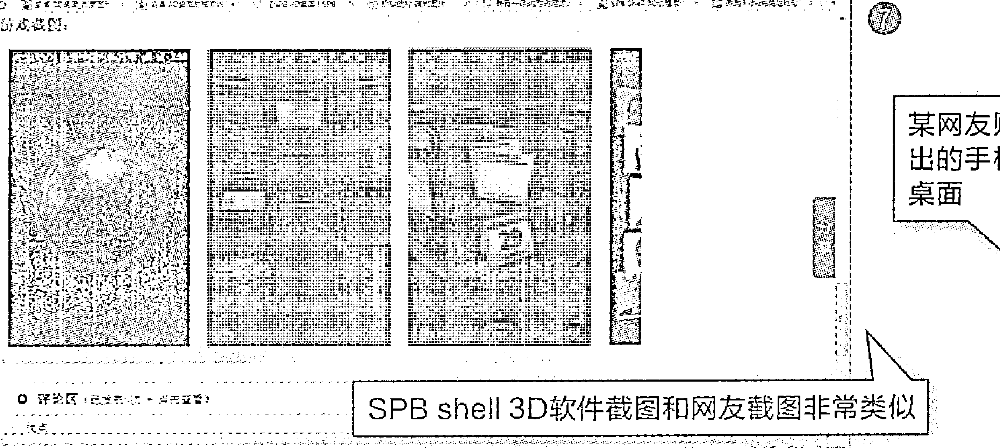

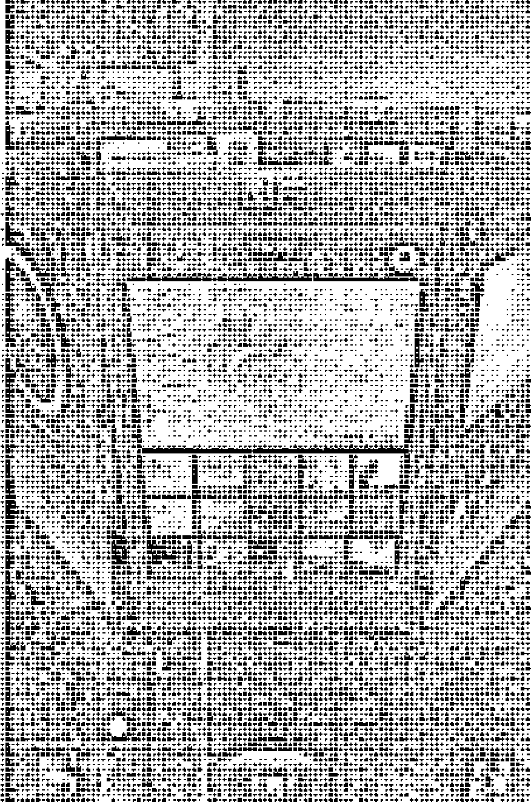

《电脑爱好者》2015年合订本（上）

## 特别话题

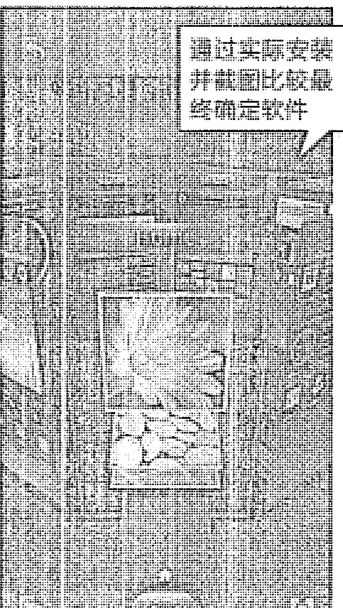

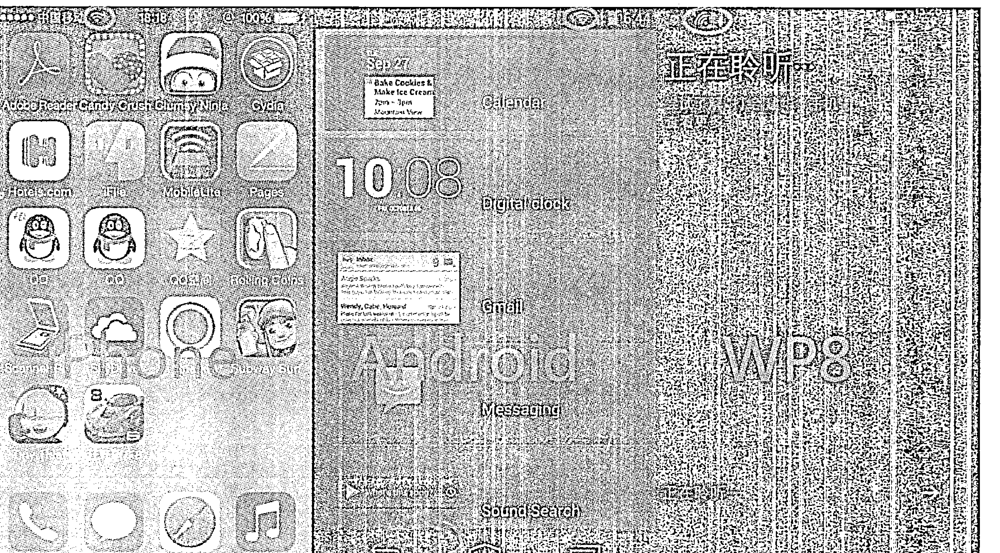

## 如何通过软件的蛛丝马迹找到原软件

在上述操作中，我们只是以酷点软件为例，借助通过软件的特征通过搜索找到原软件。实际上这是一个通用的解题方法，解决问题的关键就是要找出软件截图里比较特别的蛛丝马迹。那么一般通用的解决方案有哪些？

定网站的位置后，我们就可以结合软件特色（如果无法找出则可以用软件大类别如“美化”）进入指定网站搜索，从而找到软件的具体下载地址（图10）。

- 找出软件独特的东西，如上述酷点里的圆形面板和Dock工具栏，然后从中提取出关键字进行搜索即可。对于手机软件的查找，除了使用上述方法外，还可以用图片搜索的方法进行快速比对搜索。因为相对PC来说，针对手机平台的特色软件较少，只要是用户使用较多或者较为出名的软件，把软件特色作为关键字进行搜索即可快速找到答案。
- 从截图里的水印找出下载地址。对于类似酷炫桌面的图片，一些网友是通过抓取某些网站的素材获取的，这些图片通常会带有网站水印，如图10就是“第七城市”的截图，这样确定网站的位置后，我们就可以结合软件特色（如果无法找出则可以用软件大类别如“美化”）进入指定网站搜索，从而找到软件的具体下载地址（图10）。
- 熟悉一些专业论坛和软件，这样可以大大提高搜索的速度。比如Android手机上流行的3D美化软件主要就只有Regina 3D Launcher、NetFront Life Screen这几款，因此可以像上例那样，直接从有限的几款软件中找出答案。对于一些在论坛发布的资源，我们可以到常见的手机论坛进行搜索，比如iPhone用户，国内威锋网（http://www.feng.com/）、PP论坛（http://bbs.25pp.com/?sem）就是比较专业的论坛，一般特色资源大多是在这些论坛上发布的。

这里要注意的是，手机平台有WP8、iOS、Android之分，不同平台的应用并不能通用。我们首先要通过应用截图判断出手机系统，一般可以通过系统界面特征的不同进行机型的判断，比如Android典型的主页和返回按钮，iOS图标则是典型的扁平化风格，WP8则使用磁贴式图标。此外，还可以通过一些小细节进行判定，如每个系统任务栏图标排列也略有不同，以Wi-Fi图标为例，WP8最靠右且是斜向的，Android位于任务栏右侧，iPhone则位于运营商名称后（图9）。

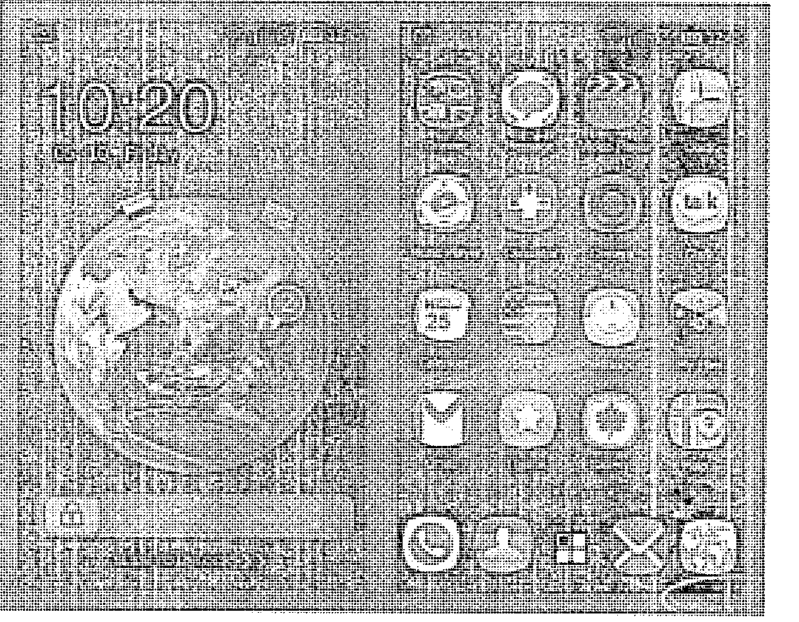

## 把好歌留住·通过歌词找原曲

在听到一些好听的歌曲时，我们一般都会记住其中的某句歌词，或者会哼唱其中几句，只凭这一点蛛丝马迹的信息，借助无所不能的互联网，同样有可能找到这些好歌资源。

如果可以记住其中的歌词，则可以打开百度音乐搜索，然后直接输入记住的歌词进行搜索即可。如某首歌曲里有“也许一杯清清的水”这么一句，依稀记得住是某位男歌星演唱的。打开http://music.baidu.com/，输入上述关键词，很快就可以找到齐秦演唱的《也许……就足够》这首歌曲里就有上述歌词，按提示进行预听即可判断是否是自己要找的歌曲（图1）。

对于英文歌曲的搜索，则建议使用谷歌，而且还可以使用高级搜索语句进行更多的搜索。假设你很喜欢《Yesterday once more》的主唱Carpenters演唱的歌曲，那么可登录http://www.baigoogledu.com（可以同时访问百度和谷歌搜索），在搜索框输入：“index of” + “mp3” + “Carpenters” -html -htm -php，这样即可搜索到Carpenters演唱的很多歌曲（而且大多直接提供真实下载地址，图2）。

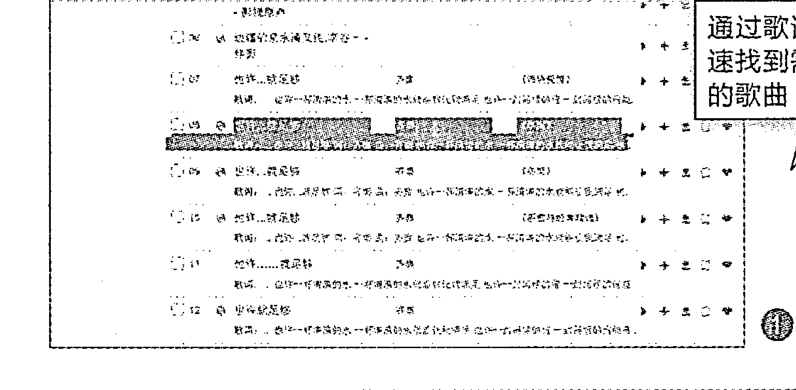

如果你没有记住具体的歌词，但是知道歌曲的一些节奏，那么可以利用“Midomi”（http://www.midomi.com）提供的哼唱找歌的方法。打开上述网站后，点击“Click and sing or hum”，现在对着麦克风哼唱你记得住的旋律（如果你五音不全，那么哼唱的时间就长一点吧），完成录制后歌曲会自动上传到网站，网站就会根据你哼唱的旋律快速找到符合的歌曲（图3）。

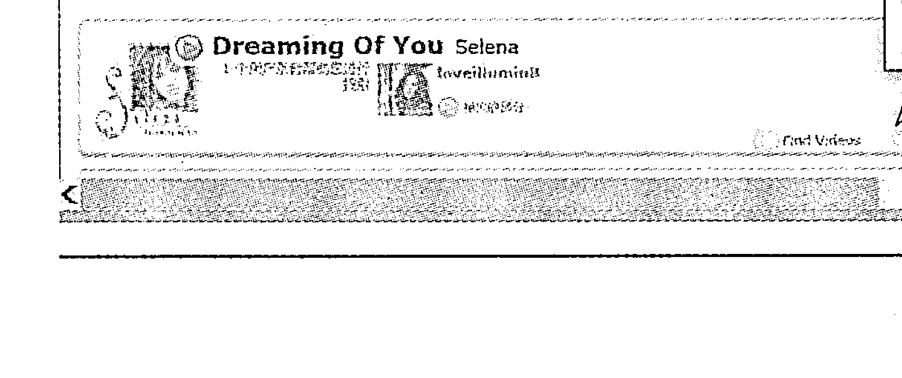

### 文|技术宅

### 幽径通幽

## 找出多媒体文件‘真身’

在日常生活中，我们经常会有意无意听到一些精彩的歌曲或者视频，比如骑车路过听到广场舞里的某首伴舞的歌曲很好听，可又不知道歌曲的具体名称是什么。在微信朋友圈看到分享的一段精彩视频，想去下载完整版的视频观看，又不知道该去哪里找。其实对类似这样的多媒体资源，只要稍加动手就可以根据片段信息找到原始媒体资源。

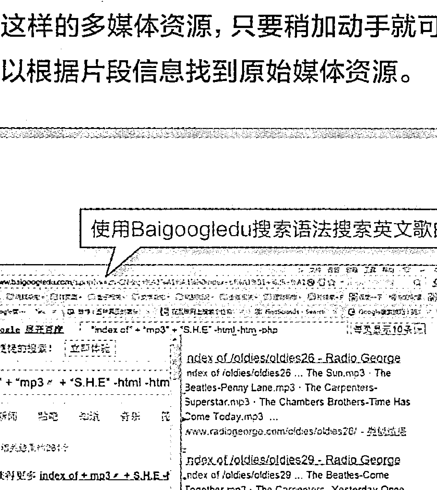

### 小提示

在找音频资源时，很多时候我们还要进行模糊搜索，这可以利用一些特色网站或者音频播放软件特色功能来完成。比如：你不是要找歌曲，而是要搜索类似猫叫、狗叫的特殊声音文件，则可以登录http://tinyurl.com/62jdm，按照其中的分类去搜索各种特殊的声音，如双簧管、萨克斯、汽车、飞机等等的发声文件。要搜索和查找类似风格的其他歌曲，则可使用“酷狗音乐盒”的“相似推荐”，在酷狗音乐盒打开自己喜欢的音乐后，点击下方的“相似推荐”即可。

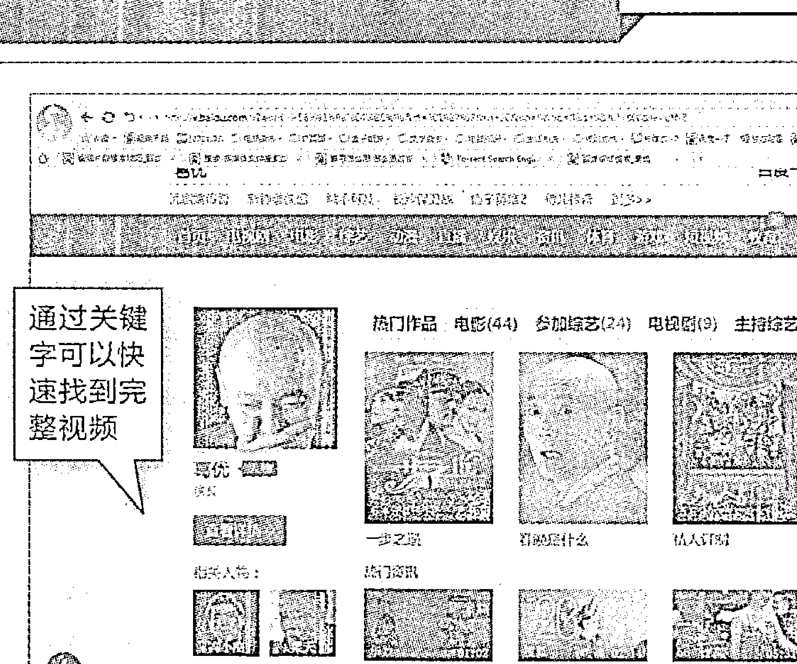

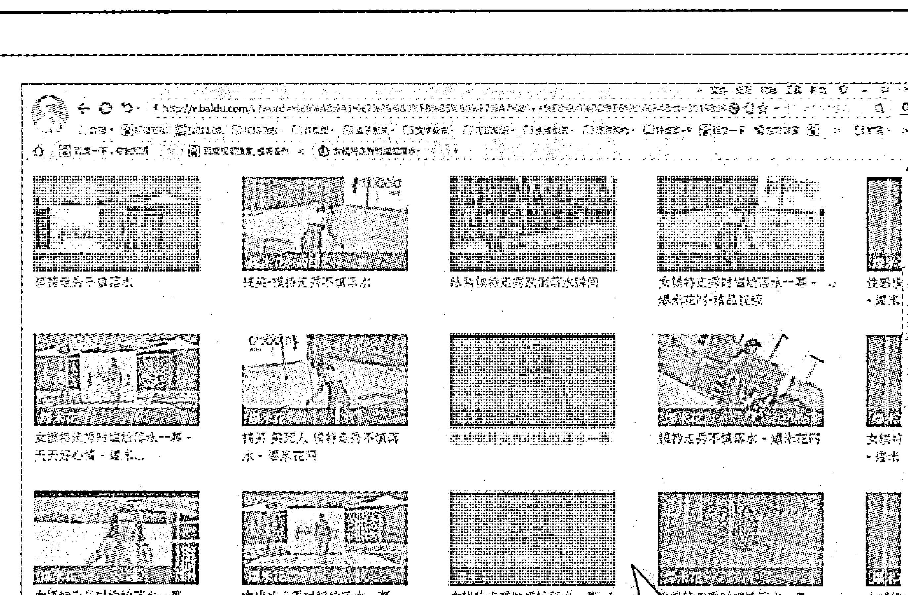

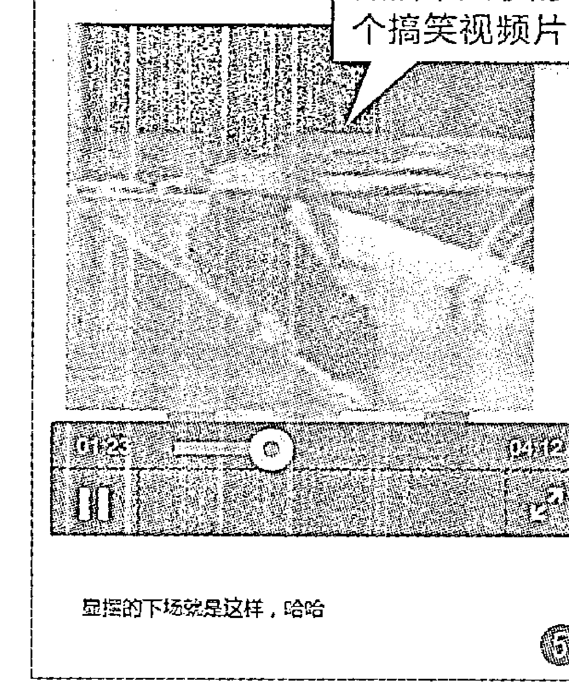

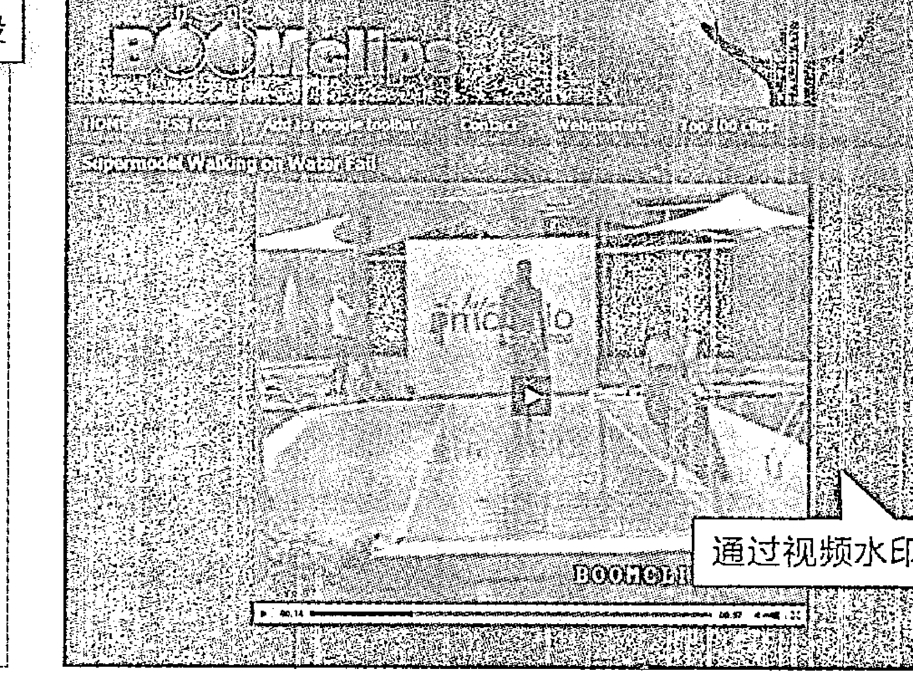


## 精彩视频收藏中·寻找原视频

当我们在微信或者公交车电视上看到精彩的视频，则可以利用其中透露出来的蛛丝马迹，将完整视频找出来。

如果你能记得视频中的一些模糊信息，如主演名字、片中精彩对白，或者影片插曲之类的信息，那么就可以用搜索引擎进行搜索。只要打开http://v.baidu.com，直接输入关键字（如“葛优”），然后在搜索列表的预览影片中即可找到需要的视频（图4）。

如果无法知道视频中的上述信息，而只是搞笑或网友自拍的视频，那么就要根据视频里的模糊信息去查找了。假设在微信中看到好友共享的一段视频，内容是一位模特走秀摔入水中，不过视频内容很短，大约只有10几秒的时间，主要就是落水镜头。这段视频不知被转发了多少次，谁也不知道出自哪里，那么怎么找到它的完整视频呢（图5）？

因为视频里没有包含显著信息，不过主要内容就是模特走秀摔到水里。虽然整段视频没有任何可显示来源的标记，但是仍然可使用视频主要内容关键字进行搜索。打开百度视频搜索，输入“模特走秀 落水”，很快就可以找到很多类似的视频，通过和共享视频片段比较，显然其中穿红色衣服模特视频比较类似（图6）。

点开符合要求的视频，在打开的页面观看，通过情节的对比可以看到，微信好友共享的这段视频和爆米花网的《女模特走秀时尴尬落水一幕》这部影片是一致的，通过观看完整的视频也让我们知道了事件的整个过程是怎样的。

当然，上述例子中我们只是以视频主要内容作为关键字，通过搜索获取原视频。在很多的时候仅仅通过这个方法可能无法找到原视频，不过我们可以综合视频多个信息进行查找。比如可以结合视频中的地标建筑、背景画面，或者影片展现的广告、标示的活动名称等综合起来进行搜索，这样就可以搜到更多的详细信息。以上述视频为例，视频贴有“bomclips.com”水印，显然这个视频原始出处是www.bomclips.com发布的，登录上述网站，使用“model”（模特）进行搜索，很快就可以找到真正首发视频（图7）。

同样，还可以根据视频其他信息进行更为详细的查找，上述视频背景后面有“medlo 2008年”标记（通过翻译知道modelo是西班牙语“模特”意思），因此可以判断这是2008年在西班牙举行的一场模特秀，如果要进一步查询视频信息，还可以通过搜索2008年西班牙模特走秀视频找到更多的信息（图8）。

## 特别话题

## 设好权限·我的秘密你别猜

默认情况下，QQ会对好友开放很多的权限，显示自己正在玩的游戏、最近更新的日志、玩过的应用等。这些隐私信息的泄露可能会给我们带来麻烦，有些朋友喜欢上班的时候趁BOSS不在抽空玩会QQ游戏，显然游戏状态如果被同事或者生意伙伴看到，很容易带来不必要的麻烦（图1）。

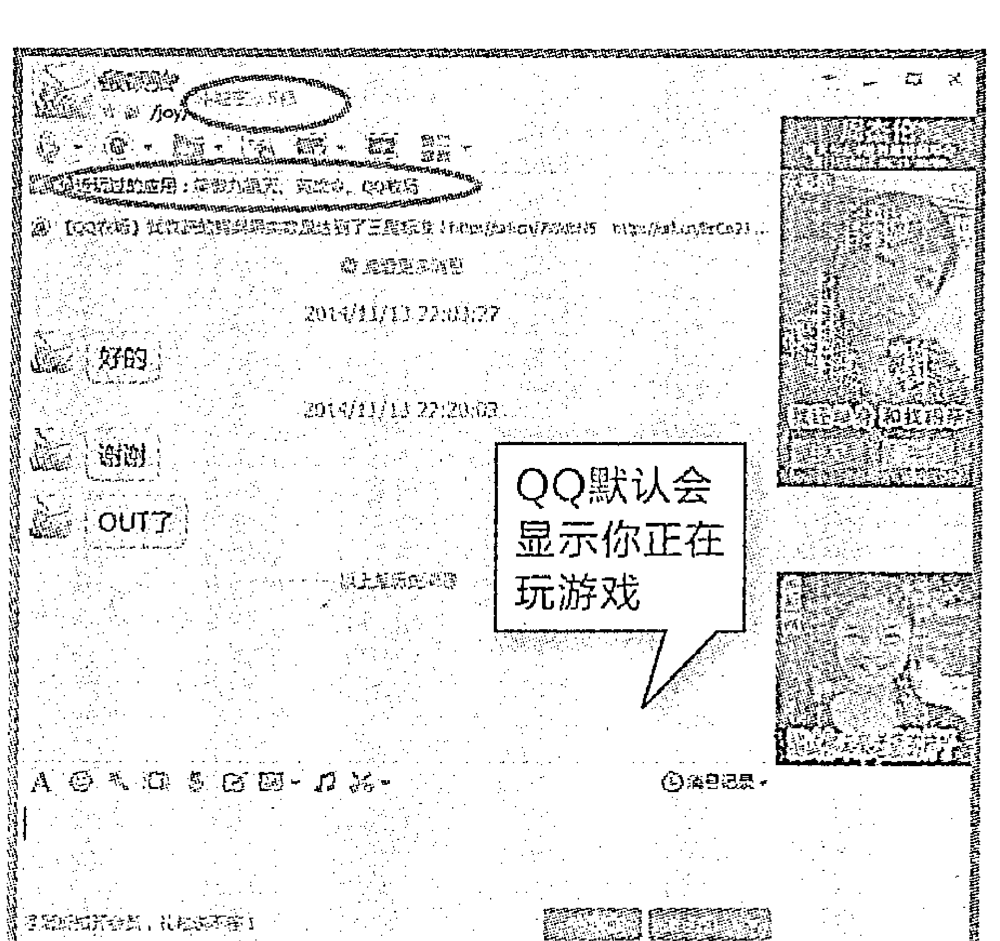

如果要对QQ信息进行管理，只要点击QQ面板的“设置→权限设置”，依次设定好相应的权限即可。若不想被好友看到游戏状态，则进入“个人状态”，去除右侧“我正在玩的QQ游戏”、“我正在玩的其他游戏”前的勾选即可（图2）。对于手机QQ用户同样可以设置隐私保护，以Android QQ为例。进入手机QQ后点击自己的头像，在弹出的菜单中选择“设置→权限和隐私”，在打开的窗口中按自己的需要进行设置即可。比如可以关闭“向好友展示网络状态”（这样自己在手机QQ上的状态，如玩QQ游戏、发表新日志等，就不会被好友知道了），关闭“对附近的人可见”（这样附近的好友就不会知道我们的QQ，可以防止别人知道我们的位置）。其他涉及隐私的设置类似（图3）。

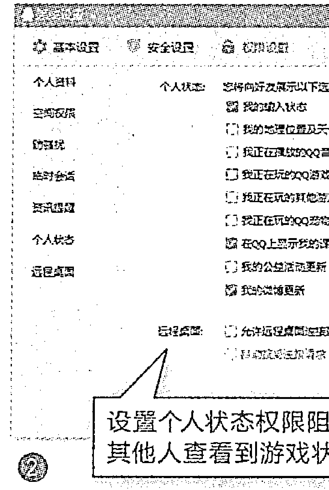

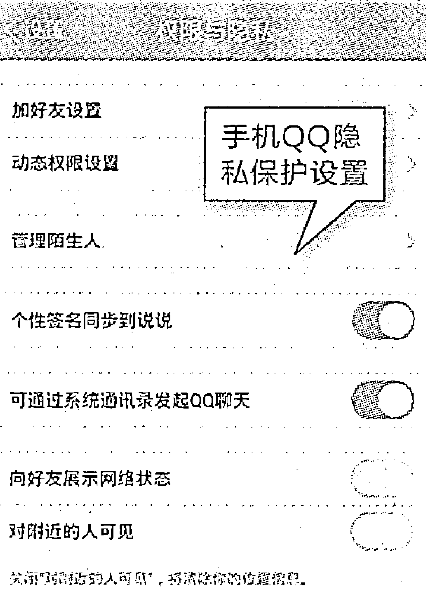

### 拒绝泄密 QQ防护要严实

> QQ是大家最常用的通讯软件，不过QQ（包括电脑和手机）默认有很多设置，在日常使用时会泄露个人的隐私信息。因此为了更好地保护自己的隐私，我们要对其严加防护。

## 管好QQ空间·拒绝恶意访问

现在QQ个人空间已经成为很多朋友的网上家园，个人日志、家庭照片都发布在QQ空间里，其中很多是私密的资料，如果被不怀好意的人利用，就很有可能带来麻烦。网上就出现过由于家长在自己空间贴孩子的照片，导致小孩被人绑架的恶性案件。因此对于空间的权限也要根据自己的需要加以设置。对于空间照片的开放，可以设置只有自己的亲朋才能查看。在上述QQ设置窗口切换到“空间权限”，然后点击“立即查看”，进入自己的QQ空间后点击“部分人可见”，然后勾选“指定人可见”（图4）。接着在打开的窗口中选择指定的亲朋好友才能看见，这样既不会影响好友查看家人照片，又可以有效保护自己的隐私不被泄露（图5）。

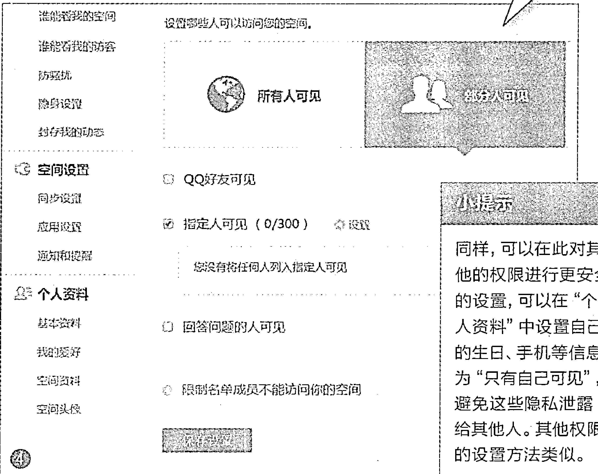

同样，可以在此对其的权限进行更安全的设置，可以在“个人资料”中设置自己的生日、手机等信息为“只有自己可见”，避免这些隐私泄露给其他人。其他权限的设置方法类似。

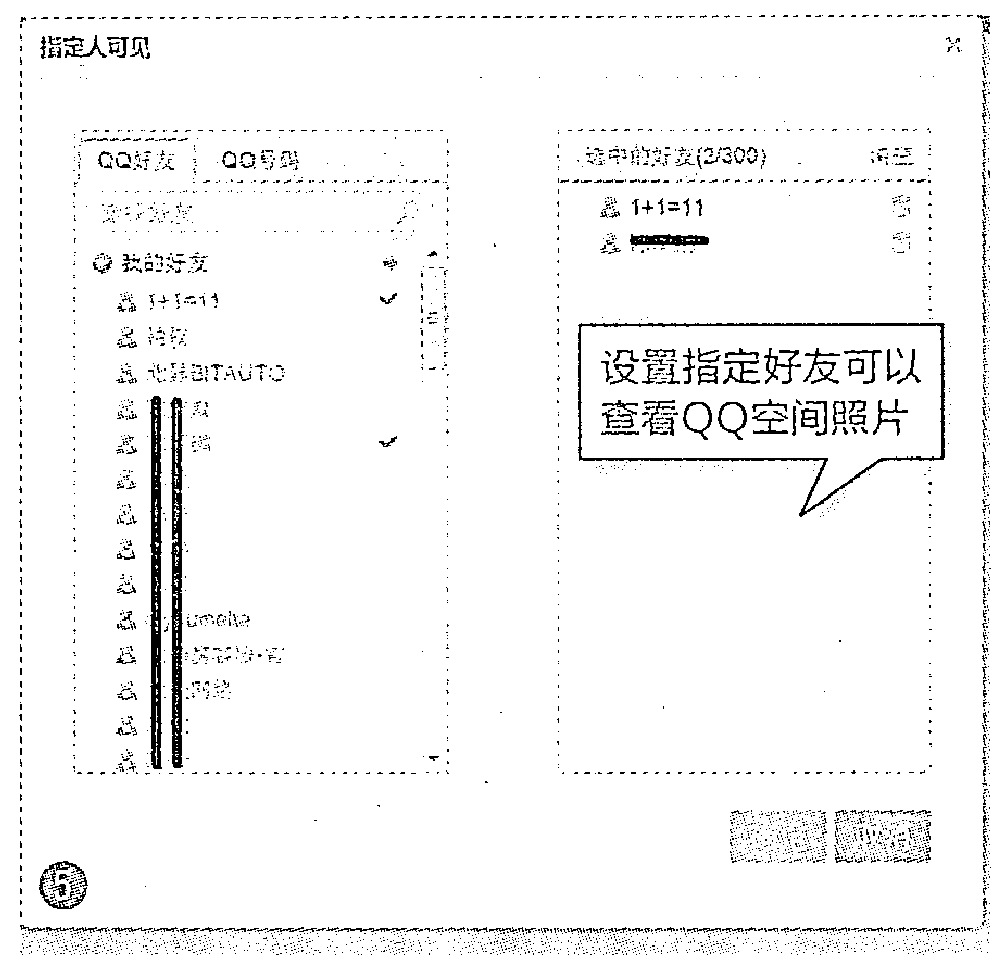

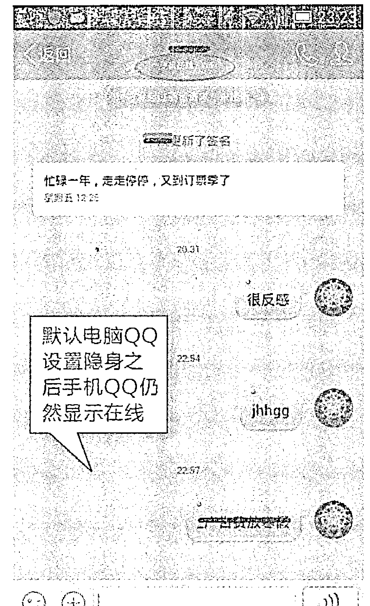

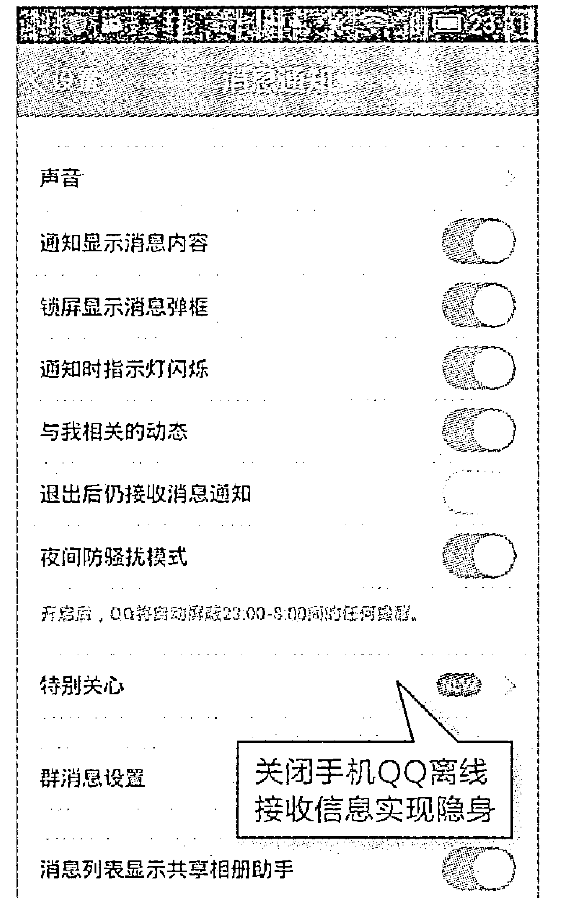

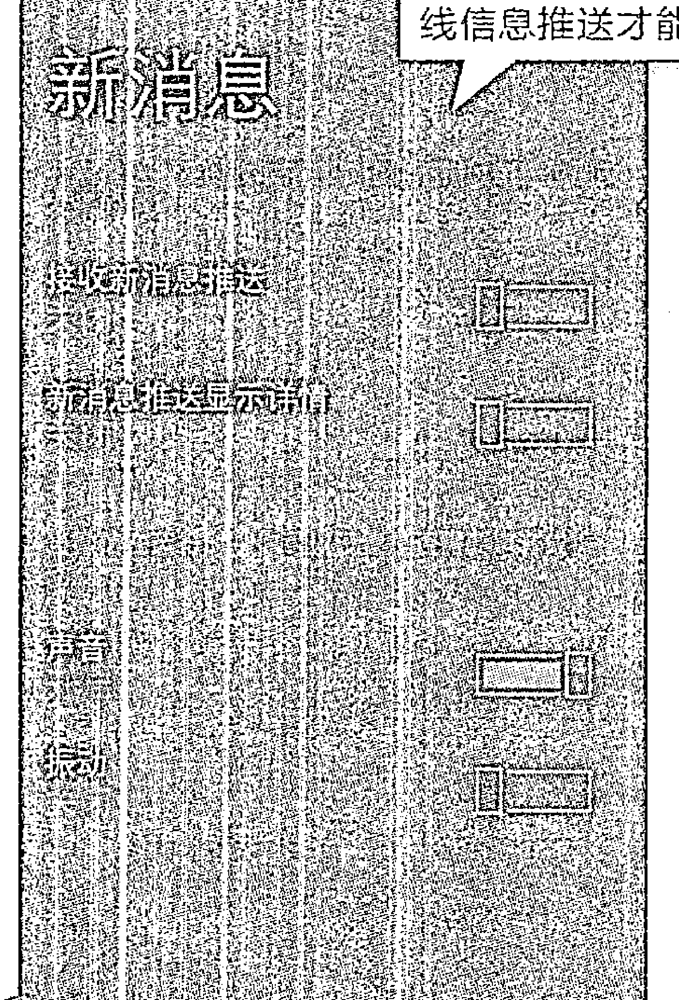

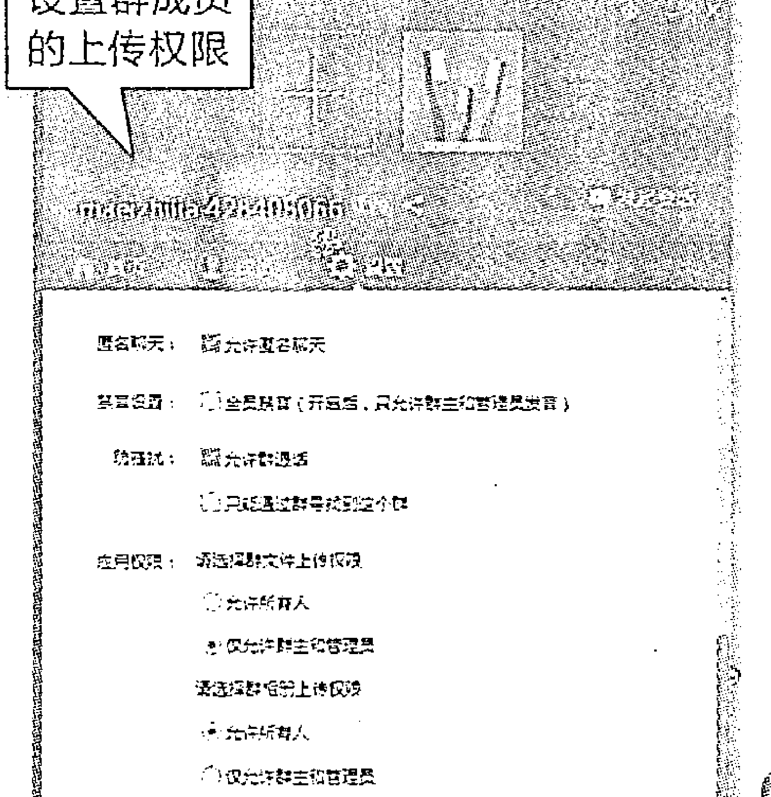

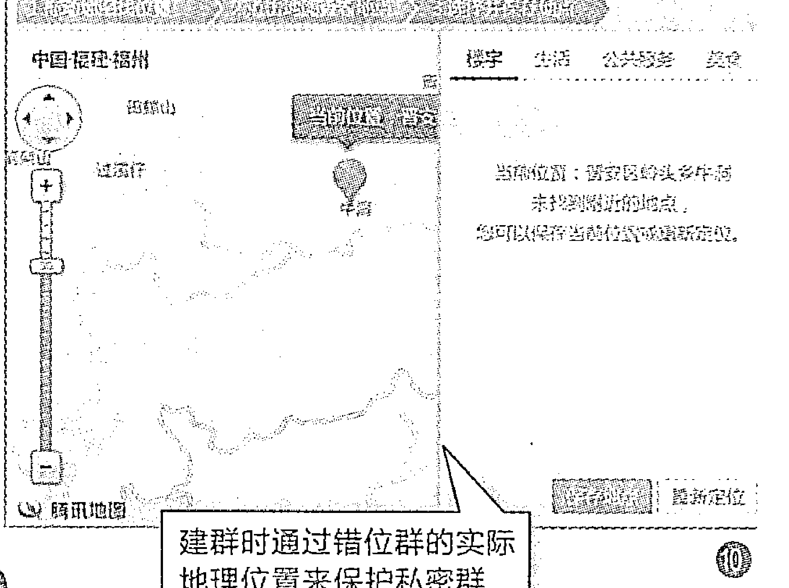

## 拒绝永远在线，该隐身时就隐身

## 不留死角，QQ群也要管好

出于一些需要，我们经常希望在某个时间段（如夜间加班或者工作繁忙的时候）让自己QQ隐身不受打扰。不过现在QQ都支持手机QQ和电脑QQ同时登录，这样即使电脑QQ设置为隐身，由于手机QQ（当然手机要联通网络如Wi-Fi）默认开通离线接收信息，这样在好友列表中我们仍然显示为“手机在线Wi-Fi”，不明真相的好友仍然会给我们发送消息，让我们失去隐身的保护（图6）。

如果要想让自己的QQ彻底隐身，则要进入手机QQ设置中将离线接收信息关闭。以Android QQ为例，进入QQ设置后切换到“消息通知”，关闭“退出后仍接收消息通知”，同时开启“夜间防骚扰模式”，这样就可以实现真正的隐身了（图7）。

不过需要注意的是，如果你的QQ号码是和微信关联的，由于微信也是默认开通离线信息的接收，那么此时还要进入微信的“设置→通用→新消息”，关闭“接收新消息推送”和“新消息推送显示详情”，这样才能实现彻底的隐身（图8）。

除了个人QQ会泄露自己的隐私外，大家常用的QQ群也会泄露隐私。对于公司同事群，默认群设置是每个成员都可以上传文件和照片到群共享，群成员多了以后就可能会误传一些公司机密文件到共享导致泄密。因此还需要对具体群进行设置以保护隐私。以同事群为例，可以进入群设置，将文件和照片的应用权限设置为“只允许群主和管理员才有上传的权限”（图9）。

对于自己建立的好友私密群，因为默认建群时会定位自己的位置，为了避免自己群位置的泄露，则可以故意将群建立的位置设置为非实际位置，避免本地一些不怀好意的人加入自己的私密群（图10）。

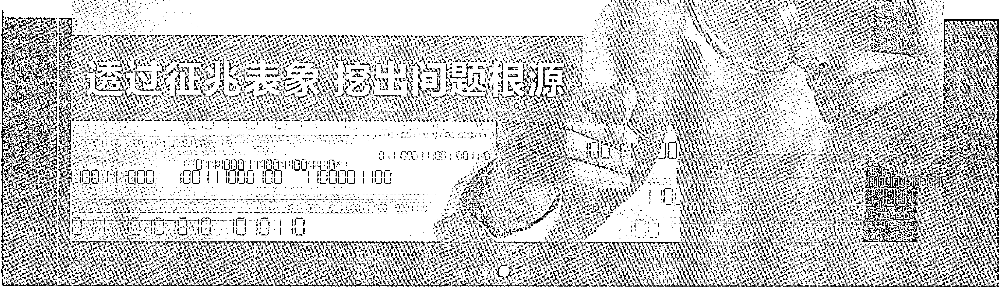

在使用系统、软件或网络的过程中，难免会遇到各种各样的问题。在问题产生之前，总会有一些征兆出现；或者在问题已经发生之后，也总会让人回想起有一些不为人所重视的征兆曾经显露过。实际上，通过对这些征兆的全面深入分析，完全可以做到防患于未然，或者准确找到问题的解决办法。

## 系统变慢 分清因果巧解决

### 系统变慢 征兆逐个数

系统变慢的表现有多种，主要表现为全局性变慢和局部性变慢。全局性变慢的情形是，无论在桌面上还是在资源管理器中操作任何文件或软件，都会感到明显缓慢；而局部性变慢则是只有部分操作变慢，例如文件操作一切正常，只有网页浏览变慢；还有比如运行别的软件都很正常，只有某个软件运行时速度远远慢于平常；再如本地文件操作一切正常，只有访问网络邻居中的文件时出现奇慢的状况。

在使用Windows的过程中，操作变慢是许多人都经历过的一种现象。虽然说系统越用越慢在某种程度上来说是一种自然的正常现象，但是，如果这种变慢的程度严重影响了用户的使用感受，或者阻碍了用户顺利完成工作，那么，这种慢就变得不正常了。此时，我们就不得不去进行人为干预，循着变慢的“蛛丝马迹”，寻找变慢的原因，寻求加速的办法。从另一方面来说，如果能对系统变慢的原因提前做到胸有成竹，那么，在平时使用电脑时，对可能会造成系统变慢的各种因素进行及时检查、及时优化，那么，这种变慢的进程就会大大延长，甚至可以让系统长期一直保持一种轻松稳健运行的状态。

### 对症下药 问题分别解

既然系统变慢的征兆各不相同，那么我们就需要根据变慢的具体表现，针对性地分析变慢的原因，从而找到解决问题的办法。

### 小提示

**“傻瓜”解决办法**
在分门别类分析和解决系统变慢的原因之前，大家应该首先尝试一个不需要分析的“傻瓜”解决办法。那就是遇到变慢的情况，可以不用去管问题发生在哪里，先通过任务栏右键菜单命令启动“任务管理器”，在其中将与目前操作无关的进程和服务统统关闭，然后再看速度是否有所提升（图1）。如果这样不能解决问题，那么可以尝试保存正在进行的工作，然后重新启动系统。不少情况下，这种“傻瓜”的方法很灵。由于我们的目标是解决系统变慢问题，只要系统能够变得不影响工作，我们完全不用去追究问题到底发生在哪里。这招尤其适用于对电脑不是很精通的普通电脑用户。

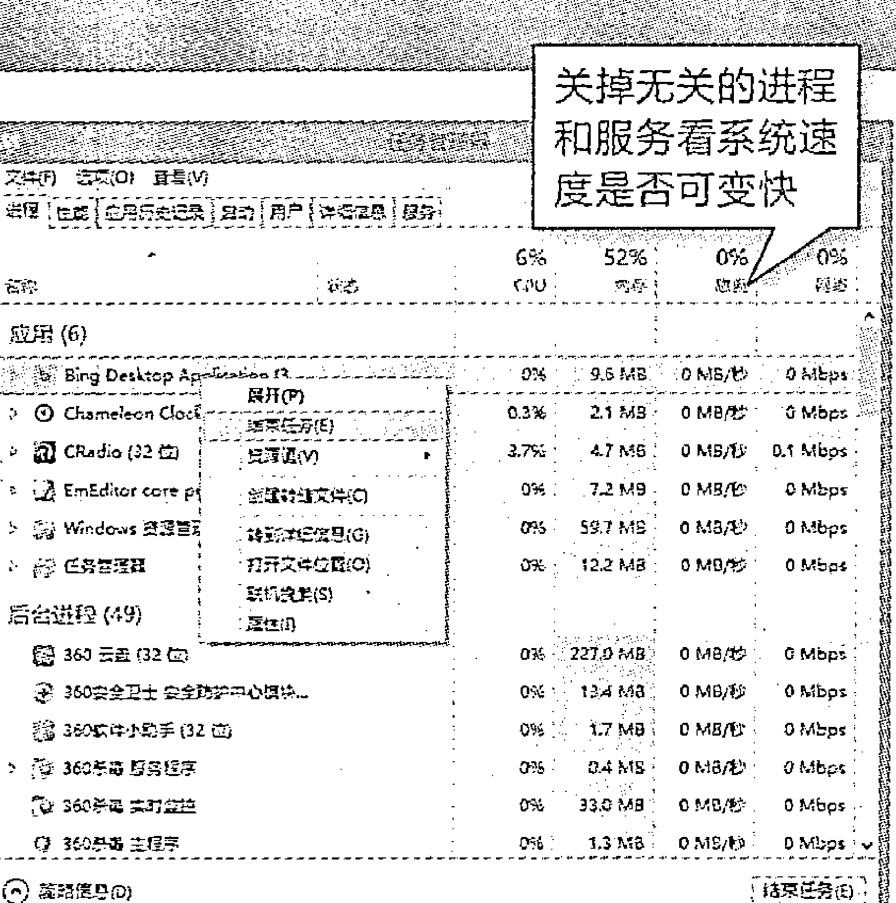

## 特别话题

傻瓜化的关闭异常进程和服务的方法，以及重新启动系统的方法在某些时候可以解决系统变慢的问题。但不少情况下这种傻瓜化的办法毫无效果。这时我们就需要分析可能让系统变慢的各种因素进行排查，进而找到解决问题的方法。

分析解决系统变慢的一个总的原则应该是“先硬后软，逐个排查”。

### 硬件问题让系统变慢

一个非常明显的、常见的硬件引起的系统变慢的情况是，插入了不兼容或有问题的硬件。例如当我们插入一张损坏的闪存盘或SD卡插入到电脑中的时候，系统会拼命识别，这时系统就会明显变慢，甚至会慢到无法浏览资源的地步。所以若遇到操作变慢，首先需要检查是否插入了有问题的移动设备，检查所有连接外设的端口，拔出不用的端口设备再看速度有无提升。

系统变慢的另一个常见原因是由硬盘存在坏道而引起。为了验证硬盘是否存在坏道，我们可以用系统的磁盘扫描程序进行扫描检查，也可以用专用的磁盘工具来进行坏道扫描和修复，如用磁盘精灵DiskGenius来检测和修复坏道，启动DiskGenius后在窗口内选中要扫描的分区盘符，然后从“硬盘”菜单下选择“坏道检测与修复”命令，进行磁盘分区坏道检测与修复（图2）。若检测出有磁盘坏道，修复之后系统变慢的问题一般可以得到解决。

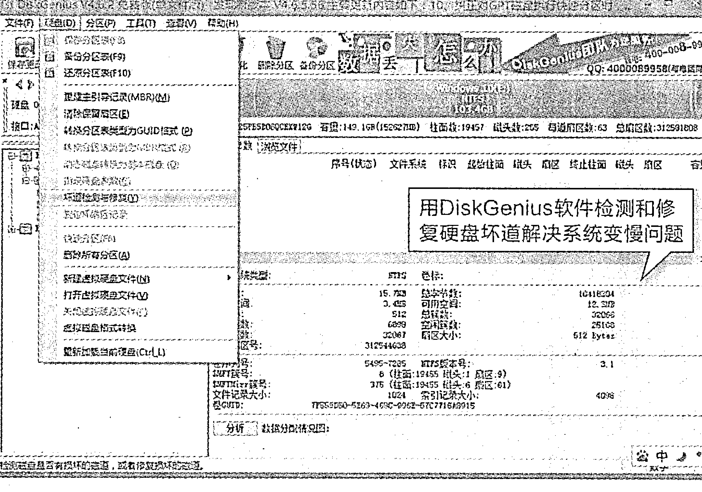

### 软件问题让系统变慢

如果排除了硬件的因素，系统仍然速度缓慢，我们可根据软件使用过程中的一些表现来针对软件进行优化，从而获得理想的速度。

系统变慢的同时，有时我们会收到内存占用过高的系统提示。这说明系统变慢的原因是由过多的内存占用引起的。内存占用过高，说明后台开启的任务太多或太大。一方面可能是系统启动后开启的服务过多或使用过程中执行的任务过多，另一方面可能是启动后执行了如杀毒、定时系统维护等大任务。

遇到这种情况，我们可以用系统自身提供的功能来解决问题。以管理员账户登录系统，同时按下Win+R组合键，启动到“运行”窗口，输入并执行MSCONFIG命令，启动“系统配置”窗口，在“启动”选项卡中，根据系统提示到任务管理器中禁用与当前操作无关的任务，切换到“服务”选项卡，选择并禁用与当前任务无关的服务（注意，有些微软核心任务系统不允许禁用），确定之后看系统速度是否有明显提升（图3、图4）。

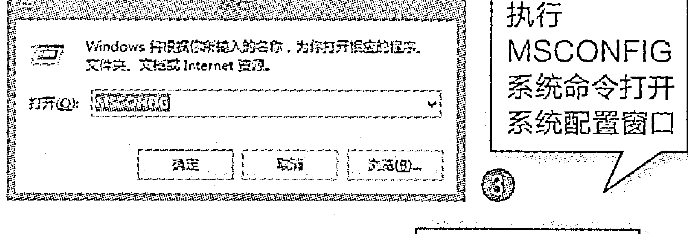

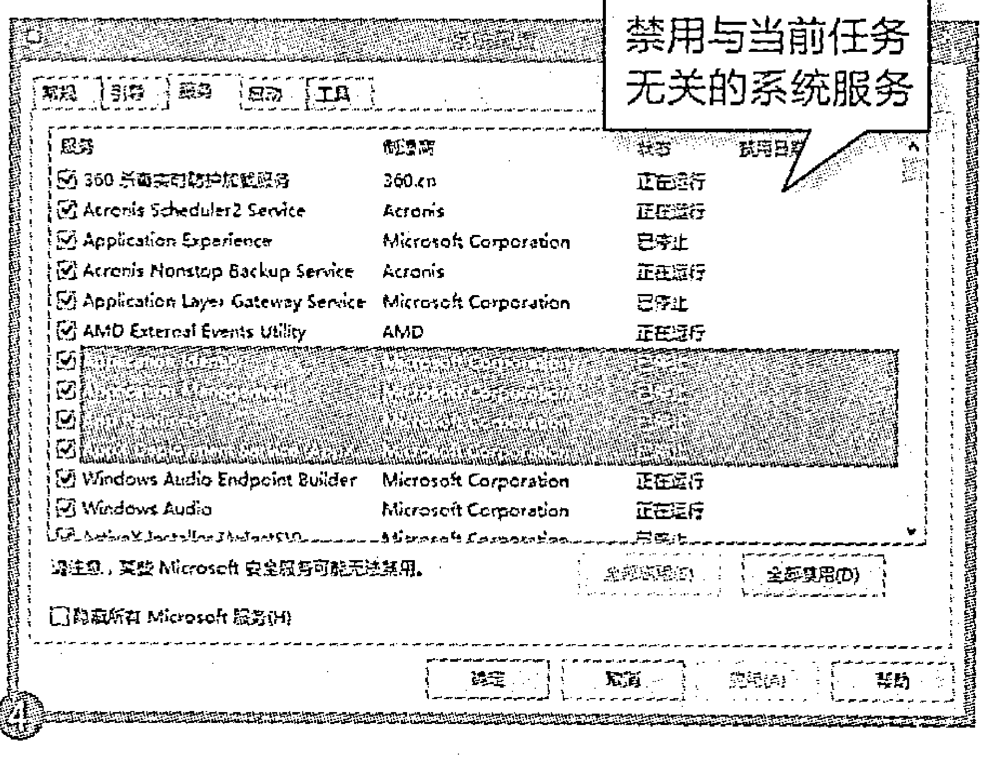

> 也许你不知道服务列表中的某个服务代表什么意思，因而无法确认是否可以禁用。其实，如果你在使用Windows 8以上系统，只需在任务管理器“服务”列表中选中某服务并点击右键，然后选择“联机搜索”（图5），即可找到关于该服务的详细说明，从而决定是否可以禁用该服务了。

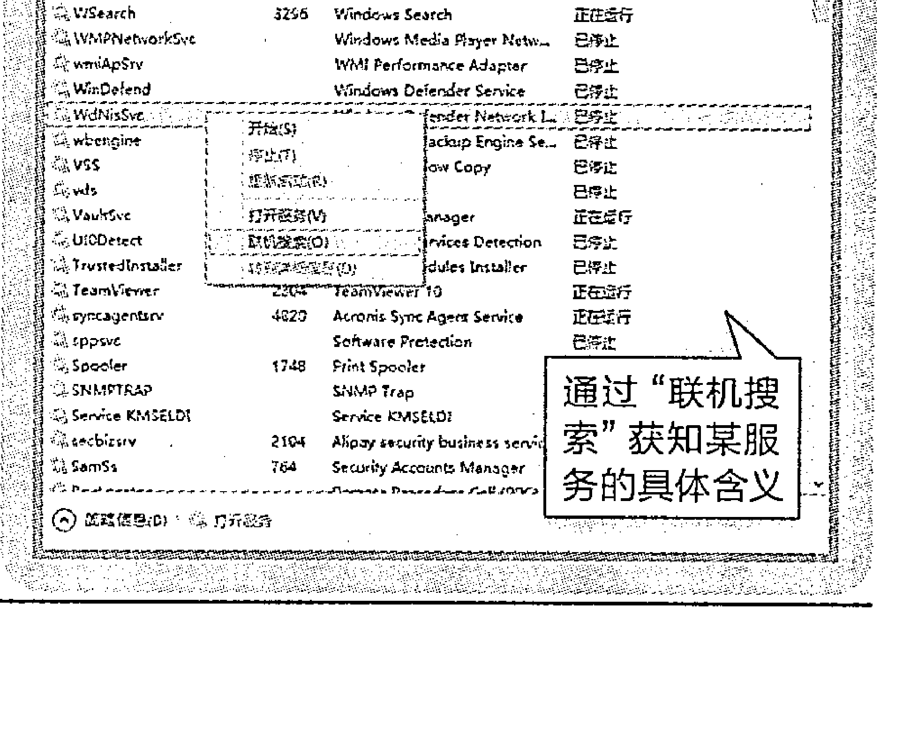由于不同版本Windows对系统进程、服务等的管理、解释、操作方便程度等有所不同，可能会给用户操作带来不便，我们可以统一使用诸如360安全卫士一类的系统优化工具来优化启动项和系统服务。启动360安全卫士之后，选择工具栏上的“优化加速”按钮，其中会列出可以加速系统运行的可优化选项，这里列出的每个选项不像系统中列出的那样抽象和专业，而是以具体的汉字给出的名称。如果对内容还不够了解，可点击“详情”按钮获得更为详细的解释。这样一来，是否关闭服务或进程，用户就可以很容易做到心中有数了（图6）。除了基本的启动项优化外，还可以从中选择“系统性能优化”、“界面效果优化”、“文件系统优化”甚至“深度优化”等选项进行进一步优化。优化完成之后，再看系统操作速度是否得到了改善。

除了上面所说的因素外，系统变慢很多时候是由于系统自动更新、自动维护、文件索引、错误报告等正在进行而引起的。由这些原因而引起的系统变慢也有具体的应对办法。

如果系统本身配置不高，系统的自动更新功能又开启为“自动下载更新和安装更新”，那么，由于我们不知道微软啥时候会推送更新，因此系统随时都可能因更新下载和安装升级而变慢。若要杜绝这种情况的发生，可通过“控制面板→Windows更新”进入更新窗口，点击左侧“更改设置”按钮（图7），对系统更新的方案进行修改。在“重要更新”方式选择列表中，选择“检查更新，但让我选择是否下载和安装更新”一项（图8）。这样，当正在进行重要工作时若遇系统更新而怕系统变慢，则可对弹出的更新提示选择暂不下载和不安装更新，等工作完成后电脑闲置时，再执行更新下载和安装任务。

系统定时维护是让系统变慢的另一大“杀手”。如果系统定时维护功能开启，系统进入维护状态，我们会发现硬盘灯是常亮的，所有操作会受到限制。如果这时使用的正好是一台配置不高的电脑，很可能连基本操作也成问题。为了避免这种因素导致的系统变慢，可通过“Windows控制面板→操作中心”，在“维护→自动维护”一栏下，点击“更改维护设置”（图9），在自动维护设置窗口中，将自动维护时间设定在电脑空闲的时间段（例如中午12点或凌晨1点后）（图10）。这样，系统维护自动任务就不会在工作时段出来烦扰而拖慢系统了。

系统文件索引也是引起系统变慢的重要因素。在Windows 8.1系统索引选项中，按默认的选项一般系统还能承受，若选中了对“文件内容”、“系统文件”、“压缩的文件”等也进行索引（图11），则会引起系统操作明显变慢。如果我们在索引位置处加入了更多的参与索引的文件夹位置（例如移动设备或网络文件夹），那么

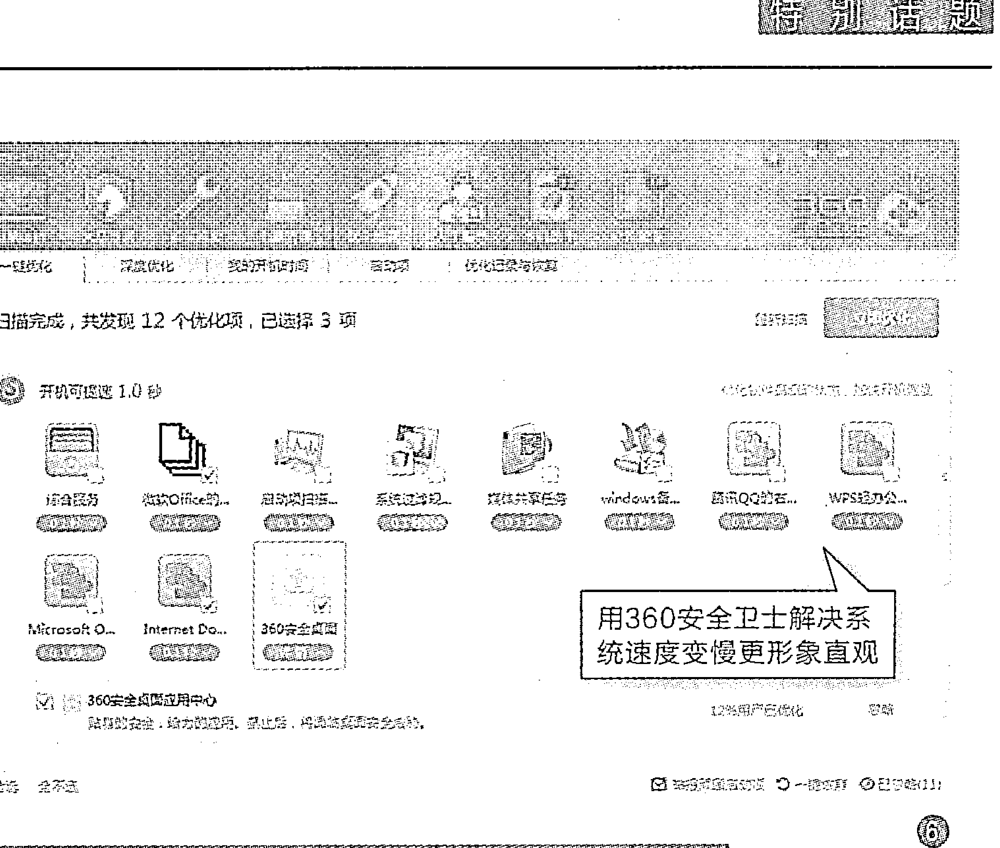

> 用360安全卫士解决系统速度变慢更形象直观

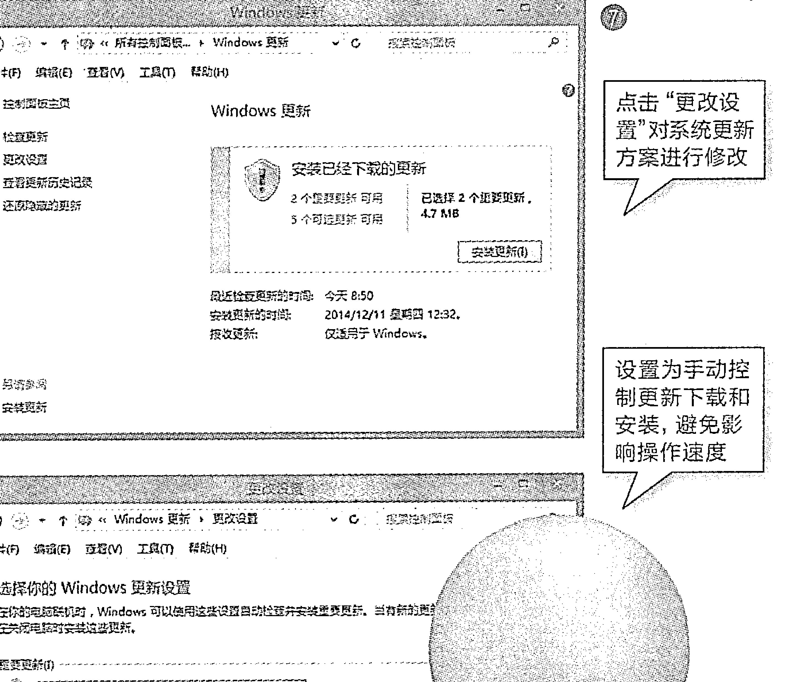

> 点击“更改设置”对系统更新方案进行修改
> 设置为手动控制更新下载和安装，避免影响操作速度

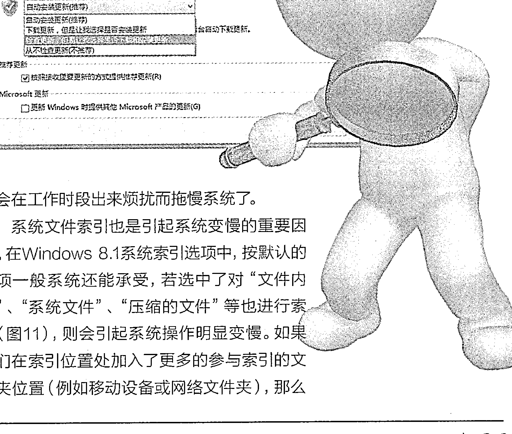

## 特别话题

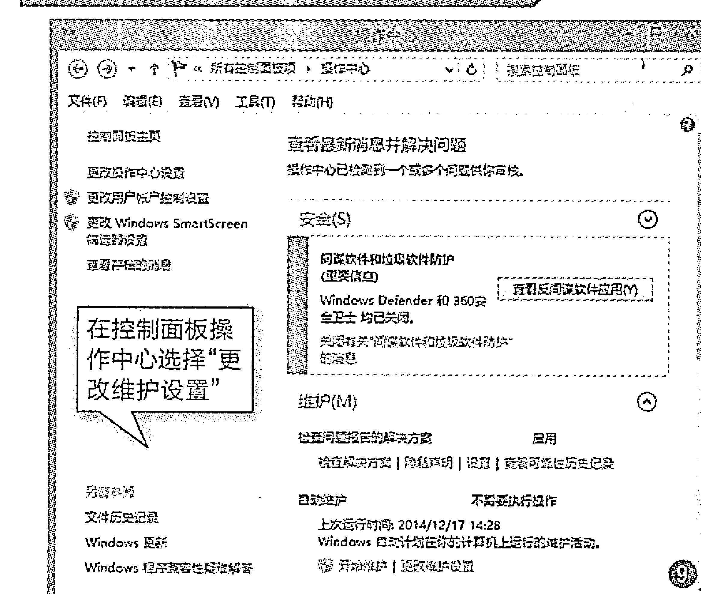

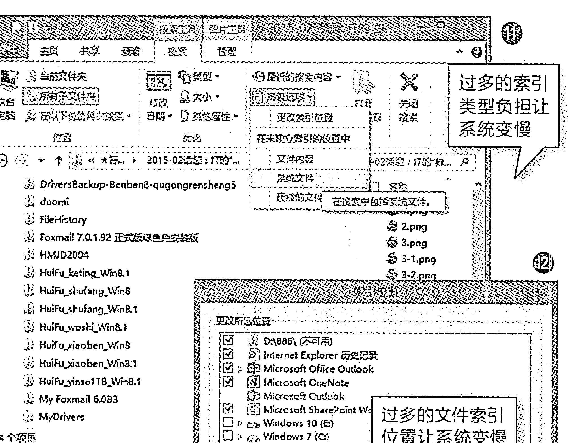

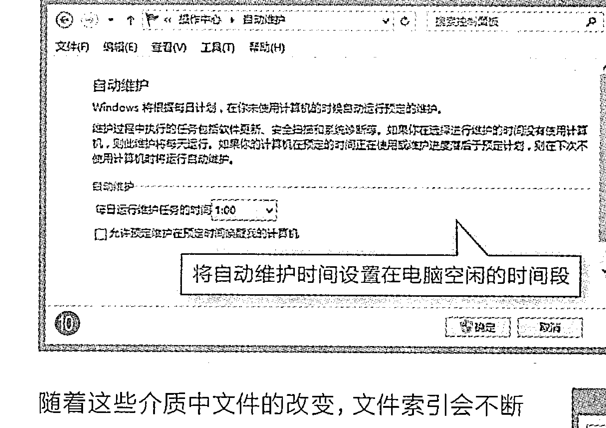

> 小提示 软件冲突也可引起系统变慢，尤其是安全类软件。建议不要在同一个系统中安装由不同软件厂商生产的安全类产品。安全套装建议同时只用一家的产品，以获得组件之间最好的兼容性。

随着这些介质中文件的改变，文件索引会不断重复进行，这对于系统速度来说，将更是雪上加霜。解决的办法是去掉这些项目的选择，减少参与索引的不必要位置（图12）。而系统错误报告也会引起系统变慢。如果我们不指望通过上报系统错误到微软进而获得微软回复这一渠道来解决问题，那么可关掉系统自动写入错误报告的操作，消除因这一因素而造成的系统变慢。具体方法是，通过资源管理器右击“这台电脑”并选择“属性”，在弹出的窗口中点击“高级系统设置”，接下来在“系统属性”窗口中点击“高级”选项卡，随后点击“启动与故障恢复”一组下的“设置”按钮（图13），进入启动和故障恢复窗口后，取消对“将事件写入系统日志”一项的选择（图14）。系统变慢还有一个“例外”因素，那就是由于安装了不兼容的系统补丁或软件而引起的。要解决这方面的问题，就需要回顾最近是否安装过系统补丁或软件，可通过系统控制面板的软件管理窗口，对最近安装的补丁或软件进行卸载，然后尝试速度是否有所改善。

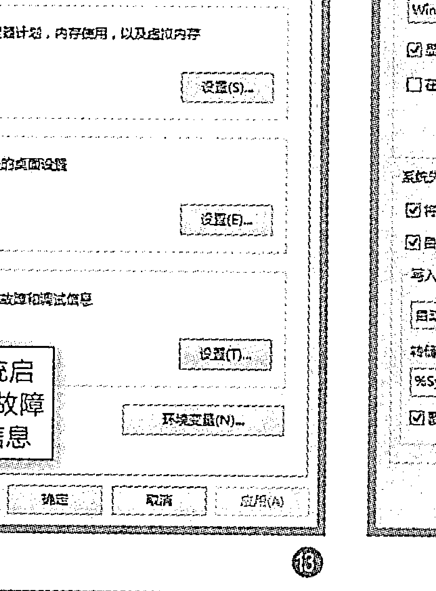

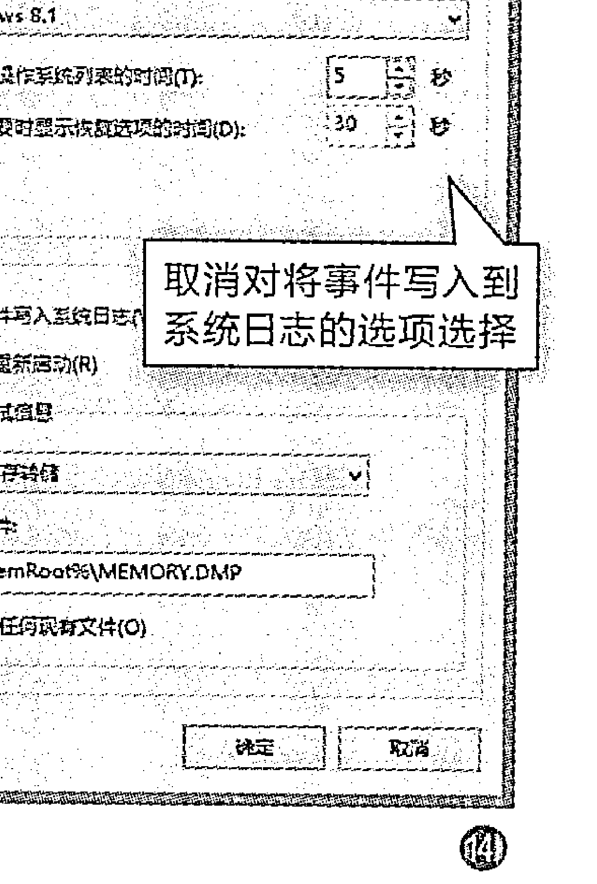

## 文件垃圾让系统变慢

有时我们可以看到磁盘空间满或内存不足的提示，这往往是因为硬盘空间被过度占用引起的。而占用空间的除了我们常常称为“文件垃圾”的无用文件外，还可能是由于用户自身的一些有用文件造成的。大家知道，无论电脑中安装了多大的内存条，为了系统休眠、睡眠、快速开机等任务，系统都会以交换文件的形式，默认在硬盘根目录中生成几个很大的临时性文件，这些文件有时大小是固定的，有时又是随使用数据量的大小而动态变化（例如系统自动管理的页面文件）。此外，系统默认的用户文件夹也默认被安排到系统C盘中，用户生成的各种图、文、声、像文件都存放在用户文件夹的分类子文件夹中，如果使用过程中用户生成的文件逐步积累，当其容量接近硬盘的剩余空间时，就会挤占以上所说的各种系统临时文件所需要的空间，这样就会造成硬盘空间的不足。当系统内存交换文件所需空间不足之时，系统就会提示内存不足，当程序要保存文件到C盘时，检测到剩余空间不足，就会报告磁盘空间不足。

为了避免这种情况的发生，我们可以提前做好系统盘的空间规划，最好将硬盘另外划分出一块专门的数据存放分区，将占用空间庞大的用户数据文件夹改道为存放在数据分区（图15）；或者通过将系统临时文件改设到内存虚拟磁盘或空间比较大的其他分区中，以便让系统盘经常保持轻松的运行状态（图16）。

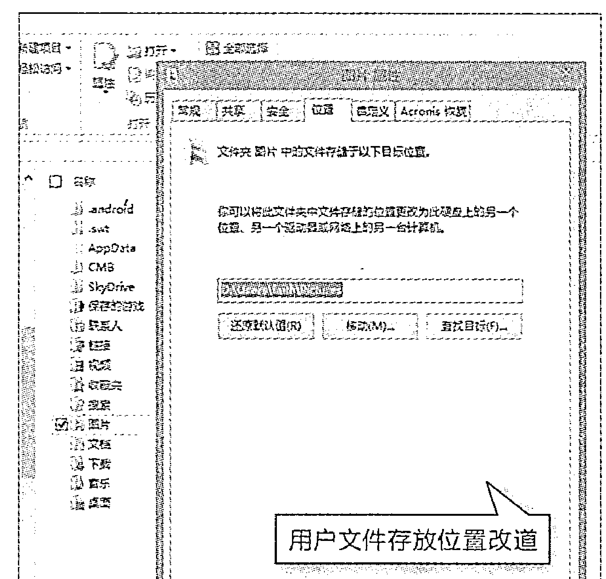

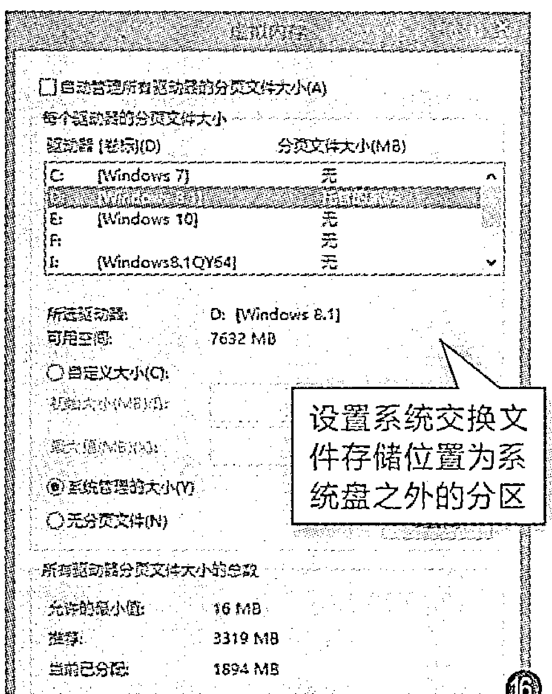

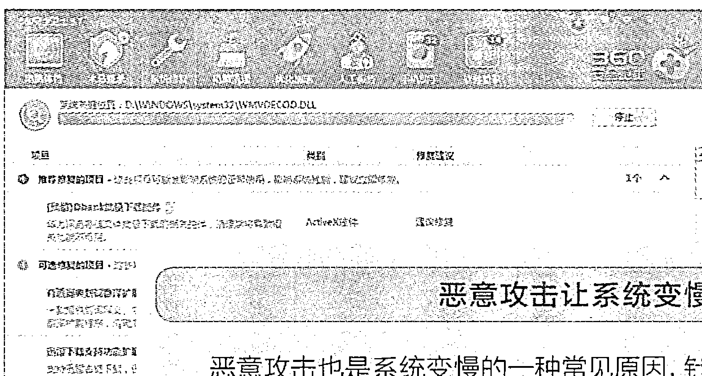

> 用360安全卫士检查是否存在恶意插件

## 恶意攻击让系统变慢

恶意攻击也是系统变慢的一种常见原因，针对这种情况，我们可以通过安装强有力的第三方安全软件（如360杀毒套装），并将病毒库升级为最新来查杀整个系统内存和文件系统。如果能查出恶意软件并妥善得到解决，系统运行速度会得到明显提升。

## 网络问题让系统变慢

网络出现问题也可以引起系统运行速度缓慢，这种缓慢可以表现为整体操作速度下降或在某个局部范围操作时变慢。如果只是在下载时感到网速不如从前，就要查明网络占用的原因。一般情况下，可能是系统或者软件组件正在升级占用了网络带宽，查看系统或软件的升级进程属性可找到具体原因。此外，下载速度缓慢也可能是由于在用网高峰时期服务器访问人数太多，造成信道拥堵，但是这种缓慢仅表现为网页或网络服务访问缓慢，不会对系统其他操作造成影响。

上网时感觉速度变慢，还有可能是由于浏览器中被安装了恶意插件造成的。这时，我们可以利用360安全卫士的“系统修复”模块，扫描查看是否存在恶意浏览器插件，进而进行清理以解决因此造成的系统缓慢问题（图17）。

有时我们还会遇到联网速度缓慢的情况。这时，需要查看系统中的IP地址和子网掩码、网关、DNS服务器的设定，如果这些参数设了自动，那么在联网时系统会分析合适的网络参数，这需要一定时间，因而会造成联网速度缓慢。改观的方法是，在系统网络设置窗口中，根据网络提供商提供的网关、DNS服务器等参数，填入具体的值，而不采用默认的自动值。如果是局域网，也为每台机器分配固定的IP地址和掩码地址，这样就可以明显提高网络连接速度。

如果在打开资源管理器时速度变慢，还可能是其中连接的共享文件夹或者映射盘符等出现的问题，系统在定位这些链接时花费时间而造成了打开速度变慢。这时，我们可以找到出现此类问题的网络文件夹链接，将其断开以提升操作速度。

> 小提示
> 以上种种问题的隐患，虽然多数可以在问题出现时找到解决办法，但是最好能在平时就注重维护和保养，不要等到慢到不得了才去找办法解决。例如我们可以安装360安全卫士，并将其中的优化选项设为自动，这样出现某方面的问题时，该软件就会自动处理，或者给出处理提示，不需要我们遇到问题后才去挖空心思找原因了。

## 频繁重启 自动关机为哪般

我们有时会遇到系统莫名其妙地自动关机或重新启动的怪现象，而在这种现象的背后其实也隐藏着许多“蛛丝马迹”，这些情况既可能由硬件问题引起，也可能是软件方面的原因。

硬件引起的系统自动关机或重启，多数可能是由于CPU或显卡过热、灰尘积攒或风扇失灵造成的，通过必要的软件检测很容易查出当前温度是否超标，并通过除尘或更换、加装风扇来解决。此外，内存或显卡松动、多条内存条不兼容也可能造成自动重启或关机，只需重插内存条、显卡或更换兼容的内存条即可解决。另外，机箱电源或电压问题也会造成自动关机或重启，可通过检查或更换来验证。

软件问题引起的系统自动关机、频繁重启等现象也很普遍。下面我们就讲述软件故障引起的自动关机和频繁重启的检查和排除方法。

首先，操作系统出现故障会引起系统自动重启。在默认情况下，系统检测到故障后会做事件记录，之后会自动重启系统。如果不希望系统遇到问题时自作主张地重启，通过系统设置窗口的“启动和故障恢复”窗口，将系统失败时“自动重新启动”复选框的选择去掉就可以了（图1）。

而说到自动关机，除因突然断电引起之外，多数情况是因为系统中的某个具有自动关机作用的指令引起的。这一指令或存在于系统计划中，或存在于某个软件的任务中，但最终以执行能够关机的系统指令来达成目的。明白了这个道理，我们就可以通过逐一排查可能含有自动关机指令的软件，找到解决的办法了。

在下载软件中，常常会有下载完毕后自动关机的选项，若有意无意中选择了这样的选项，就会造成下载任务完成后自动关机的现象。迅雷的自动关机选项隐藏在窗口底部的“计划任务”文字链接中（图2）；硕鼠的自动关机选项藏在Nano下载器中，点击“显示更多设置”才能看到“下载完毕自动关机”选项（图3）。目前的一些主流云盘中也留有这样的选项，如360云盘、百度云客户端中都有这样的选项，遇到以上情况，请右击系统托盘的云盘图标，检查自动关机的选项是否被选中，取消选择即可解决问题（图4）。

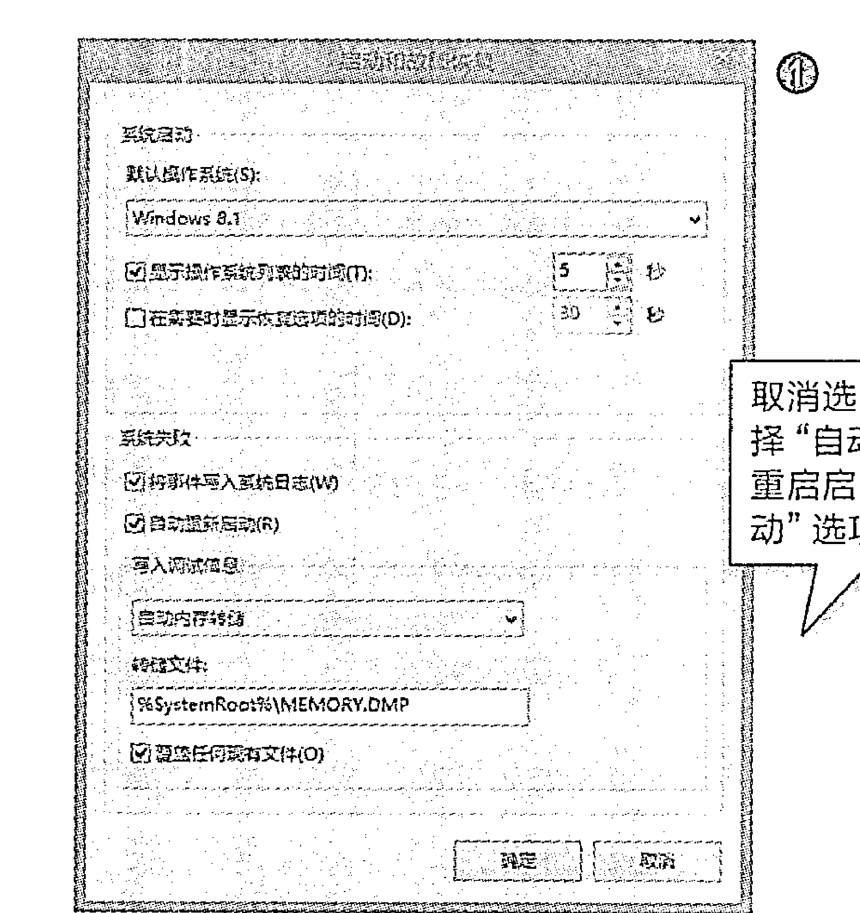

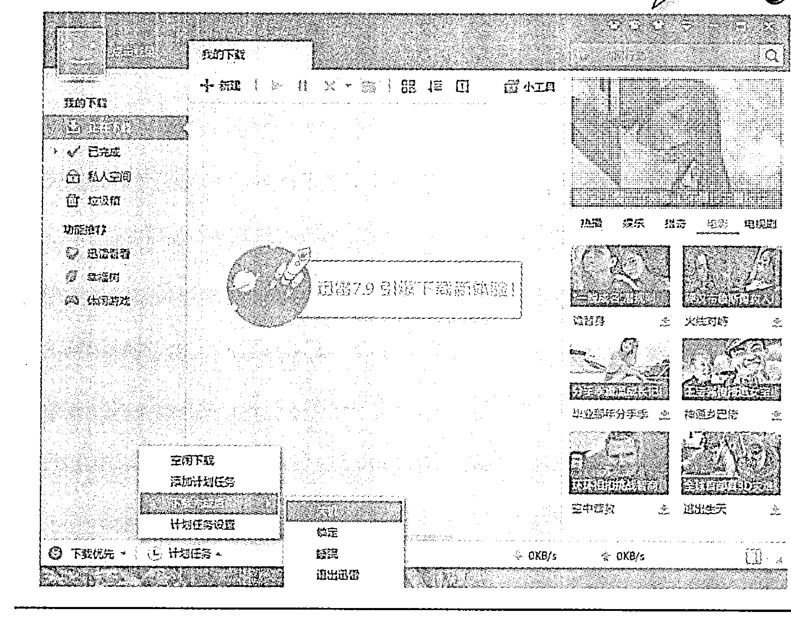

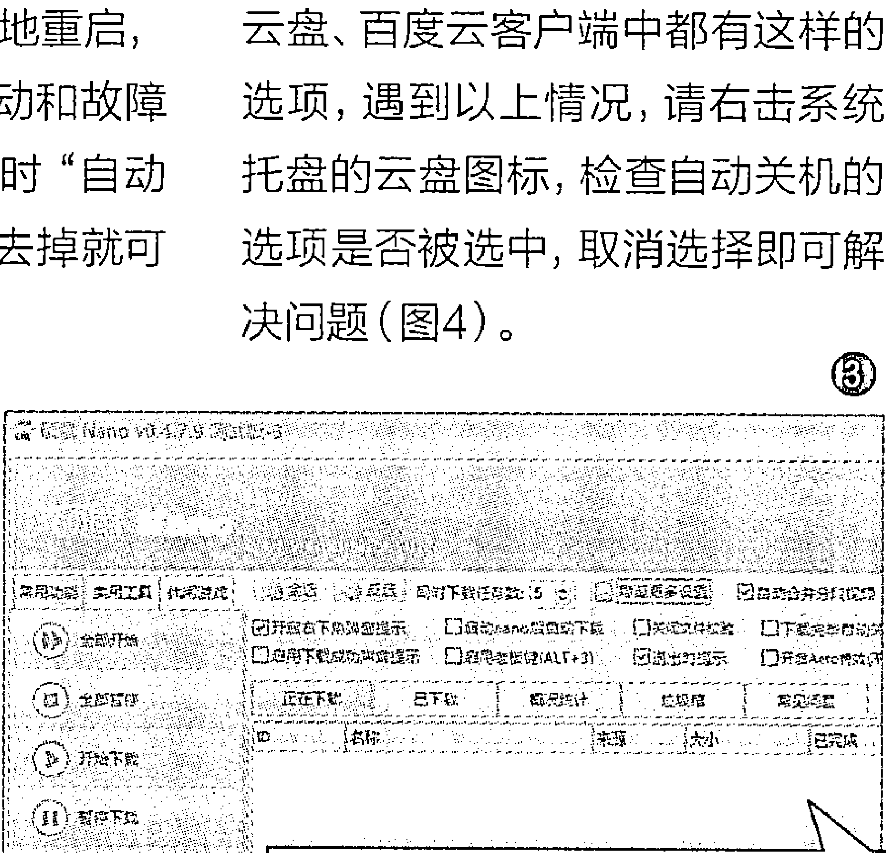

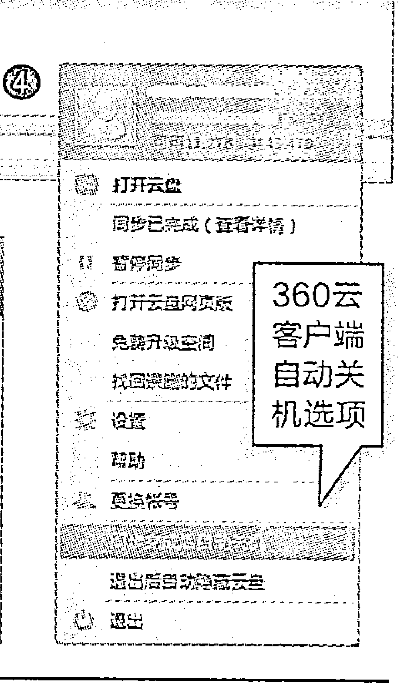

> 小提示
> 电脑被恶意软件感染后，也可能会造成关机或重启。安装杀毒软件后，首先将病毒库升级为最新版进行查杀，以排除病毒感染的因素。

## 出现“不可能”的登录记录

使用聊天工具、邮箱、云盘等网络工具软件时，有时我们会发现一些自己觉得不可能的“灵异”现象。例如，一周没有使用QQ，按理说当我们再次开启之后，多少也会有一些信息出现，但我们却发现一条也没有弹出，好像这几天穿越了“真空”一样。此外，查看邮箱或云盘的使用记录，可能会发现在一个自己认为不可能的时间进行了登录操作。而这类“蛛丝马迹”表明，我们的网络账号很可能已经泄露给别人，其他人已经用我们的账号进行了登录操作。

如果出现莫名“漏读”聊天记录的异常情况，我们有理由怀疑账户已经被别人获取，只是还没有修改我们的密码而已。尽管这种猜测不是肯定成立，也许这期间我们的QQ真的还没有收到任何信息呢。但俗话说“宁可信其有，不可信其无”。在这种情况下，最好还是去修改自己的QQ密码，不要等恶意者修改了我们的密码，再去找回就麻烦多多了。

进入QQ系统设置窗口，选择“安全设置”，如果电脑已经记住我们的登录密码，点击“取消记住密码”一项，可将留存在电脑配置文件中的QQ密码信息清除掉（图1）。然后点击“修改密码”切换到腾讯QQ安全中心“密码管理”页面，设置新的QQ密码（图2）。

除QQ登录密码外，还可以为QQ消息漫游、QQ网盘（微云）设置独立于登录密码的另一套密码。具体方法是点击QQ“安全设置→密码”窗口中的“管理独立密码”按钮，进入腾讯QQ安全中心“密码管理→QQ服务独立密码”或“密码管理→网络硬盘密码”进行专门设置（图3）。

如果自己在某个时间段根本就没有使用云盘或邮箱，但发现云盘或邮箱的登录记录中出现有登录的时间记录，这个时候也可能存在账号泄露的情况。为安全起见，最好重设云盘或邮箱密码。

以百度云盘为例，查看登录是否异常的方法是：在云盘页面用户账户下拉列表中选择“个人资料”一项，在“登录历史”列表中，可以核对自己的每次登录时间，看其中是否有可疑的登录时间（图4）。

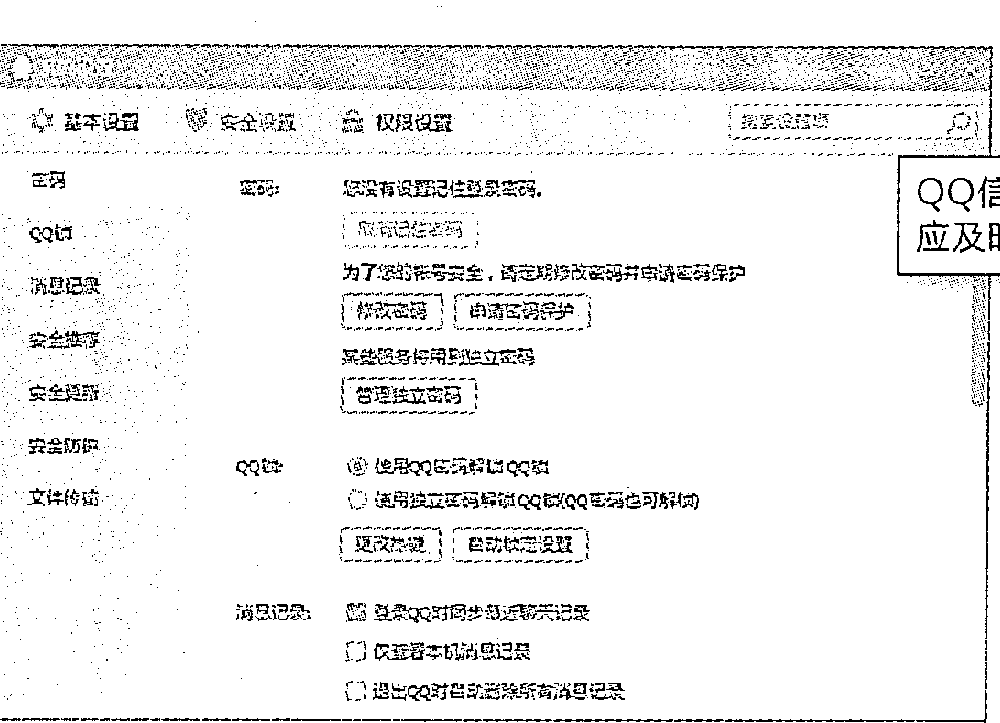

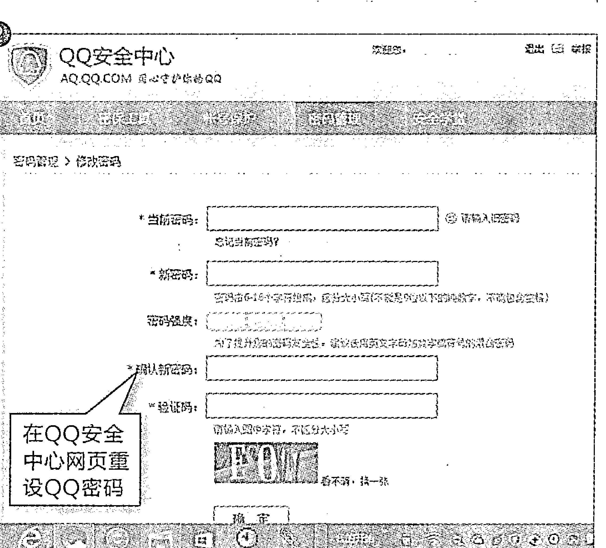

> QQ信息莫名漏读应及时修改密码
> 为QQ特殊服务设立独立密码
> 查看云盘登录历史记录发现可疑登录

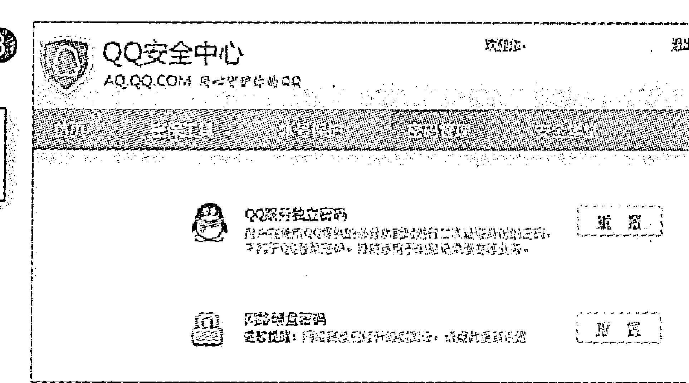

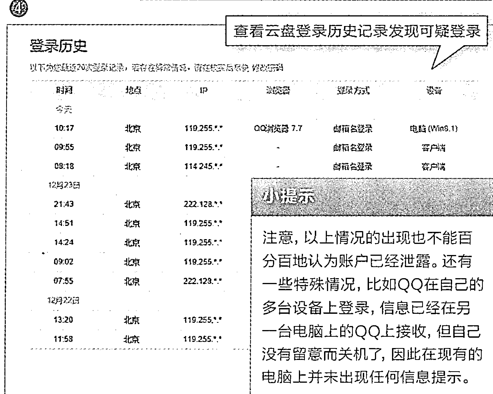

### 小技巧

云盘一般有多种平台的客户端，如果除了在PC上安装某种云盘的客户端外，还在Android或苹果设备上安装了该云盘的客户端，那么在移动设备上登录云盘之后，客户端可能处于后台开机自动登录状态，这样当我们使用该设备时，就会在不知不觉中自动登录一次云盘。这时，就会错以为别人登录过自己的账号。要排除这种可能，只需检点一下自己所用的移动设备，看是否安装了该云盘客户端以及是否存在自动登录的可能。

## 云盘链接异常 无法访问资源

随着“云”技术的发展和普及，目前使用云盘来共享和转移文件资源的用户越来越多。但我们常发现，从网上搜索获得的云盘下载链接由于某种原因而失效，点击链接显示链接失效信息而无法访问。遇到这种情况，是不是就选择马上放弃呢？其实，链接失效并不表示云盘里没有这个资源了，多数情况下资源还存在，找到的希望还是有的。

从分享链接失效这一“蛛丝马迹”来看，它只表示某个人分享这个文件的链接失效，但并不意味着在服务器中不再有这个文件的存储。分享的链接如果失效，可能是由于分享者取消了文件的分享属性，或者是文件名中有关键词因不合云盘官方关于文件分享的规定，被认为是不合法文件而取消分享；还有一种可能是文件服务器临时出现问题使文件变得无法访问。针对这些情况，我们可以采取不同的应对方法，尽一切可能找回有效的文件获取途径。

如果共享文件的链接失效，那么我们还可以通过专门的搜索技巧，获得另外的共享渠道。大家知道，文件被分享之后还可能被二次分享，这样同一个文件可能存在于不同的云盘或文件服务器中，如果一种云盘或文件服务器中的文件链接失效，不代表其他分享渠道中的文件也失效。即便是同一种云盘，A分享的这个文件链接失效，很可能B、C、D或更多人同样也分享过这个文件。利用这一特性，我们可以通过搜索其他渠道的共享文件资源来弥补不足。

若使用百度云盘，可以使用网盘屋（http://www.wangpanwu.com）、盘找找（http://www.panzz.com/）等专用搜索引擎来搜索更多的同类共享资源。比方说，找的一本古书《黄帝内经》的百度云盘共享链接失效，无法下载了。这时可以打开“盘找找”搜索页面，输入“黄帝内经”关键词（图1），点击“搜索一下”，然后就可以在搜索结果中看到更多人共享的与该书相关的云盘链接（图2）。点击其中的链接，可直接到达该资源链接的百度云中，选中共享文件或文件夹，点击“下载”按钮就可以进行下载，或者用“保存到我的百度网盘”将资源离线保存到自己的百度云空间中（图3）。

如果因为服务器临时维护或关闭出现链接失效，那么，换个时段访问，也许链接又能恢复正常了。上面我们只列举了百度云盘的情况，其他云盘的文件共享和资源失效的搜索补救，方法类似。

### 小提示

选择“保存到我的百度网盘”需要登录到自己的百度账号。如果有现成的账号，只需点击“登录”填写账号即可。若还没有百度账号，只需现场申请一个，即可获得足够用的免费空间。

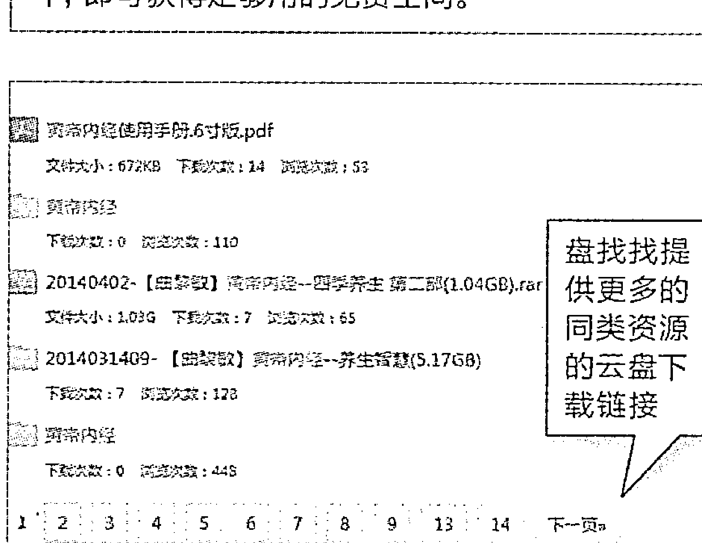

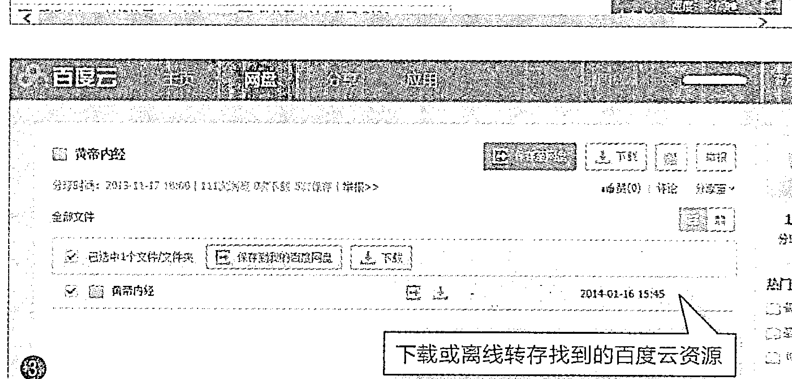

## 设定陷阱 获知入侵情况

我们不仅可以从系统表现出的“蛛丝马迹”中发现问题、分析和解决问题，换一种思路，我们甚至可以自己设定陷阱，然后从陷阱中的蛛丝马迹来发现系统被侵入的情况。

如果我们怀疑自己的电脑常被别人偷偷访问，或者有黑客闯入电脑进行操作，那么，可以设定一些陷阱来“诱敌行动”，这样，一旦他人闯入，入侵者在我们设下的诱惑下执行了某种操作，那么，通过这些蛛丝马迹，我们就能确定有人动过我们的电脑，包括具体操作时间也可以一清二楚。

### 文件自动消失法

工资、银行卡等信息是敏感信息，是入侵者肯定希望看到的内容，针对这个特点，我们可以在某个特定的文件夹下建立一个或几个文件，例如在“D:\我的文件”下建立“工资还在.TXT”、“银行卡还在.TXT”等文件，这些文件中可以胡乱输入一些与工资、银行卡等根本无关的信息（图1）。接下来，在电脑桌面、系统盘或各数据分区以及“D:\我的文件”目录等显眼位置，统统放上一些简单的BAT文件，如“我的工资.BAT”、“我的银行卡.BAT”，这些批处理文件当中都包含输入自动销毁“工资还在.TXT”和“银行卡还在.TXT”两个文件的简单命令“DEL /Q D:\我的文件\工资还在.TXT”和“DEL /Q D:\我的文件\银行卡还在.TXT”（图2）。

其后，当入侵者发现有“我的工资”或“我的银行卡”时，十有八九会产生兴趣，于是会迫不及待地双击打开看个究竟，这时批处理会自动执行，自动销毁“D:\我的文件”目录中的两个文件。

当我们打开电脑，发现这个目录中的两个标志性TXT文件消失了，那么就可以判定有人运行了电脑中的相应批处理。

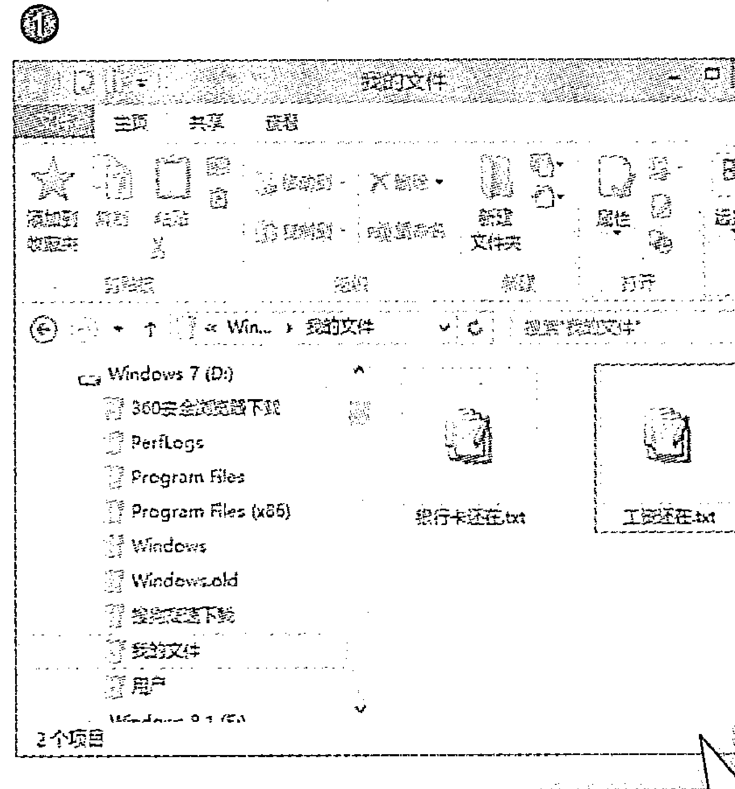

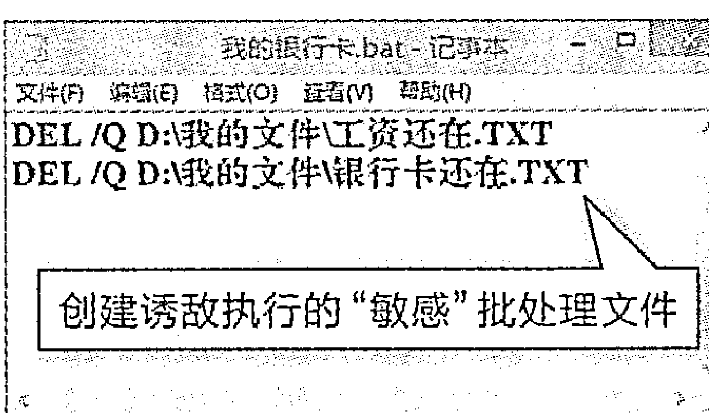

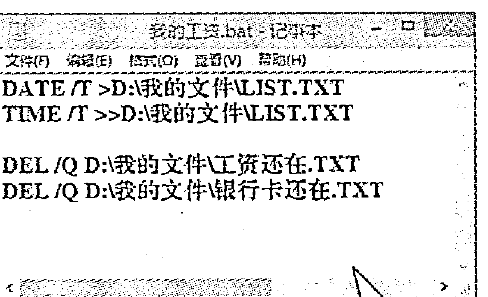

> 小提示：DEL是销毁文件命令，参数/Q表示静默销毁文件，不经用户确认。

### 操作时间记录法

更进一步，如果我们想知道入侵者执行该文件的具体时间，那么，只需要在以上批处理文件的首部增加两条命令“DATE >D:\我的文件\LIST.TXT”和“TIME >>D:\我的文件\LIST.TXT”，这样，当文件销毁操作被执行之前，批处理文件会先自动将操作的日期和时间记录到“D:\我的文件”文件夹中的LIST.TXT文本文件当中（图3）。

一旦“敏感”文件被执行，当我们打开电脑后，只需打开“D:\我的文件”下的这个LIST.TXT文本文件，就可以清清楚楚地看到入侵者偷窥我们“银行卡”的具体操作日期和时间了，何年何月、几时几分“作案”一目了然（图4）。

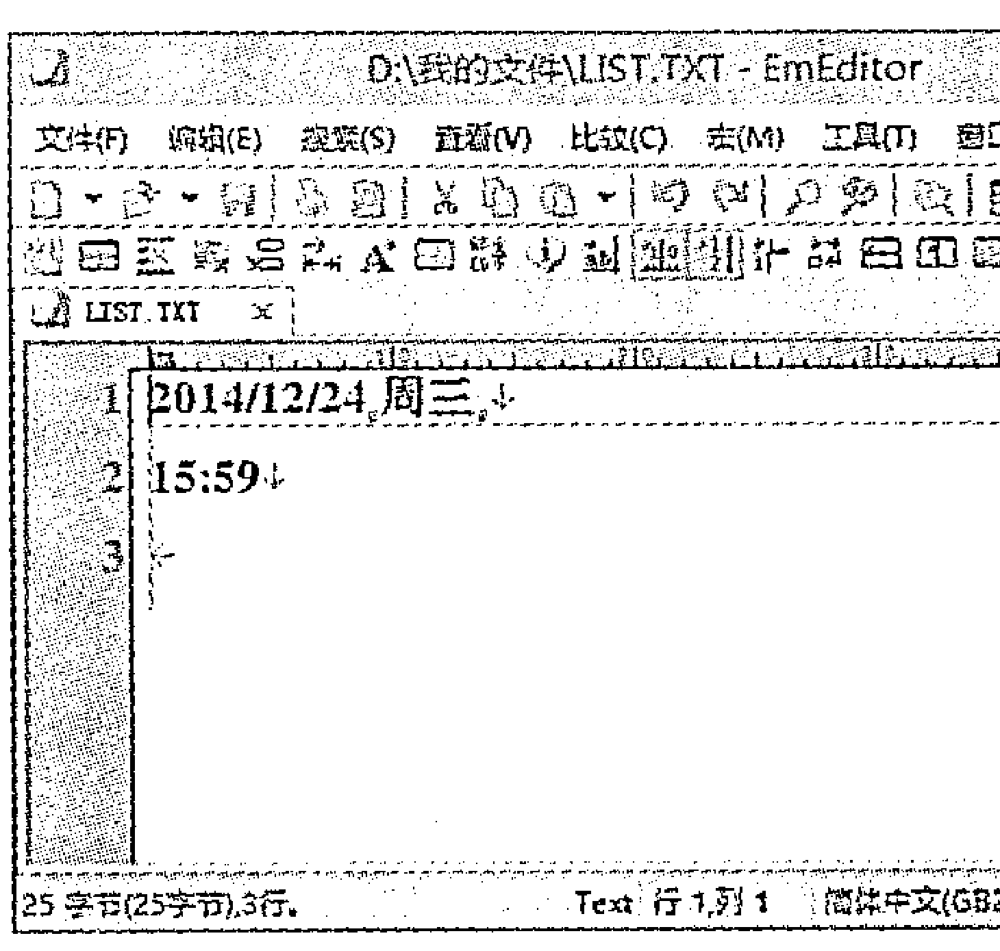## 防患于未然 那些“救命”的蛛丝马迹

对硬件产品而言，最令人揪心的就是不知道它何时“寿终正寝”。如果能从设备运行的蛛丝马迹中发现隐患并第一时间解决，不就可以尽可能避免因硬件问题而导致的损失了吗？在这里举出一些硬件问题出现前的征兆，以及发现问题后的解决替换方法。

## 鼠标

### 积劳成疾的按键问题

自从图形化操作系统Windows开始逐渐取代DOS系统，鼠标就开始逐渐超过键盘成为我们操控电脑的第一外设了。不过高强度长时间的频繁使用，也会给这个小工具带来一些问题，其中最为常见的就是按键问题。不知道用户有没有遇到过这种现象，鼠标在单击选中桌面图标时突然打开了程序，本来单击的操作变为了双击，这就是双击问题。另外在按住左键选中数个目标的时候目标突然丢失，这也是按键问题的一种，十分影响用户的正常拖拽操作。由于左键在实际操作中的使用频率远高于右键，一般这两种问题集中发生在左键上。

### 使用系统检测

其实Windows本身提供了双击相关的选项，可以排查究竟是鼠标问题还是设置不当。打开Windows开始菜单选择控制面板中的鼠标一项，在鼠标属性中第二项就是调整并检测鼠标双击的相关功能。一般在速度这里的速度条选择成中间附近，然后用鼠标去双击右侧的文件夹图标。正常情况下一秒内的两次按键会正常使文件夹图标打开（图1），但如果鼠标有问题，文件夹图标有可能单击就已经打开，或者双击后出现先打开又关闭的情况。

### 维修心得

鼠标内部PCB板上有一个小零件负责按键功能，我们按下鼠标发出的清脆声音也是由此而来的，这个零件叫做微动（图2）。一般鼠标出现的按键问题，都是这个微动导致的。微动问题的解决有两个办法，自己动手更换或者维修，或者返厂修理。如果鼠标在质保期内，强烈推荐用户返厂修理，如果自己拆开鼠标更换配件会失去质保，不过如果已经过了质保期，就需要自己解决了。更换微动有几样工具是必需的，首先就是电烙铁（图3）和吸锡器（图4）必不可少，其次是合适的微动，更换的时候需要用户有不错的动手能力。不过也别过分紧张，其实这是一个熟能生巧的过程。首先是拆掉老微动，把吸焊器的吸气头和电烙铁头尽可能地凑在一起，电烙铁点在你需要吸掉的PCB焊点上，肉眼看到焊点融化，吸焊器按在焊点上方吸掉已经被软化的焊锡。注意不要因为一次没有吸掉就不停地用电烙铁焊，正确的方法是等PCB温度降下来之后再次加热焊点重复吸焊，不然容易烧毁PCB板。更换新微动使之固定在PCB上，然后把焊锡丝点在需要焊接的微动针脚上，用电烙铁加热焊锡丝，锡丝融化以后就会顺着针脚流动到焊盘上。具体点多少合适，请参考PCB板上的其他焊点。

### 扩展阅读

#### 修理微动小窍门

如果手头没有电烙铁或者对焊工实在不行，还有一种方式就是手动修理微动，能够在不换微动的情况下解决鼠标的双击问题（图5）。不过该操作需要玩家具有一定的动手能力，一定要细心并有耐心方可。

打开鼠标，从微动两侧拆开微动开关外壳（图6），然后取下微动簧片，注意不要弄丢微动开关。使用细砂纸对簧片触点进行打磨，打磨掉微动簧片触点上的氧化物，就可以极大缓解鼠标的双击问题。不过微动簧片极其脆弱，装配打磨时尽量避免其有大的物理变形，以免得不偿失。

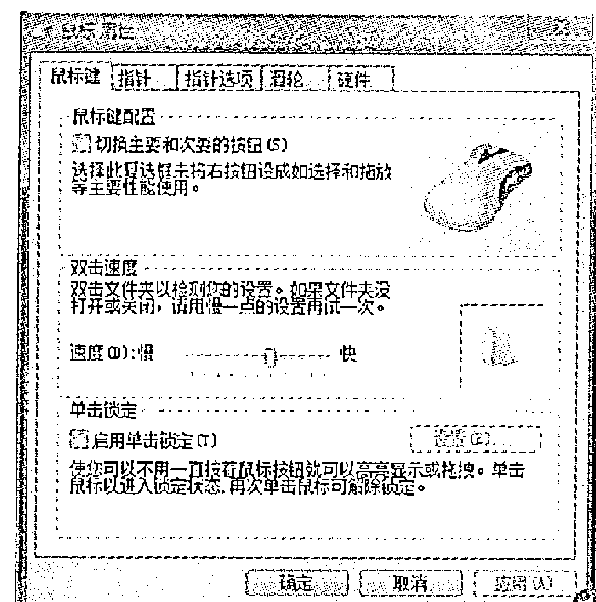

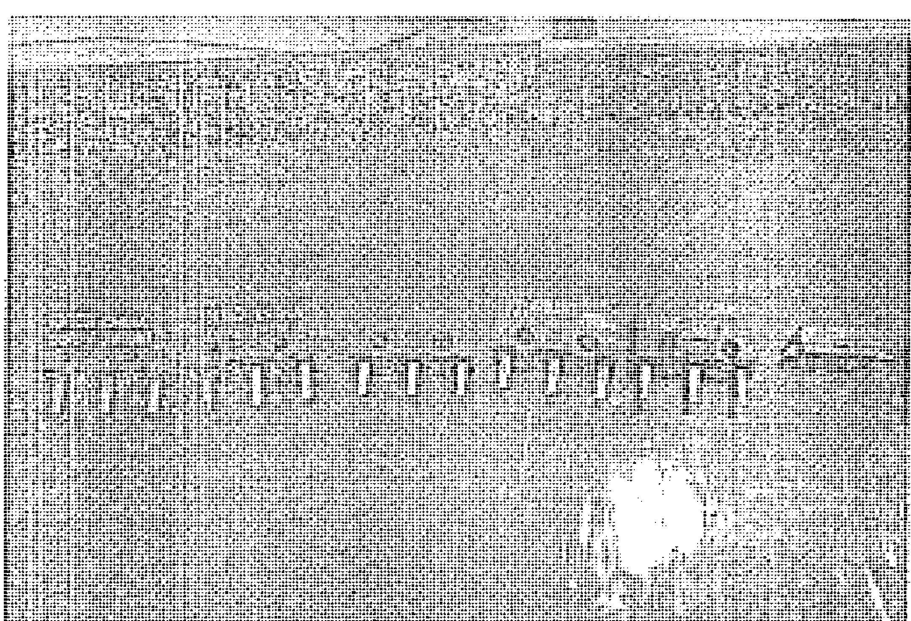

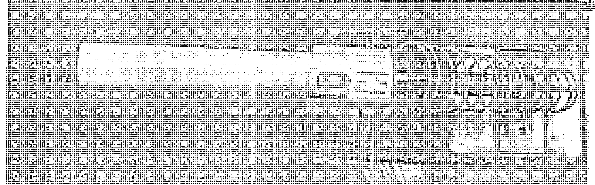

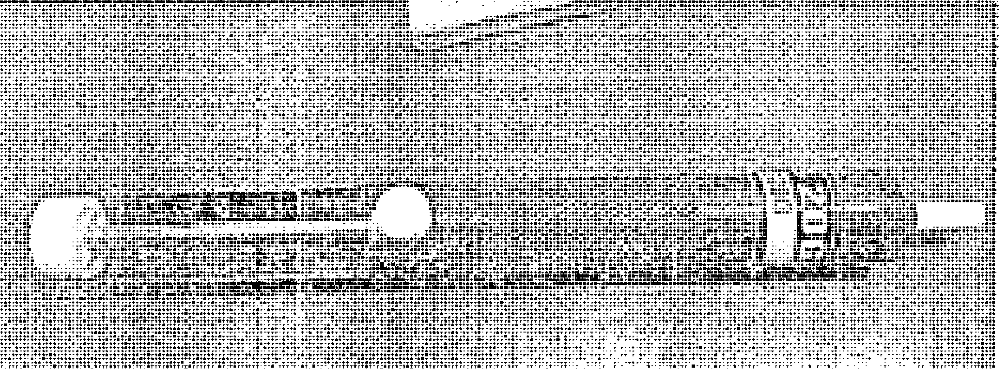

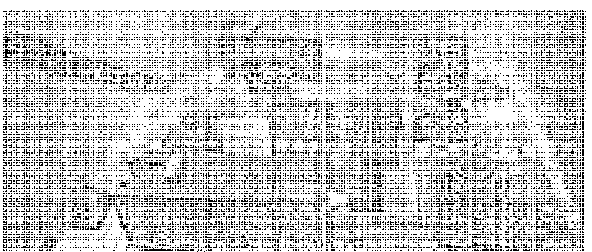

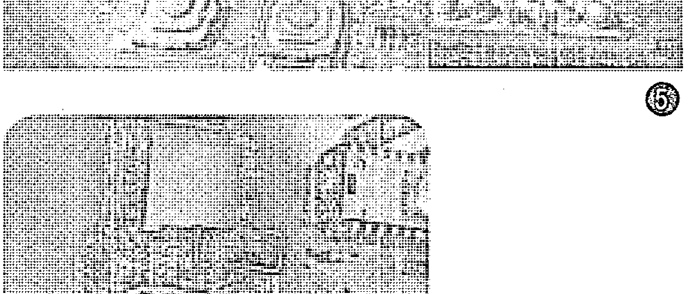

## 杜绝蓝屏死机

### 排查系统不稳定的根源

蓝屏、死机、电脑自动重启，相信使用过电脑的用户都遭遇过这类问题（图7）。不过同样的症状却可能是由不同的问题引起的，电脑中的配件很多，不同用户的使用环境也各不相同，如何排查问题所在呢？即便是专业的电脑维修人员也不一定能100%准确判断每一台电脑的症结所在，我们在排查系统不稳定的根源时需要的只是一个合理的思路。

### 电脑升级后的问题

一台始终正常的电脑，在某次用户添加了一块硬盘之后却出现了问题。具体症状表现为Windows中程序无征兆假死、偶尔死机（图8）。一般这种问题首先应该遵循先软后硬的原则，检查Windows本身出了什么问题。比如近期对Windows进行了哪些改动，或更换了哪些驱动程序，安装了哪些新的大型程序等。但实际情况是这台电脑在出问题前软件方面没有任何大的变动，唯一的差别是增加了一块硬盘。硬盘有问题？使用工具检测新硬盘，通电时间和磁盘状态都正常，确实是一块全新的HDD硬盘，硬盘本身没有任何问题。最后将电脑报修后才知道，由于这位用户使用的是品牌机，其内部电源为OEM电源，并没有为系统后期升级留出余量。用户在购买电脑两年间先后增加了三块硬盘，前两块还在电源可以接受的幅度内，最新添置的一块硬盘成了压倒骆驼的最后一根稻草。别看硬盘小不小起眼，但对于很多品牌机的电源来讲也是会不堪重负的（图9）。

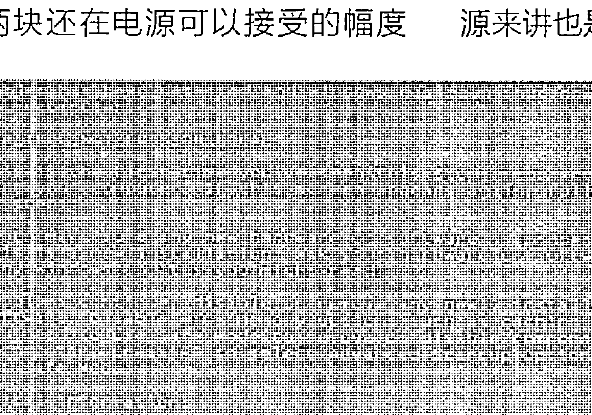

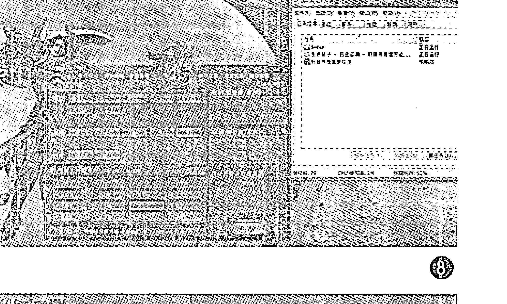

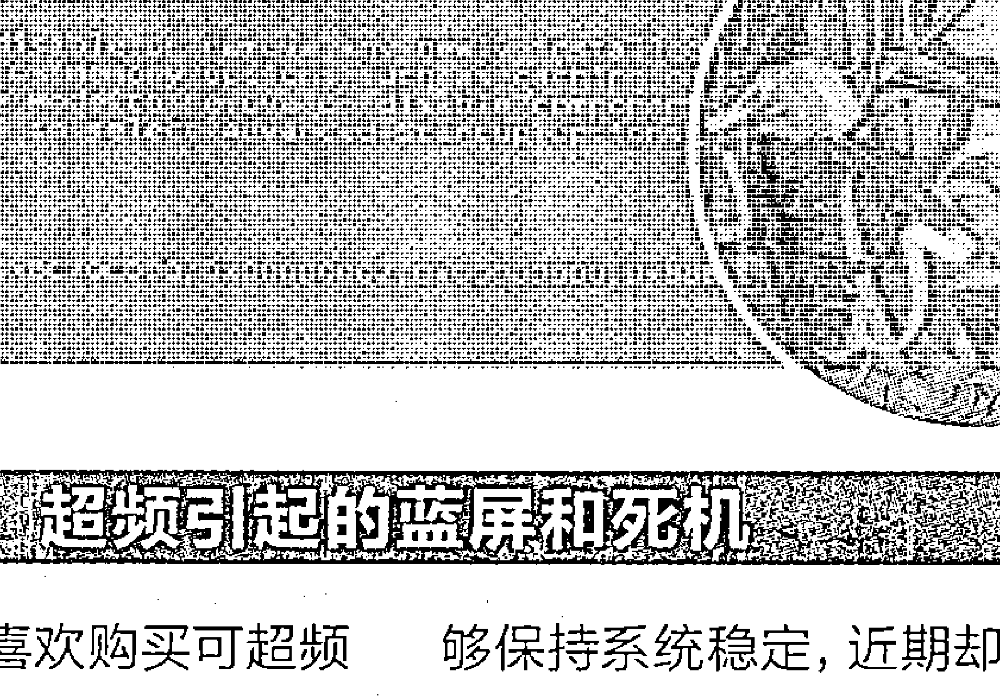

### 超频引起的蓝屏和死机

不少DIY用户喜欢购买可超频的CPU和主板，使用超频将CPU运行在更高的频率上获得更好的性能。一般选择超频的用户都对超频的相关知识略知一二，所购买的产品也确实适合超频使用，现在处理器超频也比较简单，根据教学能很容易让系统稳定。

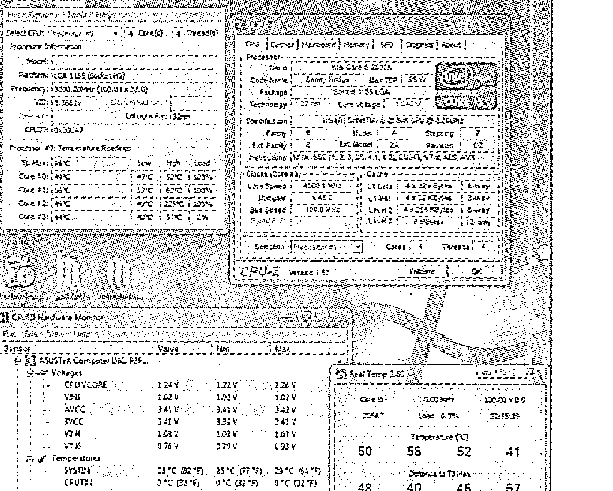

之前的读者来信中一个例子就是这样，他选用了Intel的酷睿i5-2500k和Z68主板，之前一直是在CPU电压1.25V左右将处理器超频至4.5GHz使用，这个频率下处理器的性能超过了目前所有i5处理器的默认性能（图10）。不过近期问题来了，在这个超频状态下用户在进行游戏时经常蓝屏，有些时候在Windows待机状态下也有死机现象。用户选择稍微调高CPU电压以求稳定却没有任何帮助，这是怎么一回事呢？

经过交流得知，由于近期游戏大作对内存的要求愈发夸张，他将系统内存从原来的4GB×2双条升级为4GB×4四条，这是在最初的来信中没有提及的。于是回复他内存的频率依旧保持1866MHz，稍微降低一下内存的时序，由原来的9-9-9-24降为10-10-10-27，一切问题都得到了解决（图11）。

理论上只要CPU电压和PLL电压在合理范围内，并且做好散热基础，即便在超频状态下长时间使用CPU也不那么容易出现电子迁移问题。就算出现，我们稍微调高CPU电压也能保持系统的稳定。但这位朋友的情况并不符合，首先他的超频电压很安全之前也一直能保持系统稳定，近期却突然频繁死机蓝屏，增加电压也无法解决他的问题。

这位用户认为增加了两条与原本内存完全一致的内存条不会产生任何兼容性问题，所以完全忽视了内存导致蓝屏死机的可能。实际上在他的系统中内存确实没有兼容性问题，但是在主流平台上，将四条内存插满时给系统带来的压力远非两条内存可比（图12）。在这种情况下适当放弃一些内存的时序小参数或者内存频率，保证CPU的超频是弃卒保车的策略。

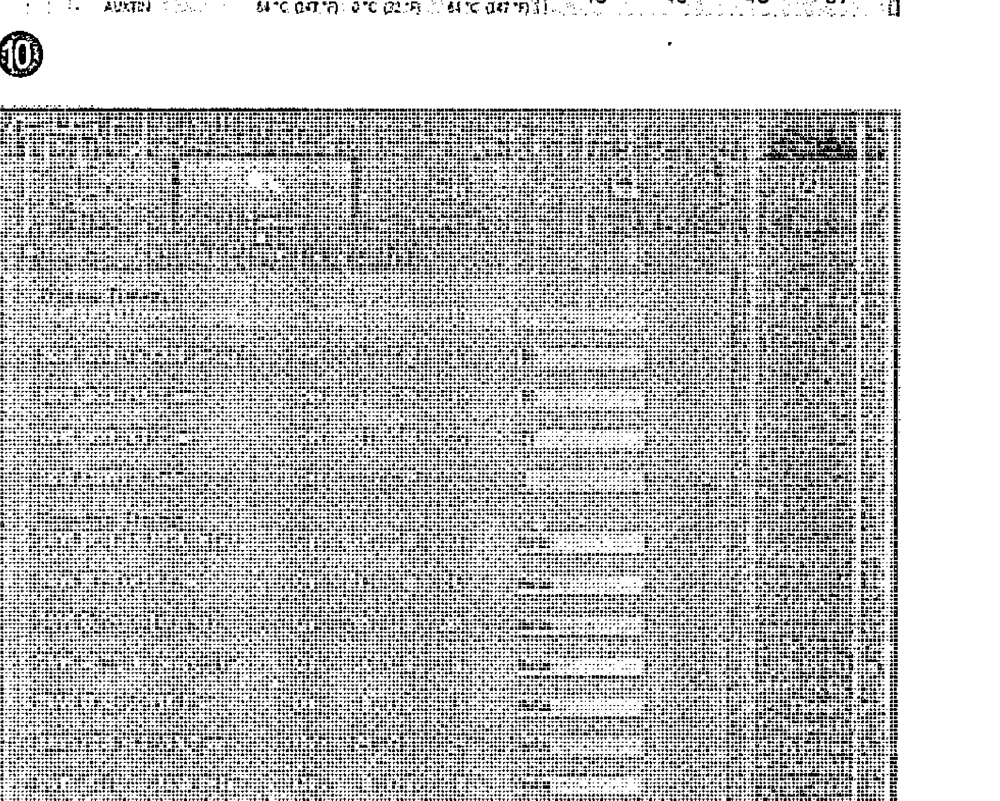

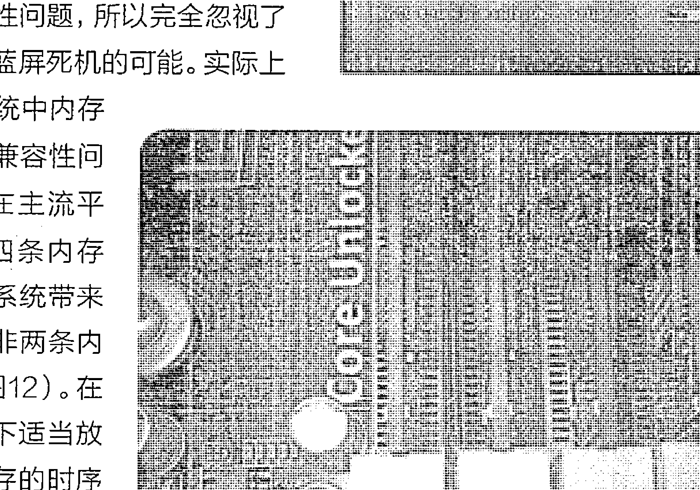

## 硬盘

### 及时发现潜在问题

硬盘负责PC系统的数据存储，一般来说只要我们打开电脑，硬盘就始终处于读写状态直到我们彻底关机。由于工作频率太高，硬盘也是PC系统当中比较容易出问题的一个，尤其是HDD由于内部存在物理运动，损坏的几率更高（图13）。其实硬盘的问题并非只要出现就等于无法使用，很多硬盘出问题前甚至出问题时的症状都很轻微，并不影响使用。但是如果不加以防范任其进一步发展，可能最终会导致盘体损坏数据丢失的惨剧。一般来说PC异常断电或关机、磁盘突然产生噪音，都需要特别关照一下硬盘是否会产生问题。如何在硬盘刚开始出现问题甚至是即将出现问题之前发现隐患，是我们需要掌握的。

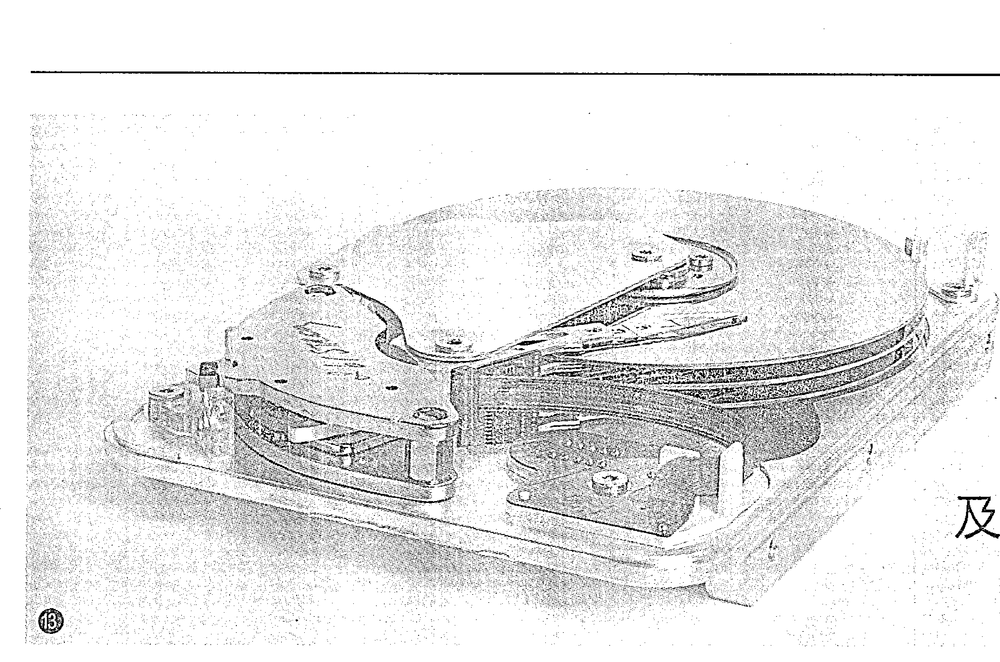

### 读懂S.M.A.R.T.信息

其实很多用户根本不知道如何查看自己硬盘的状态，硬盘常年处于问题当中而不自知。其实在HDD诞生后就有一种技术专门提供用户检测自己的硬盘，那就是S.M.A.R.T.信息（图14）。S.M.A.R.T.全称为“Self-Monitoring Analysis and Reporting Technology”，即“自我监测、分析及报告技术”。支持S.M.A.R.T.技术的硬盘可以检测磁头、盘片、马达的运行情况、历史记录及预设的安全值进行分析、比较。当出现安全值范围以外的情况时，就会自动向用户发出警告。最早只有HDD支持S.M.A.R.T.信息，SSD支持得比较差，经过几年的发展现在几乎所有家用的硬盘都能比较好地支持S.M.A.R.T.信息了（图15）。

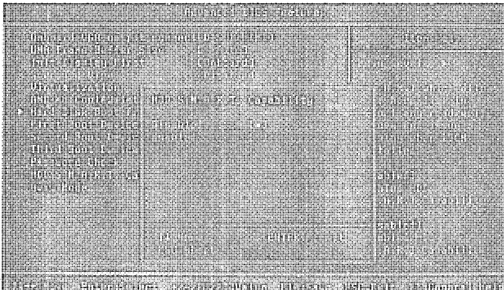

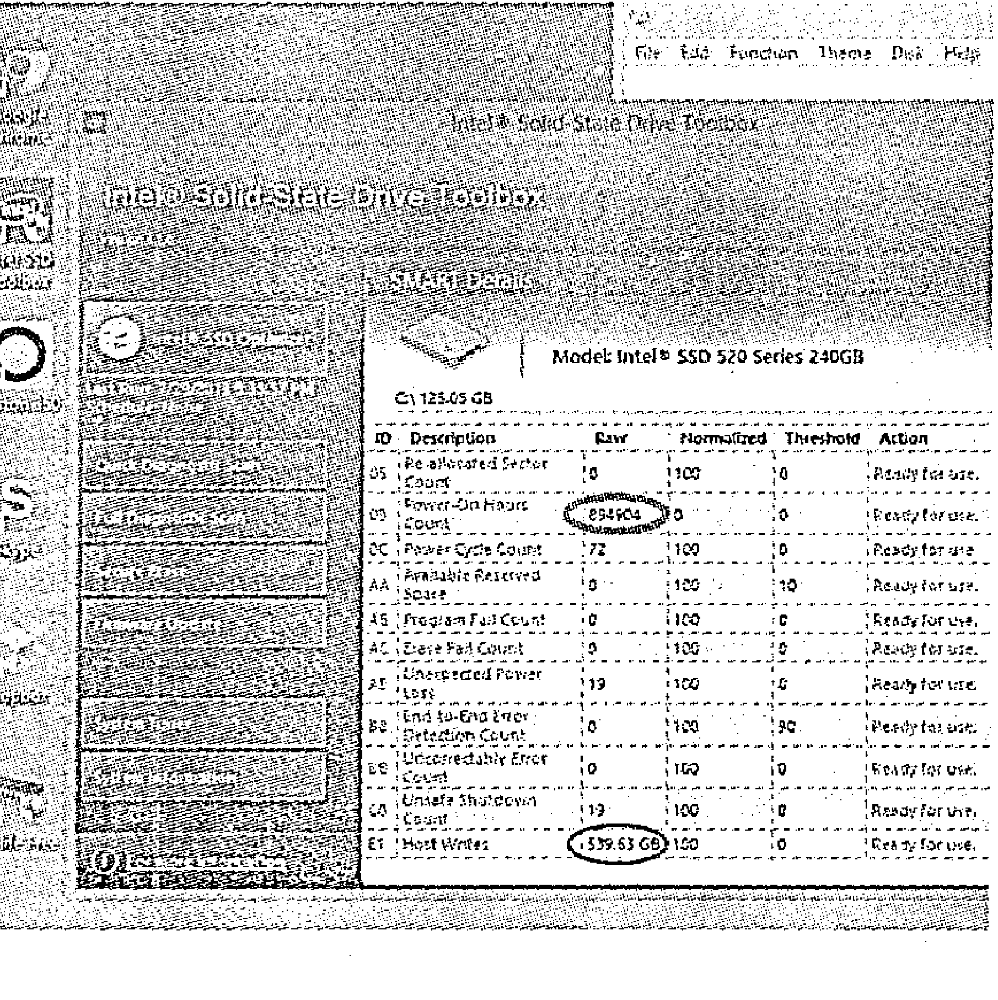

### 如何查看S.M.A.R.T.信息

查看S.M.A.R.T.信息需专业软件帮忙。经常玩硬盘的朋友肯定会知道HD Tune Pro这款小软件，这其实就是查看S.M.A.R.T.信息最方便的通用软件（图16）。打开HD Tune Pro这款硬盘实用程序，点击健康状态选项卡，显示出来的ID (05)、(C5)、(C7)等数个项目及后面的数据就是由S.M.A.R.T.信息展示出来的硬盘状态。比如说最简单的(04)和(09)两项，是马达启动/停止计数和累计通电时间计数，一般数据以小时计算。比如说笔者这块希捷320GB硬盘，由于比较老，其马达启动/停止计数已经达到2790次，而通电时间达到16410小时，约为683天。用户如果新购买硬盘，其实就可以通过这两项查看硬盘的使用次数和时间，判断硬盘是否为新货。本次我们需要查看的比较关键的几项是(05)、(C5)、(C7)这几项，这关乎于硬盘的健康状态。

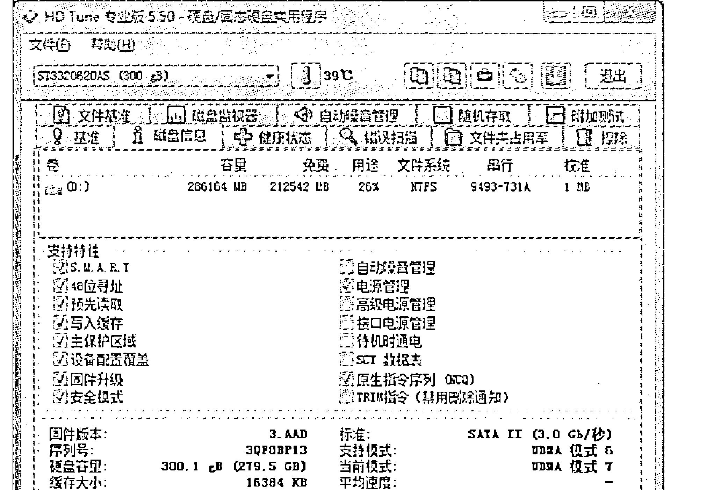

### 根据S.M.A.R.T.分析问题

(05)是重映射扇区计数，代表着HDD已经被修复的扇区计数。一般一块正常的硬盘这里的数值应该为0，而阈值代表不同硬盘允许的最大修复扇区数量，比如笔者这块希捷320GB硬盘就是36个。

先看(C5)，这是待重新映射的扇区计数。HDD由磁盘组成，而磁盘上有无数个扇区。在经年累月的使用过程中有一定几率会产生一些有问题的扇区，也有一些时候是由于电源或者是使用习惯的问题导致扇区出现不稳定。这一项上如果有数据而不是0，代表该驱动器有不稳定的扇区待重新映射。

再看问题最高发的(C7)，名为CRC接口错误计数的本项目是SATA普及以来最常见的错误计数，不少用户刚买回来的硬盘就出现了数据，这是怎么回事呢？(C7)其实一般是由于用户的SATA数据线存在问题，导致接口通信错误出现数据。

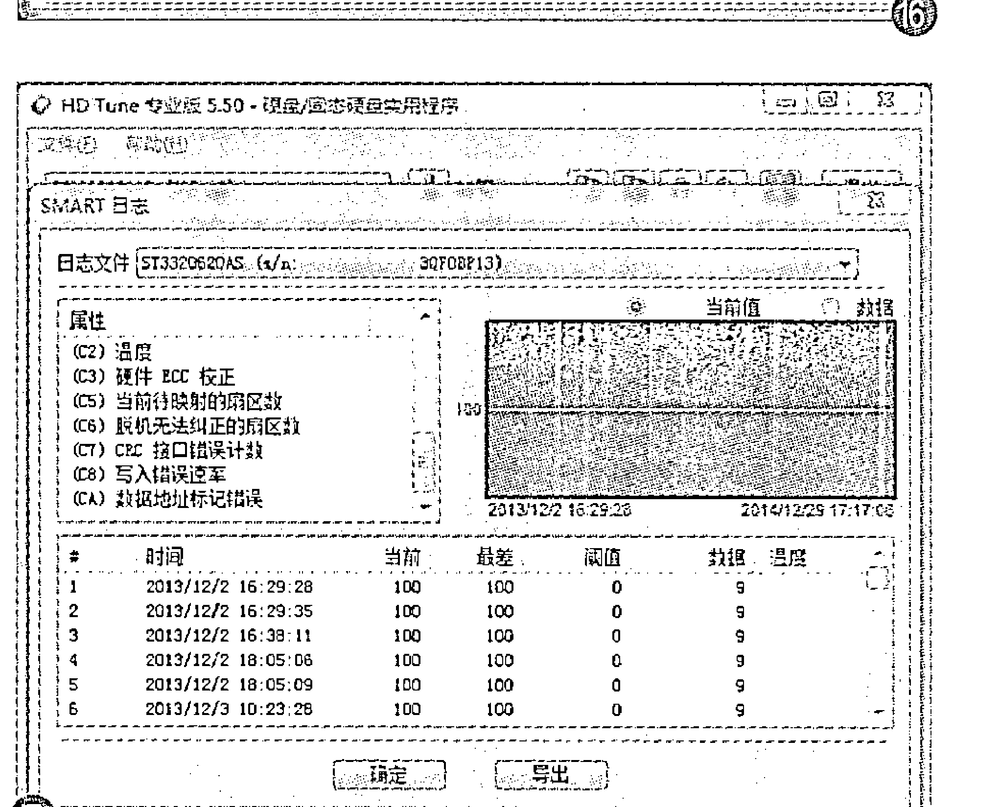

问题高发的(05)、(C5)、(C7)这几项虽然都关乎硬盘的健康状态，但危险程度各不相同。一般来讲，(05)、(C5)是比较严重的，如果出现数据确实说明硬盘有安全隐患，但一旦出现后我们还要观察数据的后续变化。比如在某天出现了个位数的数据，但之后不再增长并能稳定使用，那就说明扇区错误在硬盘允许的范围内而且没有继续恶化；如果数值不断增长，应该立刻停止使用并全盘格式化硬盘重新分区，必要时可以在DOS环境下进行低级格式化，有可能会阻止硬盘继续恶化。具体硬盘何时出现数据，数据是否在继续增长，可选中具体ID点击右下角日志一项，里面有相关明细(图17)。

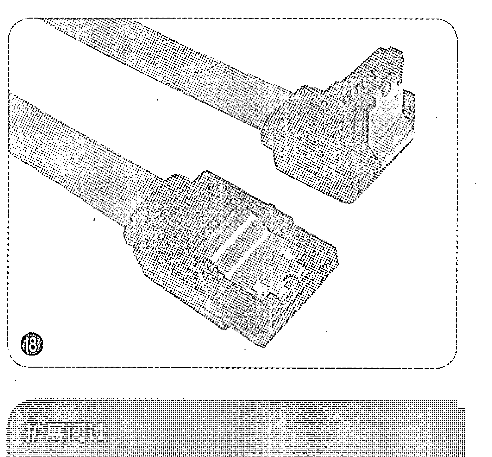

(C7)较特殊，前面说过这是由于SATA线缆引起的通信错误(图18)，本身对硬盘没有特别坏的影响。即便如此，一旦出现通信错误，还是推荐将硬盘与主板间的SATA线缆两头都重新连接，避免问题继续存在。如果重连接后数据依然增长，推荐直接更换SATA线缆。

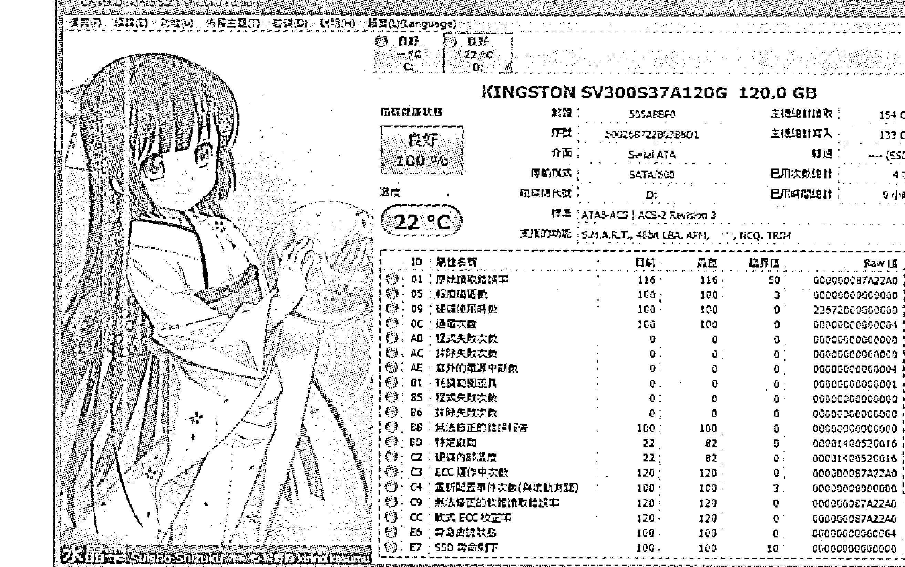

## 从现象还原本质 移动设备的“蛛丝马迹”

与手机、平板和笔记本为代表的移动设备“打交道”已经成为了我们每天工作生活中的必修课。然而，越是亲密无间，越容易发现各种各样的问题。实际上，通过分析与这些问题相关的蛛丝马迹，我们往往可以学到更多背后的理论知识，并尽可能地避免它们再次发生。

### 温度 移动设备的“紧箍咒”

#### 手机遭遇的卡顿困局

很多Android手机用户都会遇到类似问题：明明是一款旗舰配置的手机，平时运行非常流畅，但在长时间玩游戏或观看在线视频后却突然出现卡顿现象（图1）。有时该问题可以通过重启手机解决，但有时重启后系统却依旧卡顿。无论如何，手机突然出现卡顿或其他异常现象时总会伴随着机身发热。通过这个“蛛丝马迹”，我们不难找到问题出现的根源。

随着Android用户基数及影响力的增加，昔日那些由iOS独占的游戏和APP也纷纷在第一时间移植到Android系统。因此，越来越多的用户都将手机视为了“掌上游戏机”。然而，哪怕是旗舰级别的手机，在游戏的过程中也会出现偶尔卡顿甚至死机重启的现象，这是为什么呢？

#### 都是自动降频惹的祸

手机内置的“处理器”实际上是一个完整的SoC芯片，它不仅集成了CPU和GPU等芯片，还包含温度传感器等功能模块。当温度传感器检测到CPU或GPU温度过高时会自动触发降频机制，以实现迅速的降温确保芯片不会被烧坏。而前文中手机所遭遇的卡顿困局，就是源于这种降频机制。你可以想象一下，当某款处理器主频从2.0GHz降到500MHz后，还跑得动最新的3D游戏吗？

利用“Stablity Test CPU”软件我们可以对CPU进行压力测试，检测CPU主频与100%占用率下和温度的关系曲线。如图2所示，当CPU温度达到72℃后，CPU主频在同一时间就下降了50%，并在随后的5分钟里也处于被大幅降频的状态中，此时操作手机自然会感到不流畅。想让手机恢复正常，只有退出当前程序，让手机“冷静”10分钟以上才可让CPU有机会重新跑到100%的频率上。

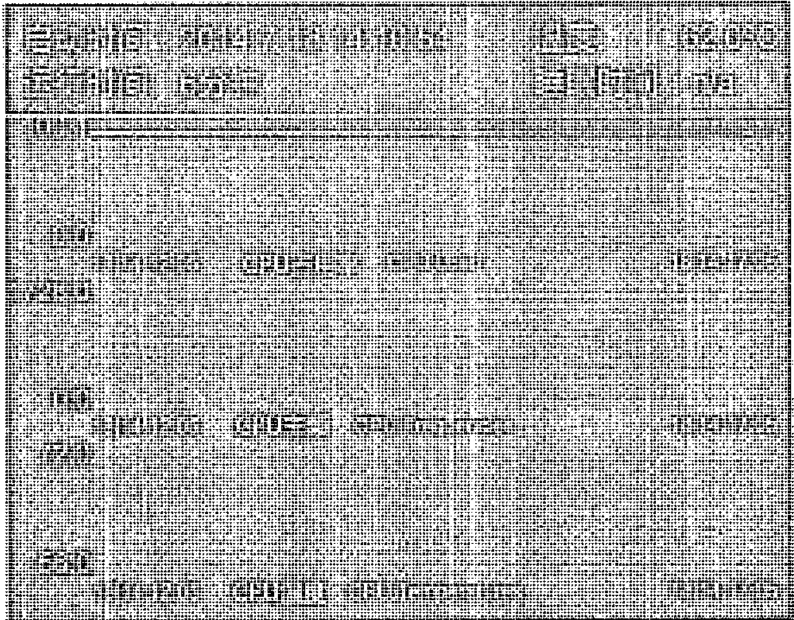

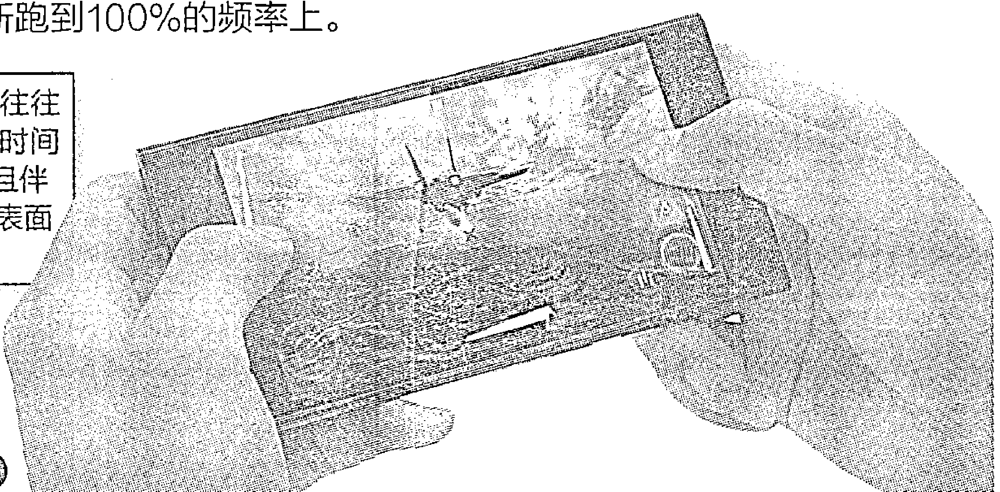

#### 可以人为禁止的自动降频

需要说明的是，CPU因高温而降频的机制是可以在系统层面屏蔽的。以图3为例，这款手机CPU的温度从69℃一路高歌猛进到99℃，CPU却一直保持在最高主频的状态，并没有出现想象中的降频现象，所以自然也不会引起手机卡顿的问题。但如此一来却导致了另外一种体验不佳的现象：手机机身太热！而且说不定会突然死机重启。

由此可见，CPU的降频机制还是很有必要的。但前提是手机自身的散热设计要过关，而且厂商在系统层面也要设定好降频温度的阈值。如果持续玩4个小时游戏才会卡我们可以忍受和理解，但如果玩上10分钟游戏就卡上了，那就有些说不过去了。

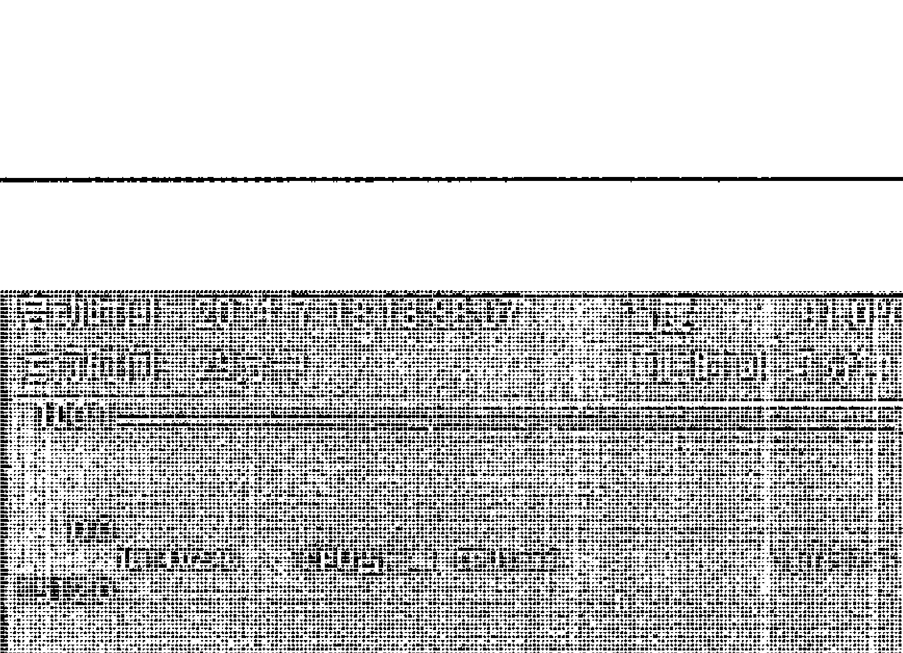

#### 卡顿遭遇“人品问题”

问题来了，理论上各大手机品牌旗舰产品的散热设计都不会太差，也都采用了同一型号的处理器（如高通骁龙801），应该是“一荣皆荣”、“一卡皆卡”才对，为何有些产品怎么玩命地用也不会卡呢？抛开系统层面的优化不谈，这里还隐藏着CPU自身“体质”的问题。
DIY玩家肯定都知道，“体质”决定着CPU的超频潜力。而在手机用的移动处理器中，“体质”将影响某款CPU的电压和频率的关系。简单来说，体质好的CPU在达到最高主频时所需的工作电压更低，因此也就带来相对更低的发热量。而高通骁龙处理器则以“PVS”值划分CPU的体质等级。在APQ8064时代PVS被划分成了slow、nominal、fast和faster四个等级，骁龙600和骁龙800时代则发展到了0～6七个等级，而最新的骁龙801则包含了一共16个等级（图4）。以骁龙800为例，神级体质的PVS6只需0.95V即可工作在最高的2265MHz主频，而最低档次的PVS0却需要1.1V才可实现。
正是由于CPU存在体质上的差异，导致了一种“拼人品”的现象：你和朋友购买的是同一型号的手机，安装了同版本的系统和某款游戏。但是，在长时间游戏时你的手机就因高温而导致降频卡顿，但朋友的手机却依旧流畅；或是运行跑分软件时，你的手机总没有朋友的手机高。而原因，也许就是朋友手机里的CPU体质更好。

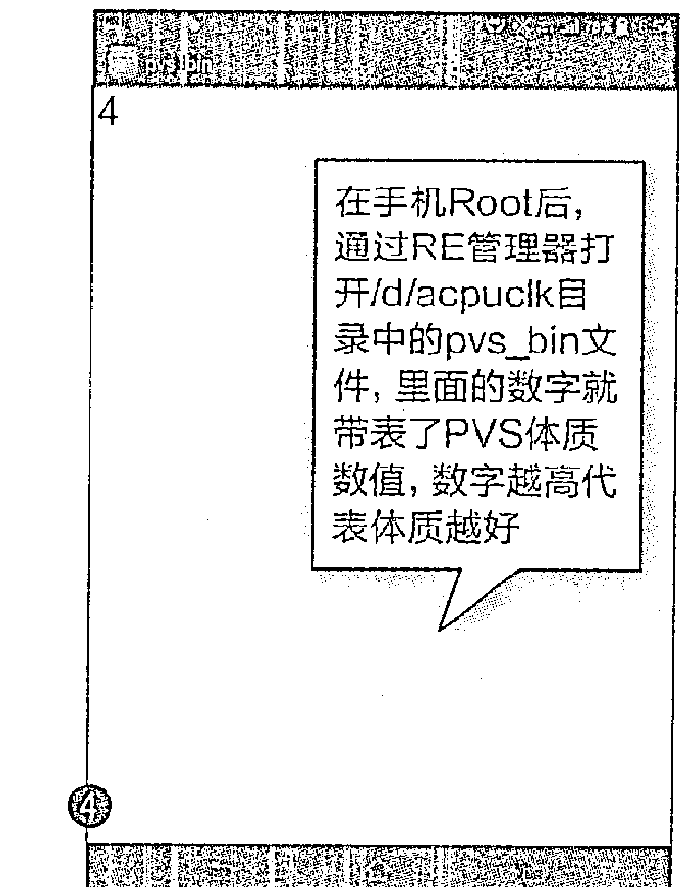

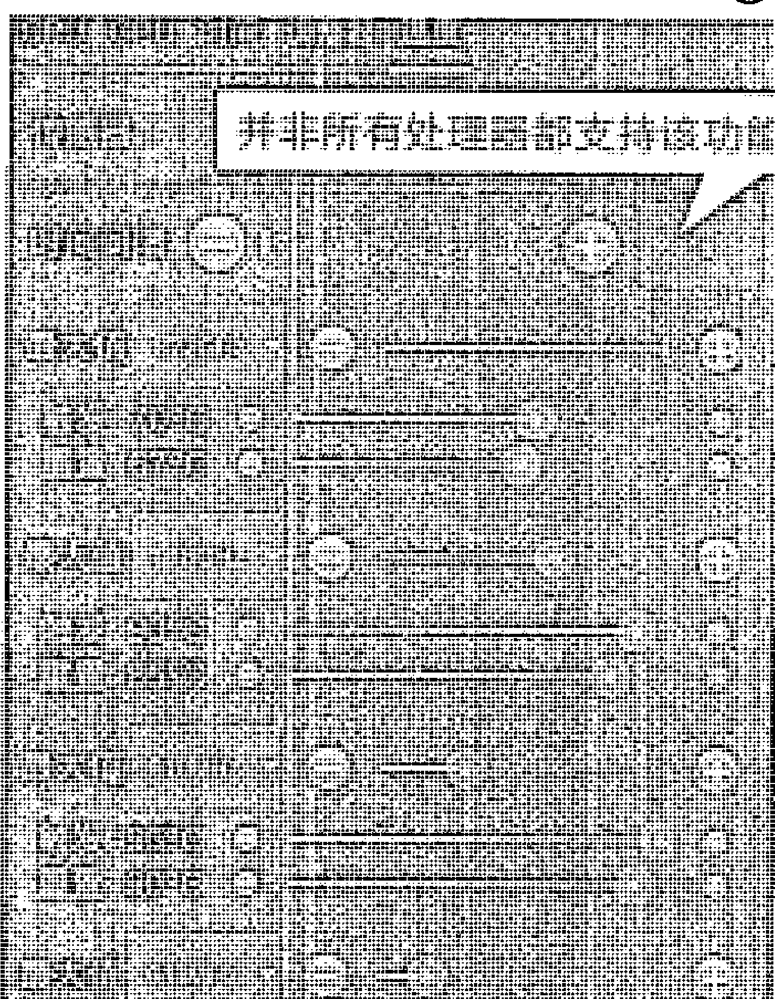

#### 如何避免因温度而起的卡顿

首先需要说明的是，降频机制有利于延长CPU寿命并确保手机稳定，但因不合理的温度阈值定义而导致手机频繁降频就需要引起我们重视了。此时，我们可以通过修改etc目录下的thermald.conf配置文件（图5）或者利用“SystemTuner Pro”（系统调谐器）软件适当提高温度阈值，从而减少CPU降频的机会。这两种方法都需要获得手机Root权限，普通用户建议使用SystemTuner，切换到“温度”选项卡内就可设定触发降频的温度阈值（图6），以及不同状态的CPU主频了。

```
sampling 10000
[tsens_tz_sensor0]
sampling 10000
thresholds 70
thresholds_clr 67
actions none
action_info 0

[tsens_tz_sensor2]
sampling 5000
thresholds 70 85 90 100 110
thresholds_clr 67 80 85 95 105
actions cpu+battery cpu+battery cpu+battery cpu+battery cpu+battery shutdown
action_info 1512000+0 1242000+0 594000+1 384000+1
```

扩展阅读：除了手机用的ARM架构移动处理器外，笔记本电脑搭载的处理器同样存在温度阈值的定义。例如，有些独显笔记本在默认模式下睿频功能就会失效，或是玩游戏的过程中也会因高温引起睿频失败甚至CPU大幅降频而导致游戏卡顿。此时，我们也可以利用“ThrottleStop”软件来自定义这个阈值（图7）。具体数值请参考本刊2014年18期《让本本性能满血的“秘密武器”》这篇文章。

## 彻底清除“你的痕迹”

### 简单粗暴的系统恢复

在手机“易主”之前，删除个人数据的环节是必不可少的。还好，Android系统自身就提供了“恢复出厂设置”的功能。如果你想彻底清除所有的个人数据（比如拍摄的照片、APP下载和生成的缓存文件），一定要勾选格式化存储卡一类的选项（图8）。这就好比我们格式化了PC的硬盘并重新安装了Windows系统，属于“推倒重建”，一劳永逸。

手机中保存并记录着很多我们个人的数据，比如浏览器记录、微信账号、聊天记录等，这些信息如果被有心人盯上自然后患无穷。有时候我们会将手机借给好友，或购新机后在网上卖掉，此时就要学会“抹杀”你自己的使用痕迹的技巧了。

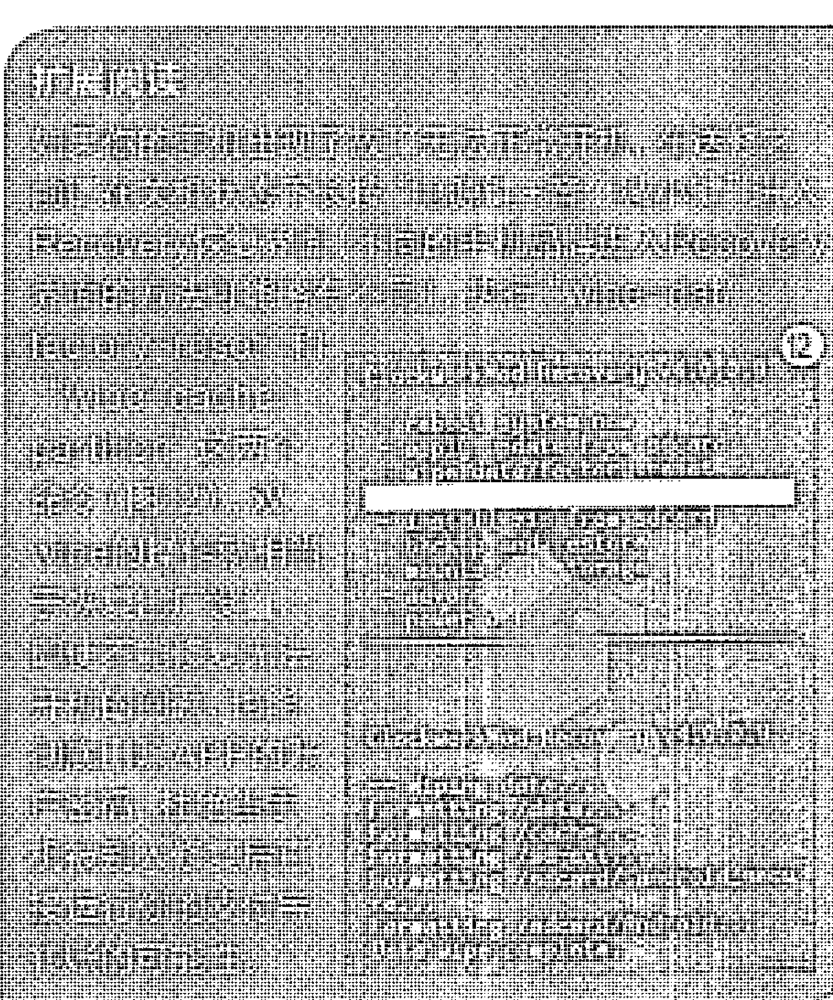

### 手动清除痕迹的方式

有时候我们只是临时将手机借给朋友一段时间，如果恢复出厂设置以后再拿回来时还需重新安装各种APP，好不麻烦。所以，我们还需要一种可手动定向清理隐私数据的方法。比如，如果你想删除微信的账号以及聊天记录，我们只需进入“设置→应用程序”，在微信的应用信息界面里点击“清除数据”和“清除缓存”即可（图9）。问题来了，像QQ、支付宝钱包、京东、淘宝等客户端APP，同样保存着重要的个人数据，如果一个一个“清除数据/缓存”无疑是件麻烦的事。此时我们则可以借助“CleanWiz”这款软件进行个人数据的定向清理。运行该APP后，在“隐私清理”界面就会列出所有可清理的APP列表，只需点击“一键清理”就可彻底删除浏览器的历史记录、QQ/微信账号和聊天记录、淘宝的账号和搜索记录等等（图10）。如此一来，我们无需卸载就可将所有APP恢复到初始状态。

### 防止个人数据‘被恢复’

也许你并不相信，被我们删除的照片、短信和通话记录是有可能被一些专业软件给修复的。如果你不希望手机易主后被外人抓到你的“蛛丝马迹”，那就需要对重要的隐私信息进行“毁灭性的打击”了。

在这里笔者向大家推荐360手机卫士中的“隐私粉碎机”功能（图11），当你恢复出厂设置并格式化存储卡以后，不妨再利用该功能搜索一下，将可以被恢复的内容彻底粉碎。

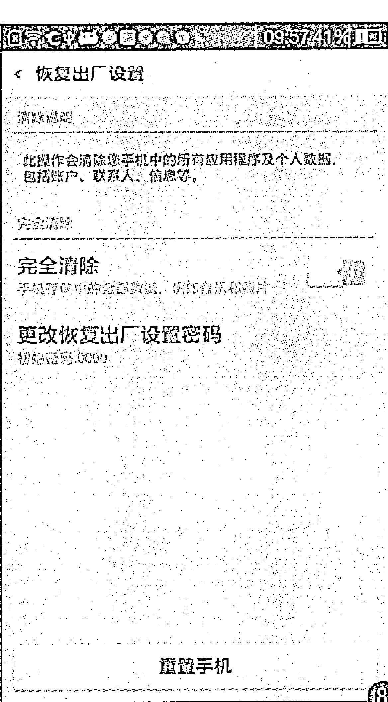

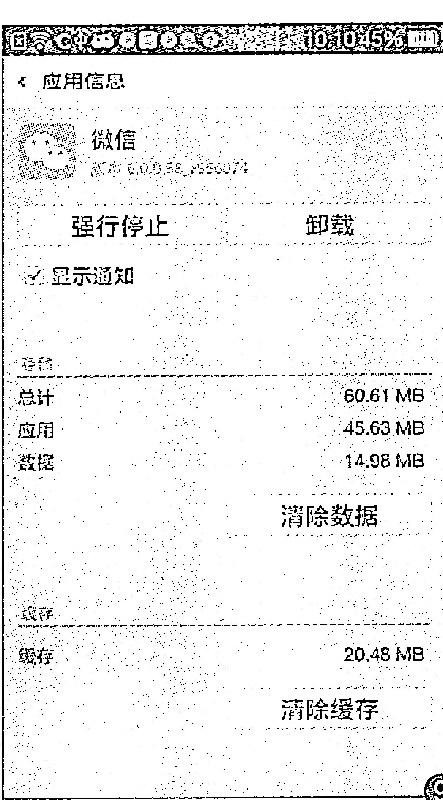

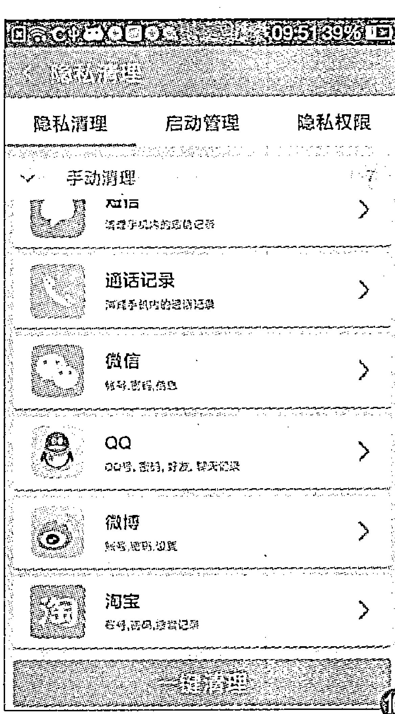

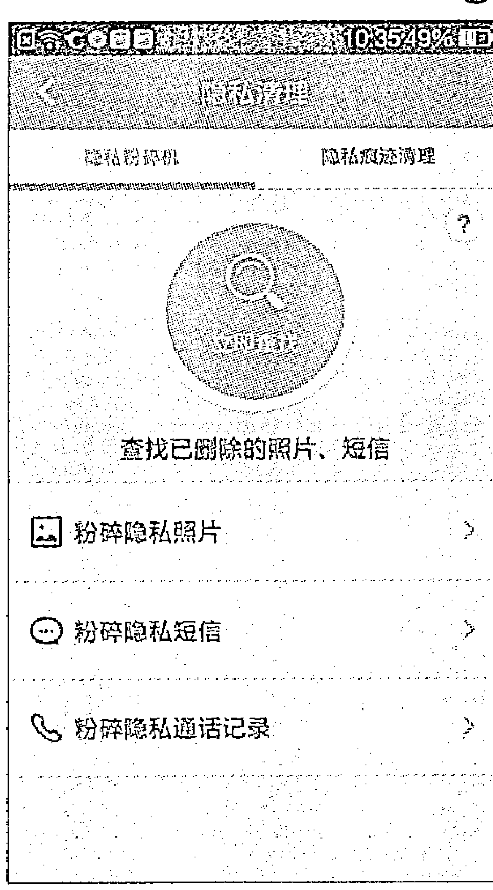

## 根据蛛丝马迹寻找垃圾文件的根源

Android系统中的很多安全类软件都支持垃圾清理，但总有一些不知名的文件夹能逃过类似功能的“洗礼”。那么我们如何根据一些蛛丝马迹了解这些文件夹的身份？在断定无用后可以安心删除呢？对未知垃圾文件夹（或里面的文件）而言，以其生成时间为线索无疑是锁定对应APP的最佳手段。而“SD女佣”和“进程狗”这两款软件的组合，就是可以根据时间这一蛛丝马迹追本寻源的最佳搭档。

### SD女佣确定时间线索

比如，我们想知道手机存储卡根目录Libs文件夹到底是哪款APP生成的，是否重要（图13），只需进入SD女佣的功能菜单中选择“最后修改”（图14），记住Libs这个文件夹具体的生成时间（图15）。这个“15min”分钟前的时间，就是帮助我们寻找答案的蛛丝马迹。

### 进程狗锁定APP来源

接下来运行进程狗并进入CPU选项卡界面，点击手机菜单键所选按时间顺序筛选，找到与15分钟前附近对应的CPU事件（图16）。由此可见，这个时间段内Libs文件夹里的文件都是“淘粉吧”APP生成或推送的文件，并非关键数据，因此可以有选择性地删除。总之，这个方法的原理就是利用SD女佣确定时间点，然后根据时间点用进程狗锁定对应的CPU时间，从而与具体APP对上号。以淘粉吧这个APP为例，用垃圾清理软件只能清理对应的taofen文件夹，从而错过了Libs目录内的文件。笔者在这里也只是抛砖引玉，利用类似方法还能玩出更多花样，就让我们一同探索吧。

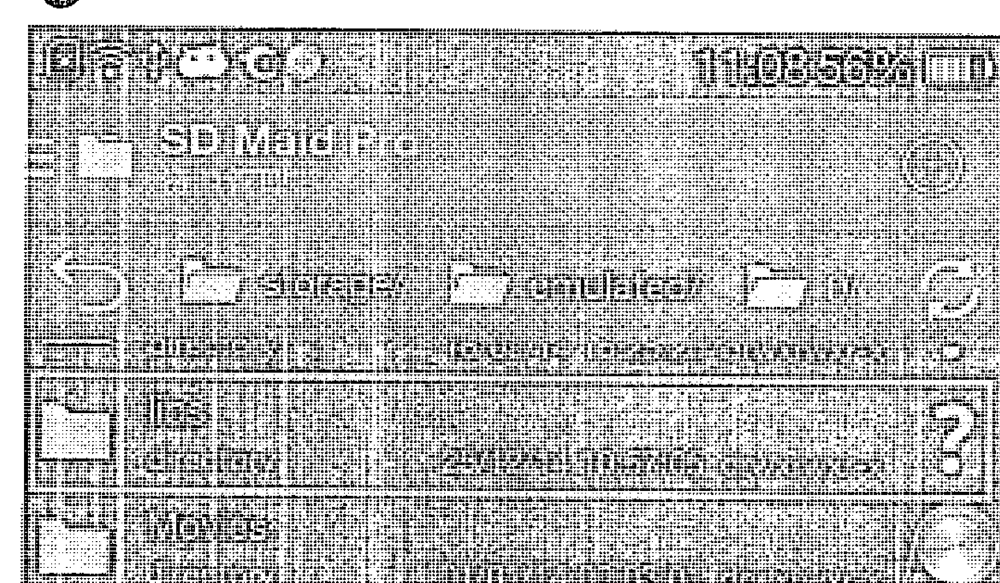

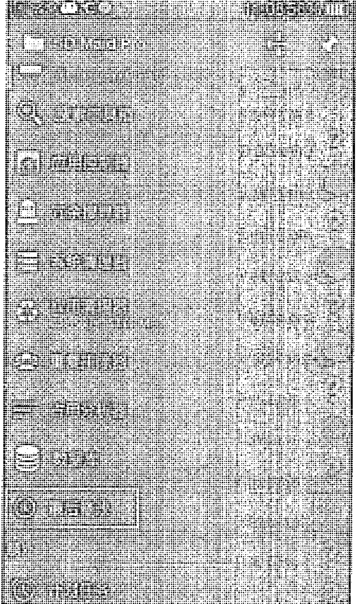

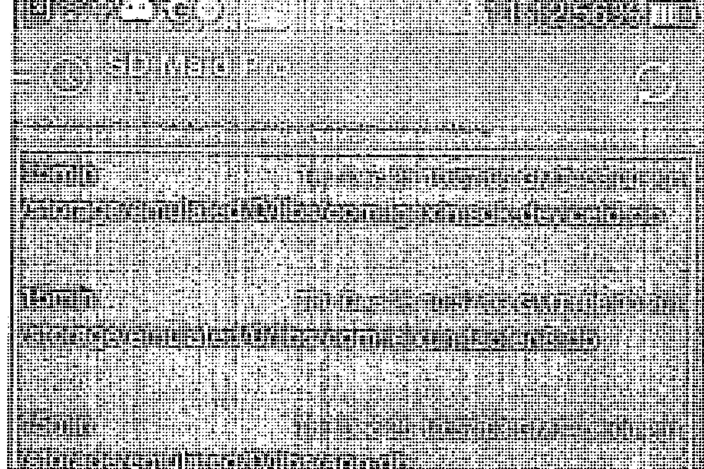

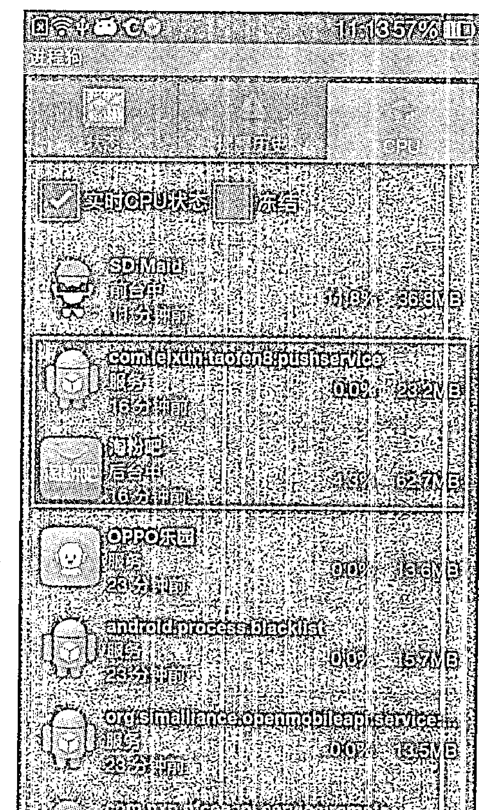


2014年12月28日，由著名影星姜文执导和主演的大片《一步之遥》公开上映，可谓毁誉参半。看不懂的大有人在，受剧情感染，掩面泪流的也偶有所见。我们不去细究电影的具体情节和所暗含的哲理，只从字面意思也不难理解，其中或许该涉及到一些只差一步就会从阴变阳、由白变黑、由正义变为反动的人或事。这部片子讲述的是虚构的历史故事，但也许多类似的事件在那个时候甚至今天也的确存在。其实，在我们正在生存并每天津津乐道的IT世界中，又何尝不在发生着“一步之遥”的真实故事……

## 弥补系统的‘一步之遥’

### 取长补短

### Windows向Linux致敬

文|技术宅

注意：对系统的改造具有一定的风险性，所以在进行下面的所有操作前，请一定要将电脑中的重要数据等做好安全备份，然后再进行尝试。

在日常使用Windows的过程中，系统一些组件由于设计不当，经常给我们带来不便。比如Windows 7和Windows 8默认启动设置并不好用，对启动配置编辑不当很容易导致启动失败无法进入系统。相比之下，Ubuntu的一些设计就显得科学多了，它使用GRUB方式启动，即使启动失败，仍然可在命令行中完成系统的启动。因此下面就来介绍Windows如何向Ubuntu学习，吸取其好用的设计，为我们的日常操作提供更多的便利。


### 从头学起 移植Grub启动

如上所述，基于Linux内核的Ubuntu系统使用的是GRUB启动方式，这种启动方式最大的特点是菜单编辑简单、启动配置灵活。对于多重启动菜单的编辑，虽然Windows 8用户在启动界面点击“启动设置”可以对系统项目进行排序或编辑等待时间，但是这个改进和Ubuntu相比仍差一步之遥，因为我们仍然无法在启动失败的时候直接对启动菜单进行编辑（图1）。

相比之下，Ubuntu的GRUB启动就好用多了，当在启动配置命令里启动命令配置错了，或者根本就没有配置相应的启动项，这时我们只要在启动界面按下C键进入命令行模式，在这里就可以对启动项进行编辑，或者按照GRUB语法直接增加新的启动项（图2）。

所以要让Windows用户也可以像Ubuntu那样在启动时编辑启动项目，只要将当前主引导记录更改为GRUB启动，并添加合适的启动项目即可。具体操作可以借助Bootice.exe程序来完成（下载地址：http://suo.im/qenok）。启动程序后切换到“物理磁盘处理”，在磁盘列表选中当前引导的本地硬盘，然后点击“主引导记录”，在打开的窗口中按提示将主引导记录更改为“GRUBDOS 4.5C”（图3）。继续单击“安装/配置”，在打开的窗口中，将引导文件名设置为“GRLDR”（也可按照需要设置为其他任意名称），点击“写入磁盘”（图4），这样重启后就可以使用GRUB引导了。

到http://suo.im/klq8z下载所需的GRLDR引导文件，下载后将其复制到C盘根目录下备用。这里假设是C:Win7+D:Win8双系统用户，完成上述操作后将C:\boot，C:\bootmgr复制到D盘，同时将C:\boot\bcd的Windows 7设置为默认启动（D:\boot\bcd则设置Windows 8默认启动）。最后启动记事本新建一个menu.lst文件，输入以下命令：

```
title C:Windows 7
root (hd0,1)
chainloader /bootmgr
boot
title D:Windows 8
root (hd0,4)
chainloader /bootmgr
boot
```

再次启动电脑后可看到GRUB的多重启动菜单，按提示选择不同项目即可启动到不同系统（图5）。

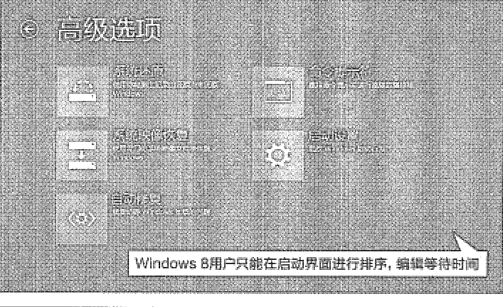

> 小提示
Ubuntu只在MBR模式下使用GRUB启动，UEFI模式启动则和Windows 8是一样的。不过目前大部分电脑仍在使用MBR模式，这里我们也主要介绍以该模式启动的Windows 7和Windows 8。

当然，Windows移植GRUB启动后，如果启动失败，我们同样可以尝试使用手动方式继续启动系统。比如在系统正常的时候可以将C:\boot，C:\bootmgr复制一份到E盘，这样如果默认启动项无法正常启动（如误删了bootmgr文件），现在只要在GRUB启动界面按C进入命令行模式，依次输入下列命令即可继续启动Windows：

```
root (hd0,5)
chainloader /bootmgr
boot
```

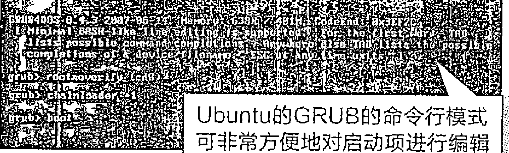

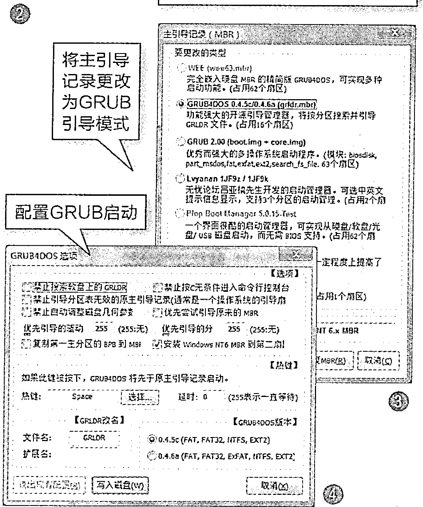

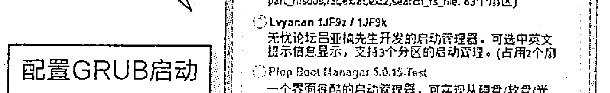

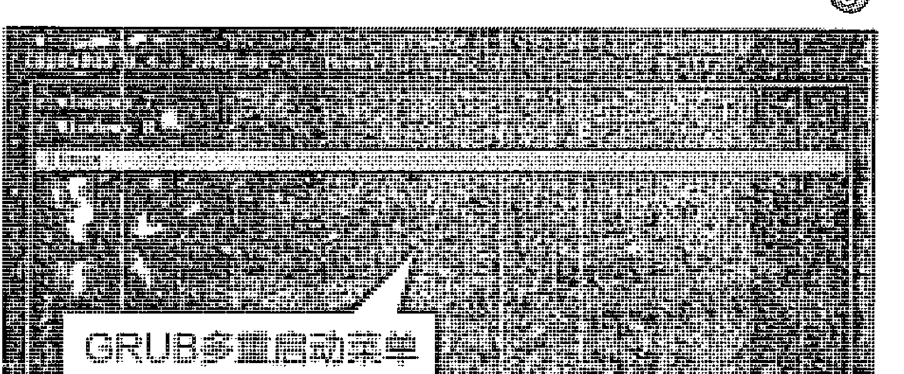

### 共享前沿 多用户同时登录

现在电脑的硬件配置越来越高，为了充分发挥电脑的性能，可以通过远程桌面的方法登录同一台电脑，然后在不同的终端展示，实现一机多用。Ubuntu是典型的多用户、多任务操作系统，通过XDMCP方式就可以轻松实现远程的多用户同时登录（图6）。

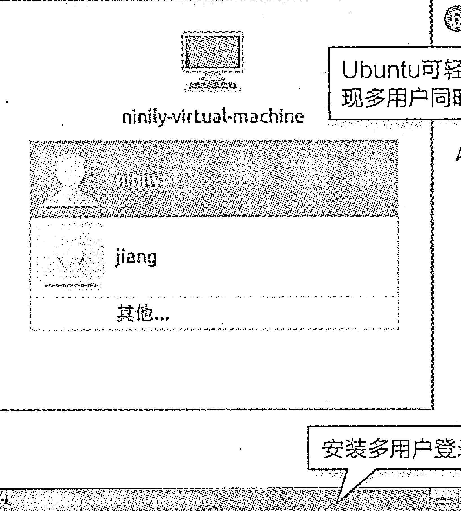

而我们用的桌面版Windows则不允许多用户同时登录（服务器版可以），但是现在通过手动修改的方法，我们在Windows上同样可以实现多用户同时登录，解决这一步之遥的距离。

首先到http://suo.im/e610b下载“Windows 7远程桌面多用户补丁”（Windows 8也可以使用），下载后根据自己的系统情况，以管理员身份运行对应的（32位或64位）UniversalTermsrvPatch-x86.exe即可完成多用户同时登录补丁了（图7）。

接着启动组策略编辑器，依次定位到“计算机配置→管理模板→Windows组件→远程桌面服务→远程桌面会话主机→连接”，然后双击右侧窗格的“限制连接数量”，将其设置为“已启用”，将连接数量设置为“2”，这样Windows 7在当前用户已经登录系统的情况下，还允许其他设备（如Android电视）同时连接到当前电脑上（图8）。

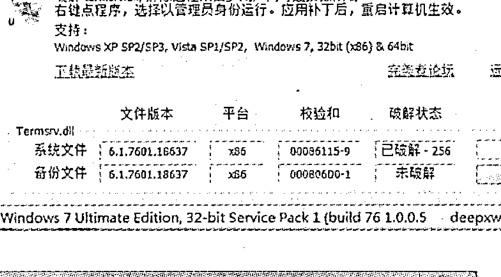

启动命令提示符输入“net user yumu 123456 /add”，按提示建立一个名为“yumu”、登录密码为123456的新用户，将这个用户作为Android远程登录的专用账户（账户和密码可以根据自己的需要设置）。接着右击桌面“计算机”选择“属性”，然后切换到“远程设置”，在打开的窗口远程桌面设置下单选“允许运行任意版本的远程桌面的计算机连接（较不安全）”，接着点击“选择用户”，按提示添加上述建立的“yumu”账户作为远程桌面连接账户（图9）。

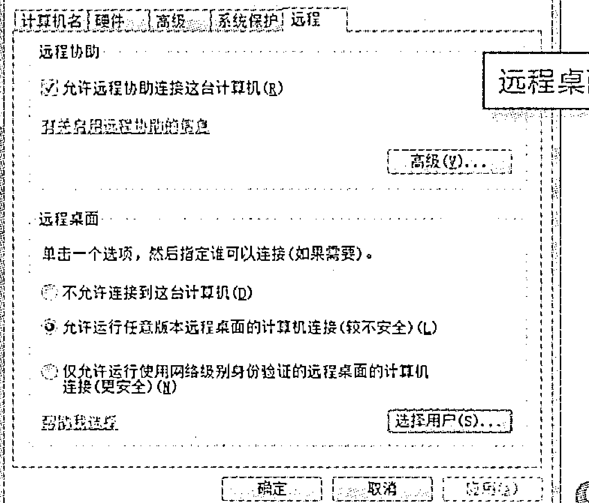

完成上述设置后，我们就可以像Ubuntu那样使用多个账户同时登录了。可以在Android电视（需要和电脑在同一Wi-Fi网络）上安装“Remote Desktop”，然后通过它远程登录到电脑上（图10）。

这样成功连接后在电视上就可以看到电脑桌面，我们可以直接在电视上播放电脑里的电影，具体操作和电脑上是一样的（图11）。

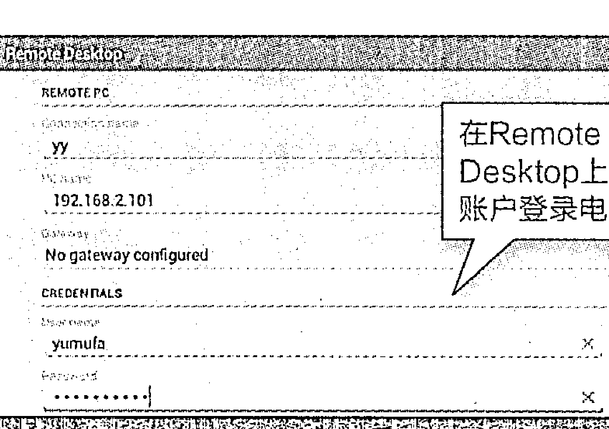

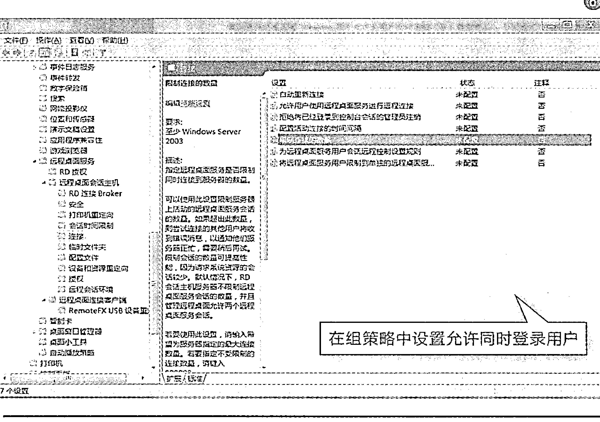

由于是多个用户同时登录，当前电脑就可以继续使用原来账户登录使用，Android登录账户则在电脑后台运行（不会影响到当前电脑登录用户的操作），实现当前电脑一分为二的效果。此时打开任务管理器就可以看到当前登录了两个账户（图12）。

### 特别话题

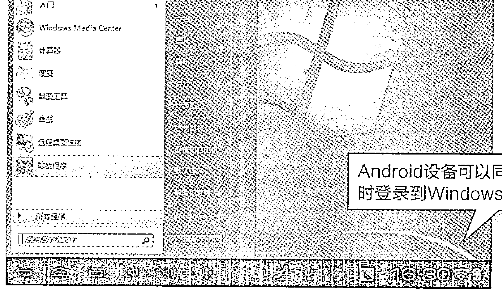

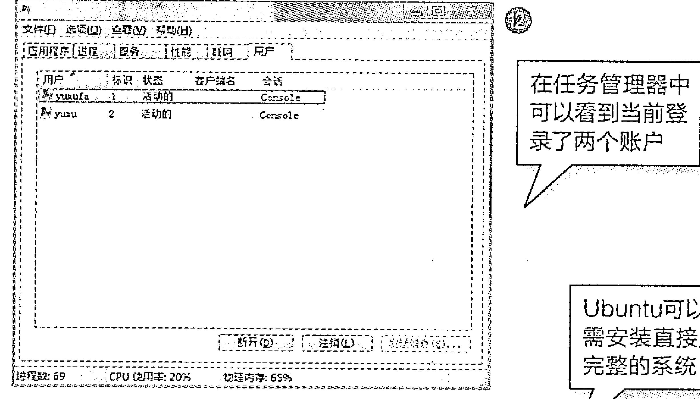

Ubuntu可以无需安装直接启动完整的系统

### 维护用到顺手 自己打造维护系统

使用电脑少不了进行系统维护，Ubuntu用户都知道，Ubuntu安装文件（可以是安装光盘或者U盘）可以用来启动电脑并进行维护，如果选择“试用Ubuntu而不改变计算机中的任何内容”，那么就可以直接进入完整的图形化Ubuntu系统，在这个系统里可以进行文件提取、杀毒或者其他维护操作，使用起来非常方便（图13）。


由于版权的限制，Windows维护系统使用起来就没有那么方便了，微软只是内置了一个没有图形界面的WinRE（或者WinPE）系统，相对于Ubuntu完整的系统，Windows维护系统在运行界面上和Ubuntu有一步之遥。其实微软已经为我们免费提供图形化维护工具MSDaRT（Microsoft Diagnostics and Recovery Toolset），大家只要手动将其添加到维护系统中即可实现图形化维护操作。

首先到http://suo.im/9moed下载MSDaRT的ISO文件，大家可以直接将其刻录为光盘，也可以使用UltraISO写入到启动U盘中。使用这个启动盘启动电脑后，选择“疑难解答→Microsoft Diagnostics and Recovery Toolset”菜单即可激活维护工具，这里启动的都是图形化界面的工具（图14）。

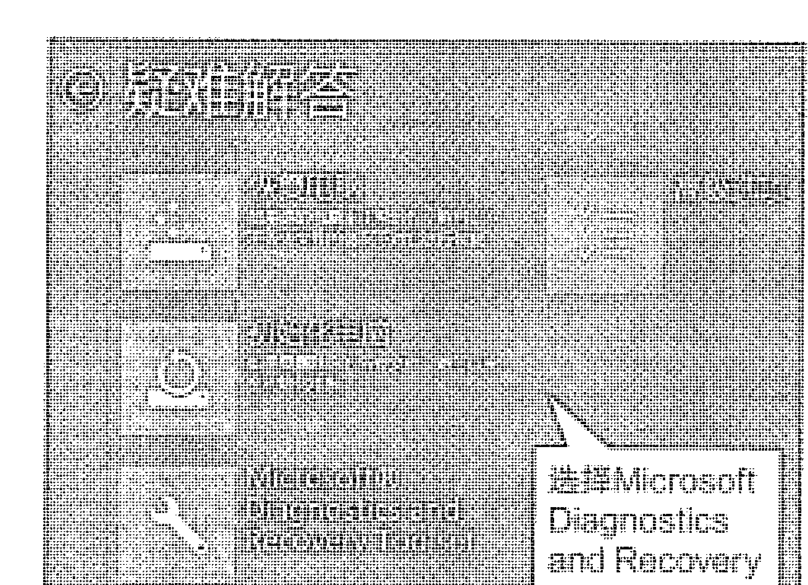

激活后可以看到它集成很多维护工具，只要按自己的实际需要点击启动即可，当需要修复系统文件则点击“SFC扫描”，这里提供的都是图形化工具，具体使用和在正常Windows中是一样的（图15）。

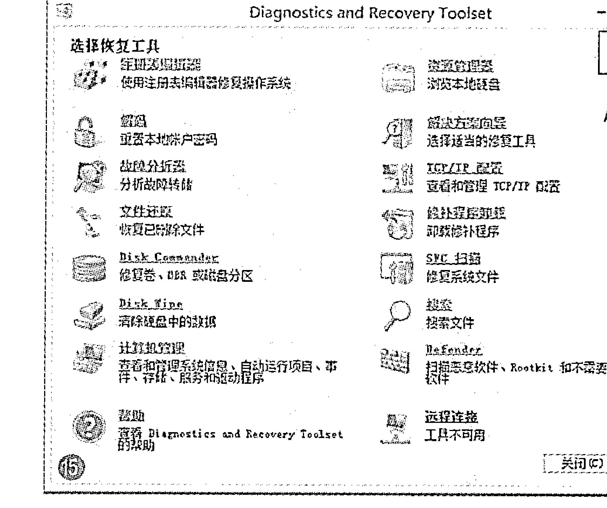

> 实际上MSDaRT维护工具就是ISO文件中的“sources\boot.wim”文件，也可直接将其解压到桌面，重命名为“winre.wim”，替换到“C:\recovery”下的同名文件，就可直接在本地硬盘上使用。

### 更多学习方法

除了上述优点外，Ubuntu还有很多Windows值得学习的地方，比如Ubuntu分区文件结构合理，系统文件和用户文件隔离得很好，Windows用户则可以将个人文件（如我的文档、QQ聊天记录等）移动到非系统分区，实现类似的隔离效果。Ubuntu支持多个桌面环境，Windows用户则可以借助KDE For Windows（下载地址：http://tinyurl.com/4o8oggk）实现类似的桌面切换。

由于篇幅的限制这里就不再赘述了，大家可参照上述介绍自行对Windows进行更多优化。

文|平淡

## 互通有无

### Windows向MAC OS学习

苹果的MAC OS一向以惊艳和便捷著称，它的很多组件都值得Windows学习，实际上每次发布的新版Windows都可以看到不少苹果的影子，像Windows 10的扁平化图表等。下面我们就来看看MAC OS有哪些值得Windows学习的地方。

### 操作提速 桌面停靠栏自己加

使用苹果的用户都知道，桌面停靠栏是MAC OS引以为豪的特色。它非常方便我们快速执行常见的操作，轻点其中的图标，就可以快速启动常用的程序（图1）。

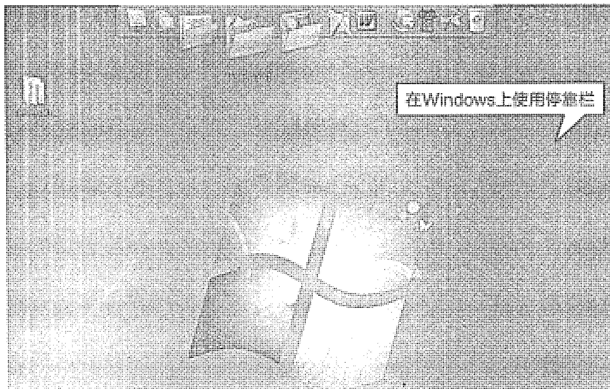

Windows日常操作则主要借助桌面快捷方式和开始菜单，显然在便捷性的设计上要差一步。不过要在Windows上享受停靠栏，借助RocketDock插件即可轻松实现类似效果。
启动程序后即可在桌面上方看到和MAC OS一样的停靠栏，可以自行添加或者替换图标，右击则可以进入设置，自行进行更多自定义设置。以后只要随时点击停靠栏图表即可快速启动程序（图2）。

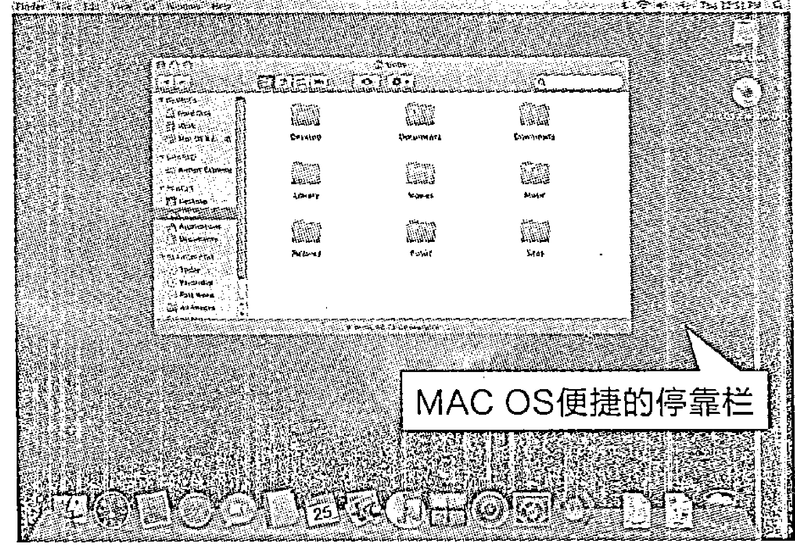

当然除了模拟停靠栏外，Windows下还有许多优秀的第三方快捷启动工具。Launchy Portable就是这样一个不错的工具，安装它后在桌面上将会出现只要简单敲击几个键就能打开你想要的程序，而不用每次都埋头到好几页的开始菜单，或者在满屏幕的桌面图标中乱找了，相当方便（图3）。

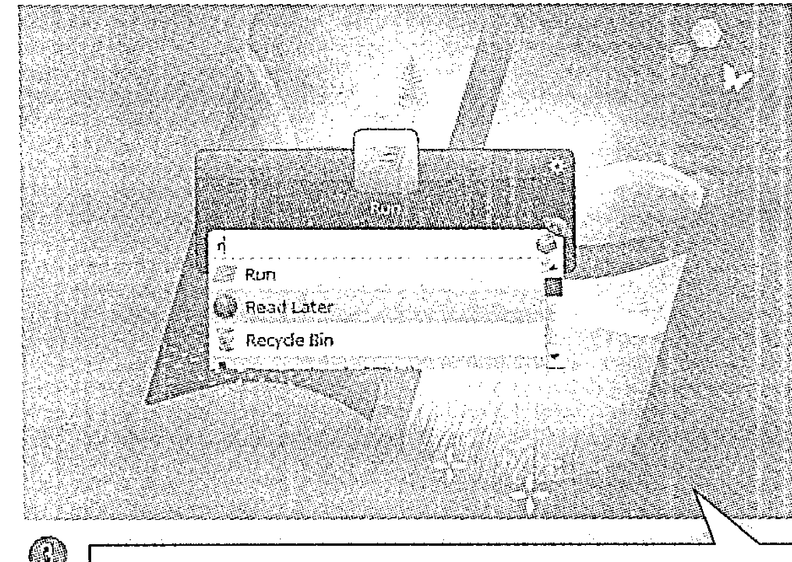

### 效率更高 文件管理更高效

Finder是苹果默认的文件管理程序，这里几乎包括电脑的全部功能，特别是打开并查看文件、磁盘、网络卷和运行其他程序，并且允许用户一次性通过不同的Finder选项卡查找多个文件夹窗口，就像浏览器页面一样，通过它我们可以实现对文件的高效管理（图4）。

虽然每个Windows版本的资源管理器都有改进，但是和MAC OS的Finder相比仍有一步之遥，比如MAC OS的Finder支持的多标签，但是直到Windows 10发布仍然没有实现。要像MAC OS那样实现更高效的管理文件，可以借助其他第三方资源管理器软件缩小与MAC OS的距离。

Windows 7和Windows 8用户可以使用Clover 3（下载地址：http://cn.ejie.me/）为资源管理器添加多标签。Clover安装后会和资源管理器无缝集成，点击新建标签选项卡即可新建窗口，具体的使用就和多标签的浏览器一样，当要比较两个文件夹内容，或者要将文件移动到不同分区的时候就方便多了（图5）。

大家知道在MAC OS中可以通过自定义快捷键调节音量，这样通过键盘就可以非常方便地对音量进行调节，对于光驱的控制则只要按住F12键2秒即可弹出/光盘。

Windows系统本身并没有快捷键可以调节音量，默认只能通过鼠标进行调整，显然在操作效率上要和MAC OS有些差距。不过现在通过修改注册表，可自行设置控制音量的热键。比如需要设置PageUP提高音量、Pagedown减小音量，只要启动记事本输入下列的代码然后保存为aa.reg文件（图6）：

```
Windows Registry Editor Version 5.00

[HKEY_LOCAL_MACHINE\SYSTEM\CurrentControlSet\Control\Keyboard Layout]
"Scancode Map"=hex:00,00,00,00,00,00,00,03,00,00,00,30,E0,49,E0,2E,E0,51,E0,00,00,00,00
```

注意：以上的修改都是举例说明，可能你并不想修改PageUP等按键的默认值。所以要进行上述的尝试前，一定先将相应的注册表键值导出保存，方便以后想恢复到原来的状态。

完成代码的编辑后双击将其导入注册表，这样以后就可以通过PageUP和PageDown控制音量了。当然除此之外，Windows下还有更多优秀的音量调整软件，如还可以借助Nircmd.exe（下载地址：http://www.nirsoft.net/utils/nircmd.html），通过命令行方式自动调整音量。下载后将Nircmdc.exe和Nircmd.exe复制到C:\Windows\System32下，再建立一个批处理Volume.bat放置在C:\，代码只需要一行：

```
nircmd.exe setsysvolume 65535
```

这里参数从0~65535，表示不同的音量值，如果在数值前增加“-”表示减少音量，1表示静音，0则取消静音。然后为这个批处理在桌面建立一个快捷方式，并将F9键关联到快捷方式，这样以后要将音量调节到合适的数值，我们只要随时按下F9键即可自动调整到设定的音量值（图7）。

更多学习方法

除了上述优点，MAC OS还有很多地方值得Windows学习，如MAC OS安全性高、不易被病毒侵袭，Windows用户则可通过及时安装补丁+防病毒软件实现更高的安全性。MAC OS从App Store上下载安全的应用，Windows 8也开始内置应用商店，只要改变下载观念，新应用养成从应用商店获取即可让自己的系统更安全。诸如此类的学习点还有很多，大家可根据需要来学习。

写在最后：互有差距，互相学习

Windows、MAC OS、Linux三大操作系统各有长处，也各有不足，作为操作系统开发商，他们也在互相学习、取长补短，几乎每种系统新版本发布后都能看到彼此的影子。作为用户虽然不能参与操作系统的开发，但借助万能的互联网，大家可通过手动改造系统，或借助各种第三方插件弥补系统的不足。上面主要以Windows向其他系统学习为例，同样MAC OS、Linux也有许多向Windows学习的地方，可根据需要通过手动改造或安装第三方软件方法来学习对方的优点。

软件的成功与否，有时也在一步之遥，必然的努力与偶然的因素碰在一起的时候，就造就了软件的成功或失败，而对于用户来说，很多人使用软件都有一定的倾向性，不愿意改变习惯去安装另一款软件也属常理。其实，习惯的改变也在一步之遥，换一个软件用上几天，让你体验眼前一亮的“天壤之别”。当然，如果你要坚持一个老旧软件不放手，若能通过一些优化、设置的方法，实现新软件的一些特色功能，那也是一种“质”的飞跃。无论如何，一步之遥的事，只要你去做，生活就会变得更精彩！

成败之间 办公软件 的一步之遥

WPS Office和MS Office的成败是一步之遥的典型案例。DOS年代的金山WPS在国内办公领域可谓首屈一指，按说过渡到Windows环境后，本来立起“山头”的金山离继续“占山为王”只一步之遥。但植根于所见即所得Windows排版系统的微软Office以Windows这艘航母为载体，以迅雷不及掩耳之势占领了中国市场。一步之遥的理想变成遥不可及的现实。之后的十几年间，金山只能眼睁睁地看着别人在原本属于自己的山头上大耍威风。好在既然成功离挫败只一步之遥，那么从挫败走向再次成功还远吗？

## 选大还是选小

虽然现在的硬盘和内存的空间越来越大，速度也越来越快，但是在软件的选择上，如果要实现同样的功能，人们还是倾向于安装更轻巧的软件。

WPS图文表演示系统的安装文件，整套软件只有50MB上下，而微软Office Word即便是2007低版本也有500多MB的块头。如果要进行的工作用这两个软件都能完成，你选择哪个？这也是目前许多人推荐WPS的原因之一（图1、图2）。

也许，你的选择是根据习惯而为的。那些年你已经习惯于使用微软的Office。但是，如果列出一些事实，那么，你的判断可能会改变。

虽然目前微软Office在市场竞争的压力下，局部实现了免费或者降价，但是相对来说，其正规专业版本高昂的价格还是让普通用户（尤其是中国低端大众用户）难以接受的。使用各种非正常渠道获得MS Office的虽然大有人在，但是都自然背负着使用盗版的名声，虽然说法不责众，微软睁一只眼闭一只眼，但是终归这些人走的不是正道。还有，虽然微软Office的功能强大，但是它的安装对系统来说是一个沉重的负担，对于用户来说，安装了它也就等于安装了大量无用的功能，据统计，大众使用微软Office套件中的功能普遍不足20%，其余的多为闲置。既然如此，那么，何不尝试一下国产的优秀办公软件呢？或许，你会发现站在“金山”上，看天也照样很蓝。

金山WPS安装文件相对很小

| 名称 | 修改日期 | 类型 | 大小 |
|------|----------|------|------|
| AdobeReader1100_en_US_2160105627.exe | 2013/12/18 期... | 应用程序 | 49,034 KB |
| FoxitReader604.0619_chs_Setup_1877593173.exe | 2013/12/18 期... | 应用程序 | 37,017 KB |
| Foxmail fm713chb52_build_setup.exe | 2013/12/18 期... | 应用程序 | 24,891 KB |
| GoogleEarthWin-7.1.2.2041.1452124304.exe | 2013/12/18 期... | 应用程序 | 24,873 KB |
| QQ词典 QQDict_Setup_1.1.147.400.exe | 2013/12/18 期... | 应用程序 | 7,498 KB |
| WPS Office 2013.4488.12012.0.1812206606.exe | 2013/12/18 期... | 应用程序 | 45,871 KB |
| WPS Office 抢先版 W.P.S.4983.19.552.exe | 2013/1/2 期... | 应用程序 | 82,782 KB |
| 必应词典 BingDict_Setup.3505093779.exe | 2013/12/18 期... | 应用程序 | 26,011 KB |
| 有道词典 youdaodictpc_5.1.2288657535.exe | 2013/12/18 期... | 应用程序 | 45,763 KB |
| 金山词霸 PowerWord100.4265851167.exe | 2013/12/18 期... | 应用程序 | 10,354 KB |
| 金山打字通 setup_dzt_21023.12012.482814697.exe | 2013/12/18 期... | 应用程序 | 27,508 KB |
| 金山快译 FastAIT_PE_Setup_0.0.1.37.exe | 2013/12/18 期... | 应用程序 | 67,481 KB |
| 灵格斯词霸 lingoes_2.9.1.exe | 2013/12/18 期... | 应用程序 | 9,436 KB |
| 有道词典 YoudaoDict.2312527611.exe | 2013/12/18 期... | 应用程序 | 27,603 KB |

MS Office系列 Office 2013 简体中文版5种

| 名称 | 修改日期 | 类型 | 大小 |
|------|----------|------|------|
| en_office_professional_plus_2013_x64_dvd_1134003.iso | 2013/9/24 星期六 20:35 | 光盘映像文件 | 682,632 KB |
| en_office_professional_plus_2013_x86_dvd_1134005.iso | 2013/9/24 星期六 20:42 | 光盘映像文件 | 737,354 KB |
| en_office_professional_plus_2013_x86_x64_dvd_1149708.iso | 2013/9/24 星期六 22:39 | 光盘映像文件 | 1,059,274 KB |
| Office 2013软件中文版5种.txt | 2013/9/24 星期六 20:33 | Text Document | 2 KB |
| SW_DVD5_Office_Professional_Plus_2013_VOL_64Bit_ChnSimp_MLF_X18-55285.ISO | 2013/9/24 星期六 20:38 | 光盘映像文件 | 936,408 KB |
| SW_DVD5_Office_Professional_Plus_2013_VOL_W32_ChnSimp_MLF_X18-55126.ISO | 2013/9/24 星期六 20:31 | 光盘映像文件 | 830,192 KB |

## 小知识

有的用户可能纳闷，WPS和微软Office的相像程度这么高，简直像是一个模子里出来的软件，那么微软为何不状告金山侵权或盗版？这里边有个雷军所称的“金山上了微软一当”的真实历史故事。这个故事中“上当”的协议，正是现今金山可名正言顺地使用微软格式的法律依据。在1996年，金山和微软双方签署了一份协议——双方都通过自己软件的中间层RTF格式来互相读取对方的文件。简单地说，在当时，就是原先的WPS用户可以使用微软Word打开、编辑WPS格式文档。就这样，金山将自己的具有天然垄断性的WPS格式“友好地”向微软开放了。当年8月，微软发布了Windows 95 OSR2操作系统（即俗称的Windows 97），捆绑了IE浏览器，多功能化设计加速了DOS系统退出历史舞台。随着操作系统从DOS过渡到Windows平台，以及Word功能的不断丰富，WPS用户也逐渐通过“格式开放”这座桥梁转移到了微软Word旗下。一纸协议，成为WPS由盛到衰的转折点。仔细分析，这其实只是一根“导火索”，WPS真正失败的原因还是由于其在Windows环境下的使用体验和表现不及微软Office，技术和服务都没跟上节拍所致。

## 兼容不是问题

前些年，在选用办公这件事上，人们往往纠缠于文档格式是否兼容。的确，如果换了办公系统，文档打不开了，而时间紧迫，这真是一件要命的事。现在，如果换成金山WPS，用户担心的这些问题就不成问题。WPS套件严格对应于微软Office的Word、Excel、PowerPoint，新版本已经实现了无论在界面还是文件格式上的完全兼容。用户既可在安装WPS时或安装之后选择让WPS默认关联微软文档格式，也可使用WPS自己的格式（图3）。“上当”的协议成为今天金山可以名正言顺地使用微软文档格式的合法依据，成败之间一步之遥的事情，让人唏嘘不已！正是由于金山WPS轻松做到了操作习惯上的兼容，让用户真正实现“零时间”上手，大大降低了软件的推广难度，有效地减少了培训的时间和费用，也实现最大限度的办公软件迁移的可能。而与之形成鲜明对比的“愚蠢”案例是，微软在Windows 8中不采用人们早已熟悉的好用界面，转而采取了一种半遮半掩且帮助信息不明的所谓“创新”设计，让自己的移动系统的美梦变成了“黄粱”，差点还丢掉了PC操作系统的半壁江山，这不能不让人警醒！

同步一步之遥 实用当是源泉

之前的一些年，许多人，尤其是企业办公人员对Windows版的WPS不屑一顾甚至嗤之以鼻。而如今，越来越多的人向周围的人推介金山WPS。为什么？

设定WPS默认关联的文件格式为微软兼容

办公软件与你的关系也是一步之遥。同样摆着两套软件，一套是国产的，就像“邻家小妹”；另一套是外来的，就像操着别扭中国话的“白皮蓝眼”。哪个好打交道？理所当然应该是国产。但WPS之所以受越来越多的人欢迎，“邻家小妹”的熟人情结还在其次，关键的因素是这位“妹子”的方方面面都能让你体会到亲切感。这就是她独特的为中国用户而设计的各种体贴功能。国人特色专用界面是为国人设计，而高度模仿MS Office界面看似简单和“低智商”，实则也是体现顺应国内读者需求，为已经熟悉微软Office的用户适应新环境提供更大的方便而已。

WPS文档中插入图片可自由旋转

俗话说，群众的眼光是雪亮的。单个的用户可以欺骗，但庞大的用户群不可能被欺骗。WPS的受欢迎不光是因为其小巧、方便、兼容性好，更因为其中的许许多多实用功能所致。

WPS文档中使用公式易如反掌

当你插入图片时，WPS中早已可以方便地对图片进行旋转，达到理想的图文排版效果，而微软Office之前的操作要复杂得多，直至新版才改进了该功能（图4）。

WPS早已允许在文章中使用各种公式，数理化老师喜欢的各种符号公式应有尽有，而微软Office必须使用安装公式编辑器的版本或另外安装公式编辑器才能使用，新版本对该功能的跟进也慢了几拍（图5）。

WPS文档或Word文档变PDF格式，曾经一度是个人们都想解决的难题，新版WPS的“输出为PDF”功能轻而易举地解决了这个老大难问题。而微软Office的跟进却在后面（图6）。

WPS可将本身文档或Word文档输出为PDF格式

WPS能将图文版面直接轻松输出为长微博图片，更是解决了人们在发微博过程中遇到的140字瓶颈问题。最新版WPS文字还新增了护眼模式功能，并将诸多特色功能专门集成到一个面板下，让人们更容易操作定位（图7）。

特别话题

WPS制作长微博突破140个字符瓶颈

WPS的图文版面轻松输出为长微博中的140字难问题。（图7：WPS制作长微博突破140个字符瓶颈）

最新版WPS文字还新创了护眼模式功能，并将诸多特色功能专门集成到一个版面下，让人们更容易操作定位。凡此种种，都是人们喜欢WPS的根本原因所在。

资源一步之遥，素材不是问题

使用办公软件，除了软件本身的功能强大和易用性因素外，现成可用的素材和模板是否丰富，在某种程度上也决定了该软件是否受欢迎的程度。WPS依托广泛而触手可及的国内用户资源，聚拢了大量的符合中国特色的文档、表格、演示模板，让广大电脑用户的办公制作更加方便高效。（图：WPS丰富的模板素材）

在这一方面，微软办公虽然和WPS办公只有一步之遥，但由于其软件和市场并不是真正植根于中国文化这块土壤，因而其本土人气很难与WPS相比，一步之遥变成了望尘莫及。

文档保存云端便于协作办公

WPS借助于其金山云盘和轻办公的优势，让用户文章可以非常轻松地保存在金山免费大容量云空间中。无论是在哪个地方，是用什么设备的什么版本WPS软件，都可以轻松访问甚至编辑自己的WPS文档、表格和演示。（图9：文档保存云端便于协作办公）（图10：文档云端漫游随时随地编辑）

资源一步之遥 素材不是问题

使用办公软件，除了软件本身的功能强大和易用性因素外，现成可用的素材和模板是否丰富，在某种程度上也决定了该软件是否受欢迎的程度。WPS依托广泛而触手可及的国内用户资源，聚拢了大量的符合中国特色的文档、表格、演示模板，让广大电脑用户的办公制作更加方便高效（图8）。在这方面，微软办公虽然和WPS办公只有一步之遥，但由于其软件和市场并不是真正植根于中国文化这块土壤，因而其本土人气很难与WPS相比，一步之遥变成了望尘莫及。

文档云端漫游 随时随地编辑

云端免费集成

资源一步之遥

WPS借助于其金山云盘和轻办公的优势，让用户的文章可以非常轻松地保存在金山免费大容量云空间中。无论是在哪个地方，是用什么设备什么版本的WPS软件，都可以轻松访问和编辑自己的WPS文档、表格和演示（图9、图10）。

同样是有云功能的微软Office，按说总体功能相对于WPS来说有过之而无不及，但无论从访问的方便程度，还是对云空间、平台支持的慷慨程度，以及版本推出及时性等方面来说，都远不及WPS来得慷慨、及时和贴近人心（图11）。

因此，本来是一步之遥的事情，却无意间拉开了差距，这也在某种程度上造成了微软移动Office在中国推广难度的加大。

不想手动备份，快用文档漫游

您的每一次保存都会在云端保留历史版本随时找回历史记录，再也不担心忘记备份了

立即体验## 打开

- 添加云存储
- 浏览目录
- DOC
- PPT
- XLS
- PDF
- TXT
- 其他

> 在手机上随时随地编辑和查看WPS文档

> 没有VBA也有它的好处。金山产品不支持VBA宏，因此WPS自然不会感染宏病毒。

## 高端一步之遥 技术才是关键

Visual Basic for Application（简称VBA）是微软Office中很强的功能，简单来说就是“宏”，它能让用户实现更加个性化的高效作业。类似的功能在WPS中没有直接提供，WPS需要安装外部插件才能支持代码操作。这是WPS要学习和提高的一个方面，也是WPS在高端市场的一块短板（图12）。

此外，在某些高端的处理上，WPS与微软Office的差距还不小。例如在表格数据量非常大时，微软Office表格就能显示出其高效能的优势。WPS编辑过程中批量替换比较耗费时间，文件越大这种现象越明显，如果是上百页的材料中使用批量替换，速度可能会很慢。

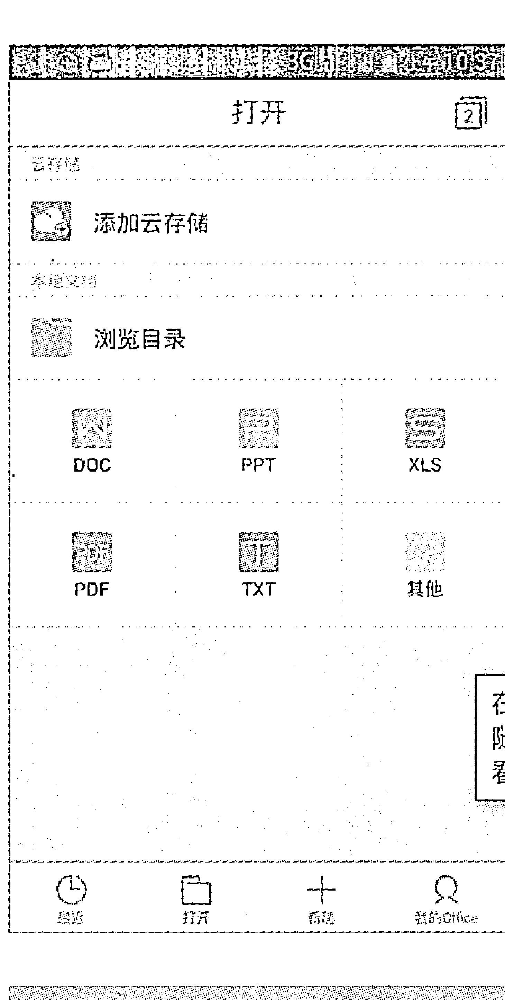

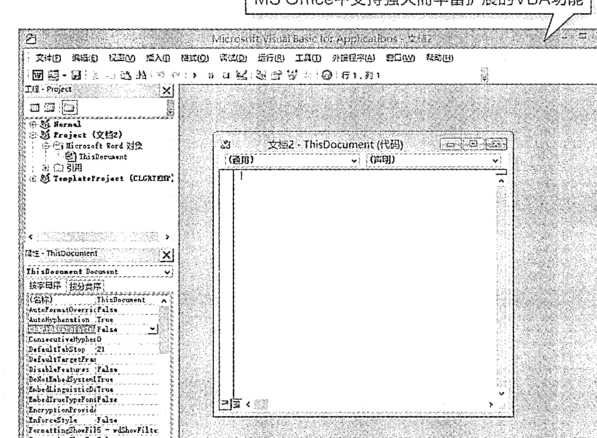

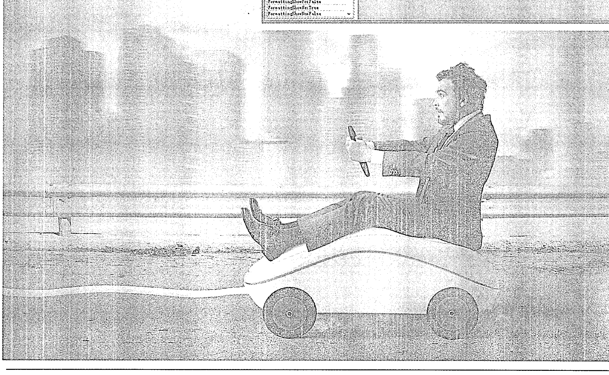

## 云者为王

## 输入法的一步之遥

曾几何时，输入法的天下被智能ABC、紫光华宇、拼音加加这样的优秀输入法所占领。但转眼间，这些输入法不见了当年的辉煌，变成了一些守旧者才用的“老人输入法”。不是说这些软件不优秀，在它们离成功只有一步之遥的时候，风起“云”涌了，一种更高级的输入功能吸引了广大用户。一些财大气粗的软件商把握住了时机，以强大的云端服务实力，投入重金争夺人才、收购软件进行研发，于是，类似于搜狗拼音、QQ拼音、谷歌拼音、百度拼音等输入法诞生了。

在输入法的发展历史上，智能成分的加入是最闪亮的一座里程碑。早前的输入法，人们以输入一个汉字能联想出一个或几个词为神奇，后来智能组词功能出现，智能ABC、紫光拼音和拼音加加等著名的智能拼音输入法，能够在用户输入的过程当中潜移默化地掌握和自动调整用户构词的频度，将用户使用过的词语自动地逐渐显示在输入队列的最前方，同时也能够将用户输入但词库里不曾有过的词构成新词自动添加到用户词库中（图1）。

但是，一个现实问题也摆在了用户面前，那就是在一台电脑上使用过的词汇，到达另一台电脑上时无法自动显示，要让新电脑传承旧电脑的词组习惯，需要想方设法将旧电脑上的输入法词库进行备份，而后再复制到新电脑的同一种输入法安装目录中，进行配置然后才能使用。若在自己的电脑上操作还好说，如果是在别人的电脑或公用电脑上操作，会带来很大的不便，也很不利于工作效率的提高。而输入法的别的个性化特性（如输入条配置，界面和皮肤配置等）的转移，则更是难上加难，只能在另一台电脑上重新设置才行（图2）。

鉴于以上情况，搜狗、谷歌、百度、腾讯等及时把握潮流，开发了各自的输入法。这些输入法在原先已有的成熟智能输入法技术的基础上，实时合理地融入了云的功能，让输入法拥有了用户各自的网络账号，以此账号为依据，各家公司为每位网络注册用户分配了免费输入法服务器空间。

当用户登录输入法账户之后，输入法的个性化配置（包括输入条的样式、皮肤、用户个性词库等），均会自动同步到云端服务器中。这样，当用户以同样的账号在异地的电脑上登录输入法，就可以瞬间拥有自己所熟悉的输入环境了。而且随着输入平台的种类增多，输入法可以跨平台跨不同类别设备共享个人输入法设置，实现了无论何时、何地、何种设备，都能够无缝享用属于自己的个性化输入法（图3）。

> 老式智能输入法只能以备份恢复的方式共享词库

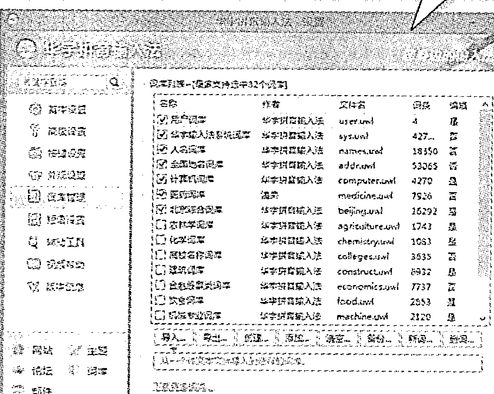

> 新式智能云输入法可以在线自动或手动同步用户习惯

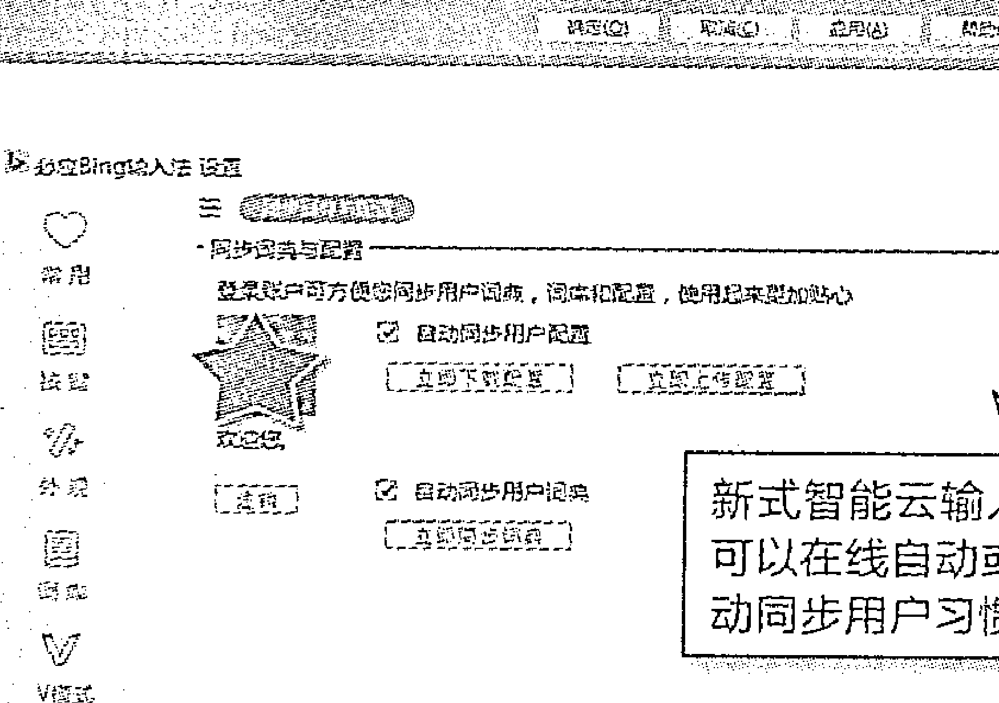

> 老式的智能输入法要弥补这“一步之遥”的差异，除了在功能上增加先进的云输入功能外，夺回失去的市场是一个最大的难点。由于多数用户已经转而选用了别的优秀输入法，形成几个庞大的用户群，所以紫光、智能ABC或拼音加加等输入法若要再度迎来辉煌，即便是有强力的财团支撑，也不是轻而易举的事。而对于用户来讲，换一种新的输入法并喜欢上它也是轻而易举的，原因是类似于搜狗拼音、百度拼音、QQ拼音之类的新型输入法本身就考虑了老用户升级换代中无缝过渡的因素，因此“换枪”的门槛很低。固守着一种老的输入法只能与新的先进功能失之交臂，失去的却是无尽的效率的提升。因此奉劝输入法的守旧用户一句，与其琢磨如何提升自己所用“老枪”的功能，不如免费换一杆好用的“新枪”。

```
wo'de'mq'zi
1.我的名字 2.我的名字叫陈佳 3.我的名字叫卓玛 4.我的 5.我得
```


### 方便为本 邮箱管理的一步之遥

文|亦云

邮箱曾经是即时通讯不发达年代人们进行网络沟通的首选工具之一。当年的网络邮箱不像现今的网络邮箱那样功能强大，在登录、收取邮件和管理邮件方面有着诸多不方便的因素。因此，一个毛头小伙编写的邮件管理软件Foxmail卖出了一千二百万的身价，腾讯以巨资将这位本打算出国深造的才子及其软件产品囊括于旗下。一个小小的工具软件，一个近乎生活潦倒的书生，一夜之间坐拥千万级家资，这不能不说是发生在一步之遥的改变。

且不多谈Foxmail软件作者或腾讯的事，我们将目光回到邮箱软件上来。Foxmail之所以受到人们的青睐，是由于它能将本来只能在网络上操作的邮件变为本地管理。

无论是否有时间处理邮件，你都可以让该软件将邮件定时定点地自动收纳到本地硬盘甚至移动介质中，待抽出时间再选择处理。即便断网了，也能提供邮件处理服务。这种管理邮件功能的强大还体现在对远程和本地邮件的灵活性把握。设定将邮件自动或手动收取到本地后，让服务器端清空邮件以节省空间，防止服务器有限空间爆满的情况发生（图1）。可选择在本地和远程服务器同时保留邮件的副本，以便在其他地方或设备上再行访问和收取。当然也可设置不留副本。

此外，在本地邮箱管理器中，还可以创建多个账户，只需各自给自己的邮箱加上访问密码，即可实现多人共享一个Foxmail来管理邮件。这种灵活多变的特性，让邮件管理和处理随心所欲（图2）。但是，Foxmail的辉煌也不可能成为永久。在网络在线服务不断发展的今天，邮件管理也在不断发生着变化。国内以网易为代表的免费邮箱越来越受到人们的青睐，而其自身功能也不断加强。在线邮箱内集成各种丰富的邮件管理功能，结合大附件的提供、网盘的融合，甚至在邮箱中集成各种轻应用，实现在邮箱内处理日常生活中的许多事务。

在以往看来，大有本地邮箱管理软件要吃掉网页版邮箱管理的势头，而今看来，Web版邮箱管理服务东山再起，以方兴未艾的姿态继续生存和发展着。在线与本地，Web与PC端管理，成功与走向没落，也是一步之遥的事情。

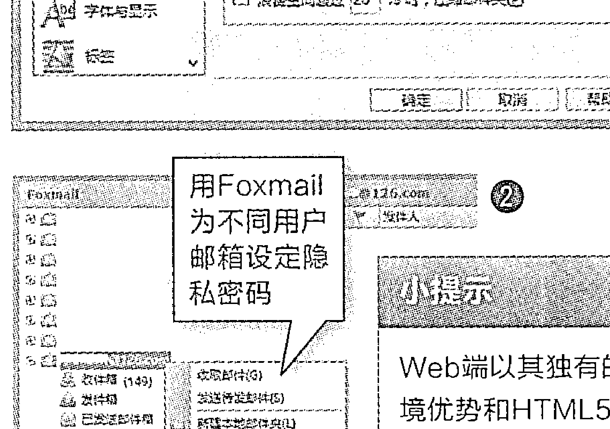

用Foxmail定时自动收取邮件

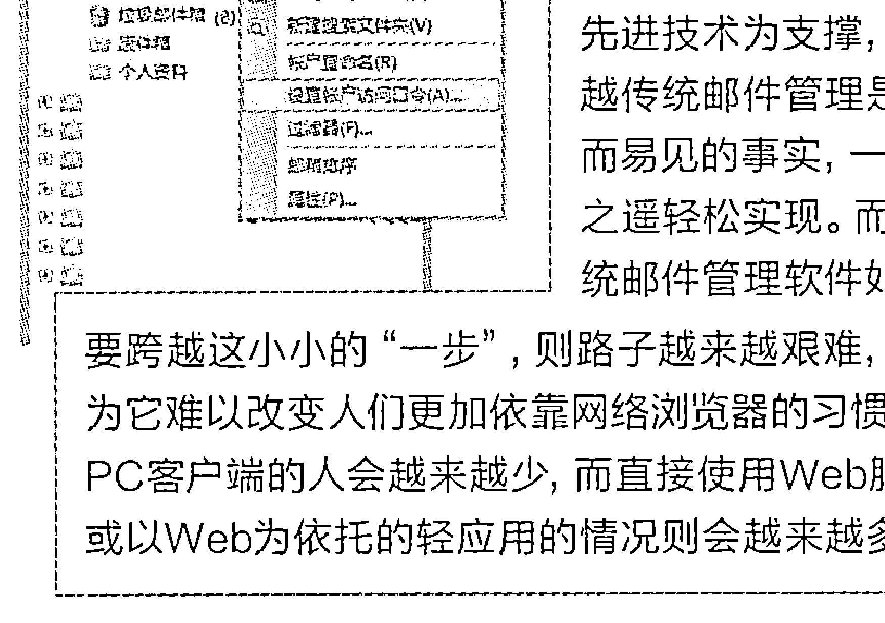

用Foxmail为不同用户邮箱设定隐私密码

> Web端以其独有的环境优势和HTML5等先进技术为支撑，超越传统邮件管理是显而易见的事实，一步之遥轻松实现。而传统邮件管理软件如果要跨越这小小的“一步”，则路子越来越艰难，因为它难以改变人们更加依靠网络浏览器的习惯，用PC客户端的人会越来越少，而直接使用Web服务或以Web为依托的轻应用的情况则会越来越多。

### 潮流涌动 在线与本地的一步之遥

不但邮箱存在本地管理和网络管理的一步之遥差别，其他方面的应用也存在这种看似“一步之遥”，实则不容乐观的差别。

#### 在线输入与本地输入

从传统PC走来的人们，总是习惯于在电脑上安装一个输入法，以实现各种应用软件中对输入的需求。软件的发展正走向对操作系统的直接依赖，转而进入更加依赖于网络浏览器的新环境。在这种情况下，对浏览器环境下的输入需求更为迫切，而浏览器中进行输入完全可以利用轻应用型的输入法——也称为云输入法的输入方式。这种输入方法不需要在操作系统层面上安装任何输入法软件，而是直接通过一个网络指令调用服务器端的输入法。其好处是可以利用云端庞大的语料库，实现更为精确的智能词组识别，以更加精准的识别率提高输入效率。在网络速度逐渐提高的全民网络时代，这种输入方法会越来越受到人们的青睐。

#### 在线存储与本地备份

备份文件资料也是大家进行自动化办公作业的重要一环。在以往的日子里，每天的工作完毕之后，压缩打包、拷贝刻盘，这些都是我们必须做的工作。人们总感觉资料刻在光盘中或拷贝到自己的移动硬盘中是最保险的。殊不知，一旦火灾发生，放在一个房间里的所有介质或设备都将难以幸免于难。而如果将资料自动备份到云端服务器，由于服务器的资料多在异地有多个备份，或通过特殊的方式分散存储在不同的服务器中，一次局域性的灾难，毁灭数据的可能性很小。本地存储与网络备份，看似只是一步的事情，甚至是人们还不习惯于相信的事情，却在安全上存在天壤之别。在人们的存储观念普遍发生了改变后，伴随着云服务质量的提升和服务制度的完善，我们有理由相信，越来越多的人们会完成由本地备份到网络在线存储这“一步”的跨越，进入一个真正的网络存储时代（图1）。

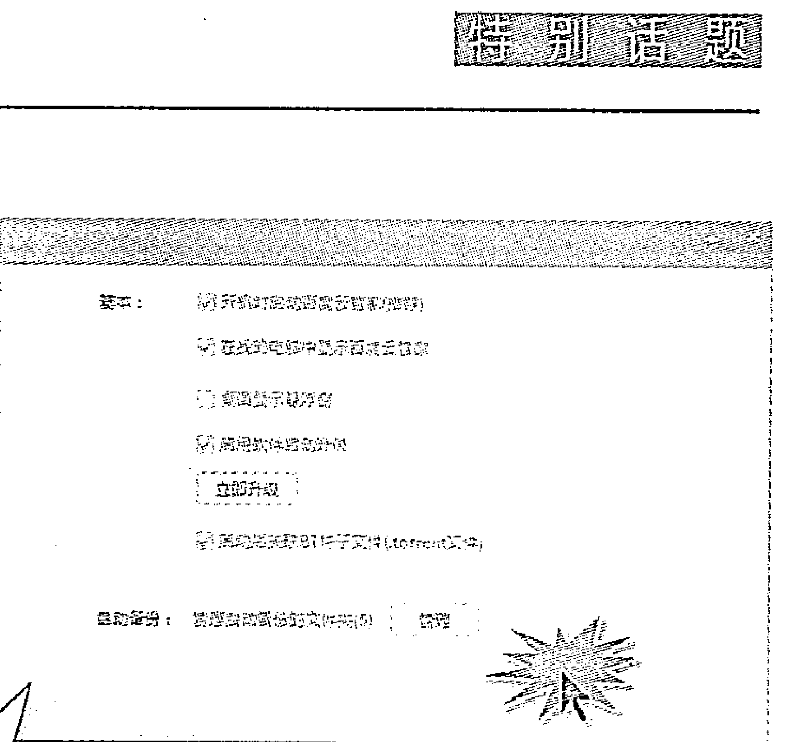

#### 在线播放与本地播放

是否还曾记得，在大街上买光盘大片，回到家里开启超级解霸进行播放欣赏的情形？那个时代的影音播放概念就是一个本地播放器加一堆光盘。后来网络发展了，但网速不尽如人意，于是人们“祭拜”迅雷这位老祖，每天开着自己家的“小水管”不停地下载网络大片，然后交给自己家电脑中的那位暴风影音来播放。而“快播”的推出，让人们可以睁大眼睛张大嘴巴，深更半夜爬在屏幕前乐此不疲——这就是在线影音的魅力（图2）。如今，随着网络带宽的增加，下载已经越来越变成一种后台自动进行的“黑匣子”事件，而在在线欣赏影视节目成为人们观看娱乐节目的主流之选。爱奇艺、优酷客户端、搜狐影音、腾讯影音、百度影音、PPTV、风行、乐视等各种名牌大牌网络商推出的在线播放器，不但拥有兼容几乎所有视频格式的“本事”，而且让欣赏变成一件一点即到的事情。而以传统本地播放著名的暴风影音、千千静听（今天的百度影音）等影音播放软件，也都及时加入了在线播放的功能模块，盘活了这些可能走向“悬崖”的“老马”。

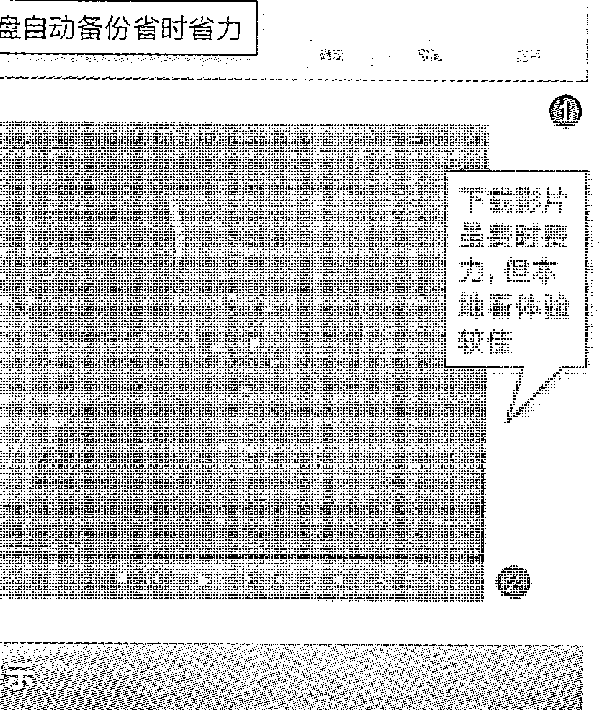

**小提示**

欣赏的不同需求，造就了本地播放器和在线播放器互相学习、相互融合发展的局面。但是，本地播放和在线播放都有其自身的弊端。本地播放需要先下载影片文件到本地，这需要下载技术和下载时间；而在在线播放虽然方便和容易操作，但一般会受到不同程度的广告骚扰。对于软件商家来说，正确的做法应该是处理好观众感受的服务，在想办法给观众提供最佳体验的同时，想出合理的盈利模式。而对于用户来说，选择具有下载和播放一体化的播放器至关重要，因为它可以保证你无论有时间还是没时间，都能按自己的意愿看到想看的节目。

#### 在线生成与本地制作

在图像、文字和其他制作方面，也存在本地制作和在线制作的一步之遥差别。以往，我们无论制作一个条形码还是一个二维码，不管是制作一个动画头像还是一幅特效照片，都需要在本地安装一个用来处理的专门软件。而如今，随着在线服务的发展和成熟，这些工作都可以在线来完成。如果需要一个网址或一段文字信息的二维码图片，我们只需打开百度，输入“二维码生成”即可首先获得百度提供的二维码在线生成服务链接，只需在其中输入信息，即可生成自己所需的二维码图片（图3）。如果将一幅某格式的图片转换为另一种格式，而本地正好没有安装图片处理软件，那么只需在百度里输入“在线处理图片大小”，即可获得在线处理图片服务的对话窗口，在其中上传图片，保存即可获得所需格式的图片。

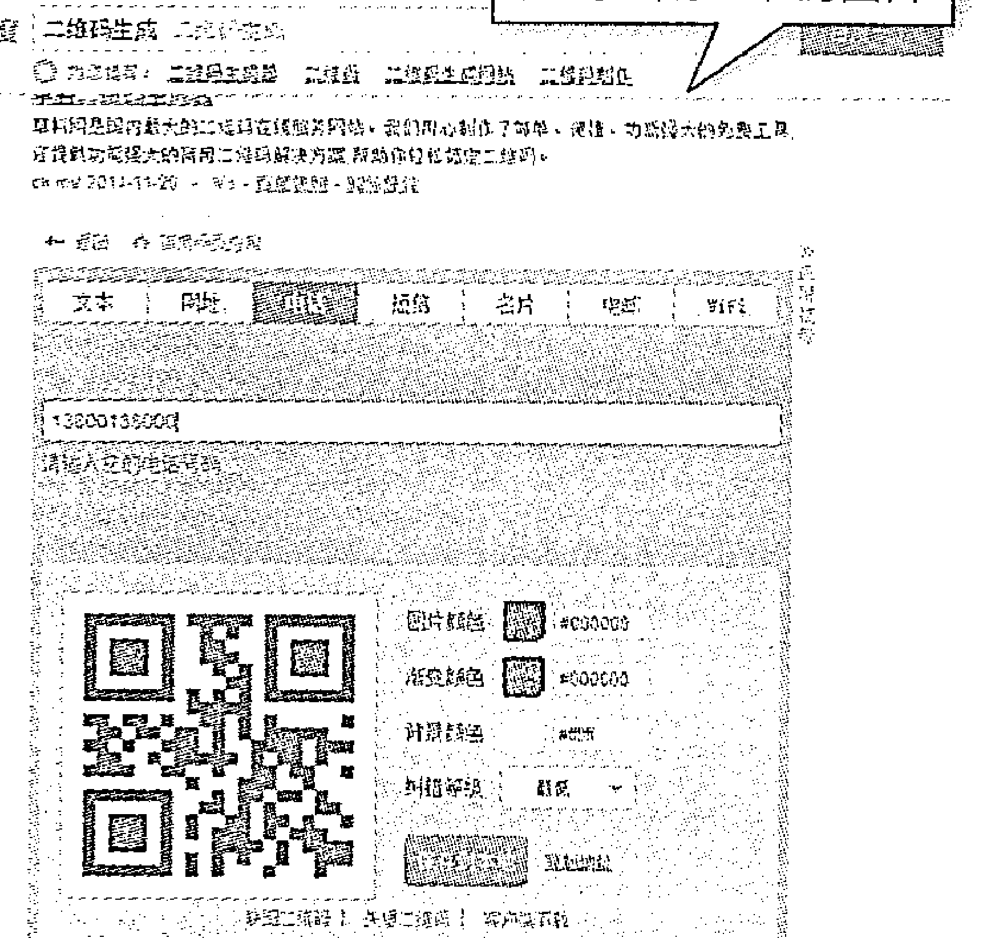

台式DIY领域近年来被移动设备冲击严重，再也容不得慢条斯理地发展了。冲击之下一些产品“步子迈得有点大”成了噱头鸡肋，还有一些产品总让人感觉离完美差那么一步之遥。在选购的时候我们需要注意哪些关键点呢？


## AMD显卡驱动为何问题不断

自从AMD收购ATI将A卡颓势挽回，HD5000和HD7000系列都有不错的表现。但AMD显卡软件层面差一点，驱动程序没有NVIDIA给力。可能A卡用户不同意此说法，A卡驱动究竟弱在哪里？

### 更新慢测试版居多

使用NVIDIA显卡，在驱动程序层面会十分省心。NVIDIA一般一个月推出一款正式版驱动，如果没有什么特殊需求，用户只需不断更新最新版驱动即可。就算不更新，使用较老版本的驱动程序也没有太多问题，而在AMD显卡方面就不是这个情况。

AMD显卡驱动虽然也在不断更新，不过多是BETA版本的测试驱动，通过微软操作系统认证的WHQL驱动少之又少。另外显卡驱动程序在具体游戏上存在BUG的现象难以避免，但是比起对手的反应速度，AMD显卡驱动程序DEBUG的速度实在让人无语。NVIDIA推出GeForce Experience后不论是驱动程序本身还是一些附属功能都可以像智能移动设备的APP一样自动更新，而AMD始终没有可以与之对抗的完整方案。 厂家在推出新版本驱动程序时总会纠正一些游戏程序的BUG，但是AMD的驱动程序却始终对一些老游戏问题“视而不见”，这也是不少用户不满的原因。

### 可用的AMD Omega驱动改善兼容性问题

针对这类问题其实也有可以解决的方案，只不过稍显麻烦而已。一些老游戏使用新驱动会出现游戏程序无响应问题，这在DX11版本的暴雪游戏当中尤其明显。针对这样的问题用户可以去下载版本号13.1的驱动程序，这款驱动出生于2013年初，很老不过异常稳定，完美应对A卡在一些游戏当中的游戏程序未响应问题。最新的R9/R7显卡无法安装13.1，可以选择升级到最新的14.12 Omega驱动程序，这是一款近几年来AMD显卡程序最大的革新版本，AMD在其中解决了很多以前遗留的兼容性问题。

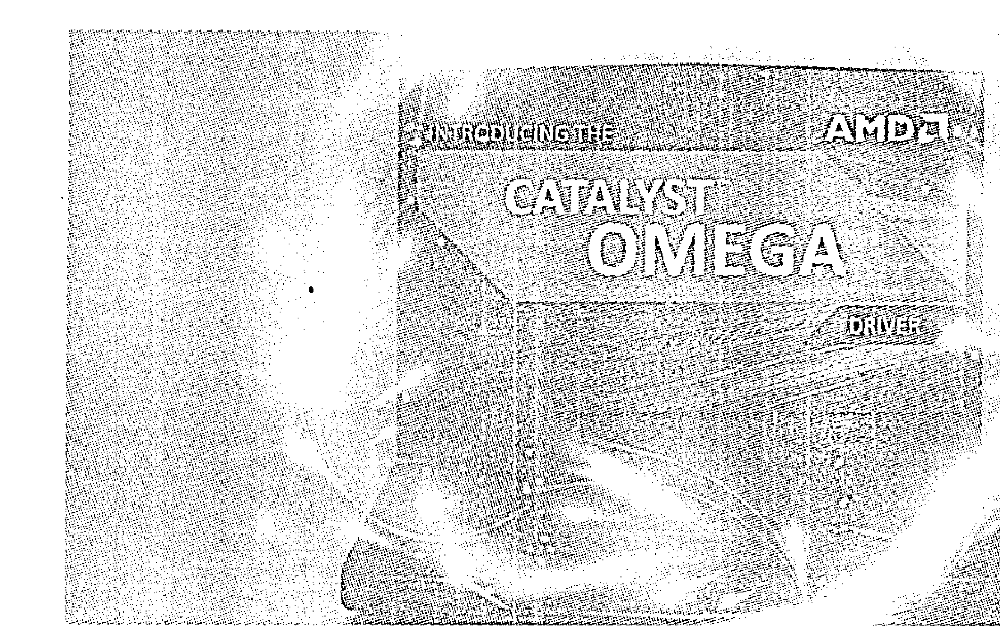

Previous AMD Catalyst™ Display Drivers 版本列表截图，包含版本号、发布日期等信息。

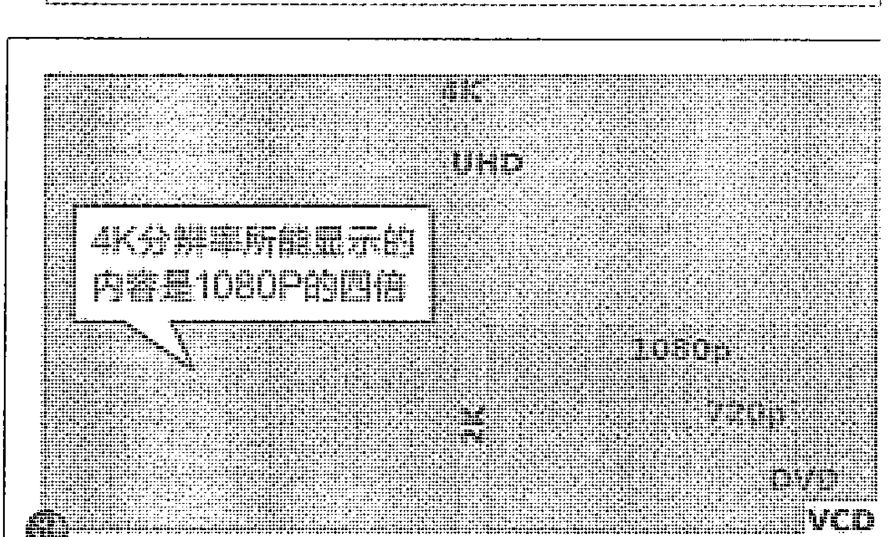

## 4K你准备好了吗

在同样显示面积上拥有更多像素，4K确实能带来更精细的显示效果，但对系统的压力却是很多用户没考虑到的。如果一台老式电脑勉强运行1080P的高清影片，就算它可以运行4K分辨率播放大片也会卡顿。而应对目前主流游戏已显吃力的中端电脑，如果想在4K分辨率上运行游戏就会出现“幻灯片”一样的卡顿现象。

### 性能拖顿和资源问题

4K显示技术最早由电影行业提出，当时规定支持4096×2160分辨率的超高清电影属于4K影片级别。4K显示技术后来不断普及到民用领域，进入PC显示器后最终3840×2160分辨率成为主流，被称为Quad Full HD，是Full HD的1920×1080分辨率的四倍。目前4K普及最大的问题不仅在配置能否跟上4倍增长的分辨率上，更严重的问题在资源方面。除了寥寥无几的几个4K分辨率演示视频片段外，我们有机会获取的4K视频片源几乎为零。可供在线观看或者下载的影片能够达到1080P已属不易，显示器空有超高分辨率却无片可看实在尴尬（图1、图2）。

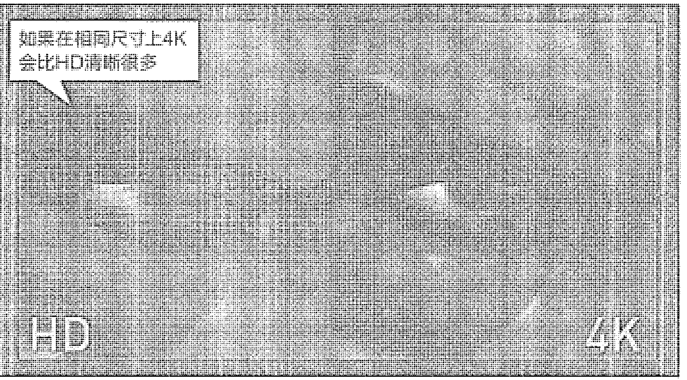

### 模拟分辨率技术体验4K

如果我们实在拿不准我们是否已经做好4K的准备而在选购时犹豫不决，其实可通过软件实现模拟的4K环境，判断自身电脑是否可满足超高的分辨率。台式机上面两大显卡品牌NVIDIA和AMD都拥有这样的高分辨率模拟技术。

NVIDIA在2014年重磅推出Maxwell架构，与GTX 980/970一起降临的还有动态超级分辨率（DSR）技术。DSR是用来做什么的？简而言之，DSR能够以更高、更细腻的分辨率渲染游戏，然后把画面智能地缩放至显示器的原生分辨率，因而可在任意屏幕上为玩家提供4K（3840×2160）或以上画质的图形效果。NVIDIA能做AMD也跟上了，最新的Omega驱动中AMD也引入了类似的技术，名字叫做视觉超分辨率技术（VSR），与NVIDIA的DSR技术在本质上是差不多的东西，都是把每一帧图像按照4K分辨率渲染，再以1080P分辨率的方式输出到显示器上，以此达到让图像细节和抗锯齿表现更好的效果（图3、图4）。

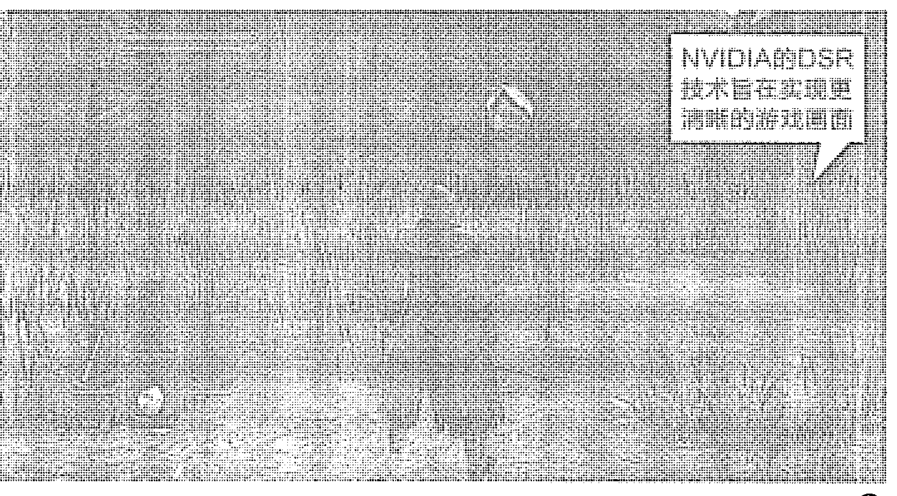

### 开启方法

最初只有GTX 980/970支持DSR，要安装GeForce344.11 WHQL或以上版本的驱动程序，点击GeForce Experience 2.1.2中的优化即可，基本上游戏内支持用户界面缩放的游戏都可以顺利启动。其实就算GeForce Experience不支持的游戏，也可以选择进入NVIDIA控制面板的3D设置中把DSR缩放系数（1.2倍~4倍）选择为自己想要的数值，然后在游戏中就能出现对应的分辨率。在新版本GeForce驱动程序中逐渐放开了支持DSR的显卡型号，基本目前所有主流的NVIDIA显卡都能享受这一技术。

AMD最新的Omega驱动并没有把VSR选项集成到3D设置中，而是放在了显示器属性中。开启VSR之后直接把显示器原生分辨率给提升了，一款原生1080P分辨率的显示器开启VSR之后提升到了最高3200×1800分辨率了，刷新率维持在60Hz。由于只是在最新Omega中的初次尝试，支持VSR的AMD显卡依然比较少，目前只有R9 295X2、290X、290和R9 285四款显卡支持。比较诡异的是不同显卡所支持到的最高分辨率各有不同，能够真正支持到3840×2160以上分辨率的只有最低端的R9 285显卡，这让人有些匪夷所思的感觉（图5、图6、图7、图8）。

| User's Monitor | Supported VSR Modes (Game Render Resolution) |
| :--- | :--- |
| 1920x1080@60Hz | 2560x1440 (19.5:9, 2560x1440) |
| | 3200x1800 (16:9, 3200x1800) |
| | 3840x2160 (16:9, 3840x2160) |
| 2560x1440@60Hz | 3200x1800 (16:9, 3200x1800) |
| | 3840x2160 (16:9, 3840x2160) |
| | 3200x1800 (16:9, 3200x1800) |
| | 3840x2160 (16:9, 3840x2160) |
| 2560x1600@60Hz | 3200x1800 (16:9, 3200x1800) |
| | 3840x2160 (16:9, 3840x2160) |
| 3840x2160@30Hz | 3840x2160 (16:9, 3840x2160) |
| | 4096x2160 (16:9, 4096x2160) |

AMD的VSR技术的显卡支持让人有些“看不懂”

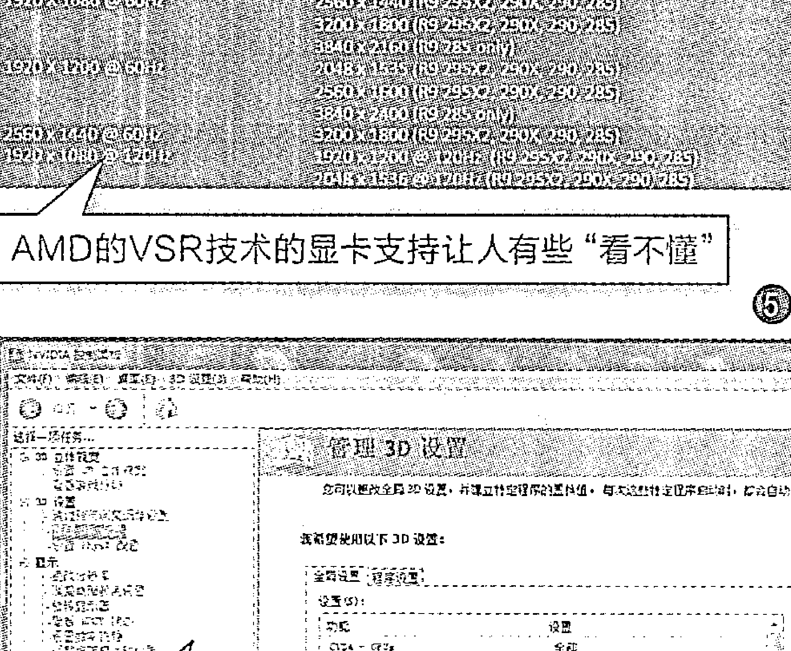

### 开启感受

尽管命名不同，两种显示技术开启后给人的感受高度一致。首先在Windows桌面上提高分辨率确实能够显示更多的内容，比如笔者使用这台24英寸的1920×1080的显示器选择DSR的1.78倍缩放后直接可以显示更多的内容。

GeForceExperience中对游戏的优化也有DSR选项

AMD的VSR选项在显示器属性中

聚焦主板接口
高端主板集成的元素越来越多，而这些主板上集成的功能几乎都是含在主板价格内的。不想为无用功能买单，就要搞清在诸多主板集成的特性内到底有哪些是我们需要的，哪些是很难用到的。

实现2560×1440分辨率。不过缩放后所有字体都变得稍微有一些模糊，有笼罩在一层薄雾中的感觉。游戏内可开启更高分辨率，不过性能下降显著。在1920×1080分辨率下《狙击精英3》、《地铁2033》、《神偷4》的帧数分别是127.7fps、46.2fps、56fps，开启AMD的VSR后降低到了65.1fps、33.7fps和33.67fps，降幅甚至已达到50%。不过也有确实的好处，在1080P显示器上运行高分辨率游戏，我们完全可以放弃游戏内的所有抗锯齿效果，实际游戏画面当中任何锯齿似乎都荡然无存。具体可以联系到苹果手机iPhone 4最初推出视网膜屏幕的感受，你确实很难在画面当中找到肉眼可见的锯齿边缘了。

SATA-Express和M.2接口
SATA-Express是目前SATA 3.0接口之后的SATA接口，不过对应设备几乎没有上市，过宽过大的体积实在不合潮流。SATA-Express接口不给力，对存储设备要求高的用户都将希望集中在目前的M.2接口上。但在主流的Z97芯片组中应用M.2接口，真的有用吗？众所周知，主流平台的PCI-E 3.0通道只有CPU提供的16x最为快速。M.2接口之所以快，就是因为可以使用PCI-E通道传输，但是CPU提供的16x PCI-E 3.0通道是被显卡使用的，只要拆分就直接降到8x，为了存储性能牺牲显卡性能得不偿失。为此不少厂商将M.2的通道转移在芯片组提供的PCI-E通道上，但速度比CPU提供的PCI-E通道慢了不少。不仅如此还需要桥接器，转换了一次的速度更难以保障。而且主板的PCI-E通道也很紧张，诸如集成网卡等设备都要至少占用1x导致通道拆分。M.2接口目前最理想的使用环境是X99等旗舰平台，由于处理器能提供最多40x的PCI-E 3.0通道，单独拆分4x给M.2设备使用绰绰有余（图1、图2）。

## USB 3.1和板载USB 3.0插座
USB 3.1接口不仅带来了正反皆可插的使用便利，更快的速度和更高的供电能力使其前途一片光明。目前在移动领域USB 3.1的普及已成定局，越来越多的手机和平板都开始出现它的身影。目前最新的主板出现了这种接口，如微星最新的Z97A Gaming 6就整合了USB 3.1 Type-C接口。不过目前主板提供的USB 3.1端口都是由第三方控制器提供的，一般只提供一个确实显得是少了一些。不过考虑到USB 3.1的普及趋势，目前新购主板选择带有这种接口的是正确思路。板载USB 3.0插座并非主板后I/O区域的普通USB接口，而是主板上的19pin插座。此插座如果与支持前置USB 3.0插针的机箱一同使用可提供完美的USB 3.0接口速度。选择主板和机箱目前都需认准是否含有专用的USB 3.0插座，而并非那种USB 3.0延长线(图3、图4)。

## 小机箱的空间问题
小机箱正在DIY领域流行，但对比传统机箱在散热性能和扩展性上都要差些。如何避免这类问题呢？比起传统平台，小平台的组建更具学问，在选购初期就要全面考虑兼容性和散热问题。

## 平台散热问题
由于空间太小，一般Mini-ITX机箱很难像大机箱那样前后上下全部配备风扇，设备本身的散热性能一定要出色。在Mini-ITX机箱内部放不下一体式水冷散热器，热管+鳍片的散热器是Mini-ITX主流。但这类散热器一般所占空间较大，能否和机箱及其他周边设备兼容是个问题。选购Mini-ITX平台首先从CPU散热器开始，确定了CPU散热器就可以查看所选主板是否与这款散热器兼容，重点关注点就在供电部分的散热片是否会挤压热管、鳍片下边缘是否会和内存冲突。此外如果是迷你塔式散热器，机箱的处理器散热器限高也需考虑在内(图1)。

## 显卡适应性
如果组建HTPC，Mini-ITX平台的显卡问题较简单。但目前很多人既希望PC小又期望实现高图形性能，这种小平台被爱好者俗称“小钢炮”。在本来就很小的机箱中塞入一款高性能显卡可不是件简单的事。从GTX 670开始到现在的GTX 750/750ti和更强的GTX 970，目前都拥有超小体积的迷你显卡出售。由于这几款显卡都拥有出色的性能功耗比，厂家只要拥有不错的技术实力，完全能够将其长度压缩至17cm左右，满足Mini-ITX平台的需要。现在的非公版显卡为了散热性能和超频潜力，习惯将显卡越做越长、越做越厚，更有甚者做出越肩式设计。不仅是小机箱难以容纳，一些超长显卡甚至ATX机箱都不兼容。我们在选购时应该本着够用的原则实事求是，不要盲目追求体积过大的显卡。即便是正在使用ATX平台的用户也不妨考虑一下小体积显卡，今后更换Mini-ITX平台可以直接沿用现有显卡(图2)。

充分利用主板的网络功能
高端的网卡方案开始流行于游戏主板上，我们如何选择呢？802.11ac和千兆无线网卡似乎在数据上已经不输于有线网络，但实际使用效果却总差一些。要弥补这一步之遥其实并不难，我们只要在网络设备上下一番工夫即可。

选择更好的设备
虽然都叫802.11ac，但无线性能却相去甚远，这是为什么？一些主板仍然使用单天线无线网卡，这实际上只能提供理论上500Mbit/s的数据流。在考虑到单天线带来的不稳定性和无线网络衰减，实际距离千兆有线网络的效果相去甚远。

Killer网卡的游戏性
除了无线功能，目前一些板载了Killer网卡的游戏主板也很火爆。Killer网卡相比传统的Realtek集成网卡有更稳定更出色的表现，特别是应对一些情况下的网络丢包现象有奇效。不过很多用户购买主板后只是简单安装了网卡驱动程序，对应的网络管理软件并未安装。Killer网卡的精髓其实在附带的网络管理软件上，它可以针对具体每一款游戏设定独特的网络方案，应对丢包等网络问题主要也是通过这个管理软件来实现。

其实已有不少高端主板选用Intel的高阶集成网卡，按厂家的说法是“在Intel芯片组中使用Intel网卡才是最佳方案”。不过在不安装独立的网络管理软件时，Intel的高阶集成网卡的表现要超过不少第三方网卡方案，对于不安装管理软件或懒得每款游戏都去程序中设置的用户，选用Intel集成网卡I218V这样的主板更合适。总体看Intel的集成网卡更可靠，而Killer网卡更激进，具体哪个方案适合我们，还需用户自己定夺(图3、图4)。

要想实现较好的无线网络效果，主板的无线天线通道至少要到2根，也就是2×2 MIMO。这样不仅速率倍增，而且稳定性也更有保障。高端主板一般选用3×3 MIMO的无线网卡，这样所能实现的网络速度才有可能和有线网络相媲美。当然，我们选择的无线路由器也至少需要支持3×3 MIMO以上的通道，才能完美发挥主板上无线网卡的性能（图1、图2）。

如今，我们在生活中越来越依赖于笔记本、平板电脑和智能手机为代表的移动设备们。然而，有时我们却会发现这些设备的性能或速度与我们心里的理想状态总有一步之遥。

## 先人一步还是步步紧逼

感觉慢人一步？
全是内存惹的祸！
在不玩大型3D游戏时，很多用户喜欢强制笔记本在集成显卡模式下工作，以最大限度节省电力。然而即使同一型号的笔记本，集显模式下性能也会有所差异，如何解决性能的一步之差？

## 内存和集显的暧昧关系
就笔记本而言，无论是英特尔还是AMD，它们旗下的处理器都内含性能不俗的集显模块，以Haswell架构处理器所集成的HD4600核芯显卡为例，其性能便已可媲美入门级的独立显卡。之所以你的笔记本在集显模式下性能不如别人，99%都是内存“惹的祸”。

集成显卡会将一部分内存容量虚拟成显存，以供游戏调用，因此内存的规格将直接影响到集成显卡的性能发挥（图1）。《电脑爱好者》不止一次强调过内存对集显的重要性，但依旧有用户会忽略双通道内存（安装两根内存条）的重要性。这主要会表现在两个方面：

- 1. 只顾内存容量而忽视内存数量，比如直接购买内置单8GB内存的笔记本而从未升级；
- 2. 只顾内存数量而忽视内存频率，比如标配内存为DDR3-1600，但你却买了一根DDR3-1333与之搭配。

在处理器相同时，如果你的笔记本里面只安装一根内存，无论内存容量多大，集成显卡的性能肯定不如安装双内存的产品（图2、图3）。另一方面，由于存在“向下兼容”的特性，内存的工作频率会以规格最低的那一根为主。因此，DDR3-1600与DDR3-1333结合后，前者会自动降频到1333MHz，此时的性能肯定不如双DDR3-1600内存的配合。

### 小提示
有些超极本/超薄本内部仅有一个内存插槽，不符合升级双内存构建双通道的条件。如果你的笔记本是第三（IVB平台）、四代（Haswell平台）酷睿处理器，就请购买1600MHz频率的内存。此外，有些四代处理器产品仅支持DDR3L低压版内存，升级内存前要注意兼容问题。

总之，如果你想让笔记本在集成显卡模式下玩游戏更流畅，一定要记得将内存升级到双通道，购买内存时也要选择高频的版本。

内存数量和规格将直接影响集成显卡的性能发挥。
不同数量内存在MaxxMEM2软件下测试成绩对比。
同一款笔记本，在内置单内存和双内存时3DMark11测试对比，双内存时性能遥遥领先于单内存。

## 升级内存切记可双不可单
有些高端游戏笔记本提供多达4个内存插槽，但如果你忽略了内存“单双号”这一因素，就会导致内存距离最高性能总会存在一步之差。以神舟战神K680E为例，该产品提供了4个内存插槽并标配2根8GB DDR3-1600内存组成了双通道模式。此时，你会如何选择为其升级内存？先买1根内存插上，等有钱了再添1根？还是咬咬牙一步到位直接升级到4根内存？从表面上来看，无论是3根还是4根内存，其性能总要比2根内存强吧？很遗憾，答案让你失望了。笔者手上还有2根4GB DDR3-1333内存，分别在不安装、只安装1根和2根全部安装状态下对K680E的内存性能进行了测试。

虽然K680E无论在安装3根/4根内存时AIDA64软件都检测出双通道状态（图4），但是，在3根内存时其性能却还不如升级之前的2根内存，实际速度已经下降到了单通道时的状态（见表）。反之，在4根内存时的性能却表现正常，属于双通道模式应有的性能，只是受新装DDR3-1333内存的拖累，让另外两条DDR3-1600内存不得不降频运行。

由此可见，如果你的笔记本（台式机用户也可作为参考）拥有4个内存插槽，在同时安装3个内存时的速度和效果最差。因此如果你想给此类笔记本升级内存，最好是选择2根或4根速度一致的高频内存，总之就是保证内存数量保持在“偶数”上。

| 内存数量 | 2根内存 | 3根内存 | 4根内存 |
| :--- | :--- | :--- | :--- |
| 内存状态 | 16GB DDR3-1600 | 20GB-DDR3-1333 | 24GB DDR3-1333 |
| 平均速度 | 18275.3MB/s | 10084.7 MB/s | 19194.7MB/s |
| MaxxMEM2延迟* | 68.4ns | 74.3ns | 67.7ns |
| MaxxMEM2复制 | 19745MB/s | 10238MB/s | 21960MB/s |
| MaxxMEM2写入 | 19629MB/s | 10339MB/s | 18987MB/s |
| MaxxMEM2读取 | 15452MB/s | 9677MB/s | 16637MB/s |
| * 代表数值越小性能越强 | | | |

## 《电脑爱好者》2015年合订本（上） 特别话题

别让内存太“悠闲”
笔记本很少承担太过复杂的任务，因此6GB～8GB容量就已完全够用。如果你后续将内存升级到了16GB甚至更高，无疑是一种浪费。那么，如何才能彻底激活大内存的潜力，让它距离“满负荷”运行不足一步之遥呢（负载越大说明内存越“勤快”，彻底杜绝“浪费”现象）？答案很简单，就是将多余的内存改为“内存盘”，并将系统临时文件或希望加速的程序拷贝到其中再运行。如果笔记本安装了32位系统，可以用“超级兔子虚拟磁盘加速器”（下载地址：http://pan.baidu.com/s/1qWryBgw）建立内存盘。如果笔记本安装的是64位系统，则建议使用“魔方内存盘”（下载地址：http://t.cn/zjrdK0z）或“OSFMount”（下载地址：http://t.cn/RhyzigJ）两款软件合作：用魔方内存盘建立用于存放临时文件的内存盘A后（图5），再利用OSFMount建立另一个用于保存希望程序提速的内存盘B（图6）。

## Windows 8.1平板体验双系统
如果你的Windows 8.1平板采用了BayTrail平台设计，恭喜你，它将拥有同时体验Windows和Android双系统的能力。下面我们就以伟彦PH-101为例，简单了解一下安装双系统的方法和注意事项。基本思路：首先，需要给平板刷入双系统BIOS，让主板等能充分识别即将出现的双系统，以及建立双系统引导（图1）；其次，删除原有硬盘分区；再次，先安装Android系统；最后再安装Windows 8.1 With Bing版系统。由于很多低价Windows 8.1只有一个MicroUSB接口，所以刷机过程中需要借助USBHub同时连接键盘鼠标以及存有BIOS文件和操作系统的闪存盘。

在整个过程中，最需要我们重视的就是刷入BIOS时千万不要碰到电源键！否则可能会造成BIOS刷坏，要付费返厂更换BIOS组件（图2）。删除硬盘分区可以借助PE，也能使用Diskpart.efi实用程序。笔者建议使用Win32DiskImager将Android镜像烧录进闪存盘，使用UltraISO建立Windows启动盘。此外，在刷入Android系统后需要进入BIOS中，将Advanced→LPSS & SCC Configuration中的选项分别设置到Windows、ACPI mode、B0D2F0后再刷入Windows系统。

由于版面所限，更具体的教程就需要大家在网上自行搜索了，而其他品牌的Windows 8.1安装双系统的方法也是大同小异。总之，只要平板电脑采用了BayTrail平台，理论上就都具备刷入双系统的资质（图3）。

### 可玩性差人一步？挖掘Windows触控设备潜力
得益于廉价的BayTrail平台，Windows 8.1平板电脑的价格最低已跌破500元大关。与此同时，很多笔记本、一体电脑也被赋予了触控操作的特性。遗憾的是，Windows系统中针对触控优化的APP太少，在资源可玩性上总是逊于Android系统。那么，如何才能挖掘Windows触控设备的潜力呢？

#### 让Windows设备联姻Android
既然Windows系统目前的“触控生态”还不完善，大有浪费和激进之嫌。如果在支持触控的Windows设备上安装Android系统，不就可以发挥触控屏幕的优势，体验更多的触控APP资源了吗？针对触控式Windows设备的现状，不妨从以下两个角度，实现Windows与Android系统的“联姻”。

> 刷完BIOS后可用“fpt.efi -greset”命令让平板自行重启，并迅速移除含有BIOS的闪存盘

Windows 8.1系统平板会出现因缺少“.NET Framework 3.5”而无法运行程序的报错提示，可进入“控制面板→程序和功能→启用或关闭Windows功能”中勾选“.NET Framework 3.5（包括.NET2.0和3.0）”，系统会自动联网下载所需程序，重启后即可使用。

#### 通用性更强的模拟Android
问题来了，对采用酷睿处理器的高端Windows平板，或是那些配备了触控屏幕的笔记本、一体电脑并不具备安装双系统的软硬条件，如何才能拥抱Android系统，弥补Windows和其之间的娱乐性差距呢？实际上，此类产品可以选择更简单的方案，那就是使用虚拟机或模拟的方式，在Windows系统环境下体验Android，并直接利用触控屏幕来操作Android系统。

在这里，笔者向大家推荐“蓝叠安卓模拟器给力助手整合版”（下载地址：http://www.bluestacks.net.cn/），这款软件支持Windows XP、Windows 7及Windows 8.1等操作系统，一键即可实现Android系统模拟器的安装及配置，并提供简单直观的APK安装方式。以乐凡F3 Pro平板电脑为例，看看如何在Windows 8.1平板上使用该软件。

安装并运行给力助手整合版的BlueStacks后，Android系统便会以窗口的形式呈现在Windows桌面中了（图4）。此时我们用手指操作，整个体验就和控制一部标准的Android平板没啥分别。如果你的平板电脑在竖屏显示时总出问题，可在给力助手中自定义分辨率获得看着更顺眼的界面（图5）。

需要注意的是，由于Android模拟器对硬件环境的要求较高，而乐凡F3 Pro平板电脑却又采用了性能相对一般的BayTrail平台，所以在玩Android游戏时会感到非常卡顿，严重影响了使用体验。因此，## 优化设置 让你的Android手机快人一步

经过几轮“军备竞赛”，如今Android设备的性能几乎年年翻番。但尽管很多Android手机配备了顶级的八核处理器和3GB内存，为何操作流畅度还是不如iOS，甚至不如以前的老手机呢？那么如何弥补手机在速度上的一步之遥呢？

## 排除省电设置的影响

由于Android支持多任务运行的机制，如果你感觉系统不流畅，可以通过360手机卫士一类软件提供的“一键加速”功能将后台程序全部关闭，释放内存和CPU资源。但在这之前，如果你觉得手机总是慢人一步，请先进入“设置→电池”，检查是否开启了省电节能模式（图1）。有些手机为了延长续航时间会提供一个限定CPU运行频率的节能选项，如果你将它开启了，自然会影响到手机操作的流畅度。

## 开发者端的优化加速

如果你明显感觉自己手机的流畅度还不如一些配置更低的产品，不妨尝试刷入经过精简优化的第三方固件。此外，我们还可以通过在“开发者选项”中，寻找为手机提速的秘诀。以OPPO手机为例，开发者选项被隐藏在了“设置→常规→更多”中，在这里我们可以手动关闭各种窗口动画渲染，开启强制进行GPU渲染（图2），并减少后台运行程序数量的限制。

如果你的手机预装了Android 4.4或更高版本的系统，可以在开发者选项中找到“选择运行环境”的选项，将其设定在“ART”模式下可大幅提升APP的运行效率（图3）。需要注意的是，使用联发科处理器设计的Android设备对ART模式存在一些兼容性问题，所以只建议采用高通、三星等处理器设计的手机用户尝试ART模式。

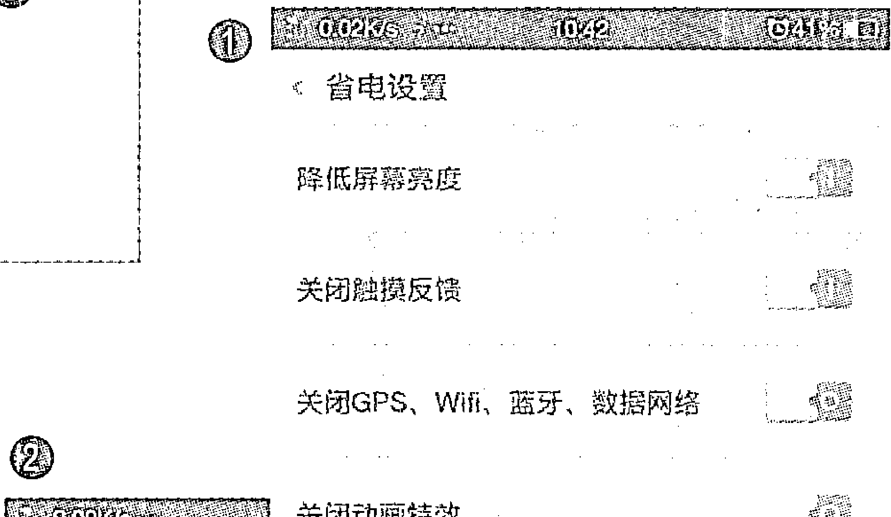

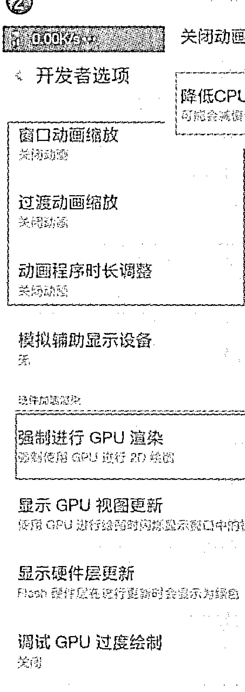

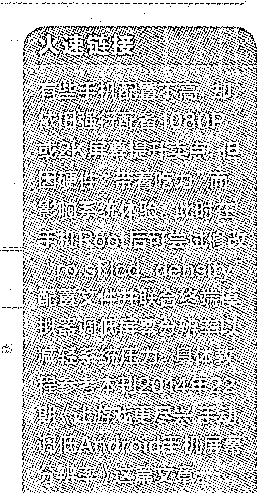

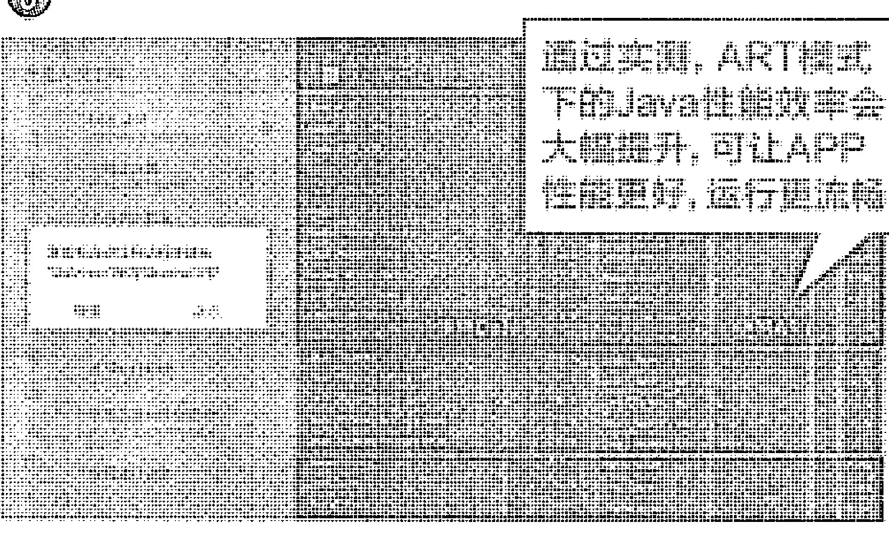

## 外置键盘 输入效率快人一步

随着Android平台办公软件的功能越来越强大，很多人也习惯了在Android设备（手机或者平板）上处理一些琐碎工作。Android设备的触控屏虽然好玩，但是在文字输入上就远逊于带键盘的PC了。但是，Android + 外接键盘时效率就高了吗？
在这里，笔者向大家推荐蓝牙键盘鼠标（图4），以及百度或者讯飞输入法。蓝牙外设无需OTG转接线即可被Android设备识别，而百度和讯飞输入法在识别物理键盘之后，在进行文字输入时屏幕上也不会弹出虚拟键盘窗口，只留下输入文字的选择行（图5）。如果你的Android设备在连接键盘后依旧会弹出虚拟键盘，请在下拉状态栏点击“选择输入法”，检查是否打开了“硬件”选项（图6）。在用键盘输入时，可以通过“Shift+空格”切换中英文、“Alt+空格”切换到符号输入、“Shift+回车”切换英文联想和英文字母。

### 选择输入法

| 选项 | 选择 |
|---|---|
| 硬件<br>物理键盘 | [开关] |
| 中文 (中国)<br>搜狗输入法ColorOS版 | [开关] |
| 百度输入法 | [开关] |
| 讯飞输入法 | [开关] |
| **设置输入法** |  |

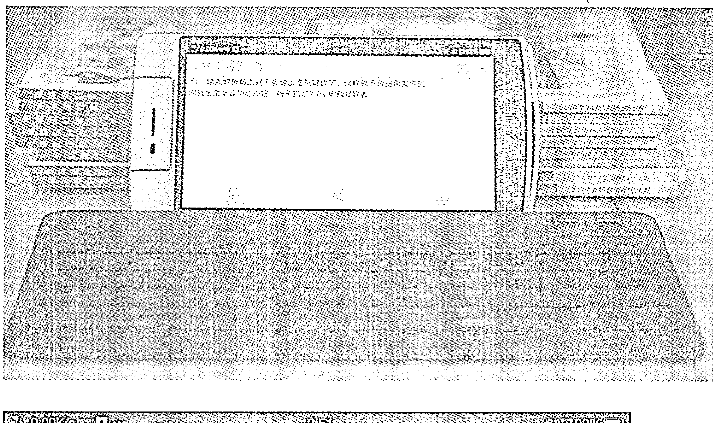

> **小提示**
如果你的Android设备系统版本较老，在外接键盘后输入文字时依旧会弹出虚拟键盘，请尝试按“Alt+Shift”来隐藏输入法。

## 你有指纹 我有脸面

如今的旗舰手机都以配备指纹识别器为荣，可惜此类产品的价格高昂，这就导致很多普通用户无缘体验这种“高大上”的安全解锁方案。如果你的手机不支持指纹也不必担心，因为我们还有另外一种安全又好玩的解锁方案：人脸解锁。
以华为荣耀6为例，依次进入“设置→安全→解锁样式”（图7），选择人脸解锁后，根据界面提示进行相关设置即可。要注意的是，在录入脸部信息时请确保环境光线充足，否则会录入失败。为了避免夜间识别率低的缺陷，在录入人脸信息后我们还需进行备用的图案或数字密码，以便在人脸解锁失效时解锁手机。
总之，人脸解锁是所有Android手机都可提供的炫酷功能，在如今前置摄像头动辄500万像素且光线充裕的环境下识别率还是很高的。此时，你就别再羡慕那些用手指头解锁的朋友啦，你的脸面也是密码。

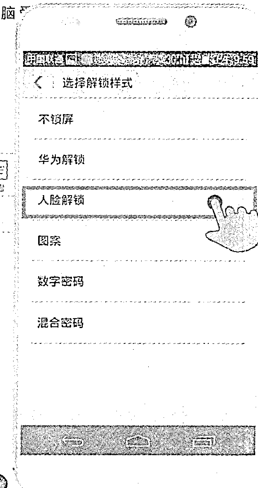

> **小提示**
人脸解锁是Android 4.x系统中的标准功能，但依旧有些品牌会将此功能“阉割”。如果你的手机在解锁方案中没有提供这项功能，则可借助人脸解锁第三方APP加以实现。需要注意的是，人脸识别有个安全上的隐患，你的面部照片也可被摄像头识别。

## 特别话题

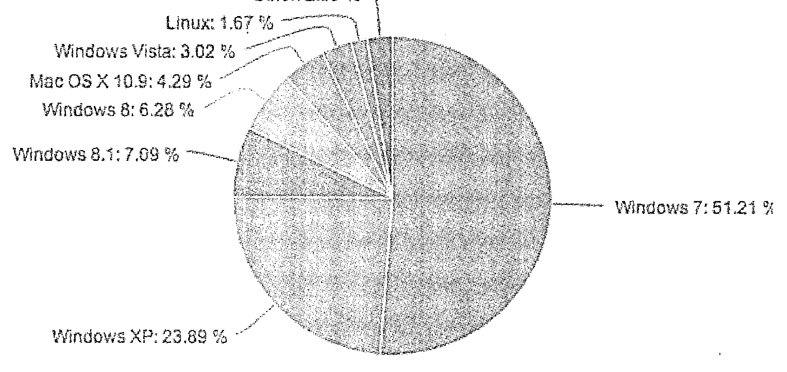

好了，各位读者，在此次的特别话题中，我们向大家介绍了多种技巧、方法，如何去弥补系统、软硬件存在的缺陷与不足，将距每个人心目中中的那完美一步跨越过去。下面就和大家聊聊为何看似相近的产品或品类，却最终被消费者和市场抛弃的问题。

## 确立标准 培养习惯

提起Windows，大家可能再熟悉不过，因为这正是我们最常使用的操作系统，从Windows 95诞生到现在已经19年了。回想1995年的8月24日，随着Start Me的音乐声，16位/32位混合图形操作系统诞生了，这不仅是微软第一款基于Windows内核的操作系统，也是奠定了微软桌面垄断地位的产品。为什么Windows能够摆脱这么多竞争对手而跃上世界占有率最高的桌面操作系统呢？

原因很简单，在上世纪80年代前有很多不同架构的计算机，几乎一家电脑公司就有一种架构的电脑，使软件不能兼容在各个平台上，需要针对不同的计算机设计不同的操作系统。微软当时看中了IBM公司，希望与其合作，为IBM的硬件研发系统。当时的微软买下了西雅图电脑公司的QDOS操作系统，并进一步开发与优化，最终成就了MS-DOS，应用于IBM计算机上。

之后计算机硬件竞争越来越激烈，微软建议IBM开放产品架构，允许让其他计算机制造商仿制和改进，使IBM的PC成为世界标准，这就是现在的IBM兼容机的由来，微软的建议使得IBM成为PC制造业的强者，当然这也使Windows成为最普通的操作系统，只因针对IBM标准的完整兼容性。在市场占有率的基础上，开发Windows程序的技术人员快速增长，配套软件使Windows平台的后续生命力得以大幅延长。

形成完整的生态圈或产业链之后，雪球越滚越大，他们的共同努力将Windows变成了世界普及率最高的桌面操作系统，用户的使用习惯被固化之后，Windows系列的垄断地位就此形成。放在现今智能手机圈似乎也同样适用，谷歌的Android智能操作系统因其开放性，市场占有率居高不下，而苹果的iOS则因给予了开发者丰厚而稳定的收入，形成了完整的生态圈，成为其他厂商争相模仿的对象。

从微软争霸桌面操作系统的案例中可以看出，确立标准、逐步培养用户使用习惯，以及适度的开放性和广泛的兼容性是成功的基础，在此基础之上进一步完善，便能够逐步挤压竞争对手的生存空间。那么其他产品是怎么做的呢？

## 顺势而为 取彼之长

在上网速度还是以KB计算的时候，网络蚂蚁是人们除IE之外使用量最多的下载软件，可谓一家独大。后来者“快车”（原名FlashGet，网际快车）在宽带提速之后，逐渐成为装机必备软件之一，鼎盛时期拥有1.8亿固定用户，并成为国产软件在世界用户心中的一个符号。其准确地抓住了下载的最大问题：速度与下载以后的管理问题。通过把一个文件分成几个部分同时下载可以成倍地提高速度，下载速度可以提高100%到500%。“快车”可以创建不限数目的类别，每个类别指定单独的文件目录，不同的类别保存到不同的目录中去，强大的管理功能包括支持拖拽、更名、添加描述、查找、文件名重复时可自动重命名等等，并且下载前后均可轻易管理文件。后续版本中更添加了镜像和自动镜像查找功能，使得下载速度再上一个台阶。

而现在主流的迅雷，在发展之初在具有快车一切功能的同时，合理利用盗链技术，造成下载速度比其他产品快许多的用户印象，而强行上传资料又保证了其他节点速度，辅以广博的下载兼容性成为P2P时代最好的软件。将其他产品的优势整合至自身，加上其他产品暂不会（或不敢）涉及的功能，用该领域用户最关注的功能击败对手，树立用户心中最强的标杆，把握住用户的痛点，也是许多企业的制胜之道。

## 另辟蹊径 后来居上

从2008年开始，曾经肆虐桌面平台的病毒淡出人们的视野，趋利的木马开始进入活跃期。木马与破坏性强的传统病毒不同，它与计算机是寄生的关系，它很少会像熊猫烧香那样把用户的电脑搞得面目全非，它喜欢隐秘地窃取用户有价值的信息。一些不法个人和机构通过木马来盗取网游网银账号、偷窃用户隐私、恶意骗取广告点击，并形成相当规模的黑色产业链。云安全概念在这个时期得到广泛的应用，虽然各个安全厂商的云安全运行机制都有区别，但是它们都有一个共同之处，就是把判断某个程序是否安全的识别系统从本地转移到了网络。云安全利用了网络资源，推送安全更新更及时，具有更快的反应速度。而且云安全技术背后有专人维护，安全工程师们可以实时分析处理客户端发现的可疑程序，人工鉴定某个程序是否安全。这些都使得安全软件的查杀率上升、误杀率下降。但有人认为，云安全技术也涉及到了一些个人隐私和信息安全的问题。例如，安全厂商如何保持收集用户信息以及保护用户隐私之间的平衡？到今天为止，这个问题在国内外仍然讨论不休。云安全技术需要每个用户都收集病毒样本，并将安全信息反馈给云。如果用户越多，收集的安全信息也就越多，整个云体系的安全成长长度就越高。所以“云安全”时代的杀毒软件需要更多更大的用户群的支撑，而“免费”，自然是增大用户量的最有效方法。就如2008年的奇虎360，用一记“免费”重拳从传统杀软品牌手中抢占了数以亿计的用户量。奇虎360在2008年推出了免费的云安全杀软——360杀毒，直接针对之前的三巨头——金山、瑞星、江民。当时，很多老牌杀软企业未能适应奇虎360的免费战略而痛失市场份额。事实上，“免费”成就的并不只是一款杀毒软件，而是一个拥有巨量用户的360安全平台。因为奇虎360从一开始的定位就与老牌杀软企业不同，所以它的赢利点也并不局限在销售软件这一点上。也正是这样，360可以无所畏惧地向老牌杀软厂商挑战，并改变整个行业格局。

以上所讲的每一个案例的背后，均有着更为深层次的内因在其中，就如同电影《一步之遥》中向大家所揭示的：看似一步的距离，都是之前种下的因果，而不是简单的向前迈一步、向后退一步那么简单。败者无须气馁，胜者也不用骄傲，因为谁也不知道下“一步”走下去是否正确，起与落、兴与衰时刻上演着

## 春节假期

## 软硬设备的‘休闲’生活


在春节假期中，相信大家都会以走亲访友和休息为主题，而我们身边的各种软硬件设备也终于迎来了可以‘喘息’的机会。那么，如何借助这段时间对它们进行维护，确保长假过后能更具效率地迎接新挑战呢？在接待亲朋时或外出串门时，这些处于闲置状态的软硬件设备都在‘偷懒’，如果我们不想它们‘放假’，如何进一步有效利用它们的资源，让其‘加班’去处理额外指定任务，使利用率更高呢？

### 备份往昔

### 回顾‘过往’备份‘往昔’

文|亦云

### 01

俗话说，除旧布新，不破不立。趁着长假期间，很多人都会选择重装系统或是进行其他一些带有‘破坏性’的维护操作。此时，就需要对一年来保存记录的重要数据进行备份或重新整理了。那么，如何才能高效地整理或备份数据？

### 云盘文件资源 重新规划

平时，一看到好的资源就向网盘里存，时间一长，云盘内存放的文件特别乱，不好整理。如果在云盘中在线进行成批处理，由于云盘的文件管理功能很有限，不像本地那样可以借助各种文件处理工具，因此效率大打折扣。那么，如何重新建立文件夹目录，将相关内容放进对应的目录里？还有，免费云盘的空间尽管比较大，但一个账号的空间毕竟有限，如何能申请更多账号，将不同的资源归集到不同的账号当中，以便缓解云盘空间的压力？

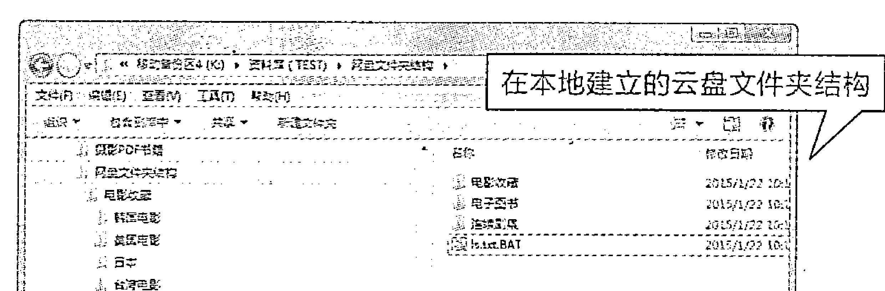

### 本地建立结构 上传云盘归类

如果计划中的云盘文件夹结构并不复杂，只有几个类别或者一两层目录，那么只需要在线新建文件夹即可搞定。否则，建议先在本地建立好一个空的文件夹结构目录树（图1）。用支持文件夹上传的云盘客户端或者在云盘Web端安装插件，将这个文件夹结构上传到云盘的空间中（图2）。

接下来登录云盘，进入文件目录，将同类文件成批选中并移动到相应的资源分类文件夹当中（图4）。这样就省去了在资料移动过程中建立文件夹的混乱和麻烦，一心关注资料的转移而不用去操心远端文件夹的结构和建立了。

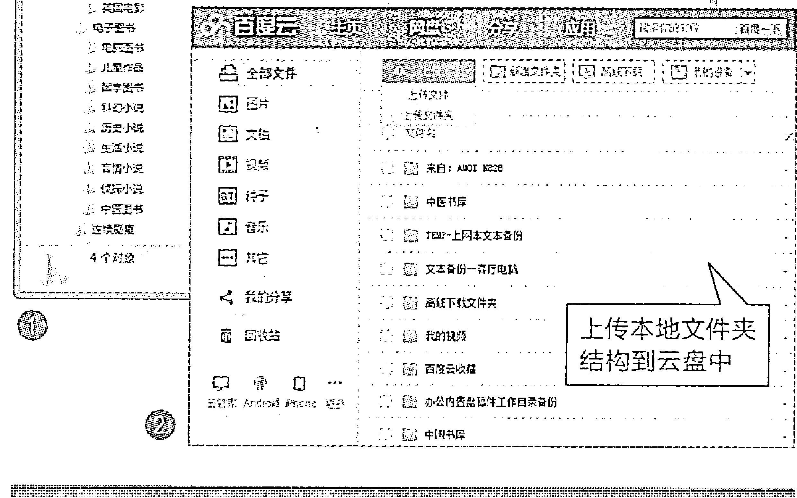

### 脚本建立复杂文件夹结构

在本地建立复杂文件夹结构，也不能一个一个手动新建文件夹，那样太费事。可借助于记事本文件和MD、CD内部命令，编制简单的脚本（图3）。脚本建立后将记事本文件扩展名更名为BAT类型，只需执行该文件，即可实现一键成批生成文件夹结构。

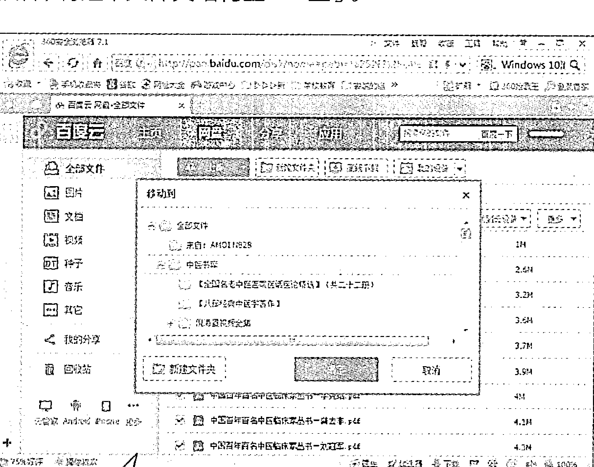

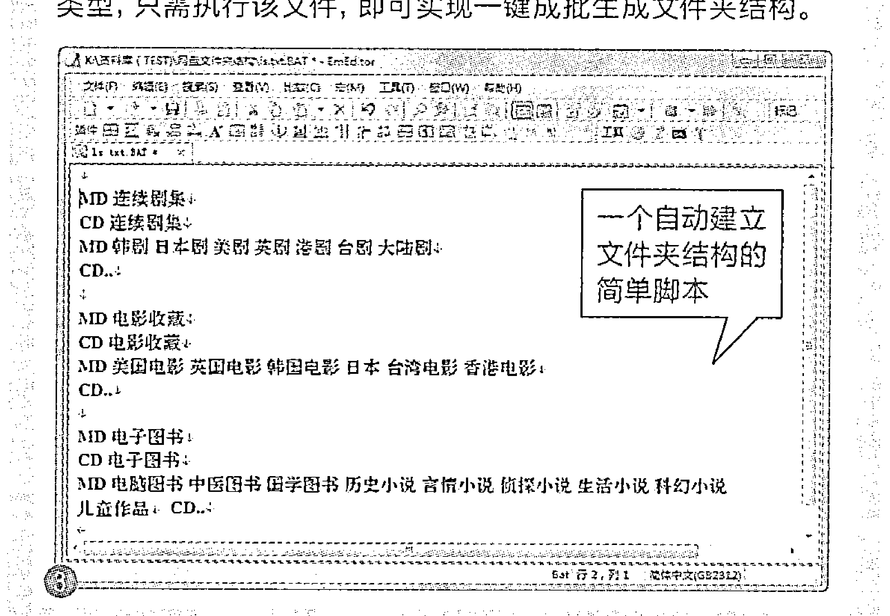

> **小提示**
待资料上传完毕以后，将云盘中原有的散乱文件统统删除，然后清空云盘回收站。这样，云盘中的文件就“眉目”清晰了。

### 下载本地整理 秒速重新上传

如果云盘资料打算在本地也留一个备份，同时又嫌弃云盘上的文件结构混乱，而自己的网络带宽比较充裕（如为10MB或20MB的宽带），下载速度又很快，那么正好可以考虑先将云盘中的文件下载到本地，用本地文件整理的优势进行整理，然后放到一个文件夹中重新上传到云盘。

由于云盘中已经有了这些资源，所以在上传的过程中，即便是上行网速很慢，也能实现“秒传”，几乎不用多少时间。这比通过在线的方式，在云盘中整理文件要高效得多。下载文件的过程可选在凌晨或者自己认为空闲的合适时间段进行。

### 申请多个账号 转移专盘备份

如果发现一个云盘空间紧张，看到要满的时候或者已满时，可以申请更多的账号，按规则获取更多的免费永久空间（图5），然后给每个云盘规划不同的用途和不同的目录。

接下来，用云盘创建隐私链接的方式创建隐私文件共享，将资料导入到不同的账号中（图6）。之后将原盘中已被转移的备份删掉。

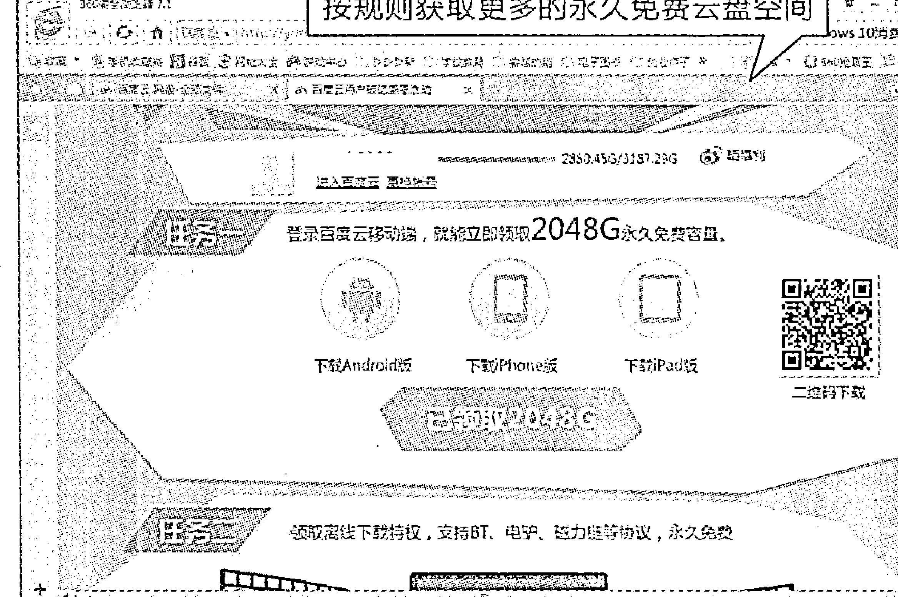

### 小技巧

对于不同种类云盘间的资源转移，可设立两种云盘共享一个本地同步文件夹，其中一个云盘同步到本地的文件，会自动同步到另一个云盘当中。同步之后，再到云端重新转移文件到合适的云端文件夹中。此外，还可以尝试建立文件外链，用迅雷获取外链下载的真实地址，提交给另一种云盘进行下载。后一种方法不一定对所有云盘都管用，可通过尝试来确定。

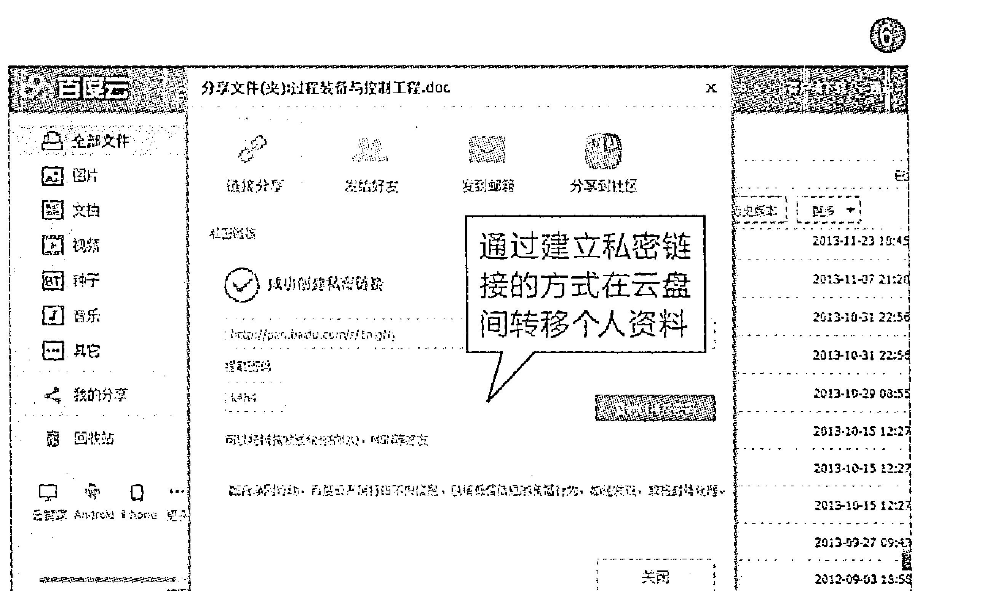

### 平板数据备份 更显重要

随着Windows放下身价，小尺寸设备上的Windows操作系统施行免费策略，如今价格数百元的Windows平板已遍地开花。作为一部移动设备，Windows平板的功能也不逊色于传统PC，但由于环境可能更加恶劣，其数据的受损几率要比PC还大。那么Windows平板资料如何备份？和PC有无差别？

大家知道，平板的最大长处是移动性比较灵活，而最大的短板就是存储空间比较有限。本来就只有32GB甚至16GB的存储空间在安装了系统和必要的软件之后，所剩无几。如果再装入一些自己喜欢的音乐、视频等，空间往往会非常吃紧。因此，人们往往会因空间吃紧而忽略了备份工作。但是，恰恰因为平板的移动易损等特性，要求人们对平板的数据备份更加重视。

目前的Windows平板一般都有USB接口，此接口与手机数据线兼容，或者通过OTG转接线，可以很方便地通过外置设备来备份数据。

同时，Windows平板几乎都会配备SD卡接口，可以轻松地插入一张32GB或者更大容量的Micro SD卡，无论是备份系统数据、映像文件，还是用户自己的数据都非常方便（图7）。

由于除了操作方式上以触摸操作为主之外，平板Windows 8.1操作系统与笔记本或台式机的Windows 8.1并没有实质上的差别。因此，系统或者用户数据的备份方法也十分相似。我们可以用系统自带的系统保护功能，创建还原点进行备份；也可以用系统恢复功能，创建恢复驱动器和恢复U盘来备份；还可以通过PE工具盘，运行古老而经典的Ghost程序来备份整个系统或者用户分区；更可以用通用性比较强的商业备份软件ATI来进行硬盘、分区或者任意文件夹的备份。系统还原、映像恢复、Ghost备份都是古老的话题，以前我们都曾讲过，平板使用这些备份方法与PC大同小异，这里不再复述。下面向大家介绍通用性和实用性都比较强的ATI 2013专业备份法。

### 小提示

+   在平板Windows 8.1环境下安装ATI 2013专业版，启动ATI 2013，执行备份工具，选择要备份的分区为C盘系统分区，然后指定备份方式为“单一版本方案”完整备份，并指定备份的目标位置为SD卡或U盘，最后执行备份操作即可（图8）。

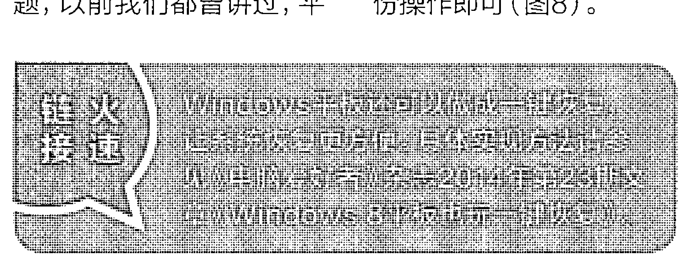

### 企业重要部门使用专业的备份服务

对于工作数据，如果有严格的保密等级，企业或公司一般会安排资金购置具有远程备份功能的办公系统，严格按照操作规程作业，数据除了在本地保留外，远程会生成备份文件，有很强的灾害应对和恢复能力（图9）。这种情况不在我们的话题之列，我们讲述的是那些平时没有灾害备份应对预案或对此不够重视的部门或个人。这类用户的数据一般没有那么严格的保密等级，但也不能随便公开。在这种情况下，如果不想增加开支，也可用通用的云盘来进行备份。

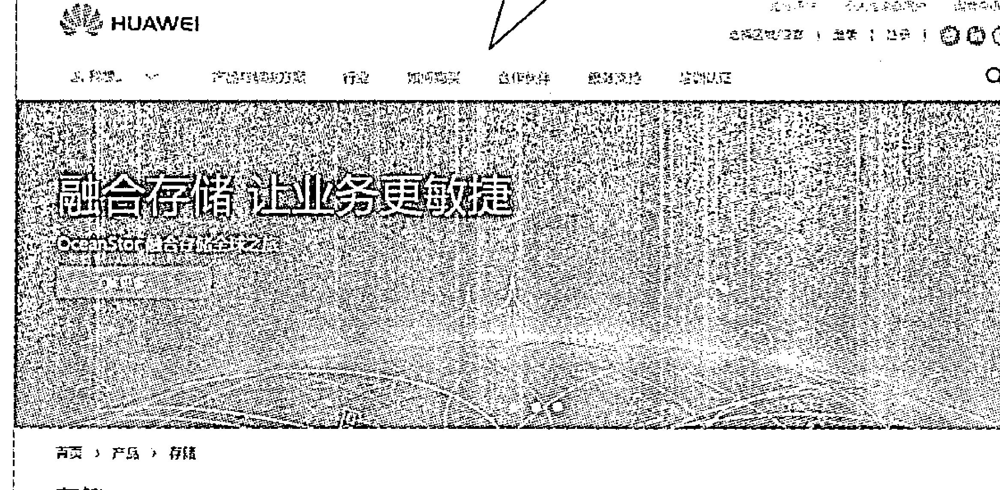

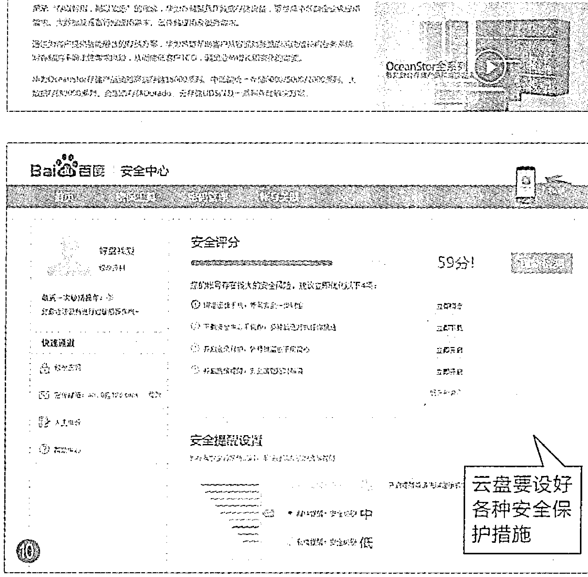

### 居安要思危 预防天灾

人们常说“居安思危”。万一火灾发生，烧掉了办公室，工作所用的机器连同备份设备都化为灰烬，有应对的办法吗？如果没有，那就赶快动手，以防万一发生。抱歉，我不是在“诅咒”谁的办公室发生什么灾难，而是因为这种丢失数据的惨剧每天都在现实生活中上演。那么，有什么方案能做到工作资料的异地备份，防患于未然呢？

也许，我们随口会说出“网盘”或“云盘”二字，但是，我们是否真的这么做了？如果没有做，原因是自己懒惰或过于自信，还是不信任“云”商家？如果已经做了，那么看看和笔者介绍的方法有何差别和可互补的地方。

首先，需要认识到系统中最重要和具有毁灭性打击的数据是什么。一般来说，工作性质的数据或文档是最重要的数据，绘制的工程设计图，起草的工作计划或总结等都是凝聚了个人甚至是集体长时间心血的成果，这些是绝对不能丢失的。此外，自己熟悉的工作环境，比如操作系统及运行于其之上的各种应用程序或用户配置，这些是工作所赖以进行的基础平台，价值位于其次，但重要性也不容忽视。最后就是个人娱乐或业余使用的资料或文件。针对这三方面的数据，就要采取不同的备份方法。

在具体执行过程中，首先在本地硬盘设立工作文件夹，规定本地进行的一切工作成果都要保存在工作文件夹中。然后安装某种质量和信誉都比较稳妥的云盘（例如百度云、360云、华为云等），在给云盘设置足够强的密码的同时，设置好各种账户安全保护措施（如手机密保、邮箱密保、甚至真实身份认证密保），以备找回密码和重置到账户的安全状态（图10）。其中一定要安装的是数据同步版，同步版的同步文件夹也设定为本地系统工作文件夹，这样可以保证工作数据能够及时传送到云端进行备份。另外，为了文件管理方便之用，最好同时安装普通版的云盘PC客户端。

对于重要文件，还可以用专业软件ATI提供的云备份。以上谈到的ATI软件官方可以提供将数据备份到云端的Acronis Cloud服务，我们可以选择在平时将重要数据利用“线上备份”功能自动备份到Acronis Cloud云端。

## 特别话题

本地安装的云盘客户端可根据情况设定访问密码，授权给需要使用它的员工使用。此外，对于保密性更高但需要云端备份的资料或文档，可选择具有保险箱的云盘（如360云盘），在云盘中将其转移到“保险箱”中（图11），因保险箱具有另一层密码，这样就相当于资料有了三层密码，即云盘登录密码、锁定云盘客户端的密码和云盘保险箱密码，基本可以保证资料的安全。

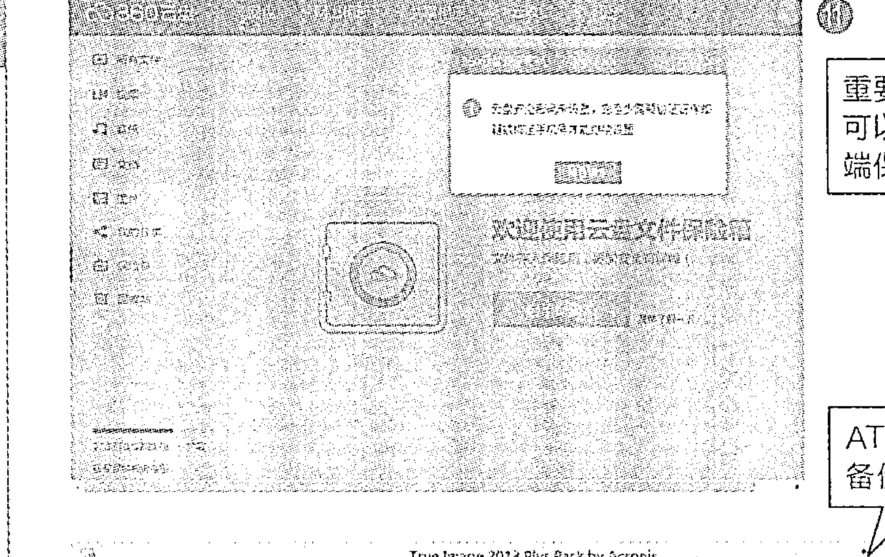

重要数据还可以放在云端保险箱中

如果在移动设备上使用该备份，需要通过应用商店搜索“Acronis True Image”应用并安装，然后用自己的ATI云账号登录应用获取数据。

ATI可提供系统远程备份重要数据服务

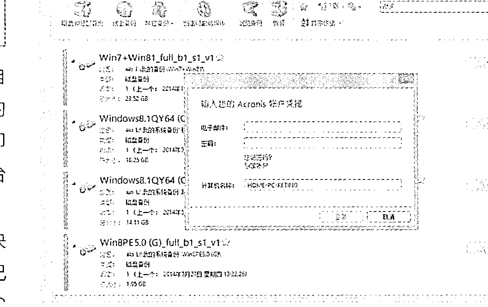

只需要在ATI中登录自己的账户，然后将要同步的文件拖放到Sync文件夹中即可实现自动上传，供另一台登录同一账户的设备下载。这样，当灾难发生之后，很快可以通过ATI服务器将自己的数据恢复到任意一台PC甚至Android或iOS等移动设备上。

对于系统备份，也可以存储在云端。可用普通云盘本地备份的方法设好自动备份时间，将系统备份到本地。然后在云盘客户端中设置本地文件自动备份到云盘的计划任务，当系统文件备份完成之后，将系统的备份文件自动上传到自己的云盘空间中备份。这样，当灾难发生后，只需通过另一台能上网的电脑下载系统备份数据包，恢复到一个新搭建的PC硬盘中，即可恢复工作环境。

对于用户平常使用的图文声像生活娱乐类文件，虽然被列为不太重要的备份内容，但是，由于要收集这些文件同样需要花费时间，甚至有的文件的源可能也不易再找到，因此这些文件同样有备份的必要。这些文件只需按我们平常的方法，设置云同步或云自动上传备份，即可保证数据的安全。而对于那些大众可以共享的电影、电视剧或音乐等公用的文件，由于在云盘服务器中不难找到，因此，我们也可以不对这些文件进行备份，转而只备份它们的种子文件或文件列表。一旦出现问题，可以通过云盘搜索引擎和云盘的离线下载，非常迅速地找到这些资源，并让它们重新回到我们的网盘或本地电脑。


## 工具软件备份

需要备份的远远不止系统分区、个人通讯录等，各种工具软件都有需要备份的内容，这些可能往往都被我们忽略了。例如办公软件、电子邮箱、播放工具、各类工具软件的配置等，都存在一个备份的问题。

对于电子邮箱管理工具Foxmail，由于它具有将网络邮件自动收取到本地的同时自动清空网络服务器邮件的便利功能，这同时也为本地数据隐患埋下了祸根。当收到本地的邮件未来得及处理，而服务器端的邮件又已经被清空的情况下，如果本地遇上机子毁了或者硬盘毁了，那么这些邮件就都化为乌有且无法找到备份。因此，Foxmail也是需要备份。备份Foxmail的方法可以导出邮箱邮件到云端同步文件夹中，也可以将整个Foxmail的安装目录以单向备份的方式，设置自动同步到云盘中（图13）。

输入法是我们每个人都要使用的日常工具，无论我们用搜狗拼音、QQ拼音还是用百度拼音输入法，系统崩溃了大不了重装是我们大家的“共识”，但是一个录入行家都知道，真正高效和顺手的输入法是经过用户定制的符合自己输入特点的智能输入法，这样的环境不是重装一个输入法就能获得的。它的建立起码需要两个条件，一是具备智能和云功能的输入法，这一条在目前的流行云智能输入法都具备；二是需要用户设立了云账号并时时处于开启状态，这一点许多用户做得并不好，电脑上虽然也都装了搜狗、百度或QQ输入法，但使用时根本没有登录自己的账号，因而用户习惯只停留在本地电脑，云端根本不了解我们的习惯。

因此，输入法也需要备份，备份的方法其实很简单，只需在输入法设置窗口用自己申请的账号登录输入法服务器，如果是自己的电脑，设置记住密码，每次让其自动登录即可（图14）。如果使用的是公用电脑或别人的电脑，则记住在使用时临时登录自己的输入法账号，这样不但保证可以拥有自己已经建立起的输入环境和输入习惯，更可以将本次输入的词组或习惯同步叠加到自己的云输入法云空间中。

> 小提示
> 工具软件需要备份的例子不胜枚举，多数软件几乎都有不同程度需要备份的数据。读者可根据情况具体设置备份，这里不便一一列举。

也许，我们会觉得一个小小的下载工具没什么需要备份的，用硕鼠这个工具下载东西，大不了一台新电脑中再下载安装一个。但是，如果我们是一个深入使用者，由于这个软件支持个人的常用下载网址收藏，而这个收藏网址与IE等浏览器的收藏并不是通用的，如果这些网址丢失，很难通过记忆短时间内重建起来，这些正是需要备份的内容（图15）。可以通过硕鼠收藏列表的导出功能，将收藏的下载列表导出到我们的云盘同步文件夹中，自动上传到云服务器当中，以备下次重新装机以后恢复。

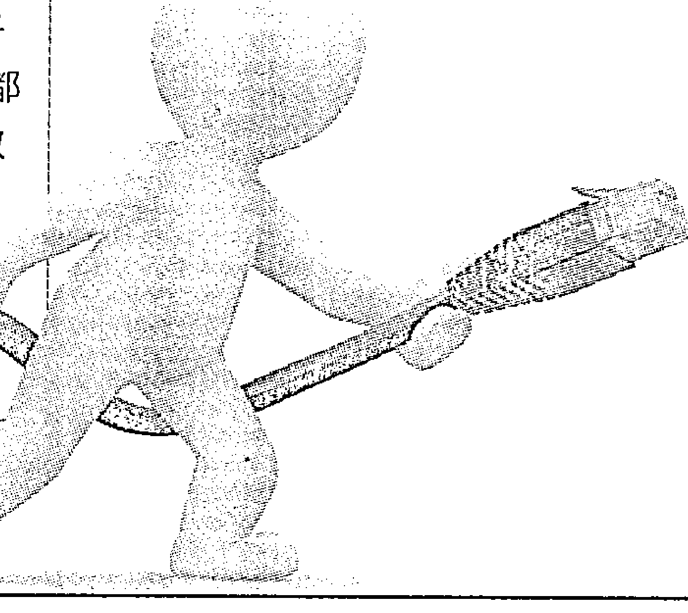

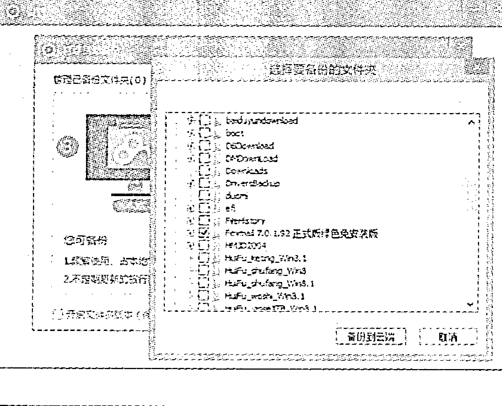

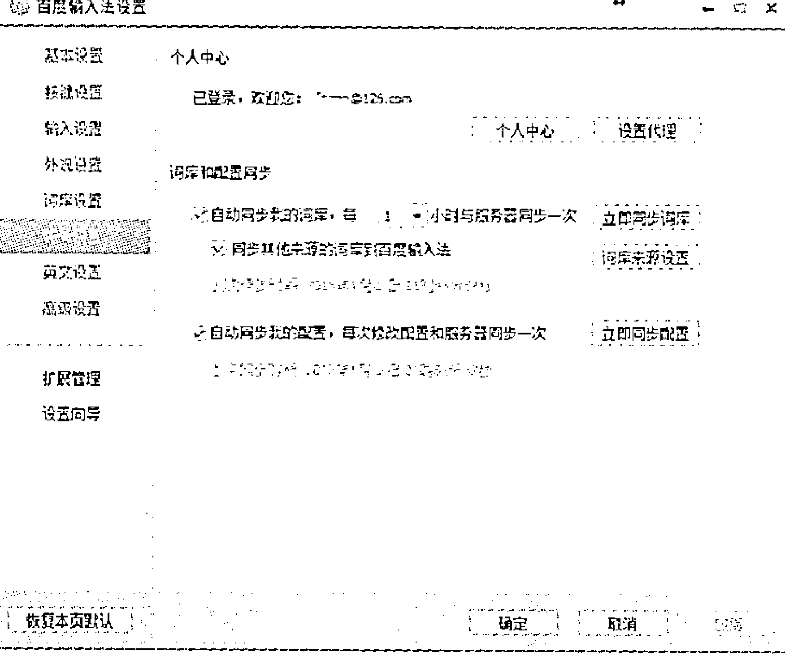

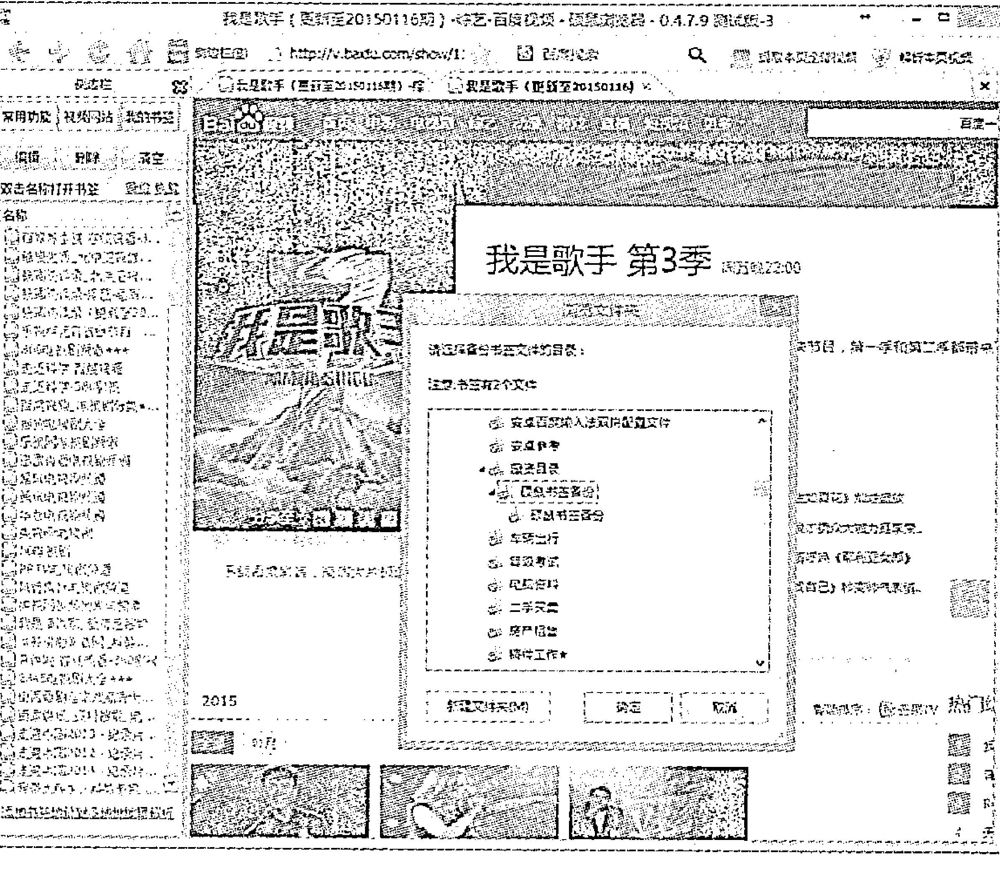

## 博客备份留住生活的足迹

### 借着ID搜索博客

这里推荐一款名为“豆约翰博客备份专家”的软件（下载地址：http://www.douyuehan.com），它支持多个主流博客网站内容的下载和处理。如果是第一次运行这款软件，需要根据提示注册一个软件账号，接下来就可以登录到软件的操作界面了。这里以批量下载新浪博客的内容为例，在左侧列表中找到“新浪博客”项，右击它，从弹出的右键菜单中选择“新增博客”命令。此时将会弹出一个添加设置的窗口，在窗口的“博客ID”选项中输入需要下载的博客ID信息即可。

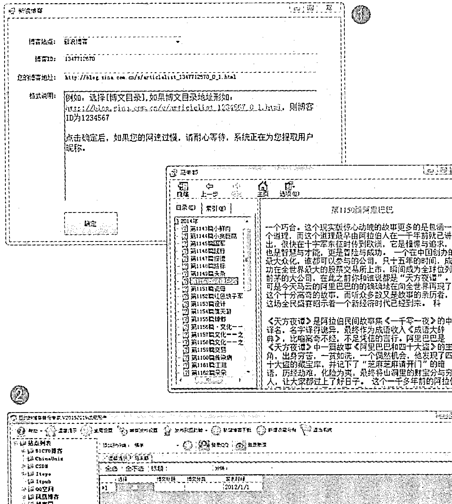

### 下载制作电子书

接下来在“马未都”博客名称上双击，再在右侧的操作窗口中点击工具栏上的“开始下载”命令，即可开始批量下载此博客中的文章（图2），下载完毕会弹出提示对话框。接下来点击工具栏中的“刷新列表”按钮，刚刚下载的文章名称就可以显示到列表中。

为了更好地对这些博客文章进行管理，我们可以将其制作成电子书以方便保存和查阅。首先从列表中选择需要保存的文章，如果所有的文章都需要保存的话，直接点击“全选”按钮就可以了。接下来点击工具栏中的“开始导出”按钮，在弹出的菜单中可以选择导出的文件格式，其中包括我们常见的PDF、CHM或者TXT等格式。这里建议大家选择CHM格式，因为它可以完整地保存博客文章的目录。当软件提示电子书制作完成之后，点击“打开存储路径”按钮，在弹出的窗口中就可以看到刚刚制作的电子书文件了（图3）。

### 微博同样下载备份

可能有的用户想对微博也进行备份，其实通过“豆约翰博客备份专家”同样可以做到。不过由于新浪微博是一个封闭的系统，因此首先需要通过IE浏览器，登录自己的新浪微博才可以。接着点击“豆约翰博客备份专家”操作界面中的“登录新浪”按钮，这样软件就可以获取到浏览器的登录信息。接下来在左侧列表中找到“新浪微博”这项，其他的备份操作和博客一样，这里就不再叙述了。不过要想获得某人新浪微博的ID，首先需要进入到他的微博首页，接着点击鼠标右键选择“查看源”命令，在弹出的窗口中查找“oid”这个关键词，它后面的字符串就是此微博的ID信息了。

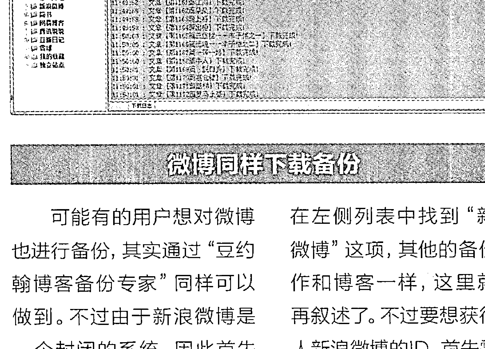

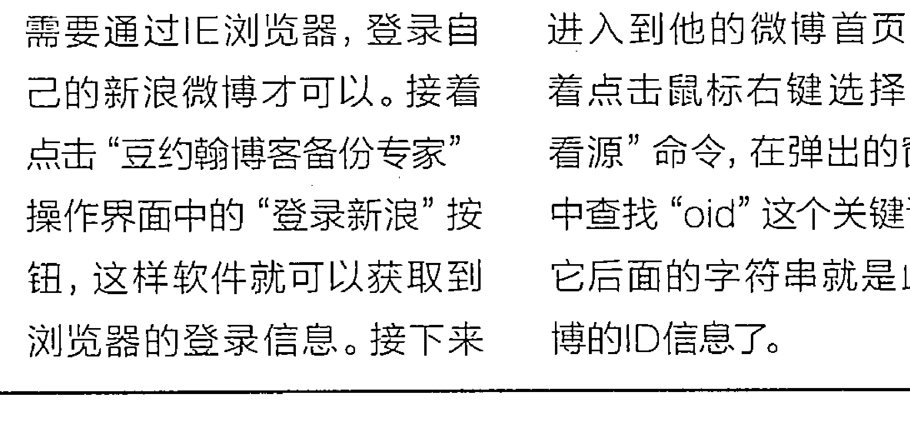

## 假期不闲着 做好软件系统深度维护

做好数据备份后，就可以放心大胆地对系统“下手”了。因为大家平时的学习和工作都比较忙，很难有时间对软件系统进行深度维护，因为这种维护操作较复杂，而且很容易损坏电脑系统，必须要有充裕的时间才好进行。经过前面的操作，再加上其他的工具和方法，将数据备份好之后，接下来就可以好好利用春节假期做平时无法操作的深度维护操作了。

## 为系统提速 Windows的深度维护

系统用久了速度就会变得越来越慢，而且会出现各种各样的问题。最简单高效的提速方法当然就是对系统进行重装了。不过电脑中个人数据是最重要的，这里我们选择的是不破坏个人数据的重装方法。以Windows 8操作为例。为了安全起见，必要的数据备份工作还是要提前做好。

首先准备和自己当前系统版本对应的系统安装镜像（可以到http://www.itellyou.cn下载），下载后在资源管理中加载，然后将其中的“sources\install.wim”文件复制到D:\sources目录备用。接着以管理员身份启动命令提示符，依次输入下列命令（图1）：

```
dism /Get-WimInfo /wimfile:d:\sources\install.wim
```

```
reagentc /setosimage /path d:\sources /index 1
```

命令解释：第一行命令是查看镜像文件的信息，要注意的是这里的系统版本一定要和当前版本完全一致，否则无法完成恢复操作。比如这台电脑原来是Windows 8专业版，这里选择的就是Win8 Pro。第二行命令则用于自定义恢复镜像位置（否则需要插入光盘才能恢复），path后的路径表示Install.wim文件所在文件夹路径。index后面的数字表示要恢复的系统在WIM映像文件中的索引号，一般选择索引1即可（信息也要和上述检测到的一致）。完成上述设置后，在桌面激活超级菜单，依次点击“设置→更改电脑设置→更新和恢复→恢复”，点击右侧窗格的“高级启动→立即启动”，进入系统自带的高级启动界面（图2）。接着在重启界面依次选择“更改默认值或者其他选项→疑难解答”，在弹出的界面点击“恢复电脑”，剩下的操作按屏幕的提示完成即可（图3）。注意，系统恢复不会删除个人文件和应用商店里安装的应用，但自行安装的桌面程序（如Photoshop、Office）等会自动卸载（大家可以使用绿色软件的方式安装，这样重装后可快速恢复）。因此为了尽可能保持更多的应用，可将常见的应用（如QQ、爱奇艺等）都用从应用商店下载的方式安装。系统的恢复原理如图所示（图4）。


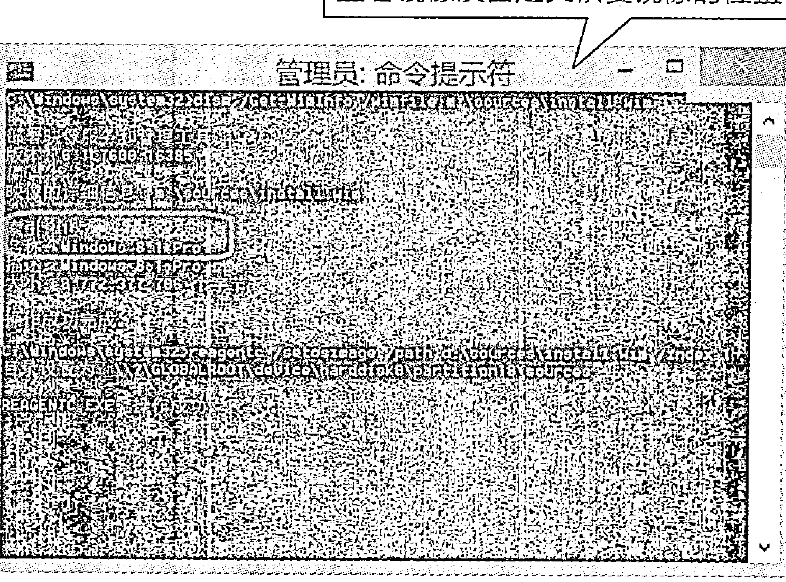

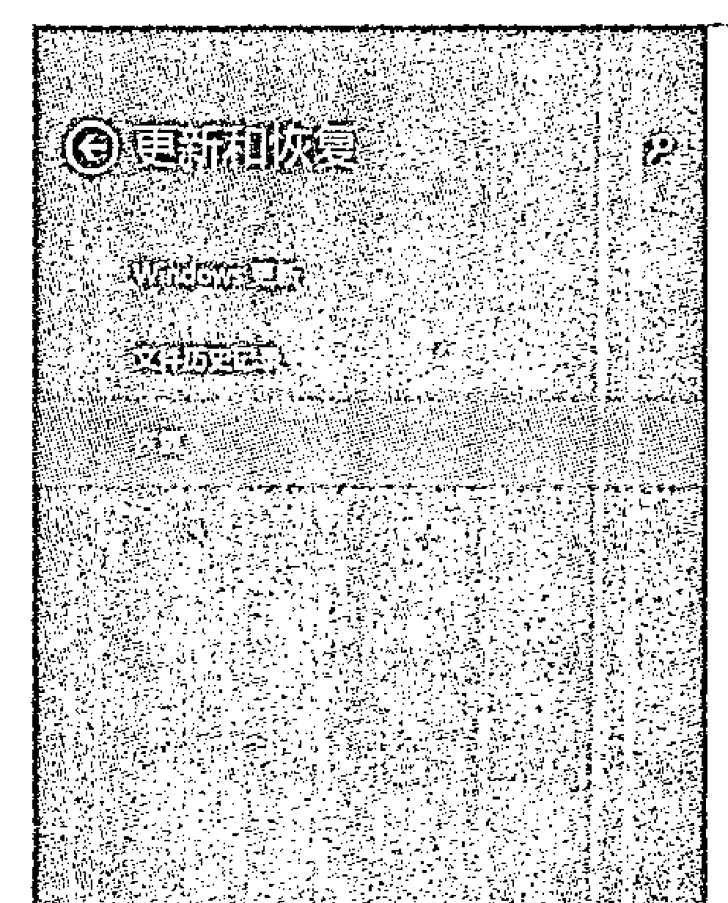

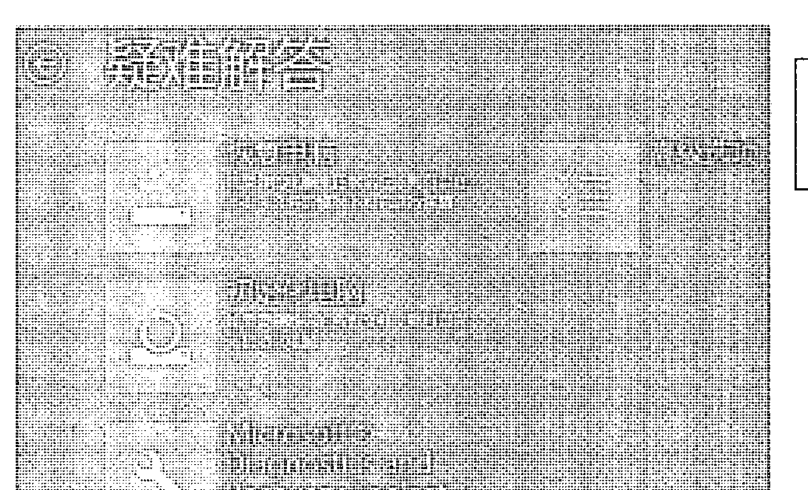

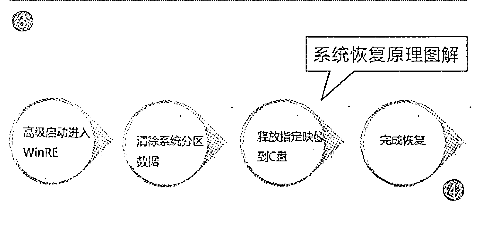

> 小提示：如果是Windows 7系统，虽然系统没有提供Windows 8那样的恢复组件，不过实际上系统恢复主要操作是将Install.wim文件中的指定映像恢复到C盘。因此如果你的系统出现一些无法修复的问题（如WinRE无法进入、系统关键文件受损），同样可以进入WinRE，然后使用DISM命令直接将Install.wim镜像解压到C盘，这样重启之后即可修复常见系统故障了。

## 为读取提速 硬盘的深度维护

硬盘是操作系统的载体，因此，要提高系统的读取速度，就需要对硬盘进行一番深度维护，这样才能从根本上提高系统的运行速度。不过，现在的硬盘容量较大，很多深度维护操作也只有假期有时间做。

对于传统的机械硬盘，除了定期的磁盘碎片整理外，我们可通过对齐4K的方法加快其读写速度。这里要借助Alignment Tool这款工具，程序运行后可以看到左侧是你的硬盘，右侧则是4K说明，如果显示绿色则表示已经对齐4K，如果显示黄色则表示可对齐但尚未对齐4K，如果显示粉红色则表示它不支持高级格式化。确认你的硬盘支持4K操作后，接着点击下面的“Align Partitons”，会弹出一个简短的对齐进程窗口，完成后点击“Restart Align”，电脑会自动重启。重启后会跳转到DOS下进行对齐，对齐完成后自动重启。进入系统以后将会看到，分区的图标已经变绿色了，后面有一个Succeeded成功的标识，表明硬盘的4K完成对齐了（图1）。除此之外，假期如果有时间，还推荐对硬盘做一个全盘的扫描（大硬盘扫描需要花费的时间较多，建议选择空闲时间段进行扫描），扫描工具可以使用DiskGenius，启动程序后选中需要扫描的硬盘，点击“工具→坏道检测与修复”，点击“开始检测”即可，这样如果发现坏道还可以进行修复。

对于SSD硬盘，同样可以对其进行深度优化。首先Trim是SSD硬盘提高读写速度的一个重要技术，要查看是否开启了Trim，以管理员身份启动命令提示符后，输入‘fsutil behavior QUERY DisableDeleteNotify’，如果屏幕提示‘DisableDeleteNotify = 0’则表示已启用Trim。如果无法开启，请尝试升级BIOS和SSD硬盘的固件后再进行尝试。

接着还可以使用优化工具对SSD硬盘进行读写优化（包括前面介绍的4K对齐）。以英特尔SSD硬盘为例，到官方网站下载‘SSD工具箱’，程序运行后会自动检测到当前SSD硬盘，点击软件左侧窗格的‘Firmware Update’，升级SSD固件（图2）。

此外，由于SSD硬盘对所有存储单元相同的访问时间，因此没有必要对SSD硬盘进行碎片整理，频繁整理反而降低了SSD的寿命。因此SSD硬盘用户建议停用碎片整理过程。只要点击‘开始→所有程序→附件→系统工具→磁盘碎片整理程序’，在打开的窗口点击‘配置计划’，然后去除‘按计划运行’前的勾选即可。

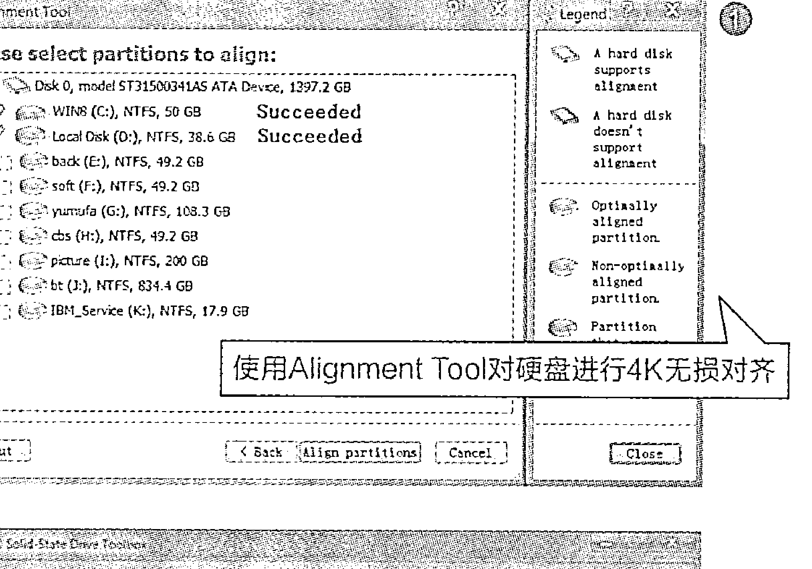

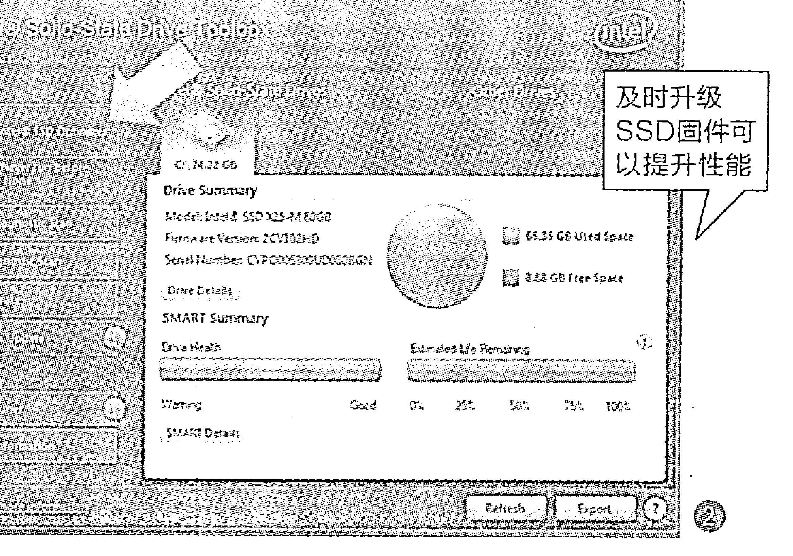

## 旧貌换新颜 Windows 8平板安全升级到Windows 10

### 有条不紊轻松升级

完成启动盘的制作后，就可以准备Windows 10的安装文件进行升级了。下载好所需的安装文件后，在资源管理器中选中安装文件，右击选择‘装载’，然后将其加载到虚拟光驱（图2）。

### 有备无患制作PE启动盘

为了避免不可预知的升级错误，首先要制作一个应急PE启动盘。PE启动盘的建立和电脑上的大同小异，这里要注意的是并非随便制作的PE都可以启动平板。因为平板的硬件比较特殊，建议到自己平板型号专业论坛上去下载网友们已经测试过可以启动的PE系统，同时准备好USB和外接键盘（如果升级失败需要借助键盘进入BIOS设置启动U盘）。

比如笔者的是台电X98 Air 3G的Windows 8平板，台电论坛就有提供相应的PE。下载后使用WinRAR打开，将相应的启动文件直接复制到U盘，重启平板后连接外接键盘按Del键进入BIOS，然后设置为U盘启动，这样就可以引导平板进入PE系统了（图1）。

打开虚拟光驱，双击其中的Setup.exe激活安装，在安装向导中选择‘保留Windows设置、个人文件和应用’，剩余的操作按照屏幕的提示完成安装即可（图3）。如果正常进入Windows 10系统说明升级成功。如果无法完成升级，就可使用上述制作的PE应急启动盘引导平板，进入PE系统后先提取重要文件，即可按照前面的方法恢复或重装平板系统。


## 挽救旧存储 修复旧硬盘和U盘

在日常使用中，我们的存储设备如旧硬盘、U盘总会出现这样那样的问题，平时没有时间修复，现在利用春节假期可以好好地进行修理。

对于硬盘、U盘这类存储设备来说，很多常见的故障（除了硬件实际损坏外）都可以利用软件来进行修复。

下面用实例告诉大家如何修理存储设备的故障。

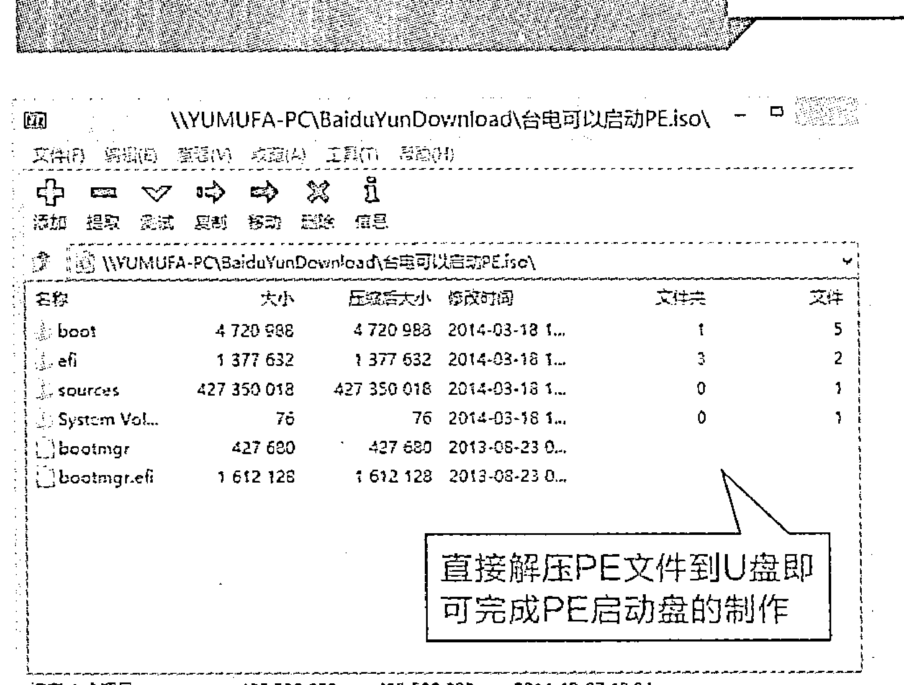

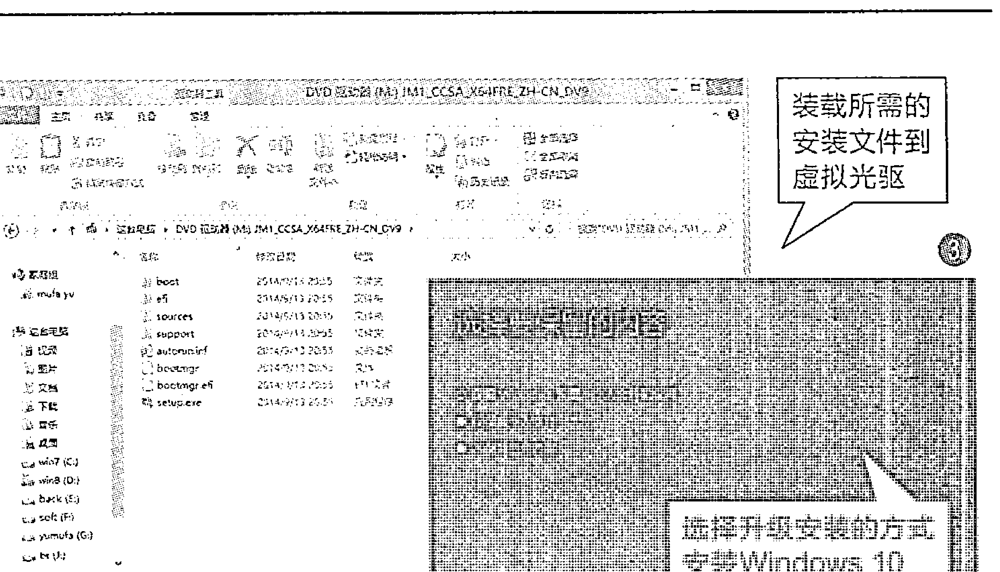

### Diskpart修复U盘容量减少故障

一次在使用USBOOT制作启动盘的操作中，笔者发现制作好的启动盘只有2GB容量（原来是8GB），容量凭空少了近6GB。现在使用系统自带的Diskpart命令就可轻松找回丢失的容量。

插入U盘后启动命令提示符，依次输入下列命令：

- 1. Diskpart
- 2. Rem 列出本机所有硬盘，根据容量选中故障U盘，注意千万别选错硬盘，否则会导致正常分区中的数据丢失，为安全起见最好对其他分区中的重要数据先备份
- 3. List disk
- 4. Rem 选中插入U盘，以下为本例的选择
- 5. Select disk 2
- 6. Rem清零磁盘信息
- 7. Clean

执行上述命令后，Diskpart会将U盘所有信息清零（图1，包括分区和所有文件，操作前注意数据的备份）。现在拔出U盘后再次插入，系统会提示U盘未格式化，忽略该提示进入磁盘管理，可以看到被清零的U盘没有分配空间，右击选择“新建简单卷”，然后按提示建立分区并格式化后即可找回丢失的容量。

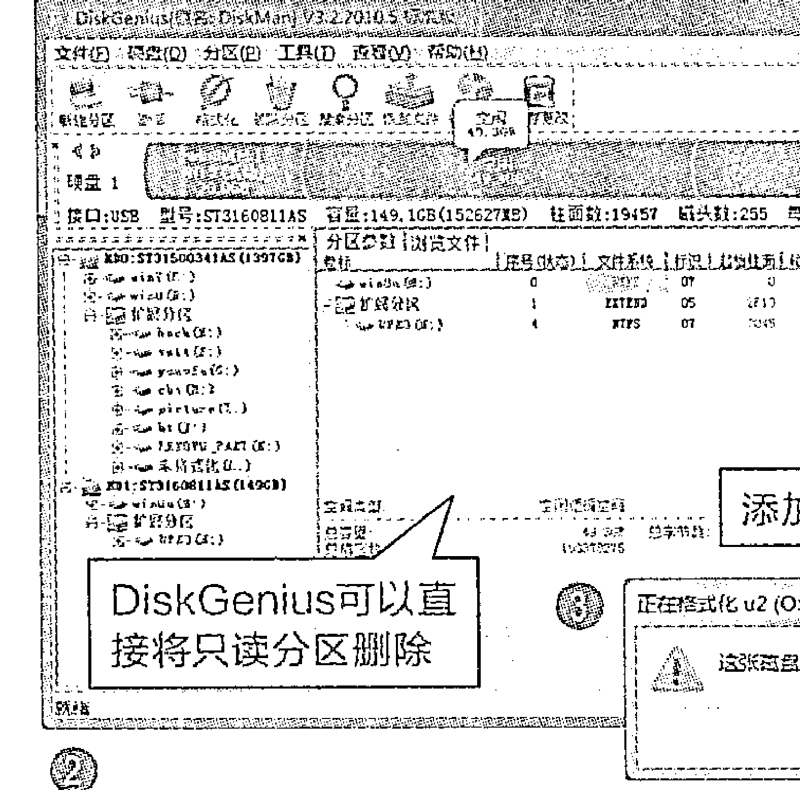

### DiskGenius解决移动硬盘只读故障

一块移动硬盘在借给朋友使用后发现变成只读，想要格式化则提示只读无法完成。假期有时间进行搜索，才知道原因是移动硬盘被朋友添加了只读属性。

怎么取消只读属性呢？可使用DiskGenius进行修复。将只读分区的资料全部安全转移到其他分区，运行DiskGenius，在磁盘列表中选择移动硬盘，选中只读分区（千万不要选错，否则将导致其他位置的文件丢失）并右击选择“删除分区”，在此删除分区，重新建立新的分区就可取消其只读属性了（图2）。

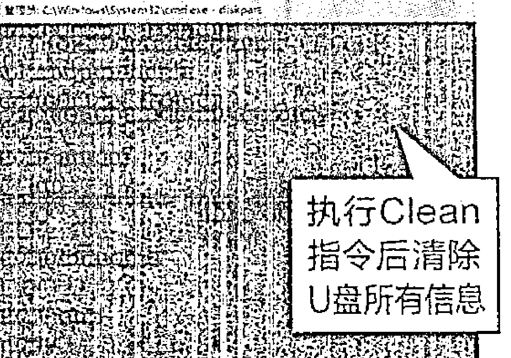

> 小提示
> DiskGenius支持对硬盘、U盘、SD卡等各类存储的底层读取，如果存储设备出现插入电脑无反应、无法打开或莫名添加只读属性等奇怪的故障，大都可通过“删除分区→建立分区→格式化”的方法进行修复。只是操作前一定要注意备份好数据，以防万一。

文|亦云

## 系统深度维护
小心伤筋动骨

现在，大家乐于使用各种系统维护类的工具软件。如常见的360安全卫士、腾讯电脑管家等。这些工具在进行系统垃圾清理、漏洞修复、网络监测修复等方面的确给大家提供了方便，此外，它们还提供了更加个性化的修复选择，让用户可以进一步按需要进行系统维护。但是，如果不分青红皂白默认选择清理，很可能对系统或数据造成破坏，带来不必要的损失。

## 小心杀毒软件间互杀

对于安装多系统的朋友来讲，如果在同一台电脑的不同分区安装了不同的杀毒软件，这时要格外小心了。它们很有可能会互相残杀，最后充当“炮灰”的还是用户自己（图1、图2）。

在“电脑清理”中清理电脑垃圾或不常用软件，一个分区中的杀毒软件或清理软件会将另一个分区中的他方杀毒软件认为是“不常用软件”或垃圾，若选择默认设置会即刻被清理掉，包括该软件安装在系统分区中的所有程序文件和配置文件都会荡然无存。更有甚者，还可能造成被卸载的安全软件无法重新安装。

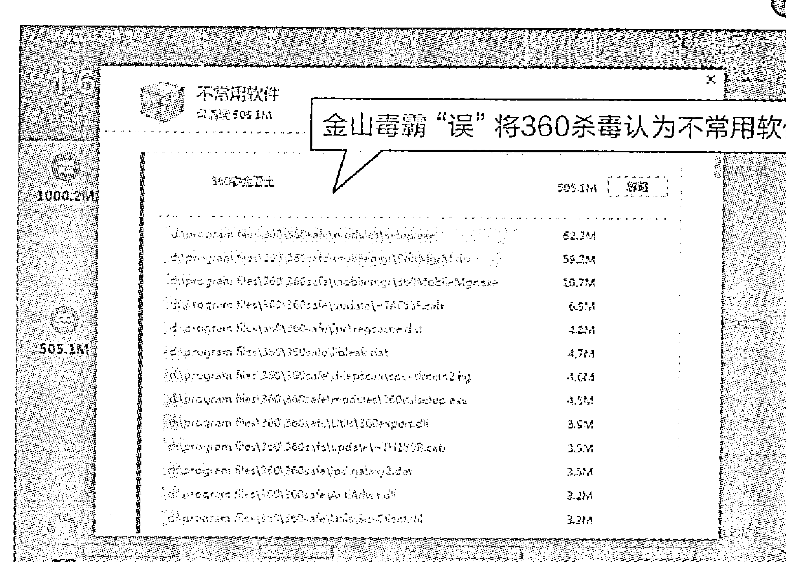

不管这是出于商家不正当竞争的目的，还是无意中的技术Bug而为，最后的事实是，另一个系统中的安全保护被卸载了，还需要重新安装，而且也不一定能够顺利安装上，这样就浪费了宝贵时间，或者因兼容问题而带来新的难题。

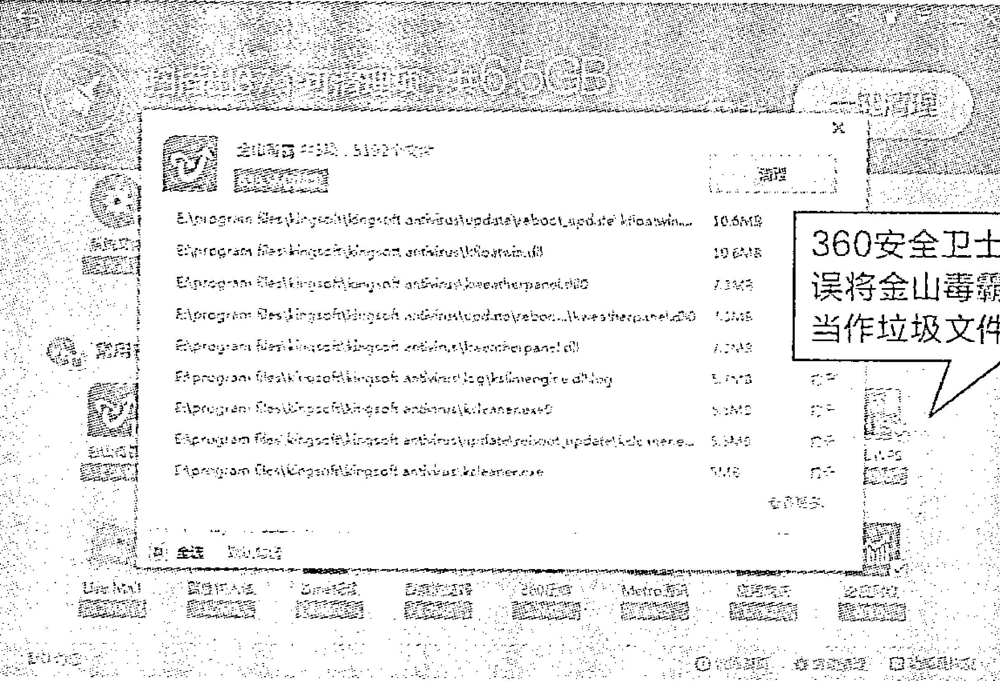

## “深度清理”存隐患

系统优化软件（包括手机系统优化APP）中的“高级清理”功能有大文件清理功能，它们会不分三七二十一地扫描存储空间中的大文件，列出来让用户选择。如果碰上空间紧张而又不懂电脑的用户，也不分青红皂白地一键选中所有文件，那么，自己下载的电影、高清歌曲或其他大文件，顷刻间都将化为乌有（图3）。手机端也容易将自己下载的软件、视频等大文件清理掉。

## 加速优化也要小心

系统加速功能中首先包含一项启动加载项的清理。如360安全卫士的“优化加速”下的“启动项”清理，可扫描出系统启动时自动启动的程序和服务。软件目前尚不能判断这些项目中哪些是用户经常使用的。因此可将每天使用的项目作为建议清理的而列在自动清理项目之列，这样很可能被用户顺手点击“清理”或“禁止启动”按钮将每天使用的自启动软件关闭或清理掉。

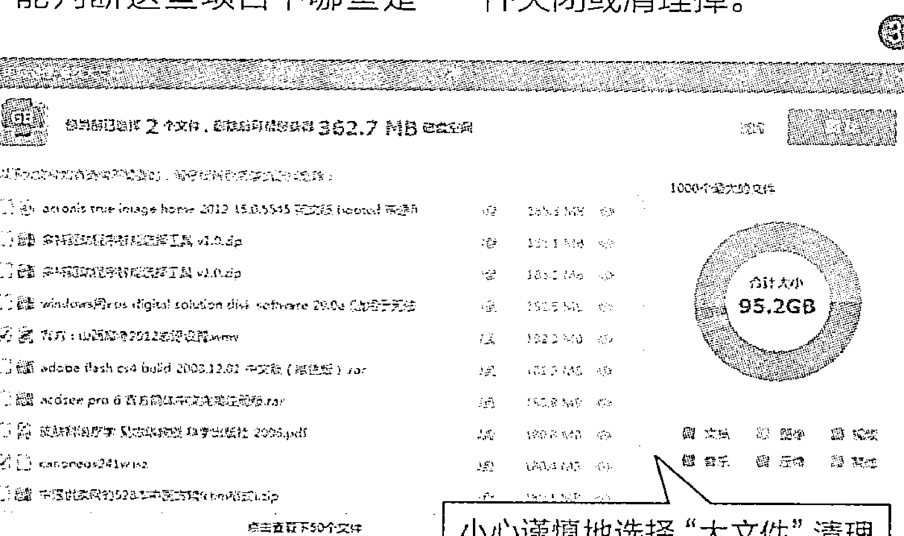

## 小提示

系统加速自启动优化，需要根据自己的实际使用情况，决定保留和清除的软件或者服务项目。切不可统统选择清理，否则造成误删后，甚至不知有的软件该如何再次添加到系统托盘中，只得彻底卸载后重新安装一次了。

文|阿木

## 软件不放假
假期操作玩自动

03

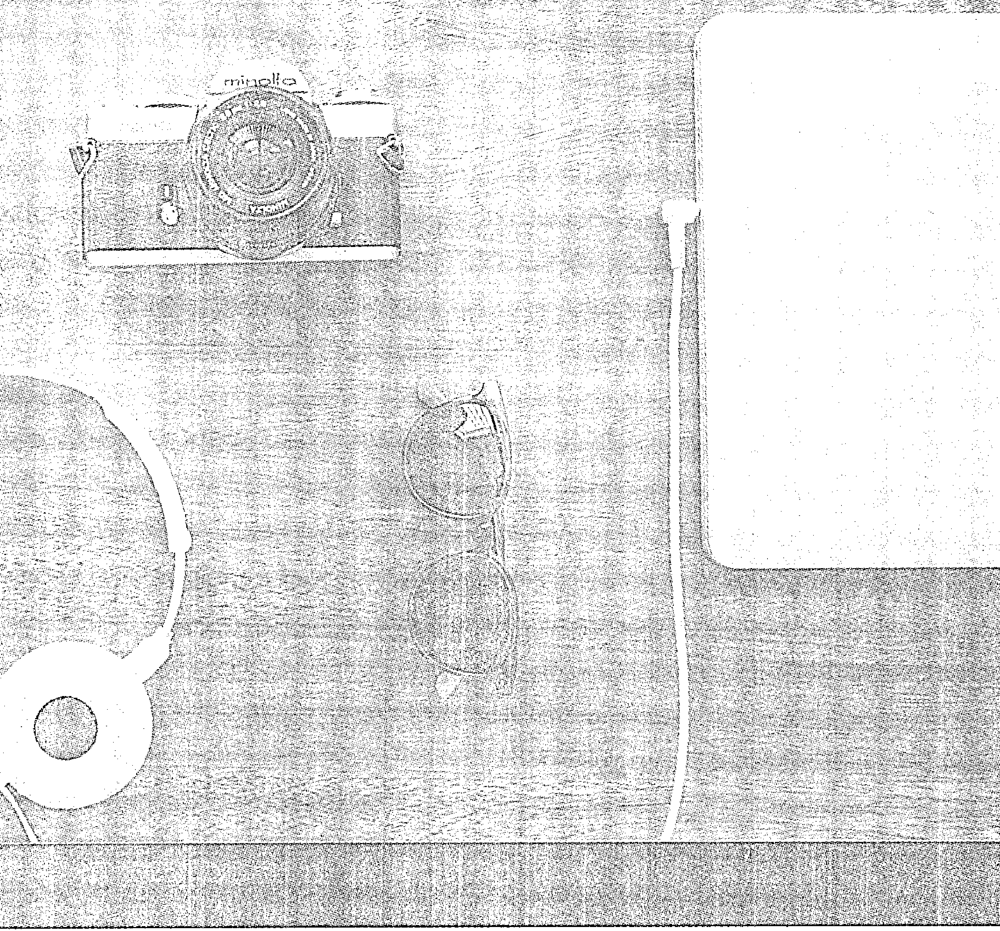

## 款待客人
游戏操作不耽误

虽然春节放假时间多了，不过春节期间我们经常出门接客，此时软件系统会长期处于闲置状态。其实可以将各种常见操作转化为自动操作，这样无论是在家和朋友叙旧，还是出门探亲访友，很多操作都可在后台自动运行完成。

春节期间很多朋友都喜欢玩游戏作为消遣，如果玩得正欢却有朋友来访，此时就可以借助一些自动的点击工具来帮助我们继续玩游戏。很多打怪游戏都只是用鼠标不停地点击，动手能力强的用户可以下载“按键精灵”（下载地址：http://www.anjian.com/download.htm）自行制作点击脚本，对于懒人则可以直接使用网友制作好的脚本。以天龙八部游戏爱好者为例，可以到http://www.greenxf.com/soft/36934.html下载“天龙精灵”。

在电脑上启动程序之后，切换到“打怪设置”，然后按照需要设置好打怪的各个参数，只要按需点击即可勾选（图1）。

接下来启动游戏，切换到游戏画面后点击HOME即可启动脚本，这样就可以在游戏中实现自动打怪了（图2）。需要注意的是，各种从网上下载获取的辅助工具，不管是什么来源，一定要通过杀毒安全类的工具（使用最新病毒库）进行检测，检测安全后再行使用，以避免账号被盗等事情的发生。

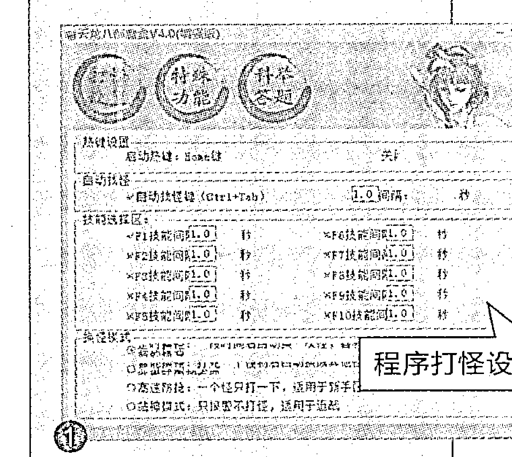

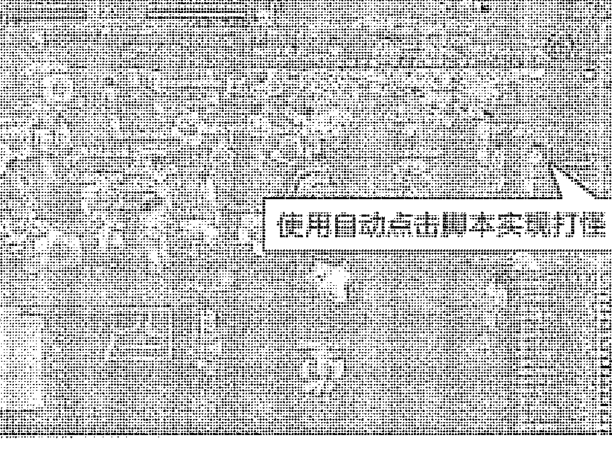

文|技术宅

## 出门访友 异地也能轻松下载

春节期间少不了要出门探亲访友，出门在外如果看到一些精彩的资源想下载，可是春节家里只有不会操作的老爸老妈在家。如何让家中的电脑自动实现下载？这可以借助快盘的自动同步功能，实现异地自动下载。比如笔者就是一个影视迷，经常在网上下载各类影视节目观看，春节串门时也经常会和好友交流影片资讯。有时会在朋友家聊天时获悉一些不错的影视资源，想要立即在自己家中电脑上进行下载，方便回家后能即时观看，可以预先进行如下一些设置。

首先将自己家里的电脑设置为自动登录，同时进入系统后自动连接网络。接着在自家电脑上安装一个快盘客户端，启动快盘后点击“设置”，在设置界面将其设置为“开机自启动”，同步方式则设置为“实时同步：有变化就开始同步”(图1)。

完成上述操作后，将快盘客户端复制一份到手机SD上备用，这样方便以后下载好友电脑上的电影。同上在好友电脑上也

> 如果朋友使用的是Windows 8系统，由于系统自带可以自动同步的OneDrive，参照上述设置同样可以实现类似的功能。如果家里是Windows 7系统，则需要手动安装OneDrive客户端。

安装快盘并使用同一账号登录，打开快盘点击“选择同步”，然后选择所有的文件都不同步，这样我们快盘的文件就不会同步到好友电脑上，而家里电脑的快盘则可以同步到好友电脑里快盘中的文件(图2)。

如果朋友使用的是Windows 8系统，由于系统自带可以自动同步的OneDrive，参照上述设置同样可实现类似的功能。如果家里是Windows 7系统，则需要手动安装OneDrive客户端。接着在好友电脑上选中需要共享的电影文件，右击选择“备份到快盘”，备份影片到快盘根目录上，此时影片会在好友电脑上自动上传到快盘服务器上(图3)。

由于我们家里电脑快盘是设置实时同步，这样如果要下载这部影片，我们只要打电话让家人按一下电脑电源开机即可（无需其他任何操作），家里电脑就会自动下载快盘里的影片，等我们回到家后就可以开始观看。

当然，如果不方便在朋友电脑上安装快盘客户端，而自己的手机SD空间无法装下所有想要的影片资源，

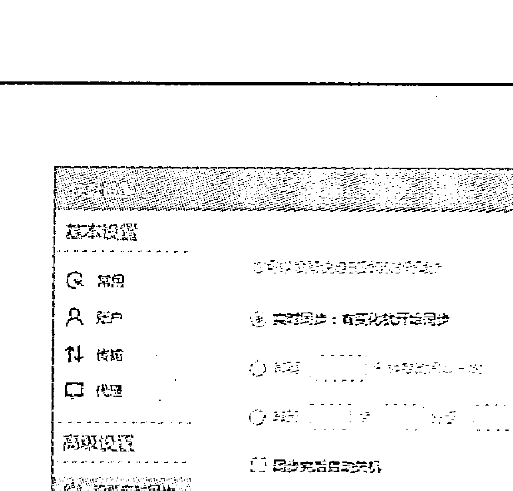

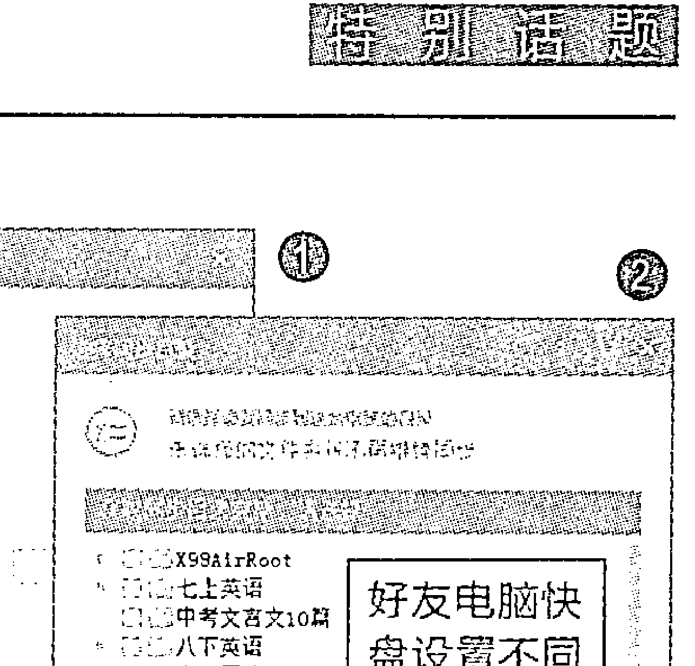

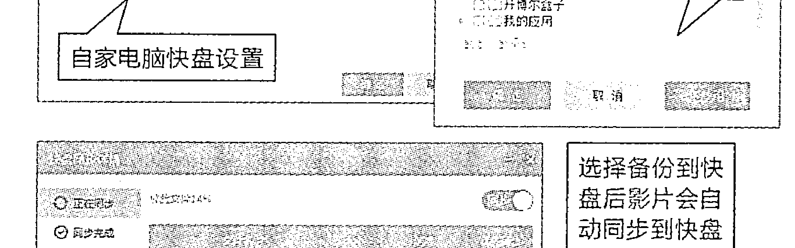

> 如果出门在外需要远程控制家里电脑的其他操作，还可以通过在手机上安装远程控制软件实现。Android用户可以使用“Splashtop Remote Desktop远程桌面”（到谷歌商店下载），这样在手机上连接到电脑后就可以执行任意的操作了(图4)。

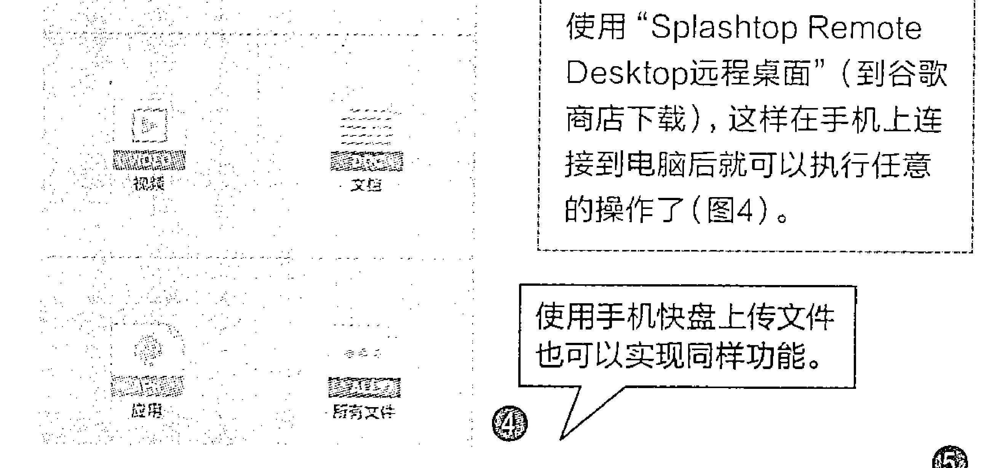

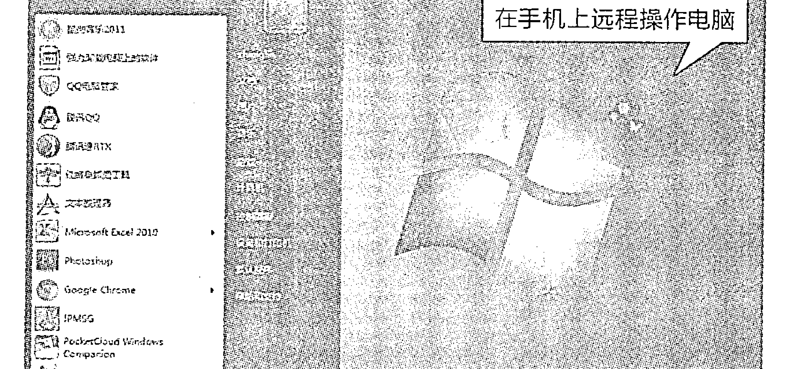

这时可以采取一种变相的方法来实现，只要先把电影文件复制到手机SD卡上，在手机上启动快盘客户端后，点击“添加”，将SD卡上的电影文件上传到快盘（记住一定要使用Wi-Fi哦，否则将流量惊人），这样家里的电脑也将自动同步实现下载，省去到家后再拷来拷去的麻烦。完成一部电影的上传后，还可以删除，拷贝另一部继续重复上述的操作(图5)。

文|平淡

## 优化不动手
系统优化自动成行

春节期间少不了要对系统进行优化，不过春节的应酬也多，一忙起来可能没有时间一直坐在电脑前操作。现在只要利用好系统任务计划和一些维护软件，就可以让电脑自动实现优化。笔者为了提高SSD硬盘的读写效率，定期（一般每周一次）做Trim以及垃圾回收（相当于SSD的碎片整理）。不过应酬多了我肯定会忘记这每周一次的优化操作，现在借助“Intel SSD ToolBox”+“计划任务”，即可定时自动执行优化任务。

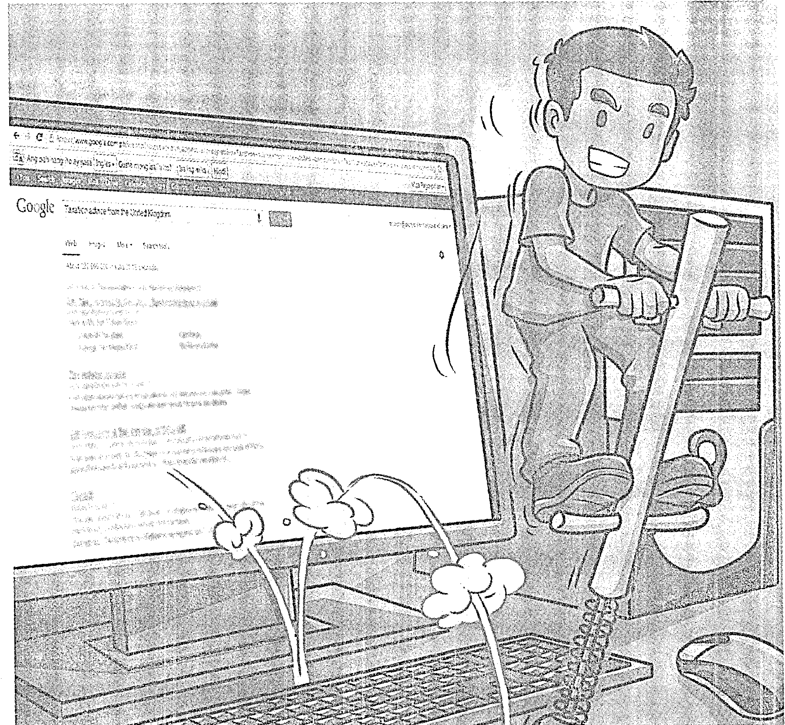

首先开启系统的计划任务服务，在“服务”列表中找到“Task Scheduler”项目，并把它的启动类型设置为“自动”（图1）。

接着运行“Intel SSD ToolBox”，点击“Intel SSD Optimizer”选项，再在右边窗口中点击“调度”按钮，根据自己的实际需要设置优化的时间（图2）。

> **小提示**
结合系统的任务计划还可以实现很多的自动操作，比如春节忙没有时间备份QQ聊天记录，只要建立一个每周运行的计划，运行 “copy c:\qq\你的QQ账号\msg3.0.db d:\” 命令（copy后的代码为你的QQ聊天记录实际位置），这样无论春节有多少应酬，电脑都会按部就班地备份好你的QQ聊天记录。

在打开的窗口中，优化频率选择“每周”，时间可以设置为自己实际的开机时间，并勾选“所有支持的Intel SSD”，然后点“添加”即可。这样每周到了指定时间，应用程序就会在后台进行自动的优化了（图3）。

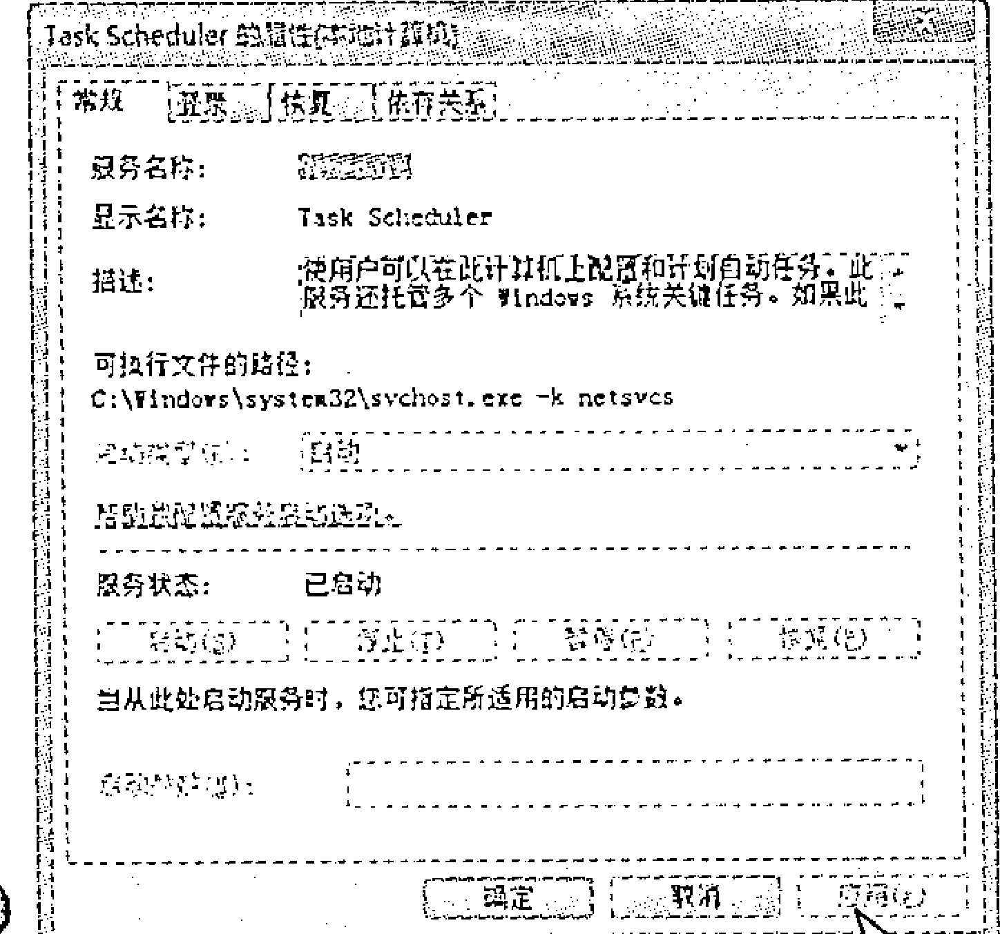

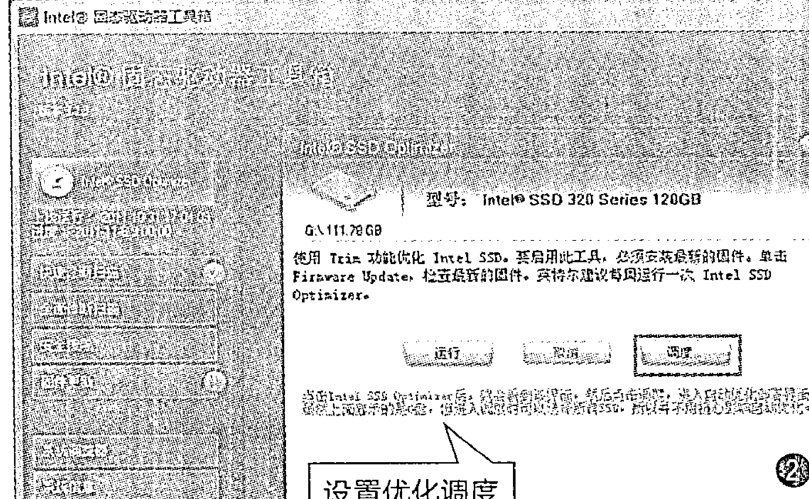

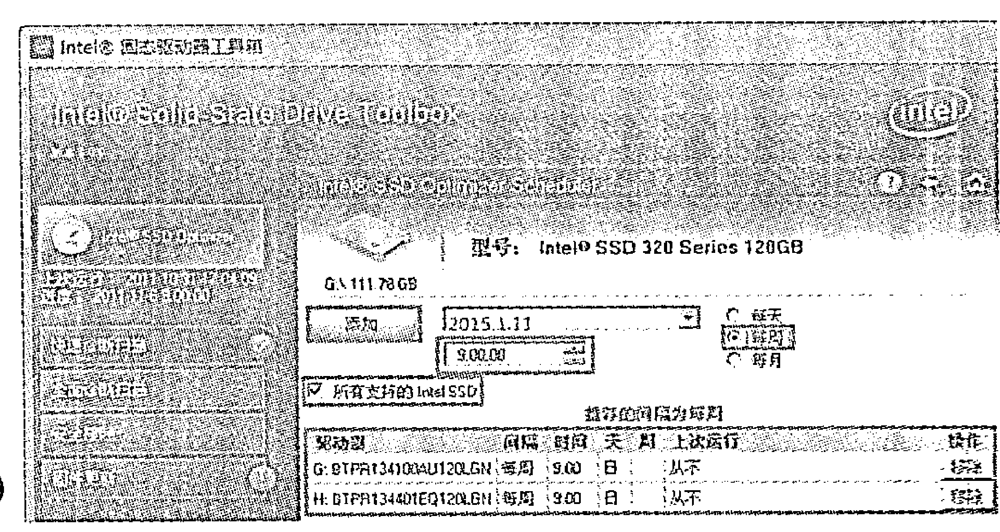

文|石飞

## 你在闲时让它忙
让电脑自动维护系统

为了保证有一个持续健康的良好电脑操作环境，系统补丁升级、系统自动维护、系统自动备份，这些工作是必要的。如果你正忙于游戏、看片或工作，若这些任务启动了，会大大影响你的工作效率，尤其是玩大型游戏或看大片时的体验更大打折扣。在这种情况下，不妨将这些任务交给电脑，让它们在主人不用电脑时，按时定点地出来服务。

Windows系统的自动升级，微软也没固定时间，可能是三天两头出来几个补丁，也可能是十天半月出来几个补丁。如果将系统按默认设置为自动下载和自动安装升级补丁，遇到一个难缠的补丁，正好在你游戏正酣之时下载安装，可能就会让你大大扫兴。这时，不妨提前将系统更新设置为不忙之时进行。在控制面板Windows Update的更新设置页面中，将更新设置选择为“自动安装更新”，同时将“安装新的更新”的时间设置为“每天”的“3:00”（如果你是那种阴阳颠倒的“夜猫子”则时间自定），然后选中下面的“以接收重要更新的相同方式为我提供推荐的更新”复选框，点击“确定”按钮(图1)。这样设置就不用担心因执行重要任务时，系统升级突然出来“服务”而烦你了。

## 系统自动维护是Windows系统的一项体贴功能

系统自动维护是Windows系统的一项体贴功能，它默认会在系统空闲之时出来疯狂扫描硬盘和提示、修复发现的问题。但是，有一个问题需要注意，那就是当你离开电脑之后回来之时，可能会发现硬盘灯一个劲地闪红，系统正在维护之中。这时系统维护没有结束，结束时间也是未知，如果你要急着处理一个工作或玩游戏，那可能就只有关机重启了。然而关机的过程也会比平时漫长许多。与其如此，不如提前设置好维护“协定”，让系统在你确定不使用的时间段内自动启动维护。通过控制面板进入“操作中心”，然后展开“维护”项目组，在下面选择“自动维护→更改维护设置”，将自动维护启动时间设定在一个系统绝对空闲的时间点（如凌晨2点）(图2)。当然这个时间要随自己的习惯而选择。

## 你去喝酒 它来备份系统

俗话说“有备无患”。对于系统备份，虽然Windows提供了系统还原或映像备份的方法，但都不够专业高效，只能说可以勉强应对系统保护。试想，如果连硬盘都坏掉了，C分区中的所有数据都彻底消失了，系统还原点还有啥用？再者，Windows自身的备份方案形成的备份文件体积都很庞大。如果用第三方专业备份工具（比如ATI专业备份工具），那么，可以用更小的体积、更快的速度、更灵活的方式将整个系统分区、选定的任何文件夹，甚至整个硬盘备份到需要的地方。那么，用ATI备份需要有人看着吗？需要像Ghost那样关掉Windows到DOS下进行吗？不用！虽然可以充分利用ATI在Windows环境下良好运行的特性，在工作的同时于后台备份整个系统，但因为后台备份会在一定程度上影响系统的运行速度，

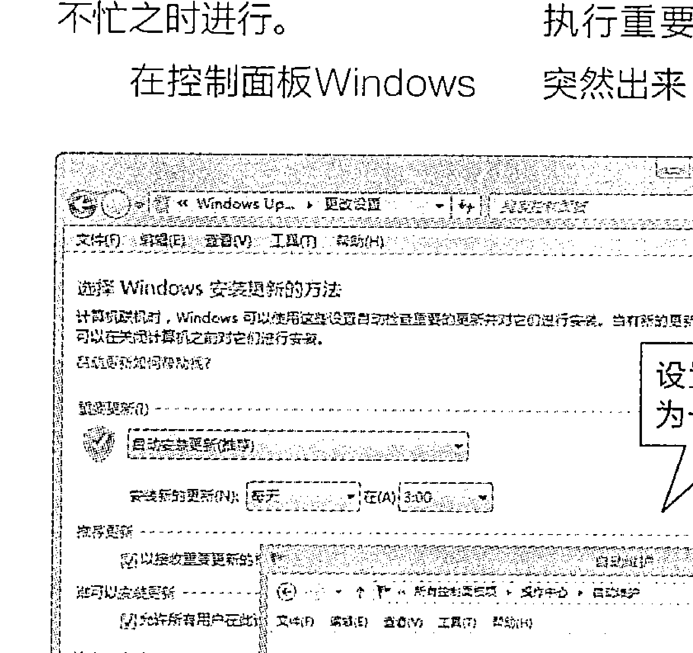

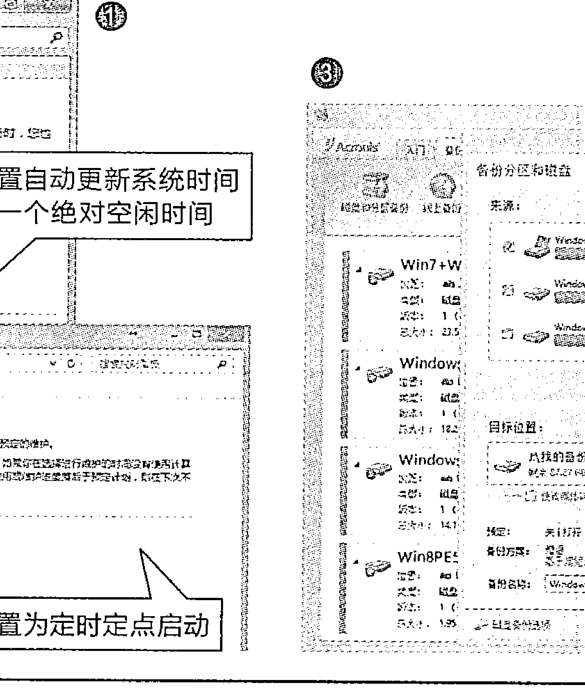

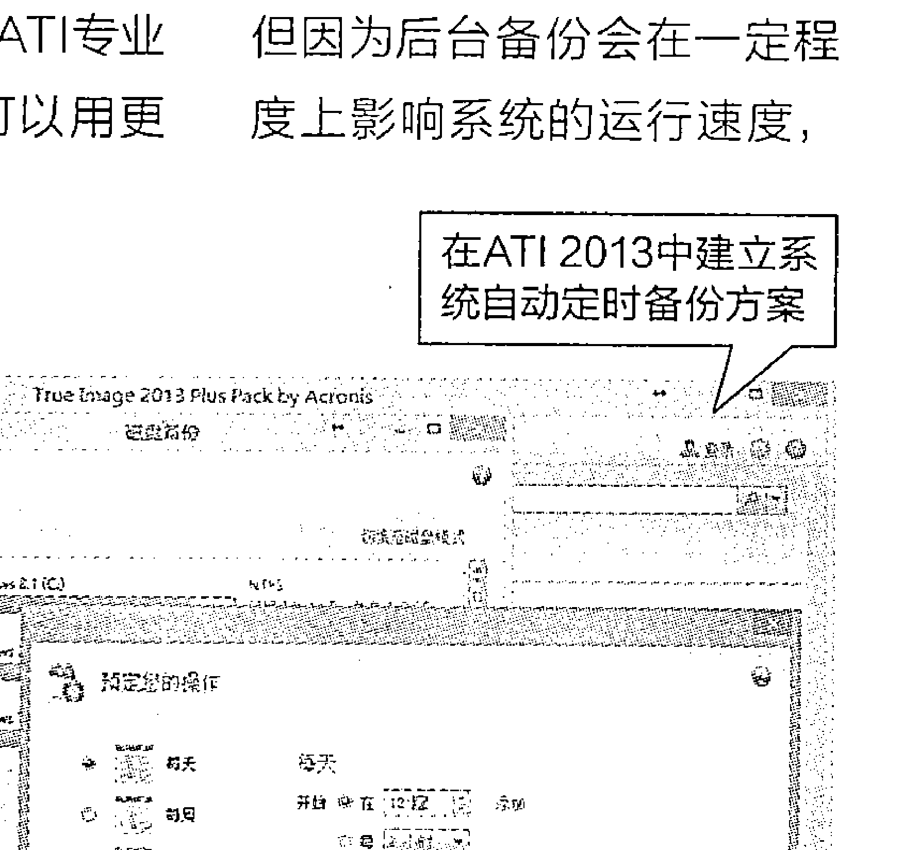

因此，比较高效的方法是，安排一个闲置的时间段进行系统自动备份。例如，可以在中午自己到朋友家喝酒之时，让ATI为你自动备份系统。

> > **小提示**
>
> 为安全起见，备份文件可以指向内网的另一台电脑的共享文件夹，也可指向移动硬盘。

在ATI“磁盘备份”窗口中打开“预定”开关，设定让系统在每天中午12:00时自动启动备份计划（图3），一般备份系统分区需要30分钟左右（根据系统文件复杂程度而定）。这样设置后，只要机器是开着的，ATI软件服务处于运行状态，它就会到时自动启动为你备份了。当你饭后或午休结束后，回到电脑旁，就可以轻松接续工作。

文|石飞

## 下载后更能看爽
### 为假期轻松看片创造好条件

春节期间，除了走亲戚聚会吃喝，闲暇的时间总要看看自己喜欢的视频节目。虽然说目前网络视频非常普及，网络带宽也足以应对在线看片的需求，但是如果不花钱注册为视频网站的VIP会员，那些频频出现的，少则10来秒钟，多则以分钟计的片头广告，足以让你生厌。此外，在线观看如果遇到节目精彩正在进行之时，因为某种原因卡壳，节日气氛会增一丝丝的“扫兴”。

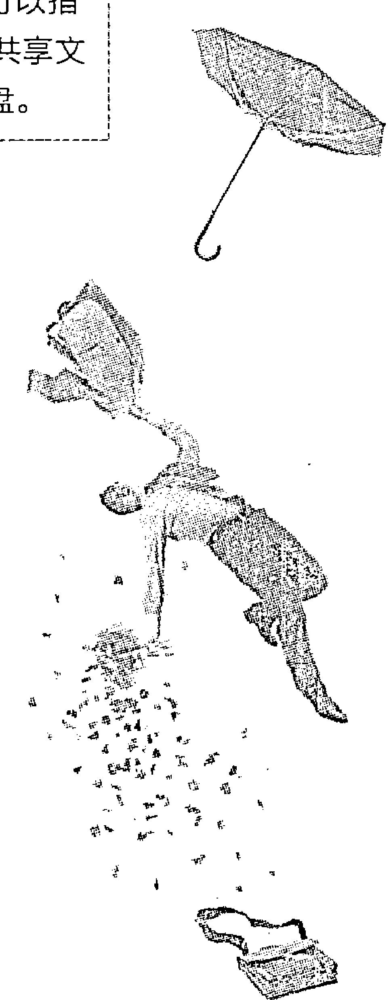

其实，当你忙着去走亲戚、喝酒之时，何不让电脑帮你提前将喜欢的节目都下载到本地呢？心痛你的爱机吗？根本没有那个必要。让它忙着下载，才能体现它的价值，更增加节日的欢乐气氛。

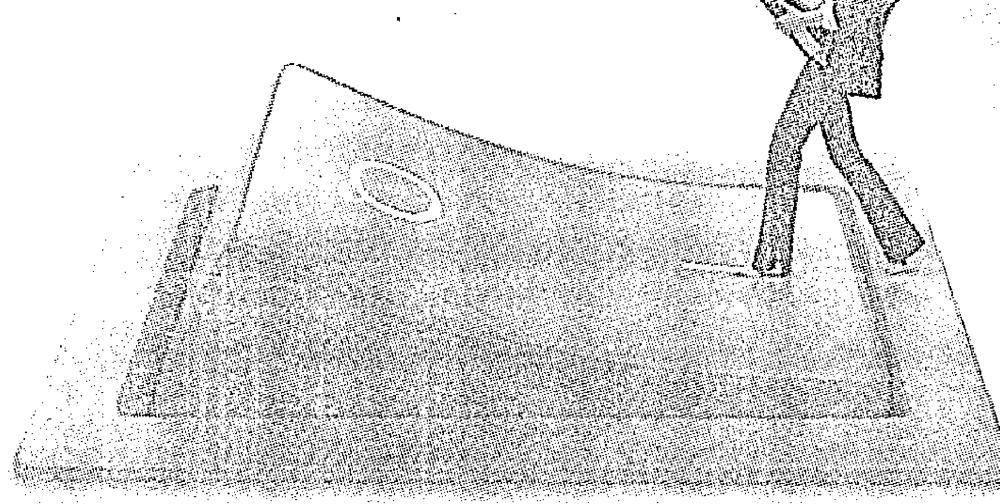

### 种子类片源一键离线下载

最方便的影片下载莫过于能获得一个资源的种子，不管是BT种子，还是电驴子或迅雷资源的种子，这些都是迅雷或百度云盘、115网盘能够支持的可以离线方式下载的种子。但由于迅雷采取下载后只有收费VIP会员才能将资源取回本地的政策，因此对于钱包不鼓的用户来讲，选用百度云盘或115网盘进行离线下载是上策。

用自己的账号登录115网盘，点击“云”标签，然后再点击“离线”（图1），在弹出的窗口中点击“BT任务”按钮，选择BT种子添加到下载窗口中，即可让115网盘服务器帮你下载网络资源（图2）。把下载的文件存放在云盘你的空间中，下载的过程与你的电脑是否开启无关。当离线下载完成以后，你就可以随时登录自己的网盘，将文件下载到本地了。

> > 115网盘非VIP会员使用Web端进行离线下载,每月有50个种子配额的限制;如果使用115浏览器登录使用,则配额自动增加到150个。若急需大量下载任务,则可以选择15元注册一个月VIP会员,可使用多达1500个配额的离线下载。

## 在线类片源按需成批下载

目前许多视频客户端软件都带有视频后台下载的功能,在软件开启后你可以一边在前台看片,一边在后台下载更多的内容,这非常适合于看连续剧一类长篇视频的情况。通过带有下载功能的视频客户端进行成批下载,常用的PC客户端有乐视、爱奇艺、搜狐视频、腾讯视频、优酷视频等客户端(图3)。此外,手机视频客户端也多带有后台连续下载功能,但建议尽量用PC下载,以延长手机寿命和防止误用流量。

要知道,不是所有视频都提供直接下载的按钮,或者有时你会发现下载按钮为灰色不可点状态。在这种情况下,要将在线能够播放的视频一股脑儿地下载到本地,需要借助一些工具和下载技巧。

要下载这一类视频,一个通用的思路是通过地址解析获取真实下载地址,然后将所有要下载的资源统一交给专用下载器集中下载。要实现这一功能,目前使用比较多的软件是维棠下载器和硕鼠下载器。建议使用最新版的硕鼠,借助于其内置的网络浏览器和下载工具下载视频,功能更加强大,使用更加方便(图4)。

> > 有的PC视频客户端下载的视频可以直接拷贝出来供常用设备通用播放,如优酷、PPTV视频等。而有的客户端下载的视频需要更改文件扩展名为MP4或FLV等常用格式,才能供常用播放器调用,如乐视和搜狐视频客户端。但是还有一些客户端的格式为特有格式,只能用下载它们的客户端打开播放,如爱奇艺和腾讯视频客户端。

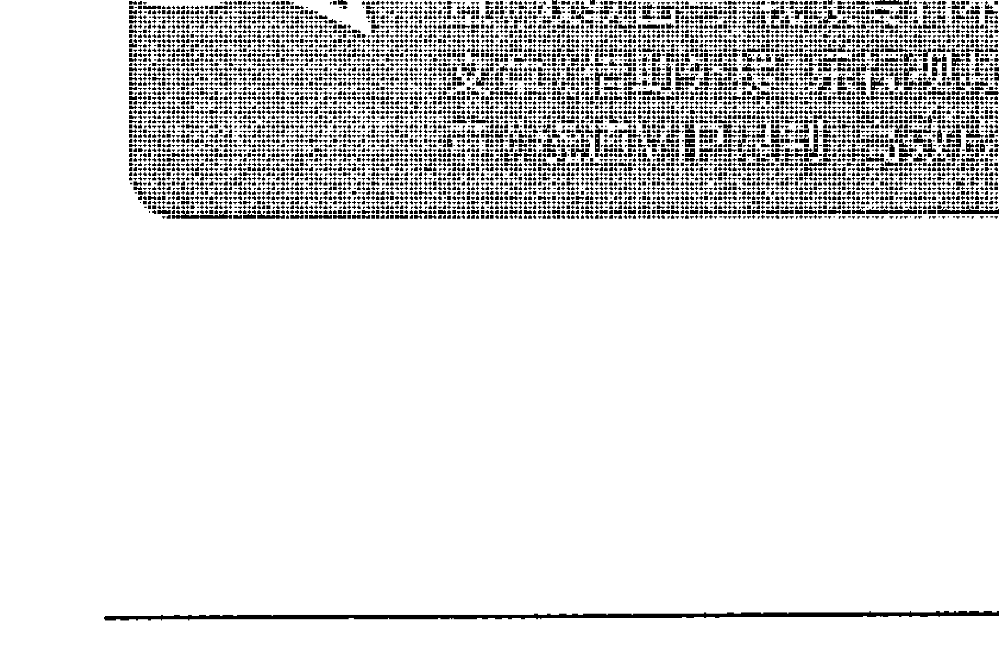

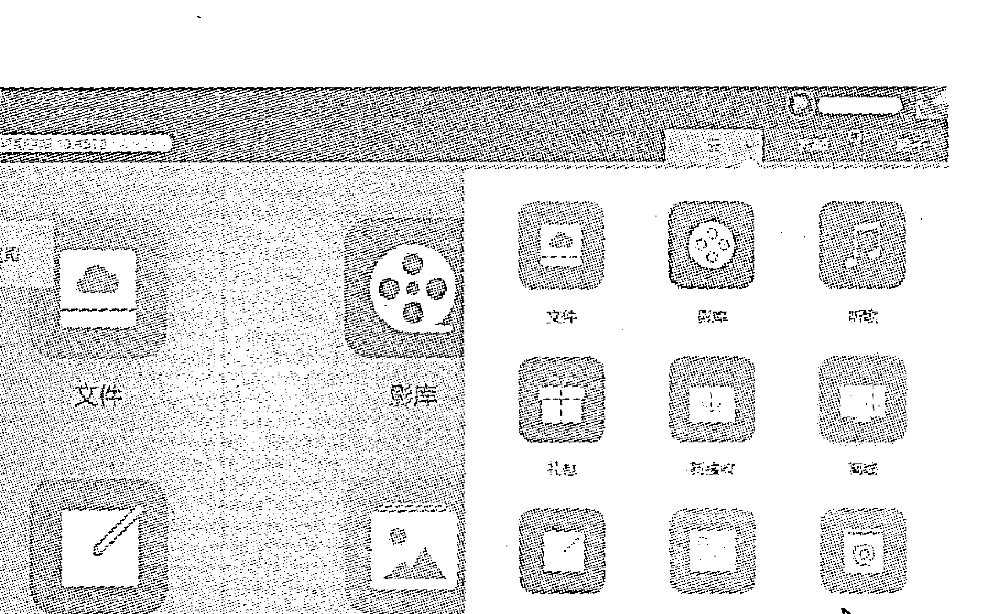

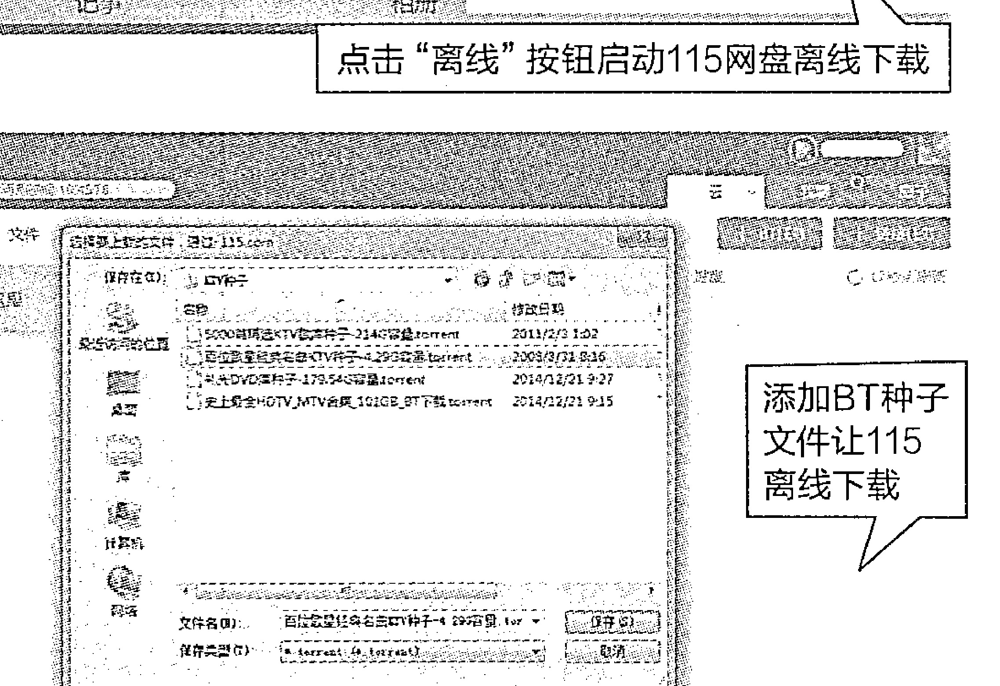

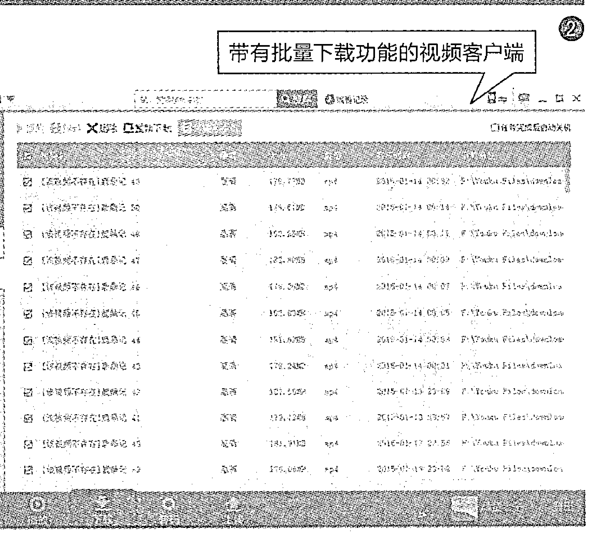

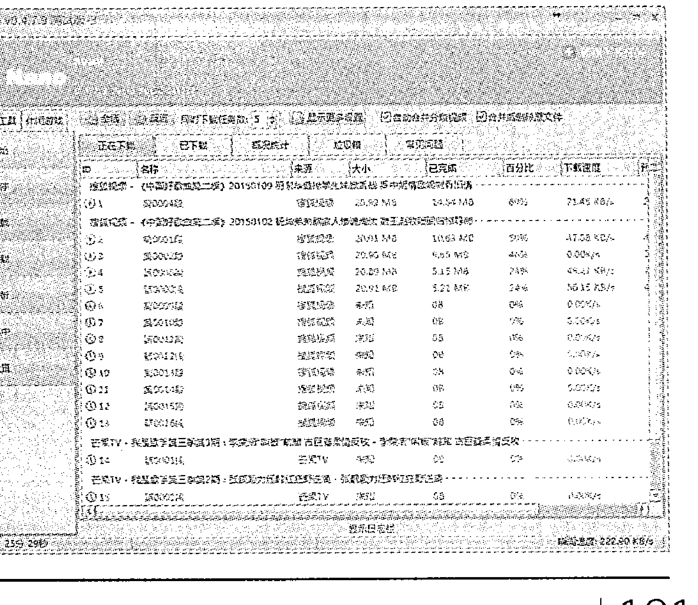

文|石飞

## 软硬兼施 春节玩得更尽兴

春节长假是一个“痛并快乐着”的过程。说它“痛”是因为我们要忍受春运以及串门途中的奔波之苦，说它“快乐”是因为我们可以再次享受到与亲人朋友之间那浓浓的亲情。那么，我们为何不利用各种软硬资源，尽可能地“少痛多乐”呢？

## 掌中游戏“信手拈来”

趁着春节假期与三五“发小”团聚畅欢无疑是件惬意的事情。然而茶余饭后，最令人郁闷的就是眼巴巴看着朋友玩着让自己心仪的游戏，但自己的手机上却没有安装，所处环境的网络还不够给力（无法下载），此时就体现出分享的重要性了。

## 独乐乐不如众乐乐

别着急，只要你或朋友的Android手机/平板里安装有“快牙”、“闪传”、“茄子快传”等文件分享传输类的APP，即可轻松分享设备里的任意APK安装包以及各种格式的内容。以“快牙”（下载地址：http://www.kuaiya.cn/）为例，在程序主界面按手机菜单键依次选择“给身边的朋友装快牙→零流量分享”（图1），按照界面提示，另一款手机只要接入快牙建立的Wi-Fi热点并在浏览器中输入指定网址，即可获得快牙APP并直接安装（图2）。在双方都安装快牙后，想分享游戏的一方只要在应用界面长按APP图标并选择“传输”（图3），而另一方就可无线接收这款APP的安装包文件了。

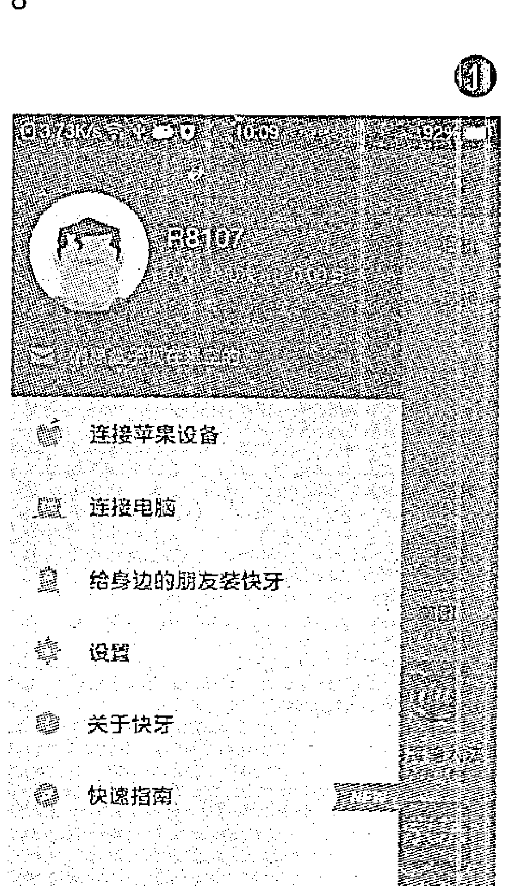## 附带游戏进度的分享

iOS和Android平台的游戏大都需要挣到足够的金钱购买道具和升级后才能“玩爽”，作为新手只有低调或“被虐”的份。问题是，大春节的根本没有打怪升级赚钱（游戏中）的时间，既然是从朋友手机中分享的游戏，那如何连他的游戏进度也一同共享呢？

此时，就需要借助“钛备份”（下载地址：http://dwz.cn/AvJKb）和快牙协同配合了。运行软件后切换到“备份/还原”，点击希望分享的游戏并选择“备份”即可生成APP安装包及游戏进度相关文件（图4），并保存到了存储卡根目录的TitaniumBackup文件夹内（图5）。然后再用快牙将TitaniumBackup文件夹里的备份文件全部分享到另一款手机里。

接下来，在另一款手机上将刚刚接收的备份文件剪切到TitaniumBackup文件夹（如果没有请自行建立）。同样运行钛备份，点击手机菜单键进入主菜单并选择导入备份。返回“备份/恢复”界面，就可以看到相关的备份信息了，根据提示选择恢复“程序+数据”即可。此时当你运行这款游戏时就不再是新手了，而是共享了朋友长时间游戏所积攒的金钱、道具和进度。

通过Wi-Fi直连分享游戏或任意APP是Android手机中最简单快捷的方式，而且不存在任何兼容性方面的问题。过程中无需消耗1KB流量，而且传输速度也不逊于USB的有线拷贝。无需PC和网络支持，无论是在朋友家里还是公交地铁里都可进行分享。

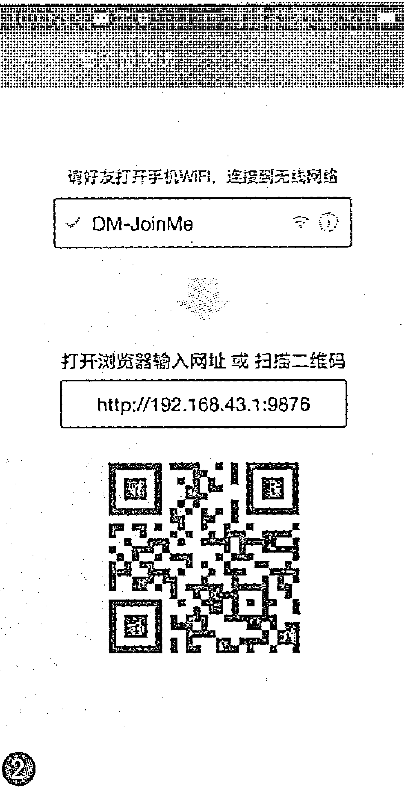

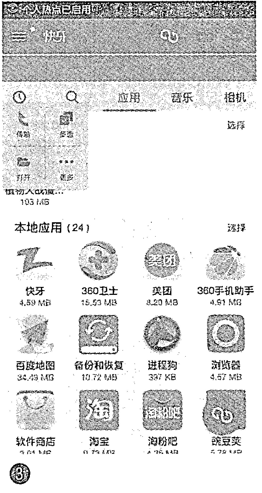

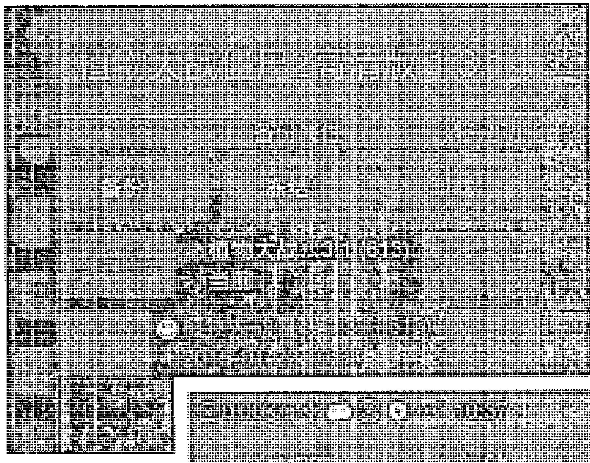

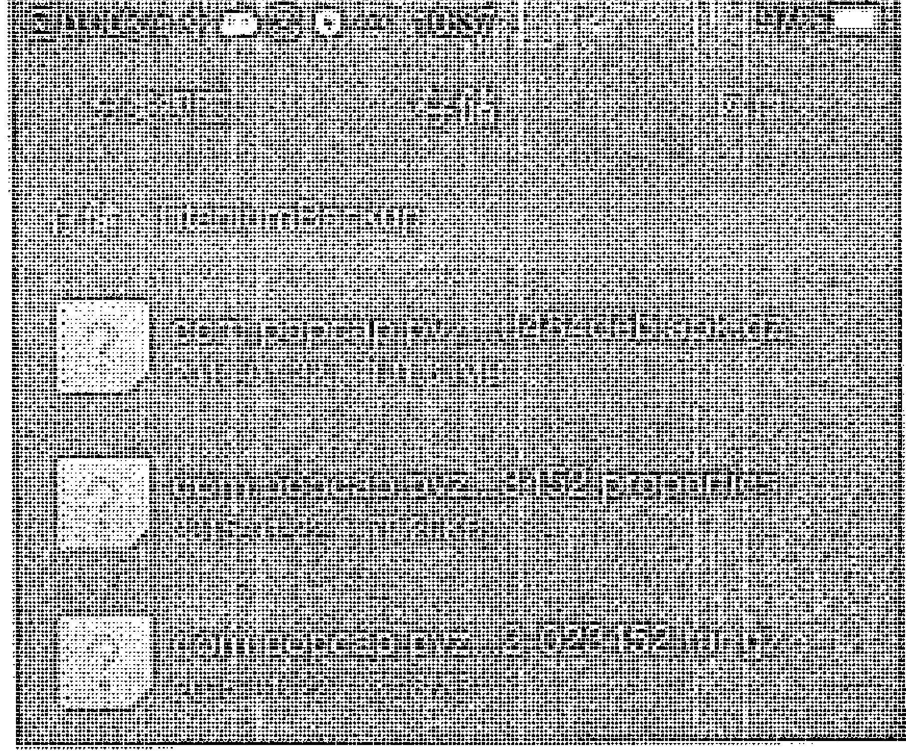

## 模拟游戏 找回儿时记忆

对很多70、80和90后来说，FC、MD、PS、GBA、PSP等家用游戏机或掌机都是童年记忆中的重要组成部分，每当春节好友聚会谈及此类经历时都会唏嘘不已。

那么，为何不借着此次团聚的机会，重温一下儿时的“激情游戏岁月”呢？

## 模拟器联机游戏

在64位8核处理器都跌破千元大关的今天，Android手机运行PSP模拟器都不再存在门槛。因此，使用模拟器的联机功能与好友重温儿时的那些经典游戏无疑是件令人愉悦的事情。多人联机需要模拟器的支持，比如Nesoid（FC）、Gensoid（MD）、Snesoid（SFC）、Myboy（GBA）、ePSXe（PS）、Ppsspp（PSP）等客户端都提供了多人联机模式。

以笔者儿时最喜爱的MD《幽游白书》为例，两台手机同时运行Gensoid模拟器，按手机菜单键进入“更多→联网对战”。此时我们有3种方式进行手机间的联网对战（图1）。

### 使用蓝牙：

一款手机选择“蓝牙（服务端）”，另一款手机选择“蓝牙（客户端）”，等客户端搜索到服务端信息之后，点击配对连接即可（图2）。蓝牙联网游戏的好处是简单快捷，对网络无要求，缺点则是略有延迟感。

### 使用公共Wi-Fi：

在两款手机都接入了同一Wi-Fi网络时，一款手机选择“Wi-Fi（服务端）”后会生成一个IP地址和端口号。此时另一款手机选择“Wi-Fi（客户端）”，并在弹出的窗口中输入对应的IP地址和端口就可实现连接（图3）。这种方式的优点是速度快无延迟，但缺点是必须有可用的Wi-Fi网络。

### 使用自建Wi-Fi：

如果所处环境没有公共Wi-Fi，就需要一款手机建立Wi-Fi热点并让另一款手机接入，此时再按照上面的方法建立Wi-Fi联网模式（图4）。需要注意的是，此时手机会默认屏蔽2G/3G/4G网络，所以在联网游戏的过程中你的微信微博是无法收到消息的。所以，这种联网游戏方法是以无法上网为代价，大家要注意取舍。

> “小鸡模拟器”是综合了所有常见模拟器的客户端，但其最新版更换了一些模拟器版本而不再支持联机对战。所以建议大家使用小鸡模拟器下载ROM，并用支持联机的模拟器游戏。

## 游戏手柄找回手感

有了手机和模拟器，我们可以重新与儿时的好友一起回忆儿时的游戏，但是用手指点触屏幕的操作方法却失去了曾经用手柄游戏时的感觉。好消息是，针对Android和iOS设备，很多品牌都推出了专用的自带拉缩杆的蓝牙游戏手柄。此类手柄的拉缩杆可以调节间距，从而可以固定从3.5英寸~7英寸甚至更大屏幕的设备（图5）。此外，有些产品内置的锂电池还可给手机充电，扮演移动电源的角色。目前蓝牙游戏手柄中口碑较好的品牌有iPega、小鸡手柄等等。

以iPega手柄为例，在iPega游戏大厅可以下载到直接适配键位的大型游戏，比如《GTA3》、《地牢猎手4》、《六发左轮》等（图6）。当碰见不支持按键虚拟映射的游戏，我们则可以通过高级设置将屏幕上虚拟按钮的位置映射给手柄的物理按键，之后当你按下手柄按钮，就相当于用手指点击了屏幕上对应区域的虚拟按钮（图7）。有了游戏手柄，以及经典的模拟器游戏，此时再联网对战时，有没有找回当年的记忆呢？

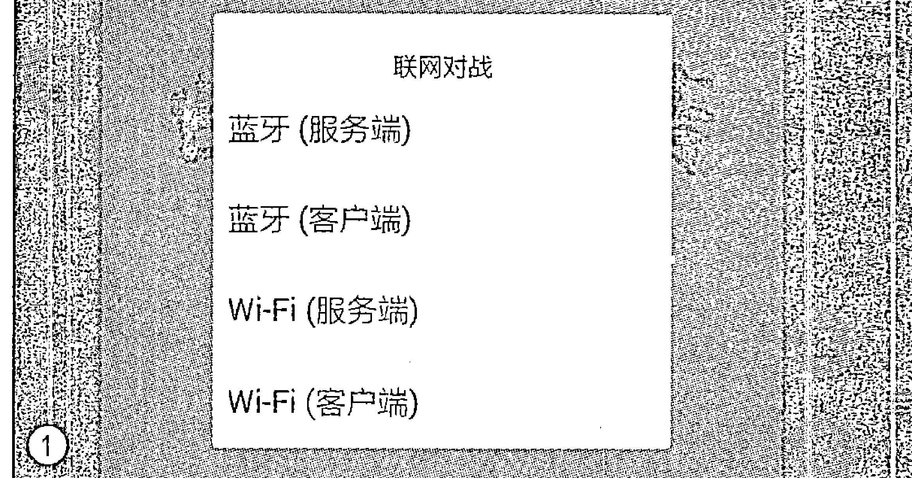

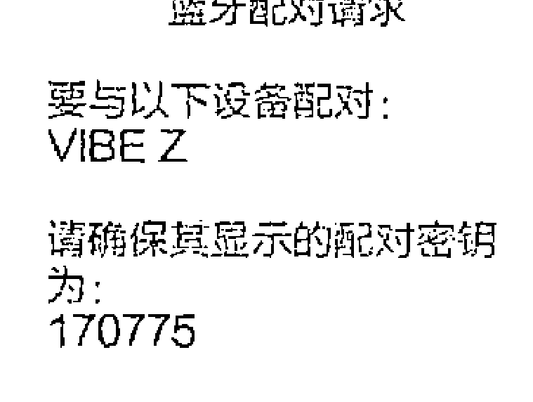

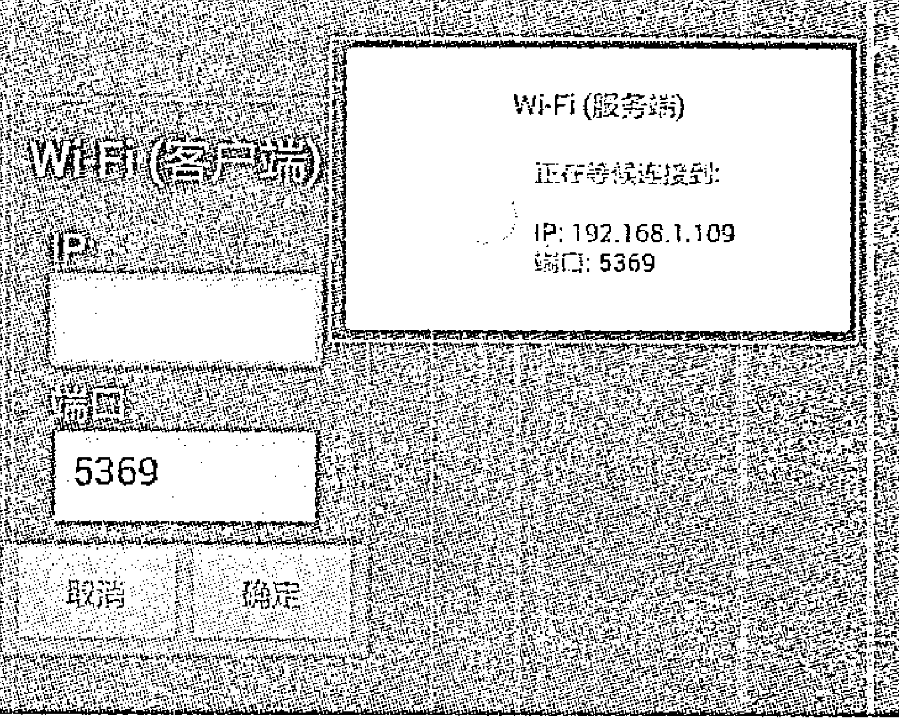

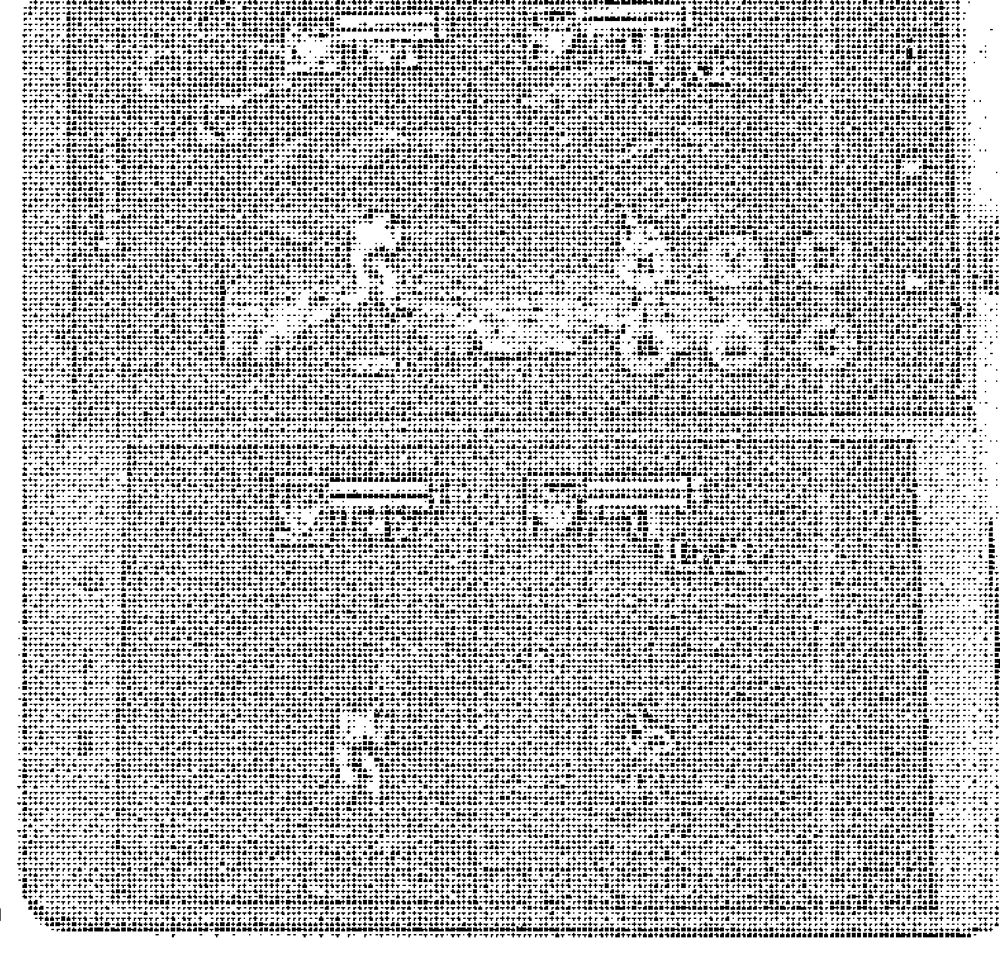

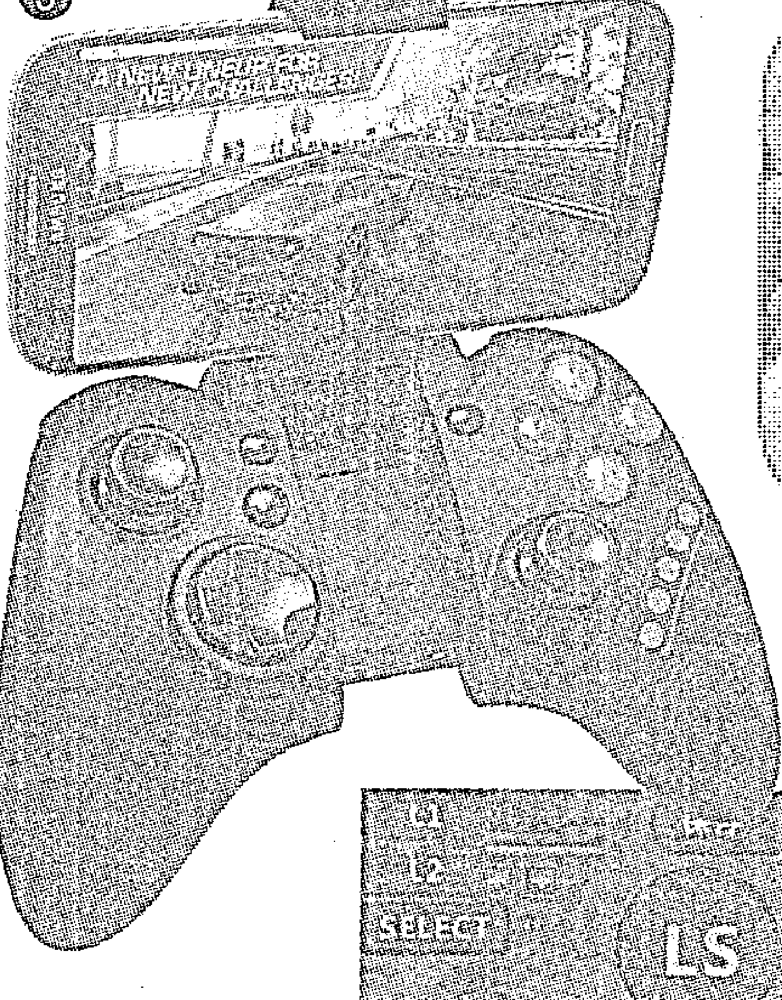

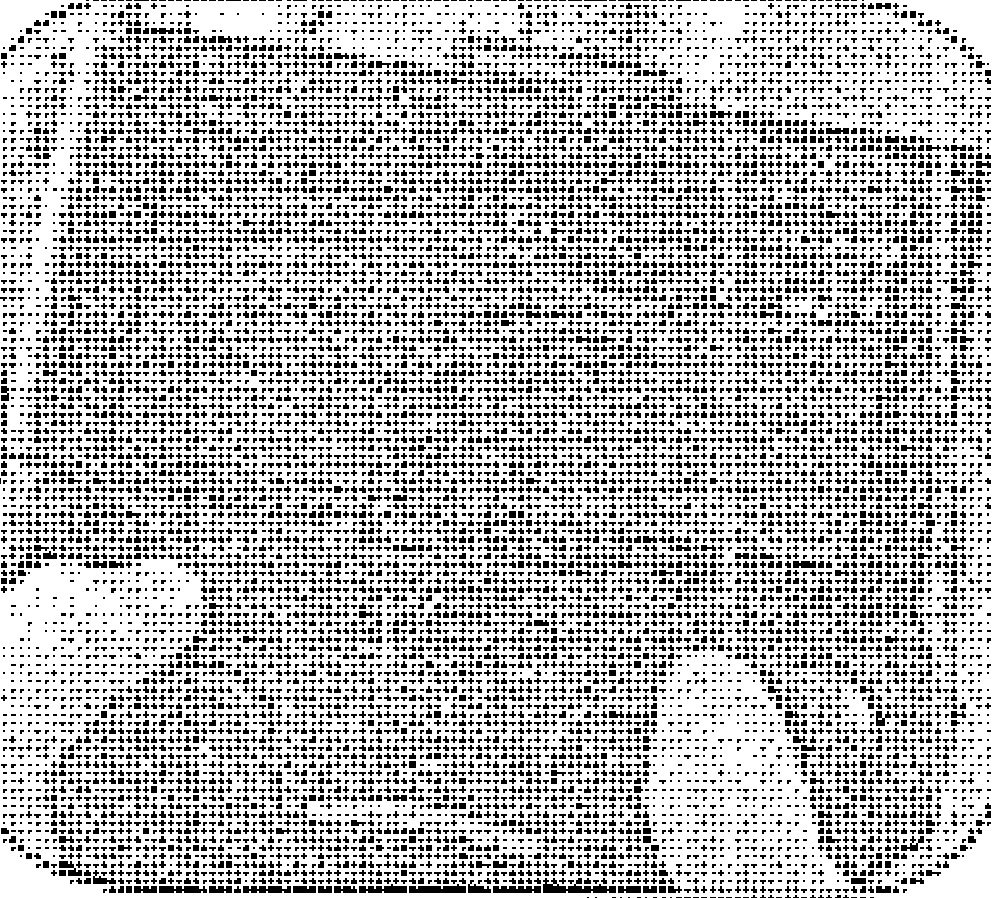

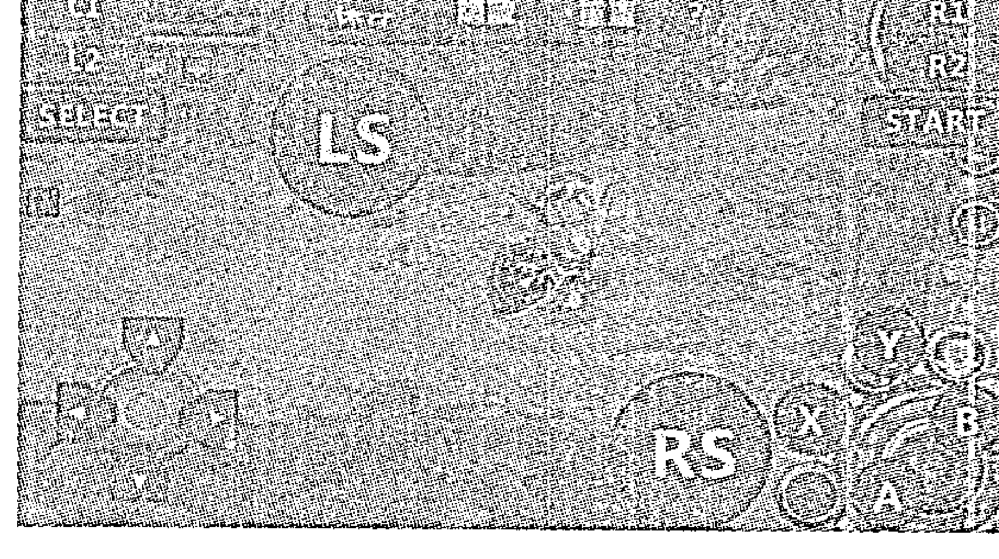

## 用电视当屏幕

可能有些玩家感觉还是不够尽兴。回忆当年，几个好友一起关在小黑屋里，看着硕大的电视屏幕玩《生化危机》的刺激无法言喻。在电视盒子与平板电脑大肆普及的今天，我们同样可以与昔日的好友找回当年的感觉！

在这里笔者向大家推荐“小鸡模拟器TV版”（下载地址：http://www.xiaoji001.com/）。将其安装在电视盒子或平板电脑上并与电视机连接后，你的电视就变成了全能模拟器终端。小鸡模拟器TV版的UI界面非常简洁（图8），提供了Android平台所有模拟器和相关ROM的下载。此外，该模拟器最多可同时识别四个手柄（图9），如果你没有蓝牙手柄，则可以用Android手机安装小鸡手柄APP，以虚拟游戏手柄的形式替代。

实际上，这种方案才是最适合假日里与众多好友回忆经典游戏的选择。它不仅利用上更大显示面积的电视屏幕，每个人的手机都可与其连接并用手机充当手柄，一起去玩支持多人参与的游戏，是不是更惬意了呢？

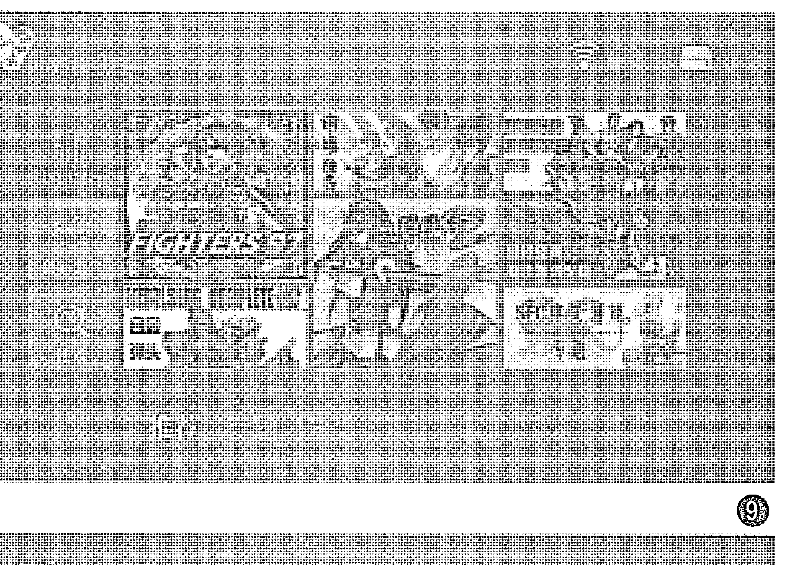

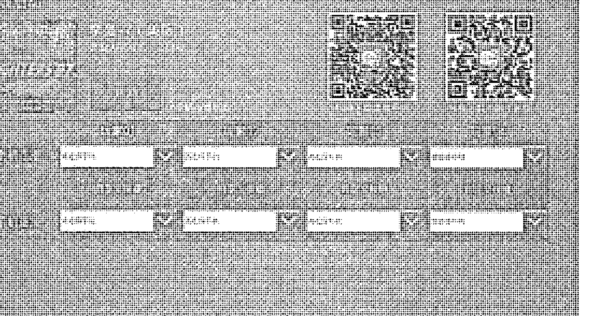

## 无线显示让聚会更有趣

春节串门聚会，智能手机和平板电脑无疑是首当其冲的随身装备，也是分享一年来点滴记忆的载体。

那么，如何才能让所有参与聚会的好友可以更好地欣赏手机和平板里的内容呢？

如果有智能电视或电视盒子，问题就迎刃而解了。

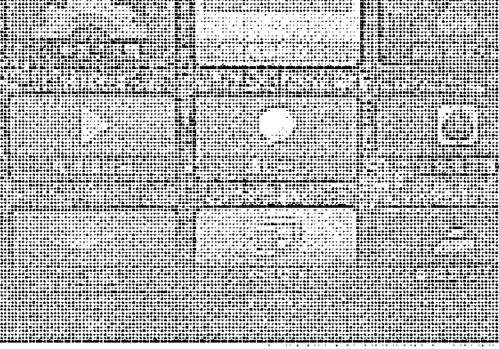

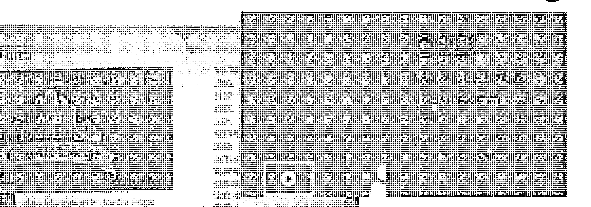

## Windows平板的无线秀

随着Windows 8.1平板跌破了500元大关，很多用户都喜欢上了这种娱乐办公两相宜的全能设备。遗憾的是，很多Windows 8.1平板并没有配备HDMI接口，或是家里没有多余的HDMI视频线，此时我们又该如何与更大的显示设备相连呢？很多Windows 8.1平板电脑都支持WiDi无线显示技术，并兼容Miracast协议。因此，只要显示设备（如智能电视或电视盒子）支持上述功能，便能与平板建立无线的视频连接。以小米盒子为例，在桌面上找到“无线显示”选项（图1），按遥控器确定键进入后Miracast协议就自动启动了。此时，在Windows8.1平板的屏幕右边向左滑动调出选项，依次点击“设置→投影”，如果该平板支持Miracast就会弹出“添加无线显示器”的选项（图2）。点击该选项后平板就会搜索小米盒子等待连接的Miracast，稍后平板的画面内容就会呈现在连接小米盒子的电视屏幕上了（图3）。

### 小提示

如果将平板移动到无线信号的范围之外(例如移到另一个房间)，或者让平板进入睡眠或者休眠的时候Miracast会断开连接。目前Miracast无线连接的流畅度还不算完美，用于欣赏图片、高清问题不大，但是要使用该功能玩游戏，一定的延迟感会影响到比赛成绩。

### 小提示

有些Android手机并没有将DLNA功能独立出来，但在音乐、图片和播放器APP中都存在DLNA推送按钮。只要系统检测出局域网内有启动流媒体服务的PC，点击推送按钮即可将手机画面推送到PC屏幕上显示出来。

## 手机的无线视频秀

Android 4.0以上的系统版本同样支持Miracast技术，在手机“设置→显示”中可找到类似“无线显示”的选项，打开后也能搜索并连接到智能电视或电视盒子上(图4)，实现Android手机/平板与电视屏幕的无线显示。

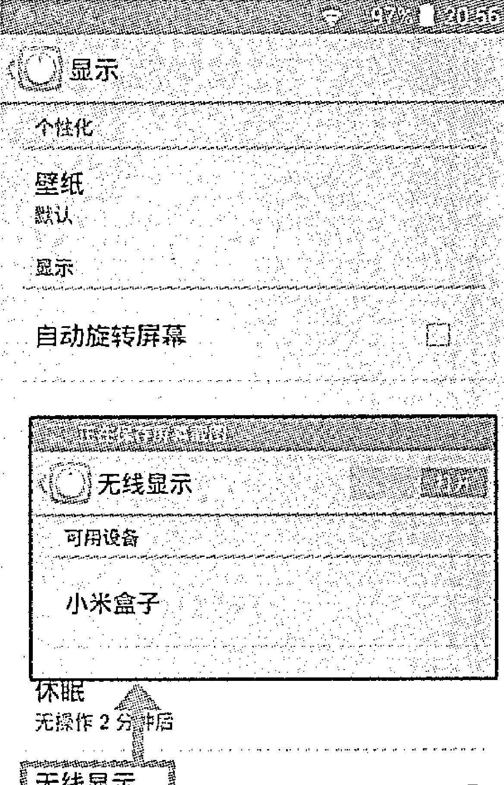

如果所处的环境里没有电视只有电脑，还可以通过DLNA的方式，将手机平板中的内容无线推送到电脑显示器上播放，同样起到众乐乐的效果。电脑使用DLNA技术前要确保在“计算机管理→服务和应用程序→服务”中开启SDDP Discovery和Windows Media Player Network sharing Service服务。在电脑上运行Windows Media Player，点击左上角“流媒体”启动流媒体功能(图5)。以OPPO手机为例，在文件管理器中可以启动DLNA连接功能(图6)，点击启动服务之后便可搜索到电脑并与其连接上。在电脑的Windows Media Player软件左侧列表中就会出现手机对应的媒体库，并可以直接在PC上浏览播放手机里的图片、音频和视频文件。

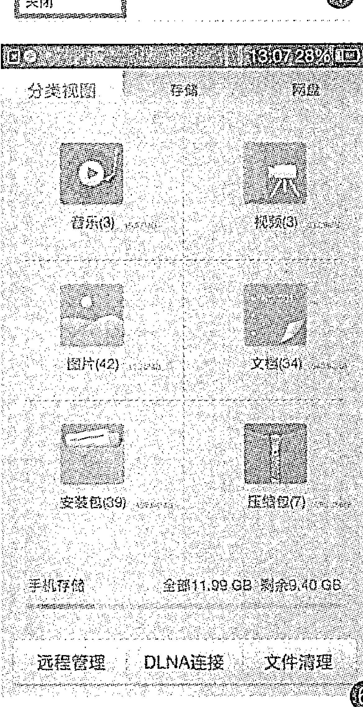

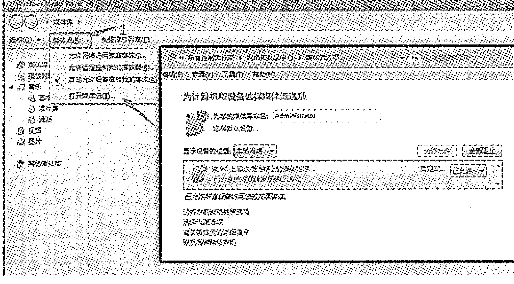

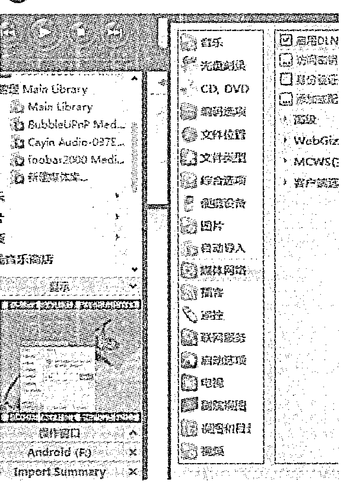

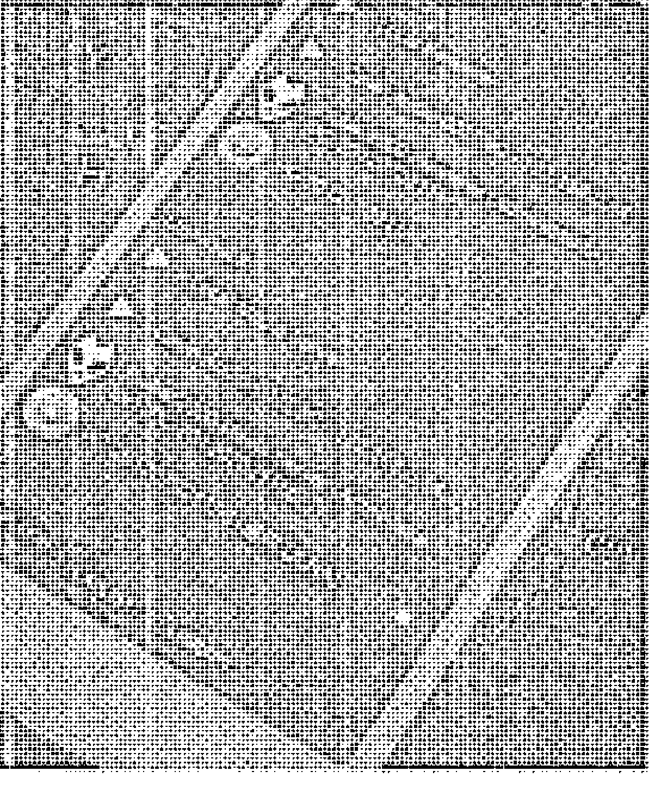

## 手机遥控无线音箱与PC

好不容易聚会一次，没有音乐怎么行？在Wi-Fi无线音箱逐渐普及的今天，相信很多人都喜欢在朋友面前“秀一把”。试想一下，当你和几个朋友喝酒聊天时，只需点点手机屏幕就可让角落的无线音箱切歌，并让存有无数歌曲的PC成为点歌平台，无需担心手机存储的歌曲数量太少。是不是很科技范？

除了多媒体内容的推送以外，利用DLNA功能还可以更好地协调手机、Wi-Fi无线音箱以及PC之间的关系。

比如，手机/平板连接Wi-Fi音箱播放音乐很容易，PC连接Wi-Fi音箱播放音乐更简单。但是，如何使用手机控制连接着Wi-Fi音箱的电脑呢？这就需要一些第三方软件的联手配合了。

三种设备联手的前提是要处于同一个Wi-Fi局域网环境下。

- 首先，需要我们在PC端安装“JRiver”播放器，并进入“工具→选项→网络媒体”，然后勾选“启用DLNA服务和使用媒体网络共享此媒体库”(图7)。此时，在JRiver左上角就会出现Wi-Fi音箱，选择它之后正常播放音乐就可以直接推送到音箱上面了。
- 接下来，在手机端安装“Bubble UPNP”播放器，并点击右下角的“Devices”，Renderers一栏选择Wi-Fi音箱，而Libraries则选择带有JRiver标志的选项即可(图8)。这时，就可以在手机上控制连接着Wi-Fi音箱的PC了，可远程进行播放暂停换歌音量等操作。

## 桌面锁定不怕“熊孩子”

当亲戚家的小孩想玩你家里的PC或你的手机时，相信绝大多数同学都不会拒绝吧？但是，如果你遇到了一个“熊孩子”，转瞬之间你的桌面就会变得混乱不堪，一旦出现重要文件被删、程序被卸载或是进行了APP内购，无疑会让你欲哭无泪……

### 锁定你的PC桌面

对台式机或笔记本而言，我们可以通过“ChildProof”（下载地址：http://pan.baidu.com/s/1o6LY0fo）实现锁定桌面的效果。点击ChildProof软件主界面的“Add”按钮，可以将小孩子感兴趣的游戏或软件添加到不受限制的列表中，之后只需再点击“Child”按钮就可切换到安全桌面模式（图1）。在这个界面下只会显示列表中的软件图标，此时别人是无法访问其他无关的文件夹或者删除任何文件（图2）。当你想退出安全模式时只需同时按下“Ctrl+Alt+Shift+P”快捷键即可。

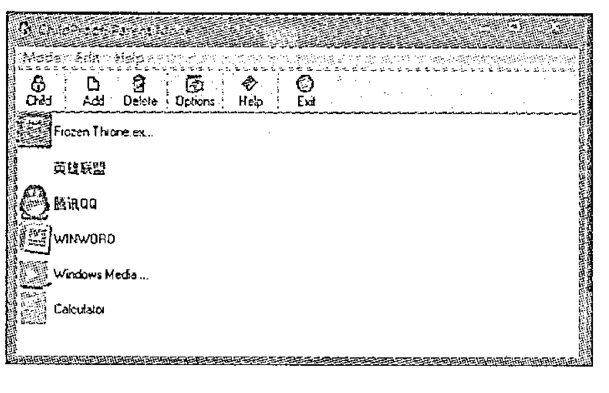

如果春节期间你家里经常会有“熊孩子”拜访，那就不妨提前用ChildProof打造一个专为儿童定制的安全桌面吧，里面可以提前添加休闲游戏、视频播放器或画图一类的软件，尽可能避免各种悲剧的出现。

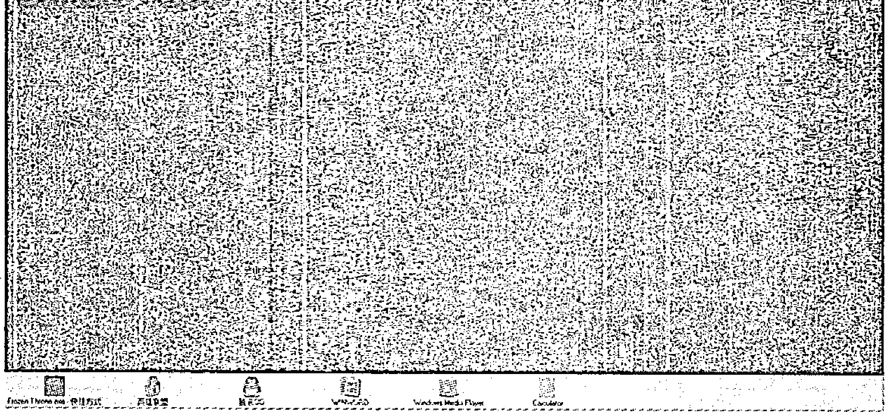

### 小提示

APP冬眠大师还有另一个潜在功能，就是平时可将不常用且无法卸载的系统应用冬眠，避免它们自动运行占用系统资源，有助于提高运行的流畅度和防偷流量。

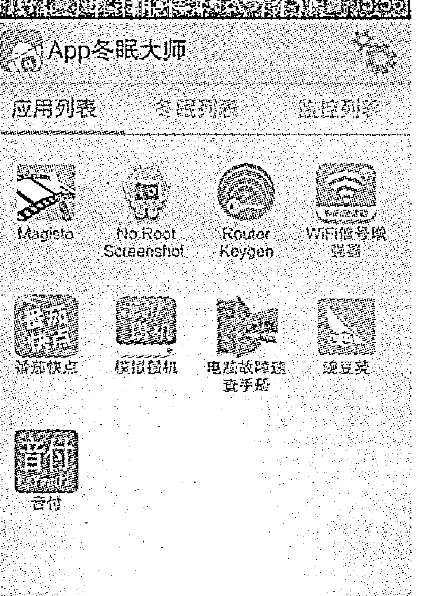

### 手机应用学会隐藏

很多Android手机在安全设置里都提供了“访客模式”，或支持应用图标隐藏的功能。以OPPO手机为例，在将手机交给小孩之前，我们可以提前进入“设置→安全与隐私→访客模式”中（图3），将重要的照片、视频和联系人信息隐藏，并将关联了支付宝的淘宝、美团等可能出现误操作支付的APP隐藏（图4）。这样一来，当小孩拿到你的手机时就只能看到和运行指定的APP了。

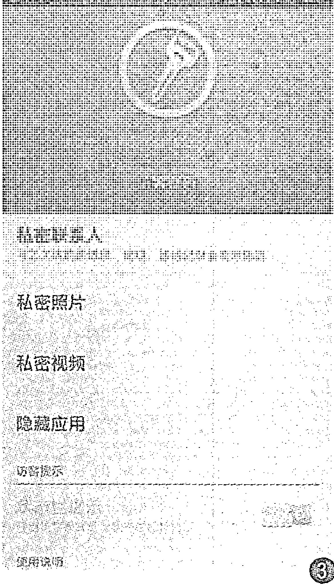

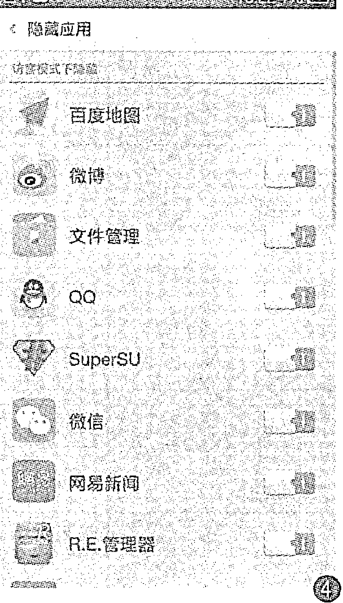

如果你的手机不支持此功能，则可借助“APP冬眠大师”（下载地址：http://t.cn/8knPjt0，该软件需要Root权限）一类的软件实现应用的另类隐藏。在该软件的“应用列表”中会将所有安装的应用列出来（图5），可以把不希望小孩看到的APP全部加入到冬眠列表中，在桌面上将不会再显示其图标（等同于卸载，却可以随时恢复）。

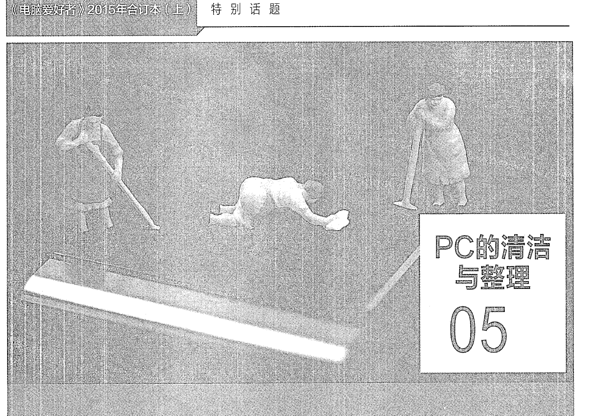

## PC的清洁与整理

春节是我们一年当中最长的假期，大家拥有大把的空闲时间可以自由支配。趁着长假，整理一下工作了一年的电脑是不错的主意，因为很多时候电脑的清理和整理整顿正是需要大段的时间才能完成。不过就算假期长，清理电脑也要注意方式方法。

## 散热器清灰方案

电脑长时间使用后，最常见的问题就是积灰。现在的电脑机箱开孔都比较多，长时间使用后电脑机箱内部的CPU、显卡和机箱风扇会在机箱内部形成正压效果，就是说机箱内部压强大于外部，机箱的风道是进风大于出风。这样一来电脑机箱就会变成一个大号吸尘器，会把周围的尘土全部吸进来。其实尘土还好，最麻烦的是如果一些絮状物吸入机箱后，会和尘土一起混杂在风扇扇叶或散热鳍片上，严重影响系统散热。

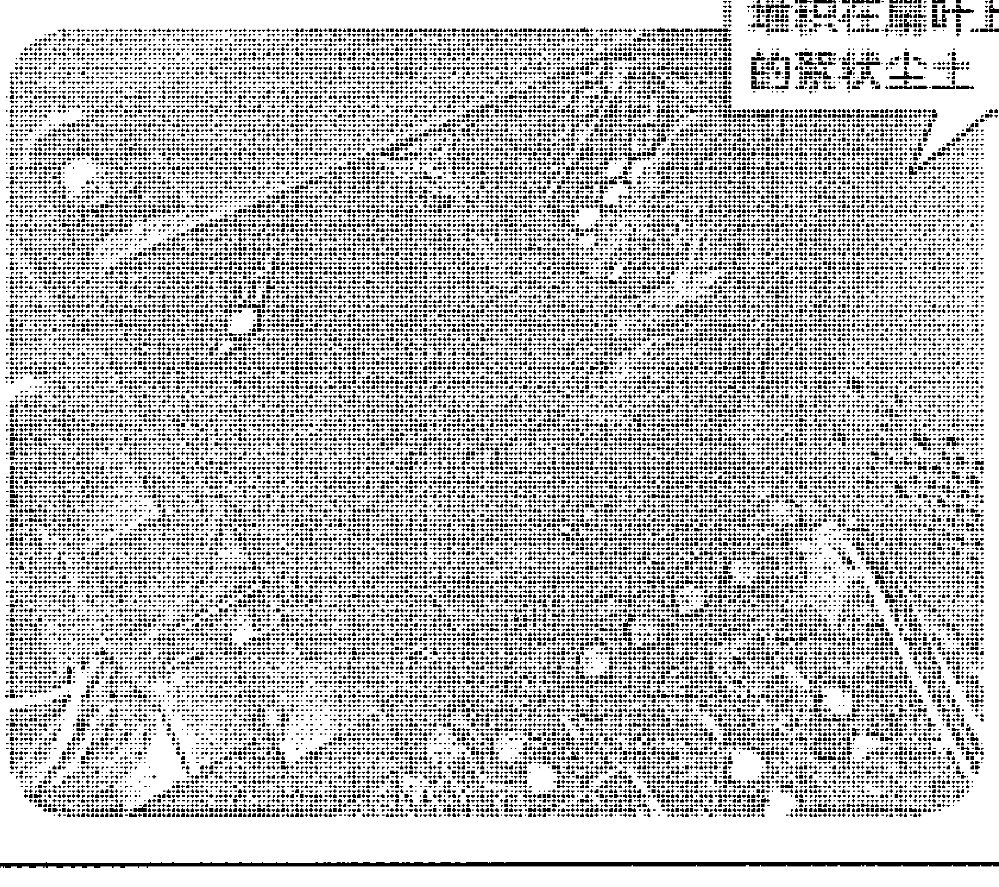

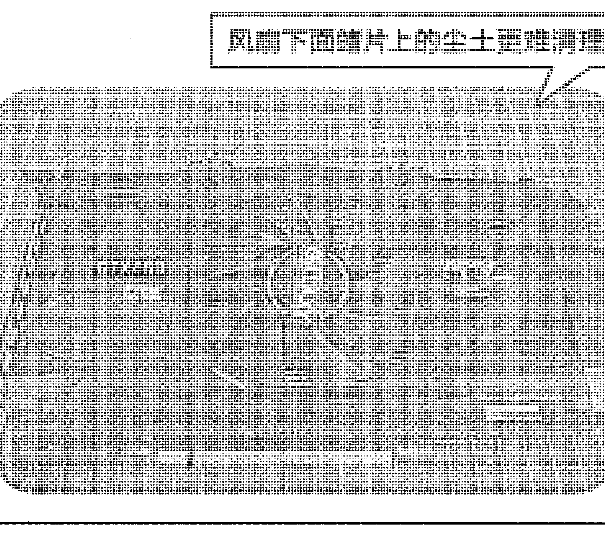

## 彻底清除积灰

目前散热器多采用散热鳍片设计，而机箱风扇一般都位于金属冲网口后，在这样的基础上机箱正压会造成什么效果呢？风道将空气和絮状物与灰尘一起吹入机箱，其中一部分直接留在了机箱网孔后风扇前，其余的一大部分被CPU和显卡风扇吸入，留在了风扇与散热鳍片之间。

经过长时间的积累灰尘和絮状物越积越多，因为正好在风扇与金属之间的死角里，别说清理就连拿肉眼直接观看都比较费力。如果我们想彻底解决这个问题，最彻底的方法肯定是拆掉整个散热器或者机箱风扇进行清灰操作。

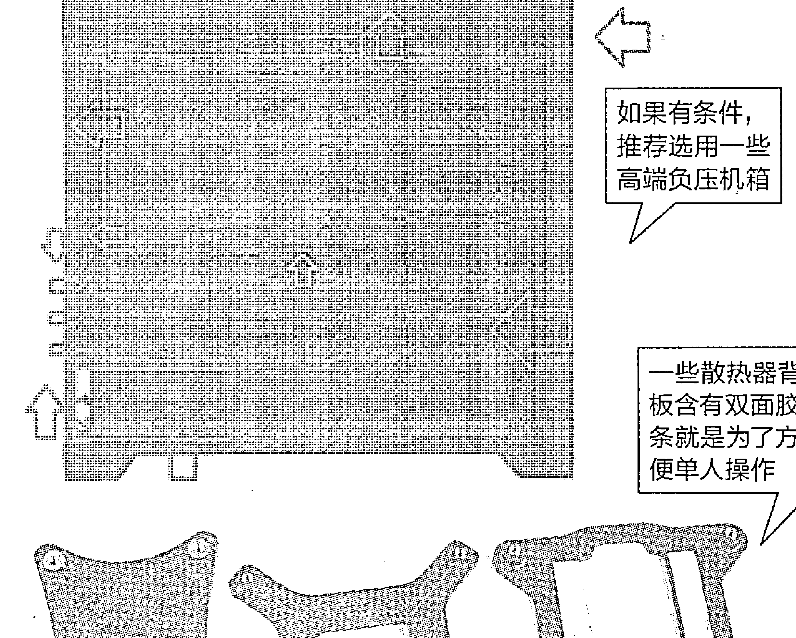

## 便捷拆除设备

机箱风扇还比较简单，如果涉及到CPU和显卡散热器，拆除起来还是比较有难度的。拆CPU散热器由于周围空间较小，很多时候需要先把主板从机箱上拆下，这个工作量实在是不小。而显卡散热器由于非公版各家设计各不相同，拆解起来也有一些难度。其实我们在选购前如果注意一些此类的问题，拆解过程就会简单许多。

首先说CPU散热器，它是否容易拆卸不仅取决于散热器本身，还跟机箱有很大关系。如果机箱内部空间比较宽松，会大大减小拆卸CPU散热器的难度。另外还有一个细节常被用户忽略了，就是背板开孔的位置和尺寸大小。现在很多CPU散热器都带有背板，通过在正面的固定螺丝将散热器固定在背面的背板之上。如果机箱背部开孔较大，位置也很合理，我们能够轻松在不拆卸主板的情况下拆卸散热器及其背板。清扫完毕后的安装可以稍微复杂一些，需要首先将散热器背板上面的螺丝柱对准孔位，然后从正面用螺丝固定背板和散热器。单人操作可能稍微复杂，如果在拧螺丝时身边实在没人能够帮忙固定背板，可以考虑在安装时用书本等物品垫高桌面，将背板孔位对其后固定之后再行安装。

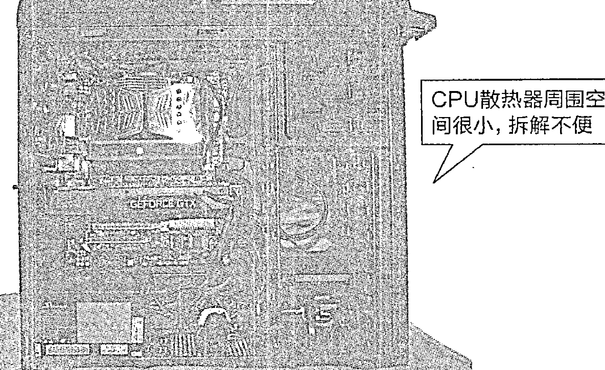

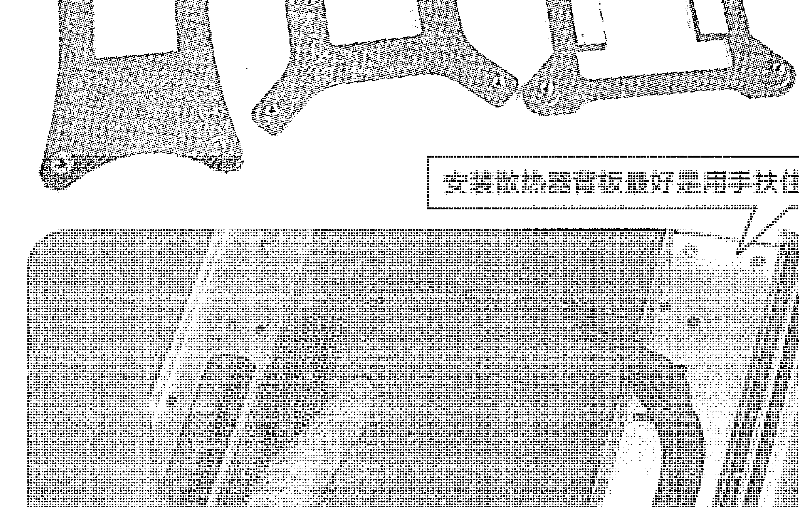

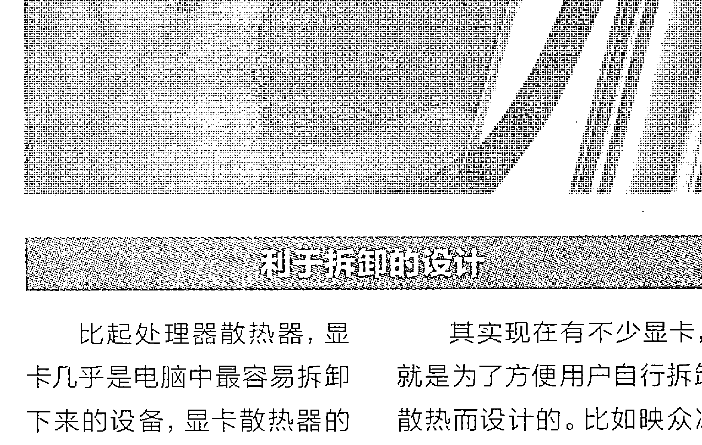

## 利于拆卸的设计

比起处理器散热器，显卡几乎是电脑中最容易拆卸下来的设备，显卡散热器的拆卸清理难在别的方面。首先不同品牌显卡使用的散热器完全不同，散热器的拆卸方法、螺丝规格、风扇和散热鳍片间的关系也各不相同。没有经验的用户还是在拆卸前仔细观察一下散热器部分，如果网上有相关散热器的拆解教程，先借鉴一下再行动手是比较稳妥的选择。

其实在有不少显卡，就是为了方便用户自行拆卸散热而设计的。比如映众冰龙系列在散热器最外层设计六角螺丝孔位，利用显卡附件内的六角螺丝刀就可以轻松打开散热器最外层露出风扇与鳍片相连的位置。七彩虹、影驰等厂商采用了可拆卸散热风扇，就是说我们无需拆掉整个散热器就可以清理积灰的部分。

现在显卡功耗越来越## 特别话题

其实，特别是从NVIDIA的Maxwell架构诞生之后，不少中端显卡的散热再也不是问题了。不少厂商开始推出在低负载时风扇0dB的产品，也就是说显卡空闲时风扇完全停转。GTX 960之后，NVIDIA开始官方支持这一技术，市面上绝大部分GTX 960显卡在低负载时风扇都是不转的。有了这样的显卡，基本也不太用拆卸散热器了，风扇和散热鳍片上很难沾染大量尘土。

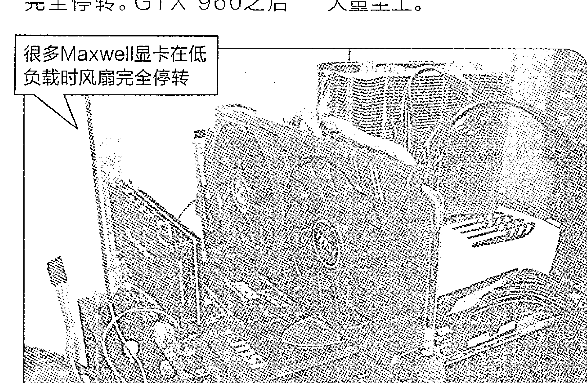

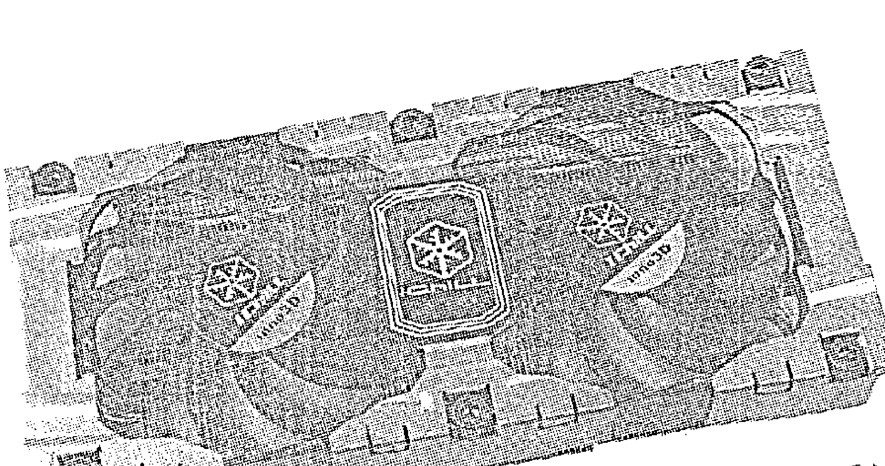

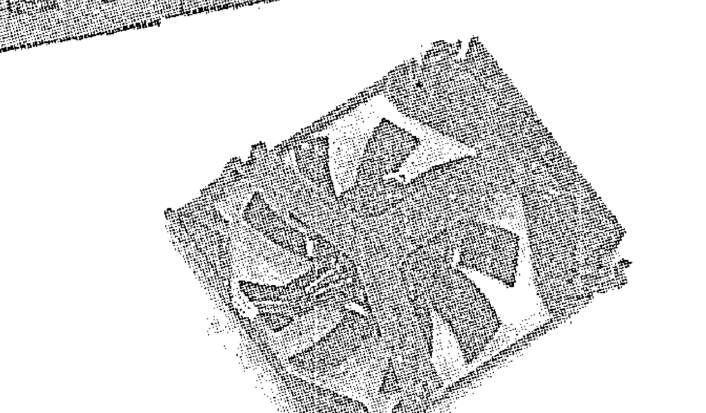

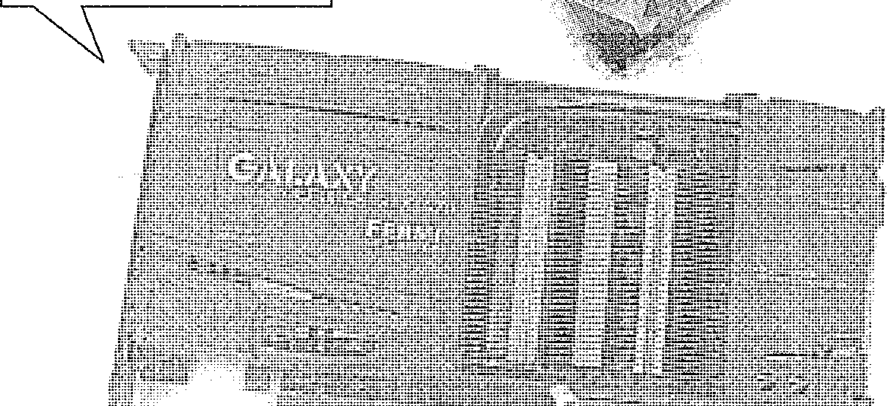

## 免拆卸清扫思路

## 空气清理法

在不拆卸散热器的前提下，如果想要清除内部积灰，可以尝试使用吸尘器进行处理。理论上家用吸尘器的最大功率配合扁头的吸力就可以达到要求，不过由于吸尘器尺寸略大，操作起来还是小心一些，不要碰坏设备为好。如果落地式吸尘器实在难以操作，可以尝试用便携式吸尘器，不过其吸力也会相应降低。

除积灰。吹气的方式清灰好处是比较容易处理特定区域，罐装气体的压强也很不错。不过一定要做好吹落尘土的收集工作，否则大量杂物被吹至机箱内部会造成二次污染。其实我们在拆卸散热器后不少用户也习惯先清理，最后用嘴吹掉散落的尘土，不论是使用吸尘器还是罐装气体，也都是属于这类办法。优点就是比用嘴吹要卫生许多，但处理一些比较顽固的絮状尘土有些无力。

不管设计多么合理，散热器的拆卸始终是一件比较麻烦的事情，如果用户没有经验或动手能力不强，拆卸起来还是比较麻烦的。偏偏絮状物和尘土总喜欢堆积在鳍片与风扇之间，有什么好办法能在不拆卸的情况下清扫积灰呢？

## 手动清理法

顽固的絮状尘土除了用户拆掉散热器，还有一种办法有可能对其进行清除。最难处理的尘土既然是附在散热鳍片上的，用户完全可利用铁丝等稍硬一些的细条状金属将其从侧面取出。针对常规办法难以清除的死角，可自由改变铁丝末端的形状，使其能够尽量将死角清理干净。如果依然难以清理，可使用双面胶带贴在铁丝上面，粘出死角内的顽固尘土。显卡散热鳍片的开孔一般都与显卡平行，我们需要将显卡从主板上拆下，使用比较长、硬度足够的铁丝从一头清理至另一头。铁丝尖端可以考虑折一个L型，用来勾出顽固尘土。清除过后使用气吹或者吸尘器统一清扫即可。处理器散热器比较麻烦，不同种类的散热器清理方法也不同。传统塔式散热器一般尘土位于风扇后鳍片前，如果风扇使用挂钩方式与散热器相连可以只拆掉风扇然后进行清理。如果是其他连接方式就很难在不拆卸散热器的情况下卸掉风扇，只能在风扇和鳍片之间那一点点空间内使用铁丝慢慢清除鳍片之间的顽固灰尘。如果是下压式散热器，可能用户的视野会变得很差，肉眼很难看清尘土的位置，只能尽可能将铁丝长度变短，然后从中心到边缘慢慢清除。

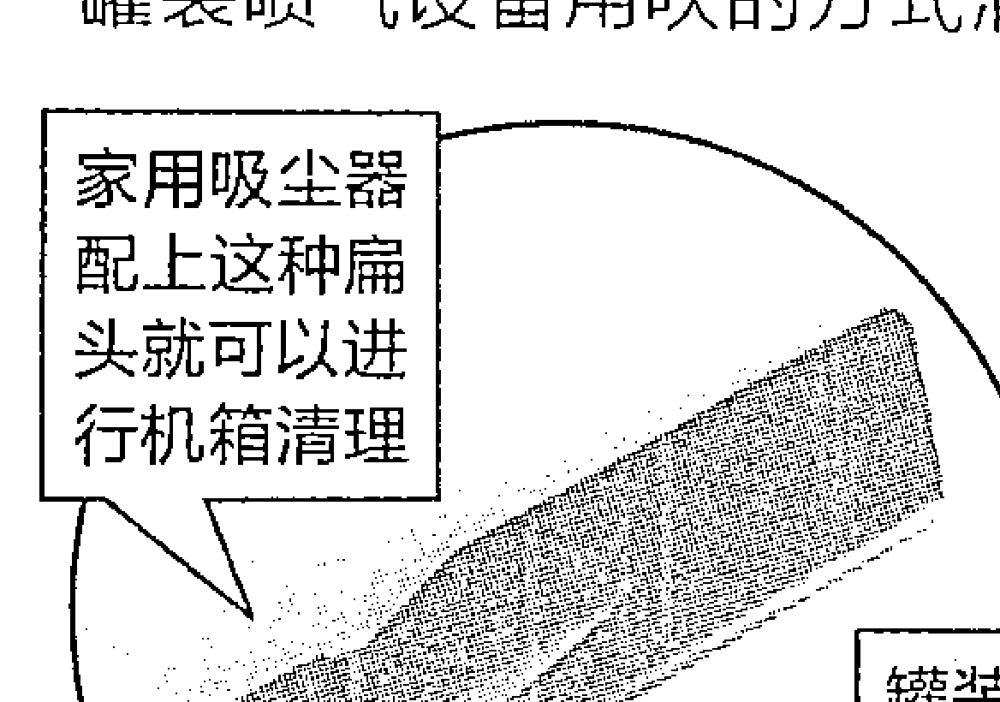


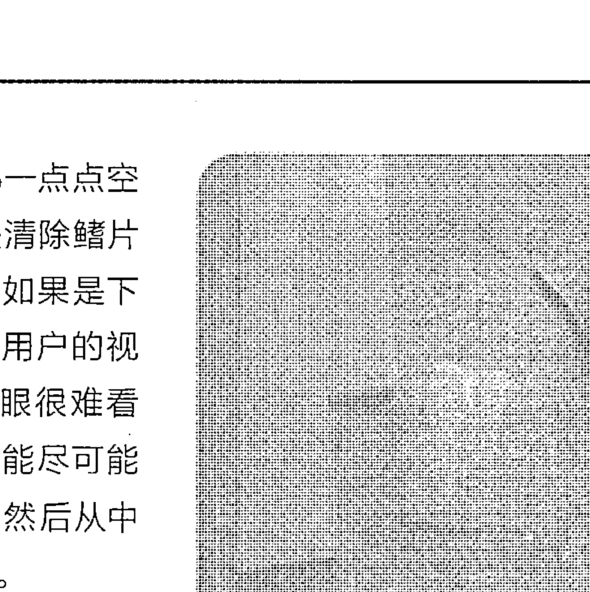

> > 铁丝加双面胶带，很容易找到的清洁工具

## 硅脂的重新上妆

除了清理散热器能够有效降低电脑温度、提高系统稳定性之外，给散热器重新涂抹硅脂也是电脑清洁的关键。不同硅脂的效果相去甚远，不同种类状态的产品涂抹方法也各不相同。如何选择我们新的硅脂呢？

### 换掉预装硅脂

对于硅脂，可能很多用户的印象还停留在Intel原装散热器预先涂抹好的那种硅脂。由于原装散热器的特殊性，这类硅脂一般被制成半固态状态，用户只需把散热器正确安装后，电脑启动后处理器产生的热量会自动将硅脂比较均匀地与处理器接触。另外一种最为常见的就是显卡出厂时厂家预涂抹的硅脂，一般用量都会比较大，完全将GPU核心覆盖住，GPU和散热金属底座之间间距较大。这两种散热硅脂硬度较高，含油量极低，属于比较适合长时间使用不用更换的类型。不过由于其散热效果一般，如果我们希望改善机箱内部环境，这类硅脂是需要被换掉的。

### 硅脂选购有学问

市面上的硅脂种类繁多，新手挑选起来难免眼花缭乱。其实购买硅脂时需要注意的点并不多，注意一下有的放矢地购买比较好。首先要注意导热系数，这是硅脂最为重要的指数之一。单位是W/m·K，代表着热传导功率，数值越大表明热传递速度越快，导热性能越好。具体决定硅脂导热系数的主要是由其材质决定的，其中尤以金属的导热系数最佳。比如银的导热系数很高，就是非常出色的导热材质。一般市售的硅脂的导热系数在1W/m·K以上，较好的可达5W/m·K以上，一些含银的硅脂可以达到更高的导热系数，不过具体也取决于厂商的实力。近几年有一些液态金属材料的散热材料逐渐崭露头角，由于材质根本性的改变，其导热系数甚至可以达到普通硅脂的百余倍。

除了导热系数外还应该注意硅脂的热阻，热阻系数的单位是℃/W。热阻越低发热物体的温度就越低，也和导热硅脂所采用的材料有很大关系，优秀的硅脂热阻系数都在0.01℃/W以下。

除此之外硅脂的粘度也比较重要，单位一般为泊(poise)，但很少有硅脂会提供这个参数。具体到实际涂抹时，粘度在2000多泊的产品比较合适，可以很容易地铺开，同时也能保证一定的粘稠度，不至于过分流动。

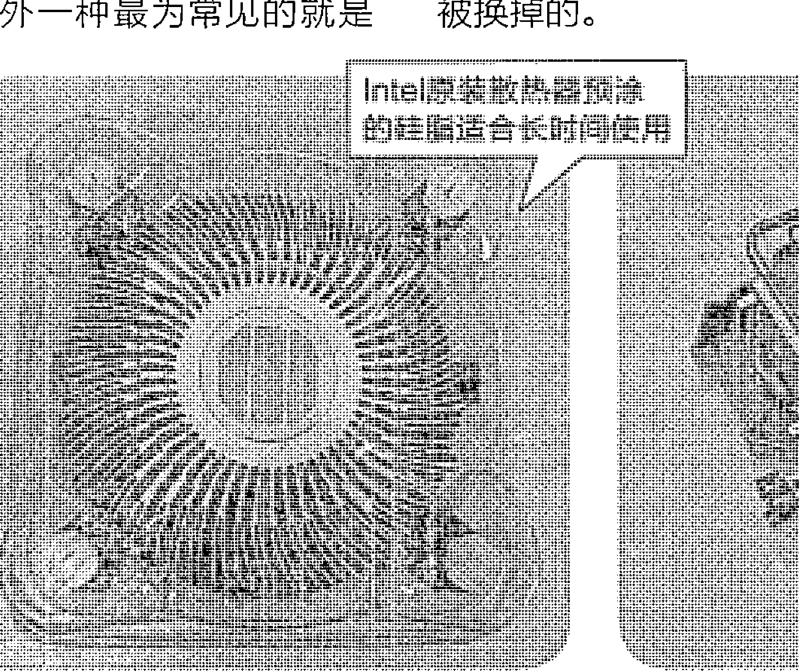

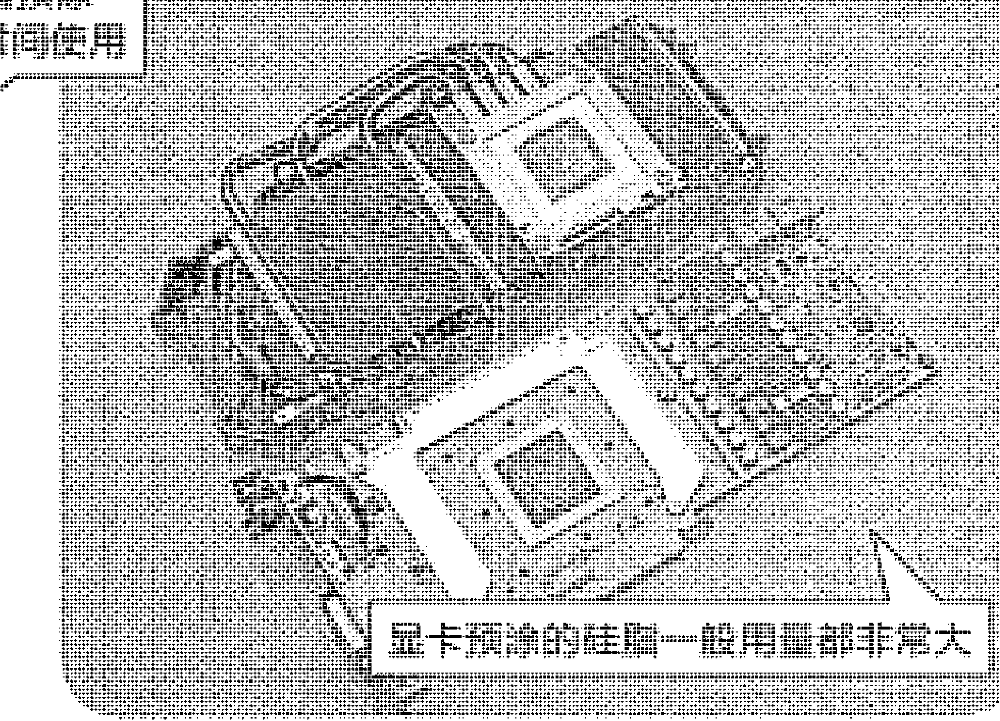

> > 一款优秀的硅脂可以让温度下降5-10℃之多

## 硅脂的涂抹技巧

如果用户手头并没有硅脂，但因为清扫时拆掉了散热器，最好注意不要抹掉硅脂，也不要改变散热器的安装方向，直接原封不动地将散热器安装回去。因为在长时间使用后硅脂已经硬化，不更换的情况下只有按照原方向安装回去才能保证最基本的导热效果。如果可能最好还是重新涂抹，那么要怎么涂抹才是最佳方案呢？

### 直接挤在中心

直接将不少的硅脂挤在CPU顶盖中心，然后将散热器压上，硅脂会自然被挤压至顶盖各处。不过这种方法虽然可以保证顶盖与散热底座各处都有硅脂，均匀度却难以保证。拆掉散热器你会发现这种涂抹方法和很多显卡散热器出厂时的涂抹方法类似，中心很薄，四周硅脂堆积很多，均匀度不佳。

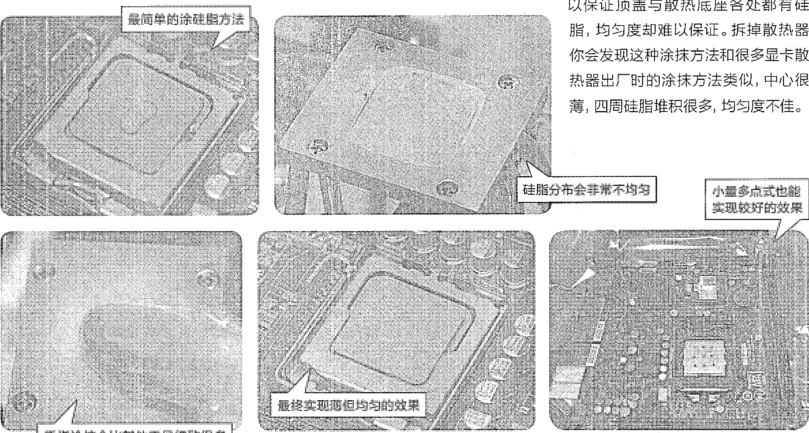

### 用纸片涂抹四周

和第一种方法类似，只不过在上散热器之前使用硬纸片或者硅脂附带的塑料片将硅脂涂抹均匀至顶盖各处。可以说比前一种效果要略好，但是在上散热器后还是因为压力硅脂会出现中心少四周多的情况，有大量硅脂最终被挤到边缘甚至挤出顶盖区域。

### 塑料手套涂匀

涂抹方法其实和第二种非常相似，只不过涂匀的工具从纸片换成了戴着透明手套的手指。比起硬纸片和塑料片手指明显更加灵活，不仅可以保证硅脂充分照顾接触面积，还能使硅脂尽可能薄，散热效果比起前两种有很大提高。

### 5/9点涂抹法

第三种方法虽然能够将硅脂涂抹得很薄很匀，但并不是所有人在涂抹硅脂时都可以找到塑料手套。这种涂抹方式是很多DIY爱好者总结出来的经验，就是用5或者9点的方式涂抹在处理器顶盖上，每个点只需要一点点硅脂即可。这样在压上散热器后硅脂会被均匀分布至各处，同时还能够保证硅脂层很薄。

### 小结

总结来看，首先我们要保证硅脂在顶盖和散热底座之间充分接触，但同时这层硅脂要尽可能薄。因为就算是再优秀的硅脂其导热系数也不及金属，硅脂只起一个填充的作用，越薄越均匀越好。

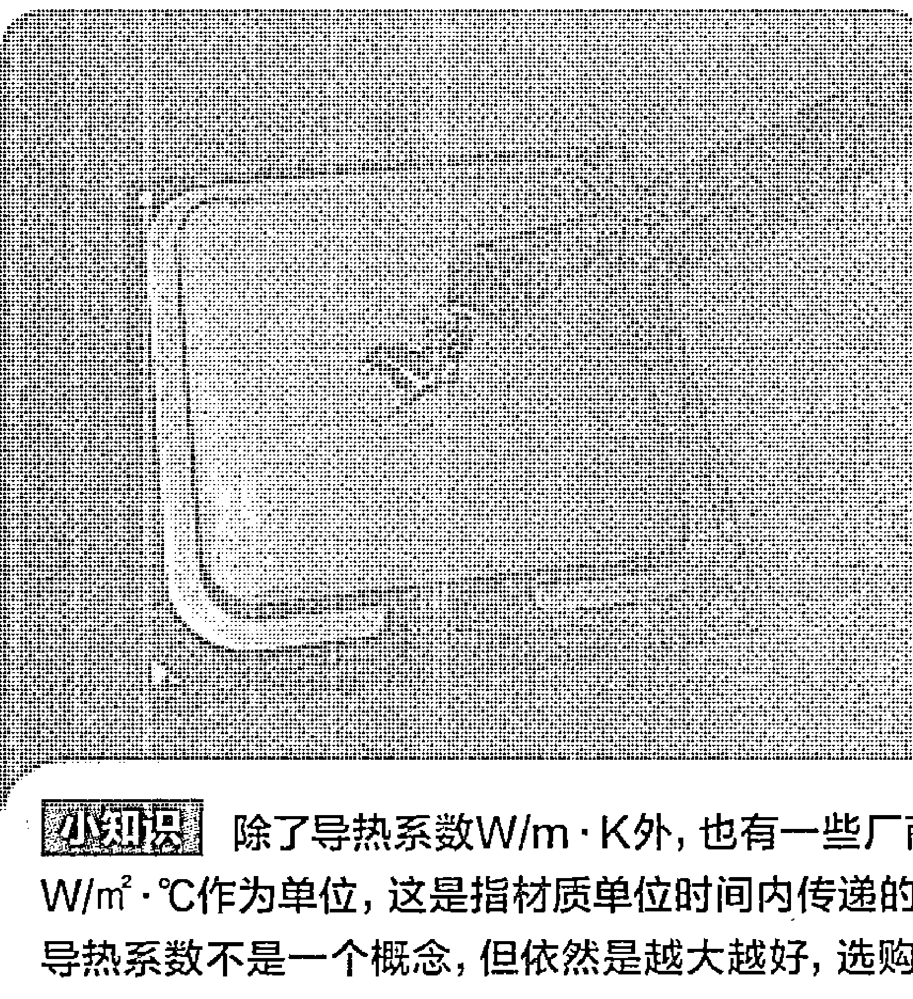

## 拒绝“误会”

## 抓住一切性能提升机会

策划《电脑爱好者》编辑部

无论软件硬件的功能多么丰富、性能多么强悍，操作多么易用，但在用户的使用中，总会发出一些“不和谐”的声音。可能的确存在虚假宣传或夸大事实的地方，但也会有一些软硬件是因为错误的操作或设置而引起的“误会”，惨被淘汰出局。本期大专题，我们将为那些存在误会的软硬件正名，并指导大家如何用好它们。

文|亦云

### 拨乱反正

### 为软件“误会”正名

系统软件或办公软件升级到新版本后找不到原有的熟悉功能，因而退回到原版，或者干脆没有勇气升级到最新版；工具软件推出精简版后，被误以为功能太简单不中用，因此沿用一个大而全的传统“标准”版；同质化的软件被误以为用起来差不多，因而懒得比较和精选，随便用一款了事；非专业的软件能干专业软件才能完成的事情，被误以为非专业的工具干不好专业的事 凡此种种，许多软件“误会”都等待着我们去为其正名。

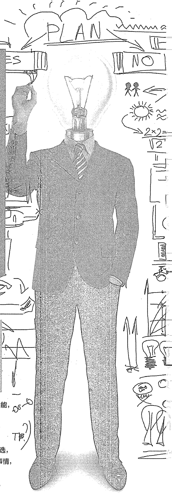

## 找回“移位”的软件功能

Windows操作系统的升级，应用软件的更新换代、精简优化等，均不是对功能的简单削弱，多数情况下只是界面的重新布局和优化。但整体上说是增强了功能。只要我们使用得法，善于去挖掘和发现自己熟悉的功能和用法，并积极吸取新版本中增加的新功能和新用法，新版操作系统、新版应用软件、精简优化版软件才应该是更明智之选。守旧地把持着一个老软件、几个老功能，虽然也未尝不可，但善于从新事物中应用老规律和新的解决方法，这才是积极的软件使用之道。

### 1 新版Windows功能其实没少

Windows升级到Windows 8之后，迎来的是用户的一阵“脚踩”。许多人找不到原来在Windows XP和Windows 7中熟悉的操作方法和功能，认为这样的一套系统对自己很不实用，因而拒之门外。甚至有不少PC用户在买了新电脑后，想方设法将其中自带的Windows 8操作系统换回到Windows 7或Windows XP。那么，Windows 8真的少了什么功能吗？ 其实，Windows系统升级不是取消了原有的功能，微软只是将一些固有的功能重新整合或隐含起来，不便于调出。由于新系统的帮助系统不够人性化，没有列出明显的操作说明并给出方便的入口，所以造成许多人无法找到自己要的功能。所以要说缺少，缺少的是人性化的指引和说明而绝非常用核心功能。 大家知道，Windows 8横在用户面前的最大拦路虎就是资源或功能的定位和开关机操作，它首先表现在开始菜单的缺失和新功能入口的不明显，这会让第一次接触它的用户就对它没了好感。尤其是Windows 8初期的版本，安装之后使用，对于用户的指导意见和使用帮助信息微乎其微，人们无法像当年使用Windows XP或Windows 7那样获得及时的、详尽的帮助信息（图1）。直到晚些时候的Windows 8.1，微软才意识到这个问题，在磁贴界面开始出现的时候才给出了操作的提示信息。从这一点就可以看出，不是Windows 8缺乏什么实质的实用功能，而是微软在指导用户使用上没有做好功课。 如今微软在Windows 8.1甚至Windows 10的帮助信息方面，仍然是做得很差。如果不相信，就让我们打开一个已经相对比较成熟的Windows 8.1版本，进入它的控制面板，选择“用户账户”，这时看到其窗口右上角有一个蓝底白字的帮助信息问号图标（图2），点击它理所当然应该提供微软关于“账户”的帮助信息，但遗憾的是，我们所获得的是一个“此内容不可用”的提示信息。然后微软用一个万能的“托辞”——“如果需要Windows帮助，请访问Windows网站”来打发用户。实际上，即便是网站上有这方面的信息，对于一个本来就不熟悉Windows的用户，如何让其去Windows网站的茫茫大海中寻找自己需要的帮助信息？如果此时此刻用户网都没有连上，而是在以本地方式使用Windows系统，又让他们到哪里去获取帮助信息？

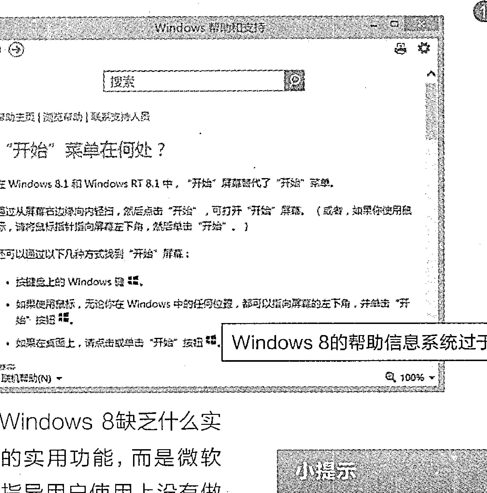

- 按键盘上的 Windows 键 + C。
- 如果使用鼠标，无论你在 Windows 中的任何位置，都可以指向屏幕的右下角，并单击“开始”按钮。
- 如果在桌面上，请单击或单击“开始”按钮。

> > 小提示
> 
> 如果没有特定指出，本文所述的Windows 8系统也包含8.1版本。因为微软在许多场合将其统称为Windows 8，因此，我们也沿用这种方式的称呼。

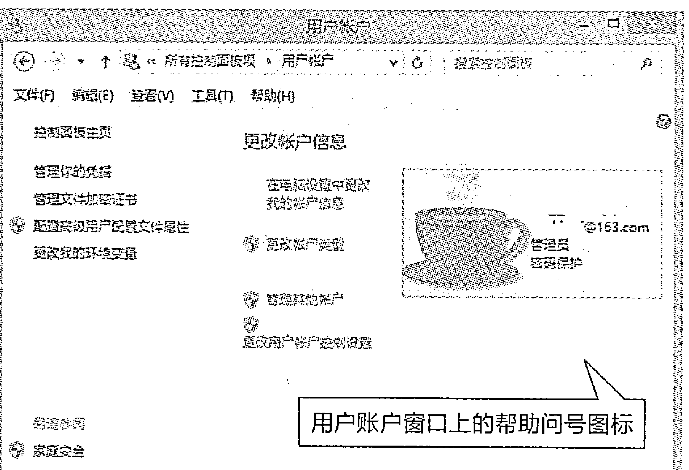

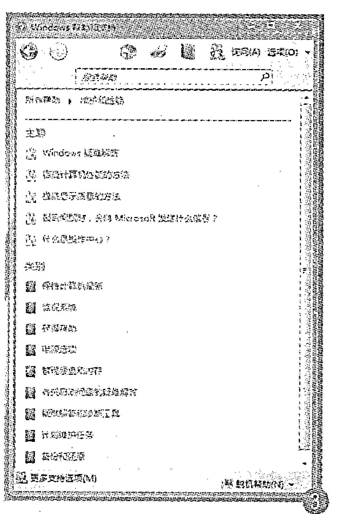

可见，从细节上来讲，Windows 8甚至到目前为止的Windows 10版的确是在退步了。不是说在线方式的帮助信息不好，这毕竟是大势所趋，但作为最基本的功能和操作所需的帮助信息，无论如何Windows应该在它的系统文件中有所提供。在这一点上，Windows 7是一个非常好的典范（图3），为何Windows 8和Windows 10不能沿用呢？

除了开始菜单和帮助功能，人们会问，在Windows 8系统中，我们最熟悉和最常用的系统控制和设置功能哪儿去了？开机和关机命令哪儿去了？这两个在Windows 7中可以轻松通过开始菜单找到的功能，在Windows 8中让人感到捉摸不定。大家知道，Windows的操作高手在Windows 7等系统中，就可以不用开始菜单而开关机或访问控制面板。例如，通过Win+R启动运行命令窗口，输入“shutdown.exe -s -t 00”命令关机，输入“control”命令启动控制面板，通过“Win+E”组合键启动资源管理器。即便是开始菜单坏掉了，不也照常访问吗？Windows 8没有了开始菜单，Windows 7的这些技巧可以原样挪用。况且，Windows 8虽然没有了左键开始菜单，但其开始按钮上的右键“开始菜单”要比Windows 7中的控制命令都方便得多，Windows 8不更好用更强大吗（图4）？但关键的问题是，不是每个Windows用户都是高手，不是每个人都知道那么多藏着掖着的技巧，而微软又没有在显眼的位置告诉大家这些技巧，能不让大家莫名其妙、找不到北，那才怪呢！

由此可见，Windows的一些老功能在新系统中并未被丢弃，其实它们的使用渠道更多、灵活性更大了，总体来说功能更强大了。若我们有心，挖掘一下、学习一下，迎接我们的将是一片更蓝的天。论功能的强大，Windows 8绝对胜过Windows 7，但用Windows 7我们没错，用Windows 8我们更明智。若是无心于它，那就等待下一个版本Windows 10正式版的出现，它会解决所有我们“不习惯”的问题，并延续Windows 7和Windows 8各版本的优秀功能。

- 让Windows 8的控制面板无处不在：在开始菜单上通过右键菜单的“控制面板”命令访问；把鼠标移到桌面右上角浮出面板，搜索“控制面板”；运行“control”命令直接启动；用Win+E启动资源管理器之后，在左侧资源栏寻找；建立一个名为“控制面板.{21ec2020-3aea-1069-a2dd-08002b30309d}”的文件夹访问；然后在Windows 8磁贴界面应用列表中查找；给文件C:\Windows\System32\control.exe建立快捷方式访问。

小贴士：“习惯”与“灌输”的辩证
Windows 8不受欢迎不是因为功能的缺失或削弱，而是“习惯”使然，其要害在于让习惯变得不习惯的同时，并没有方便地提升操作体验和快感，因此造成人们的反感。但想想Windows 95发明之初的“开始”菜单操作法，也是不曾习惯的操作方法，此前无论是Windows 3.X系统，还是苹果系统的操作方式，均是点选图标的方式，为何人们就能接受Windows 95的那种弹出折叠式选择的新方式——“开始”菜单呢？究其原因，一是因为那种方式的确给操作提供了极大的方便，尤其是当选择项目多时，选择和管理起来方便；二是在当时没有更多更好的可选产品和方法，不像今天这样除Windows外，还有更便于操作的Android和iOS系统的存在。因此，虽然当初Windows 95是用“开始”菜单来向用户“灌输”一种新的使用方法，但这种灌输正好迎合了人们的需求，且接受起来容易，因而也就顺其自然地获得了成功。但今天，当微软继续我行我素地以一种“灌输”的方式，希望人们接受一种其设计的“开始”界面的同时，也给人们带来了操作的难度和门槛，并不像Windows 95时那样，能提供更大的方便。再加上新旧Windows操作系统并存，人们的可选余地多样化之时，微软推行这样的策略，受挫也是理所当然的。

### 2 Office软件新版本更可爱

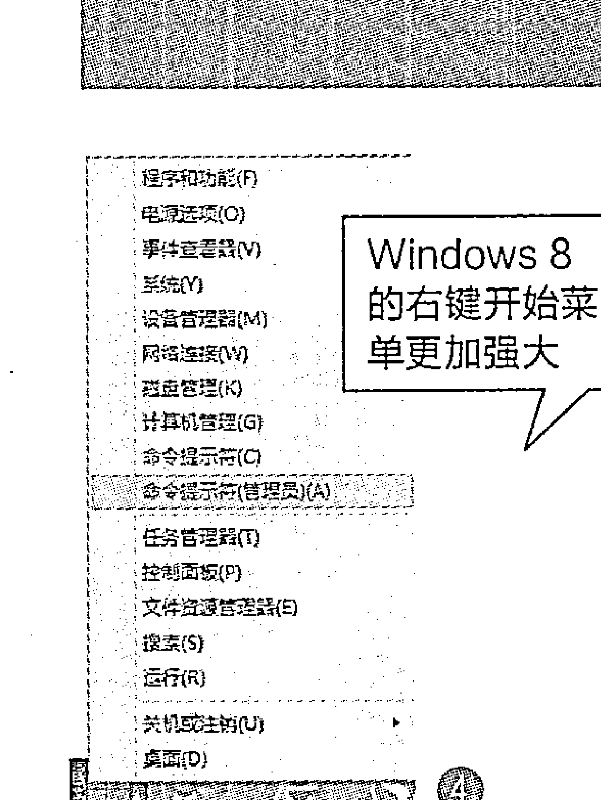

自从微软Office 2007更换为Robbin界面后，操作习惯的变化造成许多人无法找到习惯的Office 2003界面，因而目前依然还有许多人在沿用古老而经典的Office 2003版本，似乎“乐不思蜀”，对新的Office 2010、Office 2013版不感兴趣。这些用户总是觉得，从Robbin界面操作界面中，很难找到他们早已熟悉的许多Office命令。那么，Robbin风格的Office 2007或后续版本，真的失去了Office 2003原有的功能吗？

实际上，在Office 2007中，原来的所有功能依然存在，稍加学习，就可以轻松找到原来熟悉的命令或设置窗口。以设置段落的属性为例，如果要开启传统的段落设置对话框，只需在Robbin界面的“开始”标签下点击“段落”分组面板右下角的小箭头按钮，即可激活我们熟悉的段落设置窗口。其他传统界面窗口回归的设置也是如此，只需确定其所属类别在Robbin面板的哪个菜单面板和分组之下，点击其右下角的小箭头图标就可以了（图5）。

作为一种新式的操作界面，Robbin风格的菜单面板不但没有被废弃，微软从Windows 8开始，将其操作系统的资源管理器也均改为这种操作风格，直至最近发行的最新版Windows 10技术预览版，也一直沿用这种风格的界面。这种界面与传统界面相比，最大优势是效率更高。通过上排的菜单和下边弹出的面板能更好地展现更多内容，而且阅读效果更清晰。习惯后明显感觉会比传统菜单更方便和高效。

尽管Robbin的操作风格已被微软的系统或办公软件产品广泛采用，但是，由于“习惯”的惯性，留恋于老式传统菜单风格的用户还大有人在。鉴于此，国产办公软件金山WPS顺应广大用户的这种习惯，并充分考虑到新技术的发展趋势和兼容性问题，开发出可由用户自由选择和定制界面的WPS Office 2013多重界面办公软件（图6）。在这套办公系统中，金山提供给用户两套界面，我们不但可以直接使用系统默认的Robbin风格界面，还可以通过窗口右上角的菜单按钮直接以传统菜单的方式访问此前熟悉的各种菜单命令，更可以通过“换肤”操作，将整个软件的界面切换为传统经典菜单模式。

- 鼠标右键移动到桌面右下角，选择浮动面板中的“设置→电源→关机”。
- “Win+R”组合键启动运行窗口输入“Shutdown”命令关机。
- 在桌面上执行“Alt+F4”组合键选择“关机”。
- 在开始按钮的右键菜单中选择关机命令。
- 用“Ctrl+Alt+Del”组合键唤出窗口右下角的关机按钮。
- 用命令“shutdown.exe -s -t 00”在桌面创建关机快捷方式。
- 在电源管理窗口中将“按电源按钮时”的动作设置为“关机”。

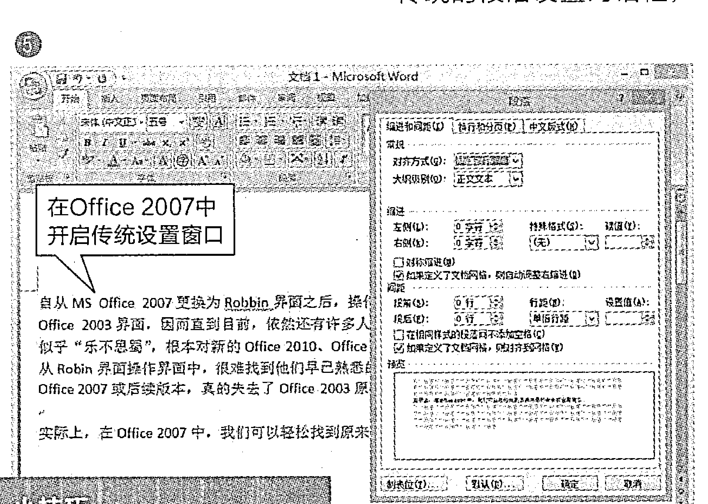

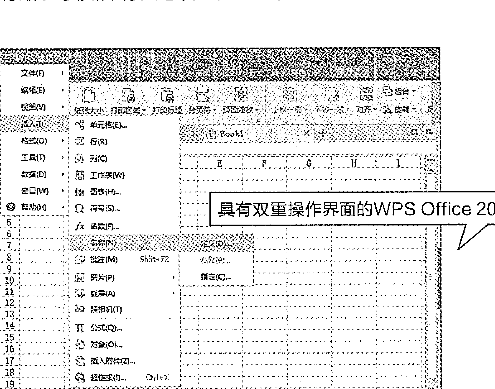

要在Robbin模式下访问传统菜单，需点击窗口左上角“WPS文字”、“WPS表格”或“WPS演示”按钮后的小三角按钮。如果直接点击长条按钮，则弹出文件操作菜单而不是传统系统菜单。

### WPS Office两种界面模式切换

- 点击WPS办公组件窗口右上角的“皮肤”按钮，选择“我的皮肤”下的“经典风格”来更改界面风格（图7），然后返回到软件界面，这时不会看到界面的更改，需要关闭软件后重启才能看到传统的菜单式界面。
- 而要从此界面再返回到Robbin界面，需要通过“工具→皮肤”菜单命令来切换（图8）。

## 3 简版工具不失强大功能

为了给用户提供更加精准有效的功能，许多工具软件都开发有其对应的精简版。如果我们认为这些版本太简单而不屑一顾，那就大错特错了。目前，尤其是前些年，不少工具软件越做越大，功能越来越多，开发者变着法儿地向里边添加功能，深怕不能“包罗天下”，但实际上一款工具的核心功能没有几个。我们常用的工具软件，大概有80%的功能我们根本用不到，也不去用它们。既然如此，那为何不去使用更少占用系统资源、使用起来更加方便的简版呢？

以下载软件迅雷为例，也许大家常用的是其完整的正式版迅雷7，它集成了许多功能，对于下载之外的娱乐功能，稍不小心，也许就会触及到一个按钮，然后电脑中就多出几个迅雷游戏或幸福树、理财产品、迅雷看看等无关于下载的内容（图9）。使用迅雷下载工具，我们的目的很明确，就是为了更快地下载文件。要完成这一任务，其实用一个简单得不能再简单的迷你迅雷就可以搞定。如图所示为迷你版迅雷的界面（图10），它看起来非常简洁，大家甚至可能不会指望它能下载什么。但实际上，它虽然界面简陋，但迅雷7所具有的核心功能它全具备，不但可以支持包括普通网络协议的下载地址，还可以导入BT种子；支持eMule链接的下载，还能导入未完成的下载任务；支持下载完成后自动关机（图11），支持开机后自动下载，支持最多10个任务的同时下载（图12）；支持下载速度和上传速度的控制，还支持IE工具栏插件、浏览器和剪贴板文件链接的监视等高级功能（图13）。再以大家比较熟悉的360安全卫士的版本比较为例来说。目前，360安全卫士的最新正式版为10.0版，而之前我们使用的是9.7版。这两个版本从外观上看有很大差别，9.7版看起来更专业，包含的内容非常丰富；而10.0版则看起来清爽和单一，更像是一个简单的Metro应用（图14）。也许我们觉得软件的功能也一定简化了，但深入其内部，发现在旧版中包含的功能，新版中基本都包含，只是以更清爽的层级窗口体现。丰富的实用工具功能“含蓄地”以一个简单的文字链接“更多”坐落于窗口的右下角，点击它就看到它的强大功能了（图15）。

+   360安全卫士10.0包含的许多实用工具：驱动大师、文件恢复、系统盘瘦身、电脑安全、防黑加固、软件管家、人工服务、手机助手、隔离沙箱、软件小助手、系统防护等。

小提示

透过更加简洁的360安全卫士10.0的界面，我们更多看到的是清爽和紧凑，动手操作比较一下，丝毫不会感到功能的缺失。由于安排的合理，以前习惯的功能都可以顺利找到，但它们对空间的占用却大大节省了。这一方面得益于360软件设计人员的努力，另一方面，用户的付出也功不可没。不知你是否注意到，就在360安全卫士的窗口右上角，有个对话框样式的图标，这正是用户及时反馈信息的入口，点击这个图标，会弹出反馈信息对话窗口（图16），用户可以非常实时地将发现的问题和自己的不满反馈给360设计人员。

## 让回归软件的‘差异’回归

虽然说目前的应用软件同质化很严重，但这只是表面现象。由于每种软件开发者的“底蕴”不同，其软件产品在功能上其实是存在很大差异的。此外，对于不完全属于一个类别的、看似不存在可比性的几种软件之间，由于其中可能会存在某些相似的功能，而这些功能在使用的方便程度或效果上存在很大差异，因此这可能也会影响人们对软件的选择。一个在某方面功能强劲的非专门软件，可能会压倒一个专门的软件而赢得人们的青睐。对于我们普通用户来讲，用好电脑，就是要在这些看似差异不大的软件之间，寻找“差异化”的功能，或者在看似风马牛不相及的软件之间，寻找同类功能以及同类功能中比较优秀的那款软件。与此同时，在寻找软件差异化的同时，对可能通过优化和设置增强功能的软件进行优化改造，使其也能完成其他软件可以完成的工作。

## 1. 离线下载：迅雷不一定最好

人们总觉得迅雷是离线下载的王者。从技术上来说，迅雷的确不弱，但商业化的运作让迅雷对离线下载的天平倾向于交费VIP一端。普通免费用户使用该功能很难获得爽快的体验，甚至会无法获取自己离线空间中的内容。如果用户能很好地利用当前一些免费的网盘，那么，不用花钱注册VIP，也可以享尽离线下载服务。

同样是一批资源的种子或下载列表，如果本地存储空间有限，而又担心网上的链接会失效，这时的首选是将这些资源下载到自己的网络空间中。而论速度和可操作性，迅雷离线无疑是最强大的工具。但是，由于迅雷离线空间对取回本地功能的限制，让免费一族无可奈何。这时，只需换用百度云盘，进入自己的账户的网盘目录，单击“离线下载”按钮，然后在窗口中点击“新建BT任务”就可以调用本地的BT种子，将文件顷刻间下载到自己的百度云盘中了（图1）。

如果要将eMule下载链接、磁力链接、FTP资源下载到自己的百度云空间中，只需点击离线下载任务列表窗口中的“新建链接任务”按钮，在弹出的添加窗口中提交链接地址，就可以在顷刻间将资源免费下载到自己的百度云盘空间中（图2）。

用百度云下载各种协议的资源链接，其所能支持的链接数为每次只能下载一条。如果需要下载的资源不是一条地址，而是一个地址的列表，这样需要许多次添加才能完成下载任务。在这种情况下，我们可以改用115网盘下载。115网盘的离线下载也支持一次最多2000个地址链接下载（图3），但要求注册为VIP会员才能执行成批离线下载。不过注册一个月的会员也仅有15元左右。115网盘免费空间一般最多可有10TB左右，这对一般用户来讲也够用了。115网盘VIP用户配额为1500个离线任务/月，使用115浏览器登录还可以额外获得100个/月。

百度云免费快速下载eMule、磁力链接

115网盘离线下载支持多地址

## 2. 输入法：微软不见得是弱者

说起Windows 8中能用的好的输入法，首先会想到搜狗拼音、百度拼音、QQ拼音等流行输入法，而对于自带的微软输入法，大家多觉得其控制过于简单，功能不够强。其实新版的微软拼音输入法照样可以随心设置。而新的微软输入法——必应输入法在各方面均不亚于上面所说的这些本土智能输入法。

对于微软拼音，虽然输入时感觉输入条太简单，没有什么选择可言，但是通过控制面板的语言首选项窗口，点击简体中文选项（图4），进入简体中文所支持的输入法列表，通过点击“微软拼音”后面的“选项”文字链接，进入微软拼音设置窗口进行设置。

我们发现，不仅可以设置针对地方口音的模糊音，还提供简体中文和繁体中文输入选项，此外有关智能化的输入成分（包括自学习功能、获取云计算候选词功能），还有高级用户快速录入所用的微软双拼输入方法等，均可以在设置窗口中进行定制（图5）。

除了微软拼音之外，微软还推出了新的必应输入法（图6）。相对于国内一些动不动弹窗的输入法，微软必应输入法无广告、无插件，更重要的是，其基本功能和高级功能与国内的几种流行智能拼音输入法相比也毫不逊色。

该输入法提供了非常丰富的常用设置、按键设置，词库的分类选择、自动更新、导入导出，用户配置和用户词典的云同步（图7）。在高级功能设置中还提供多种智能输入设置、自定义短语功能、用户造词功能、统计信息发送等。另外，必应输入法还具有自己的特色功能，例如通过在输入过程中按下V键或Ctrl+R打开多媒体输入功能，选择与输入关键词有关的各种多媒体信息和网络信息（图8），而这一功能的使用需要在输入法设置窗口中事先开启多媒体输入功能。必应输入法提供丰富的皮肤和扩展应用下载，一键即可安装，可DIY个性皮肤或扩展应用。在官方网站应用下载页面，可下载最新应用。完成安装后，相应的应用即出现在输入法中。字符应用安装完成后，输入“vz:”，即可输入特殊符号（图9）。

通过XnView的“创建”菜单下的“创建幻灯片”和“创建多页文件”命令，将成批图片创建为可纳入系统运行的SCR幻灯片，或制作作为可直接执行的EXE自动演示文件，还可将多个图片或数码照片制作成PDF电子书（图11）。

## 3.图片管理 XnView也能充当强者

相比其他专业的图片管理和处理软件，XnView Shell是非常简单而方便的右键图片管理工具，它在图片预览和格式转换方面比其他图片工具都要方便。但其图片管理功能不够强大，还有许多事情无法靠它来完成，比如图片幻灯片的创建、图片电子书的创建等。不过如果我们在其基础上，结合使用其姊妹软件XnView或XnView MP，可以大大增强图片管理能力（图10），可媲美专业级的图片管理软件。

## 取长补短

### 不同软件功能大移植

每款软件都有各自的特色，但是对于多数同类软件，我们一般只会安装其中的一款。不过有时候，可能被我们整个“舍弃”的某个软件，它却有着某个特色功能又是我们想要的，如何在不用其软件时，只取其特色功能呢？请看我们如何自己来补足软件的“差异”功能。

### 让WPS也能使用Office VBA

使用Office的用户都知道，它配备了强大的VBA编程功能，个人用户可以按实际需要扩展出各种功能。国产办公软件WPS个人版与之相比，很重要的一点就是缺少这一功能。不过如果你确实需要还是可以弥补的，从http://www.wps.cn购买下载WPS Office商业版，它已内置VBA功能。另外，也有网友将商业版中的VBA组件分离了出来，可安装到WPS个人版中进行使用。当WPS具备了VBA功能，启动WPS表格后点击“开发工具→VB编辑器”（此处不再是之前的灰色不可用状态），就可使用VBA编程工具了（图1）。

启动VBA编辑器后即可开始使用。VBA插件使用的其实是和Excel 2013一样的Visual Basic宏语言，因此具体的使用方法和Excel 2013完全一样（图2）。

不过在WPS中由于包含丰富的在线模板，如果你不熟悉VBA语法，还可以根据自己的需要直接使用模板。比如需要设计一个抽奖VBA脚本，按提示在在线模板中进行搜索，接着下载并启用宏，这样就可以直接在WPS表格中使用了（图3）。

不只是WPS学习Office，其实WPS作为中国人设计的办公软件，它的一些特色功能也同样值得Office学习。比如我们经常要打印诸如试卷、讲义等需要左右都有页码的文档（即折页打印文档），在WPS的通用模板中即有“折页打印”模板可以调用打印。如果要在Word 2013中实现折页打印，则可以借助“拼页”功能实现。首先单击“页面布局→页面设置”组，接着单击“纸张→纸张大小”框，选择需要的纸型（如B4），然后点击“页边距→纸张方向→横向→多页”，单击“拼页”，在“上”、“下”、“外侧”、“内侧”和“装订线”框中输入合适的数值即可。

## MediaPlayer 变身万能播放器

Windows自带的Media Player（媒体播放器，以下简称为WMP），功能虽然强大，但是却有很多不足之处。最令用户头疼的是，它默认不支持FLV、RMVB等常见媒体文件，所以不得不再安装一些第三方的播放器。其实只要进行适当的配置和增强，WMP也可以拥有像万能播放器那样的功能，这可以通过自行注册解码器来实现。

如果只是要让WMP支持特定格式的媒体文件，那么只要下载Danger解码器插件即可。要想播放FLV文件，可以下载FLV解码插件（下载地址：http://suo.im/i7bu7）。将其中的FLVSplitter.ax文件复制到C:\Windows\System32目录下，并以管理员身份启动命令提示符窗口，接着输入执行“regsvr32.exe FLVSplitter.ax”命令，对该解码器进行注册，注册成功后就可以直接使用系统自带的播放软件解码FLV视频了。其他解码器的注册操作类似（图1）。

这时我们再启动WMP，点击“文件→打开”，然后媒体文件类型选择“所有文件”，选中需要播放的FLV文件即可在WMP中进行播放了（也可以直接将.flv文件打开方式关联到WMP）。点击正在播放文件的属性可以看到是FLV文件。如果想要让WMP变成全能播放器，则可以下载Windows 8 Codecs（下载地址：http://suo.im/1452f，支持Windows 7及后续操作系统。下载安装后，首次启动，点击“Shark007 Sugguet Setting”完成初始设置（图2）。这样再次启动WMP后，同上在文件打开窗口中，媒体文件选择“所有文件”，就可以任意选择RMVB、MKV等原来不支持的媒体文件进行播放了（图3）。

## 浏览器直接下载专用资源

网上的很多资源都是专有格式，像迅雷、QQ旋风、快车等下载工具，都是自己专用的下载地址格式，通过这些专有链接下载时，必须要安装对应的客户端。不过，同一个系统中安装多个下载工具，比较耗费资源，其实我们可以增强浏览器功能，让浏览器直接就可以像那些专用下载软件一样下载特定的资源，这可以借助“迅雷/快车/旋风专用链自动破解插件”来实现（下载地址：http://suo.im/a1ury）。这一插件可以在所有Chrom核心的浏览器中使用，像国内比较流行的猎豹浏览器就可以使用。

下载到的插件是后缀为.crx的文件，按提示双击打开并将其关联到安装的猎豹浏览器中。再次打开该插件就可安装到猎豹浏览器中了。安装后在猎豹浏览器中切换到“菜单→选项→我的应用”，这里可看到安装的插件，同时会在地址栏后方出现（图1）。现在如果要下载专用资源，在猎豹浏览器中打开下载页面后，点击地址栏的插件图标，在弹出的菜单中选择“破解连接”，这样对于专用的链接，如果原来是迅雷链接，现在可以直接右击选择“目标另存为”，就可以直接使用浏览器来下载了（图2）。如果无法直接在页面解析，还可以点击插件图标选择“手工解密”，接着在打开的窗口中粘贴专用下载地址，插件会自动将资源转换为可用的下载地址，可在此将其直接复制，然后使用浏览器或者其他下载软件进行下载。

小提示：火狐浏览器也有类似插件（下载地址：http://tinyurl.com/lbj2l57），启用该插件后只要在浏览器中右击专用资源，选择“解密地址”即可。

## IM一专多能

除了QQ，很多朋友还在使用Gtalk、雅虎通等其他的即时通讯软件和国外朋友联系，默认每种IM账号都只能在各自的客户端上登录。如果我们要和使用不同IM账号的朋友交流，就不得不安装多款客户端，非常混乱。于是一种应用应运而生，它可以在同一款客户端中登录到其他的IM账号，Digsby就是这样一种工具（下载地址：http://suo.im/dfe51，支持Gtalk、AOL、雅虎通等常见国外IM和Gmail、雅虎等常见邮箱）。有了它，国内好友用QQ，国外好友则一律使用Digsby即可，不用再安装更多的软件。

启动Digsby后首先按提示注册一个账号，成功登录后先按提示点击需添加的账号，按提示输入账号和密码，点击“SAVE”保存，继续添加其他的账号（图1）。完成账号添加，在Digsby主界面将会自动进行登录，成功登录账号后就可以和相应的好友进行聊天了。Digsby将多个IM整合在了一起，可以在此设置自己在线状态、切换IM账号等（图2）。比如需要和Gtalk好友聊天则切换到Gtalk，双击好友图标即可进行聊天，具体的使用和单个IM客户端类似。更为方便的是Digsby使用多标签窗口来支持多个IM对话窗口，不同IM对话可以在一个窗口中进行切换（图3）。对于手机用户，可使用IM+Pro（支持Android和iPhone，可到相应的应用商店下载）实现聚合聊天。在手机上启动Meebo IM后按提示点击需添加的账号（MSN账号可以使用Skype登录），成功添加IM账号后点击“全部登录”，这样会在手机上同时登录多个IM账号（图4）。
多个IM账号成功登录后，我们就可以像Digsby那样在手机上同时使用多个IM账号和好友聊天了，只要在联系人列表切换到需要聊天的好友即可，IM+Pro默认还会在后台推送IM消息。

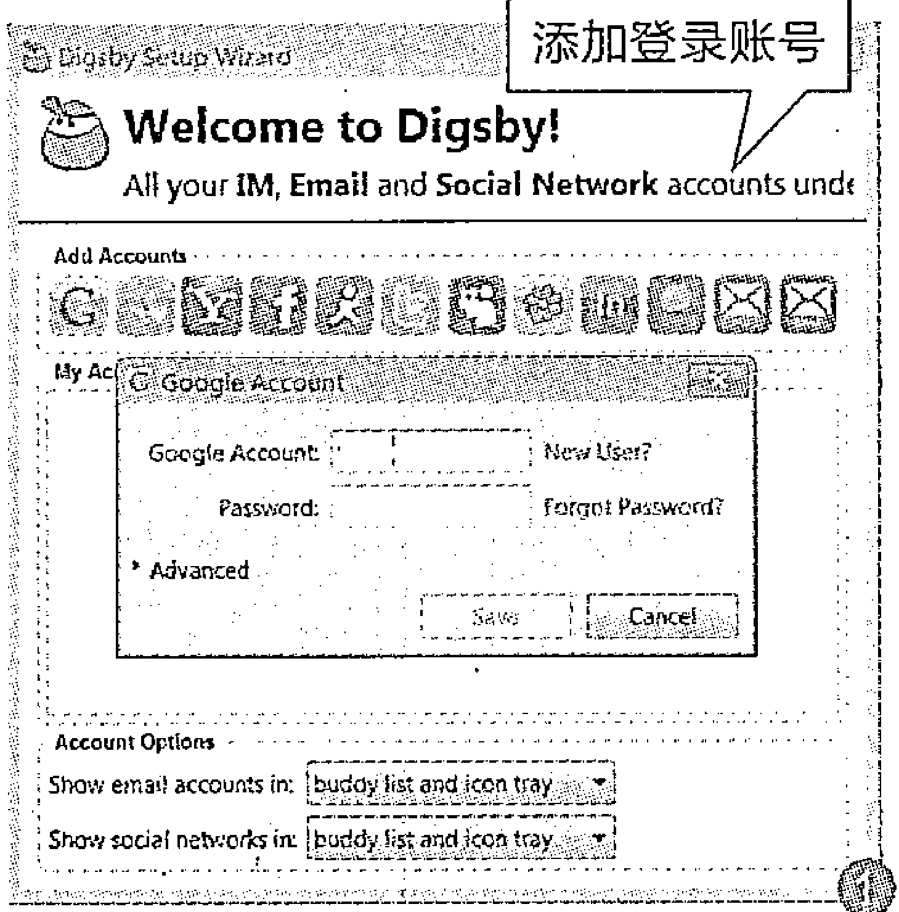

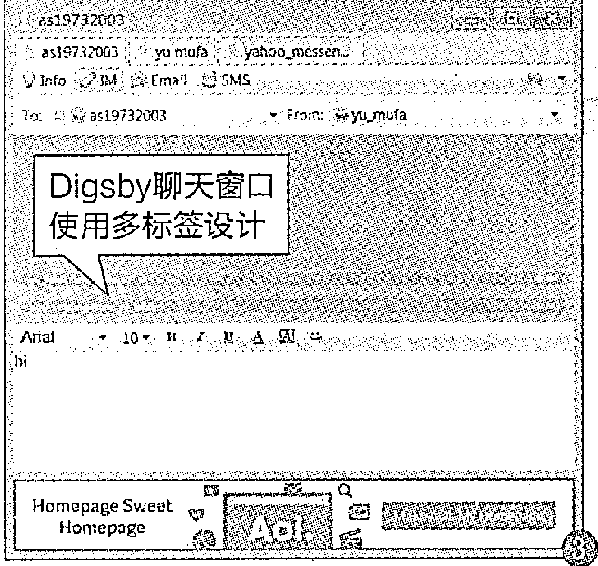

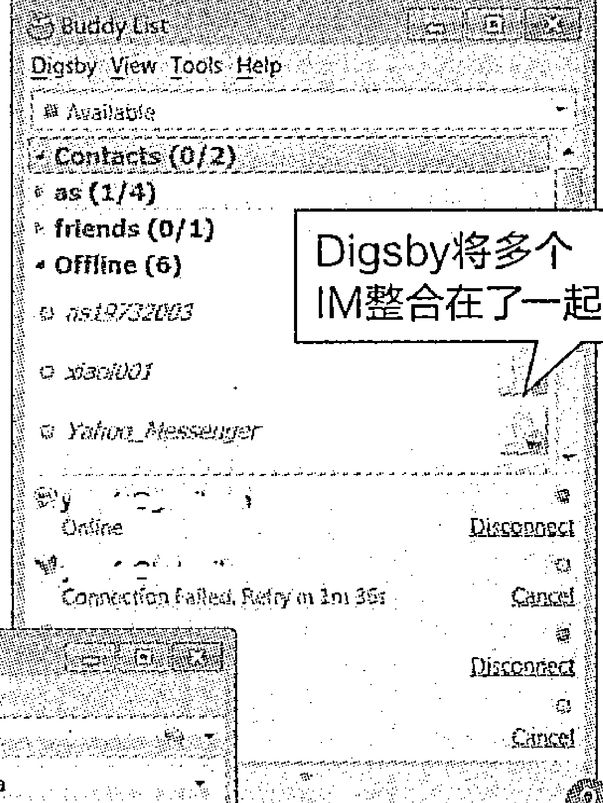

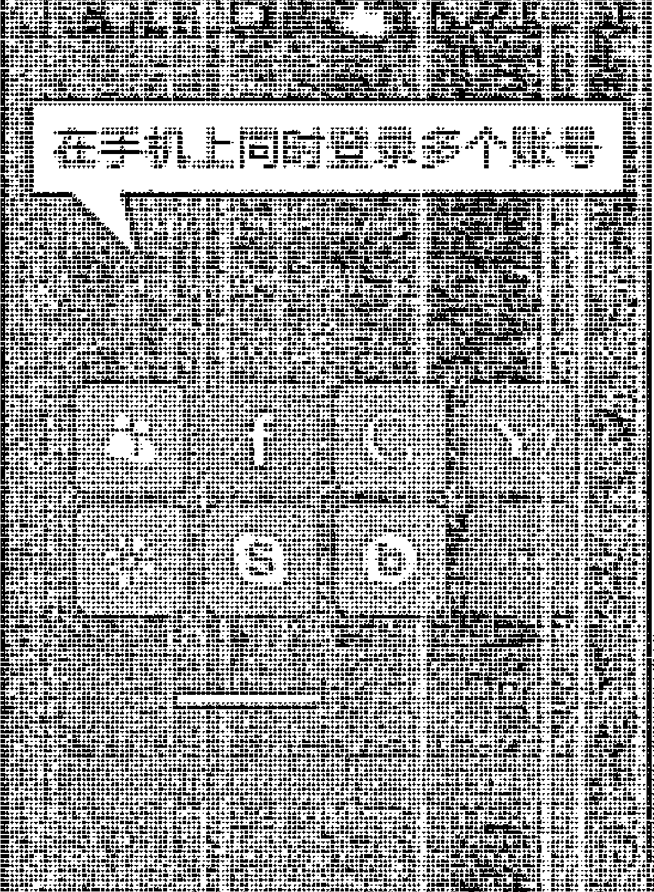

## 小提示

除了IM软件，日常使用的WEB邮箱也有类似现象，如要实现邮箱聚合效果，同样可使用代收服务来实现（如在QQ邮箱里代收163、Gmail邮件）。网盘也有类似现象，要在一款客户端同时访问多款网盘，可使用“AsLocal网盘本地管理专家”（下载地址：http://www.aslocal.com/)实现类似的聚合效果。

## 一个客户端浏览全网视频播放


各种网络应用的快速发展，也导致一些乱象产生，为了实现同一个目的，经常需要安装各种各样的应用。像平时观看优酷、爱奇艺、乐视等在线视频，要通过官网推出的本地客户端，而每个视频网站拥有的版权视频不同，厂商推出的客户端又只能播放和下载自己网站的视频，这就需要安装多个软件。所以我们需要一种应用，它可以只在一个视频客户端中，即可拥有播放和下载其他网站视频的功能。现在借助视频聚合客户端就可完成，不过大多只能在Android平台使用，所以要借助“Android模拟器+聚合应用”实现。以“靠谱助手+快手看片APP”操作为例。

## 播放全网视频

下载安装“靠谱助手”后，在电脑上启动它，然后切换到“引擎管理”，按提示下载0.9版引擎并启动（图1）。接着启动安卓模拟器，打开其自带的浏览器，按提示登录http://tinyurl.com/oehmnb7，下载“快手看片10寸PAD版”并安装，接着在模拟器上安装该应用，具体操作和Android平板是一样的（图2）。
由于模拟默认使用1024×600分辨率，为了获得更好的观看效果，点击模拟器窗口右上方的设

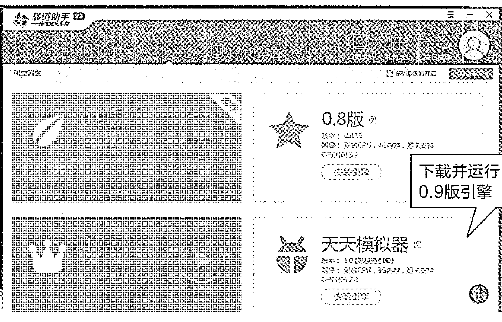

置按钮，在打开的设置窗口按提示将其分辨率更改为1920×1080（实际参数请根据自己的显示器进行设置），内存设置为“1024”MB，这样全屏观看时可以获得更好的播放效果（图3）。

完成设置以后按提示重启模拟器，接着在模拟器里启动快手看片，然后点击“片库→电影”，在这里我们就可以选择各大视频网站的电影进行观看了，随便选择一部影片，在打开的播放页面就可以自行选择优酷、乐视、腾讯（当然前提是这些网站收录了该影片）等进行播放，轻松实现在一个客户端观看全网视频（图4）。

快手看片和PC上常见的客户端不同，它是直接调用优酷、乐视、腾讯视频网址进行播放，不仅没有片头广告，而且可以随时切换视频来源（比如遇到优酷卡顿，可以随时切换到乐视继续播放），只要在播放窗口点击快手菜单，在弹出的窗口选择其他视频来源即可。

因为快手看片播放的是全网资源，因此对于那些各大视频网站版权独有的资源，都可以在一个客户端中进行播放，只要在快手中进行搜索即可观看。

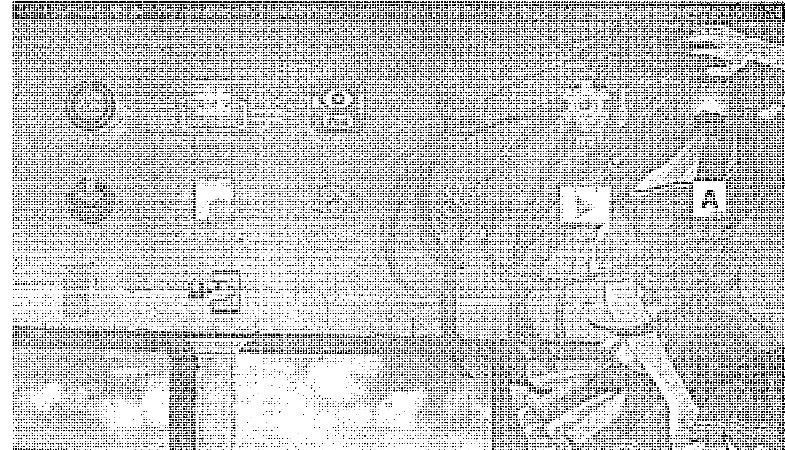

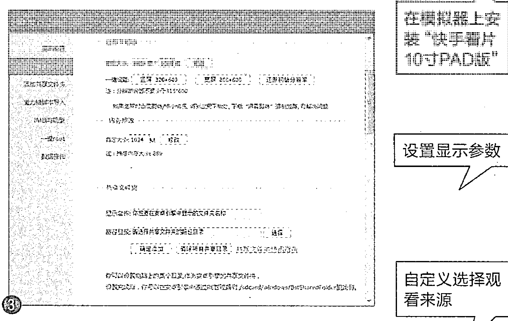

## 下载全网视频

默认每个网站的视频只能通过官网客户端下载，现在我们可以通过快手下载全网视频。同上先进入安卓模拟器的“高级设置”，在打开的窗口切换到“添加共享文件夹”，添加桌面的“快手影片”作为共享文件夹（图5）。

在模拟器上启动快手，然后点击下方的“设置→下载设置”，选中“下载路径”，然后将下载位置依次定位到“storage/sdcard/windows/Bstsharefolder”目录，这样下载的影片就会保存到上述共享文件夹中。

返回快手客户端，搜索到需要下载的影片时，点击播放界面点击“下载”，选择下载来源，这样快手会自动在后台进行下载，下拉任务栏选择“快手看片HD服务进行中”即可切换到下载页面，这样就实现了一个快手客户端下载全网视频的功能（图6）。

下载的影片默认保存在“/sdcard/windows/Bstsharefolder/kuaishou/vod4pad/”下，“/sdcard/windows/Bstsharefolder/”文件夹对应的就是“桌面/快手影片”。这样下载完成后我们就可以打开桌面目录，将影片直接复制到手机或者平板上观看了（图7）。

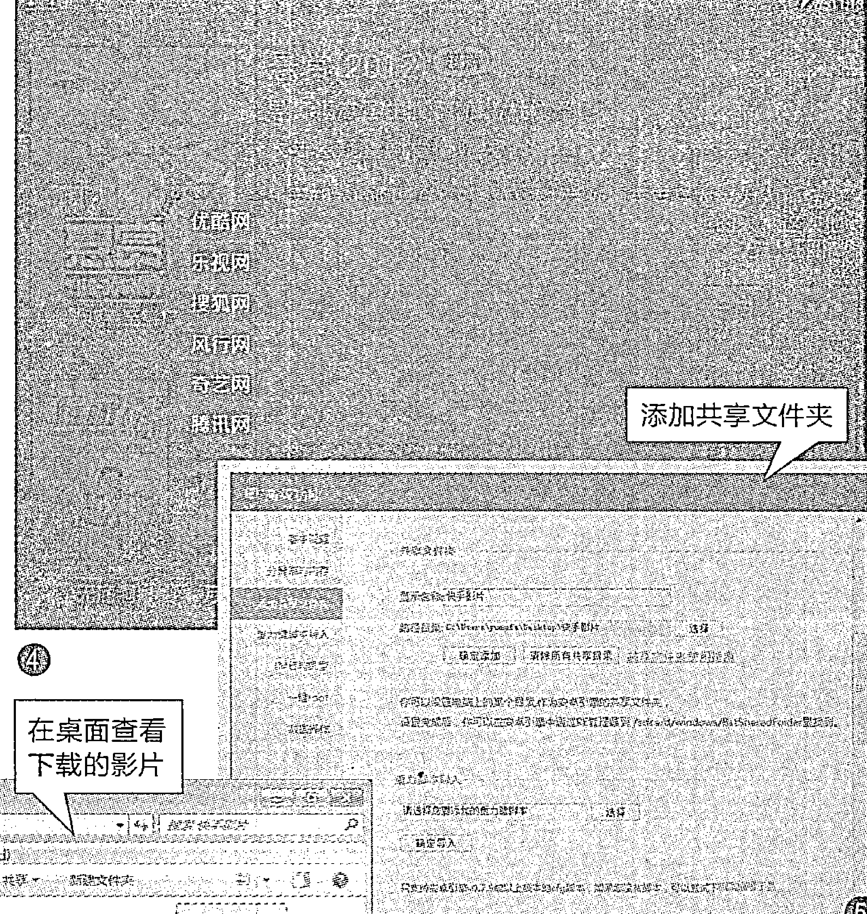

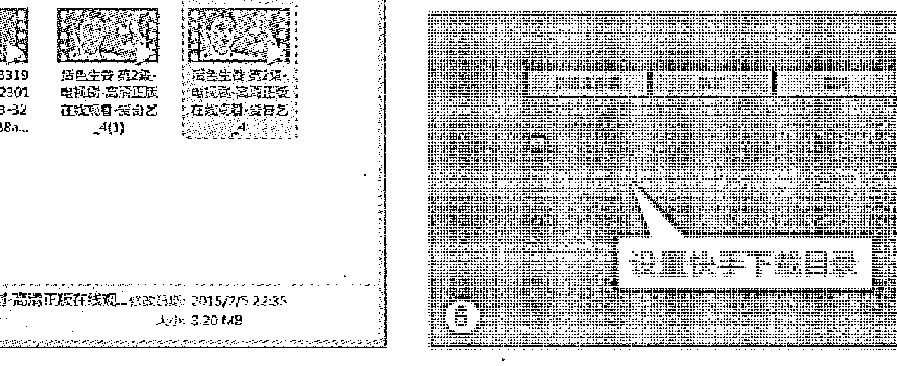

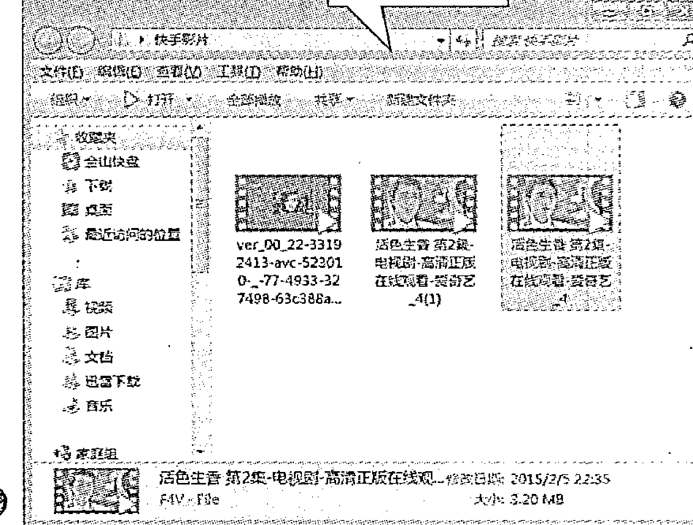

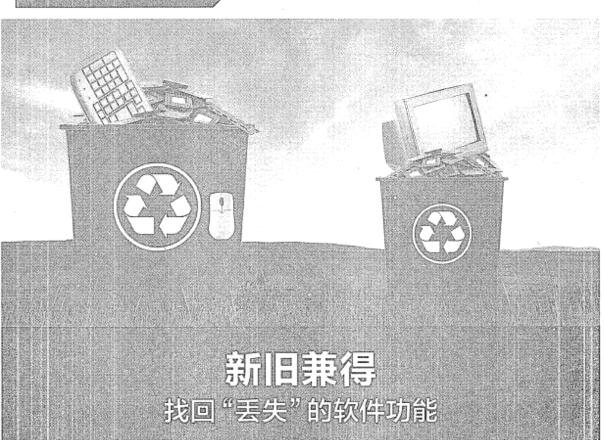

## 新旧交替

### 找回“被变身”的软件功能

现在软件的更新换代都很快，不过并非新版本功能就一定比旧版好用。有些软件旧版本的功能很不错，但是由于各种原因在新版本中却将其删除或者隐藏了。对于这些旧版的好用功能，可以通过各种方法将它们找回。

### 换肤换回来

### 恢复WPS2012菜单

随着Windows 7开始推出的无菜单设计，现在很多软件纷纷跟进。比如新版WPS就采用了类似Office 2013的设置，默认隐藏了我们常用的文件、编辑等菜单，只有点击WPS文字图标才会弹出常用菜单（图1）。

WPS这种设计给很多习惯于旧版本的用户带来诸多不便，新手不知道该怎么打开、保存文档。想要在新版本中恢复旧版的菜单格式，现在可以通过为WPS换肤的方法实现。

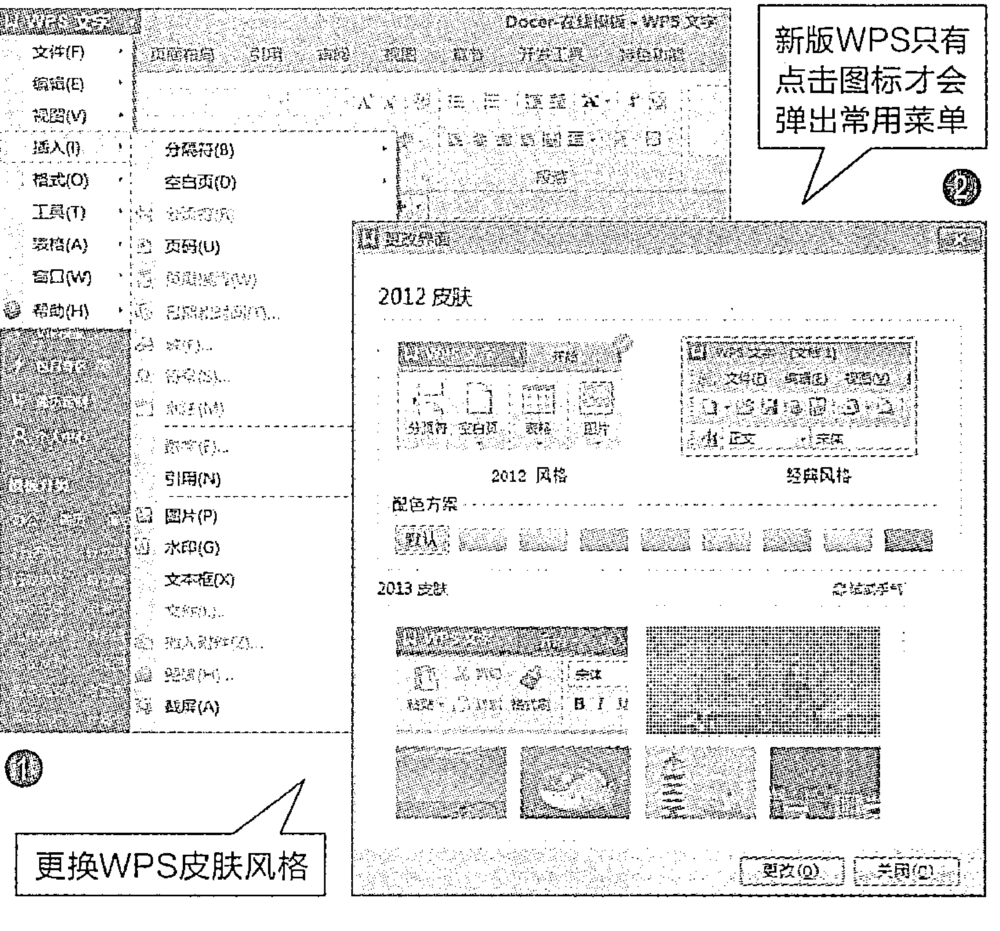

## 用好插件 找回火狐的旧功能

现在的软件，特别是浏览器类软件，更新换代速度都很快，而且无论是外观界面还是系统组件都会有较大的变化，这样会让很多朋友无所适从。以大家常用的火狐浏览器为例，它就已经升级到了最新的35版，而且在新版中对很多组件进行了改进。比如它的“我的足迹”组件，这里整合了历史记录、下载管理器、书签栏等功能，每次要查看新版火狐下载文件时，都要点击“下载图标→显示所有下载项”，然后在打开的“我的足迹”中才能找到之前已下载的文件，这对于频繁使用浏览器下载文件的用户来说，操作比较繁琐（图1）。

而在旧版火狐中，如果要查看下载内容，只要点击程序界面的“下载”图标就会全部显示，非常方便快捷。现在如果想要恢复旧版显示，可以先到http://tinyurl.com/m4q6m42下载“Downloads Window”插件，安装并启用后，以后如果在火狐浏览器中下载，将会自动弹出像旧版那样的下载文本框（新版火狐则直接在下载图标里显示）。如果需要查看已经下载的文件，点击下载图标即可全部显示之前下载的文件了（新版则要再次点击“显示所有下载项”），查看下载就像是用原来的旧版本一样（图2）。

启动WPS文字后，点击窗口右上角的“皮肤”图标，接着在弹出的窗口中选择“经典风格”皮肤，最后点击“更改”即可（图2）。再次重启WPS文字，可以看到它的菜单已经恢复成原来的经典模式了，文件、编辑菜单出现在原来旧版的位置，更方便老用户使用（图3）。

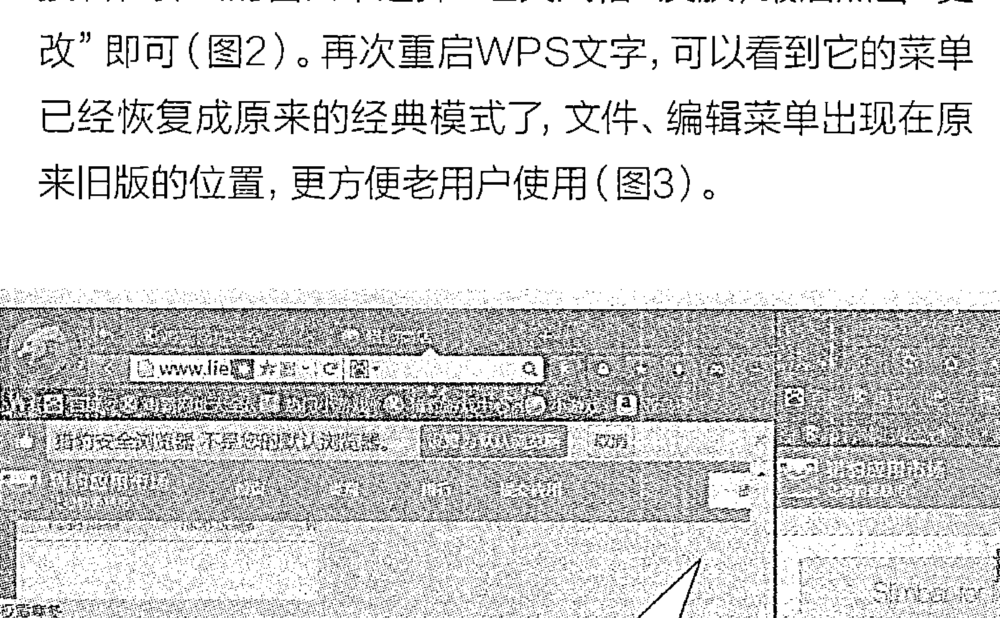

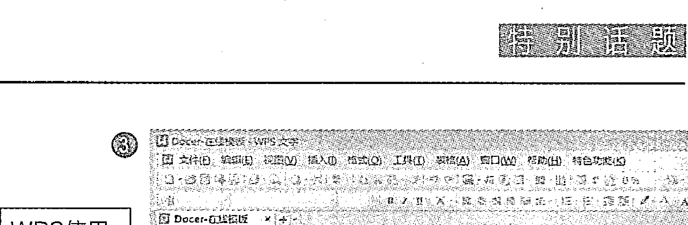

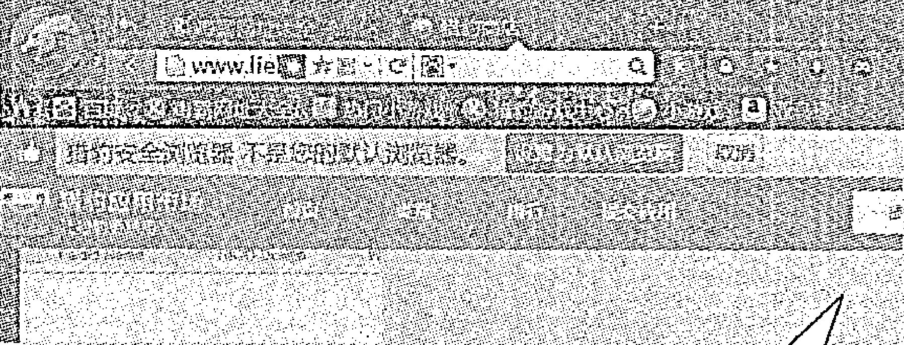

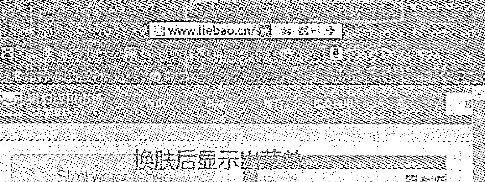

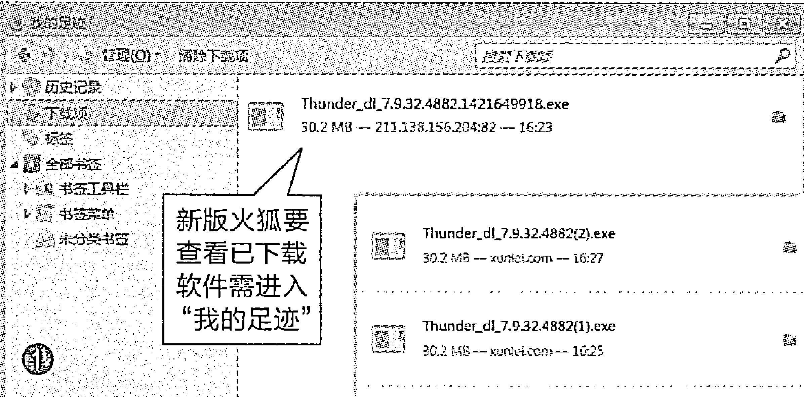

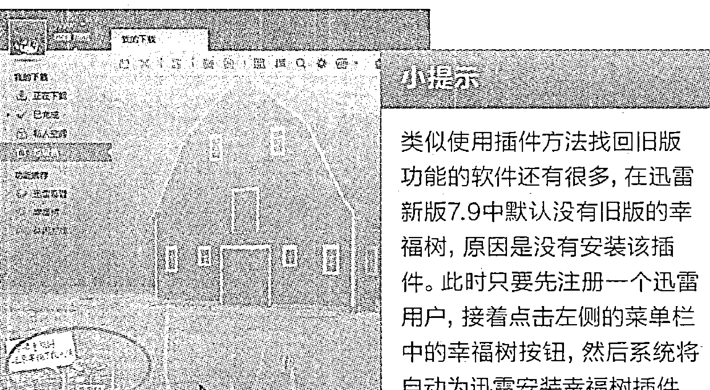

类似的方法在很多新版软件上都可以使用，如猎豹浏览器默认皮肤没有菜单显示，但换成“X-GRAYE 专业黑”皮肤后就能使用常见的菜单（图4）。其他软件的操作类似。

类似使用插件方法找回旧版功能的软件还有很多，在迅雷新版7.9中默认没有旧版的幸福树，原因是没有安装该插件。此时只要先注册一个迅雷用户，接着点击左侧的菜单栏中的幸福树按钮，然后系统将自动为迅雷安装幸福树插件，安装完成后新版迅雷就可以使用幸福树了（图3）。

## 找回迅雷的FLV探测下载

使用旧版迅雷的朋友都知道，旧版迅雷5有一个FLV媒体嗅探功能，这样在FLV媒体播放的页面可以非常方便地获得媒体文件下载地址，不过在新版迅雷中取消了这个功能。其实这一功能非常实用，我们可以通过其他方法让新版迅雷可以像旧版那样继续下载FLV视频文件。

因为视频文件都是通过在线页面播放的，因此要让迅雷下载FLV文件，只要使用一款可以嗅探FLV资源的浏览器（需要支持迅雷）即可。这里以傲游云浏览器为例。

假设现在要使用迅雷下载爱奇艺中的视频，首先在傲游云浏览器中打开爱奇艺需要播放的视频，接着点击傲游浏览器地址栏右侧的“资源嗅探”按钮，在打开的窗口中切换到“视频”就可以看到嗅探的视频资源了（图1）。

因为爱奇艺视频播放之前都有广告，广告文件一般较小，这里选择其中较大的文件，然后点击“下载”，在打开的窗口中可看到下载的文件名，按提示复制正确的文件名，接着点击左下角的“迅雷”按钮（图2）。

很多视频网站出于保护的目的将一部视频分割为多个小视频，这样下载到的将是多个视频片段，播放时只要将其放在一起按顺序播放即可。或者下载后自行使用Copy命令进行合并。

在弹出的下载窗口中，粘贴上面复制的正确文件名，就可以通过迅雷下载所需的媒体文件了。其他网站的视频下载方法类似。这样，借助傲游的视频探测组件，新版迅雷也就拥有了像迅雷5那样的探测功能（图3）。

因为新版迅雷对插件重新进行了编译，我们无法再通过安装插件的方式实现旧版功能。对于类似迅雷这种新版设计，因为旧版功能有很多类似功能的软件可以替代，我们只要找到同功能的软件，然后结合新版本，就可以“曲线”达到找回旧版功能的目的了。

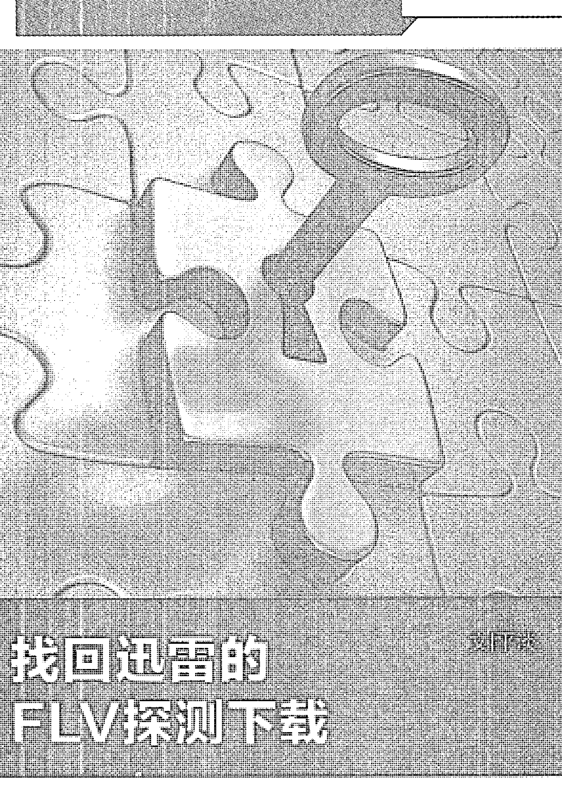

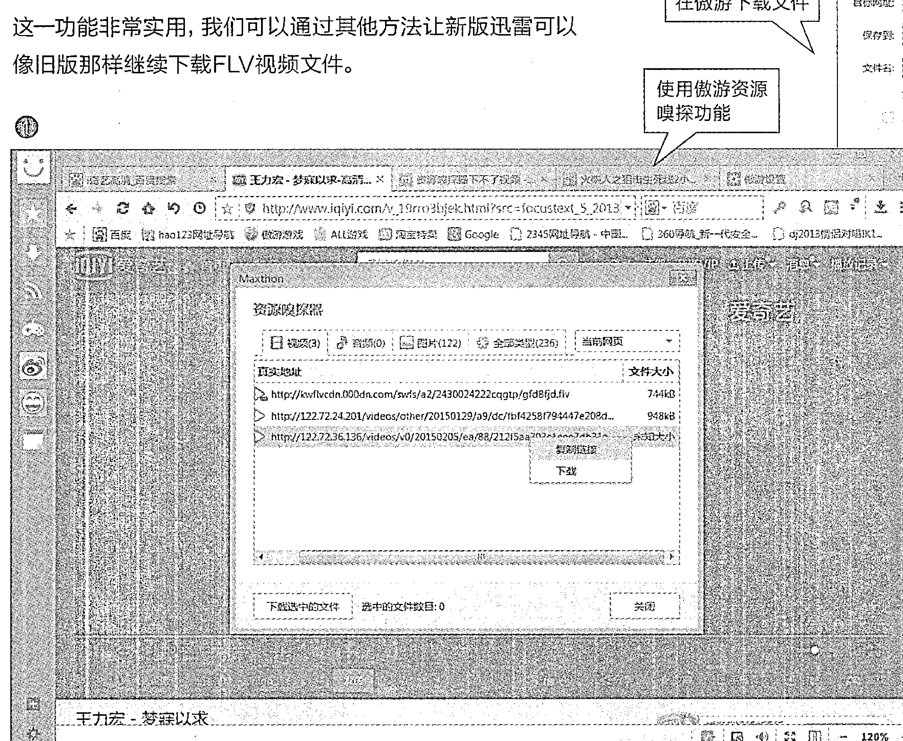

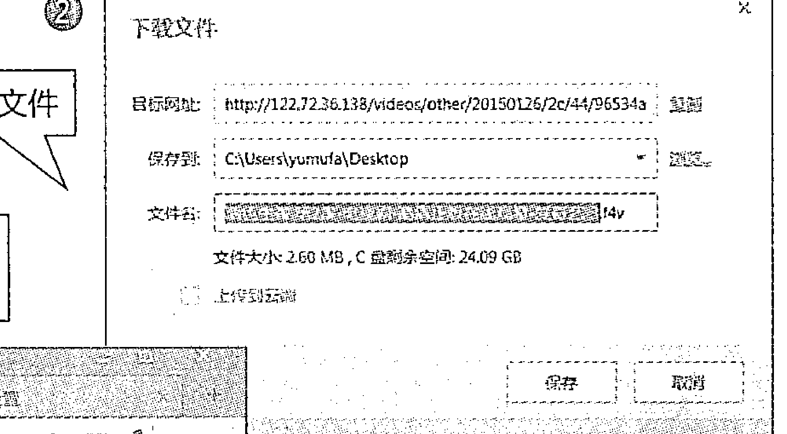

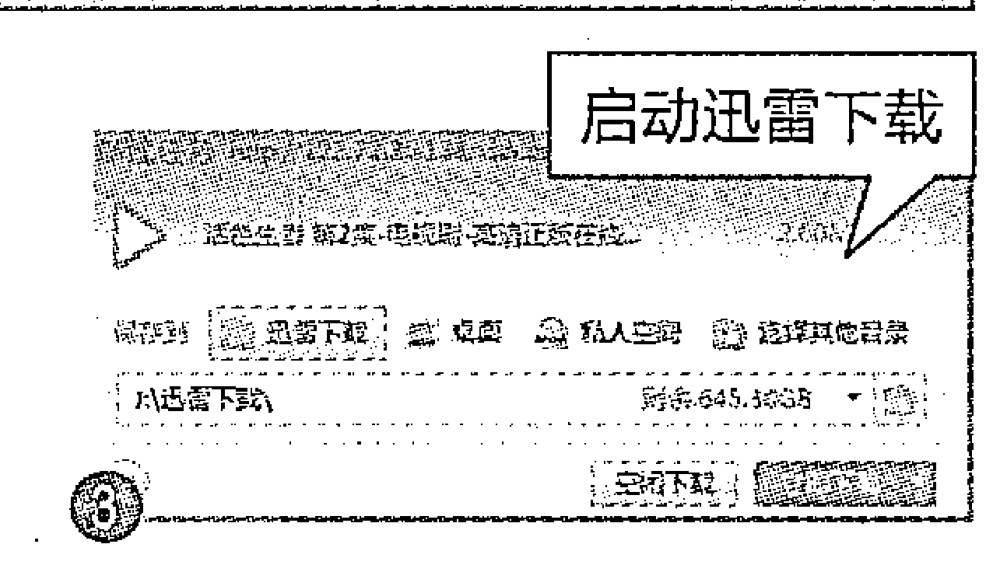


## 简单易懂玩转DIY

DIY产品当中，无论硬件或者相关软件都有一定的批次。为了照顾高端产品，厂家一般会对中低端产品进行一些限制，如不支持一些功能，或者不兼容一些配件。其实我们通过一些设置或一些转接设备，可以在最低开销的情况下实现那些功能。

### 处理器超频

自从二代酷睿处理器开始，Intel开始对旗下i5和i7处理器进行了一些技术限制，使普通版的处理器无法进行超频，而只对K系列处理器开放了倍频调节功能。芯片组方面也是同样的政策：可以自由调节倍频的主板只有P、Z和高端X系列，入门的H和B系列无法享受倍频解锁带来的性能提升。不过上有政策下有对策，不少主板厂商通过BIOS开放出H和B系列的超频功能，只需要安装厂家特别说明的BIOS版本，超频起来和Z系主板区别不算很大。不过毕竟购买K系处理器搭配H和B系列主板的用户还是少数，大多数用户可能都选用了普通版本的i5或者i7处理器。别担心，在这种情况下也可以安全超频。

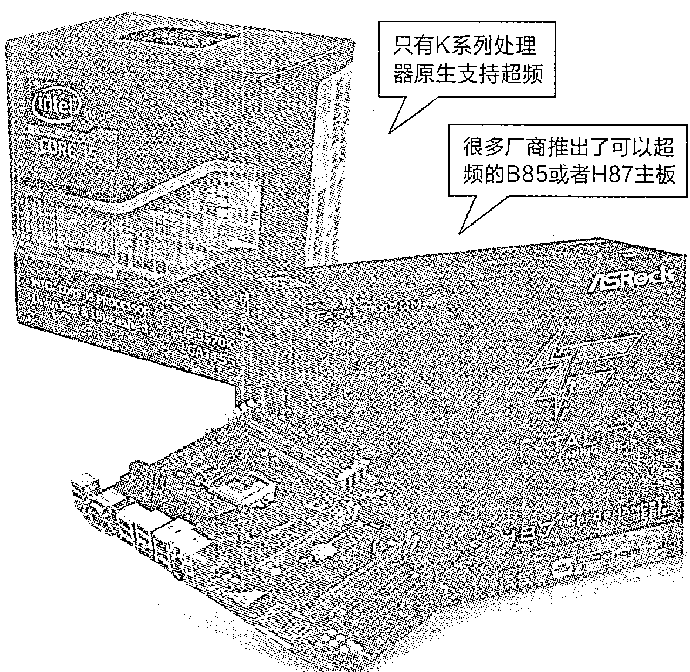

## 特别话题

### 深挖酷睿处理器的睿频功能

就算是不能支持超频的普通处理器，在主板支持的情况下也是可以实现超频的。熟悉Intel处理器的用户都会知道现在的处理器都有一个睿频功能，就是在某些环境下处理器本身会进行“自超频”功能，提升处理器性能并均衡功耗。不过睿频是Intel为了性能的动态分配设计的，但我们如果进一步挖掘，可提升平台的性能。首先进入主板BIOS，在超频相关选项调整处选择手动，找到倍频选项也选手动，将核心比率限制1、2、3、4分别设置为+4、+4、+3、+2。比如处理器是i5-3470，它的默认主频是3.2GHz，最大睿频为3.6GHz，这四个数字就是40、40、39、38。这样在运行最高双核程序时，处理器会以最大睿频并+0.4GHz的频率，也就是4GHz频率运行，提升巨大。

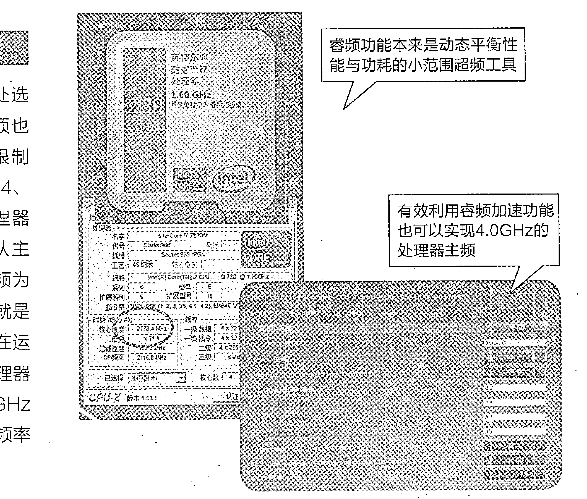

### 智能升级主板BIOS

现在芯片组接口延续性很强，老主板完全可兼容新处理器，但需要升级主板BIOS。现在主板更新BIOS已不用像以前在DOS环境下摸黑操作了，更新过程也从以往的DOS命令方式改为Windows按键方式，更新起来并没什么困难。今天要说的是一些特殊情况，比如现在四代酷睿处理器两代并存，既有最初推出的也有新版，两种处理器都是四代酷睿，但却分别有8系和9系两种芯片组支持。尽管很多主板厂商通过BIOS升级的方式让旗下8系主板也能支持新版四代酷睿处理器，不过需要老CPU的支持，如果手头只有新CPU，升级BIOS操作难以实现。在这种情况下，其实我们可利用USB Flashback功能，只需一个闪存盘和通电主板就能实现BIOS升级。

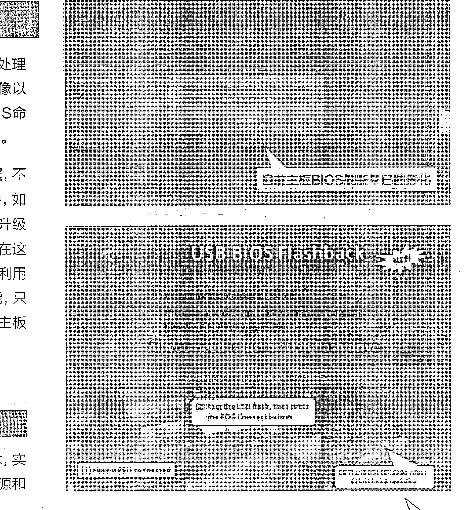

### 主板USB Flashback功能

华硕在一些X79和Z87主板上最开始支持这类技术，实现BIOS升级只需一个通电主板的意思是指只要拥有电源和主板就能刷BIOS，无需CPU和内存等设备。

### 小知识

厂家提供的BIOS文件一般使用zip方式压缩，解压缩后是一个.rom文件或者.cap文件。抛开传统的.rom文件不说，新的.cap文件是目前绝大多数厂商使用的最新BIOS文件格式，具体使用起来和.rom文件虽然没有什么差别，但在跨代刷新时还是有所不同的。首先从.rom刷新到.cap是没有问题的，但是反向刷新就可能存在一定困难，不同品牌的主板具体表现也不同，不建议反向刷新降级BIOS版本。另外要实现USB Flashback功能需要重命名BIOS文档，在这里一定要注意，虽然.cap文件可以重命名为.rom，但并不推荐用户这样做，因为有可能会出现错误。而.cap前面的文件改写规范，与.rom文件是一样的。

## 具体操作方式

以华硕Z87-PRO为例，首先我们要做的是判断其是否能够支持最新的四代酷睿处理器。去华硕官网对应的产品界面，查看一下CPU支持清单中的BIOS版本情况。打开www.asus.com.cn/Motherboards/Z87PRO/HelpDesk_CPU/，可以看到主板确实可以支持最新四代酷睿处理器中的最新版i7-4790K，但是需要BIOS版本至少在2003版才可以。

其次进入BIOS下载界面，在下拉菜单中选中我们的操作系统，如Windows 7 x64，就可以找到最新的BIOS版本2103，点击下载，最后可以下到一个Z87-PRO-ASUS-2103.zip文件。

解压缩以后文件为Z87-PRO-ASUS-2103.cap，根据华硕一键刷新BIOS的文件命名原则，将其重命名为Z87PRO.cap，存入一块USB 2.0版本闪存盘的根目录当中备用。需要注意的是，主板USB Flashback功能实际上仍然属于DOS操作，闪存盘的文件格式一定是FAT或者FAT32，类似exFAT和NTFS等文件结构的闪存盘无法使用。

之后连接主板与电源，只需插上主板的24pin电源线接口即可，其余类似CPU供电线是不用插的。之后也不用按主板启动键或者短路前面板跳线，只需让主板通电即可。将前面说的闪存盘插入主板的USB 2.0接口，这样就做好了刷新主板BIOS的准备。在这里请注意，由于是BIOS操作，USB 3.0接口无法正常使用，而且现在很多主板背部I/O区域的USB接口都是2.0/3.0通用的，为了稳妥起见，闪存盘最好使用2.0产品，这样才万无一失。

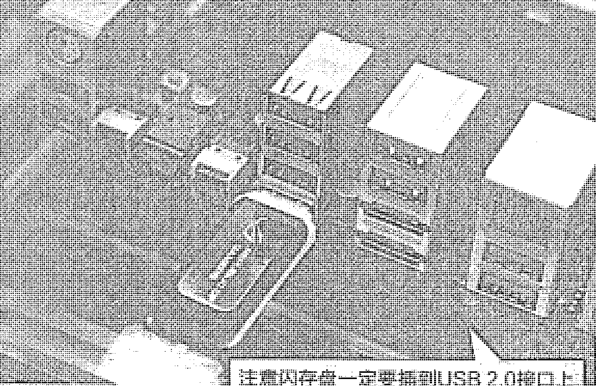

## BIOS刷新过程

一切准备妥当，按主板上或者背部I/O区域的BIOS FLASH按钮就可以进行BIOS刷新了。由于主板并未打开，所以这种操作近乎盲操作，好在一般主板通过LED灯会对刷新过程进行一定程度的提示。以华硕主板为例，首先需要按住BIOS FLASH按钮至少三秒，这样LED提升灯会亮起并开始闪烁。闪烁的速度会根据BIOS刷新进程逐渐变快，最终会由很快的闪烁变为熄灭，这样就表示BIOS刷新成功。

如果LED灯闪烁5秒钟后变成了稳定的灯光，显示USB BIOS Flashback未正常启动，这可能是闪存盘安装不正确、文件名称错误或BIOS文件格式不兼容。如果发生这种状况，请重启系统直到指示灯关闭，并检查文件名称和格式。一般这个刷新过程需要1~2分钟，以最后快速闪烁并熄灭为信号。如果闪烁速度始终不变，表示刷新BIOS有误，需要断电后重新刷新BIOS。BIOS更新过程中请勿拔出闪存盘，也不要关闭电源或按下CLR_CMOS按钮，以免中断更新。若发生更新中断的情况，请再次依照顺序重新完成BIOS的更新。

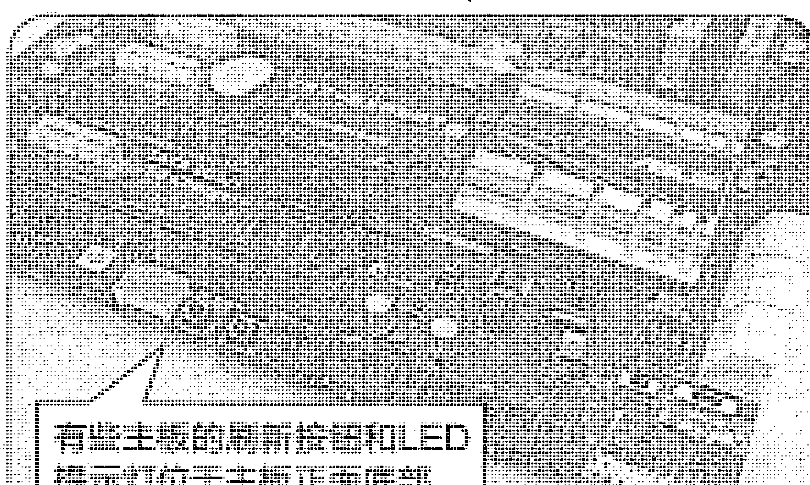

## 显卡安装的机箱空间

目前Mini-ITX主板已经小到17×17cm，显卡也推出了不少17cm长度的ITX专用显卡，似乎在Mini-ITX机箱当中安装高性能显卡已经不是什么问题了。但其实这只解决了显卡的长度问题，而另一个容易捉襟见肘的尺寸——高度并没有任何改善。在很多小机箱当中真正阻碍显卡安装的并非长度而是高度，此时我们应该怎么办呢？

参考一些品牌PC的设计方案，我们完全可以改变一下显卡的安装方向，这样显卡最麻烦的高度问题就可以迎刃而解。让显卡与机箱背板、主板平行，这样高度问题就可以大大降低，甚至可以安装到远离主板PCI-E接口的位置，彻底解决机箱空间问题和散热压力。

## PCI-E转接卡

银欣（SILVERSTONE）就在一些Mini-ITX机箱中使用过PCI-E转接卡，通过一块非常小的转接卡可以实现显卡安装方向的改变，并且这种转接卡几乎没有任何性能损失。被命名为RC02的这块卡长度比PCI-E x16接口长不了多少，并且还附带一个螺丝孔位负责固定。通过金手指端插到主板的PCI-E接口上，然后将显卡插到RC02的插槽处。不过要想让非银欣机箱支持这个螺丝孔位可能需要自己动手改造，需要用户有一定的动手能力。

除了品牌转接卡之外还有一些淘宝商家也有类似的产品，转接卡和转接线两种都有。相比银欣那种品牌转接卡，价格更便宜，也更加好买。如果用户比较重视性能，推荐还是购买转接卡，比起线材来PCB的干扰更少，性能损失较低。非品牌的转接卡好处是卡的长度可以和商家协商处理，但是可能其技术实力比不上品牌产品，需要几颗电容才能维持转接卡的稳定性。中间使用排线的转接卡其实只能称为转接线，其长度和显卡摆放方向都更加自由，但是性能会根据周边设备的干扰有一定的衰减。

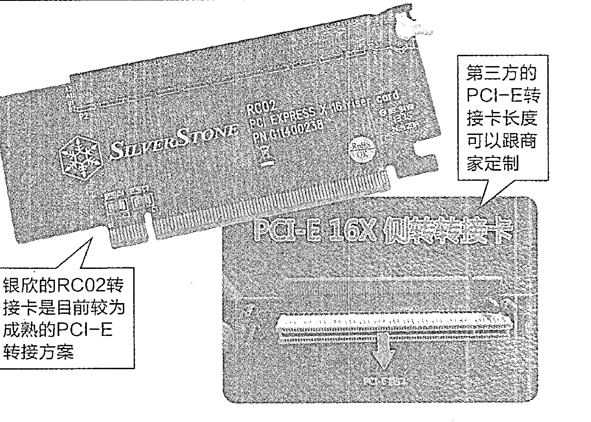

## 利用PCI-E x1接口

除了PCI-E x16的转接，还有一些厂商瞄准了我们并不常用的PCI-E x1接口。利用一块单槽长度不足10cm的转接卡，可以将不怎么使用的PCI-E x1接口转接为mini PCI-E接口。不过考虑到目前mini PCI-E更多只有无线网卡类设备，但网卡台式机可选用PCI接口或者USB接口的，这类转接卡相对来说就没有那么实用。

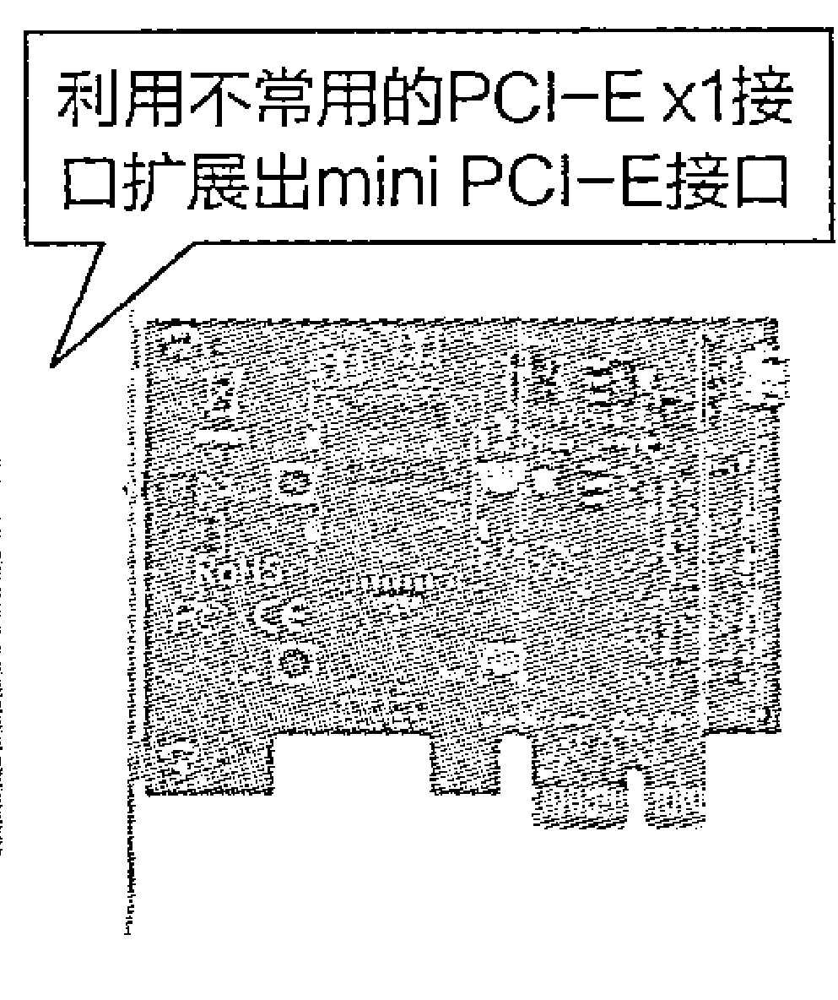

## PCI-E与M.2的转接

并非所有的主板都支持M.2接口，目前对这种新接口支持比较普遍的只有X99和Z97主板，而其他类似Z87和X79主板虽然性能完全没落伍，却难以享受M.2硬盘带来的更高速度。其实类似M.2这样的全新接口，完全可通过转接卡实现支持。浦科特（Plextor）最早在推出M6e时就通过PCI-E接口转接了M.2接口，目前这种产品已经开始单独销售了。

比如华硕Hyper M.2 x4 Expansion card就是单独销售的转接卡，上面具有1组M.2固态硬盘插槽，能转变为兼容于标准台式机PCI-E总线界面连接器的形式。其设计可支持2242、2260、2280、22110等4种尺寸规格的M.2固态硬盘。而在台式机端需要一条x4规格、支持x4通道配置的环境，就可以100%发挥M.2固态硬盘的性能。

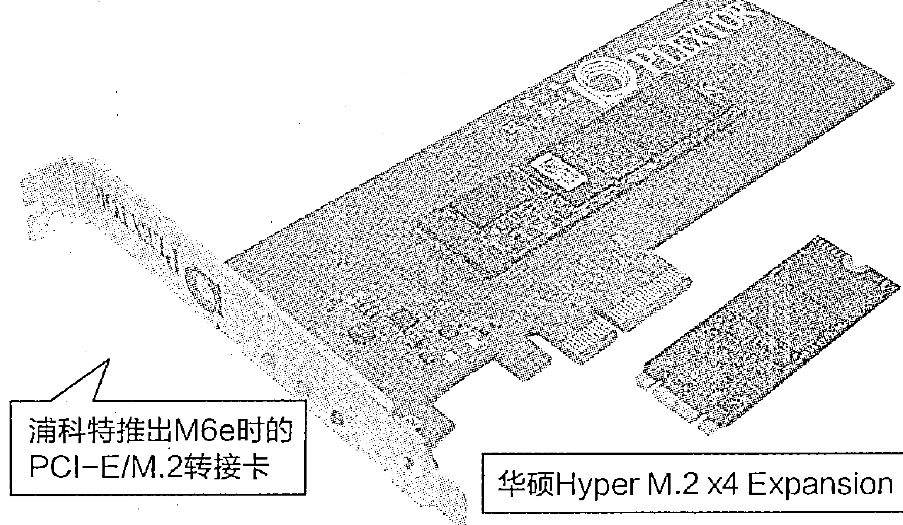

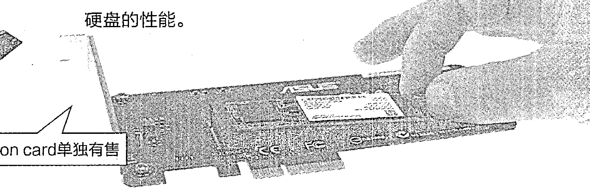

## 注意M.2硬盘的通道

不过需要注意的是，这类转接卡因为是从PCI-E接口转接，只能支持PCI-E通道的M.2固态硬盘，比如Plextor M6e等，兼容于PCI-E 3.0，但是一些走SATA通道的M.2固态硬盘就无法使用，比如Intel SSD 530、Crucial M550等M.2产品，虽然其接口完全相同，但都是采用SATA通道设计，虽然可以安装但无法使用。

理论带宽主要由M.2固态硬盘采用的控制器决定，若是PCI-E 2.0 x 2，那频宽即为1GB/s，高规格产品PCI-E 2.0 x4配置则为2GB/s，PCI-E 3.0类产品依此类推。这类产品的设计本意就是为不具备M.2插槽的台式机提供一个性能解决方案。方案无须额外程序的支持，没有驱动程序需求，更不必背负RAID控制器的稳定性风险，我们要做的只是检查固态硬盘控制器是否为PCI-E通道即可。

## 硬盘架位置随你所需

机箱内部除了散热器和显卡等设备经常出现捉襟见肘的情况外，最容易出问题的就是硬盘架了。首先机箱出厂时提供的硬盘架，其位置和数量不能完全满足用户的需求；其次目前一些显卡设计得过长，经常是用户购买回来后才发现显卡与硬盘架产生了兼容性问题；最后如果用户希望在普通机箱内部安装240mm甚至360mm水冷排，而最合理的安装位置之一的前面板却被硬盘架占据。

全塔机箱以外很少有机箱能在前面板支持240mm甚至360mm水冷排，如果改动硬盘架位置或结构，再把2.5 SSD安装在机箱支持的其他部位，可在安装水冷排的基础上满足硬盘的存储需求。

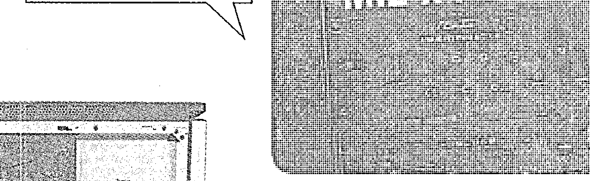

> 通过PCI-E x4接口可以完美发挥M.2硬盘实力

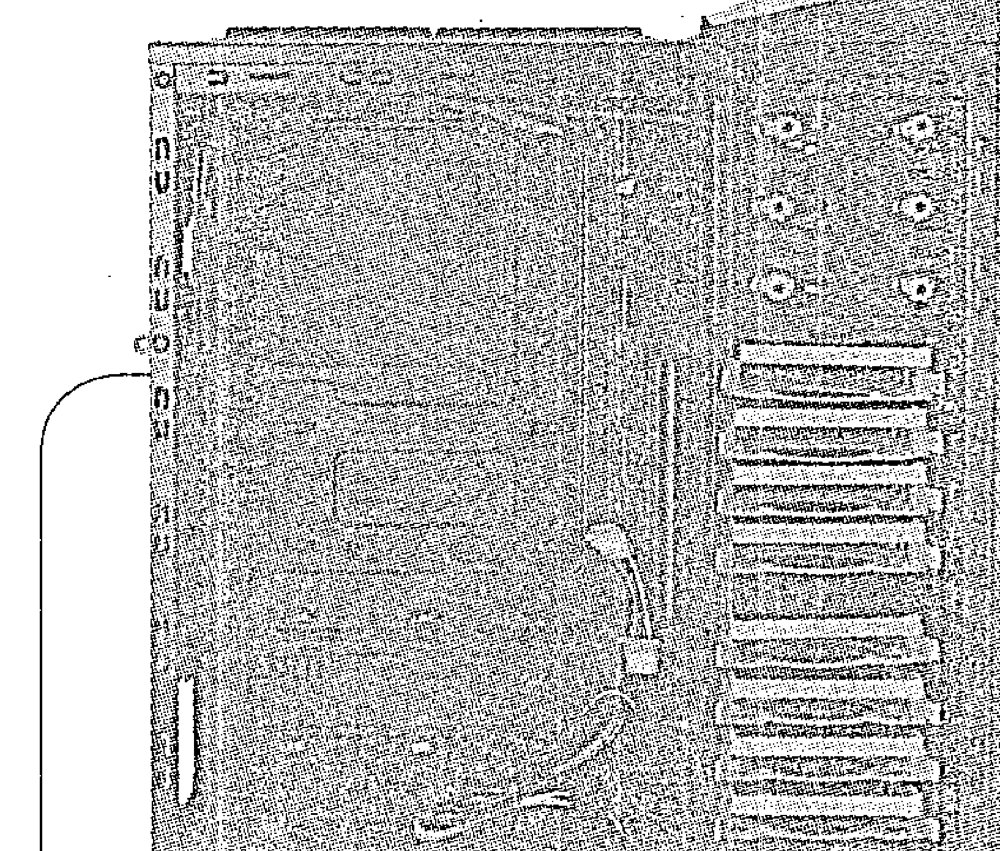

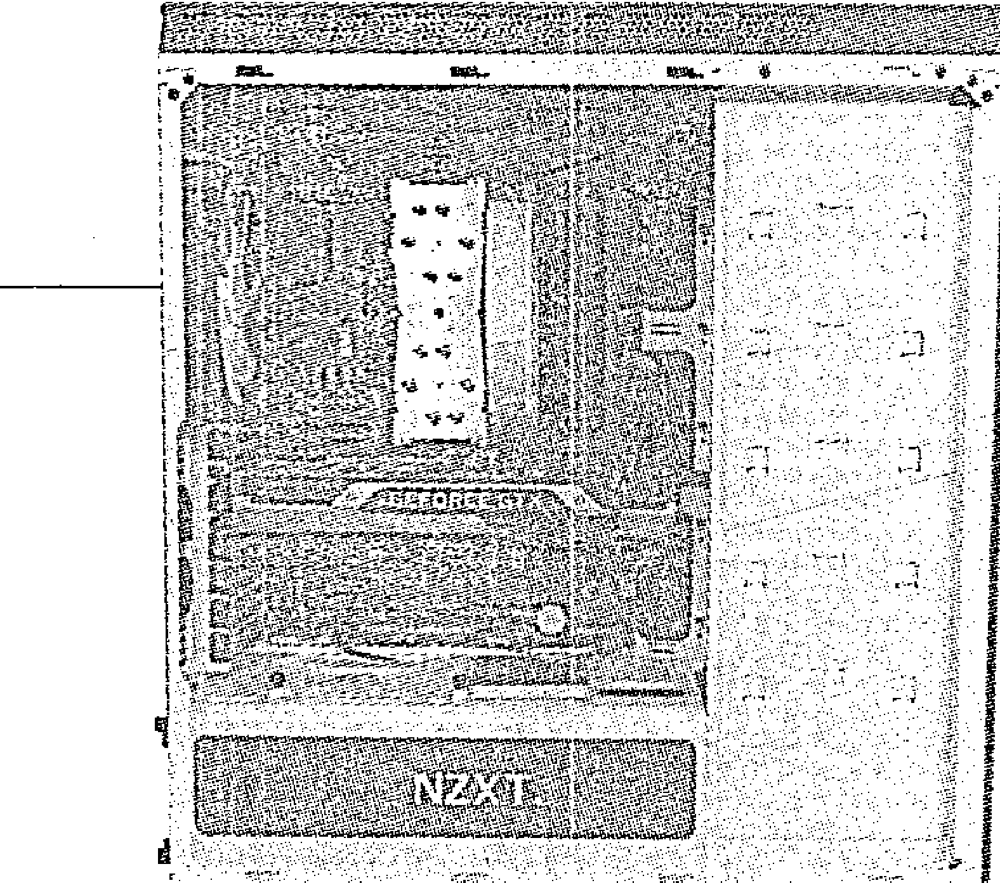

## 航嘉暗夜公爵III

航嘉暗夜公爵系列是几年内国产机箱中的精品，其硬盘架使用了半模组设计，我们可以根据需要拆掉中间的那一组。原本机箱能够容纳的显卡长度大概在300mm左右，如果拆掉中间的硬盘架长度范围可以超过400mm，基本上所有超长的3风扇显卡都可以使用。

## NZXT H440

NZXT（恩杰）H440机箱最大的特点是传统3.5硬盘笼的活动区域在背部并且可以拆卸，如果用户希望在顶部安装360mm水冷排，拆卸掉对应的硬盘笼即可实现。如果显卡超长也可以拆卸中间的硬盘笼。如果用户只使用2.5英寸SSD打造快速响应系统，完全可以安装在电源位上部专门给2.5英寸硬盘留的两个位置，整个传统硬盘架都可以解放出来。

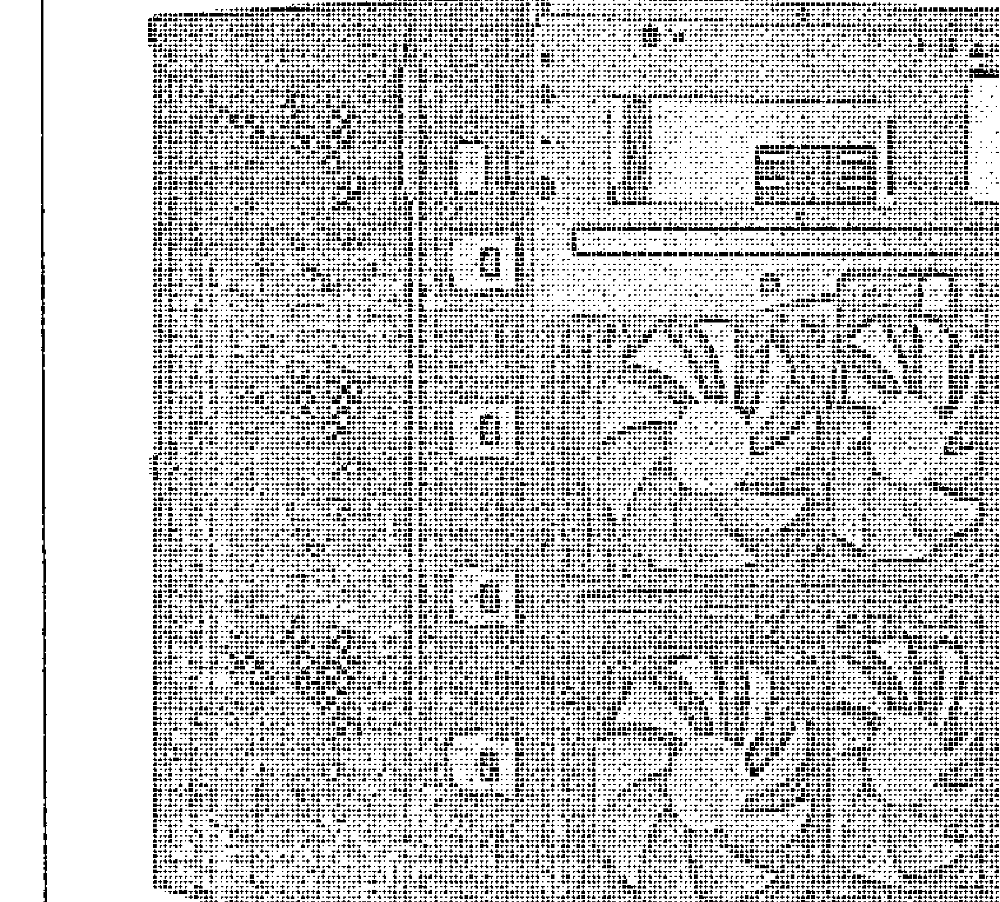

## 海盗船 Air 540

海盗船（Corsair）Air 540设计的思路与X800有些相似，只不过在硬盘架的处理上更加灵活，整体更为合理。在传统应该设计硬盘架的正面一侧没有任何硬盘架的踪影，这部分区域只负责机箱进风。3.5英寸HDD可以安装在机箱底部显卡下侧的位置；而2.5英寸SSD的位置更为巧妙，位于背板背面电源位的上侧。在Air 540上我们可以自由选择将水冷排安装在前面板或者顶部，这在中塔机箱当中是独一无二的。此外由于没有硬盘架的限制，显卡限长也达到320mm，兼容性十分出色。

## 撒哈拉 超级基地X800

比起其他机箱，撒哈拉（SAHARA）超级基地X800使用了完全不同的设计风格。它并没有把思路局限在拆卸上，而是将机箱厚度增加变为双层，然后硬盘架被设计在另一层区域上。如果用户希望使用360mm水冷排可以安置在主板上方区域，而且就算是硬盘架上装满了厚重的3.5英寸HDD，也丝毫不影响机箱进风。

## 消除移动领域的“误会”

智能手机、平板电脑和笔记本等是最常与我们打交道的移动设备，也正因为频繁的接触，让我们与它们之间产生误会的几率大幅增加。接下来，就让我们一起来消除移动领域的常见误会吧。

### 处理器配置为何也需“跑分”？

如今骁龙801处理器依然是中高端手机的“标配”，但我们却经常遇到尴尬的问题：明明自己的手机比朋友的手机贵，二者配置都是骁龙801+3GB内存，为何自己手机的跑分不如对方？

### 跑分高低与面子挂钩

如今很多用户买来手机后的第一件事就是跑个分并在朋友面前炫耀（图1）。然而，如果你的手机配置明明比对方高而且贵，但跑分成绩却是输得一塌糊涂，无疑是件很丢人的事情。那么，是什么原因导致的跑分成绩过低？人品问题？还是厂商偷工减料了？

| 型号 | 工艺 | 主频 | GPU频率 | 内存频率 | 其他 |
|------|------|------|---------|----------|------|
| MSM8974VV | v2 | S800 | 2.5GHz | 450MHz | 320MHz, 4.5, N, 800MHz |
| MSM8974AA | v2 | S800 | 2.3GHz | 450MHz | 320MHz, 4.5, N, 800MHz |
| MSM8974AB | v2 | S800 | 2.3GHz | 550MHz | 320MHz, 4.5, N, 933MHz |
| MSM8974AA | v3 | S801 | 2.3GHz | 450MHz | 320MHz, 5.0, Y, 800MHz |
| MSM8974AB | v3 | S801 | 2.3GHz | 578MHz | 465MHz, 5.0, Y, 933MHz |
| MSM8974AC | v3 | S801 | 2.5GHz | 578MHz | 465MHz, 5.0, Y, 933MHz |

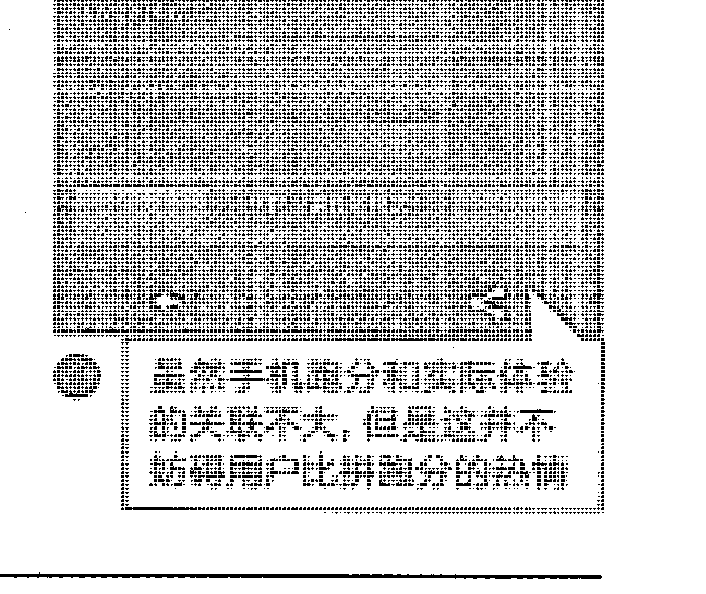

## 软硬件都可能拖后腿

在手机配置相同时，影响手机跑分成绩的主要有以下几个方面：

-   1. 处理器被降频：以IUNI U3为例，虽然这款产品搭载了高通骁龙801处理器，但其详细型号却是MSM8974AA，默认主频为2.3GHz；而像小米Note等配备骁龙801的机型所搭载的却是MSM8974AC（图2），默认主频高达2.5GHz（GPU频率也有所提高）。因此像U3这类骁龙801的机型跑分成绩自然不够理想。
-   2. 屏幕分辨率过高：很多高端手机为了增加卖点，武装了2K级别的屏幕（图3）。但除了骁龙805之外，绝大多数CPU都不具备完美驾驭2K屏幕的能力。换句话说，屏幕分辨率越高，对GPU的压力也就越大。因此，如果硬件配置相同，2K屏幕的机器跑分肯定不如1080P的机器。
-   3. 系统优化欠佳：很多品牌为了追求炫酷，内置了很多特效插件和无用软件。此外，我们所安装的以及正在运行中的APP也会占用系统资源。如果系统优化不到位，或是跑分前没有清空后台进程，同样会影响跑分成绩。
-   4. 当你刚玩过游戏，或在充电中往往会导致CPU因温度过高而自动降频（图4）。如果在此状态下跑分，成绩自然不理想。
-   5. 很多手机的系统提供省电模式，该模式下CPU最高主频会受限制。想获得最强性能，记得将电源模式调整到“高性能”。

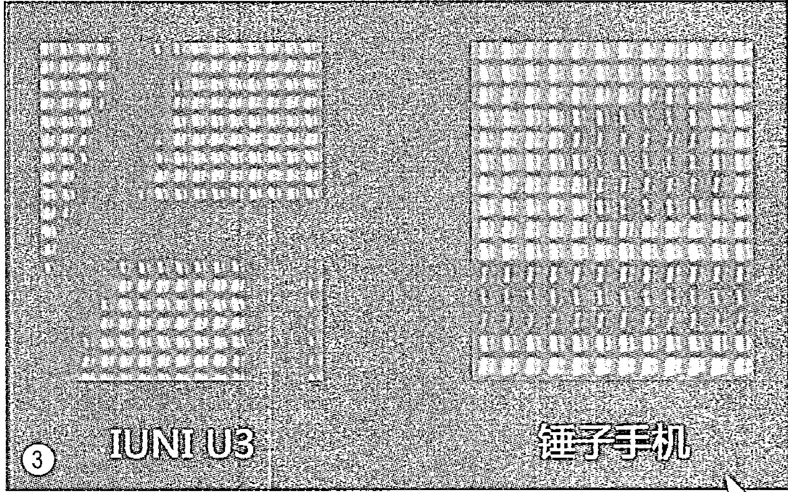

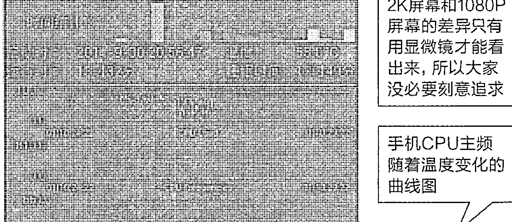

2K屏幕和1080P屏幕的差异只有用显微镜才能看出来，所以大家没必要刻意追求。

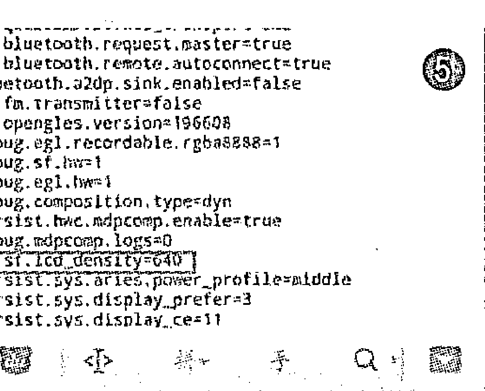

## 如何提高跑分和流畅度

看到这里，相信你已经找到自己手机跑分偏低的原因了。那么，对喜欢炫耀跑分的玩家而言，我们有什么方法可以尽可能拔高手机跑分性能呢？答案很简单，降低手机屏幕分辨率，减少CPU和GPU的负担，自然也就起到“作弊”的效果，提高跑分成绩了。
以魅族MX4 Pro为例，很多玩家都感觉这款机器的流畅度和跑分还不如低端的MX4，而罪魁祸首就是MX4 Pro“小牛拉大车”的2K屏幕。对Android手机而言修改分辨率的方法都是一致的。
在手机Root之后安装运行RE管理器，以文本编辑器的方式打开 system 文件夹中的build.prop配置文件，将 “ro.sf.lcd_density=640”一行中的“640”修改为“480”（图5），保存退出。

接下来在PC上下载安装“adb开发包”（下载地址：http://t.cn/RZA0KCb，所有Android手机通用），打开手机的USB调试模式后连接PC，运行开发包中的“运行.bat”进入CMD界面，输入“adb shell wm size 所需修改的分辨率”。由于MX4 Pro采用了虚拟按键，所以对应的分辨率为1152x1920，也就是输入“adb shell wm size 1152x1920”（图6）。
按回车，提示成功后重启手机，此时你会发现MX4 Pro的屏幕分辨率已经变成了1080P级别，此时无论是跑分还是系统流畅度都可媲美甚至超越MX4了（图7），而且续航时间也会明显提升。

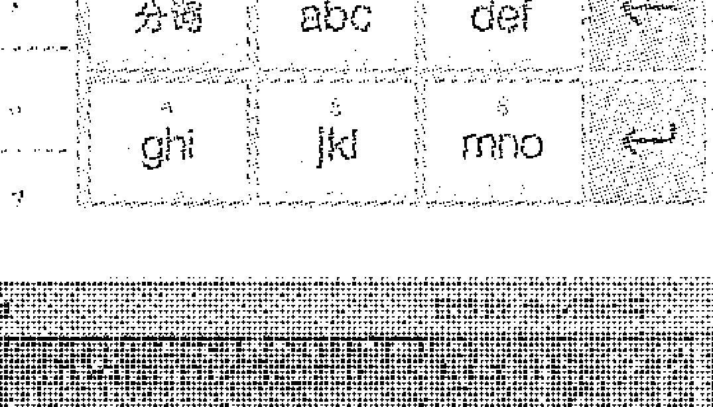

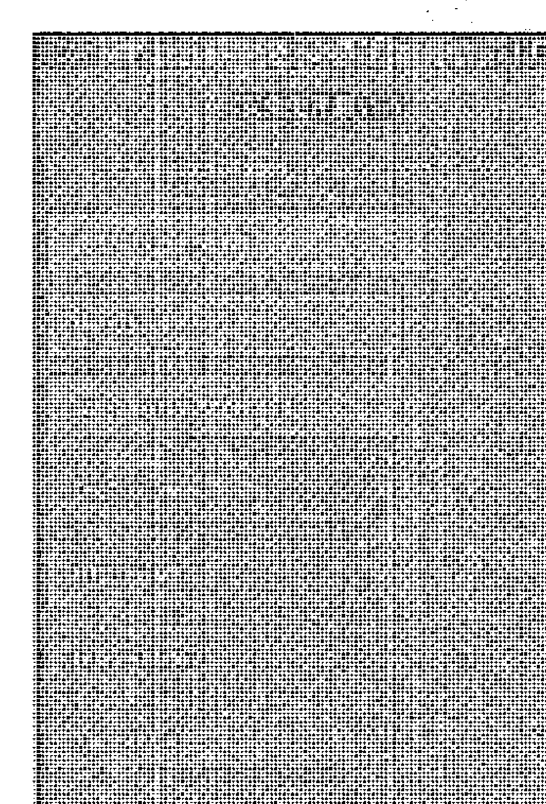

> 小提示
如果你的手机屏幕为1080P，可以将其修改到720P（build.prop中修改为density=360）提升性能。由于屏幕分辨率有变，可能造成系统图标或信号栏稍显错乱。就MX4 Pro来说，降低分辨率后只是电池图标后面有一条缝而已，不会影响其他任何显示和操作。当你想恢复屏幕分辨率时，只需重复上述步骤，在CMD中输入“adb shell wm size reset”，再用RE管理器将build.pro修改过的数值还原即可。

## 《电脑爱好者》2015年合订本（上） 特别话题

华为在P7和荣耀6等手机中提供了一个ROG节能技术，将默认的1080P屏幕降低到720P来节省电力（图8）。实际上ROG技术的原理和我们前面介绍的修改分辨率相同，只是厂商将过程直接融入到了一个小小的设置上而已。希望今后其他品牌也提供类似的功能设置，毕竟让普通用户修改关键的配置文件还是存在一定风险的。

一般来说，手机在待机时无法收到社交软件的推送消息，或自动中断当前下载内容的“断网”现象都是人为引起的。而此类断网的初衷其实也多是出于节能方面的考虑，只是缺少了对用户的提示而产生的误会。

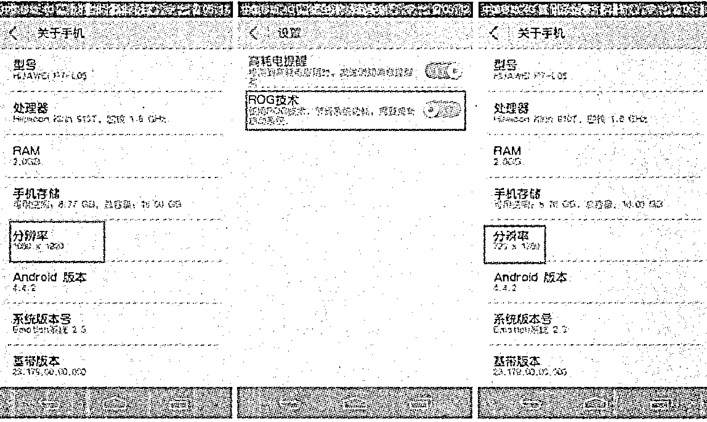

以OPPO手机为例，其自带的安全中心里提供了“纯净后台”功能，如果你将该功能开启却又没将QQ、微信、微博一类的软件添加到列表名单中，它们就将在你切换到其他程序（如返回桌面）或进入待机后被系统自动冻结，从而失去了联网权限（图1）。此功能其实是为了防止恶意软件后台偷跑流量和耗电而生，但也极易引起手机莫名断网的现象。因此，如果你的是OPPO手机，或也安装了类似应用冻结的APP，记得将需要时刻保持联网的软件保护起来哦（比如要下载资料，就需将浏览器和下载器添加至纯净后台列表）。

## 手机莫名自动断网为哪般

很多手机用户喜欢无时无刻保持QQ、微信、微博在线，但手机却总是莫名“断网”，只有在点亮屏幕时才能收到消息。一旦熄屏进入待机状态，似乎就只能收到短信和来电了，任何APP的推送消息全部消失。难道得找售后换部新机器？

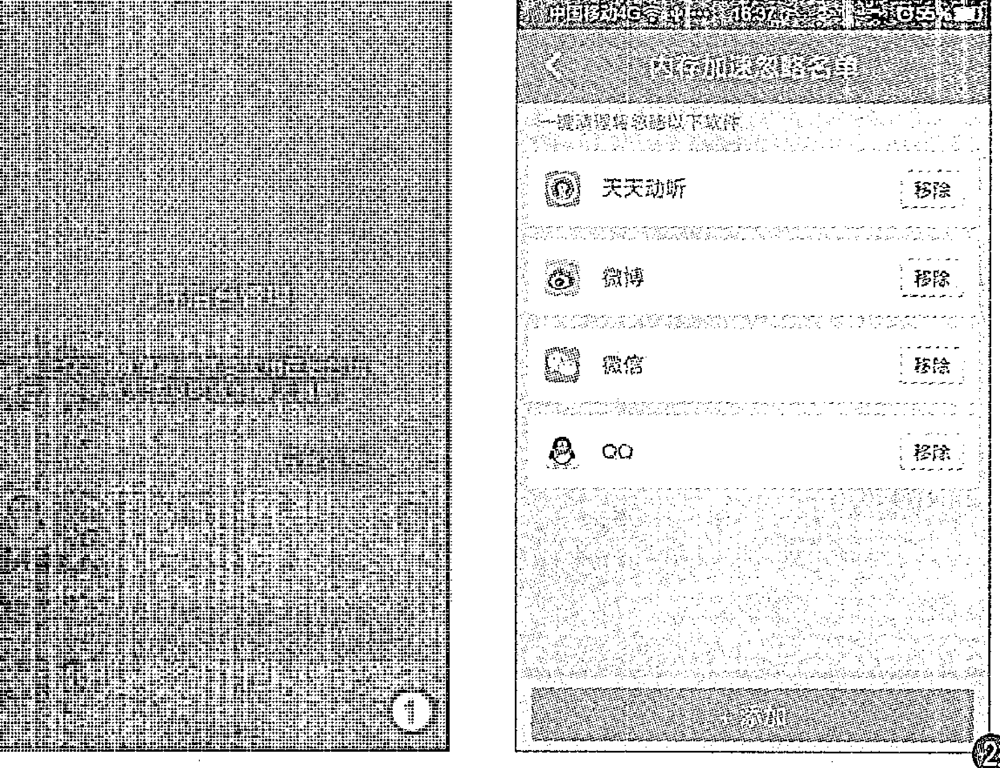

别误会，上述问题其实是很多双卡双待手机的“通病”（图1），而引发的原因源于Note 4公开版仅支持双卡双待“单通”。双卡双待手机的“单通”与“双通”问题由来已久，借此就将二者的差别重新梳理，避免可能产生的各种误会。

从原理上说，双卡双待“单通”手机中仅内置1颗基带芯片，它要不断在两个网络间切换并自动搜索网络，只是由于切换频率快且时间短暂，从而让用户产生了双卡同时待机的错觉。问题来了，由于1颗基带芯片只能同时负责一则通话，故当A卡来电时，B卡信号会被暂时屏蔽，直至通话结束。

此外，很多安全类软件的手机加速，或节电管理中会提供“锁屏时自动清理后台程序”一类的功能。如果你开启了相关功能，那就要记得将QQ、微信和微博等APP加入到不自动清理的白名单列表中（图2）。否则当手机熄屏进入待机时，后台的QQ就被自动干掉，自然也收不到好友的消息了。

除了和节能设置有关的断网以外，很多双卡手机用户还会遭遇另一种断网现象，我们将在下面的内容中加以解答。

## 双卡双待的“单通”与“双通”

而“双通”手机中则配备了2颗基带芯片来负责2个卡的网络，由于2颗芯片相互独立，所以A卡在通话时B卡电话也是可以正常接通的（图2）。当然由于额外增加了1颗芯片，所以“双通”手机的成本和功耗会略高于“单通”手机（图3）。

简单来说，若是双卡双待单通手机：

读者yungtay83遇到了一个问题：新买的Note 4公开版，卡1安装了移动4G数据卡（用于上网），卡2安装了普通SIM卡（用于通话）。问题来了，当卡2来电时卡1就断网，严重影响了使用体验。难道这是Note 4公开版的硬件缺陷？

手机中插入A、B两张SIM卡后，A卡在通话期间时，如果有人给B卡打电话会提示无法接通或不在服务区，当A卡通话结束时系统不显示B卡的未接来电提示。此外，由于双卡双待手机需要手动指定某张SIM卡用于联网功能（假设为A），那么，当B卡通话时A卡的联网功能也会被屏蔽，而这也是读者yungtay83遇到问题的原因所在。

## 若是双卡双待双通手机：

A卡通话期间，如果有人给B卡打电话时会听到“嘟嘟嘟”的提示音，此时你可以做两种选择：继续保持A卡通话，通话结束后系统会显示B卡的未接来电；选择保留A卡通话，接听B卡电话直至通话结束，在A卡来电一方没有挂机的情况下还能继续接听A卡电话。

可能有读者会觉得笔者太过较真，通话时断网似乎不是什么大问题啊？

但笔者认为通话和上网很有必要共存。比如当朋友来电向你咨询问题时，如果手机支持“双通”，那你完全可以使用耳机或者扬声器保持通话，再用多窗口去打开网页进行查询等工作。而“单通”就导致通话中的手机变成了智能通话的“功能机”，彻底浪费了智能的特性。此外，当你正在用社交软件与好友聊天或收发文件时，一则电话就会让你和好友“失联”，相信也不是你所希望看到的。因此，如果你不想错过电话，不希望一则电话会导致断网，那么一款支持“双通”的手机还是必不可少的。

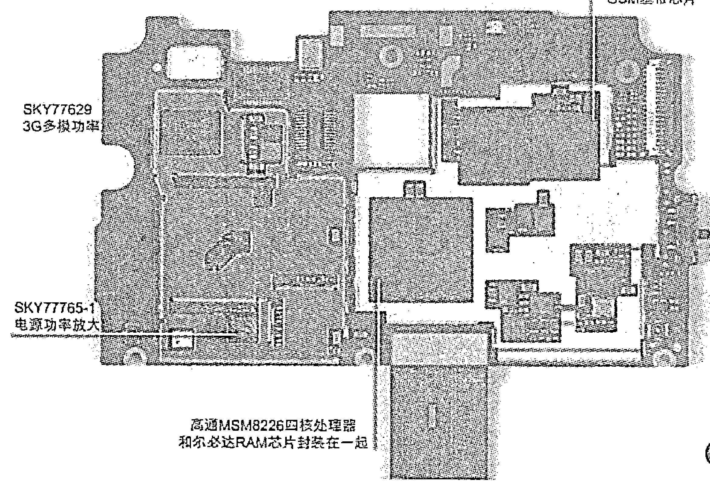

## 手机的网络之困

为什么花了一样的钱，我的iPhone 6只支持移动4G，朋友的iPhone 6却还能支持联通和电信的4G网络？如果你遇到了此类问题，不要怪别人，还是先检讨一下自己吧。

目前移动版iPhone 6的子型号为“A1589”（Plus对应A1593），由于为移动定制版，所以它们仅支持TD-LTE、TD-SCDMA、GSM三种网络制式。而联通和电信引入的iPhone 6均为“全网通”版，可同时支持三大运行商的4G/3G/2G网络（图1）。

相对三星Note 4系列而言，iPhone 6的子型号还算少的。Note 4在国内既有支持移动联通双4G网络的N9100（双卡），还针对三大运行商提供了N9106W（联通双卡）、N9108V（移动单卡）、N9108W（移动双卡）和N9109W（电信双卡）四个子型号（图2）。对非电信用户而言，在价格相近时无疑全网通版N9100才是最值得入手的选择。

因此，花同样的钱，选择全网通版才是王道。

## 同一型号产品有众多子型号

为了满足不同需求的用户，无论是手机还是笔记本，但凡经典型号都会同时衍生无数的“子型号”。手机方面体现在对网络制式的支持上，而笔记本领域则会决定产品的实际配置与性能表现。如果你对子型号缺乏了解，“冤枉钱”自是难免。

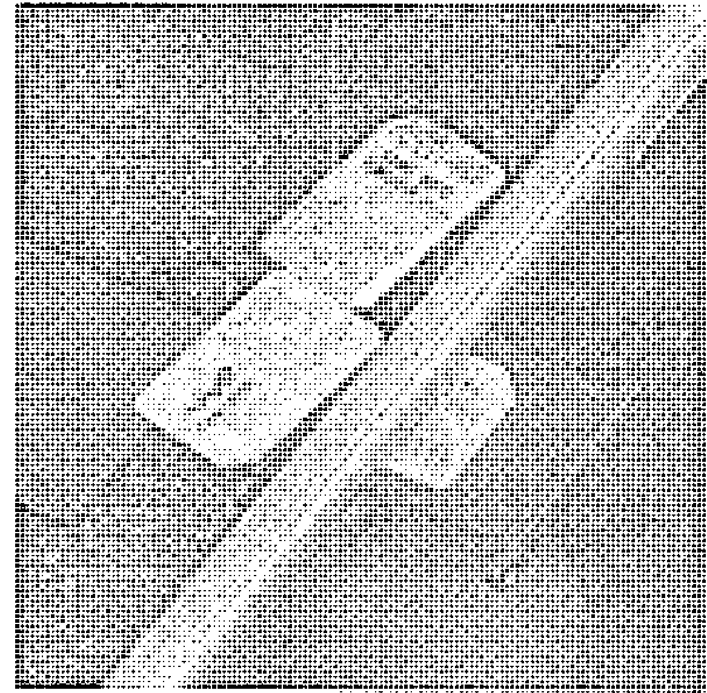

## 手机配置还有差别

全网通虽好，但我们也要留意子型号间是否还存在其他硬件配置上的差异。以华为荣耀4X为例，其全网通（1299元）和电信版（999元）采用了高通骁龙410处理器，而移动和联通版（高配版均为999元）则搭载了麒麟620处理器。就性能而言，麒麟620足以秒杀骁龙410（图3、图4）。因此，对非电信用户而言，全网通版荣耀4X既无性价比优势，性能上也更为薄弱，几乎就没有选购意义了。

总之，当你相中某款手机时，首先要了解不同子型号间网络和硬件上的差异，并根据自己的实际需求选择性价比最高的产品。

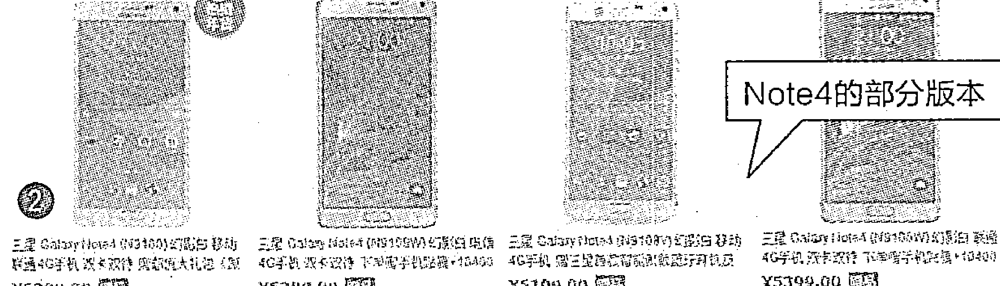

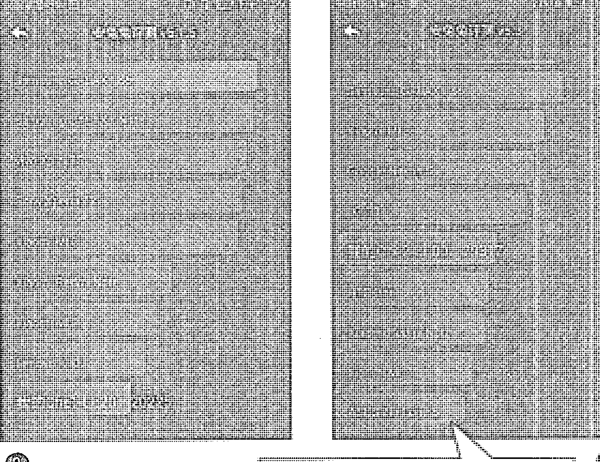

## 笔记本的文字游戏

在笔记本领域，同一款产品的子型号间可能会存在极大的性能差异，值得仔细揣摩。以价位相近的ThinkPad E540系列为例，其中既有配备GT820M独显的型号，还有武装GT840M独显的型号。如果你喜欢玩游戏却错买了GT820M独显版，玩LOL级别游戏时的帧数会直接从60fps下降到30fps。

此外，像宏碁VN7 V Nitro系列还包含低电压处理器（如i5-4210U）配GTX850M（DDR3显存）和标准电压处理器（如i5-4210H）配GTX860M（GDDR5显存）的子型号，二者外观、尺寸完全一致，整体性能相差20%~30%，但价格却仅差200~300元。相信看到这组数据后，大家也都知道哪款才更具性价比了吧？

因此，在我们选购笔记本的时候，要将具体的型号锁定到后缀上，比如ThinkPad E540-“20C6A0FLCD”和E540-“20C6A0FMCD”、VN7-“591G-56BD”和VN7-“571G-50Z5”带引号的部分。特别是去实体卖场购物的用户，更是要注意奸商利用低配产品高价兜售的圈套。

## M.2接口仅是趋势而已

英特尔从H97/Z97芯片组开始原生支持M.2接口，而从2014年起更多的笔记本新品也开始武装起这种更为迷你的SSD固态硬盘插槽。很遗憾，绝大多数老电脑并不具备该接口。问题来了，当我们想升级SSD时，难道就只能放弃最新M.2接口的SSD了吗？

## 一步到位选M.2

毫无疑问，M.2是未来迷你SSD固态硬盘的发展趋势，特别是在笔记本领域，M.2取代mSATA已经是迟早的事情（图1）。因此，如果你的笔记本仅有mSATA或标准2.5英寸SATA接口，而你在1~2年内还有更换笔记本的需求，就会出现问题：按笔记本已有mSATA接口而购买mSATA SSD硬盘，未来买新笔记本时该SSD可能也会直接被淘汰，因为新款笔记本大都已经改为了M.2。

因此，当我们有升级迷你SSD硬盘的需求时，一步到位选择未来标准的M.2 SSD无疑可最大限度延长它的通用性与兼容性。那么，如何让老设备兼容最新的M.2 SSD？

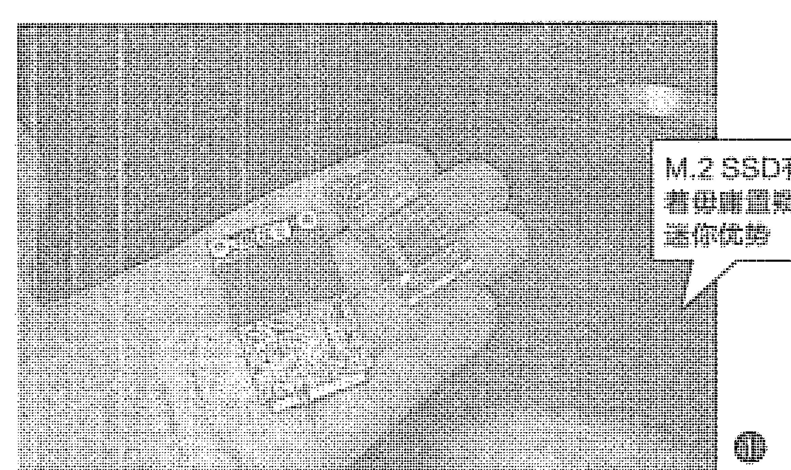

## 转接卡让M.2变通用

好消息是，通过不同规格的转接卡，可以让一块M.2接口的SSD安装在mSATA、SATA(图2)甚至PCI-E插槽上(图3)，从而最大限度地去适配任何型号的笔记本或台式机主板。

支持对应的M模式的M.2 SSD硬盘。

需要注意的是，按照插槽类型分类，M.2包含B模式、M模式和B/M模式三种版本(图4)。其中，B模式走的是SATA3.0通道，理论传输速度为6Gbps。它仅兼容同样为B模式的M.2 SSD硬盘。

顾名思义，B/M模式可同时支持SATA和PCI-E通道，目前大多数笔记本采用的都是这个标准(图5)。可惜的是，目前B/M模式的SSD最高只能支持到PCI-E3.0×2的带宽，所以理论上的极限性能是M模式SSD的一半。

M模式的M.2插槽走的是纯PCI-E通道，理论最高带宽可达40Gbps(PCI-E3.0×4)。目前很多9系列芯片组采用的都是M模式的M.2插槽，也仅支持对应的M模式的M.2 SSD硬盘。

因此，我们在购买M.2转接卡时，也需要留意转接卡上的M.2插槽到底是哪种标准。一般来说，低价mSATA和标准SATA转接卡多为B模式，所以在SSD的选择上也要以B模式的SSD为主。此外，绝大多数PCI-E转接卡则为B/M模式，也就是说，可以随意购买任意版本的M.2 SSD。

小提示
PCI-E转接卡可以插在主板的X4、X8或X16插槽上。但是，如果BIOS不提供PCI-E设备启动，我们将无法在SSD上安装操作系统，只有进入系统后才能识别，按普通分区使用。此外，由于M.2 SSD拥有30mm、42mm、60mm和80mm等不同长度版本(图6)，所以在购买转接卡时也要按照SSD的长度选择。

总之，作为未来SSD的标准接口，现在购买M.2 SSD的通用性要远远高于mSATA。只是在购买M.2转接卡或M.2 SSD时，我们还需留意接口模式。如果你对此不是很清楚，可以提前和商家沟通，以确认100%的兼容性。

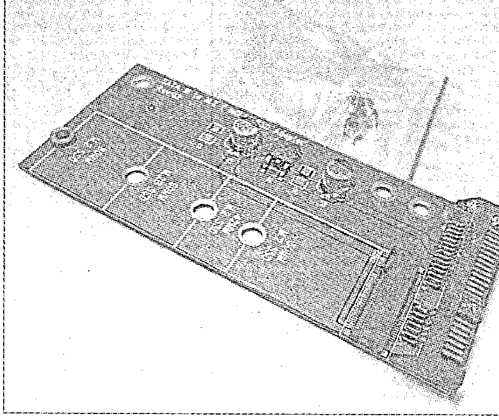

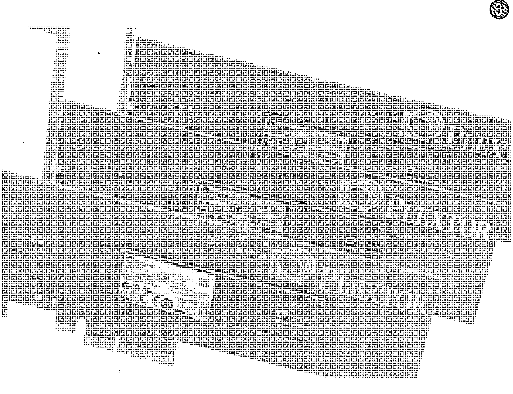


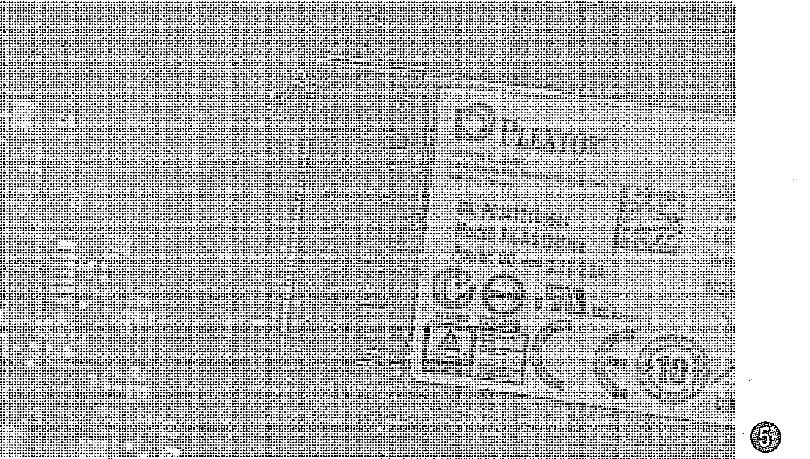

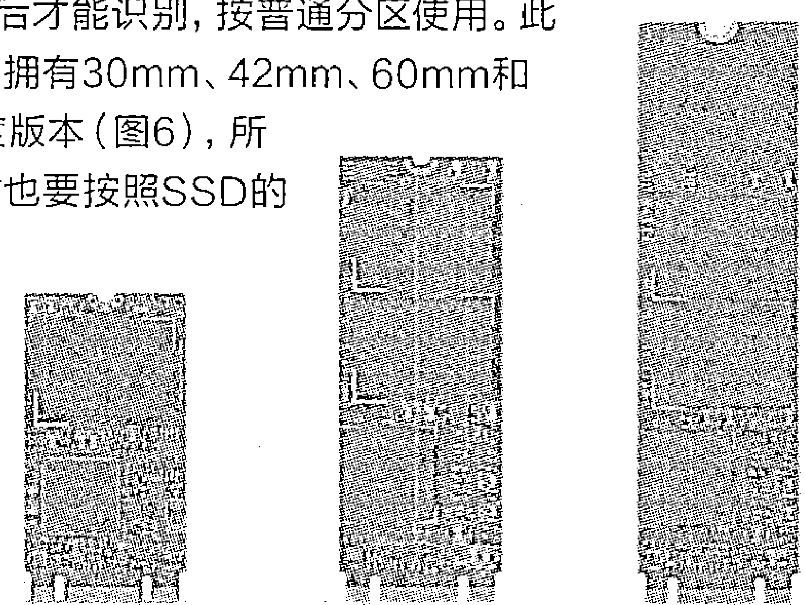

## 低端Windows 8.1 平板扩容有妙招

如今基于BayTrail-T平台设计的Windows 8.1平板电脑的价格已经跌破了500元大关，可惜，绝大多数Windows 8.1平板只有2GB RAM和32GB ROM，低于600元的产品更是仅以1GBRAM和16GB ROM为主。那么，这些低价平板真的无可救药？我们如何才能为它们安心扩容呢？

想为低端Windows 8.1平板扩容，我们需要从物理内存(RAM)和存储空间(ROM，也就是硬盘)两个角度着手。

### 被显存吃掉的内存

实际上，和早期的台式机/笔记本一样，Windows 8.1平板的物理内存也会有一部分被集成显卡占用。以2GB内存的产品为例，系统默认会将512MB容量用于虚拟显存（图1），以确保在游戏中获得更流畅的速度。

对低价Windows 8.1平板来说，相信很少有人会用它去玩大型3D游戏吧，而如果只是浏览网页看视频，或运行2D休闲游戏，哪怕是256MB显存也是有富余的。因此将虚拟显存还原成物理内存就是我们的目标了。

### 需要借助键盘帮忙

需要注意的是，Windows 8.1平板虽然配备了触控屏幕，但在进入Windows系统前触控和蓝牙功能是失效的。这意味着如果你想进入平板电脑的BIOS，就必须通过OTG连接有线的键盘。

在平板连接键盘后开机，按ESC便可以进入BIOS设置界面。此时，我们只需要依次进入“Chipset→North Brige→Intel IGD Configuration”（图2、图3），将“DVMT Total Gfx Mem”和“Aperture Size”对应的数值调整到最小即可（图4）。

以标配2GB内存的Windows 8.1平板为例，在修改BIOS前，开机后可用的物理内存容量只有1.46GB左右，修改之后可用物理内存则可提升到1.83GB（图5）。好消息是，修改BIOS前后对设备的性能影响不大，跑分成绩基本相同。所以如果你一直觉得自己的Windows 8.1平板内存不够用，不要有心理负担，进入BIOS折腾一番吧！

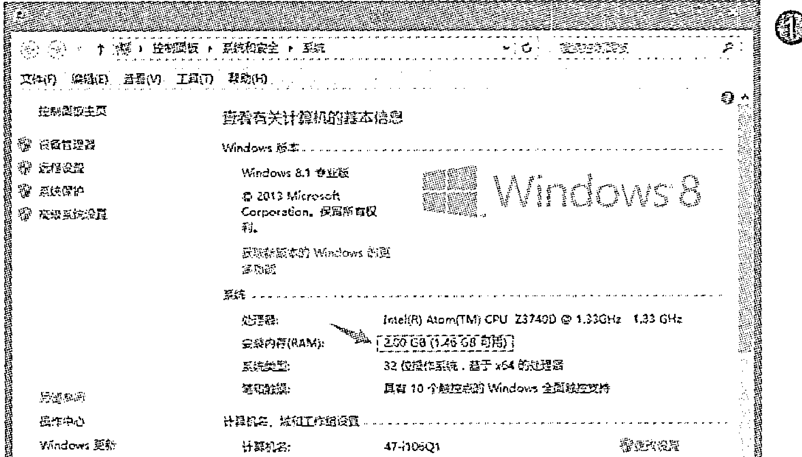

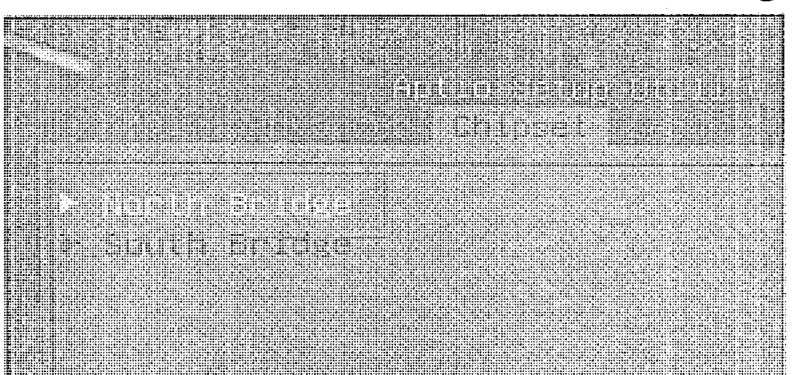

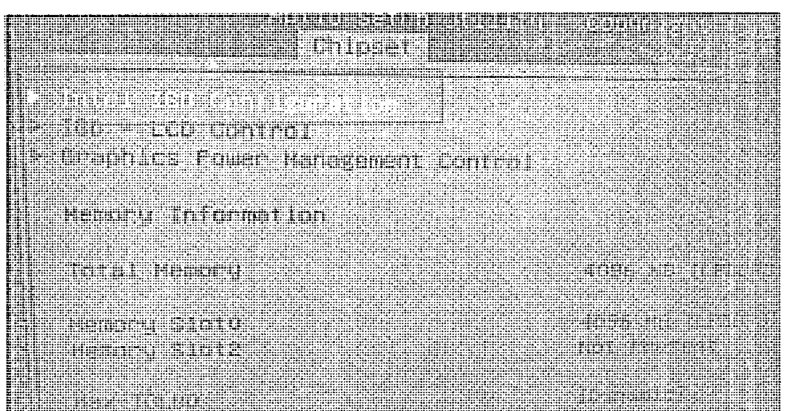

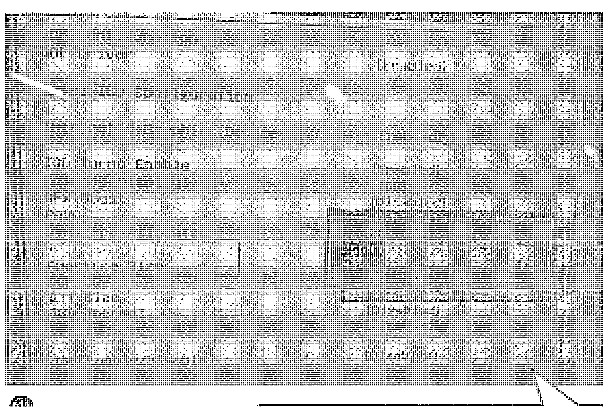

> 小提示：有些Windows 8.1平板需要在开机的时候按Del或者F7才可进入BIOS设置。

## 将存储卡与C盘整合

对Windows 8.1平板电脑而言，无论你是选择TF卡还是闪存盘扩容，它们的读写速度始终是比不上平板内置的存储空间。因此，如果我们可以想办法将C盘（也就是平板内置的存储空间）扩容，也就可以将更多需要高速读写的程序放进C盘了。

可能有同学会问了，平板电脑内置的存储空间是焊在主板上的eMMC闪存芯片，如何扩容？实际上，我们可以通过“曲线救国”的形式加以实现。在这里，笔者向大家推荐将TF映射到C盘实现整合的方案。

首先，我们可以在C盘中新建任意一个文件夹，为了方便展示，我们以“存储卡映射”命名（图6）。接下来，在传统的Windows桌面上，点击鼠标右键，依次进入“这台电脑”的“管理→存储→磁盘管理”界面，然后右键选择TF卡所在的盘符，选择“更改驱动器号和路径”（图7）。然后在弹出来的窗口中点击“添加”按钮，找到之前新建的“存储卡映射”文件夹（图8），最后再点击确定，即可完成挂载。

此时，C盘中的“存储卡映射”文件夹就是你的TF存储卡（图9），相当于你的C盘在无形中扩充了和存储卡一样大的存储空间。以后再遇到只能安装在C盘的软件或者游戏，或者QQ音乐一类软件的缓存文件都可以指定到这个目录里，从而释放更多原本只能占用C盘的高速空间挪于它用。

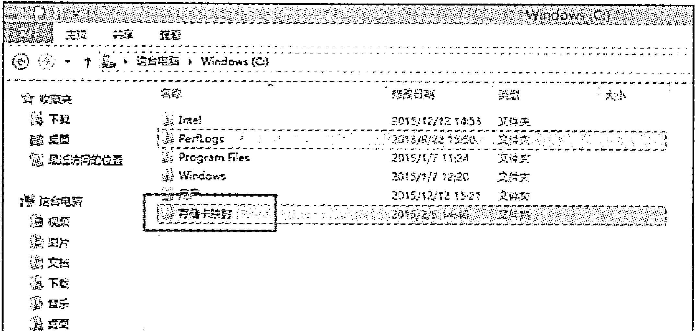

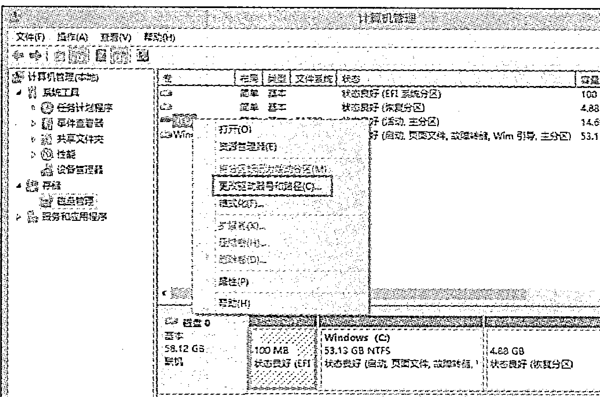

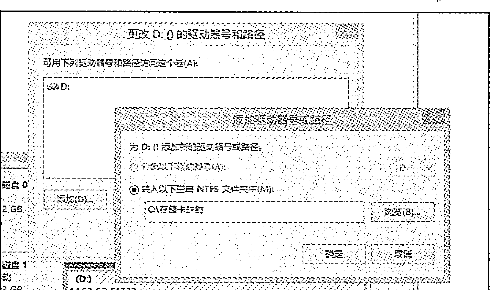

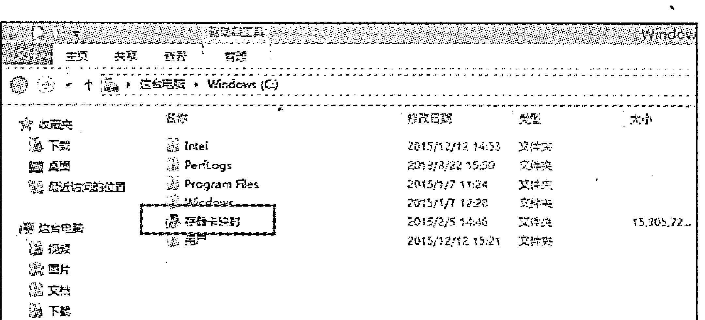

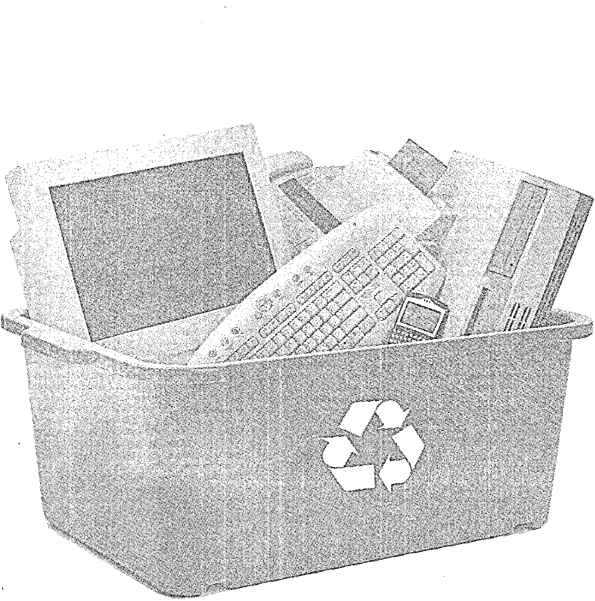

## IT 攻防之五年之战

这曾是三五年前一个令人头疼的问题。如今在一些小公司或者个人电脑上还可能遇到这样的情况，不过随着技术的进步，如今人们更加重视数据的安全性，同时，个人的数据越来越被重视，数据安全保护意识也在逐步提升。同时，随着个人电脑、网络连接的普及，人们面对的风险也是越来越复杂，如何加强数据安全，如何构建一个无懈可击的防御体系，这一劫难也无非之灾。

## 绝不是暴露 将宝贝藏起来

将数据展现在外，无论有心与否，看见的人都会去点一下、看一眼。其实在某些时候，即便将它们都隐藏起来，只要价值足够，就会有人去挖掘和夺取。将它们安全地保护起来可真不是件简单的事儿呢。

文逸凡

### 把文件放到安全的位置

之所以树大招风，首先是因为目标显眼。如果把文件放在别人不容易看到的位置，就避免了树大招风的风险。那么哪些位置别人不容易看到？文件放哪儿最合适？

### 混迹系统目录

除了系统维护，人们一般不会到系统目录中去寻找文件。因此，如果将文件混杂在系统核心目录中，便不会被人们轻易发现和删除，文件就会更加安全。

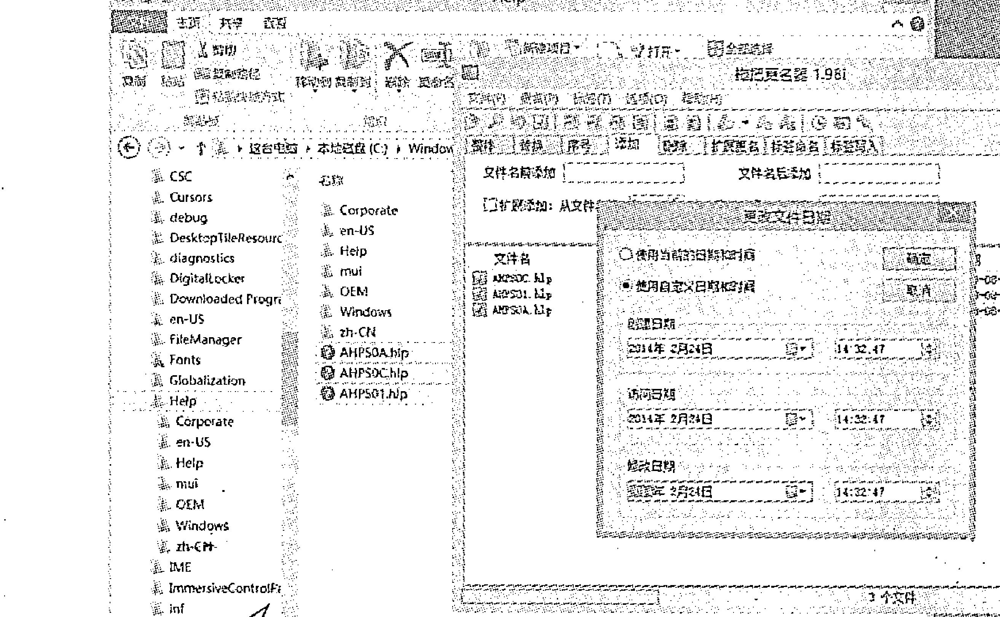

> 用拖把更名器对混在系统文件夹中的文件进行日期的一致性处理

系统的核心目录是位于系统分区的Windows文件夹。在此文件夹下，又按文件的不同类别分成100个左右的二级子文件夹，其中有的文件夹存放系统的可执行文件和DLL库文件，有的文件夹放置系统和设备的各类驱动程序，还有的放置图文声像和字库等资源文件、帮助文件等。

译成EXE可执行文件，将该EXE程序保存到Windows文件夹或System32文件夹下，就可以蒙混过关了。再编制另一个简单的EXE文件调用该程序，作为启动该程序的入口，这样别人就不会轻易获知该文件的原始存储位置了。如此一来，即便是用来执行的入口程序被删除掉了，位于系统目录中的原程序依然还在。程序文件如此，文档、帮助、网页文件也是如此。将编制的文档、网页文件等保存在Windows存放此类文件的目录，人们不会轻易删除Windows及子文件夹，系统优化软件也很难将放入的软件或文件识别为垃圾文件，因而我们的文件就得以保护。

我们经常使用的系统组件程序（如记事本、画图等），均对应于Windows或Windows\System32文件夹下的一个EXE文件。如果我们为了保护自己的程序，也编制了一个小程序，

> 小提示：由于在系统目录中存放更多的文件会增加系统文件索引建立和文件检索的负担，且文件名设置不当还可能冒充掉系统组件造成系统功能缺失，对于多人共用的系统，如果许多人都在系统中添加自己的隐私文件，那么久而久之系统目录就会变成一个另类的“垃圾场”，因此建议在个人电脑上适当使用这种方法，不建议在公用电脑上使用。

### 藏身路径深处

除了可在系统Windows目录保存个人文件藏身外，还可以将自己的文件保存在埋藏得比较深的路径里。首层路径选择不为人所怀疑的路径，然后进入一个路径较深的文件夹，建立自己的文件夹，将个人的文档或程序保存在新建的文件夹中。选中该文件夹或程序、文档，用右键建立快捷方式，将快捷方式移动到自己的优盘或移动硬盘中。最后，将新建的文件夹设置为隐含属性。例如，我们可以将自己的程序或文档保存在C:\Windows\System32\Drivers文件夹中一个自己创建的隐含文件夹MyDIR中。这样，别人一般不会怀疑在驱动程序目录中还会有别的文件，也不会轻易发现这里隐藏的文件（图2）。而当我们需要访问这些程序或文档时，只需插上闪存盘或移动硬盘，执行先前建立好的快捷图标，连我们自己也不用管程序或文档保存在哪里，即可方便地使用这些文件了。


### 藏身隐含分区

将程序或文档藏身在系统目录中或隐藏在一个路径比较深的文件夹中，虽然在一定程度上可以达到藏而不露的目的，但毕竟文件还是显性存放的，若遇上一个细致的人，这些文件就可能被发现。如果我们设立隐含分区保存文件，别人看不到分区，当然也就看不到文件。我们可以专门辟出一块空间建立一个独立的分区，将自己的文件拷贝到该分区的特定文件夹下，记住分区的盘符和我们的文件所在的文件夹名以及文件的具体名称。然后用分区隐藏工具将分区隐藏起来，这样就万无一失了。

区隐藏起来。当我们自己需要访问这些文件时，只需从资源管理器的地址栏中输入文件所在的盘符、路径和文件名即可。而他人由于不知道我们的文件名，因而即便是知道这个隐藏的盘符，也无法获知文件藏在何处，以及文件名是什么。

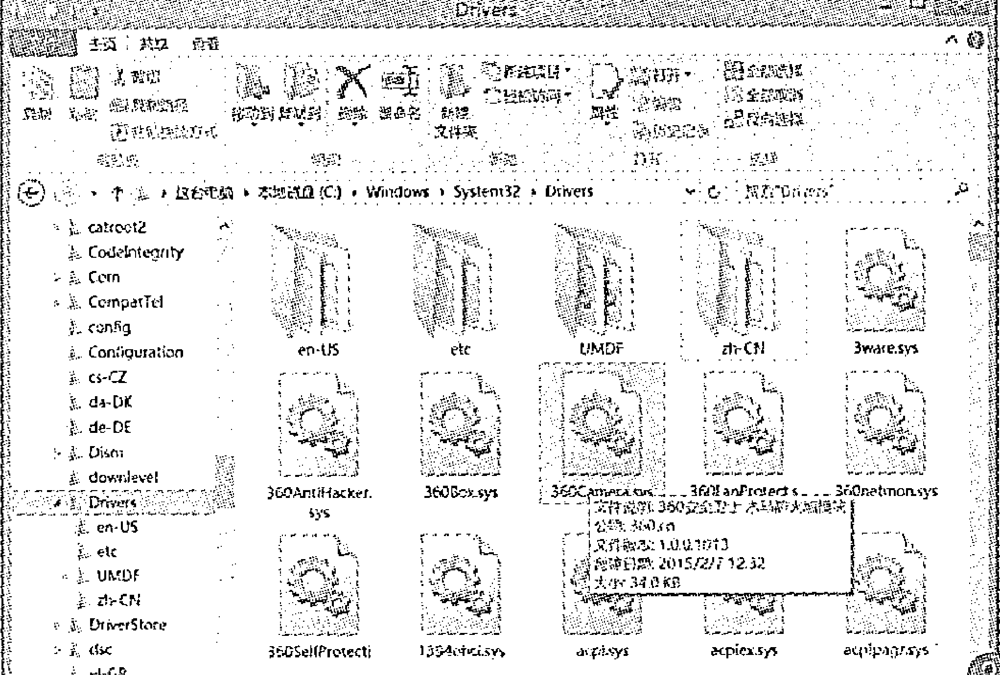

隐藏分区的方法可通过Win+R启动运行窗口并输入gpedit.msc，在打开的组策略窗口中，依次定位到“本地计算机策略→用户配置→管理模板→Windows组件→文件资源管理器”，再通过右侧窗口项目“隐藏我的电脑中的这些指定的驱动器”一项选择设置。

文|逸凡

### 别让人们搜到你的文件

文件放到系统目录中或藏身于较深的路径中，不见得就安全了，现在的搜索工具和技术这么发达，如果别人按关键词一搜，文件就现出原形，那么，也就难以做到“藏而不露”。那么如何才能让别人搜不到我们的文件？

当我们自己需要阅读或编辑这份WPS文档时，只需打开WPS文字编辑器，将GRJH.DLL文件拖动到WPS编辑窗口即可打开编辑或阅读。

### 防止类型搜索

个人文档一般为TXT或DOC一类的常用文件类型，如果用系统的搜索功能或使用搜索软件，按文件类型来搜索，整个电脑中某一类文件将一目了然(图1)。

为了防止别人按类别搜索到我们的文件，我们可以在文件类型上做点手脚，将我们自己的文档伪装成一种系统固有的文件类型(比如DLL文件)，就可以杜绝别人按类型搜索到文件了。比方说，用WPS编写了一份文档“个人计划.DOC”，如果担心别人看到文件内容，我们可以将文件名改为GRJH.DLL，然后将此文件保存在系统System32文件夹中，这样别人就很难用文件类别来获取到这份文件了。

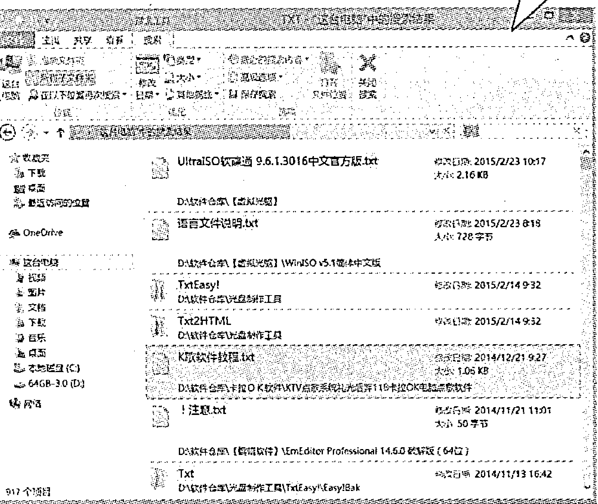

### 防止全文搜索

除了按类型搜索文件外，别人还可能针对文件内容搜索。这时只需通过给定的关键词就能轻易搜索出含有指定信息的文档。

为防止按关键词以全文搜索找到文档，我们可以对文档内容进行加密或转码操作。例如，编辑了一份含有保密内容的TXT文档，我们可以用几种方法来实现对该文档的防搜索加密处理。一种方法是用加密软件对该文件进行编码转换处理，加密之后的文件名不变，依然为TXT文件类型，只是双击打开后，文件中显示为乱码，根本无从判断其中的内容。而自己要使用时，只需用相同的加密软件做解密处理(图2)。

另一种常用方法是，我们用WinRAR将该TXT文件压缩为带密码的RAR文件，同时选择删除源文件。生成的RAR文件由于做了加密处理，内容类的搜索软件自然也无法搜索到其内容，从而起到防内容搜索的效果(图3)。

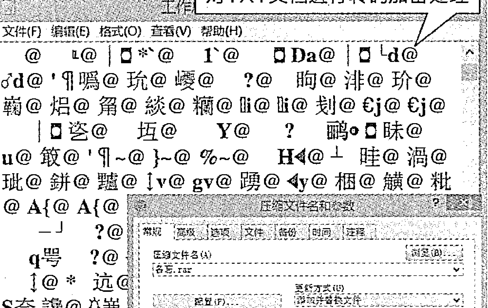

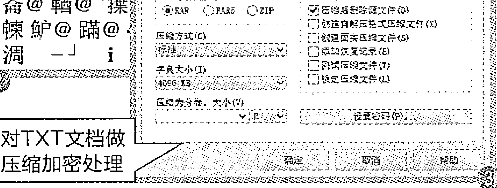

### 防文件名搜索

防止文件内容泄露，需要做的一项基础工作是文件名保护。许多时候，为了便于查找和定位，我们常常会给自己的文件取一个非常便于辨认的文件名，但这样做在方便自己的同时也方便了别人。别人可以轻松地通过文件名来判断和打开我们的文件，从而造成隐私泄露。

如果结合上面讲述的方法，将文件名改为与内容根本无关的字符串，然后再对扩展名加以伪装，对文件内容进行加密，那么就可以做到眼皮底下放置文件也安全。但有一个问题，这样处理后由于文件名不具有内容辨识的特性，自己找起来也比较困难了。

这时可用Excel表格或WPS表格在自己的私密存储空间内建立一个文件名对照表，由两列内容组成，一列为特征标识明显的文件名，甚至可以是文件内容的简短说明，另一列是不具有明显特征的暗码文件名。然后在表格中给这个文件名字符串建立超链接，超链接指向实际存放该文件对应的目录和文件。这样当需要使用该文件时，只需先打开该文件名码表文件，点击相应的文件链接，即可自动打开该文件了（图4）。别人要想通过文件名获知文件内容，由于没有这张文件名对应码表，而实际文件名与文件内容又风马牛不相及，因此也就无从获取和打开该文件了。

文|技术宅

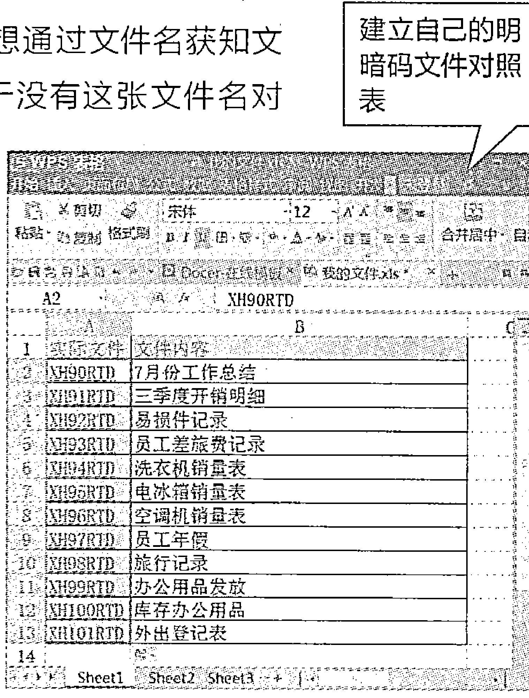

### 真真假假设置“故障门槛”

要想保护好自己的电脑资料（宝藏），最好的办法当然就是彻底杜绝他人使用你的电脑了。不过在特殊情况下，比如碍于情面不好意思直接拒绝朋友的借用要求，这时不妨采取一些更委婉的保护手段，可以试着制造一些看似“真实”的电脑故障，然后就可以告诉借用者：你看，我的电脑坏了，确实无法使用。

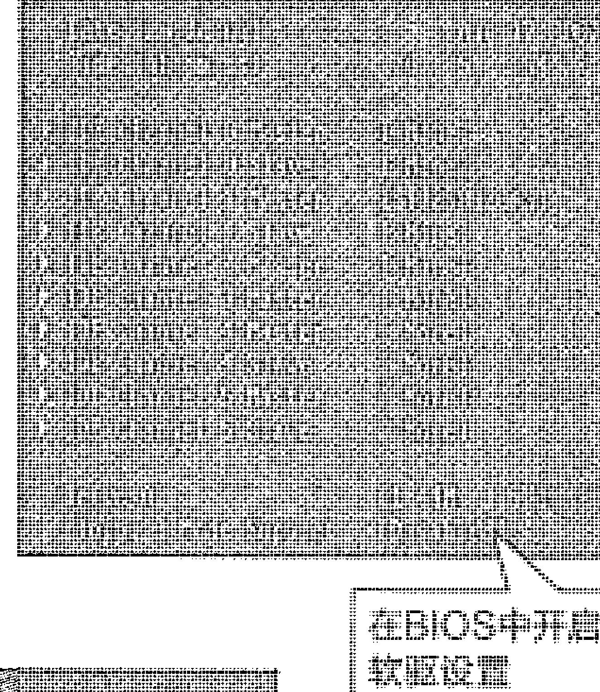

### 硬件损坏？自制F1键启动“故障”

电脑在每次开机自检时都会检测硬件，为了保持硬件的兼容性，现在大多数主板BIOS都还保留软驱设置选项。不过现在的电脑已经没有再配备软驱的了，因此只要进入BIOS设置开启软驱检测，这样开机后就会出现无法检测到软驱的故障，导致电脑无法正常开机。首先在开机后按Del键进入BIOS设置，接着依次展开“Standard CMOS Features→Drive A”，然后为其设置一个软驱的型号，接着按F10键保存退出（图1）。


这样下次启动电脑的时候就会由于无法检测到软驱，屏幕上会出现CMOS检测错误的提示。因为现在的电脑使用者，大多数对BIOS并不了解，所以这一招还是相当唬人的。而当我们自己需要使用时，只需简单按一下F1键就可以继续启动电脑了。当然这个可不要告诉借用者，直接跟他说电脑坏了就可以了（图2）。

> 小提示：现在不少主板的BIOS中已经没有了软驱设置选项，此时可以尝试在“Integrated Peripherals”中查找USB相关设置，将USB Controller禁用，这样同样可以导致开机时检测硬件失败（图3）。

### 遭遇自制的蓝屏桌面

BIOS设置较为复杂，其实除了在开机阶段制造启动故障外，我们还可以借助第三方应用软件来制造“软故障”，同样可以达到阻止他人使用我们电脑的目的。

这一方法要用到“屏蔽键盘按键工具”（iHookKeyboard），它用来屏蔽键盘的所有按键。另外还需要“蓝屏死机屏幕保护程序”（Bluescreen），一款微软出品的蓝屏屏保，启动后会出现“真实”的蓝屏界面，并会屏蔽鼠标的点击。这两个工具结合，就可模拟出高仿的电脑蓝屏死机状态了。

将上述的软件解压后全部复制到C:\Windows\System32目录下备用(为了便于使用，请将蓝屏屏保文件名称改为pb.scr)，启动记事本输入下列命令，并保存为aa.bat，放置到当前用户的启动目录下(即C:\Users\登录用户\AppData\Roaming\Microsoft\Windows\Start Menu\Programs\Startup)，批处理的代码其实很简单，只有一行：

```
start iHookKeyboard hide ALL
```

命令解释: “hide ALL”参数是屏蔽所有的按键(但不会屏蔽组合键)，运行上述命令后所有键位都无法输入字符了，效果就像键盘坏了。如果只需屏蔽指定按键，比如不想让小朋友玩网页游戏，可手动运行iHookKeyboard，再依次添加屏蔽按键（如A、S、D、F键）即可(图3)。

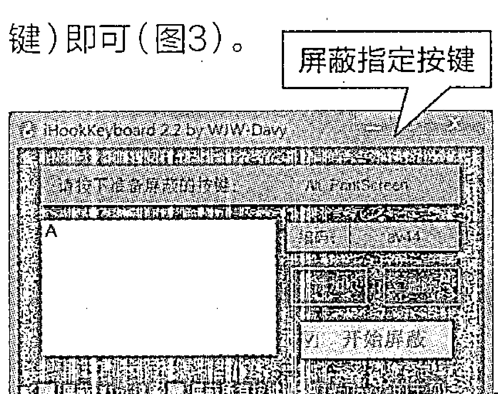

操作同上，继续输入下列的代码保存为bb.bat，同样保存在用户启动目录中，起作用的代码只有两行，rem后面的只是注释:

```
rem 让命令延迟5秒后启动，
这样屏蔽键盘后再启动屏保，不会导致屏保自动退出
ping -n 5 127.0.0.1 >nul
rem 启动指定的蓝屏屏保
start pb.scr /s
```

首次运行屏保会弹出设置界面，按提示勾选“Fake disk activity”，这样屏保运行后就会自动屏蔽鼠标的点击，无法通过鼠标点击退出，需按任意键退出(图4)。

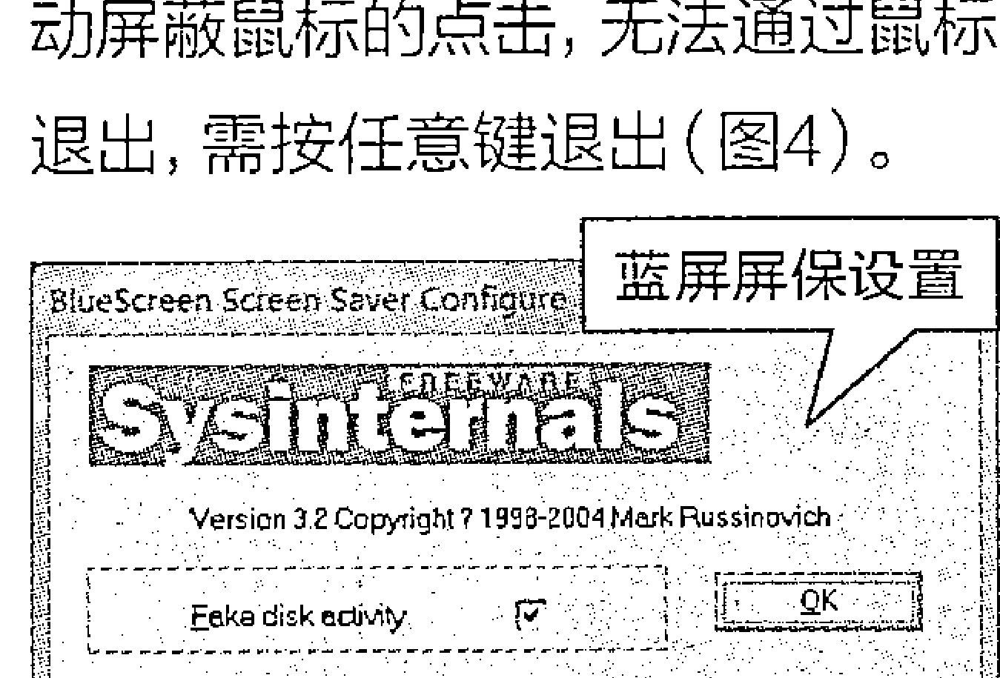

完成上述的设置后，如果他人要来借用电脑，我们只要像平常一样启动电脑，这样登录后会自动运行iHookKeyboard，导致所有按键都失效。接着启动蓝屏屏保，屏幕界面就像遭遇蓝屏一样，而且此时键盘鼠标均无法活动，效果就像真的遭遇了蓝屏死机(图5)。

当电脑出现“蓝屏死机”后，我们就可以堂而皇之告诉借用者电脑坏了，确实无法使用。iHookKeyboard屏蔽的是所有单独的按键，并不包含组合键，当我们自己要使用时，只需按下Ctrl+Del+Alt组合键，然后在打开的窗口中点击“任务管理器”，再在管理器窗口中切换到“进程”，将其中“iHookKeyboard”进程结束即可，此时再按下任意键退出屏保就可以正常使用了(图6)。

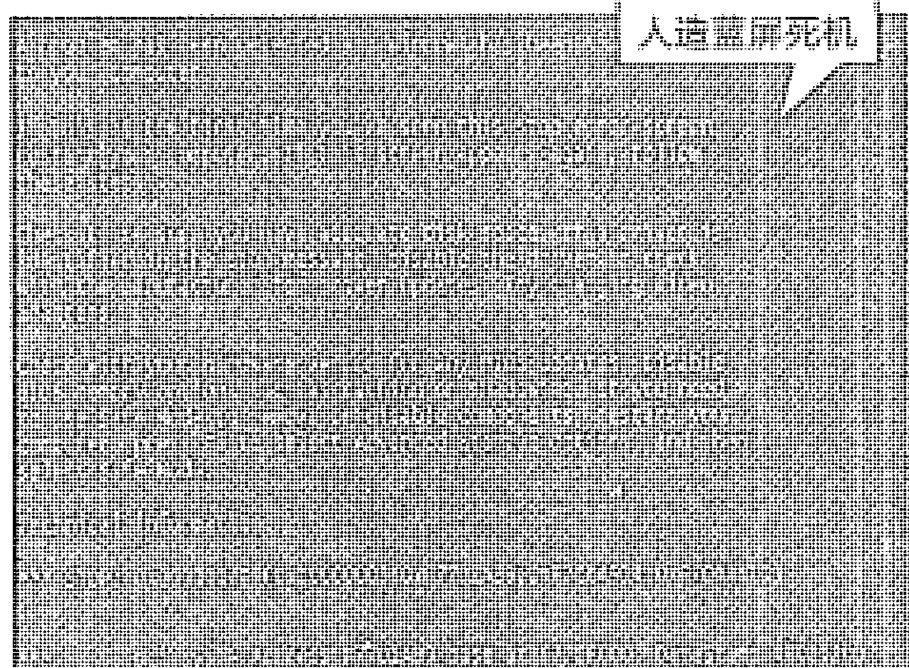

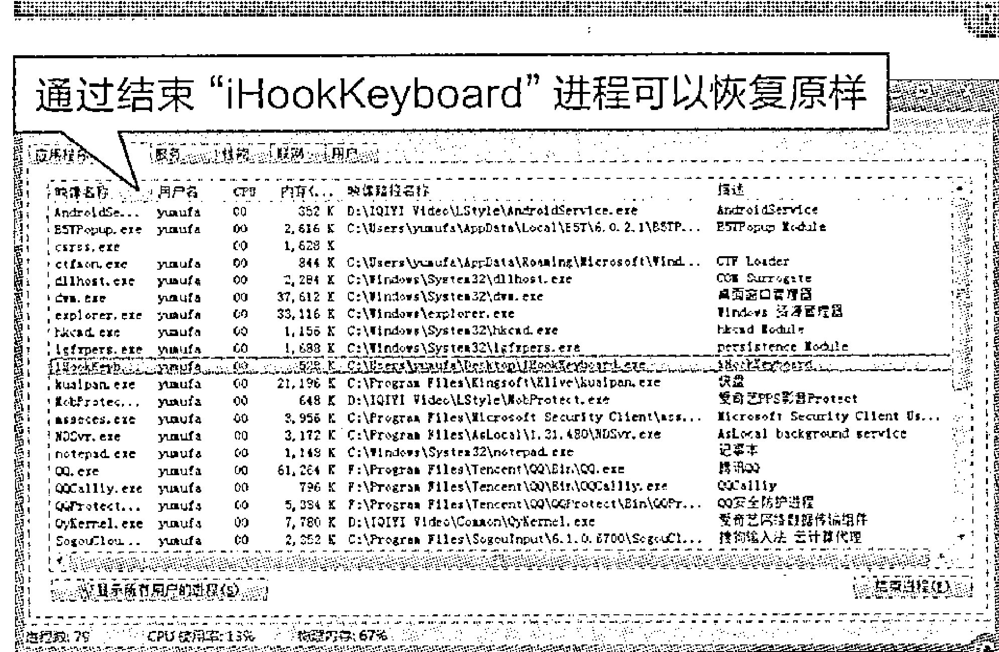## 不伤面子DIY特定软件故障

很多时候我们无法完全拒绝他人的使用，当你自己已经正常启动电脑，这时朋友突然想要用你的电脑登录QQ，此时就不好直接拒绝了。既要不伤面子，又要保护自己的电脑，我们还可以DIY软件“故障”，给予借用者巧妙的拒绝。下面以DIY腾讯QQ软故障为例。

首先启动记事本输入下列的代码，并保存为aa.reg注册表文件放置在桌面：

```
Windows Registry Editor Version 5.00

[HKEY_LOCAL_MACHINE\SOFTWARE\Microsoft\Windows NT\CurrentVersion\Image File Execution Options\qq.exe]
"debugger"="1.exe"
```

代码解释：其中“qq.exe”是要禁止运行的程序名称（如果要限制其他程序请更改为对应的程序名称），“1.exe”则是任意不存在的程序。这里使用注册表映像劫持方法来重定位限制程序。接着双击aa.reg导入注册表，这样在注册表的[HKEY_LOCAL_MACHINE\SOFTWARE\Microsoft\Windows NT\CurrentVersion\Image File Execution Options]下会自动添加“qq.exe”项，其“Debugger”的值是“1.exe”（图7）。

这样当我们的电脑再次运行qq.exe的时候（实际上是运行不存在的1.exe），系统就会弹出错误提示无法运行。并且由于上述注册表键的存在，即使重装QQ也是无法运行的（图8）。从而达到了变相阻止别人使用的目的。

而为了不影响自己运行QQ，我们可以在启动注册表编辑器之后，展开到[HKEY_LOCAL_MACHINE\SOFTWARE\Microsoft\Windows NT\CurrentVersion\Image File Execution Options\qq.exe]，然后右击该项选择“导出”，将该键值导出为qq.reg放置在D:\备用（图9）。

同上，再启动记事本，输入下列的代码，保存为QQ.bat放置在D:\。以后以管理员身份运行QQ.bat即可正确启动QQ，启动QQ之后会再次恢复映像劫持（图10）：

```
Rem 通过reg delete命令删除指定键值
reg delete "HKLM\SOFTWARE\Microsoft\Windows NT\CurrentVersion\Image File Execution Options\qq.exe" /f
rem 启动解除限制的应用程序，请输入程序实际位置
"F:\Program Files\Tencent\QQ\Bin\qq.exe"
Rem 延迟五秒导入劫持键值恢复限制
ping -n 5 127.0.0.1 >nul
reg import d:\qq.reg
```

操作同上，我们可以根据自己的需要对系统任意程序进行限制，比如在自己的电脑上不想让人用IE上网，方法同上，在[HKEY_LOCAL_MACHINE\SOFTWARE\Microsoft\Windows NT\CurrentVersion\Image File Execution Options\iexplore.exe]中添加新键值，然后将其重定位到“1.exe”，这样用户试图运行IE时则会提示找不到“iexplore.exe”文件的提示。此时我们就可以淡定地告诉借用者电脑程序坏了，下次再来使用吧（图11）。

## 挖掘自身全面抗敌

看清他人容易，明白自己难。人只有在绝境之时才会发挥出100%甚至200%的潜在实力，软硬件也是如此，若不深度去研究，它们能做的事情实在过于有限……

### 网络断网？自己动手修复

日常使用中，我们常会遇到原来好好的网络忽然无法上网的问题。在排除ISP提供商服务失效的情况下，可充分利用Windows自带的修复功能。

文|技术宅 近日笔者就遇到了“网络连接不可用”的故障，原来的有线连接突然无法连接网络（图1）。此时只要点击“打开网络和共享中心”，在打开的窗口中点击下方的“疑难解答→网络和Internet→Internet连接”，此时就会自动启动系统自带的网络修复组件（图2）。按照屏幕向导一步步完成测试，系统会自动对当前的网络故障进行检测和修复，如果是常见问题，修复组件会自动检测并进行修复，这样可以解决大多数常见的断网故障。

不过，虽然系统修复组件能解决常见问题，但功能毕竟有限。为了有备无患，最好再配备专业的离线修复工具，如可使用“360断网急救箱”，它能更全面地对断网原因进行检测和修复。当通过系统组件无法修复时，可尝试启动360断网急救箱，点击“诊断”即可检测（图3）。检测出问题后，只需点击“立即修复”，软件会自动在后台修复，只要按软件提示操作即可解决上网故障（图4）。

### 零流量无网使用离线数据

现在很多软件的数据都保存在网站的服务器上，不过为了方便用户的使用，不少软件也提供了离线版本。当在有网的环境下时，我们就可以预先准备好离线数据以备不时之需。这里以手机百度离线地图为例。

首先在电脑上登录http://wuxian.baidu.com/map/map.html，按提示选择自己的机型，选择要下载的省份地图，并按提示将离线地图数据下载到本地硬盘中备用（图1）。

下载完成后将解压出的“BaiduMap”文件夹放入手机存储卡根目录。以后在没有网络的情况下，同样可在手机上启动百度地图，该应用会自动导入保存在SD卡的离线地图数据，就能在手机上离线使用百度地图查找路线位置了（图2）。

除了地图外，很多软件也提供离线数据。下面就以我们经常要查询的维基百科为例。

打开http://dumps.wikimedia.org/zhwiki/，在打开的页面中点击“Lastest”，然后点击“zhwiki-latest-pages-articles.xml.bz2”进行下载。

接着到http://dwz.cn/BTEGD下载WikiTaxi，运行其中的Wikitaxi_import.exe组件，启动程序后点“Browse”导入上述下载到的离线数据包，点击下方“Browse”按钮，按提示将导出的Taxi文件保存为Cfan.taxi，并保存在桌面上备用（图3）。

返回程序主界面，点击“Import”，该程序会将下载数据全部导入到离线客户端（图4）。完成数据导入后运行Wikitaxi.exe，点击“Options→open*.taxi.database”，找到并打开上述导出的Cfan.taxi文件，以后无需上网也能用离线维基百科了。

比如需要查找“P2P贷款”，在WikiTaxi上方的搜索框中输入关键字进行查找，很快就可以找到结果。不过需要注意的是，由于这是离线版本，大家要定期下载离线数据库进行更新。

## 让云端读取本地数据

目前越来越多的软件是针对网络开发的客户端软件，像视频客户端、音频客户端、云盘、云笔记等。那么，在没有网络的情况下如何才能发挥这些软件的作用？其实同样的我们只要在有网的情况下做好数据离线操作即可。这里以酷我播放软件为例，默认情况下在酷我播放的歌曲都会自动将缓存文件保存在本地，这样即使没有网络也可以继续播放音乐。

启动酷我后点击“设置”，在弹出的窗口中切换到“本地下载”，然后记住“缓存资源保存到”的目录（图1）。有网时用酷我播放器播放音乐时，完全加载的歌曲就会自动保存到这个目录中（无需手动下载）。

| 项目 | 设置 |
|------|------|
| 关于 | 本地下载 |
| 常规设置 | 目录设置： |
| 窗口歌词 | 下载缓存保存到：\\\\KwDownload\\song |
| 桌面歌词 | 歌词文件保存到：\\\\KwDownload\\lyric |
| 本地下载 | 临时文件保存到：\\\\KwDownload\\Temp |
| 快捷键 | 缓存大小设置：自动 手动 512M 1024M 2048M |
| 网络代理 | 最大同时下载任务：3 下载端口：6000 |
| 音质设置 | 下载音质：自动 高品 超品 无损 |

在有网的情况下我们只要像常规情况一样使用酷我播放歌曲，以后如果没有网络而需要再次欣赏听过的歌曲时，按提示在资源管理器中打开上述目录，就可以看到这里保存了很多数字命名的文件，根据其中的标题就可以知道歌曲名称了，如果是MV文件则为“.MKV文件”。双击其中的歌曲文件即可调用酷我进行播放。和在线播放不同的是，这里显示的是“本地资源”。那些曾经完整播放过的，即使以后离线也可以继续播放了（图2）。

同样的，优酷、爱奇艺、4399等网页FLASH游戏等，在使用联网的方式加载完成后，数据同样会缓冲保存在本地目录。这样即使离线也可以从中提取出有用的数据。以4399游戏为例，首先在网页中按提示加载整个游戏（图3）。接着启动“IE缓存提取器”软件，点击“保存路径”，选择一个保存缓冲文件的目录，提取的类型选择“SWF”，点击右侧的南瓜图标，缓存中所有SWF文件即可提取到指定位置保存了（图4）。接下来打开保存的目录，其中文件较大的“y6[1].swf”文件就是上述的游戏文件了。按提示双击，选择使用搜狗浏览器打开，这样在打开的浏览器窗口中就可以离线玩游戏了，而在地址栏可以看到这里播放的是本地目录SWF文件（图5）。

## 离线也能搜索解决方案

日常使用电脑的过程中经常会遇到各种故障，像遇到软件冲突、缺少DLL文件无法运行等。常规的方法是求助百度搜索解决，但如果没有网络该怎么办？而且很多故障还找不到头绪。对于类似故障，现在我们可以化繁为简找到解决方案。

大多数读者都不是电脑专家，但是专业的事可以交给专业软件去做。比如360安全卫士的“电脑门诊”组件就可以解决大部分遇到的问题，我们所做的只是根据故障现象去选择解决方案，至于故障是使用什么方法解决，该使用什么软件、命令，我们一概不需要关心。启动“电脑门诊”组件，按提示选择故障现象，然后点击“立即修复”即可（图1）。

如果上述方法无法修复故障，但是故障表现又较典型，则可以借助第三方专业软件去进行分析解决。

比如一个程序经常出现没有响应的问题，那么可以通过AppCrashView（下载地址：http://urlc.cn/HU4xqsl）查看原因。该工具能够查看Windows的错误报告，运行后AppCrashView将列出所有当前系统保存的错误报告，在“进程文件”（对应AppCrashView简体中文版本）列中双击想了解的应用程序，AppCrashView将详细列出进一步的崩溃报告，包括软件出现问题时系统的主要参数，通过这些信息就可以快速了解程序没有响应的原因了（图2）。

对于已经出现停止响应的程序，可以借用WhatIsHang来解决，它可以告诉你到底什么地方出了错，例如32位的软件与64位的驱动程序不兼容等。启动程序后其上方的窗口中显示出有问题的应用程序，如果需要分析该程序，按对应的快捷键还会在下方的窗口中显示出更多详细的信息。而在“Remarks”部分，能够看到导致软件崩溃的具体原因。当找到原因后，那么解决问题也就有的放矢了。

| Process File | Event Name | Event Time | User Name | Exception Code | Exception Offset |
|--------------|------------|------------|-----------|----------------|-------------------|
| player.exe   | 已停止工作 | 2015/9/9 20:16 | yumufa    |                |                   |
| player.exe   | 已停止工作 | 2015/9/9 20:16 | yumufa    |                |                   |
| player.exe   | 已停止工作 | 2015/9/9 13:16 | yumufa    |                |                   |
| player.exe   | 已停止工作 | 2015/9/9 13:16 | yumufa    |                |                   |
| player.exe   | 已停止工作 | 2015/9/9 22:16 | yumufa    |                |                   |
| player.exe   | 已停止工作 | 2015/9/13 2... | yumufa    |                |                   |

## 巧借软件 无米能为炊

在我们的印象中，压缩或解压文件就需要WinRAR之类的压缩工具，复杂文件批量更名就需要专用更名软件，视频转码一定要用转码工具，办公一定要用Office(WPS)。那么万一手头上正好没有这些软件，又不能上网，活儿不干了吗？非也！只需巧借软件，无“米”也能为“炊”！

### 不用压缩软件处理压缩包

在网上下载软件或资料，常常会涉及到解压问题。网上下载的文件多数情况下是以ZIP或RAR等压缩文件格式或ISO等光盘镜像格式提供的。这样，我们的系统中必须要有能解开这些格式的相应软件，常要安装WinRAR或好压等压缩软件。如果头上正好没有这几个软件，怎么办？

其实，在无压缩软件的情况下，也可以处理压缩包文件。同样是Windows系统，如果升级到Windows 8以上，不借助于任何第三方压缩工具，在文件资源管理器内，就可以直接双击使用ZIP压缩文件和ISO映像文件。没有解压过程，使用这两类文件的感觉和使用一个常用文件夹没什么两样（图1）。

对于ZIP和ISO之外的其他压缩文件，我们也可以撇开WinRAR或好压等压缩软件，用一个虚拟包管理软件WinMount来解决。安装WinMount后，用WinMount浏览压缩包，使用菜单命令“选项→挂载”，可将包括ZIP、RAR、ISO以及其他常见的各种压缩文件或映像包瞬间虚拟为一个盘符，文件包中的文件马上会出现在新的虚拟驱动器中。我们没有执行解压过程，却可方便地使用压缩包中的文件（图2）。

### 不用转码软件视频也能播

目前的许多新式数码播放器可以通吃各种视频格式文件，各种Android或苹果设备在一些全格式视频播放器的支持下，也可以直接播放通行的各类视频文件。但是，还有一些老设备不能兼容所有格式的视频文件，或者在一些配置比较低的设备上播放高清大文件时，由于处理能力或存储空间的限制，有时还需要我们对视频文件进行格式转换处理。视频格式转换往往需要我们安装诸如格式工厂一类的专用工具。但是，如果本机不安装此类专用工具，我们还可以借助于视频播放器附带的转码功能来转码，比如QQ影音、优酷视频客户端等都有这样的服务模块可供我们使用（图3）。

此外，即便本地未安装任何附带转码器的工具，我们仍可以通过某些云盘的离线转码服务来解决问题。例如，我们可以通过迅雷离线空间服务在线解决视频格式转换问题。

### 无Office软件照样能办公

说起办公，大家肯定会首先想到微软Office或金山WPS办公软件。没错，Office（WPS）办公套装软件肯定是办公的首选软件。但是，有时由于环境所限，我们所用的电脑中可能没有安装这些软件，或软件出现问题不能使用时，我们急需处理手头的工作。在这种情况下，如何应急处理办公事务？

实际上，在紧急情况下，可以借助系统自带的简易办公工具、网络Web办公服务、云笔记类的软件等渠道完成办公任务。

首先，我们可以利用系统小工具完成办公任务。最常用的工具如记事本、画图、写字板等。别小瞧了这些工具，在关键时刻也很管用。

如果我们需要处理的文档只有文字一方面的内容，那么在记事本中编辑不成问题，而对于页面打印，记事本也能胜任，包括字体设置、页眉页脚等页面设置、打印等操作也能靠该软件来完成。记事本虽然不能实现同一篇文章字体多样化的处理效果，但在一篇文章的字体不是一成不变的宋体，用户可根据系统中安装的字体改变当前文档的字体和字号，而打印效果也能实现所见即所得（图4）。

如果在文章中涉及文字以外的内容，比如图片、公式或其他元素，那么我们可以使用Windows系统自带的写字板软件。Windows 8以上系统附带的写字板功能更强，该工具由于支持对象插入操作，因此在当前系统中安装的其他软件，写字板都可以作为对象加以调用，将其作为写字板文档的一部分。比如在需要画插图的时候，可以随时调用系统画图软件进行作图，作图完毕后关闭画图返回写字板，插图就出现在写字板页面中。而且写字板可以实现图文所见即所得效果，同一文档中的字体可以多变，与Word的编辑功能非常相似。并且最新版写字板编辑的文档也可以保存为Word的docx格式。用该软件代替Word做日常文档编辑应急，完全不成问题。

如果可以上网，我们也可以利用Web在线办公服务完成办公任务。例如，可以通过QQ账号、WPS账号、小米账号或新浪账号等，登录自己的WPS轻办公Web（https://qing.wps.cn/login.html），通过WPS轻办公网络，完成文档、表格和演示项目的编辑任务。此外，我们可以通过微软在线办公（https://office.live.com/start/default.aspx），用自己的微软账号登录办公网络，在线完成自己的文档编辑任务。在线办公不光可以在专用的Web网络上完成，也可以在一些邮箱中完成（图5）。

除了可用以上两种方式完成应急办公外，我们还可以用云笔记软件完成一些日常的办公文档编辑操作。例如，有道云笔记就是这样的一款软件。我们不但可以利用它输入和编辑文字内容，而且还可以将图像、表格甚至声音等内容插入到笔记当中。根据所用设备的不同，文档内容的生成方式也非常灵活，既可以使用触摸屏手写手画，又可以用麦克风进行语音识别，更可以使用传统的键盘录入，可以说这种办公文档的生成方式比我们传统PC仅靠键盘录入的方式更加灵活方便（图6）。

## 文件成批更名不用更名软件

在处理大量文件时，为了统一管理，我们可能需要对大批量的文件进行更名处理。但文件批量更名一般需要安装专门的文件批量更名软件。其实，在没有安装专用批量更名软件的情况下，也不是没有办法。我们可以通过系统自身的功能，或通过已安装的他类工具中的文件更名功能来解决问题。

首先可以利用的是系统自身的批量更名功能。这一功能虽然比较单一，它仅能将批量文件命名为以一个文件名加数字递增序号的格式，但这已经能满足解决文件名不规范的基本问题，可用在许多有用的场合。比如对网上搜集到的图片进行文件名规范化处理，电子书图片的页码顺序编排等场合。具体方法是：在Windows资源管理器窗口中，先全选需要更名的文件，然后将光标置于第一个文件名上，点击工具栏上的“重命名”按钮（或单击鼠标右键，在快捷菜单中选择“重命名”），输入一个文件名关键词，按回车键，即可得到以关键词加序号命名的成批文件（图7、图8）。

另外，我们还可以利用看图软件来批量更名文件。例如，我们可以用2345看图王软件来批量更名文件。具体方法：先用2345看图王打开任意一张图片浏览（或者直接打开2345看图王软件），然后用Ctrl+N快捷键启动文件批量重命名窗口，点击窗口右侧的“添加”按钮，添加要重命名的文件（不限于图片文件，其他类型也可以），然后在左侧窗口中进行文件命名规则的设置。设置完成后点击“开始重命名”按钮即可完成文件的批量重命名（图9）。

此外，还可以通过压缩工具好压来批量更名文件。启动好压压缩软件，通过“工具”菜单下的“批量文件改名”（或直接用Alt+N），启动批量更名窗口来实现文件的批量更名（图10）。

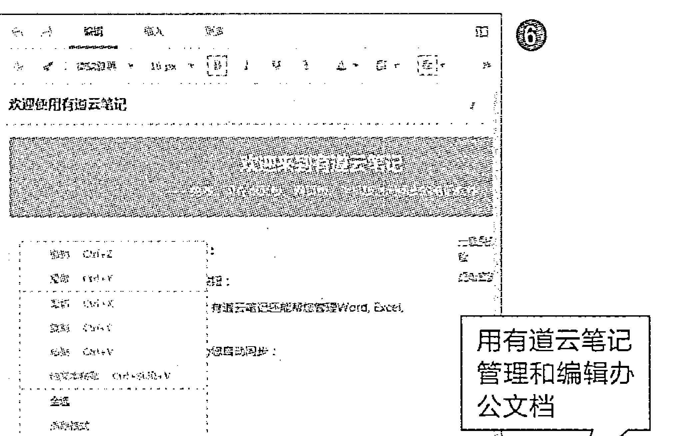

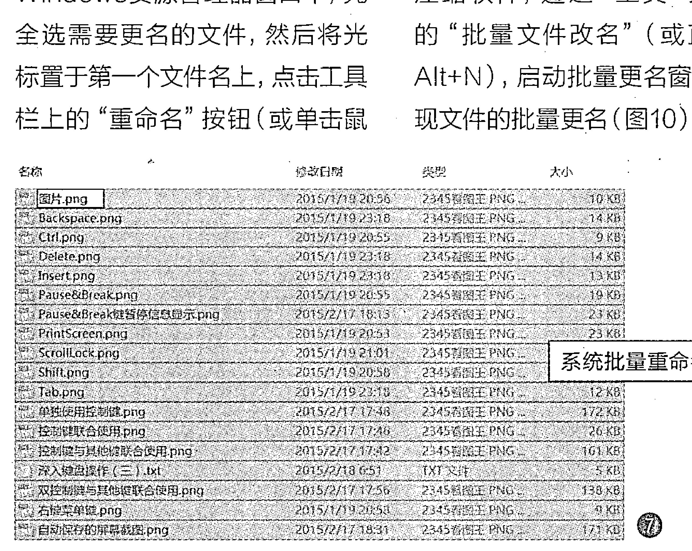

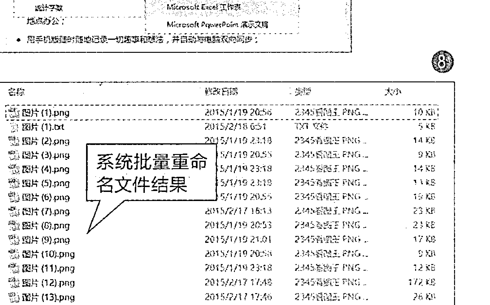

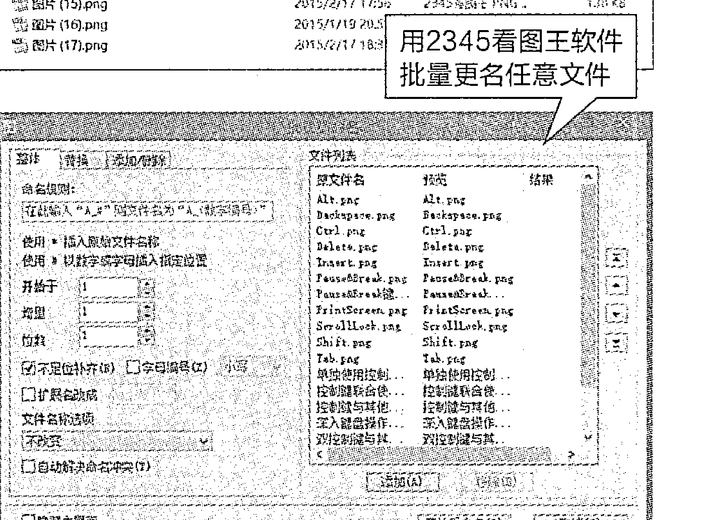

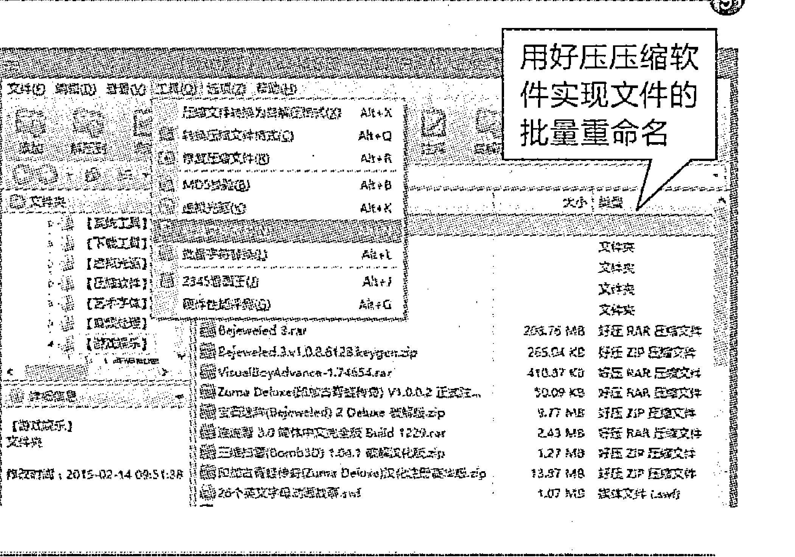

> > 注意：使用压缩软件批量重命名时，要确保软件支持批量重命名功能，同时操作前最好备份原文件，避免误操作导致文件损坏或丢失。

## 智能提速学会只会

当笔记本和手机等移动设备在正常操作或游戏过程中出现卡顿，我们如何释放它们的潜能以尽可能提高流畅度呢？而且还要是在不更换任何配件和路由器基础上的免费提升呢？

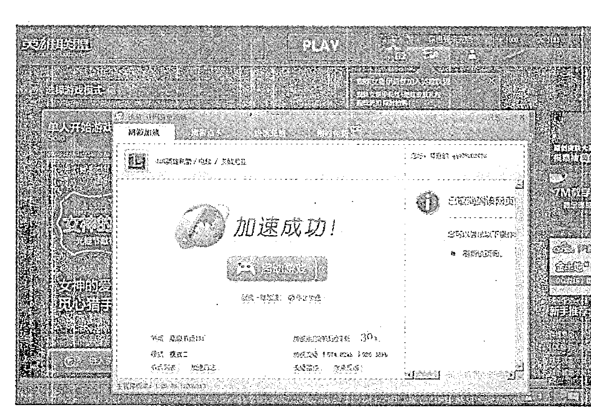

## 笔记本提速秘籍

如果笔记本在玩网游时经常卡顿，很可能并非硬件不够用，而是被网络环境所拖累。因此，笔者建议大家尝试通过迅雷网游加速器、网易UU网游加速器、QQ会员网游加速小助手、ET加速器和迅游网游加速器等“网游加速器”启动游戏（图1）。此类软件的原理大同小异，都是实现跨网加速，解决网通电信等其他带宽之间互联互通不互通的问题。

有些PC游戏的配置需求较高，进入游戏后，无论我们如何调整与画质相关的选项效果都不理想。此时，我们则可跳过游戏自身的画面选项，而通过显卡自带的图形管理功能实现提速效果。以NVIDIA独显笔记本和“DayZ”游戏为例，在桌面点击鼠标右键选择进入“NVIDIA控制面板”，在“管理3D设置→程序设置”中手动添加DayZ程序，并根据自身配置情况定义具体的设置值。比如笔者就将“各向异性过滤”设置在4X，强行关闭了“垂直同步”，将“最大预渲染帧数”设定在4（图2）……总之，NVIDIA控制面板可以提供的优化选项远比游戏内自带的画质调节更丰富和有效，多多尝试可以最大限度实现画质和游戏速度的平衡。

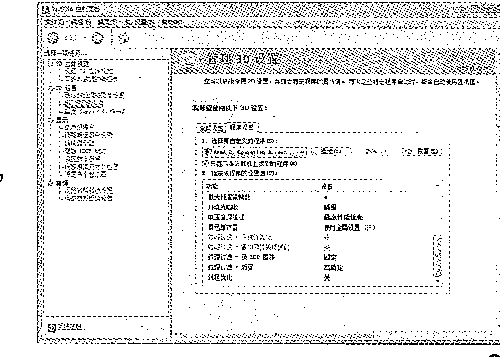

- 指针位置
  屏幕感应区与显示当前感应位置

- 绘图
  显示屏幕更新
  屏幕上的区域刷新时闪烁相应区域
  显示布局边界
  显示剪辑边界、边距等

- 窗口动画缩放
  过渡动画缩放
  动画程序时长调整
  模拟辅助显示设备

- 硬件
  强制进行GPU渲染
  在应用程序中使用2D硬件加速


## 智能手机提速妙招

以Android手机为例，无论什么品牌和系统UI，笔者都建议大家进入开发者选项（该功能默认隐藏，只需连续点击系统信息中的“版本号”即可开启），将“窗口动画缩放”、“过渡动画缩放”和“动画程序时长调整”调整到0.5X、0.5X和1.5X（图3），可明显增加系统流畅度，而且比任何第三方优化软件都安全。

智能手机总会在后台同时运行着无数程序，很容易拖累当前游戏的运行速度。好消息是，360手机卫士、猎豹清理大师和游戏加速器等APP都提供了游戏加速的功能（图4）。可以提前将手机上安装的游戏添加到加速列表，以后再启动游戏时会自动触发加速效果（清理后台，释放资源），从而改善游戏速度。


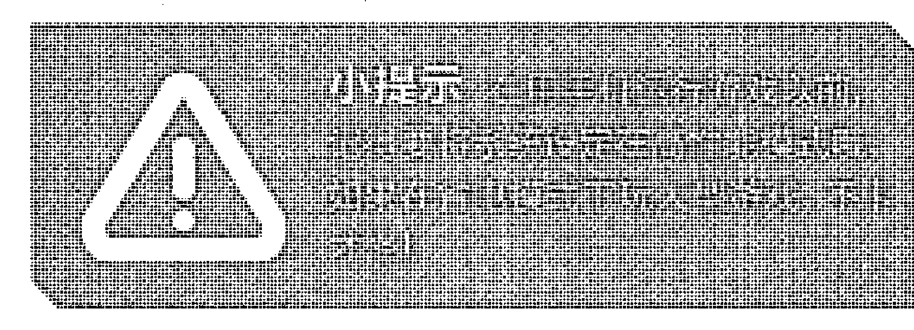

## 《电脑爱好者》2015年合订本（上） 特别话题

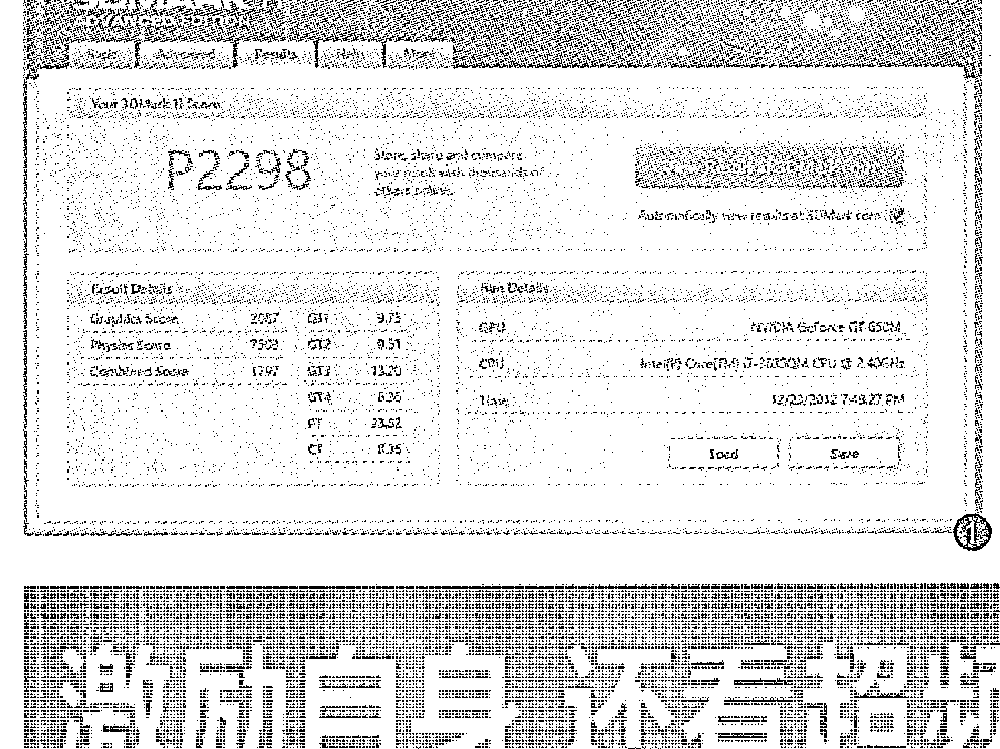

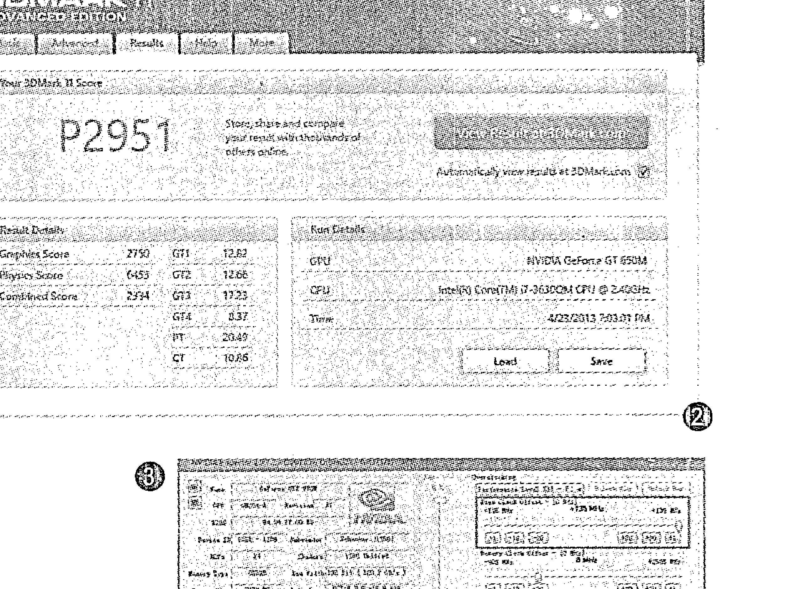

## 移动端也爱超频

移动设备为了确保迷你身材，往往只能牺牲核心硬件的升级能力，以高集成度的形态示人。这意味着我们无法通过自行升级CPU和GPU等引入外援的方式提高性能，只能通过软件层面的超频来改善性能了。

## 笔记本激活超频潜力

理论上所有笔记本配备的移动显卡都有一定的超频潜力，只要笔记本自身散热模块品质过硬，或者准备散热底座或抽风式散热器，就可安心让独显获得10%~20%左右的性能提升（图1、图2）。但有少数笔记本会在BIOS中锁定了显卡频率（如联想Y400/Y500），需手动刷入修改版的BIOS后才能激活超频功能。

此外，NVIDIA前不久在最新移动显卡驱动中禁止了一些配备GTX显卡笔记本的超频功能，这也导致部分尝鲜新驱动的游戏笔记本用户失去了超频的机会。在NVIDIA新驱动未解锁超频前，我们只能将驱动版本降至344.75，或安装驱动光盘中的默认版本。

在超频软件的选择上，无论AMD还是NVIDIA独显笔记本都可优先考虑MSI Afterburner这款超频软件。如果NVIDIA独显使用该软件无效，则可使用NVIDIA inspector软件替换（图3）。具体的超频方法请参考本刊2014年24期文章《免费性能提升谁不爱Maxwell移动显卡超频攻略》。

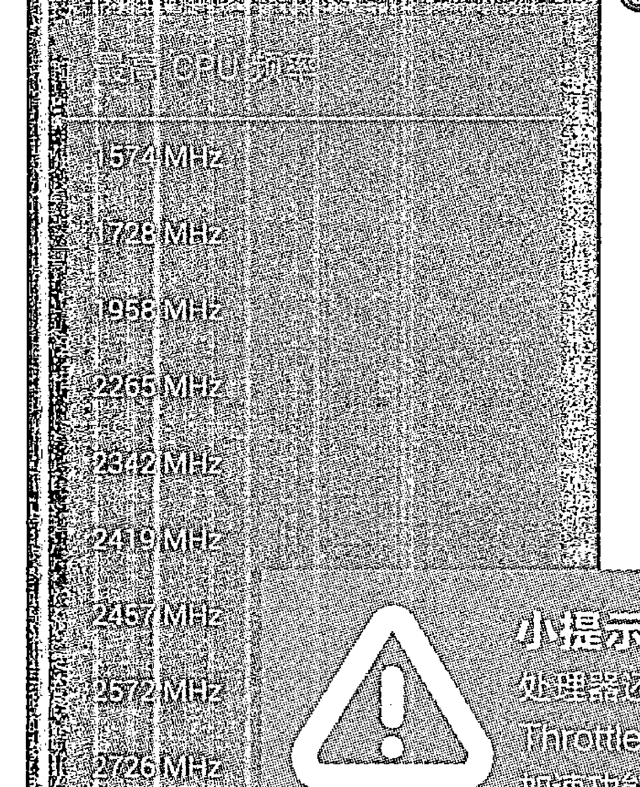

| 项目 | 内容 |
| --- | --- |
| 名称 | CM11超频版 |
| Android版本 | 4.4.4 |
| CM版本 | CM11最新nightly |
| 是否有ROOT | 是 |
| 适配机型 | 一加手机 OnePlus One |
| ROM制作者 | cotaromzx |
| 发布时间 | 2014.07.23 |
| ROM大小 | 238MB |
| 优点 | 本rom基于最新的cm11修改，精简了基带和一些国人几乎不会用到的内置程序，精简了英文输入法，改为搜狗输入法。 |
| 缺点 | 理论内核，CPU频率2.2Ghz，跑分提升4000分左右，发热控制的很好，不会boom！ |
| 支持更多的内核调整项 | 如interactive,ondemand,conservative,sched |
| 支持更多的I/O调度器 | - |
| 省电，大幅度提升性能 | - |

## 手机只能“曲线超频”

多年以前，绝大多数Android手机在Root系统后可借助“SetCPU”或“CPU大师”一类的APP实现处理器的超频。但近两年的手机处理器发热量和功耗越来越大，因此芯片厂大都直接限定了最高主频，而手机厂商也通过内核和ROM锁定了频率，确保手机可长时间稳定运行。换句话说，现在已经没有通用的手机超频方案了，即使个别产品依旧支持SetCPU，手动超频也会带来极大的风险。

因此，如果你想让手机获得更强性能从而流畅运行更多大型游戏，可以考虑去专业论坛寻找对应手机的超频内核或ROM（图4）。以一加手机为例，在刷入网友自定的CM11超频版ROM后即可手动将最高频率指定在1.5GHz~2.9GHz之间（图5）。相对而言，这种通过刷机获得更高主频的方案要远比自行摸索安全。遗憾的是，目前仅热门机型（如小米4、三星Note系列）可以吸引高手定制超频内核或ROM资源。


> 小提示：由于篇幅所限，目前市面上主流的移动处理器还无法实现超频的功能，最多只能通过ThrottleStop软件开启睿频或禁用降频处理器的降频功能。不过最近有些厂商通过超线程技术让处理器以多线程运行，以侧面提升笔记本的超频之路。

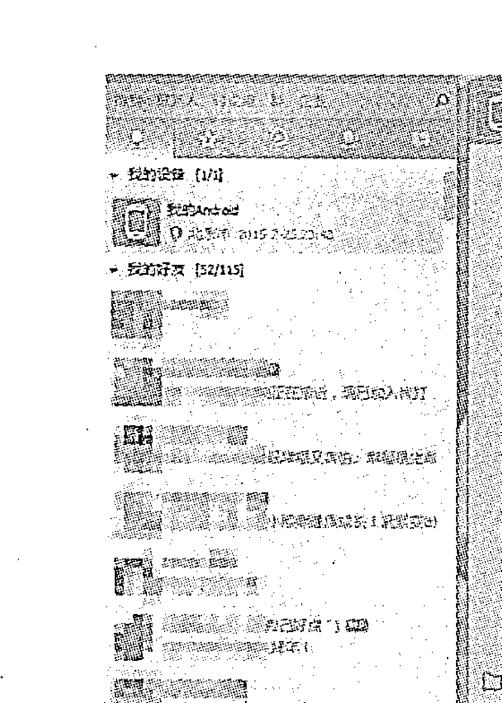

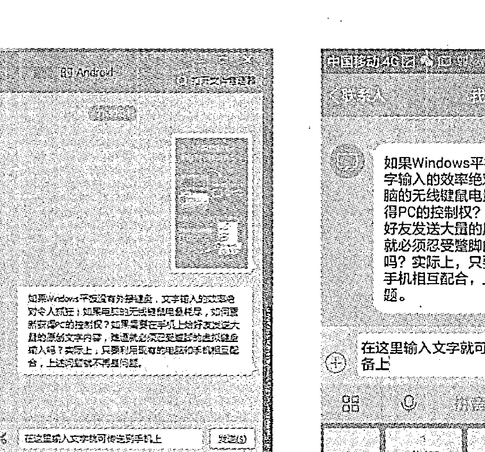

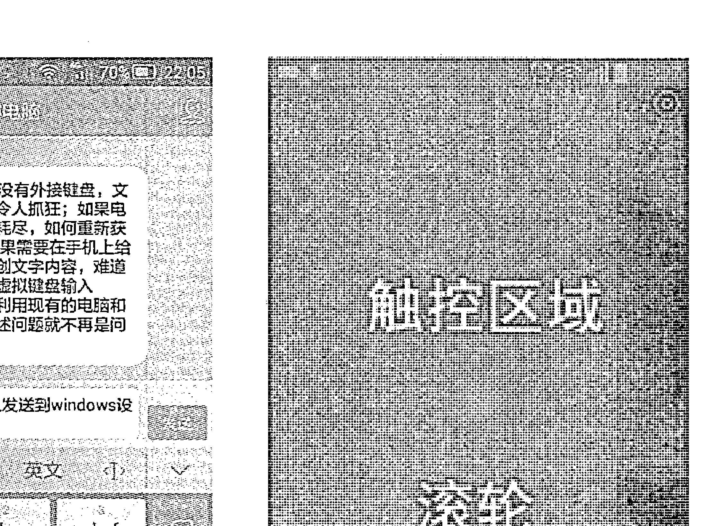

## 手机电脑互为外设

如果Windows平板没有外接键盘，文字输入的效率绝对令人抓狂；如果电脑的无线键鼠电量耗尽，如何重新获得PC的控制权？如果需要在手机上给好友发送大量的原创文字内容，难道就必须忍受蹩脚的虚拟键盘输入吗？实际上，只要利用现有的电脑和手机相互配合，上述问题就不再是问题。

### 手机电脑互传文字

相对而言，用手机输入文字的效率肯定要快于Windows平板电脑。因此，当我们需要在平板电脑端编辑大量文字时，最佳方案就是将手机变成平板的“键盘”。另一方面，PC的键盘输入效率要远高于手机，当我们需要在手机端编辑文字时自然是PC→手机才更有效率。想实现这个目标，最简单的方法就是借助PC端和手机端的QQ软件。

在PC和手机QQ同时在线时，我们可以通过给“我的设备”发送消息的方式（图1、图2），在Windows设备和手机之间互传大量文字甚至图片数据，始终让输入效率更高的设备进行文字的编辑整理。

### 手机变身PC键鼠套装

如果家里PC的键鼠罢工，用手机充当“免费外援”变身键鼠套装自然是最佳之选。我们只需先在PC端安装运行“MouseServer”（下载地址：http://dwz.cn/CrcGX）获得PC的IP地址。在手机端安装APP“WiFi Mouse HD”（下载地址：http://dwz.cn/CrcJC），在主界面对话框内输入PC的IP地址并点击“Connect”按钮就能与PC建立连接。此时，你的手机屏幕就是笔记本的触控板，并提供了鼠标的滚轮和左右键（图3）。当需要在PC上输入文字时点击键盘图标就可调出手机的输入法界面，你输入的文字会自动出现在PC端相应的文本输入框内，如此就解决了没有键盘的问题。

### 手机就是你的PC

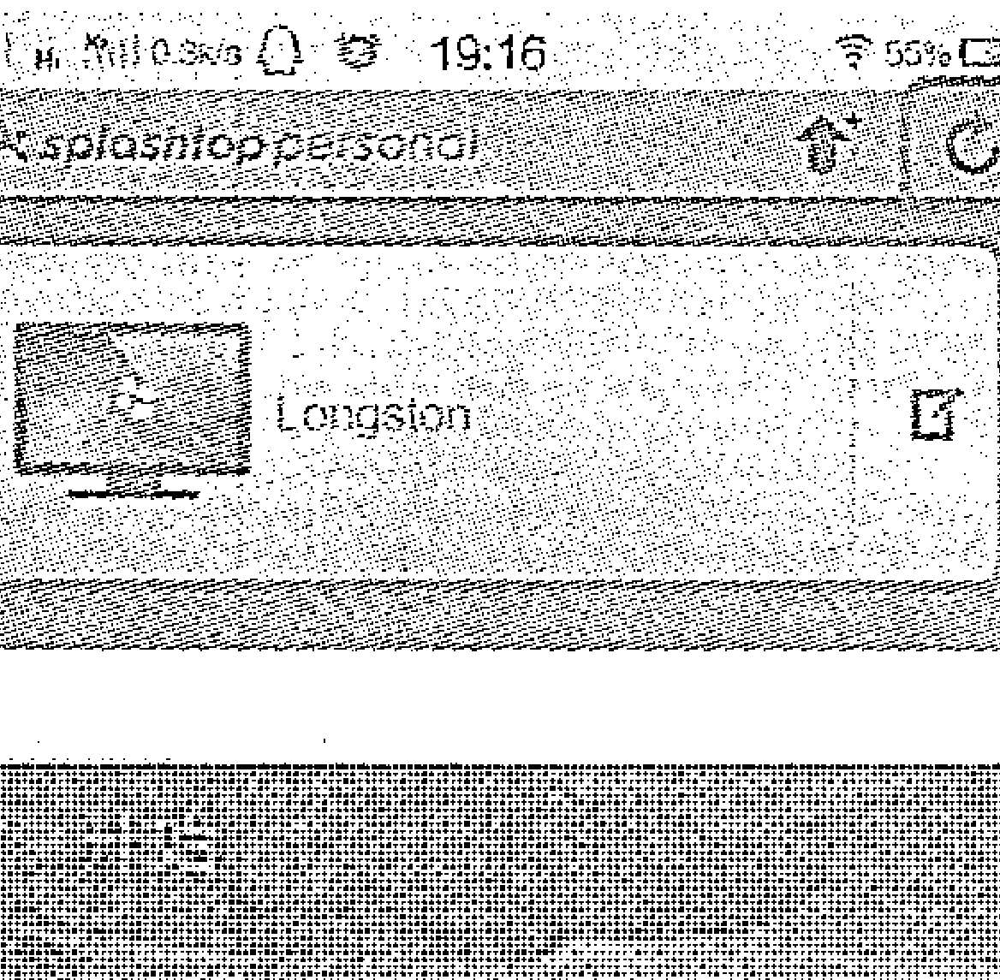

笔者非常羡慕一位土豪朋友，他家厕所配有防水的电视和WiDi适配器，在如厕时也可以远程无线控制PC。实际上，我们无需购买那些昂贵的外援，使用手机同样可以获得PC的控制权，并在手机屏幕上同步显示PC上的内容。简单来说，我们只需分别在PC和手机上安装“Splashtop”客户端（下载地址：http://www.splashtop.com/，需要两个设备处于同一个Wi-Fi环境下），并先在手机端注册用户信息，再在PC端用此账户登录即可（图4）。最新版的Splashtop支持Windows 8手势操作，我们可以在手机上得到完美的Windows 8平板体验（图5）。

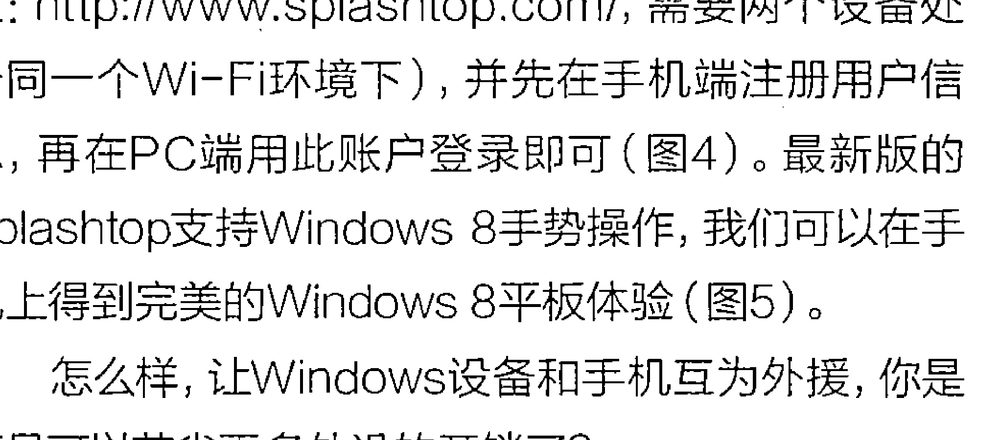

怎么样，让Windows设备和手机互为外援，你是不是可以节省更多外设的开销了？

## 挖掘自身潜力 DIY篇

应对最新的游戏大作，或者面对大型程序时，老电脑难免遇到性能不足的问题。用最短的时间最便捷的办法提升PC性能，那么如何下手？面对强敌必须减少自耗，在应对高负载前减少PC系统的负担很有必要。挖掘自身潜力，轻装上阵迎接强敌。

## 解放处理器倍频

要想提升处理器性能，基本上只有从处理器倍频上下文章。目前的Intel酷睿处理器基本上堵死了超外频的可能性，提升主频只有倍频一条路可走。在提升倍频之前我们首先要搞清楚自身处理器的种类，究竟是可以自由调节倍频的K系处理器还是普通处理器。另外主板芯片组的情况也需要进行确认，要想超频只有处理器支持是不符合目前的超频环境的。

## 确认CPU参数信息

进入CPU-Z官方下载地址 ftp://ftp.cpuid.com/cpu-z/cpu-z_1.72-cn.exe下载最新版本的CPU-Z确认设备信息是最直观有效的方式，下载完成以后安装运行，在第一页就是处理器的相关信息(图1)。截图所用处理器属于第一代酷睿处理器i3-530，需要注意的是，自从二代酷睿处理器开始，Intel普通版的处理器就锁定了倍频，而只对K系列处理器开放了倍频调节功能。主板相关的信息位于CPU-Z最上面第三个选项卡内，从6系主板开始只有P、Z和X系列开放了自由调节倍频功能，而H和B系列无法倍频解锁，但是截图所用的H55芯片组则不在此列。

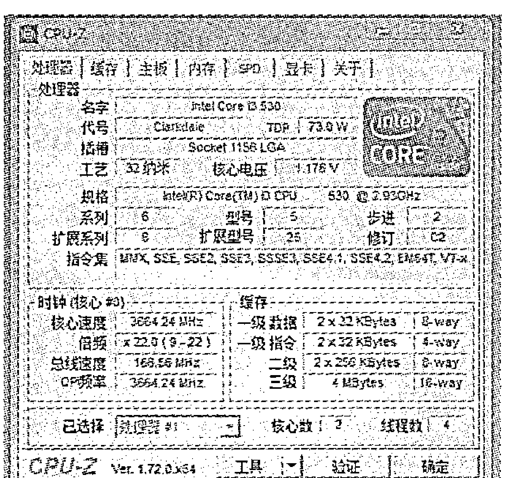

## K系处理器超频

如果我们的处理器和主板都支持超频，其实超频的过程比较简单。重启电脑按Del进入主板BIOS，找到处理器频率相关选项的倍频一栏，直接拉到希望的目标频率即可。比如想达到4.0GHz或4.5GHz主频，倍频只需拉到40或者45即可(图2)，电压不用调整直接保存重启电脑进入系统。进入系统后重新运行CPU-Z，在处理器一项查看处理器自动分配的电压。比如这里是1.46V，这是处理器给出的一个保守电压，如果为了长时间超频稳定自然不能使用默认电压(图3)。重启再次进入BIOS，根据处理器保守电压以每次0.01V的频率手动指定电压进入操作系统并运行基本的稳定性测试(图4)，最终得出的稳定电压就可以长时间使用了。当然如果用户还在使用处理器原装风扇的话是不适合用于超频的，根据处理器温度酌情更换CPU散热器是很必要的(图5)。

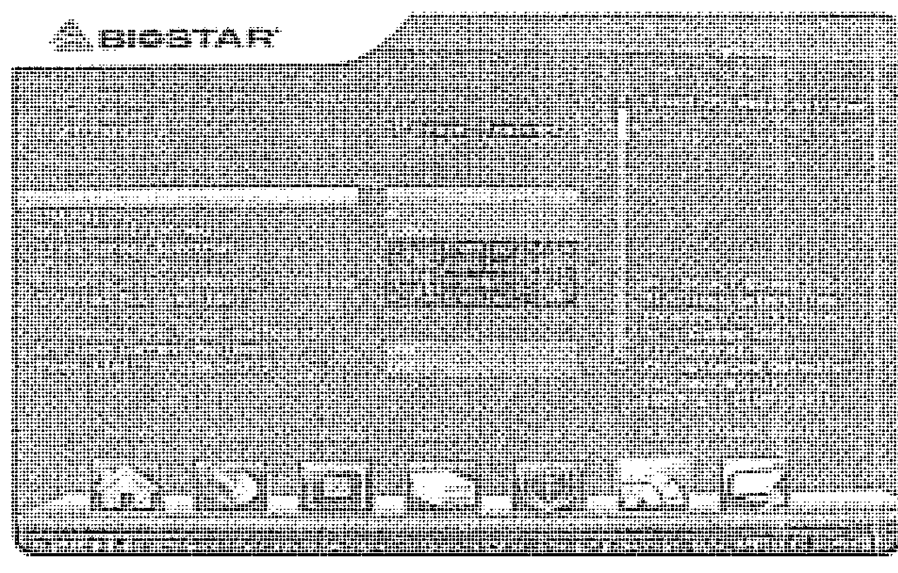

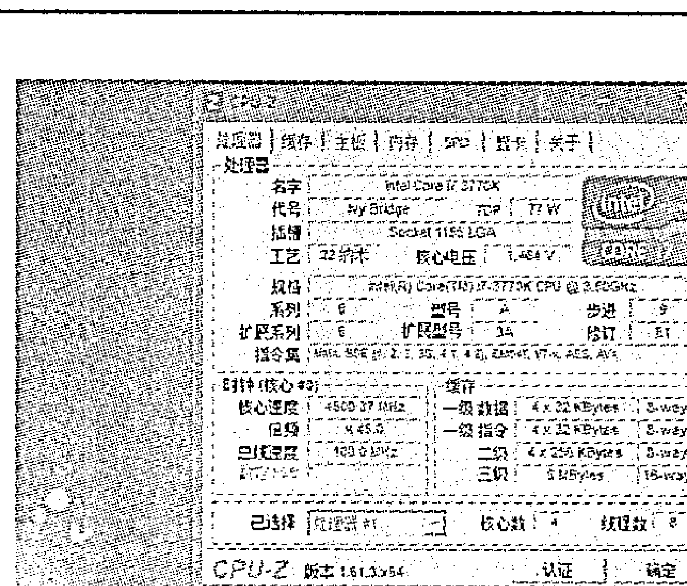

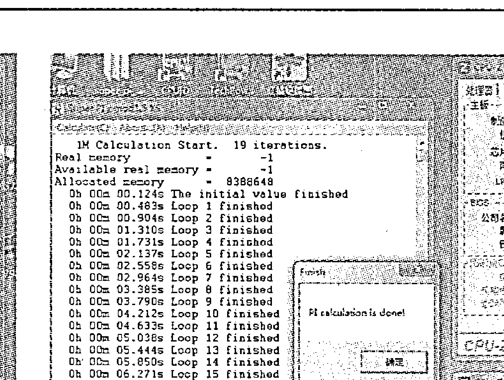

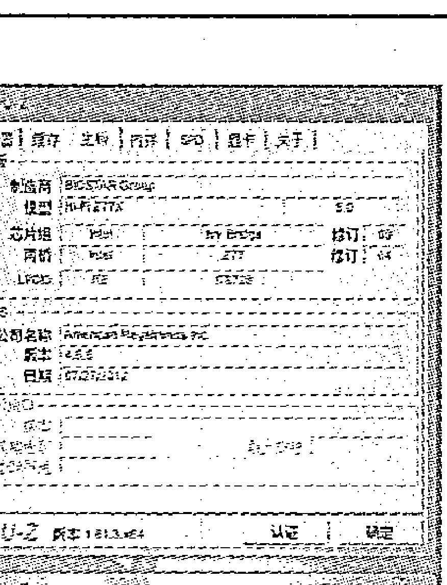

## 普通处理器超频

不支持超频的普通处理器，只要芯片组对应也可以进行小幅度超频。原理就是充分利用处理器的睿频功能，我们强制调配使其进入最大睿频状态并保存下来就可以达到性能提升。重启按下Del进入主板BIOS，修改处理器超频为手动，在倍频相关选项处找到核心比率默认状态（图6），在其基础上分别+4、+4、+3、+2。如果我们的处理器主频在3.2GHz，其最大睿频为3.6GHz的话，最终调节后的频率是在睿频的基础上进一步提升400MHz。重启进入系统运行CPU-Z，此时你会发现处理器会在最大睿频的基础上进一步提升了400MHz的频率运行。不过这种提升是有局限性的，那就是仅在单核和双核运行程序的基础上才会有400MHz的频率提升，如果四核满载最多只能提升200MHz。不过这仍是相当不错的性能提升方式。

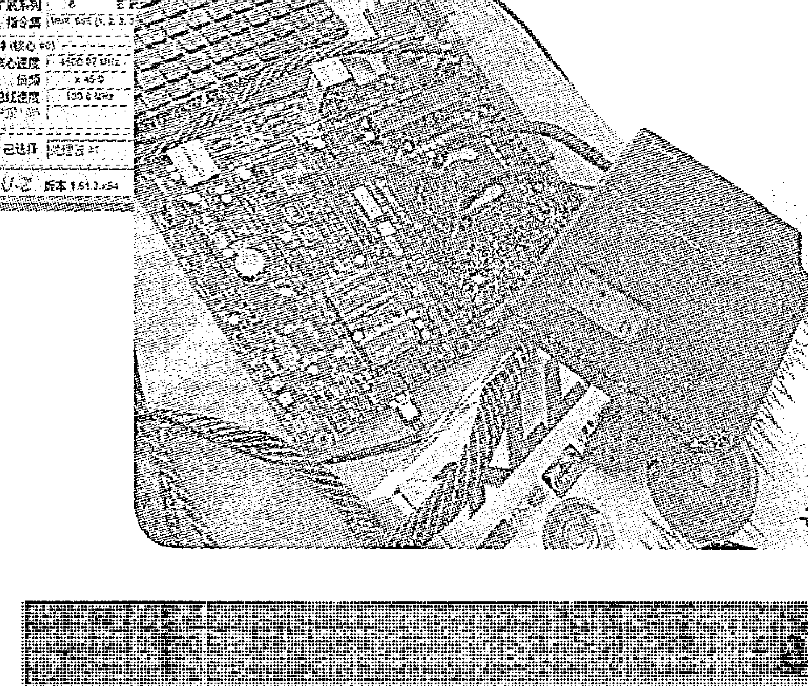

## 修改主板BIOS实现超频

虽然从6系开始低阶芯片组无法默认调节倍频，但一些厂家通过修改主板BIOS的方式“曲线救国”也实现了相关功能。由于是厂家个体行为一般并不会在主板参数中注明，具体是否行得通需要用户自行实验。各家主板刷新BIOS的方法不一，不过现在基本上都有官方刷新BIOS工具，只需要去主板官网下载最新版本的主板BIOS文件刷新即可，没有什么难度。刷新完成之后重启电脑进入BIOS，如果支持B系和H系芯片组也会出现与Z系主板相同的超频选项，超频的办法类似前面两种情况，并没有什么分别。不过一般情况下，B系和H系主板的供电模块并没有Z系主板那么豪华（图7），如果我们的处理器在Z系上可稳定在4.5GHz，那么在B系和H系上可能就只能稳定于4GHz，这也是很常见的事情。一般推荐在低阶主板上只进行小幅度超频，并不推荐大幅超频，因为有可能影响系统稳定程度。

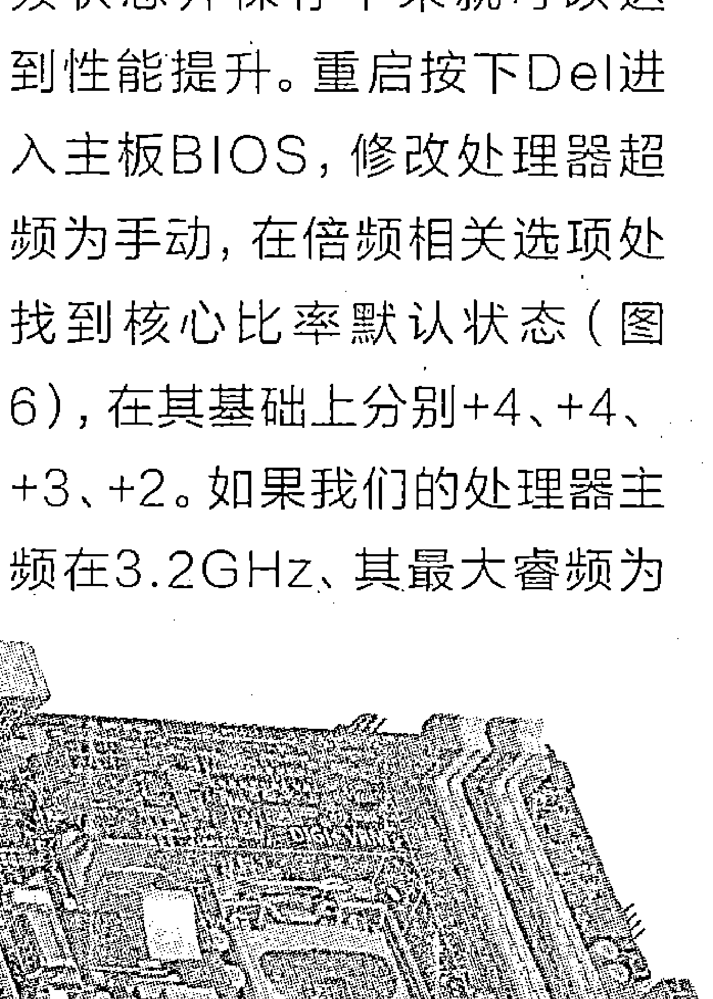

## 科学释放系统内存

目前内存价格较高，尽管有回落的倾向但依然售价不菲。不少用户装机都只装了一条内存等待全面降价后再行补齐，那么在内存不足的情况下如何合理利用内存容量就成了课题。

## 了解内存释放

很多软件都提供了内存释放功能，如何科学使用这些功能呢？比如目前非常流行的鲁大师，在软件安装好运行的第一次就会有内存占用悬浮窗提示我们点击释放内存（图1）。具体的释放原理在此不予赘述，我们只需要搞明白这项功能的意义所在，何时使用内存释放合理即可。

Windows在启动时占用系统内存会达到第一次高峰，随着待机时间延长系统进程逐渐自动关闭，内存会逐渐达到平稳的占用状态。但如果我们开启了大量网页、QQ、或者其他日常常用软件的话，每一项都会占用内存。在此时我们如果开启一个大型程序或者游戏会瞬间将内存占用达到接近满载的情况，系统内存不足就会去访问虚拟内存文件，如果安置在HDD上就会大幅降低速度。

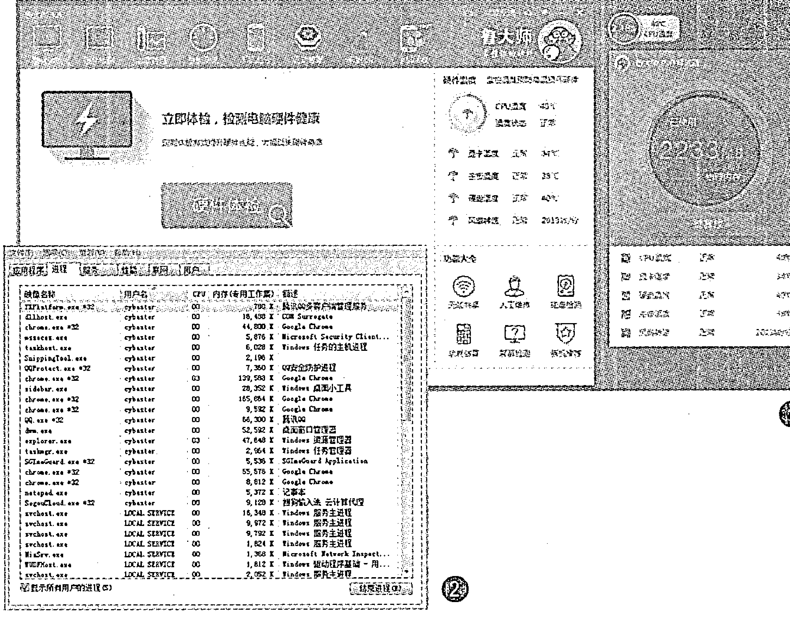

那么怎么看待内存释放呢？首先不论任何状态都去释放内存肯定不合理，这样反而会影响零散小程序的运行速度。只有在开启不少网页和小程序的基础上要运行大型程序，而之前的网页和小程序只会运行于后台时，内存释放功能才合理（图2）。因为不能关闭它们，但位于后台又无需很大内存占用，释放一次后运行大型新程序能保持系统高效。

## 全面提速系统盘性能

现在新装的高性能电脑一般都会安装一块SSD用于提升系统响应速度，SSD对于Windows和相关电脑程序的提升我们在过去也介绍得比较多。目前正值三星新一代850系列全面火爆之时，凭借全新的3D闪存结构和更稳定的可靠性，850系列销量已经领跑京东商场等电商。其实在已经不弱的硬盘性能上还可以进一步提升。

## 三星SSD性能提升办法

下面提及的性能提升办法不仅适用于最新的850系列，只要是三星相关的SSD都可以适用。办法其实很简单去三星官网下载最新的Samsung SSD Magician，这款软件不仅可以提供估计按刷新、性能预览和测试等功能，还有许多更为高端的功能。软件在性能相关设置中拥有三个配置方案，包括最高性能、最大存储量和最佳可靠性（图1），通过软件可以轻松修改SSD的配置## 获得HDD最高性能

就算我们没有使用SSD，只用HDD的话也有性能提升的方法可循。一般家用硬盘都会有两个功能常备用户们忽视，那就是AAM和APM控制。AAM被称为自动噪音管理，这个值越低硬盘越安静但是性能也相应较低，如果调高正相反。APM被称为高级电源管理，这个值越低硬盘越省电，如果调高自然费电但是也是最佳性能模式。

可能很多用户都没接触过AAM和APM控制，那么我们如何调整它？熟悉硬盘的用户肯定听说过HDTune Pro这款磁盘工具，它不仅能够测速查看磁盘信息，也拥有AAM相关的调节功能。打开HDTune Pro，进入选项卡第二行的AAM选项卡，勾选打开选项将值调整为最高并设置即可。软件下方还提供了当前值和缺省值的提示，一目了然（图4）。修改前后可以用软件提供的测试功能，存取时间确实能够5%左右的性能提升。

更加小众一些的CrystalDiskInfo提供更加完美的AAM和APM控制功能，去软件官网http://crystalmark.info/download/index-e.html下载最新版本的CrystalDiskInfo 6.3.0，安装软件时注意点掉相关的浏览器插件勾选，运行软件即可。软件界面主屏是磁盘所有的信息，这里要比HDTune Pro更为详细和直观。

我们略过磁盘信息不谈，在菜单栏里找到功能、高级特征，这里拥有“AAM和APM控制”以及“自适应AAM和APM”两项（图5）。第二项是由软件分析磁盘后自动为磁盘指定合适的值，如果我们想自己更改只需点开“AAM和APM控制”，里面会依次列出每块硬盘的AAM和APM控制条（图6），如果需要最强的性能将进度条无脑拖向最右侧并启用即可。

## 敌人的敌人就是朋友

无论处于何种环境下，均不会有永恒的敌人和盟友，他们之间的角色会因目标的不同不停地转变。在更为强大的敌人出现之前，各自为战无疑是通用准则。而当面对共同的对手时，结盟、投诚等行为就是因自身利益做出不同的抉择。

## 搞清派系 打造舒适环境

总有人会被不断偷偷装进电脑的各类工具而困扰。那么，这种情况能不能避免？该如何避免这种情况的发生？

文|风尘

## “被装”软件的成因

究其原因，“被装”行为是因为没有摸清各类软件的“派系”，胡乱“站队”所致。如果只安装同一派系的软件，会构成一个比较和谐的软件生态圈，一般不会出现如上麻烦。但由于需求的多样性，只用一种派系的软件的人却不多。但若安装了不同派系的软件，每个派系的软件都会不失时机地想法将自己派系中的其他软件引入用户的系统中，自动安装其他软件的行为就很可能发生。以人们最常用的360系列、百度系列、金山系列软件为例。大家知道，在这3个系列的软件中，多数都是同质化比较严重的软件。有时我们甚至不能确定到底用谁家的软件好。公说公有理，婆说婆有理。软件商都说自己出品的安全软件最棒，而粉丝们各有各的喜好，有的说金山的安全软件好，

> 明示的捆绑安装方式还算地道

> > 取消可能会导致安装第二软件的所有选项

有的说360的安全软件好。如果自己没有主见，今天装一个金山的杀毒软件，明天又安装一个360的浏览器，后天又安装一个百度的安全助手工具，那么被“安装”也就不足为奇了！

说起原因也很简单，每家软件公司首先要推荐自己的产品。如果换你做软件公司，自己家产出输入法，难道你会在自家的网络浏览器中免费为李四家的输入法摇旗呐喊吗？软件公司通过一个软件来推广自己的另一个软件，一般采取三种办法：

第一种比较仗义的方式是在甲软件的安装、使用、卸载中以明示的方式向用户推荐另一个软件；另一种方式是在安装、使用、卸载中以半明半暗（甚至误导）的方式引诱用户安装它的另一款软件；更有甚者是在用户无法确认的情况下，暗地里偷偷安装另一款软件到用户的电脑中（图1）。

目前最后一种情况越来越少，因为这样会引起不良的新闻效应，到头来是搬起石头砸自己的脚。所以目前更多的宣传方式是第二种，即以半明半暗、模棱两可的方式在软件安装、使用、卸载过程中安置某些令人费解或不能引人注目的选项，让人不经间就默认选择安装了厂商的推广软件。而如果真的要投诉，责任也不能归咎于厂商，因为毕竟不算是偷偷安装，总能找到让用户选择的入口，用户没注意点击选择了或没有点击取消选择，责任在用户。

## ## 拒绝“被装”的方法

鉴于以上原因，对于不十分了解各家软件推广伎俩的用户，如果安装了不同商家的软件产品，很有可能会招来更多的推广类软件。为避免这种情况的出现，有两种解决办法。

一种是尽量安装同一“派别”的软件，用到的软件一次都装上，这样就不存在是否偷装的问题。建议选择实例强的软件公司的套件。笔者常用360的软件，该公司出的软件多数可称为精品，所以一脑全装，从来没有发生过被360安装的事件。

另一种是，如果要安装不同派系的工具，一是要非常留意软件安装和卸载过程中每个页面的边边角角的选项和提示信息，不能贸然点击“下一步”或“确定”，要将所有可能会导致安装第二软件的选项都去掉。此外，在软件安装之后，在软件中可能潜伏着安装第二软件的选项或开关，如果听任软件的默认设置，那么很可能在某个时间点激活安装第二软件的行为。因此，在安装软件之后，不要急于使用，先通过软件的设置菜单或控制中心，将捆绑第二软件的选项统统去掉（图2）。

## ## 老友的硬件重新上岗

无论是台式机还是笔记本，伴随我们一路升级，相关的淘汰硬件也不在少数了。对新PC或新硬件而言，这些“淘汰品”自然是敌对分子，但如果我们以善加引导，也能让这些“敌人”重新为我所用呢。

### ### 淘汰内存重新上岗

内存无疑是PC领域淘汰率最高的硬件，很多玩家会选择在二手市场将老内存卖掉弥补损失，但更多的用户却选择了将其“雪藏”。实际上，我们可以借助不同类型的转换插座，让不同版本的淘汰内存重新上岗。比如你手头有淘汰的笔记本内存，而家里的台式机刚好还有闲置的内存插槽，在淘宝上搜索“SO-DIMM转DIMM”即可找到相关的转接卡，可以让笔记本内存为台式机主板继续服务（图1）。此类转接卡有DDR2和DDR3之分，价格多在20元~35元之间，性价比还可以接受。

很多老台式机主板只支持DDR2内存，但如今内存的价格走势却是DDR3便宜、DDR2较贵。能否将便宜的DDR3内存安装在老主板身上？答案是可以，但也要借助转接卡才可实现（图2）。在淘宝上搜索“DDR3转DDR2”便可找到相关产品，使用时DDR3内存的频率会被降频至800MHz。都说DDR3内存是老主板的敌人，但让敌人为我所用的感觉是不是很惬意？

小提示 内存转接卡可能存在“挑硬件”的问题，在购买前一定要先和卖家沟通，确定支持自家的淘汰内存和主板后再下单。

### 台式机硬盘也能随时“移动”

在PC的更新换代过程中，台式机专用的3.5英寸硬盘无疑是寿命最长的硬件之一，只是限于主板SATA或IDE接口数量，或硬盘容量太小，很多老硬盘都被我们塞进了抽屉或遗忘在了角落里。我们都知道，2.5英寸笔记本硬盘可以轻松打造成移动硬盘，那我们为什么不将这些老3.5英寸台式机硬盘也“移动”起来呢？

考虑到3.5英寸硬盘对供电的要求高，笔者不建议大家自行DIY，推荐在淘宝或京东直接购买带独立供电的3.5英寸移动硬盘盒（图3）。此类产品价格在50元~150元间，主要差异在于做工、有无内置风扇和USB3.0接口等等。在选购时只要根据老硬盘接口是IDE还是SATA选择对应的硬盘盒即可（图4）。

### 闲置显示器变身一体电脑

很多用户家里都有闲置的显示器，食之无味，弃之可惜。好消息是，如今很多采用BayTrail平台设计的超迷你PC已经非常实惠了，比如索泰旗下的ZBOX PI320，它的体积只比烟盒大了一圈，可以轻松固定在显示器的背部（VESA标准）。连上视频线之后就可以将闲置显示器变成一体电脑使用（图5）。需要注意的是，老显示器通常只有VGA接口，迷你PC则普遍为HDMI，所以这就需要我们再准备一根HDMI转VGA线。

## 搞定复杂的内存问题

关于系统的内存问题，基本只有运行频率与标称频率不对等以及兼容性两大问题。解决了这些问题，内存才会真正成为传统五大件中速度最快的设备。

### 频率不对等

运行频率与标称频率不对等现象非常普遍，由于处理器和芯片组所支持的内存频率各自不同，就算是1600MHz内存插到不同平台上也会运行在不同的频率上。过去由于处理器外频和内存频率息息相关，所以内存频率非常敏感；现在处理器外频基本锁死在100MHz，这个现象就有了改善的可能。

首先需要说明的是，就算是处理器和芯片组均只支持1333MHz这种较低的DDR3内存频率，通过进入BIOS修改内存与外频的比值也是有可能实现1600MHz的。这可能与很多朋友想象的不同，就算处理器不进行超频，内存频率也可提升。目前我们购买的内存基本都是1600MHz起步，所以在进行一切BIOS修改前，先改这一项很有必要。

如果无法通过外频和内存比值得到最佳性能，就需要考虑超频或者XMP等设置了。内存超频无疑会降低其稳定性，如果主板和内存均支持XMP就好办得多。进入内存相关选项选择XMP方式，内存会自动设置内存频率至厂商预设频率，十分方便（图1）。

当然1600MHz不是终点，在Windows 7 x64操作系统中只能得到7.8分（图2）。要想得到满分7.9，至少需8GB左右的1866MHz频率的内存才能稳定。此时可以考虑将内存电压从1.35V提升到1.5V，或适当降低内存时序，比如从8-8-8-24（1T）降低到9-9-27（2T），对于体质一般的内存条稳定在1866MHz很有帮助。

### 内存兼容性分析

为什么时至今日依然会有内存兼容性问题? 这个其实不能和过去常说的兼容性划等号, 不同情况下的兼容性问题需要不同的分析方式和解决思路。一切默认状态下内存无法共同工作才属于典型的兼容问题, 而常见的超频后不兼容或插槽插满后无法四条认全的问题并不是兼容性问题, 需要新的解决办法。

在内存超频过后, 稳定性肯定不如默认状态, 如果此时增加内存, 由于新旧内存体质不同无法使用共同的超频设置是基本常识。此时要将内存恢复默认频率, 然后根据内存特点逐级恢复原来的超频设置, 必要时可适当降低频率或内存小参数以达到稳定。

而将主板的内存插槽插满后, 平台没有认全四条内存是更诡异的问题, 有时表现为BIOS环境可正常识别但操作系统不行, 也有BIOS和操作系统不识别的情况。此时需单条内存逐条测试确保无问题, 再将内存超频状态取消, 逐渐增加内存。奇特的现象是四条内存用不同的顺序插在主板内存插槽上会有不同的效果, 有时遇到没有头绪的兼容问题, 改变内存安插顺序就能迎刃而解(图3), 也算偏门的解决思路。

### 电源线缆的转接

电源是机箱内部最特殊的部件, 由于其特殊性我们经常会遇到几大件已经更换了好几代但依旧沿用老电源的情况, 而且这种情况非常普遍。就算电源的额定功率完全能满足新平台要求, 那么是否就万事亨通了呢? 实际情况并非那么理想。

就算电源的各路输出完全能够满足平台需要, 但是老电源的最大问题就在于线缆的规范是按照数年前的PC平台所设计, 并不见得完全适合现在的平台。最简单的例子, 现在的主流主板都使用了8Pin处理器供电, 而一些老电源只提供4Pin处理器供电。

那么这根线怎么插就成了问题。类似的还有显卡6(+2)Pin供电线（图4）数量不足、SATA供电线缆数量不足等很多问题，此时我们就需要搞清哪些可以通过直插搞定，哪些需要转接线。首先说处理器供电，如果我们的电源只有4Pin接口，完全可以根据防呆接口的方向插在主板8Pin插槽的一侧，普通使用不会有任何区别。但是由于供电电流不能完全达到主板要求，在进行处理器超频时会受到不小的影响。必要时还可以使用4Pin至8Pin转接线（图5），但供电性能不会因此改善。再说显卡供电，如果电源缺少显卡6(+2)Pin供电线，可以考虑使用两根原本IDE的D形4Pin接口转接6(+2)Pin供电线，原则是两根转接一根就不会出问题，很多显卡在出厂时也提供了这样的转接线（图6）。但如果显卡使用8Pin而电源只提供6Pin的话就需要具体分析，有些显卡可以正常运行而有些不行，根据自身情况决定是否使用6Pin至8Pin转接线（图7）。SATA线缆不足的情况相对可以随意一些，一般均使用原本IDE的D形4Pin接口转接（图8），不过比较难办的是主板、硬盘和机箱等厂商均不提供此类转接线缆，用户需要自行购买。由于第三方转接线的品质良莠不齐，所以选择时要尽量挑选口碑较好的品牌或商家。

## 异类软件一家亲

1+1=2可以说是最简单的加法，但如果1+1>2呢？接下来就一同看看那些互补而又促进的合作方式吧！

文件下载、视频转码、文件更名，这看起来是三件完全不同的事情，但对于一个视频收藏者来说，所需要的恰恰是一种能够以一条龙式解决问题的方案，缺少任何一种，视频收藏工作都不能顺利、完美地完成。文件下载之后，格式不一定能满足使用的要求。比如用爱奇艺下载的视频，如果要拷贝到一个没有安装爱奇艺客户端的手机或无法安装爱奇艺播放器的播放设备中播放，由于爱奇艺视频独有的不兼容QSV格式，下载的视频将无法在这些设备上播放。这时就需要有配套的视频转码方法，利用QSV转换器，就可以用最快的速度将爱奇艺视频格式转换为通行的FLV视频格式。再如，用优酷视频客户端下载的视频，并不一定适合于在自己的手机上播放，这时我们可设定下载时自动转换，将视频转换为与自己的手机最吻合的格式（图1）。

小提示 还有一些视频下载器或播放器没附带配套的格式转换器，如果需转换格式，可使用通用格式转换工具（如格式工厂），有针对性地进行视频格式转换（图2）。

下载后的系列视频，如果要以规范的专辑文件名进行收藏，就需要一套文件名个性化定制的方法。为了提高效率，可以使用拖把更名器这款软件，输出不规范的视频列表文件，用文字编辑器对文件列表进行手动编辑或成批更名，再将列表导出拖把更名器，对不规范文件名的视频进行快速成批更名（图3）。

如此，风马牛不相及的三种软件联合发挥作用，就可以快速完成视频文件的下载、整理和收藏任务。这一过程所涉及到的一整套方法和各种软件，可作为下载、整理、管理视频的一个准则，还可以应用于任何一种其他文件的下载和管理。

## 映像与压缩相辅助

我们常常需要将系统安装文件或用户文件制作成ISO映像文件，映像文件的制作过程是一个文件的打包过程。但是，有时我们受存储空间的限制，就需要考虑映像制作过程中对文件进行压缩这个环节。例如，一个映像包制作之后如果是一个大于4GB的ISO文件包，而我们手头上只有一张容量为4GB的U盘，如何将这个ISO文件拷贝到U盘中？

如果将ISO文件压缩为RAR或ZIP文件，虽然可以满足容量的要求，但是，将这样的文件保存在U盘中，使用时还需要解压，多有不便。这时可以借助于UltraISO软件的格式转换功能，将ISO文件转换为一种压缩格式的文件ISZ。具体方法是：启动软碟通工具UltraISO，打开现有的ISO文件，然后以ISZ格式另存文件。或者也可通过“工具→格式转换”命令，启动格式转换窗口，指定映像文件和输出位置，指定输出格式为“压缩ISO”，点击“转换”按钮即可获得经过压缩的ISO文件（图4）。

## 压缩与云盘联姻

为了方便上传下载，如果有多个文件要放在云盘中保存，我们通常的做法一般是尽量采用压缩包的方式，先将文件压缩打包为一个压缩文件，然后将打包后的文件上传到云盘中，这样以便于传输和云端管理。但是，存放在云盘压缩包中的文件，在使用过程中又会给用户带来麻烦。使用云盘中的压缩文件，我们一般需要先下载到本地，然后解压文件，才能使用其中的内容。

云盘与压缩联姻，解决了这个让人们感觉到不方便的问题。如果你也遇到这种困扰，那么，请选择能够直接处理压缩包的云盘，这样就可直接在线查看压缩包中的文件，云端文件的使用就变得简单多了。

例如，我们将压缩包保存在自己的百度云盘中，使用时直接通过云盘在线点击即可打开压缩包文件，在压缩包文件在线预览窗口中，选择包中的任何文件，即可出现“解压到”和“下载”两个按钮，这样我们就可以有选择地对云盘中压缩包内的文件进行解压和下载，免去了只为一个小文件必须先下载一个大的压缩包的尴尬（图5）。

经过压缩的ISO文件体积明显减小，4GB出头的文件一般可压缩为4GB以下，装入4GB介质成为可能。而在使用方面，ISZ格式文件无论在文件装载、刻录等操作方面，与ISO文件并无两样，从而达到了在不影响功能的前提下给映像文件缩身的目的。

手机安全类APP精诚合作

很多安全类APP的功能都是存在冲突的，如果同时安装多款APP并启动了相同功能，很容易出现各种隐患。实际上，我们可以选择性地使用每一款安全软件最好用的功能部分，关闭或屏蔽其他功能，从而实现共存。

系统自带的安全软件

如今绝大多数Android手机都会预装安全类软件，比如联想的乐安全、OPPO的安全中心、中兴的掌心管家等等（图1）。此类APP默认就具备底层权限，无需Root即可拥有权限管理或系统软件卸载等功能的权限。

功能丰富的第三方软件

就功能而言，系统自带的安全软件肯定不如类似360手机卫士、LBE安全大师一类的第三方APP丰富，只是第三方APP想使用全部功能需要手机获取Root权限。如果你的手机已Root并安装了这类软件，就要进行一些设置确保安全软件间和谐共享了。

安全软件的和谐共享

首先，我们要认识到同时安装多款安全类APP的重要性。以华为手机为例，其系统虽然支持联网防火墙功能，但却仅支持用户自行安装的第三方APP的4G/3G/2G联网权限，而系统自带的APP却不受控制（图2），很容易不经意间出现浪费流量的问题。因此，此类手机就需要安装360手机卫士一类的APP，对包括系统APP在内的所有程序进行联网权限的分配（图3）。

就笔者的经验来看，只要安装并使用了第三方安全APP，为了确保系统稳定就需要手动关闭系统自带的安全功能。以安装了360手机卫士的OPPO手机为例，需要进入“安全中心”关闭骚扰拦截和权限监控等功能（图4），否则在陌生人来电或新装APP时，会弹出多个提示信息框，很容易出现误操作。

此外，如果你在360安全卫士里添加了一键清理内存的白名单，那就请记得长按手机Home键，将白名单软件锁定（图5），避免它被系统自带的内存管理机制给自动查杀（Android系统会在内存不足时自动清理后台程序，锁定的后台程序自动查杀的优先级靠后，可以避免自动关闭）。

总之，如果你的手机安装了多款安全软件，那么同类型的功能就只开其一。如果某个APP无法关闭定制功能，那就将两款软件设置在相同的状态（比如开机自启名单）。

玩转双系统的Windows 8平板

如今市面上涌现出了无数款千元级双系统平板，它们均基于英特尔BayTrail-T平台设计，并支持在Android或Windows 8.1系统中直接切换到另一系统（需重启）的功能。Android和Windows互为敌手，但至少在平板电脑领域终于携手，这对消费者而言无疑是件好消息。考虑到目前双系统平板使用中容易出现各种问题，在这里我们就了解一下此类产品的优化方案吧。

### 让Wi-Fi信号更稳定

很多双系统平板用户都有这种感觉，在Windows 8.1系统下Wi-Fi信号似乎不如Android系统中稳定。如果你也遇到了类似问题，可以尝试安装“Windows系统平板Wi-Fi补丁”（下载地址：http://pan.baidu.com/s/1bnfitkz）。要注意的就是只能在Windows系统界面下安装，安装时不要改变路径，安装重启后才会生效。如果你的平板不支持该软件，安装过程中会有报错提示，不会影响系统稳定性。

### 双系统时间保持一致

有些双系统平板用户会遇到一个很尴尬的问题，就是Android和Windows 8.1系统下的时间显示不一致。如果你想解决这个问题，请先进入Windows 8.1系统，然后进入注册表编辑器，在`HKEY_LOCAL_MACHINE\SYSTEM\CurrentControlSet\Control\TimeZoneInformation\`中添加一项数据类型为REG_DWORD、名称为RealTimeIsUniversal、值设为1的键值（图1）。重启平板后时间应该就可保持一致了。

### 让Android系统游戏时更稳定

一些双系统平板在Android系统下游戏时容易出现卡顿甚至死机现象，这个问题往往源于产品散热设计不到位，还好我们有弥补的方案。在Android系统界面下，在品牌官网下载安装Intel驱动并使用“ROOT大师”获取ROOT权限。接下来还需要使用“RE管理器”，在选择挂载读写选项之后进入根目录下的`\etc\`文件夹，右键选择“install-recovery.sh”并用“文本编辑器”的方式打开文件，手动输入以下两行代码（图2）：

```
echo 500>/sys/class/drm/card0/gt_min_freq_mhz
echo 500>/sys/class/drm/card0/gt_max_freq_mhz
```

加入代码的原理是将Atom处理器集成显卡的频率降频至500MHz，并在系统启动时自动修改该值。当然，你也可以尝试将显卡频率设置为550MHz，这样画质损失最小，在保证不死机的情况下效果最好，如果依旧不稳定则可进一步降低至400MHz。在确保修改成功之后，建议删掉同目录自动生成的“install-recovery.sh.bak”这个文件，防止设定值被自动恢复回来。

### Android获得存储卡写入权限

很多2014年出厂的BayTrail-T平板都仅预装单系统，而很多玩家通过各种教程，自行更新BIOS和脚本并升级到了双系统模式。但是，自行刷入双系统的平板电脑普遍存在一个问题，就是在Android系统环境下，没有对存储卡的写入权限（只能读取），这意味着我们无法在存储卡上安装游戏。

想找回Android系统对存储卡的写入权限，需要先将系统ROOT，并用RE管理器打开`/system/etc/permissions/`文件夹里的“platform.xml”文件，查找代码：

```
<permission name="android.permission.WRITE_EXTERNAL_STORAGE">
    <group gid="sdcard_r" />
    <group gid="sdcard_rw" />
</permission>
```

并将其改为（图3）：

```
<permission name="android.permission.WRITE_EXTERNAL_STORAGE">
<group gid="sdcard_r" />
<group gid="sdcard_rw" />
<group gid="media_rw" />
</permission>
```

保存退出并重启平板后，你就会发现Android系统重新获得了存储卡的写入权限。由于绝大多数BayTrail-T平板的存储空间只有32GB，其中Android可用的空间只有7GB左右（图4），没有存储卡和相关的写入权限肯定悲剧。

高德导航默认的地图存储目录

学会在Android下挂载存储卡

当Android系统获得存储卡完整的读写权限以后，接下来就要掌握将数据保存在存储卡从而节省平板内部存储空间的方法了。在这里笔者向大家提供两类思路：

- 不需要挂载存储卡

Android系统中有些软件支持安装在外置存储卡中（已安装APP可以利用360手机卫士的软件搬家实现），但有些导航软件的地图包却还需要增加一个步骤。以高德导航为例，首次运行时软件并不能识别出存储卡（图5），只能选择将地图包下载到内部存储空间。

- 需要挂载存储卡

Android中大型3D游戏的数据包通常只认内部存储路径，想将数据包保存在外置存储卡上就必须借助挂载功能了。以在拇指玩下载GPK格式的《极品飞车17》为例，下载GPK文件后先在PC端用WinRAR解压缩，会得到apk安装文件和“com.ea.games.nfs13_na”数据包文件（图8）。

将平板与PC相连，在存储卡根目录新建`Android/data`文件夹，将“com.ea.games.nfs13_na”数据包文件夹拷入其中。破解系统Root权限后安装运行“文件夹挂载器”（下载地址：http://pan.baidu.com/s/1i3iTTYH），点击右上角“+”号就可新建挂载项目。根据界面提示，将内置存储卡对应的路径“/storage/emulated/0/......”挂载到外置存储卡对应的“/mnt/media_rw/sdcard1/......”路径即可（图9）。保存后点击对应名称右侧的图钉图标，使其颜色从灰变绿就算完成了挂载。

破解迷信 防止‘被愚’

策划《电脑爱好者》编辑部

愚人节又要到了，每年的这个节目都会爆出一些让人啼笑皆非的事。实际上在使用电脑的过程中，我们也常常会步入一些人们有意无意中制造的‘愚人’圈套中。

由于对技术缺乏深入的了解，更缺乏实际验证的实践，所以很容易对网上流传的不实电脑技巧、软件用法、硬件产品宣传等信以为真，最后的结果往往是浪费了时间，或造成心理恐慌，或使用了根本不起作用的技巧、软件，或购买了与自己期望值相差很大的不合适的产品，有的甚至上当受骗，进入黑客或恶意软件设下的圈套，让个人利益蒙受损失。

现在就让我们揭开种种‘愚人’的迷雾，安全放心地过一个不再被愚的‘愚人节’吧！

休想蒙我｜愚人把戏全知道

文|悠悠

一不小心，电脑忘记上锁，旁边的‘鬼小子’就把我愚弄了——趁我不在，三下五除二在我的电脑上搞点名堂，总让我哭笑不得。在操作PC的过程中，一时疏忽，很可能会被这种‘鬼小子’所愚弄。如果遇到下面这些情况，看完这些文章后，相信你再不会轻易上‘鬼小子’的当了。

‘病毒’来了 你也别害怕

记得去年愚人节那天，上完厕所回来后，我发现桌面上360杀毒软件弹出提示，警告电脑发现严重病毒，请致电360专业人员处理。当时就想，不会有那么严重吧，既然杀毒‘超人’360已经查出了病毒，还不能在线处理吗？

于是就点击桌面提示窗口上的“现在查杀”按钮，结果毫无反应，再点几次还是如此。于是意识到问题的严重性。但转念一想：“不对劲呀！今天是愚人节，不会是邻座的“鬼小子”在耍我吧！他可是经常拿我来开玩笑的。”随后偷偷瞅了他一眼，发现他正贼眉鼠眼地窥视着我呢。于是越发坚定了“被愚”的猜想，决定先不致电360，自己亲手弄个究竟。

揪出“黑手”要从无法点击开始。既然桌面上显示的图片无法点击，那就再看看其他程序图标或快捷方式是否还能发生作用，看看开始菜单或任务栏上的图标是否还能发生作用。测试后发现，桌面上的所有图标都无法点击，但开始按钮和任务栏图标都可以使用。于是

桌面图标全部失效

前年4月1日中午吃饭前，我习惯性地上公司服务器的共享文件夹下，打开“工作流程记录”Word文档，填写自己一个上午的制作流程记录。但是，当双击这个文件时，系统提示“此应用无法在你的电脑上运行”。再看这个文件的图标已经不再像Word文档图标的样子，但文件名还是“工作流程记录.doc”（图3）。试着将这个文档拖动到已经打开的Word程序窗口中，意外地发现文档被打开了，里边的内容也正确无误。这到底是怎么回事呢？

猜想：桌面是不是被替换了？
右键单击Windows 8桌面空白处，在快捷菜单中发现“查看”下的“显示桌面图标”选项的选择被去掉，显然桌面图标全被隐藏了起来。那么为何还能看到桌面图标呢？原来是“鬼小子”抓取了我原来的桌面，然后合成了已经做好的一张病毒发作图片，再将合成的图片设成了我的桌面，最后取消显示桌面图标选项，藏了我桌面的真正图标（这些操作熟手用三两分钟即可完成）。这样我看到的就是一张看似很像，但没有实际可用图标的假桌面了。
知道了这一鬼把戏，只需在桌面右键菜单中将“显示桌面图标”选项选中（图1），然后到“个性化→桌面背景”窗口中随意选择一张自己喜欢的背景（图2），换掉“鬼小子”的那张图片即可。

通过以上现象分析可知，既然文件能以不同的方式被Word打开，说明文件的内容没有问题。直接双击文件出现问题，说明问题可能出在文件扩展名的关联上。分析到此，我们只需右键单击该文件，然后查看其属性，即可看清文件的本来面貌（图4）。从图中可以看出，文件的扩展名其实是被改为了EXE，而显示出来的doc扩展名其实是作为了文件主名的一部分，只是一个假象而已。“愚人者”将文件的扩展名改为EXE，而后隐藏文件扩展名属性，耍了个故意愚弄人的小把戏。
识破了这一小花招后，只需将系统文件夹选项中的显示文件扩展名选项选上，然后将文件扩展名修改为doc即可。

文件图标被恶意改动

文档目录莫名离奇消失

平时我们的Windows应用程序保存的默认文档一般都是在系统盘的用户文件夹下。由此，以这种默认方式保存文档的用户，在调用文件时也会自然而然地通过这个文件夹去寻找自己的文档。
但是，如果忽然有一天，当你用应用程序打开自己的文档文件夹时，却发现里面的文件全不见了。你的心里定会“咯噔”一下。遇到这种情况，也许又是一个有意或无意的“被愚”事件——或者可能是有人故意将文件夹隐藏了起来。

应用失败 用户级别低

如果你忽然发现在Windows 8.1环境下无法安装应用了，你的账户名称也有所改变，那么，很你可能是被引入到了一个级别更低的账户或“儿童账户”中。而制造一个应用使用受限的儿童账户其实是非常容易的。

在目前使用的管理员账户下，进入系统设置的“账户”列表下，点击“其他账户”，然后点击“添加账户”（图7）。接下来点击“添加儿童账户”，点击“下一步”，继而点击最下方的“为孩子添加没有电子邮件的账户”（图8），这样创建的账户如果没有通过创建者允许是无法获取商店应用的。

> 小提示 也可以在“其他账户”窗口下，点击“为分配的访问权限设置账户”链接，然后给可以访问商店应用的账户设置权限，还可以设置允许访问的应用列表（图9），计划外的账户则不能访问商店应用。

桌面元素隐身有绝招

如果你发现桌面上的图标全消失了，任务栏也不见了，好不容易滑出个任务栏，但系统托盘上的图标全不见了，你的心里会不会发毛呢？这或许又是“鬼小子”搞的一个名堂。其实，如果知道了如何藏起这些元素，也就不难将它们统统找出来了。

桌面图标不难找回。像上面说的那样，只需从桌面空白处的右键菜单中点击“查看→显示桌面图标”就可以了。而任务栏的出现需要在任务栏空白处的右键菜单中选择“属性”，然后取消“任务栏”选项卡中对“自动隐藏任务栏”一项的选择。

鼠标左右键错乱

有时候，也许你会发现你的鼠标犯上了神经病，长长的尾巴在发抖，且稍微动一动就偏离了目标，根本让人难以控制，阴差阳错，点击左键却出现了右键菜单。出现以上种种迹象，你不是被别人愚弄，就是被一些软件愚弄了（一些软件也会改变鼠标设置）。在鼠标属性设置窗口的“鼠标键”选项卡下，有一个“切换主要和次要的按钮”选项，如果有人故意将这个选项偷偷选中（图10），那么正常的操作就会变得阴阳颠倒。如果将双击速度调节到最快，那么用习惯的双击速度就难以执行命令，让你有双击功能失效的感觉。如果再偷偷地在“指针选项”窗口中将移动速度设置为最快，将“可见性”设置为“显示指针轨迹”，那么，就会产生一种鼠标难以驾驭且显示长长的尾巴的现象，让你感觉灵异发生了。

> 小提示 如果发生以上现象，要设置回来，就得把鼠标左键想成右键，右键想成左键来操作，同时要静下心来小心谨慎定位才能打开控制面板操作。也可以直接全部改用键盘操作改回设置。

屏幕睡醒方向变横向

如果你离开电脑归来后，发现屏幕画面躺倒睡觉了，鼠标控制也出现非常别扭的情况，这时该怎么办？遇到这种怪事，你首先要做的是移动鼠标到桌面上的一个空白区域，然后歪起脑袋，右键单击桌面，点击“屏幕分辨率”，设置窗口中的“方向”一项改为“横向”，最后点击“确定”按钮（图11）。

文件打开张冠李戴

当你点击了一个Word文档后，却发现开启了记事本，且文件里是一堆乱码；当你点击一个MP3文件后，却发现Word文件里打开一堆乱码。遇到这些情况，你或许被别的程序愚弄了，也许是又被你旁边的鬼小子“涮”了一把。出现以上种种文件打开的怪异现象，一般是程序与文档关联发生错位所致。要制造这种错乱其实很容易，以Word文档关联混乱为例，只需在Word文档上单击鼠标右键，然后选择“打开方式→选择默认程序”（图12），在“更多选项”中选择“记事本”，这样确认后，错乱就发生了（图13）。

> 小提示 其他文档关联的错乱形成原因也大致如此，这是人为制造的过程。但有时软件运行冲突也会出现。知道了错乱原因，纠正就只需通过程序关联选项，选择正确的打开程序即可。

开机吓人声音换掉

愚人节当天被声音吓倒的也不少。除了聊天窗口中出现骗人点击的恐怖音视频链接外，还有一种情况是在愚人节的前夜，趁人未锁电脑之际，偷偷更换了系统启动的声音设置，将开关机声音或电脑操作提示音改为非常恐怖的声音。愚人节凌晨关机或第二天主人开机，如果音箱是开着的，无意中会被恐怖的声音所吓倒。开机恐怖启动声音是通过将系统“播放Windows启动声音”选项中的声音文件指向一个用户自定义的“恐怖”文件所致。要取消这种声音，我们只需在“声音”设置窗口中将“播放Windows启动声音”选项取消选择，或将声音选择为“无”即可。

> 小提示 一些有趣的“声音恶作剧”
在Windows中，除了启动声音，关机声音、注销声音、弹出光驱的声音等，都可以修改。修改方法是：打开控制面板，点击“硬件和声音”，在“声音”项中点击“更改系统声音”，在打开的窗口中，选择要修改的事件（如Windows登录），然后点击“浏览”按钮，选择一个自定义的WAV格式声音文件即可。修改声音文件时，可以自己录制一段恐怖声音，也可以从网上下载。注意要备份原始声音文件，以免无法还原。

## 戳破谣言 认识电脑伪技巧

面对网上连篇累牍的电脑技巧，许多时候我们都会跃跃欲试。但其中也有不少技巧让你劳而无功或收效甚微，有些甚至会导致系统损坏。那么，使用电脑的过程中，有哪些是看似有理，但却是地地道道的伪技巧呢？让我们擦亮双眼，一睹真相。

### 伪技巧1 清理垃圾可以提速

文/技术宅

平时一些“专业”的清理软件常常宣称经过其垃圾清理后，你电脑的运行速度会有飞一般的提升。不过我们真正使用它清理电脑垃圾后，可能运行速度没有提升，反而很多时候变慢了。为什么会出现清理垃圾文件后，系统运行速度反而变慢的反向效果？其中的原因是很多清理软件的“自以为是”造成的，它们不分青红皂白将很多有用的系统文件当作垃圾文件给删除了。以C:\Windows\Prefetch下的预读文件为例，很多清理软件都认为它是无用的垃圾文件而将其删除。实际上，启用预读是Windows 7（包括之后的Windows 8、Windows 10系统）一个提高系统运行速度的重要组件。默认情况下，Windows 7会根据用户的日常操作，在后台自动记忆用户使用最频繁的程序、访问的文件，然后在C:\Windows\Prefetch下生成预读文件，将其作为下次快速启动的缓冲载体。比如对于每天都要使用Word的办公用户，默认情况下启动Word后都会加载模板，常规样式、字库、保存位置等信息，启用预读后这些信息会自动保存在预读文件中。这样当再次启动Word时，系统就会自动加载保存这些信息的预读文件，从而加快Word的启动（图1）。显然，如果清空了预读文件，那么系统就必须为所有运行的程序重新建立预读文件，因为创建文件的过程反而会增加系统负担，从而降低系统运行速度。这也正是经过垃圾清理后，系统运行速度反而降低的真正原因。

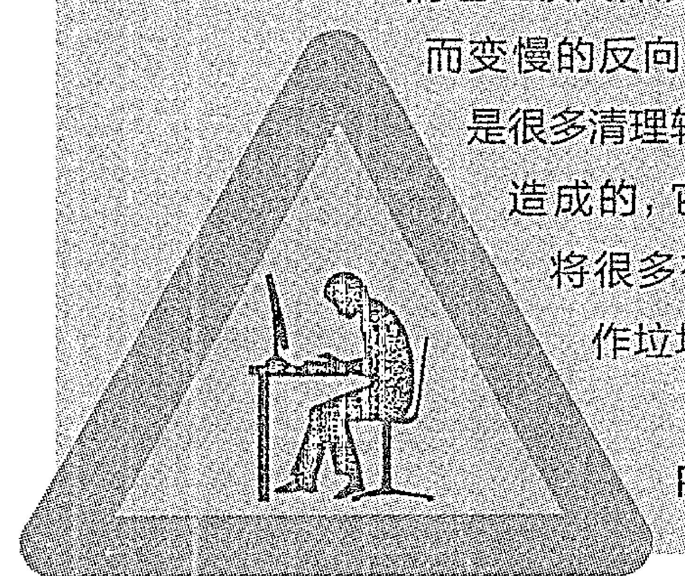

### 伪技巧3 个人电脑无需设置登录密码

文/阿炎

| 名称 | 修改日期 | 类型 | 大小 |
|------|----------|------|------|
| QUICKLAUNCH.EXE-03349B0C.pf | 2015/1/10 21:38 | PF文件 | 40.9 KB |
| MPCMDRUN.EXE-83A8C8.pf | 2015/1/10 18:01 | PF文件 | 1.829 KB |
| NTOSBOOT-BOOTOAD.pf | 2015/1/10 18:01 | PF文件 | 1.208 KB |
| PFSVPerfStats | 2015/1/10 18:01 | 文件 | 0 KB |
| PINYINUP.EXE-D0D30C10.pf | 2015/1/10 18:01 | PF文件 | 4.096 KB |
| QQCALLV1.EXE-6148384C.pf | 2015/1/10 18:01 | PF文件 | 4.096 KB |
| QQEXTERNAL.EXE-A2348D0D.pf | 2015/1/10 21:38 | PF文件 | 40.9 KB |
| RUNDLL32.EXE-5F2544CB.pf | 2015/1/10 21:38 | PF文件 | 40.9 KB |
| SCDREG.EXE-710C541C.pf | 2015/1/10 21:38 | PF文件 | 40.9 KB |
| SEARCHFILTERHOST.EXE-AA7A1F0D.pf | 2015/1/10 21:38 | PF文件 | 40.9 KB |
| SEARCHPROTOCOLHOST.EXE-AFA82.pf | 2015/1/10 21:38 | PF文件 | 40.9 KB |
| SOFT00L.EXE-0D2547FC.pf | 2015/1/10 21:38 | PF文件 | 40.9 KB |
| SOGOOCLOUD.EXE-3F176F28.pf | 2015/1/10 21:38 | PF文件 | 40.9 KB |
| SOGOUXPLORER.EXE-07B897AD.pf | 2015/1/10 21:38 | PF文件 | 40.9 KB |
| SOGOUPINSNGL.EXE-4394F9B.pf | 2015/1/10 21:38 | PF文件 | 40.9 KB |

| 项目 | 选项 |
|------|------|
| 驱动器 (D:) | 自动管理所有驱动器的分页文件大小 |
| 驱动器 (C:) | 自动管理所有驱动器的分页文件大小 |
| 所有驱动器分页文件大小的总数 | 允许的最小值：16 MB |
| | 推荐：4944 MB |
| | 当前已分配：3296 MB |

> > 小提示 类似系统优化的误区还有很多，很多朋友片面追求开机速度，经常将系统所有的开机启动项全部禁用，这样虽然开机速度提高了，但每次进入系统还需手动启动各种所需的应用程序，实际上并没有给操作带来便利。类似有用的“垃圾文件”还有很多，如IE的Cookies（可以记录论坛、网站用户名和密码实现自动登录），删除后每次登录论坛需手动输入密码；另外搜索索引文件，删除后也会降低搜索速度和效率。

关闭虚拟内存可能导致程序运行出错

使用系统默认方式管理虚拟内存即可

默认情况下，我们每次登录系统都要输入登录账户对应的密码才能进入桌面。有些朋友觉得这样很麻烦，由于电脑只是自己使用，还不如不要设置密码，这样每次可以自动登录。

大家知道，账户密码是系统验证用户合法性的唯一令牌，系统中很多组件如权限设置、EFS加密、远程桌面连接等设置都是和账户关联的，而要允许特定用户有合法的权限，系统是通过账户密码进行验证的，如果账户密码为空，密码验证就形同虚设了。比如局域网中电脑的互访，当我们在网络邻居中访问其他电脑时，首先弹出的就是用户账户和密码的访问框，只有输入合法的账户和密码才能访问对方电脑，显然如果你没有为自己的账户设置密码，那么任何人（当然包括网上黑客）只要知道你的用户名就可以访问你的电脑了，这会给我们的个人隐私带来极大的安全隐患（图4）。

其实即使设置密码，我们也照样可以轻松设置自动登录。只要在“运行”框输入“control userpassword2”，接着在弹出的窗口去除“要使用本机，用户必须输入用户名和密码”的勾选，点击“应用”，接着在弹出的窗口中按提示输入需要自动登录的账户名和密码即可（图5）。

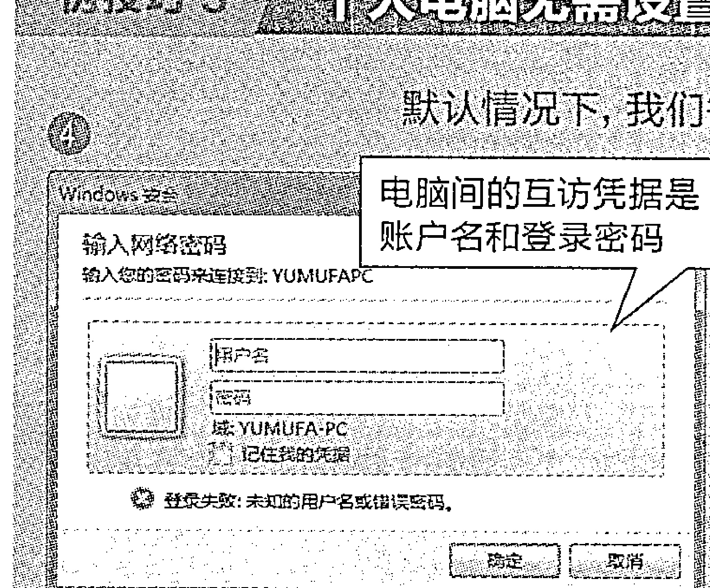

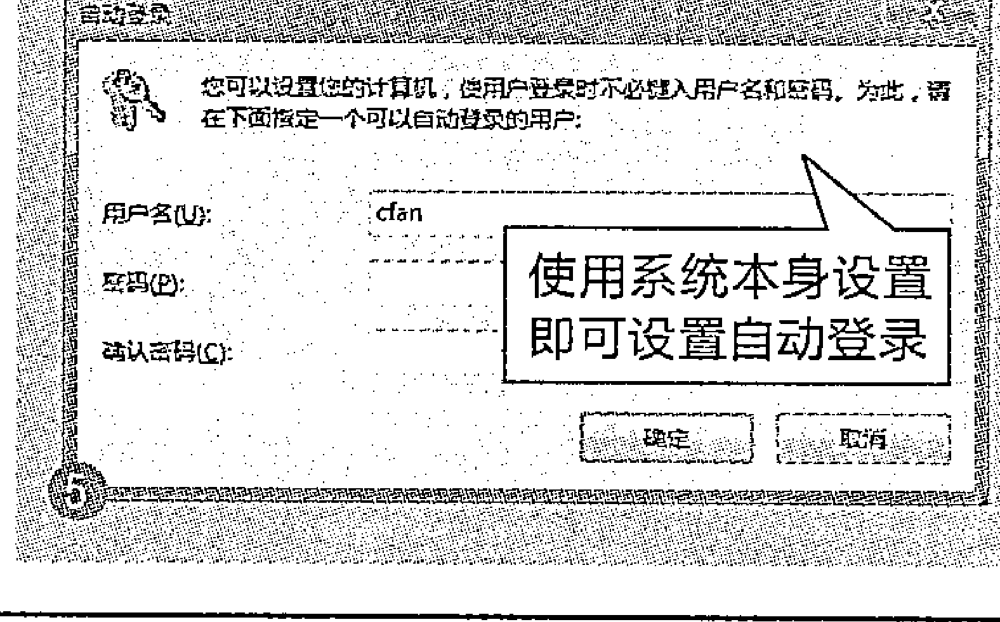

> > 电脑间的互访凭据是账户名和登录密码

> > 使用系统本身设置即可设置自动登录

### 软件数据不可存放在C盘

为了保证数据安全，网上很多高手会给出软件和数据不要保存在C盘的建议，因为一旦系统受损，你的数据就无法再找回。那么实际情况是否是这样？

实际上，这个技巧在Windows XP之前的系统是有些道理的。因为这些系统比较不稳定，很多朋友都是在使用一键Ghost之类的软件备份系统，这类软件在还原系统时会将原来C盘数据彻底抹除，所以数据保存在C盘比较不安全。不过，自Windows 7开始，这种现象改观了很多。

首先Windows 7之后的系统稳定性有了很大的提高，而且使用一键Ghost备份/还原系统的用户也越来越少。自Windows 7开始，微软就在系统中集成WinRE修复环境，这样普通的系统问题可以在WinRE修复环境中使用“系统还原”修复系统。比如Windows 8用户在WinRE的高级选项窗口点击“系统还原”，剩余的操作按照屏幕提示完成即可还原系统，如果无法修复，同样可以在WinRE修复环境中提取C盘文件（图6）。

其次，自Windows 7开始，微软使用WIM方式封装和备份系统，它和Ghost基于磁盘方式备份/还原不同，WIM是基于文件方式备份/还原系统，这样在选择覆盖性恢复系统时，它并不会破坏原来系统文件。比如Windows 8.1/Windows 10系统，如果是简单的系统故障使用系统还原即可修复，对于严重的系统故障，则可使用其自带的“恢复电脑”组件进行修复，它也不会破坏系统原来的个人文件（图7）。当然，如果是重要的数据文件，还是放在其他专有的分区保存为好。

而为了提高系统运行效率，常用的软件则建议安装在C盘，这样程序文件和操作系统在同一个分区，可以提高系统读取文件的效率。因为硬盘读写时最耗时的操作是磁头定位，如果软件和系统不在一个分区，那么对于操作系统需要频繁访问的文件，系统就需要在不同的磁头之间移动，读写时更耗费时间而且降低读取效率。同样的，对于类似虚拟内存、IE临时缓冲、临时文件夹这类系统经常访问的目录，也建议保留在默认C盘。

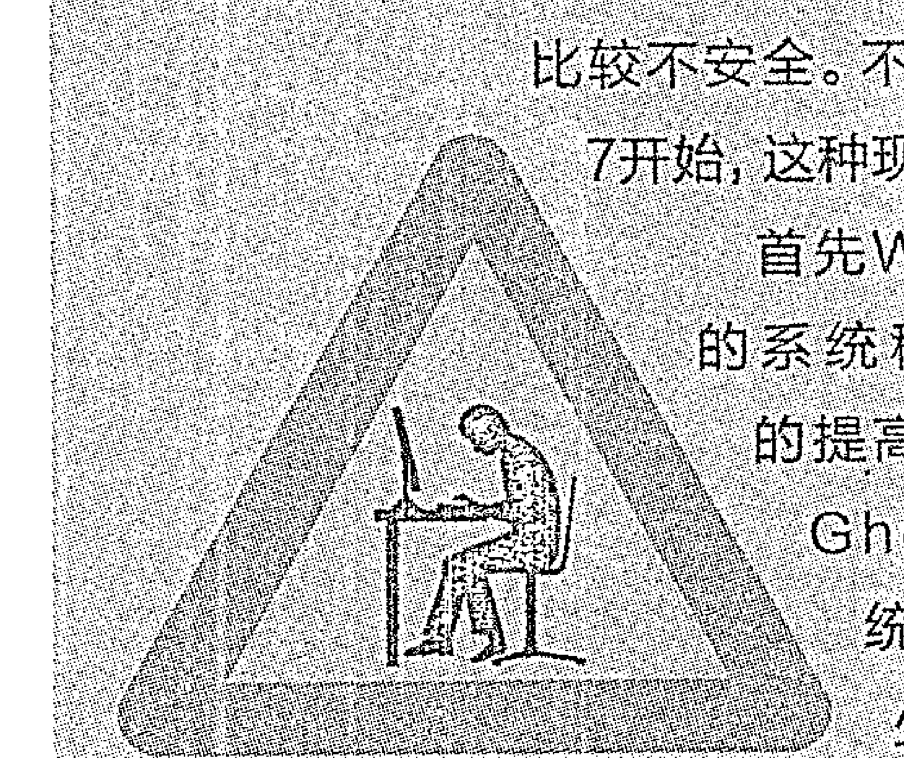

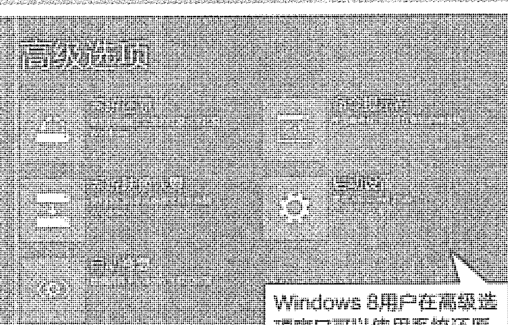

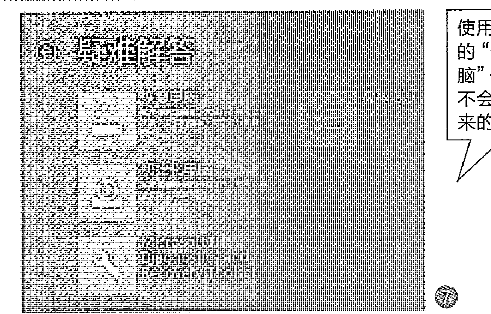

### 为什么你的Windows 8/10需要升级到Windows 10

随着Windows 10的正式发布，许多Windows 8/10用户都在考虑是否需要升级。本文将探讨升级的理由和注意事项，包括新功能、兼容性问题以及备份建议。

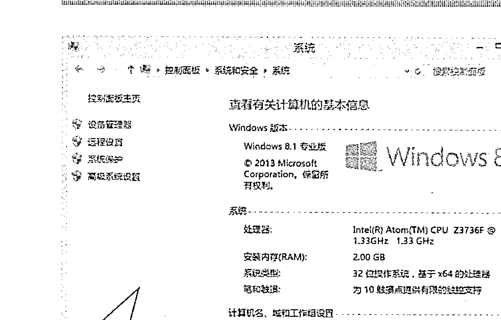

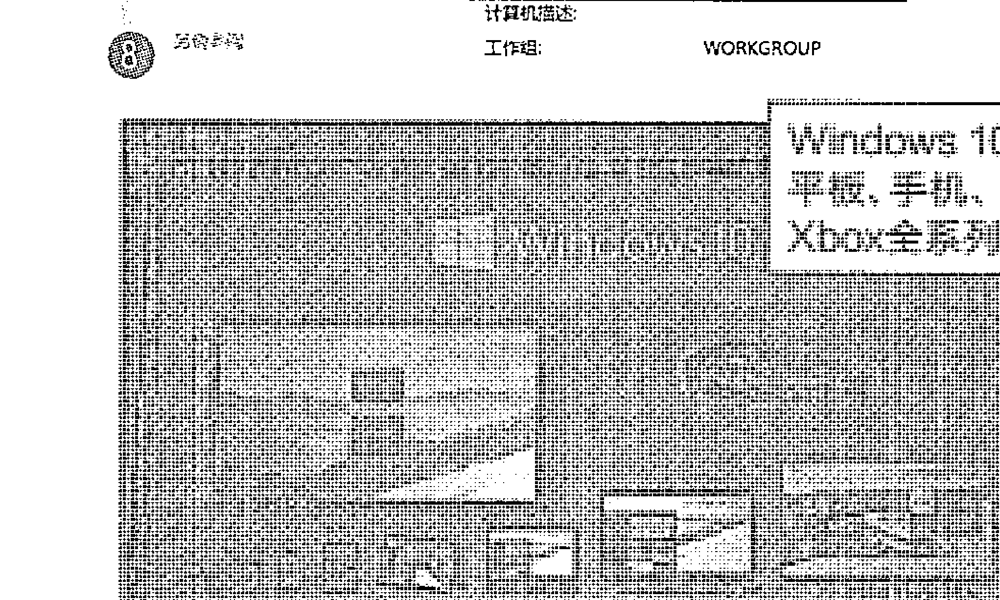

### 伪技巧6 更改CPU数量可开机提速

文/阿木

拥有更快的开机速度是很多朋友的追求，因此网上也有许多加快开机速度的技巧。某篇热传的网络文章中就宣称，只要启动系统配置实用程序，然后切换到“引导→高级选项”，在此双核处理器用户把处理器数改成2或多核处理器改成更多，这样可将开机速度提升20%（图10）。

不过通过实际测试，经过上述设置后，开机速度非但没提升，而且发现很多程序运行出错（如QQ游戏组件无法运行），严重的甚至导致系统蓝屏。显然这是一条没有实际效果的伪技巧。

电脑默认是按照CPU实际核心数启动的，但多核处理器和一些硬件（如旧的主板、显卡）、应用程序会有兼容性故障。因此微软在引导高级选项对用户开放了自行加载CPU核心数的选项，目的只为提高CPU兼容性，此选项也主要是供硬件厂商、程序开发人员调试使用，它和所谓的开机启动没多少关系。

为什么经过上述设置程序和系统运行反而会出现问题？因为我们用的电脑一般都经过厂商测试，而且随着多核CPU的逐渐普及，现在已很少遇到兼容性问题。因此在系统配置实用程序中人为调整CPU的核心数，如原来四核改为三核，这样会导致系统和应用程序检测到的CPU核心数和实际加载的不同，原来针对四核优化的程序就可能出现设置紊乱，导致一些不可预知的问题出现。

在系统配置实用程序中无法增加核心数，如果减少核心数则会直接导致启动的CPU数量减少，降低系统的性能（图11）。

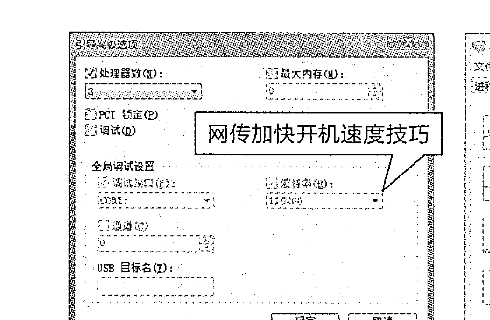

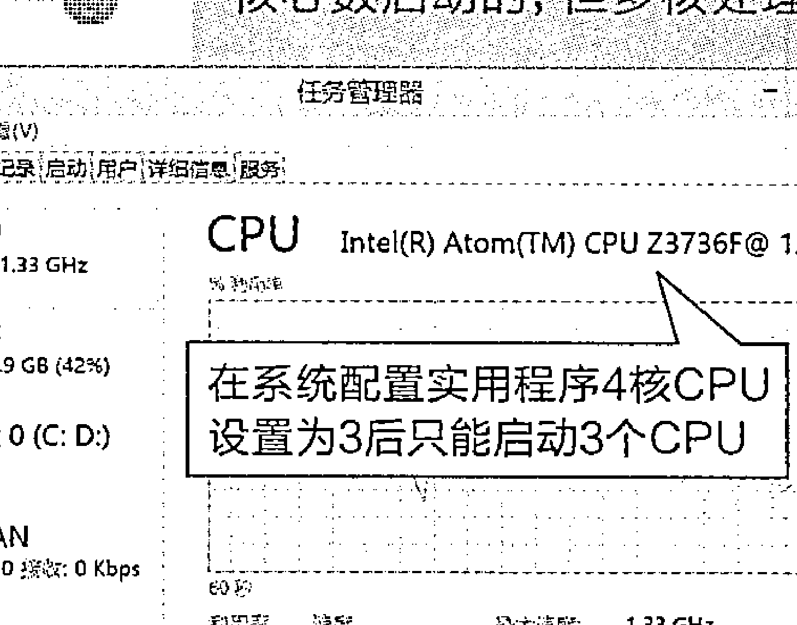


## 安全上网 避免上网黑名单

在使用搜索引擎查找资料的时候，搜索页面的前几个结果常被推广链接占据，一不小心打开就是广告页面。

那么，在搜索结果列表里常见广告页面有什么特征？我们又该怎么快速找到真正的搜索页面呢？以百度搜索为例，默认情况下推广页面的尾部都会标注“推广”字样，而且对常见的关键词如空调、彩电，一般前面2~3个页面都是推广链接，我们只要绕开这些链接即可。现在很多浏览器都有屏蔽推广页面的功能，因此不喜欢推广页面的用户可以尝试使用第三方（而不是系统自带的IE）浏览器。比如以“winpe”作为关键字搜索，在搜狗浏览器（左，自动屏蔽推广页面）就会得到比IE（右）更直接的搜索结果（图1）。

### 使用第三方浏览器可以屏蔽推广页面

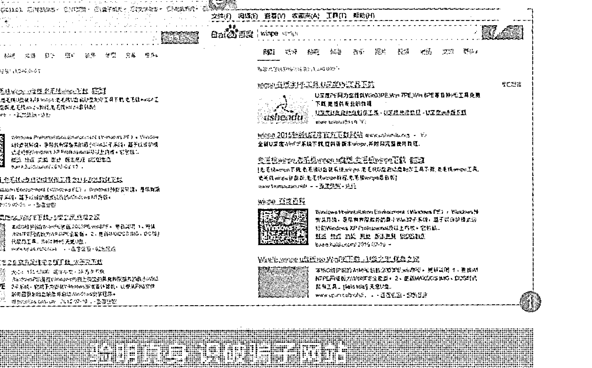

现在网上很多诈骗、钓鱼网站，日常访问中很容易被骗，像在手机上经常会收到各种得奖网页等。那么假网站和一般正规网站又有什么区别？下面的这些小技巧，可以作为参考借鉴。假网站大多使用和正规网站类似的域名，比如使用类似http://www.taobao.com来模仿淘宝页面，现在百度、搜狗等常见的搜索引擎和浏览器一般具备一定的拦截能力。因此对于常见的诈骗、钓鱼网站的识别，我们可以借助浏览器或者搜索引擎进行识别。比如360极速浏览器的用户，当试图在地址栏输入类似的假冒工行的网站时，浏览器就会弹出红色的警告提示框，此时点击“访问真正官网”可以打开真实的工行网站（图2）。当然，有了浏览器的防护还不够，打开网站以后，还是得需要自己仔细鉴别。

当然，现在诈骗网页层出不穷，对于没有被浏览器或者搜索引擎收录的假网站，我们还需要掌握一定的知识去进行鉴别。目前工信部规定，所有的公司和个人网站都必须进行备案，因此正规的网站下方都有一个类似“鲁ICP备09096283”的字样，而且点击后是链接到工信部的页面。因此对于可疑的网站首先查看其是否有备案号，然后再根据其备案号登录http://www.miitbeian.gov.cn/publish/query/indexFirst.action进行查询，看看其网站信息是否和备案信息相符（图4）。

现在很多网站软件的真实下载链接都是湮没在各种虚假广告链接中，想下载软件却下载到各种广告推广软件。那么怎样找到真实下载地址？我们可将要下载软件和链接提供的文件名、大小进行比对，因为广告软件和应用软件名称、大小一般不同，如果发现文件名称不同就不要浪费时间下载了。以在http://www.7xdown.com/downinfo/6912.html下载PE系统为例，打开上述页面后可以看到，该页面有显著的“立即下载”按钮，不过当我们将鼠标移动到“立即下载”连接上，此时在浏览器底部可以看到该下载是链接到http://download.upscool.com/setup_013.exe这个程序（图5）。此外通过下载页面的介绍，我们可以知道需要下载的PE文件大小为“31.4MB”，但是在点击“立即下载”后弹出的下载对话框中可以看到，即将下载的“Setup_013.exe”文件大小却为“1.49MB”，显然不是我们要下载的真正文件（图6）。因为我们这里下载的是PE文件，PE文件大多是以压缩文件或者ISO文件的格式保存，显然“立即下载”链接的“Setup_013.exe”是一个什么软件的安装程序，因此从文件名上就可以判断出这是一个虚假的广告链接，真实的下载地址实际上在这个地址的下方。现在将鼠标移动到实际下载地址，可以看到这里链接到的是一个类似http://www.7xdown.com/&file=%B7%AC%C7%D1PE.rar的压缩文件，从“PE.rar”上可以判断出这基本上是一个真实的链接（图7）。除了下载时进行判断外，为防有些网站弄虚作假，安装前一定要对下载的文件进行安全检测，安装时也要注意查看安装界面和选项。

| 序号 | 主办单位名称 | 主办单位性质 | 网站备案/许可证号 |
|------|--------------|----------------|----------------------|
| 1 | 深圳市腾讯计算机系统有限公司 | 企业 | 粤ICP备05019054号 |
| 2 | 深圳市腾讯计算机系统有限公司 | 企业 | 粤ICP备05019054号-1 |
| 3 | 深圳市腾讯计算机系统有限公司 | 企业 | 粤ICP备05019054号-2 |
| 4 | 深圳市腾讯计算机系统有限公司 | 企业 | 粤ICP备05019054号-3 |
| 5 | 深圳市腾讯计算机系统有限公司 | 企业 | 粤ICP备05019054号-4 |
| 6 | 深圳市腾讯计算机系统有限公司 | 企业 | 粤ICP备05019054号-5 |
| 7 | 深圳市腾讯计算机系统有限公司 | 企业 | 粤ICP备05019054号-6 |
| 8 | 深圳市腾讯计算机系统有限公司 | 企业 | 粤ICP备05019054号-7 |
| 9 | 深圳市腾讯计算机系统有限公司 | 企业 | 粤ICP备05019054号-8 |

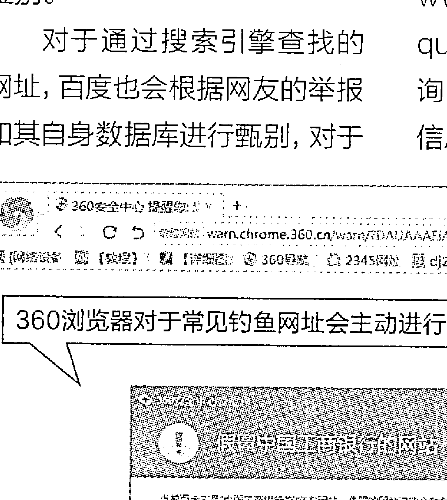

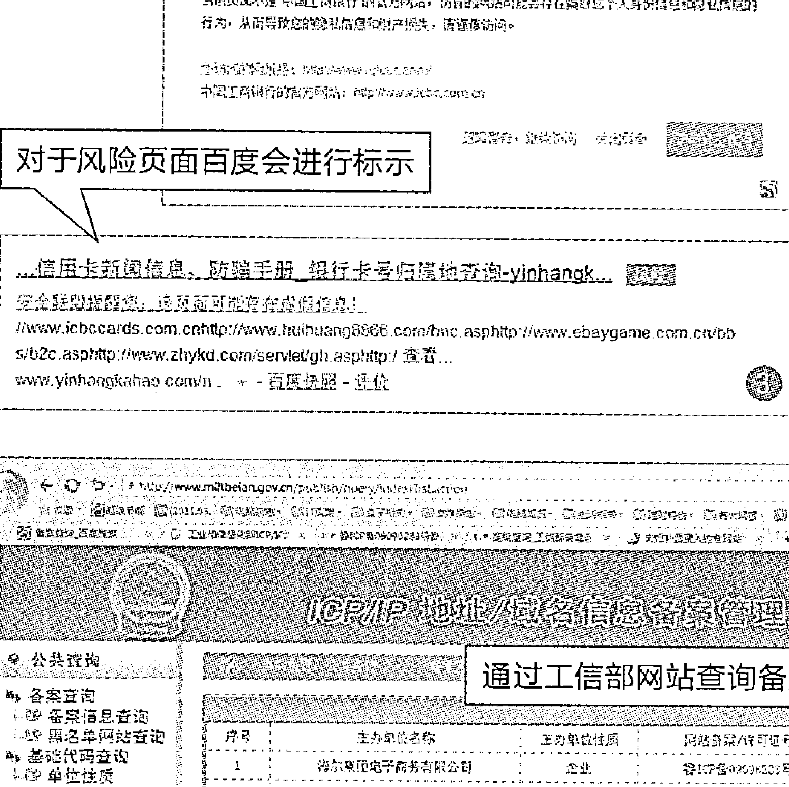

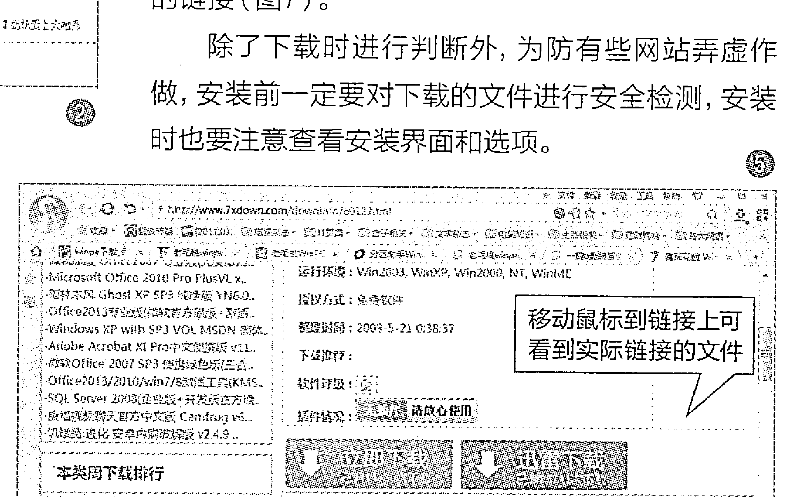

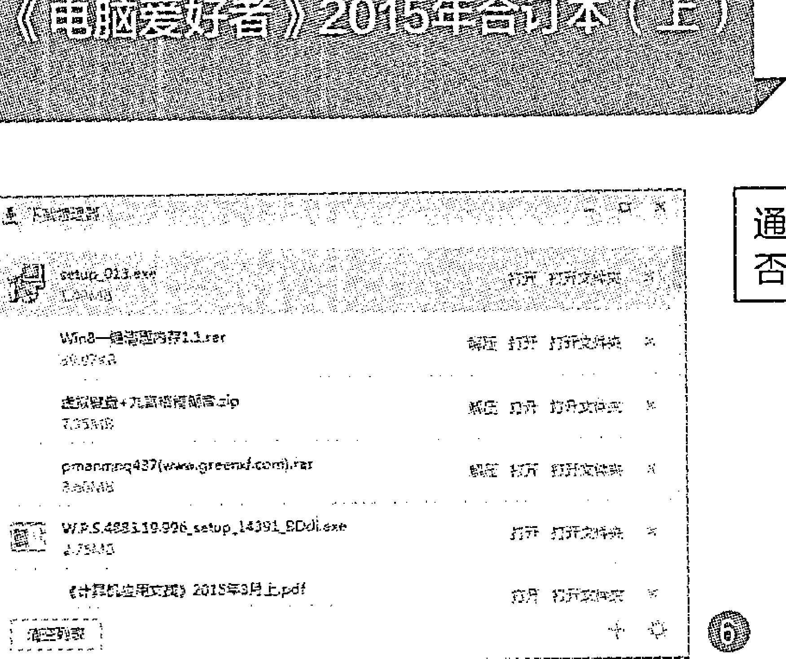

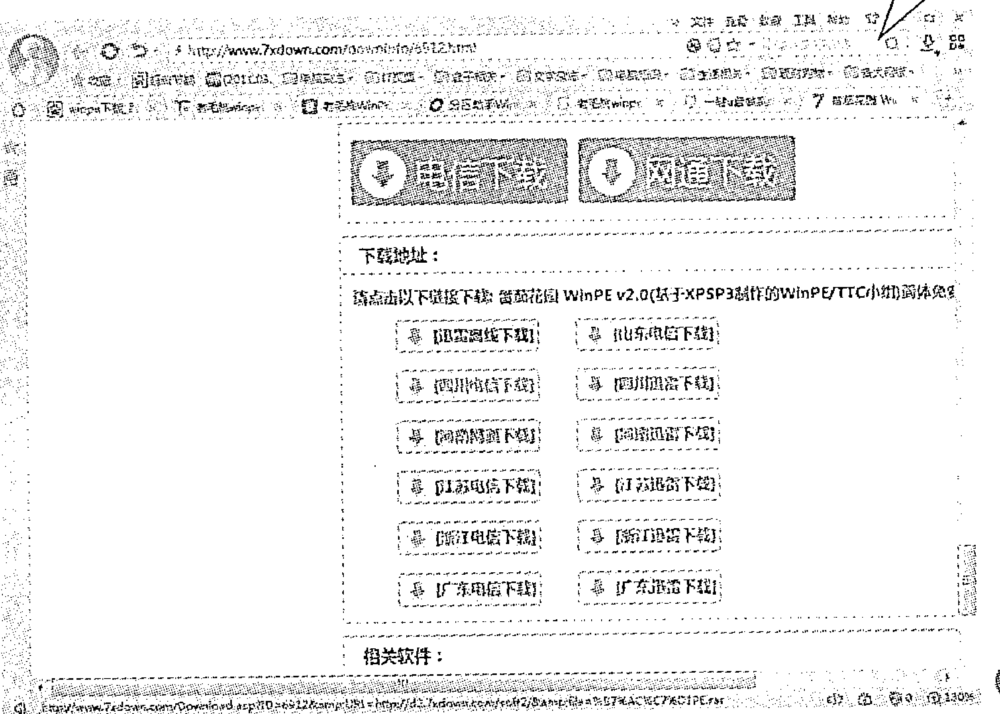

日常上网浏览，不少网站会弹出各种广告弹窗，很多弹窗都有类似关闭窗口的按钮，不过点击后却不是关闭弹窗，而是打开新的广告页面，更有甚者直接弹出很多无法关闭的页面。对于这类骗人的页面，我们该怎么应付？首先对恼人的广告页面可借助专业的反广告软件来屏蔽，如净网大师（下载地址：http://www.ad-safe.com），启动软件后点击“逛网站无骚扰”，它就会自动屏蔽常见弹窗广告（图8）。对于一直弹出无法关闭的弹窗，实际上是恶意程序在后台不停调用IE进程打开新的窗口，因此我们可以使用命令行将所有IE窗口一次性关闭。启动命令提示符后输入“taskkill /im iexplore.exe /f”（可制作为批处理放置在桌面备用），这样即可快速将所有打开的IE窗口批量关闭（图9）。

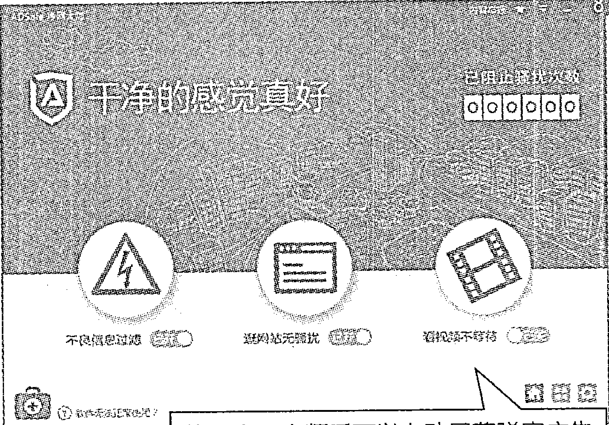

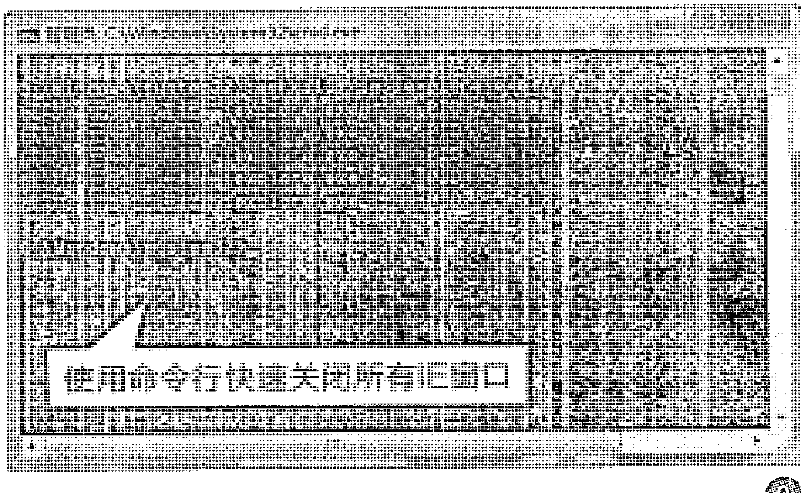

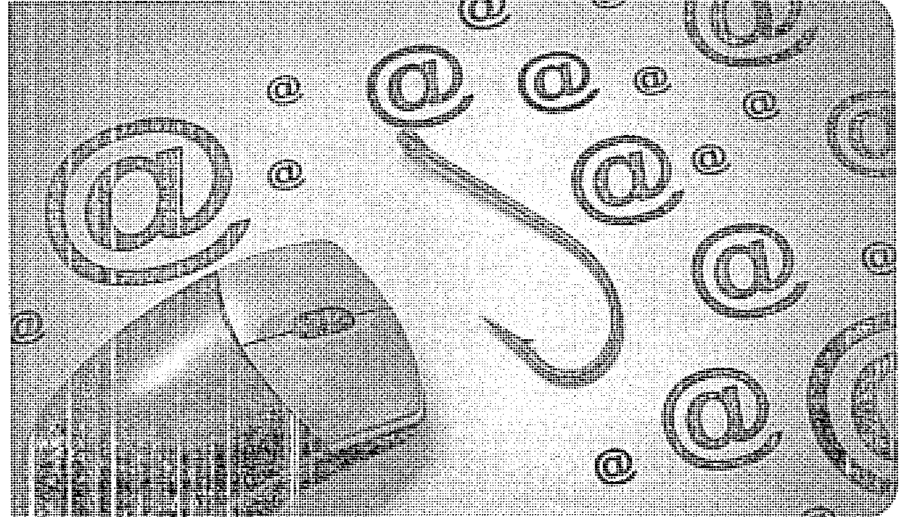

小提示：使用净网大师后可以自动屏蔽弹窗广告


## 被愚只是一种误解

有一些软件明明有某个功能但我们找不到，所以让人误以为它是骗人的，根本不能用或不好用。实际上很可能是用户没用好、没找到，而软件其实并没有骗人。当然软件提示不足可能也是误会产生的主因。

最典型的例子就是从Windows 7跨越到Windows 8.1，继而升级到Windows 10的过程中产生的种种误解。Windows 7之后各版本的Windows其实比Windows 7强大了很多，Windows 7能办的事它们基本都能办到，可谓有过之而无不及。但就是这样功能强大的系统软件却被人误解，不少人总以为使用Windows 8有被愚的感觉，因而纷纷回退到老版本中。而已经熟悉了Windows 8的用户升级到Windows 10后又或多或少有一种再次被愚的感觉。其实，如果能通过学习找到软件的功能所在，熟练掌握操作的方法和技巧，就会消除误解，走出“被愚”的阴影。当然，这其中微软有不可推卸的责任，咎由自取，造成的不良结果不能全怪用户。

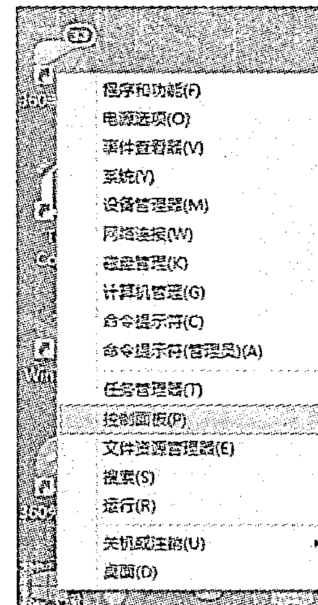

### 完全隐藏开始菜单惹争议

在Windows系统升级到Windows 8之后，许多用户曾因为找不到熟悉的开始菜单而认为Windows的功能变弱了，有被微软愚弄的感觉。其实，微软怎么会冒着损失用户的风险去专门愚弄用户呢？找不到开始菜单，微软的确做的不到位，考虑用户习惯不周，新品使用引导不细，因而才造成了这种不良的影响和结果。但说实话，微软本身并未有故意愚弄大家，我以非微软员工的身份也敢打保票。但微软Windows 8的确是和大家捉了个迷藏，它把一些功能藏了起来，让大家一度好生琢磨。在这场捉迷藏的游戏中，其实也有不少用户找到了微软藏起来的宝藏，继而爱上了这个可爱的系统版本。

### 代替系统设置的新式设置

Windows 8.1的系统设置并非被取消了，而是选用了两条腿走路。一条是可以通过右击开始按钮选择“控制面板”进入（图1），另一条是通过鼠标移动到屏幕右侧边角通过滑动面板进入。谁说功能变弱了？

## 找回开始程序的新式菜单

Windows 8.1应用程序虽然不能从“开始菜单”中找到，但通过开始屏幕的应用列表，可以更清晰地看到所有传统应用程序的列表。谁说找不到呢？

## 关机或重启何止一个入口

Windows 8.1关机或重启虽然变了入口，但路径其实更多了。除了通过右侧边角的隐含浮动面板“设置”进入，还可以通过开始按钮右键菜单进入，更可以通过开始屏幕选择。老手们更可以通过系统命令、快捷组合或建立快捷键的方式执行关机操作。何来找不到或消失的理由呢？

人们在使用Windows 8或Windows 10之后，觉得找不到原来老版本系统中的一些管理功能菜单，以为新版本的文件管理功能减弱了，有被愚弄的感觉，因而说新版本系统不好。但实际上，由于Windows 8或Windows 10采用了动态菜单的形式，一些管理功能菜单只有当需要的时候才会实时地出现，并不是在平常都摆在那里让大家挑选。这样可以更大限度地节省屏幕空间，将有效空间让给最需要它的功能来展现。知道了这一点，我们就不会对新系统的管理功能产生误会了。

## 驱动器管理功能

能对磁盘驱动器做什么？资源管理器内似乎没提供什么，但当你选择了驱动器后，驱动器工具的“管理”菜单将告诉你一切。

## 多媒体管理功能

图片、声音、视频，我们如何对它们进行操作？不用担心，虽然资源管理器窗口中默认没有摆出什么命令或按钮，但当你选中了任一种媒体文件后，相应的图片工具、音乐工具、视频工具菜单就会适时地出现（图2）。

## 文件的搜索功能

对如何搜索文件和设置心里没底吗？不难理解！因为资源管理器窗口中没有提供这样的命令或按钮。不过，当你定位一个起始位置后，点击资源管理器的搜索框，马上会发现一个包含详尽选项的“搜索工具”菜单面板，搜索功能极其强大。

以不变应万变，可以说Windows 8的管理功能更强了，所以请大家消除误解，确信我们没有被微软愚弄。

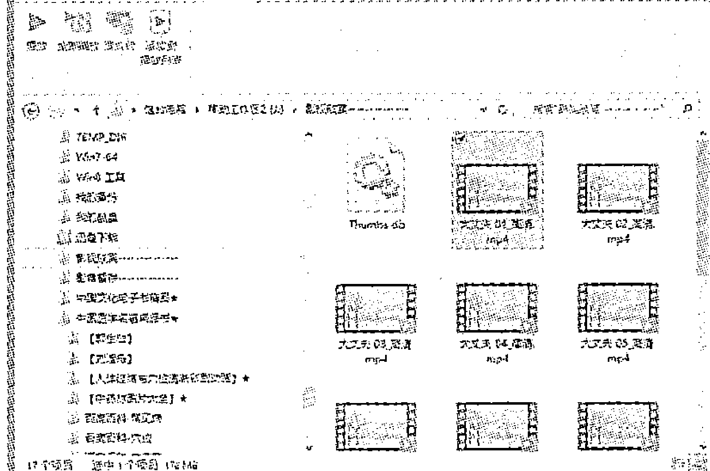

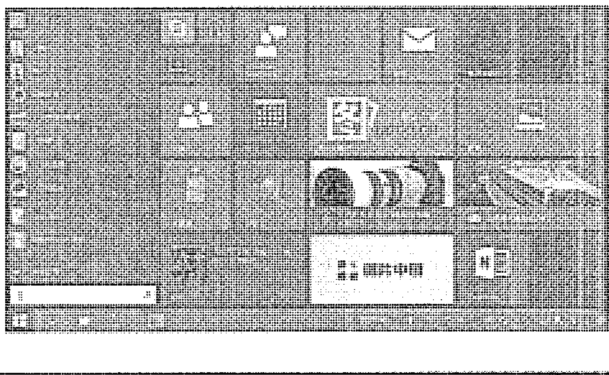

## 面板撤销 组件另有新家

Windows 8采用了一个浮动式面板的形式进行系统的搜索和设置，这个面板可通过Win+C组合键来启动。在滑动面板中，有“搜索”、“共享”、“开始”、“设备”和“设置”几种功能按钮，这种功能尽管是隐藏的，但其集成性也大大方便了用户操作定位。但是，当系统升级到Windows 10之后，这个功能失效了，这让已经熟悉了Windows 8操作的用户产生一种小小的被愚弄的感觉——为何用得好好的功能又找不到了呢？

其实，在Windows 10中，设置面板所包含的功能并未被取消，而是被分散到了不同的新位置，只要我们找到了这些位置，原来的功能依然可用。

在新式的Windows 10系统中，“搜索”按钮被放置在更显眼的开始菜单和任务栏上，而“开始”按钮则被开始菜单的应用列表区所替代。电脑的“设置”按钮也被安排到了开始菜单的显眼位置（图3）。至于“共享”按钮，则更是被无孔不入地安排到了每一应用的左上角控制菜单之中。可见，Windows 8.1中有的功能在Windows 10中丝毫没减弱，反而变得更方便和人性化了。因此，升级为Windows 10不应该有“被愚”的误解或感觉。

## Metro全屏转桌面的变化

在系统从Windows 8升级到Windows 10之后，在PC桌面上按下Win键，我们发现再也无法切换到原来Windows 8的Metro全屏桌面了，而出现的只是一个含有Metro磁贴区域的开始菜单。有的Windows 8老用户感觉又被微软愚弄了一次，好不容易熟悉的东西又不能用了。事情真有那么严重吗？

实际上，微软是对原来的Metro桌面做了一分为二的异化处理。一方面，微软让Metro桌面始终作为开始菜单的一部分，只要点击开始菜单，就可以随之显示带有磁贴的Metro应用列表。另一方面，微软在Windows 10中加入了一项设备自动感应技术——当用户使用了键盘和鼠标的设备时，Windows 10会自动启动到传统的桌面窗口；而当用户拔掉键盘和鼠标之后，系统会认为你在使用触摸设备，会自动切换到Metro桌面状态。这也是一种人性化的系统自动感知功能。

可见，你要的东西还在，只是变了体现方式。

## 花钱不明智 产品购买警惕伪5

如同买手机时用处理器性能、运行内存、屏幕尺寸、电池容量来区分档次和卖点，购买笔记本、手机或平板电脑时，我们也会通过类似的参数判断性能。但很多厂商会通过宣传上的误导，让用户对产品的实际性能产生误解，导致多花了钱却没有得到相应的体验。

### 以最高为准？
CPU主频标注有水分

由于绝大多数普通消费者对处理器性能的判断还停留在“频率至上”与“核心数量至上”的阶段，因此很多笔记本、手机或平板电脑在宣传中都会借此来博得用户的关注。

### 扩展阅读 最高频率只是单核加速

英特尔酷睿处理器特色的睿频加速技术的原理就是CPU会根据系统负载而自动关闭/开启核心及自动超频的过程。但我们所熟悉的最高睿频加速频率实际上只是单核状态下可超频到的最高值。以最新的第五代酷睿i5-5200U（双核）为例，其默认频率为2.2GHz，双核同时睿频加速可超频到2.5GHz，而只有在单核睿频加速时才能达到宣传中常见的2.7GHz（图2）。

### 等你死机还是加速管理一目了然

我们都知道，笔记本领域的酷睿i5或i7级别的处理器都支持睿频加速，以第四代酷睿i5-4200U（双核）为例，其默认频率只有1.6GHz，而睿频加速的最高频率可达2.6GHz，二者间相差整整1.0GHz！但是很多笔记本却多以最高的2.6GHz为宣传点而弱化或根本不提及默认的1.6GHz主频。因此，当你购买搭载i5-4200U处理器的笔记本时却发现产品在绝大多数情况下都无法工作在2.6GHz主频时（图1），不郁闷才怪。

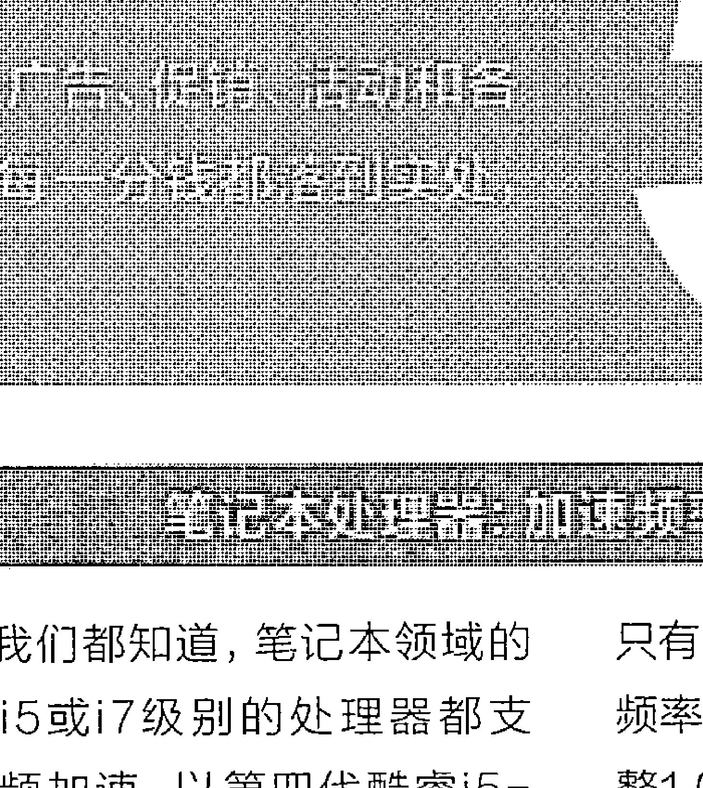

笔记本用户可安装睿频加速监视器，或“任务管理器→性能”查看CPU当前的核心工作状态和频率

> 会按如下的台词忽悠消费者：
消费者：我想买一款配酷睿i3-4005U的平板电脑。
商家：额……这款没货，推荐你看看这款配Atom Z3736F的产品，i3-4005U是双核1.7GHz处理器，而Atom Z3736F是四核2.16GHz处理器，主频高性能强，价格还便宜！
消费者回家后：Atom Z3736F怎么性能和朋友家配i3-4005U的机器相差这么多啊？原来它是一颗定位比奔腾和赛扬还低的处理器？唯一的好处就是超低功耗！

除了酷睿处理器外，英特尔针对平板电脑定制的BayTrail-T处理器也支持类似睿频的动态超频能力。以Atom Z3736F（四核）处理器为例，其默认频率为1.33GHz，而加速频率则可达2.16GHz。于是，我们在网上的各种宣传海报中就只能看到Atom Z3736F是“一颗拥有2.16GHz超高主频的高性能处理器”了（图3）。而一些别有用心的商家甚至

实际上，移动处理器可以根据系统负载动态调节频率是一项很有意义的技术，上网时自动降频，游戏时自动超频，如此才能做到省电和效率兼顾。遗憾的是，正是由于很多厂商在宣传时避重就轻，甚至以最高频率作为唯一的宣传数值，自然容易引起误会，变成“虚假宣传”。

### 手机处理器：大核抢了小核风头

如今手机/平板搭载的ARM移动处理器都已经过渡到了64位和8核时代，高通、三星、联发科、海思麒麟和英特尔等芯片供应商的旗下产品争相斗艳，好不热闹。为了解决性能和功耗间的矛盾，多核ARM处理器普遍会采取“大小核”（big.LITTLE）技术，其中“大核”频率高性能强，“小核”频率小功耗低，二者可单独工作，还能携手奋斗（图5），灵活多变。
问题来了，很多手机厂商在宣传处理器信息时，总会以“大核”的参数为主，弱化或屏蔽“小

核”信息（见下表）。比如，联发科MT6595明明是由4个A17和4个A7构成的8核处理器，但在宣传上却主打“8核2.0GHz”（图6）；8核的骁龙615只有其中4核频率达到了1.7GHz，但在宣传中却依旧以“8核1.7GHz”为准。
也许厂商和商家们觉得消费者平时太累了，没有必要再去“探究详细参数”，所以只是强调了CPU的最强状态。诚然，CPU里隐藏大小两种频率不等的核心的确够复杂，但这并不能成为阻止消费者了解真实信息的理由。

| CPU型号 | 大核规格 | 小核规格 | 代表产品 |
|---|---|---|---|
| 联发科MT6595 | A17×4 (2.2GHz) | A7×4 (1.7GHz) | 魅族MX4、大神X7、联想X2 |
| 联发科MT6752 | ---- | A53×8 (1.7GHz) | 魅蓝、HTC Desire 820s、联想Note8 |
| 海思麒麟K925 | A15×4 (1.8GHz) | A7×4 (1.3GHz) | 华为Mate7、荣耀6Plus |
| 三星Exynos 5430 | A15×4 (2.0GHz) | A7×4 (1.3GHz) | 魅族MX4 Pro |
| 骁龙615 | A53×4 (1.7GHz) | A53×4 (1.0GHz) | 大神F2全网版、三星A7 |


拓展阅读：显卡频率也能动态调节
无论是英特尔AMD处理器内集成的核芯显卡还是独立显卡，它们的核心频率也是可以动态调节的数值。以NVIDIA最新的800M/900M系列为例，其GPU频率不仅可以小幅超频，在Battery Boost技术的帮助下甚至可智能降频。简单来说，该技术可根据游戏的流畅度需求，从驱动层面控制显卡的性能输出。比如，最新的笔记本玩LOL大材小用，你只需在GeForce Experience对游戏帧数进行限定（图4），比如限定在30帧，那么显卡绝对不会计算第31帧画面，点到为止。而限定频率的好处就是通过降频控制性能输出，从而起到降低功耗、延长续航时间的效果。

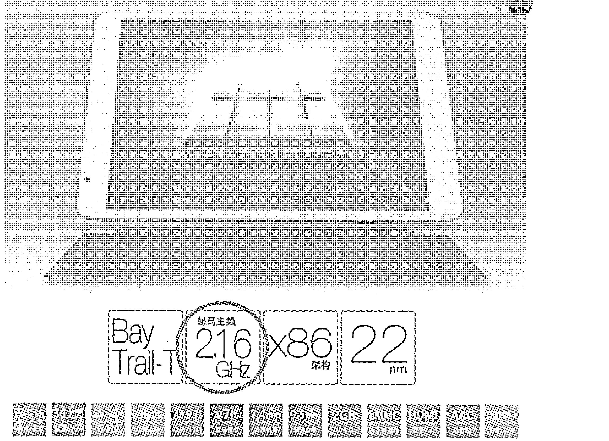

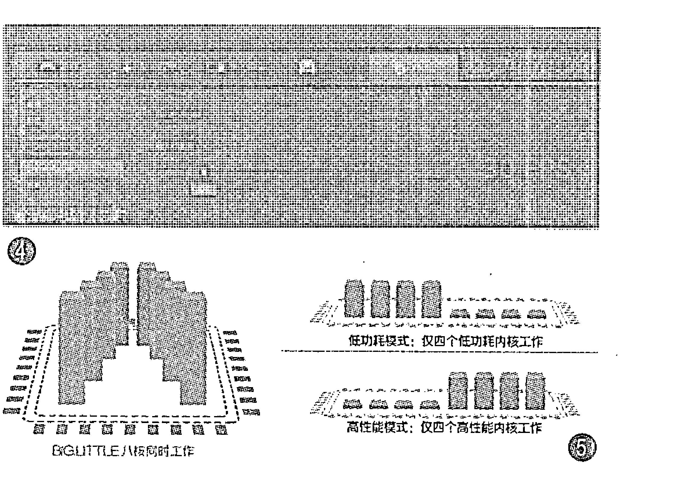

联发科MT6595 8核 2.0GHz

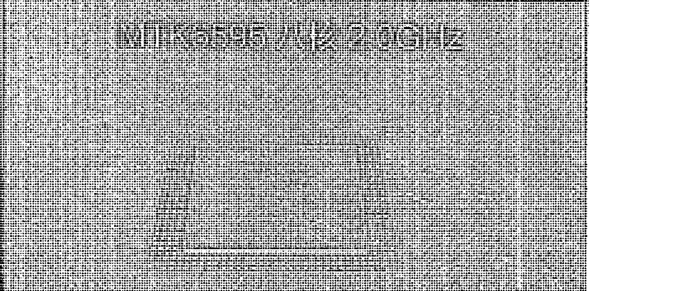

MT6595还有A17核心为2.0GHz的降频版，部分搭载骁龙615的手机也会将最高频率限定在1.5GHz

## 识破掌上猫腻
### 移动领域的那些“不靠谱”

在淘宝上我们经常看到类似的促销：“9900万像素手机”、“4G超大内存”、“8+512G内存……这些手机的配置似乎比三星GALAXY S6还要强，而且价格只有几百元。这可能吗？

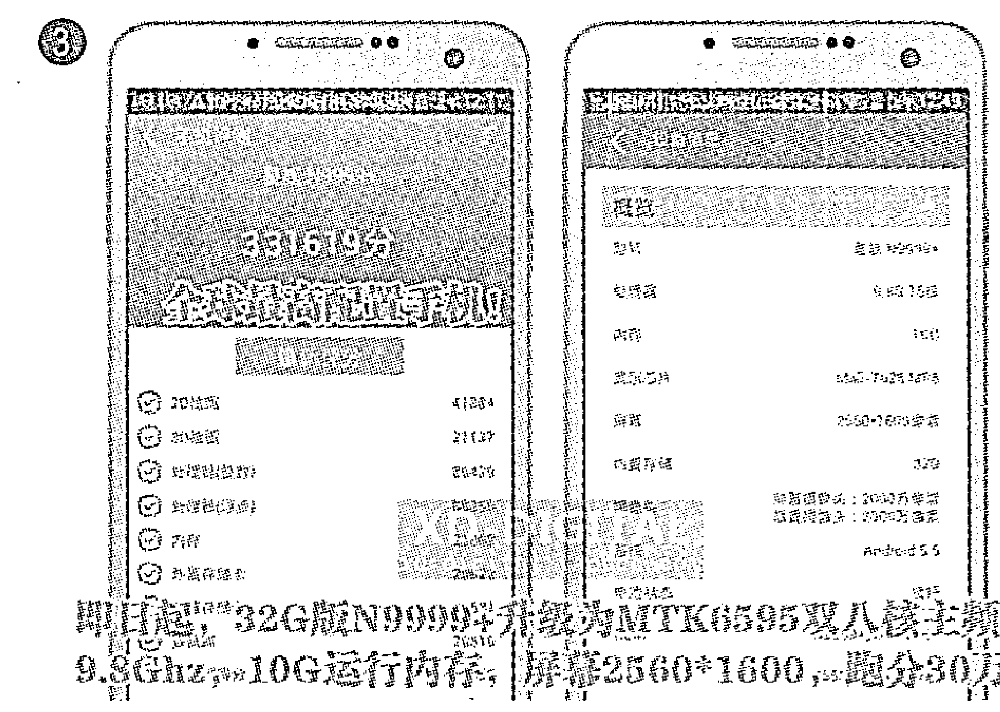

笔者被淘宝上的一款手机给吓倒了，先来和大家分享一下它的配置：主频高达9.8GHz的MTK6595×2的双处理器、10G RAM+32G ROM、2560×1600像素的2K屏幕和1800万像素前后摄像头，看起来似乎是5年内配置都不会落伍的手机(图1)？

1800万像素，难道这个品牌像苹果一样可以让摄像头供应商单独定制？从该产品数百个用户评价来看，绝大多数都是“托”，从唯一的差评中我们不难看出它所谓的参数都是造假而来(图4)。

先来看一下处理器，MTK6595是联发科旗下的8核处理器，其最高主频为2.2GHz，曾被魅族MX4等手机武装。能将两颗MTK6595芯片塞进一款手机，而且频率可翻倍到9.8GHz？此外，10G内存32G存储空间、双1800万像素摄像头，这个商家真正诠释了什么叫“有骆驼不吹牛”(图2、图3)。

这就是典型“山寨机”的宣传案例。目前还没有将两颗CPU芯片融合在一款手机里的技术，而且手机专用的4GB RAM芯片技术才刚刚成熟，“10G内存”从何而来？此外，从未听说摄像头还有

这款手机属于特别“不要脸”的，已经“假到至极”，其所谓的32G存储空间实际仅有3.17GB。如果你找商家理论，对方也有理由：“我们标的是“G”不是“GB”，二者换算单位是×10！”实际上，绝大多数山寨机都会采用这种“偷换概念”的手段，宣传时以“128G内存”，但是实际的容量却仅有12GB左右。此外，还有一些厂商或商家会使用“偷梁换柱”的概念，故意将RAM（运行内存）和ROM（存储空间）混淆，比如说某手机配4GB运行内存（图5），但这4GB其实只是ROM存储空间，实际它的RAM运行内存可能仅有512MB。

> > 很少给人差评，这次购买N9999+的经验，真是不吐不快。（一）原来所谓的32G rom，有50%都是系统占用的，买家实际可用的就只有3.17G（见图）实在少得可怜。（二）在家中使用wifi，超级蜗牛，甚至不能连线；就算只是几百万的手机，包括同系列的N2000，都不会有如此差的表现！（三）跑分方面，本手机就从来没跑成功可以用安兔兔测试到！测试中进画面总是变绿色一片（见图），也显示“测试项目被意外终止，请重试”（见图），安兔兔反而建议我们应该怀疑设备的可靠性？（四）就是连充电这么简单的操作，也是因为接触不良而充不到电。每一次的查询，售店总是在建议我直接又重装手机，根本就承认手机的质量远低于标准，甚至于不合格！500几块的手机，不应该是如此低标。你们都好像在骗人呢为什么要这样做生意呢？？


| 项目 | 描述 |
| --- | --- |
| 1.系统 | 安卓5.0 |
| 2.内存 | 32G Rom（实际可用3.17G） |
| 3.运行内存 | 10G（疑似造假） |
| 4.摄像头 | 前后1800万像素（疑似造假） |
| 5.处理器 | MTK6595×2（主频9.8GHz，疑似造假） |
| 6.跑分 | 失败，无法通过安兔兔测试 |
| 7.wifi | 速度极慢，连接不稳定 |
| 8.充电 | 接触不良，无法充电 |

【官方正品】尼彩4G大内存双核3G智能手机500W4.3寸屏尼采A7

| 项目 | 描述 |
| --- | --- |
| 价格 | ¥499.00 |
| 促销 | 北京市 北京市区 快递 免运费 |
| 颜色分类 | 白色 |
| 套装类型 | 官方标配 |
| 运营商 | 无限制 |
| 网络类型 | 双卡双待 |
| 存储容量 | 16G |
| 购买数量 | 1 (库存1000件) |

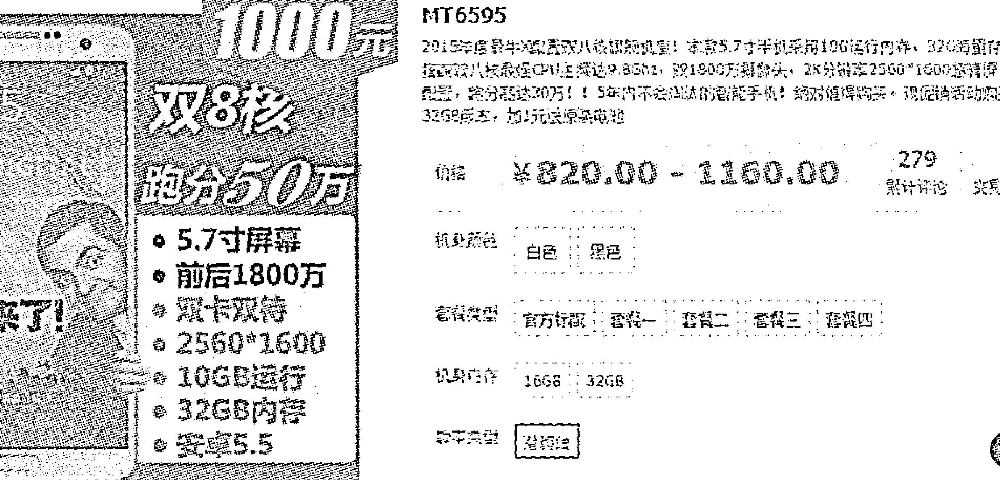

5.7寸八核智能手机4G安卓双1800万像素5.5超薄6.0大屏8核 MT6595

2015年最新手机8核双4G智能手机！本机5.7寸手机采用10G运行内存，32G海量存储，MT6595真8核处理器CPU主频高达9.8GHz，双1800万摄像头，2K分辨2560*1600超高清，至尊配置，跑分高达20万+！5年内不会落伍的智能手机！绝对值得购买！现在活动买32G版本，加1元送原装电池

| 项目 | 描述 |
| --- | --- |
| 价格 | ¥820.00 - 1160.00 |
| 促销 | 279 | 累计评论 交易成功 |
| 机身颜色 | 白色 黑色 |
| 套装类型 | 官方标配 套装一 套装二 套装三 套装四 |
| 机身内存 | 16G 32G |
| 版本类型 | 公开版 |

关注微信公众号：电脑爱好者

在赶集或58同城一类的交易网站上，我们经常可以看到价格低到离谱的iPhone和三星、小米手机（图6、图7）。实际上，那些明显低于平均二手价格的机器99.99%都是山寨高仿机。如果你前去交易，会发现使用手机自带的验机软件测试都会显示“正品”，着实让人防不胜防。

在这里教大家一个最简单的办法：选择见面交易，验机时用自己随身的手机建立Wi-Fi热点，然后将二手iPhone或三星手机接入这个网络。检验iPhone手机时可以进入App Store，随意下载一款APP，如果弹出需要你登录苹果账号的提示，而且类似指纹识别功能都是正常可用，才可以基本判断这是“iPhone”而不是Android系统仿造的高仿机；如果是三星、小米或是前文提到的配10G内存的机器，切忌不要使用手机预装的安兔兔、鲁大师等验机软件，而是打开浏览器重新下载类似安兔兔验机的APK文件，高仿机的特性就是安装正版验机软件时会报错，或是测试时总是黑屏状态。之所以用高仿机自带的验机软件测试伪真，是因为这些预装软件都是被恶意篡改了代码，想显示从什么参数跑多少分都在事前植入的代码里。

## 喜欢偷换概念的GPU核心

对ARM移动处理器而言，CPU的参数大家都耳熟能详，但其集成的GPU参数却属于“盲区”，极易成为厂商或卖家夸大宣传的重灾区。
以在平板领域比较知名的联发科RK3288为例（集成Mali-T760 GPU），几乎所有配备该芯片的平板厂商在宣传时都会主打“拥有16核着色器”（图8），或“326.4GFlops的GPU浮点性能”，从参数上看甚至可以和高通800系列集成的Adreno330 GPU战平。实际上，这些数据就是一种偷换概念的表现。
我们可以将Mali-T760 GPU理解为可选1~16核心的处理器。而所谓的16核着色器和326.4GFlops的成绩都是建立在16核心的基础上，也就是“Mali-T760MP16”才能达到的性能。遗憾的是，RK3288只选用了4核心的Mali-T760，也就是“Mali-T760MP4”，其GPU浮点性能只有满血16核心时的1/4，也就是81.6GFlops。这就好像我们要买宝马汽车，结果4S店却用宝马7系的特点来宣传宝马3系，虽然都是宝马，但性能差异岂可同日而语！

了解GPU核心数量对性能的影响后，就好理解为什么海思麒麟K925和三星Exynos 5430在GPU性能的表现上会存在较大的差距了。这两颗处理器都集成了ARM Mali-T628系列GPU，其中K925选用的是4核Mali-T628MP4，而Exynos 5430则配备了6核的Mali-T628MP6。

相关链接

很多配备16GB ROM的手机实际可用存储空间却仅有7.88GB~12.38GB，有关智能手机内存/存储空间缩水的问题每隔一段时间就会被翻出来讨论。如果你想了解，请翻阅本刊2014年12期《“大胃王”是如何炼成的 Android手机内存为何会缩水》这篇文章。至于RAM内存容量缩水的原理和PC相同，开机后会被系统占用一部分，部分型号还会将一些内存用于屏幕自刷新的显存。

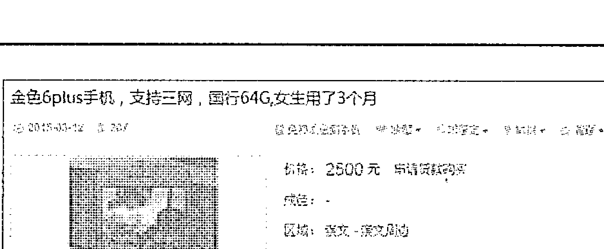

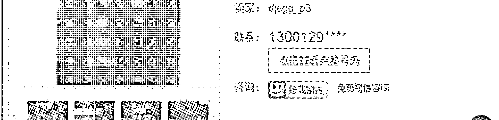

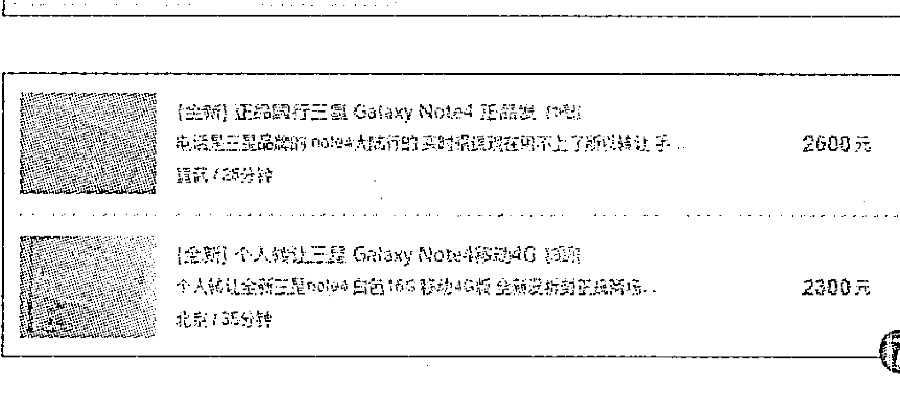

特别提示：至于如何避免本文所涉及的骗局，其实只需谨记贪小便宜吃大亏的道理即可，比如不要轻信不知名品牌的“特色宣传”，多参考网上用户的评价；对明显低于二手成交均价的产品尽量避而远之。

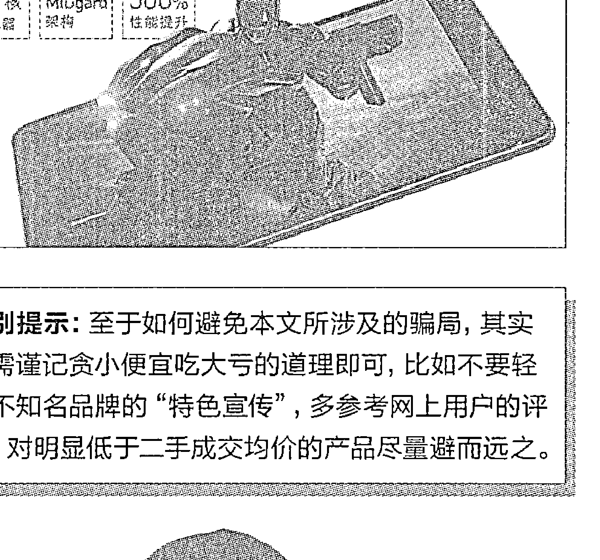## 莫要小觑细节

### 龙生九子各不同

随着中关村实体卖场的没落和各大电商的崛起，如今我们在购买笔记本或手机配件时往往会省却“实地考察”环节，而是根据电商提供的资料和图片决定是否购买。正所谓“龙生九子各不同”，笔记本厂商为了满足不同购买力和需求的用户，也会将同一型号拆分为无数配置不同的子型号。如果你稍不留意，很可能会落个“上错花轿嫁错郎”的结果。

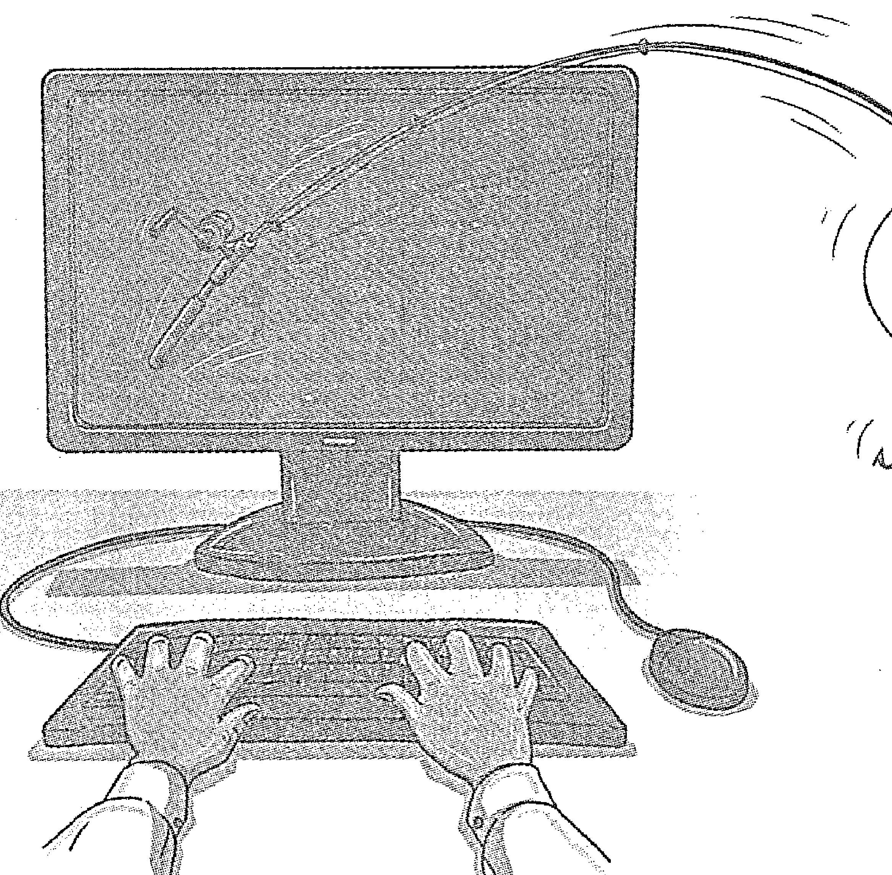

### 不要相信图片

智能手机的热销也带动了周边产业的发展。以保护套为例，最容易引发的纠纷就是实物和宣传图片颜色、材质不符、整体贴合不够紧密等。在这里，我们不妨关注一下时下流行的金属侧边保护套。
如今金属材质手机大热，很多使用塑料材质手机的用户也希望通过金属保护套获得冷峻的金属触感。但此类产品最大的隐患就是厚度超标，明明在产品宣传上注明了厚度，以及套上手机后的厚度展示（图1），但实物却总会令人失望。实际上，很多所谓的“实物图”都是被PS后的效果图，想了解金属套的实际厚度和使用表现，还得从用户评价中寻找答案（图2），千万不要盲目相信所谓的宣传图和参数。

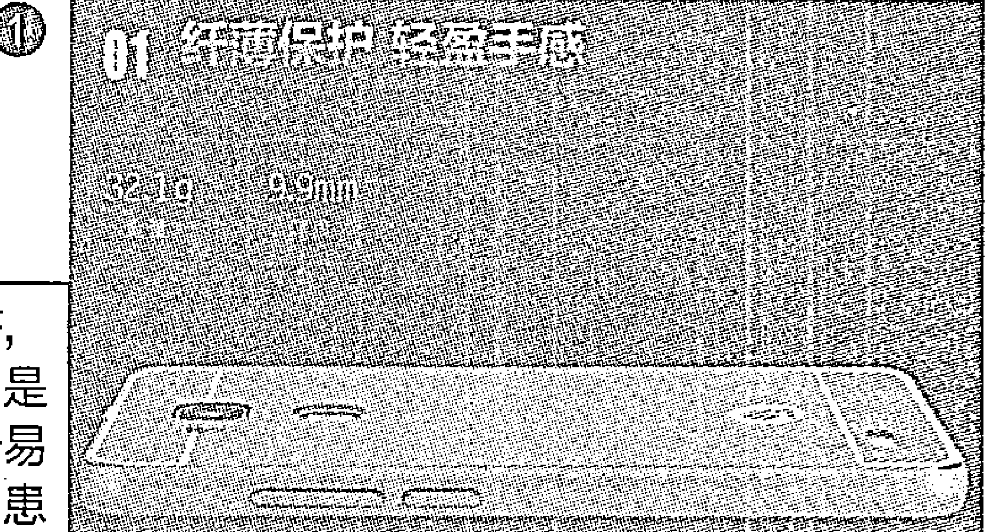

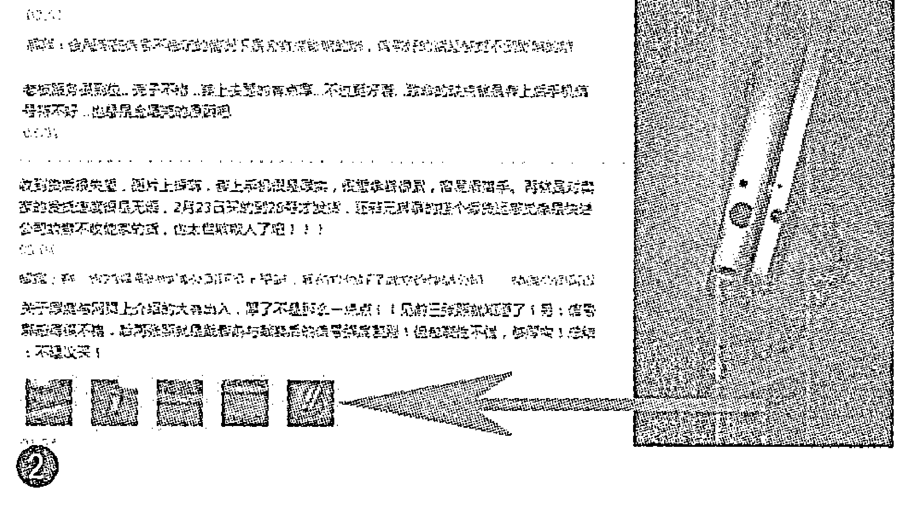

### 光驱的真假

在10MB光纤都不算什么的当下，很少有人会从光盘中获取数据了。然而，对一些商务办公应用，或者有刻录需求的用户而言，依旧会优先挑选配备光驱的笔记本产品。考虑到轻薄化是笔记本未来的发展方向，那些“看似”配备光驱的超薄本自然会受到更多关注。
之所以要说“看似”，是因为网上产品展示的图片很可能与实际表现不符。以ACER V3-572G、同方K56L等为代表的笔记本为例，它们虽然预留了光驱空间，但却仅在光驱的位置上标配一个减重模块（图3），你要想刻盘就需自行购买匹配的光驱。
另一种情况出现在类似ThinkPad E550的笔记本上，该产品的官方图清晰显示着配有光驱（图4），但其衍生出的子型号中却仅有少数型号配备了光驱（图5），而其他型号依旧是减重模块。如果你真的对光驱有着特别的需求，在购买笔记本前一定要留意详细参数信息，或提前进行购前咨询，否则很容易买错版本。

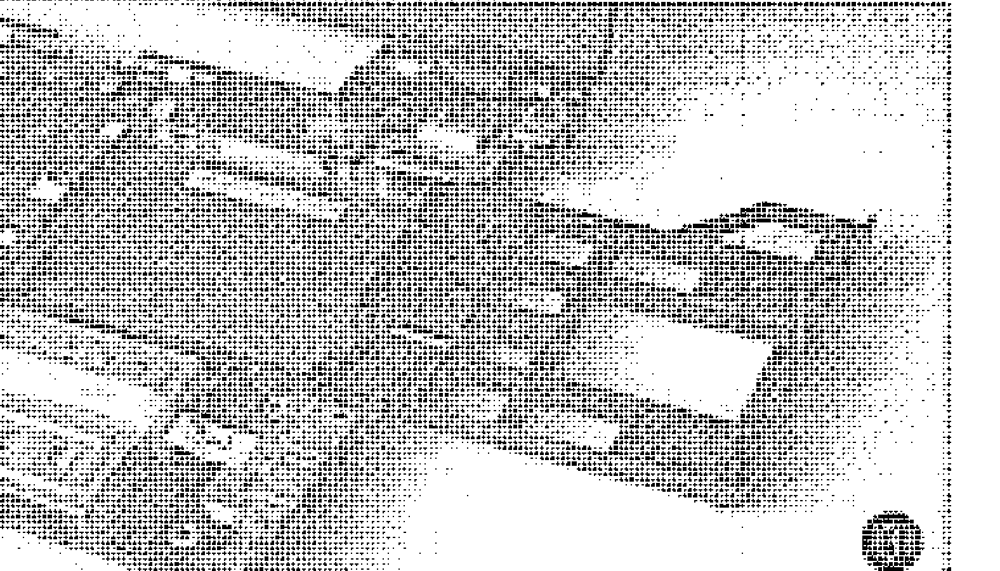

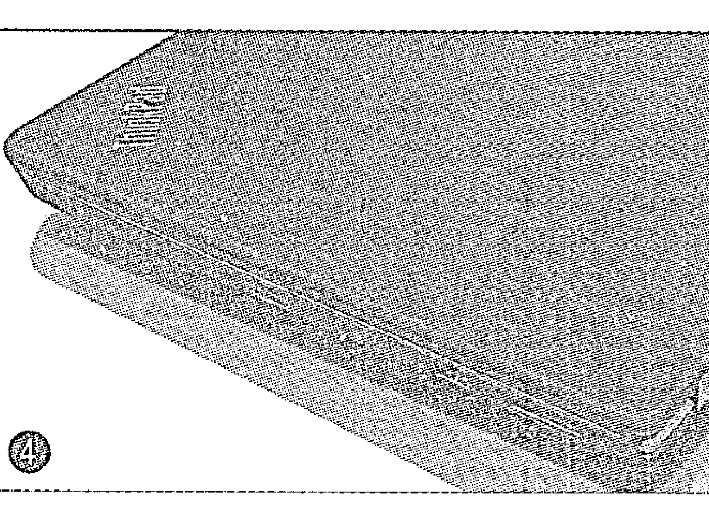

### 拓展阅读

与光驱类似的还有指纹识别或触控屏幕。为了展示产品最好的一面，很多笔记本中低配版都会配以最高配型号的图片用于展示。而这两项功能多为可选配置，图片上有并不见得实际产品会支持。

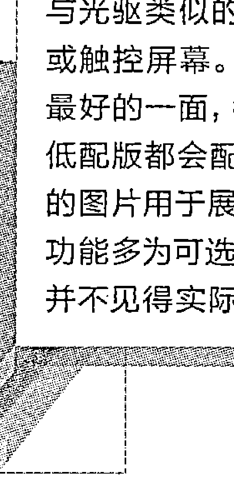

## 繁杂型号迷人眼

在手机领域，某手机的子型号之间最多也就是高配、低配，或是网络制式不同。而热门笔记本不仅子型号众多，它们在配置上的细微差异，也会带来迥异的性能表现。

首先就是外壳材质。在很多人的印象里，同一款笔记本的模具应该相同，最多仅是里面的硬件规格有所差异。然而，这项经验至少在ThinkPad E450系列上并不适用。作为ThinkPad家族的新品，E450又被具体划分为E450和E450C两个版本，而“C”这个后缀就将决定具体型号的外壳材质（图6）。

接下来就是核心配置。我们都知道，影响笔记本游戏性能发挥的核心硬件就是独立显卡，其次就是处理器。然而，很多笔记本却会为不同的子型号准备不同的硬件组合，其中最具代表性的就是宏碁旗下的VN7 V Nitro系列：在低于6000元的价位里，提供了四代酷睿i5-4210H (47W, 2.8GHz~3.4GHz) + GTX860M独显、四代酷睿i5-4210U (15W, 1.7GHz~2.7GHz) + GTX850M独显，以及五代酷睿i5-5200U (15W, 2.2GHz~2.7GHz) + GTX850M独显三款型号（图7）。如果你追求性能，那配GTX860M独显的型号自然是首选；如果你追求续航时间，那配五代酷睿的型号则表现更优。

与VN7 V Nitro类似的还有ACER旗下的E5-471系列，三款价位接近的型号里肯定是采用五代酷睿+GT840M显卡的型号更超值（图8）。总之，当我们看重某款独显笔记本时，首先就要确认它是否仅选用了一个型号的独显（图9），如果有多款独显可选，那就要特别留心子型号之间的差异了。

最后就是功能上的差异。我们都知道，如今很多基于BayTrail-T平台设计的平板电脑出厂就预装Windows 8.1和Android双系统，还能在系统间实现任意切换。问题来了，市面上还有同一型号的单系统版。需要注意的是，两类产品的价格虽然接近，但至少到目前为止还没有一家厂商提供单系统升级双系统的完美BIOS和OS镜像。因此，如果你想体验双系统，切忌不要错选型号一样的单系统版哦（图10）。

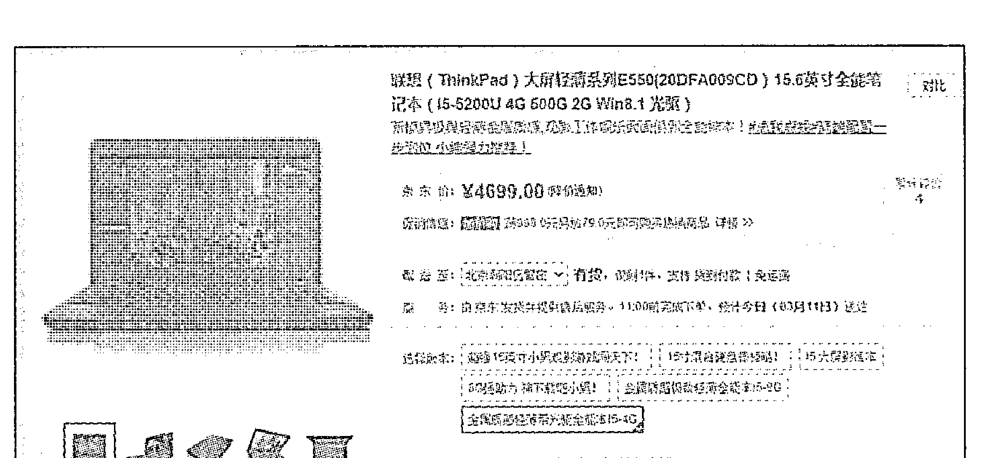

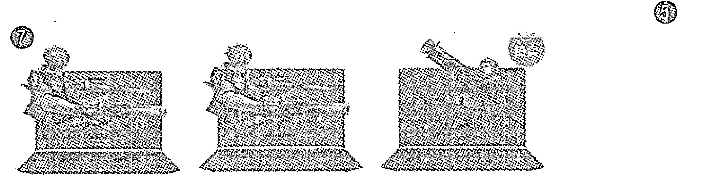

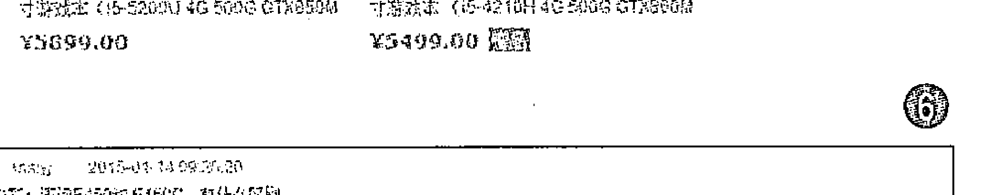

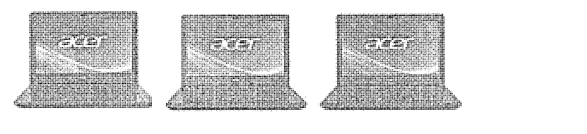

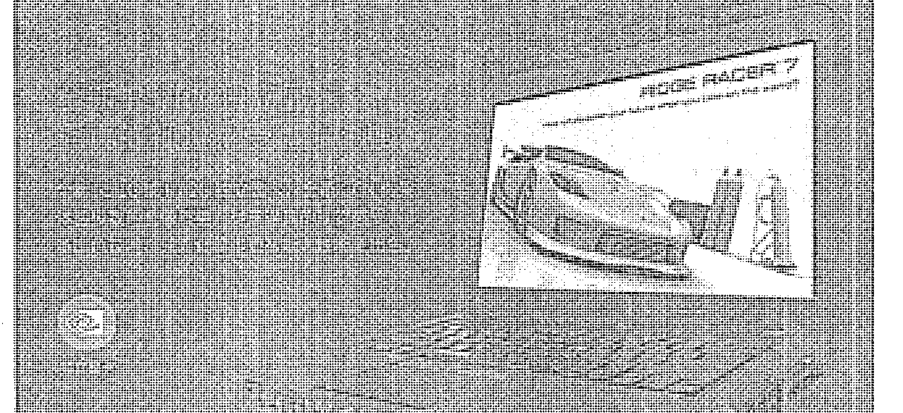

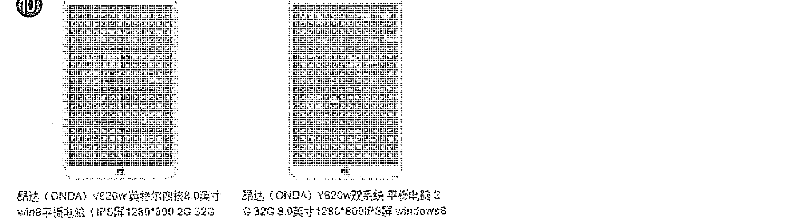

## 拒绝数字游戏 抓住DIY命脉

硬件产品经常有虚假、夸大的宣传，对于产品的某项性能故意夸大，故意弱化产品的短板，在性能上偷换概念的事情屡见不鲜。面对产品功能、性能，以及各种参数的误导，我们必须火眼金睛。

## CPU选购

### 抓住最关键的核心性能

机箱内传统几大件当中，只有处理器部分是最简单直接的。品牌只有Intel和AMD两家，相对其他配件系列比较简单，产品也相对较少。但是，CPU却是目前DIY时最容易被参数误导的产品，我们在选择产品时一定要注意抓准最关键的性能部分。


目前有很多带有超线程功能的Intel处理器和AMD处理器都号称自己拥有八核，那么这个八核心是否是“真八核”就需要我们自行判断。Intel i3和主流平台i7处理器的超线程功能是虚拟核心，自然不能和物理核心划等号。在运行一些视频处理和OpenCL、压缩解压缩相关程序时超线程确实可以起到很关键的作用，但是如果用户购买处理器主要用于游戏，超线程甚至还会起到反作用（图1）。


AMD的高端FX处理器确实使用的是物理八核心，但在一些重视单核性能的程序以及诸多游戏程序当中表现甚至不如Intel的四核处理器，这是为什么呢？说到这里就要提及一个单核性能的概念，指的是处理器单个物理核心的性能对比。程序所支持的物理核心数量，目前仍以2~4个居多，在这种使用环境下性能好坏完全由单核性能决定而并非核心数量多寡（图2）。

## 主频至上与功耗

处理器产品宣传中过分夸大自己的主频和核心频率，而对功耗、发热和单核性能避而不谈。实际上，这样堆砌出来的数据没有意义。目前DIY领域主推小巧轻量化，由于散热系统的压力，功耗和节能的重要性完全不亚于性能。有一些产品拥有4GHz以上甚至达到5GHz的主频，但在功耗上做得较差，以至于需要水冷散热器才能勉强压制处理器的发热，实在是本末倒置的现象(图3)。什么样的处理器才是适合追求性能用户的首选？结合上文，我们应该选择TDP（热设计功耗）在100W以下的处理器，如果是高阶发烧级用户，选择旗舰平台处理器最好也不要超过150W。同系列处理器之间选择L3缓存更大者，以Intel处理器为例，L3缓存容量每大2MB都是一个性能阶梯(图4)。

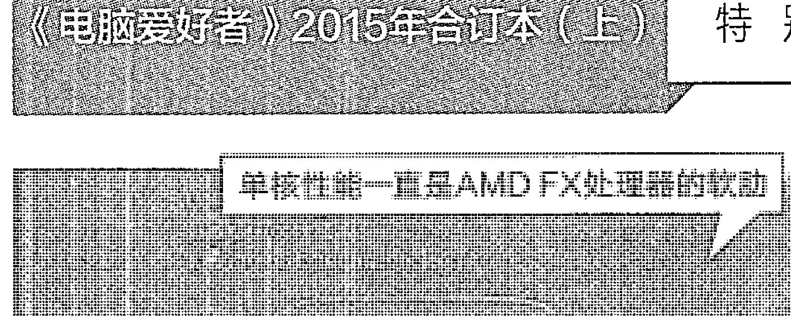

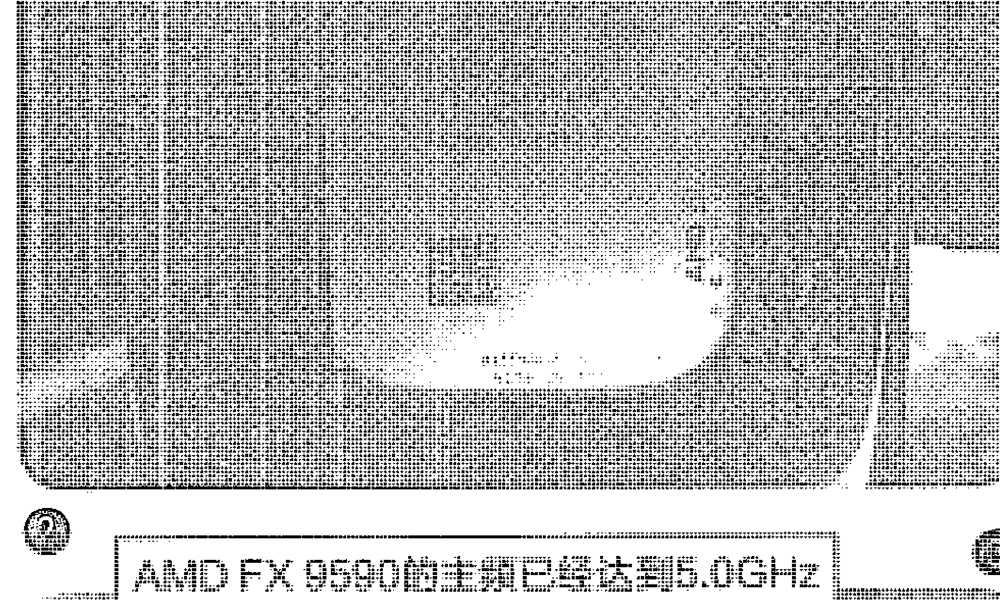

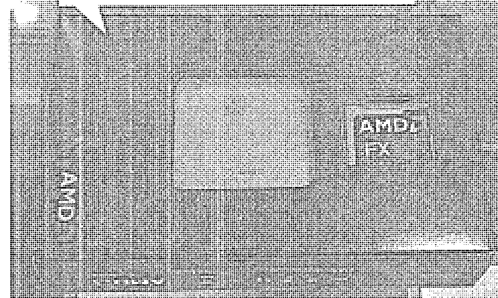

按照前面的标准结合处理器售价，最终最值得推荐的产品可能让你意想不到。Intel处理器单核性能更好，但高阶i7处理器售价均在2000元以上，至强(Xeon)处理器散片彻底打破了尴尬局面(图5)。目前最新型号为E3-1230 V3，原生四核心八线程，8MB三级缓存也要比i5的6M强了一个等级。从各方面看，E3-1230系列与i7处理器是几乎相同的。虽然处理器不支持超频，但是已经足够强大，最关键是售价只卖到1300元左右。用i5处理器的价格买到i7处理器的品质，这就是E3-1230系列的最大优势。不过需要注意的是，至强处理器并不含有Intel集成于家用处理器当中的核芯显卡。虽然核芯显卡性能有限，但十分适合目前的HTPC平台。如果用户选择至强就等于放弃了集成显卡，选购时一定要注意这一点(图6)。

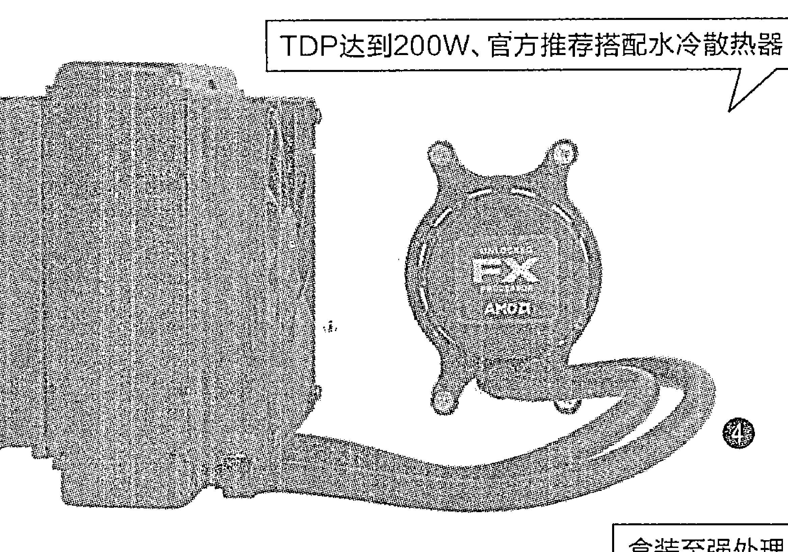

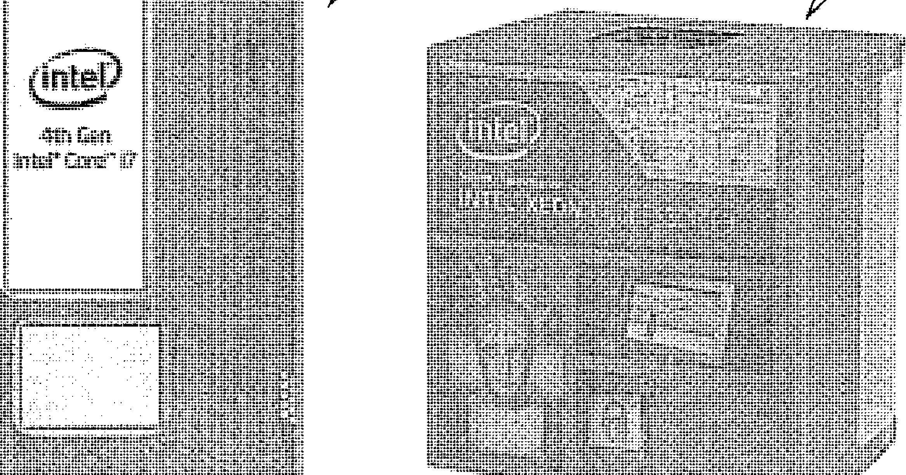

## 散片相关问题

不过超高性价比的至强处理器有自己的问题，那就是1300元是散片的价格。逛DIY市场或淘宝商场可以买到没有盒装和风扇的散片CPU，但请注意这类散片没有质保。如果需要Intel的质保，推荐到京东购买行货版本，但价格也会贵上不少，性价比也就低了(图7)。盒装处理器与散片最大的不同是附带散热器，但原厂散热器性能很一般。如果只是默认频率使用散热器还能勉强接受，但如果处理器超频后原装散热器就不适合长时间使用了，要购买更好的散热器。E3-1230系列并不支持超频，所以这个问题并不会困扰我们。Intel并不给予散片换新服务，不过由于CPU的高集成度非常不容易损坏，是电脑诸多配件当中稳定性最高、同时最不容易出问题的配件。但是请注意CPU一旦损坏很难维修，而且除了官方根本无处可修，一旦损坏就只能报废处理。如果需要购买散片CPU，请一定注意以上两点（图8）。

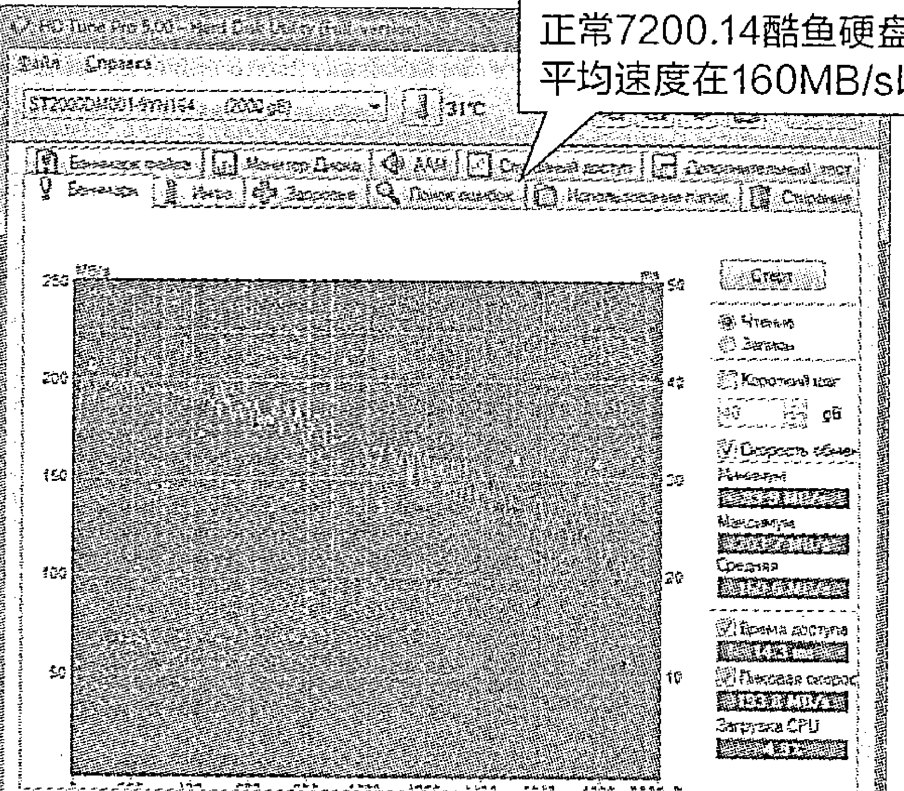

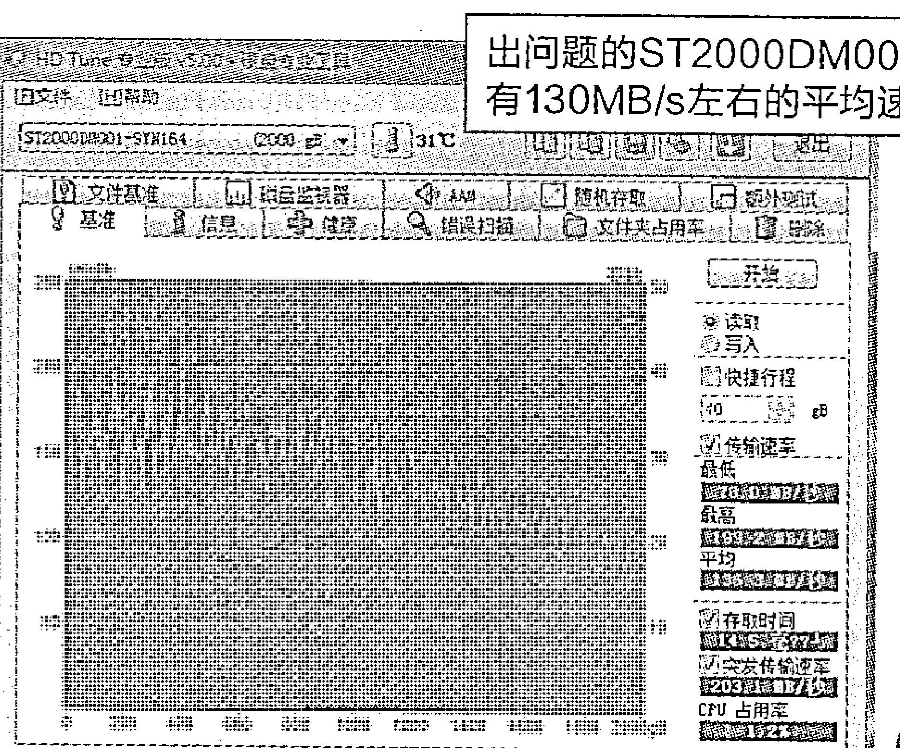

## 认准单碟1TB
家用硬盘选购谈

在京东商城购买同样的HDD硬盘却会出现截然不同的性能，这是怎么回事？目前家用HDD的主流单碟容量是1TB，我们购买的硬盘是否为单碟1TB，成了在同样规格下产品性能最大的分水岭。完全一样的型号、基本一致的外观、高低不同的性能，如何分清硬盘内部的碟片数？

## 性能差距十分明显

以希捷硬盘为例，目前希捷家用硬盘中的绝对主力是酷鱼7200.14这代HDD，同时这个系列也算得上是家用HDD性能中的王者。酷鱼14产品当中，采用最高7200rpm转速并且使用单碟1TB的一共有三种型号，分别为1TB的ST1000DM003、2TB的ST2000DM001和3TB的ST3000DM001。同代产品同代技术本应性能类似，但这三种硬盘身上却出现了两种不同的性能表现（图1）。

其中1TB和3TB版本的酷鱼14代硬盘性能表现代表了家用桌面HDD的顶级水准，读取速度峰值可达210MB/s，最低也有90MB/s，平均速度高达160MB/s左右。可是部分2TB版本硬盘的评测结果却惨不忍睹，不论峰值低谷还是平均读写速度均降低了30MB/s左右，而且曲线波动很大，寻道时间也更长。但也有很多2TB硬盘的数据正常，也就是说问题只出在部分2TB硬盘上，好坏两种性能表现差异巨大（图2）。

## 碟片数量不同

同样都是2TB容量，两个截然不同的测试成绩。将两种不同测试成绩的硬盘拿去希捷官网注册查询，均显示是正品行货。京东等电商对于这种情况并不给予退换货服务，很多用户都中招了。单碟技术已经实现了1TB，希捷大容量硬盘理应都是单碟1TB，但实际情况并不是这样。在市面销售的型号为ST2000DM001的希捷酷鱼7200.14 2TB硬盘目前存在两个版本，一种是单碟1TB的双碟装，性能强悍；一种是单碟667GB的三碟装，性能较差。型号一致，电商也随机发货，以京东商城为例，货架页面上的这款产品标明“双碟三碟随机发货”，用户购买只能碰运气（图3、图4）。

并非所有的7200.14都采用单碟1TB

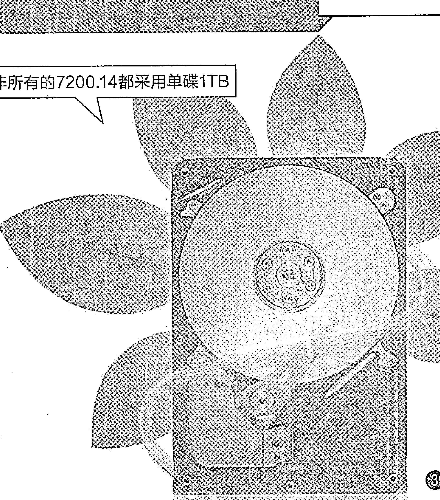

> > Barracuda® 希捷官方文档PDF显示 ST2000DM001确实有三碟版本

| Model Number | Interface (Option) | Spindle Speed (RPM) | Cache, Multisegmented (MB) | SATA Transfer Rate Supported (Gb/s) | Seek Average, Read (ms) | Seek Average, Write (ms) | Average Data Rate, Read/Write (MB/s) | Max Sustained Data Rate, MB/s (MB/s) | Configuration/Designation | Heads/Disks | Bytes per Sector | Voltage Tolerance, Including Noise (5V) | Voltage Tolerance, Including Noise (12V) |
|--------------|---------------------|---------------------|----------------------------|---------------------------------------|-------------------------|-------------------------|---------------------------------------|---------------------------------------|-----------------------------|--------------|-------------------|-----------------------------------------|-----------------------------------------|
| ST3000DM001  | SATA 6Gb/s NCQ      | 7200                | 64                         | 6.0/3.0/1.5                           | <8.5                    | <9.5                    | 155                                    | 210                                   |                             | 6            | 4096              | +10%/-5.0%                              | +10%/-7.5%                              |
| ST2000DM001  | SATA 6Gb/s NCQ      | 7200                | 64                         | 6.0/3.0/1.5                           | <8.5                    | <9.5                    | 155                                    | 210                                   |                             | 4            | 4096              | +10%/-5.0%                              | +10%/-7.5%                              |
| ST1500DM001  | SATA 6Gb/s NCQ      | 7200                | 64                         | 6.0/3.0/1.5                           | <8.5                    | <9.5                    | 155                                    | 210                                   |                             | 3            | 4096              | +10%/-5.0%                              | +10%/-7.5%                              |
| ST1000DM001  | SATA 6Gb/s NCQ      | 7200                | 64                         | 6.0/3.0/1.5                           | <8.5                    | <9.5                    | 155                                    | 210                                   |                             | 2            | 4096              | +10%/-5.0%                              | +10%/-7.5%                              |

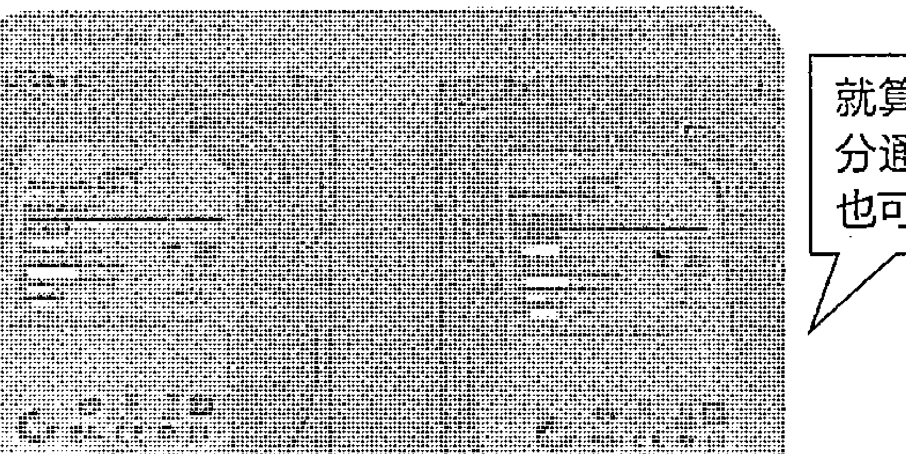

## 几种方法分辨硬盘碟片数

既然双碟三碟性能差距如此大，购买希捷硬盘一定要有策略。如果能接受，完全可以买3TB产品ST3000DM001，此型号全部是单碟1TB制造。如果预算有限，也可选择1TB的ST1000DM003，不过性价比略低。

如果一定要购买2TB的硬盘，就要学会如何分辨双碟和三碟的ST2000DM001硬盘。首先如果可能，尽量让卖家提供实际产品的实物照片或者跑分数据，如果做不到这一点，尽量不要在电商上购买。如果去实体卖场，最简单的是用测试软件来跑一下分，如果平均速度接近160MB/s，基本可以确定就是双碟版。如果卖场并没有跑分的平台，那么就可以参考其他办法来挑选（图5）。

最方便的方法是外观辨别。

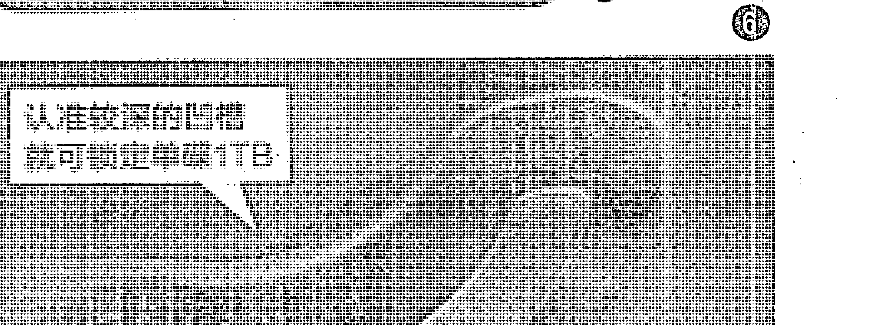

因为碟片数量不同，两款产品在外观上会有细微不同，具体表现在硬盘承载盘体区域的厚度上。注意硬盘正面（带标签一面）的右上角凹槽，这个凹槽由于封装厚度不同有轻微区别，其中双碟版所占空间较小所以凹槽很深，而三碟版只是极浅的一层，应该是更多的盘片挤压了内部空间所致。除了观察凹槽，还有一个区别可供参考，所有双碟版本的2TB希捷硬盘在贴纸右侧盘片位置都有激光辨识雕刻在金属盘体上，而三碟版因为较老则没有这个设计（图6、图7）。

如果还拿不准，用重量区分也是很好的办法。由于碟片和磁头数量不同，两种硬盘的重量肯定也不一样。双碟装硬盘净重约为530g，而三碟装多了一个盘片和磁头净重能达到625g（图8）。

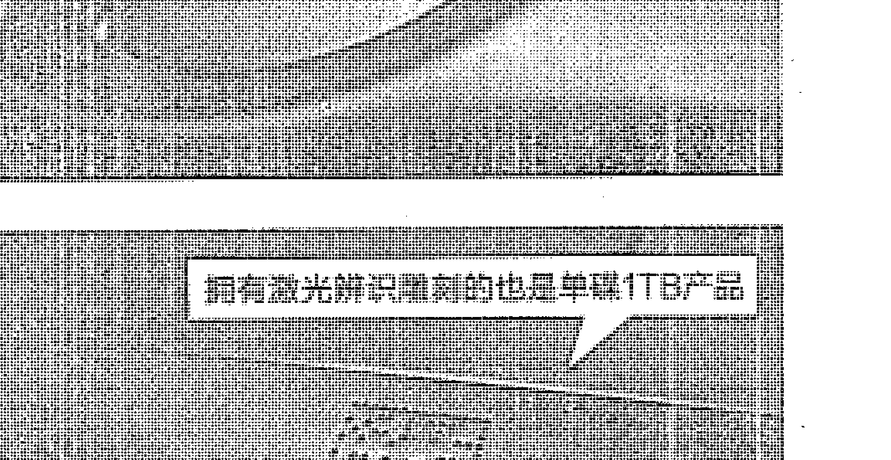

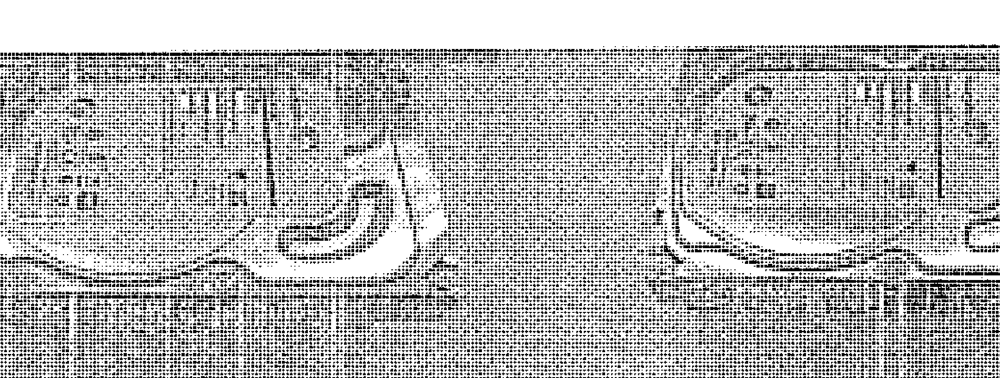

扩展阅读：如果用户对分辨双碟三碟实在头大，又想购买2TB硬盘，还有一个办法可供参考。希捷目前还未大规模上市的家用硬盘规格为Desktop HDD.15，看数字应该是酷鱼14的后继产品，但实际上与酷鱼14的性能完全相同。如果用户可以买到最新后缀的ST2000DM002，应该就可以杜绝上述的性能下降问题。不过目前Desktop HDD.15还未大规模铺货上市，仅有的也多是4TB 5400rpm产品，选购起来可能比较困难。

## 显卡参数误导 读懂NVIDIA的数字游戏

显存对于显卡的作用，就相当于内存对于整个PC，虽然起不到最关键的性能提升，但如果搭配不当是会降低显卡的性能的。所以说不论内存还是显存都很重要，不能让它们成为木桶效应中的短板。NVIDIA这几年的显卡表现突出，胜过竞争对手AMD不少，但这是在GPU核心方面，在显存方面确实搞了不少“乌龙”，让我们来看一看。

## GTX 660/660Ti的192-bit显存难题

当时大红大紫的中端显卡GTX 660/660Ti，采用了2GB显存192-bit位宽的设计。众所周知显存与位宽是对等设计，一般来说2GB显存的位宽一定是64-bit，或者是128-bit的整倍数才是对等设计，而这个192-bit设计一经推出就让很多发烧友感到困扰。

果不其然，这192-bit位宽对应2GB容量的话，最终三个显存控制器单元中的两个分别对应两颗256MB，另一个单独对应四颗256MB。最终这种略显“奇葩”的设计导致2GB显存中的1.5GB可以享受全速带宽的完全交错操作，剩余的512MB则只能面对1/3带宽的非交错操作。

最终造成的结果较严重，在占用显存超过1.5GB的使用环境中，GTX 660/660Ti在不同程度上出现了帧率下降、高分辨率下画面扭曲拉伸、爆显存后帧数达到个位数的现象（图1、图2）。

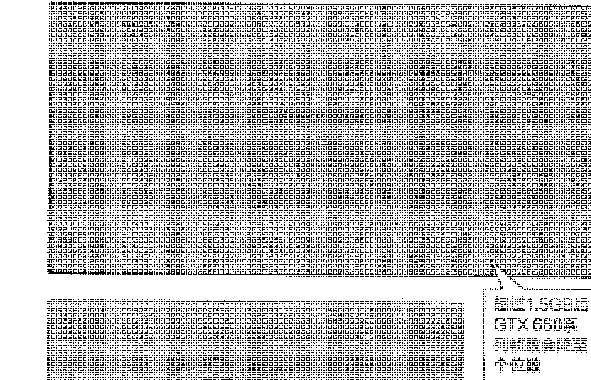

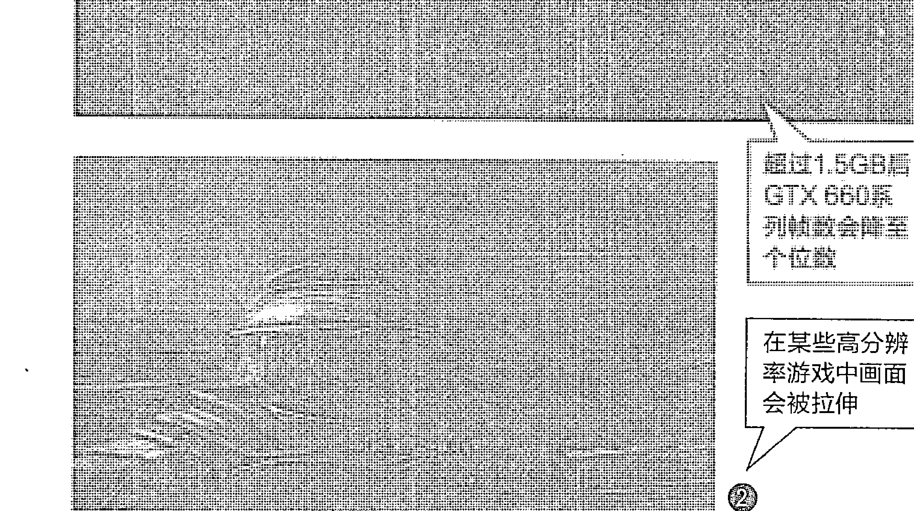

## 辩证看GTX 970显存问题

目前NVIDIA中高端显卡GTX 970是一块能够用2300元左右购买到的显卡，但是其性能完全可以达到旗舰级别显卡的要求。不幸的是在这块显卡上同样出了显存问题，出问题的依旧是那最后的0.5GB，不过本次可能并没有上一次那么严重。

NVIDIA在Maxwell架构中使用了一种新的显存架构，当初的GTX 970规格说明是有错误的，4个ROP/显存控制分区中实际上有1个被禁用了，实际ROP单元只有56个，L2缓存也不是当初说的2MB而是1.75MB，少了1/8（图3）。

GTX 970搭配了4GB显存，不过它跟GTX 980相比拥有更少的SMM单元，内存系统也因此有更少的交叉资源。为了优化显存管理，NVIDIA将GTX 970的显存分为3.5GB和0.5GB两个部分，GPU会优先访问3.5GB那部分。NVIDIA会通过驱动程序让系统较少地访问那512MB分区的显存，实际在高负载当中游戏确实很难突破3.5GB，也没有出现当年GTX 660系列显卡那样的帧数暴降（图4）。

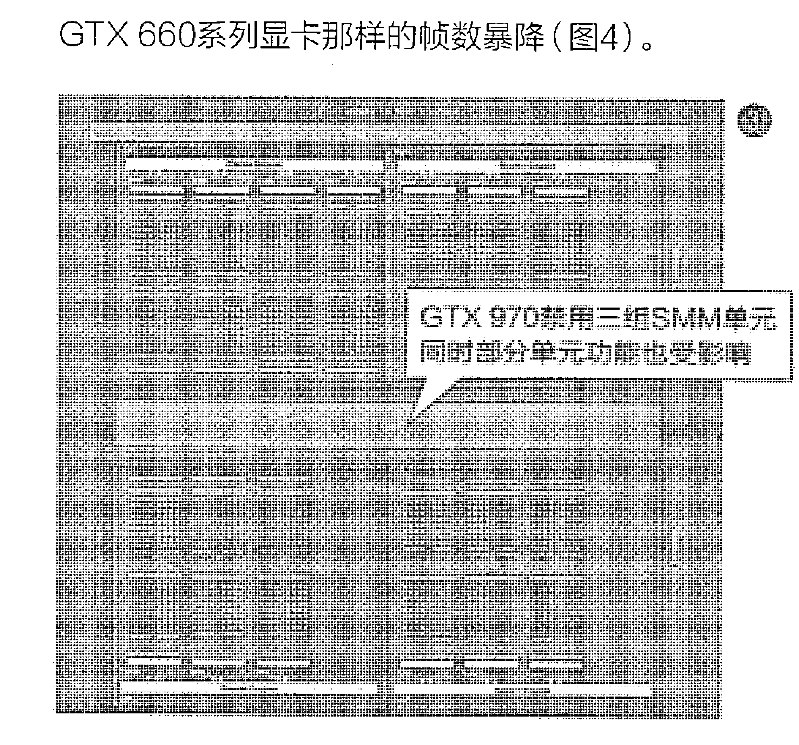

| 参数 | 规格 |
| --- | --- |
| GPU | GM204 |
| 架构 | Maxwell |
| 工艺 | 28nm |
| 晶体管数量 | 5.2B |
| 显存 | 4GB GDDR5 |
| 显存位宽 | 256-bit |
| 显存带宽 | 224 GB/s |
| ROPs | 56 |
| TMUs | 112 |
| 着色器单元 | 1664 |
| 基础频率 | 1051 MHz |
| 加速频率 | 1178 MHz |
| TDP | 145W |
| 供电接口 | 6pin+8pin |

GTX 970的规格同样骗过了不少检测软件，如GPU-Z。

## 闪存的3D时代

### V-NAND对于TLC的意义

将TLC应用在家用SSD中的首例就是三星SSD，由于TLC相对传统MLC可靠性下降这一做法受到不少发烧友质疑。之后用户在选购时也尽可能避免购买TLC产品，不过三星新的840 EVO、850 EVO依然采用TLC，甚至还有闪迪等厂商也加入TLC闪存的行列。与此同时，一种新闪存堆叠形式也问世了，那就是3D的V-NAND形式。三星似乎对新V-NAND很满意，这种全新的闪存技术可有效解决TLC固有的问题。


### 打破枷锁的V-NAND

SSD之前最大的问题就是容量比HDD要小，而传统NAND闪存如果希望实现更高的容量，就需要不断提升闪存颗粒制程，而制程越高其性能和可靠性就会越低，这是闪存和CPU、GPU所用半导体的最大不同。比如说在闪存颗粒50nm时可以实现全盘擦写(P/E) 10000次的闪存颗粒，到了25nm就骤降到3000次，目前主流的16nm闪存颗粒甚至已经要低于3000次了。如果在这种情况下还使用3bit的TLC闪存，其可靠性会进一步下降（图1）。

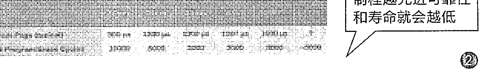

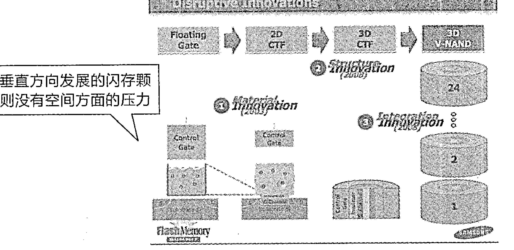

而三星V-NAND技术不再追求单位单元内不断缩小，而是通过近似于3D的立体堆叠，借以实现闪存颗粒更高的容量。所以三星V-NAND其实是一种非平面设计，三星希望NAND的密度以垂直方向发展，这样就没有制程上面的压力。比如可以用原来30nm的制程来实现目前1TB以上的SSD，既保证了容量又确保了可靠性，这在过去是不可想象的（图2）。

### 3D闪存对TLC的意义

使用老制程来制造新闪存的优点显而易见，原本只有3000次全盘擦写的闪存颗粒现在可以达到6000~30000次，可靠性最大可以提升十倍。而对于原本口碑不太好的TLC其意义就更显而易见了，三星可以使用3D技术进一步提升存储密度，但是制程被严格控制在40nm这一成熟的工艺上，再辅以最新的三星主控，850 EVO的寿命比起之前的840/840 EVO有了非常大的提升（图3、图4）。

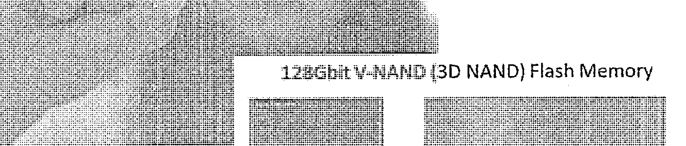

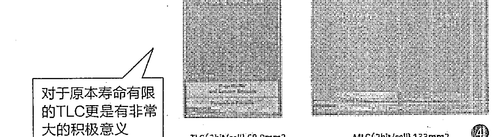

## 愚人节手机整蛊指南整人无形

在一年一度的愚人节里，如果不进行一些“整蛊”活动还真对不起这个节日。而我们手中的智能手机，就是让你变成整人大咖的最佳利器。

## 恶搞APP两大杀手

在各大应用商店搜索“整蛊”、“恶作剧”等关键词即可下载不同类型的整人软件。在这里笔者向大家推荐“整蛊”、“蜘蛛屏幕”、“碎屏”和“变脸”这四类软件。安装第一类软件并运行后，手机会突然弹出僵尸、恶鬼一类的恐怖图片（图1）；第二类则可在屏幕上呈现动态的蜘蛛，要多恶心就有多恶心；第三类会让手指接触屏幕时显示碎屏效果（图2），把手机借给朋友，只要他一点，嘿嘿，要他赔啦；第四类则可以扭曲你的照片，发给许久未见的朋友让他大吃一惊（图3）。需要注意的是，前两类软件可能会吓坏小朋友丢出手机，摔坏了可别怪笔者哦。

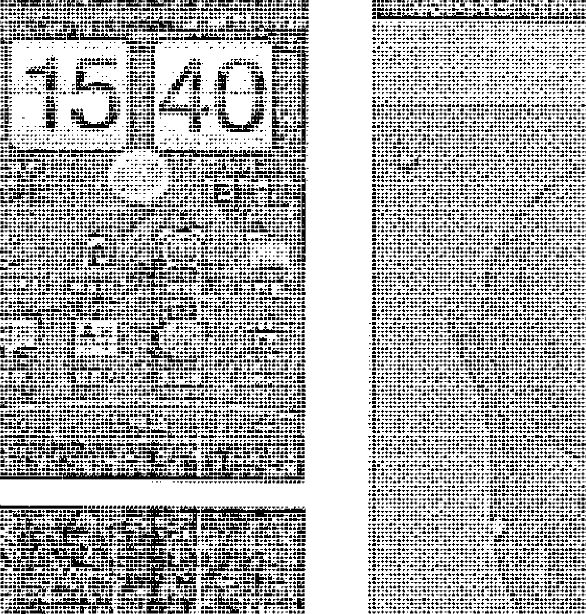

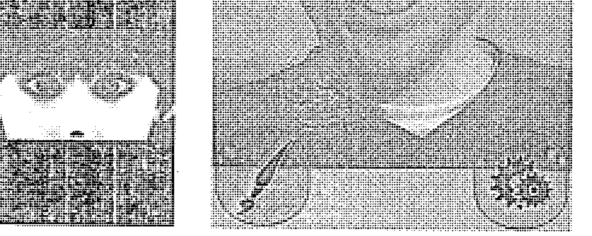

## 虚拟电话短信凑热闹

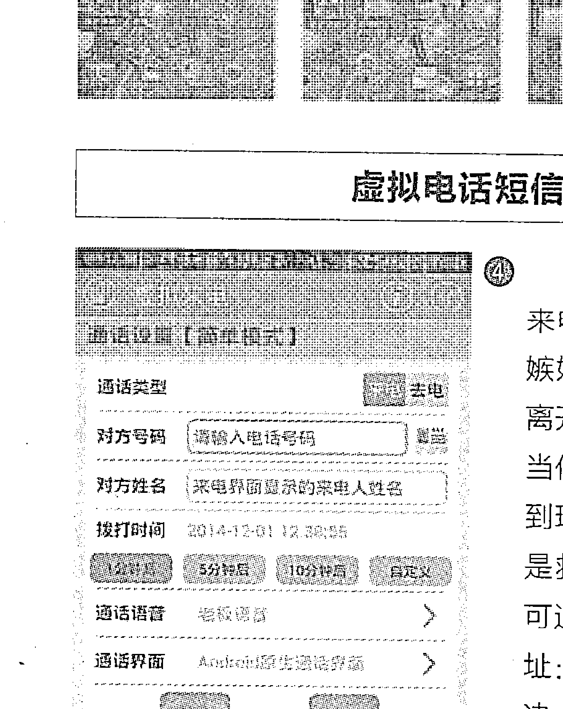

当同学看到你接到了“女神”来电或短信时一定会升起“羡慕嫉妒恨”的心理；当你想找个借口离开时，势必需要电话作为借口；当你想“说服”家长去网吧时，收到班长发来的一起复习短信无疑是救命稻草……上述一切需求都可通过“虚拟电话短信”（下载地址：http://dwz.cn/DuDCR）解决。该软件可以伪造指定联系人的电话和短信内容（图4），并在指定的时间模拟来电或是模拟接收自己设定的短信，堪称应付各种尴尬场合脱身的必备工具。

## 虚拟手机号码愚人无形

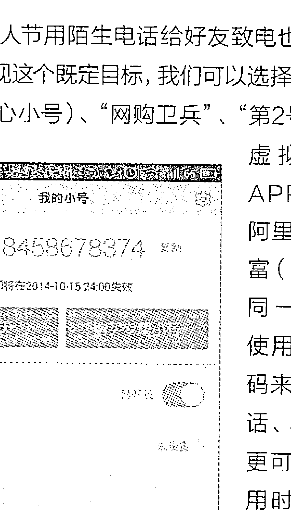

在愚人节用陌生电话给好友致电也是不错的主意。想实现这个既定目标，我们可以选择“阿里小号”（原名亲心小号）、“网购卫兵”、“第2号码”一类的虚拟手机号码APP。相对而言阿里小号功能丰富（图5），能在同一部手机上使用新的手机号码来正常接听电话、收发短信，更可独立设置使用时长、开关机状态、勿扰时间等。

## 苹果派

近期科技数码圈里最热的事件之一，就是苹果发布了多款新品。其中既有新奇的Apple Watch，也有再创纤薄巅峰的新MacBook。遗憾的是，这些新品依旧延续了苹果“高大上”的定位策略，并非所有普通用户都能“消费”。那么对喜欢苹果但却苦于预算有限的用户而言，如何才能享受“苹果派”的乐趣呢？

## A 软件篇

### 以假乱真 Windows模仿苹果秀

MacOS界面精致，但价格非常昂贵，令人望而却步。其实对于仍然在使用Windows系统的用户，可以通过一些第三方软件来模拟成苹果系统，这样在Windows下同样也能感受一下苹果的惊艳。

对于Windows XP和Windows 7用户，只要安装第三方苹果主题即可轻松实现模仿。这两个系统的模仿操作大同小异，下面我们主要以Windows 7为例。

### Windows 7变身“苹果系统”

因为安装苹果主题需要破解系统的主题文件，因此首先要获取“xp.vista.win7主题通用破解”程序，解压到任意文件夹，接着以管理员身份运行其中的“UniversalThemePatcher-x86”，依次单击“破解”，按提示将Windows 7（或Windows XP）对应的系统文件进行破解。当屏幕提示“已破解”，重启后就可以在当前系统安装第三方苹果主题文件了（图1）。

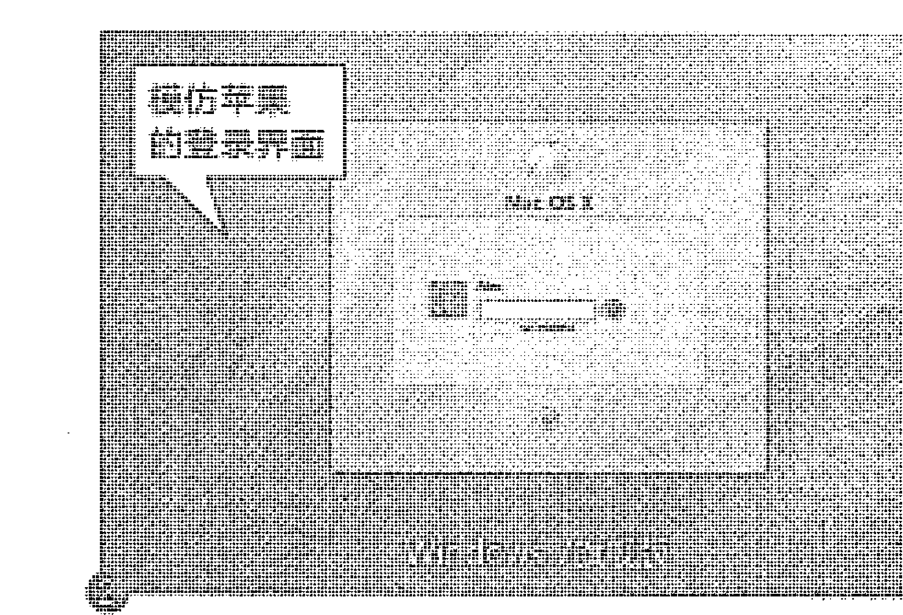

### 破解系统主题文件

| 文件版本 | 平台 | 校验和 | 破解状态 |
|----------|------|--------|----------|
| 6.1.7600.16385 | x86 | 00017637-9 | 已破解 |
| 6.1.7600.16385 | x86 | 00009DEF-1 | 未破解 |
| 6.1.7601.17514 | x86 | 002A3CB2-9 | 已破解 |
| 6.1.7601.17514 | x86 | 002A6469-1 | 未破解 |
| 6.1.7600.16385 | x86 | 00047DD4-9 | 已破解 |
| 6.1.7600.16385 | x86 | 0004A586-1 | 未破解 |

小提示：因为苹果主题安装后会替换一些系统文件，所以安装破解主题文件可能会对原系统造成破坏，在安装前强烈建议做个系统还原，这样一旦安装主题后出现问题（或需要卸载苹果主题），只要重新进行系统还原即可。此外，苹果主题安装后会在后台启动一些进程，如桌面停靠栏等，这样也会占用系统资源。

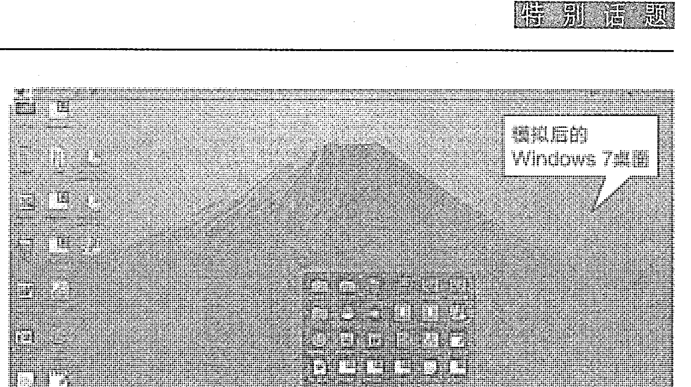

接着下载苹果主题包（下载地址: tinyurl.com/okfhwcu），这个主题包包含登录界面、资源管理器和图标栏Dock，大家可以在安装的时候进行选择。完成主题包的安装后重启，就可以看到苹果味十足的登录界面了（图2）。

进入系统后可以看到，桌面背景、开始按钮（包含任务栏）均和Mac OS一样显示在屏幕上方，桌面下方则是Mac OS经典的停靠栏，整个界面和苹果电脑极为相似（图3）。其他诸如资源管理器的图标，鼠标指针也全部替换为苹果风格。当然，除了上述组件更换外，我们还可以自行到网上下载苹果风格的系统声音文件、屏保程序等加到我们的系统中，让Windows 7运行起来更像苹果系统（图4）。

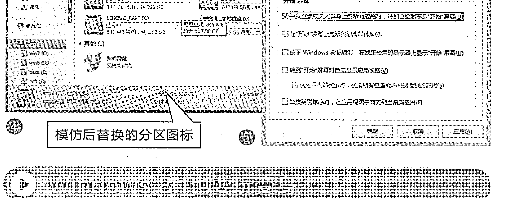

对于Windows 8.1系统，由于它默认是进入开始菜单屏，因此首先要设置开机进入传统桌面。右击任务栏选择“属性”，接着在弹出的窗口中切换到“导航”，勾选“当我登录或关闭屏幕上的所有应用时，转到桌面而不是开始菜单屏幕”（图5）。另外由于Windows 8.1系统主题文件和上述系统不同，而且Windows 8.1默认不支持Aero效果，因此需先访问网页mofang.ruanmei.com下载“魔方”，打开软媒魔方中的“美化大师”组件，切换到“系统主题”，点击“主题破解”，按提示破解成功后重启一次即可安装第三方主题（图6）。接着下载“OS X Mavericks”主题文件（下载地址：tinyurl.com/mzrptqp）。

小提示：这个主题修改系统文件同样很多，可能造成系统崩溃，只建议在原版Windows 8.1系统上测试，Ghost版系统可能造成死机，测试前同样要做好系统备份。

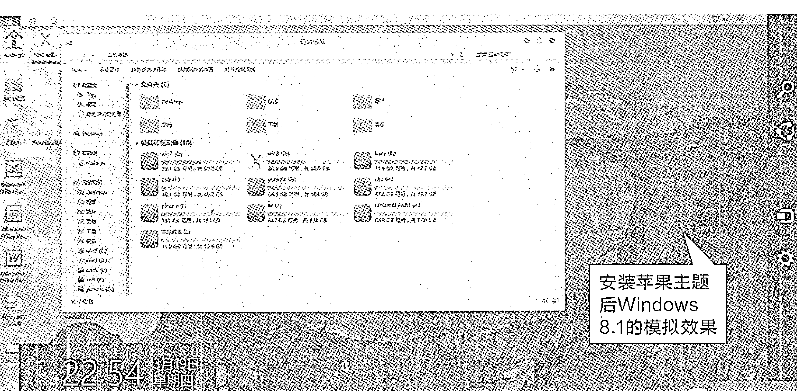

小提示：如果不想再使用苹果主题，只要在桌面空白处右击选择“个性化”，然后选择Windows原来默认的主题即可。不过由于苹果主题替换了系统图标，要完全恢复到原来状态，则需要使用之前创建的还原点来恢复系统。

### Windows更多模仿秀

下载完安装后主题会自动重启，再次进入系统就可以看到开始菜单和任务栏移动到屏幕上方，同时桌面出现停靠栏，打开“这台电脑”，还能看到标题栏、硬盘图标、左侧栏以及窗口的最大化、最小化之类的图标都变成Mac OS风格的了（图7）。

这个主题的苹果元素较多，打开系统控制面板、设备管理器、系统保护等组件，可以看到很多系统图标也变成了苹果风格，整个Windows 8.1系统的风格和Mac OS极为相似。

除了主题模拟外，Windows还有很多应用软件也可模仿苹果风格，如Nexplorer可模仿苹果Finder文件管理器，Mac Gadge可模拟苹果音量控制（设置控制音量和光驱快捷键），RunME可模拟苹果系统开始菜单等，可以根据需要来安装。此外还有原来苹果平台上的原生应用也有For Windows的版本，比如iTunes播放器、Safari浏览器（均可在苹果官网下载），同样都能在Windows下运行。

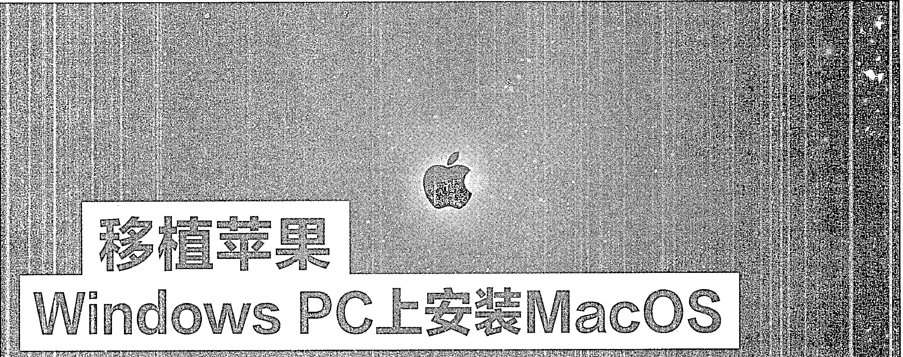

前面的介绍中，只是通过安装主题的方法来模拟苹果界面。苹果系统作为优秀的操作系统，仅通过外观当然无法真正感受到它的魅力。虽然大部分朋友没有苹果电脑，不过现在我们可以在Windows PC上安装实际的苹果系统。由于苹果电脑和Windows的差异，在实机上安装苹果系统有一定难度，因此这里介绍在Vbox虚拟机上安装苹果系统。

### 移花接木 虚拟机里用苹果

大家知道，苹果系统对硬件的检测越来越严格，想在PC硬件上安装苹果系统的试验，许多都以失败告终。实际上还有一种更加安全的方法，就是在虚拟机中安装苹果系统。现在的电脑硬件配置普遍较高，所以在运行速度上并不会有太大的影响。

## 虚拟机里安装Macos

为了简化安装步骤，这里我们选择的是网友封装好的苹果系统（.vdi苹果系统虚拟磁盘文件，具体版本是Mac OS Yosemite V10.10）。VBOX可以到www.virtualbox.org下载，封装好的VDI文件则到suo.im/z5xbh下载，下载后按提示依次安装Vbox程序及“Oracle_VM_VirtualBox_Extension_Pack-4.3.18-96516.vbox-extpack”扩展插件。需要注意的是，安装插件时需要将许可内容滚动到窗口底部才能继续安装（图1）。

接着启动Vbox创建一个虚拟机，名称选择“macos”，类型为“Mac OS X”，版本为“Mac OS X (64bit)”。这里注意名称的设置，因为后续脚本中的虚拟机的名称要和这里的设置一致。继续按向导提示添加虚拟机，将其内存设置为2GB，在添加虚拟磁盘这步时，选择上述下载到的“Mac OSX Yosemite.vdi”文件，这样在启动MacOS的时候就会自动加载这个已经封装好的系统文件（图2）。

剩余的操作按照屏幕的提示完成。完成虚拟机的创建后返回Vbox窗口，选中刚创建的MacOS虚拟机，点击“设置”，在打开的设置窗口中切换到“系统”，然后在“启动顺序”设置中去除右侧窗格除“硬盘”外的所有勾选，同时勾选“扩展特性”下的所有选项（图3）。

继续切换到“显示”设置，拖动设置滑块，将显存大小设置为“128MB”。因为苹果系统的显卡要求高，将显存设置为最大可获得更好的显示效果。完成虚拟机的设置后关闭Vbox，接着将下载到的Box.bat解压到桌面，同时以管理员身份运行。这个批处理通过调用Vbox的命令行参数设置苹果系统的启动参数，这样在虚拟机启动的时候就会自动调用这里的参数，从而可以成功地启动封装好的苹果系统。完成上述操作后关闭提示符窗口，重新启动Vbox，选中创建的MacOS虚拟机点击“启动”，这样就可以在虚拟机里开始启动苹果系统了。

注意：如果在启动虚拟机的时候，系统提示“无法开始新的任务”而无法启动新的虚拟机，或者提示Vboxdrv驱动服务没有加载，请尝试在命令提示符下输入“sc.exe start vboxdrv”手动启动所需的服务。这种故障在Windows 32位系统中比较常见（可能新版Vbox和32位系统不兼容），请自行到网上下载Vbox 4.3.12 r93733版本（经测试该版本可以顺利运行）进行覆盖安装（图4）。

成功启动苹果系统后在登录界面按提示输入登录密码“Ngay2011”（可进入苹果系统后自行更改），点击“>”按钮即可登录苹果系统了（图5）。

小提示：脚本中的“macos”一定要和前面创建的虚拟机名称相同，如果不同可在Vbox设置窗口自行更改。虚拟机启动后默认的分辨率是1024×768，如要更改成1440×900，则在上述脚本中添加下列的命令即可：

VBoxManage setextradata "OSXYosemite" "VBoxInternal2/EfiGopMode" 4

其中"VBoxInternal2/EfiGopMode"后的代码含义如下，大家可以根据自己的设备实际尺寸进行自定义：

0-640×480 1-800×600 2-1024×768 3-1280×1024 4-1440×900

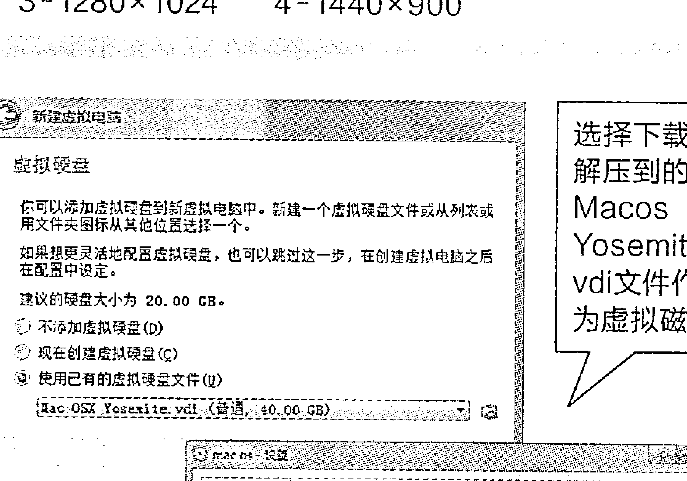

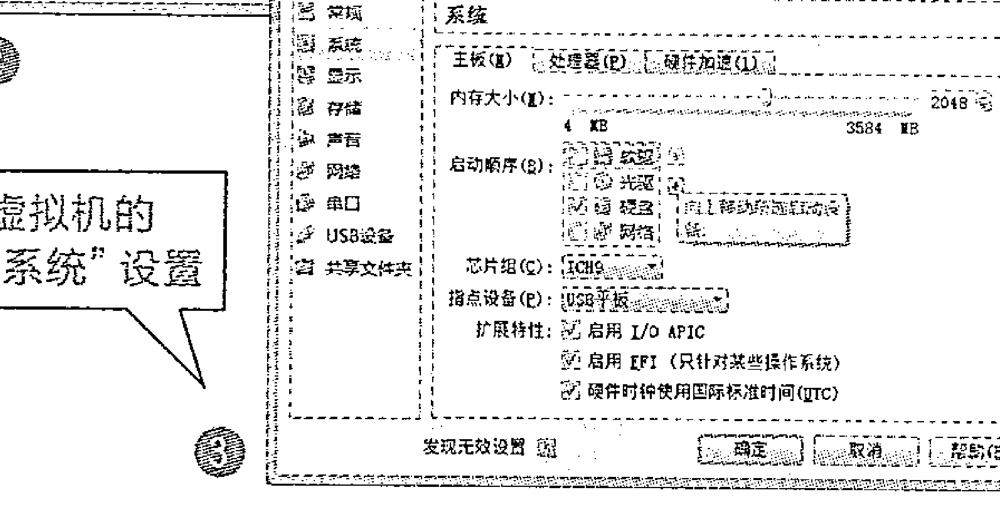

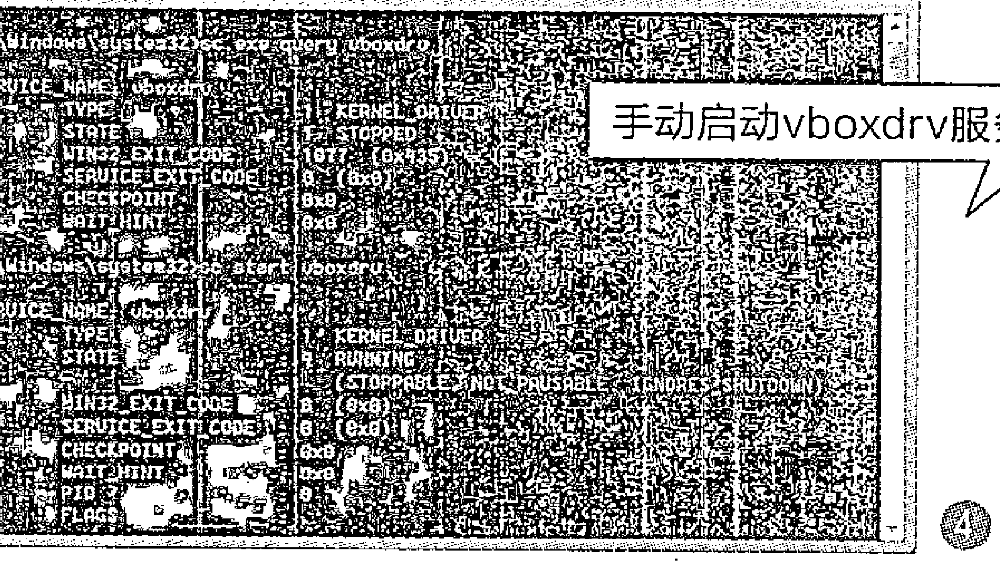

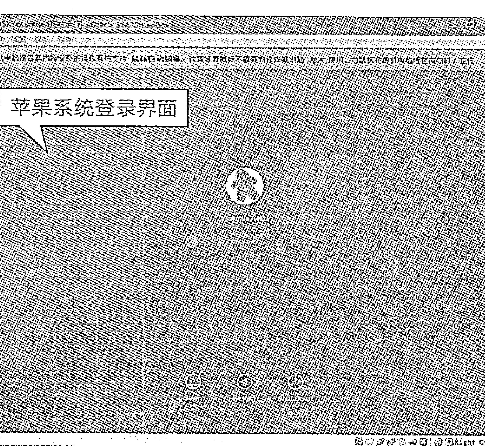

## 新手配置升级MacOS

虚拟机上成功登录后，就可以正式使用苹果系统了。现在看看它的界面和前面模拟的有什么不同？前面的操作只是模拟界面，这里使用的则是真正的苹果系统。点击左上角的“苹果菜单→System Preferences（系统偏好设置）→Language & Region（语言和文本）”，在打开的窗口中点击“+”，然后添加简体中文，点击“键盘偏好设置”按钮，按提示再次重启苹果系统后就可以切换到中文界面了（图6）。

重启进入苹果系统后，点击“苹果菜单→系统偏好设置→用户与群组”，接着在弹出的窗口中单击左下角的小锁图标，在弹出的“系统偏好设置”密码验证窗口中，输入管理员密码（默认为“Ngay2011”），然后单击“解锁”按钮（图7）。

输入正确的登录密码后，返回在“用户与群组”窗口，单击用户列表下端的“登录选项”，在右侧窗格的“自动登录”下拉列表中，选择需要设置自动登录的账号，接着输入对应登录密码“Ngay2011”，单击“好”即可。以后大家就可以在虚拟机里尽情享受真正的苹果系统了（图8）。

既然用上了真正的苹果系统，自然要用最新版本的系统才能实际感受到苹果系统的魅力。目前最新的OS X Yosemite版本是2015.03.13发布的10.10.3 Beta3系统，新版本开始兼容 Apple Watch，同时改进健康应用的兼容性。上述安装的OS X Yosemite版本是10.10，可以通过下载更新安装包的方法进行升级，这里以升级到OSXUpd10.10.1为例。当前系统版本的查看可以点击“苹果菜单→关于本机”后看到（图9）。

首先自行到网上下载升级包文件（文件格式为.dwg，类似Windows 7的SP1升级包，苹果官网提供升级文件下载），单击Vbox虚拟机菜单栏的“设备→分配光驱→选择一个虚拟光盘”，然后将下载到的升级包文件加载到虚拟光驱中。返回苹果系统，打开停靠栏的“Finder→设备→光驱”，在这里就可以看到升级文件了（图10）。

按提示双击其中的“OSXUpd10.10.1.pkg”文件，剩下的操作按照屏幕的提示一步步完成升级即可。这样只要苹果提供升级包，我们就可以将自己的苹果系统同步更新到最新的版本（图11）。

## 技术解读：为什么PC上安装不了MacOS
文/张颖

经常在普通Windows PC上安装苹果系统的朋友都知道实际的安装成功率不高，为什么苹果系统这么难安装到普通Windows PC上？苹果公司针对自家的系统使用了什么保护措施？

首先是硬件架构的保护：最初，苹果个人电脑采用的是摩托罗拉微处理器68000系列，后来转向了基于IBM的PowerPC架构芯片。由于PowerPC架构的指令集和Windows PC上X86指令集完全不同，因此两者无法兼容，苹果的Mac OS都只针对PowerPC架构编写，因此对于早期的苹果电脑，苹果公司在硬件层面就杜绝了普通Windows PC安装苹果操作系统的可能（图1）。

但是这种状态在2005年发生了改变。2005年，乔布斯宣布苹果电脑全面采用英特尔处理器，这样苹果电脑使用的硬件就和普通PC相同，同样使用了X86架构。比如MacBook Pro MGXA2CH/A笔记本电脑，使用的CPU是Intel酷睿i7 4770HQ，显卡则为Intel Iris Pro Graphics，它的硬件配置和市面常见的主流PC并没有多大的区别（图2）。

硬件结构的一致性让普通PC安装苹果系统成为可能，不过在实际操作中，我们仍然无法容易在普通PC上顺利安装苹果系统，因为苹果系统还有其他保护手段。

### 障碍1：苹果电脑特殊的引导保护

苹果电脑很早就使用了64位架构的系统，并且使用UEFI引导模式（Windows平台则在Windows 8发布后才开始普及）。UEFI引导可以在引导过程中添加严格验证，它和CPU架构、操作系统、硬盘引导记录（分区表）密切相关，可以有效提高电脑引导的安全性。当然作为和操作系统无关的引导过程，无论是Windows、Linux还是MacOS都可以使用具备同样保护功能的UEFI引导。

比如在UEFI 2.3.1规范中就定义引导固件的验证过程，在UEFI引导的电脑中，电脑启动时，操作系统厂商（比如微软、苹果公司）可以要求合作的硬件厂商提供特定的安全证书，并且要将证书固化在主板上，这样就可以确保只有合法证书的主板才能成功启动指定的操作系统。因为苹果电脑的硬件专供苹果电脑使用，所以也只有苹果电脑的主板才有合法的安全证书，其他的电脑安装MacOS系统以后，在引导阶段的证书验证上就会被……

> > **什么是白苹果和黑苹果**
>
> 在非苹果生产或非苹果授权生产的普通X86架构PC上安装苹果系统的行为叫做Hackintosh，而这样安装上去的苹果系统就叫做Hackintosh（译称“黑苹果”或“黑金塔”）。苹果官方的系统Macintosh译称“麦金塔”，正版苹果系统则称之为白苹果。

MacOS系统拒绝。所以即使其他电脑安装了MacOS系统也无法正常启动，因为在其主板上缺乏合法证书（图3）。

实际上，在Windows 8发布之初，微软也使用了类似的UEFI安全引导保护技术，同样限制安装Windows 8的电脑再安装其他系统。不过一些大的Linux厂商如Fedora、红帽（Red Hat），与微软签订协议，通过在UEFI配置文件中内置它们的安全证书来实现这些系统在Windows 8电脑上的启动。对于苹果电脑，技术高超的网友则通过Clover、变色龙（Chameleon）等破解软件来绕过UEFI的安全验证，实现在普通电脑上启动苹果系统，不过这样的苹果系统，我们称之为“黑苹果”（图4）。

### 障碍2：苹果的硬件限制策略

大家知道，苹果系统运行在专为苹果设计的硬件系统上，苹果系统通过自己特有的硬件格式来限制普通PC安装苹果系统。

一方面它使用了特殊的MacOS扩展（日志式）分区格式来作为自己的系统分区。所以我们不能像安装Windows系统那样去安装苹果系统，因为普通PC并不能识别HFS+的分区格式，这样也就限制了普通PC上直接安装苹果系统的可能（图5）。

另一方面，由于苹果是封闭系统，它并没有授权其他厂商为苹果电脑的硬件开发驱动（当然也没有像微软那样给厂商发布驱动开发规范技术文档）。这样即使普通PC成功安装上苹果系统，也会由于驱动的缺失出现各种各样的问题，比如没有相应的主板芯片的驱动会导致无法进入系统桌面，没有显卡驱动导致分辨率无法调整等。所以目前如果要在普通PC上安装苹果系统，我们一般就要找到和苹果电脑硬件相符的电脑才能安装、使用苹果系统（图6）。

不过与普通PC安装苹果系统不同的是，在苹果电脑上安装Windows则不存在驱动问题，不仅苹果官方为苹果电脑开发了一整套的硬件驱动，也可以从驱动之家等专业网站下载到各种硬件的驱动。

黑苹果上很多硬件会由于驱动问题无法识别。

### 障碍3：其他的限制

除了上述情况之外，苹果系统本身的一些特性也会让安装了苹果系统的普通PC出现其他问题。苹果系统专为苹果硬件进行底层优化，对于普通PC安装苹果系统，可能会造成硬件损坏。比如苹果系统的算法和Windows不同，一些黑苹果的用户就反映安装苹果系统后烧坏了电脑的CPU，至于安装苹果系统后电池寿命明显缩短、硬盘飘红等小问题则更是屡见不鲜。这些也限制了很多用户不敢去尝试在普通PC上安装苹果系统。

所以，目前来看，在虚拟机上安装试用苹果系统，才是一个较为可行的折衷方案。

### 小知识

## 就地取材 在苹果上安装Windows

### 直接使用虚拟机安装Windows

现在的苹果电脑硬件和普通PC一样，而且Windows平台下的驱动也很丰富，因此在苹果上安装Windows反而简单得多。本文提供两种方法在苹果上安装Windows，一个是使用虚拟机安装，一个是实机安装。大家可以根据自己的实际情况选择方案。

因为苹果电脑和Windows的引导程序不同，对于只是需要在苹果电脑上偶尔运行Windows程序的朋友，使用苹果平台上的虚拟机进行安装即可。比如上述介绍的Vbox虚拟机就有For MAC的版本。

首先在苹果电脑上启动浏览器到www.virtualbox.org下载Vbox，下载到的是一个.Dmg格式的可执行文件，在Finder中打开下载到的程序即可将其加载，然后在弹出的窗口中双击“vitrualbox.pkg”激活安装向导（图1）。

启动安装向导后，剩余的操作按照屏幕的提示一步步完成即可（安装过程需要输入管理员密码）。接着启动Finder，切换到“个人收藏→应用程序→Vbox”，启动虚拟机软件后点击“新建虚拟机”，然后按提示选择自己需要安装的Windows系统（图2）。

剩余的操作和在Windows平台下类似，准备Windows 7安装镜像并加载到虚拟光驱。这样启动虚拟机后就可以开始Windows系统的安装了。安装完成后启动虚拟机即可在苹果电脑中直接运行Windows系统了（图3）。

## 实例安装Windows 8

上述方法虽然简单，但是虚拟机运行毕竟会占用系统资源，在很多时候运行起来不如实机运行流畅。对于动手能力较强的苹果用户，现在可以直接在实机上安装Windows系统，并和苹果系统组成双系统。为了方便苹果用户安装Windows系统，苹果公司专门推出了BootCamp工具。

在桌面上点击“前往→实用工具”，接着在打开的窗口中双击运行“BootCamp助理”，启动该助理工具（图4）。

启动助理工具后按照屏幕提示点击“继续”，接着在打开的窗口中按提示勾选所有的选项，同时准备好Windows 8的安装文件和安装闪存盘（至少8GB），点击“继续”（图5）。

在打开的窗口中，“ISO镜像文件”定位到本地Windows 8的安装文件保存位置，“目的磁盘”选择插入的闪存盘（注意：制作安装闪存盘的过程中会格式化闪存盘，操作前请做好数据备份），点击“继续”（图6）。完成安装闪存盘的创建后开始为Windows划分空间，在打开的分割磁盘窗口按提示移动分割条，划分出合适的空间用于安装Windows系统。

完成硬盘的分割后，点击“安装重启”，这样重启后苹果电脑会自动从闪存盘启动，接下来的操作和普通PC的安装是一样的。这里要注意的是，在选择“将Windows安装到何处”时，这里要选择卷标为“BOOTCAMP”的分区。剩余的操作按照屏幕的提示完成安装即可（图7）。

完成Windows的安装后重启，这样在开机后就会出现图形界面的MAC和Windows 8的多重启动菜单，按提示选择Windows 8进入即可（图8）。

进入Windows系统后完成驱动和应用程序的安装，针对Windows 7、Windows 8系统，苹果公司已经专门整合了相应的驱动包。只要到苹果官网下载BootCap 5中文包，下载后解压直接运行其中的Setup.exe，然后选择自己的苹果型号进行安装即可。这样以后就可以在苹果电脑上使用Windows 8系统了。

如果要切换回苹果系统，只要重启选择MAC进入即可。当然，如果你觉得开机选择启动菜单不便，进入苹果系统后点击“菜单→系统偏好设置→启动磁盘”，接着在打开的磁盘卷窗口会看到苹果分区和BOOTCAMP分区（安装Windows分区），按提示选择需要默认启动的分区，点击“重新开机”即可（图9）。

### 小提示

苹果公司已将助理工具升级到BootCamp 5（支持安装Windows 7、Windows 8系统），该助理工具只支持64位系统。基本上大部分主流的苹果电脑都可升级到BootCamp 5，包括MacBook、MacMini、MacBook Pro、MacBook Air、iMac，2009年及之前的旧型号则不支持。因此如果你的苹果电脑较旧，不建议尝试安装Windows系统。

### 小提示

因为系统安装总有不可预知的风险，所以安装前一定要将重要文件预先备份在安全的地方再进行操作。如果以后不想使用Windows系统了，同上启动“BootCamp助理”，选择“建立或移除Windows分区”，按提示将上述划分的Boot Camp分区移除即可完全卸载。

大家知道，微软的Windows和苹果的Mac OS是两种不同架构的操作系统。但对于用电脑干活的人来说，其实最终关心的并不是用什么操作系统，而是如何用这些系统生成和编辑图、文、声、像等类型的文件。我们不一定只在一种操作系统上工作，有时即便只用一种，很可能也会在文件交换过程中遇到不同的系统环境，这时就会涉及到两种系统间共享文件的问题。那么两种截然不同的操作系统间如何实现文件的共享呢？

- 通过共享数据分区实现

我们可专门划出一个分区让Windows和Mac OS共享数据。但这种分区的格式不能随意由我们来确定，分区格式的不兼容给共享数据带来了难题。在Mac OS中，我们最常用的文件系统格式为HFS+，这是一种Linux文件格式，Windows中并不直接支持这种文件系统。虽然可使用古老的FAT32格式共享分区，但由于FAT32对大硬盘管理的能力较差，加上对大于4GB的大文件不支持，在当今高清文件流行的环境下，FAT32分区共享显得捉襟见肘。NTFS文件系统虽然在Windows下最为流行和高效，但Mac OS对其支持不佳，即便是在最新版的Mac OS X中也只能支持读取，不支持写入操作。但是通过其他软件，让两个系统可互相读写对方的“特色”分区格式。

要在Mac OS下读写NTFS分区，需在Mac OS里安装NTFS-3G或Paragon NTFS for Mac软件。NTFS-3G是开源软件，可为Linux、Free BSD、Mac OSX、NetBSD和Haiku等操作系统提供NTFS读写支持，让这些系统都可安全快速地读写Windows系统的NTFS分区。Paragon NTFS for Mac也可让Mac OS对NTFS分区进行完全读写，且读写效率与在HFS+文件系统中相当，在Mac OS中像原始分区一样对NTFS分区进行加载，只要将磁盘或其他介质与NFTS相连即可访问。在Mac OS中创建并修复NTFS分区与在HFS/HFS+中的操作方式一致（图2）。

### 小提示

在Mac OS下，我们还可使用Tuxera NTFS for Mac 2014驱动软件来实现NTFS格式的磁盘访问。该软件完全支持Mac OS X10.4（Tiger）后的所有版本，包括OS X Yosemite的64位内核版（图3）。

如果在Windows下读写Mac OS分区，可在Windows里安装MacDrive Pro软件。

- 闪存盘为“谍”实现共享

如果仅仅是为了共享一些诸如影音或文档的常用文件，完全可以通过闪存盘来实现在Mac OS和Windows之间的文件共享。虽然FAT32格式的闪存盘也可以完成这项任务，但由于4GB文件的容量限制，这让大于4GB的高清影视或软件ISO映像包的共享成为不可能。在这种情况下，我们可利用一种更有效的格式exFAT来初始化闪存盘（图4、图5）。

- 直通设置系统文件共享

Windows与Mac OS共享文件，还可以通过在各自系统下设置文件共享的方法来解决。

首先两个系统要设为同一个工作组，这是前提。在Windows系统中设置共享文件夹。

在Mac OS的“服务→系统偏好设置”中点击“网络”图标，点击下级窗口中的“高级”按钮，在随后出现的“网络”窗口中点击“WINS”标签，将工作组名称设置为Windows系统所在工作组（图6）。

在TCP/IP标签下，输入与Windows系统相同网段的IP地址与掩码。通过Finder的“前往→连接服务器”，在窗口中填入smb://加Windows系统的共享地址并点击“+”号添加，再点击“连接”按钮并输入Windows共享文件夹的用户名和密码，即可出现Windows共享文件夹（图7）。

如果要在Windows中访问Mac OS的共享文件夹，需要先在Mac OS中通过“系统偏好设置→共享”设置共享文件夹，同时会提供访问地址。在Windows中，只需通过Win+R启动“运行”窗口，然后输入“\Mac名称”或Mac的IP地址，回车即可访问。Mac的IP地址可通过“系统偏好设置→共享”找到（图8）。

- “云”端跨越 实现共享

我们不但可以使用本地磁盘或闪存盘来共享文件，还可使用云盘来共享文件。iCloud是苹果设备上默认使用的云盘，但它也有Windows客户端，通过该云盘来实现跨平台的文件共享。此外360云盘、115网盘等国内主流云盘在拥有Web版和Windows客户端的同时，也都有苹果的Mac OS或iOS版本，可在不同设备上安装相应版本的云盘来实现多种平台系统间的文件共享（图10、图11）。

在Windows XP中，可通过右键菜单路径“我的电脑→属性→计算机名→工作组”查看所在工作组。在Windows 7以上系统中，可通过右键菜单路径“计算机（这台电脑）→属性→工作组”来查看工作组名称。Windows XP开启共享文件夹的方法是通过文件夹右键菜单“属性→共享”选项卡进行设置。Windows 7以上系统中，可通过文件夹右键菜单“属性→共享”选项卡，添加用户Everyone，并为其设置相应的权限来共享文件夹（图9）。

## 刘旸云
“移植”
Mac OS的特色功能

在Mac OS中，有许多值得称道的特色功能，而这些功能是在Windows系统中缺乏或相对较弱的项目。那么，我们是否可以通过一些办法（如升级系统或者使用第三方软件），在Windows系统环境下也享受到这些特色功能呢？

## Windows系统能“时光回溯”

> 小提示
进入Windows 8系统还原窗口的方法是，通过“控制面板→所有控制面板项→恢复”，点击“配置系统还原”和“开始系统还原”来进行具体设置（图3）。

对于系统文件的改变，我们可以通过系统还原功能、系统备份功能来实现备份和恢复。对于用户个人文件，则可用文件历史记录功能、系统备份程序来实现。此外，还可以使用专业系统备份工具ATI来实现包括用户数据在内的分区备份或选择性备份。

系统安装之后，默认情况下系统分区会开启自动还原功能，系统会根据数据改变情况自动创建系统还原点。此外我们也可以点击“创建”按钮随时创建还原点。而当需要还原时，只需点击“系统还原”按钮，即可进入选择还原点窗口，对系统文件进行选择性还原（图2）。

在Windows 8以下的系统中，用户文件可通过系统“备份”功能来完成，而Windows 8和Windows 10则引入了“文件历史记录”功能，我们可以通过“控制面板→所有控制面板项→文件历史记录”，进入文件历史设置窗口，开启文件历史记录功能，这样就会在指定的存储器上自动留下我们使用过的文件的历史版本。当文件被删除或文件出现错误无法读取时，我们可以通过打开文件历史记录启动器，找回相应时间点的文件历史版本（图4）。

如果担心系统出现问题不能启动，可通过控制面板的“恢复”窗口（入口为“控制面板→所有控制面板项→恢复”），点击“创建恢复驱动器”，通过闪存盘创建一个恢复驱动器。同时，还可以选择性地将系统恢复分区数据也存放在这个闪存盘中。这样，当系统出现问题不能启动时，可以通过这个闪存盘启动系统，同时利用闪存盘上的恢复驱动器数据对系统进行修复或刷新（图5）。

> 文件历史记录存放的位置不单可以使用本地硬盘，也可以使用移动硬盘甚至网络驱动器作为存放位置。这样即便是本地硬盘出现问题甚至遇到火灾，也可方便地通过移动设备或远程硬盘找到文件。库中的文件默认会被形成文件历史记录，如果有大个头的影视文件在该范围内，且对备份要求不高，建议通过“文件记录设置”的“排除文件夹”选项，将文件排除在外，以节省备份空间。

## 多任务桌面和多标签窗口

Mac OS有个Space的功能很强大，能够添加4个桌面。而从Mac OS X 10.7 Lion系统开始，Space功能被更强大的Mission Control代替，苹果为广大Mac用户带来强大的窗口和程序管理方式，它集成虚拟桌面、程序切换和窗口管理器等多功能为一体，最多可显示16个桌面。打开Mission Control后，将鼠标放在右上角，会跳出窗口，需要时可自己添加。Windows 10之前的微软操作系统虽然没有多桌面的功能，但可借助于软件来实现；而从Windows 10开始，可通过自带多任务桌面实现多桌面的添加和管理。

我们可以通过给Windows安装“酷点桌面”软件来添加多桌面。当我们通过该软件开启全景桌面方式显示后，就可以用多桌面的方式来显示桌面图标了。该软件可以在Windows XP以上的操作系统中运行（图6、图7）。

> 通过在全景桌面上点击右键，从菜单中选择“添加分组”来添加桌面。还可以通过设置酷点全景桌面的各种参数，改变图标大小和桌面元素的布局（图8）。

在低版本的Windows中，我们如果已经将电脑升级到Windows 10技术预览版，那么不用安装任何第三方工具，即可享受到系统带来的多桌面体验。使用方法很简单，只需点击任务栏上的“任务视图”按钮，在弹出的多任务视图管理界面底部点击“添加桌面”按钮，即可添加新的桌面。桌面切换只需从底部的桌面列表中点击选择即可（图9）。

> 小技巧：如果要将一个任务从一个桌面移动到另一个桌面，只需在任务视图中右键点击该任务，从菜单中选择“移动到→桌面n”即可（图10）。

在Mac OS X 10.9 Mavericks苹果系统中，可使用全新的Finder标签特性来管理多个文件夹，避免了桌面窗口杂乱无序的情况。只需将Finder图标添加到桌面启动栏，然后选择一个希望在新标签打开的目标文件夹，点击屏幕顶部工具栏中的“设置”图标下拉箭头，在菜单中选择“在新的标签页打开”，然后按下Command+T键即可选择新的标签页。

在Windows系统中，虽然至今依然还没有提供多标签页管理文件的功能，但是，通过给Windows资源管理器安装插件或寻求资源管理器的替代软件，也可以实现文件资源的分标签管理。以Windows 8.1为例，我们只需在该系统中安装一个名为Clover 3的资源管理器扩展插件，右键选中文件夹后选择命令“在新标签页中打开”，即可在文件资源管理器中添加一个文件夹标签（图11）。

此外，还可以使用资源管理器的替代软件，如文件资源管理软件MDIE。该软件可原生支持多文件夹标签显示，可以让我们像在多标签网页中管理页面那样管理多个文件夹。通过“工具→MDIE选项”菜单命令进入MDIE选项设置窗口，切换到“分页标签”选项卡下，对分页标签所在的窗口位置、分页标签的样式、鼠标对分页标签的操作等项目进行详细设置。经过设置后，分页标签的操作将更具个性化（图12）。

## 还我内存 挂起后台程序

在使用苹果Mac OS时，我们不用刻意去关闭后台的程序也不会出现内存不足的问题。当内存不足时，系统会自动“干掉”（挂起）后台不用的程序。

使用Windows的人都知道，当开启的程序多的时候，往往会收到系统发来的内存不足的提示。那么，在Windows系统中，能否解决内存不足的问题？

在Windows各个版本的系统中，最原始的清理内存的方法是通过在任务栏空白处单击鼠标右键并选择“任务管理器”，在任务管理器窗口中结束闲置无用或多余的程序、进程来腾出更多内存。如果我们的电脑中安装有360安全卫士软件，通过桌面上的360安全卫士浮动系统加速球图标，一键点击即可实现多余占用内存程序和进程的清理（图13、图14）。

如果我们使用的是Windows 8以上的系统，由于新式的Windows Metro应用采用了新式内存管理方式，有点类似于苹果的内存管理方式，如果Windows后台打开了许多Metro应用，也可实现自动挂起而不会出现内存不足的情况。当然，这一技术目前仅限于新式应用的内存管理，传统桌面应用程序如果打开过多，仍然会出现内存不足的情况。

用户对Windows资源管理器使用分页标签式管理的呼声很高，但我们迟迟没有看到微软引入这一功能。网络浏览器的标签操作早已被众多浏览器所引用，微软也不例外。但微软文件资源管理器至今没有引入这一功能，不知有何难言之隐。我们期待将来的Windows 10中能看到这一功能的影子。

## Windows触控板手势操作

用过苹果笔记本的人都知道，在系统偏好设置中，我们可以通过设置多种手势操作，很方便地通过触控板来控制系统和各种应用。那么，在Windows笔记本中，如何充分利用电脑提供的触控板，让手势操作发挥出最大的优势呢（图15）？现在许多Windows笔记本自带的触控板越来越多地支持多点触控操作，这样，我们就可以在触控板上完成更多的手势控制操作了。不过，每个笔记本的多点触控操作方法可能会有所不同，支持多点触控操作的笔记本一般会在随机的教程软件中有详细的提示，只需要按照提示操作，就可以很快地学会用触控板的各项操作。比如华硕和联想的一些新式笔记本就含有此功能。通过设置，我们可以实现用双指上下左右滑动来浏览网页或者文档，像在触屏上操作那样用双指捏合操作实现页面或者图像的缩放和翻转，使用双指点击实现类似于鼠标右键的操作，在图片浏览界面中用三指滑动更换图片等实用性的操作（图16）。如果笔记本使用Windows 8以上系统，通过触控板设置，也可使用Metro界面的手势操作。具体操作包括从一根手指到五根手指的不同点击或移动来实现。先将笔记本触控板驱动程序升级到最新版本，在控制面板的“鼠标”设置中选择“装置设定值”选项卡，点击“设定值”按钮，在“边缘滑动”项目组下，选中“启用边缘滑动”并确定。之后，在Windows 8的Metro界面环境下，在触摸板边界进行滑动操作，就可以实现类似于触摸屏上的面板或程序切换操作了（图17）。微软和苹果多年来一直在互相借鉴桌面功能。在即将发布的Windows 10新系统中，微软将借鉴更多苹果触控板的手势。新手势包括三个手指向下滑动将所有窗口最小化、三个手指向上滑动将所有窗口重新展示出来。使用三指轻扫手势激活Windows 10新任务视图，不仅任务视图看起来像Mac OS X的任务控制中心，三指轻扫起来也是一样的姿势。微软也将借用三指轻扫左、右，在激活的应用程序之间切换（在苹果上则是全屏Mac应用程序之间移动）。

## 小知识

> 在Windows 8的系统盘根目录中，有一个大小约为256MB的隐含属性文件Swapfile.sys，这个文件就是Metro应用的交换文件。由于初期版本的Metro应用没有设计关闭按钮，因此，如果切换到其他Metro应用后，此前的Metro应用会自动挂起到后台运行，而后台被挂起的数据就存储在这个Swapfile.sys文件中。

## 小技巧

> 在Windows 8.1中，后台打开的多个Metro应用在系统内存不足时可由系统自动关闭，我们还可以手动选择关闭这些应用。若使用PC桌面系统，可以将鼠标指向桌面的左上角，然后向下拉动鼠标，这时应用列表会出现，我们只需在应用上单击鼠标右键，然后选择关闭，即可选择性地关闭后台的Metro应用。如果我们使用的是Windows平板，则可以将手指从左边框跨越屏幕内部写Z字形状，这时应用列表也会出现，长按需要关闭的应用然后选择“关闭”即可。

小技巧
如果笔记本只支持单点触控，那么也可通过第三方软件（如StrokeIt）让鼠标操作增加手势功能，带来更简便的操作体验。StrokeIt软件支持多达50种的鼠标手势操作，可配置特定的软件使用特定的手势操作。也可由用户来为新的软件添加新的手势。如果软件无法准确地使用手势，还可让软件去学习手势（图18）。

## Windows文件夹也能分色管理

在整齐划一的军队的队伍中，如果有一个人穿件其他颜色的服装，我们一眼便可看到他。假如在众多文件夹中，给那些常用的文件夹添加不同的颜色，这样也可以方便地找到它们。

在Windows系统中，如果文件采用NTFS格式，可让系统加密或压缩文件显示出彩色，以别于平常文件。要达到这种效果，只需通过“文件夹选项”窗口的“查看”选项卡，将“高级设置”列表中的“用彩色显示加密或压缩的NTFS文件”选项选中即可（图19）。还可通过MDiE代替Windows资源管理器来管理文件，设置文件夹的分色显示管理。在该软件的“选项”设置的“窗口显示”选项卡下，我们可以对文件夹、隐藏文件、只读文件、系统文件、压缩文件等进行详细的分色显示设置（图20）。

此外还可用专用文件夹上色工具iColorfolder实现文件夹颜色的自定义。安装软件后只需右击文件夹，在弹出的快捷菜单中便会看到“文件夹染色”选项，选择后会在子菜单中看到多种颜色项。选择一种颜色后即可立即将该文件夹设置为指定的颜色。如果嫌默认颜色少，还可通过“自定义”项来设置其他颜色（图21）。

## Windows也能接管手机通信

苹果Mac OS Continuity版有一项Handoff功能，此外苹果Mac设备上还有iMessage软件，当你的手机来电来信之后，可以在PC上控制通信。其实，这项功能在Windows平台上也可以借助于软件来实现。

对于手机收到的短信，我们也可以在PC上接收。只需在Windows PC端和手机端都安装91手机助手或360手机助手客户端，就可以实现用PC来接收和回复手机短信（图22）。

电脑代替手机发短信，不但可以实现即时收发，还可以实现定时发送和群发。例如我们可以使用移动飞信软件，实现定时短信、短信群发，同时又可突破移动的限制，发送给任意第三方手机号码。此外，在对方无法上网，而我们又没有带手机的情况下，可以用PC上的飞信向对方手机发起呼叫（图23、图24）。

用PC邮箱也可向手机发起短信呼叫。可以用139邮箱的自写短信功能给朋友或工作伙伴发送短信。由于139邮箱的账户号码直接关联自己的手机号码，又可将手机通讯录与邮箱通讯录“合二为一”，因此在手机没电的时候，完全可用电脑通过139邮箱替代手机执行发送短信的任务（图25）。

## 来自Mac OS的优秀软件

在苹果Mac OS上有一些专用的优秀软件，如云服务iCloud、Safari网络浏览器、QuickTime媒体播放器等，这些软件由于其涉及的内容的广泛传播特性，因此，苹果也不得不开放这些软件在Windows平台上的对应版本。于是，我们也可以在Windows平台上使用这些具有鲜明特色的工具。

## iCloud登录Windows系统

iCloud是苹果各系统默认采用的云服务。实际上，这一服务不仅能在苹果各种系统平台上使用，通过Windows PC，我们也能使用iCloud中存储的文件资料。通过在Windows上安装iCloud控制面板，我们就可以在Windows电脑上使用iCloud上存储的文件了。Windows PC版iCloud控制面板下载地址 (http://dwz.cn/EnYjN)，官网下载地址 (http://dwz.cn/EnYsH) (图1)。

登录Windows版iCloud之后，我们会发现，在iPad上拍的照片会自动跑到PC的照片目录中。此外，我们还可以将Windows PC上的照片上传到iCloud云端保存，这样我们就可以用任何一款苹果设备访问Windows PC的资料，实现了Windows与Mac资料的互通有无。

iCloud的时候，也许系统会提示需要注销控制面板，无法卸载iCloud (图2)。在这种情况下，我们可以再次打开iCloud控制面板，点击窗口左下角的“注销”按钮，这时会提示是否保留iCloud联系人、日历和任务的副本信息，根据需要选择之后，执行iCloud注销操作。电脑上的iCloud账户成功注销之后，便可以通过软件管家卸载iCloud控制面板了 (图3)。

除此之外，我们还可以通过任意平台上的Web页面，使用iCloud云服务。iCloud网络版登录地址为：https://www.icloud.com/ (图4)。

### 解决无法卸载iCloud的问题

在Windows上使用iCloud会遇到一个问题，那就是当不需要的时候，可能不会像我们常用的软件那样可轻易卸载掉。当iCloud软件已经关闭，想从软件管家或Windows控制面板卸载

iCloud还可用于Chrome浏览器中。通过给Chrome添加iCloud书签插件，可以让Windows上的Chrome浏览器书签与iPhone、iPad和Mac上的Safari书签保持一致。iCloud会将Chrome中的书签实时地同步到云端，这样，不管使用什么类型的设备，都可以随时随地共享书签了 (图5)。

## PC上注销iCloud账户

## Chrome的iCloud书签插件

## 在Windows中安装Safari浏览器

## Windows也能享用Safari

用过苹果Mac或者移动设备的用户对Safari浏览器的快速、简洁和安全印象深刻。其实，在我们使用的Windows环境下，也可以享用Safari的这些优秀特性。我们只需要在自己的Windows PC上安装Safari的Windows版本，就可以在Windows环境下体验苹果浏览器的舒适安全特性了（图6）。

### 用Safari实现无痕浏览

通过Safari可实现无痕浏览。通过开启“私密浏览”，Safari可以对浏览历史记录加以保密。当我们离开私密浏览器时，Safari不会记住我们所访问的页面、搜索历史记录或“自动填充”信息。真正起到了“上网无痕”的效果（图7）。

### Safari的Cookie安全管理

使用Safari还能拦截第三方Cookie。我们访问的网页经常会留下来自第三方网站的Cookie。这些Cookie能够被用来追踪浏览了哪些网页，将用户指定为广告推送的目标，或者为用户的线上行为创建个人记录。Safari默认阻止这些Cookie的记录，而且它也会默认阻止第三方网站在用户的缓存、本地存储或数据库中留下数据。我们可通过“隐私”选项进行选择性设置（图8）。

### Safari欺骗网站访问警告设置

利用Safari还可预防欺骗性站点。通过在“安全性”设置中开启欺骗性站点警告选项，当上网时遇到欺骗性站点，浏览器会向用户发出警告提示，增加了上网的安全性（图9）。

> 小提示
Safari浏览器还可以与iCloud配合，它可在安装了该软件的所有设备上实现无缝浏览对接。这样，无论我们使用的是什么平台的设备，都可以方便地随时随地进行接续阅读了。

## 离开QuickTime播放器

QuickTime是苹果Mac平台上的内置播放器，可以很方便地观看来自网络上的高清视频，使用先进的H.264视频压缩技术。用QuickTime 7 Pro，我们可以将文件转换为多种格式，还可录制并剪辑作品。通过第三方插件还可以多方向扩展QuickTime技术。QuickTime流媒体解决方案可以流传输方式在互联网上传播媒体内容。如此先进和高效的技术，在Windows PC中是否可使用呢？

答案是肯定的。事实上，由于视频媒体广泛传播的需求和特性，在许多年以前，苹果公司就推出了Windows版的QuickTime。当时其他播放软件无法播放该软件的自有视频格式，因此为了播放苹果视频格式文件，人们不得不在自己的Windows电脑上安装一个QuickTime播放器。但是，目前我们有了更多的选择，我们既可以继续使用Windows版的QuickTime，也可以使用一些其他媒体播放或处理软件来代替QuickTime。

首先，我们可以通过正规渠道下载安装Windows版的QuickTime，例如下载和运行于Windows平台的QuickTime 7.75.80.95版（下载地址：http://dwz.cn/EnYZB），官方网站：http://www.apple.com/quicktime/(图10)。

此外，我们可以选择暴风影音、QQ影音等播放软件来播放QuickTime视频，还可以使用一些网络视频客户端软件来播放视频，例如用优酷视频客户端、腾讯视频客户端、PPTV视频客户端等工具来替代QuickTime播放视频。选择的多样性让我们离开QuickTime视频播放器依然可以享受精彩纷呈的视频生活(图11、图12)。

而在视频格式转换方面，离开了QuickTime，我们可以使用格式工厂来进行各种视频格式的转换。此外，在一些视频播放器（如QQ影音、暴风影音、优酷视频客户端）中，也内置或附带了可以转换各种视频格式的组件，我们可以通过这些途径来完成常用视频格式的转换(图13、图14)。

## 硬件篇

苹果的操作系统固然精彩，但“享用”它的前提条件还是需要建立在同样精彩的硬件产品身上。而Apple Watch和新一代MacBook，则成为了苹果硬件领域的“新一代领军人物”，也成为了众多竞争者的追赶目标。

### 智能手表 手腕上的奢华盛宴

苹果是最早提出“智能手表”概念的厂商，而首款智能手表“Apple Watch”，却比各种“Android Watch”迟到了将近2年。那么Apple Watch到底有何杀手锏？Android Watch真的只是它的跟风之作吗？

### 洗尽奢华 其实2588元就够用

作为智能手表领域的“迟到者”，苹果通过Apple Watch正式向传统手表宣战（图1）：最高126800元的售价，虽然不及百达翡丽、江诗丹顿等顶级手表品牌旗下的产品，但也足以和劳力士等品牌一较长短了，真正让智能手表挤进了“奢侈品”的专列。好消息是，18K金版Apple Watch和最低端的运动版除了材质有别以外，在功能上并无差异。这意味着126800元和2588元的Apple Watch在功能和体验上是一致的，除非你特别在意蓝宝石屏幕、外壳和表带的材质，那些高于2588元的版本还是留给“土豪们”选择吧。

### Android Watch谁跟风谁原创

没用圆形屏幕，也没用曲面屏幕，Apple Watch在设计上趋于保守，选择了最为成熟的正方形屏幕，只是通过圆润的边框、“数字表冠”（旋钮）以及不同材质组合彰显了苹果的个性（图2）。要知道，瑞士的经典手表大多都是圆形表盘，Apple Watch那方形的屏幕少了一份瑞士手表的韵味，有的只是浓烈的“极客范”。

曾有网友戏言，“在苹果正式发布智能手表之前，大家在没有参考标准的情况下只能摸着石头过河，因为谁也不知道真正的智能手表到底该怎么做”。然而，Apple Watch至少在设计上没有成为“标杆”，方形屏幕早已被Android领域的智能手表“玩腻”了，没用上圆形屏幕或曲面屏幕的智能手表都不敢称自己为高端。面对琳琅满目的各种Android Watch（图3），Apple Watch似乎反倒有了“跟风”的嫌疑。

在手机和平板领域苹果一直都是领军者，在涉足智能手表领域之后，Apple Watch是否依然可以鹤立鸡群呢？

▶ Apple PK Android Watch

很遗憾，目前Apple Watch能做到的，Android Watch都能做到，甚至做得更好。首先是外观设计，Android Watch经过数代的经营，就屏幕一项经历了方形和曲面，以Moto 360和LG G Watch R为代表的Android Watch更是引入了圆形屏幕设计（图4、图5），让智能手表在视觉效果上无限接近传统的瑞士手表，将科技与手表文化完美结合。苹果为了提升Apple Watch的卖相，提供了多种材质和表带搭配的选择，只是价格会随视觉档次一路飙升……

圆形屏幕的好处就是在相同尺寸下可以显示更多内容（较方形屏），而方形屏要想在用户的手腕上呈现更多内容（变大），就得想办法将屏幕弄弯，比如三星Gear S就通过曲面屏获得了2英寸的“大视野”（见表）。

另一方面，就像苹果为智能手表定制的Watch OS一样，谷歌也针对性地推出了Android Wear OS。其中，Android Wear的交互方式手势和点击操作为主（图6），语音控制为辅，上手非常容易。而Watch OS则在此基础上，通过旋钮去实现更为复杂的操作功能。两套系统的设计理念就此产生的差异：

| 型号 | Apple Watch | MOTO 360 | LG G Watch R | Gear S |
| :--- | :--- | :--- | :--- | :--- |
| 屏幕 | 1.32或1.5英寸方形屏 | 1.2英寸圆形屏 | 1.3英寸圆形屏 | 2英寸曲面屏 |
| 分辨率 | 312 × 390像素（42mm）<br>272 × 340像素（38mm） | 320 × 290像素 | 320 × 320像素 | 480 × 360像素 |
| 处理器 | Apple S1 | 1GHz单核 | 1.2GHz四核 | 1GHz双核 |
| 内存/存储 | 不明/2GB | 512MB/4GB | 512MB/4GB | 512MB/4GB |
| 体积 | 38mm或42mm表径 | 46mm × 46mm × 14cm | 46.4mm × 53.6mm × 9.7mm | 58.1mm × 39.9mm × 12.5mm |
| 系统 | Watch OS | Android Wear | Android Wear | TIZAN |
| 电池 | 不明 | 320mAh | 410mAh | 300mAh |
| 参考报价 | 2588元起 | 2688元 | 2888元 | 2479元 |

## Android Wear:

以预装Android Wear的产品为例，它的设计思路就是在传统手表的基础上融入手机提醒及健康监控功能，使其成为一个消息通知中心。

## Watch OS:

对智能手表而言，操作并非越简单越好，因为太过简单势必会对功能产生限制。因此苹果对Watch OS的理解是，除了信息通知以外，想办法实现更多的交互和功能，也因此才会用到复杂的旋钮配合操作（图7）。

到目前为止，Apple Watch所能实现的消息、电话、邮件、日历、微信等APP都能在Android Wear平台上找到相同的应用（图8），而Wear结合Android手机也能实现远程拍照。虽然暂时两个系统在应用功能上基本持平，但就后续的发展潜力而言，还是封闭的苹果生态系统更能吸引开发者的关注。

> ## 扩展阅读

实际上，Android Wear也是一套封闭的系统，在权限管理和自由度上远不如手机用的原生Android。因此，你会发现无论是Moto 360、LG G Watch R还是华为Watch，这几款预装Android Wear系统的圆屏手机除了外观以外，在体验上都无限接近，它们都会面临Android Wear系统应用匮乏的窘况。为了突破源于系统层面的限制，很多厂商会跳出Android Wear生态圈。

比如三星想让Gear S拥有接近Android手机的使用体验（图9），甚至获得独立的通话功能安装SIM卡，只能改用自家的TIZAN系统；国内的“果壳圆表”也通过对现有Android系统的深度开发，实现了针对圆形屏幕的适配工作。而市面上更多的“智能手表”，其本质上也都是源于Android的二次开发（图10），虽然具备兼容所有APK的优势，但在操作体验上是否优秀，就得看具体厂商对UI定制和优化的能力了。

## 电池和系统限制成枷锁

就Apple Watch的续航能力，曾有网友戏言“Apple Watch让你知道，你的一天只有18小时”。而Android Watch虽然不像Apple Watch这般不济，但是续航时间最多也就勉强达到两天一充的标准。另一方面，技术壁垒也是我们不得不去面对的问题，比如Apple Watch仅支持iPhone/iPad，而Android Wear也仅仅支持Android手机。一些基于原生Android系统改造的智能手表系统虽然也能支持iOS设备，但是在功能上却受到了严重限制。因此，智能手表的现实状况是苹果用户只能买Apple Watch，而Android用户还是用Android Watch。

## 小结

Apple Watch的起价虽然“相对”便宜，但前提是你还得拥有一款iPhone才可以。如果你并非iPhone用户，无论Apple Watch表现有多么出色都是白搭而已。Apple Watch的功能Android Watch都可以找到替代的方案（图11），而且可供选择的产品和价格区间也更为灵活，因此适合更多喜欢尝鲜的用户选择。

总之，无论是迟到的Apple Watch，还是已经耕耘数年的Android Watch，它们目前依然处于起步和摸索的阶段。现在买回家，它们只能承担起“通知中心”的角色，如果想体验更为有趣的功能和APP，至少还需要1~2年的周期。至于买不买，还是得看你的腰包是否给力了。对普通消费者而言，笔者的建议是静观其变，等Watch OS出现了杀手级的应用，或者Apple Watch 2上市之后，那时才是智能手表的最佳入手时机。

> 扩展阅读
果壳圆表算是一款非常独特的Android Watch，它采用了TF技术显示屏，点亮时是彩屏，待机时则可以切换至电子墨水，从而大幅延长了续航时间。

## 从新MacBook看笔记本如何做到极致轻薄

如果说Apple Watch的设计趋于保守，那全新的12英寸MacBook的设计就堪称“激进”了。虽然这款产品没有冠以“Air”的称号，但它却比原先11英寸的MacBook Air还要薄了24%。换句话说，新MacBook虽然不叫Air，但却胜过Air。

新MacBook缘何胜过Air
新MacBook之所以可以获得超越Air的轻薄系数，最关键的秘诀就是其内藏的酷睿M之芯。简单来说，在14nm Broadwell先进架构的帮助下，酷睿M不仅可以提供媲美微软Surface Pro 3的性能，低至4.5W的TDP也令其甩下了散热风扇的包袱，只需石墨片即可满足散热的需要。于是，苹果将新MacBook的处理器、闪存和内存合理排布在有史以来面积最小、集成度最高的主板上，较11英寸的MacBook Air的主板小了67%之多，最终将新MacBook的厚度控制到了13mm左右（图1），而920g的重量也达到了笔记本形态设备的极致水准（表1）。
可能有人会问了，压缩机身尺寸势必导致键盘手感和续航时间的下降，那么新MacBook将如何解决上述的“后遗症”？答案就在“蝶式结构键盘”以及“阶梯式电池”两个特色技术上。

> 火速连接
如果你想了解有关酷睿M的更多资讯，请参考本刊2014年2期《工艺就是战力：酷睿M——平板电脑的梦想之芯》这篇文章。

表1
| 项目 | 新MacBook | MacBook Air 11 | MacBook Air 13 |
| :--- | :--- | :--- | :--- |
| 屏幕 | 12英寸（2304×1440像素） | 11.6英寸（1366×768像素） | 13.3英寸（1440×900像素） |
| 处理器 | 酷睿M（1.1GHz~2.4GHz） | 酷睿i5（1.6GHz~2.7GHz） | 酷睿i5（1.6GHz~2.7GHz） |
| 显卡 | HD5300核芯显卡 | HD6000核芯显卡 | HD6000核芯显卡 |
| 体积 | 280mm×196.5mm×13.1mm | 300mm×192mm×17mm | 325mm×227mm×17mm |
| 重量 | 920g | 1.08kg | 1.35kg |
| 电池 | 39.7Wh | 38Wh | 54Wh |
| 无线上网 | 9小时 | 9小时 | 12小时 |
| 视频播放 | 10小时 | 10小时 | 12小时 |

## 全新的蝶式结构键盘

将厚度压缩到13mm后，苹果留给新MacBook用于安装键盘的高度空间也随之减少了将近一半。此时，如果再延用笔记本惯用的“剪刀式结构”键盘，将会因键程过短而导致手感全无并增加误按率。于是，苹果为新MacBook准备了全新设计的“蝴蝶结构”键盘（图2），它比剪刀式结构更宽（单个键帽面积增加了17%），并使用了更坚硬材料制成的单体架构，从而可以有效避免侧面按压无法正确触发的情况，提升按键的稳定性与一致性。此外，由于蝶式结构相比传统剪刀脚设计在键程上大约短了1/3，因此哪怕蝴蝶结构键盘的按键组件相较上一代变薄了40%，依旧可以提供媲美甚至超越MacBook Air的手感。

除了键盘空间被“压缩”外，新MacBook留给触控板的空间也受到了限制。因此，苹果并没有采用传统“跳板式结构”（在触控板下方为点按的下压动作留出空间）的触控板，而是将触控板的表面材质换成了电容式玻璃，在内部还加入了Taptic Engine以及力度感应器（图3）。这种被称作“Force Touch”的全新触控板，让新MacBook解决了传统触控板按压边缘容易出现的跷跷板效应，并可实现更多有趣的功能。比如通过不同的按压力度滑动触控板绘制粗细不等的线条、PDF中就能对齐注释这样的任务时触控板就会向你的指尖传递真实的触感回应等等。

## 见缝插针的阶梯式电池

和11英寸的Air相比，新MacBook不仅机身更薄，其武装的视网膜屏幕也是耗电大户，但我们却惊奇地发现它的电池容量不仅比Air更大，续航时间也同样达到9小时以上。这里酷睿M处理器虽然起到了一定的作用，但真正让新MacBook获得“全天候”续航能力的还要看“阶梯式电池”技术。
前文我们已经提到，新MacBook的主板面积只有Air的33%，这意味着采用楔形机身设计的新MacBook内部会存在很多带有弧形曲线的不规则镂空空间（图4），如果使用传统的矩形电池会出现无法利用的空间而导致浪费。可将“阶梯式电池”理解为对电池进行阶梯式分层堆叠（图5），通过量身定制的外形充分贴合新MacBook机身内部的特定轮廓。苹果就是利用“见缝插针”的原理，将本本机身内所有的镂空空间都塞满了电池（图6）。
至此，通过改进的键盘和电池技术，让新MacBook弥补了因追求极致纤薄而产生的后遗症。遗憾的是，新MacBook的起价高达9288元，而且并非所有用户都能习惯苹果特色的MacOS系统。那么，在传统的Windows笔记本阵营中，有没有可以媲美新MacBook的产品呢？

| 表2 | 华硕U305FA | 宏碁Switch 12 | 联想Yoga 3 Pro | 三星930X2K | 惠普1020 G1 | 新MacBook |
| :--- | :--- | :--- | :--- | :--- | :--- | :--- |
| 屏幕 | 13.3英寸IPS<br>(1920×1080像素) | 12.5英寸IPS触控屏<br>(1920×1080像素) | 13.3英寸IPS触控屏<br>(3200×1800像素) | 12.2英寸IPS<br>(2560×1600像素) | 12.5英寸IPS<br>(1920×1080像素) | 12英寸IPS<br>(2304×1440像素) |
| 处理器 | 酷睿M-5Y10<br>(0.8GHz~2.0GHz) | 酷睿M-5Y10a<br>(0.8GHz~2.0GHz) | 酷睿M-5Y70<br>(1.1GHz~2.6GHz) | 酷睿M-5Y10c<br>(0.8GHz~2.0GHz) | 酷睿M-5Y51<br>(1.1GHz~2.6GHz) | 定制版酷睿M<br>(1.1GHz~2.4GHz) |
| 内存 | 4GB | 4GB | 4GB | 4GB | 8GB | 8GB |
| 硬盘 | 128GB SSD | 128GB SSD | 256GB SSD | 128GB SSD | 256GB SSD | 256GB PCIe |
| 接口 | 读卡器、USB3.0×3、<br>Micro HDMI、音频接口 | 读卡器、USB2.0×1、<br>Micro USB3.0×1、<br>Micro HDMI、音频接口 | 读卡器、USB3.0×2、<br>Micro HDMI、<br>音频接口 | 读卡器、USB3.0×2、<br>Micro HDMI、<br>音频接口 | 读卡器、USB3.0×2、<br>HDMI、扩展坞接口、<br>音频接口 | USB-C×1、音频接口 |
| 厚度 | 12.3mm | 16.5mm | 12.8mm | 11.8mm | 15.7mm | 13.1mm |
| 电池 | 45Wh | 36Wh | 44Wh | 35Wh | 36Wh | 39.7Wh |
| 重量 | 1.2kg | 1.46kg | 1.19kg | 950g | 1.21kg | 920g |
| 报价 | 5199元 | 5299元 | 7999元 | 7999元 | 8999元 | 9288元 |

## 新MacBook的挑战者们

好消息是，新MacBook并非一枝独秀，在酷睿M的帮助下，Windows笔记本阵营中也涌现出了很多便携性出色的新品（表2）。其中，最接近新MacBook的产品就是来自三星的930X2K（图7），这款产品的厚度比MacBook还要薄，同样拥有低于1kg的体重，而7999元的报价也更具性价比。

如果你喜欢类似平板电脑的操作体验，来自联想的Yoga 3 Pro也是一款不可多得的酷睿M变形本。虽然它拥有更大的屏幕，内部还加入了一枚风扇，但其厚度却依旧比新MacBook还要薄，电池容量也更大，唯一可惜的就是重量达到了1.2kg。如果你的预算有限，则可考虑华硕U305FA（图8），这款产品的配置和便携性与Yoga 3 Pro接近，但价格却仅有5000元出头，算是目前最实惠的传统笔记本形态的酷睿M产品。

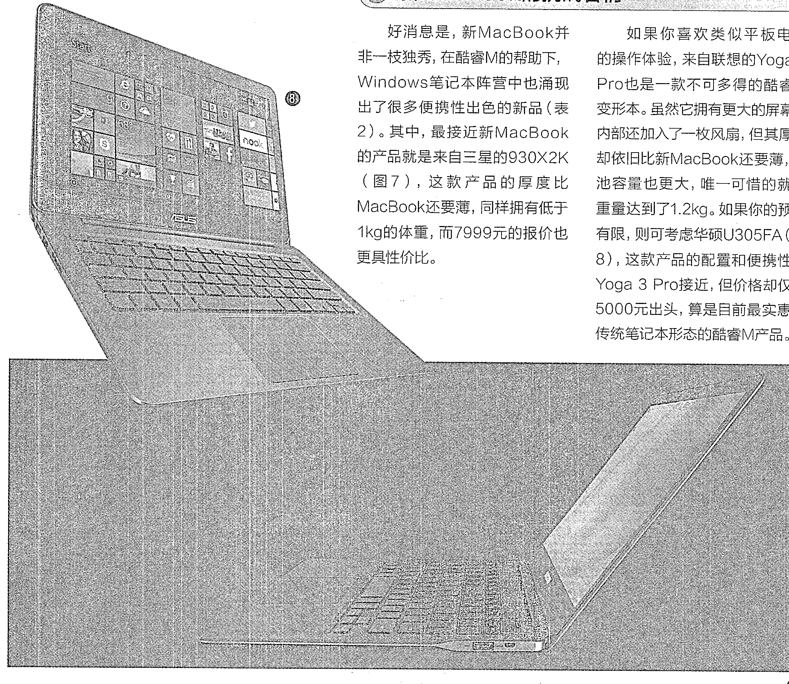

## 为何没有新MacBook性感

虽然Windows笔记本阵营中不乏比新MacBook更薄、电池更大、价格更便宜的产品，但是它们给人的第一印象却始终不如新MacBook那般震撼和性感。原因就是它们没有新MacBook特有的楔形外观设计。

原因非常简单，Windows笔记本阵营中的酷睿M设备清一色采用了传统的矩形电池（图9、图10），如果采用楔形外观，就无法在有限的空间里塞进更大的电池了。

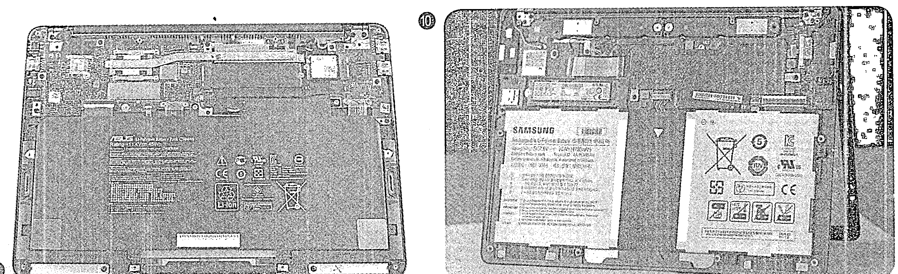

| 表3 | M-5Y71 | M-5Y70 | M-5Y51 | M-5Y31 | M5Y10c | M-5Y10 | M-5Y10a |
| :--- | :--- | :--- | :--- | :--- | :--- | :--- | :--- |
| CPU基础频率 | 1.2GHz | 1.1GHz | 1.1GHz | 0.9GHz | 0.8GHz | 0.8GHz | 0.8GHz |
| CPU睿频频率 | 2.9GHz | 2.6GHz | 2.6GHz | 2.4GHz | 2.0GHz | 2.0GHz | 2.0GHz |
| GPU基础频率 | 300MHz | 100MHz | 300MHz | 300MHz | 300MHz | 100MHz | 100MHz |
| GPU最高频率 | 900MHz | 850MHz | 900MHz | 850MHz | 800MHz | 800MHz | 800MHz |
| 博锐技术 | 支持 | 支持 | 不支持 | 不支持 | 不支持 | 不支持 | 不支持 |
| Intel TSX-NI技术 | 支持 | 支持 | 不支持 | 不支持 | 不支持 | 不支持 | 不支持 |
| 稳定映像技术 | 支持 | 支持 | 不支持 | 不支持 | 不支持 | 不支持 | 不支持 |
| 可信执行技术 | 支持 | 支持 | 不支持 | 不支持 | 不支持 | 不支持 | 不支持 |

\* 所有酷睿M均基于14nm Broadwell架构设计，支持最大16GB内存，TDP为4.5W，温度上限为95℃

### 扩展阅读：如何判断酷睿M设备的性能

由于酷睿M设备大都配备了4GB起步的内存与SSD硬盘，所以决定它们性能强弱的核心指标就是CPU参数一项。目前酷睿M处理器家族一共有7款产品，CPU和GPU的主频越高，性能越强（表3）。

### 扩展阅读

虽然酷睿M号称无需风扇协助散热，但实际上它在全速工作时的发热量也是蛮可观的，这就要求厂商在研发产品时要充分考虑到散热方面的优化设计。比如新MacBook虽然没有风扇，但苹果却将整个铝制底盖作为了散热系统，而联想Yoga 3 Pro也额外为酷睿M添加了一组超薄风扇，目的就是“镇压”极端情况时的发热问题。英特尔开放了酷睿M处理器的授权，很多昔日的平板电脑品牌也加入到了酷睿M设备的研发和竞争中来。但是，由于一些厂商并不具备“笔记本级散热”的技术积累，只是在酷睿M芯片表面上涂抹厚厚的硅胶层散热（图11），并未充分考虑机身内部散热风槽的走向设计，当设备使用一段时间后如果散热硅胶层损耗变薄，就将导致酷睿M芯片的发热失控。

## ▶ 酷睿M也有“温度阈值”

基于酷睿M设计的笔记本、变形本、平板电脑已经上市有一段时间了，但细心的玩家可能会发现一个问题，那就是处理器型号相同的两款产品，在测试软件中的跑分成绩相差很明显；或是你正用酷睿M设备打游戏，却经常莫名其妙地出现卡顿现象。而此类现象的背后，则是源于酷睿M的“温度阈值”问题。

包括酷睿M在内的所有英特尔处理器都有一个至关重要的技术指标，那就是“CPU最大温度上限”。比如酷睿M处理器的这个指标数值就是95℃（图12），意味着当CPU内核温度超过95℃后芯片有被烧毁的风险。因此，厂商在设计产品时需要在BIOS中设定一个安全“温度阈值”，当CPU温度超过这一阈值后就会触发保护机制，也就是CPU通过降频的方式快速“降温”，确保芯片始终远离最大温度上限这个指标。

由于温度阈值是一个动态的区间，因此厂商可以根据产品的实际散热情况进行调整（多在70℃~85℃之间）。如果某款产品的散热设计不怎么样，只要一玩游戏CPU温度就突破了阈值就会触发降频，自然导致卡顿或者跑分偏低的问题。

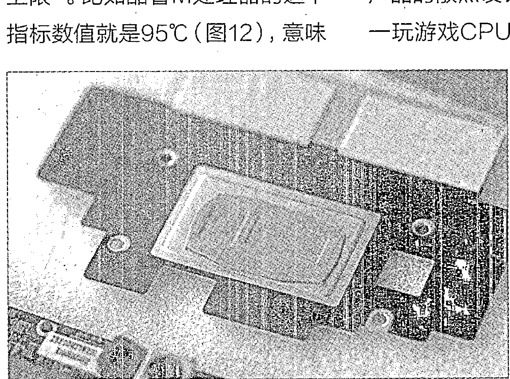

## ▶ 从新MacBook看苹果帝国的发展方向

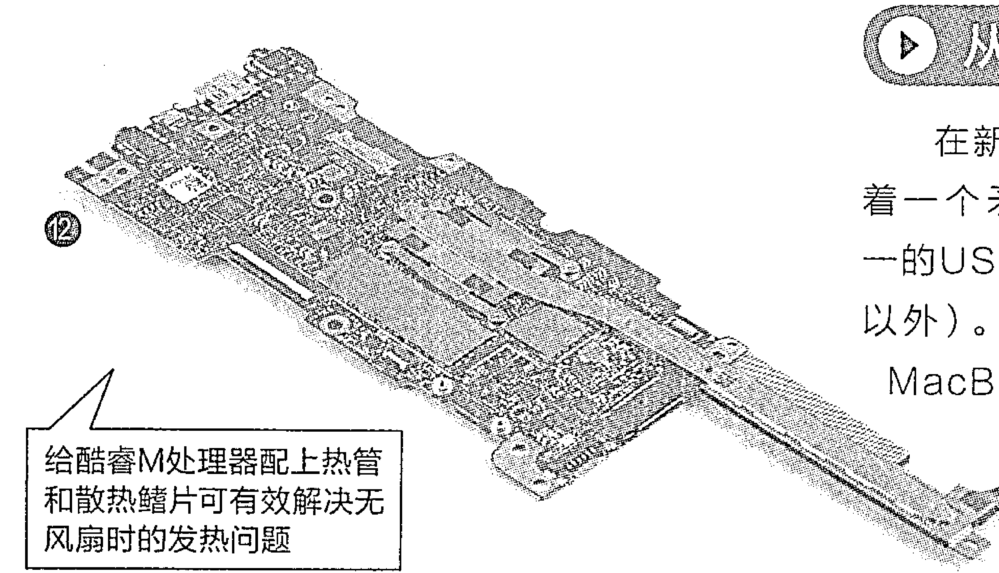

给酷睿M处理器配上热管和散热鳍片可有效解决无风扇时的发热问题

在新MacBook身上，存在着一个矛盾的设计，那就是唯一的USB-C型接口（除了耳机以外）。因为它（图13），让新MacBook的机身变得从未有过的简洁，但也因为它，导致使用者必须借助外设才能获得各种扩展功能。反观Windows阵营的产品们，读卡器、HDMI、标准USB接口一个都没有少，而且同样实现了超纤薄的机身设计。那么，苹果此举是无奈之举还是有意为之呢？

对Windows设备用户而言，肯定看不惯新MacBook这种追求极致而放弃实用性的单接口设计，但是对曾经的MacBook Air用户而言，接受起来就没那么困难了。实际上，从第一款MacBook Air诞生之日起，苹果就已经着手“极致简约”和“无线世界”的布局了。楔形的简约外观设计，导致笔记本只有最靠近转轴的位置才有足够的高度空间去容纳USB等接口。

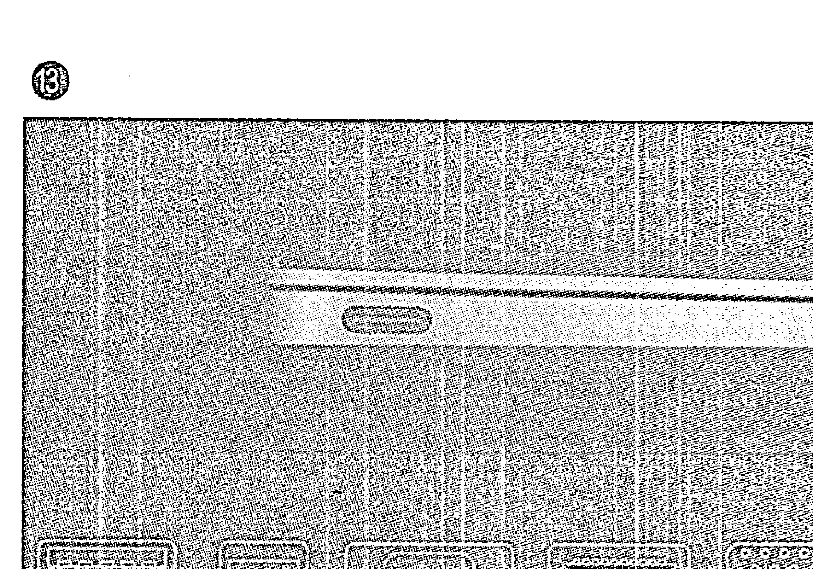

USB-C转接器的价格不便宜

要知道，11英寸的MacBook Air就已经砍掉了读卡器接口，想要读取DC中的照片必须借由USB SD读卡器。而新MacBook只是在此基础上，继续砍掉了电源、两个USB和雷电接口。作为代价，苹果为新MacBook准备了全新的802.11ac网络连接，以及丰富的USB-C转接设备（图14）。苹果的意图非常简单，鼓励用户使用基于蓝牙的各种无线设备，提倡通过Wi-Fi的方式浏览编辑在线文档，以及使用iTunes客户端以无线的形式去同步iPhone/iPad中的数字内容。除非你有外接显示器的需求，否则只需要购买一个USB-C转标准USB外设去读取闪存盘就足够了。

实际上，新MacBook预装的OS X Yosemite系统已经为各种无线和云服务打好了基础，而iOS也早已为此做好了准备。因此，笔者不建议购买新MacBook的用户安装Windows系统，因为受Windows系统和相关应用的限制，太过超前的USB-C可能会成为你的噩梦。

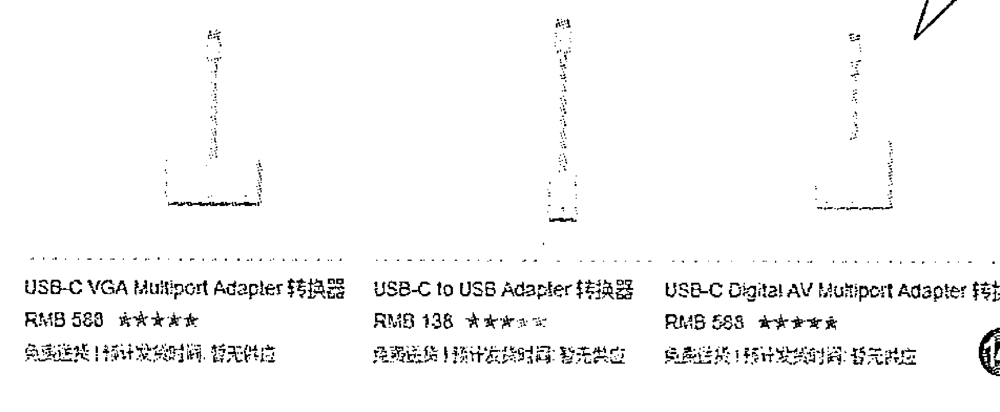

- USB-C VGA Multiport Adapter转换器 RMB 588 ★★★★☆ 免费送货|预计发货时间:暂无供应
- USB-C to USB Adapter转换器 RMB 138 ★★★★☆ 免费送货|预计发货时间:暂无供应
- USB-C Digital AV Multiport Adapter转换器 RMB 588 ★★★★☆ 免费送货|预计发货时间:暂无供应

此外，苹果借新MacBook提出了蝶式结构键盘和阶梯式电池的概念。其中，前者可以在更小更薄的设备上赋予依旧出色的敲击手感，而后者在理论上还能运用于圆形、三角形和其他形状的设备上，这意味着未来iPad、iPhone、Watch也有机会借此机会让电池塞满机身内的所有剩余空间，或者帮助苹果打造出更多奇形怪状的设备。遗憾的是，这两个技术都涉及到苹果的专利，能否在Windows设备领域中得到推广还不可知。

和iPhone大小相当的主板，将成为未来减小笔记本体型的关键

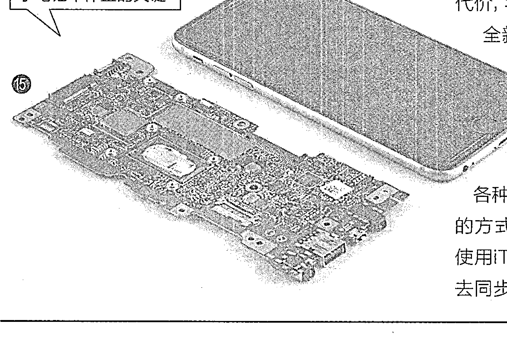

总之，新MacBook算是给传统笔记本形态的酷睿M设备树立了一个标杆。比如，如果不能在配置或者设计上明显领先于新MacBook，那么该产品在价格上肯定也不好意思超过9288元的报价。此外，低于1kg的重量指标、类似蝴蝶结构键盘和阶梯式电池技术也将成为未来Windows轻薄本（非二合一）的努力追赶目标。所谓有目标才有方向，在酷睿M和其下一代Skylake架构的新酷睿M处理器的帮助下（图15），比Air还要Air的笔记本将会越来越多。

## Retina屏幕PC也可拥有

谈起iMac，一定要说其中最高端的iMac配备Retina 5K显示屏的版本。苹果对其宣传语第一句就是“出类拔萃的显示屏”，能够显示1470万像素的这块27英寸屏幕似乎让一切都美得淋漓尽致。iMAC高分屏的意义何在？我们家用PC又如何模拟呢？

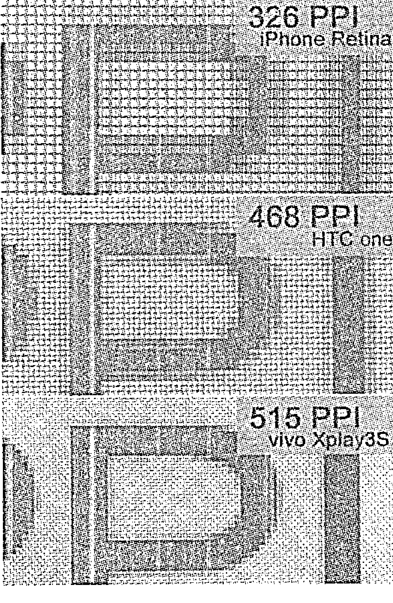

## Retina和PPI

自从iPhone 4开始，移动设备开始推崇一个概念，那就是Retina（视网膜）屏幕。Retina概念最先由苹果公司提出并被诸多移动智能设备效仿，旨在在单位面积下实现更多的像素，最终实现更好的显示效果（图1）。这样做的好处显而易见，具备足够高像素密度而使人体肉眼无法分辨其中单独像素点，这样就算把设备拿到离眼睛很近的位置，画面依旧细腻如初，肉眼难以将面板上的像素一一分辨，所以Retina屏幕被称为视网膜屏幕。移动设备这两年的火爆很容易会将移动领域的概念扩展到其他领域，其中高分屏就是绝佳的例子。移动设备越来越看重PPI以及无颗粒感，家用显示器领域的高分辨率产品也逐渐打破原有小点距费眼睛的旧观念，受到一部分用户的喜爱。不过我们一定要注意，高分屏显示器与移动设备或者4K高清电视之间的区别，在使用体验上显示器与后两者有本质的不同。

## 显示内容的差异

比起超高清手机屏幕和电视的屏幕，4K或者5K显示器屏幕本身并没有什么区别，但是由于PC操作系统的特性，实际使用体验天差地别。举一个例子，使用1920×1080和2560×1440分辨率的手机屏幕之间有什么区别？如果我们不仔细盯着屏幕看，很难看出二者的区别，因为它们显示的画面几乎是一样的。也就是说，更高的分辨率并没有带来更广阔的画面，显示的内容相同，不同的只有屏幕细腻程度。

而使用Windows等操作系统的PC完全不同，比如说同样是27英寸显示器，1920×1080分辨率的Windows界面大小与2560×1440截然不同（图2），简单地说高分辨率版本大概是前者的1.77倍。如果我们将桌面填满图标，同样是27英寸，高分屏能够容纳低分屏中1.77倍的图标数量。也就是说，更高的分辨率带来了更广阔的画面，不仅细腻程度有改变，显示的内容也更多了（图3）。

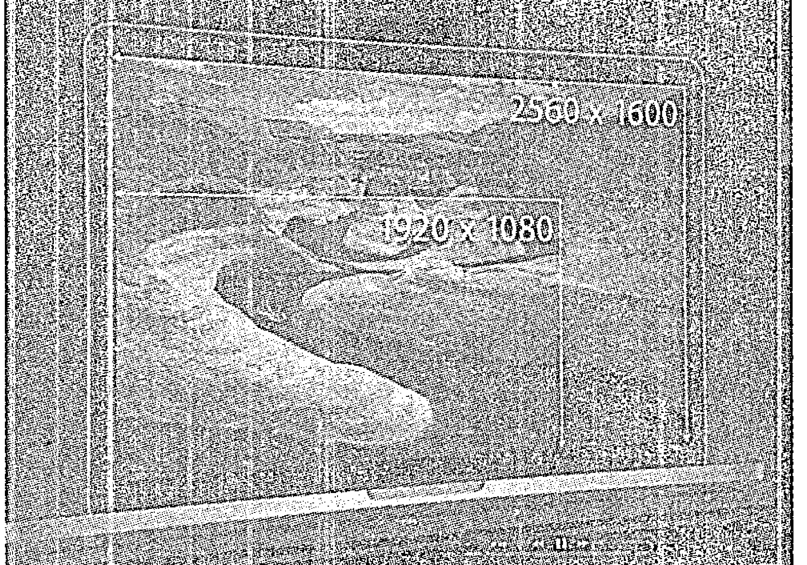

## PC高分屏带来了什么

## 选高分屏先备好显卡

## 不同分辨率下FPS对比

| 测试项目 | GTX 960 4GB | GTX 960 2GB | GTX 960 1GB |
| :--- | :--- | :--- | :--- |
| 《战地4》1920×1080高画质(0AA) | 75 | 75 | 70 |
| 《战地4》1920×1080最高画质(4AA) | 46 | 43 | 26 |
| 《战地4》2560×1600最高画质(0AA) | 38 | 34 | 16 |
| 《战地4》2560×1600最高画质(4AA) | 27 | 17 | 4 |

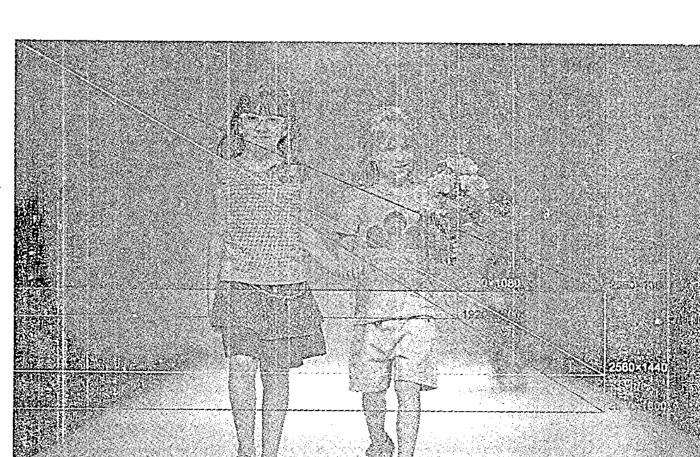

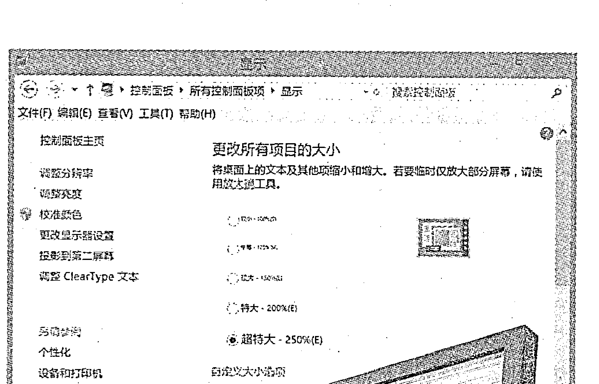

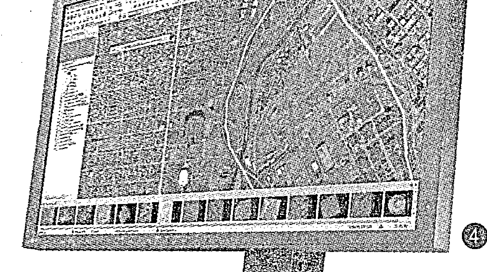

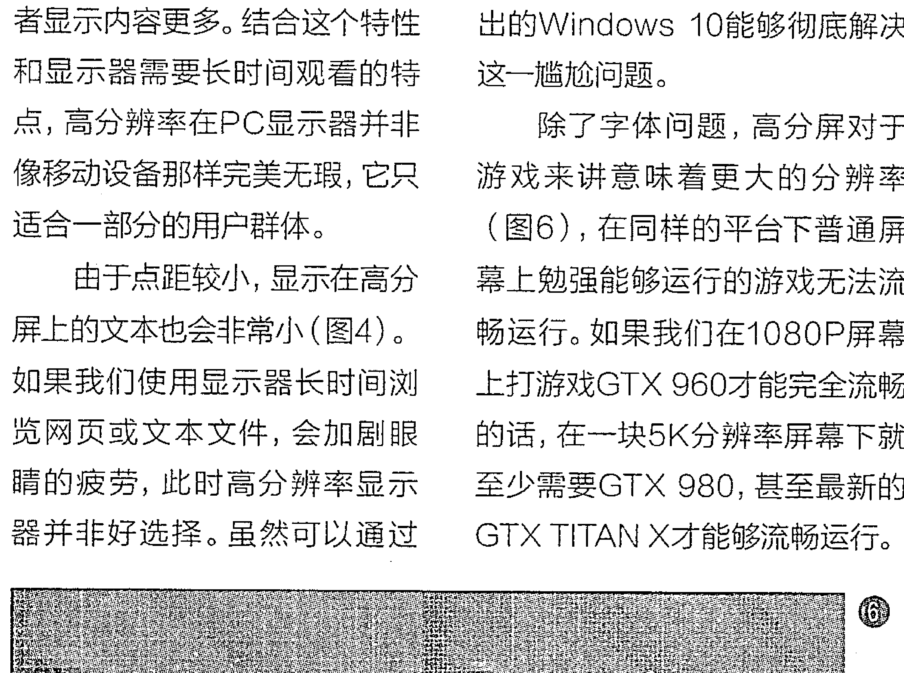

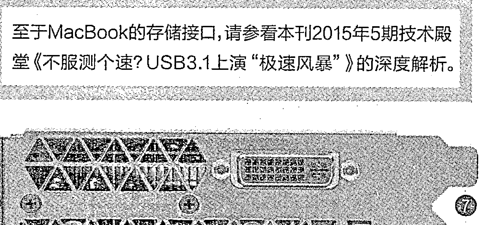

通过讲解，相信用户能够较直观地了解移动设备、智能电视与PC当中高分屏的不同——一句话就是前者画面更细，后者显示内容更多。结合这个特性和显示器需要长时间观看的特点，高分辨率在PC显示器并非像移动设备那样完美无瑕，它只适合一部分的用户群体。

Windows内部的缩放来解决问题，不过截止到Windows 8为止微软都没有将Windows的比例缩放做到完美（图5），希望即将推出的Windows 10能够彻底解决这一尴尬问题。除了字体问题，高分屏对于游戏来讲意味着更大的分辨率（图6），在同样的平台下普通屏幕上勉强能够运行的游戏无法流畅运行。如果我们在1080P屏幕上打游戏GTX 960才能完全流畅的话，在一块5K分辨率下就至少需要GTX 980，甚至最新的GTX TITAN X才能够流畅运行。

现在高分屏显示器比比皆是，基本选购只需根据自己的预算选择即可。比起显示器其实在模仿iMac配备Retina 5K时更需要注意的是显卡，首先要想实现5K必须双路DP 1.2接口带宽才够，只这一条就pass掉了95%的显卡。目前只有最高端的R9 290系列以及GTX 900系列等显卡才同时具备5K应有的性能和双路以上的DP接口（图7）。如果是4K显示器这一标准会相应降低，只需单路DP 1.2接口即可。同时在高分辨率显示器上打游戏，之前对性能不起什么作用的显存大小也成了问题。传统1080P分辨率一般1GB到2GB显存都可以搞定，但在3840×2160以上分辨率的情况下，显卡不仅GPU性能要足够强大，显存也至少需要4GB起步，否则出现的“爆显存”现象会直接把游戏卡成“幻灯片”。

> 至于MacBook的存储接口，请参看本刊2015年5期技术殿堂《不服测个速？USB3.1上演“极速风暴”》的深度解析。

## 打造我们的苹果PC Mac Pro

普通机箱多数只看重酷炫，而包括Mac Pro在内一些品牌机的机箱才真正实现了定制和高集成度。如何在PC上实现近似苹果Mac Pro或其他品牌机那样的超高集成度和定制化？买不起Mac Pro或者不喜欢苹果系统的用户，购买什么样的产品可以获得媲美苹果的设计？

## ▶ 从G4/G5到Mac Pro

苹果的硬件设计一直被电脑用户津津乐道，不过Mac系统与PC系统有一定区别，要想使用Mac的机箱承载PC系统还是有一定难度的。之前由于Mac G4/G5的设计十分经典，就有不少DIY用户通过机箱改造实现了互通（图1）。G4/G5虽然接口与PC不同，但毕竟还是传统机箱造型，实现起来并非很难。但目前Mac系列的王者是被称为垃圾桶的Mac Pro，其独特的结构以及小巧的造型十分精妙，机身内部结构紧凑且外观不失艺术性（图2），不仅被PC机箱厂商进行模仿制造，很多爱好者也都纷纷尝试。但难度很大，成功的案例并不多。

## ▶ 达人仿制Mac Pro

以往在机箱DIY领域比较突出的都是国外的发烧MOD玩家，不过这一次模仿制造出Mac Pro机箱的却是来自国内的玩家。Mac Pro硬件设计当中最精妙的就是其垂直一体式的风冷散热系统，这位ID为yesen的MOD玩家之前也曾经尝试过使用风冷来进行Mac Pro的仿制。不过毕竟玩家个人之力难以匹敌苹果公司的硬件设计，仿制之后其尺寸控制和散热效果都不甚理想。既然风冷行不通，那么水冷散热系统如何？通过之前的经验教训，在空间和散热效果之间充分权衡之后这台比较成功的Mac Pro仿制品就诞生了。打造出来的仿Mac Pro主机的外壳直径180mm，仅比Mini-ITX主板的170mm多了10mm而已。而高度是280mm，大概和iPad平板电脑相仿。对比Mac Pro的167mm×251mm身材并没有大上许多，其集成度是相当出色的（图3）。

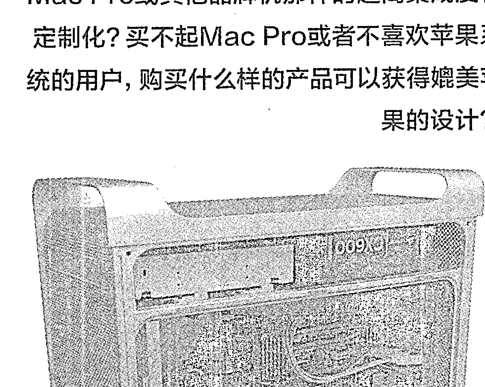

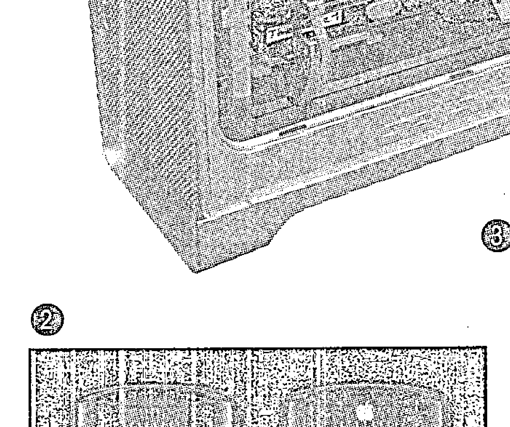

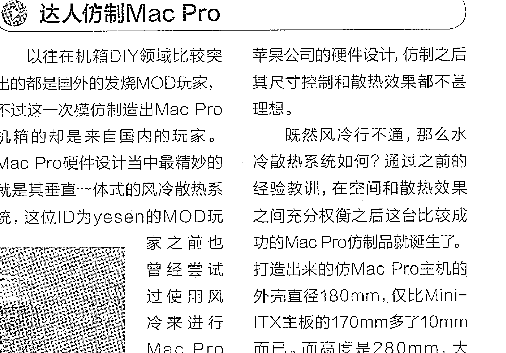

## 出色的垂直散热方案

整体散热的思路值得借鉴，它充分利用机箱本身的散热能力。主机外壳采用易于加工的亚克力材料，10mm厚的机架采用3根不锈钢金属支架来支撑，整体结构的强度是有保障的（图4）。但激光切割的亚克力材料本身毫无散热能力，所以上盖和底座必须使用金属材料，其中顶部金属鳍片下是个大尺寸出风风扇，而底座集成加工了散热鳍片、循环水路和Alphacool DC-LT水泵，整个金属底座就是一个冷排（图5）。显而易见，机箱的散热方向就定格为垂直散热，这也与Mac Pro本身思路统一。

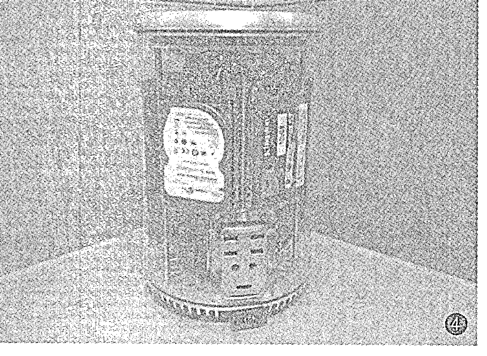

## 内外结合的电源供电

电源采用了内外结合式的电源供电方案，这种组合电源供电方案之前我们曾经在华硕玩家国度系列整机上见到过，能够在满足供电性能的前提下最大程度减少设备尺寸。200W LED开关电源配合150W DC-ATX直插式电源的组合方案。尺寸208mm×59mm×31mm的LED电源作为第一级AC-DC，再连接到DC-ATX直插式小电源。结合前面的机箱和水冷设备，成本在1300元左右，不算十分夸张，但需要出色的动手能力。

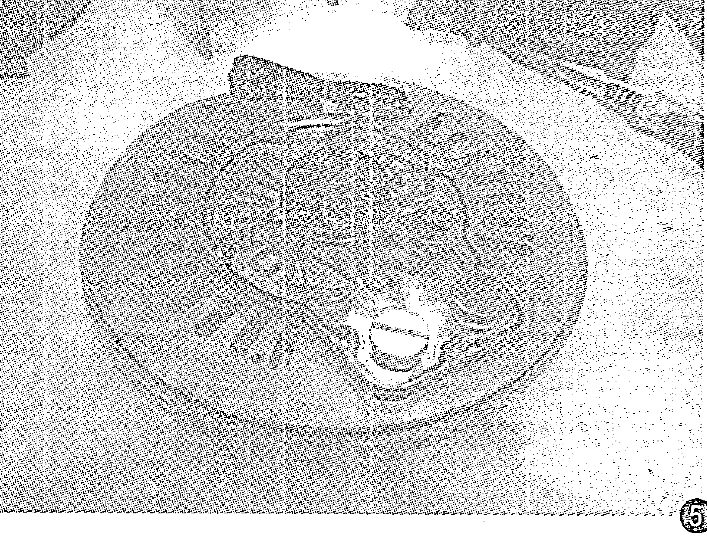

## 安装与水冷细节

安装好背板和主板之后，就要着手测量水管长度并且安装（图6）。显卡肯定无法直接插在主板的PCI-E插槽上，需要使用软材质的PCI-E连接线用于连接与主板水平放置的显卡，这类线材现在在淘宝等电商处很容易买到（图7）。值得一提的是，显卡的输出信号接口和供电接口需要进行小幅改装才能在狭小的机箱空间内放置，同时注意显卡的输出接口要与机箱开口吻合并且利于固定（图8）。机箱硬件组装部分完成后就要自己动手加注水冷液了。首先倒置机箱并开机让水泵转动，然后分批多次加注水冷液逐渐将水冷系统内的气泡充分排出。由于此时管道的水冷液并不充足，为了防止CPU过热，建议短时间多次加注而不是一次加好。水冷液加注完成后如何密闭是一个大问题，仿制Mac Pro的作者使用了金属螺丝堵住注水口，没有条件的用户可以尝试通过淘宝上的水冷商家订制打造水冷系统实现。

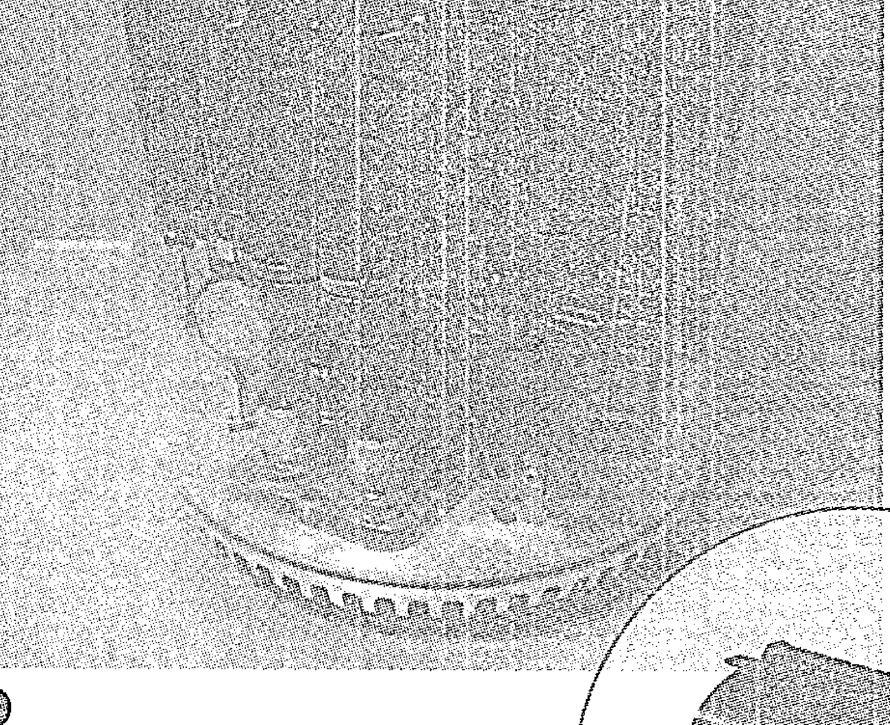

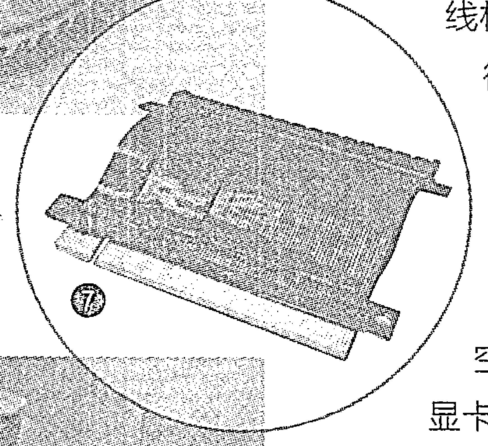

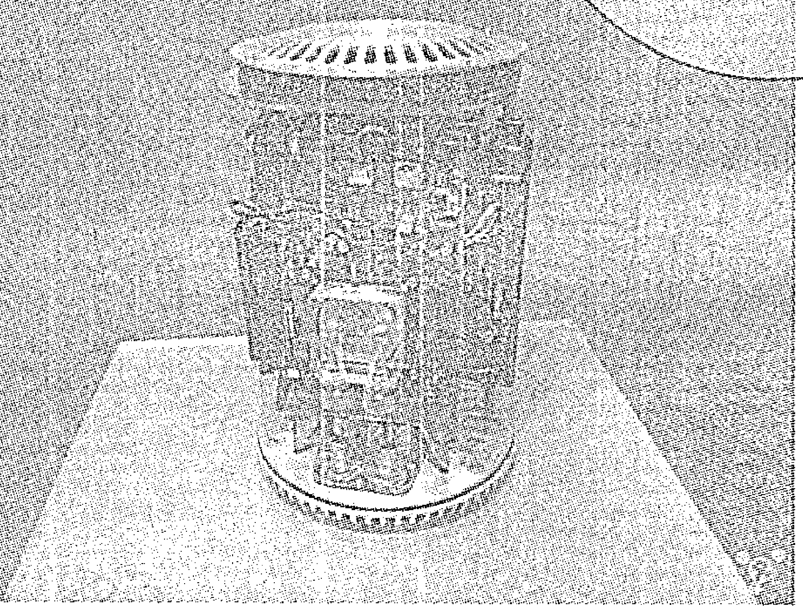

## 编辑点评

能够在不大幅超过原厂Mac Pro的尺寸下安装ITX平台，基本这个仿制就成功了一大半。不过是否称得上完全成功还得看运行起来的电脑散热能力如何。安装水冷系统的电脑最大的噪音并非风扇而是水泵，为了缓解底座上水泵的噪音，机箱底部必须安装减震条。在50%转速下水冷大概2000rpm，风扇由于尺寸较大一定要维持在1200rpm以下。最终这套系统待机CPU和显卡20°C左右，CPU和显卡同时满载后温度都在60°C左右，算是相当出色的成绩。

## 恢复Windows自带截图功能

文｜郭晓阳

许多人因只需要简单截图，且不一定时时都开QQ等带有截图功能的软件，所以Windows系统截图工具还是很常用的。但有时会出现截图之后无法另存图片的情况，点击截图工具“另存为”不弹出路径选择对话框，也不能通过复制截图来粘贴图片。遇到这种情况，该如何处理恢复？

### 1 更正存图路径差错

截图工具默认保存路径为系统库下面的“图片”文件夹，如果修改了该文件夹所在位置，则可能会造成无法另存图片的情况。

若是这种原因引起的，只需运行Regedit命令启动注册表编辑器，定位到“HKEY_CURRENT-USER\Software\Microsoft\Windows\CurrentVersion\Explorer\User Shell Folders”，双击“My Pictures”，在“数值数据”中输入“%USERPROFILE%\Pictures”，将图片保存路径更改为自己当前所用的图片库对应的真实位置路径即可（图1）。

```
HKEY_CURRENT-USER\Software\Microsoft\Windows\CurrentVersion\Explorer\User Shell Folders
My Pictures
%USERPROFILE%\Pictures
```

**小提示**
本文测试环境为Windows 8.1，Windows 7系统的方法类似。

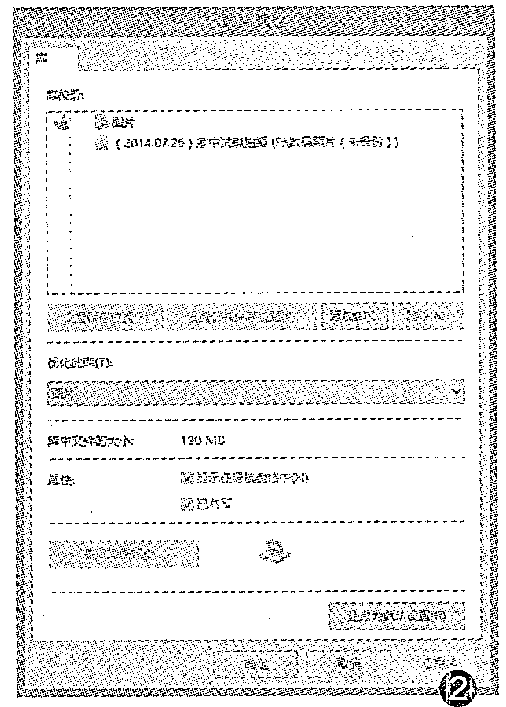

### 2 排除第三方软件冲突

如果上面的方法不能解决，则有可能是与第三方软件冲突所致。这时，可采用最小化系统运行的办法来解决。

通过 Win + R 运行 MSCONFIG，切换到“服务”选项卡，选择“隐藏所有Microsoft系统服务”，然后逐一禁用所有外来服务，禁用所有启动项，看问题是否得到解决（图3）。

### 3 修复系统文件来恢复

如果前面的方法均不能解决，则可能是系统文件损坏所致。可用修复系统文件的办法来解决。

以命令管理员方式进入命令提示符窗口，然后运行SFC / SCANNOW命令进行系统修复。该命令会自动修复遭到损坏的系统文件，让产生错误的系统功能恢复正常（图4）。

**小技巧**
也可以不用更改注册表信息，转而通过修改“图片”库属性来恢复图片保存路径，让截图工具保存路径恢复正常。使用Win+E组合键启动资源管理器，在左侧栏导航窗格中定位到“库→图片”，右键单击“图片”并选择“属性”命令，弹出“图片 属性”对话框，在其中点击“还原为默认值”，并依次点击“应用”、“确定”，即可恢复抓图的默认保存路径（图2）。

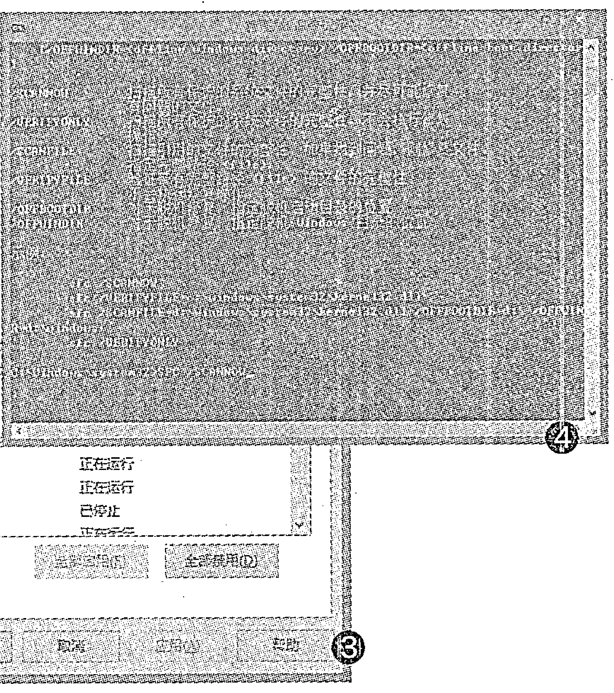

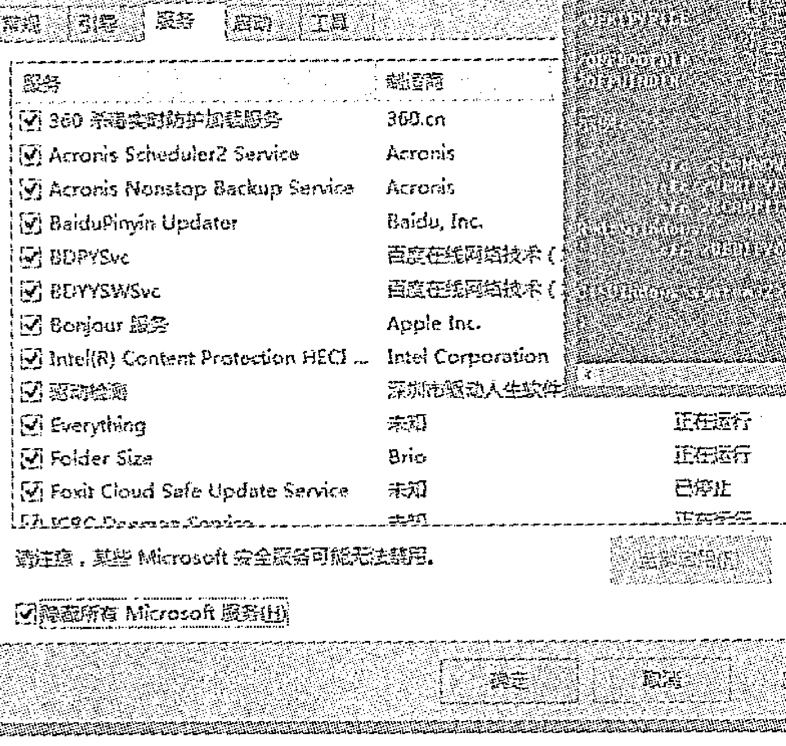

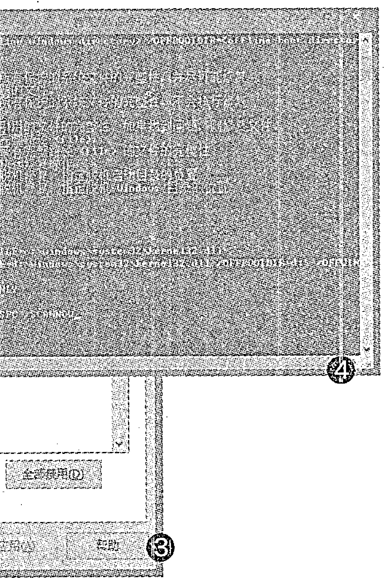

## 用DEP筑起系统铜墙铁壁
文｜溧阳

正常的程序运行离不开内存的使用，而恶意程序的运行也离不开使用内存。如果对内存空间加以保护，让自己信任的程序在内存空间中畅行无阻，而对于未知程序的运行在内存中加以监控，这样一来，使用电脑的过程就变得安全可控了。我们可以用Windows 7系统提供的数据执行保护功能（DEP）来实现这一需求。

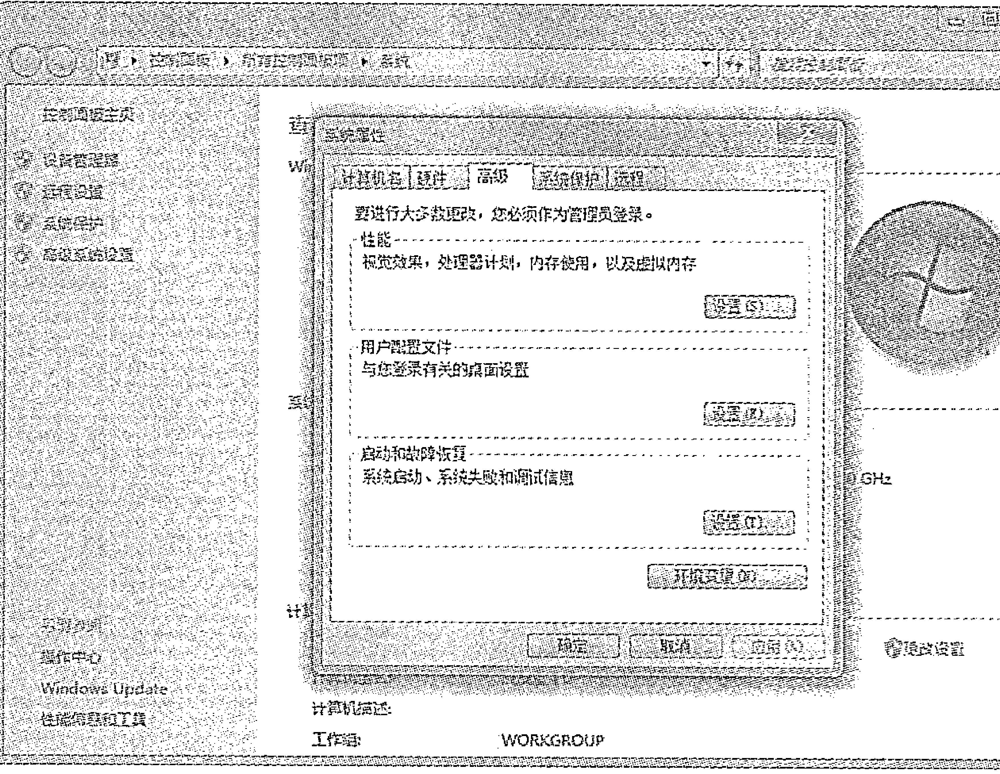

> 小提示：若要对个别程序关闭DEP，请选中要对其关闭DEP的程序旁边的复选框，然后单击“确定”。若要对某个程序打开DEP，请清除要对其打开DEP的程序旁边的复选框，然后单击“确定”。

使用该功能，我们首先需要了解要使用的软件是否提供了与DEP兼容的程序版本或更新，然后再去更改DEP设置。如果软件发布者提供了该软件与DEP兼容的版本，安装并打开DEP便可受到DEP的保护。但是，如果发布者尚未发行与DEP兼容的更新程序版本，则可以对该程序关闭DEP保护。关闭保护之后，该程序仍能够继续使用，但它可能容易受到其他程序或文件的攻击。那么，如何对自己信任的程序关闭DEP，对外来的所有不可知程序打开DEP保护呢？我们需要在系统设置窗口中对其进行手动设置。

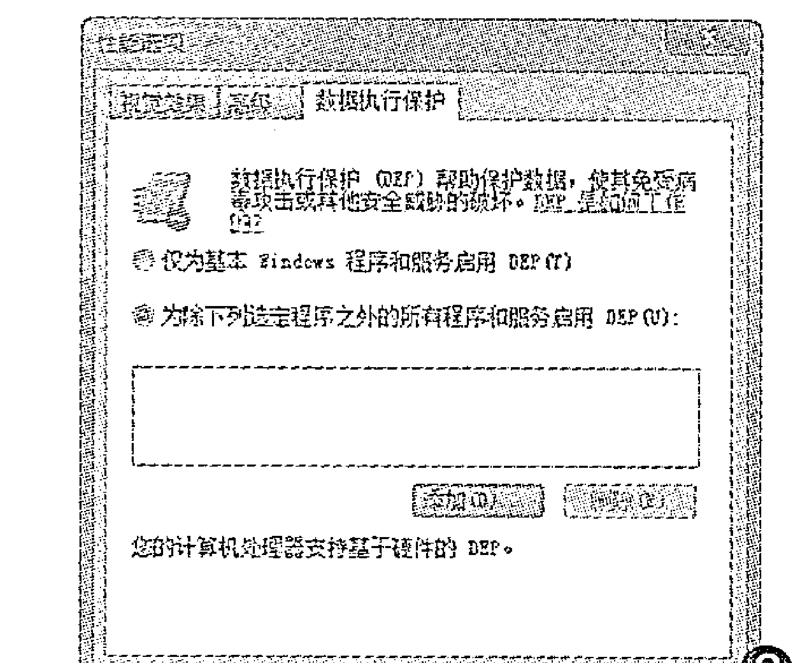

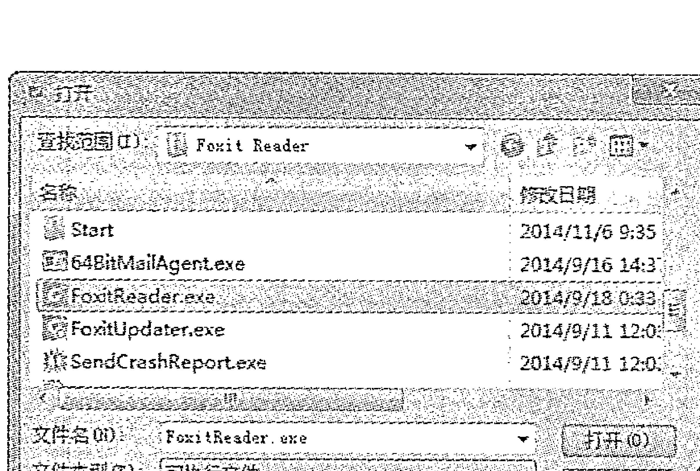

> 小知识：数据执行保护（DEP）
数据执行保护（DEP）是一种有助于防止计算机受病毒和其他安全威胁破坏的安全功能。计算机会留出计算机的一部分内存用于数据，另一部分内存用于程序使用的指令。黑客可以试图诱使程序运行（或执行）放置在计算机内存中伪装成指令的有害数据。这可能会使黑客获取你的计算机的控制权。DEP可以通过监视程序以确保它们安全使用计算机内存，帮助保护你的计算机。如果DEP注意到某个程序正试图从用于数据的内存部分运行指令，则DEP会关闭该程序并通知你。

1. 第一步：进入控制面板，单击打开“所有控制面板项→系统”。单击左侧栏内的“高级系统设置”项。如果当前登录者为非管理员级别，系统会提示输入管理员密码或进行确认。点击“高级”选项卡，在“性能”分组下，单击“设置”按钮（图1）。
2. 第二步：在“性能选项”对话框中，单击“数据执行保护”选项卡，然后单击选择“为除下列选定程序之外的所有程序和服务启用DEP”单选框（图2）。
3. 第三步：单击“添加”按钮添加自己信任的、不需要DEP保护的程序（图2）。通过浏览“Program Files”文件夹，查找该程序的可执行文件（以.exe为文件扩展名），然后单击“打开”（图3）。
4. 第四步：单击“确定”，在“系统属性”对话框中单击“确定”，然后再次单击“确定”。重新启动计算机，才能使所做的更改生效。

## 全是误操作惹的祸

文｜苏琪

升级为Windows 8.1之后，许多操作还不大习惯，有时会因误操作而导致一些不愉快的情况发生。本来要清空回收站却阴差阳错将回收站固定到了开始屏幕，本来访问很方便的应用商店也因误操作无缘无故地不见了踪影。这些问题如何解决？

## “固定到开始屏幕”惹的祸

右击回收站清空时，容易点错为“固定到开始屏幕”（图1），这是在使用Windows 8.1时最容易发生的问题。如何去掉这个“鸡肋”选项？

如果电脑里装有金山卫士，使用该软件的右键菜单管理模块，在“文件右键菜单”选项卡下，禁用pintostarscreen一项（图2）。这样，再点击回收站右键菜单，就不会出现那个讨厌的项目了（图3）。

## 小提示

删除容易，恢复难。虽然回收站上的这个“固定到开始屏幕”功能显得多余。但大多数情况下，“固定到开始屏幕”的功能还是很方便的。如果由于系统优化误将“固定到开始屏幕”功能删除了，可建立一个reg类型的文本文件，执行后即可恢复。文件内容如下：

```
Windows Registry Editor Version 5.00

[HKEY_LOCAL_MACHINE/SOFTWARE/Classes/Folder/shell/pintostartscreen]
"MUIVerb"="@shell32.dll,-51201"
"NeverDefault"=""
"Description"="@shell32.dll,-51202"
"MultiSelectModel"="Single"
[HKEY_LOCAL_MACHINE/SOFTWARE/Classes/Folder/shell/pintostartscreen/command]
"DelegateExecute"="{470C0EBD-5D73-4d58-9CED-E91E22E23282}"
```

另一种方法是用编辑注册表的方法来实现，通过Win+R运行regedit打开注册表编辑器，依次定位到“HKEY_LOCAL_MACHINE\SOFTWARE\Classes\Folder\shell\pintostartscreen”，在pintostartscreen上右击并选择“删除”，同样也能达到如上效果。

## 误操作丢失应用商店

应用商店丢失的一种简单情形是无意中取消了固定在开始屏幕或任务栏，只需从应用列表中搜到应用商店，然后右键固定到开始屏幕或任务栏即可。

另一种情况是由于误用优化工具而导致应用商店丢失。这时，可通过系统管理员命令提示符窗口，执行SFC /SCANNOW系统修复命令，自动恢复应用商店。

## 小提示

还可以通过“电脑设置”进入“恢复电脑”，选择“恢复电脑而不影响你的文件”一项，对系统进行恢复，从而可恢复应用商店。

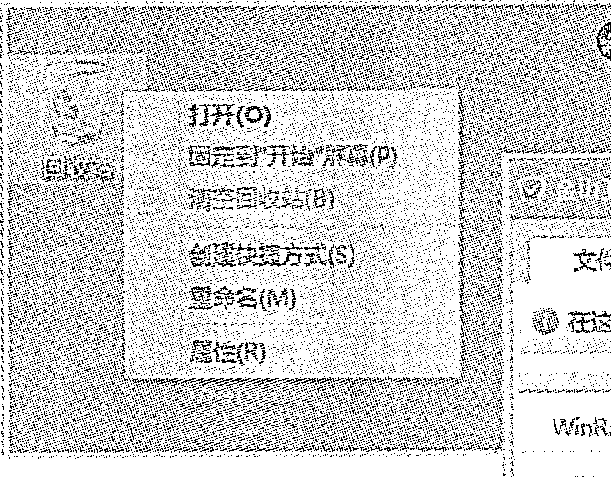

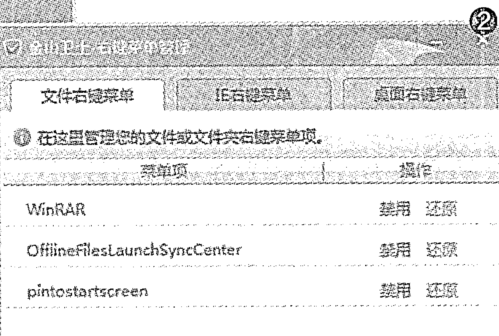

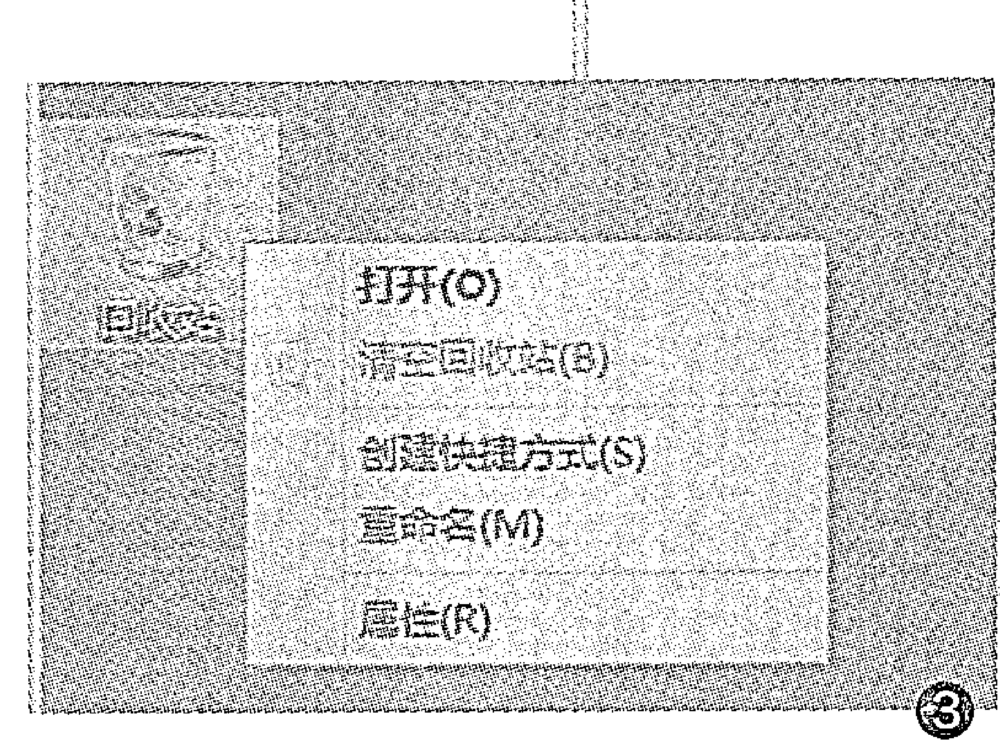

## 不容忽视的空文件夹
文｜溧阳

空文件夹，就是其中不含有任何文件的文件夹，空文件夹散布于电脑硬盘内，虽然几乎不占用硬盘空间，但是会影响到文件的查找效率，也干扰了文件的管理，因此有必要对其进行清理。那么，如何快速查找和清理空文件夹？无法删除的空文件夹又如何处理？

> > 小提示 机空文件夹也要清理
> 由于经常使用和卸载各类APP，手机中的空文件夹出现的几率比PC更为普遍，因此手机中的空文件夹更需要引起重视。目前各种手机优化工具中一般也都包含空文件搜索和清理功能。我们可以用猎豹优化工具或360优化大师等APP对手机中的空文件夹进行集中清除。

## 空文件夹也是累赘

空文件夹虽然不占磁盘空间，但文件夹多了也会影响系统效率。由于系统会时时刻刻进行文件索引，杀毒或其他维护工具也会随时遍历所有文件夹进行各种扫描或维护工作，因而每个空文件夹也被不停地检索和扫描，空文件夹一多肯定也会花费时间和影响操作效率。因此也是一种拖累，有必要清理。

> > 小提示 谨防误删“空”文件夹
> 不要看到文件夹中没有文件，就认为是一个空文件夹而轻易将其删除。有的文件夹可能是系统或软件为存放临时文件或有用的配置而设的，它们故意将一些重要的文件放入其中并设置了隐含属性。正确的办法是通过右键菜单属性，先看文件夹占据的字节数是不是为0，然后再行删除“手术”。

## 空文件夹清理方法多

既然真正意义上的空文件夹影响效率，就应该将其一网打尽。但是，空文件夹可能遍布于磁盘的各个角落，如果手动的办法来找查，谈何容易!我们可以用现成的工具软件来解决问题。
如果将电脑中的空文件夹看作是一种重复的文件夹来进行搜索，用一款专业搜重工具FindDupFile即可搞定，将软件“顺便检查空文件”选项选中，可轻松找到所有空文件夹（图1）。
此外，我们还可以用系统清理工具（如360安全卫士、CCleaner等）对系统垃圾进行扫描，其中就会有空文件夹扫描一项，扫描出来后集中清理即可（图2）。

## 空文件夹无法删除怎么办

有时，对于一个不再使用的空文件夹，我们在清理时才发现，明明其中没有任何文件，但就是无法删除掉。遇到这种情况，我们可以尝试用多种办法来解决。
可启动进入系统安全模式或维护模式，然后进入命令提示符窗口，使用“RD /Q /S 文件夹名”命令的方式来删除文件夹。其中的参数/S可删除因文件夹中包含隐含文件和子文件的隐性“空”文件夹的情形（如隐藏性的恶意程序或病毒）。而/Q参数是静默删除选项，表示不需要用户确认直接删除文件夹（图3）。

> > 小提示
> 空文件无法删除，还可能是文件夹所处的磁盘位置发生错误所致。这时，可用磁盘扫描软件（如磁盘精灵）对磁盘进行扫描，如果有坏区或坏道正好处于文件夹存放位置，修复之后一般就可用正常方法对文件夹进行删除了。

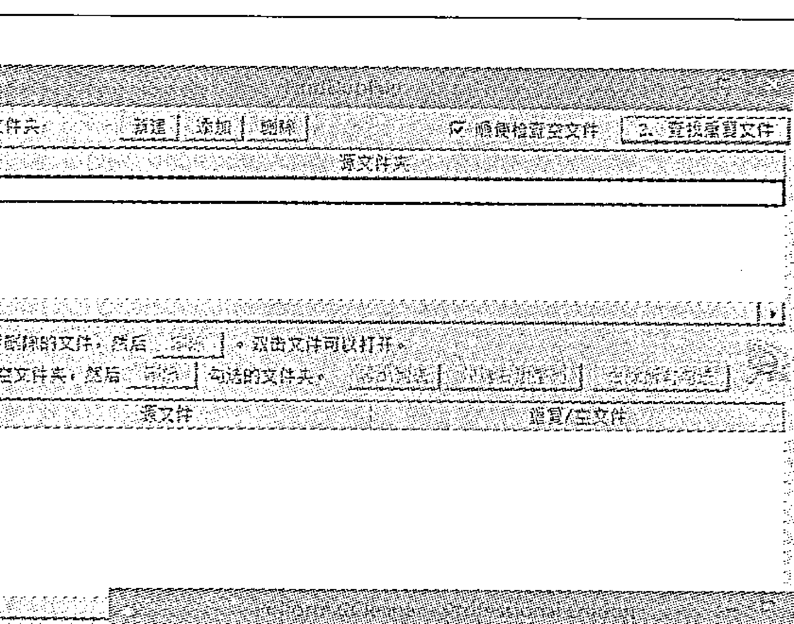

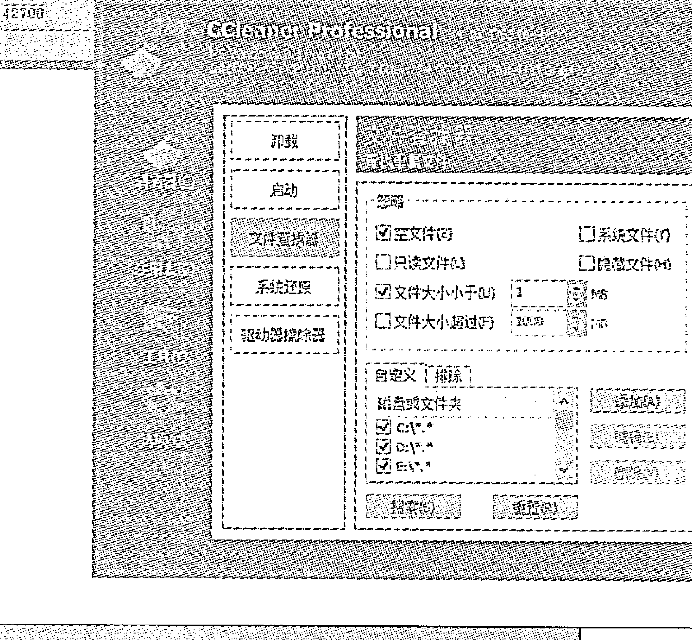

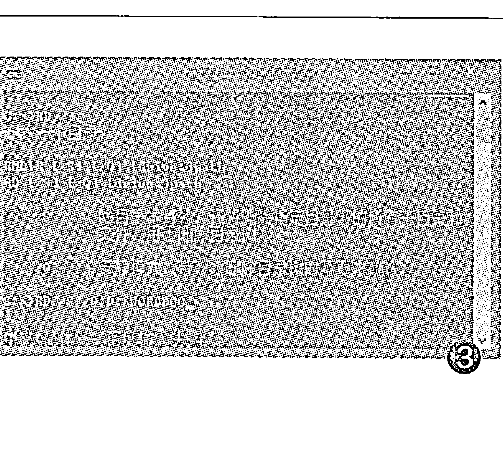

## “跳转列表”你用好了吗

文｜贺超

从Windows 7开始，在系统中就多了“跳转列表”这一实用功能，在后续的各Windows版本中，此功能更有所加强。也许你觉得这东西太简单，然而，这个简单的跳转列表，你用好了吗？

## 跳转列表的三个面孔

Windows 7的跳转列表不单单表现在任务栏上，开始菜单中也有跳转列表。Windows 8.1延续了任务栏跳转列表，而Windows 10则增加了更加人性化的“主页”跳转列表。

任务栏跳转列表集成了Windows XP任务栏和快速启动栏两种功能，并在此基础上有所增强(增强的功能见后文)。在任务栏上开启一个应用程序、文档、文件夹或网页链接之后，右键单击该图标，会显示出一个因对象不同而动态变化的项目列表，这个列表就是我们所说的“跳转列表”。通过跳转列表，我们可以用原来一半以下的鼠标点击量，轻松完成在应用中才能完成的工作(图1)。

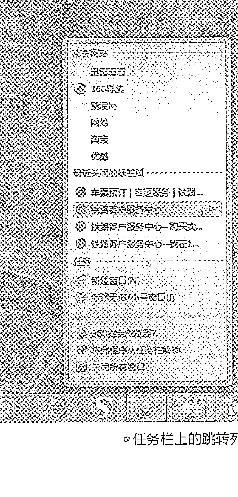

除了任务栏上分别独立的程序或文档的跳转列表外，在Windows 7开始菜单中，还有一个对跳转列表集中分类管理的“好去处”。点击开始菜单后，在其顶部我们会发现，最近操作过的项目(无论是应用程序还是其他项目)，后面都会出现一个可展开的三角形图标，点击它即可出现与该应用或项目关联的分组快捷项目，只需点击其中已经使用过的链接即可打开曾经用过的项目；或者点击项目的主要推荐功能，开启特殊功能的使用(图2)。

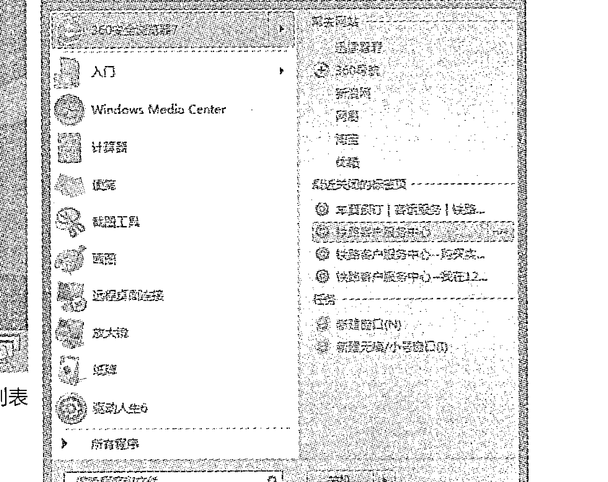

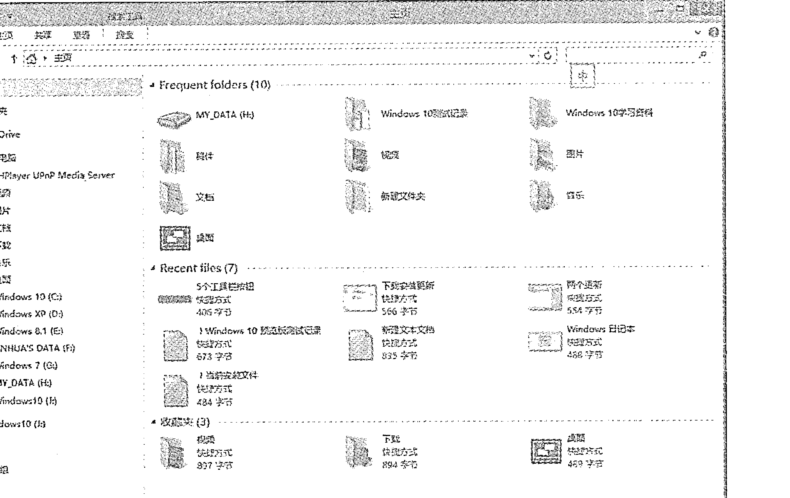

> 小提示 一种新式“跳转列表”
在Windows 10操作系统中，除了真正意义上的混合式系统开始菜单外，又引入了一种特殊的“开始”菜单，那就是资源管理器中的“主页”，这其实是整个资源的另一种跳转列表，是一种特殊的“跳转列表”（图3）。这一切都是为用户的使用提供了更大的便利。

## 2 跳转列表的两个作用

跳转列表的第一个作用是减少鼠标操作次数。以往我们访问文档、图片、歌曲或其他数据时，总需要先开启程序然后打开这些文件。通过跳转列表，则不但可直接访问需要的文档、图片、歌曲等文件，而且还可以一步到位执行特定任务，而不需要先启动应用程序。例如，我们在网上复制一段精彩语录，希望将其存放在一个TXT文档中保存，当复制完文本后，只需右击任务栏上的EmEditor应用图标，选择“新建并粘贴”命令，即可一步实现网文的编辑和收藏（图4）。

跳转列表的另一个作用是减少操作混乱。通过跳转列表，将与某个应用程序、文件夹或文档相关的操作集中在一处，杜绝了传统意义上为寻找关联而在一堆类别或类型中寻找配对的麻烦。

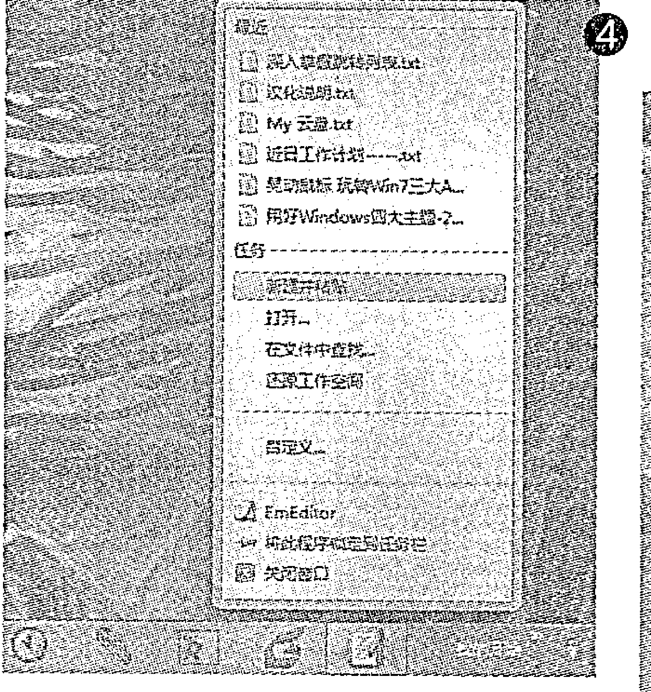

用EmEditor跳转列表命令一步到位收藏网文

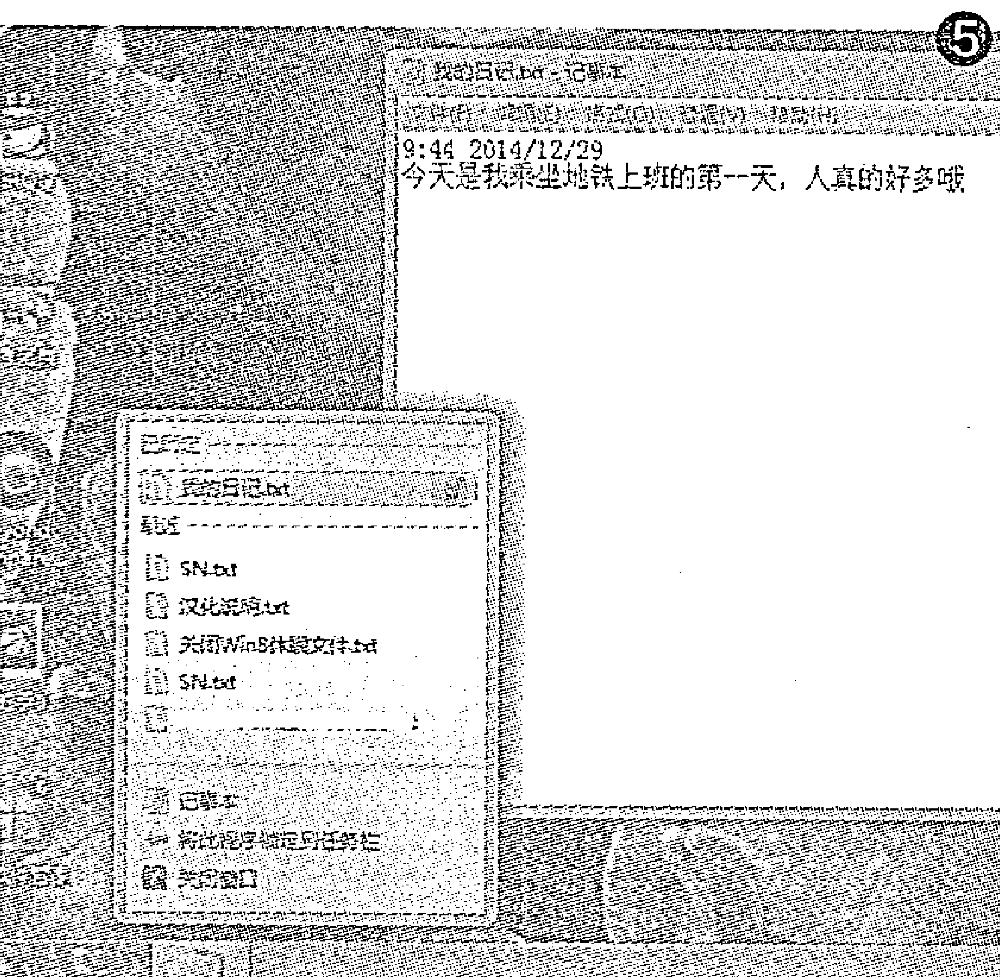

让“我的日记”常态固定在列表顶端

> 小提示
我们可以将跳转列表看作是一个特种微型“开始”菜单。如果Windows 7或Windows 10的开始菜单是整个系统的“开始”菜单，那么，Word等应用程序的跳转列表可看作是该应用程序的“开始”菜单。而一种类型文档的跳转列表可看作为这种类型文档的“开始”菜单。从这里开始，要比从“开始”开始更方便。

## 系统应用小技巧

### 钉住你的常用文件夹

跳转列表不但可以钉住应用程序、文档和网址，还可以将文件夹钉在上面。如果我们总是在固定的四五个文件夹中干活，可以把它们直接钉在任务栏或资源管理器上。只需用右键把文件夹拖到任务栏上或资源管理器图标上，它就会自动被钉到任务栏或资源管理器图标的跳转列表上（图7）。然后就可以在以后直接通过这里来访问这些文件夹了。将文件夹固定在这里而不是桌面上，这是一个清理桌面的好方法。

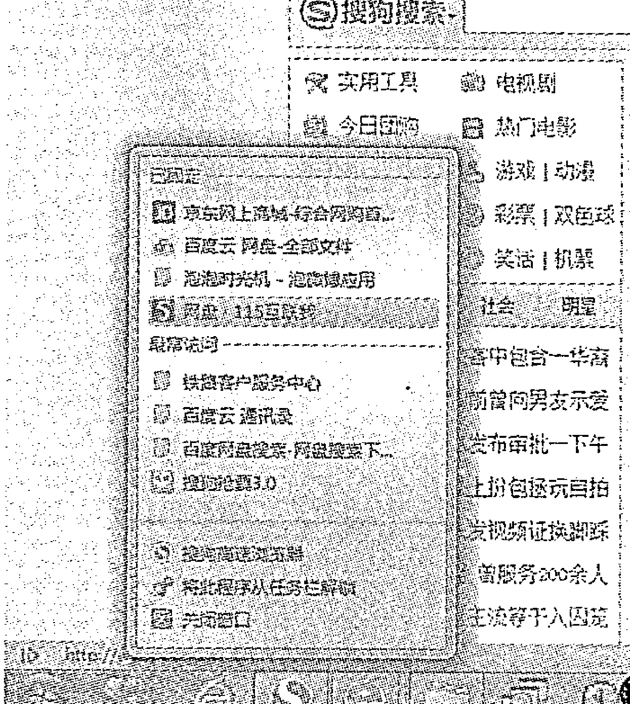

用好网址的多重固定置顶功能

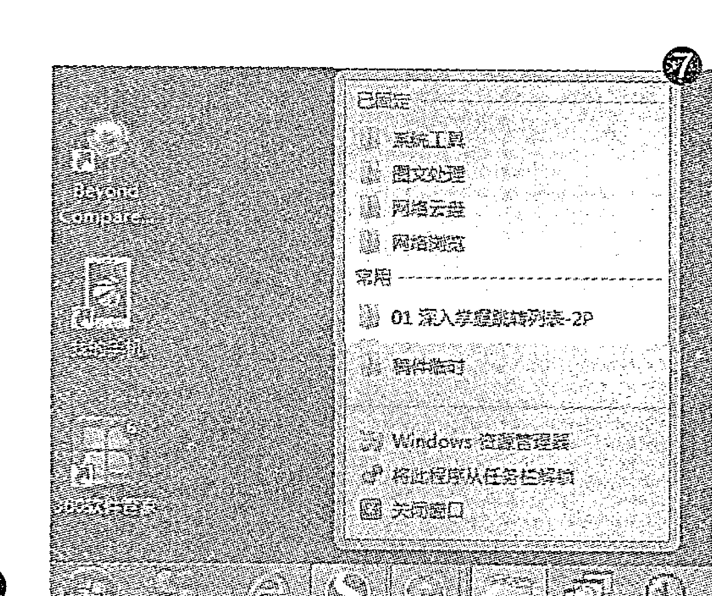

将常用的文件夹固定在资源管理器上

## 3 用好特殊的“开始菜单”

每个应用程序的跳转列表都不尽相同。使用“画图”一段时间，跳转列表上会保存有最近使用过的图形文件；使用Word一段时间后，跳转列表上会保存有最近使用过的文档。然而跳转列表并不仅仅是简单的文档类型关联这么简单。如果我们对一个程序非常熟悉，为了快速使用它，就要深入挖掘调转列表中的实用功能。我们举两个例子来说明。

### 让日记文件始终在前

用记事本建立了一个“日记”文件，这个文件是你每天都要用到的，如果将其放置在桌面上，容易增加混乱或引起丢失，不如将文件放在一个安全的地方，转而将记事本图标固定在任务栏上，进而再将跳转列表中的“我的日记.txt”固定在列表顶端（图5），这样在以后写日记时，只需右击图标即可开启日记本了。

### 多重锁定常去的网站

如果我们常去几个网站，常用的方法是在浏览器上添加网址收藏，或者将快捷方式添加到桌面上。但前者需要先开启浏览器，而后者又会增加桌面的混乱。实际上，我们可以通过跳转列表的固定功能，将多个网址一起固定在列表顶端（图6）。

## 定制一键永久删除文件按钮

文|宋金宝

对于确认不再使用的文件，就没有必要先放在回收站中，这时采用一次性删除比较省事。文件永久删除，除了添加到回收站再行清空外，还可以用Shift+Delete组合键来实现。当然，也有人采用安装专用删除工具的办法来实现。但如果你习惯于一手拿美食，一手拿鼠标操作电脑，你会发现以上方法都很麻烦。而这时最省事的办法莫过于有一个按钮能实现鼠标一键点击永久删除操作，这样效率就能提高一倍以上。

## 创建标题栏一键删除按钮

在当今流行的Windows 8.1和Windows 10中，我们可以通过系统定制轻松实现这一任务。

展开资源管理器功能面板，切换到“主页”选项卡。选中任意一个（或一些）要删除的文件，点击“删除”按钮下的小箭头，在下级菜单的“永久删除”上点击鼠标右键，在右键菜单中选择“添加到快速访问工具栏”（图1）。

这样，在文件资源管理器窗口标题的左上角，会出现一个“永久删除”的图标。以后需要永久文件时，只需在选中要删除的文件后，点击一下这个图标，即可实现鼠标一键永久删除文件的目的，再也不用动用键盘了。

## 低版本也能实现一键删除

对于版本低于Windows 8的系统，虽然无法直接定制这种窗口标题栏永久直接删除文件的按钮，但我们可通过对回收站的属性设置，让工具栏上的删除按钮具备一键删除的效果。

大家知道，键盘上就有一个删除的按键Del，这是最为方便的删除机关。但是，对于文件删除来说，如果选中文件后按下此键，默认是将文件移动到回收站中，而不是永久删除。那么，能否将此键也打造成一键永久删除的按键呢？

右击桌面上的“回收站”，选择“属性”项（图2），进入回收站属性设置窗口，选中一个驱动器盘符，然后再将下边的“不将文件移到回收站中，移除文件后立即将其删除”一项选中（图3）。这样，资源管理器上的删除图标就具有永久删除的属性了。

注意，如果想让整个系统都具有这种属性，需要为每一个驱动器定制这种永久删除选项。若某个驱动器上存放的文件比较重要，希望能删除后反悔，则可以在此驱动器上不设置该选项。

定制回收站删除特性为直接永久删除会留有一个弊端，那就是该驱动器上要删除的文件都将继承这种特性，若想将一些文件放入回收站也不可能了，因此是一种“武断”而不够灵活的方法，不建议常爱吃“后悔药”的用户使用。

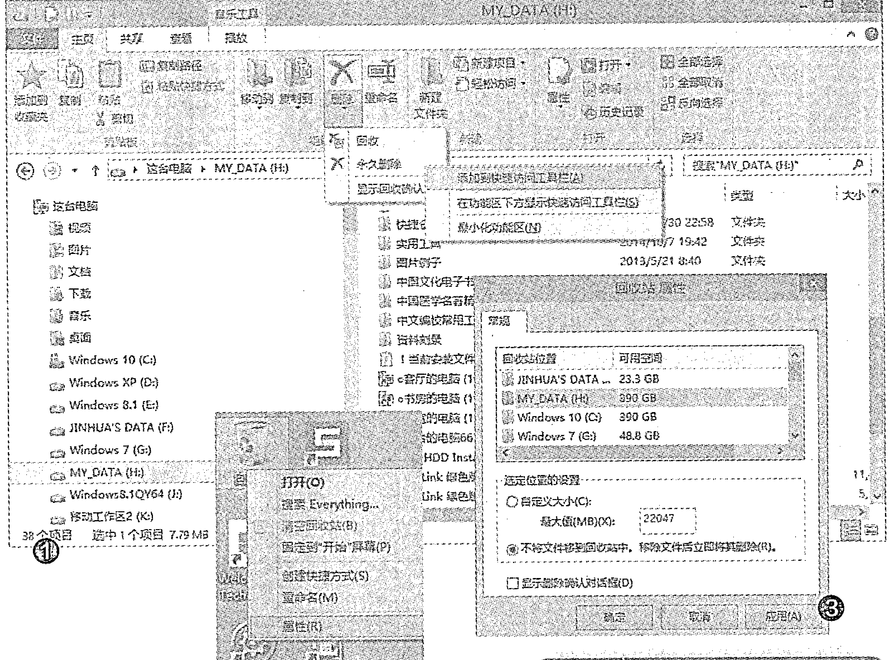


## 巧用凭据管理 自动登录网络

文/江油子

内部网如果使用域名管理计算机，访问一台电脑中共享的文件夹需要使用注册的用户名和密码。第一次输入密码之后保存，之后访问该文件夹可以不用密码自动登录打开。但是，在使用过程中有时会忽然发现登录到该文件夹显示凭据失效，输入原来的密码也无法登录了。怎么办？

### 1 删除失效的凭据

通过“控制面板→所有控制面板项→凭据管理器”进入自动登录凭据管理窗口。点击“Windows凭据”一栏下的小箭头，展开现有凭据参数列表，可以看到目前所使用的Windows凭据的详细信息，包括网址、用户名、密码、永久性等。既然现有凭据已经失效，那么，我们需要将失效的凭据删除掉，然后再另建凭据。点击“从保管库中删除”文字链接，删除原有凭据（图1）。

> ### 小知识：关于Windows凭据管理
Windows之所以能够在第一次输入域系统内共享计算机文件夹密码后，能够无密码自动访问，是因为它的凭据管理器在发挥作用。使用凭据管理器存储凭据，可用于登录到网站或网络中其他计算机的用户名和密码。通过存储凭据，Windows可使用户自动登录网站或其他计算机。凭据保存在计算机上称为“保管库”的特殊文件夹中，Windows和程序（如网络浏览器）可以安全地将保管库中的凭据自动提供给其他计算机和网站。

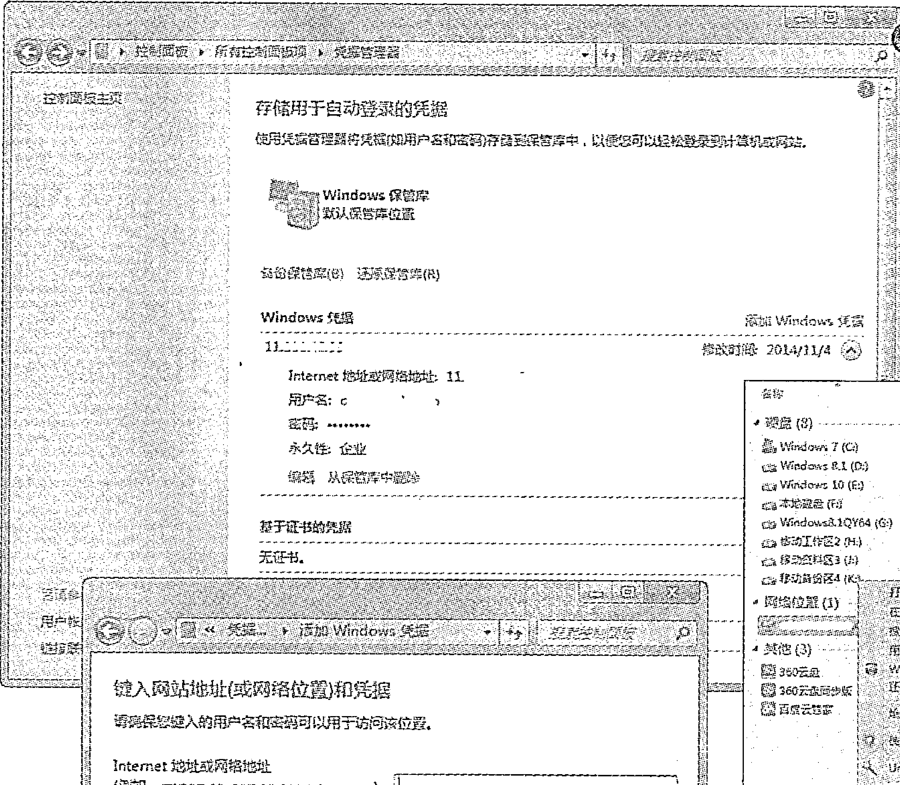

### 2 新建Windows凭据

点击图1中“Windows凭据”之后的“添加Windows凭据”文字链接，在接下来的对话窗口中，填写正确的内部IP地址、用户名、密码。在“Internet或网络地址”框中，键入网络中您要访问的计算机的名称，此名称可以是NetBIOS名称（例如server1）或DNS名称（例如server1.fabrikam.com）。用户名一般为“域名\用户名”的形式。填好之后，点击“确定”按钮（图2）。

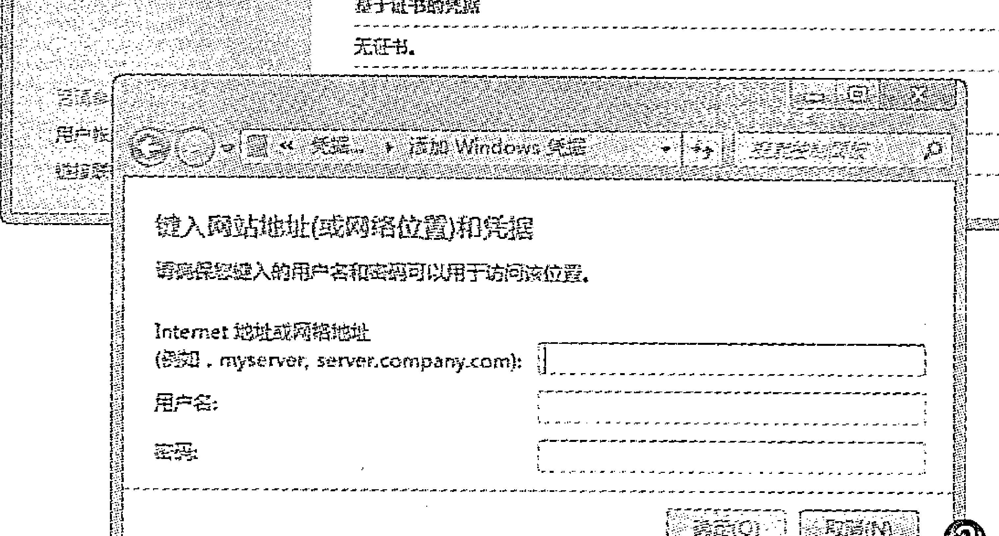

> ### 小提示
如果是在无域的局域网内只以用户组来共享文件夹，原来映射的自动网络文件夹不能访问，那么，删除共享文件夹快捷方式，或者通过在已有映射盘符上点鼠标右键并选择“断开”，取消共享文件夹网络映射（图3）。然后通过“网络”，重新查找计算机和共享文件夹，输入正确的用户名和密码登录，并选择下次登录“记住我的凭据”选项即可（图4）。

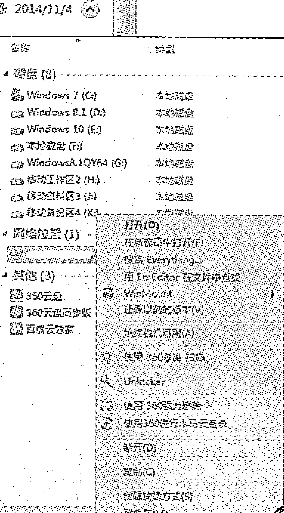

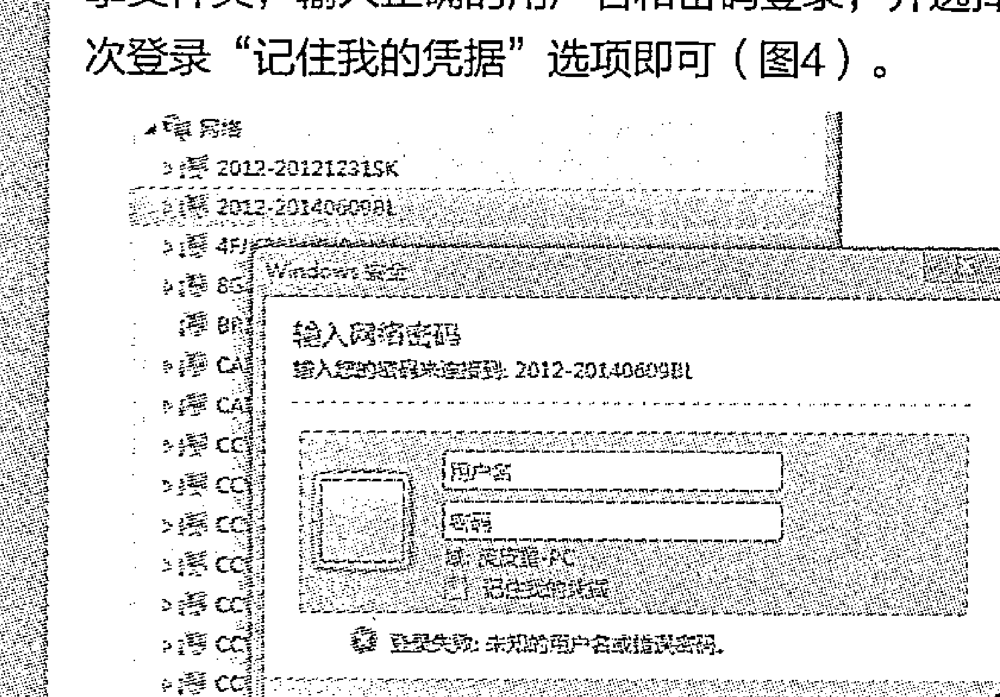

以上凭据重新建立之后，重启系统，然后再尝试访问共享的文件夹，问题一般就会得到解决。

## 双重压缩 向休眠文件要空间

文/武春风

也许你已经知道，启用系统休眠功能会以多占用系统盘空间为代价。因此，不少人将休眠功能关闭以腾出更多空间（尤其是对于固态硬盘用户来说）。但是，休眠功能也有它的好处，除了省电外，它能让我们迅速恢复工作现场。如果不想丢弃休眠功能，但还希望能腾出更多的磁盘空间，有什么办法呢？

我们可以通过对休眠文件进行双重压缩，能够在不失去休眠功能的同时，将休眠文件所占磁盘空间的降到最低。当然，这其中我们还需要注意，合理解决好因休眠压缩文件大小不适合而导致蓝屏出现的问题。

## 摸清休眠文件的底细

现在很多电脑都配备了较大的内存，4GB常见，8GB、16GB也越来越多。而Windows 7以上系统（含Windows 7）的休眠状态默认要在系统盘划出等同于物理内存约75%的空间，用于进入节能状态后保存内存中的数据。因此电脑中若装了8GB物理内存，默认情况下系统盘根目录下会出现一个6GB多的hiberfil.sys文件（4GB内存为3GB多）。

在Windows 8.1和Windows 10资源管理器的文件搜索框中输入hiberfil.sys文件名进行搜索，你可能会发现结果令你失望，一无所获（图1）。难道C盘下没有这个文件吗？不是的，由于该文件具有系统保护和隐含属性，搜索结果中无法看到此文件，但此文件其实是系统安装后就默认存在着的。

那么，它在哪儿？怎么能看得到它？我们只需从资源管理器的“查看”标签面板下点击“选项”按钮进入“文件夹选项”窗口，在“查看”选项卡的“高级设置”列表中将“隐藏受保护的操作系统文件”选项前的“√”取消掉，然后再选择“显示隐藏的文件、文件夹和驱动器”一项（图2），确定之后，再搜索就看到这个文件了（图3）。图中我们看到，安装了4GB内存的本机，这个文件的大小约为3.17GB。

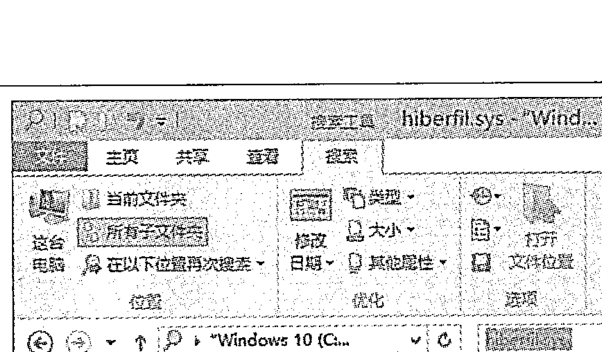

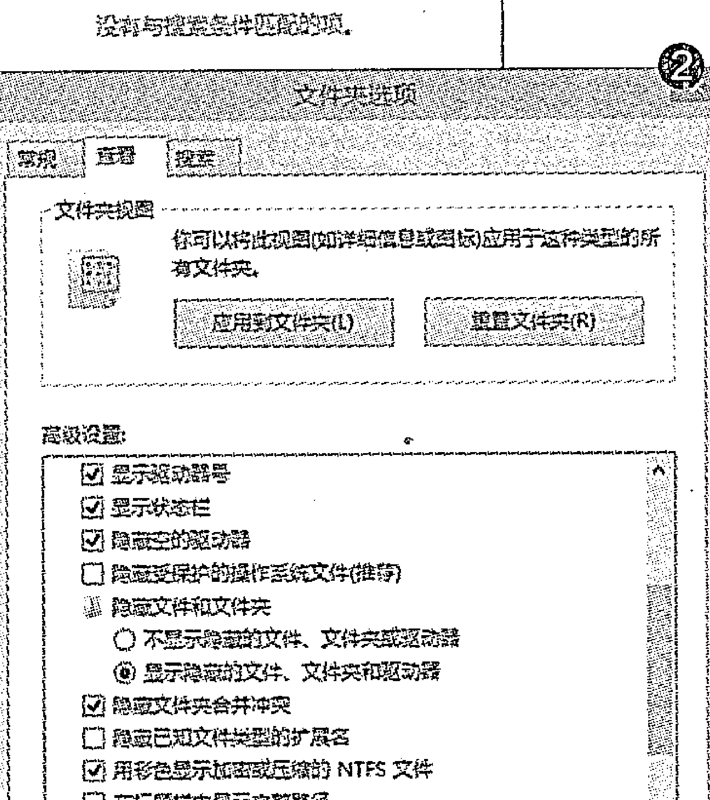

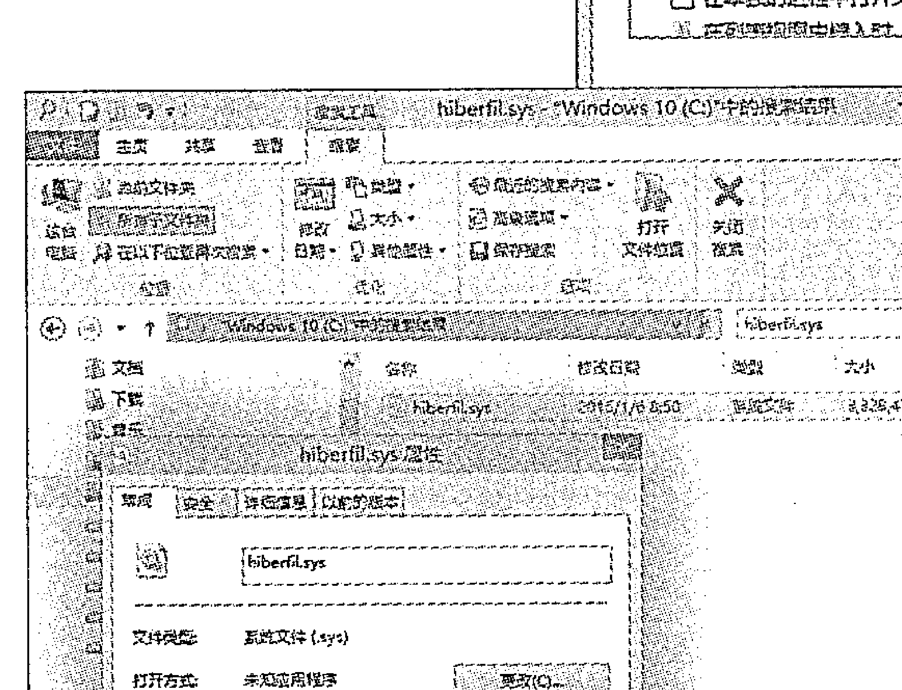

## 参数压缩 休眠文件缩身

我们已经看到了这个文件，的确够大的，如果你的设备是一个16GB容量的平板，这一占用很“凶残”。那么，这个文件能不能再小些？如何才能再小些？

Windows 7之前的系统，休眠文件大小与物理内存总数是相等的。微软PC系统从Windows 7开始就增加了这个默认设置下休眠文件占用系统物理内存总数的75%的功能。且从Windows 7开始我们其实还可以将休眠文件按指定的50%~100%的压缩比进行压缩，这一点知道的人不多。

要对休眠文件进行压缩，只需按下Win+X组合键或在Windows 8.1和Windows 10开始菜单上右键单击，在弹出的菜单中选择“命令提示符（管理员）”，在随后打开的黑色窗口中运行下列格式的命令（图4）：

```
POWERCFG /HIBERNATE /SIZE nn
```

其中“nn”是压缩百分比，可输入50~100之间的整数，若不指出，系统默认值为75。
重新登录之后，你会发现休眠文件的大小发生了改变。

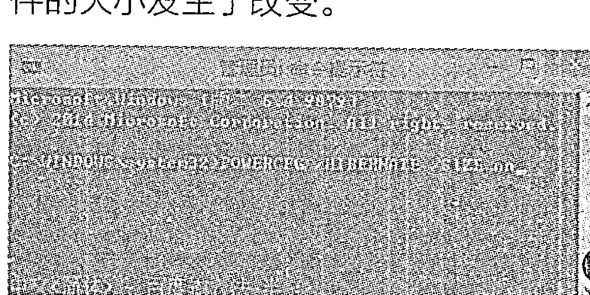

## 自身压榨 要出更多空间

除了使用休眠文件自身的参数设定让休眠文件变小外，我们还可以利用系统自身的压缩功能对该文件进行二次压缩。
在hiberfil.sys文件上点击鼠标右键，在随后弹出的属性窗口中点击“高级”按钮（图5），在激活的“高级属性”窗口中，选中“压缩内容以便节省磁盘空间”一项，然后确定（图6）。

> Windows系统默认对NTFS格式的磁盘开启可压缩选项，如果文件经过系统压缩，其颜色默认会显示为蓝色，未压缩的文件依然显示为黑色。我们可以有选择地对整个驱动器或部分文件夹、文件进行压缩。但是，需要注意的是，压缩之后的文件，其访问效率低于正常的时候，也就是说，文件压缩会不同程度地影响到系统的运行效率，这也是获取系统空间所必须付出的“代价”。

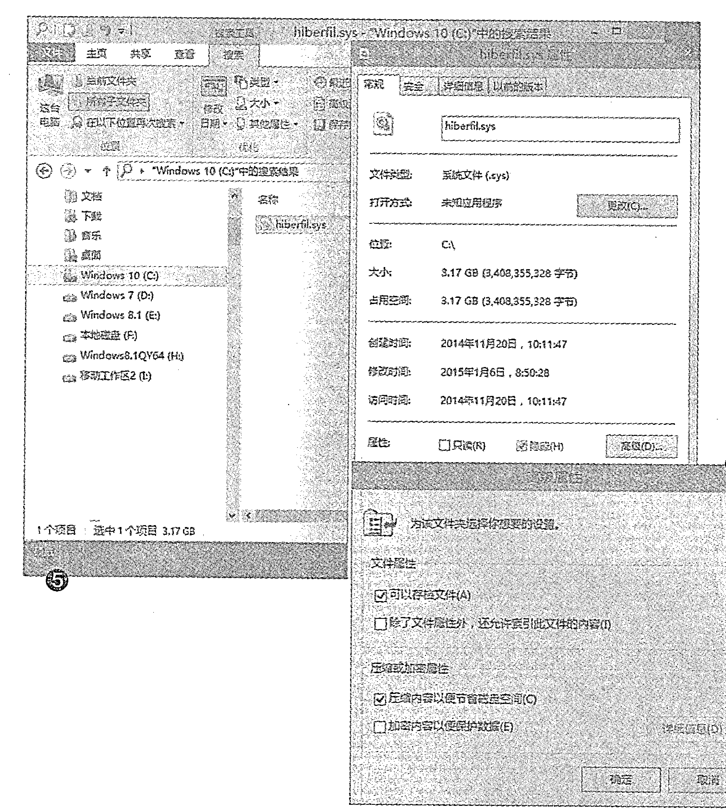

## 可致蓝屏 压缩需要小心

要注意的是，如果上述参数修改得过小，可能导致系统休眠时出现“STOP 0x000000A0 INTERNAL_POWER_ERROR”蓝屏错误。对于运行不同程序、执行不同任务的计算机，由于压缩率设置不合适可能出现蓝屏的几率不相同。实际可用的压缩率可能不完全相同，不能一概而论。为安全起见，建议最后采用系统默认提供的约75%的压缩设置。具体使用多大的压缩率才能保证系统正常工作，这需要用户具体设置尝试，测试期间最好不要在电脑上处理重要数据，以免因蓝屏而丢失数据，等系统测试稳定后再行正常工作。
既然压缩休眠文件可能出现蓝屏，存在一定的风险。因此，一般建议物理内存非常大，并且系统盘空间严重不足的情况下修改该设置。如果内存本身比较小，例如只有2GB，压缩休眠文件能腾出的空间也十分有限，以牺牲稳定性为代价去换取一点空间也不太值得。

> 如果在修改后休眠遇到上述蓝屏错误，可重启系统进入维护命令窗口，设置一个较大的压缩率。如果问题依然发生，可尝试执行“POWERCFG /HIBERNATE /SIZE 100”命令，将休眠文件改为“大满贯”不压缩试试。注意，休眠文件只能位于系统盘根目录下，无法像其他文件那样，将其设置到其他硬盘分区。

## 层层深入 解决应用安装错误

文|宋金宝

在使用Windows 8.1商店应用的过程中，有时会遇到应用无法安装的情况，一般系统会给出了“出现了问题，此应用无法安装。请再试一次”之类的提示，错误代码是形如0x80070005之类的格式（图1）。若重新安装应用依然如此，甚至有时安装更多别的应用也会遇到同样的错误。如果你也遇到此类问题，可参考本文的方法解决。

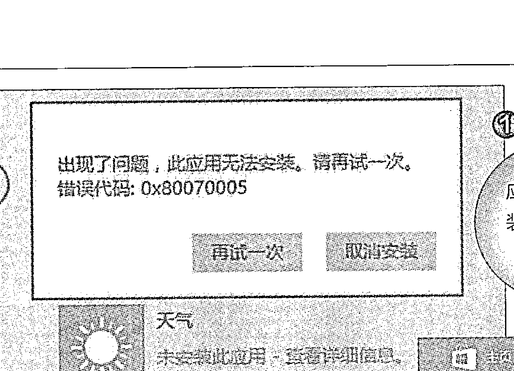

> **小提示**
如果无法登录应用商店，请先检查是否已经正确登录Windows账户。使用应用商店安装应用，首先需要登录到Windows账户。

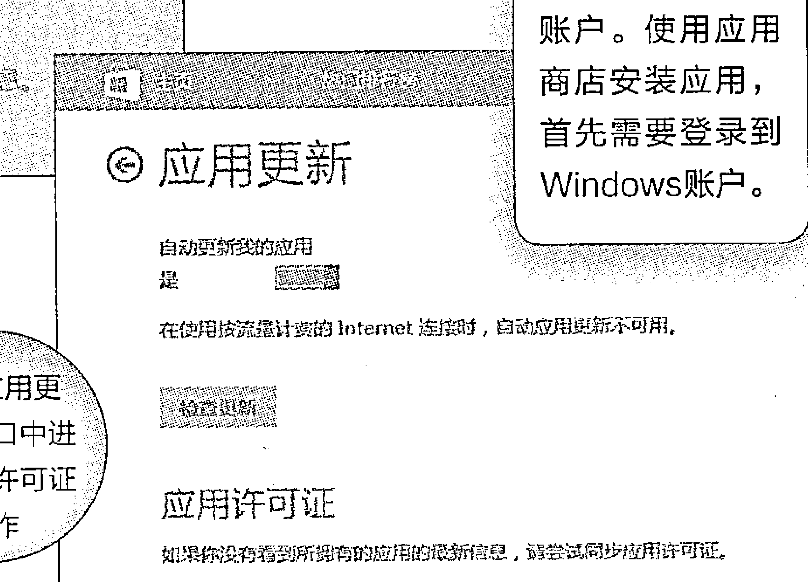

### 1 应用更新并同步许可证

进入Windows 8.1“开始”屏幕，单击打开“应用商店”。用鼠标指向屏幕右上角，将指针向下移动，再单击“设置”。点击“应用更新”（图2）。
在“应用更新”窗口中单击“同步许可证”按钮（图3）。
执行完如上操作后，再尝试通过应用商店安装应用看是否可行。

### 2 更新SoftwareDistribution文件夹

SoftwareDistribution文件夹是存放所有应用文件的地方，如果是由于此文件夹中的文件出现了问题，可以通过清理更新此文件夹来解决问题。
依次打开C:\Windows\SoftwareDistribution\Download，删除该文件夹中的全部内容，如果出现无法删除的提示，请勾选“为所有当前项执行此操作”后点击“跳过”，完成后再尝试安装应用。

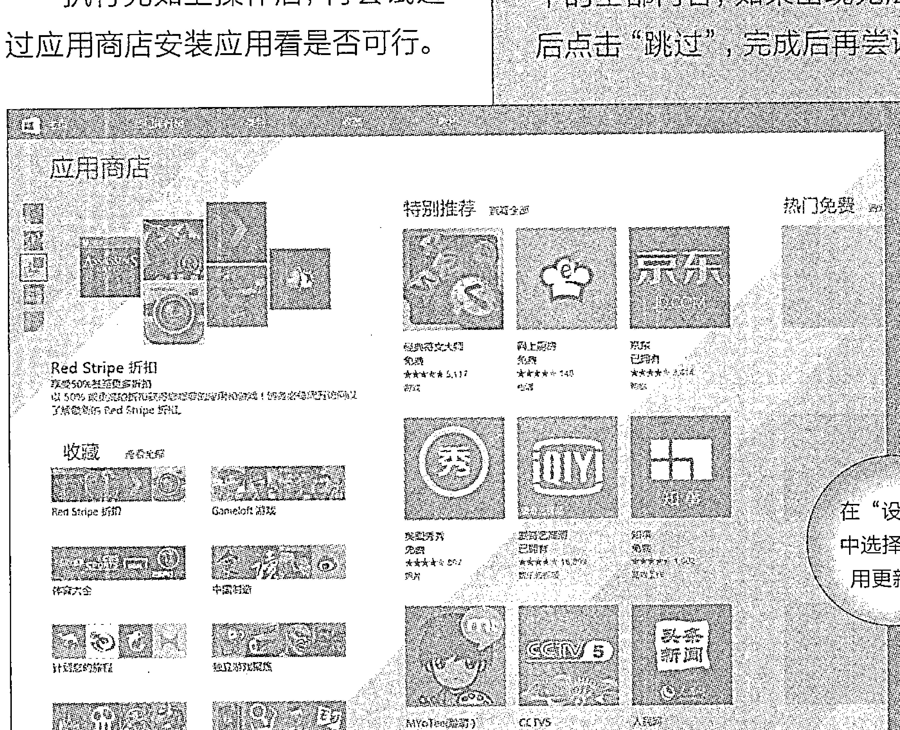

如果依然不行，可禁用Windows Update服务。具体方法是：按下Win+C组合键并选择“搜索”，输入“services.msc”搜索设置，找到Windows Update后，通过右键将其禁用（图4）。
接下来打开C:\Windows文件夹，用鼠标右键点击其下的SoftwareDistribution文件夹，选择“重命名”，将其名称修改为SoftwareDistribution-old。重命名完成后用如上方法重新启用Windows Update服务。然后再次测试是否可以安装应用。


### 3 消除网络防火墙的影响

排除第三方网络防火墙或杀毒软件的影响也是需要考虑的因素。

按Win+X组合键，在快捷菜单中点击选择“计算机管理”，然后依次点击“服务和应用程序→服务”，查看Windows Firewall是否开启（图5），之后通过控制面板打开Windows防火墙，关闭安装的第三方杀毒软件和反间谍软件后，再到应用商店中测试是否可以安装应用。

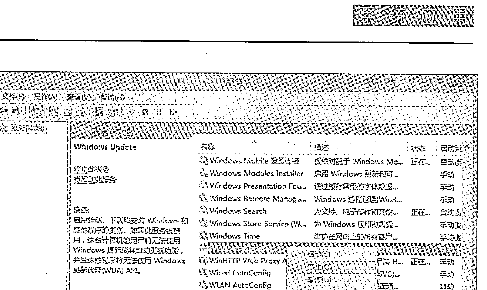

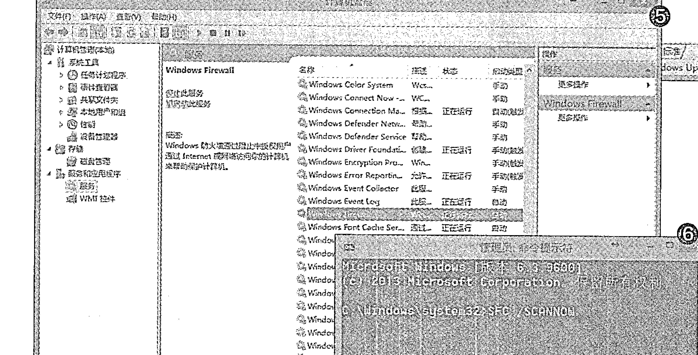

### 4 检查系统完整性并修复

系统完整性遭到破坏，也会导致应用无法更新。

同时按下Win+X组合键，在弹出的快捷菜单中选择“命令提示符（管理员）”，启动命令提示符窗口。输入“SFC /SCANNOW”命令对系统进行完整性扫描和自动修复（图6）。

```
SFC /SCANNOW
```

执行完上述操作之后，重新启动系统。再次尝试进入应用商店安装之前无法完成安装的应用，看问题是否得到解决。

通过“控制面板→用户账户→管理用户账户”添加一个本地用户。在应用商店下载应用时，关联一个Hotmail或其他微软邮件账号（如果没有也可以直接免费申请一个），然后尝试安装应用。

> **小提示**

还可以通过更换账号来测试应用是否可以更新。

### 5 没有办法的最后“办法”

如果以上方法均不奏效，那么只能借助于系统还原或系统恢复的方法来解决问题了。

若是此前建立过系统还原点，可使用系统还原功能将系统还原到正常的时间点，然后再测试应用是否可以正常安装。按Win+R组合键，输入“rstrui.exe”命令启动系统还原，按照提示将系统还原到正常的时间点（图7）。

若无还原点可还原或还原后仍无效，那么就需要使用“系统恢复”了。鼠标指向屏幕右上角，将指针向下移动，依次单击“设置→更改电脑设置”，然后再依次点击“更新和恢复→恢复”。在“恢复电脑而不影响你的文件”下，点击“开始”，按照屏幕上的说明进行操作即可恢复系统（图8）。

```
rstrui.exe
```

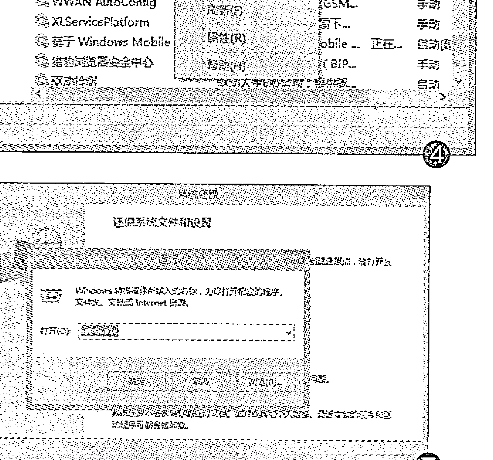

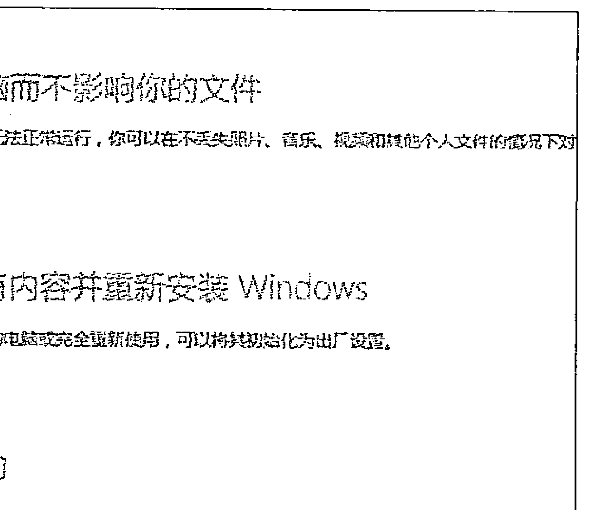

## 解决Windows 8.1无法自动更新

文|苍狼

我的Windows 8.1笔记本经常在外面使用，常使用外部的各种网络，也曾使用过各种代理上网。以前无论是在学校连接校园网，还是在家里都能进行正常的系统自动更新，但最近通过控制面板进入自动更新后，反复检查自动更新，都会出现8024402F的错误代码，无法更新了（图1）。该如何解决？

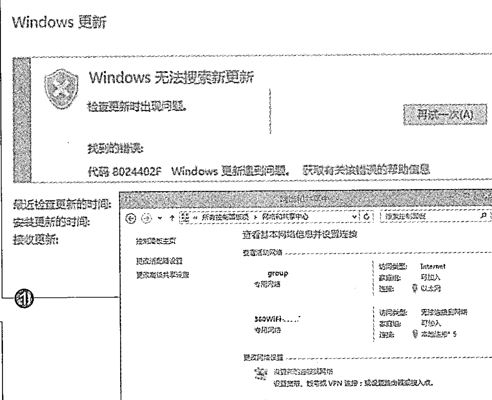

> 小提示：如果不知道这个地址，而你又在使用路由器并可连通网络，进入路由器设置页面，在连接状态页面可看到这两个地址。否则，可电话询问你的接入商。

通过微软技术代码库查询获知，Windows更新时出现8024402F错误，多数情况是由于无法连接到Internet导致的，因此问题解决的焦点放在网络环境上。为了防止做无用功，一个稳妥的办法是，先换一个网络环境测试，看是否能够更新系统。若问题依旧，可逐一按如下方法来尝试。

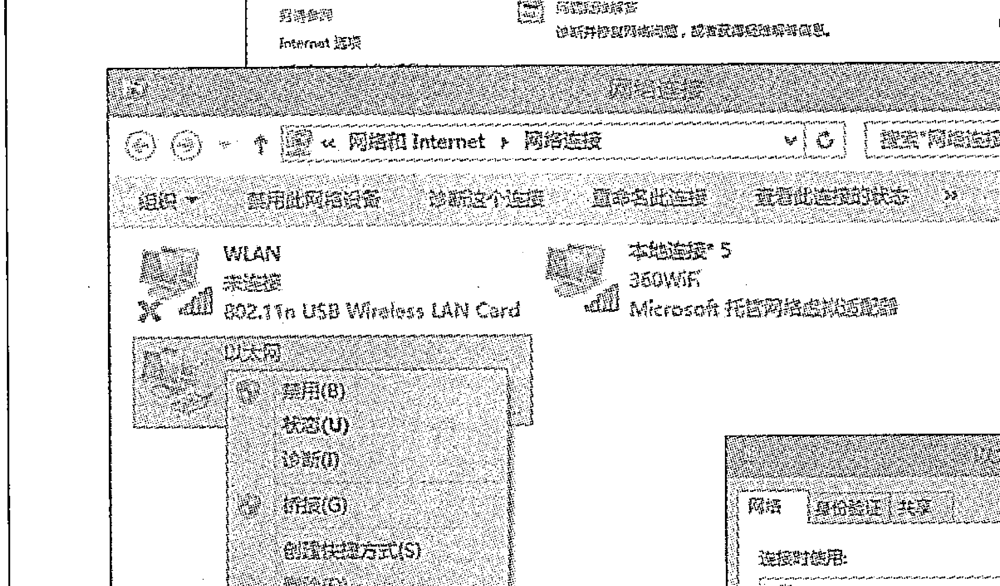

### 1 设置固定的DNS地址

鼠标右击开始按钮，并从右键菜单中依次执行“控制面板”，通过“所有控制面板项”列表，选择“网络和共享中心”。在接下来的窗口中点击左侧导航栏中的“更改适配器设置”（图2）。

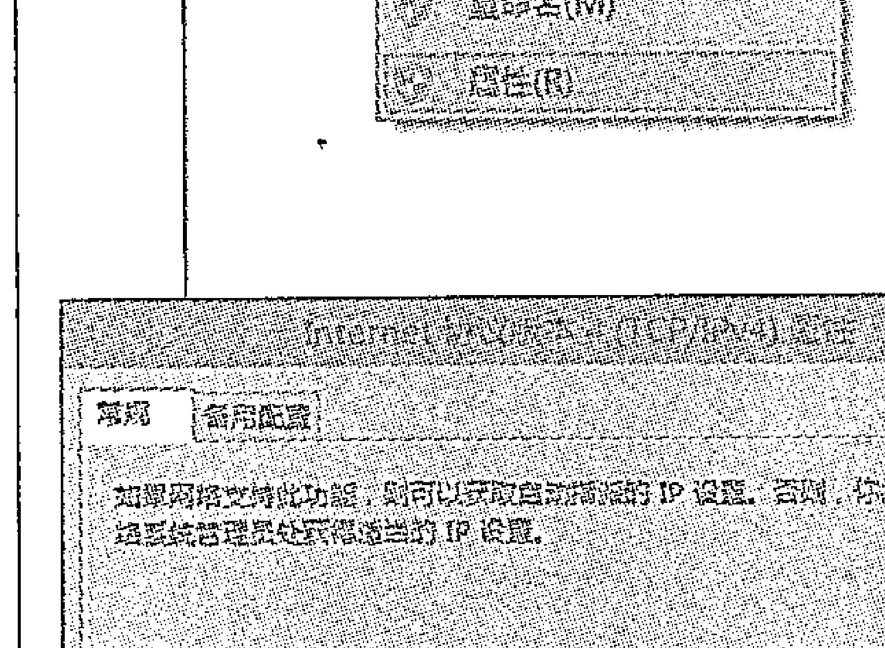

右击当前使用的网络连接（本地连接或宽带连接），然后选择“属性”（图3）。在网络属性窗口中选择“Internet协议版本4（TCP/IPv4）”并点击“属性”按钮（图4）。在打开的“Internet协议版本4（TCP/IPv4）属性”窗口中，选择“使用以下DNS服务器”进行手动设置，在“首选DNS服务器”和“备用DNS服务器”中分别填入你所用网络的DNS地址（图5）。

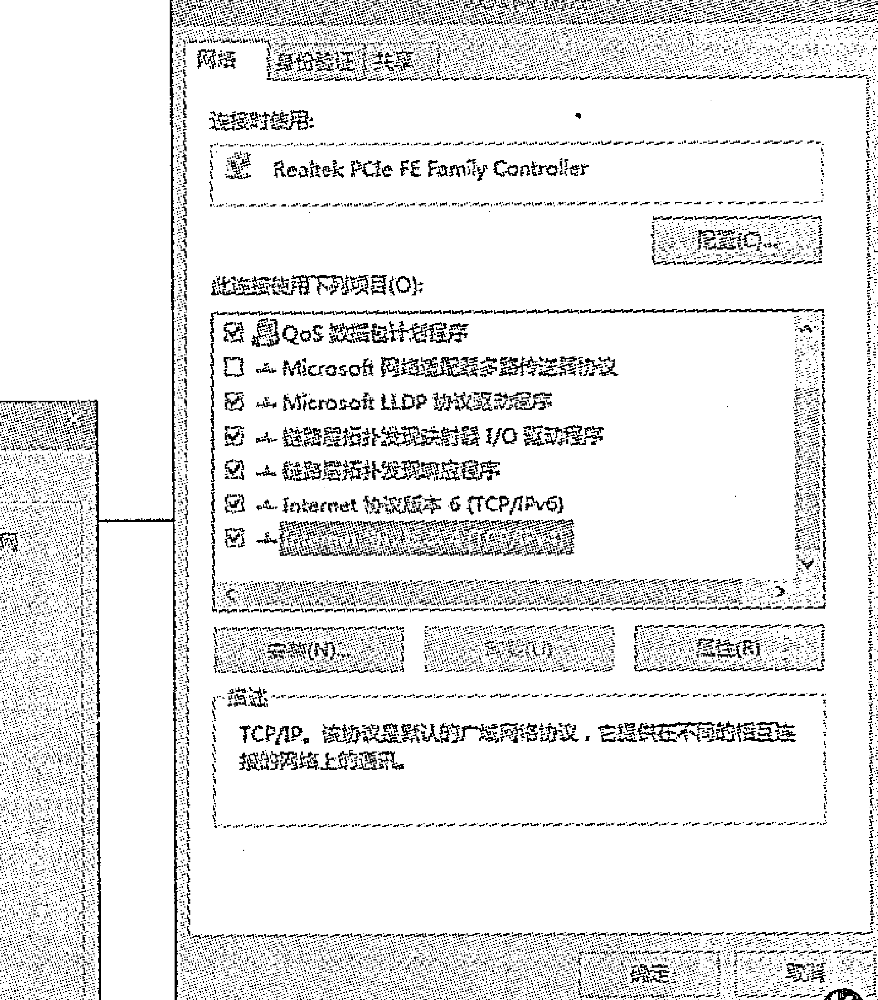

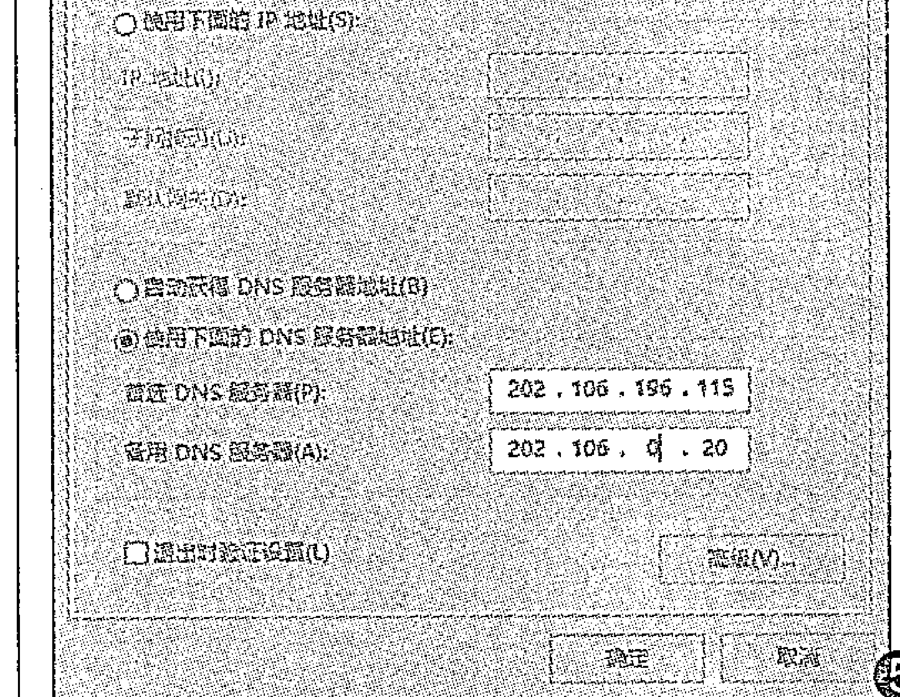

### 清除代理及代理临时文件

用Win+R组合键启动运行窗口并执行“inetcpl.cpl”命令，打开Internet属性窗口。在“连接”选项卡下，单击“局域网设置”按钮(图6)。进入到“局域网(LAN)设置”窗口后，单击“高级”按钮(图7)，在随后启动的“代理设置”窗口中，删除其中的所有记录（若存在的话），然后点击“确定”（图8）。

接下来需要删除此前用过的代理临时文件。按Win+X组合键，从菜单中选择“命令提示符(管理员)”进入命令提示符窗口，分别输入如下命令并回车执行(图9):

```
netsh winhttp reset proxy
net stop WuAuServ
net start WuAuServ
```

> 小提示

如上第一条命令的作用是删除所有代理服务器设置，后两条命令的作用是停止系统更新服务并重新启动系统更新服务，WuAuServ是系统自动更新的服务的服务名。

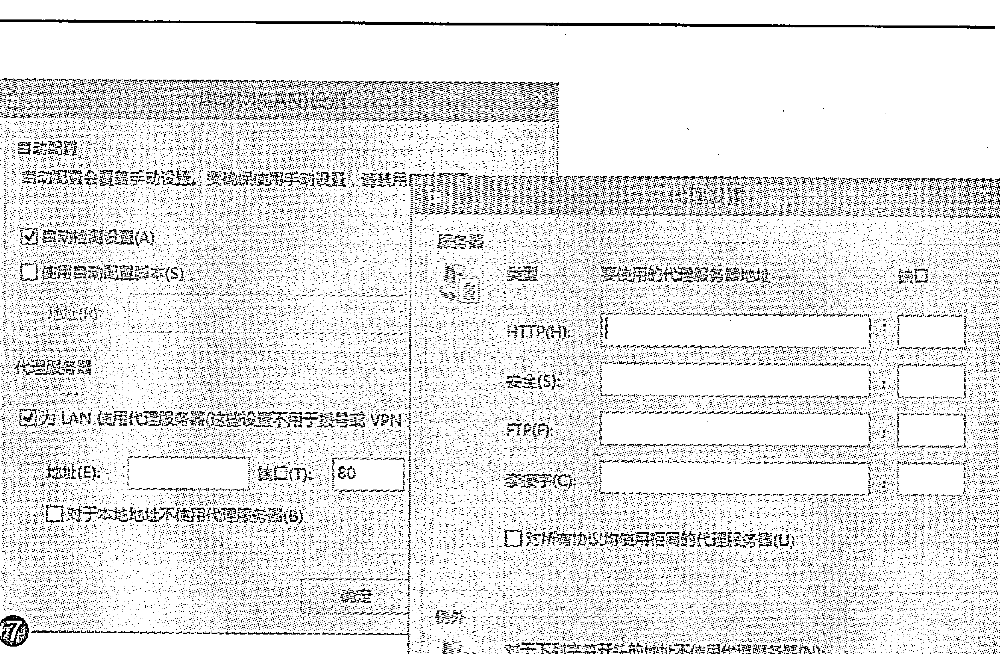

### 重置TCP/IP协议栈修复网络

依然在管理员模式的命令提示符窗口中执行如下命令“netsh int ip reset”，重置TCP/IP协议栈，对网络协议进行复位修复（图10）。

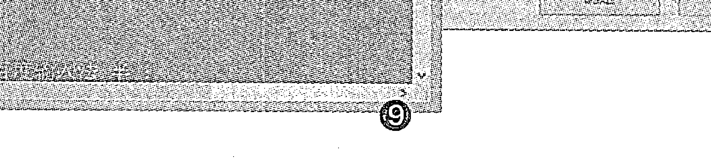

### 修复系统文件或系统服务

除了网络的问题外，还可能是由于相关Windows系统文件损坏、丢失或系统服务Cryptographic Services错误而引起的，可通过下列方法修复。

首先通过系统管理员命令提示符窗口运行“SFC /SCANNOW”命令，检测并修复所有受到损坏或丢失的系统文件。

接下来以命令“REGSVR32 C:\Windows\system32\cryptdlg.dll”的形式（依次替换掉最后的dll文件即可），对dssenh.dll、gpkcsp.dll、initpki.dll、mssip32.dll、rsaenh.dll、sccbase.dll、slbcsp.dll、softpub.dll、wintrust.dll等系统文件进行重新注册，然后重启系统，使Windows重新加载经过修复的系统服务Cryptographic Services。

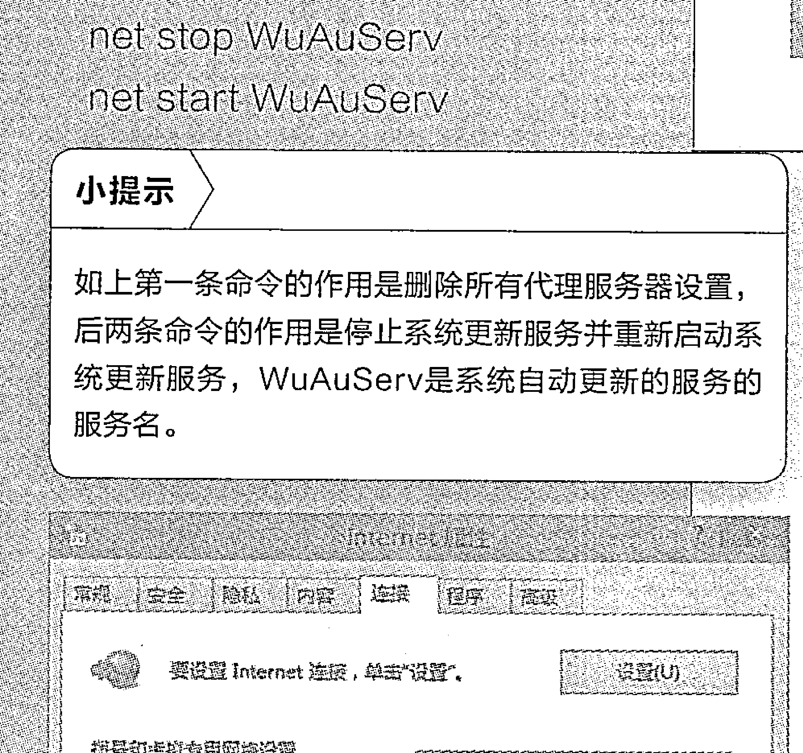

弄坏硬盘 数据尚能保全

文|黄勇

如果硬盘出现严重故障，但自己没有来得及提前对其中的数据进行手动或自动备份，是不是只能自认倒霉？假如你已经用上了Windows 8以上版本的操作系统，其提供的一项存储新功能可以保全数据。

多存储器联合保全数据

我们平时使用的Windows系统一般至少有一块硬盘，有时还可能另外挂接一些硬盘（内置的或移动的），在使用过程中，难免会遇到一些逻辑的或物理的错误。许多情况下，除删除文件外，发生错误的文件多数难以修复，尤其是当硬盘发生物理磁道错误甚至整个硬盘遭到物理损坏时，对数据的打击是毁灭性的。这时，无论电脑中挂接了几块硬盘，只要存储数据的某块硬盘发生错误，如果用户对文件没有进行备份，那么文件丢失的可能性极大。

如果我们将系统所用的硬盘和手头上的所有硬盘或移动硬盘，在Windows 8.1或Windows 10环境下联合组成“存储空间”，让其为数据保驾护航，这样，一旦硬盘发生故障，哪怕是物理故障，数据也有恢复的希望。甚至在多块硬盘组成的存储池中，其中的两块硬盘出现故障，存储池会通过第三个设备自动生成恢复副本，确保用户数据的安全。

“存储空间”是Windows的一项新功能，它利用一些物理存储设备组成“存储池”，将几块未使用的物理磁盘添加到存储池中，形成一个或几个虚拟磁盘，然后对虚拟磁盘进行新建卷（简单卷、镜像卷等）的操作。这些虚拟硬盘能够把系统原本较小的存储空间大大扩充，同时还提供一个弹性层以解决不同物理媒介的错误问题。一旦物理硬盘发生故障，这个“存储池”能够自动生成受影响的位置的数据副本。

如果要对存储空间和存储池的概念做出更通俗、更形象的表述，那么，可以说存储空间具体表现为资源管理器中的一种虚拟驱动器，它的使用将和我们平时所用的C盘或D盘等分区没啥区别。若感觉这个“池”的空间不够用，通过再加一块或几块硬盘来扩容。与平时所用的硬盘不同的是，若其中有硬盘出现故障，数据还可以恢复。

小提示：适合于创建存储空间的驱动器可为各种硬盘（含固态硬盘），接口可以是USB、SATA和SAS。

数据联合保全的具体方法

让各种存储器联合“作战”完成存储任务，可以保证数据的安全或为使用提供方便。创建存储空间的具体步骤如下：

- 第一步：右击Windows 10开始菜单，选择“控制面板”命令（图1）。
- 第二步：以“小图标”方式查看控制面板选项，在“所有控制面板项”列表中选择“存储空间”选项，进入“存储空间”创建窗口（图2）。
- 第三步：在“存储空间”创建窗口中，点击“创建新的池和存储空间”（图3）。
- 第四步：选择要用来创建存储池的驱动器，然后点击“创建池”。指定驱动器名称和驱动器号，然后选择一种布局（三种布局的具体含义见“小知识”）。指定存储空间大小，然后单击“创建存储空间”。

特别提示：创建存储池之前首先要连接外接存储设备，否则无法创建。每次创建的时候都会格式化驱动器，所以如果接入的驱动器中有数据，一定要先备份数据。

小知识：解惑三种空间的差别

虚拟空间的创建可选择“简单空间”、“镜像空间”和“奇偶校验空间”三种不同模式。“简单空间”主要用来提升软件性能，存储软件临时文件最为合适，但选用这种方式不会保留副本，因此无法对硬盘文件进行保护，用户要自己做好备份，创建这种类型的空间至少需要一个驱动器。“镜像空间”与“简单空间”的不同在于，它会保留副本来保护驱动器数据，又分为双向镜像和三向镜像两种，适合于备份大容量数据文件（如大容量备份包、系统映像文件等），分别需要至少2个或5个驱动器来创建。“奇偶校验空间”为存储效率设计，适合于存储存档数据和音视频流媒体，要求至少3个驱动器来创建，适合于发烧友或企业用户使用。

小提示：如果没有看到任务链接，请单击“更改设置”进行设置（图4）。

使用存储空间常见问题解决

Q: 我有4块硬盘，后3块为数据存储盘，想要组成一个存储池。在没有创建存储池之前，电脑不运行任务时会按时自动关闭到节能状态。请问，组成存储池后系统的节能设置还会有效吗？
A: 创建的存储池只是一个虚拟的驱动器，而关闭硬盘是针对硬件的设置，只要符合硬盘没有被读写的条件，硬盘就可以被自动关闭，不会受到影响。

Q: 我用两个驱动器创建了存储空间，如果忘记开启其中一个硬盘，请问其中的数据还能保全吗？
A: 如果存储空间是由两个驱动器创建的，在断开了两个驱动器与电脑的连接后，只重新连接了其中一个，那么未连接的驱动器就会与存储池分离。在重置分离驱动器使其与存储池重新合并之前，存储空间不能使用该驱动器来防止驱动器故障。如果在驱动器处于分离状态时在其上添加或更改文件，在重置驱动器后，这些文件将被永久删除。若要在重置驱动器之前查看这些文件，先断开两个驱动器，然后连接分离的驱动器。使用“文件资源管理器”查看该驱动器上的文件，然后将要保留的所有文件复制到另一个驱动器上。再断开分离的驱动器，重新连接另一个驱动器，然后重新连接分离的驱动器。在控制面板“存储空间”的“物理驱动器”下，单击分离驱动器旁边的“重置”，然后单击“重置驱动器”。

Q: 我用三块不同容量的硬盘组成了一个存储池，创建了一个简单卷，其中存有一些重要数据。但最近系统提示其中一块硬盘的“健康状况”急剧下降，可能会在不久坏掉，建议更换。请问，这块硬盘坏掉之后，其中的数据能保全吗？
A: 如果是简单卷（类似于Raid 0）的话，任意一块硬盘坏了，数据就会全部丢失。因此，为防止数据丢失，请在创建存储池时不要选择简单卷。

让Windows 10开始菜单更个性

文|胡杨

Windows 10开始菜单磁贴会记录隐私信息，为了防止别人看到，我们不得不去清除它们。开始菜单中的功能有限，为了访问没有的功能，我们不得不通过搜索深入查找。鼠标悬浮显示下级菜单功能很酷，但有时这个功能也会不翼而飞。种种问题如何解决？

不用清理 隐私不再现身

在Windows 10的开始菜单中，有多处会自动记录用户操作的个人隐私。下面的操作可以让个人隐私不再出现在开始菜单中。

将“开始菜单”属性选项卡下“隐私”一组中的两个选项“在开始菜单中存储并显示最近打开的程序”和“在开始菜单和任务栏中存储并显示最近打开的项目”取消。然后点击“从我的磁贴中清除个人信息”后的“清除”按钮，清掉磁贴中的个人隐私信息。同时，在“要显示在跳转列表中的最近使用的项目数”后面选择数量为0（图1）。

小提示：如果要在磁贴桌面上显示“系统管理工具”，可通过在磁贴界面进入“设置→磁贴”，然后将“磁贴”设置下的“显示管理工具”开关置于“是”的状态即可（图3）。

按需定制 添加实用功能

Windows 10开始菜单虽然较Windows 8.1的开始菜单有了长足的进步，但是，不是我们所需要的所有功能都可以从开始菜单中找得到。如果这其中没有我们需要的功能，我们可以根据自己的需要进行必要的设置，将个人所需的项目显示在开始菜单中。

具体方法是，在“任务栏和开始菜单”属性窗口中的“开始”菜单选项卡下，点击“自定义”按钮，在随后弹出的窗口中对开始菜单的功能进行扩充（图2）。

选中“帮助”一项，每次学习Windows 10基本用法时，就可以很方便地从开始菜单直接开启帮助。

为便于控制系统，可将“设备”、“网络”、“控制面板”选中，添加到开始列表中。如果经常使用视频、音乐，可将“视频”和“音乐”两项添加到开始列表中。开始列表中还可以开启“我的电脑”、“下载”、“家庭组”、“个人文件夹”等常用项目。

两个选项 找回炫酷功能

如果遇到开始菜单项目无法拖放或悬停后无法显示下级菜单的异常情况，只需在“开始”菜单的自定义窗口，检查“启用上下文菜单和拖放”和“使用鼠标指针在菜单上暂停时打开子菜单”两个选项是否选中。若未选中，则重新选中后点击“确定”，即可找回丢失的炫酷功能。

维护系统经常要用到的“系统管理工具”，由于埋藏较深，访问有所不便，可以将其添加到开始菜单中以便随时访问。

Windows巧解时差麻烦

张老太有两个儿子，一个在巴黎，一个在纽约。每次给儿子打电话，老太太都得算算儿子那边是几点。其实，如果在Windows 8.1/10电脑上合理使用时间，就不用费心去计算时差了。

定义三国时间钟表

将系统托盘图标定义为三国时间显示。通过添加两个附加时钟，让系统托盘能够同时显示出三个国家的时间，这样就可以一目了然地知道此时此刻，在那个国家是几点钟了。

右击系统托盘时间图标，选择快捷菜单中的“调整日期/时间”项目（图1）。

在“日期和时间”设置窗口中单击“附加时钟”选项卡，然后分别选中两个“显示此时钟”复选框，并为每个时钟选择当地的时区，如纽约选择“美国和加拿大东部时间”，巴黎选择“巴黎时间”。然后给两个时钟分别输入显示名称“纽约时间”和“巴黎时间”。设置好之后点击“确定”按钮（图2）。

这样设置之后，当鼠标移动到系统托盘时间图标上时，会从上到下依次显示本地时间、纽约时间和巴黎时间，3个地区对应的当前时间一目了然（图3）。

如果在系统托盘时间图标上单击鼠标左键，则会出现一个三地时间的日历和时间对照图。上面清晰地显示星期几和具体年月日，以及北京时间、纽约时间和巴黎时间（图4）。

上网搜索查询时区

通过网页应用也能自动显示不同时区的时间，例如访问http://tool.ckd.cc/worldclock.php，能自动显示全球主要城市时区的时间，只需从表格中查找自己关心的国家和城市名，对应后面的红色字串显示的就是即时同步的当前时间。

电脑时钟首先要准确，通过日期和时间设置窗口中的“Internet时间”，设置让电脑自动通过服务器校时，可保证电脑时钟走时始终准确无误。

使用时区专业软件

我们还可以在桌面安装多国时区显示应用程序，如世界时钟（Sharp World Clock）软件，开启后会显示多个国家的当前时间。与上面两种方法相比，它显示的钟表数量可以突破3个的限制，同时比通过网络查询显示更加直观方便（图5）。

对症下药 解决两种分区故障

文|俞木发

大家知道现在主板大多使用UEFI启动，因为UEFI只支持FAT格式，因此现在预装Windows 8的电脑都使用系统分区和启动分区分离的安装方式。那么什么是系统分区和启动分区，它们出现故障又该怎么进行修复？

擦亮双眼 认识系统分区和启动分区

根据微软帮助文档的解释，系统分区是指包含加载Windows所需的硬件特定文件的分区，启动分区则是指包含Windows操作系统及其支持文件的分区，系统分区可以（但不是必须）与启动分区相同。

简单地说，系统分区就是保存引导文件的分区（也叫引导分区），启动分区则是Windows目录所在的分区。比如对于传统BIOS启动的Windows 8系统，如果系统是由C:\bootmgr文件引导，因为引导文件和Windows目录都在C盘，所以此时系统分区和启动分区是同一个分区，即C盘（图1）。

对于UEFI启动的系统，由于UEFI启动分区是FAT格式分区，而Windows目录所在的分区则为NTFS格式，所以此时系统分区和启动分区不是同一个分区。这里系统分区状态显示为“EFI 系统分区”的FAT分区，启动分区则为C盘（图2）。

平常我们还经常接触主分区、逻辑分区，它们是针对磁盘分区类型划分的，主要存在于MBR引导的硬盘，对于GPT引导硬盘来说，所有分区都是主分区。

对症下药 解决两种分区故障

通过上面的描述，我们知道系统分区和启动分区的区别和联系，对于UEFI启动的电脑，系统分区和启动分区是分离的。那么在系统分区和启动分区出现故障时该怎么进行修复？

系统分区常见故障及修复

因为系统分区保存的是Windows的引导文件，因此一旦受损就会导致系统无法启动。最常见的故障是由于我们错误地对系统启动文件进行了编辑，导致系统无法启动，比如编辑BCD文件导致启动配置出错，或者误删EFI分区导致系统引导文件丢失。这类故障大多会在系统的引导阶段出现，因为引导文件丢失，电脑大多会直接进入EFI Shell界面（图3）。

既然是引导文件丢失，因此解决方案自然是重建引导。对于Windows 8系统可以直接使用系统自带的bcdboot命令修复引导。因为当前系统已经无法进入，因此首先要准备一个Win8PE（支持UEFI启动）启动盘，使用启动盘启动到PE系统后启动其中的命令提示符组件，然后在其中输入下列的命令修复：

```
Diskpart
List volume
bcdboot d:\windows /s e: /f UEFI
```

命令解释：d:\windows这里表示原来启动分区（即原来C盘），在Win8PE中加载的盘符为D:，e:则为FAT格式的EFI系统分区（如果删除这个分区，请重建后再执行上述命令）。具体盘符请根据自己电脑的实际分区选择，执行上述命令后会自动重建默认的UEFI引导，重启后即可修复（图4）。

启动分区常见故障及修复

由于启动分区保存的是系统重要文件，启动分区如果出现故障，一般只是表现为系统无法进入，但是不会影响系统的引导。故障表现一般是成功加载启动菜单后提示找不到指定文件或者设备，原因大多数是由于系统文件损坏或丢失引起的（图5）。

因为系统还可以引导，Windows 8已经自带很多修复工具，因此我们可以尝试使用这些工具进行修复。

如果之前已经做过系统还原，那么可以在开机后按F8进入高级启动，接着依次点击“疑难解答→高级选项→系统还原”，这样可以在WinRE模式下启动系统还原组件，然后按提示选择创建的还原点进行恢复即可。

如果之前没有创建过系统还原点，还可以在高级选项里进行系统重置或者重装以解决启动分区的故障，不过这个操作需要Windows 8.1安装文件的支持，并且需要在系统正常的时候做好备份才能使用。

有备无患 做好备份应对故障

无论是系统分区还是启动分区故障，一旦故障发生导致无法进入系统，都会给我们的使用带来很大的不便，因此在系统正常的时候做好备份才是解决之道。

对于UEFI启动的电脑，系统分区是FAT格式，而且只要其中有引导文件即可用来引导系统。因此我们可以使用Windows 8.1磁盘管理组件预先在本地硬盘规划出一个FAT分区（大小1GB足够），然后到http://suo.im/ro1ep下载“bootice.exe”，启动程序后点击“分区管理”，然后在打开的窗口选中卷标为“ESP”的分区，点击“分配盘符”即可访问EFI分区（图6）。

假设分配的盘符是f:，自建FAT分区盘符是e:，启动命令提示符后输入“copy f:\efi e:\”，这样以后如果F盘无法引导，即可使用E盘来引导Windows 8了。

小屏Windows任务栏不纠结

文|王文义

小尺寸的Windows 7上网本或Windows 8/10平板，由于屏幕宽度有限，任务栏上放不了几个图标就满员了，加上系统本身就有的一些图标，让本来就紧张的任务栏空间更显狭窄。如何才能让任务栏变得更加清洁和高效？

扎堆放置图标腾空间

随着打开的应用或文档的增多，任务栏上难以排下那么多图标，因而就自动分为两页或多页显示，但这样一来要找到图标就比较麻烦，需要反复点击左右移动才能找到。如果打开的程序或文档是同一种或几种类别，那么，可以让同种类别的图标显示为一个按钮，单击之后弹出一个菜单选择，这样一屏任务栏上就能放置更多的图标了。

右击任务栏空白处，选择‘属性’，在‘任务栏’标签下，选择任务栏按钮的显示方式为‘当任务栏被占满时合并’（图1）。该设置将每个窗口显示为一个有标签的按钮。当任务栏变得非常拥挤时，具有多个打开窗口的应用会合并到一个应用按钮，单击此按钮会看到一个已打开的窗口列表。如果按默认设置‘始终合并、隐藏标签’，每个应用都显示为一个无标签的按钮，即使当打开该应用的多个窗口时也是如此。若选择‘从不合并’，将每个窗口显示为一个有标签的按钮，且无论打开多少个窗口，从不合并这些按钮，打开的应用和窗口越多，按钮会变得越小，最终按钮会呈现滚动状态。后者更适合于设置在大屏幕上，这样可以获得更加炫酷和明确的显示效果。

图标缩身压缩出空间

任务栏上的图标大而炫酷，如果空间紧张，放不了几个图标，我们可以考虑以牺牲一些‘炫酷’为代价，将图标缩小一些，这样就可以在任务栏有限的空间内放置更多的图标了。要实现这种效果，只需在‘任务栏’属性标签下，选中‘使用小任务栏按钮’复选项（图2），然后点击‘应用’并确定即可。

藏起系统图标省空间

如果将任务栏上不常使用的图标藏起来，就会大大节省使用空间。但有的图标支持直接关闭，有的不支持直接关闭。怎么办？如果使用Windows 10系统，任务栏上的系统图标‘搜索’和‘任务视图’摆在开始按钮旁，虽然方便，但有的人很少用它们。这种情况下，可以通过点击任务栏，在右键菜单中取消对‘显示任务视图按钮’的选择（图3），同时通过‘搜索’选项，选中它下面的‘已禁用’（图4），这样就可以将‘搜索’和‘任务视图’按钮从任务栏上卸掉。对于任务栏右侧系统托盘上的应用程序图标，可通过自定义通知区域的图标来决定取舍。进入控制面板小图标显示方式，选择‘通知区域图标’一项...