# 电脑爱好者2015合订本（上）第二部分

如果安装的程序不多，为使用方便可将托盘图标都显示出来，只需选中“始终在任务栏上显示所有图标和通知”即可（图5）。若取消选择，则可根据需要将托盘图标隐藏起来。该方法也适合于Windows 7或Windows 8。

系统托盘图标的显示方式有“显示图标和通知”、“隐藏图标和通知”、“仅显示通知”三种。后一种方式比较实用，它在隐藏图标的同时，不影响必要时显示系统通知，节省空间和显示通知两不误。

但是，还有一些托盘图标不能用这种方法关闭，如系统自带的音量、网络等图标。

如果习惯于用手表看时间，系统时间区没用就可关掉
电脑中也没接音箱不听音乐，音量喇叭图标也可关掉
台式机电源图标也没有必要显示
如果习惯于用快捷键呼出输入法，输入法指示器也可关掉以腾出空间

此外，通知中心也可以选择关掉。

通过“任务栏”属性窗口，点击通知区域的“自定义”按钮，在通知区域图标定义窗口的下方，点击“启动或关闭系统图标”文字链接（图6），在系统图标列表中，将要关闭图标后的“关闭”选项选中即可（图7）。

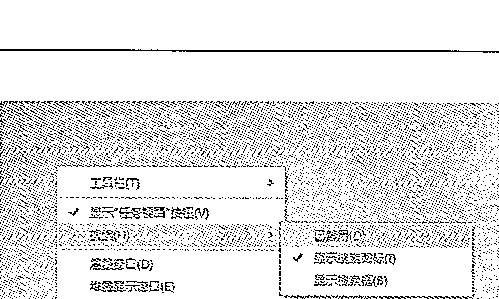

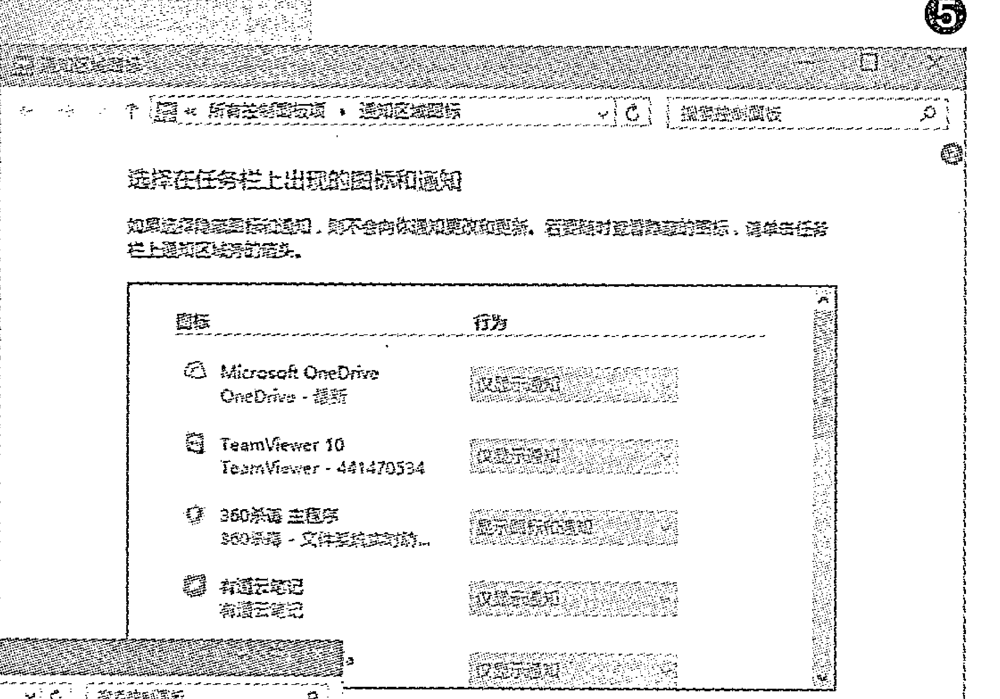

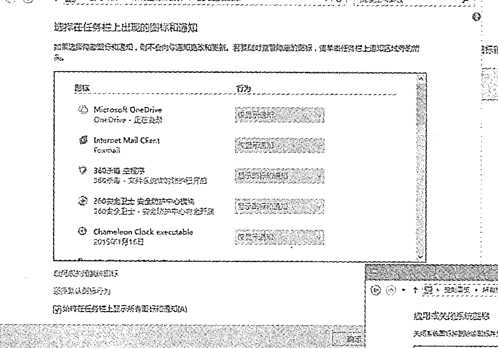

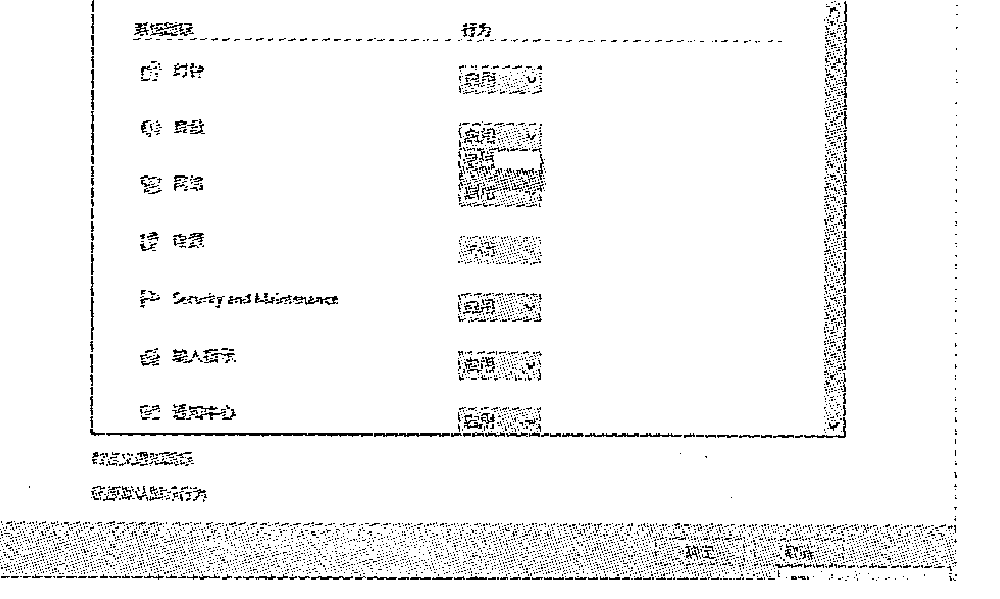

> > **小提示**
>
> 本文在安装了Windows 10的上网本中测试通过。由于目前Windows 10仍在测试阶段，正式版发行之后，操作可能会略有不同。未做特殊说明的条目也可用于Windows 7或Windows 8系统设备，名称或操作有的会略有不同。

## 借用外部扩展空间

如果在Windows 10平板电脑上同时挂接了另一个显示器，可选择将任务栏扩展到附加显示器上显示，这样任务栏图标空间将得到大大扩展。
打开“任务栏和导航属性”。在“多显示器”下，确保选中“在所有显示器上显示任务栏”复选框。从“将任务栏按钮显示在”列表中选择“主任务栏和打开了窗口的任务栏”选项，然后单击“确定”。这样，任务栏按钮将显示在主监视器上，且同时扩展显示在打开了窗口的显示器的任务栏中。

## Windows平板触摸屏不灵为哪般

文|林涛

在平板初始化或使用过程中，由于设置不慎、软件冲突或其他原因，很有可能造成触摸屏失效或不灵。这样，平板就无法操控或难以操控了。由于平板使用触控操作，而触控偏偏又出了问题，那么当遇到这种情况时，该如何解决？

> 小提示：最近买了昂达Windows 8小平板，由于第一次使用需要进行设置，而在电力不足的情况下家人急于使用，未按系统提示充电后设置，结果造成设置未完成而中途断电。再次进入后蓝屏，设置无法继续进行，又无法选择恢复系统。因为当地送修不便，自己也不想折腾，于是找到Win8PE的启动优盘和Windows 8.1的企业版安装包，接上键盘和鼠标进行安装。但是安装之后进入了Windows，但却发现触屏无法使用。如何恢复平板的触摸操作功能？

> 小提示：新购置的平板在触控失灵的情况下，首先要判断平板在物理层面是否有损坏的迹象，如屏幕是否开裂、屏幕与机体是否吻合严密等。一般情况下建议服务时间范围内退换货，若条件不允许或决定自己重装系统恢复，则需要预先准备好USB OTG数据线、USB HUB、USB键鼠等外接设备。此外还需要支持安装Windows 8.1的Windows PE启动U盘。

## 1 触屏失灵 重启修复为先

许多情况下，Windows系统下的硬件设备不能识别是由于没有正确加电引起的，这种情况多是在设备运行期间出现的临时性问题，当我们彻底关机、切断电源之后，重新启动系统，设备故障常常会得到解决。

有鉴于此，我们也可以首先尝试用这种简单易行的办法解决平板触摸屏的故障。只需长按平板电源按键，彻底关掉平板系统电源，然后重新启动平板Windows系统。这时，如果触屏恢复正常则皆大欢喜，否则可按如下办法作进一步分析解决。

> 小提示：如果触控设置页中的“重置”按钮显示为灰色，说明平板触摸校准设置目前为出厂设置状态，无需改变。

## 2 先装驱动 再行精确校准

如果重启之后，触屏依然无法使用，则问题可能出在驱动程序上，需要借助于外接OTG键鼠来解决问题。用OTG数据线和多口的小HUB连接器接上一对USB键鼠，进入系统控制面板的“平板电脑设置”部分，即可对触控部分设置情况进行具体查看。

用键鼠控制进入控制面板后，若发现触控显示部分无触控支持信息(图1)，可判定触控设备没有被识别出来，设备驱动没有装上。这时到设备管理窗口查看，触控设备项上显示黄色惊叹号，可断定驱动没有正确安装。针对本例来说，是在安装Windows 8.1企业版的过程中，系统没有识别出平板的触控设备部件，没有能正确安装触控驱动。

此时的问题聚焦到了触控设备驱动程序的安装上，也就好办了。访问昂达平板官网，找到相应型号的平板，下载驱动程序并安装(图2)。安装好之后重新启动，如果发现触控可用，但觉得不够灵敏，需要到控制面板中设置触控校准。进入“控制面板→平板电脑设置→显示”，点击“校准”，严格按照系统要求对平板屏幕进行校准(图3)。

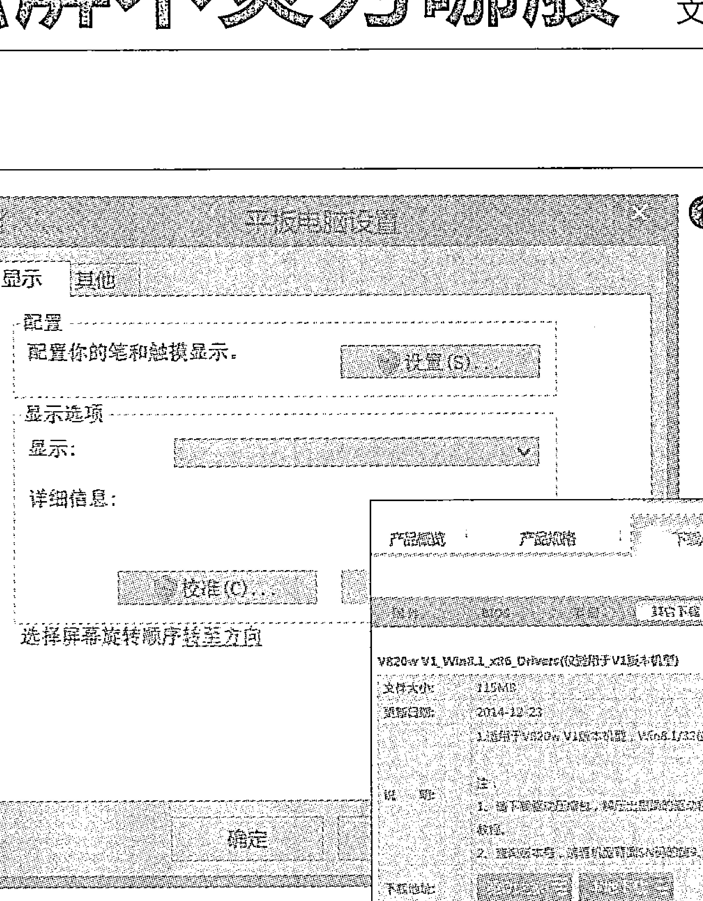

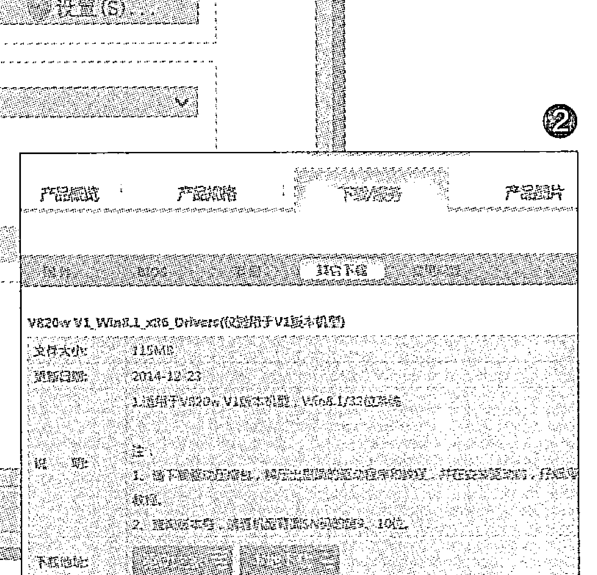

需要特别注意的是，当点击校正屏幕四角交叉点时，若发现由于平板屏幕太小，交叉点细小，横向屏幕下边不好控制，在校准了上面两个点之后，切不可将屏幕进行旋转操作，寄希望于用竖向校准剩下的两个点，会发生屏幕触控错乱。重启平板后屏幕触控根本无法准确定位，手指点下去之后阴差阳错，光标乱窜。如果发生这种意外，需要回到键盘鼠标操作的环境下，重启系统，进入桌面环境，鼠标右键单击开始按钮，选择“控制面板”，依次选择“硬件和声音→平板电脑设置”，单击“校准笔和触控输入的屏幕”，然后选择“重置”按钮，重置触控出厂设置。

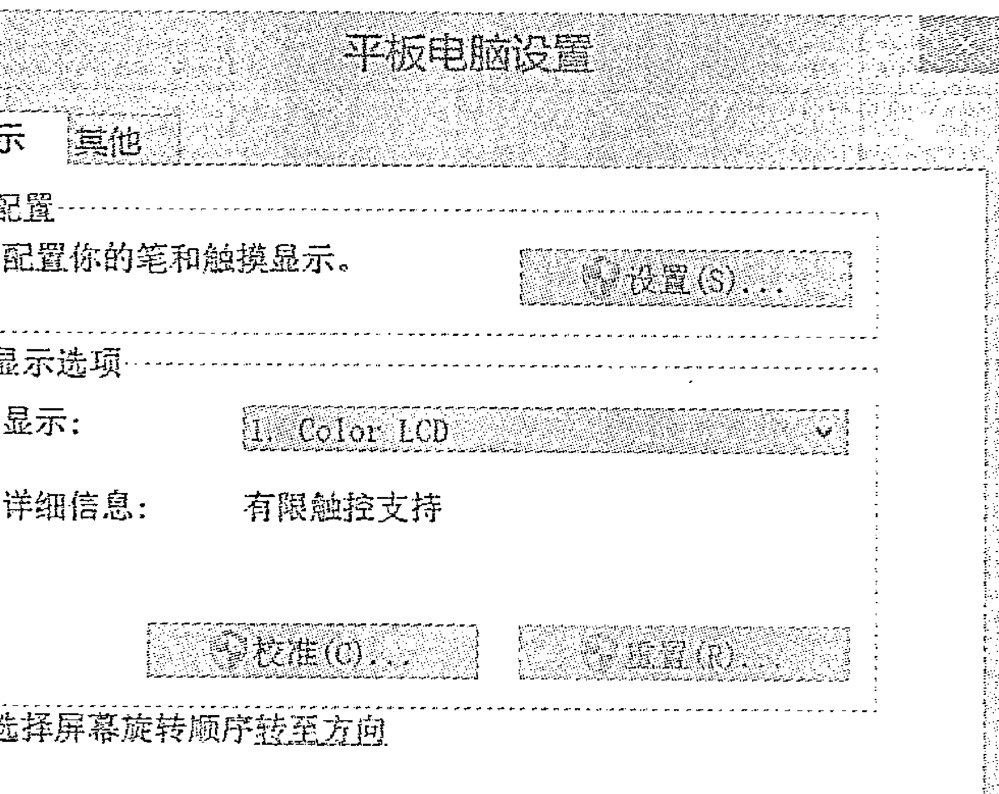

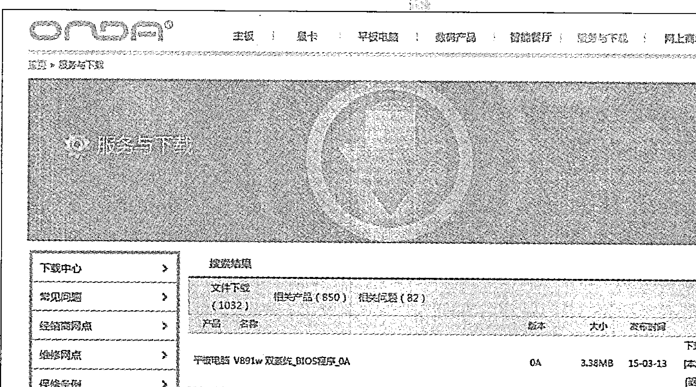

## 恢复重置 无效再刷BIOS

如果通过如上方法均设置无效的情况下，只能通过系统还原、恢复或重置平板的办法解决问题。更进一步，甚至需要用刷新BIOS的办法来解决。恢复、重置系统的具体方法与PC上恢复系统的方法相同，此处不再赘述。

若恢复或重置系统也无法解决问题，则需要从更深层的BIOS上解决问题。这时，我们可通过官方网站，按设备型号下载对应版本的BIOS最新程序，按照官方提供的BIOS刷新使用说明，在保证电力充足的情况下，按部就班地进行设备BIOS刷新（图4）。

> > **小提示**
>
> 系统还原、恢复和重置，需要在平板中保留有系统的备份数据或映像文件。如果系统的映像分区遭到破坏，那么只能寻找Windows 8.1系统安装镜像和驱动来重新安装了。这里，使用平板提供的原版Windows 8.1安装文件和官方驱动程序非常重要，注意认清系统版本号，有时候版本号只有一个字母之差，下载不对就可能安装不成功。在平板处于正常状况下，建议使用专业备份工具（如ATI）对平板系统分区连同驱动和用户软件、数据等进行备份，备份的数据可保存到一个大容量的U盘中。今后平板一旦出现问题，可利用含有ATI工具的WinPE启动U盘启动平板，然后将U盘中的系统、软件和用户数据一次性恢复到平板中。

## 外接键鼠 也能引起冲突

在平板使用过程中，如果接入了无线键鼠，也可能会因默认输入设备设置冲突而造成触屏功能丢失的情况。这时，可通过先卸载无线设备，然后让系统重新识别的方法来解决。

使用有线键鼠进入系统，在“设备管理器”中点击“人体学输入设备”项，右键单击Goodix Touch HID项，选择菜单中的“卸载”，接着在打开的“确认设备卸载”对话框中，取消对“删除此设备的驱动程序软件”项的勾选，单击“确定”按钮（图5）。

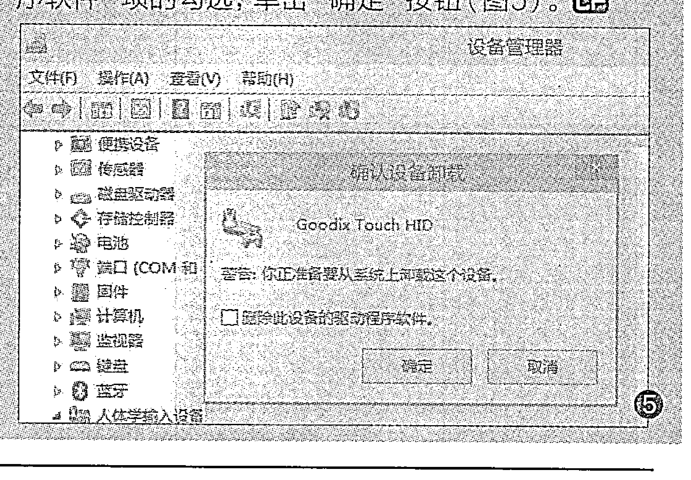

## 升级Windows 8为何无法打印

系统升级到Windows 8后，一些用户发现，在Windows 7下可以正常使用的打印机，接到Windows 8下却无法打印，换其他打印机或接回到Windows 7后又没有问题。这是什么原因？如何解决？

无法使用打印机的情况无非是几种情况：打印机故障、设备连接问题和驱动出错。但从以上所列故障来看，基本可排除打印机故障和设备连接问题，所以一般可确定为驱动支持的问题。解决的基本思路也很简单，那就是可以通过更新驱动程序的办法来解决。但驱动的获取、更新和安装都有说道，只有弄清楚这些问题，才能最有效地解决无法打印的问题。

## 1 打印驱动 系统更新先行尝试

将设备插入到电脑上，Windows 8一般会自动检查并安装设备驱动程序。但系统自带的驱动程序不能满足要求时，Windows会自动上网更新驱动程序。这就对当前的网络提出了要求。

由于Windows更新驱动需要上网下载，因此首先要保证网络畅通。通常我们多数人使用包月路由器上网或局域网，这时的网络问题可通过双击任务栏网络图标进入设置打开（图1）。

光有网络畅通还不一定能顺利更新驱动，还需要保证系统自动更新处于开启状态，因为Windows是使用系统自动更新来检查最新驱动程序的。在系统“设置→更改电脑设置”窗口下，点击“更新和恢复”，然后点击“Windows更新”，将“选择安装更新的方法”选择为“自动安装更新（推荐）”一项，即可满足这一要求（图2）。

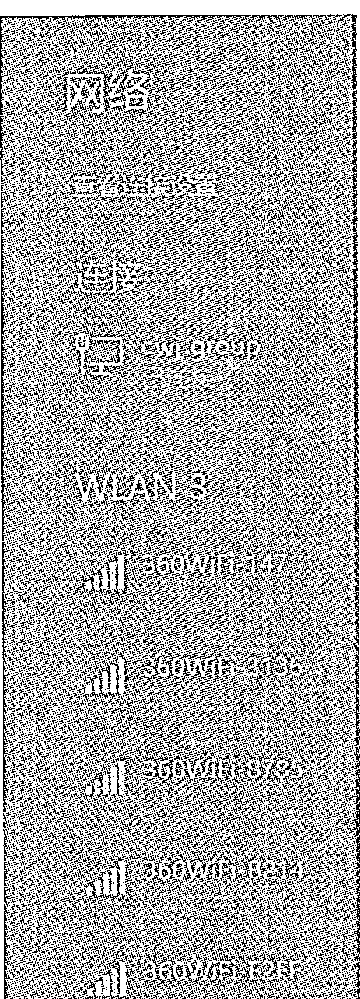

也许在等待系统下载了驱动程序后，却发现打印机仍然无法驱动。这时，有可能是系统没有正确安装下载的驱动所致。这种情况下可能需要手动安装下载的驱动更新。因为在Windows更新中，一些可选更新不会自动安装，在安装过程中出现问题的一些驱动，Windows也会暂停并发出通知，需要用户选择才能安装这些更新，但如果你忽略了这些提示，则其实驱动虽然是下载了，但却没有被安装，因此不能发挥作用。在这种情况下，需到“Windows更新”窗口中，点击“检查更新”，在“可选”之下，点击下载的驱动程序，单击“安装”进行安装（图3）。注意在安装之后，要从“关机”菜单中选择“重启”，重新启动一下系统，以使驱动生效。

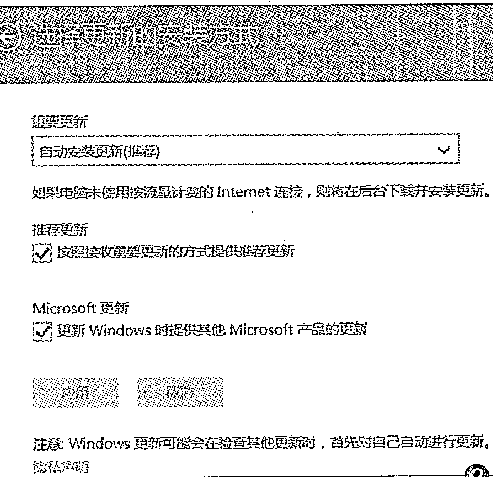

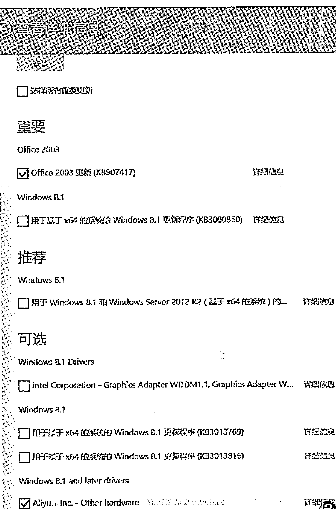

## 2 更新无效 官方网站寻求驱动

如果用以上方法仍然无法将打印机驱动起来，那么可通过打印机型号，访问打印机官方网站，在技术服务频道寻找驱动下载，按产品类别、型号，下载对应的驱动程序（图4）。

## 兼容模式 或可解决驱动难题

如果是新近购置的非名牌打印机，若有该打印机自带的驱动光盘，也许其中会有支持Windows 8的驱动程序。对于无光驱的电脑，可在另一台电脑上将驱动光盘用软碟通等工具打包为ISO文件，然后将此文件拷贝到你的电脑上，在Windows 8.1下直接双击此文件，虚拟出一个光驱来，直接运行其中的安装文件AutoRun或Setup，安装驱动程序（图5）。

有的设备也许相对较老，不一定能顺利搜索到合适的针对最新版Windows的驱动程序，但这也不表示该设备就该在Windows 8.1系统下报废。也许还有高手已经解决或能解决这个问题。此时，我们可以通过两种渠道来寻求解决之道。

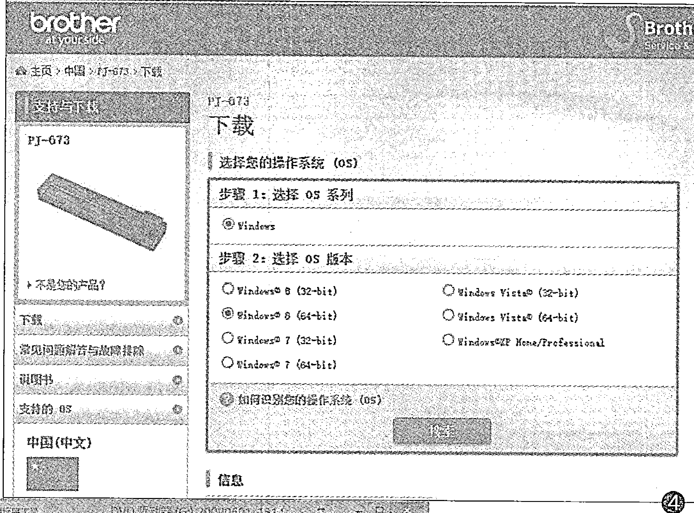

首先可以通过系统提供的“硬件和设备疑难解答”查找可用的方案。在Win+C弹出的浮动面板中点击“搜索”，输入“疑难解答”后点击“硬件和声音”，再点击“使用打印机”（图6），按提示进行操作，看是否能够解决。

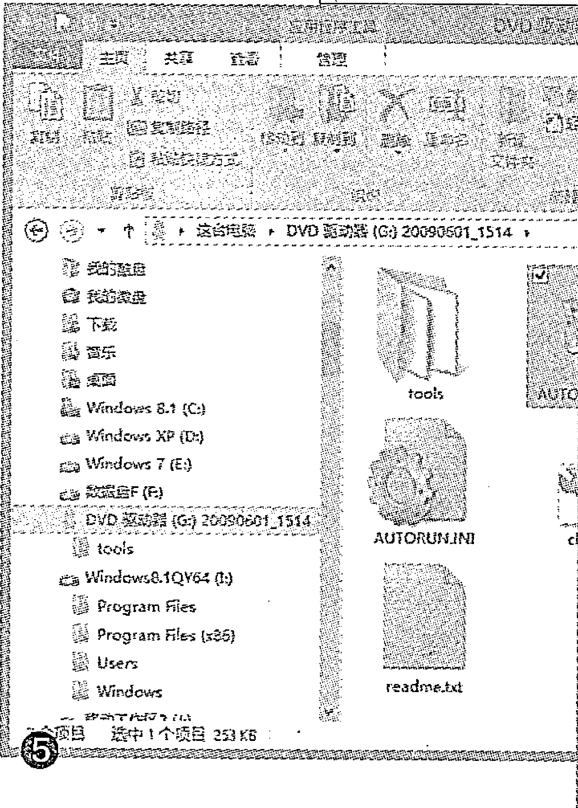

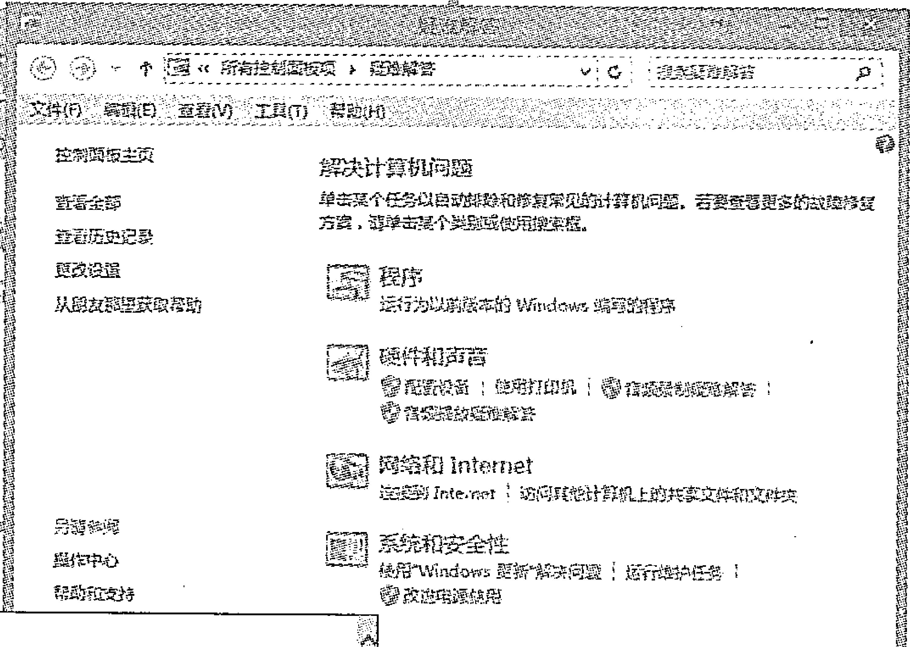

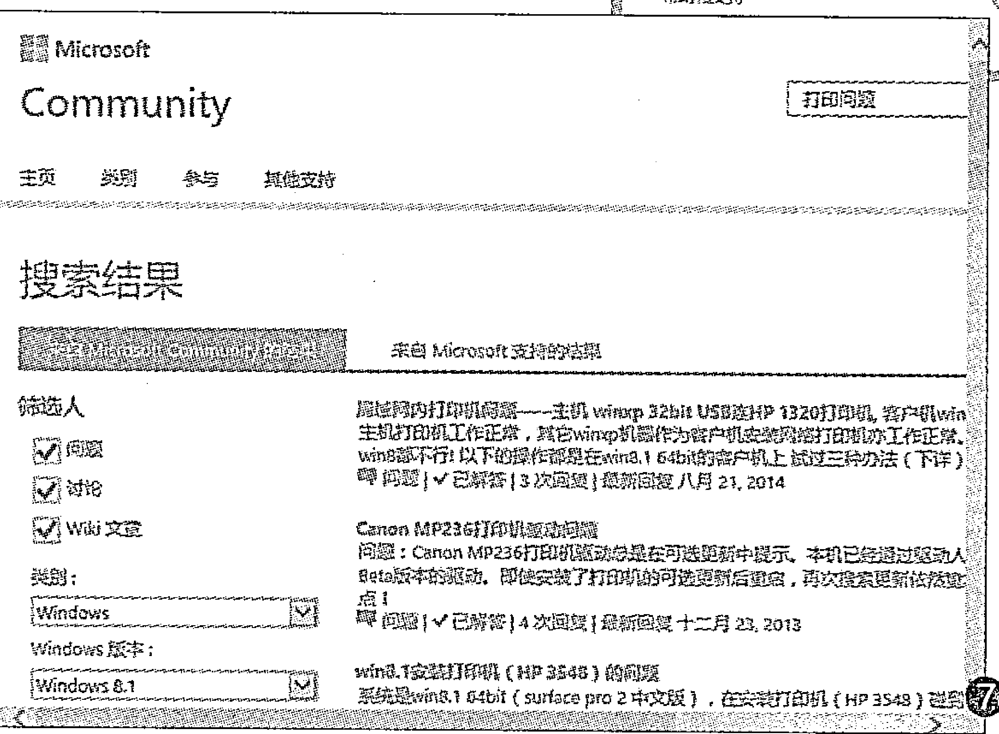

此外，我们可以连接微软社区论坛硬件和驱动程序页面（http://dwz.cn/Dpy5A），查看或搜索其他用户针对此设备的相关提问和有无现成的解决方案。当然，如果没有合适的答案，也可以留下情况的详细描述，说不定就会招来高手和热心人为你定制的驱动或解决方案呢（图7）。

此外，还可以安装驱动精灵、驱动人生等专用驱动管理工具，接上并打开打印机，用此类工具自动扫描系统打印设备，然后为打印设备安装驱动程序。注意需要联网下载驱动。

如果实在找不到最新版的驱动程序，还可尝试寻找设备在Windows 7下的驱动，让驱动程序以Windows 7兼容模式运行，或许可以解决问题。

## 晒晒Windows 10里的那些新功能

文|老万

微软发布Windows 10已经有一段时间了，它一般都是通过打补丁的方式进行一些小的升级，不过就在前不久，微软向外推送了一个编号为Windows 10 Build 9926的版本，其中有不少的升级修改，看上去着实令人动心。

## 兼容Chrome IE也玩双核心

微软在Windows 10刚刚发布的时候，就声称将同时发布一款名为Spartan（斯巴达）的全新浏览器。不过直到今天为止，还“只闻楼梯响，不见人下楼”。不过好在利用全新的9926内置的IE11浏览器，就可以提前感受到“斯巴达”的某些特点。

首先打开系统的IE浏览器，在地址栏输入“about:flags”并按下回车键。在弹出的试验性功能开启页面中，找到其中的“Enable Experimental Web Platform Features”这个选项，将其设置修改为“Enabled”后点击“Apply Changes”按钮，即可成功启用斯巴达浏览器专用的渲染引擎“Edge”（图1）。当我们重新启动IE浏览器访问浏览器内核查询网站的时候，将会惊奇地发现，它显示出“Chromium 31.0.1650.16”。原来，IE浏览器也成为双核浏览器了，而且另一核还是和谷歌浏览器同样的“芯”（图2）。

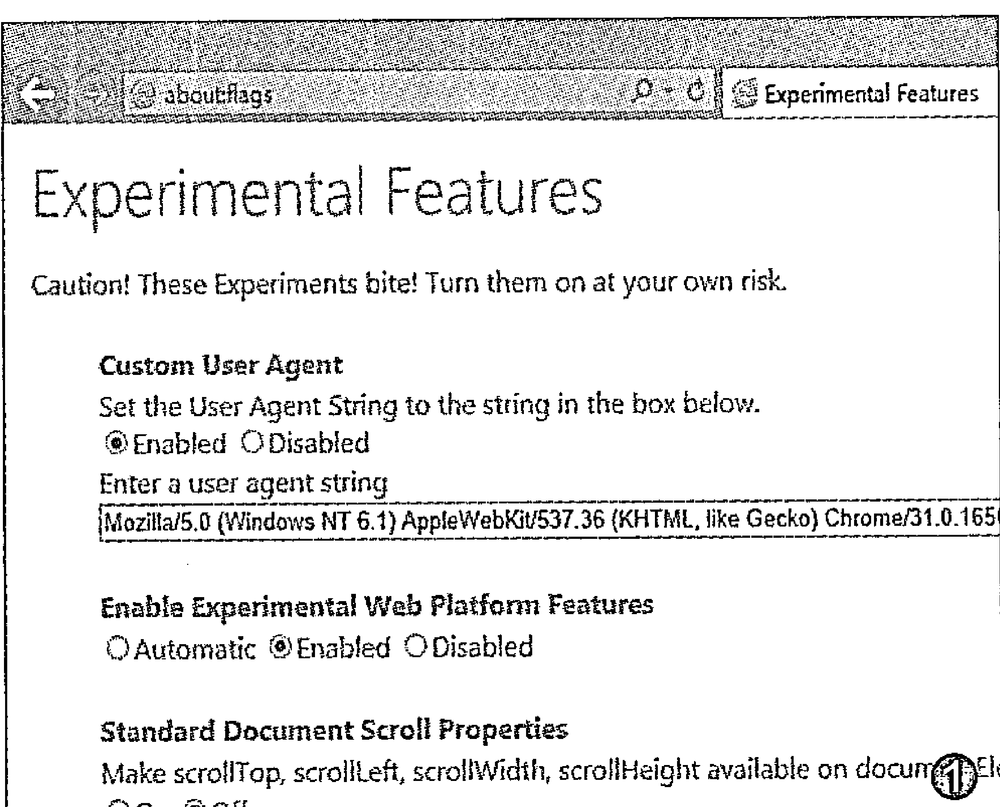

## 开启时髦的多任务闹钟

时间显示是很多人使用频率比较高的功能，但是Windows 10默认依然使用的是老版本的界面。其实在最新的9926版本里面，还隐藏着一个Modern样式的时间显示界面。和系统里面其他Modern组件一样，新的显示界面采用了扁平化的设计，视觉感官和色彩搭配上都更加适合时下流行的时尚。那么如何启用这个全新的显示界面呢？

首先按Win+R组合键打开运行对话框，输入“regedit”命令后回车，打开注册表编辑器，依次定位到HKEY_LOCAL_MACHINE>Software>Microsoft>Windows>CurrentVersion>ImmersiveShell。接着在注册表的右侧窗口中，点击鼠标右键并选择菜单中的“新建→DWORD (32位) 值”命令。通过鼠标右键中的“重命名”命令，将键值名称命名为“UseWin32TrayClockExperience”。其中的DWORD值不需要进行修改，保持默认值就可以了（图3）。接下来点击右下角托盘中的时间，即可看到最新的时间显示界面（图4）。

点击当前时间下面的“其他时钟”按钮，就可以查看到深藏在其中的其他命令。这其中包括四个子模块，分别是闹钟、世界时钟、计时器、秒表等。比如打开“闹钟”的设置开关后，点击下面的“新建”按钮，就可以创建一个新的闹钟任务。新功能允许用户同时创建多组闹钟任务，这样就不需要借助其他工具，来提醒自己需要完成的任务了。如果你经常出国或者在国外有亲戚朋友的话，那么“世界时钟”就非常重要，它可以帮助你了解当地的时间，同样点击下面的“新建”按钮，在搜索框里面输入当地的城市名称就可以了（图5）。

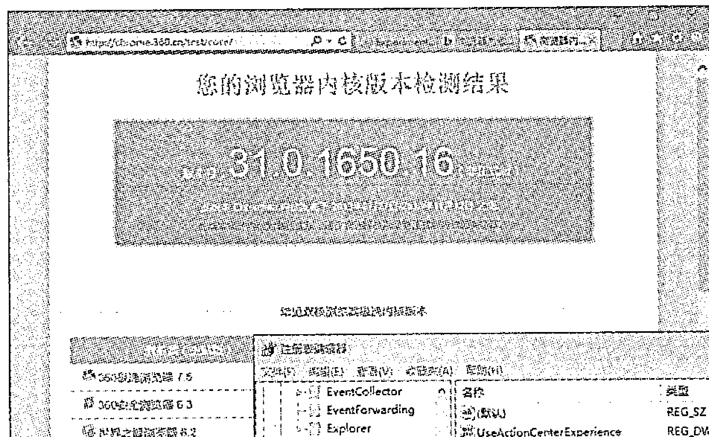

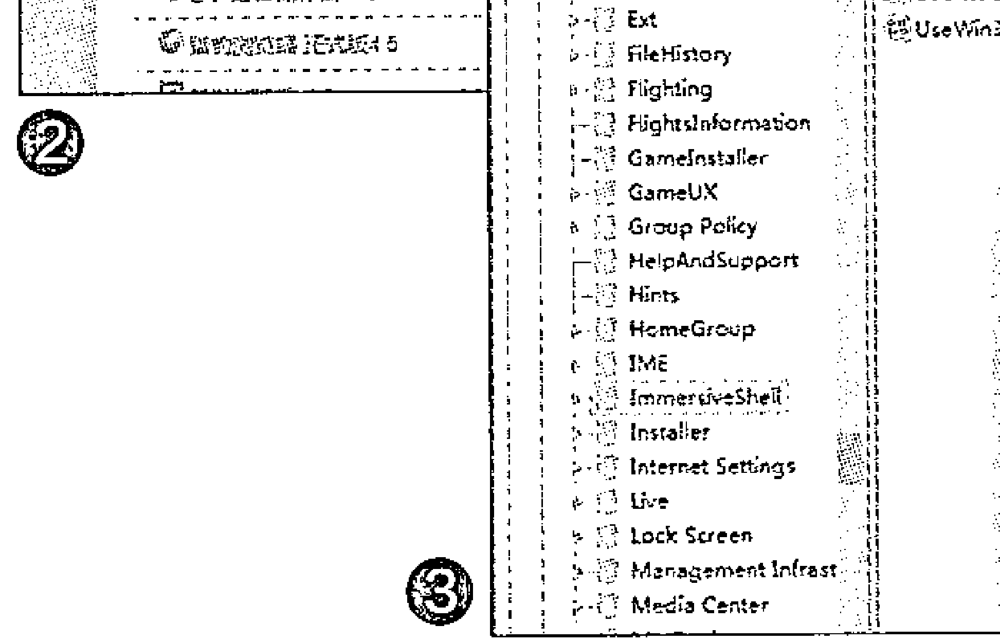

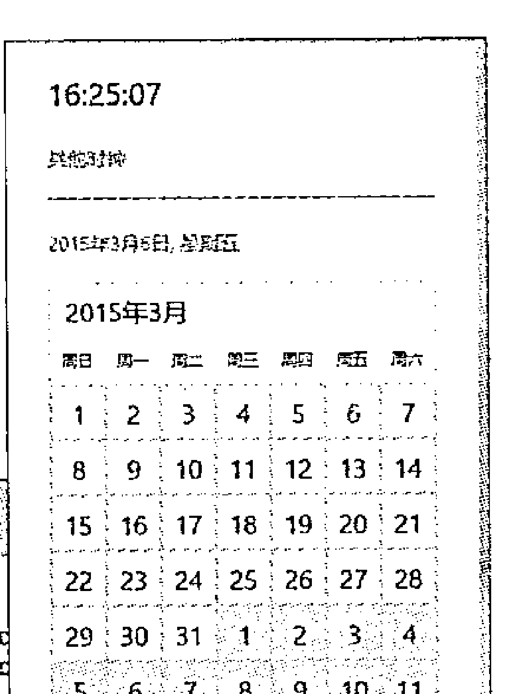

## 3 接管被消失的“超级按钮”

以前我们要进行系统设置操作，最常见就是打开系统的控制面板。而对于Windows 8及其以后的系统来说，通过“超级按钮”中的命令也可以进行设置。不过Windows 10中却取消了超级按钮，而有些功能在控制面板中也没有了。那么这些设置命令都去哪儿了？

原来在全新的9926这个版本里面，为了方便用户统一进行设置，微软对设置命令也进行了比较大的修改。控制面板中仍然保留了一部分的设置功能，但是要想找到所有的设置功能，那么就需要点击左下角的“开始”按钮，在弹出的菜单中点击“所有应用”命令，然后在展开的完整菜单中点击“Settings”命令。

在弹出的设置窗口中，用户可以进行分辨率的调整、网络连接的设置、系统时间的修改等（图6）。比如需要检查系统是否有新的安全补丁，那么只需要点击窗口中的“更新和恢复”按钮，再在弹出的窗口中点击左侧的“Windows更新”命令，这样系统就开始检测安全补丁的情况。如果发现有新的安全补丁，它就会马上进行下载和安装了。

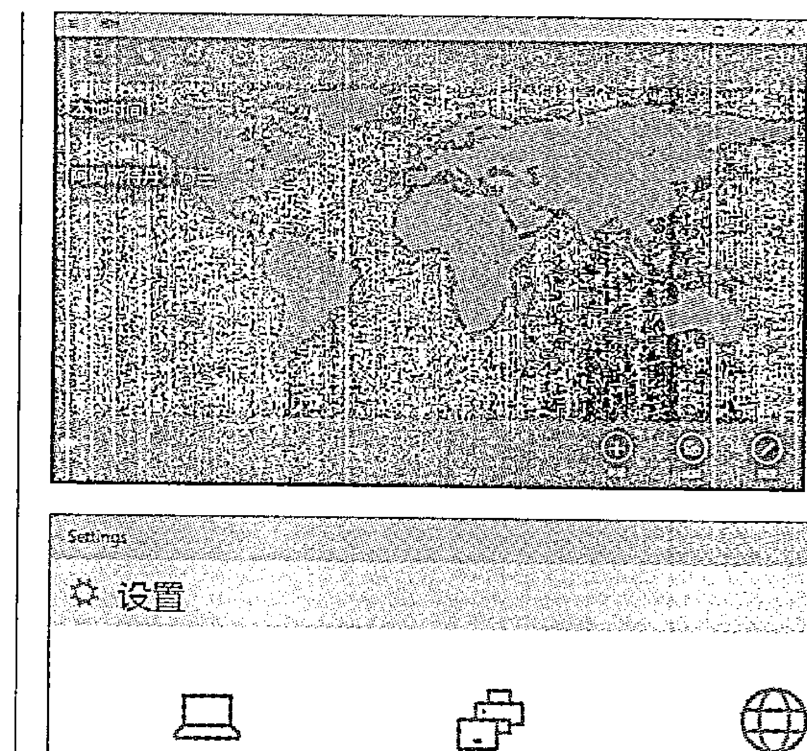

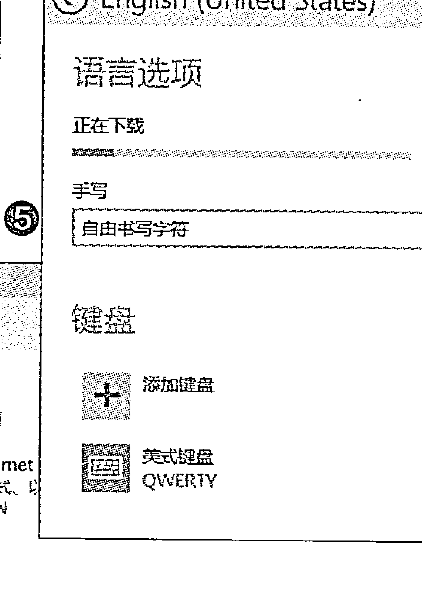

## 4 Windows Phone里请来的“小娜”

我们知道在Windows Phone系统中有一个名为Cortana（小娜）的智能语音助手，只是现在这个功能已经被集成到Windows 10中了。由于现在Windows 10还处于测试阶段，因此只有美国的用户才可以使用这项功能。不过如果想提前感受“小娜”的话，只要修改一下系统的所在区域就行了。

首先点击设置窗口中的“时间和语言”按钮，在弹出的窗口中点击左侧的“区域和语言”命令，再在右侧窗口的“国家或区域”列表中选择“美国”。接着点击“添加语言”按钮，找到语言列表中的“English”，然后选择“英语（美国）”并双击它。接下来在列表中找到刚刚添加的语言包，点击下面的“选项”按钮，在弹出的窗口中点击“下载”按钮（图7）。当语言包下载安装完成后，需要重新启动一次操作系统。

接下来在下方的搜索框中单击鼠标左键，在弹出的对话框中点击左上角的按钮，再在弹出的菜单中点击“Settings”命令。然后在弹出的对话框中开启“小娜”语音助手功能，稍等片刻在搜索框的右侧多出一个麦克风按钮，点击它后就可以和“小娜”进行交流了。当你说完“Hey, Cortana”后，不需要等待即可直接进行对话。

## 5 调出隐藏的新版声音控制

在9926版中，除了时间查看界面外，声音控制也有了较大的变化，不过要想使用它的话，仍然需要对注册表进行修改。

首先在注册表中展开HKEY_LOCAL_MACHINE\SOFTWARE\Microsoft\Windows NT\CurrentVersion\MTCUVC，如果没有MTCUVC这项的话就得自己创建一个。接着在右侧窗口中创建一个名为“EnableMtcUvc”的DWORD（32位）值，将其中的DWORD值修改为1就可以了。重新启动资源管理器或者重新启动系统，点击右下角托盘的音量图标后就可以看到新的声音控制界面了。

粗看新的声音控制界面很像一个半成品，其实如果电脑系统有多个音频设备的话，点击下面的“Make Default”按钮就可以在多个音频设备之间进行切换。不过暂时还无法对每个应用程序的音量进行单独的设置（图8）。

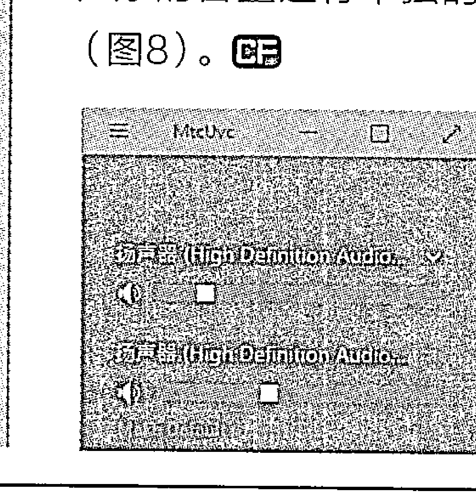

## IE冲突引发的网银服务故障 文|王成义

笔者在Windows 8.1环境下使用招商银行专业版网银进行生活自助缴费，查询欠费时对方服务出现问题，点击“想知道失败的原因吗”提示链接（图1），理应跳转到招行问题解决页面，但却出现了Windows 8.1磁贴界面，继而弹出一个360浏览器空白页面。产生问题之后首先咨询银行客服，答复是产生错误提示的原因是交易时间不在规定的时间段内（早7点之后）。看来问题不在银行，那么问题缘何而起？又该如何解决？

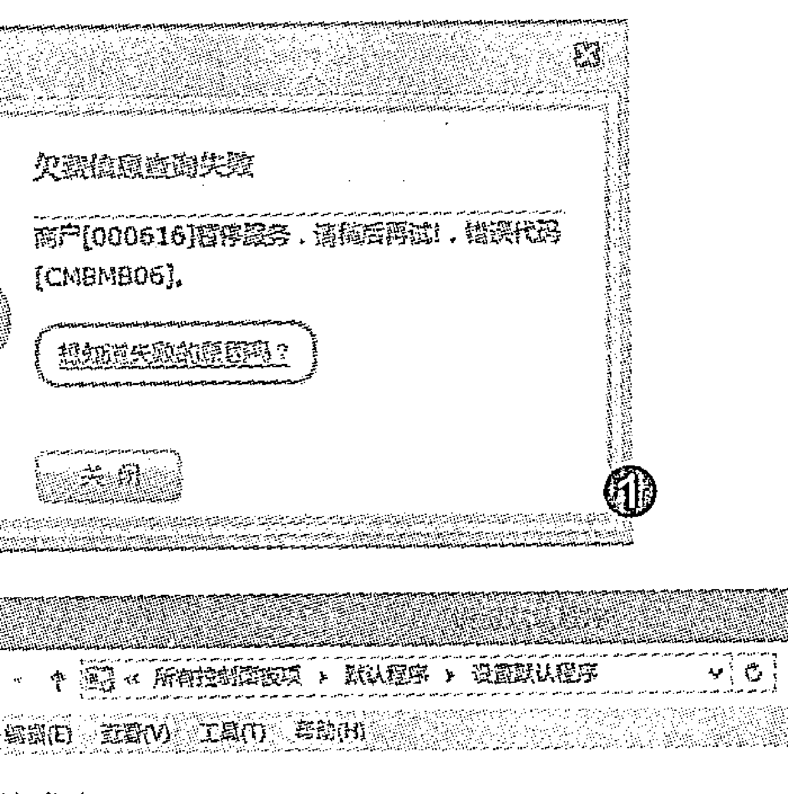

## 1 两种IE发生错乱

打开IE11“Internet选项”窗口“程序”选项卡，发现“IE磁贴用于打开桌面上的Internet Explorer”为选中状态，而且呈现灰色，无法取消选择。再看下面“将Internet Explorer设置为默认浏览器”文字链接为点亮状态（图2）。由此推测，这很可能是问题产生的原因之一。

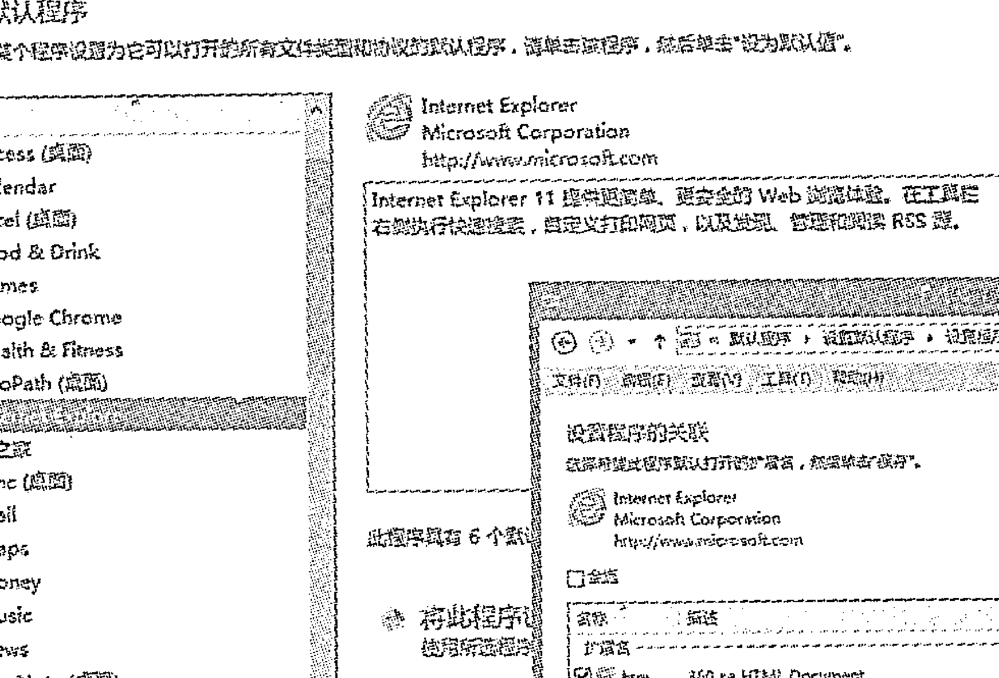

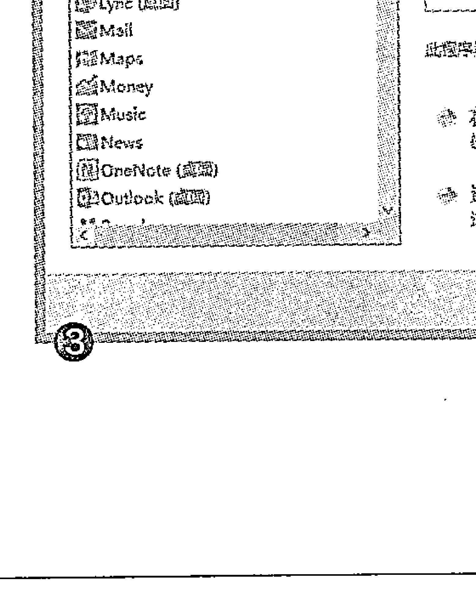

点击“将Internet Explorer设置为默认浏览器”文字链接，跳转到控制面板默认程序设置窗口，选择Internet Explorer一项，并点击右下角的“将此程序设置为默认值”恢复传统桌面IE权限（图3）。由于当前默认桌面版浏览器不是系统IE浏览器，而被设置为IE磁贴浏览器，因此，当网银调用传统IE时，自然地调用了磁贴版的IE，产生不兼容而无法打开页面。这时，将系统当前默认浏览器设置恢复为IE即可。

## 2 网页关联遭到替换

电脑中跳出空白360浏览器页面，可能是HTTP协议被设置为与360安全浏览器关联，因此，在网银调用默认浏览器时又开启了360安全浏览器，而网银涉及的页面是针对IE内核的，360安全浏览器为Google内核浏览器，又造成不兼容，未能打开页面，显示为空白页面。根据以上分析，进入控制面板，将所有360安全浏览器的默认扩展网页类型关联更改为关联Internet Explorer，即可恢复由IE管理所有类型的链接（图4）。以上两处设置更改之后，再次启动网银，已经能顺利进入招行问题解决页面，也不再弹出360浏览器空白页面了。

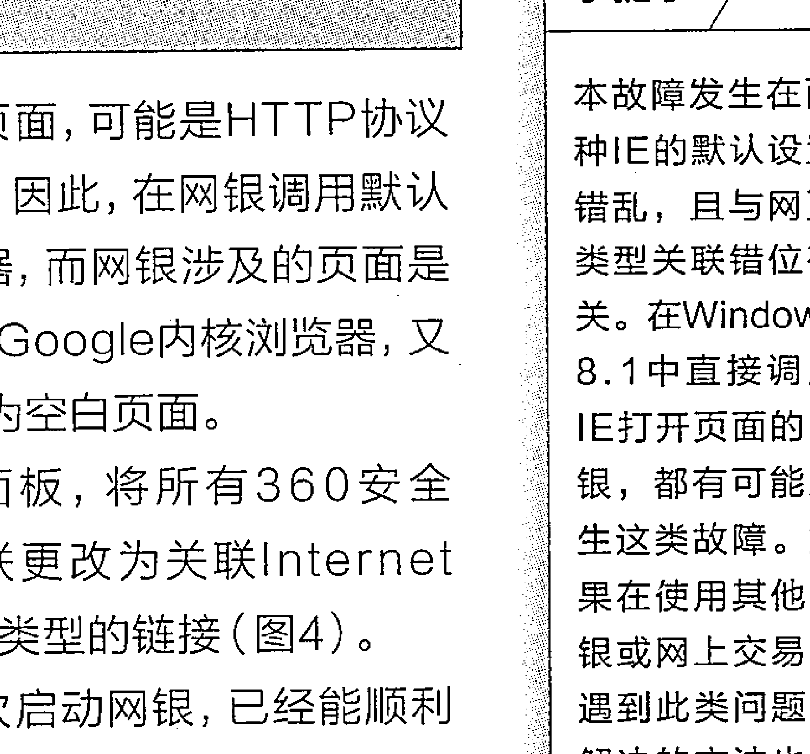

> 小提示
本故障发生在两种IE的默认设置错乱，且与网页类型关联错位有关。在Windows 8.1中直接调用IE打开页面的网银，都有可能发生这类故障。如果在使用其他网银或网上交易时遇到此类问题，解决的方法也基本相同。

## 轻松获知Windows系统信息

文|惜言

由于Windows 8/8.1版本升级频繁，且各种版本中功能的细微差异很大，因此了解自己当前所用的Windows版本很有必要。例如，同样是一个Windows 8.1企业版，经过多次升级之后内部版本编号会有所不同，那么用的是哪个版本呢？当别人问起时不能只告诉人家是8.1吧？就让我们一起来查查吧！

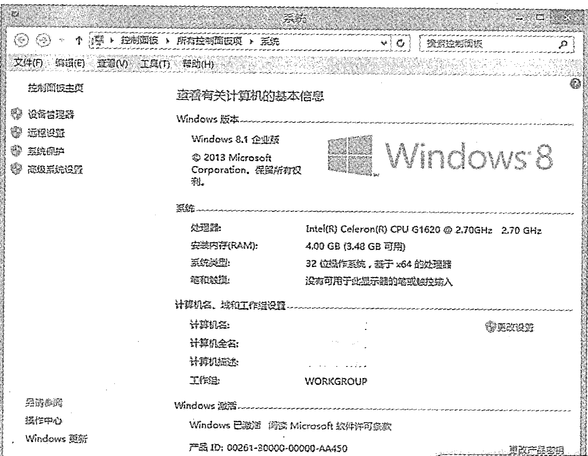

> **小提示**
虽然在“这台电脑”上单击右键并选择“属性”，可以看到当前所用的Windows系统的版本，但无法从中查看到内部版本号，因此我们有必要弄清楚进一步的查询方法。

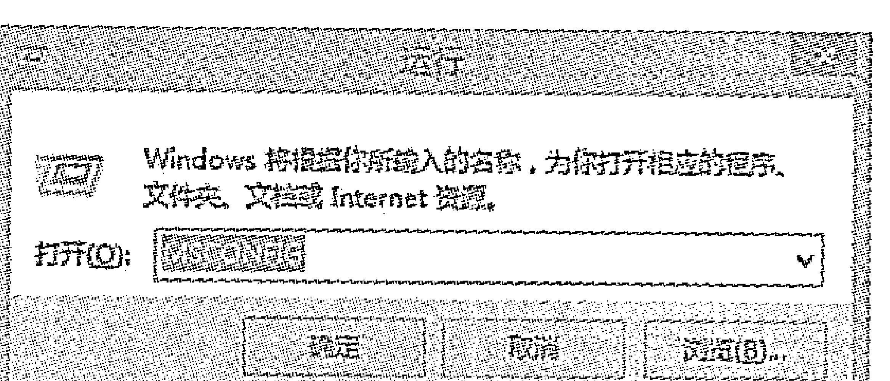

按下Win+R组合键启动“运行”窗口，输入“MSCONFIG”并确定。

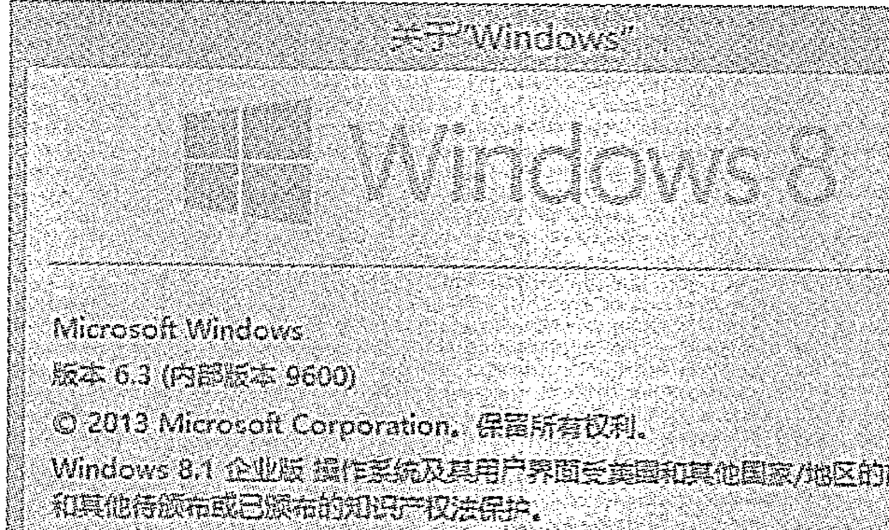

**小技巧**
在“记事本”软件窗口中，点选“帮助→关于记事本”也可以看到当前所用Windows的详细版本信息。此外，查看Windows内部版本号还有一个方法是，在命令提示符窗口中输入“VER”命令并回车即可获得详细内部版本号。

“关于Windows”窗口中具体显示出当前所用Windows的内部版本号。

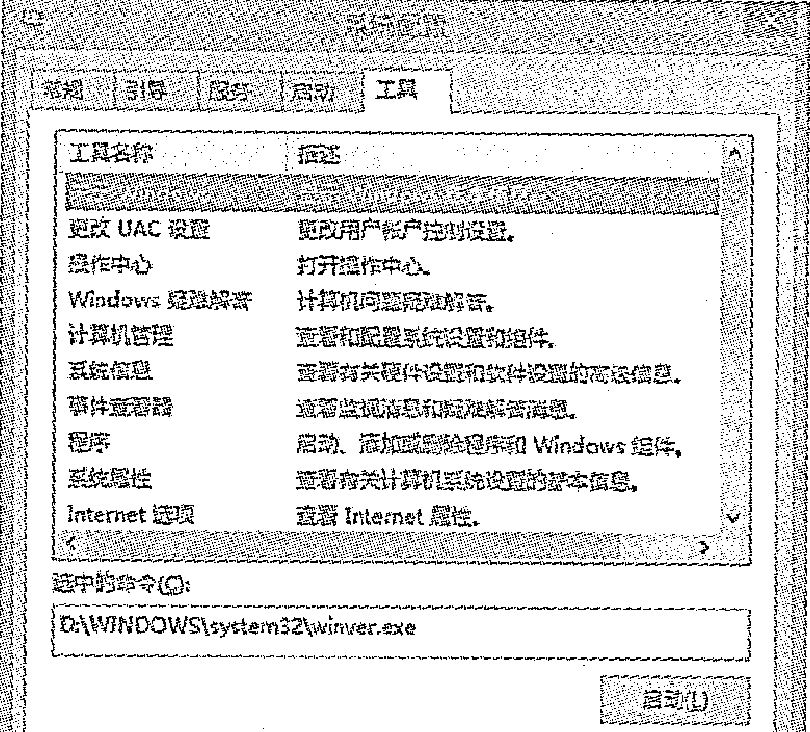

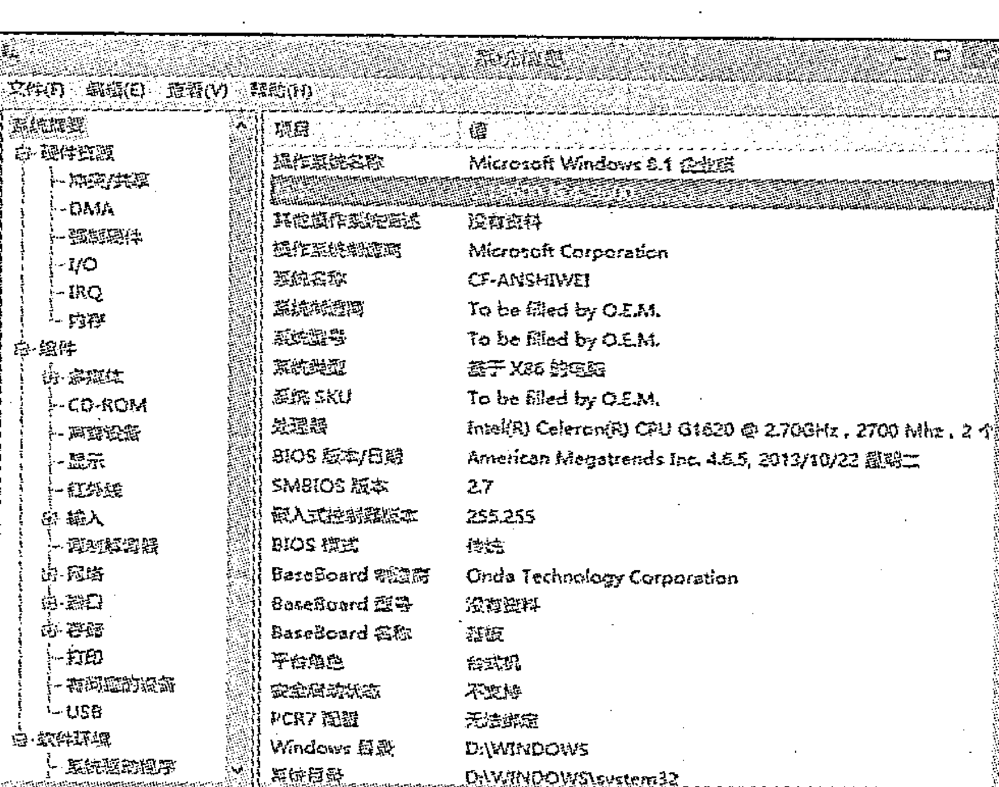

在“系统配置”窗口中点击“工具”标签，选择“关于Windows”一项后点击“启动”按钮。

如果需要查看关于硬件设置或软件设置更详细的信息，可在“系统配置”窗口的工具列表下选择“系统信息”，点击“启动”后，会看到关于硬件或软件分门别类的信息。

## 解决系统映像制作的麻烦

文成

在Windows 8.1系统中，本想通过制作C盘的系统映像来备份系统数据，但在制作时系统强行将数据盘D也选上了，且无法取消选择，无法排除对数据分区D的备份（图1）。要知道D盘中存有的资料对系统备份没有一点用处，这样备份下来纯属多余！那么，造成这个问题的原因是什么？又该如何剥离数据分区D，只制作系统分区C的映像呢？

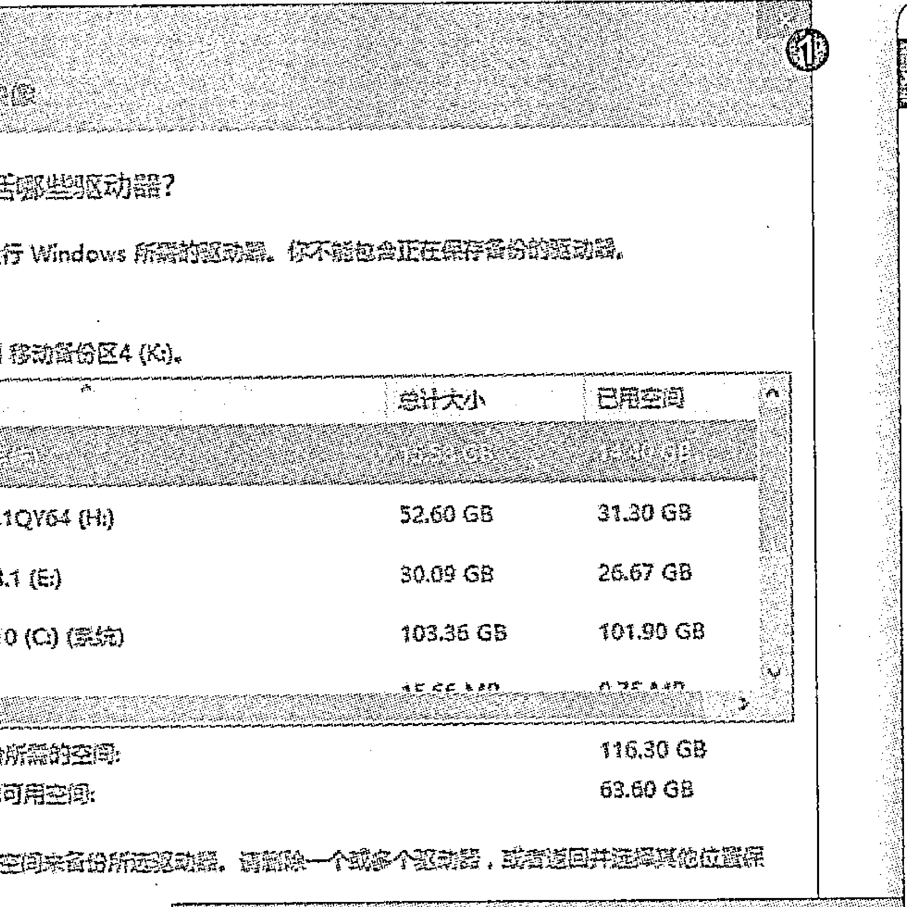

映像备份强行选择数据盘D

> 系统映像是运行Windows所需的驱动器副本。在Windows 8.1中虽然没有专设创建系统映像的控制面板项目，但该功能并没有被取消，拐弯抹角才可找到。要在Windows 8.1中制作系统映像备份，只需在开始按钮上单击右键，选择“控制面板”项目，在“所有控制面板项”中点击“文件历史记录”，然后在开启的文件历史记录窗口中点击左下角的“系统映像备份”（图2），即可进入系统映像制作窗口。制作时映像文件可保存在硬盘上、DVD上，也可保存在网络上（图3）。当需要恢复时，只需点击“文件历史记录”窗口左下角的“恢复”按钮即可。

## 1 异常现象的成因分析

从图1中我们可以看出，虽然D盘为用户数据资料盘，但在创建系统映像窗口的驱动器选项中，D盘的后面被标注了“系统”字样，这说明备份程序将D盘识别为系统盘。造成这种现象出现的原因，很可能是因为该盘中有系统相关文件造成的。我们只需找到这些文件并作相应处理，就可以解决问题。

> 右击开始按钮并选择“磁盘管理”进入磁盘管理程序，选中D盘，观察一下“状态”一栏中显示的分区情况，可以判断出D盘被系统识别为何种分区（图4）。如图可见D盘被判别为系统分区。

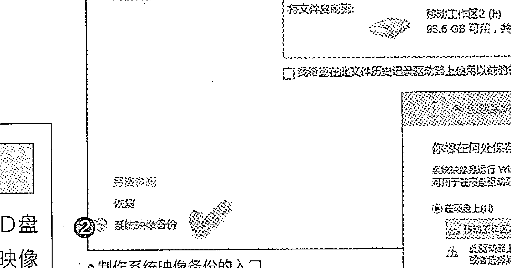

制作系统映像备份的入口

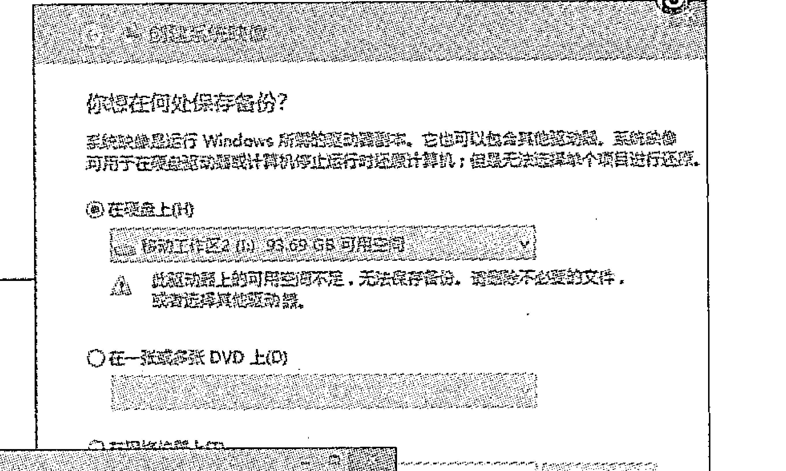

映像文件多样化的保存位置

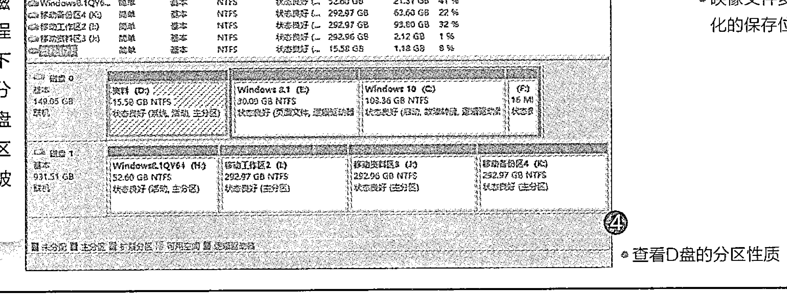

查看D盘的分区性质

## 2 处理解决的具体方案

### (1) 用户文件夹是否被迁移

"用户"文件夹下的"视频"、"图片"、"文档"、"音乐"等文件夹的存储位置默认是与系统盘位于同一个分区。但是，这些文件夹支持转移到其他分区。如果此前设置过将这些文件夹转移到D盘，那么，很可能备份程序会将D盘识别为系统盘。

要判别和解决这个问题，只需在这些文件夹上单击右键并选择"属性"，在属性窗口的"位置"选项卡中，就可以看到该文件夹是否被指向D盘。若在D盘，则重新设回到C盘即可(图5)。

### (2) 虚拟页面文件是否在D盘

系统的虚拟页面文件默认是与系统盘在同一个分区中，但Windows也支持虚拟页面文件的重新定向。我们常常会因空间问题或效率问题，自行或由工具来将系统虚拟文件指向到另一个驱动器上。如果有这种情况存在，系统备份程序也可能将存储虚拟页面文件的分区识别为系统分区而一同备份。

究竟是否存在这种情况，我们只需通过"控制面板→系统"一项进入系统设置窗口，点击左侧的"高级系统设置"(图6)，然后在"系统属性"窗口中点击"高级"选项卡中"性能"分组框下的"设置"按钮(图7)。接着再点击"性能选项"窗口中"高级"选项卡中的"虚拟内存→更改"按钮(图8)，在"虚拟内存"窗口中，我们就可以看到D盘中是不是存有当前系统的页面文件了。如果有，则可以将该页面文件改回到C盘。

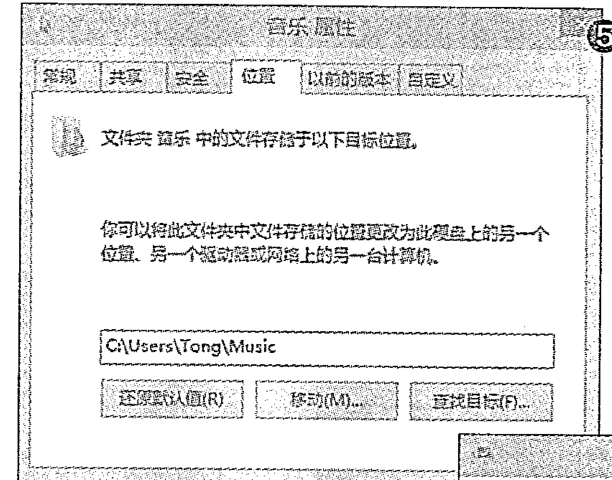

> 如果D盘中有空的Program Files文件夹，也会影响系统备份程序对分区类型的识别判断。这时，可将该Program Files文件夹删除，然后再进行系统映像备份。

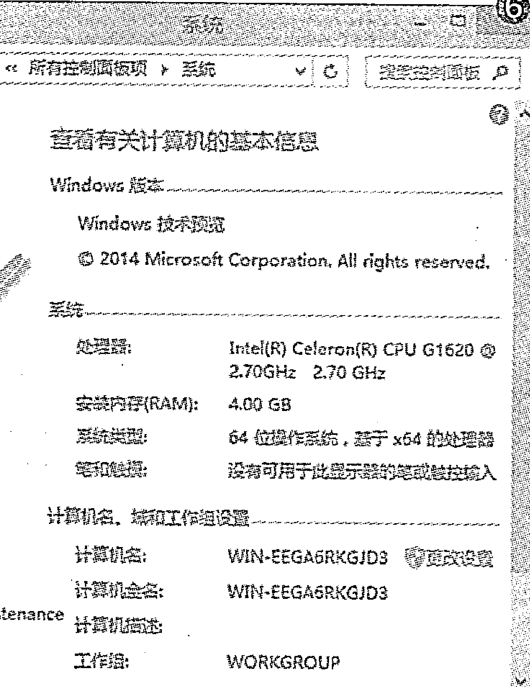

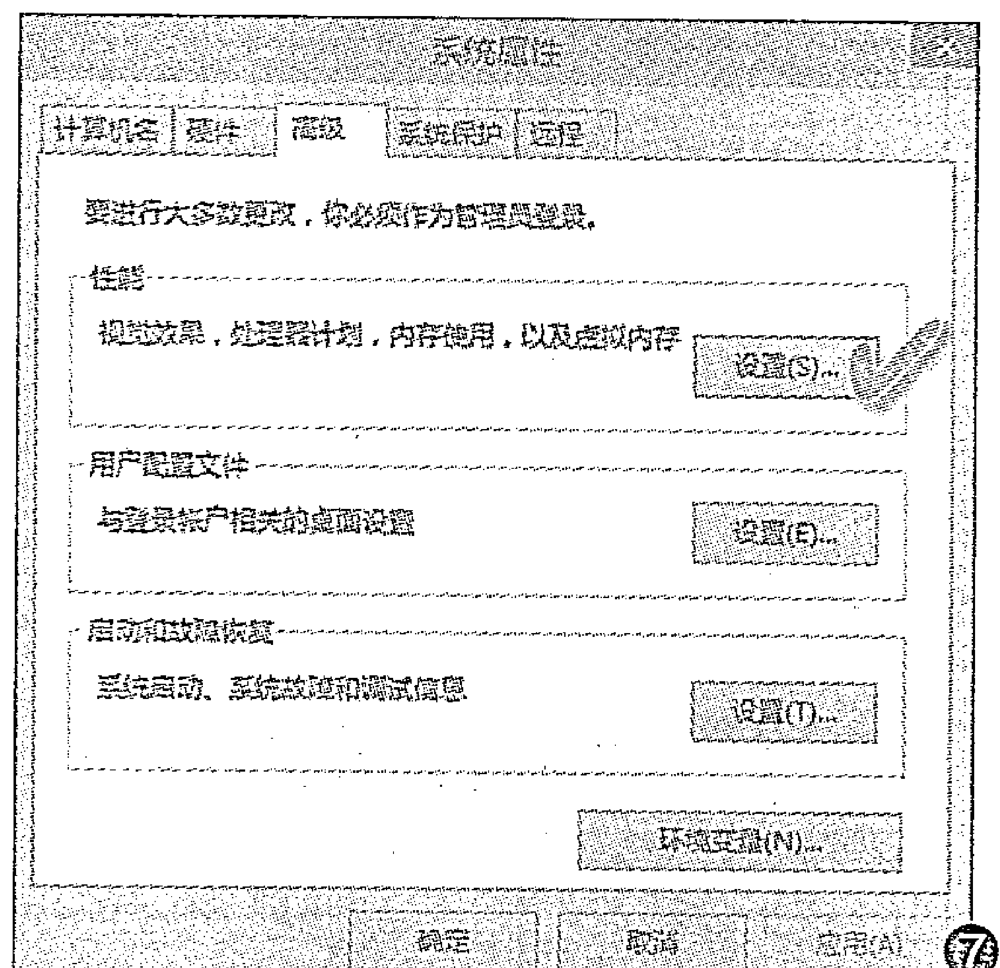

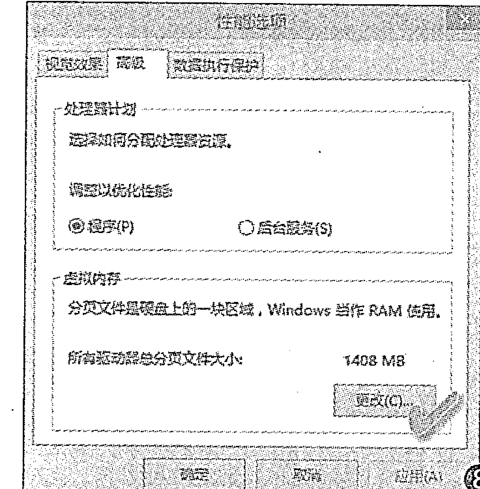

### (3) 是否将软件装在了D盘上

我们知道，在安装软件时，系统通常会默认将软件安装在系统盘的Program Files文件夹中。但是，如果用户自定义了软件安装路径，那么，完全可以将软件安装在D盘的Program Files文件夹中。而这也会引起系统对磁盘分区的误判断。

要查明真相，我们只需到D盘查看有无Program Files文件夹即可。如果有Program Files文件夹，且其中有已经安装的软件并是自己需要的，可通过搬家工具将软件统统搬移到C盘中。也可以先记录下软件名称，卸载之后重新安装在C盘中。排除了如上情况后，再进行系统映像备份即可。

## 《电脑爱好者》2015年合订本（上） 系统应用

## 用好Windows 8.1视图重组

文|高斯

Windows 8.1对系统文件的视图做了优化设计，如果我们能充分利用好该系统提供的各种文件视图功能，文件管理和处理工作效率将会大大提高。

### 1 图书索引式文件重组

大家一定对一些图书后面的关键词索引印象深刻吧！它们一般按0～9数字以及A～Z字母的顺序将所有关键词排列起来，这样当我们要查某个关键词的时候就能很快缩小范围，从而快速找到自己所需的项目。其实，在Windows 8.1资源管理器中，我们也可以采取这种方式来管理文件。

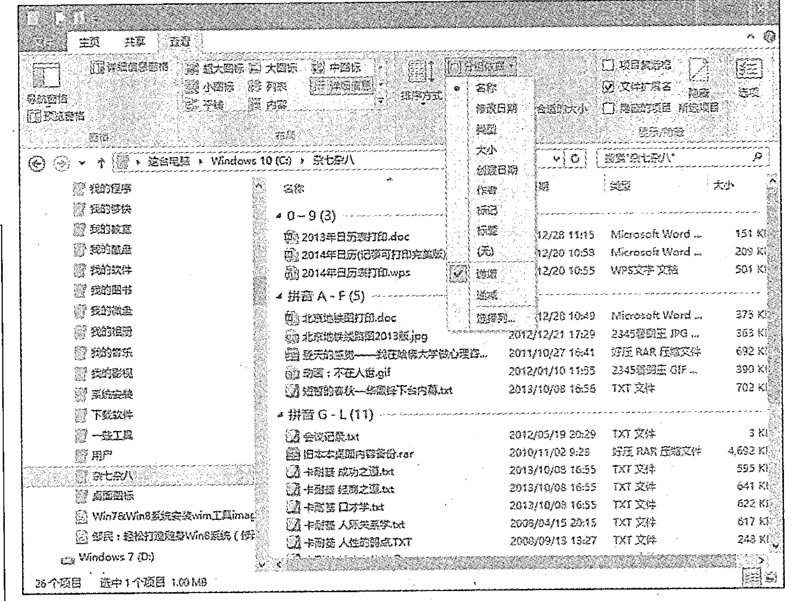

在文件资源管理器中打开一个文件夹，切换到“查看”选项卡，点击“布局”分组中的“详细信息”按钮，然后从“分组依据”下拉列表中选择“名称”，这样我们马上就能看到资源管理器中的文件列表以数字和字母索引的方式显示了。这样再去找某个文件，就可以做到一目了然了。

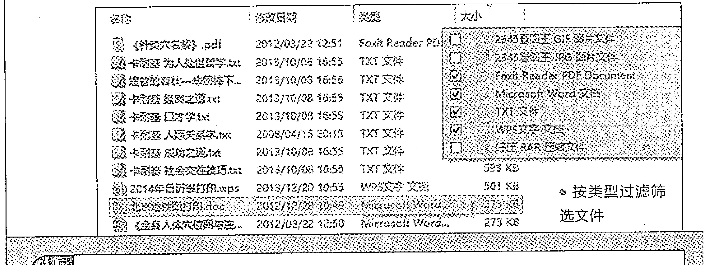

> 小提示
我们不但可以按图书索引的方式重组文件列表，而且索引的类别可不局限于文件名。通过“分组依据”选项，我们可以按自己的分组依据排列文件，比如按文件的生成和修改日期、文件类型或大小、文件作者等信息来分组。分组可选择递增或递减的形式排列。

### 2 纵横相结合筛选重组

如果我们只需要显示一个文件夹中特定类型的文件，且只需要显示出这些文件特定的属性项目，该如何去进行筛选呢？

首先进行纵向筛选。如果我们只希望显示出当前文件夹中的TXT、WPS、PDF、DOC等类别的办公文档，其他类型的文件一律屏蔽，我们只需在以详细信息显示的文件列表的“类型”标题上点击其小箭头图标，然后从下拉列表中选中所有我们需要的文件类型，这样符合条件的文件就被过滤出来了。

然后进行横向筛选。假设我们需要显示文件的名称、修改日期、类型、大小、创建日期等5项信息。这时我们需要在文件列表的标题栏上单击鼠标右键，然后从弹出的菜单中选择自己需要的项目，去掉自己不需要的项目。如果列表中没有自己需要的项目，单击“其他”一项，系统会列出更多的项目供选择。

> 电脑技巧
分组之后如何恢复到原始的不分组模式呢？文件在按任一种方式分组之后，在“分组依据”列表中会多出一个“无”的选项，选择此项即可恢复文件为不分组排列。

### 3 文件夹视图克隆重组

查看文件每个人都有自己的不同喜好。老人可能喜欢用超大图标来显示图片，而程序设计人员可能只关心图片的详细列表。而系统提供的默认显示方式却只是固定的一种，因此当我们打开不同的文件时，为了切换到自己喜欢的风格，每次都需要反复设置列表的样式。那么，如何根据个人喜好一统文件夹视图风格？

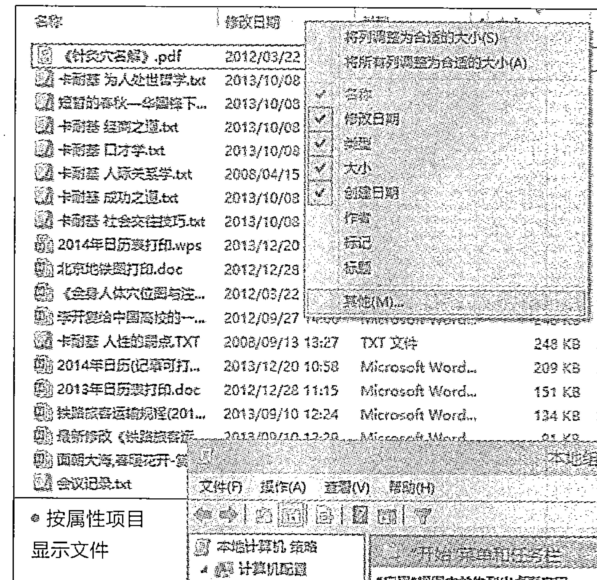

按属性项目显示文件

要达到这一目的，我们可以先选定并打开一个样本文件夹，将图标排列样式设置成自己需要的样式，例如设置为“超大图标”。然后切换到文件资源管理器窗口“查看”选项卡页面，点击最右侧的“选项”按钮开启“文件夹选项”窗口，切换到“查看”选项卡，点击“文件夹视图”分组下的“应用到文件夹”按钮，这样就可以将样板文件夹的样式应用到所有同类的文件上了。此后再打开同类文件夹，就会延续样板文件夹的显示模式。

小提示
在以详细列表显示的文件列表形式中，有时会因文件项目宽度设置不合理而造成文件项目显示不全或显示过宽浪费空间。这时可通过双击两个项目之间的分割线来自动调整项目宽度到最佳宽度。如果要一次性调整所有列的宽度到合适的位置，可点击“查看”选项卡中的“将所有列调整为合适的大小”选项。

### 4 Metro列表视图倒置重组

大家知道，在Windows 8.1的Metro界面程序列表中，首先列出的是Metro应用的程序视图列表。而我们早已熟悉的传统应用都被安排到“靠后站”的地位。那么，如果我们常使用的是传统应用列表，希望将它们排列在前部，是否可以实现呢？

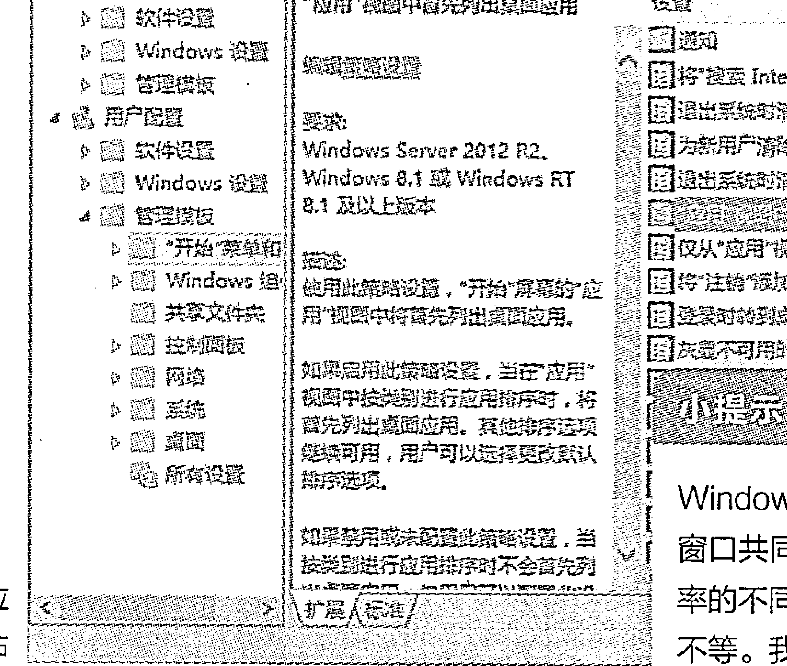

让Metro应用列表靠后站

我们可以借助于组策略编辑器来完成传统程序列表和Metro应用列表的大换位。右键单击“开始”按钮并单击快捷菜单中的“运行”，输入GPEDIT.MSC命令并确认。在本地组策略编辑器中，依次定位到“用户配置→管理模板→开始菜单和任务栏”，在右侧窗口中找到“应用视图中首先列出桌面应用”，双击并点击“已启用”按钮即可。

小提示 开始屏幕中的摘要视图
在Windows 8的开始屏幕中，摘要视图能帮助用户更加快速地搜索到想要查找的应用程序。你还可以按群组排列应用程序，方法十分简单，右键点击某程序，菜单会让你指定所选分组。对于小屏幕来说，该功能非常实用。

### 5 应用视图空间扩展重组

在Windows 8.1的Metro应用列表视图中，默认的显示空间也可以压缩，压缩之后的显示空间将更加宽裕，重组列表将能够容纳更多的显示项目。要实现应用列表空间压缩，只需在Metro界面屏幕右侧浮动面板中点击“设置→磁贴”，然后将“应用视图中显示更多应用”选项开关置于“是”的位置即可。

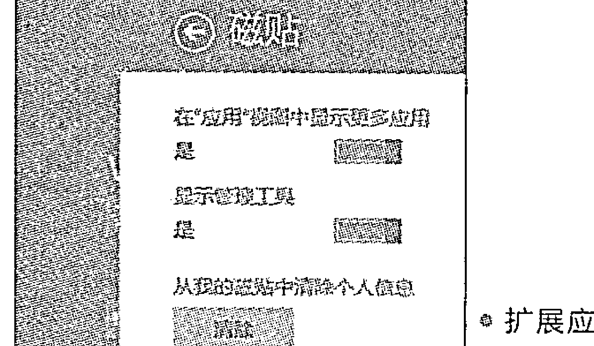

扩展应用视图空间

## 百度网盘还能这样用

文|杜娟

网盘除了保存数据、提供文件上传和下载功能外，还可以在我们的生活中发挥更多重要的作用。就拿百度网盘来说，常见的一些生活应用需求，其实在网盘中就能实现。一个网盘就能搞定的事，你还在用别的工具来实现吗？

### 1. 手机联系人去重

如果你曾经用过多部手机，或者买了手机后同时使用新旧两部手机，那么通讯录合并之后很可能出现不少重复记录。有的手机有通讯录去重功能（比如小米手机），但许多手机没有此功能，因此人们不得不去寻求各种解决办法。其实，只要拥有百度云账号，就能很方便地解决这个问题。

首先在Android或iPhone手机上安装相应版本的百度云应用。用手机百度云APP将手机通讯录上传到自己的百度云空间。点击“发现”，选择“手机备份”（图1），然后从下级窗口中选择“通讯录同步”（图2），在同步设置窗口中点击“立即同步”，将手机中的通讯录上传到百度云空间（图3）。如果同时使用多部手机处理新旧不同的手机联系人，请在不同的手机中使用同一账号登录百度云，进行通讯录的数据上传。

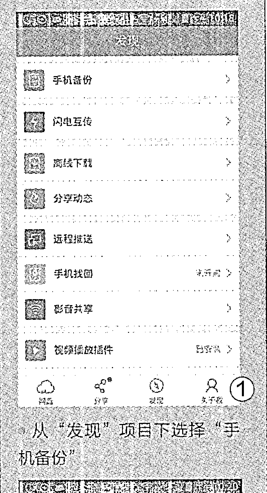

从“发现”项目下选择“手机备份”

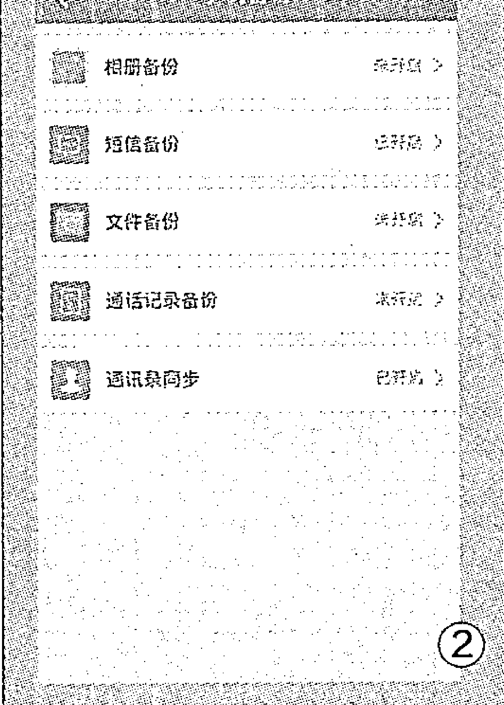

从“手机备份”下选择“通讯录同步”

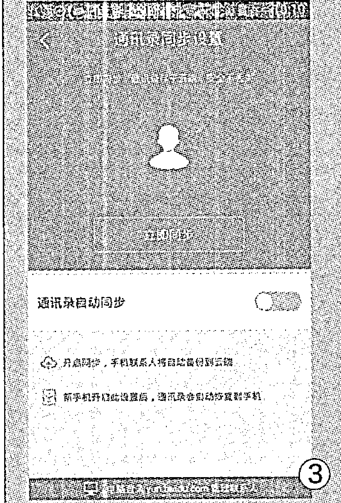

手机通讯录自动上传到云端

将多部手机的通讯录上传到百度云空间之后，用相同的账号登录PC版百度云，从位于标题栏上“主页”旁的“网盘”下拉菜单中选择“通讯录”一项，点击标题栏下方的“合并重复联系人”按钮进行联系人去重处理（图4）。

执行完上述任务后，你可以清空任一部手机的通讯录，然后登录手机百度云客户端，进入通讯录同步设置窗口，点击“立即同步”按钮，这时系统会将去重之后的通讯录信息下载到手机中。这样，手机中的通讯录就不再有重复记录了。每部手机都进行同样的操作，就可以保证每部手机中的通讯录都不含重复记录。

### 2. 建立网络短信仓

手机里短信多了会占用空间且查询不便，因此不少人喜欢定期清空短信。但是，这些短信中可能会有一些有历史意义或以后还可能用到的信息。那么，有什么办法能同时实现减轻手机负担和留存历史记录呢？

在手机中登入百度云应用，选择开启短信备份，将本机短信备份到云盘，然后清空手机短信记录。当日后需要查看历史短信内容时，只需在PC端登录百度云账号，然后通过云盘主页第二列的下拉菜单选择“短信”，进入后即可浏览短信历史记录（图5）。

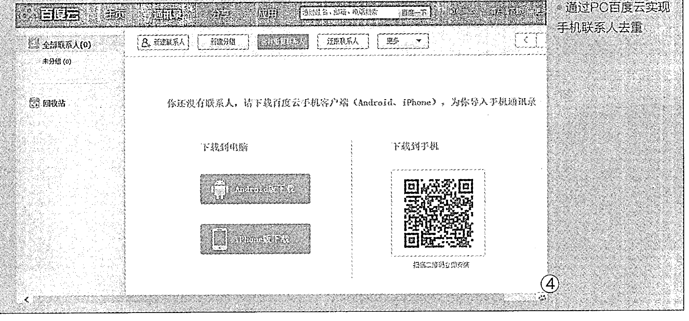

通过PC百度云实现手机联系人去重

> 如果有多部手机，只需在每部手机上用相同的百度云账号登录，然后将短信上传到云盘，即可在云端一并显示多部手机中的短信历史记录。

### 3. 记事本藏在云盘中

说起生活记事，大家多用印象笔记、有道云笔记之类的应用来实现不同平台和设备的记事内容同步。其实，如果你的设备中已经有百度云客户端，则可以免去安装这样那样的专门记事本。

你只需在PC端或iPhone、Android手机中打开自己的百度云账号，然后从网盘界面中切换到“记事本”，就可以书写内容、拍摄图片、录制语音，最后保存为记事文件即可（图6）。

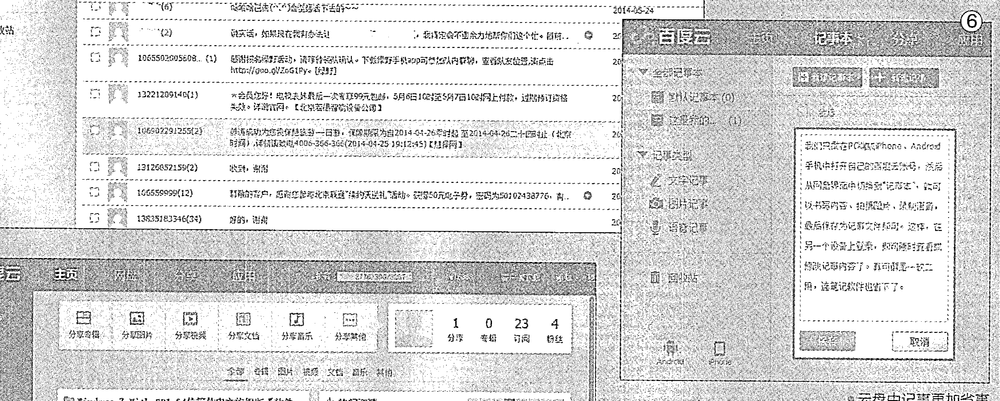

这样，在另一个设备上登录自己的云盘账号，也可随时查看或修改记事内容了。真可谓一软二用，连笔记软件也省下了。

### 4. 轻松找到关注的资源

许多人在百度网盘中关注了一个有好资源的网友后，却找不到该用户的链接了。上百度查查你就会发现有许多人都在问这个问题，其实这个问题的解决办法很简单。

只要进入你的网盘的Web页面，点击“主页”文字链接，然后点击上端分享动态页中的“订阅”链接（图7），即可进入你收藏的网友列表，点击网友昵称，即可看到其共享的资源了（图8）。


> 若发现资源后又忘记了关注某网友，只记得其共享的资源名称，还可以通过“网盘屋”搜索引擎，进入后用关键词搜索该用户的资源，找到后点击“订阅”按钮即可关注。


## 邮箱不爆满 丢失不再愁
文|李毅龙

常用邮箱如果始终将邮件留在服务器中，邮箱可能会爆满。但如果看完即删，则以后就无法找到；若将邮件下载到本地后删除服务器邮件，一旦本地硬盘损坏，服务器上邮件也已被删，历史记录荡然无存。能否做到防止邮箱爆满和邮件丢失两全其美呢？

利用Foxmail的自动邮件处理和远程邮件管理功能，结合云盘单向自动备份，可解决邮箱爆满和邮件丢失的两大问题。

> 小提示
> 如果使用的是Foxmail 7.0，则需要在“账号管理”窗口的“服务器”页面中设置自动收取邮件的时间，并在“保留备份”页面中设置“不保留邮件备份”（图2）。

### 1. 本地自动收取 远程自动删除

如果在本地安装Foxmail邮件管理器，让该软件在系统启动时自动开启，同时设置每隔一定时段自动收取特定邮箱，与此同时，再设置远程服务器在本地收取邮件之后自动删除服务器端邮件备份，那么就不用担心服务器端邮件爆满了。

所有邮件均保留在本地硬盘，也不用担心因上不了网而关键时刻无法找到历史邮件了。

设置邮件自动收取和删除服务器备份的方法，在Foxmail 6.5经典版中，右键点击邮箱名称并选择“属性”，然后选择“接收邮件”一项，将“在服务器上保留备份”一项选择去掉，然后选中“每隔XX分钟自动收取新邮件”，确定即可（图1）。


### 2. 监视本地邮箱 网络自动备份

本地保存收取所有邮件，虽然解决了无网时翻看邮件的问题。但是，本地邮箱有一个最大的安全问题，那就是一旦硬盘出现故障，历史邮件全部丢失。

这时因为先前将服务器端的邮件自动删除了，所以邮件将完全无法找回。这时也许你会想到每天备份本地的Foxmail工作邮箱，但是备份工作很容易因工作繁忙而忘掉。其实，我们可以巧妙利用云盘的自动上传功能来解决问题（注意是“自动上传”而不是“自动同步”）。

为了保险起见，建议使用实力较强的云盘，百度云和360云是首选。进入百度云管家设置窗口，点击“基本”页下的“管理”按钮，在“管理自动备份”的窗口中点击“添加文件夹”，从资源管理器中选择添加Foxmail所在的文件夹（图3），然后点击“备份到云端”按钮。这样设置之后，让百度云管家时刻处于运行状态，就会随时监视Foxmail目录，并实时将更改的文件上传到你的云空间中。

> 小提示
> 如果使用360云盘，则需要安装360云盘标准客户端（非同步版客户端）。点击“功能大全”后选择“自动备份”，将Foxmail文件夹添加到自动备份列表中即可。

## 软件应用 去除批量身份证号
文|奚江

将一大批不具有成批命名规律的文件名更改成另一些不具有规律的文件名，单靠更名软件本身无法实现。如果将编辑软件和文件更名软件相结合，就能轻松实现批量不规则文件的更名。

图1为某社会大学的学生照片目录，照片采集时每个学生的照片文件名均是以学生姓名后紧跟身份证号码命名的。在一次业务往来中，合作公司要求提供学生照片，但没必要将身份证信息透露给对方。因此，校方希望快速将学生照片文件名上的身份证号都去掉，只保留学生姓名。这用更名软件显然不好实现，人数太多，手动更改太麻烦。如果用更名软件与编辑器联合就能很好地解决这个问题。


### 导出更名列表

选用经典更名工具拖把更名器，启动后将学生照片文件加入到更名窗口中。点击工具栏上的“导出当前文件列表”按钮，将当前文件列表导出到一个文本文件list.txt中。

### 温馨提示

### 更名错误和注意事项

以上更名方法效率很高，更名成百上千人员列表只需几秒钟。但是，更名过程中需要注意一点，由于更名是借助于一个文件名列表list.txt进行的，列表中的姓名次序不能有丝毫更动，包括空行也不能有，否则会造成更名错乱，人与照片不匹配。此外，本例是以18位身份证理想化状态处理的。如果列表中有非18位的身份证号码，如军官证或其他特殊证件，则需要在编辑器成批替换结束后手动处理一下这些号码，确保名字后不留任何号码，然后再进行更名操作。

### 消除身份证号

启动EmEditor文字编辑器软件，打开上述list.txt姓名列表文件。按下键盘Ctrl+H组合键，在弹出的替换窗口的“查找”框中输入18个半角空格，再输入一个$半角字符，在“替换为”框中不输任何内容，选中“使用正则表达式”复选框，然后点击“替换全部”按钮。


| 姓名 | 身份证号 |
|------|----------|
| 曹戈然21 | 37108319921021101X |
| 丁卫斌32 | 37020519920322101X |
| 范兆侠37 | 37020519920322101X |
| 冯凯370 | 37020519920322101X |
| 高林风37 | 37020519920322101X |
| 高梦霞37 | 37020519920322101X |
| 葛松林37 | 37020519920322101X |
| 郭克芹37 | 37020519920322101X |
| 贺伟370 | 37020519920322101X |
| 纪海鹏37 | 37020519920322101X |
| 李澄370 | 37020519920322101X |
| 李春廷37 | 37020519920322101X |
| 李大性63 | 37020519920322101X |

后点击“替换全部”按钮。这样窗口中所有身份证号码都将消失。保存文件（图2）。

### 导入列表更名

之后，再回到拖把更名器窗口，点击“调用文本文件更名”按钮，将文本list.txt导回到更名软件中，按下Ctrl+E组合键实现成批照片去身份证号更名（图3）。回到资源管理器再看，所有名字后面的身份证号都去掉了，只剩下以姓名命名的照片文件（图4）。


## 干完活儿关机 让电脑听话
文|黄平山

现在有些软件带有完成任务自动关机功能，例如迅雷、百度云管家等，但不是所有软件都带有这样的功能。当你在晚上睡觉前让一个没有自动关机功能的软件自动为你处理一个不能预测完成时间的大任务时，由于不好确定几点能完成任务，因此定时关机软件也派不上用场。遇到这种情况，有什么办法能应对呢？

### 1. 创建自动关机任务

以使用Windows 8.1为例，执行“任务计划程序”。点击任务计划程序窗口右上角的“创建任务…”，在“名称”框中输入“夜间完成任务自动关机”。为了保证关机操作不因权限不够而中止，因此需要选中“使用最高权限运行”复选框（图1）。

> 小提示：Windows 8.1中调出任务计划程序的方法是，通过“开始屏幕”超级浮动面板设置“显示管理工具”，然后在磁贴界面中执行“管理工具→任务计划程序”。

### 2. 设定关机操作指令

接下来为任务设置关键性指令。切换到“操作”选项卡，点“新建”按钮，打开“新建操作”对话框。选择“操作”为“启动程序”，在“程序或脚本”框中输入关机命令shutdown，在“添加参数”后的文本框中输入参数/S /F，参数/F表示同时停止当时运行的一切程序（图2）。填好之后，点击“确定”。

### 3. 创建空闲关机条件

最后设置关机的条件为系统空闲之时。切换到“条件”选项卡，选中“仅当计算机空闲时间超过下列值时才启动此任务”前的复选框，然后在后面选择空闲超时值，这样可以避免你正在操作电脑时电脑强制关机（图3）。切换到“设置”选项卡，设置任务重启频率为30分钟，重新尝试次数为3次。这样如果到关机时间仍在使用电脑，计划任务会在30分钟后再次试图关机；如果电脑到时候仍不空闲，计划任务再等30分钟，如此类推重新尝试3次（图4）。以上两个参数可根据自己的情况改变。经过如上设置，睡前只管安排电脑执行任务，自己就可以放心睡大觉，再也不用半夜爬起来看电脑是否执行完任务而惦记着手动关机了。


## 开源库“绕路”为网站提速
文|倚楼

很多用户在访问一些由WordPress搭建的博客时，会发现加载速度很慢甚至有点卡。通过地址栏的提示可以看到，浏览器在后台访问的是fonts.googleapis.com这个链接，这应该是导致问题的根本原因。

### 注册表一键解决

之所以出现这样的问题，是因为包括WordPress在内的很多网站程序在开发时，都使用了谷歌提供的JS库、CSS库、字体库等资源库。由于谷歌的服务在国内访问较慢，因此在浏览使用这些服务开发的网站时也就比较慢。所以最简单的解决方法，就是在浏览器访问谷歌资源库的时候，让其自动跳转到国内的镜像服务器。

如果使用的是谷歌浏览器，只需要通过一个注册表文件就可以解决。首先进入到这个注册表文件的开发主页（http://tinyurl.com/m87paux），找到其中介绍为“force_install_for_windows.reg”的链接（图1），右击，选择“链接另存为”下载。然后以管理员权限运行刚刚下载的注册表文件，完成后重启浏览器，就可以快速访问这些资源库链接了。

> **小提示**
> 笔者测试时发现，上面的方法只适用于安装版的谷歌浏览器。如果用户使用的是绿色版谷歌浏览器或者谷歌的衍生浏览器（如国内的一些主流浏览器），可以登录到谷歌的应用商店，搜索并安装一款名为gooreplacer的扩展。以后当用户访问谷歌资源库链接的时候，这个扩展就会自动跳转到中国科技大学的镜像网站。

### 重定向绕道国内服务器

前面的扩展只针对谷歌浏览器，如果是使用火狐浏览器的用户就需要另想办法。不过好在原理已经找到了，所以首先通过“附加组件管理器”窗口，为浏览器安装一款名为“Mason”的扩展。安装完成后在附加组件列表中找到Mason这个扩展，点击该扩展名称下面的“选项”按钮，就可以在弹出的窗口进行重定向设置。

首先在配置窗口中点击“添加”，再在弹出对话框的“描述”中任意设置一个名称，本例设置为“Google字体库”。接下来在“包括地址”选项中，输入Google字体库本来的链接“fonts.googleapis.com”（图2）。然后在“功能”列表中选择“重定向”这项，点击“配置”，在弹出的对话框中输入新的链接网址“fonts.useso.com”即可（图3）。设置完毕点击“确定”退出配置窗口，接下来再次点击“添加”按钮


继续操作，分别将“ajax.googleapis.com”重定向到“ajax.useso.com”，“fonts.googleapis.com”重定向到“fonts-static.lug.ustc.edu.cn”，以及“themes.googleusercontent.com”重定向到“themes.lug.ustc.edu.cn”等。

> **小提示**
> 如果觉得一个个设置太麻烦，也可以在网上搜索网友制作好的googleapis.mason配置文件，通过“导入”功能导入规则列表即可。

### 从源头一次性解决

其实作为网站的管理者，可以从源头来解决这个问题。以使用WordPress搭建博客的用户为例，首先在程序目录中找到script-loader.php这个文件，接着用文本编辑器打开它，将其中的“fonts.googleapis.com”代码替换为“fonts.useso.com”，修改完成以后将编辑好的文件上传到服务器就可以了。

> **小提示**
> 在配置窗口中勾选刚刚添加的规则，分别点击“应用”和“确定”，根据提示重启火狐浏览器即可。以后当访问到这些资源库链接的时候，该扩展就会自动重定向到设置的新链接了。

## 禁用SSL 3.0 免遭“贵宾犬攻击”
文|万立夫

SSL本来是为网络通信提供安全保证的一种网络协议，但是最近爆出该协议采用的3.0版本存在一个名为“贵宾犬攻击”的安全漏洞。为此很多浏览器开发商宣布，将在未来的浏览器版本中放弃SSL 3.0的使用。而对当下的浏览器用户来说，禁用SSL 3.0不失为暂时的保护方法。

### IE浏览器禁用SSL 3.0

各种各样的浏览器很多，但是Windows系统自带的IE浏览器仍然是很多人上网的首选，所以这里介绍IE中如何禁用SSL 3.0。首先进入IE的“Internet选项”设置窗口中，切换到“高级”选项卡，将“使用SSL 3.0”选项前面的对钩去除（图1），点击“确定”后重启IE浏览器，以后它在进行数据传输时就会禁用SSL 3.0服务了。这种禁用方法，也适用于那些使用IE浏览器内核的外壳浏览器，以及国内的许多双核浏览器。


> 小提示：当上面的设置修改完成后，建议大家通过浏览器访问该漏洞的检测网站进行检测（https://www.poodletest.com）。如果出现“Not vulnerable”这样的提示，说明漏洞已经被封堵，否则就需要检查刚刚的修改操作是否有误。

### 强制使用较高协议版本

当然也有不少用户已弃用IE，而选择了更加简洁的谷歌浏览器，这款浏览器可通过以下方法修改。点击桌面的谷歌浏览器图标，选择“属性”，在弹出的属性窗口中找到“目标”，在软件默认的信息后面加上“--ssl-version-min=tls1”这个参数。假设默认的目标信息为“D:\Program Files\chrome\chrome.exe”，现在就修改成“D:\Program Files\chrome\chrome.exe --ssl-version-min=tls1”即可（图2）。重启谷歌浏览器后，它就会强制使用TLS 1.0服务为安全协议的最低版本，而放弃使用存在漏洞的SSL 3.0服务。


另外还有不少使用火狐浏览器的用户，那么首先在浏览器的地址栏中输入命令“about:config”，按下回车键就会弹出一个提示窗口。直接点击“I’ll be careful, I promise”的按钮后，进入到火狐浏览器的设置界面里面。在设置界面的搜索框中输入参数名称“security.tls.version.min”，搜索到后双击运行它，在弹出的对话框中设置成“1”（图3），设置完毕点击“确定”。重新运行浏览器，这样火狐浏览器在进行数据加密传输时，同样就会采用安全程度更高的TLS 1.0服务，而不是已经存在安全漏洞的SSL 3.0服务了。


> 小提示：无论是使用火狐还是谷歌浏览器，有些用户会通过MyFirefox、GreenChrome等引导器来制作浏览器的绿色版。如果是使用这类浏览器的话，那么在引导器中进行设置即可。如使用GreenChrome引导器的用户，只需要通过文本编辑器打开它的配置文件GreenChrome.ini，在“追加参数”下面加上“--ssl-version-min=tls1”这行代码（图4），关闭保存这个配置文件并重新启动浏览器，这样就可以使用较高的协议版本进行信息加密了。


## 提取QQ自带的新头像
文|农夫

扁平化设计已经成为一种流行趋势，无论是操作系统还是应用软件，各个方面都有所体现。最新版本的QQ软件中，也增加了几个全新的头像，这些头像就是采用的扁平化设计，看上去非常可爱。那么如何将这些全新的头像提取出来呢？

### 深挖QQ数据库文件

QQ头像等信息，都集中在一个名为Data.rdb的数据库文件中。如果用户已经安装最新版本的QQ软件，那么进入到X:\Program Files\Tencent\QQ\Resource.6.5.12945\这个目录中就可以看到。注意，X为安装QQ时选择的盘符，6.5.12945则是当前安装的QQ软件版本，各人安装的可能有所不同。

如果没有安装最新版本的QQ软件，并且又不打算升级，那么就需要自行从QQ软件中提取Data.rdb文件。在解压缩软件中（如7-Zip）找到新版QQ软件安装包，选中它，再点击工具栏中的“提取”按钮，在弹出的提取窗口中点击“提取到”后面的按钮，并在弹出的对话框列表点击“新建文件夹”按钮并选中它，然后点击“确定”。接下来直接点击提取窗口中的“确定”按钮，开始进行安装包文件的提取操作（图1）。当7-Zip提示文件提取完成后，进入到刚刚创建的文件夹目录中，可以看到一个名为Files的子目录，在此目录下可以看到Resource.6.5.12945文件夹，从中就可以找到想要的Data.rdb文件了。

### 查找喜欢的头像

要想读取Data.rdb文件中的内容信息，需要下载运行一款名为“通用包文件处理工具”的软件，解压后双击运行文件夹中的“UniversalPackage Builder3”打开软件。接着点击工具栏中的“打开”，在弹出的对话框中选择Data.rdb，“通用包文件处理工具”即可开始读取其中的内容。

通过左侧信息栏可以看到四个文件夹目录，分别是Face、GroupHead、Head和Misc等（图2）。当展开Head文件夹后，可以看到所有QQ自带的头像文件，我们需要的头像信息就存储在其中。任意点选一个头像，右侧窗口中即可进行预览，通过这样的方式找到那些需要的扁平化头像（图3）。选中需要的头像，点击工具栏中的“导出”，在弹出的对话框中选择头像导出的存储目录，即可成功导出头像文件了。

除此之外还有另外一种方法，就是在导入Data.rdb文件后，直接点击工具栏“导出”按钮旁边的倒三角，然后在弹出的菜单中点击唯一的命令。这样就可以将整个文件中的信息一次性导出，最后进入导出文件夹中，找出需要的头像即可（图4）。


> “通用包文件处理工具”对Windows 8以后的系统版本支持不好，建议大家在Windows 7系统中进行操作。

> 在Data.rdb文件的Face文件夹中，可以看到全部的QQ表情图像文件。如果有喜欢的，也可以按照前面的方法进行提取操作。

这回不假 打电话真的不花钱

文|张智

不花钱打电话应该是每个人的梦想，而此前出现的一些网络电话软件要么附送可怜的免费时长，长期使用需要充值，要么就是以一款网络聊天软件冒充免费电话软件。今天介绍的网络电话软件，拨打国内固定电话、手机全免费，时长足以满足普通用户。

最近，偶得一款免费打电话的软件——微会，它不同于原来的一些免费打电话的软件注册有诸多限制、用微会登录、只能拨打特定电话、话音不清晰杂音大、无去电显示导致对方不敢接听等弊病，而且使用非常方便，不敢独占，在此推荐给大家共享。

## 1. 微会有啥与众不同

### 免费拨打国内固话、手机

你没有看错，目前，这款软件实现了国内固定电话和手机拨打全免费。它的免费政策是，每月一次性给你时长100分钟，每天只要登录再赠送10分钟时长。这样按每月30天计，共400分钟时长，本月用不完自动清零，下月不累计。每月400分钟对于一般人足够了，我是每月都用不完。另外，它还有相应的分享赠送方式，首次分享QQ空间或分享到微信朋友圈都赠送永久时长20分钟，另外邀请微信好友、QQ好友或短信邀请，成功邀请一人赠送永久时长20分钟（最近延长为50分钟）。我现在已获赠永久通话时长150分钟（图1），每月第一天的固定通话时长就是250分钟了，不用再想着每天去登录都够用了。

### 去电显示注册手机号码

这款软件最实用的特点就是有去电显示功能，拨打电话时对方能显示你的手机号码。这是最重要的，现在骗子那么多、推销电话那么多，陌生的号码都不愿接，更别说有的免费电话的一大串不知所云的数字了。这个功能增加了这款软件的实用性，也是我推荐该软件的最重要的原因。

### 网络流量消耗微乎其微

微会消耗网络流量微乎其微，Wi-Fi和3G均可使用。该软件只在启动和发送拨打电话请求时用极少的网络流量，建立连接后就脱离该软件和网络独立使用了，通话时是不需要网络流量的。所以只要有一个能上网的智能手机，手机卡不需要太多的流量包，就可以随时随地拨打了。

## 2. 微会使用一点即通

使用时只需用智能手机下载该APP软件并安装，第一次使用它会要求注册，注册时要填写手机号和姓名（也可以写昵称，但为了让朋友认出你，还是用姓名更方便）。注册完就可以开始使用了。启动软件后，底边标题条有“通话”、“聊天”、“通讯录”、“个人”4个选项（图2）。


拨打免费电话

与智能手机的拨号界面完全一样，你既可以用拨号盘直接键入号码拨打，也可以直接选取最近通话记录拨打，还可从微会的“联系人”中直接选取手机通讯录中的号码拨打，非常方便。拨打电话时，该软件会提示“正在为你免费呼叫，请注意接听”，然后软件服务器端会先回拨你的手机，自动接听后有“微会正在为你接通对方，请不要挂断”的语音提示，服务器端再拨打你要拨打的电话，对方电话有拨号音后为你转接过来，如对方接听，双方即可通话（图3）。

传统网络聊天

利用微会还可以进行视频聊天、微会语音通话和文字聊天。这几个功能和我们常用的微信或QQ的功能大同小异，这里就不再赘述了（图4）。

人员信息设置

“联系人”基本和手机中的通讯录相同，只不过是在顶端多了“好友”和“微群”2个选项，并对通讯录中同样注册过微会的手机号做了绿色微会标记（图5）。而在“个人”选项中，可以查看注册信息、话费余量和进行软件个性设置等（图6）。

## 3. 使用微会须知事项

使用微会注意

-   (1) 微会“聊天”选项中的视频聊天、微会语音通话和文字聊天的实现必须双方都开启微会并在线，而且使用时是要消耗网络流量的。
-   (2) 如果你有多个手机号，建议用常用的和具备全国接听免费的手机号码注册。这样的好处一是你的朋友不会因为看到的是陌生号码不接而引起不必要的麻烦。二是走遍全国都可以实现真正免费，而不至于产生漫游费了。
-   (3) 如果你很在乎手机流量的话，切记要把“仅在Wi-Fi网络使用流量呼叫”功能打开。

微会也有不足

-   (1) 拨打电话时多了一个转接环节，需要等待十几秒钟时间。但是使用时是不是有当领导的感觉，好像有人工话务员在给你转接电话。
-   (2) 极个别时候不能给对方发送自己的手机号码，对方来电会显示“未知号码”、南方某些城市的固定号码或在你的手机号码后又加了几个数字等。
-   (3) 诸如114之类的短号码不能免费拨打。

发稿时编辑提醒笔者，易信也刚刚推出3.0免费通话版，下载试用发现与微会的使用方法相仿，打电话都是通过回拨的方式实现，不过每个月的免费时长相对较短（仅100分钟）。但易信有自己的特点，一是除那100分钟外，每月还有100分钟多方通话和60分钟免费国际漫游电话，多方通话就是能同时和2～7人同时通话，时长按同时通话的总时长计。而国际漫游则只有到国外才能用。二是每天还提供50条免费短信，这个功能非常好，发短信也不用花钱了，不是短信控的话一天50条足够了。三是每天15次的电话留言，此功能非常方便，你用易信留言后，它可以立即发给你留言的手机和固定电话，收信端电话会振铃，接听即可，还可以反复收听。两款软件各有所长，配合使用会将你的通信费用降到最低！


“骡马”结合 TB云盘极速利用

文|郝文成

以往我们下载资料多用电驴子，后来下载“黑马”迅雷支持各类下载协议，成为“包治百病”的下载利器，而最近风行的云盘因离线下载功能又成为一匹新的下载“快马”。但随着网络环境的整改，人们发现许多老资源种子不好使了。与此同时，虽然TB级网络云盘大行其道，但人们也感觉到，如此大的空间其实也很难充分利用，总感觉没什么东西可放，因而多数空间闲着。

其实，如果能巧妙挖掘丰富的网络种子资源，将电驴子资源种子、各种BT或磁力链接种子与迅雷、百度云、115云等云盘的离线功能结合使用，看似“绝种”的资源还有下载成功的可能，短时间充满TB级云盘也不在话下。

## 1. 挖掘有效种子搜索技巧

挖掘有效的资源种子，是下载成功的第一秘诀。大家知道，虽然在百度等搜索引擎中，通过搜索某某资源的名称外加一个“下载”关键词，也可以搜索出一大堆下载页面或链接，但是进入许多资源链接后可能会发现，链接已失效或根本无法下载，忙活半天，收效甚微（图1）。许多云盘也支持生成“外链”或“网盘礼包”的方式提供下载，但因在公网上放置外链或礼包，容易被屏蔽在短期内失效。所以，通过一般的搜索引擎搜索的云盘链接，其有效性大打折扣。

如果能缩小搜索范围，将搜索集中在一个相对封闭的区域，获得有效种子或链接的可能性就能大大提高。针对BT、电驴子、磁力链等资源，可使用专门的资源论坛，针对性地进行搜索，这样获取有效资源种子的可能性就大大增加了。

云盘“外链”或“礼包”，其共享方法不外乎公开外链和私密外链两种。前者没有密码，可供大众访问下载；而后者需要有访问密码才能下载，属于小范围共享。要搜索这类资源，一种方法是通过在搜索引擎中用“资源关键词+云盘名称”的方法搜索，而另一种方法是使用专门的云盘搜索引擎来进行搜索。例如，用“网盘屋www.wangpanwu.com”、“盘找找www.panzz.com.com”等专业搜索引擎来搜索共享资源（图2）。

## 2. 离线下载老资源成功秘诀

VeryCD电驴子资源网站曾经是大家最喜欢的下载好去处，由于目前该网站已经转型，许多资源只能在线收看。但是，对于一些以前曾经有的经典老资源，其种子依然可以被挖掘出来。我们只需注册该网站的账户，登录并进入后按类查找或用其自有的搜索引擎，即可搜索出种子资源。搜索到资源种子后，由于许多种子可能已经“绝种”，因此很可能出现下载到一半而不能继续的情况。面对这种情况，难道只能放弃不成？不是的，有解决办法！

首先点击“复制选中的链接”按钮，将下载链接复制到剪贴板上（图3），然后启动百度云盘、115云盘或迅雷离线页面，将此资源链接提交给这些云盘的离线功能进行下载（图4），尝试用不同渠道的离线功能下载同一个种子或链接。


## 3. 善用资源在线分类管理

资源下载到云盘中之后，如何进行合理的组织管理，将对以后的下载和资源转移产生很大影响。目前，迅雷离线以单独的产品出现，它由以往的迅雷随身盘、迅雷快传、迅雷家园等产品逐步过渡而来的。如果用离线下载的方法将资源下载到迅雷离线空间，默认都是以一级资源列表的形式出现，这样当下载到离线空间中的资源很多时，要找到自己需要的资源并下载到本地硬盘，也不是一件容易的事情。在这种情况下，我们可以将迅雷离线管理切换到新版界面，这样就可以用建立文件夹的方式，将文件按类归拢到各自的文件夹中进行管理，下载的时候也就比较容易找到了。

> 对于百度云、360云、115网盘、华为云盘等流行网络云盘，也最好尽量使用分类文件夹的方法存放离线资源。这样当需要下载时，安装PC客户端，可以支持按文件夹下载，并能够支持大文件的传输，非常方便。


> 看似相同的网络资源种子，用不同的离线下载，其效果可能会大大不同。由于它们采用各自的不同服务器存放资源，因此同一个资源在一家的服务器中没有，可能到了另外几家的服务器中就会存在。鉴于这种实际情况，对于那些“绝种”的资源，不要轻易放弃，多尝试几个云盘的离线功能试试，或许问题可以得到解决。建议始终先将资源离线下载到自己的各类云盘空间中，而不是急于下载到本地，尤其是大型资源。离线下载将大大节省下载时间，而资源保存在自己的网络私有空间中又可以保证它不会失效，然后有足够的时间取回。


> 花15元注册一个月的迅雷离线VIP会员，然后选择网络空闲时间段集中将需要取回的资源下载到本地。之后暂停迅雷VIP会员，继续收集资源到离线空间，直到积攒到一定量再重新开启会员。这样一个月的会员资格就可以延长到几个月甚至一年使用了（图5）。

## 4. 资源快速取回本地技巧

迅雷目前大打“口袋战”，它开放了离线下载功能，用户可以轻而易举地将任何种子或链接下载到其中。一般用户可以轻易获得2048TB的离线空间，它相当于1000块2TB硬盘的容量，其“海量”可想而知。但是，要将收藏到其中的文件取回本地，不付出银两是不行的。但我们可以用最少量的付出将自己空间中的资源取回本地。

百度云盘和360云盘不限制下载离线空间中的资源，只对超大的文件下载设限。115网盘只有申请为VIP才可成批添加离线链接，单一BT种子不受此限，手机注册用户或VIP用户可享受免费接收“礼品包”（即私密外链资源）的特权。

抓图搞‘副业’ 制图也全能

文|盖特

在一般人看来，修图、制图就要找专业的图形图像编辑器，对于一款抓图软件自带的编辑器来说，很少有人会将它用在专门的图片处理当中。然而，下面的案例会让你对抓图软件Snagit自带的简易编辑器刮目相看，因为它简单的背后藏着实用。

## 1. 橡皮就能搞出马赛克

为了隐去图片中带有隐私的部位，我们需要对图片进行“马赛克”处理，这往往令一些初级用户感到无从下手。其实，我们用Snagit图片编辑器的橡皮工具，就能轻松解决问题。

截图之后或用Snagit编辑器打开一幅已有的图片，点击编辑器的“绘制”菜单，再点击绘制工具中的“擦除”工具，从“样式”中选择某个宽度的擦除线条，就可以徒手画出任何形状的透明“马赛克”线条了（图1）。

> 如果要画出规整的马赛克线条，可在按下Shift键的同时移动鼠标划线，这样就能画出绝对横平竖直或45度角的线条。如果画出的马赛克不是透明的，而是带有某种颜色，请从“图像→画布颜色”面板选项中选择为“透明”，然后再应用马赛克效果。

## 2. 网页立体按钮一键制

我们常常可以看到网页中一些五颜六色的立体按钮。其实，不用Photoshop，仅有一个抓图编辑器也能迅速将一幅图片变成一个具有立体效果的大按钮。

首先抓取一幅希望作为按钮背景的图片（也可仅抓某个画面的一部分），切换到图片编辑器“图像”菜单下，在

> 利用与上面所述同样的方法，可将一张图片的“图像样式”选择为“卷页”方式，这样就可以用作出翻页效果（图3）。

“图像样式”菜单列表中，选择最后的一个立体形状的按钮，前面抓取的图片马上会变成一个立体形状的按钮（图2）。将这个按钮的原图片和效果图分别置入网页的代码中，即可实现网页按钮的动态显示。

## 3. 任意图片变邮票效果

那么，如何将任意一张图片变成带有锯齿的邮票效果呢？这需要在抓图编辑器中进行简单的特别定制。

先抓一幅图片，然后切换到“图像”选项卡，在“图像样式”中选择“边缘→波浪边缘选项”，进入波浪边缘选项定制对话框（图4）。在其中先通过滑块调节“效果大小”参数，然后在“应用到”下将四个边框都选中，再选择阴影深度、阴影颜色、阴影方向、轮廓宽度和颜色等参数，选好之后确定即可。

## 4. 做一张断裂带效果图

有时，我们截取的画面可能很长或很宽，而印刷或显示


版面又不可能有那么大的空间，这时就需要将图片的中间部分截断，只留两头的部分，中间部分则以断开的形式来显示，以示中间有省略的部分。

为实现这样的效果，可在抓取图片或打开一幅已有的图片之后，点击进入“图像”菜单下的“画布”分组，在其中点击“剪切”按钮，在下拉列表中选择需要截断图像的具体方向，然后在画面中用框选的办法画出需要截断的区域范围，松开鼠标之后，画面马上会出现断裂的样式（图5）。

小提示：为了实现真正的邮票状效果，需要在画面的四周加白边，然后再施行波浪效果。为此，可先将图片叠加到一张白色的画布上，给图片留上白边，然后再对这张留有白边的合成图片施行波浪边缘效果。


## 5. 轻松搞定儿童卡通画

有孩子的家长免不了要用电脑画一些轻松愉快的图片，或给一张已有的图片或照片加上有意思的卡通图标。要达到这样的效果，如果靠手工制作的话，需要制作者有一定的绘画水平。但是，如果用抓图编辑器的“图案”戳，就可以轻松解决问题。

先通过Snagit官方网站免费下载安装更多类型的图案戳，扩充该编辑器的图案标注功能。安装之后，只需选择“绘制”菜单，点击“绘制工具”面板下的“图案”按钮，就可以从右侧的“样式”列表中选择各种各样的图标，对现有的图片进行任意标注了（图6）。

小提示：除了在现有图片上组合出任意有趣的合成图片外，也可以在一张空白画布上，让孩子任意发挥，画线画形状并添加图案戳，创作出孩子们喜爱的作品。


## 6. 轻松创建组织结构图

制作一些简单的结构图也是我们日常工作中经常碰到的差事，这样的工作也可以交给抓图编辑器来完成。

首先用抓图编辑器开启一张空白画布，或打开一张背景图片。点击“绘制”菜单下“绘制工具”面板中的“标注”工具按钮，接下来，在标注“样式”列表中选择框图中要标注的样式图标，在画布中的合适位置“画”出框图组件。双击每个组件，都可以在其中写入文字，且文字大小和颜色也可以自定义（图7）。

小提示：如果框图中需要其他线条或箭头，可以用绘制工具面板中的各种工具来绘制，加以补充完善。


绕过黑客连 解包不中招

文|常虹

当我们从网上下载一些视频、音频的RAR或ZIP格式的压缩包，解包后有时会发现，其中可能会有一个或多个名字是“播放必读”或“安装必读”之类的文件，这些文件或者是扩展名为LNK的HTML网页链接文件，甚至是EXE、COM、BAT、CMD、SCR格式的可执行文件，以及注册表REG文件，点击之后连接到一个网站上或运行一个含有广告信息的页面，甚至会莫名其妙地一闪而过，貌似什么也没做。但之后也许你会发现系统运行明显比原来慢了，这很有可能是被误导连接到黑客或木马网站上或运行了木马程序，致使电脑中招了。

对于下载来的影音文件包，我们一般都是使用其中的声音文件或视频文件，多余的链接文件或可执行文件与我们无关，完全可以不予理会。既然如此，那么，能否在解包时就将这些无关的但可能存在危险的文件排除在外并过滤掉呢？我们可以通过压缩软件（如WinRAR）本身的功能来将其过滤掉，通过设置将这些危险文件排除在使用之外。

### 第一步：

启动WinRAR，单击“选项→设置”菜单命令（或直接按下Ctrl+S组合键），打开“设置”窗口（图1）。

### 第二步：

切换到“安全”标签下，勾选“解压时排除的文件类型”复选框，并在下面的文本框中追加输入“*.html *.asp *.reg”等。若有多个排除的文件类型，两两之间用半角空格分隔，例如“*.exe *.com *.pif *.scr *.bat *.cmd *.lnk *.html *.asp *.reg”等（图2）。

### 第三步：

以上设置完毕之后，单击“确定”。这样设置后，以后解压压缩包时，这些类型的文件就不会被释放，做到了“取其精华、去其糟粕”的目的。

如果使用好压软件，需要先进入“设置”窗口，点击“压缩”选项卡，点击“修改默认配置”（图3）。然后在弹出的“修改默认压缩配置”窗口中，在“要排除的文件列表”文本框中输入需要排除的文件扩展名（如*.reg *.cmd等）（图4）。


> 小提示：如果我们要对软件压缩包进行解压，那么其中的有用信息可能正好是我们过滤掉的文件类型。这时，只需在WinRAR设置窗口的“安全”选项卡下，将“解压时排除的文件类型”复选框前的钩去掉即可。

## DIY本地视频广告过滤系统
文|倚楼

现在网上看个视频，前后的广告时间越来越长，令人无法忍受。网上虽然有各种去广告的方法，但是经常会失效。其实，我们可以在自己的电脑系统中，搭建一个视频网站广告过滤系统，以解决这一难题。

### 同步过滤系统文件

由于我们没有广告过滤系统的相关文件，所以需要从网上将这些文件下载下来。首先需要下载安装Tortoise SVN这款软件，它的作用是将广告过滤系统的文件批量同步到本地硬盘中。接着在本地硬盘中创建一个新的文件夹目录并随意设定一个名称，本例设置为web。然后在web文件夹上右击，选择“SVN Checkout”命令。接下来在弹出对话框的“URL of repository”选项中，输入广告过滤系统的链接地址。我们这里使用的是“http://code.taobao.org/svn/cleanplayer/trunk/”，当然大家也可以使用自己可以找到的其他链接地址。然后点击“Checkout directory”选项后的按钮，在弹出的列表中选择刚刚创建的web文件夹（图1）。设置完毕点击“OK”按钮，软件就开始将指定地址链接中的文件，批量下载并同步到本地电脑的web文件夹中了（图2）。

### 搭建本地过滤系统

当广告过滤系统的文件同步下载完成后，再下载运行一款名为“MyWebServer”的软件，它的作用是在本地电脑搭建一个WEB服务器。首先点击“服务目录”选项后的“浏览”，在弹出的窗口中选择前面创建的web文件夹。接着选中“访问日志”和“错误日志”项，再点击“启动”，这样本地电脑的广告过滤系统就搭建完成（图3）。

### 修改脚本代码地址

由于我们将广告过滤系统搭建到了本地电脑中，所以就需要对原有脚本代码中广告过滤系统的链接地址进行修改。不过浏览器要加载功能脚本的话，需要安装不同的功能扩展。谷歌浏览器需要安装TamperMonkey扩展，火狐浏览器需要安装Greasemonkey扩展，而傲游浏览器则需要安装“暴力猴”扩展。这里以傲游浏览器为例，安装完功能扩展后，接着访问https://github.com/dxdragon/CleanPlayer这个链接地址，然后在弹出的列表中找到并点击“Video.Clean.Player.user.js”脚本。接下来在脚本代码窗口点击右上角的“Raw”按钮，稍等片刻“暴力猴”扩展就会检测到这个脚本，点击右上角的“确认安装”即可。现在点击傲游浏览器左侧的“暴力猴”扩展图标，在弹出的对话框中点击“管理脚本”命令，在弹出的脚本列表中找到“Video.Clean.Player.user.js”这个脚本并点击下面的“编辑”，将原有的广告过滤系统链接修改为“http://127.0.0.1/player/”即可（图4）。最后点击“保存并关闭”，广告过滤系统的链接就修改完成了。以后当我们打开某个视频播放网页的时候，扩展就会加载本地广告过滤系统中的SWF播放器，从而自动过滤掉视频开头的广告内容。

## 浏览器自带的秘密加速器
文|倚楼

曾经有网友戏称“中国最远的距离是联通和电信的距离”，之所以会出现这样的感叹，主要是由于不同网络运营商的线路不能很好地兼容所致。为了解决这样的问题，各种各样的加速器应运而生。而现在很多国内的浏览器自身就配备了这类加速功能，一旦用户启用了这样的功能，就可以稳定流畅地访问相关的网站了。

### 百度海外加速通道

百度浏览器从6.5版本开始，就增加了一个名为“海外加速通道”的功能。通过名称我们就可以大致明白，该功能利用百度专有的网络加速技术，可以明显地提升国外网站的访问速度。用户只需要安装最新版本的“百度浏览器”，不需要进行任何的设置就可以启用这项功能。当用户输入需要访问的网址后，浏览器就会在后台检测网页打开的速度。一旦发现打开的速度比较慢，那么就会通过加速服务器进行访问并获取数据，接下来浏览器从加速服务器中下载数据就可以了。不过要使用这个加速功能，有一个硬性的条件就是必须要使用Chrome的内核。所以如果用户使用的是IE浏览器的内核，那么就需要点击网址后面的IE浏览器图标，在弹出的菜单中选择“高速模式（Chrome内核）”选项即可（图1）。

> **小提示**
国际上最早使用加速功能的浏览器是Opera，它的Turbo压缩技术可以加快浏览器打开网页的速度。不过由于Opera在国内比较小众，感兴趣的朋友可以下载来试一试。

### 360网际通

国内使用360浏览器的用户非常多，就在百度浏览器推出“海外加速通道”功能后，360也在他们的极速浏览器上添加了一个名为“网际通”的功能。首先安装360极速浏览器，由于浏览器默认并没有开启这项功能，因此现在点击右上角的“设置”按钮，在弹出的菜单中选择“选项”命令。这样在弹出的设置窗口点击左侧的“实验室”命令，然后在右侧窗口选中最下面的“启用网际通功能”选项即可（图2）。设置完毕重新启动浏览器，接下来在地址栏输入需要访问的网址后，浏览器就会在后台自动对其进行加速操作（图3）。不过360极速浏览器并不像百度浏览器那样，它在Chrome内核和IE浏览器内核下都能使用。

### 搜狗加速器管理

说到为浏览器增加网页加速等功能，国内最早的就应该是搜狗浏览器。而现在搜狗浏览器继续不断地拓展加速功能，将其应用到了各个方面。首先安装最新版本的搜狗浏览器，在地址栏中任意输入一个网址并访问，这时就可以在地址栏后面看到“加速器”的提示。点击该提示按钮后打开该功能的介绍页面，点击右上角的“加速器管理”按钮，可以看到能够使用加速服务的功能。建议大家至少将“网页加速”和“Flash加速”这两项功能开启，设置完成以后重新启动浏览器，在访问其他运营商的网络服务时就会明显地感觉到提速（图4）。

## 三招任选 完整网页快速截图
文|万立夫

有时候我们需要将网页截图保存下来，但是比较麻烦的是，有些网页并非只有一屏大小，而是需要滚动才能显示出所有的网页内容。如果使用传统的截图方法，就得滚动一次截一次图，然后再将多次截取的图片裁剪合并到一起，非常的麻烦。下面给大家推荐的几种网页截图方法，则完全避免了这一麻烦。大家要按照自己遇到的实际情况进行选用。

### 滚动截图完整保存

其实要想截图，通过QQ等众多软件都可以完成。但是这些软件的截图功能比较单一，不能完成页面完整截图等复杂操作，所以这个时候还是需要使用专业的截图软件。这里以FastStone Capture这款软件为例，运行后，点击工具栏中的第七个按钮，即“捕获滚动窗口”命令。接着将鼠标移动到浏览器的上方，当浏览器的边缘显示出一个红色的边框后，点击一下鼠标的左键就可以进行截图操作了。

截图操作完成后会显示出编辑窗口，可以通过相关命令对图片进行编辑。如果不想进行编辑而只是单纯截图的话，那么点击工具栏中的“另存为”按钮就可以进行保存（图1）。这里需要特别说明的是，网页在截图以前一定要停留在最上方，不然的话截图软件将无法进行向下的滚动操作，这样截取的图片就只有网页的当前内容而已。

### 云端截图简单方便

当然有的用户只是偶尔需要截图操作，为此还需要特别安装一个专业的截图软件就比较麻烦，这个时候我们可以利用云端来进行操作。首先在浏览器中打开“URL to Image”网站（网址：http://urltoimage.yrmyo.com/），在网页的“Enter a URL”中输入要截取网页的链接地址。然后点击后面的“Convert”按钮，这时网页会显示出“制作中，请稍后”的提示。稍等片刻当网页提示消失后，点击“文档下载”按钮就可以将截取的图片保存到本地硬盘中了（图2）。不过这种方法也有一个缺陷，就是因为很多网站需要登录以后才可以进行浏览，这时利用这个方法截取就只会显示出网页的登录页面内容。

### 善用扩展解决问题

如果前面的两种方法都不甚满意的话，还可以试一试浏览器的功能扩展。这些扩展会使得浏览器的功能大大延伸，当然这也包括对网页的截图操作。如果使用的是谷歌浏览器，首先进入到“Chrome网上应用店”，搜索查找一款名为“剪影截图”的功能扩展，安装完成后会在工具栏中看到该扩展的图标。以后当需要截取网页页面的时候，只需要点击一下这个扩展图标，接着在弹出的菜单中选择“截图整个页面”命令。稍等片刻浏览器就会打开一个新的标签，在右侧窗口中就可以预览到截取的效果。如果对效果满意的话，那么点击左侧列表中的“保存”按钮，就可以将图片保存为PDF文件了（图3）。最后将PDF文件转换成需要的任意图片格式，就完成相应的截图操作了。

## 疑难截图逐个数
文|宋金宝

图片截取是我们使用电脑过程中的一项日常工作。截取一个屏幕、一个窗口或一个区域，这很容易做到。系统的截图工具、聊天软件或输入法中的截图插件都可轻松应对。但是，操作过程中我们还可能遇到一些特殊的截图需求。这时，上面的基本方法可能就会力不从心，需要另谋他路。

### 1. 截取右键菜单

用传统的方法截取右键菜单，往往当按下截图按键时，右键菜单却消失了。例如用QQ的截图按钮，用百度拼音输入法附带的截图按钮等均不能实现直接截图右键菜单。如何解决？

当右键菜单无法截取时，我们可以用快捷键截图法。例如，百度拼音输入法截图插件提供的快捷截图组合键为Ctrl+Shift+A（图1），当我们无法用输入法截图按钮截取右键菜单时，可通过在激活右键菜单后按下Ctrl+Shift+A的方法来截取图片。此外，QQ截图插件也支持用这种方法来解决问题，获取右键菜单图片，QQ截图默认的快捷键组合为Ctrl+Alt+A（图2）。组合键可通过软件设置自定义，以避免软件快捷键之间冲突的可能。

> 小提示
键盘快捷键组合截图代替命令按钮截图，实际上是规避了鼠标操作的冲突问题。由于调出右键菜单的操作为使用鼠标右键，而点选抓图按钮用鼠标左键，在切换过程中，后者的操作必然要影响到前者的状态，因此产生鼠标左右键操作冲突，无法完成右键菜单抓取。知道了产生这一问题的根源，解决的办法就有了一个共同的思路，那就是寻求避开鼠标操作的截图方式——采用键盘键位组合方式。所以，无论用哪种抓图方式，凡是遇到这种问题，解决的办法就是马上去搜查该软件的抓图快捷键组合是什么。

### 2. 截取多级菜单

如果要同时截取多个级别的弹出菜单，你会发现，当最后一级菜单弹出之后，在你按下抓图按钮或抓图组合键时，抓图范围框会自动指向最后的一个菜单框，而若移动到别的级别上时，上一级又不能被选中。那么，如何保证按下截图键后多级菜单依然保留，且都能被抓取？

我们可以用两种方法解决。一是使用能够直接一键抓取各级菜单的工具来实现（需进行相应的设置）；二是利用普通抓取法进行全区域抓取，而后用修图软件对无关区域进行裁剪处理。

如果我们使用Snagit抓图软件，在系统托盘该软件图标上点击鼠标右键，选择“捕获类型”为“菜单”。这样，之后遇到需要抓取多级菜单时，只需逐级打开菜单，然后按下该软件的抓图快捷键（如Print Screen），多级菜单即被自动抓取下来了，与此同时与菜单无关的屏幕元素会被自动剥离，以透明的空白形式出现（图3）。

无米为炊 巧取多级菜单
如果我们手头上正好没有带有自动菜单抓取功能的抓图软件，那也有办法。例如我们只有Windows 8.1的自动截图功能可用，别无他物，这时，可以先打开Windows画图工具，然后切换到要抓取的多级菜单界面，使用Win+PrintScreen系统组合键抓取热键将整个桌面抓到剪贴板中。之后回到画图编辑窗口，执行Ctrl+V粘贴操作，并用框选和裁剪按钮（或命令Ctrl+Shift+X），将所有与多级菜单无关的画面裁掉（图4），同样也获得了我们需要的多级菜单截图。

### 3. 截取重叠窗口

有时我们要在一张图片上表现软件操作的不同过程，然而点击了后一张图后前一张图就消失了。如何保证能截取前后每一张图，实现一图展示多个步骤？

要实现这一需求，我们同样可以用画图工具或任意一种图像编辑软件来实现。具体思路是：先打开一个空白画布，然后将画布尺寸调整为我们预想的尺寸（可适当大一些，多余的将来可剪掉，若太小则无法容纳各级窗口）、然后逐级打开要截取的窗口，每打开一级就截取一级，及时粘贴排布到图像软件中。这样，当抓取完最后一级窗口后，前面的各级窗口已经排列到图像软件中了（图5）。只需将图像软件中的合成图片修剪后存盘，或者用抓图软件再从此窗口直接抓取一次即可获得我们想要的合成图片。

### 4. 透明窗口的非透明化截取

Windows 7或Windows特殊主题带有透明的窗口边框，视觉上很好，但截图后印刷出来（尤其是印刷成黑白作品）效果会很差。如果希望这类窗口抓取后更加美观，可通过窗口“个性化→颜色”定义，将窗口边框定义为透明度不高的样式。

### 5. 自动统一缩放截图

不光是裁边可实现自动化，如果有图片尺寸大小的统一要求，比如网页的某个部位的定尺寸演示，抓取的图片就要求统一处理为同一个尺寸。这时，只需提前在Snagit抓图软件中设定“效果→图像缩放→自定义缩放”，将尺寸设为一个固定的值，然后去执行抓图操作即可。

### 6. 截图自动裁边

有的画面截取时会留下白边或色边，但如果手动精确定位截取也比较费事，尤其是当大量抓取图片时更是如此。有没有自动切边的截取方法？

我们可通过截图软件设定自动切边处理。如Snagit软件中就有“效果→裁剪”设定，可选择自动检测并裁剪图像周边的纯色区域，也可以自定义要剪掉的四周尺寸（图6）。设定之后截取图片，抓取结果将是截掉边缘的图片。

## 远程下载 双管齐下任我选
文|王成意

如果在A点的电脑上发现有好资源需要下载，但受限于本地的带宽或存储空间，而你又急于在B点的电脑上获取自己想要的资源。这时，只要异地的电脑符合带宽和空闲存储空间的条件，那么用远程下载的方法便可如愿。

远程下载，既可以在另一端使用专用的远程下载设备（如各类专门的路由器下载机、NAS等），也可以是一台普通的电脑。通过绑定下载设备，可在PC、手机、网页上远程操控智能设备并创建下载任务。但是，下载机不是人人都有，而电脑却不是问题。那么，我们就撇开下载专用设备不说，单就人们普遍可以实现的两端各用一台PC来实现远程下载来介绍。我们可以借助于迅雷本身的远程下载功能来完成任务，也可以用远程控制软件TeamViewer和迅雷（或其他任意一种下载软件）配合来完成任务。

### 1. 迅雷双端远程下载

使用迅雷双端远程下载的条件是，有适合于用迅雷下载的任务和环境条件。比如你是迅雷会员，则正好可以充分利用迅雷提供的会员离线空间下载到本地和加速下载的功能。

具体方法是，需要在PC上安装有虚拟下载器插件的最新版迅雷7客户端，这样就可以做到无须购买任何新硬件，先人一步享受远程下载功能了。从系统控制菜单中选择“配置中心”（或用快捷键组合Alt+O），进入系统设置窗口，点击“基本设置→远程下载”，然后将本机设置下的两个选项“开启远程下载功能”和“远程下载时自动进入省电模式”都选中，按“应用”并确定（图1）。

> 小提示
对于使用没有远程下载功能的迅雷7客户端版本，可通过（http://dwz.cn/zMmCM）指引，下载安装远程下载插件，即可让迅雷具备远程下载功能。除了迅雷远程下载Web页，现在也可以在电脑（安装迅雷极速版）和手机（安装迅雷电视助手、手机迅雷、迅雷看看或迅雷影音）上方便地控制远程下载设备（含本文所讲的电脑方案），其功能和操作界面各有不同（图4）。

新迅雷远程下载版，也可以直接通过网络登录到迅雷远程下载页面（http://yuancheng.xunlei.com/login.html）（图2）。登录之后，点击选择绑定设备为“计算机”一项（图3），然后就可以通过迅雷远程控制Web页或手机迅雷相关客户端进入控制远程下载了。

### 2. TeamViewer配合下载工具

如果在下载的同时还有别的需求，如对下载资源的管理、转移等，这时用迅雷远程下载就无法实现，因为迅雷明确表示远程下载不支持电脑管理。若改用远程控制操作异地下载软件的办法，不但可以完成下载任务的添加和监控，还可以完成下载任务之外的其他操作。

TeamViewer配合迅雷下载，不需要双端PC都安装迅雷软件，但是，需要在双端PC同时安装TeamViewer远程控制软件，并注册账号。具体步骤如下。

接下来在Android手机上安装具有远程下载功能的最新迅雷远程下载版，也可以直接通过网络登录到迅雷远程下载页面（http://yuancheng.xunlei.com/login.html）（图2）。登录之后，点击选择绑定设备为“计算机”一项（图3），然后就可以通过迅雷远程控制Web页或手机迅雷相关客户端进入控制远程下载了。

## 开启远程下载，必须先绑定要下载到的设备哦

## 方式一：

点击你所拥有的设备类型，进入绑定引导


找到并输入设备绑定激活码，完成绑定


绑定后即可在PC、手机、网页上远程操控你的智能设备并创建下载任务

## 方式二：

安装迅雷远程下载助手，一键启动路由器WIFI下的智能设备


扫一扫安装远程下载助手

了解更多

## 远程下载设置

+   Android/iOS控制电脑下载
    - 在电脑和手机端都安装迅雷远程下载助手，并登录相同的迅雷账号。
    - 在你的手机上安装迅雷远程下载助手，选择【大屏图片】，登录你的迅雷账号，即可看到你的电脑。
+   Android/iOS控制路由器、盒子等设备下载
    - 确保你的路由器在远程下载设置页面（需登录路由器后台）。
    - 在你的手机上安装迅雷远程下载助手，选择【大屏图片】，登录你的迅雷账号，即可看到你的设备。
    - 如果您是首次使用路由器下载助手，请务必先完成第一步，否则无法找到您的设备，在绑定时会提示“未找到设备”。

## 支持资源


控制软件。由于此软件升级速度比较快，为保证软件的兼容性和控制过程的顺利进行，建议双端采用同一个版本的软件，然后在执行下载的PC端安装迅雷下载软件。若忘记安装迅雷软件，还可以通过远程控制下载该软件并执行安装，这也是采用远控软件管理下载的优势所在。从装工具到管理下载任务，再到下载过程监控，都可以在远端完成，是迅雷双端下载所无法比拟的。

开启本地远控软件TeamViewer，输入远程电脑TeamViewer的ID号码和登录密码（这个是你事先设定的，要提前做好功课），点击“连接到伙伴”连接远程电脑（图5）。进入远程窗口之后，开启远程电脑上的迅雷。这时，可以将本地获取的下载链接复制到剪贴板上，在远程迅雷窗口中执行任务添加，即可实现下载任务从本地向远程的传递。远程电脑的迅雷在收到下载任务后，即开始工作了。

### 小提示

远端电脑的TeamViewer软件必须为开启状态才能被本地控制，从而顺利完成下载任务。为避免忘记开启，该软件安装后最好不要关闭其默认的自动运行状态，保证只要机器是开着的就有该服务在运行。或者，只要远端电脑旁有人，电脑设置为自动登录，那么，让旁边的人代为开启电脑电源即可实现远程控制了。


## TeamViewer配合云盘下载

对于不适合于用迅雷下载的资源，比如你不是迅雷会员，无法使用离线空间资源下载到本地功能，也无法享用其独有的VIP通道优势等，这时采用异地电脑上安装的其他专用下载工具来下载更为方便有效。如今，百度云盘、115网盘等工具都有离线下载功能，而且并不像迅雷离线那样不交费不能用。因此，如果我们不具备迅雷会员的下载条件，那么可改用远程控制云盘来下载。

利用云盘远程下载，分为离线下载和下载到本地两个环节。离线下载过程因为发生在服务器端，所以没有必要用远程控制的办法去控制异地的电脑执行离线操作，那样就会舍近求远，降低效率，毕竟远程操作的流畅度会远不如操控本地电脑。这时，可在本地登录你的云盘账号，然后将获得的种子或下载地址列表提交给云盘离线下载，之后从离线窗口监控查看离线下载进度（图6），等到服务器端下载完成后，开启远程控制软件，控制远程PC，登录同一个云盘账号，执行从离线空间到异地PC硬盘的资料下载任务。

## 给BT种子文件动动“手术”
文|刘金

大家已经知道，百度云盘、115网盘等都支持将BT种子文件离线下载到云空间中。但是，有的BT种子一个文件就包含数千个资源的链接，而我们获取的一个BT种子里，包含的内容不一定全是我们想要的，但用云盘下载时，提交种子给云盘离线下载时没有选择的余地，要么都下载、要么一个也别下。此外，云盘支持离线下载的BT种子中所能包含的文件数量一般也有限制，如115网盘的离线下载，即使是会员也有一次下载2000个文件的限制（图1）。那么，如何才能将BT种子中我们不需要的文件剔除掉，只留下我们需要的内容呢？

**小提示：**
类似的情况会有多种场合遇到。例如，你的网盘中转站只允许存放1GB的BT文件，而你要下载的BT种子所包含的文件有1GB以上，这样，该种子中包含的文件就无法下载。这时你第一想到的问题肯定就是如何才能先下载其中的一部分文件。还比如，你的网盘的空间只有10GB，而你获得的一个BT种子包含的文件就有35TB，如何将种子分开下载到两个网盘？此外，还有一些种子中有无关紧要的文件不想下载的情形，比如一个BT种子里面有很多下载选项，其中包括一些无用的网页链接、广告和文件等，而你希望将它们从这个BT种子中剔除，然后重新打包成一个新的BT种子。


(1) BT种子任务列表

# ## 1. 编辑删减种子中的项目

我们可以使用BEncode Editor软件编辑BT种子文件中的项目。具体方法是，将下载好的种子直接拖拽到BEncode Editor窗口中，之后该软件会自动加载并显示种子所包含的信息。对其中Files分支之下的ITEM条目进行修改或增删，即可达到改变种子数目的目的（图2）。


②

# ## 2. 解决种子被误判的尴尬

有时，用网盘或迅雷离线下载时会因误判断将一些种子中的文件认为是非法文件。这时，只需在BEncode Editor编辑器中将特定的、可能被误认为是敏感的词汇，修改为其他任何一个词，就可能会正常下载了。BEncode Editor可以对种子里面的标题和文件名进行修改，从而绕开屏蔽正常使用。

双击Name条目，进入Edit编辑窗口。在Value一栏中会出现原来的项目名称，有问题的文件名表达可能就出现在这里（图3）。这时，我们只需在Value一栏中对文件进行重命名，命名完毕点击OK，再使用快捷键Ctrl+S保存就算修改成功了。再拿这个种子提交离线下载，也许就能顺利通过“审核”进行下载了。


③

**小提示：**
如果只是想下载BT种子中的部分文件，还可以尝试用支持选择BT种子部分文件的下载软件客户端下载，如比特精灵BitComet BitSpirit。比特精灵自带的编辑器也能生成种子文件，你可以用该编辑器自行制作种子并发布呢。

## 解除WPS Office的强制推广
文|重剑

WPS Office是一款优秀的办公软件，但是由于软件自身是免费的，所以软件会通过捆绑其他软件的方式来盈利。最近很多网友就发现，这一软件会通过升级进行不同的网站推广。有时推广的是毒霸的导航网页，有时又是淘宝这样的购物网页，很令人烦恼。下面就让我们想办法解除这些推广。

# ## 阻止推广程序的运行

由于WPS Office在进行网站推广时，会通过一些程序对其进行锁定，因此清除的时候比较麻烦。我在使用时被推广的是淘宝网的链接，下面就以此为例进行操作(图1)。为了避免删除后的“旧病复发”，首先要阻止推广程序的运行操作，而这利用系统的本地安全策略功能就可以做到。首先按下组合键Win+R打开系统的“运行”框，在其中输入“secpol.msc”后按下回车键，打开系统的“本地安全策略”管理窗口。

在窗口左侧的列表中，依次向下展开“安全设置→软件限制策略”，在“软件限制策略”项上点击鼠标右键，选择弹出菜单中的“创建软件限制策略”命令，接着在窗口右边就会出现“安全级别”和“其他规则”两个子项目。右击“其他规则”，选择弹出菜单中的“创建哈希规则”命令，这时就会弹出一个“创建哈希规则”窗口。

点击窗口中的“浏览”，在弹出的窗口中选择推广程序的名称，默认的路径就是“C:\Users\用户名\AppData\Roaming\kingsoft\wtoolx\link_taobao\desktoplink.exe”。接着在“安全级别”下拉菜单中选择“不允许”，至于“描述”选项可以设置一个自己明白的描述信息。所有的信息内容设置完成后，点击窗口中的“确定”即可完成规则的创建(图2)。以后当系统发现这个推广程序运行时，就会马上对其进行阻止。

> 小提示

在WPS Office的程序菜单中找到“配置工具”并点击它，在弹出的对话框里面点击“高级”按钮。在弹出的对话框中选择“升级设置”标签，将“升级完成后推荐精选软件”选项前面的钩去除，就可以阻止第三方软件的推广操作了(图3)。

# ## 删除所有的推广信息

下面就可以开始进行推广程序的删除操作了，不过在进行操作以前尽量退出正在运行的程序。首先运行第三方的安全工具PCHunter，点击“进程”列表中的“文件厂商”标签，从中找寻含有Kingsoft信息的相关进程。通过鼠标并配合键盘中的Ctrl键对这些进程进行选择。

然后单击鼠标右键选择“结束进程”命令结束它们。

接下来点击“启动信息”中的“服务”标签，接着在服务列表中还是点击“文件厂商”标签，同样从中找寻含有Kingsoft信息的相关启动服务。这时你可以看到一个没有任何描述信息的服务，选中它以后右击选择“删除服务”命令(图4)，即可将推广程序的启动服务删除掉。

最后重新启动操作系统开始扫尾工作。打开资源管理器找到“C:\Users\用户名\AppData\Roaming\kingsoft\wtoolx\link_taobao\”这个目录，将其删除即可。接下来将系统桌面上的推广图标也删除掉，再打开系统中的IE浏览器，点击“工具”菜单中的“Internet选项”命令，在弹出对话框的“主页”中设置成自己需要的链接即可。


## 调教MPC 享受不一样的视听感受
文|万立夫

MPC是一款非常有名的影音播放器，它有很多不同的版本，其中的MPC-BE是俄罗斯的程序员在MPC-HC的基础上开发出的一个全新的增强修改版，不仅播放功能大大增强，操作的自由度也变得很高。但是技术总是一把双刃剑，如果想更好地发挥出MPC-BE的性能，需要对其进行大量的自定义配置。除此之外，还要配合第三方的优秀滤镜等。调教一番可能有些辛苦，但是一旦完成就可以体会到完全不一样的视听感觉。

# ## 基本优化 播放器用得更顺手

运行MPC-BE播放器（下载地址：http://sourceforge.net/projects/mpcbe），点击“查看”菜单中的“选项”命令。由于MPC-BE播放器默认将配置信息写入到系统注册表中，这样如果重装系统或者在其他系统运行，就需要重新进行配置。为了避免重复操作，可在打开的选项窗口中，点击左侧列表中的“播放器”项，再勾选右侧窗口中的“保存设置到播放器所在文件夹”项，这样所有的配置信息将保存到一个ini文件中（图1）。

接下来再选中“缩放时遵循窗口长宽比”项，这样可以保证播放窗口在缩放调整时，长宽比例不因为改变而使得画面失真。然后点击左侧列表中“字幕”下的“渲染”项，接着将右侧窗口中的“字幕图像缓冲数量”选项设置为0，这样可以避免视频特效过多的时候字幕出现卡顿的状况。接着在“最大纹理分辨率”列表中选择“Desktop”项，这样就会自动采用当前桌面的分辨率，而不是使用某一个固定的分辨率来进行显示（图2）。最后再将“开启缓冲时允许使用字幕动画效果”选中即可，关于播放器的基本设置也就完成了。

# ## 渲染设置 获取高质量画面

对于任何一个视频播放器而言，它的图像显示效果才是重中之重。点击左侧列表中的“回放”项，接着选中右侧窗口中的“自动缩放”项，然后从缩放列表中选择“100%”项即可。这样就可以保证播放器在载入视频文件后，使用的是视频文件原始的尺寸大小，而不是MPC-BE播放器默认的窗口大小。接下来点击左侧列表中的“视频”项，在右侧窗口的“Video renderer”列表中，用户既可以保留软件默认的渲染器设置，又可以根据自己的系统版本进行渲染器的修改。

如还在使用Windows XP的用户就选择VMR9，如果是Vista及以后的系统版本，那么选择EVR就可以了。然后在“改变大小”列表中选中“Bicubic A=-0.6 (PS 2.0)”选项，将缩放算法的效果选择为最好的（图3）。如果使用的是Windows XP系统，还需要将“VMR-9混合器模式”选项选中，这样可以利用显卡进行硬件的反交错处理。所有的设置完成后点击“确定”按钮，退出MPC-BE播放器并重新运行它，再播放视频文件时就会有一种不同的感觉了。


## 启用第三方滤镜

虽然经过前面的一系列配置，播放器的播放效果有明显的提升，但是在播放高清文件的时候，总是给人一种力不从心的感觉。所以我们需要调用更加给力的第三方滤镜，用于替代播放器自带的一系列滤镜。现如今的第三方滤镜有很多，而LAV Filters这套免费的滤镜就非常不错。其实我们从网上下载的那些视频文件，并不是真正意义上的“视频”，而是将视频和音频封装好的一个多媒体文件。而这款LAV Filters滤镜就包含三个部分，分别是LAV Splitter、LAV Video Decoder和LAV Audio Decoder。其中LAV Splitter负责将文件分离成单独的视频流和音频流，而LAV Video Decoder和LAV Audio Decoder用于对这些数据流进行解码处理。

## 屏蔽自带的滤镜

由于我们启用了第三方的滤镜，为了避免自带的播放滤镜进行干扰，需要对其进行相应的屏蔽操作。点击左侧列表的“内部滤镜”选项，接着点击右侧窗口里面的“视频解码器”标签，将列表中一些常见的格式前的钩去除。比如禁用列表中前四个DXVA、所有的MPEG1和MPEG2以及H264/AVC等，这样自带的分离器就不起作用了（图5）。然后选择窗口中的“音频解码器”标签，禁用列表中的DTS这个选项。点击“音频解码器设置”按钮，将“Int24”这个选项选中即可（图6）。接下来点击左侧“扩展滤镜”选项下的“优先”按钮，将除“MPEG2-PS”以外的所有格式都设置为“LAV Splitter”即可。

## 第三方滤镜设置

既然启用了第三方的滤镜，还需要对这些滤镜进行一些设置才可以。首先点击左侧的“扩展滤镜”选项，双击滤镜列表中的“LAV Video Decoder”项，在弹出的窗口中对视频解码器进行一下设置。首先将“反交错方式”选项设置为“自动”，再将“硬件加速”列表选择为“DXVA2 (native)”即可，接着在“格式”标签中选择需要进行视频硬件解码的格式（图7）。设置完毕点击“确定”按钮，关闭视频解码器的设置窗口。再双击滤镜列表中的“LAV Audio Decoder”项，在“混音”标签中选择“启用混音功能”选项就可以了。所有的配置完成后，关闭MPC-BE播放器再重新打开，一种家庭影院的感觉就会扑面而来了。

## “撷取” PDF中的图片
文|老万

网络上可以找到很多PDF文件，其中的内容通常是文本或图片。有时候用户只需要PDF文件中的一部分内容，如果是文本的话简单地复制粘贴即可，但如果是图片的话，该如何将它们导出或转换出来呢？下面就给大家介绍几种简单易行的好方法。

# ## 简单易行的云端操作

对于平时很少使用PDF文件的用户来说，系统里一般不会安装相应的PDF编辑软件，此时无需安装软件即可操作的云端服务就成了最佳选择。

> 需要提醒大家的是，“提取单一图片”命令只会提取PDF文件中的图片，这样的操作并不包括文字内容。而“转换所有页面”命令就会将PDF文件中包括文字图片在内的整个页面转换成图片，所以用户可根据自己的需要进行选择。

首先通过浏览器打开http://smallPDF.com应用网站，点击右上角的“English”按钮，在弹出的菜单里面选择“中文”。当网页界面转换成中文后，点击网页中的“PDF转JPG”按钮。在弹出的网页中按照提示点击“选择文件”按钮，再在弹出的对话框中选择要进行转换的PDF文件即可（图1）。此时网页将会询问用户是“提取单一图片”还是“转换所有页面”，如果用户点击的是第一项，云端服务器就开始进行文件上传并进行图片的提取操作。

当图片提取完成后，将显示提取出来的图片，需要哪一张就下载哪一张即可（图2）。当然也可以点击“以ZIP档下载”按钮，就可以将所有提取出来的图片文件一次性下载到本地硬盘中。

# ## 灵活方便的本地操作

云端操作的优势不言而喻，但是问题就是常常会有文件大小的限制，所以有时候必须在本地系统完成。不过好在并不需要使用专门的软件，使用Photoshop这类常见的图像处理软件就可以完成。

首先运行任何一个版本的Photoshop，接着点击“文件”菜单中的“打开”命令，在弹出的对话框中选择要处理的PDF文件，这样软件就可以分析出PDF文件中的所有页面。通过鼠标和Shift键配合选择要转换的页面，然后点击“好”按钮会弹出一个栅格化窗口，再点击“好”按钮就可以将选中的页面载入到软件中（图3）。
此时在理论上只需要点击“文件”菜单中的“另存为”命令，将页面保存为自己需要的图片格式就可以了。但是如果这么做的话，转换出的图片大小会比原始大小小一半。所以首先需要点击“图像”菜单中的“图像大小”命令，在弹出的对话框中将“像素大小”中的数值放大一倍，接着点击“好”按钮再进行另存为的操作（图4）。接下来在弹出的“JPEG选项”对话框中将品质设置为“最佳”，这样得到的图片大小就和原始的页面大小一模一样了。

> 可能用户使用最多的PDF软件就是PDF阅读器，其实利用它们的某些功能也可以进行页面的导出操作。除了另存为图片以外，还可以利用软件的“快照”或“截图”功能。这样选择的区域就会自动保存到剪贴板，再将其粘贴到任何一款图片编辑器中，然后进行保存即可。


## 发掘右键潜能 常见操作一键完成

文/农夫

Windows操作系统中，许多常用命令会被集成到右键菜单中，调用起来快捷方便。除了系统默认的一些命令外，其实我们也可以将自己常用的操作集成到右键菜单中。本刊以前介绍过多种添加右键菜单的方法，今天则为大家介绍几个具体的实例。

### 一键完成截图保存

截屏对于很多用户来说是很常见的操作，在系统中没有安装专门截图软件的情况下，一般情况都是按下键盘上的“Print Screen”键，将当前屏幕图像保存到系统剪贴板中，然后再打开图像编辑软件（比如Windows画图），将剪贴板中的内容粘贴在其中，再另存为图像文件。这一系列的步骤比较繁琐，而利用Screenshot2Disk这款小工具（http://screenshot2disk.codeplex.com），就可以大大简化相应的操作步骤。

Screenshot2Disk在安装的时候需要联网，运行安装向导，点击其上的“安装”即可。安装完毕将会弹出设置窗口，点击“Add context menu entry”，就可以在右键菜单中添加名为“Paste clipboard-image here”的操作命令了（图1）。接下来在下面的“Output Format”列表中，设置图片另存为的文件格式。

以后当用户通过“Print Screen”键进行截屏操作后，点击右键，选择菜单中的“Paste clipboard-image here”命令，即可将剪贴板中的内容以图片的形式保存到所设置的文件夹中（图2）。


> ### 技术上有话说

右键菜单增强的工具还有很多，可以根据自己的工作需要去选择。比如我作为编辑，经常要复制某个文件的完整路径，使用系统的方法，得分别复制路径名和文件名，再把两者组合起来，非常麻烦，而使用一个名为Path Copy Copy的小工具，通过右键即可快速得到完整的文件路径。另外小编平时要时常在几个固定文件夹中跳转，通过Direct Folders这款工具，添加常用的文件夹，然后就可以随时右键跳转到要去的位置了。

### 一步创建同名文件夹

现在网络中有很多单文件的程序文件，在使用时不需要进行安装就能操作。但是很多用户为了更好地对其进行管理，还是习惯性地为这些文件创建一个相应的文件夹目录。传统的操作方法就是复制软件名称，再创建一个新的文件夹并且重命名。而利用Files2Folder这款小工具，这一切将变得简单高效。

首先下载Files2Folder工具的压缩包（下载地址：http://tinyurl.com/y88r3dr），解压后运行文件夹中的Files2Folder.exe，将会弹出询问窗口，点击“是”按钮进行安装，它就会自动注册到鼠标右键菜单中了。与此同时，它还会在安装目录中生成一个名为“Files 2 Folder - Unregister shell extension.exe”的卸载程序（图3）。接下来的操作就简单多了，在单文件的程序文件上右击，选择“Files 2 Folder”命令（图4），即可快速创建一个与该文件同名的文件夹，并且自动将该文件移到这个文件夹中。

如果用户选择的是多个文件，在选择“Files 2 Folder”命令后，它会要求用户输入一个文件夹名称，接下来所有选中的文件将会自动移动到该文件夹中，非常方便。

## 绕道VIP限制 高效成批下载 文|漠漠

网页上有数百集视频的在线播放列表，没有下载按钮，点击每一集都可以在线收看。但如果用迅雷下载，只能解析出网页链接，无法下载。如何才能在不注册VIP会员的情况下，免费以最快的速度一次性下载到本地？

实例描述：一个含有数百集在线播放视频的页面（http://www.verycd.com/entries/795044/），是题为《江河万里行》的旅游系列视频（图1）。由于全套视频有数百集，用常用的在线视频下载器只能按单一地址逐集解析下载，比较麻烦。用此前本刊讲过的方法，使用硕鼠PC端下载，由于一次只能解析20集视频，重复解析剩余链接光挑选地址就是个麻烦事。需要寻找提高效率的方法。

解决思路：如果能巧妙利用硕鼠免费会员20个链接的限制，结合内部浏览器、地址收藏夹、地址外部转移和剪切分组下载等技巧，不花钱也可实现在数分钟内快速添加数百个链接的成批下载任务。

- 1. 改用内置浏览器解析

最新版的硕鼠PC客户端0.4.7.9版，增加了“提取本页全部视频”和“解析本页视频”两个按钮。该客户端同时也内置了网络浏览器，我们可充分利用这两个优势。

就上面提到的下载系列视频的需求，我们尝试在其内部浏览器中访问该在线播放网页，然后点击窗口右上角的“解析本页视频”按钮来解析，但获得的结果是“对不起，FLVCD暂不支持此地址的解析”的提示（图2）。

改用“提取本页全部视频”按钮来尝试。我们欣喜地看到，在结果窗口中列出了本页所有在线视频的链接地址，其中包括几百集视频的在线播放地址（图3）。

但问题随即也来了。在列表窗口上方，虽然提供了一个“批量解析勾选的地址”按钮，按理说可通过它来将所有视频的真实下载地址解析出来，但是，当兴冲冲地选择好数百个链接，点击了该按钮之后，软件会提示普通免费会员只能解析20个地址（图4）。这就意味着，前面辛辛苦苦的数百次点击，只有20次有效。如此，要解析400个视频，需要返回去重新提取19次，记住上次解析过的列表文件，然后一次次地选择每次的20个链接，这样才能完成解析工作。期间，只是就标记和选择每20一组的文件19次，其繁琐程度就可想而知。显然这个办法不是我们想要的。


- 2. 借助收藏夹转移地址

既然不花钱注册VIP只能解析20个视频，那我们就顺势而为。设想如果能将所有视频的在线播放地址置入TXT文件中，然后以20个为一组的顺序将其提交给该软件解析真实地址，这样只需20次简单的复制粘贴操作，就可以省去19次从数百个文件列表中反复判断和点击20个文件的麻烦。

要实现这个设想，可借助于软件地址解析器提供的地址收藏夹。在全部视频播放地址提取结束后，勾选所需视频在线播放链接，然后点击“添加勾选的地址到收藏夹”按钮，收到成功收藏提示（图5）。

随后切换到“地址收藏夹”选项卡中，这时不能点击“批量解析全部收藏地址”，因为这依然只对VIP会员全部有效，还需要绕道而行。点击“复制全部地址”链接，将所有地址复制到剪切板（图6）。

- 3. 借助编辑器中转地址

至此，我们还需要借助于一个TXT编辑软件，建议使用带有行号标识功能的编辑器，如EmEditor或新版WPS。打开编辑器，将刚才剪贴板中获得的视频播放列表用Ctrl+V粘贴备用（图7）。

从列表编辑器中按每20一组剪切播放地址，将剪下的地址提供给硕鼠的多地址解析器窗口进行解析（通过“常用功能→硕鼠会员中心→自动批量解析”进入）。解析结束后，点击黄色下载按钮（图8），将解析出的20个地址添加到Nano下载器中。其余各组的20个视频解析和下载方法同上，总共耗时大约三到五分钟。下载地址都会自动追加到Nano下载器中。在Nano中点击“全部下载”即可。

- 4. 解析视频并用Nano下载

> 小贴士
如果自动下载弹出的不是Nano下载器，请在软件“偏好设置”中将“下载方式”选择为“只用硕鼠Nano”。

## 双软结合 快速成批提取图书

文|蒋英

下载了一批数百本PDF电子书，但每本书都是打包在一个RAR压缩文件中（图1）。RAR中的图书阅读不便，每次阅读还需要先解压取出PDF文件，才能阅读。于是希望将所有RAR中的PDF解压到一个文件夹中，这样在阅读时挑选图书就方便多了。但是，尝试解压时发现，解压后每本图书都是放置在一个独立的文件夹中（图2），选书需要在不同的文件夹中来回切换，非常不便。那么，如何将这些图书汇集到同一个文件夹下呢？

- 1. 一键全选 先行解压

以使用360压缩软件为例，首先在压缩包窗口中选中所有要解压的RAR压缩包，单击鼠标右键，选择“360压缩→解压到当前文件夹”命令（图3），这样所有被选中的压缩包都将被解压到当前的文件夹中，但它们都具有自己的独立文件夹。

- 2. 按类搜索 汇集文件

启动文件极速搜索工具Everything，选择存放RAR的文件夹并右键单击，选择“搜索Everything”命令，进入搜索窗口（图4）。

在Everything窗口的搜索栏中，会自动生成一个搜索路径，由于此次我们要处理的图书类型都为PDF类型，因此，只需在此路径之后添加一个半角空格后跟一个PDF关键词，这时，窗口立即会出现该目录中所有PDF电子书的列表。这些电子书原本是分布在各个子文件夹当中的，现在同归于一个窗口中了（图5）。

- 3. 金蝉脱壳 成批挪移

此处，我们要使用“金蝉脱壳”的办法，让这个电子书脱离其自身文件夹的“管束”，到一个自由的地方去。

在Everything搜索窗口中用Ctrl+A全选所有PDF电子书，然后同时按下Ctrl+X组合键（图6）。切换到一个有剩余空间的分区，新建一个图书文件夹，在该文件夹中按下Ctrl+V组合键，这样所有图书就被转移到同一个文件夹下了。

最后回到原来存放图书RAR压缩包的文件中，我们发现，原来管理这些电子书的许多子文件夹，现在都变成了空文件夹。全选这些文件夹，将其删除。

> **小提示**
注意不要选择“解压每个包到单独文件夹”，那样将会在每个单独文件夹的外面再包裹一层文件夹，会让文件挑选工作变得更为复杂。


④ 在存放RAR的文件夹上用右键命令启动Everything

⑤ 在Everything搜索窗口用PDF关键词汇集所有图书

⑥ 转移所有图书使其脱离单一文件夹的管束

### 小提示

因为已经有了新的PDF电子书集，而且也集中在了同一个目录中，再者既然原来的压缩包给我们造成了一定的麻烦，那就统统将其删除了之。如果想备份，只需在刚才的新目标文件夹上单击右键，并选择“360压缩→添加到<压缩文件名.zip>”，即可获得这些图书的新备份包。之后，如果要使用这个压缩包，只需一键便可获得处于同一目录下的PDF文件组了，此前的麻烦将不再（图7）。

Everything以搜索快速和不需要时间而闻名，我们之所以用这个软件，是取了它的“超快”的特性，尤其当处理的文件数量多时更能显示出其超高的执行效率。当然，如果要处理的文件少，没有Everything软件，仅依靠Windows 8.1/10系统自带的搜索功能，也能完成PDF文件的归集。只需将光标定位于存放解压图书的总文件夹，按下F3功能键，点击窗口右上角的搜索框，输入关键词“PDF”，就会自动筛选出所有PDF图书，接下来的转移和备份操作同上所述（图8）。


## 自己动手给Chrome“换装”

文|老万

现在是一个讲究个性化的时代，很多人处处都想与众不同，就是自己日常使用的软件，也想把它们变得个性独特。而Chrome作为一款非常流行的浏览器，它自带的一系列皮肤难免会受很多人青睐，所以要想个性化，就需要自己动手DIY一个不一样的软件皮肤。


### 请个免费的制作专家

很多用户觉得自己没有美术方面的专业知识，所以很难制作出一款漂亮的皮肤。其实不然，通过一款现存的应用，没有美术知识照样能轻松完成。首先登录谷歌浏览器的应用商店，在搜索框中输入“我的 Chrome主题背景”，按下回车键，接着在搜索结果的“应用”中就可以看到它了。点击该应用名称后面的“免费”按钮，将其下载并安装到Chrome中。当完成应用的安装后，最好重新启动一下浏览器，这样就可以在主界面上看到一个名为“我的 Chrome 主题背景”的图标，点击这个图标后启动应用，根据向导一步步操作就可以完成皮肤的制作了。

### 换上自己喜欢的背景

点击操作界面中的“开始制作主题背景”按钮，进入皮肤的制作环节中（图1）。首先应用会要求用户导入一张图片，它提供了两种导入方式。用户既可以导入磁盘中已有的某张图片或照片，也可以通过网络摄像头上马上拍摄一张需要的图片。这里我们点击“上传图片”按钮，在弹出的窗口里选择本机磁盘上的图片。由于每个人上传图片的尺寸有大有小，为了让其和浏览器更好地融合，还需要对上传的图片进行些许调整。点击“调整位置”按钮，在弹出的调整菜单中选择相应的命令，比如选择第二项“适合屏幕大小”中的“居中”命令（图2）。接着点击“图片效果”按钮，在弹出的窗口中可以利用自带的特性滤镜，对图片进行进一步的处理，当满意后点击“确定”确认即可。

### 给皮肤换种不同的配色

点击窗口右上角的“继续执行步骤2”的命令按钮，这时就开始对皮肤的背景进行调色处理。调色的内容包括工具栏颜色、背景标签颜色以及框架颜色。点击“修改工具栏颜色”，就会弹出一个调色板的选择窗口，从中选择一个自己认为合适的颜色即可（图3）。如果用户经过多次测试都找不到感觉的话，那么应用还为大家准备了一个秘密武器，那就是直接点击窗口下方的“手气不错”按钮，这样应用会根据背景图片的主要颜色，自动对各个选项的颜色进行配置。

### 个性皮肤与好友分享

接下来点击右上角的“继续执行步骤3”按钮，在操作界面的输入框中设置皮肤的名称，点击“设为我的主题背景”按钮后应用就开始进行皮肤的制作。稍等片刻，就可以看到皮肤制作完成的提示。点击操作界面中的“安装我的主题背景”按钮，马上下载这个皮肤并进行安装操作。看到自己亲手制作的独有的皮肤，是不是非常有成就感（图4）？如果想将制作好的皮肤和好友分享，还可以点击“设为我的主题背景”下的“共享主题背景”按钮，这时应用会创建一个分享链接，将这个链接发给自己的好朋友，他们只要简单点击就可以应用啦。

## 正装Chrome 360应用大挪移

文|老万

Chrome浏览器快速、稳定，赢得很多人的喜欢。不过它自身的功能相对来说不是很丰富，因此要想尽量发挥它的作用，用户就需要安装一系列的功能扩展。但由于谷歌的应用商城访问不畅，导致不少扩展无法下载安装。好在国内很多浏览器都是在谷歌Chromium（Chrome的核心）的基础上研发出来的，因此它们之间的扩展也是可以通用的。但比较麻烦的是，这些应用商城并不允许其他浏览器进行操作，如何才能打通这些浏览器之间的“任督二脉”呢？

### 从代码里挖出扩展链接

国内较为普及的当属360公司出品的各种浏览器，因此我们就从它们的应用商城去下载扩展。首先通过浏览器登录“360极速浏览器”的首页，点击页面上方的“扩展”命令，进入它的应用商城中。通过搜索等方式找到想要的功能扩展后，记下这个功能扩展当前的版本号。比如我们这里以“360屏幕截图”这个扩展为例，它当前的版本号就为1.0.0.1019（图1）。接下来在网页中右击，从右键菜单中选择“审查元素”按钮，在窗口下方打开“审查元素”对话框。


按下快捷键Ctrl+F，在审查元素对话框的下方就会出现一个搜索框，将前面复制下的版本号粘贴进搜索框，即可看到搜索框后面有“1 of 4”这样的提示，点击其后的上或下箭头进行操作，很快就可以找到一个类似于“http://download.chrome.360.cn/ext/扩展名.crx”格式的链接（图2）。扩展名称往往就是这个扩展的拼音缩写或英文缩写，最后将这个扩展链接地址复制到浏览器地址栏后按下回车键，就可以进行该扩展的下载操作了。

> **小提示**
如果普通用户觉得分析代码太麻烦，也可以首先将扩展所在页面的地址复制下来。接着运行“360扩展下载器”这款小工具，将刚刚复制的扩展地址粘贴到“扩展地址”中，再点击“获取”按钮就可以完成下载操作了（图3）。


### 启动开发模式完成安装

为了保护Chrome用户免受第三方恶意扩展的破坏，从Chrome 33版本开始即禁止用户安装本地系统中的扩展程序。所以为了安装刚刚下载的扩展程序，只可以通过调用谷歌浏览器的“开发模式”进行安装。首先将下载到的文件后缀名由*.crx改成一个常见的压缩文件的后缀。同时对下载的扩展程序进行更名，名字最好是扩展程序的英文或拼音，一定不要有中文信息等内容。

现在将这个压缩文件进行解压操作，接着点击谷歌浏览器右上角的自定义按钮，在弹出的菜单中依次选择“工具”中的“扩展程序”命令，打开扩展程序的管理页面。再选中管理页面右上方的“开发人员模式”复选框，然后点击左上方的“加载正在开发的扩展程序”按钮。在弹出的窗口列表中选中刚刚解压出来的文件夹，这个时候就可以进行扩展程序的加载了。很快就会弹出一个提示窗口，点击其中的“添加”按钮，稍等片刻就可以完成扩展程序的安装啦（图4）。


## 好进难出 应对迅雷“口袋战”
文|刘涛

迅雷依靠其下载优势发家，目前以离线下载服务见长。在迅雷离线网页（http://lixian.xunlei.com）注册一个账号，你会发现，无论是在单个BT种子，还是流行的下载列表，都可顷刻间将其内容“转移”到离线空间中。它像一只张开的大口，无所不容地帮你装载着一切。2048TB的超级容量，相当于1000块2TB硬盘，能容纳多少电影和图书？但就是这么一个超级大口袋，一旦你想要从中拿出一些自己的收藏到本地电脑，有礼无钱休想痛快地下载（图1）！这就是迅雷目前所打的“口袋战”。

### 1. 离线快不代表取回快

假如有一个BT种子或资源列表，在用百度离线下载被告知为“违规”资源，但将同样的种子或列表提交给迅雷离线，没准就可以顺利完成下载。但完成离线下载并不意味着能顺利取回本地。

如果你不是迅雷会员，迅雷下载工具中集成的离线下载功能同样无法使用（图2）。

当然，我们并没有说百度云盘中装的东西全是那么纯。但最起码，从对各种资源下载的容易程度来看，迅雷与某些云盘之间尚有差异。

### 2. 如何取回资源最省钱

一旦资源被下载到了自己的离线空间中，要快速将资源取回本地，最省事的办法是注册一个月的VIP用户，耗费15元人民币。但如果为下载为数不多的几个文件，花费15元注册VIP也不太值得。因为下载之后，可能在一个月内你再不会有下载需求，于是这15元没有发挥多大的作用就乖乖地流入迅雷的口袋。那么，如何能够合理地利用这15元呢？

我们可以巧借迅雷提供的会员暂停功能来节省开支。首先，在我们急需将离线空间中的文件下载到本地时再付款升级为VIP用户，然后抓紧时间下载要下载的内容。当第一批内容下载完成，近日再没有需要下载的文件时，进入迅雷会员中心，暂停掉自己的会员功能（图3）。直到离线空间中再次积累了许多资料，并需要下载到本地时，再到迅雷会员服务中心，重新激活会员功能（图4）。中间暂停的时间段将不计算在1个月会员的期限内。

> 迅雷规定，暂停会员操作一个月内可进行3次，但每年最多可暂停6次。此外，如果剩余会员期限不足15天，就无法办理暂停，只能眼睁睁看着会员期限从眼皮底下溜走，或再拿些银两来充值会员，让会员有效期限大于15天，这样就不会浪费掉剩余的期限了。

如何暂停迅雷会员？
方法一：登录会员官网，进入会员服务中心>暂停会员，就可以暂停会员服务了！
方法二：登录会员官网后，点击个人信息右侧的暂停图标，进入暂停会员页面进行暂停操作！

## 下载不停息 为云端上传让路
文|白云舒

如果在向云盘备份大量资料的同时，正在用视频客户端软件下载电影，且视频客户端软件无法限制自动上传的带宽。这时该如何解决上传带宽占用问题？

实例描述：用户正在用百度云向自己的云盘空间备份数百个GB的视频文件，上传的速度为216KB/s（图1）。但这时急需下载一部高清大片拷贝到平板里欣赏。于是，通过搜狐影音加入下载，但搜狐影音的下载设置窗口中未提供下载或上传带宽的参数设置选项，因而无法控制下载时自动上传所占用的带宽（图2）。眼看着百度云的上传速度降低为70KB/s，上传带宽明显被搜狐影音占用了，如何限制它对带宽的占用？

### 1. 善用360安全卫士附加工具

如果你是360安全卫士用户，可借用360安全卫士附带的网络工具解决。
点击桌面360加速球浮动图标，从弹出的菜单窗口底部可看到“加速”、“网速”等按钮。点击中间的“网速”按钮，然后点击“上网管理”（图3），启动360流量防火墙。
在360流量防火墙窗口列表中，可看到每个可能占用下载或上传带宽的程序（图4）。在上传速度列中，看到正在占用上传通道的几个“大户”，其中百度云管家BaiduYunGuanjia.exe，不需要进行限制。而搜狐影音SoHuVA.exe正是占用带宽的“元凶”。在“限制上传”一列点击笔记本样式图标，输入希望的上传占用带宽值，比如5KB/s。
经过如上限制之后，回到桌面查看百度云浮动图标，上传网速又变回到了200KB/s左右。如此一来，就做到了影片下载和云盘上传备份两不误，充分合理地利用了网络下载和上行带宽。

### 2. NetBalancer限速工具

有的用户系统中使用的是360安全卫士之外的安全防护软件，生怕安装了360安全卫士后引起冲突。这时，可以使用一个NetBalancer Free的免费版软件。该软件版本不但可以控制正在运行的使用网络流量的程序的上下行带宽，还可以控制程序使用网络的优先级别，用右键即可完成，操作非常方便。

> 小提示
另外，还可以改用带宽可控型的下载工具来解决。如果正在下载的视频是迅雷和电驴子等可支持的类型，不妨将视频地址提交给这些可控制上传带宽的下载软件来下载。也可用万能型下载器硕鼠来下载。

## 用文件统统不解压
文/黄海峰

下载了一个音乐、图片、视频甚至是软件的压缩包，还在为先解压再使用文件而忙活吗？不解压不可以使用吗？当然不是！无论是音乐、图片、漫画、视频，甚至是软件程序，我们都可以找到不解压、直接使用其中的内容的方法。

### 1. 看漫画可以不解压

ComicsViewer是专为看电子版漫画而开发的图像浏览器，它能够方便地从ZIP或RAR压缩包中自动提取漫画图片，并显示出来。虽然我们也常见到一些带有支持压缩包浏览的图片管理器，但这些管理器对于加密码的压缩包需要手动输入密码才能打开，阅读比较麻烦。而ComicsViewer内置大型漫画下载站的常用压缩解压口令，在遇到压缩包加密时，可先从口令列表中自动读取可用口令，若口令吻合则不需向用户索要密码，即可自动打开压缩包中的漫画进行阅读。我们需要做的只是将压缩包直接拖入该软件界面即可（图1）。

> 对于扫描版的图片电子书，如果没有做成单个的PDF版文件，只是将一些图片压缩为单个的ZIP或RAR压缩包，那么用ComicsViewer不解压直接阅读再合适不过。就此，我们可以将我们收藏的各种宝贵资料，简单地用手机或数码相机拍照，以带有数字序号的文件保存，然后压缩为一个文件包，连同ComicsViewer一并备份收藏，就可以达到精干收藏和方便阅读的目的了。

当打开带密码的ZIP/RAR文件时，若当前密码表中没有合适的密码，系统会自动弹出“压缩文件密码管理”对话框，用户输入密码，按回车键即可。如果漫画压缩包来自于一个新的漫画网站，压缩包的解压密码是该软件未曾记忆的一个密码，那么，我们还可以将此新密码添加到ComicsViewer的口令列表中。这样，用自己的电脑来阅读，就都可以不需要密码了（图2）。

ComicsViewer 3.07简体中文版支持JPG、UFO、GIF、PNG、BMP、TIFF、TON、WMP、PDG等文件格式，从ZIP、RAR文件中读取图像文件而不需要生成临时文件。

### 2. 听音乐也可不解压

如果在网上下载了一个某位歌手的MP3专辑，十几首歌打包在一个ZIP或RAR文件中，如何在电脑上欣赏？也许你会说，先解压，然后想听哪首就选哪首。没错！但显得有点繁琐。

如果你使用千千静听或百度音乐软件来播放歌曲，完全可以在不解压的情况下播放压缩包中的音乐，并且同样是想听哪首点播哪首。只需打开百度音乐播放器，然后将压缩包拖放到播放列表窗口中，经过短暂的分析之后，列表窗口会显示出压缩包中所有音乐文件的名称。视觉上与我们将音乐压缩包解压后添加欣赏没啥区别。

### 3. 播视频也能不解压

既然音乐能够不解压直接播放，那么，视频可以不解压播放吗？同样，这也需要找到可以支持不解压播放的视频播放器。KMPlayer播放器就是这样的一款播放器。

方法也很简单，安装KMPlayer播放器并启动该播放器，通过资源管理器将含有纯视频文件的压缩包拖放到该播放器的窗口中，在播放器的播放列表中直接点播视频文件就可以了（图4）。

> 小提示
RAR压缩包中包含的文件必须是视频格式的文件才能播放，否则无法播放。KMPlayer播放器可到http://dwz.cn/BawBF下载，或访问其官网http://www.kmplayer.com/下载最新版本。

### 4. 用软件也能不解压

视听文件或图片是直接可以观看的文件，不解压直接使用可以理解。但是，软件在使用过程中一般会生成一些配置或临时文件，或者需要安装后才能使用。对于这种特殊种类的文件，下载的软件包也可以不解压直接使用吗？

首先，我们要知道软件有两个基本类型。一种是需要安装之后使用的，叫做“安装版”。一种是直接运行就能使用的，俗称“绿色版”。针对这两种软件，也都有不解压直接使用的方法。

如果是ISO映像方式的软件压缩包，如果你使用的是Windows 8以上的操作系统，不用安装任何解压工具，直接双击该文件，即可使用其中的软件。例如，一个Office的安装ISO文件，双击这个压缩包之后，你就可以直接运行其中的Setup.exe文件进行软件安装了（图5）。

> 小提示
利用Windows 8以上版本的这个特性，我们可以将我们日常使用的程序、文档等用WinISO或软碟通等制作成ISO压缩包，其后在使用时，就不需要找解压软件，直接双击就可以使用。

> 小提示
如果下载的是一个含有高清音乐的压缩包，而你的老手机或音乐播放器不支持高清音乐播放，如何将压缩包中的高清音乐直接转换为MP3格式拷贝到手机中播放？同样，不需要解压，只要将压缩包拖放到百度音乐的播放列表中可以播放，就可以通过在播放列表中选择要转换的音乐，用右键菜单的“转换格式”命令完成音乐从高清格式到普通MP3格式的转换。最后将转换后获得的MP3文件拷贝到老手机或播放机中播放即可（图3）。

> 小提示
对于低于Windows 8的系统，或者对于一些非ISO格式的压缩包，我们可以使用虚拟驱动器的方法来使用软件。例如，我们可以针对当前系统给电脑安装32位或64位版本的WinMount软件，从而直接通过右键命令将压缩包虚拟为驱动器而使用其中的文件。

## 借电脑过滤移动网络广告
文|老万

如今随身无线Wi-Fi产品越来越多，它们可以将网线收到的数据转换为Wi-Fi信号，从而使得各种移动终端可以轻松无线上网。由于这些数据都需要经过本地电脑的中转，所以通过本地电脑中的广告过滤软件，我们就可以对无线数据中的广告信息进行过滤，这样在用手机看网页或视频时，就能避免广告信息的打扰了。

### 架设广告过滤系统

首先利用无线Wi-Fi产品的客户端，在本地系统中创建一个无线Wi-Fi的信号源。接着打开Windows系统的控制面板，点击列表中“网络和Internet”下的“查看网络状态和任务”选项。接着在弹出的窗口中，找到无线Wi-Fi产品创建的网络连接名称，接着点击这个网络连接的名称查看属性。在弹出的状态对话框中点击“详细信息”按钮，再在弹出的对话框中找到“IPv4”项并将其记录下来，本例为192.168.1.102（图1）。

### 为过滤准备好转换数据

由于无线Wi-Fi产品发送的信号自身是有广告的，所以我们要想去除广告就需要另外想办法。好在想要解决这个问题非常简单，利用一款带有过滤功能的代理软件就可以实现。首先从网上下载最新版本的Privoxy（http://www.privoxy.org），运行后，在弹出的窗口中点击“Options”菜单中的“Edit Main Configuration”命令，这时就会弹出一个软件的配置文件。通过文本编辑器的搜索功能查找“listen-address”关键词，由于配置文件中多处都有这个参数，这里我们只需要修改783行的这个参数就可以。现在修改默认的IP地址信息127.0.0.1为192.168.1.102，也就是前面记录下的那个IP地址，默认的端口信息8118则不需要修改（图2）。最后退出的时候保存刚刚的配置，并且点击“Options”菜单中的“Enable”命令激活它。

### 更专业的过滤效果

虽然Privoxy软件自带广告过滤功能，但因为它的广告过滤规则较少，所以过滤效果还不是很令人满意。不过我们可以借助一款专业的广告过滤软件来增强它的效果，即大名鼎鼎的Ad Muncher（有汉化版）。Ad Muncher的最大特色，就是可以在网页加载之前过滤绝大多数的广告。首先切换到Ad Muncher的“选项”标签，选择其中的“过滤目标”选项，在“所有程序”列表中就可以看到当前系统所有的进程信息了。这其中当然包括代理软件Privoxy的进程，选择该软件进程后点击“过滤”按钮，就可以将其添加到左侧的“我的过滤目标”列表，这样左侧列表将出现“+privoxy:*”项（图3）。设置完成后点击“应用”按钮，从而关闭 Ad Muncher的设置窗口。以后由无线Wi-Fi产品发出的数据，首先会由Privoxy软件导入到广告过滤软件，然后再将过滤以后的数据发送给其他的移动终端设备上。

### 开启防火墙的端口

为了让移动设备成功连接到本地系统的广告过滤软件发送的信号，这里要创建访问本地系统的特定端口的防火墙规则才行。再次进入系统的控制面板，点击列表中的“系统和安全”选项。接着在弹出的窗口中点击“Windows防火墙”链接，从弹出的窗口中可以看到Windows防火墙的运行情况。点击左侧的“高级设置”项，然后在弹出的规则窗口中点击左侧的“入站规则”项。接下来点击操作区域中的“新建规则”按钮，然后在弹出的“新建入站规则向导”窗口中进行配置。

首先在“规则类型”中选择“端口”选项，接着点击“下一步”按钮（图4）。在“协议和端口”中选择“TCP”协议，并且在“特定本地端口”中设置为“8118,80,443”，端口之间需要用逗号隔开。再点击“下一步”按钮，在“操作”中选择“允许连接”选项（图5）。继续点击“下一步”，在“配置文件”中选择所有选项，包括域、专用、公用等。最后点击“下一步”，进行规则名称的设置，这样这条“入站规则”就创建完成了。

由于我们刚刚创建的规则使用的是TCP协议，所以还需要按照同样的步骤新建一条UDP协议的规则，才能保证移动终端成功地访问本地系统的无线Wi-Fi。

### 启用代理干净上网

由于前面是经过代理来过滤广告的，因此移动设备也需要经过代理设置，才可以连接到无线Wi-Fi的网络。这里就以Android系统为例进行介绍。首先在手机界面点击“设置”按钮，在弹出的界面中打开“WLAN”功能，接着点击“WLAN”项进入到列表中。接下来点击列表右下角的刷新按钮，对周围的无线Wi-Fi源进行搜索。当搜索到无线Wi-Fi产品发送的信号后，点击这个信号源的名称。

在弹出的设置窗口中点击“显示高级选项”，接着在弹出的列表中找到“代理”，将代理选项设置为“手动”项。然后在“代理服务器主机名”中设置为192.168.1.102这个IP地址，再在“代理服务器端口”中设置为8118（图6）。所有的设置完成以后点击“连接”按钮，这样移动设备就可以连接到这个信息源，而接收到的信息内容则是去除了广告信息的。

这样不仅网页加载速度更快，而且页面内容也将更加清爽了。

属性 | 值
--- | ---
连接特定的 DNS 后缀 | 
描述 | Broadcom 802.11n 网络适配器
物理地址 | EC-55-F9-E0-B1-00
已启用 DHCP | 是
IPv4 子网掩码 | 255.255.255.0
获得租约的时间 | 2015年1月22日 10:31:34
租约过期的时间 | 2015年1月22日 12:31:34
IPv4 默认网关 | 192.168.1.1
IPv4 DHCP 服务器 | 192.168.1.1
IPv4 DNS 服务器 | 114.114.114.114
IPv4 WINS 服务器 | 
已启用 NetBIOS over... | 是

## 吊销流氓软件的“执照”
文|倚楼

前段时间我安装了百度输入法后，某天突然发现系统中又被悄悄安装了百度杀毒，卸载了几次它会自动安装回来，深受其扰。这种安装一款软件后又会被自动安装上该公司其他软件的现象，就是近期国产软件很普遍的一种“流氓”推广方法。当然，如果你正需要百度的软件，那它就不是“流氓”，而对我这样不需要这一系列软件的，如何一劳永逸地禁止它们自动安装呢？这可以通过吊销其数字签名的方法来实现。当然，这一方法杀伤力极大，如果你需要使用同一公司的其他任一软件，就不能应用下述的方法。

### 获取软件的数字签名

数字签名就是软件的身份证，通过它可以区分该软件是否为正规软件。杀毒软件往往也会将拥有数字签名的软件添加到病毒库的白名单中，以赋予其“免检”的特权。普通用户如何获取某个软件的数字签名呢？这里我以百度拼音输入法为例来说明。

下载百度拼音输入法安装包后，右击它，从右键菜单中选择“属性”，接下来在弹出的“属性”窗口中选择“数字签名”标签，在签名列表中选中已有的数字签名信息，再点击下面的“详细信息”按钮（图1）。在弹出的“数字签名详细信息”窗口中点击“查看证书”按钮，然后从弹出的“证书”窗口中点击“详细信息”标签，再点击“复制到文件”按钮打开向导窗口（图2）。连续点击两次“下一步”，然后点击“文件名”后的“浏览”按钮设置数字签名文件保存目录。最后再点击“下一步”按钮，就完成数字签名的导出操作了。

### 系统自动阻止同一公司的软件

接下来利用Windows系统的“本地安全策略”功能，对含有百度数字签名的文件进行自动拦截操作。在系统控制面板中打开“管理工具”，在弹出的窗口中双击运行“本地安全策略”。

接下来在窗口左侧的列表中，依次向下展开“安全设置→软件限制策略”，这时在“软件限制策略”项上点击鼠标右键，选择弹出菜单中的“创建软件限制策略”命令。通过鼠标右键点击“其他规则”这项，选择弹出菜单中的“创建证书规则”命令，这时就会弹出一个“创建证书规则”窗口。点击窗口中的“浏览”按钮，在弹出的窗口中选择上面刚刚导出的数字签名文件。接着在“安全级别”下拉菜单中选择“不允许”，至于“描述”选项可以设置一个自己明白的描述信息即可（图3）。

> 小提示
数字签名文件导入完成以后，用管理员身份打开注册表编辑器，找到[HKEY_LOCAL_MACHINE\SOFTWARE\Policies\Microsoft\SystemCertificates\Disallowed\Certificates]这一项将其导出。以后重装系统后，直接导入这个注册表文件，就可以避免再次一个个导入数字签名的繁琐。

所有信息内容设置完毕，点击窗口中的“应用”按钮即可完成规则的创建。但是由于利用这种方法的杀伤力非常大，所以Windows系统会弹出询问窗口，点击“是”按钮后会继续弹出一个属性窗口，采用默认的设置直接点击“确定”即可。以后，百度拼音输入法、浏览器、杀毒、手机助手等等不用再一一设置，也不用担心它们会偷偷地自动安装了。

当然，上面仅仅是个人的示例方法，至于具体要禁用哪家公司的软件，各人根据自己的实际需要选择即可，具体的操作方法和步骤和上面的一样。而且我们可以导入多个数字签名文件，从而让Windows系统自动阻止多家软件公司的产品。

## 自动操作魔法师为工作减负

文|lmcfans

电脑虽然简化了许多工作，但依然有很多重复性的操作在耗费着我们的大好时光。尤其在当下，上网已经成为我们工作生活中的重要组成部分，某些重复性的操作，不仅仅是让我们感觉枯燥，更会影响工作效率。下面就为大家介绍一位“自动操作魔法师”（下载地址：http://tinyurl.com/pouyk2g），它可以实现电脑中的各种自动化操作，为我们节约很多时间。

### 无需值守 自动完成等待后的工作

电脑上的不少工作，常常需要等待很长时间之后才能进行下一步操作。比如有些从网上下载的电影，必须经过转码之后才能放到移动设备上观看。转码的过程一般很漫长，我们需要等待长时间的转码后再复制文件到移动设备上，这个过程非常枯燥，而此时就可以请自动操作魔法师登场了。

软件启动后，调出魔法编辑器，在左下方的命令列表中点击展开“等待类”，选择“等待文件”，等待类型选择“等待一直到文件存在”，文件名填写为“转码目录+文件名”，单击“确定”。

接下来点击打开“文件类”里的“拷贝文件”（或者“移动文件”，根据自己的需要选择），源文件跟上面的“等待文件”设置的内容一样，目标文件夹则是你想要保存的位置，比如你想要将转码后的电影直接复制到手机中，就可以填写你手机存储卡的位置（在资源管理器中显示出来的）。

如果想要实现拷贝完成即关机的效果，还可以再添加一步“等待文件存在”，等到存储卡中的文件存在，添加“一步关机类”里的“关机”即可。

### 自动填写注册信息

我们经常需要注册各式各样的网站，网站不同，但大多数人所用的用户名、密码等却大多相同（当然这不是个好习惯）。这里我们以比较流行的Discuz论坛为例来说明（一般论坛首页的下方会有版权注明）。

在自动操作魔法师中，打开“网页类”，选择“连接到已打开的网页”，其他默认设置不用动，只要将连接成功后改为“等待页面中所有内容下载完成”即可，点击“确定”。再点开“网页类”，在“填写/选择网页栏目”中，元素类型选择“文本框”，ID名称输入“username_1”，在“填写或是要选择的内容”中填写自己的用户名（图1）。

关于元素类型等信息，高手们可按F12键自己看，而不想深入研究的“童鞋”也无需烦恼，点击“工具→网页栏目”，按住那个鼠标指针，拖到网页的文本框上就会显示名称、ID等信息，再选择作为“填写/选择网页栏目”命令插入即可（图2）。

之后再点开刚刚的命令，填写自己想要的内容。其他邮箱、密码等同理。保存之后，关掉魔法编辑器，在主界面中右键点击刚刚保存的魔法，选择设置播放热键，这里我们就能看到播放的详细设置。我们可以设置一个热键，还可以设置密码、窗口限制等等，都可以根据自己的需要来设置。


> **小提示**
自动操作魔法师是一个非常强大的工具，更多的功能大家可以自己再探索。这里再简单提示一个小应用。总是手动清除IE缓存实在是让人烦恼的一件事，通过自动操作魔法师即可轻松实现定时自动清除IE的垃圾文件。点开“互联网类”，可以看到清除浏览记录、Cookies临时文件等命令，根据自己的需要来选择，这里就不用区分先后顺序了。调整好自己的魔法后保存，回到主界面，点击“定时播放”选项卡，点击“增加定时规则”，选择“每周播放”，再选择哪天播放（可以灵活调整），然后选择保存自己的魔法，即可实现定时清理的效果啦。

## 一键搞定 下载文件巧归类

笔者常用下载工具下载一些图片、电影、电子书等文件，下载的文件默认存放在E盘的Download文件夹中，每次下载完成后，将它们分别挑选到F盘资料仓库的相应目录中保存备份。但下载的东西一多，感觉转移起来也比较麻烦。有没有什么方法实现资料自动分类转移呢？

突发奇想，能不能在桌面上建立一个按钮，点击一下，就能让图片归入F盘的“图片”文件夹，视频进入F盘的“影片”文件夹？这样，当想要看电影或赏图片时，只需到F盘下的相应目录中欣赏即可。而电子书则自动进入F盘的360云盘同步文件夹“图书”中，然后用手机360在家里的Wi-Fi环境下同步一下，就可以在地铁上开启网络直接用手机看下载的电子书了。如此一来，我只管下载的事，下载完毕点击一下桌面这个按钮就可以了，其余工作都由电脑自动完成。如何实现呢？

```
XCOPY E:\Download\*.JPG F:\图片
XCOPY E:\Download\*.MP4 F:\影片
XCOPY E:\Download\*.PDF F:\360云盘\图书
PAUSE 检查复制到位后回车删除源文件，否则请按Ctrl+Break退出
DEL E:\Download\*.JPG
DEL E:\Download\*.MP4
DEL E:\Download\*.PDF
```

> 要用记事本直接建立一个BAT类型的文本文件，只需在存盘时选择文件类型为“所有文件”，然后输入含BAT扩展名的文件全名，确定即可（图2）。注意，若直接使用了默认的TXT文件类型，但输入了“文件分类转移.BAT”文件名保存文件，实际得到的将是一个“文件分类转移.BAT.TXT”文件，表面上看是一个BAT文件，但实际上仍然是一个TXT文件，只是因为系统默认隐含了TXT文件类型，所以容易给用户造成一个假象，导致最终BAT文件无法运行。

文件的转移我们常常常选择、剪切和粘贴文件的方法，但这只限于手动操作已知的文件，对于未知的文件（即尚未下载的文件），我们无法用手动操作来完成，只能借助于系统指令来完成。复杂的指令不便于普通用户操作，我们选择行之有效且易于操作的最简单的指令来完成任务。我们可使用系统内部指令COPY或XCOPY先对文件进行复制操作，复制之后自动暂停，然后检查复制到位后，调用DEL指令将原文件删除即可。将指令整合在一起并能自动执行其实很简单，打开记事本建立一个空白的文本文件“文件分类转移.BAT”，然后依次输入如下语句即可（图1）：

```
XCOPY E:\Download\*.JPG F:\图片
XCOPY E:\Download\*.MP4 F:\影片
XCOPY E:\Download\*.PDF F:\360云盘\图书
PAUSE 检查复制到位后回车删除源文件，否则请按Ctrl+Break退出

DEL E:\Download\*.JPG
DEL E:\Download\*.MP4
DEL E:\Download\*.PDF
```

### 文件类别扩展

如果下载的图片不单是JPG类，视频不单是MP4类，图书不单是PDF类，每增加一种类型，只需在BAT文件中增加一行带有该类型的指令即可。当然，为了概括得更全面，可事先将可能下载的文件类型指令都加入到BAT文件中。


### 文件目录保护

为了让BAT文件始终能够正确地发挥作用，其中涉及到的4个目录名称不要随意更改，包括下载目录“E:\Download”和3个资料存储目录。此外，不要把批处理主文件放在桌面上，以免别人误删或误改内容。最好给BAT文件建立一个桌面快捷方式，并且给BAT批处理文件加上只读属性保护。

## 右键快速生成目录列表
文|朱志文

将音乐文件夹中的音乐制成列表保存或共享给朋友炫耀一番，将自己收藏的各种类别的文件做个清单备查，这些都是我们的实际需求。然而，此前我们见到的种种生成列表的方式往往过于繁琐。那么，能不能不借助于第三方的力量打造一个一劳永逸的右键命令，只需右击文件夹就能将其中的文件列表保存在一个文件中呢？

+   小提示

常见的文件列表生成方法及其缺点：
1. 用在命令提示符窗口执行DIR命令或TREE生成文件列表。缺点是操作比较繁琐。
2. 用带有命令生成的资源管理器或插件。缺点是需要安装第三方管理器或插件。
3. 用专用的工具软件生成。缺点是需要安装专用软件。

```
Windows Registry Editor Version 5.00

[HKEY_CLASSES_ROOT\Folder\shell\生成文件列表]

[HKEY_CLASSES_ROOT\Folder\shell\生成文件列表\command]
@="C:\WINDOWS\system32\cmd.exe /C DIR "%1" /B /ON>"%1".TXT"
```

通过REG文件自动修改Windows注册表，为资源管理器增加一个生成文件列表的命令，是最为方便实用的方案。此方案虽然在起初构建时需要付出一点劳动，但一旦建立了此文件，只需在系统中执行一次，即可永久使用，可谓一劳永逸。
要实现在文件夹右键菜单中增加一个“生成文件列表”的选项，只需用文本编辑器编写一个扩展名为reg的纯文本文件，例如“列表生成.reg”，然后执行该文件即可。
“列表生成.reg”中只含有如下四行代码（图1）：
Windows Registry Editor Version 5.00
[HKEY_CLASSES_ROOT\Folder\shell\生成文件列表]
[HKEY_CLASSES_ROOT\Folder\shell\生成文件列表\command]
@="C:\WINDOWS\system32\cmd.exe /C DIR "%1" /B /ON>"%1".TXT"

+   小提示

此方法在目前通行的各种Windows版本中都适用。以上参数中/ON表示以文件名排序生成列表。通过修改参数/ON为其他参数，可达到文件列表的排序方式的改变。如改为/OS是以大小排序，/OE以扩展名排序，/OD为文件日期排序。如果要包含各级子目录，需要加/S参数。


执行此REG文件时，系统会有信息来源确认提示，由于来源不存在问题，所以点击“是”放行即可（图2）。若导入注册表成功，系统会有成功导入提示。点击“确定”。
到系统资源管理器中任意右击某个文件夹，出现“生成文件列表”命令（图3）。执行该右键命令，会在与目标文件夹同级的位置生成一个与文件夹同名的TXT列表文件，其中罗列的就是该文件夹下的文件列表。

+   小提示

如果在执行reg的过程中，安装的杀毒软件若提示可疑项目，需要放行。


## 云盘还有另件用法 文|白一凡

读者朋友们或多或少也有几个云盘吧？那么，你是用它来干什么？存储文件、自动备份、共享内容，这些不说你也知道。还有一些非常实用的使用方法，不知你用过没有？

### 1. 从多种云盘中搜索文件

云盘一般都有盘内资源搜索功能，如果在一个云盘内搜索资料一般不成问题。但是，如果你同时拥有多种云盘、多个账号，那么，要从这些云盘里找到资源所在，那就困难一些了。

如果能将每个云盘中的资源列表导出来，保存为一个或多个本地文本（或图片），那么，搜索或浏览其中的内容就会方便很多。关键的问题是，如何导出云盘文件列表？

如果使用115网盘还好办。进入115云盘文件目录窗口，右键单击要导出列表的文件夹，然后选择快捷菜单中的“导出文件列表”命令导出列表（图1）。点击右上角的下载按钮会显示已下载文件的列表，文件类型为html格式，直接点击可用网络浏览器打开，支持网页内文件搜索（图2）。

但是，多数云盘不具有列表直接导出功能（如百度云）。我们可采取按页复制的方法获取文件列表。进入云盘文件页面，全选页内项目，选择“更多→复制到”或“更多→移动到”命令，在弹出的“复制到”或“移动到”对话窗口中，即可选择和复制文件列表了（图3）。

有的云盘没有导出文件列表的命令，且网盘页面中也无法选择文件列表进行复制，这时可用图片抓取的方法，逐页连续显示并抓取网盘页面文件列表，然后以HTML形式将截获的图片串起来，形成一个可连续阅读的网页文件。这样即便是断网也可以查阅网盘文件列表。还可以用数字化抓图软件（如Snagit的文字识别抓取功能），将云盘页面每一页中的目录抓取下来，核对编辑后即可获得云盘目录TXT列表。但这种方法受软件识别率的影响，准确度不够高。

### 2. 用云盘充当聊天工具

聊天我们总在用QQ之类的即时通信工具，其实云盘也能聊天。进入百度云“分享”界面，可以与好友进行线上会话，可通过百度账号添加好友、发送消息、分享文件，还可以创建群组，基本的聊天功能完全可以替代QQ（图4）。


> 一次获取百度云文件列表
在Windows中搜索BaiduYun Guanjia.db文件，这是百度云管家的文件列表数据库。安装Navicat Premium软件，就可以读取这个数据库，复制到2007以上版本的Excel中，并以主要关键字parent_path（父目录）和次关键字server_path排序，即可获得网盘文件列表。


> 小提示：云盘聊天的局限在于，其好友仅限同种云盘的使用者，小范围圈子内的聊天非常合适。


### 3. 找回手机云盘也有功

网盘也能在手机丢失后找回起到应有的作用。以百度云盘为例，点击“网盘→手机找回”即可获得手机定位、铃声播放、锁定屏幕、抓取证据等服务（图5）。不过需要事先将百度云账号与手机绑定，需先下载安装百度云Android手机客户端，并在设置中开启手机找回功能。设定之后，当手机丢失后通过百度云可在地图上精确定位手机位置，还可以让手机发出铃声，便于寻找手机。此外，还可以设置密码将手机锁住，防止隐私泄露。若拾到者两次输错解锁密码，还能将其头像抓拍下来。

> 小提示：使用百度云ROM的手机被他人盗用，更换SIM卡便会通过百度云服务通知机主。此外还可远程控制手机，清除隐私数据。

### 4. 电驴资源快速藏云盘

电驴网站衰颓，许多老资源的种子用普通方法下载效果不佳。实际上在主流云盘服务器中早已存在这些资源，如果使用云盘的“离线下载”服务，也许就能获得通过普通方法无法下载的电驴子老资源。

> 小提示：如果希望一次性下载许多电驴子资源，则使用迅雷离线功能。只是取回本地时需要注册会员功能，但效率会非常之高。

先通过电驴资源共享网站复制下载链接地址，在百度云盘离线下载窗口选择“新建链接任务”（图6），即可让电驴资源快速进入云盘存储。

### 5. 借新号云盘扩容搬家

如果云盘空间即将充满，或者资源混乱希望重新分类组织文件，怎么办？这时我们可以另行申请几个同类云盘的账号，然后将资源按类归入不同的账号。如何搬家？

+   1. 一是采用分享私密链接的办法，将需要搬家的文件夹建立密码保护的私密链接，登录另一个新账号后访问这一私密链接即可将内容存入新账号。确认无误后删除原云盘中的文件夹。
2. 另一种方法是新旧账号互加好友，然后用旧账号向新账号发送分享需转移的文件（图7）。新账号收到文件后即可删除旧账号中的资源。

## 不怕QQ封锁 沟通另有捷径

平时很多人都习惯通过QQ来交流或传递文件，但是却有不少公司出于某种考虑，在内部对QQ等即时通信软件进行了封锁，这导致用户上班时很难与外界交流。不过现在有一种基于网页浏览器的聊天网站，它利用网页浏览器常用的80端口来进行数据传输，所以只要浏览器可以联网，它就可以完成在线交流沟通。

### 多人会议一个链接搞定

Videolink2.me是个在线交流网站，它基于HTML5技术开发，因此要使用最新版本的浏览器才可以。首先点击网页中的“Start video call”，将弹出网站操作的介绍窗口（图1）。接着点击窗口右下角的“Pretty simple, lets start”按钮，即可开始一次视频交流的设置操作了。网页会弹出窗口询问用户，要进行视频还是音频交流，可以根据自身的需求进行选择。如果只想进行语音交流，点击“Voice only”按钮即可，浏览器上方将会弹出一个允许“Videolink2.me”网站使用摄像头与麦克风的请求，点击“允许”表示同意（图2）。接下来又会弹出分享链接的对话框，将其中的链接地址通过E-mail、手机短信等方式发送给朋友。他们通过浏览器打开这个链接，你们即可一起进行交流了。


### 文字交流互为补充

当不方便通过语音交流时，可点击网页下方工具栏中的“Text chat”按钮，这时就会在网页右侧出现一个对话窗口。在输入框中输入相应的文字信息，按下回车键就可以进行发送操作。不过在第一次发送文字的时候，浏览器会弹出一个设置窗口，要求用户输入一个名称以进行区别。在名称输入完成以后，点击“确定”按钮就可以了（图3）。当对方收到你的信息后，通过类似的操作即可进行回复。通过这样的文字交流，就可以弥补语音交流的不足了。


### P2P快速文件传输

用户进行交流时，有时候还需要传输一些文件，这在Videolink2.me中也可以轻松实现。点击网页下方工具栏中的“File sharing”按钮，在弹出的对话框中点击“Choose files”按钮，然后在弹出的浏览窗口中选择需要发送的文件。通过这种方式用户可以一次性选择多个文件进行传输，而不是一个一个地单个传输。当用户选择好需要传输的文件后，在对方聊天窗口的上面就会弹出一个文件接收的提示框。点击其中的“Download”按钮，即可开始接收文件（图4）。接收成功后点击“Save”按钮，即可将文件下载到本地系统中了。因为Videolink2.me是利用P2P技术进行文件传输的，所以省去了文件上传后再下载的时间，更为高速。


> > 小提示：Adblock Plus这样的浏览器扩展会干扰网站的运行，建议大家在使用Videolink2.me前，暂且禁用这类广告过滤扩展。

## 不装软件 云端在线解压

文/老万

压缩软件可以说是每台电脑的必装软件，但即使如此也还是经常遇到麻烦。最常见的问题就是压缩文件的格式不兼容，就算是同一款软件，由于版本不同一样也会出现这样的问题。此时一般人会去下载安装最新版本的压缩软件，但其实还有一个更省事的方法，就是通过拥有压缩解压的云端服务来快速解决。

## 云存储轻松在线解压

如今云存储已经深入到我们的日常生活工作中，几乎上网的人都会有自己的云盘。这里以大家常用的百度云为例，登录自己的百度云后，点击工具栏中的“上传文件”按钮，在弹出的对话框中选择需要解压的文件，就可以将其上传到云存储空间中。接下来在列表中找到刚刚上传的文件，直接点击该压缩文件名称的链接，就可以在线查看压缩文件中的内容了（图1）。点击文件名称后的“解压到”按钮，在弹出的列表中选择解压文件的存储目录，再点击“确定”按钮就可以完成在线解压的操作。当然用户也可以点击文件名称后的“下载”按钮，将已经解压好的文件直接下载到本地磁盘中。


> ### 小提示
注意，当文件确定解压完成后，最好点击压缩文件名称后的“X”按钮，这样就可以将该文件从云端服务器上删除了。另外，该网站不仅可以进行文件的解压，还可以进行其他文件的转换操作，比如不同图片格式、文档格式之间的转换等。

文件有解压密码时，就需要点击压缩文件名称后面的扳手设置按钮，在弹出的对话框中输入压缩文件的密码即可（图3）。设置完毕，在“Convert it”中勾选“Save file to my OneDrive”项，这时会弹出一个微软OneDrive云存储的授权页面。分别输入自己的Windows Live账号密码，这样当文件解压完成后所有的文件将存放到OneDrive云存储中。


最后点击“Start Conversion”按钮，就可以开始文件的解压操作了。通过压缩文件名称后的进度条，可以了解到文件解压的进度过程。当网站提示解压操作完成时，直接进入自己的OneDrive云存储中，就可以看到刚刚解压后的文件。选中需要下载的文件，点击鼠标右键，选择“下载”即可将解压后的文件下载到本地磁盘上了。

## 多功能专业解压转换网站

云存储虽然有在线解压的功能，但是毕竟这不是它的业务重点，所以它们支持的压缩格式相对较少。因此当遇到疑难的压缩格式时，可以试试专业的云服务，这里推荐https://cloudconvert.com网站。打开网站页面后，点击“Select files”按钮，在弹出的对话框中选择要进行解压的压缩文件。除此之外，该网站还提供了其他的文件上传方式。比如点击按钮旁边的菜单按钮，在菜单里面可以选择从网盘中选择文件，或者直接设置压缩文件的下载链接等。当文件上传完成后，会在网页中以列表的形式显示出来。

如果要直接进行解压，点击压缩文件名称后的“Select format”按钮，在菜单中选择“*extract”这项就可以了（图2）。如果想选择其他的压缩格式，那么接下来的操作就是文件转换操作。当上传的压缩文件有解压密码时，就需要点击压缩文件名称后面的扳手设置按钮，在弹出的对话框中输入压缩文件的密码即可（图3）。设置完毕，在“Convert it”中勾选“Save file to my OneDrive”项，这时会弹出一个微软OneDrive云存储的授权页面。分别输入自己的Windows Live账号密码，这样当文件解压完成后所有的文件将存放到OneDrive云存储中。

## 被禁合法文件上传微云有招

文/惜秒

网络使用关键字过滤敏感内容，是保护青少年身心健康的好事。但若在上传文件名中，带有如“色”字的合法文件时，被系统不分青红皂白加以自动拒绝和堵截，就有些矫枉过正了。遇到这种情况，我们该如何解决文件的正常上传问题呢？

> 小提示 微云文件保存在哪里
用QQ文件助手可以查看和管理微云文件。从QQ面板底部点击“打开文件助手”按钮，打开文件助手窗口查看与QQ有关的“微云文件”。若要查看更多微云文件，点击右下角的“查看全部微云文件”（图1）。

## 1. 用微云PC客户端上传文件到微云

用微云PC客户端将电子书上传到自己的微云空间（图2）。上传检测过程中，软件显示“（190067）敏感文字”信息，无法完成上传过程（图3）。何为“敏感文字”？细看文件名，几个文件多含有“色”字，还有一个文件作者名含有“露”。难道这些文字是所谓的“敏感”文字吗？接下来，将本地文件名中的所有“色”更改为“SE”，将“露”更改为“LU”，然后再尝试上传到微云PC客户端。如图所示，上传成功（图4）。可见猜测正确。包括有SE和LU的文件都没有问题，但最后一个文件没有上传成功是因为上传数量达到上限所致，非文件名不当的原因。


## 2. 用QQ邮箱文件中转站上传至微云

又想到，QQ邮箱中转站也可以接收上传文件，是不是邮箱中转站可以上传带“色”字文件呢？尝试将文件上传到中转站，带“色”字文件上传到QQ邮箱中转站的过程很顺利。但是，当中转站转存到微云上时，会显示“文件转存失败”的提示（图5）。
由于微云文件上传量在一天内是有限的，所以在进行完上面的一项实验后，需要在第二天进行本项实验（或换账号试验）。先将文件中转站中所有文件名中含有的“色”字更改为“SE”，将“露”更改为“LU”，然后再尝试“转存到微云”操作，转存成功。

转到微云客户端“目录→QQ邮箱”之下查看，发现所有的文件已经在这里了。选中这些文件，然后可以用右键命令将其任意剪切并复制到微云的分类目录中保存。

> > **小提示**
>
> 非QQ会员QQ邮箱文件中转站使用量有3GB的限制，存放期为30天有效，单文件限制3GB大小。文件到期前2天有邮件提醒。如果要上传多个文件并使用断点续传，需要给QQ邮箱安装上传控件。

## 3. 通过辅助QQ号离线发送到微云

尝试通过自己的另一个QQ号向自己的主QQ号（也就是与目标微云网盘关联的那个QQ号）发送带有“色”字的离线电子书文件。实验表明，发送过程可以顺利完成（图6）。随后登录自己的主QQ号，不选择接收离线文件，而是选择将这些文件保存到微云。保存过程显示未知错误，无法完成转存（图7）。之后再将本地文件名中的“色”字改为“SE”，将“露”改为“LU”离线重发，成功之后再尝试向微云进行转存，这次显示文件全部转存成功。

到微云窗口下的“目录→微云→QQ”分支下，可看到接收的文件。如果自己愿意，可在此窗口中将此前的字母SE和LU改回到汉字。然后用剪切和粘贴的办法，将文件存入微云的相应图书文件夹中。

> > **小提示**
>
> 非QQ会员发送离线文件有每日2GB的限制，而通过QQ离线空间转存到微云的文件有每天1GB的限制，因此，通过QQ离线空间转存到微云的文件每天不超过限制1GB。可见，不管你的微云空间有多大，通过这种方式，你休想在一天内上传更多的文件到自己的微云空间。这一点，腾讯比百度云或360云小气多了。

> > **特别说明**
>
> 除了将文件名中的“色”字改为拼音等内容外，我们还可以将带“色”字的文件进行压缩，然后以上传压缩包的办法来绕过腾讯的不合理过滤。当然，也可以找腾讯客服和技术人员理论个长短，不过这可能要费尽周折等版本升级后解决。

## 让浏览器边边角角充满实用

文/郭银峰

打开网页链接、输入内容查询或发表信息、下载信息等，这些是网络浏览器的基本功能。而在上网过程中，还要涉及到许多常用需求，比如我们看不懂的外文的翻译、网页图像的截取、网银安全登录、邮件通知检查、各种上网密码管理等。这些事情我们往往要借助于各种工具软件或网络在线服务来完成，调用或搜索起来比较繁琐。如果能在浏览器的边边角角添加这些功能，使用起来就方便多了。

除了PC桌面应用和移动APP之外，作为一种应用的功能延伸领地，浏览器的边边角角成了新的实用功能驻留的“阵地”。通过给浏览器安装扩展，即可方便实现上述设想。以高效快速著称的搜狗高速浏览器、以安全上网著称的360安全浏览器等，通过开放接口标准和添加扩展，及时占领“边角”阵地，为我们提供了平时最需要的各种实用功能，让我们感到用它们来上网要比谷歌浏览器方便得多。

主要是对侧边栏和扩展栏的利用。侧边栏一般指在浏览器窗口左侧的竖向工具条，而扩展栏一般是指在地址栏下方的工具条。

> 如果自己拥有开发能力，可以按各家浏览器云平台发布的开放协议来编写自己的浏览器扩展。但是，我们多数人不具有这个能力，因此我们可以利用别人写好的现成扩展。本文以360安全浏览器为例讲述，搜狗高速浏览器或其他流行浏览器的用法大同小异。

## 1. 开启浏览器的边边角角

浏览器的“边边角角”是指浏览器地址栏、搜索栏和菜单栏等主要部件之外的屏幕边角空间。浏览器的边角利用，

## 2. 寻找和安装浏览器扩展

那么，我们到哪里寻找和安装自己需要的各种扩展工具应用呢？当显示出浏览器的插件栏之后，我们可以在上面发现一个扩展管理工具，点击“管理扩展”进入扩展管理页面，通过“推荐”选项卡就可找到自己感兴趣的各类扩展应用（图2）。找到之后只需点击并确认即可快速添加该扩展。扩展添加之后，在“管理”标签下会显示出已经安装的扩展名列表（图3）。

## 3. 添加几种最实用的扩展

### (1) 不怕英文 随手翻译

在轻应用市场输入“翻译”搜索翻译扩展工具，选择一款“随手翻译”扩展，点击“添加到浏览器”，即可在网页中进行中、英、日三种语言的任意文字或整个网页的翻译了（图4）。

> 以上两种工具条在默认下不一定全开启，且在使用过程中可能会因某种原因而消失，这时需要手动开启它们。在浏览器顶端标题栏空白处单击鼠标右键，然后从快捷菜单中选择“侧边栏”或“插件栏”即可开启（图1）。


> 想用关键字来搜索自己需要的扩展吗？点击“更多扩展”启动轻应用搜索引擎，输入关键词，点击“搜应用”即可获得有关扩展的安装链接。


> 小提示
遇到不明的单词、段落甚至全文，轻轻一点“随手翻译”图标，然后将不明文本拷贝进去，瞬即可得翻译结果。翻译所用工具可在Google、爱词霸、有道词典和百度翻译之间任意选择（图5）。工具虽小，但功能非常强大。

### (2) 留住记忆 灵活截图

截图是网民们的常用需求。试着搜索添加一款“截图”扩展之后，会让浏览器的“记忆留存”功能变得强大。如果需要将整个网页保存为图片，只需按Ctrl+M即可实现；截取指定区域，只需按Ctrl+Shift+X；截取浏览器之外的任意区域，则可选择第二个命令，这时浏览器会自动退缩隐身，亮出屏幕区域供随意截取。与此同时，还可以调用系统画图工具对图片进行实时处理（图6）。

### (3) 邮件到来 即时知悉

如果在上网过程中有新邮件到来，不去看邮箱怎能知道？有办法！添加一个“邮件”扩展，设定账号，点击“立即开始”，这样浏览器就具备邮件到来提醒功能了（图7）。

### (4) 密码管理 不要记性

如果觉得上网记忆和填写各种密码比较麻烦，那么可添加“登录管家”扩展，将各种上网密码交给它来管理，实现一键登录。这样可避免忘记密码的麻烦和记忆密码的繁琐。当然，你需要看管好自己的浏览器账户密码，密码管家需要它“看门”。

> 小提示
担心电脑或浏览器重装之后密码找不到吗？只需开启浏览器的个人账户并设置云备份，密码保存在云端，就可随时恢复了（图8）。

### (5) 上网交易 不怕被钓

上网交易被钓鱼的罪魁祸首是误入了虚假的交易网站。如果我们在浏览器的边角装一个官方发布的网银扩展，通过扩展中的链接进入交易网站，就会大大降低误入钓鱼网的几率。

在此，建议大家不管从哪里看到交易链接信息，都要尽量通过安全网银扩展进入交易，而不要贸然点击收到的链接进行交易。

## 艺术照设计打印一步到位

文/苍野

照片设计打印类软件很多，但操作起来不见得最方便，而且多为设计打印分体设计。今天给大家介绍一种打印设计一体化方案——用经典看图软件“快石”图像浏览器软件（FastStone Image Viewer）实现照片一体化设计打印。

首先安装免费版“快石”图像浏览器软件（FastStone Image Viewer）。启动Windows文件资源管理器，在照片所在的文件夹上单击鼠标右键，选择Browse With FastStone命令（图1）。随后进入“快石”浏览器，选中要打印的照片文件（可以是单张或多张同时处理），执行“文件→打印→设计和打印”命令（或直接在选中图片后按Alt+P组合键）（图2），即可启动设计打印二合一窗口。

> **小知识**
在FastStone系列软件中，常用的FastStone Image Viewer以看图功能为主（本文所用软件），FastStone Capture则是以抓图为主要功能，而FastStone Photo Resizer用来改变图片的大小。这些软件虽然在某些功能方面有交叉之处，但各有自己的长项。大家在使用时可各取所长，不可混淆。

## 1. 不能随便 边框套用有学问

在“设计和打印”一体化窗口中，选中要处理的图片，然后从系统提供的95种边框样式中选中合适的边框，图片马上会套用这种边框效果（图3）。

## 2. 岂止看图 图片编辑也强劲

除了给要打印的照片添加边框外，也许我们对加入到窗口中的图片也还不满意。这时可以对窗口中的图片进行添加、删除、替换等操作。这些操作可通过窗口下方的工具按钮来完成，也可通过右键菜单来完成（图4）。

让照片变成黑白或怀旧的样式也是照片处理的最常见需求。这些效果一般要借助于图像编辑软件来完成，但在“快石”打印窗口中，右键“效果”菜单中就包含了这样的服务项目，点选之后照片马上变成怀旧或黑白样式。

> **小技巧**
系统提供“人像”和“风景”两种图像排列模式，需要根据自己处理的照片的实际题材，灵活选择模式。选择“风景”模式图像会按横向的模式进行排列，选择“人像”则按纵向模式排序。


## 3. 照片打印 设好尺寸很重要

既然是打印照片，对尺寸肯定会有精确的要求。选中图片后单击“图片尺寸”按钮，通过后边的“…”按钮可选择系统预设好的常见图片尺寸，也可以选择“纸张大小”让图片打印出来的尺寸正好与打印机所装的纸张吻合（图5）。

> ▶ 小技巧5
如果要批量转换图片格式，只需在图片管理窗口选中图片后按F3功能键，即可灵活选择多达7种常用格式输出。如果要批量重命名图片，只需按F4功能键即可。

> ▶ 小技巧6
图片尺寸单位默认是“英寸”，这也符合照片尺寸的一般惯例。不过，如果希望按“厘米”来设计照片打印幅面，可从“单位”选择框改选为“厘米”。

为了达到和谐统一的效果，我们可以通过“背景颜色”按钮调整图片版面的背景颜色搭配（图6）。如果要达到朦胧的效果，可通过调节“透明度”滑块实现某种透明效果。添加阴影会让照片看起来更具立体感，选中“阴影效果”复选框，然后点击后面的三点式按钮，设定双向阴影深度、模糊度和明暗度（图7）。

## 4. 与众不同 附加修饰出效果

对于要打印的效果图片，我们不单单要关心图片本身的修饰，同时还要关注图片的周围环境，比如背景、透明度和阴影效果等。

## 5. 锦上添花 文字标注有讲究

俗话说，有图有真相。虽然这句话不假，但有时光靠图片还是不能马上说明问题，给要打印的照片添加必要的文字注解也很必要。

我们可以直接通过“快石”打印设计窗口的“添加文字”按钮给图片添加并编辑文字注释。如果要更能显示动感，还可以通过“添加对话文字”按钮，给照片添加各种对话框气泡图标（图8）。

以上均设置完成后，单击“打印”按钮完成打印。打印机和页面设置通过“打印机设定”按钮进入设置即可，不同的打印机设置项目会略有不同。


## 解决怪异的照片时间问题

文/马超

照片文件“属性”中看到的日期与在资源管理器文件列表中看到的日期无法对应，这究竟是为什么呢？

我们知道，从照片右键菜单“属性”命令中看到的照片文件的时间信息有“创建时间”、“修改时间”和“访问时间”三种（图1），但在有些时候，也许我们通过资源管理器文件列表中看到的照片“日期”属性，与此三种时间完全不同（图2）。为什么会出现这种怪异的现象？难道资源管理器中出现的照片“时间”不是“创建时间”或“修改时间”吗？除了创建时间、修改时间和访问时间，难道还有另外的“时间”或“日期”？如何才能将与实际不相符的时间信息，更正为准确反映照片拍摄时间的日期信息？

## 1. 弄清奇怪的时间来历

既然照片是最近拍摄的，但资源管理器中显示的日期为多年以前的时间信息，说明这个异常的信息也存在于照片文件属性的某个地方。我们只需记住该照片的“日期”，然后右击照片文件，打开“属性”窗口，通过“详细信息”选项卡的属性列表就可以获知，此时间为“拍摄日期”（图3）。图片文件的“拍摄日期”与文件资源管理器中所称的“创建时间”是两个不同的概念。文件资源管理器中的“日期”属性对应于照片的“拍摄时间”而不是其他时间。

## 2. 修正照片的拍摄时间

知道了照片“日期”的参数所在，我们就可以很容易地通过照片属性中的“拍摄日期”，将日期设置正确了。只需在“拍摄日期”后的文本框中修正，或通过点击后面的日期表来选择正确的时间即可修正。但是，这仅仅适合于单张照片的属性修改。如果一次拍摄的照片很多，用这种方法修改属性，你一定会大呼“费劲”。那么，如何能一次性搞定呢？

我们可以借助于ACDSee Pro 6软件来批量校正照片的拍摄日期。先用ACDSee软件打开要处理的照片文件夹，选中要处理的所有图片；然后点击“批量→调整时间标签”，在要更改的日期选项中选中“数字化EXIF日期/时间”，然后点击下一步，将新时间标签按“使用特定的日期和时间”设置正确的拍摄时间，然后点击“确定时间标签”确认即可（图4）。


## 条条大路通微云

文|高凡

将大文件上传到QQ邮箱文件中转站后，由于收到文件即将到期的通知，于是点击旁边的“转存到微云”按钮对文件进行了转存。但是，之后打开QQ邮箱中转站，却找不到微云文件的入口。若要找回微云中的文件，可根据自己所处环境的不同采用不同的办法。

在目前已经登录QQ的情况下，通过QQ软件就能找回微云文件。


PC版微云客户端找回文件。

在QQ面板底部找到“打开文件助手”并点击，这时会开启文件助手窗口。在左侧栏点击“微云文件”，即可看到自己曾经转存到微云中的文件了。选中需要的文件，点击右侧的“下载”按钮进行下载，也可以通过左上角的“批量操作”下拉列表进行批量下载。

启动微云PC客户端，可看到与网页版类似的分类文件页面，点击“QQ邮箱”文件夹，就可以看到从QQ邮箱文件中转站转来的文件了。使用此工具下载文件效率将更高，且可以暂停和断点续传。微云PC客户端官方下载地址：http://www.weiyun.com/download.html。


如果所处环境不方便登录QQ，但可以上网浏览，也可以通过网络浏览器找回微云文件。

登录微云Web端页面(http://www.weiyun.com/web/index.html)，用自己的QQ号就能登录微云账号。在微云窗口中，可看到有QQ、QQ邮箱、QQ离线文件等三种不同的文件夹，这说明其中的文件是来自于这三种不同途径。若是找从QQ邮箱中转发的文件，直接打开网页中显示的“QQ邮箱”文件夹就可以了。

> 小提示
与网页版不同的是，使用PC版微云客户端，不但下载快速稳定，更可以一次上传20GB单个大文件，这对于收藏高清文件的朋友来说非常有用。

若恰逢人在外面，不便于使用PC和QQ文件助手工具，可使用手机上的移动微云客户端找回微云文件。


定位到微云网站首页，用手机扫描二维码安装微云APP。启动手机上的微云APP，用自己的QQ号登录微云账户，即可通过手机来找回自己QQ邮箱中转站转来的文件了。

在要管理的文件比较多，又要求下载迅速稳定的情况下，可安装


## 跳过浏览器 MEGA文件直接下载

国内虽然有不少的网盘服务，但是它们的共享功能不太稳定，有时能共享下载，有时则又有可能关闭了。如果我们自己有一些资源需要固定地提供给好友下载，不妨试试国外一款名为MEGA的网盘。MEGA网盘采用加密方式保护内容，而且下载页面也没有什么推广的广告。不过MEGA网盘默认只能通过浏览器进行下载，这多少有些不便，如何才能改进呢？

## 为MEGA配置专业下载工具

MEGA网盘的官方没有推出相应的下载软件，我们可以试试网友开发的软件。首先从网上下载最新版本的MegaDownloader工具，注意，安装和运行它需要Microsoft .NET Framework 4的支持。如果是第一次运行MegaDownloader，它会自动弹出软件的设置窗口。在“所有者资料”中设置自己MEGA网盘的账号密码，这样以后在不方便下载的时候，可以转存到自己的MEGA网盘中。如果没有MEGA网盘的账号密码，这个选项也可以不进行设置。

## 添加共享连接直接下载

返回MegaDownloader主界面，点击工具栏中的“加入连接”按钮。在弹出的对话框中粘贴MEGA网盘分享文件的网页链接，接着点击“加入连接”按钮就可以进行下载操作了(图2)。接下来在MegaDownloader主界面中，就可以看到文件下载的进度(图3)。如果下载一个比较大的文件，还可以点击工具栏中的暂停按钮，以后当有时间的时候继续进行下载操作，这样就比利用浏览器进行下载有了更多的选择权。


接着点击“下载路径”后的“浏览”按钮，在弹出的对话框中选择保存下载文件的文件夹。接下来选择“获取剪贴板链接”选项，并且将“每个封装各自建立文件夹”选项的对钩删除掉。如果用户想让下载的压缩文件自动解压，就选中“自动解压缩”选项，并且在“优先权”列表中选择优先级别。然后根据自己的网络带宽，分别设置“同时下载的数量”和“每个档案的连接数”。最后点击“储存”按钮进行保存即可(图1)。


## 影音文件直接在线播放

有时候网友分享的可能是多媒体文件，如果等全部下载完成再确认是否为自己想要的内容，未免太浪费时间，其实我们可以直接进行在线播放操作，未完全下载前即可确定内容。需要此功能的用户，首先要为系统安装VLC Media Player播放器。接着点击MegaDownloader设置窗口的“串流”标签，选中“使用串流服务器”选项。再点击“VLC路径”后面的“选择”按钮，选择该播放器程序的安装路径即可(图4)。


接下来按照前面的方法，将分享文件的网页链接粘贴到“加入连接”对话框。现在点击下面的“线上观看”按钮，那么MegaDownloader在解析出多媒体文件的链接后，就会调用系统中的VLC Media Player播放器，在经过一段时间的数据缓冲后，即可直接在线播放欣赏啦。


## 大饼套小饼 老板更爽心

文|马震安

对于比较复杂且有嵌套数据的Excel表格，没有几个老板能够耐心查看，但如果用简明的主次图表加上下拉列表进行动态显示，想看哪个数据选哪个，这样的效果相信老板就喜欢了。

根据这种思路，我们利用大饼套小饼的图表，将公司销售表各单元及部门的销售数据展示出来，并实现了当选择不同单元时，图表能够进行动态更新（图1）。

### 1. 大饼小饼 数据先行

此过程主要是对主图表及次图表源数据的准备。首先，在F1、F2、F3处输入A、B、C用作下拉列表的源数据。在“开发工具”选项卡，点击“插入”按钮下“窗体控件”中的“组合框”，在工作表的合适位置画出一个组合框，右击它选择“设置控件格式”，将它的数据源区域设置为“$F$1:$F$3”，单元格链接设置为“$G$1”，下拉显示项数设置为“3”。这样下拉列表中的项就是A、B、C三项，当选择A、B、C三项时，G1单元格的值就分别是1、2、3。在G2单元格输入公式“=IF(G1+1>3,1,G1+1)”，并将公式填充到G3。

这时，当下拉列表选择A时，G1、G2、G3的值就会是1、2、3；选择B时，G1、G2、G3的值就会是2、3、1；选择C时，G1、G2、G3的值就会是3、2、1。这样做就是为了让主图表的数据更好地排序（图2）。

想将H1:I3作为主图表的数据源，当在下拉列表中选择不同的项时，H1:I3的数据会发生变化，还需要在H1中输入函数“=CHOOSE(G1,$F$1,$F$2,$F$3)”并填充到G3，在I1中输入函数“=CHOOSE(G1,$B$2,$B$6,$B$9)”并填充到I3，这样就会根据G1、G2、G3中的数据在相应的数据数组中进行选择。这时，主图表的数据源就设置完成了（图3）。

接下来，就该设置次图表的数据源了。将H5:I9作为次图表的数据源区域，选定H5:H9输入公式“=CHOOSE(G1,$C$2:$C$5,$C$6:$C$8,$C$9:$C$13)”后同时按Ctrl+Shift+Enter，使这个数组公式生效，这时就会将C列对应的数据填写到H5:H9。同理，选定I5:I9输入公式“=CHOOSE(G1,$D$2:$D$5,$D$6:$D$8,$D$9:$D$13)”后同时按Ctrl+Shift+Enter，使这个数组公式生效，这时就会将D列对应的数据填写到I5:I9。

最后，在H10单元格输入“其他”，在I10单元格输入公式“=SUM(I2:I3)”，也就是其他两个业务单元的总金额。至此，主、次图表的数据源区域就都设定好了(图4)。

| 业务单元 | 金额 | 部门 | 金额 |
|----------|------|------|------|
| A        | 1237 | A1   | 432  |
| A        | 1237 | A2   | 187  |
| A        | 1237 | A3   | 362  |
| A        | 1237 | A4   | 256  |
| B        | 869  | B1   | 256  |
| B        | 869  | B2   | 316  |
| B        | 869  | B3   | 297  |
| C        | 1616 | C1   | 310  |
| C        | 1616 | C2   | 420  |
| C        | 1616 | C3   | 298  |
| C        | 1616 | C4   | 312  |
| C        | 1616 | C5   | 276  |


### 2. 大饼小饼 制作有技巧

这个过程是利用上面设定的数据源来制作饼图，用饼图来表示主次数据。

先从下拉列表选择C，即次项最多的那个。然后，选择H5:I10单元格，选择“插入→饼图→二维饼图→饼图”插入一个饼图，删除图例，右键单击图表区选择“选择数据”，在弹出的“选择数据源”对话框中点击“添加”按钮，在弹出的“编辑数据系列”对话框中单击“系列值”后的按钮，选中I1:I3的数据，确定后关闭选择数据源窗口(图5)。

右键单击图表区，选择“设置数据系列格式”，在出现的“设置数据系列格式”对话框的系列绘制选项中选择“次坐标轴”，饼图分离程度输入“50%”(图6)。

接下来，依次选中图表各分块拖动至圆点中心，单击“其他”系列块，选中“设置数据点格式”，在“填充”标签上选择“无填充”、“无线条”。再依次选择各个小系列块，设置它们的填充颜色，使它们与主图颜色有所差异，并选择无线条(图7)。

### 3. 大饼小饼 美化在后

若要赏心悦目，对图表的美化是必不可少的。依次右键单击主次图表选择“添加数据标签”，依次右键单击数据标签选择“设置数据标签格式”，弹出对话框，选中“类别名称”、“值”、“显示引导线”复选框，在标签位置处选择“数据标签内”。右击图表区选择数据源，在弹出的窗口选择“系列2”后点击“水平(分类)轴标签”处的“编辑”按钮，在弹出的轴标签窗口中选择H1:H3单元格。选中“其他”标签，按Delete键删除。最后，将下拉列表框置于顶层并拖放到图表上面，更改一下图表标题即可(图8)。

> 小提示
在选择CHOOSE数据范围时应按住Ctrl键一个一个地选择。

## 干干净净用Java

文|倚楼

现在很多移动应用软件，都是通过Java进行开发的，因此很多人的电脑上也都安装了Java。不过最近Java和国内某网络厂商进行合作，在安装Java的时候会推广一系列的软件。本文即教大家如何杜绝这些推广软件。

## 巧用参数进行推广拦截

对于那些还没有安装Java，但是以后可能用到该软件的用户，在安装的时候就一定要小心谨慎。通常情况下，Java安装程序分为两个不同的版本，分别是在线安装版和本地安装版。这些版本有的在安装时会出现推广软件的安装选项，这种情况下直接去除推广软件的安装选项即可，它们就不会进入到用户系统中了（图1）。

而有的版本并没有给出选项，就会让人防不胜防。不过无论使用哪个版本进行安装，只需要使用一个安装参数，就可以杜绝推广软件的安装程序了。

由于这个操作是在命令提示符窗口中进行的，为了后面的输入更加简单方便，首先需要对安装文件进行重命名操作，比如这里将其命名为Java.exe就可以了。接下来将鼠标移到“开始”按钮上，点击鼠标右键选择菜单中的“命令提示符（管理员）”命令


可在安装的时候杜绝推广软件的安装了（图2）。

## 控制面板禁用推广产品

对于已经安装了Java软件的用户，或者刚刚安装Java躲过一劫的用户，不要以为自己就万事大吉了。因为Java在后台进行软件版本更新的时候，仍然会进行相关软件的推广操作。所以为了避免这种情况的发生，还需要到软件的设置窗口进行重新设置才行。右击“开始”按钮，选择“控制面板”，在弹出的窗口中找到右上角的“查看方式”选项，点击下拉菜单选择“大图标”这项。接下来点击列表中的“Java”按钮，在弹出的设置窗口中点击“高级”标签。将滚动条拖动到最下面，就可以在“杂项”中看到一个名为“在安装或更新Java时隐藏赞助商产品”的选项（图3）。选中它以后就可以杜绝更新版本时安装上相关的推广软件了。


## 信息核对签字表巧制作

文|马震安

为了保证高考报名时个人信息与照片相对应，保证工作万无一失，学校将个人信息、照片制成一个草表打印出来让学生核对并签字。学生的个人信息保存在Excel电子表中，照片则根据学生的身份证号命名放在文件夹中。

如何制作学生的信息核对表呢？有人说，用邮件合并，在Word中做好核对表的模板，利用邮件合并功能调取Excel电子表，生成核对表。这样做虽然不是不可以，但几千人的记录表如何按班且一页多个打印出来呢？笔者向大家介绍利用Visual FoxPro报表实现信息核对表的打印方法。

### 1. 粮草先行——Excel转DBF

由于学生的个人信息都存在Excel电子表格中，用Visual FoxPro报表直接调用不会被认可，所以还需要把Excel电子表格的XLS格式转换成DBF格式。怎么转换呢？那还得视你安装的Excel版本而定。

如果电脑中安装的是Excel 2003就简单了，只需要选择“文件→另存为”菜单，在保存窗口的类型处选择DBF格式的类型文件就可以了，并且Excel工作表中的第1行的字段名将作为生成的DBF的字段名，省了自己手动更改。

如果电脑中安装的是Excel 2013，可就没这个功能了，那怎么办呢？可运行Visual FoxPro后，选择“文件→导入”菜单导入Excel表格，但这种方法在导入前要记得把Excel表中第1行表示字段名的行删除，否则生成的DBF表会把它当成一条记录来处理，且生成的DBF的字段名是Excel表中对应的A、B、C等列名，所以不是版本越高就越好。

无论哪种方法生成的DBF文件，还需要用Visual FoxPro打开后，选择“显示→表设计器”菜单，要将表示“身份证号”的那个字段的长度设置为18（图1）。

> 小提示
也可以将字段名更改为汉字，以便于识别。

### 2. 重中之重——设置报表模板

不要以为没接触过Visual FoxPro就不知所措了，其实用它来制作报表模板也挺简单。建立报表模板，我们可以采用三步走“战略”。

第一步：新建报表加载数据源
再“神”的报表也得有数据的支持。运行Visual FoxPro 9.0新建一个报表后要对其加载数据。在报表设计器窗口右击选择“数据环境”菜单，在数据环境设计器窗口再右击选择“添加”菜单，选择我们先前生成的DBF文件（图2）。

第二步：设置报表页面
使用多大的纸、一张纸要打印多少条学生信息，这都得提前进行设置。在报表编辑窗口，先选择“报表→属性”菜单对报表进行页面的设置。在报表属性窗口的“页面”标签下，笔者根据需要将分栏栏数设置为5，宽度为4厘米，纸型为A4。由于签字表每页都需要一个页标头用来显示“学生高考信息核对签字表”标题，可用鼠标拖动页标头来进行高度调整。主要信息放在细节处，也要用鼠标拖动细节来进行高度的调整。列标头、列注脚、页注脚


> 小提示
也可以将字段名更改为汉字，以便于识别。

等都用不到，所以要将它们的高度尽量缩为最小(图3)。

### 第三步: 报表控件显神威

数据环境、页面设置完成后，就该报表控件“大显神威”了。在窗口中调出报表控件工具栏，选择“标签”控件后在页标头空白处单击并输入标题，单击输入的标题，用“格式→字体”设置字体。

接下来最关键的操作还是在细节中添加控件。点击“图片/OLE绑定控件”，在细节空白处合适位置画出控件，在随后弹出的属性窗口“普通”标签上，控件源类型选择“表达式或变量名”，控件源处输入“'d:\photo\' + 身份证号 + '.jpg'”(因为以身份证号命名且文件名类型为JPG的学生照片都存放在D盘下的photo文件夹中，且由于身份证号为字段名是不断变化的，所以才这样输入)，“如果源和框架大小不同”处选择“缩放内容，保持形状”，在“打印”标签的“仅当下面的表达式为真时打印”处输入“file('d:\photo\' + 身份证号 + '.jpg')”。切换到数据环境设计器界面，将班级、姓名、性别、身份证号等字段名拖入到细节合适位置。接着，再利用“标签”控件在细节合适位置输入“核对签字”，并利用“线条”控件划出签字位置。


### 3. 成果取得——报表打印输出

上述设置完成后，要实现按班打印，还得在报表窗口右击选择“数据分组”菜单，在弹出窗口的“数据分组”标签上单击“添加”按钮，在表达式窗口输入“班级”并确定。在“组开始于”处选择“新页”(图5)。

> 小提示
为了节省打印纸张，可把不带方框的字段标签删除掉，利用对齐工具将相应标签对齐(图4)。

这些工作设置完成后，马上就是见证奇迹的时候了。点击“报表→打印预览”，看看是不是就可以按班打印出学生的信息核对表了(图6)？

小插件让PPT脱离线性播放
文|马震安

有很多朋友经常用PPT制作这样的演示文稿：在一张幻灯片上做成一个目录索引，然后把每个目录链接到不同的幻灯片，并在相应的幻灯片上做个返回链接返回到目录幻灯片，也就是说在目录幻灯片与其他幻灯片之间反复跳转。PPT这种线性的组织幻灯片的方法，在操作者点击或滚动鼠标失误时，往往造成在观众面前满头大汗地一页页翻找的尴尬，同时也限制了操作者的思维跳跃，具有一定的局限性。那有什么办法能够让PPT播放随心所欲呢？

也许你会说可以用Prezi。对，Prezi具有逻辑性的结构化演示方式，操作者能够随意演示幻灯片，但对于熟习PPT的人来说，重新学习新软件好像有些舍近求远了。在这里，笔者向你介绍一个PPTplex插件，它能够在PPT播放时让操作者面对观众潇洒地任意缩放页面并找到你所要展示的任何板块。

下面，我们就利用PPT及PPTplex插件制作一个“康师傅产品”介绍幻灯片，让大家领略一下PPTplex插件的魅力。

## 1. 幻灯片巧分段

笔者利用PPT2013制作了一个关于“康师傅产品”介绍的演示文稿，包含康师傅的由来、康师傅的发展史、康师傅产品品牌文化、康师傅产品线（4张）、康师傅产品明星代言（5张）、康师傅的销售业绩（2张）、发展前景及新品推荐方案等幻灯片，制作得比较简单，相信创意十足的你会制作得更好。安装完PPTplex插件后，打开演示文稿，我们要按幻灯片的内容对演示文稿中的幻灯片进行分段。选择内容为“康师傅的由来”的这张幻灯片，切换到PPTplex选项卡，点击“Insert New Section”（插入新部分，即分段标题）按钮就会插入一张新的幻灯片，如果新幻灯片插入到所选幻灯片的下面，可在左侧拖动它与所选定的幻灯片交换位置，将新幻灯片的“[Enter Section Title Here]”中的字母删除，输入“康师傅的由来”。其他操作同理，想在哪张幻灯片处插入分段标题，就选定哪张幻灯片后点击“Insert New Section”按钮，并在新幻灯片上输入相应的标题（图1）。


## 2. 一键插入外部资料

在设计这个演示文稿的销售业绩、新品推荐方案内容时各有1个带图表的Excel数据表和1个Word文档，难道需要把这些内容以幻灯片的方式都插入进来吗？那对于几千字的Word文档得需要多少张幻灯片呀！没关系，利用PPTplex插件中的“Add Live Content”按钮1张幻灯片就搞定了。如在“发展前景及新品推荐方案”这部分内容上要用到Word文档作为方案说明，可以选定相应的幻灯片点击“Add Live Content”按钮，在弹出的窗口中选择需要的Word文档就可以了（图2）。


> 小提示
插入带图表的Excel文件也是这样的。如果想在一张幻灯片中包含另一套演示文稿的话，插入的方法也是如此。


## 3. 播放界面任我行

以上设置完成后，点击PPTplex选项卡上的“From Overview”按钮就可以播放了，但是这时的播放界面显得不是很漂亮，那我们如何设置一个漂亮的播放界面呢？

有两种方法，一是利用模板，一是自定义界面。但无论使用哪种方法，都得点击“Canvas Background”按钮。

先说使用模板进行播放界面的设置吧！点击“Canvas Background”按钮后，在弹出的窗口中选择除Custom Simple、Custom Advanced以外的任意模板，在左侧的幻灯片目录第1张位置就会新增一张幻灯片，这就是演示文稿的播放界面。当然，我们可以给这个幻灯片加上标题，更改它的背景，重新设置自选图形的样子，变动上面幻灯片标题的位置，这些操作就和操作普通幻灯片一样（图3）。

接下来，我们再看自定义播放界面的设置。自定义界面包含Custom Simple、Custom Advanced。当选择Custom Simple后所有的幻灯片目录就会集中到一个播放区域，如果想有个自有独立区域，可选择Custom Advanced，多余的幻灯片标题可以删除，界面中的英文可以删除或换成自己所需要的文字，并且界面中的标题都是可以随自己的意愿移动的（图4）。

当然，给界面设置一个背景也是必不可少的。背景的设置就和普通幻灯片的操作是一样的，在这里就不赘述了。

为了达到特定的播放效果，还需要设置一下播放参数，这对于播放界面样式也是有一定作用的。点击“Advanced Options”按钮进行相关设置，如标题的样式、标题是否带序号等等（图5）。

最后，就是见证奇迹的时候了。上述操作完成后，点击“From Overview”按钮，在播放界面中双击可以放大双击位置，滚动鼠标可以放大或缩小相应位置，拖动鼠标可以左右、上下移动，终于可以随意播放，不再受线性播放的限制了（图6）。

文档表格 版本差异何在
文|鲁伟

在办公过程中，对文档或表格的修改是司空见惯的事。那么，一份文档做了内容改动，如何知道差异在哪里？一份表格改动部分数据，如何知道哪些有所变动？不要说审阅和修订功能，因为不是所有人都会用这些功能来标注的，万一没用这些功能，你又如何识别两份文档的差异呢？由于目前使用WPS的人数越来越多，且其对微软文档兼容，因此我们主要以WPS文档和表格内容比较来具体说明。

## 1. 文档比较 不管何种类型

写完一份文案后交给了领导，领导告诉你发现的问题很多，他帮你改了，但面对成千上万字的文档，如何找到那些被修改过的内容？毕业论文交到导师那里，老师说帮你修改了一些地方，你又如何知道老师修改了哪些地方？

> > 如果你的文档不是用WPS编辑而成，而是使用了微软Word或记事本等工具，那也没关系，WPS可以和这些格式实现高度兼容，直接可以打开这些类别的文档；如果你使用的是一种比较另类的编辑工具，WPS不能识别这种格式，你所用的编辑软件一般也总有另存为文本文档或一种通用的文档格式的命令，只需将其保存为WPS可以识别的任一种兼容格式，然后用WPS来比较就可以了。

首先，到金山网站或正规软件网站免费下载安装最新版的WPS办公套件，安装之后运行“WPS文字”组件，启动任何一个文档编辑窗口或开启空白文档编辑窗口。

准备好你的原稿和修改之后的稿件文档。接下来点击WPS文字“审阅”选项卡菜单，移动到工具栏的右部，找到“比较”工具按钮并点击，启动“比较文档”对话框。在“原文档”和“修订的文档”文本框中，分别用后边的黄色文件夹按钮指定要比较的两个文档。为明确修订者，可以在“修订者显示为”文本框中明确标示修订者的姓名或昵称（如本例中的“爱猫之优”），点击“确定”按钮开始文档的比较（图1）。

经过快速比较之后，会默认开启一个新的文档，在此新文档中会以标红的方式显示文档被修改之处（图2）。

如果希望在原文档中或者修订后的文档中直接显示修改所在的每个位置，可通过设置比较选项来变更。具体方法是：点击图1左下角的“更多”按钮，展开对话框选项，然后通过“显示修订”分组下选择“修订的显示位置”为“原文档”或“修订后文档”即可（图3）。然后按“确定”进行比较，这样比较结果就不会开启新文档，而是直接标注在原文档或修订后的文档旁了。

## 2. 表格比较 迂回也有可能

除了要比较文档外，日常生活或工作中，我们还常常会涉及到各种表格的修改。产品数据、资金计划、人员情况等表格往往会涉及到许多数据，而表格数据的修改更不能有半点马虎。如果一张表格经过两个人之手编辑，那么修改过的内容如何才能快速显示出来呢？

文档比较是WPS文字的一项体贴功能，但在“WPS表格”软件的“审阅”菜单下却无法找到这样的“比较”功能，其他地方也没有这样的现成功能。如果我们要比较两张表格的内容，可以用一种“迂回”的战术来完成任务。

这里有一张家电产品的产量表，名称为“家电产量表1”（图4），在此表的基础上还有一张经过他人编辑后的表格“家电产量表2”。我们希望实现对这两张表格数据的比较。

首先开启WPS文字软件，点击文档标签栏上面的加号按钮，开启两个空白文档，如“文档3”和“文档4”。注意，这里要先保存一下这两个文档，让其在磁盘上形成两个文件“文档3”和“文档4”，否则在比较时无法调用。

用“WPS表格”软件打开表格原文档“家电产量表1”，全选表格内容并复制。然后切换到WPS文字窗口，将选择的内容粘贴到“文档3”窗口中。同样，将“家电产量表2”表格内容复制到WPS“文档4”窗口中（图5）。然后再次执行保存两个文档的命令，让文档存盘。

在WPS文字窗口中切换到“审阅”选项卡，点击工具栏上的“比较”按钮，在弹出的比较文档对话框中，通过下拉菜单就可以选择原文档为“文档3”，修订的文档为“文档4”，然后在“更多”选项中选择修订的显示位置为“原文档”。选好之后点击“确定”按钮进行比较（图6）。

> 在Word 2013中，要比较两个文档的不同，可先将两个文档打开，然后通过“视图→并排查看”命令打开并排查看比较。这时，当用鼠标拖动其中一个窗口的滚动条时，另一个窗口会随着同步滚动，这样你就可以比较两个文档的不同了。此外，也可以通过类似于WPS的“审阅→比较”命令进行对比。更进一步，还可以通过“合并”功能，将多位修订者的修改结果合并到一个文档中。

随后，我们会看到，在含有原始表格数据的“文档3”文件中，显示出数据有出入并经过修订者“老伙计”修改的3处内容。修改后的内容显示在表格亮起的单元格中，而原来的内容在右侧蓝色的用户名下方（图7）。

10秒钟！排版图例批量加括号
文|陈智君

有一本图书的文稿，在处理文章格式时，制作者发现全书的图注都没有用括号标注。而图书制作时为了达成某种统一的排版样式，需要给所有的图注都加上括号。但是，由于每个图注的内容都不同，图注的长短不一，没有什么规律可言。如果用成批替换操作，很难构造表达式，因而似乎无法实现。如何解决？

## 1. 原文的图注格式

首先，我们看书稿原文的图注格式（图1）。全书的数百张图片的图注格式都是这样的，没有加注括号。如果需要改变，对为数不多的几条好办，用手动修改很简单，加两个括号是谁都可以完成的“小儿科”任务。但是，数百条信息如果全用手动操作，将是一项很累人的“工程”。因此，另辟蹊径寻找自动化的处理办法将是解决本问题的关键所在。

## 2. 期望的图注样式

我们再来看制作者希望达到的图注样式。制作者希望的格式其实很简单，只是在每条图注的前后加一对括号（图2）。这个操作太简单了，不是吗？那么，你先别急，不妨自己先动脑想一想，也许你能想出好办法。想不通？那就再看笔者下面的办法。

## 3. 实现的方法细述

此方法是借助文字处理软件EmEditor来完成这项任务的。首先，要考虑给这些不具有规律的图注找到一个规律，注意到它们是以“图”加数字的方式开头，尽管长度不一，但它们都是单行结束。这就是唯一的线索。那么，用一个什么样的表达式可以概括这些图注文字呢？

用Ctrl+H组合键开启替换对话窗，在“查找”框中输入“^(图\d)(.*)$”这样一段内容，点击“查找”按钮后发现，全文的图注竟然都变成了绿色，如图1所示。说明试验是成功的，表达式书写正确无误，它能够一次性找到需要的所有内容。

随后，在“替换为”框中输入“(\1\2)”这样的内容。尝试点击“替换”按钮，惊喜地发现，前面的第一条图注被自动加上了括号；继续点击“替换”再试第二条照样灵验，如图3所示。于是，果断点击“替换全部”按钮，这样全书的图注就都加上括号了。问题竟是这么简单，10多个字符、10秒钟时间解决了。

> 小提示
在以上方法中，最关键的技术难点是两个小表达式的构成。看似简单却包含了丰富的内容。其中“查找”表达式“^(图\d)(.*)$”中使用了代表段首的前导字符^和段末字符$；而两组括号则定义了两个字符串段位，并给每个段位暗含定义了1和2两个代码，“(图\d)”是代表“图n”的阶段字符串，其中\d代表了不确定的一个数字，“(.*)”是代表该行此后剩余部分字符串的通配表达。而“替换为”表达式“(\1\2)”则是在添加一组“()”的同时，在括号中原样引用上面曾经定义过的两组字符串。


Word Excel组合 规整下载图片
文|马震安

笔者想整理一下关于水浒人物的介绍，需要将人物头像图片的文件名以对应的人物名字命名。某网页包含了关于水浒的人物介绍及头像图片，笔者保存了整个网页，在网页的Files文件夹中的确有所需图片，但是文件名太长太乱了，不易识别对应（图1）。有什么好办法能快速整理出以人名命名的文件名呢？

## 1. 理清表格很重要

由于这个页面中所包含的信息有好多都是不需要的，所以可用Word对保存的该网页进行编辑，形成比较清晰的表格，另存为Word文档（图2）。

## 2. 图片提取超简单

现在，不要以为在Word里有了这样清晰的表格，就能用通常的做法以另存为网页的形式把图片剥离出来，那是不行的！怎么办呢？
在Word 2013中可以把这个Word文件另存为PDF格式的文件，然后再把这个PDF文件在Word 2013中打开并另存为网页文件，这样在网页的Files文件夹中图片就会生成image001.jpg、image002.jpg……这样命名有规律的图片文件（图3）。

## 3. 图片文件巧命名

那么怎么将头像图片的文件名改成人物的名字呢？利用Excel表即可实现。将Word文档表格中的前两列数据复制到Excel工作表中，在C2单元格输入“=MID(A2,SEARCH(" ",A2)+1,SEARCH("]",A2)-SEARCH(" ",A2)-1)”后向下填充就提取到了人物名字。在D2中输入“image001.jpg”后向下填充，在E2单元格输入“=CONCATENATE(C2,".jpg")”后向下填充，这样就在D和E列填写好现文件名和重命名后的文件名了。
接下来，在F2单元格输入“=CONCATENATE("ren"," ",D2," ",E2)”并向下填充。
最后，复制F列中的数据到文本文件中，将这个文本文件和头像图片保存在同一个文件夹中，并将它的扩展名改为.bat后双击运行它。这样，图片文件就全变成中文了（图4）。

> **小提示**
此批处理文件和头像图片文件最好存放在路径没有中文命名的文件夹中。


员工信息网络化收集
文|马震安

办公室里常常会通过员工收集汇总信息，若先发放表格填写再收回汇总则操作复杂，若用共享工作表法又会因个别员工拷贝覆盖文件误操作而弄丢数据。那么有没有更安全快速的解决办法？

此前，当单位或上级部门需要汇总员工的一些信息时，总是先将表格模板通过内部通讯系统发给每个部门，部门的员工在录入完信息后按人重新命名文件，然后再发回来，最后再将若干个部门的信息合成一张数据表，但这样操作工作量比较大，相当麻烦。后来虽然有了更高级的办法，把Excel表格通过共享工作簿的设置后再将其所在的文件夹共享，然后让员工通过网上邻居找到文件夹，打开Excel后自行填写，但麻烦随之而来。有的员工比较马虎，往往将Excel复制到本机填好数据后再传上去，这样就会把前面已完成数据汇总部分的Excel总表覆盖掉，以至于让很多员工白白地填写了。此外，不在单位的员工没有办法及时填写，这样效率实在太低了。

如果有办法能让员工们在网页上操作，实现既能在局域网也能在远程外网中完成信息的填写，那就方便和安全多了。
用“魔方网表”组建网络资料录入平台，即可实现在局域网或远程网都能进行数据的录入，会大大地提高数据的安全性和办公效率。

### 1. 基础表单创建与属性设置

首先需要创建一个自定义界面的表单。在http://www.dwz.cn/zEg77注册一个账户，用新注册的账号登录。登录后选择界面右上角的“开始”菜单，在“创建表单”页面中选择“创建自定义表单”，接着在“创建表单”页面中输入表单名称“员工信息采集”，在字段位置输入字段名称，选择好字段类型，点击“添加”按钮为表单添加字段。

根据需要在属性页面对字段进行设置，勾选“出生年月”字段的“必填”属性，这样员工在填写信息时，如果不填写出生年月，就不能保存。然后在“访问控制”中选择“局域网”和“公开”选项，最后保存表单（图1）。

> **小提示**
如果不想显示系统字段名，可在字段列表选择字段后，在属性页面将“作为表单内显示项”前面的“√”去掉，这样在客户端的浏览器页面窗口就不显示该字段了。
如果勾选“查看记录页面显示表格线”，在查看单个记录时就会以表格的形式显示（图2）。

### 2. 用户权限设置与信息采集

创建完表单后，就该设置员工的权限了。选择页面右上角的“设置”菜单项，在“权限设置”选项卡中点击刚

才创建的表单“员工信息采集”下的“记录”，然后在右侧选择“未登录用户”，把未登录用户的权限设置为“创建”、“查询”和“查看”，最后点击“应用”按钮。这样，员工不用注册登录就可以录入信息了（图3）。

## 3. 将信息导出为Excel格式文件

权限设置完成后，点击界面右上角的“首页”菜单返回首页，复制页面右侧的“内网访问网址”，然后把这个网址分发给员工，让员工通过自己的电脑访问这个网址（图4）。

> **小提示**
如果不想让员工看到其他人员的信息，要充分利用创建人这个预设用户组。对于具体的表单记录对象而言，它的创建人就是添加记录的用户。如果希望员工只能查看、修改、删除自己添加的记录，很简单，首先对于未登录和已登录员工都不要给查看、修改记录的权限，只给已登录员工添加记录的权限。然后设定创建人可以查看、修改和删除记录，就可以达到以上目的。

当全体员工的信息数据填写完成后，接下来就可以通过该系统，导出我们需要的Excel格式的文件了。

员工进入主界面后，点击“员工信息采集”的表单进入员工信息浏览页面。如果员工想添加个人信息，需要点击页面中间蓝底白箭头的按钮，然后点击“增加记录”按钮，填写保存自己的个人信息（图5）。

在“魔方网表”的首页选择“员工信息采集”表单，点击页面中间的蓝底白箭头条形按钮展开页面，在工具栏上点击“导出数据”按钮，然后选择“导出当前表单”，在“类型”上选择“csv(Excel兼容格式)”导出表单数据（图6）。

表单数据导出后，在“存储区”中把导出的表单下载到其他文件夹中即可。导出的表单可以用Excel打开编辑、删除无用列，操作十分方便（图7）。

## 游戏式学习幻灯片轻松做

文|马震安

PPT， OUT！ PPT， OUT！ 相信看过《奔跑吧，兄弟》这个节目的观众都熟悉这个比赛用语。为什么PPT要OUT了呢？这不，笔者打算制作一个具有交互功能的游戏式学习幻灯片，可是在PPT里面实现起来有些繁琐。经过不断的寻找和研究，最后发现Articulate Storyline 2不但能实现PPT的大部分功能，而且在交互性方面表现得更强，用它即能轻易制作出交互式幻灯片。

### 1. 图片轻松转按钮

先要准备好素材图片，并将这些图片作为界面按钮来使用。

> 有关图片的设置其实和PPT中的操作非常相似。最快的方法是，设置好一个图片的样式后，用格式刷刷其他图片。

打开Articulate Storyline 2并新建一个项目，在故事视图窗口双击“1.1无标题幻灯片”，切换到“插入”选项卡，插入所需要的图片；在“格式”选项卡中设置好图片的统一大小和样式，排列好图片；右击每个图片将它们设置成“按钮集1”（图2）。

为了标识对和错，可以利用“插入”选项卡“形状”按钮中的复选标记和乘号，有几个图片按钮画出几对，当然也可以设置它们的填充颜色等。在“时间线”上双击每组代表对、错的复选标记和乘号，重新命名，如第1组的命名为“对1”、“错1”，第2组的命名为“对2”、“错2”，以此类推；在“状态”选项卡上将每个对和错的状态都设置为“隐藏”，并双击“底层图层”重命名为“界面”（图3）。

### 2. 试题内容巧插入

接下来就是为每个按钮添加试题了。

如果要插入一道选择题，在“主页”选项卡中点击“新建幻灯片”，在弹出的窗口中双击“测验”选项卡“打分”标签下的“单选题”。在问题窗口中输入问题及选择，在“更正”处选择好正确答案；在“设置反馈和分支”处，分别点击更正和错误所对应的“其他”按钮，“反馈”窗口中“分支到以下幻灯片”设置为“界面”；尝试次数设置为1；当然，也可以输入自己的反馈信息到“反馈”框中（图4）。

其他题的插入与之类似。

### 3. 变量控制对与错

要想根据答题结果来显示对、错，就需要用到变量。在幻灯片中切换到幻灯片视图，选择“正确”图层，点击“新建触发器”，在触发器向导窗口，将“操作”选为“调整变量”；在“变量”处点击省略号按钮，在弹出变量窗口的名称处输入“x1”（用来控制第1组对、错的显示）；“运算符”处选择“=赋值”；“值”处选择“值”，输入“dui”；“时间”处选择“时间轴开始”；对象处选择“图层-正确”。同理，选择“错误”图层，新增触发器，将变量x1的值设置为cuo。

### 4. 交互效果巧控制

要想实现实例中的交互效果，需要切换到界面幻灯片来增加触发器。在触发器处右击默认的触发器全部删除，新增触发器，操作选择“跳转到幻灯片”，幻灯片处选择试题幻灯片，时间处选择“用户单击”，对象处选择“图片1”，这样当单击图片1按钮时就会切换到试题窗口。接下来，再新增触发器，操作处选择“更改状态”，“在对象上”选择“对1”，“目标状态”处选择“正常”，“时间”处选择“时间轴开始”，“对象”处选择界面幻灯片。点击“显示条件”按钮来增加触发条件，在添加触发条件窗口，列表处选择“变量”，“如果”处选择变量“x1”，运算符处选择“==等于”，“类型”处选择“值”，“值”处输入“dui”，这样当回答正确时就显示对号。同样道理，错号的显示也是这样设置，只不过操作对象选择“错1”，条件为当变量x1等于cuo时。最后，还是增加触发器，“操作”处为“更改状态”，“在对象上”为“图片1”，“目标状态”为“已禁用”，“时间”为“时间轴开始”，“对象”为“界面”，“条件”为变量“x1==dui”和“x1==cuo”，这样只要是做过的题再点击图片时就不能显示了（图5）。其他幻灯片的控制与之类似。为了有一个简洁的操作界面，需要切换到“故事视图”状态，点击相应的幻灯片，在幻灯片属性界面，幻灯片的“前进方式”选择“用户确定”，“当重新访问时”选择“恢复已保存状态”；在“幻灯片导航”处去掉一些不必要的按钮；在播放器功能处选择“自定义选定幻灯片”，去掉一些不必要的按钮。上述操作完成后，点击“发布”按钮，在弹出窗口选择“Web”选项卡，输入标题，设置好发布文件夹，最后发布就可以了。

## 电子邮件的再生之道

文|宋金宝

你还在用电子邮件发送消息或文件吗？不管是不是，一个不争的事实是，电子邮件已经不再像当年它刚刚代替传统邮件时那么风光。如今，电子邮件正在被一些新的方法和技术所“挤兑”，路似乎变得更窄。

那么，就让我们看看“谋害”电子邮件的“凶手”到底有哪些，它们是如何“谋害”了这位电子“功臣”，而电子邮件又是如何奋起自救，才得以继续安然生存的。

### 1. 手机短信逼不倒

互联网的最初，要传送消息，哪怕是最短的一句话，多数人只能用邮件的方式来解决。只有当对方打开电脑，登录自己的邮箱，接收邮件后才能看到对方发来的信息。若因事没有及时收取邮件，那就可能会误事。而对于简短的消息，接收和发送的最快捷有效是当属手机短信了。在手机没有普及之前，人们用传呼机通过传呼台发送消息，上了一点年纪的人都知道这种挂在身上的通信小设备。而如今，传呼通信已成为历史，手机短信大行其道。

由于电子邮件的最大的弊端是不能即时传递消息，不开机不知道邮件的存在和到来，它非常清楚自己的“短板”在此，因此，自救的方向也就非常明确了。

> 再生之道：邮件客户端及时提醒

安装邮件管家客户端（如Foxmail），在“接收邮件”属性中设置自动接收邮件，并设置邮件到来自动播放声音提醒；此外还可设置邮件到来并自动接收时显示提醒框和接收进度窗口，这样就能解决消息及时传达的问题。如果使用手机或平板等移动工具，用易信或邮箱大师等软件也能通知邮件的到来。易信3.0就有管理邮件的功能且有邮件通知功能，当有新的邮件到达时，会弹出消息告诉主人，以便及时收看。

### 2. 即时通信压不垮

如今是QQ、微信等即时通信软件大行其道的年代。大部分人的智能手机上都装有并时刻开启着此类软件。以往用邮件才能发送的大段文字甚至图文声像附件，都可以用此类软件及时发送并能及时提醒，它们要比邮件发送方便且高效得多。但是，面对如此境遇，并不是说邮件就一无是处，邮件有邮件的独到之处，就好像蜡烛一样，停电的时候它比电灯泡管用多了。

> 再生之道：自动收取邮件

有朋友用QQ给你发送了一个文件，而你正好不在线没有收下来，如果正遇到断网的情况，就暂时没辙了。而如果用邮箱，这个问题可以解决，只需在邮件客户端上设置成自动收取，则可在无人值守的情况下将邮件及其附件收取到本地，之后，即便是断网了，只要电脑能够开启，就能收看这些邮件。

### 3. 云盘你能我也能

前些年，要发文件都是用邮件发送附件，且容量也有所限制，因而不得不切割后分批发送。而现在网盘大行其道，只需做好一个网盘外链，通过及时通信软件将链接发过去，对方点击链接即可下载文件了。甚至即时通信工具也附带了网盘，自身便可实现离线下载。如此一来，邮箱是不是就该消失了呢？不见得！面对云盘，邮箱也有再生之道。

面对各种网络云盘大行其道，126等邮箱不光在附件容量上有所扩展，还增加了永久存储空间（网盘）和临时存储空间（云附件），对于存储在其中的文件，也能实现外链功能。普通的云盘需要在做好外链后，再寻求外部通信手段（如聊天工具）传达给对方，而邮箱则可直接发送给对方，甚至还可设置手机短信提醒，让对方接受，也是非常方便的。

### 4. 多人共享我有招

用P2P工具在多人间共享大文件，速度相当迅速。传统邮箱在多人直接共享文件则效率较低，但这并不表示邮箱就该退场。对于文件多人共享，邮箱也有其自救办法。

使用群邮件功能，可以向特定的目标人群发送同一个内容。再加上超大附件或邮箱网盘外链，可以很好地解决在人群中进行文件快速传播的问题。126邮箱的“群发单显”功能，能够同时给一批人发送同一封邮件，但对方看到的效果是只发送给他一个人的，并没有抄送的迹象，多了一份尊重的意味，要比文件公开多人共享温馨了许多。

### 5. 远程控制咱也行

远程控制服务广受欢迎，而邮箱只能一方发送一方收取，但这并不表示不能用邮箱来控制远端的电脑。在远程控制方面，邮箱也有再生之道。

> 通过邮件的自动接收功能收取带有远程控制指令的邮件，当电脑收到这样的邮件之后，便能自动执行指令启动电脑中的程序或完成某项任务，达到远程控制的目的。例如Gmail Remote Command可让Gmail用户通过邮件发送指令来控制电脑，完成运行软件、打开网页、关闭电脑等操作。此外，还可以使用GetByMail软件，通过邮箱实现远程控制操作。GetByMail的运行机制比较特别，它既是服务器端软件，同时也是客户端软件。若在办公PC和家用PC上分别安装GetByMail，之后将办公PC设定为服务器端，将家用PC设定为客户端，这样即可使用家用PC来远程控制办公PC。

从以上种种情况表明，邮件尚存，还要好好地活着。在种种竞争和挤兑面前，电子邮件并没有因循守旧，而是实时借鉴了对手的长处，为己所用，将传统的东西和时髦的东西有机地融合在一起，显示出了新的活力。在各种通信工具袭来之际，电子邮件依然“宝刀不老”。我们应该去挖掘邮箱的新功能，用好邮箱，未调查研究就贬低或丢弃电子邮件是不理智的态度。

## 图层幻灯片 轻松玩拖动

文|马震安

要制作出多图层幻灯片并可实现拖动效果，这在PPT中制作起来有点深度，一般需要用到VBA代码。但VBA令许多人望而生畏，不过没关系，我们可以用免代码的轻松解决方案绕过VBA。

案例描述：制作了一张幻灯片，当鼠标悬停在它上面的按钮上时，就会有包括图片按钮的下拉菜单展开。当点击图片按钮时，会切换到若干个动物图片集界面。在这个界面中每个小图片按钮都可拖动，拖动某个小图片到特定区域时（或双击小图片按钮时），会弹出有关动物的介绍窗口（图1）。

### 1. 制作下拉菜单

打开Articulate Storyline 2并新建一个项目，双击无标题幻灯片，右击设置它的背景；切换到“插入”选项卡，在合适位置插入1个鼠标样式及1个文本框作为操作提示；在幻灯片上选择并画出1个按钮控件并利用“格式”选项卡设置其颜色、按钮图标等；插入1个剪去同侧角的矩形的形状及3个所需图片，设置好形状的透明度及3个图片的大小、边框等，这点和PPT中的操作相类似；分别右击3个图片，选择“按钮集→按钮集1”；将形状和3个图片进行组合，放到此幻灯片外合适位置；切换到“动画”选项卡，为组合添加“线条”动作路径，并调整好此路径的长度及位置；新增触发器，设置操作为“移动”，对象为“Group1”，路径为“直线动作路径1”，时间为“鼠标悬停”，对象为“按钮1”，勾选“在鼠标离开后恢复”。这样，当鼠标悬停在按钮上时就会出现菜单，鼠标离开时菜单消失（图2）。

> 小提示
可以通过不断地预览来调整路径线条的位置和长度。

### 2. 构建图片集窗口

在底层图层处单击“新建图层”按钮，对新建的图层重新命名（如“海洋野生动物集”）；在这个图层上插入所需要的图片，调整好图片大小、角度、边框，右击每个图片设置成“按钮集1”；为每个图片设置好进入动画，也可插入1个小图片作为目录提示放在按钮旁（图3）。

再次新增图层，插入矩形形状作为背景，再插入动物图片及介绍文本框，设置好大小及进入动画。这些操作也都和PPT中类似。为了能够关闭弹出窗口，还需要插入一个关闭标识到合适位置，并新增触发器。设置操作为“隐藏图层”，图层为“此图层”，时间为“用户单击”，对象为“标记1”；以动物名称重新命名该图层，打开它的属性窗口，不要勾选“隐藏其他幻灯片图层”，这点很重要。其他动物的图片、介绍的添加也是这样操作，而视频窗口的建立与之类似（图4）。

> 可以通过复制、粘贴的方式新增图层，里面的图片可以右击进行更改。

### 3. 菜单按钮设置

要想实现点击菜单上的图片按钮就会切换到图片集上的效果，需要增加触发器来实现。切换到底层图层界面，新增触发器，设置操作为“显示图层”，图层为“海洋野生动物集”，时间为“用户单击”，对象为“图片3”，这样就实现了单击图片3时显示海洋野生动物集图层。其他按钮的设置与上述操作类似。

### 4. 拖动效果设置

切换到图片集，右击每个图片按钮，勾选“拖放→回拖”后再去掉勾选，这是非常关键的一步；新增触发器，设置操作为“移动”，对象为“图片1”（相应图片集上的图片按钮名字），路径为“未分配”，时间为“拖动对象”，对象为“图片1”，这两个对象必须是同一图片集上的相同图片按钮。这样就实现了拖动效果（图5）。

### 5. 实现弹出窗口

在“陆地野生动物集”图层的合适位置插入1个矩形标注，选定大象图片按钮，新增触发器，设置“操作”为“显示图层”，“图层”为“象”，“时间”为“拖动对象”，“对象”为所选图片，“悬停于”为“矩形标注1”。这样就实现了当拖动大象图片按钮悬停于矩形标注时，弹出大象介绍窗口的效果（图6）。其他拖动窗口的显示也是这样设置。

> 双击图片按钮弹出窗口的设置与之类似，只不过“时间”处设置为“用户双击”。

### 6. 幻灯片发布

为了有一个简洁的操作界面，需要切换到“故事视图”状态，在幻灯片属性界面的“幻灯片导航”处去掉一些不必要的按钮；“播放器功能”处选择“自定义选定幻灯片”，去掉一些不必要的按钮。上述操作完成后，点击“发布”按钮，在弹出的窗口选择“Web”选项卡，输入标题，设置好发布文件夹，最后发布就可以了。

## 测试轻松做 英语学习更给力

文|马震安

小学英语老师常常会给家长留一些作业，让家长给孩子出英汉连线题、选择题等，并对测验结果进行评判。这下可把家长忙坏了，不光是出题，还得判题。能不能让电脑来自动完成这项任务呢？当然可以！安装Snap! by Lectora插件到PPT中，利用它就能轻松实现上述任务，让孩子在轻松快乐的环境中高效学习英语。

### 1. 轻松制作英汉连线题

安装完Snap! by Lectora插件后，启动PPT新建一张空白幻灯片。切换到Snap! by Lectora选项卡，单击“测验”，在弹出的窗口中选择“连线题”，在“配对题”编辑界面设置好允许尝试次数、分值；输入问题，然后在配对的左、右列输入正确的配对中、英文内容，设置好反馈信息（图1）。

如此，只要会输入中英文，即可轻松完成连线题的制作。

### 2. 单项选择题制作也简单

在试题编辑窗口中点击“单选题”按钮就可以创建单项选择题了。

进入“单选题”创建窗口后，在“问题”处输入问题，在“可能的答案”处输入答案，并选择好正确答案；勾选“随机化顺序”，设置好反馈信息即可（图2）。

### 3. 界面设置与测验题生成

漂亮的操作界面能更好地提高孩子的兴趣，倒计时能够使孩子的注意力更加集中。点击“测验选项”按钮，在弹出的窗口中进行外观、倒计时等的设置（图3）。

以上操作都完成后，点击“保存并返回”按钮就会回到PPT窗口。如果还想编辑试题，只需要选择相应试题所在的幻灯片，点击“测验”按钮即可。

要想使孩子能够在电脑上做这个测验题，用普通的PPT播放是不行的，需要在Snap! by Lectora选项卡点击“发布”按钮，并在发布界面的WEB选项卡中设置好文件名、发布位置、播放器样式、是否有背景音乐等等，最后发布就可以了。发布完成后，在发布文件夹中运行main.swf或index.htm文件就可以进行测验了（图4）。

> 小提示
除了利用这个软件制作各种类型的测验外，我们还可以利用它的“拖放题”制作拼图小游戏。比如将各省的区域图按正确位置拖放到全国地图中。

## 录入时间自动跟踪有招
文|云涛

要记录某个单元格内容的录入时间，如果手动输入录入时间自不是问题，但如果要录入很多数据，每个数据都要求记录录入时间，都要输入时间就显得麻烦了些。但如果只用一个简单的NOW()函数来获取当前时间并成批填充，根本无法实现不同单元格的时间差异记录。如何实现在不同单元格中自动记录录入时间，且保证删除数据后重新输入的时间也随之变动呢？

要在表格中记录小组成员完成配件检测的数量，员工填入数据后自动记录各自完成的时间（图1）。要求小组每个成员完成任务后，打开表格，在姓名后的“完成数量”单元格内填入自己完成的数量，“完成时间”单元格自动显示完成时间，不需要手动输入。且如果完成数量被清空并重新录入，则后面的时间记录也随之更新。

以最新版的WPS表格为例，用两个简单函数配合工作表填充柄，再进行两项重要的设置，即可完成如上任务。

构造函数的具体思路：如果C列“完成数量”单元格内填入了数据，WPS表格自动在D列“完成时间”单元格内填入当前时间；如果C列某单元格为空，那么WPS表格会自动判断到空的状态，自动清空D列内容。

```
=IF(C2="","",IF(D2="",NOW(),D2))
```

要实现上述设想，需在D2单元格内输入如下公式（如图1公式栏）：

在输入公式之后，点击D2单元格右下角的黑色小方块（填充柄），按下鼠标左键向下拖动到该列的最后一个数据（或直接双击填充柄填充）。

注意，此时还需要设置D列所有单元格的数据类型为自定义日期类型。选中D列，右键单击并选择“设置单元格格式”，然后选择“数字”选项卡下的“自定义→yyyy/m/d h:mm AM/PM”（图2）。

> > 小提示
> 因为公式中存在迭代计算问题，所以必须要进行一项非常重要的设置：通过“WPS表格→工具→选项”，将“重新计算”项目下的“迭代计算”选中（图3）。否则，将无法得出正确结果。

> > 扩展阅读
> 若使用Excel 2013，则需通过“Excel选项”窗口下的“公式→启用迭代计算”启用这一功能（图4）。


## 轻松制作视频、照片串烧
文|马震安

老板是有心的老板，员工是辛勤的员工。这不，新的一年又过去了，老板在年底不仅给大家发了年终奖，而且还要把一年中员工的精彩瞬间、聚会视频整理出来制作成视频、照片串烧，希望给大家留下美好的回忆。知名的软件肯定能够制作出较好的效果来，但这些软件比较大，操作也有些复杂。有没有简单一点的制作方法？

借助Wondershare Video Editor软件可以很好地完成这项任务。它不但拥有常用的多媒体制作功能，而且还支持标题标签、效果和过渡制作，更主要的是它操作简单，无论是常规的录像还是用音频和照片，都能够轻松制作出属于自己的视频串烧效果。

### 1. 片头片尾设置
运行Wondershare Video Editor，选择16:9或4:3的比例，点击‘全功能模式’按钮后进入主界面，点击‘片头/片尾’按钮（图1），将所需要的片头样式拖动到影片时间轴上，在文字时间轴上双击文字进入编辑窗口，输入温馨的话语，保存项目（图2）。片尾的添加与之类似。

### 2. 照片视频编辑
照片、视频、音频是制作串烧必需的素材，所以先要将用到的照片、视频、音频导入到相册管理器中。单击‘媒体→导入’，选择视频、音频和照片导入即可。将所需要的媒体文件选定后，拖动其到影片时间轴上。为了制作出更好的串烧视频效果，需要对时间轴上的视频、照片进行相应的编辑。

### 照片编辑
在时间轴上双击照片进入编辑面板。有两类工具编辑照片：照片和运动。在‘照片’选项卡中对照片进行裁剪、旋转（翻转）及调整对比度、饱和度等设置；在‘运动’选项卡中，双击所需运动效果，让任何静态照片以动画效果进入。如果想删除动画效果，

如果想在一个画面中显示多个图片，可在主编辑窗口点击‘分割屏幕’按钮，然后将所需要的分割样式拖入到影片时间轴的相应位置，双击它进入编辑状态，拖动照片或视频到相应区域即可，注意要调整文字轨道中文字的显示时间（图4）。

右击时间轴上的缩略图，并从菜单中选择‘删除运动’（图3）。

照片或视频添加完成后，在它们之间添加过渡效果。点击‘返回’，在主编辑窗口点击‘过渡’，在样式窗口将所需要的过渡样式拖动到两个照片之间即可。经过一系列的设置，照片播放越显得生动。

### 视频编辑
老板要做成‘画中画’的效果，就是在播放照片的同时，在屏幕的右下方播放当时的视频。点击“返回”按钮，回到主编辑界面。点击“媒体”按钮，将所需要的视频拖动到轨道1。在轨道1上当鼠标指针变成小手时，拖动视频到它所要开始播放的位置；在预览窗口，调整视频的大小及位置；在轨道1上双击视频进入编辑窗口，设置好视频的进入效果、音频的淡入淡出等，点击“高级”按钮，设置蒙板样式及边框、阴影等（图5）。


> > 小提示：如果想突出视频而不需要它里面的声音，可右击这个视频，选择“静音”。另外，将鼠标放在时间轴上视频的左侧或右侧边缘，当出现“双箭头”指示时，可拖动到任何想要的长度对视频进行修剪。

老板想在播放照片或视频的同时对员工进行真情告白，于是在时间轴上方的工具栏中单击“录制”，弹出“录制音频”对话框。点击录制按钮，3秒倒计时后开始告白。当完成后，单击“停止”。这时，就出现一个记录轨道，上面有录制的音频。如果照片或者视频都放在了影片时间轴上，右击它们选择“威力工具”，在设置窗口进行“移轴”设置来突显照片或视频的某一部分。当然，如果要设置马赛克、变脸、节拍跳动等效果也非常容易（图6）。

### 3. 标题文字添加
老板觉得一些照片很有意义，需要添加一些文字加以提醒。在主编辑窗口点击“文字”按钮，在窗口中选择

> > 小提示：如果对默认的样式不满意，可在“预设”选项卡设置好其他文字样式（当然也可以自己定义），在“动画效果”选项卡设置好出现时的动画效果。

好样式，拖动到文字轨道上并在轨道上双击它，在编辑窗口中输入标题内容，设置好字体、字号、颜色、大小等（图7）。

### 4. 炼成串烧视频
完成编辑后，在窗口中点击“输出影片”按钮，在弹出的窗口中选择所需要的格式，输入名称，设置好保存文件夹及分辨率等，点击“导出”，一个充满深情、友情的串烧视频就制作成功了。

## 《电脑爱好者》2015年合订本（上） 高效办公

## 表格也能找不同
文|朱明然

《电脑爱好者》2015年第2期《文档表格 版本差异巧知晓》一文中讲述了借用WPS文字比较表格差异的方法。由于WPS表格软件没有提供直接比较两个表格差异的方法，此方法不失为一种行之有效的解决办法。那么，单靠WPS表格软件难道就真的无法比较两个表格的不同了吗？

实际上，通过对WPS表格函数的挖掘利用，也可以实现用WPS表格本身比较表格的不同。我们以对两张家电销量的表格内容的对比为例来说明比较方法。两张工作表分别置于工作簿的Sheet1和Sheet2中（图1）。

比较的具体思路：采用COUNTIF函数，直接在一个工作簿的两张工作表上进行判断；结合条件格式，将判断结果中出现的不同数据用指定的字体颜色标注出来。

具体比较的步骤如下：

-   第一步：选中Sheet2数据表的数据对比区域，依次点击“公式→名称管理器”（图2），为当前数据区设定为一个名称（如XSL）后确定，以方便于后续的带入计算（图3）。
-   第二步：切换到数据表Sheet1，选中此表与Sheet2表数据区对应的区域，依次点击菜单命令“开始→格式→条件格式”，将条件类型选择为“公式”，在条件格式中输入函数“=COUNTIF(XSL,A2)<1”（图4）。单击“格式”按钮，在“字体”选项卡下指定出现不同数据时单元格数据显示的字体和颜色，然后确定。
-   第三步：此时“条件格式”窗口将显示设定的单元格格式预览效果，点击“确定”按钮后，在Sheet1表中马上会以设定的颜色显示出所有数据不同的单元格（图5）。

小提示
函数COUNTIF用来统计一个特定的值出现在某范围内的次数。若公式返回值为0，表示该项目未出现在此范围内，本例中即表示对应单元格的值不同。条件格式自动判断到此种情形后，在单元格内以设定的字体颜色来标示。


344 电脑爱好者 2015年合订本（上）

## 巧用WPS表格‘秒’建目录群
文|穆念秋

公司要给员工建立电子档案，需要将每位职工的数据文件分别存放在一个以姓名命名的文件夹中。上千名员工的文件夹一个个地创建显然麻烦，借助于WPS表格的简单函数和填充柄，可快速实现成批创建职工文件夹。

### 1. 导入职工名单
首先，从职工花名表中导出职工名单到一个空白的WPS表格的A列中（只需导出“姓名”一列即可）（图1）。

> **小提示**
> 若花名表软件支持复制列，只需直接复制即可。若无法复制，如有导出命令也可以先导出为TXT列表，再导入到WPS表格中。

### 2. 填充柄生成指令
在表格的B1单元格中输入半角字符串“="MD "&A1”（不含外层引号，注意MD后有一个半角空格）。接下来，双击B1单元格右下角的黑色方块填充柄，B列马上会自动填充为带有“MD ”前缀的一列（图2）。

### 3. 导出第二列内容
全选表格中的B列内容，执行复制操作。接下来新建一个TXT纯文本文件“文件夹生成器.TXT”，双击打开新建的TXT文件，执行Ctrl+V粘贴操作，将前面复制的第二列内容全部“克隆”过来。保存该文件（图3）。 从“文件夹选项”窗口中选择开启文件扩展名显示功能，然后切换到保存“文件夹生成器.TXT”的资源管理器窗口，点击该文件，点击“重命名”按钮，将TXT文件扩展名更名为BAT（图4）。

> **小提示**
> 如果要在局域网共享文件夹中创建成批文件夹，需要先将局域网共享文件夹映射为本地电脑的一个盘符，然后在此盘符下执行此BAT文件。否则，执行结果将发生错乱，无法在预定位置建立成批文件夹。

### 4. 一键生成文件夹
以上工作完成后，只需将“文件夹生成器.TXT”文件拷贝到需要创建文件夹的位置，然后双击执行该文件，即可在数秒钟之间生成所有的职工文件夹（图5）。


## 制作“时间轴+菜单控制”幻灯片
文|马震安

看到题目，也许你会惊讶：幻灯片里怎么会有时间轴？产生这种惊讶的原因，说明你是PPT的忠实粉丝。用惯了PPT，是不是觉得它还有些不方便的地方？如文字或图片的进入、退出等设置就比较费事；或在幻灯片中使用菜单，一种方法是在每张幻灯片中加入菜单，另外就是在不加入菜单的幻灯片中加按钮与有菜单的幻灯片进行连接。使用这些方法都比较繁琐。如果用Articulate Storyline 2制作幻灯片，不但能够实现PPT所能实现的大部分常用功能，而且还能利用时间轴、触发器等，很好地解决上述问题。

实例描述：制作员工技能培训幻灯片，包括标题幻灯片、若干章节幻灯片、测试幻灯片，并用分组菜单将幻灯片进行有效整合（图1）。

### 1. 制作标题幻灯片
一个完美的演示文稿一定要有一个漂亮的标题幻灯片。

打开Articulate Storyline 2，新建一个项目，双击无标题幻灯片，在空白处右击设置它的背景。切换到“插入”选项卡，通过“图形”、“形状”、“文本框”等按钮插入标题幻灯片中的主要内容。选中相应内容，再利用

### 2. 制作章节幻灯片
接下来我们进行章节幻灯片的创建。

首先，新建一张空白幻灯片，重命名为“培训目的”。同样，利用“插入”选项卡上的按钮插入文本和图形，并设置好它们的格式。然后切换到“动画”选项卡，选择好幻灯片中的对象，在“进入动画处”选择所需要的动画效果，在“效果选项”处设置动画方向等。

设置好一个元素的动画效果后，如果其他元素也想使用相同效果，可选定元素后利用“动画刷”来刷其他元素，这点和PPT中的操作有些类似（图3）。

接下来，在每个元素的时间轴上用鼠标向左、右两个方向进行拖动，调整好元素的播放开始时间和结束时间，这样幻灯片上的内容就会按照时间顺序进行显示了（图4）。


> > 小提示
> 有时候，在播放幻灯片内容时不想让它们自动出现，而是想利用鼠标单击后才出现。要想实现这种效果，就需要时间轴和触发器配合使用了。首先，在时间轴上需要播放停止的地方右击，选择“在播放指针处创建提示点”。然后新建触发器，设置“操作”处为“暂停时间线”，“时间线”处为“此幻灯片”，“时间”处为“时间轴到达”，选择“提示点”、“第1个”，其他提示点处的暂停也是这样设置，这就实现了当时间轴播放到提示点时就会暂停播放。接下来再新建触发器，设置“操作”处为“恢复时间线”，“时间线”处为“此幻灯片”，“时间”为“用户单击”，“对象”为“Group1”。这样就实现了当单击幻灯片中的集团Logo（即Group1）时，继续时间轴的播放（图5）。
> 其他章节幻灯片的插入与设置都与上述操作类似，这里就不再赘述。

### 3. 制作测试幻灯片
测试幻灯片的制作利用软件自带的模板就可以了。
首先，插入新幻灯片，在弹出的窗口选择“测验”选项卡，双击“打分”下的“单选题”模板进入试题编辑窗口。然后，在“窗体视图”状态，在“输入问题”处输入题目，在“输入选择”处输入备选项，在“更正”处选定好正确答案。
切换到“幻灯片视图”状态，对底层幻灯片进行编辑，在里面加入标题、图片等进行装饰。点击“正确”或“错误”幻灯片，利用“插入”选项卡中的“人物”按钮，插入答题正确或错误时的表情（图6）。
插入新的检测试题的方法与之类似，这里也不再赘述。

最后，点击“发布”按钮，在弹出的对话框中设置好发布文件夹后发布就可以了。

### 4. 更加有效地组织菜单
怎么更有效地把这些幻灯片组织起来呢？菜单无疑是个比较好的方法。
点击“播放器”按钮，在弹出的窗口的“功能”选项卡下设置好所要显示的播放选项卡、标题、徽标等。在“菜单”选项卡中利用“上升”、“下降”、“提升”、“降级”等按钮组织好幻灯片。若有不合适的项目需要去掉，直接点垃圾桶图标删除即可。此外，还可以点击此轮状图标按钮进行更多项目的设置。

## 徒手巧求值 不算也知道
文|小淡

在我们的印象中，使用电子表格求取数值之间的运算结果，常常需要通过函数或公式来完成。实际上，日常生活中所涉及到的一些实用计算，借助于WPS表格（或Excel），既不需要函数也不需要公式，就能获得所需结果。

我们以电器小卖店的电器销售记录为基础数据，具体讲述免公式、免函数计算各种销售结果的方法。


### 1. 鼠标一拉 销售几笔全知道
要知道今天总共卖了几笔货，需要一笔一笔地数或用SUM函数求和吗？不用！只需选定某日所有记录中的某列单元格，然后查看状态栏上的“计数=”值，这就是我们想要知道的今日售出笔数（图1）。

如果状态栏没有出现这个值，需先在状态栏上单击鼠标右键，然后选中“计数”。

### 2. 一天收入 选中数字就知道
如果想知道一天的总收入，也不需要进行计算。只需将包含这一天销售金额的单元格统统选中，然后到状态栏读取“求和=”后面的数值即可（图2）。


免计算读取和数值要求选取的区域必须正确无误。在操作过程中，很容易将包含序号或单价等的单元格也选中，这样一来计算的总额就包含了无关的数据，造成结果错误。

### 3. 卖高卖低 不用对比也知道
如果我们要在一天的销售记录中查某商品最高卖出价和最低卖出价，也不需要构造函数或表达式。我们可用如下办法获取。

-   第一步：选中表格标题栏的下栏，然后点击“视图”选项卡下的“冻结窗格”按钮。
-   第二步：切换到“开始”选项卡，选中表格标题一行，点击“筛选”列表按钮，点击“筛选”命令，这时标题中的每个单元格右侧均出现一个小三角按钮，可执行下拉操作。
-   第三步：从“日期”下拉框中选择需要的日期（如2014年3月5日），从“品名”下拉框中选择需要的商品名（如电冰箱）（图3），这样列表中将只包含2014年3月5日销售电冰箱的记录。
-   第四步：右击状态栏空白处，从菜单中选中“最大值”和“最小值”两个选项（图4）。
-   第五步：选中所有“单价”单元格，在状态栏中就可以看到电冰箱卖出的最高价格和最低价格了。


用系统内置的自动计算和状态栏提示功能，还可以计算一些数据的平均值。巧妙地对状态栏提示信息进行开关设置并合理利用，能够在日常计算中省事不少。

## 用C型环清晰表达占比

文|珠珠

在做调查时，我们会根据用户提交的数据得到最后的统计结果，如果把关键数据对比用C形环相套的办法显示在屏幕上，形成鲜明的对比，就可以让人一目了然（图1）。那么，C形环如何制作呢？我们通过WPS表格，用一个具体的生活压力指数调查案例来说明。

### 1. 准备基础数据

首先我们需要将调查结果数据安排在一个WPS表格中，调查结果分“压力大”、“一般化”、“很轻松”3种结果，按百分比由小到大的顺序排列。

由于图表需要行列属性来支撑，只有一行数据表达不足，所以我们需要以百分比互补的形式，安排另一行数据来作辅助（图2）。

> 小窍门
> 输入辅助行的互补数据，既不需要手工输入，也不需要借助函数或运算。只需先选中“百分比”的三个数据，然后用单元格右下角的黑色填充柄向上拖动，即可获得互补的负值百分比。最后手动去掉前面的负号即可。

### 2. 表格变为图表

选中带有6个百分比数据的单元格区域，通过菜单命令“插入→图表”生成图表，类型选择“圆环图”，然后点击“完成”（图3）。

这时我们看到创建的图表是3组基本数据与辅助数据两两对比的图示形式。我们需要将其转换为2组三三对比的形式。

### 3. 图表形式转换

点击“按列切换”工具按钮，图示由3组数据对比转换为按2组数据对比。我们看到，图例1表示了“辅助列”的数据，图例2表示了“百分比”列的数据（图4）。

但是在最后的结果图中，我们不需要辅助列的图示，因此需要将辅助列的图片从图表中消除。分别双击与图例1相同颜色的3个图形元素，将图案的边框和区域填充颜色都设置为“无”，然后点“确定”（图5）。这样辅助列的3个图示部件将从图表中消失。

### 4. 图表美化装饰

到这时，图表上只剩下了图例1的3个数据图示，但这3个数据图示为同一个颜色，我们需要双击它们，并将其颜色设置为3种不同的颜色（如红、黄、绿）。

最后，删除图例信息并自定义图例。通过插入文本框的形式，在图示的相应位置添加图名和文字注解，变成了如文章开头图1所示的图片最终样式。


## 巧做灵动产品使用说明

文|马震安

利用Tanida Demo Builder软件可以在演示中插入动态文字、图片、视频，给予用户完全的控制权，能够轻松制作出让客户满意的产品使用说明。

一个好的产品使用说明不但能够让客户满意，而且也能让老板对你刮目相看。制作说明的软件有很多，但这些软件不是无法非常漂亮地突出你要强调的要点，就是生成的作品交互性、可操作性差。笔者经过研究，发现Tanida Demo Builder软件不但能够制作出具有灵动效果的产品演示介绍，而且制作出的演示介绍交互性、可操作性都强。

实例描述：制作某产品的使用说明介绍，要求既有文字、图片说明，又要有产品使用的视频介绍，同时在软件演示说明中添加对话气泡突出重点，整个说明介绍可通过按钮或菜单进行各部分的切换，要文字、图片具有灵动效果（图1）。

### 1. 多轨道助力元素添加

要想在说明中显示文字、图片、视频等元素，就需要将这些元素添加到轨道上。运行Tanida Demo Builder软件新建空白影片，输入名称，双击场景1进入编辑窗口。

-   (1) 插入按钮。选择工具栏上的“OK”按钮，在场景中点击插入按钮，相应地在轨道上也会出现按钮元素，选定按钮后可利用窗口上方的工具栏对它们的内容、填充颜色、字体颜色等进行相应设置。

-   (2) 插入灵动文本。单击“T”按钮上的箭头，选择“动画文本”并在场景中点击插入1个文本动画，选定后利用窗口上方的工具栏对它们的内容、动态效果、密度、透明度、颜色等进行设置。

同样道理，其他动画文本插入也是这样。在轨道上通过拖动播放头进行观察，查看动画文本的播放结束时间，拖动动画文本元素的左、右两边更改它的播放长度及开始位置。其他元素播放长度的调整也是这样操作，拖动轨道上的元素可交换轨道元素的上下位置（图2）。

-   (3) 插入图像。选择工具栏上“图像”按钮下的“从文件图像”菜单插入所需要的图片，选定后在编辑窗口左下角设置它的进入动画效果，在相应轨道上拖动元素，调整它们的开始位置及播放长度（图3）。

-   (4) 插入视频。单击“添加一个新的Flash视频”按钮，在场景中点击插入视频元素，选定它并在窗口上方的工具栏设置好视频源(注意: 文件名及其路径最好不要有中文)及播放器皮肤。视频元素不同于上述其他元素，它可不用调播放长度，只要播放头停止在视频元素上，就能完成整个视频的播放(图4)。

> 小提示
> 想在轨道某个时间处插入元素，可将播放头拖动到该位置后再点击工具栏上的按钮进行插入；如果某些元素想一直显示的话，要将它们单独放在一个轨道，右击它们，选择“可见整个场景”，如实例中的按钮；如果某些元素播放完成后不需再显示了，可将这些元素放在一个轨道上。


### 2. 按钮 菜单控制有门道

在产品介绍过程中，关键的地方需要停止，以便用户能够仔细观看，这就需要在轨道上设置停止标记。

将播放头拖到需要停止的位置，单击轨道工具栏上的“添加标记”按钮，选择“停止”，这样当幻灯片播放到这点时就会停止。

我们可以利用按钮或菜单继续播放，选择某个按钮后点击轨道窗口上的“在按下”按钮，在窗口上方工具栏处选择它的操作为“继续”。

当然，我们也可以利用按钮或菜单进行非线性跳转播放，只需要选择它的操作为“转到场景”，选择好场景和相应标记就可以了。点击“转到缩略图视图”按钮，在窗口中点击“导航→菜单栏”，添加菜单，设置好操作，这样也能利用菜单进行控制(图5)。


### 3. 对话气球巧妙添加

对于软件使用的演示，可通过录制来进行。

切换到缩略图视图窗口，点击“插入新的场景”按钮，选择“录制其他场景”，插入到场景1后，方式为“全动态录制”，勾选“启用自动标记”，下一步勾选“录制旁白”，选择全屏进行录制。

录制完成后，就会在新场景的轨道上生成动画元素。将播放头拖动到想要添加对话气球的位置，选择工具栏上的“添加一个新的气球”按钮，在场景合适位置点击即可。然后，双击这个气球进行编辑。当然，还可在场景中添加其他元素，如放大区域等(图6)。

所有元素、控制设置完成后，单击“文件→导出选项”菜单，对导出格式、文件夹等进行必要设置，最后导出即可。


> 小提示
> 可将播放头拖动到合适位置添加变换，这样能使界面更加灵动。

## 用好WPS视图细节

文|欧芹德

使用WPS文字处理办公文档，除了大家熟悉的大纲视图、Web视图和全屏显示外，还有许多细节性的视图表现方式往往被我们忽略，若能善于应用这些视图细节，能给我们的文档制作和阅读过程带来愉悦和高效。

### 1. 行号出马 定位不再难

在处理一些文档的时候，我们往往要前后互相参照，经常需要反复参考前后某些行的内容，这样一来，行的定位就显得非常重要。如果要从当前正在编辑的一行返回到前面的某一行或某几行作参考，能用什么办法呢？如何才能记住需要参考的行在哪里？如果遇到两个非常相像但却有差别的行时，会不会因弄混而参考错了呢？
在新版WPS文字中，如果我们能很好地利用行号，就可以解决这个问题。通过“页面布局”选项卡，点击“行号”按钮旁边的小三角下拉菜单，从中选择一种行号的显示方式，那么文档的每一行就会被赋予一个特定的号码，需要参考时，只需记住某个或某几个行号，就能很快定位到目标了。

> 小技巧
> 如果要快速转到某一行，可按下组合键Ctrl+G，这时会开启“查找和替换”窗口并自动开启“定位”选项卡，在该选项卡中点击“行”，然后在右侧文本框中输入行号，点击“定位”按钮可迅速找到该行。

### 2. 模式转变 省眼最大化

在手机上阅读电子书的朋友一定知道许多阅读软件提供的夜间模式和护眼模式吧！这些模式专门是为读者在夜间或特殊环境下阅读而设计，反白的模式适合夜间阅读，而豆沙绿或羊皮颜色等则更具护眼效果。
在WPS文字中，我们也可以使用这种护眼模式和夜间模式。只需将自己使用的WPS文字升级到最新版，开启要阅读的文档，然后转到“特色功能”选项卡，在工具栏上点击“护眼模式”或“夜间模式”按钮，即可切换到自己需要的护眼模式。

> 小技巧
> 除了可以使用工具栏按钮，我们还可以直接用状态栏上的护眼模式或夜间模式开关，开启或关闭这两种特殊阅读模式。夜间模式或护眼模式还可以通过“视图”选项卡来开启或关闭。

### 3. 拆分窗口 对比更方便

要签署一份合同，在最后落款时可能要参考一下开头部分的甲乙方的信息。那么，是不是一定要将文档滚动到文本的开头，看完后再滚动到文档的结尾呢？万一看错一个字怎么办？
其实，我们完全可以开启窗口拆分功能...


> 小提示
> 要取消窗口拆分，只需点击工具栏上出现的“取消拆分”按钮即可。

### 4. 对开显示 读书更形象

如果你的显示器尺寸足够大，且具有足够清晰的分辨率，那么可以尝试以对开显示的方式来显示文档内容，这样看起来就更具传统对开书页的效果。要实现对开双页显示，只需在“视图”选项卡中点击“双页”按钮即可。点击“单页”按钮可回到单页显示。

> 小提示
> 双页显示还可以用来查看页面布局。如果页面显示字体太小，可点击“页宽”按钮放大显示，更可以用“100%”或“显示比例”按钮随意定义显示比例。

### 5. 标尺网格 草图好助手

在文档中绘制一些草图也是我们经常要做的一件事。绘制草图时，一些元素的尺寸或对齐很难把握，这时，如果我们通过“视图”面板，选择开启“标尺”和“网格线”，绘制图形的定位以及尺寸的把握就有据可循了。

### 6. 理清头绪 善用结构图

文章长了，没有一个结构框架会显得非常混乱。因此，理清头绪显得非常重要。在WPS文字中，通过“章节导航”可帮我们及时理清文章头绪。只需在“章节”选项卡中点击“章节导航”按钮，在文章的左侧便会开启文章结构导航栏，其中会包含封面、目录、正文等各个部分的样式。我们可以通过套用样式来完善文章的结构，尚缺的内容可以通过这里添加补充完整。


通过章节导航理清文章头绪

## 前程无忧
### 手机助力找工作

文/俞木发

又是一年实习季，很多大学毕业生又要开始找实习单位和工作单位了。怎么能更快找到更适合于自己的单位? 随身携带的手机可以为找工作带来很大的便利。本文以使用人数最多的Android智能手机为例来说明。

#### 简历制作不求人 用手机制作简历

大家知道，简历是求职的敲门砖，求职首先需要制作简历。虽然电脑上的相关软件很多，不过利用手机制作简历有更多的优势。因为除了在招聘网站发布通用的简历外，我们还要针对具体招聘单位发送适合的简历。通过手机制作的简历不仅可以方便利用手机查看，即使出门在外也可以随时随地进行编辑。

“D简历”（下载地址: http://suo.im/3n94m）就是Android平台上的一款简历制作好软件。在手机上启动应用后先按提示注册用户，成功登录后就可以直接使用D简历提供的模板撰写简历了。只要依次点击每个项目后的编辑按钮，按自己的实际情况输入对应的内容即可（图1）。

完成简历的撰写后点击应用界面上“分享→发布”按钮，在打开的窗口点击“账号管理”，按提示添加“前程无忧”、“智联招聘”和“中华英才”的账号，然后勾选需要发布简历的网站，这样你的简历即可同步发送到多个求职网站了（图2）。

以后如果要编辑或者更新自己发布的简历，随时在手机上进入D简历进行编辑，然后重新发布即可。


#### 招聘信息随手订 使用手机订阅招聘信息

在网站发布简历了，并不意味着就一定可以找到工作。因此除了在网站发布简历等着招聘单位发来面试邀请，还需要订阅更多的招聘信息以获得更多机会。俗话说：工欲善其事，必先利其器。要获得及时的招聘信息，可以使用手机上常见的应用来订阅信息。

##### 1. 关注微信公众号

现在很多招聘网站都有微信公众号，我们只要对其添加关注即可轻松获取招聘信息。以智联招聘公众号为例，进入自己的微信后点击搜索，然后找到智联招聘的公众号并添加关注，这样以后只要打开和智联公众号的对话窗口即可查看相关的招聘信息，例如，可以回复“最佳雇主”、查看年度最佳雇主报告（图3）。
或者直接点击“招聘信息”，进入招聘页面查看符合自己职位的招聘信息，还可以在这里对自己的简历进行查阅和修改等操作（图4）。


> 他山之石，可以攻玉
> ——简历相关资源推荐:
> 简历制作的七点黄金法则: http://suo.im/mi1nn
> 大学生求职如何用简历吸引HR的眼球: http://www.dwz.cn/ykwnH
> 成功应聘世界500强的求职简历: http://www.dwz.cn/ykwq0

> 除了微信订阅，我们还可以通过关注智联、前程无忧、中华英才网的官方微博，可以及时获得招聘、职场、面试技巧等相关的求职信息。如果有求职疑问，还可以通过私信的方式向专业人士请教。

##### 2. 短信订阅招聘信息

对于类似58同城、赶集网这类同城招聘网站，它们提供免费的订阅服务。如赶集网用户只要进入“会员中心→我的求职”，然后点击免费订阅职位信息，接着在打开的窗口按提示输入自己的信息即可获得免费短信订阅服务（图5）。

此外，赶集网也会定期将我们关注的职位信息发送到邮箱（注册赶集时预留的邮箱）。为了方便查看邮件，建议新注册赶集网的用户使用QQ邮箱，使用其他邮箱的用户则可以使用QQ邮箱的代收服务。在手机上启动QQ，接着切换到“动态→邮箱→收件箱”，在手机上就可以直接读取邮件了（图6）。


#### 用好招聘网站客户端

通过上面的方法，可以自动获取招聘单位发布的招聘信息。不过为了能够获得更多的招聘信息，我们还应该主动出击，去专业的人才招聘网站查阅更多信息。现在很多人才网站都有手机客户端，只需在手机上就可以随时随地进行访问和投递简历。

在手机上安装“前程无忧51job”（下载地址：http://suo.im/0t675）。首先注册为前程无忧网站用户，在手机上启动应用并登录即可搜索招聘单位了。大四学子们可以点击“校园招聘”，在打开的页面即可看到最新的招聘信息，按自己的需要选择合适的公司投递简历即可（图7）。
此外，现在大部分人才网站也可以直接使用手机浏览器访问，我们可以使用UC浏览器将常用的人才网站添加到收藏夹，以后就可以直接在手机上进行浏览了。

> 现在社会比较复杂，骗子公司也很多，而大学生们普遍涉世未深，缺乏判断能力。为了防止被黑心公司所骗，在投递简历之前，我们还可以对公司进行搜索，查看其他应聘者的点评。赶集网上就有很多应聘者对招聘公司的点评。


相关防骗资源推荐：
大学生常见十大求职陷阱：
http://suo.im/gp90g
网络招聘求职如何防骗：
http://suo.im/h3vg0
求职防骗的“三忌四法”：
http://suo.im/d49u9

#### 面对考官不慌张 求职自我快速充电

向多家的单位投了简历后，很多朋友就会收到单位的面试邀请，应聘首先就要面对招聘单位的面试。求职面试就好比相亲，应聘者都希望通过面试过程展示自己、了解企业，从而成功应聘。不过在面试时，大家经常会遇到一些常见问题和经典问题，因此我们需要对面试的常见问题适当地准备答案，这样才可以使自己在面试的时候更从容。

不过对大部分同学来说，面试经验并不丰富，因此在收到面试邀请之前，大家应该对自己好好充电，系统地学习一些面试技巧，尽量做到心中有数。“求职面试全攻略”（下载地址：http://suo.im/yjw19）就是一款不错的应用，它可以教会我们很多的应聘技巧。在手机上启动应用后点击“浏览目录”，然后按提示阅读自己喜欢的章节即可（图8）。

> 面试相关资源推荐：
> 世界500强面试问题及点评：http://suo.im/9o3hx
> 大学生面试20个经典问题与答案：http://www.dwz.cn/ykwuU
> 大学生求职宝典—成功面试篇：http://suo.im/o3hs2


#### 公司面试备忘录 用好手机提醒功能

一般公司的面试邀请都会提前通知，因此在指定的时间一定要准时参加面试。不过很多同学学业繁忙，而且是个马大哈，经常会把重要的面试时间给忘了。对于这类同学，可以用好手机的备忘功能。

如果距离面试的时间很短，时间是明天下午，那么利用手机新建一个闹钟进行提醒即可，闹钟的名称可以设置为“明天面试”。对于距离时间较长的面试时间，特别是如果有多个单位需要面试，就可以利用飞信提醒短信和谷歌日历来进行有效的提醒。

-   1. 使用短信提醒
> 对于非智能手机的用户，只要是中国移动手机都可以使用电脑直接打开网页版飞信（http://www.dwz.cn/ykwxX），成功登录后切换到“发短信”，然后勾选自己的手机号码，按提示输入短信的内容，并且勾选下方的“定时发送”，设定指定发送时间，这样到了指定的时间，你的手机就会收到面试提醒短信了。如果有多个面试则可以设置多条提醒短信（图9）。


-   2. 日历提醒
> 对于智能机用户还可以使用“谷歌日历”提醒服务，在手机上启动谷歌日历后选择面试的日期，然后添加提醒即可。假如是2015年1月5日面试，在日历上切换到1.5，然后点击上方的“添加任务”，在弹出的窗口按提示输入需要提醒的内容并添加提醒。这样到了指定时间就会收到提醒通知。如果有多个面试则建立多个提醒即可（图10）。


#### 出门应酬不迟到 使用手机规划出行线路

做好了上面的工作，就可以准备出门参加面试了。不过大家知道现在城市的交通都比较拥挤，而且对面试的单位也并不一定熟悉，因此在出门之前一定要做好线路的规划和准备工作。

## 1. 使用彩虹公交定制出行路线

如果是乘坐公交出行，在出行之前可以使用彩虹公交（下载地址：http://suo.im/0fnu6）来规划线路。在手机上启动应用后按提示输入起点和终点，点击“查公交”即可找到最佳的出行方案（图11）。

为了对自己的出行路线有更明确的认知，还可以切换到“地图”，在地图上直观看到整个行程路线，同时确定自己所去面试公司的实际地理位置。如果需要到多个地点面试，利用地图可以更方便地进行规划（图12）。


> 小提示
百度地图也提供全国各地的公交线路查询，而且查询结果可以发送到手机上保存。在百度地图找到合适的出行线路后，点击地图界面的“把搜索结果免费发送到手机”，在打开的窗口输入自己的手机号码，路线就会以短信的方式发送到手机上，方便在公车上查看（图13）。

- 将百度搜索的路线发送到手机上备用


## 2. 使用高德导航

如果是自己驾车去面试的用户，则可以使用高德导航（建议准备离线地图）进行行车导航。在手机上启动高德导航后按提示选择你所在的城市，接着切换到“规划路线”，按提示设置好起始地点即可设计出最佳的行车路线，点击“计算路线”按钮，导航即按照起点和终点进行路线规划，按照规划行驶即可（图14）。


## 3. 精确定位 用好三维地图

因为面试地点大多是我们并不熟悉的地方，如果公司所在的位置比较偏僻，很多时候即使走到了面试公司的附近也找不到公司的实际位置。为了避免这种情况的出现，在出行之前可以借助“E都市”（下载地址：http://app.edushi.com/，支持全国大部分大、中城市）全方位查看面试公司附近的实际路线。

如果E都市支持你所在的城市，在手机上启动应用后在搜索框输入面试公司的实际地址，然后在地图上定位具体位置（可以定位到具体某一幢楼），放大实际位置的周边区域后，公司区域附近的一草一木都可以看清楚，我们可以根据周边的路、绿化带甚至某棵树去找到实际位置（图15）。


## 轻松回家 手机抢票有高招
文|俞木发

又到一年佳节时，思乡的游子们又要为回家开始买票了。以前我们都是借助电脑抢票，不过随着移动网络和移动设备的普及，我们还可以借助随身携带的手机抢票，这样既不需要一直呆在电脑边，又可以随时随地进行抢票。

### 抢票不误时 定好购票时间

因为2014年春运可以提前60天订票，那些热门的车票可能会在开始售票的第一时间被抢光，因此我们一定要记住提前60天的开始售票时间，不过由于火车票预售期时间复杂，大家可能会忘记、搞混售票时间。手机用户只要打开浏览器，然后将http://12306.360.cn/添加到书签，以后需要查看具体售票时间时只要在手机上打开上述书签，接着切换到“提前60天抢票日历”，输入自己需要查询的购票日期，点击“帮我计算抢票日期”即可（图1）。


> ### 抢票小贴士
2014年春运购票可以提前60天售票，这里要注意的是不同车站起始售票时间不同，比如福州站的放票时间是16:00，大家一定要记住在开始售票的第一时间去预订车票（详情可登录12306查看）。此外“学生党”需要注意，从2014年12月21日起，学生可以通过互联网、电话等各个渠道购买2015年3月15日之前的学生票。

当然记住了抢票日期，我们还要时刻提醒自己在指定日期去抢票。抢票日期的提醒可以使用谷歌日历（iOS、Android、WP8三大平台均可使用），启动谷歌日历后选择购票的日期，然后新建一个购票任务并添加提醒即可，这样到了指定的日期谷歌日历就会提醒我们准时购票（图2）。


### 抢占先机 手机预约抢票

因为目前12306只能购买开始预售的车票，服务时间是每日07:00~23:00，到了开始售票日期，可能有些朋友7:00时却没有时间抢票（如还在赖床或者在赶往上班的路上）。因此为了能够在第一时间抢到车票，我们可以使用第三方抢票的预约抢票功能，比如可以使用搜狗手机浏览器的预约抢票。

在手机上启动搜狗浏览器后切换到第二屏的“12306抢票”组件，启动该组件后按提示输入自己的12306账号登录，点击“预约抢票”（可以预约任意日期的车票）（图3）。


接着在打开的页面按提示选择预定日期、车次、乘客并添加手机提醒等信息，最后点击“提交预约单”，这样搜狗浏览器就会在指定的日期为你抢票了，抢票成功后还会发送短信通知你（图4）。

这里需要注意的是，朋友们一定要注意自己个人数据的安全，比如前段时间就爆出12306数据外泄的事件。因为这些抢票软件都要使用自己的12306账号登录，里面包含个人身份证、电话号码、亲友信息等隐私数据。因此抢票软件首先要选择大厂商开发的应用，成功购票后建议立即更改自己的账户密码。在购票之前大家还可以登录http://12306.railcn.net/查询自己的信息是否已经泄露（建议只输入邮箱查询，如果泄露则更换账户密码和绑定邮箱）（图5）。


### 抢票小贴士

若要提高买到票的成功率，我们可以使用多个浏览器预约抢票（目前百度、QQ、360等手机浏览器均支持）。同时要注意的是，成功预订车票后我们必须在45分钟内完成支付，建议预先开通手机银行（目前12306支持工、农、中、建、招商、银联和中铁银通、支付宝的手机在线支付），这样在手机上即可完成支付。没有开通手机支付的朋友则建议在电脑上开通支付宝，因为在抢票高峰期，有的网银会瘫痪，支付宝则可以承受更多用户的在线支付。

### 网络抢票 多管齐下一起抢票

虽然通过上述方法可以预约抢票，不过可能仍然无法买到自己满意的车票。如果没有预约到车票，可以在开售票的当日亲自上阵进行抢票。

手机用户优先推荐使用12306的官方客户端，在手机上启动客户端后先切换到“我的12306”，使用自己的账户登录后建议勾选“记住密码”和“自动登录”，这样方便下次抢票时使用。接着切换到“车票预订”，然后按提示输入预订车票信息，最后点击“提交订单”完成订票并支付即可（图6）。

12306的官方客户端使用虽然很简单，但效率低下。如果无法使用上述方法买到车票，还可以使用第三方的抢票客户端，比如UC浏览器。在手机上启动UC后切换到“生活服务→火车票”，打开12306抢票页面后按提示输入购买车票的相关信息，同时勾选刷票和安装抢票插件，这样UC浏览器就会在后台自动抢票。UC和12306客户端不同，它会自动刷新页面并在后台监控余票的情况，同时还可以自动输入验证码，并且在预定成功后会自动通知我们，确保大家可以在第一时间抢到车票（图7）。

因为热门车票很难抢到，除了自己购票外，我们还可以请朋友帮忙抢票，只要将自己的信息发送给朋友，朋友将自己添加为12306的联系人即可购票。如自己专门抢当天的车票，让朋友帮忙购买前一天的车票。此外还可以用一个12306账号同时登录PC端和手机端，实现双线抢票。不过要注意的是，如果成功购买多张车票后需要撤单，一天内3次申请车票成功后又取消订单，则当日将不能在网站中再行购票。

### 抢票小窍门

为提高买到车票的几率，大家在购票时可以使用一些灵活的手段。比如预定日期无法买到车票，则可以购买提前或者延迟几天的车票；如果无法买到自己满意的票，还可以购买分段路程的车票，但这里要注意行程冲突的票（指同一乘车人的乘车时间出现交叉）是无法购买的；或者在开售票时间过后45分钟再次抢票（12306规定的付款时间，过了这个时间会有未付款的余票自动释放）。


### 自动拨号来抢票 电话抢票

网络抢票需要有通畅网络的支持，不过目前大部分地方移动网络稳定性却不高，如果无法使用网络进行抢票，我们还可以使用12306的电话订票服务。Android用户可以借助“触宝拨号助手”来抢票（目前不支持北京、哈尔滨、呼和浩特和西藏）。

首先到http://dwz.cn/zk4Et下载应用，在手机上启动触宝拨号后切换到“生活黄页→春运回家→春运抢票”，在打开的页面按照当地电话订票的流程设置好各个参数，具体参数可以自行咨询当地铁路局（图8）。

了解当地电话订票的流程

后，返回触宝界面，按提示输入上述信息，这样使用触宝自动拨号后可以省去手动输入的麻烦（图9）。

剩下的操作按照屏幕的提示完成电话预定步骤，保存完预定步骤后返回应用主界面，点击“开始抢票”即可自动拨号抢票，成功抢到车票后就可以准备身份证去领票了（图10）。

为了提高电话拨号的成功率，我们还可以在放票时间准时拨入，如8:00放票可在7:58开始拨进电话等待，或者邀请多个朋友一起拨打。此外还可以全局（订票地所在铁路局）拨打，比如要购买南昌局辖内的车票，则可以拨打厦门、福州、南昌等地的95105105（尽量拨打冷门地区的订票电话，外地95105105需添加当地区号）进行订票。同样，对于需要通过中转（或者无法直接买到目的地车票）才能到家的朋友，则可以直接拨打中转地的订票电话进行预订。


### 省钱到家 手机购票省钱攻略

对很多朋友来说，春运回家车票是其中一笔不小的支出，而为了确保回家，很多朋友还购买多张车票，这样退票还得支出一笔退票费。因此在使用手机购票时我们需要尽量使用各种优惠和技巧来省钱。

- 使用红包省钱

每到年底很多公司都会推出各种优惠，比如今年网易就推出上邮箱大师抢春运红包

> 抢票小贴士
因为电话订票都是通过语音提示完成，为了确保预订到的是自己所需的车票，我们可以先实际拨打本地订票电话来确定上述参数，同时用笔记下查询好的发到站区号、车次，备选车次、到站、席位等信息。此外要注意的是，电话订票只可订票地所在铁路局管辖内各站出发的车票，外局车站出发的车票不可订。此外电话订票成功后，一定要记下9位订单号和取票截止时间，以免订单失效而无法取票（触宝订票时会自动录音，可以过后听取录音找到所需的订票信息）。取票时须将订单号和订票所使的用证件号码一同报给售票员，确保是一证一票。

的服务。首先登录http://dwz.cn/zk4eC下载邮箱大师，在手机上登录邮箱大师后即可看到自己的红包，网易每天都会送出减免50元和免费购票名额，最小的红包也可以抵扣5元现金，在这里复制红包的券号（图11）。

接着到http://trip.163.com下载“网易火车票”去抢票，登录自己的12306后绑定网易账户，这样在“个人中心→我的优惠”即可兑付获得的红包，以后在这儿抢票，支付的时候就会自动使用优惠的红包冲减票面金额（图12）。


- 使用技巧节省退票费用

由于火车票预售期延长至60天，我们实际出行时间更改的可能性加大，默认改签后的车票乘车日期在春运期间的，退票时要收取20%的退票费。而客票预售期延长至60天后，对未经改签且开车前15天（不含）以上退票的，不收取退票费。

如果你通过多种渠道预订多张车票需要退票，尽可能在超过开车前15天退票。如果已短于这个时间，可使用“先改签后退票”的方法节省退票费用，即先把多余的火车票改签到“春运之后”（春运截止到2015年3月16日），同时选择最便宜的车次和席位，新票退票时，将按5%的手续费收取，2张车票的差价，将由12306客服中心网站退回至我们的银行卡，这样就可以节省高达96%的退票费（图13）。

### 不仅仅是火车票 使用手机购买其他车票

上面我们主要介绍如何使用手机抢购火车票，不过一些朋友可能仍然无法买到火车票或者乘完火车后需要汽车中转。现在很多汽车站也支持手机网上购票。对于这类朋友同样可以使用手机去抢购汽车票或机票。

首先确定自己所在的城市汽车站是否支持手机购票，如果支持则可以根据自己的出行时间和提前预售时间进行预订。比如福建省的用户，可以直接在手机上登录福建闽运官方网订票页面（http://dwz.cn/zmfLY），然后按提示订购自己所需的汽车票。购票订单支付成功后，系统将自动发送订单信息至你注册的手机、邮箱内，我们凭订单号到上车点取票上车即可（图14）。


> 抢票小贴士
汽车票的支付时间大多比较短，比如福建闽运规定网站提交订单后，应当在4分钟内支付，而且支付过程不能超过15分钟，因此预订成功后可以电话通知朋友帮忙支付。此外在购票的时候一定要选择客运企业的官方网站进行购票，第三方网站不仅容易泄露个人信息，更可能会遭遇诈骗。如果是购买机票，则应该选择携程、去哪儿这类大型网站，并且预定时间越早越容易预订到优惠的机票。

### 远离爆炸 手机充电要定时

文|飞雪散花

只有劣质的电池和充电器会因过长时间的充电而爆炸？当然不是，即使是正品电池和充电器，偶尔也会出现这种情况。那么，在日常使用的过程中，我们怎样才能最大限度地避免此类悲剧的发生？其中最有效的办法，就是为相应设备进行定时充电。

### 1 如果你是“无人值守”族

离家外出（或晚上）时，许多朋友会将电池留在家中，用充电器为其充电。实际上，这种方式最不安全，目前出现的大部分电池或充电器爆炸、燃烧现象，都是因为无人值守导致充电时间过长而发生的（图1）。

引起这种情况出现的原因很简单，目前所有的正规电池和充电器，都提供了智能检测电量功能，会在充电完毕自动断电，但我们平时使用的市电，电压并不稳定，经常会出现瞬间增大的现象。在这种情况下，电池或充电器中的元器件往往会因受到冲击而“被迫”重启，从而继续充电，最后导致充电过度而引起设备爆炸。

要避免此种现象发生，我们只需为其配备一个可定时的插座即可（图2）。外出充电前，只需将通电时间设置为一个合理的时长（比如2小时），即可最大限度地避免此类情况的发生。


> **小知识**
充电器输入电流的大小会对手机电池产生的不良影响
目前的手机基本上都采用了自适应快速充电技术，会自动适应充电器输入电流。只要充电器的输出电压一定（标准为5V左右），输出电流的大小不会对电池产生不良影响。

### 2 如果你是“随用随充”族

为保证手机有足够的电量，不少朋友喜欢随时为手机充电，该方式的最大危害是，会因为工作或琐事繁忙而忘记充电时间。实际上要解决这个问题也不难，我们只需借助于手机提供的闹钟功能即可。

在手机主屏幕上单击显示的时间，进入相应的界面，切换到“计时器”标签，然后按照提示，设定时间为2小时或更小，点击“开始”按钮（图3），系统即会进入倒计时模式，这样，当设定的时间到了以后，手机即会发出铃声予以提醒，而我们要做的就是切断电源结束充电过程即可。


> **小提示**
如果系统没有自带计时器功能，可用变相的办法来解决问题。闹钟是手机都有的功能吧，先按当前时间和充电时长进行推算，求出一个充电结束时间，然后将这个时间设定为手机闹铃响起时间，以此来设定手机闹钟，让充电时间一到后闹铃响起，也可以达到同样的目的。

### 金蝉脱壳 对付骚扰

文|其心菩提

买了新房，装修电话接踵而至；刚踏出中介公司，推荐房源的电话就来了；孩子还未出生，手机已被奶粉推销电话打爆；刚购新车，保险公司的电话便每日必到！如果你也担心遇到上述情况，怎么办？我有“金蝉脱壳”之计。

### 1 双卡双待 分清主副

如果你目前使用的是双卡手机（图1），那么恭喜你，你已经具有了“金蝉脱壳”的条件。其中的道理很简单，我们只需要根据实际情况，将其中一个SIM卡指定为主卡，将另一个设置为副卡，就能最大限度地避开让人心烦的骚扰。

我们的手机之所以会收到大量的骚扰电话或短信，其中一个主要的原因就是我们有意或无意地在一些公众场合透露了电话号码，比如医院登记或网站注册时，由于这些单位对客户的个人信息保护不力，甚至有的会在利益的驱动下恶意兜售客户信息。因此，我们的手机号码很容易被广告商获得，并进而成为他们骚扰的对象。

有鉴于此，我们只要养成在公共场合或一些临时性场合（比如淘宝网购）填写联系方式时，只告诉对方手机副卡号码的习惯，就能将所有的骚扰都集中到该号码中，这样，当骚扰电话明显太多，到了让人无法承受的地步时，我们只需打光该卡内的所有话费，然后将该卡换掉即可。

如果骚扰电话不多，而晚上休息或白天的某些时候，我们很排斥这些骚扰来电，也可以在手机的“设置”界面中选择“SIM卡管理”，然后在接下来的界面中将副卡直接关掉（图2）。


### 2 单卡单待 妙用密号

单卡单待手机不具备双卡手机可随时更换副卡的优势，但这并不妨碍我们通过一款名为“手机密号”的应用，移花接木，将所有的骚扰集中到一个临时号码上，这样，当骚扰过多，或不愿意让对方继续联系自己的时候，我们只需将该号码销毁即可。

安装后启动程序，在出现的界面中点击“立即申请”按钮，进入登录界面，输入自己的真实手机号码，点击“继续”按钮，在出现的“电话号码确认”对话框中单击“确定”按钮（图3）。

程序会向该号码发送一条含有验证码的短信，收到后，在重新打开的登录界面中输入该验证码，点击“登录”按钮，进入“手机密码”界面，在这里我们可以通过点击“固定密号”或“关系密码”项中的箭头，为自己申请一个11位密号（图4），其中前者与后者的区别在于，前者允许任何人拨打或发短信，而后者只有指定的号码才能拨打。

以后我们只要将该号码告诉对方，即可接收到对方所发来的任何电话和短信，而如果出现骚扰，或不想与对方联系了，只需进入密码管理界面，点击“销号”按钮将其销毁即可。


## Windows 8平板不怕“熊孩子”

文|俞木发

节日期间，有Windows 8平板的朋友多会把它带回家，也就少不了要将平板给家里的孩子们玩耍。不过很多“熊孩子”不仅会把平板搞得乱七八糟，而且可能误删自己平板上的一些重要资料。如何做到既不失面子，又保护Windows 8平板呢？

### 空间不紧张 使用磁盘配额保护硬盘空间

相对电脑来说，平板的硬盘容量都比较小，目前的平板大多配16GB或者32GB的eMMC硬盘，即便是32GB的硬盘，安装完Windows 8.1再加上备份所耗的空间，剩余空间一般就只剩3GB~4GB。平板一般都可连接Wi-Fi下载软件或游戏，如果给“熊孩子”使用，一会儿工夫就会让平板可用空间不足。要控制孩子不浪费平板的宝贵空间，可借助系统自带的“磁盘配额”来进行限制。首先为孩子创建一个专用账户xhz（标准账户），接着使用xhz进入系统，选择需要控制空间的分区（如D盘），右击选择“属性→配额→显示配额设置”，接着在打开的窗口勾选“启用配额管理”和“拒绝将磁盘空间给超过配额限制的用户”，同时设置用户可以使用的磁盘空间如1GB和警告等级（图1）。完成上述设置后，如果平板要给孩子玩就使用“xhz”账户登录，登录后最多只能用D盘1GB的剩余空间。如果超过这个限制，如孩子试图下载大于1GB的游戏文件，系统就会弹出可用空间不足的提示，而且标准用户是无法更改磁盘配额的（需要管理员权限），这样平板就不会再出现可用空间不足的麻烦了（图2）。


### 病毒别乱进 使用组策略保护SD卡

大多数平板都配备读卡器，孩子们只要插入SD卡就可以任意复制文件到平板或从平板复制文件到SD卡。插来插去的SD卡也是病毒感染的常见载体，如果要让读卡器只能识别自己的SD卡，可以用Windows 8.1的组策略进行控制。首先插入自己的SD卡，右击桌面的“计算机”选择“管理”，在打开的窗口启动“设备管理器”，在设备列表依次展开“磁盘驱动器→Generic USB SA16G SD CARD”，右击选择属性打开设置窗口（图3）。在打开的窗口切换到“详细信息”，接着在“属性”下拉列表中选择“硬件ID”，然后记下SD卡硬件ID的值，类似“SD\Gendisk”，右击选择“复制”，将其粘贴到记事本里保存（图4）。
操作同上，继续展开“通用串行总线控制器→USB COMPOSITE DEVICE”设备，同样将其硬件ID值复制到记事本保存。同样，可以对USB HUB进行设置，使得插入USB HUB后只能识别自己的U盘。
接着启动组策略编辑器，依次展开“计算机配置→管理模板→系统→设备安装→设备安装限制”，将右侧窗格的“禁止安装未由其他策略设置描述的设备”策略设置为“已启用”。继续设置“允许安装与下列设备ID相匹配的设备”为“已启用”，在打开的配置窗口单击“显示”，然后依次输入上述获取的SD卡和USB COMPOSITE DEVICE的硬件ID值，这样平板就只能识别自己的SD卡了（图5）。
通过上述设置后，如果孩子插入他们自己手机的SD卡，由于每张SD卡硬件ID不同，系统会拒绝进行识别，在资源管理器里无法看到插入的SD卡。此时打开设备管理器可以看到插入的SD卡会出现在“其他设备”下，打开属性窗口可以看到由于系统策略的限制，SD卡驱动并没有被安装。这样可以有效防止SD卡带来的各种病毒（图6）。
如果觉得组策略的控制麻烦，还可以借助Lenovo Port Locker（下载地址：http://suo.im/ayavy）为USB接口加上密码进行保护，在平板上启用Lenovo Port Locker的保护后，插入的USB设备必须输入密码才能使用（图7）。

> Windows 8.1组策略还提供很多限制功能，比如可以启用“不要运行指定的Windows应用程序”策略，阻止孩子们运行指定的程序如QQ游戏（自己运行时则只要改限制程序名称即可），或者启用“软件限制”策略，然后添加需要限制的程序，这样也可以阻止孩子们安装指定软件。

### 设置勿动 启用家庭保护

平板电脑使用久了，我们都有自己熟悉的设置和软件，不过爱动手的孩子经常会将我们的平板弄得乱七八糟。使用Windows 8自带的“家庭保护”组件可对指定账户进行控制。如果只想让孩子使用QQ，则在家庭保护中设置“xhz”账户只有运行QQ的权限即可。
在桌面激活超级菜单，依次选择“设置→更改电脑设置→账户→其他账户”，选中“xhz”账户，点击“编辑”，然后在弹出的窗口将账户类型设置为“儿童账户”（图8）。


④ 复制SD卡硬件设备ID值

⑤ 设置允许的SD卡硬件ID


⑥ 设置组策略限制后平板不会再识别其他的SD卡

⑦ 使用Lenovo Port Locker的保护后必须输入密码才能使用USB设备


⑧ 设置账户类型为儿童账户

接着注销当前用户，并使用“xhz”账户进入系统，然后到应用商店下载安装QQ（注意：只有从应用商店下载安装的应用才能分配给儿童账户使用，所以要选择允许孩子运行的应用一定要通过应用商店安装）。

完成应用的安装后注销当前用户，使用原来的账户进入系统，同上进入账户设置界面后点击“为分配的访问权限设置账户”，在打开的窗口选中“xhz”账户，点击“选择应用”，然后在弹出的应用列表里选择QQ（图9）。

由于应用商店的应用都是默认全屏幕运行，这样平板一旦使用“xhz”账户登录，进入系统后就会自动以全屏的方式运行QQ。孩子无法运行其他程序（Windows 8会自动屏蔽除QQ应用外的所有操作），平板就只能运行指定的QQ程序，而且无法看到桌面，也无法关闭QQ，可以很好地保护自己的平板不被“熊孩子”破坏（图10）。


如果要注销当前儿童账户，只要按一下电源键即可退出到锁屏界面（配置实体键盘的用户只要连续点击微软键5下），这里可以进行用户切换或者关机、重启等操作。


> **小提示**
> Windows 8.1的家庭保护还可以在线进行设置，只要在任意浏览器访问http://dwz.cn/AecFkCopy，然后输入自己Windows 8.1的LiveID账户登录，在这里即可对平板上儿童账户的应用、使用时间等进行远程设置。

### 隐私别访问 启用Bitlocker加密保护

每个人的平板都有一些隐私资料不想被人看到，要拒绝“熊孩子”访问，我们可以使用系统自带的Bitlocker加密组件进行保护。

不过一些朋友的平板可能只有一个分区，对系统分区进行加密操作不方便且有一定的危险性。这时可以使用Windows 8.1的磁盘管理自行压缩出新的分区使用Bitlocker加密，或者在磁盘管理器中创建一个VHD磁盘，Bitlocker同样支持对VHD磁盘进行加密（由于VHD磁盘只是一个单一VHD文件，即使使用Bitlocker加密仍然可以被用户删除，因此为了数据安全，加密后要将VHD文件属性设置为系统、隐藏，以免被孩子删除）。同样，Bitlocker也支持对SD卡的加密。

这里以VHD磁盘的保护为例。首先创建一个VHD磁盘并加载到资源管理器中，假设盘符为“L:”，在资源管理器右击L盘选择“启用Bitlocker”，在打开的窗口勾选“使用密码解锁驱动器”，然后按提示输入需要访问的密码，剩下的操作按屏幕的提示完成加密操作即可（图11）。


完成驱动器的加密后，被加密的分区前会添加上一个小锁标记，重启电脑再次登录系统后BitLocker加密就自动激活了，小锁颜色会变为黄色标记，表示加密已经激活（图12）。现在重新加载VHD磁盘，并将自己的重要资料保存在该磁盘里。这样下次如果要访问加密分区，系统则会弹出BitLocker解密窗口，要求输入指定的密码才能访问该驱动器，再也不怕孩子“非法”访问了（图13）。

> **小提示**
> 因为BitLocker是对整个分区进行加密保护，如果要更灵活保护平板上的重要文件（如只是保护某个目录文件），还可以使用Windows 8.1的其他保护组件。比如可以使用EFS加密（可以用于保护任意NTFS分区的任意文件，用于不同账户文件的加密保护），使用NTFS权限（可以通过权限设置阻止非授权用户访问指定文件）。


### 控制平板开关机时间

平板的主要功能就是看电影、玩游戏，但是孩子使用平板时间过长，对他们的眼睛不好。要控制孩子的娱乐时间，可以使用系统任务计划，设置指定时间关机。
如果想控制孩子每次只能使用1个小时平板，首先打开“控制面板→管理工具”，依次展开到“系统工具→任务计划程序→任务计划程序库”，单击右侧窗格的“创建基本任务”。接着按向导的提示创建一个关机任务，运行的时间是当前用户登录时，执行的操作则是“启动程序”，启动的是系统目录下的shutdown.exe，运行的参数是“-s -t 3600”（表示用户登录后1小时自动关机，见图14）。完成任务的创建后打开属性窗口，切换到“常规”，然后单选“只在用户登录时运行”，勾选“使用最高权限运行”（以免被UAC拦截无法运行）。这样只要指定用户登录系统，系统就会自动运行这个关机任务（图15）。现在我们将平板开启后给孩子使用，不要告诉孩子登录密码，这样登录后系统就会自动在1个小时后关机，可以有效地控制孩子们使用平板的时间（图16）。


> **小提示**
> 自动关机命令可以通过管理员身份运行命令提示符并输入“shutdown -a”来取消。任务的触发器也可以灵活选择，比如可以设置Wi-Fi连接时（在系统日志里选择）激活自动关机，这样只要平板连接到Wi-Fi就只能使用1个小时。


## 双卡巧周旋 “保号”特省钱

文|松籽

我有两个手机卡号，其中一个联通号为常用号，另一个是中国移动神州行标准卡，因亲戚到国外上学，此号码暂时不用留给了我。因为该卡号是后面带有多个8字的吉号，所以不想销户，希望为其保号。但询问了中国移动营业厅业务人员，说至少需要每月5元的停机保号费方可长期保住此手机号。如此一算，如果要暂停4年，等亲戚学成回来启用此号，手机里的200多元就都“进贡”移动了。

但是，在笔者看来，5元的月供也显得有些多——移动凭什么扣着我手机里的200多元话费，不给我利息也就罢了，我还得交每月5元费用呢？于是，我在想用更少的钱保住我的手机号的办法，最后找到了合理且合法的解决办法，绕过了移动官方规定的5元限制，只需付出每月0.15元的短信费，就可以保号了。如此一算，每年最多也就1.8元，200元钱可以“保号”111年，足足比移动的官方方案性价比提升30倍。也许你要问，如何实现的？其实这一切，只需3条小技外加一部双卡手机（或两个手机）就能解决。

### 短信取消一切套餐服务

我的保号只能采用不停机的迂回“保号”办法。因为移动已经明确表示，一旦停机，若要保号至少需要5元每月的停机保号费。既然要不停机保号，肯定首先需要去除一切可能产生通信费的因素，而这其中最大的一笔开销将是此前定制的各种收费服务。例如跨省亲情省、包月畅听套餐、天气预报服务等。因此，需要首先将各种服务关闭注销。

这些服务的关停，用短信的方式即可解决。例如，取消“亲情省”服务，发送QXQQS到10086；取消“畅听无忧套餐”，发送QXCTWY到10086即可（图1）。自己具体定制了哪些服务，也可以通过短信来获知。移动梦网订购关系查询，只需发送0000到10086即可。全部梦网业务退订只需发送00000到10086即可。以上适用于移动神州行、大众卡、畅听卡（图2）。


### 短信取消手机话费期限

移动神州行默认的余存话费是有有效期的，有效期内不用，账号会被冻结。因此取消有效期是必须要做的一件事。

中国移动有一项“霸王”条款，话费留在手机里，如果两个自然月内未进行通信行为，则资金会被冻结，直到再次充入更多的钱进去方能继续使用。

这种行为引起用户的广泛不满。在舆论的压力下，中国移动终于松口，2012年上半年开始可以由用户主动办理延长和取消话费有效期限制的业务。用户只需发送QXYEYXQ到10086，即可取消话费余额有效期（图3）。


> **小提示**
> 取消话费有效期还可以通过登录移动门户网站，或以本机拨打10086语音台办理，使用他机拨打时需凭客服密码办理。更可以到营业厅办理。

### 有效期取消后的两“坑”

请别高兴得太早，取消余额有效期并不等于话费可以乖乖儿地躺在手机卡里睡大觉。如果手机不用，它会在不知不觉中从手机卡里流到中国移动的官方账户变成移动的财产。中国移动规定：取消有效期后，若手机号码连续两个自然月无任何通信消费行为（即没有任何通信费用产生），自第三个自然月起，号码将进入停机保号状态，开始按0.15元/天收取停机保号费。办理停机保号开机业务后，方可再次使用。如此一算，如果取消有效期后以为万事大吉，将手机闲置一边，那么，一年下来，里边的54.75元就归移动所有了。还有更可怕的另一个“坑”：在停机保号状态下，若不申请转为正常使用状态，将一直扣减停机保号费，直至余额小于零，进入欠停状态。欠费停机期间，不收取停机保号费，但欠费停机满60天后，号码将自动销号。看见没，若不留意你卡内的余额，到最后888吉祥号码改变了主人，当你知道时为时已晚！这也就是移动两个“坑”的来历，移动挖的，自己选的，自己埋葬了自己还全然不知！

取消手机话费有效期是必要的一环，也已经解决。但是，后面的这两个“坑”能不能绕过呢？

> ### 小提示
> 由于取消有效期后有“坑”危险，因此，如果暂时没有想好办法，还可以用延长话费有效期的办法来缓解（图4）。延长话费有效期的办法是发送一条命令YCYXQ到10086（即“延长有效期”的第一个拼音字母组合）。
- 发送YCYXQ短信延长话费有效期95天


### 实时设置双卡开关使用

保号“大法”开始实行了。由于取消了各种服务费用，该卡号又没有什么座机费之类的基础费用，话费有效期也取消成功，那么，现在唯一的条件就是，只要在两个自然月内有自然的通信行为产生并产生了通信费，那么，这个手机就被认为是在正常运转，既不“违规”也不算停机之列。设想，每月只用该手机向自己的另一个手机或其他人的手机发一条短信不就产生通讯费用了吗！但短信费用属于移动条款中说的“通信费”吗？我亲自到移动营业厅去问，一位年轻的营业员的答复是不确定，让我自己测试，万一不行被停机了，大不了两个月后来办理一次开机。看来只有自己亲自尝试了！

这个非常容易试验，我的Android手机是双卡的，将这个卡同时插入。平时让其处于关闭状态，每月将其开启一次发条短信就可以了。若第三个月手机还可使用，说明此方法可行。当然，若无双卡手机，用任意的另一个旧手机也可以。

> ### 小知识
> 问题的关键是，就一条短信这点鸡毛小事，每个月怎么能记住呢？很容易忘掉啊！这事简单，只需用手机的定时提醒功能设定一条周期为一月的定时提醒就可以了。忘掉一个月没关系，别两个月连着忘掉就可以了。

### 双卡配合发送“保号”短信

经过上面的设置之后，每月只需提醒一到，通过系统设置打开移动手机号，用此移动号码向自己的另一个号码发送一条短信即可（图5）。短信发送后若此卡依然可正常服务，则另一个卡可收到移动卡发送的短信（图6）。发送完毕后，查一下话费，看看是不是比上月少了0.15元（图7）。确认发送成功后，最后从系统设置中关闭此卡，以免平常因打电话误操作而用此号码拨出电话，从而造成高额话费浪费（移动神州行取消套餐后，裸卡的通讯费用很高）。

经过几个月测试，以上设想完全正确，“一毛五保号”的办法绕过了移动的“坑”，长期保住了手机号。

> ### 小提示
> 以上方法适用于取消了所有套餐和服务之后，没有座机费的预付费号码。所用卡型所在的部分地区对定制和取消服务的方法可能会有所不同，具体请咨询当地运营商客服。


## 无惧大屏 单手玩转

文|俞木发

现在手机的屏幕越来越大，但是我们的手是不会变大的。这样，在日常的操作中就会遇到诸多不便，比如手指够不到屏幕上方的图标、输入法键盘大不方便输入等。如何用单手来玩转Android大屏手机？

### 手指不够应用补——用好手势操作

大家知道，现在的大屏手机，屏幕动辄五六英寸，在用单手操作时，就会出现手指够不到的区域。据专家统计，一般人的手指能够最舒服掌控的区域是3.5英寸手机，而现在大屏手机屏幕基本都大于这个尺寸（图1）。

就拿我们常用的“手机百度”来说，在打开新的页面后，它的后退按钮是设计在页面的左上角，这样单手操作时，我们的手指就很难够到。其实对于类似前进、返回、关闭等操作，在大屏手机上我们可以借助于手势来完成。Android QuickDo（下载地址：http://suo.im/vmjf2）就可以为常见的操作设置手势操作。在手机上启动应用后，点击“增加手势”，然后在打开的窗口输入手势名称，并在手势区域设置具体的手势（比如可以设置一个向左滑的手势箭头作为后退操作）（图2）。

返回程序界面选中上述新建的手势，在打开的窗口选择“模拟实体按键（需ROOT）/返回键”，这样整个手势就对应于点击返回键的功能了（图3）。

这样以后如果要执行返回的操作，只需长按屏幕上漂浮显示的Android QuickDo图标，此时屏幕会变为浅绿色，然后按照上述设置画出指定的手势即可完成返回操作了。其他手势的设置类似。例如，可以设置一个用左滑代替减小音量的手势，以后在大屏上调整音量就不要再去按实体键了（图4）。


> > **小提示**：除了常见的手势操作外，很多应用还支持其他特殊手势操作。如可以用“方便手势”（下载地址：http://suo.im/32ddb）通过手势功能来进行快速拨号、发送邮件、发送信息和打开手机应用等操作；“触宝手势拨号”（下载地址：http://suo.im/4bfse）支持手势拨号，启动该应用后对常见号码进行手势设置，这样以后在大屏上只要画出指定的手势即可拨打指定的电话。

### 点击更顺手——映射实体按键位置

Android手机屏幕底部一般都有菜单、主页、返回等实体按键，这些按键可以方便我们快速执行常见的操作。不过对于大屏手机来说，由于这些实体按键位置是不会变的，这样我们在进行一些操作的时候就会带来不便。比如当使用大屏手机横屏观看视频的时候，一般都是电源按键在上方，这样实体按键的位置在左侧，如果是右手持机，此时要点击实体按键就非常不便（图5）。


### 操作更便捷——自定义桌面图标

Android用户平常启动应用都是通过点击桌面的图标来完成。对于大屏手机排列在屏幕上方的应用，单手操作手指无法点击到，启动应用很不方便。
不过Android系统支持在桌面上使用文件夹，因此我们可以将常用的应用全部放置在一个文件夹中，然后将该文件夹移动到屏幕下方即可。
对于小米用户，可长按桌面空白处，进入编辑模式，然后在屏幕最底下一排小工具里选择“文件夹”，长按这个文件夹，然后拖到桌面即可添加一个新文件夹（非小米第三方手机可以通过安装“小米桌面”实现）（图8）。
接着返回桌面点击添加的文件夹图标，将自己经常使用的应用图标全部拖到该文件夹中，并将文件夹拖到屏幕右下方以方便点击。这样以后如果要启动应用，点击文件夹后，里面的应用就会排列在屏幕的中央（可以点击“+”添加其他应用），非常便于在大屏幕上启动应用（图9）。
对于不想使用小米桌面的用户，可以使用Circle Launcher（下载地址：http://suo.im/r5syz）。

大屏横屏时不方便触及实体按键
借助“Button Savior”（下载地址：http://suo.im/r5syz）可以在屏幕上自定义实体按键的虚拟功能键，例如可以将其吸附在屏幕右侧。在手机上启动应用后，按提示点击“开启”，开启按键服务，接着点击“设置”按钮进入设置界面，这里可以对应用显示的图标大小、位置等进行详细设置。如果为了方便横屏时点击“返回”按钮，则可将虚拟按键的图标位置放置在左侧（图6）。
如此设置之后，以后如果需要点击实体按键功能，只要点击屏幕左侧的应用图标，这样在屏幕上就会显示出常用按键图标了。如果是横屏显示，虚拟实体按键排列在屏幕的下方，只要滑动手指即可轻松点击。点击“...”还可以调出更多设置，调节音量、拨打电话等常见操作，大大方便我们的日常操作（图7）。


suo.im/oq9i9）。在手机上完成应用的安装后切换到“小部件”，然后长按选中“环形启动器”将其拖到桌面（图10）。

接着在桌面就可以看到一个环形的图标，长按图标中央，在弹出的管理器菜单选择“显示应用”（如果需要快捷启动的应用比较多，可在此对“管理器展开的形状”进行设置，选择“水平”或“垂直”可以展示更多的应用）。然后在弹出的应用列表按提示勾选需要显示的应用（图11）。

这样被添加的应用就会显示在环形图标周围，按自己的需要将环形图标拖到自己手指能够到的区域。以后需要启动应用时，只要随时点击环形图标，在图标周围就会弹出应用图标，按提示点击即可启动（图12）。


### 拒绝下拉——消息自动弹窗

在Android手机上如果收到新的QQ、微信、短信等信息，Android通知栏会弹出有新消息的提示。不过查看这些新的信息，我们一般需要解锁、下拉、点击、点击对话框，这样才能查看新的信息。而且Android的通知栏多被设计在屏幕的顶端，使用大屏手机我们还需要费力将手指移动到顶端下拉通知栏才能完成操作。

其实对于经常要阅读新信息的朋友，借助“消息弹窗”（下载地址：http://suo.im/dhk5l）即可在大屏上自动阅读新信息。在手机上启动应用后按提示激活锁屏权限和开启弹窗，接着应用就会在后台自动运行。以后一旦有新的信息就会自动弹出信息窗口（锁屏也可以自动弹出），大屏用户无需再下拉通知栏就可以直接读取信息了。还可以在弹窗里直接回复新的信息（图13）。


对于骚扰信息或者私密联系人的短信，我们还可以进入应用的设置里对指定联系人短信弹窗进行屏蔽，在消息提醒窗口点击“联系人不弹窗”，然后点击“添加”即可。在此还可以对弹窗主题、提醒时间等进行更详细的设置（图14）。


### 物尽其用——玩转大屏多任务

对于大屏手机来说，显示的区域比常见的小屏手机要大得多，因此我们可以同时在桌面运行多个应用，充分利用大屏幕的显示优势。比如对于很多QQ迷来说，如果要一边聊天一边上网，那么借助“浮动应用窗口”（下载地址：http://soft.anruan.com/6611/）即可实现。


在手机上启动应用后在应用列表选中需要漂浮应用。要上网则选择“浏览器”（浮动应用窗口支持常见的应用，如计算器、视频播放器等，若要边做笔记边用计算器，则可以选择计算器漂浮），这样启动后浏览器就可以漂浮在桌面之上了（图15）。

接着继续在手机上启动QQ和好友聊天，这样浏览器启动后会自动漂浮在QQ界面上运行，按提示在地址栏输入需要浏览的网页即可。切换到下部的QQ对话窗口即可同时进行聊天。浏览器还支持最大化和最小化显示（最小化后可以通过下拉通知栏选择切换到前台显示），这样我们就可以在大屏上一边聊天一边看新闻了（图16）。

**小提示**

为了充分发挥大屏的优势，我们还可以安装其他漂浮应用实现多任务同时运行。类似的漂浮应用还有“漂浮浏览器”（下载地址：http://www.pc6.com/az/90942.html），可以在任意应用窗口前漂浮运行；CFloating（下载地址：http://suo.im/gkhga）是一款桌面浮动插件，可以浮动最近应用、浮动锁屏、浮动显示CPU状态、流量、内存等信息。


### 选对输入法——大屏输入更高效

我们经常要在手机上输入文字，不过对大屏幕手机来说，因为输入法面板显示区域也比较大，这样不便于在距离较远的按键上点击。为了提高输入效率，我们可以使用针对大屏进行优化的输入法。这里以QQ输入法为例。

在文字输入界面激活QQ输入法后，点击“设置→键盘大小”，此时键盘的四周将变为虚线显示，用户可从三个方向拖动键盘边缘。因为大屏界面的输入法键盘较大，不适合单手输入，我们可以在此调整到最适合的大小（图17）。

如果觉得调整输入法键盘后使用起来还不够顺手，我们还可以用手指在工具栏上做一个上滑的动作，这样当前键盘将浮动在屏幕上，且支持拖动至任意位置，这样在任意位置进行输入将会很方便（图18）。


**小提示**

其他主流输入法也多可针对大屏进行优化，比如百度输入法特别设置有“单手模式”，开启后应用会自动将键盘调整至合适的位置，连调节的过程都免了，非常方便。搜狗输入法则支持滑行输入，我们只要在大屏界面滑动手指即可快速输入文字。触宝输入法键盘可调节的范围则非常大，最高可至屏幕的中上方。大家可以根据自己的实际需要选择合适的输入法。


### 解决Android平板换装Windows 8.1后的难题

为了工作方便，许多朋友将支持Windows系统的Android平板换成了Windows 8.1系统。不过，如此一来，许多问题往往也就随之出现了——自动旋屏功能消失、前摄像头倒置，还有一些在Android中习惯的操作也无法使用……下面我们就来看看怎么解决“换装”后的各种难题。

#### 1. 上下左右，旋转更要自如

更换系统后，屏幕之所以会出现旋转失效的问题，往往是由两个原因所致，一是没有安装相应的驱动程序，导致重力感应功能消失；二是系统设置有问题。对于前者，可以通过安装官方驱动来解决；而对于后者，可通过合理的设置来解决。确认驱动安装后，长按桌面空白处，在出现的右键菜单中选择“屏幕分辨率”，打开同名窗口，看看“允许屏幕自动旋转”项是否被勾选，如果没有，请勾选该项并确定（图1），问题一般即会得到解决。如果没有，说明设备的重力感应功能尚未被激活，这时，可用手工设置的方式强行将其激活。长按桌面空白处，在出现的右键菜单中选择“图形属性”，打开“英特尔核芯显卡控制面板”，选择“显示”项，在出现的界面中将屏幕“旋转”角度设置为270，单击“应用”按钮（图2），屏幕即会旋转，而设备的重力感应功能也会被激活。现在旋转设备看看，自动旋屏功能是否已灵活自如了？


#### 2. 正就是正，形象不容颠倒

Android平板在安装Windows 8.1系统后，之所以会出现前置摄像头倒置的问题，主要是由于系统本身自带的显卡驱动在平板应用中存在缺陷。这时，许多朋友会想到使用官方提供的驱动来代替原驱动，但即便如此，前置摄像头倒置往往仍不能解决。那么，问题究竟出在哪儿？实际上，这是由于安装方法有问题所致。在平板中安装驱动程序，应该事先卸载所有相关的老驱动，否则很容易引起新驱动无法识别或识别后仍然无法正常工作等现象。以台电X98 AIR 3G为例。将下载的最新驱动文件解压。长按“开始”按钮，在出现的菜单中选择“设备管理器”，打开同名窗口，单击展开“网络显示器”项，双击“Intel HD Graphics”项，在出现的“属性”对话框中切换到“驱动程序”标签，单击“卸载”按钮，卸载当前的显卡驱动程序（图3）。

卸载完毕，重启系统，再次进入如图3所示的对话框，单击“更新驱动程序”按钮，打开如图4所示的对话框，选择“浏览计算机查找驱动程序软件”项，按提示找到并安装解压的驱动程序即可。

对于平板来说，驱动安装的先后顺序也有讲究。一般按照“主板→显卡→触屏→声卡→其他设备”的顺序进行安装，这样可尽量减少由于驱动安装带来的一些软故障。此外对于未知硬件驱动的选择并不建议使用驱动精灵进行安装，最好到平板官方论坛去下载对应的驱动，这样才有最好的兼容性。


#### 3. Wi-Fi常断，优化不可缺

不论是正常使用中，还是断电重启后，凡是后期自行安装了Windows 8.1的平板都会出现Wi-Fi连接不稳定的现象，具体表现是时常断线，或冷开机后找不到网络连接。这种现象是由于Windows 8.1对平板电脑的无线模块支持不好所致。这时，可以通过安装“优化Wi-Fi性能工具”来解决（下载地址：http://dwz.cn/D5GgQ）。该工具虽然是台电官方为解决自身产品的问题而开发，但它其实同样适用于其他品牌的平板。

工具的安装方法非常简单，和PC安装毫无二致，这里不再赘述。只是在安装的过程中应该注意，在出现选择安装文件夹”界面时（图5），应保持程序默认的安装路径，切勿更改。此外，安装时不要对平板进行其他操作，以确保程序能正常安装。安装完成，需要重启系统才能让工具生效。


#### 4. 省电有招：Windows 8.1也要长续航

安装了Windows 8.1系统后，很多朋友会发现Windows 8.1的续航时间要比Android少很多。其中的原因除了Windows 8.1内核比Android内核更耗电外，没有对Windows 8.1进行优化设置也是重要的原因。比如在台电X98 Air安装Windows 8.1后，默认使用平衡模式且没有其他模式可以选择。因此要提高Windows 8.1的续航能力，我们就要对其进行一番优化设置。

首先点击系统托盘的电源图标，选择“更多电源选项→更改计算机睡眠时间”，然后在打开的窗口调整进入睡眠的时间，比如可以设置在使用电池时3分钟内无操作进入睡眠以节电（图6）。


其次可以到http://dwz.cn/D5HA2下载ultrapowersaver.pow，放到D:\，接着以系统管理员身份启动命令提示符，输入“powercfg /IMPORT d:\ultrapowersaver.pow ”，在提示符窗口复制下其中GUID的数值备用（图7）。

启动记事本，输入下列的代码保存为“jd.bat”，放置在D:\（其中5ff2d442-dfe0-4dd0-a5a5-6c4f8b567f59为复制的GUID代码）：

```

powercfg /IMPORT d:\ultrapowersaver.pow 5ff2d442-dfe0-4dd0-a5a5-6c4f8b567f59
powercfg -setactive 5ff2d442-dfe0-4dd0-a5a5-6c4f8b567f59

```

这样当我们需要使用超级节能模式时（比如只是用平板上网、听歌等低消耗的操作），只要右击d:\jd.bat选择“以管理身份运行”，运行上述批处理就会自动切换到节能模式。此时再次打开电源选项，可以看到当前增加了一个“节能”模式的选项，而且亮度是最低（图8）。


#### 5. 高效操作 Windows 8.1也玩一键操作

使用Android平板的用户都知道，在Android下有许多一键操作的软件，比如可以一键实现关机、重启，一键关闭屏幕以节省电量等。由于之前Windows 8大多在台式机上使用，这些一键操作功能在台机上用不上。现在对于Windows 8.1平板，我们可以通过第三方软件实现Android平板上的一键操作。

由于Windows 8.1平板的屏幕都较小，传统关机方式又很不方便，如果要实现一键关机，可以使用Windows 8.1自带的专为平板设计的关机命令。在桌面右击选择“新建→快捷方式”，然后定位到“C:\windows\system32\slideToshutdown.exe”，完成快捷方式的创建后再为其配置一个关机图标。这样以后只要点击桌面快捷方式就会出现一个下拉界面，使用手指下拉即可关机了（图9）。

如果要实现一键关闭屏幕，则可以到http://dwz.cn/D5HsN下载“一键关闭显示器.exe”，下载后将其保存在D:\，然后在桌面创建一个快捷方式指向关屏程序，这样以后我们只要在桌面点击快捷方式即可快速关闭屏幕。为了方便自己使用，还可以在电源设置里设置“唤醒时不需要密码保护”，这样需要使用屏幕时只要按下电源键即可亮屏（图10）。

类似的—键操作方法还有很多，如平板的屏幕都较小，默认是双击选择才会打开或启动程序，我们可以进入文件夹的查看选项，设置“打开项目的方式”为“通过单击打开项目（指向时选定）”，这样更方便日常操作（图11）。

> 小提示
节能模式消耗电源较少，但是性能也较低。为了实现性能和续航的平衡，我们可以结合任务计划实现晚上待机后自动使用节能模式，只要在计划任务里创建一个每天23点（假设是自己睡眠的时间）开始运行的任务（运行jd.bat批处理），这样白天使用默认平衡模式，23点后则会自动进入节能模式以延长续航时间。


#### 6. 节约资源 一键释放内存

在Android平板上操作时，大家知道很多手机助手类软件（如腾讯手机助手、360安全卫士等）都有一键清理内存的功能，我们只要一键点击即可快速释放被后台应用占用的内存。现在低端Windows 8平板普遍只有2GB内存，而且相比Android系统，Windows要占用更多的内存，并且有更多的后台应用，因此我们更需要经常对Windows 8平板的内存进行清理。

借助“Win8一键清理内存”（下载地址：http://suo.im/wva0r），在Windows 8平板同样可以实现内存一键清理。它可以一键关闭所有开启的Metro应用APP，并且不止是关闭，还能释放大量可用内存。下载后将程序解压到任意目录，接着长按“Win8一键清理内存.exe”选择“固定到开始屏幕”，这样当我们需要清理内存的时候，只要点击开始屏幕的应用图标即可自动清理内存，清理完毕会在屏幕右下角出现提示（图12）。

当然有些后台进程可能是我们需要使用的（如QQ），“Win8一键清理内存”提供内存白名单功能，只要使用记事本程序打开同目录下的“白名单.txt”文件，然后输入“QQ”（每个进程一行，输入进程名称，名称可以通过任务管理器查看），这样程序就会自动跳过对其的清理（图13）。


#### 7. 输入更高效 为Windows 8虚拟键盘‘换装’

大家知道，Android设备的虚拟键盘很智能，如它可在我们点击需要输入字符的文本框时自动弹出，离开文本框时则会自动隐藏，还可以自己随意调整键盘大小。相比之下，Windows 8.1自带的虚拟键盘就“弱智”多了，不仅无法自动响应输入焦点，而且无法调整大小（这样经常会挡住输入界面）。

如果要让Windows 8.1输入更高效，可以借助“Comfort On-Screen Keyboard”（以下简称COSK，下载地址：http://suo.im/tv4nd）实现。启动程序后先进入设置界面，切换到“屏幕键盘”，在右侧窗格可以自行选择自己喜欢的键盘样式，比如习惯使用笔记本键盘的用户可以选择“Standard Alt 1”，这是一个全功能的键盘（图14）。

选择具体键盘样式后，还可以对键盘透明度、键位排列、是否自动隐藏、是否显示语言栏、手势操作等进行更多的个性化设置。完成设置后切换到“主要性质”，将主要性质下的选项全部勾选，COSK就会自动替换系统自带的键盘。这样以后只要在可以输入字符的地方，COSK就会自动激活，便于我们的输入。离开文本框后则自动隐藏（图15）。


# Windows 8平板看电影更轻松

文|俞木发

看电影是平板的主要娱乐功能之一。大家知道，Android、iPad平板上的视频聚合平台很多，看什么都很迅速，也没有广告，比如Android上的“快手看片”、“泰捷视频”、“VST全聚合”等。Windows 8平板的IE浏览器虽然什么视频都能看，但是每次片头30秒、60秒的广告着实恼人，而且重复得厉害（当然从应用商店下载的视频应用也不例外）。那么，如何让Windows 8平板也可以像Android、iPad那样轻松地看视频？

## 无中生有 | Windows 8平板安装Android聚合应用

使用工具: Genymotion安卓模拟器

如上所述，在Android平台有许多好用又免费的聚合视频播放软件。因此如果要让Windows 8平板也能像Android平板那样轻松看电影，我们只要在Windows 8平板安装Android聚合应用即可。由于Android和Windows 8内核不同，要实现上述目标我们可以借助Windows上的Android模拟器实现。

下载“Genymotion”，启动程序后点击“ADD”，然后在弹出的窗口使用genymotion账户登录，接着在弹出的窗口中选择一个自己需要的模拟器镜像。模拟器请根据自己平板的硬件进行选择，比如酷睿平台建议选择“Custom tablet-4.2.2”（典型平板配置，分辨率2560×1600），低端平板则选择“Google Nexus 7”（分辨率800×1200），这样在Windows 8平板上可以获得更好的视觉效果（图1）。

Windows平台上的Android模拟器有很多，不过由于现在很多低端Windows 8平板使用的都是英特尔的Bay Trail-T平台，大多是Atom处理器（如Z3770、Z3770D），内存一般为2GB和32GB的eMMC存储。常见的Bluestacks Android模拟器、靠谱助手等占用资源过大，模拟系统大多无法在低端Windows 8平板流畅运行，更谈不上运行聚合应用了。为了能在Windows 8平板流畅运行Android聚合应用，我们这里推荐使用“Genymotion安卓模拟器”（具备体积小巧、占用资源低的特性）。

完成模拟器的选择后，点击“Next”会自动下载所需的模拟器镜像，返回程序窗口点击“Start”即可启动虚拟机（图2）。

由于Genymotion模拟的是x86架构的Android虚拟系统，但是大多数聚合软件是基于ARM架构开发的，因此还需要到http://urlc.cn/j0CgJkbS下载ARM插件，下载后将其保存在桌面。启动Android虚拟机后，将上述下载到的插件拖到Android虚拟机窗口，在弹出的提示窗口连续两次点击确认即可完成安装（图3）。

首先到http://www.genymotion.net/注册用户并

> 小提示
Genymotion安卓模拟器使用Vbox虚拟系统，在Genymotion下载模拟器镜像后会自动在Vbox中生成虚拟系统。大家可以打开Vbox对虚拟系统进行设置。模拟器运行后如果觉得内存占用过大，则可以在Vbox中进行调整。

按提示重启Android虚拟机，进入虚拟系统后依次点击 “Setting→Language and Input→Language→Simple Chinese”，切换到中文版。继续点击 “设置→安全→设备管理”，勾选 “未知来源”，以允许安装第三方的聚合应用 (图4)。

接下来就可以开始安装聚合应用了。这里我们以Android平台上用户数众多的 “VST全聚合” 为例。聚合应用既可直接在模拟器中启动浏览器下载，也可以在Windows 8.1下载后直接拖到模拟器窗口中完成安装。这里以后一种方式为例，在Windows 8下登录http://www.91vst.com/下载 “VST全聚合”，下载后将其拖到模拟器窗口完成安装，完成后就像在Android平板那样启动VST (图5)。

OK，现在我们的Windows 8平板就可以像Android平板那样无广告地看电影了。“VST全聚合” 提供电视直播和电影点播服务，而且完美支持触摸操作，只要点击相应的菜单即可在Windows 8平板上观看视频了 (图6)。

切换到 “直播”，点击 “进入直播”，在打开的窗口，用Windows 8平板就可以观看直播电视了，点击屏幕中央可以弹出节目选择菜单，点击模拟器右侧窗格的 “菜单” 则可以切换播放源，具体操作和Android平板是一样的 (图7)。

如果要看全网视频，则在VST主界面切换到 “点播”，然后选择自己想要观看的影片进行播放即可。“VST全聚合” 已经聚合了优酷、腾讯、爱奇艺等常见的视频网站，在播放界面点击模拟器的菜单键，在弹出的菜单即可自行选择播放来源网站 (图8)。

一样。不过需要注意的是，由于是借助Android模拟器运行聚合应用，视频的解码会占用大量CPU资源。如果平板配置较低，在播放视频时会出现卡顿，或者有音无图的现象。此时可以进入VST的 “设置→播放设置”，将解码器切换为 “软解”，清晰度预设为 “流畅” 即可 (图9)。

“VST全聚合” 可以对屏幕大小进行适配，为了获得更好的视觉效果，视频开始播放后可以随时调出Windows 8的虚拟键盘，然后按下F11键即可全屏播放，效果就像Android平板

除了视频应用，其他Android应用大多可以在Genymotion Android模拟器下流畅运行，因此Windows 8平板用户也可以通过安装该模拟器实现 “Windows 8+Android” 双系统的效果。

## 自力更生 Windows 8平板安装原生聚合应用

使用工具：Kodi播放器

使用Android模拟器聚合播放虽然简单，但是模拟器会占用大量的系统资源，这样在低端平板上使用时就很容易出现卡顿现象。对于动手能力较强的用户，则推荐使用Kodi播放器（下载地址：http://kodi.tv/download/），它是Windows平台上的播放软件，通过插件同样可以实现聚合播放效果，而且功能比Android平台的聚合应用更强大。

在平板上启动Kodi播放器后，在主界面依次点击“System→Setting→Appearance→Skin→Font”，点击上下按钮将字体设置为“Arial based”，继续切换到“International”，语言选择“Chinese(simple)”切换到中文版（图10）。

返回程序主界面，接下来就可以通过安装聚合插件观看视频了。这里我们以“HDPfans中文插件库”操作为例。首先到http://url.cn/CcS7VyU9下载“HDPfans中文插件库”，下载后将其保存在桌面备用（不用解压），然后在Kodi主界面点击“系统→设置→插件→从ZIP文件中安装”（图11）。

在打开的窗口定位到桌面目录，选择上述下载到的插件进行安装。不过这里安装的是一个插件库，完成安装后展开“插件→视频插件”，就可以看到上述安装的插件库集成的其他播放插件了，只要再继续安装其下的插件即可。下面以其中的“5ivdo”插件安装为例说明（图12）。

在打开的窗口中点击“安装”，选择的插件会自动在后台进行下载和安装，成功安装“5ivdo”插件后在插件库就会显示“已启用”，表明该插件已经可以使用了（图13）。

返回插件列表按提示点击“5ivdo”，在打开的窗口点击“运行”，这样即可启动插件。成功启动后可以看到该插件自带了电视直播、电视剧、综艺等聚合节目组件，点击相应的项目即可进行观看了（图14）。

点击“电视直播”进入电视节目观看，这里的电视节目按照地域和体育、综艺等进行分类，按提示点击分类进入，然后选择具体的电视台即可进行播放（图15）。

继续选择具体的电视台后进行播放，默认是全屏播放，可以点击“菜单”进入设置。这个播放组件和常见的直播软件不同，如果直播节目卡顿，可以点击“暂停”，让播放器在后台进行实时数据的缓冲，缓冲一段后再继续播放。如果要退出播放界面，则需点击“停止”按钮，这样才能返回程序主界面(图16)。

如果要点播视频，在“5ivdo”插件主界面点击“电视剧”、“综艺”或者“动漫”进入即可。5ivdo插件同样聚合常见的优酷、搜狐、腾讯等网站。假设要点播江苏卫视的《非常勿扰》，选择该节目后按提示选择自己需要播放的网站即可(图17)。

Kodi播放器是Windows平台上的应用，相比Android模拟器要更为节省资源，实测在台电X98 air 3G (Atom Z3770D处理器、2GB内存、Windows 8.1专业版)上可以流畅运行。Kodi播放器功能十分强大，我们可以通过各种插件来丰富它的功能，无论是听歌、看电影、浏览图片还是本地播放都可以胜任，能够最充分地发挥Windows 8平板的娱乐功能。比如，喜欢使用优酷客户端看电影的用户，只要下载“HDP优酷高清”插件即可无广告观看优酷电影（但是通过Windows 8应用商店下载的优酷应用则会播放片头广告）(图18)。

## 就地取材 直接使用Windows平台聚合软件

上述的方案需要安装Android虚拟机或Kodi播放器，前者会占用大量的系统资源，后者的操作则比较复杂。对于新手，我们还可以直接使用Windows平台的聚合视频应用，比如猫范TV (下载地址: http://dx.crsky.com/soft/72336.html)。

在Windows 8平板上启动软件后依次切换到“视频→影视→电影”，在这里即可按自己的需要选择喜欢的影片进行播放(图19)。

选中需要播放的影片后，在打开的窗口中，我们同样可以对常见的视频网站源进行选择，然后继续选择视频质量进行播放即可(图20)。CR

> 小提示
猫范TV实际上是网友整合好插件的Kodi播放器，不过经过实际测试，它和原生的Kodi播放器相比占用的系统资源较多，而且支持的插件也较少(无法自行安装第三方插件)，建议在配置较高的Windows 8平板上使用。

# ## 如何过滤重复联系人

文|dream

**Q:** 我使用的是Android手机，之前通过手机SIM卡转存手机联系人，现在导致手机联系人重复显示，一个联系人显示两份。请问，如何才能过滤掉重复的联系人？

**A:** 这种情况比较好解决，只要打开通讯录，按“功能键”，在展开的菜单中选择“要显示的联系人”，接下来在列表中选择“手机”，取消选择SIM卡对应的选项（有的显示为“SIM卡”，有的显示为“中国移动”或其他运营商）即可。

> > **傻博士有话说**
>
> 其他情况也会出现联系人重复的问题，当同一个人的多个号码保存在通讯录的同一个记录中时，如果使用同步工具在两个手机之间同步，就有可能造成同一个联系人的多个号码被分开保存的情况。因此，建议大家找一个稳定的在线通讯录工具（如谷歌、腾讯微推出的在线通讯录等）来管理手机联系人，这地方在多个手机之间同步联系人，并可避免同步而出现的杂乱现象。

# ## 局域网中玩手机联网游戏

**Q:** 我有几个朋友在同一个宿舍，想玩手机联机游戏，找到了可以联机玩的游戏，但不知道如何让每个手机都能加入。请问，如何在局域网中玩手机联网游戏？

**A:** 只要你们想玩的游戏支持联网，接下来只需要将手机连接到同一个网络中即可。将所有要参与的手机连接到同一个无线路由器下，或者使用Wi-Fi共享精灵类软件创建一个无线热点，然后让所有的手机连接到这个无线网络。接下来，只要在每部手机中打开支持联网的游戏，就可以像电脑网络游戏那样联网PK了。

# ## 歌曲从电脑无线传到手机

**Q:** 我在手机与电脑中都安装了百度音乐软件。请问，如何将下载到电脑中的那些歌曲快速拷贝到手机中？

**A:** 首先，使用Wi-Fi将手机连接到电脑所连接的无线网络，然后在手机中打开百度音乐，选择“我的音乐”，点击设置图标并进入设置，找到“电脑客户端导歌”。接下来将获取的电脑连接码记下，最后到电脑中打开百度音乐客户端程序，通过之前获取的连接码与手机连接，连接成功后就可以在手机端看到“导入歌曲”按钮，点击此按钮，按提示导入歌曲即可。

< 电脑客户端导歌

# ## 手机短信字体偏大

**Q:** 我有一部三星智能手机，不知道什么原因，现在打开手机短信，字体都变得特别大。请问，如何让手机短信字体变成默认大小状态？

**A:** 这可能是你在查看短信时不小心碰到手机音量“+”键而导致的，只要试试在手机短信查看模式下按手机音量“-”键即可缩小字体。如果不想让手机音量键改变文本字体大小，只要在短信模式下打开短信设置，在选项中找到并取消“使用音量键”即可。

# ## 如何避免手机辐射

**Q:** 我现在使用手机接打电话已经成了常态，最近发现只要用手机接打电话，过一会儿耳朵边就会有不适感。这会不会是手机辐射造成的，如何避免？

**A:** 只要使用手机，手机辐射就不可避免，只能尽量缓和。接打电话时，尽量使用免提功能或使用耳机（包括蓝牙无线耳机）。此外，选购手机时，避开一些粗制滥造的山寨手机，这些手机的相关环保标准都有不达标的问题，要尽量选购品牌手机。在这些因素中，接打电话环节最为重要，建议使用耳机替代手机直接与耳朵近距离接触。

# ## 系统无法识别优盘

**Q:** 我有一台旧的台式机，一块闪存盘不管是插入机箱前置插口还是后置插口，都无任何反应，打开设备管理器发现USB设备项旁边都是黄色感叹号。请问,这该如何解决？

**A:** 出现这样的问题后，可以先考虑将黄色感叹号的USB设备项全部删除，让系统自动重新搜索并安装这些设备驱动，看是否能够解决问题。另外，也有因为主板上的电子元件出现老化等问题而导致无法识别的，或者是USB接口堆积灰尘过多，或者供电不足等，也有可能导致这样的问题出现，这类硬件故障，对于没有经验的用户来说，只能是送专业维修点维修了。

# ## 修改应用商店程序的默认安装位置

**Q:** Windows 8系统中，通过应用商店下载安装的程序都被默认安装到C:\Program Files\WindowsApps，我想将其安装到其他分区中。请问这该如何设置?

**A:** 首先按Win+R键调出运行对话框，输入“regedit”并回车，打开注册表编辑器，定位到HKEY_LOCAL_MACHINE\SOFTWARE\Microsoft\Windows\CurrentVersion\Appx，然后右击“Appx”项，在“权限”选项中先赋予当前账户的修改权限，再将其右侧的“PackageRoot”值修改成你需要指定的其他分区，作为新的安装位置即可。

# ## 找回Windows 8的桌面“回收站”

**Q:** 我平时删除文件时习惯将文件直接拖放到桌面的回收站中，今天发现桌面上的回收站图标不见了。请问，如何找回桌面的回收站图标?

**A:** 只要右击桌面空白处，选择“个性化”，然后在打开的窗口中选择“更改桌面图标”，在打开的窗口中勾选“回收站”选项，确认即可。

# ## 没有驱动程序的打印机

文|dream

**Q:** 我的台式电脑上安装的是Windows 7系统，另有一台爱普生LQ-630K打印机想安装到这台电脑上，但是手头没有这款打印机的驱动程序，系统又无法自动识别安装。请问，这种情况下如何将打印机安装到系统中并能正常使用?

**A:** 没有相应的驱动程序，设备肯定是无法正常使用的。对于一些比较老的设备，如果网上找不到驱动程序，可以去设备厂商的官方网站仔细寻找，一般它们会备有以往驱动程序的下载，这款爱普生LQ-630K打印机的驱动程序，就可以从官方网站下载到（http://tinyurl.com/mddd9dj）。

> > 很多外设连接到系统后不能使用，大部分原因就是驱动安装的问题。多数外设能够通过系统自带的搜索安装其驱动程序，如果遇到系统无法自动搜索的情况时，可以考虑从设备官网搜索，以及考虑使用驱动精灵之类的软件来协助搜索与下载。

# ## 64位系统如何选择软件

**Q:** 我安装的是64位的Windows 8系统，在选择软件时，据说有的软件选择32位的比64位的更稳定，而有的则需要选择64位的。请问，64位系统到底该如何选择软件?

**A:** 正常情况下，如果软件本身没有额外的插件程序，64位系统下使用64位版本的软件效果可能更好些。不过有些软件会有很多第三方插件程序（如Office、播放器、浏览器等软件），而这些第三方插件程序的开发商各不同，使用的规则也不相当，如果平时喜欢使用第三方插件程序，那就考虑选用32位版本，避免因为插件版本跟不上而导致各种故障。

# ## 用SSD硬盘总是死机

**Q:** 我有一块64位的SSD硬盘，只安装了Windows 8系统，但最近在每天早晨开机时，都会不定时死机，只有强制关机后再开才能恢复正常。请问这是什么原因?

**A:** 对这样的问题，可以按下面的步骤进行排查: 首先检查SSD硬盘本身是否有问题，可以使用CrystalDiskInfo软件进行检测。如果SSD硬盘本身没有问题，再查看硬盘剩余空间是不是不足，如果硬盘空间剩余较少，也容易引发死机问题。此外，SSD硬盘在工作时，最好在BIOS中将硬盘工作模式设置为ACHI模式，这样会大大提高硬盘性能。

## 收藏夹不显示网页图标

文|dream

Q: 我一直使用Chrome浏览器，平时用它收藏了不少网址，但最近发现很多收藏的网址图标丢失了，非常难看。请问这该如何解决？

A: 首先，你得确保这些网页本身有Logo图标，有些网站是没有Logo图标的，所以就算收藏起来也无法显示图标。此外，一些未访问过的网址，虽然保存在收藏夹中，也无法正常显示其图标，要想显示图标，需要访问一次该网页。如果排除上述原因，你可以考虑打开“C:\Users\你的用户名\AppData\Local\Google\Chrome\User Data\Default”（各人系统的安装位置可能不同），找到并删除（或移走）Favicons文件，然后再重新在浏览器中打开网页即可。注意，Favicons文件删除后所有的收藏夹图标都会丢失，需要重新打开每个网页才会重建。

许多浏览器都有类似的问题，它们的解决思路差不多：先检查网站是否打开过，再考虑清除浏览器的图标缓存等。而微软浏览器的收藏夹管理中，提供了在线刷新所有网站图标的功能，当出现网站图标丢失时，使用此功能即可一键刷新解决问题。


## 如何找回百度导航

Q: 我一直使用百度作为搜索引擎，喜欢将一些常用的网址放到百度首页，方便平时的访问，但最近不知道什么原因，导航栏不见了。请问，如何找回百度导航？

A: 首先你要使用百度导航，需要使用百度账户登录，然后在首页会显示相关栏目。如果在相关栏目中找不到百度导航，只要点击左侧竖向导航条下方的设置按钮，在右侧列表中找到“导航”并点击将其选中即可。

## QQ图标不显示托盘区

Q: 我的系统是Windows 8，已经在任务栏属性中设置好了显示QQ的通知及消息，但现在打开QQ后，托盘区无法显示QQ程序图标。请问，这该如何解决？

A: 这应该是QQ程序设置的原因，打开QQ的设置窗口，选择“基本设置→登录”，确保选项“在任务栏通知区域显示QQ图标”处于选中状态即可。


## 局域网不同IP段的电脑如何同步

Q: 公司的两台电脑不在同一个IP段中，现在需要在这两台电脑中同步数据。请问我该如何去做？

A: 不同IP段的电脑数据同步，可以考虑使用GoodSync之类的软件来实现。而如果这两台电脑都连接到因特网，则使用微软的OneDrive进行同步更方便，而且还方便与局域网外的其他电脑（如家中的电脑）进行数据同步，只是在使用时，需要使用同一个微软ID登录到客户端程序，并且在每台电脑中进行同步文件夹的设置。

## 聊天记录图片不显示

Q: 在QQ聊天软件中，我发现2个月前的聊天记录中只要带图片的地方，都会显示一个裂纹式的图标。请问是什么原因？

A: 这应该是聊天的图片被清理所造成的。首先检查QQ中是否设置了自动清理，可以在设置中找到“文件管理”，取消自动清理功能。接下来还得检查系统中安装的一些清理类软件，如电脑管家、360安全卫士等，这类清理软件若设置了自动清理，也会因为将QQ聊天记录中的旧图片文件删除而导致查看时无法正常显示。


## 如何删除照片的EXIF信息

**Q:** 我使用数码相机拍摄的照片，在电脑中打开后可以查看其EXIF信息，传给客户时想将这些信息清除掉。请问，如何才能快速实现？

**A:** 光影魔术手软件就提供了清除照片EXIF信息的功能，如果图片数量较多，还可以通过批量删除功能来实现批量删除。操作方法很简单，在光影魔术手中直接打开需要清除信息的照片文件，然后通过工具栏中的“保存”按钮进行保存，在打开的保存对话框中选择“删除EXIF信息”项即可。如果批量删除的话，只要通过工具栏中的“批处理”功能将所有的照片添加进来，然后按照向导提示，在最后一步的“输入设置”中选中“删除EXIF信息”项即可。


## 如何显示我的按键

**Q:** 经常在做操作演示时需要将我的键盘按键显示给学生，试了多种方法均不方便。请问，有没有直接将我的按键显示在屏幕上的方法？

**A:** 可以试试KeyCastOW这款小软件，无须安装，只要运行一次后，在按下键盘上的任意键时，都会在屏幕上实时显示所按的键的提示了。


## WinRAR右键菜单丢失

文|dream

**Q:** 我使用的是Windows 8系统，安装了压缩工具WinRAR，开始右击文件夹能显示出压缩、解压缩项，但现在右击菜单中却没有了相关选项。请问该如何找回？

**A:** 只要打开WinRAR程序，单击菜单“选项→设置”，在打开的窗口中选择“综合”选项卡，选择“把WinRAR整合到资源管理器中”项，保存设置，丢失的快捷菜单就会重新显示出来。


## 唐诗软件中的错误修复

**Q:** 我下载的背唐诗软件《唐诗三百首》功能非常好，只是里面有些唐诗的文字内容是错的，而语音播放却是正确的。请问，能否进行文字的修复？

**A:** 你可以先在百度中搜索到出错唐诗的正确诗句，然后双击软件中显示诗句的位置，稍后就会进入诗句的编辑模式，将搜索到的唐诗诗句先粘贴到文本文件中，按每行一句的格式编辑好，最后再将其拷贝到软件中覆盖出错的诗句，保存后即可恢复正常。

## 同花顺如何恢复前版本

**Q:** 我打开同花顺软件后，系统提示需要升级才可以使用，按照提示完成了升级，但是升级后反而不符合我之前的使用习惯了。请问，这种情况下如何让同花顺回滚到升级之前的版本？

**A:** 同花顺提供了回滚之前版本的功能，如果在升级后发现使用不习惯，可以通过菜单“系统→还原到上一个版本”，然后在列表中会看到以时间为顺序的还原点，选择后进行还原即可。


## 硬件测试软件无法使用

文|dream

Q: 我想测试一下SSD硬盘的相关参数，下载了SSD Benchmark这款软件，但总是无法运行，提示要安装一个什么软件，但是下载时又卡住不动。请问这该如何解决？

A: SSD Benchmark需要微软.Net Framework的支持，你所说的运行过程提示安装的软件，应该就是它。你可以自己去微软网站搜索下载，手动安装好之后再重新运行SSD Benchmark，应该就能正常使用了。


在使用SSD硬盘的情况下，建议进行4K对齐，这样可以提高硬盘的工作性能。同时也要确保在BIOS中设置了硬盘的工作模式为“AHCI”模式，否则在IDE模式下，SSD硬盘的优势比传统机械硬盘并没有提升多少。4K是否对齐，可以从检测软件中查看到。图中的“1024K-OK”显示已经对齐，而如果此处显示为“BAD”，则未完成4K对齐。

## 如何复制VirtualBox虚拟机

Q: 我在一台电脑上安装了虚拟机软件VirtualBox，建立了一个虚拟机，现在想将这个虚拟机转移到另一台电脑上使用。请问，用什么方法转移虚拟机最安全、快捷？

A: 其实，VirtualBox提供了虚拟机文件的导入、导出功能，只要在第一台电脑中通过导出功能将虚拟机导出为一个文件，再将这些导出文件拷贝到另一台电脑中，在另一台电脑中安装好VirtualBox软件后再通过导入功能导入就可以了。

## Software Informer是什么

Q: 我使用的是Windows 8操作系统，最近不知为何，系统中多了一个名为Software Informer的软件，还会经常推荐一些信息。请问这是什么软件？

A: 它的功能是管理软件的更新，而其推广模式类似于病毒、木马，经常会在安装软件不注意的情况下，直接被用户安装到系统中。可以正常直接卸载。

## 如何在TC中单击打开文件

Q: 我以前使用系统资源管理器时都设置成单击打开文件，现在改用Total Commander (TC) 来管理文件。请问在TC中如何设置成单击打开文件？

A: 打开TC后单击菜单“配置→选项”，选择“操作方式”项，在右侧窗口中勾选“单击打开文件和文件夹”项，保存设置即可。

## 快速找出不同目录中的相同文件

Q: 因为开始的时候我管理不善，目录混乱，有不少文件被存放在不同的目录中，无端浪费了硬盘空间。这种情况下，我如何才能快速找出这些相同的文件进行清理呢？

A: 其实这就是寻找重复文件的过程，通过NoClone这款软件即可实现（试用下载：http://noclone.net）。运行软件后，直接设置好需要进行操作的目录，选中“重复”选项，开始搜索相同的文件，搜索到后再将重复文件清除即可。注意，这一软件同前一问答中的软件一样，也需要微软.Net Framework的支持，如果尚未安装，就会给出相应提示。如果这一环节出现问题，按前一问答中的方法解决即可。


## 无线网络总是显示“Wi-Fi（关）”

**Q:** 我使用的是Windows 8系统，因为SSD硬盘时常死机，我经常强按电源键关闭系统，不知道是不是因为这样导致无线网卡出现了问题，总是显示为“Wi-Fi（关）”，无法使用无线连接。请问这该如何解决？

**A:** 出现这种问题，应该按下述思路来排查: 1. 检查笔记本电脑上的无线开关是否被无意中关了，因为有的笔记本单独配置一个无线开关，但是有的则是键盘上的功能键来实现（如Fn+F2，功能键上带有无线标志），容易误操作。2. 若无线开关打开后仍无法解决问题，则考虑可能是网卡本身的问题，小心将网卡取下，用橡皮擦清理网卡金手指上的氧化层，再重新插上。3. 如果仍不能解决问题，可能此网卡已损坏，不妨更换一块无线网卡试试。

## 飞信如何给陌生号码免费发短信

**Q:** 我平时工作时使用飞信向客户发送信息，但有些客户并未添加为好友。请问，这种情况下如何向其免费发送短信？

**A:** 你先按正常添加好友的方法将陌生号码添加为好友，之后只要在好友列表中找到这个陌生号码，即使对方未同意添加好友，也可以在电脑端飞信免费向其发送短信了。

## QQ拍照如何放到桌面

**Q:** 我在与客户聊天时，经常需要给他们拍照，而每次拍完后都得到一个比较深的目录去找照片。请问，能否直接让QQ拍照所得的照片保存到桌面？

**A:** 这只要设置一下即可: 打开QQ设置窗口，选择“音视频”项，在右侧窗口中点击“更改目录”按钮，然后直接设置到桌面位置即可。不过建议在桌面上新建一个文件夹，然后将此文件夹设置为保存拍照照片的位置，免得桌面凌乱。

## 如何在网上听收音机

**Q:** 平时散步时我比较喜欢听收音机节目，回到电脑前也想听收音机。请问有没有更好的方法？

**A:** 推荐你使用“龙卷风网络收音机”（下载地址: http://www.cradio.cn），它内置了全球几千个网络广播电台，使用起来很方便。如果不想安装软件，还可以直接在线收听。此外还可以试试“优听anyradio”（下载地址: http://tinyurl.com/kpoy6n3），直接在浏览器中打开，选择喜欢的节目频道收听即可。

## Firefox打开的窗口如何暂存

文|dream

**Q:** 我使用的是Firefox浏览器，有时打开了很多网站，但临时有事要暂且关闭电脑，但又不想将这些网站添加到收藏夹。请问，这种情况下如何暂时保存Firefox打开的网页窗口？

**A:** 这一要求可以通过为Firefox安装“Tab Mix Plus”插件来实现。如果不想使用插件，也可以通过浏览器本身的设置来实现: 单击菜单“工具→选项→常规”，设置当Firefox打开时显示上次打开的窗口和标签即可。


## Windows 8.1蓝屏死机

文|dream

Q: 最近我的Windows 8.1系统总是出现蓝屏、死机现象，有时甚至造成无法正常关机，关机后几分钟会蓝屏，提示：DRIVER_POWER_STATE_FAILURE。请问这该如何解决？

A: 一旦出现这类问题，可按以下的步骤排查：首先，如果这类故障是在使用正常状态下突然出现的，那应该先考虑最近是否安装过什么软件、硬件设备，软件方面包括系统升级补丁、应用软件等，在出现问题后，可以考虑将这些刚装的软件卸载。其次，硬件方面，回忆看最近安装过什么硬件设备，或更换过什么设备，包括设备的驱动程序，尝试将其拔除或将驱动程序回滚至上一个版本。此外，考虑使用系统还原功能来快速恢复到系统出问题之前的状态。


> > 系统出现蓝屏的原因很多，软硬件都有可能，软件方面包括硬件设备的驱动程序、应用软件之间的冲突（例如安装了多款杀毒软件导致资源冲突），还有一些用户安装虚拟光驱或虚拟磁盘类软件，这些软件很容易出现蓝屏故障。系统蓝屏后往往会报警，可及时将报警信息记录下来，再在网上搜索解决方法。

## 操作中心总提示“信任此电脑”

Q: 我使用的是Windows 8系统，在安装好一些软件后发现系统右下角的“操作中心”总提示“信任此电脑”。请问这是怎么回事？

A: 这是因为你使用了Windows ID作为系统账户登录了系统，并且在系统中安装了OneDrive客户端，系统需要你进行信任认证。认证后，之前在Windows ID中保存的网络密码等信息都会自动同步到这台电脑中。因此，建议只在私人电脑中进行账户信任认证。

## SD卡无法格式化

Q: 我将SD卡放到读卡器中并连接到电脑，然后使用DiskGenius对其格式化操作，总是提示无法完成格式化，但是上面的文件可以识别，有些文件无法删除。请问这样的情况应该如何处理？

A: 出现这类症状时，首先检查读卡器是否处于写保护状态，很多朋友因为这个小疏忽而无法对SD卡进行格式化或写入等操作。其次在出现这类问题后，可以尝试更换手机或其他设备并对SD卡进行格式化操作。另外也可以尝试一些第三方工具，如SD Formatter（下载地址：http://tinyurl.com/ppgz747）。

## 看到占用空间却看不到文件

Q: 我有一块闪存盘，查看属性时发现剩余空间已经很少，明显被文件占用了，但是打开后无法看到里面的文件。请问这是怎么回事？


A: 首先在系统中设置显示隐藏文件，以Windows 8系统为例：打开资源管理器，单击菜单“查看→选项”，选择“查看”选项卡，在列表中选择“显示隐藏的文件、文件夹和驱动器”，保存设置即可。其次，如果不是隐藏文件所致，你可以尝试使用Diskgen软件查看优盘中的文件。如果想复制其中的文件，此软件也支持。

## Windows 8如何开启“媒体功能”

Q: 我使用的是Windows 8系统，但在安装一些视频播放器时，总是提示系统媒体功能关闭，无法正常使用播放器的部分功能。请问，如何才能开启系统的“媒体功能”呢？

A: 这可能是误操作将其关闭了，正常情况下系统媒体功能是开启的。你可以这样来开启：在控制面板中打开“程序和功能”，然后点击“启用或关闭Windows功能”，在列表中找到“媒体功能”项，将其选中后单击“确定”即可。


## 微信无法播放视频

Q：我的微信朋友圈中分享的视频，打开后都会报错：当前视频文件无法播放（错误码：0_4）。请问这该如何解决？

A：首先将微信升级到最新版本，因为低版本微信不支持朋友圈分享的视频，升级后就能恢复正常。其次，如果升级后仍不能查看，可能是手机缓存已满，在微信中通过点按“我→设置→通用→清理微信存储空间”功能，清理微信软件的缓存数据，然后再将其应用程序的缓存数据清理一遍，应该能够恢复正常。


## 联想手机无法显示天气信息

Q：我刚买的一部联想A688t手机，开通了4G网络，但是主屏幕上的日期、天气信息处无法正常显示天气信息。请问这是什么原因？

A：可能是你没有设置你所在的城市，只要点按天气图标，在打开的页面中输入你当前所在的城市，只要网络畅通，稍后应该就能看到你所在城市的天气信息了。

## 升级手机系统后无法使用SD卡

Q：我使用的是Android手机，将手机系统升级到了4.4.2后发现手机无法向外置存储卡保存数据了，拍的照片也只能保存在内置存储器中。请问这该如何解决？

A：先获取Root权限，然后使用RE管理器，用文本编辑器打开“/system/etc/permissions”目录下的Platform.xml文件，在 <permission name="android.permission.WRITE_EXTERNAL_STORAGE"> <group gid="sdcard_rw" /> 下面添一行<group gid="media_rw" />（注意段首对齐，“media_rw”和“/>”之间有空格），保存并退出，重启手机即可解决问题（操作前请先备份好手机上的数据）。

## 微信中如何同步通讯录

文/dream

Q：我想将手机中的通讯录做个网络备份，听说微信可以提供这样的功能。请问，在微信中如何才能备份手机通讯录呢？

A：启动微信后，点按右下角的“我”，选择“设置→通用→功能”，找到“通讯录安全助手”并启用。接下来打开“通讯录安全助手”，直接选择“备份”即可将通讯录备份到网络服务器中，日后需要还原时，只要按上述步骤打开后，选择“恢复”即可。


> 手机通讯录进行网络备份很有必要，一方面万一手机丢失、损坏等情况时，可以快速通过备份的通讯录恢复联系人信息。此外还可以方便更换手机后的通讯录向新手机快速迁移。除了微信提供通讯录的备份功能外，手机管理类软件大多数都提供了此功能，如豌豆荚就提供了备份、恢复功能。如果不想通过网络来备份，还可以直接在手机中将通讯录导出为文本文件，保存到电脑硬盘中，供日后导入使用。


## 手机版傲游清除浏览记录

Q：我在手机中安装了傲游浏览器的手机版，使用起来比较方便，只是下次打开后总会显示之前浏览过的信息。我的手机经常借给别人当游戏机玩，怕他们看到我的浏览隐私。请问，如何设置成不记录历史记录以及如何清理之前保存的记录？

A：打开傲游浏览器，点按右下角的按钮，选择“设置→安全隐私”，在打开的页面中选择“隐身模式”，以后浏览网页时就不会记录浏览记录了。而要清除之前记录的历史信息，只要点按“清除浏览历史”项并按提示进行清理即可。


## 如何避免安装百度杀毒

文|dream

Q：最近发现我的电脑被莫名其妙安装上了百度杀毒，即使将它卸载，过后不久它又会再次自动安装。请问这该怎么办？

A：首先检查你系统中是否安装了百度的相关组件，如百度输入法等，往往是这类程序进行了自行下载、安装导致的。此外在使用百度搜索软件时，如果直接使用百度提供的下载链接，也经常在安装软件时被自动安装百度杀毒。因此，首先要从平时的操作习惯上下手，在安装软件时应该仔细看清每个步骤，如果遇到自动选中安装某某软件时，可手工将其取消选择。此外不妨在硬盘中手工建立一个百度杀毒的安装目录（这个目录需要与百度杀毒软件在本台电脑中安装后的真实安装目录一致），然后将此目录的所有操作权限清除（包括写入、读取等权限），这样也可避免百度杀毒的自动安装。


## Excel中如何将数字转成大写

Q：我平时使用Excel编辑财务表格时，经常需要将阿拉伯数字转换成大写数字（即“壹贰叁肆伍陆柒”等）。请问有没有自动转换的方法？

A：可以使用“=TEXT(A1,"[DBNum2]0")”这样的公式来实现，只要将公式中的“A1”更换成相应的单元格即可。

```
=TEXT(A1,"[DBNum2]0")
```


## EditPlus中如何快速输入重复内容

Q：我平时主要使用EditPlus编辑文档，经常需要输入一些重复的内容。请问，除了复制、粘贴的方法外，有没有更加快捷的方法来实现快速输入重复内容呢？

A：在EditPlus中有录制重复内容的功能，将此功能开启，只要先将重复的内容进行一次“录制”操作，之后就可以通过快捷键快速完成重复内容的输入了。

具体的操作方法：

按Ctrl+Q键，设置一组调用快捷键，开始进入录制模式，这时你只要输入以后需要重复引用的内容，录制完成后，在需要引用这组重复内容时，直接按下快捷键即可快速调用了。

## Teamviewer服务总是自动停止

Q：我之前使用Teamviewer这一软件时一直正常，但最近不知道什么原因，刚将其服务设置成“手工-启动”状态，过大概五分钟后就会自动停止，然后导致其无法正常使用。请问这该如何解决？

A：像这种情况，先检查系统中安装的防火墙类软件是否进行了拦截处理，在防火墙类软件中将Teamviewer设为放行状态即可。如果Teamviewer程序本身有问题，可以先将其彻底卸载，然后重新安装一次也应该能快速解决问题。

## 如何让Snagit自动隐藏在屏幕边缘

Q：平时做文档时，我经常要使用Snagit截图，除了使用快捷键外，有没有什么方法可以将Snagit自动隐藏到屏幕边缘？即类似于QQ主窗口，在需要时再鼠标调用。

A：只要你使用的是最新版的Snagit程序，开启“一键操控”功能就可以实现上述要求：打开Snagit主窗口，在左侧找到“一键操控”，点击启用后它会自动以一个简洁的窗口隐藏到屏幕边缘，需要截图或是相关操作时，只要将鼠标移至屏幕边缘处，就会显示操作窗口，点击相应的指令即可执行操作了。


## 多个账号同时登录论坛

文|dream

Q：我想在同一个论坛中注册多个该论坛的账号，并且可以同时登录使用。请问如何才能实现？

A：你只要找一些带小号功能的浏览器就可以实现，例如傲游浏览器、360浏览器、QQ浏览器等。以傲游浏览器为例，只要通过菜单“小号栏”打开一个小号窗口，然后在这个小号窗口中再次打开论坛并使用其中的一个账号登录。按此方法，可以多开小号窗口并使用相应的论坛账号登录。


## Outlook收信为何很慢

Q： 我公司里统一使用的Outlook邮件客户端，在收取邮件时明显比邮件发送时间晚很多。请问这是什么原因？

A： 这应该是Outlook的检查新邮件的周期设置过长所致。检查你的Outlook设置，如果设置每半小时检查一次邮件，自然容易出现上述情况。而若设置成5分钟检查一次新邮件，就不会因为检查邮件的周期长而导致邮件无法及时收取的情况了。

> 要实现多个账号登录，除了使用带小号功能的浏览器外，还可以使用其他办法：1. 使用不同的浏览器，如系统中安装了多款浏览器，使用不同的浏览器来打开并使用相应的账号登录；2. 使用沙盘类软件，直接在沙盘中打开浏览器，然后直接使用不同的账号登录；3. 使用代理服务器，结合多浏览器来实现，不仅可以实现多账号登录，还可以实现IP地址的变化。


## 如何查看被删除好友的QQ聊天记录

Q： 一个月之前我聊过的QQ，现在在好友列表中找不到联系人，并且因为对方设置了添加好友问答，也无法添加其为好友。请问，这种情况下如何才能找到之前聊过的聊天记录？

A： 你可以打开QQ的消息管理器，检查“陌生人”、“黑名单”及“已删除联系人”列表中是否有这位联系人，若能找到，点击打开这位联系人就可以看到聊天记录了。

## 如何将QQ聊天记录导入新电脑

Q： 我的旧电脑系统出现了问题，现在已经购置了新电脑，现在想将旧电脑中的QQ聊天记录导入到新电脑中。请问这该怎么做？

A： 首先打开你旧电脑中的QQ，查看QQ聊天记录具体保存的位置（查看方法：打开QQ设置窗口，在“文件管理”项右侧能看到“个人文件夹”的位置），将上述个人文件夹位置下对应的QQ号码的文件夹拷贝到新电脑中，然后按上述方法打开个人文件夹位置设置窗口，指定新位置为刚拷贝过来的消息记录文件夹即可。


## 将普通网页地址转成二维码

Q： 现在使用手机扫码已经成为常态，我想将电脑中打开的网址快速通过二维码的方式转到手机中打开。请问，有没有好用的网址转换网站可供使用？

A： 推荐你使用这个名为“草料二维码”的网站，网址为http://cli.im/url，在输入框中输入要转换的网址，然后点击“生成二维码”按钮，即可转换得到一个二维码，使用手机的扫描软件或带扫码功能的浏览器就可以直接扫描打开了。

http://www.cfan.com.cn

+ 添加多个网址 用户扫描一个二维码可以选择进入不同网址

## 关机后碰鼠标键盘就开机

文|dream

**Q：** 我安装的是Windows 7系统，已经设置关机按钮为关闭系统，在BIOS中的键盘和网络唤醒也是关闭的，但关机后只要碰键盘、鼠标就会开机。请问这该如何解决？

**A：** 右击“计算机”，选择“管理”，打开“设备管理器”，在列表中找到键盘和鼠标，分别在打开的“属性”设置中找到“电源管理”项，取消选择“允许此设备唤醒计算机”项即可。


> 现在的电脑配置一般都是大内存，使用休眠或关机功能往往没有直接设置睡眠方便。但是在睡眠状态下，鼠标或键盘自动唤醒系统的情况下，如果容易误碰鼠标，常会导致在不需要的情况下设置开机。这种情况可以考虑将鼠标的唤醒功能关闭，在需要唤醒电脑时直接按电源键即可，或者保留键盘的自动唤醒功能。

### ♦ 让特定厂商所有软件无法运行

**Q：** 我现在经常被一些软件弄得手忙脚乱，只要安装了一个该软件厂商的软件，不久后就会被安装上一大堆该软件厂商的其他软件。请问，有没有什么方法可以让某个特定的软件厂商的所有软件均无法运行？

**A：** 这可以通过软件策略限制厂商的数字证书的方法来实现。首先，需要将你不需要的该厂商的软件全部卸载掉，因为按下面的操作步骤进行操作后，该厂商的软件都将无法运行，包括卸载程序也将无法执行，届时会导致无法正常卸载。

接下来下载该厂商的一款最新的软件，右击安装程序并选择“属性”，选择“数字签名”标签，单击“详细信息”，单击“查看证书”，选择“详细信息”标签，单击“复制到文件”，按照向导提示将证书导出为文件。在控制面板中打开“管理工具”，选择“本地安全策略→软件限制策略→其他规则”（若第一次使用，需要创建规则），在右侧窗口中新建证书规则，选择上述步骤导出的证书，然后再将此规则“安全级别”设置为“不允许”。


最后重新启动计算机即可，再次安装同厂商软件时，系统都会提示禁止安装，它也就不可能偷偷安装了。

### ♦ 如何让笔记本电脑支持COM接口

**Q：** 我刚买了一台刻字机，它提供有COM接口但却没有USB接口，而我的笔记本电脑则有USB接口，却没有COM接口。请问，如何让我的笔记本电脑支持COM接口？

**A：** 你可以从配件市场或淘宝网购置一根USB接口转COM接口的数据线，连接后就可以直接连接到你的刻字机了。同时，你需要安装好刻字机的驱动程序，如果没有相应的驱动程序，则可以考虑使用驱动精灵自动搜索并安装相应的驱动。

### ♦ Windows 8.1如何运行老版程序

**Q：** 我刚升级到Windows 8.1系统，但以前的一些老程序总是无法运行，提示不兼容。请问，如何解决这类老程序无法在Windows 8.1下运行的问题？

**A：** 这个问题，只要选择兼容模式运行即可解决：右击不能运行的程序，选择“属性→兼容性→运行兼容性疑难解答”，选择“尝试建议的设置”，然后按提示在兼容系统列表中选择老版本操作系统即可（如Windows 7、Windows XP）。这样设置后应该能正常使用这些老版本程序了。

## 4G卡总是显示为3G

文|dream

Q： 我办的是中国移动4G网络套餐，但最近一直显示信号为3G，网速也不如之前的快。请问这是什么原因？

A： 这往往是手机自身原因导致，例如手机系统中设置成了网络信号为“3G/2G”模式，只要重新设置成4G模式即可。设置方法：进入手机设置界面，选择“流量使用情况→更多→移动网络→首选网络类型→4G/3G/2G（自动）”即可。如果上述情况正常，则可以关机后拔下电池，然后重新安装上，再重新打开手机，往往能解决这样的故障。

> 如果你的手机所在区域没有覆盖到4G网络信号，即使使用的是4G网络、手机也支持4G网络，但信号会自动降级到更低级别的信号。如果低级别的信号也没有，会再次降级到更低级别的信号。具体表现就是明明是4G卡，会显示3G或“E”信号。一些朋友嫌4G网络太快而浪费流量，也可以逆向操作，将网络设置成3G或2G模式。在手机中打开网页时，因为网速慢，网页中的一些流量的元素不会立即下载到手机中，从而达到节约流量的目的。这也可以避免因网速过快而导致的误点击的链接来不及撤销操作。

## “和地图”切换非卫星模式

Q： 我刚买了一款移动4G手机，内置的“和地图”软件不知道为什么一直显示的是卫星图模式，非常浪费流量。请问，如何设置成普通地图模式？

A： 在“和地图”的界面左下角有一个类似于三本书叠在一起的图标，直接点按此图标就可以打开地图模式等参数设置界面，关闭“卫星”地图模式即可。


## 快速关闭手机中打开的所有联网程序

Q： 当手机离开Wi-Fi网络后，为了防止微信及时消息错失，我都是设置成自动连接到移动网络的。请问，有没有什么方法可以快速关闭所有打开的联网程序，而像微信这类软件又能将其保护起来，避免被关闭？

A： 你可以使用一些一键清理类软件来达到目的，例如直接从Android市场搜索下载“一键清理”小工具，在需要清理联网软件时，运行一次即可。而在软件中可以设置保护名单，将不需要清理的软件添加到保护名单列表中，以后在进行清理操作时，这些受保护的软件就能正常运行而不受影响了。

## 如何删除多余的手机桌面

Q： 我的一部联想手机，系统版本号为V4.4.2，默认有7个桌面，而只有三个桌面里面是有程序图标的，其他四个都是空桌面。请问，如何将空桌面删除掉？

A： 切换到主界面，按下菜单键，选择“桌面管理”，这时会看到所有的桌面，直接点按不需要的桌面的左上角关闭按钮即可将该桌面删除了。日后再需要再添加桌面时，可以再按上述步骤打开桌面管理界面，点按“+”号按钮对应的桌面图标，就可以添加新桌面了。

## 微信为何只能在Wi-Fi下使用

Q： 我的手机是Android 4.4.2版本的，微信只有在Wi-Fi网络下才能正常连接网络，而外出后，其他软件可以正常连接4G网络信号上网，但微信却总显示无法连接到服务器。请问这是什么原因？

A： 这可能是你的手机中安装的防火墙进行了控制所致，有些防火墙软件可以直接控制软件访问移动网络。例如以“乐安全”这款防火墙为例，可以这样来查看设置：点击进入“流量监控”，选择“软件联网管理”，在列表中查看微信的“DATA”是否被禁止，若被禁止，只要将其重新放行即可。


## 如何直接使用QQ号登录微信

文|dream

Q： 我家里有一部闲置手机，准备专门安装微信用来与家人微信联系，但总是无法使用一个新的QQ号码登录。请问，如何不使用手机号码而直接使用QQ号码登录微信？

A： 这需要通过迂回的方法才能实现。先在你原先的微信号中登录，解除微信与手机的绑定（前提是此号已经绑定了一个QQ号）。接下来，在这部无手机卡的手机中安装微信5.0版程序，之后进行微信号注册，注册时使用你的手机号码进行注册（即刚解除绑定的手机号），注册成功后登录微信，然后绑定你的新QQ号，成功后再解除与你的手机号码的绑定。最后只要重新用你的手机号码与你自己常用的微信号再次绑定即可。


傻博士有话说

## 手机下载无法保存外置SD卡

Q： 我使用的手机操作系统为Android 4.4.2，在下载文件时无法保存到外置存储卡，只能保存到内置存储卡，但我的内存卡已经快满了。请问这个问题如何解决？

A： 先将手机获取Root权限，然后使用RE管理器打开“/system/etc/permissions”目录，再使用文本编辑器打开Platform.xml文件，在<permission name="android.permission.WRITE_EXTERNAL_STORAGE"> < group gid="sdcard_rw"/>下面添加一行:

```
<group gid="media_rw" />
```

注意, "media_rw"和后面的斜杠之间有空格。最后保存并退出，重启手机即可。

## 手机突然无法显示联系人

Q： 我在手机中更换了一次微信号，之后发现手机联系人不显示了，尝试重新导入微信中备份的通讯录同样无法显示。请问这该如何解决？

A： 如果确保导入联系人步骤没错，请检查联系人界面的参数设置，如果设置成了只显示某个位置的联系人（例如“SIM卡联系人”），而该位置没有联系人，那么即使手机通讯录中有联系人也无法显示。因此，请在通讯录列表界面中点按“菜单”键，然后选择“更多功能与设置”，选择“要显示的联系人”，选中“手机”即可。


## 如何让手机桌面图标自动排列

Q： 家里的小朋友经常玩我的手机，每次被折腾后，桌面的图标总被挪得很零乱。请问，Android手机桌面上的图标能否像电脑那样设置成自动排列？

A： 在桌面上点按菜单栏，然后选择“桌面设置”，接着选择“更多设置”，在打开的界面中开启“自动排列图标”项即可。


## Android手机核心进程被停止

Q： 我刚买了一部Android手机，不知从什么时候起，系统一直提示“进程android.process.acore已停止”。请问这该如何解决？

A： 如果你不想通过恢复出厂设置的方法来解决，可以试试下面的方法：
首先要进入手机的设置界面，然后依次选择“应用程序管理器→全部→联系人储存”，选中后再依次点击“清除数据”及“强制停止”项，最后重新启动手机即可。
如果上述方法仍然不能奏效的话，那就要试着检查最近是否安装了什么优化类软件禁用了系统的核心组件，例如若禁用了“我的资讯中心”将会导致类似故障出现。

## Windows 8.1总是无法打开某个网站

Q： 我从Windows 8升级到Windows 8.1后，有一个每天都要去的网站总是无法正常打开，而在Windows 8中是可以正常打开的。请问这是什么原因？

A： 首先，你得考虑这个网站是否被防火墙、浏览器进行了拦截，如果只是打开后无法正常显示，则需要考虑是不是兼容性问题，在IE浏览器中使用兼容模式尝试打开。如果在兼容模式下可以正常打开，那只要在IE浏览器设置中，将这个网站地址添加到兼容性视图列表中即可。设置方法：从IE菜单栏中找到“工具→兼容视图设置”，直接将该网站网址加入即可。


## 打开电脑后直接进入桌面

Q： 我刚安装的Windows 8.1系统，每次开机后都会先见开始屏幕，点击后才能进入桌面。请问，如何让系统开机后自动进入桌面？

A： 右击“任务栏”，选择“属性”，选择“导航→开始屏幕”，设置成“当我登录或关闭屏幕上的所有应用时，转到桌面而不是开始屏幕”即可。这样在开机时就会自动登录到传统桌面，关闭应用时也能自动回到桌面。

## 如何找回Windows 8.1的库

Q： 我是直接从Windows 7系统升级到Windows 8.1的，在旧系统中习惯使用库功能，但升级后找不到了，使用起来很不方便。请问如何才能将库功能重新显示出来？

A： 这是因为Windows 8.1隐藏了库功能，可以通过下面的方法将其开启，首先按Win+E键打开资源管理器，然后选择“查看→选项→常规→导航窗格→显示库”即可。

> Windows库功能的确不错，集成了文件搜索与管理于一体，它并不是将所有的文件都放在一个文件夹里，而是指分布在硬盘各个角落的文件，按照设定的规则进行统一管理。用户不仅可以使用系统带的几个库功能，还可以根据需要自建库，例如可以建立一个下载文件的库。

## 如何将物理机转成虚拟机

Q： 我现在有电脑A中的Windows 7系统，所有的软件都配置齐全，另外一台电脑B中有使用VMware搭建的虚拟机。请问，如何将A电脑中的系统迁移到B电脑中？

A： 你可以使用VMware推出的“VMware Converter”软件进行转换，用此软件可以直接将物理系统转换成虚拟机，然后再导入到VMware中即可，非常方便。


## 如何让系统自动登录

Q： 一台电脑设置了登录密码，但因为我是在自己家中使用，环境比较安全，所以我想在设置了密码的情况下，能否依然让系统能够自动登录到桌面？

A： 想要开机无需输入密码直接进入桌面或开始菜单的话，只需要按Win+R键打开运行窗口，输入“Control UserPasswords2”，在打开的对话框中取消“要使用本计算机用户必须输入用户名和密码”选项，点击“应用”按钮后再输入想要自动登录的用户名及密码，保存设置即可。

### 安装系统后无法上网

文|dream

Q：我用的是联想G510笔记本电脑，将Windows 7换成Windows 8后就一直无法上网，右下角提示网络有问题，打开后看不到网络连接。请问这是什么原因？

A：这是因为Windows 8系统没有内置你的笔记本网卡驱动程序，由于无法上网又导致Windows 8无法自动搜索到相关的驱动程序，从而陷入死循环。当出现这种问题后，可以通过其他能上网的电脑，到联想官方网站查找这款型号电脑的驱动程序（http://tinyurl.com/nt2qlcl），直接下载后通过闪存盘拷贝到不能上网的电脑上，安装后重新启动系统就可以了。

很多笔记本用户因为疏忽，随附带的驱动光盘丢失，导致重新安装系统后不少设备不能正常运行，甚至像上面一样无法上网。这时首先要解决上网问题，先通过其他的上网电脑获取网卡驱动，等电脑能正常上网后再到官方网站下载安装其他相应的驱动程序即可。

### 让傲游与IE分离代理

Q：由于工作需要，我有一个网站需要使用特定的代理服务器登录，但在IE中设置了代理服务器后，傲游浏览器也跟着使用这个代理，导致很多其他网站打开不正常。请问如何让它们分离使用代理？

A：打开傲游浏览器后，按Alt+F键打开菜单，选择“代理”，点选后选择“不使用代理”项即可。或者选择“管理”进入更详细的代理服务设置界面，然后按需进行配置即可。

### 百度音乐如何播放所有歌曲

Q：我现在喜欢使用百度音乐客户端软件，但在搜索音乐时，如果是通过一位歌手来搜索，搜索到歌曲后只能手工一首一首地点击才能播放。请问，这种情况下如何直接全部播放所有的音乐？

A：按照正常的搜索流程输入歌手的姓名进行搜索，找到所有的歌曲后点选“歌手”列表，然后将会看到这位歌手的专辑，选择相应的专辑进入后就可以看到“播放全部”按钮了，点击即可播放所有的歌曲。

### 精简版QQ聊天工具

Q：我现在的QQ聊天工具打开后面板上的功能太多，几乎都不用，而有时还会误点击引起麻烦。请问，有没有精简版QQ程序，我只需要简单的聊天等几项功能？

A：最近腾讯官方推出一款“轻聊版QQ”程序（下载地址：http://tinyurl.com/koqxvyw，点击将直接下载），只提供了主要的功能，无广告、无捆绑，比较清爽，适合你试试。

### 飞信显示天气信息位置有误

Q：我平时一直使用飞信与朋友们联系，但飞信主窗口上显示的天气信息却一直是北京的，而我需要显示本地天气信息。请问这该如何设置？

A：打开飞信的设置窗口，切换到“全部设置”，选择“天气设置”，在右侧窗口中选择“默认显示以下城市天气”项，然后设置为自己需要的位置信息即可。

### 扫描文档如何纠斜

Q：我经常使用扫描仪扫描文档，但是多数扫描后会有一些倾斜。请问有没有什么方法，可以快速将这些倾斜的扫描文档调整过来？

A：你可以试试“ABBYY FineReader”这款软件（试用下载：http://tinyurl.com/k6gg3ct）。运行软件后，导入需要纠正的文档文件，然后直接在软件中对文档进行纠正操作即可。

### 迅雷网游加速器无效果

Q：最近我使用了迅雷网游加速器，但在使用过程中发现，游戏速度不但没有增加反而延迟更高了。请问这该怎么办？

A：出现这种情况，首先检查你的本地网络环境是否不够稳定，如果使用了一些占用带宽较高的程序（如在线视频），就可能会导致你所说的现象，只要关闭这些额外的程序即可。其次，如果你所在区域并不是节点服务器的覆盖范围，也会导致加速无效的情况，你可以尝试在加速设置中手工切换到其他的线路看能否解决。

### 彻底删除自动重装的软件

Q：我卸载风行网络电视后，重新开机它又莫名其妙地安装回来了。请问，如何才能彻底卸载它？

A：这可能是因为电脑中有相应的安装文件并且有自行执行的机会导致的。可以先按正常方法卸载风行软件，并手工检查“Program Files”目录下残余的风行程序目录，直接将其删除即可。然后全盘分别搜索“*风行*”、“*FunshionInstall*”及“*Funshion*”这三个选项，找到后确认是否是风行的相关文件，如果是则将其删除。最后再从注册表中按上述关键字进行搜索，若能找到相关项也一并删除。如此处理后应该能彻底卸载了。

> 现在不少软件都自带有重新安装的设置，有些软件在卸载时或流氓插件时，在删除向导中故意多出一个步骤“你确定要保留此软件么？”，若你没有看清楚直接点击“确定”，其实就相当于没有卸载该软件。甚至有的软件还直接在最后一行提示你是否重新安装该软件。有的软件则是以捆绑的方式发布，当你安装其他某款软件时，一不小心就会将其安装到系统中了。因此在操作时，需要仔细看清向导上的提示，别中了圈套。除此之外，在出现这类问题时，可以考虑使用软件管理类工具辅助卸载。

### 取消EditPlus自动创建空白文档

Q：我在使用EditPlus编辑文档时，每次启动都会自动创建一个空白文档，然后还需要手工将其关闭。请问，如何让EditPlus在启动时不自行创建文档？

A：打开EditPlus的设置窗口，取消选择“启动时创建新的空白文档”项，保存设置即可。

### 有道词典鼠标划词无反应

Q：我安装了有道词典，但是在看英文文章时，有时鼠标划词可以正常显示，有时鼠标选中单词后则无任何反应。请问这该怎么办？

A：出现这种情况后，只要彻底退出有道词典即可解决。不过有时可能会出现正常退出有道词典后仍留有相关进程，从而导致问题无法解决。这时，只要按下Ctrl+Shift+Esc键打开任务管理器，在进程列表中找到有道词典的进程（在“描述”栏中都可以看到“有道”关键字），直接将其终止即可。

### 好压无鼠标右键项

文|dream

Q：我安装了“好压”软件，用来压缩解压缩文件，但不知道什么原因，最近鼠标右键中没有压缩解压缩选项了，使用起来很不方便。请问这该如何解决？

A：打开好压软件，单击菜单“选项→设置”，选中“把好压整合到资源管理器中”，再勾选“在关联菜单显示图标”和“将关联格式添加到右键‘新建菜单’”选项，保存设置即可。

> 现在很多优化软件可以对鼠标右键菜单进行优化、精简，但有时可能误将鼠标右键菜单中某些有用的项删除，导致一些软件无法正常通过右键功能。遇到这类问题后，不妨到软件设置中查看有没有相关命令，可以重新设置右键菜单项。比如WinRAR的选项中，也有类似设置可以快速找回右键菜单项。

### 如何在Word文档下添加空白横线

Q：我编辑了一篇Word文档，现在想在每页文档下方留一段可以在日后填写个人笔记的位置，而且想添加空白横线。请问，这该如何实现？

A：只要打开页脚的设置界面，然后在设置界面中直接添加下划线即可，根据需要插入所需要数量的下划线，然后回到下方编辑状态，保存设置即可。通过打印预览便可看到添加的可以用来填写笔记的部分了。

### 如何设置ACDSee 3.1为默认打开程序

Q：我一直使用ACDSee 3.1看图片，之后又安装了ACDSee 12，系统中同时存在这两个程序。现在默认打开图片启动的是后装的ACDSee 12，不过它体积大很费资源，我不想经常使用它。请问，在不卸载新版本的情况下，如何让图片默认使用ACDSee 3.1打开？

A：直接右击图片文件，选择“属性”项，在“常规”选项卡中单击“打开方式”后面的“更改”按钮，接下来按照向导提示定位到ACDSee 3.1程序，并将其设置成默认的程序打开方式即可。这样设置后，以后双击这种类型的图片文件时，就会默认使用ACDSee 3.1打开。而要使用功能更强大的新版本时，只要在新版本程序中调用这些图片即可。其实就是系统中的文件默认打开程序设置的问题，也可以在系统中直接修改：在控制面板中搜索“默认程序”，就可以找到并打开设置的入口了。

### DAEMON为何自动创建多个虚拟光驱

Q：我平时玩游戏，需要使用虚拟光驱软件，一直使用的是DAEMON Tools Pro 5.5。将其升级到6.0后，每次开机后它都会创建随机数量的多个虚拟光驱，删除了多余的，下次开机问题依旧。请问这该如何解决？

A：这是DAEMON Tools Pro 6.0版本的一个Bug，只能更换回低版本，然后等待官方6.1版进行修正后再重新升级了。

### 如何让QQ五笔自动在数字后识别小数点

Q：我平时使用的是QQ五笔输入法，每次在输入数字后想输入小数点，都自动变成句号，之后又要切换成英文状态才能完成输入。请问，如何让输入法自动在数字后面输入小数点？

A：只要在QQ五笔输入法中进行一下设置即可。打开输入法设置窗口后，选择“高级设置”，在右侧窗口中勾选“数字后面输入‘。’自动转成‘.’”选项即可。

### ✦ 个性签名被限制字数如何突围

Q：我在网络软件中的个性签名处添加带网址的信息时，经常被提示超过限定字数，无法将完整的网址呈现出来。请问，这种情况如何解决？

A：推荐你使用缩短网址的一些服务，将长网址缩短成短网址，这样就可以大大减少字数，从而也就绕开了限制。比如百度的短网址缩短服务（http://dwz.cn），直接输入长网址，就可以快速缩短成一个很短的网址，字符数较少。

### ✦ 多个QQ如何一次性登录

Q：我平时工作时需要开三个QQ号，每次一个一个地登录比较麻烦。请问，有没有什么方法可以一次性登录三个QQ号？

A：其实QQ软件自身就提供了多账号登录的功能。打开QQ程序，在登录界面左下角会看到一个头像旁边带“+”号的图标，点击此图标，会打开多账号登录设置界面，点击右侧的“+”按钮就可以将其他QQ号添加进来，设置好登录密码并保存，日后就可以一次性登录这些设置好的所有QQ账号了。

### 所有的Office文件无法打开

文|dream

> Q：我收到一封邮件后无意中点击了其中的一个链接，之后我电脑中所有Office文档的文件名都添加了“.ffgfdgk”或者“.ckfrhgk”之类的扩展名，去掉这些扩展名后依然无法打开。请问这该怎么办？

A：你的电脑可能中了勒索软件病毒，感染此病毒后，计算机上个人的私人文件将被加密无法打开。中毒后一般还会给你一篇TXT文档对你进行勒索欺诈。现在针对这种情况，还没有很好的解决办法，只能在事前多加预防避免中招了。

### ✦ 如何定时发送新浪微博

Q：我的博文写好后，需要在指定的未来某一时间进行发送。请问，如何才能实现在新浪微博中定时发送微博？

A：其实新浪微博内置有定时发送功能，直接在写微博页面中，点击“长微博”右侧的“...”按钮，再在展开的面板中点选“定时发”，接下来再设置好具体的时间点即可。

### ✦ OneDrive提示上传文件过大

Q：同样一个文件，我在笔记本电脑中可以正常上传到OneDrive中，而在一台旧式台式机中上传时，却提示文件过大无法上传。请问这是什么原因？

A：这是因为你使用的是浏览器上传方式，建议下载安装OneDrive桌面应用，这样就可以实现单个文件可上传的大小为10GB。如果一定要在浏览器中上传，那么IE10或其他浏览器的最新版也可上传最大为10GB的文件，但如果使用的是旧版浏览器，则不能超过300MB。

### 无法“更改电脑设置”

文dream

> > Q：我使用的是Windows 8.1系统，准备对电脑进行设置，展开右下角弹出面板时，点击“设置”后却直接跳到了开始界面。请问这该如何解决？

> > A：这应该是相关系统文件被损坏所致，可以考虑用恢复系统损坏文件的方法来解决。先将系统的安装光盘或U盘插入电脑，按Win+X组合键调出快捷菜单，选择打开“命令提示符（管理员）”，输入“sfc /scannow”，按回车键，这一命令将检测系统文件并进行修复。检测过程中可能需要重新启动系统，重启后一般即可解决问题。

> > 在系统文件受损导致部分功能不能正常使用时，可以考虑使用“sfc /scannow”来进行解决。这个命令执行后会自动恢复系统受损的文件，包括一些被修改的系统文件。这种方法专门解决系统文件本身受损的问题。

### SecureBoot未正确配置

> > Q：一台联想电脑，从Windows 8升级到Windows 8.1，打开系统后进入桌面时右下角提示SecureBoot未正确配置。请问这该如何解决？

> > A：请先检查系统升级程序是否正确安装，如果没有，可以根据系统版本分别下载安装：
> - Windows 8.1 32位系统，下载地址：http://dwz.cn/AYP8m。
> - Windows 8.1 64位系统，下载地址：http://dwz.cn/rvaqx。

### 如何安全清理系统盘

> > Q：我有一块80GB的硬盘分区安装了Windows 8系统，现在系统盘剩余空间告急。请问这种情况下如何才能安全地将不要的文件进行清理？

> > A：较为安全的方法，建议使用系统自带的磁盘清理功能进行清理：右击这一分区，选择“属性”，在打开的窗口中选择“常规”选项卡，单击“磁盘清理”按钮，然后按照向导提示对回收站、IE缓存、临时文件进行清理。接下来再使用第三方CCleaner小工具清理一些软件缓存之类的数据即可。此外，不妨使用电脑管家类软件进行清理，速度快，也省心。

### 安装软件时提示2503错误

> > Q：我在Windows 8.1系统下准备安装IIS URL Rewrite Module时，提示安装程序在安装此程序包时遇到了错误，可能表明此程序有错，错误代码是2503。请问这该如何解决？

> > A：在硬盘任意位置新建一个“a.cmd”的文件，用记事本程序打开后设置内容为：
>
> msiexec /i 安装文件的绝对路径（如：e:/abc.msi）
>
> 保存后右击该文件并选择“以管理员身份运行”该程序即可。

### 进程中出现多个Explorer.exe进程

> > Q：我安装的是Windows 8系统，最近偶然发现在任务管理器的进程列表中有很多Explorer.exe进程，每打开一个文件夹窗口就会多出一个进程。请问，这是不是病毒？

> > A：的确有这样的病毒，但你可以这样检查一下是否因为系统设置原因而导致的。打开资源管理器，然后通过菜单“查看→选项”，在打开的窗口中选择“查看”选项卡，取消选择“在单独的进程中打开文件夹窗口”选项，保存设置。如果这样设置后还出现多个Explorer.exe进程，可再考虑检查病毒因素所致。

### ◆ 如何使用微信打电话

Q：现在很多朋友都在使用微信打电话，但我在手机中只能看到视频聊天，比较费流量。请问，如何直接在微信中通过语音功能打电话？

A：你使用的微信版本可能比较低，请升级到最新版本，在新版本中，直接在聊天窗口中按下右下角的“+”按钮，再在展开的面板中选择“视频聊天”，稍后便可看到“语音聊天”项，选中即可与对方语音聊天，也就是微信电话了。

### ◆ 如何将手机进行加密

Q：我在手机中开通了支付功能（Android手机），很多网站的登录账号及密码都设置成了浏览器记忆。我现在担心手机丢失后这些数据的安全问题。请问，如何将手机进行加密，而不是简单的手机屏幕密码？

A：现在高版本的Android系统都提供了加密功能，只要启动此功能，系统会自动对手机里面的所有文件进行加密，即使手机丢失，别人在不知道密码的情况下，也将无法提取其中的数据。具体加密方法：打开手机设置，选择“安全→加密手机”（在此步骤之前，需要给手机的屏幕添加解锁密码），之后系统会自动进行加密，过程中会自动重新启动手机数次，等加密完成后会自动开机，输入之前设置的密码即可登录。当然，为了安全起见，尽量不要在浏览器中存储密码，已存储的最好也进行清理操作。

### 手机画面如何显示到投影仪

文|dream

Q：我平时需要将手机上的一些操作演示给客户看，使用的是联想手机。请问，有什么方法可以将手机上的演示画面显示到投影仪上？

A：你首先要在手机和电脑中分别安装联想公司自己推出的“乐助手”（下载地址：http://sj.lenovo.com），然后只要在电脑中打开电脑版程序，选择“工具箱→屏幕投影”即可，如果此时电脑连接了投影仪，自然就可以显示到投影仪上。

> 傻博士有话说：不少手机助手软件均提供了类似的功能，例如搜狗英...（文字模糊，无法完全识别）。

### ◆ Android手机如何导出通讯录

Q：我想换一部手机，想把旧手机中的通讯录导出到新手机中，但总是无法成功，旧手机是低版本的Android系统。请问，具体如何操作才能将通讯录导出到新手机中？

A：其实只要打开通讯录，直接在菜单中选择“导入/导出”项，然后会启动导入导出向导，选择源复制联系人（也就是你之前的通讯录保存的位置，通常是手机，也有的可能使用的是网络存储账号，例如微信、手机厂商提供的通讯录等），再选择保存联系人文件的目标位置（例如可以设置为手机外置存储卡）。这样进行导出后会生成一个文件，最后将此文件拷贝到新手机中再按同样的方法导入操作一次即可。

### ◆ 如何将微信设置成独特的铃音

Q：我现在使用的是智能手机，Android系统，安装了微信后，微信来信时的声音与短信声音一致，不好区分。请问，如何将微信设置成独特的铃音？

A：打开微信，点按“我→设置→新消息提醒→新消息提示音”，然后根据自己的喜好选择与短信不同的声音即可。

### 如何获取纯净版微信

文|dream

Q: 我在电脑中想安装微信客户端，但必须提前安装电脑管家。如何才能在不装电脑管家的前提下，安装纯净版的微信客户端软件？
A: 电脑版微信客户端有不少，如QQ浏览器、电脑管家自带的微信客户端，以及一些第三方软件公司推出的客户端版本等。不过由于微信现在内置了很多应用，特别像微信支付功能等若处于启用状态，就可能引发安全问题，所以建议直接选用官方客户端（下载地址：http://weixin.qq.com/cgi-bin/readtemplate?t=win_weixin）。


### VMware无法卸载干净

Q: 我之前在Windows 8系统中安装了VMware虚拟机系统，因为虚拟机中的键盘鼠标使用出现问题，所以将其卸载，但在重新安装时总是提示有旧版本程序。请问这该如何解决？
A: 你可以到http://tinyurl.com/p8qe2xb下载“VMware卸载清理程序”对系统进行一次清理，它会将注册表中VMware的残留信息全部清理掉。清理后，再重新安装VMware即可。

### 如何将CSV电话本转换成Vcard

Q: 我有一个电话本，保存的格式为CSV格式的文件，Excel可以打开。现在我想将电话簿导入到iCloud中，但该软件只支持Vcard格式的电话簿。请问，如何将Excel格式的电话簿导出为Vcard格式？
A: 其实直接用邮件软件就可以实现，例如以Foxmail为例：先在Foxmail中打开菜单“工具→地址簿”，在打开的窗口中再单击菜单“工具→导入”，将CSV格式的地址簿导入Foxmail，然后再按同样的方法重新导出为Vcard文件即可。


### 如何管理多页TIF文件

Q: 我平时在公司工作时，经常收到其他公司发过来的多页TIF文件。请问，使用什么软件可以方便地对其进行管理？
A: 其实Office自带的Microsoft Office Document Imaging组件就可以用来管理TIF文件。此外，还可以使用TiffToy来对TIF文件进行管理，非常方便。

### TC无法锁定标签

Q: 我重新安装了Windows 7系统，然后又安装了Total Commander（TC），却发现它无法锁定标签了，明明显示为锁定标签状态，重启TC后又会恢复到默认状态。请问这该如何解决？
A: 这可能是你在设置相关参数时没有使用管理员权限，从而导致设置无法保存。请重新以管理员身份运行TC，然后单击菜单“配置→选项”，选择“操作方式”，勾选“文件夹”选项，保存设置退出即可。


### Outlook.com中显示联系人个性名称

Q: 我平时工作过程中主要使用的是Outlook.com邮箱，在邮箱联系人中已经为每个联系人重新命名了，但收到邮件后仍显示这些联系人自己的名字，不方便辨识。请问，如何让联系人直接显示我为其重新命名的名字？

A: Outlook.com邮箱中可能没有直接设置的选项，不过，你可以通过变通的方法来实现：为每个重要的联系人建立一个文件夹，然后在邮箱中设置邮件规则，将相关邮件直接收取到对应的文件夹中，这样就可以达到方便辨识的目的了。

### 重启后以太网无法使用

Q: 我的Windows 8系统安装在超极本上，添加了一个外接转换器，插上网线就可以上网，但每次重新启动后就无法连接以太网，需要将转换器拔下来重新插上才能正常使用。请问这是什么原因？

A: 出现这种问题，应该从USB接口入手解决问题，检查是不是系统中设置了主板USB节电休眠：打开“控制面板→所有控制面板项→电源选项→编辑计划设置”，选择“更改高级电源设置”项，在打开的窗口列表中找到“USB设置→USB选择性暂停设置”，将“已启用”设置成“已禁用”即可。


### 如何查看傲游的填表数据

文|dream

> > **Q: 我一直使用傲游浏览器，很多网站的账户、密码信息都保存在其中，现在多数都已经忘记了，但通过傲游浏览器可以登录。请问，如何才能将这些保存的账户、密码信息提取出来？**
>
> **A: 你只要打开傲游浏览器，点击右上角的“菜单”项，选择“设置”，然后在左侧列表中选择“智能填表”，在右侧列表中选择需要显示密码的项，直接点击“显示密码”按钮，稍后输入傲游账户的密码，之后便可显示相应的密码了。**

> > **傻博士有话说**
>
> 如今网络已经进入到大多数人的生活当中了。上网吃饭可能都会使用网络预订，而这些网络应用都需要账号、密码。如果全部使用网络浏览器来记忆，有时候可能会不安全。特别是网上银行、购物网站的账户信息。其实我们可以尝试在纸质笔记本中将这些账号信息记录下来，当然记录时不能用原文，最好做一些加密处理，比如用一些你熟悉但其他人猜不到意思的字母代替密码中不会变化的部分。并且应该一起放在安全的地方保管。

### 如何撤回飞信的定时短信

Q: 我之前在飞信中设置了不少定时短信用来提醒事件的，现在不需要这些提醒了。请问如何将这些定时短信撤回？

A: 打开飞信，再打开发短信窗口（主界面底端找到发短信按钮），在打开的窗口中找到“定时短信”按钮，点击右侧的黑色下拉按钮，选择“待发送短信”，然后在列表中找到不需要的定时短信项，直接取消即可。


### 限制Firefox插件的更新

Q: 我一直使用Firefox浏览器，安装了很多第三方插件程序，不过这些插件程序经常出现更新提示，而我的笔记本电脑主要是在3G移动网的环境下使用的。请问，如何避免Firefox的插件程序自动更新？

A: 你可以在Firefox的地址栏中输入“about:config”（不含引号），按回车键进入参数设置界面，找到“extensions.blocklist.enabled”项并将其设置成“False”，再找到“plugins.click_to_play”项将其也设置成“False”即可。

### 桌面图标出现异常

文|dream

Q：我使用的是Windows 7系统，近来打开系统后发现桌面图标都变成了无类型文件的图标，双击可以正常打开，但看起来很别扭。请问这该如何解决？
A：这类问题的解决方法很简单，找一款系统优化软件，直接进行一次图标缓存的清理操作，应该可以恢复正常。例如可以使用“魔方”优化软件（下载地址：http://mofang.ruanmei.com），使用其内置的“美化大师”中的图标清理功能进行图标清理即可。


### 傻博士有话说

系统图标的数据是以链表的形式存放在注册表链路的，如果链表中各个元素的开始与结束位置发生了变化，那么就会出现上述情况。出现这类问题后，首先考虑对图标缓存进行清理与重置，如果仍不能解决问题，可考虑是否系统中毒导致现象，系统中毒后也会导致类似的问题发生。

### 无光驱、闪存盘如何装系统

Q：我的电脑上没有光驱，现在手头也没有大容量闪存盘。这种情况下想安装Windows 10，请问如何才能直接从硬盘中安装？
A：这可以从http://tinyurl.com/o6w8mpy下载名为“NT6 HDD Installer”的小工具试试。将Windows 10镜像文件解压到硬盘的某个分区根目录下，再将下载的“NT6 HDD Installer”解压，并将其中的“NT6 HDD Installer v3.1.4运行程序”复制到上述存放Windows 10解压文件的位置。最后运行“NT6 HDD Installer v3.1.4运行程序”就可以开始从硬盘安装Windows 10了。

### 清空回收站为何很慢

Q：我平时喜欢将文件删除到回收站，最近系统分区空间不够用了，想清理一下回收站，过了半个多小时仍无反应，强行关机后再次删除仍出现同样的问题。请问，这样的情况是正常的么？还是我的硬盘有问题？
A：首先，你先确定回收站中存放的是不是大量的小文件，如果小文件数目过多，在清除时需要花大量的时间是正常的。如同样是100GB的文件，如果是单个数GB的大文件，删除速度相对较快，而单个文件是几KB或是几MB这样的小文件，但数目非常多，就会花去大量的时间。此外，若硬盘有坏道，在进行删除或拷贝文件之类的操作时也会出现卡死现象，如果频繁发生，不妨先对硬盘进行全盘检测，修复错误，可解决问题。

### 补按电源按钮才能启动

Q：我有一台旧式台式机，每天早上开机时，先按电源按钮开机，之后还需要补按一次电源键重新启动系统才能正常启动。请问这是什么原因？
A：出现这种问题，可以先考虑将机箱打开，小心地将内存条、显卡拔下，清理一下金手指上的氧化层，再插回主板上。如果仍不能解决问题，则可能是主板上的电容元件出现了损坏，如电容出现鼓包现象等，此时如果自己无法排解，只能送到专业维修店使用专用工具进行检测、排查了。

### 如何提高大文件的下载速度

Q：我想从微软官方网站下载Windows 10的安装包，但速度很慢，下载了几天都没下载完成。请问，像这种从官方网站下载大文件的情况，如何才能进行提速？
A：在没有代理服务器的情况，推荐使用百度网盘的离线下载功能先将官网的大文件离线下载到网盘，然后再从网盘下载到本地硬盘即可。


404 | 电脑爱好者 2015年合订本（上）

### 微信无法使用摄像头

Q: 我准备使用微信拍摄照片时，总是提示“您的照相机无法使用”，而直接使用照相机程序时可以正常拍照。请问这是什么原因？

A: 这一般是手机系统中安装的安全类软件禁用了应用程序的权限所致。以“乐安全”为例，只要打开设置界面，进入“敏感行为监控”，找到“打开摄像头”项，在列表中找到微信程序，将其重新设置成“允许”即可。


### 快速关闭所有打开的手机程序

Q: 我使用的是华为Android智能手机，安装了不少应用程序，有时需要快速关闭所有打开的程序，避免这些程序浪费手机流量，以及提高手机运行速度。请问，有没有什么方法可以快速将不需要的应用程序关闭？

A: 你可以从安卓市场搜索下载安装“乐安全一键清理”软件或其他同类型Android系统优化软件。安装到手机后，设置一个保护名单，将诸如微信这些不能关闭的程序添加到保护名单，以后只要运行此程序，就可以快速将所有打开的应用程序快速关闭，而在保护名单中的程序则不会被清理。

### 微信朋友圈中如何应对“广告”

Q: 我的微信朋友圈有几个朋友喜欢发广告，又不能将他们直接删除。请问，如何在朋友圈中屏蔽掉广告类的信息？

A: 你可以通过屏蔽发广告的朋友的权限来解决：打开这位朋友的微信号，点开其“详细资料”页面，点按右上角的三点按钮，选择“设置朋友圈权限”，开启“不看他的朋友圈”即可。


### 讯飞输入法无法联想词语

文|dream

Q: 我使用的是联想手机，内置了讯飞输入法，平时在输入文字时，发现没有词语联想功能，最常用的词语也要一个一个字地输入，非常麻烦。请问这该如何解决？

A: 这可能是输入法设置中没启用词语联想功能所致，只要将其开启，然后再根据平时使用习惯下载安装一些常用词库即可：打开讯飞输入法设置，选择“输入设置→自动联想”，开启“中文联想”功能。接下来再选择“词库”，在打开的列表中选择“分类”，将“成语俗语”、“手机高频短语”及“日常用语大词库”这几个词库安装到系统中，以后即可使用联想输入这些词语了。


> 手机输入法想要启用词语联想功能，通常需要安装一些你用得到的词库，这些词库的来源很多，很多是需要自己下载的。不过要注意的是，虽然我们Android系统中常见的输入法都是免费输入法，但它们大多需要自行在手机的应用市场中找到“语言和输入法”，然后将自己安装的输入法设为默认输入法。

### 误点视频而浪费流量问题

Q: 我刚开通4G流量，经常因为误点击微信中的视频而瞬间丢失许多流量。请问，有没有什么方法可以避免因为误点而导致的流量浪费？

A: 如果平时在非Wi-Fi网络环境下的时间不多，不妨直接在手机中将3G/2G模式设置为网络的首选模式，这样，因为网速慢，即使误点击一些视频类文件，还有后悔的时间（4G模式下网速过快，很难有中止的机会），当需要快速网络应用时再改成4G模式。此外，还可以通过一些安全类工具，将那些在4G网络下并不需要联网的软件直接限制联网，只允许其在Wi-Fi模式下才可正常访问网络。一些安全类工具还提供了流量监控功能，例如当天使用多少流量后就自动断开网络等。

### TC文件拖放故障

文|dream

> **Q:** 我在Windows 8.1系统中安装了Total Commander（以下简称为TC），如果以管理员身份运行它，再通过它打开其他程序（如记事本），然后从系统资源管理器中拖动文件至该程序，无反应。请问这是什么原因？

**A:** 这个主要是权限问题所致，在Windows系统中，低权限进程是无法向高权限进程发送消息的。如果你使用管理员权限运行TC，那么TC进程就属于高权限进程，而系统自带的资源管理器若没有同步使用管理员权限打开，对应的进程就是低权限进程。所以只要将系统资源管理器也使用管理员权限运行就可以解决问题了，或者以普通权限打开TC，同样也可以解决问题。


系统权限在很多场合都会影响使用。例如以管理员权限运行软件后，很多情况下的参数设置总是系统级，下次还得重新设置。或者，不使用管理员权限运行程序，在使用软件时会碰到很多意想不到的问题。有些人很反感，甚至将UAC帐户策略关闭，这样在局域网使用中就不会被系统权限困扰了。但是如此一来系统的安全性会大打折扣，所以需要根据自己的实际情况权衡。

### 下载的MP4无法快进快退

**Q:** 我从网上下载的一些MP4视频，播放时无法快进、快退。请问这是什么原因？

**A:** 这一般与播放器无关，而是视频源本身的问题，例如未下载完整的情况下就会出现这样的问题。这种情况下，可以试试使用转码工具将其重新转换成另外的视频格式，往往可以解决无法快进、快退的问题。

### 如何重新调出同花顺均线

**Q:** 我平时看股票行情使用的是同花顺行情软件，上次误设置将均线的参数属性设置成显示0根均线，现在打开K线图后不显示均线了，进而又无法通过右击均线打开均线的参数设置界面。请问，这该怎么办？

**A:** 右击K线图空白处，选择“常用指标→更多指标”，在打开的窗口列表中找到“均线”项，然后单击“修改”指标，单击“恢复默认”按钮，单击“确定”按钮即可。


### Potplayer为何不能显示字幕

**Q:** 有一部电影，使用迅雷看看播放时可以自动显示字幕，而使用Potplayer播放时无法显示字幕，进行了多次设置也未能改正。请问这是什么原因？

**A:** 这可能是这部电影视频文件本身就没有自带字幕，而迅雷看看可以通过匹配搜索，从网络上自动下载匹配的字幕并在播放时自动显示出来，而Potplayer由于无法自动搜索字幕，从而无法在播放时自动显示字幕。你可以手工到网上搜索字幕文件，下载并放到电影文件目录下，然后在Potplayer中调用字幕即可。

### EditPlus不到右边缘就换行

**Q:** 我平时习惯使用EditPlus编辑文档，但最近重新安装系统后再使用EditPlus时，不管窗口多大，文字只到半行的位置就自动换行，很不习惯。请问如何让文字满行后再换行？

**A:** 这应该是设置导致的，只要按下面的方法重新设置参数即可解决问题：单击菜单“文档→自动换行选项”，在打开的窗口中勾选“使用自动换行”，再将“自动换行方式”设置成“在窗口边缘换行”，保存设置即可。


### 微博为何无法完全删除掉

Q: 我的新浪微博中的微博信息已经使用第三方工具将其批量删除了，但仍显示还有7条微博，却又看不到具体的内容。请问这是什么原因？

A: 这可能是微博计数器出现了问题，如果过几天仍不能消除，可以将这个情况截图并作说明反馈给新浪微博的客服，让他们协助解决问题。

### 个别电脑无法访问百度

Q: 同一个局域网下的两台电脑，其中一台电脑可以正常打开百度首页，而另一台则无法打开，显示“无法显示此网页”。请问这是什么原因？

A: 正常情况下，是因为这台无法打开百度网的电脑上的DNS服务设置不当所致，只要将这台电脑的DNS服务器重新设置成正常电脑中使用的DNS服务器应该能解决问题。此外，如果这台电脑中安装的一些防火墙类软件或浏览器本身对百度网址进行了拦截，也有可能会导致类似的故障，只要重新设置放行即可解决问题。

### 如何建立Outlook邮箱别名

Q: 我以前一直使用Gmail邮箱，它提供的邮件别名功能比较好用，现在转用Outlook邮箱。请问在Outlook邮箱中如何设置邮箱别名？

A: 进入Outlook邮箱后，点击右上角的选项设置按钮，在打开的页面中找到左侧的“创建Outlook.com别名”，然后按照向导提示进行别名的创建即可。


### 如何去除网页上的广告

文|dream

Q: 我现在打开百度和其他一些网站，几乎满网页显示广告条，而且很多都是之前自己在网上搜索过的相关内容。请问，这该如何解决？

A: 你可以安装“Adblock Plus”或“ADsafe净网大师”这类广告拦截软件来解决。以IE浏览器为例，可以从http://tinyurl.com/onmbmlr下载安装插件（如果使用的是其他浏览器，请在其他浏览器中打开上述网址，网站会自动辨别你使用的浏览器并进一步给出相应的下载链接），安装后就会在IE浏览器的状态栏上显示该软件的图标，点击后可以在展开的菜单中选择相应的选项，进入设置。


浏览网页广告的确恼人，只要用用百度搜索过相关信息，或是在淘宝网等购物网站搜索过相关产品，之后在浏览器中就会频繁地看到相关的广告信息。安装了“Adblock Plus”后就能轻松地将这些广告清扫掉了。

### Teamviewer无法连接到远程电脑

Q: 远程电脑上安装的是Windows 7系统+Teamviewer 8.0版本，而本机安装的是Windows 8系统，使用手机可以正常连接到远程电脑，但在电脑中却无法使用Teamviewer连接到远程电脑，连接时提示正在连接，稍后就会变成准备就绪状态。请问这是怎么回事？

A: 首先，你应该检查控制端电脑的网络是否正常，例如检查DNS服务器、网络等是否稳定。如果网络本身没有问题，可以考虑将Teamviewer在两台电脑上的版本均升级至Teamviewer 10.0版本，然后再连接试试。

### 支付宝插件总是要反复确认

Q: 我在Firefox浏览器中使用支付宝，之后就安装了支付宝的插件程序，但每次使用时都会弹出提示框询问：是否允许运行alipay.com插件。回答允许后，下次还会询问。请问如何设置让其不再询问？

A: 只要在Firefox浏览器中打开“附加组件管理器”，在“插件”中找到支付宝插件，将其设置成“总是激活”，保存设置即可。其他插件若遇到同样的问题，可以同样使用上述方法进行解决。

### 找不到“兼容性”选项卡

文|dream

> Q: 因为有一款老程序无法使用，查阅资料说通过兼容性选项卡设置成Windows低版本兼容模式即可解决，但我按要求右击程序选择“属性”后找不到“兼容性”选项卡。请问这该如何解决？

A: 按Win+R键调出运行对话框，输入“gpedit.msc”并回车，在打开的组策略编辑器中选择“计算机配置→管理模板→Windows组件”，在右侧列表中找到“应用程序兼容性”，双击打开，将“删除程序兼容性选项”选项设置成“未配置”，保存设置，重新启动系统应该能看到兼容性选项卡了。

现在不少人已经安装了Windows 10系统，很多老软件或某款软件的旧版本可能无法在新版操作系统中使用。这时如果使用兼容性模式运行，新版本操作系统将通过兼容模式为其提供旧版操作系统的运行环境，从而解决老程序无法运行的问题。

### Windows 8网络账号同步哪些设置

Q: 刚安装Windows 8，按系统提示我启用了网络账号。请问，使用网络账号的情况下，能够同步哪些功能？

A: 其实Windows使用网络账号后，就是启用了OneDrive同步存储功能，可以同步电脑上的设置，包括个性化设置中的开始屏幕、外观、桌面个性化、应用设置、应用数据、浏览器设置等。安装了OneDrive客户端后，还可以直接同步指定的硬盘文件夹。为了使用方便，可以考虑使用网络账号登录操作系统。

### 安装插件提示“无法验证发布者”

Q: 一个网站，正常使用时需要先安装其插件程序，但下载后安装时总是提示“Windows无法验证发行者而无法安装”的情况，从而导致无法正常使用。请问，这种情况应该如何解决？

A: 右击IE程序图标，选择“属性”，选择“安全”选项卡，点击“Internet”项后再点击“自定义级别”，在列表中找到“下载未签名的ActiveX控件”，选中该项下的“提示”，最后点击“确定”保存设置，再重新下载安装该网站的插件程序即可。当然，首先你要确认此网站上的插件是安全的，另外，安装完此插件后，可恢复浏览器的安全级别。

### 开始界面中无“桌面”

Q: 我的Windows 8.1系统下，不知道什么原因导致现在的“开始”界面中找不到“桌面”了，使用很不方便。请问，如何才能找回“桌面”？

A: 其实这些在“开始”界面中的图标也都是快捷方式，直接在同版本系统中找到“C:\ProgramData\Microsoft\Windows\Start Menu\Programs”目录下的“桌面”图标，将其复制到自己系统的同名目录下即可。

### 性能监视器无法连接其他电脑

Q: 我在打开性能监视器后，“浏览计算机”里面选中的机器无论如何都连不上，但是在网络邻居里面都可以看到这些计算机并且可以正常操作共享文件。请问这是怎么回事？

A: 这是因为你没有安装SNMP组件导致的。以Windows 8系统为例，可以这样来安装SNMP组件：在控制面板中打开“程序和功能”，选择“卸载程序”，选择“启用或关闭Windows功能”，然后在列表中找到“简单网络管理协议(SNMP)”项并进行安装即可。

### 如何通过手机定位儿童位置

文|dream

### 如何直接将录音转换成文字

Q: 我经常带着录音笔与客户谈一些工作方面的事，回来后需要根据录音将内容转换成文字。请问，有没有什么软件可以辅助将录音转换成文字？

A: 你可以试试“讯飞录音宝”这款软件（下载地址：http://luyin.voicecloud.cn），它提供了直接录音功能，在手机中安装后，以后甚至还可以省得用录音笔进行录音了。完成录音后，直接调用它将录音转换成文字内容即可。

### 如何开启手机的ART模式

Q: 我听朋友说现在新版Android系统提供了ART模式，此模式运行速度会更快些。请问，如何才能将手机切换到ART模式？

A: 在Android 4.4以后的版本中，系统的确提供了ART模式，此模式下系统运行效率有所提高，但目前它还不是谷歌主推的工作模式，所以没必要着急切换。如果确实想试试，可按下面的步骤进行：打开手机设置，找到“关于手机→版本”，不停点击“版本”项，稍后就会启动“开发者选项”，直接在设置中找到“开发者选项”，点击打开后找到“运行环境”，默认是Dalvik模式，另一种就是ART模式，选择即可。

Q: 有没有什么方法可以通过手机直接定位当事人所在位置？例如想方便查看当前孩子所在的位置等，求推荐相应方案。

A: 你可以从http://m.airdroid.com/下载一个Android客户端试试。在需要定位的手机中安装，定位时需要此软件在手机中运行，并且开启了保护模式，然后保证手机端与网页端同使用一个登录账户及密码登录，之后你就可以直接在http://m.airdroid.com页面中进行定位了。

傻博士有话说
上述平台还有很多其他有趣的应用，例如可以将手机的摄像头作为监控摄像头来使用，还可以直接在电脑上对手机进行各种操作，像文件复制、屏幕截图、通讯录管理等，都算方便。而对于手机定位，除了上面的方案外，现在很多智能手机的丢失找回功能都可以变相地用作手机定位应用。

### 如何查看已保存的Wi-Fi密码

Q: 我手机中保存了很多无线连接的账号信息，现在需要重新恢复手机系统，我想将这些密码抄到本子上去。请问，如何查看手机中保存的Wi-Fi密码？

A: 首先需要获取手机的Root权限，然后使用RE管理器直接打开内置存储器中的“data/misc/wifi”目录下的“wpa_supplicant.conf”文件，使用文本查看器打开后即可看到密码了（在“psk=”后面）。此外，还可以通过安装名为“WiFi连接管理器(WiFi Connection Manager)”的小软件来实现同样的要求。

### 微信如何调出自己的二维码

Q: 我经常让别人添加自己的微信，看别人可以直接在手机中调出二维码让其他人扫描加入。请问，如何在微信中调出自己的二维码？

A: 直接打开微信，点选“我”，在打开的界面上自己的昵称右侧就会看到一个二维码图标，点按此图标即可调出自己的微信二维码了，让别人使用微信扫码即可添加好友。

### 百度搜索不显示历史记录

文|dream

Q: 我平时一直使用百度搜索引擎从网上搜索资料，一般在搜索框中会显示以前搜索过的内容，但现在却不再提示搜索历史信息了。如何让百度重新显示以前的搜索记录？

A: 打开百度搜索引擎后，在页面右上角点击“设置→搜索设置”，在展开的页面中将“搜索历史记录”设置成“打开”，点击“保存设置”按钮即可。

很多优化软件提供了清理历史记录的功能，如果进行过清理，那么下次使用将不再显示历史记录。另外很多浏览器软件自身也提供了退出时自动清理历史记录功能，开启此功能后同样会导致历史记录信息丢失。所以想保留历史记录信息的话，就得关闭浏览器的自动清理功能，以及使用优化软件的清理浏览器历史记录。

### 如何应付QQ中的广告陌生人

Q: 最近不知道什么情况，有很多添加好友的系统消息，而添加后也不说话，过一段时间这些添加的联系人就会发送广告、各种推销。请问，如何应付QQ中这些不请自来的广告陌生人？

A: 首先，可以在QQ的设置中将“防骚扰”设置成“只能通过账号和昵称找到我”，必要情况下，还可以设置成回答问题验证身份。此外，在验证发来的消息时，可以先通过“回复”功能询问对方添加自己的原因，如果说不上原因，可以考虑暂停通过验证。出现广告现象后，直接拖到黑名单中即可避免日后的再次骚扰。

### 无法打开百度贴吧

Q: 其他网站都可以正常打开，但在打开百度贴吧时总提示无法访问，尝试多次都不行。请问，这该如何解决？

A: 首先检查你的网络参数中的DNS服务器设置，尝试设置成自动获取模式看是否能解决。其次可考虑将DNS服务器更换为114.114.114.114。如果更换DNS服务器还不能解决，可再尝试将浏览器的缓存、临时文件进行一次清理，检查系统盘下的hosts文件中(位置在C:\windows\system32\drivers\etc) 是否有百度贴吧相关的项目，若有请将其删除。如果有代理服务器，可以考虑试试使用代理服务器。

### 在线学手工

Q: 我平时喜欢做一些手工类的艺术品，现在这个年龄再去培训班就显得不合适了。请问，网上有没有不错的手工类在线资源？

A: 推荐你看看“手工客”（网址：http://www.shougongke.com），里面有很多手工高手的作品，很多都给出了一步一步实现的具体方法，不仅可以用来模仿学习，更是手工爱好者欣赏好作品的好去处。

### 将收藏夹常用栏设到工具栏

Q: 我使用傲游浏览器，默认在工具栏中显示了链接中的网址，而我想让另外一个保存了常用网址的目录显示到工具栏中。请问如何设置才能达到目的？

A: 首先，点击傲游浏览器右上角的“菜单”按钮，选择“界面”，将下面的子菜单中的“收藏栏”选中，接下来只要点击收藏栏左侧的星形按钮，选择“设置收藏栏显示目录”，直接选中你需要显示的目录即可。

### 如何练习数字键盘

Q: 因为工作关系，我需要经常使用小键盘输入数字。请问有没有专用于小键盘数字输入的练习方法？

A: 你可以试试“数字小键盘指法练习工具”，安装运行后，它会给出一些数字模板供你练习数字输入，并且能即时计算输入用时、正确率、输入速度等统计，非常直观。此外，各种股票行情软件提供的小键盘输入股票代码功能，也可以用它来练习小键盘。

### 如何记住复制的历史记录

Q: 我经常需要复制一些内容，但再次复制后就会找不到之前复制的内容了。请问，如何让系统复制过程中的内容不消失，能够记住历史记录？

A: 对于Windows操作系统来说，复制的内容是放在剪切板上的，而剪切板是内存上的一块存储区域，当第二次进行复制操作时，系统就会自动将上一次复制的内容覆盖掉。因此，如果想让复制历史记录重现，需要借助第三方软件来完成，比如“超级剪贴板”就可以实现类似的要求。

### 让IE自动调用EditPlus

Q: 我最近在学制作网页，有时候需要在IE浏览器中打开网页后查看页面源文件，但每次默认是以记事本程序打开。请问，如何让IE自动调用EditPlus来打开源文件？

A: 这需要在EditPlus中进行设置。打开EditPlus后单击菜单“工具→参数设置”，选择“常规”选项，在右侧窗口中选择“在IE中使用EditPlus查看源文件”，保存设置即可。

### 揪出桌面的推送广告

文|dream

Q: 我没有启用什么特别的软件，但是却在桌面右下角处总是莫名其妙地弹出一些推送广告的窗口。如何才能揪出具体是哪个程序在右下角推送广告的？

A: 你可以试试Process Explorer，软件运行后，在它的工具栏中找到一个望远镜图标，将其右侧的圆形十字图标拖动到推送的广告上，放开鼠标键后看看定位到哪个进程上，即可找出推送该广告的软件了。

> 很多时候桌面上弹出的一些窗口，很难辨别具体是哪个软件推送的，便用任务管理器查看当前进程也会有种抓瞎的感觉。其实这不一定是因为这些软件的个个隐蔽性太高，只是它们伪装成了系统进程或者恶意进程来伪装自己，这时候用Process Explorer这种进程管理工具，往往能够很好地识别出问题所在。

### 同花顺画线如何自动定位

Q: 我平时习惯使用同花顺软件看股票行情，最近在练习使用画线功能绘制趋势线时，总是无法精确地找准位置。请问，如何实现画线时能够自动吸附K线的高、低点？

A: 打开画图工具栏后，点击画线工具栏中的“风格智能设置”右侧的三角形按钮，选择“风格智能设置”，勾选“画线节点自动吸附”选项，保存设置即可。

### 解决Windows 8系统卡顿现象

文|dream

Q: 我的Windows 8系统使用一段时间以后，就会时常出现卡顿现象，往往打开一个软件也需要很长时间。请问这该如何解决？

A: Windows系统使用久了将产生大量垃圾文件或数据，导致系统盘剩余空间越来越小，慢慢就会影响系统运行速度，甚至产生卡顿现象。出现这种情况后，可以考虑下面的几个解决思路。
- 将应用程序从系统盘移到非系统盘，日后安装软件时，也全部安装到非系统盘中。
- 如果系统盘上的碎片过多，或者有一些错误，也会导致系统运行卡顿现象。操作方法：右击系统盘，选择“属性”，在打开的窗口中选择相应的工具进行碎片整理及磁盘修复即可。

除了以上原因外，病毒木马也可能导致系统出现卡顿现象。有些木马程序，在后台悄悄运行时，会暗暗地消耗和数据文件，甚至可能会偷偷上传文件数据，通过任务管理器，可以查看到这些不正常的进程，一方面可以手工终止这些进程，另外最好还是安装安全软件，对系统进行全面的检测和病毒查杀。

### 多显示器模式显示任务栏

Q: 我使用的是Windows 8系统，因为工作原因现在需要使用多显示器。我发现只有主显示器上有系统任务栏，导致其他显示器上操作不便。如何才能让所有显示器都显示出任务栏？

A: 这个通过任务栏的设置即可实现。鼠标右击任务栏空白处，从弹出的右键菜单中选择“属性”，再在打开的窗口中选择“任务栏”，勾选“在所有显示器上显示任务”项，保存设置即可。

### 系统应用商店无法启动

Q: 我从Windows 8系统升级到Windows 8.1，发现应用商店经常无法打开。请问这个问题应该如何解决？

A: 可以尝试从tinyurl.com/krj7n8o下载微软推出的应用商店疑难解答工具，启动该软件后单击“下一步”，然后按步骤执行完该软件即可解决应用商店无法打开的问题了。

### 让资源管理器一直显示菜单

Q: 我每次打开资源管理器后，都需要按Alt键才能调出菜单键，使用很不方便。如何让资源管理器的菜单一直显示？

A: 首先按Alt调出菜单，然后选择“查看→选项”，选择“查看”选项卡，在列表中选择“始终显示菜单”项，保存设置即可。

### 网络连接出现黄色感叹号

Q: 我刚刚安装的Windows 8系统，经常出现网页打不开、聊天软件自动下线等现象，查看网络连接图标，上面显示有黄色感叹号，需要重新启动系统才能恢复正常。请问这该如何解决？

A: 以上这种情况，首先可考虑网络设备是否有问题。以台式机独立网卡为例，可以考虑网卡是否与主板接触不良，拔下网卡后清除其金手指上的氧化层然后再重新插上。如果使用了无线路由器，可检查路由器工作是否正常，重新启动路由器。另外，检查连接的网络是否有松动现象等。还有就是可以考虑卸载网卡的驱动程序再重新安装，也可能解决问题。

### 考证辅助学习工具

Q: 我最近需要考一个会计证，想找一款手机上可以辅助学习的工具。请问有没有什么比较好的软件可以推荐使用？

A: 你可以试试“亚瑟网”（网址：www.arthur.cn）提供的一款考证手机软件，它提供了银行、证券从业类考试、会计考试、驾照理论考试等内容，感觉还不错，值得使用。此外，还可以试试“考证宝”这款软件。

### 如何下载微信中的视频

Q: 我在微信朋友圈中看到好友分享的视频，想把它下载到手机中。请问如何才能实现？

A: 你可以在手机中安装UC浏览器，然后在微信中打开这个视频页面，选择右上角的三点按钮，选择“在浏览器中打开”，选择UC浏览器打开并播放视频，稍后再选择“下载”。下载完毕在UC浏览器界面中点击菜单键，再点击“我的视频”，这样就可以在“已缓存视频”中找到刚才微信中想下载的视频了。

> 微信中经常遇到一些页面无法直接打开（例如下载软件时），这时就需要选择在浏览器中打开，这样就可以将微信中的链接转移到浏览器中，解决微信无法直接打开的问题。

### 微信提示视频地址失效

Q: 我使用的微信是最新版本的，但在朋友圈中看朋友共享的视频链接时，提示播放地址失效，重新打开后问题依旧。请问这是什么原因？

A: 遇到这种情况，有可能是源视频文件被删除了，删除后服务器上没有了该视频文件，自然就会显示播放地址失效。这种情况下，你可以考虑以此视频文件名为关键字到网上搜索，往往能够重新查看相应的视频。

### 如何限制微博的网络应用

Q: 我安装了新浪微博后，发现它特别耗费流量。请问，如何设置让微博客户端在Wi-Fi网络下自动使用网络，而在移动4G时关闭网络？

A: 这个需要手机中的防火墙类软件来实现。例如安装中国移动推出的“乐安全”，之后就可以通过其内置的“流量监控→应用管理”功能进行限制，它可以直接将微博客户端的移动网络功能关闭，只留下WLAN网络模式。

### 移动电源给手机充电为何太慢

Q: 我最近刚买了一块移动电源，在手机电量很少时给手机进行充电，但速度非常慢，几乎是充电器的一半速度。请问这该如何解决？

A: 首先，检查移动电源上的输出电流是多少，有些移动电源提供2个充电接口，选择电流大的插口（5V/1A或5V/1.5A）进行充电，可以提高充电速度。

## 英特尔 VS 微软
SSD的AHCI驱动选哪家

文|纯金处理器

相信凡是将笔记本升级到SSD固态硬盘的玩家都不会忘记安装AHCI驱动，但是，英特尔和微软都有自己的AHCI驱动，安装哪一款才能挖掘出SSD的更多潜能呢？

## 两种AHCI驱动选择

对SSD固态硬盘来说，如果没有安装AHCI驱动并开启AHCI磁盘模式，无疑会造成性能的严重缩水。然而，在BIOS中设置AHCI模式很容易（绝大多数新品默认就是开启状态），但在驱动的安装上我们却面临着两个选择：微软Windows自带的AHCI驱动，以及英特尔提供的AHCI驱动（实际就是RST驱动）。于是，很多玩家就开始纠结了：新买的SSD，安装谁的驱动性能更强？


## 实战AHCI驱动对性能的影响

所谓“是骡子是马牵出来遛遛”，笔者就利用手上的一款东芝Q系列的SSD在笔记本上分别安装两款驱动并进行了对比测试（图1）。

此次测试的软件为时下比较流行的TxBENCH，该软件除了有基础测试项目外，还支持自定义测试项目，可以自由设定测试的区块大小、队列深度等等，还有全盘写入测试。


通过分析测试结果可见（图2～图3），SSD在安装英特尔驱动后的优势项目更多，而且提升幅度也较微软驱动更大。因此，如果你的笔记本升级了SSD，并确认可以稳定安装英特尔RST驱动，那么就不妨放弃微软，投奔英特尔的怀抱吧。


## TxBENCH测试成绩对比

| 测试项目 | 微软驱动 | 英特尔驱动 |
| :--- | :--- | :--- |
| Read Seq QD32 | 552.035 | 553.859 |
| Write Seq QD32 | 494.037 | 503.236 |
| Read Seq QD1 | 257.074 | 245.249 |
| Write Seq QD1 | 323.229 | 328.79 |
| Read 4K QD1 | 15.415 | 16.913 |
| Write 4K QD1 | 50.602 | 49.128 |
| Read 4K QD32 | 202.890 | 206.147 |
| Write 4K QD32 | 149.409 | 179.505 |

> 英特尔RST驱动仅支持Intel自家芯片组的笔记本，但无法确保100%兼容。比如笔者家里的Z97台式机平台在安装该驱动后就会无限蓝屏。除了TxBENCH，笔者还进行了AS SSD、ATTO DISK等软件测试，结果和TxBENCH相近，限于版面就不再赘述了。

## 更清晰字体 调整ClearType还原“视界”

如今很多主流价位笔记本都配备了1080P全高清屏幕，但不少使用者却反馈此类产品容易出现字体显示模糊，看视频时有种云里雾里之感。难道这是屏幕自身的品质不过关吗？

### 问题往往源自软件层面

笔记本电脑因生产批次的不同，可能会出现选用多家LCD（液晶面板）供货的情况，因此存在同一型号的两款笔记本屏幕效果有所差异的问题。但是，除非是翻新或返修的问题机，正规渠道销售的笔记本不可能冒天下之大不韪去采购残次LCD，所以屏幕显示模糊往往并非硬件问题，而是软件和系统层面的优化导致的。

### 先从显卡驱动着手

如果你的笔记本存在显示模糊的问题，请先检查是否安装了正确的显卡驱动（集显和独显都需正确安装，建议从笔记本品牌的官方网站下载，不要使用通用版）。以Intel平台笔记本为例，在桌面点击鼠标右键进入“图形属性”，将颜色增强中的设置恢复到默认状态（图1）。


### 尝试系统端的优化

针对显示问题，Windows系统自身就提供了自调校方案。以Windows 7为例，在桌面点击鼠标右键，依次选择“个性化→显示→调整ClearType文本”（图2），根据窗口提示一步步地选择你所看到的最清晰的文本即可（图3）。


如果你觉得笔记本屏幕存在偏色（比如偏蓝或偏黄）的问题，还可在“个性化→显示”中选择“校准颜色”，按照界面提示对伽马、对比度和颜色值进行微调，使其得以优化解决（图4）。


本文的方法不仅限于笔记本，台式机的显示器如果存在显示模糊的问题，也可进行上述操作。

> 小提示：如果是Windows XP系统，可以在“控制面板→外观和主题→显示→外观→效果”中勾选“使用下列方式使屏幕字体的边缘平滑”，然后就可进行ClearType操作了。Windows 8/8.1系统的操作步骤和Windows 7相同，在这里就不再赘述。

## 玩转无线充电

文|丁丁

市面上许多新款的智能手机和平板电脑都有支持Qi无线充电技术的功能，但这项技术到底怎么样？又该如何使用它？其实使用这类超薄无线充电器很简单，只需在智能手机或者平板电脑上设置Qi无线充电即可。

## Qi标准和兼容性

部分手机品牌提供官方的无线充电模块，不过这些产品都很昂贵（图1）。其实如果某款智能手机支持Qi无线充电，那么任何Qi无线充电器都与该手机兼容，不仅仅只支持该手机官方无线充电器（图2）。如果预算有限，完全可以购买第三方品牌的充电器，不过在购买前一定要搞清楚Qi无线充电相关的参数。

拿手机到离充电垫上方2cm开外的地方，智能手机照样可以充电。值得一提的是，两个设备不需要彼此直接接触就能充电（图3）。

## Qi无线充电的电力

低功率Qi无线充电规范最多能够传输5瓦的电力，中等功率的Qi无线充电规范最多能够传输120瓦的电力。低功率Qi据称最远传输距离为4cm，

无线充电通常比传统充电来得慢。现在绝大多数Qi充电器都只可以充1A的电流，对老式智能手机来说没问题，但以前的手机支持无线充电的并不多。新款产品支持得会好很多，但1A的电流又明显拖了后腿。给一些平板电脑充电，这个速度会下降得更厉害，比起有线2A充电器其充满的速度会慢很多（图4）。

## 无线充电的安全性

一般来说只要正确使用就不会产生危险，这类超薄无线充电器产生非电离辐射，对人体没有什么危害。但几乎所有无线充电器在使用过程中都会变热，但不会超过40℃。其危险系数并没有因为无线的充电方式而提高，总体来说和有线充电器是没有区别的。

## 设置Qi无线充电

虽然支持Qi的智能手机或平板电脑不再需要插入到电源，但超薄无线充电器肯定还是需要插入电源的。有个别无线充电器不带插头，只提供一根Micro-USB连线，这时也可以将连线的USB一端连接手机充电器一起使用（图5），或者插入到电脑上的USB端口。当然，连接移动电源也是可以的。一般接通电源之后，无线充电器会有灯光显示电源已通。


如何确认手机或平板电脑支持Qi无线充电呢？一般会在厂商的硬件规格中列出来。不过以三星Galaxy S4为例，虽然官方支持但需要更换产品后盖。三星销售这款S4的无线充电套件，可以更换原来的手机后盖（图6），但售价数百元。

其实不支持Qi这项标准的设备，我们可以手动添加无线充电功能。在网上可以搜索到很多无线充电接收贴片（图7），通过在电池与手机后盖之间的一个内含磁圈的贴纸实现无线充电功能，其原理其实和专用的手机无线充电后盖是类似的（图8）。不过具体手机型号不同贴纸一般不通用，需要的用户可以自行搜索型号。使用也非常简单，比如三星S4打开后盖就可以看到无线充电的接口，把从网上买来的Qi标准的无线充电接收贴片对好位置贴上去，盖上盖子就可以了。至于一些无法打开后盖的手机，一般也有支持无线充电的手机套，将其与手机一同使用即可。

搞定了前面的工作，想要无线充电只需将手机或平板电脑放在无线充电垫上即可。一般设备都会振动提示我们开始充电，这和插入有线充电是一个道理，无线充电器的LED指示灯也会变色提示设备开始充电。


-   - ⑤ 正面是无线充电区域，通过Micro-USB接口供电
- ⑥ 三星也单独出售Galaxy S4的无线充电后盖
- ⑦ 第三方无线充电贴片价格相对较低
- ⑧ 通过磁圈用户可以自制无线充电外壳

> ### 小知识
> #### 何谓Qi无线充电
> Qi无线充电是许多智能手机遵守的一项全球化标准。它使用感应传输方式给兼容设备的电池充电，只要将设备搁在无线充电垫上，根本不需要什么连线或适配器就完成了充电。类似无线热点，Qi无线充电目前主要应用于高级酒店、机场等场所，不过现在已经可以购买家用型Qi无线充电器，在网上一般都不足百元。

> ### 小结
> 目前无线充电器还存在一定的局限性，比如充电时间会比有线方式更长等等，在民用领域还并非十分普及，更多的是用在车载等特殊使用环境下。不过相信随着技术不断进步，不足会逐渐解决，应用领域也会更加广阔。

## 硬件应用

## 升级必看

## 寻找笔记本隐藏的扩展接口

文|曹操

出于预算和各种限制，我们很难一步到位选购到完美配置的笔记本，往往需要后期的升级才可获得满意的使用体验。然而，就在寻找笔记本扩展接口的过程中，却难住了很多普通用户。

### 缺乏统一的标准

对于采用免拆设计的台式机机箱而言，哪怕我们没有螺丝刀等工具，也能轻松拆卸机箱侧板，进行内存、硬盘等设备的扩展操作。然而，笔记本在设计的过程中要考虑到散热、机箱强度、成本预算、机身厚度等诸多限制，最终导致每一款笔记本都有自己独特的升级扩展方法。

### 隐藏在PCB主板下的插槽们

以惠普ENVY 14为例，这款笔记本想要升级，需要拧下底壳所有螺丝（图1），然后还需要从键盘所在的C面着手，沿着缝隙慢慢地拆掉整个C面，再小心地拔下键盘、触控板与主板间的排线才能看到机器的内部构造（图2）。但是，此时我们也仅能对硬盘进行更换，而内存插槽却依旧在隐藏状态。如果你想升级ENVY 14的内存，此时还需拧下固定主板的数颗螺丝，将PCB板拆下并翻过来，中途还要注意与电池连接的排线（图3）。

以微星GS60为例，虽然这款笔记本升级时只需拧下底部所有螺丝就可拆下整个D面，但此时却也只能更换硬盘（图4）。如果你想升级内存，或是加装M.2接口的SSD硬盘，依旧需要再次拆下整个PCB主板并将其翻过来才可以进行（图5）。可以说，这种设计是所有普通笔记本用户的噩梦：拆机难度太高，如果你对内存容量和硬盘空间要求较高，就尽量一步到位选择高配型号。遗憾的是，目前采用类似设计的笔记本不在少数。

### 隐藏在键盘下面的插槽们

很多高端游戏笔记本为了弥补与台式电脑的差距，在设计和宣传上都突出“提供4个内存插槽，最高可达32GB内存”。但是当我们拆开底盖的扩展挡板后却只能看到2个内存插槽。


那么，剩下的2个插槽藏到哪去了？以提供4个内存插槽的神舟战神K680E为例，它在D面只有2个内存插槽，而余下的2个插槽，则被隐藏到了C面的键盘下面。好消息是，K680E无需拆下整个C面或PCB主板，只需将键盘取下即可看到剩下的2个内存插槽（图6）。实际上，包括神舟战神家族中的K780G、Z7，以及ThinkPad家族中早期型号等笔记本，都习惯将内存插槽设计在键盘的下面。而拆卸笔记本的键盘，也是存在很多诀窍的。

还是以K680E为例，该产品的键盘是通过螺丝固定，而螺丝则被隐藏在键盘顶部的面板内。我们需要用卡片一类的物品撬开键盘顶部的面板（图7），然后就可看到固定键盘的螺丝了（图8）。此外，还有部分笔记本的键盘是通过卡扣固定的，拆卸时的难度也有所降低。

### 还有一些容易被忽视的插槽

根据“灯下黑”的理论，我们很容易忽视一些隐藏在表面下的扩展接口。以神舟K780G为例，在它标配的硬盘下面（图9），就隐藏着一个mSATA插槽（图10）。很多高端笔记本往往会提供2个mSATA或M.2插槽，如果你只注意到了表面的那个却忽视了隐藏的接口，无疑是一种暴殄天物的行为。此外，在该款笔记本的光驱下面（图11），也隐藏着额外的一个SATA3.0接口（图12），可以借由托架安装另一块硬盘。

由于笔记本硬盘已经过渡到了超薄的7mm厚度，所以这就给了笔记本可在纵向设计2个硬盘接口提供了机会。以图13为例，这款笔记本就在同一位置提供了上下两个SATA插槽，可以帮助用户尽可能扩展磁盘空间。

> **小结** 笔记本在保持纤薄身材的同时很难“正大光明”地提供更多的扩展接口，而这些接口和插槽也往往会采用各种“隐藏”的手段，藏在键盘内、PCB主板背面、硬盘或光驱的下面。因此，如果你想尽可能挖掘笔记本的扩展潜力，找出这些隐藏的接口就尤为重要了。

## 使用802.1X设置 为移动设备保安全

文|丁丁

移动设备连接到受保护的网络时，用户会看到一大堆令人困惑的设置提示。虽然用户没法编辑设备上的高级802.1X设置，不过有办法避开这个问题。而且连接这类公共网络理论上存在不低的风险，如何确保安全问题呢？

### 给Android设备安装证书

大多数网络的验证方法，都需要安装来自证书管理机构（CA）的证书，验证服务器使用该证书实现服务器验证功能。与Windows中的服务器验证一样，它有助于防止中间人攻击。在较新版的Android中安装证书很简单，证书下载后会自动打开导入证书的屏幕，并为凭据使用选择Wi-Fi。如果你手机上的锁屏安全机制未启用，可能会提示启用该机制（图1、图2）。

如果使用旧版本的Android，可能得手动开始导入过程。首先，将证书下载或传送到设备上。然后，进入到安全设置，并选择从SD卡安装。如果你之前没有设置好密码，它会提示你设置存储凭据的密码。

证书的删除也很简单，只要进入到安全设置选择清除即可，还可以一并删除锁屏PIN/密码。不过，这会删除之前添加的所有证书。如果你想删除用户证书，选择安全设置中的受信任的凭据，选择用户选项卡即可查看并删除单个证书。

### 配置802.1X设置

初次在Android中连接到受保护的无线网络会看到验证设置页面。通常使用PEAP或TTLS方法时会看到一些必要设置。首先是Phase 2验证，这个设置指定了外部验证方法，比如MS-CHAPv2是最流行的验证方法，一般选择None即可。身份验证是输入用户名的地方，应该包括域名一并输入，比如qqvavra2（图3）。

### 802.1X的基本外部验证方法

关于匿名身份，默认情况下没必要使用真实用户名作为外部身份，这可以防止真实用户名外泄。不过，你可能要加入正确的域，这取决于你的验证服务器。最后输入密码，如果之前的证书安装正确，现在就可以顺利连接内部网络了。连接后也可以编辑这些设置，只要长按网络名称，选择修改网络配置即可（图4）。


### 将证书安装到iOS设备上

就iOS设备而言，没必要手动安装证书管理机构的证书就能够充分利用服务器验证。这种验证有助于防止中间人攻击，并且在iOS设备上实现了自动化，会提示你接收验证服务器所使用的新证书。这个默认的验证类型很容易被用户忽视，所以通过创建配置描述文件定义受信任的证书名称是不错的处理方式。

我们需要连接的服务器如果需要用户证书，网络会通过电子邮件将证书发到iOS设备上。证书会是带.p12、.pfx或.crt等扩展名的小文件，选择iOS设备上的证书文件会提示你安装该文件。点击更多细节可以查看证书细节，点击安装即可导入证书(图5、图6)。


证书安装完毕后就可以准备连接了，首次用iOS设备连接到企业保护的无线网络时系统会提示你验证设置。与Android不同，iOS只要输入用户名和密码即可，但输入后需要接受验证服务器的证书管理机构证书，首次连接时证书属于未验证。

### iOS高级802.1X设置

在iOS设备上无法配置高级802.1X设置，比如允许的具体EAP类型、受信任的证书名称以及启用受保护的访问凭据(PAC)。另外还无法定义外部身份，比如Windows中的常用的身份隐私和Android中的匿名身份。在这里可以使用iPhone配置实用工具(iPCU)创建网络配置描述文件，比如无线、VPN账户及电子邮件方面的基本设置(图7)。


使用iPCU创建配置描述文件，根据要求自定义文件设置，其中就包括配置高级802.1X设置的功能。转到策略 > {策略名称} > 高级，打开iPCU 配置窗口。单击文件(.mobileconfig)，然后单击上传，此时将显示初始配置设置。查看设置无误后单击保存并发布，此时设置将发布至iOS设备。在iPCU设置中还可以在网络上创建单独的SSID，让强制网络门户指向该配置文件，那样用户们就能迅速、轻松地下载配置文件，这其中就包括用户证书和证书管理机构证书(图8)。

## AMD VS 微软 SSD的AHCI驱动选哪家

在上期杂志中，我们就英特尔和微软的AHCI驱动谁能更有效地发挥SSD的性能进行了对比测试。今天，让我们将注意力转移到AMD平台，AMD和微软提供的AHCI驱动谁更好用呢？

### AMD也有AHCI驱动

一般来说，当我们安装Windows 7或更高级的操作系统后，你的SSD就会工作在微软默认的AHCI驱动下，以至很多玩家都忘记AHCI驱动并非只有微软一家。和英特尔的RST驱动（就是AHCI驱动）不同，AMD的AHCI驱动被集成在了南桥驱动里面，仅是一个1MB大小的可选驱动包（图1）。如果你想在AMD平台体验正宗的AMD磁盘驱动，就不要忘记勾选这个驱动项目哦。

### 实测AMD的AHCI驱动

本次测试平台为A10-7700K处理器和A88+芯片组（原生SATA3.0接口）以及东芝256GB SSD硬盘（图4），分别在安装AMD和微软AHCI驱动的情况下进行常规磁盘检测类软件的性能对比。在很多玩家的印象中，AMD的驱动性能总比不上英特尔，但就AHCI驱动而言，AMD的更新频率更快，而且稳定性和兼容性更出色，不像英特尔RST驱动那般容易出现蓝屏问题。

### AS SSD BENCHMARK测试对比

| 测试项目 | 微软驱动 | AMD驱动 |
| :--- | :--- | :--- |
| 总分数 | 702MB/s | 707MB/s |
| Read Seq | 486.62MB/s | 500.60MB/s |
| Write Seq | 437.63MB/s | 446.60MB/s |
| Read 4K | 16.29MB/s | 14.24MB/s |
| Write 4K | 58.51MB/s | 61.74MB/s |
| Read 4K-64Thrd | 216.11MB/s | 219.51MB/s |
| Write 4K-64Thrd | 172.00MB/s | 170.79MB/s |
| Read Acc.time* | 0.147s | 0.147s |
| Write Acc.time* | 0.056s | 0.054s |
| *代表数字越小，性能越强 | |

通过AS SSD BENCHMARK软件测试可见，AMD自家AHCI驱动的综合表现要比微软驱动更为出色（见表）。当然，仅靠单一理论测试软件也许很难真实反映出SSD在不同驱动下的性能差距，但本文的目的却是希望大家可以重新认识到非Windows系统自带的那些驱动们。相信在后期AMD南桥驱动的版本更新中，在其平台下的SSD性能表现会有进一步提升的可能。


### 小结

Windows系统的版本越高，其集成的驱动也就越丰富。所以当我们安装系统之后，像AHCI、声卡、网卡、集成显卡等诸多驱动就已经被默认驱动所“盘踞”。然而，很多具有特色功能的硬件，唯有对应品牌定制的官方驱动才能体现出特色，所以希望大家今后再攒新机装系统后不要怕麻烦，踏踏实实将硬件自身的定制驱动安装完整。

我们可以通过AS SSD BENCHMARK软件检测SSD安装了哪个版本的AHCI驱动。如果是AMD自己的，在磁盘信息处会显示“AMD_SATA”（图2），如果是微软官方的，则会显示“STORAHCI”（图3）。


- 很多早期主板并非所有SATA接口都是3.0标准，想充分发挥SSD的性能，一定要将它安装在SATA3.0接口上！

## 丢了接收器 无线键鼠也能“起死回生”

接收器丢了或损坏后意味着无线键鼠就成了摆设，不过不要直接扔到垃圾箱中，这并不代表着它们从此无用。实际上我们只需购买一个同型号的接收器，然后用软件对码的方式，即可让它们“起死回生”。下面我们以目前市面上拥有用户最多的无线键鼠设备罗技和雷柏产品为例，为大家介绍一下操作流程。

### 罗技产品

首先用有线或其他可用的无线键鼠设备进入http://dwz.cn/zPnOW页面，单击SetPoint项右侧的下拉箭头，在出现的下拉菜单中，根据自己所用的系统版本(32位或64位)，下载相应的SetPoint 6.65程序并安装(注意应下载Full Installer版本，图1)。该程序内含一个设备对码功能，可以实现同型号接收器与不同设备间的连接操作。

之后将新买的同型号接收器插入PC，同时保留原键鼠，进入C:\Program Files\Logitech\SetPointP\目录，双击其中的ConnectUtility.exe文件运行程序，在出现的界面中单击“下一步”按钮。按照提示，关闭罗技无线键盘的电源开关，等待几秒再打开(图2)，软件会对设备进行识别并配对。配对成功，在接下来的“恭喜”界面中单击“配对另一个设备”按钮，继续完成鼠标的对码过程即可。

### 雷柏产品

雷柏产品的对码方法与罗技略有不同，下面我们简略地说一下。先是到http://dwz.cn/zPnRs下载“雷柏键鼠对码程序”，安装完毕重启PC。将接收器插入PC，关闭雷柏无线键鼠的电源(或取下电池)，同时保留其他可用的键鼠，单击“开始→所有程序→Rapoo→雷柏对码程序→雷柏键鼠对码程序”，运行程序，在出现的界面切换到“鼠标对码”标签，单击“对码”按钮(图3)。

当界面左下方出现“请同时按下左、中、右三键”的提示时，打开鼠标的电源开关(或装入电池)，按下鼠标左、中、右三键保持3秒钟左右，程序即会自动检测设备，检测完毕自动完成鼠标的对码工作。对码完成，返回如图3所示的界面，切换到“键盘对码”标签，然后按照提示完成键盘的对码操作即可。


> **小提示**
> 在使用上述方法进行设备对码时应注意两点：一是对于同一套产品，对码过程可重复多次；二是对码前必须确保购买的接收器与无线键鼠相匹配，否则强行对码，很容易造成无线键鼠和接收器的集体报废。

## SSD挑战百万文件

### 正确认识硬盘4K性能的意义

文|纯金处理器

《电脑爱好者》在以前的文章中不止一次强调过要给SSD固态硬盘进行4K对齐，否则就会影响SSD的性能发挥。但是，相信仍有不少同学“看不起”4K对齐，或是没有真正了解4K对齐到底会影响SSD哪方面的性能。因此，本文就让我们通过一次“有趣”的测试，重新认识一下4K性能对SSD的意义吧。

### 小文件引起的大尴尬

相信大家都有过类似的经历：复制粘贴一个内含无数小文件的文件夹（如离线地图、游戏数据包等）时的速度极慢，但如果先将该文件夹压缩成一个压缩包再复制粘贴，你会发现速度又变得极快。很遗憾，我们在安装游戏时会产生大量小文件、数据备份时会遭遇大量小文件……日常应用中最最普遍的系统瓶颈（卡顿）几乎都是由无数个小文件引起的。因此，如何可以提高硬盘读写小文件的能力，无疑就是摆脱存储瓶颈的关键所在。

### 因量变而引起质变

理论上，SSD的4K性能将严重影响到小文件的读写性能。为了证明这一理论，笔者进行了3次“奇葩”的测试：

测试说明：为了突出4K性能对性能的实际影响，本次测试使用了东芝Q-PRO系列的128GB和256GB两款SSD硬盘（图1）。其中，256GB版的4K性能要优于128GB版（图2）。因此，我们可以将128GB SSD视为未4K对齐时的状态，而256GB SSD则可模拟已4K对齐时的状态。

> 扩展阅读 4K对齐的原理
> HDD机械硬盘以扇区（512字节）为单位，可直接覆盖写入新数据。而SSD固态用盘则以页（典型为4KB）为单位进行读写操作，但擦除时却是以块（典型为128个页）为单位。由于SSD无法直接覆写，所以有数据的页必须先擦除才能写入新数据，经历“读取→擦除→写入”的过程。传统硬盘分区会从起始偏移为63个扇区（这63个扇区用于保存主引导记录、分区表等信息），也就是分区偏移了31.5K，数据起始4KB在31.5KB~35.5KB，位于第8和第9页，以此类推其后所有数据都占用2个页。换句话说，如果4K没有对齐，覆写时需要对2页进行“读取→擦除→写入”操作，从而降低了SSD的效率。而4K对齐后，覆写时就只需进行1页操作。


第1次：分别在两块SSD中拷贝单文件大于1GB容量的电影，共22.4GB，合24个小文件；

第2次：分别在两块SSD中拷贝从KB到MB大小不等的图片，共24.8GB，合21745个小文件；

第3次：分别在两块SSD中拷贝单文件仅有23字节的txt文档，共25MB，合100万个个小文件。

在第1次测试中，两块SSD的拷贝速度极为接近，可见大文件的读写对4K性能并不敏感。在第2次测试中，两块SSD的拷贝速度就体现出明显差距了，其中128GB版的SSD速度会从最初的250MB/s左右逐渐降到200MB/s左右（图3），而256GB版的SSD速度却始终稳定在290MB/s左右（图4），效率要比前者提高32%左右（见表）。

| 测试项目 | 128GB (4K未对齐) | 256GB (4K已对齐) |
| :--- | :--- | :--- |
| 测试1 | 约466MB/s | 约465MB/s |
| 测试2 | 约198MB/s | 约290MB/s |
| 测试3 | 约56.9KB/s | 约80.3KB/s |

而最令人惊讶的就是第三次测试的结果。别看100万个txt小文件只有25MB大小，但它却占用了3.72GB的磁盘空间！此时，向128G SSD里拷贝这100万个小文件时的速度竟然只有56.9KB/s（图5），而256GB SSD的拷贝速度也仅有80.3KB/s（图6）。你没有看错，但是就是KB/s而不是MB/s！

看到这里，相信你已经了解海量小文件的威力了，而4K性能的强弱将直接影响到对大量小文件读写时的效率。虽然说测试3的环境太过极端，但测试2的情景相信大家都会经常面对吧？

### 先对齐还是后对齐

很多SSD用户都会遇到类似的尴尬：新买SSD装完系统后才发现忘记4K对齐了。此时我们只剩下两种选择：

1. 为了避免已有数据影响性能而重新格式化硬盘再进行4K对齐；
2. 在不影响已有数据的前提下使用软件进行后续4K对齐的补救（图7）。

那么，这两种先后的4K对齐顺序对SSD的4K性能有无影响呢？答案是没有影响。无论SSD内部有无数据，只要进行了4K对齐即可发挥出100%的性能。因此，我们大可不必担心网上盛传的类似“SSD必须在干净时4K对齐效果最好”的传言了。

> **小结** SSD的4K对齐是个老生常谈的话题，而本文的目的则是在理论结合实际的情况下，尽可能表现出4K性能对SSD的影响所在。


使用分区助手选中为4K对齐的硬盘再点击左侧的“分区对齐”选项即可

## 一起来“补脑”解决Windows 8.1平板四大问题

文|曹操

随着BayTrail-T平台的Windows 8.1平板跌破500元大关，这种办公娱乐两相宜的设备再无“准入门槛”。不过，很多Windows 8.1平板用户在使用中都遭遇过各种问题，比如按键卡住、电源模式仅有“平衡”一项等等。本文，我们就锁定Windows 8.1平板的四种常见问题并加以解决。

### 解决音量键卡住问题

笔者有一部Windows 8.1平板，被亲戚家的小孩“折腾”过后，音量键总会出现按下去无法弹回的问题。由于没有其他质量问题，而平板品牌在本地也没有维修中心（邮递返厂太过麻烦），所以就考虑自行解决音量键卡住的问题。

解决思路很简单：将平板电脑拆开，调整音量键与外壳边框对应的开孔处位置，避免因被缝隙卡住而导致的无法弹回问题。请放心，绝大多数Windows 8.1平板都可轻松拆解。以笔者的平板为例，只需拧下底端与2个扩展槽里面的固定螺丝（图1），用拆机撬棒沿着外壳的缝隙拨动即可拆下底壳（图2），将其与PCB主板分离（图3）。

这款平板电脑的音量键弹片被固定在边框的卡槽内，由于之前被亲戚家的小孩按到错位，所以才出现了无法弹回的问题。用手指将音量键弹片复位好（图4），再小心地将底壳“扣回”到主机上，音量键无法弹回的问题顺利解决。

### 为何无法升级硬盘

很多Windows 8.1平板只配备了16GB~64GB的存储空间，除去Windows 8.1系统占用就剩不了多少了。因此，很多平板用户都打算自行给“硬盘”升级。很遗憾，对采用BayTrail-T平台，也就是搭载Atom Z3700（如Z3745F）系列处理器的平板电脑而言，它们仅支持eMMC标准的闪存颗粒（和手机相同）。这些闪存芯片被直接焊死在了平板电脑的PCB主板上（图5），是根本无法由用户自行升级的。如果你在意容量，要么直接选择更贵的大容量版本，要么就只能通过闪存盘或存储卡的形式为平板扩容了。

> > 小提示
> 很多国产Windows 8.1平板限于成本，音量键、电源键等部分与外壳的结合都不够紧密，要么就是感觉松动或是反馈手感不爽（自身设计问题），要么就是经常遇到卡住的问题（后期拼装时的问题）。而这类现象都可通过拆机自行调整音量键弹片的位置得以解决。


处理器旁边的芯片型号为KLM BG4GE2A，是由三星生产的容量为32GB的eMMC存储芯

需要注意的是，现在市面上还有一些采用BayTrail-M平台设计的Windows 8.1平板，对应的处理器为赛扬N2930或奔腾N3530。此类平板电脑通常不会采用eMMC闪存，而是直接改用SATA通道的mSATA或M.2接口的SSD硬盘。因此，如果你确定你的平板电脑采用了BayTrail-M平台，或是更高端的酷睿平台，则可通过自行拆机找到硬盘接口(图6)，更换同一标准的更大容量SSD硬盘。


### 为何电池容量相差千里

经常关注10.1英寸或9.7英寸大屏Windows 8.1平板的用户可能会发现一个问题，有些产品在参数上注明内置7800mAh左右的锂聚合物电池，待机时间8小时以上。此外，有些产品的参数显示电池容量只有4000mAh，但续航时间依旧在8小时以上。电池容量明明相差2倍，为何续航时间还能持平呢？这里面会不会存在虚假宣传？


如果你也持有上述疑问，那就需要笔者进行一下“科普教育”了。

简单来说，经常映入我们眼帘的“Ah”(安时)或“mAh”(毫安时)只能代表该电池能够容纳或释放多少电荷，而真正决定某块电池可以为设备提供多久续航能力的参数则应该是“Wh”(电池所能提供的功率)。根据“Wh = mAh ÷ 1000 × 电压”的计算公式，我们便可轻松计算出电池的实际功率大小。比如某块电池标称是10.8V/2200mAh，那么它的功率就是10.8V × 2200mAh ÷ 1000 = 23.76Wh。

回到正文，对大屏平板电脑而言，它的内部通常是由2块锂聚合物电池构成。问题来了，2块电池需要连接在一起协同工作，但它们之间到底是采用并联，还是采用串联？根据定义，2块电池串联时容量不变，电压叠加；2块电池并联时电压不变，容量叠加。而配备4000mAh和7800mAh电池的两款平板续航时间相同，其实就是2块电池采用了不同的连接方式。

参数上注明4000mAh电池的平板电脑，它的内部其实是由两块3.7V的4000mAh电池串联而来，从而构成了一个7.4V电压、4000mAh的电池模组。它所能提供的总能量为7.4V × 4000mAh ÷ 1000 = 29.6Wh (图7)。同理，参数上注明7800mAh电池的平板电脑，它的内部其实是由两块3.7V的3900mAh电池并联而来，构成了一个3.7V电压、7800mAh的电池模组。它所能提供的总能量为3.7V × 7800mAh ÷ 1000 = 28.86Wh (图8)。由于两个电池模组所能提供的能量相近，所以它们的续航能力自然也在伯仲之间。

至于2块电池之间到底是串联好还是并联好，这就不是我们需要考虑的问题了。你只要知道，采用串联方案电池的平板电脑，它必须采用更大电压的专用充电器；而采用并联方案电池的平板电脑，它的充电器则可以和手机通用的5V充电器混用(只要充电接口都是MicroUSB)。


### 恢复电源里的性能模式

两款配置接近的Windows 8.1平板，为何它们的跑分性能却存在很大的差距？进入电源选项界面，为何平板只有“平衡模式”一项（图9）？我们熟悉的“省电模式”和“高性能”又跑到了哪里？

BayTrail-T平台的平板在BIOS中可以进行一些高级设置，比如修改CPU因高温降频的温度阈值、GPU的频率等等。如果两款产品的BIOS设置参数不同，自然会导致性能表现上有所偏差。如果你觉得自己的Windows 8.1平板性能不理想，则可以找回电源选项中的“高性能模式”，从而尽可能榨干平板的性能潜力。

想找回被系统屏蔽的省电或高性能模式，需要我们在Windows传统桌面按“Win键+R键”并输入“regedt32”进入注册表编辑界面。在注册表列表中找到“hkey_local_machine→system→currentcontrolset→control→power”，在右边的展示框位置里选择“csenabled”，点击鼠标右键并把数值修改为“0”（图10），重启平板电脑后你就会发现电源选项中终于又变“热闹”了（图11）。

如果你想充分释放硬件潜力，还需进入高性能模式的高级设置菜单，将图12所在项目中使用电源和接通电源时都设置成“5Level”。经过上述设置并让平板电脑工作在高性能模式，你就会发现产品的性能跑分要比默认的平衡模式高出了一大截（图13~14）。

```
regedt32
```

```
hkey_local_machine\system\currentcontrolset\control\power
```

| 名称 | 类型 | 数据 |
| :--- | :--- | :--- |
| (默认) | REG_SZ | (数值未设置) |
| CsEnabled | REG_DWORD | 0x00000001 (1) |

## 三招隐藏从盘数据

现如今很多电脑用户都有第二块旧硬盘，将其利用起来存储一些私密数据是不错的选择。那么如何隐藏从盘的私密数据呢？简单来说有三种选择。

### 最彻底 机箱内硬件插拔

隐藏从盘数据的最彻底方案莫过于硬件插拔。这种方案操作繁琐，每次都得打开机箱并拔掉硬盘电源才行。客观来说，这种方案虽然繁琐，却是相对比较安全的方案。而为了确保万无一失，还可采用提供锁孔的电脑机箱（图1）。机箱上锁之后便可高枕无忧了，从盘数据能够万无一失。


### 最直接 通过主板BIOS禁用

硬件插拔虽然彻底但略麻烦，比较折衷的方案则是采用BIOS禁用，具体的操作步骤也更加简单。在开机时按住键盘上Del键并进入BIOS界面，如果从盘被连接在IDE Channel 2接口上（SATA硬盘通常也在BIOS当中映射为IDE硬盘），那么就把IDE Channel 2接口后面的参数从Auto修改为None（图2）。这样一来每次开机时就不再检测这一接口，便可在BIOS当中禁用从盘了。然后找到主板Set User Password这个BIOS密码设置选项（图3），设置一下BIOS密码。按住键盘上的F10键并保存设置，即可搞定。这种方案最为智能，但缺点是一旦卸掉主板电池或许就会失效。最好配合已经上锁的电脑机箱实现软硬结合，便可让你的私密数据固若金汤。


### 最智能 系统内软件加密

相对于前两种方案来说，软件加密则要显得温柔许多。电脑用户可以使用“硬盘分区魔术师”这个软件把从盘所对应的分区进行删除（图4），这样一来便可在不删除数据的前提下实现数据隐藏。而要想恢复分区也同样非常简单，只需选择“恢复删除分区”这个选项，即可让从盘所对应的分区失而复得。如果只是想隐藏盘内部分文件，只使用Windows隐藏文件功能即可，右键单击指定的文件或文件夹，勾选“隐藏”并确定即可（图5）。可能有的用户觉得隐藏文件有些小儿科，那么不妨试试一些第三方加密软件，比如说360安全系列旗下的“360密盘”，也是非常不错的选择。


## 硬件罢工 驱动找问题

文|丁丁

先前工作正常的硬件，升级或安装了新驱动后莫名其妙地罢工了，这种情况一般是由驱动问题引起的。不过驱动究竟哪里出了问题，是文件本身和硬件不匹配，还是新安装了驱动后原有的IRQ被改变，和现有的硬件设备的IRQ发生冲突造成的？实际上，要找出问题症结并予以解决并不难，只需掌握两个方法即可。

### 识别驱动错误并解决

以Windows 8.1为例。右击“开始”菜单，选择“设备管理器”打开同名窗口。在设备列表中查看一下无法正常工作的设备名称前是否有一个黄色的叹号，如果有即可断定该设备的驱动的确存在问题（图1）。

右击该设备选择“属性”，打开相应的对话框，切换到“驱动程序”选项卡，在这里我们可以通过单击“更新驱动程序”按钮让系统自动连接到网络寻找最新的驱动并予以安装，也可以通过单击“回滚驱动程序”按钮利用系统备份恢复原驱动，从而让问题得到解决。

### 识别IRQ冲突错误并解决

Windows系统允许多个硬件共享一个IRQ设置，但却无法保证共享设置的设备间不会存在冲突，这样一来难免会出现共享设备间IRQ相互冲突最终导致无法正常工作的情况。在Windows系统查看IRQ是否存在冲突的方法非常简单。在“设备管理器”窗口中单击菜单“查看→依连接排序资源（N）”，切换到相应的视图，单击展开“中断请求（IRQ）”项，在其下我们可以看到当前设备对IRQ资源的占用情况（图2）。

注意观察类似“（ISA）0x000001FAB”字符后括号中的数字部分，看该设备的IRQ是否存在和其他设备共享的情况（数字相同）。如果是，可右击该设备，在出现的右键菜单中选择“属性”，打开相应的对话框切换到“资源”标签。如果设备IRQ和其他设备存在冲突，则会在“冲突设备列表”中显示出来，如果没有则显示“没有冲突”的字样（图3）。

对于有冲突的设备，我们可在“资源设置”列表中将其选中，然后取消对“使用自动设置”项的勾选，单击“更改设置”按钮打开对话框，在其中为其手工指定一个IRQ并确认即可。


### 扩展阅读 什么是IRQ

IRQ全称为Interrupt Request，即“中断请求”的意思，其作用就是在我们使用的PC中，执行硬件中断请求动作。比如，当我们打印文件时，打印结束后，系统就会向打印机发出相应的中断请求，打印机在接收到该请求后，就会终止打印过程。

## 缓解笔记本散热压力 文|曹操

散热始终是制约笔记本性能发挥的瓶颈所在，对喜欢长时间游戏的玩家而言，哪怕是降低2°C~3°C也能换来更稳定的系统运行环境。那么，除了散热底座之外，我们还有哪些改进笔记本散热的手段呢？

出于成本考虑，绝大多数笔记本散热模块的设计初衷只是“够用就好”。想提高本本的散热效果，往往还是需要我们自己通过购买外设（如散热底座或抽风式散热器），或是对散热模块进行改造加强。在这里，笔者向大家分享两种提升笔记本散热效果的改造思路，动手能力强的同学不妨一试。

### 从底盖着手加装铜箔

笔记本内部芯片的热量，会通过覆盖其上的金属片经由热管传导至散热鳍片，最终由散热风扇排出体外。如果我们可以增加散热片的面积，无疑就是提高散热效率的捷径之一。


在淘宝上我们可以轻松购买到厚度不等的铜箔。将笔记本的底盖拆下，将铜箔贴在对应散热片和热管的位置（图1）。需要注意的是，期间我们需要对铜箔进行剪裁，就是预留出底盖内部散热孔以及螺丝栓的位置。


最后，我们还需购买绝缘的固态硅脂垫片，将其贴在铜箔与笔记本内的散热片或热管对应的位置上（图2）。如此一来，当芯片发热时热量除了走固有的散热通道外，还会通过固态硅脂垫片传导至贴在底盖内部的铜箔之上，相当于大幅增加了散热片的面积。如果笔记本的底盖是金属材质的，效果会更明显。

> 小提示
在笔记本内部加装任何金属，一定要做好绝缘处理。简单来说，就是不能让铜箔与主板上的任何电子元器件直接接触（计算好铜箔的厚度），与金属散热片或热管之间一定要通过带绝缘特性的固态硅脂垫片衔接。此外，如果笔记本配有光驱，那么在对应光驱位置的底盖上就不要覆盖铜箔了，否则会影响到光驱的工作。

### 替换全金属底盖

如果你身边还有机床等专业设备，则可以用铜/铝材质的金属片，切割成与笔记本底盖相同的形状（图3）。有条件的话还可再在CPU/GPU表面增加金属导热板（图4~5），并通过导热硅脂让导热片与重新制作的金属底盖接触。最终，让笔记本的底盖变成“散热底座”。


## 自己动手更换iPhone电池

iPhone使用了不可更换电池的设计方案，这样有助于手机的一体成型，美观性大增。但手机电池毕竟有寿命，用久了性能难免会降低。其实更换iPhone电池并不难，只要有合适的备用电池，拥有几个简单的工具即可更换，iPhone 4/4s/5/5s都有通用性。这里以iPhone 5为例，希望大家能够举一反三。

### iPhone的电池寿命

iPhone电池经过500次充放电之后，电池续航时间会有不同程度的缩短。如果我们的手机只是中等程度使用电池却连一天都坚持不下来，可能就需要换块新电池了。iPhone历代使用的都是不可拆卸后盖设计，电池自然也无从更换。iPhone看起来似乎密不透风，但是想取出电池，只要拆下几个螺丝就行了，需要用户拥有一定的动手能力。

### 电池购买与工具准备

原装的苹果更换电池可在网上买到，以iPhone 5系列手机为例（图1），不同的iPhone款式所需的零件编号也不同，比如iPhone 5是616-0613，iPhone 5C则是616-0667，iPhone 5S是616-0728（图2），注意不同手机请勿混用。另外购买iPhone电池一定注意保真问题，现在网上或维修点所谓的原装电池基本是高仿，苹果原装电池市场价不会低于280元，尽量挑选信誉高、口碑好的商家。除了电池外，我们还需要一套工具，包括标准的十字螺丝刀、塑料撬具和吸盘（图3）。这样一套工具售价并不贵，唯一的专业工具是用于拆下iPhone底部的专用五角螺丝的螺丝刀，在电商处搜索iPhone用五角螺丝等关键字即可找到。吸盘是用于打开iPhone正面板的，如果想用得称手可以购买那种附带拉环的吸盘。


### 实际操作打开iPhone

工具与材料都备齐，就可以开始着手打开iPhone了。首先肯定是按住电源按键，然后将按钮往右滑关掉手机。彻底关机后使用五角螺丝刀拆下iPhone底边上的两颗螺丝（图4），把所有螺丝妥善地放在安全的地方，手机螺丝非常小，极容易丢失。


螺丝拧下后使用吸盘对Home按键的正上方或任何一侧施加一定的力量将正面板拉开一条缝隙（图5）。这里有一个窍门，所用的力量虽然应该很大，但不是爆发性的力量，而是缓慢持续地用力，这样才不会损坏正面板。


打开一个小小的缝隙后使用塑料撬具就可以慢慢地沿两侧将屏幕撬开，方向是从底部往顶端逐渐释放正面板与手机本体上的夹扣。注意这个撬的工具一定不要换成其他工具，专业的塑料撬具不会损伤手机。

需要特别注意的是，如果我们的手机是iPhone 5S或更新的版本，塑料撬具撬开屏幕这一步需要极其小心。因为TouchID连线连接的正是手机的下半部Home键区域，如果将屏幕往上拉得太远，连线很容易受损(图6)。

### 更换iPhone电池

为了避免不必要的麻烦，更换iPhone电池完全没必要将正面板(屏幕主体)与手机本体分离。因为处理屏幕总成与主板的连接线很麻烦，需要在实际操作时始终保持正面板以90度的角度垂直于本体，可以使用辅助工具或者找个朋友帮忙。要想更换电池，先要拆下金属板上将电池触点连到主板上的两颗螺丝(图7)。我们更换电池时，金属板仍然粘在电池连接头上，不过很容易撬开。撬开后就可以试着用力拉扯白色的塑料电池释放片，尝试从机壳上扯下电池。通常这一招不管用，因为粘合剂粘得太牢了。这里的用力窍门同样很关键，应该是持续不断地慢慢用力而并非突加暴力。如果听到电池慢慢扯开的声音就成功了一半，可以继续靠着主板非常小心地使用塑料撬具让其松动(图8)。因为这里已经是手机内部，过分用力有可能会损坏主板上的部件，所以切忌施加过大的压力。有条件的用户，使用热风枪或吹风机加热软化后，再进行拆除比较稳妥。

电池取出来后，确保新电池的连线对好、连接头与主板对齐后就可以将新电池压到位，并用螺丝将金属板固定住。然后就是装正面板了，将屏幕的上边扣入到iPhone机身，确保它不会凸出半毫米以上，如果凸出过多肯定是没有安装到位，调整之后再用力。完全对齐并检查完毕后，轻轻地往下按正面板，顺序应该是从听筒部位的顶端到底端的顺序。夹扣如果完全扣到位的话，最后拧两颗五角螺丝时应该没有任何阻力才对(图9)。

小结 安装完毕后就可以正常开机了。如果你的手机开不了机也不要慌张，可能是因为电池已被完全放电，连上充电器后一会儿手机就可以开机了。不过最后还是要说，打开不可拆卸式的手机还是有一定的安全风险，动手能力不强的用户还需要仔细斟酌。另外如果手机尚在质保期内，打开手机肯定是会失去质保的。

## 告别高温 笔记本逆天水冷改造 文|唐封伦

台式机遇到过于“热情”的硬件，可以通过安装水冷散热模块解决。但对体型苗条的笔记本而言，当自带散热模块无法满足硬件的高温时，难道就没有机会享受一把水冷的待遇了吗？通过自己动手改造，笔记本水冷就不再是梦想！

### 难解的高温困局

网友唐封伦的笔记本型号是东芝L700，是一款基于第二代酷睿处理器和NVIDIA GT525M独显设计的娱乐型笔记本。由于该产品散热模块相对简陋，在玩大型3D游戏或是其他满负载运行环境中，CPU温度可轻松达到94℃，GPU温度也高达85℃（图1），已然接近了影响系统稳定的临界点。实际上，GT525M独显有着不错的超频潜质，略微超频即可达到GT540M的性能。可惜，默认频率时温度都如此夸张，谁还敢放心地超频？

还好，唐封伦的笔记本已经过了质保期限，而他自己也有着强悍的动手能力。为了彻底解决L700的高温隐患，一种颇为逆天的水冷改造方案便孕育而生了。


### 水冷改造的前提条件

想为笔记本赋予水冷能力，那就要求笔记本内部拥有容纳水冷铜管的高度。也就是说，时下流行的超极本或超薄本都被排除在外，仅有那些厚度在30mm以上的传统笔记本才有机会。而东芝L700就是这么一款产品，其主板上的芯片与底盖之间的高度在5mm以上，有着足够的富余空间。而唐封伦的改造思路也非常简单：将水冷铜管弯曲成合适的形状并塞入笔记本体内，让铜管与CPU、GPU芯片充分接触。在笔记本底盖上穿孔，将铜管的两头弹出笔记本体外，再连接水泵、水箱、水冷排与风扇。这种改造不会涉及到复杂的焊接，而且水冷铜管即使漏水也在笔记本体外，不必担心伤及笔记本硬件。只要有足够的耐心和动手能力，绝大多数DIY玩家都有机会自行搞定（图2）。


### 水冷铜管入驻笔记本

本次改造成本不足250元。其中，水泵与水箱65元、水冷排与风扇80元、水冷液28元、11mm外径高度透明导液管2米16元、5mm外径软管1米4元、导液管弹簧卡2个2元、4mm外径铜管2米8元、5mm外径铜管1米5元、北桥散热片2元，其余的开销则用于购买散热硅脂、散热膏、导线、接口元器件、热熔胶棒和铝箔胶带等等。

考虑到5mm外径水冷铜管的弯曲半径太大，而且很难塞进笔记本里，所以本次改造采用了4mm外径的铜管。首先根据主板芯片位置的布局和主板上元器件的高低，将铜管弯曲成合适的形状，特别注意要绕过螺丝的螺柱（图3），这是最考验耐心的步骤。比如L700底盖上有一个螺柱边上的凸起卡住了热管，所以我们还需将碍事的部分给打磨掉。考虑到北桥芯片也是发热大户，所以我们也为其添加一个散热片，并让它也与热管接触。需要注意的是，考虑到散热片本身就有一定高度，所以需要我们在散热片中间打磨出一个凹槽（图4），用于穿过水冷热管。


使用电钻在笔记本底盖上打2个孔。由于水冷铜管的两头要从这些孔洞中探出，所以一定要准确确认位置再下手（图5）。

为了增加水冷铜管和笔记本体内散热片的接触面积，我们需要在覆盖CPU芯片表面的金属基座上填充几层固态硅脂（图6），并在铜管对应的位置涂抹散热硅脂或散热膏（图7）。总之目的很简单，热管与笔记本内原有的金属散热片和热管接触面积越大、接触越紧密，散热效果也就越明显。做完上述工作后，将主板、水冷热管和底盖重新组装回去就好了（图8）。

需要注意的是，我们还需使用磨针将探出笔记本底盖外的两节铜管的内径转大，并磨平铜管末端的倒角和金属碎片（图9），避免金属边缘太过锋利而割破胶管。最后，将5mm外径软管深入地套在探出的铜管上即可（图10）。


### 水冷外围部分的制作

接下来就是要制作胶管和铜管之间的转接口了。将5mm铜管切割出大约4节5cm左右长度的部分。拿出其中的2节一头塞进11mm外径的粗胶管内（图11），再在粗胶管外夹上内径为9mm的夹子防止漏水，另外一头则可直接塞进4mm外径的细胶管内（图12）。

出于省事和避免漏水的考虑，我们并没有DIY水泵&水箱和水冷排&风扇，而是直接在淘宝购买的成品。然后，借助一块废板子上拆下来的电源接口制作了电力系统开关。将这些外围设备连接好后，再与之前制作的11mm外径粗胶管结合，一整套笔记本外置水冷模块宣告完成（图13）。

### 令人满意的散热效果

在外置水冷设备通电之后，同样让笔记本进入满负载运行环境时，CPU和GPU温度较改造前分别下降了20℃和16℃（图14），已经“进阶”为散热非常出色的笔记本行列。此时，哪怕我们再对GT525M独显进行超频，也不必担心随之而来的热量会影响系统稳定了。

本次改造最令人满意的一点是，当我们需要带着笔记本外出时，只需拔下笔记本内铜管外的胶管即可（图15），不必担心外面的复杂管线会影响到产品的便携性。


小结 对自身DIY达人而言，本次的水冷改造可能不够彻底，没有替换笔记本内原有的散热模块，只是在它们的表面加入了水冷铜管而已。但是，正是由于不够彻底，才让改造难度大幅降低，所有转接头都被安置在笔记本体外，不必担心万一渗水而损坏硬件。此外，由于中间没有与主板焊接的部分，所以可以做到想拆就拆，自主权完全在我们手里。
当然，由于不同型号笔记本内部的结构不同，所以改造所需要的材料和方法很难通用。而本文的目的仅仅是为大家提供一种思路，以供笔记本已经过保且动手能力较强的玩家参考。

## 排查Mac OS中的蓝牙问题

文|小苗

苹果公司在逐步地摈弃影响用户使用体验的连线，但是新事物来临始终会伴随一些意想不到的问题，新发布的操作系统版本也往往会出现较重大的软件缺陷。苹果发布10.10 Yosemite后，随之出现了一系列小问题，而许多问题与蓝牙有关。

### 键鼠连接停滞的对策

大部分用户遇到的问题表现为键盘连不上或鼠标出现停滞。无法确定什么问题导致了这些现象，但我们可以运用一些常用的排查技巧试着解决问题。不妨先来说说最简单的解决办法，就是关闭后开启。

进入Mac OS系统偏好设置选项卡下，点击第三排上的蓝牙（图1）。进入蓝牙后就能看到关闭蓝牙的选项，禁用蓝牙后再次开启蓝牙，等待外设重新连上，看看这一招能不能解决问题。

### 重置PRAM

如果简单重启解决不了问题，可以考虑重置电脑上的参数随机存取存储器（PRAM）。PRAM保存了一批设置和值，重置可以清空内容，从而解决可能存在的任何问题。

想重置PRAM，先断开连接到电脑的所有USB设备，然后关闭电脑。然后在重启电脑时，按住Cmd+Option+P+R组合键（图2），直到听到电脑响两下然后可以松开那些键，启动电脑后再将所有USB设备插回去。再次打开系统偏好设置选项卡，再次点击蓝牙。在右侧的设备栏上，你会看到蓝牙设备被列出来（图3）。点击设备名称右边的配对按钮，可以试着再次配对该设备。


### 重置SMC

如果依旧不能解决问题，可以尝试重置电脑的系统管理控制器（SMC）。SMC管理Mac上的许多硬件设置和电源设置，个别情况下也能解决蓝牙问题。就像PRAM重置那样需要先完全关闭电脑，Macbook的电池是否可拆卸或者是iMac、Mac Mini等台式机，各自的步骤不太一样。

Macbook电池不可拆卸的话关掉电源后先插上电源适配器，使用内置键盘同时按住键盘左边的Shift+Control+Option组合键和电源按键，组合键记得使用左边的按键（图4）。一两秒后可以松开这些按键，此时SMC已重置完毕，就可以正常启动电脑了。可拆卸电池的Macbook应该在关机后断开电源适配器，然后取下电池。适配器和电池拆下后，按住电源按键五秒再松开，重新接上适配器和电池正常启动电脑。在iMac和Mac台式机上重置SMC最简单，关闭iMac后拔掉电源线等上大概15秒。重新插上电源线后，至少等5秒然后正常启动电脑。


## 克隆硬盘很简单

文|小苗

刚买了一块新的硬盘想装到老电脑里面，这是很多DIY用户经常会遇到的问题，此时，要再次重装Windows以及所有应用程序这个烦人的问题会开始接踵而至。如果你不想麻烦地重装Windows，可以使用一些简单的克隆实用工具将旧硬盘克隆到新SSD。本文介绍了三款易于使用的免费的克隆实用工具，可以帮你将数据从一个硬盘迁移到另一个硬盘，没必要从头开始重装操作系统和应用程序。

### 准备工作

在你打算克隆硬盘或SSD之前，强烈建议先备份好所有数据。此外，确保要克隆的硬盘有足够的存储空间装得下所有的克隆数据。这里的克隆是指将一个存储磁盘里面的内容拷贝到另一个存储磁盘或克隆到“映像文件”，其内容克隆到另一只硬盘或SSD的磁盘叫做源磁盘，将接收来自源磁盘的克隆映像的磁盘自然就是目标磁盘。

### 三星Data Migration

现在三星的SSD市场占有率非常高，介绍的第一种数据拷贝方法就是使用三星Data Migration数据迁移软件。首先从http://dwz.cn/CFORF下载安装程序，运行安装程序，并点击末尾的“接受”同意相关条款和条件，初次运行时会自动更新下载它的最新补丁。
软件更新完毕后就可以从该窗口中选择Source Disk（源磁盘）和Target Disk（目标磁盘）。目标磁盘只能是三星SSD，但源磁盘可以是目前装有操作系统的任何磁盘（盘符为C:）。选择好磁盘后就可以开始克隆了，只要点击Start（开始），克隆过程就会开始。注意在克隆操作系统时尽量不要对电脑有任何操作，如果其他进程同时在运行可能会破坏克隆，这一点同样适用于其他克隆实用工具，用户不要掉以轻心。软件完成克隆后，你可以重启电脑进入BIOS，选择刚克隆好的三星SSD来启动操作系统（图1~图4）。


### Acronis True Image WD

固态硬盘方面有三星，而HDD中做得最好的就是Acronis True Image WD软件。不过要想使用新的硬盘一定要是WD磁盘，而源硬盘则品牌不限。先从http://dwz.cn/CFRc2安装Acronis True Image WD软件，运行安装后启动软件选择Clone disk（克隆磁盘）。克隆选项中有Automatic（自动）和Manual（手动）之分，其中自动选项可克隆整个磁盘，而手动让你可以选择想把哪些数据克隆到新磁盘上，这也是Acronis True Image WD软件比较有特色的一点。选择模式后选择Source Disk（源磁盘）和Destination Disk（目的地磁盘），然后你就可以开始克隆磁盘了（图5~图9）。


### Macrium Reflect

如果硬盘并非三星或者WD也不要紧，Macrium Reflect软件适合任何种类的硬盘，通用性是其最大的优势，不过速度方面会比品牌专用克隆工具要慢上一些。首先进入到http://dwz.cn/CFOWo，点击绿色的Download Now按钮，然后在Macrium Reflect下载代理中运行该软件的安装程序。由于是免费软件，其中夹杂着一些广告附加软件，安装时需要注意相关条文。打开软件点击Clone this disk（克隆磁盘），软件会让你选择希望哪些磁盘作为源磁盘和目标磁盘。选择好磁盘后，点击下一步，即可开始克隆硬盘了。

当然Macrium Reflect作为最好用的克隆硬盘软件并非只有单一的功能，它有很多实用功能可供我们使用。比如Macrium Reflect还能帮助我们制作可引导抢救盘。这个工具就在Other Tasks（其他任务）下面。建议在克隆硬盘之前先制作恢复介质，以防硬盘或SSD出现故障。为硬盘制作映像在Backup Tasks（备份任务）下面，还可以为硬盘或SSD制作一份磁盘映像（图10～图14）。


| Drive | Capacity | Model | Interface |
| :--- | :--- | :--- | :--- |
| Disk 1 | 232.9 GB | Samsung SSD 840 Series | Serial ATA |
| Disk 2 | 465.8 GB | WDC WD5000BEVT-24A0RT0 | Serial ATA |
| Disk 3 | 119.2 GB | SAMSUNG SSD 830 Series | Serial ATA |
| Disk 4 | 238.5 GB | M4-CT256M4SSD2 | Serial ATA |
| Disk 5 | 931.5 GB | Hitachi HDS721010CLA332 | Serial ATA |


小结 市面上还有其他众多的同类工具，比如希捷的DiscWizard软件（希捷专用）。第三方软件也有很多免费的存储克隆工具G-Parted和Clonezilla，克隆的方式都大同小异，在此不一一细述。

## 免费福利——用三星笔记本特色软件

文|镜花水月

很多笔记本用户购机后的第一件事就是重装系统和驱动，获得一个“纯净”的系统环境。然而，很多笔记本品牌会随机预装非常好用的特色工具，这些“免费福利”不都是耗费资源的“垃圾软件”，其中就有不少可极大提高使用效率的程序和功能。

### 打开隐藏的快速启动栏

三星最新笔记本都会预装“快速启动栏”，我们可以将它自定义在屏幕顶部和底部的位置上。在这里，汇集了三星笔记本所有的预装特色软件的快捷启动窗口。如果你发现开机后没有启动栏显示，可在程序列表找到该程序，进入设置勾选“启动时运行”选项（图1）。很多用户都不满Windows 8.1没有了开始菜单，而快速启动栏的第一个功能按钮就是开始菜单功能（图2），从而弥补了Windows 8.1系统上的不足。


### 强大的三星设置中心

在三星应用中，最具特色的就是“三星设置中心”。现在很多三星笔记本都有一个USB接口支持关机充电，但前提是必须进入“电源管理→USB充电”界面下打开相关的充电开关（图3）。而最令人欣喜的是，从三星S5智能手机开始加入的超级节能模式（将屏幕色彩改为黑白两色）功能也被引入到了这里，只需打开“超级省电模式”，你的笔记本也会变成古老的“黑白电视”（图4），最大限度减少来自屏幕的耗电。我们可以将其自动设置在当电池低于10%时自动激活，或选择始终使用该模式。


### 时刻掌控网络状态

很多公司都提供了多个Wi-Fi热点，在不提供Wi-Fi的环境下，也不乏热心的同事购买360随身Wi-Fi自建热点的情况。问题是，面对N多可用的网络资源，哪个信号最好？通常，我们只能根据无线状态图标占了几格信号，或连接后通过Ping进行鉴别。在三星设置中心的“网络”功能中，我们却可轻松掌握每一个Wi-Fi热点的信号强度、频道和算法等信息（图5），从容选择最佳的热点接入。


如果家里没有无线路由器，很多用户会使用20元左右的随身Wi-Fi，插在PC上获得Wi-Fi分享功能。实际上，绝大多数笔记本的无线网卡都自带分享网络的功能，只是通常还需要我们安装第三方软件并进行设置。而三星设置中心则直接提供了建立Wi-Fi热点的功能，只需输入任意SSID名称和密码后（图6），你的手机或平板就能接入到这个网络，分享笔记本所接入的网络信号了。

### 隐藏当前显示的窗口

在工作之余，很多用户都喜欢逛逛淘宝，或是打盘网页游戏，此时最尴尬的场景就是被巡视的领导撞见。通常遇到这种突发情况，很多人会选择快速的“Alt+F4”，或“Ctrl+Alt+Del”，难免会露出马脚。而在“安全→私密屏幕”中，我们可以通过“Fn+F10”让当前显示的窗口迅速透明或变暗（图8），从而逃过领导的“一劫”。最关键的是，当确认安全后再按下“Fn+F10”，当前窗口就能恢复正常，不用担心游戏进度消失的问题。

> **小提示**
> 如果你使用三星手机并拥有三星账户，还可使用“三星智能共享”，让其他智能设备访问笔记本上的内容。

### 给摄像头加把锁

如今很多恶意软件都有控制摄像头的权限，在你不知不觉间偷偷开启摄像头，偷拍你的隐私。遗憾的是，很多笔记本并没有配备摄像头工作状态提示灯，我们也不知道摄像头有没有出现异常。而三星设置中心的安全一项中，就提供了摄像头的白名单功能（图7），只有指定的程序支持开启摄像头权限，从而杜绝了摄像头被控制并恶意偷拍的可能。

### 三星手机的最佳搭档

如果你使用的是三星Galaxy系列手机，则可使用SideSync 3.0建立手机和笔记本的连接通道（图9）。简单来说，使用SideSync 3.0可以将Android手机/平板的屏幕在笔记本的屏幕内显示，从而实现多媒体资料的共享，并可以直接通过连接PC的鼠标键盘来控制手机，大幅提高输入效率。


**小结** 如今的笔记本动辄4GB内存起步，我们并不需要对笔记本预装的软件“赶尽杀绝”。除了可以替换的杀毒、同步和影音软件外，很多功能层面的高级设置和优化软件还是有可取之处的。就拿本文介绍的这些特色软件为例，如果你错过了，会不会觉得可惜？当然，本文提到的功能我们也可以使用其他第三方软件或系统设置功能实现，但繁琐的流程却并非适合所有普通用户。所以，对新购笔记本的玩家来说，在决定重装系统之前，还是建议先体验一下预装的特色软件，并在重装系统后再手动安装它们（通常可在官网下载）。

## 检查修复手机的OTG连接

近期USB接口新闻多多，先是最新的USB 3.1规格已经问世，后又有苹果Macbook搭载的正反皆可使用的Type-C接口，看来今年USB领域将有大革新。不过我们还需要解决手头的问题，那就是我们的USB闪存盘如何连接至手机呢？

### 双面USB闪存盘

智能手机只带有Micro USB接口，而我们平时接触的USB闪存盘只拥有标准USB接口，根本无法直接连接。此时怎么办？有一些产品另辟蹊径，比如近期在闪存领域大放异彩的闪迪，他们推出了多种多样的双面USB闪存盘，其中最为实用的就是Ultra 32这类同时拥有标准USB接口和Micro USB接口的产品（图1）。

但是毕竟不是所有用户都拥有双面USB闪存盘，那么我们就必须借助micro USB OTG (On The Go)适配器连线。说起来简单，但实际上并非所有的Android设备都支持OTG。即便是同样的手机，也会因为系统和使用环境的不同，OTG功能并非总按预期的那样运行。


### 查看修复OTG功能

为了查明你的Android设备是否支持OTG，不妨安装USB Host Check这款应用程序（下载地址：http://dwz.cn/DRjNs），下载并运行该应用程序就能查看设备具体对OTG功能支持的情况。如果出现错误提示，就可以点击Fix按钮尝试修复，程序会自动想办法帮我们修复OTG功能（图2）。需要注意的是，在这项测试中一定要预先连接好USB闪存盘，如果不连接就运行很可能直接表明USB主机未被启用，误导用户接下来的操作。


### 简单小巧的文件管理器

设备支持OTG后就可以连接USB闪存盘了，对于USB外接设备，这方面的最佳工具就是ASTRO文件管理（下载地址：http://dwz.cn/DRkk9）。打开ASTRO后左右滑动可以选择设备位置（图3），选择usbdisk就可以清晰浏览外接设备上的照片或文件夹了（图4）。

使用完毕后别忘记先卸载USB闪存盘后再拔下设备，具体步骤不同的手机可能不太一样，不过基本都是打开手机设置，点击存储相关中的卸载USB On-The-Go存储介质，点击确定即可。提示出现后，就可以安全移除整个OTG系统了。


## 修改无线信道改善手机信号

文|小苗

有些用户苦恼于手机在家里信号不好，其实在排查无线干扰和性能问题时，查看无线网络及其他邻近网络所使用的信道大有帮助，可以确保无线路由器和接入点不在同一信道上，或者不在2.4GHz波段的重叠信道上。通过一些软件查看自己周围无线信号的信道情况，酌情更改信道改善信号。

### 2.4GHz频段与无线信道

智能手机本身并不显示无线网络使用信道的情况，但大家不要以为无线信道无所谓。由于传统2.4GHz频段带宽有限，如果我们的手机信道恰好选择了一条“拥挤路段”，速度会受到影响不说，可别指望它们会自动切换到流畅频段。如果信道的确成为了问题，我们必须手动更改，但智能手机本身并不提供相关功能，必须借助第三方工具才能够完成。

### 下载专业无线工具

可以下载专业的应用程序，它们提供了很多有用的信息，比如每个接入点的MAC地址，更准确地识别接入点及信号强度，而不仅仅是笼统的信号好或差。我们在无线局域网（WLAN）刚刚组建后或者手机置身于一个新的无线网络环境时，这些应用程序都非常有效。以Android手机为例，就有两款非常出色的软件都能提供这类功能，那就是Wifi Analyzer（下载地址：http://dwz.cn/DRAI8）和Wi-Fi Analytics Tool（下载地址：http://dwz.cn/DRAOh）。

### Wifi Analyzer

Wifi Analyzer可以显示具体的网络详细信息（图1），程序列出了每个接入点的网络详细信息，包括SSID、MAC地址、设备厂商、信道、信号强度和安全方法。我们关心的信道使用情况使用了多种方式呈现，不光有数字说明也有图表方式（图2），这简单直观地显示了在同一信道或重叠信道上的任何接入点，我们选择避开高峰频段即可。

选择信道之后需要注意信号强度，Wifi Analyzer还提供了信号强度计功能。在选择某个特定的接入点后，我们拿着手机就变成了无线信号勘测设备，拿在手中在屋内各个点，软件会使用声音方式表示信号的质量，滴滴声越频繁就代表信号强度越好（图3）。通过这项功能还可以科学合理地布局家庭无线网络扩展。


### Wi-Fi Analytics Tool

信道是否拥堵，Wi-Fi Analytics Tool有一项独特特性可以帮助我们识别哪些信道最不拥堵。手机连接接入点后可以通过程序查看另一个信道是不是有可能更适合现有的网络环境，这在选择信道的时候是很实用的功能（图4）。除了上述功能，Wi-Fi Analytics Tool还可以记录每个接入点的信号强度历史记录（图5）。


## 集成显卡逆袭之后
### 如何处理尴尬的AMD入门独显
文/镜花水月

当集成显卡的性能越发强大之际，那些入门级独立显卡将何去何从？是守着它们额外耗电，还是尽可能地物尽其用呢？接下来，就让我们看看如何缓解五代酷睿处理器和AMD入门独显之间的矛盾吧。

### 最新集显和入门独显的矛盾

我们都知道，英特尔五代酷睿处理器最大的特色就是14nm工艺带来的节能省电优势，以及更为强悍的HD5500核芯显卡（CPU内部集成）。正是由于集显性能越发强大，导致集显与入门级独立显卡（下文简称独显）之间的矛盾日渐加深。Radeon R5 M230是AMD旗下的入门级独显，它被包括联想小新V3000在内的很多五代酷睿新品所武装，打着“高性能独立显卡”的旗号吸引笔记本用户的关注。那么，HD5500核芯显卡和R5 M230独显之间的差距有多大？不比不知道，一比吓一跳！HD5500核芯显卡在配备单内存（单通道）时的理论性能就足以媲美R5 M230独显了（见表）。当笔记本升级到两条内存（双通道）后，HD5500的性能还会进一步飞跃，甚至将R5 M230甩在后面（图1~2）。问题来了，既然最新HD5500核芯显卡已经如此强大，为何厂商还要配备R5 M230这种入门独显呢？我们又该如何处理两个显卡的关系呢？


| 对比项目 | HD5500（单内存） | HD5500（双内存） | AMD R5 M230 |
| :--- | :--- | :--- | :--- |
| 3DMark Vantage-总分 | 16596 | 19706 | 16388 |
| 3DMark 11-P档 | 911 | 1101 | 1096 |
| 3DMark-CLOUD GATE | 5154 | 6433 | 4582 |

*测试数值取对应GPU项目的子成绩

> **小提示**
无论是英特尔还是AMD，其CPU内的集成显卡都受制于内存参数。简单来说，在双通道状态且内存频率越高，集成显卡的性能越强。目前很多笔记本出厂仅预装1根4GB内存（图3），如果你想让笔记本在集显（省电）状态下流畅玩更多游戏，自行升级到2×4GB内存还是很有必要的。有些超轻薄笔记本都采用了板载内存设计（无法升级），其中既有双通道也有单通道，大家在选购时可以留意媒体评测，一般通过CPU-Z的内存一项可以检查单/双通道参数（图4）。


### 强制集显让独显“下岗”

如果你的笔记本遇到了和联想小新V3000相似的情况，即五代酷睿处理器与AMD R5 M230或NVIDIA 820M一类的入门独显搭配，那完全有理由让独立显卡下岗，避免独显的额外耗电。屏蔽独显的方法很简单，在桌面点鼠标右键进入“显示卡属性”，在“可切换显卡全局设置”中将电池和插电状态下的电源计划都改为“强制省电显示卡”（图5），点击右下角的“应用”按钮后，今后无论你是看4K视频还是玩游戏，笔记本都会强制用HD5500进行游戏。


> **扩展阅读 AMD电源计划选项说明**
AMD显卡控制面板的电源计划提供了四个模式。“强制省电显示卡”：强制所有程序都在集显（即省电显示卡，集成GPU）上运行；“优化省电”：除了手动分配以独显运行的程序外，其他程序默认均在集显上运行；“优化性能”：除了手动分配以独显/集显运行的程序外，在独显上运行“基于电源”设置的程序，在集显上运行“未分配”的程序；“最大化性能”：除了手动分配以集显运行的程序外，其他程序默认均在独显上运行。

### 个别游戏还需独显上阵

需要注意的是，虽然HD5500核芯显卡在理论测试上超过了R5 M230独显，但在一些实际游戏中，R5 M230独显的运行帧数却要超过HD5500。以“英雄联盟”为例（1366×768像素+高画质），HD5500下运行游戏平均帧数约30fps，而R5 M230却可接近40fps。虽然没有质的提高，但本着“蚊子也是肉”和“独显闲着也是闲着”的原则，类似游戏就有必要让独显上阵了。

此时，我们可以将可切换显示卡全局设置的电源计划全部设置在“优化省电”，接下来进入“可切换显示卡应用程序设置”，将包括“英雄联盟”在内的所有在独显下运行更流畅的游戏都手动设置在“高性能”状态（图6）。点击“应用”退出后，你的笔记本平时就能一直以省电的集显工作，只有运行指定游戏时才会切换到独显运行了。


通过setup安装的程序会将信息写入注册表，从而方便AMD显卡驱动读取，再分配以集显或独显工作。但如果是免安装的绿色版程序，则会被显卡驱动归类到“未分配”的列表中，从而默认只会以集显状态运行。如果是一些大型的绿色游戏，需要我们在“可切换显示卡应用程序设置”中，将绿色版游戏的exe执行程序添加到高性能模式运行（图7~8）。


**小结** 随着集成显卡的崛起，入门级独立显卡完全成为了厂商用于宣传的“噱头”，其存在的必要性大打折扣。如果你的笔记本采用了HD5500和R5 M230的组合，图省事的你甚至可以忘记还有独显这回事儿。希望今后笔记本厂商要么放弃独显实现更轻薄的设计，要么武装中高端独显，彻底拉开与集显间的性能差距。

## 中端对决 宏碁VN7-591G VS 华硕FX50JK

对喜欢游戏的玩家而言，是否配备“GTX”级别独显，无疑是挑选游戏笔记本时的前提条件。而宏碁VN7-591G和华硕FX50JK则是目前两款定位、售价相近的游戏新秀，它们都具备不错的游戏动力，我们又该作何抉择呢？


| 参数对比 | 宏碁 VN7-591G-56BD | 华硕 FX50JK |
| :--- | :--- | :--- |
| 屏幕 | 15.6英寸IPS (1920×1080像素) | 15.6英寸 (1920×1080像素) |
| 处理器 | 酷睿i5-4210H (2.8~3.4GHz) | 酷睿i5-4210H (2.8~3.4GHz) |
| 内存/硬盘 | 4GB/500GB (5400rpm) | 4GB/500GB (7200rpm) |
| 独立显卡 | GTX860M (2GB GDDR5) | GT850M (2GB DDR3) |
| 主要接口 | USB3.0×3、HDMI、RJ45、M.2 (NGFF) | USB3.0×2、USB2.0×1、HDMI、RJ45、VGA、DVD刻录光驱 |
| 机身 | 389.6mm×257.5mm×23.9mm | 380mm×251mm×31.7mm |
| 电池/重量 | 52Wh/2.2kg | 44Wh/2.35kg |
| 参考价格 | 5999元 | 5299元 |

是沉稳结实。FX50JK采用塑料材质的机身，通过与高端ROG系列相似的红黑配色（图2）表明了它是一款游戏本的定位。就外观设计而言，华硕FX50JK的亮点不如宏碁 VN7-591G。


### 轻薄与传统的对决

宏碁和华硕的这两款游戏本分别代表了“GameBook”的两种态度：追求纤薄与固守传统。其中，宏碁VN7-591G是追求纤薄的典范代表，它将机身的厚度压缩到了23.9mm，2.2kg的重量也不逊于很多14英寸的产品，就其表现出来的便携性而言，很难让人相信它是一款性能强悍的游戏悍将（图1）。此外，VN7-591G还采用了纳米内印铝镁材质机身，表面的仿皮肤质感的设计也带来更好的触感，给人的感觉就是一款轻薄且极具科技感的游戏本。


### 那些看得见的差异

当然，追求纤薄的宏碁VN7-591G也存在不可回避的缺陷：仅提供了3个USB接口、1个HDMI和RJ45，虽然够用但却谈不上丰富（图3）。此外，该产品采用的锂聚合物电池无法拆卸更换，不太利于后期电池的维护。而华硕FX50JK虽然输在了便携性上，但却换来了极为丰富的扩展接口，保留下来的光驱也让它可以随时读/刻光盘（图4），长时间在家使用时还可拆下电池，尽可能延长电池寿命。虽然两款产品都采用了15.6英寸1080P雾面屏幕，但有着“IPS”卖点的VN7-591G在可视角度上却可完胜FX50JK，不必担心因屏幕角度不合适而产生的偏色和泛白问题。此外，VN7-591G所武装的独立显卡要比FX50JK强半个档次，GDDR5显存的GTX860M性能可谓强悍。虽然FX50JK配备的GTX850M和GTX860M的流处理器等核心参数一致，但它却仅搭配了DDR3显存，哪怕是自行超频后也要与VN7-591G存在些许差距。还好，它们之间的差距很小，落实到具体游戏中也就是2fps~5fps的差别。

> **小提示**
如果你想给GTX850M一类的Maxwell架构移动显卡进行超频，请参考本刊2014年24期《免费性能提升谁不爱Maxwell移动显卡超频攻略》这篇文章。

虽然这两款产品的配置都很不俗，但它们却都并非完美的游戏本。先来看看华硕FX50JK，这款产品的底部为内存和硬盘预留了独立的扩展挡板。可惜，华硕FX50JK采用了板载内存的设计，仅额外提供了一个内存插槽，最多可扩充到12GB内存。此外，FX50JK内部没有提供mSATA或M.2插槽，想升级SSD固态硬盘，只能牺牲光驱而使用硬盘托架的方式实现。最“悲剧”的问题来了，想拆下FX50JK内置的光驱，需要将键盘所在的C面掀起来才能看到固定光驱的螺丝（图5）……


哪去，虽然它提供了一组M.2插槽，但想拆装硬盘仍需要拆下整个C面，如果你想升级内存，还需将整个PCB主板拆下并翻转过来才能看到（图6），需要进行非常深度的拆机。


对游戏笔记本而言，如果没有SSD硬盘用于提速，那其整体的性能还是会存在明显的瓶颈。而给这两款产品加装第二个SSD，都存在失去保修的风险。因此，今后碰到此类需要深度拆机才可升级的笔记本，建议咨询厂商客服，尝试自行购买SSD（省钱）并拜托客服升级（可能需要一定费用）的方式解决。

### 小结

宏碁VN7-591G和华硕FX50JK都是目前性价比很高的游戏笔记本，其中VN7-591G赢在纤薄设计和显卡性能，而FX50JK则在扩展能力的表现上更为突出。虽然VN7-591G的综合优势更为明显，但它的价格也要比FX50JK贵上700元，这个价格已经足以购买256GB容量的SSD了，足以弥补GTX850M和GTX860M独显之间的性能差距。所以笔者的建议是，如果你注重时尚和科技的设计感，那VN7-591G肯定是首选；如果你的预算并不十分宽裕，那FX50JK则是更实惠的选择。

### 扩展阅读

宏碁VN7家族中还包含采用TN屏幕、搭载超低压处理器以及GTX850M独显的低配型号，大家在选购时要留心具体型号和配置上的差异。在相近的价位上，大家还可留意类似机械革命、雷神等新兴品牌旗下的产品，比如机械革命MRX6-M（图7），这款产品同样是一款15.6英寸配GTX860M独显的游戏本，在5999元的价格里提供了8GB内存、酷睿i7-4710MQ处理器等更多高档配置。


## 64位的激情碰撞
### 金立F301 vs 酷派大神F2联通版

虽然64位技术在智能手机领域还处于“趋势大于意义”的阶段，但在千元64位手机不断涌现的当下，似乎谁也无法阻止64位处理器一路高歌猛进的步伐了。而金立F301和酷派大神F2联通版则代表了两种64位处理器的势力碰撞，它们之间孰优孰劣？


### 要掌控还是要视野

受限于市场定位，无论是金立F301还是大神F2联通版（下文简称大神F2）都没有引入豪华的金属元素，它们的做工、用料都在伯仲之间，所以讨论谁更精致并没意义。不过，采用4.7英寸屏幕设计的金立F301有机会让更多用户享受“单手操作”的快感（图1），7.85mm的厚度和120g的体重足够轻薄，即使是女性用户使用也不会产生累赘感。而大神F2则延续了5.5英寸的巨屏设计，可以为用户呈现更为震撼的视野（图2），但随之而来的则是失去了单手操作的可能。


| 参数对比 | 金立F301 | 酷派大神F2联通版 |
| :--- | :--- | :--- |
| 网络 | 移动4G（双卡双待） | 联通4G（双卡双待） |
| 屏幕 | 4.7英寸IPS（1280×720像素） | 5.5英寸IPS（1280×720像素） |
| CPU | 联发科 MT6732（四核1.5GHz） | 高通骁龙615（八核1.5GHz） |
| GPU | Mali-T760 | Adreno 405 |
| 内存/存储 | 1GB/8GB（支持32GB存储卡） | 2GB/16GB（支持64GB存储卡） |
| 摄像头 | 500万/800万像素 | 500万/1300万像素 |
| 体积 | 134.4mm×66.9mm×7.85mm | 154.8mm×77.8mm×8.8mm |
| 电池/重量 | 2000mAh（可拆卸）/120g | 2500mAh（可拆卸）/154.4g |
| 参考价格 | 1299元 | 999元 |

### 两大64位阵营的较量

金立F301选用了联发科最新的64位处理器：MT6732（四核），这颗芯片采用了ARM Cortex-A53架构，最高主频为1.5GHz，整合Mali-T760 GPU，支持OpenGL ES 3.0和OpenCL 1.2。MT6732在规格参数上很接近高通更低端的64位处理器：骁龙410，只是MT6732的频率更高一些，二者的定位也都是中低端市场。而酷派大神F2则搭载了高通最新的骁龙615，这是一颗基于Cortex-A53架构设计的八核处理器，其中包含四个1.7GHz内核和四个1.0GHz内核。骁龙615内置Adreno 405 GPU，性能略优于上代骁龙600所配备的Adreno 320 GPU。

四核VS八核，从表面上来看无疑是大神F2更为强悍。然而，从安兔兔等测试软件的评测结果来看却令人大跌眼镜，四核的MT6732反超八核的骁龙615（图3~4）。究其原因，一方面是在于MT6732本身配备了更为强大的Mali-T760系列GPU（相对而言），另一方面则是源于金立F301在系统层面的优化更为给力。


### 综合配置大神F2完胜

很遗憾，选购智能手机我们不能只看跑分数据。金立F301虽然性能占优，但却存在严重的瓶颈：仅内置1GB运行内存，严重拖累了手机在多任务操作时的效率。而大神F2的表现就更为均衡了，无论是2GB内存、16GB存储空间还是1300万像素后置摄像头（图5），都符合当前Android手机的潮流趋势。

### 功能更丰富的F301

好消息是，金立F301在机身顶部嵌入了红外发射端口，配合手机预装的遥控APP，可以与家里的空调、电视、机顶盒等家用电器配对，直接在手机屏幕上远程“遥控”这些电器工作（图6）。换句话说，有了这款手机，你家里的众多遥控器就都可“退休”了，再也不必担心找不到遥控器的尴尬场景。

### 扩展阅读

如果你同时拥有移动和联通的两个4G号，那就不妨考虑HTC最新推出的Desire 820s全民飞扬版（图7）。这款产品不仅支持双卡双待双4G网络，还搭载了联发科64位8核处理器MT6752，在安兔兔测试中可以取得40000左右的成绩。Desire 820s全民飞扬版的其他配置和大神F2联通版相近，综合配置可谓给力，只是1799元的价格有些偏高。


### 小提示

像大神F2这类不带红外遥控的智能手机，也能购买3.5mm耳机接口的红外遥控模块实现对电器的遥控，只是一方面需要花费额外的银子，还会持续占用耳机孔，总不如原生自带红外功能的手机来得方便。


### 小结

由于金立F301和酷派大神F2联通版所支持的4G网络不同，所以它们之间的用户群也不存在太大的冲突。但本文的初衷，则是展示联发科和高通旗下的两颗最新64位处理器之间的性能差异以及手机本身特色功能的较量，相信也能为大家在选择其他64位智能手机时提供筛选的思路。

## 淘宝捡漏
### 低开销将昔日旗舰领回家

就更新换代的速度而言，智能手机无疑是所有IT产品中的魁首。可惜，并非谁都有财力可保证永远走在潮流前线。还好，当新旗舰上市后，那些昔日的旗舰也会祭出降价大旗，成为普通用户也能消费得起的“普通产品”。

### 超越摩尔定律的更新频率

由摩尔定律主导的PC每隔18个月性能就会翻一番。然而，智能手机的更新换代速度却远在摩尔定律之上，因为除了CPU性能的更新换代以外，外壳材质、屏幕分辨率、机身厚度、更高像素的摄像头、指纹识别等传感器，这些参数的升级往往也会引领手机的新旧交替。除了苹果iPhone、三星Galaxy系列等高端机保持一年一更新的节奏之外，其他品牌每年都会推出数款“旗舰”，这就让预算有限的普通用户抓狂了：好不容易买到某款需要预定抢购的产品时，它的下代产品就已经发布了……实际上，我们没有必要刻意追求最新的旗舰产品，那些刚刚从旗舰宝座上“退位”的昔日旗舰们，往往才是同一时间段内最具性价比的产品。


- 价格：¥999
- 网络：联通3G
- 屏幕：4.7英寸 (1920×1080像素)
- 处理器：骁龙800（四核2.2GHz）
- 内存/存储：2GB/16GB（不支持存储卡）
- 摄像头：400万/1600万像素
- 体积：136.9mm×65mm×10.2mm
- 电池/重量：2200mAh（不可换）/145g

### IUNI U2

虽然现在的手机旗舰都已武装骁龙801甚至骁龙805，但与它们隶属同宗的骁龙800却依旧老当益壮。而IUNI U2则是目前最实惠的配备骁龙800处理器的手机，它采用了全金属外壳，并配备了400万像素Ultra Pixel前置摄像头，无论是性能还是拍照/自拍效果仍然不失旗舰风范。IUNI最新推出的U3除了屏幕更大、分辨率更高之外，在体验上不会领先U2太多，但价格仅有U3一半的U2，无疑是目前千元级手机中最值得出手的产品之一。

### 为啥选择那些昔日旗舰

虽然如今手机厂商纷纷在千元级手机领域发力，推出了很多性能高价格低的“精品”，但此类产品为了控制成本，往往会在用料、材质等方面有所缩水。而那些退位的旗舰可能价格仍要高于此类机器，但它们往往却是手机品牌的心血之作，工艺和功能却是那些“天生廉价”的千元机们所无法比拟的。因此，锁定那些高性价比的昔日旗舰，肯定不会让你后悔。

### 华为 Mate2

华为最新的Mate7虽然炫酷，但被炒到4000元以上的价格却令普通用户望而生畏。实际上，华为Mate家族的上代产品Mate2的表现依旧不赖，其搭载的麒麟910处理器足以应对时下Android的大型游戏，而4050mAh超大电池辅以相对省电的720P屏幕，就续航能力而言堪称Android手机中的佼佼者。如果你喜欢巨屏体验，又很在意待机能力，那这款产品肯定不会让你失望。

- 网络：移动4G
- 屏幕：6.1英寸 (1280×720像素)
- 处理器：海思麒麟Kirin 910 (四核1.6GHz)
- 内存/存储：2GB/16GB (支持64GB存储卡)
- 摄像头：500万/1300万像素
- 体积：161mm×84.9mm×9.54mm
- 电池/重量：4050mAh（不可换）/202g


价格：¥1488

### 联想VIBE Z K910e

联想 VIBE Z是骁龙800手机阵营中少数支持双卡双待的手机之一，随着VIBE Z2系列的发售，这款昔日旗舰的身价也缩水50%以上，1499元的价格堪称超值。这款产品除了存储空间偏小之外，无论是性能表现、拍照效果还是续航能力就现在来看依旧是旗舰标准。

- 网络：电信3G（双卡双待）
- 屏幕：5.5英寸（1920×1080像素）
- 处理器：骁龙800（四核2.2GHz）
- 内存/存储：2GB/16GB（不支持存储卡）
- 摄像头：500万/1300万像素
- 体积：77mm×149mm×7.9mm
- 电池/重量：3050mAh（不可换）/147g


¥1499


### 索尼XL39h

拥有6.44英寸巨屏的XL39h绝对是昔日“平板手机”中的顶配旗舰，除了电池容量偏小以外，综合配置没有一丝瓶颈。要知道，这款产品还支持IP55/IP58标准的防水功能，在6.5mm机身厚度的基础上依旧支持存储卡扩充。如果你对大屏、高性能、三防等卖点感兴趣，那这款XL39h绝对要比华为荣耀X1和酷派大神等产品更值得入手。


- 网络：联通3G
- 屏幕：6.44英寸（1920×1080像素）
- 处理器：骁龙800（四核2.2GHz）
- 内存/存储：2GB/16GB（支持64GB存储卡）
- 摄像头：200万/800万像素
- 体积：179.4mm×92.2mm×6.5mm
- 电池/重量：3000mAh（不可换）/212g


¥1899

### 三星Galaxy Note 3 N9008V

虽然三星Galaxy Note 4系列已经全面上市，但降价后的Note 3家族却呈现出了更为出色的性价比。要知道，Note 4除了加入指纹识别和2K屏幕外，在性能和使用体验上并没有领先Note 3太多。而这款N9008V则是Note 3家族中支持移动4G的型号，降至3299元后，其性价比自然要超越很多同价位的所谓“国产旗舰”。


¥3299

- 网络：移动4G
- 屏幕：5.7英寸（1920×1080像素）
- 处理器：骁龙800（四核2.3GHz）
- 内存/存储：3GB/16GB（支持64GB存储卡）
- 摄像头：200万/1300万像素
- 体积：151.2mm×79.2mm×8.3mm
- 电池/重量：3200mAh（可换）/168g


### LG G Flex

LG G Flex是一款夸张的“曲屏手机”，其柔性曲面屏和超大容量弯曲电池不怕压，哪怕你不小心坐在手机上将其“压直”，随后它也能恢复至正常的弯曲状态。此外，G Flex的后壳材质还支持自动修复，一般的细小划痕可以自动消失。作为昔日的概念型旗舰之作，如今G Flex也降到了2500元以内，已经到了可以出手的时刻。


¥2499

- 网络：联通3G
- 屏幕：6英寸（1280×720像素）
- 处理器：骁龙800（四核2.26GHz）
- 内存/存储：2GB/32GB（不支持存储卡）
- 摄像头：210万/1300万像素
- 体积：160.5mm×81.6mm×8.7mm
- 电池/重量：3400mAh（不可换）/177g


## ITX最佳搭档
### 小显卡也有大性能

由于具有占用空间小、外形精致等特点，Mini-ITX平台近年来受到很多朋友的喜爱，其中性能强大者被用户们亲切地称为小钢炮。不过此类设备虽然迷你，但对于游戏玩家却始终有个困扰，那就是要在这么小巧的身形下放入又厚又大的标准显卡，一直是个难题。实际上，目前市面上出现了不少身形超薄、超短且半高的显卡（俗称刀卡），此类显卡性能强劲，丝毫不输于那些“高大厚”的标准显卡，且身形娇小，足以在ITX平台安家，堪称ITX平台的绝配。

### 技嘉GV-N970IXOC-4GD

作为技嘉首张GTX970短卡，GV-N970在体形方面延续了之前的ITX标准，PCB长度仅为17cm，双插槽厚度，非常适合在乔思伯、先马梦想家3等小机箱中使用。散热方面，GV-N970采用了类似WindForce 3X的散热设计，该模式只有1个散热风扇，但由于采用了散热性良好的铝质鳍片和技嘉独特的三角立体散热技术（2根8mm热管+1根6mm热管，配以11叶稳压风扇），散热效果非常明显，可以充分保证显卡的低温运行。


其他方面，GV-N970的表现同样优异。如它采用了GTX 980显卡的接口标准，即双链DVI、HDMI及3个DP接口，最多支持4屏输出，可最大限度满足部分玩家用户对多屏输出的需求。同时，在供电接口方面，GV-N970使用了目前最为流行的单8pin，其供电能力与双6pin相同，但就走线来说，这种单接口的方式显然更有利于机箱整洁。

### 蓝宝石R9 285 2G

去年9月2日AMD发布了新一代高端游戏显卡产品Radeon R9-285，这款基于Tonga架构的产品，不仅为广大玩家带来了新一代GCN架构的设计特色，同时也在2000元以下级AMD显卡市场中提供了比过去更为出色的性能功耗比表现。随后国内外的各大显卡厂商纷纷祭出了自己的非公版方案，而就小钢炮小机箱用户而言，蓝宝石 R9 285 2GD5 Dual-X OC绝对是其中最应关注的一款。


天猫¥1699


接口丰富，可满足不同显示器和接口的要求

R9 285 2GD5 Dual-X OC长度仅为标准卡的2/3，即使放在小机箱、ITX平台中也绝对不会显得笨拙。它采用了四热管双风扇方式，纯铜底座覆盖在GPU之上，每个显存芯片都有单独的散热垫与散热模组相连，可为显卡提供全面均匀的散热，配合双风扇可将生成的热量及时送出，确保了设备的冷静、低噪。


### 影驰GTX 760mini

相对于上面几款显卡而言影驰GTX 760mini的体型要稍微大一些，PCB长度为17.8cm，略大于ITX主板，不过考虑到机箱的空间实际上要远远大于该数值，所以用在ITX机箱也绝不会出现放不下的情况。

散热方面，影驰GTX 760mini采用体型较小的小马座散热方案，三管散热设计，大散热片覆盖整个PCB，同时配以双风扇，能够快速降低显卡供电以及核心的温度，完美地解决了高性能显卡发热量较大的问题。供电采用了双6pin外接供电设计，此外该产品卡支持NVIDIA多屏输出技术，采用全数字接口，提供两个DVI接口，一个HDMI以及一个DP接口，可轻松组建4屏并联平台，给玩家更宽广的视野。

### 微星N760 GAMING 2G

微星N760 GAMING整体PCB布局类似于公版GTX 670/660TI，只不过在某些方面做了调整罢了，比如供电从双6pin改变为单8pin，采用了SFC电感等。核心频率和加速频率分别为1085MHz、1150MHz，显存频率为6008MHz，显存位宽为256bit，而其长度则仅有17cm，与ITX主板相符。

N760 GAMING使用了被称为RADAX的辐射涡轮风扇，我们不妨将这种风扇理解为是轴流扇和涡轮扇的合体，其中内部扇叶为轴流部分，负责将风往下吹，而扇叶边缘则添加了一圈涡轮扇叶，负责将风往外吹。因此辐射涡轮风有两个风向：向下和向外，且互不干扰。这一散热方式，充分保证了N760 GAMING即使在紧凑的ITX机箱环境下，也能将GPU的温度压制到最低。

京东¥1599


PCB布局类似于公版GTX 670/660TI的微星N760 GAMING 2G


被称为RADAX的辐射涡轮风扇拥有不同的风向


体形稍大的影驰GTX 760mini

三管散热设计配上其他措施，可很好地解决高性能显卡发热量较大的问题

京东¥1299

## 小巧游戏机的对决
### 联想Y430P PK 微星GE40-2PC

如果某款笔记本想被冠以“游戏机”的称号，武装标准电压处理器以及GTX850M或更高级别独显是必不可少的。可惜，就14英寸这类“相对小巧”的笔记本而言，在5000元左右价位并符合上述要求的产品着实不多。


| 参数对比 | 微星GE40 2PC-486XCN | 联想Y430P-AT-IFI |
| :--- | :--- | :--- |
| 屏幕 | 14英寸 (1920×1080像素) | 14英寸 (1920×1080像素) |
| 处理器 | 酷睿i5-4210M (2.6GHz~3.2GHz) | 酷睿i5-4210M (2.6GHz~3.2GHz) |
| 内存/硬盘 | 4GB/1TB (5400rpm) | 4GB/500GB (5400rpm) |
| 显卡 | GTX850M (2GB GDDR5) | GTX850M (2GB GDDR5) |
| 接口 | 读卡器、USB3.0×2、USB2.0×1、RJ45、HDMI、VGA、音频接口 | 读卡器、USB3.0×1、USB2.0×2、RJ45、HDMI、VGA、音频接口、DVD刻录光驱 |
| 尺寸 | 339.2mm×239.5mm×26.4mm | 350mm×245mm×33mm |
| 重量 | 1.95kg | 2.5kg |
| 操作系统 | 无 | Windows 8.1 |
| 参考价格 | 4699元 | 5199元 |

2PC、机械革命MR X3 激情版和联想Y430P就成为了众多游戏玩家的重点关注对象。那么，它们之间又该作何抉择呢？

### 便携性更为突出的微星GE40

首先需要说明的是，机械革命MR X3系列的原型机就是微星GE40（由微星负责代工），二者的外观、内部结构完全一致，可以视为仅是Logo不同的“姊妹机”。可惜，4699元的MR X3 激情版屏幕规格只有1366×768像素，所以在性价比方面就不如本文推荐的GE40 2PC-486XCN了。

虽然GE40 2PC武装了GTX850M级别的高端独显，但它依旧尽可能地实现了瘦身，26mm的厚度与1.95kg的重量，比很多配备GT840M或集显的14英寸笔记本还要轻薄。究其原因，则是因为GE40 2PC舍弃了内置光驱，仅搭配了一个光驱位的硬盘托架（图2）。反观联想Y430P-AT-IFI，虽然它的硬件规格和GE40 2PC无限接近，但33mm的厚度和2.5kg的体重就让你的肩膀显得不那么轻松了。

### 品质更为出众的联想Y430P

联想Y430P虽然体重略有超标，但它在用料和做工方面却比GE40 2PC更显高档。GE40 2PC只有A面采用了金属材质，而联想Y430P则选用了暗灰色镁铝合金（C面）和类碳纤维的A面和D面（图3），猩红色的夹心键帽设计也带给用户一种背光键盘的错觉。此外，Y430P还采用了JBL专业品牌音响并支持杜比认证音效，其声音表现力要比GE40 2PC提高不少。

### 游戏性能之外的对决

由于GE40 2PC和Y430P都采用了酷睿i5-4210M处理器和2GB GDDR5显存GTX850M独显的组合，它们拥有几乎一致的性能表现。在1366×768像素＋高画质特效下，这两款游戏本都可在《上古卷轴5》、《合金装备崛起复仇》、《孤岛危机》中获得50fps以上的帧数，哪怕设定在1080P＋高画质也能确保30fps左右的流畅度。

既然在性能上难分高下，我们就不妨从它们的升级潜力着手，看看那些隐藏在机身里的秘密。前文说过，微星GE40 2PC出厂就提供了光驱位的硬盘托架，可以直接安装第二块2.5英寸硬盘（图4）。需要注意的是，GE40 2PC没有内置mSATA或M.2插槽，有网友反馈说GE40 2PC的光驱位为SATA2.0标准，如果你想升级SSD（固态硬盘），请将SSD固定在原HDD（机械硬盘）的位置，并将HDD硬盘安装在光驱位上。此外，如果你要将SSD放在HDD位，请尽量选择9.5mm厚度的SSD，7mm超薄SSD放在HDD位会因悬空而影响稳定性。

联想Y430P的升级潜力要比GE40 2PC给力得多，它不仅提供了一个M.2插槽可直接升级SSD（图5），其光驱位也采用了UltraBay扩展组件接口。将原光驱拆下来之后，我们可以自行添加额外的散热风扇、额外的GTX850M显卡组建SLI模块，用于加装第二块硬盘的托架（图6）。对游戏爱好者而言，用UltraBay扩展第二块显卡无疑充满了诱惑，可惜这需要你额外支付超过千元的开销，就实用性而言，笔者的建议还是利用它去升级硬盘扩容提速或加装风扇改善散热环境。


⑤ Y430P的接口为M.2，如果你错买了mSATA SSD可是插不进去的


> 总之，微星GE40 2PC和联想Y430P都是性能给力的14英寸游戏本。其中GE40 2PC的优势在于价格更便宜，用省下来的500元足以购买一块128GB的SSD，用来改善它的磁盘性能。而Y430P的魅力源于品质和工艺，有兴趣在笔记本平台过一把SLI瘾的玩家不妨关注一下。

## 尴尬的14英寸超值游戏本

对游戏爱好者而言，1080P全高清屏幕、GTX850M级别独立显卡、标准电压处理器无疑是“入门装备”。很可惜，符合上述要求的游戏本多以15.6英寸大屏产品为主，在拥有相对便携身材的14英寸产品中却鲜有十全十美的产品。以京东商城为例，搜索“GTX850M”并以“14英寸”作为筛选结果，在5000元左右的产品只有寥寥数款（图1）。遗憾的是，其中的惠普ENVY 14被i5-4210U低功耗处理器拖累了性能；戴尔游匣Ins14P则没有选择全高清屏幕……因此，在该价位的14英寸游戏本中，微星GE40 2PC、机械革命MR X3 激情版和联想Y430P就成为了众多游戏玩家的重点关注对象。那么，它们之间又该作何抉择呢？


## 联想乐檬K3 vs 酷派大神F1 Plus

虽然在Android 5.x系统普及之前64位处理器会处在“英雄无用武之地”的尴尬境地，但这并不妨碍它们普及的步伐。这不，599元的64位手机就已经遍地开花了。在该价位产品中，联想乐檬 K3和酷派大神F1 Plus无疑是最受用户关注的两款产品，它们谁更适合你？

### 64位处理器也廉价

虽然现阶段64位技术的噱头成分更浓一些，但它们的普及进程比我们预料的要快上许多。在低于千元的低价手机领域，常见的64位处理器就已包括高通旗下的骁龙610/615（八核）和骁龙410（四核）、联发科旗下的MT6732（四核）和 MT6752（八核）以及华为海思麒麟620（八核）等等，它们的综合性能排序为MT6752 > 麒麟620 ≈ 骁龙610/615 ≈ MT6732 > 骁龙410。

很遗憾，本文的两款主角——联想乐檬 K3和酷派大神F1 Plus都采用了性能最低的骁龙410，在安兔兔V5.x软件跑分中只有20000左右（图1），并不适合尝鲜Android平台的最新3D游戏大作。请放心，骁龙410性能不强只是相对来说，它们足以轻松驾驭微信平台的各种休闲游戏，提供足够的娱乐动力与流畅的系统操作体验。K3和F1 Plus的处理器与运行内存容量相同，所以我们可以将它们视为同一个档次的“姊妹”。


| 参数对比 | 联想乐檬K3 | 酷派大神F1 Plus |
| :--- | :--- | :--- |
| 网络 | TD-LTE/TD-SCDMA/GSM (双卡双待) | TD-LTE/TD-SCDMA/GSM (双卡双待) |
| 屏幕 | 5英寸IPS (1280×720像素) | 5英寸IPS (1280×720像素) |
| CPU | 高通骁龙 410 (四核1.2GHz) | 高通骁龙410 (四核1.2GHz) |
| GPU | Adreno 306 | Adreno 306 |
| 内存/存储 | 1GB/16GB (支持32GB存储卡) | 1GB/8GB (支持64GB存储卡) |
| 摄像头 | 200万/800万像素 | 500万/800万像素 |
| 外形 | 141mm×70.5mm×7.9mm | 141mm×71.5mm×9.3mm |
| 电池/重量 | 2300mAh (可换)/128g | 2500mAh (可换)/155g |
| 参考价格 | 599元 | 599元 |

### 其他硬件实力的较量

乐檬K3和大神F1 Plus的配置可以说是“五五开”。K3的优势在于标配16GB的存储空间、128g的轻盈身材，以及低端机中少见的三磁钢双扬声器，结合Waves MaxxAudio音效插件可营造出更给力的声音体验（图2）。而F1 Plus的优势则在于像素更高的前置摄像头，在美颜自拍时可以提供更扎实的基础，而多出的200mAh电池也能在续航时间上贡献一份力量。如果综合所有配置来看，大神F1 Plus要比乐檬 K3略占优势。

### 上演色彩诱惑的乐檬

虽然身为低端机，但联想乐檬K3在外观设计上要比大神F1 Plus更用心。这款产品采用了醒目的橙黄色后盖，材质为Sabic的高强度复合材料，并经过了3次PU漆喷涂，色彩鲜艳却还不易沾染油脂，在视觉效果和触觉体验上要优于大神F1 Plus。而大神F1 Plus在设计上的亮点就是那颗鹅卵石风格的呼吸灯（图3），以及经典的黑白配色风格。


> 小提示
考虑到很多用户都会选购599元的超低价手机供家里的老人使用，像乐檬K3这类没有提供类似“大字体关爱模式”功能的手机，可以通过安装“极简桌面”（下载地址：http://t.cn/Rz1J0ZS）获得老年桌面功能（图7）。


### “软实力”上的碰撞

在硬件规格相近的情况下，用户体验的差异就完全体现在系统UI的设计与优化上。其中，联想乐檬K3采用了基于Android 4.4.4深度优化的VIBE UI，默认主题色彩绚丽，没有二级菜单的单级目录结构在体验上更为简易（图4）。K3的VIBE UI将Waves MaxxAudio音效插件融入到了下拉菜单中，方便用户随时切换不同风格的音效模式。

大神F1 Plus采用了基于Android 4.4.2深度优化的CoolUI5.7版系统，它同样采用了单级目录结构，与VIBE UI的绚丽主题相比，F1 Plus默认的主题更为简约清新（图5）。当然，我们也可以通过在线主题去下载不同风格的UI。CoolUI也提供了与乐安全相似的“酷管家”，同样支持系统加速、流量监控、权限管理等Root级别的高级设置功能，可以为用户的流量和数据安全保驾护航。

而CoolUI最大的亮点，则是提供了“大字体关爱模式”，切换到该模式下手机的UI会变成以超大图标和字体显示的“老年桌面”（图6），屏蔽了不常用的软件和功能，避免老人使用智能手机时常遇到的各种误操作。

值得一提的是，乐檬K3所预装的乐安全具备底层权限，无需Root就可以通过联网防火墙关闭APP在4G/3G下的联网权限并支持各种隐私权限的管理，避免各种偷流量和隐私泄露的隐患。


### 小结

作为超低价位的64位4G手机，联想乐檬K3和酷派大神F1 Plus并没有传统低端手机的那股廉价感，无论是做工还是配置都可圈可点，唯一可惜的就是它们的运行内存只有1GB。在价格足够低廉时，我们无需考虑64位技术是否有用，将其视为免费的增值功能就可以了。总的来说，价格相同的乐檬K3和大神F1 Plus很难拼出高下，大家完全可以按照自己对手机外观的喜好加以筛选。此外，两款产品现在也都采用不定期发货的形式销售，到时候哪款有货就买哪款也是不错的选择。

## 强但且实惠的国产平板

虽然屏幕越来越大的智能手机抢了很多“老大哥”——平板电脑的饭碗，但拥有更震撼屏幕的平板电脑依旧是喜欢游戏视频的玩家的首选。原因很简单，玩平板不怕没电耽误正事。那么，现阶段性能强悍价格又实惠的国产平板都有哪些呢？

### 纤薄风与细腻屏

受新一代iPad Air和iPad mini的影响，国产平板电脑们也纷纷走上了纤薄化与视网膜化的时代：不仅身材更为“性感”，屏幕规格也达到了1920×1200或2048×1536像素标准，在提供绚丽细腻“视界”的同时也进一步提升了便携性。此外，一体化的金属机身和动辄800万像素起步的后置摄像头，则预示着国产平板们即将“华丽转身”。

### 性能要从“芯”来看

除了品质更为出众外，国产平板电脑们通过武装最新的CPU和GPU芯片，在性能上也已经达到了一个新的高度。如果需要一个量化的指标，那就是它们都已经达到甚至超越了小米4一类旗舰手机的性能。而本文中就让我们从芯开始，关注一下近期国产平板电脑领域的优秀选手们。

### 国产双雄：全志A80T


### 代表产品1：台电P98 Air

全志A80T应该是最强悍的国产ARM芯片，在2.0GHz最高主频下安兔兔跑分可达60000左右。可惜，为了降低发热和功耗，绝大多数搭载该芯片的平板都将A80T的最高主频限定到了1.6~1.8GHz，但即便如此，其性能表现依旧抢眼。这款台电P98 Air主打的卖点就是媲美iPad Air的纤薄设计，1300万像素摄像头也为其加分不少。

- 屏幕：9.7英寸IPS（2048 × 1536像素）
- CPU：全志A80T（四核A15 + 四核A7）
- GPU：PowerVR G6230
- 内存/存储：2GB/32GB
- 摄像头：200万/1300万像素
- 厚度：7.4mm
- 电池/重量：8000mAh/487g

¥1099

### 代表产品2：昂达V989

昂达V989也是一款搭载了全志A80T芯片的平板电脑，它采用了比iPad Air更极致的超窄屏幕侧边框，仅8.9mm，进一步缩小了机身体积。虽然它的后置摄像头参数不如台电P98 Air，但999元的报价无疑更具吸引力。


- 屏幕：9.7英寸IPS（2048 × 1536像素）
- CPU：全志A80T（四核A15 + 四核A7）
- GPU：PowerVR G6230
- 内存/存储：2GB/32GB
- 摄像头：200万/800万像素
- 厚度：7.9mm
- 电池/重量：8000mAh/495g

¥999

### 国产双雄：RK3288


¥1099


- 屏幕：9.7英寸IPS（2048×1536像素）
- CPU：瑞芯微RK3288（四核Cortex-A17）
- GPU：ARM Mali-T764MP4
- 内存/存储：2GB/16GB
- 摄像头：200万/800万像素
- 厚度：7.5mm
- 电池：8200mAh

¥1299


### 代表产品1：五元素iFive Air

除了全志A80T，瑞芯微RK3288也是目前最强悍的国产ARM芯片，它武装了ARM最新的Mali-T764MP4 GPU，在Cortex-A17架构的帮助下，安兔兔跑分也可轻松突破40000分大关。这款五元素iFive Air采用了与iPad Air相同的9.7英寸视网膜屏幕，具有相近的便携性，8200mAh电池也能让用户玩得更尽兴。

### 代表产品2：海信VIDAA PAD

借着瑞芯微RK3288这股东风，很多传统家电品牌再次投入到了平板电脑的战斗中。比如这款海信最新推出的VIDAA PAD，它采用了一体化的金属机身，而超薄的6.35mm厚度和320g重量，不逊于很多7英寸产品。此外，VIDAA PAD还提供了多种颜色的外壳版本，双BOX音腔设计也带来了不错的听感。

- 屏幕：8英寸IPS（2048×1536像素）
- CPU：瑞芯微RK3288（四核Cortex-A17）
- GPU：ARM Mali-T764MP4
- 内存/存储：2GB/16GB
- 摄像头：200万/800万像素
- 厚度：6.35mm
- 电池/重量：4400mAh/320g

### X86的诱惑：BayTrail-T

- 屏幕：8.9英寸（1920×1200像素）
- CPU：英特尔Z3735F（64位四核）
- GPU：Intel HD Graphic
- 内存/存储：2GB/16GB
- 摄像头：200万/500万像素
- 厚度：8.9mm
- 电池/重量：8000mAh/510g


¥1099


### 代表产品：蓝魔i9s

得益于22nm工艺的优势，英特尔终于通过BayTrail-T架构的Atom处理器塞进了没有风扇散热的平板电脑体内，而且其性能也比较强悍，还具备64位运算的优势。动手能力强的玩家，还可自行将系统刷成Windows 8.1，可玩性更佳。这款蓝魔i9s在同类Atom芯片Android平板中不算最便宜的，但其做工却颇为考究，而且还提供了8000mAh超大电池，在同尺寸产品中续航能力表现突出。

### 未来趋势：联发科MT8752

### 代表产品：酷比魔方T7

无论你需不需要，2015年注定是64位处理器的时代，而MT8752则就是联发科旗下最新Cortex-A53架构八核芯片。我们可以将它视为MT8392/MT6592的升级版，而Mali-T760MP2 GPU的性能也要比以前的Mali-450MP4更给力。在这颗芯片的帮助下，酷比魔方T7获得了媲美骁龙800处理器的性能，还具备了支持FDD-LTE/TD-LTE/WCDMA/TD-SCDMA以及GSM的5模15频通话通讯能力，除了电池容量偏小外，可以算是最超值的“平板手机”。


¥999


- 屏幕：7英寸IPS（1920×1200像素）
- CPU：联发科MT8752（八核Cortex-A53）
- GPU：Mali-T760MP2
- 内存/存储：2GB/16GB
- 摄像头：200万/500万像素
- 厚度：9.3mm
- 电池/重量：3500mAh/280g

## 便宜也有好货色

### 罗那些实惠的‘超薄本’

虽然各种Pad（平板电脑）的性能和功能越来越出色，但它们终归是主娱乐辅办公的设备，打发碎片化时间是一把好手，但真碰到复杂的娱乐和办公环境就玩不转了。因此，一款便携性出众的轻薄笔记本，无疑是平板电脑之外的最佳出行搭档。

### “沦落”的超薄笔记本

随着早些年“超极本”的兴起，纤薄的感念成为了笔记本设计上的一股潮流趋势，让原本笨重呆板的笔记本变得更为轻盈，也成为了用户长途外出时的最佳助力。好消息是，随着时间的推移，如今此类纤薄型产品的价格也是一路跳水，不再属于品牌主打品牌形象的存在。如果你因工作或生活的原因需要经常携带笔记本外出，无需太多开销，你现在就能拥有一款价格、便携和性能兼顾的超值产品。

### 绕开更低硬件平台

需要注意的是，很多超低价的超薄本会选择BayTrail-M硬件平台（如N2930四核处理器），别看该芯片的主频也超过了2.0GHz，但其性能却与酷睿i3级别的处理器相差甚远，仅比用于Windows 8.1平板身上的Atom处理器强了一点点，除非价格足够实惠（低于2000元），否则请尽量避免选购此类产品。

### 三星455R4J-X01

其最大特色就是基于AMD最新的“Beema APU”设计，在A4-6210处理器与R5 M230独立显卡的组合下，让三星455R4J获得了类似英特尔阵营中低压奔腾+G820M独显的游戏性能。虽然谈不上多么强悍，但就2699元的价格来看还是极具诚意的。此外，该产品还内置43Wh超大电池，官方参数表示其续航时间可达8.5小时之久。


¥2699


- * 屏幕: 14英寸 (1366×768像素)
- * 处理器: AMD A4-6210 (1.8GHz)
- * 内存/硬盘: 4GB/500GB
- * 显卡: AMD Radeon R5 M230
- * 体积: 336mm×230.5mm×22.9mm
- * 重量: 1.9kg

### 戴尔灵越14-1308B

一款比较“常规”的超薄本，22.4mm的厚度和1.9kg的体重在14英寸同类产品中还算轻薄。灵越14-1308B的设计风格非常简洁，表面通过菱格纹理装饰提升了视觉和触觉效果，Haswell架构的酷睿i3-4005U处理器的性能也绝对够用。只要你对大型游戏不感冒，这款产品足以应对绝大多数相对复杂的娱乐和办公的场景。


¥3499


- * 屏幕: 14英寸 (1366×768像素)
- * 处理器: 酷睿i3-4005U (1.7GHz)
- * 内存/硬盘: 4GB/500GB
- * 显卡: HD4400核芯显卡
- * 体积: 342mm×246mm×22.4mm
- * 重量: 1.9kg

## 神舟飞天U55C-I54572S1

飞天U55C是一款标准意义上的“超极本”，它不仅具备纤薄的身材，还额外配备了一块64GB容量的SSD，与500GB机械硬盘组合后实现了速度和存储容量上的平衡。最令人欣喜的是，该产品在搭载相对高端酷睿i5-4210U处理器的同时，还将价格控制到了3000元出头的价位上，绝对算是同配置超极本中的“最低音”。如果你喜欢轻薄和高速的系统响应能力，这款U55C不会让你失望。

- 屏幕: 14英寸（1920×1080像素）
- 处理器: 酷睿i5-4210U（1.7~2.7GHz）
- 内存/硬盘: 4GB/500GB HDD + 64GB SSD
- 显卡: HD4400核心显卡
- 体积: 339mm×235mm×21mm
- 重量: 1.9kg


¥3399


## 宏碁V5-473G-34014G50aii

和之前介绍的几款超薄本相比，V5-473G最大的优势就是配备了GT740M独显，可以在更高画质下体验最新的3D游戏，同时也弥补了相对低端的酷睿i3处理器所造成的影响。这款产品做工非常出色，内置双风扇辅助散热，而且还预留了一组mSATA插槽，加装SSD后就可变身标准的超极本。

- 屏幕: 14英寸（1366×768像素）
- 处理器: 酷睿i7-4558U（2.8~3.3GHz）
- 内存/硬盘: 4GB/500GB混合硬盘
- 显卡: Iris Graphics 5100锐炬显卡
- 体积: 336.6mm×241.2mm×21mm
- 重量: 1.8kg


¥3999


## 联想小新出色版

这是联想“小新”家族中的最新型号，虽然不像前辈那样配备了1080P全高清屏幕，但出色版的小新配置却更加均衡。该产品搭载了集成锐炬显卡的酷睿i7-4558U处理器，其游戏性能甚至超越了G820M级别的独立显卡，而内置8GB闪存芯片的500GB混合硬盘，也进一步提升了产品的磁盘性能。可以说，小新出色版是“小新”家族中目前最值得出手的型号。

- 屏幕: 15.6英寸（1366×768像素）
- 处理器: 酷睿i5-4200U（1.6~2.6GHz）
- 内存/硬盘: 4GB/750GB
- 显卡: HD4400/GT740M
- 体积: 378mm×249mm×21mm
- 重量: 2.1kg


¥3499


## 东芝M50-AT02S1

东芝M50是一款采用15.6英寸的大屏超薄本，虽然视野面积和身材更大，但它的厚度和重量却依旧控制到了21mm和2.1kg，便携性不逊于很多14英寸的轻薄类产品。M50的机身材质为镁铝合金，整体做工非常出色，而独立的GT740M显卡也为其增添了更强的游戏动力，50Wh的电池也可让其持续工作更长时间。

- 屏幕: 14英寸（1366×768像素）
- 处理器: 酷睿i3-4010U（1.7GHz）
- 内存/硬盘: 4GB/500GB
- 显卡: HD4400/GT740M
- 体积: 340mm×240mm×20.75mm
- 重量: 1.95kg


¥4499

## 便宜、便捷与实用

## 超值平板蓝牙键鼠大导购

由于具有输入便捷及不占用USB接口两大特性，目前，蓝牙键、鼠几乎成了经常利用平板电脑进行移动办公的朋友的标配。因此，在选购此类设备时，我们应抓住的重点无非有两个，一是便携性，二是续航性。下面我们就为朋友们介绍几款，希望能对大家有所帮助。

### 键盘 折叠凸显便利

目前，易于携带的蓝牙键盘基本上可分为两大类，一是体积小巧类，生产商为了达到便于携带的目的，往往会尽可能地缩小设备尺寸。这样一来，问题就出现了，要在这么小的设备中流畅地完成字符输入，对一般用户来说绝非易事。二是全尺寸可折叠类，这类产品在保留了标准键盘优异体验的基础上，进一步加强了产品的便携性。下面我们推荐的产品，主要以此类设备为主。


### BESTEK BTBK09

单层厚度约为18mm，折叠后为35mm，产品重量为118g。采用高硬度LG合金材料制作，键盘布局为标准，按键结构为剪刀脚式，单就外观而言，该产品给人的感觉是做工精细、简约典雅，颇具古典风范。同时，BTBK09采用了全尺寸设计，充分保证了每个键位之间都有足够的预留空间，使得输入操作易如反掌，最大可能地减少了出错次数。产品主控芯片则采用了目前极为主流的蓝牙3.0，能最大限度地利用多种高速无线极速中更高的传输速率。

BTBK09的待机时间为3个月，完美支持iOS、Android、Windows三大系统，由于具有轻薄、易于便携且性能卓越的亮点，所以该产品推出后，就受到不少平板用户的青睐。

### BOW航世——鱼鹰

BOW航世——鱼鹰是世界上首款三折叠蓝牙键盘，航世科技最新产品，拥有BOW航世独家专利，标准按键设计，完美兼容iOS、Windows、Android系统，续航时间长达4个月，基本上可满足所有移动办公朋友的需要。

在规格方面，鱼鹰采用了双向折叠式设计，折叠后的体积十分小巧，易于携带，同时，提高了折叠转轴的平稳性。此外，该产品的底壳全部采用了进口航空铝材打造，使得整个设备看上去坚固、大气，十分美观。

鱼鹰的其他亮点在于，采用了全自动开关机设计，超强防呆。我们只要翻开键盘，开关就会自动开启，同时电源打开，而我们要做的就是轻轻按下蓝牙配对键，让其和平板电脑对接即可。此外，键盘采用人体工学设计，键盘采用贴指腹设计，使用起来比较合适，是目前较具性价比的新型蓝牙输入设备之一。


### 小巧好用是王道

同样，对于蓝牙鼠标的选择，也应抓住便携、续航时间长这两大特点，同时考虑到此类鼠标体形一般较小，对于手掌宽大的男子汉来说，掌握时易产生“空泛”感，并进而影响操作效率，所以选购时还应注重一下手握时的舒适度。一般来说，一款性能优良的鼠标，在设计时会充分考虑到这一点，这样的鼠标虽然体形娇小，但由于弧度、棱角、按键等各方面搭配合理，所以即使是手掌宽大者使用起来也不会有明显的不适感觉。

### 微软Sculpt舒适滑控鼠标

微软在软件领域是王者，在键鼠领域也拥有很高的人气，其旗下的Sculpt无线舒适系列一直拥有良好的口碑。此处我们推荐的Sculpt舒适滑控鼠标秉承了该系列的所有优点，产品采用纯黑色的塑料材质打造，钢琴烤漆工艺，整体看上去非常华丽。

同时，作为一款以舒适为主要卖点的产品，Sculpt在结构尺寸上也充分体现了微软的人体工学原理，产品尺寸为68.5mm×111mm，前窄后宽，整个造型趋于扁平，可为用户提供良好的手部支持，无论是大手小手，都能舒适上手。

Sculpt采用了4键设计，左右键、滚轮以及左侧Windows触控按钮，其中Windows触控按钮很有新意，通过它，我们可以直接由当前应用程序切换到Windows 8的开始屏幕。此外，产品的续航性也非常不错，长达10个月，非常适合经常使用Windows 8平板的朋友选用。


● 操作体验非常优异的
Sculpt舒适滑控鼠标

京东¥169

> 扩展阅读
有效延长蓝牙键鼠的续航时间

目前大部分蓝牙键鼠都提供了自动休眠功能，不过，这需要系统支持。在Windows 8中开启该功能的方法为：在资源管理器中右击“这台电脑”，选择“设备管理器”，在接下来的窗口中展开“通用串行总线控制器”项，双击打开“USB根集线器”项，然后勾选“允许节约电源”项并确定。

接下来，在“设备管理器”窗口中选择“蓝牙→Bluetooth无线收发器”项，同样在“电源管理”项勾选“允许节约电源”项即可。


### 罗技M557

作为键鼠行业知名的制造商，罗技产品的质量毋庸置疑，此处我们介绍的M557同样秉承了这一特点。

罗技M557蓝牙鼠标造型小巧，整体尺寸为99.75mm×57.9mm，握感舒适，适合大小手操作。产品续航时间为1年，上盖采用的是银灰色亮面设计，质感非常出色，侧裙则配以磨砂塑料，具有较强的抓握手感。

在按键布局上，M557与上面介绍的微软Sculpt舒适滑控鼠标一样，都采用了4键设计，除标准的左右按键和滚轮之外，还提供了一个Win徽标键，方便我们快速在传统桌面和Metro界面中切换。

● 体形小巧
性能卓越的
罗技M557

## 诠释顶级力量

### 雷神G150P 神舟战神Z7

在春节和寒假的激励下，很多游戏玩家都有了新配“游戏坐骑”的意图。曾经，10000元以内一直都是DIY攒机的天下，但随着NVIDIA新一代GTX970M独显的亮相，让方寸之间的笔记本也具备了挑战高端台式机的实力。那么，作为万元内的两款GTX970M独显代表，雷神G150P和战神Z7谁更适合你呢？

| 参数对比 | 雷神G150P | 神舟战神Z7 |
| :--- | :--- | :--- |
| 屏幕 | 15.6英寸(1920×1080像素) | 15.6英寸(1920×1080像素) |
| 处理器 | 酷睿i7-4710MQ (2.5GHz~3.5GHz) | 酷睿i7-4710HQ (2.5GHz~3.5GHz) |
| 内存/硬盘 | 8GB/1TB | 8GB/1TB HDD+128GB SSD |
| 独立显卡 | GTX970M (6GB GDDR5) | GTX970M (3GB GDDR5) |
| 主要接口 | 读卡器、USB3.0×2、eSATA×1、USB2.0×1、HDMI、Mini IEEE 1394A、RJ-45、mini Display、Display1.2、音频相关接口、DVD刻录光驱 | 读卡器、USB3.0×3、eSATA×1、mini Display×2、HDMI、VGA、RJ45、音频相关接口 |
| 尺寸 | 375mm×268mm×45mm | 385mm×271mm×25mm |
| 电池/重量 | 76.96Wh/3.3kg | 60Wh/2.5kg |
| 参考价格 | 9999元 | 8999元 |

作为首批武装GTX970M独显的两款笔记本，雷神G150P和神舟战神Z7最大的差别就在显存容量上，前者配备6GB GDDR5显存，而后者则只有3GB GDDR5显存，看似相差50%，但在实际游戏中的差距不会超过5%。现阶段更大显存的优势只有在外接4K级别显示器时才有体现，所以在两款产品的较量中就需要我们从其他方面进行比较了。至于GTX970M的发热问题大家也不必过于担心，两款笔记本都采用了颇为夸张的散热模块（图2），足以驾驭其在全速运行状态下的发热隐患（图3）。

### GTX970M——NVIDIA的“次旗舰”

在NVIDIA全新Maxwell架构移动显卡中，GTX970M是仅次于GTX980M的“次旗舰”，GM204核心、1280个CUDA单元、256Bit显存位宽，当这些傲人参数集于一身后，让GTX970M获得了超越上代旗舰GTX880M独显的实力。如果需要用台式显卡衡量，那GTX970M的性能应该是介于GTX680/HD7970和GTX770/R9-280X之间，相当于1500元~2000元的台式显卡（图1），让我们在游戏的过程中再也不必担心如何在画质和速度间进行取舍了。


### 传统与趋势的设计形态

雷神G150P采用了蓝天公模P157SM模具，属于“巨无霸”形态的游戏笔记本。该产品厚度达45mm，超过3kg的体重并不适合“奔波之苦”。但是，借助庞大的机身和宽裕的空间优势，让雷神G150P获得了更为丰富的周边接口，比如保留的IEEE 1394接口就可让很多老DV重新有了用武之地。

而神舟战神Z7则是一款主打纤薄形态的游戏笔记本，其25mm的厚度与2.5kg的体重，与很多配备中端GT840M独显的15.6英寸笔记本持平，很难想象它却是足以挑战台式机的游戏设备。作为轻薄的代价，战神Z7在接口数量上有所取舍，并取消了内置光驱的设计，也算是鱼和熊掌不可兼得吧（图4）。


> 扩展阅读
还有更酷的选择
如果你想彻底让台式机“下岗”，那就不妨考虑一下微星GS70 2QE-085CN。这款产品在武装GTX970M独显的同时，还配备了17.3英寸超大屏幕，连显示器钱都省了。而GS70的特色还不限于此，其21.8mm的厚度和2.6kg左右的体重，堪称是17.3英寸笔记本中的“超极本”，也是目前同价位最强悍的纤薄形态游戏本（图7）。


### 默认磁盘性能存在差距

在其他硬件规格上，雷神G150P和神舟战神Z7的差异主要体现在CPU和硬盘的搭配上。其中，雷神G150P搭载的i7-4710MQ处理器为PGA封装，可以自行更换其他型号的CPU；而神舟战神Z7所搭载的i7-4710HQ处理器则为BGA封装，芯片直接焊在主板上无法自行更换升级。还好，i7-4710MQ几乎已经是顶配了，而更高端的i7-4810MQ也卖到了天价，完全没有再升级的必要。而在硬盘搭配上的差异，则是两款产品在性能上的分水岭。神舟战神Z7的优势在于额外附加了一块128GB的M.2 SSD，如果我们将操作系统和常玩的游戏安装其中，可以获得更为极致的开关机时间和程序响应能力。从这个角度上来看，价格更贵的雷神G150P就显得有些“小气”了。

### 不逊于台式机的扩展能力

笔记本的扩展能力不如台式机，这是很多玩家的潜意识。然而，雷神G150P和神舟战神Z7在扩展性方面却足以让持有此观点的玩家“倒戈投降”。其中，雷神G150P内置4个内存插槽，最高可支持32GB的海量内存。同时，该产品还配备了2个标准的SATA3.0接口、2个mSATA插槽，再加上光驱位，最多可加装5块硬盘！在台式机机箱纷纷追求小型化设计的今天，也许很多机箱的扩展能力还不如雷神G150P吧（图5）？

别看神舟战神Z7采用了纤薄设计，但它的扩展能力却不逊于雷神G150P。该产品同样配备4个内存插槽，以及2个SATA3.0接口和2个M.2（NGFF）接口，最多可同时加装4块硬盘（图6）。


> 小结
总之，雷神G150P和神舟战神Z7代表了时下两种顶级游戏本的形态，配备光驱且接口丰富的雷神G150P足以完全取代台式机；而更为轻薄的战神Z7则可作为我们的“移动游戏机”，趁着假期可以背着它去朋友家里现场爽玩游戏。抛开产品的特色，单就具体的配置来看，雷神G150P的性价比与Z7还是存在较大差距的，除了价格贵上1000元外，还没有标配SSD。因此，如果你平时用不上光驱，那么现阶段神舟战神Z7无疑能帮你省下更多银子。

## 千元级的较量

### 荣耀畅玩4X PK 联想Note8

随着智能手机领域竞争越发激烈，战火已经从昔日的两千元档位转移到了千元战场，让我们以更低的开销即可享受往日高端机的性能。作为近期千元级手机两款新晋代表，华为荣耀畅玩4X和联想Note8谁更适合你？


### “大屏时代”的代表

苹果用iPhone 6 Plus终结了“单手操作”的历史，可见智能手机的大屏时代已成趋势。好消息是，荣耀畅玩4X和联想Note8都具备不俗的视野面积，屏幕分别达到了5.5英寸和6英寸，无论是玩游戏还是看视频都可带来比较震撼的视觉享受。遗憾的是，两款产品屏幕的分辨率只有720P级别，细看下远没有同尺寸1080P屏幕那般细腻。当然，作为售价不足千元的中低端机，这一遗憾也在意料之中。换个角度想，720P要比1080P更省电，如此你就心理平衡了。

| 参数对比 | 荣耀畅玩4X联通高配版 | 联想Note8联通增强版 |
| --- | --- | --- |
| 网络支持 | 联通4G（双卡双待） | 联通4G（双卡双待） |
| 屏幕 | 5.5英寸IPS（1280×720像素） | 6英寸IPS（1280×720像素） |
| CPU | 海思麒麟620（八核1.2GHz）Cortex-A53 架构 | 联发科MT6752（八核1.7GHz）Cortex-A53架构 |
| GPU | ARM Mali-450MP4 | ARM Mali-T760MP2 |
| 内存/存储 | 2GB/8GB（支持存储卡） | 2GB/8GB（支持存储卡） |
| 摄像头 | 500万/1300万像素 | 500万/1300万像素 |
| 尺寸 | 152.9mm×77.2mm×8.85mm | 163.9mm×83.6mm×8.7mm |
| 电池/重量 | 3000mAh（不可换）/170g | 3300mAh（可换）/190g |
| 参考价格 | 999元 | 998元 |

### 设计上的品味差异

Note8延续了联想手机的设计风格，亮银色的边框算是点晴之笔（图1），黑白两色的外观设计或简约或沉稳。令人欣喜的是，Note8采用了可拆卸的电池设计，3300mAh弥补了超大屏幕带来的耗电“后遗症”（图2），让我们不必担心它的续航能力。
相对而言，荣耀畅玩4X的外观设计更显时尚，它的背壳应用钻石铣刀工艺，不论是视觉效果还是手感都优于一般的工程塑料（图3），弥补了塑料材质的不足。此外，畅玩4X还提供了土豪金配色版本，其正面的感觉与高端的Mate7很像，而独立的物理快捷键，也不必担心畅玩4X会像荣耀6Plus那样被虚拟按钮占用了宝贵的屏幕空间。畅玩4X的电池容量也达到了3000mAh（图4），和绝大多数高端5.5英寸手机持平。得益于省电的720P屏幕，其续航能力要比同尺寸1080P的机器高出不少。


### 聚焦64位Cortex-A53之芯

荣耀畅玩4X和联想Note8都是新晋的64位手机代表，而它们在性能和体验上的差异，最终也是反映在内置的处理器芯片上。

其中，荣耀畅玩4X搭载了华为自家的海思麒麟620处理器，它基于八核Cortex-A53架构设计，集成ARM Mali-450MP4 GPU（GPU和荣耀3X所搭载的联发科MT6592相同）。其特色在于支持GTS调度技术，能够根据任务负载自动调控运行的核数和主频，同时兼顾性能与功耗。就实际性能而言，麒麟620在安兔兔测试中可以取得30000分左右的成绩（图5），与2.0GHz的MT6592T持平。从这个角度来看，我们可以将其视为性能等同于荣耀3X Pro的4G+64位版，算是“加量不加价”（外观更好看，且支持4G网络和64位技术）。
联想Note8联通增强版的卖点在于搭载了联发科最新的MT6752处理器，这颗芯片同样基于八核Cortex-A53架构设计，但却改用了性能更强悍的ARM Mali-T760MP2 GPU。在安兔兔测试中，MT6752可以取得40000左右的成绩（图6），性能足以媲美高通骁龙801。换句话说，联想Note8拥有比荣耀畅玩4X更为强悍的内芯。


> 小结
作为不足1000元的新秀代表，荣耀畅玩4X和联想Note8都拥有足够吸引我们入手的理由。荣耀畅玩4X的优势在于更显高档的外观设计和用料，5.5英寸的身材相对更具便携性。而联想Note8的亮点则在于性能更为强悍的MT6752处理器，和魅族魅蓝Note持平的性能表现，足以让更多喜爱游戏的玩家心动。总之，如果你坚信“一寸长一寸强”，喜欢感受“掌上影院”的魅力，那拥有6英寸震撼视野的联想Note8会为你带来更惬意的享受。如果你想以较低的开销获得一款带出去更显档次的产品，那畅玩4X肯定不会让你失望。需要注意的是，大家在选购时要注意两点：1. 联想Note8低配版只有1GB内存，会严重制约整机性能，不要图便宜买错；2. 荣耀畅玩4X全网通和电信版都采用了高通骁龙410处理器，除了网络支持不同外，性能上也不如麒麟620。

> 小提示
畅玩4X还有同时支持移动、联通和电信4G网络全网通版（1299元，改用高通骁龙MSM8916处理器）。此外，联想Note8也有内置1GB内存的低配版，而且支持移动4G网络的Note8还要比联通版便宜100元。

### 扩展阅读 还有更酷的选择

作为魅族旗下的首款千元手机：魅蓝Note无疑是同价位产品中的最强音（图7）。在999元的价格上汇集了5.5英寸1080P屏幕、联发科最新MT6752八核处理器、2GB运行内存、FlymeOS系统，几乎算是完美的代言词。可惜，魅族Note也是继小米外另一款“最不好买”的手机之一，而魅族官方甚至也默许线下渠道加价销售。因此，如果你想第一时间入手魅蓝，要么拼人品线上抢购，要么就踏踏实实选择线下加价购买，只是如此会失去原有的性价比优势。


## 有钱?任性?

### 理智挑选显示器附属功能

有钱就能任性？比如显示器，各种新技术新功能新设计层出不穷，相应的售价也随之水涨船高。这些新颖的东东真的值得我们为之掏钱么？实际上，要弄明白这个问题很简单，我们只需对这些“新东东”做个大致了解即可。

### 无边框显示器的边框

无边框的概念来自于平板电视，它是在窄边框的基础上用一块硬度较高或防眩光的屏幕，将边框和屏幕之间的微小落差补齐，从而达到了不开机情况下看上去无边框的“错觉”。从这个意义上来说无边框并非没有边框，而是不开机的状态下不容易看出边框。这种封装技术一般被称为液晶面板嵌入式，区别于传统的边框式（图1）。

使用嵌入式面板的产品宣称亮点之一就是无边框，但如果我们较有耐心的话，会在其产品说明中发现这样的字样：“仅以薄约3mm的细边固定面板侧边，而因面板切割所留下的黑边(非显示器像素范围)也仅约 8mm”。由此可知，该产品在点亮后，其非显示器像素部分所形成的边框至少为8mm左右，而这一尺寸实际上与目前主流的许多超窄边框产品一致（图2、图3）。

探究目前无边框产品至今不能完全实现的原因，首先是技术限制，面板和相应框架间的贴合不可能无接触实现；其次真正的无边框设计会导致很多的售后问题，如过于脆弱易损坏、接缝问题容易进灰等；最后研发费用和高强度的特殊框架会导致成本大幅度增加，而仅仅为了“美观”恐怕多数用户都不会为此买单。


### 4K显示器目前的发展现状

从最早时的8万元到目前的3000元以下，4K显示器走过了从辉煌到平淡的发展历程，而其定位也由最初的专业级神器转向了消费级。然而即使有着如此大的蜕变，4K显示器目前的现状仍然只能用尴尬来形容。

目前4K显示器的情况主要是实用性和成本。高分辨率的相关应用过于匮乏，无论是游戏还是视频需要4K显示器来支撑的并不多，甚至可以说是凤毛麟角。而且目前的消费级4K显示器为降低成本普遍采用了30Hz刷新率，这一刷新率看看静态图片还可以，但如果看4K视频或玩游戏，画面卡顿、撕裂严重及鼠标丢帧等现象实在难以忍受，“高分低能”是制约人们对4K消费级感兴趣的第二个原因（图4）。


### 专业显示器

我们平常所说的专业显示器多指制图显示器，专业制图显示器的特点主要在于色彩还原准确性较高，能轻松地体现出色彩本来的颜色，色差较小，就是设计领域常说的“所见即所得”（图5）。正因为专业显示器具有良好的色彩还原性，所以“不差钱”的朋友会认为用它来做游戏显示器应该有不错的表现，实际上这是一种误解。专业显示器是为制图而生，其定位人群为专业的制图人员，所以注重的是静态画面的表现能力，显示器厂商在IC电路的调校方面也是针对静态进行优化的，不会考虑到动态画面。显示器的色彩表现虽然无可挑剔，但是对于动态游戏画面却没有任何优化，功能上也不及专业的游戏显示器（图6）。


⑤ • 专业绘图显示器272P4APJKES售价不菲


⑥ • 说起动态性能和电竞功能，明显272G5DYEB更出色

### 3D及自带音箱功能

3D显示器的尴尬类似4K显示器，其看上去高端但最终难逃“噱头”称谓的主要原因在于相应资源的匮乏。视频方面只有数量有限的3D片源，3D格式的不统一也为3D显示器的发展带来了阻力。主动快门式对游戏支持较好但综合成本很高，而偏振光式效果平平，互补色和不闪式难成主流。而且一款显示器只能支持其中某一种格式，这样就难免会导致在资源匮乏的基础上进一步降低实用性（图7）。显示器自带音箱功能可以用“鸡肋”来描述。此类音箱不仅声音小，而且音质差，整体效果比不上目前市面上几十元的小音箱，根本不具备欣赏价值。如果让我们花上一百元、二百元为此“鸡肋”买单，我们何不花上同样的钱，到市场上去买一款音量、音质各方面都好得多的外置音箱呢（图8）？


⑦ • 目前只有少数播放器提供了有限的3D片源


⑧ • 在超窄边框内的音箱品质难以期待

> > **小提示**
> > 关于4K显示器，可以参考本期特别话题中关于虚拟分辨率的部分。通过NVIDIA的DSR技术或者AMD的VSR技术，可以在普通显示器上实现近似4K显示的效果。

## 新旧酷睿的碰撞

### 中低端笔记本：追新vs实惠

随着英特尔第五代酷睿处理器的发布，笔记本领域终于迎来了新一轮更新换代的时节。问题来了，新品往往伴随高价，在预算一定时是否有必要追求最新技术呢？今天就让我们从单一型号的角度，探讨一下追新与实惠之间的对决。

### 第五代酷睿来袭

按惯例，英特尔移动平台一直都在“贯彻”一年一更新的节奏。然而，从2013年至今，Haswell架构却成为了“不死小强”，霸占移动平台长达一年半之久。按照英特尔的原计划，Haswell的接班人：Broadwell本应在2014年下半年就与我们见面，但却因14nm工艺的良品率与缺乏足够竞争力而延期。还好，在2015年伊始，“传说中的”Broadwell，也就是第五代酷睿处理器终于被笔记本“武装”，赶上了“寒促”的浪潮。由于Broadwell的延期，很多用户的购机计划也被迫搁浅，手握现金望眼欲穿。于是，Broadwell新品刚一上市就备受关注，并被很多用户纳入了最优先选购的产品名单中，诚然，新处理器可以带来更为领先的性能优势，但它们就真的值得我们第一时间购入吗？

### 看好且慢动手

目前已上市的第五代酷睿处理器都是“Broadwell-U”家族中的成员，也就是TDP只有15W的低功耗版，对应上代Haswell-U家族中的酷睿i5-4200U（新品对应i5-5200U）和i7-4558U（新品对应i7-5500U）等级别的处理器（图1）。令人欣喜的是，市面上第一批搭载五代酷睿处理器的新品起价只有四千多元，看起来似乎并不算贵。请注意，只是“似乎”。如果我们深入分析一些所谓的“新品”，也许你就会感觉有些不值了。

### 两组选手的较量

首先我们来看看定位低端的两款机器（表1）。戴尔Inspiron 14系列一直是定位较低的笔记本，而该系列也在第一时间就推出了升级到第五代酷睿处理器的型号：Ins14C-4528R（图2）。这款机器京东报价4099元，看起来很实惠，不是吗？别着急，我们再来对比一下Inspiron 14系列的老型号Ins14C-1518B（图3）。这款产品的外观设计、接口布局与Ins14C-4528R一模一样，差别仅限于处理器以及独立显卡的显存容量。其中，将处理器从i5-4210U升级到i5-5200U可以带来5%~10%的性能提升，而对GT820M这个级别的入门独显而言，1GB显存和2GB显存的差别不大。那么，用900元的额外开销换取5%~10%的性能，你觉得值吗？


表1 两组选手的较量
| 类别 | 戴尔Ins14C-1518B（旧） | 戴尔Ins14C-4528R（新） |
| --- | --- | --- |
| 屏幕 | 14英寸（1366×768像素） | 14英寸（1366×768像素） |
| 处理器 | 四代酷睿i5-4210U（1.7 GHz-2.7GHz） | 五代酷睿i5-5200U（2.2 GHz-2.7GHz） |
| 内存/硬盘 | 4GB/500GB（5400rpm） | 4GB/500GB（5400rpm） |
| 集成显卡 | HD4400核芯显卡 | HD5500核芯显卡 |
| 独立显卡 | NVIDIA GeForce 820M（1GB DDR3） | NVIDIA GeForce 820M（2GB DDR3） |
| 尺寸 | 346mm×246mm×25.4mm | 346mm×246mm×25.4mm |
| 重量 | 2.5kg | 2.5kg |
| 参考价格 | 3199元 | 4099元 |

接下来再来看看两款中端笔记本（表2）。联想Erazer Y40系列一直是口碑较好的游戏笔记本家族，也在第一时间赶上了第五代酷睿处理器的首班车（图4）。作为搭载i5-5200U处理器的新品，Y40-80同样沿用了前辈Y40-70的外观模具，将独立显卡的显存容量提升到了4GB。与此同时，在新品的宣传上商家也格外突出了“4GB超大显存”这一卖点，看起来也是牛气十足的样子。遗憾的是，对AMD Radeon R9 M275这个级别的独立显卡而言，基本不具备在1080P全高清+高画质流畅运行大型3D游戏的实力，所以2GB的显存容量就足够游戏渲染所需了，更大的显存容量纯属噱头成分（如果显卡是GTX860M或更高级别，大显存才能发挥100%效果）。问题同样很现实，你愿意为CPU部分带来的5%~10%性能提升而多花费近700元吗（图5）？

表2
| 项目 | 联想Y40-70（旧款） | 联想Y40-80（新款） |
| :--- | :--- | :--- |
| 屏幕 | 14英寸（1920×1080像素） | 14英寸（1920×1080像素） |
| 处理器 | 四代酷睿i5-4210U（1.7 GHz~2.7GHz） | 五代酷睿i5-5200U（2.2 GHz~2.7GHz） |
| 内存/硬盘 | 4GB/1TB（5400rpm） | 4GB/1TB（5400rpm） |
| 集成显卡 | HD4400核芯显卡 | HD5500核芯显卡 |
| 独立显卡 | AMD Radeon R9 M275（2GB DDR3） | AMD Radeon R9 M275（4GB DDR3） |
| 体积 | 350mm×249mm×23.8mm | 350mm×249mm×23.8mm |
| 重量 | 2.2kg | 2.2kg |
| 参考价格 | 4499元 | 5159元 |

### 五代酷睿的新品尴尬

这就是现实。很多笔记本厂商为了“抢时间”，大都选择以老模具换新芯的方式。前文中戴尔Inspiron 5558R和联想Y40-80采用的就是这种“省事”的方案。在这种情况下，老模具换新芯的产品并非传统意义上的“新品”，用“升级版”来形容无疑更加贴切。但也因此，让它们在面对其他品牌竞争对手的同时，还要与和自己外观一样的“老型号”竞争，处于非常尴尬的两面受夹击的状态。

目前，在其他配置接近的情况下，搭载第五代酷睿处理器的“升级版”往往要比老型号贵上500元~1000元。对有DIY经验的玩家们而言，如果利用这些差价去升级内存或加装SSD，无疑可以获得更为明显的性能飞跃。因此，此类的“升级版”往往只适合那些不差钱又喜欢追新的用户选择。

### 什么样才算是‘新品’

实际上，我们更希望看到第五代酷睿处理器可以和最新的外观模具、最新的独立显卡型号（如Geforce 900M系列独显）、更丰富的特色卖点功能（如IPS屏幕、背光键盘等）搭配，以全新姿态呈现在我们面前的“全新产品”。此外，Broadwell平台最大的改进主要体现在GPU（集成显卡）性能上面，因此它对那些没有独立显卡的产品来说意义更大。如果你喜欢极致纤薄的集显超极本，平时还有游戏方面的需求，此时Broadwell平台就值得你加价购买了。

总之，Broadwell平台刚刚上市，正处于新旧交替的紧张时期。在这个阶段中看到某款“新品”时不妨留意一下它是否有对应Haswell平台的老型号。如果有，并且新旧产品间只有处理器一项差别，那现阶段可能还是老型号更具性价比。


## 双4G的诱惑

### 红米手机2 PK 中兴V5S

为了满足不同运营商的网络支持，很多热门手机都会衍生出移动、联通或电信等不同版本。因此，能同时支持多种4G网络的手机就备受关注了。那么，现在有没有支持双4G价格又实惠的选择呢？答案是肯定的，如中兴V5S和红米手机2就是性价比最高的双4G手机。


### 双4G解决网络困扰

所谓“双4G”，就是可以同时兼容移动4G（TD-LTE）和联通4G（FDD-LTE）网络，并同时向下兼容二者的3G和2G网络。如果你担心买错手机版本，或手上同时有隶属移动和联通两个运营商的SIM卡，选择双4G手机可以最大限度实现“一机多用”的功效，可以任意指定某个SIM负责通话，某个SIM卡负责上网。需要注意的是，由于电信网络相对特殊，所以电信用户的选择余地不大，要么购买电信定制版，要么选择“全网通”版本。

参数对比
| 参数对比 | 中兴V5S | 红米手机2 |
| :--- | :--- | :--- |
| 网络 | 移动联通双4G | 移动联通双4G |
| 屏幕 | 5英寸IPS（1280×720像素） | 4.7英寸IPS（1280×720像素） |
| 处理器 | 高通骁龙410（四核1.2GHz） | 高通骁龙410（四核1.2GHz） |
| 内存/存储 | 1GB/8GB （最大支持32GB存储卡） | 1GB/8GB （最大支持32GB存储卡） |
| 摄像头 | 500万/800万像素 | 200万/800万像素 |
| 尺寸 | 139mm×71mm×8.9mm | 134mm×67.2mm×9.4mm |
| 电池/重量 | 2400mAh（可换）/165g | 2200mAh/133g |
| 参考价格 | 699元 | 699元 |

### 双4G不再“高大上”

双4G曾经是一种很高端的技术，但随着几款热门手机的出现，这种“符合国情”的功能也终于“沦落”。刚刚上市不久的红米手机2就以双4G功能为主打（图1），再辅以699元的超低价格，再度掀起了一股抢购的狂潮。然而，便宜的双4G手机可不仅限于红米2一款，来自中兴旗下的V5S同样是一款仅售699元的超值产品（图2）。

> 小提示
> 支持双4G的双卡双待手机，并非两个SIM插槽都可同时使用4G功能。简单来说，此类手机两个SIM插槽都可支持移动4G或者联通4G卡，但当一个插槽插入4G卡后，另一个卡槽则仅支持2G网络。

### 定位低端的实在产品

中兴V5S和红米手机2有着很多共同之处，它们都是中兴和小米用于撬开入门级4G市场的产品，并采用了相对小巧的机身和多彩外壳的设计（图3）。其中，中兴V5S采用了相对主流的5英寸720P屏幕（图4），而红米手机2则选择了更为迷你的4.7英寸屏幕，也因此在体重上要比V5S轻30g左右。

虽然两款产品的价格都只有699元，但它们在硬件上却颇为“激进”，都采用了高通最新的骁龙410处理器，赶上了64位技术的潮流趋势。很遗憾，为了控制成本，699元的中兴V5S和红米手机2都只选用了1GB运行内存与骁龙410搭配，因此二者的性能表现也都在伯仲之间，难分差距。

至于1GB内存是否够用，主要还得看使用者拿手机干什么（图5、图6）。举个例子，当你后台运行着微信、QQ和浏览器APP时，骁龙410+1GB的内存组合还能确保流畅运行现代战争这类中型3D游戏，但此时浏览器APP却会因内存不足而被自动挤掉，当你需要切换到浏览器程序时还需重新加载。因此，对喜欢挂着很多社交软件玩游戏的玩家们而言，1GB内存的确有些不够用。但如果你不玩游戏，或者买手机是为了给长辈使用，1GB内存还真够用了。

### 扩展阅读
为了配合运营商的销售，很多手机品牌会推出运营商专属的定制版。但是，其中也不乏可以破解其他运营商网络支持的型号。其中比较有代表性的包括一加手机、OPPO Find7、魅族MX4 Pro、联想K920等等，它们可以通过更新固件的方式同时支持移动和联通的4G网络。


### 综合配置V5S占优

就综合配置而言，中兴V5S要略微优于红米手机2。优势首先表现在前置摄像头的配置上，500万像素前置摄像头，可以为美颜自拍提供更好的物理基础，这一方面红米手机2的200万像素就不够看了。此外，V5S的电池容量也要比红米手机2多出200mAh，理论上也会提供更为持久的续航能力。

### 系统优化各具特色

虽然两款手机的价格都不贵，但它们依旧预装了最新的系统。其中，红米手机2内置MIUI 6，而V5S则配备了中兴子品牌努比亚手机特色的nubia UI 2.6，两种UI都属于深度定制优化的Android系统，支持丰富的主题下载，提供包括联网防火墙、权限管理在内的安全功能，在功能和易用性方面非常接近。好消息是，两个系统都支持大字体大图标的简易模式（图7、图8），哪怕你买来给长辈使用也不必担心他们不会操作。

相对而言，MIUI 6的优势在于更新频率快，用户可以有选择地去体验新功能，在系统的可玩性方面更具优势。而nubia UI 2.6的优势在于相机APP，在Fun高级界面下提供了星云、星轨和光绘等拍照模式，就拍照方面的可玩性而言无人能及。


### 小结
作为699元低价手机的代表，中兴V5S和红米手机2虽然在设计上并没能引入金属元素，但它们的用料和结构设计还是非常用心的，至少拿在手里时不会有太过廉价的感觉。最新64位处理器的出现，也让它们在配置上不会落伍，1GB内存容量虽低，但也不会拖累日常应用的体验感受。低价不低端，这就是两款手机带给我们的体验。

需要注意的是，由于红米手机2刚刚上市，所以在未来很长一段时期还会采用预定+抢购的销售形势，哪怕你有钱也不一定能买到。而中兴V5S上市已有一段时间，货源相对更为充足。在这种情况下，更容易买到的V5S无疑是你的最佳选择。

## 过时神器？

### 理智看待过时至强处理器

文|盖述功

往日几千元的价格，今天只需100元~300元即可入手，二手至强如X5460、X5650这些昔日王者成了许多差钱却极为追求PC性能者选购的对象。淘宝卖家以此为契机，推出了相应CPU的兼容机。这些过时的王者究竟值不值得入手？

### 至强的多线程优势

单就X5460、X5650目前的售价来看，这些过时的服务器级处理器的确有着让人难以抵挡的诱惑，其中X5460的价格约为188元，X5650约为395元（图1），这当中再辅以4核心、6核心的不俗性能，使得它们和目前同核芯的i5四核、i7四核和i7六核相比有了很多让人青睐的理由。目前i5最新型号4570散片的售价约为1200元，i7四核4790的散片价格约为1800元，i7六核4960散片的售价约为7300元（图2）。

此外就性能方面来说，X5650的主频为2.66GHz最大3.06GHz，这和目前装机量最多的i5 4570（3.3GHz最大3.7GHz）相比虽然稍低，但如果考虑到X5650为6核12线程（图3），该处理器在处理多任务方面不会比i5 4570逊色太多。如此一来X5650的优势貌似就很明显了，我们只需花i5 4570的三分之一成本，就能得到类似i5 4570的性能体验，经济实惠何乐而不为呢？

### 综合性价比稍显尴尬

但这样一桩看似非常划算的平台，却因X58主板的借势抬价而变得略显尴尬。X5650采用的1366针脚设计需要X58主板的支持，目前此类主板的售价约在1500元~1999元之间，其中品相较好同时支持USB3.0及SATA III接口的二手主板，价格也多在900元~1200元之间，而不支持USB3.0及SATA III接口的二手货，价格普遍在600元左右（图4）。

如此一来X5650+主板的整体价格将会因个人的不同需求而分为三个档次：1000元、1300元~1600元、1900元~2400元，其中前者适合一味追求性价比的用户，而后者则适合于对PC整体性能更高要求的用户，这一点我们在下面部分会予以详细分析。

i5 4570配主板的最低花销是多少呢？以性价比最好的B85主板为例，目前其总体售价约在300元~600元之间，也就是说，i5 4570+B85主板的最低花销仅有1400元~1600元，介于X5650+主板组合的第二档次，所以单就性价比而言，X5650+X58主板这一组合仅有最低档次能稍微凸显出一点优势，至于第二档次和第三档次则毫无优势可言。

### 结构局限性和后期维护

X58主板采用的是1366针脚结构（图5），这就意味着它和目前主流的三代和四代Intel CPU完全无缘（Intel三代CPU采用的是LGA 1155接口结构，四代采用的则是1150接口结构），这样，当入手的X5650退役后，我们除了走同时更换CPU和主板或者再次淘换一块X5650处理器这两条路外，别无其他方法。其中前一种方案过于昂贵，而后一种方案虽然简单，但随着时间的推移，到时能否买到X5650还是个问题。

此外平台的可升级性也不容乐观。正如我们上面所说，中档和高档的X5650+X58组合，相对于i5 4570+B85主板来说，已毫无优势可言。单就性价比而言，只有第一档次的攒机方案较为可用，但这一方案却存在后期升级麻烦，进而会严重影响PC整体性能。

这主要表现为两点：一是主板不支持USB3.0，导致我们只能停留在USB2.0的低速传输阶段；二是不支持SATA III，目前能够明显提高PC性能的固态硬盘，无法在此类主板上发挥最大性能。

而且除了上面两点外，二手X5650 CPU和X58主板的质量问题和后期维护问题，也是我们在选购此类平台必须考虑的因素。目前全新CPU和主板的质保期时间通常为三年，且由厂家直接承保，售后服务较为安心。而二手X5650 CPU和X58主板的质保时间通常为一个月，承保人为卖家，后期维护十分麻烦（图6）。

### 过时至强适合谁

上面分析的目的只有一个，那就是提醒大家在入手像X5650类过时至强时应慎重对待。不过，这并不是说此类平台就没有选择的必要，实际上，如果我们手头恰好有一块可用的X58主板，那么买一块X5650处理器绝对是废物利用的最好方法。

除此之外，此类过时至强的确无入手的必要。对于一般家庭用户来说，在处理常用应用方面，i5处理器优异的单核性能足以让X5650汗颜。i5系列自带集显功能，这也是它优于X5650等的一个重要方面。而对于服务器用户来说，E3-1230 V3的性能足以秒杀X5650，目前其散片的售价仅为1400元左右（图7），配上B85主板也不过是1700元~2000元，基于最新的Haswell架构，在各方面来说都要比X5650合适得多。

## 双核更比四核强？—— 宏碁E1-472G PK E1-410G

在很多玩家的潜意识里，双核比单核强，四核自然就要优于双核了。因此，在预算有限时会更青睐那些拥有更多核心的产品。然而，对于今天的低价笔记本领域，四核>双核的定律就不一定适用了。

### 四核从未如此普及

就笔记本阵营而言，长久以来只有高端的酷睿i7才拥有四核心的规格，而酷睿i5、i3等中低端处理器则清一色均是双核。在这个大背景下，“四核比双核更高端”的观念深入人心。有意思的是，从去年开始3000元左右的超低价位笔记本领域突然涌现出了一大批四核新品，它们清一色都武装了名为N2930/N2940的四核处理器（图1），少数产品还会额外配备独立显卡来增加卖点。于是，用户茫然了，面对核心数和主频都更具优势的N2930/N2940，似乎酷睿i3和酷睿i5都不够看了。

虽然赛扬N2930的TDP远高于Atom Z3735F，但其性能却仅是略高于后者，最大的优势还是在于可选标准硬盘并加装独立显卡。如果单论CPU的运算性能，赛扬N2930的表现基本和如今千元级的Windows 8.1平板持平。

### 定位决定性能潜力

先别着急下定论，在探究N2930和酷睿谁更强悍之前，我们还是先来回顾一下N2930的背景身份吧。也许你觉得N2930很陌生，但要提到Atom Z3735F等四核处理器相信你一定会有印象。没错，其实N2930和Atom Z3735F一样，都隶属于英特尔BayTrail平台，只是前者定位于传统轻薄型笔记本，并被英特尔归类到了赛扬家族，具体代号为BayTrail-M。而Atom Z3735F等处理器则专为没有散热风扇的平板电脑定制，具体代号为BayTrail-T。其中，BayTrail-M平台的TDP为7.5W，支持标准SATA硬盘（图2）；而BayTrail-T平台的TDP更是不足3W，但仅支持eMMC闪存。

### 双核与四核的现实对决

那么，在超低价位的笔记本领域，四核赛扬和双核酷睿到底谁更占优势？在这里我们不妨关注一下来自宏碁旗下的E1-410G和E1-472G两款产品，它们分别武装四核的赛扬N2930+820M独显（图3），以及双核的酷睿i3-4030U+720M独显（图4）。就CPU表现参数以及独立显卡的新旧档次而言，似乎是E1-410G更占优势（表1）。但是，事实果真如此吗？

E1-410G和E1-472G的外观非常接近，它们的体积以及接口布局完全一致，哪怕是黑白配色和繁星花纹纹理装饰都如出一辙。没错，实际上它们就是共用同一模具的两款子型号，差别仅仅是“心脏”不同而已。因此，在这两款产品的对决中，我们完全无需考虑外观以及做工，可以将全部精力放在处理器与独立显卡的差异中。

| 规格项 | E1-410G-29304G50Mnkk | E1-472G-34014G50Dnkk |
| :--- | :--- | :--- |
| 屏幕 | 14英寸 (1366×768像素) | 14英寸 (1366×768像素) |
| 处理器 | 赛扬N2930 (四核1.83 GHz~2.17GHz) | 酷睿i3-4030U (双核1.7GHz) |
| 内存/硬盘 | 4GB/500GB | 4GB/500GB |
| 独立显卡 | GeForce 820M (2GB DDR3) | GeForce 720M (2GB DDR3) |
| 接口 | 读卡器、USB2.0×2、USB3.0×1、HDMI、VGA、RJ45、DVD刻录光驱 | 读卡器、USB2.0×2、USB3.0×1、HDMI、VGA、RJ45、DVD刻录光驱 |
| 尺寸 | 342mm×245mm×25.3mm | 342mm×245mm×25.3mm |
| 电池/重量 | 37Wh/2.1kg | 37Wh/2.1kg |
| 参考价格 | 2599元 | 2599元 |

| 测试项目 | E1-410G | E1-472G |
| :--- | :--- | :--- |
| CINEBENCH R10 (单核/多核) | 1449/4541 | 3336/7442 |
| CINEBENCH R11.5 (多核) | 1.45pts | 1.86pts |
| 3DMark11 (性能级总分) | P1265 | P1202 |

首先是CPU运算性能，虽然E1-410G搭载的赛扬N2930拥有主频以及核心数量上的优势，但它在CINEBENCH软件的测试中却依旧落后于E1-472G所搭载的双核酷睿i3。其实这很容易理解，有些厂商甚至能将赛扬N2930也塞进没有散热风扇的平板电脑里，其7.5W的TDP注定只是主打超低功耗的入门级“心脏”，主打“够用就好”。而酷睿i3-4030U虽然频率较低，但它却是标准的Haswell架构家族成员，15W TDP注定其是一款性能均衡的“心脏”。

接下来就是独立显卡的差异了。E1-410G配备了NVIDIA较新的GeForce 820M独显，而E1-472G则选择了NVIDIA早期的GeForce 720M，在同样配备2GB DDR3显存的情况下，看起来应该是820M独显独占鳌头吧？很遗憾，GeForce 820M和GeForce 720M其实就是同一款显卡，它们都隶属于NVIDIA费米架构家族的GF117。只是GeForce 820M上市时间更晚，所以在生产工艺上从720M独显的40nm过渡到了28nm（图5~6）。换句话说，两款独显的性能基本相同，只是820M凭借工艺的优势，在发热和功耗的控制上稍占优势而已，这一点从两款笔记本的3DMark11测试成绩就可体现出来（表1~2）。

### 几乎可以无视的微小差异

需要注意的是，E1-410G和E1-472G在设计上还是存在一点点差异的。那就是E1-410G的D面（底盖）采用了一体化的整体设计，无论你想升级内存还是硬盘都需要将D面所有螺丝拧下后才可进行（图7）。而E1-472G则对E1-410G的D面进行了“切割”，预留了一个独立的扩展挡板（图8），可以帮助用户轻松升级内存。可惜的是，当E1-472G想升级硬盘时，依旧需要拧下整个D面的螺丝，并从C面开始拆解。总之，E1-410G和E1-472G的拆解难度较高，不建议没有DIY经验的普通用户尝试。如果你希望进一步强化它们的磁盘性能，可以通过光驱位安装2.5英寸的7mm SSD硬盘。

### 酷睿依旧是首选

看到这里相信大家已经有了初步结论了。虽然E1-410G相较E1-472G在处理器和显卡的表面规格上占优，但当酷睿碰见赛扬时依旧是赛扬处于弱势地位，在GeForce 820M ≈ GeForce 720M的情况下，还是E1-472G的综合表现更具优势。如果你有2599元，还是踏踏实实购买双核的E1-472G吧。

当然，我们并不是说搭载赛扬N2930的产品就不值得选，选购N2930的前提条件是产品具备足够的价格优势，或者在独立显卡或硬盘规格上有着同价位产品难以撼动的优势地位。需要注意的是，并非所有搭载N2930的产品都便宜，比如ThinkPad Yoga 11e的起价就达到了3999元（图9），高配版甚至卖到了4999元。相同的价位已经足够我们选择武装酷睿M的机型了，此时赛扬N2930就成为了整机的性能瓶颈所在。

## 将智能手机打造成移动KTV

文|镜花水月

随着《我是歌手第三季》的热播，全国上下再度掀起来一轮“K歌热潮”。虽然我们的水平可能与专业歌手差距很远，但这并不能妨碍我们K歌的热情。如果你觉得频繁去KTV的开销太大，喜欢在家里享受独自K歌的乐趣，那就不妨考虑将手机打造成你的移动KTV吧。

### 挑选适合你的K歌APP

想将手机打造成移动KTV，首先要做的就是选择一款适合你的K歌APP。

- 唱吧
- 天籁K歌
- K歌达人
- 酷我K歌
- 爱唱

其中，“天籁K歌”的曲库数量最为丰富，自定义音效的储存与调用也非常方便；“K歌达人”同样可以调节混响，并被冠以容易理解的美音功能；“爱唱”在音效调节方面的表现较弱，但却在社交功能上颇有建树，很容易找到志同道合的歌友（图1）。

总之，手机端的K歌APP谈不上谁最好，大家在软件的更新中也会相互借鉴对方的优势功能。因此，喜欢K歌的你不妨考虑同时安装2~3款APP，在录制不同曲风的歌曲时，也许换一款APP就能录制出更好的效果呢。

### 有没有必要选择专业手机

针对音乐达人，很多品牌都推出了专业级音乐手机，比如Vivo的X5家族就以内置顶级Hi-Fi方案以及YAMAHA数字环绕声信号处理芯片为荣。此类手机的优势就是可以在硬件层面实现无延迟实时耳返功能，以及实时消除人声、实时升降调、防啸叫等算法。其最大的好处是，在下载不到高品质伴奏时，可以将对应的MP3进行实时消除人声处理，以便完成歌曲的录制（图2）。好消息是，很多K歌APP同样可以在软件层面实现上述功能，如“爱唱”和“酷我K歌”等APP就提供了混响可选，有些APP甚至支持音效自定义功能。当然，也许软件层面的调节效果不如硬件层面完美（图3），但毕竟这属于“免费大餐”，而像Vivo X5/X5 MAX等专业音乐手机的价格至少是同规格手机的1.5倍~2倍，性价比的缺失注定它们仅是少数专业歌者的专利。对普通用户而言，APP端的音效调节绝对够用，毕竟我们K歌也只是自娱自乐，不是以参赛为目的。

### 寻找录歌的麦克风搭档

当手机安装K歌APP时，它本身就已变成了“移动KTV”。但在实际的K歌过程中，我们却很难获得满意的录制效果。原因很简单，少数用户会直接将手机作为麦克风，一边外放伴奏一边对着手机的MIC孔开唱。不仅外放的音乐会影响到录制效果，手机的晃动同样会影响声音的表现。

还有一部分用户喜欢用带MIC的耳机录歌，一边听着耳机传来的伴奏，一边对着线控上的MIC孔开唱。但这种录歌的结果就是声音偏小，而且往往还会出现人声与伴奏的延迟。

如果你真的想在“移动KTV”上获得最佳的录制效果，外接一款手机专用的麦克风还是必不可少的。那么，什么样的麦克风才适合手机使用呢？

> **小提示**
如果你有更为专业的手机录歌需求，可以考虑专业麦克风专用的USB声卡（图8），它们可以直接连接电容麦克风，附带耳机输出接口，并提供非常专业的混响和音效调节功能。

### 1.传统PC耳麦

曾经常常用电脑K歌的用户肯定对传统PC耳麦情有独钟，价格便宜，效果也可以接受。但是，传统耳麦通常都有耳机和麦克两个接头，想在手机上使用就需要购买二合一转接头才可插进手机的耳机孔内（图4）。如果你对音质有一定的要求，此类产品还是直接放弃吧。

### 2.台式语音麦

在PC的K歌时代中，台式语音麦曾大放异彩（图5）。可惜，它和耳麦的困难相同，如果想接手机还需要再加一个耳机及一个手机二合一转换头才能使用，难以达到手机K歌所需要的便携性。

### 3.手机专用麦

相信很多朋友只有手握麦克风时才可找到K歌的感觉，而适合手机用的外置麦克风则主要有动圈麦克风和电容麦克风两大类。其中，动圈麦克风的价格相对便宜，但此类产品却存在灵敏度低、频率响应窄、瞬态响应慢等缺陷，而且体型相对笨重，不适合用于手机的K歌生涯。

为了确保采集声音的保真度，很多品牌都推出了针对手机定制的专业电容麦克风。此类产品灵敏度高、频率响应宽、瞬态响应快，价格也多在200元以内。手机专用麦的体型相对便携，可以轻松实现一手麦克风一手显示屏（手机），轻松携带随时随地K歌的惬意体验（图6）。

需要注意的是，此类设备只是单纯的麦克风，但机身上预留了耳机接口，K歌时正确的连接方法是麦克风与手机相连，耳机与麦克风相连，从而实现录音监听两不误（图7）。此外，手机用的电容麦克风通常都内置锂电池，不会因供电问题影响录制效果。

> **小结** 这是一个人人都是歌手的时代，一款手机、一款APP就可打造最为基础的K歌平台。如果再外接一个麦克风，更可模拟出相对专业的K歌环境。利用K歌APP曲库中的丰富资源，经常分享或试听自己和他人录制的歌曲并不断学习，相信你的K歌水平也一定可以逐步提升。也许，下一届的中国好声音，你也有机会参加！（喂喂，该起床啦，别做梦啦！）

## 入门广视角显示器

文|丁丁

几年前液晶显示器的面板都比较雷同，选购显示器只需更多地考虑品牌即可。最近两年，主流的IPS分为H-IPS、E-IPS、AH-IPS，种类多多怎么挑？同样尺寸下还有不同差别，哪些显示器适合我们呢？

### 不同IPS的区别

说起市场上最最主流的入门广视角显示器，自然是IPS显示器当仁不让。但是很多消费者所不知的是，其实主流的IPS显示器还分为H-IPS、E-IPS、AH-IPS这三大类面板。那么，三种面板究竟有啥区别？

实际上，H-IPS、E-IPS、AH-IPS这三大类面板均来自韩系厂商LG。而除了韩系厂商LG之外，以日立为代表的日系厂商其实也生产IPS面板。只不过日系厂商普及率很低，并且售价昂贵，市面上很难见到，所以只能算是“非主流”，消费者也就无需深入研究了。至于H-IPS、E-IPS、AH-IPS这三大类面板，“年龄”最大的其实是H-IPS面板。这种面板突破了TN面板的窄视角，提供了178度广视角，同时还可实现16.7M的真彩色，所以一举成为了专业级市场的首选。但是由于成本高昂，所以价格偏贵。

在这之后，LG还推出了E-IPS面板。LG在官方文献中曾出现了ENHANCED（增强）这一词，所以在E-IPS面板上市初期，很多业内人士都认为这是H-IPS的升级版。但是通过微距拍摄，虽然两者之间的液晶排列十分相似，但E-IPS面板的色彩鲜艳度却明显不如H-IPS面板（图1）。并且E-IPS显示器一上市就定位于千元级入门市场。所以业内人士这才顿悟，E-IPS原来是H-IPS的经济版、超级简化版，说难听点就是——阉割版。所谓的“增强”，只是性价比提高了。


至于AH-IPS面板，则是“年龄”最小的弟弟。这是一种最先使用在手机上的面板技术，最近两年才进入到显示器领域（图2）。相比E-IPS面板来说，提高了颜色的准确性，提高了分辨率和PPI，并具备更低的能耗和更大的光传输，所以性能上也更加优秀，但却仍然略逊于H-IPS面板。因此，“H-IPS>AH-IPS>E-IPS”的递减关系也得以确定。


### 表1：LG IPS技术发展史

| 面板类型 | 年度 | 详情 |
| :--- | :--- | :--- |
| H-IPS | 2007年 | 提高了对比度的扭曲电极平面布局，还引入了一个可选的先进偏振片，让白色看起来更自然。这是在专业摄影/液晶显示器上使用。 |
| E-IPS | 2009年 | 更广泛的孔径光传输，更低的能耗提高了斜视角和进一步减少响应时间为5ms。 |
| AH-IPS | 2011年 | 提高颜色的准确性，提高分辨率和PPI，更低的能耗和更大的光传输。 |

### IPS面板显示器如何选

韩系厂商LG对于AH-IPS面板的推广力度极大，同尺寸的AH-IPS显示器仅比E-IPS显示器贵了一二十元而已。如此一来，E-IPS面板就彻底没有了生存空间，选购时基本可以无视。至于所谓的“ADS”面板，虽然更多地被标榜为“IPS-ADS”面板，但是由于并非出自LG厂商，所以更像是“李鬼”。而更为重要的是，除了21.5英寸之外，ADS面板相比AH-IPS面板几乎没有任何价格优势，所以选购时同样可以无视。最后要说的则是H-IPS面板，相比AH-IPS面板的性能优势虽然并不明显，而且价格也要贵出三四百元。但无奈很多消费者就是喜好这口，再加上H-IPS面板阵营有着戴尔这样的专业级厂商力挺，所以购买价值还是可以，至少不能无视。

> 扩展阅读
ADS扮演“闯入”角色
除了H-IPS、E-IPS、AH-IPS这三大类面板，市面上还有一种被叫作IPS-ADS的面板。实际上，这种面板的真实名称是“ADS”面板，干脆就没有IPS前缀。根据已有的资料来看，这可能是京东方的专利技术。相比E-IPS面板来说，ADS面板仅在透光率方面有所提高。所以理论上的关系可以确定为：“H-IPS>AH-IPS>ADS≥E-IPS”。


至于H-IPS、AH-IPS、ADS、E-IPS这四种面板的甄别，则具备了极大难度。仅从京东商城来说，页面选项就没有细分，四种面板都归在了IPS面板之下。有些显示器还算厚道，会在产品标题上标注诸如“AH-IPS”的字样（图3），利用关键词搜索即可甄别。有些显示器则非常隐晦，只在商品页面的详情当中标注为“AH-IPS”（图4）。而有些显示器则最不厚道，干脆就不提IPS的面板种类，只能拨打显示器厂商的400电话进行询问。如此一来，消费者如果是“大撒网”式的选购策略，那么就只能一个一个地看、一个一个地查、一个一个地问，才能确定IPS面板的具体种类。目前唯一可以确定的是，23.8英寸的显示器由于是最新尺寸，而且都采用了LG的液晶面板供货，所以清一色的都是AH-IPS面板。因此，看中了AH-IPS显示器但又不喜欢麻烦的消费者，可以直接考虑23.8英寸显示器。

### 表2：IPS显示器购买价值分析

| 面板类型 | 21.5英寸 | 23英寸 | 23.6英寸 | 23.8英寸 | 推荐指数 |
| :--- | :--- | :--- | :--- | :--- | :--- |
| E-IPS | 709元 | 779元 | 无 | 无 | ★ |
| AH-IPS | 719元 | 799元 | 无 | 909元 | ★★★★★ |
| H-IPS | 999元 | 1199元 | 无 | 无 | ★★★ |
| ADS | 679元 | 849元 | 1039元 | 无 | ★ |

## 买SSD看主控

### 不同侧重点选固态硬盘

与前几年不同，目前SSD的主控已经不是当初Marvell和Sandforce两家的天下了。尽管在AS SSD Benchmark中得分类似，但不同类型的主控芯片能带来不一样的性能侧重点，不同产品的性能亮点各不相同。本期我们就带来最近性价比比较高的四款产品，主控和其性能特点各不相同。

### 全新三代主控

### Intel 730系列简包240GB

Intel的家用版固态硬盘此前一直使用的是Sandforce的主控芯片SF-2281辅以自己的闪存颗粒，尽管Intel一直坚持使用自己的固件，但无奈SF-2281主控有些老旧，性能一直不温不火。在这次全新的730系列中，Intel开始使用自己的第三代主控芯片，闪存颗粒依旧是Intel 20nm MLC NAND，给人一种耳目一新的感觉。

Intel SSD 730的主控具体型号为PC29AS21CA0（代号Tisdale），支持SATA 6Gbps，八通道设计，运行频率在600MHz。闪存颗粒属于Intel 128M20A-L85A，20nm Client Computer MLC至少3000 P/E，频率也提高到100MHz，容量有240GB、480GB两个版本。

缓存是两颗256MB DDR3-1600，

具体的性能表现在AS SSD Benchmark上跑分并不高，因为Intel主控并不强调固态硬盘的持续读写速度，而把重点放在了随机性能和稳定性上。在PCMark上Intel 730得分非常出色，相信也是高频率的主控和闪存运行频率的功劳。Intel的固件中去掉了硬件AES 256，再加上超频的主控和闪存颗粒会变相增加耗电。这款固态硬盘显然更适合台式机，在笔记本上会有一定的功耗和散热压力。


| 项目 | 内容 |
|------|------|
| 主控芯片 | Intel PC29AS21CA0 |
| 闪存颗粒 | Intel 20nm MLC |
| 硬盘容量 | 240GB |
| 性能特点 | 业界最强质保/高频高性能 |


### 英睿达中端新品

### Crucial MX100 256GB

Crucial的M4系列和M550在玩家中口碑一直很高，相关产品的销量也一直名列前茅。但是在MX100推出前推出的M500却遭遇了滑铁卢，由于使用缩减版的Marvell主控，M500虽然售价特别低廉，但对应的性能令人难以满意。为了解决M550之下没有卖座产品的尴尬，最新版本的MX100出炉了。

MX100系列使用的主控芯片与M550完全一致，为Marvell最高端的88SS9189，并不是M500所用的88SS9187，主控芯片的升级让MX100获得了几乎接近M550的性能。产品中几种不同容量的硬盘使用的闪存颗粒有异，128GB所用的还是20nm工艺的闪存，而另外两个用的是新的16nm工艺闪存，MX100所用的闪存和M500一样是die，容量为128Gbit。缓存容量方面，256GB产品使用的是256MB。

比起其他家的主控，Marvell的主控最主要的特点就是比较全能，性能没有任何短板。在AS SSD Benchmark测试中，256GB的MX100持续读取速度能达到510MB/s以上，写入也能达到330MB/s以上，这与厂商标称速度十分接近。重要的是4K随机性能读取30MB/s、写入120MB/s的数据十分华丽，你很难想象这是一款售价700元出头的256GB SSD的成绩。


| 项目 | 内容 |
|------|------|
| 主控芯片 | Marvell 88SS9189 |
| 闪存颗粒 | 镁光16nm MLC |
| 硬盘容量 | 256GB |
| 性能特点 | 高性价比/较好的随机性能 |


| 测试项目 | 读取 | 写入 |
|---|---|---|
| Seq | 510.54 MB/s | 331.23 MB/s |
| 4K | 31.36 MB/s | 119.21 MB/s |
| 4K-64Thrd | 324.87 MB/s | 281.41 MB/s |
| Acc.time | 0.034 ms | 0.043 ms |
| Score | 408 | 435 |
| 总分 | 1028 | |

Marvell最高端的八通道主控88SS9189

综合性能没有短板，平均水准很高

### 新锐跑分王

### 三星850 EVO 250GB

如果说起三星EVO系列，相信它最大的卖点也是其最大的争议所在。自从840 SSD开始，三星就开始在固态硬盘当中使用一种名为3bit-MLC的闪存颗粒，其实就是我们常说的TLC。TLC原本常用在SD卡和闪存盘当中，由于在高强度写入后会产生掉速问题，原本并不适合使用在SSD当中。840 EVO系列硬盘的掉速问题闹得沸沸扬扬，相信三星自己心里也有数。

不过到了850系列这一代，三星开发出新一代3D-NAND闪存颗粒，最早使用在850 Pro上的是高端的MLC闪存，到了量产的850 EVO也对应换为TLC闪存。值得一提的是，三星在850 EVO这一代将质保从3年提升到5年，达到了Intel SSD的水准，三星似乎对旗下硬盘的可靠性信心倍增，这是为什么呢？

3D-NAND闪存颗粒不同于传统NAND的堆叠方式，使用了3D堆叠后不仅密度倍增，其可靠性也有很大提升。另外三星本代主控MGX不仅继承了原来超高性能的特性，对于闪存颗粒的利用率倍增，特别是低容量下的随机性能。在AS SSD Benchmark测试中，250GB的850 EVO持续写入几乎可达500MB/s，可怕的是其4K随机读取竟然能达到45MB/s，最终跑分有1100多分，这几乎是顶级家用250GB SSD硬盘的成绩，非常可怕。


| 测试项目 | 读取 | 写入 |
|---|---|---|
| Seq | 514.05 MB/s | 499.76 MB/s |
| 4K | 44.66 MB/s | 113.42 MB/s |
| 4K-64Thrd | 372.81 MB/s | 292.40 MB/s |
| Acc.time | 0.037 ms | 0.039 ms |
| Score | 490 | 492 |
| 总分 | 1162 | |

跑分王三星850 EVO成绩十分梦幻


*   主控芯片：Samsung MGX
*   闪存颗粒：Samsung 3D-NAND(TLC)
*   硬盘容量：250GB
*   性能特点：高性价比/跑分成绩超高

### 松下SSD力作

### Panasonic RP-SSB240GAK

松下的Panasonic之名熟悉电器的用户都会有所耳闻，近日这个家电巨人踏入了家用SSD领域，诸多产品当中性价比最为突出的就是编号为RP-SSB240GAK的这款240GB固态硬盘。严格来说这款产品更像是OCZ代工的贴牌产品，但是松下为其注入了全新的血液和优势。

首先其主控芯片为OCZ的Barefore 3 M10主控，这款主控本身性能相当不错，与OCZ Vertex460几乎是一模一样的规格。但是OCZ的固态硬盘有其自身问题，就是去年闹得沸沸扬扬的闪存颗粒白片丑闻。而松下这款SSD改用东芝19nm的MLC闪存颗粒，颗粒问题不会出现在松下SSD之上，等于是结合了OCZ和东芝的优势于一身。

抛开白片颗粒丑闻，OCZ主控本身的性能是十分出色的，特别是其持续读写性能十分亮眼，240GB的产品读取510MB/s、写入500MB/s的性能非常出色。比起持续读写，其4K随机读写性能稍弱，4K读取大概在接近30MB/s的程度，AS SSD Benchmark得分能超过1100分，基本也能满足普通用户的需要。


| 测试项目 | 读取 | 写入 |
|---|---|---|
| 连续读写 | 511.39 MB/s | 489.01 MB/s |
| 4K | 28.32 MB/s | 134.06 MB/s |
| 4K-64K随机 | 322.11 MB/s | 323.07 MB/s |
| 访问时间 | 0.031 ms | 0.034 ms |
| 得分 | 402 | 507 |
| 总分 | 1110 | |

SSD硬盘做工相当精美

性能特别是持续读写十分出色


*   主控芯片：IndilinX Barefore 3 M10
*   闪存颗粒：东芝19nm MLC
*   硬盘容量：240GB
*   性能特点：高性价比/较好的持续读写性能

全新的MGX主控搭配新的3D-NAND闪存颗粒

### 谁是未来趋势？

## 游戏本的轻薄化与外置显卡

当笔记本也能具备足够的游戏性能时，相信绝大多数玩家都会选择它用来取代家里笨重的台式机。然而，今天的笔记本在向“游戏本”华丽转型时正逐渐衍生出两大趋势，一是在尽可能轻薄的机身里容纳高端独显；二是支持外置显卡，以确保笔记本自身具备不俗的便携性。而来自微星旗下的GS30和GS70，则就是这两种思路的代表产品。


### GS70：游戏笔记本也瘦身

GS70绝对是轻薄型游戏笔记本的典范，这款拥有17.3英寸震撼视野的“大家伙”竟然比很多15.6英寸的普通本还要轻薄(图1)。虽然机身纤薄，但GS70的配置却仍然强悍。最高睿频加速可达3.5GHz的酷睿处理器、顶级GTX970M独显，这两个配件的结合让GS70足以在1080P+高画质下流畅运行绝大多数的3D大作。此外，这款产品还支持三屏输出，内置两个mSATA插槽可供用户自行加装SSD(图2)，在扩展能力上也令人满意。


| 参数对比 | 微星GS30 | 微星GS70 |
|---|---|---|
| 屏幕 | 13.3英寸 (1920×1080像素) | 17.3英寸 (1920×1080像素) |
| 处理器 | 酷睿i7-4860HQ (2.4 GHz~3.6GHz) | 酷睿i7-4710HQ (2.5 GHz~3.5GHz) |
| 内存/硬盘 | 16GB/128GB SSD×2 | 8GB/1TB (7200rpm) |
| 显卡 | Iris Pro Graphics 5200核芯显卡 外置显卡箱 (需自配台式机独显)* | HD4600核芯显卡 NVIDIA GTX970M独显 (3GB GDDR5) |
| 主要接口 | 读卡器, USB3.0×2, HDMI, RJ45, 音频接口×2, 扩展坞接口 | 读卡器, USB3.0×4, MiniDP×2, HDMI, RJ45, 音频接口×3 |
| 尺寸 | 320mm×227.3mm×19.8mm | 418.5mm×287mm×21.8mm |
| 电池/重量 | 47.36Wh/1.2kg | 60Wh/2.66kg |
| 参考报价 | 13999元 | 11999元 |

可以说，GS70是游戏笔记本往轻薄方向进化的缩影，像雷蛇旗下的BladePro2014、惠普最新的“傲慢”OMEN系列都是轻薄型游戏本的代表。得益于NVIDIA高性能低功耗的Maxwell架构移动显卡，未来还会吸引更多游戏笔记本前来“瘦身”。问题来了，虽然NVIDIA最新的GTX970M/GTX980M已经具备了不俗的性能，但它们较高端的台式机显卡还是存在一定的距离。另一方面，像GS70一类的游戏本虽然还算轻薄，但背着它们外出时还是会给肩膀带来太大的压力。那么，如何才能让笔记本在尽可能纤薄的同时，还能获得媲美台式机的游戏动力呢？答案很简单，采用外置显卡来改善游戏性能。

## GS30：把独显赶到箱子里

微星GS30就是一款成功将独立显卡赶出笔记本体内的“游戏本”。简单来说，GS30的主机部分就是一部“超极本”，19.8mm的机身和1.2kg的重量，哪怕是与很多11.6英寸产品相比也是不遑多让。然而，GS30却在如此便携的身材下采用了13.3英寸屏幕，并塞进了英特尔针对移动领域定制的最高端处理器：酷睿i7-4860HQ。这颗芯片集成了锐矩Pro 5200显卡，其性能足以媲美GT830M/GT740M级别的中端独显，再结合2块SSD构建的Super Raid存储模块，绝对是同尺寸集显笔记本中的最强音。而它与普通超极本的最大不同之处，就是在“屁股”的位置配备了PCI-E接口。

那么，GS30又是如何获得了媲美台式机游戏性能的呢？答案就在于购买GS30时附送的“潘多拉魔盒”上（图3）。潘多拉魔盒其实就是一款可以更换台式外置显卡的箱子，里面内置电源，而我们所需要做的就是买一款台式机显卡装入其中，再通过扩展坞与GS30笔记本上的PCI-E接口相连（图4）。如果你装进去的是顶级的GTX980，那就相当于GS30配备了一块GTX980显卡！


我们还是用一组数据量化一下台式机与笔记本独显的性能差距吧。GTX980M是目前笔记本可用的最顶级移动独显，它在3DMark11中可以取得X4100左右的分数（图6）。当GS30与桌面级GTX980显卡结合后，3DMark11中可取得接近X6000的成绩（图7），相当于理论游戏性能提高了50%！

> 小提示
戴尔针对新款Alienware13也推出过外置显卡箱，只是目前还未在国内销售。而微星GS30在与潘多拉魔盒连接时，GS30自身的屏幕信号会被屏蔽，必须单独外接显示器使用（图5）。换句话说，GS30仅提供CPU、内存和硬盘，而潘多拉魔盒则是显卡，二者结合后就是一款没有显示器的台式机。


### 到底谁更适合你

无论是兼顾轻薄和游戏性能的GS70，还是改用外置独显的GS30，它们都有着无法回避的缺陷。其中，以GS70为代表的轻薄型游戏本受到的限制太多，比如要想塞进GTX970M或GTX980M这类顶级移动显卡，就必须采用多风扇的散热模块，这就导致笔记本不可能太小，至少也要是15.6英寸起步。此外，每年都会涌现无数号称“显卡杀手”的3D游戏大作，而轻薄型游戏本内置的显卡却几乎无法更换升级，这意味着1~2年后，再昂贵的轻薄游戏本也会“落伍”。

以GS30为代表的外置显卡型游戏本最大的优势就是独立显卡可以随着时间而不断升级，永远保持顶级性能（只要你预算足够）。但是，GS30的游戏性能太过依赖于潘多拉魔盒，一旦外出就将无法应对大型游戏的挑战了。

总之，GS70属于时刻都能保持足够战力的“游戏机”，它可以伴随你外出大杀四方，适合经常带着本本外出打游戏的玩家选择。而GS30只有踏踏实实在家里与潘多拉魔盒结合后才算“游戏机”，平时外出时只是一部可以帮你“减负”的超极本而已，适合需要经常携本外出办公，回家后才想爽翻游戏的玩家选择。

> 小结
就笔者而言，我更看好GS30的外置显卡设计。如果GS30可以用GTX850M级别的独显来弥补自身游戏动力的不足，相信哪怕再厚重一点也会受到更多游戏玩家的欢迎。期待未来会有更多笔记本可以标配PCI-E接口，只有形成产业规模，外置显卡才有进一步生存和发展的空间。

## 3K“韩系党”的较量

### 三星Galaxy A7 VS LG G3

很多手机用户都是唯“新”主义的坚定拥护者，在价格相近时总会认定新品一定要比老产品更好。以三星最新的Galaxy A7为例，金属一体化的机身和八核处理器的组合，貌似要比S5和Note3还要优秀。但事实果真如此吗？今天我们就以同属韩系品牌代表，LG旗下的G3与A7一决雌雄吧。


### 引入全新设计的A7

作为继承了Galaxy Alpha设计语言的Galaxy A7，最大的卖点就是彻底摘下了三星“万年大塑料”的帽子，并高调地采用一体化的金属机身设计，6.3mm的机身厚度更使其成为了三星历年来最为纤薄的智能手机（图1）。也因此让Galaxy A7有了更上档次的冷峻科技触感。

| 参数对比 | 三星Galaxy A7（SM-A7000） | LG G3（D857） |
| :--- | :--- | :--- |
| 网络 | 移动联通双4G（双卡双待） | 移动联通双4G（双卡双待） |
| 屏幕 | 5.5英寸Super AMOLED（1920×1080像素） | 5.5英寸IPS（2560×1440像素） |
| CPU | 高通骁龙615（四核1.5GHz+四核1.0GHz） | 高通骁龙801（四核2.5GHz） |
| GPU | Adreno 405 | Adreno 330 |
| 内存/存储 | 2GB/16GB（支持64GB存储卡） | 3GB/32GB（支持128GB存储卡） |
| 摄像头 | 500万/1300万像素 | 210万/1300万像素 |
| 尺寸 | 151mm×76.2mm×6.3mm | 146.31mm×74.64mm×9.15mm |
| 电池/重量 | 2600mAh（不可换）/141g | 2940mAh（可换）/153g |
| 参考价格 | 2999元 | 2999元 |


可惜，一体化金属机身和超薄的工业设计，也让A7失去了三星Galaxy系列智能手机可换电池的“优良传统”。还好，这款产品采用的是Super AMOLED材质的5.5英寸屏幕，结合2600mAh电池，续航能力基本可以与Galaxy S5系列持平。好消息是，Galaxy A7并没有牺牲存储卡扩展的能力。A7配备了两个SIM卡插槽（图2），其中一个插槽既可以放置Nano SIM卡实现双卡双待功能，也可以安装MicroSD卡来扩展存储空间。


### 落幕的昔日旗舰G3

作为LG在2014年的旗舰，G3如今也沦落到了3000元以内的中端价位，也因此有了和新品Galaxy A7一较长短的机会。和Galaxy A7的全金属不同，LG G3采用了“伪金属”材质的机身设计：塑料材质辅以拉丝金属涂层（图3），让它看起来很有“金属范”，但本质却依旧为“大塑料”。


虽然LG G3在机身用料上没有赶上流行的“金属风暴”，但这款产品的屏占比却远高于Galaxy A7。在同样采用5.5英寸屏幕的情况下，G3要比A7显得更为“苗条”（不算厚度）。可惜的是，为了实现可换电池的设计（图4），LG G3的厚度控制并不出色。


### 处理器不能光数核心

单就“卖相”和表面的参数，金属打造并采用八核处理器的Galaxy A7似乎要比塑料打造且采用四核处理器的LG G3更优秀。但是，性能的强弱却不能单看处理器表面的核心数量。

实际上这也很好理解。三星对Galaxy A的定位就是新一代“中低端”产品，别看Galaxy A7的价格高达2999元，但对三星而言却也仅仅是一款中端机而已。而LG G3虽然上市较早，但旗舰就是旗舰，可能它在设计上稍显落伍，但就整体表现却始终是中端机无法逾越的。

Galaxy A7搭载的骁龙615虽然隶属64位处理器，并拥有8个核心的数量优势，但其市场定位却是骁龙600系列的接班人（图5）。而LG G3所搭载的骁龙801却是高通在2014年中的主打旗舰，别看它只有4个核心，但高达2.5GHz的最高主频，在性能上足以秒杀骁龙615这个“后辈”。此外，LG G3还标配了3GB运行内存，这也是Galaxy A7力所不及之处。


• 三星A7在安兔兔中只有不到26000的成绩

### 综合实力的比拼

比如，LG G3配备了分辨率高达2560×1440像素的2K级别屏幕，就细腻程度而言无疑可以远远甩掉采用1080P级别屏幕的Galaxy A7。此外，G3后置的1300万像素摄像头还支持OIS光学防抖，在拍照效果上也不是A7可以比拟的。由于LG G3单独预留出了存储卡插槽，所以没有像Galaxy A7那样必须在双卡双待和存储卡扩充上做出取舍的问题，而G3标配的红外模块也可让手机随时变身“万能遥控器”，直接控制电视机、机顶盒、DVD、空调、投影仪等家用电器（图6）。反观Galaxy A7，最大的改进也就是前置500万像素摄像头，在美颜自拍上会更有底气。


> 小结
作为三星的“转型之作”，Galaxy A7最大的意义就是改变了用户对三星手机的审美疲劳，纤薄且重金属打造的机身设计无论是观感还是手感都会让人眼前一亮。虽然A7在配置上并没有采用高端硬件的组合，但骁龙615和2GB内存也足够保证系统运行和绝大多数APP的流畅度。

坦白讲，LG G3和Galaxy A7并非一个档次的机器，但这并不妨碍两款产品因价格相近而“撞车”。虽然G3缺少了金属元素的装饰，但其硬件规格却不逊于包括小米Note在内的最新旗舰，在3000元价位上绝对有着和Galaxy A7争抢用户的资本。

总之，如果你喜欢“以貌取人”，以金属打造的三星Galaxy A7无疑能为你带来更出色的感官体验。但如果你喜欢玩游戏，在追求一线品牌的同时希望产品性能可以在2年后还不落伍，那LG G3则是比Galaxy A7更为理性的选择。如果你还是青睐三星品牌，那3000元价位上还可考虑Galaxy S5和Note3，它们都是在性能上足以秒杀A7的经典老将。

### 扩展阅读
还有更酷的选择

如果你既青睐金属材质的高档，又羡慕顶级的硬件配置，那就不妨关注一下IUNI U3这款国产手机（图7）。U3采用了金属材质的边框，硬件规格与LG G3也无限接近：2K屏幕、骁龙801处理器、3GB内存、1300万像素摄像头，但它的价格却只有2000元。


## 直击第五代酷睿笔记本

文 | 镜花水月

随着英特尔五代智能酷睿处理器“Broadwell”平台的量产，昔日热门的笔记本机型都已经完成了新旧平台的“切换”。如果你希望一步到位，在新春时节入手最新的五代酷睿笔记本，那就不妨关注一下本文推荐的几款产品吧。

得益于领先的14nm工艺，英特尔第五代酷睿处理器“Broadwell”拥有比四代酷睿“Haswell”更强的性能，同时还具备更为节能省电的特性，在电池续航能力上的表现颇为抢眼。由于各大笔记本厂商多以“旧瓶装新酒”的形式（在原有模具上直接更换CPU）接纳五代酷睿处理器，所以第一批上市的90%以上相关产品都是看起来格外熟悉的“换芯老产品”。当然，如此一来可以大幅缩短五代酷睿的普及时间，并进一步减少OEM厂商开模和研发成本，最终也导致五代酷睿笔记本上市快且价格相对“亲民”的现状。

需要注意的是，由于首批上市的五代酷睿处理器都隶属于“Broadwell-U”，也就是TDP只有15W（高端型号为28W）的超低功耗版，它们更适合超极本和超薄本一类的产品线，具备性能够用、发热低和耗电低的特色，因此也鲜有厂商会让它们与高端独立显卡搭档，使得整体游戏性能介于高不成低不就的尴尬境遇。因此，如果你属于游戏发烧友级别的用户，那现阶段还是请以四代酷睿+GTX850M或更高级别独显的老产品为主吧。

> **火速连接**
如果你想了解有关五代酷睿处理器的更多技术参数以及功能特色，请参考本刊2015年4期《迟来的王者 英特尔第五代智能酷睿处理器解析》这篇文章。

### 宏碁E5-471G-596W

¥3649

- 屏幕：14英寸（1366×768像素）
- 处理器：酷睿i5-5200U（2.2GHz~2.7GHz）
- 内存/硬盘：4GB/500GB
- 显卡：HD5500核显/GT840M独显
- 体积：346mm×248mm×30.3mm
- 重量：2.3kg

E5-471G-596W应该是目前性价比最高的五代酷睿笔记本成员，它采用了i5-5200U和GT840M独显的组合，娱乐性能相当强劲。而最令人欣喜的是，它仅比采用四代酷睿（Haswell）的型号贵了100元，可谓“加量不加价”。需要注意的是，同价位的E5-471G还包含武装GT820M入门级独显的型号，大家千万不要买错了哦，GT820M的性能只有GT840M的50%左右。


### 戴尔灵越14CR-4728BB

¥4679

- 屏幕：14英寸（1366×768像素）
- 处理器：酷睿i7-5500U（2.4GHz~3.0GHz）
- 内存/硬盘：4GB/500GB
- 显卡：HD5500核显/GT840M独显
- 体积：346mm×246mm×25.4mm
- 重量：2.5kg

灵越14CR-4728BB也是一款娱乐性能出色的五代酷睿笔记本成员，它同样配备了GT840M独立显卡，而且还选择了主频更高的酷睿i7-5500U处理器，综合性能更抢眼。不过，14CR-4728BB的价格要比E5-471G-596W贵了1000元左右，性价比相对一般。需要注意的是，灵越14CR家族中搭载酷睿i5-5200U的型号虽然售价不足3600元（灵越14CR-4528R），但其显卡却降级成了GT820M，所以注重游戏性能的玩家就不要图便宜了。


### 联想Y40-80

¥5499

- 屏幕：14英寸（1366×768像素）
- 处理器：酷睿i5-5200U（2.2GHz～2.7GHz）
- 内存/硬盘：4GB/1TB
- 显卡：HD5500核显/R9 M270独显
- 体积：350mm×240mm×23.8mm
- 重量：2.2kg

联想Y40-80定位于中高端“游戏本”，其最大的卖点源于炫酷的外观设计，碳纤维A面和金属C面的组合堪称高档。这款笔记本配备了AMD旗下的R9 M270独显，性能介于NVIDIA方面的GT840M和GTX850M之间，游戏性能还算不错。就笔者的观点而言，Y40-80的性价比远不如Y40-70，也就采用四代酷睿处理器的型号，Y40-70配置相近的型号价格要比Y50-80便宜近1000元。


### 戴尔V5480-3528S

¥4454

- 屏幕：14英寸（1366×768像素）
- 处理器：酷睿i5-5200U（2.2GHz～2.7GHz）
- 内存/硬盘：4GB/500GB+8GB混合硬盘
- 显卡：HD5500核显/GT830M独显
- 体积：337mm×233mm×18.3mm
- 重量：1.64kg

戴尔V5480-3528S是一款机身纤薄的商务型超薄本，它拥有14英寸的主流视野面积，但它的机身厚度和重量却只有18mm和1.6kg左右，哪怕是与部分13.3英寸或11.6英寸的产品相比也是不遑多让。虽然机身纤薄，但V5480依旧配备了GT830M独显（性能和NVIDIA上代GT740M相近），并通过双风扇解决散热问题。此外，该产品还配备了52Wh的超大电池，续航能力格外突出。


### 三星900X3K-K01CN

¥9999

- 屏幕：13.3英寸（3200×1800像素）
- 处理器：酷睿i7-5500U（2.4GHz～3.0GHz）
- 内存/硬盘：8GB/256GB SSD
- 显卡：HD5500核显
- 体积：313.8mm×218.5mm×13.5mm
- 重量：1.07kg

除了戴尔新XPS13之外，五代酷睿笔记本阵营中还有一款超轻薄的“典范”，这款三星900X3K在提供13.3英寸视野的同时，却将重量控制到了1kg左右，超便携的特性足以让11.6英寸，甚至10.1英寸的上网本汗颜。可惜，这款产品的价格也接近万元大关，性价比不如XPS13。当然，如果你喜欢三星品牌和设计，以及超高的分辨率体验，那900X3K自然是高端的不二之选。


### 联想小新V3000版

¥4699

- 屏幕：14英寸（1920×1080像素）
- 处理器：酷睿i7-5500U（2.4GHz～3.0GHz）
- 内存/硬盘：4GB/500GB+8GB混合硬盘
- 显卡：HD5500核显/R5 M230独显
- 体积：349mm×245mm×24.8mm
- 重量：2.1kg

作为联想小新家族的最新成员，V3000版小新配备了五代酷睿处理器家族中的i7-5500U处理器，辅以集成8GB SSD的混合硬盘，综合性能还算给力。可惜，V3000的独显依旧是入门级别的R5 M230，其性能和处理器内集成的HD5500核显相差无几，噱头意义远大于实际意义。所以，如果你是因为青睐小新V3000的设计可以考虑入手，但如果你是冲着“五代独显超薄本”的宣传而来，那还不如选择综合表现更出色的戴尔V5480-3528S呢。


## MVA/PLS显示器选购指南

上期介绍了IPS显示器的种类和选购指南，IPS是市售最主流的广视角面板种类。而本期则将介绍另外两种广视角面板，市场占有率要略逊于IPS但拥有各自的优势，那就是MVA/PLS面板。相对于IPS显示器来说，MVA/PLS显示器同样属于广视角面板，MVA面板的漏光表现更为优秀而且画面非常柔和；而PLS则是IPS的变种，综合表现更胜一筹。如果用户能够找准各自不同的优势，就会成为IPS之外的特色之选。

### IPS、MVA、PLS的三国演义

在入门级显示器市场当中，TN显示器的主流地位已经彻底被IPS显示器所占据。至于MVA和PLS面板，则扮演着后起之秀的角色，凭借着越来越高的性价比，正在逐步瓜分IPS显示器刚刚占领的入门级市场。那么，相对于IPS显示器来说，MVA显示器和PLS显示器又有哪些技术特点呢？

| 面板种类 | 亮度 | 色彩 | 特性 | 漏光表现 |
|---|---|---|---|---|
| IPS | 较高 | 鲜艳 | 硬屏 | 高漏光 |
| MVA | 一般 | 柔和 | 软屏 | 低漏光 |
| PLS | 更高 | 鲜艳 | 硬屏 | 高漏光 |

明基EW2440L是最火的MVA显示器之一

### MVA——色彩柔和 低漏光率

MVA的全称是Multi-domain Vertical Alignment，是由富士通于1998年开发的，目的是作为TN与IPS的折衷方案。其原理是增加突出物来形成多个可视区域，液晶分子在静态的时候并不是完全垂直排列，在施加电压后液晶分子成水平排列，这样背光便可以顺利通过各层。

技术特点决定了MVA面板拥有色彩柔和、广视角及高对比的特点，但相对牺牲了亮度和响应时间。分析家预测MVA面板的成本将很快降低，并主导整个入门级主流市场。然而当IPS显示器都开始降低成本并开始在低端市场普及之后，MVA显示器的成本才突然跟着降了下来。虽然亮度不及IPS，但却提供了更柔和的色彩，再加上MVA低漏光的表现，还是有很多消费者对其非常青睐。

三种广视角面板的工作原理

### PLS——三星面板 效果出众

再来说说PLS显示器，这是三星独家技术研发制造的面板，全称为“Super PLS（Plane-to-Line）”，IPS的全称则为“In-Plane Switching”。所以仅从命名上来看，两者之间似乎存在着一定的关联。实际特性PLS面板也更加接近于IPS面板，具备了IPS所熟知的“硬屏”特性，完全不同于MVA面板的“软屏”特性。在可视角度和亮度方面，PLS显示器还是略微强于IPS显示器的。如此一来，便形成了PLS≥IPS>MVA的基本排序。

不过PLS显示器也存在IPS显示器的高漏光问题，即便三星原厂的产品也不例外。另外PLS显示器在原厂和非原厂方面还存在着很大价差。三星原厂的产品售价普遍昂贵，同尺寸差价在100~300元之间。非原厂则主要有AOC和飞利浦这两个品牌，售价相对来说更加平易近人。

| 面板种类 | TN | MVA | PLS |
|---|---|---|---|
| 正面亮度 | 100% (919) | 100% (1152) | 100% (812) |
| 左45° 亮度 | 6% (56) | 22% (251) | 28% (228) |
| 下45° 亮度 | 14% (131) | 23% (262) | 31% (253) |
| 右45° 亮度 | 9% (86) | 46% (530) | 69% (564) |
| 上45° 亮度 | 10% (95) | 48% (550) | 63% (513) |
| 45° 平均亮度 | 10% (92) | 35% (398) | 48% (389) |
| 相对于正面的45°保有值 | 10% | 35% | 48% |

三星S24D390HLW可以在原本就很高的基础上进一步提升亮度

### MVA/PLS显示器如何选

首先需要考虑的就是漏光问题。消费者在选购之前，一定要多问问自己是否真的能够忍受高漏光。必要的时候，可以去电脑卖场实地考察一下IPS和PLS这样的高漏光显示器。看看在黑暗环境下，显示器的四边角究竟会有怎样的漏光现象。之后再来看看MVA这样的低漏光显示器，差距绝对是清晰可见。经过对比之后，如果真的无法忍受高漏光显示器，那么就只能选择MVA显示器。虽然亮度略逊，但色彩柔和超低漏光，也算是各得其所。

如果可以接受漏光，那么就需要考虑PLS显示器和IPS显示器的真实差距了。虽然有数据显示，PLS显示器略微强于IPS显示器。但是两者的技术原理比较相近，所以真实的性能差距还是并不明显的。笔者的建议，同样是去电脑卖场实地考察，看看两者之间的差距究竟有多大。如果自我感觉差距极小，不如考虑IPS显示器，毕竟售价更低而且可选种类更多。如果自我感觉差距很大，就只能购买PLS显示器了。即便多花一点钱，也是非常值得的。

漏光严重的典型代表

### 享受具有逼真色彩的PLS LED画质

非原厂PLS显示器的性价比更高

即便决定了放弃IPS显示器而去选择PLS显示器，还需要考虑是否购买原厂产品的问题。有网友介绍说，虽然采用的都是相同的PLS面板，但三星原厂的PLS显示器确实要比AOC和飞利浦的效果更好。但也有少数网友对于这种差距基本无视，认为两者之间的差距肉眼很难识别出来，非原厂PLS显示器的性价比更高。显示器的接受程度因人而异，最好还是亲自看一下实物显示效果，根据自己的体验进行选择，自然就会知道哪款适合自己。

| 面板尺寸 | 21.5英寸 | 23英寸 | 23.6英寸 | 23.8英寸 |
|---|---|---|---|---|
| AH-IPS | 719元 | 799元 | 无 | 909元 |
| MVA | 689元 | 无 | 849元 | 无 |
| PLS (三星原厂) | 859元 | 无 | 1049元 | 无 |
| PLS (非原厂) | 无 | 799元 | 949元 | 无 |

### 桌面“盒武器”
### 方形电脑机箱选购

去年开始市场上突然出现了一大波方形电脑机箱，方方正正的外观就像“盒子”一样，所以也被网友昵称为“盒武器”。不同于普通机箱，这类产品更多被爱好者安置在电脑桌之上，外观是其很重要的卖点。而为了让自己的桌面更任性，挑选一台表里如一的“盒武器”吧。

### DTX方形机箱

说起方形机箱，目前网上有很多种说法。有的网友称之为准系统机箱，有的网友则称之为MOD机箱。不过查阅资料就知道这种机箱的学名应该叫作DTX机箱，其最大的改变，就是把原本电源、主板、硬盘在一个空间的机箱，分割成两个独立空间，电源、硬盘在一边，而主板则在另一边。

这样做的优势还是相当明显的，首先可以最大化利用风道，提升散热效率；其次主板区域更加整洁，理线更方便，不会有杂乱的感觉(图1)。除此之外，DTX机箱还将常规的38度机箱进行倒置，也就是翻转180度。从而将显卡移到了机箱上部，显卡散发的热量会通过顶部风道迅速排放，加快显卡热量的排放，同时还不会影响到其他部件(图2)。这样一来，便可让DTX机箱最大程度的缩小体积，从而实现桌面上更任性的“盒子”外观。

而就目前来看，包括超频三、撒哈拉、立人、大水牛、金河田、乔思伯、爱国者、银欣、先马、鑫谷、TT、酷冷、安钛克、游戏悍将、九州风神、海盗船在内的几乎所有主流品牌，都陆续推出了方形电脑机箱。最低端的入门级产品甚至不到百元，最高端的旗舰级产品则要卖到千元以上。

### 一挑“盒子”尺寸

由于方形电脑机箱拥有很任性、很时尚的“盒子”外观，所以很多意向用户都打算将其放在桌面上。有鉴于此，“盒武器”千万不可太粗壮，也就是体积不能太大。否则放在桌面上，就会很难看。根据已有的电脑桌面空间来看，边长400mm的正方体“盒子”应该是此类机箱的体积极限。最佳尺寸应该在300mm以内，这样才能体会到极致小巧的内涵。

### 二选“盒子”扩展

“盒武器”的体积可以很小巧，但“盒武器”的扩展性却绝对不能太弱。首先需要考察的，就是电源和主板的兼容性。考虑到市面上M-ATX电源的品种极少，而且额定功率普遍很低，并且相比标准ATX电源在体积上也没有缩减太多。所以“盒武器”在电源方面，最好兼容标准ATX电源。同样的道理，由于ITX主板的种类极少，而且价格普遍很贵，所以“盒武器”在主板方面，最好兼容标准M-ATX主板，而不是体积更为小巧但却十分“非主流”的ITX主板。除此之外，诸如显卡限长、USB 3.0接口、颜色种类、板材厚度也是值得关注的卖点。尤其是显卡限长，一定要仔细研究这一数据的真实性才行，否则就很难将独立显卡安装其内。

### 三看“盒子”散热

由于“盒武器”尚未建立统一标准，所以内部的散热风道设计也绝对是风格迥异。消费者在选购时不妨查看官方资料，从而确定风道设计是否合理。通常情况下，“盒武器”都是从前面、两个侧面吸风的，再从顶部和后部排风。如果想要购买的“盒武器”不属于这种设计理念，就一定要仔细研究才行。除此之外，还要多多查看京东及淘宝的网友评价。如果散热评价不好的话，就一定要及时规避，以免日后徒生烦恼。

### 市售主流“盒武器”规格一览表

| 品牌型号 | 整体尺寸 | 板材厚度/重量 | 电源/主板 | 显卡限长 | 前置USB | 颜色种类 | 特色卖点 | 参考报价 |
|---|---|---|---|---|---|---|---|---|
| ICE 甲壳虫 | 290mm×210mm×290mm | 0.5mm/1.8kg | ATX/M-ATX | ≤24cm | USB3.0×1+USB2.0×1 | 黑红白绿 | 无 | 89元 |
| ICE 甲壳虫S010 | 285mm×210mm×285mm | 0.5mm/1.8kg | ATX/M-ATX | ≤24cm | USB3.0×1+USB2.0×3 | 黑红白绿 | 顶部提手 | 109元 |
| 超频三水木清华 | 280mm×210mm×285mm | 0.5mm/2.0kg | ATX/M-ATX | ≤24cm | USB3.0×1+USB2.0×1 | 黑白 | 无 | 119元 |
| 立人E-D3 | 222mm×251.5mm×213mm | 1.5mm/1.63kg | ATX/M-ATX | ≤19cm | USB3.0×1+USB2.0×1 | 银金红黑 | 全铝材质 | 129元 |
| 大水牛潘多拉MINI | 260mm×210mm×260mm | 0.6mm/2.2kg | ATX/M-ATX | ≤25cm | USB2.0×2 | 红蓝黄 | 世界杯主题 | 139元 |
| 金河田预见N6 | 260mm×328mm×202mm | 0.5mm/2.6kg | ATX/M-ATX | ≤27cm | USB3.0×1+USB2.0×1 | 黑白 | 超长显卡 | 139元 |
| 立人E-D5 | 222mm×278mm×258.5mm | 1.5mm/1.63kg | ATX/M-ATX | ≤24cm | USB3.0×1+USB2.0×1 | 银金红黑 | 全铝材质 | 169元 |
| 爱国者冰阵 | 210mm×200mm×260mm | 1.5mm/1.6kg | ATX/M-ATX | ≤19cm | USB3.0×1+USB2.0×1 | 红金蓝 | 全铝材质 | 179元 |
| 爱国者BOX | 258mm×222mm×278mm | 1.5mm/1.7kg | ATX/M-ATX | ≤25cm | USB3.0×1+USB2.0×1 | 金银 | 全铝材质 | 199元 |
| 迈点MB1505 | 280mm×200mm×265mm | 3.0mm/3.1kg | ATX/M-ATX | ≤26cm | USB3.0×1+USB2.0×1 | 银黑 | 全铝材质 | 219元 |
| 鑫谷派立方 | 390mm×260mm×358mm | 0.7mm/4.6kg | ATX/M-ATX | ≤32cm | USB3.0×1+USB2.0×2 | 黑白橙 | 翻转敞篷 | 239元 |
| 大水牛SLK | 385mm×265mm×340mm | 0.7mm/3.5kg | ATX/M-ATX | ≤33cm | USB3.0×1+USB2.0×2 | 黑白 | 翻转敞篷 | 239元 |
| Ti Core V1 | 276mm×260mm×316mm | 0.6mm/3.25kg | ATX/M-ATX | ≤28.5cm | USB3.0×2 | 黑 | 20mm前置风扇 | 249元 |
| 酷冷小清风 | 280mm×260mm×208mm | 0.7mm/2.65kg | ATX/M-ATX | ≤21cm | USB3.0×1+USB2.0×2 | 黑 | 无 | 269元 |
| 爱国者魔方 | 200mm×150mm×255mm | 3.5mm/1.91kg | 60W外置电源/ITX | 不支持独显 | USB2.0×2 | 银 | 极致小巧 | 399元 |
| 九州风神蒸汽城堡 | 406mm×278mm×420mm | 0.8mm/6.7kg | ATX/M-ATX | ≤30cm | USB3.0×1+USB2.0×2 | 黑黄 | 双卡平台 | 499元 |
| 海盗船380T | 397mm×260mm×320mm | 0.8mm/4.42kg | ATX/M-ATX | ≤29cm | USB3.0×2 | 黑白 | 三重方向 | 699元 |
| 海盗船380T | 393mm×292mm×356mm | 0.8mm/7.06kg | ATX/M-ATX | ≤29cm | USB3.0×2 | 黄黑白 | 三侧翻盖 | 999元 |

### ICE 甲壳虫 廉价“盒武器”

ICE甲壳虫的售价还不到百元，仅售89元。不仅提供了黑、红、白、绿四种颜色可选，而且还提供了最常24cm长显卡支持，并可兼容最常见的ATX电源和M-ATX主板。缺点则是品牌知名度略差，做工也不太精细。

### 立人E-D3 铝质“盒武器”

立人E-D3不同于传统机箱的钢制结构，采用了更为轻盈的全铝材质。并且售价只有129元，几乎是同类产品的最低价。体积也得以迅速缩减为222mm×251.5mm×213mm，桌面摆放绝对小巧可人。缺点则是显卡限长只有19cm，做工也略显粗糙。

### 鑫谷派立方 敞篷“盒武器”

鑫谷派立方采用了与众不同的敞篷设计，也叫作易用掀背设计。其灵感来自顶级敞篷跑车，不在左右侧板开合，而是机顶45度开启。虽然385mm×265mm×340mm的体积略显偏大，但32cm的显卡限长却绝对不能忽视。缺点则是透明侧板开窗太小，同类产品还可考虑大水牛SLK。

### 九州风神蒸汽城堡 朋克“盒武器”

九州风神蒸汽城堡采用了朋克风格设计，大尺寸透明侧板则可让机箱内部更为酷炫。虽然体积超出了400mm边长限制，但却可以支持SLI或交火双卡平台。再加上这款机箱早就是MOD界的明星，所以购买价值还是相当不错的。

### 海盗船380T 翻盖“盒武器”

相对于鑫谷和大水牛的敞篷机箱来说，海盗船380T的设计理念更接近于顶级超跑。不仅两个侧板可以向外翻盖，而且前置面板同样可以向外翻盖。当然更为重要的是，海盗船的做工及用料都是顶级。再加上三档风速调节和顶部提手设计，也使其散热和移动更为放心稳妥。

### 改善家庭无线网络攻略

如果家里的无线网络很不稳定时要如何处理？针对不同的具体情况解决办法也不相同。无线网络在家里存在信号盲区，如果不巧在这些地方我们需要很强的无线信号，可以考虑使用无线范围扩展器（无线中继）让信号能够传得再远一点；也可以添加电力猫，借助新添加的无线热点来建立一个高速家庭网络。

### 更新无线路由器

如果无线信号弱，最简单的处理办法肯定是直接更换路由器。目前最新的无线标准为802.11ac（图1），如果我们的路由器标准还在802.11n以下并且效果不佳，完全可以选择更换ac路由器，它提供了更远的覆盖范围和更快的连接速度。新路由器的无线网络的覆盖范围是根据具体情况而定的，但至少在同样的距离下能够获得更快的连接速度。

智能手机支持无线标准方面的情况很不错，苹果公司的iPhone 6和三星Galaxy S4/S5（图2）都直接支持802.11 ac，而iPhone 4/5和Galaxy S/S2/S3这个时代的手机都是802.11n级别。与智能手机和平板电脑不同，笔记本电脑和智能电视可能并不支持ac标准。仔细看一下硬件配置，看看它使用哪种无线标准。需要的用户可以购买可接入到USB端口的无线适配器，价格基本只有百元。

### 组建电力猫家庭网络

电力线适配器俗称电力猫，可以在家里的任何地方上网，而不丢失太多性能。组建电力线家庭网络就跟插入到电源插座一样容易，只要将一个适配器插入到路由器附近的电源插座，并使用以太网线将它连接到路由器上。然后将第二个适配器插入到远端房间的电源插座，通过有线或者无线的方式将这个适配器连接到你家的智能电视、笔记本电脑等设备上即可（图3）。

电力猫使用起来都是成双入对的，我们至少需要两个适配器，最好是购买含有两个适配器的入门套件。高端电力猫还能在第三个或第四个房间组建新的无线热点，这不仅仅获得增强的信号，还能获得新无线热点（图4）。高端的电力猫虽然价格较高，但用途很广泛，效果也有保障。但如果电力猫质量不佳，会非常明显地降低网速，在这一点上要格外注意。

### 无线中继

购买全新的无线路由器或选择电力猫，会增加额外的成本。最好的电力猫适配器价格要上千元。TP-Link的TL-WA860RE（图5）等这类无线扩展器价格只有400元左右，是相当不错的中继之选。无线扩展器捕获无线信号后重新播送信号，因而有助于增强在远端路由器发出来的信号。不过需要注意，它们有一定的性能局限性。

无线扩展器与路由器共享带宽，因为它在路由器和扩展器之间共享数据，而电力猫完全充当单一设备不共享带宽，所以你能获得更强的信号。中继器使用一半内置天线接收无线信号，使用另一半内置天线发送新信号——实际上设备网络连接的速度减少了一半。如果是普通的上网浏览和电子邮件等应用，这应该不是那么明显，但是播放视频流或在网络上传输文件时会感觉到这种减速，这就是为什么有些时候电力猫性能更好的原因。


无线扩展器需要放在中央位置，不可离主路由器过远（图6）。如果你把中继器放在主网络的边缘，如果无线信号很弱，那么它只会传送那个很弱的信号。如果将它放在无线信号较强的地方，那么它传送的信号也会比较强（图7）。范围扩展器的理想位置是放在主路由器与目标无线设备的当中——放在开阔的走廊或宽敞的房间，而且应该远离干扰设备，比如其他蓝牙设备和微波炉。


### 2.4GHz还是5GHz

现在无线领域5GHz的概念被热炒，无线网络可以在2.4GHz或5GHz这两个频段中的一个上运行，听起来5GHz会厉害一些，但其实选择2.4GHz还是5GHz，需要兼顾干扰、范围和速度。2.4GHz路由器或扩展器的速度最快可达到300Mbps，而5GHz设备的理论最高速度为450Mbps。双频设备因而有时号称速度可达750Mbps。这些标称速度只是理论最大速度，你根本无法获得这么高的速度，而且每个频段都有其局限性。

2.4GHz设备经常争夺可用的频谱资源，所以会彼此之间引起干扰。2.4GHz频段还划分成多个重叠信道，重叠越多，彼此紧挨的网络之间的干扰就越厉害。换成5GHz可以缓解信道问题，因为在5GHz频段可供使用的信道要多得多，而且没有任何重叠。但是2.4GHz比5GHz有一大优点，那就是覆盖范围。5GHz波段使用较短的波长，无法像2.4GHz的波长那样可以顺利穿透实心物体，比如墙壁、天花板。干扰越多，速度越慢、覆盖范围越小。你想要的覆盖范围越大，所能获得的速度就越慢；你想要的速度越快，越需要缓解干扰、越要靠近接入点。

双频同时工作集两者的优点于一身，现在最新的路由器、电力猫和无线中继都支持双频同时工作（图8）。


## 大屏五代酷睿新秀

### ThinkPad E550 PK 戴尔Inspiron 15

当笔记本遇到第五代酷睿处理器后可以获得更出色的性能和更持久的续航能力，因此很多用户都将五代酷睿本作为了首选购机方案。作为15.6英寸的大屏新品，武装五代酷睿的ThinkPad E550和戴尔Inspiron 15谁更适合你？


| 参数对比 | ThinkPad E550 20DFA008CD | 戴尔Inspiron 15 5548 |
| :--- | :--- | :--- |
| 屏幕 | 15.6英寸 (1366×768像素) | 15.6英寸 (1366×768像素) |
| 处理器 | 酷睿i5-5200U (2.2GHz~2.7GHz) | 酷睿i5-5200U (2.2GHz~2.7GHz) |
| 内存/硬盘 | 4GB/500GB (7200rpm) | 4GB/500GB (5400rpm) |
| 独立显卡 | AMD Radeon R7 M265 | AMD Radeon HD R7 M265 |
| 主要接口 | 读卡器、USB2.0×1、USB3.0×2、VGA、HDMI、RJ45、无光驱 | 读卡器、USB2.0×1、USB3.0×2、HDMI、RJ45、无光驱 |
| 电池/重量 | 48Wh/2.35kg | 44Wh/2.18kg |
| 参考价格 | 4799元 | 4599元 |

### 颇受纤薄风影响

无论是ThinkPad E550还是戴尔灵越15 5000系列(下文简称Inspiron 15)，都是引入了时下流行“纤薄风”的大屏产品。其中，ThinkPad E550的最薄处约24mm，2.35kg的重量较15.6英寸笔记本平均2.6kg左右要轻盈不少。而戴尔Inspiron 15的表现则更为优秀，最薄处仅有21.8mm，而2.18kg的体重要比很多14英寸产品更极致(图1)。

当然，纤薄是要付出代价的。其中，戴尔Inspiron 15采用了更为紧凑的内部格局，没有预留光驱的空间。而这款4799元的ThinkPad E550则在光驱的位置配备了减重模块，有光盘使用需求的用户还需自行选配光驱安装。


> **小提示**
ThinkPad E550属于全新设计的产品，它在设计上较上代E540有着很大的不同。而戴尔Inspiron 15-5548则并非新模具，市面上还存在搭载四代酷睿处理器的版本，二者的区别仅在于处理器有无升级，所以大家在选购时要多加留意。

### 扩展潜力有所差距

Inspiron 15没有光驱位，且戴尔也没有为其预留mSATA或NGFF(M.2)插槽，所以如果我们想体验SSD的高速，就只能拆下原HDD机械硬盘，购买标准2.5英寸SSD升级，容量、速度和成本很难兼顾(图2)。而ThinkPad E550虽然也取消了上代E540内置的NGFF插槽(图3)，但我们却可以通过光驱位的硬盘托架安装第二块硬盘(图4)，就扩展潜力一


### 不得不提的本本家族

项而言更具优势。如果你最终选择了Inspiron 15，可以考虑内置8GB闪存的希捷混合硬盘弥补磁盘性能。

本文推荐的两款产品都隶属于同系列中的“低配版”。其中，ThinkPad E550往下还有采用四代酷睿i3-4005U处理器的入门版(约3400元起)，还有配备五代酷睿i7-5500U的高配版(约6500元起)，而其他子型号间的差异主要体现在内存和硬盘容量，以及有无升级到1080P屏幕。相对来说，本文推荐的E550-20DFA008CD配置最为均衡，而且还有着较大的降价空间。如果你喜欢ThinkPad，并有一定的游戏需求，不妨考虑ThinkPad上代E540，目前采用四代酷睿i5-4210M+GT840M独显的型号价格约4599元，而且还配有NGFF插槽，无论是游戏性能还是扩展能力都更令人满意。

### 独到的细节设计

ThinkPad E550沿用了手感出众的高触感键盘，并从上代E540的一体化触控板改回了经典的TrackPoint三键设计(图5)，15.6英寸防眩光屏幕和JBL品牌扬声器赋予了其更理想的娱乐潜力。而Inspiron 15的亮点则源于金属拉丝工艺打造的外壳和“书卷”气质的设计风格，用户只需拧下几颗螺丝即可拆下后盖，直接升级内存和硬盘，或拆下风扇进行清灰。反观ThinkPad E550，想要清理风扇灰尘就需要进入较为深度的拆机了。

### R7 M265有多强

两款笔记本的核心硬件完全一致，都是五代酷睿i5-5200U和AMD Radeon R7 M265独显的组合，并配备了2GB DDR3显存。相对于NVIDIA旗下主流价位的GT820M和GT840M，Radeon R7 M265属于相对小众的独显型号。那么，它的性能值得期待吗？

很遗憾，R7 M265的市场定位介于入门级和中端之间，其性能优于GT820M但却明显弱于GT840M (见表)，在配置相同的情况下，实际游戏中的速度要比GT840M相差40%~50%。换句话说，ThinkPad E550和Inspiron 15具备一定的游戏性能，但要想流畅体验最新3D游戏，适当降低画质还是免不了的。

戴尔Inspiron 15-5000系列就显得比较混乱了。其中既包括采用四代酷睿处理器的上代产品，也包含配备更低端R5 M240独显的子型号，还有配备混合硬盘和触控屏幕的高配版。相对而言，本文推荐的Inspiron 15-5548算是最中规中矩的版本。


| 游戏测试 | R7 M265 | GT840M |
| :--- | :--- | :--- |
| 使命召唤10 | 约33fps | 约53fps |
| 古墓丽影9 | 约24fps | 约40fps |
| 孤岛危机3 | 约12fps | 约23fps |
| 星际争霸2 | 约35fps | 约60fps |
| 正当防卫3 | 约16fps | 约35fps |

*测试环境为1366×768像素+高特效

> 还有更酷的选择

如果你喜欢购买一台武装五代酷睿的大屏游戏本，那就不妨关注一下来自宏碁的暗影骑士VN7-571G-58SN (图6)，这款产品采用了酷睿i5-5200U和GTX850M独显的组合，游戏性能非常出色，而4999元的售价也颇具性价比。值得一提的是，VN7-571G-58SN也采用了纤薄化的设计，21.9mm的厚度(最薄处)和2.4kg的体重同样便携。


### 小结

总之，Inspiron 15和ThinkPad E550都是品质较高的大屏五代酷睿笔记本，它们相近的硬件规格注定有着难分伯仲的性能表现。可能有人会说ThinkPad系列定位商务，而Inspiron则主打娱乐，但ThinkPad E系列的设计初衷就是强化娱乐性，而更多的年轻商务用户也会中意Inspiron 15系列的时尚设计和多彩外壳。所以我们不必纠结于它们自身的市场定位，完全可以根据自己的第一感觉挑选中意的产品。

## 新机皇的较量

### 三星GALAXY S6 vs HTC M9

作为手机领域2015年度旗舰的代表，三星GALAXY S6和HTC One M9应该是春节后最受玩家瞩目的“双子星”。配置和市场定位接近的两款新品机皇，谁更适合你？


### M9：以M8为基础的小改款

很多人都觉得M9在设计上有“偷懒”之嫌，因为它和上代M8实在是太像了。而HTC董事长王雪红在接受媒体采访时表示：M8的设计已经经典到无需再变的程度，所以M9继承这样的外观是必须的。还好，M9在延续M8设计的同时，也对一些细节进行了优化，比如终于将电源键从顶部移到了机身右侧、音量按钮改为分离式、边框的处理也更有层次感，否则真的会让人误以为HTC连开模的费用都省了，怎么还敢卖那么贵？

而M9最大的改进主要体现在摄像头上(图1)。首先，它将正面顶部的BoomSound扬声器隔栅尺寸缩小，从而将一颗400万像素UltraPixel摄像头塞入其中。其次，M9取消了M8的后置双摄像头设计，也不再使用UltraPixel技术，而是直接嵌入一颗2000万像素蓝宝石镜头，并保留了双色温闪光灯。


| 参数对比 | 三星GALAXY S6 | HTC One M9 |
| :--- | :--- | :--- |
| 屏幕 | 5.1英寸Super AMOLED<br>(2560×1440像素) | 5英寸Super LCD3<br>(1920×1080像素) |
| 处理器 | 三星Exynos 7420 | 高通骁龙810 |
| 内存/存储 | 3GB/32GB~128GB<br>(不支持存储卡) | 3GB/32GB~128GB<br>(支持128GB存储卡) |
| 摄像头 | 500万/1600万像素 | 400万/2000万像素 |
| 尺寸 | 143.3mm×70.8mm×6.8mm | 144.6mm×69.7mm×9.6mm |
| 电池/重量 | 2550mAh(不可换)/138g | 2840mAh(不可换)/157g |

### S6：建立在牺牲基础上的创新

三星GALAXY S6给人的第一印象不错，从先祖那“万年大塑料”换成了金属边框和玻璃后盖（图2），虽然整体设计和GALAXY S5依旧相似，但无论是视觉还是触觉效果都显得更为高档，符合其旗舰手机的定位。此外，S6将Home键的指纹识别从S5的滑动式改为了按压式，背部传感器除了可测量脉搏以外，还可作为拍照和挂断电话的快捷键，在使用体验上较S5更上一层楼。


遗憾的是，S6为了实现高档纤薄的设计，不仅失去了上代S5特色的防水功能，就连GALAXY S系列特有的可换电池以及存储卡扩充能力都被“阉割”掉了。换句话说，GALAXY S6是以牺牲为代价才换来更好的卖相，材质上的进步和功能性的倒退，注定了它将成为一款矛盾的存在。

### 核心硬件上的差异

在硬件配置上，HTC One M9符合“大众旗舰”的定位，它搭载了高通骁龙810处理器，辅以3GB内存，再结合相对保守的1080P屏幕，在性能上没有任何的瓶颈存在。而三星GALAXY S6和S5不同，它与高通“彻底决裂”，无论是韩版、国际版还是国内销售的行货版都会选择自家的Exynos7420处理器（但通讯基带依旧是高通芯片），显得相对小众。此外，S6还武装了2K级别的Super AMOLED屏幕，在“视界”的表现力上更为出色。

无论是HTC One M9还是三星GALAXY S6，它们都具备流畅运行大型3D游戏和4K视频的播放和录制能力。但就理论测试成绩而言，别看Exynos7420的主频较低，但它在安兔兔测试中却依旧在骁龙810之上。那么，配置和性能更高的三星GALAXY S6，就一定具备秒杀HTC One M9的资本了吗？

### 到底谁更适合你

虽然GALAXY S6性能抢眼，但它却存在一个无法回避的缺陷：电池。S6标配的2550mAh电池不仅容量比上代S5的电池要小，还失去了可以自行更换电池的机会。另一方面，无论是2K屏幕还是Exynos7420还都是“耗电大户”，这不能不让我们对S6的续航能力捏一把汗。而三星给出的解决方案是无线充电和快充技术（图3），其中后者可以实现10分钟充电就能使用4小时的效果，这与MOTO的涡轮快充和OPPO手机特色的闪充技术有着异曲同工之妙。但是，这些措施都需要建立在身边有电源插座的条件之上，所以依旧无法100%弥补电池上的遗憾。

| 参数对比 | Exynos7420 | 骁龙810 |
| :--- | :--- | :--- |
| 最高主频 | 1.5GHz | 2.0GHz |
| GPU | Mali-T760MP6 | Adreno430 |
| LTE基带 | LTE Cat.6 | LTE Cat.9 |
| 制程工艺 | 14nm | 20nm |
| 安兔兔跑分 | 65000左右 | 57000左右 |

> 小提示：本文关于两款新品参数和功能的信息来源于首发的国际版，国行版本可能会在一些细节处有所改变，还请大家在选购时多加留意。

> 还有更酷的选择：和GALAXY Note4一样，三星GALAXY S6系列也有配备曲面侧屏的S6 Edge（双曲面），适合喜欢尝鲜的用户选择。不过，短期内双曲面屏依然存在没有软件适配而变得无用武之地的尴尬。此外，HTC也会推出拥有更大屏幕的One M9 Plus，满足对大屏有特殊需求的用户。这两款产品在设计和硬件上都会继承S6和M9的特点，如果你青睐于更大的屏幕，不妨关注一下这两款产品。


### 小结

作为2015年春节后的首波旗舰，GALAXY S6和HTC One M9有创新也有不足（图5）。如果你追求更顶级的性能，GALAXY S6无疑是目前的最佳选择；如果你青睐于HTC的经典设计，弥补了M8众多缺陷的M9会让你用得更舒心。可以预见的是，在包括中华酷联、小米和OPPO等新“旗舰”的冲击下，S6和M9的廉价替代者相信也不在少数。不过，采用大出大进营销手法，让成本无形中加到消费者手中的三星和HTC，如果能挤掉一部分价格水分，高端机市场对S6和M9来说还是光明的。

## 喜迎降价

### 市售主流内存选购指南

文/丁丁

近期台式机内存的价格终于有松动迹象，喜迎降价用户终于有机会升级内存了。目前市场上的内存品牌几十家，但销量最大、口碑较好的还是以金士顿、威刚、宇瞻这传统的三大品牌为主。下面将为读者带来主流内存的选购指南，希望读者能在价格低点上买到称心的内存。

### 主流品牌用户细分

内存市场已经经历了多年的价格战洗礼，市面上的主流品牌也开始细分用户，从而实现更多的产品利润。以金士顿内存为例，就主要分为ValueRAM、HyperX Fury、HyperX Savage、HyperX Beast这四大系列，分别针对普通用户(低端)、双通道用户(中端)、超频用户(高端)和玩家用户(骨灰级)这四大类所开发。所以消费者在购买时只需“对号入座”，即可买到自己称心如意的内存。

由于新品种类的逐渐增多，很多内存厂商的细分系列也开始发生变化。以宇瞻为例，以前主要是经典、黑豹、猎豹、捷豹这四大系列来面对低中高及骨灰级市场。而现如今猎豹系列已经基本退出市场，黑豹系列的地位则获得了一档提升，补充空缺的则是盔甲系列，并形成经典、盔甲、黑豹、捷豹这四大系列。

威刚与前两者也惊人的相似，目前主要保留有万紫千红、红色威龙、游戏威龙这三大系列。主流品牌的低端内存几乎都没有散热片(图1)，但只要是中端、高端、骨灰级内存产品，则清一色的带有原厂散热片。需要提醒广大读者的是，内存本身温度并不是很高，而且散热片并不能够直接提高内存的性能。如果用户无需高端内存的高频特性，实在没有必要为了散热片的外观买单。


### 除去频率还看延时

除了大家熟悉的内存频率，延迟时间这个参数也是关乎内存性能的一个重要参数。通常情况下，DDR3 1600内存的默认延迟时间为11-11-11-35（CL=11），少数高端超频内存则可以达到9-9-9-27（CL=9）。这样一来，当我们拥有一款“CL=9”的DDR3 1600内存时（图2），只需在主板BIOS当中把“延迟时间”调整为“CL=11”，能帮助我们更轻松地超频至DDR3 2133甚至更高频率。


### 内存品牌产品细分

| 品牌名称 | 低端系列 | 中端系列 | 高端系列 | 骨灰级系列 |
| :--- | :--- | :--- | :--- | :--- |
| 金士顿 | ValueRAM | HyperX Fury | HyperX Savage | HyperX Beast |
| 宇瞻 | 经典 | 盔甲 | 黑豹 | 捷豹 |
| 威刚 | 万紫千红 | 红色威龙 | 游戏威龙 | 红色威龙 |
| 金邦 | 千禧 | 白金 | 白金 | 黑龙 |
| 金泰克 | 磐虎 | 速虎(中国风) | 速虎(游戏版) | 战虎 |
| OCZ | Value(超值) | Obsidian(黑曜石) | Gold(黄金) | Titanium(钛金)/Platinum(白金) |
| 海盗船 | Valueselect | XMS3 | VENGEANCE(复仇者) | DOMINATOR(统治者) |
| 芝奇 | Value | RipjawsX | SNIPER/ARES | TridentX |

### 三大品牌解析之金士顿

金士顿品牌的销量占据了市场上的头把交椅，其中ValueRAM系列虽然定位低端但却并非总是超值。举例来说，ValueRAM系列的DDR3 1600 8GB单条内存比起HyperX Fury系列整整贵了30元。HyperX Fury系列带有原厂散热片，并且延迟时间也从CL=11升级为CL=10，所以购买价值绝对是当仁不让。

同样的道理，HyperX Savage 系列的8GB双条则与HyperX Fury系列的8GB双条同价。但前者CL=9，后者CL=10，自然是前者更具性价比。之所以会出现上述的产品定位与定价的明显“错位”，最大的原因就是各大电商经常会根据产品供需和竞争对手来调整产品报价。选购时一定要识别出这种“错位”，这样才能买到更超值的产品。

### 金士顿报价表

| 品牌系列 | 内存规格 | 内存延迟 | 京东参考报价 |
| :--- | :--- | :--- | :--- |
| ValueRAM | DDR3 1600 4GB单条/8GB单条 | 11-11-11-35 | 199元/429元 |
| HyperX Fury | DDR3 1600 4GB单条/8GB单条/4GB双条/8GB双条 | 10-10-10-30 | 249元/399元/439元/949元 |
| HyperX Savage | DDR3 1600 4GB单条/8GB单条/4GB双条/8GB双条 | 9-9-9-27 | 259元/479元/499元/949元 |
| HyperX Savage | DDR3 2133 4GB单条/8GB单条 | 11-12-12-30 | 259元/479元 |
| HyperX Savage | DDR3 2400 4GB单条/8GB单条/4GB双条/8GB双条 | 11-13-14-32 | 269元/419元/519元/999元 |
| HyperX Beast | DDR3 2400 4GB双条/8GB双条 | 11-13-13-35 | 559元/1049元 |

### 三大品牌解析之宇瞻

仔细观察宇瞻内存的市场报价，经典系列的DDR3 1600 8GB单条内存比起盔甲系列的同容量、同频率内存竟然还贵了10元钱。宇瞻内存似乎十分偏爱刚刚上市的盔甲系列。虽然定位中端，但却采用了CL=9的内存颗粒，超频性能相当出色。

### 宇瞻报价表

| 品牌系列 | 内存规格 | 内存延迟 | 京东参考报价 |
| :--- | :--- | :--- | :--- |
| 经典 | DDR3 1600 4GB单条/8GB单条 | 11-11-11-35 | 189元/429元 |
| 盔甲 | DDR3 1600 4GB单条/8GB单条/4GB双条/8GB双条 | 9-9-9-27 | 269元/419元/459元/1099元 |
| 盔甲 | DDR3 2133 4GB双条/8GB双条 | 11-11-11-30 | 599元/1189元 |
| 黑豹 | DDR3 1600 4GB单条/8GB单条/4GB双条/8GB双条 | 9-9-9-27 | 269元/519元/539元/1099元 |
| 银箭 | DDR3 2666 4GB双条/8GB双条 | 12-13-13-35 | 1099元/1999元 |

### 三大品牌解析之威刚

威刚游戏威龙系列同时兼顾并横跨中端和骨灰级市场，至于红色威龙则夹在中间，主要面向高端市场。威刚万紫千红系列DDR3 1600 8GB单条内存比起金士顿和宇瞻都明显贵出很多，购买价值大打折扣。但游戏威龙系列的DDR3 1600内存比较亮眼，采用了CL=9的内存颗粒，购买价值比较突出。

### 威刚报价表

| 品牌系列 | 内存规格 | 内存延迟 | 京东参考报价 |
| :--- | :--- | :--- | :--- |
| 万紫千红 | DDR3 1600 4GB单条/8GB单条 | 11-11-11-28 | 189元/439元 |
| 游戏威龙 | DDR3 1600 4GB单条/8GB单条/4GB双条/8GB双条 | 9-9-9-24 | 269元/479元/499元/999元 |
| 红色威龙 | DDR3 2133 4GB单条/8GB单条/4GB双条/8GB双条 | 10-11-11-30 | 289元/509元/530元/1199元 |
| 游戏威龙 | DDR3 2400 4GB双条/8GB双条 | 11-13-13-35 | 739元/1359元 |

### 其他内存品牌选购

除去三大品牌之外，其他品牌的选购则要分为三步。首先要看内存频率和价格比，同样是DDR3 2400内存，自然是价格低的值得青睐。其次要看内存延迟时间，同样价格下的CL=9和CL=10，前者更具购买价值。关于内存散热片，有些内存只是夹片式散热片（图3），散热性能一般；有些内存则是紧密贴合的“梳子”散热片（图4），每一个插齿都会明显增大散热面积，更适合超频用户购买。❸


## 罗技全新G世代

### 挑选最专业的电竞鼠标

文|小宇

熟悉罗技鼠标的用户对于他们的G系列电竞鼠标一定不会陌生，从最初的G1到高端的G700全都是耳熟能详。之后罗技推出了s系列，在原有鼠标的基础上小改手感，但并非动及筋骨。不过近期G302、G402、G502和G602等几款新品问市，完全采用全新的设计，全新G世代罗技鼠标在电竞游戏用户群体当中引领着新的潮流。

### 罗技G302——专攻MOBA

MOBA这种游戏类型听起来有些陌生，其实大家都再熟悉不过——《英雄联盟》、《DOTA2》和《风暴英雄》大家都知道吧？没错就是这类多人在线战术竞技游戏。这类推塔类游戏需要对单个英雄做到精准到极致的操作，而这其中的重中之重就是英雄跑位，以及技能能否准确无误地释放到我们想要的地点或目标上，这就是说对鼠标按键有相当高的要求。

罗技G302针对MOBA的按键要求，对鼠标做了一套主按键张力调整系统。具体做法是通过在左右两个按键下安置独特支架和金属弹簧作为第二支点，这样按键不仅依靠微动还有第二个支点提供了出色的触感和响应速度。得益于这套系统，按键与微动之间的连接更为紧密，不仅减少了间隙，还能有效保障微动的使用寿命。

为了能够在MOBA游戏当中长时间服役，G302鼠标拥有加固的USB连接头，大尺寸脚垫也不会有移位等隐患。针对MOBA游戏经常需要大幅度快速移动的特点，鼠标外形被设计成一个菱形的外观，用手指抓握鼠标可以轻松实现抓、提操作，快速移动不成问题。

为了能够在MOBA游戏


京东￥249
追踪器：光学
分辨率：420DPI-4000DPI
接口：USB
尺寸：115mm×65mm×37mm
重量：127g
按键数量：6个
线缆长度：2m

### 罗技G402——高速追踪

熟悉罗技产品线的用户一定不会忘记MX500、MX518、G400s这个系列的鼠标，完美的手感和适中的售价，喜欢罗技游戏鼠标的用户大多都拥有过其中之一。而罗技G402一脉相承这份纯正的竞技血统，但却拥有全新的设计，融合了经典与现代化，无愧于其搭载的Fusion引擎。

Fusion引擎最大的特点其实就是精准定位。光电鼠标在高速移动时并非像我们肉眼看到的那样指针平滑移动，而是一帧一帧类似跳跃一样移动到目标位置的。如果产生跳帧，射击游戏中就难免产生射击盲点。而G402这套Fusion引擎所能进行的高速追踪可达每秒12.5米，鼠标在鼠标垫上方寸之间的移动就更能精准定位了。


这一切的基础都在于G系列专属的DELTA ZERO追踪器，虽然仍属光学鼠标范畴，但其改造后的光头能明显改善普通光电鼠标的精度，适应更多的使用环境，多种追踪表面都可以完美捕捉光波的角度。


### 标称299
| 项目 | 值 |
|------|-----|
| 追踪器 | 光学 |
| 分辨率 | 420DPI-4000DPI |
| 接口 | USB |
| 尺寸 | 135mm×72mm×41mm |
| 重量 | 140g |
| 按键数量 | 8个 |
| 线缆长度 | 2m |


### 罗技G502——完美手感

罗技竞技鼠标的王者是G700s，而这款G502除了只支持有线方式外，是最有希望挑战旗舰产品的新型号。为了照顾手感，鼠标按键、左右两侧的抓握区域以及掌托均使用完全不同的材料制作，这只在亲手使用时才能感受到设计的巧妙。

DELTA ZERO追踪器在G502上使用的是最高阶型号，DPI最高12000和七种材料上均可运行的性能，已经不输给很多激光或者蓝影引擎鼠标了。如果你玩第一人称视角射击游戏，G502还有一个独家G Shift按键，可以在瞬间调整至低DPI帮助我们“开镜狙人”，熟练应用的话手感十分完美。

G502也是本次四款鼠标内唯一搭载金属配重的鼠标，这也说明了其高端血统。比较特殊的是本次配重采用回旋式设计，我们可以自由调整重心，这也是传统配重鼠标从未做到过的细节。


### 标称449
| 项目 | 值 |
|------|-----|
| 追踪器 | 光学 |
| 分辨率 | 200DPI-12000DPI |
| 接口 | USB |
| 尺寸 | 131mm×77mm×38mm |
| 重量 | 165g(含配重块18g) |
| 按键数量 | 12个 |
| 线缆长度 | 2m |


### 罗技G602——网游利器

其实在定位上G502的身份要比G602更高，但是不论是从罗技的产品编号还是实际玩家中的人气来看，G602似乎都更胜一筹。这是为什么？亲自使用过G602的用户肯定会知道这不是偶然。

G700系列的电池几乎要两三天一充电，而G602使用两节电池可用两个月以上，这几乎是最省电的电竞鼠标了。此外鼠标还拥有高效和节能便捷切换功能，彻底和无线鼠标的费电时代说再见。

G602的口碑当然不仅仅停留在省电上，在鼠标左侧的六个按键设计非常巧妙。不同使用者有不同的手掌大小和手指长度，但基本都能准确使用上六个侧键中的至少四个。而且按键之间区分非常清晰，实际使用的时候并不会按错。这么优秀的侧键设计以前几乎只有旗舰G700能够做到，而G602三百多元的身价无疑让其成为了网游神器。


### 标称349
| 项目 | 值 |
|------|-----|
| 追踪器 | 光学 |
| 分辨率 | 250DPI-2500DPI |
| 接口 | USB |
| 尺寸 | 139mm×83mm×44mm |
| 重量 | 107g(不含电池) |
| 按键数量 | 11个 |
| 无线范围 | 3m |


## 主流娱乐谁占优

### 惠普Pavilion 14 vs 华硕X450JN

很多笔记本用户都希望本本在拥有相对苗条身材的同时不牺牲刻录光驱和中端级别的独立显卡，而且售价也要锁定在4000元以内。在第四、第五代酷睿处理器新旧交替的时期，售价和配置接近的新老产品非常容易“撞车”，而惠普Pavilion 14和华硕X450JN就是其中极具代表性的两款产品。


### 纤薄的设计理念

惠普Pavilion 14-V216TX和华硕X450JN都属于引入纤薄设计理念的笔记本，它们机身的最薄处都不足25mm，重量也被控制到2kg左右，并在此基础上还延续了内置光驱的设计（图1）。要知道，很多14英寸的轻薄本都是以牺牲光驱为代价。

惠普Pavilion 14是一款以“色”诱人的时尚产品，它拥有白、银、红三个版本（图2），其中A（顶盖）、D（底壳）的颜色相同并配有多纹路的装饰，并将B（屏幕边框）、C（掌托）面“包裹”其中，而边角的弧线设计也令产品看起来更为圆润时尚。相对于Pavilion 14的多彩圆润，华硕X450JN就显得更为刚毅了。这款产品的A面采用了同心圆的纹理装饰，而C面的掌托部分也引入了金属拉发丝纹，从而使整机看起来颇具金属韵味。


| 参数对比 | 惠普Pavilion 14-V216TX | 华硕X450JN |
| :--- | :--- | :--- |
| 屏幕 | 14英寸（1366×768像素） | 14英寸（1366×768像素） |
| 处理器 | 酷睿i5-5200U (2.2GHz~2.7GHz) | 酷睿i5-4200H (2.8GHz~3.4GHz) |
| 内存/硬盘 | 4GB/500GB (5400rpm) | 4GB/1TB (5400rpm) |
| 显卡 | 集成HD5500核芯显卡 NVIDIA GeForce 830M (2GB DDR3) | 集成HD4600核芯显卡 NVIDIA GeForce 840M (2GB DDR3) |
| 扩展接口 | 读卡器, USB3.0×1, USB2.0×2, HDMI, RJ45, 音频接口, DVD刻录光驱 | 读卡器, USB3.0×1, USB2.0×2, VGA, HDMI, RJ45, 音频接口, DVD刻录光驱 |
| 体积 | 346mm×246mm×24.4mm | 348mm×241mm×24.8mm |
| 电池/重量 | 41Wh/1.98kg | 44Wh/2.05kg |
| 参考报价 | 3999元 | 3999元 |


### 四五代酷睿的竞争

两款产品除了风格不同外，其核心硬件也存在很大“分歧”（见表1）。其中华硕X450JN属于第四代酷睿处理器阵营的代表，它搭载了英特尔四代酷睿i5-4200H处理器，集成的HD4600核芯显卡拥有20个EU单元，并辅以NVIDIA GeForce 840M独立显卡（图3）。

配置算是2014年中端游戏本的标配，GT840M的性能介于GT740M和GT750M之间，足以在1366×768像素和中高画质下流畅运行绝大多数3D游戏。Pavilion 14-V216TX最大的不同就是改用了英特尔最新的五代酷睿i5-5200U处理器，集成的HD5500核芯显卡拥有24个EU单元，但同时也将显卡换成了相对低一档的GeForce 830M独立显卡（图4）。问题来了，CPU方面是四代酷睿VS五代酷睿，而GPU方面则是830M VS 840M，在这种情况下到底哪款的性能更强？

### CPU性能取决于频率

首先我们需要认清一个事实：英特尔首发的第五代酷睿处理器都是TDP只有15W的超低功耗版，也就是研发代号为“Broadwell-U”的版本。以Pavilion 14-V216TX搭载的酷睿i5-5200U为例，其真正的竞争对手应该是TDP同样仅有15W的“Haswell-U”（比如四代酷睿i5-4200U），其性能较i5-4200U提升10%左右，而且耗电更低。问题是，华硕X450JN所搭载的处理器却是TDP高达47W的i5-4200H，其默认主频就要比i5-5200U睿频加速的最大频率还高出100MHz。换句话说，虽然i5-5200U具备“五代酷睿”的光环，但它的性能依旧比不过i5-4200H。

可能有同学会问了，i5-5200U集成的核芯显卡规格更高，能不能帮Pavilion 14-V216TX找回面子？

### 表2：常见独显3DMark Cloud Gate模式GPU测试成绩

| 显卡型号 | GPU参考性能 |
|---|---|
| 820M | 6017 |
| 830M | 7881 |
| 840M | 8751 |
| GTX 850M | 19107 |
| GTX 860M | 22713 |
| GTX 870M | 27630 |
| GTX 960M | 31246 |

### 830M/840M独显存差异

这个答案还得从两款笔记本配备的独立显卡说起。如果两款笔记本都没有配备独立显卡，那么自然是五代酷睿在游戏中更占优势。问题是，本文中的Pavilion 14-V216TX和X450JN都武装了NVIDIA独显，而且支持独显与集显间的智能切换技术，当你在玩游戏时系统会自动切换到独显状态，所以集显的规格高低并不能影响产品间的游戏性能表现。

重点来了。在很多人的印象中，830M和840M的关系就好像是NVIDIA上代GT730M和GT740M，差别只体现在核心/显存频率上，通过超频即可弥补二者之间的性能差异。遗憾的是，虽然830M和840M全部隶属于“Maxwell”架构的GM108，但它们在流处理器和POPs单元等方面却存在较大的差距（图5~图6）。换句话说，840M在游戏性能上依旧远远超过830M，而且哪怕你把830M超频到爆也无法弥补这个差距（见表2）。


### 令人遗憾的扩展能力

惠普Pavilion 14-V216TX和华硕X450JN都采用了极为紧凑的机身结构设计，所以它们在内部都没有预留mSATA或M.2插槽，想要升级更高速的SSD硬盘，我们只能通过更换光驱位的硬盘托架“曲线救国”了。需要注意的是，两款产品的光驱位接口应该都是SATA2.0，所以想升级SSD的话，建议将SSD安装在原HDD机械硬盘位置，而将替换下来的HDD装进光驱托架。

小结：很多人都存在“追新情结”，认为新品的性能就一定要强于旧品。而惠普Pavilion 14-V216TX和华硕X450JN就刚好解决了我们这一误区：五代酷睿处理器虽强，但这只体现在与i5-4200U这类四代低功耗版酷睿处理器中的较量中。此外，类似GeForce 830M和840M独显的规格差异也应该引起我们的重视，特别是在NVIDIA 800M和900M系列独显新旧交替的现在。

## 双玻璃材质的性感手机

### 质感与美丽并存

文|镜花水月

与特立独行的iPhone相比，所有的Android手机看起来都有一种“近亲”的味道，就造型一项而言很难出现令人印象深刻的产品。因此，更多的手机品牌开始在材质方面下功夫，而金属边框与双玻璃材质的组合，无疑是2015年度“性感”手机必备的元素。

### 双玻璃并非新技术

“双玻璃”在手机领域并非新鲜技术，早在数年前的iPhone 4时代，苹果就已经用上了这种质感与美丽并存的设计。随后，索尼凭借Xperia Z系列，将双玻璃概念引入到了Android领域。伴随着小米Note、三星S6等最受关注的旗舰新机的出现，双玻璃材质已然成为彰显品牌设计实力，以及提高产品卖点档次的杀手锏。

### 双玻璃也有缺陷

双玻璃固然美丽，但它也存在一些不可忽视的缺陷。哪怕是采用大猩猩玻璃后盖的手机，如果桌面上存在砂砾，不经意的摩擦也会留下明显的划痕。此外，如果手机不小心跌落或磕碰，玻璃后盖也很可能会出现碎裂的情况，而更换同材质的后盖也需要用户承担更高的开销。因此，建议使用双玻璃材质手机的用户，可以给前后玻璃表面都贴一层保护膜，并且使用保护套防止磕碰跌落对手机造成不可逆转的损伤。

另一方面，为了确保玻璃与金属边框的契合度，绝大多数双玻璃手机的后盖都是无法自行拆卸的。换句话说，此类手机将失去更换电池的能力，比如三星S6就是首款失去可换电池的S系列产品。此外，双玻璃材质手机还大都采用了超薄设计，所以经常在外的用户还要格外留意手机配备的电池容量大小。

### 酷派大神X7

大神X7是一款性价比极高的双玻璃材质手机，它通过SUPER AMOLED材质屏幕弥补了电池容量相对较小的缺陷，而和魅族MX4相同的联发科MT6595处理器，则为其提供了强悍的性能动力。需要注意的是，大神X7还有一款售价1999元的全网通版，不仅处理器换成了更高端的骁龙801，运行内存也提升到了3GB，适合对性能要求较高的玩家选择。

¥1699

-   网络：移动联通双4G（双卡双待）
-   屏幕：5.2英寸SUPER AMOLED（1920×1080像素）
-   处理器：联发科MT6595（八核2.0GHz）
-   内存/存储：2GB/16GB（支持32GB存储卡）
-   摄像头：800万/1300万像素
-   尺寸：146.6mm×73.6mm×6.5mm
-   电池/重量：2700mAh（不可换）/131g


### 金立ELIFE S7

ELIFE S7是一款以薄取胜的产品，其最大的特色就是没有因为薄而牺牲性能和续航，而是在5.5mm机身厚度的基础上加入了SUPER AMOLED材质屏幕、最新MT6752处理器以及超薄手机中最大的2750mAh电池。此外，S7还在金属边框的同一平面内打磨出两条平行轨迹线，实现了“驼峰微槽中框”的效果，也使其看起来更为炫酷。

¥2499

-   网络：移动联通双4G（双卡双待）
-   屏幕：5.2英寸SUPER AMOLED（1920×1080像素）
-   处理器：联发科MT6752（八核1.7GHz）
-   内存/存储：2GB/16GB（不支持存储卡）
-   摄像头：800万/1300万像素
-   尺寸：148mm×72.4mm×5.5mm
-   电池/重量：2750mAh（不可换）/126.5g


### 中兴星星2号

星星2号延续了星星1号的设计风格，CNC工艺的航铝合金边框和质感极佳的双玻璃镜面机身，再结合相对迷你的5英寸超薄机身，在把握手感上非常出色。需要注意的是，这款产品的联通移动双4G版采用了性能强悍的高通骁龙801处理器，而电信4G版则改用了骁龙615处理器，两个型号间的性能相差较大。

-   网络：移动联通双4G，电信3G
-   屏幕：5英寸IPS（1920×1080像素）
-   处理器：高通骁龙801（四核2.3GHz）
-   内存/存储：2GB/16GB（支持64GB存储卡）
-   摄像头：500万/1300万像素
-   尺寸：140.3mm×69.2mm×6.9mm
-   电池/重量：2300mAh（不可换）/120g


### OPPO R1C

OPPO R1C的配置谈不上高端，骁龙615处理器和720P屏幕的组合甚至有些“中庸之感”。不过，这款产品却将钻石的闪耀融入流光镜面的后盖之上，也使其成为了最漂亮的双玻璃材质手机之一。R1C在拍照上颇具特色，它内置最新的PI原画引擎2.0+，让摄像头拥有超乎想象的5000万像素超清画质输出功能。


-   网络：移动4G（双卡双待）
-   屏幕：5英寸IPS（1280×720像素）
-   处理器：骁龙615（八核1.5GHz）
-   内存/存储：2GB/16GB（支持128GB存储卡）
-   摄像头：500万/1300万像素
-   尺寸：140.6mm×70.1mm×6.85mm
-   电池/重量：2420mAh/130g

-   网络：移动联通双4G
-   屏幕：4.95英寸IPS（1920×1080像素）
-   处理器：高通骁龙801（四核2.5GHz）
-   内存/存储：2GB/32GB（不支持存储卡）
-   摄像头：500万/1300万像素
-   尺寸：141mm×67.74mm×8.23mm
-   电池/重量：2490mAh/167g


### Vivo Y29L

Vivo Y29L的前后都采用了康宁第三代大猩猩玻璃材质，金属边框以及不足130g的轻巧机身，也让其显得格外的轻盈灵动。令人遗憾的是，Vivo Y29L的价格谈不上便宜，但其硬件规格也仅属于入门标准：骁龙410处理器和1GB运行内存的组合极大地制约了这款手机的娱乐性能。


-   网络：移动4G（双卡双待）
-   屏幕：5英寸IPS（1280×720像素）
-   处理器：高通骁龙410（四核1.2GHz）
-   内存/存储：1GB/16GB（支持128GB存储卡）
-   摄像头：500万/1300万像素
-   尺寸：143mm×71mm×6.67mm
-   电池/重量：2000mAh（不可换）/128g

### 锤子手机4G版

锤子应该是2014年度最具争议的手机之一，其精良的做工、简洁的系统与硬件配置令人印象深刻，只是昂贵的首发价格和供货速度使其失去了市场先机。如今，降价之后的锤子手机终于体现出了一点点高性价比的感觉，如果你对罗永浩抱有好感，且不介意重量，对实体按键有着特别的喜好，锤子手机应是可考虑范围内的产品之一。

## SSD选购须知的几大参数

文|小盖

随着价格一路走低，具有高读写速度的SSD渐渐成了装机和升级的标配。不过许多朋友在选购SSD时，往往只注重于官方宣传的顺序读写速度、IOPS（随机读写速度）和寿命等参数，而忽略了隐藏在其后的一些其他项目，而这些项目实际上直接决定了一款SSD的优劣。

### 颗粒 决定SSD长寿短命的基因

目前闪存颗粒可分为SLC、MLC、TLC三种。其中SLC最好，价格最高，多见于企业级产品；TLC最差，价格也最便宜；MLC居中，是消费级SSD中最常采用的类型。闪存颗粒的好坏对普通用户来说，主要取决于其使用寿命（即能够达到的可完全擦写的次数，单位为P/E）。

对于一般用户而言，MLC颗粒的使用寿命完全能够满足要求。而TLC颗粒，尽管目前许多商家为了节省成本经常宣称完全可以满足消费级市场的需求，但从目前反映出来的问题看，短命依然是其难以绕开的短板，有些中重度使用者可能用不到四年就出现问题了。因此，为保证数据安全，选购时，我们还是应该尽量选择MLC产品。


### 消费级市场上四款主流256GB SSD（MLC）性能一览

| 项目 | 浦科特（PLEXTOR）M6S系列 256G 2.5英寸 SATA3固态硬盘（PX-256M6S） | 金士顿（Kingston）HyperX Fury系列 240G SATA3固态硬盘 | 英睿达（Crucial）MX100系列 256G SATA3固态硬盘（CT256MX100SSD1） | 威刚（ADATA）SP920 256G 2.5英寸 SATA3固态硬盘（ASP920SS-256GM） |
| :--- | :--- | :--- | :--- | :--- |
| 参考价 | ¥599.00 | ¥699.00 | ¥739.00 | ¥839.00 |
| 所属品牌 | 浦科特 | 金士顿 | 英睿达 | 威刚 |
| 产地 | 中国大陆/台湾 | 中国大陆 | 中国大陆 | 中国大陆/台湾 |
| 售后服务 | 五年质保 | 三年质保 | 三年质保 | 三年质保 |
| 包装规格 | 个 | 个 | 个 | 个 |
| 产品毛重 | 88.00g | 78.00g | 130.00g | 92.00g |
| 主体 | 浦科特（PLEXTOR）M6S系列 256G 2.5英寸 SATA3固态硬盘（PX-256M6S） | 金士顿（Kingston）HyperX Fury系列 240G SATA3固态硬盘 | 英睿达（Crucial）MX100系列 256G SATA3固态硬盘（CT256MX100SSD1） | 威刚（ADATA）SP920 256G 2.5英寸 SATA3固态硬盘（ASP920SS-256GM） |
| 品牌 | 浦科特 PLEXTOR | 金士顿 Kingston | 英睿达 Crucial | 威刚 ADATA |
| 型号 | M6S系列 | HyperX Fury | MX100系列 | Premier Pro SP920 |
| 型号 | PX-256M6S | SHFS37A/240G | CT256MX100SSD1 | ASP920SS-256GM |
| 类别 | 2.5英寸固态硬盘 | 2.5英寸SSD固态硬盘 | 2.5英寸SSD固态硬盘 | 2.5英寸SSD固态硬盘 |
| 规格 | 浦科特（PLEXTOR）M6S系列 256G 2.5英寸 SATA3固态硬盘（PX-256M6S） | 金士顿（Kingston）HyperX Fury系列 240G SATA3固态硬盘 | 英睿达（Crucial）MX100系列 256G SATA3固态硬盘（CT256MX100SSD1） | 威刚（ADATA）SP920 256G 2.5英寸 SATA3固态硬盘（ASP920SS-256GM） |
| 接口类型 | SATA3 | SATA Rev 3.0（6Gb/s）向下兼容 SATA Rev 2.0 | SATAIII | SATA 6Gb/s |
| 容量 | 256GB | 240G | 256GB | 256GB |
| 缓存 | 512MB | - | 256MB | 128MB |
| 读写速度 | 连续读取速度：高达520MB/s 连续写入速度：高达420MB/s 随机读取速度（IOPS 4KB）：高达90,000 随机写入速度（IOPS 4KB）：高达86,000 | 连续读取速度：530MB/s 连续写入速度：500MB/s | 550MB/s 连续读取 330MB/s 连续写入 | 最大连续读取速度：560MB/s（ATTO） 最大连续写入速度：360MB/s（ATTO） |
| 主控 | Marvell 88SS9188 | SandForce SF-2281 | Marvell 88SS9189 | Marvell |
| 颗粒 | MLC | MLC闪存颗粒 | 16nm MLC NAND FLASH | MLC |
| 闪存类型 | - | - | - | NAND Synchronous MLC NANDFLASH |

### 三种颗粒读写速度及使用寿命对比

| 颗粒类型 | 读写速度 | 使用寿命（P/E） |
| :--- | :--- | :--- |
| SLC | 快 | 10万 |
| MLC | 一般 | 3000~1万 |
| TLC | 慢 | 500 |


### 商品介绍 规格参数

| 项目 | 内容 |
| :--- | :--- |
| 品牌 | 浦科特 PLEXTOR |
| 系列 | M6S系列 |
| 型号 | PX-256M6S |
| 类别 | 2.5英寸固态硬盘 |
| 接口类型 | SATA3 |
| 容量 | 256GB |
| 缓存 | 512MB |
| 读写速度 | 连续读取速度：高达520MB/s 连续写入速度：高达420MB/s 随机读取速度（IOPS 4KB）：高达90,000 随机写入速度（IOPS 4KB）：高达86,000 |
| 主控 | Marvell 88SS9188 |
| 颗粒 | MLC |
| 特性 | Plenix特M6S SSD是系统升级的最佳选择，同时也是工作与娱乐用户的四大需求 |
| 尺寸 | 100mm x 69.85mm x 6.8mm |
| TRIM | 支持 |

### 小知识 如何查看SSD采用的颗粒类型

大部分网店不会标注SSD采用的颗粒类型，要查询的话，只有进入官方网站输入产品型号来了解，当然也可百度搜索。一般来说无论是网络评测文章还是JD等电商的产品报价，在商品的详细参数中，都会有“闪存架构”一项。利用这种方法，我们也可轻松查到主控和缓存的有关信息。

### 主控

### 决定SSD性能的大脑

主控是一颗处理器，主要基于ARM结构，它在SSD的地位就相当于CPU之于电脑，主控的好坏直接决定了SSD的性能。一个好的主控可以帮助颗粒发挥最大的性能，尽可能地延长其寿命；同时一个差的主控也会毁掉好的颗粒。换而言之，性能高低不一的主控是划分SSD档次的主要方法之一。

目前市面上可见的主控品牌大约有八个，其中最为常见的有四个，这四大主控按照用户口碑和性能高低来分分别是：Marvell、三星、SandForce和JMicron。

除此之外还有一款主控也值得我们注意，这就是OCZ在其Vertex 460、ARC 100两款产品中采用的Barefoot3 M10主控。该主控的特殊之处在于它采用ARM双核，同时将其中一个核心改为了ARC体系的核心引擎，从而在一定程度上提高了主控的运算能力。

这里我们之所以要单独介绍一下，是因为Barefoot3 M10只能算Barefoot3系列主控中的一个版本，不是一个单独品牌，在被东芝收购以后Vertex 460、ARC 100两款产品终于“复出”，成为以OCZ品牌推出的两款性能不错的SSD。


### 四大主控特点简介

| 主控品牌 | 主流版本 | 特点简介 |
| :--- | :--- | :--- |
| Marvell | 9174、8187、9188、9189 | 无论是从性能还是寿命方面来说，都是目前主控中最好的 |
| 三星 | MDX、MEX、MGX | 在性能和寿命方面达到了不错的均衡，算法和Marvell类似 |
| SandForce | 2241、2281 | 需要高压缩率才能有不错的性能，但是高压缩率容易出错 |
| JMicron | 612、616JMF66X | 随机读写能力偏低，但价格便宜，多用于入门级产品 |

### 缓存

### 有助于帮助消化的胃

不论是机械硬盘中的缓存还是SSD上的缓存，一般都是由1颗或者2颗DRAM颗粒构成的。缓存的主要作用，就是用来调整设备与低速设备之间的速度差异，说白了就是用来平衡SSD和内存之间的速度差异。当内存需要把数据写入SSD时，就不会出现因SSD速度较慢而等待的问题。此外由于零散的数据是暂时写入缓存中，然后在SSD有空时才批量读取或写入，所以也能在一定程度上延长SSD的使用寿命。

不过在一般情况下，带有缓存的SSD和未带缓存的SSD的速度差异仅表现在小文件的读写方面，在读写大文件时几乎无法体现出来。这是因为SSD的反应速度已经很快的缘故，通常在0.2ms内，与缓存的差异并不大。

目前，新一代SSD主要采用的是DDR3 512MB或1GB缓存，当然有的仍然在采用DDR2 256MB或更低的缓存，有的入门级产品甚至根本不提供。我们在选购时可以根据自己的需求，来确定缓存大小。如果经常进行大批量小文件的读写操作，选购的产品的缓存不妨大一些。如果只是日常应用，256MB或128MB已经足够了，完全没有必要为了满足自己的虚荣心，而将眼光锁定在那些大缓存产品上。


> 目前以东芝为代表的一些SSD使用的新型主控无需缓存芯片也可以运行，所有成品SSD并不带任何缓存容量，而且性能也不错。

## 安装小型游戏PC

Steam Machine快要上市了，有些游戏迷跃跃欲试，但普通用户可能不太容易买到这款产品。其实我们完全可以自己组装一台，虽然它不是很小巧，但同样会吸引很多人。迷你游戏PC，安装起来和普通PC还是有些不同，让我们一起来看一看。

### 硬件选购

Mini-ITX平台目前已经相当成熟了，对应ITX平台很多其他配件也与时俱进。Mini-ITX平台能否顺利安装并使用，设备的选购很关键。而谈到设备选购，ITX平台与其他平台不同，最重要的其实是机箱与电源。火鸟小巨蛋（BitFenix Prodigy）机箱是颇具争议的ITX机箱（图1），不过这份争议正是源于其独特的设计，甚至很多对ITX完全不感冒的用户也都对其侧目。火鸟小巨蛋就迷你ITX机箱而言很大，这完全意味着有地方装得下更多部件。它可以容纳全尺寸电源（140mm）、最多六块HDD和六块固态硬盘、280mm长度显卡。另外由于大大的主舱，还装得下全尺寸空冷散热器，如果你喜欢的话甚至可以装240mm水冷排散热器，但整体尺寸又仍然小得足以通过使用方便的提手随身携带。迷你ITX并不意味着我们将就着使用集成显卡，由于火鸟小巨蛋出色的空间，完全可以使用货真价实的独立显卡。这回，我们选择微星GTX 760 Power Edition，这款显卡出厂时就已超频，性能相当不错。平台整体采用索泰ITX-A-E WiFi搭配酷睿i5-4570K，主板有一个全尺寸x16 PCIe 3.0插槽、两个DIMM插槽、USB 3.0和6Gb/s SATA。在DIMM插槽上装两根4GB海盗船Vengeance DDR3/1600内存，并使用240GB海盗船Force GS固态硬盘和3TB HGST Deskstar硬盘作为存储系统。在这里需要注意的是，热管风冷散热器大多妨碍PCI-E插槽，于是此时选择一体式水冷散热器就非常明智，比如TT的Water 3.0 Performer性价比就非常高。这不仅让我们有了充足的空间，水冷散热器出色的效能也可以将i5-4570K轻松超频到4.0GHz以上频率。


### 组成部件一览表

| 部件 | 产品 | 价格 |
| :--- | :--- | :--- |
| 机箱 | 火鸟小巨蛋 | 529元 |
| 电源 | TT智能系列730W | 499元 |
| 主板 | 索泰ITX-A-E WiFi | 499元 |
| 处理器 | 酷睿i5-4570K | 1549元 |
| 散热器 | TT Water 3.0 Performer | 359元 |
| GPU | 微星GTX 760 Power Edition 2GB | 1199元 |
| 内存 | 8GB海盗船DDR3/1600 Vengeance | 499元 |
| 光驱 | 三星SH-222AB CD/DVD刻录机 | 119元 |
| 固态硬盘 | 240GB海盗船Force GS | 1049元 |
| 机械硬盘 | 3TB HGST Deskstar | 590元 |

### 准备机箱 添加设备

小巨蛋就迷你ITX机箱而言很宽敞，但这仍意味着组装起来有点复杂。先来准备机箱，拧下固定侧面板的四颗螺丝拆下面板，松开扣住前面板的四个夹子拆下前面板。抓住最上面硬盘笼的顶部夹子和底部夹子，从机箱取出。将机箱转到一


然后，旋下将最下面硬盘笼固定到机箱的六颗螺丝，取下该硬盘笼（图2）。

现在可以把固态硬盘连接到机箱安装位，可以是机箱底部、左侧面板里面，或电源箱舱侧面（图3）。使用固态硬盘众多安装点中的哪几个其实并不重要，只要将固态硬盘装入到其中一个硬盘托架，不过最好让那些托架空着，便于以后添加硬盘或者更换硬盘笼。


然后打开机箱把前面板翻过来，拧下固定光驱边框的两颗螺丝（图4）。在机箱正面撬下光驱托架前面的金属边框，更换前面板后将光驱滑入托架直至齐平，用机箱提供用来固定固态硬盘的小尺寸M3螺丝固定好光驱。


现在可以拧下固定电源背板的四颗螺丝。因为火鸟小巨蛋是ITX机箱，虽然它支持标准尺寸电源，但对电源的长度还是有一定要求的。我们需要尽量短小的标准电源，如果电源长度超过140mm，虽然也可以顺利安装但走线很有难度。另外注意如果电源的线缆过硬也会影响走线，可以选择线缆柔软的模块化电源，更容易在狭小环境内安装。此外ITX平台安装电源时有一个小窍门，我们不要像普通机箱那样立刻把四颗螺丝拧上，因为在后面的安装过程中很有可能需要电源这部分空间，我们应该能够保证随时向外推动它（图5）。

### 安装处理器和散热器

现在来准备平台，先取下主板上处理器插座的保护装置，压下起固定作用的锁杆（图6），把CPU安装好以后就可以添加内存了。由于热管风冷散热器很有可能和PCI-E不兼容，在这里选择了一体式水冷散热器的话安装过程就简单了很多。


TT的Water 3.0 Performer是由水冷大厂Asetek代工制造的双风扇120mm一体式散热器，满足处理器的散热要求没有任何问题。安装一体式水冷与普通风冷散热器基本类似，首先都是安装背板。找到附件中的Intel LGA 115x背板，按厂家说明书的说明步骤装配好。将它连接到主板背面以后，在主板正面一侧的散热底座也需要按照要求安装好。注意115x、1366以及AMD平台的螺丝孔位都位于一处，安装的时候千万不要搞错。

背板底座安装好以后就可以着手安装主板了，不过在这之前千万不要忘记先添加好主板的输入/输出挡板，打开需要使用接口部分的金属垂片将它装入到机箱背面。然后拧下机箱的12厘米排气扇的螺丝暂时放一边，使用四颗主板固定螺丝将主板装入到机箱（图7）。


主板安装完成后就可以准备上一体式水冷了，在ITX平台使用一体式水冷的优势就在于此，我们无需像风冷一样安装完散热器再上主板，而完全可以在主板安装后从容安装水冷头和固定冷排。先准备好水冷排和一个120mm风扇，使用四颗安装螺丝穿过垫圈、穿过机箱背面的安装孔再穿过风扇，拧入到散热器上的安装孔。此时水冷排就算安装完毕了，然后用水冷头去找刚才的散热底座，从缺口处旋入用座环将水冷头贴紧到处理器，手动拧紧即可。

如果需要双风扇，就找另一颗120mm散热风扇，按照风扇上的方向装到水冷散热器的冷排的另一个侧面。TT的Water 3.0 Performer提供了两根4pin转单4pin的Y形风扇接口，合并一起接入到CPU_FAN接口即可实现统一控速。不过不要忘了水冷头需要单独供电，一般接入到CPU_OPT或者主板上的SYS_FAN接口都可以(图8)。

### 机箱走线

设备基本安置完毕，在上显卡之前我们需要先进行机箱走线。将CPU 8pin和24pin ATX电源线和一条PCI-E供电线绕过电源正面，连到机箱右侧。将SATA电源线沿左侧连到硬盘托架，将一个端口连接到硬盘，另一个接通固态硬盘，让中间端口空闲。这样有两个好处，一是电源线不至于过紧让稳定性下降，今后如果升级硬盘还可以用于连接(图9)。另一条SATA电源线可以沿机箱底部前面板上方，连入到光驱正上方的布线孔。取下机箱最上面的风扇过滤器，布好光驱上方的连线插上插头就可以(图10)。SATA数据线走起来比较简单，统一从蓝色6Gb/s SATA接口布到固态硬盘和传统硬盘即可，光驱的话使用红色的3Gb/s接口速度就完全够用了。


现在应该首先解决好CPU 8pin和主板24pin供电线，因为一旦装上显卡这两个接口都很难用手够到。先将24针主板电源线从电源箱壳正面一直接到主板上，然后将8针线从走线孔穿到上侧插上插头(图11)。


现在可以开始连接前面板连线了，将USB 3.0接口插入主板插槽处(图12)，前面板的120mm风扇如果接头不够用，可以和其他风扇通过一个转接器共用主板风扇接口。将前面板装回的时候不要忘记音频接口，将HD_audio线缆的另一头重新连接到左侧盖(图13)，将盖子盖回到侧面，将前面板接口连接好插上插头。

### 安装显卡并封箱

拧下PCI-E扩展挡板安装上显卡，确保8针PCI-E电源线仍够得着其插头。更换盖板，用三颗螺丝固定住显卡(图14)。让PCI-E电源线穿过与主板供电线相同的走线孔，将6pin插头插入到显卡即可。上面的步骤都完成后就可以使用四颗机箱螺丝将电源固定到机箱上，把机箱侧板关好就可以封箱了。


> 小结 虽然没有Steam Machine独特的功能，但是这台迷你电脑功能却强大得多。它足够小巧，机箱上甚至还有提手。此外这台小机器上的处理器和GPU还拥有不错的超频能力。迷你ITX的缺点是只有一个PCI-E插槽和两个RAM插槽，但这台机器至少有空间装下所有必需的部件，没有浪费一点空间，同时仍具备升级的可能性。在这么小的空间里有一台功能强大又便于携带的游戏装备，我们对Mini-ITX平台的表现已经可以足够满意了。