# 电脑爱好者2015合订本（下）第一部分

邮发代号：82-528
零售价：39.80元

◇ 《电脑爱好者》2015年17期~24期精华内容集合

赠送超值DVD
2015年17期~24期完整电子版

剔除新闻等已过时效性的文章，每期收录的应用内容由40页提高至70页；内容重新归类整合，满足读者便捷查阅的需求

电脑爱好者

2015年合订本（下）

电脑爱好者杂志社

《电脑爱好者》2015年合订本（下）

- **主管**: 中国科学院
- **主办**: 北京《电脑爱好者》杂志社
- **编辑出版**: 《电脑爱好者》杂志编辑部
- **顾问**: 郭传杰

- **董事长**: 洪京一
- **副董事长**: 熊晓鸽
- **董事**: 万鹏远 许伟明 刘学义
- **总裁**: 黎争
- **总编辑**: 许伟明
- **副社长**: 西浩铭
- **副总编辑**: 张博
- **出版部**: 聂静(主任)

- **作者**: 《电脑爱好者》编辑部
- **发行总代理**: 北京爱好者文化传媒有限公司
  杨波(发行总监)
- **办公地址**: 北京市海淀区翠微中里14号楼4层
- **通信地址**: 北京123信箱(《电脑爱好者》杂志社)
- **邮编**: 100036
- **网址**: http://www.cfan.com.cn
- **总机**: 010-88230000
- **广告客户部**: 010-88230596 010-88230597
- **读者服务部**: 手机短信: 13801293315 电话: 010-88230549
- **(发行)**: (周一至周五 9:30~11:30 13:30~17:00)
- **零售**: 全国各地邮局(所)
- **国内发行**: 北京报刊发行局
- **邮发代号**: 82-528
- **中国标准连续出版物号**: ISSN1005-0043 CN11-3248/TP
- **印刷**: 北京新华印刷有限公司
- **广告许可证**: 京海工商广字第0055号
- **出版日期**: 2015年12月20日
- **法律顾问**: 周涛律师
  网站: www.ztl48.cn 电话: 13366185341

本书如有印刷或装订质量问题，我们负责调换。
图文版权所有，未经同意不得转载、翻印
全套合订本(正文+配套1DVD) 定价：39.8元

## 特别话题

- 微软多年未见的诚意 Windows 10操作系统…………………7
- 视角 决定选择……………………………………………40
- 一切皆可见 写在数值量化内在的时代中……………73
- 试着追求绝对领域的安全…………………………107
- 快捷 手势 语音 畅享效率生活……………………138
- 回到未来 展望过去………………………………170
- 把脉未来趋势 微软注入的强心针…………………204
- 跌宕起伏 喜忧参半 盘点2015 IT那些事…………241

## 系统应用

- 让Windows 10资源访问更快些………………………275
- 另类方法 建立隐秘文件夹…………………………276
- 两个分区安装四个系统……………………………278
- 用好Edge 打造个性读书机………………………280
- 创建二合一 Windows 10系统安装盘……………281
- 玩转Windows ESD映像文件……………………282
- 分清级别 用好系统恢复映像……………………284
- Microsoft Edge使用解难…………………………286
- “重玩”免费Windows 7小游戏……………………288
- 3D打印 微软帮你解难题…………………………289
- 别让Windows 10锁住亲友………………………290
- 玩转Windows 10个性化界面………………………292
- 用好锁屏与主题 提升视觉效果…………………294
- 分清轻重 恢复Windows 10系统…………………296
- 全程覆盖 照片欣赏“连轴转”…………………298
- 消除疑惑 系统锁屏任我行……………………300
- 聚焦锁屏图片“连窝端”………………………302
- 全面搞定Windows 10激活………………………304

## 软网生活

- 抛弃迅雷 免费离线与转码…………………………306
- 禁止“程序兼容性助手”捣乱...308
- 避风险 清除浏览器中的驱动文件...309
- 消除冗余 自定义安装Office365...310
- 微软新杀器 多功能截屏工具Snip...311
- 锁屏 就要锁出特色...312
- 虹吸墨批量处理文本常见操作...314
- 文件上传分享一键完成...316
- 最大化利益 云端帮大家选时间...317
- 云端难题巧解决...318
- 玩转GIF动画文件...320
- 永别酷盘 快抢文件安全清空...321
- 多内核浏览器玩“嫁接”...322
- 图片处理 不装软件不用搜...324
- 文件太大？上传有妙招...326
- 自定制Cortana的搜索引擎...327
- TC帮忙 快速找到需要的文件...328
- 你收藏夹里的链接还好吗...330
- 丰富百度拼音的表情库...331
- 键盘玩“虚拟”...332
- 就地取材 网络广告杀无赦...334
- QQ聊天 跟声音玩“捉迷藏”...336
- 文件操作 一拖了之...337
- 键盘也玩“替代”...338
- 走出百度“疑云”...340
- “跳跃”式快速搜索...342
- 协议转换 浏览器通杀不同代理...344
- 巧用手机日历追美剧...345
- 文件另类批量重命名...346
- 功能分解 让安全软件下岗...348
- 超越网盘的常规限制...350
- 浏览器里看电子书...351
- 批量拿下QQ多群组照片...352
- 非常规打印的小窍门...354
- 武装Win+R 极速控制电脑...356
- 因人而异调整播放设置...358

## 高效办公

- 交互式报表轻松做..........................................................360
- 走进邮箱来 理财更容易..........................................................362
- 动态折叠树 数据巧展示..........................................................364
- 文本框酷变3D效果..........................................................366
- 徒手绘制中国特色表格..........................................................367
- 动感幻灯片 制作更轻松..........................................................368
- 打包版电子书无障碍阅读..........................................................370
- 显示所见为何非打印所得..........................................................371
- 图表三级联动巧实现..........................................................372
- 数据有增加 图表自适应..........................................................374
- 制作傻瓜化智能表格..........................................................375
- 多图版互动式图片课件制作..........................................................376
- 速记快捷键 WPS办公快如风..........................................................378
- 解难提效 让Office 2016更顺当..........................................................380
- 文档提效 用好WPS模板..........................................................382
- 精通非常规文本替换..........................................................384
- 三维数据地图 Excel轻松作..........................................................386
- Excel图表数据巧钻取..........................................................387
- 个人硬笔手写字体亲手做..........................................................388
- 图随文走 Excel信息联动法..........................................................390
- 制作滑动控制联动数据图表..........................................................391

## 移动新天地

- 如何延长续航时间 浅谈Android手机的省电机制..........................................................392
- 通知栏问题全搞定..........................................................395
- Android “变身” Windows..........................................................398
- PC当成手机玩 随心所欲玩转Android软件游戏..........................................................402
- 手机出大片 其实你也行..........................................................406
- 手机屏幕那点事 “视界” 如何护眼or省电..........................................................410
- 闪光灯 摄像头 玩玩小花样..........................................................412
- 玩转手机自拍杆..........................................................416

## 傻博士有话说

- 傻博士有话说..........................................................418

## 硬件应用

- 跑分党必看 如何提高SSD硬盘测试成绩………………… 450
- 阻止Windows 10内部P2P带宽………………… 451
- 机箱降噪有绝招………………… 452
- 给笔记本败败火 游戏笔记本简易水冷改造………………… 454
- 思路值得借鉴 让迷你电脑顺利用上XP系统………………… 456
- 秒杀闪存盘 将普通SSD打造成移动硬盘………………… 458
- 你所不知的DIY小妙招………………… 460
- 从路由器端规避网络风险………………… 462
- 风扇来帮忙 缓解Windows平板的“热情”………………… 464
- 扩容提速必看 浅谈M.2 SSD硬盘升级思路………………… 466
- 为程序或设备在路由器上打开端口………………… 468
- DDR4时代 选择8GB还是16GB内存………………… 469
- 保持好心情 让笔记本键盘持久如新………………… 470

## CFan教你选

- 均衡游戏本的较量 微星GE62 PK 机械革命X6S-M………………… 472
- 娱乐中坚力量 主流游戏本从940M独显开始………………… 474
- 千元指纹手机的较量 中兴威武3 PK 酷派大神Note3………………… 476
- “好色”的游戏本 戴尔游匣7000-15 PK 神舟战神Z6………………… 478
- 认准双系统 可扮演“准PC”的平板电脑………………… 480
- 针尖对麦芒 红米Note2 PK 坚果手机………………… 482
- 逼台式机“下岗” 17.3英寸巨屏笔记本怎么选………………… 484
- 轻薄大屏游戏本 华硕V505L PK 惠普新ENVY 15………………… 486
- 谁是“待机王” 联想P1 PK 金立M5………………… 488
- 轻薄独显秀 华硕U303LB PK 联想U41………………… 490
- 国产旗舰的较量 魅族Pro 5 PK 小米Note顶配版………………… 492
- 理性看待硬件搭配 东芝P50-C PK 华硕UX501JW………………… 494
- 商务全网通 华为麦芒4 PK 中兴天机mini………………… 496
- 性能触控兼得 最适合Windows 10的变形本………………… 498
- PC手机两相宜 听歌级无线蓝牙耳机导购………………… 500
- 游戏本新兵 惠普暗影精灵 PK 宏碁T5000………………… 502
- 谁是千元杀器 魅蓝Metal PK 荣耀5X………………… 504
- 旅行家居必备 多口USB充电器帮你忙………………… 506
- 游戏新悍将 联想拯救者ISK PK 宏碁暗影骑士2………………… 508
- 视觉盛宴轻松拥有 曲面显示器典型导购………………… 510

# 微软多年未见的诚意 Windows 10操作系统

策划《电脑爱好者》编辑部

在经历了Windows XP和Windows 7的辉煌之后，微软本寄希望于Windows 8的推出，布局移动市场。但决策的失误和开发过程脱离用户，使Windows 8/8.1变成了“四不像”，远未达到之前的预期，成为继Windows Vista之后又一失败的案例。痛定思痛，微软启动了全新的开发策略，全民内测、广泛参与的开发过程让Windows 10攒足了人气，增加Cortana语音助手、Edge浏览器等功能的同时，恢复了用户熟悉的开始菜单，使台式机、笔记本与平板电脑之间的区分更为明显，最大限度地挽回了此前在Windows 8时期的失误，又不失其极力推广的移动磁贴应用和网络服务。微软以多年未见的诚意打造诱惑的新系统已如期而至，Windows 10是值得我们为之付出时间、精力升级体验的全新一代操作系统。

## 如何获得 Windows 10

也许你已迫不及待想体验Windows 10了，但首先需要了解Windows 10全新的升级策略，自2015年7月29日起一年内，只要是Windows 7或者Windows 8/8.1正版用户，在软硬件条件满足官方需求的情况下均可直接免费升级。如果还停留在Windows XP或使用其他操作系统，需满足上述条件或直接购买Windows 10零售版本，也可成为Windows 10的使用者。

### 升级Windows10 首选微软官方

文|刘英

最直接、安全和方便的 Windows 10 升级途径是通过微软官方推送升级的方式进行。在满足条件的 Windows 7 或 Windows 8/8.1 的电脑任务栏系统托盘左侧，会出现升级提示的微软图标（图1），通过这个按钮的右键菜单命令“预定免费升级”进行预定升级，待自动下载升级安装文件完成以后，系统会自动提示执行升级操作。

### 升级所需的硬件条件

要升级到 Windows 10，首先需要确认所用电脑设备本身具备升级的硬件条件。一个渠道是通过比照微软官方给出的升级设备硬件条件列表（图2）；另一方面，如果采用预定自动升级，微软在“获取 Windows 10”升级预定程序中给出了硬件检测程序，选择“检查你的电脑”，程序会检测硬件是否符合规定并给出评估报告（图3）。若不适宜升级，用户可选择取消预定，终止预定升级过程。

### 升级必备的软件条件

这里需要注意，并不是只要有一份 Windows 7 或 Windows 8/8.1 就能直接升级。要获得自动升级需满足以下条件：一是版本高低的要求，必须是安装了 Windows 7 SP1 的 Windows 7 系统和安装了 Windows 8.1 Update 的 Windows 8.1 系统才能升级（图4），且在升级前要开启系统自动升级功能，将目前可以检测到的所有系统升级补丁包都安装到系统中；二是版本类别的要求，某些版本的 Windows 7 或 Windows 8.1 不在此升级范围内，如 Windows 7 企业版、Windows 8/8.1 企业版和 Windows RT/RT 8.1。订阅批量许可有效软件保障的用户，虽然可以享受到 Windows 10 企业级产品/服务的权益，但不在本优惠范围内，也不会收到通知。各种可升级版本升级后的对应关系如图所示（图5）。

### 通过系统推送获取 Windows 10

在系统任务栏的预定图标上单击右键，从菜单中选择“预定免费升级”，这时预定按钮右键菜单中的预定命令变为“检查升级状态”（图6），点击该按钮，如果预定成功，则可以看到预定成功的提示页面（图7）。注意，预定成功不等于马上可以安装，需要耐心等待微软的推送，它并没有许诺具体时日。

### 从预定菜单中检查升级状态

预定成功后 Windows 会检测电脑是否适合于升级为 Windows 10，同时会后台下载必要的升级文件，最后会以推送通知的方式发送到这台电脑上（图8）。而对于用户来说只有等待微软的通知，此外还要做好准备工作——先到当前系统 Windows 更新设置中安装微软推送的所有更新，以便其后能顺利完成升级工作（图9）。

### 微软给出的 Windows 10 升级设备条件

- 处理器：1 GHz 或更快的处理器或 SoC
- RAM：1 GB (32 位) 或 2 GB (64 位)
- 硬盘空间：16 GB (32 位操作系统) 或 20 GB (64 位操作系统)
- 图形卡：DirectX 9 或更高版本 (包含 WDDM 1.0 驱动程序)
- 显示器：800x600

### 各种版本的升级对应关系

| Windows 7版本 | Windows 10版本 |
| --- | --- |
| Windows 7 简易版 | Windows 10家庭版 |
| Windows 7 家庭普通版 | Windows 10家庭版 |
| Windows 7 家庭高级版 | Windows 10家庭版 |
| Windows 7 专业版 | Windows 10专业版 |
| Windows 7 旗舰版 | Windows 10专业版 |
| Windows 8.1 | Windows 10家庭版 |
| Windows 8.1 专业版 | Windows 10专业版 |
| Windows 8.1 专业版（面向学生） | Windows 10专业版 |升级版预定成功提示

预定成功后等待可否安装的通知

### 小提示

除了在升级图标右键菜单查看Windows10升级状态外，还可去目前电脑系统安装盘查看“$Windows.~BT”文件夹的大小，这样也能知道大概的进度，若文件夹还远远没有达到2GB，还需要继续等待。此文件夹是隐藏的，需设置显示隐藏文件夹才能看到。

安装更新为升级做好准备

Windows升级已可供安装

### 没看到升级提示图标的解决办法

如果自己所用的Windows 7或Windows 8.1的版本符合如上所述的可升级版本范围，但没有收到软件升级提示图标，这时也可按如下办法解决。

先在管理员级命令提示符窗口中运行“slmgr /dli”命令，查看当前系统版本和授权状态，确认版本和授权没有问题（图12）。检查Windows 7是否安装了SP1升级包（官方升级地址：https://www.microsoft.com/zh-cn/download/details.aspx?id=5842），Windows 8.1则检查是否升级为with Update版（官方升级地址：http://www.microsoft.com/zh-CN/download/details.aspx?id=42327）。以管理员方式命令提示符执行命令“dism /online /get-packages | findstr 3035583”，如果返回一个包含“Package identity”串的提示，则说明已经安装了3035583升级补丁。否则，Windows 7用户需要运行“dism /online /get-packages | findstr 2952664”查看是否安装该补丁；Windows 8.1用户需要运行“dism /online /get-packages | findstr 2976978”和“dism /online /get-packages | findstr 2919355”查看是否安装了这两个补丁。若未安装，需要检查系统更新并安装这些补丁，然后才能正常获得升级提示图标。

### 预定后未提示升级的解决办法

如果预定成功之后迟迟不能收到微软的升级提示，也可先删除“C:\Windows\SoftwareDistribution\Download”下的所有文件，再用Win+R启动运行框，执行“wuauc1t.exe /updatenow”命令强行开启Windows更新程序下载Windows 10（图14）。

取消预定会有确认窗口

一条命令强行开启Windows 10升级过程

### 官方推送外 体验也轻松

文|刘英

除了可以按部就班地使用官方自动推送的升级方式外，我们还可以使用多种方法来体验Windows 10。第一种方法是通过官方升级工具中提供的映像下载功能，下载相应版本的Windows 10安装映像文件，然后用此镜像文件直接安装或做成启动盘进行安装。第二种方法则是通过系统文件和引导文件直接释放和写入的办法，将系统映像写入到一个硬盘分区或者一个移动硬盘中，全新体验Windows 10。第三种方法则是借助于工具完成文件释放，然后自动配置。

### 用官方升级工具直接升级

通过官方升级工具MediaCreationTool（有32位和64位安装版本，针对于当前运行的Windows系统的版本位数来对应选择，下载地址：https://www.microsoft.com/zh-cn/software-download/windows10），下载并运行该程序，选择“立即升级这台电脑”，按照向导提示进行升级安装（图1）。

### 执行映像文件SETUP升级

先通过官方升级工具MediaCreationTool从微软网站下载原版Windows 10的安装ISO映像。下载之后虚拟为盘符或解包，执行其中的SETUP安装文件进行升级安装。

要下载映像文件，先运行上述MediaCreationTool工具，选择“为另一台电脑创建安装介质”（图2），依照提示选择版本，可选32位、64位或32位与64位合体，创建Windows 10的ISO安装映像（图3）。注意，这里虽然提示为“为另一台电脑创建安装介质”，但其实我们是在为本台电脑创建安装介质，用来升级本台电脑，所以不要被这里的提示所迷惑，只需继续执行下一步操作，即可获得所需的镜像文件。

### 用命令映像释放法安装

> 小提示
小心正版无法激活的问题
如果Windows 7和Windows 8.1的补丁没有打全，强行通过ISO升级安装，激活就被取消了，将会出现无法激活的问题。所以在未打全补丁的情况下，用ISO直接升级的方式希望激活系统是行不通的。

> 小提示
最好不要通过网上其他途径下载Windows 10的安装ISO文件。虽然许多网站也声称提供原版的系统ISO镜像，甚至也提供文件校验码，但是不少文件是经过改造，内置了软件工具（如IT之家的软件工具）或其他不为人知的内容，变得让人心中不踏实。要知道，校验码如果是微软提供的尚可，如果是第三方制作者提供的文件校验码，那是内置之后的文件校验码，表面上看能够校验一致，但实际上其中还是内置了第三方的文件，已经不是原版了。

用命令释放的方法，将系统文件和启动文件释放到一块空白的硬盘或移动硬盘中，用此硬盘或移动硬盘进行自动配置并启动Windows 10。

首先准备映像释放小工具imagex.exe（32位系统用）或者imagex64.exe（64位系统用），该工具可通过Windows 7或者Windows 8.1的C:\Program Files\Windows AIK\Tools\amd64或C:\Program Files\Windows AIK\Tools\x86查找，若系统中不存在，可直接通过网上搜索下载。此外还要准备Windows 10安装映像文件中的install.wim文件（2GB以上），文件位于系统映像包的sources目录中，可解包或虚拟盘符后获得。

### 借用工具装入数据分区

接下来，在一台与要安装的Windows 10位数相同的Windows 7或Windows 8.1电脑上（或者用支持Windows 7以上的WinPE盘启动机器），进入命令提示符，执行“imagex64 /apply install.wim 1 L:\”命令，将系统文件释放到新盘中（L:为当前新盘的盘符）（图4）。释放完成再用“bcdboot L:\windows /s L:”命令将启动文件写入到新盘中（图5）。之后，将该盘挂接到电脑上，设置为内置启动或USB设备启动，即可进入正常的Windows安装配置过程，完成系统的安装后自动重启进入系统，就可以使用了。

如果不想用现有分区和数据，也可将Windows 10装入目前任何一个不存在系统文件的分区中。例如，目前C分区和D分区已经有系统文件，而E分区或F分区没有系统文件，则可以在保全E分区或F分区数据的情况下，将Windows 10安装在这些分区中。

具体方法是，将Windows 10的ISO映像解包，拷贝到一个非系统的数据分区的根目录中（一定要是根目录），然后运行系统安装工具NT6 HDD Installer v3.1.4.exe（图6）。配置之后系统启动菜单会多出两个安装菜单，启动电脑后选择其中之一，系统便会自动进入Windows 10的安装过程。执行安装完毕后，启动菜单中增加了一个Windows 10启动选项，选择此项即可进入Windows 10了。这样安装的Windows 10系统不会与已有系统发生冲突，也不会破坏原有的数据分区用户数据。

### 扩展阅读 为何升级安装文件这么小

全新安装的ISO容量很大，但升级文件夹的文件总量却只有2GB左右。差了这么多，升级和全新安装会不会有差别？其实升级只用install.wim或者Install.esd中的内容，64位大概是2.5GB，32位体积更小，它仅是镜像中的一个文件。升级绕过了Windows传统安装过程前面的一部分内容，因此就不需要前面那些程序了。

## Windows 10 升级后的那些事

文|张进波

升级系统后除了体验新系统带来的新功能之外，首先要检查一下激活状态。此外检查原有软件是否与新系统兼容、是不是影响到工作是首要任务，如果发现硬件或软件与新系统有严重的兼容问题，一时又无法解决，可回滚到原来的系统。

### 小提示

若升级之后，需要在同一台电脑上进行Windows 10全新安装，则可以在安装过程中跳过安装密钥的输入，之后无论采用网络账号还是本地账号登录，联网后均可以自动激活。也就是说，Windows 10在先前的升级过程中，已将授权和激活信息记录在案，以后安装只核对设备信息和授权情况便可自动激活了。

### 查看系统的激活状态

未激活的Windows无法修改头像和背景等，给使用带来了缺憾。因此，升级之后需要首先看一下系统是否激活。最简单的查看系统是否激活的方法，是在文件资源管理器的“此电脑”上单击鼠标右键，选择“属性”，从“Windows激活”栏下就可以看到是否已经为激活的状态。

如果要查看是否永久激活，右键单击开始按钮并选择“命令提示符（管理员）”，在命令提示符窗口执行“slmgr.vbs -xpr”命令，就可看到系统是否永久激活的提示窗口（图1）。如果执行“slmgr.vbs -dlv”命令，则可以看到激活状态更为详细的信息，包括激活时间、状态、剩余重置计数等（图2）。若没有激活，请尝试用自己原来的授权号重新激活，或恢复系统后重新升级。

### 系统回滚的三种方法

系统回滚可采用自动回滚、手动修改回滚、提前备份恢复回滚等3种方法。其中自动回滚是系统自带的回滚功能，操作起来简单易行，但有时会意外失效。手动回滚需要手动修改和转移系统文件，重新配置启动文件等，技术要求高，操作也比较复杂。而提前备份恢复回滚则是最保险的办法，它将整个系统分区提前打包，可确保系统恢复万无一失，但需借助于第三方专业备份工具来进行。

#### 自动回滚

Windows 10系统具有自动回滚的机制，也就是说如果在升级安装Windows 10后，使用过程中发现有功能问题或兼容问题，希望回退到原来的系统版本，可通过“设置”窗口的“更新和安全→恢复→回退到较早的版本”，将系统回退到原来的版本（图3）。

> 需要注意的是，系统回退后悔期为30天，如果超过这个期限，系统清理程序可能会自动删除“Windows.old”文件夹，这时如果再想回退到旧版本就无法实现了。

#### 手动回滚

系统升级之后，会在系统分区留下一个Windows.old文件夹，这是原有系统的直接备份。如果系统崩溃需要恢复，Windows 10就会从这个目录中提取文件进行恢复。当Windows 10的系统回滚功能由于某种原因无法正常运行时，通过正规途径就无法恢复原有系统。这时可以通过支持Windows 7以上版本的Windows PE启动盘启动系统，进入Windows 10所在的系统盘，将Windows.old文件夹中的文件“物归原主”，拷贝到系统根目录下。最后利用PE盘中集成的启动修复工具，对系统启动选项进行修复，也可以继续使用原有系统。

#### 备份回滚

如果没有用过Windows 10，且对Windows 10自带的系统回滚心里没底，在升级前可先将现有的Windows 7或Windows 8.1系统进行完整的分区备份。当安装Windows 10后发现问题需要返回到原系统，可在Windows 10之内（若该系统可正常运行），也可在Windows 10外通过Windows PE启动系统，执行系统分区恢复操作还原原来的系统。

> 在没有用别的途径备份原有系统的情况下，建议不要删除Windows.old文件夹，以便恢复之用。

备份原系统时，在原来的系统中安装ATI专业备份软件（或者用集成有ATI2013/2014/2015的WinPE启动盘），启动系统后运行ATI，进入备份环境，选择备份分区为现有系统分区（如Windows 7或Windows 8.1），执行完整备份，将系统分区备份文件保存到硬盘的一个数据分区中。注意一定不能保存到现有的系统分区中（图4）。

恢复系统的方法是，直接用集成了ATI的WinPE启动盘启动系统，进入ATI软件环境，运行恢复分区功能模块，选择先前备份的低版本系统分区备份TIB文件，选择恢复位置为现有Windows 10所在分区盘符（也就是先前系统所在的分区盘符），执行恢复操作后，系统便回到安装Windows 10之前的状态了（图5）。

### 升级数据的磁盘清理

可使用系统自带的磁盘清理功能，在磁盘上点右键并选择“常规→磁盘清理”，清理升级留下的垃圾文件（如Windows.old文件夹）。如果系统清理无法删除此文件夹，且手动也无法删除，则可以通过将该文件夹的权限改为当前登录用户，并继承权限，然后再删除。具体方法详见《电脑爱好者》2015年第15期系统栏目《难缠升级遗留文件连根拔》文章。

> 如果既不想买Windows 10，也不愿用原来的系统，更不希望背负“盗版”的罪名，但渴望使用Windows 10，办法是马上加入到Windows内测的行列，申请一个微软账户，下载官方的后期内测版本（如10130或10162），用官方提供的该版本安装密钥安装并自动激活系统，再自动或手动升级到最新版的10240正式版。这样虽然身份仍是内测用户，但功能与正式专业版完全一致，甚至会超越正式版（因为内测用户开启Fast推送后可优先获得升级功能）。这一身份的用户不但可维持一年的正式版使用权，到期后如果不关闭内测资格，还可继续下一轮的内测活动，从而继续以等同于正版的身份使用更新版本的Windows。

## Windows 10 改变了什么

Windows 7的先天不足就是缺乏对网络（尤其是网盘）的有效支持及移动功能的缺失，这是历史原因所决定的。但Windows 8/8.1却走到了另一个极端，过度地强调移动特性而忽略老用户的感受是它最大缺憾。而Windows 10正是为弥补Windows 7不足和Windows 8/8.1缺憾而生，因此可以看作是优于前两者的必备之选。

Windows 10为你而改变，也是为它自己而改变。

### 带来新意 延续传统

**文/张进波**

早已习惯了Windows XP或者Windows 7的用户，升级到Windows 10之后，首先要面临的是一些新鲜的功能，而对于已经习惯于Windows 8.1操作方式的用户来说，升级到Windows 10之后也许会有一些新的不适应，因此快速地了解和掌握这些功能及其用法是首要任务。

桌面若没有“此电脑”图标，即便是任务栏的资源管理器图标丢失也不要着急，通过Win+E组合快捷键，可随时呼出文件资源管理器。

### 速成新功能 新手变老手

启动进入桌面后也许首先要找“我的电脑”双击一下，但这里没有提供。Windows 7时期用户可以很方便地通过显示设置将“我的电脑”揪出到桌面上，但Windows 10却需要通过任务栏上的文件资源管理器进入“此电脑”（Windows 10下“我的电脑”所使用的全新称呼）。

资源的访问方法解决后，自然会关注我们熟悉的开始菜单。点击之后，会有新的发现，右侧多出了一个由大小不一的色块组成的区域（图1）。这便是在Windows 8时期就已引入，因此而引出很大争议的Metro界面磁贴图标，每一个图标所代表的是一个Windows应用，它们本是为移动设备而准备的，具有简单的界面和易用的特性。这里的基本囊括了我们日常所需的基本软件，从日历、邮件、资讯，到地图、笔记、音乐、照片、电影电视。甚至为玩家所熟悉的Xbox应用也进入到Windows 10，让我们可以通过PC来玩转微软的移动游戏。

右侧区域同我们传统的桌面图标一样，也是可以定制的。右击任一图标可选择取消固定或关闭动态磁贴；若很常用，还可转而将其固定到任务栏上；如果觉得图标大小不合适影响排布，还可以对其大小进行选择调整（图2）。

甚至可以将这些图标都去掉，换上自己喜欢的图标。那么，去哪里寻找更多的磁贴式的应用呢？看到任务栏上或磁贴区的“礼品箱”图标了吧，这就是微软应用的“大本营”——应用商店。要使用这个市场，必须用微软网络账号登录Windows 10才行，本地账号无法使用。应用商店的使用非常简单，点击进去选择应用安装就可以了。

安装的应用出现在开始菜单的“所有应用”列表中。与以往系统不同的是，列表中按字母A-Z、汉字拼音A-Z的顺序依次列出了所有传统应用程序和新式移动应用的软件名称，就连Windows附件等也不例外地被列入。这样就方便按字母或发音进行程序查找（图3）。右击列表中的任意一个应用，可选择将其固定在磁贴开始菜单区或任务栏上。

有时会觉得这个列表过于冗长，应用不好找。其实，要启动应用还可以借助开始按钮旁边的搜索框，独领风骚的微软小娜（Cortana）也入驻其中，可通过这个框用语音或文字输入的办法来呼唤系统中安装的任意应用。

也许你曾经也为Windows的桌面单一而羡慕其他系统的虚拟桌面，或者还通过某种软件来模拟开启更多桌面。而今不用那么麻烦了，点击开始菜单旁的第三个按钮“任务视图”，接着点击“新建桌面”，想要几个桌面任你而建。操作也很简单，左键单击或右键菜单即可搞定了（图5）。

出现在开始菜单中的“设置”以更简洁的姿态取代了部分“控制面板”功能呢。系统右下角出现的通知图标囊括了所有你需要的系统信息提示，它们会在你最需要的时候出现，并不会像早期系统那样没有看清就消失；它的下方折叠面板还集成了包括平板模式、网络设置、定位、便笺、免打扰等许多实用功能按钮（如果是移动设备，这里还会出现更多相关图标），可以方便地在这里切换各种日常功能（图6）。

如果觉得搜索框太占地方，可通过右键单击搜索框，选择“搜索→显示搜索图标”，将长框变为普通图标大小的搜索图标（图4）。

当然，如果需要原来那种更为复杂的设置方式，还可以通过在开始菜单上点击右键并选择“控制面板”进入（图7）。更可以通过小娜呼出控制面板直接使用（图8）。如果你希望使用更为详尽的控制列表，可以在桌面建立一个名为“超全控制.{ED7BA470-8E54-465E-825C-99712043E01C}”的文件夹，双击这个文件夹就可看到几乎所有的Windows控制项目了。

### 界面大统一 跨越延续

使用完PC版的Windows 10，再用一用平板触摸环境下的Windows 10，如果有幸还可以用一用测试版的Windows 10 Mobile，你会觉得缺少了更多的兴奋。原因是感觉这些设备上Windows 10的界面和操作方式似乎差别不大，除了为触摸而设置的手势操作，还有为移动应用而设置的三键按钮和通知栏多出的移动图标外，其他似乎如出一辙。

让我们看一下PC上的设置窗口（也就是新式的控制面板）（图9）。这是由简单得不能再简单的扁平图标所组成的无框线设计的窗口。将窗口缩小到平板尺寸，再看设置窗口的样子，与平板设置界面非常相似（图10）。最后再试着将窗口右边框无限向左拖动压缩，窗口变成类似手机的设置界面（图11）。这就是Windows 10界面兼容所有设备的一个绝招——简洁的设计使界面的兼容性变得可能，就低不就高，这是微软Windows 10界面兼容设计的原则。

简单的界面并不代表功能的单一或缺失，如果需要更为详尽复杂的功能，可以通过设置项目点击进入，会层层到达原来Windows 8.1或者Windows 7都能实现的复杂界面（图12）。秘诀尽在一些看似不起眼的文字链接中。

### 终于“开窍”的平板模式

### 自主权回归用户

Windows 8最令人诟病的就是强行将动态磁贴和传统桌面合二为一，结果却是两面都不讨好：平板用户发现没有鼠标键盘依旧无法完美驾驭磁贴界面，而传统PC用户却在想尽一切办法屏蔽磁贴界面。对此Windows 10的解决方案是——将选择权完全交给用户。

如果你使用的是Windows 10平板电脑，点击任务栏右下角的通知图标，或是用手指从屏幕右侧边缘向左滑动，即可进入操作中心界面，点击“平板模式”即可在传统桌面模式和平板模式间进行切换（图1）。

这一次，平板模式完全颠覆了Windows 8时代的设计理念，在该模式下任务栏默认会屏蔽各种应用图标，长条形的小娜搜索框也会变成搜索按钮，并新增了返回键。此时可以像操作Android系统平板一样，点击返回键回到上一步，或点击任务视图按钮在多窗口间进行切换（图2）。此外平板模式下的动态磁贴改为了上下滑动，较Windows 8时代的左右滑动操作起来要更顺手。

如果你的平板电脑是微软自家的Surface系列，而且配备了官方TypeCover键盘保护盖，在将主机与键盘分离后，任务栏会弹出“是否需要切换到平板电脑模式”的通知，选择“记住我的选择，不再次询问”，今后在插拔键盘时设备就可自动在传统模式和平板模式间切换了。可惜，其他国产平板在插拔配套的键盘盖时却不会弹出类似的提示，暂时只能手动选择模式切换。

#### 小技巧

> 如果你习惯通过任务栏启动/切换常用程序，可以通过长按任务栏空白区域选择“显示应用图标”，或者进入“设置→系统→平板电脑模式”，取消“处于平板电脑模式时隐藏任务栏上的应用图标”前的勾选（图3）。

#### 小技巧

如果你常用传统桌面模式，而又喜欢Windows 8时代的开始屏幕，则可以在“设置→个性化→开始”中打开“使用全屏幕开始菜单”（图4）。此时，再点击任务栏的Win图标就会弹出全屏的磁贴界面（图5）。

修改以后的开始菜单

#### 统一软件显示界面

切换到Windows 10系统的平板模式后，传统桌面环境将完全被磁贴界面所取代，而你再也无法找到进入传统桌面的入口（Windows 8时代磁贴界面保留了进入传统桌面的图标按钮，而Windows 10只有退出平板模式后才可重新见到传统桌面）。此外平板模式下所有应用默认就会以全屏方式运行，应用窗口右上角的最大化/还原按钮将不起作用。如此设计可最大限度避免误操作，并避免在平板模式下出现多应用窗口同时显示的“干扰”。换句话说，Windows 10的平板模式只能同时操作一款应用，其他应用会自动转入后台。如果你想使用软件分屏的方式同时管理多款应用，就只能退出平板模式选择普通模式再操作了。

#### Modern应用即将崛起

问题来了，有些应用并不支持全屏方式运行，因此在Windows 10平板模式下会出现无法正常使用的问题。以QQ为例，如果你安装的是QQ桌面版本，在平板模式下你将调不出QQ好友列表窗口，只有某个好友给你发送消息时才能弹出对话窗口，关闭后你又得了QQ“失联”。

想避免类似的尴尬，就需要使用Windows 10自带的应用商店（图6），去下载Modern版本的QQ软件了。Modern版QQ运行后可在平板模式下完美显示，并正常显示在任务视图中随你调用切换（图7）。好消息是，像微博、淘宝、京东、网易新闻等APP都有Windows 10专属的Modern版本，下载这些APP后可得到和Android或iPad平板一样的使用体验。

#### 小技巧

对Windows 10平板电脑而言，像QQ一类的软件可以同时安装桌面版和Modern版，二者可同时运行，互不打扰。此外建议大家善用搜索按钮，如搜索“QQ”，在顶部就可弹出桌面版和Modern版QQ的应用图标（图8），在平板模式下选择运行Modern版即可。

实际上，Windows 10针对平板模式还融入了更高级的电源管理功能，相关的特色和使用技巧请跳转P28。

## 为“平板模式”找搭档

Windows 10的平板模式已准备好了，那我们又该如何挑选平板电脑产品呢？那些低至299元的平板电脑能否驾驭Windows 10，什么样的平板电脑才能具备挑战笔记本的性能表现呢？

### 自己升级还是一步到位

如今最新款平板电脑都已预装了Windows 10系统，但市面上却不乏预装Windows 8.1系统的老款型号，并在价格上也要较新款便宜。那么我们到底应该一步到位挑选Windows 10新款，还是买便宜的旧款型号再自己升级呢？
这个问题的答案取决于平板电脑的存储空间大小。以昂达V919 3G Air CoreM为例，这款平板预装Windows 10，系统默认就会占用C盘中大约14.7GB左右的空间（图1）。而笔者手上的另一款平板电脑预装Windows 8.1，通过在线升级到Windows 10，且删除了Windows.old备份文件夹后，C盘依旧被占用了25GB以上（图2）。
问题是如今很多低价Windows 8.1平板仅标配32GB甚至16GB存储空间，自行升级系统会造成额外的空间浪费，如果C盘没有足够的冗余空间会出现各种隐患。因此现阶段16GB版的平板升级Windows 10肯定不靠谱（图3）；而32GB版则建议选择全新安装ISO的方式，最大限度释放C盘空间；至于64GB或更大容量的版本，谁便宜就买谁即可。话说回来了，与其自己折腾重装系统，还不如多花点钱一步到位选择新产品呢。

英雄联盟+其他应用+用户数据大约有7GB左右空间；哪怕32.7GB减去7GB依旧占用了25GB左右

速扩展阅读：
Windows 8.1时代之所以会出现仅有16GB存储空间的低价平板，是因为它们预装的都是Windows 8.1 with Bing版，属于Windows 8的精简版之一。有消息称，微软针对Windows 10也会推出精简版，但仅提供给OEM厂商。如果日后能有该版本镜像流出，小容量的Windows 8.1平板用户再尝试下载安装吧。

| 项目 | 微软官方列出的Windows 10系统需求 |
| :--- | :--- |
| 处理器 | 1GHz或更快的处理器 |
| 内存 | 1GB RAM（32位） 2GB RAM（64位） |
| 硬盘空间 | 至少20GB可用硬盘空间 |
| 显示器 | 800 x 600屏幕分辨率或更高 |
| 显卡 | 具有WDDM驱动程序的DirectX® 9图形处理器 |
| 网络 | Internet访问（可能要支付费用） |
| 其他 | 某些功能需要Microsoft账户；观看DVD需要单独的播放软件 |

### 如何挑选Windows 10平板

很遗憾，但现阶段所谓的Windows 10平板“新品”仅仅是单纯的系统升级版而已，摆在我们面前的依旧是相同的模具与硬件平台。

- **BayTrail-T家族**

BayTrail-T诞生至今已有2年之久，目前1500元以内的Windows 8.1/10平板都以其为芯。此平台产品大都搭载Atom Z3736F级别的处理器，内置2GB内存与32GB/64GB存储空间，并以支持Windows和Android双系统为卖点。其中，千元或更高价的产品可能还会内建3G上网卡模块，而10.1英寸的产品则会在机身底部配上磁吸式扩展坞，支持通用型的键盘保护盖。以台电X80HD-Win10为例，这款8英寸的迷你Windows 10平板售价为499元（图4），只比Windows 8.1版贵了10元，性价比非常出色。

- 适合人群：预算有限，对游戏不感冒，临时客串下载机或HTPC
- 选购建议：分辨率和双系统都不重要，存储空间不要小于32GB

- **CherryTrail家族**

虽然CherryTrail的性能较BayTrail提升明显，但是遗憾的是至今仅有微软Surface 3一款产品武装了该家族旗下的Atom X7-Z8700处理器（图5），3699元的起价不算便宜。而国产平板电脑品牌则更青睐直接跳过CherryTrail，直接选择性能更高的酷睿M平台，于是让CherryTrail处在了一个叫好不叫座的尴尬状态。

- 适合人群：喜欢Surface 3设计的用户
- 选购建议：可留意该平台被其他品牌采纳的消息，当价格低于1500元时可考虑入手

- **酷睿M家族**

被冠以“酷睿”之称的酷睿M是目前性能最高的低功耗芯片，凡是基于酷睿M设计的平板电脑就都具备了入门级笔记本的性能。随着酷睿M被更多品牌招揽旗下，相关产品的价格也是从3000元一路跌到了2000元价位，大有不给CherryTrail留机会的态势。酷比魔方i7手写版应该是目前最具性价比的酷睿M平板（图6），它不仅武装酷睿M处理器，同时还内置4GB内存和64GB SSD，电磁屏还支持1024级WACOM手写，而2099元的售价比很多BayTrail-T平板还要便宜。

- 适合人群：对性能要求更高的用户
- 选购建议：最好可标配至少一个标准USB接口

火速连接：
如果你想了解上述三大硬件平台间的性能差距，请参考本刊14期《Windows 8.1平板的“芯”希望 英特尔CherryTrail X-8700性能有多强》这篇文章。

#### 不要局限在平板模式

除了将平板模式“独立”以外，Windows 10对硬件的“亲民姿态”更应引起我们的重视，这意味着很多低配置的平板电脑依旧可以流畅运行，帮我们处理一些只有传统PC笔记本才能胜任的工作。不过，想让Windows 10平板客串笔记本，自然少不了一些外设的帮忙。

#### 存储卡不是越大越好

Windows 10平板存储空间太小，买一个大容量MicroSD卡不就结了？需要注意的是，很多低价位BayTrail-T平板最大仅支持32GB存储卡，如果你购买了64GB或128GB则可能面临无法识别的问题。所以在给平板挑选存储卡扩容前，要先确认它对存储卡容量的最大支持。

#### 磁吸键盘不必追求官方

10.1英寸Windows平板都可选配类似TypeCover的磁吸式键盘保护盖，有的品牌“官方”磁吸键盘要加399元，但有些品牌可能只有159元。实际上，10.1英寸的Windows平板底部扩展坞的针脚定义都是相同的（图7），各款磁吸式键盘之间也是相互兼容的。所以谁家便宜就买谁即可，不必纠结所谓“官方”。需要注意的是，11.6英寸平板底部的扩展坞针脚就出现了分化，可能导致不同品牌磁吸式键盘互不兼容的问题。

#### 蓝牙键鼠减少USB负担

Windows 10平板电脑的无线网卡都自带蓝牙模块，所以建议大家购买蓝牙键鼠缓解USB接口不够用的压力。在“设置→设备→蓝牙”中就可打开蓝牙开关（图8），此时按下蓝牙键鼠的配对键，稍等片刻即可配对成功并使用了。

#### 新式闪存盘和USB Hub来帮忙

很多7英寸~9.7英寸的Windows 10平板可能仅标配一个MicroUSB接口，如果你想接驳闪存盘或移动硬盘就需要购买OTG或USB Hub了。在这里，笔者向大家推荐自带MicroUSB和USB两个接口的“手机闪存盘”，从而摆脱OTG线的束缚直接与平板互传数据。而USB Hub的选择上，笔者也建议选择可在MicroUSB和标准USB间转接的型号（图9），以适用于更多设备。

#### 变形本的逆袭

Windows 10的平板模式真正让触控屏幕有了用武之地，而传统桌面模式也保留了高效率的办公特性，可谓手指键鼠两相宜。但是超纤薄的平板电脑最多仅能武装酷睿M级别的处理器和集成显卡，在娱乐性能方面有所缺失。好消息是，如今很多可360度翻转屏幕的变形本也纷纷武装了独立显卡，可翻转的屏幕再结合Windows 10的平板模式，步入了有性能更有乐趣的境界。此类代表产品以ThinkPad S3 Yoga（图10）、联想Yoga 3 14和华硕TP500LB为主，感兴趣的用户可以关注一下。
由于Windows 8对触控优化的“不友好”，导致支持触控的各种形态变形本都处于叫好不叫座的窘境。借着Windows 10的东风，各种廉价版的变形本也纷纷来袭，在2000元~3000元价格段上与平板电脑展开了“肉搏战”。

扩展阅读
如果你想了解手机闪存盘的技术原理和选购思路，请参考本刊11期《手机电脑两相宜“两面派”闪存盘怎么选》这篇文章。

## 告别第三方 用好Windows 10系统组件

文|平淡

每次新系统的发布，Windows都会增加或改进很多系统组件的功能，Windows 10当然也不例外。Windows 10自身功能越来越强大，很多原来需要借助第三方软件才能完成的功能，现在用好Windows 10本身的组件就可以完美实现了。用好下面的系统组件，就再也不用安装搜索、病毒防护、云笔记、影音娱乐及热点分享等第三方软件了。

### 无处不在又聪明的搜索

平时的操作中我们都要用到搜索，Windows 7开始系统的搜索功能就得到了增强，Windows 10则对搜索组件进行了进一步的改进，提供比第三方软件更强大的搜索功能。首先Windows 10的搜索功能集成在任务栏，实现和系统的无缝集成。任何时候只要输入搜索关键字即可自动弹出搜索结果，搜索结果按照用户最常用的搜索进行分类，一般分为系统设置命令、用户资料和网页搜索，无论是搜索系统组件还是用户文档、网页搜索基本全部覆盖。如输入“组策略”，Windows 10最先展示的是组策略编辑器组件（使用类似方法可快速启动各种系统组件，而不像Windows XP需输入具体命令），网页包含的是关于组策略各种常见搜索建议（点击即可快速打开Bing提供的搜索结果，实现网页搜索本地化）、我的资料则是个人文档中包含“组策略”的所有文档，实现对本机个人数据的检索（图1）。

其次，Windows 10搜索还整合了小娜功能，对于包含麦克风笔记本的用户可以直接使用语音命令进行搜索。小娜还可通过收集你的信息（如上网爱好、日历事件），然后结合搜索为我们提供更贴心的搜索服务。比如开放小娜对我们邮箱和日历的读取，那么我们在日历中设置的提醒，或来往邮件中的主要信息（比如笔者订阅邮件中最近关注股票信息较多），这样小娜会自动读取提醒信息并推送和股市相关的内容（图2）。

#### 系统自备 杀毒防护不求人

病毒、木马仍然是严重影响我们电脑安全的主要威胁，平时我们一般通过安装第三方的杀毒软件来保护电脑的安全，这些安全软件占用系统宝贵资源不说，而且兼容性也不好。对于Windows 10来说，系统已经内置杀毒组件Windows Defender，而且功能一点也不比第三方杀毒软件弱。

在Windows 10中，Defender并不像第三方杀毒软件那样在任务托盘出现，它只是在后台默默保护电脑。只有在系统发现可疑文件的时候，才会在系统通知栏显示相应的通知。如果要查看其具体保护状态，在搜索框输入“defener”，点击搜索结果即可激活Windows defender(图3)。

由于Defender默认是在后台运行，要执行扫描时很不方便。现在利用其支持丰富的命令行，我们只要启动记事本新建常用的扫描批处理放置在桌面，以后只要运行批处理即可。比如安装完软件后需要经常执行快速扫描看看是否有病毒。首先启动记事本，输入：

```
"C:\Program Files\Windows Defender\MSASCui.exe" -Hide -QuickScan
```

保存为批处理文件。下次执行该批处理即可快速在后台执行快速扫描，扫描操作并不会影响我们当前的操作(图4)。

#### OneDrive+OneNote让笔记软件下岗

日常生活中我们经常要记录一些重要的事情，比如去超市的购物清单、朋友的生日祝福、平时的读书笔记等。在之前的系统中一般要借助Evernote、有道云笔记等第三方的应用。现在Windows 10内置的OneDrive+OneNote就可以替代上述第三方软件。

以一些搞设计的朋友为例，他们随时（比如在开会的时候或者外出坐公车的时候）都可能产生创作灵感，如果你使用的是Windows 10的笔记本、手机或者平板，那么就可以随时拿出这些设备，点击“开始→OneNote”，启动程序后新建一个笔记，接着切换到“绘图”，然后选择合适的绘图工具，这样在屏幕上即可开始绘图，或者插入各种文字、图标等工具(图5)。

由于OneNote是和OneDrive紧密相连的，上述的笔记会自动保存在OneDrive并自动同步到Windows 10设备上。这样到家或者公司后再打开安装Windows 10的电脑，同上启动OneNote后即可看到上述保存的笔记。同样的，我们可以在PC上撰写笔记（可以直接插入PDF书籍并添加注释），如自己收集的知识笔记，这样下班在公车上就可以使用Windows 10平板观看了。

#### 分享热点无需Wi-Fi共享软件

作为一款全平台的操作系统，很多人会在手机、平板上安装Windows 10系统。如果要在这些移动设备上分享网络，以前我们一般使用360Wifi共享、热点精灵等第三方软件。现在借助Windows 10的“移动热点”组件即可（之前系统则要借助繁杂的命令行实现）。

如果你需要将自己平板上的4G网络和好友共享，那么首先点击任务托盘的网络图标，在弹出的窗口中将4G网络连接上，接着切换到“信息”，长按其中的“移动热点”选择“设置”，在打开的窗口中开启移动热点以后，Windows 10就会自动设置好热点参数(图6)。

这样在其他手机上开启Wi-Fi扫描，然后输入上述热点信息就可以共享上网了。Windows 10大大简化了移动热点的使用(图7)。

### 娱乐不再用万能播放器

闲暇时间看看电影听听歌是很多朋友的休闲方式，之前我们一般是通过安装第三方播放软件欣赏多媒体文件。作为全平台的操作系统，Windows 10在娱乐功能方面也不弱，它新增的音乐和视频组件已经基本可以满足我们的娱乐需求。

Windows 10的音乐组件设计得很简洁，支持大部分常见的音乐格式，因为它是全平台系统，音乐组件支持添加本地及网络歌曲播放。这样对于手机、平板这些容量较少的设备，我们可以首先在电脑上设置一个共享目录，并在其中存放需要共享的音乐。以后将Windows 10手机和平板连接在同一个Wi-Fi网络，在其上启动音乐组件（开始→Music），点击“更改具体的查找位置”，接着在打开的窗口中点击“+”按钮，添加存放音乐的目录即可（图8）。

在打开的窗口中定位到“网络”，添加网络中电脑上的共享目录，这样躺在床上就能使用Windows 10的平板或者手机欣赏电脑中的音乐了（图9）。

同样的，Windows 10的视频组件也可以播放本地网络视频。而且它和Windows 8之前系统相比，解码格式增加了许多，比如MKV、FLAC等都可以直接播放，并且通过缩略图的方式显示视频。这样如果是播放本地媒体文件，就基本不用再安装第三方的万能播放器了（图10）。

随着智能家电设备的普及，现在很多电视、盒子都支持DLNA无线推送。由于之前系统视频播放格式比较少，而且只能在Windows Media Player中推送。因此想要在大屏电视上看电脑视频，我们只能借助迅雷看看、腾讯视频这些第三方播放软件。现在Windows 10播放组件也支持DLNA推送，对于支持DLNA的设备，只要是在同一局域网，在Windows 10中启动视频组件之后，点击“无线连接图标”。这样即可接到支持DLNA推送的设备，在大屏幕上观看视频了（图11）。

### 朴素无华的“驱动精灵”

Windows 10除了上述GUI组件外，系统还自带很多功能强大的命令行，并且对原来旧的命令行进行了升级和改进。很多命令行工具虽然没有华丽的窗口界面，但是它们的功能却足以媲美一些专业第三方软件。比如在需要重装系统时候，我们经常先要备份本机驱动，重装完成后再进行驱动的恢复。以前驱动备份和恢复一般借助驱动精灵、驱动人生等专业软件，现在利用Windows 10自带的DISM命令就可以轻松完成这些工作。

在重装系统之前，首先以管理员身份启动命令提示符，接着输入下列的命令即可将当前系统的第三方驱动导出在“d:\drive”保存（图12）：

`dism /online /export-driver /destination:d:\drive`

小提示：

“/export-driver”参数是Windows 8.1新增的参数，Windows 10的DISM升级到了10.0版，运行的速度更快。如果之前的系统做过WIM备份，重装之前没有导出驱动备份，那么则可以使用DISM命令将WIM加载到D:\win10，使用“dism /image:d:\win10/export-driver /destination:d:\drive”导出离线驱动。导出驱动后我们还可以将驱动直接整合到重装镜像中，这样重装后就无需再次安装驱动。假设重装的镜像是D:\install.wim文件，先将其加载到D:\win10，继续输入下列命令集成驱动，以后使用这个镜像重装系统即可：
`Dism /Image:D:\win10 /Add-Driver /Driver:D:\drive\1.inf /Driver:D:\drive\2.inf /Driver:D:\drive\3.inf`

### 命令解释：

D:\win10是安装镜像加载的本地目录（可写加载），D:\drive\1.inf则是上述导出驱动目录中的安装文件，每个驱动一个。如果觉得集成麻烦，也可以安装好系统后打开上述导出目录，直接右击其中的inf文件进行手动安装驱动（图13）。

当然，Windows 10还有许多功能强大的命令行，如robocopy命令（可以执行很多条件的复制）、net（功能强大的网络命令）等，大家在Windows 10中用好这些命令可以少装很多第三方软件，而且操作效率更高。

## Windows 10 制霸三界的野望

微软Windows 10将不再局限于传统的桌面领域，它还承载着微软攻陷手机、平板乃至游戏市场的决心。而贯穿三界的钥匙，就是无处不在的微软账号。

> **小技巧**
> 点击任务栏的搜索按钮，搜索“手机助手”便可出现该应用的结果，右键图标即可将其固定到任务栏或开始菜单(图3)，方便日后随时调用。

### 分清‘媒婆’的手机助手

Windows 10内置全新的“手机助手”应用，兼容Windows Phone、Android和iOS三大智能手机系统。难道微软这次是打算抢“豌豆荚”一类客户端软件的饭碗？

#### 免费赠送的手机助手

当我们将智能手机与PC连接后，Windows 10系统便会弹出“选择对这台设备执行的操作”的提示框(图1)，点击第一个选项便可进入助手界面。表面看手机助手可直观显示智能手机的存储状态(图2)，并进入资源管理器对内部数据进行管理。实际上微软对这款应用的定位却好似“媒婆”，是用来推广微软旗下OneDrive、OneNote等自家应用的窗口。

### 媒婆是怎么炼成的

以Android手机为例，手机助手可为其提供Cortana私人助理、照片同步、OneNote数据同步等七大功能（Cortana和音乐尚未推出）。本文我们就以第二项照片同步为例（图4），看看手机助手这个“媒婆”到底想干啥。

简单来说，照片同步是微软为了推广OneDrive应用而建立的一个功能模块。从点击“入门”按钮开始，我们只需要根据窗口的提示操作，即可实现手机拍摄的照片即时同步到PC中。那么，它又是如何做到的呢？

#### PC端的操作

- 首先，你需要在PC上登录你的微软账号。而照片同步教程的第一步，就是让你输入邮箱获得OneDrive Android版的下载地址（图5）。可惜微软只会提供Google Play商店的地址，如果你的手机或网络打不开谷歌商店，则可通过第三方应用商店下载OneDrive Android版APP并在手机上安装。
- 照片同步教程的第二步和第三步是告诉你应该如何在手机版OneDrive端操作的提示，比如登录相同的微软账号（图6），并打开APP的相片上传功能，第四步只是点击完成按钮退出入门教程。

> **小技巧**
> 如果OneDrive手机端设置完成后PC端没收到同步的照片，请找到PC端任务栏右下角的OneDrive图标，鼠标右键点击进入设置界面，在“选择文件夹”中勾选其中的所有选项（图7），再点击确定即可。

#### 手机端的操作

- 在手机上安装OneDrive之后，使用和PC端相同的微软账号登录，点击软件窗口左上角的三道横线图标就能看到OneDrive的设置按钮，进入“设置→相机上传”界面后，启动“相机上传”功能并将“使用”设定在“仅Wi-Fi”模式（图8），这样就可以避免浪费手机流量。
- 此时，手机端的OneDrive将会自动上传你手机相册中的所有照片，而PC端的OneDrive软件则会自动接收并将其保存在C:\Users\用户名\OneDrive文件夹中。实际上，OneDrive不仅支持照片同步，切换到文件界面并点击屏幕右下角的“+”图标还可将手机内存中的其他格式文件无线同步到PC端（图9）。
- 在OneDrive的照片界面中，点击“相机上传-剩余xxx”，可以查看同步进度。可惜的是，OneDrive在同步方面还不够聪明，它只会单纯地将手机相册（包括截图）里面所有的图片一股脑地上传至云端再保存到PC本地，暂时还不支持自定义的上传功能。所以如果你手机中的照片比较多，第一次同步时的耗时将会非常可观。

#### 大同小异的其他功能

没错，Windows 10手机助手目前可用的五大功能，分别对应微软自家的OneDrive、OneNote、Skype、Office、Outlook五大应用。其“入门”教程只是为了告诉用户在哪下载Android端对应的APP，以及如何设置同步功能的提示。有了设置OneDrive的经验，相信其他功能也难不倒大家了。

#### 手机助手的意义

很多用户只知道Windows系统下有OneDrive、OneNote、Office等微软应用，很少关注Android和iOS平台下对应的APP，自然就更不清楚微软自家软件可以跨平台同步的特性了。而Windows 10则借助“手机助手”，将推广微软软件以及必要的简明教程紧密结合，用户在简单尝试之后即可完成设置，体验到微软应用跨越平台同步的乐趣。从这个角度来看，手机助手“媒婆”这个角色做得还不错，至少没有令人反感的强制推广。

总之，Windows 10手机助手和豌豆荚等客户端属于两个类型的软件，前者可以帮用户摆脱数据线的束缚，一些个人数据通过APP和网络即可与PC同步。而后者的意义是方便用户进行手机PC间数据的传输，并支持联系人、短信、APP备份以及更多功能，自然谈不上取代之说了。当然，我们也希望微软能在后期继续完善手机助手的功能，让用户在Windows 10时代不再需要第三方手机助手的客户端。

### 移动领域的生存法则

对平板电脑而言，续航时间有时要比性能更重要。而Windows 10在提供全新的平板模式界面之余，在节能优化的领域也做出了很多努力，在平板乱世的生存中有了更多的立足空间。

#### 找回“休眠”选项

对Windows设备而言，只有进入“休眠”才能让所有硬件进入深度节能状态，唤醒后可继续当前的工作。可惜Windows 10的关机按钮没有提供休眠命令，电源选项也只有睡眠一项（图1）。考虑到Windows 10平板电脑的硬盘都是eMMC或SSD，具备高速的读写响应能力，哪怕从休眠唤醒也仅需几秒时间。因此，能否让Windows 10平板在碎片化使用的时间之外一直处于休眠状态就显得尤为重要了。可通过“设置→系统→电源和睡眠→其他电源设置”进入电源选项界面，点击右侧“选择电源按钮的功能”（图2），将按下电源按钮时定义为“休眠”（图3），点击“更改当前不可用的设置”就可将休眠添加到电源菜单中（图4）。

#### 新增的节能模式

针对Windows 10的平板模式，微软还推出了全新的“节能模式”与其搭档，目的就是最大限度提升移动设备的续航时间。点击任务栏的电池图标（或通知界面）即可看到“节能模式”的按钮，点击它就可激活该模式（图5）。

Windows 10的节能模式参考了Android和iOS系统的省电思路，将程序划分为前台应用（当前运行的程序界面）和后台应用。激活节能模式后我们可以自定义哪些程序可以在后台运行并推送消息（类似“白名单”），哪些软件不允许后台运行浪费电力，从而起到了延长电池寿命的功效。

具体来说，Windows 10平板可以从两个方面入手改善续航能力。首先，进入“设置→系统→节电模式”，先点击“电池使用情况”（图6），再选择“更改后台应用设置”（图7），在这里可以选择允许哪些应用在不使用的时候也能接收和推送信息（图8），我们可以将平时用不上的程序都定义在关闭状态。

接下来，进入“节能模式设置”界面，确认没有开启“处于节能模式时，允许来自任何应用的推送通知”选项，同时点击下面的“添加应用”按钮（图9），将我们平时使用的软件加入到始终允许后台运行的白名单列表中。需要注意的是，只有在上一步“更改背景应用设置”处于开启的应用，才能出现在“添加应用”的可选应用列表中。

可以说，Windows 10的平板模式和节能模式就好似孪生搭档，前者强制性地让所有程序都以全屏模式运行，营造了一种类似单任务的系统环境，而后者则可限制后台应用的耗电问题。

### 扩展阅读

#### 输入法还是官方的好

对Windows 10平板电脑而言，自带的微软输入法在触控输入的体验上要完胜第三方程序。比如，双手持握平板时，可以将键盘切换到左右分离的模式，如此使用双手的拇指即可完成输入，喜欢手写的用户也能找到对应的手写输入模式。

#### 节电模式的局限性

节能模式看着很美好，但实际体验却存在很大的局限性，并非所有程序都可被节能模式检索到，比如笔者下载的QQ，无论是桌面版还是Modern版都不在背景应用和添加应用的列表中。要知道，Windows系统还存在无数绿色版程序，它们就更不在可选的应用列表中了。

此外节能模式目前只能降低屏幕亮度，减少或禁止后台程序运行和推送消息，但却无法改变平板电脑的电源计划状态。如笔者的Windows 10平板当前处于高性能的电源计划，点击切换到节能模式时电源计划依旧保持在高性能状态，想象中的降频节能并没出现。当然，微软的考虑可能是保持平板电脑当前性能水准的同时进一步挖掘续航潜力。

## 小结

> 经历Windows 8的失败之后，微软终于认识到“强扭的瓜不甜”的道理。Windows 10将平板模式独立出来，再辅以返回键、全局全屏显示、清晰明了的设置界面以及参考移动系统的节能模式，终于让Windows 10平板电脑有了“平板”的操作体验。而我们所需要改变的习惯就是，将以往熟悉的桌面版应用换成对应的Modern版，而Windows 10在平板之路上能走多远，关键就得看Modern版应用的丰富性了。

## 全新操作系统与游戏

操作系统更新换代的时候，游戏玩家关心的内容与普通用户并不尽相同。除了用户界面的变化和操作方式的改变之外，游戏玩家更关心操作系统的 游戏性能和游戏兼容情况。除此之外，操作系统对于目前已有硬件在驱动层面的支持也至关重要，让我们一起来看一看。

### 系统性能的提升

其实与其说操作系统换代带来了硬件性能的提升，不如说驱动程序的进化以及驱动程序与操作系统的兼容度比较恰当。因为从根本上讲，操作系统基本不能带来硬件性能的改变，影响硬件性能最主要的是驱动程序的效率。

| Game | Performance |
|------|-------------|
| Crysis 3 | 30.1 |
| BioShock Infinite | 65.2 |
| Tomb Raider | 45.3 |
| Metro: Last Light | 28.9 |
| Sleeping Dogs | 42.1 |
| Company of Heroes 2 | 38.7 |
| Thief (2014) | 32.4 |
| Battlefield 4 | 55.6 |

但反过来查看操作系统，如果用户使用GTX 600系列显卡，在不同操作系统中更换，比如从Windows XP到Windows 7再到Windows 10，这之间的性能差距一般不会超过5%，前提条件是均使用同一个版本号的驱动程序。那么是否说明全新的Windows 10对于硬件性能的提升没有多少意义呢？当然不是，对于追求PC性能的游戏玩家来讲依然推荐升级到Windows 10，其原因有多个方面(图1、图2)。

337.50和350.12都是NVIDIA近期较著名的“鸡血”驱动

### 驱动程序与操作系统

首先，硬件厂商特别是显卡厂商并不会长时间提供老版Windows的新驱动程序，说起来可能有点拗口，就是说在Windows 10推出之后，对于Windows XP这类老系统的驱动程序开发会逐渐停止。就算Windows XP运行新显卡本身没有任何问题，但会面临逐渐没有新版驱动使用的尴尬，还是会让电脑游戏性能停滞不前。

由于Windows的内存管理机制，32位操作系统中单个进程能够获取的内存有限（一般不到2GB）。但目前的主流游戏对于内存的占用不断提高，所以32位操作系统难以喂饱游戏的内存需求。Windows XP x64版的性能又是出奇的差，所以注定会退出游戏玩家的主机。另外，已经有越来越多的游戏不再对Windows XP这类游戏提供支持，就算玩家不愿意也会被迫升级到Windows 10等全新操作系统当中（图3、图4）。

### DX12 与 Windows 10

DirectX 12简称DX 12，属于一种应用程序接口简称API，比较容易的理解方式就是操作系统从底层对于CPU、显卡等设备运行提供的支持。以往我们熟悉的Windows版本更替，其实对于游戏玩家来讲更多的是DX版本的更替。比如Windows XP代表DX 9.0c，Windows 7最终是DX 11.2，而最新的API DX 12目前只有Windows 10有官方支持。

漫长的DX 9.0c和DX 11都是当时主流游戏的根基，而马上到来的DX 12则决定着未来游戏的画面效果和硬件性能。即便一些时间跨度长的网络游戏是基于老旧的DX 9.0c设计的（比如魔兽世界），也会在不断推出的新版本中增加对新API的部分支持。决定游戏效果的根本就是DirectX，而不是操作系统本身。

之前AMD曾经倡导过AMD Mantle，改进了DX 11.2中对多核心利用不足的情况，但是在DX 12到来后基本销声匿迹，毕竟DirectX才是所有API当中的绝对主力。目前DX 12只存在于新版Windows 10当中，无独立程序包，今后可能会支持Xbox ONE。之后的主流游戏均会基于DX 12打造，它会从处理器核心利用和显卡图形性能等底层提高PC游戏性能，游戏玩家肯定会升级Windows 10（图1~图6）。

### 更好的SSD随机读写性能？

重视游戏性能的用户肯定首先将目光投向了CPU、显卡等大件性能，不到5%的性能差异大概相当于多次测试之间的误差，可以忽略不计。但其实Windows 10对比目前游戏用户使用的Windows 7还是有切实性能提升的，具体体现在SSD的4K随机读写性能上。只要SSD本身性能达标，带宽不存在瓶颈，那么在Windows 10中的4K读写性能会超过Windows 7大概有10%~20%之多，可能是新版Windows优化的文件结构带来了零碎文件的读写性能。其实这项优势从Windows 8.1就开始了，只不过Windows 8系列操作系统都不太受欢迎，相信从Windows 10开始这项提升可被广大用户享用了（图5）。

### API更新与代表性游戏

| 重要API版本 | 对应操作系统 | 发布时间 | 代表性游戏 |
| :--- | :--- | :--- | :--- |
| DirectX 9.0c | Windows XP SP2 | 2004年8月4日 | 《魔兽世界》 |
| DirectX 10.0 | Windows Vista | 2006年11月30日 | 《孤岛危机》 |
| DirectX 11 | Windows 7 | 2009年7月22日 | 《GTA5》 |
| DirectX 12 | Windows 10 | 2015年1月18日 | 2015下半年的大作 |## 老游戏的兼容性

上面说的很清楚，操作系统本身并不决定游戏性能而只由驱动程序决定。但其实操作系统对于游戏还是很重要的，因为操作系统对于游戏有兼容性问题。特别是对于一些老版本游戏以及一些游戏的模拟器来讲，兼容性的好坏就更重要（图1、图2）。

测试所用的操作系统均为64位，之所以使用Windows 7作对比，是因为它是目前全球占比最多的操作系统。通过上面的测试对比结果一目了然，最新的操作系统Windows 10对于一些老游戏和模拟器的支持程度甚至要比Windows 7更好。《主题医院》是Windows 95时代的著名游戏，在Windows 7操作系统当中默认直接打开会出现花屏现象，需要先将Windows的视频显示设置选项打开后再进入Theme Hospital.exe才能解决花屏问题，Windows 7自带的兼容模式毫无用处。而在Windows 10当中可以直接运行这款二十年前的老游戏，没有任何问题。

在国外爱好者提供的用于学习的PS2模拟器PCSX2中，一台已安装好Microsoft Visual C++的Windows 7当中运行依然会提示用户重复安装，此外在Program Files中的PCSX2文件夹中必须存在两个动态链接库dll文件才可运行，但在Windows 10中不存在同样的问题。PC版本的拳皇98 UM对比街霸4是较小众的对战格斗类游戏，Windows 10运行时如果将窗口游戏点击全屏按钮会出现一个报错窗口，确定后不影响游戏，如果直接运行全屏游戏则不会有问题。总体看，Windows 10对于老游戏、冷门游戏和模拟器的支持程度是胜过Windows 7的。

### Windows 7/10兼容性对比

| 测试项目 | Windows 7 | Windows 10 |
| :--- | :--- | :--- |
| 《主题医院》 | 花屏、需特殊操作 | 正常 |
| 《反恐精英1.6》 | 正常 | 正常 |
| 《魔兽争霸3冰封王座》 | 正常 | 正常 |
| 《拳皇98 ULTIMATE MATCH》 | 正常 | 全屏化会有报错 |
| PCSX2 | 需安装x86版本Visual C++ | 正常 |

到了Windows 10这一代，可以说几乎所有的驱动程序操作系统都已经集成。虽然是简版驱动程序，但依旧可以解决绝大多数硬件和芯片的需求。包括一些芯片提供的USB 3.0驱动和读卡器功能，之前的Windows均需要单独安装，可Windows 10基本都提供了驱动支持，十分方便。除了一些非常古老的声卡之外，系统包括的驱动程序可以解决大多数问题。不过对于在游戏中起决定因素的显卡来讲，Windows 10做的还不够好。默认安装Windows 10后大多数显卡都会处于默认VGA显卡状态，想要正常使用必须安装驱动程序。Windows 10虽然在Update当中对NVIDIA和部分AMD的显卡提供了在线更新式安装的驱动程序，不过依旧是一个不完整的驱动，NVIDIA和AMD引以为豪的GeForce Experience和AMD Gaming Evolved并没有集成；对于NVIDIA最新的GTX 980ti还存在Bug会使其不能正常工作。

### 更好的驱动支持

其实从Windows 7开始用户就能发现，在安装操作系统后需要手动重新安装的驱动越来越少了。除了必装的主板芯片组之外，基本绝大多数声卡、网卡的驱动程序操作系统已集成，用户只需要安装一个显卡驱动PC基本就可以使用了。一些主板和笔记本电脑带有的独特芯片提供的USB接口及读卡器的驱动依旧需要安装，不过不装也不影响PC的基本使用。

NVIDIA、AMD和Intel核芯显卡都在第一时间推出了自己的Windows 10版本驱动程序，动作要比其他设备厂商快得多，可能也说明了目前显卡领域依靠Windows 10自动提供驱动程序的更新方式依旧不靠谱（图1、图2）。

### 无处不在的微软账号

文/老木

从Windows 8开始，微软账号就作为微软云战略的一个重要部分存在于系统中。Windows 10发布后更是充分发挥微软账号的云作用，从系统登录、OneDrive网盘文件的同步、个人配置的同步等都可以看到微软账号的身影。它已不仅仅是一个简单的ID符号，灵活用好微软账号可以为我们的操作带来更多的便利。

在安装Windows 10进行账户设置步骤的时候，微软就会要求我们设置一个微软账户用于登录系统。如果这时设置了使用微软账户登录，那么默认登录状态下，你的个人设置包括桌面、收藏夹、Wi-Fi密码等常用的参数就会自动保存在OneDrive中，而且会自动同步到使用同一微软账户的设备中，包括Windows 8/8.1和Windows 10的手机、平板、笔记本电脑。这种智能同步可以大大方便我们的使用。

随着Wi-Fi的普及，安装Windows 8/8.1和Windows 10的手机、平板、笔记本电脑都会使用Wi-Fi上网，对于使用同一微软账户的这些设备，只要其中任意一台设备上成功登录过某Wi-Fi，那么下次我们携带的其他安装Windows 10的设备（如Windows 10笔记本电脑）靠近这个Wi-Fi时，Windows 10就会自动连接到这个Wi-Fi，非常方便使用。

如果你觉得这个同步功能会泄露自己的隐私，可以点击“开始→设置→账户→同步设置”，然后根据自己的需要进行同步个性化设置即可，比如关闭“密码”同步就无法实现Wi-Fi密码等的共享了（图1）。

除了个人设置的同步外，Windows 10自带的OneDrive文件同步功能也可以方便地实现文件在不同设备间的共享。Windows 10支持PC、平板和手机、Xbox全平台，因为Windows 10已内置OneDrive组件。因此如果要在不同的Windows 10设备间共享文件，比如要将Windows Phone（包括8.1和10）手机上拍摄的照片在PC上欣赏，只要在手机上选中照片并选择“共享→OneDrive”，上传到OneDrive（图2）。

这样在任意一部安装Windows 10的PC上打开“资源管理器→OneDrive→图片→手机上传”，在这个目录下就可以看到手机共享的照片了（图3）。其他文件共享操作类似，对于Windows Phone手机，如果下载应用不方便，那么只要在Windows 10的PC上下载并放置在OneDrive，然后在手机上访问OneDrive即可。

除此之外，微软账户可以用在应用商店、Xbox游戏等。比如你在某台安装Windows 10的PC上通过应用商店购买某款收费游戏，那么在Windows 10平板上只要下载同一款游戏就可以获得原来收费的授权继续使用。因为Windows 10还可以在Xbox平台上运行，这样以后一个微软账户就可以实现在不同平台、不同设备之间的登录，并且使用同一设置和账号进行登录使用，设备管理可以在“应用商店→微软账户→设置→查看设备”中进行管理（图4）。

### PC上玩 Xbox One

除了全新DX12以及更好的游戏兼容性之外，Windows 10还给广大游戏用户带来了全新的游戏体验。次世代游戏机Xbox One和Windows 10都是微软面向家庭用户推出的重头戏，现在这两者已开始融合。

#### 串流显示前提条件

目前通过无线连接，我们可以在Windows 10上串流显示并进行Xbox One的游戏。不过要想达到这种游戏效果，需要一定的前提条件。首先最重要的是必须拥有一台Xbox One游戏主机和一台Windows 10正式版操作系统的PC，这是一切的基础，缺一不可，上代Xbox 360主机是无法串流的。

另外Xbox One游戏主机要和PC处于同一个网络环境，有线无线都可以，但对网络环境和质量要求很高。为了很好地进行游戏，Xbox One手柄需在Windows 10中安装驱动程序。一般来讲操作系统已内置Xbox One手柄驱动，安装后会有震动反馈。如果不能正确工作，就去设备管理器中重装手柄驱动程序。

#### 串流连接设置

打开Windows 10当中的Xbox应用程序，就在开始菜单的动态磁贴当中，绿色的图标非常醒目。如果用户之前卸载了该功能，也可以去微软商店中重新免费下载该应用程序。应用程序打开后会根据用户使用微软网络账户与否自动登录，如果没有就手动登录自己的Live或Hotmail等微软账户（图1）。
打开Xbox One游戏机，进入设置中的Preferences首选项功能中，检查SYSTEM & APP中Allow game streaming to other devices允许游戏流传输到其他设备选项已被勾选（图2）。正常的话在Windows应用程序左边栏中可看到列表底部附近有个Xbox One轮廓按钮，这时连接点击它。如果PC和Xbox One都连接到了同一个网络，Xbox One此时应该会自动出现在应用程序中。如果没出现，可检查局域网设置或手动输入其局域网IP地址（图3）。找到设备后点击连接按钮一切就准备妥当了，把Xbox One控制器插入到PC，点击Stream流传输按钮就可玩游戏了（图4）。

### 跨平台串流效果

此时的Windows版Xbox应用程序会以近似Windows 10的风格呈现Xbox One功能（图5），包括快速Home按钮、麦克风切换开关及停止流式传输的按钮（图6）。应用程序还附有网络带宽方面的统计数字，如果串流传输出现故障时这项特性非常有用。任务栏中的最后一个按钮可调整串流传的带宽速度，默认是中等效果，可根据网络情况选择高或低。

游戏的画面如何呢？其实我们根本无需关心，因为游戏的3D渲染均是在游戏机一端进行，PC只处理网络传输过来的画面。也就是说只要显卡支持H.264视频编码，PC配置的高低与否并不影响最终效果，比较重要的反而是局域网的质量和环境。Xbox One游戏串流到Windows 10之后，只有个别纹理细节略有丢失，但不影响游戏体验，只要网络通畅，几乎是完美呈现游戏画面。

### 跨平台串流的前景

可能有些用户会质疑串流游戏的意义，因为我们完全可以直接去Xbox One上进行游戏。但其实在一些游戏当中，串流游戏方式可以实现PC与Xbox One一起玩游戏，也就是同一款游戏跨平台游戏。虽然目前仅适用于某几款游戏，但今后的数量会越来越多，包括即将发布的角色扮演游戏《神鬼寓言：传奇》和第三人称射击游戏《巨兽》。此外登录于Windows 10上的微软账户明显与战网或者游戏当中的好友沟通更加方便（图7），在某些环境下键盘鼠标的组合也会胜过手柄一筹。另外在PC上进行游戏还有一个很实际的好处，那就是游戏的录制和截图要比主机上简单方便许多，这是毋庸置疑的。据说微软目前还在开发在Xbox One上串流PC上的游戏，相信完成后Windows 10和Xbox One这对最佳拍档能够在家庭娱乐中发挥更好的游戏性能。

## 解决Windows 10的问题

文/技术宅 虽然Windows 10进行了长期内测，但作为初生的操作系统，或多或少会有待官方弥补的缺陷，君不见Windows XP与Windows 7的各类补丁已连绵多年。与其等待官方的响应，不如利用自身所学，迅速解决它们。

### 解决无法识别的硬件驱动问题

作为新的系统，目前很多厂商还没有为自家的硬件开发出 “For Windows 10” 驱动，因此安装完Windows 10总会有一些硬件无法识别。对于这类硬件建议使用 “驱动人生” 自动安装，它的新版已经完美支持Windows 10。启动驱动人生后它会自动检测本机驱动，只要点击修复即可自动下载所需的驱动进行安装（图1）。

### 解决权限问题

现在大家的分区基本都是使用NTFS格式，对于新安装的Windows 10，由于其注册表内并没有原来的账户权限列表，因此在访问原来NTFS分区目录时就经常会遭遇权限问题，系统会提示没有访问权限（图2）。
既然是权限引发的问题，解决方法自然是重新进行权限的授权。在资源管理器中打开无法访问的目录，右击选择“属性→安全→高级”，在打开的高级安全设置窗口中，选中当前登录的管理员账户，然后点击“启用继承”（继承原来权限，并将继承赋予到该目录下的所有子目录和文件），依次点击“确定”退出即可顺利访问了（图3）。

### 解决硬盘资源占用过高的问题

安装Windows 10后一些朋友发现硬盘资源占用过高，具体表现是硬盘读取指示灯长亮，打开资源管理器，硬盘资源占用经常显示100%（图4）。
经过实际测试，这种原因大多是由于在Windows 10中加入家庭组所致，原因可能是Windows 10和家庭组组件不兼容。解决的方法则是将Windows 10的家庭组关闭。直接在搜索框中输入“services.msc”，启动系统服务管理组件后依次找到“HomeGroup Listener”与“HomeGroup Provider”服务，右击进入“属性”，点击“停止”，并将其启动类型设置为“禁用”即可（图5）。

### 解决Edge插件问题

Windows 10使用Edge作为默认浏览器，出于安全性的原因，现在Edge并没有开放第三方插件安装功能（不过根据微软的开发文档，Edge以后可以直接使用其他浏览器的插件）。对于类似网银这些需要安装ActiveX控件的网站，目前Edge仍然无法完成登录。不过在访问这些网站时，Edge会自动弹出这类网站需要IE才能访问的提示，点击“使用Internet Explorer打开”，可以使用系统自带的IE浏览器访问（图6）。

### 解决游戏无法运行的故障

由于Windows 10刚刚正式发布，很多大型游戏并没有完成对Windows 10的适配，这样在Windows 10运行的时候会出现各种兼容性故障。比如腾讯的《上古世纪》在Windows 10中运行后就会出现“Windows 无法完成请求的更改”的错误提示（图7）。
上述故障是典型的网游和操作系统不兼容导致的。由于现在大型网游数据众多，而且游戏和DirectX、显卡3D性能密切相关。因此如果你的游戏在Windows 10中运行出错，首先将你的显卡驱动升级到最新，接着尝试安装游戏最新版本，并到游戏官网查询解决方案，一般即可解决问题。比如上述故障，在完成显卡的驱动升级后，官方提供了在Windows 10下的解决方案，只要安装v1.0.1.1完整客户端后，再下载并安装手动更新包ArcheAge_m_1.0.1.1-1.0.2.4.exe即可（图8）。

### 解决Windows 10开机慢的问题

笔者一台电脑近日通过推送升级到Windows 10后发现开机明显慢了许多，原来Windows 8.1开机一般在45秒左右，升级到Windows 10后则需要90秒。出现这个问题是因为Windows 10默认开启的“快速启动”所致。因为“快速启动”是基于显卡驱动和电源管理驱动实现的，由于Windows 10的驱动（特别是显卡）不完善，导致兼容性出现问题，快速启动反而变为“龟速启动”。解决的方法是关闭快速启动。
右击“开始”按钮选择“控制面板”，打开后依次展开“控制面板→系统和安全→电源选项→选择电源按钮的功能”，再在打开的窗口点击“更改当前不可用的设置”，在关机设置选项下去除“启动快速启动”前的勾选（图9）。

### 安装Windows 10后找不到原系统分区故障

为了方便自己的使用，很多朋友选择的是“Windows 7+ Windows 10”双系统的安装方式。如果Windows 10安装使用的是闪存盘启动安装的方法，这样进入Windows 10后其系统盘符是C，而原来Windows 7的系统分区却找不到了。这种故障出现的原因是由于Windows 10保护机制引起的，在新系统引导（系统盘符使用C）启动进入系统后会自动屏蔽原来的系统分区（实际上是没有分配盘符，图10）。
解决方法是重新分配盘符。打开资源管理器，右击左侧窗格的“此计算机”选择“管理”，在窗口中依次展开“存储→磁盘管理”，选中右侧原来的系统C盘，右击选择“更改驱动器号和路径”，为其分配盘符即可访问（图11）。

## 结束语 解决Windows 10常见问题通用方案

Windows 10作为一款新的系统，在开始使用中肯定会遇到各种各样的问题。不过一方面Windows 10在不断完善（据说微软很快就会发布一个大的补丁包解决Windows 10很多反馈问题），另一方面，Windows 10正式发布后各大软、硬件厂商也在不断进行适配。因此解决Windows 10目前遇到问题的一般方法是，首先尽量及时安装系统发布的各个补丁（比如及时更新显卡驱动可以解决很多和显示相关的故障），其次则尽量安装软件最新版本（比如搜狗输入法有朋友反映不能切换中文输入，其实只要卸载重装最新版输入法即可）。
此外对于一些之前系统就遇到的常见问题，可以借助老系统方法进行解决。比如程序在Windows 10中遇到的兼容性问题，那么就可以使用兼容模式运行来解决（Windows 7和Windows 8/8.1通用，图12）。
一些网络软件运行出错的如第三方浏览器打不开网页，此时可以尝试以管理员身份运行命令提示符，输入执行“netsh winsock reset”命令，它的作用是重置Winsock目录，Winsock协议配置问题会导致网络连接出错，该命令重新初始化网络环境，解决由于软件冲突、病毒原因等造成的问题（Windows 7、Windows 8/8.1和Windows 10通用，图13）。这样大多数问题一般都可以迎刃而解。

```
netsh winsock reset
```

## 视角决定态度

无论是科幻小说、电影还是前沿技术预报，都在向我们传递着一个信息：它们在科技的调教下，已拥有“逻辑思维”的能力，能适度判断眼前的问题，进行处理。或如翻译程序，为字、词、句找到最恰当的其他语种进行表述，抑或杀毒与安全类软件产品，检查程序代码、验证时给予直截了当的描述，是正常应用还是威胁。而作为此星球上最具智慧的物种，我们也在不断地进行选择，物品的好坏、与自身的需求是否相符等，一切听从于内心的想法。所处的位置不同、高度不一、角度偏差，都会引起无端争论，还请随着我们的专题，一同了解一下不同视角对待软硬件的态度吧……

策划｜《电脑爱好者》编辑部

在硬件设备的研发和制造过程中，厂商出于各个层面的考虑，往往会面临各种取舍问题。比如，高端旗舰手机是否要跳入高通骁龙810挖好的“火炉”中？是否有必要给主流价位笔记本武装1080P屏幕？那么，厂商们又是如何考虑类似的取舍问题的呢？

### 厂商们的判断

### 妥协的艺术

#### 手机的“芯”选择

智能手机性能的强弱取决于处理器的型号（SoC），为了体现“旗舰”定位，手机厂商们必然会挑选口碑最好的处理器芯片。然而在这一年，厂商在“芯”选择的方向上却出现了差异。

## 骁龙810苦恼高通

曾几何时，高通一直是Android智能手机领域的绝对霸主，其骁龙800系列（包括早期的APQ8064）以毋庸置疑的性能优势“一骑绝尘”，所有旗舰手机都会以搭载骁龙800系列芯片而自豪。此外，高通在基带芯片领域也有着接近“垄断”的地位，不出意外高通之芯将一直引领Android旗舰手机大踏步向前。然而意外还真的出现了。

2013年，苹果iPhone 5S采用了业内首款64位处理器，而联发科、海思麒麟、三星Exynos也陆续跟进。于是，高通坐不住了。在高通的原计划中，2016年主打的骁龙820才是旗舰级的64位处理器，但为了填补2015年的空档期，骁龙810临时补位。问题来了，早期骁龙处理器之所以强悍，是因为它们都基于高通自家的Krait架构设计，可以很好地平衡功耗与性能。而骁龙810（包括骁龙808）却等不及高通下一代Kryo架构，只能直接套用ARM标准的四核Cortex-A53+四核A57架构，最终导致了意外的出现。

作为最早一批武装骁龙810的旗舰手机，HTC One M9（图1）和索尼Xperia Z4（又称Z3+）就品尝到“枪打出头鸟”的苦果。其中HTC One M9在发布之初机身温度最高可达55℃，经过几轮固件优化之后才回落到40℃左右。索尼Xperia Z4也没好到哪去，很多网友的调侃称“三防优势淋漓尽致，可放进水里降温”（图2），而索尼的回复则更为搞笑，竟然建议用户每天多关机几次，尤其是充电的时候……一时间，自动关机、自动重启、因过热而无法启动摄像头等问题让第一批骁龙810旗舰们抬不起头（图3）。

对手机厂商而言，高通骁龙810的过热问题可谓几家欢喜几家愁。小米Note顶配版曾预计3月上市，并打算以国内首款骁龙810旗舰自居（图4）。可惜为了解决骁龙810发热问题，该型号延期至5月才发布，并反复强调搭载了V2.1版的骁龙810，但依旧有用户投诉发热严重。而三星则应该是骁龙810过热事件中的“受益者”，其2015年度旗舰Galaxy S6/Edge/Note 5全部搭载了自家Exynos 7420处理器，不仅性能优于骁龙810，而且发热和功耗控制也是格外出色。曾经，Exynos只是一个相对小众的处理器系列，但在此消彼长的情况下，Exynos赚了一个“口碑满满”。

面对过于热情的骁龙810，手机厂商们又是如何应对的呢？

### 厂商们的应对方案——调校

虽然骁龙810发热严重，但高通的影响力仍在，而且要想让旗舰手机获得全网通能力，骁龙810依旧是唯一的选择。因此像小米Note顶配版、努比亚Z9系列（图5）、一加手机2、乐视超级手机Max等机型义无反顾地投入到了高通的怀抱。好消息是，这些手机厂商都吸取了HTC和索尼的经验教训，在对骁龙810的“调校”上下了不少功夫。

以一加手机2为例，为了解决骁龙810的过热问题，在改进机身散热结构的同时，还采取了主动降频的策略，将默认2.0GHz的骁龙810限定到了最高1.8GHz的频率上，虽然牺牲了跑分成绩，但却明显改善了发热现象。而更多的厂商则通过修改配置文件的方式，缓解骁龙810火热的激情。

简单来说，骁龙810默认的温控阈值分别为95℃（图6）、105℃和115℃，当CPU的核心温度达到上述阈值时将分别激活A57降频、强制下线和强制重启的操作。而厂商可以通过修改kernel/rootfs/u-boot/dtb中的msm-thermal配置文件的相关参数对温控阈值进行重新定义。然而，降低温控阈值虽然可以改善温度，但过早的降频却会影响手机的性能；

## 骁龙810处理器，性能之王

配备 4GB LPDDR4，内存性能提升70%，Adreno 430 图形处理器性能提升80%

华硕两款手机搭载骁龙810，性能强劲。新一代处理器之王名副其实。

```
qcom-msm-thermal {
    compatible = "qcom,msm-thermal";
    qcom,sensor-id = <7>;
    qcom,poll-ms = <150>;
    qcom,limit-temp = <80>;
    qcom,temp-hysteresis = <10>;
    qcom,therm-reset-temp = <115>;
    qcom,freq-step = <2>;
    qcom,freq-control-mask = <0xff>;
    qcom,core-limit-temp = <80>;
    qcom,core-temp-hysteresis = <10>;
    qcom,core-control-mask = <0xff>;
    qcom,hotplug-temp = <105>;
    qcom,hotplug-temp-hysteresis = <10>;
    qcom,cpu-sensors = "tsens_tz_sensor7", "tsens_tz_sensor8", "tsens_tz_sensor9", "tsens_tz_sensor10", "tsens_tz_sensor13", "tsens_tz_sensor14", "tsens_tz_sensor15";
    qcom,freq-mitigation-temp = <95>;
    qcom,freq-mitigation-value = <960000>;
    qcom,freq-mitigation-control-mask = <0xff>;
    qcom,online-hotplug-core;
    qcom,synchronous-cluster-id = <0>;
};
```

在跑分测试环节落后于竞争对手。于是很多手机厂商会对温控进行更加高级的条件定义。

以努比亚Z9 Max为例，百度贴吧的ioncannon网友对该产品的功耗和降频机制进行了详尽的测试和分析，发现该手机在system/bin/thermal-engine中就隐藏了这种高级温控配置信息，所有白名单应用在95℃触发降频，非白名单应用在75℃就会自动降频。而我们熟悉的com.antutu.ABenchMark（安兔兔）等测试软件就在这些白名单中（图7）……

```
thermal-engine
Error initializing thermal monitor
No room for device 3
Error adding device 3
cpu cluster gpu hotplug sensor_thesh_notify
Nexus10J sys.perf.activate perf_app_4s_4s_validate
com.android.camera perf_app_4s com.qti.ABenchMark
socket error -49
connect error on 49 - 49
Socket Id Id added to index id
Exceeded max local sockets request
/sys/devices/virtual/thermal Unable to open
/sys/devices/virtual/thermal/thermal_zone0/
Sensor 4s found at tz4 49
4s Error retrieving number of cores
/sys/devices/soc0/ 4s 4s Found 4s
rc_baseband mmsj thermal-engine-4s
```

那么，骁龙810的功耗和温度到底有多高？经过ioncannon的测试，将降频阈值改为125℃并进行满负载测试时，单个2.0GHz A57核心坚持1分多钟后就会冲到105℃，连降频都来不及就会直接重启；两个2.0GHz A57核心在5秒钟后就能冲到105℃进而重启。更令人惊讶的是，单个2.0GHz A57核心的满负载功率就达到了4.9W，要知道英特尔X86架构的酷睿M处理器的TDP才仅有4.5W！

| 64位8核 | 2.2 GHz A53 | PowerVR G6200 |
| :--- | :--- | :--- |

就在小米、一加、努比亚、乐视等厂商想尽办法将骁龙810塞进旗舰手机并反复调校之际，还有些厂商直接跳过高通，选用无需二次开发和调校的其他芯片方案。在这次换芯历程中，联发科Helio X10（MT6795）无疑是最大的赢家。

还以HTC为例，2014年HTC曾同时推出M8和E8两条产品线，它们都搭载了当时顶级的骁龙801处理器，只是外壳材质和工艺有差异。2015年，HTC除了M9和E9/E9+，还推出另一款旗舰M9+（图8）。无论是E9系列还是M9+都改用了联发科Helio X10处理器。究其原因，除了联发科方案成本更低外，骁龙810的发热也迫使HTC放弃将其塞进更多产品身上。此外还有消息称，HTC将在10月推出M9的一个新版，最大特点就是改用联发科处理器。

另一方面，以魅族MX5为代表的部分中高端手机也选用联发科Helio X10之芯（图9），而这款芯片的性能也颇为给力，至少在安兔兔跑分成绩上略逊于降频后的骁龙810。而这颗芯片唯一的缺陷就是不支持电信网络，最多仅能使用移动联通双4G。

## 骁龙810的影响还在持续

实际上骁龙810的发热问题不仅影响了高通的品牌形象，也打乱了手机厂商们的节奏。每年这时小米（如小米5）、OPPO（如Find系列）等品牌的旗舰新品都已发布，而骁龙810的糟糕表现使旗舰手机领域出现“无芯可用”的尴尬，三星Exynos 7420产能有限仅供自家手机使用、联发科最新的十核Helio X20还未发布，而Helio X10又撑不起顶级形象，最终导致很多品牌的旗舰产品延期，或不得不适当降低旗舰手机处理器的参数，如LG G4就降为了骁龙808。除了苹果之外，三星、华为、LG等全球前几大出货量的厂商都放弃骁龙810，这也是高通史上最憋屈的一次。

## 下代旗舰之芯的纷争

痛定思痛，为了赢回口碑，高通早早就放出了下代旗舰处理器骁龙820的消息，该芯片将改换高通自主优化的64位Kyro（代号“金环蛇”）架构设计（图10），并将生产工艺从20nm提升到14nm，加上全新的Adreno 530 GPU模块，使其性能和功耗都要大幅优于骁龙810，预计2016年第一季度量产。

可惜骁龙810的失败给了竞争对手挑战高通权威的机会。据悉三星的下代旗舰处理器Exynos M1的研发代号为“Mongoose”（猫鼬），刚好是骁龙820金环蛇的天敌（图11）。华为旗下的海思麒麟950处理器也已蓄势待发，这三颗芯片将成为2016年度旗舰手机的标杆。从已泄露的GeekBench测试成绩看，Exynos M1、麒麟950和骁龙820的单线程/多线程成绩分别为2136/7497、1909/6096和1698/5263，骁龙820的性能垫底。此外联发科也即将推出Helio X20搅局（双核A72+四核高频A53+四核低频A53架构）（图12），英特尔凌动X3系列手机芯片也即将与我们见面。可以说骁龙820的竞争对手没一个是简单货色，如果再出现类似过热的缺陷，高通老大哥的江湖地位很难保住了。

## 滞后的笔记本屏幕技术

如今1080P屏幕已经成为了智能手机的标配，而2K分辨率的手机也不在少数。与之对应的是，拥有动辄14英寸起步的笔记本，它们的屏幕却大都还停留在1366×768像素，这是为什么呢？

### 谁是笔记本的“毒瘤”

2008年之后，笔记本的屏幕标准从16:10显示比例过渡到了16:9，至此1366×768像素取代1280×800像素，成为了“行业标准”。近7个年头过去了，笔记本屏幕分辨率有没有提升？很遗憾，至今绝大多数产品依旧以1366×768像素为主（图1）。不相信？那我们可以看一组京东的数据。

京东的笔记本分类共有8760款产品，其中普通屏（1366×768像素）共计5288款，高分屏（1600×900像素）共计460款，全高清屏（1920×1080像素）则有1704款（图2）。可见，普通屏的霸主地位毋庸置疑。那么，究竟是什么原因，减缓了笔记本厂商追求更高分辨率的步伐呢？

**源于成本的压力**

笔记本之所以停滞在普通屏的最重要原因就是成本。最近的几年里，全球PC销量持续呈螺旋下滑之势，而随着笔记本单价的不断走低，厂商的利润率已经降到了冰点。毫不夸张地说，如今，笔记本厂商都在勒紧裤腰带过日子，在价格一定时，肯定不愿意更换成本更高的全高清屏幕了（其实普通屏与全高清屏幕的价差也就100元左右，而同规格的TN与IPS屏幕的价差更低）。

实际上，除了屏幕规格止步不前外，如今的笔记本新品在工艺用料上与几年前的产品也有所下降。以宏碁2013年上市的V5-472G为例，该系列笔记本采用了金属外壳，21mm厚度和1.7kg体重纤薄便携（图3），并在4500元左右的价位上提供了酷睿i5和GT740M独显的配置，以及双风扇的散热模块。如今，宏碁在该价位对应的新品是E5-473G，该系列改用了塑料外壳（图4），厚度和重量也分别上升到了25mm和2.1kg，除了将CPU和GPU升级到了五代酷睿和920M外，无论便携性还是手感都要逊于V5-472G。

这就是当前笔记本所面临的尴尬。厂商们很难再为5000元以内的主流笔记本投入更多的研发精力，虽然它们的硬件规格稳步提升，但却很难再在设计和工艺上有所突破了。在这种大环境下，屏幕规格止步不前自然就可以理解了。

### 有个高分无用论

在Windows 7时代，系统在高分辨率下增大字体会出现显示上的缺陷，而当时主流笔记本的硬件性能也难以在更高分辨率下流畅体验3D大作。因此“高分无用论”也是笔记本厂商坚持普通屏的一个理由。如果有用户想欣赏高清视频，大可外接电视或显示器，获得更震撼的视觉体验。那么“高分无用论”在今天还能成为理由吗？

### 全高清+IPS才是王道

随着智能手机和平板电脑的普及，“IPS”屏幕这一概念早已深入人心。可惜虽然很多笔记本终于用上了1080P全高清屏，但其屏幕却依旧停留在TN屏时代，屏幕角度稍不合适就会出现泛白或偏色问题，如果是多人一起盯着笔记本屏幕看电影，总有几个人看到的是失真的画面。

真正体现厂商态度的应该是将1080P和IPS这两个参数合二为一的产品，既可获得更为细腻的视界，同时也不必担心偏色现象（图6）。

### 谁更适合全高清

我们先从系统层面切入。最新的Windows 10系统对高分辨率的支持已近完美，哪怕将显示比例调成125%也不会影响浏览效果（图5）。此外，随着第六代Skylake酷睿处理器和NVIDIA 940M或更高级别独显的出现，二者组合后可在1080P分辨率下驾驭更多3D大作。因此，如今在系统和硬件层面再没有了拒绝全高清屏幕的理由。

另一方面，越来越多的笔记本厂商已经将增量寄托于新兴的游戏笔记本市场，“战神”、“雷神”、“魔法师”、“机械革命”、“未来人类”等品牌争相斗艳，好不热闹。而为了区别于普通笔记本，这类游戏本在武装更高端独显的同时，将全高清屏幕也列入了标准规格。那么光有1080P全高清这一个卖点就足够了吗？

可能还是出于成本的考虑吧，普通的笔记本哪怕配备了1080P屏幕，但是其屏幕材质却依旧以TN为主。而定位游戏的笔记本则更青睐IPS材质的1080P屏幕。原因很简单，游戏本的单价较高，哪怕换上成本稍高的屏幕也能保证单机利润。

### 合理搭配很重要

抛开厂商的态度，作为消费者的我们又该如何权衡笔记本屏幕的分辨率和尺寸等组合呢？如果你青睐14英寸或者更加迷你的笔记本，并以上网和文字工作为主要目的，那么普通屏依旧够用；如果你喜欢15.6英寸或更大的笔记本，就可以优先考虑全高清屏幕；如果你喜爱游戏，那么1080P+IPS屏幕可以让你关注到昏暗游戏背景中的更多细节，提升游戏体验。当然，前提是游戏本最好能配备GTX级别的独立显卡（图7）。

游戏玩家还得选择配备高端独显和1080P+IPS屏幕的游戏本## 老大难问题
#### 台式机显示器发展缓慢

国内市场的台式机显示器从2010年开始23英寸、24英寸就已经成了主流，分辨率也上升到了1920×1080的Full HD。但是经过了漫长的五年时间目前统治市场的依旧是23英寸、24英寸，甚至更小的21英寸产品也开始流行。这种停滞不前甚至倒退其实是有原因的，我们不妨研究一下个中缘由。

#### 24英寸及以下尺寸

之所以24英寸及以下尺寸显示器依旧流行，主要原因就是价格。浏览各大电商平台，你会发现销售前十名的液晶显示器其中绝大多数都在千元以下(图1)。长久以来三四千元就能DIY出一台好电脑的观念在台式机领域十分流行，人们自然很难想象花两千元以上去购买显示器，更别说三四千元的中端产品了。

#### 27英寸及以上尺寸

其实目前27英寸产品已经不算贵了，AOC和LG等大品牌也可以将27英寸液晶显示器做到千元出头的售价，照理说其销售量应该突飞猛进一举取代24英寸才对，但实际上市场并没出现这样的现象，这是为什么呢？

24英寸及以下尺寸液晶显示器使用的是1920×1080分辨率，其点距在0.28mm左右，不仅适合视频和游戏，长时间办公浏览网页也不会让眼睛疲劳，可以说是非常适合人眼观看的点距。而便宜的27英寸显示器分辨率也是1920×1080，点距会放大到0.31左右。别看一个像素点只有0.03mm的差距，会直接让屏幕上的像素点清晰可见。这在目前视网膜屏幕已经流行的当下，无疑难以被人们接受。

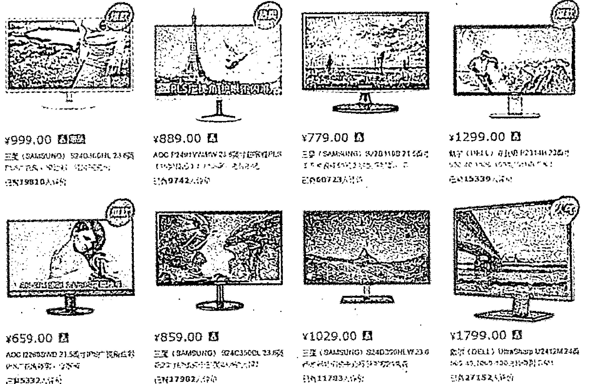

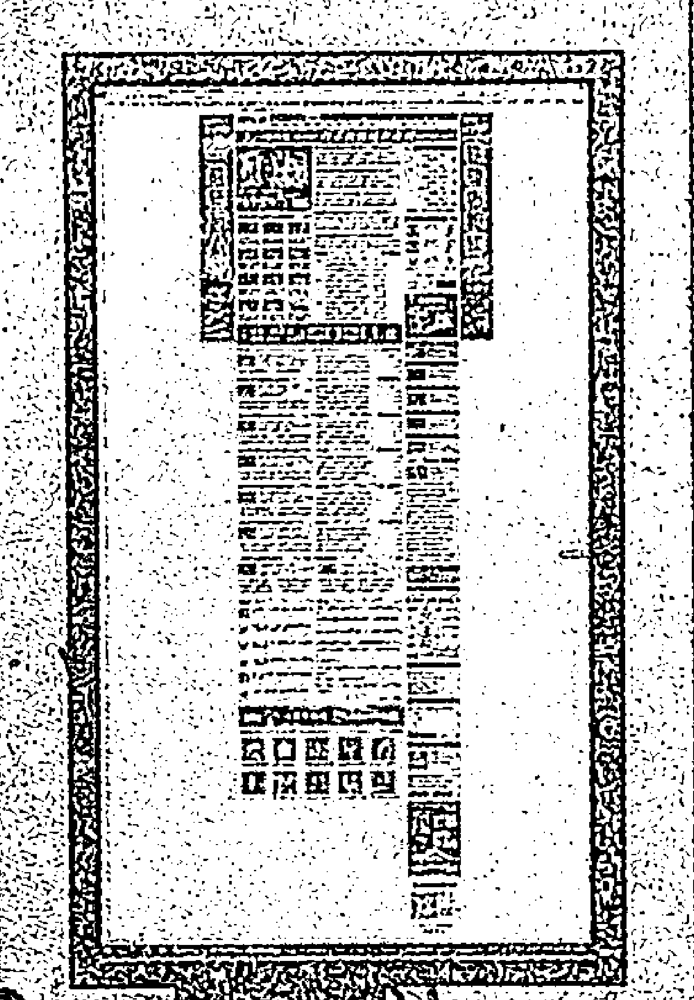

#### 高分辨率产品

有人会想我们去购买高分屏即可，但实际上并没有这么简单。首先如果27英寸使用更高阶的2560×1440分辨率，点距会直线下降到0.233mm，游戏和视频没有问题，可长时间观看网页和文档眼睛稍显吃力(图2)，更合适使用这一分辨率的其实是32英寸显示器(点距0.277mm)。

售价也是目前阻碍高分屏流行的原因之一，只要到1440P的话27英寸显示器基本都要到2000元，普通用户难以接受。如果再选择点距合适的32英寸产品，售价会在2500元到4000元(图3)。


> 其实国内液晶显示器走过很长一段弯路。首先是造型为上，不论厂家还是用户都只看重外观而并非功能，造型美本不是错，但长期本末倒置无疑阻碍液晶面板发展。后又过分追求面板性能，追求对普通用户意义不大的Adobe色域等，有些过犹不及，殊不知其实对显示效果提升最大的首先是尺寸。如果显卡可以跟上，就购买27英寸以上的高分屏液晶显示器，目前高分屏产品其液晶面板普遍都不差(图4)。

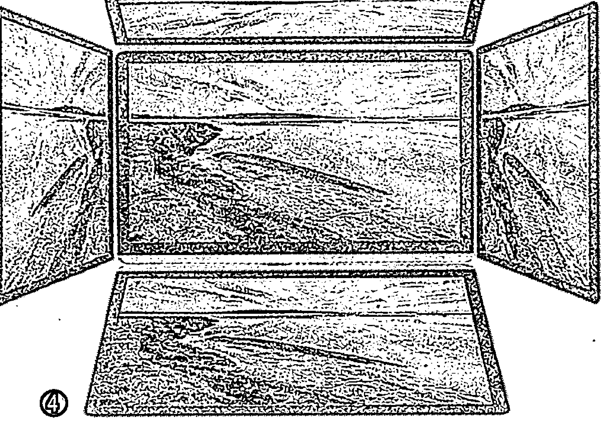

## 浅谈迷你SSD插槽的“待遇”

磁盘性能是当前笔记本的最大瓶颈之一，而是否配备迷你SSD插槽，则是突破这一瓶颈的最简单解决方案。那么为什么笔记本厂商对这一接口的态度并不统一呢？

### 迷你SSD插槽的待遇

为了让笔记本实现硬盘容量和速度的平衡，很多厂商都为旗下产品赋予了mSATA（已渐渐淘汰）或M.2（未来趋势）这种迷你SSD插槽，方便用户自行升级更高速的SSD硬盘。其中M.2插槽和该标准的SSD硬盘宽度仅22mm，而长度也仅占用42mm左右的空间。问题是就连10.1英寸/9.7英寸Windows平板电脑都能塞进M.2插槽，为何它却被很多笔记本拒之门外？

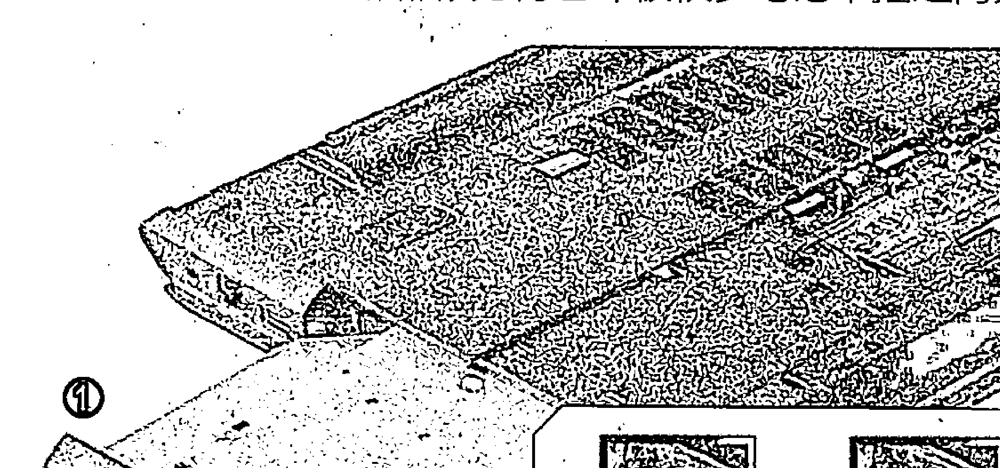

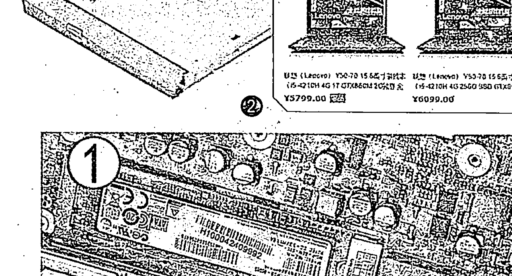

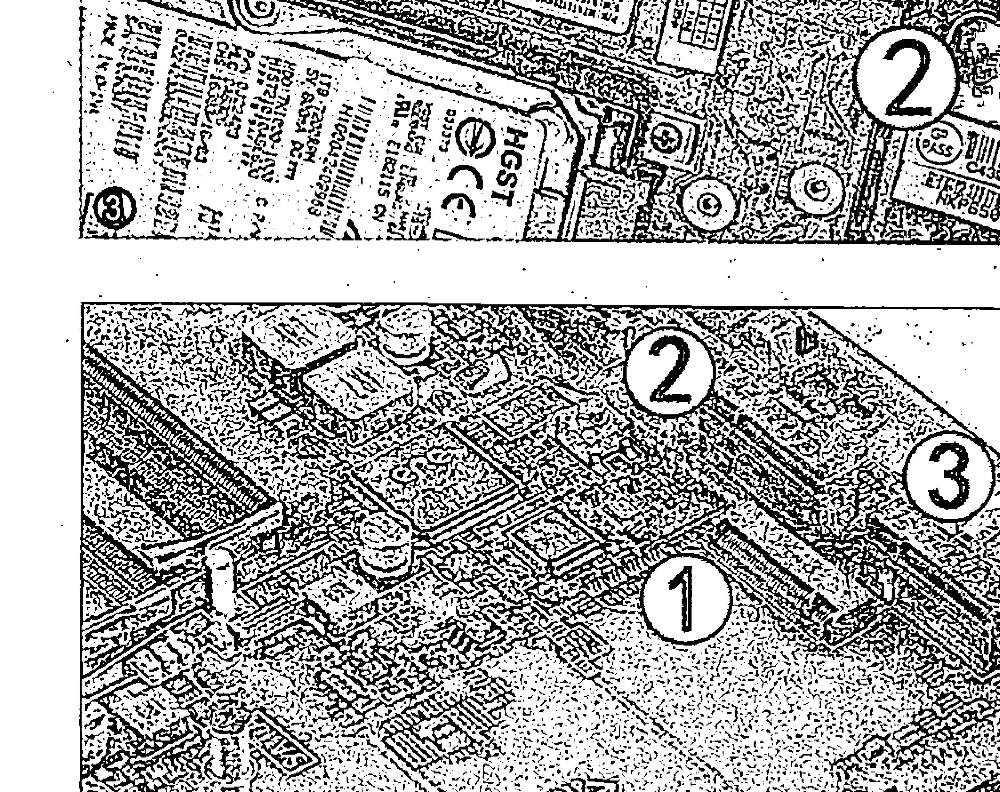

### 一切还得从实际出发

以微星GE62为例（15.6英寸，配备GTX960M独显），这款游戏本拥有3个M.2插槽（图4），但定位较低的GE62 2QC-264XCN型号却将其中的2个M.2插槽虚焊，仅保留1个M.2插槽供用户升级。难道我们必须一步到位选择更高配置的型号吗？答案就得从实际需求出发了。目前M.2 SSD的价格不算便宜，组建SSD的RAID0的成本只能更高，而磁盘阵列的性能却仅能体现在理论测试软件层面，实际使用中很难感受出来。另一方面，“缩水”的GE62低配版仅面对注重性价比的玩家，而此类用户肯定没有更多预算投资RAID0，更多的M.2插槽反而没有意义。这就好像买iPhone，都知道64GB和128GB好，但销量最多的依旧是16GB的低配版。原因很简单，16GB足够便宜，而空间也够用了。总之，我们并不鼓励厂商为了节约成本将原有的M.2插槽虚焊，只是希望大家可以更理性地看待迷你SSD插槽数量缩水的问题。

### 成本和需求的取舍

对动辄11.6英寸以上的笔记本而言，留出M.2插槽的空间没有任何技术难度。而之所以M.2插槽（也包括mSATA）被不少产品拒之门外，则是源于厂商出于成本和需求的取舍。以戴尔游匣7000 14为例（14英寸，配备GTX850M独显），这类游戏本除了标配2.5英寸硬盘外，还保留了内置光驱设计（图1）。如果用户有安装SSD提速的需求，大可通过光驱位的硬盘托架加装第二块SSD硬盘。既然光驱可扮演迷你SSD插槽的角色，自然就没必要再在M.2插槽上耗费精力和成本了。遗憾的是，有些产品在设计上太过“吝啬”，既没有M.2插槽，也没有光驱“补位”，于是就面临磁盘性能与容量无法兼顾的尴尬。以联想Y50系列为例，这款游戏本体型硕大，价格也不便宜，但却仅配备一个2.5英寸硬盘位，用户只能在HDD（容量）和SSD（速度）的型号间任选其一（图2）。其实很多比Y50更轻薄的游戏本不仅配备了迷你SSD插槽，甚至还保留了光驱位，而Y50在磁盘设计上的缺陷只能说明联想太注重成本控制了。值得关注的是，为了满足发烧级玩家组建SSD RAID0，不少游戏本会配备2个以上的迷你SSD插槽。比如神舟战神Z7这款游戏本就配备了2个M.2插槽（图3），其中靠近电池的M.2甚至支持PCIe 2X/4X通道，在加装支持PCIe的M.2 SSD时可取得1000MB/s的读取速度。问题又来了，为什么有些游戏本明明支持2个~3个M.2插槽，但却将其中的几个M.2插槽虚焊呢？

## 解读主板供电系统

长久以来很多用户喜欢用主板供电系统以区别主板的档次，认为供电相数越多的主板越高端。其实在不同代主板之间供电相数并没有可比性，是否需要更多或更少的主板供电相数，具体需要结合CPU一同来考虑。

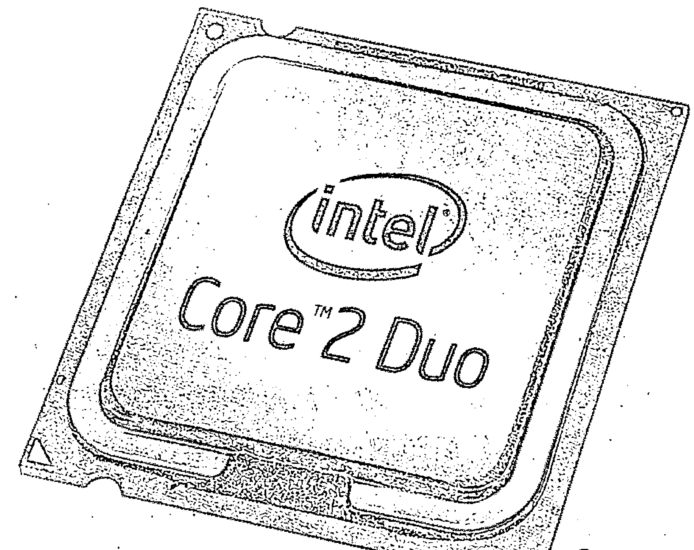

### 第一次主板堆料

首次主板供电相数大增及用料革命还可追溯到2006年，也就是Core 2那一代酷睿处理器问世时，与其对应的是965P芯片组。之前英特尔奔腾4和奔腾D处理器空有高主频，但效率不佳、发热巨大，以至于被AMD盖过了风头。2006年Core 2诞生，低主频（E6300只有1.86GHz）和更好的单核性能彻底扭转颓势，而彻底统治市场则是因为Core 2的良好超频性能（图1）。当时只要搭配合适的965P主板，几乎每一颗E6300都可以达成2.8GHz的主频，比起默认频率几乎提升到1.5倍的性能。为了发挥Core 2的潜在性能和宣传自身产品，以技嘉为首、华硕微星等等主板厂商强化供电系统，在供电区域以至于全主板改用固态电容，将主板卖点首次从稳定过渡到做工用料（图2）。这一堆料的风潮一直持续数年，英特尔处理器的潜能被彻底激活，以往AMD处理器的高可玩性被竞争对手获得，直到目前都难以和酷睿处理器抗衡。

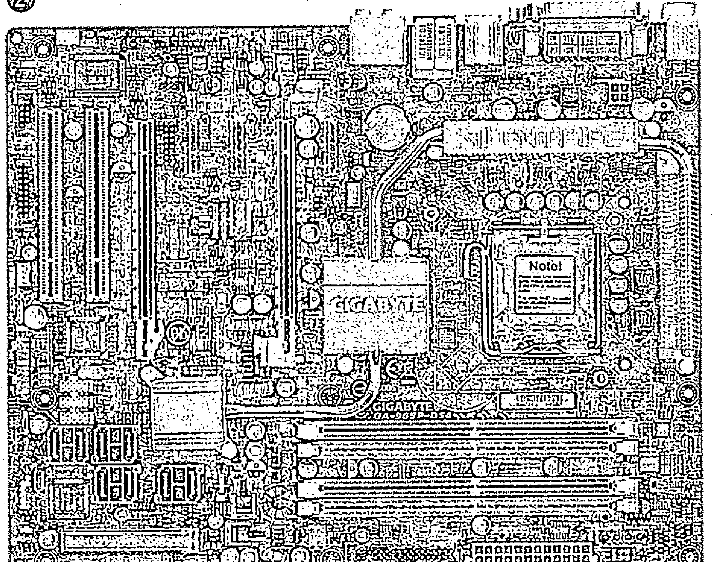

### 酷睿系列处理器

后来Core 2系列处理器逐渐被i3、i5、i7处理器取代，而首代i5、i7处理器Nehalem架构时期是主板供电系统最为“疯狂”的时期。与其对应的P55芯片组入门主板也能有14相供电，而旗舰级别主板突破20相供电也不再是什么新鲜事（图3）。之所以有这样的变化与Nehalem架构的改进点是分不开的，Nehalem架构处理器核心都集成了内存控制器，除此以外处理器核心还集成了PCI Express 2.0控制器。处理器大范围原生多核心设计开始，i3双核四线程、i5四核、i7四核八线程都增加了主板供电系统的压力。此外酷睿处理器的睿频系统开始出现，即使用户不超频，在高负载下处理器也会自动调整核心频率，虽然总TDP不会增加，但这种动态也对主板供电系统的精度提出了更高的要求。

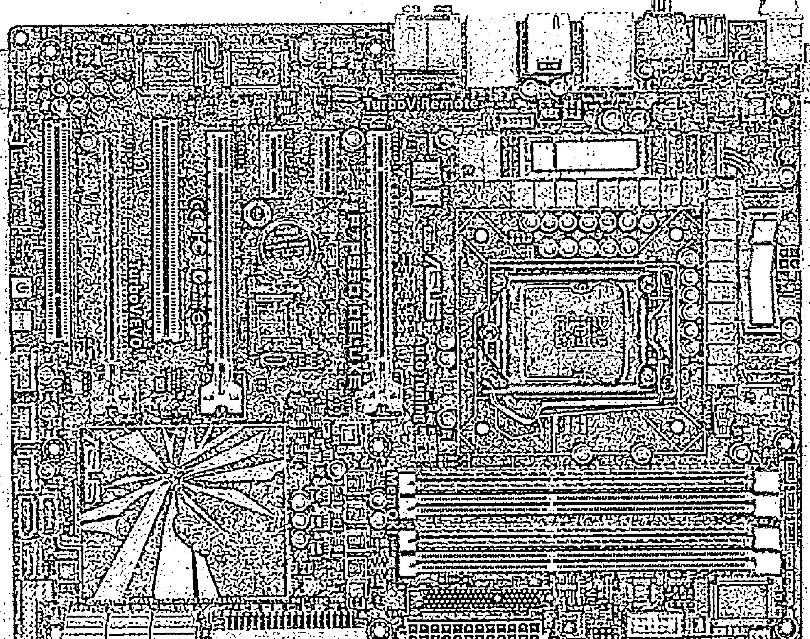

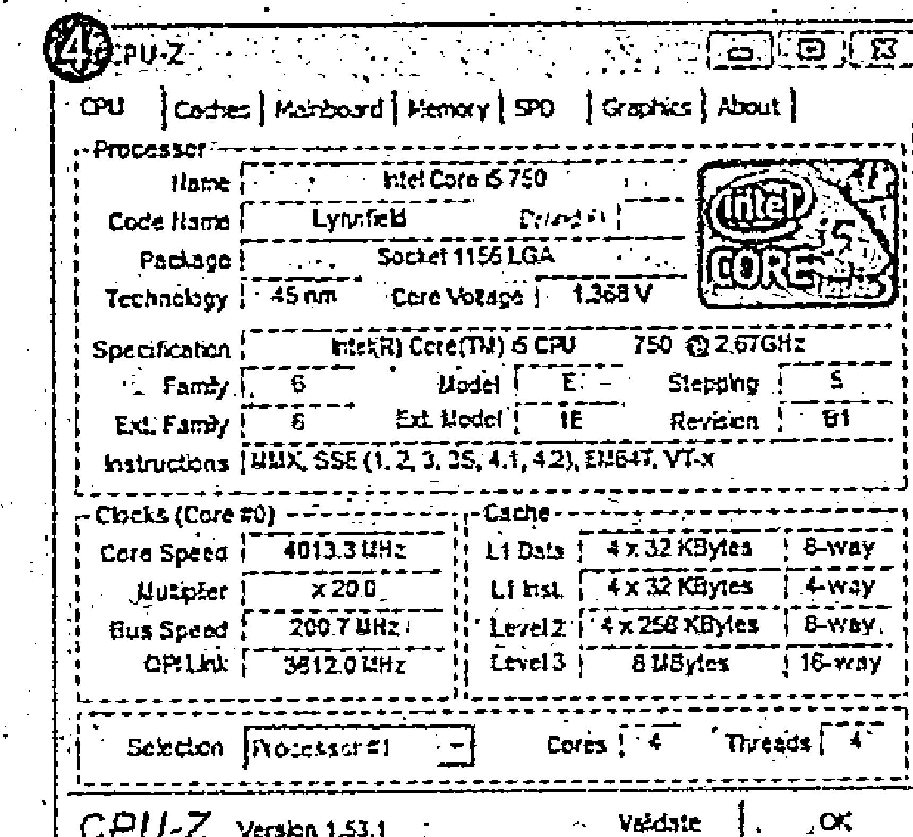

得益于市场上10多相起步的诸多超频主板，玩家们手中的i5-750处理器可以从2.66GHz频率一跃到4.0GHz（图4），性能提升到1.5倍，玩家对主板的超频需求也进一步推动了主板供电系统特别是供电相数的突飞猛进。

### 近两代供电系统不温不火

Nehalem架构之后的Sandy Bridge是近几年英特尔处理器唯一一次大幅度架构升级，不仅单核性能和同频性能比上代Nehalem有明显提高，超频性能和温度控制也是英特尔近几代处理器中最好的。与之对应的P67和Z68系列主板虽没有P55时代20多相供电的“疯狂”，但也保持着10多相供电之多。比较典型的i5-2500K处理器默认主频3.3GHz，一般爱好者习惯将其超频到4.5GHz，直到今天4.5GHz的Sandy Bridge处理器对比全新架构产品依然不落伍(图5)。

不过在这里请注意，之前英特尔主流处理器超频后主频都是原频率的1.5倍左右，而在Sandy Bridge这一代已降低到了1.3x倍，由于没有来自竞争对手的压力，英特尔已无意大幅度提高自身产品的效率。不仅超频幅度降低，只有K系列处理器才能够超频也是英特尔开始限制旗下产品全面超频的信号之一。

而到了Ivy Bridge、Haswell这两代处理器，英特尔将连接处理器金属顶盖到CPU核心之间的导热物质从金属锡焊接换为导热硅脂(图6)。硅脂的导热系数比起金属差上百倍，高频率的处理器热量很难发散出去。另外工艺的进步使核心面积减少，核心与金属顶盖之间接触的面积也成倍减少。散热面积和导热效率双重下降，Ivy Bridge、Haswell很难实现之前处理器超频的成绩。

主板厂商的嗅觉是十分灵敏的，与之对应的7、8、9系芯片组也是近几年供电系统最为简单的主板。

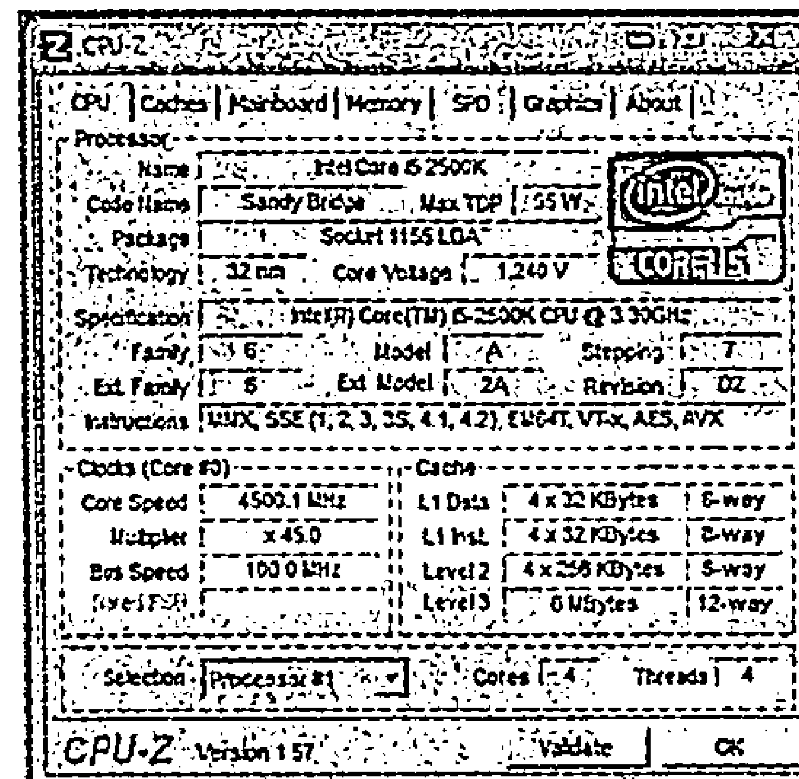

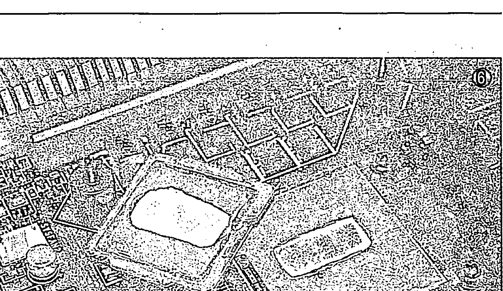

### 全新Skylake和100系主板

在Haswell这一代的处理器英特尔将外部的VR电压控制模块整合进了CPU内部，这种FIVR技术简化了主板设计，所以很多Haswell平台的主板可以只用4相供电(图7)，中高端主板通常也只是8相供电而已。

英特尔FIVR技术对精确控制电压，提高供电效率有帮助，对于消费者而言主板供电系统的瘦身也带来了更便宜的产品。但FIVR会增加处理器的复杂性而且增加功耗(图8)，英特尔FIVR技术在目前最新的Skylake架构被取消，VR供电模块现在重新由主板负责。所以目前Z170主板开始强化PWM供电设计，主板又开始回到10相供电起步的堆料时代(图9)。

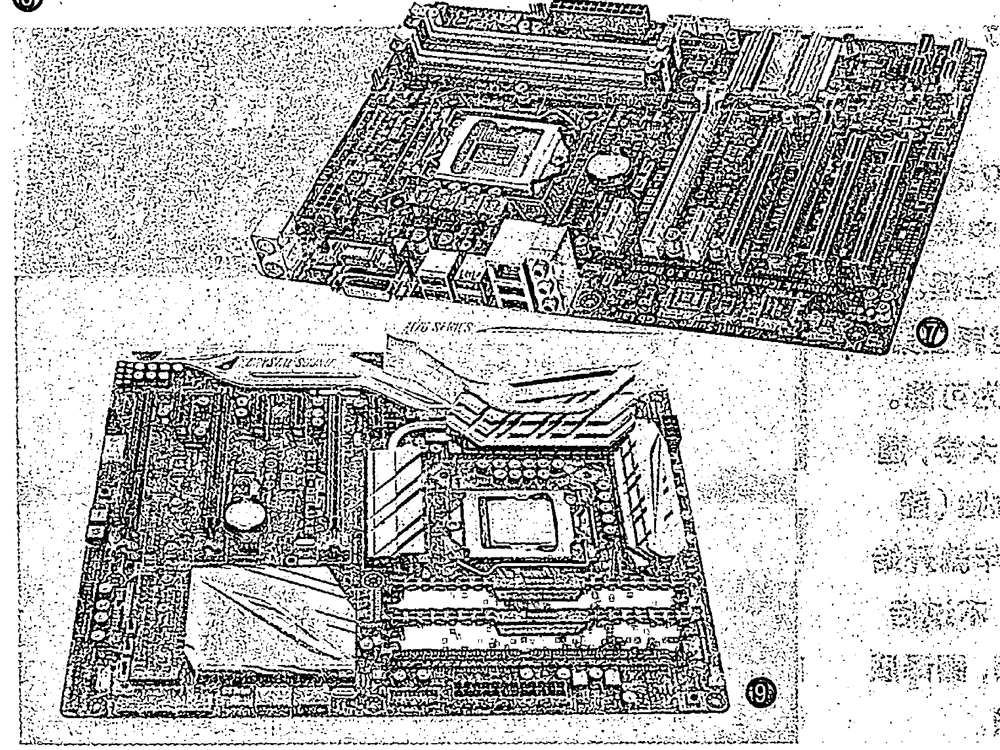

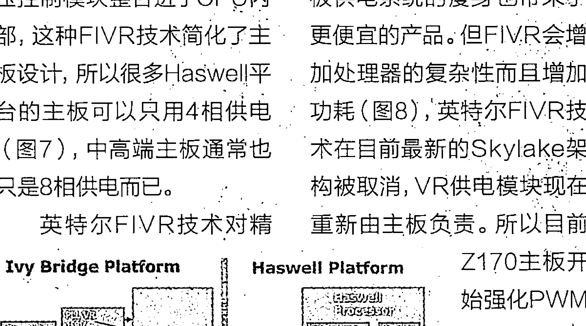

## 小结

观察近几年英特尔处理器和对应的主板你会发现，主板厂商其实很少为了堆料而刻意提高主板供电系统的复杂性，主板供电相数完全和其对应处理器的需求对应。在同芯片组同品牌主板之间，供电更多的产品通常来讲更高端一些。之前很多品牌的不同型号主板的PCB都采用同样的设计，这也导致了一些主板上会出现空焊位。而目前几乎所有品牌的不同型号主板PCB设计都彼此独立，旗舰产品由于搭载功能更多、接口更丰富会显得十分紧凑，而入门产品相对来说会显得“清爽”很多。

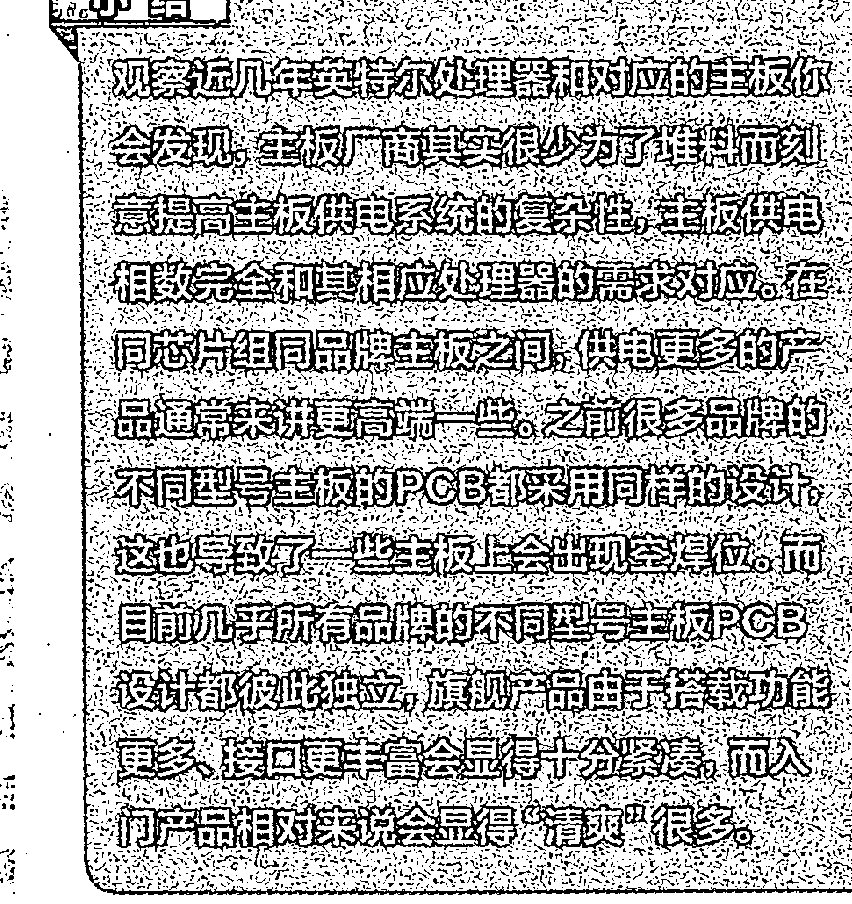

### 智能技术的判断

信息技术的神奇，在某种程度上依赖于智能技术的发展和应用。形形色色的机器翻译技术和产品应用于生活的许多领域。系统安全软件对各种恶意软件攻击的智能判断处理。聪明的Windows 10对设备模式的自动判断和切换及对输入法、账户等判断和切换。这些无不为我们使用电脑带来更大的方便。

### 越来越聪明的机器“翻译家” 文 | 一页

机器翻译，英文为Machine Translation，又称为自动翻译，就是通过计算机把一种自然语言（如中文）变成另外一种自然语言（如英语）这样一个转换过程。通过机器进行翻译的设想很早就有，而直到世界上第一台电子计算机ENIAC诞生，这一设想才成为可能。后来到了1954年，IBM公司协同美国乔治敦大学，通过IBM-701计算机首次完成英俄机器翻译试验（图1），拉开了机器翻译的序幕。我国也在1956年就开始将机器翻译研究列入全国科学工作发展规划。不过后续的发展并不顺利，机器翻译遭遇了许多瓶颈，翻译质量总是很不理想，一直到近期才有了重大突破。

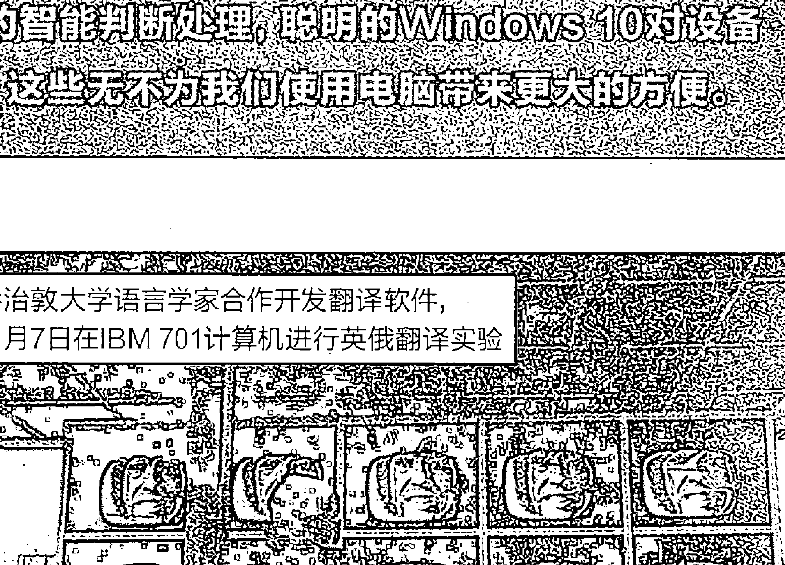

### 转换层面上的机器翻译类型

机器翻译的实现方法多种多样，可按不同的标准进行分类。如果按转换层面进行划分，可分为直接翻译、转换翻译和中间语言翻译，其中转换翻译又可分为短语层、句法层、语义层等（图2）。

早期的机器翻译系统常用“直接翻译法”，也就是我们常说的“词到词”的翻译方式，将一种语言句子中的每个单词或固定词组直接替换成目标语言对应的词或词组。这有点类似我们用金山词霸一个一个把单词翻译过来再直接连接到一起（当然翻译系统会做一些简单的分析调整）。显然，对于像汉英这样语法结构差别较大的语言翻译，其结果大部分很难接受，根本看不懂。

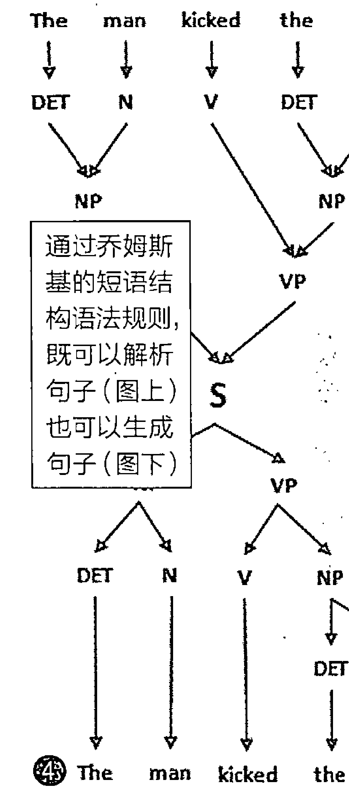

通过乔姆斯基的短语结构句法规则，既可以解析句子（图上）也可以生成句子（图下）

“中间语言法”比较好理解，首先就是建立一个标准语言作为中介，这个中介语言有点类似曾经流行过一段时间的“世界语”，当然机器翻译的中间语言通常不会是真正的语言，而是类似逻辑表达式等（如果是以自然语言如英语作为中介，则这一中介语往往称作“枢纽语言”）。首先将要翻译的语言经过分析转换成中间语言，再将生成的中间语言转换成目标语言。两人之间互相不懂对方的语言没关系，只要他们共同懂一门其他的语言就行。这也有点像HTML网页代码，可在完全不同的浏览器上显示相似的结果（图3）。

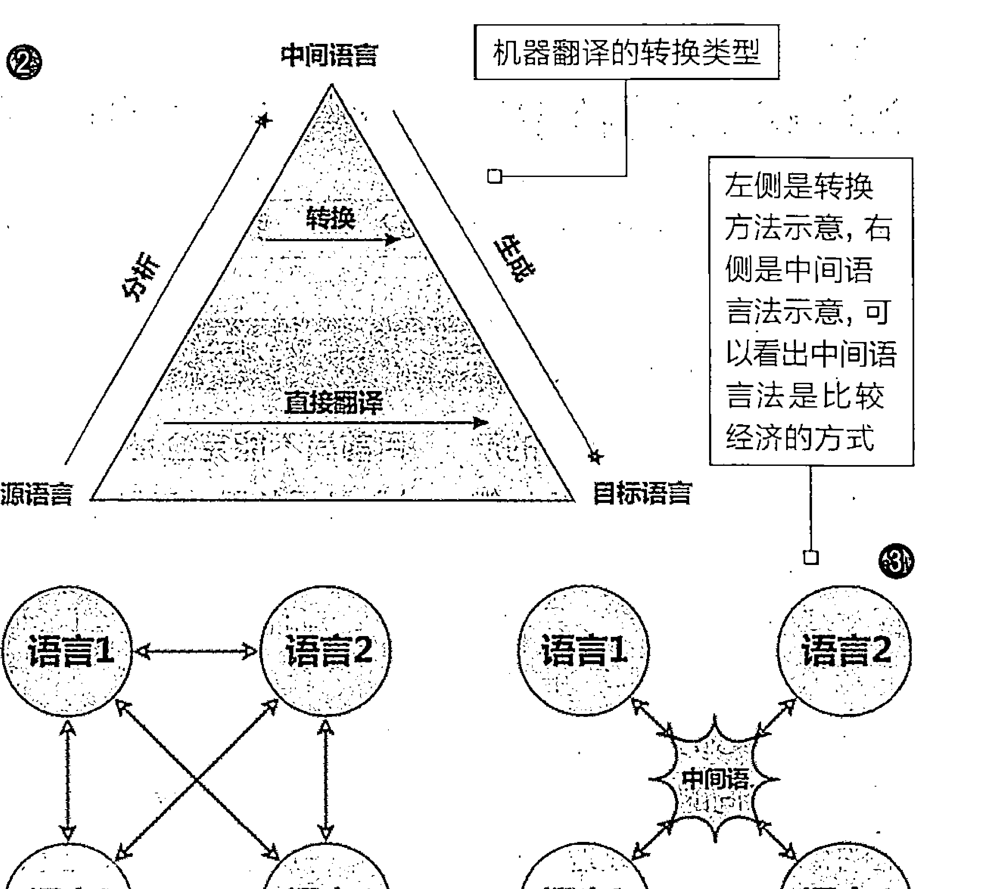

左侧是转换方法示意，右侧是中间语言法示意，可以看出中间语言法是比较经济的方式

“转换翻译法”则需要三个阶段：分析、转换、生成。先对要翻译的句子进行词、句、结构的深层解析（图4），再把解析的深层结构转换成目标语言的深层结构，最后由目标语言深层结构生成目标语言句子。

### 基于实例的机器翻译

如果按知识表示的标准来划分，机器翻译可分基于规则（Rule-Based）和基于语料库（Corpus-Based）。基于语料库又可分为基于实例和统计翻译等。

基于规则的翻译方法，采用一系列的规则来解析句子，如单词切分规则、标注规则、句法分析规则、语义分析规则、结构转换规则等，再与目标语言的语法结构对应，置换相应词汇，最后生成译文（一般采用的是“转换翻译法”）。

而在基于实例的机器翻译系统中，关键是双语对照的实例库。双语实例库一般有两个字段，分别保存源语言句子及其对应的译文。进行翻译的时候，首先将要译的句子与双语实例库中的源语言句子比较，找到最相似的那句，然后再模拟这个句子相对应的译文，进行一些必要的置换处理等，最后输出译文。

基于实例的机器翻译系统，一个关键技术是平行语料库对齐，对齐的级别有句法结构、词语、短语、句子、段落、篇章等。其中的段落及句子对齐，要求必须保持顺序。

一般来说，基于实例的机器翻译系统会具有翻译记忆功能，就是把你已经翻译过的句子保存起来，下次遇到相同的句子，就可以直接输出译文了。这样积少成多，翻译的工作会越来越轻松。这在计算机辅助翻译软件（CAT）软件中被广泛采用。


### 为什么机器翻译无法完美

当下各种机器翻译的产品百花齐放，如苹果Siri，微软小娜、Skype，讯飞语音翻译及多种在线翻译等，虽然它们融入了语音识别等新的技术，但其核心的翻译机制则大同小异，不同的可能就是算法上的优化，让翻译处理（如实时翻译）更快更流畅而已。

随着经济全球化及快速增长的互联网，自动翻译的需求越来越迫切，但是机器翻译目前尚不能完全替代人类翻译，翻译效果并不是很理想。这是因为人类的语言不仅仅只有字面的意思，还会因为不同的语境而产生大量的“言外之意”，这是机器很难判断的。也许统计机器翻译方法能部分解决这一问题，但那绝对是超乎想像的庞大数据库处理。更完美的机器翻译，只有期待更好的算法及更强大的运算能力来共同完成了。

### 最笨的聪明翻译法——统计机翻译

有一种思想认为，翻译实际上是一个概率问题。比如英语“This is a book.”，它的译文可以是任意中文句子，如“今天天气不错”、“我想看书”、“这里有棵树”、“这是一块蛋糕”、“这是一本书”……这不是胡扯吗？当然不是！你觉得胡扯的译文，只是它和原文对应的概率比较低而已，显然上面的许多译文中，“这是一本书”对应的概率是最高的。那么统计机器翻译的任务就是要找出这个概率最大的句子。

这一思想实际上在1947年就已有专家提出了，但是语言是无限的，在无限的语言中找出最高概率的译文，在当时无异于天方夜谭。如今，随着计算机运算速度的巨大提升，当时认为是最笨最不可能的实现方法，如今却成了极为有效的方法。

这一方法的关键，在于建立概率模型。IBM的专家于1993年提出基于词对齐的翻译模型，开启现代统计机器翻译方法之路，其后随着短语翻译模型、层次短语模型、语法树模型等一系列模型的推出，统计机器翻译法开始独领风骚，成为当前大部分翻译产品的核心运行机制。

文 | 一叶

### 量体裁衣 寻找最好的翻译

- 谷歌翻译 网址：http://translate.google.cn
- 必应翻译 网址：http://www.bing.com/translator
- 百度翻译 网址：http://fanyi.baidu.com
- 有道翻译 网址：http://fanyi.youdao.com/

全球化的趋势，互联网的盛行，使得我们每个人接触外语资料的需求越来越多。不过很多人的外语能力并不是很好，这时就需要翻译工具的帮助了。这些主流在线翻译工具效果如何呢？下面我们就来对比一番。


> **翻译工具选择**
对于专业工作来说，翻译工具主要起的是辅助作用，完全机器翻译是不太现实的。所以这里我们并没有选择专业翻译软件，而是挑选面向众多网民的比较普及的几款在线翻译工具，其中两个是中国的，两个是外国的。

## 【测试的内容】

对一般人来说，上网主要是看看新闻、聊天等，另外比较常见的需求，是想查阅一些产品说明书。根据这些不同的需求，我们选择了几段比较典型的文本：一段是生活化新闻，一段是相对专业的产品说明书，另外还有一段比较另类的段子。机器翻译不太适合有着丰富含义的文学作品，如小说、诗歌等，所以这方面的内容测试就省略了。另外，下面的测试，仅以中英文为主，未涉及其他语种。

| 原文 | 谷歌翻译 | 必应翻译 | 百度翻译 | 有道翻译 |
| :--- | :--- | :--- | :--- | :--- |
| **1. 生活化的内容翻译**
I have found, though, that the Chinese people are quite patient with me and very helpful and for that I am grateful.
——摘自某国外网友在中国生活经历的片段 | 我发现，虽然，中国人民是足够的耐心，我和非常有益的，为此，我很感激。 | 我已经发现，虽然，中国人都对我很耐心，很乐于助人，为此我很感激。 | 不过，我发现中国人对我很有耐心，对我很有帮助，我很感激。 | 不过，我发现，中国人民对我很耐心，非常有帮助，我很感激。 |

仔细观察上面的评测，会发现一个很有趣的现象，就是谷歌和必应的翻译结果接近，有道和百度的翻译结果相近。是国人和老外的思维确实不同？还是他们选择的翻译引擎相异？从这一段的评测结果，没想到谷歌竟然是最差的一个，出乎笔者的意料。翻译结果最好的则是必应，只有它将very helpful译成了最贴切的“很乐于助人”。而对though的处理，国内的两个工具显然胜过国外，看来中国人的英语语法“胜过”老外。

| 原文 | 谷歌翻译 | 必应翻译 | 百度翻译 | 有道翻译 |
| :--- | :--- | :--- | :--- | :--- |
| **2. 专业化的产品说明书翻译**
Cloud is at the nexus of dramatic innovation with mobile as the activation point, data analysis driving differentiation and security as the enabler.
——摘自IBM的云产品介绍 | 云计算是巨大的创新与移动作为启动点，数据分析推动差异化和安全性作为推动者的联系。 | 云是创新的引人注目与移动作为激活点，数据分析驾驶分化和安全的启用码的连结点。 | 云是在移动的激活点戏剧创新的关系，数据分析驱动的分化和安全的推动者。 | 云的关系引人注目的创新与移动的激活点，数据分析驱动分化和安全的推动者。 |

由上面的测试结果可以看出，对专业文章的翻译，几个翻译工具的表现都欠佳，对于没有相关专业背景的人来说，上面的译文可说是不知所云。相对来说，谷歌的翻译略微接近些。

| 原文 | 谷歌翻译 | 必应翻译 | 百度翻译 | 有道翻译 |
| :--- | :--- | :--- | :--- | :--- |
| **3. 另类句子翻译**
他的态度微软了下来。
——藏有“陷阱”内容的文本 | His attitude is slightly down Microsoft. | His attitude down micro-Microsoft. | His attitude was slightly softer. | Micro Microsoft down his attitude. |

上面语句中的陷阱，就是“微软”连接在一起，除了百度翻译外，其他三个在线工具，竟然都译成了Microsoft。从这个结果，不得不说，百度翻译对中文转译英文，成绩是最好的。

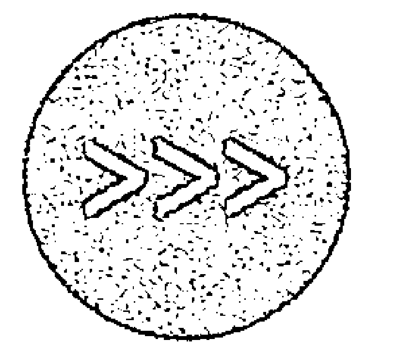

## 评测结论

通过上面的测试可以看出，以大家最常用的“英译汉”服务来看，翻译质量最为出色的当数必应。当然即使如此，必应的翻译内容也不可以直接无障碍使用，对于一些莫名其妙的句子，还是需要我们对照原文进行一些修正。好在必应的翻译界面中双语的词语对应最好，光标指向某个词，译文中相应的词也会高亮显示，方便我们检查。

对于专业科技文章的翻译，可用性非常低，谷歌翻译勉为其难能略做些参考。

而对于“汉译英”来说，百度翻译的结果，勉强可作为参考。

## # 深入运行机制 Windows 10在安全与高效中平衡


Windows 10自身配备了多种安全组件，合理运用，可以让系统更安全可靠。Windows的安全组件与第三方的安全软件的运行原理其实大同小异，只不过Windows自带的组件，与系统的配合更密切，也更加高效。不过安全组件的功能繁多，所以在安全与高效之间取得平衡，我们还要根据自身的需要进行合理的判断与选择。

## 稳定的背后 Windows 10安全功能解析
文|平淡

Windows 10正式发布后，很多人会发现新系统的运行更稳定了，相对Windows 7和Windows 8/8.1来说，蓝屏死机的症状更少出现，这稳定的背后要归功于Windows 10预警机制和对系统内核的改进。预警机制实际上也是一种“判断”的技术，它根据现状预判断将可能发生的安全问题，并在问题出现之前进行解决。下面就让我们来了解一下它是如何运行的。

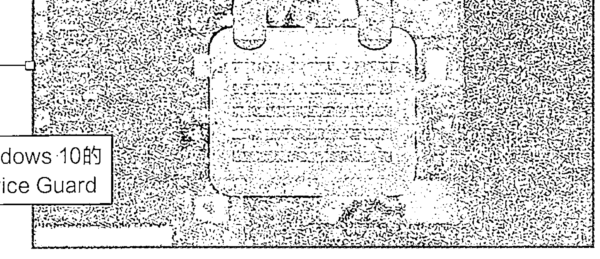

### 认识Windows 10的预警机制

为了更好地保护系统的安全，微软在Windows 10中新增很多安全预警机制来防范常见的安全威胁。比如Windows 10企业版新增了全新Device Guard（设备卫士），旨在对全部尝试访问Windows 10设备及其网络体系的应用程序进行审查，从而彻底阻断零日攻击的出现。

因为零日漏洞是暂时未被用户或服务商发现的新漏洞，因此零日攻击的危害很大。正是因为零日攻击的危害巨大，因此在Windows 10中新增了Device Guard来避免零日漏洞带来的危害。在Windows 10中当运行（或木马、病毒等恶意程序在后台自动激活）某款程序时，Windows 10都会首先对程序进行可信度的检查，只有确保信任的程序可被成功启动（不可信程序则会向用户发出通知）。这样即使操作系统或应用程序存在零日漏洞被黑客攻击，黑客在试图使用其编写脚本向系统或应用程序发起攻击时，这些恶意脚本就会被Device Guard拦截。Device Guard利用硬件技术与虚拟化机制将这一额外许可功能与Windows操作系统中的其他组件隔离开，从而阻止零日攻击（图1）。
此外，Device Guard还可以同杀毒、白名单乃至其他应用程序控制产品协同工作，从而为Windows 10提供全方位的保护功能。

## # 特别话题

## # 什么是零日攻击

零日攻击(Zero-day attack)是指Windows漏洞被发现后就立即被恶意利用的一种黑客攻击行为。我们日常使用操作系统和应用程序都是由成千上万(甚至几千万)的代码组成的，这些代码必然会存在编码漏洞。在实际编程时，系统和应用程序的开发商不可能对所有的代码进行严格的检查，而是在后期测试和用户实际使用后才会不断发现这些编程漏洞，接着开发商会以补丁的形式发布漏洞修复代码，这就是我们常说的系统和程序补丁。在开发商推出升级补丁之前，一些技术高超的黑客们通过反编译也会发现这些漏洞，这样黑客就会自己编写此漏洞的利用脚本，对系统或应用程序发动攻击。通常从系统或应用程序新漏洞的发现到利用，不会超过24小时，因此形象地把这种攻击称为零日攻击(即不超过1天)，而将被利用的新漏洞称为零日漏洞(图2)。

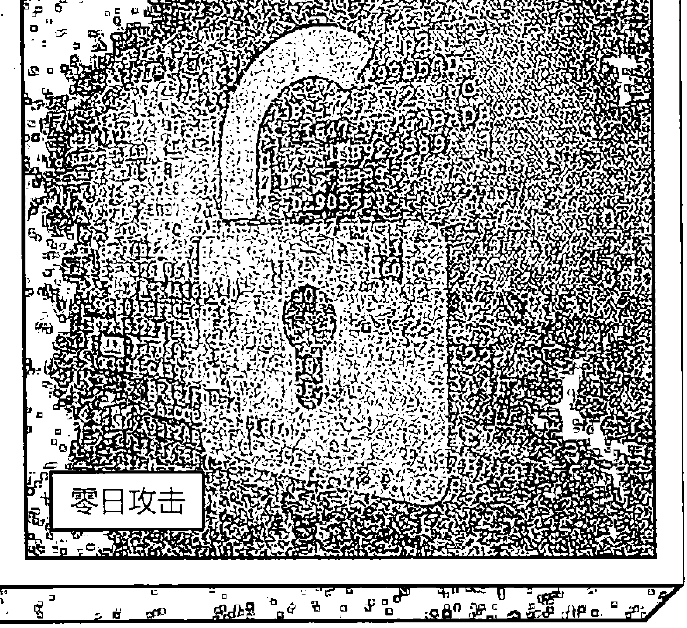

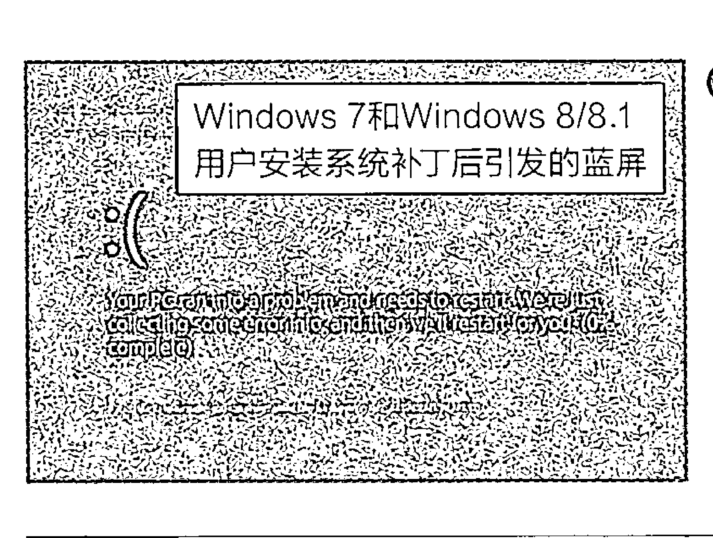

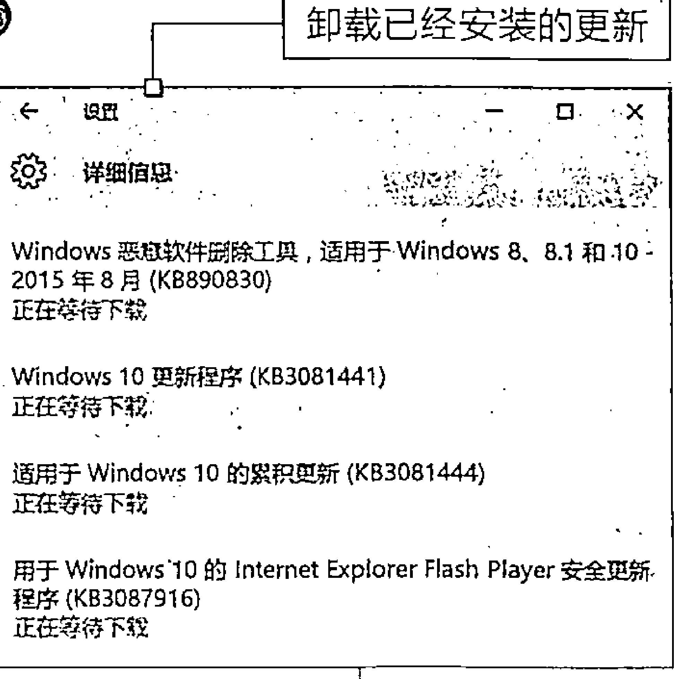

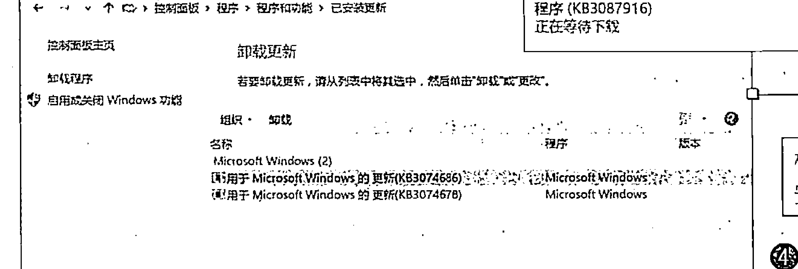

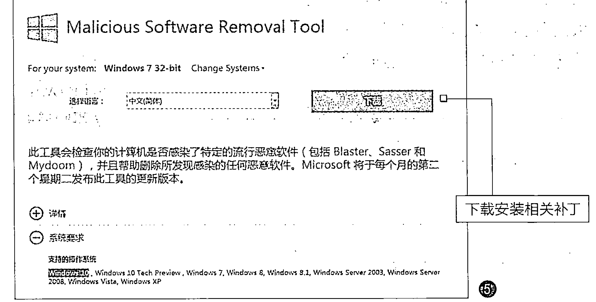

## # 系统内核的安全改进

使用Windows 7和Windows 8/8.1的用户可能都遇到过系统蓝屏事件，比如在2014年微软发布KB2982791补丁后，很多安装该补丁的用户都遭遇启动蓝屏的故障(图3)。安装了微软推送的补丁还会导致系统蓝屏，这是很多用户始料未及的事情。为了避免类似事件的发生，在Windows 10中微软对系统内核进行了改进。比如在上述蓝屏事件中，蓝屏的原因是由于该补丁修改了内核字体缓存引擎引发的兼容性故障。在Windows 10中，微软为全系统默认开启了控制流防护(Control Flow Guard)功能，这个功能可以将内核模式字体引擎部分分离并放入隔离的用户模式环境中运行，这样对于内核模式的兼容故障，由于隔离模式存在就不会再导致蓝屏故障的出现，从而使系统的运行更稳定。当然系统补丁是修复Windows 10底层安全的重要措施，在Windows 10中如果遭遇无法自动安装补丁的情况，可手动自行安装。只要依次点击任务栏的“消息按钮→所有设置→更新和安全→Windows更新→详细信息”，系统会检测到当前所有要下载安装的更新(图4)。对于无法通过自动更新完成的系统更新，在上述窗口会自动显示。这里我们只要根据更新的编号到微软官网手动下载即可。比如笔者电脑上KB890830补丁就一直无法成功安装。现在启动IE浏览器访问，然后输入“KB890830”进行搜索即可找到该补丁的手动下载地址，点击“系统要求”查看是否适合自己的系统，如果正确则可进行下载安装(图5)。此外，系统更新的安装顺序不对可能会导致兼容性故障的出现。如Windows 10用户安装了KB3087985更新之后，如果尚未安装最新的Internet Explorer，累积安全更新的用户可能会遇到兼容性问题，Internet Explorer可能间歇性停止响应。因此为了避免兼容问题，必须先安装更新3078071，而后安装更新3087985。如果在Windows 10安装了系统补丁导致兼容性故障，那么可依次进入“控制面板→程序→卸载程序→已安装的更新”，选择导致故障的更新，然后卸载该更新，最后再按顺序重新安装所有必需的更新即可(图6)。

## 选择 让Windows 10 安全与效率并重
文|俞木发

为了更好地保护Windows 10的安全，它和Windows 8.1一样，内置了杀毒软件和防火墙组件，而且防护功能更加强大。其实系统中的这两个组件，与第三方的安全软件的“判断”病毒或不安全因素并进行防护的原理是相似的，只不过它们与系统配合得更加紧密而已。所以下面的分析和应用技巧，也适合第三方安全软件。

### 有选择的信任 安全与速度双平衡

Windows 10和Windows 8/8.1系统一样内置微软杀毒软件，在Windows 10中称为Windows Defender。默认情况下如果没有安装第三方杀毒软件（如瑞星、金山毒霸），则自动启动AD的安全防护功能（如果已安装第三方杀毒软件则自动禁用）。Windows Defender整合了原来系统内置反间谍软件AntiSpyware和MSE杀毒软件，其安全防护功能也主要由这两部分组成。反间谍软件主要借助原来的Windows Defender实现，杀毒则借助MSE完成。它们的病毒库是和系统更新紧密集成的，通过每天的自动更新实现。对于间谍软件和病毒的判断也主要借助病毒库实现。如果要在Windows 10中启动Windows Defender，只要在任务栏搜索框中输入“Windows Defender”，在搜索结果中点击“Windows Defender”即可（图1）。Windows Defender同时提供实时保护和计划扫描功能，由于内嵌在系统中，Windows Defender可对Windows 10从启动、内核加载、进入系统、程序启动、文件下载、上网浏览进行全方位的保护。对已知的病毒，其它借助微软强大的间谍软件和病毒库进行判定。Windows Defender对未知病毒也提供主动防御功能，并借助云保护功能进行判定，实时保护和云保护都是默认开启（图2）。

不过由于MSE实时保护和全面扫描功能，在低配置电脑上可能会占用大量的系统资源，导致CPU占用过高，可通过优化设置降低Windows Defender的资源占用。比如尽量保持桌面整洁，不要在桌面放置过多的程序或者文件，因为每次在Windows 10进入或者返回桌面时，都会对于用户界面所存在的程序进行预扫描，从而导致CPU占用过高。其次将常用并且确信是安全的常用程序（如QQ、迅雷等）添加到排除进程，避免对其扫描。只要打开选项，切换到“设置→添加到排除项→文件”，接着选择需要排除的程序文件即可（图3）。

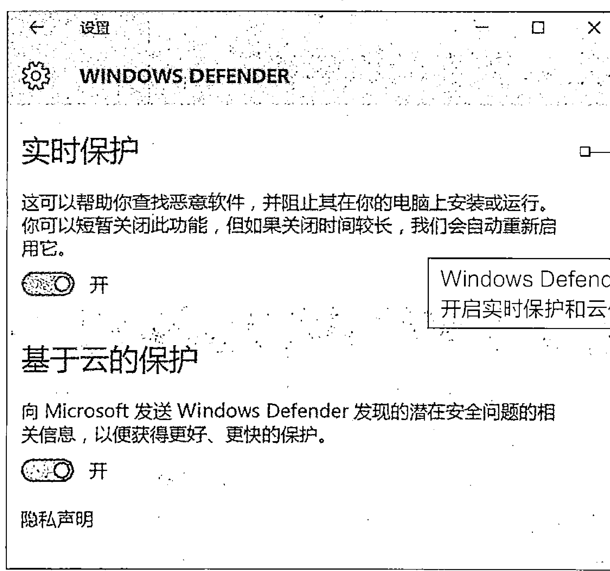

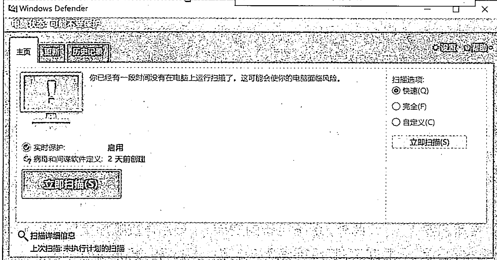

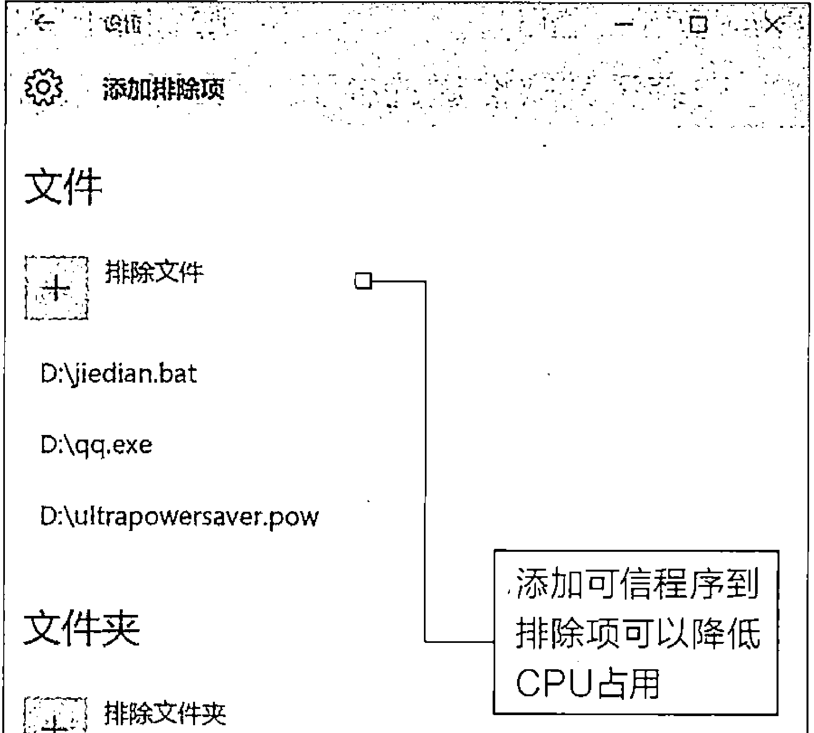

### 有选择的禁止，外网环境更安全

除了对间谍软件和杀毒的防护外，Windows 10提供防火墙来防范黑客、木马等恶意软件的入侵。

Windows 10的防火墙通过监测、限制、更改跨越防火墙的数据流，对外可以屏蔽网络内部的信息、结构和运行状况，有选择地接受外部访问。对内则可以强化设备监管、控制对服务器与外部网络的访问，在被保护网络和外部网络之间架起一道屏障。在Windows 10中首次连接到某个网络的时候，系统都会要求我们设置当前网络性质（如专用网络、家庭网络还是公用网络），手动选择后防火墙就会自动应用默认的规则对系统进行保护（图4）。

对于系统安全有更高要求的用户可以对防火墙进行更多的个性化设置。比如当我们携带Windows 10平板出门在外时常可以连接到不同的Wi-Fi，不过很多外部Wi-Fi的安全性并不够好。现在可以利用Windows 10的防火墙设置平板选择性地连接外部网络。比如设置只能使用PPS看电影，其他诸如登录QQ、IE上网操作均不允许，以避免Windows 10平板隐私泄露和下载到恶意病毒、木马。

首先在任务栏的搜索框中输入“防火墙”，打开“高级安全Windows防火墙”设置，接着在右侧窗格点击“公用配置文件”下的“Windows防火墙属性”，在打开的窗口中将进站和出站连接均设置为“阻止”，这样在公用网络下就阻止所有对内和对外连接（图5）。

返回防火墙设置窗口，点击“出站规则”，点击“新建规则”启动新建规则向导，然后新建一条“程序”规则，接着选择允许运行指定的PPS程序的实际路径，设置在公用的网络下PPS可以发起对外连接（图6）。

继续向导的操作，选择PPS允许连接，剩余的操作按照屏幕提示完成。这样在公用网络下就只有PPS可以连接网络，如果要添加其他程序，步骤同上（图7）。

现在如果平板连接了外部不安全的Wi-Fi网络，成功连接后按提示将其设置为“公用网络”。连接到该Wi-Fi网络后，Windows 10平板就只能使用PPS看网络电影。用户试图运行QQ、Edge等网络软件时，系统都会提示网络尚未连接，同样公用网络默认阻止所有外来连接，就可以有效保护Windows 10平板的安全了（图8）。

选择网络类型后系统防火墙会自动进行保护

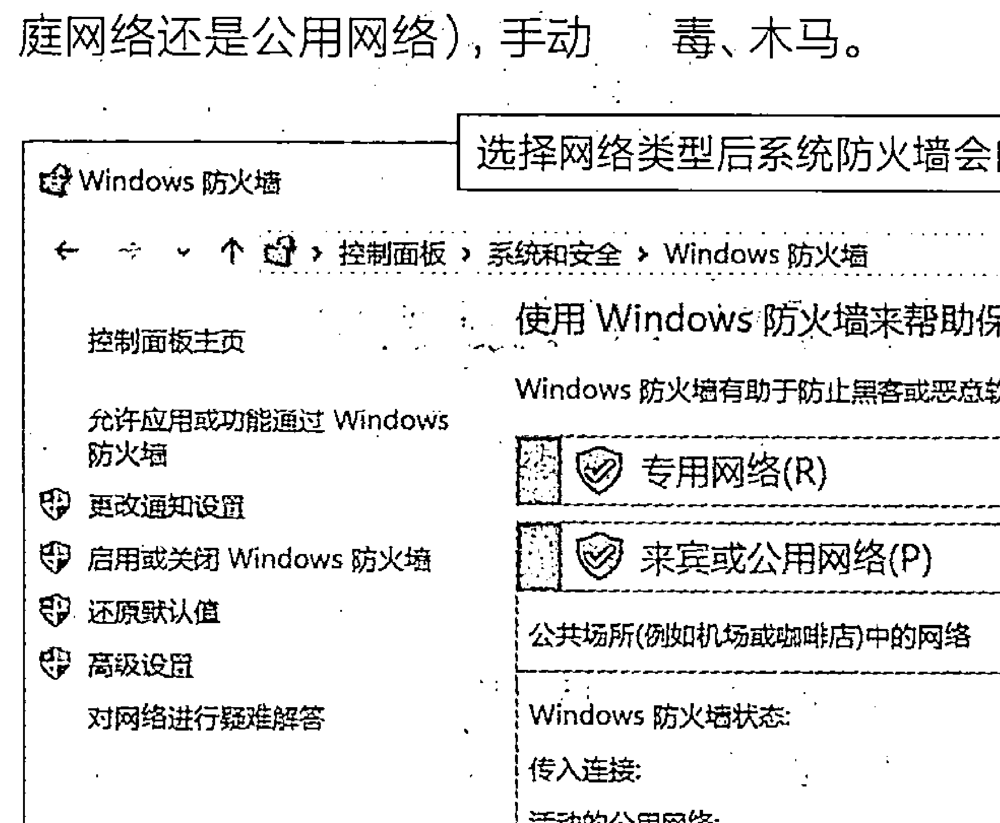

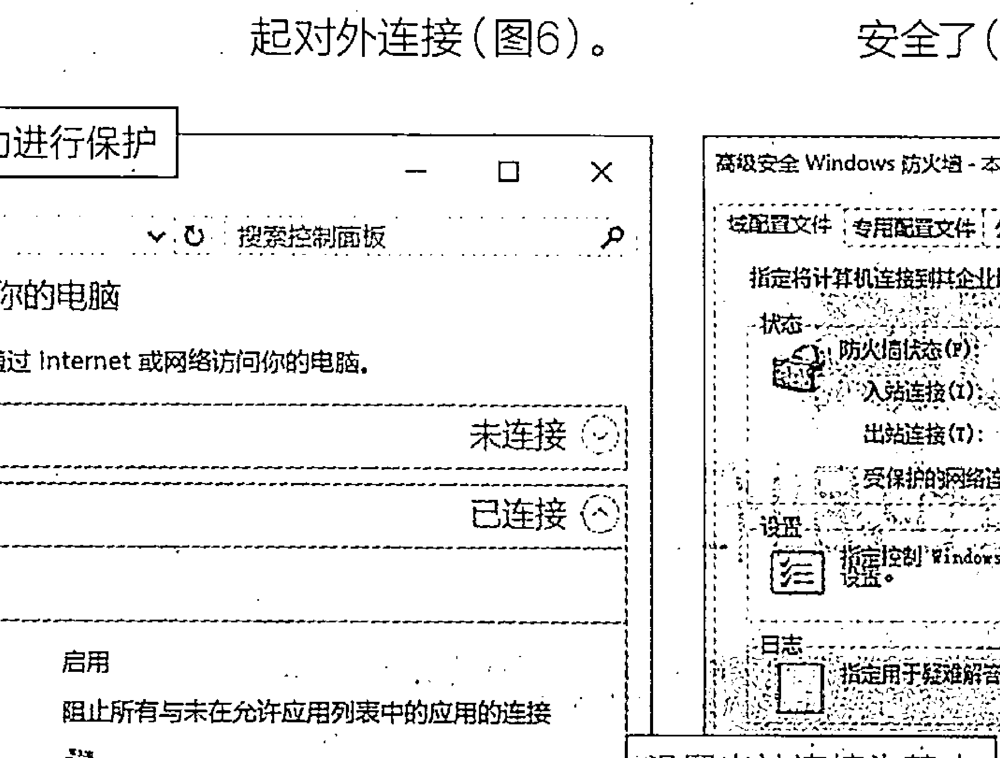

设置出站连接为禁止

设置允许连接的程序

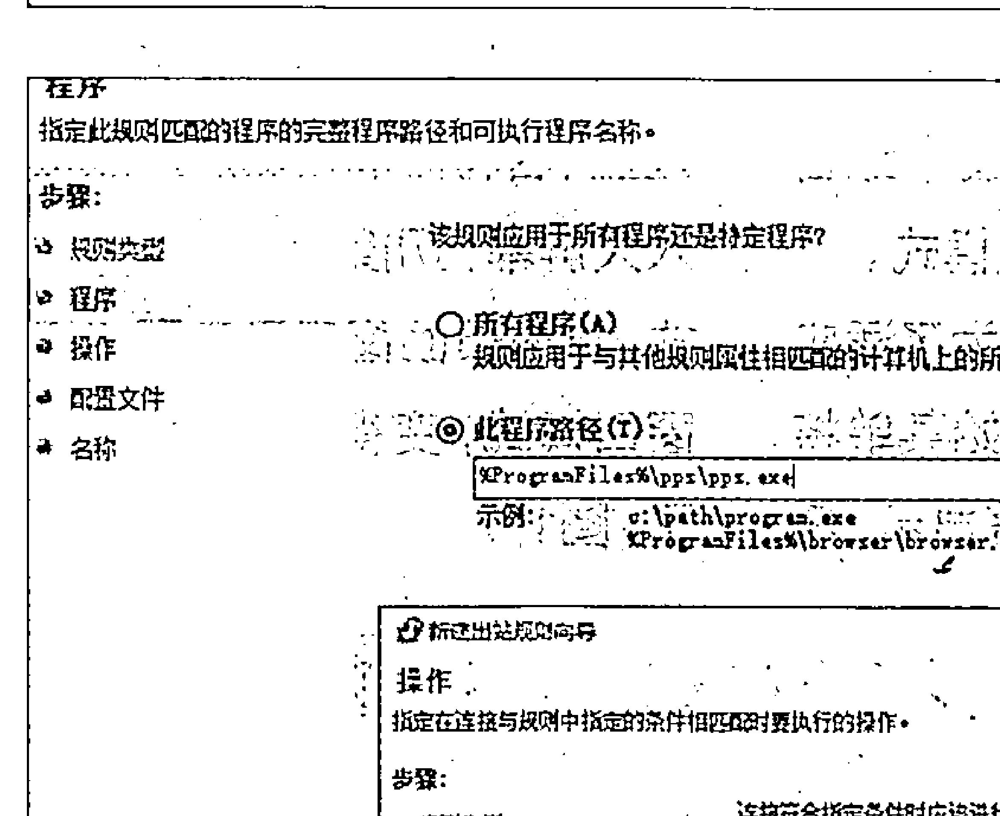

设置允许连接

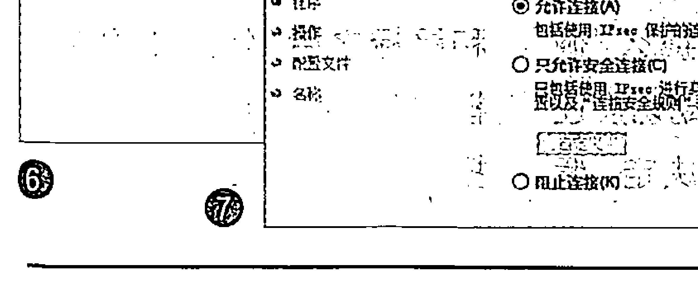

防火墙可以拦截Edge等网络程序的连接

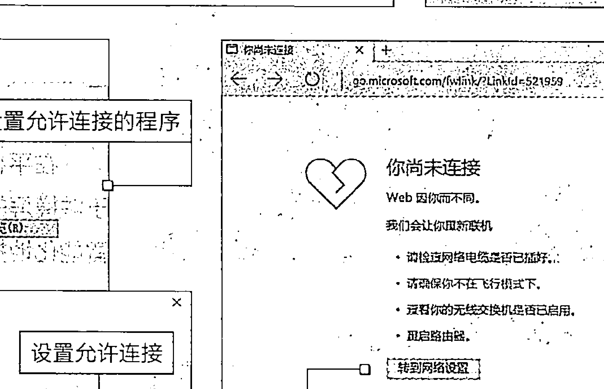

## 触发的判别 聪明的选择

用过最新版Windows 10操作系统后，你一定会有Windows变得更聪明了的感觉。平板模式或传统桌面会随着使用设备的不同而自动适应。输入法也好像变得“聪明”了一些，走到哪里都只认得自家的微软拼音，但这种“聪明”似乎有些过头。而以用户为中心的管理员账户选择，也变得让系统更安全；网络或本地账户的选择和切换也更随心所欲。智能触发功能多数情况下是“体贴”的，但有时也会给我们带些小麻烦，需必要的人为干预才能从根本上满足使用要求。


## 模式切换 要智能但也别任性

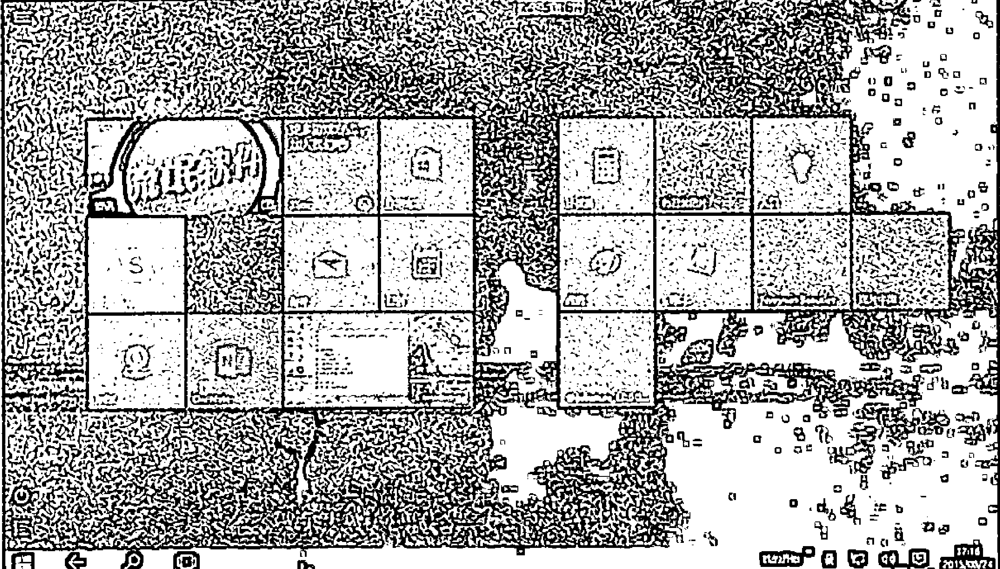

### 模式切换 如何判断使用

在经历了Windows 8不伦不类的模式设置之后，Windows 10痛定思痛，内置了全新的平板模式功能。这一功能可在用户使用具备二合一功能的设备时，提供更快速的模式切换。其具体原理是，根据当前所用设备是否为触控屏幕及是否有键鼠来综合判断是否要进入平板模式。

在平板模式下，为了适应于触摸屏的操作，开始菜单将智能化地扩大为全屏显示，任务栏图标自动隐藏，只留下三个类似手机控制按钮的图标，开始菜单中的全部程序和设置菜单也都藏起。平板模式下的桌面无法变成窗口化的风格，无法进行最小化或最大化的操作。如果要将平板或手机临时用作办公主机，可接入键盘（若有高清接口还可以接入大屏幕）切换到传统桌面模式，这时桌面窗口又变回传统窗口模式，变得可选、可缩放了（图1）。

**小提示：**
具备二合一功能的设备包括触控显示Windows PC或笔记本、触控平板电脑、触控手机、其他触控显示的Windows设备（如物联网设备）。这些设备需要安装最新版的Windows 10才能发挥智能模式切换功能。

### 开机进入哪个状态谁说了算

实际上，Windows 10的智能切换也不总是那么“倔强”，设备模式的自动切换还可以由用户来自行决定。假设我们要在拔掉平板的键盘和鼠标之后，依然要用传统模式的桌面；或者当一台触摸屏的PC接上键盘和鼠标后，依然要利用触摸方式演示，Windows 10提供的“智能体贴”就事与愿违，因为这时我们并不需要这些智能感知的东西。

这种情况下，我们可以不予理会系统的“智能”，强行规定每次开机自动进入平板模式。通过“设置”窗口的“系统→平板电脑模式”，将“当我登录时”选择为“自动切换到平板电脑模式”即可达到目的（图2）。

也许你已经注意到，在平板电脑模式设置窗口中，有一个“将设备用作平板电脑时使Windows更兼容触摸功能”的开关选项。当我们选择了该选项后，窗口均自动最大化且不能缩放，没有了标题栏和最小化、最大化和关闭按钮。但传统应用程序窗口，例如资源管理器、记事本、EmEditor、WPS等，它们还有还原按钮，但却形同虚设，无法改变尺寸，只能在最小化和最大化之间切换，这一切都是为适应触屏而设置。此外，不知你是否注意，任务栏上的图标间距会自动加大，虽然图标数量没有改变，但距离的变大能让触控变得更加轻松和不易错乱。而系统托盘的图标会按照默认的设置，只显示基本的网络、音量、通知中心等图标，其余的用户应用程序托盘图标会一律藏起。

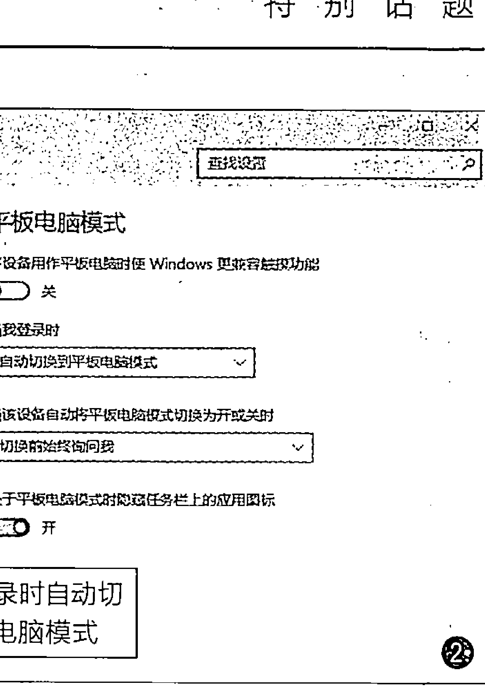

> > **小提示**
> 除了自动感知和用户强行设置自动显示模式外，还可以随时手动选择所用模式。具体方法是，点击系统托盘通知图标，然后点击“平板模式”按钮进行切换（图4）。

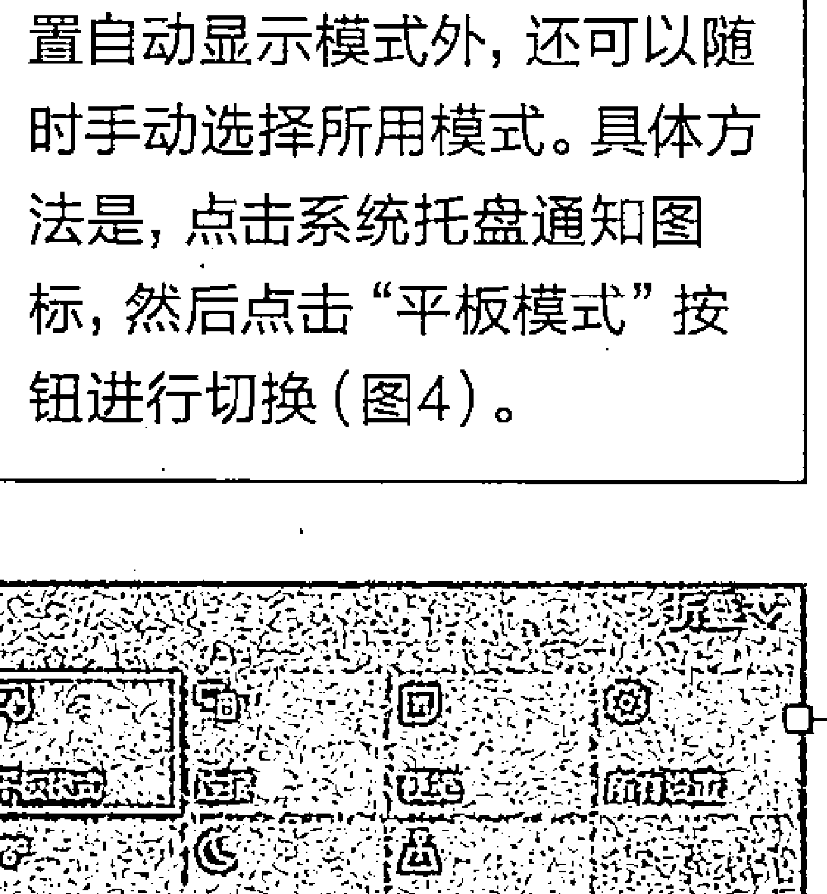

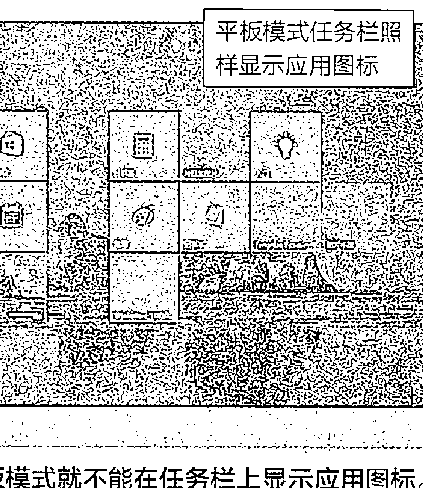

> > **小技巧**
> 别以为平板模式就不能在任务栏上显示应用图标。如果在系统设置窗口的“平板电脑模式”窗口中，将“处于平板电脑模式时隐藏任务栏上的应用图标”开关置于“关”的位置，那么即便电脑屏幕处于平板模式，任务栏上照样可显示应用图标（图3）。

## 输入法切换 你任性我更任性

在简体中文版的Windows 10系统安装之初，系统只内置了一种中文输入法——微软拼音。无论在哪个窗口或对话框中需要中文，系统都会很智能地切换到这一输入法。“聪明”的输入法只认识微软，这一看似非常体贴人的智能特性，有时却会给我们带来不便，不得不安装一款第三方输入法来解决问题。但是结果也不一定理想，当用户安装了第三方输入法后，可能会遇到在Edge浏览器或一些应用中无法切换到所装输入法的情况。这是为什么？又该如何解决？

### 第三方输入法失效的原因

按理说微软必应输入法是微软自家的输入法，但当安装了这款输入法之后，开启Edge浏览器在搜索框中输入关键词，切换为必应输入法后，发现输入的不是拼音串，而是完全的英文字母组合，根本无法转换出汉字来。这究竟是为什么？

让我们打开系统的“键盘”设置窗口，看看关于必应输入法的设置。在键盘设置下方的必应Bing输入法列表下方，赫然标注有“输入法(仅桌面)”的提示信息。显然，这款输入法仅对桌面应用程序有效。而Edge浏览器是作为一款应用内置在系统中的，因此无法被必应输入法所支持（图5）。

为了验证这一点，我们打开另一个桌面应用软件——金山WPS文字，开启一个空白版面，然后将输入法切换到必应输入法，可以正常输入汉字。WPS文字是一个传统的桌面应用，这说明了以上结论的正确性（图6）。

### 让第三方输入法兼容Windows 10

明白了以上道理后，要让第三方输入法兼容Windows 10应用，首先要选择支持应用中输入汉字的输入法。此外，由于Windows 10刚刚推出正式版，许多输入法要获得和它的完美兼容，需要一个升级过程。因此，如果原来使用某款汉字输入法，安装之后发现不能很好地兼容Windows 10，不妨先看看它有没有最新的升级版，升级一下也许就能获得支持。

此外，如果暂时没有能解决，可以临时寻找替代方案。对于使用简拼和混拼输入的用户来讲，暂时性的替代基本上不需要第三方的输入法，仅对微软拼音进行一些技术性设置一般也能满足输入要求。对于那些因为没有双拼方案或其他某项特别设置的用户来讲，可暂时寻找一款与Windows 10兼容比较好的输入法来代替。例如，选择百度拼音输入法。这款输入法无论与Windows 10的传统应用还是磁贴应用都可以很好地兼容，且其中可以设置贴近于其他输入法的多数特性（图7、图8）。

> 除了以上原因外，还有一些传统的为桌面开发的输入法也不能支持Windows 10应用环境下的输入。这往往是因为输入法与Windows 10的兼容性差造成的。改善的方法要依靠第三方输入法在版本升级时，根据Windows 10应用程序的开发标准去完善。有的网友在最初测试搜狗输入法时发现兼容性不好，某些应用中无法用它来输入汉字，但没过几天，搜狗输入法升级了，兼容问题也就迎刃而解了。

### 如何将第三方输入法设为默认

在获得了一款得心应手的第三方输入法后，将其设置为系统默认的输入法更为方便。一种方法是通过系统输入法设置进行默认设置（图9）；另一种方法则是通过第三方输入法设置窗口，选择“设置为默认输入法”（图10）；还有一种方法则不需要进行任何设置，直接用热键来启用第三方输入法，例如用“Ctrl+;”组合键来随时启用百度输入法（图11）。

### 如何删除微软拼音输入法

要删除系统自带的微软拼音输入法，可先添加自己所需的第三方汉字输入法，然后进入系统输入法设置窗口，选择删除微软拼音输入法。注意在只有一个微软拼音输入法的情况下，系统是拒绝删除该输入法的。

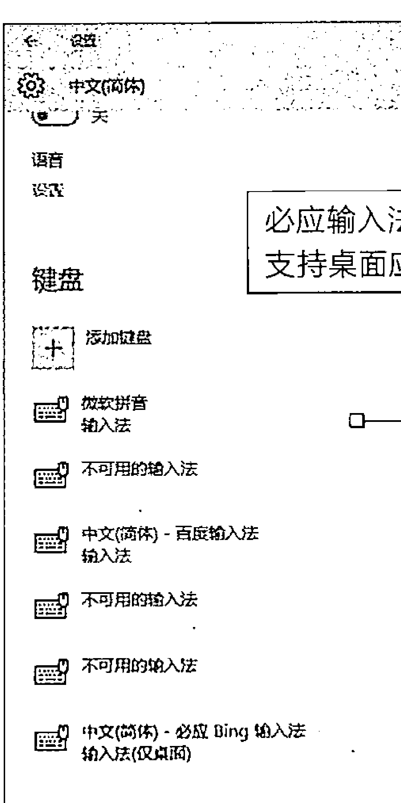

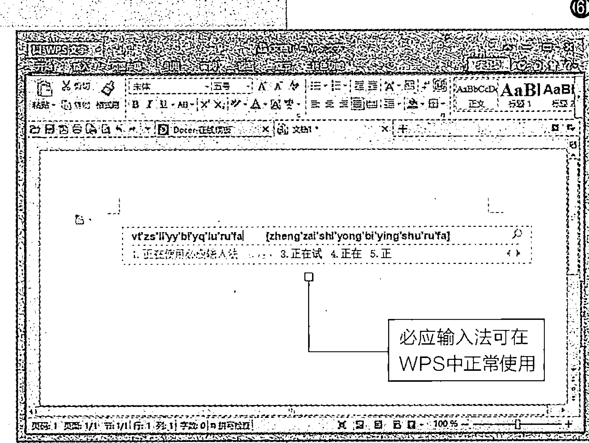

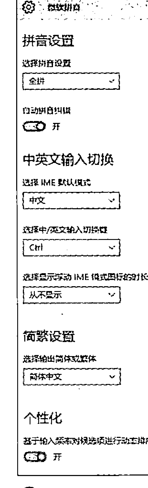

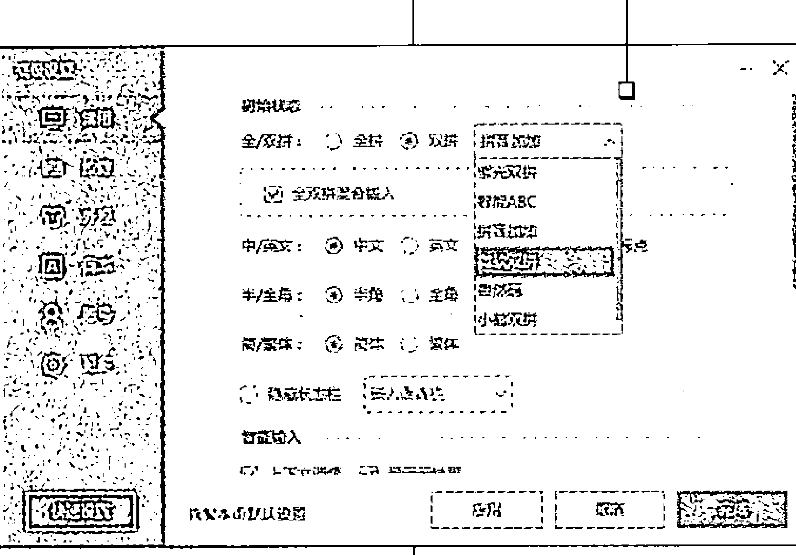

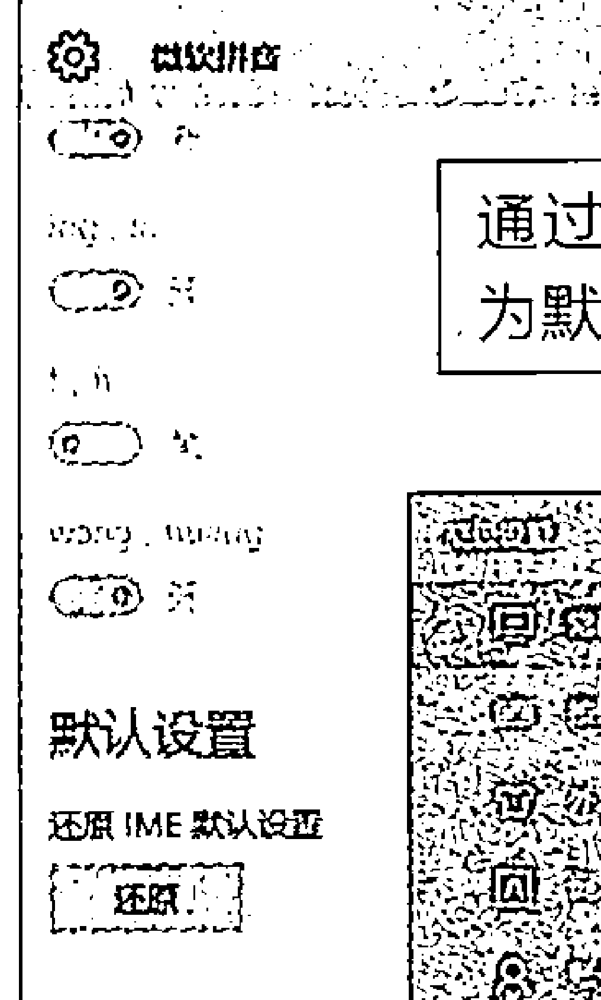

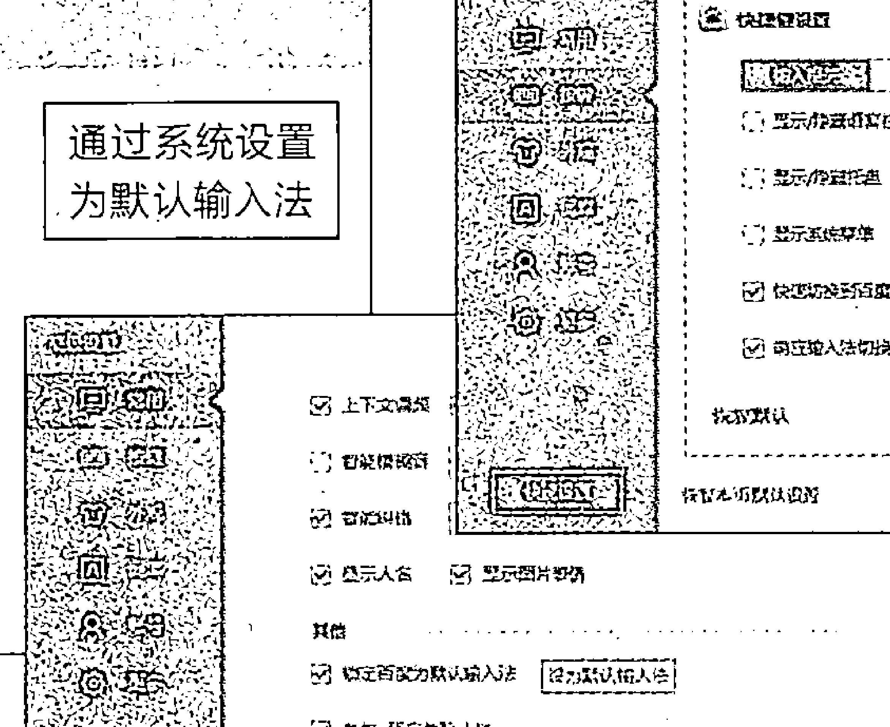

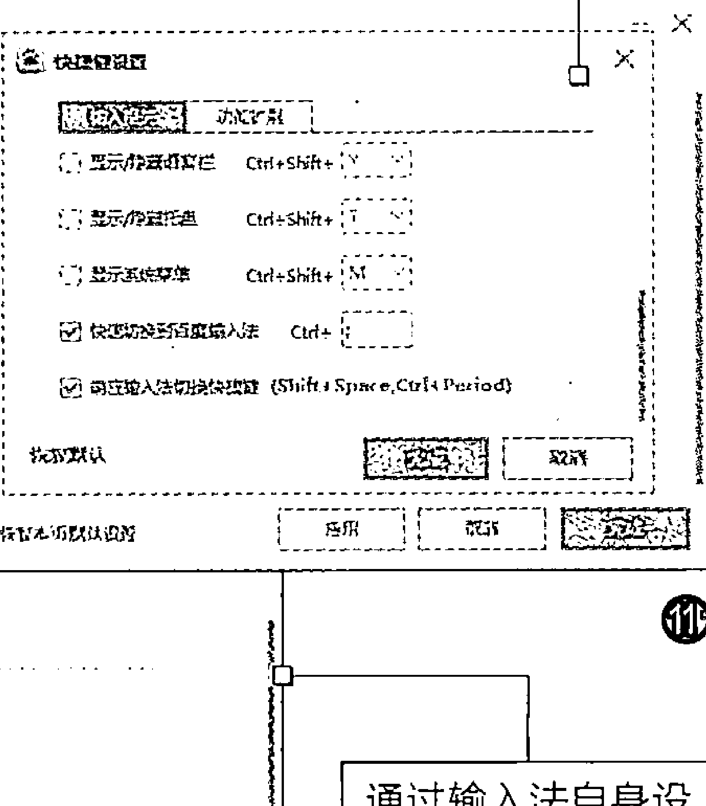

设置微软拼音输入法

设置其他输入法类似特性

通过系统设置为默认输入法

通过输入法自身设置为默认输入法

直接用热键启动需要的输入法

## Windows 10账户随心切换

在以往的低版本Windows系统中，安装默认的管理员账户是Administrator，有着较高的权限，无论是用户还是黑客，一旦取得了这一权限，就可以为所欲为。Windows 10采用了新的用户授权模式，在安装之初，不会启动直接进入Administrator管理员账户。安装默认建立的用户账户虽然也显示为管理员级别，但是不具有原来的Administrator的权限，而原来的Administrator账号被默认禁用了。Windows 10聪明地屏蔽了这个功能，是为了让系统更加安全可靠。

如果需要启用被禁的Administrator账号，并且切换到这一账户，那么应该怎么做呢？

右键单击‘开始’按钮，在弹出的快捷菜单中选择‘计算机管理’启动计算机管理窗口（图12）。依次选择‘系统工具→本地用户和组→用户’，在右侧窗口中点击Administrator一项，选择弹出菜单中的‘属性’（图13）。在‘Administrator属性’窗口的‘常规’选项卡下，将‘账户已禁用’复选框前的‘√’去掉，点击‘确定’按钮（图14）。之后按下‘Win+L’组合键，在锁屏界面就可以看到用户切换列表中就出现了Administrator用户，选择该用户就可以用它来登录Windows 10了。

通过开始菜单的右键菜单进入控制面板，沿着‘控制面板→所有控制面板→用户账户→管理账户’路径，进入‘选择要更改的用户’列表，可以看到Administrator的管理员账户已经显示在列表中了（图15）。可以看出，在如上图所示的列表中，已经添加了三个管理员账户，其中两个是本地账户，一个是网络账户。无论是本地账户还是网络账户，在登录或注销切换时具有同等地位，用户可以在账户列表中任意选择切换登录。

关于本地账户和网络账户的选择，可以在安装的时候根据当时的有无网络进行选择。若安装Windows 10系统时网络状况不好或在无网的情况下用安装映像包进行安装，则可以不建立网络账号，直接选择建立本地账户，安装过程中也可以绕过安装密钥的输入，直接进入安装过程。待安装完成后，在网络好的情况下，再行建立网络账户，并输入安装密钥激活系统（图16）。

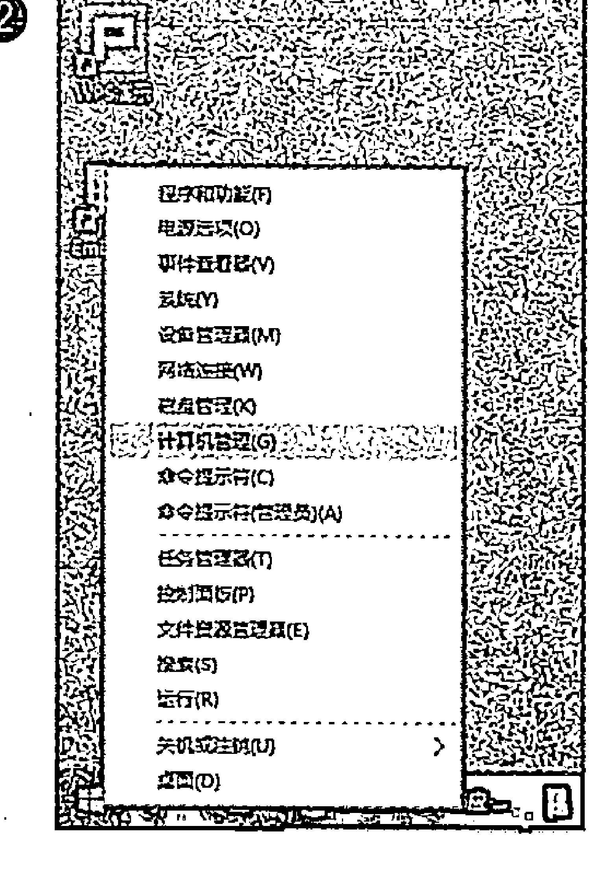

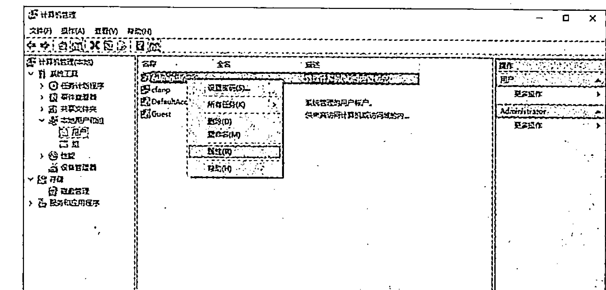

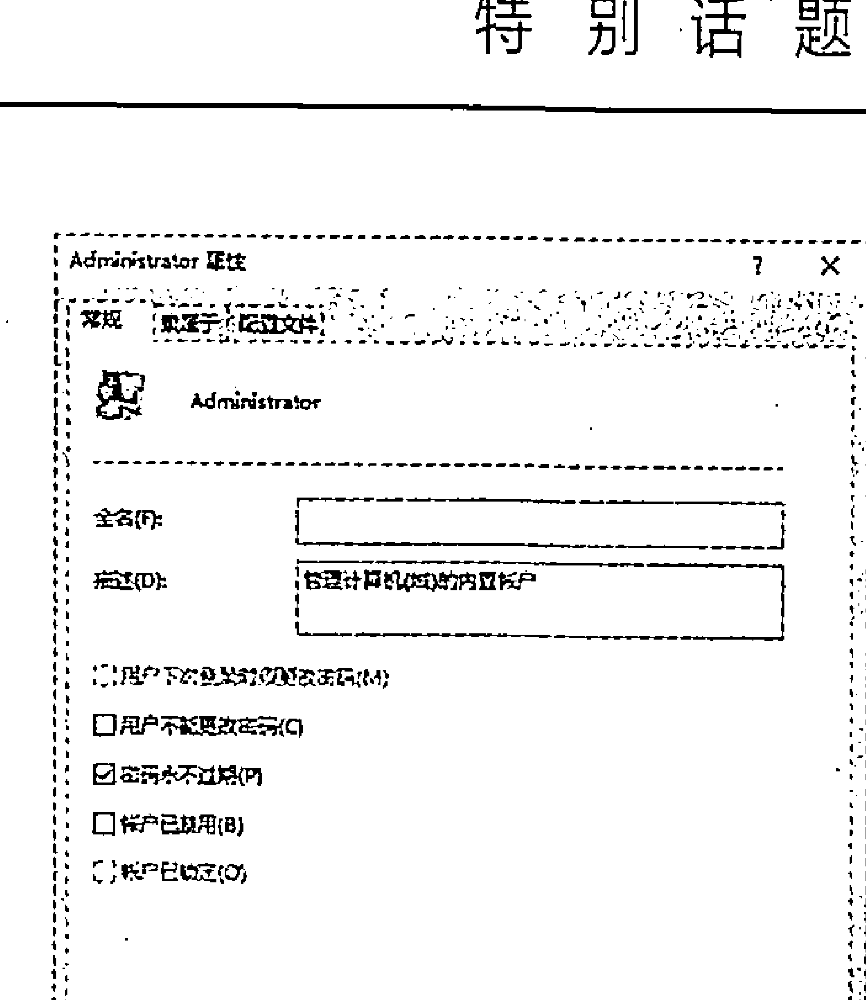

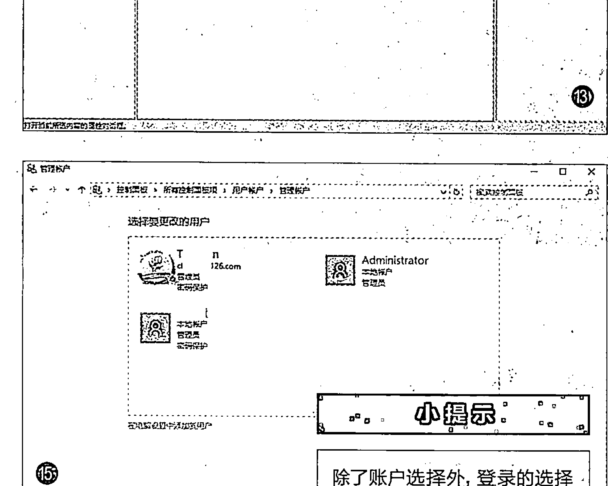

除了账户选择外，登录的选择和切换也很灵活多样。我们不但可以选择网络账号、本地账号密码登录，还可以选择形式简单但更加安全的PIN码登录，此外还可以选择头像识别或在设备具备的情况下采用指纹、虹膜识别等生物识别功能进行安全登录。且如果开启了多种登录选择后，在登录的界面用户名下方，会给出多种登录选择，用户可以灵活选择登录的方式。

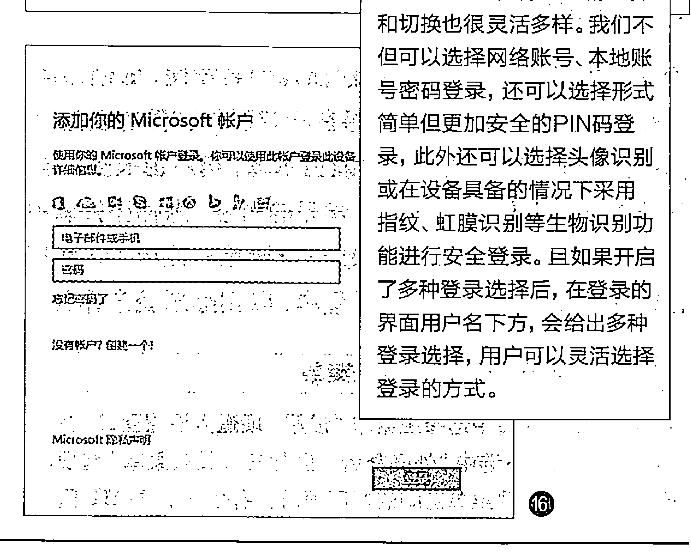

## 中外软件 谁能在PK中获选

文|刘蓓

国产软件虽然不乏优秀者，然而我们会发现，即便是超人气的QQ这样的软件，也是在学习国外软件的基础上而来的。按说国产软件的功能也不弱，用户也很多，但国外软件为何总是国产软件学习的对象，为何国外软件口碑总是始终如一，而国产软件屡遭用户贬斥？让我们在对几款软件的对比使用过程中，以实际感受来作答。

| 小技巧 | 藏起好压的右键长菜单 |
| :--- | :--- |
| | 通过在好压主窗口中选择主菜单“设置”项进入设置窗口，在“综合”选项卡下选中“外壳整合->层叠右键关联菜单”选项，可将霸占一级右键菜单空间的好压项目整合在一个菜单项下。 |

### 7-Zip VS 好压等

作为文件压缩解压软件，7-Zip一直是人们称道的一款国外免费软件。而国内的好压、360压缩等也很优秀，用户也不少，但它们之间的确还存在着显而易见的差别。

我们首先看7-Zip的安装界面(图1)，双击安装程序运行，没有任何捆绑或多余选项，三次点击“Next”并确认协议之后，点击Install即可完成安装过程。没有任何拖泥带水和捆绑“阴谋”或“阳谋”。我们再看国产2345好压的安装过程，运行安装程序，首先出来的界面虽然有“一键安装”按钮，但更显眼的是对其品牌和股票的宣传，甚至注明了股票代码，这虽然不是软件捆绑，但的确是一种营销宣传，而且对于安装软件的人来说，不一定需要关心其股票如何，所以这对消费者是一种可有可无的信息，纯属软件开发商一厢情愿（图2）。如果说在安装过程中的“捆绑”还有情可原，那么升级过程中附带的“热情”就让人有点难为情了。好压的升级过程默认是自动开启的，当你执行一个压缩或者解压任务的时候，软件会在后台自动检测新版本的存在情况，然后进行后台升级，升级界面出现后你会发现在确定按钮下方有两个不起眼的选项，一个是将2345网址导航设定为浏览器首页的选项，另一个是安装安全卫士的此项，安装者一不小心点击“确定”按钮，那么恭喜你，浏览器首页变了，安全卫士也从此赖在你电脑中了（图3）。

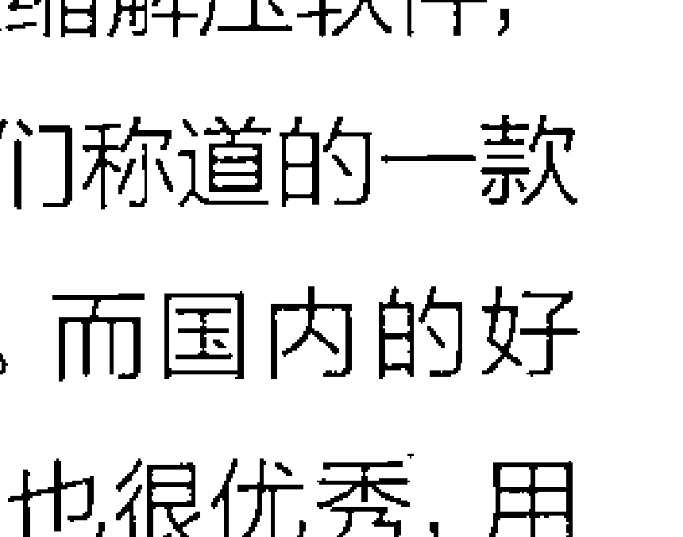

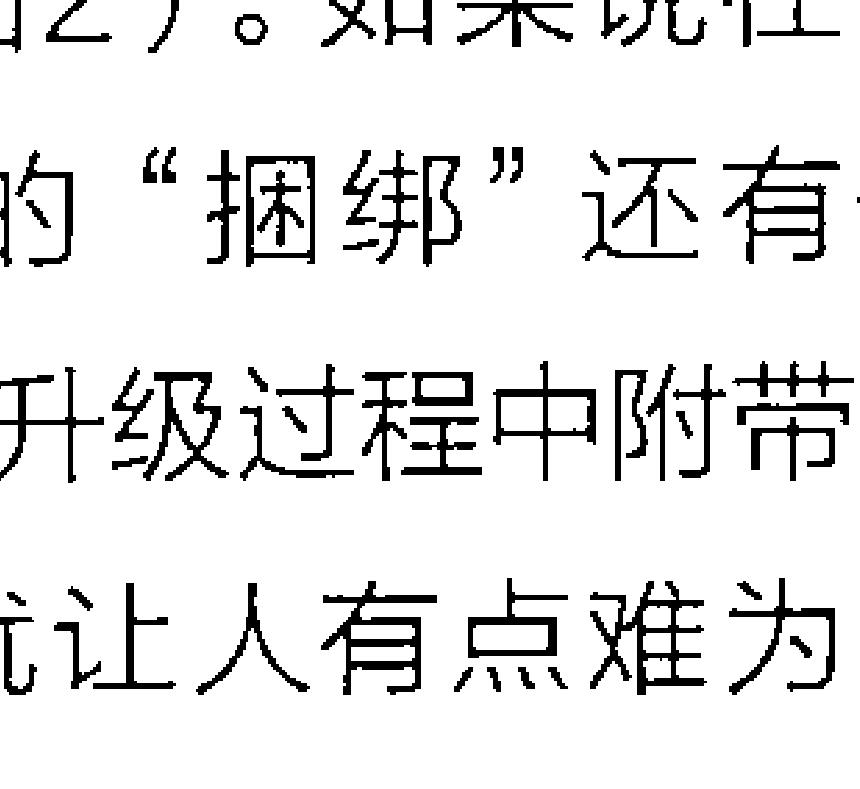

在使用方面，我们选择了三个文件通过右键菜单进行压缩。首先可以看到7-Zip很体贴地将自身的右键菜单集合为仅占一个“席位”的一级菜单，但好压却独霸了右键一级菜单的6个席位(图4)。这与其说是体贴，还不如说是霸道。试想如果360压缩还有其他压缩软件一起安装在这台电脑上，光两个压缩软件就霸占10多个右键菜单项目，别的软件的右键菜单还有多少容身之地呢?

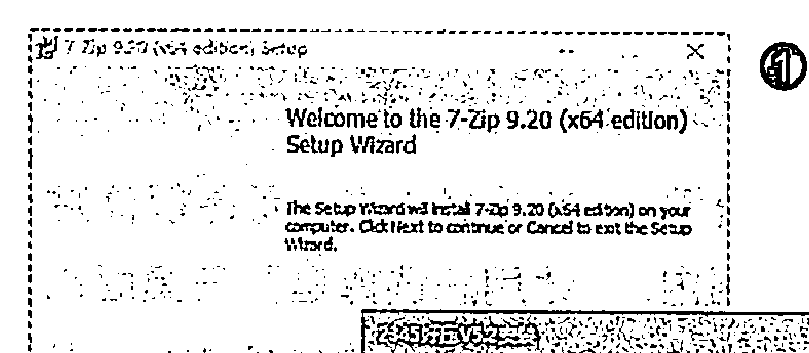

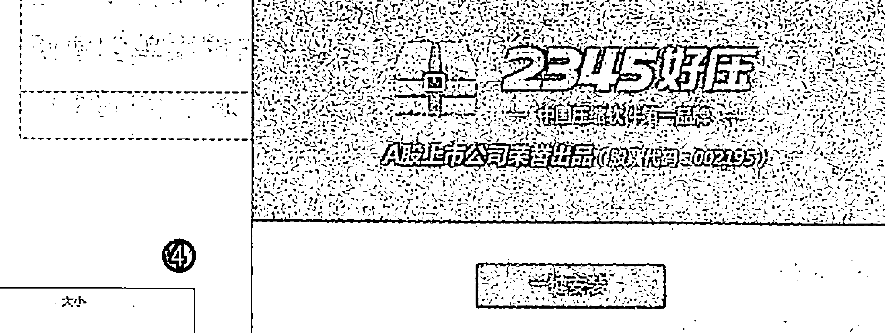

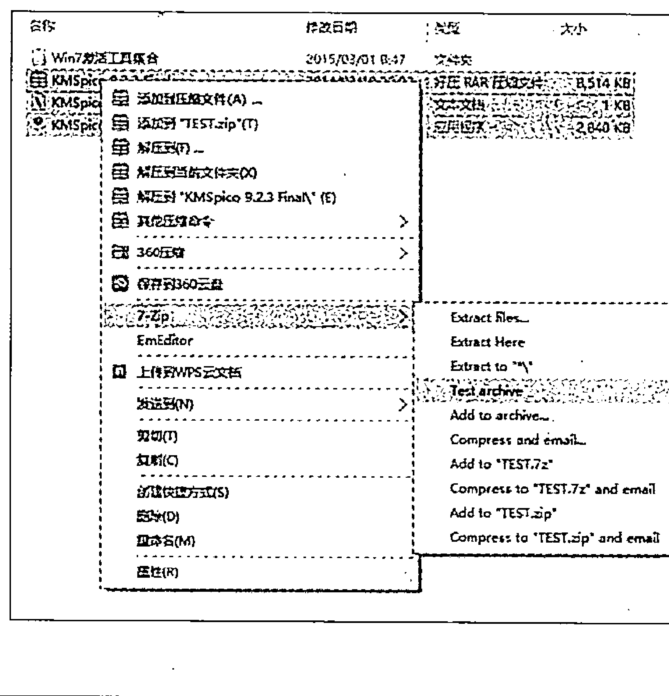

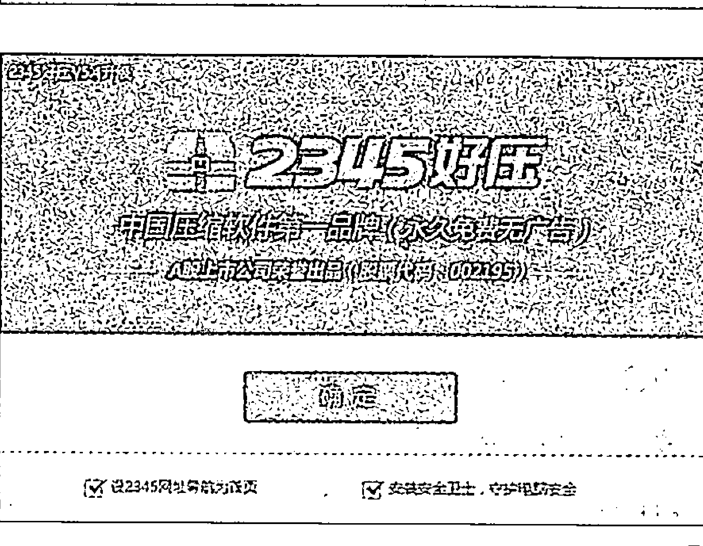

### DriverAGENT VS 驱动精灵等

再看一款国外的驱动管理软件DriverAGENT。安装过程是同样的纯粹干净(图5)，点击“下一步”一键完成安装，没有任何捆绑或宣传成分(图6)。

DriverAGENT在使用方面借助于庞大的、不断更新的网络驱动数据库，在线检测给出本机驱动的现状和已过期的更新列表。报告在网页中在线产生，点击Update按钮可及时在线更新需要更新的设备驱动(图7)。

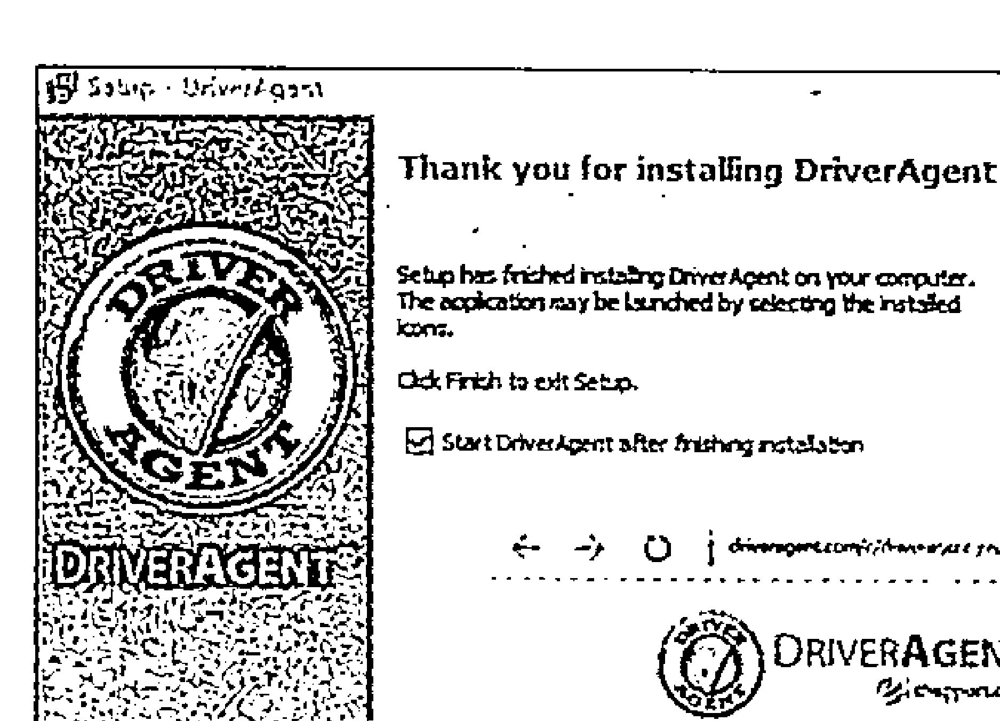

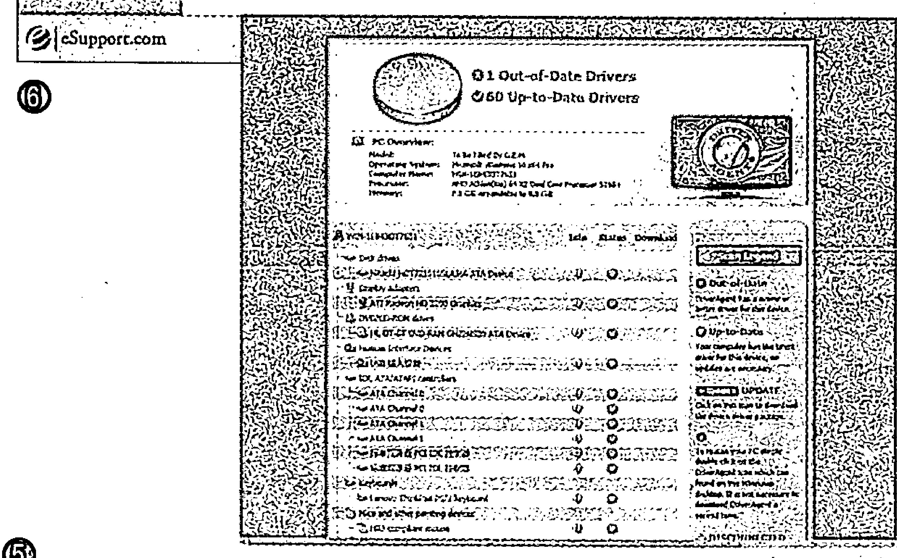

在国内赫赫有名的驱动管理软件有驱动精灵、驱动人生等，这些软件在安装和使用过程中无一例外地存在软件捆绑和推广的行为，给人们的使用过程带来不爽。甚至在卸载过程中，还会出现一些让人啼笑皆非的环节。例如，在卸载驱动精灵时，它会所答非所问地告诉你，检测到电脑里的垃圾过多，问你是不是清理垃圾为电脑提速(图8)。而“准备卸载”的按钮被淡化成一个让眼神不好的人根本可以忽略的小字链接。可见，再好的驱动软件，如果在安装或更新驱动的过程中给用户又惹出一堆麻烦，甚至驱动的问题没有解决，却招来一堆无关的软件，那才让人郁闷呢!

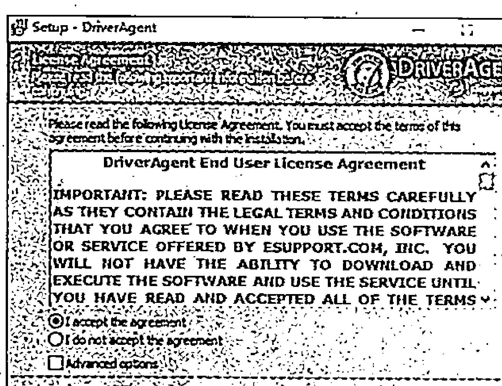

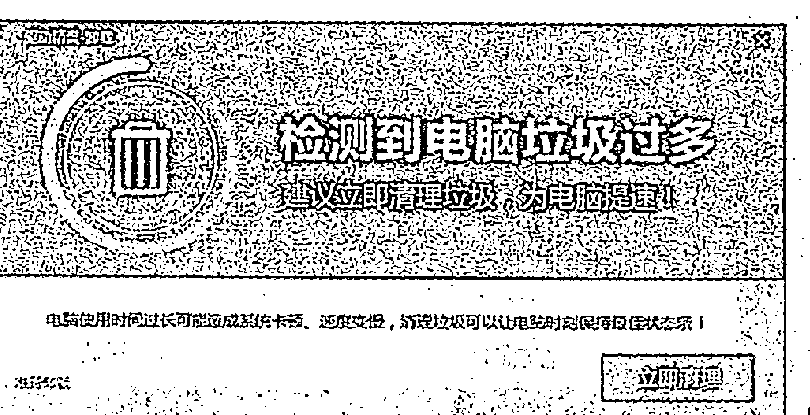

### CCleaner VS 360安全卫士等

CCleaner可谓系统清理优化软件的“鼻祖”，国内许多清理优化软件都是在向它学习的基础上而开发的。但是，时至今日，在众多利益诱惑面前，这款国外软件一向保持它纯净的特色，在功能不断增强中持续受到大家的关注和青睐。

安装过程中运行安装程序，出现一个“大鸭梨”安装界面（图9）。直接选择自己所用的语言（我们选“简体中文”），点Next之后点击“下一步”，便会拥有一款正式版的CCleaner软件了。临近安装结束时，会出现一个选项窗口，但这些选项可不是国产软件在安装结束后的捆绑或推销之举，而是很体贴地让用户选择是否在桌面创建方便访问的快捷方式，是否在回收站右键菜单创建便于清理的操作命令等（图10）。

在使用方面，CCleaner实时地加入了对新式的Edge浏览器、Windows应用商店的清理支持，加上它原来就有的系统垃圾、系统注册表的清理功能，始终如一以传统的三栏菜单形式清晰地将功能展现在用户的面前（图12）。而软件自带的卸载工具、启动项清理工具、磁盘分析器、重复文件查找器、驱动器擦除器、系统还原工具等，可为用户优化系统提供非常丰富的功能选择（图13）。

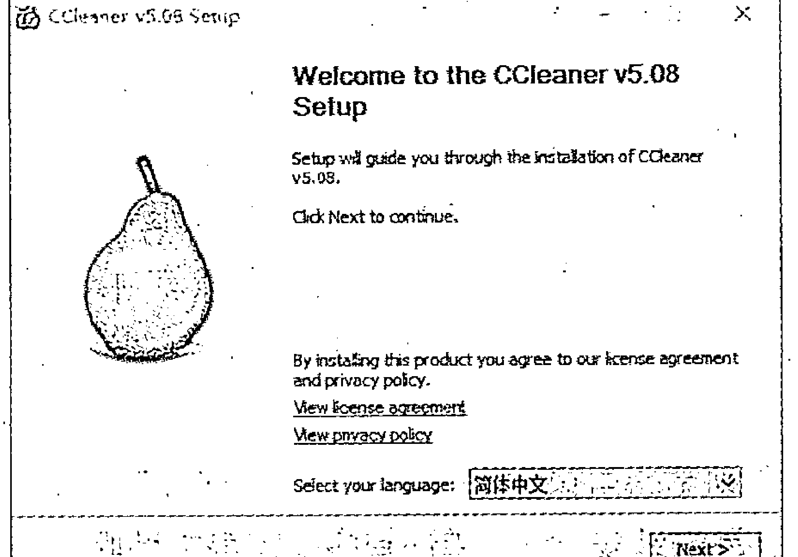

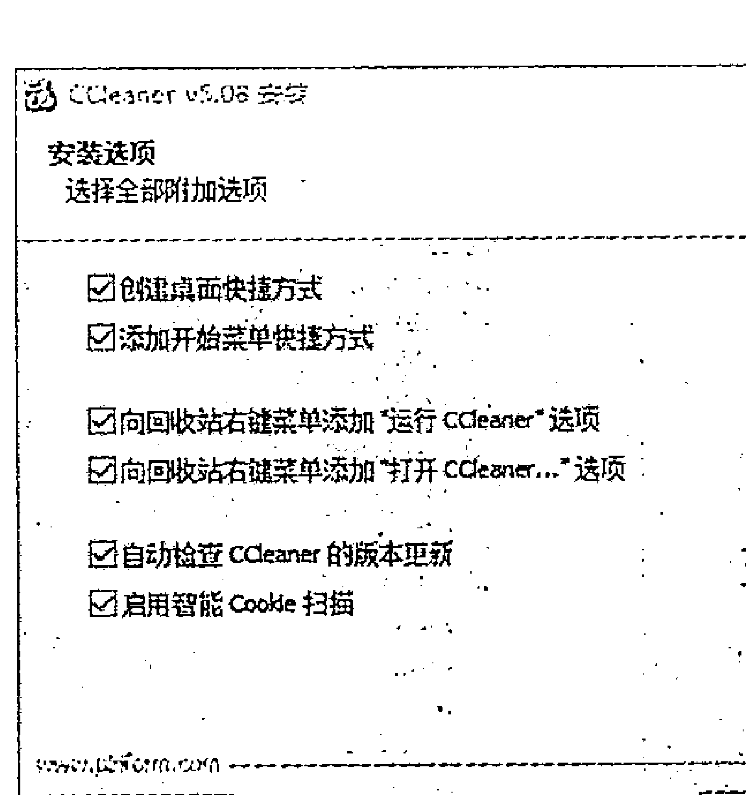

> 小提示：软件虽然在最后也推荐了一款全球知名的Google Chrome浏览器，但“明人不做暗事”，这种显眼的捆绑也让用户很容易做出抉择，不会像一些国产软件那样偷偷摸摸或似是而非地进行捆绑，让人很容易选错或在不经意间安装了不该安装的软件（图11）。

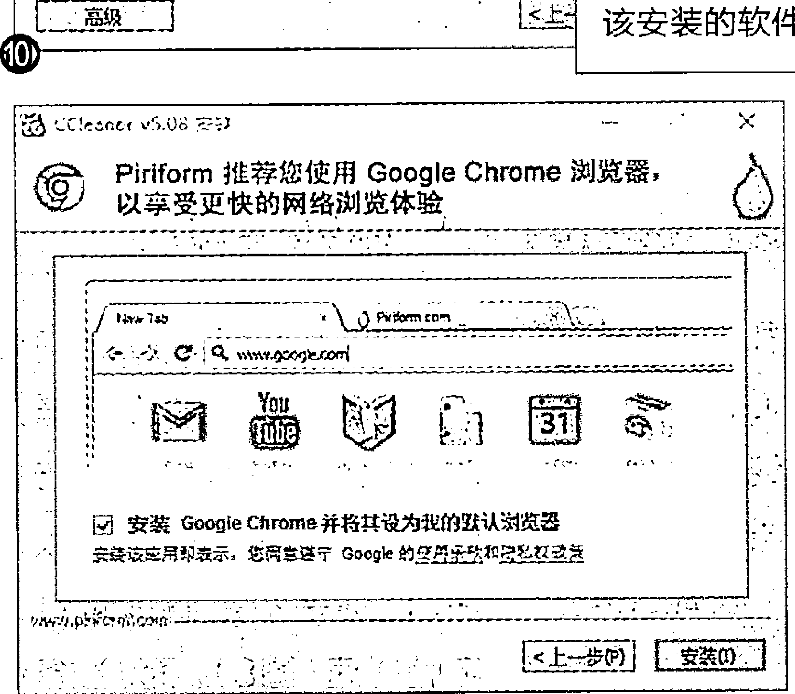

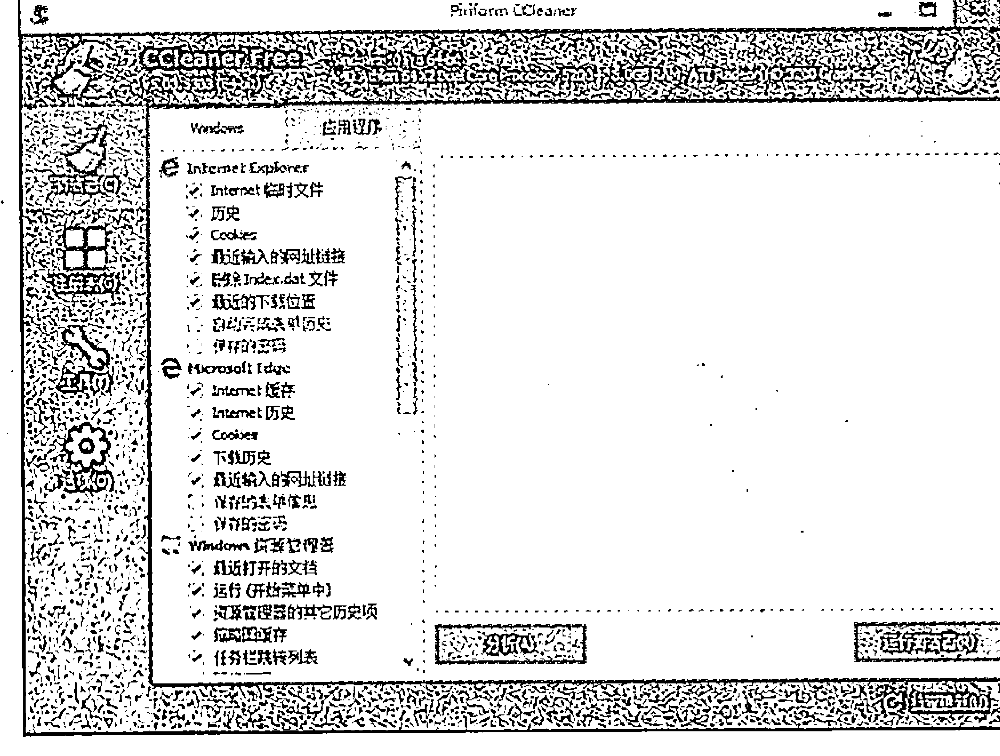

> 小提示：与此对应的是，一些国产的清理软件隔三差五屡屡更新界面，表面上看好象它们很注重创新和改革，但实际上往往让人好不容易熟悉了它，又有一种“丈二和尚摸不着头脑”的感觉。品牌的效应在于不变中求万变，而不在于丢掉不变的东西，生出来一堆让新老用户都不认识又不习惯的东西。Windows 8的前车之鉴就是反面的“典型”，而Windows 10的经验又何尝与CCleaner的风格发展之路不像呢？

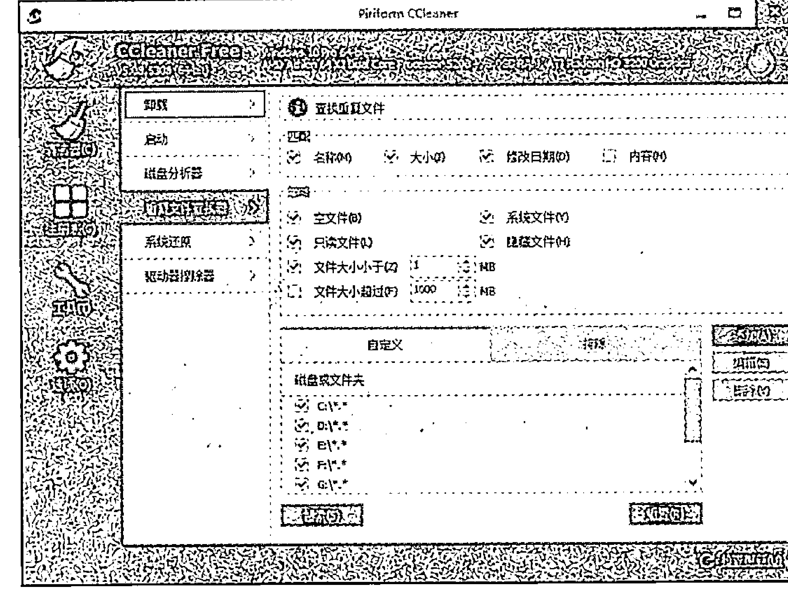


### 3D Clipboard VS QQ剪贴板

刚刚复制的内容又要用到，这一点我想大家都遇到过。于是，类似于QQ剪贴板这样的小软件受到大家的青睐。然而，要使用QQ剪贴板，需要先安装QQ拼音输入法，然后以一个插件的形式去开启它才能使用。虽然工具也短小精悍，但毕竟开启它多有不便。而且作为QQ拼音的一个附属品，它的成败伴随着QQ拼音，若不喜欢用QQ拼音或QQ拼音安装使用过程中出现捆绑或弹出等问题，那么同样也会给其剪贴板的使用带来不良影响。

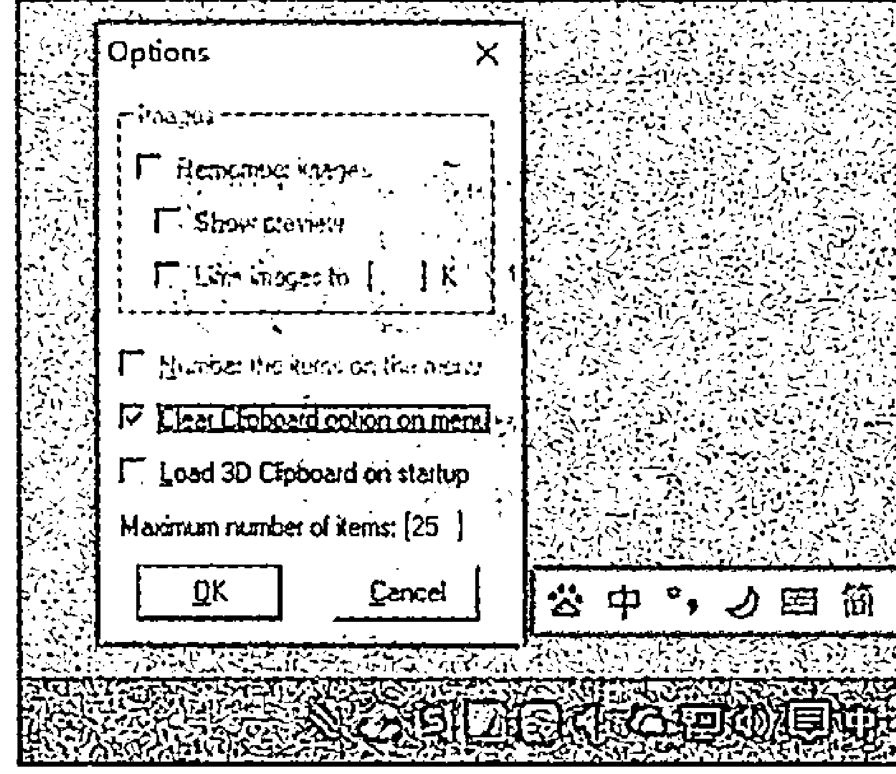

其实，在好多年以前，国外就有一款仅53KB的小剪贴板工具3D Clipboard，它对高低各个版本的Windows都能兼容，目前的Windows 10也能很好地运行这一程序，程序只有一个EXE文件，只需将其右键“固定在任务栏”上，使用时点击一下就常驻内存了。之后，每复制一条信息，在这个“曲别针”形的软件菜单中就会列出这条信息，需要复用时只需点一下再粘贴就可以了。软件最多可设置留存50条信息，作为临时使用一般也够用了。如果每天需要用到这个软件，还可以干脆开启它的开机自启动选项，这样它就常驻系统托盘供你随时调用了（图14）。

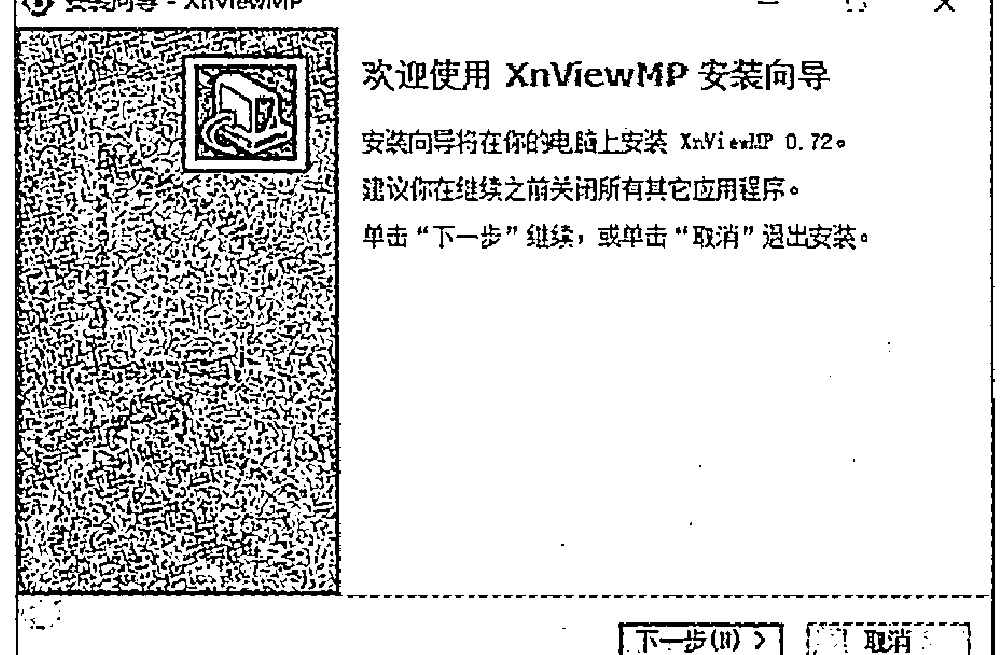

> **小提示**
>
> 3D Clipboard的运行需要msvbvm50.dll库的支持，在低版本系统中也许不需要这个文件，若在高版本系统中未找到这个文件，可从低版本系统中拷贝或从网上下载一个拷入系统SYSTEM目录或3D Clipboard所在的目录即可。

> **小提示**
>
> 一些国产软件“热心”过头了，满足用户的虚荣心，使用“最好的”、“最大的”、“最强的”的等违禁广告用语，传递的数字概念容易符合用户预期，但赠送的“全家桶”和捆绑的各种明暗行为却容易出现许多问题。所以建议用户在选择时，以实际需求为出发点来选择，莫被一些花里胡哨的功能和宣传所迷惑。

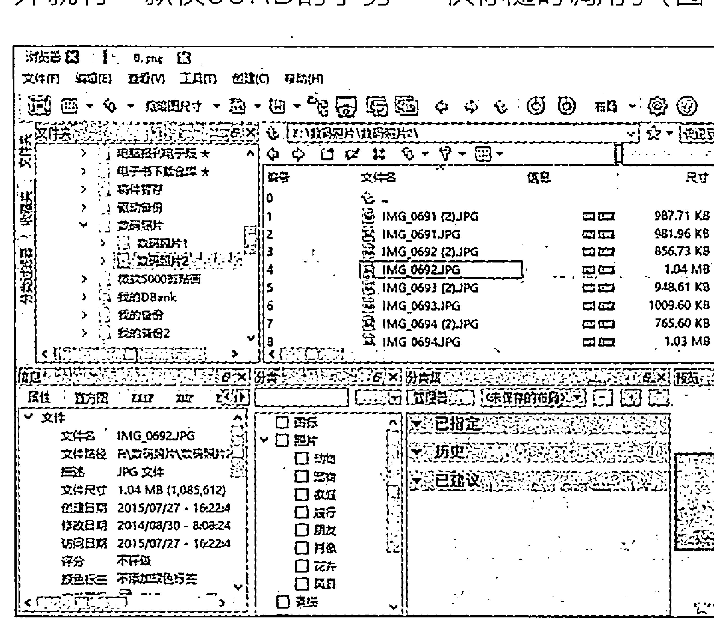

### XnViewMP VS 美图看看等

说起看图，人们在对系统自带的图片浏览器不满之余，总要安装一款看图软件。此前的ACDSee因为收费而使用受到限制，但国外的一款XnView免费软件却受到人们的青睐。现在虽然类似美图看看、2345看图王等国产免费看图软件也很火，但用XnView这款经典外国软件的人也还很多。目前该软件已推出更新的版本XnViewMP版，有32位和64位可选，支持Windows 10系统下看图。

安装XnViewMP，软件会自动侦测到用户使用的语言，沿着安装向导一路点击“下一步”即可完成安装过程，安装过程干净利落，不捆绑任何软件和广告信息（图15）。XnViewMP运行需要使用VC ++ 2008运行库，安装过程中会自动下载安装，不需要用户另找。因此，安装结束后，如果在系统控制面板的程序和卸载列表中出现VC ++ 2008运行库，也请不要奇怪这个程序的来源而随意将其卸载，否则会造成XnViewMP无法正常运行。

在看图操作过程中，XnViewMP以两种模式提供给用户使用。一是图片预览模式（具备较系统预览图片功能更强大的图片预览选择模式）；另一个是图片资源管理模式（等同于一个专门管理图片的资源管理器，具备图片的基本处理和展示功能）（图16）。

## 要安全不要流氓 卸载不要的安全软件

文|技术宅

日常操作中由于各自的喜好不同，很多人经常会在使用某杀毒软件一段时间后换另一款杀毒软件，这样就要将原来的杀毒软件卸载。可现在很多杀毒软件为了保护自己不被病毒、木马恶意卸载（当然也有死赖在用户电脑中的目的），往往使用一些特殊保护手段来保护自己，导致用户无法顺利卸载它们。比如使用瑞星杀毒软件的用户，在卸载完瑞星杀毒软件后，系统中经常会遗留“瑞星软件部署系统”无法清除。对于类似无法正常卸载的安全软件，我们可使用不同的方法进行处理。

日常操作中，还有很多类似软件如AutoCAD、Office套件等，由于误删这些程序的文件，或者第三方卸载不彻底，都会导致无法正常卸载的问题，此时均可尝试重装卸载法。

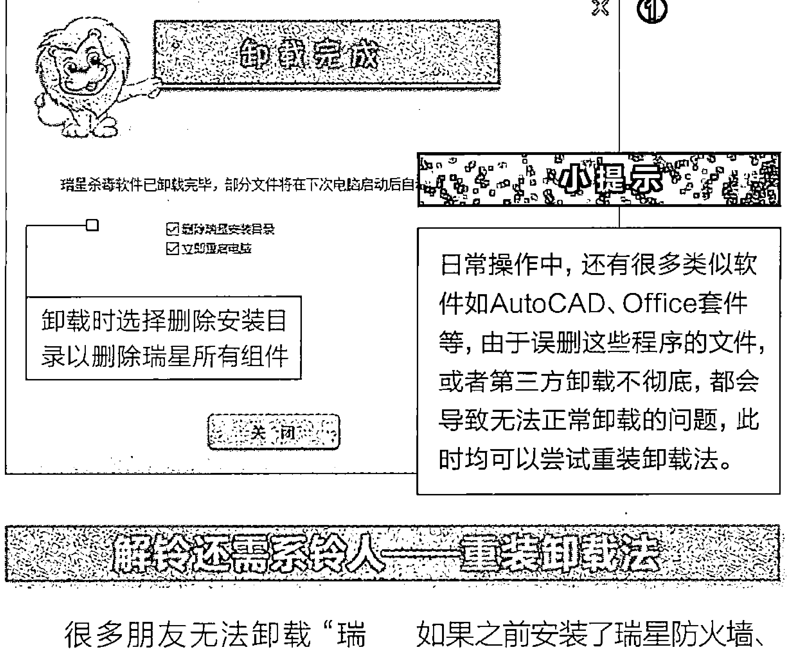

### 手动删除残留文件

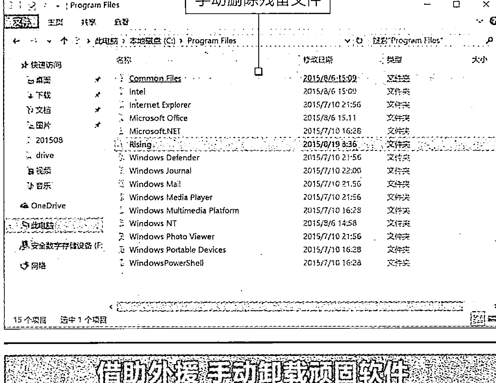

### 借助外设手动卸载软件

对于正规的软件，一般通过上述方法都可以完全卸载。不过对于本身就是流氓软件，上述方法可能仍然无法完全进行卸载。对于这类软件，可以借助一些专业监测软件如Total Uninstall进行检测卸载。首先准备好无法卸载软件的安装程序（如果本机提示无法安装，可以到另外电脑上安装）。这里主要借助Total Uninstall（以下简称为TU）提取软件安装前后的数据，然后使用手动方法进行删除。启动TU后点击“文件→安装新程序”，然后选择瑞星杀毒软件开始安装。完成瑞星杀毒软件安装后切换到TU的“安装程序列表→瑞星软件部署系统”，在右侧窗格可以看到该软件安装前后的数据变化(图3)。现在根据上述信息，打开相应的目录将其中增加的文件依次删除即可（对于无法删除的文件，可到安全模式或PE系统中进行删除）。

很多朋友无法卸载“瑞星软件部署系统”，原因主要是由于这个组件是瑞星所有软件的升级管理检测组件，默认情况下它有个钩子函数会在后台监测瑞星软件的升级、运行。很多朋友在卸载瑞星杀毒组件的时候，不是使用其自带的卸载程序，如使用XX管家等第三方软件进行卸载，导致卸载不完整。这样在试图卸载“瑞星软件部署系统”时，它会监测到本机仍然有瑞星软件在运行，从而导致该组件无法卸载。了解“瑞星软件部署系统”无法卸载的原因后，我们就可以使用重装/卸载方法进行卸载。首先下载瑞星杀毒软件完整安装包再次安装，如果之前安装了瑞星防火墙、卡卡助手等用户，请下载对应安装包再次安装。打开“控制面板→程序/卸载程序”，选中“瑞星杀毒软件→更改/删除→开始卸载→放弃奖品卸载→确认验证码→卸载完成→选择删除瑞星安装目录(图1)。接着重启电脑，再次进入系统后重复上述步骤卸载“瑞星软件部署系统”即可。完成上述操作后，打开资源管理器，手动删除C:\RavBin（瑞星病毒隔离库文件夹）、C:\Program Files\rising（瑞星残留安装目录文件）即可完全卸载瑞星杀毒软件了（图2）。

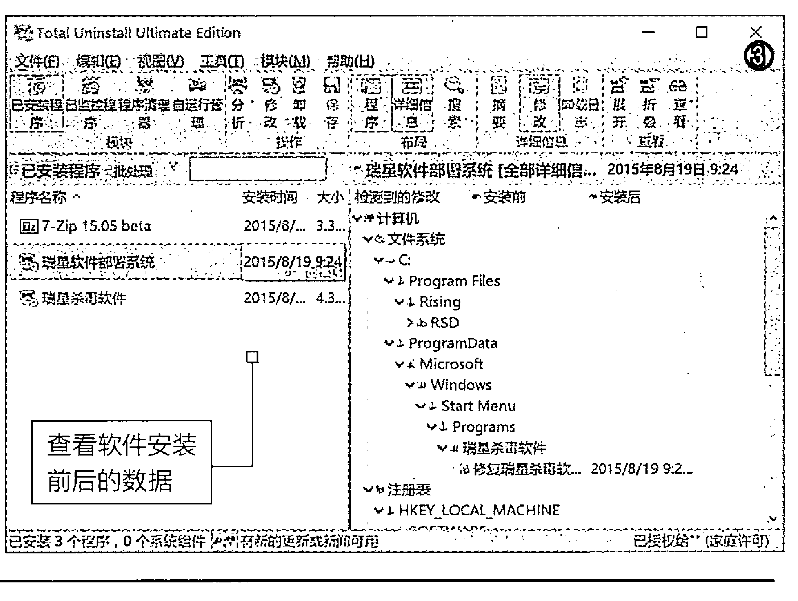## 国产SSD实惠来袭

当128GB SSD的价格跌入300元左右的价位区间时，还有人会怀疑它的市场潜力吗？不过，如今市面上超低价SSD都不是我们熟悉的一线大牌，而更实惠的国产SSD是否值得选择呢？

## 国产SSD的“价格战”

随着SSD价格的一路走跌，以及以笔记本为代表的移动设备对高速存储性能的需求，SSD的市场潜力被无限挖掘了出来。与之对应的，则是国产SSD品牌的迅速崛起：金胜、金泰克、金速、光威、金维胜、创见、必恩威、德乐、士必得(图1)……与我们熟悉的闪迪、三星等一线品牌相比，这些国产SSD的价格要便宜20%~40%(同容量时)。那么，我们应该如何看待国产SSD挑起的“价格战”呢？

SSD闪芯调查 品牌筛选 #99个筛选
品牌: [G-SKill] [SAMSUNG] [Kingston] [PLEXTOR] [Transcend] [Intel] [SanDisk] [Galaxy] [ADATA] [Kingmax] [OCZ] [Crucial] [TOSHIBA] [Netac] [Gloway] [LITEON] [Tigo] [KingSpec] [Teclast] [Panasonic] [Fujitsu] [Shinedisk] [Mushkin] [Ashata] [KingFan] [TERAOK] [Corsair] [金百达] [KingDian] [ADATA] [闪雷]

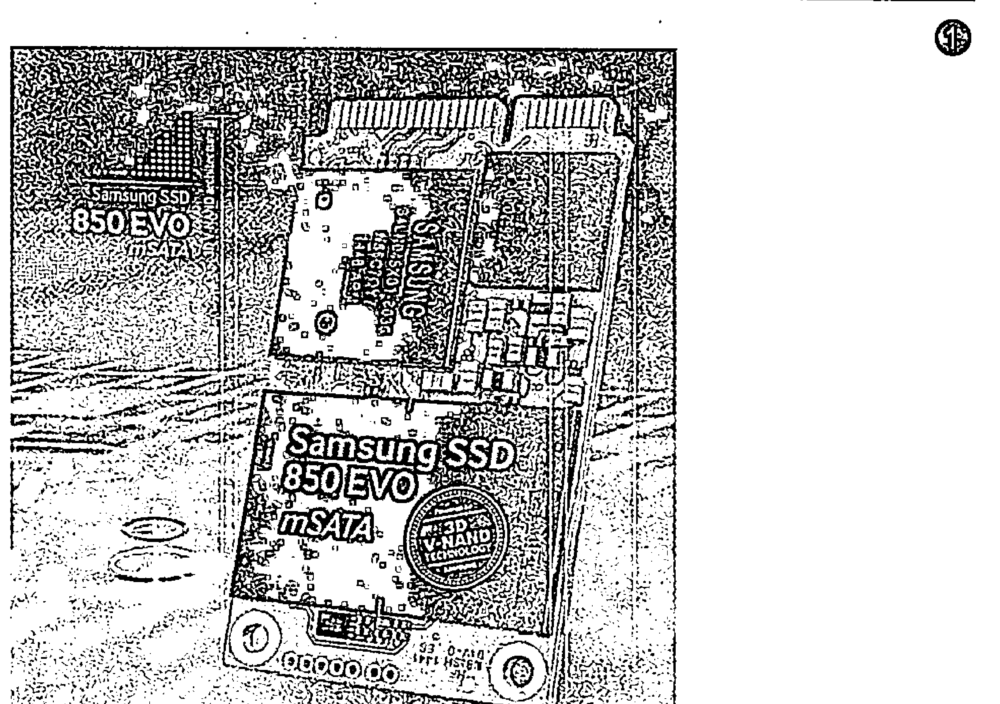

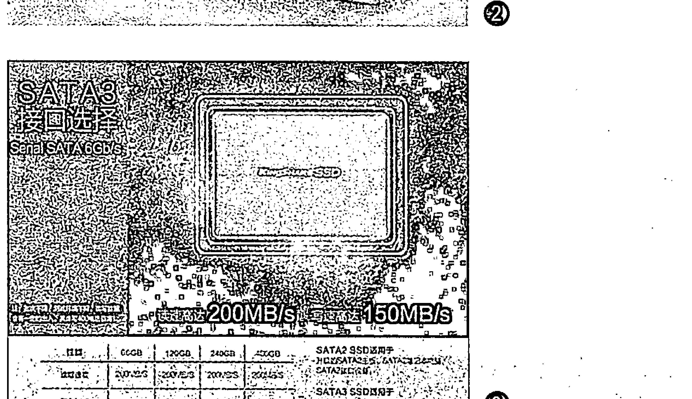

### 实惠背后藏玄机

无论是2.5英寸标准SSD，还是mSATA或M.2接口的迷你SSD，都是由主控、缓存、闪存等芯片构成(图2)，除了主控算法优化的“软实力”外，在硬件端没有任何门槛。因此你会发现很多昔日生产闪存盘的厂商也纷纷加入到SSD的生产研发。而降低SSD成本的秘诀就是选择批发价更低的闪存和主控。

部分国产SSD厂商为了压缩成本，往往会选择“白片”(合格的die，原厂封装成颗粒后再检测不合格，以颗粒形式流出到下游厂商，并由下游厂商打标)作为存储单元，此时SSD的价格能比采用原片的SSD便宜30%。

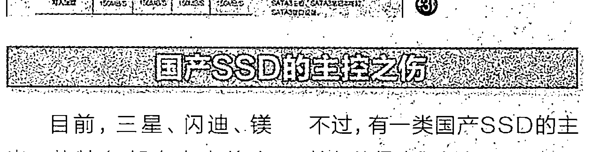

而一些走淘宝的山寨SSD品牌，则可能选择品质最低的“黑片”(不合格的die，以晶圆形式流出到下游封装厂)。采用黑片的SSD可能初始使用没有问题，但随着时间推移数据极易发生校验错误，导致数据丢失或直接报废等问题。

首先，闪存芯片是决定SSD成本的最核心部分。像三星、闪迪/东芝、英特尔等一线品牌都有自家的NAND Flash工厂，会将最好的“原片”(合格的die，原厂封装成颗粒后再检测合格，打原厂标，以颗粒形式流出)留给自己。问题来了，NAND Flash在生产的过程中，总会出现一些存在瑕疵的产品，而这些瑕疵闪存则会根据品质以更低的价格流入市场。

好消息是，至少在京东等正规电商销售平台“驻扎”的国产SSD品牌不敢使用黑片(因为SSD经常会被网友拆解晒单)，至少也是“白片”，再加上2~5年的质保时间，基本不存在质量问题。

### 国产SSD的性能之伤

目前，三星、闪迪、镁光、英特尔都有自家的主控，不分享不外卖，而第三方主控中口碑最好的就要数Marvell，其特色就是一个字“快”，而且成绩基本没水分。可惜，Marvell主控仅被一线SSD品牌所用，而国产SSD却大都选用了性能相对要弱一些的SandForce、SMI、Jmicron或群联旗下的中低端主控芯片，因此它们的性能往往要比同容量一线品牌SSD低一些。还好，SSD的性能主要体现在跑分成绩上，对实际体验的影响不大。

不过，有一类国产SSD的主控却值得我们留意。为了进一步降低成本，一些国产SSD品牌会选择SMI或者群联旗下的U盘主控充当SSD主控，最终导致SSD的读取速度仅有200MB/s左右(图3)！总之，SSD低研发门槛让竞争变得更激烈，而国产SSD品牌的崛起则进一步加速SSD普及的进程。作为消费者，我们不应歧视国产品牌，只要采用了原片闪存及标准SSD主控，其性能至少在日常使用中感觉不出“慢”。

### 论零性价比

千元手机到底够不够用

随着799元起红米Note2的发布，千元手机的配置标杆再度被改写。那么，千元手机与数千元的中高端手机相比到底差在哪里？到底够用不够用？

## 不断刷新纪录的千元手机

曾几何时，千元级手机就是“入门机”的别称，无论是做工、性能还是功能都远远于2000元级别的中高端手机。而就在2014年，千元手机在CPU的核心数量以及屏幕分辨率的规格上终于赶上了中高端型号，但在性能工艺和功能层面依旧落后。如今，随着魅蓝Note2（图1）、大神Note3、中兴威武3和红米Note2的陆续上市，千元机终于告别了“入门形象”。不相信？那我们就一一细数。

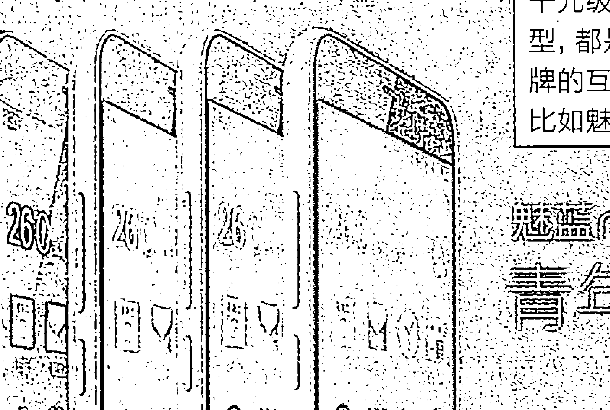

千元级市场的主力机型，都是各大手机品牌的互联网子品牌，比如魅族旗下的魅蓝

### 性能

乐檬Note(899元起)和魅蓝Note2(799元起)应该是最具性价比的千元手机之一，它们最大的特色就是采用了1080P屏幕与联发科64位8核处理器(MT6753)的组合，它们的理论性能至少要与三星Galaxy A7(2499元起，搭载骁龙615处理器)在一个档次。不过用户对性能的需求是无止境的，因此当红米Note2将联发科Helio X10(MT6795)打入799元价位后（图2），这款千元级的代表终于有了叫板中高端手机的资本。要知道，同样搭载Helio X10处理器的HTC One M9+现在的报价还要高达3999元呢。有了红米Note2的“开门红”，Helio X10在千元级手机领域遍地开花将指日可待。

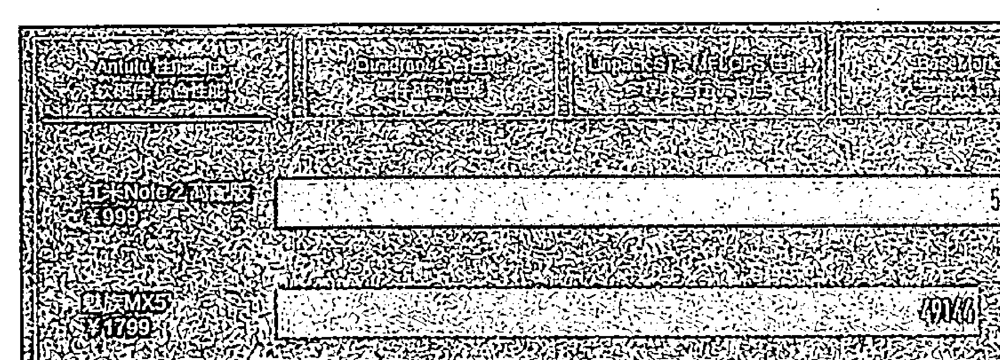

红米Note2的性能直指中高端竞品

### 功能

指纹识别曾一直是旗舰机手机的“专利”，然而步入2015年后，这一高科技功能也逐渐被千元手机所攻陷。以酷派大神Note3为例（图3），这款899元起的千元手机便已武装了新一代的触控式指纹技术，并具备0.5s极速识别响应的能力。

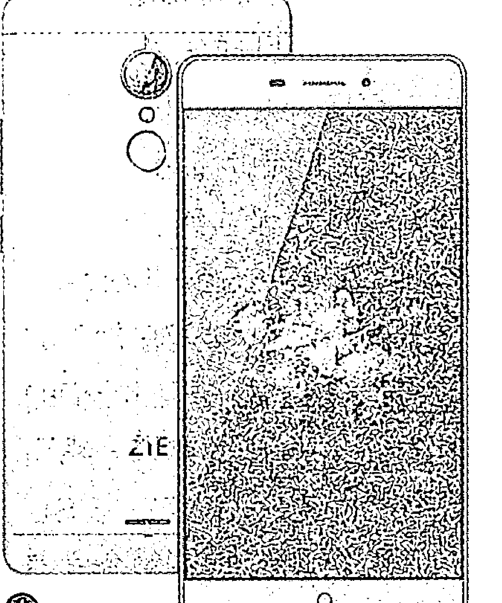

### 做工

千元手机曾一部被用户戏称为“万年大塑料”，原因就是厂商为了节约成本，往往会放弃档次更高的金属材质。而中兴旗下的威武3却在提供全网通、指纹识别等特色功能的同时，还选用了金属材质机身(图4)，就做工而言不再逊色于中高端竞品。有了上述千元手机的“带头”，千元手机的前进方向已经越发明朗。

## 特别话题

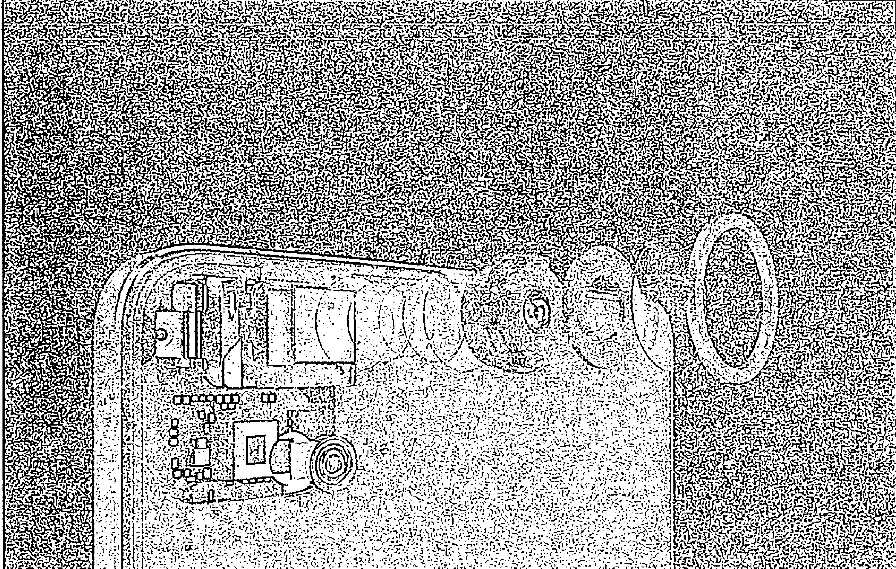


如果你有给手机配保护套的习惯，那机身材质的意义就不大了

## 与中高端手机相比差在哪里

虽然千元手机已经有了长足的进步，但是它们依旧很难实现完美。比如前文所提到的性能、功能和做工，这几大卖点分别出现在不同型号的产品身上，现阶段还没有一款千元手机可以将它们集于一身。如果我们将预算提高到2000元左右，则很容易买到工艺性能和功能趋于完美的产品。

此外，千元手机与中高端手机在体验上的最大差距还表现在屏幕的色彩/可视度，以及摄像头的拍照水平上。比如，魅蓝Note2屏幕虽然也是IPS，但在强光照射以及可视角度上却依旧与MX系列相差很多。此外，千元手机所能用到的最高端摄像头传感器也就是索尼IMX214，自然无法与中高端手机惯用的IMX220/240/278等传感器较量了（图5）。

值得关注的是，为了控制成本，千元手机的配件供应商并不唯一，由此将会导致不同批次手机的体验出现差异。比如红米Note2，在发布之初官方曾以“三星1300万像素相机”作为主要卖点，但是随着产品的上市，不少用户却发现买到的红米Note2原来是三星传感器+OV摄像头，并且在各大论坛贴吧引起了不小的争议。为此，小米也将官方的宣传参数修改为“三星等1300万像素相机”（图6）。

总之，千元手机虽然在近两年不断得以优化，并逐步缩短着与中高端手机之间的距离，但限于成本的制约，它们依旧难以做到“完美”。不过，只有千元预算的手机买家，相信也不会苛求买到足够完美的手机吧？比如，无论是金属材质还是塑料材质，带上手机套都是一个手感（图7）。只要你能认识到这点，千元手机也就算是“找到知音”了。

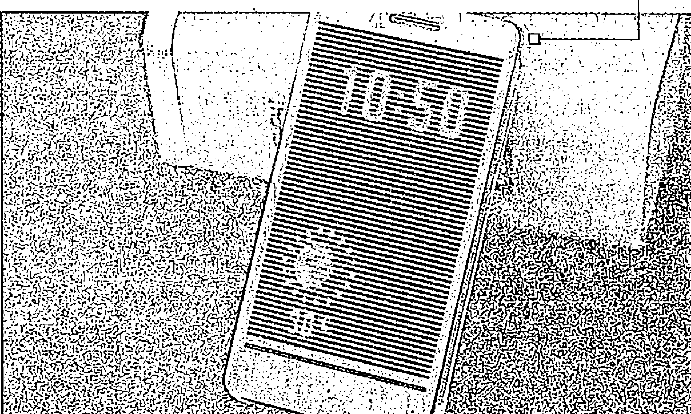

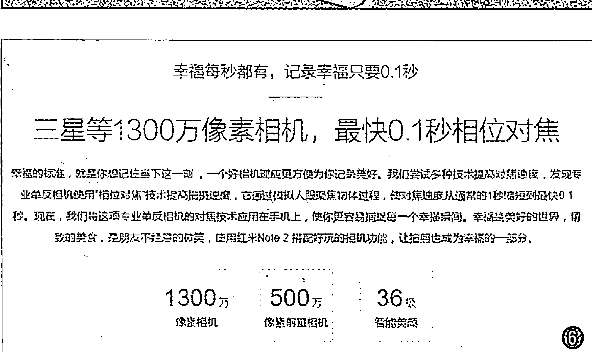


## 来自系统版本的反思

小米在推出红米Note2的同时还发布了MIUI7，可惜其系统版本却依旧停留在Android 4.4，也因此引发了MIUI7为何没有升级Android 5.x的大讨论（图8）。那么，对Android手机而言，追求系统版本到底有没有意义呢？

作为小米的竞争对手，三星、华为、魅族、中兴等品牌旗下的最新型号都预装了基于Android 5.x系统定制的系统，而MIUI7却依旧固守Android 4.4（只有小米2/2s、小米4i、小米Note旗舰版的MIUI基于Android 5.0），自然就显得有些“鹤立鸡群”了。小米开发工程师孙鹏在微博上的评论，“MIUI说我在技术上已经支持最新Android了，是手机芯片厂商不肯升级，很委屈”（图9），更是将这一争议推向了高潮。要知道，很多与红米、小米系列采用相同芯片的竞品手机都用上了Android 5.x，“手机芯片厂商不肯升级”的论点自然站不住脚。

对MIUI7的系统版本争论，我们应该从正反两个角度寻找答案。

如果从正面看待，MIUI7最大的特点应该就是在保证功能完整的情况下，将三年前推出的小米2系列一直到小米Note都能体验到最新的MIUI7（图10）；虽然它们的系统版本并非Android 5.x，也就是缺少64位优化，没有ATR模式，但是MIUI7系统自身的功能却能在所有旗下产品中得以保留。作为对比，魅族MX5用上了最新的Flyme OS 4.5.x（Android 5.x），但是2年前的MX3却依旧停留到在Flyme OS 4.2.x（Android 4.x）。按照小米的理论，其升级策略就是先让MX3升级到Android 4.x底包的Flyme OS 4.5，然后再考虑更换Android 5.x的底包。

如果从反面来看，MIUI7最大的遗憾就是没让近两年推出的产品体验到最新的Android版本。比如小米Note，这款2014年度旗舰还在用着Android 4.x实在说不过去，哪怕换上MIUI7的马甲也难以让玩家满意。要知道，像一加手机1代等老将如今也用上了Android 5.x，其他品牌搭载骁龙801的产品也大都升级到了Android 5.x，小米Note的系统版本延误自然会让用户怀疑小米的诚意。

总之，对于绝大多数用户而言，系统稳定和流畅才是第一位的，很多用户直至手机淘汰都不知道自己的系统到底是Android的什么版本（图11）。不过，MIUI在诞生之初就“专供发烧友”，发烧友自然很在意系统版本，MIUI7的版本争议自然也就变得合理了。

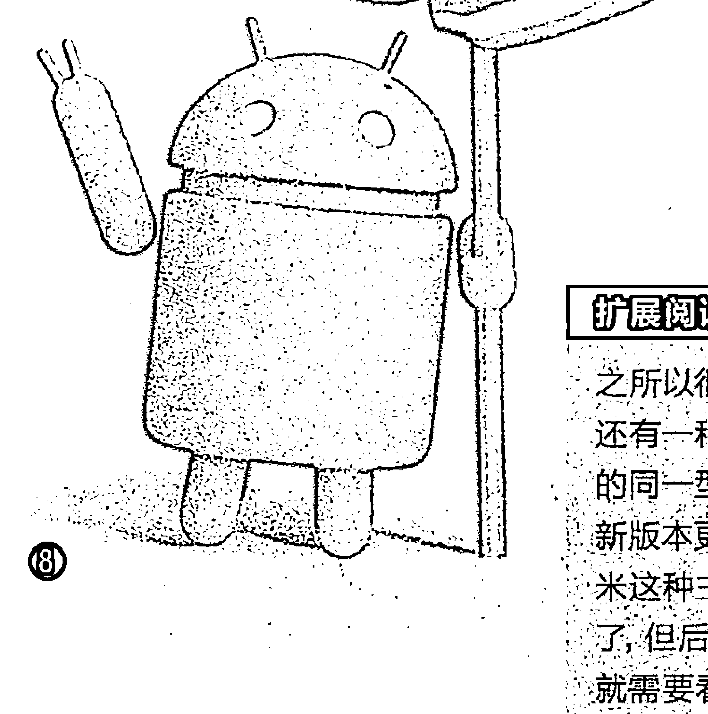

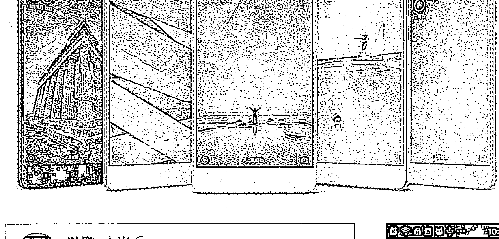

> 孙鹏_小米
1小时前 小米Note
小米手机Android版本升级慢，用户来骂MIUI。MIUI说我在技术上已经支持最新Android了，是手机芯片厂商不肯升级，很委屈。大家真的骂错了，MIUI巴不得所有的手机都能升级到Android最新版，维护那么多分支很累的，然而MIUI团队并不负责这件事情。

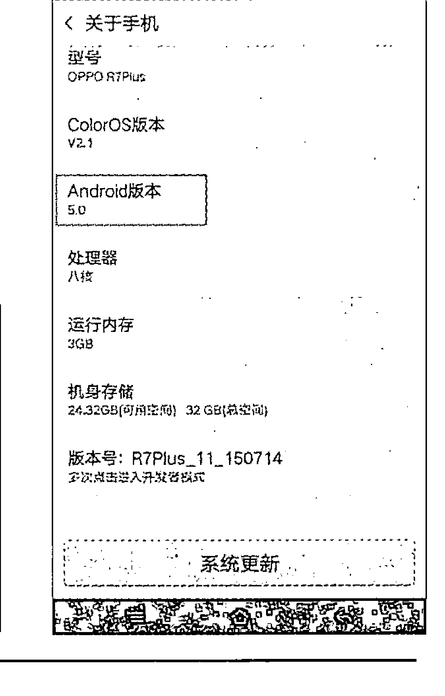

扩展阅读：
之所以很多与小米Note等同芯的竞品可以升级Android 5.x，网上还有一种缺乏实质性证据的观点：高通针对不同的手机厂商，出售的同一型号CPU所集成的RF器件并不相同，能否给予RF器件的新版本更新支持，取决于CPU的售价以及与手机厂商的关系。像小米这种主打性价比的品牌，可能是当初采购CPU时的价格看似便宜了，但后续支持的服务也被砍掉了。因此，想获得最新的系统更新，就需要看高通的脸色以及是否提供服务支持了。

## 潮流配件 周边有更多选择

以前购买一些国外的机箱电源散热器设备，或者一些DIY配件和周边，我们只能选择海淘或者洋垃圾，就算是国内的淘宝卖家也多是没有官方支持的渠道，商品品质保障难有支持。目前有很多国际DIY品牌入华，配件购买渠道也比以前丰富了许多。

### 追风者PK-515E-BK

| 类型         | ATX              |
|--------------|------------------|
| 材质         | 钢, 面板3mm铝     |
| 主板兼容     | 最大支持304x264mm主板 |
| 尺寸         | 235mm×495mm×510mm |
| 重量         | 12kg             |
| 显卡限长     | 300mm(最长420mm) |
| CPU散热器限高 | 194mm            |
| 硬盘位       | 8×HDD+6×SSD或14×SSD |

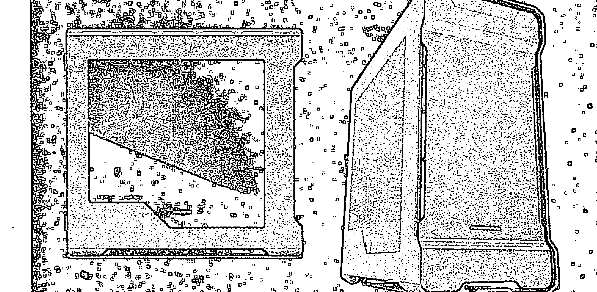

追风者PK515 EvolvATX系列就是能够很好代表目前先进机箱设计理念的产品之一。长久以来用户在机箱材质上只能在钢和铝之间二选一，但是EvolvATX成功将两者合二为一：使用钢材质增加机箱的稳固程度并且降低成本，并使用大尺寸铝质面板提升机箱的视觉效果。机箱摒弃了传统“洞洞流”的网孔设计，通过内藏的散热实现更良好的风道。正面不再提供过时的内置光驱位，一块一体成型的铝质面板大幅度提升了机箱的“颜值”（图1）。机箱一侧提供侧透功能，但是巧妙地使用拐角设计挡住了相对比较不美观的电源和线缆部分，使侧透效果更出众。侧板通过悬挂可以实现横向开门效果，这也是目前机箱产品当中不多的设计（图2）。内部设计更为出众，机箱内前和上两部分均可以容纳240mm以上水冷排，而HDD硬盘位全部使用可拆卸悬挂设计。风扇调速器目前已经很多机箱的标配了，但是PK515内部的调速器支持PWM智能温控调速，这就不是大多数机箱能够做到的了（图3）。

## 全新机箱品牌

DIY目前已经跨入精品化，需求更低的用户逐渐转向平板电脑、笔记本电脑领域，留在台式机DIY领域的多是比较苛刻的高端玩家。照顾高端玩家的胃口可比普通用户更难，比如机箱，尽管高品质机箱产品已在DIY爱好者当中流行了这么多年，但不同的产品总有各自不同的问题，不同用户有不同的需求，想在机箱当中寻找一款真正完美的产品难上加难。追风者是近两年诞生的一个机电散热器品牌，尽管诞生时间不长，但是旗下产品却越来越透出一股成熟的味道。虽然产品不多，但追风者在推出产品之前似乎是仔细研究过了市场上同类产品的弱点和不足才会推出新品，最终的结果是旗下产品被要求苛刻的用户追捧。尽管是全新品牌，追风者目前已经全面进驻京东商城等国内电商。除了机箱以外，还有追风者机箱用的硬盘架、风扇调速器和风扇转接线等多种产品。以追风者为例，目前包括联力、银欣、迎广和Fractal Design等多个同类产品均有官方支持，比起我们熟悉的产品，它们有很多优势。

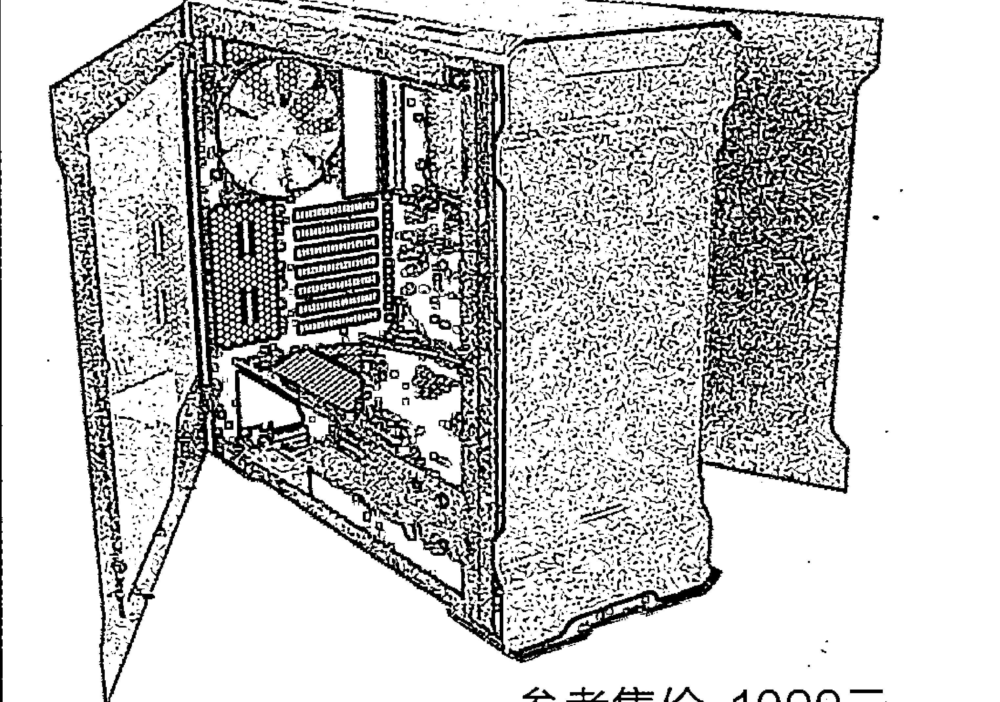

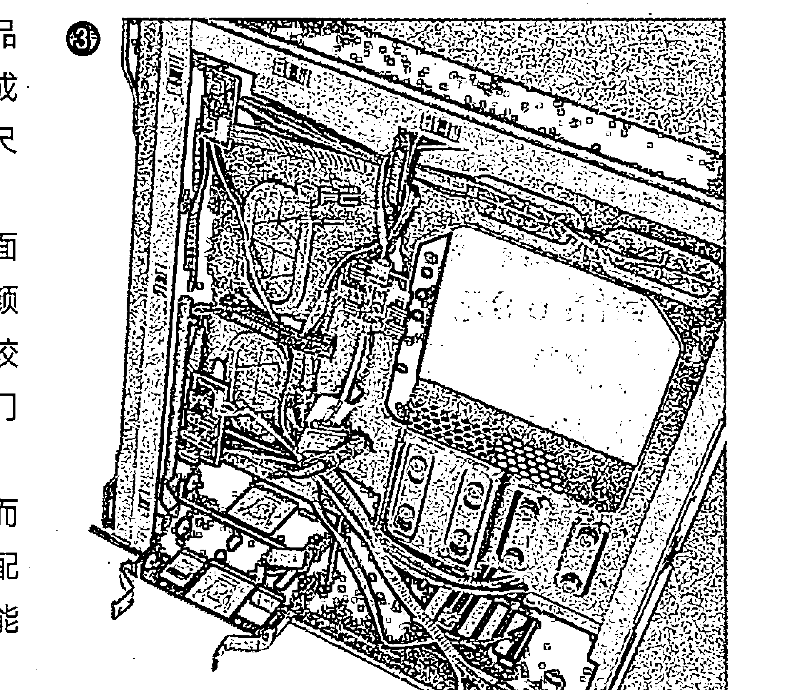

## 采融散热器

采融（Prolimatech）CPU散热器是目前DIY领域最出色的散热器之一，经典的变形金刚（Megahalems）散热器和其衍生产品一直是同类产品中最出色的。以往DIY用户购买采融散热器只能通过淘宝的第三方卖家，不过目前采融官方已经加盟了京东商城等电商平台。

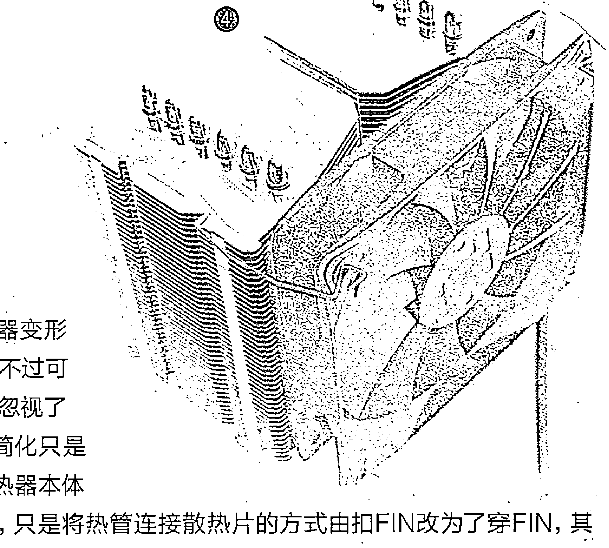

### 采融Basic81 CPU散热器

| 属性 | 值 |
| --- | --- |
| 风扇转速 | 800~1300rpm |
| 风量 | 30~49cfm |
| 风扇尺寸 | 120mm |
| 散热片材质 | 纯铜镀镍热管、铝散热片 |
| 散热器尺寸 | 129mmX74mmX158mm |
| 噪音 | 19~24dbA |
| 电源接口 | 4pin |

Basic81是经典散热器变形金刚V5版的简化版，不过可不要因为是简化版而忽视了它的散热性能。这个简化只是固定扣具的简化，散热器本体的结构几乎没有变化，只是将热管连接散热片的方式由扣FIN改为了穿FIN，其余一切规格都没有缩减。目前Basic81的售价要比变形金刚便宜近乎一半，但是散热性能可以达到变形金刚的90%，是一款非常出色的风冷散热器（图4）。

## 创意周边

一些DIY时需要用到的小玩意一直都是平台的亮点之一，也是最能展现用户个性的产品。不过之前这类产品多只能淘宝购买，没有品牌的官方支持，假货也相对较多。目前随着DIY领域开始精品化，这类较边缘的产品也开始有了官方支持。

### 山泽MST-01七彩电脑扎带

机箱内部想要完美，电脑桌附近想要整洁，没有一个良好的理线方案是难以实现的。山泽（SAMZHE）不仅出品各种电脑用线缆，也出售这类七彩缤纷的魔术带。通过捆绑归类，杂乱的线缆能够很好地被收纳到一处（图5）。

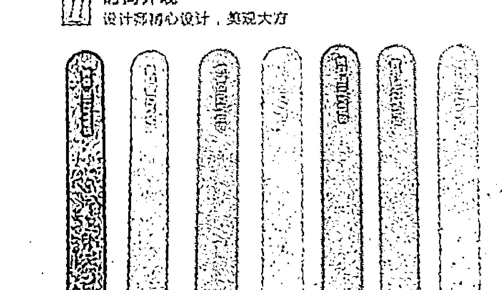

参考售价：6.9元

### 迪阿歪电线收纳盒

如果对于桌面效果依然不满意，还可以试试这类电线收纳盒。它们的共同特点就是通过一个盒子的密封空间来容纳多种线缆和变压器，只把需要的线缆及其长度露在外面实现整洁。虽然这类产品会占用一部分桌面空间，但其实仔细挑选的话还是能够实现很好的效果（图6）。

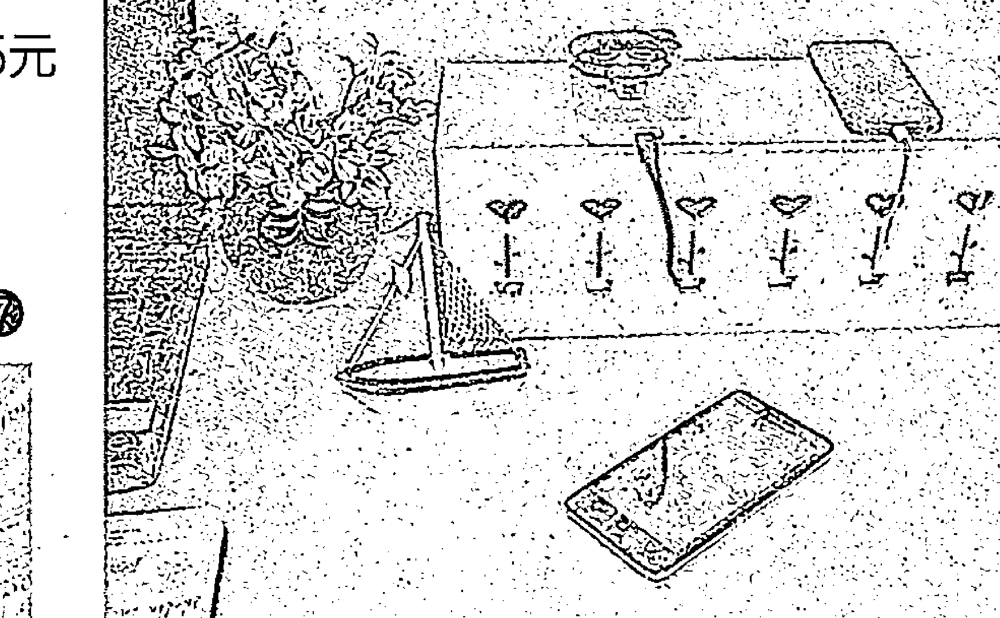

参考售价：79元

### 追风者PH-LEDKT_M1机箱LED灯条

一般机箱LED灯条这类产品用户多从淘宝上购买，第三方设计的产品质量难有保证，长时间使用后的老化还有潜在的安全隐患。追风者官方提供的灯条无疑解决了这种尴尬，PH-LEDKT_M1搭载了优质的LED晶体，双面胶可以轻易贴到机箱内部。剪短灯条连接处的铜铂部分可以自由实现灯组连接，也是很多第三方产品无法实现的（图7、图8）。

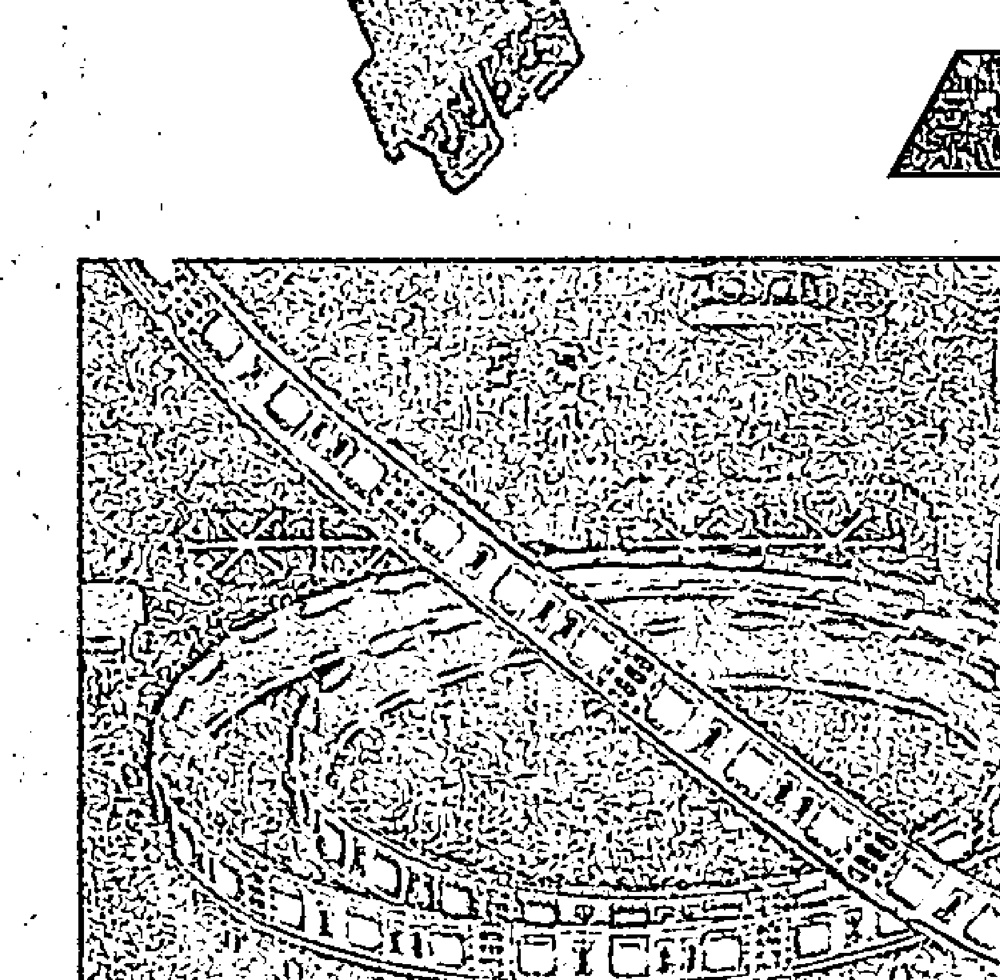

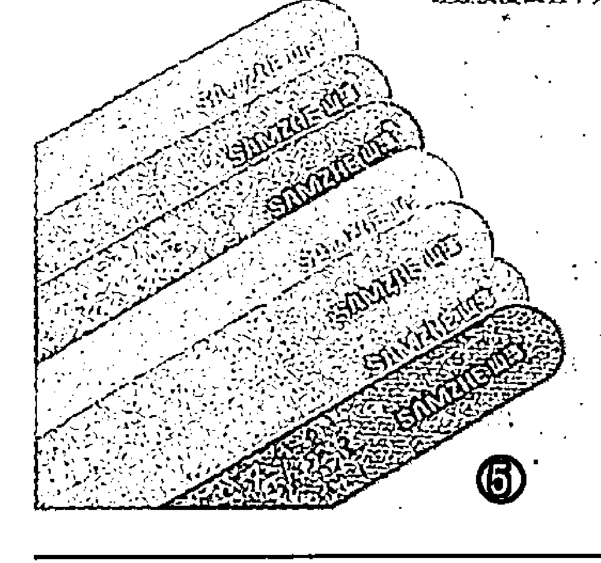

## 在数值量化的时代中
> 策划 | 《电脑爱好者》编辑部

如果电脑/手机屏幕所显示的内容全是由0、1数字或生涩难懂的代码构成，即使你有爱因斯坦的智商也只有“干瞪眼”的份。这些“未经翻译”的字符也许只有CPU才能读懂。自施乐将难以理解的系统代码转换为可视化操作界面后，苹果、微软再接再厉将视窗操作发扬光大，使我们摆脱了未经学习就无法操作的各类代码，将软件的所有指令转换为鼠标的选择与点击。而硬件厂商则用更简单的手段将它们量化，测试数值、尺寸甚至重量，一切可用数值表达的绝不用生涩的词汇。在一切皆可见的时代，还有什么不能量化的呢？

### 数值虽是唯一 体验更为重要

如果你稍加留意，不难发现如今的电脑广告已被手机厂商“霸占”，而在广告栏中出现最多的技术术语无非是“跑分”、“厚度”、“屏占比”、“像素”等等一些被量化的数据。诚然，通过这些具体的数值，可以帮我们快速且直观地了解产品卖点。但是，仅靠数字就能代表手机的全部吗？


### 重要也不重要 Android手机的“跑分情结”

处理器是决定智能手机强弱的最核心部件，而跑分测试则是最直观检测处理器性能的方式。那么，一款手机的跑分成绩越高，就真的代表其具备更顶级的性能和体验了吗？

### 满城都是“兔子热”

毫无疑问，“安兔兔”是目前Android手机领域最受推崇的跑分APP，而手机厂商也乐于通过它体现旗下手机强悍的性能。比如，乐视超级手机1发布时就因在安兔兔V5.7测试突破了50000分大关而自居“跑分帝”（图1），而小米在红米Note2宣传上更是格外突出54024的成绩（高配版，基于安兔兔V5.6测试），并将其他国产旗舰踩在脚下（图2），从而出现了“相较于华为P8和魅族MX5等国产旗舰手机，多花那一两千块真不值”的调侃。


不过，像安兔兔一类的跑分APP，它仅能体现Android手机的“理论性能”，只能作为消费者判断产品强弱的参考之一，因为在实测过程中有太多可能影响到跑分成绩的因素。

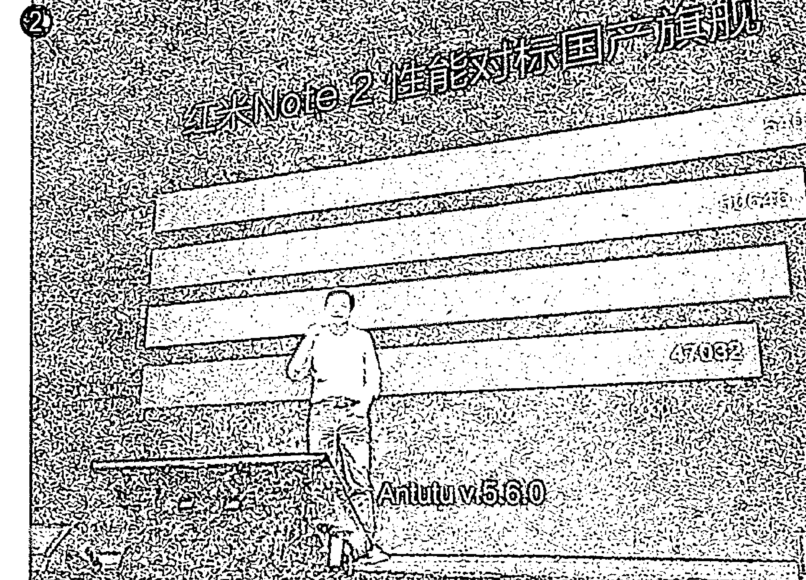

### 谁在影响安兔兔成绩

红米Note2（高配版）官方给出的54024分数，在实际用户的眼中却成为了遥不可及的梦想，因为很多红米Note2（高配版）在安兔兔V5.72测试中仅能取得50000左右的成绩（图3）。难道红米Note2也用上了虚假宣传的伎俩？
实际上，包括红米Note2在内，很多Android手机实际测试的成绩往往达不到厂商宣传时的数值，而原因则涉及到多个方面。比如，安兔兔APP的版本差异，红米Note2用V5.6的测试分数与华为P8和魅族MX5在V5.7版下的分数进行对比本来就有失公允，结果当自己用V5.7测试后一下子就被“打回了原型”。
此外在进行安兔兔测试前，是否切换到“性能模式”（通常在电池或节能选项中设置）、是否关闭了其他后台运行的APP（建议测试前先清理内存）、手机是否正在充电（充电发热可能导致CPU降频），这些因素都会影响安兔兔（包括其他跑分APP）最终所能取得的成绩。

| 项目 | 分数 |
|------|------|
| 总分 | 48983 |
| UX | 7031 |
| CPU | 10894 |
| GPU | 21721 |
| RAM | 4388 |
| I/O | 4949 |

### 跑分成绩是可以优化的

处理器因过热而降频对跑分成绩的影响最大，因此如何避免手机在运行安兔兔时降频、减小降频幅度或拖延降频的时间就是提高跑分成绩的优化方向。于是很多手机厂商会将安兔兔一类的跑分APP列入系统配置文件中的“白名单”，在该APP运行时可让处理器核芯全开，或始终运行在最高主频状态，除非突破了安全温控的阈值，否则在测试结束前禁止降频，从而获得理论上可达到的最高分数。对手机降频感兴趣的读者可参考本刊18期特别话题《妥协的艺术 手机的“芯”选择》这篇文章。

然而联发科Helio X10和高通骁龙810一类的中高端处理器，在日常使用中一旦满载（CPU占用率和温度增加），不足30秒可能就会强制降频到1.0GHz甚至更低（图4），像安兔兔一类的跑分APP需要持续运行数分钟之久，降频现象几乎无法避免。如果一款手机的跑分明显高于搭载同处理器的其他品牌手机，要么是它在散热方面做得很出色，要么就是针对跑分APP做了特殊的优化。如果你想做个验证的话，不妨将手机放在冰箱里再进行测试，此时的成绩一定高于正常室温下的数值。

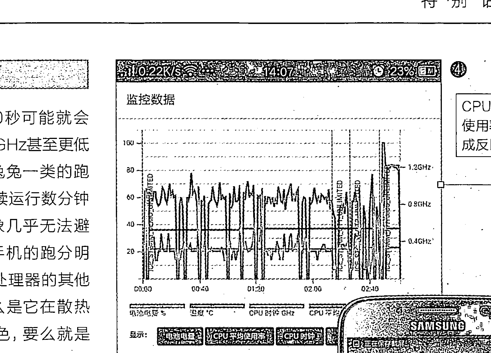

> 小心安兔兔跑分作弊

为了营造跑分远超竞品的假象，少数厂商会采取更恶劣的“作弊”手段。比如直接修改textview，想显示多少就改多少；当安兔兔加载自带libabenchmark.so时，用作弊后的函数替换库里的原有函数；在测试时降低设备分辨率等。这种恶劣的作弊行为已很少出现在手机领域，不过在平板或电视盒子领域并不鲜见，如年初就有用户曝光中国移动招标的某RK3128盒子就大幅修改CPU单线程浮点运算成绩，从而比同处理器的其他盒子总成绩高了近50%!

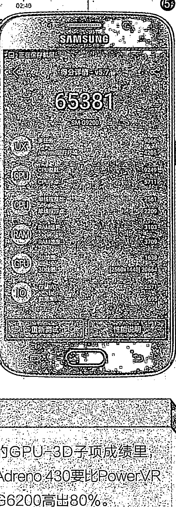

### 理性看待跑分数据

既然安兔兔存在各种各样的“不靠谱”，那它又有什么意义？简单来说，跑分数据可以帮我们快速判断不同处理器平台的性能强弱。如三星S6/Note 5系列（搭载Exynos 7420）的安兔兔跑分几乎都在65000以上（图5），远远高于搭载骁龙810（如索尼Z3+、HTC M9等）的竞品，所以我们可以获得一个结论：Exynos 7420的综合性能比骁龙810更出色。

但是跑分数据对搭载同款处理器的不同型号手机而言就没什么意义了。乐1（乐视手机1）、魅族MX5、OPPO P7 Plus、HTC M9+和红米Note2等手机都搭载了联发科Helio X10（MT6795，只是主频有2.0GHz或2.2GHz之分）（图6），它们在安兔兔测试中的成绩在40000~54000之间，看似性能差距很大，但在玩相同的3D游戏时的流畅度却相差不大。换句话说，同处理器手机的跑分更高，只能说明厂商在散热或优化方面下了不少功夫，对实际性能几乎没有影响。

问题来了，当搭载不同处理器的两款手机安兔兔跑分成绩相近时，我们又该比什么？答案很简单，通过GPU子项性能比强弱。以乐1（Helio X10）和乐1 Pro（骁龙810）两款手机为例，它们在安兔兔测试中的成绩分别为50606和52694（图7），看起来好似同档次的样子，但在一些大型3D游戏中，搭载骁龙810的乐1 Pro往往可以比乐1高15fps或更多！

这很好理解。Helio X10集成的GPU为PowerVR G6200，骁龙810集成的GPU为Adreno 430，两个图形处理器根本就不是一个档次的存在。在安兔兔测试的GPU 3D子项成绩里，Adreno 430要比PowerVR G6200高出80%。

实际上除了骁龙410或联发科MT6735这些入门级处理器，像骁龙615、联发科MT6753等中端处理器都已具备了不俗的CPU运算性能，而像骁龙810等高端处理器因CPU易降频的原因，在玩游戏的过程中也很难与中端处理器拉开差距（另一方面是Android平台3D游戏对CPU资源消耗相对较小），真正影响游戏流畅度（运行帧数）的还要看GPU型号和其性能。

## 那些更靠谱的跑分软件

考虑到安兔兔的跑分成绩易受干扰而出现较大波动，在这里笔者向大家推荐一些跨平台且更靠谱的跑分APP。其中，CPU运算测试推荐“Geekbench 3”（图8），由于该APP测试耗时较短，往往在CPU降频前就取得了测试结果，所以其成绩的参考性更有意义。

至于GPU性能测试，则推荐“3DMark”（图9）和“GFXBench GL”（图10），两款软件在安装后都需联网下载数据包。其中，3DMark的IceStorm Unlimited测试项目和GFXBench GL的曼哈顿/霸王龙离屏测试项目无视设备分辨率，所以这几项测试数据最为中肯。最关键的是，上述三款跑分APP都支持跨Android和iOS平台，可以和iPhone/iPad的性能进行对比参考。

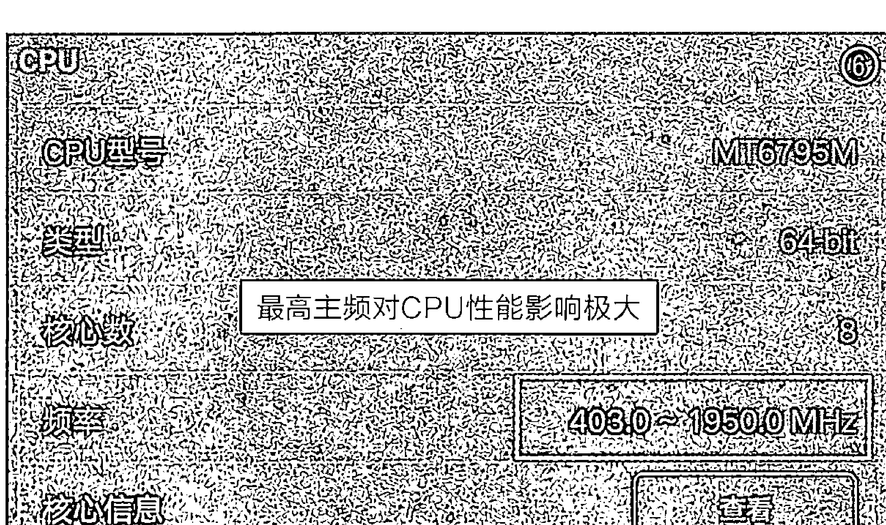

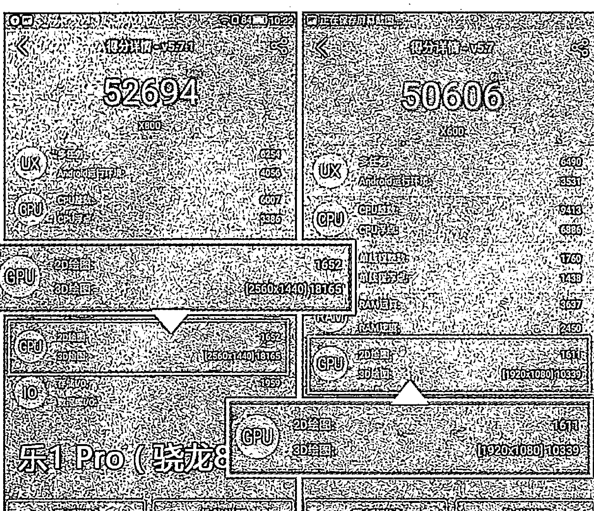

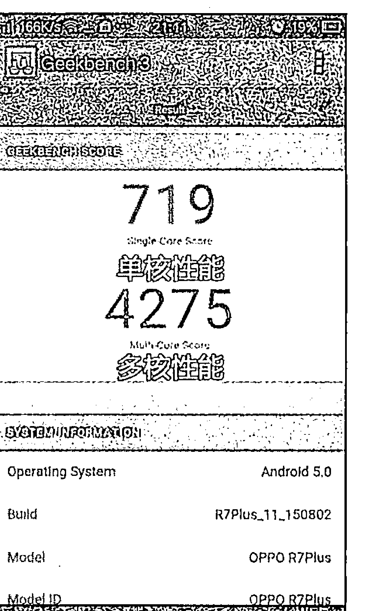

## 跑分高不如体验好

前不久锤子坚果手机和360奇酷手机的发布会里，罗永浩和周鸿祎都不再谈及跑分，而周鸿祎甚至调侃道“跑分有个锤子用？”（图11）。于是，坚果手机大谈情怀和多彩设计，奇酷手机则主打安全和体验。实际上，随着越来越多用户认识到跑分只能体

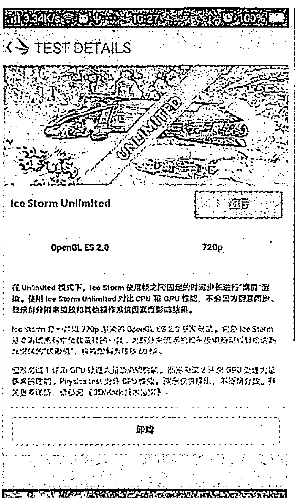

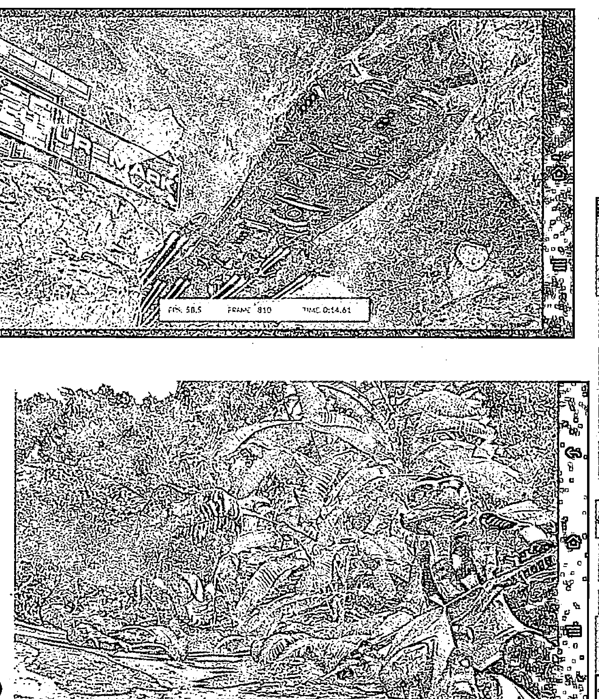

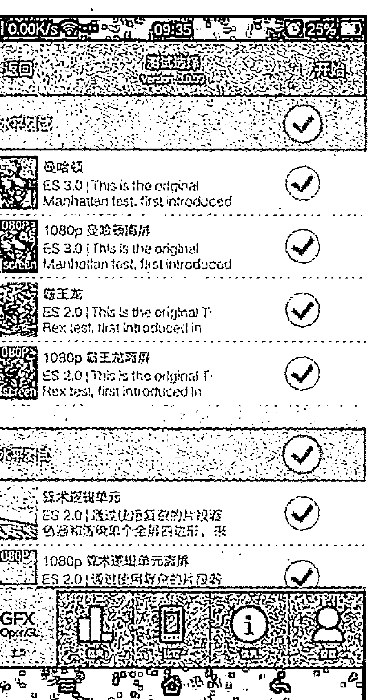

现手机的“极限性能”，而智能手机也从拼参数转向拼体验的阶段后，未来会有更多厂商会淡化跑分数据。那么，所谓的“体验”又将表现在哪些方面呢？

除了外观设计和材质用料外，Android手机的体验差异主要体现在对系统的二次开发和深度优化层面。例如，有没有融入限制后台APP自启、自定义APP联网防火墙、敏感权限监控等安全功能；是否加入了双击解锁、三指截屏、语音唤醒等手势动作；熄屏自动清理内存、高级CPU频率管理等节能技术等。还好，如果你的手机不具备上述功能，往往也能通过第三方APP或刷入第三方ROM的形式加以实现，只是会因涉及ROOT和稳定性，仅适合玩家尝试。


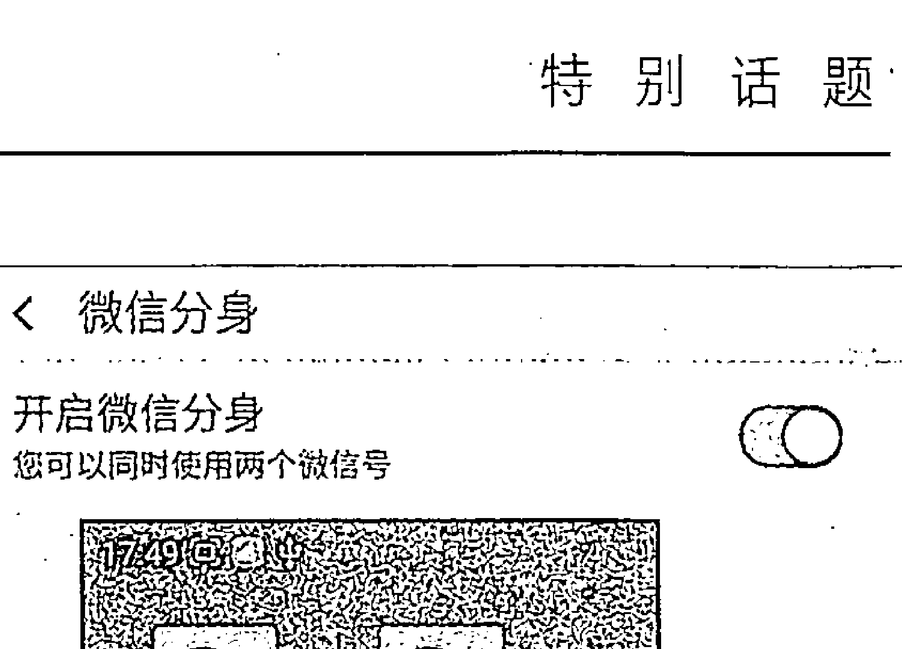

### 软实力才是硬实力

随着国产手机的异军突起，顶级硬件不再与昂贵划上等号。比如，一加手机2就将骁龙810打入了2000元价位内，获得了与5000元起三星Galaxy S6相近的性能。然而，性能并不等于体验，在Android手机的体验升级之路上，软实力才是硬实力。

以360奇酷手机为例，其最受用户关注的“黑科技”就是支持同时运行两个微信，在安装微信APP且在设置界面中打开微信分身的选项，桌面就会出现另一个“微信分身”图标（图12），从而实现双微信同时收发消息、刷朋友圈，互不干扰。实际上早在奇酷手机前，三星旗下的Galaxy S/Note系列的新款产品同样具备双微信功能。

以Galaxy S6为例，请确认已安装“Samsung My KNox”软件（如果没有请在三星应用商店自行下载），运行并用三星账户登录My KNox，点击右上角“添加应用程序”（图13），将微信添加到My KNox应用列表即可。今后当你运行原版微信后，再点击My KNox选择列表中的微信图标（图14），即可实现双微信共存的功能（图15）。

简单来说，三星KNox相当于一个独立的系统，利用类似虚拟机的形式启动指定的APP，而且该系统进行了底层加密，可用指纹等加密方式进行保护。此外，在KNox虚拟环境下，截图等可能涉及到安全的功能会被屏蔽。

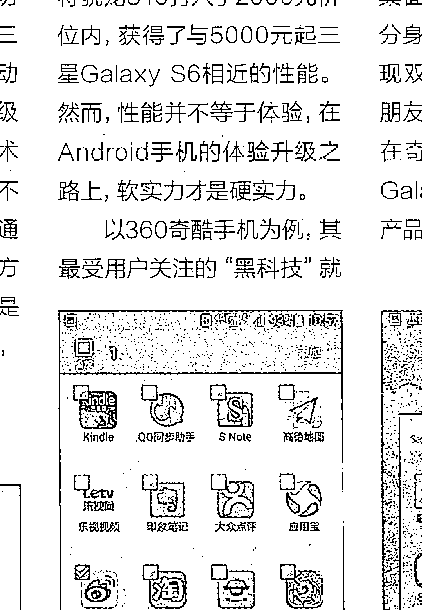

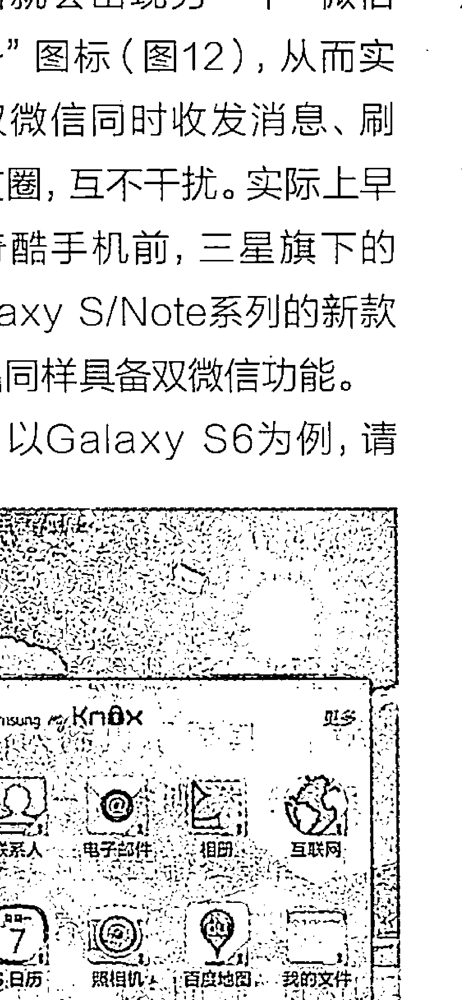

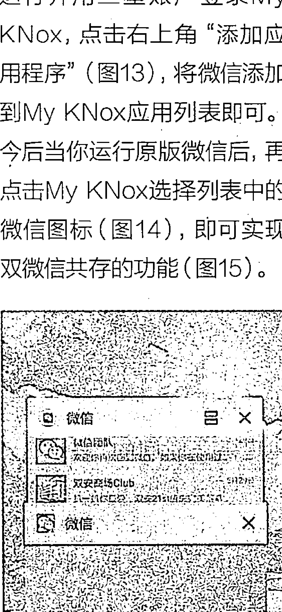

### 让体验取代跑分吧

由于三星Exynos和华为海思麒麟处理器都优先自家供应，所以未来其他品牌手机要么选择高通骁龙、要么加入联发科阵营，数来数去无非也就那么几颗处理器可选。在处理器相同的情况下，不同品牌和型号手机都具备相同的理论性能，跑分的意义也将逐渐淡化。既然如此，我们又何必纠结于单纯的跑分数字呢？红米Note2说自己跑分高，纯粹是联发科Helio X10的功劳，和小米又有什么关系？同理，更高的跑分数据也许只能体现厂商钻跑分APP空子的能力，对操作流畅度、运行3D游戏时的帧数没有半点意义。因此，当我们再度审视手机新品时，不妨将注意力放在把握手感、UI结构的合理性、安全或特色的功能等方面（图16）。未来的智能手机战场，将是跑分其次，体验称王。

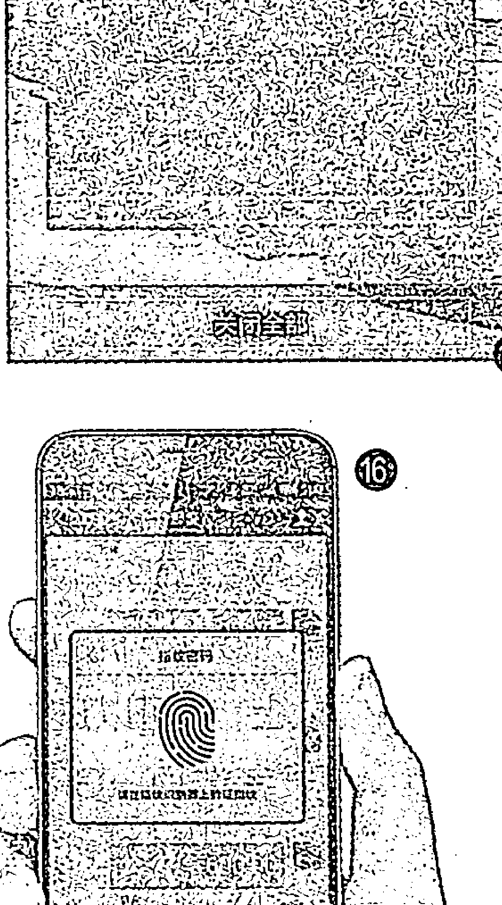

## 跑分要靠谱

### 如何测试Android游戏帧数

通过前文我们不难理解，跑分成绩仅能代表智能手机的理论（极限）性能，在实际使用中的意义不大。那么有什么方法能更真实地体现手机的性能呢？

### 影响体验的卡顿感

Android的流畅度不如iOS，这几乎已成业内共识，而这个结果则是由多个因素造成的。简单来说，当我们用手指滑动屏幕然后松手，此时手机界面会顺着滑动方向继续移动（图1），然后缓慢减速直至0时停止。在这个过程中，iOS界面移动由慢至停的过程很顺滑，而Android从松手到界面停下则要快很多，有种戛然而止的感觉。

此外，从我们手指触控屏幕，再到屏幕显示内容的变化是需要时间的。在iOS系统环境下，其显示机制为传统的APP→Display，而Android系统环境则多了一步，即APP→SurfaceFlinger→Display，画面最终输出到屏幕要比传统的方式慢一帧（16.7ms）。Android手机在反复滑动界面时最容易出现卡顿感就是以上原因造成的，而这种卡顿感出现的几率和频率是可以通过系统和APP层面的优化减轻（提升硬件性能同样有效）。因此，与其盲目地比拼跑分数据，还不如考验手机操作过程的卡顿频率来得实在。

### 玄学曲线 测出卡顿

问题来了，操作卡顿是主观的瞬间感觉，很难通过肉眼加以鉴别对比。好消息是，只要你的Android手机的版本在4.4或以上，都可以进入“设置→开发者选项→GPU呈现模式分析”，将其设定在“在屏幕上显示为条形图”模式下（图2）。此时你会发现手机界面偏下位置会出现一根绿色的直线，下面则会出现波动的柱状曲线。在操作时柱状曲线越低代表越流畅，如果超过了绿线就代表此刻的帧速低于60fps，即代表出现了卡顿现象（图3）。

如果某款Android手机在滑动界面、运行系统自带APP的过程中频繁出现柱状曲线超过绿线的现象，那就说明该款手机在系统优化层面做得太差，很多高配手机的流畅度反而不如中配手机就是这方面的原因。反之，如果在运行第三方APP（比如游戏或软件）时卡顿问题严重，要么是APP适配欠佳，要么则是手机硬件性能不足。

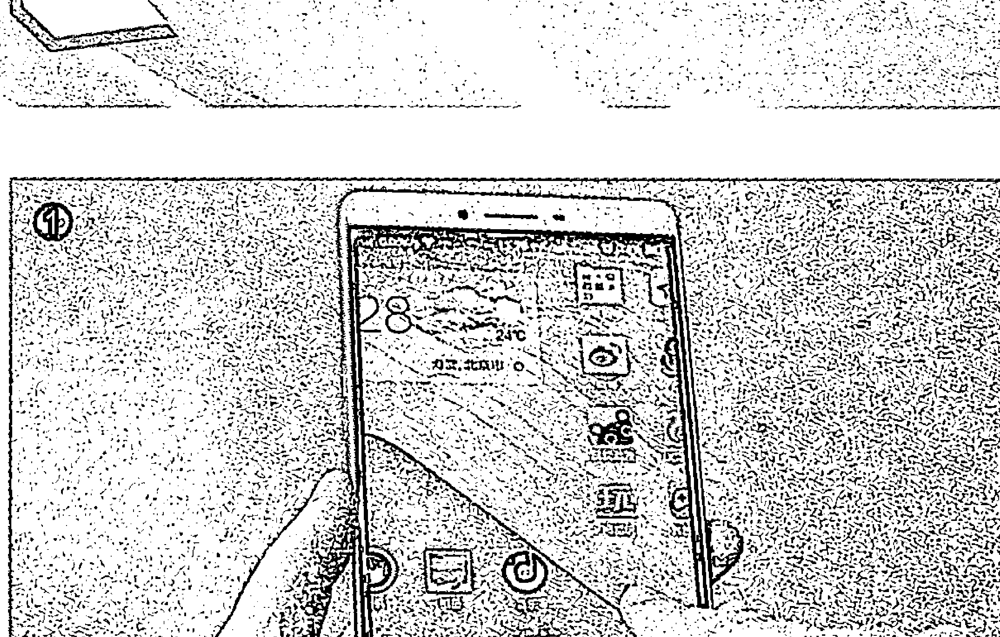

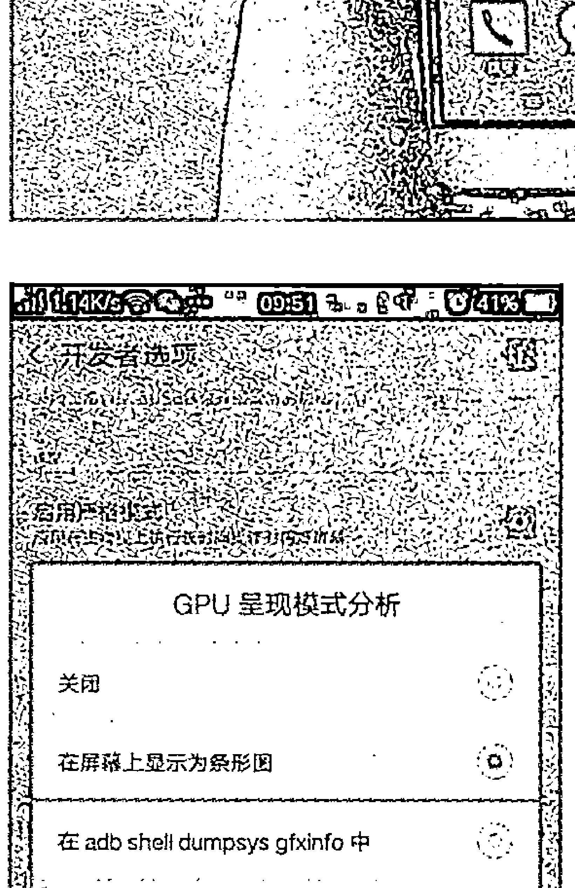

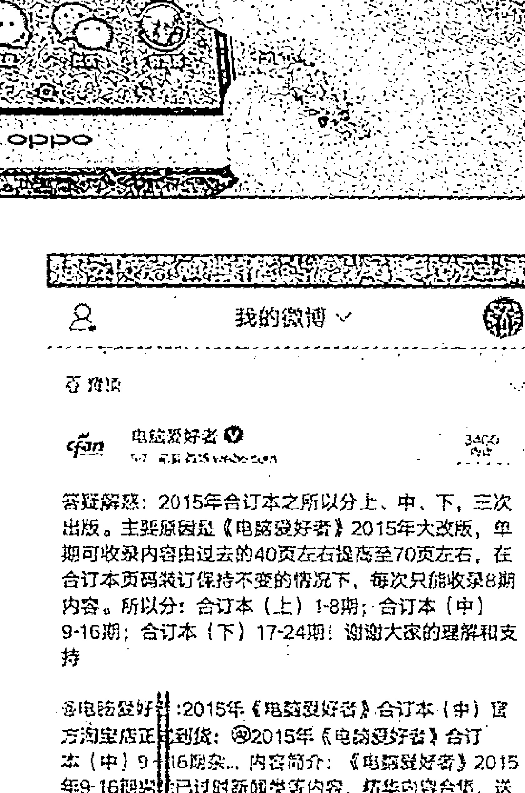

### 检测游戏实时帧数

在PC上通过Fraps软件测试游戏的实时速度，Android系统中也能找到类似的APP。在此推荐“FPS Meter”，运行后选择显示实时/平均/最大/最小帧数（图4），自定义显示位置（图5）。注意使用该APP需ROOT权限，并在开发者选项停用HW叠加。


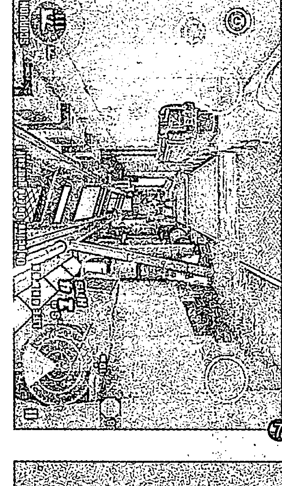

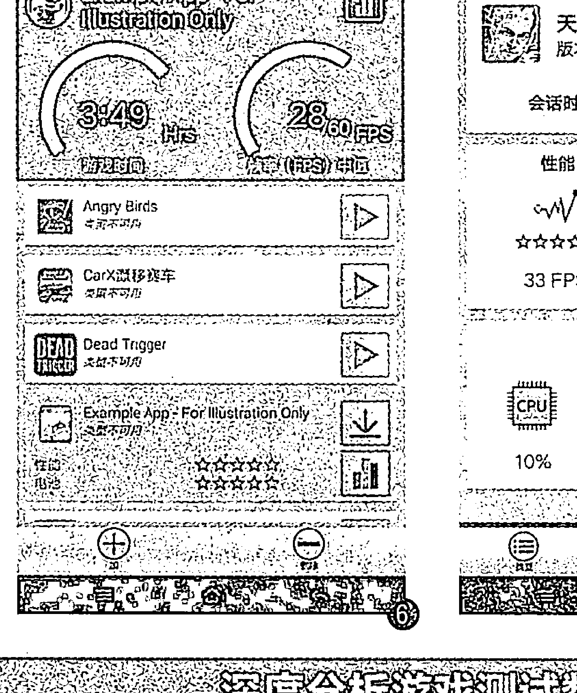

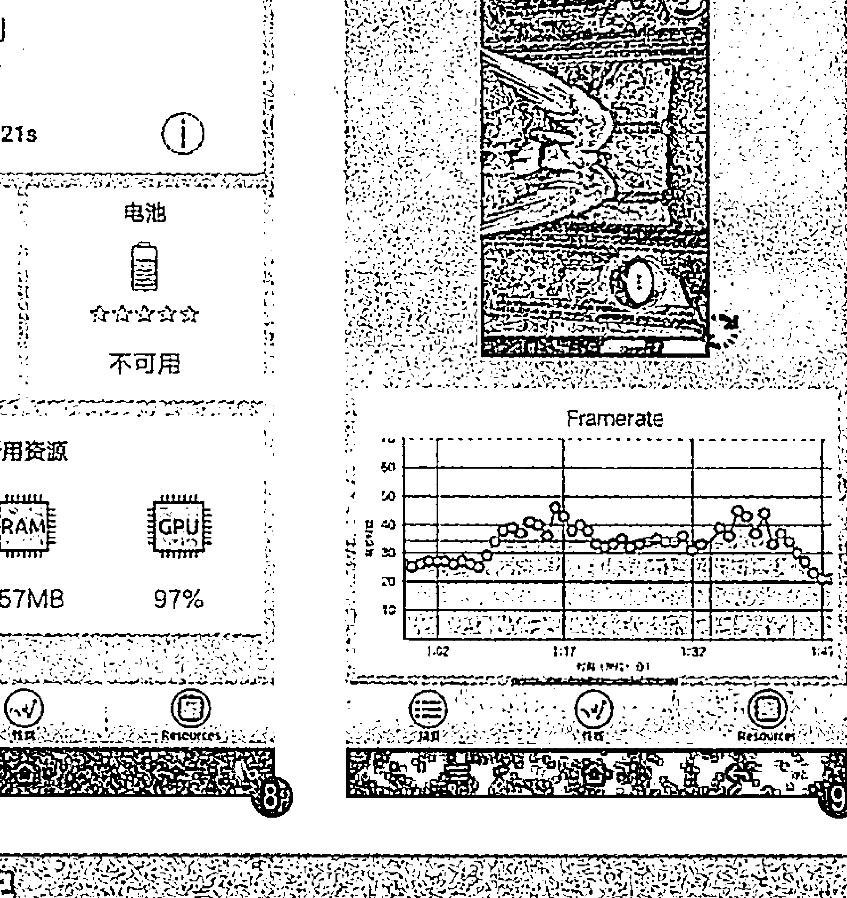

### 深度分析游戏测试数据

FPS Meter虽然使用简单，但它却无法做出游戏帧数曲线图，很难和其他Android手机进行对比。如果你想全方位检测手机的硬件性能，并获得可与其他产品直观比拼的数据，那就推荐使用“GameBench”这款测试APP了。
GameBench曾被誉为“无法作弊的评测APP”，其工作原理是运行指定游戏一段时间，统计该游戏在不同时间点的实时帧数，以及对CPU/GPU资源的消耗，这种测试更加接近日常使用。在手机上安装该APP后，首次运行需要使用USB线连接PC，并打开手机设置的USB调试模式。使用PC浏览器登录http://dwz.cn/1fZnpC网页下载jar格式的驱动文件（同时还需要PC上安装Java程序），等屏幕提示可拔下USB线后即可让手机脱离PC运行测试了。
首先要将手机上已安装的游戏添加到GameBench的测试列表，然后点击游戏图标右侧的绿色开关按钮就可以直接启动游戏进行测试（图6）。在测试过程中屏幕左侧会出现一个STOP红色按钮（图7），点击可以停止评测返回结果页面。由于整体性能从游戏Loading就开始统计，所以为了确保准确性，最好可以持续运行15分钟以上再结束测试。
在结果统计首页，我们可以得到该游戏运行过程的平均帧数、内存消耗和CPU/GPU占有率，点击底部的性能和Resources可以查看游戏的实时帧数和CPU/GPU资源变化。以搭载Helio X10处理器的手机（集成PowerVR G6200 GPU）为例，其运行“天使之剑”这款游戏时对CPU资源的消耗很小（平均仅10%），内存占用也只有357MB（图8），其流畅度完全取决于GPU性能。
很遗憾，PowerVR G6200 GPU的性能不足以完美驾驭“天使之剑”，其最低帧数仅有20fps左右（图9），可以感到明显的卡顿感。换句话说，只有武装更高级别GPU的处理器（如骁龙810或Exynos 7420）才能完美运行这个级别的3D游戏。

> 小结：通过某款游戏的实时/平均帧数记录，我们可以用直观的数值量化手机的真实性能，这要比单纯的跑分数据更准确、直观且具有说服力。

联想VIBE Z2 Pro做工用料虽然精湛，但底部的倒角设计却有些割手的感觉

## 细节很重要 品味手机设计的量化数据

当我们看中某几款手机时，往往没有亲身体验的机会，只能通过网上的图片和参数加以筛选。那么，如何才能从这些冷冰的量化数据上得到自己想要的结果呢？

### 从三围数据品手机

华为Mate S (149.89mm×75.35mm×7.2mm) 和三星Galaxy Note5 (153.2mm×76.1mm×7.6mm) 都是目前比较热门的高端机，如果网上没有对比评测文章，而我们又无法在线下的手机专卖店对两款产品进行对比，如何才能从已知的三围数据判断二者实际体型的差距呢？

方法很简单，我们可以在网上搜索下载两款产品的正面特写图，然后通过Photoshop软件的“裁切”工具顺着机身两侧边缘将手机的主体部分剪裁下来（图1）。然后，通过“图像→图像大小”，将手机图片的宽度进行等比例的缩放。比如Mate S的宽度是75.35mm，那只需将图片等比例缩放到376.75（75.35×5）像素即可。同理，Galaxy Note5的图片也要缩放宽度的5倍（图2）。

为了方便对比，我们可以新建一张分辨率较高的白底图，然后将两张手机图片拖拽进入，打开Photoshop的“视图→显示→网格”，将两张手机图的底部对齐，即可直观地对它们的三维进行对比了（图3）。当然，我们还可将两张图片叠加在一起，并修改上层图片的透明度，如此可更为精准地审视两款产品的体型差距（图4）。

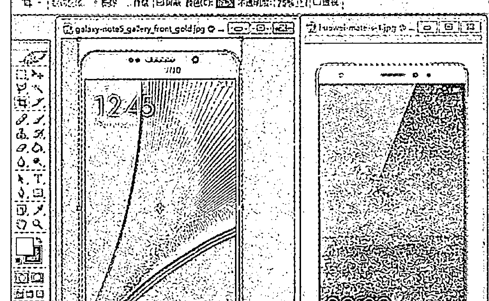

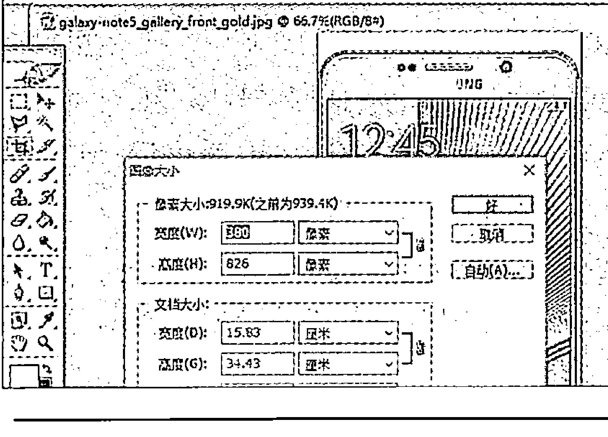

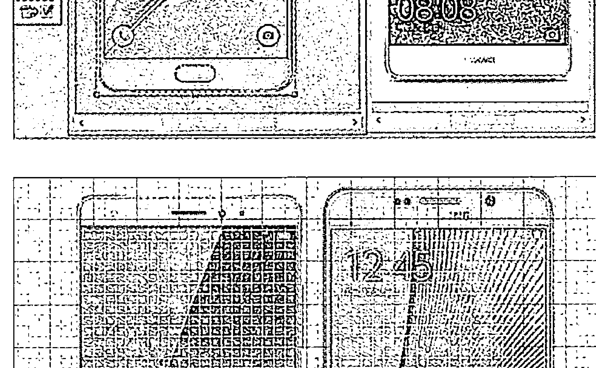

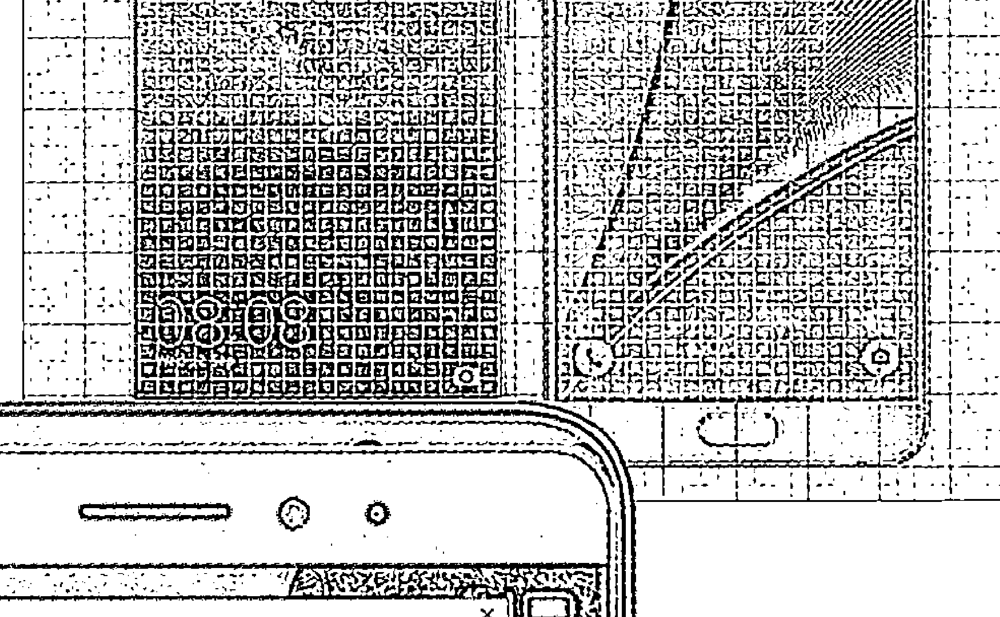

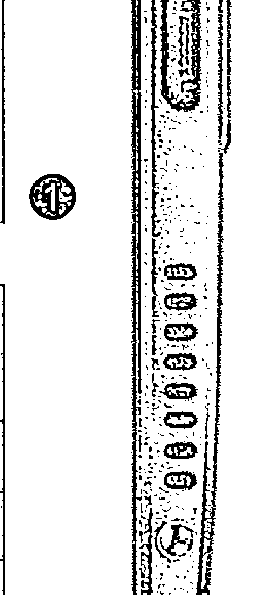

# 三围背后隐藏的细节

为了突出手机在三围设计上的优势，很多厂商会将厚度作为宣传重点。比如，华为Mate S就主打2.65mm（边缘最薄处）这一参数。可惜，这种“最薄处厚度”的数字并没有实际意义，只能体现其采用了U型的边缘设计（图5），以及所谓的“精湛工艺”。可惜，Mate S为了实现2.65mm这个卖点，将电池容量也压缩到了2700mAh。要知道，5.2英寸的荣耀7都能把电池做到3000mAh，5.5英寸的Mate S电池反而变小了，让Mate7系列原有的续航优势消耗殆尽，这不能不说是一种历史上的倒退。实际上，不仅是华为Mate S，还有很多Android手机都钻进了“极致纤薄”的牛角尖，比如金立S5.1（5.1mm）、OPPO R5（4.85mm）、Vivo X5Max（4.75mm）等等。而这些追求最薄参数的产品，全部存在续航不佳的缺陷，而超薄的机身也没能带来太好的手感（除了轻）。毫无疑问，纤薄化是智能手机未来的发展方向，但是与其追求极致的厚度，反而不如想办法提升手感。比如，一些较厚的手机可以通过弧面的后盖设计带来较好的持握感，而较薄的手机的边缘也要避免采用容易割手的V角设计（图6），并通过磨砂或者不同材质的后盖提升防滑性。


# 屏占比的真实意义

大屏手机在宣传上都会突出一个名为“屏占比”的参数，比如华为Mate 7（83%）、乐视Max（80.3%）、联想VIBE Z2 Pro（83.5%）、OPPO R7 Plus（76.6%）。屏占比和屏幕大小没有关系，它代表着屏幕面积与手机表面积的占比，屏占比越高，代表手机的上下和侧边框的宽度越窄（图7），可以实现“越级挑战”的效果。比如，虽然iPhone 6 Plus的屏幕只有5.5英寸，但其糟糕的屏占比（60.9%）导致它的体型堪比不少6英寸Android手机。因此，在选购手机时我们可以将屏占比这个参数列入考核重点，相同尺寸的手机，屏占比越高代表着手机越为苗条便携。

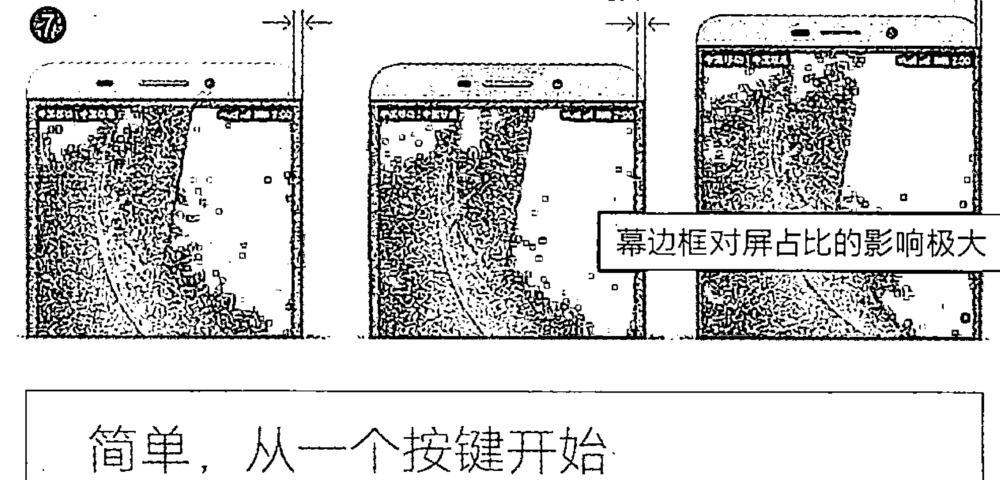

### 扩展阅读

为了提升易用性，很多手机会在电源和音量键的基础上加独立静音、拍照或可自定义的快捷键。相对而言，可自定义快捷键最为实用，同时单击、双击或长按等形式，可触发很多动作或功能。此外很多手机还赋予指纹识别按钮的自定义功能，如扮演拍照快门的角色。

# 简单，从一个按键开始

Z1将传统安卓的Home键、返回键、多任务键合并为一个按键，不区分左右，而是追求统一。你似乎更强大的功能，用最简单的形式保证最简单的操作。我们把这

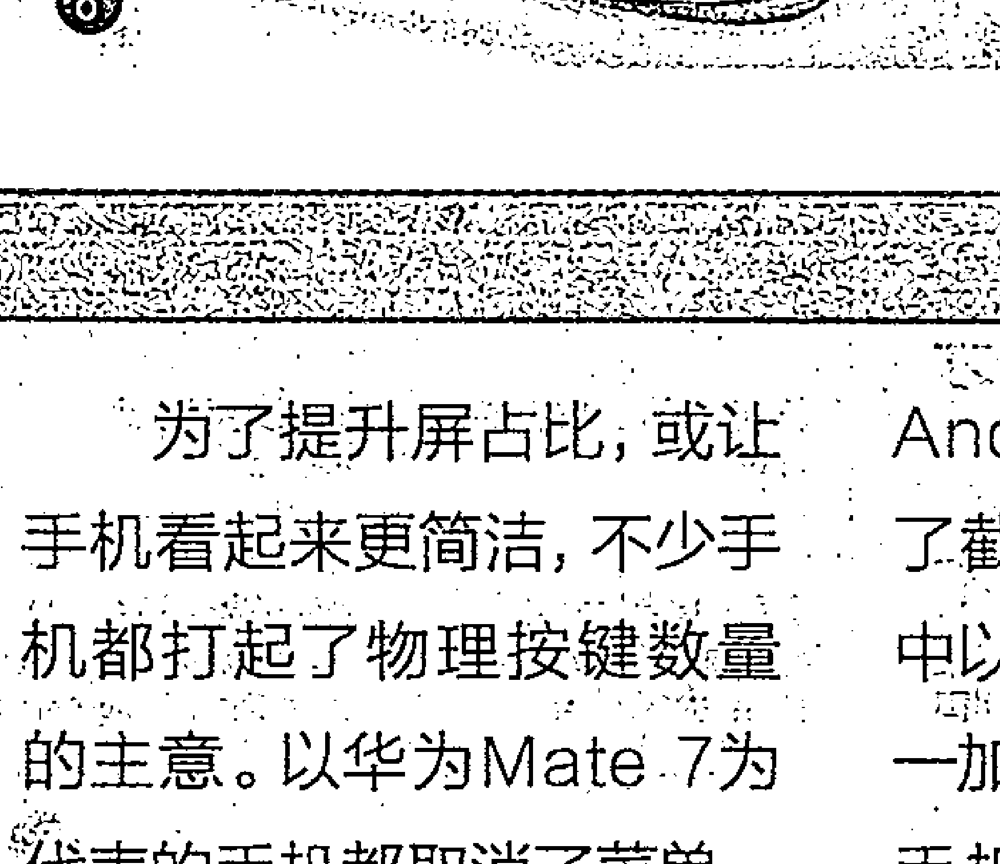

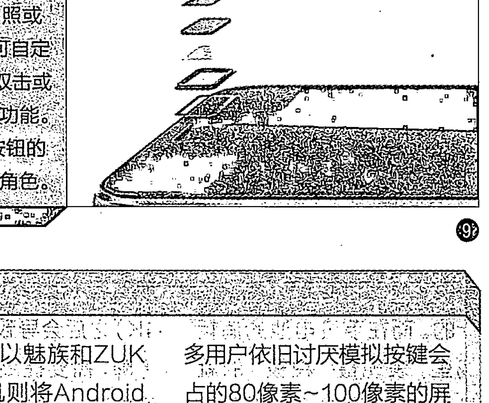

# 审视按键数量的背后

为了提升屏占比，或让手机看起来更简洁，不少手机都打起了物理按键数量的主意。以华为Mate 7为代表的手机都取消了菜单、Home和返回的物理按键，改用了屏幕里的模拟按键设计，并将指纹识别器也转移到手机背面。在指纹识别功能逐渐兴起的今天，手机厂商们对Android传统三按键也采取了截然不同的设计形式。其中以三星高端Galaxy系列和一加手机2为代表的Android手机，采用了集成指纹功能的物理Home键，以及分列两侧的菜单和返回的虚拟按键（图8），虽然在体验上会有一种点击实体/虚拟按键的割裂感，但却是最容易被Android老用户所接受的形式。另一方面以魅族和ZUK为代表的手机则将Android特色的三按键缩减为一颗单独的Home键，在赋予指纹识别功能的同时，可通过滑动/长按/短按等手势实现菜单和返回的功能（图9），需要一段的学习和熟悉时间。相对而言，指纹识别器后置，使用屏幕模拟按键的形式可最大限度提升屏占比，但很多用户依旧讨厌模拟按键会占的80像素~100像素的屏幕空间，哪怕它们平时可隐藏起来。指纹和Home键合二为一，极易增加手机“下巴”的宽度而影响屏占比，对厂商的实力要求更高。至于传统三功能键还是一拖三的Home键设计，在熟悉使用后对体验并无影响，所以大家也不必过于纠结。

# 待机噩梦
哪些数字在影响续航时间

对智能手机而言，待机时间往往比性能还重要。那么，我们如何从已有的产品参数中判断其大致的续航能力？

## 以mAh为单位的电池

没错，电池容量是影响智能手机待机时间的最核心要素（图1）。苹果最新发布的iPhone 6s电池为1715mAh，应该是目前同尺寸智能手机领域最为“寒酸”的容量；而主打超级续航的金立M5手机则凭借6020mAh的电池，重度使用也可坚持2天左右。如果你对手机续航时间比较敏感，挑选电池容量更大的产品总是没错的。

需要注意的是，在手机电池的表面通常会印有最小值（Min）和典型值（Typ）两个参数（图2），而厂商在宣传时则通常以典型值为准。实际上，每一块手机锂电池的实际容量都是浮动的，即在最小值和典型值之间。

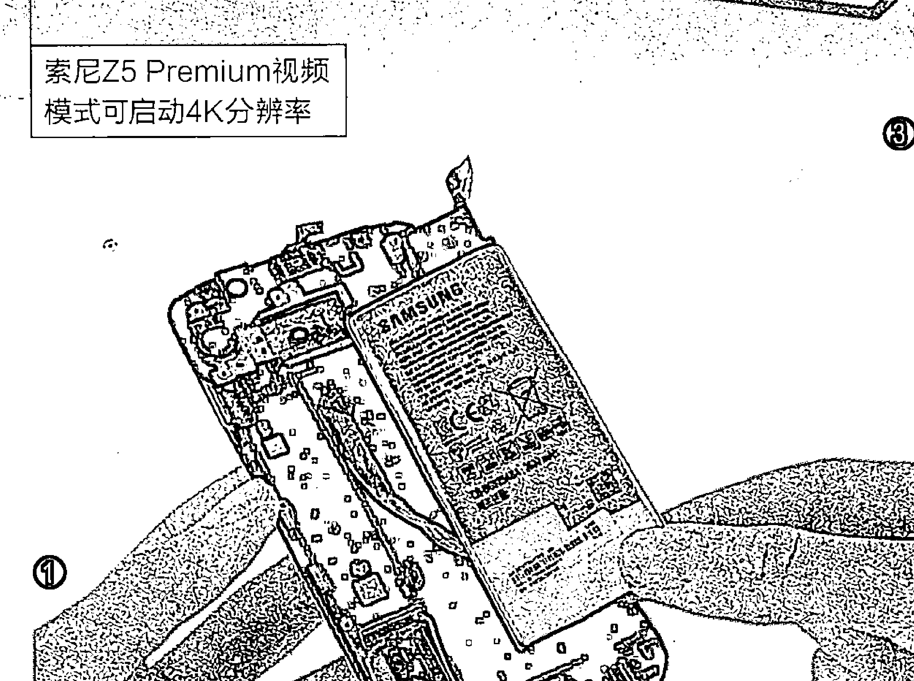

## 屏幕始终是“用电大户”

哪怕是被誉为火炉的高通骁龙810，其在低负载时的耗电量也是可以忽略不计的。而在手机电池的消耗战里，表现最“积极”的就是屏幕，它通常会占用至少50%~60%的电池资源。

简单来说，屏幕的耗电量与尺寸和分辨率成正比。这很好理解，屏幕显示面板（LCD）越大，自然需要更多的电流驱动，同时也要增加背光的功率才能保证足够的亮度。而分辨率越高，自然就需要耗费更多的CPU/GPU资源进行画面渲染。此外，当像素密度（PPI）变高（比如屏幕从1080P升级到2K甚至4K）之后会导致屏幕透光率下降，需要提高屏幕亮度来解决这一问题。同时，分辨率越高还会增加触控反馈的响应时间，需要更高的电压才能解决反馈的延迟问题。

以索尼最新发布的Z5 Premium为例，其内置的3430mAh对一面5.5英寸4K屏幕（3840×2160像素分辨率，PPI高达806）而言就是杯水车薪，为此索尼采用了一个取巧的方案：在日常使用或者运行QQ微信等应用时屏幕会以1080P的模式显示，只有在浏览图片和视频时才会触发4K显示模式（图3）。武装最顶级的屏幕技术却不敢用，这就是4K屏幕所面临的尴尬。

实际上，手机厂商要比消费者更重视高像素密度的耗电问题。在2014年，很多国产旗舰都以武装2K屏幕为荣，而步入2015年后，更多的国产旗舰却老老实实地用回了1080P，这足以说明问题。


| 标准版 | 顶配版 |
| :--- | :--- |
| 骁龙™801处理器<br>Adreno 330图形处理器 | 骁龙™810处理器<br>Adreno 430图形处理器 |
| 3GB LPDDR3<br>LPDDR3 933 MHz | 4GB LPDDR4<br>LPDDR4 1600 MHz |
| 16GB / 64GB 存储空间<br>eMMC 5.0 | 64GB存储空间<br>eMMC 5.0 |
| 锂离子聚合物大电池<br>典型容量3000mAh (typ)<br>最小容量2900mAh (min) | 锂离子聚合物大电池<br>典型容量3090mAh (typ)<br>最小容量3010mAh (min) |

### 小提示

在笔记本领域总是用“Wh”作为电池容量单位，为何在手机领域却又换成了mAh呢？答案很简单，不同型号笔记本电池的工作电压不同（图4），比如A款笔记本电池为11.1V/4200mAh，那它的总能量就是11.1V×4200mAh÷1000=46Wh；而B款笔记本电池为19V/2400mAh，其总能量为45Wh，两块电池在容量上其实没有差别。而手机领域的锂电池都是标准的3.7V，所以用mAh为单位即可作为判断大小的依据。再举个例子，有些移动电源支持给笔记本充电，但由于移动电源内置电芯也是3.7V标准，如果再考虑电路转换的损耗，至少要15000mAh的移动电源才能给一块19V/2400mAh的笔记本电池充满电。

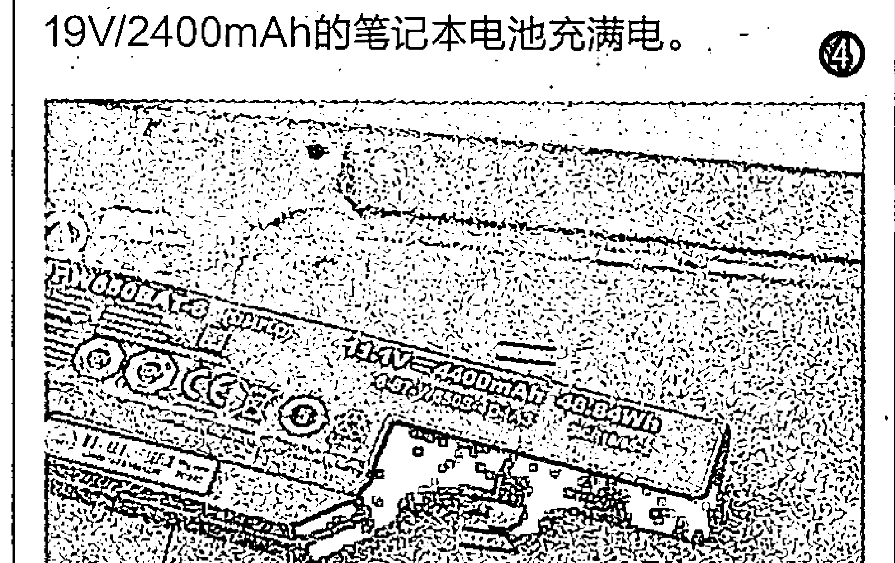

## 不可忽视的屏幕材质

那么，当屏幕变大、分辨率变高之后有没有弥补方案？答案是肯定的，那就是通过改变屏幕材质换取更低的电量消耗。

目前主流的手机屏幕材质主要分为TFT和AMOLED两类，而我们熟悉的IPS（以苹果和绝大多数Android手机为主）和SLCD（以HTC为主）都是建立在TFT材质基础上的技术，可改善色彩显示效果，提高可视角度。而AMOLED材质屏幕的可视角度在IPS之上，而且还具备高色域和黑色背景几乎不耗电的优势（图5）。

尺寸同分辨率的情况下，AMOLED屏幕要比TFT更省电。

以三星Note 4为例，虽然它采用了5.7英寸2K屏幕（AMOLED）和3000mAh电池，但其待机能力却远超规格相近的魅族MX4 Pro（5.5英寸2K IPS屏幕，3350mAh），这就是屏幕材质的影响力。为此，魅族在最新款MX5身上也用上了更省电的AMOLED屏幕（图6），而主打极致纤薄的金立、OPPO和Vivo的超薄手机也换上了AMOLED屏幕以弥补塞不进更大电池的遗憾。

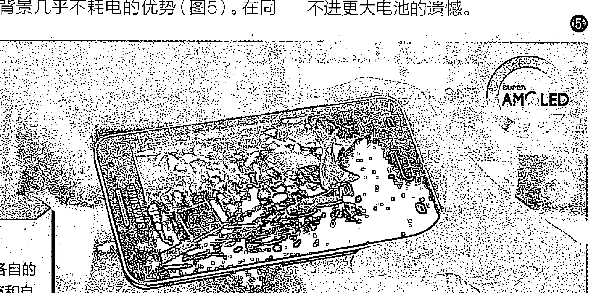

## 如何提升续航时间

为了提高Android手机的待机能力，很多厂商都推出了各自的“省电技术”。实际上，大家的省电技术多是建立在系统和自带省电软件层面，而这些省电的秘籍通常也能通过第三方APP模拟出来。感兴趣的读者可参考本刊2015年17期《如何延长续航时间 浅谈Android手机的省电机制》这篇文章。

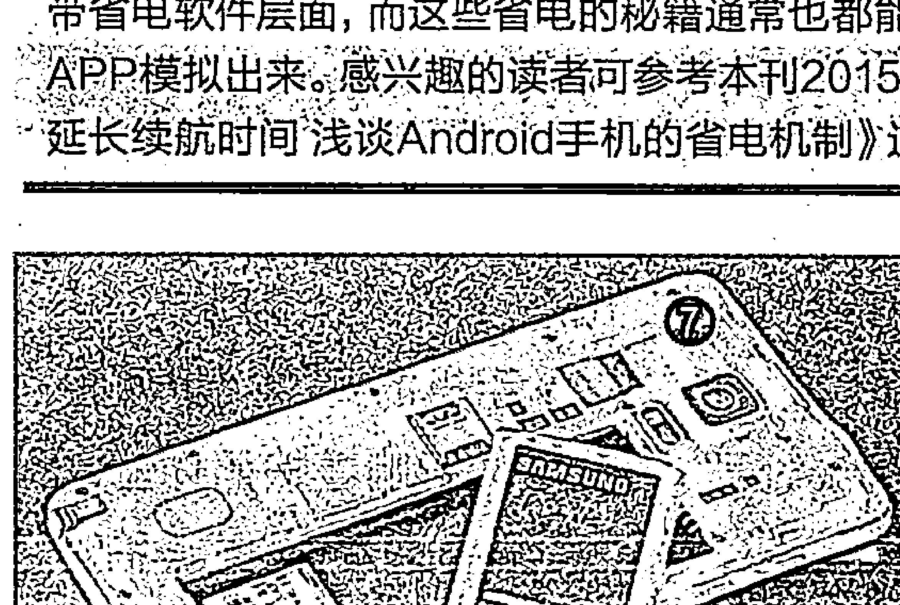

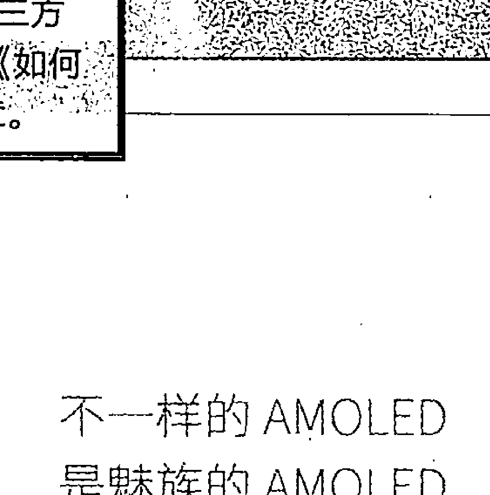

MX4上这1080P屏幕已经和LCD的色彩不相上下，但对魅族来说这还不够，于是便有了现在的这块AMOLED屏幕。这块屏幕不仅在显示效果上有提升，还有在色彩方面。这块屏幕在色彩方面的提升，使得它在显示效果上有提升，还有在色彩方面。

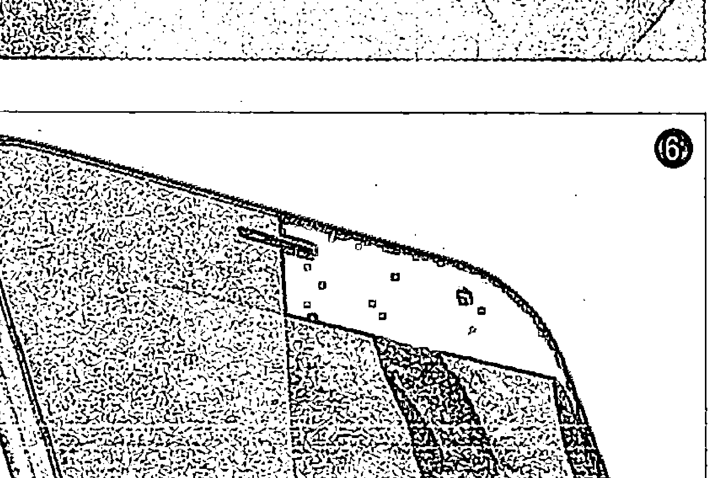

## 如何搭配才算合理

抛开品牌和硬件配置不谈，能够用上AMOLED材质屏幕的手机显然要比IPS更值得选择。就分辨率而言，除非是超过6英寸的屏幕，否则1080P足矣。2K和4K屏幕增加的那点PPI根本无法弥补其对电量消耗的弊端。要知道当像素密度超过300PPI时人眼就无法区分单独的像素了，哪怕PPI这个数字再怎么翻番也没有实际意义（除非手机厂商能用AMOLED或更大的电池与2K/4K屏幕搭配）。

在电池方面，5.5英寸或更大尺寸的手机，至少需要3000mAh起步的电池才能保证1天重度使用的要求（图7）。以此为标准，屏幕每增加0.1英寸就要额外的100mAh电池弥补，比如6英寸手机至少需要3500mAh电池辅助，7英寸手机没有4500mAh电池就根本不值得选择。

尺寸同分辨率的情况下，AMOLED屏幕要比TFT更省电。

# 解析数字背后的密码
## 从摄像头参数判断拍照潜力

绝大多数手机在宣传摄像头时只会标注“XXX像素”，但像素并不决定拍照效果，iPhone 6用800万像素PK掉无数高端Android手机的案例就很说明问题。那么在没有机会接触实际产品时，我们又能通过哪些参数判断手机的拍照潜力呢？

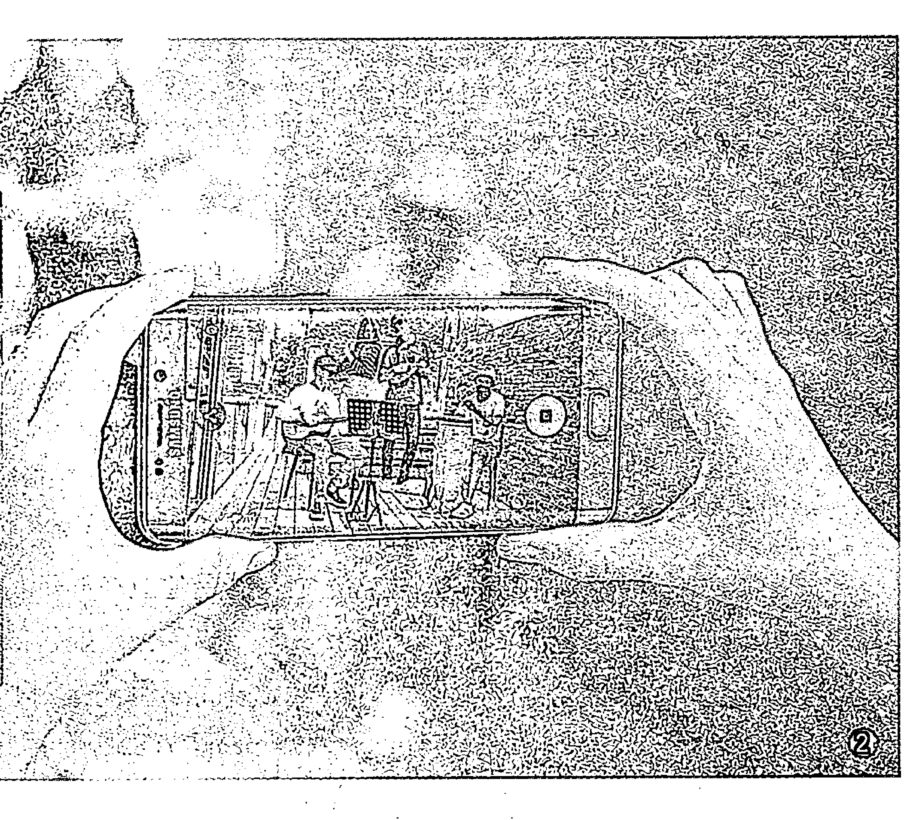

### 从传感器型号切入

同样配备了1300万像素摄像头的多款手机，它们的拍照效果可能会出现云泥之别。究其原因，则是它们采用了不同规格的传感器型号（图1）。对传感器来说，有效像素、CMOS尺寸和单个像素面积应该是最核心的三个参数。其中，CMOS是一种特殊的半导体器件，它是由无数个微小光敏物质感光元件（每个感光元就代表一个像素）构成。

在像素数不变的情况下，CMOS尺寸越大单位像素面积就越大，意味着单位像素可收集更多的光线，提高了低照度、信噪比，有利于提高画质。换句话说，传感器的CMOS的尺寸越大越好，单个像素面积越大越好。一加手机2之所以没有挑选索尼IMX系列传感器，一方面是索尼产能方面出现了问题，而另一方面就是一加相中了OV13860传感器拥有1.3μm的像素面积、图像ISP更强大和封装面积较小的优势。

下表是目前主流的手机用传感器型号，一些低端Android手机拍照水平过烂，就是因为它们选择了索尼IMX100系列或OV早期的传感器型号，效果自然无法与新款传感器比拼。而在下面的传感器中，它们的理论拍照效果的排名是IMX240≈OV13860 > IMX220 > OV23850 > IMX230 > IMX234 > IMX278 > IMX214 > UltraPixel。其中，UltraPixel由于像素较低，所以目前多被用于前置摄像头。

▼ 索尼IMX230和索尼IMX240支持相位对焦技术，索尼IMX278支持RGBW传感器

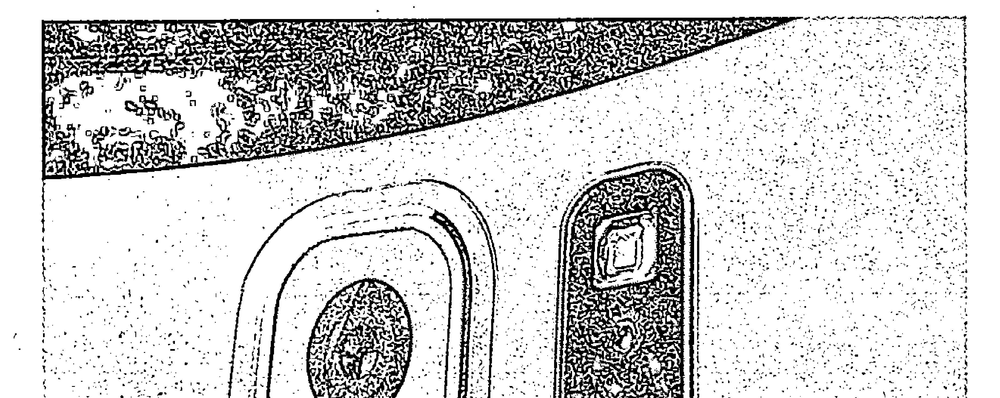

### 还有谁在影响拍照实力

除了传感器型号，摄像头的光圈大小（取决于镜头封装，有手机厂商根据需求定制）、ISP影像处理器（处理器直接集成，或搭载第三方ISP芯片）、镜头结构（镜片数量、有无蓝光滤镜等）同样影响着手机最终的拍照水平。如果你对这方面感兴趣，可参考本刊2015年12期《像素说明不了问题 手机摄像头如何拍出好照片》这篇文章。

手机的对焦速度是否迅速同样影响着拍照体验（图2），特别是在抓拍或连拍时，快门速度可谓“决定生死”。如果你对摄像头对焦技术感兴趣，请参考2015年17期《抓住转瞬即逝的机会 浅谈手机的对焦技术》这篇文章。

| 传感器型号 | 有效像素 | CMOS尺寸 | 单个像素面积 | 代表手机 |
| :--- | :--- | :--- | :--- | :--- |
| 索尼IMX214 | 1300万像素 | 1/3.06英寸 | 1.12μm | Vivo Xshot |
| 索尼IMX220 | 2070万像素 | 1/2.3英寸 | 1.2μm | 索尼Z3 |
| 索尼IMX230 | 2100万像素 | 1/2.4英寸 | 1.12μm | 华为荣耀7 |
| 索尼IMX234 | 1600万像素 | 1/2.6英寸 | 1.12μm | 努比亚Z9 Max |
| 索尼IMX240 | 1600万像素 | 1/2.6英寸 | 1.2μm | 三星Note 5 |
| 索尼IMX278 | 1300万像素 | 1/3.06英寸 | 1.12μm | 华为P8 |
| UltraPixel | 400万像素 | 1/3英寸 | 2.0μm | HTC One |
| OV13860 | 1300万像素 | 1/2.6英寸 | 1.3μm | 一加手机2 |
| OV23850 | 2400万像素 | 1/2.3英寸 | 1.12μm | 金立E8 |

# 明察秋毫
辨别直观之间的是与非

我们经常接触的多媒体文件一般都有很多直接的参数：图片的位深、视频的分辨率等，很多人常用这些参数判断多媒体文件的好坏。实际上很多文件的直接参数并不能真实反映多媒体文件的好坏，还需要明察秋毫，不要被直观可见的参数迷了眼。

# 美图
决定效果的那些隐藏参数
文|平淡

对于一张图片质量好坏的判断标准，很多朋友总爱以分辨率的高低进行衡量，如某图片分辨率高达1920×1080，就想当然认为这是一张高质量的图片。实际上决定一张图片质量的好坏绝不仅仅是分辨率。举个简单的例子，下面是不同分辨率的同一张图片（文件格式不同），显然其中分辨率较低的图片显示质量要高（图1）。

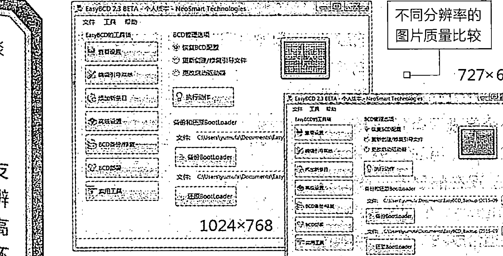

从这个实例可看出，分辨率并不能完全决定一张图片的好坏，对常见图片还有许多隐藏的参数和图片的质量密切相关。

# 水平和垂直分辨率

除了常见的表示图片尺寸大小的分辨率外，图片的水平和垂直分辨率也是影响图片质量的一个重要参数。在专业术语中，它是指打印分辨率，单位是DPI（dot per inch）即每英寸打印多少个点。DPI可分为水平分辨率和垂直分辨率，例如一张DPI为“1英寸×1英寸”的图片，如果它的水平分辨率是100DPI，垂直分辨率是50DPI，那么就是说，它水平每英寸分成100小段，垂直每英寸分成50小段，就像米尺上的一格格那样。那么这张图总共有100×50=5000个格子，这张图片共有5000像素（图2）。

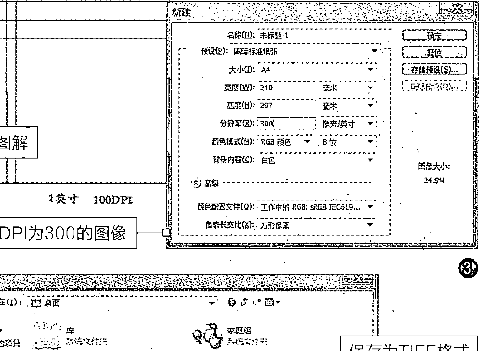

DPI越高打印出来的成像质量就越高。所以在一些摄影级的杂志（或杂志的彩页），一般都要求投稿者提供至少300DPI的图片，只有这种分辨率的图片才能有较好的打印效果。

对于图片DPI的调整可以借助Photoshop来实现。启动Photoshop后新建一个A4格式的图片，在图片分辨率选项中设置为杂志所需的分辨率比如300（像素/英寸），RGB设置为32位，其他值默认（图3）。

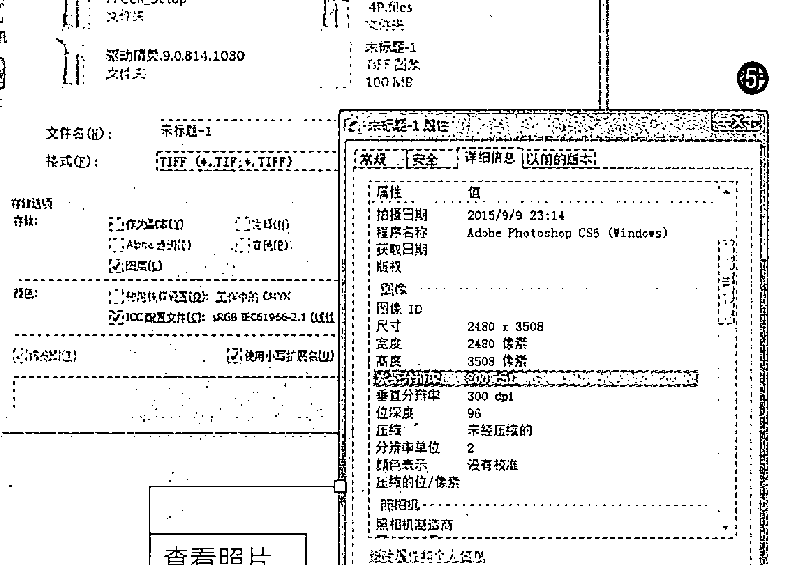

接着将原来低DPI的照片直接粘贴到新建图层中，在PS中将图片放大到适合观看的大小，再剪切所需的区域并粘贴保存，完成上述的操作后点击“文件→存储为”，文件格式选择保存为TIFF格式，点击“保存”（图4）。

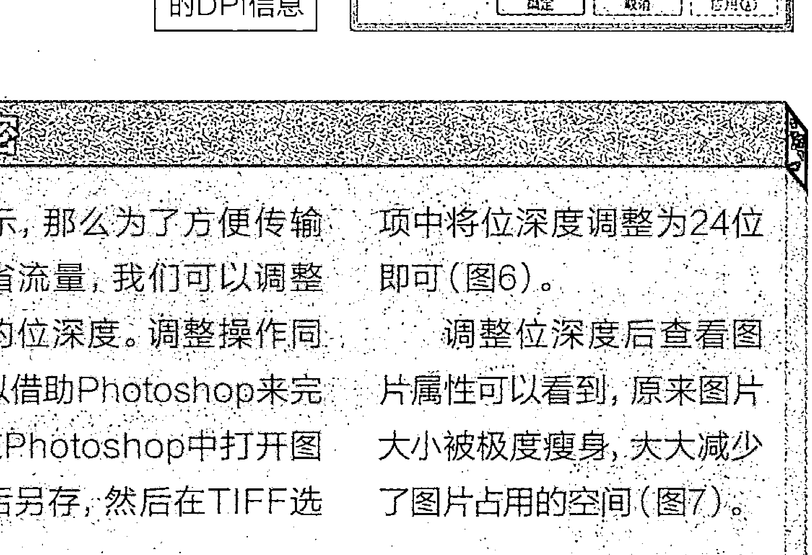

这样得到的图片就是300DPI分辨率，现在右击经过上述处理后的图片选择“属性→详细信息”，可以看到现在的水平和垂直分辨率都是300DPI（图5）。

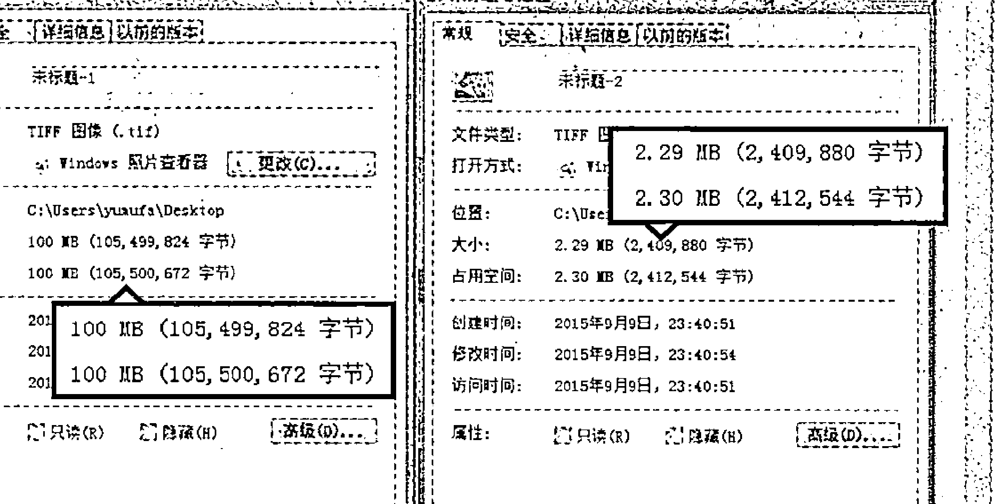

# 位深度的秘密

在图像中各像素的颜色信息是用二进制位数来描述的，颜色位深就是指存储每个像素所用的二进制位数，图像的颜色位深度直接影响它能支持的颜色数。比如黑白照片只有黑、白两种颜色，也就是说它的每个像素只有1位颜色，位深度是1，用2的一次幂来表示。现在的显卡一般支持24位颜色，位深度是24，它能组合成2的24次幂种颜色（=16777216种颜色）。一般来说，图片的位深度越大，图片的颜色显示的就越真实，但是图片的体积也就越大。

人类眼睛分辨的颜色极限是24位颜色，因为高位深图片占用体积过大，所以如果图片只是在平板或者网站上展示，那么为了方便传输和节省流量，我们可以调整图片的位深度。

调整操作同样可以借助Photoshop来完成：在Photoshop中打开图片以后另存，然后在TIFF选项中将位深度调整为24位即可（图6）。

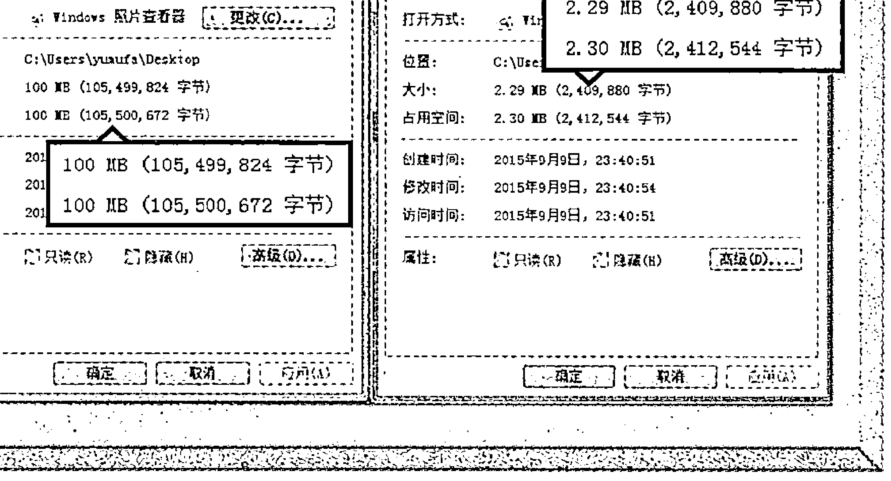

调整位深度后查看图片属性可以看到，原来图片大小被极度瘦身，大大减少了图片占用的空间（图7）。


## 文件格式大不同

除了上述直观的各个参数外，对于图片来说还有一个隐藏的参数就是文件格式，不同文件格式意味着不同压缩率，而压缩率对图片质量的影响非常大。因此在日常图片转换过程中，我们就需要根据不同的需要对图片进行合适的转换（见表）。

对于常见图片格式的转换借助系统自带的画图组件即可，比如默认BMP格式图片占用体积较大，我们可以将其转换为高压缩PNG格式（但是图片质量并不降低很多）。在画图中打开BMP图片，单击“文件→另存为”，在保存窗口文件类型选择“PNG”格式即可（图8）。

画图只能简单转换文件格式，如果对图片质量的显示要求不高（比如在网站显示表格图片、流程图等），那么可以使用Photoshop保存压缩率更高的JPEG格式。在Photoshop中打开图片后另存为JPEG格式，然后在图像选项中将品质设为“低”，这样可以最大限度地节省空间（图9）。

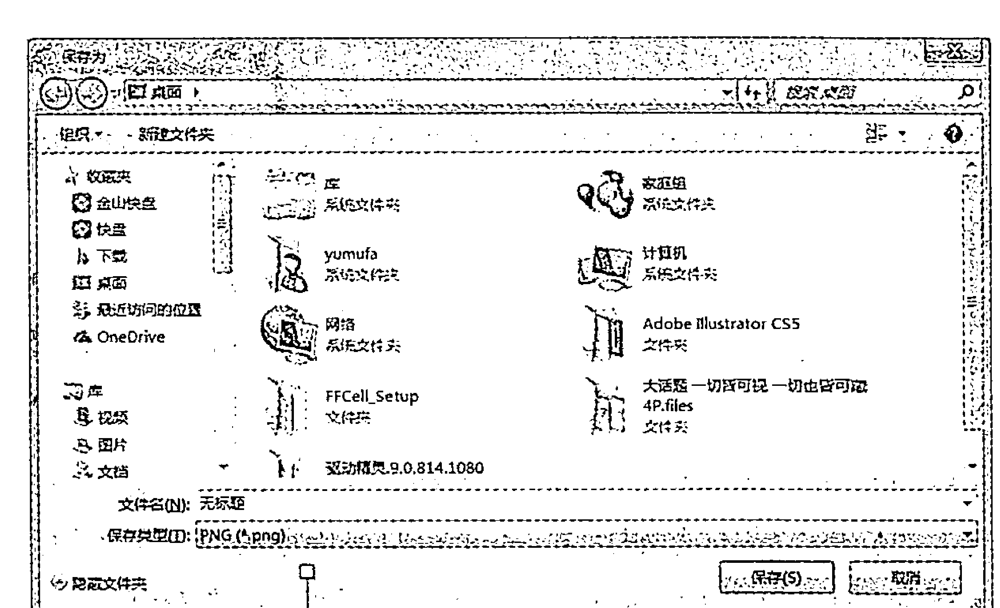

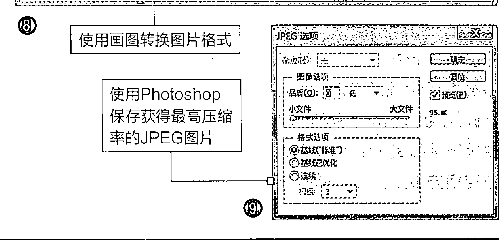

| 文件类型 | 压缩率 | 用途 |
| :--- | :--- | :--- |
| TIFF | 可以压缩，包括RGB无压缩、RLE压缩及JPEG压缩，文件体积仍较大 | 图像清晰，放大不失真，常用于彩图打印 |
| BMP | 无损，可以通过调整位深度减小体积 | 图像清晰，一般用于印刷 |
| GIF | 压缩率一般在50%，图像深度支持从1bit到8bit | 图像质量一般，体积较小，常用于网站显示 |
| JPG | 压缩率最高达90%，它用有损压缩方式去除冗余的图像数据，可以用最少的磁盘空间得到较好的图像品质 | 图像质量较高，一般用于平板、手机、网站等展示 |
| PNG | 压缩率较高 | 图像质量高、体积小，常用于网站显示 |

▲ 常见图片格式比较

## 认识隐藏在视频后面的参数

对于视频文件来说，视频分辨率也仅仅是一个反映视频质量的参数，它并不是决定文件大小的唯一因素，一个视频文件质量的好坏还有其他决定性的参数。要查看视频文件的详细信息可借助MediaInfo进行，启动MediaInfo后点击“文件→打开”，打开要查看信息的视频文件，在程序窗口中就可清晰地看到视频的全部信息（图1）。

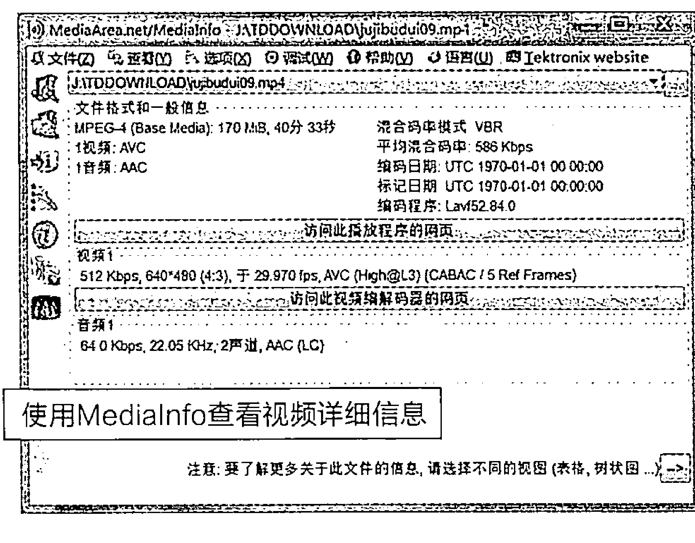

从图中可以看到一般视频参数主要包括视频和音频参数，表示视频子参数则有视频编码格式、码率（包括混合码率和平均混合码率）、分辨率和帧数。音频子参数则主要包括音频编码、采样率等。因此在判断一个视频文件的质量或进行视频转换时就需要综合考虑这些参数。

目前高清视频的编码格式主要有H.264、MPEG-4、MPEG-2、WMA-HD以及VC-1，它们之间主要的区别是视频编码和压缩率不同。而常见的AVI、RMVB、MKV、ASF、WMV、MP4、3GP、FLV等文件只是使用上述编码格式的封装标准，并不是编码格式。由于很多种视频编码文件、音频编码文件都符合AVI封装要求，所以即使都是AVI文件，也可能里面的具体编码格式不同。同样的情况也存在于其他容器格式如RMVB、WMV文件中。一些容器则还可同时封装多个视频、音频编码文件，比如MKV封装格式，可做到一个文件包括多语种发音、多语种字幕。使用不同编码格式进行封装后，得到的视频文件大小和清晰度是完全不同的，而且由于每种编码格式需要安装对应的解码器解码后才能播放。因此在日常的视频转换过程中，就要根据具体的设备进行相应转换。比如需要将视频放置在Android平板、手机上播放，我们就需要根据平板的特性选择合适的转换方式，视频的转换一般借助“格式工厂”即可。现在很多高清电影使用RMVB格式封装，但该类型的视频在很多Android平板、手机上无法直接播放，而且默认高清电影的体积较大，也不适合直接存放在平板、手机这类存储较小的设备上。现在借助格式工厂可为高清视频瘦身，并转换为一般移动设备都可播放的MP4格式。启动格式工厂后点击“mp4”，在打开的窗口中点击“添加文件”，导入需要处理的RMVB文件(图2)。

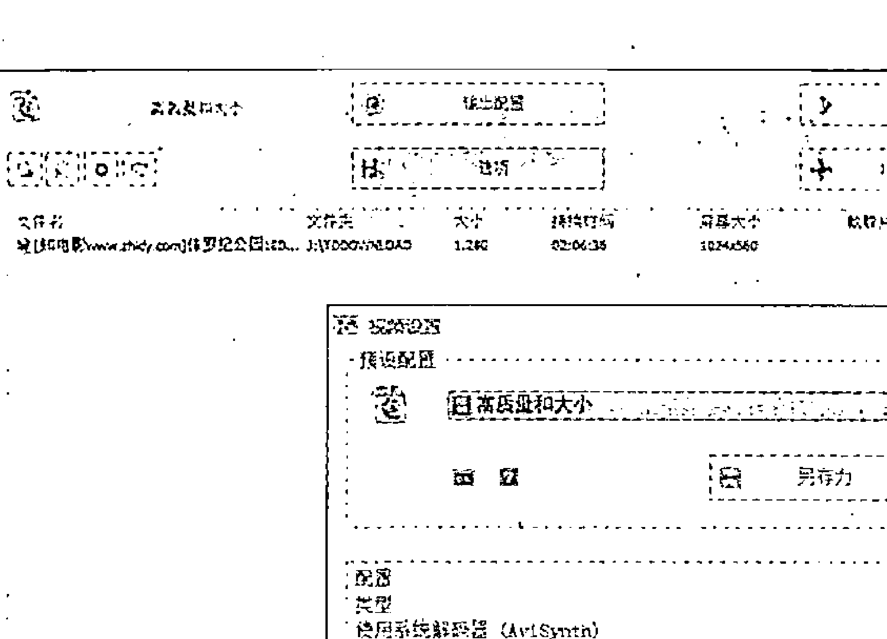

继续点击“输出配置”，这里就可以为转换的视频设置详尽的参数(图3)。

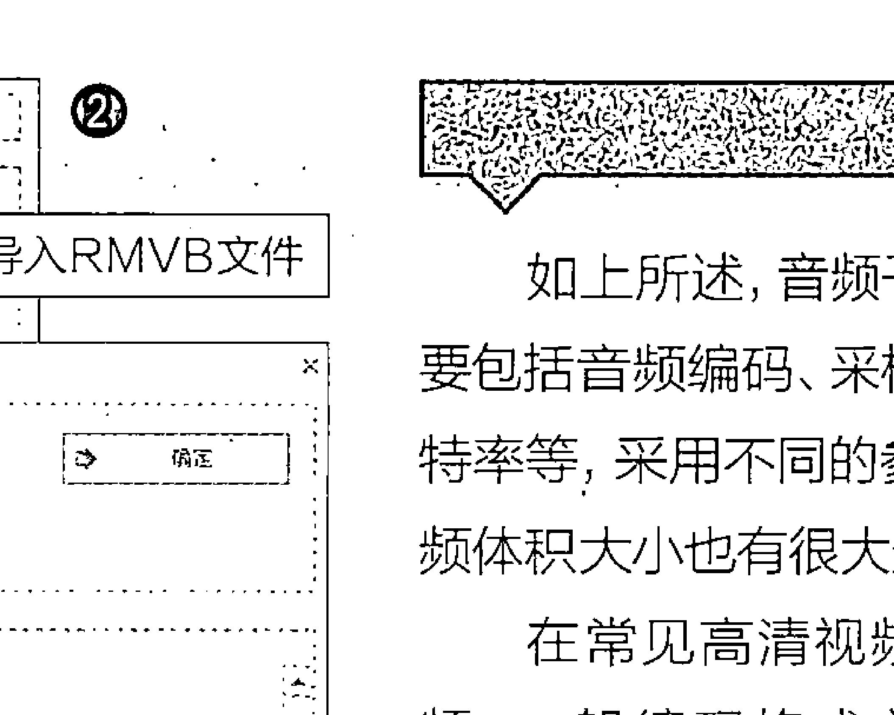

视频编码：可以选择AVC(H264)使用H.264编码格式，这样能够获得更高的压缩率，同时在平板、手机上这种小尺寸屏幕上播放视频质量又没有多少损失。

屏幕大小：根据自己设备的实际情况进行设置，如很多平板是1280×720，选择合适的分辨率不仅可减少转换后视频的体积，而且可更好地在移动设备上全屏显示。

比特率：比特率越大视频体积也越大，要根据实际情况选择，一般视频设置为512即可，如果上传到优酷，高清质量需要设置为1024。每秒帧数：帧数越高占用的体积也越大，这里可以根据实际转换视频进行设置。对于动态电影选择25～30即可，而对于软件使用教程这类视频则可以设置为5～10，减低帧数可以大大减小转换后视频的大小。完成上述设置后依次“确定”返回格式工厂主窗口，点击“开始”即可将RMVB电影转换为自己设备播放的MP4视频。

### 音频常见参数

如上所述，音频子参数主要包括音频编码、采样率和比特率等，采用不同的参数对视频体积大小也有很大影响。

在常见高清视频中的音频，一般编码格式主要就是MP3和AAC。AAC脱胎于MP3，但拥有比MP3更高的压缩率，AAC通常压缩比为18:1，且音质由于采用多声道和使用低复杂性的描述方式，它拥有比MP3更多的优势，目前高清电影音频大多使用AAC格式。如在优酷下载的超清视频(FLV文件)大多使用AAC格式，可用7ZIP直接打开查看其音频格式(图4)。

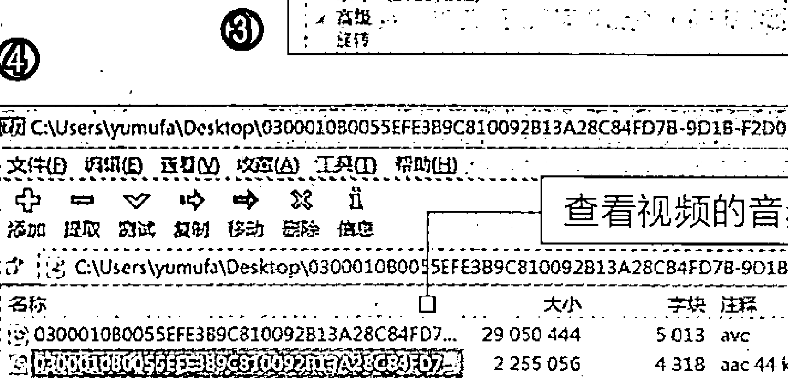

同样采样率越大，视频文件体积也越大，因此在执行视频转换时，我们要根据实际情况对音频流采样率进行设置。比如一般高清视频采样率大多使用44kHz频率，如果只是类似教程解说、游戏录制的视频，那么使用22.05kHz采样率就足够了。音频采样率查看一般借助资源管理器即可，打开保存音频的目录，右击选择“属性→详细信息”即可看到(图5)。

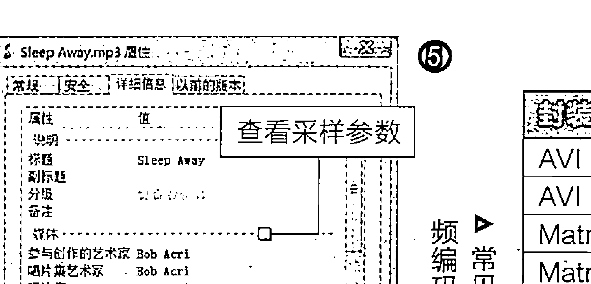

| 常见容器 | 视频流编码格式 | 音频流编码格式 |
| --- | --- | --- |
| AVI | Xvid | MP3 |
| AVI | Divx | MP3 |
| Matroska (后缀就是MKV) | Xvid | MP3 |
| Matroska (后缀就是MKV) | Xvid | AAC |
| Matroska (后缀就是MKV) | H264 | AAC |
| MP4 | Xvid | MP3 |
| MP4 | H264 | AAC |
| 3GP | H.263 | AAC |
| FLV | AVC | AAC |
| RMVB | H264 | RAAC |


### 可视化带来的“效率经”

无论是系统启动的配置文件还是命令提示符窗口和命令行操作，都需要晦涩的命令行触发启动。同理，办公软件中各种条件语句和函数虽然高效，但学习的门槛却令普通用户望而却步。实际上通过可视化软件或插件帮忙，一切难题往往迎刃而解。

### 跳出命令魔咒 系统启动编辑可视化操作

从Windows Vista开始，Windows引入BCD作为系统的启动配置文件，Windows Vista、Windows 7使用系统自带的bcdedit.exe，Windows 8/8.1和Windows 10则主要使用bcdboot.exe来编辑BCD文件。不过无论bcdedit还是bcdboot，晦涩的命令行、要记忆的复杂命令总让新手望而生畏。现在借助专业的可视化软件，即使新手也可轻松编辑系统启动。

#### 启动菜单的可视化编辑

在日常的操作中我们总是少不了要对BCD文件进行编辑，比如为了方便在启动文件出错后进行恢复，要导出BCD文件进行备份；双系统用户为了方便自己进入主力系统，需要设置某系统为默认系统等。现在这些看似复杂的操作，借助“EasyBcd”就可以轻松完成了。

以管理员身份启动EasyBcd，先选择“简体中文”，启动后它会自动读取本机的BCD文件，这样借助其可视化的图形菜单即可轻松进行编辑。比如需要备份BCD配置文件，切换到“BCD备份/恢复”，接着点击“备份bootLoader”即可。以后需要还原BCD时，选中上述备份的文件，点击“还原bootLoader”即可(图1)。

EasyBcd同样可以对BCD其他项目进行操作，比如为了方便进行系统维护，我们经常要在BCD中添加PE维护系统，借助命令行需要执行非常复杂的操作。现在只要切换到“添加新条目”，然后在“便携式/外接存储介质”下：

- 类型：选择WIM镜像 (Ramdisk)
- 名称：Windows PE维护系统
- 路径：选择准备好的PE系统（一般是boot.wim文件，还要将boot.sdi放置在同一目录）

最后点击“添加条目”，这样重启后在多重启动菜单选择“Windows PE维护系统”即可进入PE了(图3)。

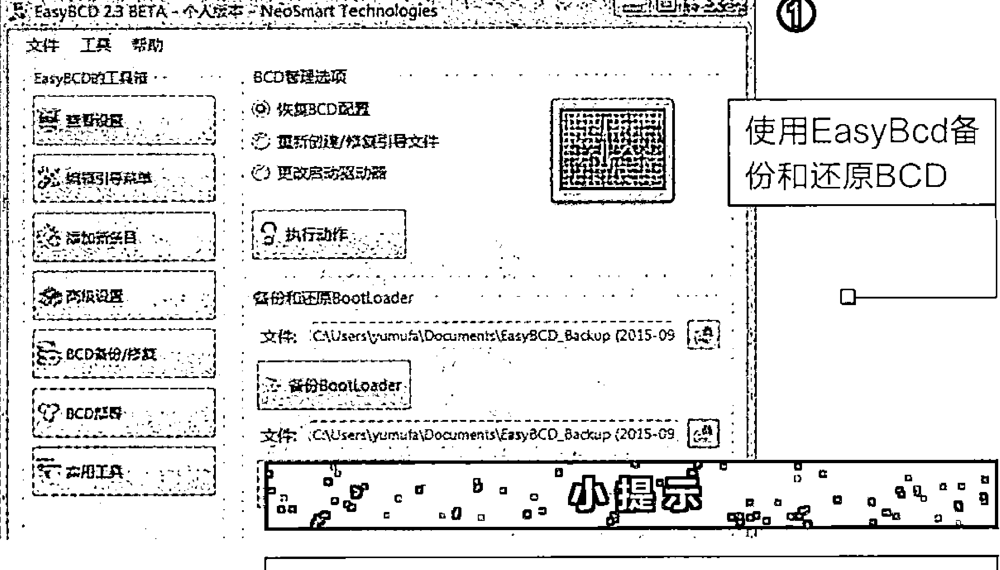

#### 自动修复启动故障

在日常的使用中，我们经常会遭遇启动故障。比如开机后某个启动项无法使用，双系统用户无法启动另一个系统等。对于这类启动故障，现在可以借助“BCDautofix”进行自动修复。比如对于双系统用户，如果可以进入另一个系统(假如都无法进入则使用闪存盘PE进入)。接着运行BCDautofix，然后按任意键开始修复。BCDautofix会对启动故障进行自动检测并进行修复，修复完成后重启即可解决常见启动故障(图4)。

在对BCD文件进行编辑的时候，系统经常会提示文件正在使用，无法对其进行编辑。此时只要以管理员身份启动注册表编辑器，依次展开[HKEY_LOCAL_MACHINE\BCD00000000]，接着单击菜单栏中的“文件→卸载配置单元”，点击“是”，这样即可对BCD文件进行编辑了(图2)。

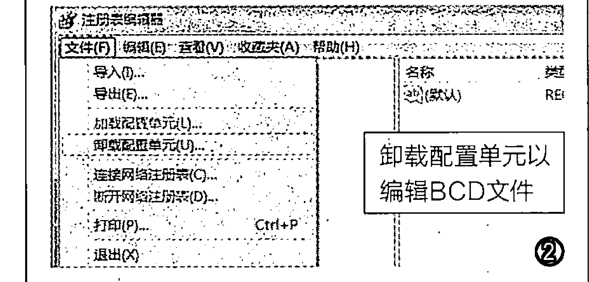

#### UEFI启动设置

现在越来越多的电脑在使用UEFI模式进行引导，由于UEFI启动是通过固化在主板中的UEFI配置文件实现的，默认在Windows中很难实现对其编辑。现在借助“EasyUEFI”可轻松地在可视化条件下进行编辑。

首先确认自己的系统是否是以UEFI方式启动，进入系统后使用管理员身份启动命令提示符，接着输入“msinfo32.exe”，在打开的窗口中查看右侧窗格的BIOS模式，如果其显示为“UEFI”则表明使用的是UEFI模式启动。

确认自己系统是UEFI模式启动后就可以使用“EasyUEFI”对UEFI启动进行编辑了， EasyUEFI启动后会自动读取当前UEFI启动菜单，并会以不同颜色标注分区性质，比如红色表示UEFI启动分区，如果没有红色分区则表示当前系统已经丢失启动分区。

接下来可以使用EasyUEFI对菜单进行可视化编辑。比如默认大部分主板的UEFI启动菜单的闪存盘启动排序都在最后，而且是以“UEFI:U盘英文名称”命名，在实际使用时会带来不便。现在我们可以借助EasyUEFI对启动菜单进行排序，并且将启动菜单更改为更加易懂的名称。在启动列表选中要更改名称的菜单，点击向上图标，再将其移动到最前面，接着点击“编辑”按钮，在弹出的窗口中将原来的字符删除，然后启动记事本输入自己需要的名称如“U PAN”(不可输入中文，否则会出现乱码)，再复制粘贴到菜单的位置，最后点击“确定”退出即可(图5)。

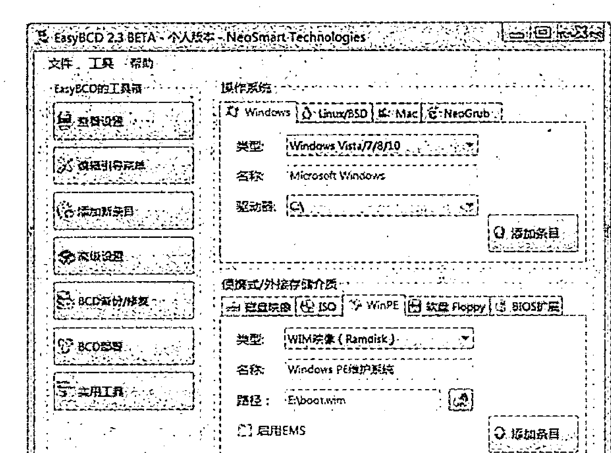

插入支持UEFI启动的闪存盘，重启后按下F12键(有些主板是F9键)，在弹出的启动菜单中我们就可以看到自己更改后的“U PAN”菜单了，这样是不是更直观易懂了(图6)？对其他项目的编辑，操作方法类似。

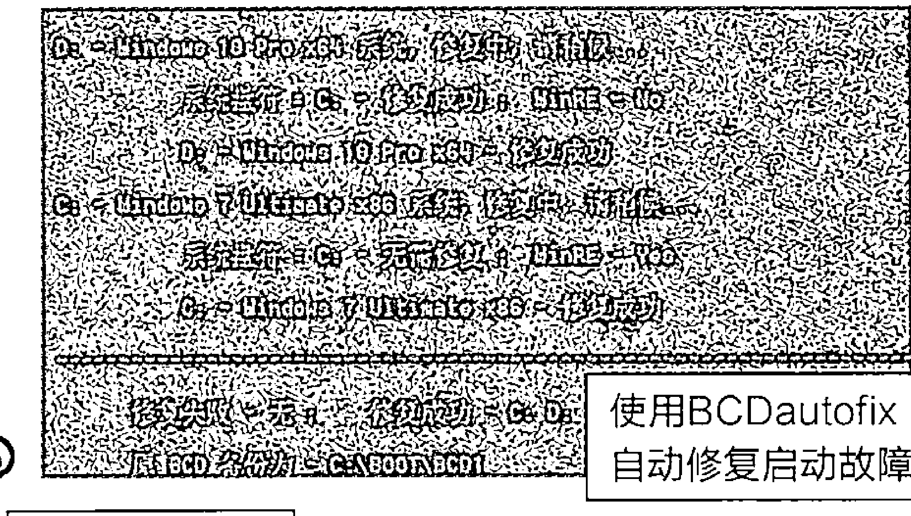

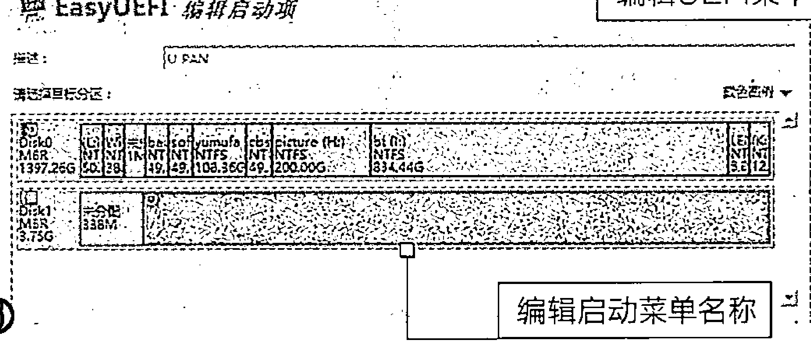

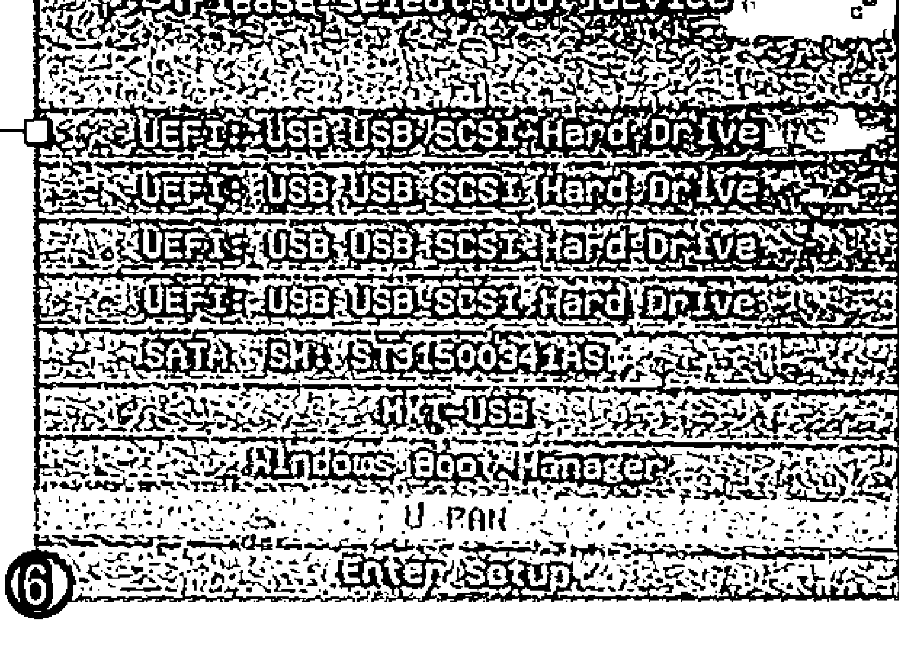

### 枯燥系统命令 变身可视化操作

文|云
Windows系统的命令提示符窗口和命令行操作，这些为系统大师津津乐道的东西对普通用户来讲却望而生畏。究其原因，主要是操作界面的全字符（英文字符为主）可视化程度远远不够。如果通过相应的方法或软件，将这些字符操作变成可视化的操作，就更能为普通用户所接受。


#### 命令提示符 更强可视化

Windows命令提示符窗口的操作方法和功能相对比较单一乏味。使用系统命令图形化增强工具PowerCmd，可大大增强命令提示符窗口的功能。它提供了更直观的命令图形化操作环境，让命令操作变得更方便和有趣。

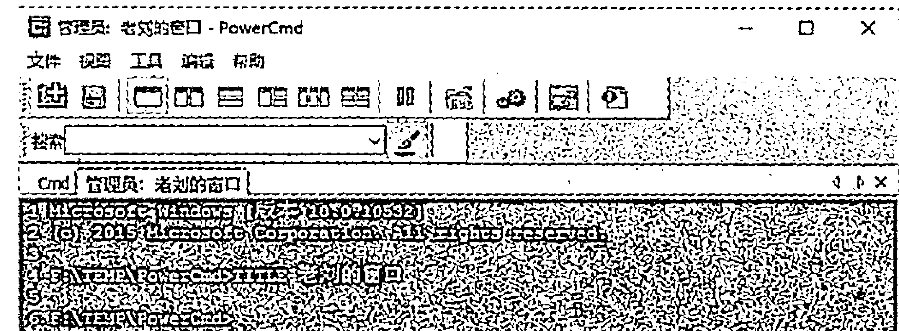

> 小提示：PowerCmd工具要放在纯英文的路径中运行，程序文件夹的名称中不要包含任何汉字符。

> 小技巧：新建的窗口除了用上述命令 “TITLE <新窗口名称>” 来更名外，还可以用右击标签并选择“重命名”的办法更名（图2）。

#### 更改命令提示窗标题

PowerCmd默认的窗口标题是清一色的“Cmd”。实际上，这个标题不是一成不变的，我们可根据自己的需要更改其名称。在窗口中输入命令“TITLE <新窗口名称>”即可将其改变。例如：输入 “TITLE 老刘的窗口” 命令然后回车，窗口标题马上变为“老刘的窗口”（图1）。

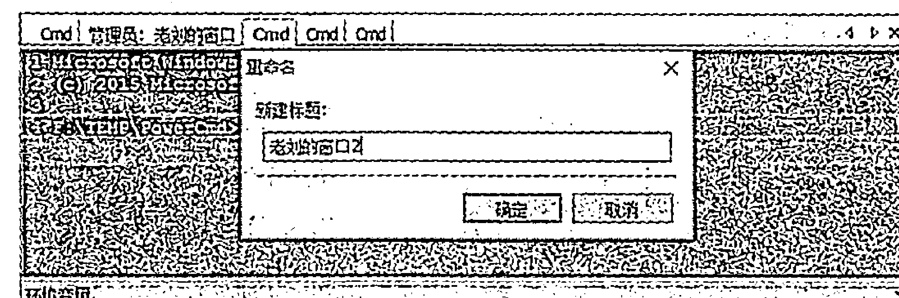

#### 建立多标签CMD窗口

依靠系统功能只能建立单一的命令提示符窗口，无法做到窗口集成。现在，用PowerCmd可以建立类似于多网页或多文档的集成标签式窗口了。在PowerCmd界面中点击工具栏上的第一个“+”号图标按钮，或者用“文件→新建提示窗口”菜单命令（Ctrl+N为快捷键），即可马上建立一个新的Cmd标签窗口。

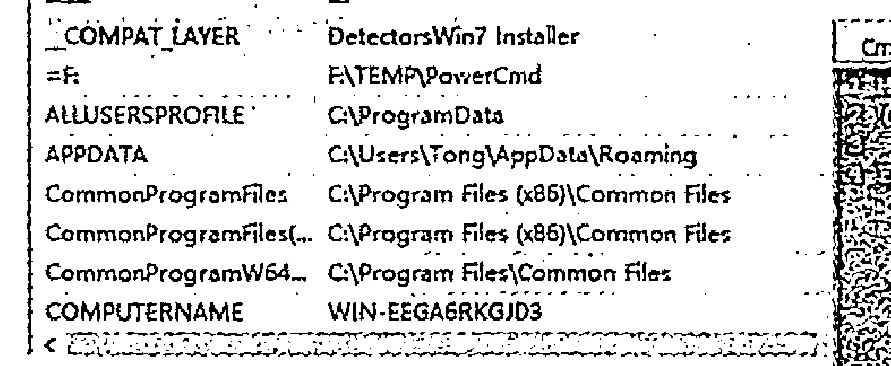

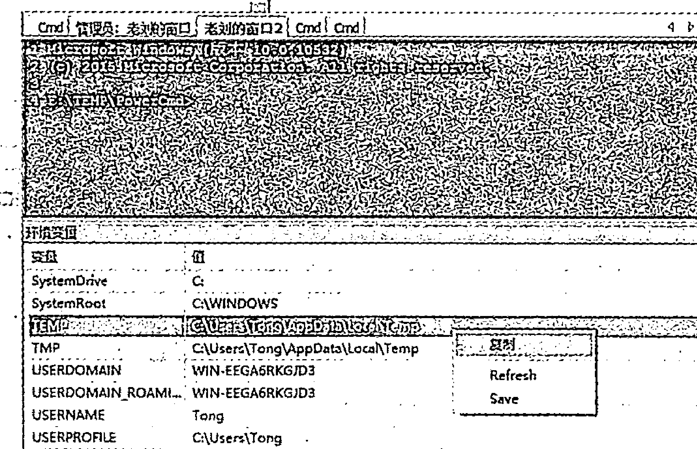

#### 轻松获取环境变量

在Windows中，要查看系统环境变量（如系统根目录、临时文件目录等），要深入到好几层菜单中查看系统属性才能获知。如果用PowerCmd软件，可在其命令窗口的下方，一目了然地看到所有的环境变量列表。

> 小提示：如果要提取某个环境变量的路径，直接用鼠标右击该变量行，从快捷菜单中选择并复制，即可获得（图3）。

#### 命令提示窗隐身术

Windows的命令提示符窗口只能做到在开启后最小化在任务栏上，只能关闭无法藏起。PowerCmd窗口则可以从任务栏上隐身。具体方法是，在系统托盘的PowerCmd图标上单击右键并选择“Hide Main Windows”（图4）。反之，执行“Show Main Windows”命令则可以使其再次现身。

#### 命令提示窗透明化

命令提示符窗口也可以做到任意透明化。点击PowerCmd “工具→自定义”命令，在弹出的“首选项”窗口中点击“常规”选项卡，从中设置“透明度”，可设置0～90之间的数值，默认0表示不透明，90表示高度透明（图5）。将透明度设置为30，效果就已可以透过并看到桌面内容（图6）。

#### 搭积木式窗格布局

如果开启的命令提示符窗口多了，还能够根据操作需要改变多标签窗格的布局。共有6种窗格布局可选。具体方法：通过“视图”菜单下的“窗格布局”命令来选择切换（图7）。有些窗格可能会呈现重叠不可见状态，对于这些重叠藏起的窗格，可通过窗格标题栏上的小箭头来切换显示。

#### 窗口命令全盘导出

在系统命令提示符窗口中要复制执行过的命令为文本文件，操作起来比较繁琐，需要先标记要复制的内容，然后用鼠标框选，回车后进入剪贴板，最后再粘贴到空的TXT文本中。而PowerCmd中要输出一个窗口的所有命令，执行一个“文件→另存为文本”可视化命令即可搞定。保存后的文件为LOG扩展名文件，可直接用记事本打开（图8）。

#### 命令编辑全可视化

在传统的命令提示符窗口中，执行复制粘贴等命令非常不方便，即便是升级到了Windows 10，虽然支持Ctrl+C和Ctrl+V快捷操作，但要选择命令，仍然离不开标记和选取两个动作，无法直接用鼠标拖动选择。而在PowerCmd中，只需像在记事本中那样，用鼠标选择和复制粘贴就能任意对命令进行编辑了（图9）。此外PowerCmd窗口还支持标准Windows文本编辑的方法和快捷方式。例如鼠标左键双击选择单词，在行左侧单击或点击行号选择一行命令，在行左侧按下左键并拖动鼠标可选择多行命令。命令提示窗口还支持直接拖动选中的内容到其他位置。还能将资源管理器中的文件夹或文件直接拖动到命令窗口中，自动形成完整的路径。


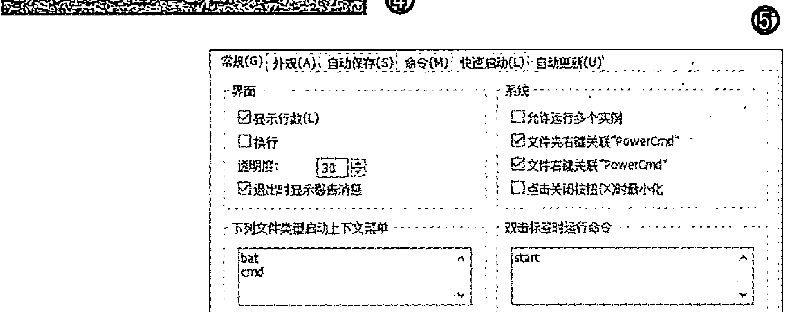

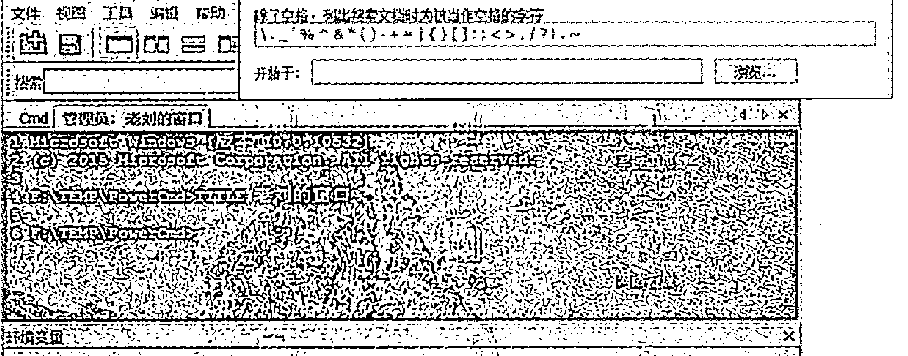

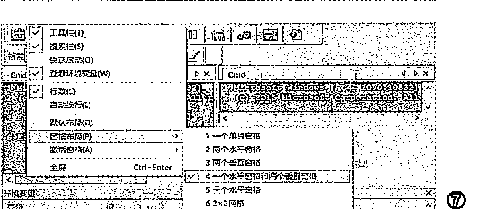

> ### 小技巧
要选择一列文本吗？这在传统命令提示符窗口是办不到的。而在PowerCmd窗口中，将光标点击到区域起点的左上角，然后在按下Alt不放的同时拖动鼠标到右下角区域，即可选取纵向的列块了。如图9所示。

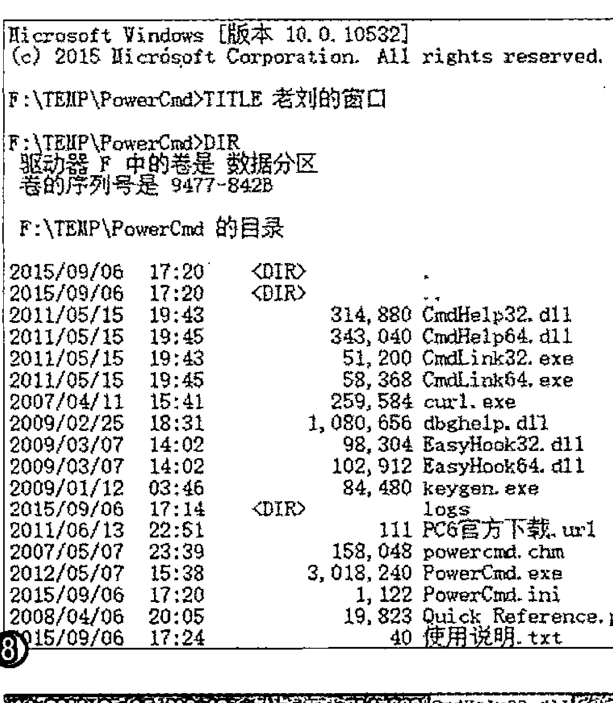

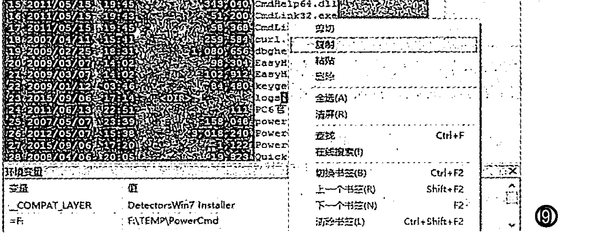## 注册表“动刀”图形化优先

注册表是“神秘”的Windows功能组件，通过对注册表中各种键值的编辑，能达到灵活控制和修改系统功能的目的。但是，由于操控注册表用到的均是英文字符，非常类似于程序设计中的代码，因此，对于一般用户来讲，编辑注册表只能按着已有方案“照猫画虎”，甚至原样照搬。尽管如此，编辑注册表也有一定的危险性，因为稍有不慎，对其中的字符拼写有误，就可能造成系统故障甚至崩溃（图1）。于是一些通过间接手段对注册表进行可视化编辑的方法或工具就受到人们的追捧。

### 小提示

#### 调用注册表编辑器

在Windows 10的开始菜单中无法直接找到注册表编辑器的影子，通过搜索框询问小娜关于“注册表”、“编辑注册表”或“注册表编辑器”等问题，均只是给出了指向网络的搜索链接，并无直接给出调出注册表编辑器的快捷方式（图2）。可见微软不主张普通用户随便去使用该工具。如果的确需要调用注册表编辑器，可通过Win+R组合键，运行REGEDIT命令来调用。

最为常见的注册表编辑器替代品是系统自带的组策略编辑器。组策略编辑器提供给用户的是全中文的菜单式界面，面向用户的是明确的功能和选项，用户根据需要选择其中的项目，即可实现对系统控制和修改的目的。但实质上，这些操作在后台最终会关系到注册表项目的更改，只不过用户不能直接感觉到罢了。对于组策略编辑器中修改的每个项目，都可以对应地找到用修改注册表项目来实现的方法。

但是，如果用组策略编辑器去做这件事，就简单多了。启动组策略编辑器，定位到本地计算机策略的“用户配置→管理模板→桌面”，在右侧就可以看到“从桌面删除回收站”的选项，双击这个选项，然后选择“已启用”并点击“确定”即可完成操作。相比之下，整个过程都是在中文界面下选择完成，不懂编程或英文的人都能轻松完成（图5）。

#### 小技巧

#### 启动组策略编辑器

用键盘组合键Win+R启动运行窗口后，输入GPEDIT.MSC命令并运行，即可进入组策略编辑器界面。在Windows 10系统中，通过在搜索框中输入“组策略编辑器”或“编辑组策略”询问小娜，她就会给出答案，之后点击顶部的应用链接即可进入（图3）。

大家知道，如果要删除Windows 10桌面回收站，是不能像其他图标那样直接选择并用Del键删除的。使用注册表来删除该图标，需要依次定位到注册表编辑器的“HKEY_LOCAL_MACHINE\SOFTWARE\Microsoft\Windows\CurrentVersion\Explorer\Desktop\NameSpace”键值，找到名为“{645FF040-5081-101B-9F08-00AA002F954E}”的项，右键点击并删除这个项目，关闭注册表后重登系统才能完成。使用这种方法，光是定位路径就需要点击8次鼠标，还得到一大串键值中去辨认那个枯燥的字符串（图4）。

有的电脑上为了防止有人运行命令而禁用了命令提示符功能。如果要解禁该功能，需要修改注册表中的相应项目才能实现。进入注册表编辑器，依次定位到“HKEY_CURRENT_USER\SOFTWARE\Policies\Microsoft\Windows\System”，新建一个双字节值项DisableCMD，修改其值为0表示没有限制，若值为1、2都表示禁止（图6）。如此才能完成任务。

而如果用组策略编辑器来执行如上任务，则只需在“用户配置→管理模板→系统”下，双击“阻止访问命令提示符”一项，选择“已禁用”即可（图7）。

注册表编辑的另一种可视化操作的替代品是一些系统优化软件。在Windows优化大师、超级兔子、软媒魔方、CCleaner等常用系统优化工具的背后，其实也是在进行一些注册表的操作，只不过在面向用户的层面上，需要用户操作的是对菜单或者命令的选择，是将对注册表编辑的操作转换为可视化操作而已。

可以了（图8）。这其实就是注册表修改的可视化替代法。如果用手动修改注册表的方法，同样也能完成这项任务，但操作起来就复杂多了，需要逐级定位到注册表的“HKEY_LOCAL_MACHINE\Software\Microsoft\Windows\CurrentVersion\Run”分支，对其下的相应项目进行右键菜单操作，将不希望自启动的项目删除掉（图9）。

当我们要禁用一些Windows开机自启动程序，以优化开机速度时，如果用软媒魔方系列工具中的软媒优化大师来操作，可视化程度会很高，直接从软媒优化大师窗口中选择需要禁用的开机启动项就可以了（图8）。

设置命令提示符禁用后，在进入命令提示符窗口时，窗口会给出命令提示符已被系统管理员停用的提示。该设置阻止用户运行交互式命令提示符cmd.exe程序，还阻止运行cmd和bat类批处理文件。

## 特别话题

### 命令可视化 面广选择多

为了满足对系统不甚了解的广大电脑用户的需求，程序员们开发出了各种各样的命令可视化操作工具。将命令行操作转换为可视化图形操作的工具还有许多。

#### 可视化部署虚拟系统

创建VHD虚拟磁盘后，要在虚拟盘中安装Windows系统，可以通过在Windows下运行imagex映像释放程序，以命令行的方式来完成系统文件的部署（如： imagex /apply install.wim 1 F:）；而启动文件的配置需要另一个系统命令bcdboot来完成（如： bcdboot F:\windows /s F:），但是这样操作均不够直观。如果要用更加直观的图形化操作方式来完成虚拟系统的部署和启动菜单的配置，则可以用“Windows VHD_VHDX 辅助处理工具”来完成。使用个工具，从界面中选择安装映像文件install.wim，然后指定目标驱动器，即可代为自动执行上述两条命令，完成系统文件的部署。而多系统菜单的配置，也是用该软件的“向BCD中添加VHDX项目”选项即可轻松完成（图3）。总之，凡是可用复杂命令操作的项目，一般都可以找到其对应的可视化操作工具，这是需求使然。更多的工具这里不再一一赘述，读者朋友们可按需上网查询。

#### 可视化修改右键菜单

对Windows系统环境下各种右键菜单项的定制，可通过“右键扩展菜单管理器”工具执行可视化的操作，免去使用枯涩难懂的系统命令或注册表修改命令的麻烦（图1）。

#### 可视化操作系统映像

系统自定义映像文件的生成依靠Recimg命令来完成，操作过程中要通过各种参数的改变来实现各种功能，比较难以掌握。但是，如果使用一款RecImg_Manager工具来管理，就能用更直观的可视化方式来生成和管理映像文件了（图2）。

用Windows VHD_VHDX辅助处理工具部署系统更直观

### 界面与命令 效率谁更高
文|刘蓓

图形化操作具有很强的易用性，但并不代表具有最高的工作效率。相对于图形化操作，命令行往往具有更高的执行效率，所以许多图形化软件还特别提供了命令行的操作方式。最常用的WinRAR压缩软件就支持很多直接使用的命令行操作方式，用这种方式执行文件压缩往往比图形界面执行效率高很多。

### 小提示
WinRAR软件的命令行程序是一个名为RAR.EXE的控制台操作程序，该文件位于WinRAR软件的安装目录中（图1）。该程序支持RAR格式的压缩文件，默认的扩展名为RAR。在使用时，只要将该程序放于系统默认路径PATH变量所及的范围内，即可直接调用该程序。为防止万一找不到的情况发生，一个最简便的办法是将该程序从WinRAR的安装目录中拷贝到需要调用它的工作文件夹中。调用时将命令提示符的当前路径切换为该程序所在的文件夹。

#### 加密压缩哪个更便捷

案例：将当前文件夹TEMP中的所有TXT文本文件压缩到一个MYJMRAR.RAR文件中，并给这个压缩包自动加上密码“xuxinjinbu”。
这项任务用WinRAR图形界面操作，需要如下5个步骤才能完成：
右键单击要压缩的TEMP文件夹，选择“WinRAR→添加到压缩文件”命令（图2）；在“压缩文件名和参数”窗口中，输入压缩文件名MYJMRAR.RAR；点击“设置密码”按钮设置密码“xuxinjinbu”（图3）；切换到“文件”标签，设置添加文件的范围为“\TEMP\*.TXT”（图4）。最后点击“确定”执行压缩。
如果用控制台命令操作，在命令提示符窗口中执行一个命令即可完成（图5）：

```
RAR A -R MYJMRAR -PXUXINJINBU *.TXT
```

可见，一行命令代替繁多的操作步骤，绕过了众多的窗口界面操作，效率是不言自明的。

#### 跨区压缩哪个更高效
案例：将分别位于 “D:\武侠类”、“E:\历史类”、“F:\言情类”三个分区的压缩文件夹，压缩到 “F:\TEMP\”下的一个“我的小说收藏.RAR”文件中。

如果用图形界面的WinRAR来操作，可以这样做：先将“D:\武侠类”文件夹压缩为“我的小说收藏.RAR”文件，然后再打开压缩包，依次添加“E:\历史类”、“F:\言情类”两个分区中的文件夹到压缩包中，最后再保存并关闭压缩包，完成整个压缩过程。也可以这样操作：先以第一个文件夹建立压缩包，然后通过“压缩文件名和参数”对话框中的“文件”选项卡，利用“追加”按钮来追加另两个分区的文件夹（或直接手动输入文件夹路径，文件夹之间用空格分隔即可）（图6），最后再点击“确定”，完成划分区文件夹的压缩任务。如上操作，若只有三两个文件夹，操作起来还不算麻烦，若有百十个文件夹跨越多个分区，多次来回选择就比较麻烦。下面我们看看控制台命令如何操作。

用控制台命令操作，只用在TEMP文件夹下编写一个文本文件LIST.TXT，在其中输入如下三行内容（图7）：
D:\武侠类
E:\历史类
F:\言情类

### 小提示
这样做的一个好处是，如果有非常多的文件夹需要压缩到一个包中，无论其在哪个驱动器中，只需在LIST.TXT中编辑输入文件夹所在盘符和文件夹名即可。仅是一个简单的打字录入操作，非常方便。

最后在同一文件夹下的命令提示符窗口中，执行如下命令（图8）：

```
RAR A 我的小说收藏 @LIST.TXT
```

这样即可很快获得目标压缩包“我的小说收藏.RAR”。

### 小提示
其中参数x表示解压，而开关-ad则表示附加压缩文件名到目标路径，也就是说以各压缩文件名作为解压后的文件夹名。

### 扩展阅读
不需要任何外部软件，系统内部就有不少能完成基本工作的实用命令。以对TXT文本文件的建立和显示为例，如果我们希望在命令提示符窗口中建立一个文本文件MYDOC.TXT，只需先输入“COPY CON MYDOC.TXT”命令并回车，然后在输入每个自然段后回车，最后按Ctrl+Z组合键并回车，自动保存文件。而如果希望显示该文件的内容时，执行“TYPE MYDOC.TXT”命令就可以了（图10）。两条命令就能代替记事本来建立和显示文本文件，是不是神奇而简单呢？

#### 单独压缩 哪个更神奇
案例：TEMP文件夹下有许多以人名命名的RAR压缩文件，如果本次只希望提取李姓人员的压缩文件，且每个人的文件解压后都要放入单独以名字命名的文件夹中，解压后的文件夹还要统统归集到F盘的“李姓资料集”文件夹。

用图形界面的WinRAR操作步骤：
先对该文件夹中的文件按文件名进行排序；然后将以李姓打头的全部RAR文件选中；执行右键菜单的WinRAR命令“解压每个压缩文件到单独的文件夹”；最后将解压出的文件夹全部选中，拷贝到目标文件夹“F:\李姓资料集”。而用控制台命令操作，在命令提示符窗口中输入下面一行简单命令，即可完成复杂的操作过程（图9）：

```
rar x -ad 李*.rar F:\李姓资料集\
```

## 办公更省心

### 实用插件替代函数运用

办公高手都知道，在日常的使用中我们经常利用各种条件语句和函数来提高工作效率。不过这些方法虽然高效，但是门槛却较高，很多朋友并不知道如何掌握函数等的用法。现在利用一些支持可视化操作的插件，我们的办公就可以更省心。

注意：
由于Office组件默认禁用宏，而本文介绍的插件很多都是利用宏来实现的，因此需要在Office组件中启用宏。以Word操作为例，首先打开任意一个Word文档，点击“工具→宏→安全性→安全级→设置”，级别设置为“中”。这样在运行本文介绍的插件时，Word会弹出“安全警告”对话框，确认是自己所安装的插件，单击“启用宏”来运行插件即可（图1）。

### 用好Kutools Word操作省时省力

在日常操作中，我们经常需要对一些Word文档进行批量的替换操作。比如在网上复制的文档经常包含很多空行，这样就需要将所有的空行全部删除。在默认的情况下，我们需要使用复杂的替换语句（如需要使用“查找^p^p替换为^p”，对于硬回车不是在段首的，而是缩进了2个字符的空行则还要使用“^w^p替换为^p”，再查找“^t^p替换为^p”等繁杂的操作）。现在借助Kutools，我们则可以直接使用其自带的可视化菜单完成上述的操作。Kutools是一强大的Word插件工具集，它集合了上百种强大的功能，这里以Word 2016操作为例。

上述插件安装后默认会在菜单栏添加“Kutools”新菜单，现在启动Word打开需要删除空行的文档。点击“Kutools→清除空行→清除空行或者清除空段落”，这样原来文档的所有空行就可以在瞬间全部删除，再也不需要输入繁杂的查找/替换命令（图2）。

当然，Kutools的功能不仅仅这些。展开Kutools菜单后可以看到所有可用的可视化命令，其自带的“企业”菜单更可以为我们的日常工作提速。比如我们在网上复制的文档经常包含大量的超链接，现在点击“企业→超链接管理→清除”即可消除所有超链接了（图3）。

## 告别复杂函数 Excel操作要提速

使用Excel的朋友都知道，为了高效执行某些操作，我们经常要使用各种函数进行统计操作。比如某居委会需要对辖区年龄大于45岁的女性发放补贴，但辖区常住人口登记是按照每个小区户号顺序登记，男女性别、年龄无序混杂在一起（图4）。

现在需要统计出本辖区所有年龄大于45岁的女性，对于类似多条件（如本例中的“女性”、“>45周岁”）的统计，Excel经常使用“SUMPRODUCT”函数进行统计。不过很多朋友对于Excel函数并不能够熟练掌握，现在借助“方方格子”（一款基于Office的Com加载项软件，用于扩展Excel程序的功能）即可轻松进行类似上例的统计。这里以Excel 2016操作为例。

程序安装后默认会在Excel中添加“方方格子”新菜单，现在如果要对上述实例进行统计，在Excel中打开需要统计的文档。点击“创意实验室→公式→向导→统计”，这样会打开一个函数使用向导窗口，只要按实际情况输入相应的参数即可。比如在上述实例中，因为有两个条件，首先在条件框输入="女"，接着在条件作用范围点击后面的图标，然后在弹出的窗口中选中B2→B7，这样方方格子会自动填入条件参数"$B$2:$B$7"（图5）。

点击“确定”返回插件窗口，然后单击“添加”，这样就完成一个函数参数的设定。同上，继续输入“>44”条件，作用范围是“C2:C7”，最后点击结果存放（公式）位置如E1，点击“确认”即可完成SUMPRODUCT函数的设定（图6）。
返回Excel表格，在指定的位置E1，选中该单元格后就可以看到自动插入的函数了，公式会自动对结果进行统计。这样我们无需掌握插入的函数语法，只要按照方方格子的向导，然后按提示进行可视化的点击即可完成常见函数的操作，其他可视化操作类似（图7）。
为了更好地配合Excel的使用，方方格子还有一个收纳箱组件，其中包含各种各样的可视化快捷命令。打开收纳箱后按自己的需要选择相应的命令，然后点击“执行”即可快速执行很多原本需要输入繁杂命令才能完成的操作（图8）。

## WPS公式输入更简单

在日常使用WPS的过程中我们经常需要输入各种公式，虽然WPS本身已经自带公式编辑器，但是其功能较弱，对于一些数学公式的输入，它只是提供公式各个组件的输入，需要选择多个组件组合才能完成常见公式的输入。现在借助MathType则可以实现可视化输入，对于常见公式我们只需要简单点击即可。

对于MathType没有自带的公式，我们还可以通过手写方法进行可视化的输入，点击MathType的“编辑→打开数学输入面板”，在弹出的手写窗口使用鼠标手写输入相应的公式，如果输入错误，程序右侧窗格还提供常见的编辑工具，完成后点击“插入”（图11）。

首先安装MathType，启动WPS文字后点击“插入→对象”，在弹出的窗口中选择“MathType 6.0 Equation”（图9）。

这样会在WPS文字中弹出MathType公式窗口，对于常见数学公式，我们只要简单点击即可快速输入，比如需要输入一元二次方程的实数根，点击相应的图标即可快速输入（图10）。

完成上述公式的输入后，点击MathType的“文件→更新文档”即可插入WPS文字中，这样利用MathType我们就可以快速插入各种公式（图12）。

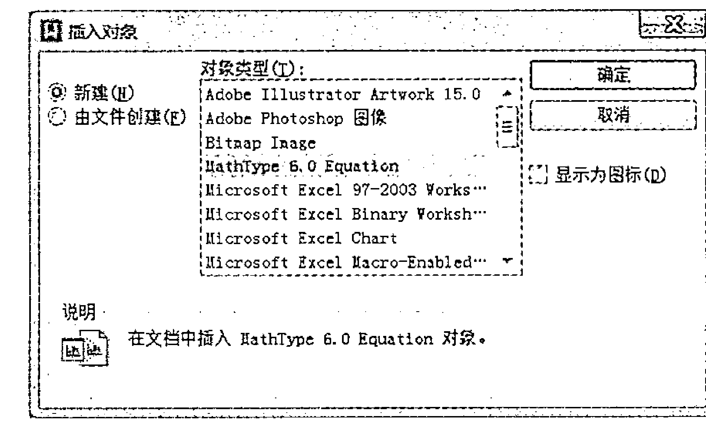

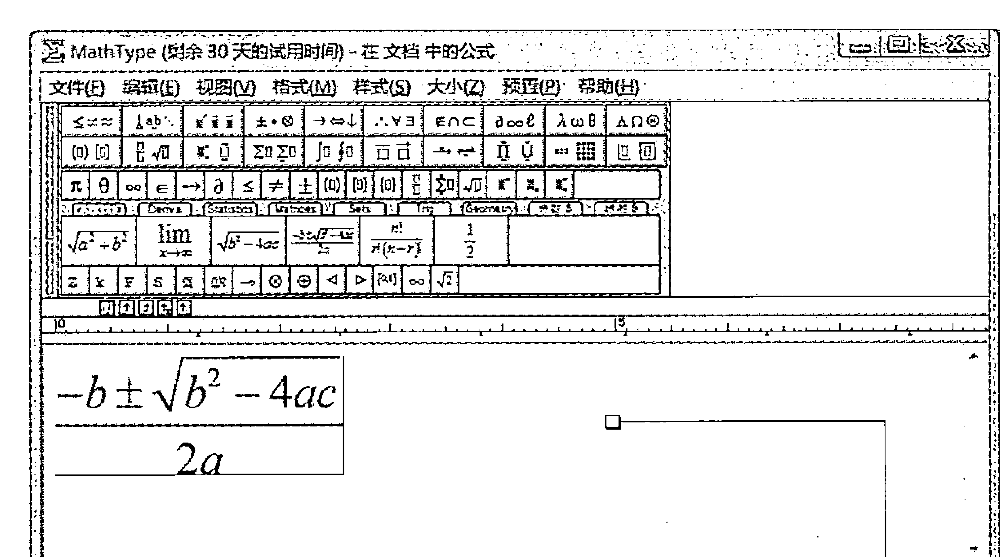

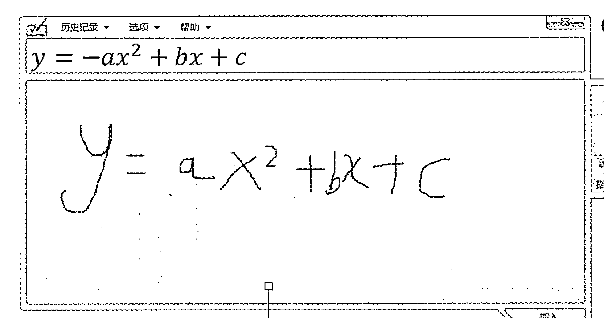

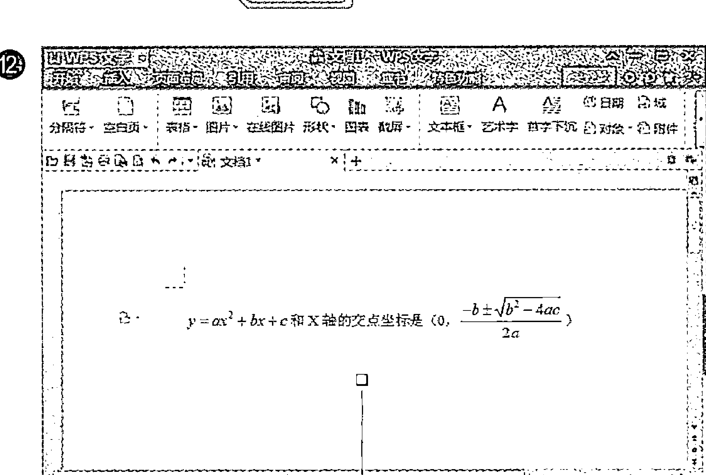


## 可视化产品性能 量化硬件评测数据

相信大家都看过硬件测试文章，可对测试软件不是太了解的用户可能并不能从测试成绩中获取什么有效信息。下面主要从不同配件的不同测试项目中找出重点，告诉用户具体在测试什么，软件代表了硬件的哪些性能，对实际应用有什么意义。

### 处理器

处理器是整个电脑系统的核心，它的性能在很大程度上左右了整个电脑的性能，甚至是游戏性能。从应用角度讲，电脑系统中处理器的性能根本没有极限一说，性能强的CPU可以带来更好的使用体验(图1)。近几年有一种观点是目前的处理器性能已经足够了，就算是用来玩任何高清游戏大作均没问题。这个观点并不十分准确，也因此造成了很多头重脚轻的游戏PC配置的诞生。目前市面上有哪些处理器性能强、哪些处理器不适合游戏呢?看处理器评测应该关注哪些数据呢?让我们一起来看看。

#### CPU单核性能

★评价软件：SuperPI

★评价标准：1M运算10秒以内合格、8秒以内出色

CPU单核性能简单来讲就是处理器的每一个物理核心的单兵作战能力。处理器多核心化之后厂商和用户都习惯将核心数量作为重点，但其实真正应对游戏时单核性能才是重中之重。错误选择核心多但是单核性能差的处理器，很难在目前的游戏当中发挥效果。常规评测中SuperPI是最典型的单核性能测试软件，其中最主流的运算测试为1M和32M计算。通过计算1M和32M的运算时间，来量化处理器的单核心性能。不过对SuperPI不熟悉的用户，恐怕看这个结果很不直观。

| CPU型号 | SuperPI 1M | SuperPI 32M |
| :--- | :--- | :--- |
| Intel Xeon E5-2697 v2 | 12.86 | 675.79 |
| Intel Xeon E5-2680 | 12 | 673 |
| Intel Core i7-4960X | 9.26 | 508.14 |
| Intel Core i7-3960X | 9.73 | 542 |
| Intel Core i7-6700K | 7.80 | 451.38 |
| Intel Core i7-5775C | 10.31 | 515.94 |
| Intel Core i7-4790K | 7.73 | 448.52 |
| Intel Core i7-4790 | 9.08 | 495.9 |
| Intel Core i7-4770K | 9.36 | 500 |
| Intel Core i5-6600K | 9.43 | 512.46 |
| AMD FX-8350 | 21.6 | 1357.3 |

▼ 数值越小代表性能越强

只有将多种主流产品放在一起对比，这些数据才变得生动起来，类似Intel Xeon E5-2697 v2和E5-2680这些12核24线程和8核心16线程的超强处理器，其单核心性能并不怎么样，甚至连很多i5处理器都不如。而AMD FX-8350虽然有八个物理核心，但其单核心性能要比竞争对手几乎差一倍，这也是为什么很多情况下都不推荐AMD处理器玩游戏的最关键原因之一。

结合到具体游戏产品，我们推荐能在默认状态下运行SuperPI 1M测试到10秒以内的产品是基本适合打游戏的处理器（图2），而其中如果能跑进8秒以内的处理器则是最适合目前游戏环境的CPU。放眼望整个处理器产品线，似乎也只有Core i7-6700K和i7-4790K符合这一要求（图3）。

结合到这两款产品的特性其实很容易理解，两款产品均是四个物理核心，满足目前游戏要求，同时拥有8MB的三级缓存，最关键默认主频就高达4GHz。在DX12引擎还没有完全流行之前，绝大多数游戏还是只看单核性能，而近似架构下单核性能的保障依然是处理器主频。

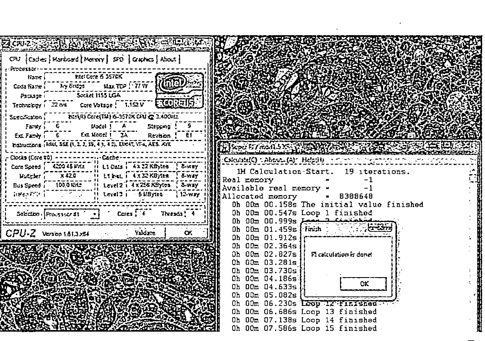

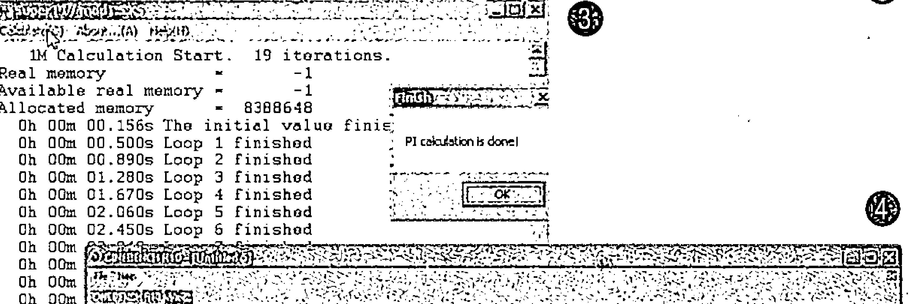

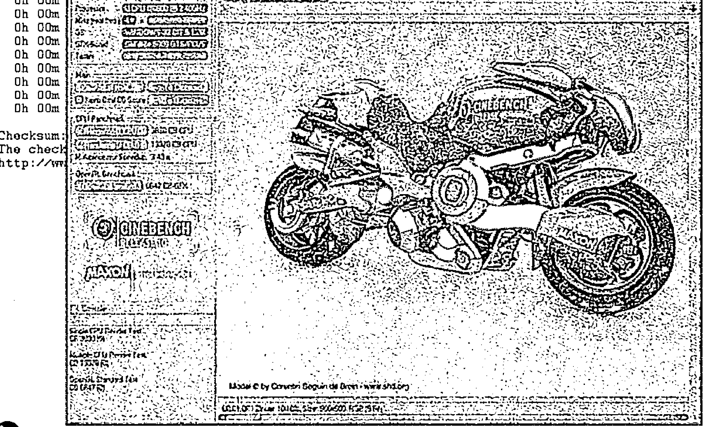

#### ★ 评价软件：Cinebench R15
★ 评价标准：多核心测试600以上

CINEBENCH R15是非常常见的处理器测试项目（图4），最新版为R15，主要是单纯使用CPU的性能渲染3D来考察处理器性能。比起SuperPI的物理运算，CINEBENCH R15的3D渲染方式似乎更贴近游戏，但其实只有在DX12完全普及后，多核心运算能力才能真正代表游戏性能，因此CINEBENCH R15的成绩其实可以看作是未来游戏性能的标准（图5）。

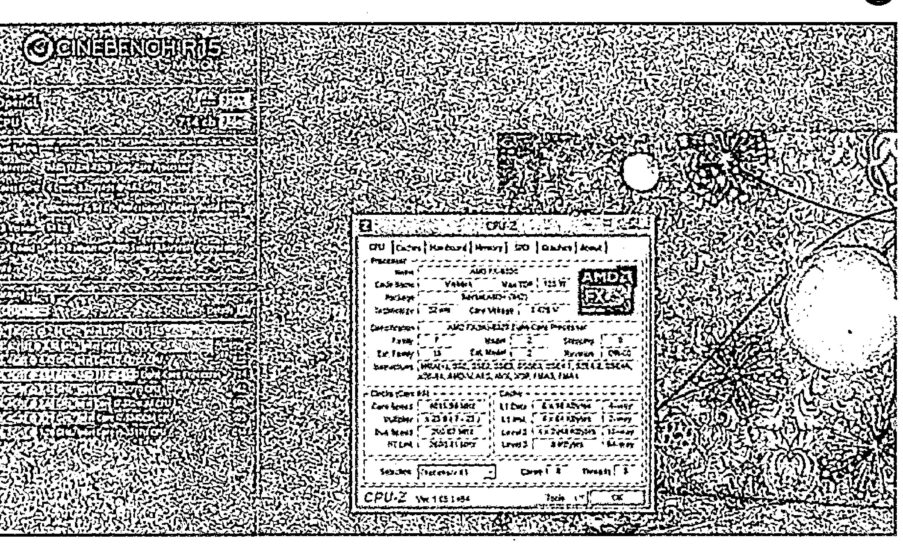

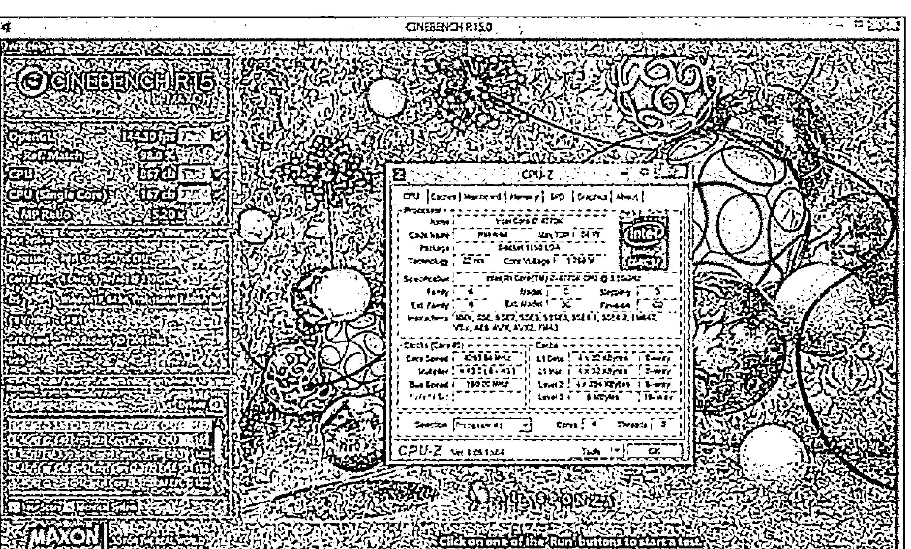

| CPU型号 | R15单核 | R15多核 |
| :--- | :--- | :--- |
| Intel Xeon E5-2697 v2 | 105 | 1550 |
| Intel Core i7-4960X | 144 | 1076 |
| Intel Core i7-6700K | 180.5 | 894.5 |
| Intel Core i7-3960X | 159 | 1158 |
| Intel Core i7-4790K | 174 | 843 |
| Intel Core i7-4790 | 158.5 | 765 |
| Intel Core i7-5775C | 152.5 | 776 |
| Intel Core i5-6600K | 165 | 628 |
| AMD FX-8350 | 97 | 636 |

▲ 数值越大代表性能越强

测试出来的成绩当中，单核心性能与之前的SuperPI结果非常接近，而多核心测试中一些四核心以上产品的成绩十分突出，特别是带有超线程的产品得分很高。AMD FX-8350单核表现依然最差，但是凭借八个物理核心其多核性能也达到了及格水准（图6）。不过平心而论，目前Windows 10刚刚推出尚未普及，而基于DX12打造的游戏目前仍未面世，单核差但多核强的处理器目前依然不适合作为游戏CPU购买。

#### 木桶效应

PC的木桶效应大家都听过，这个理论其中和我们关系最密切的点就是由于配置的不平衡导致整体性能的拖累。但是在处理器领域比较特殊，处理器性能并不会受到其他设备的拖累，也就是说不论用户选择什么样的处理器都能发挥其应有的效能。反倒是如果处理器太差，会影响显卡和内存等等设备的性能。如果用户想搭配一台强力的游戏PC，处理器可绝非是能省则省的配件。

#### 入门用户推荐

#### CPU-Z 1.73.0以上版本

CPU-Z以前是查看处理器和内存状态的最主流软件（图7），目前CPU-Z最新版也增加了处理器性能测试，简单快速还有多平台单核多核性能对比。由于结果十分直观而且带有不同产品对比，还是很适合入门用户的。如果用户想购买游戏CPU，其单处理器执行效率不能低于1000点，而最适合游戏的处理器应在1600点以上（图8）。

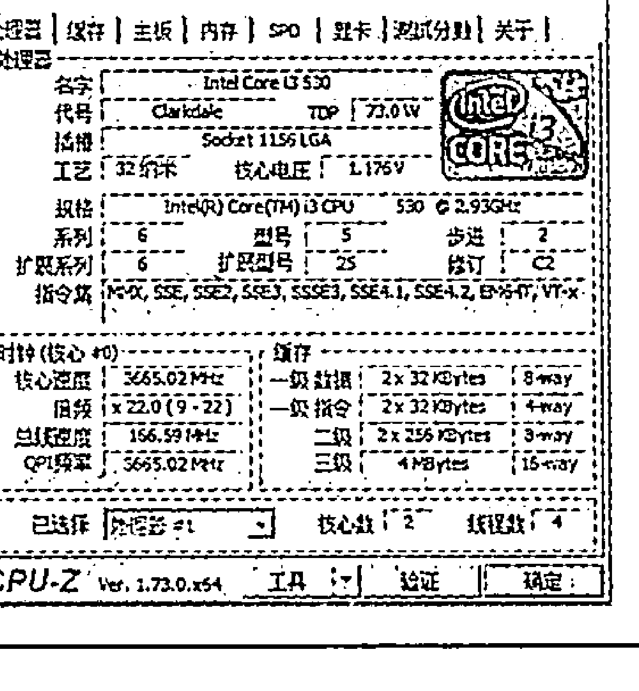

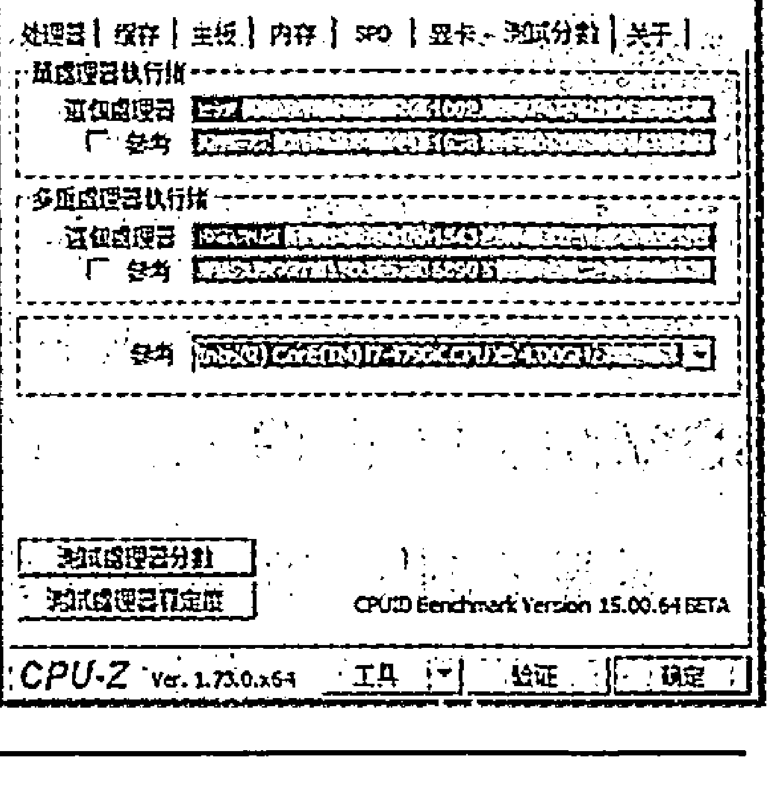

### 内存

内存多年来都是PC系统中存在感最低的一环，不仅配件单价最低而且性能已经足够，相信普通电脑用户已经多年没有关注过内存的性能了。关于内存性能提升有很多方法，比如频率、小参和指令比率，对用户而言最具性价比的是频率。

#### 入门用户推荐

#### AIDA 64 Extreme 5.30

> ★评价标准：读写均在20000MB/s以上

近几年测试内存读写性能多采用AIDA64和其中的Cache Memory Benchmark（图9），软件中不仅能实时测试内存读写性能，还拥有大量平台的内存读取、写入性能数据供我们对比（图10、图11）。

#### 木桶效应

前面说过内存性能主要和CPU有密不可分的关系。在不能选择处理器和芯片组的情况下，想获得更好的内存性能时频率为先，内存指令比率和小参数几乎可以忽略不计（图12）。同理在用户希望超频内存时也应该优先考虑频率，而并非指令比率和小参数。内存容量过低会影响操作系统的使用体验，性能太差会直接影响核芯显卡等集成显卡性能，总体来讲属于现代PC系统当中效应最弱的一环。

查看内存性能你会发现，用户比较关注的DDR3/4、内存频率、小参数和指令比率（CR1/2）似乎完全没有任何意义，决定内存读写性能的完全是处理器内置的内存控制器以及芯片组。服务器领域的Xeon和Opteron处理器占据了前三甲位置，而后面也多是X99、X79等旗舰平台。而内存性能到了普通家用平台当中差距微乎其微，基本可以忽略不计。

最关键的是最需要内存性能的反而是一些使用集显的平台，而内存控制器较强的处理器价格都很高，其用户基本不会考虑集成显卡；而使用集成显卡平台用户的处理器内存控制器性能很差，已经不是使用高频内存就能解决的问题了。

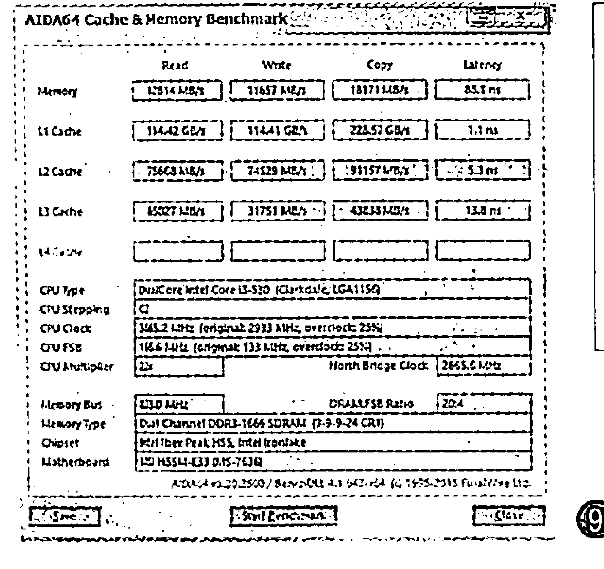

内存读写性能对比表（图10）

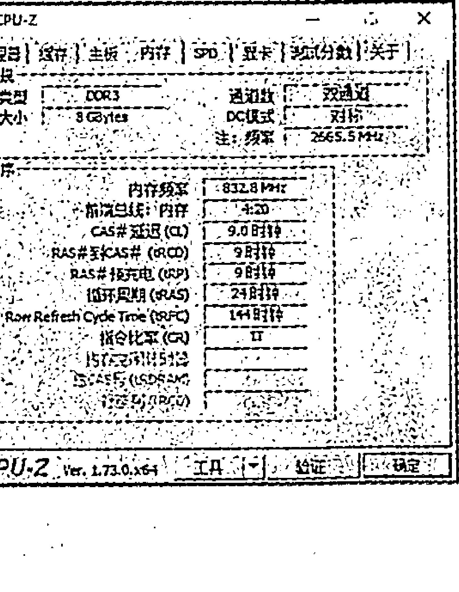

### 显卡

显卡性能和PC的游戏性能之间的关系最为密切，基本上用户购买独立显卡多多少少都是为了游戏考虑。关于显卡测试相信用户在购买之前都看过，但是显卡测试达到多少分可以流畅运行什么游戏，传统的显卡测试软件表现的其实并不是十分明确。

| 显卡 | Fire Strike Graphics | 3DMark11 P GPU | Unigine Heaven (fps) | GTA 5 (fps) |
| :--- | :--- | :--- | :--- | :--- |
| GTX 980 | 11390 | 16838 | 129.65 | 55.5 |
| GTX 970 | 11155 | 15071 | 115.56 | 46.3 |
| GTX 960 | 7915.5 | 10767.5 | 97.8 | 28.9 |
| GTX 950 | 6219 | 8364 | 80.5 | 18.1 |
| GTX 780Ti | 11812 | 15619 | 123.4 | 45.2 |
| GTX 760 | 5959 | 7962 | 75.2 | 26.7 |
| GTX 750Ti | 4294 | 5378 | 54.3 | 19.5 |
| GTX 680 | 7865 | 9861 | 87.3 | - |
| GTX 660Ti | 5432 | 8415 | 78.7 | - |
| R9 290X | 11717 | 16167.5 | 140 | 42.7 |
| R9 280X | 8343 | 10792 | 95.8 | 34.5 |
| HD 7970 | 6862 | 7770 | 77.8 | 27.7 |

▲数值越大代表性能越强

#### 入门用户推荐

#### 3DMark 11以上版本

★评价标准：3DMark Fire Strike GPU 6000以上、3DMark11 P GPU 7000以上

最著名的显卡测试软件肯定是3DMark系列，目前主流的有3DMark 11（图13）和3DMark(2013)两款（图14）。两个软件都是测试显卡的DX11性能，通过十分苛刻的3D渲染环境来测试显卡性能。关于3DMark系列软件我们要注意一点就是需要将目光放在GPU性能一项，也就是Graphics得分上而并非总分数（图15），这是因为要尽可能避免处理器不同带来的分数误差。


Unigine的Heaven系列也是近几年比较有名的测试软件，对比3DMark的全面Heaven系列主要致力于测试显卡的曲面细分能力（图16），也就是在游戏当中参差不齐的墙面、怪石嶙峋的山体和悬崖都属于这一范畴。

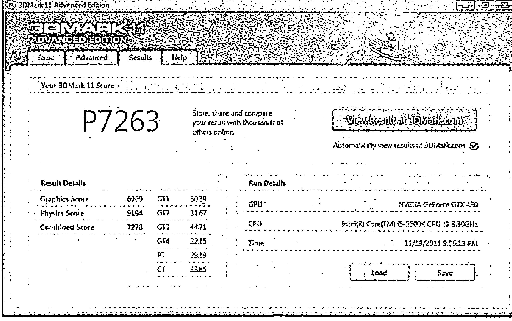


通过各版3DMark和Heaven系列得分其实可以很好看出同代产品之间的性能差异，以及跨代产品之间性能的对比关系。但是这样的得分能够在游戏当中实现什么样的效果呢？我们以《侠盗猎车手5（Grand Theft Auto V）》为例（图17），这款游戏就代表了目前顶级单机游戏的显卡需求（图18），在1920×1080主流分辨率下这些显卡能够实现怎样的性能呢？


答案一目了然，针对游戏流畅最低需求的30fps来讲，只有在3DMark Fire Strike GPU得分中超过8000分的显卡勉强可以流畅（图19），而对应3DMark11 P GPU则是10000分左右。如果考虑到降低一定特效流畅游戏的情况，3DMark Fire Strike GPU得分也需要超过6000分，而对应3DMark11 P GPU则是7000分。


扩展阅读

#### 3DMark平台指导成绩

对于普通用户来讲;硬生生记住3DMark测试软件GPU得分比较困难，而且跑分之后最直观的始终是整个平台的得分。不过涉及到平台处理器和显卡的多样性这样的比较不太直观，好在目前3DMark.com已经提供了理论指导的游戏平台性能。3DMark.com从2013版后开始逐渐汉化，用户在跑分后可以将自己的成绩与网上其他用户或者标准平台的成绩进行对比，即可知道目前这台电脑的游戏性能。关于游戏PC的种类，3DMark还将之细分为4K游戏平台、普通游戏平台以及游戏笔记本电脑，如果最终得分能够超过平台指导成绩，其游戏性能基本都不会太差(图20)。

| FIRE STRIKE | 6200 |
| :--- | :--- |
| Graphics Score | 10751 |
| Physics Score | 15135 |
| Combined Score | 1227 |

| GRAPHICS CARD | PROCESSOR | GENERAL |
| :--- | :--- | :--- |
| Graphics Card: NVIDIA GeForce GTX 980 | Processor: Intel Core i7-4790K | Operating System: Windows 10 64-bit |
| Vendor: NVIDIA | Processor clock: 4.0GHz | Motherboard: ASUS Z97-A |
| # of cards: 1 | Physical/logical processors: 4/8 | Memory: 16GB |
| SLI/CrossFire: No | # of cores: 4 | Module 1: 8GB DDR3 |
| Memory: 4096 MB | Package: LGA1150 | Module 2: 8GB DDR3 |
| Core clock: 1126 MHz | Manufacturing process: 22 nm | Module 3: Empty |
| Memory clock: 1753 MHz | TDP: 165 W | Module 4: Empty |
| Driver name: NVIDIA GeForce GTX 980 | | Hard drive model: 256GB SSD |
| Driver version: 9.18.13.4788 | | |
| Driver status: Fresh | | |

#### 木桶效应

在整个PC系统中显卡是受到木桶效应影响比较严重的一项，集中体现在CPU性能和PCI-E通道对性能的影响两个方面。

#### 处理器与显卡性能

前面说过CPU性能并不受其他配件拖累，不论我们在什么平台使用处理器都能发挥几乎100%性能;而显卡则完全不一样，如果我们使用一块高级的GTX 980显卡，但配合的是一个入门的奔腾处理器，那么不论是显卡性能测试还是实际游戏表现都会远低于标准值。具体需要什么样的处理器依测试软件和具体游戏而定，一般认为在网游中英特尔的主流3GHz以上处理器可以充分发挥显卡效能，而大型单机游戏则需要3.5GHz甚至4GHz频率的物理四核心英特尔处理器才能完全发挥显卡性能。

| TechPowerUp GPU-Z | |
| :--- | :--- |
| Name | NVIDIA GeForce GTX 980 |
| GPU | GM204 |
| Technology | 28 nm |
| Release Date | Sep 19, 2014 |
| BIOS Version | 84.04.1F.00.01 |
| Device ID | 10DE - 13C0 |
| Subvendor | ASUS |
| ROPs | 64 |
| Bus Interface | PCIe 3.0 x16 |
| Shaders | 2048 Unified |
| Pixel Fillrate | 69.6 GPixel/s |
| Texture Fillrate | 144.2 GTexel/s |
| Memory Type | GDDR5 |
| Memory Size | 4096 MB |
| Bus Width | 256 bit |
| Bandwidth | 224.3 GB/s |
| Driver Version | 9.18.13.4788 |
| GPU Clock | 1126 MHz |
| Memory | 1753 MHz |
| Shader | 2252 MHz |
| Default Clock | 1126 MHz |
| Memory | 1753 MHz |
| Shader | 2252 MHz |
| NVIDIA SLI | Disabled |

| FIRE STRIKE 1.1 | 9560 |
| :--- | :--- |
| Graphics Score | 11745 |
| Physics Score | 8134 |
| Combined Score | 4633 |

#### PCI-E通道与显卡性能

而PCI-E通道数情况比较特殊，一般的主流平台只有16×的PCI-E通道(Z170变为20×)，假设显卡在16×通道下性能是100%，那么在8×下性能大概会降低到95%，如果进一步降低为4×通道性能会变为80%以下。一般旗舰平台PCI-E通道比较充裕为40×或者24×，主流平台上的PCI-E通道问题比较严重(图21)。PCI-E并不支持零散数量通道分拆，假设用户插上一块PCI-E通道的SSD、声卡或者网卡，分给显卡的PCI-E通道会直接被分拆为8×。如果用户已经使用SLI等多卡系统两块显卡已经工作在8×通道下，基本也就没有任何其他PCI-E通道设备的使用可能了。Z170芯片组将处理器到PCH芯片组之间改为DMI 3.0并增加了4×的PCI-E通道，就是为了解决PCI-E设备的通道问题。

### 硬盘

硬盘性能之前由于受到HDD的限制一直是PC“木桶中最短的那块板”，但近几年由于SSD全面普及、PCI-E通道SSD逐渐流行以及NVMe标准的诞生，性能已经实现了数个飞跃了。硬盘的测试软件也从HDD年代的HDtune Pro一枝独秀变成了百花齐放的局面，对于硬盘性能我们应该使用哪些软件，关注哪些数据呢？

#### 持续读写性能

- ★评价软件：HDtune Pro、ATTO Disk Benchmark
- ★评价标准：基本无意义

硬盘的持续读写性能也叫顺序读写性能，指的是在硬盘持续读写单个文件时的速度。老旧的测试软件HDtune Pro、ATTO Disk Benchmark都代表了硬盘的这个性能（图22）。但是在实际应用中这一数据并没有多大意义，因为不论是操作系统、软件程序还是游戏启动和运行时都是使用大量零碎的小文件，与持续读写没有多大关系。就算是文件拷贝也只对那些单个体积文件有效，一旦文件零散持续读写速度都很难达到理论值。一般来说，HDtune Pro、ATTO Disk Benchmark只适合HDD和闪存盘。

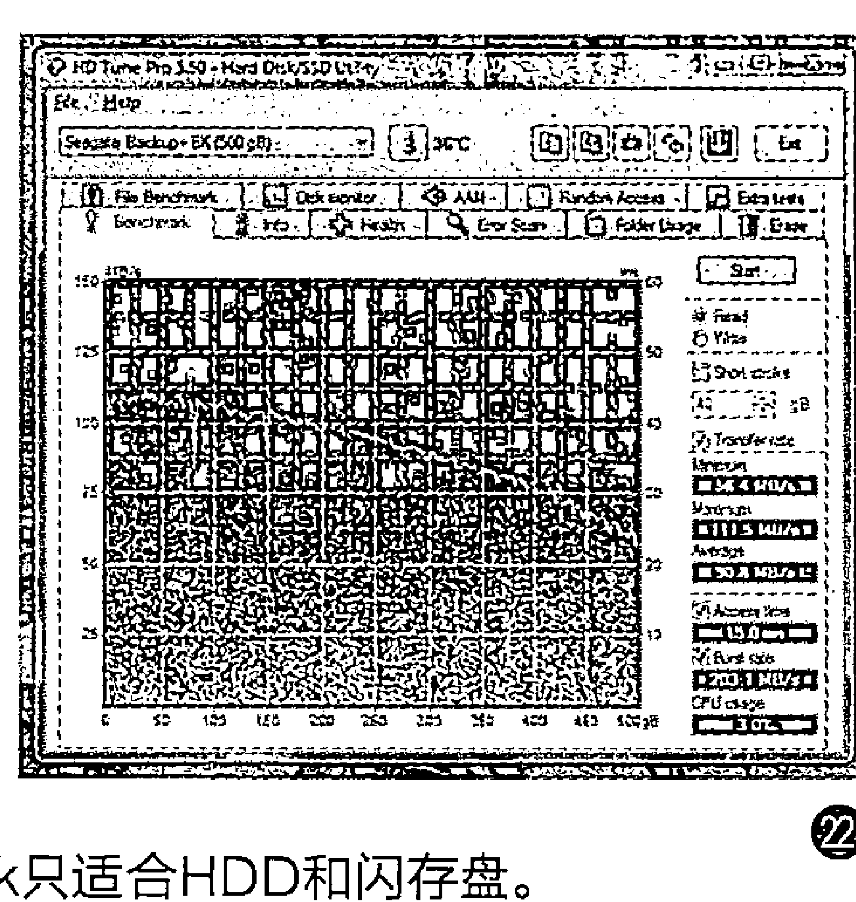

#### 系统性能相关

- ★评价软件：PCMark
- ★软件问题：收费、程序较大并且测试时间长

其实老牌PC系统测试软件PCMark更为贴合实际使用环境，但这与3DMark齐名的软件并非免费软件，并且测试程序很大，测试时间也非常长（图25、图26）。如果用户没有特殊的需求，只需要参考随机读写性能软件当中的4K读写成绩即可。

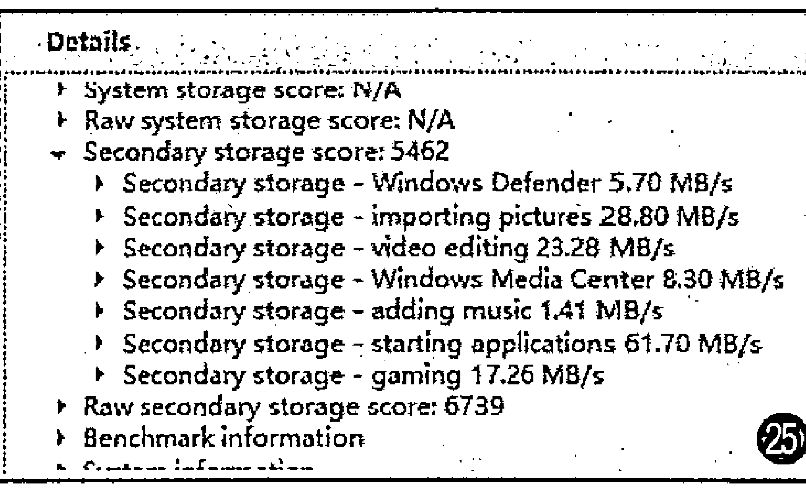

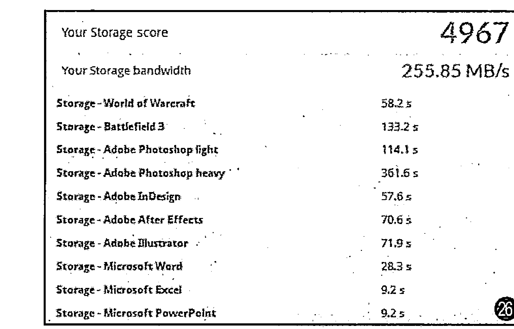

#### 随机读写性能

- ★评价软件：AS SSD Benchmark、CrystalDiskMark
- ★评价标准：4K读取30MB/s、写入60MB/s

AS SSD Benchmark、CrystalDiskMark和Anvil's Storage Utilities这三款软件十分相似，都拥有持续读写、4K读写和4K深度读写测试。其中AS SSD Benchmark和Anvil's Storage Utilities都拥有综合评分功能，成绩对比相对直观些。

AS SSD Benchmark由于软件小巧并且不断更新，清晰的得分系统和同时拥有MB/s和iops两种表现方式更受用户的好评（图23）。我们在参考这类软件成绩时如果嫌麻烦可以直接看总分，如果更关心实际使用体验的话则应该关注其4K的性能。如果一款SSD其读取在30MB/s以上、写入在60MB/s以上，就代表这块SSD的性能基本合格了。不过需要注意的是，AS SSD Benchmark对于PHISON群联主控的4K性能测试成绩偏高，如果用户只看重4K随机性能，相对来说CrystalDiskMark可能更准确些（图24）。

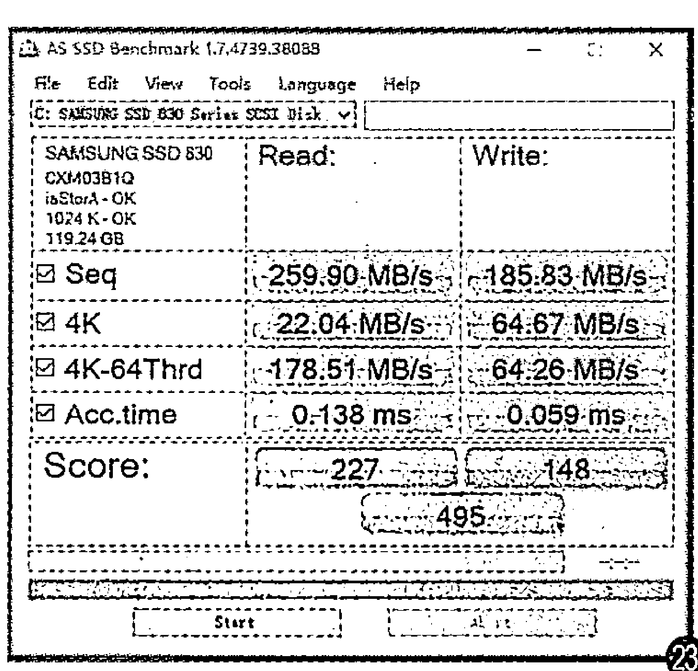

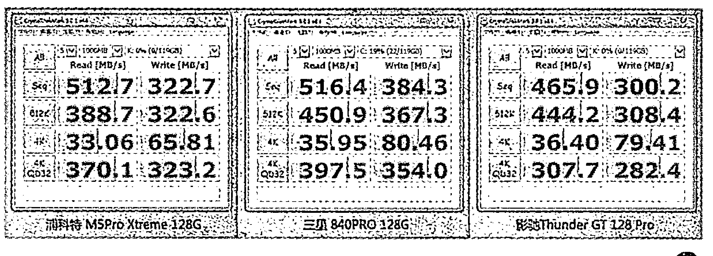

#### 木桶效应

SSD性能除了受到自身主控芯片和闪存颗粒性能的影响，还受到很多第三方因素影响。比如磁盘驱动器的驱动英特尔官方驱动要比Windows 7自动生成的驱动性能更好，在Windows 7中很有必要将驱动器换为英特尔驱动。不过在Windows 8和Windows 10中微软自带的驱动性能已经有所提升，修正了Windows 7中略低的4K随机性能。

此外，PCI-E通道的M.2或者卡式硬盘虽然是目前市售SSD当中性能最强的产品，但一旦插上就会至少占用处理器4x的PCI-E通道，可能会对显卡性能产生负面影响。CF

#### 绝对领域

## 10

策划 | 《电脑爱好者》编辑部

扫一扫，更多精彩内容立现！

## 保护好你的贴身搭档


出门忘带钱包？手机帮你结账！这就是移动支付带来的便利。但是作为与我们形影不离的贴身搭档，当智能手机与移动资金捆绑在一起后，我们又该如何确保它们的安全？

## 捂住腰包移动资金安全手册

“安全性”已算不上产品可以独立出来的宣传卖点，但不安全的产品绝对令人无法接受。安全要素逐渐从一种话题和厂家营造出的噱头，成为必须具备的产品特质。衡量一款产品是否安全，已不能按照惯用的标准，移动支付与智能化、软硬件系统升级进化与黑客行为的层深化，简单的“安全”两字早已无法承载这背后隐藏的一切。与时俱进才能跟得上不断发展的IT技术，才能应对不断变异的安全隐患。本期让我们重新走进这个既熟悉又陌生的话题，为我们的产品和设备打造出一片安全的绝对领域。

为了便于网上交易，绝大多数手机用户都已用上了支付宝或微信钱包。但是，在享受快捷支付的便利的同时，我们同样需要警惕可能存在的威胁移动资金安全的各种隐患。

### 先从一种案例谈起

如果你发现手机总是没有信号（图1），你会怎么想？

- 1. 这手机信号真烂，别人都有信号就我没有，看来得换手机了。
- 2. 难道是SIM卡接触不良，或是卡槽出现了问题？
- 3. 遇到系统Bug了吧，估计重启一下手机就好了。
- 4. 难道周边学校有考试，信号屏蔽都到我这里了？

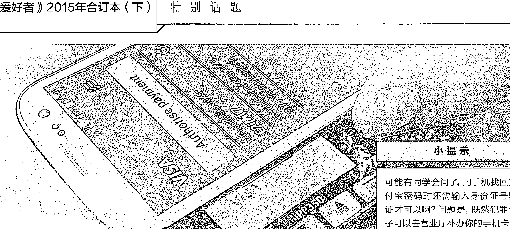

> 小提示
可能有同学会问了，用手机找回支付宝密码时还需输入身份证号验证才可以啊？问题是，既然犯罪分子可以去营业厅补办你的手机卡，自然就已获悉你的身份证号了。

如果你遭遇无信号的问题，却只联想到上述几种可能，那你的移动资金就已存在隐患了。因为曾经有盗刷支付宝的案例就与手机丢失信号的现象有关。

简单来说，犯罪分子会通过网络购买大量的支付宝账号信息，圈定有价值下手的账号。接下来，他们会根据这些账户的真实姓名、身份证号和绑定的手机号等信息伪造身份证，再持假证去移动/联通/电信营业厅补办手机卡，并通过手机找回密码等功能重置支付宝账号密码，最终实现盗刷套现的犯罪行为。

当手机卡被犯罪分子在营业厅补办后，被害人的手机卡自然会自动作废。即使支付宝操作时有短信提醒或各种验证，相关提醒也会自动发送到犯罪分子补办的手机卡上。实际上不仅仅是支付宝，如今各种APP和网站论坛的账号都支持与手机绑定，如果手机卡被别人盗用，所有与其绑定的账号就都有被重置密码、任由“蹂躏”的风险。

因此，当你的手机突然出现信号丢失，在排除硬件故障、信号屏蔽等常规问题的可能后，一定要想起手机卡可能被别人补办的可能，有条件的话请尽快去身边最近的营业厅查询。此外，我们也要尽可能封死身份证号泄露的可能，比如只在银行里办理信用卡，而不要将身份证和个人信息交给街边的那些办理信用卡的“银行工作人员”。

#### 手机遗失的后遗症

如果你第一时间只能想到上面几种情况，那你的移动资金将面临更大威胁。为了方便用户快速支付，包括支付宝钱包、微信钱包在内的很多交易平台都提供了小额快捷支付通道：免密码即可完成交易。如果你的手机丢失，而拾到或偷到手机的人又有一定的反侦察经验（比如不会傻到给自己账户转账、收货地址不是真实地址，警方很难通过交易记录锁定盗刷嫌疑人），打开支付宝APP就可直接套现。

#### 如果手机丢了，你会怎么办？

- 1. 唉，刚买的iPhone 6S, 6000元打水漂了，再去苹果店买一台吧。
- 2. 坏了，我的微信聊天记录还没备份！赶紧上网查查有没有补救方法。
- 3. 赶紧报警，查查监控看有没有可能找回手机。
- 4. 丢就丢了吧，就当破财免灾了。

因此，如果你的手机遗失，应该第一时间用公共电话挂失SIM卡，这样偷/拾你手机的人就无法使用验证码服务（图2）。接下来，赶紧去距离最近的营业厅补办手机卡，购买/借用第二部手机，重新登录支付宝、微信及所有具备支付功能的APP。这样一来，当你丢失的手机运行支付宝或微信等APP时，便会自动弹出账号已用其他设备登录的提示（图3），彻底断送偷/拾手机的人套现的机会。

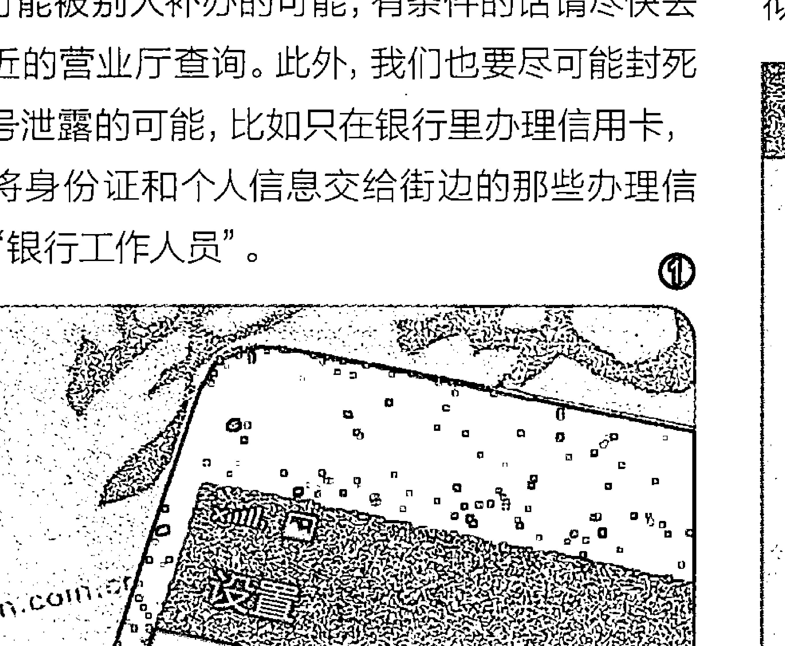

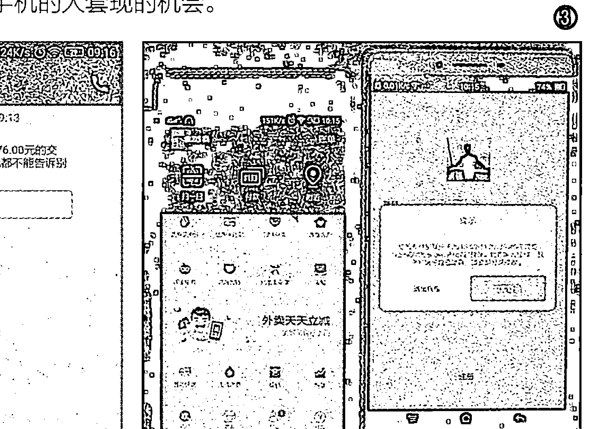

### 如何保证移动资金安全

上述也只是“亡羊补牢”，哪怕你能在第一时间反应过来，并进行正确的补救，你的移动资金依旧有被人套现的可能。因此，要想最大限度保证移动资金的安全，“未雨绸缪”才是重中之重。那么，怎样才算未雨绸缪呢？
答案很简单，给手机设定解锁密码。即使别人拾到了你的手机，在无法解锁的前提下，自然也就无法启动APP进行套现了。相对而言，iOS设备的安全性最高，此前iPhone默认开机密码为4位，在iOS 9更新之后已强制变更为6位数字密码（在密码选项中，还可以选择4位数字密码或复杂的数字字母混合密码组合）（图4），再结合指纹功能后几乎没有破解可能。
Android手机同样如此，能用指纹加密的就不用图案，能用图案就不用数字。但是，在给Android手机设定解锁密码后一定要关闭“USB调试功能”（图5）！否则如果有人偷/拾你的手机后，连接PC并使用豌豆荚一类的软件即可破解解锁密码，从而跳过这一步启动APP套现。反之，在未开启“USB调试功能”的前提下，目前仅有恢复出厂设置才能取消解锁验证，但如此一来你所安装的APP和各种账户信息也就都被清空，别人自然也就没有套现的机会了。
总之，只要你的手机安装了支付宝等具备移动支付的APP，就一定要添加开机解锁密码！这是最基本的安全常识。

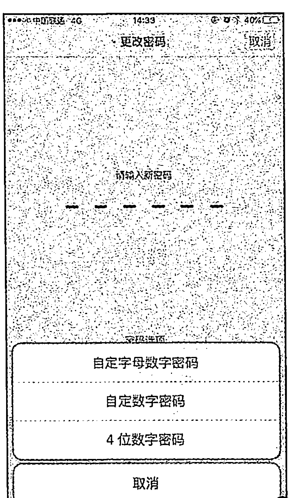

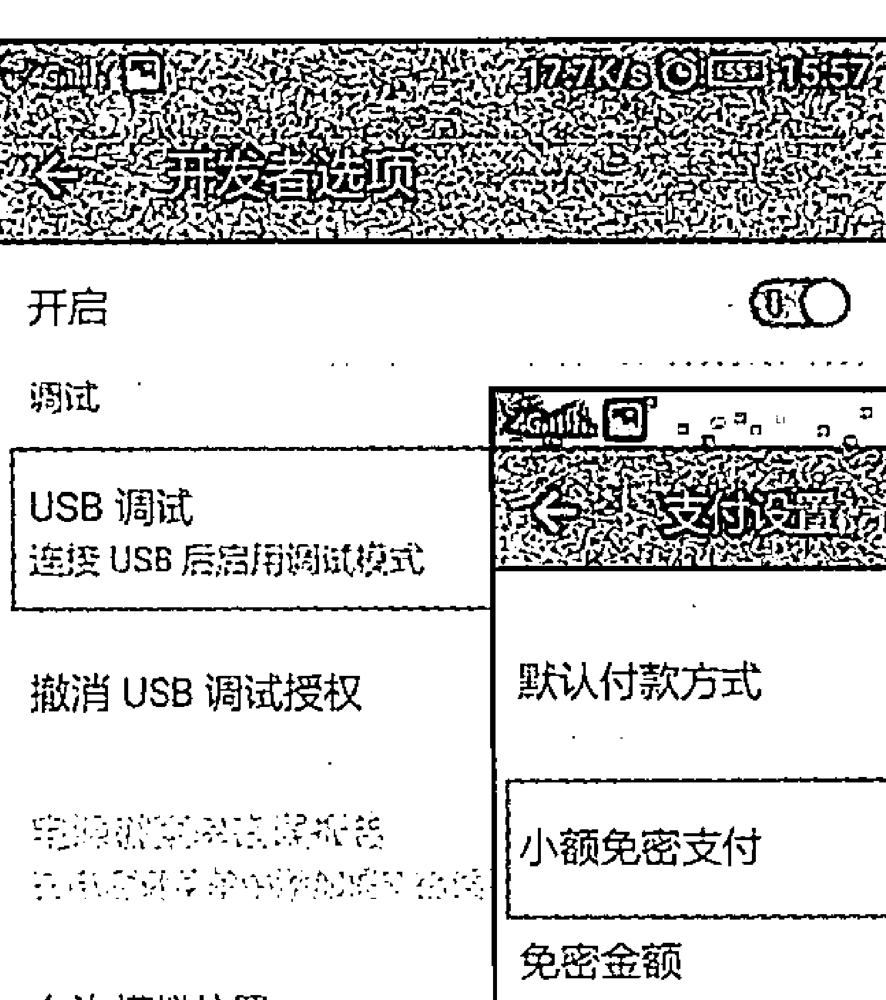

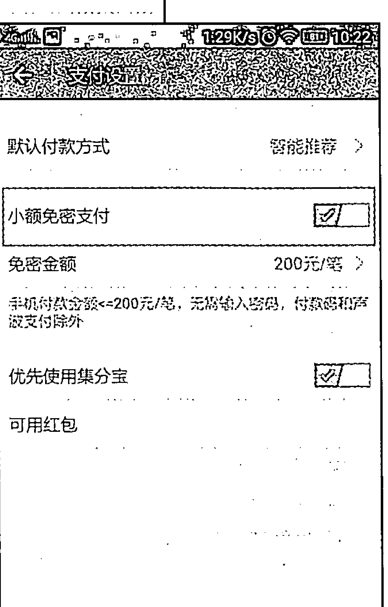

### 重视每一项支付设置

凡事都有例外，即使你打开了解锁密码，但依旧有被人暴力破解的可能（一次次尝试），因此我们还需从APP端加以弥补，那就是牺牲快捷换取安全。
以支付宝为例，进入“设置→支付设置”，在这里我们可以关闭“小额免密支付”（图6），让每一次支付都需输入密码才能进行。此外，在“默认付款方式”中，关闭“是否使用智能推荐”功能（图7），不让系统在支付宝余额不足时自动切换到你绑定的银行卡账户上。当你新换手机之后，请第一时间进入“设置→账户安全→安全中心→设备管理”，删除正在使用之外的其他设备（图8）。这样一来，其他设备再次使用支付宝APP时就需要重新输入账户名和密码了。
如今微信钱包也是我们网上支付的常用平台，也存在着和支付宝一样的安全风险。因此，建议大家依次进入“我→钱包→设置（点击右上角的三个点）→支付管理”，开启“手势密码”功能（图11），如此一来每次进入微信钱包时都需要手势解锁。
虽然上面的一些设置稍显繁琐，而且每次支付都需要输入一次密码，但却是最最安全的选择。即使你的手机丢失，偷/拾到手机的人也需要破解开机解锁密码，支付前也需要破解支付密码，想通过手机里的手机卡进行密码重置也需要你的身份证信息。如果你装有身份证和手机的钱包都丢了，那就请第一时间挂失SIM卡，不给对方收取短信验证码的机会。

### 以支付宝为例

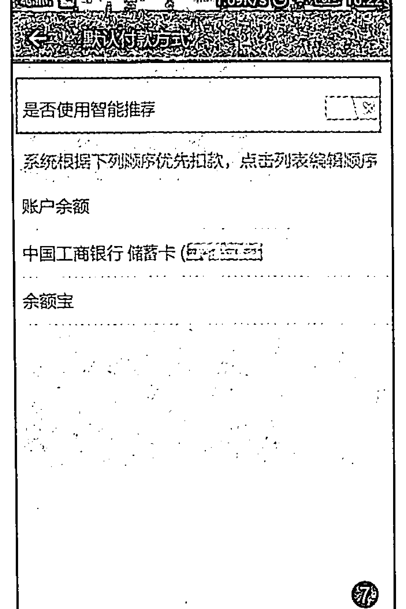

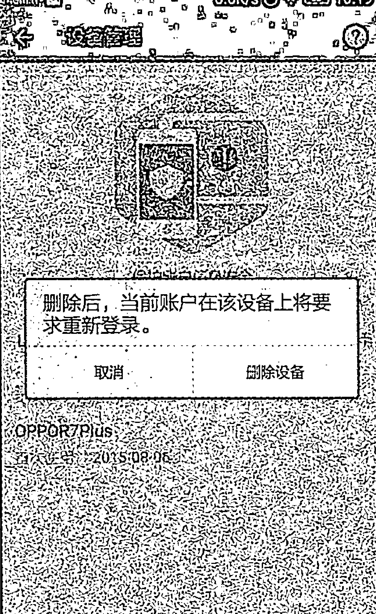

### 扩展阅读

和Android相比，iOS端的支付宝在安全性上处理得更好。在“设置→账户安全→指纹”中激活“指纹解锁后”，每次运行支付宝APP时就都需指纹解锁后才能启动该APP（图9）。Android端的支付宝可以开启手势密码功能，但只有进入余额宝和财富时才会弹出手势解锁界面（图10），其他操作却不受影响。只要你登录一次之后，每次运行APP都无需再次输入密码，也因此才出现了手机丢失后存在盗刷的隐患。

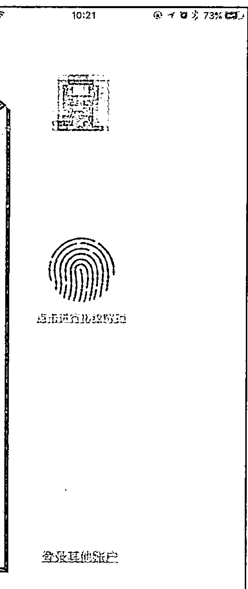

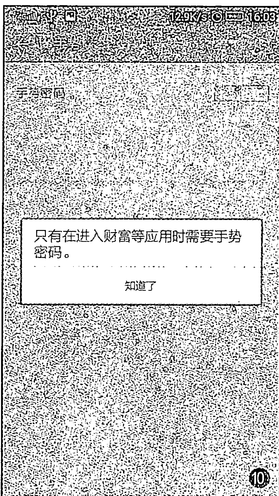

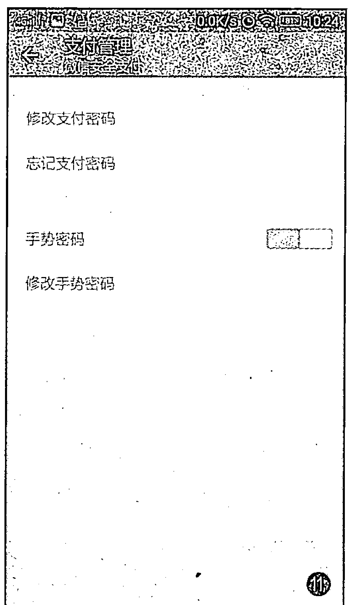

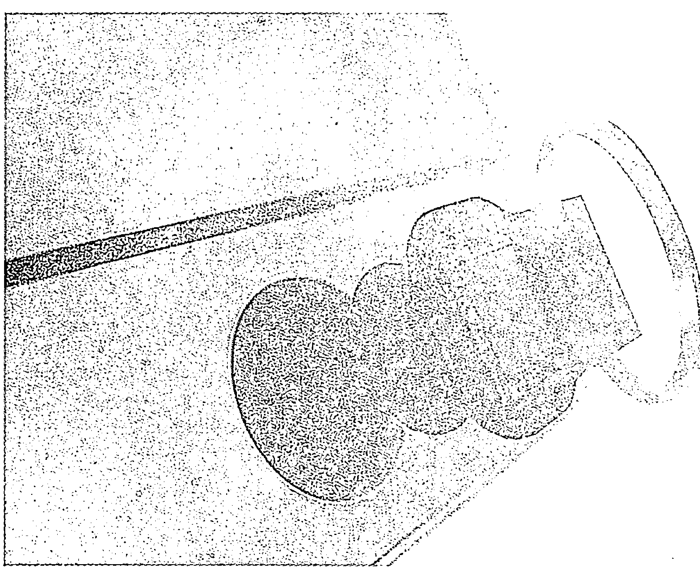

### 给安全加把锁

### 正确认识指纹识别功能

随着中兴威武3、酷派大神Note3等千元手机纷纷提供指纹识别功能后，这种昔日“高大上”的安全技术正在悄然普及开来。如果你想更好地保护数据安全，了解指纹识别功能自然就是必备的功课。

### 指纹识别的工作原理

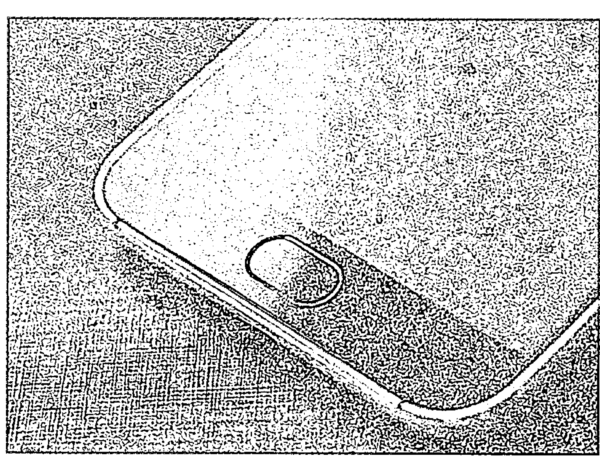

目前智能手机领域所用的指纹传感器供应商主要以AuthenTec、Synaptics、Fingerprint Cards AB（FPC）和Goodix为主，而识别方式也逐渐从摩擦（如三星S5）、滑动（如三星Note4）过渡到了轻触（如华为Mate7）和按压式（如魅族MX5）。相对来说，将指纹识别与HOME键结合设计在手机正面的手机大都采用了按压式传感器，而指纹后置的手机则更青睐轻触式。

细心的用户可能已经发现了，很多手机指纹传感器四周会被一圈金属环包裹（图1），这圈金属难道是用来装饰的吗？答案是否定的，传感器周围的金属环主要是用来监测手指、激活传感器和改善信噪比。当你想用指纹功能时，手指需要碰到金属环才能被顺利识别。

#### 指纹功能源于二次开发

#### 指纹识别真的无法破解吗

随着技术的革新，这圈金属环也有望被淘汰。以华为荣耀7为例，它采用了FPC最新的指纹传感器，用于检测指纹的高频信号不再通过金属环发射，因此用户在指纹解锁时不再被金属环束缚，更加灵活。

指纹识别的准确性、速度等参数，主要取决于指纹传感器型号、表面材质、分辨率、供电电压等参数（图2），和软件层面的优化关系不大。因此，虽然千元手机也用上了指纹识别，但受成本的制约，其使用体验依旧容易与高端手机拉开差距。

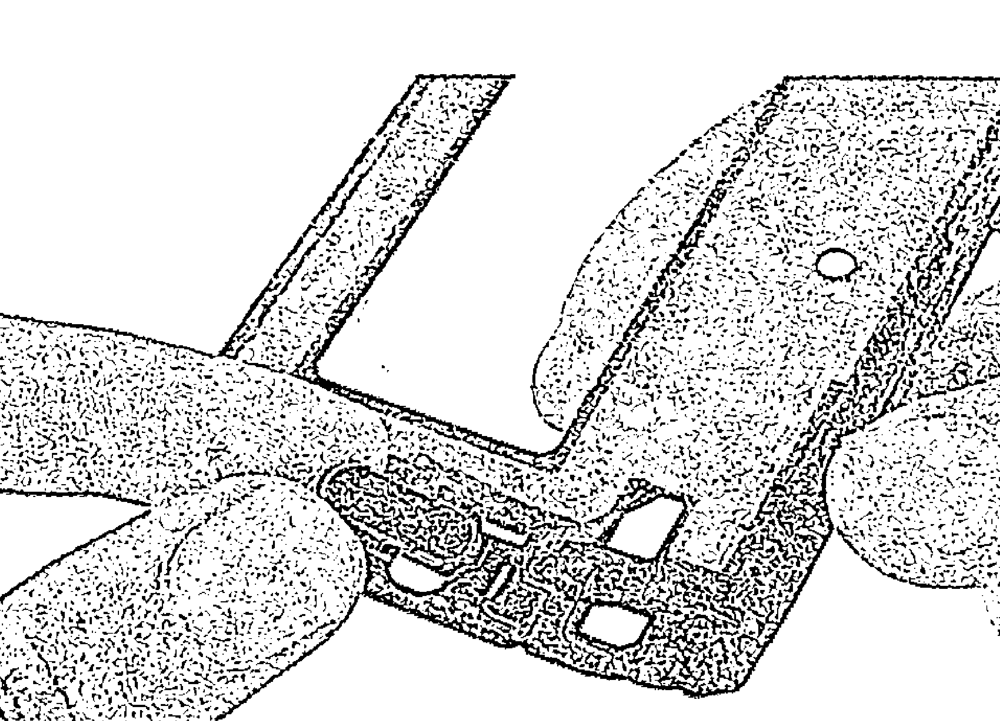

指纹识别可以用于解锁屏幕，这是地球人都知道的功能。除了解锁之外的其他安全功能，就需要手机厂商针对指纹识别器进行二次开发和优化了。

以支付宝为例，对大多数Android手机在“设置→账户安全→指纹”选项中即可开启指纹支付功能（图3）。但OPPO R7 Plus虽然也配备了指纹识别器，但在支付宝里却找不到指纹选项。再比如微信在V6.2或更高版本中加入了钱包指纹支付功能（图4），但在Android手机中却仅有华为Mate7和荣耀7等极少数产品才能看到这一选项，而其他品牌的手机则会屏蔽该功能。

在其他功能上，指纹识别还可用来进行程序/文件加密或者更高级的手势动作。以魅族MX5为例，在指纹设置界面就可以给程序文档加密（图5），并赋予Flyme账号支付的权限；华为荣耀7可将其用作触控板，比如轻轻下滑即可下拉通知栏，连续轻触两下可以清除所有通知（图6）；还有很多手机可以用不同手指的指纹信息绑定指定的APP程序，比如我们可以自定义使用食指进入微信，或者无名指进入QQ，一切都可根据你的习惯而定。

但上述功能全部取决于手机厂商对指纹识别器的深度挖掘，并不能通过第三方APP实现。换句话说，如果手机没提供指纹手势、指纹APP加密，也就不要强求了。

前文我们提到，Android手机在忘记解锁密码时，可以借助PC强行破解。而破解原理其实很简单，Android系统默认会将密码保存在password.key配置文件中，在PC端使用adb命令即可强行删除手机中的password.key文件，从而将加密化解于无形。因此，我们才建议大家不要轻易开启USB调试模式，禁止以adb的方式连接Android手机。

指纹加密最大的优势，就是可以将加密的指纹信息保存在eMMC的RPMB安全存储区域，以RPMB与CPU绑定进行授权加密存储，从而隔离所有SoC硬件和软件资源。指纹信息无法上传，也无法被其他程序读取，哪怕是手机厂商也无法提取你的指纹记录，属于硬件级别的加密方案。

那么，指纹加密真的就可保证用户数据万无一失了吗？至少在Android手机领域还做不到。几乎所有配备指纹识别功能的Android手机，只要在开机时进入Recovery（不同品牌进入Recovery的方式不同，通常是同时按住电源和音量-的），选择双Wipe（双清，清空用户数据和缓存，也就是恢复出厂设置）（图7），此时你录入的指纹加密信息也会同时被清空。好消息是，双Wipe可删除你安装的所有第三方APP及微信QQ聊天信息、APP账号和各种支付/登录密码，不必担心移动资金和账号信息的安全。坏消息是，双Wipe一般不会格式化存储卡，意味着你保存在手机里的图片、视频等文件并不会随双Wipe而消失。如果保存有私密内容，那就危险了。因此，所谓的硬件级加密还需要系统层面的支持，而Android在这方面有着天然的缺陷。还好，已经有厂商认识到了这一问题，并加以改进优化。以三星S6为例，在“设置→锁定屏幕与安全→查找我的手机”中打开“重新激活锁定”（图8），再结合指纹加密基本就可做到最大程度的安全。即使你的三星S6丢失，别人通过双Wipe清空了指纹信息，在恢复出厂设置重新开机后，还需输入你的三星账户进行联网激活，否则就无法进入系统，自然也就无法访问里面的图片和文档等内容了。希望今后Android厂商可以在系统层面加入更多针对指纹的底层优化吧。比如，进入Recovery或强制刷机前都需要进行一次指纹验证，彻底封死破解指纹加密的渠道。

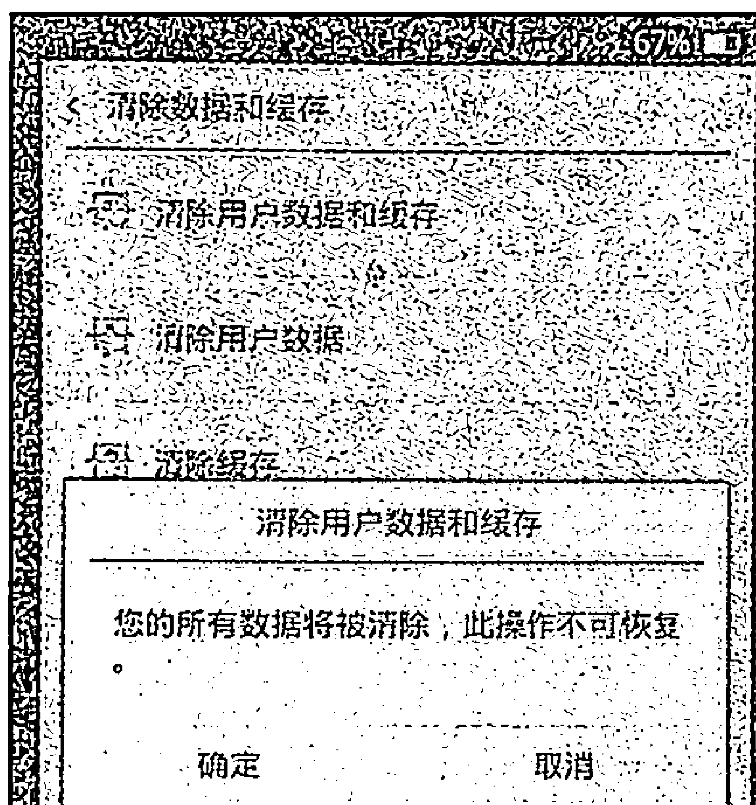

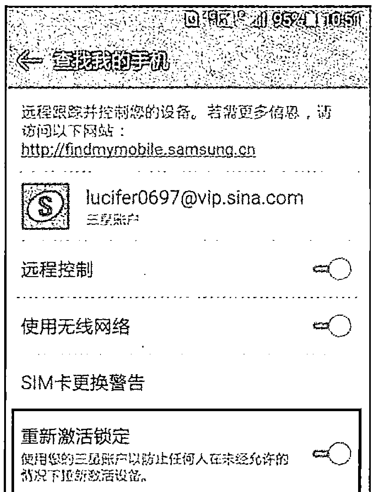

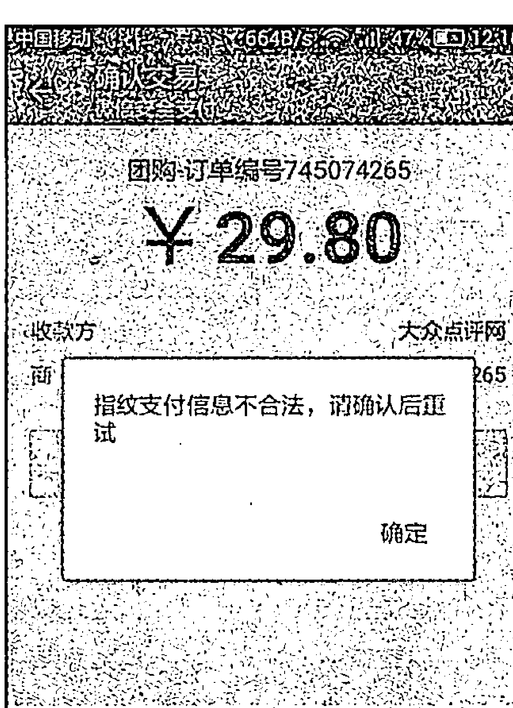

> 如果你的手机支持指纹支付功能，那就千万不要ROOT手机。因为ROOT之后会影响指纹安全性，有些手机会出现指纹支付选项被屏蔽，而有些手机在指纹支付的过程中会弹出验证报错提示（图9）。

## 多渠道下手 微信聊天记录备份超Easy

> 当手机固件面临重大更新，或因忘记锁屏密码或系统不稳定而不得不恢复出厂设置时，我们所安装的APP以及相关的数据资料也将随之而去。此时唯有提前备份才可确保数据安全。

### 传统的备份方案

对手机而言，除了拍摄的照片以外，像微信和QQ一类APP的聊天记录，无疑是最具价值的数据。“手机可以丢，聊天记录不能丢”是很多用户的心声。对QQ而言，只要分别开启手机QQ“设置→聊天记录”中的“同步最近聊天记录至本机”，PC端QQ“设置→安全设置→消息记录”中的“登录QQ时自动同步最新聊天记录”，即可实现手机与PC间QQ聊天记录同步，基本无需做进一步的备份。但对微信而言，如果你不小心误删了微信，重新安装后之前的聊天记录、表情等资料全部会被清空。还好，微信自身提供了简易的备份渠道：依次进入“我→设置→聊天→聊天记录备份和恢复”（图1），即可选择将聊天记录迁移到附近手机，或备份到云端（能将聊天记录在云端保存7天）。以聊天记录迁移为例，只要两部手机都接入了同一个Wi-Fi网里，再在新手机上登录你的微信账号，根据提示扫描旧手机屏幕上的二维码即可实现聊天记录的迁徙。整个过程无需第三方APP接入，100%安全。在很多用户心里云端备份总是有些不靠谱，只有将数据备份在PC本地才安心。此时，又该如何操作呢？

### iPhone微信记录备份报错

很多iPhone用户在使用第三方助手备份/恢复微信聊天记录时可能会遇到“获取微信数据失败”的报错提示。解决方法很简单，将iPhone与PC连接并启动iTunes，取消备份功能中“给iPhone备份加密”前的勾选即可。

### 利用PC手动备份

PC端“腾讯电脑管家”是微信的最佳搭档，在“工具箱→常用工具→更多工具”中点击“微信聊天备份”，按照屏幕提示用手机微信扫描二维码即可将聊天记录直接备份到电脑指定的路径（图2）。

需要注意的是，Android手机使用“微信聊天记录导出助手”需要提前ROOT手机，并通过RE文件管理器将“data\data\com.tencent.mm”中的“MicroMsg”文件夹备份到PC上（图4），点击软件工具条里的“打开目录”，在弹出的窗口中选择“方法三”并选中复制到电脑的“MicroMsg”文件夹即可。如果你想在PC本地浏览微信保存的语音图片文件，则需将存储卡根目录下的tencent\MicroMsg目录复制到电脑里。

问题来了，QQ聊天记录可以在PC端随意阅览，较之在小小手机屏幕上查看舒服多了。那么，微信聊天记录能否也在PC端直观查看呢？答案是可以的，不过需要我们借助PC端的“微信聊天记录导出助手”（下载地址：http://www.qiepai.net/，根据手机型号选择iOS或Android版）（图3）。

### 应用数据整体备份方案

除了单独备份聊天记录以外，现在还有一种更便捷的备份方式，即“APP+数据”整体备份。比如，我们可以将微信+聊天记录、单机游戏+存档进度等打包备份，在恢复出厂设置或刷机之后，可以直接让APP“原地满血复活”。而提到这个方法，相信很多用户都会想起360手机卫士、钛备份等第三方APP。但是，运行此类APP进行全局备份的前提是必须获得ROOT权限。

进入“应用数据”就可将APP+数据备份到云端（图5、图6、图7），以供日后恢复之用。由于此类系统自带APP自带底层权限，所以无需ROOT即可读取APP数据，使用起来也最为安全。不过，这类云服务的缺点也很明显，就是仅支持同品牌手机之间的云端恢复，无法实现跨品牌。正所谓硬件有价数据无价，养成及时备份的习惯对智能手机用户而言还是很有必要的。笔者建议优先使用手机自带的云服务（最安全，无需ROOT即可享受丰富功能）。如果手机不支持此类功能，再考虑第三方安全类APP（往往需ROOT才能获得全部功能）。

好消息是，如今绝大多数国产Android手机都提供了各自的云服务，而其中就包括整体备份功能。以联想VIBE P1手机为例，用手机号登录自带的云服务APP，

#### 为何备份应用数据需要ROOT

出于安全考虑，Android系统APP的数据部分大都有2个保存目录：
- 一是系统根目录，访问需ROOT权限；
- 二是存储卡目录，可任由用户操作。

以微信为例，其聊天记录中文本数据和语音图片文件分开存放，前者要ROOT权限才能从系统文件夹中提取，后者则被保存在存储卡中。而对游戏APP，数据包保存在存储卡，而进度存档则位于系统目录。像“八门神器”这类游戏修改器之所以可以修改金钱，原理就是获得ROOT权限后读取并修改系统目录存档中的相关键值。

除了微信之外，所有APP都可利用云服务备份，恢复后之前的记录、设置都可还原。只是像微信一类的APP还需重新登录。

## 何必非得ROOT
挖掘Android手机的“先天”潜力

很多Android手机用户都很迷信“ROOT传说”，恨不得第一时间就将手机ROOT，然后去卸载系统自带的无用APP，或者安装第三方安全类APP。那么现在的Android手机真的有必要ROOT吗？

### 安全类APP没有ROOT将无法使用高级功能

### 让人又爱又恨的ROOT

### 安全搞定垃圾APP

一提到Android，很多玩家就会联想起ROOT。原因很简单，昔日的Android系统操作并不流畅，而手机厂商也喜欢随机预装“丰富”的垃圾APP，不仅占用资源还暗藏扣费陷阱。此外一些专业APP，比如钛备份、游戏修改器、RE管理器的运行也需要ROOT权限的支持（图1），让用户“不得不”进行ROOT以获得所需的功能。然而ROOT手机也会带来很多问题。比如，在固件更新时如果检测到手机已ROOT将导致升级失败；支持指纹支付的手机在ROOT后也会出现各种问题；如果你误删了关键系统程序将引起系统崩溃，只能重新完整刷机才能恢复……

好消息是，随着MIUI、Emotion UI、Flyme OS和ColorOS等国产厂商基于Android的不断优化，无需ROOT我们也能享受更多高级功能了。

相信每款手机都会预装几个你看不上眼的APP，如果你执意ROOT系统再将它们删除，那就有些太Out了。因为，如今绝大多数Android手机的定制系统都已具备类似应用冻结，或者纯净后台的功能。
以金立手机Amigo OS为例，运行系统管家APP，在应用管理选项中就可找到应用冻结功能（图2）。在这里，我们可以将平时用不上的系统预装APP，以及自己安装的第三方APP冻结，冻结后的APP就相当于隐藏+卸载，你不仅再也看不到它们的图标，也不必担心后台运行耗电和偷跑流量。如果日后有需要，只需重复前面的步骤将其“解冻”即可。

同理，Amigo OS绿色后台功能在开启后，当你锁屏一段时间后会自动触发清理后台的功能（图3），杜绝后台程序耗电和偷跑流量，我们所要做的就是将微信、QQ等APP添加到白名单列表，防止接收不到推送消息。

需要注意的是，不同品牌的OS，应用冻结和绿色后台功能的名称和位置可能并不一致。比如，华为Emotion UI将绿色后台称为“受保护应用”，魅族Flyme OS将其放在了“待机耗电管理”中（图4）。

> 如果你想了解更多有关Android手机后台省电的内容，请参考本刊17期《如何延长续航时间 浅谈Android手机的省电机制》这篇文章。

### 找到联网防火墙

如果你每月上网流量较大，光凭流量监控提醒可不够，手机是否自带“联网防火墙”功能（有些系统也会称为“联网监控”），将成为我们选购手机的关键参数之一（像360、LBE等安全软件虽然也可提供联网防火墙，但却要ROOT权限的支持）。一般来说，Android手机的这一功能会被集成在“安全中心”、“掌心管家”一类的系统自带APP中，取消数据连接对应的勾选（图5），就意味着该APP将无法使用手机流量上网了。

### 用好权限管理功能

除了联网防火墙，类似安全中心的APP中还会提供权限管理功能，可由我们自行配置某款APP所能使用的权利。以联想VIBE UI为例，比如很多人都担心输入法会恶意记录我们的输入信息。那么，我们只需进入权限管理界面找到输入法，并禁止它使用数据和Wi-Fi联网（图6），这样就不怕其偷偷上传数据了。此外，如果你担心有游戏或APP会在后台偷发短信扣费，那也只需在“权限管理→按行为管理”中，就能禁止所有可疑APP发送短信的权限（图7）。同理，如果你担心有APP会偷偷打开摄像头，或是偷偷启动后台录音，只需找到对应的权限管理并禁止赋予它们权限即可。

### 手机丢了怎么办

开篇介绍了如何避免手机丢失后威胁移动资金的安全。除了限定各种支付APP之外，还可借助“手机找回”功能实现“亡羊补牢”。很多品牌Android手机的云服务功能不仅支持数据备份/恢复，也提供了类似“找回手机”的能力。此类功能原理都是将当前手机串号、手机号与账户绑定，手机不幸丢失时可在PC的浏览器端登录账号，锁定丢失手机的位置，并通过发送短信或网络指令强行删除数据（图8、图9）。而依靠这类功能找回手机的可能性不大，但远程删除手机数据却非常实用，相当于恢复出厂设置，偷/捡手机的人也就无法窥探你的隐私或使用相关的手机支付功能了。

总之，如今Android手机的配置趋于同质化，配置相近，很难在性能上拉开差距，而使用体验的表现在很大程度上却取决于是否提供了上述功能，让我们免ROOT即可获得更为安全的体验。

## 全面防护
注重系统数据和隐私

俗话说设备有价数据无价，比起设备本身硬件的安全来说，其中存储的数据和内容可能更加珍贵。数据安全不仅包括丢失风险，数据泄露也是近年来急需解决的问题。目前全新的操作系统和对应软件对于数据和隐私的防护有不少绝招，我们不妨一起看一看。

### 条条大路通安全
#### 系统多种登录方式解析与选择

在Windows 10系统中，设置登录方式的重大意义就是保护系统安全。无论本地账户还是新式网络账户，Windows 10的登录方式均是通过账户名和密码的形式完成。而密码登录的不安全因素就是密码泄露，因此寻求密码之外的登录方式是提高安全登录系数的重中之重。就像微软负责人Dustin Ingalls的官方博文所说，让Windows用户的身份认证超过密码时代是微软开发团队的首要任务。现已经有了成效，在密码外可用更多方法登录Windows 10系统。

#### 如何选择和更改登录方式

点击“开始”按钮并选择“设置”，点击“账户”项，进入账户设置窗口，选择左侧的“登录选项”，通过右侧窗口选项，可以选择和设置用传统的本地密码、新式的网络密码、PIN码、图片密码等多种方式来登录系统(图1)。如果安装了生物识别设备，则还会出现生物识别相关选项，可以用指纹识别、人脸识别、虹膜识别等高新技术来实现更为安全的识别登录。

### 各有优势 本地账户与网络账户

网络账户是微软从Windows 8时期引入的新的登录方式，意在发展其云的策略。通过网络账户登录Windows之后，结合微软Windows 8或Windows 10内置的OneDrive云盘，就可以实现系统配置、用户使用习惯、用户文件的远程自动同步。这是传统本地账户所无法比拟的优势所在。

然而，不是说使用Windows 10就一定要用网络账号。在Windows 10的安装、使用过程中，微软还允许用户使用传统的本地账号。当安装时没有网络或网络出现问题时，可以绕过网络账号的建立，直接用一个本地账号来安装系统。即便是在用Windows 10网络账号安装或登录系统之后，也可根据需要随时建立和切换使用更多的本地账户或网络账户。

建立更多本地或网络账户的方法：点击“开始”菜单中的“设置”项，在设置窗口中点击“账户”项，开启“账户”设置窗口。点击“改用本地账户登录”可将当前账户切换为本地方式。点击“添加Microsoft账户”可添加更多网络账户（图2）。

### 简单但安全 PIN码登录

本地账户和网络账户登录的最传统授权方式是通过输入用户名和密码来登录系统，密码太简单还不安全，因此输入比较麻烦。为了更易于登录Windows系统、应用和服务，微软在Windows 10中又引入了PIN码登录。PIN码在需要将电脑临时借给别人使用时，就显得非常方便。

关于PIN码的安全问题，我们在使用Windows 10预览版的过程中，微软曾给出一段有意思的提示信息，其大意是传统的密码保护已经显得有点过时，PIN码登录其实比传统密码还要安全。至于为何只有几位数的短小PIN码更加安全，微软打了一个很有意思的比方：我们设想有一台银行ATM机，小偷不可能只利用你的PIN码，然后将他自己的银行卡插入ATM机中就取走你的钱。因为PIN码只与设置它的设备关联，在其他设备上将失去作用（图3）。同样，你在Windows 10中设置的PIN码，对身处远方的黑客来说也毫无用处，这个密码对于在他的设备上操作毫无用处。而如果银行卡的用户名和密码被黑客获取，后果就会不堪设想，这也是传统账户密码的不安全性所在。

PIN码是Personal Identification Number的简写，意思是“个人识别码”。在Windows 10系统中PIN码仅与设定的电脑有关，它与微软账号是相互独立的两种密码，只是Windows 10的附加登录方式。也就是说你在A电脑设定的微软网络账号可在B电脑上继续使用登录；但如果在A电脑上设定PIN码，同样的PIN码拿到B电脑上登录就失去作用了。因此即便泄露，只要不在本机登录就没有任何意义。设定PIN码后登录系统时可只输入PIN码，甚至不输入回车键符即可登录。为系统登录提供了极大方便，同时又不泄露微软账号，可谓一举两得。

PIN码不但可在系统安装中设置，也可在安装中跳过设置，以后随时通过“设置→账户”窗口，选择“登录选项”，在右侧窗口中点击PIN后的“添加”按钮，添加系统登录的PIN码（图4）。设置PIN码前，系统会要求你重新输入先前设置的Windows账户密码登录验证，之后才能设置PIN码（图5）。如果忘了PIN码，还可通过点击“我忘记了我的PIN码”重置PIN码（图6）。

### 画图登录更顺手 图片密码

使用智能手机的朋友一定对图形密码开机不陌生。其实，Windows系统从Windows 8开始就引入了图形密码，Windows 10中也保留和延续了这种开机登录方式。图片密码是帮助用户保护触摸屏电脑权限的全新方法。需要选择图片并画出各种手势，以此来创建独一无二的密码。从开始菜单中选择“设置”进入系统设置窗口，选择“账户”，选择“登录选项”，在右侧窗口中可见“图片密码”设置入口，点击“添加”按钮即可设置使用自己喜欢的图片登录到Windows 10。进入添加图片密码向导后，设置图形密码前首先输入和验证Windows 10传统登录密码（图7），密码验证无误后，点击“选择图片”选择一张喜欢的图片（图8）。之后可直接在触摸屏上“画”圆、直线和点的组合手势，需要设置三个独立的手势（若不是触摸屏，用鼠标模拟触摸操作即可）。这些手势的大小、位置和方向都将成为图片密码的一部分（图9）。

#### 使用图片密码的说明信息

在选择图片作为Windows登录图片密码时，不要选择太复杂和花哨的图片，以免连自己也无法识别图形密码的图形。可设置点状矩阵图形，再设置容易记忆的一组图形手势密码。

### 更加先进的生物识别登录

Windows 10还支持更先进的生物识别登录验证方式，包括指纹识别、人脸识别、虹膜识别等方式。这项功能被称为Windows Hello（图10）。Windows Hello功能的开启需要有特定硬件的支持。“在代表你进行验证之前，Windows10将要求你通过包含生物特征传感器的设备上的PIN码或Windows Hello验证你确实拥有该设备。”这是微软对使用该项功能的基本要求。指纹识别要通过专门的指纹阅读器来完成；脸部和虹膜识别则是通过特殊的硬件和软件组合来精确验证完成，而不是仅仅通过简单的照片影像或模仿的方式来完成认证。国外最近有过用长相最为相像的若干对双胞胎来“蒙混”验证的实验，结果无一能蒙混过关，可见这项技术的可靠性非同一般。由于我们目前的电脑上大多不具备这种生物特征传感器，因此绝大多数用户目前尚不能在Windows 10中亲自体验这种先进的登录方式。但是，这不表示市面上没有此类设备。实际上，目前支持Windows Hello功能的笔记本已经陆续出现，比如：戴尔Inspiron 15 5548，宏碁Aspire V 17 Nitro，联想ThinkPad Yoga 15、ThinkPad E550、B5030，华硕N551JQ、ROG G771JM、X751LD，惠普Envy 15t Touch RealSense Laptop、Sprout、戴尔Inspiron 23 7000等，这些设备均可以用以上方式来设置并登录Windows 10系统。

由于指纹、虹膜、人脸特征的独一无二性，用Windows Hello登录技术来登录系统比传统的用户名密码登录将更安全。如果电脑具有支持它的指纹读取器或专用摄像头，在系统设置的“登录选项”窗口下会出现Windows Hello选项。在Windows Hello下将看到面部、指纹或虹膜选项。设置后可通过快速轻扫或轻瞥等动作来登录。

#### 技术展望

Windows Hello脸部识别登录要用到RealSense摄像头，普通的摄像头是不支持这个功能的。除了用在Windows 10系统的登录方面，微软和其他一些科技公司正在开发与应用、服务、网站等有关的Windows Hello功能。可以预期，在不久的将来，大多数需要登录的场合，我们只需通过“刷脸”这个简单的动作就可以完成权限认证了，再也不需要为记忆一大堆密码和担心密码丢失而大伤脑筋。

## Windows 10 个人隐私随心控制

关于系统隐私，Windows 10系统的个人隐私问题可以说是到了空前绝后的地步。看过微软隐私声明后，你一定会体会到这一点。这里“归功于”网络账户和云功能的加入。Windows 10涉及隐私的方面可以说是无孔不入，但这并不表示隐私不可控。

> 小技巧
> 如果只希望系统记录“快速访问”隐私中的一项（如常用文件夹），则只需在“隐私”分组中选中“在快速访问中显示常用文件夹”选项，去掉对“在快速访问中显示最近使用的文件”选项的选择，就可以达到目的了。

### 消除“快速访问”的隐患

Windows 10的资源管理器中增加了一项很体贴人的“快速访问”功能，打开资源管理器便可一眼看到“常用文件夹”和“最近使用的文件”列表。这一功能虽然给用户提供了方便，但如果是在公用电脑上使用，也很容易泄露用户的使用“痕迹”。为消除隐患，需要寻求关闭或清理的办法。

### 让“快速访问”别再现眼

在资源管理器左侧导航栏“快速访问”上单击鼠标右键，选择“选项”（图1），随后会自动打开“文件夹选项”窗口；切换到“常规”选项卡，选择“打开资源管理器时打开→此电脑”，而不是“快速访问”，确定之后，再打开资源管理器，就不先出现“快速访问”记录了（图2）。

### 手动清除“快速访问”痕迹

如果资源管理器中“快速访问”菜单下已经记录了一些文件或文件夹操作过的痕迹，可将其一次性删除。在“文件夹选项”窗口“常规”选项卡下的“隐私”组中，点击“清除”按钮，可立即清除“快速访问”隐私。

### 自动清除“快速访问”隐私

在“文件夹选项”窗口当中，点击“常规”选项卡“隐私”组中的“在快速访问中显示最近使用的文件”和“在快速访问中显示常用文件夹”这两个复选框，清除对这两项的选择，然后再点击“应用”和“确定”。这样，系统以后就不会再记录和显示快速访问中的项目了。

### 管好可能泄露隐私的设备

在使用电脑过程中，除了键盘输入文字信息外，我们还需要借助于一些其他外设来交换信息。例如相机、麦克风、无线收发器等设备。这些设备的自动开启或默认开启都有可能被一些软件利用，从而泄露个人隐私。这时，可以进入系统“设置→隐私”窗口，有选择地将涉及到的项目加以关闭，从而杜绝因设备无意中开启而造成的隐私泄露（图3）。

### 会泄露隐私的其他方面

除了文件管理窗口的快速访问痕迹以及各种可能直接泄露隐私的设备外，在使用Windows或Windows应用的过程中，也会涉及到各种个人隐私资料。只有心中明确哪些应用会涉及到隐私以及涉及什么隐私，知道如何去关闭可能泄露隐私的项目，才能做到及时防护或提前防护。

### 网络账号涉及的隐私

在开始安装Windows 10或在已有的Windows 10中添加网络账户时，微软会提示用户网络账户的作用，并提醒用户关于网络账户的隐私问题。如果用户明确了网络账户的作用，明白网络账户会将哪些数据同步到OneDrive云服务器中，就可以有的放矢地在OneDrive中共享自己的个人资料，不至于陷入盲目性操作。

要在OneDrive中设置上传文件的范围，右键单击任务栏托盘上的OneDrive图标，选择“设置”，在设置窗口中点击“选择文件夹”选项卡，然后点击“选择文件夹”按钮（图4）；接着在列表中点选需要同步的文件夹（图5）。

### 安装和使用输入法时的隐私

安装和使用输入法也会涉及到隐私问题。以在Windows 10中使用必应Bing输入法为例，安装过程中，输入法会提示用户是否允许访问用户的姓名、性别、头像、联系人和好友等信息。这些信息会以同步的方式被及时上传到微软服务器中，如果担心因输入法使用过程中泄露个人隐私，可在安装输入法时就否定这一设置，点击“否”即可（图6）。

> 小贴士：不但在安装输入法时可关闭隐私项，如果隐私选项已开启，还可在使用中随时通过输入法设置关闭可能造成隐私泄露的选项。切换到必应Bing输入法的“设置→账户”窗口，选择性地去掉一些项目的同步；或干脆将账户注销，只采用本地输入词库，即可最大限度地避免因输入法而引起的隐私泄露问题（图7）。

### 开启小娜过程中的隐私保护

微软Windows 10自带的小娜（Cortana）是人们喜闻乐道并乐于使用的新功能。通过Cortana可以方便地获取自己需要的各种信息，但是，在使用过程中也会涉及到许多方面的隐私信息。Cortana能够为用户提供非常体贴的服务有一个前提，那就是它对用户的熟知程度，Cortana知道关于你的信息越多，就越能为你提供更加体贴的服务，这就如同公司高管的秘书一样。因此，在一开始使用Cortana的时候，微软就会提醒用户关于隐私的问题（图8）。Cortana收集的信息包括用户的位置和位置历史记录、联系人、语音输入、搜索历史记录、日历详细信息、邮件和应用中的内容、通信历史记录、设备上的其他信息等。由于Cortana与Edge浏览器高度集成，因此在上网过程中所产生的一些历史记录，也是Cortana需要记忆的内容。此外，在用Cortana向微软反馈信息时，微软也会提醒用户不要在反馈的信息中包含任何个人隐私数据（图9）。

如果对以上内容心存疑虑，也可选择将其关闭。通过在Edge浏览器中选择“高级设置”，可禁用Cortana，防止因Cortana而泄露上网信息（图10）。通过Cortana窗口，点击“设置”按钮，可开启或关闭Cortana功能，设置是否让Cortana得知在线搜索结果，还能进行必应安全搜索设置和其他隐私的具体设置（图11）。点击“管理Cortana在云中了解到的我的相关内容”文字链接，可自动登录到Microsoft账户必应网页，对个人的各项隐私进行设置（图12）。

## 使用安全防护软件中的隐私

Windows 10自带安全防护软件Windows Defender，防护软件会实时扫描电脑中的文件，其中包括“基于云的保护”扫描，这会引起直接向微软发送Windows Defender发现的潜在安全问题的相关信息，以便获得对系统更好、更快的保护。但其中会涉及到一些用户隐私项目，因此若用户对此心存疑虑或的确不希望向微软发送这些数据信息，则可以通过关闭“基于云的保护”选项来杜绝数据的发送（图13）。

安全软件设置中的另一个涉及隐私的选项是“自动样本提交”选项（Automatic sample submission），当Windows Defender在扫描系统的过程中发现问题后，如果该选项打开，就会自动向微软发送相关信息。如果对此项存疑或有其他安全考虑，请在安全设置页面中关闭此选项的开关。

Windows Defender在扫描系统过程中会遍历大多数系统文件和用户文件。如果用户觉得某些文件需要保密，也不存在隐患，希望Windows Defender不去扫描，可以用“添加排除项”的方式来排除对其扫描。在Windows Defender设置窗口中，点击“添加排除项”进行设置。可供排除的项目包括排除某些特定文件、文件夹，或者按文件类型进行过滤，也可以排除某些特定的进程。在排除进程时，任何与该进程相关联的文件也将被排除（图14）。

在Windows系统本身的更新过程中，虽然不涉及明显的隐私数据，但由于新的系统默认采用了一种新的数据更新模式，当使用者的系统获得更新后，系统默认会向用户所在局域网或Internet上的电脑提供更新数据，类似于一种BT的下载上传模式。这样，用户可能会发现，虽然自己没有下载或上传什么任务，但电脑的硬盘灯常亮，其实这是系统自动向其他用户传输更新数据所致。如果觉得这样的数据传输也在影响自己的工作，也可以将其关闭掉。

通过系统设置窗口的“更新与安全”选项，选择“Windows更新→高级选项”（图15），在“高级选项”窗口中点击“选择如何提供更新”链接，然后在更新位置选择窗口中，有选择地关闭更新所使用的两种渠道（仅允许本地网络上的电脑，或本地与Internet二者均不允许）（图16）。

> 有关微软隐私的具体信息，请参阅微软官方网站如下地址的详细声明：http://windows.microsoft.com/zh-cn/windows/preview-privacy-statement

## 用好Windows 10的凭据管理器

从Windows 8开始，Windows系统引入了新的凭据管理器。在使用域名的网络账号上网过程中，系统后台会自动同步相关网络和本地内容。在浏览器中保存的网站登录内容也会被自动同步，而Windows凭据管理器就可以直接对这些数据进行管理。Windows凭据管理既有方便之处，但也有隐患。

### 凭据管理及其用法

如果你使用过带有域名的局域网系统，你一定会记得，在使用某些网络服务（如在使用网络打印机、公司文件服务器）的时候，第一次需要输入密码，而再次使用时就不需要密码了。这是因为系统的凭据管理器在后台发挥着作用。在第一次使用该网络服务的时候，通过凭据的方式将数据记录在凭据管理数据库当中，Windows系统和网络浏览器等应用程序可以安全地将凭据库中的凭据自动提供给其他计算机或网站。

与之前的Windows不同的是，新版Windows不仅包含“Windows凭据”选项，还增加了一项“Web凭据”。在Web凭据中，可以查看由不同应用程序所存储的与网络登录认证有关的凭据。这些程序包括IE、Skype、Edge、Windows应用等。如果不同的电脑用相同的微软账号登录，那么就会自动同步这些凭据，因此在一台电脑上保存的网络凭据，如果换了电脑用相同账号登录，就不用再设凭据账号。

> **小提示**
>
> **如何访问凭据管理器**
>
> 右键单击Windows 10开始按钮，在弹出的菜单中选择“控制面板”，将控制面板查看方式设置为“大图标”或“小图标”显示，在列表中就可看到“凭据管理器”一项，点击即可启动该管理器（图1）。

Windows凭据用户名一般为“域名\用户名”的形式。许多员工在重设网络凭据时，总是忘掉“域名\”这一字段，因此往往在用户名和密码都正确的情况下，依然无法登录网络服务。需要引起注意。

相对Web凭据，Windows凭据是为Windows本身及相关本地程序而设立，不会通过微软账户进行同步，如果需要只能通过手动来备份。点击“备份凭据”和“还原凭据”两个按钮即可（图2）。

### 自动凭据登录的隐患

自动凭据登录有它的方便之处，但也有相应的隐患。如果网络账号失窃，别人通过其他设备以该账号登录，就可以不用密码账号而访问许多属于你的网络资源了。

### 凭据失效的解决办法

网络凭据也有失效的时候。有时我们发现自己的网络账号并没有错误，但就是死活不能登录网络服务了。这时，可通过删除失效的凭据，然后再新建Windows凭据的办法解决问题。

在Windows凭据管理器窗口中，选择失效的凭据项目，点击“删除”按钮删除失效的凭据（图3）；点击“添加Windows凭据”文字链接，填写正确的内部网IP地址、用户名、密码等信息，最后点击“确定”即可重新设好登录凭据（图4）。

## 用好文件系统的权限保护
文|刘英

对Windows电脑用户来说，最重要的事情莫过于文件系统的保护。从系统管理员的文件操作权限到文件共享权限，从用户文档本身的属性保护到文档内在的权限设置和保护，都体现着文件的重要性。无论它们的级别高低，使用所涉及到的技术含量的大小，它们最终的目的都是在为用户的资源保驾护航。需要操作的文件不能限制操作，不该操作的文件就要设置一定的权限，不能随意被动用。我们只有对这些权限的设置和使用烂熟于心，才能用好文件系统，有效地保证资料的安全。

### 巧妙使用管理员权限

Windows系统对每个拥有管理员权限的配置文件夹下的文件加以保护，我们不能轻易地像删除普通用户文件那样将其删除。但有时，作为管理员的我们，如果的确不需要另外一个管理员权限的配置文件了，需要将其删除。这时，就需要用恰当的方法来获取管理员的权限并清理这些不再使用的文件。

在建立多个账户的Windows系统中，如果多个账户都是管理员权限的级别，且这些账户均登录使用过系统，那么在系统分区中就会分别产生一个账户配置信息目录。如果要删除系统配置信息目录，就会出现无法删除的情况。在这种情况下，企图直接删除文件夹的想法肯定是徒劳的。正确的做法应该是通过删除注册表中的信息，再删除保存配置文件目录的方法来删除用户配置文件夹。

以Windows 10系统为例，首先用另一个拥有管理员权限的用户账号登录Windows。按“Win+R”组合键启动“运行”窗口，运行“compmgmt.msc”命令（图1），打开“计算机管理”窗口；依次选择“系统工具→本地用户和组→用户”，在右侧的窗格中选中要删除的目标账户名，右键单击并选择“删除”项将其删除（图2）；关闭计算机管理窗口。接下来使用“Win+Break”组合键启动“系统”属性窗口，点击左侧栏的“高级系统设置”（图3）；在弹出的“系统属性”窗口中，点击“用户配置文件”一栏中的“设置”按钮（图4）；在用户配置文件列表中，点击要删除的用户配置文件，然后点击“删除”按钮，点击“确定”即可（图5）。

在Windows 10中使用一些程序时，我们往往还会遇到另一种情况，这些程序需要我们输入管理员密码，才能运行。这是由于添加账户时使用了标准账户，不具备管理员的操作权限，因此运行时需要提高权限才能顺利进行。这时，只需将账户类型更改为管理员级别即可。具体方法：先通过最初创建系统时设立的管理员账户登录Windows 10，点击“开始”菜单中的“设置”项，依次点击“账户→家庭和其他用户”，在右侧窗口中点击选择“其他用户”下的用户或点击“将其他人添加到这台电脑”，这样，即便不是家庭成员的用户也可使用自己的账户来登录（图6）。点击“设置分配的访问权限”还可以设置哪些用户能够访问哪些文件（图7）。

### 用好文件的共享权限

如果要在Windows 10系统中共享文件给他人使用，设置必要的共享权限也很重要，它可以防止重要文件被他人修改。
在要共享的文件上单击鼠标右键，选择“属性”项，在弹出的文件属性窗口中，点击“共享”选项卡，然后点击“高级共享”按钮（图8）。勾选“共享此文件夹”复选框，如果文件或文件夹是不具有特征的名称，这里可以起个容易理解的共享名，设置好限制使用的用户数量，点击“权限”按钮（图9）。最后在权限窗口中，为所有用户设置“完全控制”、“更改”或“读取”的权限，也可通过“添加”按钮添加特定的用户，为其指定特定的访问权限（图10）。

> 小提示
> 除了以上权限保护外，我们还可以对文档进行压缩，并在压缩的同时给压缩包加上访问密码，起到更多一层的保护作用。目前流行的压缩软件如WinRAR、2345好压、360压缩等均可以实现这一需求。此外，如果文件要存入云盘，还可以在云盘中设立另一层密码锁，让文件获得更多一层的保护。

设置共享之后，将本机的IP地址提供给要访问共享文件的用户，在其电脑浏览器中输入该IP地址，就可以用设定的权限来访问共享文件了。

### 文档本身的属性保护

对于用户文档来说，除了所在的系统权限范围的保护和共享属性的保护之外，文档本身也可以设定属性保护。比如，对于有的文档来说，你只希望别人阅读而不希望其更改，则可以给文档设置“只读”属性。设置的方法也比较简单，单击该文档，然后通过右键菜单的“属性”命令，在“常规”选项卡下，选中“只读”复选框并点击“应用”按钮，即可将只读属性赋予该文件。这样，当文档被别人编辑之后，存盘时会被拒绝，只能另存为别的文件名，从而起到了保护原始文档的作用（图11）。

### 文档内在的权限保护

除了文档本身的只读属性保护，不少专业的文档编辑器还提供了对文档本身属性的保护措施。国产的办公软件WPS对其可支持的常用格式文档就提供了打开权限、编辑权限等保护。用户在编辑文件保存之前，可通过设置相应的保护密码，对文档的打开和编辑权限进行必要的保护（图12）。

## 非请勿看
## 文件系统的另类加密
文|技术宅

为了更好地保护数据安全，Windows已自带权限、EFS加密、Blocker加密等安全保护组件，但系统自带的加密组件也有不足，比如Blocker加密过于强大，如果忘记解锁密码，则极易造成数据丢失。EFS加密则和系统账户紧密联系，如果不及时备份密钥，重装系统也极易造成数据丢失。因此在选择加密工具的同时，还要考虑一旦自己遗忘解密方式（特别对于很多马大哈用户）可能带来的文件损失。因此为了更好地保护文件安全，很多时候我们可借助第三方工具来进行。

## 一盘两用 用金山快盘加密文件夹

使用金山快盘的用户都知道，借助快盘的“锁定快盘”组件我们可以为快盘本地同步文件夹添加访问密码。对于需要加密保护的文件只要放置在快盘本地同步文件夹即可实现保护，这样可以让快盘实现加密、同步两用。不过为了不让快盘同步这些受保护的文件，我们还需要进行一番设置。

首先在需要设置保护的电脑上安装快盘客户端，设置一个文件夹（建议选择C盘之外的）作为快盘的同步目录如“J:\快盘”。打开“J:\快盘”，在其下再建立一个“我的文件”的子文件夹，用于存放需要保护的文件。打开资源管理器进入快盘，点击右侧窗格的“选择性同步”，在打开的窗口中去除“我的文件”前的勾选，这样其中的文件就不会自动同步到快盘上了（图1）。现在就可以将需要保护的文件全部放置在“J:\快盘\我的文件”下，然后按下Ctrl+Alt+K组合键并设置访问密码，这样下次再按上述快捷键即可快速锁定快盘。以后需要访问其中的文件时就必须输入访问密码（每天只有5次输入错误密码的机会，否则当天就会锁定快盘），只有这样才能打开上述文件夹（图2）。

如果直接访问“J:\快盘”，系统则会弹出“您当前无权访问该文件夹”的提示，这个看上去是利用系统权限进行阻止，实际上我们无法通过权限的设置绕开密码而访问快盘目录（图3）。

上述方法只能对文件夹加密，如果要使用快盘对整个分区进行保护，可使用分区装入NTFS目录的方法。

## 三步三分钟使用Easy File Locker加密隐藏文件

使用快盘为分区加密保护还是有些局限性（比如用户可以通过添加盘符的方法绕过密码保护），如果要对分区进行真正的加密保护还可以借助Easy File Locker来进行，它可以让保护的文件消失得无影无踪。

比如在上述的实例中选择将K盘全部添加到保护列表，并且选择不可见，这样通过Easy File Locker的保护后，现在再次打开K盘，用户就无法看到原来的文件了。当然这并不是和系统文件隐藏设置那样，即使你将文件夹显示方式设置为显示所有文件（而且即使在安全模式下）也无法查看（图8）。

启动Easy File Locker后点击“System→Set password”按提示为程序访问设置一个密码，接着点击“Edit→Add file”或者“Add folder”添加需要保护的文件或者文件夹到保护列表即可，比如需要保护分区则可以直接将驱动器的根目录添加到列表。在添加过程中还可以给文件、文件夹设置不同的权限，其中Accessable是“可以访问”，Wirtable是“可以写”（覆盖、移动等操作），Deletable是“可删除”，Visible是“可见”，也就是隐不隐藏的意思了，大家可以根据自己的实际需要进行设置。比如去除Deletable的勾选，其他人就无法删除被保护的文件了（图7）。

如果自己需要对加密的目录进行访问，只要再次运行Easy File Locker，点击“System→Stop Protection”，停止保护后就可以进行正常的访问了（图9）。

Easy File Locker使用基于驱动的方法进行访问拦截，它也不会对文件添加加密代码破坏源文件，而驱动保护只安装在有Easy File Locker的电脑上。因此如果现在忘记密码要解密文件，同样可以在另外的系统中打开加密目录，比如同上进入PE系统中访问加密文件即可（图10）。

文|平淡

## 恢复如新
## 系统保护软件大PK

大家都知道Windows是比较脆弱的，日常的很多操作都可能让系统崩溃。虽然微软从Windows 7开始就在系统内置重置组件，可以让我们在系统崩溃的时候快速恢复系统，不过这个组件功能在实际使用中还是有诸多的不足，比如Windows 10在重置系统的时候会删除掉我们安装的所有软件，而且重置的时间较长。

因为针对Windows的威胁主要来源于网络和外来软件的安装，所以我们可以在目前已有的系统中添加一层保护以屏蔽常见的网络威胁和外来软件。对于这类用户需求，可以选择影子系统来为Windows装一个保护壳，在执行有风险的操作时就在“壳”中运行，这样即可更好地保护系统的安全了。

### 揭开迷雾了解影子系统的运行原理

现在网上有许多影子系统软件，它们可以让我们在进入实体系统的时候选择进入影子系统，这样重启后所有的操作都会自动恢复到原始状态，影子系统可以有效地保护系统的安全。那么这类影子系统是怎样实现保护的呢？

使用过Vmware虚拟机的朋友都知道，VM自带一个“系统快照”功能，它可以保存当前系统运行快照，以后在选择这个快照时就可以快速恢复到快照状态，这是一个典型的虚拟化应用。影子系统的原理其实和快照功能类似，其幕后的功臣也是虚拟化技术。根据虚拟映射区域不同进行分类，目前影子系统主要有映射到虚拟目录（以Powershadow为代表）和映射到内存（以微软UWF为代表）两种。两种影子系统的运行原理大同小异，只是映射载体不同而已。下面我们以Powershadow为例介绍影子系统运行的工作原理。

当我们在Windows 10中安装完Powershadow需要立即重启，在重启进入系统后启动Powershadow，它就会让用户选择“单一影子系统”还是“全面保护影子系统”，当然也可以进入系统后再进行选择（图1）。

这样当用户在选择对应的影子系统后，Powershadow就会对当前系统完成一个快照的保存工作，比如选择的是“单一影子系统”，程序会将当前系统分区生成快照并保存（全面保护则是建立全盘快照）。进入影子系统后将在当前桌面出现单一或者全面保护字样提示，表明当前系统已经在影子系统的保护模式下（图2）。

在影子系统的保护模式下，其虚拟化的组件就会接管当前组件对系统分区所有的读写操作，并将读写操作映射到虚拟系统当中。一方面这种虚拟映射可以让目前安装的软件在当前虚拟系统中运行，另一方面这些虚拟系统里的读写数据会在重启后自动删除，从而保证系统的安全（图3）。

举个实际的例子，比如我们进入单一保护模式后安装QQ，这样当前写入“C:\Program Files (x86)\Tencent”目录的所有文件（包括注册表数据）都会被影子系统重定向到虚拟目录中，尽管在当前影子系统中可以看到写入文件的存在，但是这些数据都会在重启后被自动删除。这样假设上述安装的QQ是病毒（或者其中捆绑木马），我们只要重启系统，这样在重启之后上述虚拟目录中的所有数据就会被自动清零，自然其中的病毒、木马也被自动删除，从而有效保护系统的安全（图4）。

显然影子系统的保护和Windows常见的“系统重置”和“系统还原”组件是不同的。系统重置是在离线（要进入PE系统）状态下对当前系统数据进行清除，容易造成数据丢失；系统还原则是通过创建还原点的方法，然后将需还原的系统状态和还原点进行比较，将.EXE、.DLL、.COM等程序文件清除，不容易删除通过伪装的病毒文件，而且系统在进行更新、驱动安装时会自动激活还原点，容易覆盖原来创建的还原点（表1）。

表1：影子系统、系统重置、系统还原比较

| 操作环境 | 保护方法 | 保护效果 |
| --- | --- | --- |
| 当前系统 | 创建快照然后比对快照，删除EXE等文件恢复系统 | 一般 |
| PE系统 | 重启在PE里选择，删除用户所有程序或数据 | 彻底，但是容易丢失数据 |
| 当前系统 | 创建快照，然后重定向读写，重启自动恢复 | 彻底，可精准还原到初始状态 |

### 系统保护哪家强 常见影子系统PK

影子系统可以很好地保护我们的系统，下面我们就选取目前市场上主流的影子系统在Windows 10下进行评测，看看哪款影子系统更适合大家使用。

测试软件：
- Powershadow V8.5.5
  来源：www.yingzixitong.cn
- Shadow Defender Version 1.4.0.588
  来源：www.shadowdefender.com
- UWF保护
  来源：微软免费组件
- Toolwiz Time Freeze（时光机）
  来源：www.toolwiz.com

### 测试项目1：兼容性测试

影子系统都是使用虚拟重定向的技术实现；但是由于Windows 10使用新的内核，一些旧版的影子系统已经不支持新的系统。上述影子系统在实际测试过程中也或多或少有一些问题，其中Powershadow在本次测试中，首次安装后无法选择影子系统进入；需要再次重启才可以进行选择；Toolwiz Time Freeze和Shadow Defender则在首次安装后无法成功启动，都需要再次安装后重启才可以正常使用。UWF由于本身就是微软开发的组件，兼容性较好，而且使用命令行的方式安装，只要以管理员方式运行安装即可使用（图5）。

### 测试项目2：分区保护

影子系统关键的作用是对系统进行保护，通过实际测试可以看到，各款影子系统都可以很好地对系统分区进行保护，都是只要重启即可恢复系统。但是在实际试用中可以看到，Shadow Defender的保护更为贴心，它可以为系统的每个分区进行单独的设置，其他影子系统则只能实现部分设置，如Powershadow只有一个全部分区保护模式，UWF则只对系统分区进行保护（图6）。

### 测试项目3：排除列表和自动转储

因为默认影子系统都会在重启后自动删除数据，因此在影子系统中需要有排除列表或者自动转储功能，方便我们在影子系统中保存有用的数据。通过实际试用可以看到，测试影子系统都有类似功能，但是Shadow Defender的功能是最强大的，它不仅可以自定义选择保护分区，转储功能也十分强大，可以自定义排除列表和注册表排除键值，而且可以使用“Commit now”立即存储数据（图7）。相比之下，其他影子系统功能就较弱，UWF需要使用命令行的方式进行转储，操作较为不便；Toolwiz Time Freeze只有排除列表功能；Powershadow只有文件夹迁移功能，需要保存的数据只能借助迁移系统目录的方法实现（图8）。

### 其他测试：

为了方便大家对测试影子系统有更全面的了解，这里对影子系统的其他方面进行一个横向比较，具体结果见表2所示。

### 注意：

任何保护软件的安全性都是有局限性的。比如虽然影子系统可以让我们通过简单的重启即可恢复系统，但是如果在影子系统里中了木马导致自己的隐私信息（如网银密码泄露），这些信息仍然会通过网络泄露给黑客。因此在使用影子系统保护的前提下，我们仍然要借助传统的杀毒软件、防火墙来更好地保护我们的电脑安全。

### 表2：影子系统横向评测表

| 软件 | 资源占用(MB) | 保护模式 | 操作难度 | 兼容性 |
| --- | --- | --- | --- | --- |
| Powershadow | 11 | 映射到虚拟目录 | 简单 | 一般 |
| Shadow Defender | 25 | 映射到虚拟目录 | 简单，支持自定义分区保护 | 一般 |
| UWF保护 | 命令行，几乎没有 | 映射到内存 | | 好 |
| Toolwiz Time Freeze | 35 | 映射到虚拟目录 | | 较差 |

建议：UWF占用资源少，兼容性好，建议使用平板等低配置电脑的用户使用，Powershadow则操作简单，保护功能灵活强大，建议一般用户使用。

## 安全至上
### 数据传输全面呵护

文/愚人

在日常操作中，我们经常要在不同的分区、设备和网络之间传输各种数据。而很多时候，数据就是在传输过程中被窃或者泄密。那么如何保证数据在传输过程中的安全？下面就一起来看看有什么好的解决方案。

### 安全解密：为什么VPN连接更安全

VPN是虚拟专用网络（Virtual Private Network）的简称，简单地说就是一个通过虚拟连接形成的局域网。它类似我们日常在公司所用的有线局域网，但VPN网络并不需要物理的网线连接，它是建立在物理互联网上的一个虚拟网络。

现在是提倡网络分享的时代，我们共享的很多数据都是通过网络进行传输的。数据在网络传输的过程中经常会遭遇黑客们的窃取，要保护传输数据的安全可以借助保护性更强的VPN连接进行传输。

目前VPN采用使用者与设备身份认证技术、隧道技术、加解密技术、密钥管理技术来保证连接的安全性。要实现VPN连接首先需要进行身份认证，类似我们日常使用的ADSL拨号，需要输入相应的账号和密码才能连接VPN，这样可以有效阻止非法用户接入VPN网络（图1）。

完成VPN的拨号后，VPN服务器会对账号和密码进行验证才能完成连接。连接成功后VPN服务器则会和客户端建立一个服务隧道。这种隧道技术具有极强的安全性，它将客户机和VPN服务器的通讯数据包加密后放入另一个数据包中，并将后者通过网络发送出去。它和我们常见的网络连接不同，常见的网络连接使用的是类似ADSL这样公网连接，由于连接暴露在大家都可以访问的互联网，数据在传输过程中就可能遭到黑客的截取，而VPN隧道技术则将传输数据封闭在一个外界无法访问的通道中，有效保证数据传输的安全性（图2）。

此外为了保证传输数据的安全，VPN还使用了加密和密钥管理技术来进一步保证数据的安全。因此在需要传输一些重要数据的时候，建议大家使用安全性较高的VPN连接。

### 使用VPN连接传输数据

通过上面的描述我们知道VPN连接的安全性，那么如何使用VPN连接？

首先需要找到一个可用的VPN服务器，大家可通过百度等搜索到一些免费的VPN服务，比如www.icanvpn.com/cart.php就提供24小时免费的体验服务，足够我们传输数据使用。登录上述网站后选择免费体验的VPN服务，点击“Order”，按提示完成用户注册后点击“Services→my services”，记住网站提供给我们的用户名和密码，服务器地址在“Services→Services list”列表中提供（图3）。接着打开“网络和共享中心”，点击设置新的连接或网络→连接到工作区→创建新的连接→使用我的Internet连接到VPN→按提示输入上述得到的VPN服务器地址和连接名称→输入正确的VPN用户名和密码，然后进行连接即可（图4）。

连接成功后，传输数据的双方电脑都需要建立VPN连接并接入同一个VPN服务器。因为VPN连接后会在本机虚拟一块网卡并分配一个内网IP，这个IP就是VPN分配给你的内网地址。比如A电脑连接后得到的VPN地址是“71.23.36.56”，那么B电脑连接后得到的VPN地址可能是“71.23.36.57”，这样两台电脑就组成了一个虚拟的局域网，它们之间就可以像在局域网中一样传输数据。同样接收数据的电脑也需要设置VPN连接，并连接到同一VPN服务器中。这样双方的电脑都连接到同一个VPN服务器后就可以开始传输数据了（图5）。

因为连接到VPN的电脑就组成一个临时局域网，所以对于文件的传输可以使用共享的方法实现。现在假设要将A电脑A1文件夹里的文件传输到B电脑上，那么只要在A电脑上将A1目录设置为共享，接着打开A电脑的VPN连接查看其VPN的内网地址，在“网络和共享中心”打开已经连接的VPN，点击“常规→详细信息”，然后记住自己的VPN地址，假设为“71.23.36.56”。

现在在B电脑上打开资源管理器，在地址栏直接输入“\71.23.36.56”，成功连接后按提示输入访问共享的用户名和密码，接着再打开A电脑的A1共享文件夹，选中需要传输的文件，使用“复制+粘贴”的方法即可实现数据的安全传输了（图6）。

### 小知识

#### 为什么第三方复制软件更有效

首先因为很多优秀的第三方复制软件具备更优秀的缓存机制，它们在复制/移动数据的过程中会开辟一块更大的缓存空间，并把设置权重新交给用户。当然Windows本身的复制也会先读取一部分数据到缓存中，再从缓存中写入到新介质，但用户无法设置缓存大小，而且由于Windows默认的缓存太小，在进行数据传输时容易出现瓶颈。其次第三方复制软件还会加入多线程机制和验证机制，明显提升了复制效率和传输的安全性。

#### 情况2：不同分区和磁盘间的传输安全

除了使用网络传输数据，日常操作中我们经常要将数据在不同分区或磁盘间传输。比如将电脑上的重要数据传输到移动硬盘备份，或将局域网电脑的资料复制到服务器上，而在数据传输中同样也会导致数据损坏，如复制的文件不完整等。如果要实现数据在不同分区和磁盘间安全传输，可借助TeraCopy实现，它使用动态缓存来减少寻道时间，在不同硬盘间复制速度不仅有明显提高，而且能同时修正错误，确保复制后数据的准确性，更好地保护传输数据的安全。

TeraCopy的使用很简单，启动软件后点击“菜单→使用偏好”，然后切换到简体中文版。这样以后需要复制文件的时候，选中需要复制的文件右击选择“TeraCopy”，接着在弹出的窗口点击需要传输到的位置，点击“开始”即可进行复制。点击“更多”可以看到TeraCopy提供源文件的CRC值，通过该值即可查看到前后复制的文件是否损坏（图7）。

而且默认情况下，TeraCopy完成文件的复制后会自动对文件进行校验，以确保复制后的文件是正确的。当然也可直接在复制列表选中需要校验的文件，点击“校验”即可。这样通过TeraCopy我们不仅可以提高数据在不同分区和磁盘之间的传输速度，而且通过校验可有效地保护传输数据的安全（图8）。

# 杜绝烧卡 解读活用硬件安全设计

前面讲了很多支付、数据和系统的安全，可如果我们的设备本身不安全一切都是空谈。目前的硬件产品已经很少有用安全作为单一卖点的例子，但几乎所有出色的产品在安全领域都有出色的设计。

## 基于板卡BIOS的保护

板卡的灵魂就是BIOS，BIOS既可以帮助我们保护自己的设备，也会因为BIOS本身的问题导致产品损坏或者无法启动。如何保护我们的BIOS，并且通过BIOS保护我们的设备呢？一起来看一看。

### 刷新BIOS的隐患

BIOS是所有主板和显卡的中枢，你可以把它理解为主板和显卡内置的操作系统。早期主板BIOS使用插针式安置于主板之上（图1），如果出现问题用户可以取下想办法刷新或者恢复，但近期的BIOS芯片全部是焊接在主板之上的。BIOS损坏是普通用户几乎无法处理的故障，但主板和显卡的BIOS又是经常需要用户自己动手刷新的项目，这就形成了矛盾和问题。

### 板载双BIOS

后来在一些主板上开始出现了板载两颗物理BIOS芯片的方案（图2），主要功能由1号BIOS芯片实现，如果出现问题用户可以切换到2号BIOS芯片上启动，并且可以通过刷新恢复1号上面的数据。后来很多显卡也采用了这个方案，多是在显卡侧面通过一个拨动的开关实现BIOS切换（图3），用户需要注意严禁带电操作。还有一些比较高端的产品中两个BIOS显卡的频率并不相同，让用户自己选择频率（图4）。

### 活用双BIOS主板

通过这种技术其实还可以提供很多新奇的用法，比如在技嘉主板上启动时BIOS会提示正在使用哪颗BIOS芯片，我们可以在辅助BIOS上完成整套的超频方案，而主BIOS则是正常启动。根据不同时期的需要手动切换BIOS，让PC在超频与不超频之间自由切换(图5)，不用像以前那样每次调整都需要大量的BIOS操作。

以技嘉主板为例，系统启动时会首先检测主BIOS是否正常，并提示按F1键可进入BIOS维护程序。如果需要启用备用BIOS接替主BIOS工作，在屏幕显示“Press F1 to enter Dual BIOS Utility”时，可以按F1键调用BIOS维护程序修复主BIOS，也可以直接利用备用BIOS来继续完成启动计算机的动作。而在一些高端主板上，也有在主板上或者背部I/O区域存在切换/刷新BIOS的物理按钮，用户使用起来更方便(图6)。

### 用BIOS实现安全

在主板BIOS当中选项众多，其中绝大多数是相关功能的开关，也有部分频率调整选项，其实对于一般用户来讲不用去特意调整它。不过如果我们对系统安全有更高要求，不妨注意其中几项。

### 处理器风扇检测

在主板BIOS中有个健康选项，其中与我们关系最大的就是处理器风扇转速检测(图7)。它工作的原理是通过处理器风扇插针中的转速线来检测CPU_FAN是否在转动、转动的速度是否达到要求，还可根据处理器温度调整风扇转速(限4Pin PWM风扇)。
很多用户都在使用处理器的原装风扇，时间一长这些风扇有时就会出现停转和间歇性停转问题。此时处理器并不会立刻停止工作，只在温度过高时才会自动重启。处理器风扇检测就能解决这个问题，一般会在系统启动时显示CPU_FAN ERROR之类的错误提示我们去检查(图8)。
但另一个情况完全相反，由于用户使用一体式水冷散热器或其他双风扇大型风冷散热器，其接头并没安装在主板CPU_FAN的插座上(图9)。这时我们启动系统，每次自检时都会提示CPU_FAN ERROR错误。想解决这个问题要进入主板BIOS健康选项将处理器风扇检测关闭，并开启对应的电源/系统风扇检测。
另外注意，将3Pin风扇连接到4Pin插座上是可以的(图10)，但反过来将4pin风扇连接3Pin插座则不可行。虽然可以顺利插进去，但是对应的PWM风扇会以全速运转，完全失去控速功能。

#### 官方、第三方软件和BIOS谁最准

在用户检测系统设备温度、转速等的时候，经常会出现不同软件显示内容不同的情况。不仅第三方软件和官方软件不同，面临全新配件时官方软件和BIOS中的数据也不相同。这可能是由于硬件过新软件没有及时更新导致的，此时要注意优先BIOS、其次官方配套软件、最后第三方软件这个原则。

### 解决PC的高温

PC的性能和发热是永恒的话题，不仅这两者的平衡体现了厂家的设计实力，如何在保证性能的前提下处理好PC温度也是DIY发烧友们永恒的追求。早期处理器是整个PC系统中唯一需要散热风扇的设备，但是散热设备发展的速度远不及半导体，我们面临的散热压力越来越严峻。

#### 显卡恒温机制

由于3D游戏发展迅速，用于游戏的显卡近几年的发展速度远超CPU。不仅GPU内部晶体管数量大幅度超越CPU，其供电区域和显存均需散热整个显卡才能正常工作（图1）。应对越来越热的显卡，显卡厂商给出自己的办法。

大家都知道处理器和显卡都有热设计功耗(TDP)，NVIDIA近几年的显卡尽管规模很大，但用户会发现不论其负载多么重，温度都会在83℃到84℃之间徘徊，不会超过这个值，这是怎么实现的呢？

NVIDIA在构建GPU功能时改变了以往的策略，严格锁死了显卡能够承受的功耗。也就是说，如GTX 980Ti的TDP是250W，正常情况下无论我们如何使用显卡或显卡如何睿频，其TDP都不会超过250W。如果显卡的负载有超250W的趋势，GPU会自动降低核心频率直到温度稳定。

这其实只是权宜之计，虽然温度得到了保障，但会在极端情况下损失性能。而且用户会奇怪，同样都是100% GPU满载，有时显卡就会降频，而有时却会睿频提高频率，这是怎么一回事？同样都是GPU 100%满载，但其中仍有区别。理论上只有FurMark这类烤机软件才能真正使显卡完全满载，也就是TDP最大的情况（图2），而不论高端游戏还是3DMark这类跑分软件只是表面上满载而已。

### 水冷散热平民化

熟悉热传导的朋友肯定知道，PC散热领域想要提高散热效果其实大体上就两个办法，一个是提高散热面积，另一个是提高导热效率。我们身边导热效率最高的就是金属，高端显卡和处理器散热器上大尺寸的热管和散热鳍片其实主要就是通过同时提高这两点改善散热的。但是机箱内部空间毕竟有限，目前的高塔处理器散热器和显卡散热器已经可以用夸张来形容了(图3)。怎么办？上水冷。

水冷散热方式除了高端酷炫外，其实其最基本的优势就是因为将散热端转移到水冷排上，这个水冷排不仅在空间上更宽裕，而且还可以安装在距离设备较远的位置(图4)。设备到水冷排之间通过液体传导热量，出色的水冷液导热系数可比硅脂。

早期水冷散热都是高端产品，不过一体式水冷逐渐让水冷平民化(图5)，目前已经广泛应用于处理器和显卡散热了(图6)。大幅量产的结果使其身价一路走低，当下一个240mm冷排的水冷散热器售价和中高端风冷散热器类似，不论是售价和效果都已经很适合用户选用了。

### PC降速降温小贴士

不论是风冷还是水冷散热，最直接降温的方法自然都是提高散热风扇转速。不过过高的转速会带来噪音，那么如何解决这个矛盾呢？前文说过4Pin的PWM风扇，通过这类风扇其实就可以从中找到平衡。

只要我们的处理器散热风扇是4Pin的PWM风扇，就算不做任何设置，风扇也可以自动地智能控制转速。在低负载时转速也低，温度上升时就提高转速。如果用户依然觉得风扇吵或者在使用3Pin风扇，可以选择进入主板BIOS进入健康设置，将风扇转速的最大值降低。大多数主板都采用百分比方式，在这里用户可以根据自身的实际情况调整比如50%或者80%等。也有一些主板带有自身的转速方案，根据需要调节即可(图7)。

如果觉得这样还是很麻烦，还可以选择PC风扇调速器和带有风扇调速器的机箱。一般这类产品拥有一个D形接口或者SATA接口从电源供电，外接出数个3Pin或者4Pin风扇插座，并且在机箱面板处提供两档至多档转速档位(图8)。

目前绝大多数显卡的散热风扇都是支持温控的，不过也有部分低端产品不带控速功能。区分的方式十分简单，只需要注意显卡散热风扇连接线缆是不是4Pin即可。只要是4Pin线缆，显卡散热器肯定支持自动调整转速。

### 不同尺寸风扇的转速

不同尺寸的风扇一般转速在多少时称得上静音呢？根据用户要求的不同和不同的风扇品质会略有不同，不过一般情况下8cm或9cm风扇在2000rpm以下、12cm风扇在1200rpm以下、14cm在1000rpm以下都会比较静音。不过也有特例，部分品质较高的12cm风扇即使在1500rpm的时候依然会很静音。具体的风扇转速可以在主板BIOS中查看，如果较高，可以通过BIOS调整或者使用降速线缆（图9）。

### PC的防震防尘设计

只要是转动的物体都会产生或多或少的震动，一般来说这类震动都无伤大雅。不过如果机箱内部这个“震源”比较多，就会产生共振的问题。机箱共振不仅有可能损坏硬盘，时间久了还会有配件松动、线缆脱落或接触不良等等风险。防尘则基本都由机箱提供，如果没有用户可以考虑自己打造。

### 现代机箱对于防震方面的设计

其实现在的机箱对于机箱内部震动都有对应的设计，由于硬盘广受其害多数都集中在硬盘架上。以前硬盘固定在机箱上时都是通过金属螺丝，如果机箱受到共振影响，硬盘是难以幸免的。后来的机箱崇尚免工具安装，硬盘架多数都通过卡扣一类的设计与机箱连接。如果在这种情况下想减震，只有在卡扣与硬盘之间增加减震垫来实现（图1）。
不过即使硬盘和硬盘架之间安全了，但是硬盘架毕竟还是要固定于机箱之上的。由于有强度的硬性要求，多数使用金属结构，但无法严丝合缝，导致硬盘架与机箱之间又形成新的震动（图2）。比较优秀的机箱在这一点上进行改进，硬盘架连接机箱的卡扣中心依旧由金属打造以保证其强度，但在外围包裹一层橡胶材质固定。这样一来减少了缝隙，二来还避免金属与金属直接接触，能够有效减轻震动给硬盘带来的危害。
除了受“震灾”较严重的硬盘以外，机箱中广泛使用减震的还有电源位和机箱底脚。电源风扇产生的震动幅度一点不小，加上电源较重会成为很大震源。而若机箱本身底脚不带减震，震动问题会更严重，所以一般出色的机箱在这两个位置都会使用大尺寸减震垫。

### 从源头解决震动

基本上机箱内部所有的震动问题绝大多数都来自于散热风扇，如果能从源头解决问题可能比改动机箱更有效。近几年主打防震的散热风扇越来越多，主要在12cm和14cm这两个主流风扇尺寸上。散热风扇的框体和扇叶依旧采用传统材质，但是连接机箱的螺丝孔附近改用橡胶材质打造。这样不仅保证了散热效果，风扇转动产生的震动动能很大一部分都会被橡胶材质吸收，传到机箱上的动能倍减（图3）。不过这种风扇更适用于螺丝安装方式，比如传统的机箱风扇和目前常见的冷排散热风扇。而在使用卡扣或钢丝固定风扇的处理器热管散热器上，橡胶材质带来的减震效果就不如螺丝安装方式明显，因为此时动能是通过风扇边框传导到散热鳍片上的。

### 防止震动问题小工具

其实即便是用老机箱和普通风扇，也可通过一些小工具小改造实现减震目的。在这其中最广泛应用的就是填充法，如果风扇、设备之间存在缝隙，使用手头仅有的东西就可以实现简单的减震。

比如很多免工具硬盘架虽然方便，但实际上硬盘与硬盘架之间非常松，缝隙巨大，我们用稍厚一些的纸片进行填充就能减少震动和晃动。至于电源位和机箱底部，可以自己采购带有贴纸的减震贴条，不过要注意厚度不要过厚以免阻碍设备的安装。

如果不是减震风扇，连接机箱或散热器或多或少都会产生震动。可购买减震胶钉连接机箱风扇孔或散热器以减少震动(图4)。对于采用钢丝与散热鳍片连接的散热器，可专门购买带有3M贴纸的减震贴纸填充风扇边框与散热鳍之间的空隙以减少震动。

### 机箱防尘相关

目前好一些的机箱都会附带防尘网，其中绝大多数都使用金属材质的网孔来抵御大颗粒的灰尘和絮状物入侵机箱内部。比较出色的产品其金属防尘网都是可以拆卸并清洗的设计，时间长了用户可以自行进行拆洗。如果我们的机箱不带防尘网怎么办？

早期有不少用户使用丝袜之类的可透气物质填充于进气孔和风扇之间，不过丝袜网孔过于细致会阻碍进风，而且不便拆卸清洗。目前可以在淘宝等平台购买一种带有磁性吸附功能的金属防尘网(图5)，自己安装于机箱进气孔，相对来说更为方便一些。

### 周边扩展防止配件变形

随着目前配件越来越重、板卡越来越长的趋势，原本很难变形的PC配件目前也有了变形的风险。应对最脆弱的一环，不同领域的厂商给予了不同的解决方案。

### 板卡防变形背板

随着显卡供电模块越来越复杂，同时散热压力越来越大，整个显卡不仅PCB越来越长，散热器也多是一些三风扇的庞然大物。这样一款显卡长度超过30cm是家常便饭，同时重量也到了能够压弯自身板材的程度。另外CPU散热器规模很大，而且重量甚至要达到1kg，所以主板逐渐有了原本不可能出现的变形问题。

应对这些问题，目前已经广泛在高端显卡上采用了金属背板方式提高PCB的强度，不仅更加美观，而且能够有效解决显卡过长造成的弯曲变形(图1)。而主板背板目前仅仅是刚刚起步，只在个别主板上存在。如果用户比较在意主板变形问题，推荐多选用一体式水冷散热器而不是那些重达1kg的大型风冷散热器。

### 强化PCI-E和内存插槽

显卡PCI-E插槽和内存插槽基本是主板上最容易损坏的部分，而且越是高端的内存和显卡散热片也更重，会加剧插槽变形问题。在全新的Z97和Z170主板上已经有不少厂商将这两部分插槽加入了金属元素，强化最容易变形的薄弱环节(图2)。

# 快捷手势语音 畅享效率生活

策划《电脑爱好者》编辑部

以前，当我们看电子书时总需要手动翻页；想听音乐时需要手动切换；搜索内容时也需敲字搜索……而随着各种语音和识别技术的出现，解放双手用听与说互动的时代就要来了。此外，很多复杂的操作只需快捷键组合就能实现，无论是系统还是软件，此类快捷操作已经随处可见；在移动设备上，通过光线感应器、陀螺仪、重力感应等传感器，即可实现丰富的手势动作，从而提高操作效率。在这个时代，唯有将快捷键、手势和声控玩转了，才能畅享效率生活。

## 1 不止于‘听话’ 语音交互更要‘懂话’

移动设备的革新不仅限于硬件端，基于语音的交互技术也始终在进步中。因此，我们不止看到了更强大的Siri，还看到了亚马逊 Echo、谷歌 Google Now以及微软的Cortana同台竞技的格局。2016 年，语音交互将更为普遍，而且便捷有效。

### 从“听话”到“懂话”：全新的Siri有九大特性

一些功能仅限iPhone 6s/6s Plus等最新型号（图1）

| 序号 | 特性 |
| :--- | :--- |
| 1. | 支持随时待命，即使没有连接电源也能通过“嘿 Siri”将其唤醒，从而免去了手动进入Siri的繁琐，完全做到了“君子动口不动手”的理念； |
| 2. | Siri可以对“主人”的声音进行识别，如此就避免了同一环境下多人同时喊“嘿 Siri”而唤醒非本人iPhone的尴尬； |
| 3. | Siri可以搜索更为广泛的主题，比如按日期、位置和相簿名称来搜索你的照片和视频；还能够更智能地处理和回答你的问题，而不像以前只能得到一个网页搜索的结果； |
| 4. | 新增交互性更强的建议界面，对非重度的APP用户而言，在Siri建议页面就能完成绝大多数操作和查询的工作。 |

实际上，不止是Siri，像Google Now和 Cortana等“语音助手们”也在不断地优化算法，从最基本的“听话”向更进一步的“懂话”迈进。而“懂话”的具体表现就是，语音助手可以更智能地处理“非本能”的任务。

### 挖掘“非本能”潜质

首先我们需要明确一点，短期内所有的语音交互技术（也就是各种语音助手APP）都达不到独立思考的境界，它们最大的意义就是将主人的声音转化为指令，完成一些“本能”和“非本能”的任务。

所谓“本能”任务，指的是通过语音控制手机的基础功能。比如设置闹钟、添加提醒、打开内置APP等等（图2）。只要你的普通话过关，基本所有的语音助手都能比较完美地搞定上述“本能”任务。

而“非本能”任务，则是通过语音去获取新闻资讯、股票交易、导航规划等需要背后大数据挖掘和支持的任务（图3）。而不同语音交互技术和语音助手的实际体验差距，就体现在对此类任务的处理和结果的反馈上。

比如，原先Cortana和Siri都是基于必应搜索引擎处理“非本能”任务，而Cortana有着“近水楼台先得月”的血缘优势。所以在实际体验中，Cortana反馈的数据更加人性化，而Siri的回答则大都是网页搜索。于是，iOS9的Siri在国内开始使用百度百科的数据，因此你会发现在处理中文问题时，新Siri的表现有了明显进步。

再比如，你提出了“去故宫”的语音命令，而语音助手们根据这个信息会搜索出故宫的简介、团购门票的信息、自驾路线、公交路线等结果。那么，哪一个才是你最需要的反馈信息呢？如果你的本意是想自驾前往，选择自驾的结果能打开手机里安装的地图APP并自动进入导航界面吗？这些都是考验语音助手对“非本能”任务的应对能力（图4）。

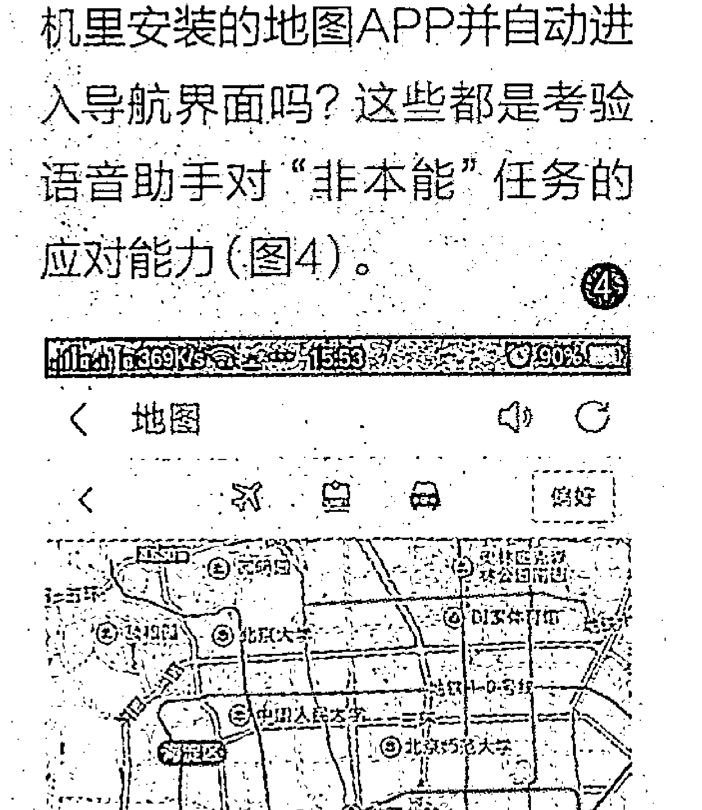

总之，无论是Siri，还是Google Now和Cortana，它们目前都仅仅是大数据下协助判断的一种语音交互软件。只有当它们可以独立结合逻辑学、心理学、社会学等关联学科进行判断，并给出用户心中最理想的答案时，才能成为未来继触控之后，主导UI交互的全新操作形态。

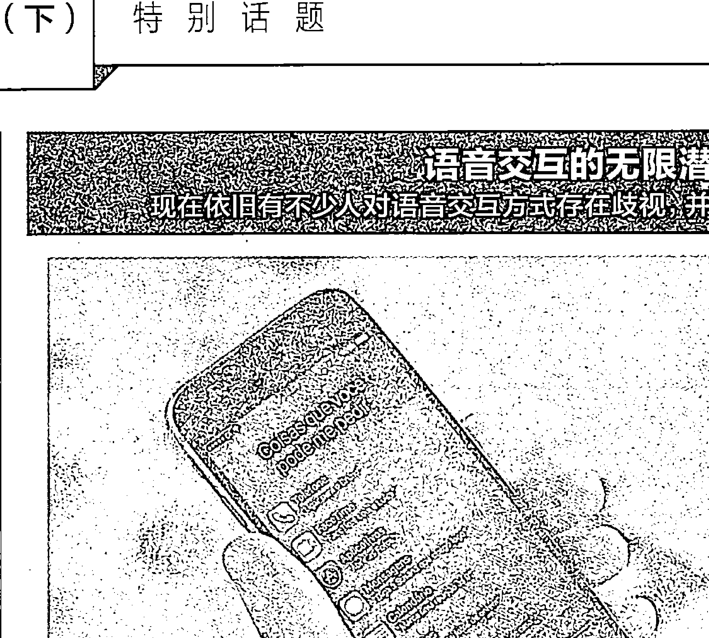

- 1. 语音在嘈杂环境的识别率低下，很难被语音助手分辨和翻译；
- 2. 公共场所人多而杂，使用语音交互可能涉及到个人隐私问题；
- 3. 语音命令受识别率等诸多方面影响，在效率和准确度上不如直接打字或触控操作快捷。

那么，问题真的有那么严重吗？答案自然是否定的。如今智能手机的麦克风都具备较强的降噪能力，只要不是在KTV包厢等特殊环境，将嘴靠近麦克风说话的内容几乎都可以被手机助手识别（图5）。无论是在大街上还是地铁中，随处可见发送微信语音消息的小伙伴，既然和朋友聊天的信息都不怕被人听见，你对着手机说“附近的自助烧烤店”还能算是隐私吗？同理，自从微信QQ可以发送语音后，你还会发送长篇大论的文字消息吗？录一段话发送的时间自然是远远小于在手机屏幕上敲字吧（图6）？ 总之，随着4G网络的普及，语音交互技术提供方在人工智能算法的不断优化以及大数据形成的大量声学模型的支撑下，未来语音助手的语音识别率和准确性只会越来越高，从而让手机准确“听懂”我们的语音指令，迅速处理“非本能”任务并反馈给我们最佳的结果。

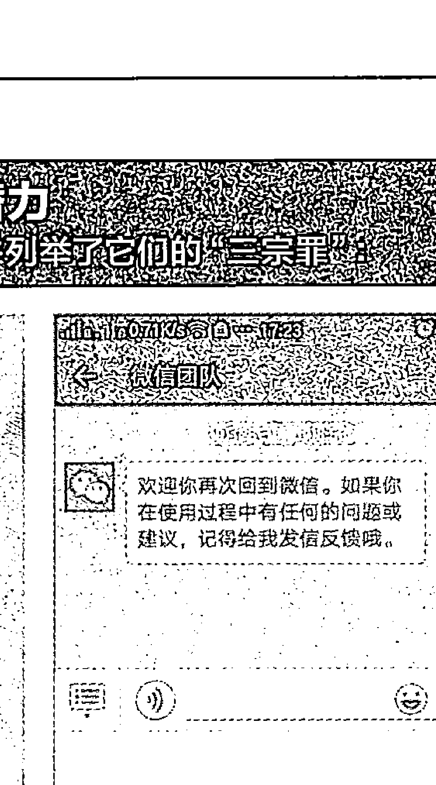

## 向智能音箱市场拓展

随着语音交互技术的不断成熟，它已不再局限于智能手机和平板电脑等移动设备，逐渐向穿戴式设备、智能音箱和车载系统等领域拓展。而智能音箱是将语音交互做到“纯粹”的新形态产品。

在传统音箱时代，我们可以通过AUX IN或存储卡插槽播放音频设备或者SD卡内保存的音乐，并通过机身上的按钮实现歌曲或功能的切换。在无线音箱时代，我们可以在手机上选择喜欢的音乐，然后再推送到无线音箱上播放；而在智能音箱时代，你会发现很多产品连AUX IN和存储卡插槽都被取消了，所有的内容全部源于互联网，而获取内容的方法，就是最纯粹的语音，实现了“零触控”的操作体验。

目前比较有代表性的产品有亚马逊Echo（图7）和京东的叮咚音箱（图8），而飞利浦的“小飞”音箱在传统无线音箱的基础上也增加了语音识别功能（图9）。前两款产品我们无需与音箱接触，只要说出语音指令，智能音箱就能自动识别并进行操作。比如，你想查询明天北京的天气，只要问“明天北京的天气”；想听相声，只要说“来段郭德纲的相声”；想听音乐，只要说“XX歌手或XX歌曲”即可。

与手机不同，智能音箱要做到在播放音乐的同时依旧可以准确聆听到主人下达的语音命令，所以它们都拥有一个用于唤醒语音识别功能的关键词，比如亚马逊Echo是“Alexa，明天天气怎么样？”而京东叮咚则是“叮咚叮咚，明天天气怎么样？”此外，此类智能音箱普遍会内置多颗麦克风组成麦克风阵列（图10），实现360度无死角地接收主人的命令。
而智能音箱在功能和体验上的差异，则源于语音交互技术的提供商。比如，DingDong音箱采用了科大讯飞的远场识别技术，飞利浦“小飞”音箱选择和阿里巴巴旗下的阿里智能合作，而亚马逊Echo则使用了自家的语音交互技术（Echo的优点是实现了与亚马逊平台的对接，通过Echo能够将商品添加到购物车。缺点则是不支持中文）。它们能否“懂话”，并反馈给你最需要的内容，就需要这些供应商的不断优化了。

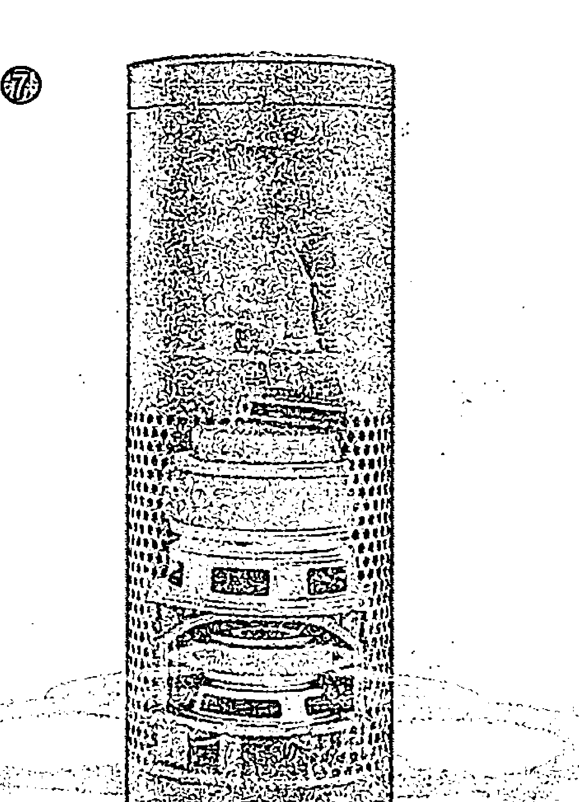

### 如果你想了解智能音箱的工作方式，请参考本刊18期《“响”你所“想”DingDong智能云音箱》这篇文章。

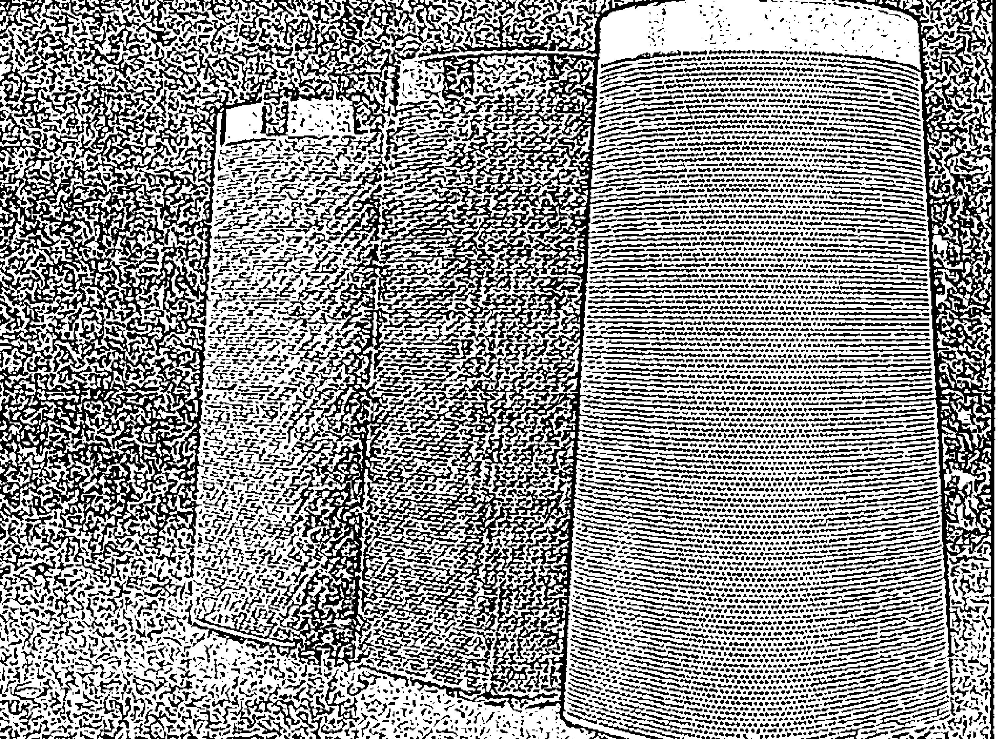

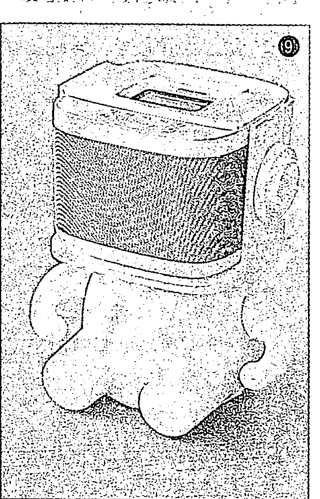

## 穿戴式设备的救星

如果说语音交互在智能手机领域只是可选项，是可有可无的辅助功能，那在没有屏幕，或缺少键盘等输入输出装置的穿戴式设备身上，语音交互技术将决定它们的“生死”。以智能手表为例，国内的果壳圆表曾为其单独开发了圆形键盘（图11），用于输入Wi-Fi密码或者简单的字符输入。可惜智能手表的屏幕太小，虽然圆形输出法已对小屏幕进行了优化，操作体验还是不理想。此时还能选择远程输入法（图12），就是在手机屏幕进行输入，并将输入内容推送到手表的屏幕里。而当智能手表遇到语音交互技术后，通过声音控制手表功能的方式无疑更具效率（图13）。


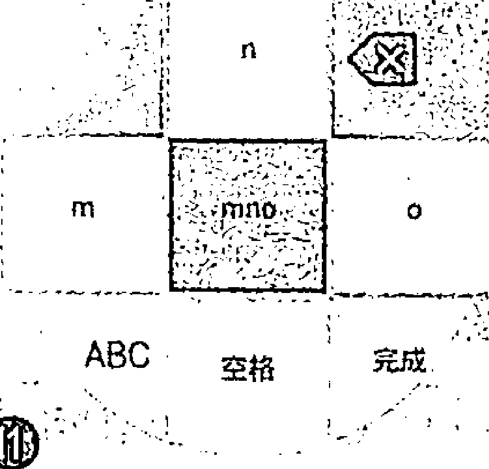

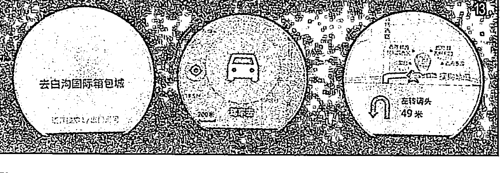

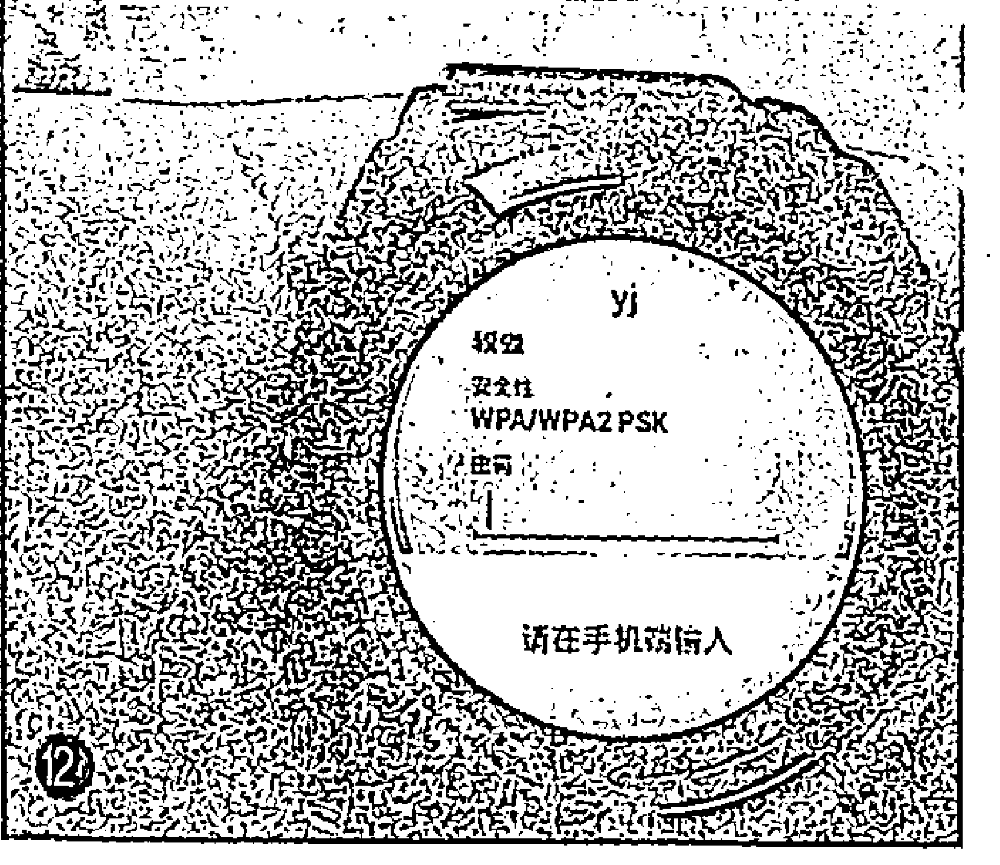

## 小结

无论你需不需要，如今每一款智能手机几乎都已预装了语音助手类的APP，虽然它们现在可能还不够聪明，能否反馈最佳信息取决于你提问题的水平。但是，语音交互绝对是未来趋势，善加利用还是可以提高手机操作的效率。比如，当你手机里APP太多而找不到某款APP，只需对着手机说“打开XX APP”即可。


## Google Now的替代者们

由于众所周知的原因，Google Now在国内无缘享受，Android手机要想拥有语音交互功能，就需要选择预装第三方语音助手。那么不同Android手机的语音助手在体验上会有哪些差异呢？

### 源于第三方的语音助手

绝大多数Android手机所预装的“语音助手”都是以授权合作的形式植入的。如华为、联想、MOTO、小米、魅族、金立、酷派、OPPO、步步高等品牌选择了与科大讯飞合作（图1）；中兴星星系列手机选择与Nuance联合；HTC手机主打的小hi语音助手则是源于图灵机器人平台（即虫洞语音助手的开发团队）（图2）。而语音技术提供商的异同，则直接导致Android手机内置语音助手在识别率、反应速度、纠错能力、功能性、云数据智能化等方面体验的差异。

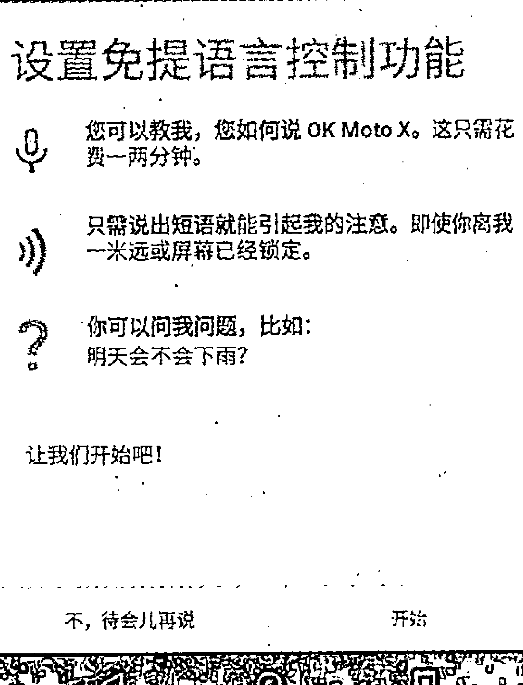

### 唤醒方式存在差异

为了方便用户快速启动语音助手下达指令，每一款Android手机都准备了不同的激活方式。比如，长按主页键激活、向上滑动屏幕激活、长按音量减键激活等等。但是，这些激活方式都有一个前提条件，就是大都需要按下电源开关点亮屏幕（有密码的话还得先解锁屏幕）然后才能触发。
好消息是，手机厂商可以对内置语音助手进行二次定制，从而获得类似“嗨Siri”“你好小娜”那样唤醒Siri和Cortana的激活方式。比如，中兴旗下的星星二号手机，无论手机处于黑屏、锁屏还是亮屏状态，只需说出“星星二号”的指令就可激活语音助手启动。而同样采用讯飞语音技术的Moto X Style手机，在熄屏状态下也能通过说出“OK， Moto X”的方式唤醒手机并自动进入语音助手界面（图3）。

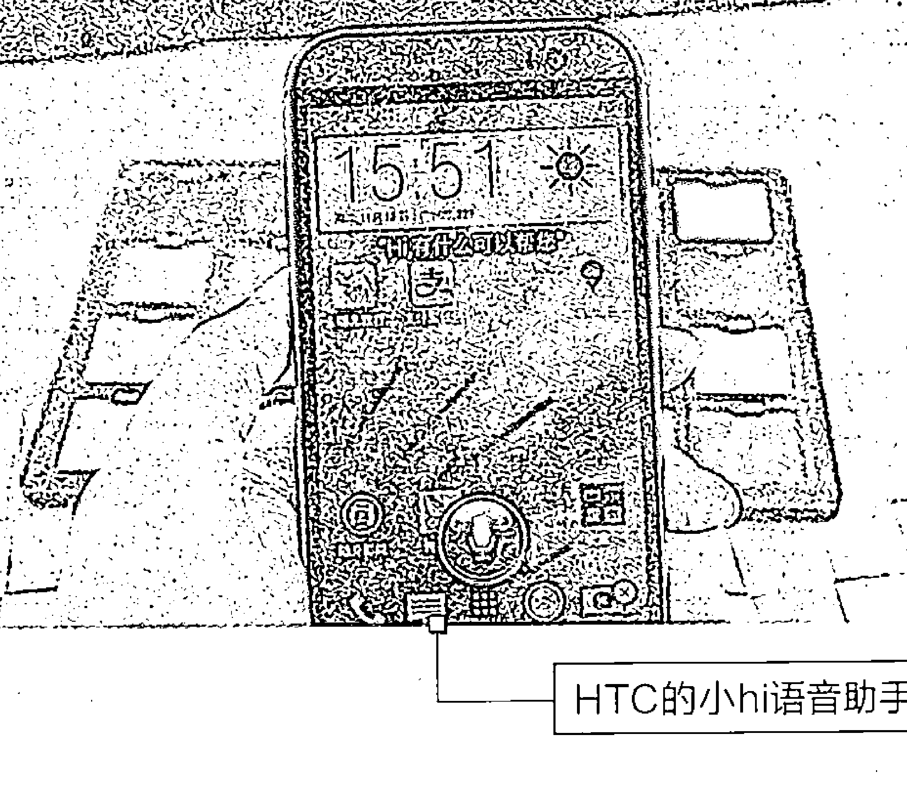

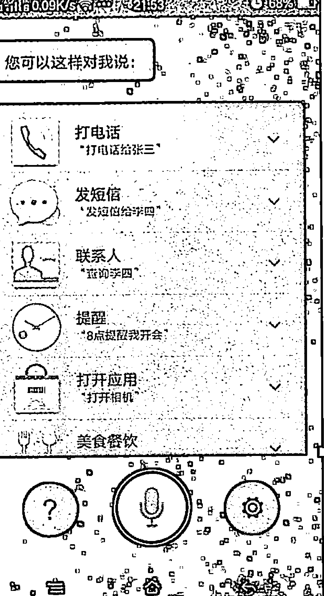

## 随时待命的重要性

语音助手的初衷就是解放双手，在尽可能不接触手机的情况下就完成大量的复杂操作。然而，Android手机预装的语音助手们大都仅支持“单程待命”。如我们想启动相机拍照，需要激活语音助手，说“打开相机”，然后再用手按下屏幕上的拍照键。这时你想听音乐，需要手动退出相机APP，再激活语音助手，然后说出“播放XX音乐”的指令，需要手指与语音反复配合。
就Android手机阵营而言，中兴星星系列的语音助手算是最为人性化的代表，它最大的特色就是支持“全程待命”，除了支持打开应用外，还能退出某个应用，或者进行接听、挂断电话等操作，实现全程语音化。比如，对着手机说“星星二号，播放XX音乐，打开相机”，相机和音乐就会自动启动，稍后我们可以通过“拍照”、“打开闪光灯”、“前置相机”、“后置相机”等指令切换相机的不同功能，说出“退出相机”相机APP就能自动关闭（图4）。如果你在拍照期间想切换下一首歌曲或者暂停，可以直接语音下达切歌指令，并不需要跳转到语音助手界面。

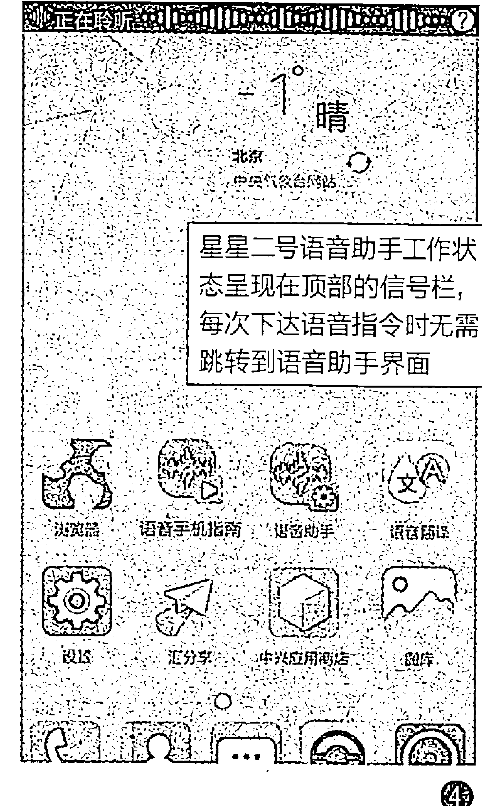

## 有待进一步提升的智能

就Android手机常见的语音助手而言，只要问题比较标准，一般都能得到满意的答复。比如你对手机说：“这个周末天气怎么样？”几乎所有的语音助手都可以向你推送近期当地的天气情况。但如果你换一种问法，就可检测出不同语音助手的“智商”了。比如问“这个周末穿什么？”需要语音助手结合当地的天气情况，为我们提供穿衣指数。
就这个问题，华为荣耀7i和OPPO R7 Plus自带的语音助手（基于讯飞语音技术）并不能识别这句话的潜在涵义（图5、图6），只能回答预设的抱歉内容。而由讯飞和中国移动联手打造的“灵犀语音助手”（图7）和“搜狗语音助手”（图8）可根据这个问题给出当地周末的天气情况。另一款“虫洞语音助手”则直接提供了穿衣指数（图9），但却没有具体的温度信息。
从这个简单的问题不难发现，如今Android领域的语音助手依旧停留在将问题的关键词拆分并分别检索、匹配，再将结果反馈给用户。而最终答案能否令你满意，则完全取决于你的问题是否可以提炼出足够精准的关键词。

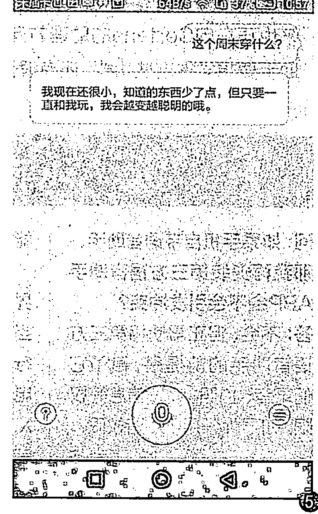

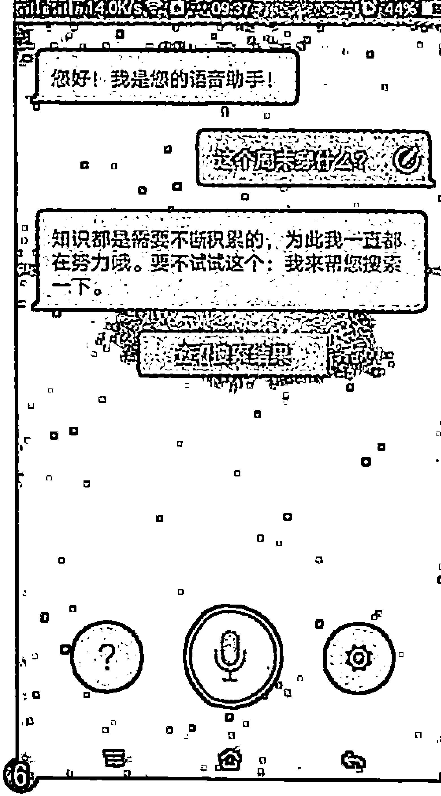

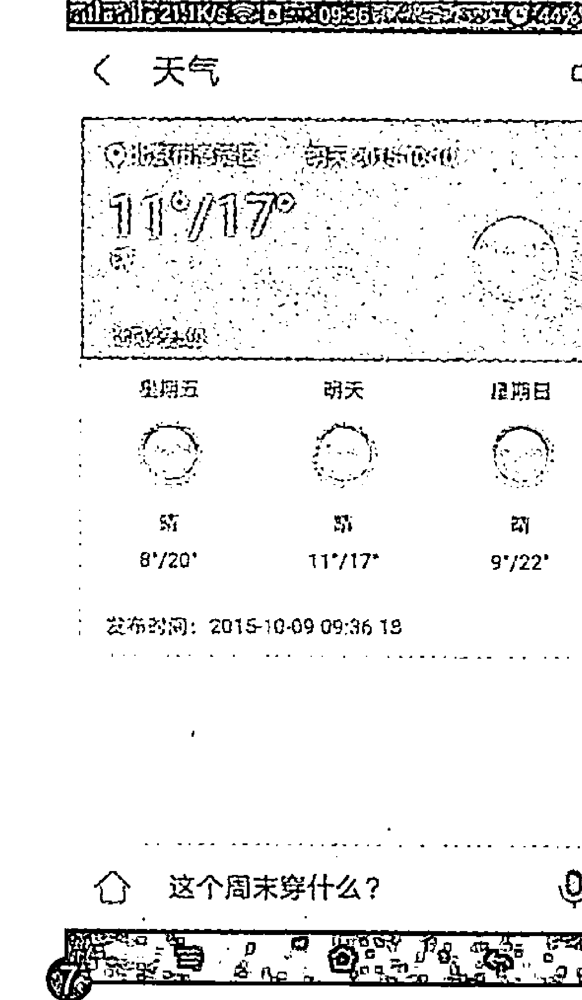

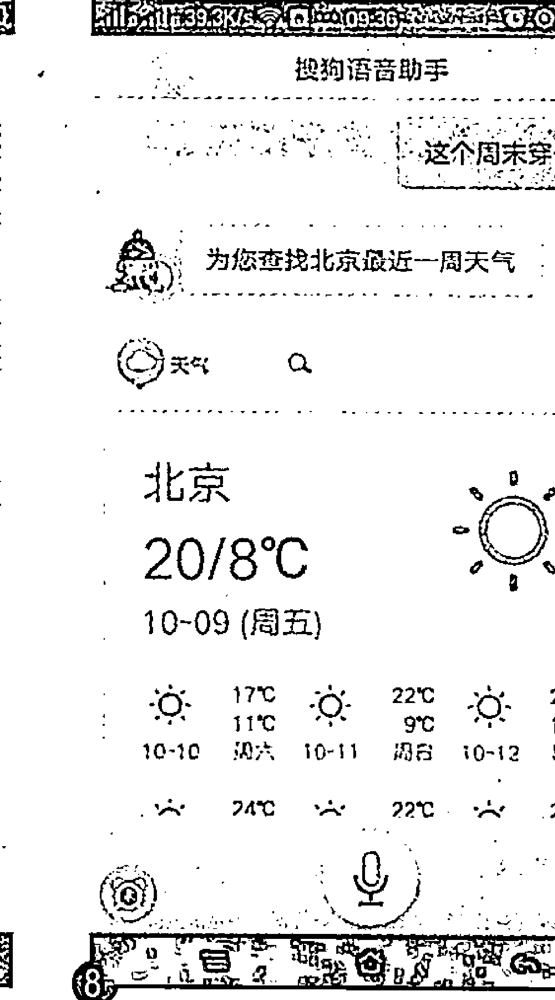

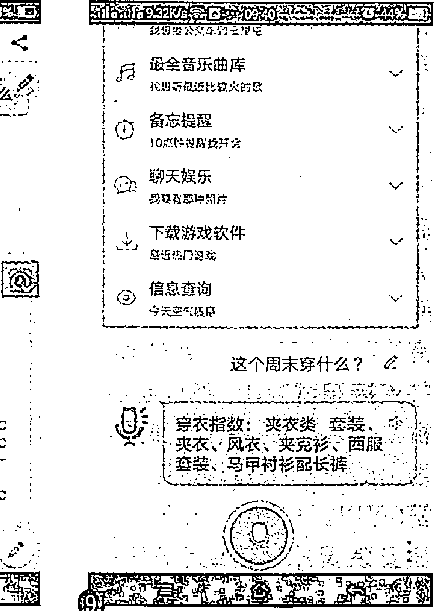

## 语音“助手”何时变“助理”

在很多用户的心中，Cortana的口碑始终要在Google Now和Siri之上，究其原因则是微软将Cortana定位在了语音“助理”，而Google Now和Siri却停留在“助手”层面，自然口语化的交互模式，用起来要比其他机械式交互模式更为自然。举个短信交互的例子，这也是网友“Zhangwei Wu”使用Cortana最多的功能：当你早上正赖在床上不想动，而手机却在远处的电脑桌上。此时，手机突然收到了一条短信。有了Cortana的短信交互功能，接下来的人机交互形式就有意思了。小娜：你有一条短信，要我读出来吗？（提前在设置→Cortana→语音中打开朗读短信功能）你因为懒得动，所以只要大声说：“读！”（需要让手机的MIC听见）此时小娜就会将短信内容朗读出来，还会问你是否回复短信、打电话还是不进行任何操作。如果是垃圾短信，你只需说：“没事了！”如果需要短信回复，只需说：“回短信，XXXX（说出回复内容）”如此一来，你根本不用接触手机，也不用看屏幕上的内容，只需动动嘴就能完成这么多事情！可惜，上述这种人机交互，需要语音助手与操作系统底层深度结合，并具备调用手机所有软硬件的权限，保持可随时唤醒的状态。就Android系统而言，Google Now本来也正在向Cortana的助理方向发展，可惜国内用户无法使用这项功能，而第三方语音助手要想学得这些功能，还有很长的路要走。

## 推荐语音助手APP

如果你觉得手机自带的语音助手不好用，不妨试试这些APP吧。

### 灵犀语音助手

http://lingxi.10086.cn/ 口碑最好的Android平台语音助手APP（图11），用户在与手机交谈中即可完成打电话、发短信、设提醒、查地图、找美食等操作，动口不动手，轻松享受智能生活。


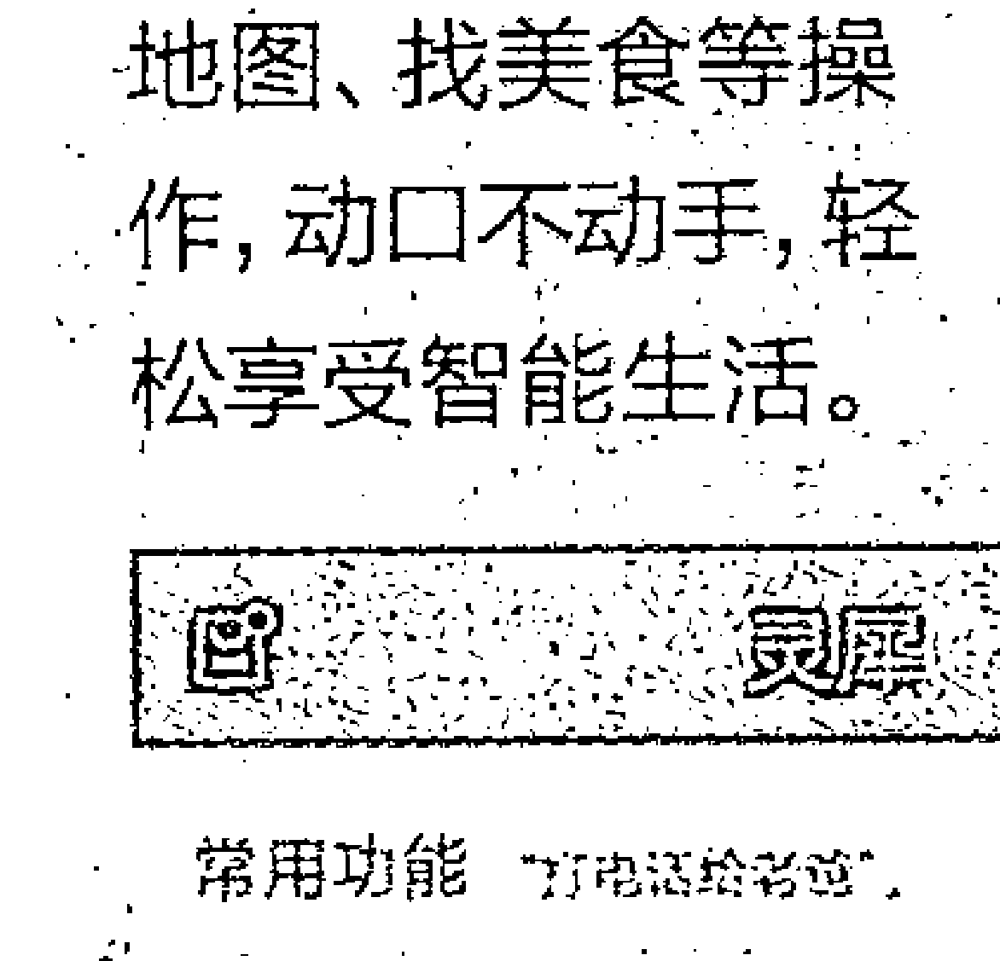

### 搜狗语音助手

http://yy.sogou.com/ 这款语音助手在没有网络时也能通过语音拨打电话、发送短信或查找运行已安装的应用（图12）。此外在软件设置中还提供语音锁屏功能，但使用的前提是关闭系统锁屏，避免出现双锁屏的尴尬。


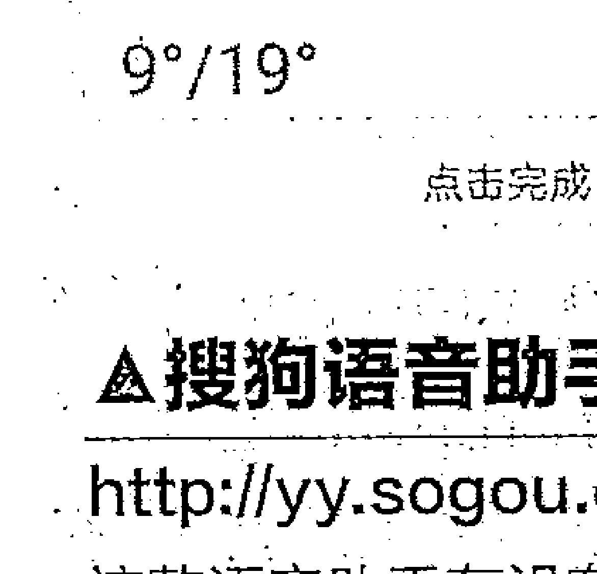

### 虫洞语音助手

http://www.uzoo.cn/ 一款比较老牌的语音助手APP（图13），最大的特色就是可以像Siri一样在用户无聊孤单时陪你聊天，缓解一天工作的疲惫与压力。

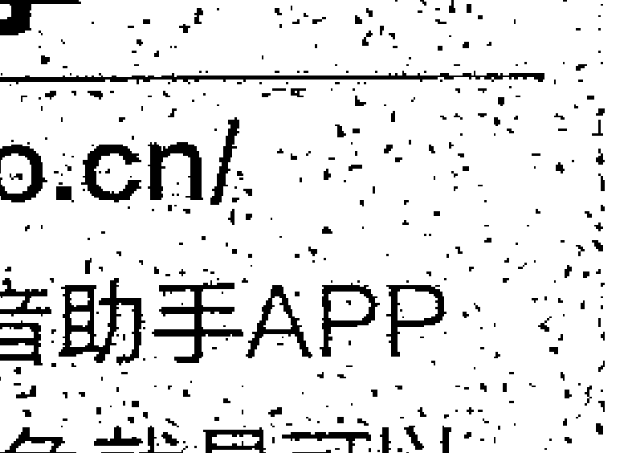

## 语音助手的答疑时间

问：如果手机自带语音助手，那我再安装第三方语音助手APP会不会引发冲突？
答：不会，但正常使用第三方语音助手的前提是，赋予它们录音、拍照、读取信息等权限。如果你禁用了录音权限，它们就无法采集你的声音与你交流了。

问：Android平台的语音助手费流量吗？
答：流量消耗视你的使用率而定。很多第三方语音助手APP提供了离线资源，提前将其下载到本地（图10），以后再涉及相关的搜索时就不会再耗费手机流量了。

问：Moto X Style用灵犀语音助手替换了Google Now并支持熄屏唤醒，那其他手机在安装灵犀语音助手时能否也支持熄屏唤醒功能？
答：可以。任何Android手机在安装灵犀语音助手APP后，只要打开“驾驶模式”功能，就能在熄屏状态下通过“灵犀灵犀”唤醒语音助手界面。但这种形式的唤醒相当于语音助手持续在后台运行，MIC等硬件随时待命，耗电量也会随之增加。而Moto X Style等先天自带熄屏语音唤醒功能的产品，在软硬件层面已进行了调校，既满足了随时待命的需求，对电力的消耗也要小了很多。

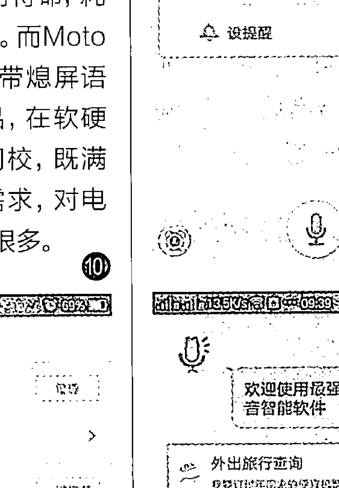

## 我来说Windows“做” 实战Windows 10的语音控制

iPhone上的Siri让很多朋友看到语音控制命令的神奇，其实不仅仅是iOS平台，针对Windows开发的各种语音工具同样有神奇的功能。微软在Windows 10中推出了功能强大的小娜，此外还有很多第三方语音控制软件可以为我们的操作带来更多的便利。


### Windows 10上的语音控制精灵——小娜

大家都知道，在新版Windows 10上微软增加了语音控制工具——小娜，它取代了之前的搜索组件，并将本地搜索、网页搜索和语音控制无缝整合在一起，可以为我们的日常操作带来极大的便利。因为小娜对于语音识别的精度很高，所以在Windows 10平板上，通过语音控制可以非常便捷地启动各种命令。比如在Windows 10平板上查询当地天气，现在只要点击任务栏小娜的麦克风输入图标，然后说出“福州天气”，Windows 10就会自动给出该城市的天气语音预报，省去在平板上的任何输入（图1）。其他查询的方法类似。

小娜借助微软的先进语音识别技术，以及云计算、云服务和搜索引擎大数据功能，不仅可以智能识别用户输入的语音指令，而且还可以对语音输入指令进行智能识别。比如输入“启动计算器”，则可以自动启动系统的计算器组件。当然了，要让小娜能够更好地为我们服务，还需要对其进行设置。

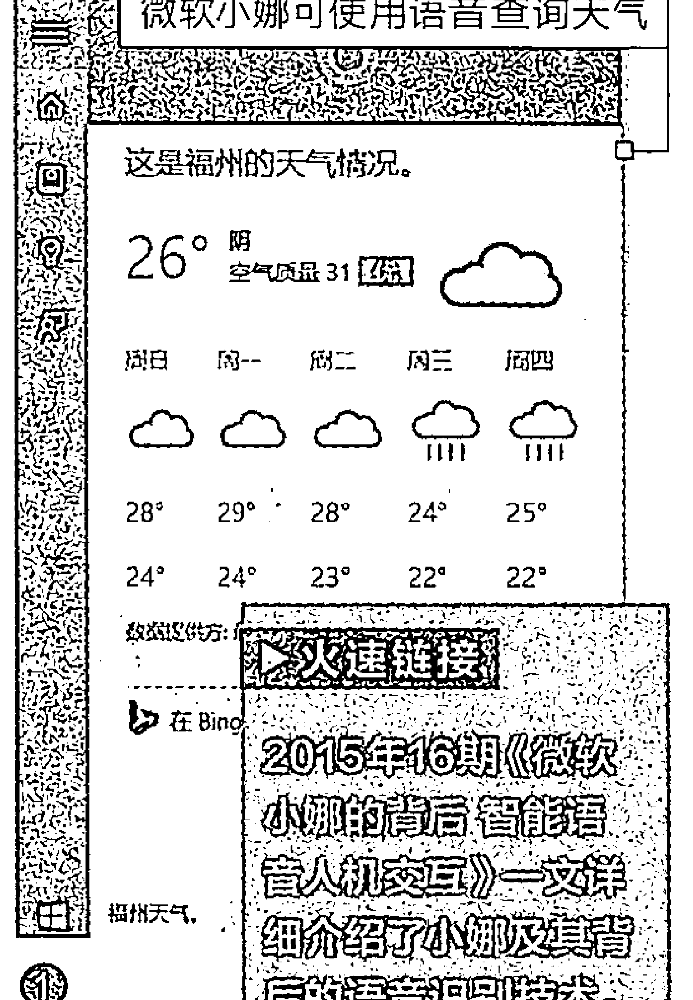

### 自我控制隐私多与少

因为Windows 10是全平台的操作系统，默认情况下小娜会自动读取你在不同设备上的信息，如你经常在WP8手机上使用小娜搜索财经信息，或经常在Outlook上制定出行航班、车票提醒，那么小娜就会根据你的喜好自动推送相应的财经信息到你的设备上。如果你的Windows 10平板经常借给朋友使用，而你又不想泄露自己的这些信息，就可点击小娜图标，在弹出的窗口切换到“笔记本→设置”，接着在“Cortana可提供建议、想法、提醒、通知等”下将其设置为“关”，这样小娜就不会读取你的信息了（图2）。

而如果要彻底删除小娜之前读取的隐私信息，还可以点击“管理Cortana在云中了解到的我的相关信息”，接着使用自己的微软账户登录，在打开的页面按提示清除自己不希望小娜读取的云信息即可（图3）。对于自己需要小娜读取或者追踪的其他生活信息，则可以自行进行定义添加。比如网购的朋友经常需要追踪包裹信息，同上在小娜设置窗口切换到“笔记本→快递”，然后点击“添加包裹”，在打开的窗口中按提示输入包裹的物流编号（小娜支持常见三通一达等大型快递公司），然后在下拉列表中选择对应的快递公司即可添加追踪的包裹（图4）。

因为Windows 10是全平台的操作系统，我们在Windows 10平板添加的这些信息也会同步到其他设备上。

在手机上查询包裹信息，只要在手机上启动小娜，依次点击“兴趣→快递→具体包裹”，接着点击“查看您包裹的最新状态”，这样在手机上就可以及时查询到包裹的状态了（图5）。

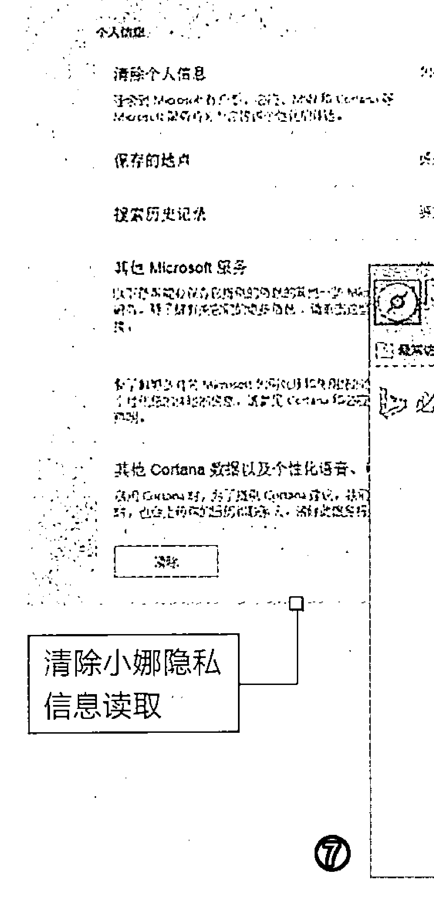

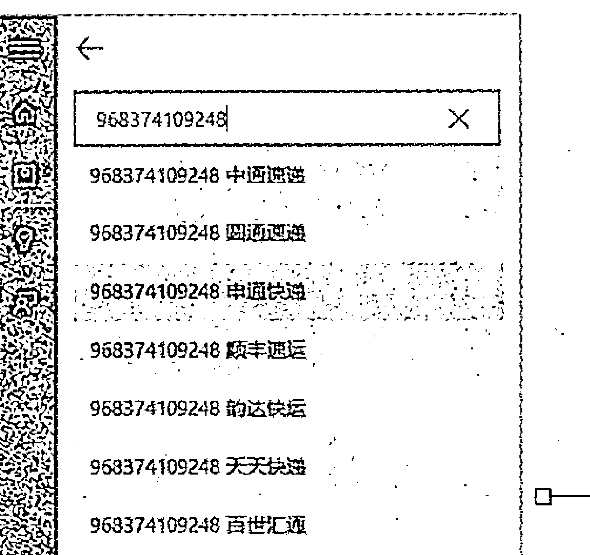

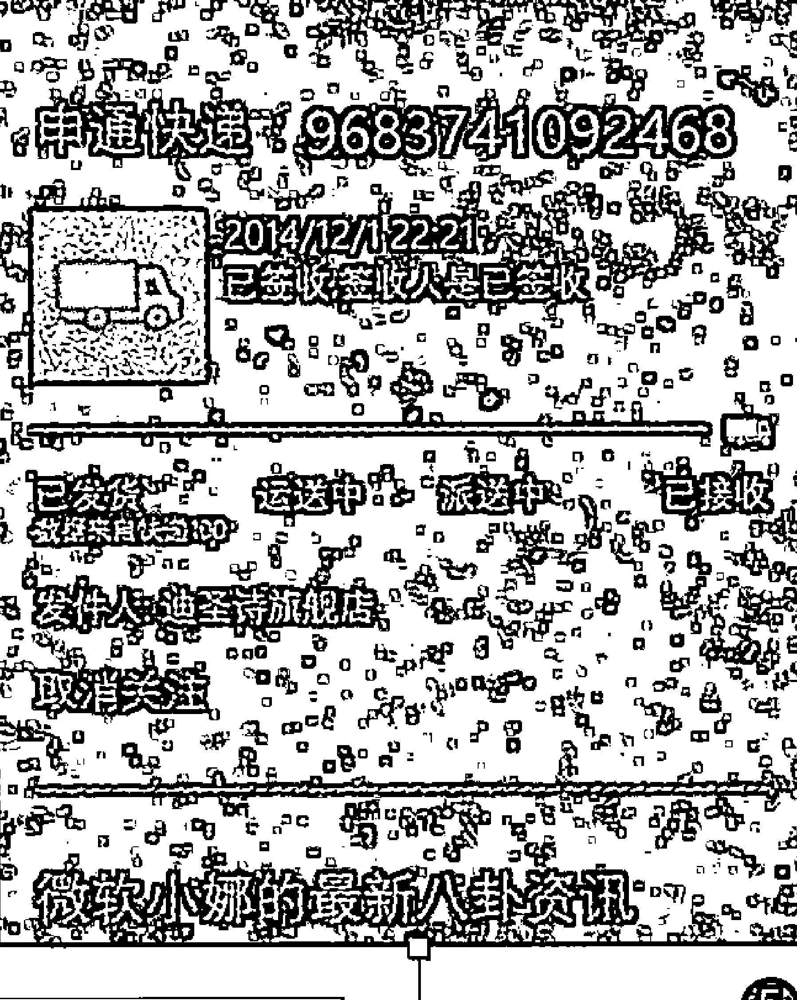

### 小娜不足 第三方软件补充

在Windows平台上，除了小娜还有很多第三方语音控制软件。它们的功能也很强大，而且可以有效弥补小娜的不足，为操作带来更多的便利。比如在平板上进行搜索的时候，小娜并没有语音输入功能，现在如果不方便输入字符，那么可以利用讯飞（www.xunfei.cn）语音输入实现。
在Windows 10平板上安装完讯飞语音输入法并重启，讯飞语音将会作为默认输入法。首次启动讯飞语音后弹出语音校准向导，因为我们在平板上主要用其输入少数字符，这里选择“按住说话”，剩余的操作按照屏幕的提示完成即可（图6）。
这样以后在平板上需要语音输入字符，比如在Bing搜索框输入关键字，那么只要将鼠标定位到搜索框，然后点击讯飞输入法指示条上的麦克风按钮，按住弹出麦克风图标后说出需要输入的字符即可快速实现语音输入（图7）。

除了讯飞语音输入外，IBM语音控制系统也是Windows平台上的佼佼者，大部分可以用鼠标进行选择的菜单和按钮都可以用语音进行驱动。安装完IBM ViaVoice后，系统会默认增加一个自启动项“IBM ViaVoice语音中心”，点击该组件，按提示建立自己的语音模型新建用户，剩余的操作按照向导的提示一步步完成。单击工具栏上的麦克风图标，图标变为绿色时，就可以开始工作了。这样当我们躺在床上使用Windows 10平板上网或者观看电影，而不想使用手指操作平板的时候，只要启动IBM语音控制系统，然后对着麦克风就可以执行诸如前进、后退、重播等常见的操作（图8），非常方便。

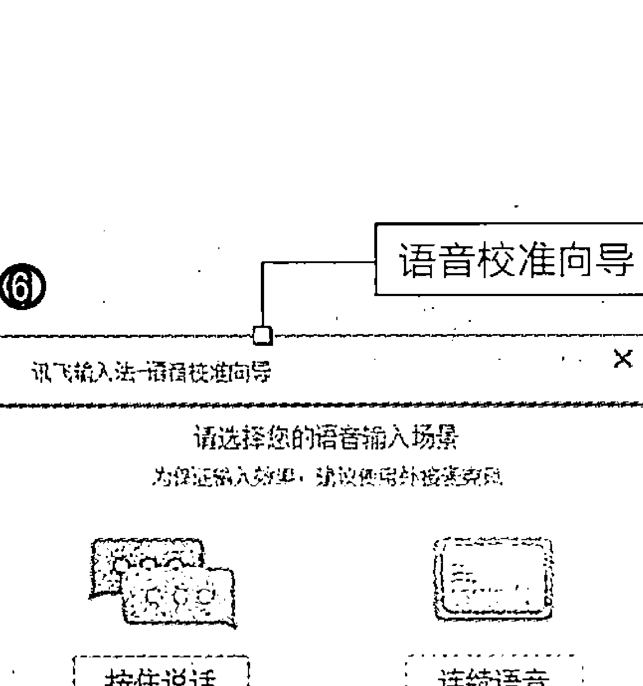

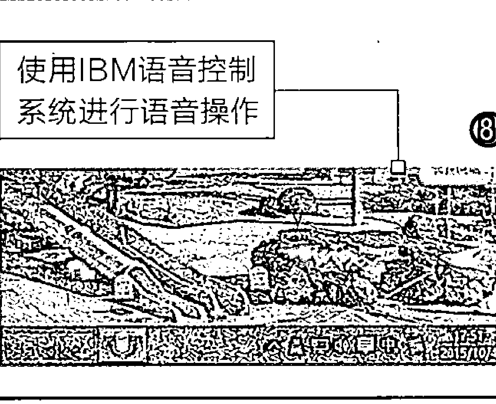## 2 平板电脑的生产力 指点江山的触控功能

虽然乔布斯痛恨触控笔，但随着时代发展和技术进步，触控笔对大屏幕混合设备来说很有必要，而且能提供比手指更精确的使用体验。连苹果都发布触控笔了，其他厂商可想而知。Windows 10+Surface笑了。

## 提升生产力

### 让Windows 10平板操作更便捷

操作Windows 10平板，大家多采用默认的触摸方式，不过这种默认的方式会给一些特定的操作带来不便。比如在使用Windows 10进行系统重置的时候，必须先使用传统USB键盘选择登录账号和输入密码，接着再使用键盘选择相应的菜单才能进行系统重置。为了提高Windows 10平板操作效率，现在我们可以借助一些专业的软件实现更高效的操作。

### 必要驱动自己装日常维护更便捷

在Windows 10平板出现故障的时候，我们经常会利用系统自带的“系统重置”功能进行恢复。不过由于默认WinRE没有集成触摸驱动，这样每次使用系统重置等功能的时候还得外接传统USB键盘、鼠标才能完成操作，但是大多数Windows 10平板用户不会随身携带键盘、鼠标。因此，为了提高操作效率，可以自行在WinRE中集成所需的触摸驱动。

首先进入Windows 10系统，启动设备管理器，展开右侧窗格的“人体学输入设备-Goodix Touch Hid”，这就是本机的触摸设备。不同电脑触摸设备的名称可能不同，一般只要查找包含“Touch”字眼的驱动即可（图1）。

接着使用“Drive Export PE”将当前系统的所有触摸驱动备份出来。启动程序后勾选“显示所有驱动”，然后找到“Goodix Touch Hid”驱动，点击“开始备份”将其提取到“d:\drivebackup”备用，确保其中包含类似“xxx.inf”的INF安装配置文件（图2）。

打开资源管理器，找到“C:\Recovery\WindowsRE”（注意：如果提示无法直接打开Recovery目录，请将该文件的权限设置为完全控制即可），可以看到其中的“Winre.wim”就是WinRE修复环境的主文件，后续的操作就是借助系统自带的Dism命令将触摸驱动集成到其中（图3）。

以管理员身份启动命令提示符，依次输入下列命令，将所需的触摸驱动集成到WinRE.wim中即可（图4）。

- Rem 新建c:\winre目录用于存放释放的WinRE镜像文件
Md c:\winre
rem 将winre.wim镜像文件加载到c:\winre中
dism /mount-image /imagefile:C:\Recovery\WindowsRE\winre.wim /index:1 /mountdir:c:\winre
rem 将上述操作中提取的触摸驱动集成到c:\winre中，如果要集成其他驱动，请参照下列的格式自行添加
dism /image:c:\winre /add-driver:"D:\DriverBackup\3\oem9.inf"
rem 再复制驱动配置文件到镜像文件中
copy c:\windows\inf\touchsetting.gt c:\winre\windows\inf\
rem 卸载并保存集成驱动的映像
dism /unmount-image /mountdir:c:\winre /commit

完成上述操作后，以后当进入WinRE修复环境后，就可以使用触摸操作了，无需再携带键盘进行操作。不过需要注意的是，因为触摸操作经常是和感应器（主要用于屏幕自动旋转）关联在一起，很多平板没有安装感应器驱动会导致触摸反向，因此导出触摸驱动的时候建议将感应器驱动一起导出，然后通过上述方法导入WinRE.wim镜像中。

> **小提示**
> 因为不同平板的触摸配置文件均不同，因此提取触摸驱动文件的操作也较复杂。如果你的平板通过上述方法仍无法实现触摸，还可到http://pan.baidu.com/s/1qWxeW2K下载网友制作好的支持触摸的PE。下载后将其中的“pe32.wim”提取并重命名为“winre.wim”，替换“C:\Recovery\WindowsRE”同名文件，以后进入WinRE系统后即可进行触摸操作了（图5）。

通过上述方法我们虽然可以在WinRE修复环境使用触摸，不过在WinRE修复环境中大多执行的是一些维护操作，这些操作默认需要多次的点击才能完成，比如在使用“系统映像恢复”进行恢复系统时，就需要按照向导的提示不断点击才能完成操作（图6）。

为了提高操作效率，现在我们可以通过为特定操作制作批处理的方式实现高效操作。这里以“系统映像恢复”操作为例。在系统正常的情况下，只要展开“控制面板→系统和安全→备份和还原（Windows 7）”，然后点击右侧面板的“创建系统映像”，接着按照屏幕提示即可创建系统映像（图7）。

实际上系统映像的创建是借助“wbAdmin.exe”命令完成的，完成备份后输入下列的命令获得备份的版本标识符，恢复操作需要通过这里的标识符，其中F:是指保存备份的分区（图8）。

```
wbadmin get versions -backuptarget:f:
```

这样以后需要实现快速恢复映像时，只要点击“开始→设置”，在打开的设置窗口选择“更新和安全→恢复”选项，接着点击“高级启动”下的“立即重启”（图9）。

在WinRE修复环境下要快速完成系统映像恢复，只要启动记事本输入下列代码并保存为hf.bat，放置在D:\。

```
wbadmin start sysrecovery -version:10/02/2015-16:47 -backuptarget:f: -quiet
```

这样重启之后进入高级启动界面，点击“疑难解答→其他高级选项→命令提示符”，重启进入命令提示界面后按提示输入“d:\hf.bat”即可快速完成操作。也可以参照下面介绍的方法，将恢复命令直接添加到PE自启动文件中，实现进入WinRE以后自动实现系统映像的恢复（图10）。

使用类似的方法我们还可执行更多的高效操作，比如系统还原可以使用rstrui.exe命令快速启动，引导记录的修复则可以借助“bootsect /nt60 c:”进行快速操作。将这些常用的维护操作制作成批处理运行可以有效提高平板的操作效率。

#### 操作更精准 使用虚拟触控板
刘惠人

使用Windows平板，大多数情况用的都是触摸操作，但由于现在小屏平板的分辨率越来越高，这样对需要精确定位的程序，触摸起来就很不方便。比如搜狗浏览器在10英寸（2048×1536）平板上运行，即使将字体设置为200%显示，其菜单显示也是惨不忍睹，根本无法进行触摸操作。

为了精准地进行操作，可借助TouchMouse软件完成任务。该软件能够在桌面虚拟出一块触控板，方便我们使用触摸指针进行定位使用。在平板上启动软件后当提示是否固定在任务栏，选择Yes，这样就可在任务栏随时启动虚拟触摸板（图1）。

虚拟触摸板的使用和笔记本上的触摸板类似，如果要在字体显示较小的程序中进行鼠标的定位，则只需将手指放置在触摸板上，此时屏幕就会出现鼠标指针，而其中的L和R相当于鼠标的左右键，通过点击即可激活相应的菜单（图2）。

TouchMouse还支持Windows10中常见的手势操作，比如可以用两个手指来移动虚拟鼠标的位置（这样在浏览网页时可以很方便地移动滚动条），或者还可以用两个手指撑开或捏合的动作来改变虚拟鼠标区域的大小，可以撑开直到全屏。而当鼠标操作完成后，暂时不再需要虚拟屏幕鼠标的时候，只需再点一次右下角的白色图标，就能回到Windows原生的触摸操作状态了。这样，借助于TouchMouse，我们就可以很方便地在平板上使用鼠标了（图3）。

#### 一键操作 Windows 10平板还原更轻松
刘俞丞

平时我们对Windows 10平板作为辅助工具，因此Windows 10也非主力系统。大多数人的平板在使用一段时间后就稳定了，一般不要在Windows 10中再安装其他软件。如果对平板制作系统备份，使用一键Ghost之类的备份/还原类软件无疑是最好的，它可将平板精准地还原到备份状态，始终保持稳定的系统。不过常规的一键Ghost都无法在现在的Windows 10平板上使用，需要手动进行设置才能在Windows 10平板上用上一键Ghost。

### 一键Ghost 终极对决 Windows 10平板

一键Ghost是大家常用的备份/还原软件，它大多是通过“Grldr+DOS批处理”的方式实现一键备份/还原的。当我们在Windows 7及以上电脑安装一键Ghost时，安装程序会在“C:\boot\bcd”添加一个实模式启动菜单，然后通过grldr引导DOS镜像，而Ghost的一键备份/还原批处理则保存在DOS镜像中，这样加载DOS镜像后就会自动激活一键备份/还原了（图1）。

不过这种常规的一键Ghost软件却无法在现在的Windows 10平板上使用了，因为现在的Windows 10平板都是使用“UEFI+GPT分区”形式启动的，默认情况下UEFI启动分区（ESP引导分区）无法在当前系统下访问（自然一键Ghost安装程序也无法往BCD中添加grldr引导菜单），而且grldr不支持UEFI引导，即使写入BCD引导菜单也无法成功启动，所以常规的一键Ghost软件均无法在现在的Windows 10平板上使用（图2）。

### 自己动手 在Windows 10平板添加一键Ghost

基于以上原因，要在Windows 10平板上使用一键Ghost，我们就需要绕过BCD菜单写入和UEFI引导和这两个难题。前者借助bootice.exe可以写入，后者则使用支持UEFI引导的PE系统替换DOS镜像即可，一键还原则借助在PE下可以运行的Ghost32.exe来实现。

首先准备支持UEFI引导的PE系统，大家既可以到网上下载网友制作好的PE系统（注意其中一定要包含UEFI目录），也可以直接利用系统自带的WinRE.wim文件来实现。这里我们以WinRE.wim为例，为了不破坏原来的文件，我们可以自己新建一个UEFI引导的FAT分区。

启动磁盘管理，然后右击任意一个空闲空间较大的分区选择“压缩空间”，按提示压缩出一个大小为500MB的空间，将其格式化为FAT32分区，假设新分区的盘符为E:，以管理员身份启动命令提示符后输入下列命令创建UEFI引导分区（图3）：

```
bcdboot c:\Windows\ /l zh-cn /s e: /f uefi
```

同上打开“C:\Recovery\WindowsRE”，将其中的“winre.wim”和“boot.sdi”文件全部复制到E:\。接着使用“dism /mount-image /imagefile:e:\winre.wim /index:1 /mountdir:c:\winre”命令将其加载到C:\winre备用。

启动记事本，输入下列代码并保存为“Winpeshl.ini”文件，放置在C:\winre\windows\system32。Winpeshl.ini文件的作用是在进入WinRE系统后自动运行指定的Ghost32.exe程序（图4）：

```
[LaunchApp]
AppPath=%SYSTEMDRIVE%\winre\windows\system32\Ghost32.exe
```

完成上述操作后继续输入“dism /unmount-image /mountdir:c:\winre /commit”提交更改。然后准备Ghost32.exe并放置在D:\备用。运行“bootice.exe”，切换到“BCD编辑/智能编辑”，然后点击“添加/windows 7/8/8.1启动菜单”，按下列的要求进行设置：

- 启动磁盘：选择当前硬盘
- 启动分区：选择上述创建的分区E
- 设备文件：\winre.wim
- SDI文件：\boot.sdi
- 菜单标题：一键还原

最后依次点击“保存当前系统设置”和“保存全局设置”保存退出（图5）。

同上重启进入高级启动界面，进入命令提示符界面后输入“ghost32.exe -clone,mode=pdump,src=1:1,dst=1:2:\win10.gho -sure -rb”命令进行当前系统的备份（图6）。

这样下次需要还原系统的时候，只要重启平板，然后在多重启动菜单（支持触摸操作）选择“一键还原”，就会自动进入WinRE系统，进入系统后会自动调用D:\ghost32.exe进行系统还原了（图7）。

```
[LaunchApps]
D:\ghost32.exe,-clone,mode=pload,src="1:2\win10.gho:1",dst=1:1 -fx -rb
```

代码解释：
D:\ghost32.exe后的参数要添加一个半角“,”，断开，src="1:2\win10.gho:1"表示备份文件是D:\win10.gho，备份完成后自动重启。

> **小提示**
> 这里Winpeshl.ini文案运行指定的Ghost32.exe程序，大家同样可以根据自己的需要来设置运行其他程序。比如默认进入WinRE环境后并没有图形界面的文件管理器，因此这里可以将“D:\ghost32.exe”更换为“C:\windows\notepad.exe”，这样进入PE后就会启动记事本，此时点击记事本的“文件/打开”，在打开对话框里可以直接进行图形化文件管理，如复制、剪切等操作（图8）。

无论是苹果iPad Pro还是微软Surface Pro 4以及Surface Book，这些新一代平板电脑的标杆都将搭配的触控笔作为了主打卖点之一。那么，这支小小的笔到底暗藏了多少乾坤？

## 触控笔的逆袭

不知道大家还记不记得多普达手机，以及同一时期的PDA（掌上电脑），这些运行着Windows Mobile系统的智能设备最大特色就是标配一根触控笔。没办法，电阻屏的灵敏度和精准性极差，需要借助触控笔那（相对）尖锐的笔尖才能做到“指哪点哪”。

“一支触控笔？用的时候要拿起来，不用时要放下。有时候还会找不到，真麻烦！”而乔布斯的自信来源于更先进的电容式触摸屏，可更精准地识别手指及复杂的手势（捏合放大缩小等），同时还有效地避免了误操作。让乔布斯始料未及的是，自从App Store中出现了专业绘图APP后，iPhone和iPad竟然会成为很多设计师和插画家的绘图工具，从Wacom等公司的手心里“挖走”了不少潜在客户。触控笔回归实际上并非“历史的倒退”。从2007年到2015年，8年时间已将市场需求改变，越来越多的用户习惯于在户外和移动的环境下进行专业的绘图工作。于是拥有更大屏幕的平板电脑及功能极佳的触控笔，真的有人想要！而iPad Pro和Apple Pencil就是这种潜在需求下的产物。

### Apple Pencil的看点

Apple Pencil是一支售价99美元的电容笔。没错，是“电容”而不是“电磁”。在我们的传统印象里，电容触控笔很难做到压力识别，并在绘图时手腕需要“悬空”远离屏幕，避免手指/手腕的接触痕迹混乱体现在屏幕上。

然而Apple Pencil却通过复杂的精密结构解决了上述问题。比如，Apple Pencil的笔身内隐藏了多个压力感应器（官方没有给出压感级别，业内普遍估测其压感在256~1024之间），可检测各种不同的按压力度，从而在iPad Pro的屏幕上反馈出或粗狂、或细若发丝的线条（图1）。同时，这支笔的笔尖里也配备了两个倾斜角度感应器，可准确计算手的方向和倾斜角度，笔尖倾斜就能创作出深浅不同的明暗效果。

更令人欣喜的是，iPad Pro在硬件端就能判断出你是在使用手指还是在用Apple Pencil。当它感应到Apple Pencil时会以每秒240次扫描显示屏（用手指操作时的两倍），可让Pencil捕捉到更多触点，让用户在作画时精确到“像素级别”。与此同时，iPad Pro还会“无视”你的手腕与屏幕的“接触”，解决了电容笔最尴尬的需悬腕使用的缺陷。

当然，想驱动如此复杂的精密结构需要电力支持！为此Apple Pencil采用内置锂电池设计（可提供12小时续航时间），且拔下笔帽就能露出Lightning接头（图2），将其插在iPad Pro的Lightning接口上。就能充电。更令人惊讶的是充电速度：15秒可保证30分钟的使用时长，大约6分钟即可充满。

为了更好地推广iPad Pro和Apple Pencil，苹果甚至邀请了老对手微软对其优化，最新版Office开始支持分屏功能，并可直接在软件中进行标注、划线等操作。此外，像Adobe公司旗下的众多产品也对Apple Pencil进行了适配。

### 正确认识‘生产力’

iPad Pro+Apple Pencil可构建一整套用于绘画、草图、编辑、艺术创造的平台，但前提是你需要付出至少近6000元人民币（选购32GB版iPad Pro和笔）。此外，iOS上缺少Windows系统里的绘画软件以及相应的辅助软件，而iPad Pro自身也没有足够多的快捷键来提高绘画效率。因此，在iOS平台出现杀手级绘图APP之前，这套硬件在绘图方面的‘生产力’依旧要逊色于专业产品。

要知道，Wacom针对专业设计师、漫画家和插画家推出了很多不足1500元的绘图板，而且还支持大量的Windows和Mac端软件。以Wacom Intuos Art和Corel Painter Essentials为例（一款专业的绘图工具包），其价格也就1300元左右，但功能却和iPad Pro+Apple Pencil相差无几。

因此，我们需要端正对触控笔的态度：

- 如果你已经拥有了iPad Pro，那么再购买一支可提高绘图方面‘生产力’的Apple Pencil似乎也不是问题；
- 反之，如果你想提高绘图效率而盲目选择iPad Pro+Apple Pencil就有些不理性了，因为市面上还有大把比其便宜，且‘生产力’更高的Wacom绘图板；
- 微软Surface+Pen的组合更多是针对OneNote的商务应用场景，绘图只是副业。

### Surface Pen卖了

就在苹果隆重向世人展示Apple Pencil不久后，微软在Surface系列新品的发布会上展开了对它的‘调侃’（图3）。比如微软产品总监帕诺斯·帕奈拉就曾表示：‘说起来好笑，市面上居然有一款Pencil没有橡皮擦，有点技术倒退了吧。’

和Apple Pencil相比，与Surface Pro 4和Surface Book搭配的第四代Surface Pen延续了橡皮擦设计，无需到工具栏选择切换工具就能直接抹除绘画失误的部分。此外，新Surface Pen应该是继续使用N-trig（已被微软收购，第一和第二代Surface采用的是来自Wacom无源电磁笔技术）有源电磁笔技术，而且压感级别也从Surface Pro 3时期的256级提升到了1024级（图4），内置的电池可提供1年的续航时间。

作为专业绘图笔，256级压感的确不够，但1024级和2048级压感画出的画在感受上没有明显区别（图5）。换句话说，无论第四代Surface Pen还是Apple Pencil都已具备挑战专业绘图领域‘老大哥’Wacom的实力。那么平板电脑+触控笔的组合能否取代Wacom绘图板的统治地位呢？

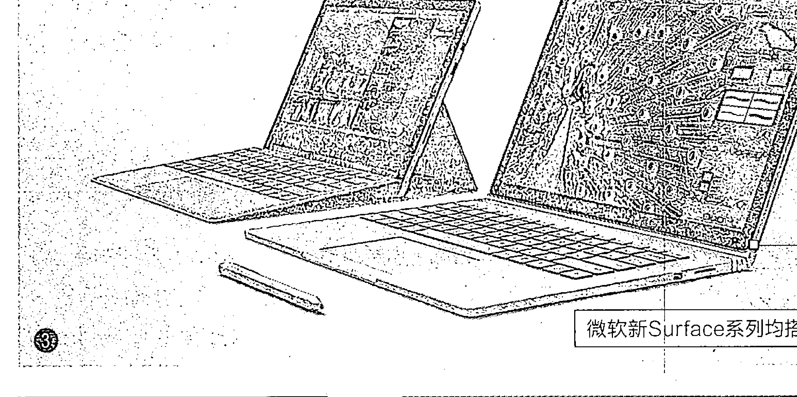

> 火速链接：如果你想了解电磁笔、压感方面的更多内容，以及专业绘图板的选购思路，请参考本刊2015年16期《寻找你的“绘”图先锋》这篇文章。

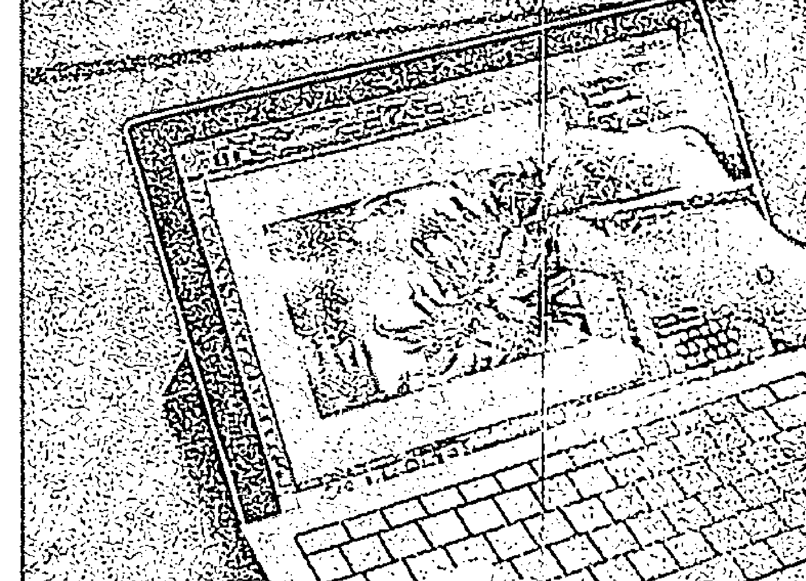


绘图方面‘生产力’的Apple Pencil似乎也不是问题；

反之，如果你想提高绘图效率而盲目选择iPad Pro+Apple Pencil就有些不理性了，因为市面上还有大把比其便宜，且‘生产力’更高的Wacom绘图板；

微软Surface+Pen的组合更多是针对OneNote的商务应用场景，绘图只是副业。


### 手势组合更高效的操作

多年以来，我们都尝试在手机上复制网页上的那种下拉菜单式的体验。但手机需要的是简单快速的操作方式，这和网页下拉菜单深层结构导航理念不符。新版iPhone增加的3D Touch改变了下拉菜单的交互方式。那在Windows 10各平台上又有什么改变了我们使用操作系统上的传统呢？

### 唯快不破 用好快捷操作

### 办公类软件快捷操作

文|俞木发

俗话说“天下武功，无坚不破，唯快不破”，对于Windows 10平板来说也是如此。要想提高平板的操作效率，合理利用各种快捷操作是提速的一个好方法。

现在的Windows 10平板已足够基本的办公需求，作为办公辅助工具，Windows 10中大家常用的Office套件本身就支持很多快捷键，比如在平板上使用Word的“大纲模式”阅读DOC文档的时候，可以使用Alt+Shift+n，快速选择标题1到标题n的内容，而无需再进行触摸操作。WPS同样包含丰富的快捷键，Office办公类软件的所有快捷键操作，可以参考下面链接的介绍。

除了简单使用快捷键进行提速外，针对平板输入不便的情况，日常我们还可以借助Office组件的“宏”和“函数”进行批量、高效的操作。比如在Windows 10平板上使用Excel办公的用户，在日常工作中经常要对表格中的数据进行统计、查找、汇总等各种操作。常规的手工操作非常繁琐且低效，现在借助IF函数就可以快速进行统计。比如现在我们要对公司考勤表进行统计，快速找出累积旷工超过3天(包含3天)且工龄只有1年(含1年)内的员工进行处分，例表数据可如图所示(图1)。

#### 函数解释：

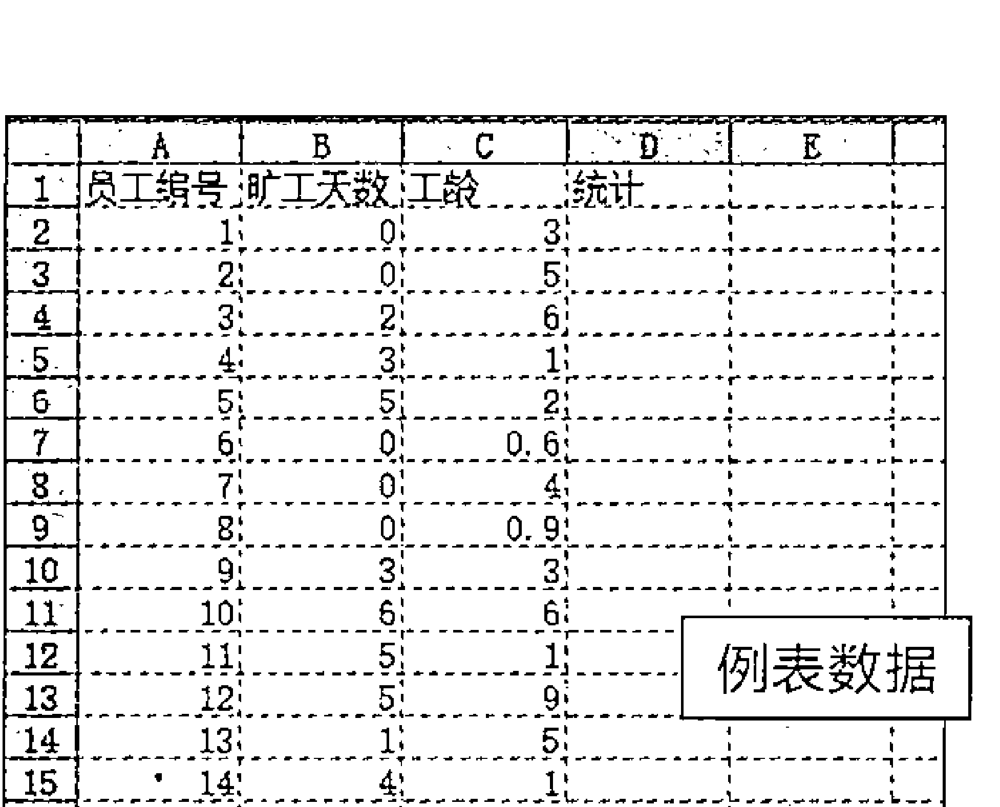

AND函数格式是(条件1，条件2，条件3)，只有所有条件符合即为true，否则为false。用于对常见的多条件组合的判定。本例中是对员工旷工天数和工龄进行判断。

在Excel中打开上述例表后选中D2，点击“插入→函数”，接着在其后插入AND函数，Logical1条件为“B2>=3”(即表示旷工天数在3天以上)，Logical2的条件则设置为c2<=1(即表示工龄<1年的员工)，通过AND函数来进行多条件的筛选(图2)。

IF语句对系统返回的值做一个判断，看看AND的所有条件是否符合，然后对公式单元格显示最终判定的结果，如本例中是“待处分”与“正常”，具体判断字符大家可以根据实际需要进行设置。

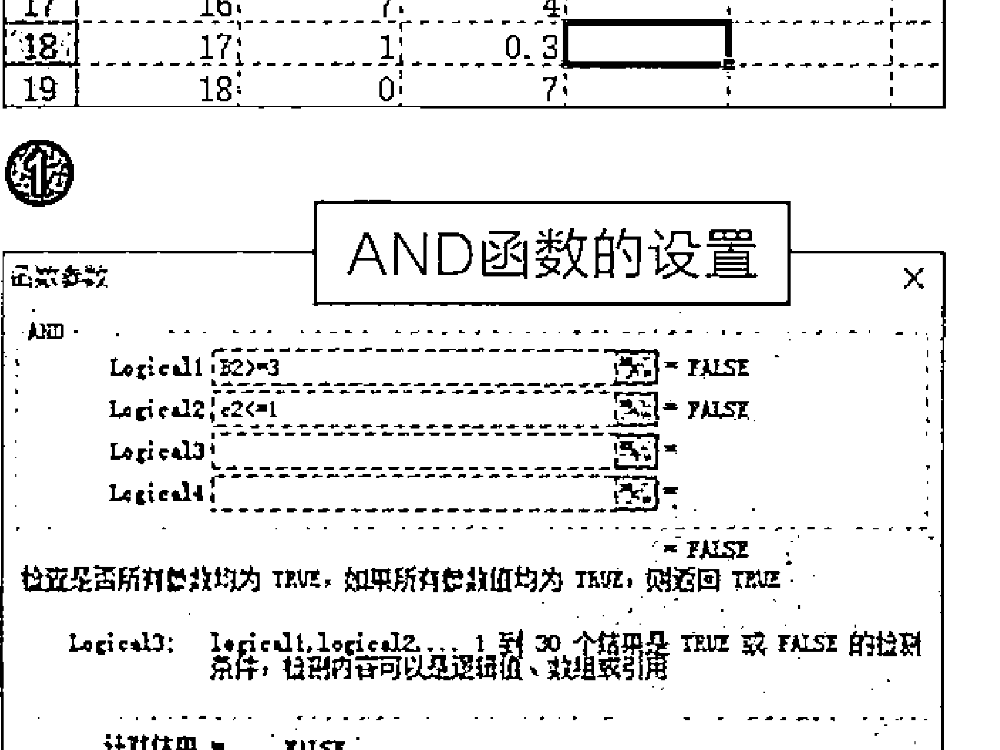

点击“确定”完成函数的插入后，继续在其上插入IF函数，函数的格式是：

```
IF(AND(B2>=3,c2<=1),"待处分","正常")
```

然后使用填充工具将公式从D2填充到D20，这样在Excel中就可以快速统计出符合条件的员工了(图3)。

当然了，这里我们只是以一个简单的函数为例，Excel、Word还支持很多函数和各种各样的宏。大家可以根据自己的需要在平板上的Office组件中选择性地使用，为我们的日常办公操作提速。除此之外，对于Excel、Word，我们还可以借助一些高级语法实现高效操作。比如对于从网上下载的DOC文档，经常会有很多的空格和空行，此时，使用“^p ”(硬回车)来替换“^|^”(软回车)就可以快速地实现空格和空行的批量替换(图4)。

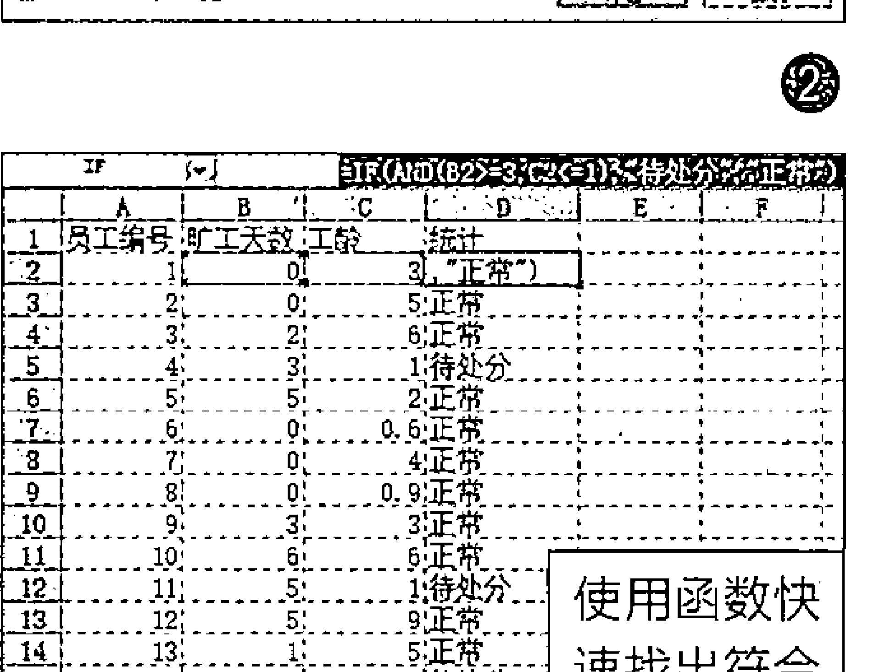

> 小提示
史上最全Office快捷键
http://tinyurl.com/p5dszzz
WPS Office常用快捷键大全
http://tinyurl.com/nhx6lor

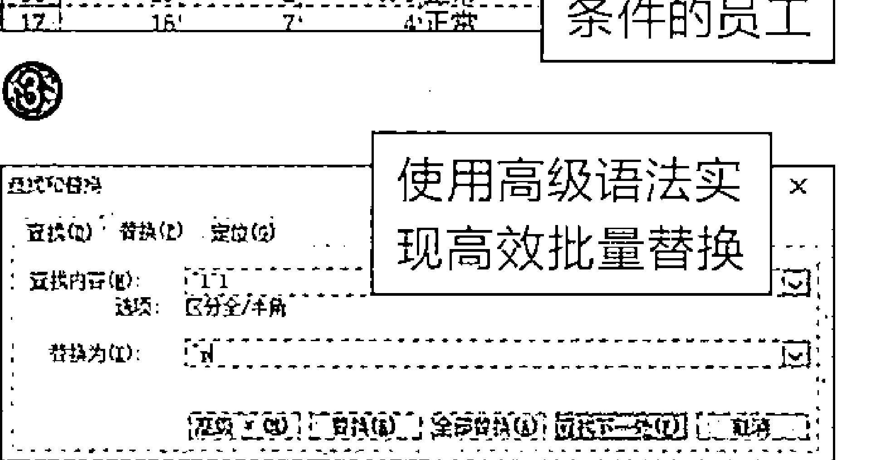

除了办公，很多朋友还经常要在平板上对图像进行处理。常见的图像处理软件同样支持很多快捷键，比如在Photoshop中要使用前景色填充所选区域或整个图层，此时只要使用Alt+BackSpace快捷键即可快速完成。

> 小提示
Word高级替换技巧
http://tinyurl.com/qcuz2zl
Excel常用函数功能及用法介绍
http://tinyurl.com/ps8g9u9

同样的，要提高图像处理的效率，我们还可以借助Photoshop的其他组件来提高图片处理的效率。比如在平板上用好“动作”即可进行批量操作。首先在Photoshop中打开一张图片，按下Alt+F9键打开动作面板，点击面板右上角的倒三角形，选择“新建动作”，在打开的新建动作对话框中，按提示输入新建动作的名称，比如输入“批量调整图片大小”，并且为这个动作设置一个快捷键如Ctrl+F10键(图5)。

点击“记录”，这样你在Photoshop中对图片的所有操作都将被记录下来，以后导入其他图片之后，就可以使用记录的动作快速重复已经录制过的操作。比如要创建一个调整图片大小的动作，在Photoshop中点击“图像→图像大小”，将图片的大小调整为800×600，完成编辑以后点击“停止录制”按钮，在动作面板中就新增了我们录制的动作(图6)。

以后如果我们在平板上还需要将其他图片也调整为800×600时，同上在Photoshop中导入要调整的图片，只要按下Ctrl+F10键即可快速实现图片大小的调整（没有键盘的用户则可以直接在动作面板中选择录制的动作运行）。此外，我们也可以直接导入网友制作好的动作脚本。先将下载好的动作文件（*.Atn）保存在“C:\Users\当前账户\AppData\Roaming\Adobe\Adobe Photoshop CS6\Presets\actions”目录下，接着按下Alt+F9键打开动作面板，点击面板右上角的倒三角形，选择“载入动作”，按提示载入下载到的动作(图7)。

后自己的使用，在上述动作面板里双击导入的新动作，然后将其命名为和功能一致的中文名称，这样下次我们需要使用下载的动作时，只要在动作面板选中需要执行的动作，点击“运行”按钮即可(图8)。

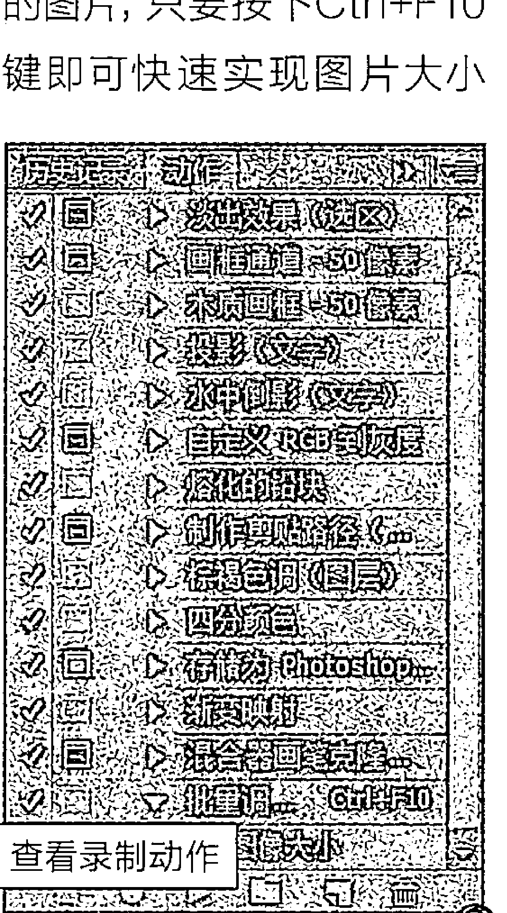

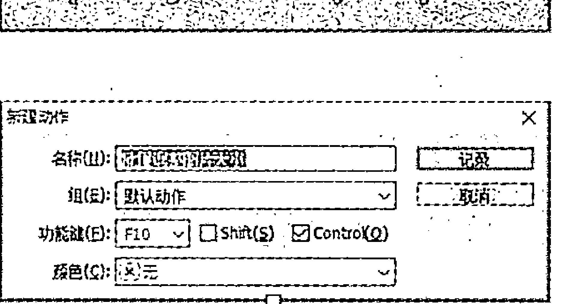

> 小提示
45个PS调色动作
http://tinyurl.com/qavjcx7
Photoshop常用快捷键大全
http://tinyurl.com/nl8uk5u

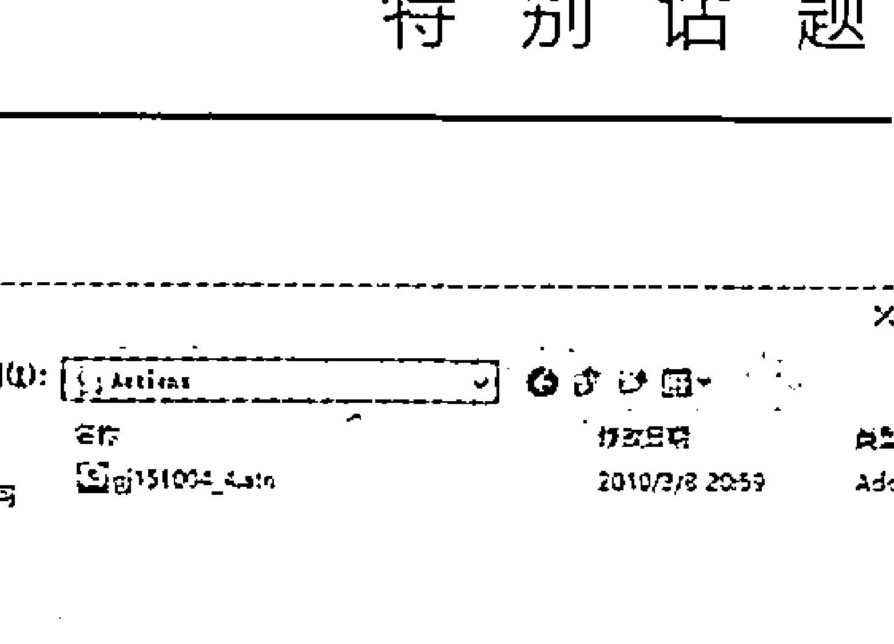

### 定制自己的快捷操作

除了上述介绍的分类快捷操作外，还可借助软件工具，随心所欲定制自己想要的快捷操作。

喜欢在平板上玩点击游戏的用户，可以借助按键精灵录制连续点击脚本，这样在平板上运行后就可以实现游戏的自动点击。

如果要在平板上定时执行多个不关联的操作，比如打开QQ，然后和老妈视频聊天，则可以使用Autohotkey录制操作，然后将其转换为EXE可执行文件运行，这样以后在平板上执行一个程序即可实现多个操作的自动运行。

对于Windows 10本身进行的一些优化设置也可以提高操作效率。如将文件夹的打开方式设置为单击打开，这样只要在平板上触摸一下就可以打开文件夹；将Windows 10系统设置为自动登录，可省去平板上密码输入的不便。总之，就是要根据平板输入的不便，尽量减少平板的触摸点击和输入来提高平板的工作效率。

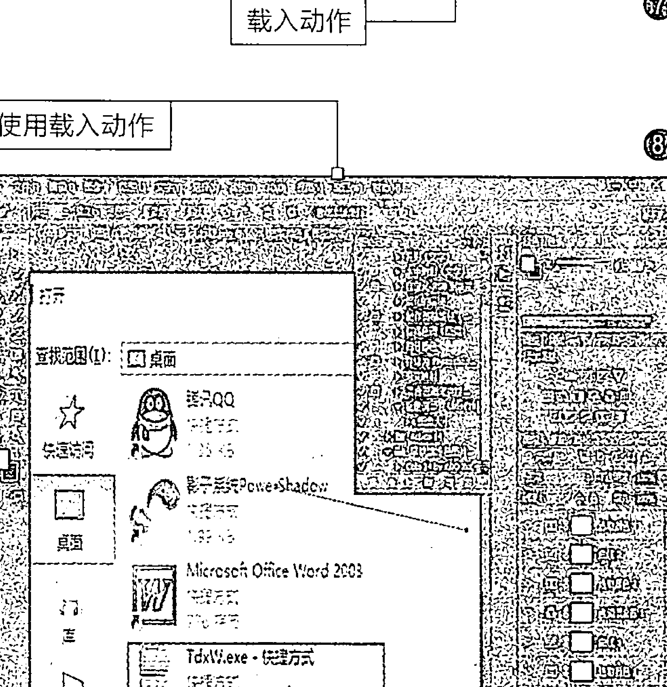

## 比比划划完成操作 平板另类手势操作

文|闽人

平时大家在Windows 10平板上大多使用触摸方式控制电脑，其实除了用手，我们还可以通过其他的方法控制平板，比如通过摄像头比划手势（以及头部的动作等），就可以控制系统或一些软件的操作。

### 用摄像头控制鼠标

现在Windows 10平板大多配备摄像头，这样借助“Switch Viacam”就可以通过头部的移动来控制鼠标，从而借助头部动作操控平板。这样当寒冷的冬天躺在床上用平板支架看电影时，不需要伸手就可以控制你的平板了。

首先确保你平板上的摄像头可以正常工作，程序启动后会自动识别摄像头，并将图像分为左右两部分（左右支持设置不同的热键）。先使用鼠标调整视频窗口中的左边矩形图标，将其扩大使之覆盖住当前视频头部，这样头部的移动才能被软件全部捕获（图1）。接着勾选Sensor1下的“Enable sensor”，然后在Event Type列表下设置摇头关联的热键。这个热键是和你的头部移动关联的，这里我们可以选择一般播放器常用的快捷键关联。比如可以设置为F2键，此时对着摄像头摇头，下方的Motion detect就会进行感应，表明我们的摇头动作已经关联到特定的热键（图2）。接下来就要将热键和播放器关联起来。以Kmplayer设置为例，启动程序后在播放窗口右击选择“选项→参数设置”，在打开的窗口中展开“按键/全局控制”，然后在右侧窗格展开“播放→下一个”，在下方将这个热键设置为F2键，最后点击“重置当前的设置”，这样F2键就被关联到播放下一部电影的热键（图3）。以后在Kmplayer中观看下一部电影时（播放电影需添加到播放列表），大家只要对着平板的摄像头摇摇头即可切换到下一集视频了。Switch Viacam捕捉另一半镜头还可设置另一个热键，操作同上。只要在Switch Viacam的左右区域做出不同的摇头动作就可控制不同的操作。

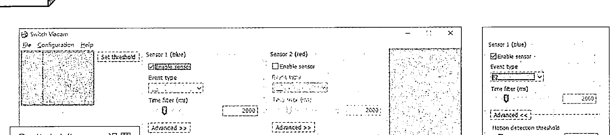

Switch Viacam是对头部的移动做出响应，如果你希望使用空中的手势对平板进行操作，那么还可以借助Npointer实现，它支持通过摄像头对头部和手部的移动做出感应。Npointer启动后同样会自动识别摄像头，此时我们手指对着摄像头移动，桌面鼠标的指针就跟着移动了，右侧则是对移动参数进行设置，单选“Hand”是对手的移动做出感应。接下来我们只要录制手势移动和鼠标关联即可（图4）。再次移动手指，此时在桌面会出现一个十字星的菜单，每个菜单分别对应鼠标的不同点击动作，我们只要移动手指到不同的功能菜单即可实现相应的动作（图5）。比如现在我们需要使用手势启动桌面的QQ，那么只要使用手势将鼠标移动到桌面QQ的图标上，接着移动十字星到2x（即双击鼠标），这样通过手势就可以直接启动QQ了。同样的，移动到不同的菜单可以实现不同的控制效果，比如在浏览网页时，移动到Scroll即可实现页面的滚动。如果要关闭手势检测，可随时点击ON切换到OFF即可，隔空手势操作平板很有趣吧（图6）。

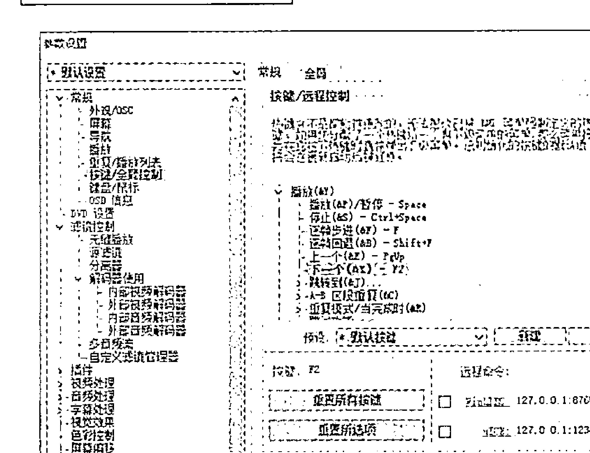

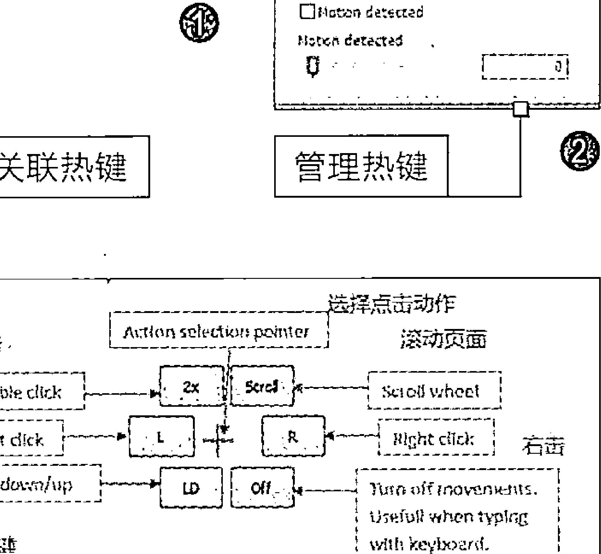

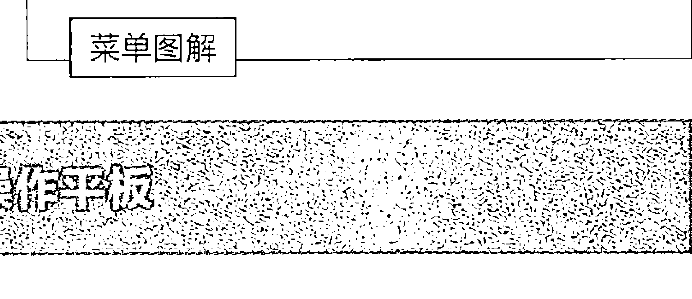

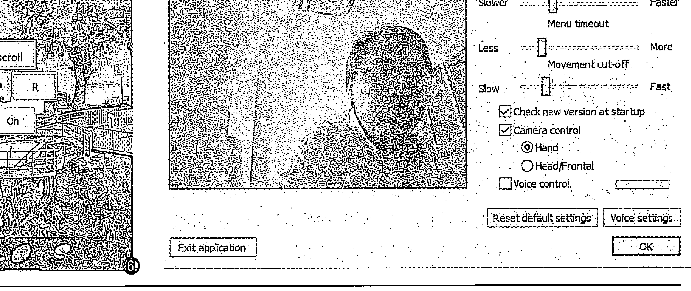

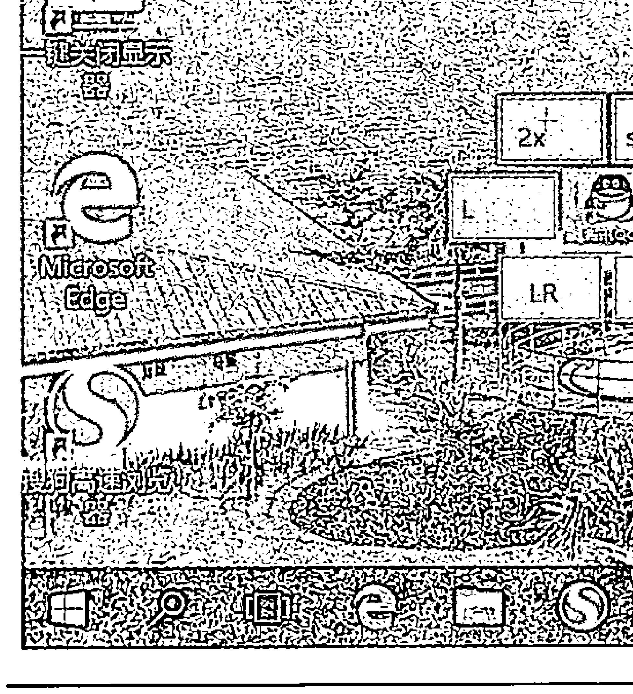

### 使用摄像头玩体感游戏

除了用作办公辅助工具，现在Windows 10平板在日常生活中还是休闲娱乐的好工具。因此除了利用摄像头操作鼠标操作外，还可以用Windows 10平板来玩一些体感游戏，对着平板摇头晃手就可以完成。比如应用商店里的Ball Strike就是一款可以通过摄像头操作的运动健身类游戏。安装完成后游戏会自动识别平板的摄像头，玩家站在摄像头前，扭动身体的各个部位，触碰屏幕上出现的圆球即可，使其在击球的同时，燃烧掉自身内部多余的卡路里。在游戏中，玩家需要完完全全地动起来，并击爆屏幕上出现的各色圆球，其中红球一分，篮球绿球分别为2-3分（图7）。

除此之外，因为Windows 10平板普遍屏幕较小，在小屏幕上触摸玩游戏更会让屏幕的显示面积不足。现在的手机可以和平板无线连接，还可以通过手机扩展平板的屏幕。比如可借助AIWI（支持Android和iPhone手机），它可以将Windows 10平板与手机连接在一起，从而将手机整合成为体感游戏平台，利用手机的触摸来操控平板上游戏的操作。这样我们就可以将平板作为显示画面，游戏的操作则全部借助手机完成即可，尽量释放平板的显示区域（图8）。


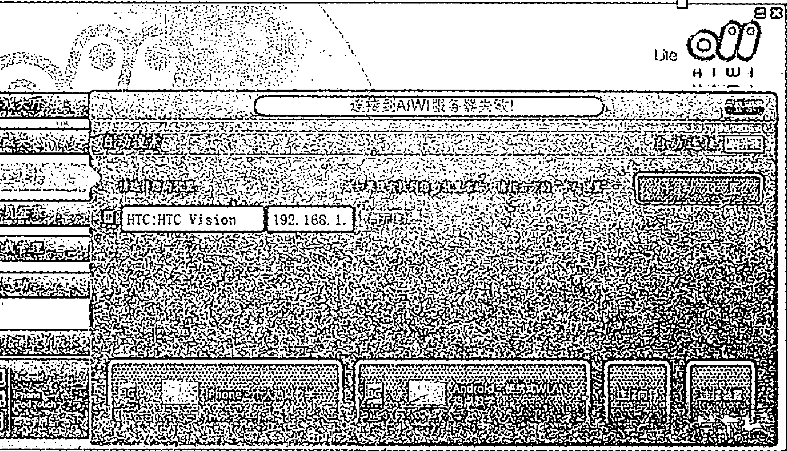

> 由于体感游戏是借助摄像头来捕捉人体的动作，因此为了获得良好的游戏体验，建议玩家要在光线好的条件下，且距离摄像头至少1-2米的距离进行游戏，以便摄像头能够获得清晰而完整的玩家图像。


## 隔空打牛 用好平板远程“触控”

平时在Windows 10平板上我们大多使用触摸进行本地操作，不过有时我们还需要远程对平板进行控制。对平板的远程控制，可以使用常见的远程桌面、QQ远程协助等，不过这些软件都有一些限制，比如远程桌面需要知道控制电脑的IP地址，但是很多平板是在Wi-Fi环境下连网，使用的都是内网IP地址，这种状况下外网对平板的控制就显得很不方便。QQ远程协助虽然能适用于各种网络，但是平板端需要人为点击操作才能成功连接。因此对于平板的远程控制，我们可以使用其他一些另类又有效的远程控制软件。

### 用邮件控制平板

现在很多孩子喜欢用平板来玩网络游戏，如果我们在公司上班时要控制孩子使用平板的时间，可试试“邮件接收者”来远程控制平板。因为远程控制是通过邮件发送完成的，因此对于内网、外网均无限制。

首先申请一个163邮箱作为控制专用邮箱，在Windows 10平板上以管理员身份启动“邮件接收者”，按提示输入自己的163邮箱并登录（账号不需要输入@163.com后缀），勾选“按最小化隐藏窗口”和“开机自动运行登录”，点击“保存设置”，确保每次进入平板后都可以使用邮件控制平板（图1）。

接着我们就可以按照程序提供的远程指令进行控制了。比如需要远程关闭平板，那么就进入自己的邮箱（如QQ的WEB邮箱、Foxmail本地客户端等）新建邮件，收件人选择上述登录的163邮箱，在邮件主题中输入“gj”（一定要在主题处输入远程指令），然后点击“发送”（图2）。

这样平板上的“邮件接收者”收到主题为“gj”的新邮件后，它就会自动执行关机指令。“邮件接收者”在平板上默认是隐藏在后台运行（需要使用Ctrl+F1键调出），这样我们只要为Windows 10平板设置好孩子不知道的登录密码，以后需要远程关机不让孩子玩平板时，只要随时发送一封主题为“gj”的邮件到指定的163邮箱即可。当然邮件也可以通过手机发送，比如只要在手机QQ上切换到“应用中心→邮箱”，然后新建一封上述邮件发送，这样即可实现使用手机控制平板的目的了（图3）。

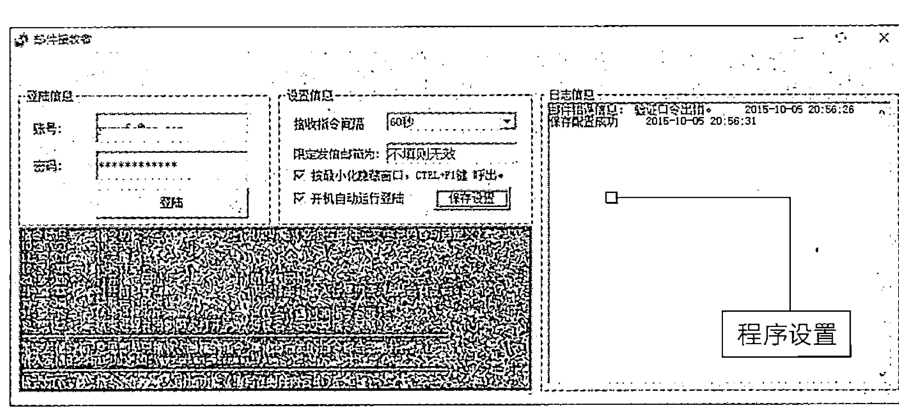

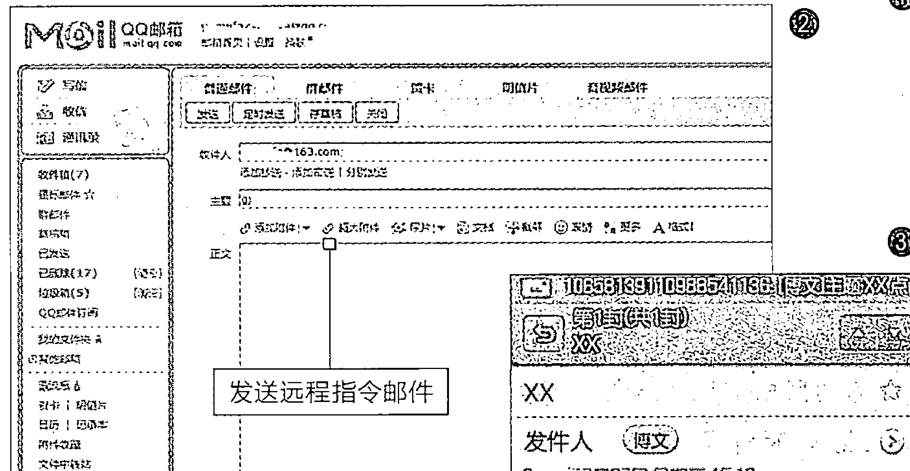

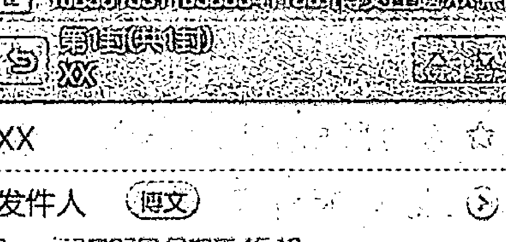

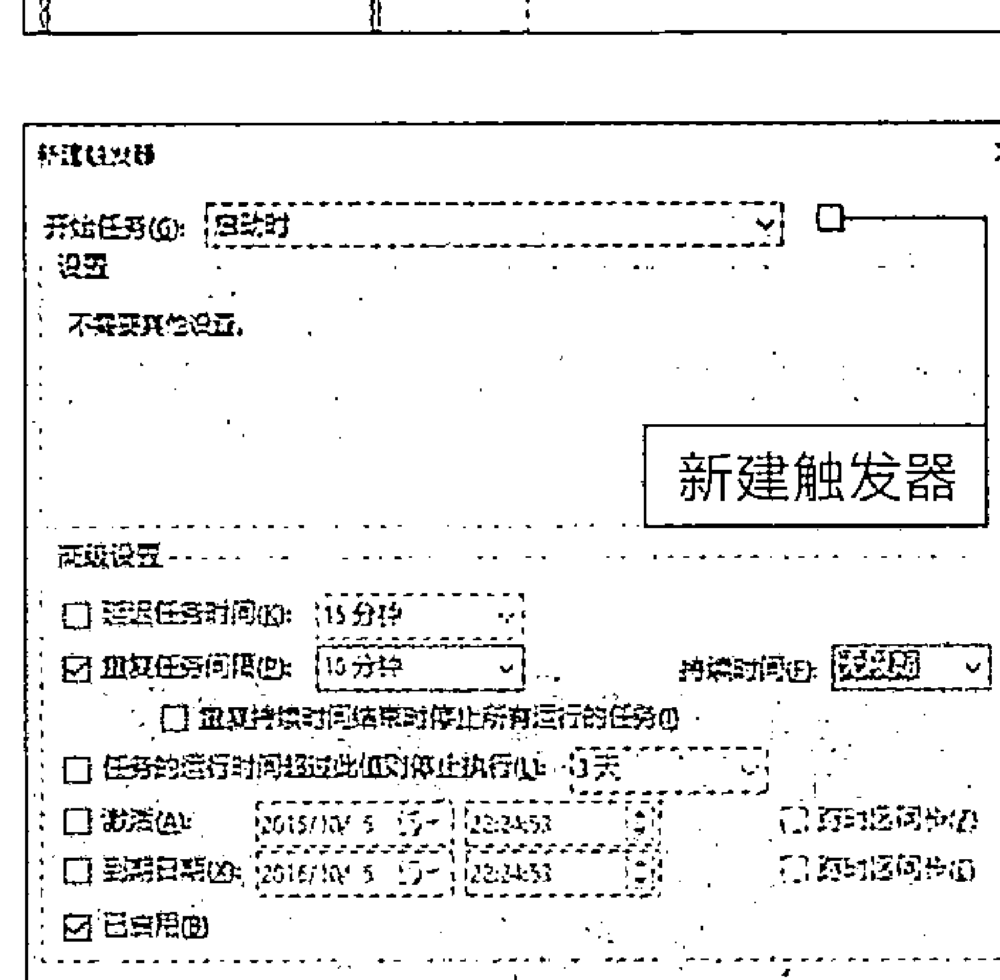

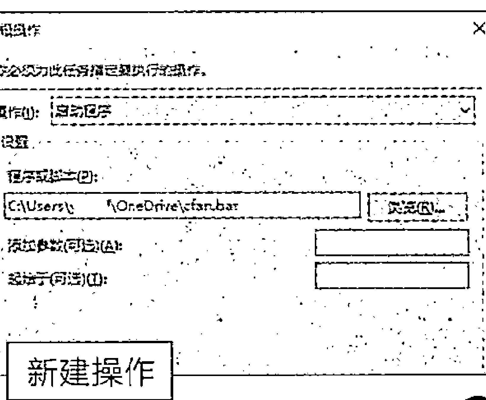

### 使用OneDrive远程控制平板

邮件接收者的远程控制虽然很方便，但是它只能在平板上执行有限的几个远程指令。有些时候我们可能需要远程提取平板上的文件，上述软件就无能为力了。比如在家加班将文档忘记在了平板上，现在需要在公司电脑上提取平板上的文档。此时我们可以借助Windows 10自带的“OneDrive+任务计划”实现远程控制。

默认情况下Windows 10自带的OneDrive会自启动，因此首先要平板上按提示使用自己微软账户登录OneDrive。接着在小娜搜索栏输入“任务计划”，按提示启动系统自带的任务计划组件后，点击“创建任务”，按提示创建一个“控制平板”的新任务，切换到“触发器”，点击“新建”，新建一个“启动时”执行、重复任务间隔是10分钟、持续时间是“无限期”的触发器。这样我们的平板启动后就会自动执行这个任务，同时每隔10分钟还会自动执行一次，以方便我们随时对平板进行远程控制（图4）。

切换到“操作”，点击“新建”，新建启动程序的操作，执行的命令是“C:\Users\当前用户\OneDrive\cfan.bat”，这样在平板启动后每隔10分钟就会自动执行这个脚本文件（图5）。

因为默认情况下Windows 10自带的OneDrive会自动同步网盘文件，所以如果我们要在办公室电脑上提取平板文件，那么只要叫家里人开启平板（需要设置好自动连接家里的Wi-Fi），然后我们就可以在办公室电脑上登录相同的OneDrive账户，这样平板上的文件就会自动同步到办公室电脑上了。

Wi-Fi)，然后我们在办公室的电脑设置一个复制文件的批处理cfan.bat到OneDrive，这样文件同步到家里的平板后就可以实现文件自动同步了。假设文件是平板上的“C:\Users\当前用户\Documents\1.doc”，在办公室的电脑上使用记事本新建一个Cfan.bat批处理，放置在“C:\Users\当前用户\OneDrive\”下，代码如下：Copy C:\Users\当前用户\Documents\1.doc C:\Users\当前用户\OneDrive\ 这样最多等待十分钟，平板上的文件就会被自动复制到OneDrive上，并且自动同步到公司的电脑上了。此时再打开“任务计划→任务计划程序库”，可以看到上述创建的“控制平板”任务已经被执行，上述文件被顺利复制到OneDrive下。当然了，这里我们只是以复制文件为例。实际上平板上所有可以借助命令行完成的操作，我们都可以利用上述方法实现远程控制。比如需要远程关闭平板，则将Cfan.bat的命令更改为：shutdown -s -t 3 这样Cfan.bat被同步到家里的平板上后就会实现平板的自动关机，完成平板的关机后就可以删除Cfan.bat，以免再次重启后继续执行同样的指令。同样的，因为只要在OneDrive中添加Cfan.bat后即可执行远程控制，我们也可以利用手机上传该文件到OneDrive实现远程控制，或者在网页中打开OneDrive编辑Cfan.bat，实现对平板的不同控制功能，只要将上述关机命令更改为其他命令即可。

### 使用浏览器远程控制平板

除了复制文件和对平板进行简单的远程控制外，在很多时候我们可能还要远程对平板状态进行查看，此时可以借助“向日葵”在浏览器中直接对平板进行控制。登录www.oray.com并注册Oray账号，登录https://sunlogin.oray.com/console/remote，点击“添加主机”，按提示添加“我的平板”的主机，接着在弹出的窗口中记住“葵码”，点击“本机在线安装”，在平板上安装向日葵被控端软件(图6)。成功安装被控端后以管理员身份启动，切换到“主机概况”，点击远程控制模块下的“设置远程访问密码”，在打开的窗口中切换到“常规”，然后勾选“仅以服务的方式运行，不显示任务栏图标”，点击“确定”，可很好地在平板上隐藏被控端的存在(图7)。以后如果我们需要远程控制平板，只要在任何一台联机的电脑上启动浏览器(建议Windows10用户使用火狐浏览器)，然后登录https://sunlogin.oray.com/console/remote，此时可以看到远程已经开机的平板，按提示勾选需要控制的主机，点击即可进行连接(图8)。接着在弹出的窗口中输入平板账户和密码，点击“登录”即可进行连接了。同样的可以在PC上安装受控软件，然后将其添加到设备中，这样在平板上也可以远程操控PC(图9)。成功连接后就会弹出一个远程控制菜单，可以使用远程桌面、文件管理、CMD命令等功能，只要点击相应的模块即可使用(图10)。比如家里的老妈现在觉得平板很卡，那么就切换到“诊断→进程”，在右侧窗格选中本机不需要的进程，点击“结束进程”将其结束，即可节省平板资源。向日葵支持很多远程操作，可以切换到CMD，使用高效的命令行对平板进行远程操作。切换到远程文件管理，则可以在浏览器中打开平板资源管理器，在此轻松地对平板进行远程文件管理了。

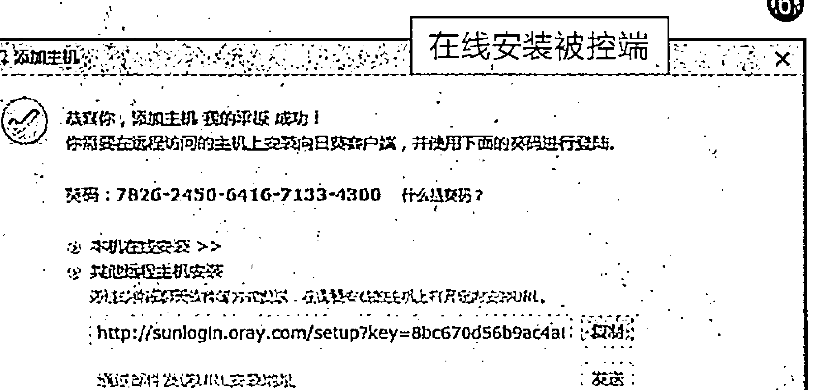

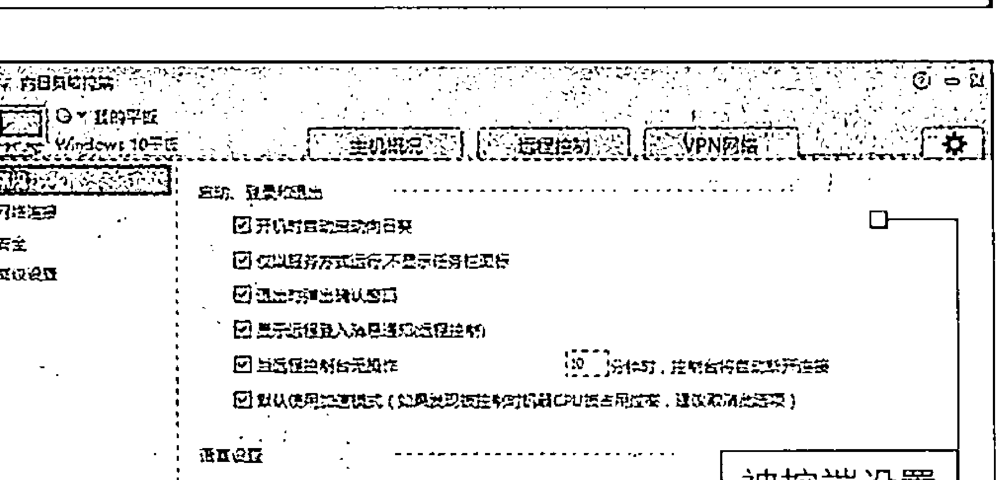

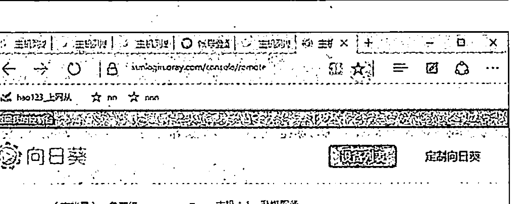

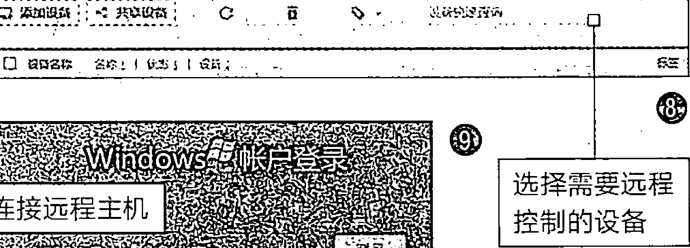

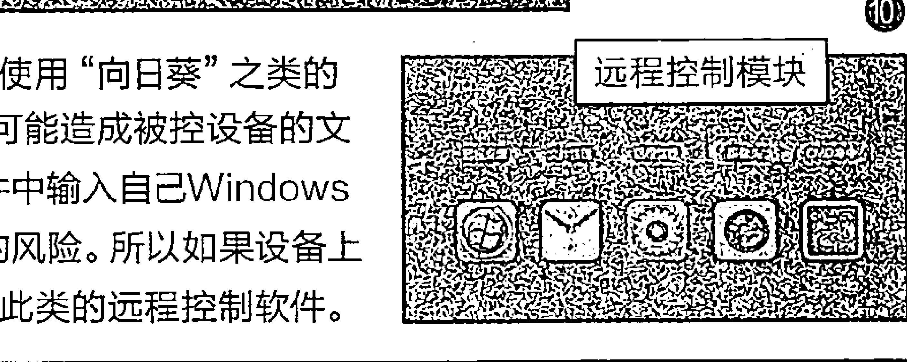

> **警告**：每种技术都可能是双刃剑，比如在使用“向日葵”之类的远程控制软件时，如果账户密码泄露，就有可能造成被控设备的文件数据被他人获取的风险。且在第三方软件中输入自己Windows系统的账户和密码，本身也存在账户泄露的风险。所以如果设备上有重要数据，为了安全起见，建议不要使用此类的远程控制软件。

## 游戏主机的体感

从Wii和Xbox 360开始，家用游戏主机纷纷使用体感作为卖点来吸引已经对传统游戏逐渐麻木的玩家。尽管体感游戏至今依然是边缘游戏类型，但仍然有大量轻度游戏玩家因为体感概念购入了游戏主机，可以说游戏主机的体感概念还是很成功的。不同世代不同游戏主机的体感技术其实有很大不同，相应带给玩家的感受也大不相同，让我们来简单梳理一番。


-   优点：一个设备实现全能效果，未来发展趋势
缺点：精度仍有待提高

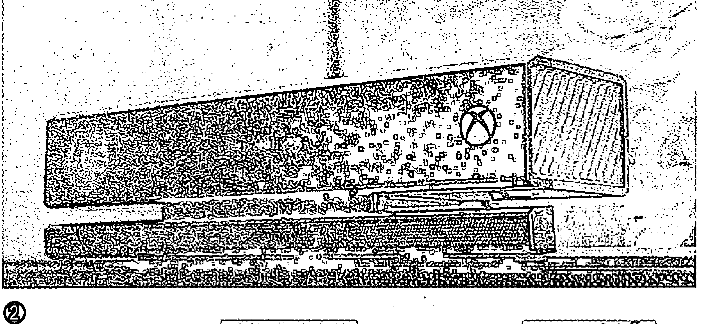

-   优点：能提供更精准无延迟的体感识别优势
缺点：游戏体验略差


### Wii和PS Move

Wii使用的Remote控制器和PS3的Move控制器其实属于一类，都是使用手持设备与主机相连来提供体感信号(图3)，在这一点上与Xbox的Kinect有本质不同。其中的体验差别其实不言而喻，如果在进行体感游戏时我们仍需手持手柄才能游戏，游戏体验自然大打折扣，在这一点上远不及微软的Kinect。

不过这种控制方式也有其好处所在，就是游戏机无需使用自身资源去处理Kinect那样的成像信号，遥控器给游戏主机的信号分析起来要简单得多。另外在个别需要精准控制才能带来完美游戏体验的射击、小球类游戏上，Wii Remote和PS Move能够带来更为精准的体感识别(图4)。

### Xbox Kinect系列

Xbox Kinect系列通过红外探测器捕捉人体信息，上个世代Xbox 360的Kinect游戏体验最佳。不过大范围的红外捕捉好处很多，首先全身感知性是所有手持设备进行体感的游戏机无法比拟的，只通过Kinect一个设备就可胜任任何体感游戏(图1)。其实PS4中的Camera也同样属于Kinect系，不过PS对于体感似乎并不重视，态度摇摆不定，两代产品使用了完全不同的体感方案。

虽然带来良好体验(无需手持任何设备)，但先全身捕捉再分析使用的技术特点，会带来局部动作的精准问题及延迟问题。在Kinect一代中很多用户感受到成像和体感捕捉的延迟感，不同游戏有0.5s到1s的延迟。另外局部动作捕捉的精准程度却无法和Wii等游戏机相比，如一些乒乓球、网球游戏体感设备根本无法判断不同的击球动作。

不过在全新Xbox ONE的Kinect二代中采用全新的红外探测传感器，分辨率、角度和带宽均大幅增加，对于局部动作的分辨能力远胜一代产品(图2)。同时对应的数据流量也有很大改善，一代产品当中令人沮丧的延迟有了很大改善。其中还增加了心率感应等诸多新功能，Kinect已远非单纯的体感外设了，微软希望它能胜任更多领域。


### 用于PC的摄像头

目前在PC上想用摄像头实现类似游戏主机那样的手势、体感识别，比较成熟可行的是直接使用微软的Kinect适配器及其配套套件，这要比使用普通摄像头再加第三方软件有效得多。目前微软Xbox ONE已经正式入华，我们能够很轻松地买到官方正品的Kinect套件。

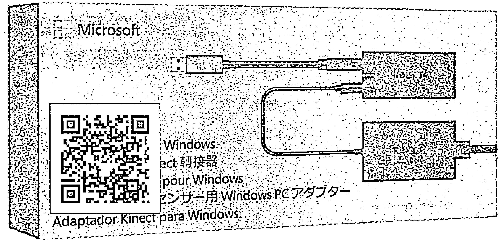

### 用于Windows的Kinect适配器

京东售价：369元
二代Kinect升级了自身的像素、识别精准度和弱光感知等功能，同时还拥有类似骨骼追踪和心率感应等特殊功能，微软已经不仅仅将其定位为游戏体感设备了。所以在二代上干脆不再区分游戏主机版和PC版，将两者统一使用单独的Windows适配器提供连接。由于性能加强，原本的USB 2.0带宽已经不能满足需要了，在二代Kinect上使用USB 3.0总线。对PC要求并不高，只要是双核3.0GHz和4GB内存的主流电脑都可以顺利使用Kinect感应器。

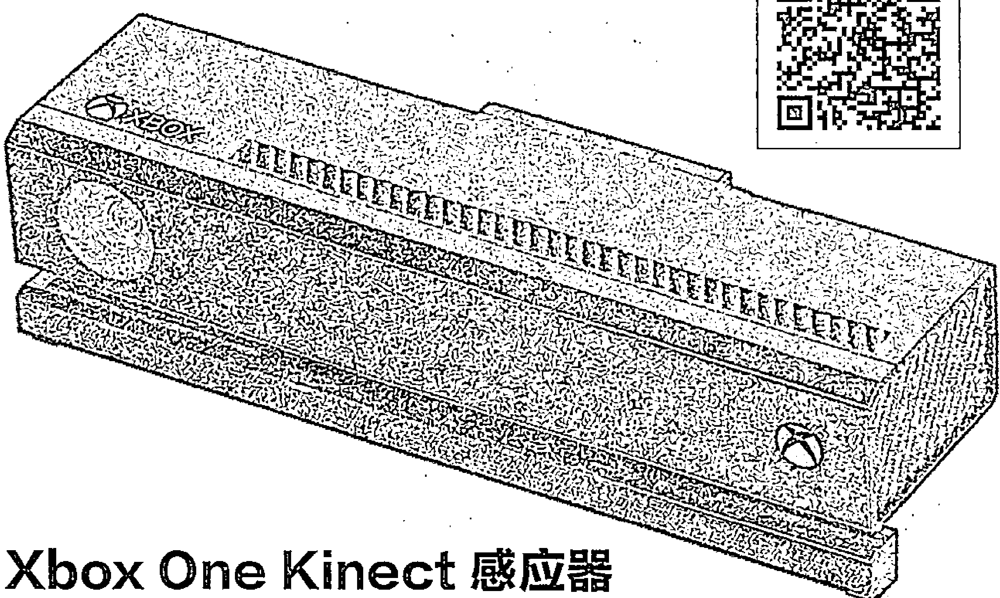

### Xbox One Kinect 感应器

京东售价：1090元
其实这就是标准版本的Xbox One Kinect二代感应器，适合使用在Xbox ONE上或者通过适配器在PC上使用。微软在Kinect一代上还专门推出过Kinect for Windows版本，而二代直接两者统一，PC上的应用则通过Windows适配器完成连接。

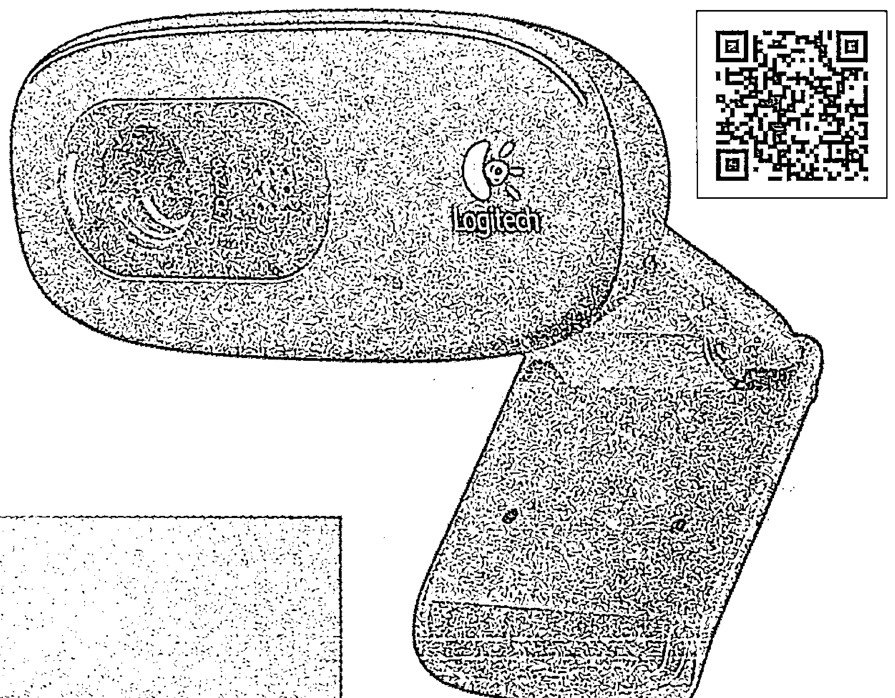

### 乐视体感套件

京东售价：699元
总体来讲乐视体感套件与Xbox的Kinect属于同类产品，其最主要的区别是必须搭配乐视TV一同使用。虽然有些“山寨”的感觉，但只需要电视和体感套件就能简单实现手势识别是其优势。

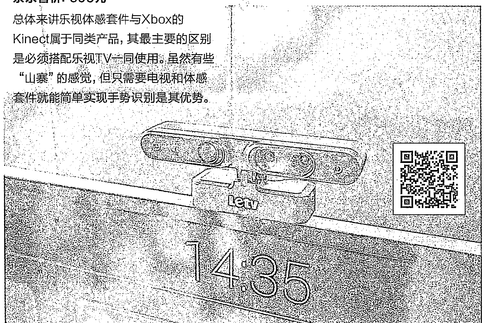

### 罗技C270
高清网络摄像头

京东售价：149元
如果用户只需要一款普通的网络摄像头，希望通过第三方软件尝试一些简单的手势功能，则无需购买动辄上千的专业套件，可以选择一款成像较好的摄像头。有兴趣的用户不妨试试这款京东商城销量第一的罗技C270高清网络摄像头，可以达到1280×720分辨率下的30fps画面。

我们都希望可以方便快捷地获取信息，与慌忙地掏出手机相比，对着手腕一瞥显然更具诱惑力。于是，一场针对手腕上的革命就此展开了。


## 4 腕上的革新

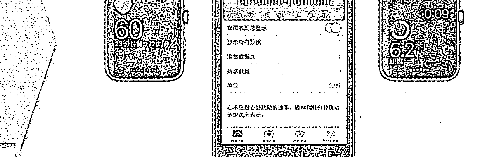

### 再看手腕上的革新

除了发布全新爱马仕定制版外，Apple Watch还迎来了全新OS 2系统的更新，让这款智能手机变得更好用。下面我们就借此机会，再来回顾一下手腕上的“革命”吧。

### OS 2带来的改变

Apple Watch上市之初，它仅能算是iPhone的附庸，除了时间、照片、健康和音乐等常规功能外，其他高级操作都需要iPhone端的配合。而watchOS 2版系统的目的很简单：让Apple Watch摆脱作为“iPhone的一面镜子”的尴尬定位，争取让它变得“独立”（图1）。

简单来说，watchOS 2不仅增加了延时摄影表盘、邮件直接回、多加点朋友、以画传情、公交信息以及新Siri的特性，更开放了第三方APP调用Taptic Engine、Digital Crown、加速感应器、心率传感器、扬声器和麦克风等接口的权限。这意味着，未来我们可以在Apple Watch上直接安装定制的APP，在脱离iPhone的情况下也能玩出更多花样。

## Android Wear之伤

与watchOS 2刚刚对第三方APP松绑相比，谷歌针对穿戴式设备定制的Android Wear系统早就开始搭架专属的生态系统了。可惜，由于谷歌服务在国内受到限制，所以基于Android Wear的智能手表在体验上就要大打折扣。

以摩托罗拉二代MOTO 360为例，该产品在国内销售的版本将Google Now语音助手换成了“出门问问”，并在手机端对接了一个不依赖谷歌服务的中国版Android Wear商店（图2）。问题就出现在这里，这个版本的Android Wear失去了同步部分手机端APP的功能，很多精美的第三方表盘、丰富的第三方APP应用都无法适配到二代MOTO 360身上。

比如你在二代MOTO 360上就接收不到微信的消息推送（需换成国际版系统或翻墙才能支持）。想解决这个问题，要么是APP厂商更新消息推动的接口，要么期盼中国版Android Wear能与国际接轨。

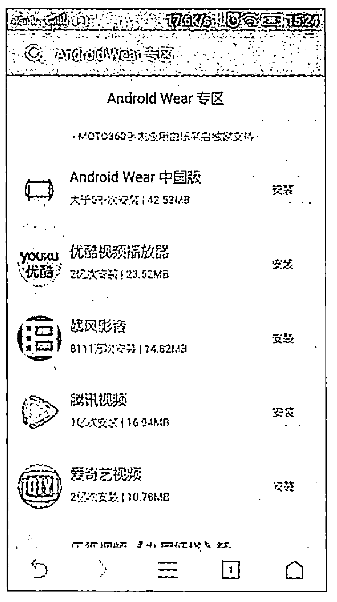

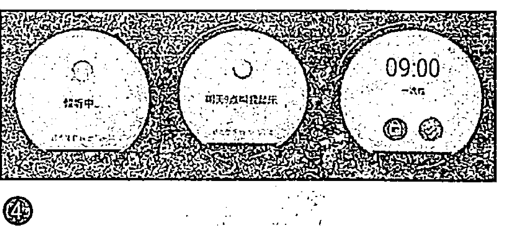

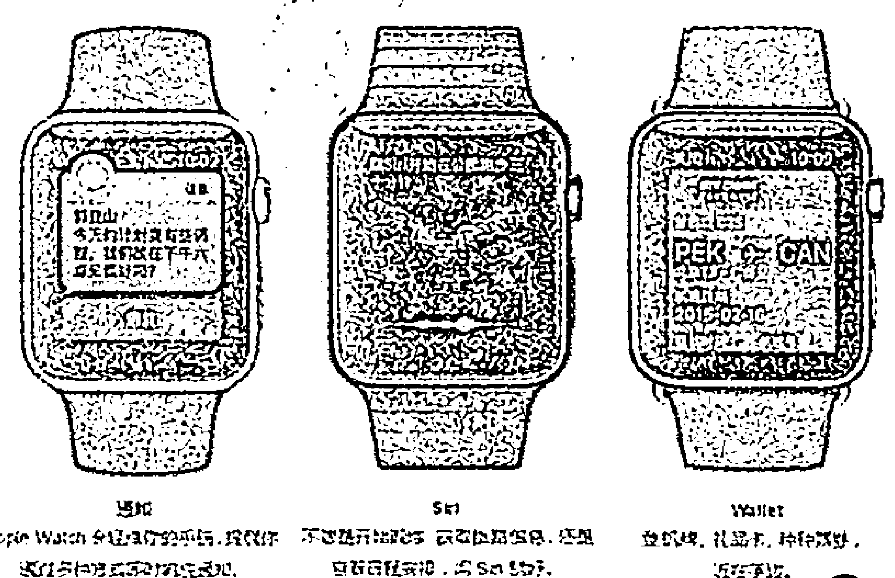

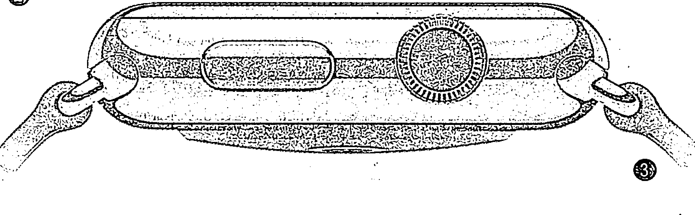

### 谁是杀手锏功能

如今以智能手表为代表的穿戴式设备越来越多，功能也是五花八门。那么，其中哪些技术或功能才是真正值得我们关注的呢？
操作方式
操作穿戴式设备普遍以物理按键和点触屏幕两种形式。截止到目前为止，体验最佳的还要数Apple Watch。比如，该手表的数码表冠（侧键）具备按压和滚动两种操作形式（图3），通过按压操作的次数以及滚动的节奏，可以实现丰富的快捷操作或设置。
得益于Force Touch技术，Apple Watch的触控屏幕除了点触、长按、下拉、上拉、左右滑动之外，通过用力按下还可呼出一层菜单，这种压力感应为交互提供了更多可能，从而进一步丰富了功能层级。
遗憾的是，Apple Watch的数码表冠和Force Touch屏幕都需要更高的成本支撑，短期内普及的机会不大。

相对手机或平板而言，穿戴式设备对语音助手的需求更为迫切。在寒冷冬日，手套将使你与智能手表的屏幕“绝缘”；在手表看完推送的消息时，必须掏出手机才能进行回复，这两个情景想着就头大。
有了语音助手，上述尴尬就可迎刃而解。以二代MOTO 360为例，只要你对手表说出“你好，安卓”后就会激活手表端的“出门问问”，无论你想设定闹钟、地图导航、搜索美食，只需再动动口即可（图4）。而Apple Watch的Siri体验也极为出色，其定制的微信APP也能直接使用语音回复，在手表端就解决一切沟通问题（图5）。
手机和平板可以随意安装第三方语音助手类APP，但像智能手表这种穿戴式设备则不具备更换语音助手的能力。所以，搭配语音助手的口碑越好，该手表也就越值得选择。

虽然几乎所有穿戴式设备都具备计步器、睡眠监测等功能，但依靠重力感应和陀螺仪进行的统计数据还是不够精准，而且对健康的警示效果也很小。因此，是否配备心率/血氧传感器（图6），将成为判断穿戴式设备能否更精准监测健康情况的标准。

这是所有穿戴式设备的命门，如果你乘坐一架从北京飞往纽约的航班，刚下飞机手表就没电了，这种体验着实尴尬。就智能手表领域而言，目前续航最值得称道的就是来自果壳的智能圆表，该产品采用了特殊定制的屏幕，可以在电子墨水屏幕和彩色屏幕间随意切换（图7）。比如，待机时就进入几乎不耗电的电子墨水屏幕模式，只有激活屏幕后才进入全彩显示模式。在该技术的帮助下，该智能圆表的续航时间可以达到一周左右。

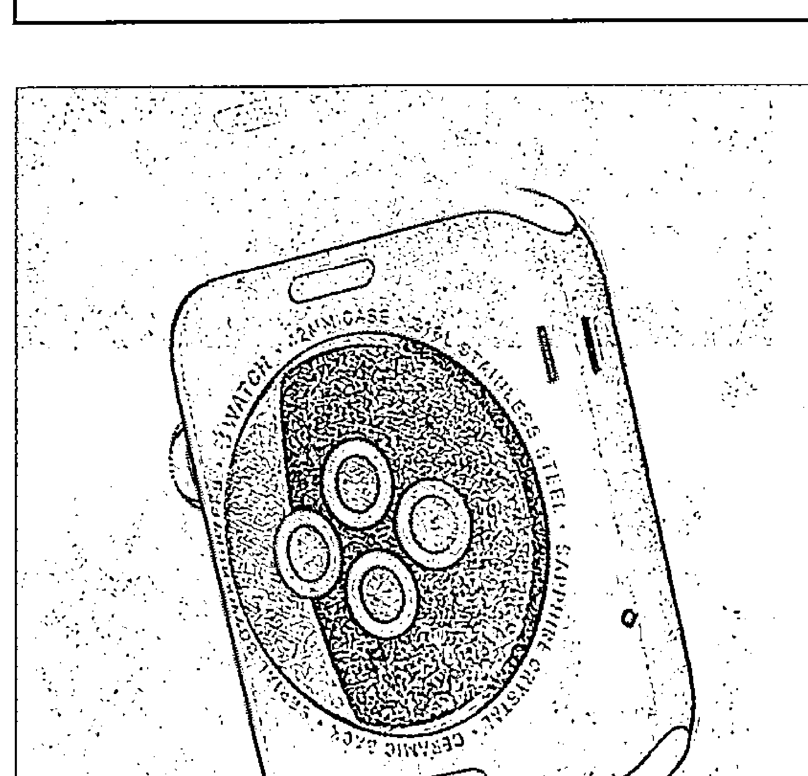

## TF 显示屏，给你日光下阅读的新体验

仅在部分军工航天领域使用的TF显示屏，允许您在电子墨水屏和反射式液晶屏间随意切换，日光下观看阅读效果极其出色，无论点亮屏幕也能随时地掌控时间。

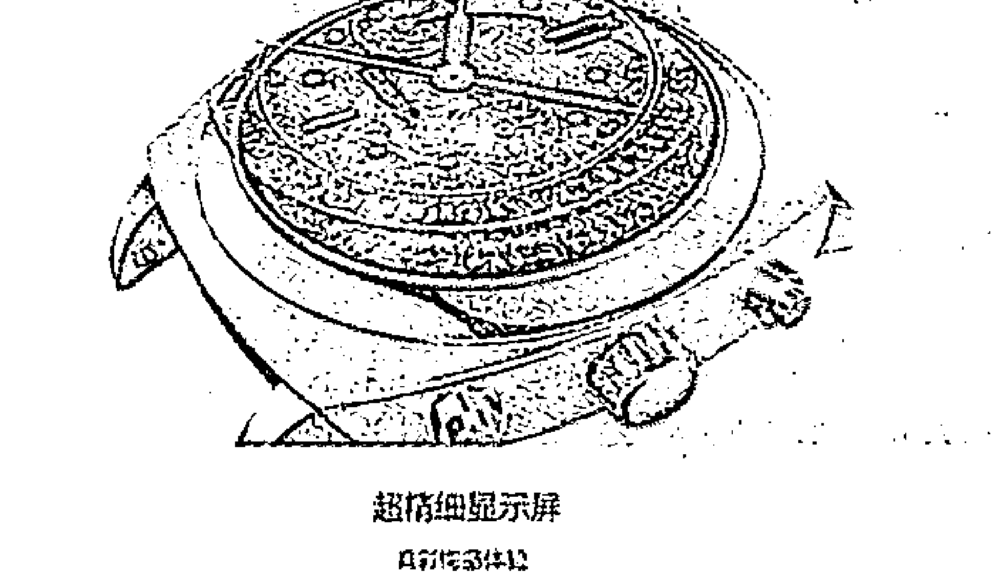


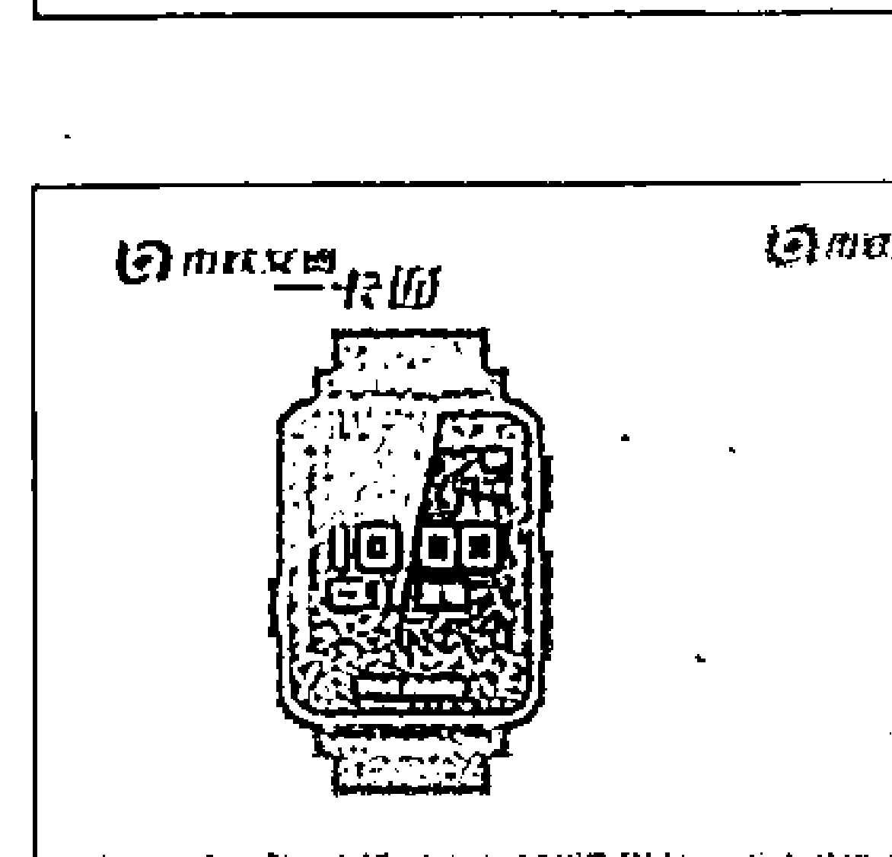

北京市政交通一卡通、公交卡、移动手机卡、银行卡、会员卡、智能手表、手环手表 ¥599.00

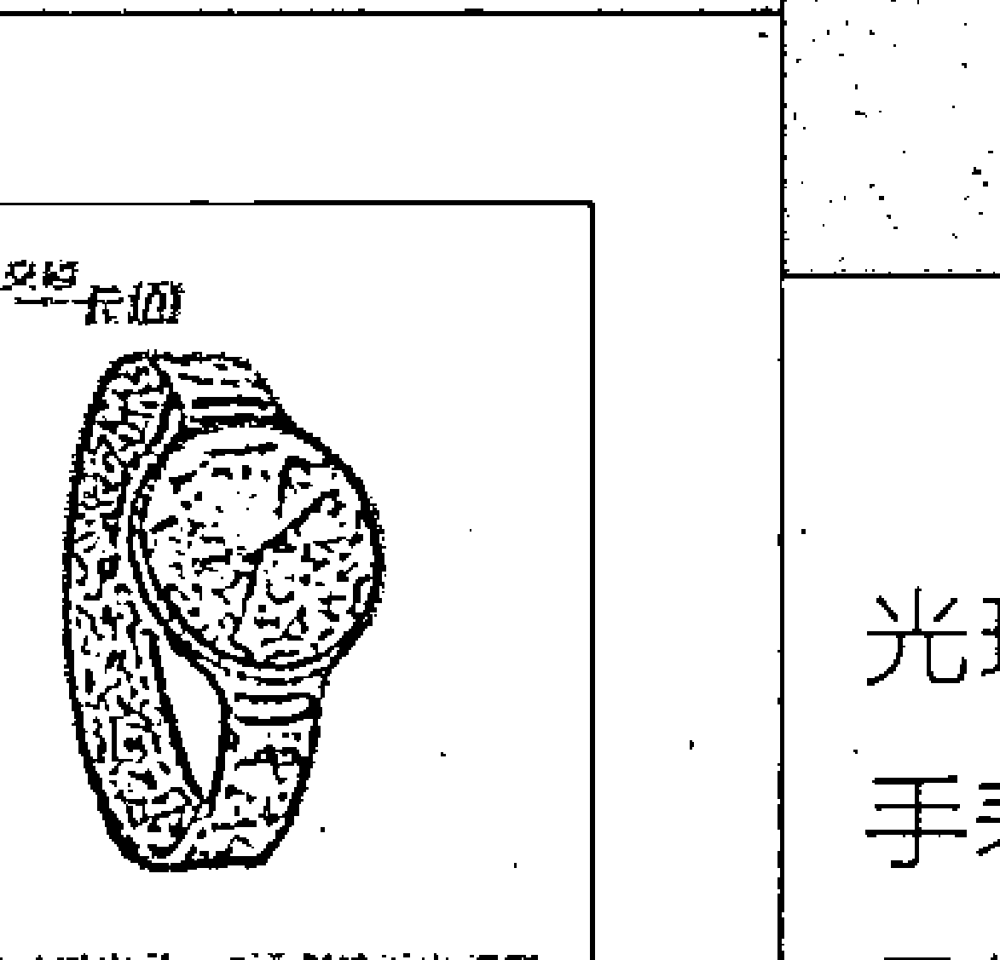

北京市政交通一卡通、公交卡、手机卡、银行卡、门禁卡、智能手表、手环手表 ¥168.00

## 将功能拆分的穿戴设备

虽然Apple Watch顶着苹果的品牌光环，以MOTO 360为代表的圆形智能手表也具备了惊艳的外观设计，但此类产品似乎依旧没能称霸人们的“手腕战场”，这又是为什么？

首先就是价格与功能不对等。高端智能手表虽然具备出众的颜值，但它们在功能上却大都停留在手机的搭档层面。像三星Gear S一类的智能手表虽然可以安装SIM卡打电话，但过小的屏幕与尴尬的续航却是硬伤。其次是功能被拆分。除了智能手表外，以智能手环为代表的穿戴式设备更容易被普通用户接受。一款支持运动检测的手环可能只有100元，但计步器和睡眠统计等实用功能却全部具备。此外，不少手环类产品还加入了公交一卡通功能，乘公交坐地铁时只需将手腕在刷卡机前一晃即可（图8）。针对健康预警，配备心率传感器的手环、腕带类设备也如同雨后春笋一般冒了出来。别看此类穿戴式设备可能外观简单、功能单一，但它们却能直接击中消费者的需求痛点。

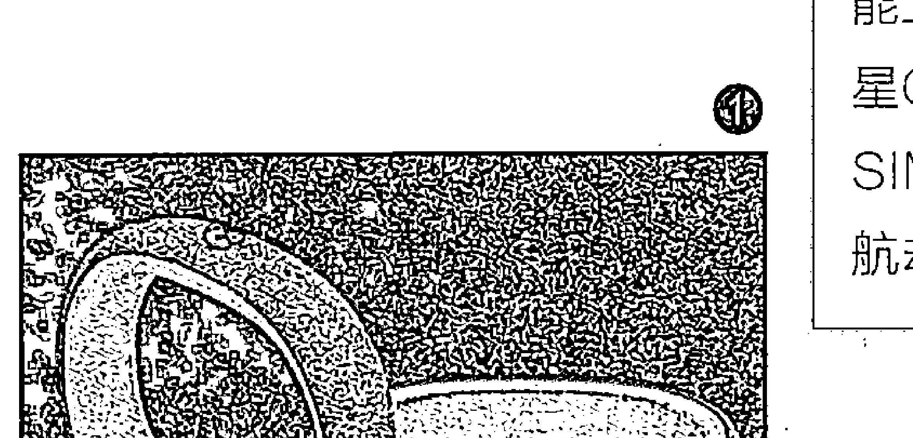

### Razer和Nabu手环

在PC游戏和电竞领域，雷蛇（Razer）是唯一一个能够和罗技相提并论的外设厂商。旗下多是高端游戏键盘和鼠标，相信喜欢PC电竞游戏的用户对雷蛇产品绝对不会陌生。但在目前桌面平台势弱而移动产品势强的潮流下，也推出了Nabu手环来加入了穿戴设备的大军（图1）。不同于其他手环它除了基本功能外，还给我们带来一些惊喜。

## IT设备助你走出去


传统的PC和家用游戏机的硬件设备给人高端大气、性能强的感觉，产品也都以性能为尊，和目前倡导的“走出去”理念大相径庭。为了赶上移动互联网的潮流，传统领域也在不停地改变着。

### 生存工具

雷蛇将Nabu手环定位为一种生存工具，这给它带来了一丝电竞和游戏的感觉，与大多数智能手环的卖点似乎有些不同。在基本的消息接收方面它也是通过屏幕或者振动来提示用户的，不过其屏幕在手腕内侧有私密性，而且借助配套的Nabu应用程序可以自定义分别要接收和屏蔽哪些通知。具体的屏蔽方式只是轻微转动手腕，不仅减少了按压按钮的次数而且不需按屏幕(图2)。手环的振动强度也是可以自由设定的，可以以自己希望的方式收到通知。而且目前在iOS上还支持手环控制手机摄像头或者声音播放等功能，而Android版本的相关功能也在上线途中。结合隐秘信息，Nabu手环确实可以提供一些简单的生存功能。

### 健康生活

Nabu内部集成了硬件版本的加速度等传感器，可以实现简单的行走步数、距离等，以及分析睡眠质量等功能(图3)，可与好友的Nabu应用程序中的数据对比PK，打造我们的健康生活。

### 保持健康

所有活动都可以通过Nabu的加速度传感器和算法进行跟踪，并在此产品、配套的应用程序或您喜爱的健身应用程序上实时显示进度。

- 所行步数
- 行走距离
- 已消耗卡路里
- 活动时长
- 活动次数
- 目标

## 3DS的遇见功能

雷蛇作为游戏外设厂商，推出的手环自然和其他品牌不同，其中的重头戏就是Nabu的社交功能。如果我们和朋友都使用Razer Nabu，见面只需要握个手即可加好友或交换信息。不仅如此，Nabu还可检测到附近的其他手环，与他人结识和联系非常轻松。至于雷蛇的强项——游戏竞技功能，则主要依靠iOS和Android上对应的游戏来提供相关支持。如果在多人游戏时加入相应的声音和触觉反馈效果，社交游戏的用户体验可以直接上一个档次。另外结合手环相关的健康信息收集功能，还能赐予手游独特的玩法。

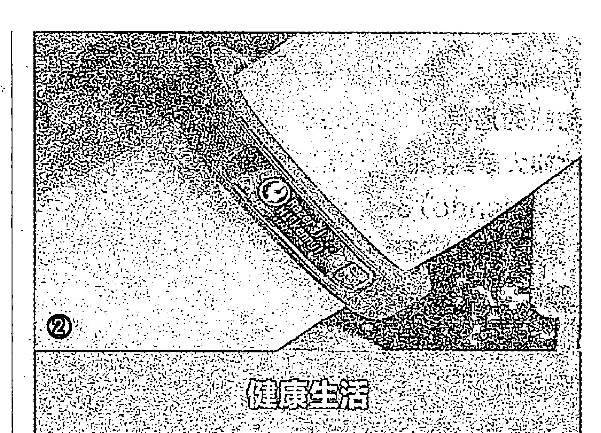


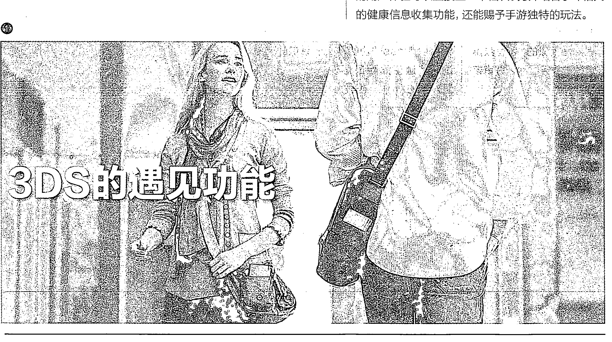## 不再擦肩而过

传统硬件设备提供新鲜功能的还有游戏机行业，比如大家熟悉的任天堂（Nintendo）3DS掌上游戏机。3DS至今仍是最受欢迎的掌上游戏机之一（图1），但似乎仍然无法抵挡目前手机游戏对于掌机的侵略与蚕食。光有好游戏还不够，掌机也必须具备手机的社交功能。

传统游戏机与目前的手游网游的最大区别就是只有玩家一个人在游戏，与外界的联系少得可怜，在这一点上和手游、网游根本没得比。但是3DS提供的Street Pass功能能够有效地解决这一问题，开启Street Pass通信功能时，遇到其他玩家时3DS指示灯会变成绿灯来提醒玩家，还提供了平台来查看遇到的玩家资料和信息（图2）。

光看信息并没有什么技术含量，很多3DS游戏针对Street Pass提供了游戏内置的数据与虚拟物品交换功能，这对于很多游戏收集迷和需要大量其他玩家帮助的游戏来讲提供了全新的玩法。例如《超级街霸4》等对战游戏在数据交换后能够根据对方玩家的数据产生一个和对方水平相当的AI进行挑战，而《超级马里奥》系列产品中一些游戏就可以得到其他玩家的稀有道具复制品等等。3DS可以设置多个支持Street Pass的游戏，即便对应的游戏没有打开3DS也会正常工作并交换信息。

### 对应安全问题

但开启后需要对3DS进行一些微调才能使Street Pass像以往那样正常工作，主要的步骤集中在SSID和MAC地址的设置上。首先将虚拟SSID设置为大量玩家使用的“attwifi”，然后根据自身需要决定是否使用SSID的密码。取消加密的话能够完美实现以往Street Pass的功能，不过为了避免危险最好设置对应的MAC地址白名单，一般3DS用户常用的Street Pass MAC地址为4E:53:50:4F:4F:46，玩家可以根据自身地区设置对应的物理地址。

如果使用虚拟SSID加密，彼此连接就需要密码了，一般是玩家在家中通过物理网卡实现。虽然有违Street Pass功能本意，但是这适合彼此已经认识的玩家通过平台互联互通交换数据（图4）。

不过，毕竟彼此直连还是有一定的风险，对此任天堂在后续的升级补丁当中逐渐改进，提供了并非P2P但基本实现P2P的功能。具体方法是彼此分别连接任天堂的Nintendo Zone Mii平台，在其上面连接数据，但是用户实际上没有直接的连通，这和很多网络游戏的连接方法其实是相似的，所有数据都经过服务器验证并审核（图3）。

如果说任天堂3DS的Street Pass通信功能能够给传统游戏带来全新玩法的话，那么目前火热的虚拟现实游戏则是将玩家之间的互动做到极致。其中的代表作是Ingress，而越来越多的手游也向着这个方向努力进化。

## 体验虚拟现实游戏

### “宅男救星”Ingress

传统游戏只能坐着玩，而这款游戏需要玩家在户外不断移动，因为Ingress的游戏内容虽然虚拟却全部基于物理定位（图1），玩家想要将游戏进行下去就要不断移动位置。游戏的核心是蓝绿两军和彼此被称为Portal的据点，而这些据点都是基于真实的地理位置，这就要求玩家要走出家门游戏（图2）。

由于游戏基于物理定位认识其他玩家远比普通游戏方便得多，如果想要通过游戏结交好友，此类虚拟现实游戏实在是首选，这是传统游戏无法比拟的。而完全随机的据点可让我们体验不同地点的风土人情，而不是仅局限于每天上班回家的两点一线式生活。

### 社交功能出色

不仅主要游戏内容基于现实存在的地点，玩家们在这些地点上如果相遇也有非常丰富的交流手段。因为游戏分为蓝绿两个阵营，相同阵营的用户可以在见面时交换道具彼此帮忙“升级”；而不同阵营的用户相遇则好像狭路相逢一样开启完全随机的虚拟战斗（图3）。每次都完全不同的阵营形式给游戏带来了无限的乐趣，远非循规蹈矩的普通游戏可比。

### 虚拟现实的未来

目前虚拟现实游戏受硬件设备所限还不能完美体现设计者的理念，不过目前广大带有可视功能的腕上设备为全新游戏体验提供了可能。由于腕上设备具有传统手机所不具有的人体信息传感器等功能，可以为虚拟现实游戏带来全新的游戏体验。

目前不论是火热的穿戴式设备还是老牌硬件品牌推出的全新产品都是将新奇和社交作为主打内容。穿戴在腕上、拿在手上的移动设备目前不仅仅要能够提供出色的显示提示功能，能否充分发挥移动设备的功能来助力用户读取信息和社交，能否为已经成型的传统产品领域提供全新的玩法，成为了目前检测穿戴手持设备是否称得上革新的标准，相信今后的腕上革命将会更为多姿多彩。

## 回到未来

### 展望过去

策划《电脑爱好者》编辑部

于1989年上映的科幻电影《回到未来Ⅱ》中，人们见识到了飞行汽车、悬浮滑板、视频通话等时下非常普通，而当时却非常超前的科技理念应用品。主人公“回到”未来的时间是2015年10月21日，曾在电影中出现的报刊《今日美国》(USA Today)也为纪念这部电影与这个特殊的日子，印制了一份与电影中近乎相同的头版内容。

本期《电脑爱好者》上市时虽晚了月余，但也想凑个热闹，与大家一同回眸看看今天的科技水平是否达到了前人的“期盼”，跟上了主流时代的“幻想”？

### 过去“幻想”的如今“设备”

智能眼镜、智能手表、3D显示、飞行汽车、智能鞋带、飞行滑板……很难想象26年前的《回到未来Ⅱ》电影中无数“幻想”真的在2015年的今天得以实现。相对而言，智能眼镜和智能手表一类的穿戴式设备更贴近现实生活，就让我们从“虚拟现实”设备开始吧。

## 幻境与现实的融合

> 在《回到未来II》影片中，主角头戴的可观看电视和拨打电话的智能眼镜曾令人印象深刻。如今头戴式设备的发展已经超过了电影的‘预测’。在虚拟现实技术的帮助下，类似电影中的‘眼镜’和‘头盔’可以实现更多玩法。

### 虚拟现实‘自古有之’

记得小时候，能在春节庙会里看上几眼“西洋镜”（于清朝传入中国的“洋玩意”）是无数小孩子的梦想（图1）。当年没有互联网，交通也不便利，想亲眼看异地风情、古代宫景，唯有透过西洋镜匣子前的那面小小的放大镜。虽然西洋镜的体验并不怎么样，但它至少为笔者那个年代的小孩子打开了一扇观摩世界的窗口，让现实与虚拟产生了交错。

大约在20年前，比尔盖茨就曾在其预言式著作《未来之路》中提到：“随着科技发展，人类将有能力通过机电设备模拟真实的感觉。比如当眼镜和耳机可以模拟出足够逼真的视觉和听觉时，人们就会无法分辨出虚拟与现实，产生置身另一世界的感觉。”没错，比尔盖茨的这番话，不就是对时下最热的“虚拟现实技术”（VR）的描述吗？

### 虚拟现实技术的两条路线

头戴式的眼镜或头盔，是虚拟现实技术的主要载体。因此本文所讨论的主角，也就是所谓的“虚拟现实头戴设备”。目前，此类设备已逐渐衍生出两种发展路线，其一是以手机眼镜为载体的入门虚拟现实路线，而另一种则是沉浸式虚拟现实体验路线。对普通用户而言，第一种路线的产品相对最为“靠谱”，因为它们可将体验成本降至最低。

谷歌Cardboard就是最便宜的虚拟现实头戴设备(图2)，它是由硬纸板、NFC标签、头带、双凸镜片等构成的DIY套件。用户只要自行将套件组建成头盔，并将手机固定其中(图3)，再安装适配的APP即可在播放左右格式的视频或游戏时获得身临其境的体验了。在淘宝上，类似Cardboard的VR眼镜(下文简称VR眼镜)的价格从10元~50元不等，非常适合普通用户买来尝鲜。

但是类似Cardboard的VR眼镜佩戴并不舒服，显示效果也参差不同，最关键的是如果你本来就因近视而佩戴了眼镜，那就基本宣告与VR眼镜“绝缘”了。为此一些相对高端的VR眼镜就派上用场了。

三星Gear VR应该算是高端VR眼镜的标杆类产品。目前该产品已经推出两代，一代Gear VR(1599元左右)仅支持Galaxy Note4手机，而二代Gear VR(1999元左右)则兼容Galaxy S6和Galaxy S6 Edge(图4)。和谷歌Cardboard一样，Gear VR的显示器和运算单元都来自手机，所以它本身依旧是由佩戴组件、透镜和数据接口组成的VR眼镜，只是增加了陀螺仪和控制面板等电子元件，可以实现更为精准的定位和功能。为了照顾视力不好的用户，Gear VR提供了屈光度调节滑钮(图5)，玩家可根据自身近视的度数加以调节，以看到最为清晰的画面。

问题又来了，三星Gear VR的价格太贵啦，而且仅兼容自家高端手机。难道就没有类似的替代方案吗？答案是有，而且还很多，比较有代表性的有乐蜗SVR Glass(图6)、暴风魔镜、小宅魔镜、真幻魔镜、灵境等，除了SVR Glass价格为299元外，其余几款产品在淘宝上的价格多在百元左右。而这些国产VR眼镜的体验差异主要在于支持手机的屏幕大小、佩戴舒适度以及镜片品质。以暴风魔镜为例，市面上存在三代型号，一代采用的是50mm的菲涅耳透镜，存在反光、雾化和成像不清晰等现象；二代改用普通树脂材质透镜，兼容性不佳；三代选择了大视角沉浸式透镜，在效果上有了较为明显的改善。

需要注意的是，VR眼镜的可玩性取决于是否拥有充足的内容支撑(图7)。SVR Glass可下载安卓版VR管家APP、暴风魔镜和小宅魔镜也有自己的APP，而更多的VR眼镜则会选择“借用”其他品牌产品的APP。遗憾的是，此类APP大都只能提供有限的视频和简单的游戏用于尝鲜体验(新游戏和视频的更新速度极慢)，过不了多久新鲜感就会消失，对VR眼镜的兴趣自然也会迅速降温。从可玩性和真实的体验感受来看，高端VR眼镜还是有着非常明显的优势的。原因很简单，像三星Gear VR等AR眼镜配套的软件都是由Oculus（已被Facebook收购，是目前最专业的VR技术和内容提供商）提供的，无论是内容（影片或游戏）的数量还是品质都更有保障。比如，三星会建议用户坐在可旋转的椅子上体验Gear VR2，同时保证周围空间足够大，以免磕碰。在VR代表游戏Omega Agent中（图8），玩家可以将旋转椅作为游戏中的喷气飞行机，通过转动椅子就可控制飞机朝向，可让你真正沉浸在360度的虚拟游戏体验中。

火速连接
如果你想进一步了解谷歌Cardboard的DIY全过程和使用方法，请参考本刊2015年11期文章《无需花大钱 Android 手机改造虚拟现实头盔》。

在真正的发烧级玩家眼中，无论是实惠的谷歌Cardboard还是三星Gear VR都算是“玩具”，而沉浸式虚拟现实设备才算是“正规军”，二者在画质、音效和沉浸感上都有着云泥之别。简单来说，沉浸式虚拟现实设备就是内置屏幕，且集成更多传感器的“VR头盔”（下文简称VR头盔），它们在物理结构和电子线路的复杂度上远非前文的“VR眼镜”可比（图9）。此外，我们还要将VR头盔与头戴式显示器区分开来。比如，索尼旗下的HMZ系列就仅能算是“头戴式显示器”（图10），由于发展潜力不足，该项目已被索尼终止，并推出PlayStation VR（原命名为Project Morpheus）正式转战虚拟现实头盔战场。

### ▶代表未来的沉浸式虚拟现实

Oculus是VR头盔领域当之无愧的“鼻祖”，经历了近三年的研发后，终于在2015年发布了旗下首款消费级VR头盔：“Oculus Rift”（图11）。该产品每只眼镜均为1200×1080像素（OLED材质），系统支持六轴运动系统并拥有直立式的外置摄像头，用于监测并捕捉用户的运动。Oculus Rift支持PC和Xbox One游戏，要与高规格的PC连接才能得到流畅的体验（官方配置要求：英特尔i5-4590或更高、NVIDIA GTX 970/AMD 290或更高级别独显）。

VR头盔的另一代表就是索尼新推出的“PlayStation VR”（图12），预计2016年3月25日正式发行，售价499.99欧元（约合人民币3600元）。PlayStation VR的原理和索尼HMZ头显类似，只是加入了虚拟现实功能。配备了分辨率为1920×1080的全高清OLED屏幕，刷新率可达120Hz。遗憾的是PlayStation VR只是PS4的专属装备，很难吸引PC的死忠用户。

那么，目前国内我们有哪些VR头盔可选呢？比较有代表性的产品有深圳虚拟科技Three Glasses（1999元，D1开发者版）（图13）、蚁视头盔ANTVR HEADSET（1499元）（图14），二者规格相近，比如都是60Hz刷新率的1080P屏幕，都内置陀螺仪、加速度计、磁力计、9轴传感、头部跟踪灵敏等传感器。可惜，这些国产VR头盔还是受制于匮乏的应用，短期内不建议普通用户尝鲜。

## VR未来的发展前景

虚拟现实技术的发展前景并不局限于游戏和视频，在未来的教育事业和医疗事业中也能承担起更为重要的角色。比如，医学院的学生可以模拟一间手术室，以便快速掌握人体解剖要领；消防员可以模拟火场，以便安全掌握各种救火、逃生等方面的技巧；蜗居家的宅男可以模拟夏威夷的风光，感受沙滩浴场的氛围……

《回到未来II》中，主角即使带着智能眼镜依旧能准确接水喝水

### VR潜在的隐患

虽然虚拟现实技术看起来真是无比的快乐多，但它却也暗藏着很多隐患。绝大多数用户在体验过VR游戏后都会出现一定的眩晕感，如果设备分辨率过低或画面延迟太高，则会进一步加剧这股类似晕车晕船的感觉。此外，当玩家带上VR头盔后，大都会出现一股莫名的孤独感。如果运行的是恐怖类游戏，在高度的沉浸体验里很多人将无法分清现实和虚拟的区别，对心脏不好的玩家而言极有可能出现危险（图16）。比如索尼在发布PlayStation VR时就展示了一款名为《厨房》的Demo，游戏中玩家所扮演的角色被杀手绑在了厨房里。由于游戏过程需要一直坐在椅子上，所以和现实重叠的临场感和虚拟现实特有的代入感会让你随游戏剧情而不断尖叫！因此现在VR设备提供商都在想尽办法对游戏体验进行优化和改进，其中最重要的一点就是减轻“模拟疾病”（Simulation Sickness，一种观看3D画面后产生的不良症状）。而未来虚拟现实游戏也必定进行更严格的分级制度，让娱乐和安全并存。

## 喝水？没那么容易

当我们带着VR眼镜或头盔时，想要喝水怎么办（图17）？为此，很多高端产品都会在眼镜/头盔前配备摄像头，用于以“画中画”的形式让你看到自己的手，并准确安全地拿起水杯完成喝水的动作。

## 通话的多样性

### 无处不在的语音沟通

《回到未来II》虽然成功预测了无数“未来装备”，但依旧存在遗憾。比如时下最热的智能手机就没能影片中出现。而电影中现身的智能眼镜虽然也能实现通话（图1），但其体积却太过笨重，现实中的我们更青睐于戴着小巧的蓝牙耳机，或更酷的类Google Glass设备来为耳朵“减负”。

重新审视一下我们的身边吧，智能手机、平板电脑、智能手表、智能眼镜……几乎所有贴身的移动设备或穿戴设备都“直接”或“间接”地具备了通话功能，我们可以根据环境或自身喜好随意搭配。所谓“直接通话”，即设备可加装SIM卡并内置MIC和扬声器单元，可以独立进行语音通讯。而“间接通话”，则是需要借助手机内的SIM卡，曲线获得通话功能。接下来，就让我们简单聊一聊这两种语音联通的方式吧。

### 直接通话的利与弊

在穿戴式设备领域，最知名的支持“直接通话”的产品就是以三星Gear S系列为代表的智能手表了。以Gear S1为例（Gear S2的3G版也支持打电话），其背部配备了一个SIM卡插槽（图2），在加装SIM卡后就可变身手表电话，实现通话、短信等手机才能具备的功能（图3），只是Gear S1通过扬声器发声，使用时需抬起手臂，感觉就是一部免提电话。要注意的是，Gear S并没有选择谷歌为智能手表定制的Android Wear系统，而是三星自主研发的Tizen系统。实际上市面其他几款支持拨打电话的智能手表也舍弃了Android Wear，而选择从标准版Android系统精简优化而来的OS。

原因很简单，Android Wear是围绕Google Now（国内产品会改用其他语音识别技术，比如MOTO就与“出门问问”合作）和谷歌语音控制为核心的一整套解决方案，专为小屏幕而生。因此它在系统底层就没考虑过智能手表要能安装SIM卡，也一直没有开放API来原生支持手表上的扬声器，几乎所有的Android Wear智能手表都直接“阉割”了扬声器单元（仅保留MIC用于语音交互）。此类产品别说打电话了，即使想通过手表播放音乐或音频也得外接蓝牙耳机和音箱才可以实现。

虽然为穿戴式设备赋予直接通话功能看似很美好，但随之而来的问题就是成本过高、扬声器功率不够大（声音偏小）及额外的耗电问题。智能手表的电池普遍只有200mAh~400mAh，SIM卡待机、联网都是耗电大户，1~2天一充是免不了的。如果因为忘记充电而导致设备罢工，所谓的通话和一系列安全功能就没有任何意义了。于是更多的穿戴式设备便将目光放在“间接通话”功能身上。

品牌有吧吧咪呀、搜狗糖猫、小天才电话手表、哇喔通话手表、360儿童卫士3代等（图4）。此类产品主打儿童安全，原理和功能类似，支持计步器、睡眠监测等健康管理，并通过GPS+GPRS（通过SIM卡联网）实现精准定位，而家长可以在手机APP客户端查看手表当前的位置信息，避免小孩走丢。同时，借助内置的SIM卡还能在紧急时刻实现通话，或远程监听。

时下流行的“儿童手表”也是“直接通话”的代表之一，代表产品有吧吧咪呀、搜狗糖猫、小天才电话手表、哇喔通话手表、360儿童卫士3代等（图4）。此类产品主打儿童安全，原理和功能类似，支持计步器、睡眠监测等健康管理，并通过GPS+GPRS（通过SIM卡联网）实现精准定位，而家长可以在手机APP客户端查看手表当前的位置信息，避免小孩走丢。同时，借助内置的SIM卡还能在紧急时刻实现通话，或远程监听。

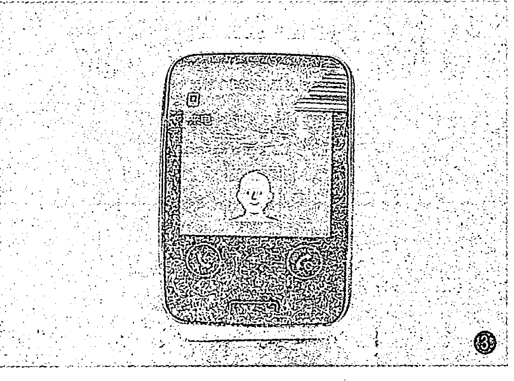

## 退而求其次的间接通话

Apple Watch是“间接通话”的代表，用它通话的前提是手表必须和手机连接，借助手机的SIM卡和通讯网络实现拨打或接听电话（用手表内置扬声器进行免提通话）（图5）。此外通过微信类的APP，在Apple Watch身上也能实现语音消息的接收和发送，也算语音联通的表现。很多智能手表和高端智能手环也都开始支持将手机通话的语音转接到自己身上（图6）。而让手机与穿戴设备之间沟通的“桥梁”，就是蓝牙技术。

时至今日，蓝牙已成为所有穿戴式设备的核心功能，用于与智能手机或蓝牙耳机配对，进行音频和数据消息的无线传输。Apple Watch如此，Google Glass也是如此。在未来，语音联通很可能将手机独立，我们可通过手腕上的手表或手环、智能眼镜等穿戴设备查看来电显示并选择接通，通过设备自身的扬声器或耳朵上的蓝牙耳机与对方进行交流。


## 蓝牙的发展简史

蓝牙2.1+EDR是普及率最高的蓝牙标准，但存在速度慢、耗电大的问题。于是蓝牙3.0引入了全新的交替射频技术，需要时可借用802.11 Wi-Fi频段实现高速数据传输，24Mbps的数据传输率是2.1的8倍左右。随着智能手机和蓝牙耳机、蓝牙音箱等移动设备的崛起，蓝牙的高耗电特性已然影响到设备的正常待机，蓝牙4.0在保持速度不变的基础上（依旧是最高24Mbps），着手努力降低功耗，并逐步提升使用体验。比如蓝牙4.0将有效覆盖范围扩大到100米；蓝牙4.1提升了连接速度并且更加智能化；蓝牙4.2更厉害，不仅改善了数据传输速度和隐私保护程度（未经许可蓝牙信号将无法连接和追踪用户设备），还将两部蓝牙设备之间的数据传输速度提高了2.5倍。如今，蓝牙即将进化到5.0时代，其最大特点是加入了室内定位功能，结合Wi-Fi可以实现精度小于1米的室内定位！

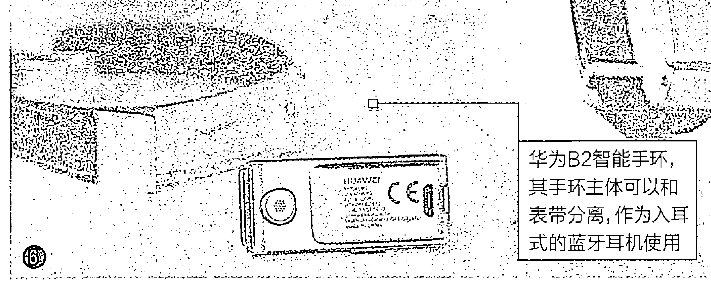

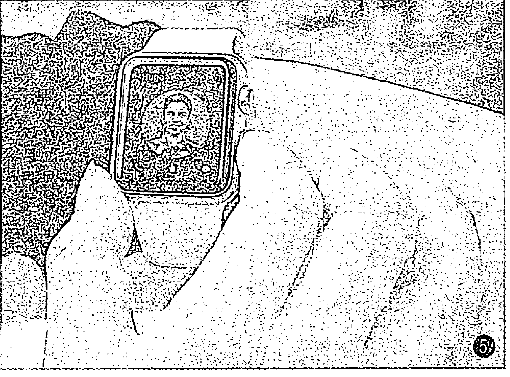

## 未来是美好，旧物也应当


和《回到未来》一样，《终结者》也是一部经典的穿越系列电影。在2015年最新上映的《终结者创世纪》中，阿诺·施瓦辛格的一句‘我老了，但我并没有过时’大有‘颠覆未老’的情怀（图1），那么，我们身边的一些或闲置或淘汰的‘老将’们是否也有发挥余热的可能呢？

### 图 老手机的新功效

相信每个人家里都会有几部淘汰的智能手机，有人会将它们拿到二手交易平台上卖掉回笼资金，而更多的用户则会选择将它们尘封在抽屉的角落‘吃灰’。实际上，只要你的智能手机配置不算太低，都有机会借助‘外力’重新委以重任。下面我们就以Android系统手机为例，简单探讨一下让淘汰的老旧手机重新上岗的方式。

### 家电遥控器

空调、机顶盒、电视、DVD……家里的每一部电器都需要匹配的遥控器操作，时常会出现找不到遥控器的情况，而且每隔一段时间还得给它们换电池，常年累月下来也是不可忽视的一笔开销。其实，我们只要在淘宝上搜索‘手机红外遥控’就能买到直插手机耳机孔的万能遥控器（多在20元~50元，可同时支持iOS和Android系统）（图2）。此类产品通过耳机孔供电，配合指定的APP可以遥控几乎所有的家用电器，使用简单、功能丰富。有些品牌甚至还会提供将遥控器固定在耳机线上的收纳器（图3），避免关键时刻找不到红外遥控的尴尬。

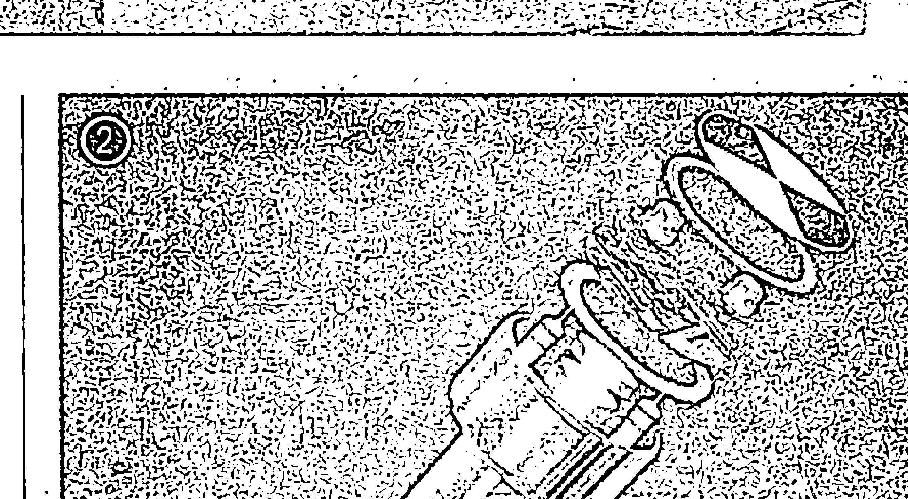

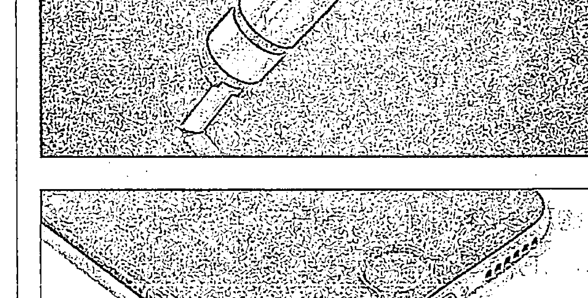

使用建议：将淘汰手机设定到飞行模式，续航时间可以翻倍。

### 行车记录仪

为了避免各种‘碰瓷’，很多司机朋友都会购买行车记录仪保驾护航。实际上任何智能手机在安装APP后，同样可扮演行车记录仪的角色。比较有代表性的APP有‘魔控行车记录’（下载地址：http://www.monect.net/）（图4）和‘谍虎行车记录’（下载地址：http://jl.spyhoo.com/），两款APP都支持iOS和Android，可修改录制时长、空间大小和循环录制等功能（图5），使用体验都不错。


### ▶使用建议

行车记录仪APP最忌讳的就是启动后突然来电，所以最适合不安装SIM卡的淘汰闲置手机。为了避免意外，建议大家购买手机架（将手机固定在前挡风玻璃上，并调整好摄像头拍摄的角度）以及车载充电器（确保手机时刻都有充足电力）。

此外手机录制视频时发热量普遍较高，所以建议大家只有在汽车启动后才运行APP，停车熄火后关闭APP。有条件的用户可以选择Root手机，禁止第三方APP自动启动，并将行车记录仪APP添加到自动清理后台的白名单中。就保存路径而言，建议选择手机内置的存储空间（存储卡读写速度相对要慢一些，不如内置存储快），而且尽可能将最大占用空间调大，避免因存储空间不够而覆盖了重要的视频记录。如果APP提供了“撞击后自动保存记录”（感应到碰撞后会将关键影片设为防写以免被删除或覆盖）就一定要开启，如果没有提供类似功能，在出现事故后要第一时间备份当前记录的视频。

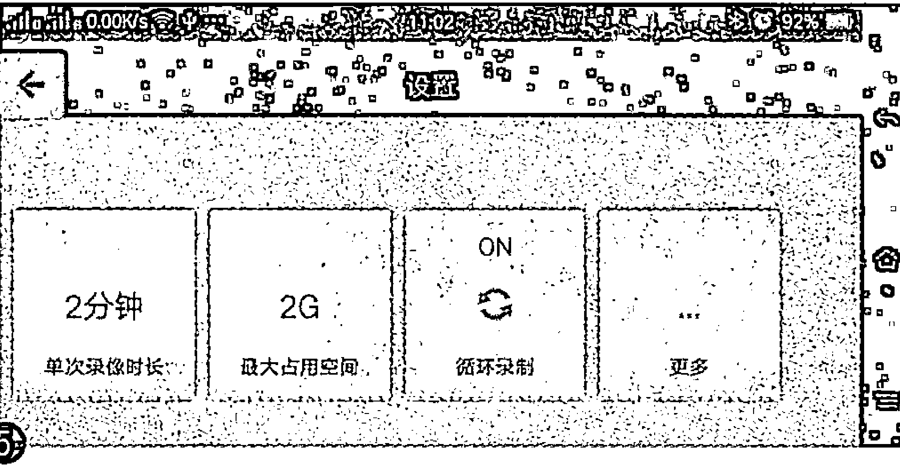

## 浑身是宝的电脑

当笔记本“寿归正寝”后，将其当做废品出售的用户不在少数。实际上，废旧的电脑浑身是宝，不相信？那笔者就给大家展示几个改造思路，希望可以起到抛砖引玉的作用。

### ▏笔记本屏幕改造显示器

如果没有遭遇磕碰等外伤，笔记本屏幕（LCD）很少会出现故障。因此，只要淘汰笔记本的屏幕可以被点亮，就有机会变身可独立使用的显示器。在淘宝上搜索“笔记本 改屏套件”，我们可以找到无数从50元~150元不等的套件，包含驱动板、高压包、灯管、控制面板、遥控器和电源（图6）。

选购改屏套件的难点是确定笔记本LCD的具体型号，一般可通过鲁大师等硬件检测软件查看（可正常开机时），或将笔记本的LCD拆下来，在LCD背部的铭牌上查看（笔记本无法开机时）。有了具体的型号，才能从商家那里索取100%兼容匹配的屏线和电源线。改屏套件安装时的重点就是如何将各种组件固定隐藏，对外观整洁要求度高的玩家直接购买自带显示器框架的改屏套件（图7），再将LCD和套件固定其上使用。而改屏套件大都具备视频解码功能，自带USB和读卡器接口。将拷贝有视频、音乐和图片的闪存盘插在其上可以直接读取播放。

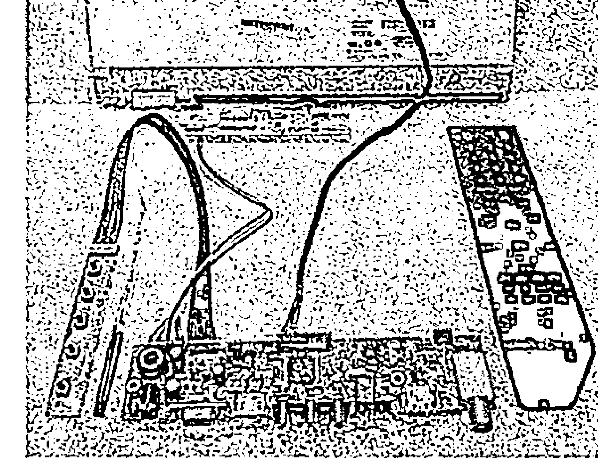

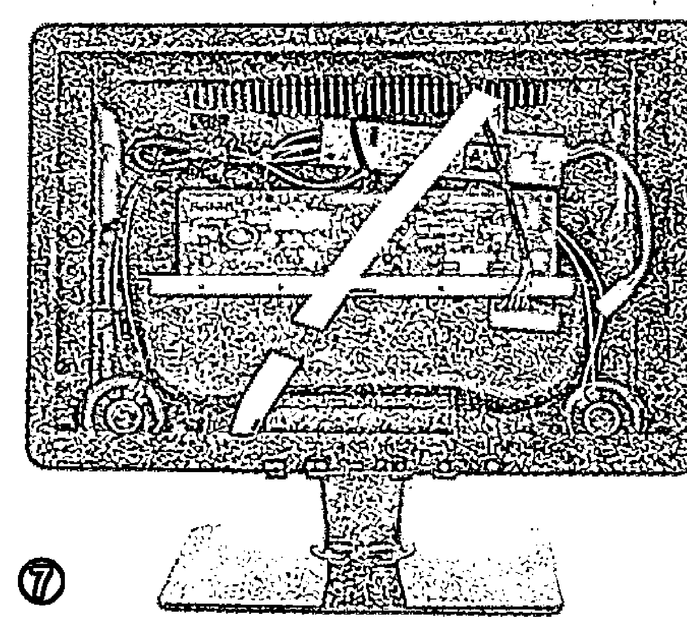

### ▏笔记本电池变移动电源

除了少数超极本/超薄本，绝大多数笔记本电池都由多节18650电芯构成。笔记本下岗后可将电池里的18650电芯拆下来，塞进移动电源盒（需另购，大约20元~50元）即可。改造的难点在于拆开笔记本电池的外壳，用合适的钳子将相连的电芯剪开（图9），在装入移动电源盒前要用万用表找出18650电芯的正负极。


### 必读链接

除了本文介绍的几种方案，智能手机还能扮演PC遥控器（取代键盘鼠标）、视频监控等功能，具体方法请参考本刊2014年3期《旧而不废 老手机自有新用途》和2014年6期《APP淘金 老手机焕发“第二春”》这两篇文章。

### ▏笔记本电源的妙用

笔记本电源出现故障的几率很小，由于它们普遍具备60W~90W的功率（电压多为19V），可满足同时为6~9部iPad安全充电。因此哪怕笔记本坏得不能再坏，只要电源是好的，就可考虑将其降压改造成5V的USB充电器。由于具体改造需要较深的电路知识，这里笔者只是展示思路和最后成果。根据闲置电源的功率，选择数量不等的电压变换模块（自带USB接口），将导线连在降压板上后，再用19V稳压电源对所有降压板通电，最后将电源和电压变换模块等全部固定在用有机玻璃板切割成的框架内即可（图8）。


《回到未来》中电影制作者对视频会议、影像播放等超前的设想，这些不仅早在多年之前便已实现，还不断延伸至生活的每个角落，如智能手机上的各类型‘通话’将前人的想象发扬光大。这些与硬件技术的进步密不可分，但源于之上则是奠定它们发挥效能的‘软基础’。

## 奠定“未来”的软基础

## 形态巨变 主旨未变

文|刘英

上世纪八十年代，电脑还是一个非常神秘的‘机器’，尽管功能非常有限，但它让许多人充满幻想。那时的软件技术过分专业化，软件操作难度比较高深，因此人们呼唤着更加人性化的软件出现。从那时到现在的二三十年间，软件一直都朝着界面图形化、操作人性化、功能更强大的方向发展。如今，以往在电脑上需要多次重复才能完成的任务，借助于一些自动化程度比较高的软件，可以高效快速地完成。

### 聪明剪贴 助力信息复用

在信息技术不发达的上世纪，信息的复用曾是个难题。许多时候，前面复制过的内容在后面需要用到，但由于先前剪切板中的内容已经被新近的内容取代，因此不得不重新进行复制、粘贴。为了弥补这一遗憾，后来人们开发出了各种剪贴板工具，就连微软的Office也在Office 2007版之后开始支持多重剪贴板功能。通过剪切板这个无形的工具，可以实现信息的高效复用：常用的剪贴板工具有Ditto、CLCL、3D Clipboard、QQ剪切板等。


相比大家常用的简易剪贴板工具CLCL、3D Clipboard、QQ剪切板等，Ditto是一款功能非常强大的剪贴板管理工具。安装之后界面默认为英文，通过软件设置的“Language”项，可将界面设置为简体中文。

软件运行后会以一个蓝色图标常驻系统托盘。每当复制一条信息，该软件就会将这条信息记录下来（连同格式或图片等），当需要复用这条信息时，单击系统托盘上的该软件图标，然后双击这条信息，即可将信息应用于当前编辑的位置。

这是该软件的最基本用法。其实，该软件还有许多更加高级和实用的使用技法（图1）。

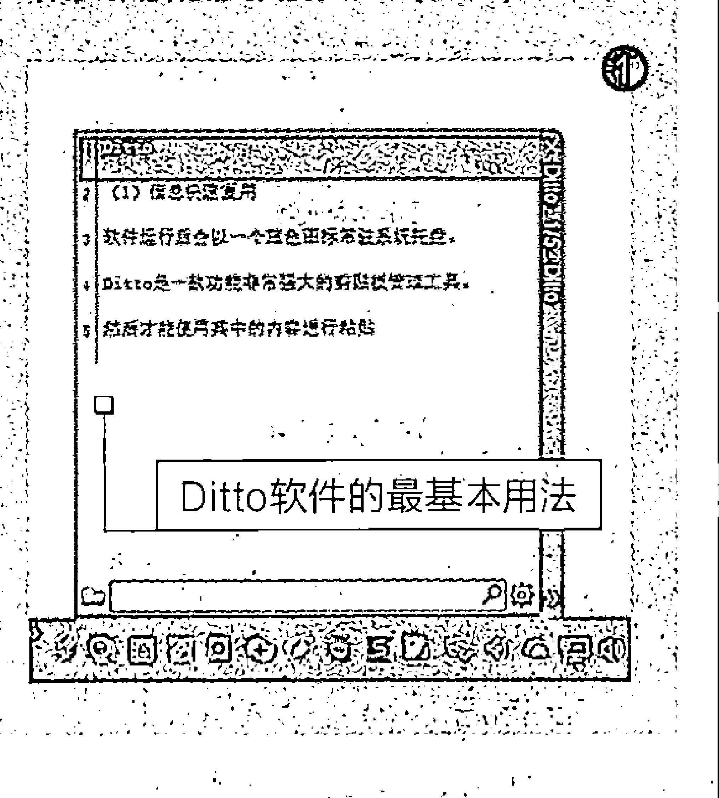

### 自动合并粘贴快速重组文章

我们有时需要摘录不同地方的文章片段，然后重新组织成一篇文章。以往的做法往往要在几个目标之间来回“奔波”，复制、粘贴，复制、粘贴。现在，有了Ditto软件强大的复制粘贴功能，就可以将这一过程简化。我们只需到不同的目标页面去复制需要的段落内容，当所有需要的内容复制完毕之后，在Ditto软件的信息列表中就形成了这些复制内容的记录。这时，打开目标文本编辑器（如记事本、WPS或Word），然后点击任务栏上的Ditto图标，用Ctrl或Shift与鼠标点击配合的操作方法，选择多条需要的记录，最后执行一次性粘贴操作（可以是带格式的或不带格式的信息）（图2）。

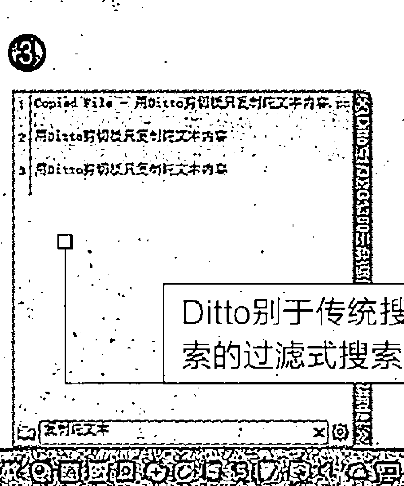

### 别于传统搜索的过滤式搜索

Ditto软件是“大肚子”，能一个劲儿地容纳复制的内容，但当我们“贪婪”地将许多内容复制到这个粘贴板中之后，复用时往往可能为找到某条信息而来回翻动菜单。其实Ditto带有不同寻常的搜索功能，在软件信息列表的底部搜索框中输入所需条目中的一些信息（不一定非常准确，可以是简单的词汇），即可随着输入的过程不断过滤出接近于需求的结果。这种在剪贴板中进行高级搜索的功能，在剪贴板类软件中还是绝无仅有的（图3）。

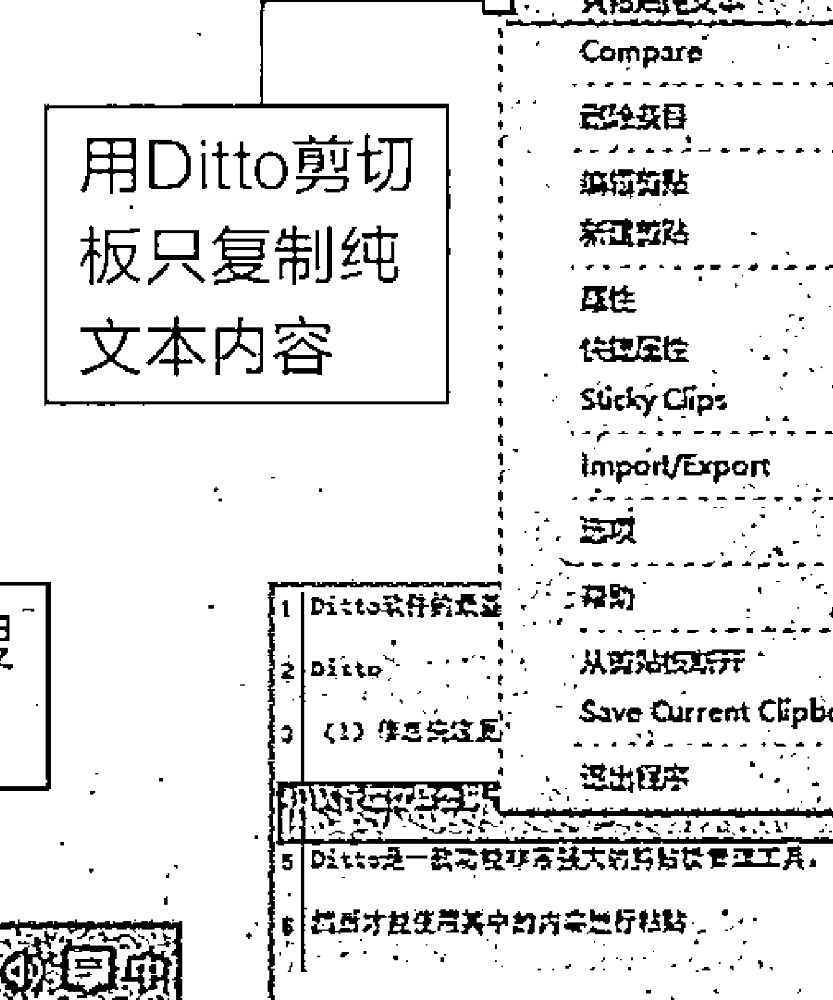

### 纯文本粘贴让网文搜集变简单

摘录和收藏网上精品文本是不少人的习惯。但是由于网上的文章存在各种各样的版面格式，因此如果直接复制网页上的文字，会连文本格式一同拷贝过来，当转到Word或WPS等文字处理软件中进行粘贴操作时，会连同一些不需要的格式也复制过来。这时人们常用记事本作为中转站来过滤文章格式。其实用Ditto剪切板工具的一条命令，一步就可解决格式过滤问题。在复制的条目列表上右键点击需要利用的项目，然后从弹出菜单中选择“只粘贴纯文本”（或者用Shift+Enter组合键），即可实现无格式文本的复制（图4）。

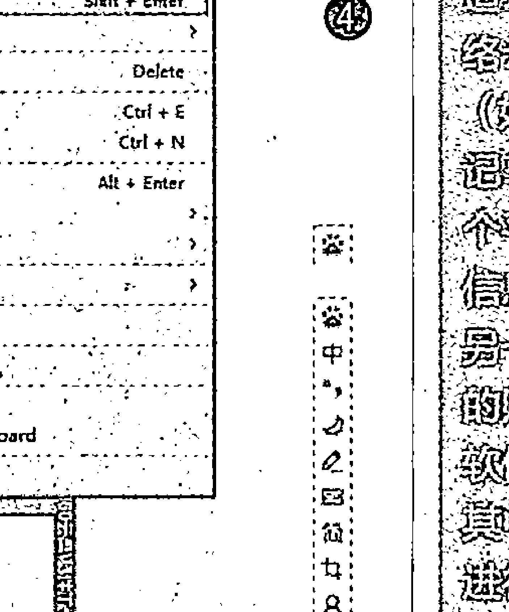

### 巧用剪切板实现删除内容的恢复

在编辑文档的过程中，有时会后悔于前面删除过的内容，在没有备份的情况下往往不得不重新输入以前删除的内容。有了Ditto软件的服务，这种“后悔药”就不买自备了。只要Ditto软件处于开启状态，它都会将删除的内容作为一条记录添加到剪贴板中。这样，当发现删错了内容，需要恢复时，打开Ditto软件记录的信息列表，然后通过浏览选择或搜索选择的办法就能找回所需信息了。

> 格式过滤还可以用更专业的剪贴板软件3D Clipboard，该软件只会复制选中的文字，不会连带格式一同复制，因此在处理网页文字内容时非常方便，无需先粘贴到记事本中再复制。不过由于Ditto软件更加强大，所以还是建议使用Ditto。另外，如果想实现跨平台的剪贴板同步，还可以利用云服务中的剪贴板（如百度云中的记事本），在一个平台复制建立信息条目，再到另一个平台访问相同账号云盘同步信息，进行复用。这其实也是剪贴板功能的延伸。

## 一键直达——为快速启动而生

安装的程序多了之后，要快速找到自己所需的程序是个问题。尤其是当今的Windows操作系统，有的有开始菜单，有的取消了开始菜单，找起软件来更让初级用户犯难，老手也费周折。如果利用一些快速启动类的工具帮忙，快速启动软件就不在话下了。


### 用Windows 10快速搜软件

在微软新近发行的Windows 10系统中，软件启动也变得更加简单和人性化了。如果不知道自己的软件装到了哪里，一时无法确定其位置和调用的快捷方式所在时，可通过开始菜单旁边的搜索框或搜索按钮，输入软件所含的关键词进行搜索，软件会很快给出系统中安装的相关软件的列表（图6）。

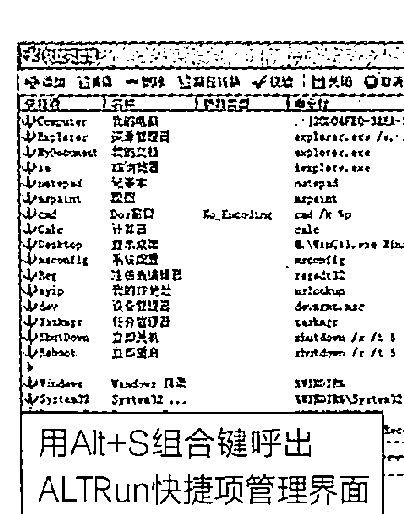

### ▶快启无忧就用Find And Run Robot

不管软件安装到哪里，是否丢失了桌面或开始菜单中的程序图标，都可以通过一款Find And Run Robot工具，快速呼出已经安装的软件。Find And Run Robot安装后会自动将系统程序列表中的项目导入到搜索数据库中。此外，用户也可以将希望搜索的目录路径添加到该软件中，扩展软件的搜索范围。

Find And Run Robot软件安装之后，会以一个蓝色圈内印白色F字符的图标常驻在系统任务栏托盘之上。在搜索框中输入要启动的软件关键词（可是全部或部分），然后会自动给出符合条件的记录。例如要调用百度软件产品，输入“百度”二字，即可搜出相关的所有产品链接，双击其中需要的条目，即可启动该软件（图5）。

> 小技巧
在需要调用某个软件时，双击系统托盘的Find And Run Robot图标，或直接按下键盘上的Pause Break键，即可激活程序搜索框。

### 创建真正属于自己的“我的开始”菜单

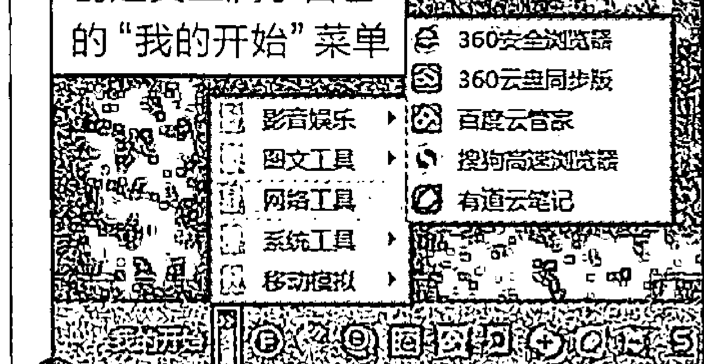

### ▶手动创建任务栏快速启动菜单

除了通过工具软件的自动搜索功能或系统的自动搜索功能来定位软件外，我们有时更希望将自己平时常用的程序、文件夹、文档等建立一个快速启动的菜单来选择。为达成这一目的，可在任务栏上建立一个属于自己的“我的开始”菜单，该菜单可分门别类地组织一些程序、文件夹、文档等。这样在任务栏上点击，即可打开属于自己的个性化菜单了（图7）。

### ▶通过ALTRun管理软件快速启动

在软件快速启动自定义方面，ALTRun软件无疑是功能最为强大的一款。记住该软件的名字，也就能知道软件如何启动和使用了。按下Alt键之后，单击R键即可启动软件主界面，然后输入关键字，马上显示快捷项目，选中快捷项目后回车即可执行该项目。基本用法就是如此简单（图8）。

使用该软件，除了记住以上快捷键外，最好再记忆两组快捷键。一组是Alt+S，用来在软件主界面显示的情况下，呼出该软件的快捷项管理界面，这是定义快捷项的关键界面，在该窗口中通过添加和编辑按钮，对快捷项进行创建和编辑。另一组是Alt+C，用来进入该软件的配置设置界面，在配置界面中...

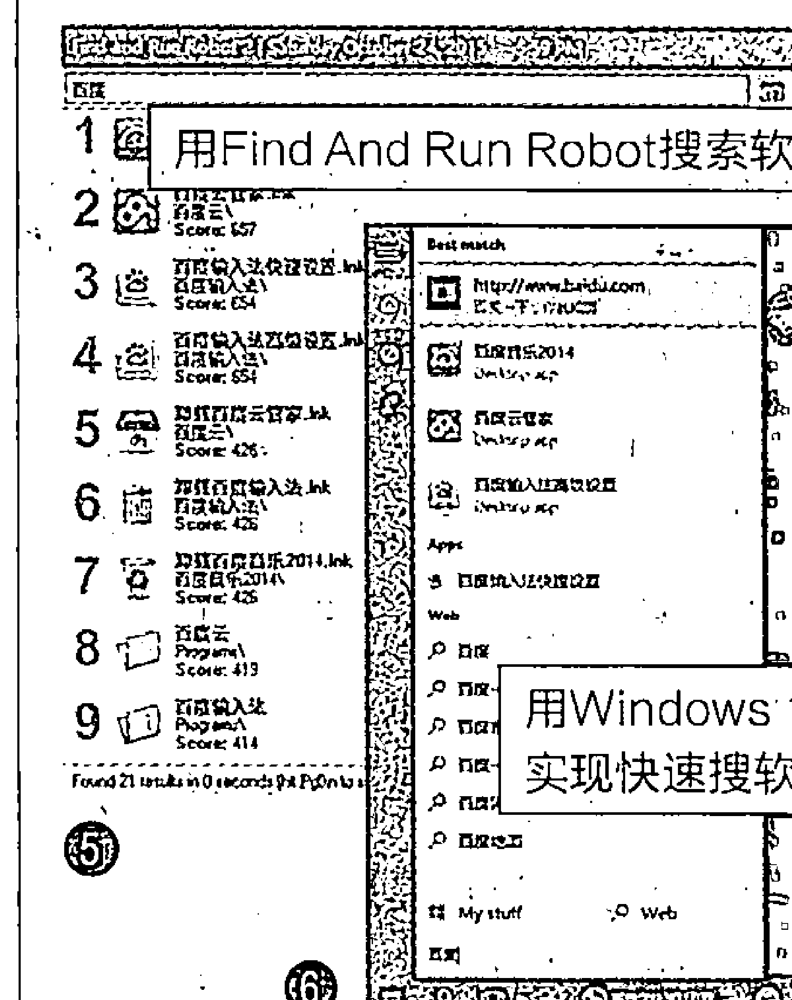

> 火速连接
有关在任务栏建立个性化菜单的具体方法，请参见《电脑爱好者》2014年第6期文章《自建优于开始菜单的多级菜单》。

## 即输即搜 文件快速定位

置窗口的热键配置页中，可以看到该软件独创性地提供了软件启动的双热键，除了用Alt+R启动软件外，还可指定另一组用来启动该软件的热键组合（图9、图10）。

Windows系统拥有独特而强大的文件资源管理体系，它要求用户能够熟练地掌握文件资源的搜索定位方法和技能，这样才能高效地利用存储的文件。但是，历代Windows系统自身所提供的文件搜索工具效率比较低下且功能单一，于是人们常常借助于第三方工具来解决问题。这里向大家推荐一款经典的文件管理和搜索增强工具Listary，可增强Windows对文件的管理功能，提高搜索文件的效率。

### 定义默认的资源管理器启动参数

为了让Listary软件时刻都能发挥作用，需在软件的常规设置中将“开机自动运行Listary”和“以管理员权限执行”两个选项选中。与此同时，如果使用Windows资源管理器以外的文件管理器，需要在下方的“路径”和“参数”中填写第三方文件资源管理器的数据（图11）。

### 用好软件 把握关键的呼出机关

使用Listary的关键一招是如何呼出该软件的工具栏或操作界面。该软件提供用快捷键组合和鼠标单击的方法来呼出操作界面。但是，由于Windows系统版本的多样性，在一些系统（如Windows 10）中，软件默认提供的操作快捷键组合可能与系统默认的快捷键组合发生冲突，因此在首次运行软件时，需要重新为软件的重要功能指定别的快捷键。由于软件默认的快捷键Win+S已经被Windows 10系统搜索所占用，于是我们只得为“显示Listary工具条”指定别的快捷键（如“Win+F12”）。另两组重要快捷键“显示弹窗菜单（Win+N）”和“使用Total Commander来替换文件对话框（Win+O）”则可沿用软件默认的设置（图12、图13）。

除了呼出软件的重要设置外，由于要在Windows资源管理器或其他第三方工具软件环境下进行搜索或使用Listary的一些功能，因此需要指定在这些软件区域使用Listary的动作或选项。这些设置可以通过Listary软件选项设置窗口的“窗口类型独立设置”或“应用程序独立设置”窗格进行选择。Listary所支持的常用资源管理器或工具软件有十多种，我们可以一一对其进行操作控制或窗口设置。

以Windows资源管理器为例，选择“即时搜索”可启用在资源管理器中即时搜索的功能；如果需要在资源管理器的空白处双击来启动Listary功能，则选中“鼠标在空白区域双击弹出Listary快捷菜单”；此外还可选择“单击鼠标中键弹出Listary快捷菜单”；选择“Listary工具栏隐藏时启用热键”则可以在工具栏不出现时让热键生效，以热键来呼出Listary的功能菜单（图14）。

### 重建索引为快速搜索做准备

Listary强大的搜索功能以其内建的搜索索引为后盾。因此在使用之前，需要使用Listary内置的搜索引擎建立索引。安装软件之后，会自动建立索引，但如果使用过程中搜索出现问题，也可以随时通过软件的“搜索”选项强制重新建立索引。

单击系统托盘上的Listary软件图标并选择“选项”，进入Listary选项设置窗口，单击“搜索”一项，然后在右侧窗格中选择“使用Listary内建的搜索引擎”，单击“强制重建索引”按钮，重新建立文件数据索引（图15）。

### 随输随搜的磁盘文件搜索

有了Listary的协助，在一个打开的文件夹中搜索文件时，既不需要使用系统提供的文件搜索框，也不需要借助于其他第三方的专用搜索工具，在文件列表窗口中直接输入字符串即可搜索。

例如，在本例中我们要搜索文件夹中的所有gif图片，当逐个输入gif三个字母时，搜索结果就出现在浮出的文件列表中了，搜索结果随着输入的过程会逐步接近最符合条件的记录，即时呈现最全面的搜索结果（图16）。

- 小提示：也可以选择使用经典搜索工具Everything的引擎来搜索，但选择该选项后Listary的一些功能将无法工作。

### 用好Listary的智能扩展命令

Listary为Windows资源管理器增加了一些智能命令。这样，无论当前所处的工作窗口如何，都可以快速通过命令切换到文件管理器中正在浏览的文件夹、直接打开文件管理中选中的文件、打开命令行窗口、复制当前文件夹路径或文件路径到剪贴板、切换到程序安装的目录、显示文件扩展名或隐藏文件等。

- 小提示：也可以按下Win+N组合键激活弹出菜单，然后从“命令”菜单下选择需要的具体扩展命令（图19）。

### 用好Listary的快捷项目切换

在文件资源管理器或文件的打开与保存对话框中，通过Listary的快捷切换功能，可快速跳转到任何文件夹，无论这些文件夹在哪个驱动器的哪个位置。

在文件打开或保存对话框中，按Ctrl+G可快速跳转到文件管理器正在浏览的文件夹。如果这时切换到资源管理器中，改变浏览另一个文件，当切换回文件对话框时，文件对话框中的文件列表也会变为刚才文件资源管理器中浏览的文件。

如果在文件资源管理器中选中了一个文件，那么在打开文件的对话框中，按下Ctrl+O组合键，可直接打开此前在文件资源管理器中选择的文件。此外在Listary的智能菜单中，还会列出所有文件管理器中已打开的文件，这样文件访问就方便许多。

> 如果想了解Listary的获取、操作及更多特性，请参看本期软网生活栏目中《“跳跃”式快速搜索》一文。

## IrfanView 何止图片浏览

早在上世纪80年代末，电脑主要是用来处理文字和数据，处理图片和影音对于大众来说还只是一个梦想。后来在90年代出现了图形化的Windows系统，图片预览也越来越多地走进了人们的视野。谈到图片的使用，首先是图片的浏览，然后进一步会涉及到对照片的编辑以及格式处理、加工再利用等。

图片处理软件有很多，目前大家最熟悉的非专业的Photoshop和大众化的美图秀秀类莫属。而除此之外，其实还有一些非常经典的工具，例如ACDSee、Irfanview等，功能也非常强大。这里将向大家介绍用其中之一—Irfanview实现快速览图和图片处理的技法。

### 让览图变为“一键”之事

如果安装了Irfanview软件，我们可以让看图变成一键即可完成的事情。通过Irfanview软件的“文件关联”设置窗口，选中“添加Irfanview至发送到菜单”选项，则通过在图片上点击右键并选择“发送到→Irfanview”命令，即可方便地打开照片预览。

如果选择“添加使用Irfanview浏览至驱动器和文件夹右键菜单”选项，则可通过右键单击存放照片的驱动器或文件夹，方便地预览其中的图片。如果选择“添加Irfanview为USB时间应用程序（连接扫描仪、数码相机等设备时）”，则可通过该软件浏览连接在电脑的数码设备中存放的照片（图20）。

### 数码照片旋转自动感知

大家一定有过这种体会，当用数码相机拍摄时，有时默认的相机横向位置无法容纳整个景物，于是就只得竖起相机来拍摄，但当照片被传回到电脑中，在资源浏览器中预览照片时，发现竖立相机拍摄的照片在图片预览窗口中都是“躺倒”着的，为正常观看，不得不一将将其来个90度大旋转。那么，能否在不旋转图片的情况下，实现所有照片的正向播放呢？答案是肯定的。

我们知道，主流数码相机拍摄时会在照片文件的属性中记录拍摄的机位情况，所记录的信息保存在EXIF信息里。如果利用Irfanview看图工具，就可实现在不执行旋转图片操作的情况下，将照片以拍摄时的正常方向显示出来。要做到这一点，需在Irfanview软件的设置窗口中，选择“根据EXIF信息自动旋转图像”选项。注意该选项只对含有EXIF旋转信息的JPG格式图片有效（图21）。

- 自动感知旋转只是在该软件中执行了显示方向自动识别，而并非真正旋转了图片。当图片拷贝给别人用Windows自带浏览器或其他工具显示时，“躺倒”的图片还可能是“躺倒”的状态。因此，为防止这种现象的发生，最好用该软件提供的旋转功能将倒置的图片转正。具体方法请参见后文相关介绍。

### 文字变图片原来如此简单

如果希望将一些已有的文字添加到已有的图片中，且变为已有图片的一部分，通过选择文字并执行Ctrl+C操作，而后简单执行Ctrl+V即可完成。注意这样粘贴的文字，与从软件中用“编辑→插入文字”（Ctrl+T快捷键）插入的文字有本质的区别，后者插入的文字可以再行编辑，而前者则已经成为图片的一部分，不可分割（图22）。

通过以上方法将文字粘贴为图片，仅限一行文字，所以文字不能太长，否则显示会很小。若要将文字生成的图片置于当前图片的某个位置，可先复制文字，然后用鼠标在已有图片的适当位置画框，最后再执行Ctrl+V操作，这样文字生成的图片就会被安排在指定位置。

此外，如果要将单行文字附着在图片的左侧、右侧或底部、顶部，在执行文字复制操作之后，执行“编辑→特殊粘贴”操作，即可自动以图片的形式将文字附着在已有图片的4个边缘处（图23）。

### 巧用文件列表简化幻灯放映

为了共享或搜索，我们需要取得一批图片的文件列表清单，而这靠Windows资源管理器本身是无法实现的。这时，除了通过用Windows的内部命令DIR结合输出重定向为TXT的功能外，多数人会选择TC等资源管理器扩展工具来完成这项任务。其实，如果电脑中安装有Irfanview，输出文件列表的操作也很简单。

点击软件工具栏上的幻灯片播放按钮，在打开的幻灯片窗口的“查找范围”窗口中定位图片所在的文件夹，显示所有图片，选择图片后点击“添加”按钮，将图片加入到窗口右下角的列表框当中。如果有多组图片，可反复添加。

图片添加完毕之后，单击窗口左下角的“将文件列表保存为TXT文件”，即可输出列表中所有图片的文件名列表文件了（图24）。

- 如果经常要演示不同题材的若干组照片，例如家庭收藏的多人拍摄的各地旅游照片或生活照，可以用此功能将存于不同文件夹下的不同题材的照片文件列表，保存为以题材命令的文件列表文件。当以后需要欣赏的时候，就不需要再一一添加照片到幻灯片列表中了，只需按动幻灯片设置窗口中的“从TXT文件中载入文件列表”按钮，一键载入某个题材的照片，即可开始幻灯片播放了。

### 单键操作图片处理更方便

以往使用软件，除了F1~F12功能键可以单独使用外，一般的功能调用总是要用键盘上的字母配以Ctrl或Shift等控制键才能完成，这对于图片处理来说还是显得有点不方便。而在Irfanview中，快捷键的操作变得更加简单，我们甚至可以不用Ctrl或Shift之类的控制键，只用单一的字母键即可完成文件管理或图片操作。

### 单键执行文件控制任务

如果要打开照片文件，在Irfanview窗口中直接按下字母O键即可。如果要对当前正在编辑的照片文件进行更名存盘，只需按下S键。如果要以缩略图的方式来显示当前工作所在的文件夹中的照片，按下T键即可。

### 单键批量转换图片格式

我们常常要对拍摄或收集的数码照片进行格式转换和更名处理。如果处于Irfanview编辑窗口，按下B键即可进入“批量转换”窗口，从“操作”选项中选择要执行的操作类型，然后从下方选择转换或更名参数，从右侧选择要操作的文件列表，执行转换或更名操作。如果仅仅是要将当前已经打开或编辑好的图片转换为另外一种格式，只需按下S键，然后选择一种格式即可（图25）。

### 单击执行图片控制操作

使用Irfanview执行最多的操作应该就是图片控制了。这其中包括图片的缩放、图片的旋转和反转操作、图片属性信息查看以及特殊图像处理任务，如动画播放控制和截屏操作等。而这些操作也不需要复杂的组合式，全都可以通过单键操作来完成。

如果要缩放图片，可直接使用键盘上的+号和-号按键来完成，通过Enter可实现图片的全屏显示和窗口显示的切换操作。要逆时针旋转图片（向左旋转），记住按L键；顺时针旋转则按R键即可。同样，水平翻转可用单键H来完成，而垂直翻转可用V键来完成。

要查看图片文件的详细属性信息吗？只需在图片编辑窗口中按下I键，就可以看到包括文件名、路径、文件格式、尺寸、色彩、日期等在内的各种参数。更详细的信息，可以通过单击该窗口中的“EXIF信息”和“IPTC信息”按钮来查看（图26、图27）。

使用单键操作时，需要确认键盘输入法处于非中文输入状态。若已在中文输入状态，则可以按下Caps Lock键盘锁定大写进行操作，或转换为英文键盘状态后再执行命令。

控制GIF动画的播放常会用一些专门的动画播放或编辑软件。其实Irfanview就能支持GIF动画播放，而且可以实现一键控制。用该软件打开GIF动画之后，动画会自动播放，这时按下G键动画会自动暂停，再次按下此键，动画会继续播放。

Irfanview不光可以看图，还可以捕获屏幕上的任何区域，该软件具有非常丰富的捕获选项和输出处理方式，而且进入捕获设置也只用一个单键C即可。设置好参数之后，既可以立即点击“开始”按钮进行截图，也可以在任何时刻使用自定义的捕获热键来截图（图28）。

我们常会见到一些照片模样的Windows程序小图标，这些图标可通过专用的图标工具来制作。如果没有专业图标软件，还可通过Irfanview软件，简单地将一张已有的图片变为一个精巧的Windows图标。

用Irfanview软件打开任意一张图片，然后执行S单键操作命令，选择文件保存类型为ICO，在弹窗的保存选项中设置好压缩等级、编码、透明色等参数，点击“保存”，一个小图标文件就产生了（图29）。

## HTML5的编年进化

文|一页 阿立

可能许多人没想到，我们每天都在使用的因特网实际上却源于美国军方的一个项目ARPA（阿帕网），它通过一种网络协定，首先用来将军方计算机连接起来互相通信，后来又扩展到将美国几所大学的计算机连接起来。这个协定由剑桥大学的BBN和MA执行，1969年12月开始联机，这便是现在因特网（Internet）的雏形。而因特网上最常见的操作，则是输入www进行网页浏览，这就是俗称的万维网，而它仅仅是因特网上的应用服务之一，出现了万维网（环球信息网），HTML才应运而生。

### HTML是什么

万维网系统包括Web客户端和Web服务器，客户端主要是我们常用的浏览器，服务器端主要为我们访问的网站。Web服务器上的每一种资源，都会有一个唯一的“统一资源标识符”（URI）进行标识，由许多互相链接的超文本组织起来（网页），通过超文本传输协议传送到我们的浏览器中，点击网页中的链接即可获取其中的资源（图1）。

网页是由超文本标记语言编写的，即我们常说的HTML（HyperText Markup Language）。HTML最初的版本是由互联网工程工作小组（IETF）作为非标准的工作草案，于1993年6月发布。经历了多次改进，1997年1月14日推出的HTML 3.2版成为W3C的推荐标准，该年年底HTML 4.0推出，之后一直没有什么重大改进，成为统治万维网约15年之久的一个稳定版本。随着网络的飞速发展，HTML 4.0越来越不堪重负，而众人期盼的HTML5却历尽曲折，终于在2014年推出正式版本。

### 你的浏览器支持HTML5有多少

随着2014年10月29日万维网联盟正式公布HTML5标准规范，现在如IE、Firefox、Chrome、Safari、Opera等各大主流浏览器基本上都已经支持HTML5了。国内以IE或Chrominu为核心开发出来的浏览器，如傲游、360、搜狗、猎豹、QQ浏览器等也顺理成章具备了对HTML5的支持能力。

要想知道自己使用的浏览器是否支持HTML5，可以做一个简单的测试，在所用浏览器上打开http://html5test.com网页即可。从这个网页给出的测试结果，不但能知道是否支持HTML5，还可以了解具体都支持了HTML5的哪些特性，包括语法分析规则的支持、各种元素的支持、多媒体的支持、应用程序的支持，等等（图2）。另外也可以试试http://chrome.360.cn/test/html5/index.html，纯中文的界面更容易理解。

### HTML5技术的三驾马车

HTML5看起来纷繁复杂，如果深入分析，将会发现支撑它的实际有三项重要的技术：一是HTML5的核心规范，这是一般人认可的HTML部分，定义用来标记内容的元素；一是CSS层叠样式表，这是用来控制HTML标志内容在浏览器中的表现形式；一是JavaScript脚本，用来操控HTML文档内容及在后台响应用户的操作。

在这三项技术的支撑下，HTML5带给我们许多激动人心的新特性，不少新特性，普通用户也能直接感受到。

## 原生多媒体支持

HTML5给人最深的印象之一，就是抛弃了浏览器中的各种插件。以前我们想要在网页中看影视视频、听音乐、玩游戏，必须要安装相应的插件才行（如大家耳熟能详的Flash Player），而在HTML5中不再借助于插件，在浏览器中即可直接播放视频和音频等多媒体内容（图3）。

比如在旧版本的HTML中，要想在网页中插入视频，代码一般是这样的：

```
<object width="425" height="344">
<param name="xxx" value="yyy"></param>
<embed type="application/x-shockwave-flash" src="test.mp4" width="425" height="344">
</embed>
</object>
```

以上代码结合了object、embed等多种元素，相当复杂，而且还需要借助Flash Player插件才能播放，否则页面将被“开天窗”，留下难看的空白。而在HTML5中，只需简洁的一行代码就可以搞定：

浏览器HTML5测试打分

```
<video width="425" height="344" src="test.mp4"></video>
```

## 可编程的Canvas

HTML5中视频的丰富功能应用

HTML5的可编程性，在其新增的Canvas元素中得到充分的展示。当然，Canvas元素只是提供了画布框架，具体的编程实现，则是通过JavaScript调用Canvas API来完成。有了Canvas，网页开发人员就可以直接调用它来完成以前要由Adobe Flash插件才能完成的任务。

```
<canvas id="sample" width="480" height="240"></canvas>
```

注意，Canvas标志中的id非常重要，它是一个“句柄”，后面所有的绘画操作，就要靠这个句柄来定位。Canvas博大精深，不是一篇短文就能介绍全面的，下面的代码，演示了如何画一条直线，虽然简单，但是可以大致了解Canvas的工作方式。

```
<SCRIPT>
function drawLine(){
var canvas=document.getElementById("sample");
var context=canvas.getContext("2d");
context.beginPath();
context.moveTo(50,100);
context.lineTo(100,50);
context.stroke();
};
</SCRIPT>
```

前面两行代码首先获取网页中的画布及其上下文（先得找到要画图的位置），后面几行代码创建一个从起点到终点的路径，最后一行代码则是把这个路径“画”到画布上。看似简单，实际上通过Canvas API丰富的命令，可以绘制复杂的画面及动画。有兴趣的朋友可以看看在线的一些示例，如：www.smashcat.org/av/canvas_test。

## HTML5编辑器

最开始编辑网页，许多人都是直接在TXT文本编辑器中手工进行，这不但工作量繁重，而且还容易出错。后来引入了可视化编辑理念，讲究“所见即所得”，这时一个比较经典的软件是微软的FrontPage，它让人们可以像编辑Word文档一样制作网页，不过效果不佳，最终被Macromedia公司的Dreamweaver所替代。虽然Macromedia被Adobe所并购，不过Dreamweaver以其卓越的表现一直发展至今。它的最新版本，现在也是HTML5的主流编辑软件之一。除了继续开发Dreamweaver外，Adobe同时也在开发其他HTML5的相关产品，其中的Adobe Edge非常有名。与Dreamweaver的定位不同，Adobe Edge主攻网页动画、多媒体支持等，它显然就是Flash的后继者。HTML5是网页发展的一个大方向，其他厂商当然也不会放过，谷歌、微软、JetBrains、Sencha都纷纷开发自己的HTML5软件，如Google Web Toolkit、JetBrains WebStorm、Sencha Architect、DevExtreme等，都是不错的工具。当然，这类专业工具不是一两篇文章、花一两天时间就能掌握的，所以下面给大家推荐另外一个有趣的工具。

## 多媒体文件快速转为HTML5

由于HTML5采用了新的规则，在不熟悉这些规则的情况下，要怎么才能制作出符合HTML5的多媒体网页呢？其实有一个简单粗暴的方法，就是通过软件直接进行转换，可以试试Free Video Converter（需要微软.NET Framework 4.0的支持）。软件成功运行后，会在工具栏中看到常见的多媒体文件的类型，比如视频、音频、相片等。假设需要将图片转换为HTML5，就可以点击工具栏中的“相片”按钮，在弹出的窗口中选择需要转换的图片，图片文件将被添加到文件列表中。还想要加入音频的话，可以点击文件信息中的“加入音频”命令，在弹出的窗口中选择要播放的音频（图4）。接下来点击窗口下方工具栏中的箭头图标，找到其中的“to HTML5”按钮并点击它，在弹出窗口的“预先设定”列表中，设置转换文件对应的输出参数（图5）。点击“存储”选项之后的按钮，在弹出的窗口中设置输出文件的位置。全部设置完毕，点击窗口下方的“转换”，就可以开始文件转换操作了。转换完成后会弹出一个指导窗口，根据网页中的提示将生成的文件上传到自己的网络空间，然后再将网页中的代码复制到网站首页文件里面，这样网站首页就可以通过这些代码来调用HTML5元素了，非常的简单吧（图6）。

## 细怀经典 那些消失的播放器

文|平淡

> 随着电脑性能和网速提高，高清播放、3D显示、智能搜索字幕等已经是现在主流播放器的标配。而这些指标在以前的播放器中，却是无法想象、可望不可及的事情。那么之前经典的那些播放器有哪些特征？它们在当下的播放器中又是如何进化和表现的呢？

时间回到上个世纪，相信那时很多网友都记得Winamp、超级解霸这些当年播放界的“枭雄”。那时候听歌几乎都是使用Winamp、千千静听或者Foobar这些音频播放器，而视频播放则几乎是超级解霸的天下。不过现在这些曾经的霸主几乎已经没有什么人在使用了。是什么原因导致了它们的没落？

Winamp是Nullsoft公司在1997年发布的一款音频播放器，在Winamp面市之前，市面上比较有影响力的播放器就是Windows Media Player和RealPlayer。但是这些播放器有很多的不足，比如没有播放列表，缺乏丰富的自定义皮肤，界面不够直观简洁等等。Winamp的出现则让人眼前一亮，操作简单的播放列表，可以自定义的皮肤外观（甚至支持DIY皮肤），极低的系统资源占用率，图形化的均衡器，丰富功能的音效插件，一时令人目不暇接，让Winamp迅速成为大家必备的音频播放器（图1）。

不过俗话说，花无百日红。随着时代的发展，Winamp也逐渐成为明日黄花，一方面，Winamp那些引以为傲的特性几乎是现在播放器必备的功能，比如播放列表、自定义皮肤、均衡器，即使是令人诟病的Windows Media Player也完全具备了。另一方面，随着电脑硬件性能和网速的提高，现在网虫听歌几乎都使用在线播放方式，而且很多常用软件也集成相应的播放功能，比如百度的随心听、腾讯的QQ音乐已经成为大多数朋友听歌的主流方式。这些注定Winamp这类播放软件必然会退出大家的视野（图2）。

在视频播放领域，豪杰的超级解霸无疑是曾经的王者。上个世纪，由于网速较慢，我们的视频几乎都是通过VCD、DVD获取，超级解霸全新编码方式（支持多达近150种的主流媒体文件的播放）、便捷的光碟播放（独有的光盘随易播功能，自动识别音视频文件进行播放，VCD/DVD光盘纠错预防读死技术），以及其他特色功能如桌面背景播放、局部放大、完美支持亮度和色度调节等，这些针对当年VCD、DVD开发的特色播放技术让超级解霸迅速成为播放界的翘楚（图3）。

不过同样的，超级解霸也注定要被时代淘汰，一方面它原有的特色功能和现代的播放器相比几乎没有任何突出，另一方面随着VCD、DVD被淘汰，它的那些所谓的超强纠错、自动播放也几乎没有用武之地了。现在的播放器讲究的是高清播放、3D显示、智能搜索字幕等超级解霸完全不具备的功能，因此超级解霸这类播放器不可避免地被暴风影音、Kmplayer、Potplayer这类现代播放器所替代（图4），也就不足为怪了。

## 不再是梦 躺在床上听歌看影视

文|平淡

{在PC流行的上世纪，躺在床上听歌看影视基本就是梦想，且不说沉重的CRT显示器谁能抱得动，就算笔记本也并不方便。在2000年初，《电脑爱好者》还曾制作过一期专题，介绍如何躺在床上听歌看电影，其中搭建支架放置笔记本电脑就颇费周折。而现在随着平板电脑的普及，再也不用费力就可轻松坐在被窝里听歌看电影了。当然这种新方式对播放软件也有诸多要求，Winamp和超级解霸这类无法适应需求的必然会被替代。不过由于现代播放器功能丰富，我们还需用好它的特色功能才能更好地享受影音的盛宴。}

## 解码更顺畅用好Potplayer

现在很多朋友都喜欢下载高清视频到本地观看，不过Potplayer默认的滤镜在解码高清影片的时候占用资源过多，容易导致视频播放停顿。我们可以在Potplayer中自行添加其他滤镜，比如可以使用LAV滤镜（一组基于ffmpeg项目中libavformat/libavcodec库的DirectShow分离器和音视解码器，不仅支持格式全面，而且占用资源更低）来实现高清视频的顺畅播放。

首先自行下载最新版的LAV Filters到本地电脑中，启动Potplayer后按下F5键打开配置窗口，点击右侧窗格的“滤镜”，将右边的“内置图像处理滤镜设置”激活条件设置为“不使用”，这样就可以使用我们自行添加的滤镜了（图1）。

继续展开右侧窗格的“滤镜→源滤镜/分离器”，点击右下角的“滤镜/解码器管理”，接着在打开的窗口中点击“添加外部滤镜”，然后导入上述下载的LAV Splitter.ax文件，分别选中LAV Splitter和LAV Splitter Source，同时勾选右侧“源滤镜/分离器”下拉列表中支持的视频格式（全部勾选即可），同上继续添加LAV Video.ax和LAV Audio.ax滤镜（图2）。

点击“确定”后返回参数设置窗口，在需要使用LAV的格式（选择高清格式如无损AVI、ASF）的下拉列表中选择LAV Splitter Source（LAV Splitter）进行解码，同上将无损音频解码器设置为LAV，这样以后就可以使用LAV对高清视频和音频进行解码。

## 巧妙地取材用好Windows 10播放组件

虽然Mplayer-WW和Potplayer这些都是很优秀的第三方播放器，但是这些第三方播放器毕竟会耗费系统资源，而且容易引发一些兼容性故障。其实对于音视频文件的播放，Windows本身已经自带相应的组件，而且随着Windows 10的发布，这些组件功能也得到进一步提高，基本可以满足大家日常的播放需求。

当然除了Potplayer之外还有许多优秀的第三方播放软件，比如“MPlayer WW编译版”（下载地址：http://mplayer-ww.com），它占用资源极低，对低配电脑支持比较好，而且功能也十分强大（图4）。

播放了（图3）。

来播放共享目录的视频。比如很多朋友会在自己的台式机上保存很多高清影片，现在如果想用Windows 10平板观看台式机上的电影，执行下列的操作即可。

首先在台式机上将保存影片的目录设置为共享，将Windows 10平板和台式机连接在同一个网络。在Windows 10平板中启动“电影和电视”组件后点击“设置→选择我们查找视频的位置”，在弹出的窗口选择“网络→台式机共享目录”，将保存影片共享目录添加到查找视频位置（图7）。这样“电影和电视”会将共享目录中所有支持的视频全部添加到播放列表，在Windows 10平板上就可直接播放台式机的视频了（图8）。

## 听歌 Music足矣

Windows 10系统内置的“Music”应用拥有播放音乐功能，这个组件可以支持大部分常见的音频格式，而且播放界面非常简洁，足够满足大家的听歌需求。不过Music默认无法直接播放在线音乐，现在我们可以借助OneDrive的自同步功能曲线实现。比如我们可以在单位电脑上将自己喜欢的音乐上传到OneDrive，这样在Windows 10电脑上启动“Music”应用后切换到“设置→选择在此PC上寻找音乐的位置”，接着将“C:\user\登录微软账户\OneDrive”目录添加到查找位置（图5）。

这样应用就会将OneDrive所有音乐文件自动添加到播放列表，我们在Music中就可以直接播放网盘中的音乐了（图6）。

## 看电影 用“电影和电视”

对于视频文件的播放，Windows 10新增“电影和电视”组件，它可播放大多数常见的视频文件，具体操作和“Music”应用类似。除了可直接播放OneDrive视频外，我们还可以利用该组件

除了上述新增的组件外，我们还可以使用系统自带的Windows Media Player播放音频和视频。不过限于版权，Windows Media Player播放器不能播放所有格式的视频，如果要让系统自带的播放器播放更多格式的视频，可以使用“K-Lite Codec Pack Full全能解码器”实现。只要在Windows 10上安装上述解码器，这样启动Windows Media Player就可以播放很多原来不支持的视频了（如RMVB等）。

## 智能播放的背后 新旧播放器技术探秘

> 随着科技的进步，现在播放器拥有越来越多的新功能，而很多新功能，是播放器最初出现时“做梦”也没有想到的功能。这些新的的功能，现在则成了用户选择播放器软件时候的标配。下面就让我们看看这些新功能，它们是怎么实现的，我们又该如何用好这些新功能。

## ▶字幕文件边播边下

喜欢听歌的朋友都知道，我们在听歌的时候都希望能够边听边看歌词，在旧版播放软件中（如Winamp），只能通过预先下载歌词文件然后加载的方式实现，而对于很多歌曲可能我们并不知道到哪里下载歌词，以及下载后又该怎么加载。现在的播放器则大多实现了边播边下载的功能，很多音频播放器（如QQ音乐），它会在其服务器保存大量歌曲的歌词文件（没有的则可以利用联网功能自动进行搜索），这样在播放指定音乐文件的时候会自动连接到服务器上下载并加载，实现歌词文件的边播边放。当然对于视频文件则可以自动下载并加载字幕文件，极大地方便了我们的观看（图1）。

## ▶3D播放视觉更震撼

随着3D设备的普及，为了获得更好的视觉享受，现在很多朋友会下载3D影片进行播放。由于3D影片大多是通过上下或者左右画面合成，播放器需要同时显示两个画面。而之前由于没有类似的视频，因此旧的播放器根本无法播放此类的视频，现在的播放器则可以轻松实现。比如可以使用Potplayer在电脑上播放3D视频，然后通过数据线将其输出到3D电视上播放。同上，先按F5键进入设置界面，接着展开“视频→3D视频输出”，在源类型中就可以选择3D影片格式，对于左右/上下画面还可以进行微调，让3D画面的播放更为精准（图2）。

## 3D视频输出设置

## 轻松变万能 编码自动安装

视频的播放实际上就是对视频文件的解码过程，现在视频文件的编码种类很多，对于旧的播放器，它的视频解码器大多集成在播放器内部，因此对于无法解码的视频文件就无能为力了。而现在的播放器则开放了视频解码插件接口，这样一方面我们可以自行添加其他解码插件到播放器中，比如上述的Potplayer，通过导入LAV Splitter Source滤镜就可以实现绝大多数视频文件的播放。另一方面为了便于新手的使用，现在播放器在播放无法解码的视频文件时，还可以通过网络功能自动联机到服务器下载所需的解码器，如Potplayer，点击“搜索解码器”即可自动完成解码器的安装（图3）。

## 分享无极限 视频推送

随着大屏幕电视的普及，很多朋友喜欢将电脑上播放的视频推送到大屏电视上观看。旧的播放器由于并不支持视频推送，如果要将视频放在电视上播放，我们只能通过数据线输出或者U盘转移的方法实现，不仅操作麻烦，而且效率也很低。现在的播放器则大多支持DLNA无线推送，这样只要电视支持DLNA（现在Android电视都支持），我们就可以实现视频的无线推送。

比如腾讯视频播放器，在其中启动视频的播放后如果需要推送到电视上播放（电视和PC需要连接在同一局域网），可点击窗口右下角的“设置→打开DLNA设备”，接着在弹出的设备列表中点击需要输出的设备（图4）。

这样就进入DLNA连接模式，成功连接后在腾讯视频播放器上会显示已连接到设备的提示，此时播放的节目都会输出到所选择的设备上。设备连接成功后，你就可以在腾讯视频播放器上进行各种播放控制，所有操作都将同步到输出设备上，也就是电视机上，非常方便（图5）。

## Potplayer可以自动下载解码器

## 选择输出设备

## 成功实现DLNA输出

# 近代科技进化史 那些意料之中与意料之外

未来的事情，谁也说不好。在IT领域如果有哪家企业能够未卜先知，相信目前的业界格局也不会如此。但《回到未来》和《星际迷航》等科幻作品当中很多设备的表现形式十分符合目前的科技产品，这难道说明了在IT领域其实是有可能通过博古通今来预知未来的？

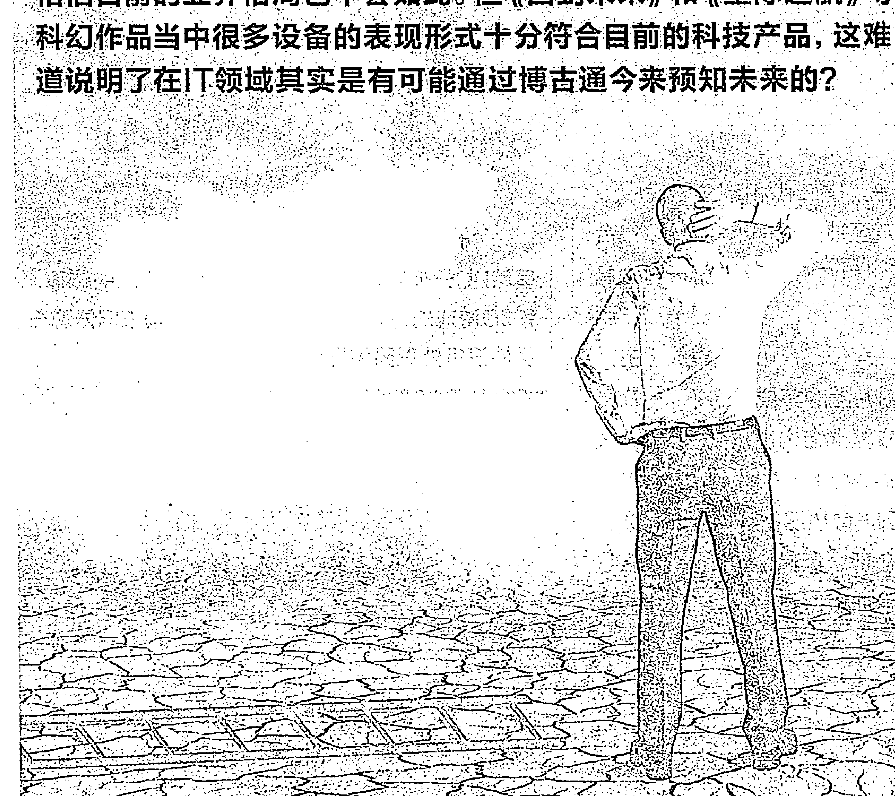

## 科技进化 意料之中

> 近代电子科技产品日新月异，理应不能像物理学领域那样用公式和定律来解释一切。但其实在数十年前PC刚刚进入中国时很多趋势已在冥冥中决定，回首过去再看看当下，似乎一切都在计划中进行。

### 半导体 摩尔定律

说到电子科技必须先说民用半导体技术，当时戈登·摩尔等Intel的创始者们断言半导体集成电路两年数量翻番，而对应性能只需一年半即可倍增。但从2010年后CPU因为毫无竞争其规模和性能都开始止步不前，但其实在硕大一个IT行业中急速发展的领域里摩尔定律依旧在起作用。

### GPU高速发展

虽然CPU因为酷睿处理器过于强势没有竞争进步放缓，但GPU领域依然在飞速发展（图1）。隔代的NVIDIA和AMD主流旗舰显卡的GPU其核心晶体管数量依旧在倍增，同时一些更先进的核心架构、HBM等显存技术层出不穷（图2）。

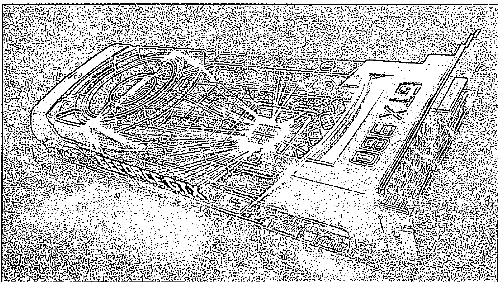

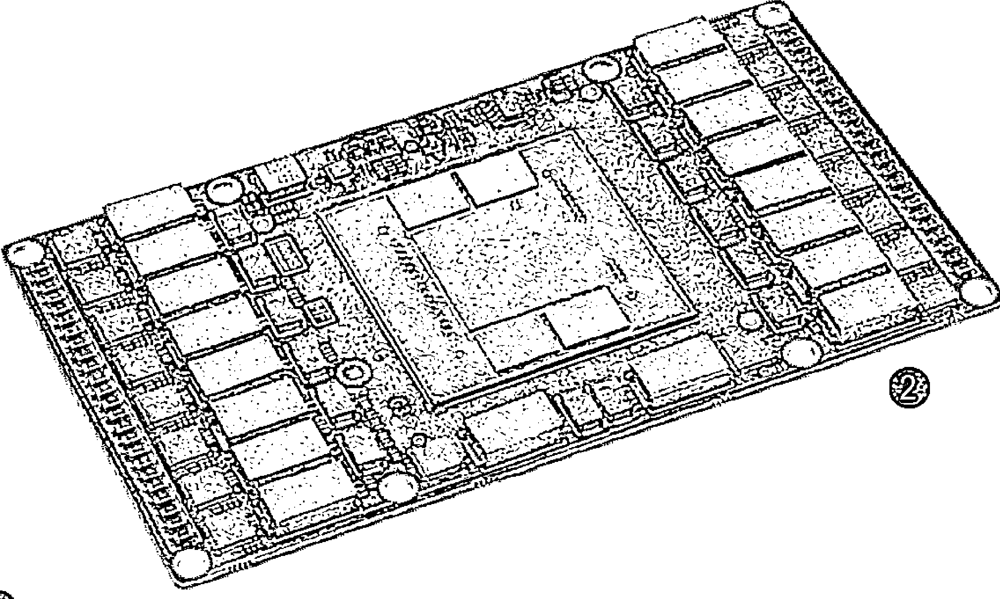

### 移动处理器的飞跃

由于移动设备是当下的主流，它们所使用的中央处理器能真正说明半导体技术的发展水平。特别是近几年内由于智能手机的竞争趋于白热化，近几年移动芯片的提升更具代表性。比如在苹果A7处理器时其封装为102mm²，晶体管数量超过10亿（图3）；到了A8这一代封装反而更小只有89mm²，但晶体管数量已经超过20亿（图4）。

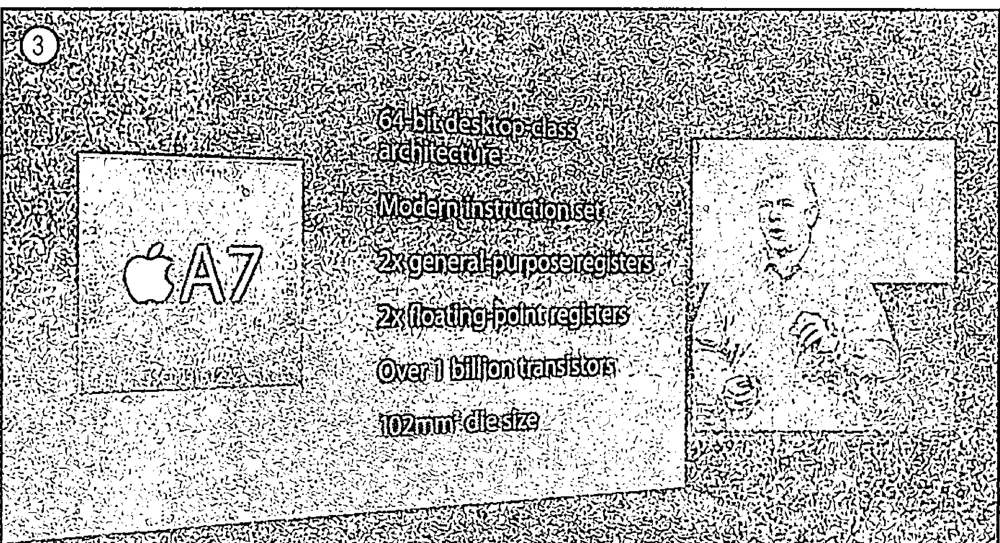

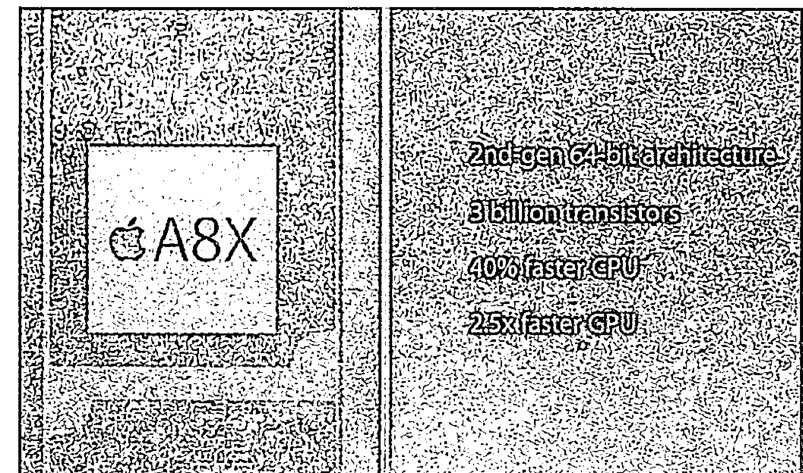

| 年份 | Apple SoC | CPU性能 | GPU性能 | 封装 | 晶体管 | 制程 |
|------|-----------|---------|---------|------|--------|------|
| 2011 | A5        | 13x     | 20x     | 122mm² | <10亿  | 45nm |
| 2012 | A6        | 20x     | 34x     | 97mm²  | <10亿  | 32nm |
| 2013 | A7        | 40x     | 56x     | 102mm² | >10亿  | 28nm |
| 2014 | A8        | 50x     | 86x     | 89mm²  | ≈20亿  | 20nm |

### 处理器显卡的比重和规模

上面提及了很多CPU和GPU的核心面积和晶体管数量，下面来说说产品本身的体积。最初PC在我国流行时正好赶上Intel的奔腾处理器，当时PC当中绝对的核心乃是处理器，而整套PC当中最贵的配件也一般都是CPU，名副其实的中央处理器，是整个PC绝对的核心。

在奔腾二代和部分三代中处理器甚至被做成插卡式设计，集合了CPU和对应的散热器一同垂直插在主板上（图5）。而显卡的作用比现在差很多，抛开还集成于主板北桥芯片上的集成显卡不谈，就算是独立显卡结构也很简单，高端大尺寸游戏显卡十分小众，GPU芯片简单到连散热器都不需要（图6）。

在那个年代你很难想象CPU会走下神坛，反倒由显卡这个不起眼的设备作为整个PC的核心。但当年就有很多前辈曾经断定由于3D游戏的逐渐兴起，早晚PC系统的性能将由显卡衡量。二十年过去了，如今这预测应验了吗？

#### 点评

虽然PC处理器发展放缓，但由于用户需求的转移和3D游戏的盛行，半导体摩尔定律目前依旧体现在手持设备处理器和显卡等领域。

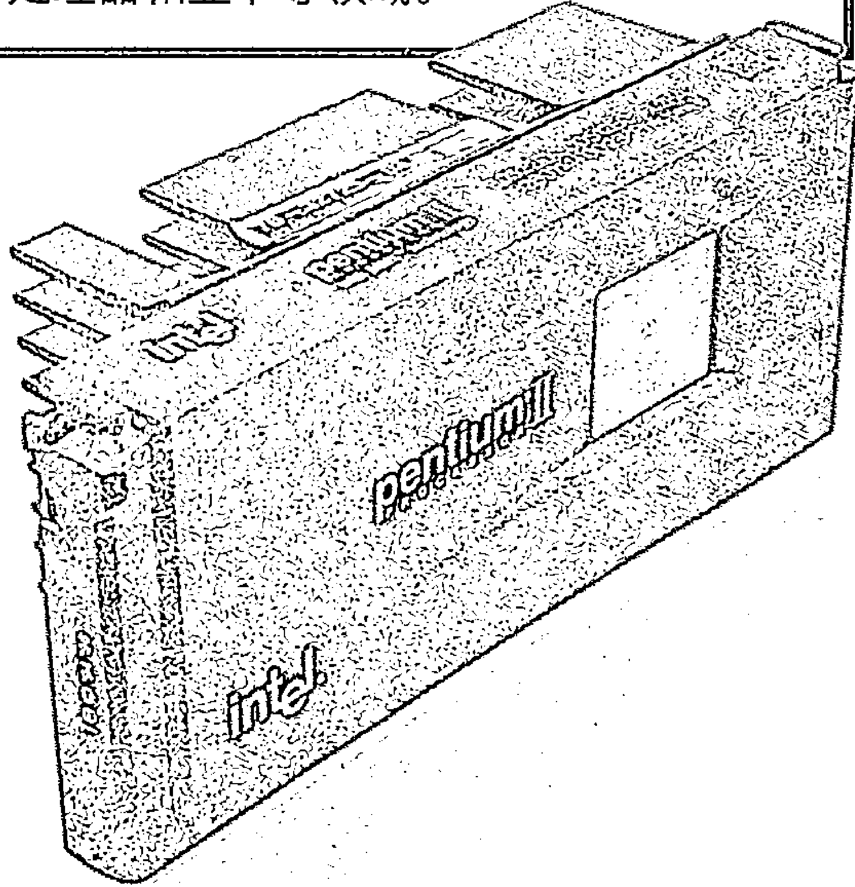

### 二十年河东河西

结合上面说的CPU和GPU规模来看，十年前处理器经历了制程和效率的双重进化已经得到了飞速发展，目前由于缺乏竞争已多年不见有大的变革；不仅尺寸越做越小，在整个PC系统中的比重也开始逐年降低。反倒是显卡由于大型3D游戏对于3D渲染近乎无限的需求始终在高速发展，这种发展不仅体现在性能上，还有其尺寸与大众能够接受的价格（图7）。

### 显卡已成PC核心

比如说当年如果要我们花4000元购买一款高端显卡还属于天方夜谭，而如今因为DX12更新、年底大型游戏即将袭来、2K/4K等高分辨率逐渐普及，4000元买显卡不再是新鲜事。同时GPU性能的倍增势必带来散热压力，于是传统单槽20cm左右的显卡已经变成了30cm以上三槽散热器的“怪兽”。如今用户组建PC系统，选购机箱和其他配件已经要根据显卡尺寸和散热作为评判标准，不论是配件单价和比重都已经超越了CPU（图8）。

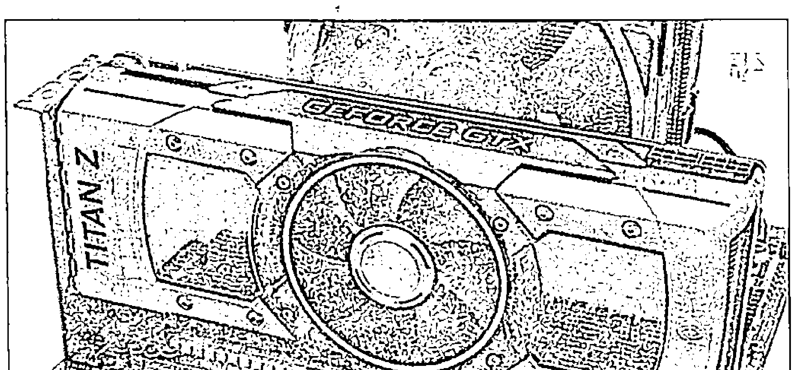


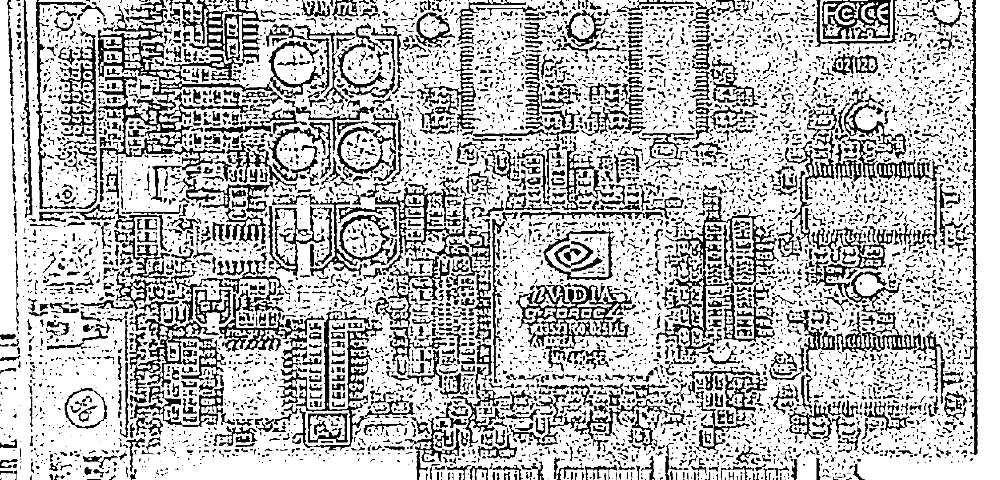

#### 点评

应验当年CPU、GPU身份对调的预言，近几年内显卡作为PC系统核心的地位不会改变。为了解决目前显卡的尺寸和散热问题，已经有不少厂商从显存处首先着手进行改善。HBM显存就能够很好地在尺寸、散热方面进行权衡（图9），而不少使用一体式水冷散热器的显卡也在降低显卡尺寸（图10）。

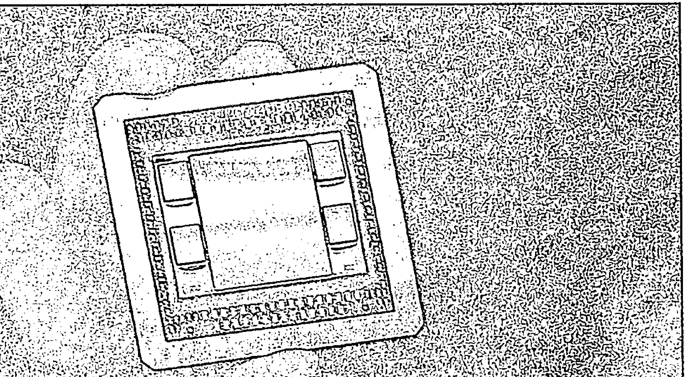

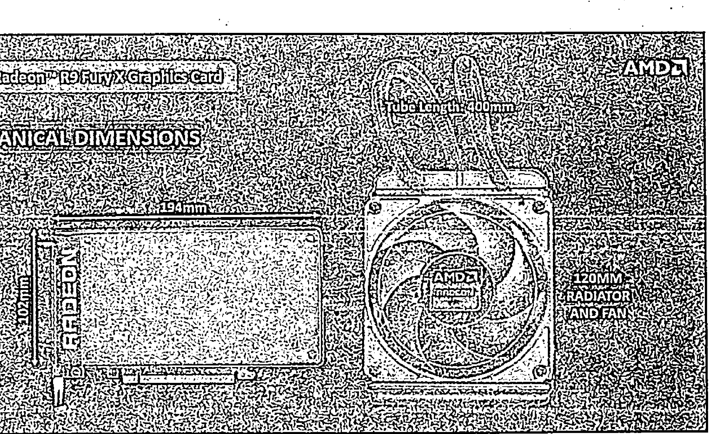

### 曲面液晶面板

在科技电影当中常会涉及到显示屏幕，在不同的作品中其表现形式也不尽相同。不过其中有一个比较通用的特点，就是电影中的显示屏幕总要比时下的显示器更大、更易观看。

### 从球面到平面到曲面

什么样的屏幕更适合人眼观看？对于这个问题的解读，其实就基本概括了近代电视和显示器的发展史。最早的电视和显示器由于使用CRT，技术局限只能做成球形表面（图11）。之后纯平CRT显示器推出之后以迅雷不及掩耳之势迅速淘汰了球面屏幕，就是因为对比发散的球面屏幕纯平显示器更加适合肉眼观看。当时就曾有断言，在电视和液晶显示器不断发展之后，微曲面的屏幕会成为主流。

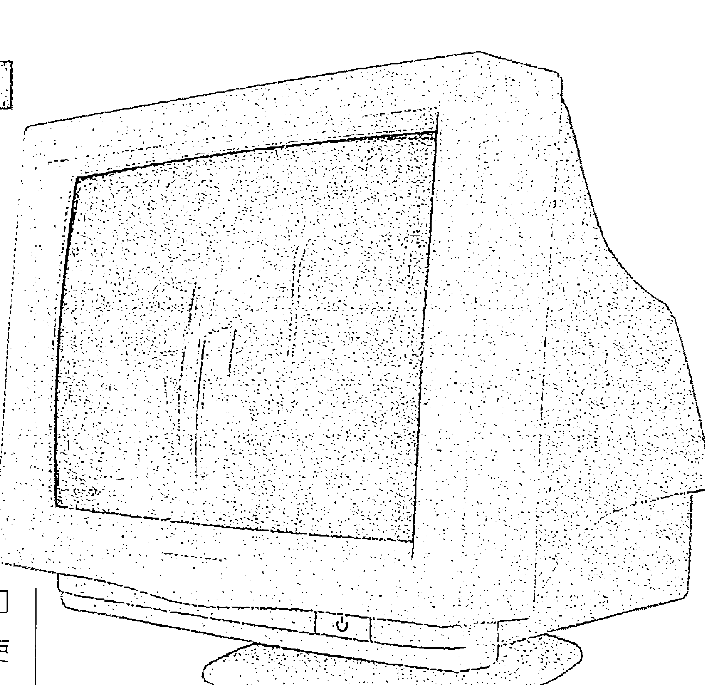

### 曲面电视和显示器

电视和显示器在经历过CCFL到LED、2D到3D等诸多噱头之后，近几年终于有了一些比较像样的进步，那就是高分辨率和大尺寸化。任何显示技术的内在提升都不如显示尺寸的提升这一观点相信能说服绝大多数人，毕竟肉眼并不易分别sRGB色域和Adobe色域，而从22英寸到32英寸的尺寸提升是脱胎换骨的。而就在电视和显示器逐渐变大后，人眼是否能够适应大尺寸成了新的问题。

以前有一种说法是不论我们买了多大的显示器，在一段时间使用后总能适应，但很多人发现在32英寸以上的显示器上并不适用。这是因为人眼能在近距离看到的角度有限，过大的屏幕其边边角角自然不易观看。再遇到高分辨率和液晶显示器常见的角度亮度差异，很容易造成暗角现象，四周的内容难以看清。此时曲面显示器就能够解决这一问题（图12）。


### 是否需要曲面

在电视和液晶显示器上是否适合曲面、是否需要曲面是两个不同的问题。很多24英寸显示器目前也在使用曲面，用户看起来并没有什么异常，但其实纯平显示器也能很好地适应这一尺寸，只有在32英寸及以上尺寸的显示器上，曲面的优势才能真正展现（图13）。而液晶电视由于观看距离一般在3米以上，除了一些超大豪华级的屏幕外，总体而言是否曲面对观感是没有多大差异的。

#### 点评

其实细想起来首先使用曲面屏幕的依旧是手持的移动设备（图14），但目前火热的反倒是家用电视和液晶显示器。在很多大尺寸液晶显示器上容易造成的边角不易观看问题，曲面显示器能够从物理结构方面进行补足，这要比被动提高亮度有效得多。


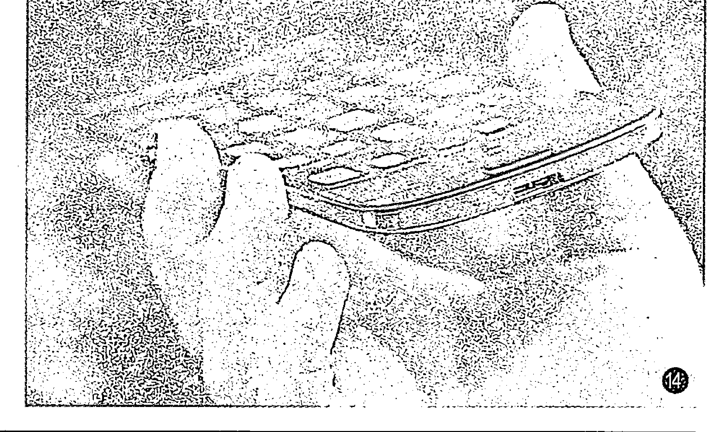

## 日新月异 意想之外

不论科技影视作品中的导演和编辑如何高瞻远瞩，也难以预料科技电子产品的日新月异。应对用户的需求以及科技在某个时间段的飞跃式进步，也有不少产品的进化在当年根本无法预料。

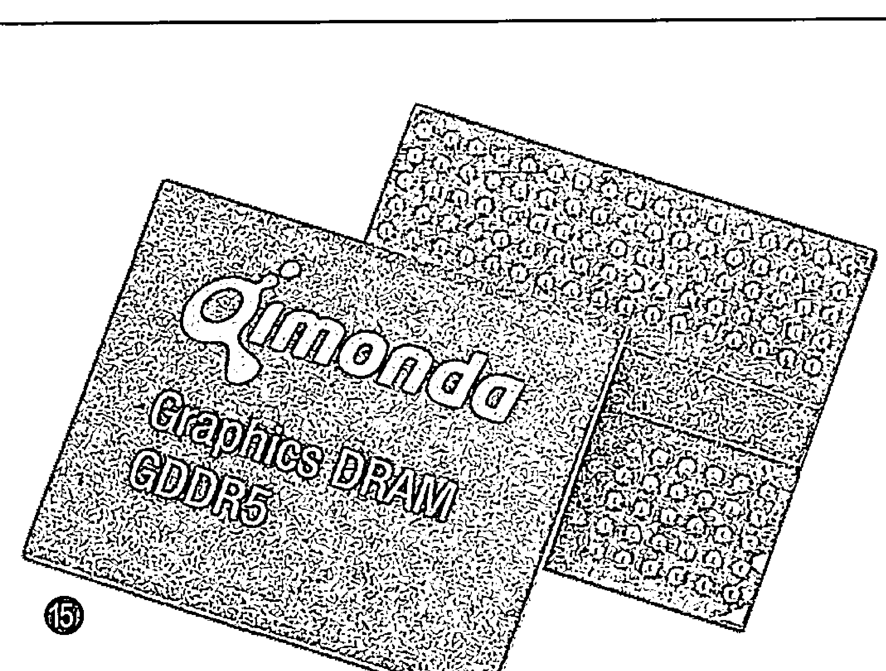

内存价格暴涨的特殊时期外，内存性能始终没有成为过PC系统性能木桶的短板。尤其是近几年内存性能几乎达到顶点，以至于全新DDR4内存目前不温不火的情况。而显存带宽和速度始终制约着显卡的性能，最初的显卡带宽多只有64bit，此时就算核心性能尚可，这类显卡也无用武之地，因为GPU和显存之间的效率过于低下。当时NVIDIA和AMD经常会推出一些64bit显存带宽的“坑爹卡”，注意显存带宽也成了最早鉴别“坑爹卡”的途径之一。之后显卡带宽主流一路从128bit到现在的256bit，显存类型也逐渐从DDR3过渡到GDDR5，但性能始终不济（图15）。

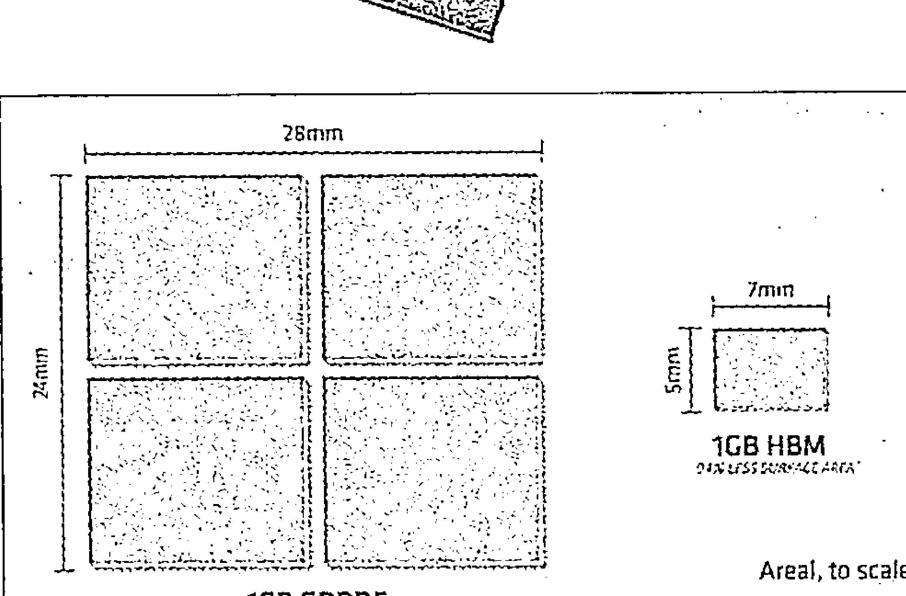

### HBM显存堆栈

### HBM vs GDDR5: HBM shortens your information commute

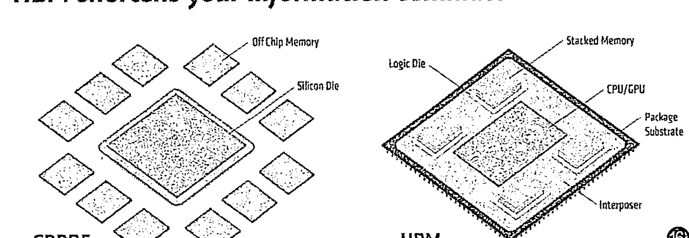

#### 点评

前文说过，最初显卡功能由CPU承担，后来逐渐单体化但是也结构简单，至于飞速发展也是近几年3D引擎和3D游戏的需求导致。在显卡的发展过程中始终有一个瓶颈，那就是显存的带宽与速度。而现如今HBM那种显存与GPU的亲密接触，在当年几乎是不可想象的。

### HBM显存特点

HBM显存与传统显存最大的特点就在于带宽。虽然依然和GPU彼此分开封装，但HBM显存被堆叠在GPU核心周围，其连通的结构与传统显存有天壤之别，之间的带宽也不可同日而语。比如GTX 980ti的带宽为384bit，而R9 Fury X能够到4096bit（图16）。

HBM显存目前已经成为了高端显卡新的发展方向，NVIDIA的旗舰显卡不出意外在明年也会使用类似的技术。而对应的中低端显卡也会改用GDDR5X。总体来讲显存技术目前在很大程度上决定了显卡性能。

### GDDR5已经过时

显存最初与内存很相似，直到近几年才开始逐渐脱离内存系统独立发展。目前PC系统的主力内存系统依旧是DDR3，而显卡已是GDDR5。尽管如此，内存和显存的具体表现依旧是天壤之别。在PC系统当中性能最高的一环始终是内存。除了十年前

HBM显存不仅可减少显卡封装面积改善PCB布局和散热（图17），对于性能也有很大影响。在主流游戏中2K以下分辨率时R9 Fury X似乎还略逊于GTX 980ti，但在4K分辨率这种对显卡有极致性能要求的场合，看起来似乎是6GB的GTX 980ti应该继续领先，但结果却是4GB显存的R9 Fury X更佳。这其实就是超高带宽显存带来渲染方面的优势所在（图18）。

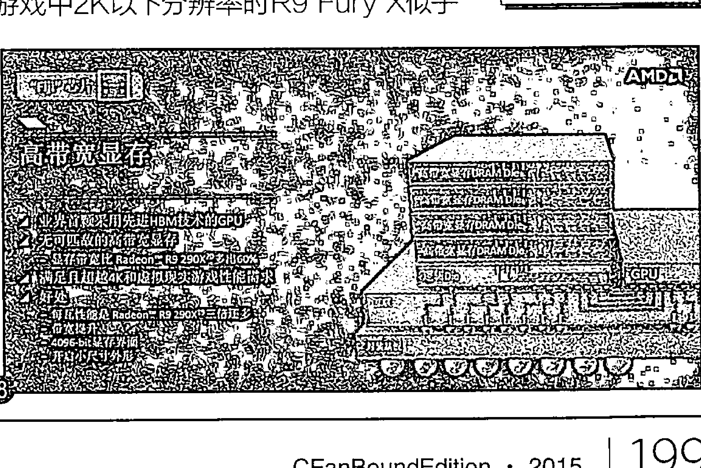

### LED和OLED

在CRT显示器称霸业界和液晶显示器诞生之初，恐怕没人想到未来的液晶显示器能够做到可弯曲，及像纸片一样薄。而这其中起最大作用的就是背光源从CCFL到LED的转变。最让人难以想象的是一种让画质退步的技术，最终由于外观、环保和成本的因素成为了主流。

### 液晶背光源的过渡

CCFL的缺点其实显而易见，模组尺寸难以做薄、发热大功耗高、时间长久容易产生发黄等问题（图19）。但是即使这样，在电视和显示器背光源经历CCFL到LED转变那几年，依然有大批用户认为LED难以成为今后的主力，这其实和LED天生的缺陷不足有关（图20）。

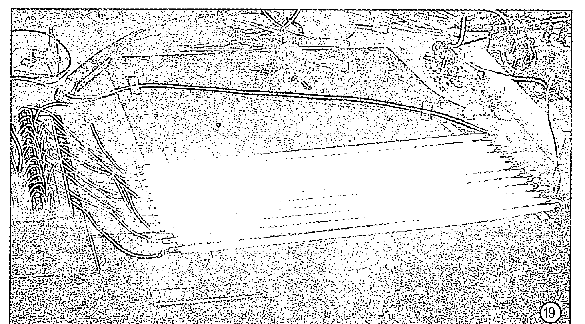

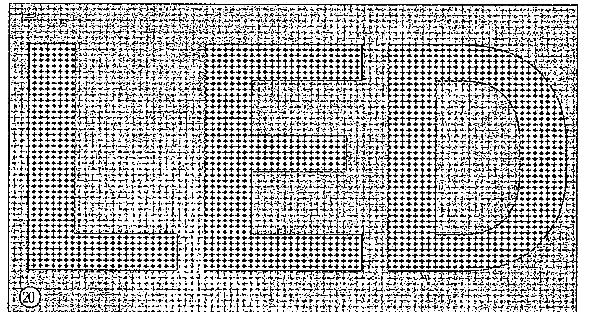

### OLED为何物

OLED其实和普通LED背光显示器完全不同，成像原理也有较大不同（图23）。其呈现黑色画面时整个模组近乎不发光的状态，解决了长久以来液晶显示器的黑场问题。而且实际产品可以做到更薄更轻，功耗发热方面能够做到最好。但是OLED也不是没有问题，常见的三星AMOLED屏幕虽然轻薄省电，但是始终被发烧友诟病颜色不准，这也是绝大多数手机厂家依然使用LCD屏幕的原因。

### 液晶背光源过渡LED的问题

LED有一个致命弱点，如果你将同时期的CCFL和LED背光源电视对比结果就会非常明显：使用CCFL的电视虽然笨重但是色彩要比LED产品好得多。究其原因是因为LED民用领域一般使用单色白光LED模组（图21），这种模组最终成品的色域和表现力会因为背光源的原因色域远不及CCFL产品。而RGB-LED和GB-LED直到今天依然是高端产品，成本和售价不是普通家庭用户能够接受的（图22）。LED的问题不止如此，LED背光源会带来的蓝光问题，而且显示黑场不佳漏光严重的特性也让很多发烧友诟病。

> 点评
液晶显示器的不断发展，应该始终伴随着色彩的进步。但是从CCFL过渡到LED时普通液晶产品的色彩却实实在在地退化了，这也是很多人难以想象LED最终成为主流的原因之一。希望今后的LED背光源技术不断进化，最终将色彩表现恢复到CCFL背光巅峰时的水准。

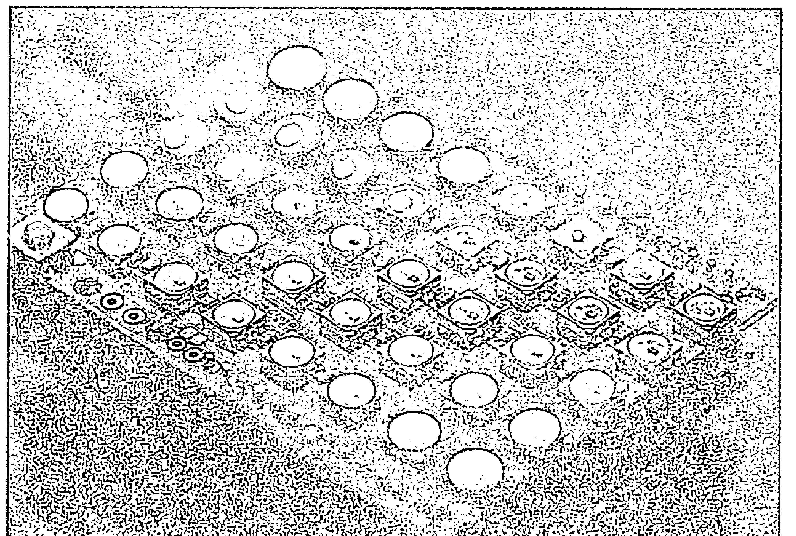

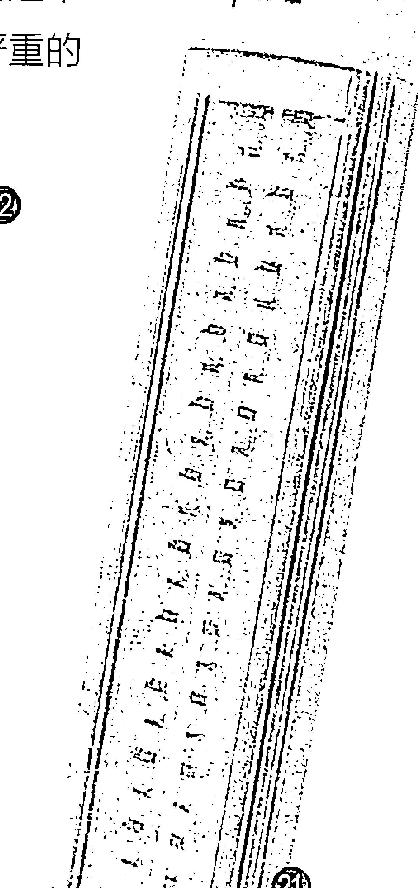


### 卖场衰落和DIY多元化

在曾经中关村电子卖场如日中天时，可能没有人能预想到如今卖场面临停业、中关村即将整体转型。除了自身环境和管理欠妥及电商的崛起，其中其实还有很多因素。与我们PC用户相关的，就是曾经的DIY逐渐变得小而精并且朝着多元化发展。除了发烧友和高端游戏用户，目前的PC系统性能足以应付日常需求，甚至笔记本电脑也能玩游戏了。PC领域曾经的以性能为尊的时代似乎已经过去，目前的DIY领域朝着个性化、多元化方向发展。例如主板、机箱和电源这类传统意义上并不直接影响PC系统性能的配件，在多年前是最不受用户注意的部件，当时用户更关心中央处理器或者显卡，而时下的主板发展速度相信在当年是难以想象的。而且目前主板机箱电源的多样化、小型化理念，也和当年以大为尊的想法背道而驰（图24、图25、图26）。

最初中关村等电子卖场也适应潮流推出了一些主打精品装机的店面，提供不同于普通攒机的个性化服务。不过随着厂商对于DIY简易化的不断努力，目前除了个别配件，大多数动手能力不错的用户都可以搭配组装一台电脑。此外自选配件、配件搭配和改造的乐趣，也不是传统装机渠道能够提供的。目前虽然笔记本电脑和移动设备已经完全能够应付日常需要了，但依然有很多用户热衷于DIY电脑，其实就是因为DIY能够体现精细到个人的个性化需求。纵观目前DIY领域厂商产品的趋势，也正是顺应这种个性化的一种体现。

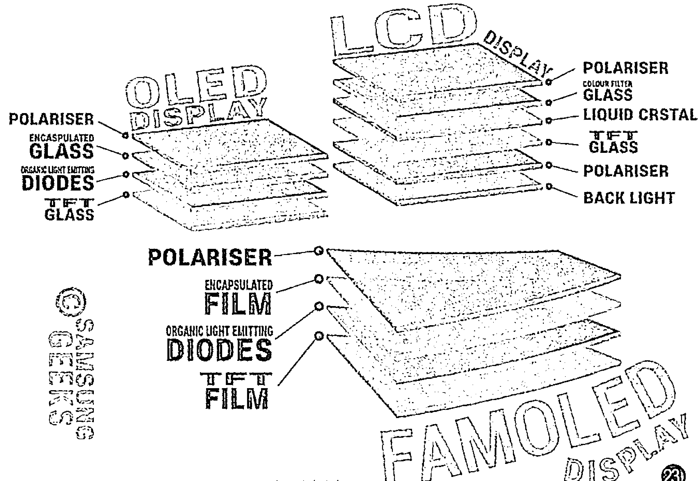

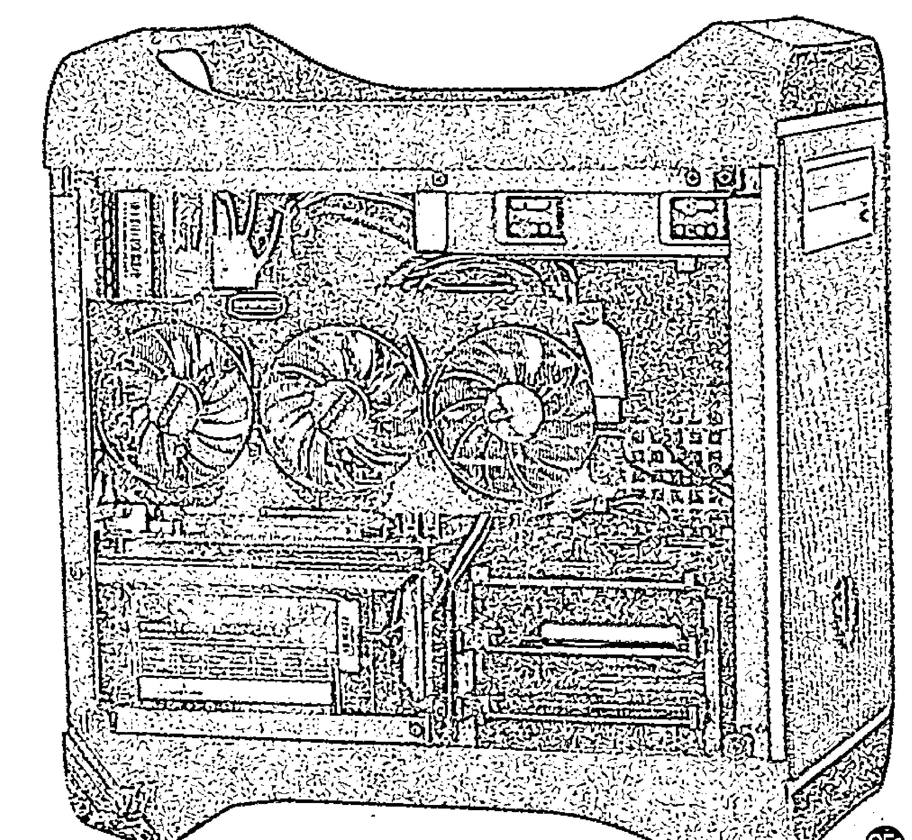

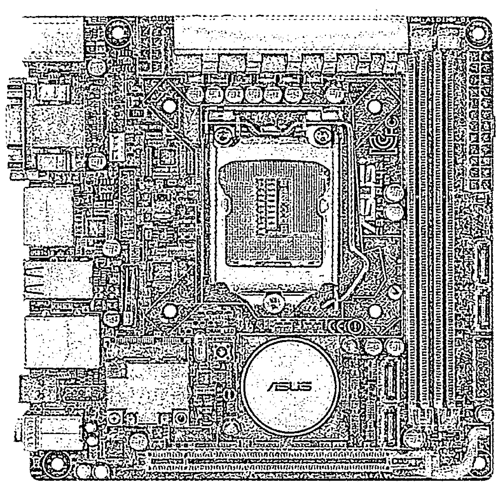

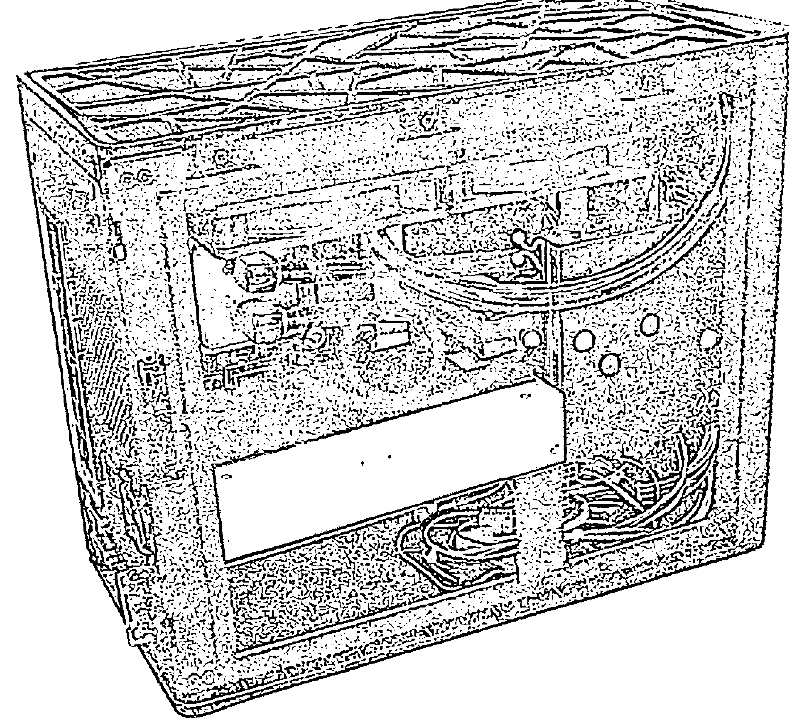

### 亟待实现的技术

对普通消费者而言，电影中的高科技的确让人羡慕嫉妒恨，但最终能以低成本引入民用领域的科技毕竟还是少数。因此，我们不妨将注意力移到更加现实的一些高科技上吧，比如3D Touch能为手机带来什么？笔记本和台式机硬件联姻后又能带来哪些改变？

#### 交互方式的趋势 3D触控

iPhone 6S/6S Plus最大的创新就是引入了3D Touch压感技术。简单来说，该技术就是在屏幕下方内置了重新定制的电容式触控传感器以及3D Touch控制器芯片（图1），它们能以毫秒为单位计算表层玻璃与背光之间距离的细微变化，并根据这些数据快速、精准、连续地对手指的按压作出响应。


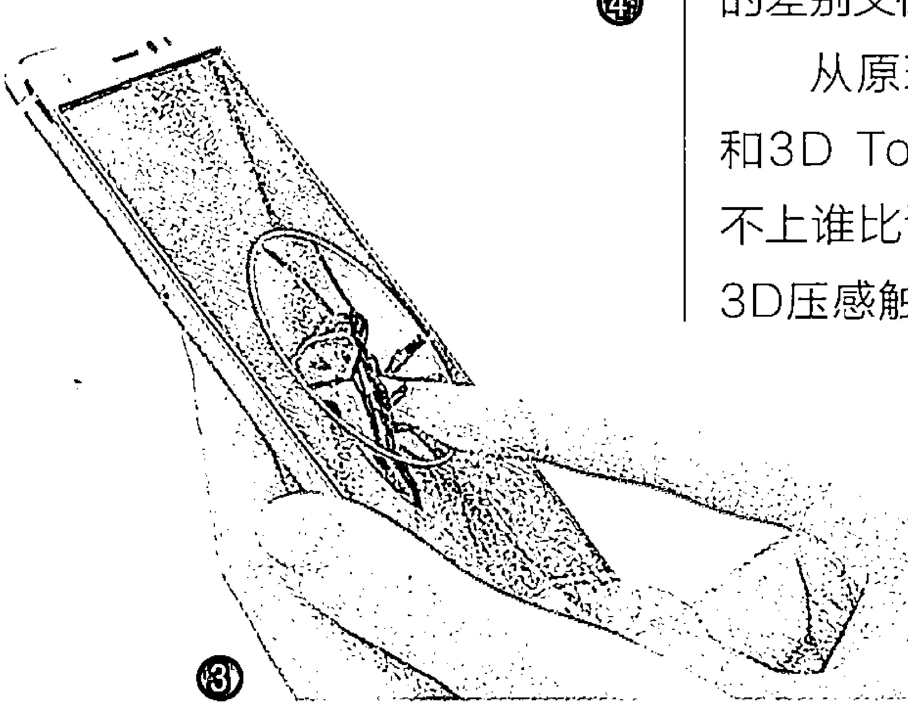

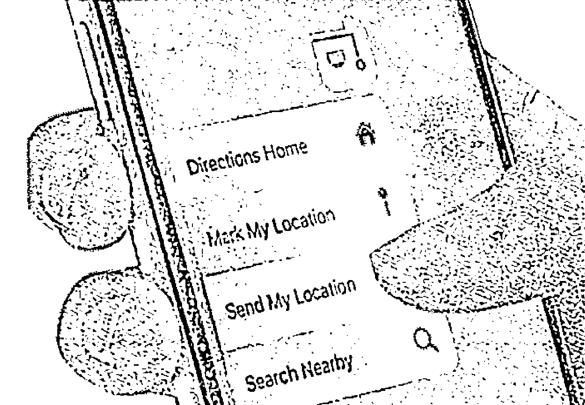

可能有人会说了，3D Touch不就是iOS/Android系统里的“长按”吗（图2）？虽然3D Touch在用法上与“长按”有点相似，但就体验而言却又有着云泥之别。比如系统层面的“长按”属于软件功能，需要用户点击并按住屏幕某一点1~2秒后才能触发二级功能；而3D Touch是一项基于硬件的功能，它可瞬间检测出用户在屏幕上操作的力度并作出准确回应。

可能又有同学会问了，华为Mate S在iPhone 6S之前发布，同样支持类似的Force Touch压感功能（仅限顶配版的Mate S）。那么，Force Touch和3D Touch的差别又在哪里呢？
从原理上看，Force Touch和3D Touch并无区别，也就谈不上谁比谁更先进。但是想发挥3D压感触控的技术特点，需要系统和APP两个层面的“软支持”。以Mate S为例（图3），华为目前对Force Touch的定义是：浏览图片时用力按压屏幕就能放大图片，用力按压屏幕的四个边角可启动指定的APP。换句话说，Mate S的Force Touch还处于很肤浅的阶段，还是扮演着类似快捷键的功能。再看看iPhone 6S的3D Touch，以AG Drive、Magic Piano、Special Tactics Online和Blobs Game为代表的游戏APP已经可以通过这项技术进行操作了。

这就是3D压感触控技术在Android系统上的悲哀。虽然Android手机阵营现在也能用上类似3D Touch的压感技术，但由于谷歌在Android系统底层并没有加入对类似技术的支持和规范，再加上Android特有的开源性，手机厂商们即便武装了同样的压力屏，但是实际体验却可能有着云泥之别。如何定义压力屏的功能，完全取决于某个厂商对这项技术的理解，而APP开发者也不可能针对每一个配备压力屏的手机推出适配的APP，最终就导致Android手机的压力屏无第三方APP可用的尴尬。在压力屏未被Android“官方承认”之前，我们没有必要追求配备压力屏的Android手机。

好消息是，Synaptics已经发布了ClearPad ClearForce压力感知触控解决方案的样品（图4），而该技术也有望被谷歌引入未来的Android系统。希望这个时间可以尽早到来，让智能手机的操作体验能再次出现从电阻屏向电容屏过渡时期的惊艳吧。

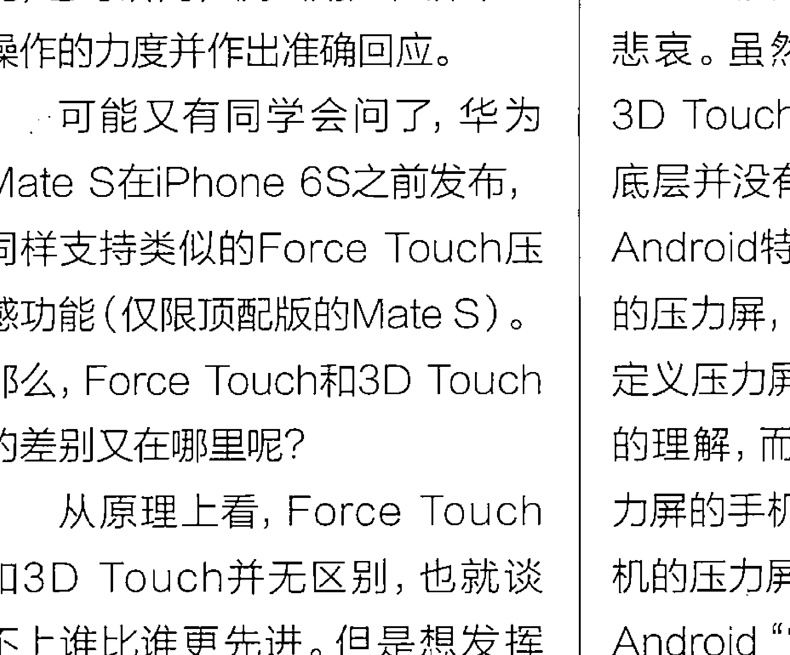

> Synaptics的压感屏还能用于笔记本和显示器，如果压感屏可成为标准，无论PC、Pad还是手机就都能获得相似的使用体验了

### 游戏玩家的福音

### 笔记本DIY化

曾经，最昂贵的笔记本也会被主流价位的台式机所秒杀，究其原因就是针对移动定制的CPU和GPU为了降低功耗不得不牺牲性能。随着电子竞技的大热，游戏玩家对能打游戏的高端游戏本的需求也是与日俱增。于是，笔记本逆袭台式机的日子提前到来了。

如何让笔记本在游戏性能上媲美甚至超越台式机？答案很简单，将台式机专用的桌面CPU和GPU硬塞进笔记本体内不就结了？这个答案在过去可能就是个笑话，但在如今却已经成为触手可及的解决方案。

首先我们要感谢英特尔。在最新14nm制程工艺的帮助下，让i7-6700K这种顶级桌面CPU的功耗和发热量得以有效控制，最终为其入驻笔记本体内打下了坚实的基础（图5、图6）。要知道，i7-6700K是可以超频的CPU哦，这意味着笔记本也终于能借此进入超频时代了。

接下来还要感谢NVIDIA。为了将最强桌面GPU塞进笔记本，NVIDIA从GM204核心中挑选了体质最好的一部分（发热控制更好），并将其作为桌面版GTX980的MXM笔记本款（图7）。据悉，此版本的GTX980功耗小于标准的165W，并推荐使用4~8相供电设计（GTX 980M只有2~3相供电），最终可以被笔记本常用的涡轮散热风扇和热管“镇压”全速工作时的高温。此外，MXM标准的接口（图8），意味着用户有机会对笔记本的显卡进行更换升级！

目前，配备GTX980显卡的笔记本已经有不少了，比如华硕GX700VO、Aorus X7 DT、微星GT72/GT80、蓝天Clevo P870DM/P775DM等等。值得一提的是，神舟刚刚发布的战神GX9 PRO（实际上就是蓝天Clevo P870DM）在武装GTX980显卡之外，在CPU方面也选用了桌面版的i7-6700K处理器。在强悍桌面级CPU+桌面级GPU的加持下（图9），笔记本自然也就真正具备了挑战台式机的资本。

可惜，能将台式机芯片引入笔记本的产品价格也异常昂贵，比如前面提到的神舟GX9 PRO售价高达39999元，而我们只需万元出头就可DIY一部i7-6700K+GTX980 SLI的台式机。不过，笔记本形态的产品具备毋庸置疑的便携性，可以随着用户一起大杀四方，这也是顶级游戏本得以生存的核心所在。

虽然目前台式机芯片入驻笔记本仅限绝对高端领域，但这一趋势却已表明，台式机和笔记本的芯片是有机会完美融合的。如果一款笔记本可以搭载桌面级i5处理器与GTX960独显并控制到万元以内，是不是可以吸引更多普通用户的关注呢？

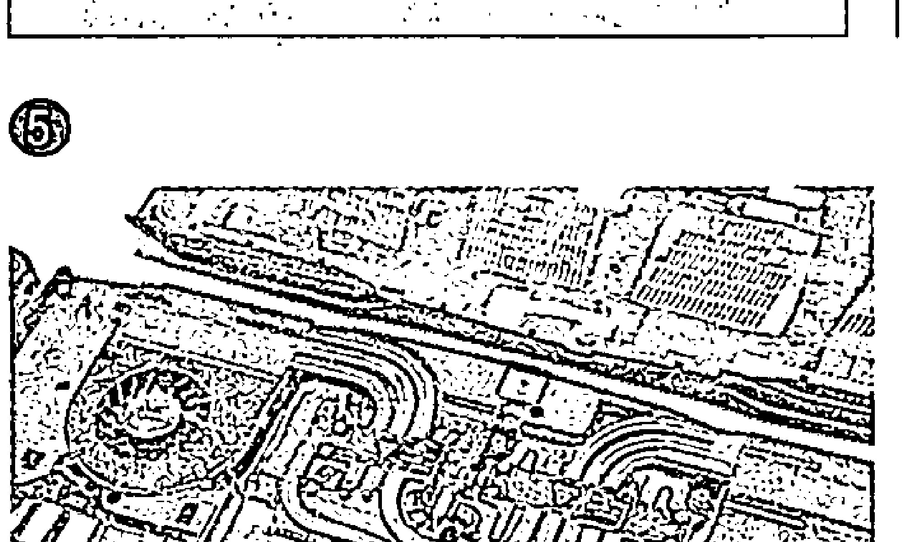
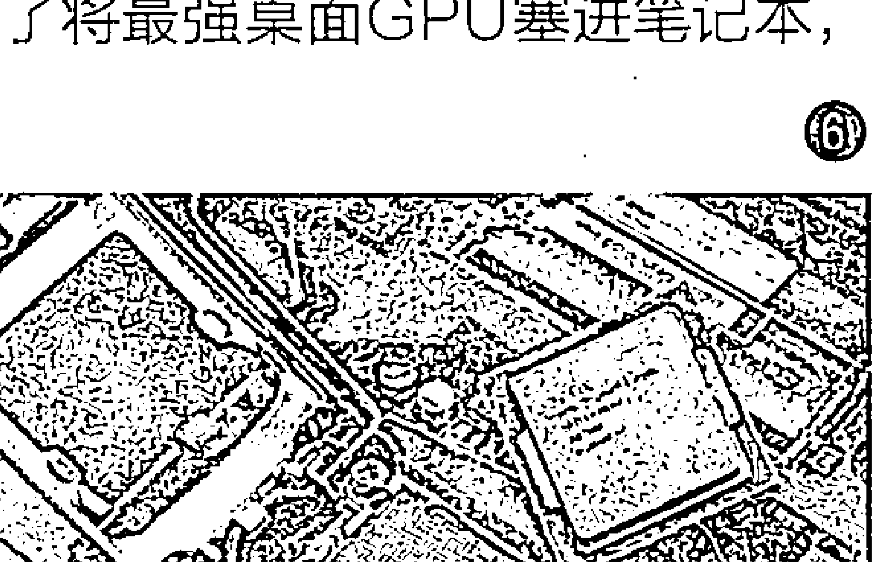

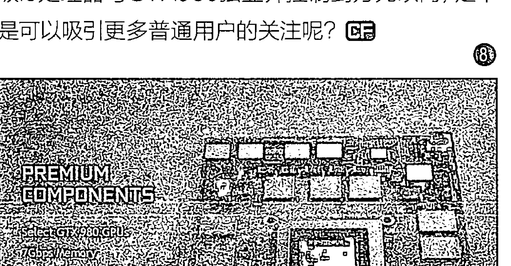


#### 桌面GTX980和移动GTX980M的差异

虽然两款显卡都隶属于麦克斯韦架构的GM204核心，但移动版GTX980M为了将功耗控制到100W左右（MXM规格笔记本显卡的极限），不得不屏蔽GM204核心的部分流处理器，从2048个缩水到1536个。因此，GTX980M的实际性能大概只有GTX980的80%~90%。


## 把笔记本电脑 做成变形金刚

策划/《电脑爱好者》编辑部

过去的14个季度里，传统PC销量始终处于下滑状态，使PC已死的言论喧嚣于市。虽不能说它已处于生死存亡之际，但颓势的过程中，第三方厂商们似乎也还未警醒。于是乎，微软祭出了全新的Surface家族，无论是更强悍的Surface Pro 4还是新形态的Surface Book都令人印象深刻。透过新一代Surface，我们不难感受到微软意图重新点燃PC市场的决心。抛开Surface能否拯救PC产业不谈，透过微软的一系列新品，我们即可把脉出未来PC的发展路线。

### 01 看Surface如何重新定义PC

与传统PC的持续低迷相比，已经“三岁”的Surface却从零开始，打下了年销售额达36亿美元的广阔江山。虽然Surface的异军突起对整个PC产业而言略有杯水车薪之感，但是它却为PC未来的发展指明了方向。接下来，就让我们重新认识一下Surface，看它是如何重新定义PC的。


### 微软的“自我救赎”

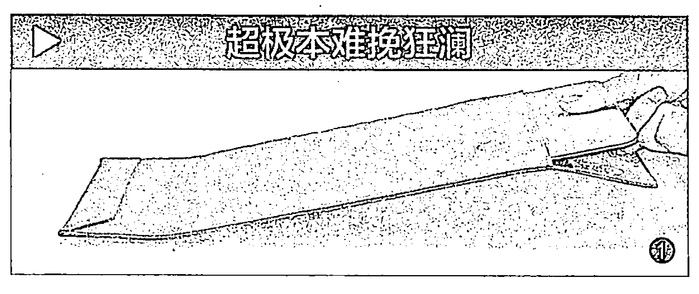

作为微软的“亲儿子”，Surface在诞生之初曾“得罪”了一众OEM厂商，宏碁CEO王振堂就曾对其表示出“伤了自己也伤了产业”的感慨。3年之后，当微软Surface Book横空出世之际，OEM的反对声音不再，赞誉与力捧则始终伴随新品左右。这180度的态度转变究竟缘何而来？

我们先将时间回拨到2008年的2月19日，当乔布斯从信封中掏出MacBook Air（下文简称MBA）时（图1），整个PC产业都为之震撼：“原来笔记本能如此纤薄！”3年之后，笔记本的价格不再高昂，整体销量也出现了下滑的趋势。于是，英特尔在2011年提出了“超极本”（Ultrabook）概念，对产品的厚度、重量、续航等指标进行了硬性规范，随后的一段时间里媲美MBA纤薄的超极本开始“满天飞”。

遗憾的是，超极本在初期一直处于模仿阶段，大家都在与MBA比轻薄，从而忽略了在体验上的差异化创新。糟糕的销售数据，让OEM厂商加大了对第二代超极本的革新，于是我们看到了武装全高清IPS屏幕的华硕ZENBOOK、配备电动马达的宏碁S5、拥有21:9超宽屏比例的东芝U800W等（图2）。但是，上述创新点缺乏实用性，为了创新而创新的设计岂能力挽狂澜？

与此同时，以iPad为代表的平板电脑逐渐崛起，并不断蚕食原本属于笔记本的市场蛋糕。为了迎接iOS和Android的挑战，PC领域的另一尊“大鳄”，微软也正在筹备突出触控特性的新一代操作系统：Windows 8。问题来了，当时没有一款硬件产品可以完美展示Windows 8的优越性，指望OEM为Windows 8做嫁衣更不靠谱。没办法，微软只能自掏腰包挥师硬件战场，Surface就是在这种大环境下诞生的。

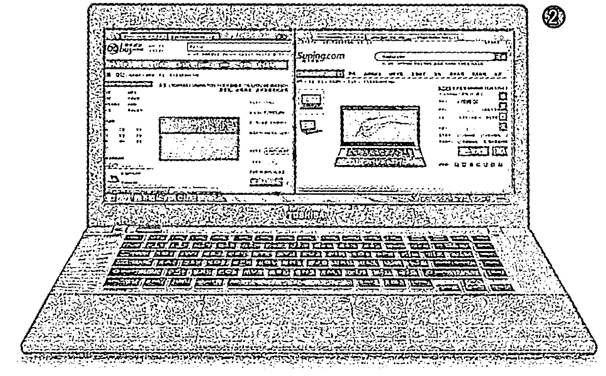

2012年底，Windows 8掀起了视窗系统的“触摸革命”，而Surface（见小提示）就是这场革命的先锋军。全高清触控屏幕、强悍的酷睿处理器（图3）、900g左右的重量，让Surface在提供媲美iPad便携性的同时，更兼顾了Windows系统独有的“生产力”特性，动态磁贴界面也让触控屏幕有了用武之地。微软自己做硬件可谓几家欢喜几家愁，欢喜的是消费者，让最懂Windows的微软自己做产品，可100%挖掘新系统的所有潜力；愁的自然就是OEM厂商，本来PC业务就处于颓势期，如果微软再来抢硬件的饭碗，难道让大家去吃西北风？好消息是，来自OEM的抗议主要停留在Surface的发布阶段，待到Surface正式销售之后，这股反对的声音则变成了动力。惠普美洲地区销售高级副总裁John Solomon在微软推出Surface时就曾表示：Surface为同类产品立下了标准，OEM厂商应感谢微软。于是乎，“变形本”的黄金时代就此来临。

### 止步不前的微创新

“变形本”其实就是英特尔在超极本“三部曲”计划中的第三阶段规划：鼓励OEM厂商采用平板+键盘底座的分体式混合设计的超极本。微软Surface的出现，给了OEM厂商一个很好的范例，并在此基础上涌现出了更多形态上的创新。

在这个时期，最具代表性的产品就是Surface、ThinkPad Helix（分体式，屏幕和键盘可分离）；索尼VAIO Duo11、东芝U920T（滑动式，屏幕与键盘连体，通过类似滑盖手机的方式在平板电脑和笔记本模式间切换）（图4）；华硕TAICHI（双屏式，正反两个屏幕，合盖就是平板，打开就是笔记本）（图5）；联想Yoga（翻转式，屏幕转轴可以进行360度翻转）；戴尔老款XPS12、宏碁R7-371T（跟头式，转轴在屏幕侧边框之上，机身可以转轴为轴心进行360度翻转）（图6）。

“变形本”看似炫酷，但它们其实仅是建立在不同转轴形态基础上的微创新产物。如果你在意便携性，只有分体式设备才能将屏幕（主体）部分做到1kg以内。如果你需要性能，就只能挑选配备独立显卡的变形本，随之而来的就是重量和厚度的激增。轻薄与性能，始终是难以兼顾的存在。

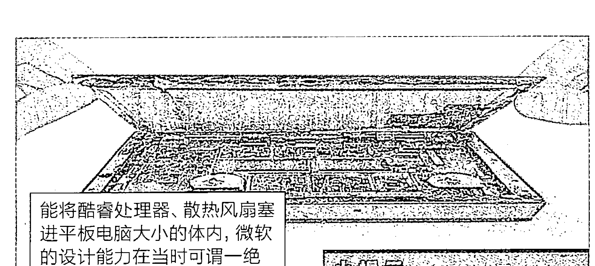

> 小提示：预装X86版Windows 8系统准确地说应该是“Surface Pro”。早期Surface还有预装Windows RT系统且支持ARM处理器的版本，可惜Windows RT生态系统太脆弱，目前已被淘汰，所以本文就不再讨论了。

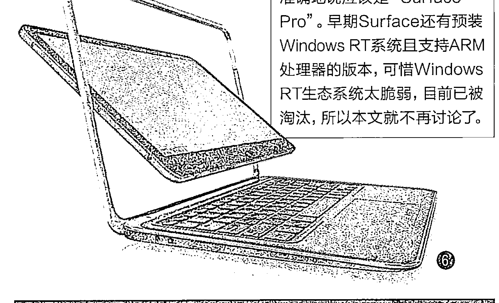

### 重构PC的未来形态

微软Windows 10在2015年也遇到了和前辈Windows 8相同的尴尬：没有一款设备能充分展现新一代系统应有的“霸王之气”。终于微软在止步不前的“转轴微创新”基础上迈出了一大步，推出了全新的Surface Book（下文简称 S Book）。这款产品虽然也隶属于分体式变形本阵营（图7），但它在体验上却另有乾坤：在纤薄的键盘里塞进了电池和GPU（独立显卡），真正将“外置显卡”概念引入到笔记本/平板领域，从而获得了更为友好的“多栖”使用能力。用微软的话讲，S Book “This is the ultimate laptop”（这是笔记本的终极形态）！

出人意料的是，S Book从发布伊始便受到了业内的普遍好评，而OEM厂商也并未表现出太过明显的反对意见。究其原因，则是S Book的确够优秀。引用一条网络上的搞笑段子：S Book是为PC业界争口气的，而微软发布它的潜台词其实是，“你们（OEM）都不行的话只好由老子亲自出马了！”

那么，S Book到底拥有哪些“黑科技”，能被业内视为“重新点燃PC市场”的尖兵利刃呢？

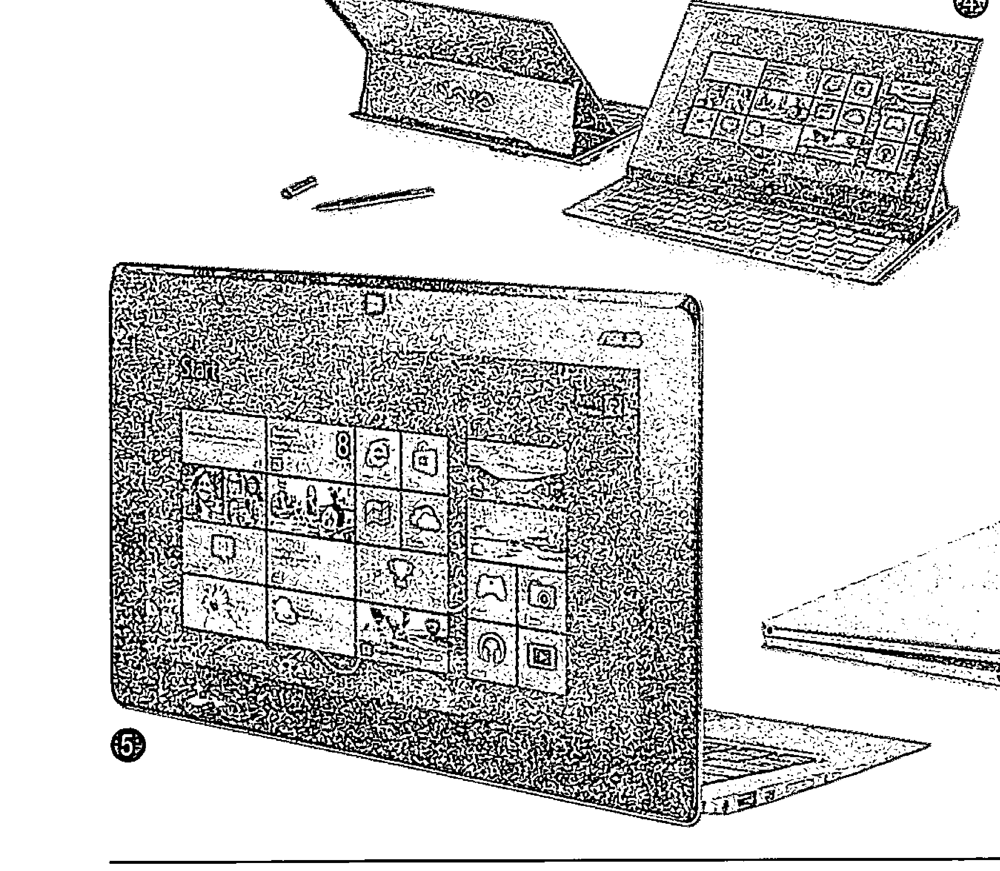
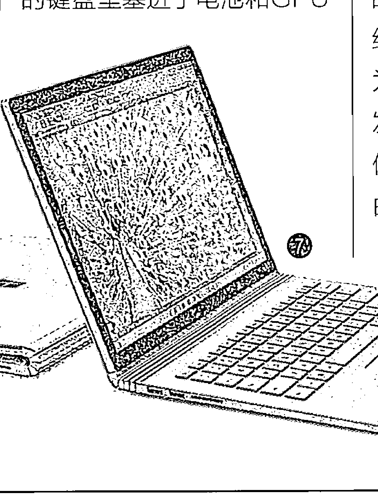
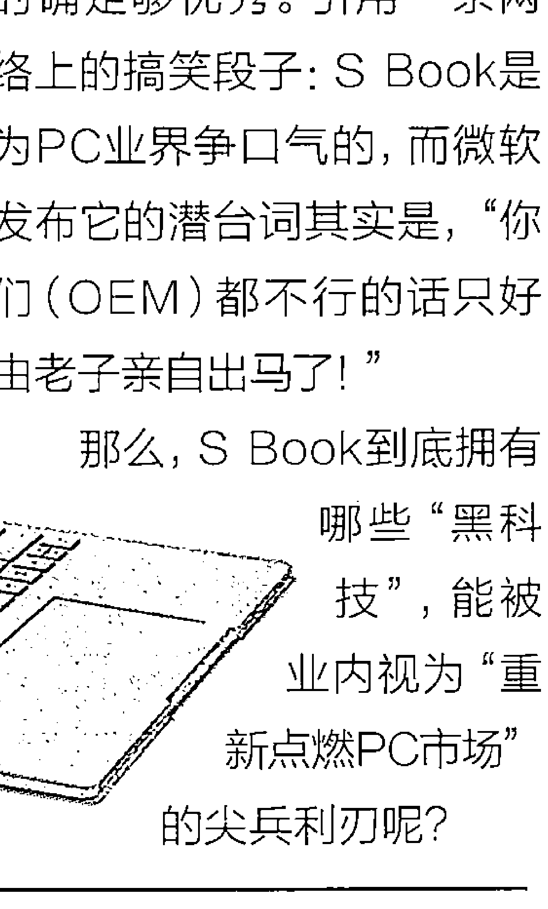

### 解读Surface Book的黑科技

Surface Book之所以令人感到新奇，不仅是平板形态上与Surface Pen的亲密无间，还有外接键盘下隐藏的独立GPU，可增强其生产力效能。实际上，S Book并非首款外置显卡的机器，但它又为何引起了如此关注？

如何让轻巧的笔记本获得不逊于台式机的游戏性能？答案很简单，让笔记本用上台式显卡不就结了。于是外置显卡便逐渐在笔记本领域生根发芽，并最终在S Book身上引起重视。

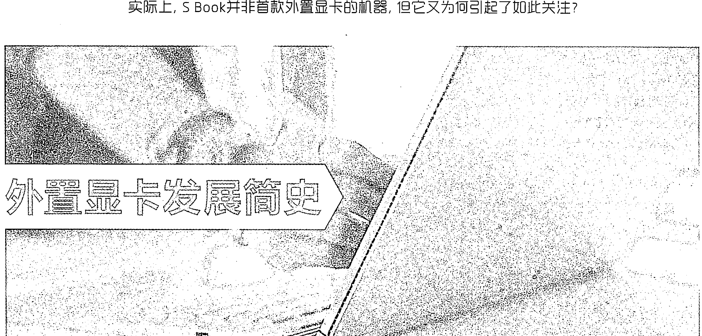

#### 外置显卡盘点

外置显卡并非S Book的‘专利’。早在2008年，华硕就曾推出过笔记本专用的外置显卡XG Station。简单来说，XG Station是被供电模块、LED屏幕‘包裹’着的GeForce 8600GT台式显卡（图1），LED屏幕可以显示GPU频率、GPU温度、GPU风扇转速等信息，并通过ExpressCard插槽（PCI-E x1）与笔记本相连接。可惜，XG Station内置的8600GT显卡不可更换（图2），而且售价也高达3999元，糟糕的性价比注定其只是昙花一现。

2009年，技嘉从华硕手上接过了外置显卡的‘接力棒’，推出了型号为M1305的笔记本。这款产品主打轻薄设计（13.3英寸，Core 2 Solo U7300处理器，1.8kg），并配备了外置显卡扩展坞。与华硕XG Station相比，M1305外置显卡扩展坞的体积稍小，并提供了包括USB、VGA、HDMI在内的更多接口，可以作为Hub使用（图3）。当然，迷你的体积也注定其无法塞进太过强悍的台式显卡，不可更换的GeForce GT220台式显卡，就是该扩展坞的核心所在。2年后，外置显卡再次被索尼继承。2011年，索尼发布了VAIO Z2旗舰笔记本。


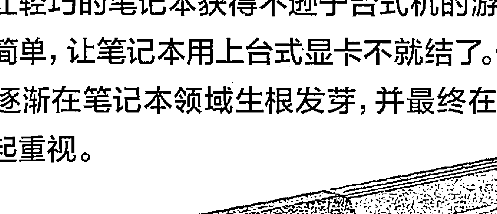

也许是觉得华硕和技嘉的外置显卡过于“粗狂”，所以索尼对外置显卡进行了更为精美的“包装”：将HD6650M显卡芯片与外置光驱合二为一，并增加了很多扩展接口，不仅小巧美观而且更为实用（图4）。2012年，索尼VAIO Z13延续了前辈的设计，并将外置显卡的GPU芯片升级到了HD 7670M。可惜，VAIO Z系列笔记本太过昂贵，而且它外置显卡里面塞进去的GPU原本就是AMD针对笔记本定制的移动版GPU，实际性能也谈不上太过抢眼。

真正将外置显卡发扬光大的，还要数戴尔旗下的Alienware 13。这是一款13.3英寸的轻薄型游戏本，在2kg体重的基础上塞进了GTX960M独立显卡，唯一可惜的就是处理器为低功耗版的U系列酷睿处理器。为了进一步提升Alienware 13的游戏潜力，戴尔为其定制名为Graphics Amplifier（性能放大器）的外置显卡模块（图5），可根据需求和预算，自行购买安装各种长度、TDP在375W内的双槽显卡（图6）。能与Alienware 13抗衡的就要数微星旗下的GS30了。与Alienware 13相比，GS30改用标准电压的H系列酷睿处理器，且主机内仅配有集成显卡。如果玩家想提升游戏动力，则可自行购买名为“潘多拉魔盒”的外置显卡模块（图7），其兼容PCIE x16标准的台式显卡。好消息是，Alienware 13和GS30的外置显卡都通过定制的接口与笔记本相连，所以不必担心接口带宽不够而影响外置显卡性能的发挥。两款外置显卡在体验上最大的差异是：Alienware 13在外接显卡时笔记本内屏同样可以显示，而GS30在使用外置显卡时笔记本内屏会被自动关闭，只能将画面输出到外置显卡所连接的显示器屏幕上。

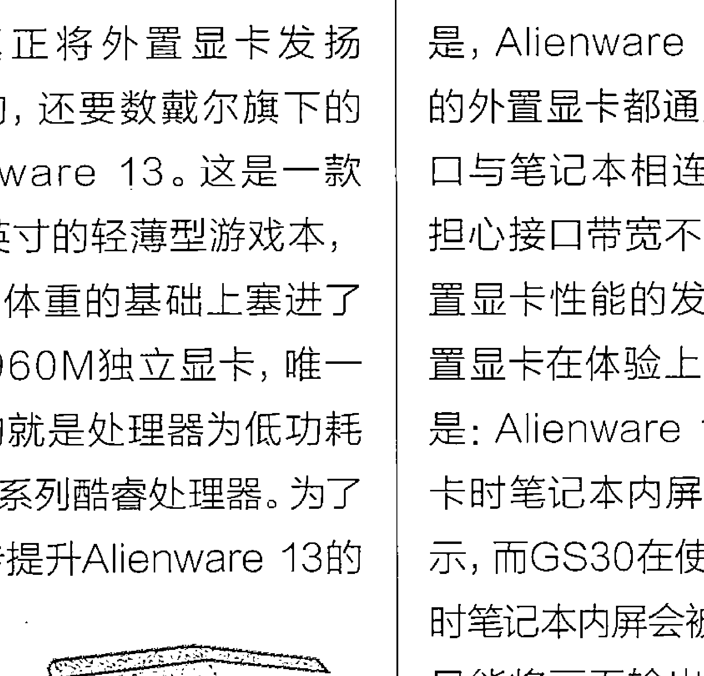
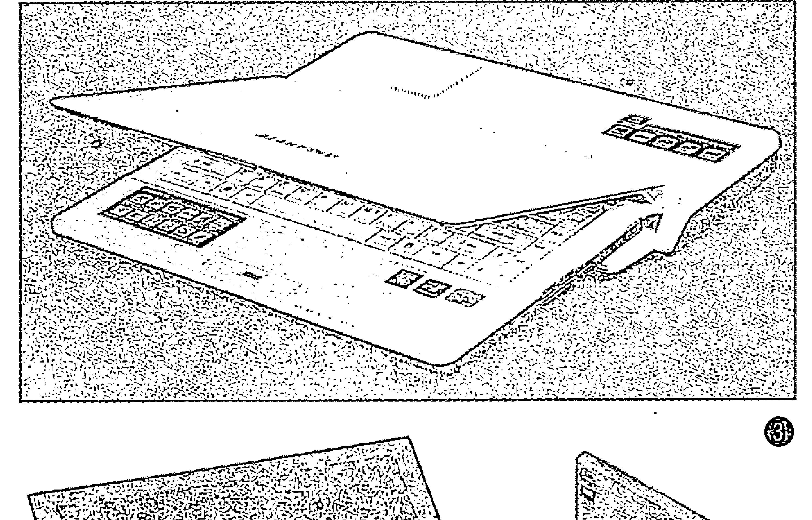
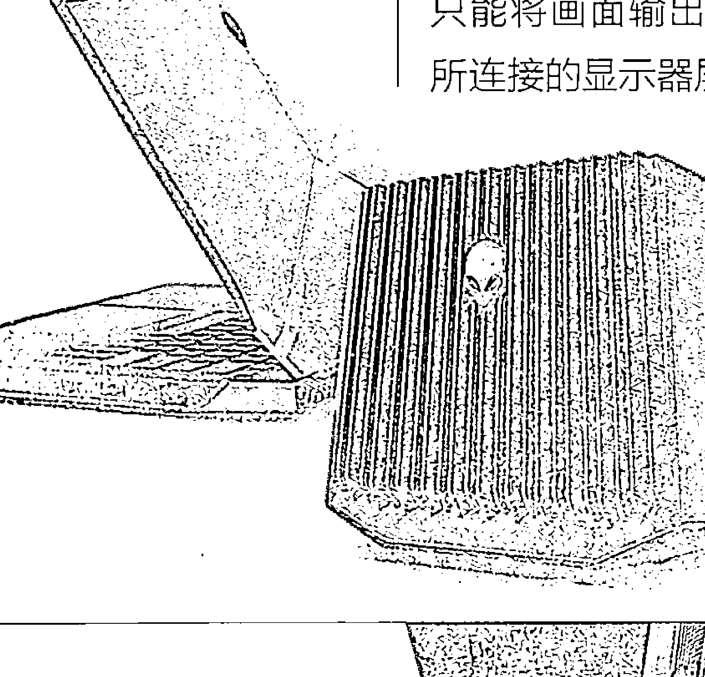
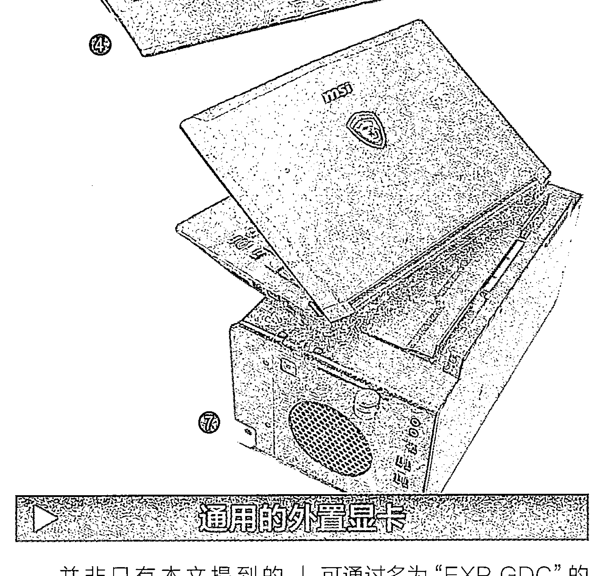

#### 通用的外置显卡

并非只有本文提到的笔记本才有享用外置显卡的机会，只要你的本本提供了Expresscard插槽（一般位于机身两侧）、Mini PCI-E接口（需拆开底盖，大都已被无线网卡占用）、NGFF（仅支持M.2 A KEY，也就是用于安装无线网卡的；或是M.2 M KEY，即走PCI-E x4通道的插槽，如果是用来安装SSD的M.2 B KEY则不支持该产品）或Thunderbolt接口，就可通过名为“EXP GDC”的外置显卡模块（图8），加装台式显卡改善游戏效能。虽然很多新款笔记本都符合EXP GDC的条件，但往往需要拆下底盖，并通过延长线和转接线才可使用，有一定的动手难度。为了避免可能出现的兼容性问题，大家在购买前需要提前与商家沟通，并选择匹配的转接线缆。有关该产品的使用教程，请打开http://dwz.cn/29Ee3K网页查看。

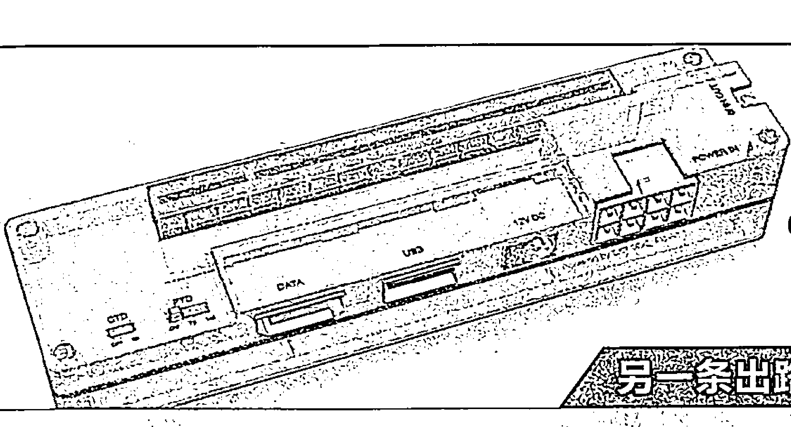

#### 另一条出路

除了外置扩充以外，笔记本其实还有一条提升游戏性能的出路，那就是：可更换的MXM显卡模块。实际上，MXM显卡模块曾一度成为高端笔记本的主流，只是笔记本在追求纤薄设计的过程中，逐渐舍弃了MXM结构，改用了可节省内部空间的BGA封装（将GPU、显存等芯片直接焊死在主板上）。好消息是，随着游戏本的兴起，如今已经有部分产品将显卡回归到了MXM结构（图9），从而获得了可自行更换内置显卡提升性能的机会。


#### 瓶颈源自哪里

从2008年到2015年，外置显卡并没能在笔记本领域掀起太大的风浪。究其原因，则是缺乏统一的行业标准，OEM厂商各自为政，推出的外置显卡模块也仅支持自家的指定产品。EXP GDC这类第三方解决方案虽然有一定通用性，但使用起来却往往需要将笔记本“大卸八块”之后才能使用，安装和卸载很不方便。如果笔记本芯片组较老，在使用EXP GDC时还会面临带宽过小而影响性能的问题。

#### 源自S Book的新思路

既然S Book并非外置显卡的“鼻祖”，而其选用的GPU也并非台式显卡，为何依旧会将本文提到的外置显卡的风头压下来呢？答案很简单，S Book将外置显卡塞进了足够轻薄且需要随身携带的键盘底座内，在安装和使用的过程中毫无突兀之感。接下来，就让我们好好探究一下S Book外置显卡的原理和性能表现吧。

#### 解析S Book的外置显卡


S Book是如何将GPU塞进键盘的，又通过什么方法实现了热插拔功能？下面我们就以外置显卡为契机，了解一下S Book不为人知的黑科技吧。

#### 为何没AMD什么事

有很多朋友都问过笔者：为什么微软Surface不使用AMD的硬件？如果S Book换成AMD移动显卡会怎么样？除了Wintel（微软和英特尔的英文缩写）联盟稳固的关系以外，现阶段AMD在CPU技术方面明显落后于英特尔，移动显卡方面也逊于NVIDIA，所以S Book自然要选择“强强联合”的硬件方案。另一方面，S Book外置显卡支持热插拔的工作模式，也注定与AMD移动显卡技术无缘。我们都知道，英特尔移动处理器都集成了核芯显卡，在额外搭配NVIDIA或AMD独立显卡时都可以实现双显卡切换的功能。问题是AMD通过电源管理来负责显卡的切换，可自动或手动让指定的程序使用集成显卡或独立显卡（图1），而输出端（屏幕内容）则是谁工作谁负责，即集成显卡模式时集成显卡负责输出，独立显卡工作时独立显卡负责输出。

出。如果Surface Book的键盘里塞进的是AMD独立显卡,在独立显卡工作时要将屏幕与键盘分离极有可能出现黑屏或花屏等问题,影响实际体验。

NVIDIA的显卡切换技术又称Optimus(图2),无论集成显卡还是独立显卡工作时

#### 如何实现热插拔

要注意的是, Optimus只是让独立显卡“热插拔”的条件之一。Windows系统对热插拔的支持一直不够完美,例如在服务器领域多器件热插拔稍不注意就会挂死。Surface Book想要顺利实现外置显卡的热插拔,微软还需攻克一个难关:在屏幕和键盘分离前,显卡驱动要提前做好停止GPU(独显单元)运行的准备,并将占用GPU资源的程序移交给集成显卡(如果无法移交就关闭);当屏幕与键盘分离后独立显卡等同于被卸载,可理解为正在打游戏的台式电脑被你强行拔下了PCIe显卡;当你重新将键盘与屏幕接驳好之后,系统和驱动都要在第一时间做好GPU重新上线的准备。

罕见,怪不得微软曾表示Surface Book的GPU是NVIDIA专门为其“定制”而来。

总之, Surface Book对外置显卡的热插拔还是存在一定限制,比如你正运行某款3D网游(需GPU渲染),临时想去趟WC,此时就必须先退出游戏才能拔下键盘,再拿着轻薄的平板部分去WC一边方便一边看视频或上网。但即便如此, Surface Book也是迄今为止将外置显卡体验做得最好的PC设备。最关键的是, Surface Book为外置显卡的使用方式做了重新的定义规范(图4),也给OEM厂商更多的创意思路,也许用不了多久,我们就能看到更多类似Surface Book这种将外置显卡塞进键盘底座中的二合一设备出炉。

> Surface Book外置显卡通过PCI-E总线连接主体与底座之间的Surface Connect接口,在NVIDIA Optimus技术的帮助下能在集显、独显之间自动切换,而且支持手动选择。

都是由集成显卡负责画面的输出,独立显卡只是需要时才完成渲染任务,而渲染的结果也是要通过集成显卡输出。因此Optimus先天就具备独立显卡“热插拔”的基础,而这就是Surface Book选择NVIDIA定制外置显卡的原因。

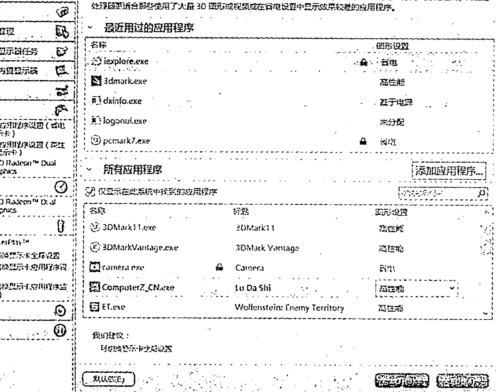

#### 最近用过的应用程序
| 名称 | 图形设置 |
|------|----------|
| iexplore.exe | 省电 |
| 3dmark.exe | 高性能 |
| dxinfo.exe | 省电 |
| jagon.exe | 未分配 |
| pcmakr7.exe | 高性能 |

#### 所有应用程序
| 名称 | 图形设置 |
|------|----------|
| 3DMark11.exe | 高性能 |
| 3DMarkVantage.exe | 高性能 |
| camera.exe | 省电 |
| ComputerZ_CN.exe | 高性能 |
| ET.exe | 高性能 |

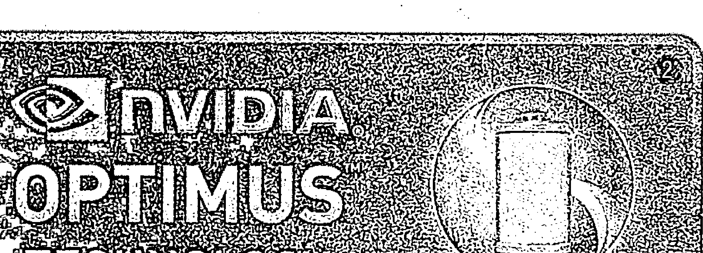

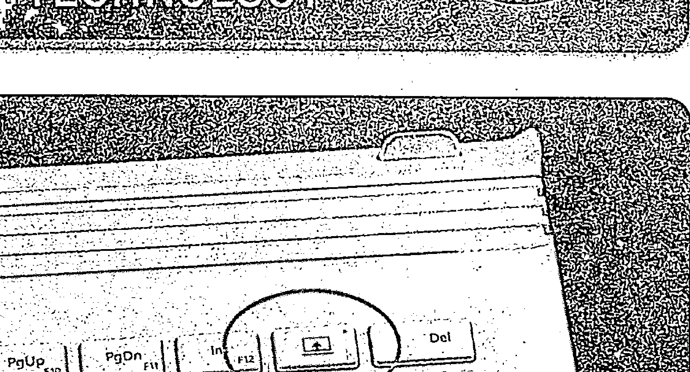

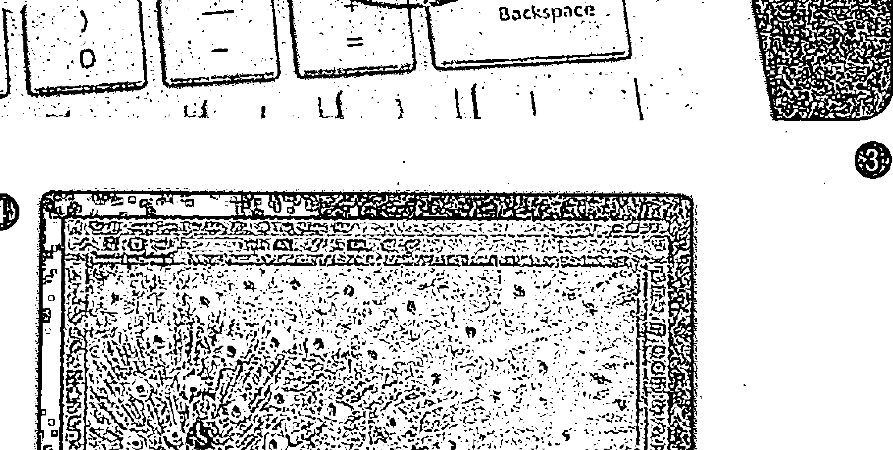

#### 如何解决散热压力

Surface Book的屏幕（平板）部分只有7.7mm厚度，并将NVIDIA GPU塞进了最薄处仅有5.3mm的键盘里，那么它又是如何解决CPU和GPU散热压力的呢？

Surface Book搭载了15W的Skylake-U系列处理器（如酷睿i5-6300U），这个档次的处理器发热量不低。为此微软在Surface Book的纤薄屏幕里塞进一片T型的超大散热片（图5），不仅覆盖了CPU芯片，还将板载的内存颗粒囊括其中，并通过0.5A的超薄小风扇负责将热量排出体外（图6）。

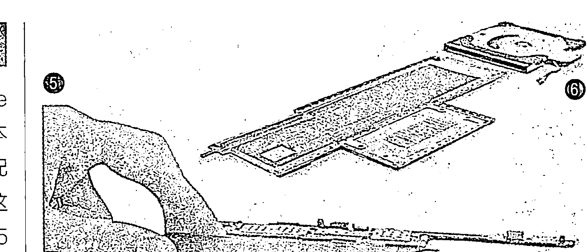

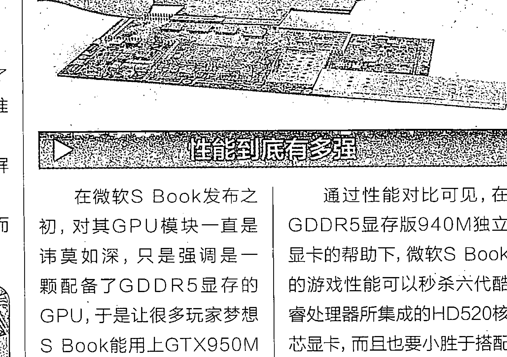

Surface Book的GPU部分为NVIDIA为其定制的GeForce 940M独显，与其他笔记本上常见的940M不同（搭配DDR3显存），Surface Book为这个GPU搭配了1GB GDDR5显存，对性能表现有所增益。别看Surface Book键盘部分纤薄，但依旧为940M独显准备了0.3A的散热风扇，组成标准的单热管散热模块（图7）。由于CPU和GPU分别位于屏幕和键盘，发热量不会堆叠，因此Surface Book的散热效果反而比同规格的笔记本还好些。

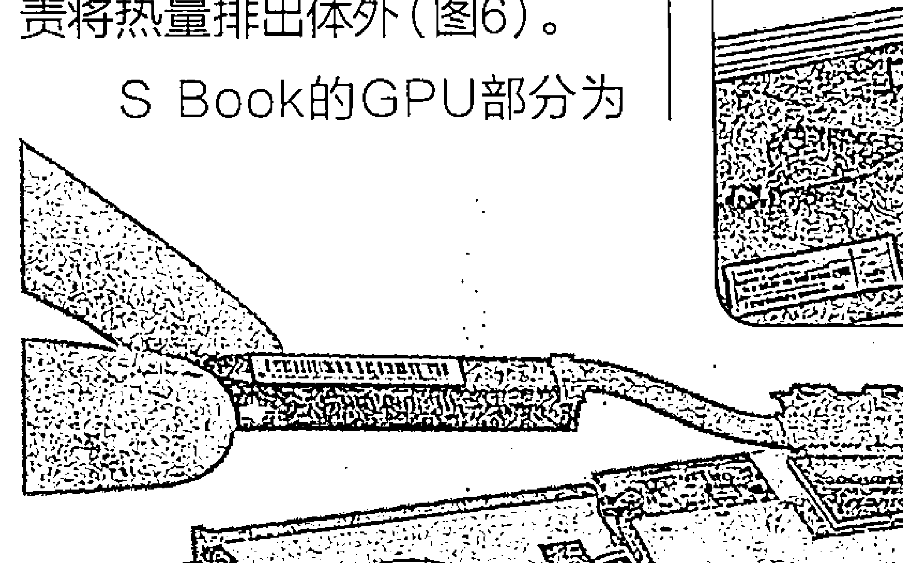

| 测试产品 | 基本配置 | PCMark7 | 3DMark11-P | 3DMark Sky Diver |
| :--- | :--- | :--- | :--- | :--- |
| 微软Surface Book | i7-6600U+940M+SSD | 5412 | 2696 | 6191 |
| 宏碁V3-372 | i7-6500U+HD520+SSD | 5258 | 1583 | 3711 |
| 宏碁F5-572G | i5-6200U+940M+HDD | 2706 | 2356 | 4831 |
| 戴尔游匣15 | i5-4210H+GTX960M+HDD | 2499 | 4774 | 10517 |
| 机械师T57 | i7-6700HQ+GTX960M+HDD | 3095 | 5596 | 12802 |

#### 性能到底有多强

在微软Surface Book发布之初，对其GPU模块一直是讳莫如深，只是强调是一颗配备了GDDR5显存的GPU，于是让很多玩家梦想Surface Book能用上GTX950M甚至GTX960M级别的独显芯片。可惜现实是残酷的，Surface Book仅武装了一颗定制版的940M独显（图8），那它的性能到底如何？

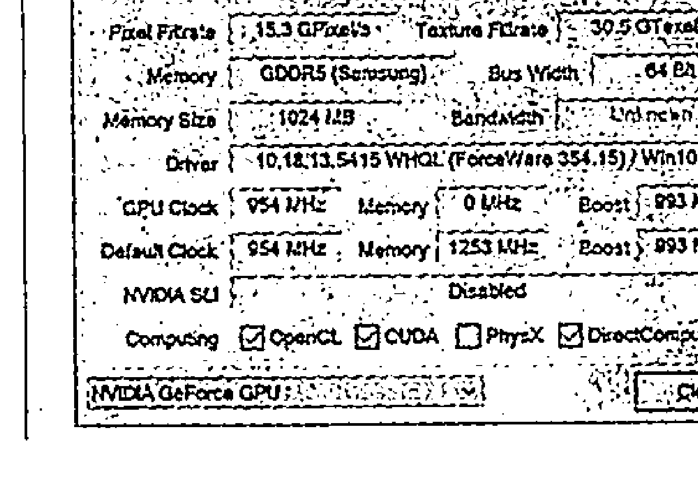

通过性能对比可见，在GDDR5显存版940M独立显卡的帮助下，微软Surface Book的游戏性能可以秒杀六代酷睿处理器所集成的HD520核心显卡，而且也要小胜于搭配DDR3显存的940M。不过当看到它与GTX960M之间的性能差距，相信会引起无数玩家的“残念”：如果Surface Book真能武装GTX960M，绝对再也不看笨重的游戏本一眼！以实际游戏为例，Surface Book在1080P分辨率和中等画质下运行《生化奇兵：无限》可以获得37.2fps的帧数，在1080P低画质下可流畅运行《GTA5》。总的来说，外置显卡对Surface Book游戏性能的意义在于“锦上添花”，但还谈不上“质的飞跃”。

#### 还有哪些黑科技

更细腻的屏幕：
Surface Book的屏幕规格非常小众，13.5英寸（不是常见的13.3英寸哦），集成了3:2的显示比例，并将分辨率提升到了3000×2000像素，267ppi的显示精度在MacBook Pro之上（227ppi）。结合1024级Surface Pen触控笔，在Windows Edge和OneNote等应用中可以进行更惬意的手写体验（图9）。此外，Surface Book独特的防误触机制也能避免手指意外触控屏幕而出现的杂乱笔迹。

独特的铰链设计：
Surface Book看似“粗狂”的铰链设计令人印象深刻。用微软的话讲，键盘和屏幕间的缝隙可保护屏幕（图10），粗大重的铰链可避免二合一设备固有的头重脚轻隐患，当屏幕翻转过来做平板时倾斜角度有利于屏幕书写和视觉体验。不过，也有用户对此提出了质疑：不能完全合拢的屏幕无形中增加产品的厚度影响了便携性，当Surface Book放在包里受到挤压时会不会导致铰链变形？官方宣传的360度有噱头之嫌。因为Surface Book的铰链并不能像联想Yoga一类的产品进行360度翻转(图11)，平板模式和笔记本模式主要靠屏幕与键盘的插拔方向。

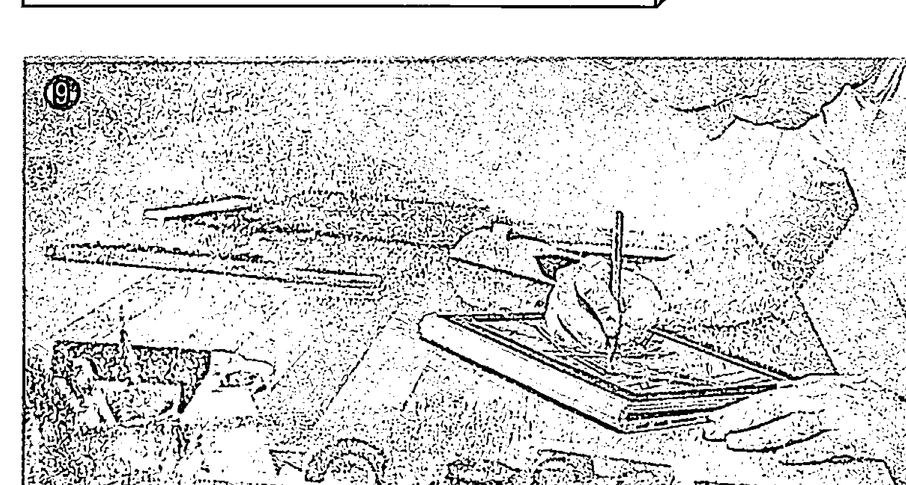


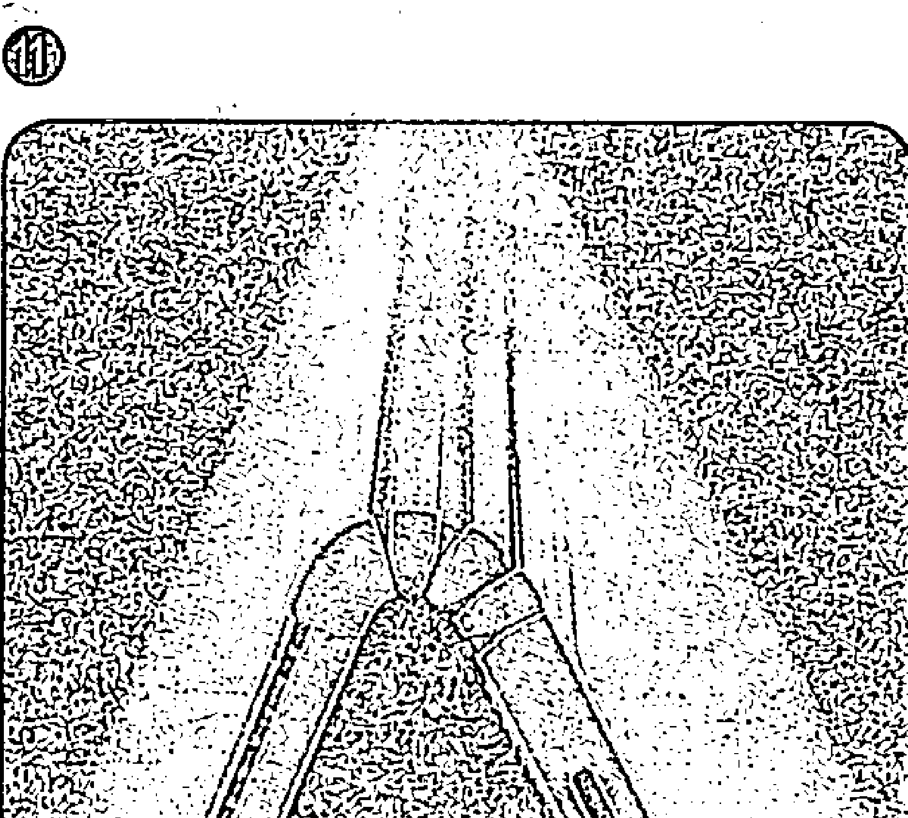

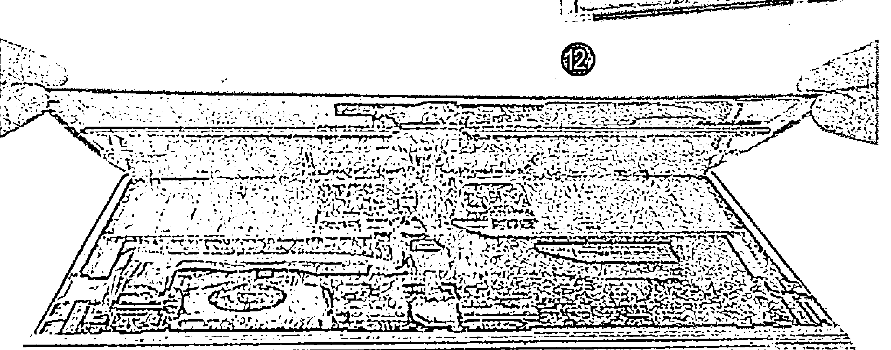

电池的空间利用：
Surface Book拥有12小时的续航能力。其中Surface Book屏幕部分里配备了18Wh的电池，可以持续续航3小时左右，而余下的9小时就要依靠键盘底座中的51Wh电池了(图12)。而Surface Book键盘空间的利用堪称极致，将凹凸的空间全部留给了电池，几乎没有半分的浪费。就机身内部空间的结构与利用率而言，Surface Book值得其他厂商学习。

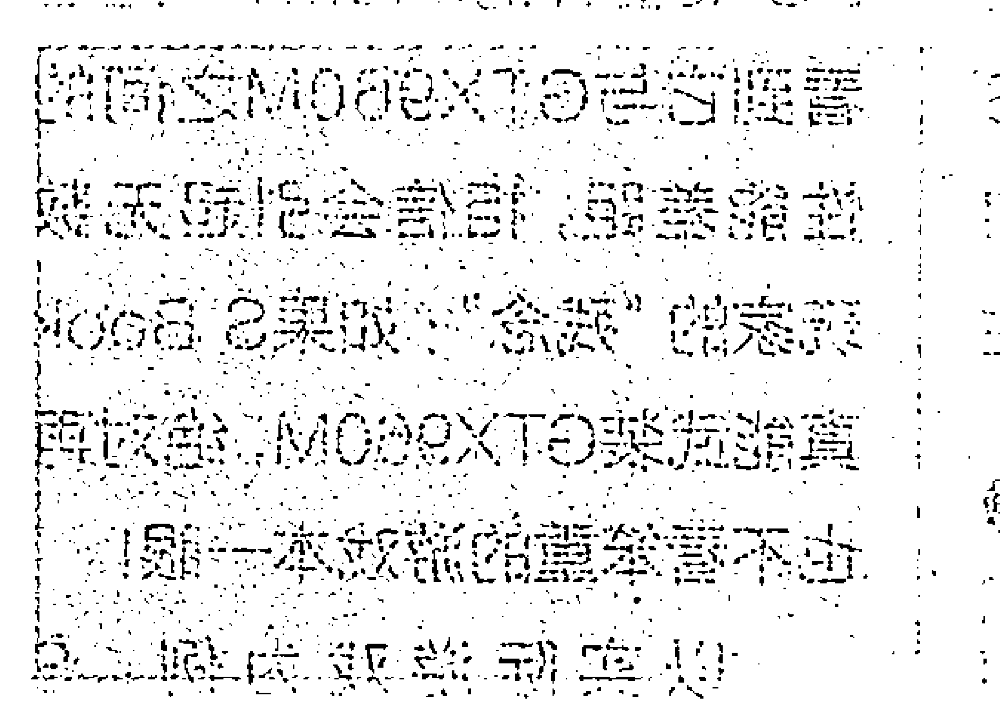

### Surface的‘兄弟之争’

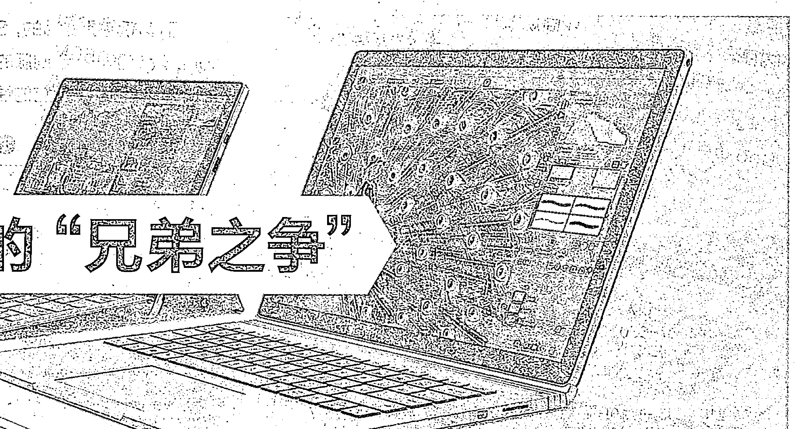

| 参数 | Surface Book | Surface Pro4 |
| --- | --- | --- |
| 屏幕 | 13.5英寸(3000×2000像素) | 12.3英寸(2736×1824像素) |
| 处理器 | 酷睿i5/i7 | 酷睿M3/i5/i7 |
| 内存 | 4GB起 | 4GB/8GB/16GB |
| 硬盘 | 128GB起 | 128GB/256GB |
| 显卡 | HD520/NVIDIA 940M | HD515/HD520/锐矩 |
| 体积 | 312mm×232mm×7.7mm(裸机)<br>13mm~22.8mm(带键盘) | 292mm×201mm×8.45mm(裸机)<br>13.2mm(带键盘) |
| 重量 | 725g(裸机)<br>1.52kg(带键盘) | 766g(裸机)<br>1.05kg(带键盘) |
| 参考价格 | 约9999元起 | 6688元-18888元 |

### 变形本的现在和未来

作为“变形本”的一个分支，Surface家族始终以“二合一”形态示人，而Surface Pro 4和Surface Book，则代表了二合一设备的现在以及未来（图1）。 简单来说，Surface Pro 4是“可被复制”的。屏幕即平板电脑，与Type Cover（键盘）结合就是笔记本，类似形态的产品一搜一箩筐。只是Surface Pro 4属于此类产品中的“贵族”，在做工、功能（如Surface Pen）等方面有着毋庸置疑的优势，唯一的缺陷就是售价要比同档次的竞品贵了很多。 而Surface Book的优势则在于“无可替代”。其可以热插拔的外置显卡（键盘）在短期内还无法被OEM厂商复制。它的最大意义在于为未来二合一形态的产品指明了方向，谁说平板电脑不能玩大型3D游戏？有了外置显卡，一切都不是梦想（图2）。可惜的是，作为“终极形态的笔记本”，Surface Book的售价也极为高昂，是否要为“未来”买单，我们还需要从需求和预算的双重层面出发。

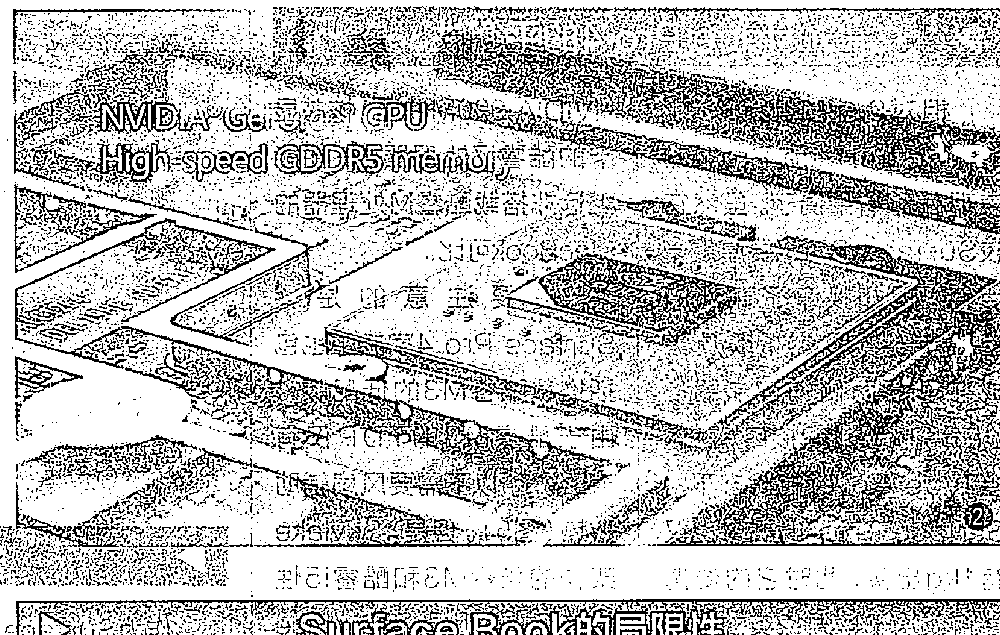

### Surface Book的局限性

两款Surface都采用了镁铝合金材质的机身设计，别看Surface Book的屏幕更大，但它却有着更为性感的7.7mm厚度和725g的轻薄身材。不过，Surface Book为了瘦身也付出了极大的代价，它的屏幕部分只有一个耳机插孔，而两个USB、读卡器、miniDP接口都被转移到了键盘底座上。这意味着，我们在绝大多数情况下，都需要连同Surface Book和键盘底座一起带出门而且形影不离（图3），否则没有任何扩展接口的Surface Book将很难玩转Windows系统以及相关的应用。 前文提到，Surface Book在键盘底座里塞进了GPU（视版本而定，低配版键盘底座无GPU）和51Wh电池，而这也就导致了键盘底座的体重“超标”。当Surface Book屏幕与底座结合后，它将变成一部22.8mm（最厚处）和1.5kg的13.5英寸“笔记本”，此时它的便携优势将荡然无存。 以戴尔XPS 13为例，这款13.3英寸的笔记本长宽分别比Surface Book小了8mm和32mm，而其重量也仅有1.18kg。实际上，类似戴尔XPS 13的超轻薄笔记本不在少数，而Surface Book如果没有外置显卡来巩固游戏动力，它的笔记本模式（连接键盘）就将成为自己的“累赘”。

### 真是MacBook杀手？

很多人都喜欢拿Surface Pro 4与MacBook Air，Surface Book和MacBook Pro（13英寸版）相比。诚然，新Surface在性能和扩展能力上的表现更为突出，但是操作系统和生态环境的差异，导致了两类产品的用户群很难出现交集。因此，类似的讨论是没有太多意义的。


### Surface Pro 4的平衡性

相对Surface Book的极端，Surface Pro 4的表现就可谓平衡了。虽然它较Surface Book要厚重一点点，但却换来了背部的金属支架（图4），以及集成在屏幕两侧的读卡器、USB和miniDP接口。在连接Type Cover的状态下，Surface Pro 4的重量也仅有1kg出头，此时它的便携性将仅次于苹果12英寸版本的MacBook（920g）。但请不要忘记，Surface Pro 4最高可以武装集成锐炬（Iris520，性能大概相当于NVIDIA 920M独显）核芯显卡的酷睿i7处理器，在性能上远非搭载酷睿M处理器的MacBook可比。

需要注意的是，Surface Pro 4家族中也包括搭载酷睿M3的低配版，由于酷睿M3的TDP仅有4.5W，所以不需要风扇辅助散热（图5）。但是，Skylake架构的酷睿M3和酷睿i5性能差距非常明显，而Surface Pro 4的酷睿M3版和酷睿i5版的价差却仅有700元（图6），所以笔者强烈建议大家直接忽视低配版！

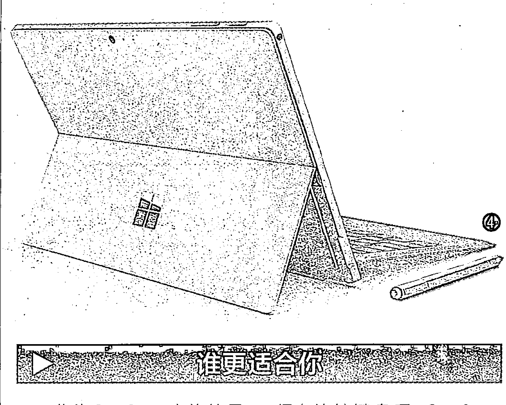

### 谁更适合你

作为Surface家族的最新成员，Surface Book是一款集性能、设计、品质、便携型于一身的新品：与键盘分离时堪称最轻薄的大尺寸Windows 10平板，与键盘结合后就是一部性能颇为不俗的娱乐笔记本。如果你能接受Surface Book的价格，这款产品可以轻松胜任平板和笔记本的双重角色。

但在连接键盘后，Surface Pro 4的便携性却可秒杀Surface Book几条街。最关键的是，Surface Pro 4同样支持Surface Pen，Surface Book能办到的Surface Pro 4同样没有问题。

如果你对Surface Book的外置显卡的性能增益不感兴趣（不怎么玩游戏），那就没有必要购买低配版的Surface Book了，此时Surface Pro 4可以为你带来更理想的体验。它的性能与Surface Book相似，

总之，笔者给大家的选购意见是：Surface Book要么不买，要么就买配备外置显卡的版本；Surface Pro 4不要图便宜，贵700元的酷睿i5版可为你带来更为流畅的体验。这里可能有读者会说了，我连低配版Surface Pro 4都觉得贵，那该咋办啊？没关系，接下来就让我们再来盘点一下足以挑战新Surface家族的众多竞品吧。

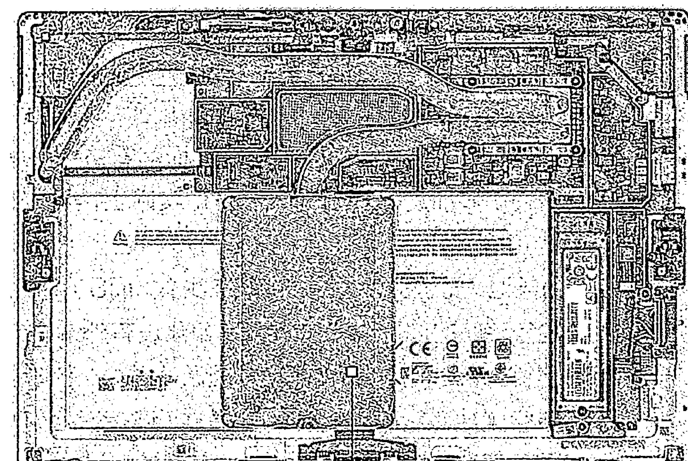

> 低配版Surface Pro 4因为没有风扇所以重量也会轻一点点

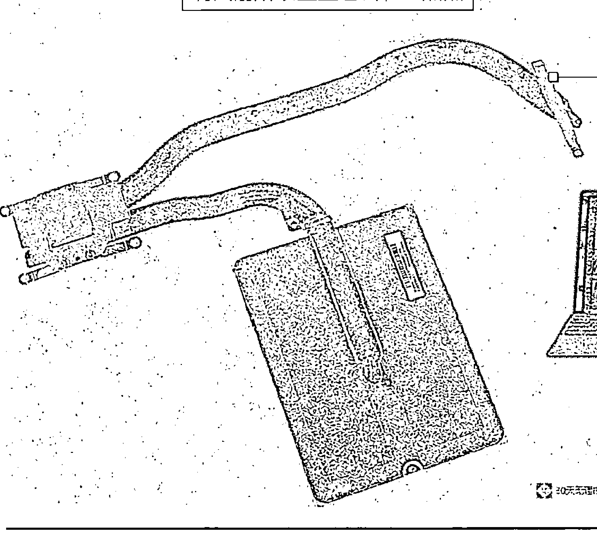

> Surface Pro 4改用了更大面积的纯铜的热管和底座，散热效率较上代产品有了明显提升，而风扇部分也仅有高负载时才会运行，平时工作时则处于静音状态

| 配置 | 价格 |
|------|------|
| Intel Core m3 - 4GB内存/128GB存储 | ￥6,688 |
| Intel Core i5 - 4GB内存/128GB存储 | ￥7,388 |
| Intel Core i5 - 8GB内存/256GB存储 | ￥9,688 |
| Intel Core i7 - 16GB内存/512GB存储 | ￥13,388 |

### Surface的小伙伴们

> Surface Pro 4的挑战者
Surface Pro 4的优势在于精湛的工艺以及用摩尔定律的便携性。想要挑战这款二合一设备领航的新标杆，自然也要具备屏幕键盘可插拔的特性，以及足以吸引眼球的特色和功能。

为了不和OEM友商“抢饭碗”，微软对Surface家族的定位和售价都与苹果MacBook家族划上了等号。不考虑微软和苹果的“神仙打架”，在OEM友商的“凡间斗争”也许你会找到更适合自己的产品。

### 挑战者1号: 联想Miix 4

我们可以将Miix 4视为联想的Surface Pro 4，因为它们的设计实在太像了：一体化的金属机身，连体式的背部支架，土豪金的配色也更为时尚。和Surface Pro 4相比，5499元的Miix 4就随机附赠了键盘和2048级压感的手写笔。如果你觉得Surface Pro 4售价太高，更实惠的Miix 4就不要错过了。

- 屏幕: 12英寸触控屏(2160×1440像素)
- 处理器: 酷睿M3
- 内存/硬盘: 4GB/128GB SSD
- 厚度: 9mm(裸机)/14.5mm(带键盘)
- 电池/重量: 40Wh/750g(裸机)/1.05kg(带键盘)

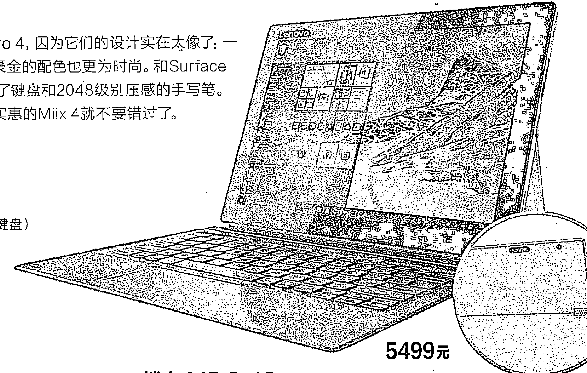

5499元

### 挑战者2号: 戴尔XPS 12

作为XPS家族的最新成员，XPS12也延续了几乎无边框的InfinityEdge屏幕，而用户也能根据需要选择4K分辨率的顶配版。该产品搭载酷睿M5处理器，并采用和Surface Pro 4相同的分体设计，只是屏幕和键盘底座并非机械连接，而是让插槽以理想的角度巧妙地托住平板。值得一提的是，XPS12配备2个USB Type-C型接口，同样支持压感手写笔。

- 屏幕: 12.5英寸触控屏(1920×1080像素)
- 处理器: 酷睿M5
- 内存/硬盘: 8GB/128GB SSD
- 厚度: 8mm(裸机)/不明(带键盘)
- 电池/重量: 30Wh/793g(裸机)/不明(带键盘)

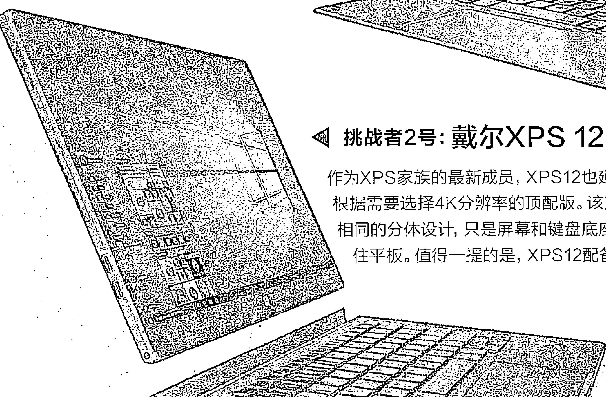

7999元

### 挑战者3号: 惠普Spectre x2

作为一款二合一设备，惠普Spectre x2改用了极具特色的U型支架设计，可以在0度~150度之间调整屏幕视角。此外，该产品还配备了英特尔RealSense摄像头R200，用于捕捉和实现3D体验。Spectre x2搭载了酷睿M处理器，键盘可轻松拆卸或通过磁接口与屏幕部分连接。

- 屏幕: 12英寸触控屏(1920×1080像素)
- 处理器: 酷睿M3
- 内存/硬盘: 4GB/128GB SSD
- 体积: 8mm(裸机)/13.15mm(带键盘)
- 电池/重量: 42Wh/840g(裸机)/1.22kg(带键盘)

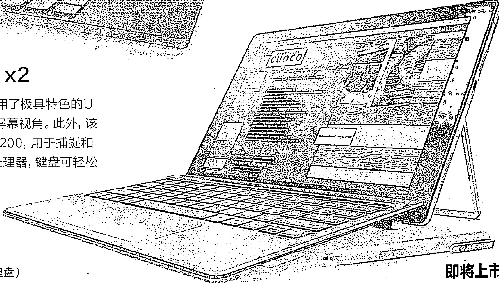

即将上市

### Surface Book的挑战者

微软对Surface Book的定位是终极笔记本，所以它的挑战者范围要更为宽泛。当然，我们不指望OEM谈品牌拥有外置显卡的黑科技，但至少也要具备媲美Surface Book工艺与体验的资质。

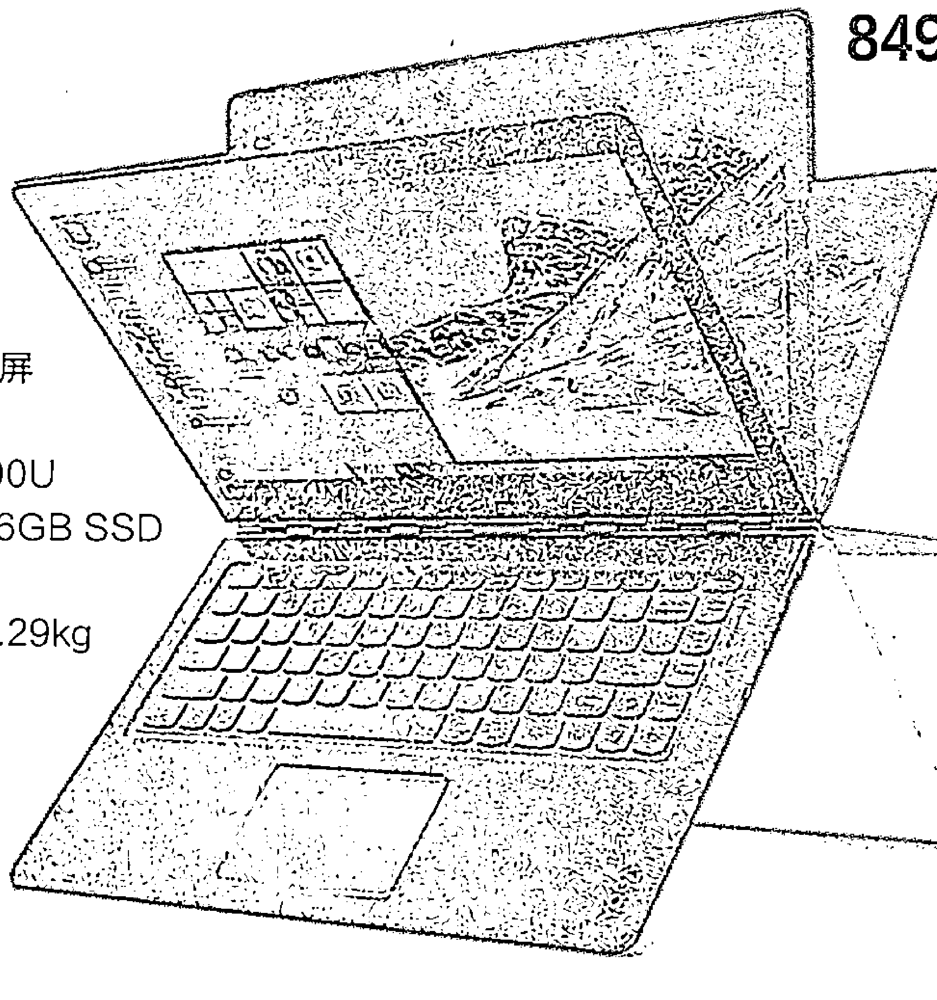

- 屏幕: 13.3英寸触控屏 (3200×1800像素)
- 处理器: 酷睿i5-6200U
- 内存/硬盘: 4GB/256GB SSD
- 厚度: 14.9mm
- 电池/重量: 66Wh/1.29kg

8499元

### △ 挑战者1号：联想YOGA 4 Pro

YOGA 4 Pro即Yoga 900，是联想翻转本家族的最新旗舰。该系列产品最大特色就是精美的表链式转轴，而且屏幕与键盘部分可紧密结合，不会出现Surface Book的那股缝隙。YOGA 4 Pro配置的亮点就是内藏超大的66Wh电池，以及全新的Type-C型接口。除了屏幕无法分离，没有独立显卡外，YOGA 4 Pro是Surface Book的最大竞争对手。

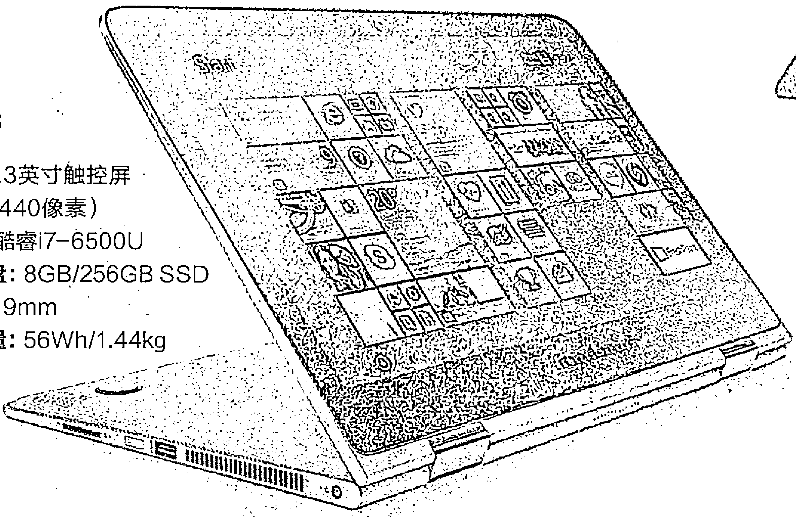

9999元

- 屏幕: 13.3英寸触控屏 (2560×1440像素)
- 处理器: 酷睿i7-6500U
- 内存/硬盘: 8GB/256GB SSD
- 厚度: 15.9mm
- 电池/重量: 56Wh/1.44kg

### △ 挑战者2号：惠普Spectre x360

惠普Spectre x360也是一款屏幕可以进行360度旋转的变形本，它配备了B&O音响，并且为用户提供了以太空银和典雅金为主色调的外观选择。Spectre x360在细节和功能上十分用心，比如它的3个USB3.0接口都支持在休眠模式下充电，全尺寸的HDMI和mini DP端口也方便了用户同时使用多个屏幕。

- 屏幕: 12.3英寸 (2560×1704像素)
- 处理器: 酷睿i7-4770HQ
- 内存/硬盘: 16GB/256GB SSD
- 厚度: 13.65mm (裸机)
- 电池/重量: 63Wh/1.21kg (裸机)

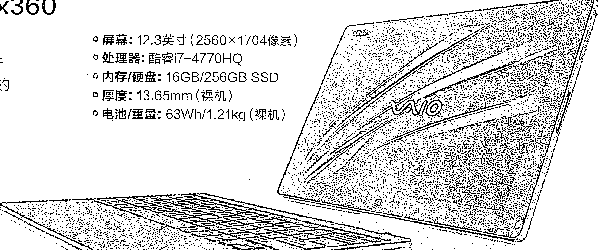

需要海淘

### ◎ 小结

当你拿到本期杂志时，相信新一代Surface已经取得了不错的销售成绩。而这段时间也会有更多以“Surface杀手”自居的新品出炉。实际上，无论是Surface Pro 4还是Surface Book，真正值得我们在意的不应该是性能，因为通过硬件的堆叠，很容易攒出一部更高性能的产品。而新Surface的精髓在于体验的升级：Surface Pro 4通过更高压感的Pen可在更多应用中获得几乎完美的手写体验；Surface Book的外置显卡设计给未来笔记本的发展指明了新方向。PC销量的疲软导致OEM不愿拿出更多的资金用于研发，而毫无创意的“新品”自然无法刺激市场回暖。这回微软自掏腰包重新定义PC，希望可以重新激活PC产业的创新吧。作为生产力的创造者，PC的需求始终在这里摆着。至于能否触发消费者的心弦，就要靠好的产品来争取了。

### △ 挑战者3号：VAIO Z Canvas

自从VAIO被索尼卖掉以后，以独立品牌重生的VAIO急需一款产品来证明自己，于是就有了这款足以媲美Surface Book的VAIO Z Canvas。实话实说，Z Canvas在便携性实在一般，裸机部分就比同尺寸的笔记本还要沉了。但是，如果你仔细琢磨一下它的配置，也许就会感到释然了：该产品搭载了47W的酷睿i7-4770HQ处理器，集成的锐炬核显甚至要在920M独显之上，63Wh的电池容量确保了续航能力。为了镇压高端处理器的发热，它甚至在机身里塞进了3个散热风扇，就设计难度而言并不逊于Surface Book。

## 让我们成为一切的“圆心”

如果说Windows 8/8.1是微软尝试多终端布局的话，那么Windows 10的出现才算帮它打开了些许局面——不是让任何一款硬件设备成为核心，而是让使用者成为圆心。就像微软CEO纳德拉所说的那样：没有一台单一设备是永远的中心，真正的中心是“你”。这意味着，应用、数据和其他的一切应和你永远在一起。

### 虚拟网办公 天涯若比邻


随着网络的普及，网络化办公成为未来公司办公发展的趋势。不过这种分散在家办公的大环境，对公司的网络提出更高要求，不能只是简单的互联网连接，而是要在互联网的基础上，结合时下的网络环境和公司实际情况，有针对性地使用更适合现代办公的各种网络工具。

### 安全+便捷打造虚拟VPN办公网

对于很多公司来说，员工与员工、员工与公司之间经常要进行互访以获取工作所需的资料。如果彼此都是在一个公司内部局域网，这种互访利用系统自带的“网络”组件就可以轻松实现。但是在实际工作中，我们经常要在外网如家中、异地对公司的电脑进行访问；由于内外网络环境比较复杂，常规的网络组件无法胜任。对于这种办公需求的公司，可以通过搭建VPN虚拟网络实现彼此的互访(图1)。

Windows内置了VPN连接组件，一个公司如果搭建VPN网络，那么只要配备相应的VPN服务器即可。对于预算比较紧张或者只是偶尔使用VPN的公司，可以直接使用网上的VPN服务（对于稳定、安全、效率都要求极高的公司，就需要更加专业的VPN服务，将可能涉及到多项费用）。这里我们以“旗舰VPN”免费服务为例：下载VPN客户端后，启动客户端并注册用户后登录（注：这里注册旗舰VPN用户名和密码就是VPN连接使用的账户和密码），可看到免费使用的VPN服务器，点击“连接”，即可开始使用其提供的免费VPN服务了（图2）。

成功连接到VPN服务器后打开“网络连接”，此时就可看到一个名为“qjvpn”的VPN连接，按提示右击VPN连接选择“属性”，在打开的窗口中点击“详细信息”，就可以看到我们电脑VPN内网的地址，类似192.168.21.33的形式（图3）。

### 移动设备上的VPN办公

VPN功能并不仅仅用于互访，在日常使用中大家还可以根据自己公司的实际需要进行更多的应用。比如一些外贸公司在和客户联系时经常使用Gmail邮箱，为了方便收取Gmail邮件，现在也可以使用VPN代理进行。当然随着移动设备的普及，很多朋友在使用平板、手机等进行移动办公。在移动设备上同样可以使用VPN服务，下面以在Android平板上使用VPN收取Gmail邮件为例。

实际上这个就类似我们在公司局域网的IP地址，现在如果要在不同网络的两台电脑之间互访，如在宾馆电脑（假设为A电脑）访问公司电脑（假设为B电脑）上的公司资料如合同文档等。先在B电脑上将合同文档等需要访问的资料放在“C:\工作文档”，然后右击选择“属性→共享”，将其设置为共享目录，并设置好访问共享的账户和密码（图4）。

接着同上在A、B电脑上分别下载VPN客户端并进行VPN连接，然后记住B电脑VPN的IP地址（假设为192.168.21.33）。这样当我们需要在A电脑上访问B电脑的文件时，只要在A电脑上打开资源管理器，在地址栏输入“\\192.168.21.33”（不含外侧引号），回车后输入访问共享目录的账户和密码，即可在A电脑中打开共享目录了，具体的使用和在公司局域网是一样的。这里只是借助VPN服务器将A、B电脑连接在虚拟局域网中（图5）。

在平板上依次点击“设置→无线和网络→虚拟专用网设置→添加虚拟专用网”，在打开的窗口中依次设置VPN名称（任意设置），类型选择PPTP，服务器地址打开www.qijian9.com/user/serverlist.php获取（如免费VPN为23.91.17.185），同时勾选“PPP加密”，最后点击“保存”（图6）。

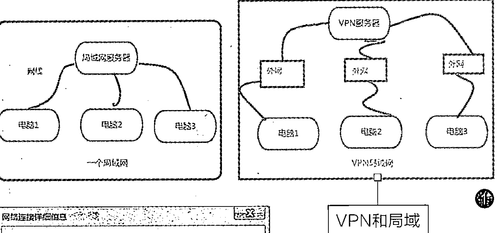

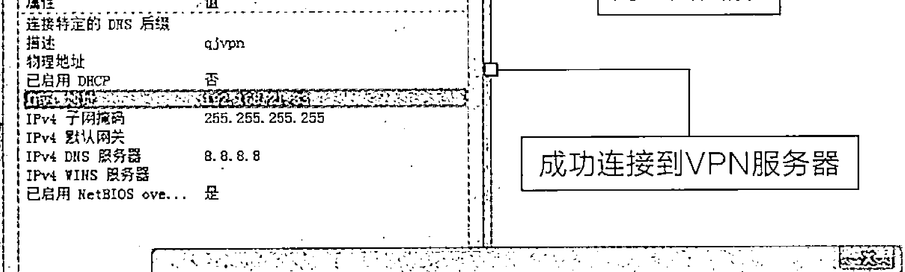

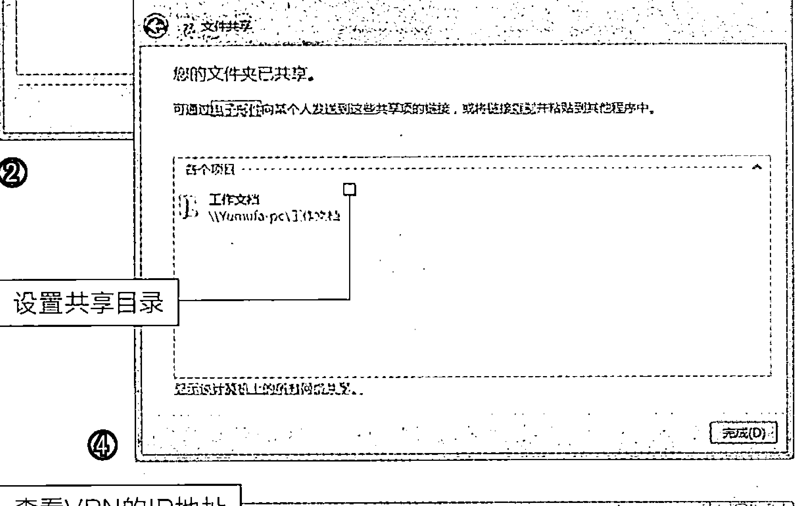

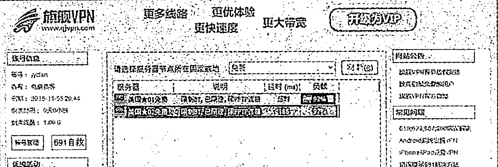

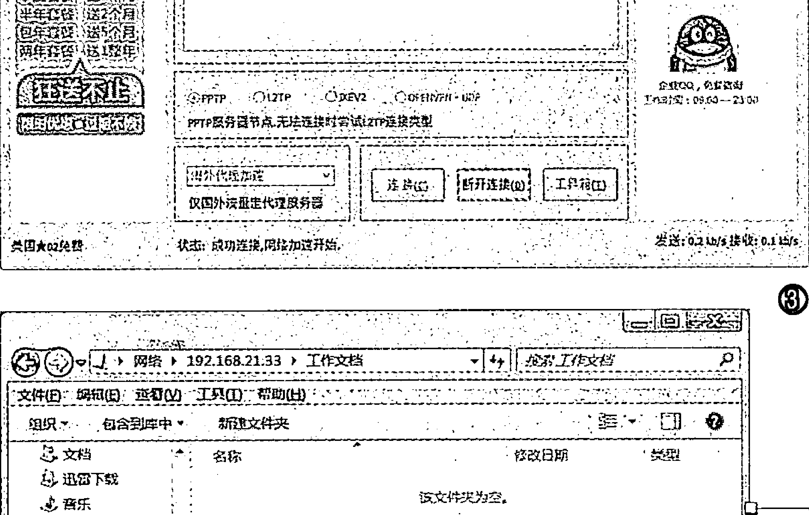

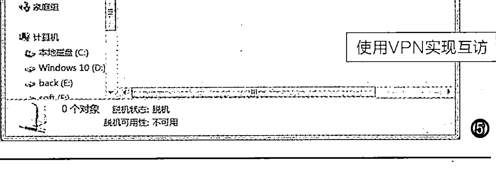

返回VPN列表，选中上述新建的VPN点击连接，在打开的窗口按提示输入上述注册的旗舰VPN的用户名和密码，点击“连接”（图7）。

成功连接到VPN后在平板的屏幕上会显示“已连接”，这样我们就可以在平板上使用VPN服务了。在平板上安装Gmail应用，启动应用后使用自己的Gmail账号登录，这样即可直接在平板上收取Gmail的邮件（图8）。

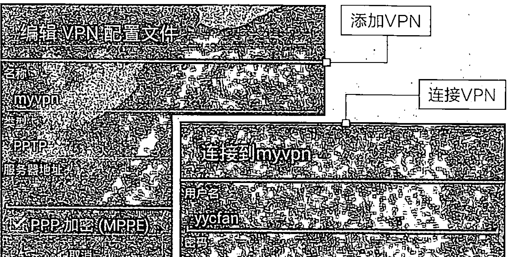


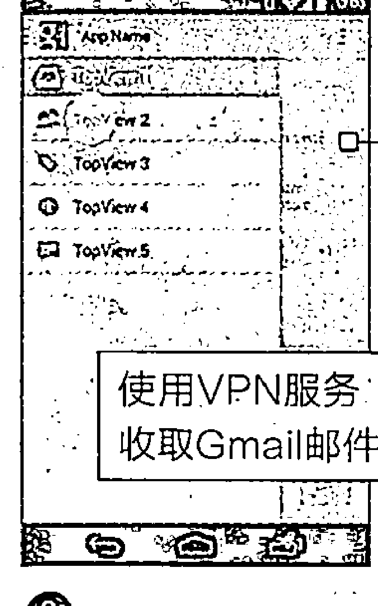

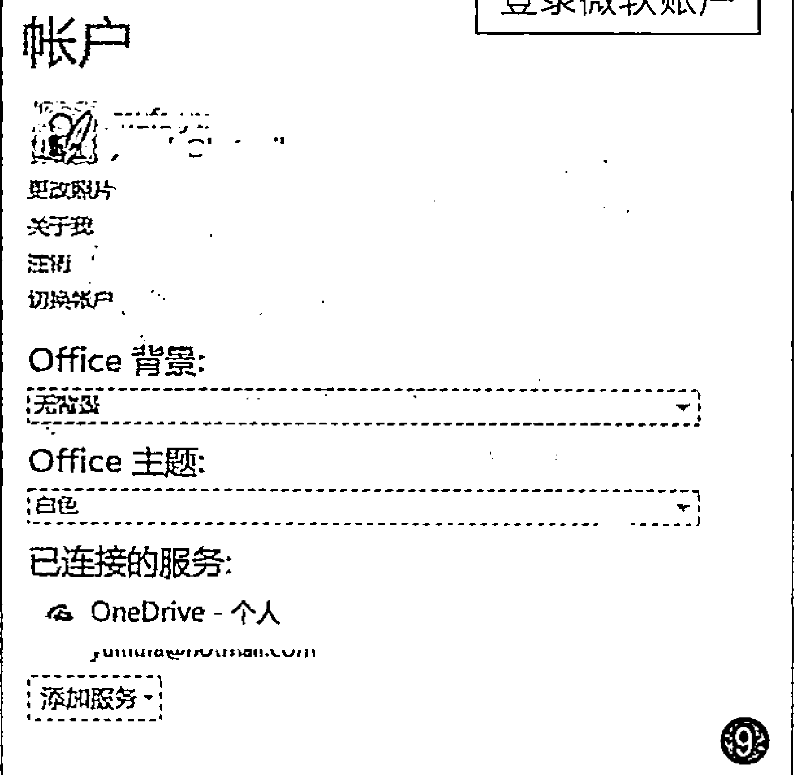

### Office也能虚拟办公

除了使用VPN互访外，在日常办公中我们经常需要员工彼此之间的协作，比如大型策划文档需要多个部门员工一起协作完成。对于办公协作，常见的Office和WPS已经集成这些功能，我们只要稍加设置即可，以Word 2013操作为例。

启动Word 2013后点击“文件→账户”选项，然后在弹出的窗口中使用自己的微软账户登录，确保Word 2013成功连接到OneDrive网盘（图9）。

接着在Word 2013中新建一个需要协作的文档，假设为“产品设计.Docx”，完成后点击“文件→另存为”，将需要协作的文档保存到“OneDrive-个人”，此时会自动打开OneDrive网盘，按提示选择位置保存（图10）。

继续点击“文件”菜单中的“共享”选项，单击“邀请他人”，输入邀请需要协作的员工的电子邮件（可以直接使用Windows 8/10系统的微软用户），同时设置好编辑的权限和协作说明，然后点击“共享”（图11）。

这样需要协作的员工登录他自己的OneDrive网盘后可以看到共享的文档，打开即可编辑该文档了（可以在线编辑，也可以在Word 2013中打开进行编辑）。如此一来，需要协作的文档就轻松地共享给每个需要协作的员工。在Word 2013中如果多人同时编辑，在文档下方会显示正在编辑的用户数以及文档更新情况。如果下方有“可用更新”时，说明有人修改了文档，此时可以保存这些更新到该文档（图12）。

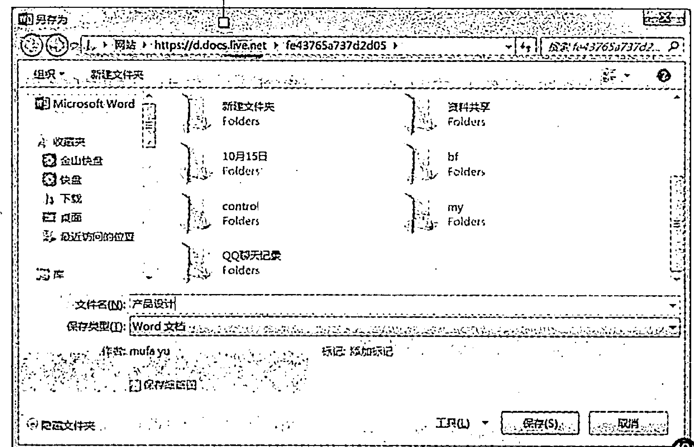

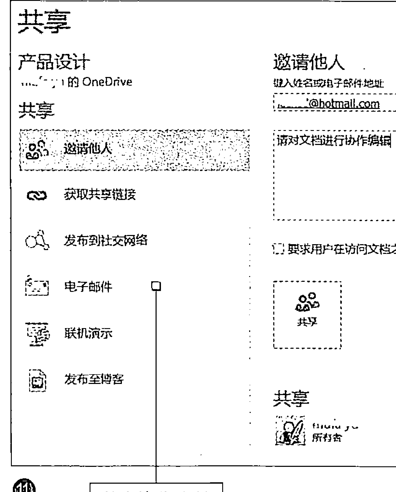

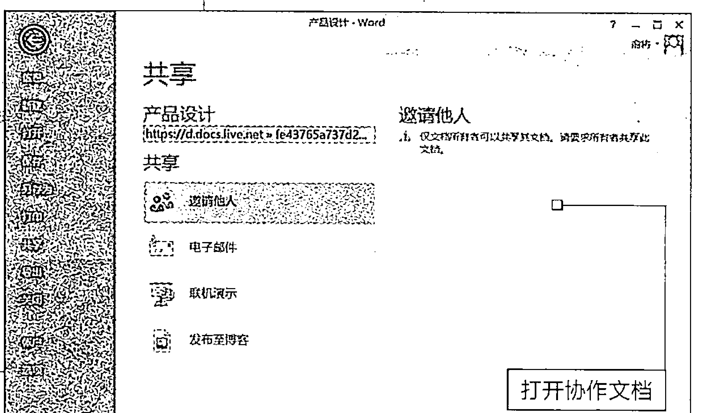

### 围绕用户需求着眼移动办公

以往的办公自动化，往往是固定的人员围绕固定的电脑和固定的软件工作。随着移动办公和需求多样化的趋势发展，以往的这种条件已经不能满足人们日益膨胀的办公需求。以人为本，以任务为中心，移动办公、协作办公的需求日趋迫切。办公领域中着眼效率、围绕用户服务的战争已经在悄无声息中打响了。

### 轻办公下准移动办公各显神通

大家对金山WPS办公软件早已熟悉，然而围绕移动环境下的办公，仅靠强大的编辑功能就显得力不从心。这时，要充分利用轻办公的优势来围绕用户开展工作。轻办公以云空间为“中枢”，以传统办公平台或网络浏览器为入口，以传统办公软件、轻办公客户端或Web端为工作平台开展工作。

进入轻办公环境的有两个通道。一是通过Web端入口(https://account.wps.cn/)，用自己的WPS账号(邮箱或手机号)登录，或用自己的QQ、微信、小米等账号直接登录(图1)。另一个通道是通过WPS轻办公客户端进入，轻办公客户端是在安装WPS办公“抢鲜版”时附带安装的，通过桌面快捷方式或在WPS中通过“特色功能”选项卡，打开云文档或文档漫游功能进入(图2)。

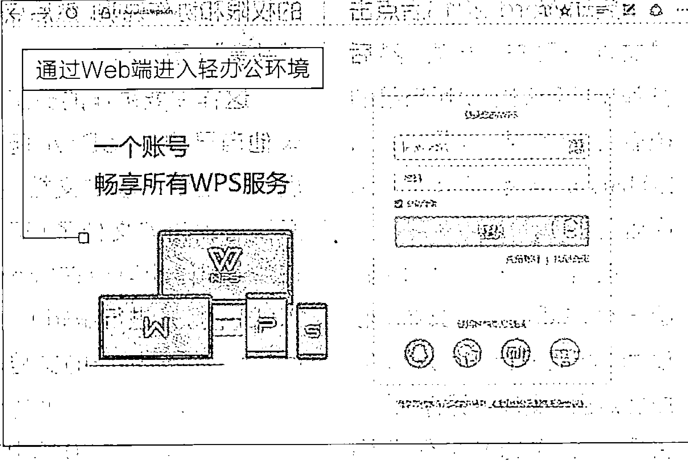

### 小提示

如果你安装的WPS版本没有轻办公客户端，可通过官方网址http://www.wps.cn/product选择下载最新的WPS Office抢鲜版，该版本中集成有WPS轻办公客户端(图3)。

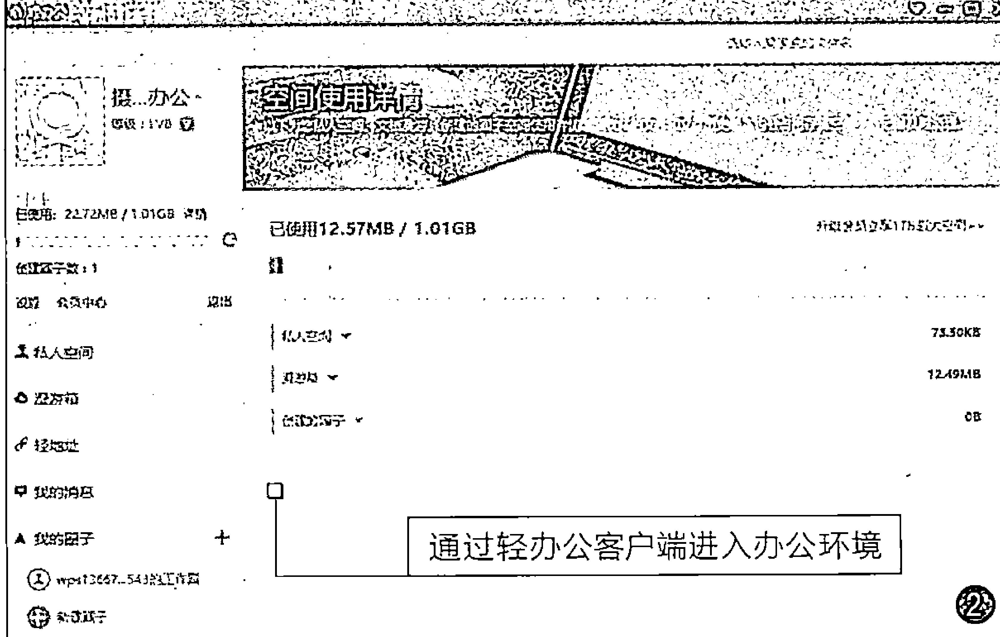

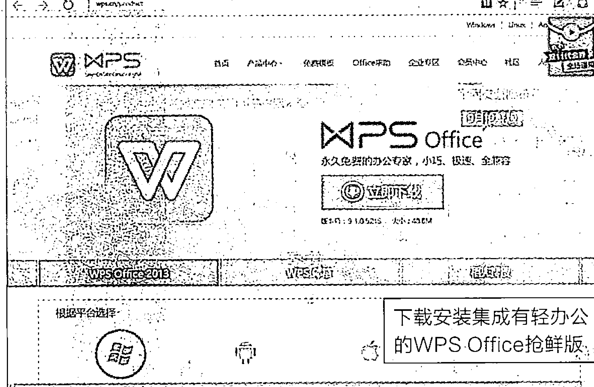

### 双向存储 桌面文档上云端

WPS文档的保存与打开具有很大的灵活性，既可以直接在云端打开、编辑或保存文档，也可以通过WPS编辑器或轻办公客户端进行。处理的文档既可以是本地文档也可以是云端文档。具体选择哪种环境，要根据自己的使用环境来确定。例如，当前进入的是Web环境，当用户自己的WPS账号或第三方关联账号登录WPS个人中心页面后，点击“WPS云文档”标签（图4），即可进入到WPS轻办公环境（图5）。如果访问的是WPS轻办公客户端，则直接进入的是与网页端布局相同的WPS轻办公软件窗口环境（图6）。而在WPS传统编辑器（抢鲜版）环境下，点击“特色功能”选项卡，然后点击“从云文档打开”，则开启WPS云文档选择窗口，同样可以访问WPS轻办公私人空间中存储的文档（图7）。而在执行保存文档操作时，软件也会给出“本地文档”和“WPS云文档”两种选择，选择保存到私人空间，实际上也是对轻办公环境的操作（图8）。

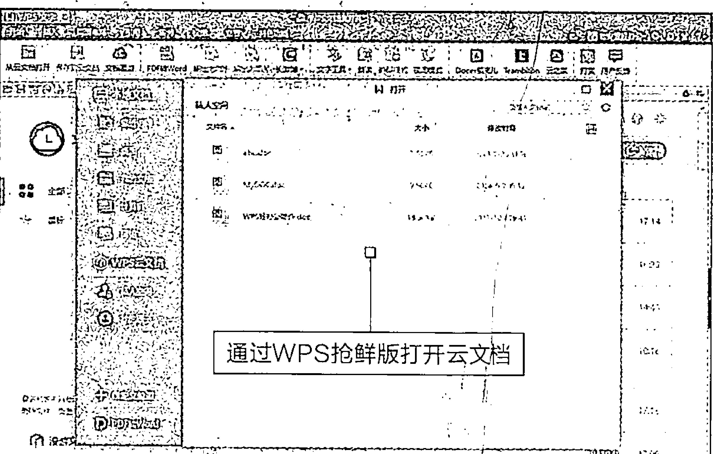

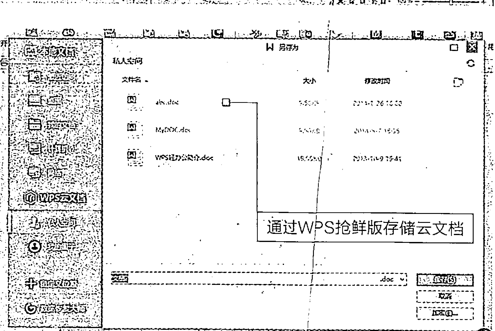

### 小提示
使用WPS抢鲜版的云文档存储或者打开云文档功能，必须先登录WPS账号。登录之后，在WPS软件的窗口右上角，将显示登录用户名。若显示为“未登录”，点击此按钮输入用户名登录即可。

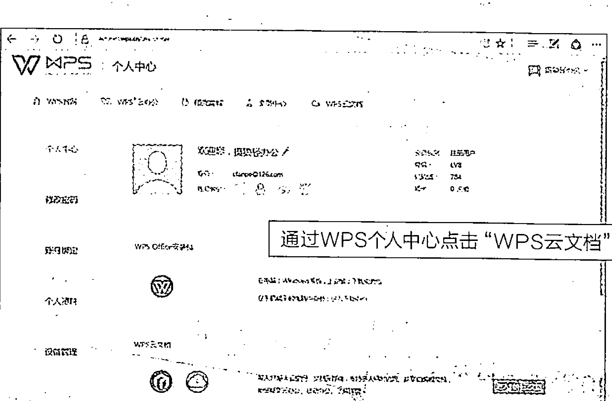

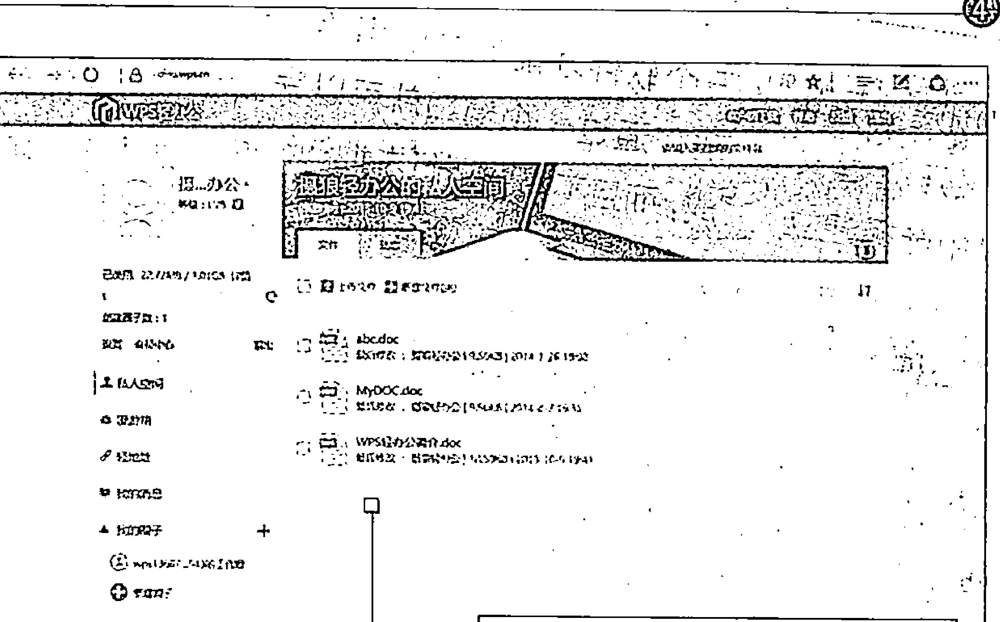

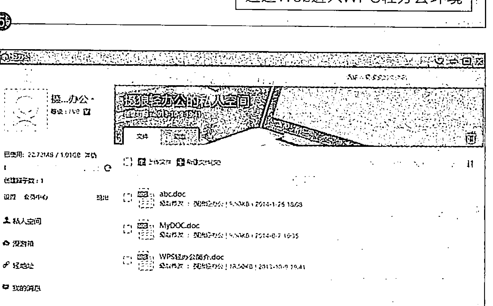

### 在线文档 编辑管理更随意

无论是通过Web端，还是通过WPS轻办公客户端、WPS传统组件的轻办公入口进入轻办公空间，都可以脱离传统的办公环境，对文档进行在线创建、编辑和管理。这是体现轻办公的核心精华部分，也是“轻”的最本质体现。在轻办公环境处理文档，都是在“私人空间”中进行的。如果是处理一份已有的文档，可通过“上传文档”按钮，将文件先上传到个人的空间中。如果是要建立一份新文档，直接点击“新建文件

### 小提示
如果要进行文件的分类管理，可通过新建“文件夹”按钮，建立不同名称的文件夹来完成不同文档的归类管理。

（夹）”按钮即可创建。点击该按钮之后，会展开新建文档类型选项，可从中选择建立“文字文档”、“演示文档”或“表格文档”三种类型（图9），这就如同在本地选择启用WPS的三种基本组件一样。所不同的是，原来需要

### 文档漫游 内容随走随用

从一种设备上编辑的文档到另一种设备上用，还需要拷来拷去或先下载再打开吗？不用！我们可以使用WPS提供的“文档漫游”功能。使用文档漫游，可以将任何设备、任何平台下WPS编辑器或云办公环境下打开过的文档自动保存至云端，无需手动操作。之后，在其他设备登录时，也能够查看和编辑所有打开过的文档。

文档漫游又可以分为手动漫游和自动漫游两种。手动漫游需要在打开WPS云文档后才会进入到漫游列表，本地文档如果需要漫游到云端，要先另存为WPS云文档。而选择自动漫游，则包括本地打开的文档在内的所有已打开文档都会自动漫游，进入漫游列表中。要改变文档漫游方式，点击WPS软件“特色功能”选项卡下的“文档漫游”工具栏按钮，通过“设置漫游方式”选项选择手动漫游或者自动漫游方式（图11）。

关于漫游文档的管理。点击WPS文档漫游窗口左下角的“漫游文档管理”按钮，启动轻办公窗口，在这里可以看到所有处于漫游状态的文档（图12）。WPS云文档进入漫游列表后保存位置原地不动，原先在私人空间或圈子中的文档继续保存在原来的位置。如果是本地文档进入自动漫游方式，该文档会被另存到WPS云文档的漫游箱中。本地文档漫游后，作为新文档存储在云端，不会和本地文档保持同步。如果要继续编辑此文档，可使用任何设备上的任何平台，登录到WPS轻办公空间漫游箱访问。

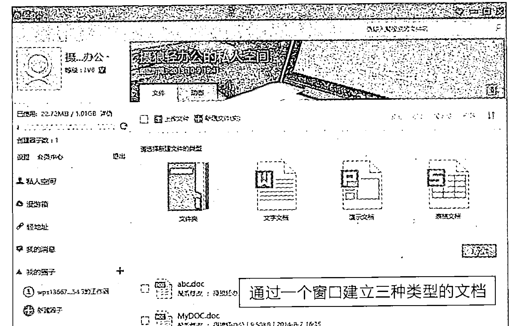

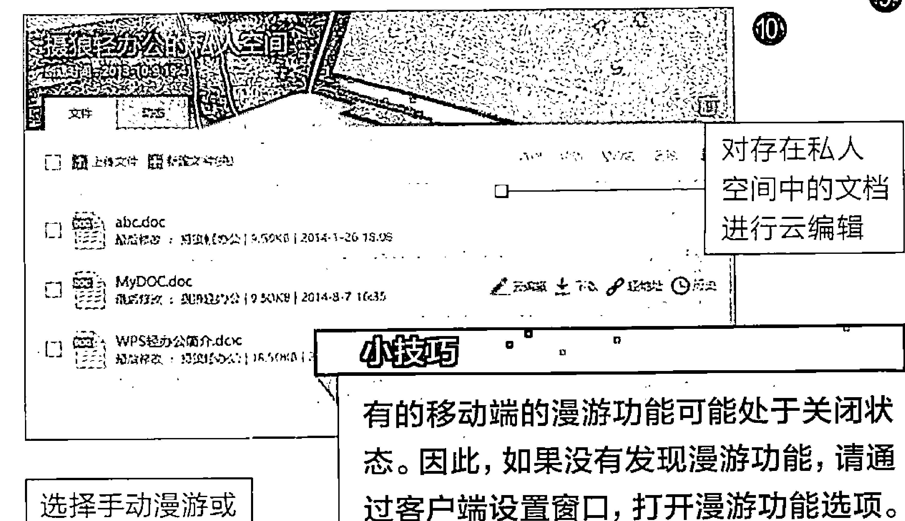

#### 小技巧
有的移动端的漫游功能可能处于关闭状态。因此，如果没有发现漫游功能，请通过客户端设置窗口，打开漫游功能选项。

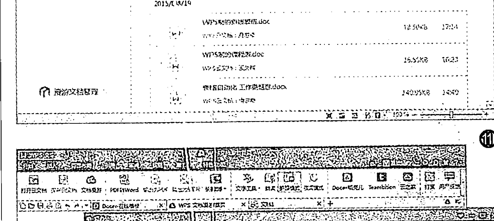

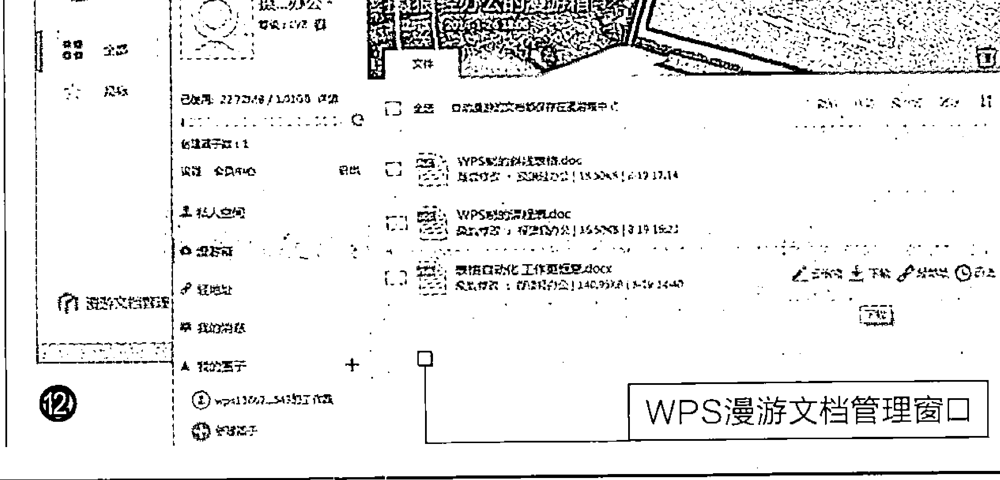

#### 小技巧
在WPS软件的漫游文档列表中删除文档，只是删除了漫游记录，漫游文档还保存在云端。如果要完全删除文档或批量删除漫游文档，需点击“漫游文档管理”或访问https://qing.wps.cn/进入轻办公窗口中进行操作。此外，在漫游箱中复制或移动文档，不会影响到漫游列表。

### 小提示
非会员最多可以建立5个圈子，升级为会员则无圈子数量的限制。

### 协同工作打造合作工作圈

如果说“私人空间”是个人文档的编辑和存储环境，那么对于需要多人共享或合作完成的工作，则需要另一种“合作”和开放的工作环境，这就需要用到轻办公“圈子”。创建轻办公圈子，可以很方便地将一群人、一个项目集中到一个圈子中来。利用圈子，可以保存分享文件，并发起对文件的讨论和修改，文件组织更有条理。也可以在圈子中直接发布讨论或者单独将文件上传到圈子之后，圈子内的人员都可以对文档进行查看和编辑，不需要像以往那样再通过邮件和聊天工具来分享，团队协作更高效。同时，圈内人员对文件的修改都可以从该文档的历史版本找回。要创建自己的圈子，通过轻办公窗口点击“我的圈子→新建圈子”，输入圈子名称，即可建立一个属于自己的圈子（图13）。

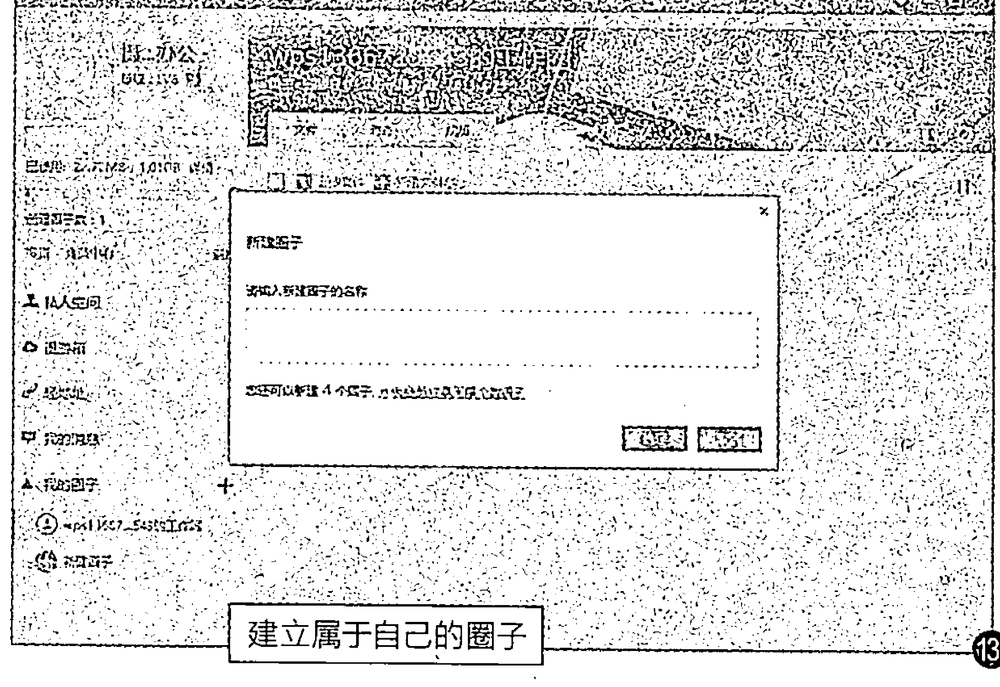

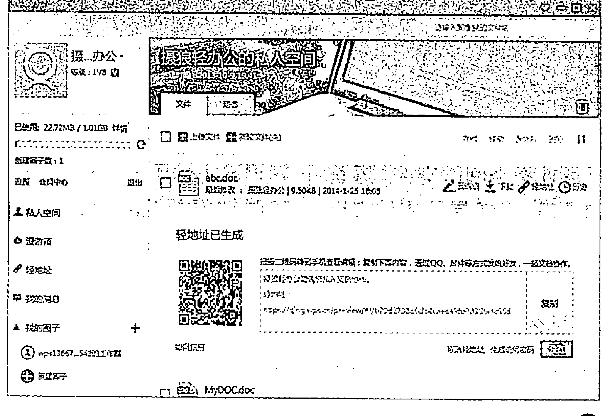

### 文档跨越依赖办公轻地址

如果在一个圈子里，成员编辑文档是手到擒来的事。但是，如果参与的人不在同一个圈子里，这时该怎么办？要实现圈子外文档的跨平台编辑或多人云端协作编辑，需要“轻地址”的帮助。此外，即便是没有圈子，借助于轻地址，也能快速将文档进行跨平台、多人协同编辑。通过文档生成轻地址（包括轻地址二维码），贴到微信或米聊，参与者只需扫一下二维码即可参与到编辑中来。以往需要发送的几十兆大的文件，现在变成了一个轻地址发送，大大提高了效率。同时，私人文档或个人圈子中的文档都可以发送轻地址，可以同时发送给一个群的成员，省时省力。要生成一个文档的轻地址，在轻办公窗口中点击“轻地址”，选定一个文档，点击其后的“轻地址”链条图标，下方会立即生成轻地址二维码和轻地址网址。复制网址或粘贴二维码到通信环境的窗口中发送，即可将该轻办公文档传播出去（图14）。如果是在本地编辑文档，可以展开编辑窗口右侧的面板，再点击“发射”按钮，输入要发射轻地址的文档名，点击生成即可生成轻地址和二维码，复制地址或者图片发送。

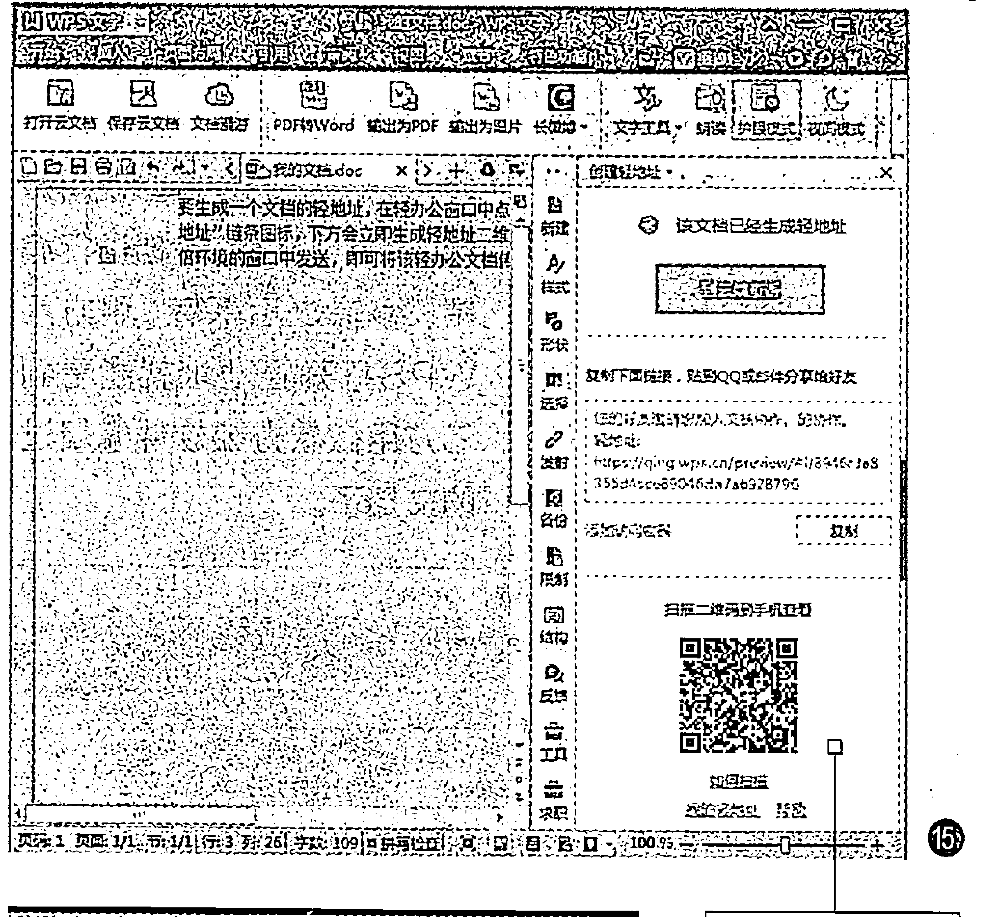

### 小提示
已发送和收到的轻地址文件都会显示在轻办公的“轻地址”里。可通过这里对轻地址进行管理。根据文档保密需求，还可以为轻地址添加密码。

在本地文档编辑窗口中生成与发射文档轻地址## 小技巧

轻地址不但可以用于不在圈子里的人共享文档，还可以用在许多场合。如果在办公室中写作的一份文案没有完成就接到出差任务，这时可以利用轻地址生成功能生成轻地址，外出之后用手机打开轻地址，完成剩余文案的写作。下班之前领导布置的任务来不及看完？那就给文档生成一个轻地址，回家的路上可以在地铁里慢慢用手机读完。另外，大家可能经常在听讲座之后找老师拷贝PPT文档或给老师留下邮件地址求分享。现在有了轻地址，老师只需在PPT演讲稿末尾附上轻地址的二维码，大家扫一扫它就可以获取PPT讲稿了，即图15所示。

以往我们进行工作往来多用邮件，如果多人采用邮件的方式合作完成一份文档，那么，几个回合的编辑下来，往返发送不同版本文档附件的工作非常繁琐，而且会形成许多不同的版本，也容易搞错。但如果采用给文档生成轻地址，邮件里只涉及轻地址而不涉及具体文档附件，那么，不但邮件发送不受文档大小的限制，而且由于轻地址所涉及到的文档都是采用云编辑，文档总是保留最新的一个版本，且以往的版本也会保存在轻地址管理的历史版本中，因此工作效率会大大提高，也减少了出错的几率。

平台多样性，可以通过轻地址，灵活选择各类设备的网页浏览器访问WPS轻办公的网页端建立的文档。还可以选择Windows移动客户端、Android移动客户端、iOS移动客户端等，安装对应版本的WPS Office应用，通过这些应用和轻地址相结合，随时随地查看和编辑存于云中的文档，并且实时地将新建或者修改的文档上传到自己的云空间中（图16）。

轻地址办公协作不限于双方都用WPS来完成，即便是一方使用WPS，另一方使用微软Office，同样可以完成协作。具体方法是，甲方用WPS将文档生成轻地址，发送给乙方，乙方使用微软Office打开该文档进行编辑，编辑之后保存，甲方用WPS打开轻地址就能看到乙方用微软办公软件编辑过的文档了。

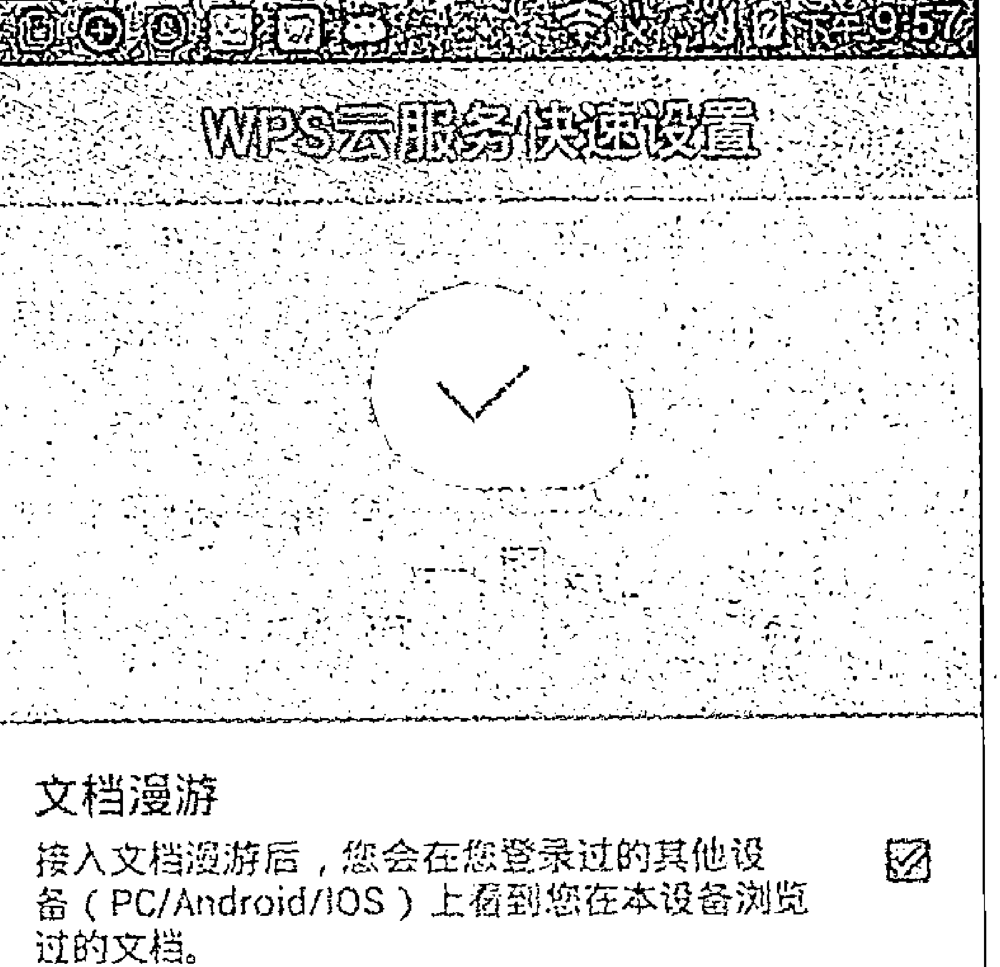

### 文档漫游

接入文档漫游后，您会在您登录过的其他设备（PC/Android/IOS）上看到您在本设备浏览过的文档。

### 小提示

即便是办公双方的一方没有安装WPS或微软Office软件，照样可以通过轻地址来完成文档的读取。当收到轻地址之后，点击该地址可在线打开办公文档进行预览，不需要本地安装办公软件也能获取文件中的信息。


### WPS+云办公服务订阅

#### 专为办公群体打造的365天服务计划

业内领先的办公解决方案，更安全、高效的本土化专业服务，同样优质的服务，比同类Office价格降低70%

### 立即订阅

- 节省大量开支
- 云端团队协作
- 企业级数据存储
- 企业即时通讯
- 跨平台无缝体验

### 面向企业的WPS+云办公服务

除了围绕个人办公的WPS Office组件、轻办公和云服务外，金山还提供围绕企业办公的WPS+云办公服务（图17）。其中包括免费1TB云存储空间的文档和组织结构管理，支持企业域名的无限容量企业邮箱；集成金蝶云之家企业通讯录的企业即时通讯系统，一键发起讨论和文档确认；跨越5种设备的无缝移动办公解决方案。让企业办公在传统和移动领域全面开花。此外，还有团队协作工具Teambition，通过它来制定工作计划，监控工作的进度和完成情况（图18）。

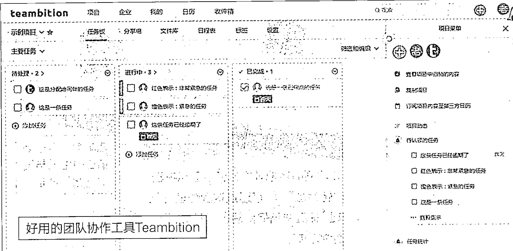

## 随时随地记录读书感受

大家知道Windows 10中新增的Edge浏览器有一个功能，可以在网页上写写画画，留下“读书笔记”。其实其他的浏览器或者读书软件也有同样的功能，可以让我们轻松实现随时随地记录下读书的感受。

### 阅读不中断 PC和手机无缝连接

日常阅读在线书籍的时候，如果遇到一些内容较深或者不易理解的文章，我们经常需要花费大量的时间去阅读才能弄明白。不过平时大家工作和生活节奏都很快，无法在一篇文章上连续花费那么长的时间去阅读。而借助Instapaper提供的网络书签服务，就可以让你的阅读暂停，等有空闲时间的时候再继续阅读。

首先登录网站www.instapaper.com，注册一个用户，接着自动登录后右击“Read Later”选择“添加到收藏夹”，将其加到收藏夹的“链接”位置。这样以后在浏览器中发现需要稍后阅读的内容，在IE中打开网页，单击“收藏夹→链接→Read Later”，在网页上方就会出现自动保存提示（图1）。

以后随时使用注册账户登录Instapaper，就可以看到收藏的网页了。这里可以对收藏的网页进行标记为“未读”（Unread）、“添加星号”（Starred），或者标记为“存档”（Archive），非常方便我们的阅读和管理。

因为Instapaper支持iOS和Android设备，所以只要我们在手机上也安装Instapaper应用，打开Instapaper后使用同一账户登录，就可以看到Instapaper收藏的内容了，很方便我们在手机上继续阅读在PC上保存的内容（图2）。

同样在手机上点击收藏的内容后也可以选择稍后阅读，或者将其共享给好友、发送到百度云在线保存等。

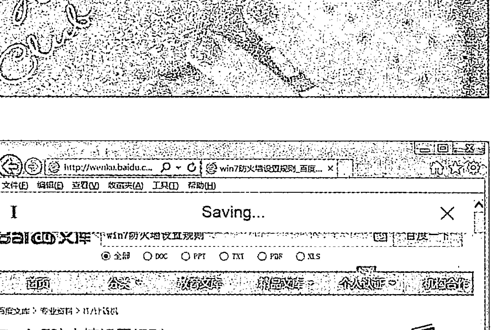

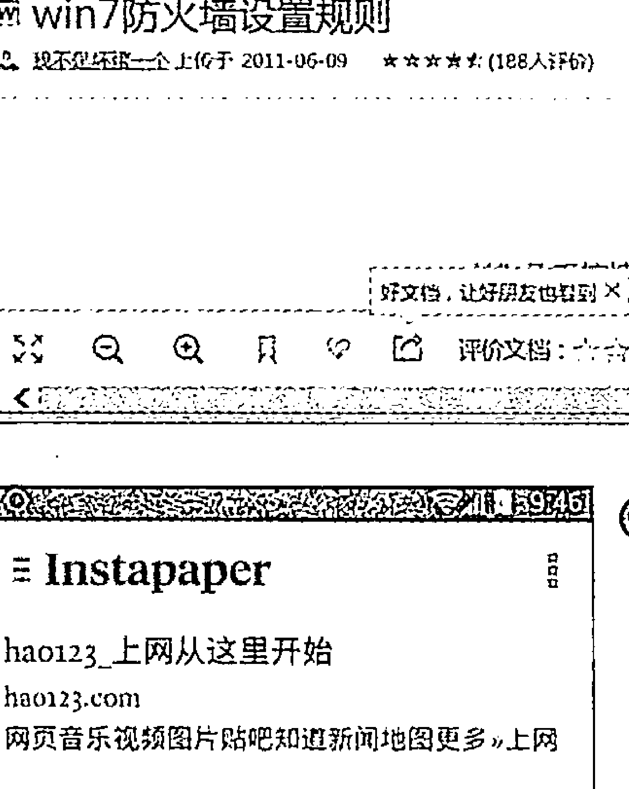

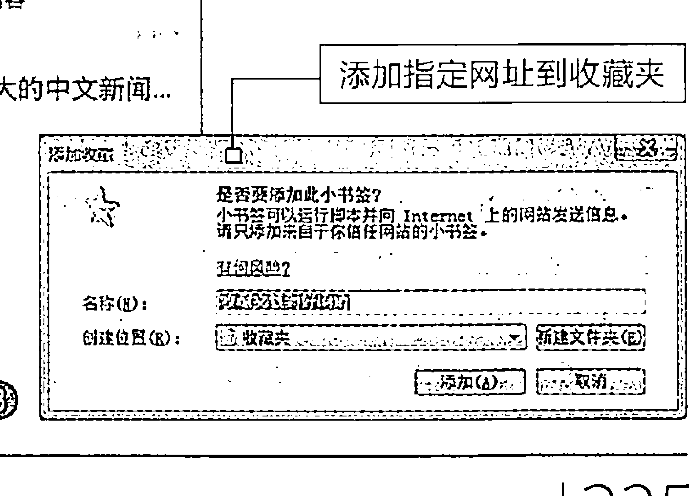

保存稍后阅读内容

在手机上阅读Instapaper收集的内容

添加指定网址到收藏夹

### 网页内容取我所喜

大家知道现在在线书籍页面都有很多广告，包括图片广告、Flash广告、文字广告等，而我们要保存的肯定希望只是正文内容。浏览器默认的另存为网页的方法并不能有效去除广告内容，而且保存的内容也不方便在手机、平板上阅读。现在利用“好网角”提供的网络收藏服务即可轻松解决上述问题。

首先在IE中打开www.wang1314.com网站并注册，接着打开tinyurl.com/cf052301（此为缩写网址），然后按提示依次点击页面中的“收藏网址到好网角”和“收藏文章到好网角”，选择“添加到收藏夹”，这样即可完成好网角的安装（图3）。

以后如果我们在IE中发现需要保存的文章，比如360文档中的文章默认是无法复制的，当需要保存其中的正文内容时，可以在IE中打开该文档页面后点击“收藏夹→收藏文章到好网角”，此时打开的页面文章的内容就会自动复制下来（仅仅是有用的正文内容，广告元素自动屏蔽），按提示为保存的文章设置分类标签（如电脑知识、生活经验等分类，方便后续阅读），最后点击“保存文章”即可。

保存的文章默认会自动保存在好网角的服务器上，任何时候只要我们打开www.wang1314.com，然后使用注册账户登录，切换到“我的文章”，在这里就可以看到上述保存的文章了。

同样的，由于这些资料是在线保存，所以我们也手机、平板上访问。比如手机用户既可以直接在浏览器中打开www.wang1314.com访问，也可以通过安装客户端的方法进行访问。在手机上启动好网角客户端后登录切换到“我的→我的文章”即可查阅在电脑上保存的文章了。如此一来，我们就可以利用电脑操作的便捷性，在上班时间使用IE收藏自己需要的各种资料，回家后在手机上慢慢阅读。

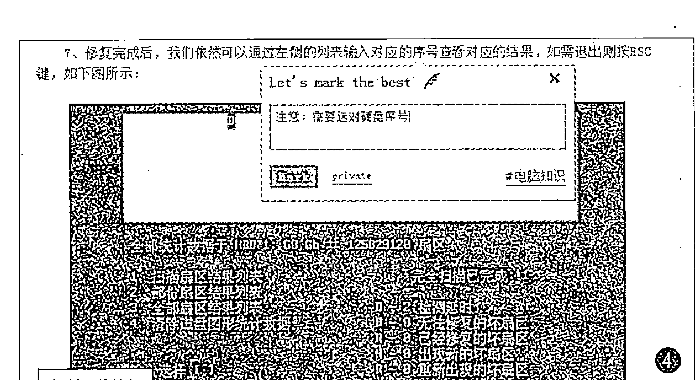

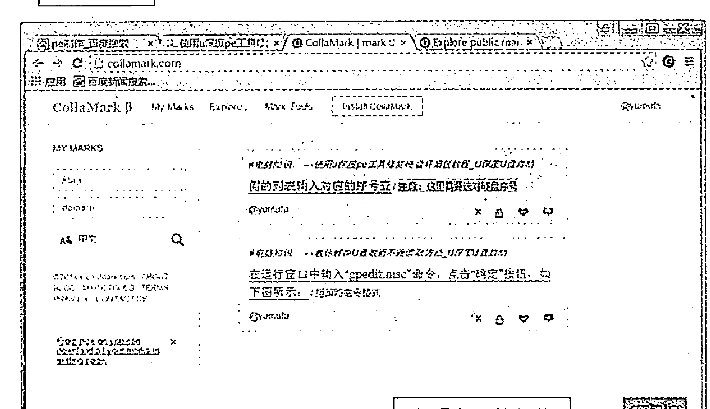

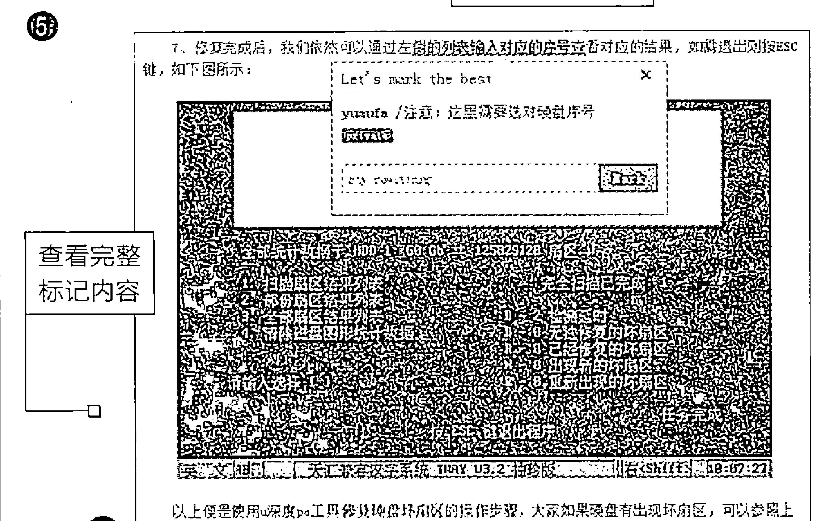

### 书籍内容随时标注

平常阅读在线书籍的过程中，我们经常会遇到不懂或要注意的内容，对于线下书籍一般使用笔来添加标注。现在对于Chrome用户，借助Collamark提供的服务也可以实现类似的标注功能。

首先使用Chrome打开collamark.com/privacy并注册一个用户，接着到www.chromein.com/crx_9081.html下载Collamark插件，插件安装成功后会在浏览器的地址栏中添加“C”符号，点击即可看到其他网友公开的标注。

现在如果自己需要对查阅的资料进行标注，在Chrome中打开需要标注的页面，然后使用鼠标选中需要标注的内容，此时在下方就会弹出一个“Mark”标记按钮，点击即可打开标注页面，点击羽毛图标可为标注的词语添加不同颜色的标记，点击Tag则可以为标注添加不同的标签（如电脑类知识添加到“电脑知识tag”中），在文本框中输入注释字词，最后点击Mark即可完成标记的操作（图4）。

完成标记的识别后，标记的内容连同原来网页的内容会同步保存到服务器中。以后我们需要查看标记的内容时，只要点击Chrome地址栏的“C”符号，切换到“Mine”即可看到自己的标注了。当然也可以在其他电脑或者移动设备中直接登录collamark.com，随时查看自己所做的所有标记（图5）。

如果要查看具体的内容，点击具体的标记后会自动打开原来的网页内容，我们所做的标记可以完整地重现，当然也可以将这些标记和好友共享（图6）。

Collamark同样支持iOS等移动设备，我们在电脑上所做的标记，以后可以在移动设备上直接查看。

## 用好云笔记 随学随用随身记


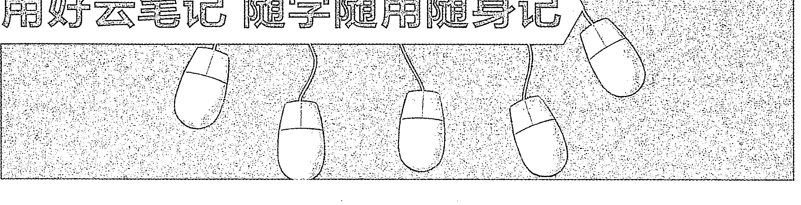

尽管WPS、微软Office办公软件已很强大，但在引入云功能方面动作稍显缓慢，且功能相对单一。相形之下，以轻便实用和带有与生俱来的云功能而见长的云笔记软件得以快速传播，并为用户广泛接受。流行的云笔记有印象笔记、有道云笔记、OneNote等。学生使用的电子设备和平台五花八门，而印象笔记或OneNote等虽然也很知名，但外来产品在某些方面的水土不服和功能缺失，反倒让善于学习别人的有道云笔记成为不错的选择（图1）。

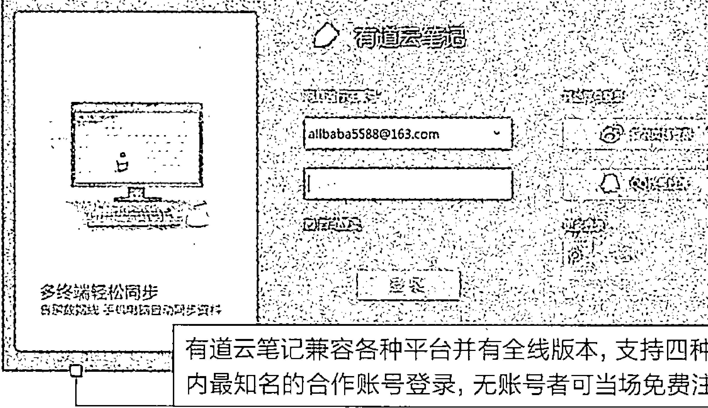

> 火速链接 有关有道云笔记的基本用法，请参见本刊2014年第17期《个人云办公 一软定乾坤》。

### 兼容两大Office

云笔记文档中插入Word、Excel、PPT、PDF文档（用插入菜单或右键菜单），即可兼容WPS、MS Office等文档。内置于云笔记中的Office文档，可以通过直接双击进入编辑和查看，无需下载再编辑；编辑完成后，新版本又自动保存在云笔记文档中（图2）。修改的文档采用了增量式同步技术——只同步每次修改的那部分内容，这会让同步变得更快、更省流量。

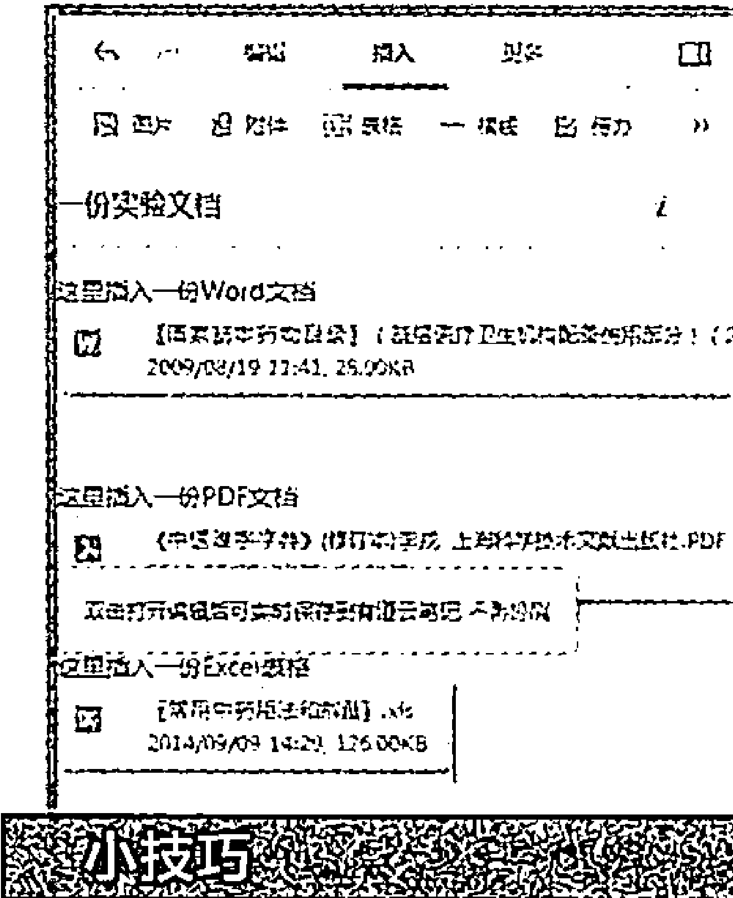

小技巧：如果是在手机上建立笔记，可充分利用手机所特有的拍照和手写功能，随手建立照片笔记，或用手写涂鸦功能创建手写笔记，实现快速个性化的原笔迹输入。

小技巧：如果发生多端打开同一笔记造成笔记冲突，云端笔记文档会出现两个或两个以上文件，需要手动核对其中的信息，将有用信息复制到其中之一，然后删除另外的文件。

### 解决资料没有同步的问题

桌面版云笔记会自动将本地笔记同步到云端。但这一进程可能不是立即进行的，如果马上关机可能出现云端文件没有保存的尴尬。为此，可通过点击上方的同步按钮进行立即同步；还可以使用同步快捷键F5来完成同步。如果发现移动端编辑的笔记在PC端没有出现，说明移动端没有进行同步操作，只是保存在了移动端本地，在移动端手动执行同步操作即可。

### 笔记分享需注意

我们可以用多种方式来分享云笔记资料。使用PC端分享链接、发送邮件，分享笔记给指定QQ账号，分享笔记到新浪微博、腾讯微博、网易微博、微信等渠道均可（图3）。需要注意的是，如果使用分享笔记链接以及分享笔记的方式，修改的内容是可以被查看到的；如果是分享至微博或者邮件分享，修改的内容是无法被查看到的。如果要将微信中的内容收藏到云笔记中，可在有道云笔记中开启“剪切板内容保存至笔记”，并在微信中复制内容，复制的内容即可自动生成笔记保存。

### 跨越同类软件的鸿沟

有道云笔记桌面版支持 Evernote印象笔记（国际版和中文版）的导入。如果要直接使用Evernote印象笔记的内容，通过软件的“导入→Evernote”菜单来完成。此外还可以轻松导入其他有道云笔记账户中的数据，方便不同账户间的交流（图4）。如果要导出，不但可以选择将笔记导出为enex式和ynote格式的笔记文件，还可以导出为更加通用的PDF格式文件。

| 插入 | 导入 | 有道云笔记文件 |
| --- | --- | --- |
| 导出 | Evernote 文件 | |
| 其他云笔记导出/导入 | | |

## 当学哥 让QQ助你备忘

文|亦云

QQ作为主流IM软件有着广泛的用户基础。相对于云笔记的稍显小众和专业化，QQ更显“大家风范”。在学习上对学生们提供帮助最大的，要数QQ备忘录和便签功能了。无论何时何地，大家都可以利用这些功能，记录需要记录的信息，提醒自己不要忘记重要的事项。

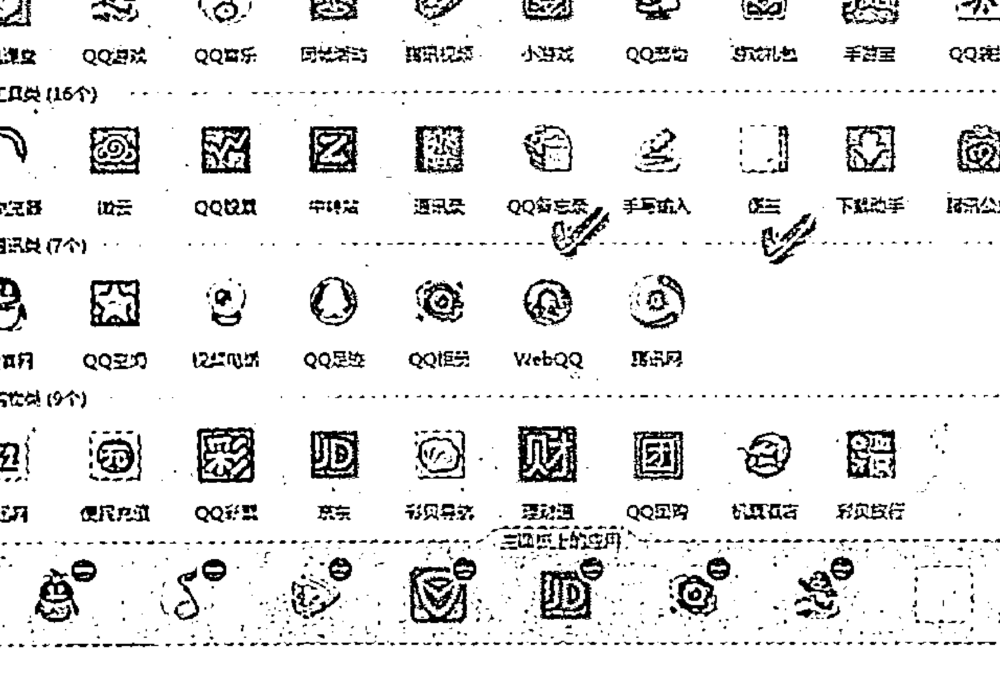

> 小提示：默认情况下，QQ备忘录可通过QQ主菜单“工具”找到。在QQ面板上，也许你不能直接找到“便签”和“QQ备忘录”这两个功能，但可通过添加来解决。

最新版的QQ中，QQ备忘录和便签功能是作为轻应用来提供的。位于应用管理器窗口中，可选择使用或添加。点击QQ面板右下角的“应用管理器”图标，进入应用管理器（图1）。

在“个人工具类”应用列表下，可以看到“便签”和“QQ备忘录”两个应用。直接点击图标启动应用，如果要添加到QQ面板，只需将光标移动到图标上，图标下方就会出现“添加→添加到主面板”选项，点击即可将应用以快捷方式添加到QQ主面板（图2）。要建立一个能够自动提醒的事项，启动QQ备忘录，点击“新建备忘”，填写主题名称（如：背单词的计划），填写计划内容，然后选择“定时提醒”的类型为“每天同一时刻”，选定提醒的时间，选择每周7天之内的哪天提醒，最后点击“保存”按钮即可生效。注意，窗口左下角显示“备忘已漫游”，表明备忘信息已经同步到网络服务器中，可以用移动设备登录QQ来获得提醒（图3）。

除了用备忘录这种“暗”的信息提醒外，还可用QQ便签这种“明”的提示，在桌面上建立标签。点击“便签”应用图标，出现桌面便签，在其中输入待办事项内容即可。为了让QQ重新登录后能自动提醒，在选项设置里选择“QQ登录自动显示便签”即可（图4）。便签可以通过换肤改变颜色，或者钉在桌面上。

> 小技巧：进入备忘录的渠道除了以上两种外，还可直接在自己的头像上右键单击，选择“QQ备忘录”；也可在QQ聊天窗口选择“聊天消息”并右键单击，选择“存入备忘录”。聊天信息除了可备忘之外，还可通过右键菜单“收藏”，收藏到自己的网络“收藏”空间里。

## 一个影迷的一天

文/俞木发


闲暇时间看看电影已经成为很多朋友的休闲方式，不过对很多上班一族来说，因为一天不同时段所处的环境不同，会有着不同的网络状态和使用不同的观影设备。比如在公车上只能用自己的手机+4G网络看在线电影，到了公司则可以使用台式机+有线网络看电影。这样在一天的碎片时间里需要连续看同一部片子就会有些麻烦，不过只要用好一些视频客户端就能很好地满足我们看剧的连续性需求。

早起上班，平板看电影
所处环境：家里
使用设备和网络：平板+WiFi

对于喜欢看电影的朋友，经常早起上班还有闲暇时间，那么掏出平板连接家里的Wi-Fi看看连续剧是不错的选择。如果要实现看剧的连续性，在平板上使用优酷客户端即可。首先打开www.youku.com注册一个优酷用户，在平板上启动优酷后切换到“我的”，然后按提示使用自己的优酷账号登录（图1）。
成功登录后在优酷上打开需要播放的连续剧，如果此时上班时间到了需要出门，那么只要点击暂停然后关闭平板准备上班即可。
大部分朋友选择的是乘坐公交车上班，公车上空间拥挤而且大多没有Wi-Fi，因此如果要在公车上看在线电影就可以使用手机自带的4G网络。由于我们在平板上已经使用优酷账户登录，这样观看记录会自动保存在优酷服务器。同样在手机上启动优酷后切换到“设置→账号管理”，然后使用上述优酷账号登录手机优酷，成功登录后切换到“我的→观看历史”，这里会保存我们上班前在家观看的电影记录，而且播放记录可以精确记住我们上一次观看影片的进度，按提示点击继续播放即可在公车上观看未完的电影了（图2）。

上班期间，电脑看电影
所处环境：办公室
使用设备和网络：台式机+宽带

也许在上班途中很多人还对观看的电影念念不忘，同样到了公司后如果在午休时间还想继续观看手机上未完的电影，我们只要打开优酷的观看记录继续观看即可（图3）。
电脑客户端和平板、手机不同的是，如果是在办公室闲暇时间使用优酷搜索并观看的电影，如果下班后还要继续在手机、平板上快速观看，除了使用历史记录外还可以通过二维码扫描快速实现迁移。临近下班时在台式机上的优酷中暂停视频的播放，然后点击播放窗口下方的“手机看”按钮，这样会弹出一个扫码手机继续看的二维码（图4）。
现在只要启动手机上的优酷，切换到“菜单→扫一扫”，扫描上述二维码后，手机就会自动播放台式机上正在观看的电影，并且自动从暂停处继续播放，这样就可以无缝衔接我们的观影进程了。

## 特别话题

优酷会在手机屏幕上继续播放原来在台式机上播放的视频，这样就可以继续在下班时使用手机观看了，而到家以后，我们还可以利用历史记录在家里的手机或者平板、电脑上继续观看同一部电影（图5）。

当然由于一些原因的限制，我们可能无法在优酷这类视频网站上看到一些自己喜欢的电影或者连续剧。因此对于喜欢连续观影的朋友还可以尝试使用其他视频客户端。比如手机、平板用户可以使用“魔力视频”、“快手看片”这些手机客户端，它们可以让大家在第一时间观看更多的影片（而且可以调用优酷、乐视、搜狐等多个播放片源）。比如快手看片，注册一个快手看片用户，在平板上启动快手看片后，切换到“收藏→观看历史”，手机、平板用户点击上次播放的影片即可实现无缝持续看片（图6）。

如果要在PC上继续播放快手看片中的电影，这可以利用Android模拟器实现，比如可以使用“海马玩模拟器”，这样在PC上启动快手看片后，操作同平板一样，打开播放记录即可继续看片（图7）。

上述方法虽然方便，但片源仍然受到视频网站的限制，很多时候可能自己喜欢的电影上述视频网站并没有。对于这类用户可以自行下载喜欢的电影到百度云保存，然后利用百度云的在线播放功能实现。首先利用公司有线宽带离线下载自己喜欢的影片到百度云上，在公司电脑上打开yun.baidu.com，按提示使用自己的百度账号登录，切换到网盘后点击“离线下载”，按提示添加喜欢影片的下载地址即可（图8）。

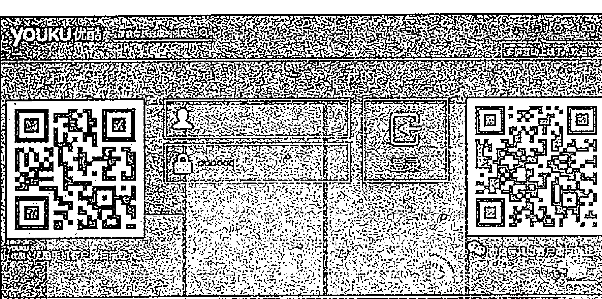

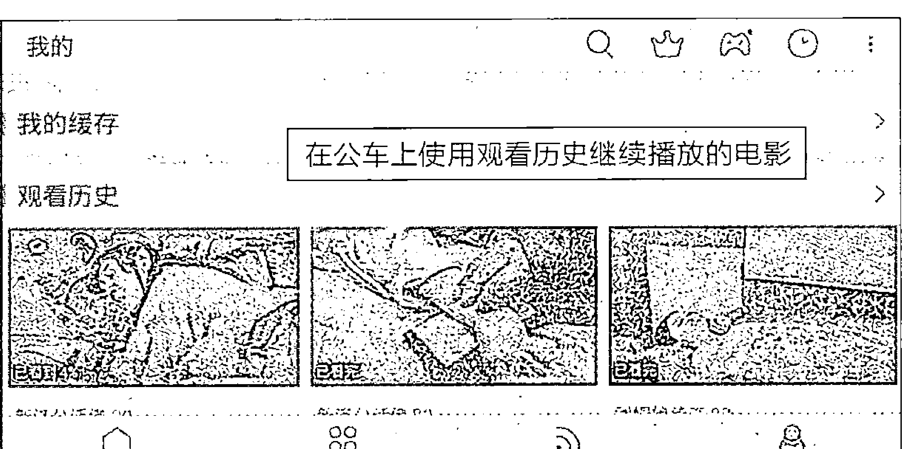


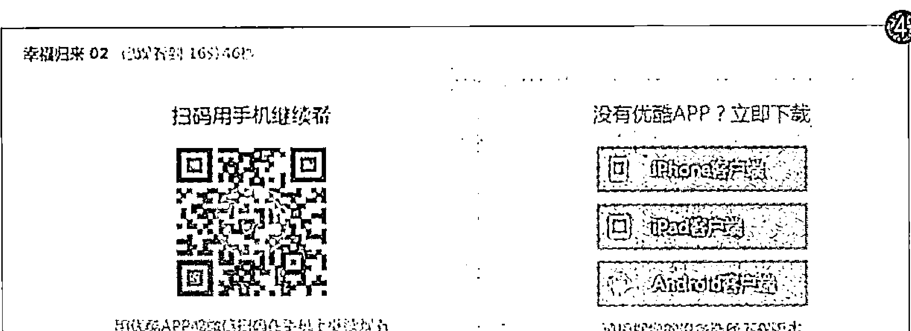

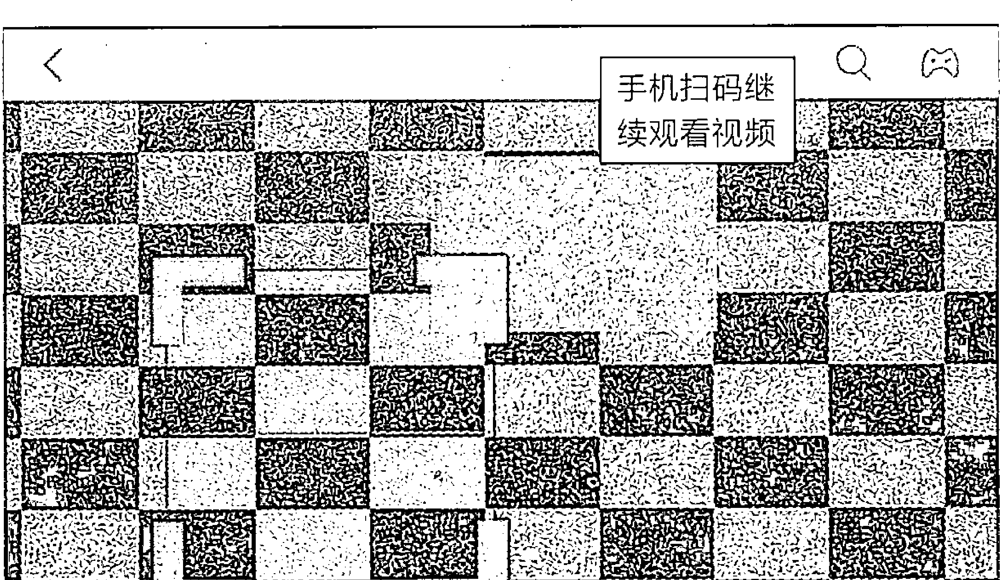

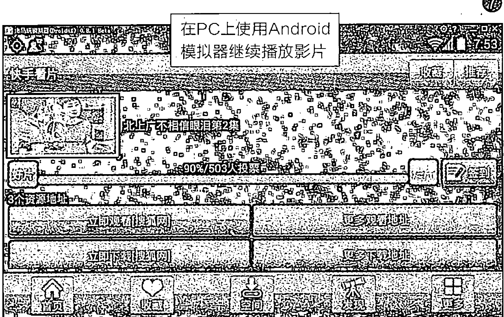

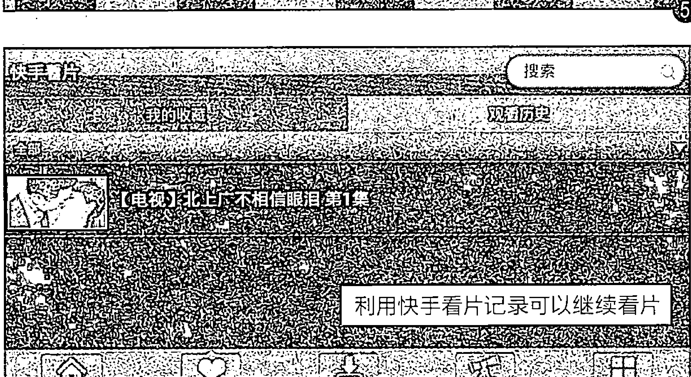

当然，百度云上也有许多网友分享的很多精彩的影片，大家可以打开www.sopanpan.com进行百度云视频的搜索，搜索到影片后点击“网盘下载”，接着在打开的百度云窗口点击“保存至网盘”，这样可以直接添加到自己的百度云盘保存（图9）。

现在我们在手机或者平板上安装百度云客户端，启动百度云后进入自己的网盘，切换到“分类→视频”，这样就可以在手机上直接播放上述的视频了（图10）。

不过由于百度云播放器并没有提供历史记录功能，因此并不适合在手机和电脑上继续播放同一部影片（只能自行记住播放进度，手动进行续播）。由于百度云保存的都是自己喜欢的电影，而且它提供DLNA跨屏播放，非常适合用在家里大屏幕Android电视和手机上的续播。比如吃完晚饭后很多朋友喜欢在大屏幕电视上看保存在百度云的电影，那么只要在电视上安装优酷客户端，接着在手机上进入百度云播放视频，然后点击播放界面的DLNA，在弹出的窗口接收设备中选择“优酷XL”，点击确定（图11）。

这样手机上的视频画面就可以通过DLNA传输到大屏幕电视上播放，如果现在需要上床睡觉，那么只要在大屏幕电视上暂停或者退出优酷播放，返回手机上即可继续播放原来的视频了（图12）。

> > **小提示**
>
> 由于在线播放视频会耗费手机宝贵的流量，对于流量不足的朋友则建议先利用公司的高速宽带在手机上离线下载好自己喜欢的连续剧，将电影保存在手机的SD卡上。如果要在电脑上观看，则利用一些共享的软件，如Android手机可以使用ES文件浏览器，在手机上启动ES后使用“远程文件管理”，让电脑播放器直接播放SD卡上的电影；Android平板用户则可以使用上述介绍的DLNA功能（只要在平板上安装优酷，手机上安装百度云即可）播放SD卡影片。这样电影文件始终保存在手机SD卡上，无论是在手机、平板还是电脑上都可以离线播放了。

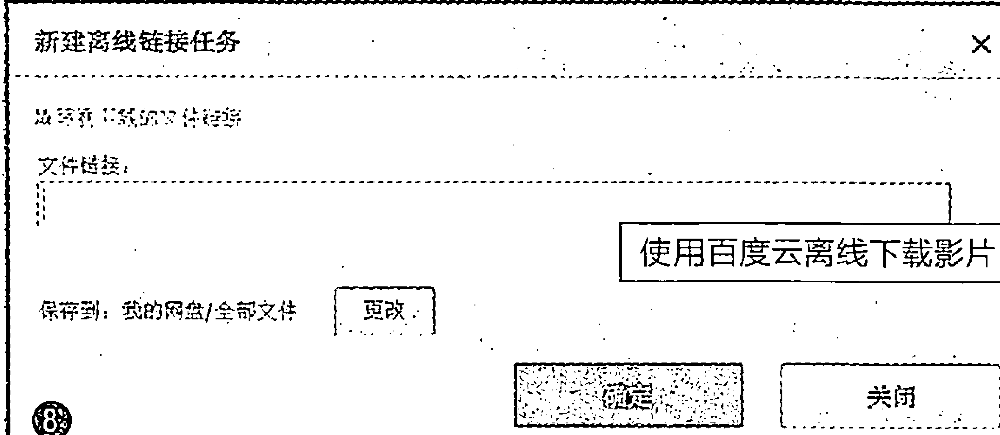

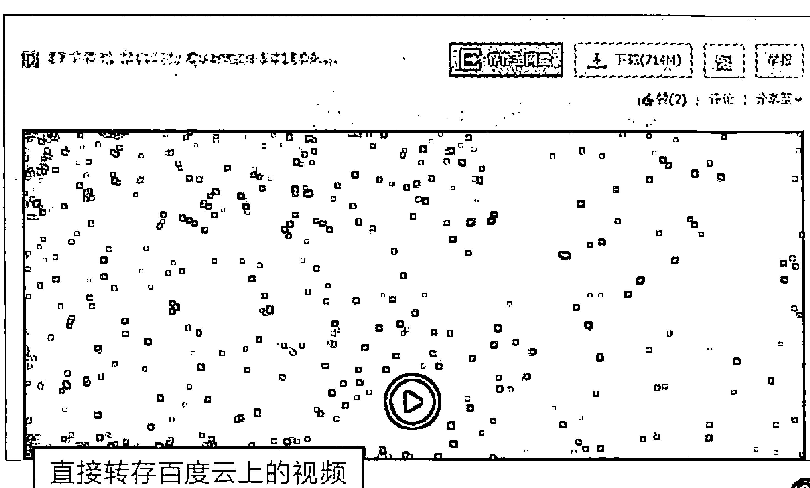

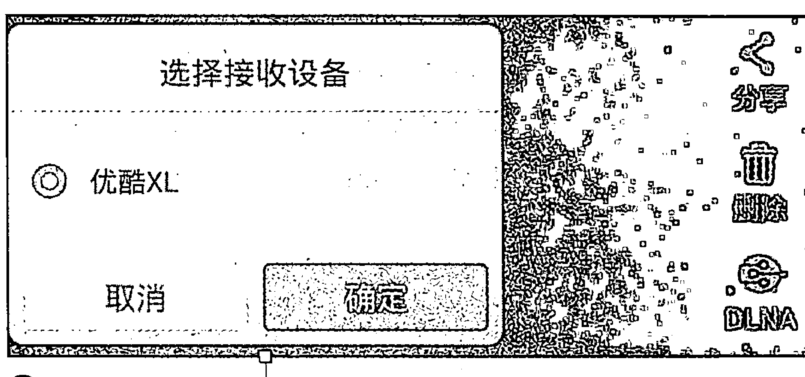

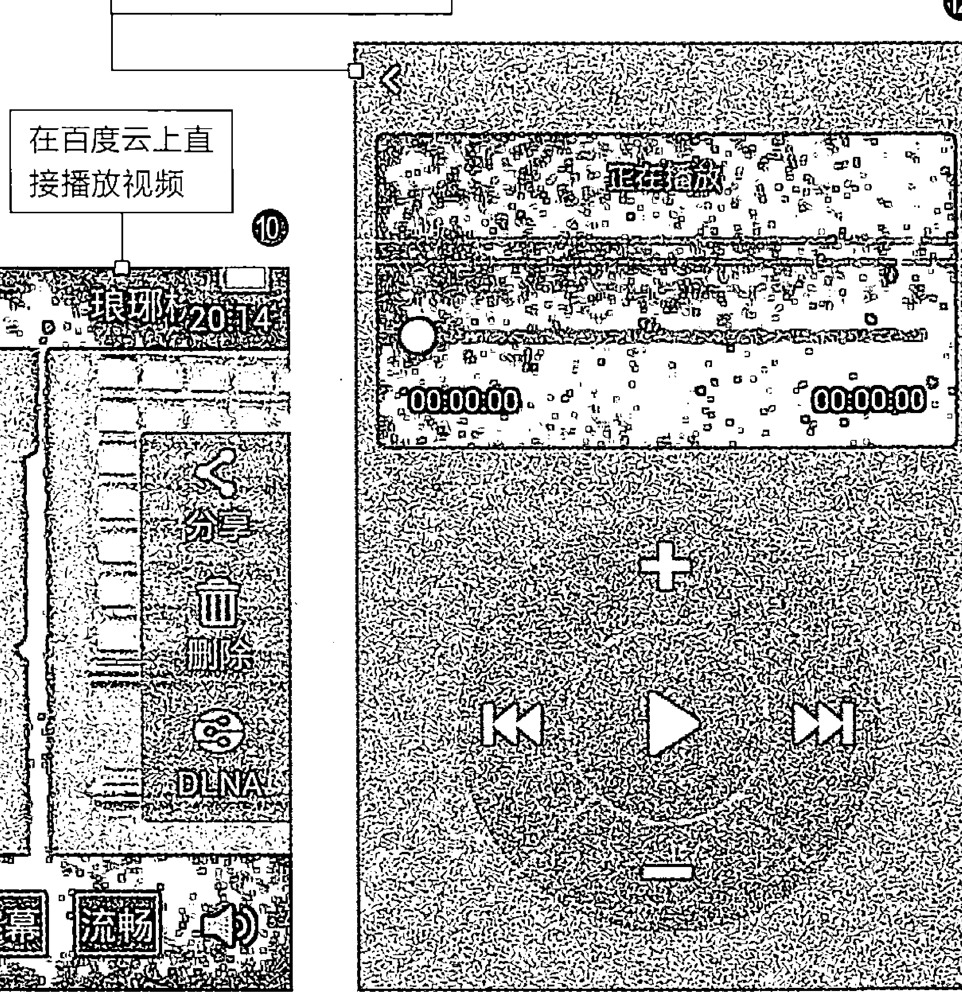

## 脱离传统思维 拓展多样服务


在以用户为中心的网络时代，不单单是办公领域注重以“云”为媒开展用户服务，在传统软件领域，如音视频播放、下载服务等领域，以云盘为桥梁打造用户服务中心、个人资料收藏中心、各类增值性服务等都是一个大的趋势。包括以资料存储为重点的云盘，也不只限于对资料的存储和上传下载，它们也在为用户提供越来越多的周边服务。

### ▶ 云盘服务不仅是上传下载存储

说起云盘，大家首先想到的便是网络存储、上传、下载。的确，这些都是云盘的最本质功能，但目前的主流云盘已经不仅仅局限于为用户提供这些基础服务了。云盘以用户为中心，正在提供基本上传下载和存储之外的延伸服务。

以百度云盘为例，云盘可以兼做记事本。在云盘中，不仅可以记录文字，还可以借助于摄像头、麦克风记录图片和语音信息。围绕用户需求这一中心，提供PC端、Android移动客户端、iPhone移动客户端等多个版本。这样，用户可以随时随地通过不同设备、不同平台的网页端或客户端使用生活记事服务了（图1）。

照片是云盘的“常客”。大家总是会将手机拍摄的照片自动同步到自己的云盘中。而挑选一些精彩的照片冲印出来送人留作纪念或作为居家装饰，也是一部分人的需求。冲印照片以往都要到冲印店，但目前在网盘中就可寻求在线服务。通过百度云的照片预览功能挑选好自己要冲印的照片，然后访问云盘中提供的增值服务——照片冲印。选好照片的尺寸和纸张，提交订单，就会以比实体店更加便宜的价格，足不出户获得冲印好的照片。而且达到门槛不高的一定数量后，快递费也全部免除（图2）。

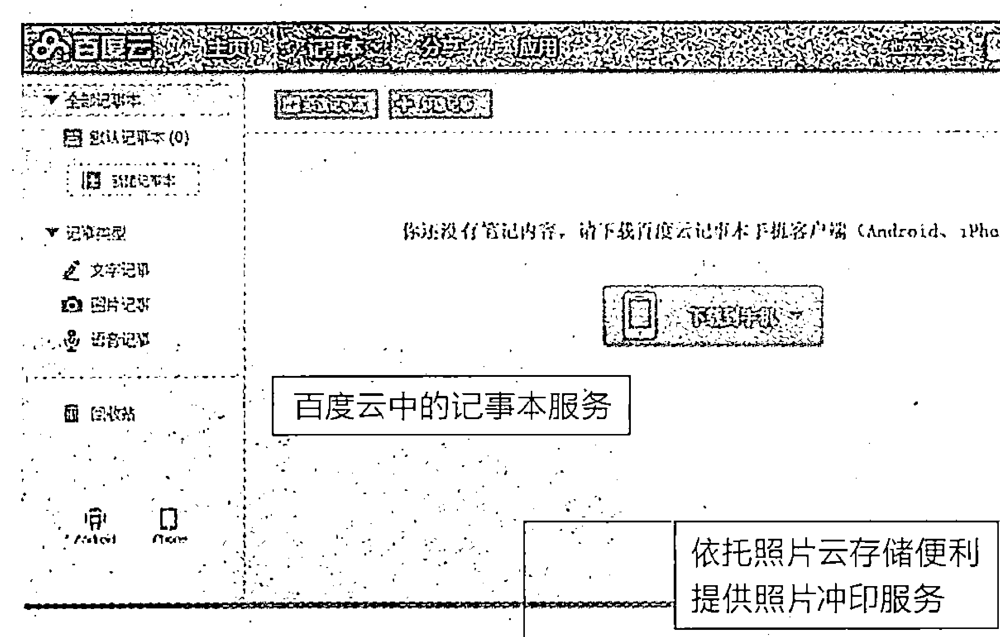

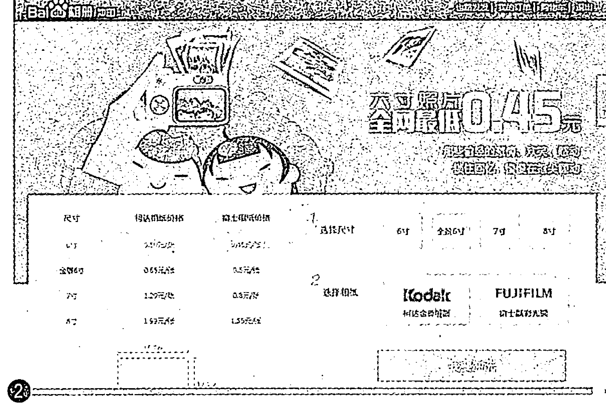

云盘的另一个优势是备份和同步。作为手机移动设备中的通讯数据，是最需要备份的个人数据。利用手机云盘客户端提供的通讯录、短信、通话记录同步开关，我们可以轻松实现手机中个人通讯资料的自动同步（图3）。在不知不觉中，手机中的这些数据就会自动留存在自己的云盘空间中。这样，即便是手机丢失，这些关键的个人信息还会得以保留。

报纸的年代有不少人有剪报的习惯，进入信息时代，读报的人凤毛麟角，而上网页阅读的人越来越多。但旧的习惯没有改变——遇到精彩的文章总是要用不同的办法摘录和留存。使用百度云的文章收藏功能，网页“剪报”将变得简单。首先给网络浏览器添加“收藏到百度云”的红心插件或书签工具，然后在阅读网页时，看到精彩并值得收藏的网页，点击一下收藏红心按钮，即可将该文章保存到自己的云盘中了（图4）。

围绕用户这个中心开展互动，目前最为火热的非网络视频莫属。我们可以借助于云盘中的“云直播”功能，参与到视频娱乐活动中。依托摄像头功能和云盘的结合，我们可以将自己拍摄的视频及时上传到云盘中共享，也可以在云直播栏目中欣赏到其他用户共享的各类精彩视频（图5）。

#### 小技巧

如果拥有多部手机，尤其是不同平台系统的手机，对手机中通讯录的合并和共享是个令人头痛的问题。利用百度云提供的通讯录自动同步和导入联系人功能，可将不同平台手机中的联系人信息上传到云盘中，再利用“合并重复联系人”按钮处理重复信息。

### ▶ 视频服务 播放下载之外的精彩

视频欣赏是现实生活中的一个日常化的项目。目前的视频播放已经从过去单一的本地播放转向了网络播放，除了直接的Web端视频播放外，客户端视频大多具有了在线播放和下载的功能。但是，围绕服务用户这个中心，其功能和服务远远不仅局限于观看和下载两个方面。以乐视、优酷、爱奇艺为主流的国产网络影视软件服务商，以用户为中心，提供了视频播放之外的周边服务。

收藏精彩视频和云点播是我们的切实需求。乐视云提供无限存储空间，我们不仅可以将该网站上自己喜欢的视频收藏到云盘中，随时随地随意播放，还能通过“上传文件”按钮，将自己的其他文件（如软件、照片等）保存到乐视云中收藏（图6）。

由于所处环境的不同，要追剧赏剧，我们常常要在PC和手机之间“奔波”。视频播放器提供了不同平台，尤其是移动平台资源共享的方便途径。以爱奇艺为例，手机中安装爱奇艺Android客户端，运行PC端爱奇艺客户端系统菜单中的“手机助手”工具，可以将电脑中的视频轻松传送到手机中（图7）。

除了视频传输外，播放进度记录、精彩视频订阅也是非常必要的。在爱奇艺用户中心窗口中，可为注册登录用户提供包括播放记录、收藏记录、订阅记录的功能。我们还可以将自己喜欢的用户标记为“粉丝”，反之亦然。对于由于共享视频而聚拢的人气，会记录在“我的粉丝”项目下。而通过“动态”列表，更能实时地了解到一些他人分享的热门视频的情况（图8）。

人常说“没有免费的午餐”。出于生存的需要，各家视频播放器的背后离不开利益这个话题，而视频播放增值服务的推出便是其具体体现。虽然视频客户端目前提供的多数视频是免费的，但随着用户数量与粘性的增加，乐意掏钱购买增值服务的用户数量也在增加。花少量的钱，购买一个高清影视观看的特权，甚至可以第一时间看到院线刚刚发行的正式大片，诱惑力还是不小的。另外，专为会员提供的免广告打扰、多屏共享功能、带宽加速、免费观影券等都是非常具有诱惑力的看点。相信随着版权的收紧和正规化程度的提高，网民的版权意识也在提高，注册成为会员收看视频将越来越成为时尚。而这也是视频业发展的主流和正道（图9）。

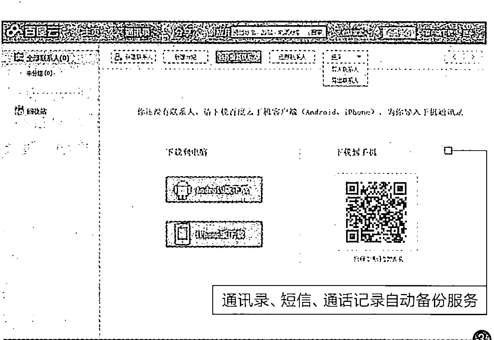

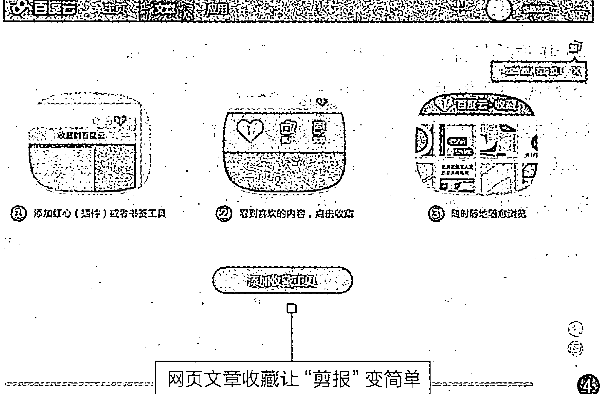

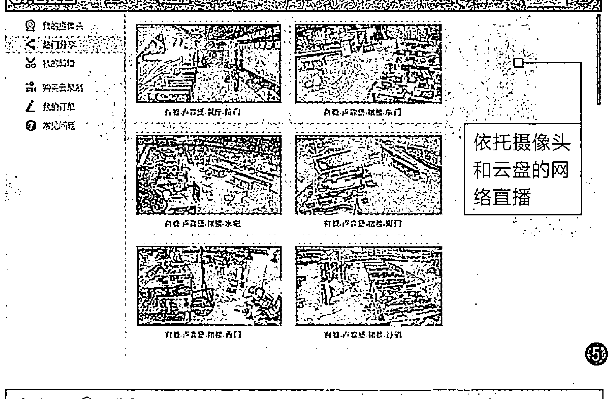

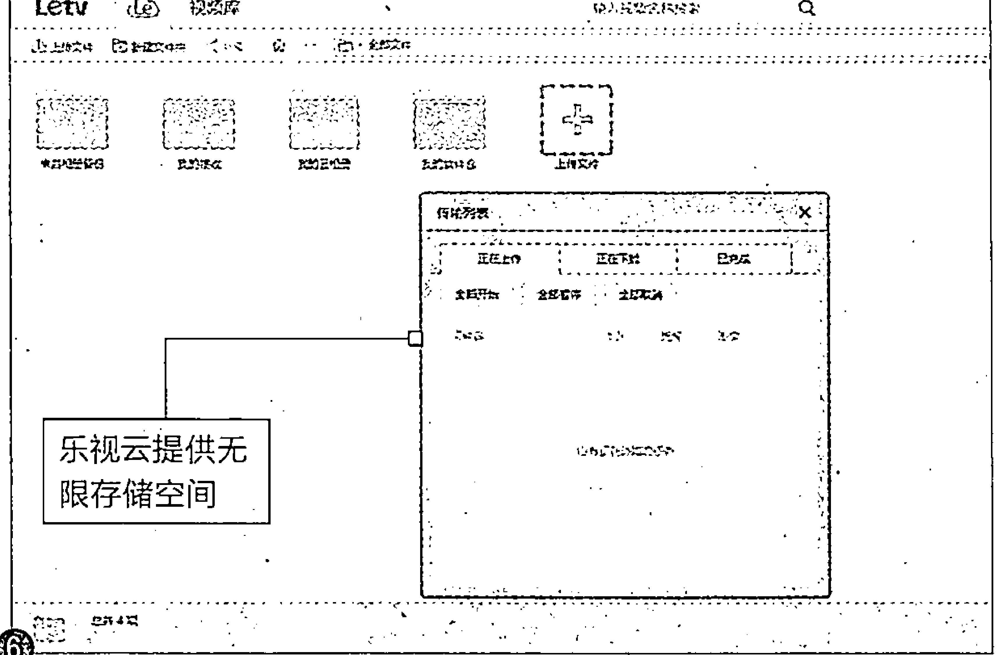

## 《电脑爱好者》2015年合订本（下） 特别话题

#### 小技巧

如果要快速从上次看到的时间点继续观看，使用爱奇艺影音页面上方的“播放记录”即可达到目的。它可记录你上次观看的视频节目的名称，以及上次看到的时间点。点击“继续观看”就能直接从上次停止的地方继续观看，免除忘记集数、频繁拖动进度条寻找播放断点的困扰。

曾经的迅雷是网络用户家喻户晓的下载工具，然而随着网络带宽的增加和网络视频播放器自带下载功能的增强，加之各种网络浏览器也多自带速度还算不错的下载工具，因此，红极一时的迅雷下载软件也在眼睁睁地迎来了“下坡路”。然而，迅雷拥有非常可观的用户数量，只要围绕用户中心这个原则进行挖掘，为用户提供需要的服务，活路不是没有。

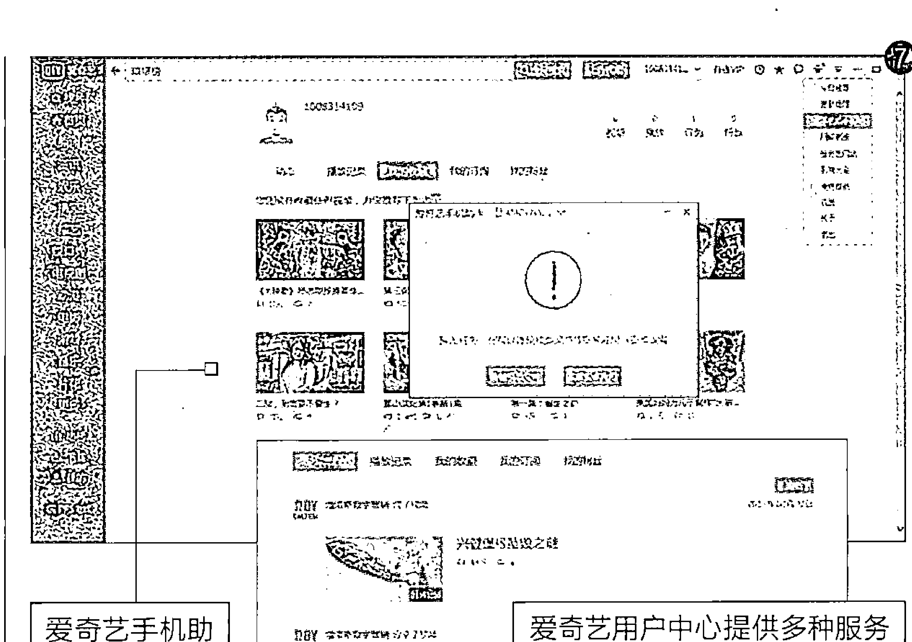


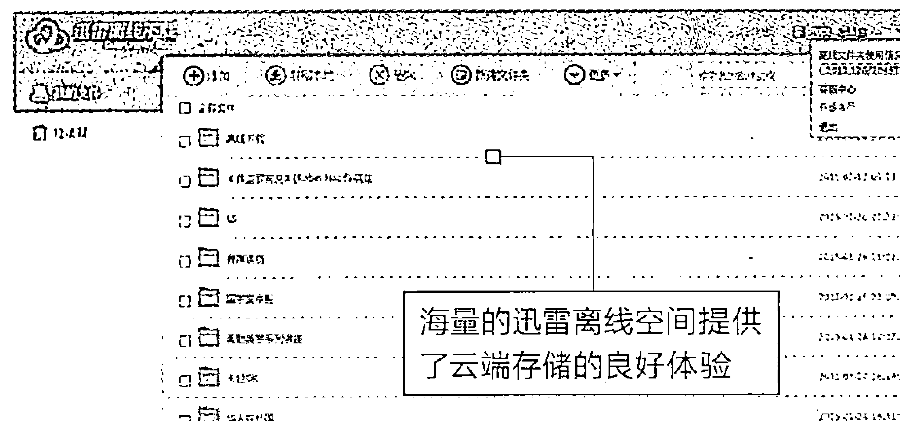

在用迅雷下载的各种任务中，下载视频应该是占比最大的一块。视频的一个弊端是文件体积大，不易存储和传输。迅雷正是看中了这一点，所以保留和强化了“迅雷离线”这一服务，用户可以将自己在网上发现的各类好资源一股脑地存入自己的“无限海量”的迅雷离线空间中，然后在需要时依托迅雷下载的高速和便利，以最快的速度将资源下载到本地（图10）。


此外，迅雷还围绕用户的观影需求，提供迅雷影音客户端。我们可以通过最便利的渠道来享受“视听盛宴”。通过该客户端，我们还可以轻松同步本地或网络片库的播放记录。如果开通VIP服务，还能享受到去广告、看片提速、下载加速、带宽提高等服务（图11）。而作为传统的迅雷下载软件，在集成了以上所述的离线空间、影视播放、迅雷阅读、迅雷快鸟、理财产品等实用功能之后，焕发出新的活力。我们即便不是专门用迅雷来下载文档，也可以通过它顺利地进入和获取迅雷提供的其他实用服务。

#### 小技巧

其实，目前QQ或微信等公众广泛使用的应用软件，它们所提供的一些可由用户选择的扩展功能模块，大多数是采用HTML5技术开发的。如此，以HTML5新技术为依托，以大众认可的平台为支撑，以用户服务为中心进行开发和推广，就变得水到渠成和更加轻而易举了。这也是其他独立的HTML5新产品开发商所不具备的优势和竞争中的一个最大难点。

## 03寒冬将至 DIY求生

北京中关村转型，预示着传统DIY进入了冬季。对消费者而言，如何继续DIY之路？面对DIY产业的严冬，硬件厂商们又有了哪些新的对策？

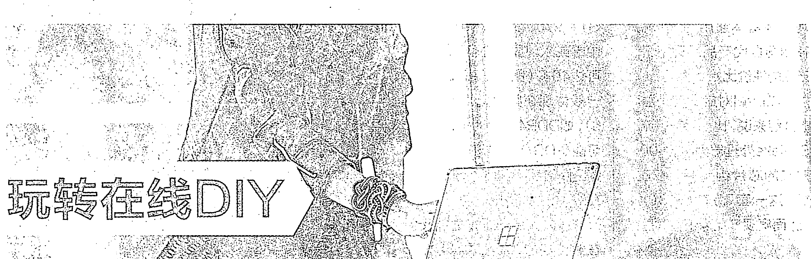

由于机箱、主板等配件厂商不懈的努力，目前将电脑配件安装在主板上再将主板固定于机箱当中并不是多难的事情。即便是没有安装过电脑的用户，只要动手能力不是太差，在熟读说明书后都可以在不追求美观的前提下安装台式机（图1）。比起安装，反而是在诸多产品中挑选合适的配件更具挑战性。如何挑选在空间和运行上都彼此兼容的配件，是新手能否顺利DIY的关键。

> 面对普通用户的DIY

严格意义上讲，电脑硬件DIY指的是用户自己动手打造需要的零部件，或者在现有产品的基础上进行改造以达到更加良好的效果（图2、图3）。而目前普通电脑用户常说的DIY，其实只是将不同位置的配件攒到一起组成一台电脑，这和传统DIY中的增加MOD元素不可同日而语。

目前的IT产品成熟度越来越高，也很少有需要动手改造才能正常使用的例子。其实作为普通用户，我们完全没有必要去追求动手改造，反而应该在挑选产品的过程中极力避免买到必须改造才能使用的产品。目前面对普通用户，DIY的核心理念其实就在于挑选产品时的合理性，这样可以避免给后期的安装使用带来麻烦。

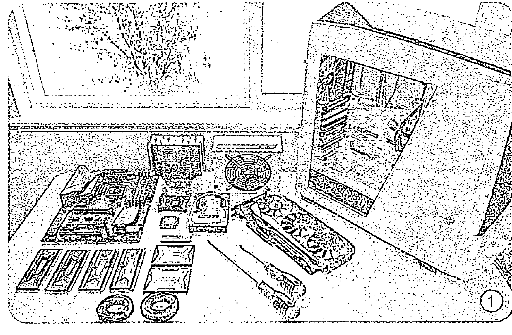

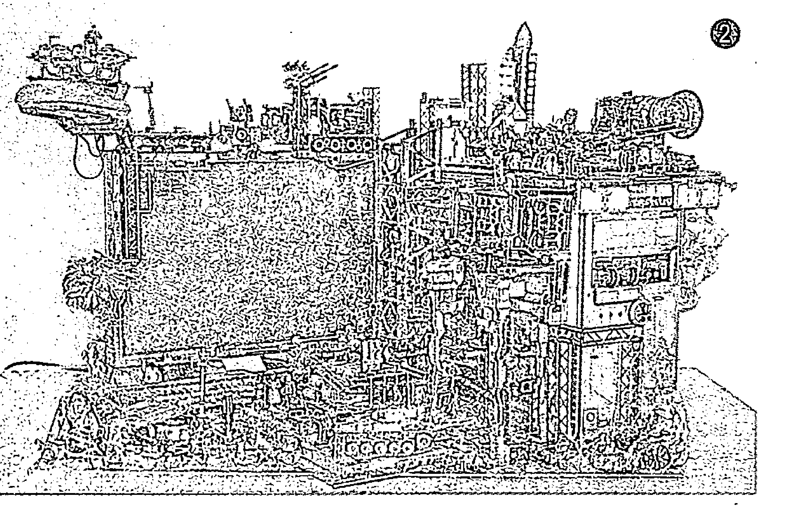

### 挑选性价比高的产品

毕竟不是所有用户都“不差钱”，大多数人挑选配件前都要考虑性价比。如果重视性价比的话，首先有一个观点是基本通用的：那就是在相同世代产品系列中旗舰产品的性价比始终很低。

3DMark网站上专门有显卡的性价比专栏，类似GTX 980Ti或R9 FuryX这类旗舰卡的性价比值只有20~30，而反倒是GTX 970、GTX 750Ti这类中端或入门显卡性价比最高可达40多（图5）。高端内存一般体现在频率更高上（图6），如DDR4 3200MHz内存可能是DDR4 2400MHz内存的两倍，而两者的性能体现在PC中差别很小。

以Intel对应的处理器和芯片组来说，比如目前主流的Skylake处理器为i7-6700，对应的芯片组就是Z170主板，这一套下来大概3000元；而旗舰产品当中就算是最低端的i7-5820K搭配X99主板的入门产品，总价也要超过6000元。而这两者的最主要差别在于核心数量不同以及PCI-E通道数量不同（图4），普通家用能够涉及到的应用两者表现几乎完全相同。

总之就是在重视性能又在意价格的时候，要尽可能挑选系列中的中端产品，这个规律在很多配件领域都可以通用。另外也并不是说价格高的产品就一定没有性价比，一些高品质的产品卖得贵是因为拥有别家没有的特色设计及软件功能上，有时为了这些设计买单是可以接受的。

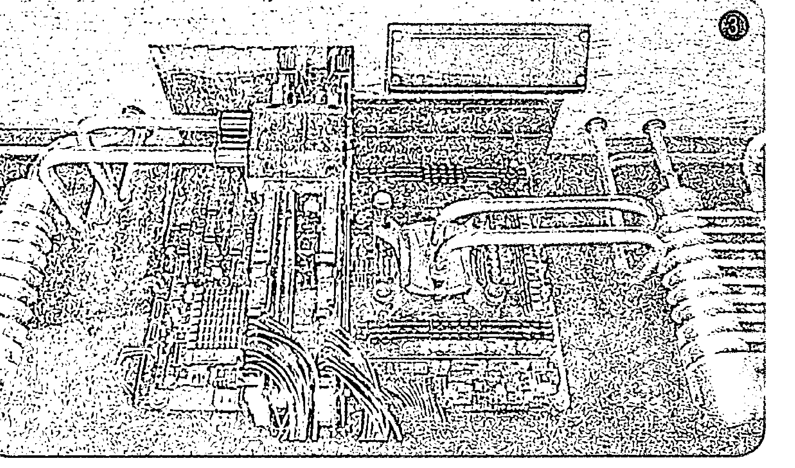

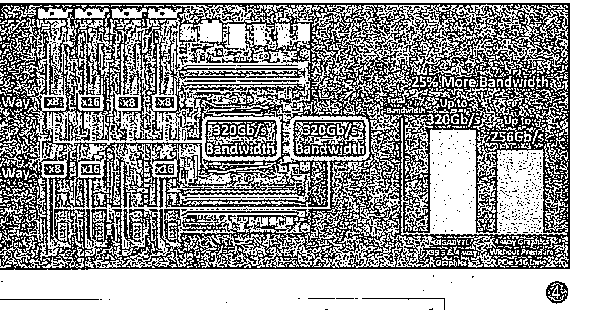

类似情况还出现在包括显卡和内存等设备中。在

### 值得买单的特色设计

在用户挑选产品时，有些明明在绝对性能上不占优势的产品反而卖得比较贵，但却有不少用户趋之若鹜，这是为什么呢？贵的产品自然有贵的理由，如果当真拥有更好的设计，就值得我们为其多花预算。

比如说新一代Skylake处理器中的i7-6700K搭配Z170主板就是目前最适合大型游戏的组合，但这对组合因为新上市价格稍高，另外搭配的DDR4内存价格也没有完全降下来，最终处理器搭配主板和内存的售价大概需要4000元以上。而老一代Haswell中i7-4790K搭配Z97以及对应的DDR3内存只需3000元出头，这两种搭配的性能几乎一致（图7），那么为什么用户去选择前者？

很多时候设备的性价比体现得并不明显，新一代Skylake处理器与PCH芯片之间采用了新的DMI 3.0总线，几乎十倍于过去的DMI 2.0总线，一举解决了处理器和M.2 SSD等外设之间的带宽问题。另外Z170主板的PCH芯片提供的是20条PCI-E 3.0总线，这对比过去的16条PCI-E 2.0总线也是个飞跃（图8）。在高性能M.2或PCI-E SSD流行的当下，新平台虽然处理器性能几乎没有提升，但是带宽的革命性变化是非常实用的优势。

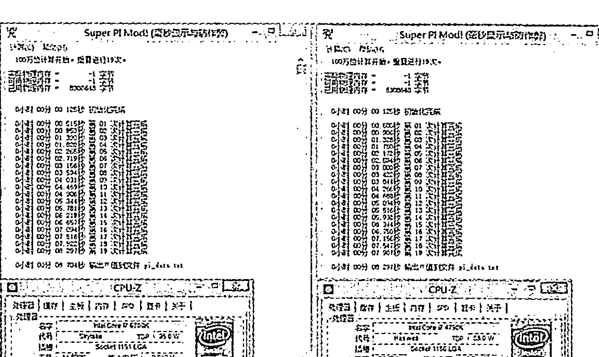

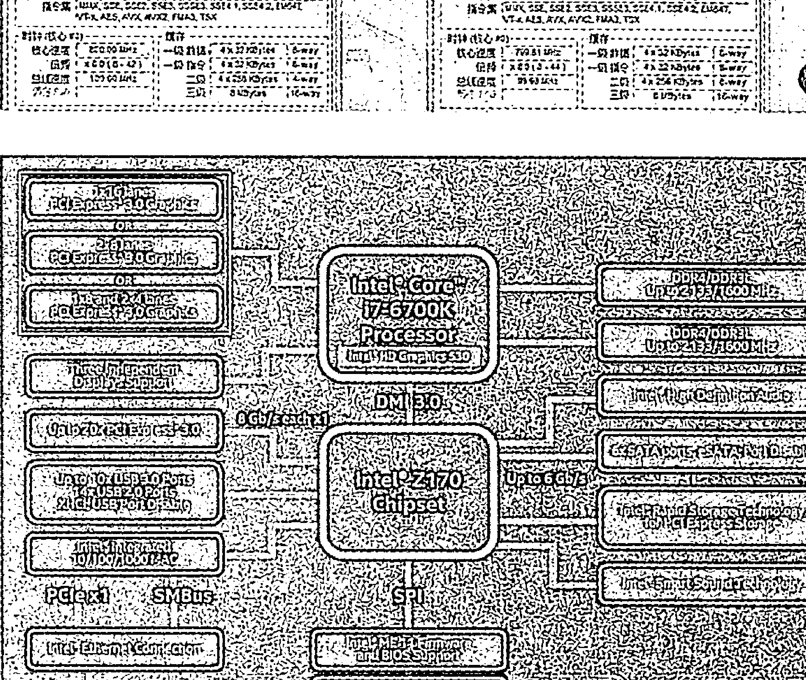

再如今年下半年的话题性产品R9 Nano，虽然也采用了完整版Fiji核心，但由于频率低，其性价比上不如旗舰级R9 FuryX、GTX 980Ti等产品，下也比不过中端产品。但在下半年它仍是DIY市场上的明星，就是因为其革命性的HBM显存不仅在带宽上有革命性突破，还将高性能显卡的身材缩减到15cm这一过去根本无法想象的长度。虽然可能不适合ATX机箱用户，但对于诸多ITX用户来讲15cm的R9 Nano就是最好的产品（图9）。

### ▶ 筛选与找适合产品

过去在实体卖场挑选产品后，装机柜台会帮助用户组装电脑，如果真遇到不兼容的产品也可进行更换，麻烦比较小。但目前用户主要DIY的方式还是通过京东、天猫等平台选购，如果真的选择了彼此之间不兼容的配件，更换起来很麻烦还耽误时间。如何利用在线DIY产品库合理搭配配置呢？搭配时需要注意什么，如何规避系统给出的错误搭配和陷阱很有学问。

以京东为例，京东的产品参数其实对比天猫、淘宝等平台已经比较靠谱了，但在其中仍然有很多错误在误导用户。比如说新手装机很容易犯错的机箱与显卡长度不匹配问题，如果过分相信产品参数和页面介绍就会出现问题。比如说热卖产品索泰GTX970-4GD5霹雳版HA，在产品参数上面说明了显卡尺寸为29cm×11cm×4cm，也就是说我们关心的显卡长度是29cm（图10）。


在显卡领域中30cm是一个分水岭，绝大多数机箱都能在安装硬盘架的情况下提供30cm左右的显卡限长空间，所以表面上看索泰GTX970-4GD5霹雳版HA这块显卡能够兼容绝大多数机箱（图11）。但其实这里有一个误区，京东在指定参数时测量的是显卡PCB板材长度，而并非散热器长度。比起29cm的PCB板材，实际散热器还要多出至少2-3cm（图12），也就是说用户的机箱最终要达到32cm显卡限长才能完美装上这块显卡。

相同的例子在显卡领域及塔式CPU散热器领域还有很多，都是测量不规范所致。而在产品介绍页面下方京东引以为傲的购买咨询方面可以看出京东的售前服务人员也并非领域内的专家，在不少用户提出的长度质疑当中给出了带风扇约30cm这一模棱两可的回答（图13）。要知道在机箱当中显卡长度必须精确到毫米，如此粗略且不准确的回答实在令人难以接受。

显卡限长等问题有些时候可以通过拆卸硬盘架或者DIY改造来解决，而CPU散热器限高如果不匹配会产生侧板无法关闭的情况，更加麻烦。要想避免此类尴尬，请一定注意在购买前要在空间数字上留出一定余量，尽可能多去看一些评测文章或者用户的入手晒单或者体验帖子，其中会有很多比官方介绍详尽许多的内容出现。

| 品牌 | 索泰 ZOTAC |
|---|---|
| 型号 | GTX970-4GD5 霹雳版 HA |
| 接口类型 | PCI-E 3.0 |
| 核心品牌 | NVIDIA |
| 核心代号 | GM204 |
| 核心型号 | GTX970 |
| 核心频率 | 1076-1216MHz |
| 显存类型 | GDDR5 |
| 显存容量 | 4GB |
| 显存位宽 | 256bit |
| 尺寸 | 29*11*4cm |
| 建议电源 | 500W以上 |
| 功耗 | 145W |


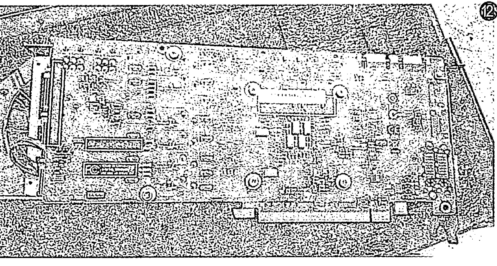

> 注 号：201411080016 2014-11-18 15:23:03:51
> 咨询内容：显卡尺寸是多少的?详情写一点, 根据实际情况(如:9厘米9厘米119厘米), 别弄个, 结合起来装不下我就亏了-30*11*30/MM
> 中线回复： 您好, 这款机箱的显卡长度是支持到300mm的。

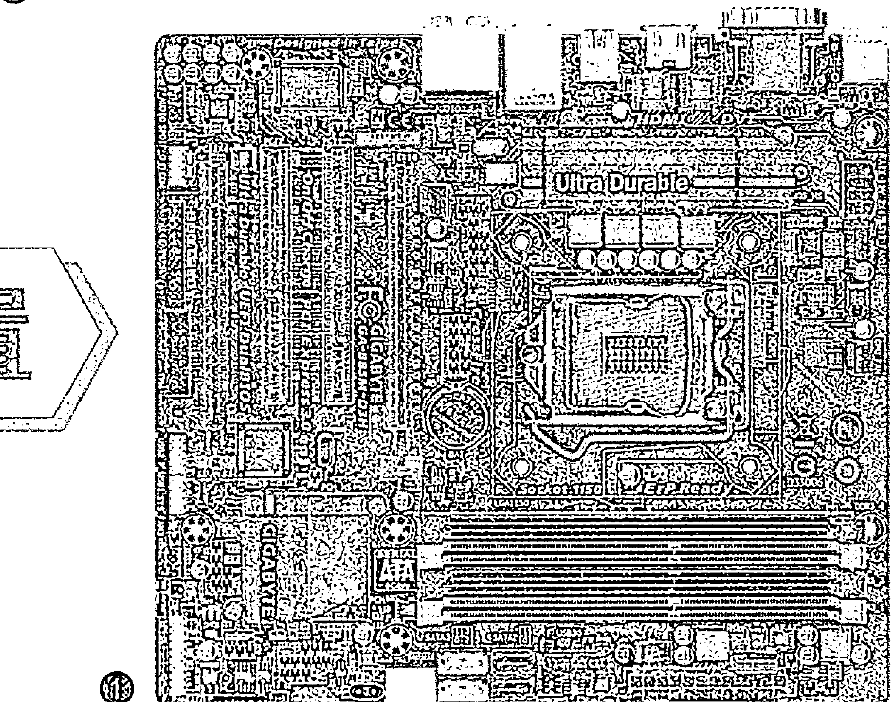

### 适合不同人群的配置

需求不同决定了配置的不同，针对不同人群不同的需求，根据能够接受的预算搭配出来的配置才算合理。下面针对三类比较常见的用户群体，尝试给出不同的配置以求达到比较良好的效果。

#### 学生用户

学生用户要的就是性价比，但很多人在性价比当中对于性能的要求更高，比如游戏需求。如果只是用于学习等功能完全可以去购买笔记本电脑，适合购买台式机的其实就是那些需要兼顾游戏与学习的学生用户。

| 硬件分类 | 型号 | 价格 |
| ---- | ---- | ---- |
| 处理器 | 酷睿i5-4460 | 1259元 |
| 备选处理器 | 酷睿i5-4590 | 1339元 |
| 主板 | 技嘉B85M-D3H | 449元 |
| 备选主板 | 华硕B85-PRO GAMER | 599元 |
| 内存 | 金士顿DDR3 1600 4GB×2 | 258元 |
| 备选内存 | 金士顿Fury DDR3 1600 8GB | 239元 |
| 硬盘 | 希捷ST2000DM001 | 449元 |
| 固态硬盘 | 威刚SP920 128G | 309元 |
| 显卡 | 华硕圣骑士GTX750Ti-OC-2GD5 | 789元 |
| 备选显卡 | 映众GTX960-L 4G海量版 | 1299元 |
| 机箱 | 酷冷至尊毁灭者U3升级版 | 229元 |
| 电源 | 航嘉jumper500 | 299元 |

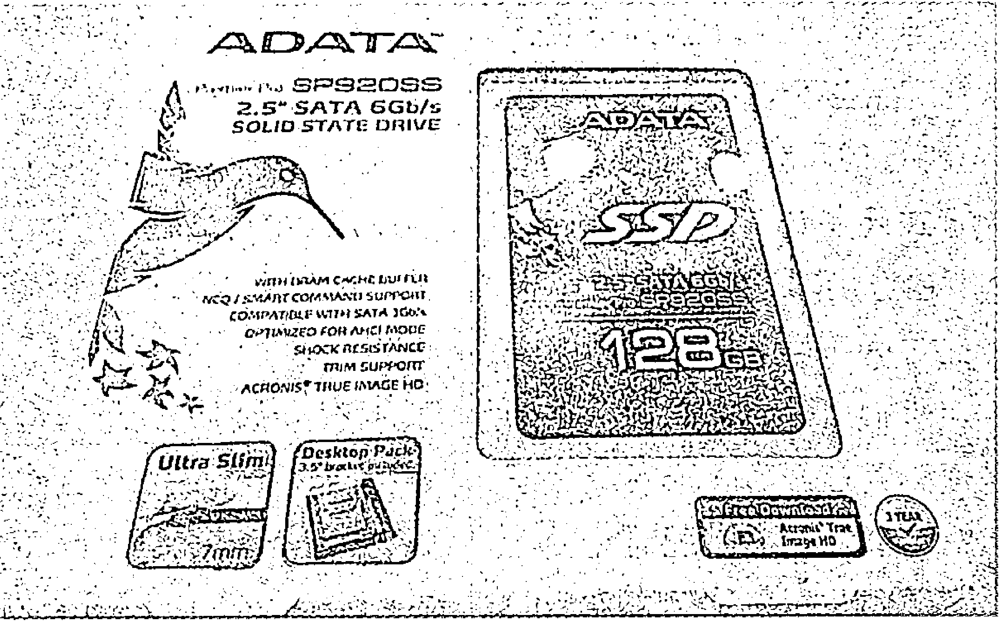

# 配置点评

对于普通的游戏需求，英特尔普通的酷睿i5处理器就能很好地满足需求。更具性价比的是目前与之搭配的LGA 1150主板可以选择B85芯片组，就算是华硕技嘉等等一线品牌的售价也是400~500元，非常超值（图1）。DDR3内存已经降到底价，省出的预算完全可以加装一块128GB的SSD固态硬盘。威刚SP920使用Marvell最主流的88SS9187主控支持8通道闪存，维持低价的基础上能够有最好的系统响应速度（图2）。

# ▶ 游戏效果

配置中的主选GTX750Ti显卡(图3)完全可以满足一般学生用户喜爱的LOL、DOTA2等游戏在1080P分辨率下全特效的流畅，如果还需要玩其他大型单机游戏备选的GTX960 4GB版本可能更加适合，当然，一些过于新的游戏，比如GTA5、COD12还有些吃力，但是在中等特效下运行是没有任何问题的。

游戏用户总体而言应该偏重于显卡，但目前越来越多的新游戏对于处理器和内存也提出了更高的需求。如果预算有限，应该在配置的选择上更加务实，针对不同的游戏需求加强不同的领域。

| 配件 | 型号 | 价格 |
| :--- | :--- | :--- |
| 处理器 | Xeon E3-1231 v3 | 1399元 |
| 备选 | 酷睿i7-4790K | 2299元 |
| 主板 | 技嘉B85M-D3H | 449元 |
| 备选 | 技嘉Z97X-UD3H | 799元 |
| 内存 | 金士顿DDR3 1600 4GB×2 | 258元 |
| 备选 | 金士顿Fury DDR3 1600 8GB×2 | 478元 |
| 硬盘 | 希捷ST3000DM001 | 569元 |
| SSD | OCZ饥饿鲨Trion 100 480GB | 799元 |
| 显卡 | 七彩虹GTX970-4GD5海外版 | 1999元 |
| 备选 | 翔升GTX980Ti至尊版 6G D5 | 3999元 |
| 机箱 | 追风者PK(PH)-515PC-BK | 499元 |
| 电源 | 海韵M12II-620 | 599元 |

# ▶ 配置点评

目前的主流游戏在处理器需求上有两个极端，一类对于处理器并没有过多要求，只要主频在3GHz以上的四个物理核心处理器就能够满足，比如古墓丽影9、极品飞车系列和NBA2K系列等等。另一类则对处理器甚至内存容量要求非常高，比如魔兽世界不看处理器核心数量只看频率和单核效率，使命召唤12则需要有16GB左右的内存容量才能够满足需求。配置中的主选和备选希望读者自行选择(图4、图5)。值得一提的是，OCZ饥饿鲨Trion 100系列中480GB版本SSD已经降价到了799元，虽然是TLC闪存但性能异常强劲(图6)，在AS SSD Benchmark当中可以得到超过1200的高分，同时480GB的大容量能够容纳更多游戏在SSD当中提高游戏读取速度，非常直接地提升游戏体验。

# ▶ 游戏效果

如果用户玩最终幻想网络版、剑侠情缘或者魔兽世界网络游戏居多，可以选择酷睿i7-4790K搭配GTX970的组合，这样就算在2560×1440分辨率下也能够实现满帧数，显卡没有必要追求更高，反倒是i7-4790K强劲的单核性能十分关键。但是如果用户玩GTA5和COD12这类单机游戏(图7)，同时使用的又是1080P以上的分辨率，反倒不如选择至强E3-1231 v3这类售价便宜的处理器去搭配GTX980Ti显卡。这样在多数情况下，1080P可以保证高特效单机游戏60fps，就算分辨率进一步提升至2560×1440，也能够满足帧数高于30fps，基本保持流畅。

# 折腾用户

抛开了性价比的禁锢，对PC有一定品质要求的用户已不仅局限于性能了，在追求性能的基础上还对平台整体的视觉效果和扩展性有着独特的要求。下面尝试针对ATX和Mini-ITX大小两个极端给出配置的建议，希望能对喜欢折腾PC配置的用户有抛砖引玉的效果。

| 配件 | 型号 | 价格 |
|------|------|------|
| 处理器 | Core i7-5820K | 2809元 |
| 主板 | 华硕X99-A/USB 3.1 | 2999元 |
| 内存 | 海盗船CMD16GX4M4A2666C15 4GB×4 | 2599元 |
| 硬盘 | 希捷ST3000DM001 | 569元 |
| SSD | 英特尔750 PCIe 400GB | 2499元 |
| 显卡 | 翔升GTX980Ti至尊版 6G D5 | 3999元 |
| 机箱 | 海盗船Graphite 780T | 1279元 |
| 电源 | 海盗船RM750x | 889元 |
| 散热 | 海盗船Hydro 110i GT | 909元 |

# 配置点评

希望实现高扩展性传统的主流平台应该难以满足高端用户的需要了，可以考虑使用X99平台中最具性价比的i7-5820K搭配入门级别X99主板。搭配的海盗船铂金内存（图8）和公版GTX980Ti（图9）能够很好地与主板、机箱总体的黑白色调融为一体，而Hydro 110i GT水冷一体式散热器是目前比较少见的280mm尺寸（图10），对应的Graphite 780T宽大空间就算是今后组SLI也没有任何问题。全模组RM750x拥有纯黑色的模组线缆，走线和配色统一性没有问题。英特尔750 PCIe 400GB可以提供目前家用最强的SSD性能，如果售价难以接受，用户可以考虑更换普通SSD。

# 配置点评

全新Skylake凭借更出色的带宽和更多的PCIe通道成为了目前M.2 SSD的首选平台，配置中技嘉Z170N-Gaming 5主板巧妙地将M.2接口设计到了主板背面（图11），不仅在保持了ITX主板17cm×17cm的小巧身材的基础上实现了出色用料，还解决了类似M.2接口这样传统主板上不具备的接口的空间问题。金士顿HyperX Predator 240G使用Marvell 88SS9293主控使用PCIe x4通道，正好是拥有20x PCIe通道Z170芯片组的绝配（图12）。R9 Nano显卡就算算上电源线缆也不超过17cm，包括海盗船vs550和乔思伯hp-625都能很好容纳在乔思伯UMX1 PLUS这个Mini-ITX机箱当中（图13）。

| 配件 | 型号 | 价格 |
|------|------|------|
| 处理器 | Core i7-6700K | 2499元 |
| 主板 | 技嘉Z170N-Gaming 5 | 1699元 |
| 内存 | 金士顿DDR4 2133 8GB×2 | 718元 |
| SSD | 金士顿HyperX Predator 240G | 1599元 |
| 显卡 | 华硕R9 NANO-4G | 5299元 |
| 机箱 | 乔思伯UMX1 PLUS | 499元 |
| 电源 | 海盗船vs550 | 299元 |
| 散热 | 乔思伯hp-625 | 169元 |

# 跌宕起伏喜忧参半

# 盘点2015 IT那些事

2013年主推除旧迎新，深陷电子设备重围的我们力求每天的电脑都能焕然一新；2014年业界风起云涌，大数据在不断收集改变每个用户生活方面的点点滴滴；2015年对比过去几年，又有了哪些让人为之一振的新事物？业界开始了进一步的优胜劣汰，许多著名企业和品牌亦或并购重组亦或销声匿迹，让人唏嘘不已。以智能手机为代表的移动终端设备声势已全面超越了传统电脑，这也让微软、英特尔等传统PC厂商感觉到寒冬将至。更新的14nm工艺产品和更贴近于移动智能方式的Windows 10都在2015年问世，传统PC厂商力求在移动互联网时代站稳脚跟。设备和系统的高度联网化不仅带来了方便和更好的用户体验，前所未有的安全问题也摆在了我们面前。任何人都难以撼动整个IT业界的趋势，在时代潮流中唯有适者才能生存，就算适应过程伴随着喜忧参半的起伏和阵痛……策划《电脑爱好者》编辑部

# 行业聚焦

# 盘点2015 IT那些事

2015年的IT圈好不热闹，最新的14nm制程工艺主导了PC和移动领域的性能革命；目不暇接的收购入股事件令人心惊；新兴的智能硬件则过上了冰火两重天的日子；昔日的“中国第一众筹”品牌也被打回了原型。

# 工艺就是战斗力！

谁在影响着2015年度科技产品的性能和体验？处理器？没错，但它只是表面现象，因为处理器也需要一种神秘的力量才能挖掘潜力释放激情，而这股神秘力量就是制程工艺。在2015年里，14nm工艺的登台下，引起了诸多改变。

## 引领潮流的英特尔

毫无疑问，英特尔拥有令整个世界都眼红的制程工艺优势，早在2014年就推出了基于第二代Tri-Gate（FinFET）立体晶体管技术的14nm处理器：Broadwell-Y，也就是我们熟悉的酷睿M，其TDP被控制到了史无前例的4.5W，让性能级平板电脑摆脱了散热风扇的束缚。

2015年，英特尔酷睿处理器家族经历了两次更迭。年初，Broadwell-U（15W）/H（45W）/C（65W，桌面CPU）相继问世；年底，Skylake正式接班，并宣告英特尔14nm制程工艺彻底成熟。下面就让我们通过回顾微软Surface Pro系列的发展，感受一番工艺的“战斗力”。

平台升级到了四代酷睿Haswell，无论是性能还是续航都有了显著的提升。可惜，Surface Pro 2在外观上延续了一代的设计，在便携性方面诚意不足。直到Surface Pro 3，它才在便携性和续航能力上得以兼顾，奠定了Surface家族在平板2合1设备中的领导地位。

2015年10月，在Surface Pro 4身上我们看到了喜人的变化（见表），它不仅更轻更薄（图2），并在屏幕增大、分辨率增加、电池容量减少的情况下，依旧具备近9小时的续航能力，而其实测性能也足以秒杀同档次的Surface Pro 3，基于14nm工艺制造的Skylake处理器性能可见一斑！

2013年，微软发布的第一代Surface Pro并不被玩家看好，因为它实在太厚（图1），而且续航时间仅4小时。作为补救，微软在同年推出了Surface Pro 2，将硬件

* 续航时间数据取自Powermark测试结果（Surface Pro的型号均为i5版）

| 参数对比 | Surface Pro 4 | Surface Pro 3 | Surface Pro 2 | Surface Pro |
| :--- | :--- | :--- | :--- | :--- |
| 发布时间 | 2015年10月 | 2014年5月 | 2013年9月 | 2013年1月 |
| 屏幕 | 12.3英寸<br>2736×1824像素 | 12英寸<br>2160×1440像素 | 10.6英寸<br>1920×1080像素 | 10.6英寸<br>1920×1080像素 |
| 处理器 | Skylake | Haswell | Haswell | Ivy Bridge |
| 制程工艺 | 14nm | 22nm | 22nm | 22nm |
| 厚度/重量 | 8.5mm/786g | 9.1mm/800g | 13.5mm/907g | 13.5mm/900g |
| 电池/续航* | 38Wh/9小时 | 42Wh/8小时 | 42Wh/6小时 | 42Wh/4小时 |

### 拓展阅读

### 制程工艺的重要性

处理器是由晶体管、电阻器、电容器等微小元件堆叠起来的电路，制程工艺越先进，在单位面积可以容纳的晶体管数量也就越多，性能也会等比增高。此外，处理器的功耗也会因工艺的升级而降低，从而明显提升续航能力。除了制程工艺，核心架构对处理器的影响也非常巨大。以Skylake-Y和Broadwell-Y两代酷睿M为例，它们都是14nm工艺，但Skylake-Y的芯片封装面积却比Broadwell-Y小了1/3（图3），可以塞进更轻薄的平板电脑体内，并享受更强悍的性能。

### 拓展阅读

### 为何14nm不如16nm

台积电的工艺技术经历了28nm→20nm→16nm的过渡，而三星的工艺技术则直接从28nm跳到了14nm，缺少了20nm工艺的设计经验。此外，三星用的是14nm第一代14LPE技术，而台积电则用了16nm第二代的16FF+技术。16FF+比14LPE省电已是业内公开的秘密。处理器在工作时会将电能转化为热能，根据“能量不灭定律”，耗电较多的处理器自然会更热，由此也就可以解释为何三星版iPhone 6s偏热且续航时间偏短的问题。

总之，更先进的工艺就是提升处理器综合实力的战斗力，但想用好这股力量，还需一段时间的积累沉淀。Surface Pro 3能用同平台处理器大幅提升续航能力，台积电能依靠16nm工艺逆袭三星，这些都是成熟工艺所带来的增益。

在2016年，新工艺将引发新一轮的芯片大战，麒麟950将采用台积电16nm FinFET+工艺制程，骁龙820将投奔三星14nm FinFET，NVIDIA和AMD新一代GPU也会引入最新的工艺设计。而更令我们期待的，则是英特尔预计在2017年推出的Kaby Lake平台，因为它将成为首颗10nm芯片！

Surface Pro 4的惊艳表现还在意料之中，而Surface Pro 3的处理器平台与前代产品相同，但却依旧在屏幕变大分辨率增加的同时大幅提升续航时间，这就源于后期英特尔对22nm工艺的成熟应用以及调校优化了。没错，成熟的工艺有时候要比先进的工艺更重要。

### iPhone引发的工艺之争

2015年初，三星发布的Galaxy S6抛弃了高通，改用自家的Exynos 7420 SoC处理器（14nm FinFET），三星在制程工艺方面终于追上英特尔的脚步。得益于更先进的工艺，Exynos 7420无论是性能还是功耗和发热表现都要优于高通同期的旗舰骁龙810（20nm），毫无争议地成为2015年度手机处理器的绝对王者。那么三星真的可以凭借14nm FinFET工艺大杀四方了吗？

X86和ARM不具备可比性，所以我们就将目光放在“iPhone 6s芯片门”这一事件上（图4）。为了保证产能，苹果给iPhone 6s/6s Plus找了两家处理器代工厂：三星的14nm FinFET（准确来说是FinFET LPP-LOW POWER PLUS）生产线，台积电的16nm FinFET Plus生产线。从表面上来看，三星生产的Apple A9处理器工艺更先进，理论上应该具备更好的电气性能吧？

然而，实际情况却大大出乎我们的预料。通过媒体和用户的实测，台积电版本的iPhone 6s发热量更低，续航时间也更持久（图5）。这种“意外惊喜”还引发了三星版iPhone 6s用户大面积退货的情形，网络上也充斥着各种判断iPhone 6s芯片版本的教程。

# 紫光做媒 西数与闪迪联姻

在2015年IT圈的收购事件中，涉及金额最大的可能是戴尔670亿美元天价拿下EMC，但对国内用户影响最大的却是西数收购闪迪，因为此次收购事件的获益方就是国内的紫光。

## 引领潮流的英特尔

自西数（西部数据）收购日立，希捷收购三星（机械硬盘业务），机械硬盘进入了双寡头时代。为了顺应SSD固态硬盘的潮流，希捷在2014年还收购了Avago旗下LSI两个部门，获得了进入企业级PCIe闪存和SSD控制器市场的机会。与此同时，希捷还推出了自主品牌的SSD产品，以及SSHD系列混合硬盘（图1），在SSD大潮中勉强站稳了脚跟。

与希捷的积极应对相比，西数对SSD的态度就显得有些消极了，除了Black2和Blue SSHD两个系列的混合硬盘就再无声音（图2）。就在人们担心西数会被SSD的浪潮淹没之际，西数却在10月21日宣布以190亿美元收购SanDisk闪迪，从而获得了大量闪存知识产权及海量该领域的专利技术。而西数之所以能有足够的现金来收购闪迪，则得益于收购前夕紫光科技的一次入股：10月初紫光科技宣布以38亿美元入股西数，成为西数第一大股东。

至此，紫光可以通过西数第一大股东的身份为国内大数据存储铺路，并借助本次收购闪迪推动中国半导体产业的发展（图3）。如果紫光可以将闪迪NAND Flash相关专利和工艺引入同方国芯，那么是极有机会在存储芯片领域复制京东方在面板产业逆袭的案例。

## SSD的时代已经到来

从希捷收购LSI、西数收购闪迪可见，机械硬盘已经走向末路，不抓紧时间布局SSD已再无出路。相对而言，西数杀入SSD战场的举措比希捷更为彻底，毕竟闪迪拥有闪存盘、消费类存储卡、消费及企业级SSD等成熟的产品线，可直接为西数贡献利润。此外，这次收购并不妨碍闪迪与东芝在NAND工厂和技术方面的合作，西数依旧可以获得稳定的NAND芯片货源。从此，希捷和西数将不再是一个层面的竞争对手，而希捷也将面临闪迪（西数）、三星、美光、东芝、英特尔SSD产品的围追堵截。

要注意的是，西数与闪迪联姻在短期内并不会改变SSD的固有格局。影响SSD走势的依旧是NAND的生产工艺，在工艺没有重大革新（的情况下，消费级SSD的容量和价格不会出现大幅波动。当然，我们更期待西数在获得闪存晶圆、芯片制造产业之后，能与原本的机械硬盘业务形成有效补充，比如推出性能更强且实惠的混合硬盘，在一块硬盘上就能实现速度与容量的兼顾。

## 移动互联时代的众生相

我们正身处移动互联网时代的浪潮里，很多传统行业都与其发生交汇，进而衍生出更多的产品形态以及营销方式。比如移动互联与传统制造业的交汇催生了智能硬件；移动互联与电商交汇则孕育出众筹等金融概念。

## 走进智能硬件背后的阴影

“万物互联”是大势所趋，而智能硬件则是这一趋势的具体表现。从2012年至今，智能硬件的市场份额逐年攀升，只是在风景独好的表象之下，依旧存在值得我们关注的阴影。

### 缅怀已逝的智能硬件

智能硬件是互联网与传统制造业的交集产物，似乎谁都有义务去推动智能硬件的发展。对互联网领域的从业者而言，只要借助自身已有的互联网用户和互联网思维优势，再找个代工厂加入移动端控制元素就能打造一款智能硬件（图1）；对传统制造从业者而言，在自身产品基础上融入传感器和APP即可，似乎也没任何难度。于是，各种“想当然”的智能硬件纷纷出炉，在经历初始的光芒万丈之后，就被残酷的现实打入了历史的尘埃之中。

表1是近两年已经“死亡”的部分智能硬件名单，它们在发布之初都曾引起广泛争议和讨论。以首批杀入智能硬件领域的百度为例，其先后推出的无线音乐盒（图2）、筷搜（图3）和防丢贴片都是概念性十足，但却缺乏实际使用价值的产品。而这也是互联网从业者的通病：为了创新而创新，最终得到的仅是简单的互联网概念加供应链的组合。

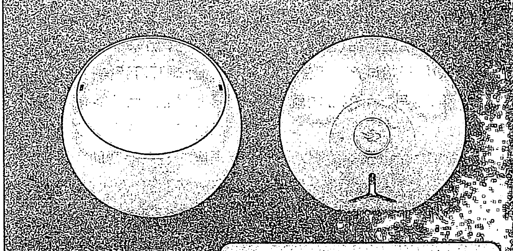

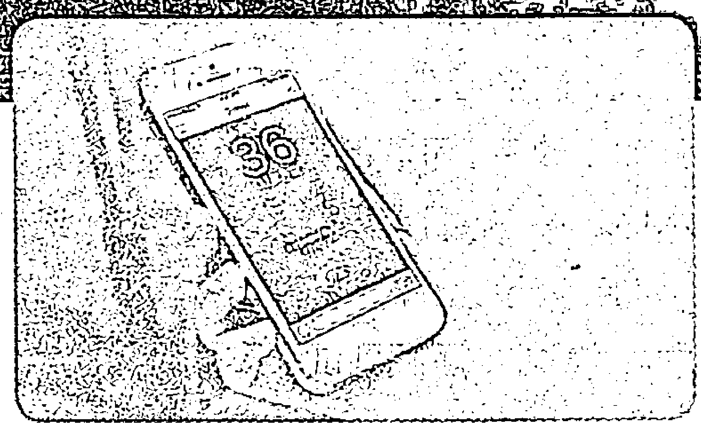


| 产品名称 | 时间 | 所属公司 | 主要功能 |
|---|---|---|---|
| EMGRING智能手表 | 2012 | 北京思睿创科技有限公司 | 生物电信号检测识别 |
| 二维码拍拍手环 | 2012 | 深圳市维邦佑科技有限公司 | 二维码、数据系统 |
| HALOBAND手环 | 2013 | Haloband | NFC |
| FashionComm智能手表 | 2013 | 广东乐源数字技术有限公司 | 穿戴式智能手表 |
| aGlass智能眼镜 | 2013 | 北京七鑫易维信息技术有限公司 | 眼控智能眼镜 |
| 果壳GEAK魔戒 | 2013 | 盛大果壳 | 便捷交友 |
| 幻响健康智能手环 | 2013 | 幻响神州（北京）科技有限公司 | 定位、健康管理、提醒 |
| 百度无线音乐盒 | 2013 | 百度智能硬件 | 路由器、Wi-Fi音箱 |
| 乐行体感车 | 2013 | 深圳乐行天下科技有限公司 | 智能编舞、视频、APP应用 |
| Tinsee天时智能手表 | 2014 | 天时国际 | 太阳能驱动 |
| 历途智能手环 | 2014 | 北京力拓易盛科技有限公司 | 可穿戴设备 |
| J-FIND ME手环 | 2014 | 深圳市创新活科技有限公司 | 约会交友 |
| 桔子智能水杯 | 2014 | 深圳市桔子伟业科技有限公司 | 饮水提醒 |
| 百度筷搜 | 2014 | 百度智能硬件 | 传感器测量和定量分析 |
| 百度防丢贴片 | 2014 | 百度智能硬件 | 一键寻物 |
| 空气果 | 2014 | 墨迹天气公司 | 空气质量监测 |

### 智能和骗局只是一纸之隔

近年来智能硬件层出不穷，概念+营销满天飞，但真正落地且获得消费者青睐且能实际应用的产品却是屈指可数。原因用一句话就可以概括：将复杂的事情变得简单是智能，将简单的事情变复杂则是骗局。

以某智能水杯为例，它曾是京东众筹平台的明星产品（图4），从2014年10月开始试产。可惜，刚到2015年7月其背后的公司就已经破产清算。这很好理解，只是一个可以监测水温以及提醒喝水的保温杯而已，一方面使用免费的第三方APP（如“别忘喝水”）即可替代；另一方面，用户喝水习惯早已养成，很难因为一款产品的提醒就加以改变。可悲的是，继该智能水杯之后，依旧有无数“智能水杯”参与众筹，也许只有真正体验之后，用户才能了解到试图改变喝水习惯的水杯是多么难以实现。

与其类似的还有所谓的智能烟嘴（将烟嘴插在其上，据说可以过滤有害物质、记录吸烟习惯）（图5）、智能灯泡（远程控制灯光开启及亮度色彩调节）、智能插座（多基于Wi-Fi控制）（图6）等等，看似美好，但却都难以击中用户真正的需求痛点。戒烟需要的是意志力，历来的辅助手段都不算靠谱；想开灯还得打开手机，在屏幕上指指点点才能亮起/关闭，反而没有直接按下开关实在；智能插座的初衷是帮助家里省电，但随时待命的Wi-Fi模块难道就不耗电吗？

总之，真正的智能应该以不改变用户的习惯为前提，进而提升实际应用的效率和体验。需要传统制造业的行业沉淀，需要互联网的颠覆精神，还需要定制的芯片、传感器、通信技术、云平台、大数据的有效支持。

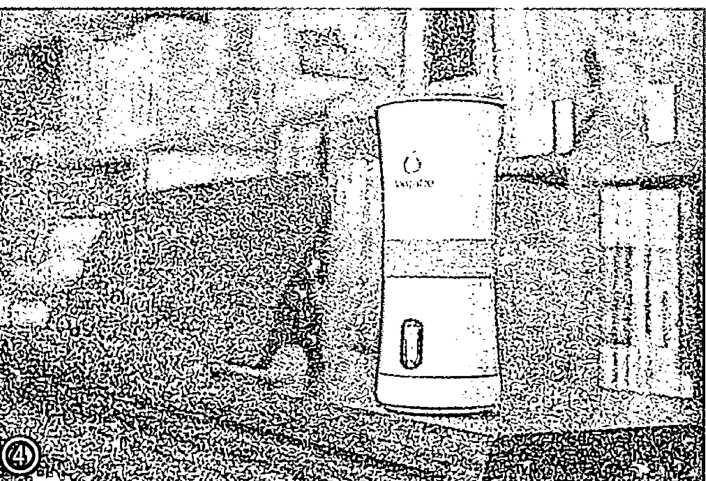

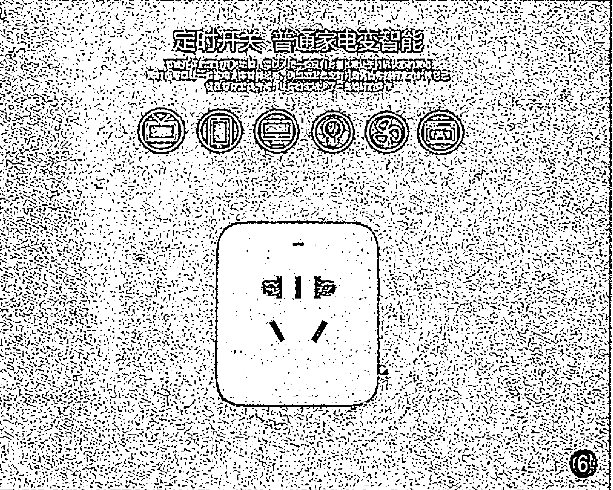

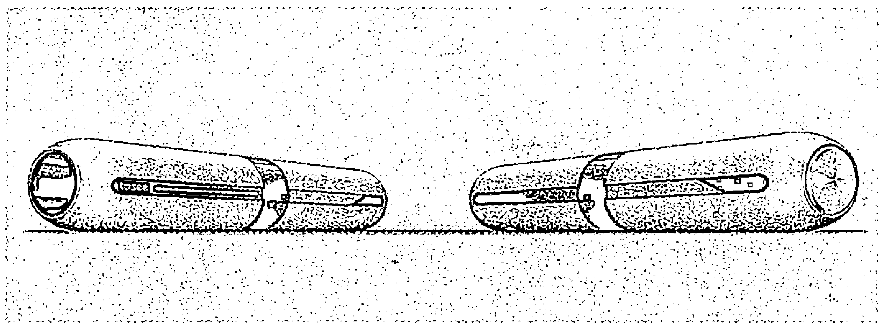

### 智能硬件的未来之路

如果说以前的智能硬件一直都是传统制造企业和互联网企业在“单打独斗”，在过去的2015年中我们看到了“集团军”的趋势。

比如，阿里巴巴将天猫电器城、阿里智能云、淘宝众筹整合成立了智能生活事业部；腾讯推出了TOS+开放平台；百度提出了“BaiduInside”计划；京东提供了硬件孵化计划JD+……有了统一的大数据平台和相关技术的支持后，由一个APP控制多个智能硬件，以及多智能硬件之间的功能联动变成了可能。今后用户再也不用买一个智能硬件就安装一个APP（图7），并终结几个智能硬件间“老死不相往来”的体验割裂历史。

虽然有无数的智能硬件已经“牺牲”在前行的道路上，但这并不妨碍2016年会有更多的智能硬件投身到这一趋势行业中来，因为这是唯一能赋予移动互联网物理属性的产业。只是我们希望，未来的智能硬件不再以噱头作为卖点，而是将实用性放在首位，真正诠释“智能”的定义。

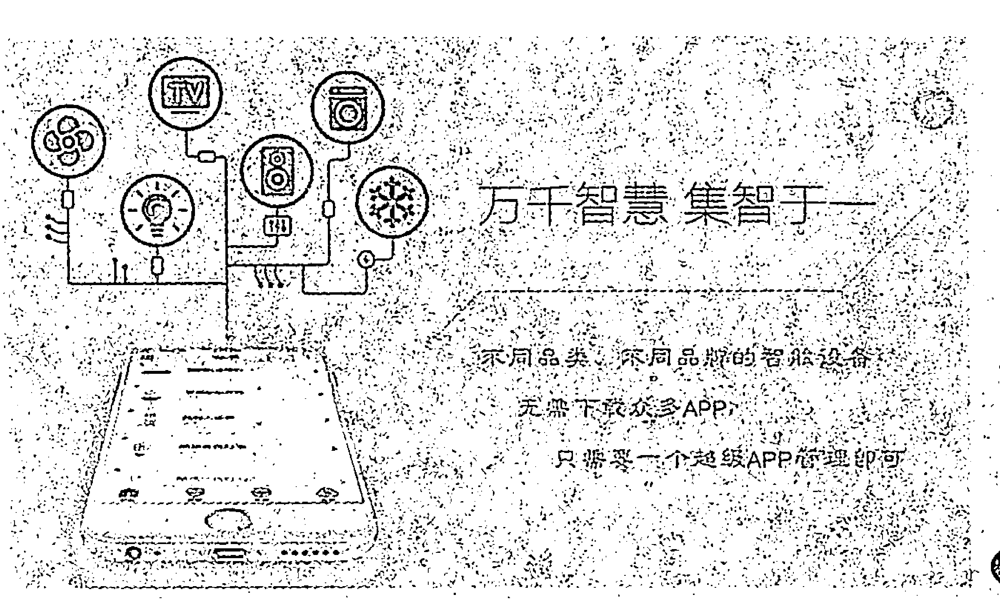

### 让人又爱又恨的众筹

不知从何时开始，我们更愿意通过众筹平台去选购心仪的硬件产品（图8）。原因无二，众筹意味着抢先（第一批供货）、实惠（价格便宜且有赠品）、惊喜回报（抽奖活动）。那么，众筹真的如此美好吗？


### 从天堂到地狱的大可乐

2014年12月9日，互联网手机品牌的代表之一大可乐为其新品“大可乐3”在京东举行了在线众筹，仅仅25分钟就做到了10000个众筹名额全部满员，完成了原定30天众筹期的预定目标。至此，一个成立刚两年、总销量不过百万量级的新品牌便摘下了“中国第一众筹”的桂冠。

大可乐3是一款外观几乎完全仿制iPhone 6的Android手机，其博得广泛关注的秘诀就是“一次众筹，终身免费换新”的惊人口号（图9）。遗憾的是，这个口号最终只是一个口号，因为大可乐创始人丁秀洪在2015年6月便已离职，而北京云辰科技有限公司也传出面临破产清算的消息。更令用户心寒的是，大可乐3的品控问题很大（裂屏、电源键不灵、死机），在官方交流论坛发表建议和投诉又被禁言。最终无数合伙人只落了个裂屏的大可乐3手机，并亲身体验了一把“众筹有风险，投资需谨慎”的教训。

### 盘点已死去的互联网品牌手机

大可乐并非第一个倒下的互联网手机品牌，在它之前，曾试图挑战小米的百加手机也在2015年初便淡出了手机江湖（图10）。

此外，博沃、THL、橙品节操等消失的互联网手机品牌更是数不胜数。究其原因，无非是资金链受阻、产业链断裂、产品品控，以及更为激烈的市场竞争。

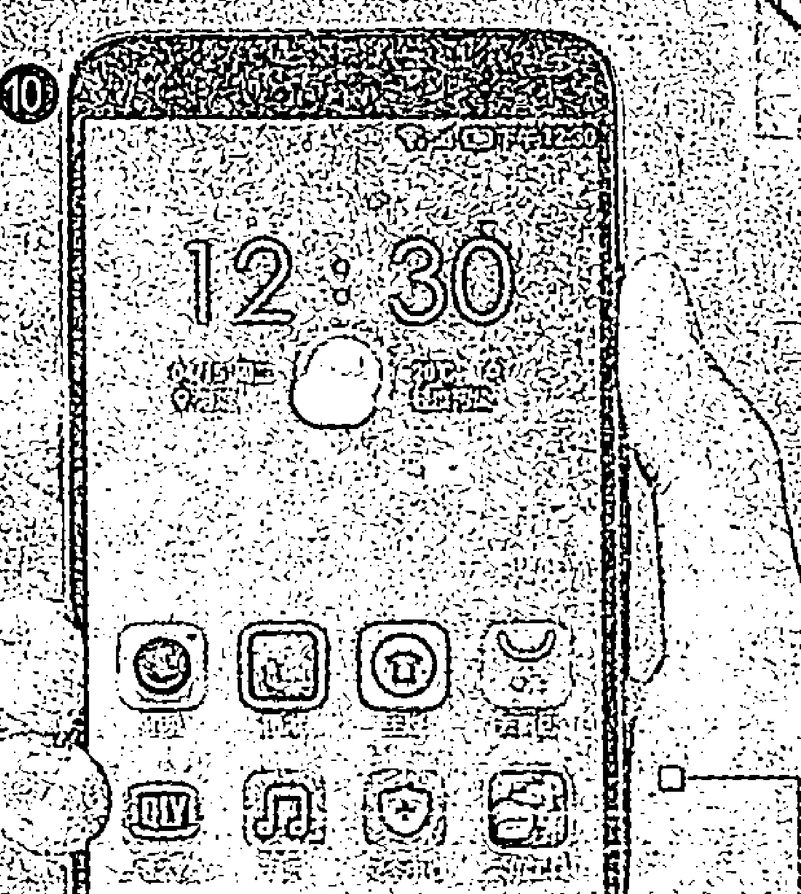

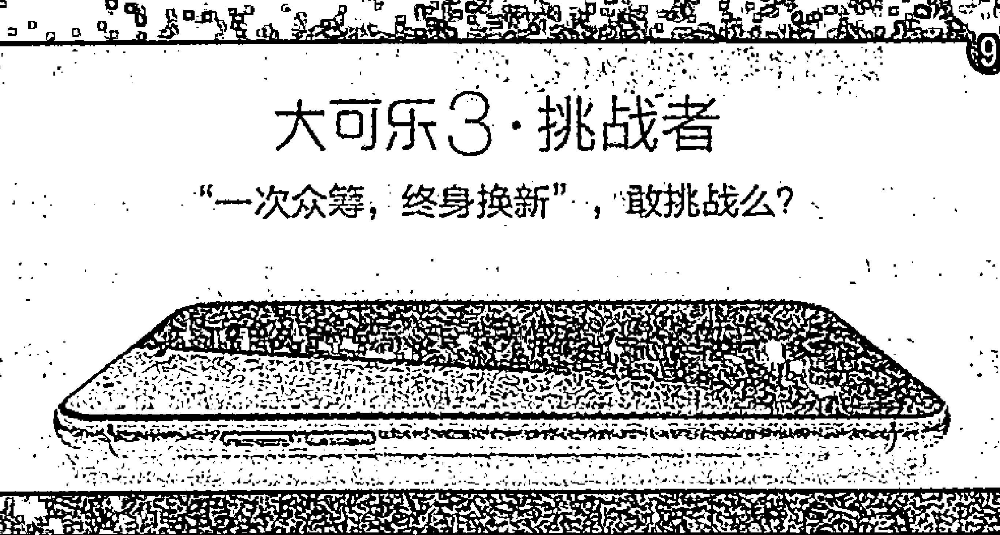

### 理性看待众筹模式

前文提到的智能硬件也是众筹的重灾区。产能不足、跳票、质量缺陷、同质化等问题层出不穷。更有人指出国内的智能硬件行业已成为复制、山寨的代言，哪怕正规的众筹项目，也经常遭遇数据造假。

还是以大可乐3为例，在成功发起众筹项目后，又在官网和京东金融平台更改了配置参数（夸大了GPU的核心数量，在图形性能的表述...）涉及严重的虚假宣传，问题是：更改参数后合伙人并未接到通知，反复投诉后只是以退款了事。魅族参与京东众筹的双向快充移动电源也经历了一番参数变更的闹剧，只是魅族在善后方面就要人性化得多，为了解决充电过热的问题，魅族调低了移动电源的充电参数，导致给电源充满电的时间由原来的3.5小时延长到4小时50分，而给用户的补偿则是无条件退款或不退款电源赠送官方售价89元的EP21耳机一个（图10）。无论如何，修改产品的参数都是众筹项目的大忌，这对品牌信誉和合伙人的期待都是一种伤害。好消息是，为了防止违约发货、保障用户权益，解决众筹行业存在“跳票”这一痛点，很多众筹平台都推出了“众筹保险”。希望2016年合伙人能用上这“尚方宝剑”，切实保护好自身的利益。

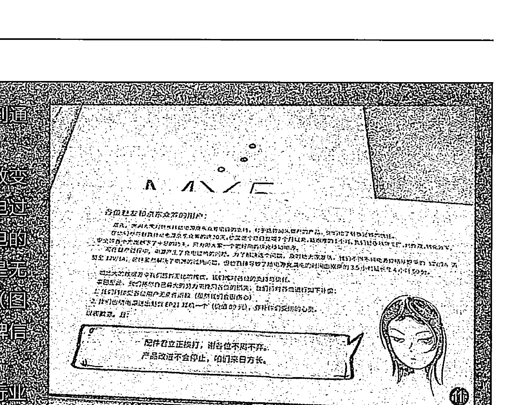

#### 笔记本的互联网突围

虽然整个PC产业正值“严冬”，但依旧在细分市场取得了持续发展，如专业游戏笔记本领域。而帮助游戏本逆袭整个产业的就是新兴互联网品牌。为了迎合用户线上购物的趋势，很多笔记本厂商都推出针对互联网销售的子品牌，如联想的“小新”、“拯救者”；海尔的“雷神”（图12）、“机械师”、“魔法师”、“雷霆世纪”（台式机）；清华同方的“机械革命”（图13）等。联想最新的Y700-15（线下）和拯救者ISK-15（线上），两款笔记本配置相近，但价格却相差近2000元（图14）。虽然后者的细节设计做了减法，但却着实击中线上消费性价比至上的需求痛点。虽然还有很多笔记本厂商未在子品牌领域布局，但在营销模式上也更贴近互联网思维。比如戴尔推出的“游匣”系列游戏本（图15）、惠普最新的WASD“暗影精灵”游戏本、宏碁的“暗影骑士”等，这些高性价比的游戏本依旧是在购物的首选。

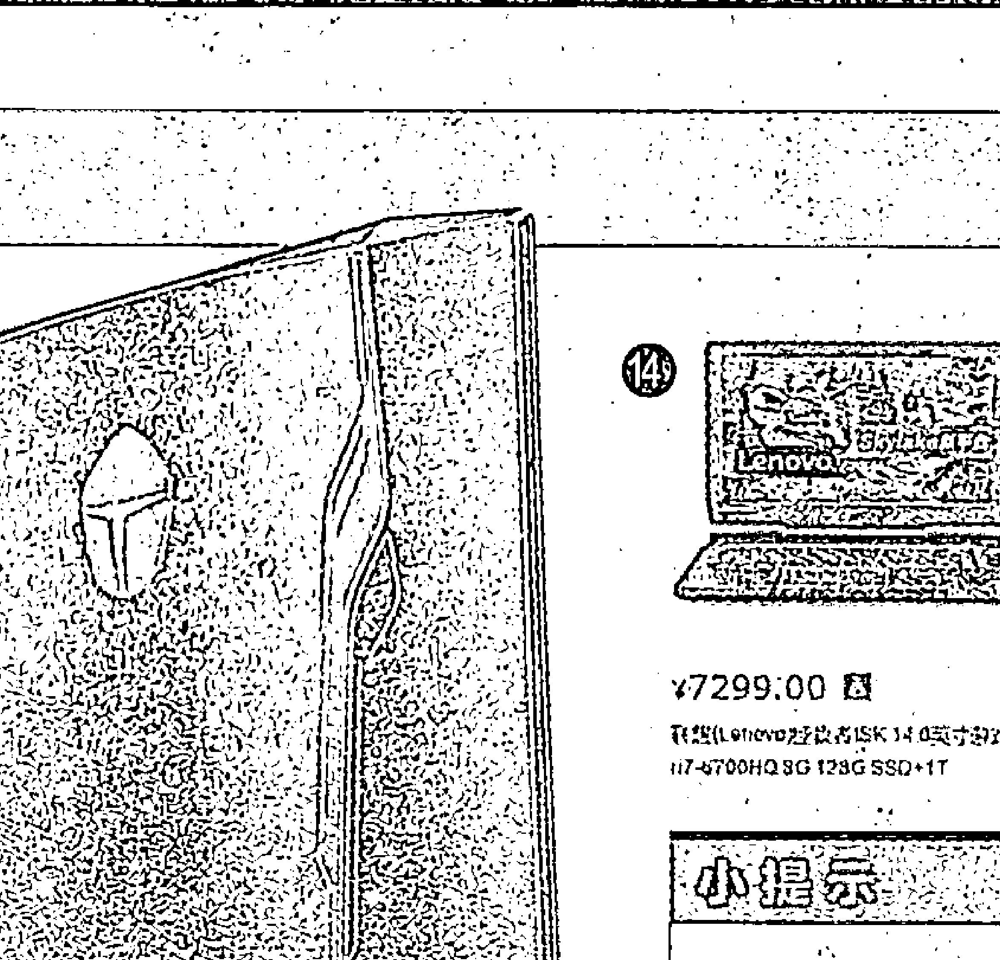

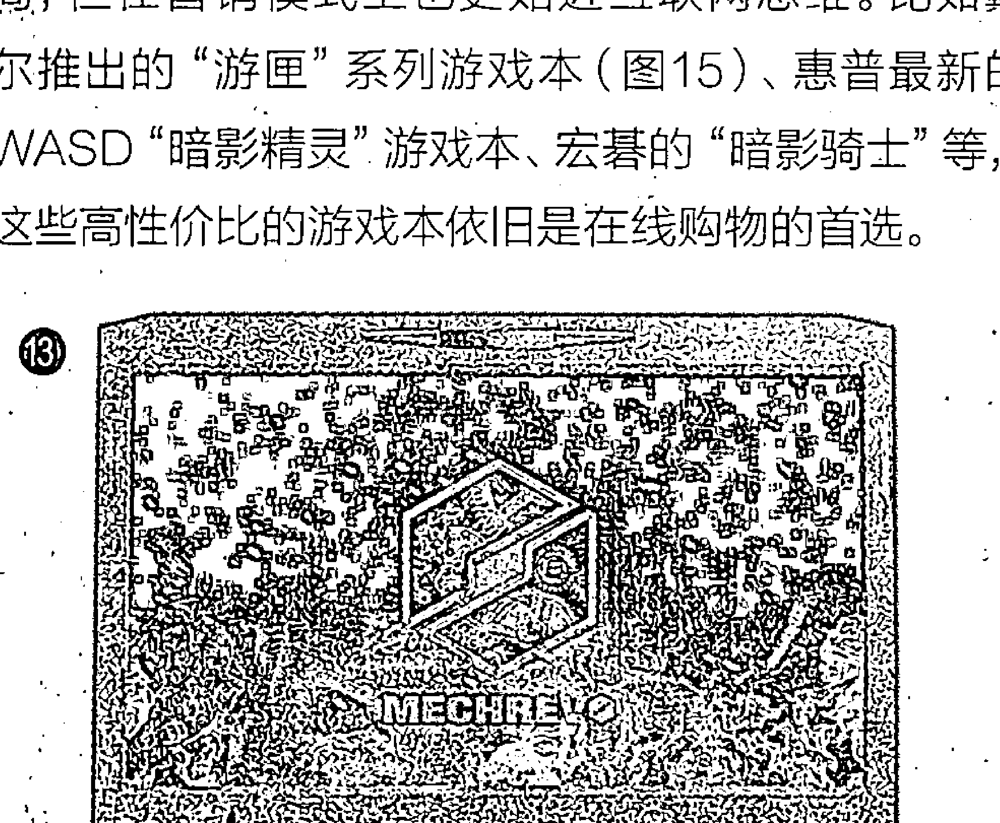

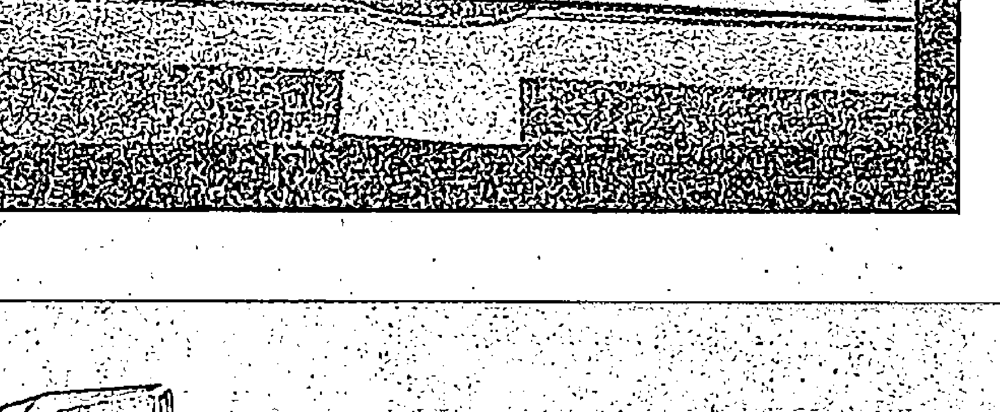

> > 小提示
>
> 现在还有很多新兴的互联网品牌，比如标逸、哇力、得峰等等。这些品牌虽然配置和价格比较吸引人，但毕竟底蕴不足，在品控和售后方面还是很难与传统笔记本品牌的互联网子品牌相比。

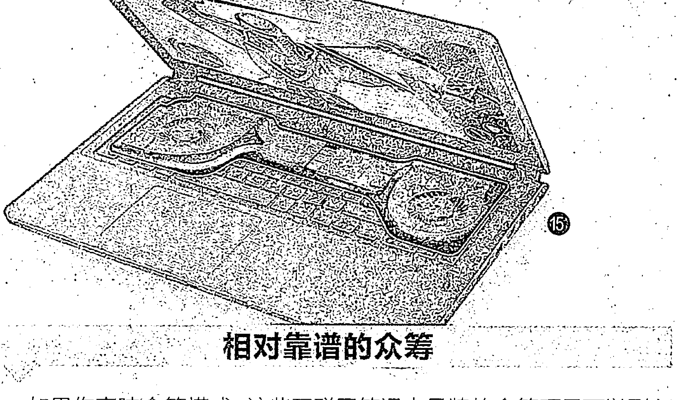

#### 相对靠谱的众筹

如果你青睐众筹模式，这些互联网笔记本品牌的众筹项目可以列入你的计划当中。和智能硬件不同，笔记本行业更加成熟规范，我们可以提前在专业媒体看到众筹产品的评测和拆机图，而实际众筹产品只会在处理器、内存和硬盘等参数上出现缩减，不会影响到产品的实际体验。只是，这种众筹会少了几分期待，只是一种更实惠的“预售”而已。

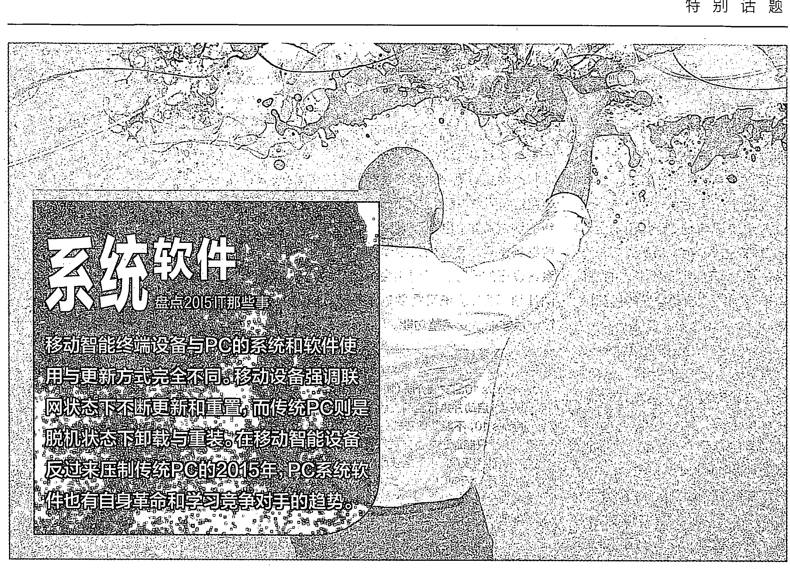

### 系统软件 盘点2015那些事

移动智能终端设备与PC的系统和软件应用与更新方式完全不同：移动设备强调联网状态下不断更新和重置；而传统PC则是脱机状态下卸载与重装。在移动智能设备反过来压制传统PC的2015年，PC系统软件也有自身革命和学习竞争对手的趋势。

### 免费‘午餐’有条件 自动维护可控制

文|刘英

操作系统的白热化竞争和Windows 8系统的受挫，让微软不得不采用近乎免费的策略来笼络更多的用户。对于广大用户来说，这是一个利好的消息。但是，看似简单的“免费”背后，其实也存在着种种的不如意。来路不明的Windows能够获得Windows 10正版升级吗？压根儿就不是Windows用户，也能免费使用Windows 10的所有功能吗？此外，听说Windows 10的自动化程度很高，那么自动维护可控吗？

> ## 免费‘午餐’的摄取和消化
>
> 俗话说，没有免费的午餐。那么，免费的Windows 10升级使用难道就没有什么条件吗？肯定有。首先，微软从未承诺过让盗版的Windows通过升级过程“洗白”为正版。但这并不表示盗版使用Windows的用户无法免费使用正版Windows 10的所有功能。事实上，不论是原来使用什么版本的Windows系统，甚至是使用Windows之外的其他操作系统的用户，只要对Windows 10感兴趣，就可以通过“参与内测”的途径，名正言顺地免费享受Windows 10的所有功能，甚至所获得的功能比正式版还要更多、更超前。
>
> 对于未曾获得微软Windows正式授权的各类Windows用户或者非Windows用户，可以通过微软官方网站申请注册为内测用户，下载和安装使用最新版的Windows 10系统（图1）。Windows 10官方内测网站的地址为https://insider.windows.com/，进入后按向导提示注册内测账户，下载和安装Windows 10最新版即可。
>
> 此外，也可以通过微软官网的Windows 10下载工具（图2）、MSDN网站（图3）等各种渠道，下载微软官方Windows 10最新版的ISO安装包，做成启动盘或者集成到WinPE维护盘，执行全新安装。
>
> 在安装过程中，由于是全新安装，系统会提示输入产品安装密钥。但此时由于没有授权的产品密钥，所以无法通过安装。好在微软在安装页面下方提供了一个