# 电脑爱好者2015合订本（下）第二部分

很不起眼的绕过密钥的通道——“以后再说”选项（图4）。这也正好为没有授权的Windows 10顺利安装开辟了一个免费通道。通过这种方法安装Windows 10之后，由于软件尚未授权，因此系统处于未激活状态。这时只需进入系统设置的“更新和安全”窗口，点击“Windows 更新→高级选项”，开启会员版本功能，即可享受到微软自动推送的最新版Windows 10内测版了（图5）。

对于已在使用正版Windows 7或Windows 8.1的用户，通过系统的自动升级推送或通过在老版本环境下执行在线升级工具，按照向导的提示，一般可以顺利将系统升级到Windows 10。个别用户可能会遇到因升级无法激活而不能“转正”的问题，这除了微软激活服务器繁忙之外，还可能是由于升级方法不当而造成的。

这里需要强调的是，参与内测使用的Windows 10版本除了潜在的不稳定因素和更多的个人使用数据被上传外，其系统功能和升级速度绝对优先于正式版的Windows 10。且测试期间系统一直处于自动激活状态，这种激活状态会随着测试进程的延续而一直延续下去，甚至包括下一代更新的测试版本，也都可以完全免费继续使用。但是如果中途通过系统设置的升级窗口退出会员测试计划，那么系统又需要输入密钥激活才能享受完整功能。

# ○火速链接
关于因Windows 10升级激活的问题，请参见本刊2015年第23期《全面搞定Windows 10激活》。

> 小提示
从Windows 10的安装介质（如U盘或光盘）启动并执行全新安装的Windows 10，不能获取正式免费使用权限，只能通过内测方式获取完全免费使用权限。用网络获取的激活小工具激活的Windows 10虽然可拥有全功能使用体验，但此做法是非法的。此外要注意的是，低版本正式版的免费升级期限为1年，1年后是否免费要看微软的具体政策了。另外对于企业版或者零售版的Windows 10，不存在免费的说法。

由此可见，Windows 10免费的“午餐”不是白给的，要么付出一些代价（内测的贡献资源或问题反馈），要么等着将来会付出一些代价（升级收费或因使用盗版而被追诉）。

# 可控的系统版本自动更新

有人传说Windows 10的系统升级不可控，中午休息后回来系统自动升级了，工作文件也被强行关掉了。那么果真是这样吗？在Windows更新的高级选项窗口中，默认的安装更新方式为“自动”，也就是说系统会在检测到有功能更新数据时，在不征得用户同意的情况下于空闲时间自动安装这些更新。其实，在最新的版本中，如果担心这种自动更新影响正在进行的工作，完全可以选择“通知以安排重新启动”，这样系统在更新时会给出提示，由用户来选择更新时间（图6）。

为了以最快的速度获得最新的Windows 10功能，不少用户开启了会员选项。但是随后发现，大版本的自动更新，有时速度非常之快，有时又迟迟不来。实际上，系统默认向会员推送新版本的方式有两种，一种为Fast模式，一种为Slow模式。其中Fast模式开启以后能够第一时间获得Windows的更新功能，但是存在的不稳定因素会增加；而Slow模式则比较保守，但是获得新功能的时间要有延迟。这两种模式可以根据自己的需求进行选择。如果在使用期间电脑上有重要工作在进行，那么，为了安全起见，最好将更新模式切换到Slow模式，以获得更加稳定的系统运行。当然，还可以在系统更新的“高级选项”窗口中选择手动选择“推迟升级”选项延迟升级（图7）。

# 灵活掌控Windows 10自动维护

Windows 10系统的安全和性能自动维护是在后台不知不觉中进行的。但是，有时这种自动化的模式会失去作用，或者会产生一些不良的影响。在这种情况下，可以将主动权控制在自己手上，以防止因自动维护不当而造成的数据或工作进度的丢失。

Windows 10自带的功能外，还可以使用第三方维护工具。例如，可以使用360安全卫士10.0领航版，获得对Windows 10更新的支持。如果要修复系统漏洞，改用此工具提供的“漏洞修复”功能，直接通过微软网站获取并安装重大安全漏洞补丁（图10）。此外，还可以安装360杀毒最新版，开启更多的杀毒引擎对系统文件进行保护和查杀，从而获得更加全面和专业化的系统安全保护服务。

右键单击Windows 10开始菜单，选择“控制面板”选项，以小图标方式显示控制面板项目，选择“安全性与维护”。在安全维护窗口中，如果系统自带的Windows Defender病毒防护程序由于某种原因而未开启，要点击“立即启用”开启对病毒的监视。如果有影响系统性能的项目，比如过多的程序在后台运行，也可通过“维护”分组下的提示，打开任务管理器，查看并禁用不使用的应用，以提高系统性能（图9）。

小技巧：在安装了360杀毒软件后，系统自带的Windows Defender病毒防护程序会被自动屏蔽。如果在使用中卸载了外部杀毒工具，要记得开启系统自带的Windows Defender病毒防护程序。通过“开始菜单→设置→更新和安全”，点击左侧的Windows Defender项，然后在右侧最底部点击Windows Defender进行开启。

灵活掌控Windows 10自动维护方式

# 免费又省心 轻松应对软件免费化大潮

共享（或收费）软件在中国一直没有什么市场，因此在2015年越来越多的软件走起免费路线。像大名鼎鼎的WinRAR，其中国独家总代理商软众信息宣布中国版WinRAR完全免费，只不过这个免费版本在每次使用时都会弹出一个广告页面。

# 弹窗广告我不要 手动屏蔽广告

当然不仅是WinRAR，由于国内用户正版付费意愿不强，很多收费共享软件都逐渐推出免费版本来迎合国内用户的需求。不过这些免费的午餐在吃起来时并没有那么畅快，各款软件的免费策略各不相同，有的使用弹窗广告，有的则通过捆绑其他软件的方法实现。通过广告推广的方式进行盈利，本来无可厚非，但如果就此而严重影响用户体验，则与软件的易用性等原则背道而驰了。但或许还有更好的方法，比如金山的WPS在这方面就有一些不错的探索。启动WPS之后，它的首页几乎就是一个网站的首页，这个“网页”虽然植入了不少广告，但是同样提供了许多有用资源，使得用户暂时忘记了广告的干扰，算是两全其美的事了。

虽然WinRAR针对国内用户免费，但是每次启动都会弹出的广告总是让人不爽，现在可以使用手动方法屏蔽这个广告。通过观察WinRAR广告页面可以看到，每次弹出的页面都是以http://ad.winrar.com.cn开头的网址，因此我们可以通过路由器屏蔽这个网址。

当然，还会有其他更好的方法，达到厂商和用户的双赢，而不是采取硬性弹窗等强制性手段，令用户反感。下面给大家介绍的一些技巧，就是如何绕开硬性广告的方法，让免费软件也能用起来省心。

打开浏览器进入自己的路由器设置，接着依次展开左侧窗格的“安全设置→防火墙设置”，勾选其下的“IP地址过滤”，缺省过滤规则中选取：凡是不符合已设IP地址过滤规则的数据包，允许通过本路由器。继续勾选“域名过滤”并保存（图1）。

在右侧设置窗格，切换到“安全设置→域名过滤”，点击“添加新条目”，按提示将“ad.winrar.com.cn”添加到过滤列表，生效时间为“00~24”（即每天），状态为“生效”（图2）。这样再次启动WinRAR后，由于WinRAR广告网址被路由器拦截，广告页面就不会再显示出来了。

> **小提示**
如果一些免费软件每次显示的网页域名都不同，但是广告网址一般都在一个网段，对于这类广告的拦截可以借助路由器的广域网IP地址进行拦截。同上在路由器设置窗口切换到“安全设置→IP地址过滤”，单击“添加条目”，然后在弹出的窗口中，在“广域网IP地址”输入起始IP地址段即可（具体IP地址可以使用“Ping 网址域名”获取），其他参数选择默认设置，这样可以拦截一个网段的广告（图3）。

## 页面广告 自己屏蔽

除了使用弹窗广告外，一些厂商的免费软件会在软件页面显示广告方式进行推广。因为显示广告就需要联网，所以对于很多原本不需要联网的软件，我们借助系统自带的防火墙阻止其联网，这样广告自然就不会显示了。

依次展开“控制面板→所有控制面板项→Windows 防火墙”，启动系统自带的防火墙后点击左侧边栏的“高级设置”，在弹出的窗口展开“出站规则→新建规则”（图4）。

防火墙的出站规则是对本地程序与外部连接进行限制，因为广告都是通过连接外部页面或者网址显示，因此可以通过出站规则进行限制。在弹出的新建出站规则向导窗口，选中“程序”，点击“下一步”，按提示选择需要屏蔽页面广告的程序（图5）。

继续按照向导的提示进行操作，然后设置其连接方式是“阻止连接”，剩余操作按照屏幕提示一步步完成即可。这样程序就无法直接连接到网络，自然也就无法显示页面广告了（图6）。

## 网页广告自己拦截

除了上述展示广告的方法外，一些免费软件还使用直接弹出网页广告的方法进行推广（也是很多免费恶意软件常用的手段，通过弹出各种色情、低俗页面引导用户的点击）。这些软件每次在启动的时候都会调用浏览器自动打开一个广告页面，因为软件是针对所有Windows用户，因此广告代码都是调用Windows内置的IE浏览器。要拦截这类广告，我们可以通过权限方法阻止IE运行，这样广告页面自然就无法显示。

打开“C:\Program Files\Internet Explorer”，然后右击其中的“iexplore.exe”的选择“属性→安全→高级→更改权限→所有者”，将程序所有者更改为当前登录账户（图7）。

返回权限属性编辑窗口，点击“编辑”，在打开的权限编辑窗口将所有用户的允许权限全部删除，这样就没有任何用户可以调用IE打开广告页面（图8）。

由于没有用户可以运行IE，这样程序自然也无法调用其显示广告页面，系统提示的是没有合适的权限（图9）。

当然，这样也可以有效阻止那些低俗页面的显示，减少自己电脑中毒的机会。对于正常网页的浏览则可以使用搜狗、Chrome等第三方浏览器。

## 更多屏蔽广告的方法

现在网上很多打着免费牌号的软件都或多或少包含各种广告。除了上述介绍的方法外，还可以有的放矢使用其他屏蔽方法。比如类似迅雷这类软件，广告是通过特定目录下的组件加载，我们可以使用禁止写入权限的方法进行屏蔽；对于运行后使用网页弹窗形式加载的广告，因为弹窗都是通过调用系统内置的IE浏览器加载，我们可以使用权限禁止IE运行的方法进行屏蔽；对于通过捆绑其他第三方推广软件的免费软件，我们则可以使用一些拦截软件阻止推广软件的安装。

文|刘英

## 不得不防的“不安全”互联

在2015年的网络事件中，126邮箱账号泄露风波引人注目。白帽子黑客“路人甲”在乌云漏洞平台上提交了一个数据泄密报告，报告指出网易邮箱数据泄露，影响数量总共数亿条，泄漏信息包括用户名、MD5、注册信息等。随后又有网站给出查询链接，输入自己的邮箱账号一看，原来自己的许多账号早已“大白于天下”。从过去的斯诺登事件到网易邮箱数据泄露风波，我们不得不反思自己的信息安全问题。但是也不能因为互联网是不安全的就因噎废食。正是因为互联网的不安全性，才更需要对自己的信息和数据加强安全保护。

### 牵一发动全身的安全的连锁效应

说起互联网的安全，首当其冲的就是网络账号。在十几年前的互联网世界里，人们也是谈毒色变，但那时的人们更多的是担心病毒侵入电脑后格式化掉硬盘数据，锁住硬盘甚至主板。由于那时的网络不发达，在网络上进行交易等行为还是极少数，因此网络的安全更多地表现为对数据的破坏性(图1)。而如今，时代变了，网络遍及全球，网上沟通和交易深入到了人们的生活中，账号成了攻击者的首要目标。黑客潜入电脑之后，一般不会再对文件“狂砍滥杀”，而更倾向于在搜寻一阵个人隐私之后，默默无闻地离开。在一系列安全事件中，网络账号往往是入侵者最关心的目标。而用户在账号失窃之后，许多人并非是在第一时间知道账号已经被别人入侵，而是在新闻媒体曝光事件后，才去查证自己的账号是否被别人窃取。期间可能有很长时间，自己的账号其实是和别人在共享，发出的邮件或信息，收到的信息或文件，在自己收看的同时，背后可能还有一双或更多双的眼睛也在盯着了。直到有一天，账号密码被别人改了，钱被别人取走了，账号打不开了，才意识到问题的严重性。

说到这里，我们不得不说网络账号的连锁机制和安全的连锁效应。大家知道，许多论坛、网站或用户社区、客户端等，注册账户时最方便的途径就是通过一个邮箱来注册。而目前获取一个邮箱易如反掌，就拿国内的126邮箱来说，不但免费，而且注册所花费的时间以秒来计算(图2)。而网络账号和邮箱账号一样，也都有一个密码。但要注意的是，网络账号的密码和邮箱账号的密码由于不是同一家的产品，所以密码是否设置得相同，网络系统不会知道，而邮箱服务商也不会去关心你用相同的密码注册过哪些网络服务。

但是，不少用户出于懒惰、怕密码复杂了不好记、不懂密码设置规则等原因，将一些网络服务的密码设置为与邮箱相同的密码。例如，126邮箱的密码为Haopapala，而以该邮箱申请的百度云的密码也设置为Haopapala，到了另一个论坛也设置了这样的账号和密码。甚至在微软网站注册Windows账号，或在苹果、亚马逊等网站上注册用户名时也采用了相同的邮箱和密码。这样，一旦126邮箱被黑客攻破或出现数据泄露，那么，不法之人只要随便用相同的账号和密码去尝试登录其想要尝试的账号（如云盘、论坛、网银、微软账号、苹果账号等），用一个小小的自动化登录程序，就可以在很短的时间内，尝试成千上万的用户账号，将“马大哈”们的账户密码尽收囊中。这样就不费吹灰之力，以同一个邮箱账号为突破口，掌握了邮箱之外的大量隐私资源。据报道，上一次12306用户的数据泄露大多数就属于这种情况。而对于用户来说，一个简单的免费邮箱的信息泄露连锁反应，造成邮箱之外的信息泄露，严重时造成财产损失（图3）。

### 检查自己的账号是否已被攻破

那么，怎么才能知道自己的账号已经被攻破？一般来说，不少网络产品都有自己的安全管理机制。对于登录时间和地点以及设备类别，一般会有具体记录，只需到用户安全设置栏目下查看，比对自己的登录使用历史，即可看到是否有被入侵的迹象。

不同的产品有不同的查看方法。对于360云盘来说，登录到自己的云盘账号网页版，进入网盘账号安全中心，点击“最近登录记录”，即可看到最近登录的日期、时间、IP地址、登录城市名。从这一列表的数据对比自己的登录行为，就可以看出是不是有自己之外的人曾使用过该账号登录了（图4）。而百度云也同样设置有这样的记录查看功能，它更能显示登录的浏览器类型、登录的具体方式、登录的具体设备等信息，显示更为细致（图5）。

| 登录记录 | 时间 | 地点 | IP | 浏览器类型 | 登录方式 |
| :--- | :--- | :--- | :--- | :--- | :--- |
| 敏感操作记录 | 21:20 | 北京 | 111.192.*.* | Chrome | - |
| - | 11月19日 | - | - | - | - |
| - | 09:34 | 北京 | 111.207.*.* | - | - |
| - | 11月17日 | - | - | - | - |
| - | 11:14 | 北京 | 111.207.*.* | - | - |
| - | 11月16日 | - | - | - | - |
| - | 15:12 | 北京 | 111.207.*.* | 极速浏览器 | - |
| - | 11月13日 | - | - | - | - |
| - | 12:56 | 北京 | 111.207.*.* | 极速浏览器 | 手机号登录 |
| - | 11月03日 | - | - | - | - |
| - | 09:10 | 北京 | 222.128.*.* | 极速浏览器 | 手机号登录 |

> **小提示**
无论通过PC端网页版、客户端，还是通过移动端产品登录；也无论使用的是微软Windows，还是苹果、Android的产品，以各种设备或平台登录云盘的记录都会记录在以上所述的“最近登录记录”中。这样一旦账号失窃，甚至设备丢失，在其他的设备上可轻松查看安全记录。

# 安全保护 三十六计能用则用

## 打破密码不能放在电脑里的“神话”

在账户安全设置方面，虽然之前我们曾多次讲过设置复杂的密码，使用密码管理软件等方式。但这些老生常谈的方法也有其不方便之处，前者显然不便于记忆，复杂的密码本来就不好记忆，如果密码数量一多，就变成了复杂+复杂，反倒是给自己也出了一道记忆的难题，在限制别人的同时也限制了自己。而使用密码管理软件虽然方便管理，但由于平台的多样性，一个密码管理软件在这个系统上能用，到了下一个系统上也许连个版本的影子也找不到。换了平台后，想输入密码时却发现是在另一个平台的软件里才有，自己早已忘记。因此不妨寻求另一种“复杂”密码的设置和记忆法——定制一套只有自己才能知道的“黑话”，通过对“黑话”的翻译后，得出真实密码，而这些“黑话”完全可以记录在日记本甚至电脑中（图6）。这样即便是别人获得了“黑话”密码，也难以猜出实际密码是什么。举个例子。比如，我妈妈最爱吃烧饼，妹妹最爱喝稀饭，这样就可将某个账号的密码设置为“XifanShaobing”，但在记录当中，我写下“妹妹爱喝妈妈爱吃全收大鞋”这样的记录，自己一看就知道密码是“稀饭”和“烧饼”两个词的全拼组合，而“全收大鞋”代表全拼和首字母大写。但入侵者即便获得了这个“黑话”密码，也很难猜出字母组合是什么。如此，即便是将密码丢在电脑里，别人获得之后也基本无用。巧妙解决了密码难以记忆和安全的问题，也打破了密码不能放在电脑里的“神话”传说。笔者只提供一种思路，如何设定自己的“黑话”既好记又牢靠，希望你比笔者更有创造力。

## 层层设卡 保护资料安全

在网络数据存储和共享过程中，通过制造假象、层层包裹、多密结合，可增强文件数据的安全性。所谓制造假象，就是将资料打包并加密后将没用资料的压缩包名故意起为敏感的名称，如“信用卡消费记录”等；而将重要的资料的压缩包名称改为看似无用的文件名，例如“系统垃圾清理”（图7）。而层层包裹和多密结合，是指用压缩软件对很重要的文件或文件夹进行多次压缩，并在每次压缩时都设置不同的解压密码。如此层层加压设密的压缩包，只要有一道密码不能被攻破，里边的资料就无法“见光”。

## 账户套用 资料分割存储

除了采用上述方法对数据进行加密外，还可通过多账户套用、数据联合存储的手段，保护数据的安全。具体方法：先对数据包用WinRAR等压缩软件进行加密分卷压缩，再将分卷压缩的压缩包分开传送到不同账户甚至不同种类的云盘中（图9）。这样当使用这些文件时，需要登录不同账户的云盘，下载分割包到一个目录中，用密码解压，才能获得完整的数据包原始文件。而其中任何一个云盘的数据泄露，都不足以造成其中数据的隐私泄露。因为单靠残缺的加密数据无法完成压缩包的解压（图10）。

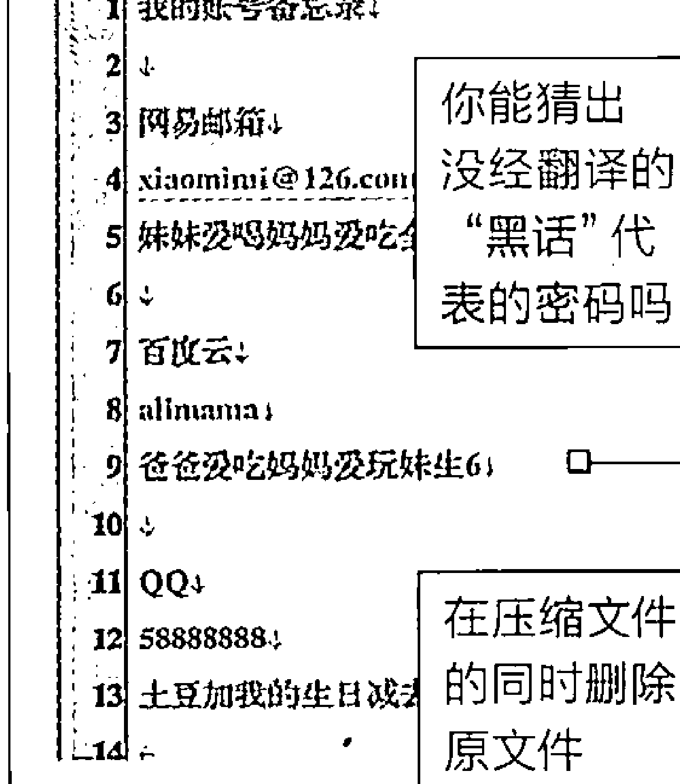

- 你能猜出没经翻译的“黑话”代表的密码吗？

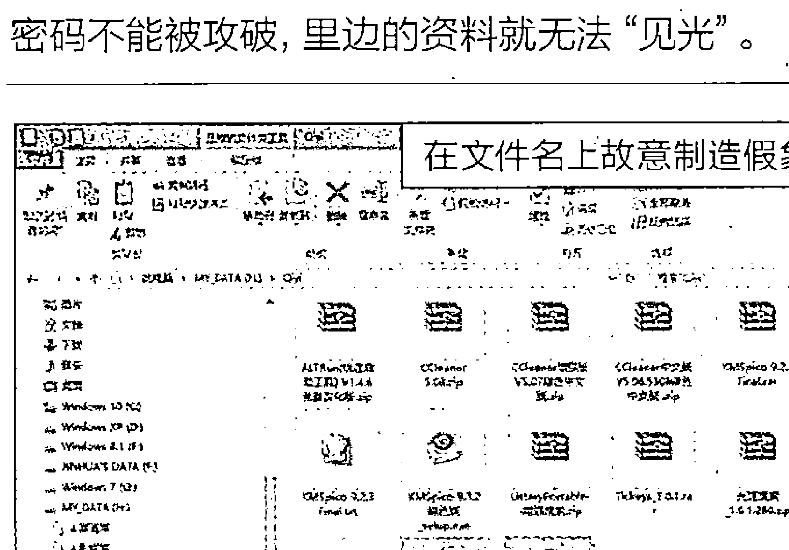

- 在文件名上故意制造假象

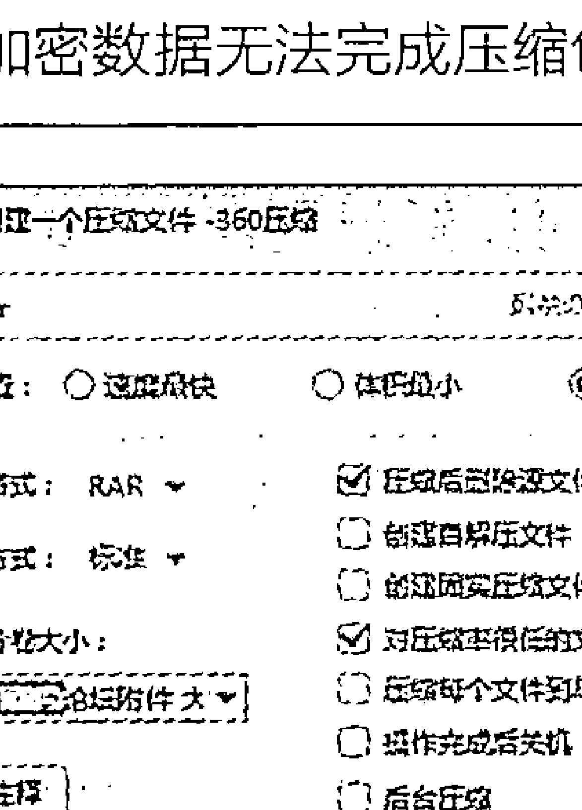

- 将文件进行分卷压缩
- 分别上传分卷文件到不同的云账号

在用层层设密压缩方法的实施中，一定要对制作过程中的原始文件进行粉碎性删除（可用系统工具附带的此类工具处理），绝不能由于疏忽留有原来的文件备份。为此，可使用WinRAR或好压中的“压缩后删除原来的文件”选项，达到在制作加密压缩包后自动删除源文件的目的（图8）。

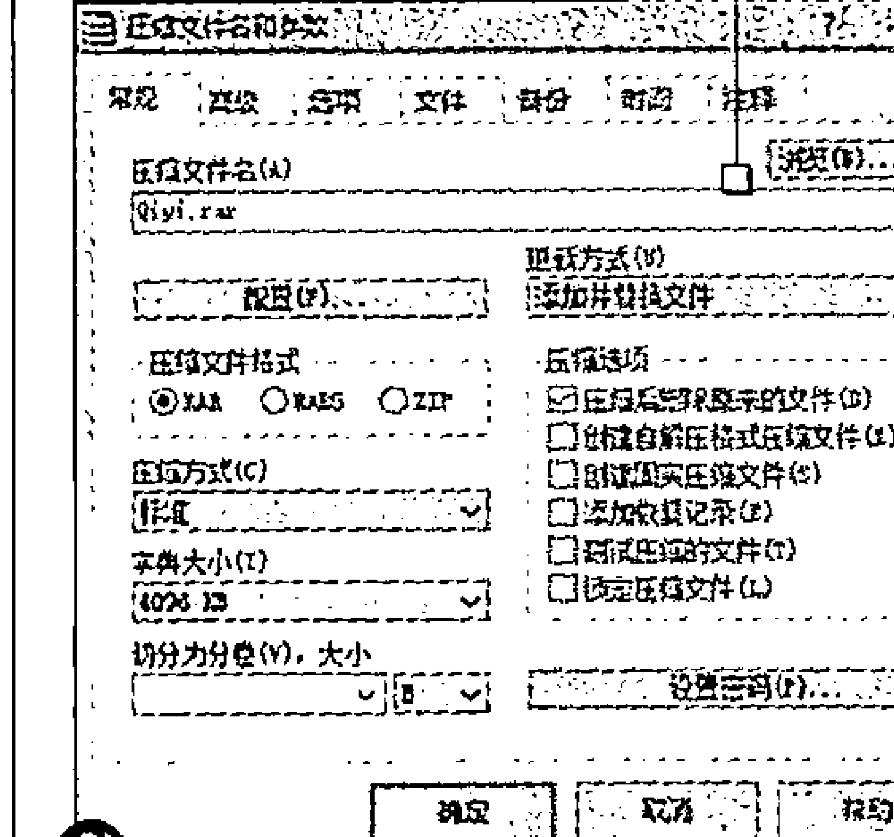

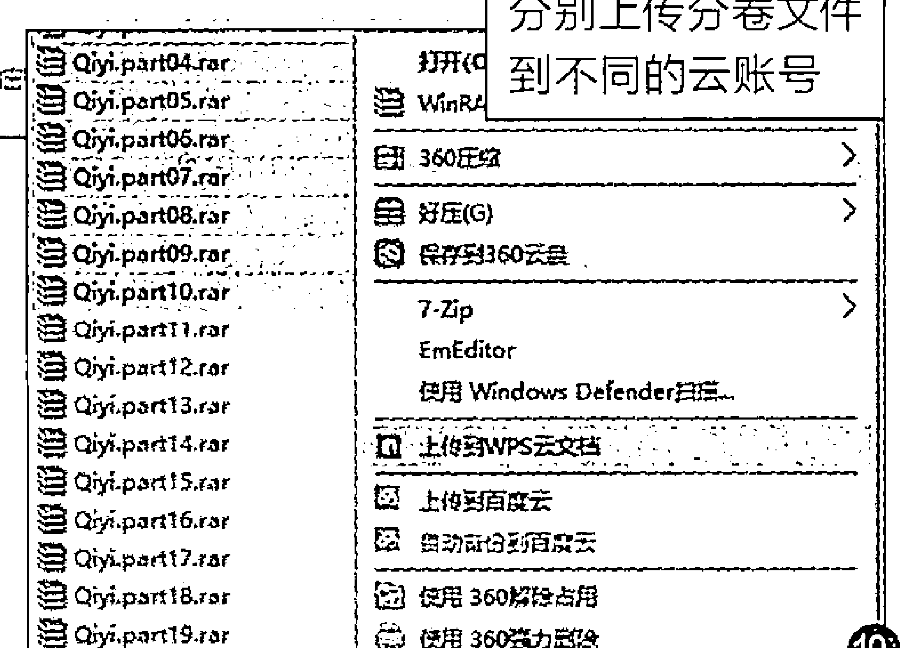

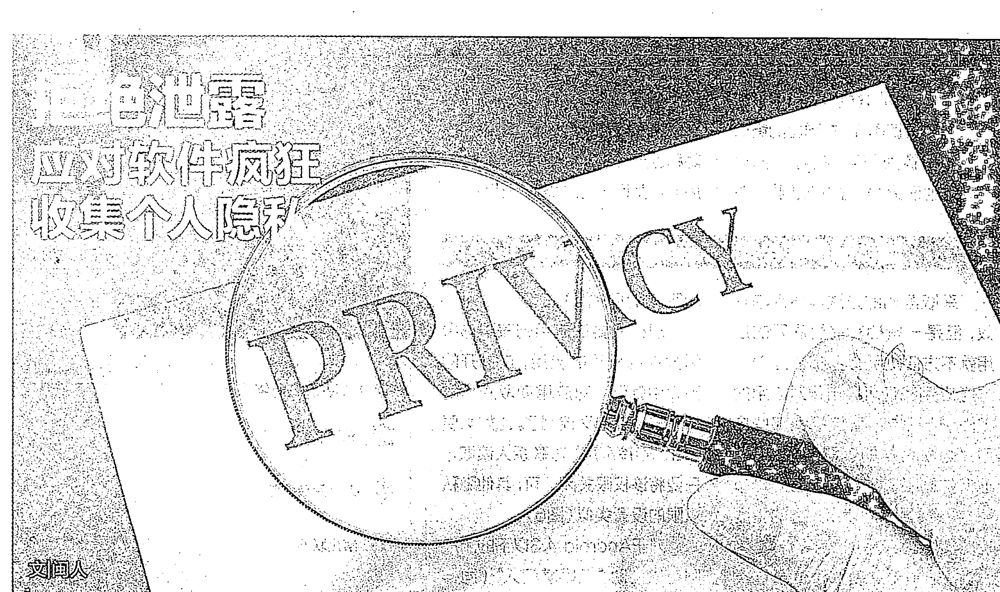

近日工信部公布的电信服务质量通告显示，三季度工信部检测了40家手机应用商店架上软件，发现问题应用软件35款，涉及违规收集用户信息、恶意“吸费”、强行捆绑推广其他无关应用软件等问题（图1）。因为目前国内用户并没有养成付费的习惯，大家无论是在手机还是PC上都习惯使用免费软件，为此很多软件会在后台窃取手机上的个人隐私，它们打着免费的旗号进入到我们的手机或者电脑中，并疯狂收集信息。那么我们该如何保护自己的隐私？

## 严防死守Android下泄露

从工信部的质量通告可以看到，目前在Android平台上有许多免费软件涉及违规收集用户信息、恶意“吸费”、强行捆绑推广其他无关应用软件等问题，这些软件安装到我们的手机上后就极易造成个人隐私的泄露。

大家知道，在Android系统中对于类似通讯录、拨打电话这类涉及隐私的操作都需要相应的权限才可访问，而软件获取这些隐私资料后还要通过网络将其传输出去。因此要防止隐私的泄露，我们主要就从上述两方面进行防范。

## 断绝隐私外泄途径 限制应用的联网权限

从上面的描述我们知道，应用获取隐私资料后需要通过网络进行传输。因此对于一些本身就无需联网的应用，我们可以限制其联网，像上述榜单中的“反正”，APP功能主要是合成照片，根本无需联网使用，但是它却会收集、使用用户个人信息。因此我们可以限制其联网权限，这样即使这些应用收集到隐私资料也无法进行传输。对于应用的联网权限的管理可以借助“免ROOT流量防火墙”实现简单的控制，这款APP和同类软件相比就是可以在没有ROOT的手机上使用，极大方便普通用户的使用。

和同类软件相比就是可以在没有ROOT的手机上使用，极大方便普通用户的使用。在手机上启动“免ROOT流量防火墙”后会自动对各类需要联网的APP进行拦截，如果有某个APP联网，应用会在通知栏显示拦截通知，我们只要根据自己的需要进行“允许”或者“禁止”的设置即可（图2）。如果要对其他APP进行设置，点击通知栏应用图标进入设置窗口，它会自动检测到本机所有应用。

### 工信部检测问题软件
| 序号 | 应用商店 | 应用名称 | 版本 | 所属问题 |
| :--- | :--- | :--- | :--- | :--- |
| 1 | 百度手机助手 | 车友信 | V10.1 | 未经用户同意，收集、使用用户个人信息 |
|  |  | 英语口语 | V5.211 | 强行捆绑推广其它无关应用软件 |
|  |  | 陈慧娴唱响经典2 | V1.23 |  |
| 2 | 安卓商店 | 购物好送 | V131109 | 强行捆绑推广其它无关应用软件 |
|  |  | 文件管理器 | V7.01 |  |
|  |  | 吉日倒计 | V131030 |  |
| 3 | 苏宁易购应用商店 | 驾考科目一 | V1.18 | 强行捆绑推广其它无关应用软件 |
|  |  | 驾考科目一-驾照考试-驾校理论 | V1.18 |  |
|  |  | 驾考科目四-驾照考试-驾校理论 | V1.18 |  |
| 4 | 7pp微应用 | 圣经故事 | V4.0.6 | 强行捆绑推广其它无关应用软件 |
|  |  | 背诵学习大全 | V4.0.6 |  |
|  |  | 懒人听英语 | V4.0.6 |  |
| 5 | 优亿市场 | 捕鱼达人3单机版 | V1.0.0.7 | 恶意“吸费” |
|  |  | 开心消消乐 | V2.6 |  |
| 6 | 华为应用市场 | 反正 | V1.11 | 未经用户同意，收集、使用用户个人信息 |
|  |  | 儿歌宝宝知玩具 | V1.23 | 强行捆绑推广其它无关应用软件 |
| 7 | 第九软件网 | 一键ROOT | V1.0 | 强行捆绑推广其它无关应用软件 |
|  |  | 美区 | V1.02 |  |

文/图人

# 隐私保护要全面自定义应用的权限

采取禁网的方法虽然简单有效，但是一些确实需要联网的应用就不方便使用上述方法了。对于这类应用我们可以自行对应用的权限进行限制，直接拒绝那些应用对隐私资料的读取，从而更好地保护隐私不泄露。以上述榜单中的“彩铃声声”为例，它的主要功能实际上只是用于手机铃声的设置，根本无需读取通信录这类隐私权限。但是打开“设置→应用程序→应用信息”，这里可以看到该应用拥有很多读取用户隐私的权限(图4)。

对于这类应用，如果我们确实需要其在自己手机上运行，现在可以对应用权限进行自定义设置。对于Android 4.3及更高版本的Android设备，系统本身已经自带权限管理功能。这类用户首先到http://tinyurl.com/cfan152402 (已作缩短网址处理)下载“权限打开”软件，安装后在手机上启动，它会自动扫描当前手机上安装的所有应用(图5)。

现在只要在应用列表中选中需要控制权限的应用，在打开的窗口中就可以对应用读取隐私的权限进行自定义控制了。比如需要禁止“彩铃声声”对联系人读取，只要将该权限关闭即可，其他隐私权限的设置类似(图6)。

对于Android 4.3以下的用户则可以借助“权限掌门人”(同样无需ROOT即可使用)，在手机上启动应用后在程序列表中选中需要设置权限的应用，打开后即可看到该应用的所有权限，点击需要限制的权限将其删除，最后点击“删除后重新安装”(图7)。

这样“权限掌门人”会将应用指定权限删除，最后按提示将已经修改权限的应用卸载，再重新安装修改后的应用即可(图8)。

当然为了更好地保护我们的隐私，大家还可以将上述两款软件结合起来，实现更加全面的隐私保护。

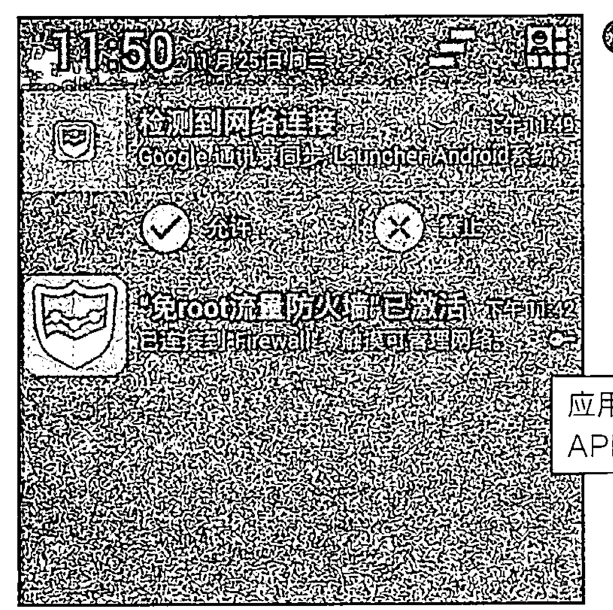

应用会拦截各类APP的联网请求

设置应用的联网权限

+ 通过移动数据网络联网
+ 允许联网
+ 禁止后台偷跑
+ 禁止联网
+ 连接时提示

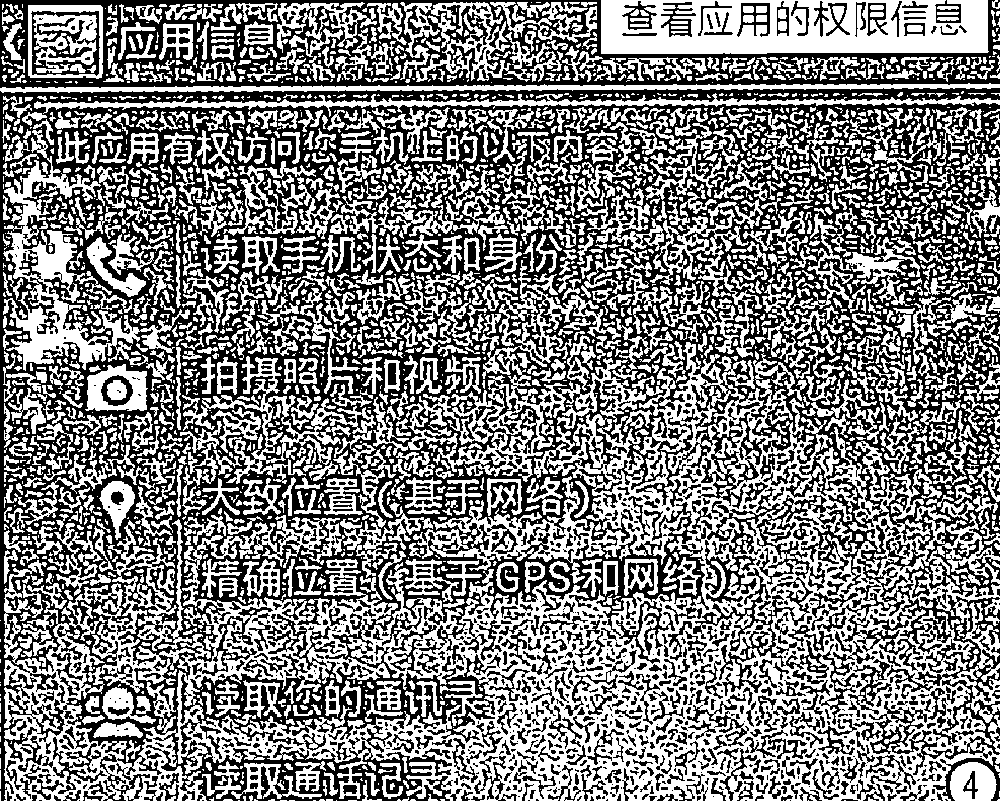

查看应用的权限信息


扫描当前手机安装的应用


自定义设置应用权限

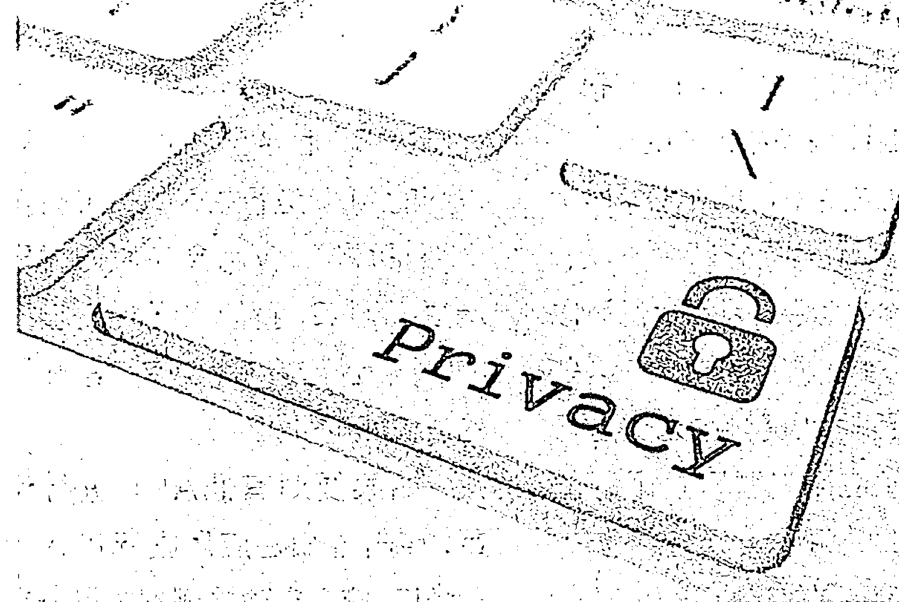

# 全面呵护Windows 10也要护住隐私

除了移动平台上的隐私需要保护之外，现在我们正在使用的Windows 10如果设置不当，也会很容易泄露信息。

Windows 10专门增加了“隐私”选项，允许我们自定义进行设置。点击任务托盘的“通知→所有设置→隐私”，在这里就可以根据自己的实际情况进行设置（图9）。

Windows 10系统默认打开位置信息，这样其他人就可能获知我们的地理位置，如果不想让人知道我们的这项隐私，可以在上述窗口中切换到“位置”，然后将其设置为“关”，并且清除这台设备上的历史记录即可。当然，你也可以有选择地让指定程序（如地图应用）获取位置信息（图10）。

其他隐私选项的设置类似，每个选项都可以根据自己的实际需要进行个性化设置。以SmartScreen筛选器为例，它是系统浏览器的一项重要功能，我们可以开启这一功能，让它保护用户不会安装恶意软件，远离危险网站。我们还可以在“更改隐私选项”下禁止Windows 10访问语言列表，这样就不容易收到外语广告的骚扰。

除了上述设置外，Windows 10还有很多和之前版本系统一样的泄露隐私的设置，如最近访问的文件、访问网站的历史记录等。这些内容在之前刊物已经做过很多介绍。

# 火速链接

- 藏牢你的Windows 8.1隐私
  网址: http://tinyurl.com/cfan152403
- 谢绝窥视——隐私“明”私都要保护
  网址: http://tinyurl.com/cfan152404

# 更多隐私保护设置

随着手机功能越来越强大，大家保存在手机上的隐私数据如个人照片、文档等也越来越多。而现在手机、PC和网络的联系越来越紧密，比如百度云用户可以将自己的通讯录和短信保存在百度云盘，手机QQ用户会将照片保存在QQ空间，很多朋友会将自己电脑里的照片放置在网盘上等。因此要更好地保护自己隐私，除了在手机端和PC端保护外，大家还需要注重网络端的保护。比如需要为自己的网盘设置更强健的密码，以免黑客破解密码后窃取自己的隐私文件；需要为自己的QQ空间设置好访问权限，以免在网络端泄露自己的隐私信息等。

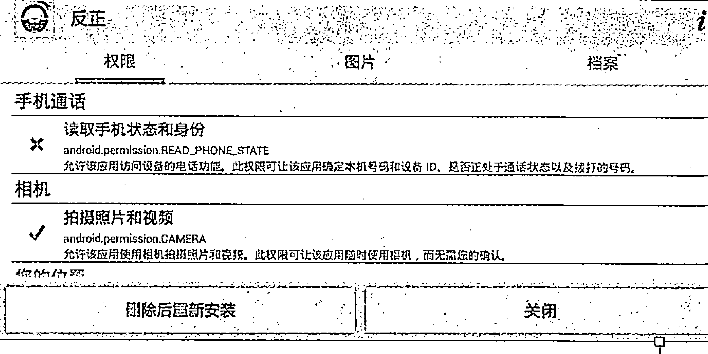

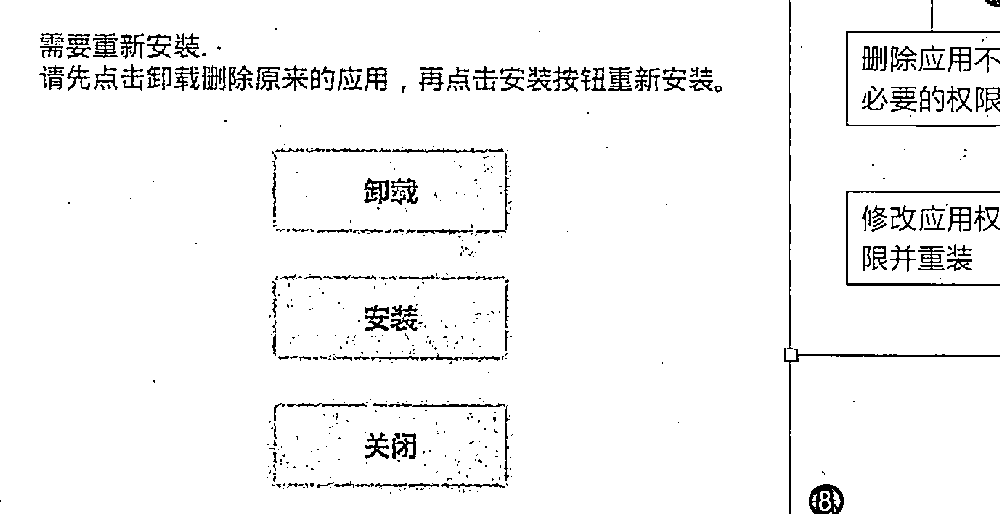

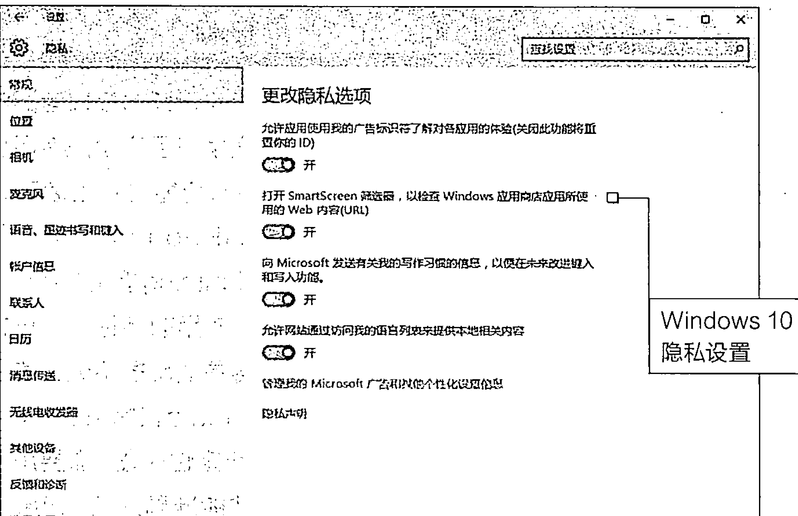

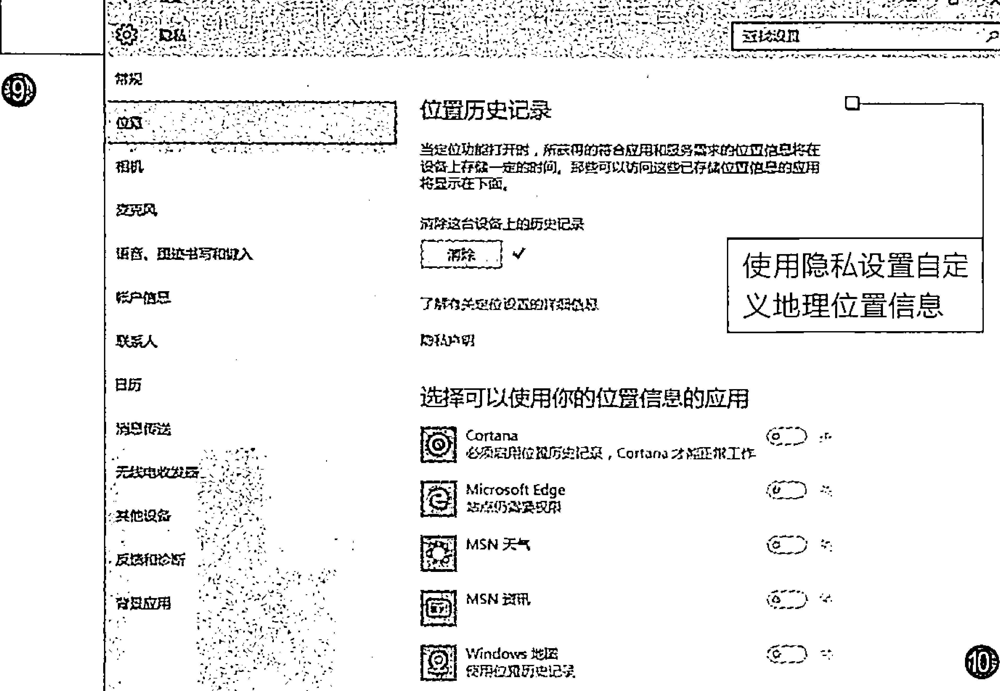

# 传统硬件 稳中求变

虽然被移动设备打压得很惨，但传统PC依然没放弃市场。针对不断更新的用户需求，传统硬件设备也在稳定中不断自我完善，以适应日新月异的市场潮流。尤其在台式机领域更是如此。本来目前就是面向高端DIY用户和游戏发烧友居多，如果没有更出众的带宽、接口和出色的设计很难脱颖而出。

# Micro USB和USB 3.0该淘汰了

与飞速发展的PC图形性能相比，目前PC系统当中的存储设备速率增长的速度简直惨不忍睹。内置存储停滞在SATA 6Gb/s本文后面会有提及，而目前用途越来越广泛的外置存储接口同样不容乐观。

比如我们熟悉的苹果公司电脑iMac和MacBook等设备上广泛采用的Thunderbolt接口，其在速度上对比USB 3.0有非常大的优势。Gen1级别的Thunderbolt接口就可以达到20Gb/s，最新的Gen2已经高达10Gb/s（图1）。全新Thunderbolt 3目标是40Gb/s，这个速度已经超越了目前最快的SSD了。

而我们熟悉的USB呢？USB 3.0接口还完全没有普及，5Gb/s速率不仅规格上可怜，就算是用户的设备和接口都支持USB 3.0，由于主板主控芯片的差异及设备本身，其速率也极难达到标称速率。

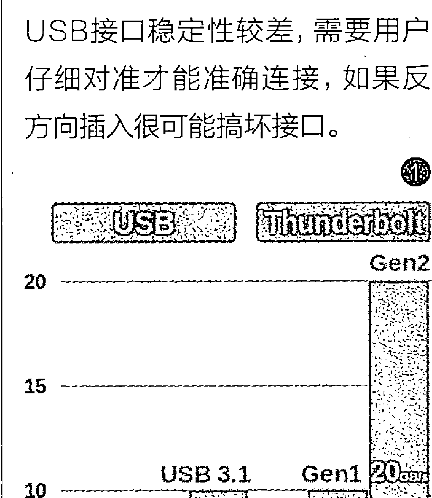

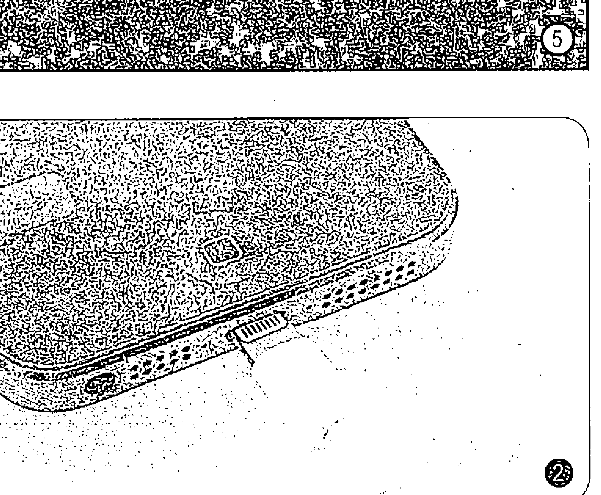

# USB 3.1和Type-C形接口

Micro USB和USB 3.0该淘汰了，而继任者在2015年都已经开始普及。今年被称为Type-C形接口元年，全新的这种USB接口实在令人兴奋（图3）。首先基于USB 3.1级别在速率上达到了10Gb/s的理论速度，虽然距离对手仍有差距，但已经是一个不小的进步了。此外供电能力达到了100W，而且电压和电流双方面都有所提高。新的Type-C其最大的特点是上下两端完全一致（图4），这就是说用户不必再去区分USB接口的正反面，终于可以比较轻松地使用了。此外USB Type-C还支持DisplayPort功能，相信这也是向竞争对手的Thunderbolt接口学习后的结果。目前USB 3.1和Type-C接口还未完全成熟，主要的问题集中在两点上。首先主板等PC设备上由于Intel和AMD芯片组多数不能直接提供USB 3.1功能

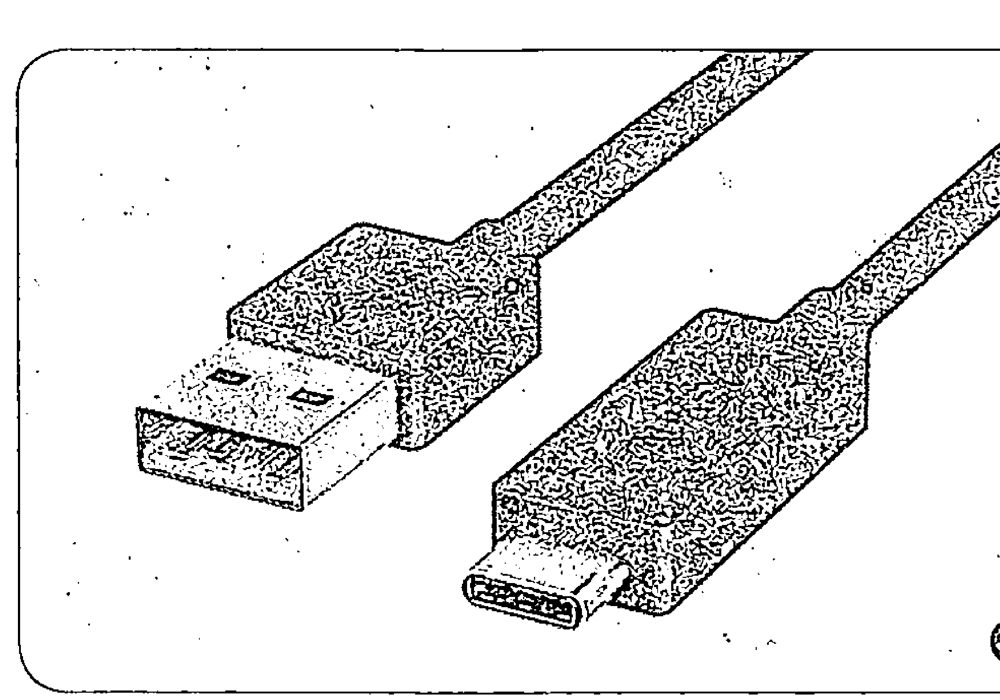

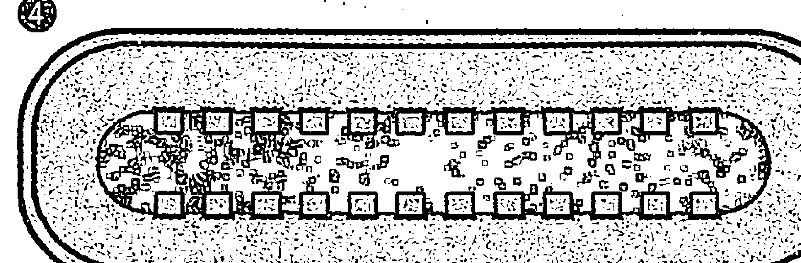

# Type-C

能，所以主板上需要使用第三方主控芯片。熟悉芯片组的用户肯定明白，第三方芯片方案其速度、特别是延迟时间对比原生接口要差不少。此外在移动端由于Android平台手机良莠不齐，Type-C接口对硬件品质的要求又比较高，常常会出现无法完全达到USB开发者设计规范的情况。不过从目前的情况来看，这种问题会随着明年全新芯片组上市和手机业界优胜劣汰的过程中得到改善。

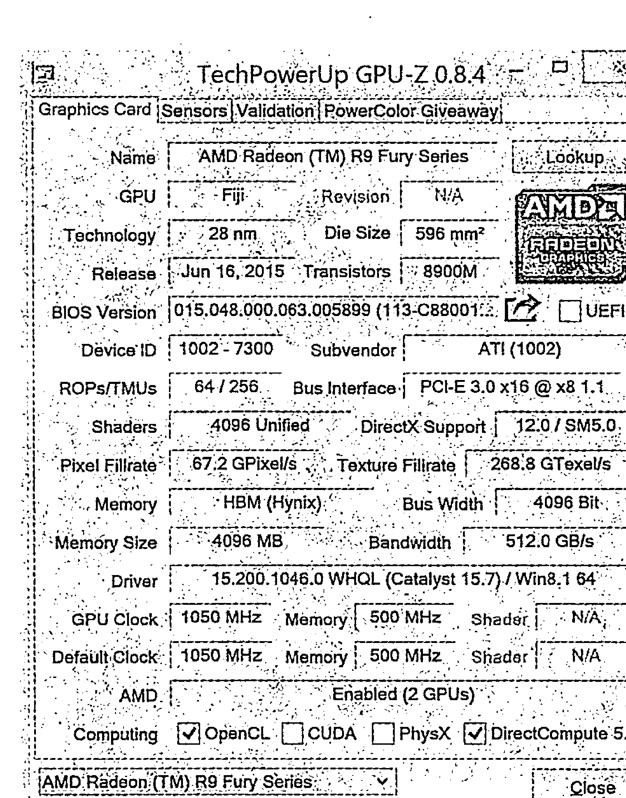

# 显卡双雄会

在PC领域中，决定性能的主要有CPU和GPU。CPU领域由于AMD被Intel压制太久，Intel也没有什么动力去大幅度更新旗下的产品线，导致了目前处理器性能发展速度堪比“挤牙膏”。而在显卡领域，则完全是另一番景象。目前PC领域主要的显卡制造商只有三家，分别是Intel的核芯显卡和AMD与NVIDIA的独立显卡。核芯显卡旨在低功耗下的够用性能，对于HTPC和笔记本电脑用户比较重要，与目前追求高端个性化和大型游戏的台式机PC格格不入。目前的台式机PC用户，普遍都使用了独立显卡来组建性能级PC平台。在ATI显卡全线被AMD收购之后，励精图治的Radeon系列曾经在很多时间段有了反超独立显卡霸主NVIDIA的趋势。但是上代显卡的大核心策略直接带来了高功耗的高温问题，又不巧赶上了NVIDIA出色的Maxwell架构（图5），所以显卡双雄的身份岌岌可危。

# HBM显存技术

就在不利时，AMD的黑科技在2015年全新登场，这就是HBM显存技术。HBM显存技术简单说就是堆栈式，与传统GDDR5显存有很大不同。传统GPU核心周围有数颗GDDR5芯片，加上VRM电压调节模块相应也要增大规规模，会占据大量空间。此外功耗也在上升，带来的性能提升幅度逐渐下滑，GDDR5显存已形成瓶颈。而HBM显存由若干层高带宽内存Die垂直堆栈，每一层都通过若干个通道直通逻辑Die，经中介层与GPU通信（图6）。常见的GDDR5显存的极限位宽如果是512bit的话，同级别HBM显存位宽高达4096bit。在这种高速通道下很多4GB的HBM显存显卡性能要比8GB GDDR5显存显卡还要高（图7）。不仅如此，HBM显存由于靠近GPU的封装形式可以大幅度缩减显卡PCB上面的空间，还能通过GPU核心散热系统进行散热，在发热控制和显卡尺寸上有很大的优势（图8）。今年的话题产品AMD R9 Nano显卡就是因为HBM显存技术带来的功耗、发热和尺寸上的优势，成为目前小尺寸显卡中的王者（图9）。

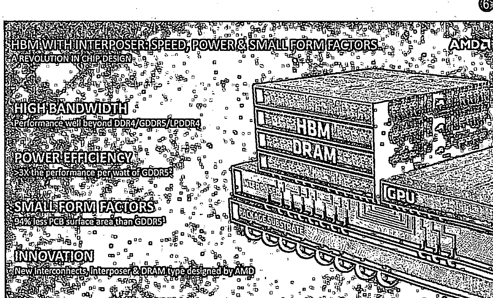

# AMD软件端发力

HBM显卡技术是今年显卡领域最大的重头戏，但其实今年关于显卡的重要消息还有很多。从ATI时代便伴随A的催化剂系列(Catalyst)驱动终于宣告寿终正寝，全新的Radeon Crimson来了(图10)。长久以来，AMD显卡的驱动程序更新速度慢、正式版本(WHQL)驱动程序少、驱动程序响应速度和功能性都比竞争对手略差，始终被显卡爱好者们诟病。特别是NVIDIA在推出了GeForce Experience之后，尽管GeForce Experience本身也有很多问题，但确实解决了许多电脑“小白”的问题(图11)，AMD显卡软件端更显颓势。

Radeon Crimson驱动是AMD软件端最大的动作，从更新的力度上远超去年年底的Omega驱动。不仅舍弃了催化剂之名，原本的CCC控制中心也被AMD setting全面取代。目前的Radeon Crimson像是一个NVIDIA控制中心加Experience的集合体，符合目前显卡领域的整体趋势。

不过目前GeForce Experience和Radeon Crimson均不完美，具体表现在GeForce Experience的响应速度较慢、搜索系统驱动更新和游戏设置速度较慢，而Radeon Crimson在功能上反比原来的CCC驱动中心更加简单(图12)，很多CCC原有可以实现的功能在Radeon Crimson上被忽略掉了。而且作为一个如此大的驱动更新，在绝对性能上只有1%的性能提升确实有些说不过去。

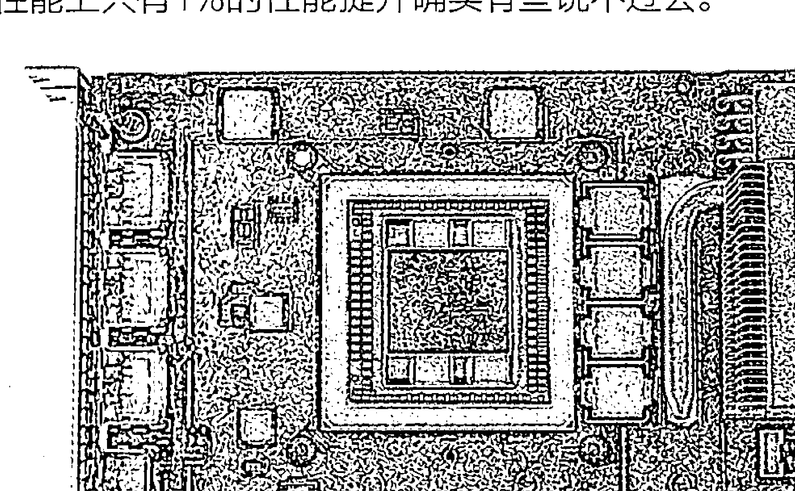

# 明年的显卡双雄会如何

针对今年HBM显存的火热，明年NVIDIA旗舰级别显卡毫无疑问也会采用HBM显存技术(图13)。HBM显存技术的所有者AMD和海力士并没有对竞争对手做太多限制，具体可看明年NVIDIA旗舰显卡的表现和AMD新一代HBM显存的规格。针对中端以下显卡，一种被称为GDDR5X的显存也会在明年出现。

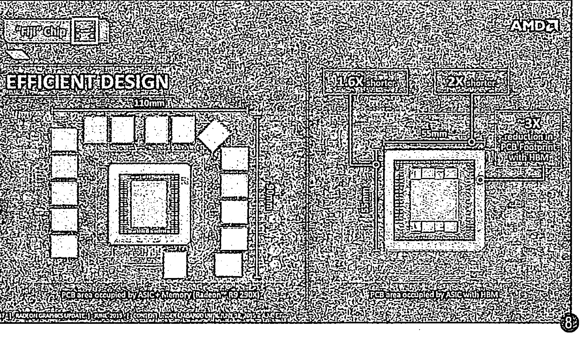

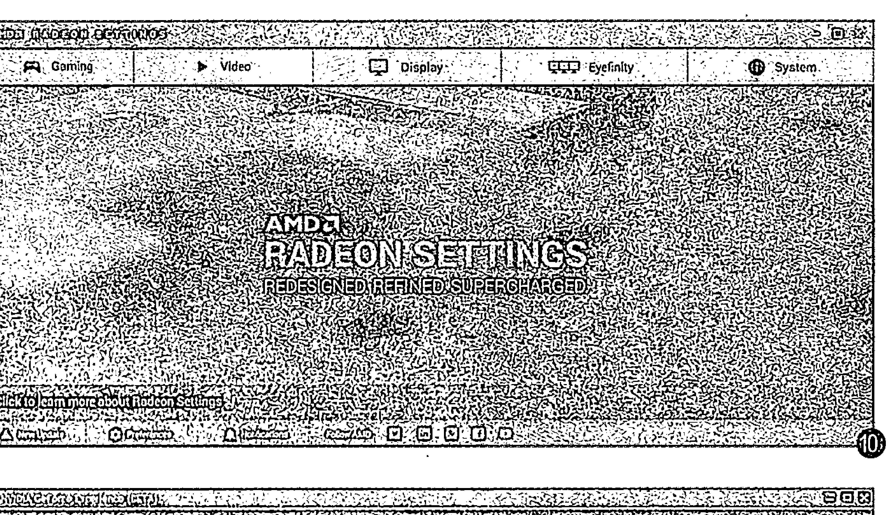


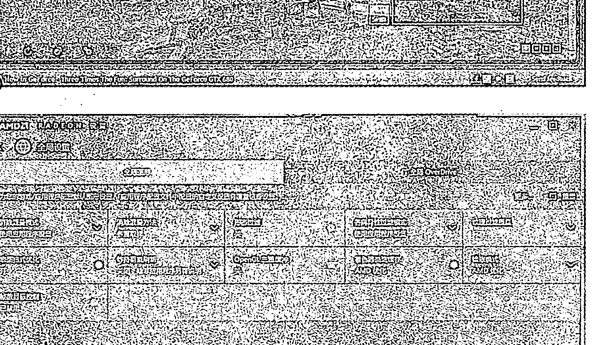

在计算领域，NVIDIA专心自家的CUDA，而AMD支持OpenCL，这使很多开发者很难堪。AMD近期宣布了一个“玻尔兹曼计划”，可以让自家的Radeon显卡运行原本针对CUDA开发的代码，可以让开发者把CUDA代码转换成AMD HIP代码。有些人认为这是AMD让旗下显卡支持了CUDA，但实际上并不是，HIP实际上是开发者把针对CUDA开发的代码转换成AMD显卡可以运行的代码，只不过是帮助开发者节省时间。HIP就相当于多了一个从NVIDIA那边加速移植代码的工具，这多少可以缓解AMD在GPU运算环境上落后于NVIDIA的局面。

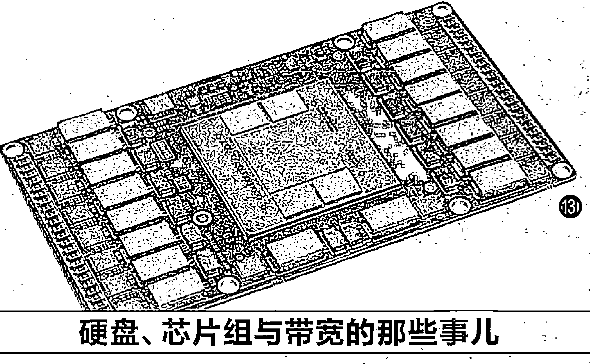

## 硬盘、芯片组与带宽的那些事儿

与GPU的两年一番番的飞速发展相比，存储设备的速度提升有些惨不忍睹。大多数人还在用普通HDD硬盘，使用SSD的用户也被老旧的SATA 6Gb/s接口限制。就算全新M.2接口也大多数使用SATA通道，主控和接口从根本上限制了设备的发挥。很多人认为存储设备速度慢是设备本身问题，但其实我们如果究其根源，问题似乎更多体现在其他设备之上。

由于SATA规范迟迟没有更新，目前主要解决硬盘速率的方案就是SATA Express或者是M.2接口。SATA Express几乎没有对应的硬盘产品，主流的次世代硬盘基本都采用了M.2接口。M.2接口分为SATA或PCI-E两种通道，前者的速度表现和SATA 6Gb/s普通SSD几乎没有任何区别，主要是PCI-E版本的M.2硬盘比较有看头（图14）。

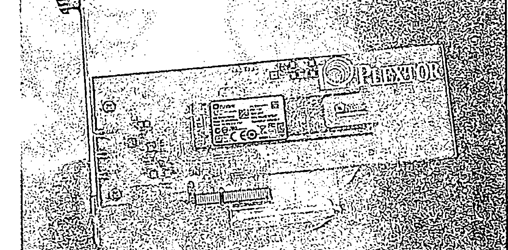

下面问题就来了，以Intel为例，其主流的家用芯片组的PCI-E通道是极为有限的，CPU中央处理器只提供了16条PCI-E 3.0通道，一般为独立显卡使用，处理器直接提供的PCI-E通道没有一点富裕。而PCH芯片可以提供8或者16条PCI-E通道不等，但普遍使用PCI-E 2.0通道，这难以满足个别PCI-E 3.0 SSD的需要。众所周知，由PCH芯片提供的PCI-E通道只支持整数拆分，也就是说如果用户的主板上有额外的声卡、网卡或者其他阵列卡，即便是很多只是PCI-E x1的无线网卡模块，只要插入PCI-E插槽（或者走PCH芯片通道的板载无线网卡）就会将PCI-E通道拆分（图15）。如果设备多，最后就算主板上拥有M.2插槽留给它的PCI-E通道也是难以满足需求的。

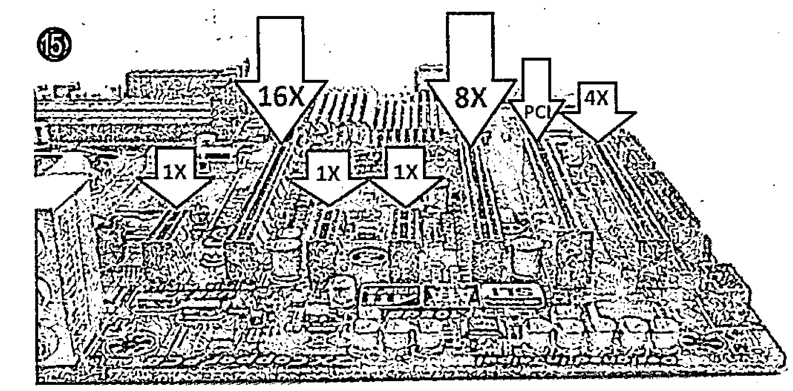

还不仅如此，100系列芯片组前CPU和PCH芯片间采用了DMI 2.0总线，其总线速度低下，处理器和PCH南桥PCI-E带宽还要在USB、SATA、PCI-E设备间共享，支持M.2、SATA Express技术先天就不足（图16）。

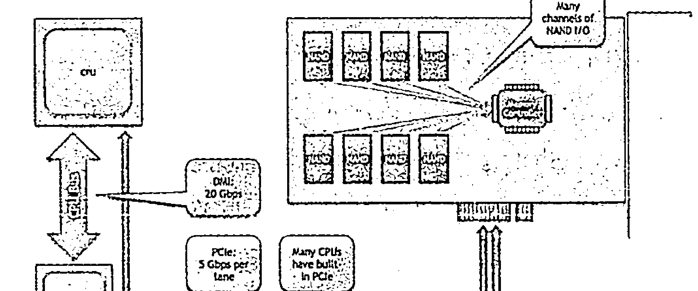

## 100系芯片组也许只有DDR4

众所周知，以Z170为代表的100系芯片组带来了主流平台对DDR4的支持，但其实100芯片组还有一个不是太明显的升级，那就是DMI 3.0总线和PCH芯片的PCI-E 3.0通道。以Z170为例，CPU和PCH芯片之间的DMI 3.0总线单通道速度是8GT/s，而PCH提供的PCI-E通道也达到了20条PCI-E 3.0通道（图17），一举解决了M.2硬盘之前空有接口而没有带宽的尴尬。Intel计划下代芯片组会将PCH芯片提供的PCI-E 3.0通道进一步增强到24条，这也体现了目前台式机领域独立声卡、无线网卡和诸多M.2或者PCI-E接口SSD的需求有多么迫切。

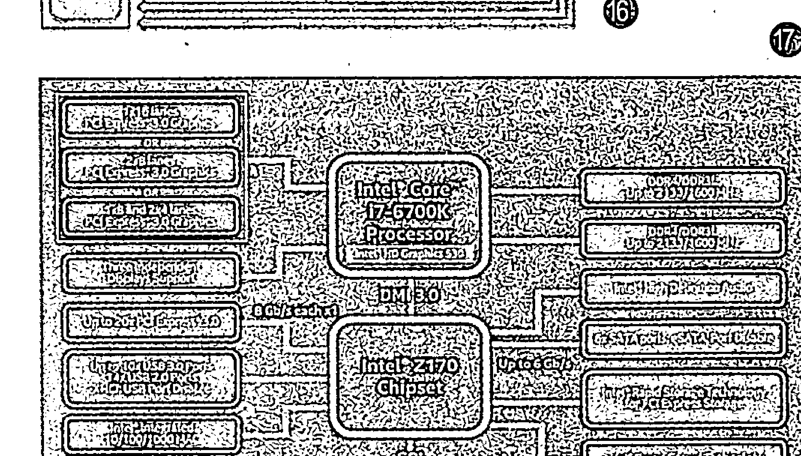

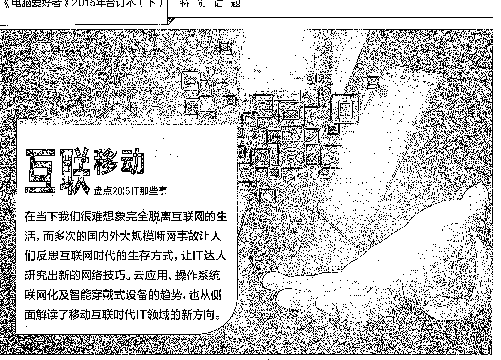

## 2015那些断网的大事件
文/渔人

如今大家的学习和生活几乎都离不开网络，网络一旦断开就会给我们带来极大的影响。下面我们就一起来回顾2015年互联网上的几次“惊心动魄”的断网事件。

- **2月9日**，坦克世界联通北区出现严重服务器宕机事件，用户进行中的游戏被中止，非维护时间无法登录服务器长达数小时。这种情况浪费了玩家的时间，也给玩家造成了一定的损失。据称原因主要是由于骨干网络波动导致游戏服务器宕机。
- **2月14日**，知名种子网站海盗湾在重新上线后服务器再次出现宕机现象，用户在访问海盗湾主网站的时候，会提示CloudFlare错误信息，表示海盗湾的服务器目前并未正常响应。据称故障原因是网站服务器的硬件出问题所致。
- **3月9日**，有很多京东用户反映，从早上9点左右，京东商城PC端以及移动端的搜索页面均处于无法访问的状态，就连部分手机客户端都失去了响应。最终的原因据说是由于联通DNS解析服务出现故障所致。
- **3月12日**，苹果商店出现了大规模宕机现象，全球各地大量用户无法访问苹果App Store、iTunes商店、Mac App Store。同时出现榜单异常现象，此次宕机现象持续了11~12个小时。苹果表示此次大面积服务故障属于一个“内部DNS错误”所致（图1）。
- **4月21日**，据多名微博网友爆料，豆瓣出现故障无法访问，同时手机客户端也无法打开。用户打开豆瓣主页后显示404错误，豆瓣官方微博回应称，是因为网络故障，豆瓣暂时无法访问，正在紧急修复中。

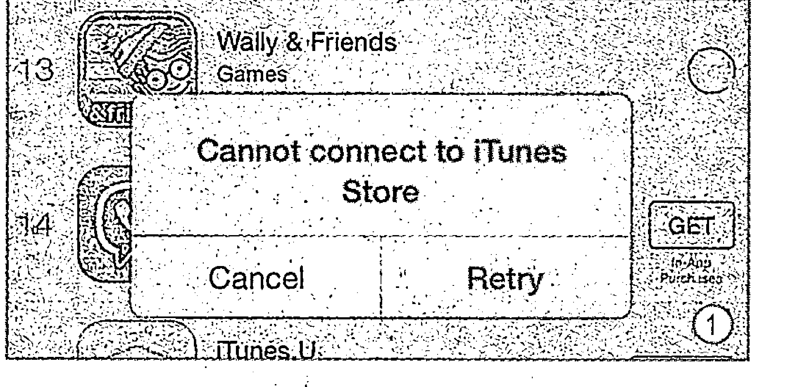

- **5月27日**，由于市政施工，杭州市萧山区某地光缆被挖断，进而导致支付宝一个主要机房受影响，随后全国部分用户约2小时无法使用支付宝。事件发生后，支付宝加快推进异地多活的系统架构改进，确保类似事故不会再重演。
- **8月6日**，腾讯手机QQ出现登录不上，同时微信也无法使用，腾讯表示现阶段无法登录的原因是由于机房故障导致。对于造成此次故障的原因，有消息称是因为腾讯的上千台服务器全部受到来自世界各地巨大流量黑客攻击。
- **5月28日**，由于员工错误操作，中国最大的在线旅游网站携程网站和客户端无法登录，导致很多携程用户无法使用其提供的服务，最终技术人员花费了十二个多小时才恢复正常（图2）。
- **9月19日**，919乐视乐迷节正式开启，很多用户在选择完商品提交订单时出现了无法提交、无法支付等系列状况，导致这些用户无法购买到选购的商品。故障原因是由于消费者抢购积极导致乐视服务器宕机瘫痪。


- **10月8日**，在滴滴快的获得国内首张专车牌照后，很多用户在手机上启动滴滴APP时出现了宕机现象，具体的问题表现为不断提示系统错误，无法叫车也无法查看附近车辆。故障原因是由于滴滴深圳部分服务器遭遇技术故障，导致部分地区出现无法叫车的情况。
- **6月15日**，国内知名问答网站知乎陆续有网友在微博上反映称，知乎突然打不开了。访问知乎出现了“无法显示此页”的提示，而且知乎客户端也出现了无法登录的情况。据称这是由于黑客攻击导致知乎服务器宕机。
- **11月4日**，2020年东京奥运会和残奥会的组委会官网遭到“DOS攻击”，这种攻击通过向服务器发送大量数据，导致网络瘫痪，所以服务器运营公司屏蔽了通信，导致人们无法访问奥组委官网。
- **6月21日**，阿里云香港节点从早上9点左右开始出现无法访问故障，据称阿里云监控系统发现香港IDC运营商名气通机房出现访问异常，反馈原因是供电系统故障导致数据中心所在楼层断电，并触发烟感系统报警。故障导致部分用户数据出现损毁，在业界引发轩然大波。
- **11月6日**，这天上午有大量用户反映微信公众平台后台登录出现故障，部分账号出现登录不成功或没有访问权限等错误提示，同时微信支付也出现无法支付故障。由于这天是周五，这导致大量企业用户无法使用他们的微信公众号。据称故障是由于微信后台升级或推出的新功能，从而导致服务器验证出错所致（图4）。
- **7月3日**，《盗墓笔记》在爱奇艺全集上线，由于必须是“爱奇艺VIP会员”才能观看全集，这掀起了“充值付费潮”。然而，瞬间涌入的流量，让爱奇艺服务器宕机了！最多时有超过70%的VIP会员无法观看《盗墓笔记》（图3）。

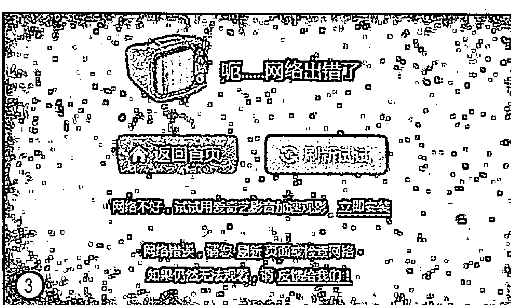

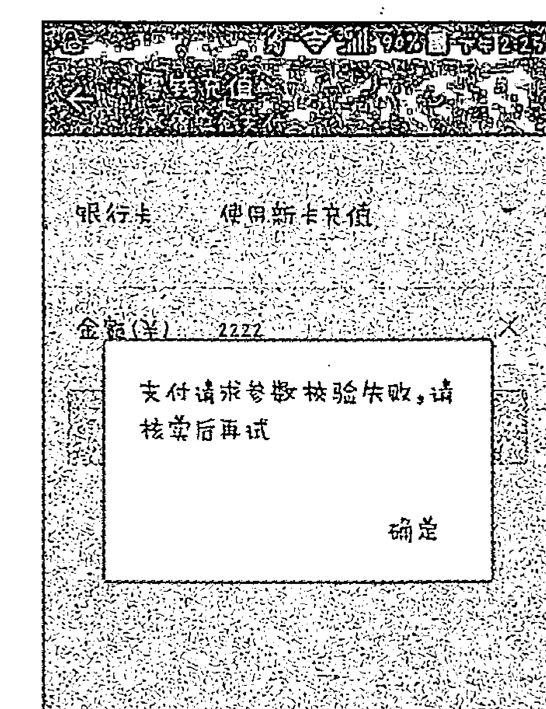

## 遇到断网怎么办
网站宕机 我不宕
文|技术宅

从上面的回顾我们知道断网事件是有很多因素引起的，有的是服务器本身能力或BUG导致，有的则是黑客攻击，还有的则是由于调试人员错误操作等。那么有哪些常见因素会造成断网，遭遇断网时又该怎么应对？


为了能够让大家更明白断网的原因，我们先来了解一下用户访问网站流程。一般用户访问一个网站的大致流程如下：

1. 通过拨号或专线网络接入互联网→
2. 输入网站的网址→
3. 浏览器通过DNS查找用户输入网址找到对应的IP地址→
4. 与网站服务器建立TCP连接→
5. 网站服务器将用户的请求封装入HTTP协议数据包→
6. 服务器返回网站实际页面如网站主页→
7. 加载网站各种元素并进行渲染如网页代码、图片（渲染的过程中会遇到数据标记，比如图片，这时就先查找本地缓存，如果缓存里有且没过期，就使用本地缓存的数据，否则就向服务器发送请求下载图片到本地缓存）→
8. 将完整的页面显示在用户浏览器中→
9. 用户开始浏览页面（图1）。

当然这个只是正常访问时才有的流程，如果其中的某个流程出现错误就会导致我们的浏览不正常，也就会发生所谓的断网故障。因此我们在平时的上网过程中如果出现无法正常访问网站，那么就可以按照上述的流程对症下药去寻找相应的解决方案。

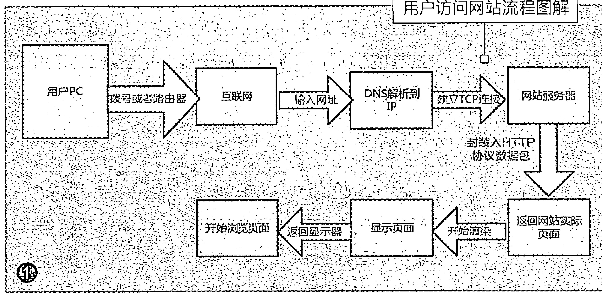


从上面的流程图可以看到，要正常访问网站，首先就要确保你的电脑已经接入互联网。如果无法正常连接到网络，系统会提示各种错误代码（图2）。

如果我们发现无法连接到互联网，一般可以从硬件、软件两方面进行排查。硬件方面检查网线是否连接好、网卡驱动是否成功安装等。对于Windows 7以上系统，打开“控制面板→网络和共享中心”，在这里即可对网卡状态进行查看。如果这里显示一个红叉，则表示本机的网卡没有连接好（一般是本机网线或者路由器网线没有连接好），只要重新进行正确连接即可（图3）。

如果这里显示的是一个黄色感叹号，一般表示路由器出现故障，像没有正确拨号，或者账户已经欠费等，主要原因是由于路由器没有连接到互联网所致，一般重启路由器或者续费即可解决。如果这里没有出现本地网卡，则表明没有正确安装网卡驱动或者网卡被禁用所致。对于这类故障一般借助系统自带的“网络诊断”组件进行修复即可。

右击任务托盘的网络连接图标选择“疑难解答”，然后进行自动修复即可。

### 网络大补贴
宽带连接错误代码大全及解决方案：http://tieba.baidu.com/p/1565449420

### 输入错误网址或者DNS服务故障

本机已经正确连接到互联网，但是仍然无法正确访问网站，一个原因可能是输入了错误网址（如网站名称错误或输入旧的网址），只要重新输入正确的网址即可。另一个原因则是由于DNS解析错误所致。从上述的流程我们知道，大家在浏览器输入的网址需要DNS解析到对应的IP地址，如果ISP的DNS解析服务出错就无法实现正常的解析（图4）。

要判断自己的DNS服务是否正确，可通过Ping命令判断。比如可启动命令提示符，输入“ping www.baidu.com”，如果本机的DNS设置正确而且DNS服务器工作正常，那么返回的就是百度正确的IP地址（如111.13.100.91，可直接通过该IP打开百度首页），否则DNS解析就出现错误（图5）。

如果DNS解析有问题，则可以使用其他DNS解析服务，比如国内阿里提供免费的解析地址223.5.5.5和223.6.6.6，国外谷歌提供8.8.8.8和8.8.4.4等。具体操作可以参考本刊相关介绍。

### TCP连接或者HTTP协议出错

从上述的流程我们知道，完成DNS解析后就要通过TCP连接用户的请求封装入HTTP协议数据包，这样才能连接到网站服务器。TCP连接或HTTP协议如果出错，会出现浏览网页错误，或只能上QQ不能浏览网页等问题，而出现这类问题基本是一些恶意插件或流氓病毒程序导致的。此时可使用专业软件进行修复，比如“金山LSP修复器”，启动软件后它会自动对当前电脑状况进行检测，点击“自动修复”即可（图6）。

### 网络大补贴
TCP/IP 某些最常见的错误原因码 (errno)列表：http://blog.csdn.net/hireboy/article/details/8983138

### 本地缓存出错

从上述的流程我们知道，在加载网站各种元素并进行渲染时，对于一些数据标记如图片会先查找本地缓存，如果缓存里有且没过期，就使用本地缓存的数据。不过一些时候本地缓存文件出错就会导致网页显示错误，比如论坛的验证码无法显示、产品图片显示不全等。如果遇到类似故障，解决的方法是清理本地缓存。打开IE浏览器，点击“工具/Internet选项”，点击“浏览历史记录”下的“删除”按钮，勾选“临时Internet文件和网站文件”并将其删除，然后再次刷新页面即可。

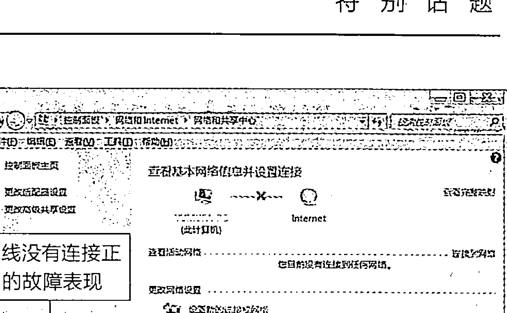

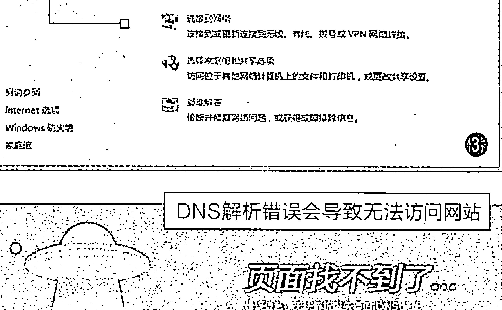

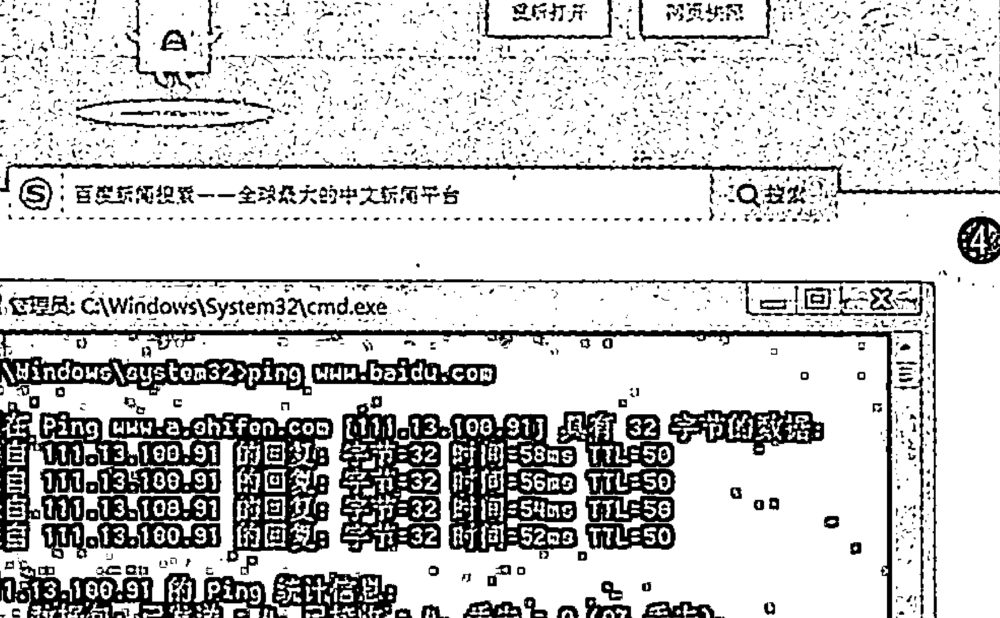

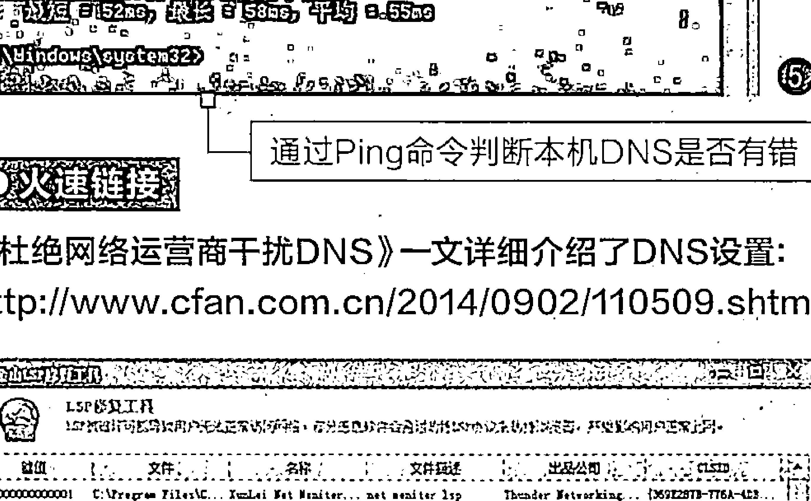

### 无法访问在线资源

我们的电脑要正确访问在线资源，即使上述流程都正确，但是如果网站服务器宕机，我们最终仍然无法直接访问网站的资源。对于这类故障，我们可以采用预先下载资源或者查找其他同类资源的方法实现曲线访问。比如对于在线视频可以通过离线下载方法观看，对于软件资源则可以通过搜索，在其他网站找到同一资源。

当然，有些硬件故障，比如光缆挖断、服务器宕机，这些是我们这些个人用户所无法解决的，只有静等服务商抓紧修复了。

## 缩容有办法 免费有陷阱
文/网孩

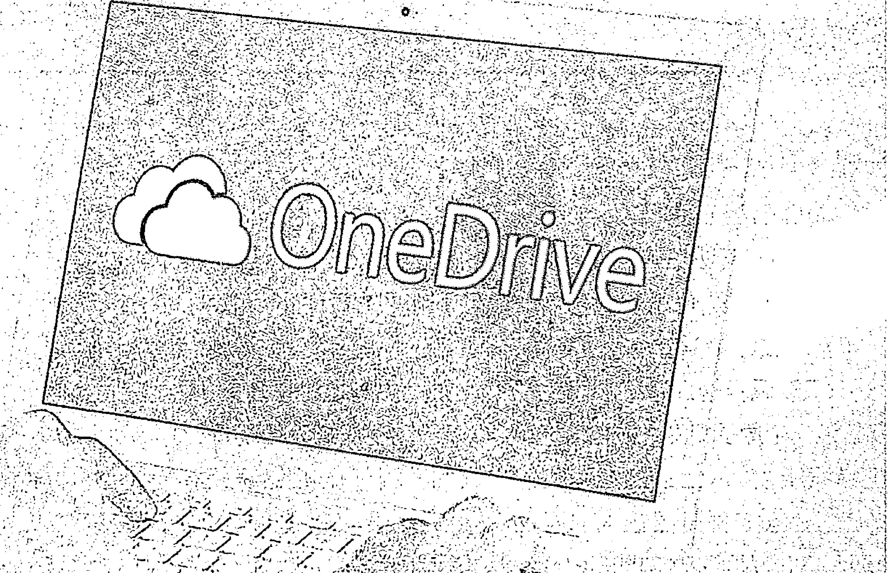

说起云盘，2015年有两件大事比较引人关注。一是国内加强了对云盘共享内容的监管力度，使得许多云盘的资料共享社区“关门歇业”或陷入冷淡的处境，这给以免费大容量而见长的国内云盘浇了一瓢凉水。另一件就是原本有无限空间免费希望的微软OneDrive云盘的“缩容”。面对国外云盘空间的缩水，我们不必伤心失望，空间的缩水还是有办法解决；而国内云盘的优势在于免费大容量云盘空间的诱惑，面对这些诱惑，我们也不能大喜过望，需要小心免费背后藏有的“陷阱”。

### 微软云盘缩容的救命稻草

相比于之前的Windows系统，微软Windows 10的一个最大优势就是云技术的支撑和网络账户的使用。而网络云又离不开OneDrive云盘的支持。但是，微软OneDrive云盘的空间是有限的，要提升云盘空间，就要向微软交费。此前的无限量空间已经成为一个“传说”。微软前不久宣布将对OneDrive免费存储政策进行调整，目前的不限量用户最大存储空间将下调至1TB。该公司还计划取消100GB和200GB套餐，转而以每月1.99美元的价格提供50GB套餐。免费服务也将从15GB降至5GB。截稿时，我们可见到的云盘空间为免费版的15GB存储空间，上传本机照片免费奖励的15GB空间，向别人引荐安装使用Windows 10也可以获得一定数量的免费存储空间（图1）。在云盘普遍“缩容”的情况下，我们能有什么继续免费的办法来补足OneDrive的容量不足？

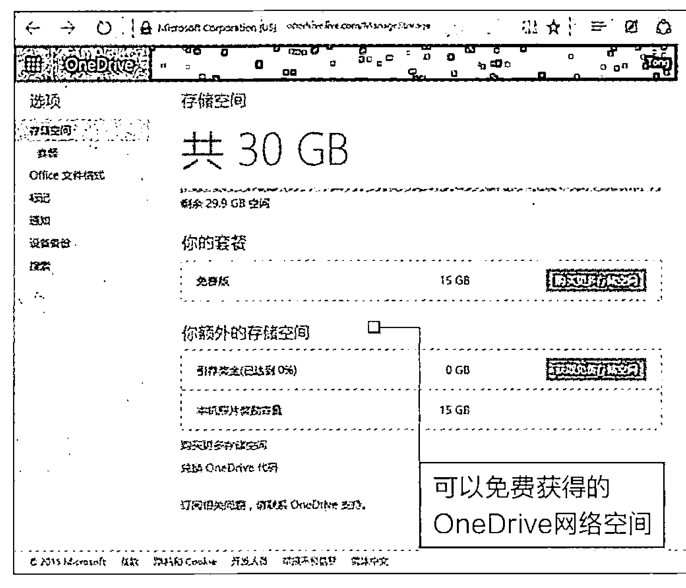

- 安装国产云盘并开启自动同步功能

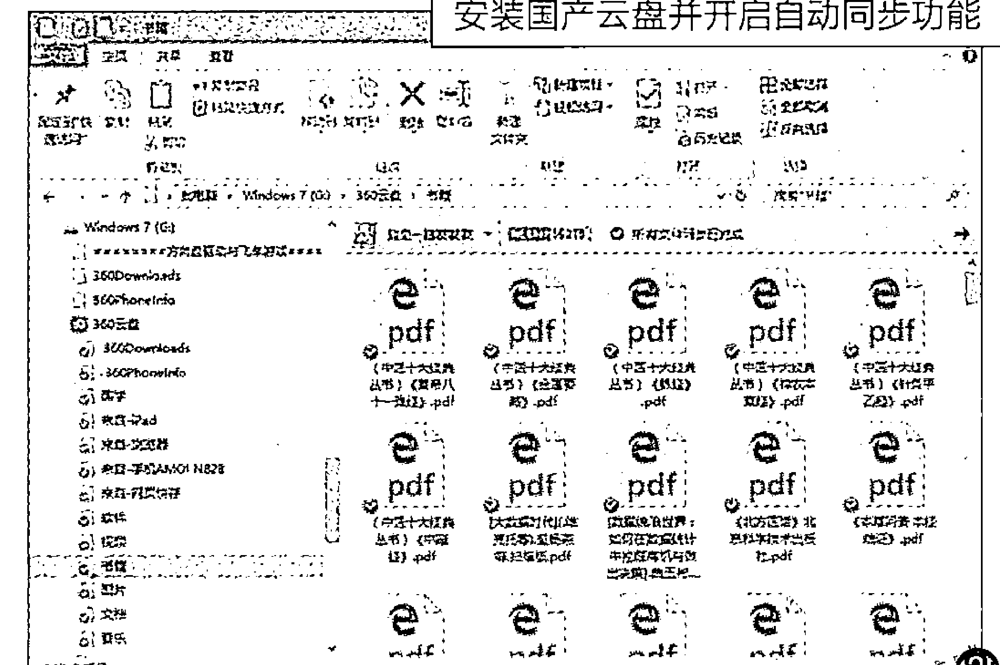

实际上，利用国内大容量云盘（如360云盘、百度云盘、华为网盘、115网盘等），完全可以弥补微软OneDrive云盘的不足。安装国产云盘并开启自动同步功能，在硬盘中建立自动同步文件夹。当OneDrive云的容量不足时，可以不需要花钱交费购买空间，将某些数据的同步由OneDrive云转向国产云（图2）。为了实现以上想法，需要对自己打算上传到“云”中的文件资料进行一个规划。首先，对于系统自身的必要同步功能，例如桌面风格、输入法和词库、用户配置文件等，这些必须由Windows自己的云盘存储的内容，保留OneDrive的管辖权限，让它继续掌管这些资源。而对于用户的数据，如电影大片、音乐文件或设计资料等，转而存储在360云盘或百度云盘的同步文件夹中。

> 小提示
> 如果OneDrive的空间爆满，影响系统必要功能的自动同步，也可以通过Windows资源管理器的“移动到”功能，将OneDrive中存放的用户数据文件移动到第三方的云同步文件夹中（图3）。这样，腾出必要的空间后，系统所必需的自动同步功能就可得以恢复。

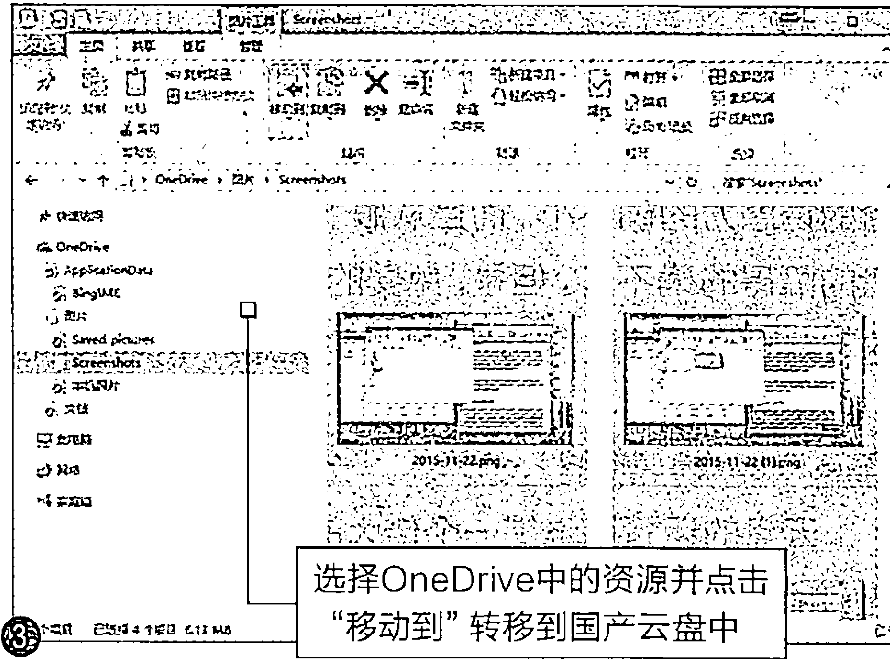

### 让有限的OneDrive办更多事情

微软云免费空间尽管有限，但如果能恰到好处地利用，就能办更多事情。在默认情况下，有许多文档和图文声像多媒体资料是被默认保存在OneDrive中的。这样，日积月累，OneDrive的空间总有不够用的时候。因为微软给用户的免费空间本来就有限，相比国内免费的云盘动辄几个TB甚至几十个TB的免费空间，微软OneDrive云盘免费献出的这点GB空间根本存不了多少大片。但是，这并不意味着这些空间就办不了大事。实际上，我们只需略施小计，将一些大容量的文件自动转移出来，就可以让小小的空间办更多的事情，存放更多的任务或数据。

### 建立批处理自动转移和腾出空间

对于一些默认存储在OneDrive同步文件夹中的文件，我们可以先不改变原始资料的存放方式，转而建立一个自动转移的批处理文件，然后将该批处理发送一个快捷方式到桌面上，每隔一定时期或当OneDrive即将爆满时，只需双击这个快捷方式，就可实现资料的自动转移，以便达到腾出更多OneDrive空间的目的。批处理的内容格式如下（图4）：

```
MOVE C:\Users\XIAOMIN\OneDrive\图片\Screenshots\*.* D:\360云盘
```

### 默认资料存储改道 变相腾出空间

在OneDrive账户设置的文件同步选择中，默认包含有“图片”、“文档”和应用程序数据（Application Data）等文件夹。由于用户应用数据文件夹涉及到系统中软件的同步问题，因此我们不随意将其取消。而“图片”和“文档”则又是频繁产生的用户文件，这些文件很容易造成云盘有效空间的急剧减小。如果这两个文件夹的文件需要云端备份，我们可以改变其备份程序，改为由第三方云盘监视和自动备份这两个文件夹。而在OneDrive设置中，就可以将对这两个文件夹的备份选择取消掉（图5）。这样其实也是在变相地减轻了OneDrive的空间负担。


> 小提示
> 这个命令的意思是，将“OneDrive\图片”文件夹下的所有文件转移到D盘的“360云盘”同步文件夹中。若改用其他云盘，只需修改同步文件夹的路径即可。也可以将其中的“*.*”改为“*.PNG”或者其他，或者多条命令连用，即可实现某一类或某几类文件的转移。XIAOMIN是当前账户名，需要根据自身所用系统情况灵活变通。

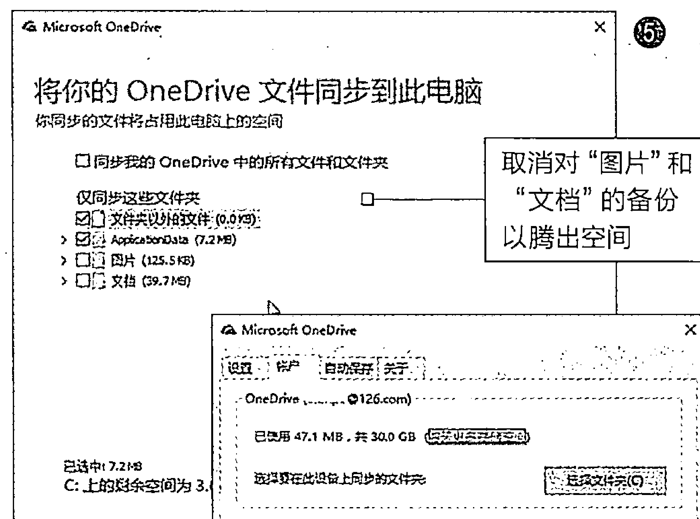

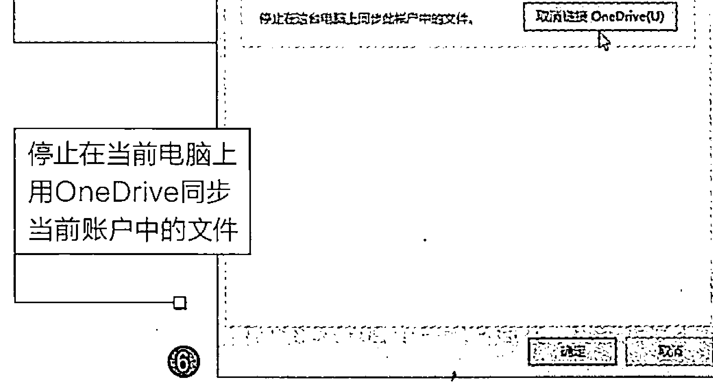

> 小提示
> 如果觉得没有必要使用OneDrive来同步个人文件资料，需要关闭OneDrive同步。右击系统托盘中的OneDrive云图标，选择“设置”，然后在弹出的窗口中点击“账户”选项卡，最后点击“取消链接OneDrive”按钮即可（图6）。

# 免费超大云盘的诱惑与陷阱

相对于国外收费的云盘所提供的小容量免费，国内超大容量免费云盘的诱惑力的确不小。而且从眼下的情况来看，使用国内大容量免费云盘的障碍的确不多。但是，免费的背后会不会藏有陷阱？如何避免陷入这种陷阱而受到损失？这些都是广大用户不能不关心的问题。

## 免费背后的“极端”陷阱——云盘“关张”

云盘的运营商维护一个偌大的免费服务器群，是要付出巨大的代价的。服务商为我们提供负担越来越沉重的云存储和周边服务，如果收入不会因此而增加或入不敷出，那么，这种免费的运营就充满了危险。到了无以为继的地步，可能就只能选择关门歇业了。而由于此前的服务是免费的，服务商不需要为用户承担多少责任，充其量在关门前礼貌地通知你拿走自己云盘中的文件。在服务商来说，这是一件轻松的事情，一个通知邮件就解决问题。而对于用户来说，若是云盘中的文件只有几个GB或几十个GB尚可，假设云盘里的文件资料以TB来计算，靠目前的网速，何年何月才能将云盘中的资料拿到本地？到了这一步，你其实已经掉到一个别人无意中挖好的陷阱里去了。这种陷阱不是没有先例，此前几年关张的盛大网盘（图7）、迅雷网盘（图8），以及2015年刚刚停运的、曾被财大气粗的阿里收购的酷盘（图9），无一不在证明着，免费的背后可能存在着一个“极端”的陷阱，它会把你带入一个万劫不复的深渊。

## 免费背后的“温柔”陷阱——流量限制（收费提速）

退一步讲，即便是云盘商家不会关张。从长远的策略来考虑，免费的午餐也不会永远继续下去。即便是空间免费，在数据上传或下载方面，商家会越来越严格限制，会将免费会员和收费VIP会员划为三六九等区别对待。也许某一天你忽然发现，存入某云盘的几十个TB的资料，下载速度只有20KB/s，要不要试一试VIP的下载速度？当体验5分钟的极速下载之后，会不会断然决定交一个月或一年的VIP年费，享受2MB的下载速度（图10）？达不到极限下载速度其实并非是网络的问题，而是云盘运营商作了人为限制。


盛大网盘2月1日在其官方网站宣布，正式暂停EverBox服务，EverBox将合并入公司旗下其他产品，并促请用户于2013年3月1日前迁移自己的数据。

盛大网盘 Everbox 由盛大创新院推出，于 2010 年底开始内测，可以说是国内第一批提供类似于 Dropbox 的个人云存储服务网盘产品，目前已经覆盖了 Windows、Mac、iOS 和 Android 客户端。但之后盛大创新院对其旗下产品进行多次调整，很多产品陆续被关闭，这让产品本身的更新与运营都受到很大影响。去年年底甚至有传言整个创新院将裁员75%，我们当时还就此探讨过盛大创新为何如此难创新这个话题。因此，此次关闭盛大网盘可以说是盛大创新院调整的后续动作。

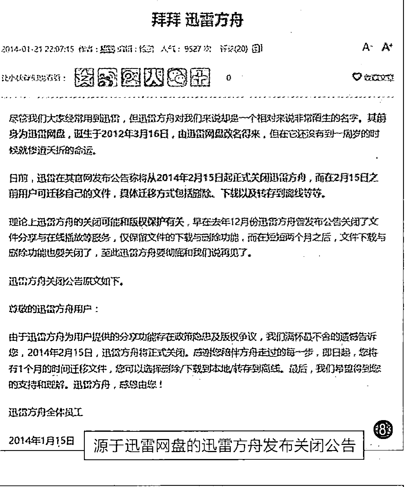

> 源于迅雷网盘的迅雷方舟发布关闭公告

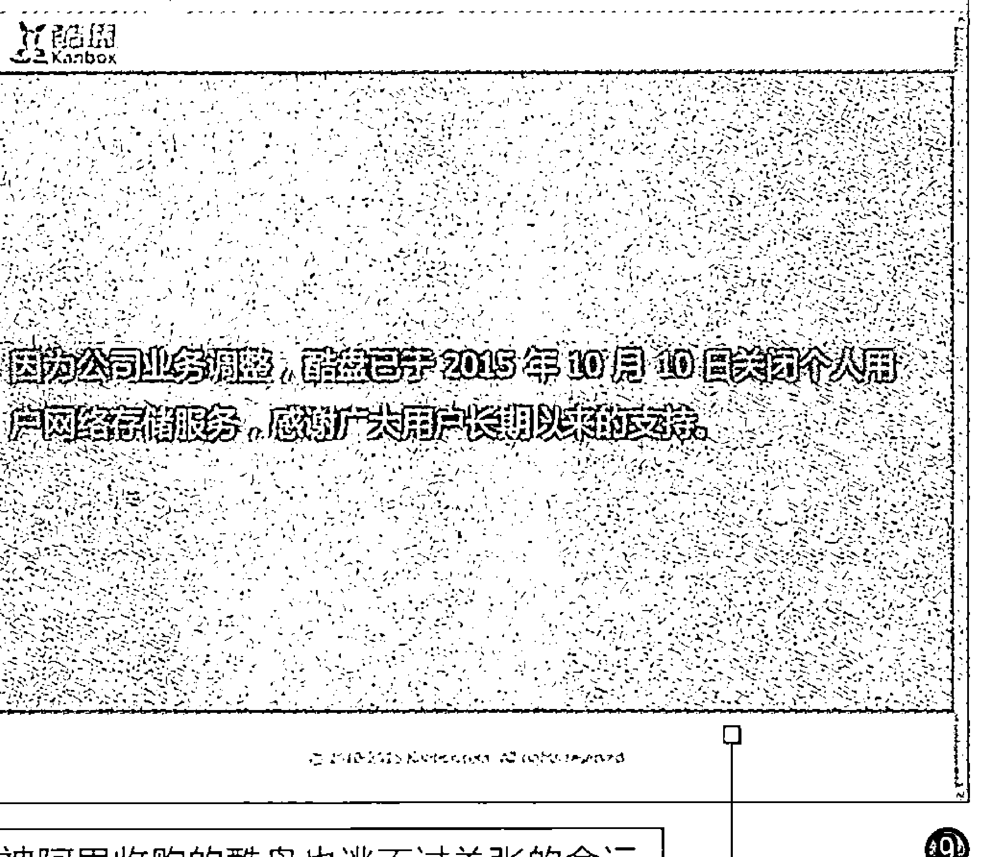

> 被阿里收购的酷盘也逃不过关张的命运

端的资源用途不大尚好，如若是一些非常重要的资料，那么将来某一天要将这些资料取回本地，可能会付出越来越沉重的代价。这就是无限大空间免费“温柔”背后的一个陷阱的“魔力”所在。从许多云盘厂商的难以为继，到百度云的VIP下载上传“优惠”政策的出台，不难看出，云盘收费肯定将成为一种趋势。免费的大容量背后其实暗含着将来的变相收费，而这种收费模式可能会变为用户不得不参与的一场数据“游戏”。

## 强力监管下的“云”飘向何方

国内政策法律对云盘监管力度的加大，对运营商的确造成了不小的影响。在云盘兴起并火爆的2013年前后，以云盘为依托的各种资料共享社区和“圈子”，聚拢了很大的人气。许多人将自己保存在云盘中的资料共享给其他人使用，这样以往人们要通过成年累月才能下载到的一些影视、连续剧、大型软件等，可以在几分钟内尽收囊中。云盘账号之间的离线收藏，将大容量数据的转存变为“秒”传。但是，这种方便的背后却隐含着巨大的版权问题。正因如此，在2014年初国家加大了对网络共享业务的法律约束，打击各项违法业务，许多云盘推出的种种共享社区或圈子纷纷“挂牌停业”(图12)。强力监管下的“云”终将飘向正道。网络云资源的乱象，也许会给某些网民带来好处，但伤害的却是人们对版权意识的正视，正规化和尊重版权是在任何时候分享都必须遵守的“游戏”规则。

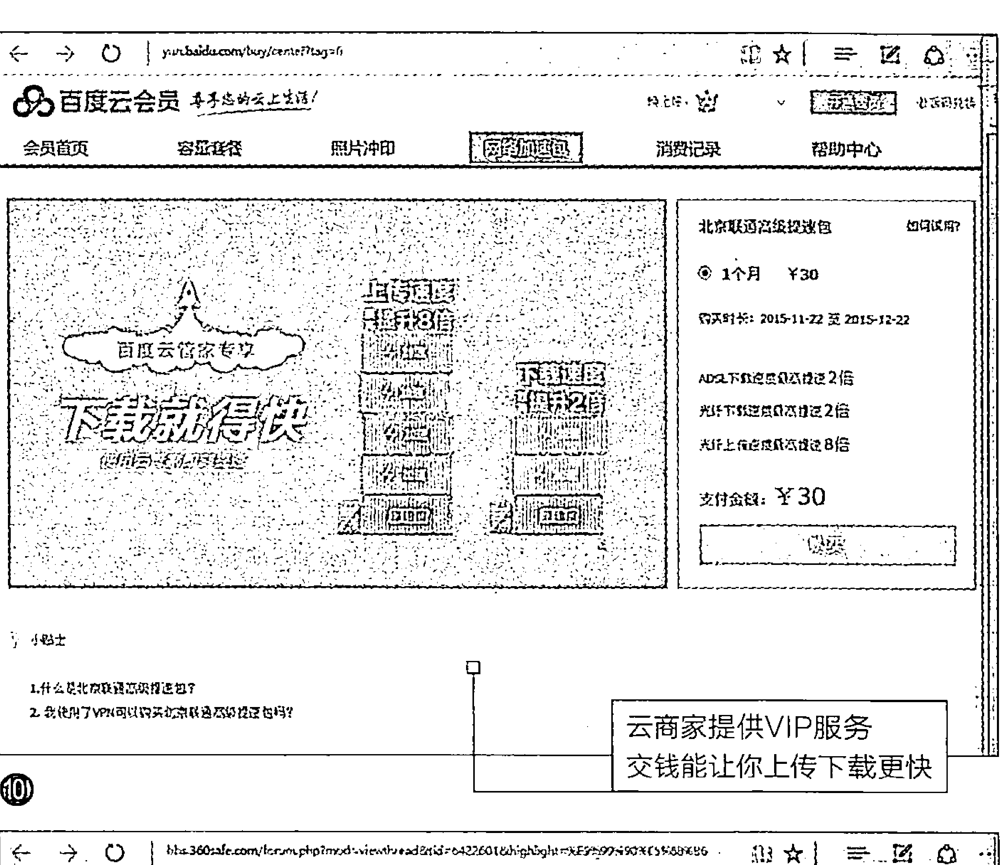

云商家提供VIP服务 交钱能让你上传下载更快

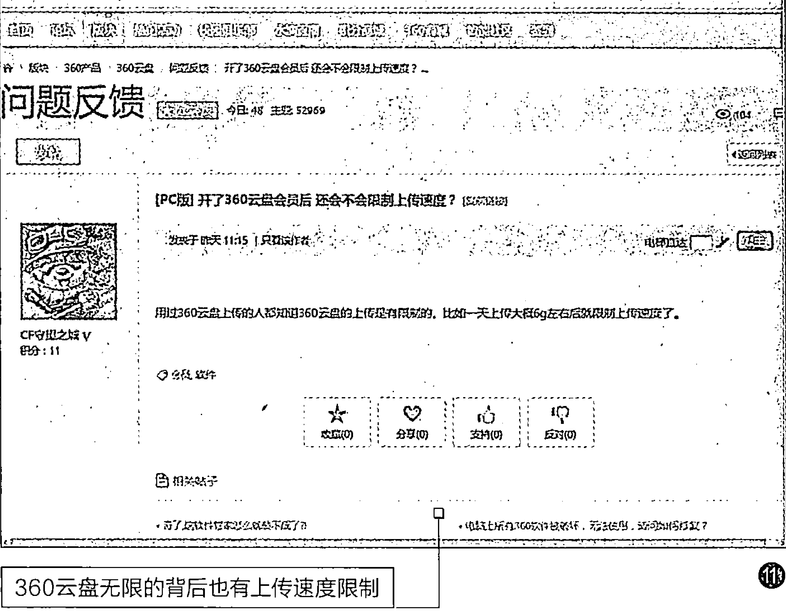

360云盘无限的背后也有上传速度限制

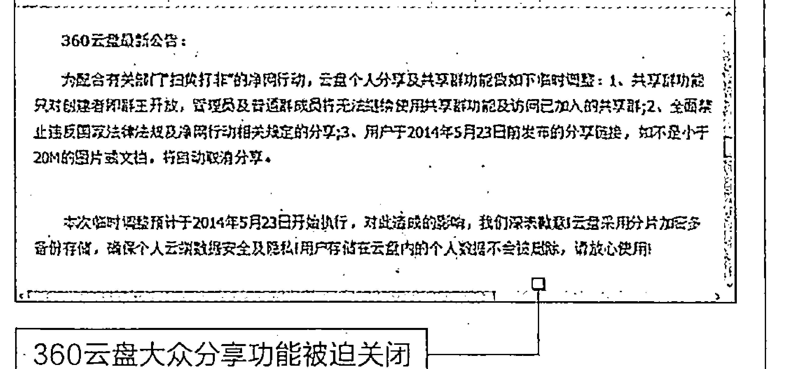

360云盘大众分享功能被迫关闭

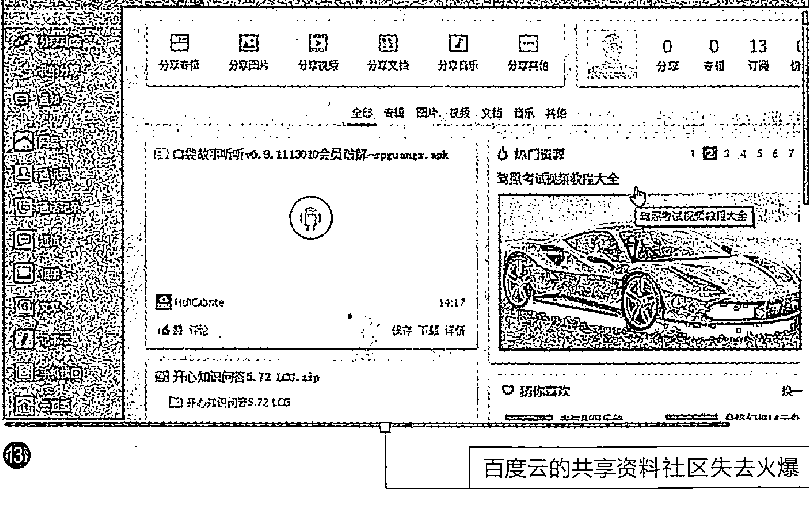

百度云的共享资料社区失去火爆

公开的云盘资料共享社区，变成了没有什么抢眼资料的“鸡肋”(图13)，这不能不说是对云盘运营商的一个打击。然而这种打击充满正能量，即便有不少网民想不开，在网上发泄情绪，但却也不能阻挡这种保护版权的世界进步潮流。充斥着侵权资料的共享圈子，只能在小范围内以某些变相的形式存在和流行，相对于浩浩汤汤的进步潮流，是成不了大气候的。

# 智能操作的林林总总

## Android Wear的国产化“改造”

智能手表是智能硬件领域的重头戏之一，可惜众多参与众筹的国产智能手表体验不佳，究其原因就是没有匹配的系统支持。随着Android Wear的国产化改造，也许智能手表的春天就要来临了。

### Android Wear的尴尬

虽然国内的智能手表品牌林立，但它们的系统却多是基于“Android开源项目”（自己在Android的框架上删删减减）而来，使用体验不统一且缺乏足够的生态支持。实际上，谷歌早在2014年就推出了针对智能手表（可穿戴设备）定制的Android Wear操作系统（图1），可惜谷歌服务在国内一直受到限制，所以迟迟没能入华。我们只能从国外玩家的试用报告里感受Android Wear系统的使用乐趣。


### 借MOTO X360入华

为了让Android Wear可以进入国内市场，谷歌就必须解决Google now与Google map服务在国内缺失的现实。为此，谷歌开始与中国企业进行合作，比如用出门问问替换了Google now，用搜狗地图代替了Google map（图2）。于是，“国产化”的Android Wear就此诞生。而首款将Android Wear带入国内市场的智能手表，就是来自联想旗下的MOTO X360二代。

可惜，作为中国定制版的Android Wear还是阉割了很多谷歌的服务，由此也就导致例如表盘主题、应用获取、微信回复等功能无法使用。以微信消息推送为例，MOTO X360二代用户需要翻墙并安装谷歌框架后才能实现，对普通用户而言难度较高。好消息是，国内的APP开发商也发现了这一问题并在逐步加以改善。还是以微信为例，在与MOTO X360二代手表绑定的手机上下载安装指定微信版本（需要申请内测，本文截稿时内测已关闭）即可实现消息推送的功能。可见，随着Android Wear在国内市场的耕耘，至少本土化APP的推送服务迟早会得以解决。

### 从开放回归封闭

可以预见，在2016年我们将看到更多预装Android Wear系统的智能手表，但随之而来的则是同质化的体验问题。开放的Android让谷歌丧失了对多数手机的控制权（手机厂商对原生Android做大幅删减，用第三方服务替换掉谷歌服务）。为了防止智能手表重蹈手机领域的悲剧，谷歌对Android Wear采取封闭式处理，即限制厂商的定制权。于是几款Android Wear手表，除了在外观和屏幕形状存在差异外，使用体验乃至表盘皮肤都大同小异（图3）。

为此，三星的新一代智能手表改用了自家的Tizen系统，而LG和HTC也有推出非Android Wear系统手表的计划。无论如何，Android Wear入华都是一件让人喜闻乐道的事情，毕竟更多的用户担心的不是差异化，而是如何将Android Wear手表打入到更便宜的价位上。希望2016年更实惠的Android Wear手表早日出现吧（图4）。


> 如果你对MOTO X360二代感兴趣，请参考本刊2015年21期《手腕上的科技精灵 摩托罗拉MOTO 360智能手表》这篇评测文章。

# 智能操作的林林总总

## 第三股游戏势力Steam

长久以来用户在家中玩大型游戏就两个选择，使用配置出色的PC或主流的电视游戏机。不过在2015年一股全新的势力袭来：它有些像PC又有根本性的不同，像游戏机但又与PS4、Xbox ONE等设备游戏源头有本质区别。尽管目前它有很多不足之处，但SteamOS和Steam系列游戏机依然有关注的必要。

### Steam游戏平台为何物

在Valve及外星人、索泰等第三方的Steam游戏主机完全问世前，很多用户还不知Steam游戏平台和Steam OS为何物。Steam OS是基于Linux打造的，由我们熟悉的《半条命》、《反恐精英》、《Dota2》大东家维尔福软件公司（Valve）在2013年推出的游戏平台，基于独立平台Debian 7打造的系统（图1）。

它有些像Android系统，但千万不要把Steam OS理解为Android的一个分支或变种，这是完全错误的。目前基于Android系统的游戏主机也不少，在这类游戏主机中运行的实际上只能划分为手游，但Steam OS的游戏总体来讲是基于PC系统移植的。形象来讲Android游戏机就是个平板电脑或者是个掌机，而Steam Machine是个完整的家用主机或者是运行独立系统的PC（图2）。

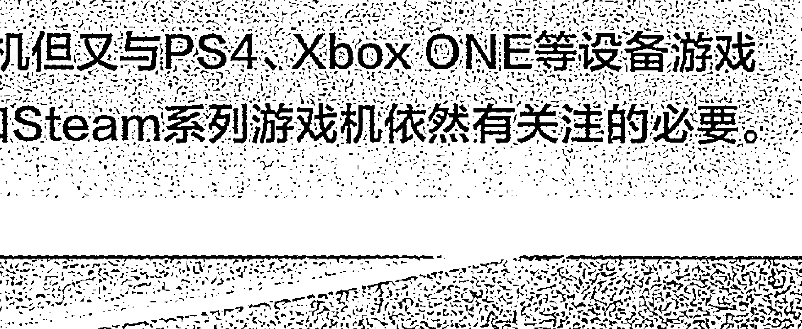

### 三平台最明显不同

上面的说法可能比较拗口，下面给一个表格来说明不同平台下设备的根本不同。虽然根据不同的品牌第三方Steam主机配置各有不同，但是所有Steam主机从硬件角度讲就是一台PC。但其系统又和PC完全不同，是特殊的Steam OS，这代表其可以运行的游戏数量取决于主推的Valve的推广程度。

此外本来主流游戏厂商在PC和游戏主机上要进行两次优化就很麻烦了，如果要移植到Steam主机，还要针对Steam OS再做一次优化。目前Steam游戏机才刚刚起步，尽管Valve宣称后期拥有庞大的游戏阵容，但目前最主要的问题依然是游戏种类少、同时优化与PC和游戏主机版本相比要差许多（图3）。

最后有一点就是不论Valve的Steam Machine以及外星人Steam主机，官方和第三方的Steam主机所使用的手柄都是Valve推出的Steam手柄。这个手柄经过多次改版反复设计，但目前最终推出的版本被国外各大媒体给出了不及格的评价。其传统操控区域被两个硕大无比的触控板占据，传统方向键和按钮被挤到了大拇指很难控制的区域（图4）。而且不支持耳机和充电的手柄，在PS4和Xbox ONE手柄面前也占不到任何优势。

不过，Steam作为PC平台的额外分支，也许也为广大PC厂商提出了新的发展思路，毕竟对于PC用户来说，游戏时间和办公、学习的分配比例，可是许多人都心照不宣的哦。

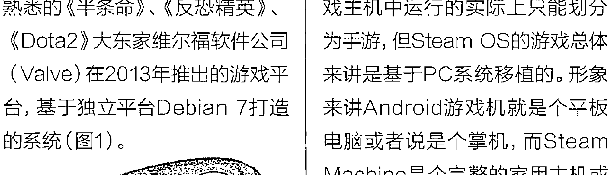


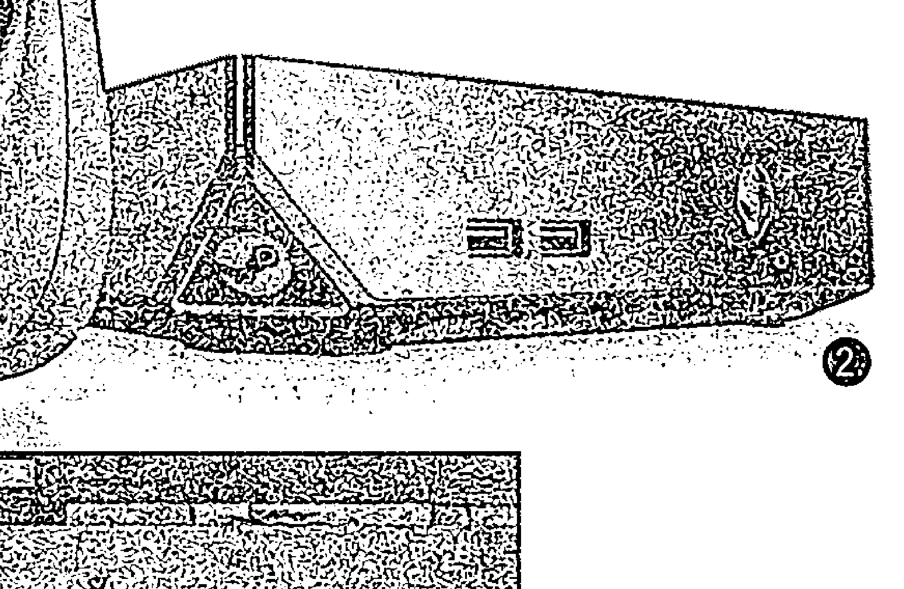

| 平台 | PC | 传统游戏机 | Steam游戏机 | Android游戏机 |
| :--- | :--- | :--- | :--- | :--- |
| 硬件 | PC配件 | 定制 | PC配件 | 移动设备配件 |
| 软件 | Windows游戏 | 定制游戏 | 部分PC游戏 | 手游 |
| 特性 | 主机性能强 | 主机便宜、游戏优化好 | 主机多样化 | 售价低廉 |
| 不足 | 硬件售价高 | 硬件无升级、封闭系统 | 游戏优化不佳 | 只能玩手游 |

# 智能操作的林林总总

## 准备迎接Windows 10手机

继桌面版Windows 10之后，移动版Windows 10终于即将与我们见面。那么，这一次微软系统的手机能否借Windows 10翻身呢？

### 继承一贯的流畅

通过Windows 10移动版的历次更新，我们不难总结该系统的主要特色：流畅（图1）。以Lumia 640这款入门级的手机为例（骁龙400+1GB内存），可以非常流畅地运行在Windows 10移动版中（测试系统为10586.11版本），而且不必像Android手机那样，将清理内存当做一种习惯。好消息是，绝大多数Lumia手机都可通过升级的方式体验到这一最新系统，从而帮助微软迅速提升市场占有率。

### 暂时和Android说拜拜

Windows 10移动版在发布之初最大的噱头就是兼容Android程序，可惜这项功能很可能被无限延期。究其原因就是Project Astoria项目因某些原因被迫终止，至于何时开放和是否开放还不确定。

### 手机也能“扮演”PC

微软为Windows移动版手机准备了一个小小的扩展坞，将手机、显示器（电视）与扩展坞连接后，手机画面就可输出到更大的屏幕上，而你将看到的则是类似桌面版Windows 10的界面布局，以便你通过鼠标和键盘更具效率地操作。这个模式被微软称为“Continuum for Phone”（图2）。

问题来了，既然手机可以输出类似桌面Windows 10的画面，那它可以运行我们熟悉的exe程序吗？答案是不可以，移动版Windows 10现在还无法直接安装exe程序（Win32程序），但在Windows 10应用商店下载的UWP应用（全平台通用应用）（图3），却可以运行在任何Windows 10系统设备上（包括桌面版和移动版）。由此也就保证了所有在应用商店下载的APP，在任何Windows设备上都能获得统一的体验。

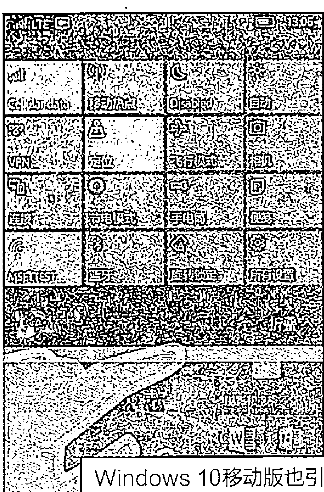

-   ### 扩展阅读
为了解决Windows 10移动版应用匮乏的现状，微软面向开发者推出了Bridges软件，其中包括Project Westminster（用于移植Web应用）、Project Centennial（用于移植传统的Win32软件）、Project Islandwood（用于移植iOS应用）、Project Astoria（用于模拟Android应用）四个套件。

前面提到，微软提供了Project Centennial开发套件，理论上可以让Win32（exe）运行在Windows 10移动版上。在本文截稿时网上也传出微软有意在Continuum for Phone模式下兼容Win32程序的消息。但不要忘记，Windows 10手机的处理器是ARM架构，而Win32则需要X86架构处理器的支持。即使通过技术手段让ARM兼容Win32，必然会面临性能耗损的情况。换句话说，即便这项功能成真，你也不要指望Lumia系列手机有足够的性能去驾驭Win32程序，也许只有传说中的微软Surface Phone才有这个能力吧。只是Surface Phone的价格想必也会让你惊叹不已的。

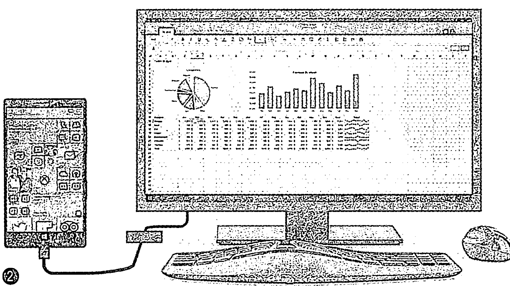

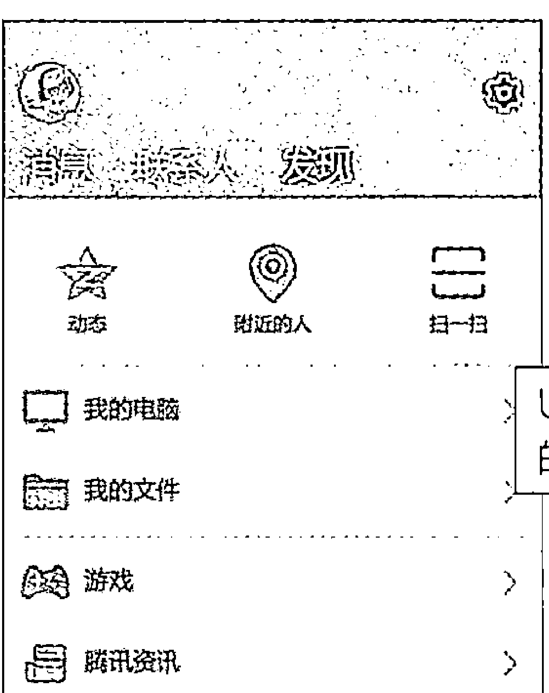

# 让Windows 10资源访问更快地

文|南楚

Windows 10的便捷程度较Windows 8有显著提升，然而，在资源快速访问方面，仍然有潜力可挖。通过在Windows 10默认访问方式的基础上，还可以延伸出一些更为方便的资源快速访问方法。

## 1 我的电脑 桌面之上能找回

Windows老用户多通过桌面上的“我的电脑”访问文件资源，然而Windows 10桌面没有提供此图标，许多用户一时不能像Windows 7或Windows 8那样轻易找回该图标。在最新版本Windows 10 10586-1151中，点击开始菜单，依次选择“设置→个性化”，点击左侧的“主题”，然后点击右侧的“主题设置”（图1）。在接下来弹出的窗口中，就会出现类似于Windows 8.1的个性化设置窗口。点击左侧的“更改桌面图标”项，在桌面图标设置窗口中勾选“计算机”一项，之后桌面上就能看到“此电脑”图标了（图2）。“此电脑”就是“我的电脑”，当然，若硬要“我的电脑”，可用F2将其更名。

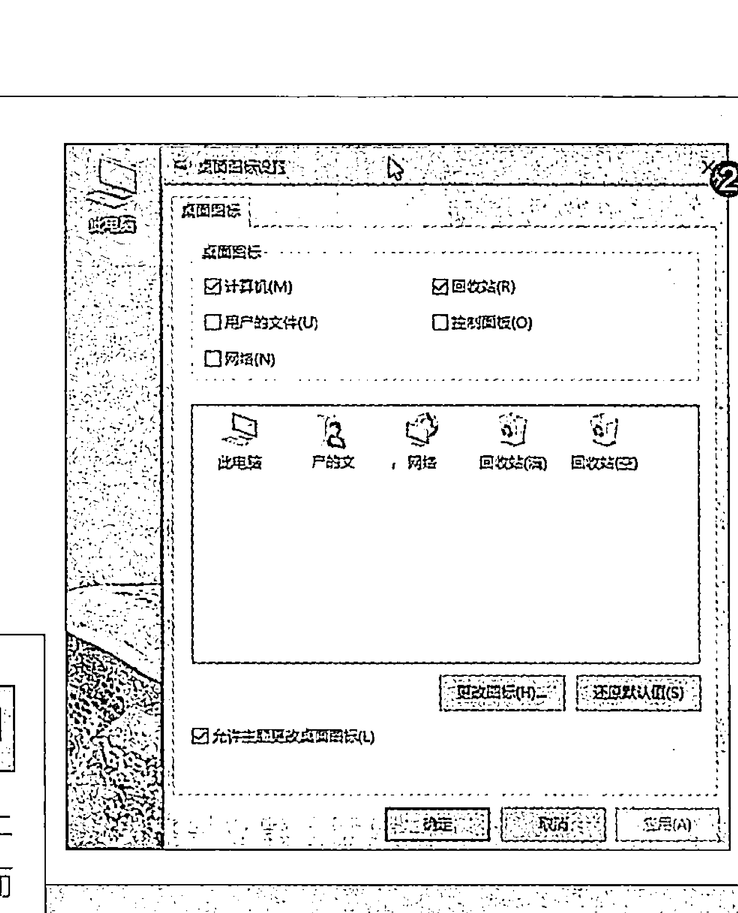

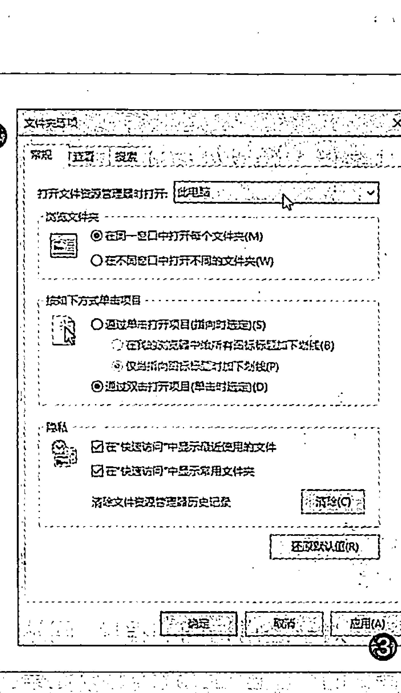

## 2 资源管理 直接进入此电脑

细心的你一定已经发现，启动Windows 10资源管理器后，自动出现的是“常用文件夹”和“最近使用的文件”两组“快速访问”记录。这可以大大减少接续工作时寻找上次打开位置或文件的时间。但是，按照传统习惯，也许希望打开资源管理器之后，能够直接看到“此电脑”下的资源。为实现上述目的，在“迅速访问”上单击鼠标右键，然后选择“选项”。在开启的“文件夹选项”窗口中，将“打开文件资源管理器时打开”后面的选项选择为“此电脑”，单击“应用”并确定（图3）。这样，下次开启文件资源管理器后，看到的就是自动打开的“此电脑”下的驱动器和文件列表了。

## 3 接续工作 快速开启文件夹

如果你常常在某个固定的文件夹下工作，那么肯定希望每次启动电脑后自动打开此文件夹。当然，在桌面建立一个该文件夹的快捷方式，双击就可以进入。但是，能不能连双击也免了呢？可以！只需在“文件夹选项”窗口中，切换到“查看”选项卡，然后在“高级设置”列表中，将“文件和文件夹”一组下的“登录时还原上一个文件夹窗口”选中（图4），这样，下次登录系统时就会自动开启上次关机前的工作文件夹了。

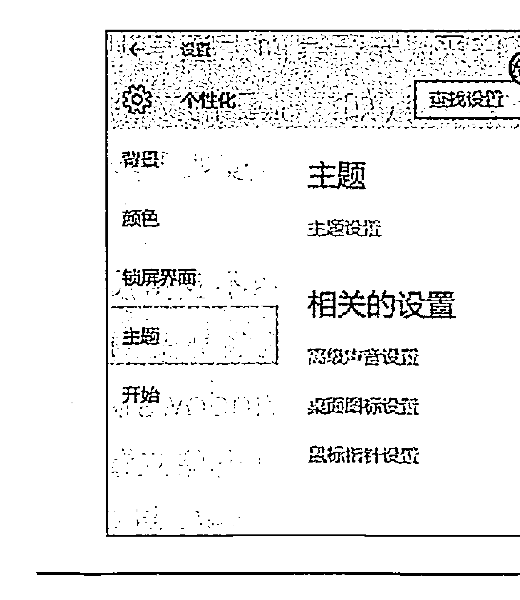

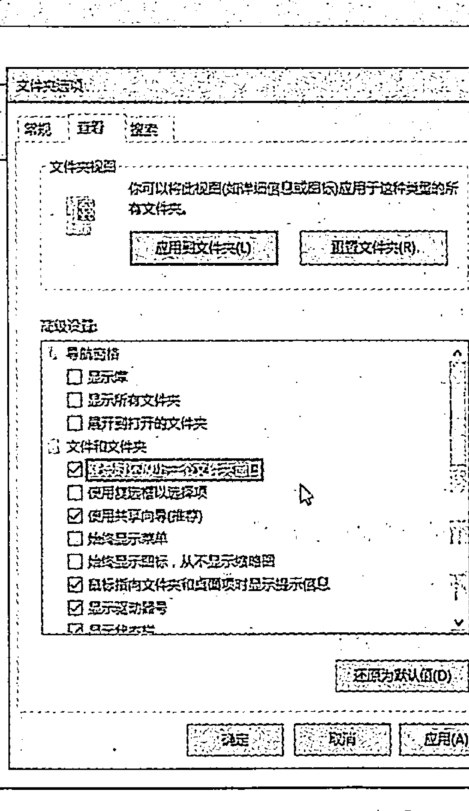

## 4 打破常规 另类快捷自定义

Windows 10资源管理器启动热键为Win+E，但是，如果碰巧键盘的Win键坏掉了怎么办？其实，还可以给资源管理器指定另外的多组快捷键。具体方法：在按下Shift键的同时，右键单击Windows 10任务栏上的文件资源管理器图标，在弹出的快捷菜单中选择“属性”。之后，在文件资源管理器属性窗口中切换到“快捷方式”选项卡，点击“快捷键”后的文本框，按下新设的组合热键（例如Ctrl+Alt+E），点击“应用”并确定（图5）。

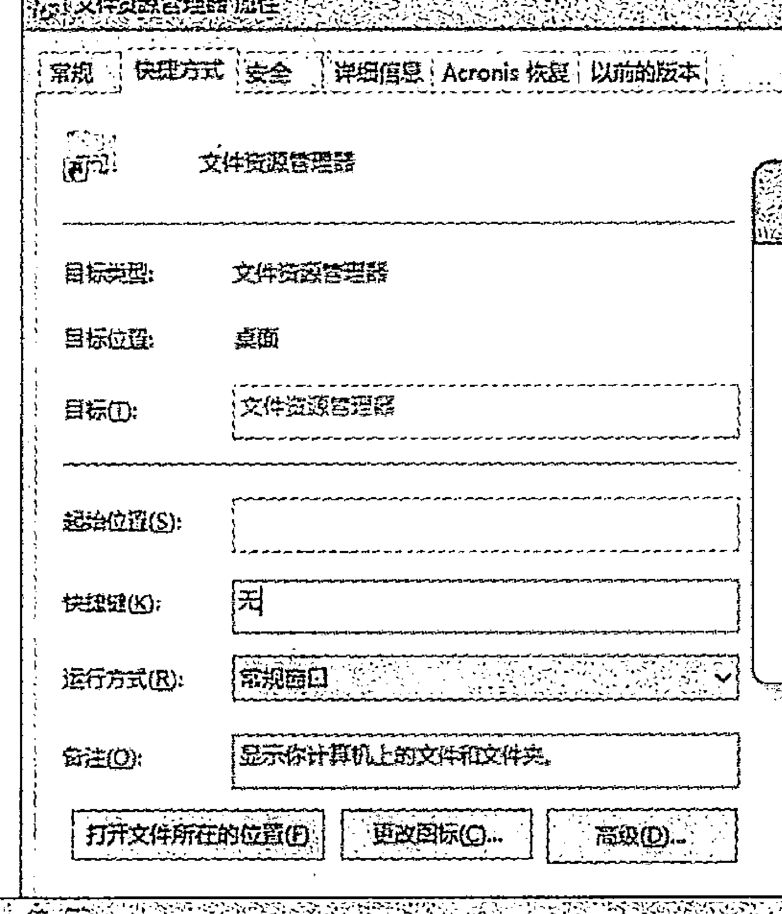

> 火速连接
关于在任务栏上组织多级分类文件菜单以达到快速访问的具体方法，请参见本刊2014年第6期文章《自建优于开始菜单的多级菜单》的介绍。

经过如上设置后，就可以绕过Win键，用Ctrl+Alt+E组合键快速启动资源管理器了。

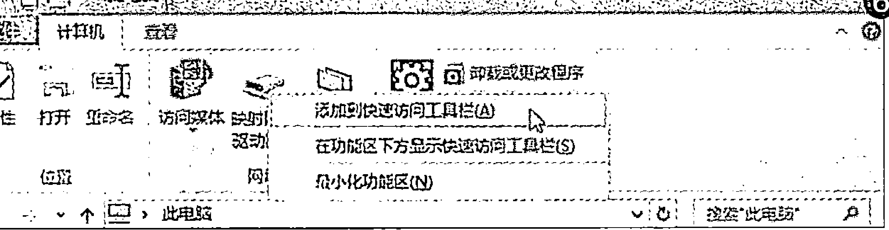

## 5 两个边框 常用任务可常驻

对于经常访问的程序、网站、文件夹、文件，除了在桌面上建立快捷方式外，还可以将它们安置在桌面或资源管理器窗口的“边框”上，这样可以让桌面变得更为清爽。

Windows 10资源管理器窗口的上端边框，是系统快速访问工具栏所在的位置，上面其实可以安排更多的系统功能图标。通过右击Windows资源管理器功能区面板上的任一系统功能组件（例如“映射网络驱动器”），选择“添加到快速访问工具栏”（图6），即可将“映射网络驱动器”的功能固定在资源管理器窗口的顶栏。别的功能也可用同样的方法添加。

在系统任务栏边框上，除了通过右击并选择“固定在任务栏”将经常访问的程序、文件夹、文件、网址固定在任务栏上外，对于多个分组项目，可以用建立分级菜单的方式来组织，以达到快速访问的目的。

## 另类方法 建立隐秘文件夹

文|慧慧

文件的归类与汇总离不开文件夹的帮助，这也是许多人在一台电脑上除磁盘分区之外区分工作与娱乐、公用和隐私的方式之一。有的内容谁都可以看，有的内容有的人可以看，而有的内容谁都不能看，这就不能用软件一刀切或直接隐藏文件的方式进行了。

### 1 实操上手 建个“看不见”的文件夹

隐藏文件夹的最普通办法是通过系统文件夹选项设置隐含属性，但这种方法很容易被人识破。我们也见过用专业的文件夹加密工具来实现文件夹隐藏的方法，但这需要安装第三方工具，操作起来也比较麻烦。现在，我们不用任何外部工具，通过建立看不见的文件夹图标，命名看不见的文件夹名称，再结合传统的属性隐含方法，“三管齐下”建立一个另类的隐秘文件夹。先在桌面上按常规方法建立一个文件夹（如：“张三的文件”），并将文件存入其中，然后按如下步骤执行。大家知道，Windows不支持没有名称的文件夹，要让文件夹名称变为不可见，直接按空格不能被Windows认可。因此，只能靠隐形的ASCII码建立看不见名称但实际上有名称的文件夹。其实，不

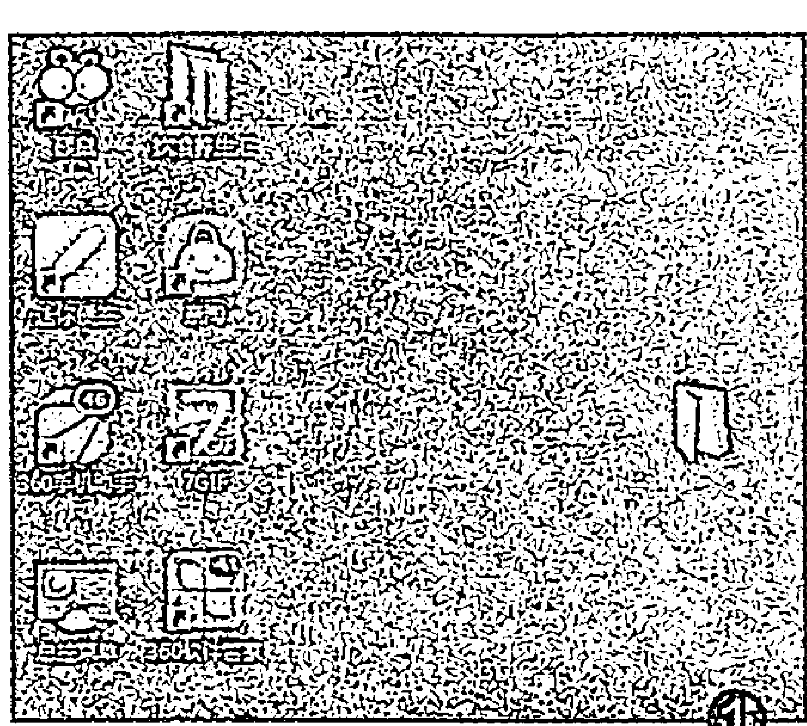

那么麻烦，直接用全角空格作为文件名也可以。输入全角空格的方法是，点一下输入法指示条上的半月形图标，图标变成全月形，然后按空格即可。这样就拥有了一个看起来没名但的确存在的“无名”文件夹（图1）。

文件夹名称看不见了，但金黄色的文件夹图标还在，需要想办法让其隐身。这只需将文件夹图片替换为一个透明图片即可。右键单击该文件夹图标，选择菜单中的“属性”，单击“自定义”选项卡，点击“更改图标”（图2）。在图标列表窗口中，选择一个透明的空白图标，然后依次点击两次“确定”按钮（图3）。

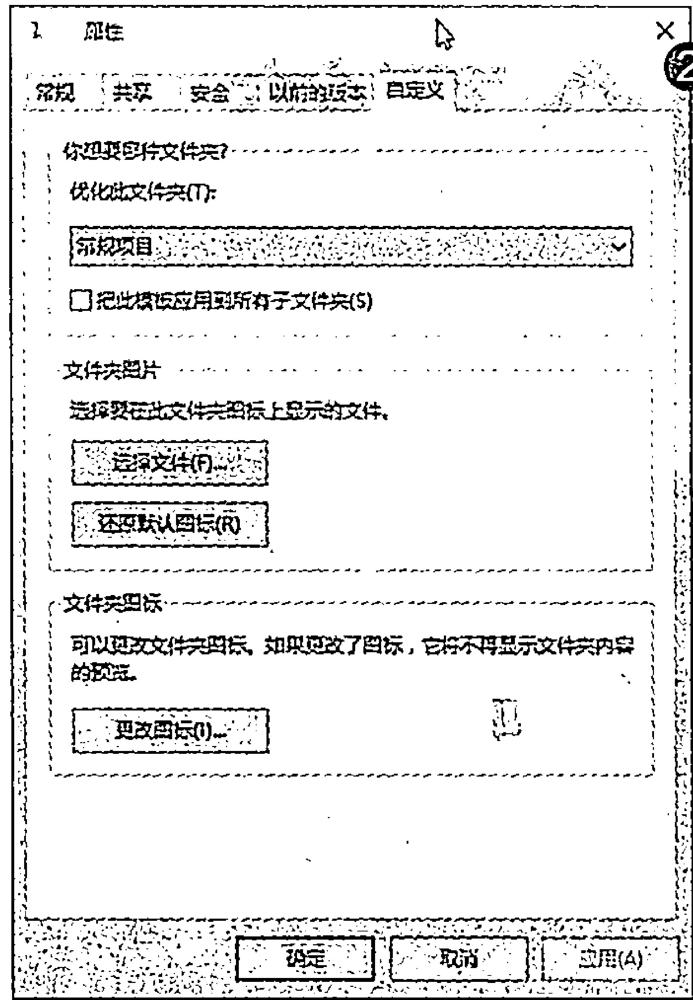

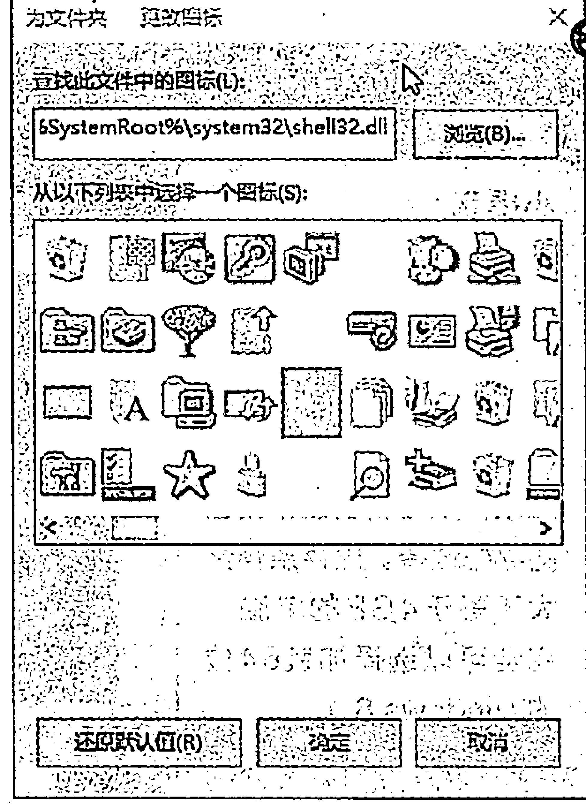

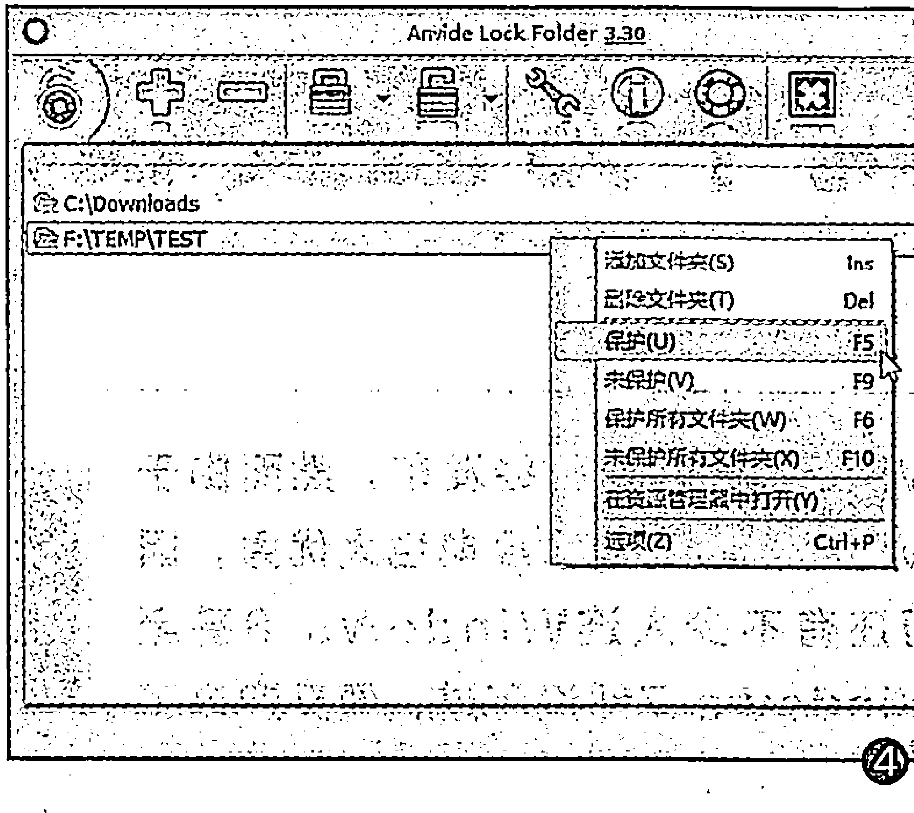

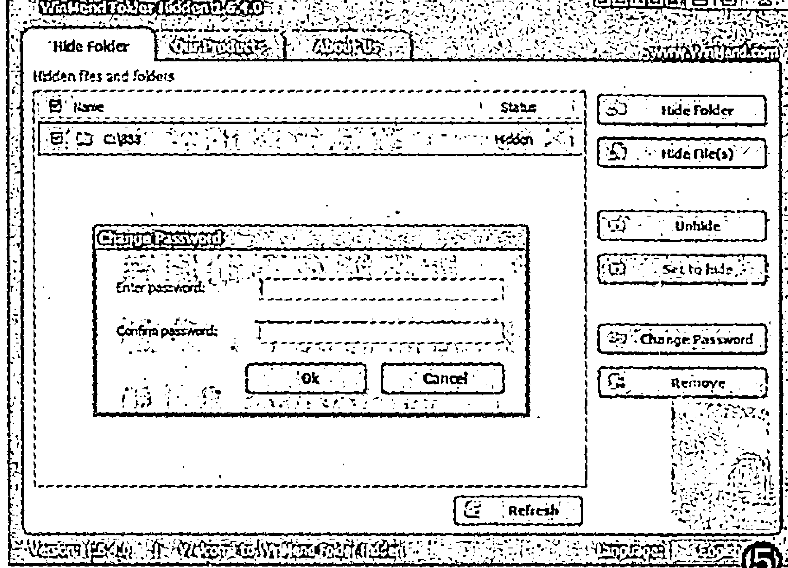

> 小提示
要解开加密文件夹，在Anvide Lock Folder窗口内选中文件后，按下F9并输入密码即可。

### 小软辅助 建立隐形文件夹

如果说上面的方法只能蒙混一般的电脑用户，觉得不够安全，同时又嫌弃专业加密工具过于复杂，那么，不妨寻求更加简单易行且小巧的加密隐藏工具。

借助于一款Anvide Lock Folder小软件可非常方便地加密且隐藏文件夹。只需将要加密隐藏的文件夹拖动到软件窗口中，按F5并输入密码，文件夹就加密并隐身了（图4）。这个绿色软件完全可以拷贝到闪盘上运行，加密文件夹后撤走闪盘，让别人一无所知。此外，即使是将该软件忘在了硬盘中，别人看到了，无密码也解不开文件。若连该软件也删除了，没关系，从网上下载安装，密码在你的脑子里，重装之后就可以解开加密文件夹。

别以为仅靠隐藏而不加密就不牢靠，实际上，使用强力隐藏软件，别人没办法看到你的文件，不加密也是安全的。下面借助于一款WinMend Folder Hidden软件来实验一个文件夹的隐藏：在C盘根目录下建立一个自己的文件夹“888”并实现对它的隐藏。

运行WinMend Folder Hidden软件首先要设置访问密码。在窗口中点击“Hide Folder”添加888文件夹，随后该文件夹会自动变为隐含文件夹（图5）。退出软件回到Windows资源管理器窗口中查看，已经不见了888文件夹的影子。通过“选项”窗口开启所有隐含项目的显示，也不会看到C盘根目录下的888文件夹。如果要显示出这个文件，只需通过密码开启WinMend Folder Hidden窗口，选中该文件夹，然后点击“Unhide”按钮即可。

> 小提示
如使用此法将保存于磁盘根目录的文件或文件夹隐藏，除了格式化硬盘外，是无法正常删除的。但保存于其他文件夹内的文件被隐藏后，如果删除上级文件夹，隐藏的文件夹也随之被删除。因此，将加密文件夹直接放在根目录更安全。

## 两个分区安装四个系统

文|雷越

Windows 10已经发布，然而由于Windows XP太经典也太优秀，因而还有不少人连Windows 8甚至Windows 7都没用过，便又迎来了Windows 10的更新诱惑。由于微软对Windows XP放弃支持，这次不升级恐怕说不过去了。但对于只有一个XP系统分区和一个数据分区的老电脑用户来说，如果不希望错过对前面几种系统的体验，能不能在不动原有XP系统和用户数据的情况下，分别加装Windows 7、Windows 8.1和Windows 10三个系统，让4个系统和平共处于一块仅有2个分区的硬盘上，且不发生冲突？本文提供解决方案。

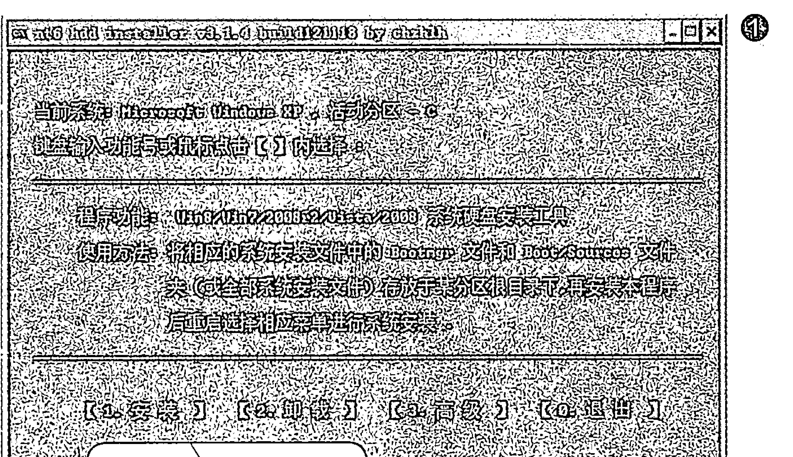

> > **小提示**
>
> Windows XP虽为32位版，但用以上方法安装的Windows 8.1既可以是32位，也可以是64位，可以根据电脑配置和自己的喜好选择。内存条容量大于等于4GB的电脑，完全可以选择加装64位的Windows 8.1。

### 1 无损数据 安装Windows 8.1于D盘

之所以先安装Windows 8.1而不装Windows 7，是因为Windows 8的多系统启动管理功能界面漂亮，使用方便且更不容易出问题。

首先启动Windows XP，准备安装辅助工具NT6 HDD Installer v3.1.4.exe，准备Windows 8.1安装映像ISO文件，用解压软件WinRAR或虚拟光盘软件解开ISO文件，并将其释放到C盘的根目录下（若C盘空间有限，也可以释放到D盘的根目录下），注意一定要是根目录。

接下来运行NT6 HDD Installer，软件会自动判断当前安装的系统，寻找已经解压于硬盘上的系统安装文件中的启动管理程序。这里由于提前按软件要求拷贝了系统启动管理文件，所以，只需点击“1.安装”按钮完成启动管理文件的配置即可（图1）。完成安装配置之后，点击“0.退出”按钮退出该程序。

重新启动系统，这时在系统启动菜单中便会多出两个NT6 HDD Installer的安装选项。选择二者之一，即可自动进入Windows 8.1的安装过程，经过几次交互（诸如安装密钥、登录用户名、语言选择等），系统重新启动数次，完成Windows 8.1的安装。Windows 8.1完成安装最后一次重启时，可以看到，在启动菜单中新增了一个Windows 8.1的启动项，而原来的Windows XP系统则被命名为“早期版本的”（图2）。

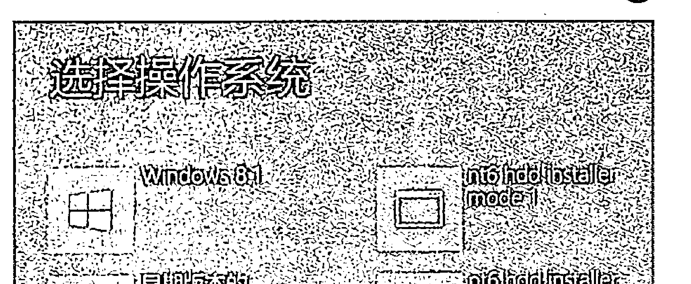

### 2 VHD虚拟 加装Windows 7/10系统

从启动菜单中选择Windows 8.1项启动电脑。接下来要将Windows 7和Windows 10安装为VHD系统。VHD系统作为虚拟系统来使用，但它可以共享其他分区的数据，在使用过程中感觉不到虚拟的味道。虚拟系统被打包成一个VHD文件，置于D盘或C盘上，使用过程中对该系统的写入操作，都将反映到对该VHD文件的写入，因此，当系统关闭后，所有对系统盘的写入操作都被保存在这个VHD文件当中，不会有数据丢失。

先在Windows 8.1下创建Windows 7的VHD系统。首先准备Windows 7的安装ISO镜像文件并解压到D盘的一个空文件夹中，若空间不足，可解压到U盘中（如I:\Win7-64）；准备好工具软件“Windows VHD_VHDX 辅助处理工具 2013”。运行

该工具，选择“创建VHD/VHDX”选项，浏览选择Windows 7安装文件夹下的install.wim文件，将VHDX虚拟系统文件所在位置和文件名设置为“D:\WIN_VHD\WIN7_V.VHDX”，设置虚拟系统VHDX文件的大小为15GB，文件格式选择“动态扩展”（这样可根据需要在15GB范围内伸缩），点击“确定”按钮，开启黑色命令提示符窗口自动创建Windows 7虚拟系统VHDX文件（图3）。虚拟系统创建完成后，切换到“挂载/卸载VHD/VHDX”选项，浏览定位刚才生成的VHDX虚拟文件，编辑启动项名称为“Windows [WIN7_V.VHDX]”，然后选择“挂载VHDX”，点击“向BCD中添加VHD/VHDX项目”，在启动菜单中添加Windows 7启动项，然后退出该工具（图4）。重启系统，启动菜单会多出一项“Windows [WIN7_V.VHDX]”，选择它就会进入Windows 7的安装配置过程，具体方法同传统安装Windows 7。Windows 7安装完毕之后，以后启动选择“Windows [WIN7_V.VHDX]”就可以使用Windows 7系统了。

> 小提示
创建Windows 10 VHD系统的方法与Windows7 VHD系统类似，具体方法这里不再详述。创建后开机启动菜单中也会多出一项Windows 10 VHD选单。

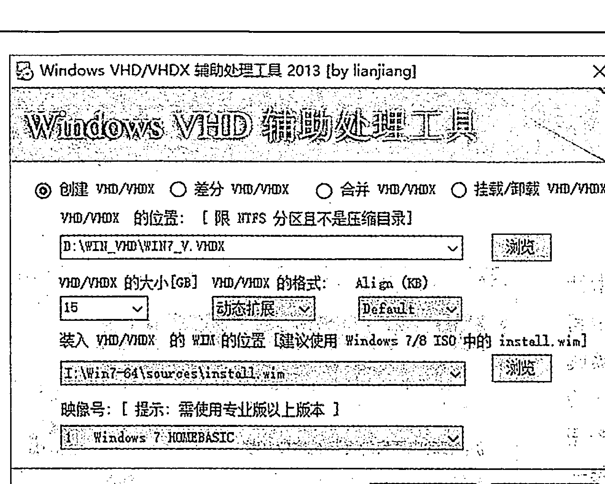

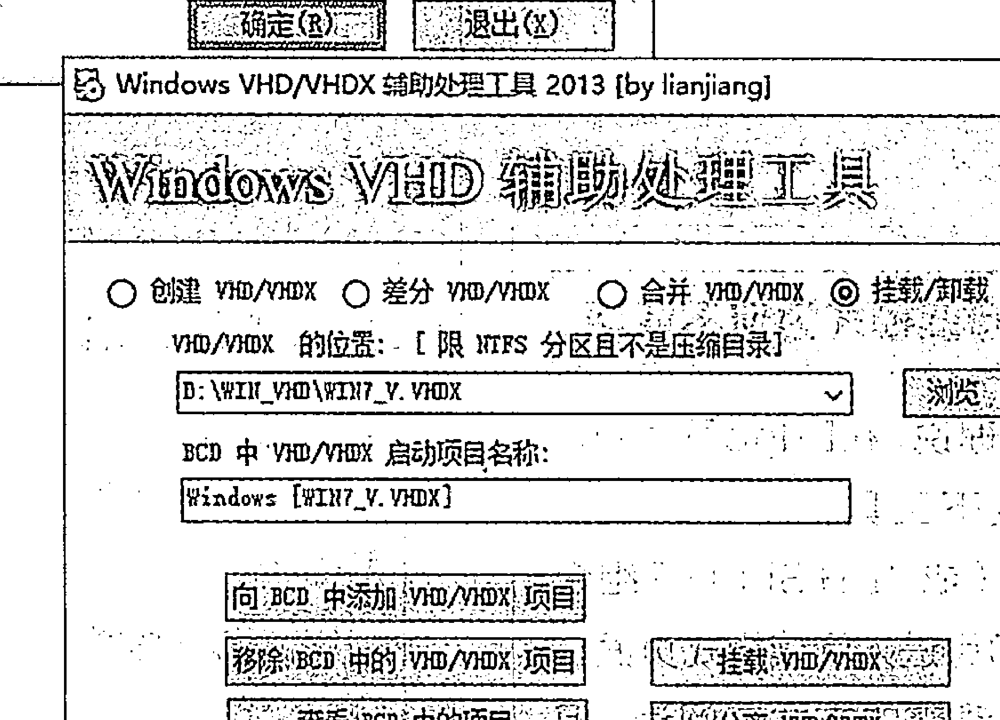

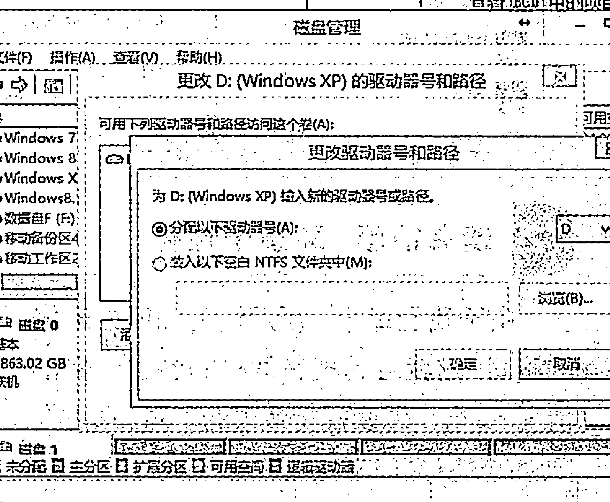

> 小提示
关于虚拟空间调整、虚拟盘符问题解决等详细用法，请参见《电脑爱好者》2015年第10期P40文章《排除问题 用好VHD虚拟系统》。

### 3 分区盘符隐藏与数据共享

出于数据保护的考虑，进入Windows 7或Windows 10虚拟系统后，在资源管理器中将看不到Windows XP的分区盘符，自然也就访问不了其中的数据。如果希望访问其中的数据，可通过磁盘管理器，给Windows XP所在分区分配一个盘符，就可以访问该分区上的数据了（图5）。

### 4 多重菜单与虚拟空间管理

多重菜单可通过Windows VHD/VHDX辅助处理工具的“查看BCD中的项目”来查看，如果需要编辑，可以使用“BOOTICE(引导扇区维护工具)2015”软件。虚拟磁盘空间的容量在创建时就应该想好，如果在创建之后发现虚拟磁盘容量不足了，可通过BOOTICE的“容量重设”功能来解决。

## 用好Edge 打造个性读书机

Windows 10系统中自带新式网络浏览器Edge，其中有一个阅读模式会给人以清爽阅读之感。但是，阅读模式的使用也不是一个简单的模式按钮了事。要用好它，需要掌握一些技巧。

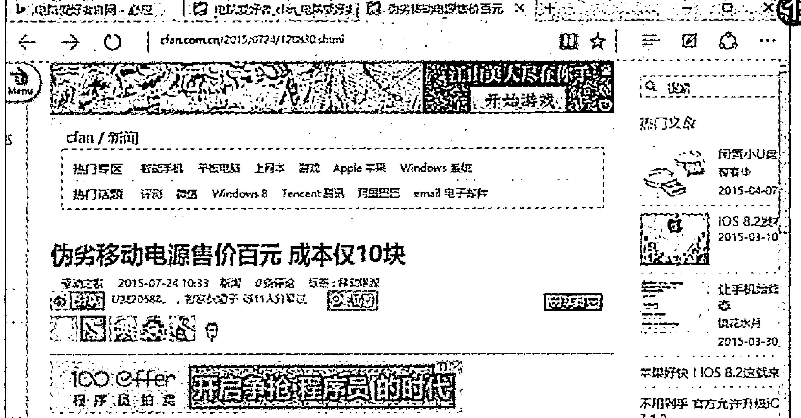

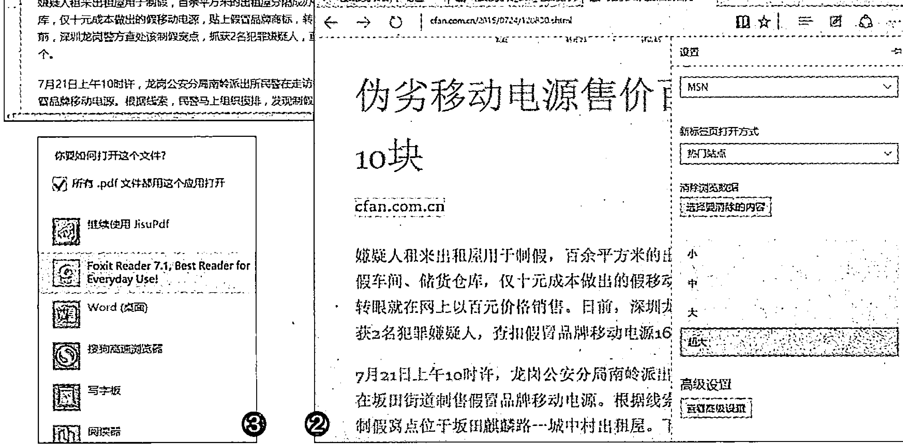

### 1. 阅读模式为何不管用

按理说，在Edge页面中，只要按下工具栏上的阅读视图按钮（或Ctrl+Shift+R组合键），即可进入阅读模式页面，以一种清爽的方式来阅读。但是，我们有时可能会发现，有的版面无法开启阅读模式，阅读按钮为灰色不可选状态。这是为何？又如何解决？

阅读模式针对于网页中的某个版面区域，需要指定版面区域，阅读模式按钮才会亮起（图1）。

通常，Edge会智能判断网页版面元素，如果页面是由多个图文板块组成，而在当前页面主版块之外存在某些诸如广告栏之类的内容，Edge阅读模块会自动将其屏蔽掉。但是，有时弹出的页面是一个本来很单一的页面，Edge认为是一个主要版面，已经是最简阅读模式；或是一幅Flash动画，Edge判定为一幅图片，认为没有必要开启阅读模式，阅读模式按钮便显示为灰色。

### 2. 读书护眼 环境个性化

由于我们每个人所用设备和所处环境的不同，这就会造成在同样的参数选择的情况下，最终阅读视觉效果的不同。通过在Edge设置窗口指定适合于不同环境阅读的背景（即“阅读视图风格”），可定制适合于自己的阅读环境。可尝试选择“暗”、“中”、“亮”三种环境色。

> ## 小技巧
### 解决阅读字体的矛盾
按下Ctrl不放，然后上下滚动鼠标滚轮，将字体调节到合适的大小。此外，还可以使用自定义缩放：切换到阅读视图，在Edge设置窗口中选择一种最适合于自己的“阅读视图字号”，可在阅读视图窗口中看到显示效果（图2）。

### 3. 个性化定制PDF阅读器

Edge默认与PDF文档关联，在Windows 10中双击一个PDF文档，会自动用Edge直接打开。虽然打开PDF文档的速度也够快，但如果对PDF阅读操控有特殊需求（如习惯于用福昕阅读器或Adobe Reader来阅读PDF文档），这种“体贴”反而会变成一种麻烦。这时，可通过让PDF文档与Edge浏览器关联脱钩，定制属于自己的PDF浏览环境。找到一个PDF文档，右键单击并选择“打开方式→选择默认程序”，然后选中关联的应用程序并选中“所有.pdf文件都用这个应用打开”选项（图3）。这样，Edge浏览器就不再“多管闲事”了。

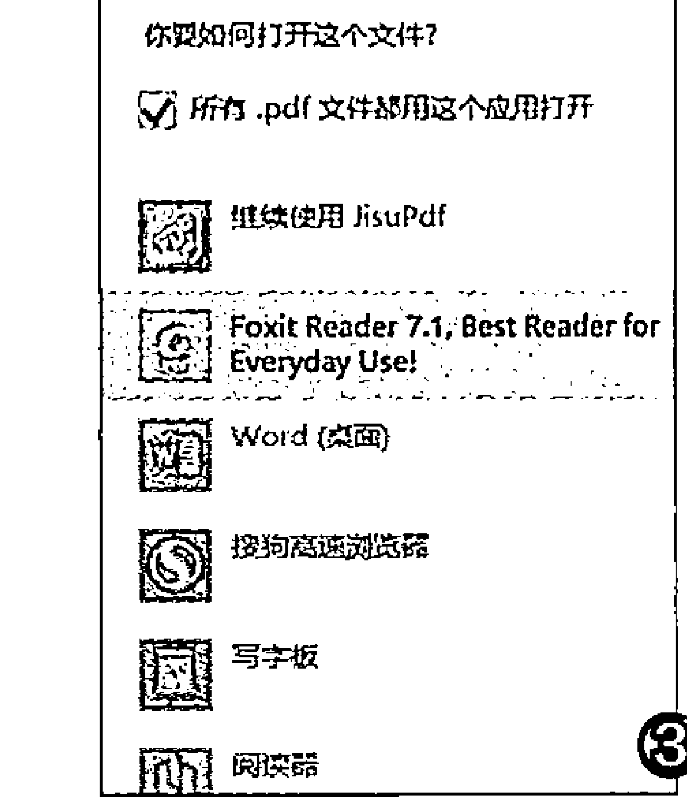

## 创建二合一Windows 10系统安装盘

文|张菲

准备安装Windows 10前，人们通常都是针对所需去分别准备32位或64位安装文件，但若能将两种不同格式的安装文件集成到同一个启动盘中，执行一个安装文件，从中选择并自动安装所需位数的系统，那就会方便许多了。

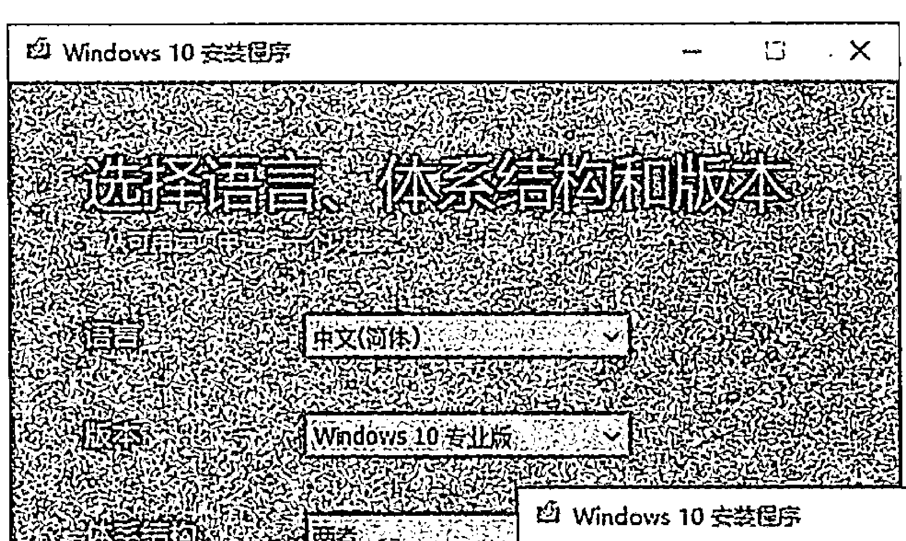

> 小提示：为了便于今后灵活快速地制作安装盘，无论是用闪存盘还是光盘，建议优先选择下载ISO文件。

由于制作二合一安装盘的原始文件来源于微软官方网站，要从微软服务器实时提取，因此需保持网络畅通。下载的数据大约为6GB，相对单一安装文件要大许多，需要有足够的耐心哦。此外，至少为8GB的闪存盘或容量为8.5GB的DVD刻录盘也是不可或缺的存储介质。

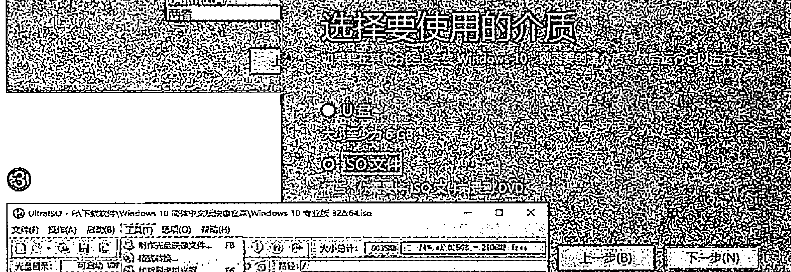

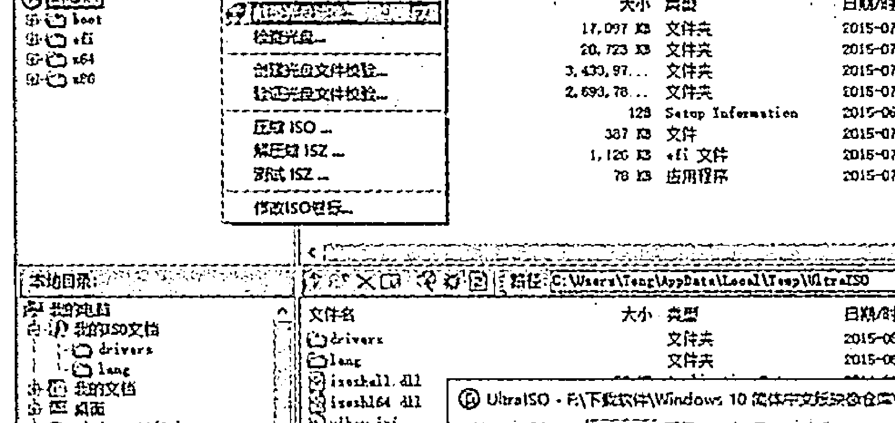

### 1 使用官方升级工具下载

微软Windows 10升级工具（下载地址：https://www.microsoft.com/zh-cn/software-download/windows10），已有不少人通过它在线升级了Windows 10操作系统。但它还有另一个用途——直接下载Windows 10系统安装映像。在安装映像的下载过程中，选择“合体”选项就可获得32位和64位混合安装包。

运行Windows 10升级工具，选择“为另一台电脑创建安装介质”选项，接着选择Windows 10简体中文专业版，体系结构选择“两者”（图1）。接下来选择使用的介质：如果是使用闪存盘启动选择“U盘”；如果做成光盘启动，则选择先建立“ISO文件”（图2）。选择存放位置后开始下载安装镜像，耐心等待完成，完成之后会有提示。

> 小贴士：如果系统主板支持EFI启动方式，则可以直接将闪存盘格式化成Fat32，将ISO文件解压缩至闪存盘中即可。

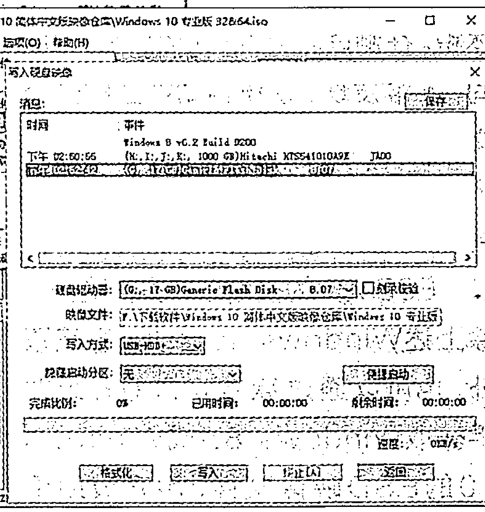

### 2 将合体映像写入介质

ISO文件下载完成后，用UltraISO等刻录软件以刻录光盘映像的方式制作启动光盘（图3）。如果要做成Windows 10启动安装闪盘，只需选择“启动→写入硬盘映像”，并选择“USB-HDD+”模式写入闪盘即可（图4）。

## 玩转Windows ESD映像文件

文|张惠香

以前大家常使用ISO映像文件安装系统，然而在Windows 10升级过程中，不一定每次都提供ISO映像下载，只会在硬盘的临时目录中留有一个ESD映像文件。ESD文件可用来实现系统版本的回滚，但它不能直接用来安装系统。充分了解ESD文件并能从中抽取或转换出我们需要的WIM或ISO文件是当务之急。

### 认识ESD文件

此前安装Windows多使用安装盘、ISO文件或其中的install.wim文件。在Windows 8之后，微软开始采用一种新的安装映像文件格式ESD，由于它采用了更高的压缩率，因此可以使得安装文件具有更小的体积。在测试和升级Windows 10期间，不难发现，系统自动推送的升级文件就采用了这种格式。从系统分区RecoveryImage文件夹下就可以看到Install.esd文件（图1）。

ESD文件的获取还有多种途径。除上述Windows 10自动升级获取外，也可以通过微软官方的升级助手获取Windows 8.1或Windows 10的ESD映像文件，用升级助手下载映像，下载完成后可得到已经解密的ESD映像文件。如果是通过应用商店将Windows 8升级为Windows 8.1 update，在重启系统开始安装前，也可以在系统分区的“$Windows.~BT”文件夹中找到加密的ESD映像文件。

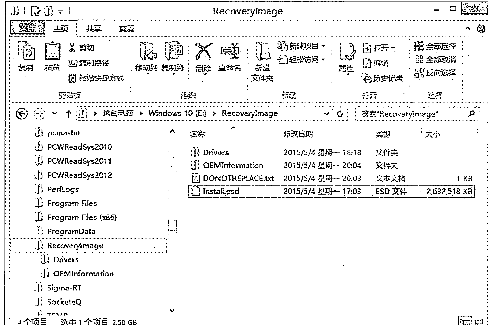

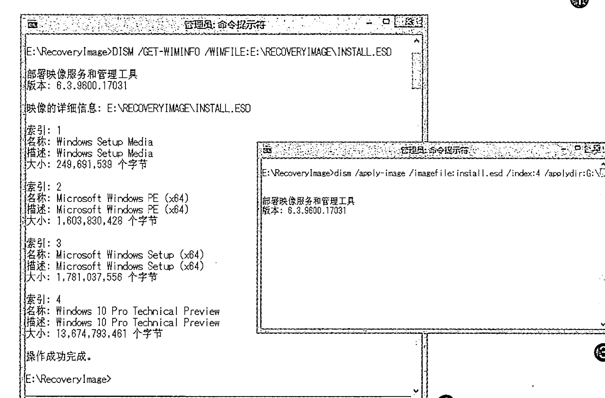

### 玩转ESD映像

ESD文件不方便直接使用，从中提取出需要的WIM文件，或者转换为ISO文件，即可被我们以传统的方式利用了。

#### (1) 手动转换

从Windows 8.1 update build 6.3.9600.16610开始，系统才自带了管理和处理ESD映像文件的工具DISM。使用该工具，可以手动处理ESD文件，不但可查看信息，还能抽取我们所熟悉的WIM格式文件。
如果要查看系统盘“E:\RECOVERYIMAGE\INSTALL.ESD”映像## (2)工具转换

如果觉得命令转换的方法比较麻烦，还可以借助于Dism++工具来转换ESD文件。Dism++是Dism的GUI版，操作界面图形化，更加直观，但它不是DISM的一个简单外壳，操作完全不依赖于DISM本身。Dism++解放了微软刻意隐藏的功能，如ESD捕获、ESD转WIM等。

以转换Windows 10官方的ESD映像为例来说明：先下载Windows 10官方ESD映像，下载Dism++ 10.0.1.4版转换工具。

打开Dism++，选择“文件”选项卡中的“格式转换”，选择“ESD->ISO”（图5），接着在弹出的窗口中选择ESD所在的源文件路径和目标文件ISO所在的路径，命名将要生成的ISO文件名，点击“完成”开始转换（图6）。转换完成之后，生成的ISO映像文件就可以像以往那样使用了。

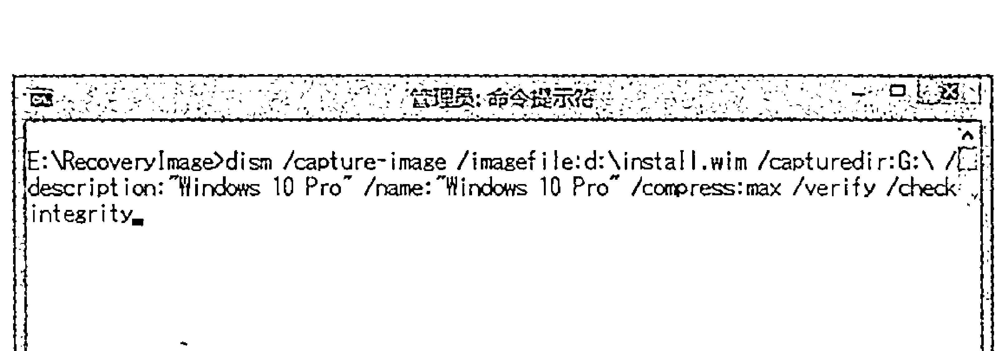

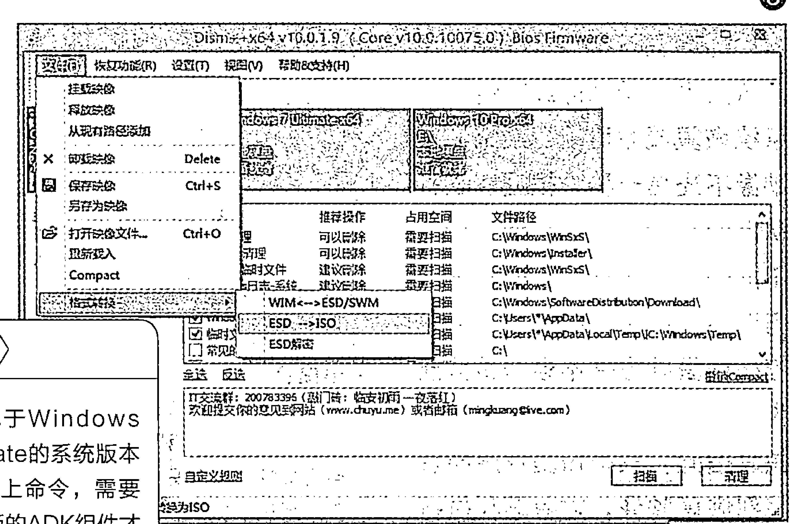

> 小提示
如果在低于Windows 8.1 update的系统版本中使用以上命令，需要安装8.1版的ADK组件才能执行该命令。

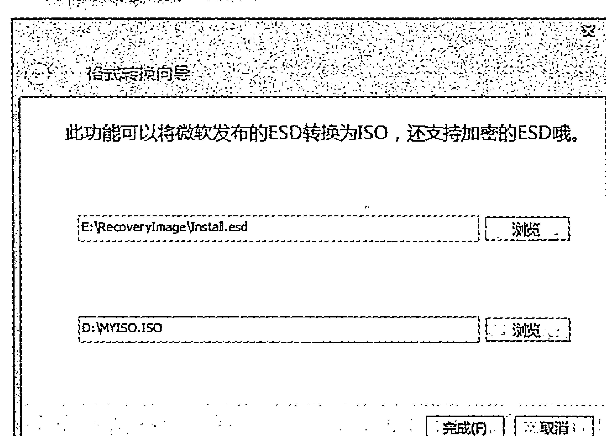

> 小提示
Dism++工具也分64位版或32位版，要根据自己当前系统的版本来选择使用对应的版本。下载最新版，还支持加密ESD文件的转换。

#### (3)ISO替代

虽然微软没有直接提供某些Windows版本的ISO文件下载，只能在线更新，但在新版本自动升级后，一些电脑爱好者会在第一时间通过升级的ESD文件转换成ISO版本并提供下载。如果能下载获得这样的ISO文件，显然要比自己去转换方便一些。但问题是，这样的文件不排除被人内置做手脚的可能，用作测试尚可，如果要正式使用，还是通过微软官方的ESD文件亲手转换更加让人踏实。

## 分清级别 用好系统恢复映像 文/张菲

系统恢复时要调用恢复映像文件。也就是说在存在恢复映像文件的情况下，恢复程序才具备恢复系统所需的原材料，让系统恢复成为可能。系统恢复映像不光是一种，根据系统默认自带或由用户来创建，分为不同的三个层次，不同的层次有着不同的优先级别。此外，存在恢复映像并不意味着就能恢复成功，还需要建立必要的关联指向，只有恢复程序能够找到恢复映像，才有顺利执行恢复过程的可能。

> 小提示
使用recimg命令创建的自定义恢复映像只能用于“系统刷新”，不能用于“系统重置”。因为它尚缺启动系统所需的一些核心文件。

## 1：最优级别——“自定义恢复映像”

CustomRefresh.wim是系统指定的“自定义恢复映像”文件名，其字面意思是“用户刷新”，这是一个用来刷新系统的用户映像文件，不同于系统出厂自带的映像文件。它是由用户在使用电脑过程中创建的，包含了用户的数据和安装的应用。

CustomRefresh.wim恢复文件由“recimg /createimage D:\”命令创建。recimg表示创建和管理映像，是固定的拼写，不能改变；/createimage参数表示创建映像，创建的是当前正在使用的系统的映像；后面的路径D:\则代表创建的映像文件存放的路径，可由用户设定（图1）。

若在不同位置创建了多个CustomRefresh.wim自定义映像，系统不知道你要用哪个映像来优先恢复系统，这时可使用recimg /setcurrent命令指定默认的自定义恢复映像。如“recimg /setcurrent E:\”，该命令表示将E:\中的CustomRefresh.wim设置为恢复电脑时的默认自定义恢复映像（图2）。

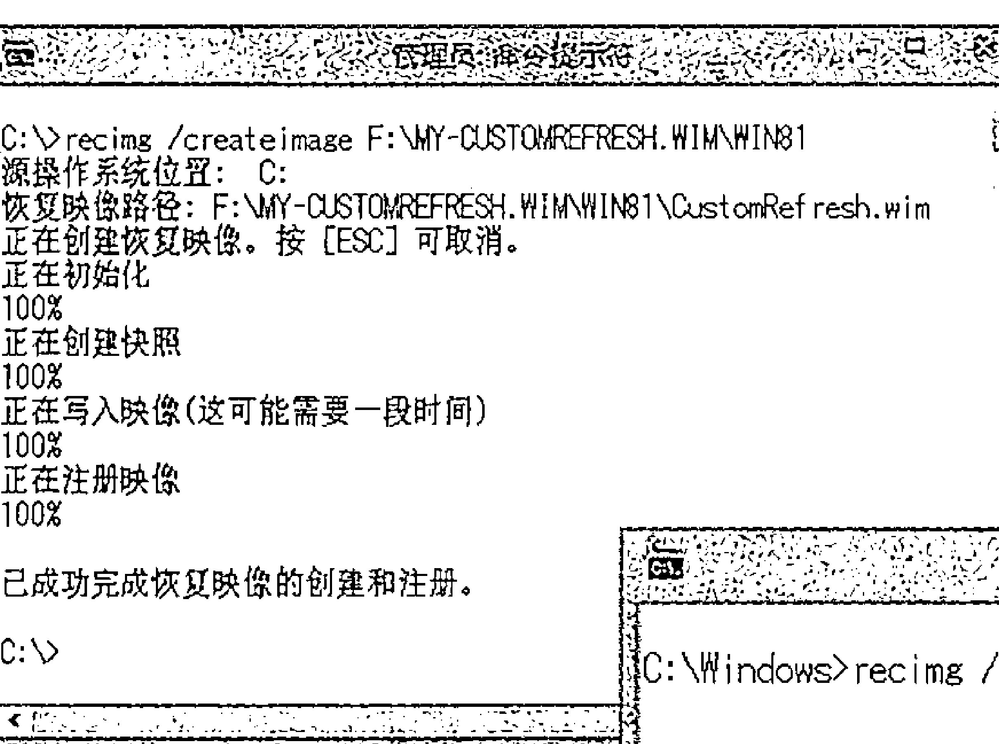

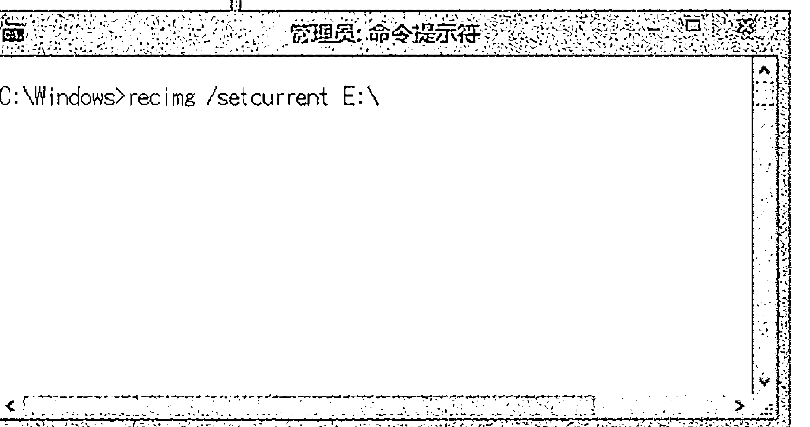

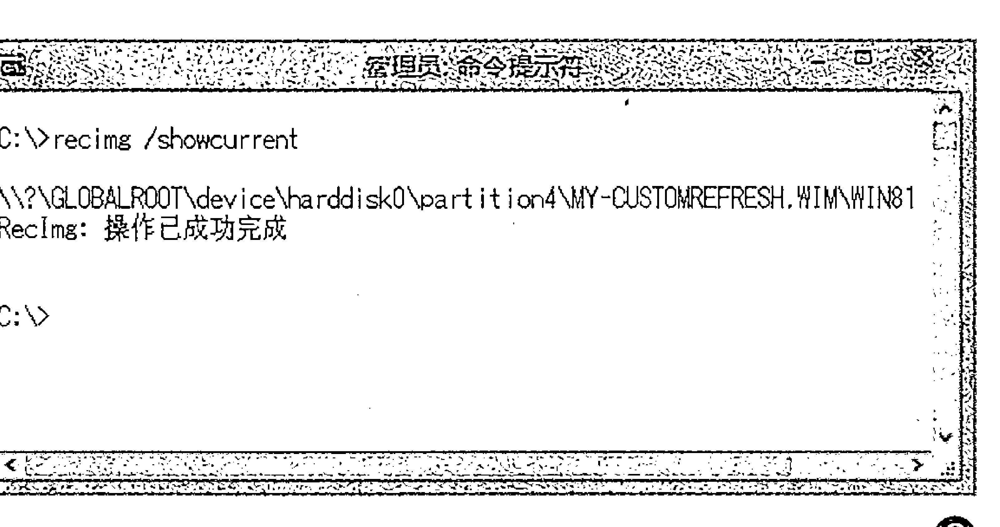

如果你不知道当前的系统使用了哪个自定义恢复映像，可使用“recimg /showcurrent”命令进行查询。若不再希望使用当前与系统关联的自定义映像，可用命令“recimg /deregister”来解除与现有映像的关联，然后再用带/setcurrent参数的命令来重新指定自定义映像（图3）。

自定义恢复映像中包含已经安装的桌面应用，以及处于当前状态（即创建映像时的状态）的Windows系统文件，但不包含个人文件、系统设置以及来自Windows应用商店的应用。因为这些内容在恢复电脑时已默认保留，可保持恢复电脑前的状态。具体操作原理是先对这些内容进行筛选并隔离，最后再恢复。

需要注意的是，如果用户不特意指定自定义恢复映像的位置所在，在使用“recimg /createimage D:\”命令创建自定义恢复映像后，系统会自动将新建的自定义映像设置为默认自定义恢复映像，在恢复电脑时将默认从该自定义恢复映像所在位置调用文件恢复电脑。

## 2 次高级别——“指定恢复映像”

倘若在系统恢复时，于指定的恢复映像目录中找不到用户自定义的映像文件CustomRefresh.wim，则在恢复电脑时将会从“指定恢复映像”恢复电脑。“指定恢复映像”可使用reagentc命令来设置，文件名固定为install.wim。

“指定恢复映像”的来源，可通过提取Windows 8.1原版映像中sources下的install.wim而获得，将其放置到某个位置（只要不是根目录就行，如放到E:\sources下）。在以管理员身份运行的命令提示符窗口中，键入下面的reagentc命令回车运行，即可定义系统“指定恢复映像”（图4）：

```
reagentc /setosimage /path E:\sources /index 2
```

### 小提示

执行“reagentc /info”命令可同时查看“指定恢复映像”和“自定义恢复映像”的配置情况，从中可以看到是否同时配置了“指定恢复映像”和“自定义恢复映像”。如果你对自己所用Windows的系统映像有无和指向情况不甚了解，执行这个命令查看一下吧（图5）！

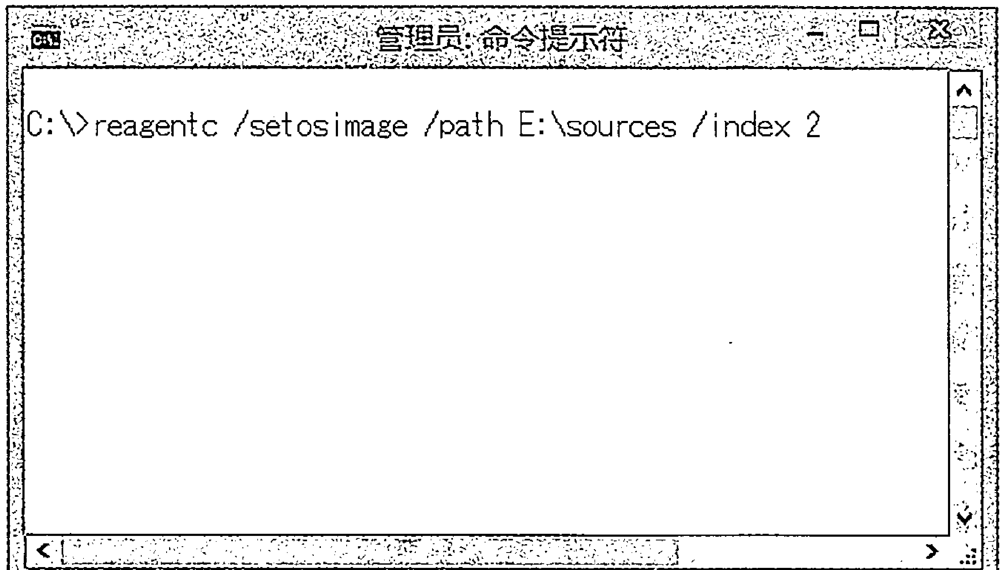

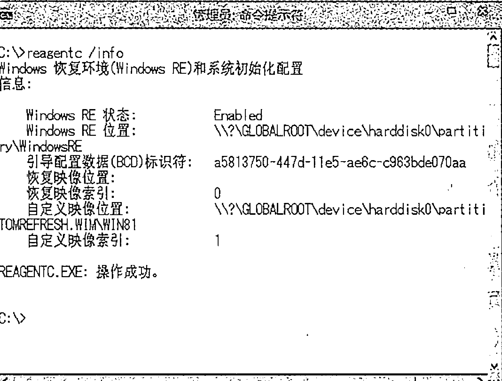

### 小提示

有的电脑在购买时会带有安装光盘或闪存盘，但也有不少电脑在购买时并没有带这些介质，而只是在硬盘系统映像区附带了恢复用的映像文件。系统分区中的恢复映像分区或文件遭到破坏而不能使用，这时，如果又没有建立自定义系统映像文件，处境就不妙了。不过，好在微软还为我们提供了在线创建系统安装介质的渠道，可以通过微软官方网站，在线创建Windows安装光盘或安装闪存盘。

## 3 最后稻草——系统安装介质

在恢复系统时，倘若“自定义恢复映像”和“指定恢复映像”二者均失效（“reagentc /info”命令查询结果未建立或映像错误），恢复程序就会提示用户插入安装介质，然后自动从安装介质中寻找系统恢复映像文件。这时就需要准备好Windows 8.1或Windows 10系统安装光盘或闪存盘，插入后方可继续执行恢复操作。

### 火速链接：在线创建系统安装介质

在线创建安装介质的详细方法，可参见《电脑爱好者》2015年第17期系统栏目文章《创建二合一Windows 10系统安装盘》。

### 扩展阅读 系统重置与恢复映像

系统重置需要有指定的恢复映像来支持，如果有Windows安装介质或ISO原版映像，可使用reagentc命令指定恢复映像install.wim的位置来重置电脑。系统重置相当于全新安装。只不过在重置时，既可选择“只删除Windows安装分区上的文件”，也可以选择“删除所有分区上的文件”（但如果指定了恢复映像，恢复映像所在分区除外）。系统重置可保留系统的激活状态。

## Microsoft Edge使用问题
文|南粤

Microsoft Edge虽然轻便实用，但从IE转入之后，有许多功能会让人摸不着头脑——主程序和缓存文件夹的位置找不到、下载的路径没法更改、搜索引擎太霸道……是Microsoft Edge不支持，还是没找到窍门？让我们解开这些谜团。

## 1 探秘Edge缓存文件夹位置

IE的缓存文件夹很容易通过“Internet选项”窗口定位或重设。而Edge缓冲文件夹的位置查找就是个难题，更别说重定向了。

我们通过一个实验来获取其位置。首先用Edge打开一个页面，在页面中找一张已经显示出来的图片（文件名越特殊越好），用右键菜单“保存图片”命令获取其文件名（如一张随机广告图片“695df20b8ebc87b25d094d5c7681fc10.jpg”）（图1）。既然我们在页面中看到图片显示出来，说明其已被下载到本机的缓存文件夹中。随后，利用Everything快速搜索工具搜索该图片，获得了该图片的搜索结果，从窗口中就可以看到该图片所在的Edge缓存文件夹的路径。由于该文件夹路径埋藏得很深，而且还带有隐藏属性，所以用传统的方式一步步进入很费事，这时可通过在搜索结果窗口中右击并选择“打开路径”命令，一步进入该缓存文件夹，对文件进行操作（图2）。

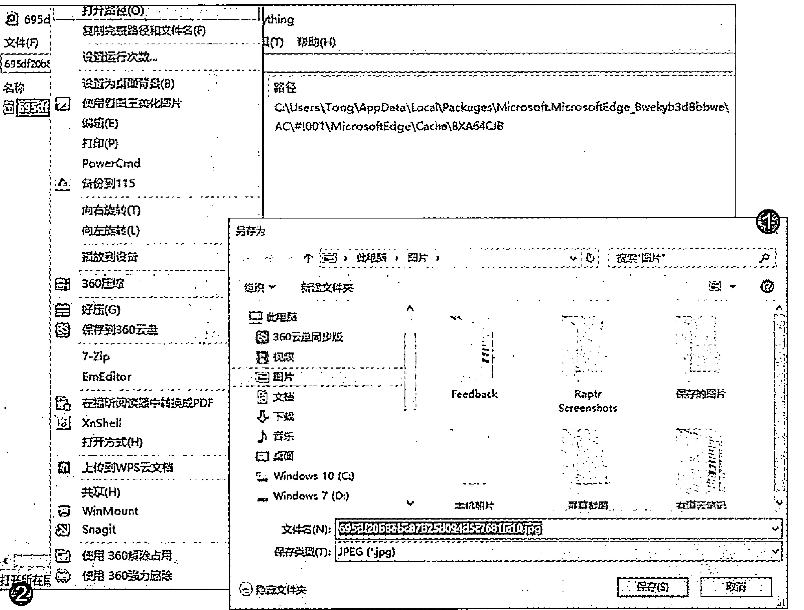

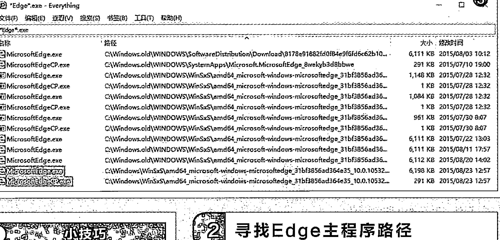

### 小技巧
#### 清除Edge缓存文件夹二法

点击工具栏上的“中心”按钮，接着点击“历史记录”按钮，点击“清除所有历史记录”文字链接；或者点击“更多操作”按钮，然后点击“设置”，在设置窗口中点击“清除浏览数据”下方的“选择要清除的内容”，在下级窗口中自由选择要清除的浏览数据项目，最后点击“清除”按钮即可。

## 2 寻找Edge主程序路径

IE的主程序好找，但Edge主程序在哪里？用Everything搜索“*Edge*.exe”，找到所有主文件名中含有Edge关键词且扩展名为EXE的文件。从搜索结果列表中可以看出，多次出现两个不同名文件“MicrosoftEdge.exe”和“MicrosoftEdgeCP.exe”。其中Windows.old文件夹中的文件为历史版本文件，而从文件日期和路径名称可以看出，“Windows\WinSxS\”路径下的文件才是Edge最新版程序文件，同样用右键菜单可进入其路径文件夹（图3）。

### 自定义Edge下载路径

Edge默认的下载路径是系统的“下载”文件夹。如果要修改该文件夹的位置，可用多种方法。

通过在系统“下载”文件夹上右键单击，修改文件夹的“位置”属性，移动其目标为新的位置，可以改变其默认路径位置（图4）。

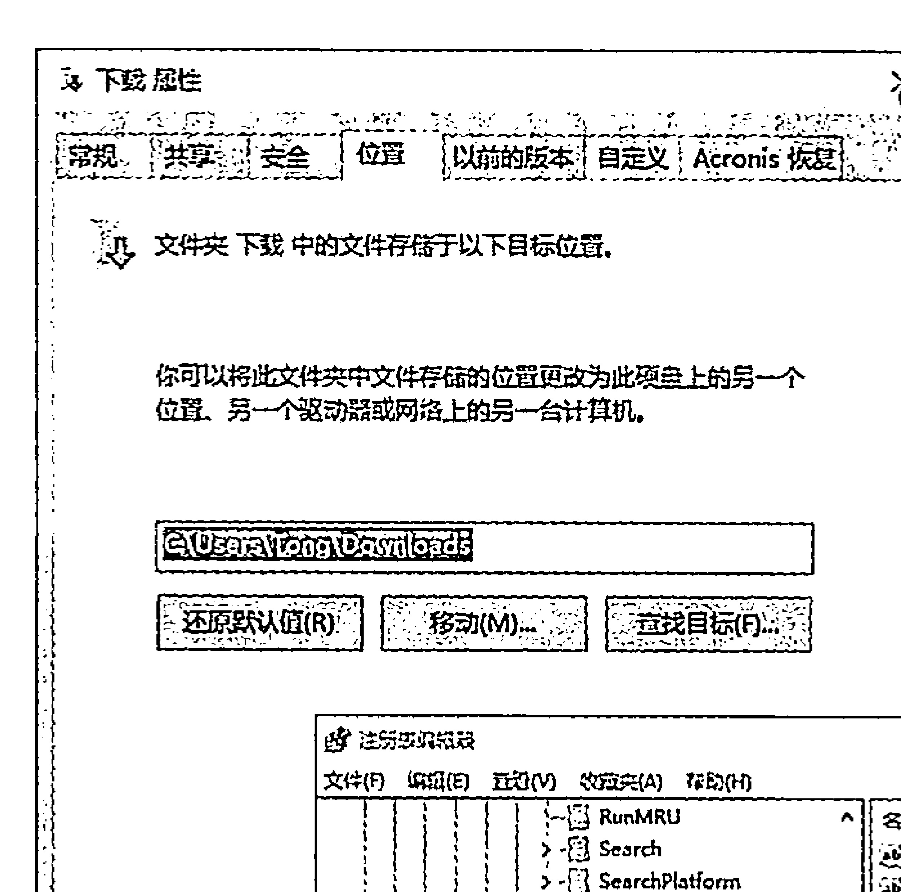

> **小技巧**

还有一种更快捷的方法：如果系统中安装有软媒魔方工具，启动设置大师，选中“下载”并点击“更改路径”，选择新位置即可。

还可以通过修改注册表来更改下载路径。用Win+R组合键运行regedit打开注册表编辑器，依次定位到“HKEY_CURRENT_USER\SOFTWARE\Microsoft\Windows\CurrentVersion\Explorer\User Shell Folders”，在右侧窗口找到“{374DE290”开头的键值，双击此项并将值“%USERPROFILE%\Downloads”改为新的路径（图5）。

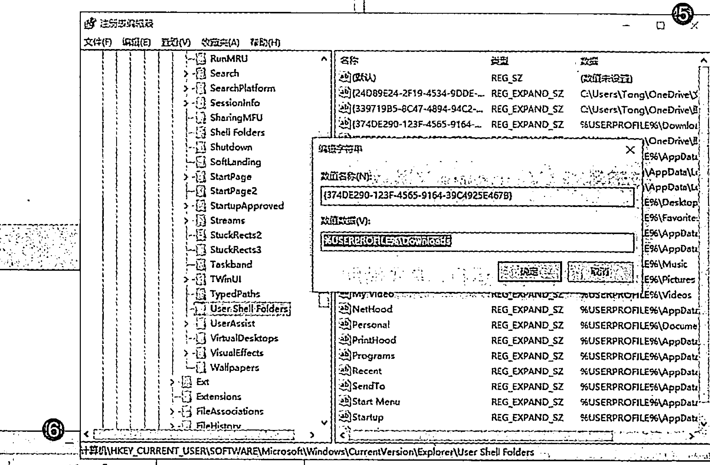

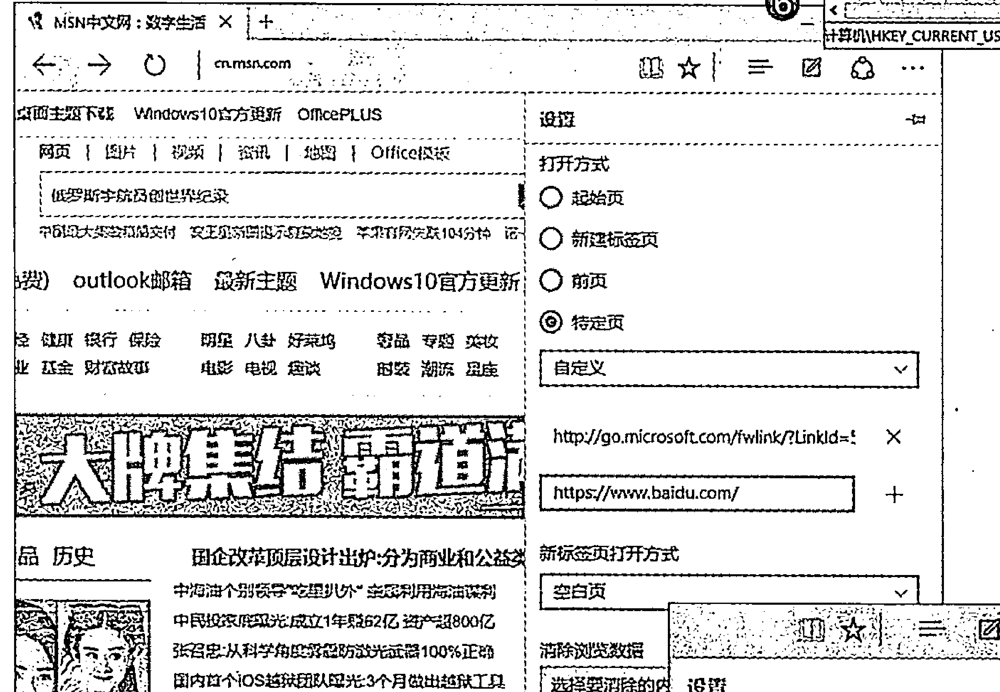

### 让百度入主Edge搜索

Edge浏览器的搜索功能与微软搜索紧密结合。不光是启动Edge后就能即刻进入msn中文网进行搜索，更有一项神奇的功能——在地址搜索栏中不输入地址，直接输入关键词也能调用微软bing搜索引擎。但如果用户只喜欢百度，让百度来接管这两项搜索也不是不可能。

如果希望启动Edge后自动打开百度，可先在Edge设置窗口中将“打开方式”指定为“特定页”，然后选择“自定义”选项，并在下面的网址栏中输入百度网址（图6）。

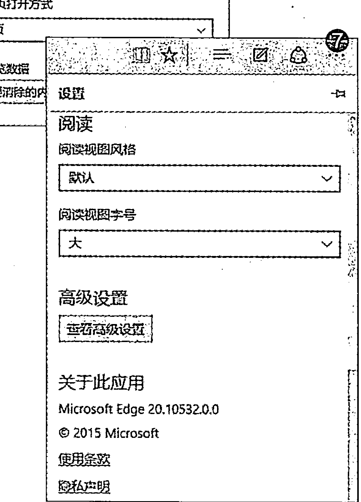

若要将地址栏中隐含着的Bing引擎改为百度，可先进入Edge设置的“高级设置”窗口（图7），然后在“地址栏搜索方式”中将搜索引擎改为百度搜索引擎地址（图8）。

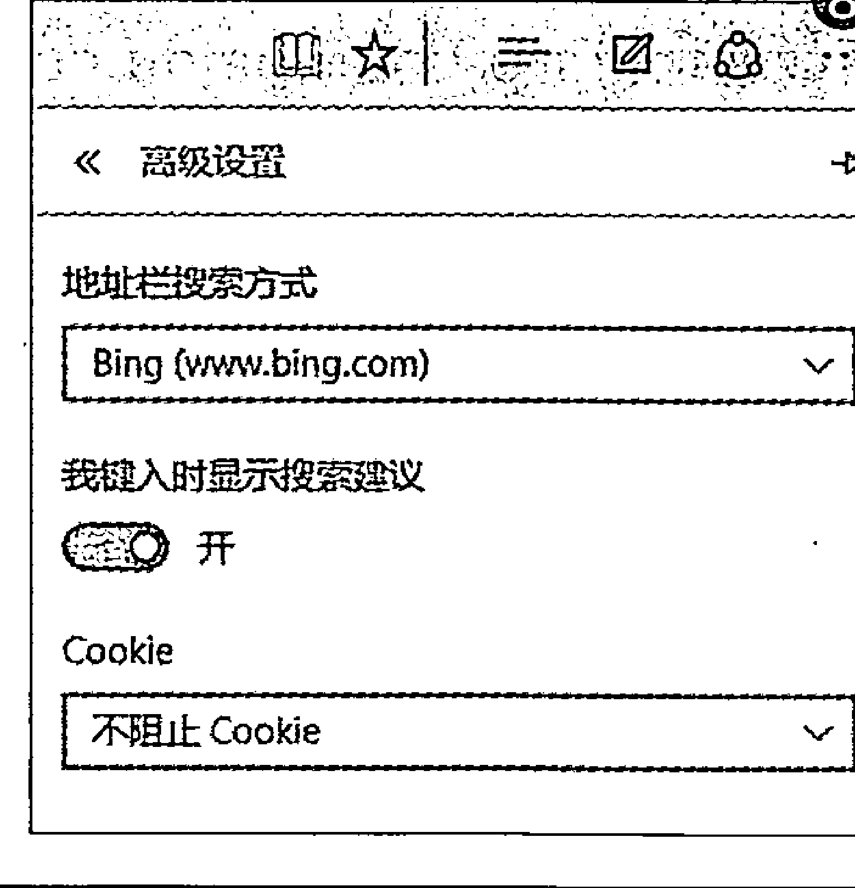

## "重玩"免费Windows 7小游戏
文|菲儿

Windows 10取消了Windows 7中自带的经典小游戏（如《纸牌》《扫雷》等），转而采用收费的方式发行这些游戏。那么，在Windows 10中还能免费玩这些老游戏吗？

### 亲手移植Windows 7游戏

要使Windows 7小游戏移植到Windows 10后可以运行，需要借助于microsoft.games.patch补丁来完成。首先将32位的Windows 7系统游戏文件夹"Microsoft Games"复制到当前使用的Windows 10系统的"Program Files"文件夹（32位Windows 10系统用）或"Program Files (x86)"文件夹（64位Windows 10系统用）下。对于接龙、红心大战、空当接龙、扫雷等四款游戏，需要将Windows 7系统中的cardgames.dll文件复制到各游戏文件中。这里以扫雷游戏为例，打开microsoft.games.patcher，点击运行Patch程序，选取SpiderSolitaire文件夹中的SpiderSolitaire.exe，点击"Open"完成修改。其他游戏的修改方法类似。修改后，执行游戏程序的主文件，即可启动游戏了（图1）。


移植后的游戏在Windows 10中运行良好

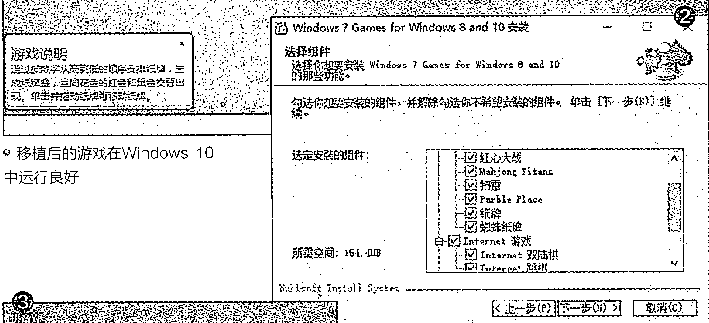

安装程序尽含Windows 7中自带的小游戏

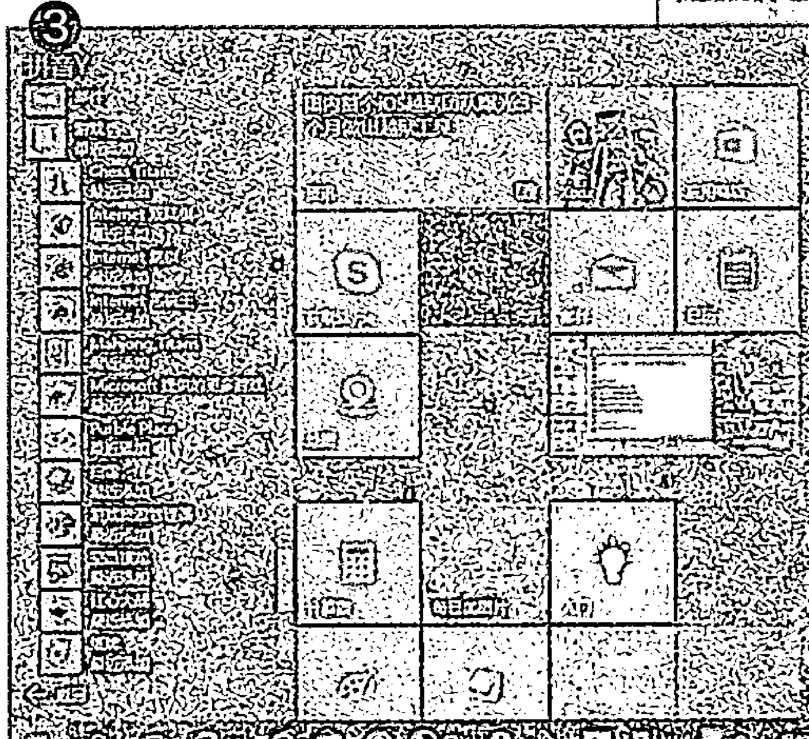

位于开始菜单"游戏"文件中的游戏快捷方式

### 小技巧

为了便于调用，发送Microsoft Games文件夹到桌面快捷方式以方便调用；也可以将每个小游戏的主程序在桌面创建一个快捷方式，然后将这些快捷方式移动到桌面上的一个"Windows 7小游戏"文件夹中，最后在系统任务栏上新建工具栏菜单，并将新工具栏菜单的名称指定为上述"Windows 7小游戏"文件夹。这样，以后只需点击任务栏上的"Windows 7小游戏"弹出菜单，从中选择游戏，就可以直接调用其中的任何一款小游戏了。

### 寻找绝佳的游戏替代品

除了移植的方法外，最省事的办法莫过于找到直接在Windows 10中安装和运行的Windows 7小游戏的"替代者"——"Windows 7 Games for Windows 8 and Windows 10"（下载地址：http://pan.baidu.com/s/1c035Kbu）。该游戏安装包可以通用于32位和64位简体中文版Windows 8.1和Windows 10（图2）。 安装结束之后，打开Windows 10的开始菜单，定位到"拼音Y→游戏"组中，可见新安装的11款小游戏的快捷启动方式图标（图3）。

## 3D打印 微软帮你解难题
文|江南

如今，3D打印机已开始从实验室走进百姓家。然而，3D打印的一个难点就是建模，需要有一定的水平和掌握建模软件。Windows 10正式版为我们提供了一款生活化的3D设计和打印软件——3D Builder。借助它，设计和打印3D作品易如反掌。

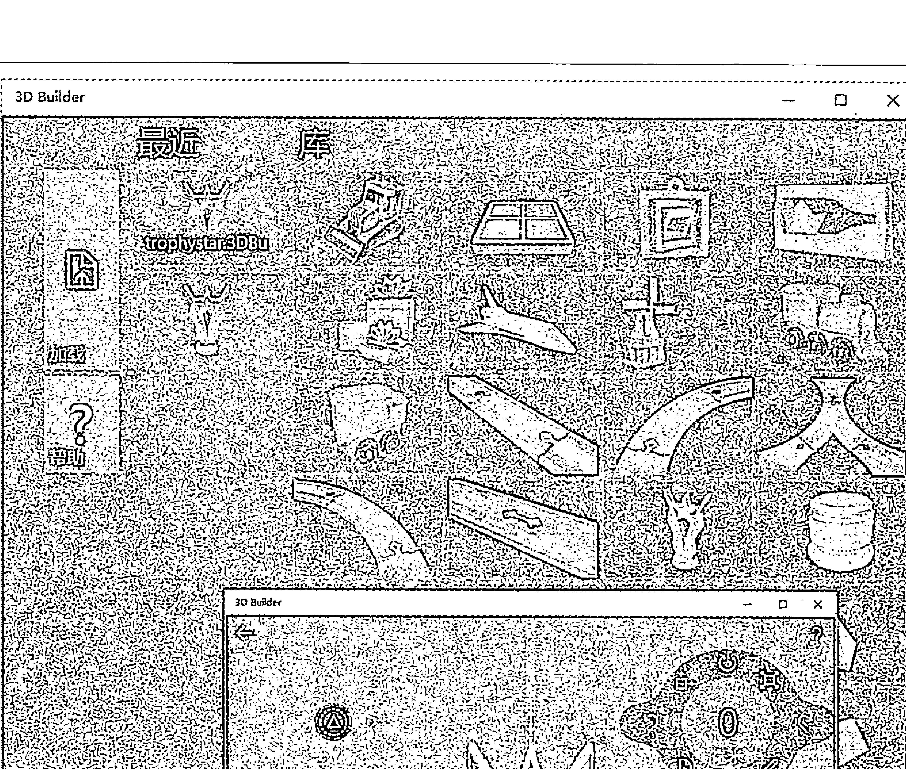

点击Windows 10开始菜单，选择“所有程序”项，点击启动3D Builder程序。首先映入眼帘的是很酷的3D图标，它们被纳入到“库”当中；左侧是“加载”按钮和“帮助”按钮；中间为最近操作历史留有一席之地。整个程序界面看似如此简单(图1)。

在3D Builder软件自带的模型样板库中，多是一些日常生活中用到的装饰或小玩具。我们可在这些模型的基础上进行编辑和修改，从而很容易地就能建造出属于自己的3D作品模型。试着单击一个模型图标，这时便会进入预览和设计界面(图2)。按下鼠标左键拖动可以轻松旋转模型，而按下鼠标右键拖动可以通过平移改变模型的位置。

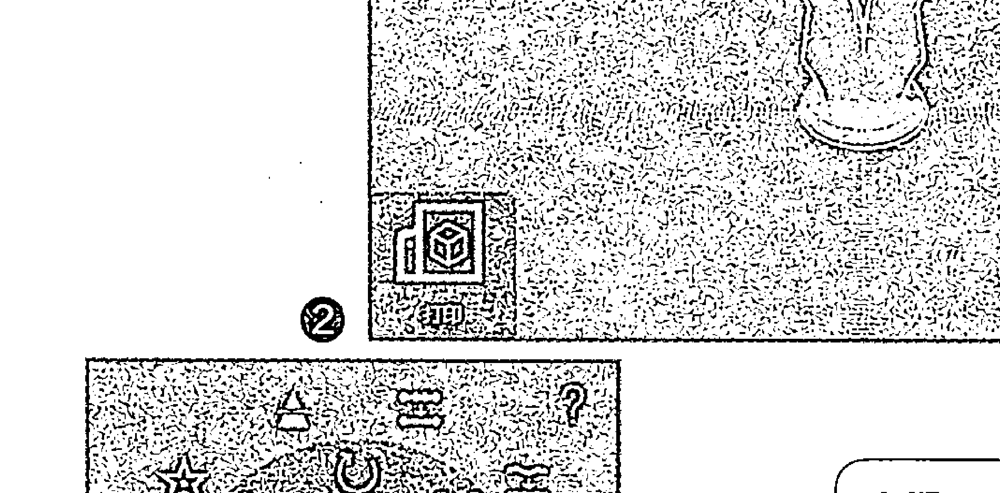


> 小提示
使用Windows 8.1的用户也可在Windows应用商店下载安装使用。

设计画面的左上部有一个圆圈套三角的选择控制按钮，点击可进入对象选择。最神奇和富有创意的要数右上角的多功能组合功能控制面板。这个面板集成了3种目标变换按钮、对象模式、文件模式、编辑模式等控制按钮。点击某按钮可激活对应的子模式面板进一步选择或操作(图3)。

通过目标旋转、缩放、移位等变换，加之对3D图形元素的增、删、改等编辑操作，可在模板的基础上改造出一个全新的3D模型，设计完成后执行存盘操作。

诚然，现阶段国内3D打印机及相关服务普及度还有待提高，虽然我们也能够通过购买3D打印机和相应的材料解决打印问题，但资金投入较高且对非专业人士实用性较为一般。

其实微软在Windows 10内置3D Builder的意义不仅是为3D设计行业做好前期准备，从使用者层面来看，也能够通过它实现空间设计（如家装）、产品构思等工作，而不仅仅局限于3D打印这一缺乏实体支持的项目上，如何灵活地利用它就看自身需要3D来展现什么了。

# 别让Windows 10锁住亲友

文/南粤

朋友来玩，如果家里的电脑设个密码显得太小气，倒不如将登录密码设为自动登录，开机自动进入Windows 10。但如果疏忽了另一问题：没有去掉锁屏密码或屏保密码，很可能在朋友中途离开后回来之际，电脑自动锁上引起误会。

## 1 自动登录网络账户

Windows 10可以使用网络账号或本地账号登录，为了适应网络功能，我们一般设置为网络登录。其实，网络登录也能像本地登录那样，将登录账号和密码设置为电脑自动登录，不需人为干预。

按下Win+R组合键，启动“运行”对话框，在其中输入“NETPLWIZ”命令并点击“确定”按钮（图1）。在随后出现的“用户账户”窗口中，即可显示本系统注册的用户名列表。这里只有一个用户，是由于本机只注册了一个网络账户，如果还注册了一个或多个本地、网络账户，则均可显示在此列表窗口中。选中需要自动登录的网络账户，将其上方的“要是有本计算机，用户必须输入用户名和密码”复选框中的“√”去掉，然后点击“应用”按钮并单击“确定”（图2）。

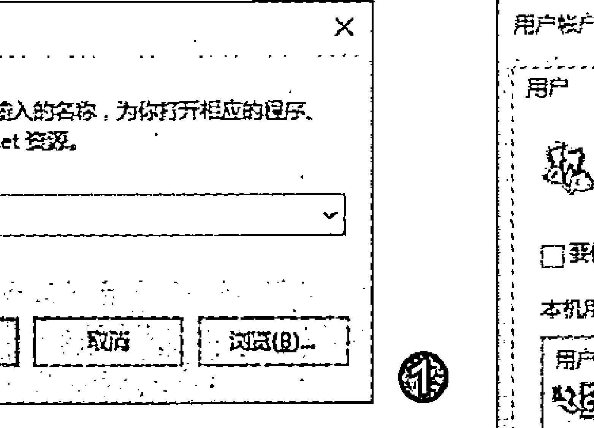

> 如果自动登录框显示的用户名账户有误，非网络账户，可手动输入正确的网络账户。

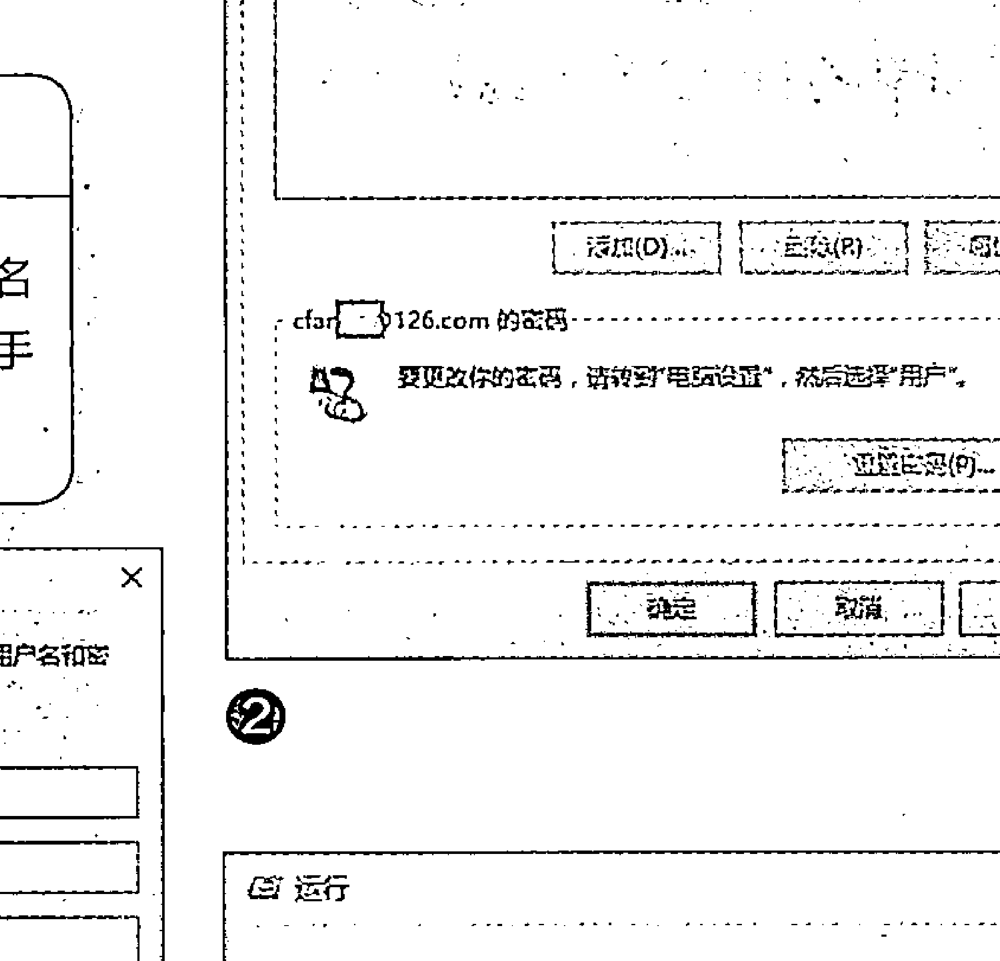

> 除了可使用上述“NETPLWIZ”命令外，还可以使用“control userpasswords2”命令来设置自动登录网络账户和密码，效果是相同的（图4）。

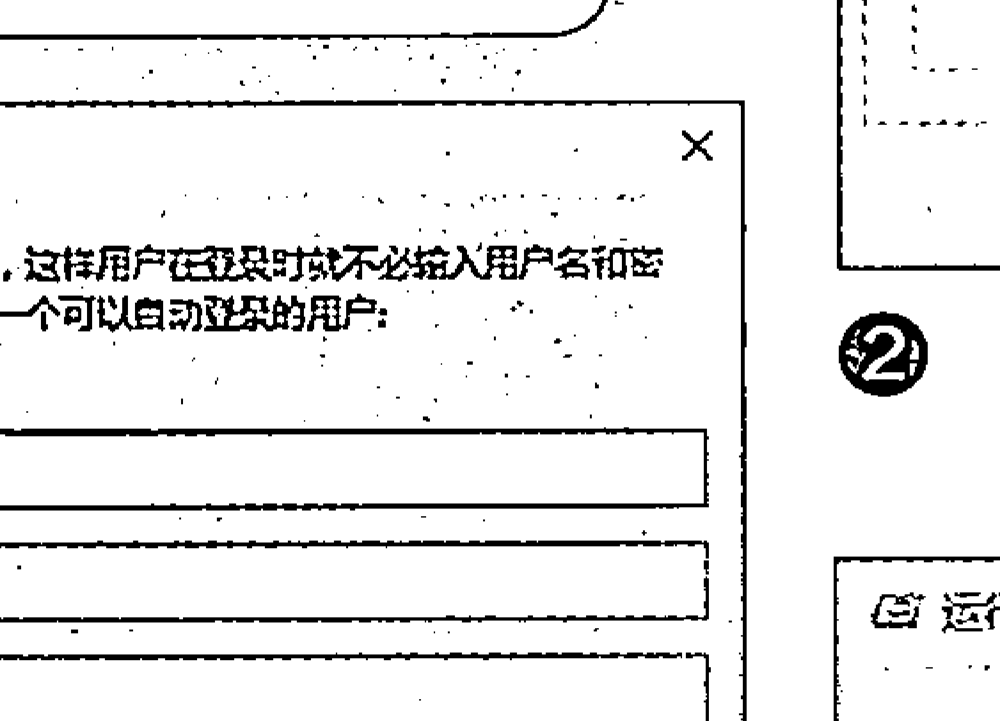

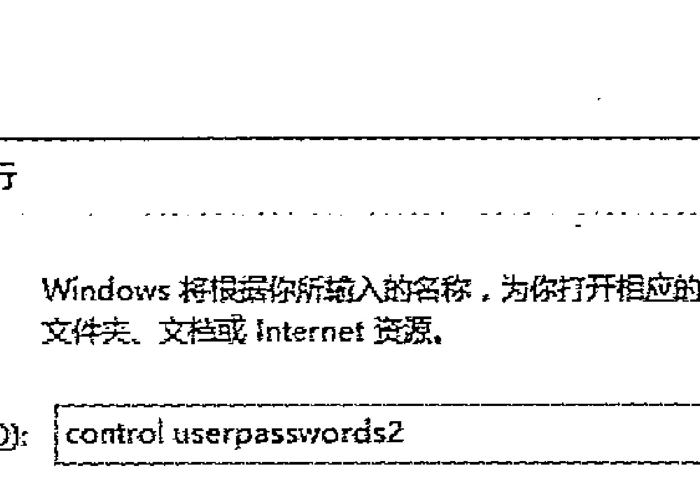

## 2 锁屏回来不要密码

以上自动登录设置完成之后不等于万事大吉了，因为系统登录之后还有两种锁屏密码会锁住用户访问。一种是屏保锁屏密码，另一种是节能锁屏密码。

默认的屏保锁屏密码会在屏保被中断后，要求输入密码解锁才能进入系统。而节能锁屏界面，会在用户离开一定的时间之后锁住屏幕，若想要解开锁屏，也需要输入解锁密码方能进入系统。

但是，升级到Windows 10之后，从哪里解除锁屏密码成了难题。我们尝试从新式的控制面板——“系统设置”窗口中查询解锁项目，没有能够轻易找到去除锁屏密码的选项。难道Windows 10无法取消锁屏密码吗？

点击Windows 10开始菜单并点击“设置”项，随后选择设置窗口中的“个性化”一项，在个性化设置窗口的左侧点选“锁屏界面”，将右侧窗口滑动到最底部，可见“屏幕保护程序设置”一项，点击此链接(图5)。

在随后出现的屏幕保护程序设置窗口中，看到“在恢复时显示登录屏幕”复选框处于默认选中状态，取消对该项目的选择，然后点击“应用”，再点击左下角的“更改电源设置”文字链接(图6)。

这样，屏保锁屏密码就被取消了。

接下来进入“电源选项”窗口，在左侧栏内可见“唤醒时需要密码”一项，点击此项文字链接(图7)。但是，在出现的电源选项系统设置窗口中，可以看到“唤醒时的密码保护”默认被选择为“需要密码”，且两个选项为灰色不可选状态，此时用户根本无法选中“不需要密码”一项(图8)，怎么办？

将目光移向上图上部的文字链接“更改当前不可用的设置”，点击该项，这时在出现的窗口中，唤醒密码的设置已经变为可选状态，选中“不需要密码”，点击“保存修改”按钮(图9)。这样，节能锁屏密码也被取消了。

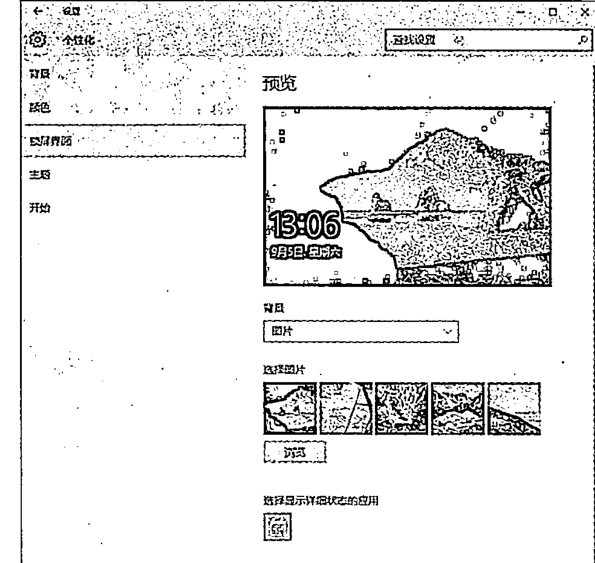

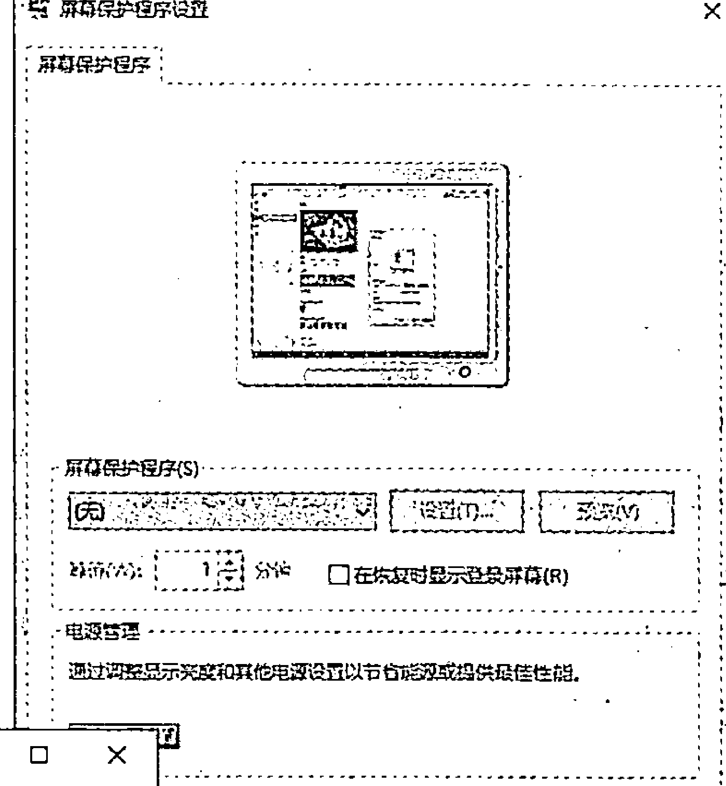

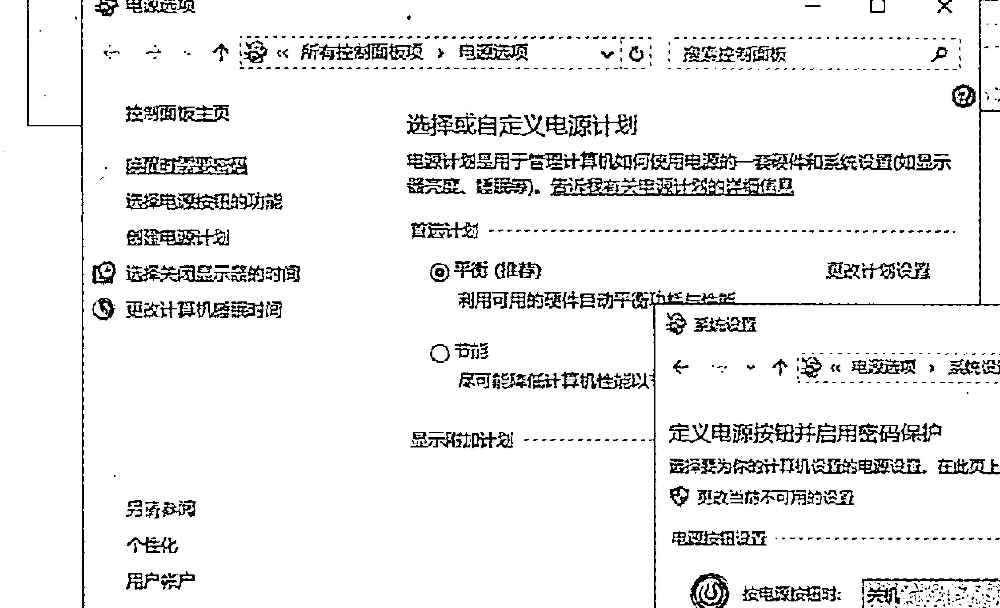

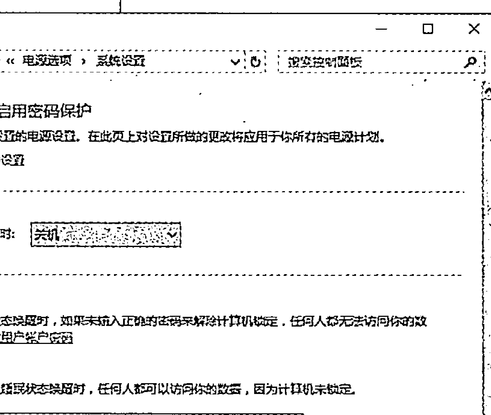

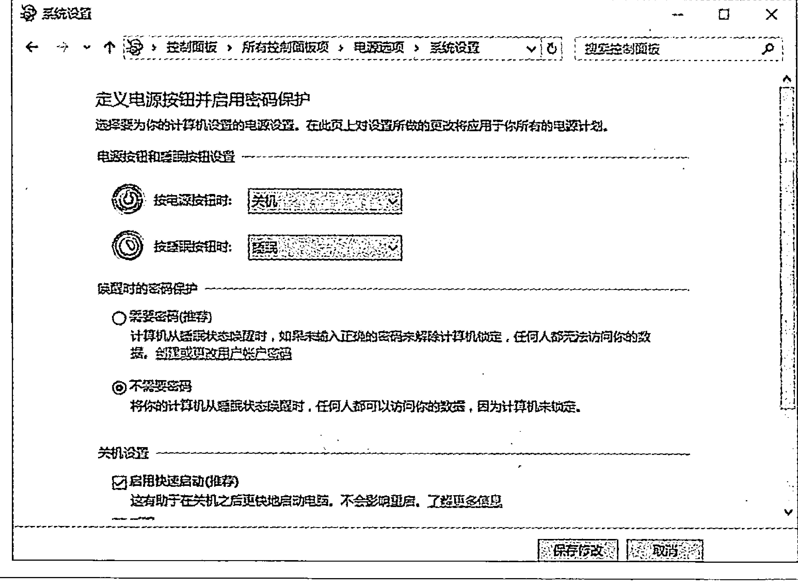

通过以上修改，同时解除了因屏幕保护退出而需要登录密码的保护，也解除了因电源睡眠后唤醒需要密码解锁的问题。结合前面的免网络密码登录系统，这样亲朋就可以畅通无阻地使用电脑了。

# 玩转Windows 10个性化界面

文/北峰

熟悉Windows 7或Windows 8的用户，在使用Windows 10界面设置时可能会有某种程度的不适之感。Windows 10对桌面个性化设置进行了很大的改造，看起来更简单了。但表面的简单不代表其博大精深的内涵减少，让我们深入Windows 10，一探其个性化界面的“度”深。

> 小提示
Windows 10系统界面的个性化设置被集成到“个性化”窗口中。这是微软对Windows界面设置重新归类的结果。系统个性化设置可通过开始菜单的“设置”项进入，还可以通过在Windows 10桌面空白处点击“个性化”进入。

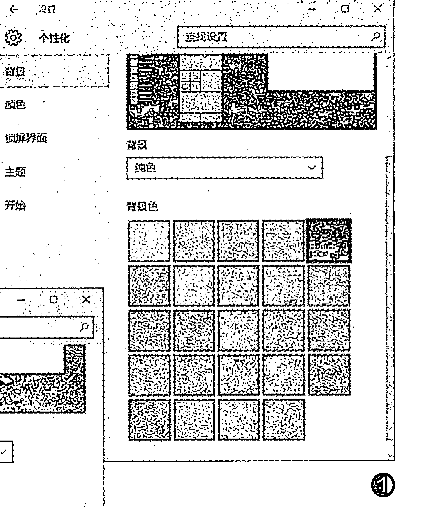

## 桌面 不光是简单的图片

Windows 10桌面背景默认为图片形式。除了可以使用单一图片外，还可以选择采用“纯色”和“幻灯片放映”两种方式的桌面。在纯色模式下，系统桌面以用户选择的纯色背景来显示（图1）。而幻灯片放映模式下，要为幻灯片指定相册文件夹，这样相册中的照片就可以自动轮番出现在桌面背景当中。桌面幻灯片可指定自动更换照片的频率和设定是否启动无序播放（图2）。

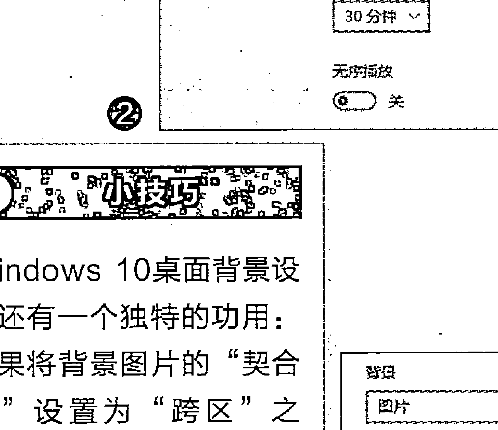

> 小技巧
Windows 10桌面背景设置还有一个独特的功用：如果将背景图片的“契合度”设置为“跨区”之后，如果电脑连接了多台显示器，那么桌面照片会跨显示器显示，为宽幅场景图片的多显示器联合拼接显示提供了更广阔的展示空间（图3）。

演示照片不用装软件。在设定了幻灯片方式的桌面背景放映之后，照片以设定的时间间隔改变，但用户可通过右击桌面空白处并选择“下一个桌面背景”随时手动更换桌面背景。这非常适合于展示自己的数码照片，只需将幻灯片文件夹指定为硬盘中的一个固定文件夹，然后存入每次拍摄的照片，即可以自动或手动演示了。

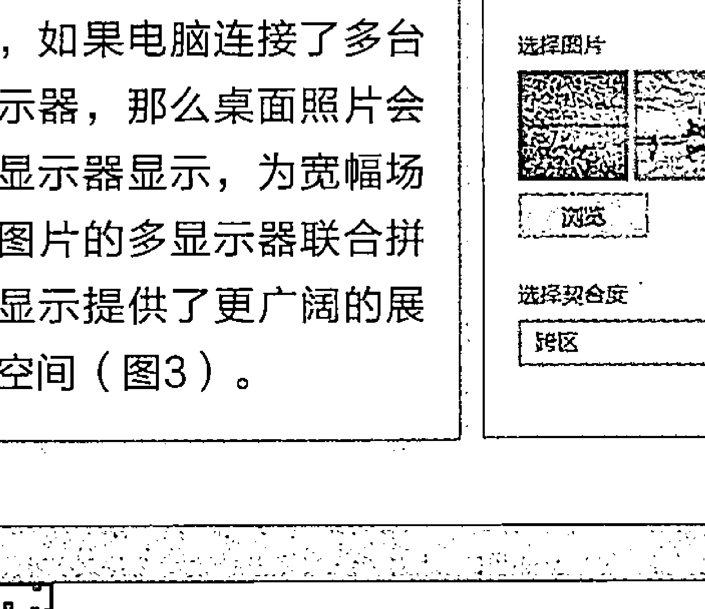

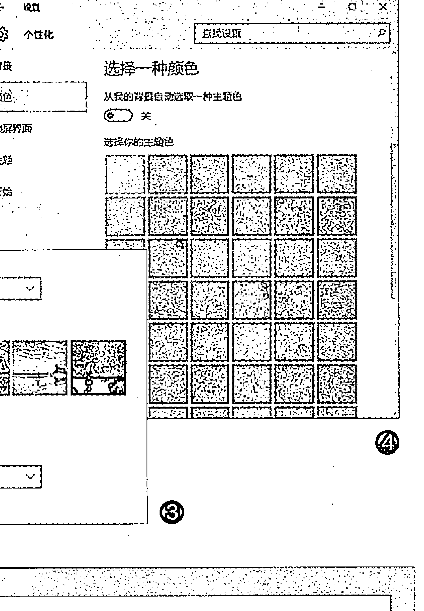

## 颜色 不只是有限的几种

Windows 10的开始菜单、任务栏、操作中心、窗口边框颜色均可通过“个性化→颜色”窗口进行设置。颜色设置可以智能地沿用已有背景图片中的某种颜色，该功能由“颜色”窗口中的一个开关“从我的背景自动选取一种主题色”来控制，默认处于开启状态。如果希望自己定义主题的颜色，先将此开关置于“关”的状态，然后从下方的色盘中选择颜色（图4）。

如果对给出的界面组件颜色不满意，还可以自定义。Windows 10没有在控制面板中直接提供自定义任务栏、窗口边框和开始菜单的颜色的入口选项，但我们可以自行制定这些位置的颜色：按下“Win+R”组合键，输入“Control Color”命令并确认；在出现的“颜色和外观”窗口中选择任意颜色；点击“显示彩色混合气”的向下箭头，调整滑块，直到上面色块中出现想要的颜色；点击“保存修改”（图5）。

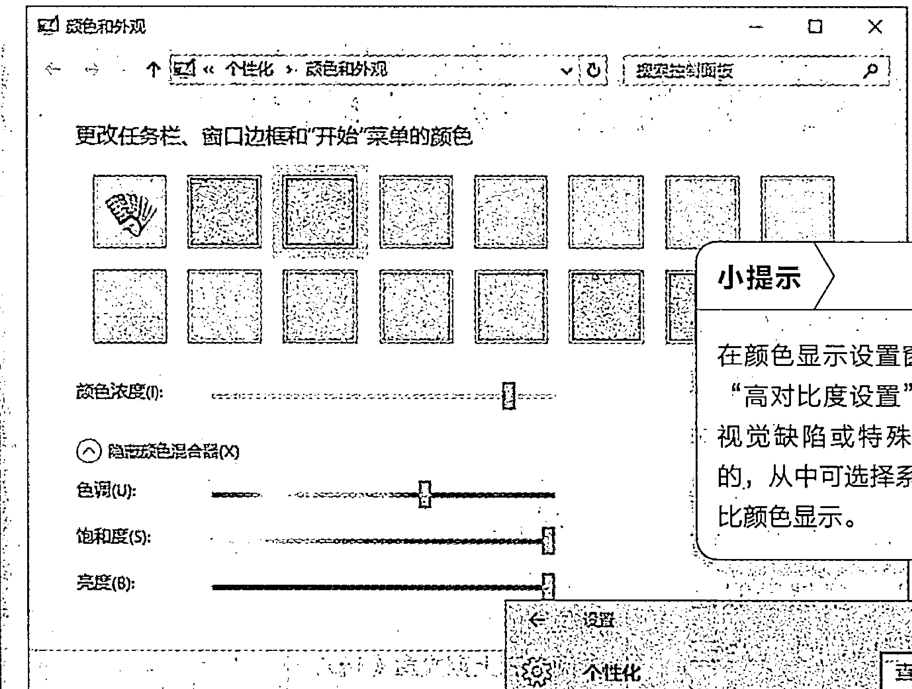

在颜色显示设置窗口的底部，还有一个“高对比度设置”入口，这是专门为有视觉缺陷或特殊视觉需求的用户设置的，从中可选择系统提供的4种内置高对比颜色显示。

如果要将设定的主题颜色体现在开始菜单、任务栏和操作中心中，需要将“显示开始菜单、任务栏和操作中心的颜色”的开关置于“开”的状态。若要让这些部位的背景显示透明化，还需要开启透明显示开关（图6）。

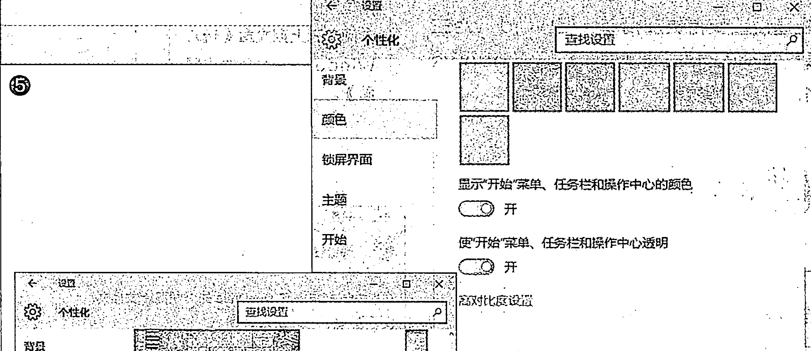

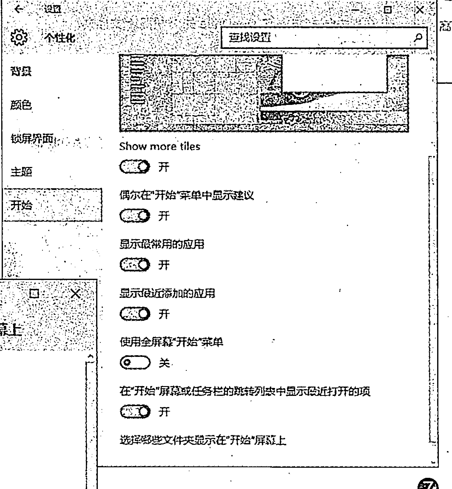

### 3 边角 小位置能出大效果

Windows 10默认的开始菜单也不是一成不变。用户可以决定是否在开始菜单显示最常用的应用以及是否显示最近添加的应用，还可以设置是否显示类似平板的全屏幕开始菜单。此外还可以控制是否在开始屏幕或任务栏图标的跳转列表中显示最近打开过的项目。最新的10547预览版还增加了显示更多条目和偶尔显示建议的选项（图7）。

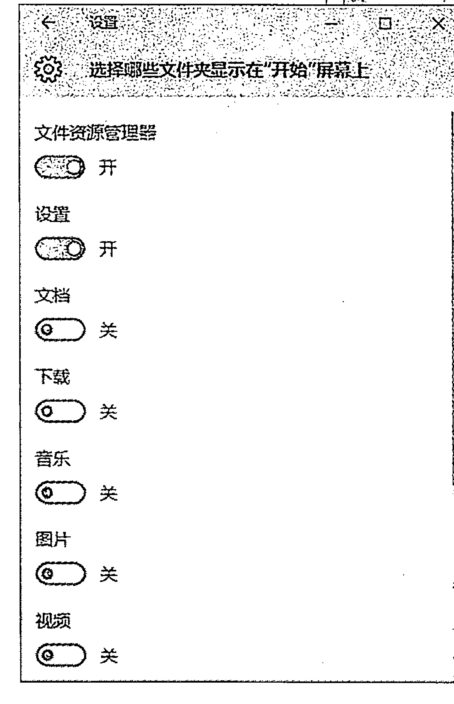

在默认的情况下，Windows 10开始菜单中我们只能看到“文件资源管理器”和“设置”这两个常用的系统项目，不见了传统Windows开始菜单中的“文档”“图片”“音乐”等的踪影。其实，通过特定的设置都可以将这些文件夹显现出来。在系统“设置”窗口中点击“个性化→开始”，点击“选择哪些文件夹显示在开始屏幕上”链接，可设置显示于开始菜单中的文件夹项目。这些项目还包括：下载、视频、家庭组、网络、个人文件夹等（图8）。

# 用好锁屏与主题 提升视觉效果

文/北峰

除了桌面背景和颜色外，锁屏界面的功能增强和主题设置的改变是Windows 10视觉设置变化的两个重要方面。灵活而多样化的锁屏方法，为闲时视觉效果的呈现提供了更多的可能；而系统对主题设置的重新布局和形式上的“阉割”，虽然看似让主题设置变得更加简单，但Windows主题功能其实并未被削弱，用好Windows 10主题仍需探索。

> 有关桌面背景、颜色、边角位置的个性化技巧，请参阅本刊上期文章《玩转Windows 10个性化界面》。

## 玩转Windows 10锁屏

当暂时不用电脑而离开时，我们常常会用Win+L键锁定屏幕。锁屏之后会自动显示系统预置或用户指定的图片。Windows 10除了图片锁屏外，还有“幻灯片放映”和“Windows聚焦”两种锁屏方式可选，它们能让锁屏界面摆脱千篇一律的面孔，呈现出可预期或不可预期的动态效果。

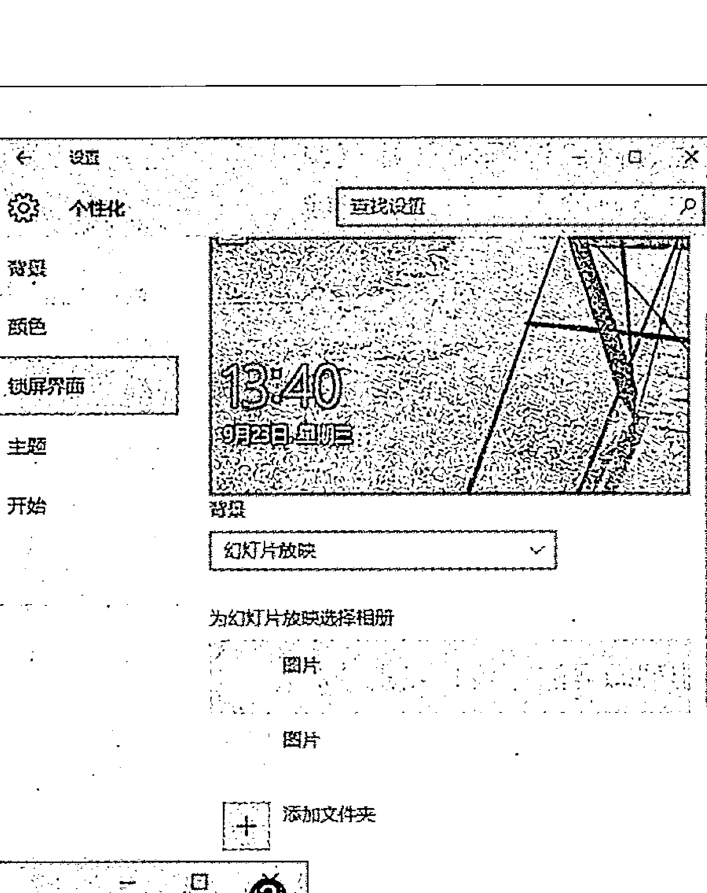

锁屏幻灯片放映与桌面幻灯片放映相比，一是发挥作用的时段不同，前者在暂时不用电脑时发挥作用，而后者在电脑开启的每时每刻都发挥作用。二是锁屏幻灯相册可添加2个以上图片文件夹（图1），而桌面幻灯片只能设定一个文件夹。通过“高级幻灯片放映设置”，还可以扩大锁屏幻灯片的来源，设置照片大小与屏幕的吻合度，以及电脑处于非活动状态时显示锁屏界面还是关闭屏幕等（图2）。幻灯片锁屏让用户以特定的图片序列，实现可预期的图片变换演示效果。

> 锁屏可以不用系统默认推荐的4张图片，转而使用个性化图片。在系统设置窗口的“个性化”窗格中，点选“锁屏界面”项，在右侧窗格即可选择“图片”并点击“浏览”按钮指定自己的锁屏图片，锁屏图片可使用jpg、jpeg、bmp、png、gif、tif及dib、jfif、tiff、wdp等共10种类型。

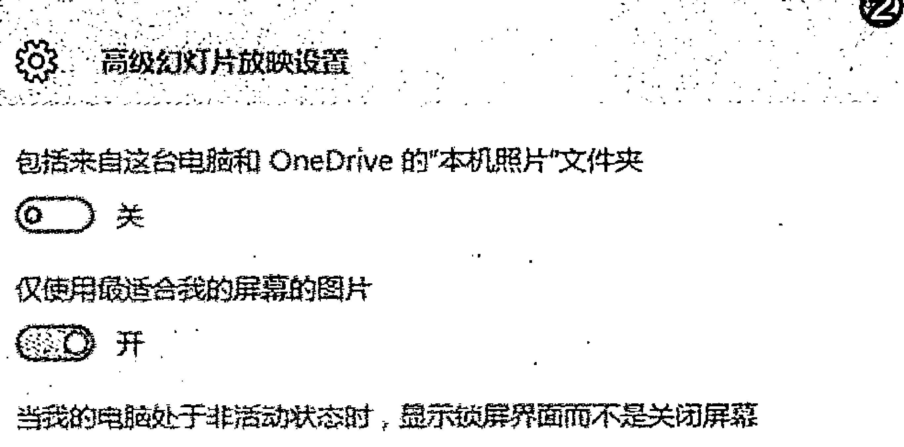

在Windows 10家庭版和高版本的Windows 10专业版中，还有一种“不可预期”显示内容的锁屏方式——“聚焦锁屏”（图3）。开启聚焦锁屏功能后，用户每次登录系统会显示出不同的锁屏背景，

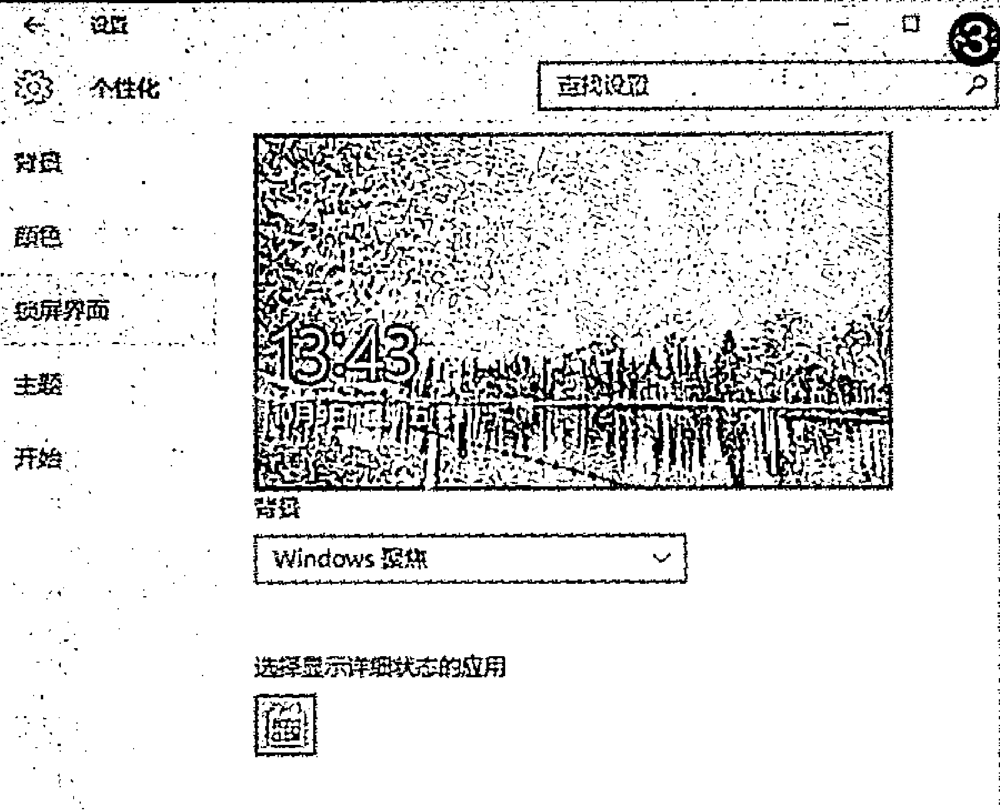

具体显示什么内容由微软来提供，用户无法预期图片的内容。但是，这并不表示用户完全无法左右照片的显示风格。在每次显示的“聚焦锁屏”界面中，系统会以文字的形式显示是否喜欢这个风格照片的调查选项，用户可根据自己的喜欢程度来决定和选择是否喜欢此类照片。之后，系统会根据用户的喜好程度来推送适合用户口味的“聚焦锁屏”图片。

## 2 用好Windows 10主题

在Windows个性化设置方面，除了单独设置桌面背景图片、颜色和锁屏图片外，Windows 10也将“主题”设置单列一项，并给出了声音、桌面图标、鼠标指针等相关元素的设置入口（图4）。但是，相比于Windows 8.1，点击“主题设置”链接后，我们发现这个主题窗口被“阉割”了，其中只给出了更改主题的三类基本选项：我的主题、Windows默认主题和高对比度主题，而之前的桌面背景、窗口颜色、声音、屏幕保护程序等均被取消了（图5），这会让老用户感到不习惯或无所适从。其实，这些内容并没有取消，而是重新整合到了不同的位置——背景、颜色和声音被整合到此前介绍过的个性化窗口的相关设置项目当中，而屏保被整合到系统的电源管理窗口中。

或许有人以为Windows 10之前的微软主题不能用在Windows 10上了，事实上，Windows 8/8.1甚至Windows 7的官方主题，大多数还可以直接应用在Windows 10上。在Windows 10的主题设置窗口中，点击“联机获取更多主题”链接，访问微软主题网站选择主题，点击“安装”即可直接安装主题（图6）。当然，也可以先将主题文件下载到本地，在需要时直接运行下载的主题文件进行安装。

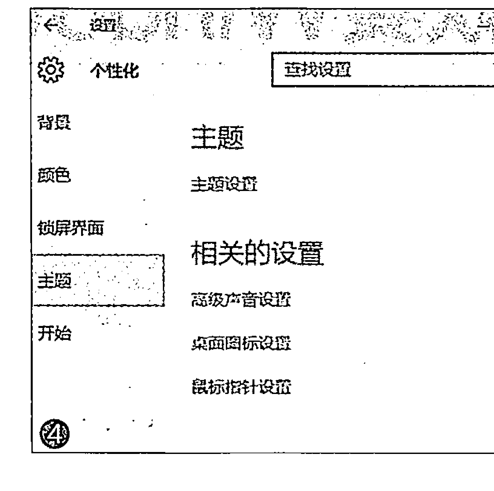

在最新推出的Windows 10 10547内部预览版中，应广大用户的强烈要求，微软在Windows个性化主题设置中又重新加入了桌面背景、颜色、声音、屏保等4个传统项目，实现了传统主题设置的“回归”。然而，当点击这些项目时，并非进入传统的界面设置，而是将用户引向Windows 10“设置”窗口的对应位置。可见，微软还是要力推它的全新设置界面。

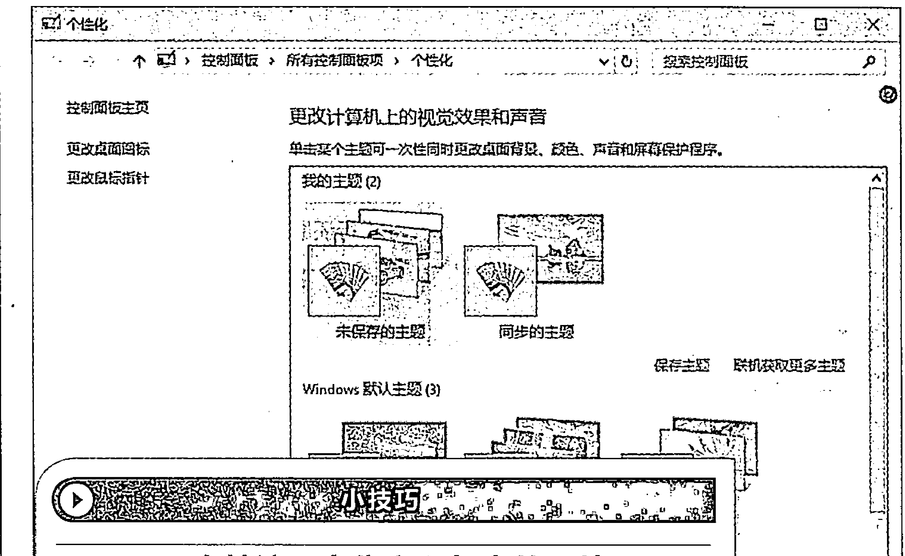

## 一次性演示多集主题包中的图片

如果希望将多集微软主题中的图片整合到一起来实现一次性演示，其实也很简单。微软官方网站提供的精彩主题文件扩展名一般为.themepack或.deskthemepack，要将这些图片提取出来，可安装7-zip压缩软件，右键单击主题文件并选择“7-Zip→提取到<文件目录>”，即可获得所有图片文件（图7）。之后只需将这些文件放置在同一个文件夹中，作为背景幻灯片或锁屏幻灯片演示即可。

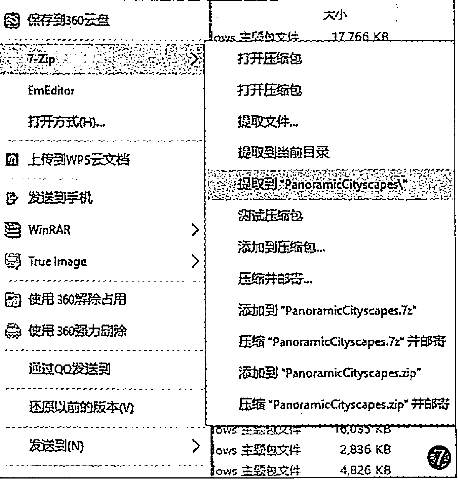

## 主题

+   主题是桌面背景图片、窗口颜色和声音的组合。通过单击“详细信息”可预览每个主题的图像并击“下载”，然后单击“打开”。这样会将主题保存在电脑中并应用于桌面。

主题分类：
- 特色主题
- 动物
- 艺术作品（图示）
- 艺术作品（照片）
- 汽车
- 游戏
- 假日和季节
- 电影

社区展示：自然风光3
主题包含 21 幅图像
窗口颜色
详细信息
下载

“海滩”全景
主题包含 9 幅图像
窗口颜色根据图像调整
详细信息
下载

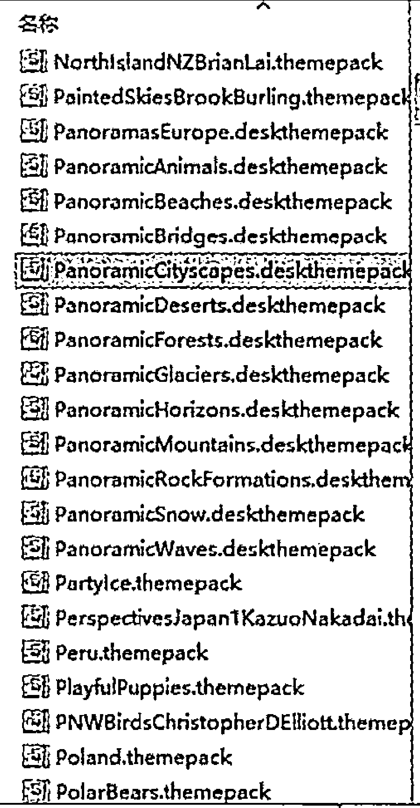

# 分清轻重 恢复Windows 10系统

文/张楚华

Windows 10系统出现故障的程度不同，处理的方式也不同。如果仅因为系统垃圾或常见故障而引起运行不畅，一般用系统自带的或第三方优化工具就能解决。但是，如果这些工具也无法解决，那就只能依靠恢复系统了。根据故障程度的不同，Windows 10系统恢复可采取以下5种方式“对症下药”。

## 1 问题明确用还原

如果系统故障是因为安装了某个应用软件、升级了某个驱动程序、安装了系统或软件的补丁、升级程序之后而引起，在卸载软件或补丁仍不起作用的情况下，可用恢复还原点的办法来恢复系统状态。

右击开始菜单并选择“控制面板”，在控制面板窗口中用小图标查看方式显示列表，选择“恢复”一项（或直接在控制面板窗口右上角搜索“恢复”）。在恢复窗口选择“开始系统还原”，指定先前的还原点还原系统。

恢复条件：在磁盘空间允许的情况下，尽量打开系统自动还原点建立功能。由于系统默认在开启还原功能后，会定时建立一个自动还原点。这样当问题出现后，利用还原功能可以将系统还原到最近的一个还原点。

> 小提示 如果此前系统还原功能处于关闭状态，点击“系统保护”配置系统保护（图1）；在系统保护窗口中选择系统分区，点击“配置”开启还原功能，并为系统分区指定最高可占用的还原磁盘用磁盘空间（图2）。点击“立刻为启用系统保护的驱动器创建还原点”后面的“创建”按钮进行还原点创建。

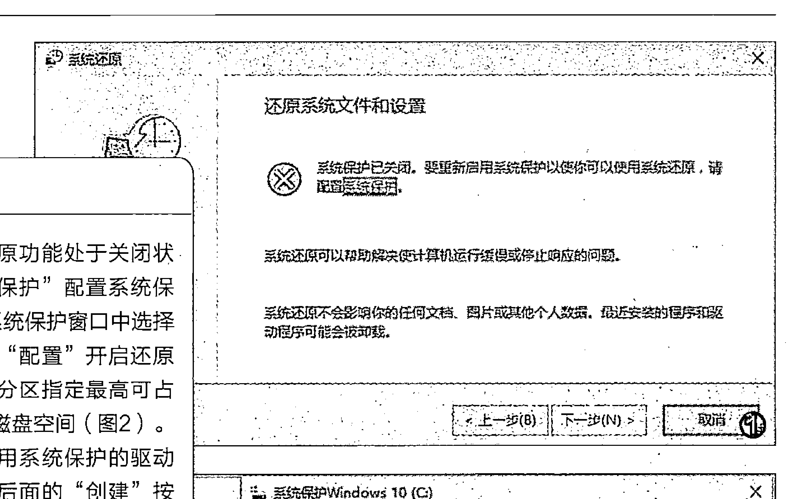

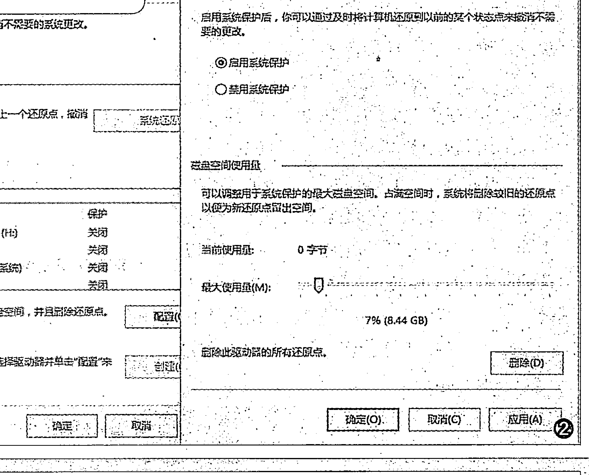

## 2 问题不明用重置

如果近期没有安装什么软件或驱动，或一些软件或系统在用户不知情的情况下进行升级使系统出现问题，用户难以说出哪个软件或驱动造成了系统问题，这时，比较快捷可靠的办法是进行系统重置。

重置电脑，可选择在保留用户文件或删除用户文件的基础上重装Windows系统。具体操作可通过系统“设置→更新和安全→恢复→重置此电脑→开始”，然后选择保留文件还是删除它们来重新安装Windows（图3）。

恢复条件：系统重置能够正常进行的条件是系统恢复映像必须存在。有时，为了清理磁盘空间，一些用户会手动或用清理优化工具将存放系统恢复映像的分区清空或将系统恢复映像文件删除，在这种情况下，尽管系统还有重置命令存在，但实际上，当选择这个命令来重置电脑时，系统会提示你恢复映像不存在了。

## 3 兼容问题用回退

如果由于系统升级到 Windows 10 造成了使用上的兼容问题，而一时又不能用安装或程序升级的办法解决，那么，可采取将系统回退到上一个正常版本的办法来解决。在 Windows 10 中，系统恢复模块中自带了系统版本回退的功能选项。如果发现兼容问题，可选择回退到先前的版本。

要将 Windows 10 回退到以前的版本，在系统设置窗口的“更新和安全”页面下，选择“恢复→回退到较早的版本→开始”执行系统版本的回滚，见图3。

**恢复条件**：原版本的数据还在，没被清理掉。在 Windows 10 升级到现有的版本之前，系统会自动将原有版本的系统和应用数据保存在一个 Windows.old 的文件夹中。这个文件夹是保证后续系统回退成功的基础，切记不能手动或用系统优化软件将该文件夹删除掉，否则，系统回退将形同虚设。

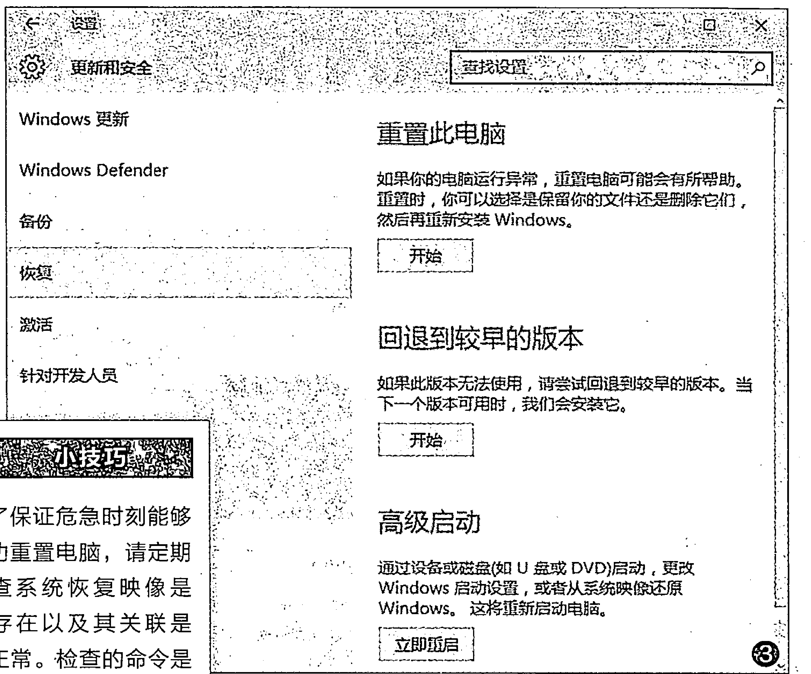

> 小技巧：为了保证危急时刻能够成功重置电脑，请定期检查系统恢复映像是否存在以及其关联是否正常。检查的命令是 "reagentc /info"。

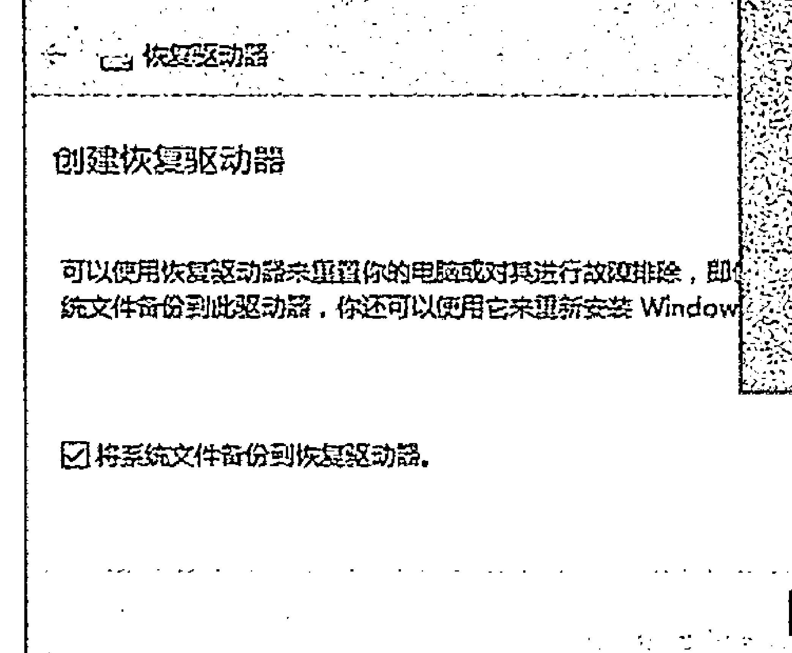

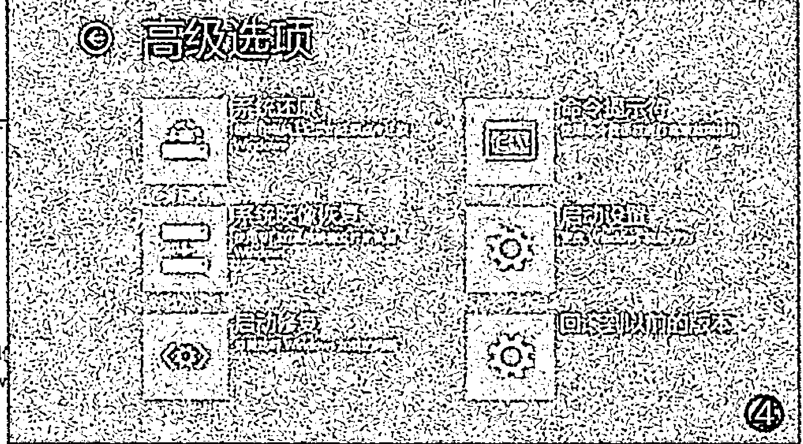

## 4 无法启动用恢复

更进一步，如果 Windows 系统无法启动了，这时就只能借助于恢复驱动器来启动恢复系统。

用恢复驱动器来恢复系统，在如图3所示的操作窗口中，点击“高级启动”下方的“立即重启”按钮（或在系统关机的时候同时按下 Shift 并选择“重启”），启动后进入“疑难解答”，选择“高级选项”，然后点击“系统映像恢复”来恢复系统。或通过更改启动设置，从启动闪存盘或 DVD 光盘启动并恢复 Windows (图4)。

**恢复条件**：先前要创建好恢复驱动器，并有相应版本的恢复盘或光盘。如果创建了恢复启动盘或光盘，可通过该启动盘启动系统，调用恢复映像恢复系统。所以要特别注意，在建立恢复启动盘的同时，要包含系统备份文件在其中(图5)。

## 5 映像消失用重装

更为糟糕的情况是，如果系统无法启动了，而自己又没有在先前建立系统恢复映像，系统硬盘中也没有留存任何系统恢复映像，这时就只能重装系统了。

重装系统需要有安装介质，安装介质可以是随机携带的系统安装盘或光盘。如果系统先前就没有带安装介质，只是在硬盘中留存了恢复数据，而现在硬盘中恢复数据已经丢失，这时可以通过微软官方网站进行安装介质的在线制作，制作之后就可用此介质启动和重装系统了。

> 火速链接：有关 Windows 10 安装介质的在线制作方法，请见《电脑爱好者》2015年第17期文章《创建二合一 Windows 10 系统安装盘》的介绍。

## 全程覆盖 照片欣赏“任性走”

文|北峰

在Windows中欣赏数码照片，大家最熟悉的方法莫过于用系统自带的照片浏览器幻灯片或第三方看图软件了。然而，在Windows 10系统中，就自带4种实现动图显示的方法，每种方法适用于不同的场合，它们会让电脑在加电之后的使用或暂停过程中，连续不断地显示你的数码照片。

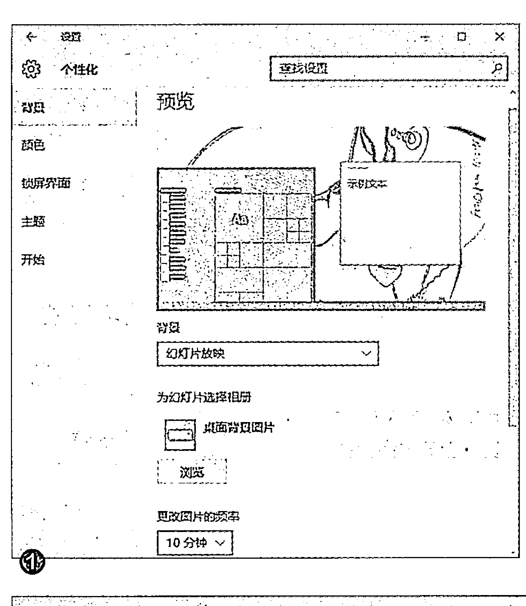

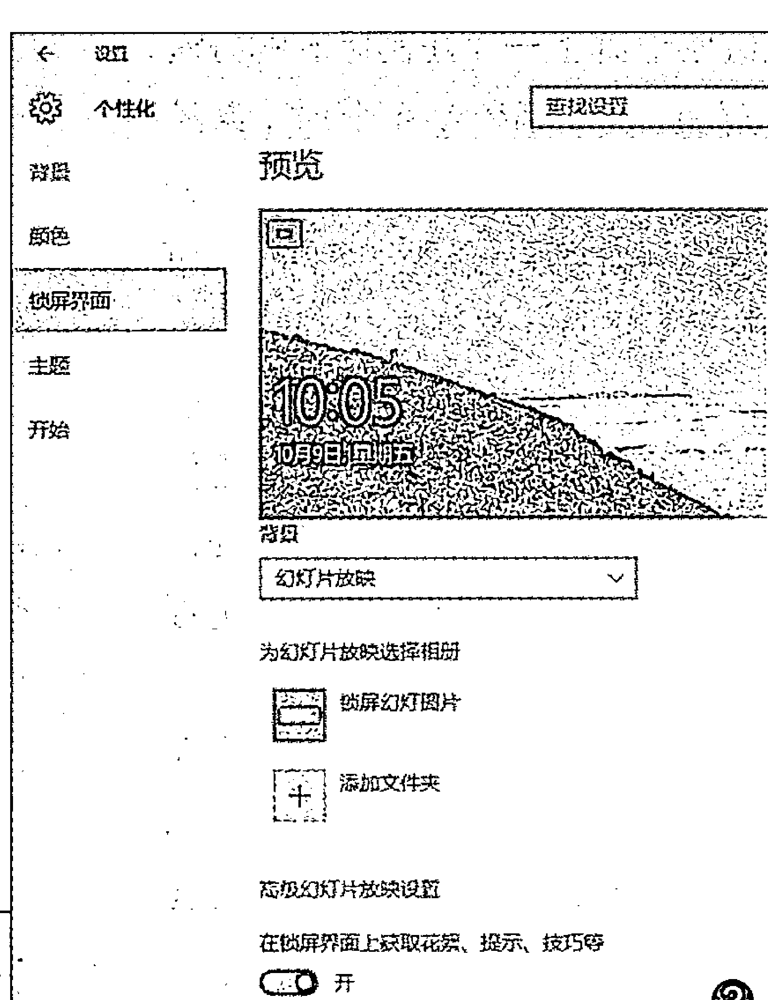

### ① 系统桌面动图

使用场合：电脑开启后，在Windows运行期间发挥作用。即便是当应用程序前置、系统桌面后置时，桌面动图效果仍起作用，图片仍然在后台不停地变换。

设置方法：通过系统“个性化”设置窗口的“背景”窗格，选择“幻灯片放映”，并指定一个存放数码照片的文件夹（图1）。

小提示：桌面动图照片不限于放置在系统“图片”文件夹下，可放置在硬盘的任何位置。

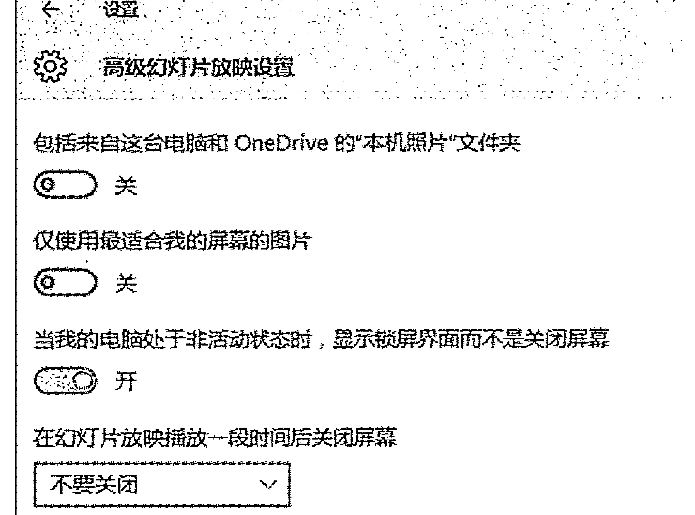

> 温馨提示：锁屏壁纸动图显示期间，自动关闭显示器节电的设置将失效。如果要节电使用，需要在锁屏壁纸高级设置中，设置自动锁屏幻灯片显示一段时间后自动关闭屏幕选项（图3）。

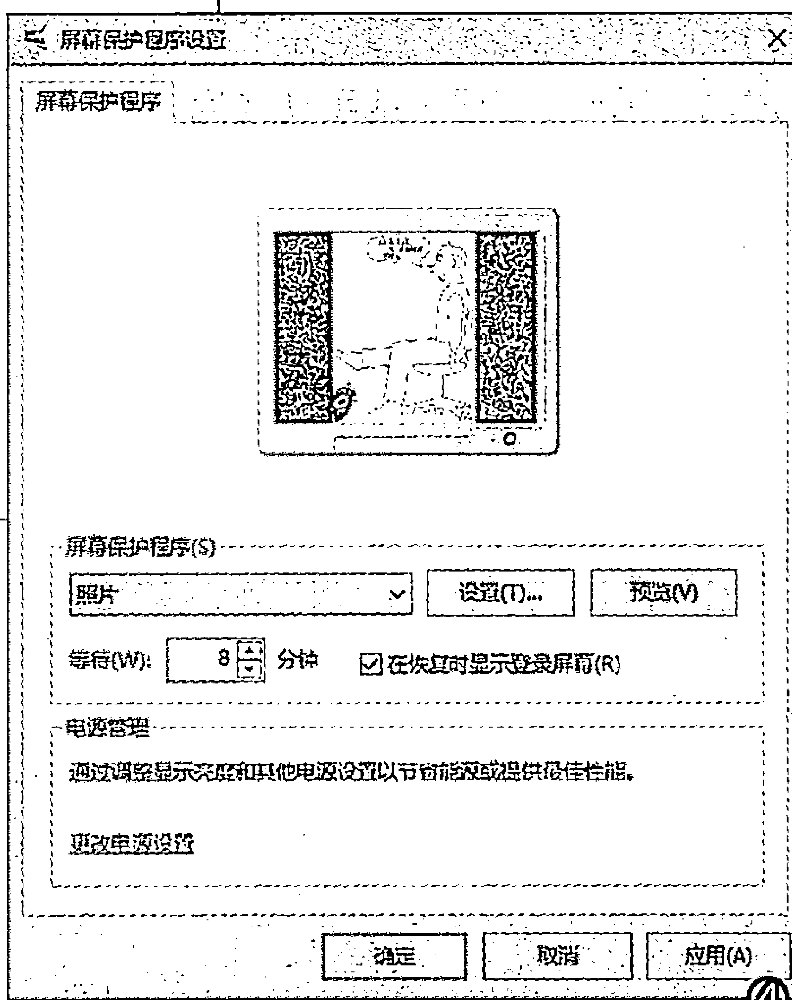

### ② 锁屏壁纸动图

适用场合：电脑使用暂停，当屏幕被用户锁定后发挥作用。

设置方法：通过系统“个性化”设置窗口的“锁屏界面”窗格，选择“幻灯片放映”，指定存放锁屏照片的文件夹（图2）。与桌面背景不同，这里的文件夹可以是一个，也可添加多个。

### 3 屏幕保护动图

适用场合：设置了照片屏保并当设置的屏保时间到后起作用。

设置方法：通过“个性化→锁屏界面→屏幕保护程序设置”进入屏保设置窗口，选择屏幕保护程序为“照片”，然后指定照片文件夹，设置好照片演示参数并应用即可（图4）。

在Windows 10环境下，若离开电脑之前未下达锁屏指令，待屏保时间到达后，屏幕自动播放屏保图片幻灯。如果在屏保设置窗口中同时选中了“在恢复时显示登录屏幕”选项，则屏保恢复后会显示锁屏界面，接着播放锁屏照片。

> 小提示
类似于以往的Windows版本，Windows 10除了用系统自带的照片幻灯片屏保来动态显示图片外，还可以借助外部图片屏保软件展示动态图片效果，大家可以到软件网站的屏保频道选择下载。此外，常见的图片浏览工具（例如ACDSee、FastStone Image Viewer、iSee、IrfanView等）也具有制作动态图片屏保的功能。

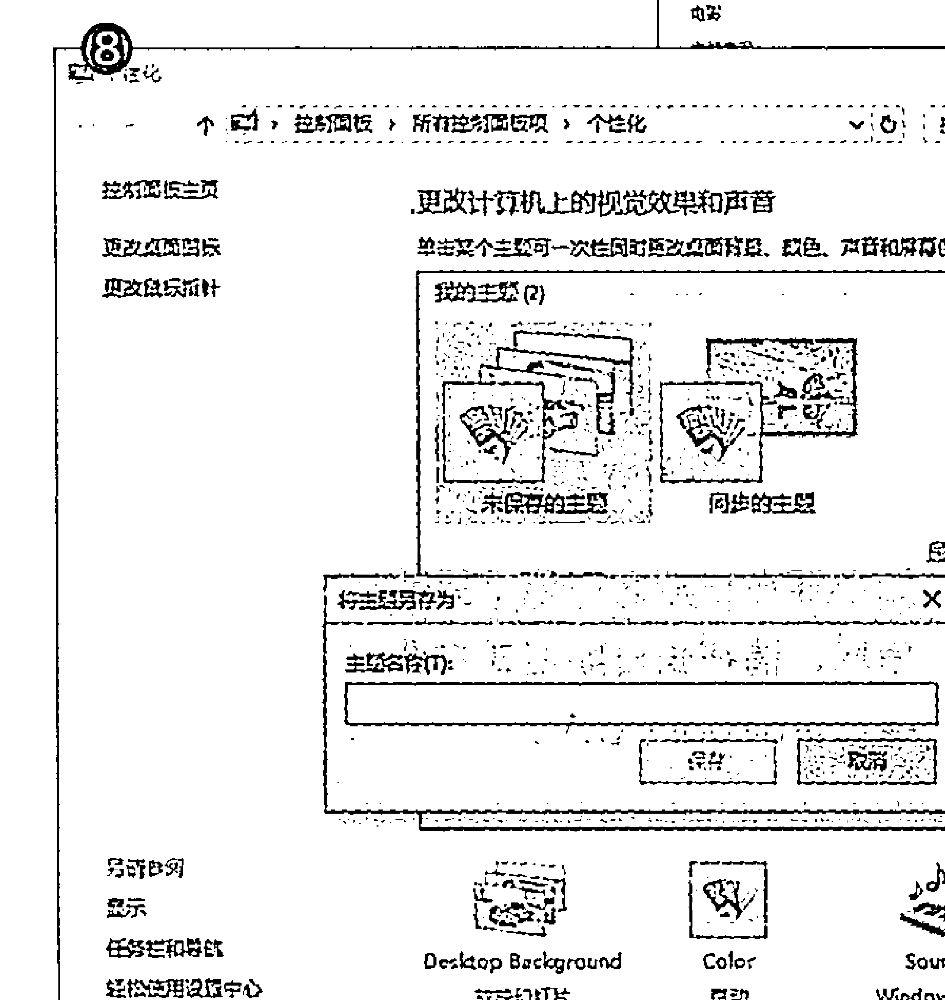

### 4 主题效果动图

适用场合：电脑开启使用的时间段。

主题设置生效后，变换的图片将出现在桌面背景上。它替代了先前设置的桌面背景图或背景幻灯片。用主题实现桌面动图效果与直接用桌面背景幻灯片实现桌面动图的区别：前者除了包含变化的图片系列外，还包含窗口颜色和系统声音的改变，而后者只包含桌面动态图片一个方面的变化。

设置方法：通过系统“个性化”设置窗口的“主题”窗格，点击“主题设置”进入设置窗口（图5），然后分情况进行选择设置。

一种情况是选择显示现成的大师摄影作品（主要是通过“联机获取更多主题”，到微软主题网站获取现成的动态图片主题）（图6）。单击“详细信息”预览每个主题的图像集合，单击“下载”获取并安装主题（图7）。

另一种则是将自己的数码照片转换为主题。其实，作为桌面背景动态图片放映的图片系列，也可以作为一个主题文件保存起来。在应用了桌面背景动态图片之后，在“我的主题”列表中，首先会出现一个“未保存的主题”，选择该图标，然后点击“保存主题”文件链接，给主题起一个文件名，点击“保存”按钮，该背景图片系列就会变成只有一个文件的主题文件（图8）。之后，就可以按使用主题的方法来使用这个照片集了。

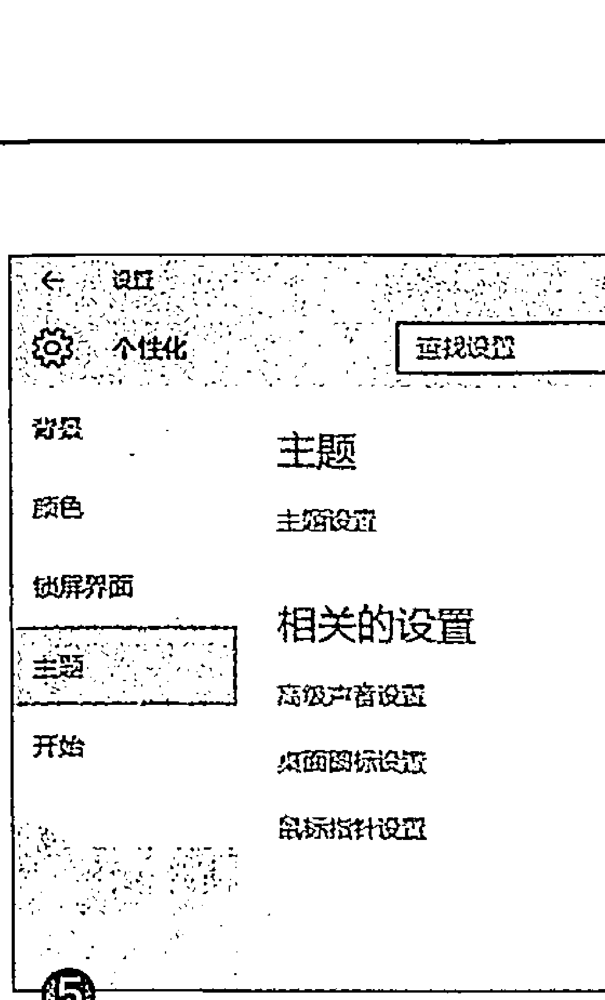

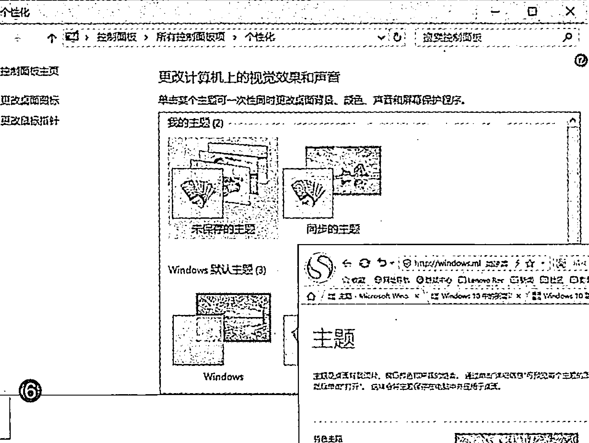

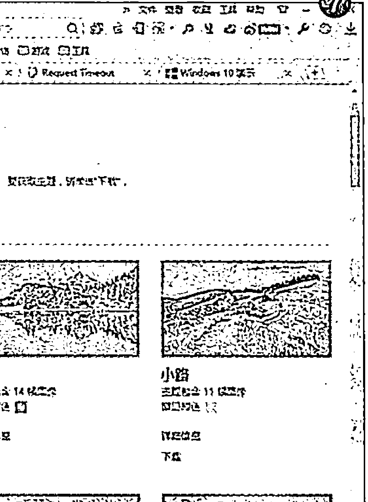

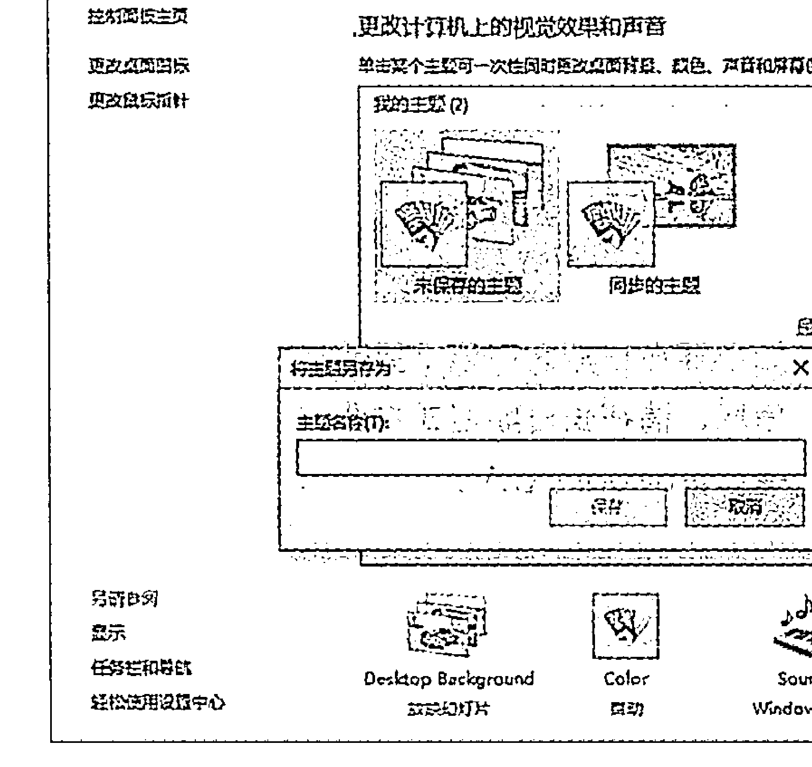

> 小技巧
“抓住”同步的主题
Windows 10具有主题同步功能，也就是说，当用同一个账户在异地登录Windows 10之后，先前设置的桌面主题会被同步过来。但是，同步来的主题可能会因下次同步而被覆盖和消失。因此，如果希望今后在本机继续使用同步过的主题，需要将“同步的主题”用“保存主题”保存在本地。

合用上述方法，就可以让Windows 10每时每刻都不闲着，为你欣赏自己拍摄的数码照片而“连轴转”了。

## 消除疑惑 系统锁屏任我行

Windows 10的锁屏功能给人们留下了深刻的印象，然而使用过程中会遇到一些问题。锁屏等待时间在哪里设置？锁屏时间制式如何更改？手动锁屏后马上黑屏怎么处理？如何跨越锁屏界面直接登录？解决了这些问题，才能轻松驾驭Windows锁屏功能。

> 锁定屏幕方法多
在临时要离开电脑时，可用Ctrl+Alt+Del组合键、Win+L组合键或在开始菜单中单击用户头像选择“锁定”手动锁屏；或借用“屏幕保护设置”设定自动定时锁屏。

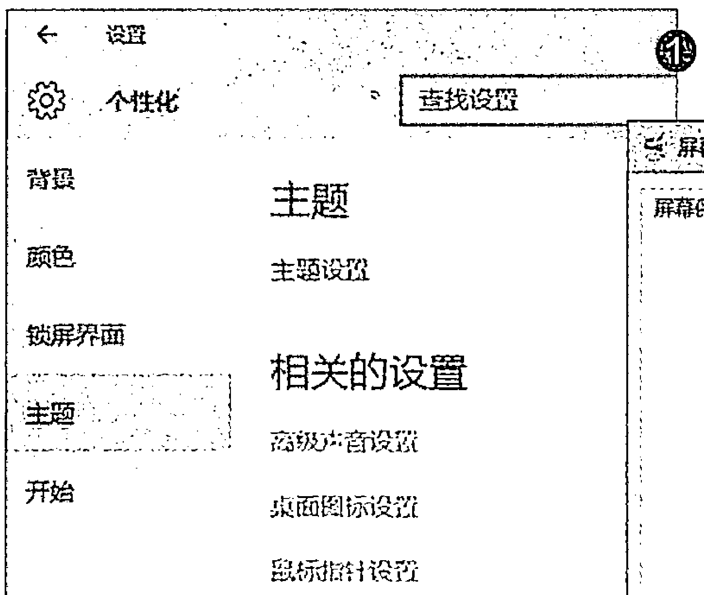

> 小技巧：如果要在日期区域显示星期信息，请在长日期格式中选择带有dddd的格式。

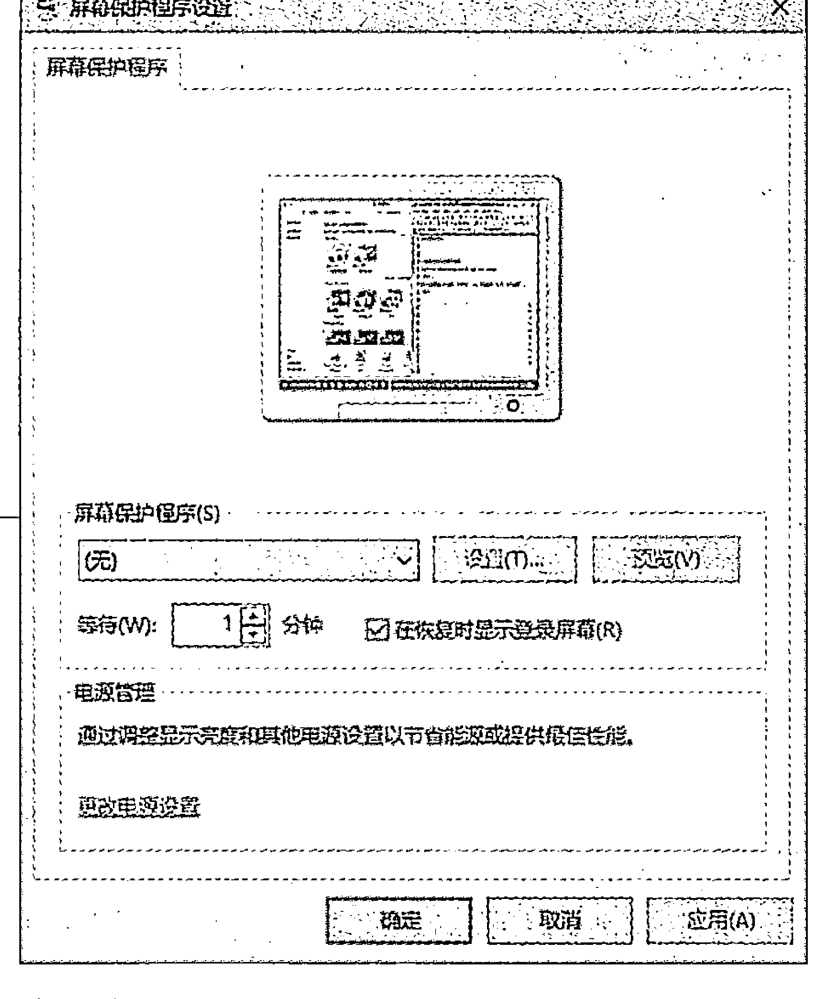

### 1 探寻自动锁屏时间修改

离开电脑一段时间后Windows 10会自动锁屏，但这个时间为多长，到哪里去设置？在系统锁屏设置中没有明显的设置选项，这让不少Windows 10的用户为难。其实，借用屏幕保护中的一项特殊设置可以搞定这个问题。

在系统设置窗口中选择“个性化”，然后选择“主题→主题设置”（图1）。在“个性化”设置窗口中，选择底部右下角的“屏幕保护”，进入屏保设置窗口，将屏幕保护程序设置为“无”，下方设置的等待时间即为锁屏等待时间（图2）。

> 小提示：如果同时选择“在恢复时显示登录屏幕”，则解锁屏幕时需要输入登录密码才能进入。

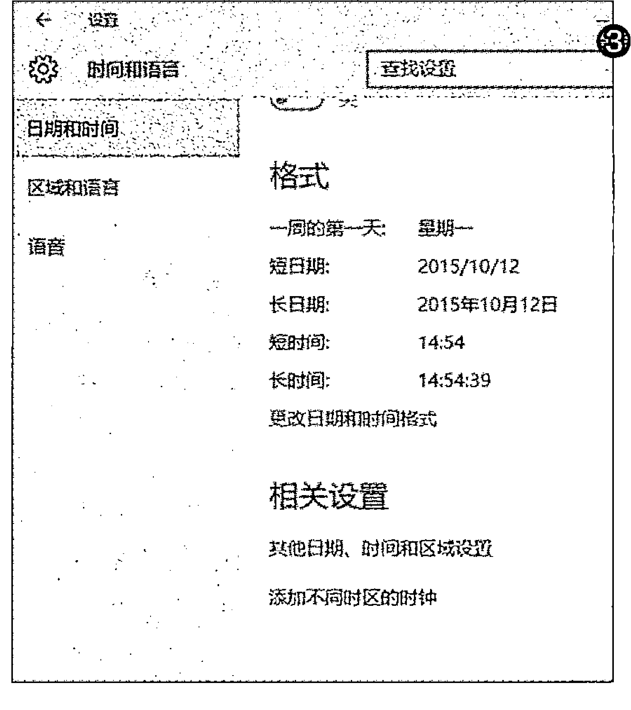

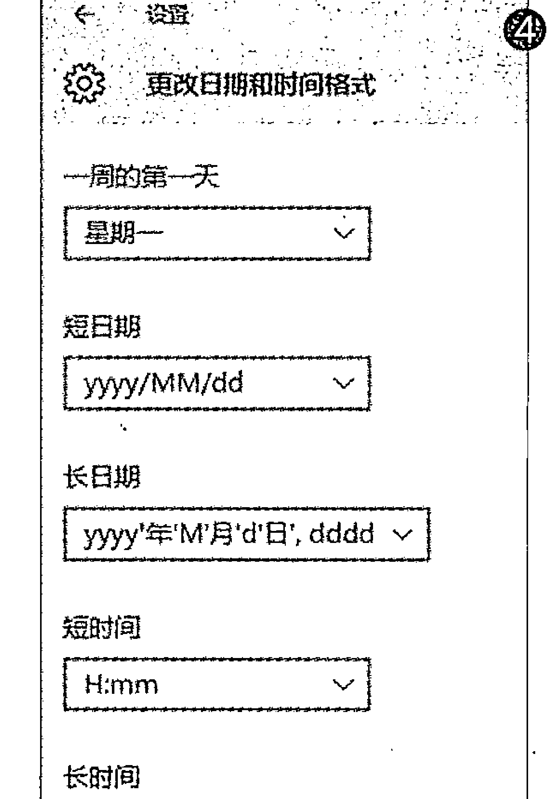

### 2 改变锁屏显示时间制式

锁屏时会在屏幕上显示当前日期和时间，但如果对显示制式不满意，或希望控制星期信息的显示，可通过巧用字母H和h以及d日期格式来改变。

进入系统设置的“时间和语言”，在时间和语言设置窗口中点击“日期和时间→更改日期和时间格式”进行制式更改（图3），将代表短时间12小时制的h和长时间24小时制的H进行更换即可实现（图4）。

### 纠正锁屏后显示自动关闭

也许你已经发现，明明通过屏幕保护程序窗口设置了10分钟的锁屏等待时间，希望10分钟后锁屏画面出现，但当离开电脑1分钟之后，屏幕就自动关闭了。这是什么原因，又该如何解决？

其实，这是因为系统默认将控制台锁定显示关闭超时设置成了1分钟而造成的。而用户设定的自动关闭屏幕时间是在没有锁屏的情况下才适用的。但在Windows 10中，“控制台锁定显示关闭超时”设置被隐藏了起来，用户无法直接设置锁屏关闭屏幕时间（图5）。通过修改注册表，可让隐藏的设置显示出来。

右击系统开始按钮并选择“运行”项目，在运行窗口中输入REGEDIT并回车，启动注册表编辑器。在注册表编辑器中逐步展开到“HKEY_LOCAL_MACHINE\SYSTEM\CurrentControlSet\Control\Power\PowerSettings\7516b95f-f776-4464-8c53-06167f40cc99\8EC4B3A5-6868-48c2-BE75-4F3044BE88A7”，在右侧窗格中双击Attributes一项，将十六进制的数值数据修改为2，点击“确定”（图6）。

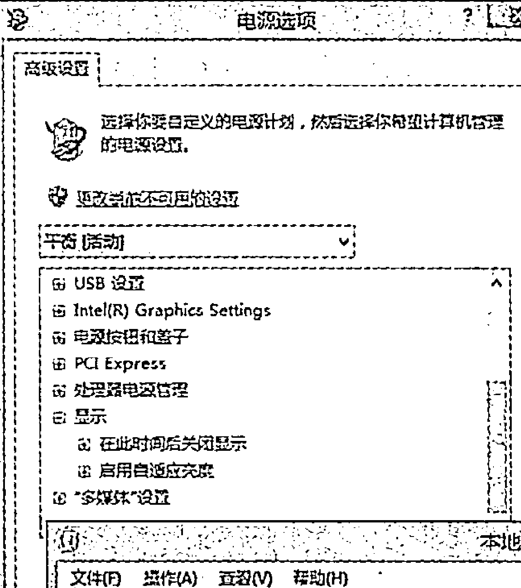

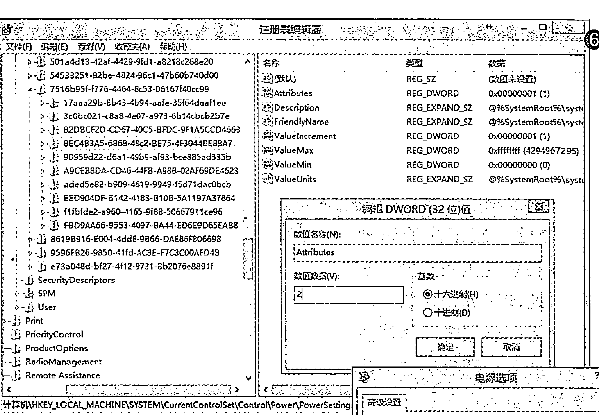

通过如上修改之后，右击开始菜单并选择“电源选项”，然后点击“更改计划设置”，在打开的窗口中点击“更改高级电源设置”，在电源选项窗口中点击“显示”，就会发现多了一个“控制台锁定显示关闭超时”选项，展开该项就会出现时间设置项，在这里选择或填入合适的锁屏关闭屏幕时间（0为无限延时），应用并确定后，即可将锁屏后关闭屏幕的时间变为更长（图7）。

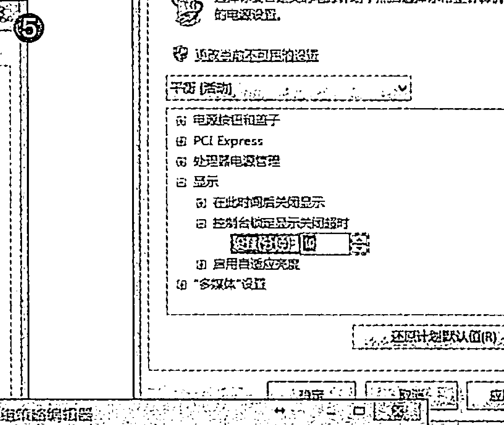

> 小提示
其实这个问题在Windows 8.1系统中就已经存在，但微软在Windows 10中依然没有给出简易的设置入口，只能通过修改注册表设置。

### 让系统登录“跨过”锁屏界面

我们发现，Windows 10系统启动后先显示锁屏界面，触控抹去这个锁屏界面（或用鼠标点击），才能看到登录界面。对于希望更快进入系统的人来说，这无疑是多此一举。那么，如何能够跨过锁屏界面，让系统一步进入登录界面呢？我们可以通过组策略修改功能来实现。

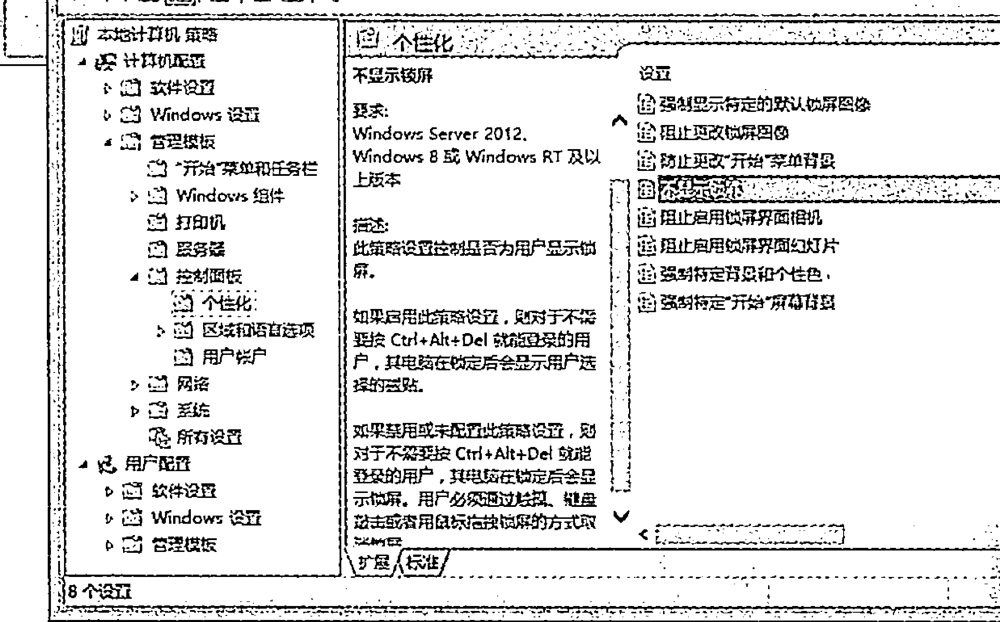

按键盘组合键Win+R调出“运行”窗口，在窗口中输入GPEDIT.MSC命令并回车运行，调出“本地组策略编辑器”。依次展开并定位到“计算机配置→管理模板→控制面板→个性化”，在右边窗口中找到“不显示锁屏”一项，双击该项，将“未配置”改为“已启用”即可（图8）。

> 小提示
在Windows 10家庭版中限制了组策略修改功能，如果要有组策略修改功能，可以升级为Windows 10专业版，或者直接安装Windows 10专业版使用。

## 聚焦锁屏图片“过客”

文|白玉

Windows 10家庭版推出聚焦锁屏功能之后，应用户的强烈要求，微软在专业版和部分企业版中也相继增加了此项功能。启用该功能之后，当锁定了屏幕操作，微软会向用户随机推送一些绚丽的图片并征求用户是否喜欢的意见。这些图片不固定存放在电脑中，而是会在新的图片出现后将前面的图片自动删除。因此，想要收藏这些图片，必须找到图片的存放位置。然而，由于图片路径藏得比较深，且路径名带有一些随机数字，输入操作比较麻烦，图片格式也非系统能直接识别。但我们可以通过手动快捷方式或建立自动批处理的办法，进入、更名和建立一键备份。

### 1 寻找文件路径

锁屏图片路径藏得很深，访问起来比较麻烦，自己去系统目录中寻找可能会非常费事。实际上，这些图片的路径是：
C:\Users\<用户名>\AppData\Local\Packages\Microsoft.Windows.ContentDeliveryManager_cw5n1h2txyewy\LocalState\Assets
只需按此地址结合下述提示作简单变通或修改，即可沿着路径到达这个文件夹（图1）。
为方便今后访问，首次访问这个文件夹之后，可顺便建立该文件夹的屏幕快捷方式。这样，以后可以从桌面一键直达目标（图2）。

> 小提示
具体使用时，如上地址中的<用户名>要换成自己所用系统的用户名，“Microsoft.Windows.ContentDeliveryManager_”之后的一串随机字符可能会随用户的不同而不同。上述Appdata文件夹是隐藏的，需要设置“显示隐藏文件”才能看到。

### 2 解决预览问题

聚焦锁屏图片为一些没有扩展名的文件，系统中默认的图片处理软件不能直接识别，双击之后无法找到打开的程序。这时，只需将图片加上扩展名JPG即可浏览。文件夹下时常保存有20个上下的聚焦锁屏图片文件，一一手动添加扩展名显然比较麻烦。借助于常用图片更名批处理软件可实现快速批量添加扩展名（图3）。

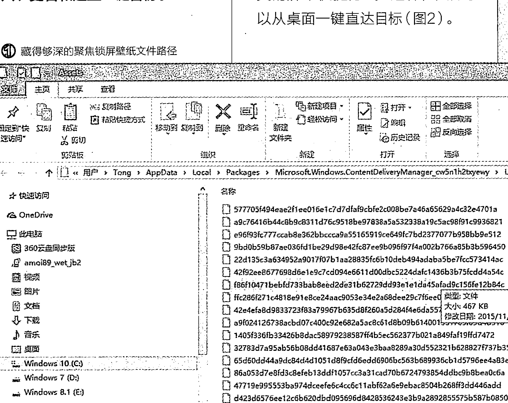

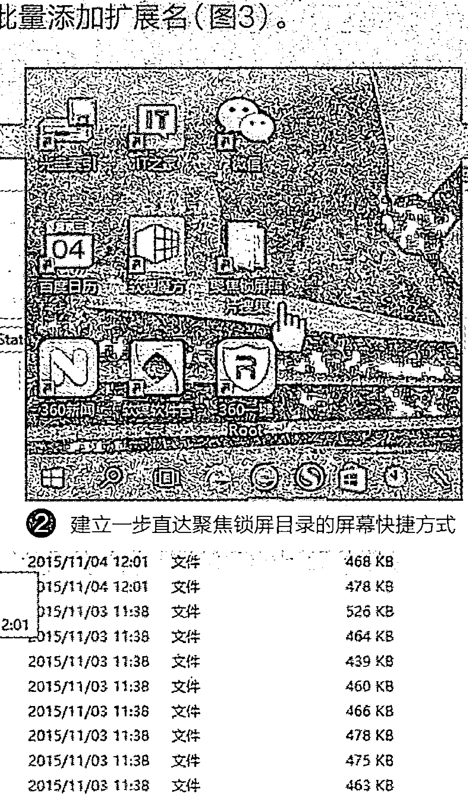

## 系统应用

### 用成批更名软件更改文件的扩展名

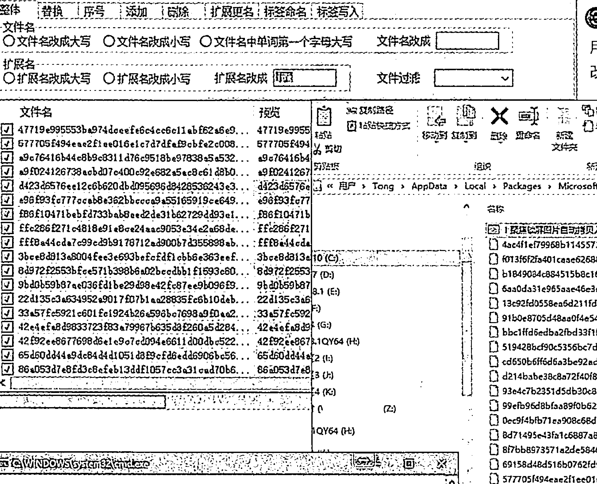

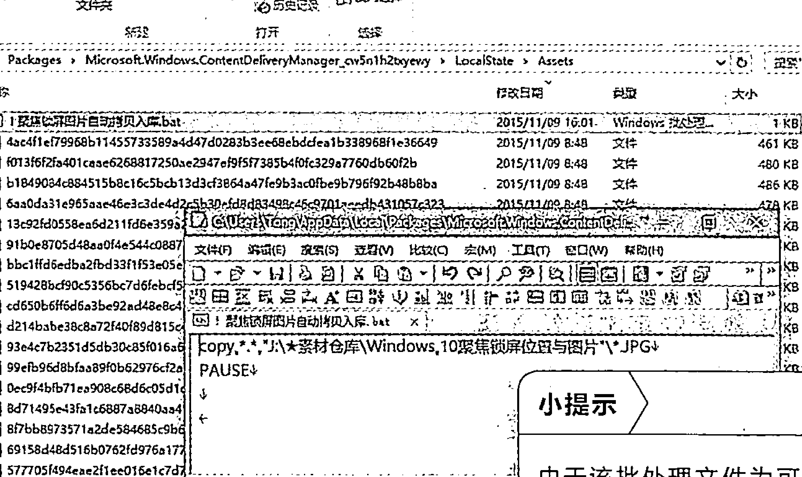

> 由于该批处理文件为可执行文件，且位于系统关键目录中，因此运行时，系统的安全防御系统Windows SmartScreen筛选器会弹出安全拦截提示，显示已阻止启动一个未识别的应用，运行此应用可能会导致电脑存在安全风险。但实际上，这个程序是我们自己编写的，肯定不会有安全风险，因此只需点击“更多信息→仍要运行”，放行通过即可（图6）。

### 3 批量自动备份

由于该文件夹中图片的动态特性，加之该文件夹藏得很深，系统还会即时删掉旧的图片文件，因此如果要收藏这些美图，靠人工方法还是比较麻烦。为解决这个问题，还可创建一个兼有扩展名自动更名和文件批量备份的批处理文件（图4）。

假设要将聚焦图片收藏到“J:\★素材仓库\Windows 10聚焦锁屏位置与图片”文件夹中。首先在桌面上建立一个批处理文件，含有如下两行代码：

```
COPY *.* "J:\★素材仓库\Windows 10聚焦锁屏位置与图片"\*.JPG
PAUSE
```

搜集图片时，只需先点击之前在桌面上建立的直达聚焦锁屏快捷方式进入锁屏图片目录，然后将桌面上的自动批处理文件用Ctrl+左键拖动复制到该图片窗口中。双击执行该批处理，即可自动完成图片拷贝备份和扩展名自动添加任务（图5）。

### 代码解释

在上述代码中，有一对半角引号括住了一个长的路径“J:\★素材仓库\Windows 10聚焦锁屏位置与图片”，那么，为何需要用引号呢？这是因为在这个路径中Windows 10部分有一个半角空格，如果不加引号，则在执行时路径会从Windows后断开，系统会误将前面的部分认为是完整路径，而将后面的部分作为目标路径和目标文件代码。

因此，在批处理中引用长路径时，如果遇到有空格相间的路径，请使用半角双引号（注意不能用全角）。“*.*”通配符代表该文件夹中的所有文件，由于该文件夹下只有图片文件，所以代表所有图片文件。而“*.JPG”表示将目标文件统统改为JPG扩展名的文件。由以上三部分整合，就构成了一个自动拷贝的同时更改文件扩展名的批处理，要比手动操作智能化程度高得多。且一次建立多次受益。后面的PAUSE命令起到暂停的作用，让我们得以清晰地看到批处理程序的运行结果，通过黑色命令提示符窗口看到图片是否拷贝成功，以及一共拷贝了多少张图片。当然，不使用该命令也可以，但运行过程会一闪而过，只有到目标文件夹去查看才能知道拷贝是否成功，所有的过程就变成“两眼一抹黑”了。

## 全面搞定Windows 10激活

Windows 10一年免费，装机量飙升，引得无数用户竞升级。然而在免费升级的背后，也藏着不少激活方面的问题。那么，就让我们从激活的基本政策入手，全面了解Windows 10的激活机制，找到不能激活的问题根源，进而获得顺利激活的办法，让每一个人都能用好Windows 10。

| 激活方式 | 升级或安装方法（含密钥位置） |
|---|---|
| 数字权利 | 从运行正版Windows 7或Windows 8.1的合格设备上升级到Windows 10 |
| 数字权利 | 从Windows应用商店购买正版Windows 10或Windows 10 Pro |
| 数字权利 | 之前的Windows预览体验成员在合格设备上升级到最新的Windows 10 Insider Preview内部版本 |
| 产品密钥 | 从授权零售商处购买的Windows 10包装产品（使用Windows 10包装盒内标签上的密钥激活） |
| 产品密钥 | 从授权零售商处购买的Windows 10数字副本（要从收到的确认电子邮件中或访问零售商的数字保险箱内获取的密钥来激活） |
| 产品密钥 | 具有Windows 10或MSDN订阅批量许可协议（通过程序的Web门户获取密钥激活） |
| 产品密钥 | 购买预置Windows 10的品牌电脑（产品密钥已经安装在电脑中或包含在设备包装、附带的卡片或真品证书（COA）中） |

> 小知识：Windows 10的两种激活方式
Windows 10采用两种激活方式。一种是采用数字权利激活，另一种是使用25个字符组成的产品密钥激活。数字权利是Windows 10中的一种全新激活方法，它不需要用户输入产品密钥即可激活产品，它是记录在微软激活服务器中的一组信息。安装和升级方法多种多样，那么你的Windows 10用哪种方式激活呢？请参阅表格说明（见表）。

### 升级安装无法激活

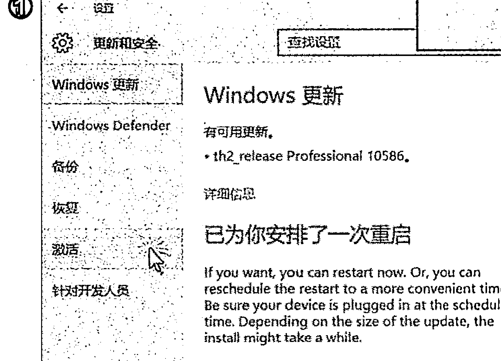

如果系统中原先运行有正版Windows 7或Windows 8.1，那么，通过系统更新升级到Windows 10后，系统会自动在线激活并为当前设备创建数字权利保存在服务器上。

> 小提示
Windows 7中查看激活状态的方法是，单击开始按钮，右键单击“计算机”并选择“属性”，在“Windows激活”下查看。Windows 8.1中的查看方法是，右击开始菜单并选择“控制面板”，单击“系统和安全”，然后单击“系统”，在“Windows激活”下查看。

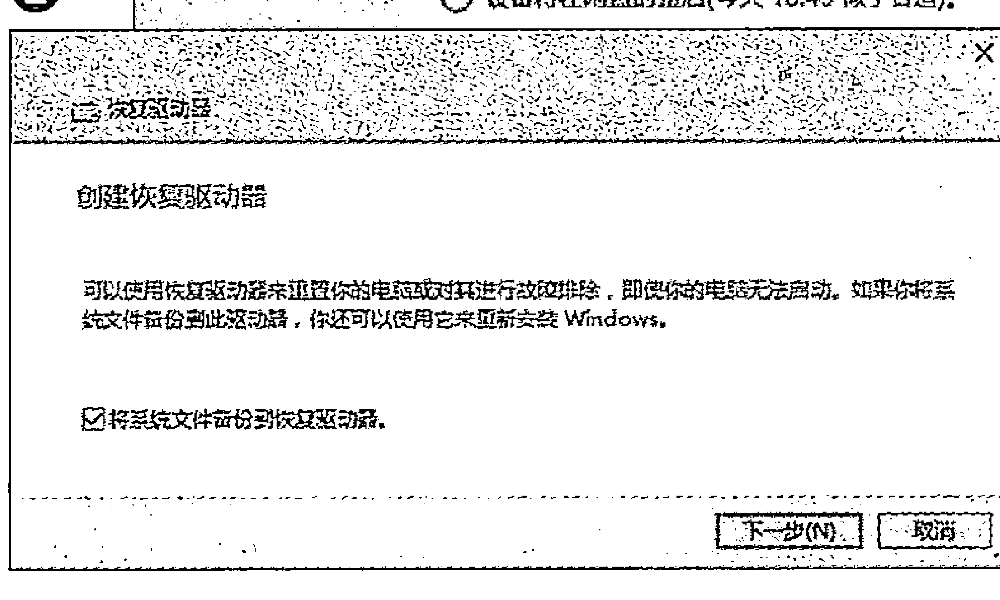

有的用户的电脑在升级Windows 10之前，由于某种原因处于未激活状态，升级Windows 10之后未激活状态仍旧保留，因此Windows 10处于未激活状态并无法激活。这时需要回退到原先的低版本，并用原有版本的密钥激活Windows，然后再升级为Windows 10就可自动激活了。若升级后没有自动激活，请进入系统设置的“更新和安全”窗口，点击“激活”手动激活（图1）。若已经正常升级到Windows 10但未能激活，还可能是因为升级服务器繁忙，等待一段时间再去控制面板尝试激活。

> 小技巧：为保证激活成功，可先执行恢复出厂设置，然后再升级安装Windows 10。从ISO或安装介质进行升级，要选择“升级这台PC”而非“现在安装”，这可以确保Windows 10版本能够匹配目前正在运行的系统版本。

还有的用户在低版本系统中运行Windows 10的安装包，执行安装时没有选择升级安装，而是选择了“现在安装”，安装程序没有判断原先版本的激活状态，因此安装后的Windows 10也不能自动激活。这时如果输入原有的Windows 7或Windows 8.1的产品密钥，会提示“此产品密钥不可用”并产生错误代码（错误代码0xC004C003、0xC004F034或0xC004F050）。这种情况下，需卸载Windows 10，修复低版本系统，然后进行升级安装和激活。

> 小提示
有备无患，以防万一。请在升级前建立恢复分区和恢复启动盘，并将恢复分区的系统备份一同复制到恢复启动盘中，以便在升级激活不成功、回退遇到意外时恢复系统之用（图2）。

## 2 重装Windows 10的激活

重装Windows 10后是否需要重新激活？这个问题也不能一概而论。如果先前的Windows 10是使用数字权利方式激活的（见上表），重新安装系统要求输入密钥时完全可以选择“跳过”，完成安装后会自动调用服务器的数字权利激活系统。但必须注意，要用原有网络账号登录，不能用新账号。如果此前的Windows 10是通过密钥安装激活的产品，则重新安装时需要输入密钥。重装前后，通过“设置→更新和安全→激活”检查激活状态。

### 小技巧：重置产品密钥强制激活

在“运行”窗口输入“SLMGR.VBS -REARM”命令，确认并重启，输入产品密钥。随后输入“SLMGR.VBS -ATO”以强制激活。如果无法输入产品密钥，可使用“SLMGR.VBS -IPK XXXX-XXXX-XXXX-XXXX”命令（将X替换成产品密钥），然后重新启动。

## 3 全新设备全新安装激活

在一台全新的设备上安装Windows 10，或者在已经安装了低版本（如Home版）的Windows 10设备上安装高版本的Windows 10（如Pro版），都需要产品密钥激活（图3）。输入产品密钥安装的系统，在安装完成后会自动连线激活。

### 小提示

从Windows Insider Build 10565开始，可以使用Windows 7或Windows 8.1的密钥直接激活Windows 10。具体方法是选择“设置→升级和安全→激活”，然后点击“更改产品密钥”（图4）。

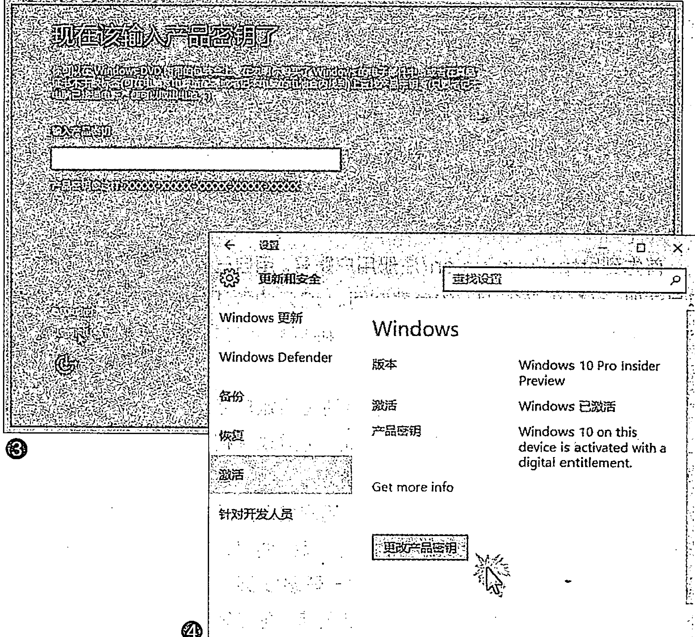

## 4 预览版用户的升级激活

预览体验成员使用的Windows 10 Insider Preview版本，只要在升级前所用的低版本预览版处于激活状态，则升级后会自动激活。在未曾安装过Windows 10激活版的设备上安装Windows 10 Insider Preview，需要使用产品密钥。

如果想获得最新的Windows 10 Insider Preview内部版本，但设备运行的是Windows 7或Windows 8.1，需要首先使用免费升级选项升级到Windows 10。之后，转到“开始→设置→更新和安全→高级选项”，然后选中“获取Insider内部版本”，成为Windows预览体验计划的一名成员。

### 扩展阅读：各种错误代码所对应的激活问题

| 错误代码 | 激活问题及其解决 |
| --- | --- |
| 0xC004E016 | 输入了不同版本的产品密钥（如安装了家庭版和核心版，但输入了企业版的密钥） |
| 0xC004F061 | 使用了升级密钥进行全新安装，需要升级安装才能使用此密钥 |
| 0xC004FC03 | 网络存在问题，请检查网络和防火墙设置 |
| 0xC004C008或0xC004C020 | 此密钥已经被另一台电脑使用，或超过了激活的电脑数量 |
| 0x80072F8F | 电脑的日期时间设置不正确，请通过系统设置的“时间和语言”项设置“日期和时间” |
| 0xC004E003 | 激活所需系统文件被更改，请使用系统还原功能还原系统后激活 |

## 抛弃迅雷 免费离线与转码

文|南粤

迅雷云离线和云转码功能仅限VIP会员才能完整使用，这需要付出费用。如果需要在网上免费快速转移和收藏各类资源，或希望将收藏的视频快速转换为适合于自己的移动设备播放的格式，可借助于UC云来完成。

### 1. 离线转码 空间获取有技巧

首先到http://yun.uc.cn/注册用户账号。用自己的手机号注册，可轻松获得2TB的免费空间。UC云的默认存储空间分为1TB网盘永久存储空间和1TB中转站临时存储空间。普通用户中转站空间文件保留7天。

注册账号后，登录云盘页面只能看到注册账户名和容量，无法找到更改其他信息的入口。这时，可登录优视用户中心(https://id.uc.cn/)查看到自己的UC数字账号，还可以设定用户名和昵称。UC号是唯一的，用户名设定后也不能修改，昵称则可以随意修改。注册成功之后，便可以用手机号、邮箱、用户名、UC号四种方式之一登录UC云了。此外，还可以直接通过QQ、新浪微博、支付宝、淘宝等合作账号登录。

### 2. 资源转存 离线功能须用好

如果在网上发现好资源需要收藏，可复制或右键获取资源地址（包括http、迅雷、电驴、磁力等链接地址），然后进入UC云并点击“离线下载”按钮，粘贴地址并点击“离线下载”（每次一条，但可以多次建立），即可马上将下载任务交由远程服务器来完成，下载的资料出现在UC云离线下载列表中。

对于已经获取到的BT资源种子，可点击“新建BT任务”按钮，直接打开本地BT种子文件，服务器端会将资源下载并直接存入离线空间中。

> 问：中转站里的文件清除后还是显示占用了空间，该如何解决？
答：出现此问题时请手工删除离线任务。打开离线下载页面，从离线任务列表中点击删除离线任务，第二天中午之前中转站的空间会自动被修复。

> 小提示：在将可能过期的文件存至网盘时，只能一个一个地选择转存。若选择多个，无法激活转存命令按钮。UC云离线下载的单个文件不能超过4GB，超过4GB的文件会给出红色警告，并无法完成离线下载。

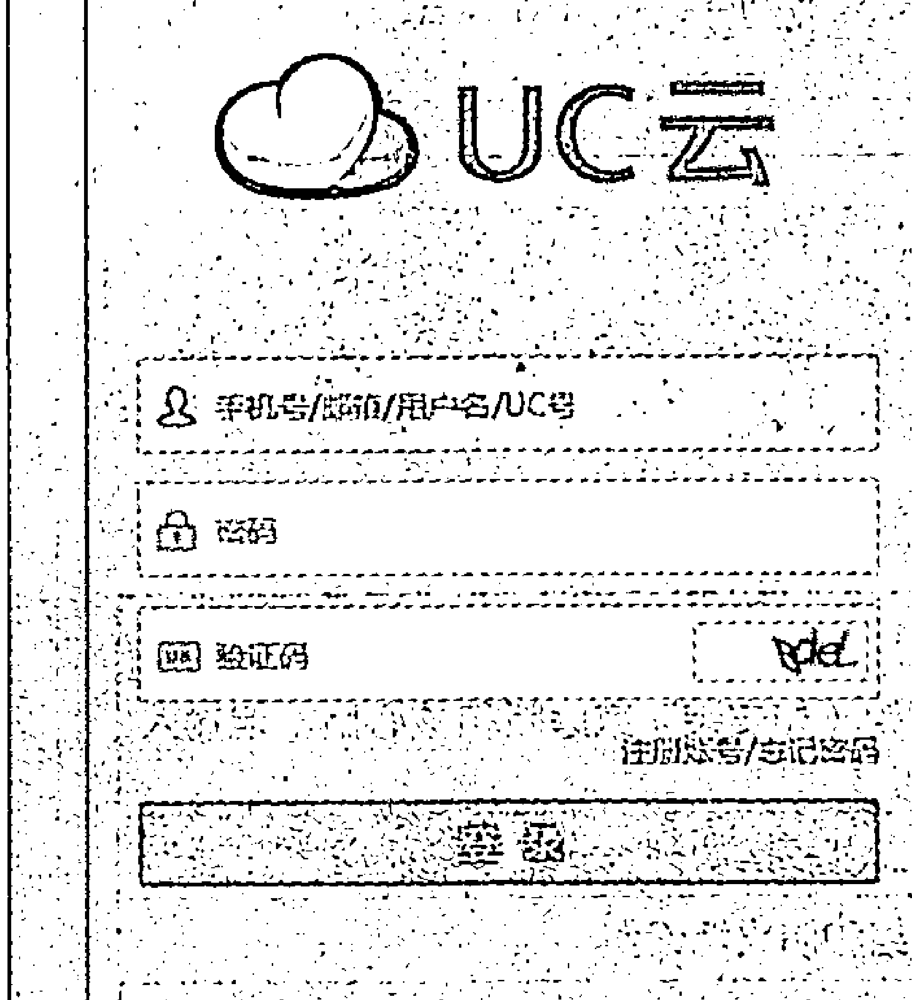

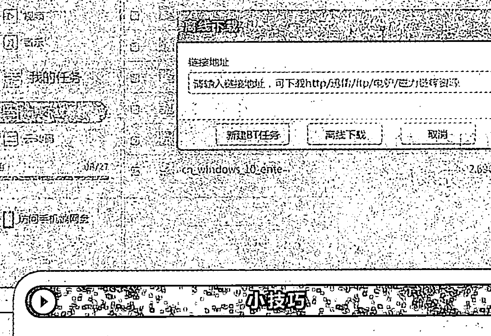

> 小提示：目前可实现服务器远程离线下载功能的软件还有百度云（免费但限制越来越严）、360云（免费但不支持电驴子链接）、115网盘（该功能需要会员资格，不免费）。

> 小技巧：一个手机号只能注册一个账号并获得2TB免费空间。如果觉得2TB空间不够用，而自己又只有1个手机号，可使用多个邮箱来注册UC云账号，每个账号可拥有2TB的免费空间。126邮箱可一分钟免费注册一个，这样，容量想要多少就有多少。

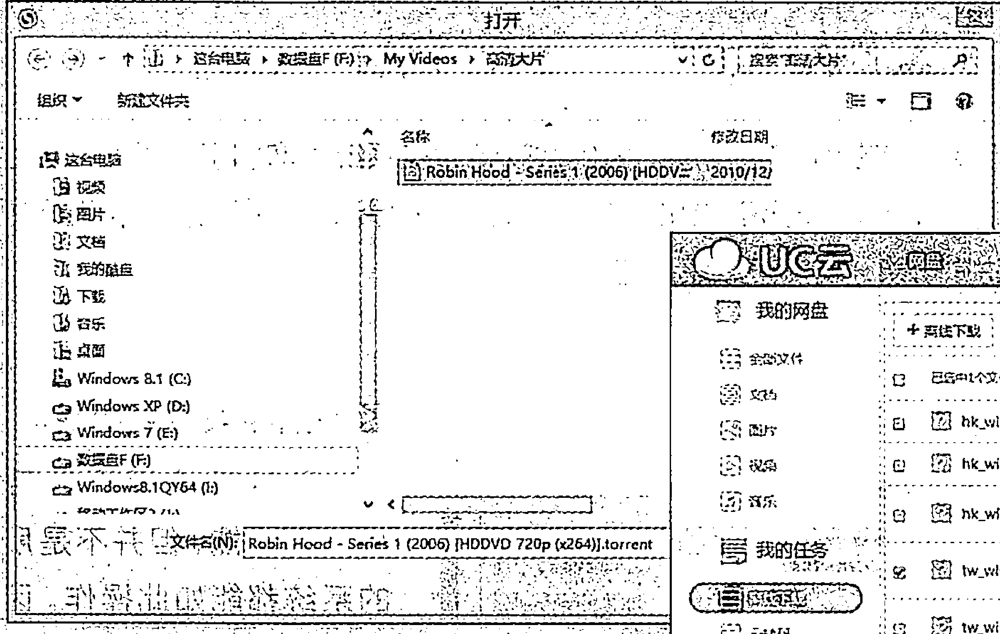

。凡包含“过期时间”显示的离线文件，均可通过“存至网盘”按钮存到网盘上以避免过期。已经转存到网盘的文件保存在“来自离线下载”文件夹，可多选之后通过“移至”按钮移动到“我的网盘”下自建的任何分类文件夹中归档保存。

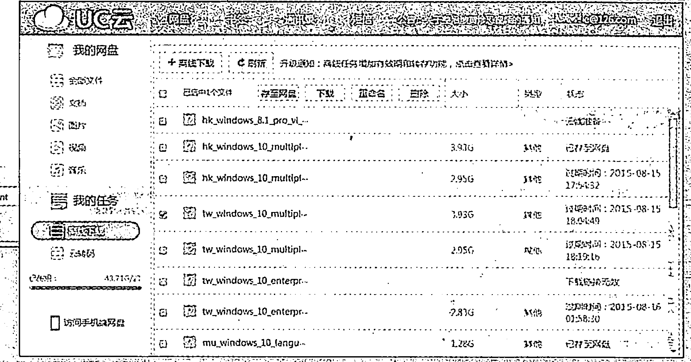

。直接打开本地BT种子将资源下载到云端

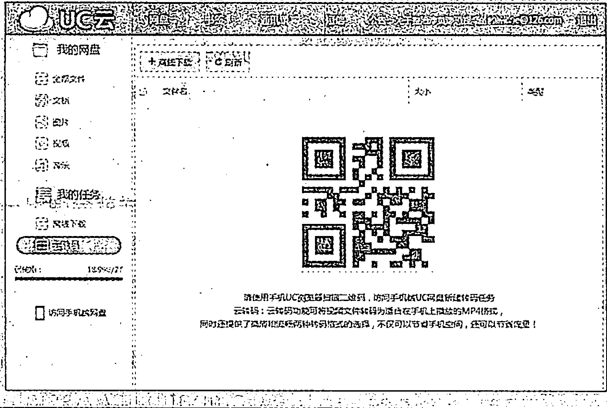

。使用手机UC浏览器扫描二维码，访问手机端UC网盘新建转码任务。转码任务即由服务器在云端完成，处理不占用本地设备资源，自然也比本地转码要快得多。

### 解决文件存放期限限制问题

普通用户中转站文件可以保存7天，文件到期后如未续期，到期后服务器会将文件自动删除。可以选择续期，续期后文件的保存时间恢复到7天，可以免费无限次数续期。如果觉得这样太麻烦，可以选择离线任务中的“存至网盘”，将文件存到网盘后可永久保存。

### 3. 移动播放 云端转码效率高

保存在云盘中的视频一般多在手机等移动设备中播放，但这些视频并不一定适合于所用的播放设备。这时，可用离线云转码的方式来快速解决。云转码可将视频文件转码为适合在手机上播放的MP4格式，同时还提供了高清和流畅两种转码格式的选择，不仅可以节省手机空间，还可以节省流量。由于目前市面上的手机基本都支持MP4格式，这种格式相对来说比较通用，因此云转码目前只设置了转为MP4一种格式。但源文件支持最流行的几种视频格式文件RMVB、MKV、AVI、MPG、FLV等。

云转码对源文件没有影响，转码完成后也不会删除源文件。转码成功后会自动将文件存放在中转站，可根据需要移动到网盘内。播放网盘在线视频与网页播放在线视频道理上一样，都需要缓存后播放，所以会缓存在手机里或PC硬盘中。

云转码任务比较耗费资源，当大量用户使用该功能时，会造成服务器压力，为了保证云转码质量和任务平衡，每个用户只允许同时转码一个资源，其他任务自动排队，需要等待。可通过“刷新”按钮查询最新转码状态。

### 小提示

将电子书、音乐、图片存放在UC云中之后，如果使用U3内核的UC浏览器，可在无需安装本地应用的情况下，直接在云盘中看书、听音乐、浏览图片。这是因为该浏览器使用了HTML5技术，在网页代码中直接实现了以上媒体的在线阅读功能。UC云打通了各种平台，可在PC网页端、Android、Symbian、iOS、Java、WP等平台的设备之间共享资源。

### 问：为何转码会失败？

答：转码失败一般的原因包括：源文件不存在；空间不足；服务器错误。可以更换接入点、开/关云端加速（压缩中转），根据相关提示就可了解到转码不成功的原因了，都会有明确提示。

## 禁止“程序兼容性助手”捣乱

文|阿立

微软每次发布新的操作系统，总要经历常用软件和新系统的兼容性问题。为此微软特意在系统中增加了“程序兼容性助手”功能，对用户运行的每一款软件进行兼容性检测。不过，对于没问题的软件它总会出现提示，而真正有兼容性问题的软件它又无法给出相应的解决方案。所以，如此鸡肋的功能，其实可以禁用它。

### 组策略中直接关闭

就是因为用户有各种各样的怨言，所以微软自身已经为用户准备了相应的管理，用户根据需要进行自定义设置即可。这里就以最新的Windows 10系统为运行基础。

首先在左下角的开始按钮上点击鼠标右键，在弹出的菜单中选择“运行”命令，然后输入执行“gpedit.msc”命令启动组策略编辑器。如果通过“gpedit.msc”命令没能成功启动组策略编辑器，那么可以试试在运行框中输入执行“mmc”启动控制台管理器，接着点击“文件”菜单中的“添加/删除管理单元”命令，在弹出对话框的“可用的管理单元”列表中找到“组策略对象编辑器”项(图1)。点击“添加”按钮，在弹出的对话框中点击“组策略对象”下的“浏览”按钮。然后在弹出的对话框中选择“计算机”标签中的“这台计算机”项，再在“用户”标签里面选择这台电脑的管理员账户名称。设置完成后分别点击“确定”和“完成”按钮，这样组策略的功能模块就添加到左侧列表里面了。

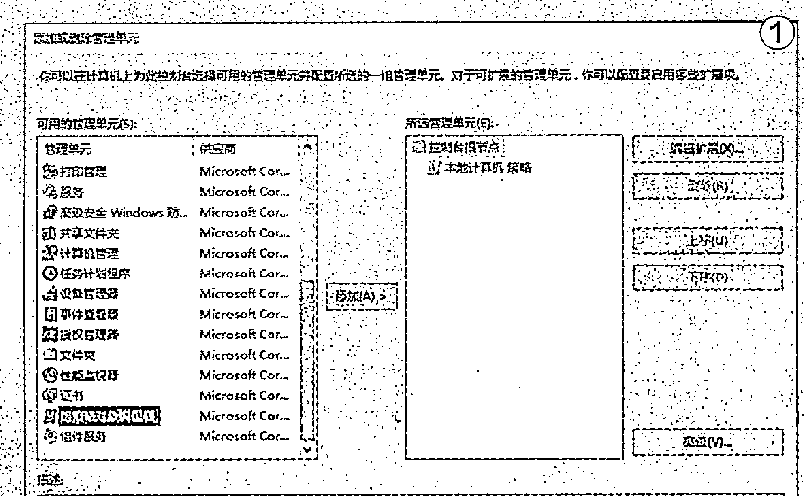

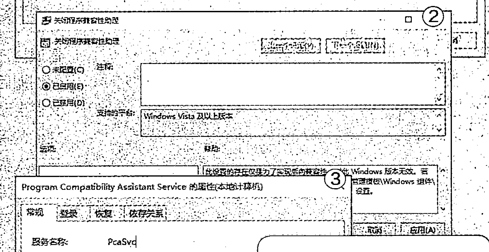

> 小知识
如果的确是遇到不兼容的软件，可以在软件图标上点击鼠标右键，选择菜单里面的“属性”命令。接着在弹出的属性窗口选择“兼容性”这个标签，选中“兼容模式”中的“以兼容模式运行这个程序”选项，然后选择列表中的“Windows 7”这个选项即可。

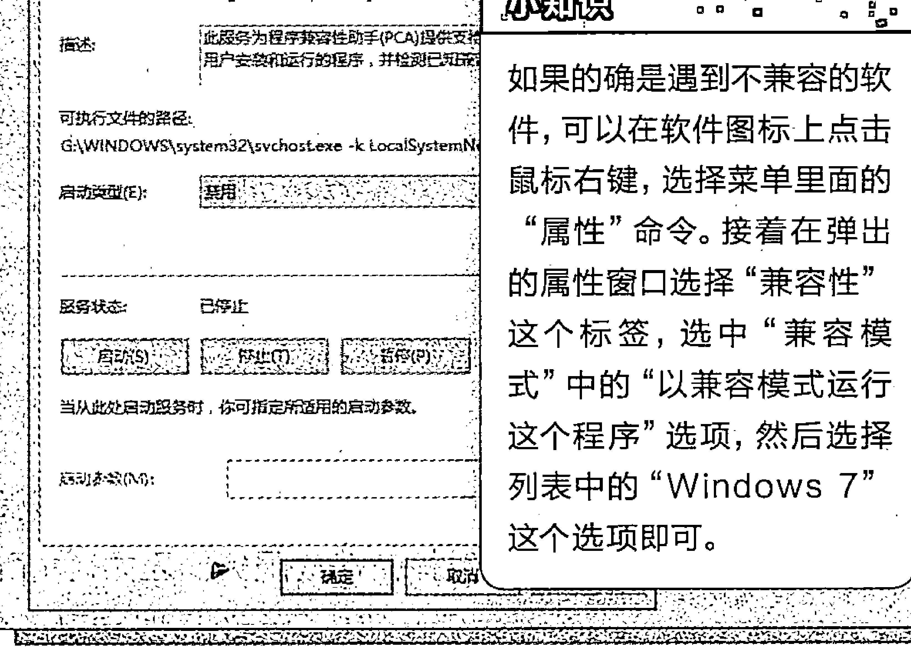

接下来在窗口左侧列表中依次点击选择“用户配置→管理模板→Windows组件→应用程序兼容性”。接着在窗口右侧的列表中双击其中的“关闭程序兼容性助理”选项，在弹出的属性窗口中选择“已启动”，然后点击“确定”按钮，即可关闭这个讨厌的“程序兼容性助手”功能了(图2)。

### 釜底抽薪禁用兼容性助手

虽然系统里面自带有相关的功能，但并不是所有的系统都能如此操作。因为Windows系统拥有不同的版本，而其中家庭版里面是没有组策略管理器功能的，所以这个时候就需要思考另外的办法。

在系统桌面上找到“计算机”图标，在该图标上点击鼠标右键，选择菜单中的“管理”命令，这样就会弹出一个“计算机管理”窗口。接着在左侧列表中找到“服务和应用程序”中的“服务”项，再在右侧窗口中找到“Program Compatibility Assistant Service”这项服务。在该服务名称上点击鼠标右键，选择菜单里面的“属性”命令。然后在弹出的属性对话框中找到“启动类型”项，接下来在列表中选择“禁用”命令，再在“范围状态”选项中点击“停用”命令即可(图3)。

虽然这项服务并不能直接关闭相关功能，但是由于这项服务是为程序兼容性助手提供支持的，所以在关闭它以后就相当于釜底抽薪。这样程序兼容性助手功能也就不能使用了，从而达到了我们不想使用这项功能的目的。

## 避风险 清除浏览器中的驱动文件

文 | 重剑

不知道从什么时候开始，很多浏览器都在安装的时候，在安装目录中加入了驱动文件。由于驱动文件的权限等级特别高，很多用户认为这些驱动文件会在系统后台干其他的事，所以他们都想将驱动文件从安装目录中删除。但是驱动文件并不等同于普通的文件，常规的删除方法对它并没有效果。

### 禁止使用猎豹驱动

猎豹浏览器是国内最早添加驱动文件的浏览器，虽然它是以安全的名义来加入驱动文件的，但是很多用户对此仍然是不屑一顾。所以要想禁用猎豹浏览器中的驱动文件，首先点击浏览器操作界面右上角的“安全中心”按钮。在弹出的网页里面点击工具栏中的“上网防御”按钮，找到其中的“开机自动启用猎豹安全服务”项，将这项功能设置为“关闭”状态（图1）。这时会弹出一个提示窗口，点击“关闭服务”按钮后重新启动浏览器，就可以禁用浏览器中的驱动文件了（图2）。

如果用户觉得禁用驱动文件不过瘾，非要删除它而后快的话，那么首先退出正在运行的猎豹浏览器。接着运行安全软件AntiSpy，在弹出的安全软件操作界面中选择“驱动模块”标签，这样就可以查看到系统里面已有的驱动文件。接着点击“文件厂商”按钮进行排序，就可以看到多个名为KingSoft的驱动文件。接下来选中一个驱动文件后点击鼠标右键，选择菜单里面的“删除驱动文件和注册表”命令，就可以将驱动文件从系统里面干净彻底地删除了（图3）。按照同样的操作方法，可以将剩余的驱动文件删除。

### 删除QQ浏览器驱动

猎豹浏览器在加入驱动文件以后，有其他的浏览器也跟进加入了驱动文件，比如很多人常用的QQ浏览器。虽然通过前面那种粗犷的方法，也可以进行QQ浏览器驱动文件的删除操作，但是对于QQ浏览器而言还有一个更加简便的方法。

首先下载最新版本的QQ浏览器安装包，选择完成后不要马上进行安装操作，而是在安装包上面点击鼠标右键，通过压缩软件对安装包进行解压缩操作。当解压操作完成后，进入刚刚解压出来的文件夹里面，就可以看到Driver和Service两个子文件夹。

通过名称我们就可以看出，Driver子文件夹里面就是所谓的驱动文件。所以如果你不需要这些驱动文件的话，直接将这个子文件夹删除掉即可。而Service子文件夹里面存放的，是用于启动浏览器的服务文件，用户可以根据需要考虑是否对这个文件夹进行删除。经过这样操作以后，QQ浏览器实际上就成为了一个绿色版。最后运行文件夹中的Qqbrowser文件，就可以激活QQ浏览器来使用了。

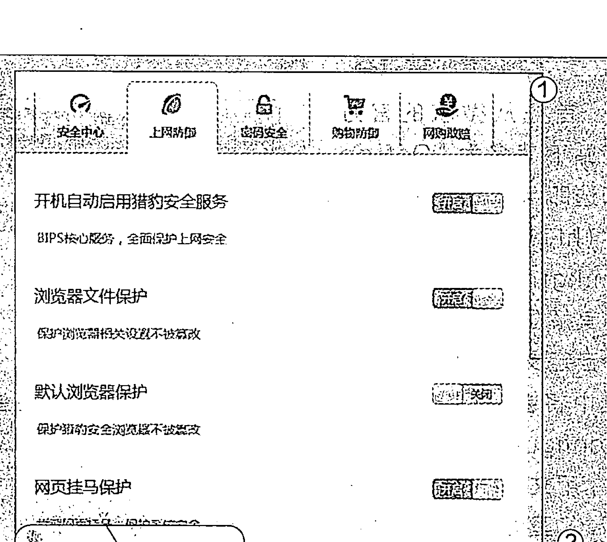

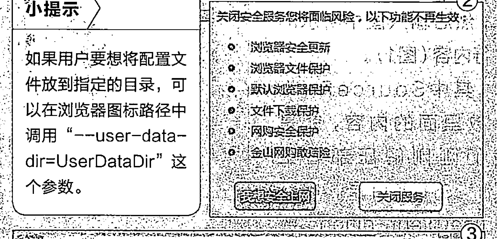

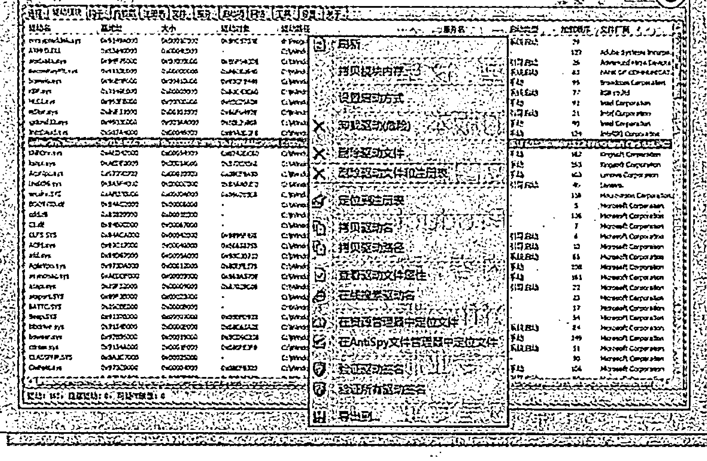

不过这个方法有一个小的缺陷，就是这样操作以后QQ浏览器不能设置为系统的默认浏览器，不过好在我们的目的是完全达到了。

## 消除冗余 自定义安装Office365

文|阿立

为了让用户更好地使用云端服务，微软推出了Office365这款新的Office版本。但是很多用户在使用后发现，这个版本安装时并没有相应的自定义安装选项，从而不得不将Office软件所有的功能模块都安装到系统中。可是很多用户往往只需要Word、Excel、 PowerPoint等常用的功能模块，那么如何才可以进行Office365的自定义安装呢？

### 设置参数下载所需版本

首先从微软的官方网站下载名为“Office即选即用部署工具”的文件(http://tinyurl.com/nmkgfry),下载完成后将其解压到D:\Office这个自定义的文件夹中,在其中将会看到一个名为Configuration.xml的文件,用文本编辑器打开它后，将里面的内容全部删掉，然后输入图中所示的几行内容(图1)。

其中SourcePath参数里面的内容，就是我们刚刚解压部署工具的文件夹目录。接着OfficeClientEdition参数里面的内容，是用户需要下载的Office类型，这里我设定的是64位的版本，如果想要使用32位的版本就设置32即可。“Product ID”参数里面的内容，改为用户想下载的Office版本,比如说家庭版、专业版等，这里我下载的是专业版。“Language ID”参数里面的内容,改为用户想下载的Office语言，这里我下载的是中文版本,如果想要英文版就修改为：“en-us”。设置完毕保存配置文件，接着用管理员权限

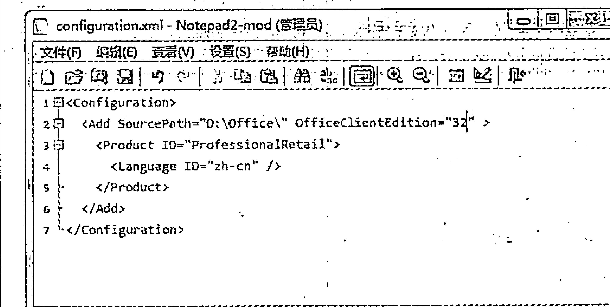

打开命令提示符窗口。通过CD命令进入到D:\Office目录中，再执行“setup.exe /download configuration.xml”命令就可以开始下载操作了(图2)。

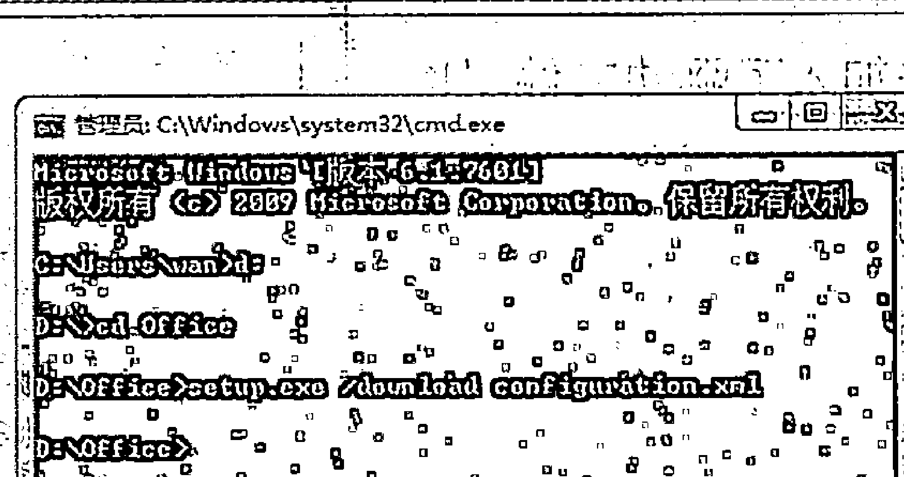

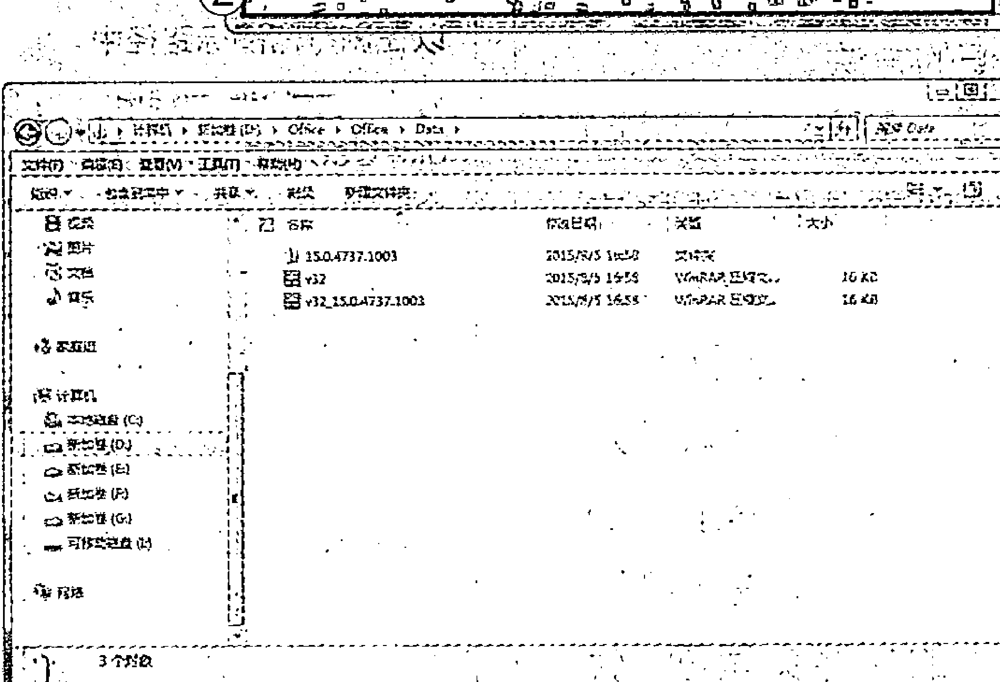

### 屏蔽不需要的功能

当Office365的安装包下载完成后，命令提示符窗口就会自动关闭。接下来进入到D:\Office文件夹中，会发现其中自动生成了一个新的子目录，进入后用户可以看到一个数字命名的文件夹，现在我们需要把这串数字复制下来(图3)。

接下来再用文本编辑器打开Configuration.xml文件，将里面原有的内容删掉，并把图中所示的内容复制进去(图4)。

其中SourcePath等参数设置都和前面的一样，Version参数就是刚刚记录下的那串数字。而“ExcludeApp ID”参数里面的内容,就是不需要进行安装的功能模块名称。设置完成后再次打开命令提示符窗口，执行“setup.exe /configure configuration.xml”命令，稍等片刻，看到对应的安装界面就可以开始进行自定义安装操作了。

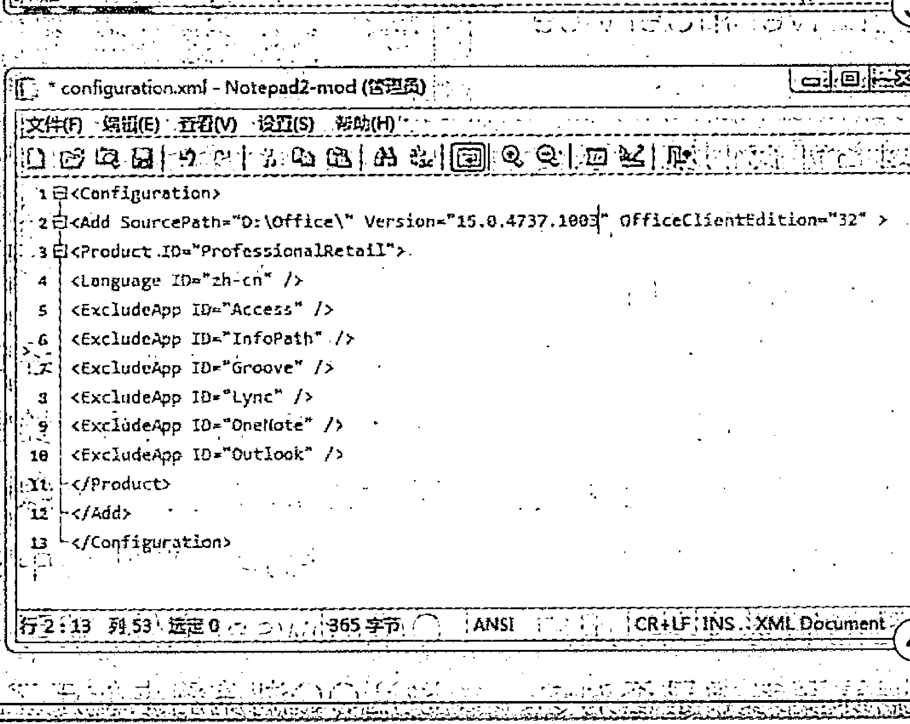

## 微软新武器 多功能截屏工具Snip

文|阿立

屏幕截图是一项非常常见的操作，因此无论是输入法还是通讯工具，都带有相关的功能模块。但是这些功能模块都非常单一，要进行复杂的操作就需要借助于专业的截屏工具。不过专业的工具往往需要收费，而微软公司为Office用户推出一款名为Snip的全新截屏工具，专业且免费。

### 截图功能融为一体

首先从Snip的官方网站下载最新的版本进行安装，当安装完成后会在系统桌面的上方出现一个浮动的截图工具条。平常这个工具条会自动进行隐藏，当用户移动鼠标到它的上方时才会出现，这其中包括截图、白板或相机等三个按钮。

当用户点击截图按钮以后，鼠标箭头就会变成一个十字靶标的图形。这时十字靶标会自动获取桌面或者活动窗口的界面，获取完成以后会在被选择的区域用红线进行标注，如果满意的话点击鼠标左键或右键就可以完成截图操作了（图1）。如果用户想自定义进行截图的话，只需要按住鼠标左键后进行移动，选中需要自定义截图的区域后，松开鼠标键就可以了。可以看出，Snip将传统截图软件几个不同的截图功能集中到一个功能里面了。

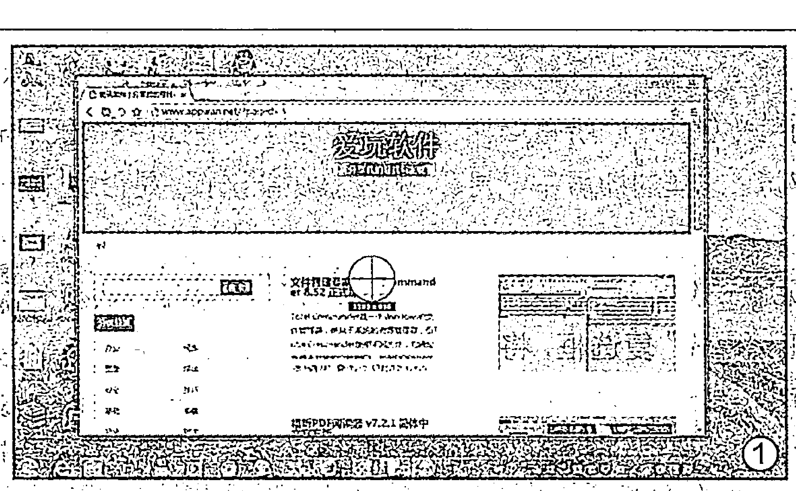

以看到所有截图的缩略图。双击其中的某张图片，可以切换到编辑窗口。根据自己的需要进行编辑操作，如果无需进行编辑操作的话，点击工具栏中的“Save”按钮即可进行保存。如果对截图内容不满意的话，点击缩略图右上角的删除按钮，就可以将其从管理列表中删除了（图2）。

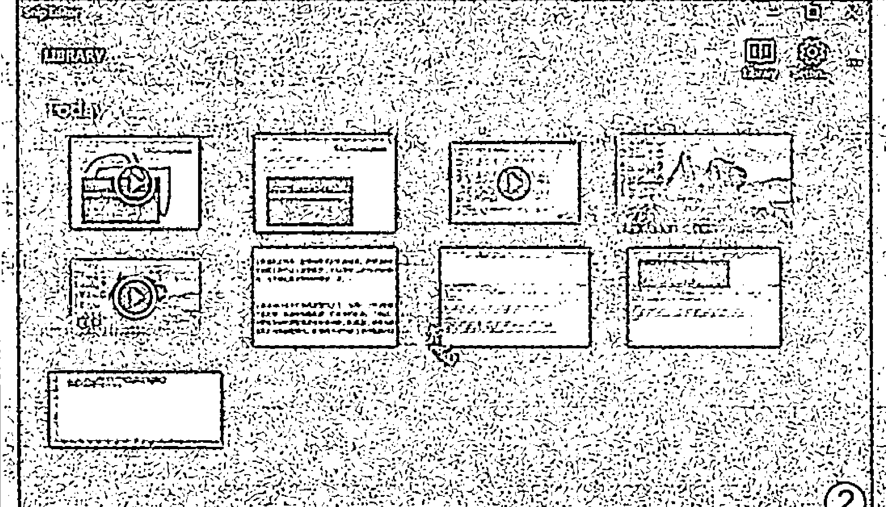

### 录像讲解简洁明了

有时不仅要截图还需要进行讲解，这时候大部分人会选择另外的屏幕录像软件，而有了Snip，这个问题就不必再求助其他软件了。

首先通过截图功能截取一张用于讲解的桌面，接着点击编辑窗口工具栏中的“Record”按钮，这时就可以一边在截图上操作一边进行录音操作。当解说操作完成后，点击工具栏中的“Stop”按钮。这时会弹出一个对话框窗口，点击“Play”按钮就可以对录像进行预览操作。如果不满意的话，点击“Redo”按钮可以重新进行录制。如果满意的话就点击“Link”按钮，这样Snip就会自动将录像文件上传到网上（图3）。接下来将分享链接发给对应的用户，他们就可以在线看到讲解的视频文件了。

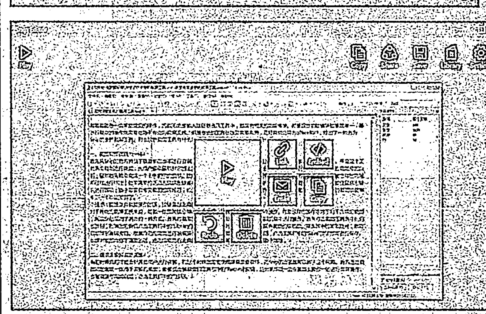

### 直接管理更加方便

不仅仅能截图，Snip对截图文件还有很好的管理功能。对于传统的截屏工具来说，每截一张图片就会弹出一个窗口，让用户进行编辑或保存操作。可是这样的操作非常不利于连续的截图，所以Snip采用了另外的一种方式。首先将截取的图片集中管理起来，在截图完成以后集中进行操作。首先点击截图工具条中的白板按钮，在弹出的窗口中点击工具栏中的“Library”按钮，在弹出的列表中就可

> 小提示
要想放弃截图操作的话，按键盘左上角的ESC键即可。

# 锁屏 就要锁出特色

文|南楚

短时间离开电脑时将屏幕锁定，已成为办公室或寝室间“不明文”的规定了。一来可以保证个人隐私不会被偷窥，二来也减少了被恶作剧的危险。但如果总是用Windows系统提供的默认功能，就未能显现出技术达人的个性了。锁屏，也要锁出特色！

## 1. 死机锁屏 骗过路人眼

用一幅软件窗口工作画面作伪装来锁屏，让所有操作动弹不得，给人一种“死机”的感觉。这样的锁屏是不是很另类呢？
我们可用“凤眼锁屏”软件实现这一效果。运行软件，勾选“死机锁屏模式”中的“启用死机模式”复选框，将提前抓取的“伪桌面”图片设置为锁屏图片，设置解锁密码，点击“启动锁屏”即可（图1）。

安装完成后点击“立即体验”进入使用向导，初步设置基本功能。其中包括默认密码，找回密码的邮箱、需要开启的基本功能选择、是否使用一键锁屏功能等（图4）。

> 小技巧
向导部分只是粗略设置，更加详尽的锁屏参数要通过“设置”来完成。在“界面”选项卡下设置个性锁屏背景图片，添加个性化挂机提示语，设置背景图片的透明度等（图5）。

## 2. 更多实用 锁屏花样新

死机锁屏可以蒙混人眼，而我们需要更多实用的锁屏功能。在如下的讲述中，我们将用一款“铭扬锁屏”软件实现多种锁屏功能，只需运行安装程序即可实现软件一键安装（图2）。

### (1) 保密为主 锁屏还需能留言

锁屏的目的是保护内容不被看到，但如果能给来人提供一个留言窗口，会更显人性化关怀。在“功能II”设置组中，开启“允许访客留言”功能。同时还可在这里录音，给访客留言（图6）。

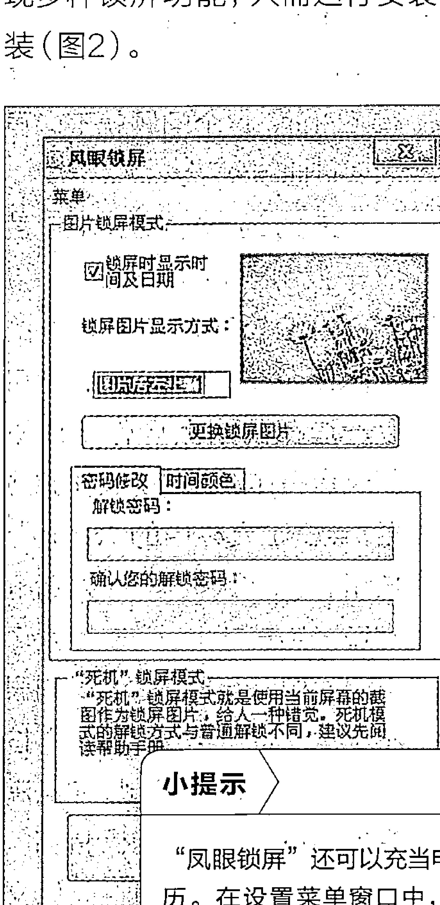

> 小提示
“凤眼锁屏”还可以充当电子台历。在设置菜单窗口中，选中“锁屏时显示时间及日期”，然后点击“时间颜色”标签，设置时间显示的颜色。这样在锁屏画面上就会出现彩色电子台历。

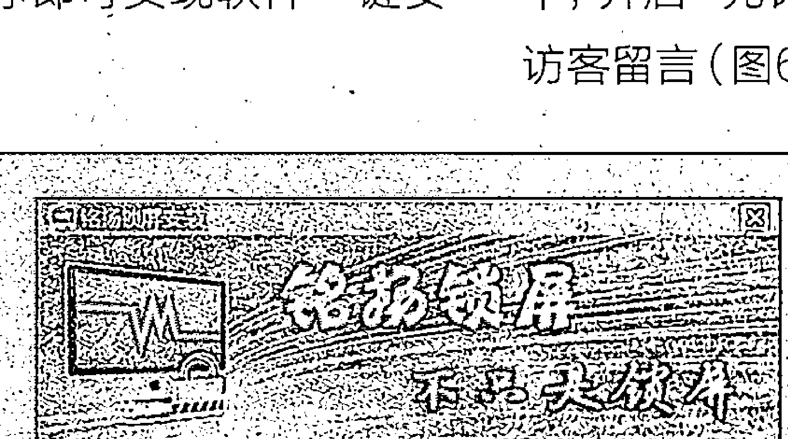

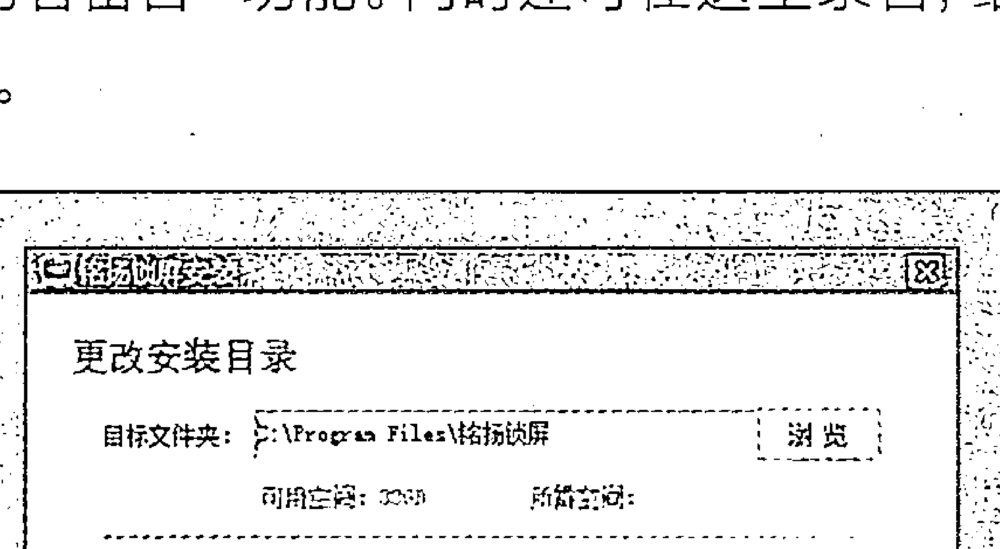

> 小提示
在“自定义安装”选项下藏有一个“搜狐影音”安装捆绑，若不点击该按钮，很容易被蒙混安装。请点击该按钮后去掉捆绑项的选择（图3）。

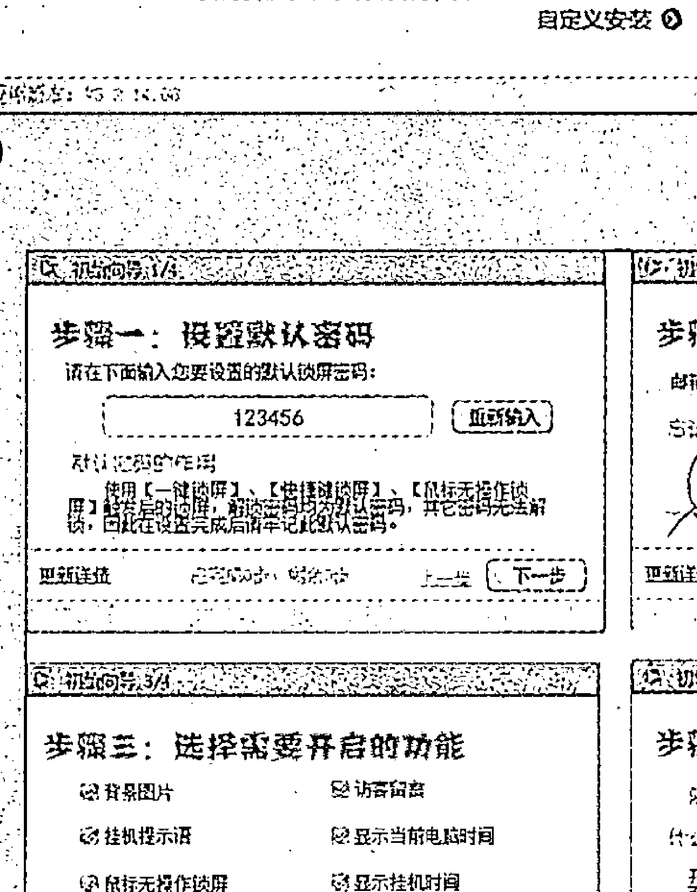

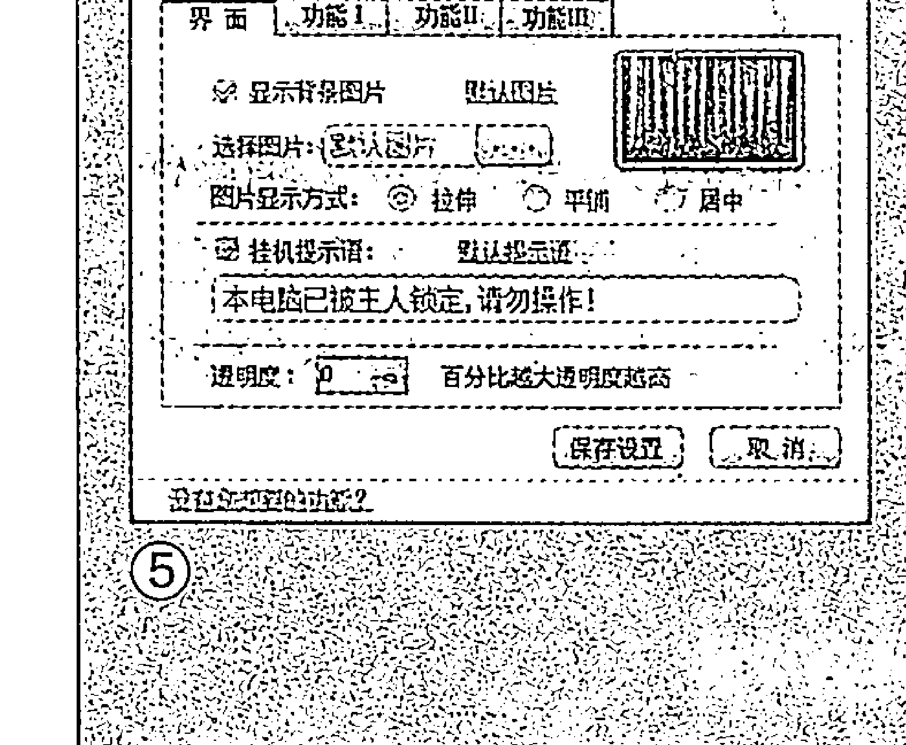

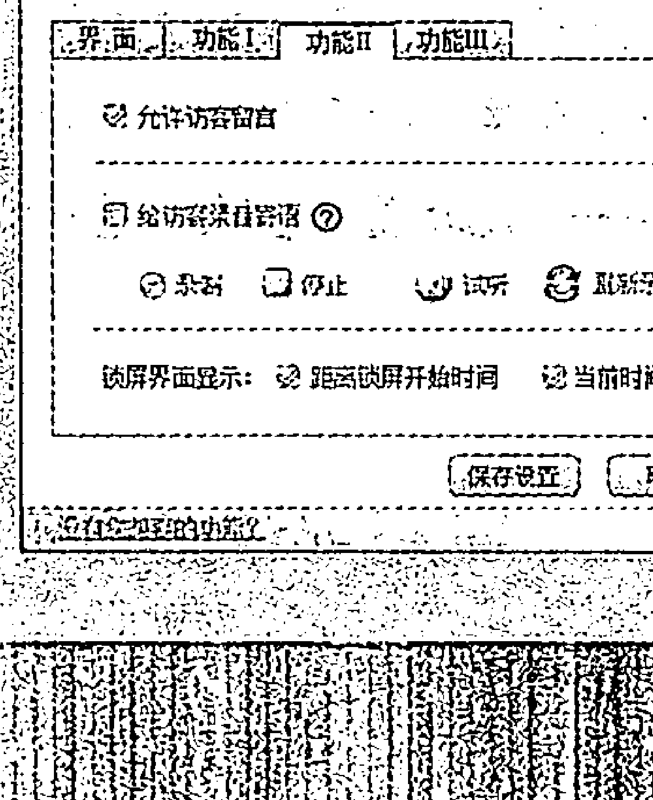

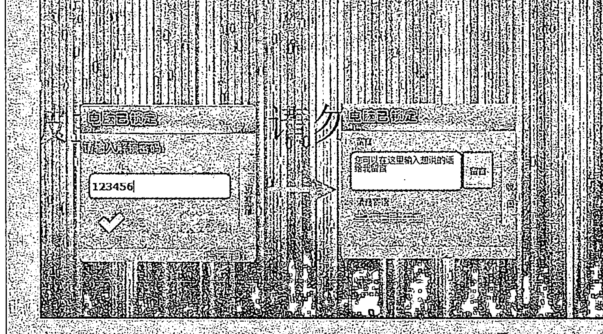

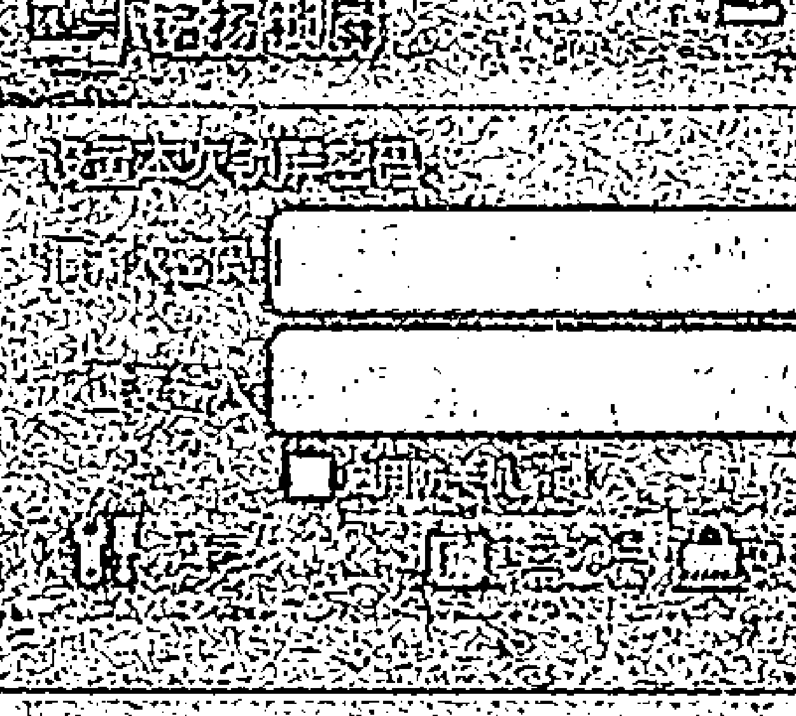

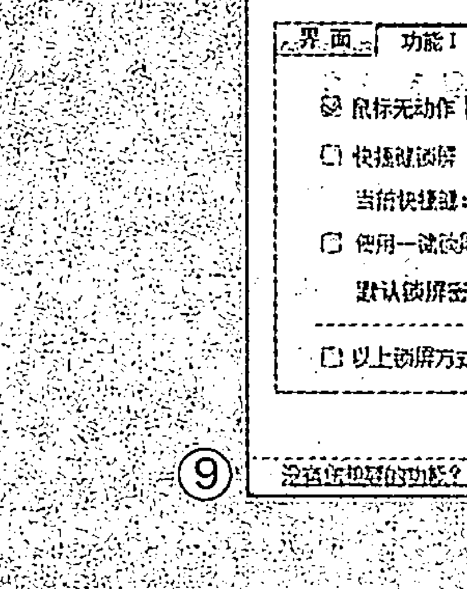


锁定桌面后，主人可输入解锁密码解锁。如果是访客，可点击解锁窗口右侧的“访客菜单”，展开访客留言窗口，直接输入留言内容。若主人给访客留有录音留言，还可直接点击下方的链接播放(图7)。

### (2) 防护要强 锁屏要能防关机

在每次锁屏前可设置不同的锁屏密码。两次输入相同的密码，然后点击“锁定”按钮，即可完成锁屏。锁屏要安全可靠，必须能够屏蔽诸如任务管理器、Win键、Alt+F4键等系统管理功能。否则，其他用户很容易通过这些渠道越过锁屏界面，进入系统。要实现防关机解锁，只需选中“启用防关机解锁”复选框即可(图8)。

### (3) 一键锁屏 动动键鼠就搞定

如果在桌面上安装一个锁屏快捷图标，只需点击即可马上锁屏。实现方法：在“功能I”设置组中选择“使用一键锁屏”并设置解锁密码。如果不用鼠标，可改用键盘快捷键一键锁屏，只需选中“快捷键锁屏”并设置当前快捷键即可(图9)。

### (4) 定时锁屏 鼠标休息即锁屏

除以上手动锁屏外，还可设置在某时间段内鼠标无动作自动锁屏。在图9所示的设置窗口中设置“鼠标无动作n分钟后自动锁屏”中的数值n即可。这样即可防止人离开时忘记锁屏，让机器自动帮我们来锁屏。

### (5) 闪存盘锁屏 使用方便更轻松

如果觉得输入密码太麻烦，还可以用闪存盘作为锁屏密钥。插入闪存盘，在软件下方点击“U盘锁屏”按钮，选择作为密钥的U盘，点击“绑定”按钮，即可将该U盘绑定为解锁系统锁屏的设备(图10)。下次可直接插入U盘来免密码解锁。

### 屏幕变身电子钟

使用该软件也可在锁屏画面上安置电子时钟，包括可以显示出距离锁屏开始的时间。要实现这一功能，只需在“功能II”设置组中选择“距离锁屏开始的时间”，以及是否显示系统当前时间。

以上两款软件在安装时，某些杀毒软件会误报并拦截，请先关掉杀毒软件再行安装使用。

# 虹吸墨批量化处理文本常见操作

文|倚楼

文本文件作为最常见的文件格式，几乎每个人每天都要和它打交道。普通的文本编辑器，只能进行简单的文字编辑操作，而其实除了文本处理，我们还经常需要对文本文件进行分割合并、批量改名、文件加密、文本计算等处理，往往需要启用多个第三方软件。今天则给大家介绍一款高级文本编辑器——虹吸墨，它除了基本的文字处理之外，常见的文本文件处理工作也能一并完成。

## 安装设置虹吸墨的注意事项

大家可以从网站 `nullice.com/Gasoft/Siphonink` 上去下载“虹吸墨”绿色版，解压后双击其中唯一的可执行文件运行即可(其所有设置及相关内容均保存在解压文件夹内)。若使用的是Windows 8/8.1或Windows 10操作系统，在第一次运行软件时会出现一个提示窗口，要求用户进行DirectPlay的安装。点击提示窗口中的“安装此功能”按钮，就会自动从互联网中下载该功能模块。

当DirectPlay功能模块安装完成后，“虹吸墨”软件就可以成功运行了。这个时候会再次弹出一个窗口，要求用户对软件的常用参数进行设置。我们可以根据自己的需要进行设置；比如在“个性信息”里面设置个人的相关信息，设置完成后点击“确定”按钮即可（图1）。如果用户以后需要重新进行设置的话，点击软件工具栏中的“设置”按钮即可重新调用。

> **小提示**
如果没有出现DirectPlay的安装提示窗口，那么应该是当前系统的DirectX功能不完整所致，这时可以尝试使用DirectX修复工具进行修复。

## 批量提取文件名称或网页链接

有时候在处理文件时，我们需要导出某个指定目录中的文件名称信息。最常见的方法，就是在命令提示符窗口中通过DIR命令来完成。不过这样的操作对于普通用户来说比较复杂，而利用虹吸墨编辑器则可以快速实现。

首先点击编辑器工具栏中的“编辑工具”按钮，在弹出的菜单中点击“文件”按钮，这时会弹出一个文件操作窗口。接下来切换到需要导出文件名称的文件夹，鼠标选中需要导出的文件后，拖拽到虹吸墨的文件操作窗口中，释放鼠标键即可，这时就可以在窗口中看到所有的文件名称。接着点击“导出文本”按钮，将文件名称导出到编辑器窗口中（图2）。然后点击工具栏中的“保存”按钮，即可快速将指定目录的文件名称信息保存下来了。如果想要导出文件的完整路径，那么就选择文件操作窗口中的“完整路径”项即可。

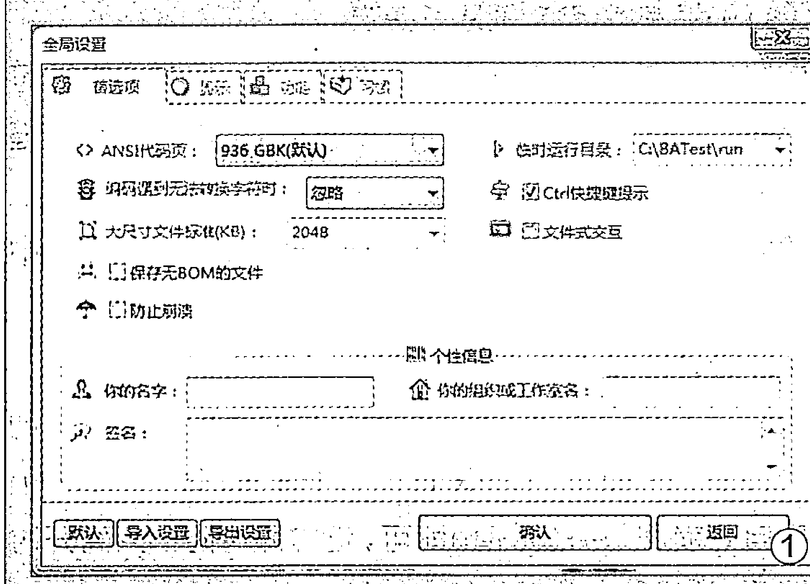

> **小提示**
在网页里面批量选中网页链接后，将其拖拽到编辑器窗口进行释放，就可以将网页链接批量提取出来。这样对于批量下载网页和文件都非常实用（图3）。

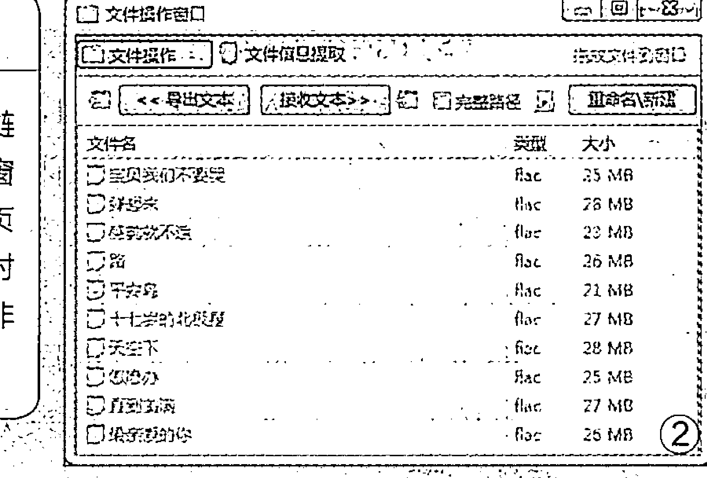

| 文件名 | 类型 | 大小 |
|---|---|---|
| 宝贝我们不要见 | flac | 25 MB |
| 辩驳头 | flac | 23 MB |
| 从此说再见 | flac | 23 MB |
| 路 | flac | 26 MB |
| 十七岁的北极星 | flac | 21 MB |
| 天空下 | flac | 27 MB |
| 恋恋风尘 | flac | 28 MB |
| 直到云淡风轻 | flac | 25 MB |
| 世界性的距离 | flac | 27 MB |
| 多得你 | flac | 25 MB |

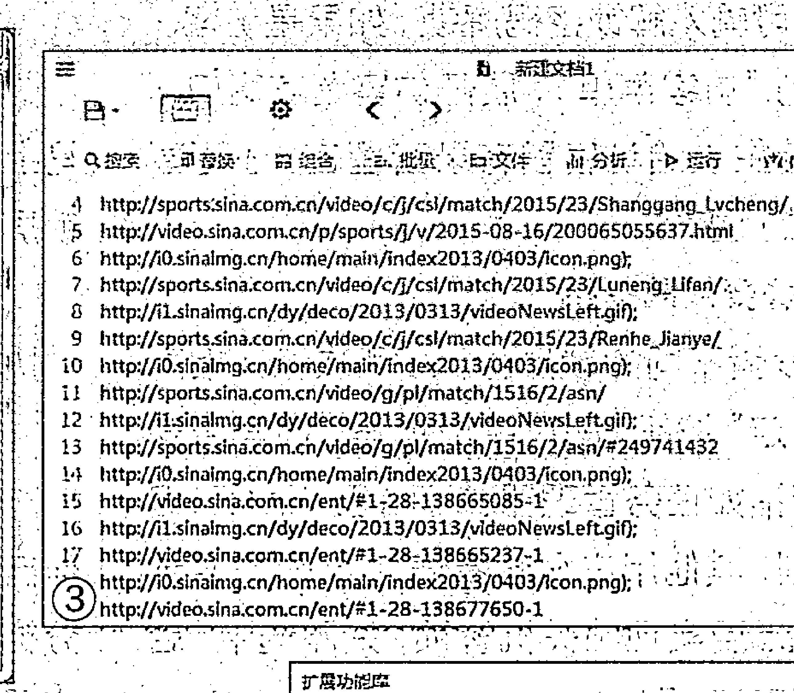

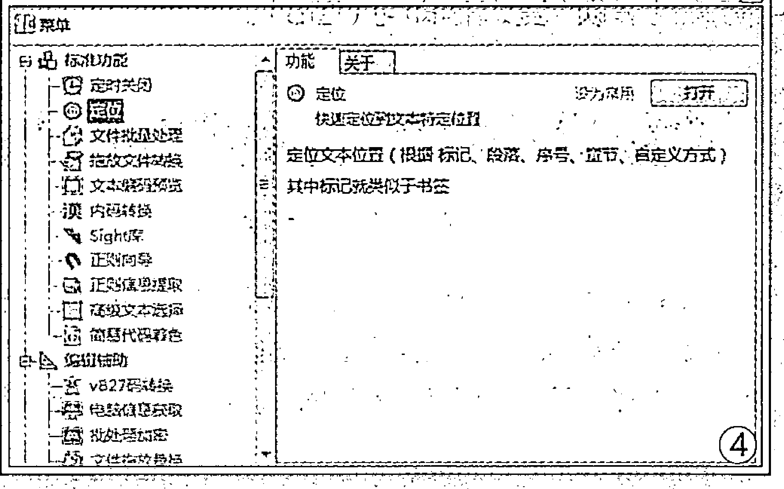

## 批量替换多个文件内容

有时在编辑文件过程中，可能会有一些专业术语输入错误，而且可能是在编辑了多个文件之后才惊觉。此时如果一个文件一个文件地打开修改就非常麻烦，而利用虹吸墨编辑器，则可以批量对多个文件一次性进行处理（普通编辑器只能一次对一个文件进行替换操作）。

点击虹吸墨右上角的“扩展功能库”按钮，在弹出的窗口左侧列表中点击“文件批量处理”项，接着点击窗口右侧的“打开”按钮启用这个功能（图4）。通过鼠标将需要进行批量替换的文件拖拽到打开的文件批量处理窗口里面。接着点击右侧窗口中的“替换”标签，在窗口上方输入需要替换的内容，在窗口下方输入要替换的内容。如果需要有多个词组进行替换的话，在每一行输入一个词组就可以了（图5）。最后点击“执行操作”按钮，就可以对词组进行批量替换操作了。

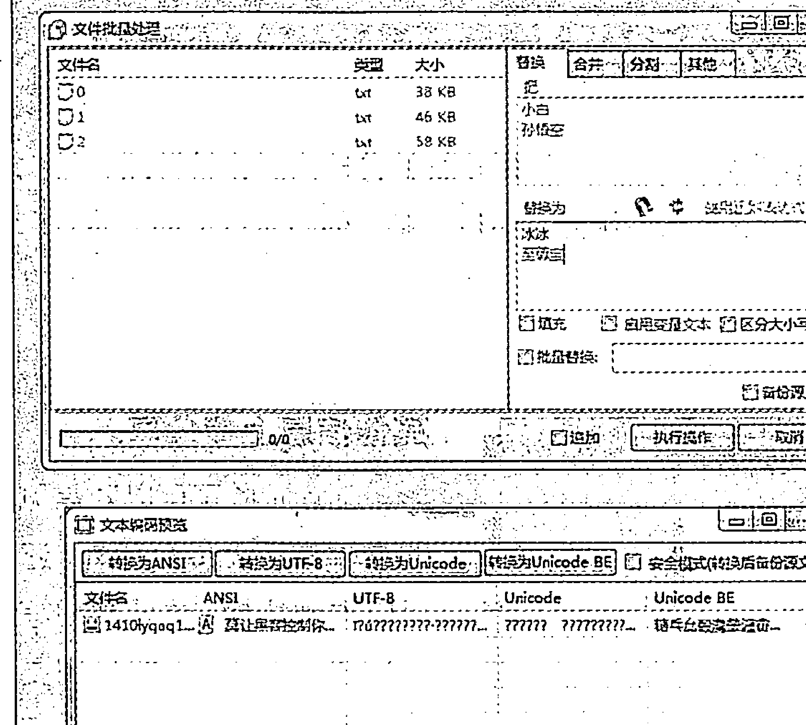

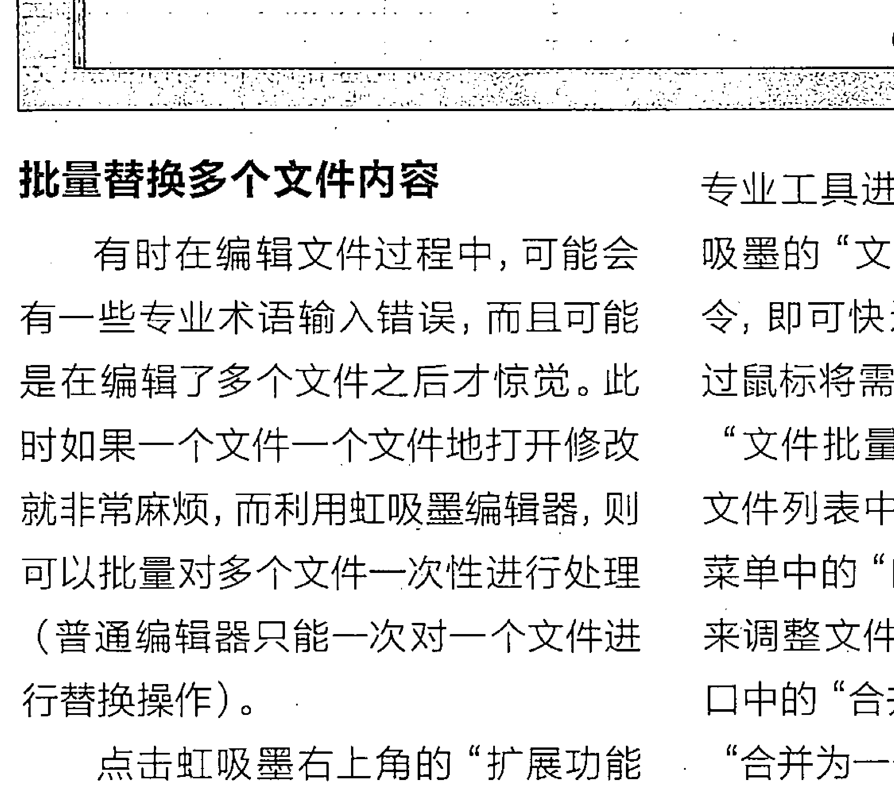

> **小提示**
如需要进行简体中文和繁体中文的转换，那么首先通过编辑器打开这个文件，接着点击“扩展功能库”窗口左侧列表中的“内码转换”选项，在弹出的窗口列表中选择转换的形式，如“BIG5(繁中)→GBK(中文)”项（图8），点击“转换”按钮即可。

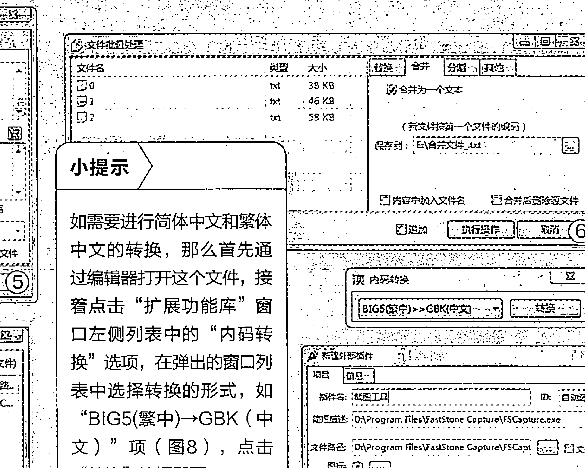

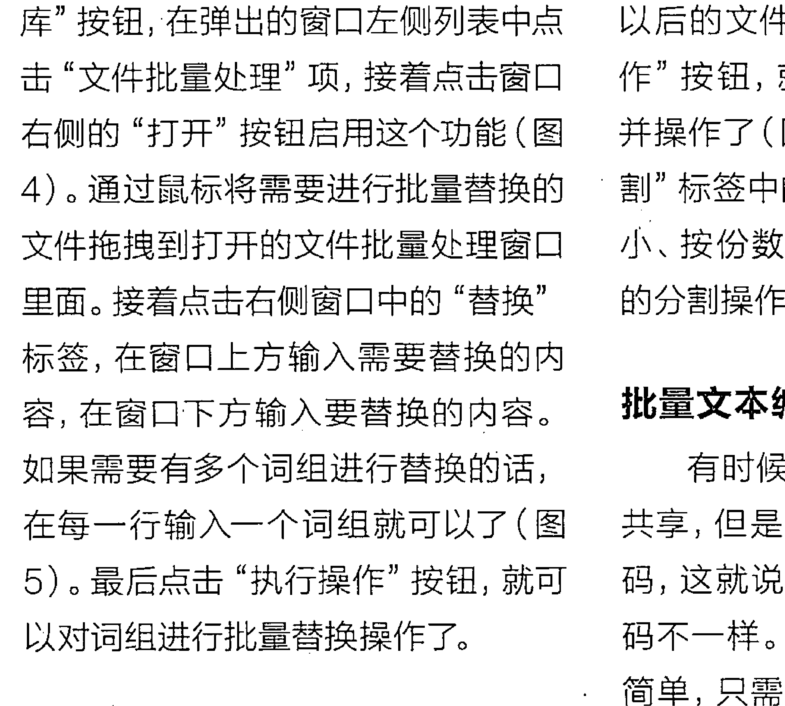

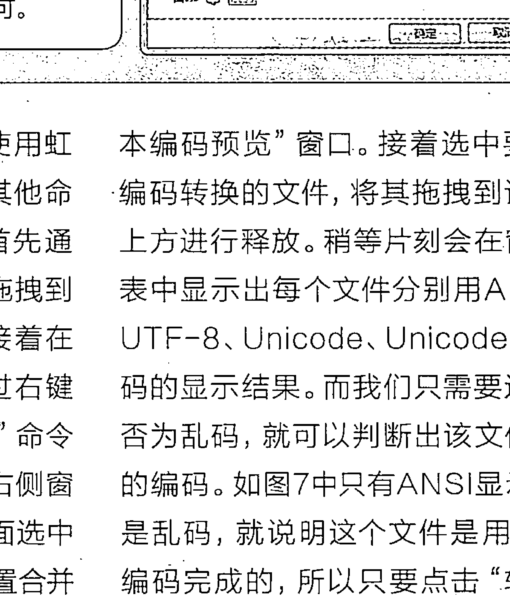

## 合并和分割文本文件

文本文件的合并和分割是非常常见的一项操作，但是这样简单的操作，除了进行手工操作外，就需要借助于专业工具进行操作。不过现在使用虹吸墨的“文件批量处理”中的其他命令，即可快速实现这一任务。首先通过鼠标将需要进行合并的文件拖拽到“文件批量处理”窗口里面。接着在文件列表中选中一个文件，通过右键菜单中的“向上移”或“向下移”命令来调整文件的顺序。然后点击右侧窗口中的“合并”标签，在窗口里面选中“合并为一个文本”项。最后设置合并以后的文件保存目录并点击“执行操作”按钮，就可以进行这些文件的合并操作了（图6）。除此之外，通过“分割”标签中的选项，还可以按行、按大小、按份数的分割方式进行文本文件的分割操作。

## 批量文本编码的转换

有时候我们会和他人进行文件的共享，但是打开文件后居然发现是乱码，这就说明不同用户系统使用的编码不一样。这样的问题处理起来非常简单，只需要将其内容转换为正确的编码即可。

这次在虹吸墨的“扩展功能库”窗口中，找到左侧列表中的“文本编码预览”项，打开它以后就会显示出“文本编码预览”窗口。接着选中要进行编码转换的文件，将其拖拽到该窗口上方进行释放。稍等片刻会在窗口列表中显示出每个文件分别用ANSI、UTF-8、Unicode、Unicode BE编码的显示结果。而我们只需要通过是否为乱码，就可以判断出该文件真正的编码。如图7中只有ANSI显示的不是乱码，就说明这个文件是用ANSI编码完成的，所以只要点击“转换为ANSI”按钮就可以进行编码的转换（图7）。不过为了稳妥起见，建议选中右上角的“安全模式”选项。

## 快速调用其他工具

自从Windows 8发布，微软取消了系统的开始菜单。想要使用计算器等功能就非常麻烦，不过通过“虹吸墨”就可以快速调用它。在“扩展功能库”窗口左侧列表的“外部插件”里面，可以看到计算器、命令提示符、注册表编辑器等项。在“外部插件”项目上面点击鼠标右键，选择“新建插件”命令后分别设置“插件名”和“文件路径”选项，点击“确定”命令还可以创建新的启动工具（图9），这样就方便我们个性化的程序调用了。

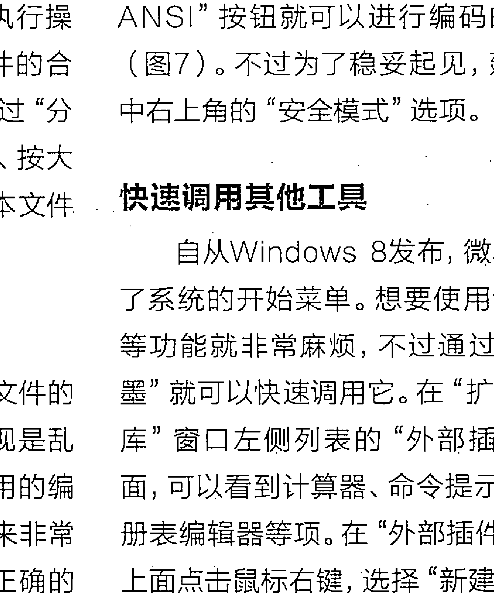

# 文件上传分享一键完成

文/老万

关于文件分享可以选择的途径有很多，现在最常见的分享方式就是通过网盘来操作。可是传统的分享方式比较繁琐，首先需要上传文件到网盘空间，接着进行相应的分享设置。现在利用Droplr这款云端服务，可以非常方便地实现文件上传分享的一键操作，从而大大提高文件分享的效率。

## 文件分享一拖即存

首先到Droplr云端服务的官方网站（droplr.com），下载适合自己系统的客户端版本。其客户端需要Visual C++ 2012运行库的支持，没有的话会自动下载这个运行库，但是问题就出在自动下载这个环节。由于Droplr是国外的云端服务，所以默认下载的运行库和中文系统不兼容，这就需要用户在安装客户端之前，手动下载中文版的Visual C++ 2012进行相关操作。

客户端程序安装完成后，就可以在系统托盘里面看到它的图标，在图标上点击鼠标左键，在系统桌面上显示出客户端的悬浮框。接下来将需要分享的文件拖拽到悬浮框上释放，就可以开始进行文件的上传操作了（图1）。

通过悬浮框图标可以观察到文件上传的进度，当悬浮框的图标填充完毕就说明文件上传好了。接下来在系统桌面的右下角将出现一个短链接的提示，这就说明文件分享的操作已经完成，同时分享链接已经被加载到系统的剪切板里面，用户就可以直接通过微博、QQ等方式进行分享操作了。一旦用户打开这个分享链接，即可看到分享出来的文件。如果是多媒体文件或者文档文件，还可以进行在线预览，在认为这个文件的确需要后再进行下载操作（图2）。

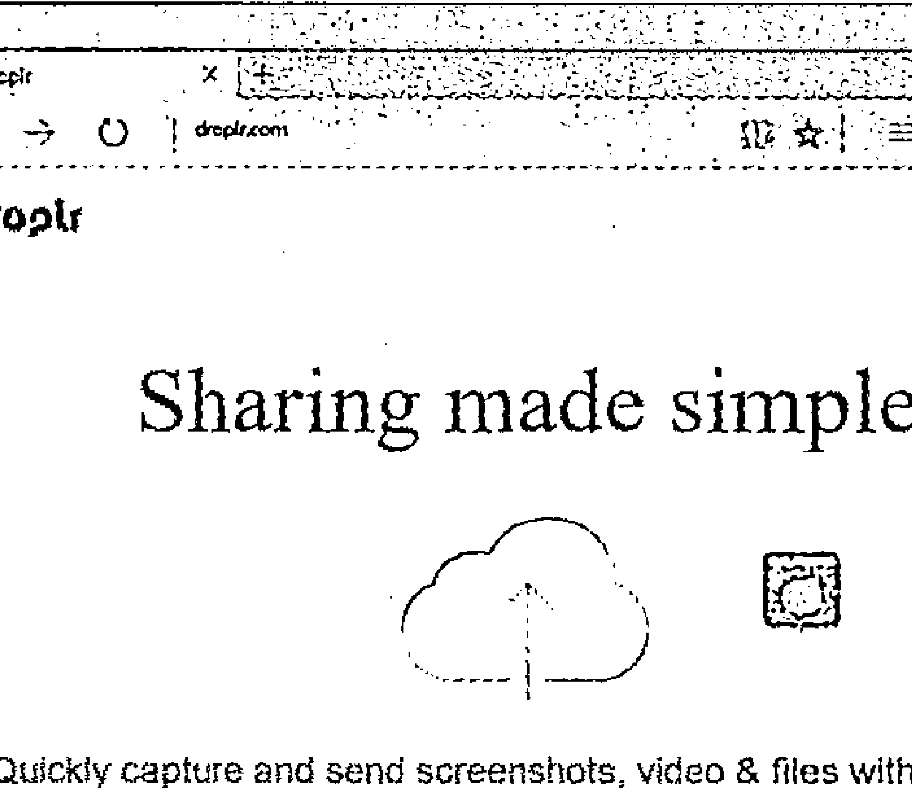

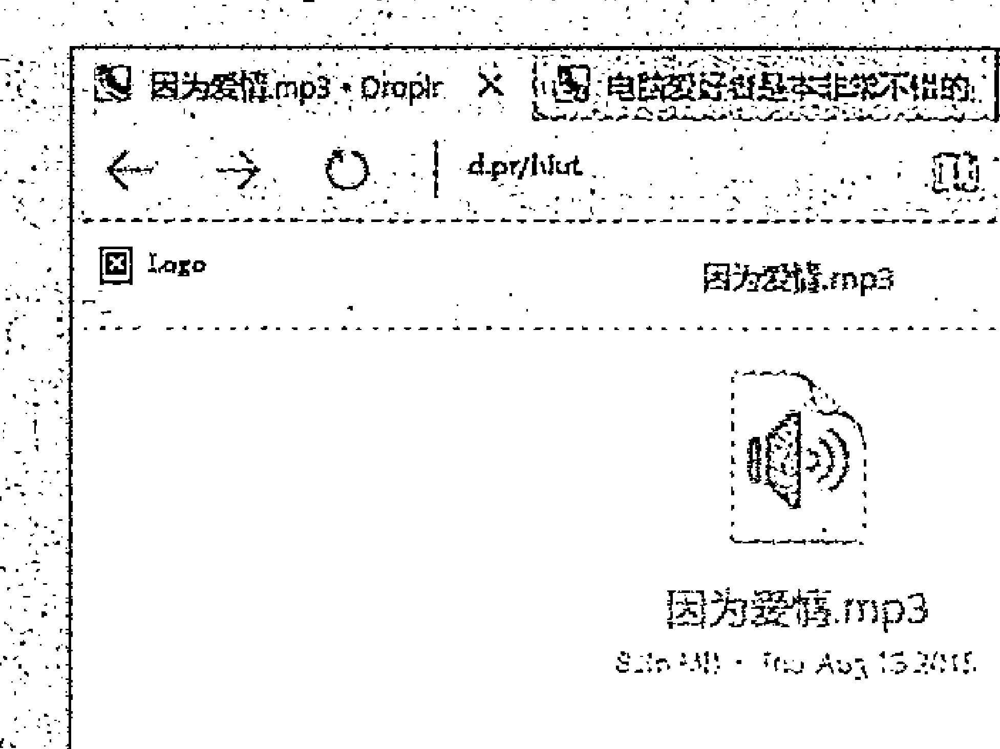

> 在分享文件上点击鼠标右键，选择“Share with Droplr”命令后，也可以进行一键分享操作。

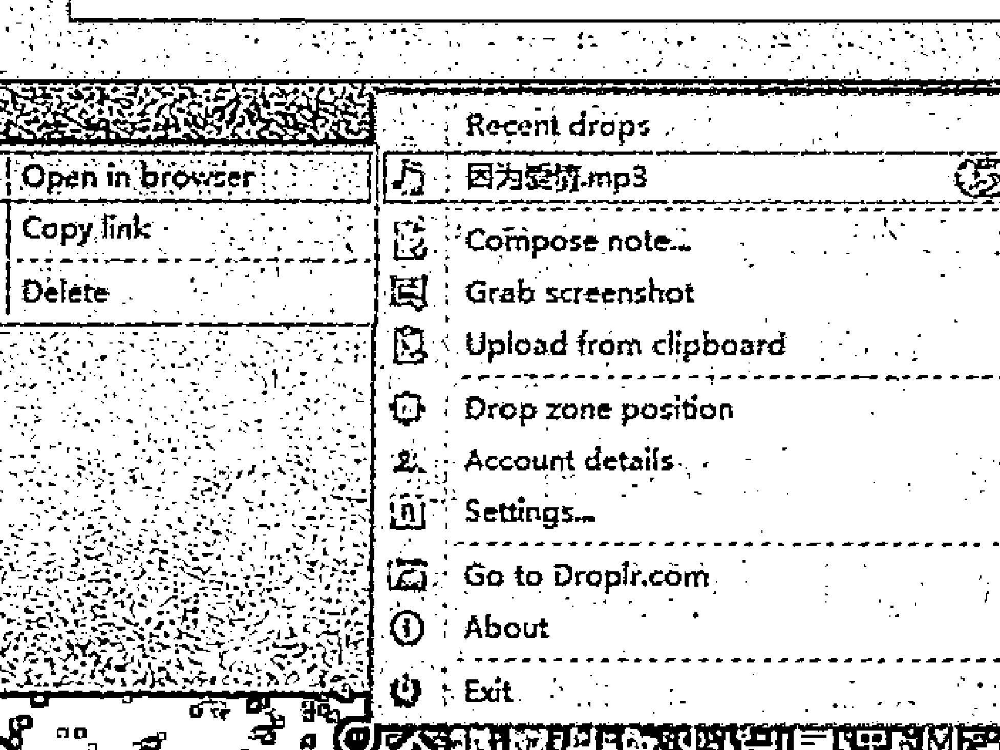

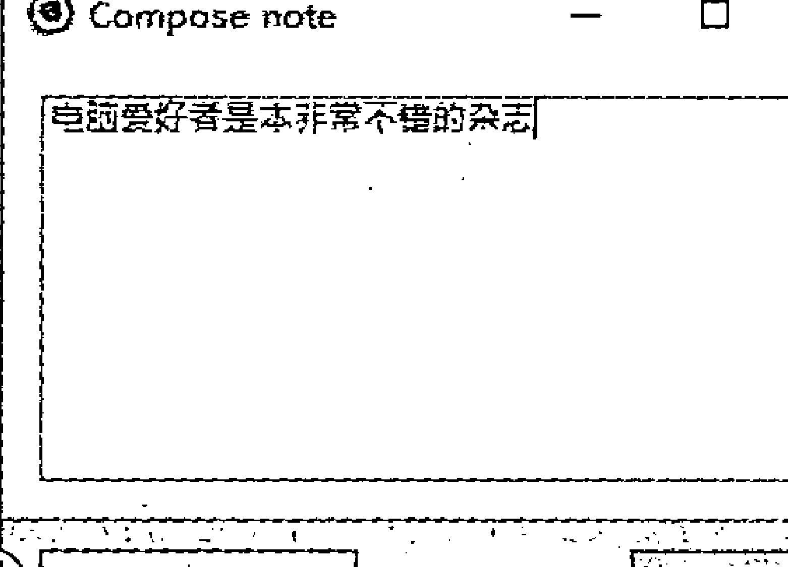

## 其他信息上传分享

Droplr除了可以对常见的文件进行上传分享外，还可以对剪切板、屏幕截图等信息进行上传。比如我们要分享屏幕截图的话，首先在系统托盘的软件图标上点击鼠标右键，选择菜单里面的“Grab screenshot”命令（图3）。这时屏幕桌面就会呈现出一种候选状态，通过鼠标左键手动选择需要截图区域，这样就完成了一个简单的截图操作。随后Droplr会自动跳出工具窗口，利用其中的功能可以对截图进行最基本的编辑，编辑完成后自然就是上传和分享了。

如果用户需要分享文件信息或者剪切板中的信息，按照前面的操作打开右键菜单，选择其中的“Upload from clipboard”命令，客户端将会在弹出的窗口里面自动读出系统剪切板中的信息。如果是文本信息的话，将内容粘贴到窗口中即可（图4）。而在窗口的左下角可以选择信息的记录方式，它支持富文本、Markdown和代码等多种模式。操作完成后点击“Upload”按钮，即可完成上传和分享的相关操作。是不是很方便！

# 最大化利益 云端帮大家选时间

文|重剑

随着大家对生活品质的不断追求，出门旅游的时间也越来越多。可是一个人旅游自然是没有意思的，所以约上三五好友一起出游是必不可少的选项。可是每个人都有自己的时间安排，而通过传统的打电话的方式一个个进行确认，不但显得非常麻烦，而且效率还非常低。那么有没有什么更好的方法，可以更加方便、更加高效地解决这个问题呢？

## 你有时间么 ——创建调查表单

其实要想解决这个棘手的问题也不难，利用现在常见的云服务就可以快速解决。而UFr.ee就是这样的一款云端服务，该服务不仅操作简单而且无须注册就可以使用。

首先打开一个支持HTML5的浏览器，在地址栏输入ufr.ee后按下回车键，这样就进入到这个云端服务的主界面(图1)。点击网页里面的“CREATE EVENT”按钮，即可看到一个用日历形式显示出的页面，这样就可以创建一个相关的旅行调查表单来。

首先在页面左上角的“Click to set event title”输入框中，为这个调查表单设置一个相关的名称，名称信息可以使用中文内容，这样可以方便其他朋友明白这次调查的意义。接着在网页的日历中选择这次旅行的候选日期，通常情况下我们都是利用双休日来进行短途旅行的，所以我们就在日历的九月份将所有的双休日都进行选中。然后点击网页左上角的“Next”按钮，从而就进入到调查表单的页面中(图2)。

## 我有时间 ——参与调查选择

自己作为这次旅行的组织者，在完成调查表单的制作后，自然是第一个开始进行调查操作的。首先在调查表单前面设置被调查者的名称，不过非常奇怪的是这里不能使用中文信息，只能通过英文或者拼音进行标识。接着在表格里面选择几个自己有时间的日期，当正确选择后这个日期的背景会马上变成绿色，设置完成后点击页面右上角的“Done”按钮进行确认(图3)。然后点击右下角的“Grab Link”按钮，就会弹出一个提示窗口，在窗口里面会给出这份调查表单的链接。将其复制下来以后，通过QQ、电子邮件等方式发给各位朋友(图4)。当朋友打开这个调查链接后，按照刚刚的方式进行设置就可以了。

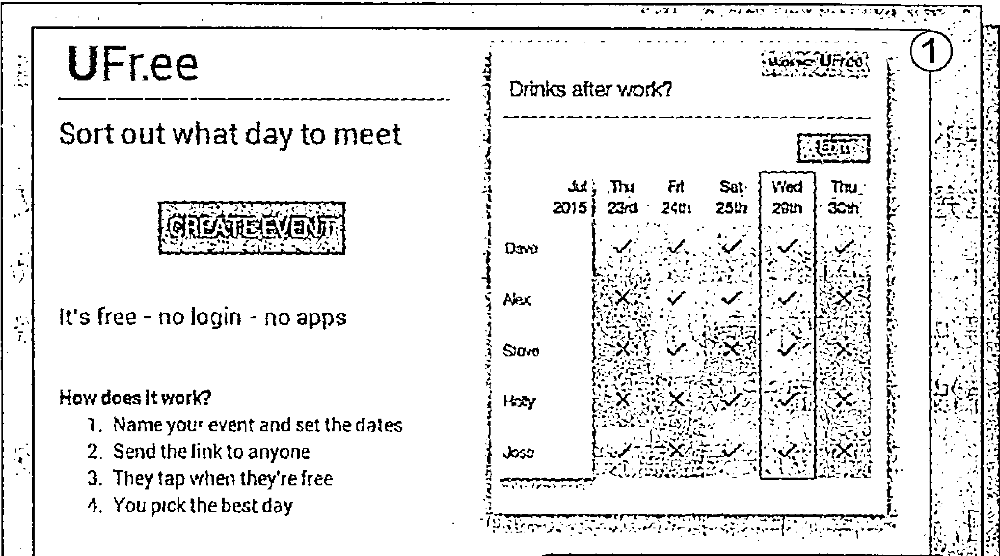

> 小提示
如果临时有事需要修改调查表单内容的话，那么打开分享的调查表单链接后，在右上角原来的“Done”按钮的位置上，会显示出新的“Edit”按钮图标。点击它以后调查表单就变成可修改状态，从而就可以对调查表单中的内容进行修改了。

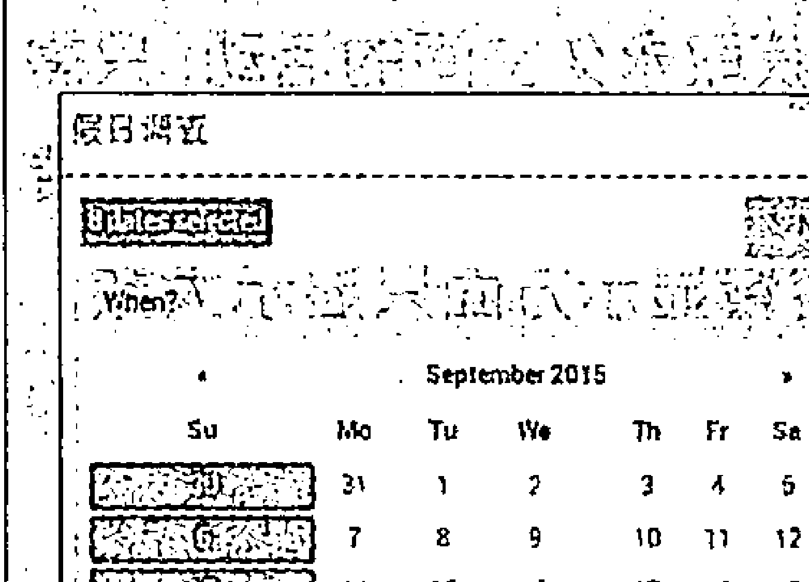

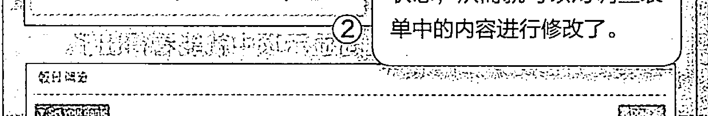

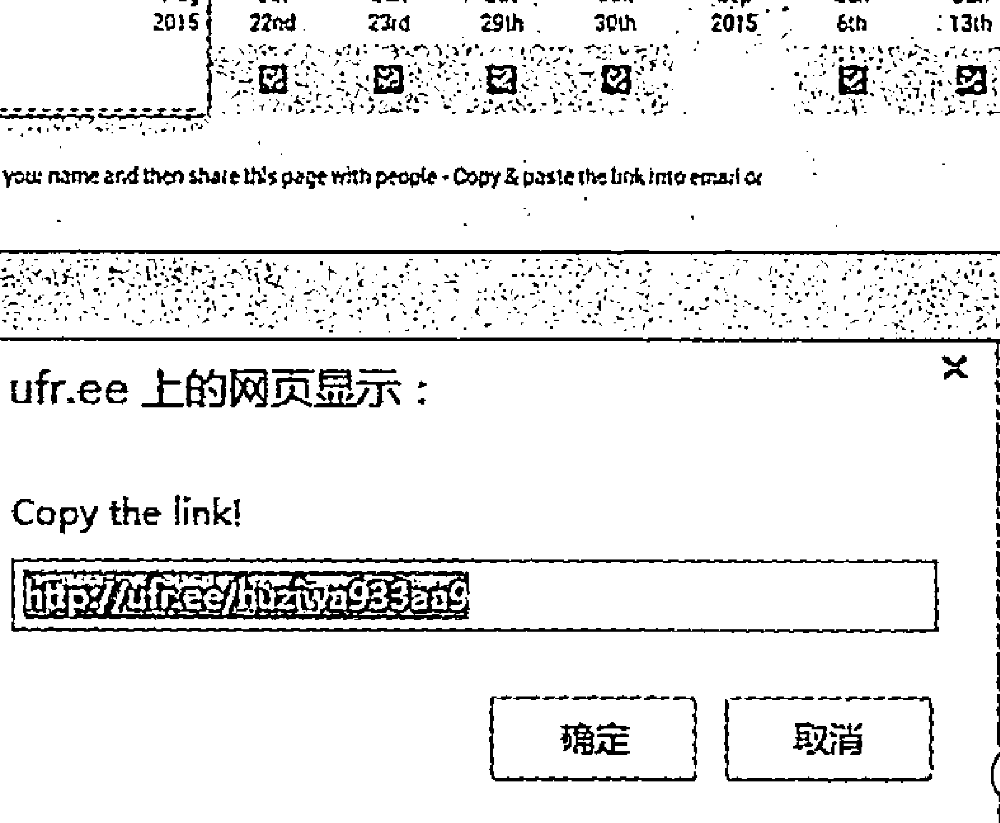

## 达成共识 ——查看最终结果

当每一个准备参与这次旅行的朋友，都陆续填妥调查表单后，云端服务就会在系统后台进行自动统计。当我这个组织者再次打开这个调查表单的页面后，将显示出一份完整、清楚的调查时间记录。同时也会在最适合的时间上以绿色框加以标记，同时还会以红色的方式将所有时间都没有的朋友名称显示出来，让组织者一眼就可以知道那一天能有最多人参与活动。这样的调查方式，是不是比传统的方法简单多了呢。

## 云端生活问题巧解决 文|张江南

云盘的最大好处就是使用方便，不用携带任何存储设备，随时随地可以访问。但是，云盘也不是绝对省心的，使用中往往会遇到各种问题。弄清楚这些问题后才能在云盘使用中驾轻就熟。

### 1. 别被假象迷了眼

下载文件不当会造成磁盘满的假象。例如：下载云盘中的文件到D盘，显示磁盘满，但D盘明明有数百GB空间。这是因为从云盘以拖动方式或先复制再粘贴的方式下载文件，会占用系统盘缓冲空间，如果下载的是大文件，而系统缓冲空间又不足以满足大文件存放要求，就会造成系统资源被占尽，显示磁盘满的提示。

解决的办法是，直接从云盘中选择文件，然后点击下载按钮，选择存放目录来下载，这样就不会出现磁盘满的情况了。

抽奖获得了空间但不显示空间，其实也是一种假象。目前许多云盘都推出每日抽奖免费获取永久空间的活动，只需点击一下按钮，即可轻松获得少则数十MB多则数GB的免费空间（图2）。但是，有的云盘在容量显示方面只显示大数，如360云盘只显示TB后的两位小数点，而TB和MB相差的数量级为1024×1024，因此当获得了几百MB空间的时候，从云盘的容量显示中看不出增加的容量。但实际上，这个容量已经累加到网盘账户中了。日积月累，当抽奖所得空间量累加到一定数量级，在云盘空间显示项中就能看得出了。

### 2. 文件消失能找回

本地同步文件夹删除了文件，云盘的文件也没了，即便是这样，文件也有找回的希望。由于使用了同步盘，本地文件的删除动作也会同步到云端执行同样的操作。但是，云端的文件删除后，默认会转移到云盘回收站存储。因此，可以登录云盘的网页版，进入回收站找到刚删除的文件。

> 多数云盘的回收站文件有存放时间限制，如果达到期限之后，系统会自动清空回收站中的文件。因此，发现文件被误删应该及时登录云盘网页版，进入回收站找回（图1）。

如果登录云盘后发现文件全消失，也不用太着急。在排除恶意所为的情况后（如账号被盗后，文件遭人为清空），最大的可能是登错账号所致。如果电脑是多人使用，可能是自动登录了别人的账号。如果自己有本类云盘的多个账号，则很可能是登录到另外一个账号中了。只需仔细核对账号即可发现问题。

如果在重装电脑后云盘文件全丢失，也不要慌张。云盘中的文件是保存在远程服务器中的，与是否重装电脑无关。但是，位于本地同步文件夹中的文件，若没有提前备份，在重装电脑后没有联网的情况下就会消失。但只要在重装系统后，安装同一种云盘，并设定开启同步文件夹，用此前的账号登录，联网后云盘会自动从云端下载同步文件夹中的文件到本地硬盘，消失的文件就又可找回了。

云盘数据最大的安全隐患是账号被窃取，也就是说用户名和密码同时被人获知，这才是云盘文件安全的要害。

为防止账号被盗后资料被恶意删除，在条件允许的情况下，尽量给回收站设置一个不同的密码，对被删文件加以保护（图3）。

### 3. 媒体播放重感觉

云盘收藏的音视频播放很方便，但播放体验可能不尽人意，还需要掌握增强体验的方法和技术。

首先需要注意，云盘播放音视频最好在Wi-Fi网络上使用，否则会带来很大的数据流量和费用。云盘一般均自带音视频播放功能，但都比较初级。以360云盘为例，直接支持MP3、WAV等音频格式的播放，视频则支持RMVB、MOV、AVI等常见格式。如果希望获得更多的文件格式支持和更好的音视频体验，可以通过软件中的相应链接提示安装云播放器或专门的云播放应用，登录这些配套软件，直接调用云盘中的音影资源进行在线播放（图4）。

在无网的情况下，云盘不能登录，查看云盘中的电子书或音视频也需要技巧。要想在无网时欣赏云盘中收藏的文件，需要在有网的时候将希望欣赏的内容缓冲到本地存储，选中文件后点击下载，一般会在本地的一个固定文件夹中存放这些文件。只要云盘的缓冲不被清理，都可以随时查看这些文件。但是，在无网的情况下，云盘客户端会出现无法登录的情况，也就无法进入查看文件。这时可通过资源管理器直接深入缓存文件夹选择播放。

### 4. 云盘安全第一位

不少人担心在向云盘传输文件的过程中被黑客拦截。其实，云盘传输文件使用的是碎片化的传输技术，不同于我们平时进行的文件拷贝过程。假如我们在向云盘中传输一张绝密照片，传输进程首先会将这张照片打成数据碎片，然后分别进行传输，当到达服务器之后，再将碎片合并为文件，这样的传输过程是非常安全的，中途拦截了也没用。所以不必担心在传输过程中被黑客拦截。

我们知道，云盘安全的最大威胁是云盘账号的泄露。云盘密码可能通过自己无意中泄露和黑客攻击等不同渠道泄露。为防止这种情况的发生，可使用带有保险箱功能的云盘（如360云盘），给保险箱设置另一个安全密码。保险箱在云盘中开辟了另一块空间放置保密文件，这样即便是云盘账号泄露，只要保险箱的账号没有泄露，文件依然安全（图5）。

> 为防止万一，可将绝密文件经过压缩软件加密打包，存放在独立密码的云盘保险箱内。这样，即便是云盘账号泄露，还有保险箱和压缩包两层密码来保护文件。

## 玩转GIF动画文件

文|张菲

演示GIF动画，有时我们希望播放过程中能暂停以便看清其中的细节。Windows XP操作系统可以直接播放GIF动画但不能暂停，Windows 7之后的系统版本更需要借助于专用工具才能播放。如果要对已有动画进行控制播放、逐帧分析、修改加工、合成或分解，看图软件、GIF专用播放器、GIF专用编辑器就可派上用场。

### 1. 逐帧播放与提取

使用与选择安装2345看图王后，在Windows文件资源管理器窗口中选中GIF动画文件并右键单击，依次选择“打开方式→2345看图王-看图程序”打开GIF动画（图1）。

此软件可直接预览GIF文件并实现中途暂停、逐帧播放。先点击“暂停”按钮暂停动画播放，然后用“上一帧”或“下一帧”按钮定位要查看的动画。右侧两个控制按钮分别为“保存当前帧”和“保存所有帧”控制按钮（图2）。如果要提取当前的一帧画面，点击“保存当前帧”，软件会自动以GIF动画文件同名文件的JPG格式，在当前目录下保存GIF的当前画面；如果要将GIF动画中的所有画面都提取出来，点击“保存所有帧”按钮，软件会自动以GIF动画文件后加数字序列号的方式，在当前目录中保存系列JPG文件（图3）。

> > **小提示**
> 若仅以查看GIF动画为目的，还可以使用另一款专用播放器7GIF。该软件可加速或减速播放、“倒带”播放。该软件可以用作Windows 7或Windows 8的默认动画查看器。

### 2. 分离编辑与合成

如果要对动画进行修改和重新合成，以上工具就显得“力不从心”了。这时，可使用Ulead GIF Animator经典动画制作软件。

先用Ulead GIF Animator将GIF动画单帧分离（也可以用以上介绍的2345看图王），导出所有帧图片；然后用图像处理软件修改其中的帧或制作新的帧。最后在Ulead GIF Animator中打开原来的GIF动画，对其中的各帧进行删除、添加等操作，即可实现GIF编辑的目的（图4）。预览合格后，保存为新的GIF动画文件即可。

## 永别酷盘 快抢文件安全清空 文|菲子

酷盘上传服务已停，并将于2015年10月10日停止全部免费数据存储服务，过此日期后，免费用户在酷盘中存储的资料将被无条件删除。寻求最快的方法转移资料，并彻底清理掉盘中文件是现阶段当务之急。

### 1. 必须捆绑淘宝账号

按理说，直接通过Web页面用原注册账号登录，应该能进入酷盘。但由于此前酷盘已经被阿里收购，并已向用户发过向阿里云转移文件的通知，且要求转移资料需要和淘宝账号绑定，因此，需要用户有淘宝账号（如果没有需新注册）。如果不进行转移和捆绑，用原来的酷盘账号无法登录酷盘（图1）。

> 小提示：在用淘宝账号捆绑酷盘登录时，要根据提示输入已有的淘宝账号名和密码。输入的必须是淘宝账号名，账号捆绑的手机号或昵称、邮箱等均无效，这点与通常登录淘宝不同。

### 2. 借助数据迁移专用工具

快速迁移酷盘数据可借助于酷盘数据迁移专用版软件（图2）。从https://kanbox.com/download/windows下载安装该工具后，登录并选择需要下载的文件，将路径设置为原有同步文件夹，可免去重复文件的下载。后台下载过程中通过系统托盘的程序图标可查看下载状态。当所有文件迁移结束后，托盘图标呈现绿色对钩状态。

> 小提示：用迁移工具下载文件完毕后，再点击该程序图标，只会进入该程序在本地的同步文件夹，而无法进入酷盘网络目录，也就无法删除网盘文件。这时，可用下面的办法解决。

### 3. 清空酷盘文件保安全

云盘中的文件资料迁移后，若不删除上面的文件就离开，总觉得不踏实。这时可用淘宝账号登录酷盘网页版，一次性选择所有文件，点击“删除”按钮，即可清空云盘中的所有文件（图3）。

> 小技巧：用以上方法删除文件其实还不保险。点击右上角的“显示已删除”按钮，还可以将已经删除的文件显示出来，并选择“还原”按钮进行还原。要想永久删除这些文件，还需选择“永久删除”按钮将其永久删除。之后，就该彻底放心了（图4）。

## 多内核浏览器玩“嫁接”

文|倚楼

Windows 10里增加了一个全新的Edge浏览器，不过由于这个浏览器刚刚推出，很多功能还不太完善，比如微软曾经许诺的扩展应用功能就没有。于是就有人考虑，能不能在其他浏览器中调用Edge内核来间接使用它，这样“鱼和熊掌”不是就兼顾了吗？其实，不同的浏览器侧重点不一样，所以很难百分之百的满足用户的需求，所以我们不只是“嫁接”Edge，还可以“嫁接”更多其他内核，这样就可以将自己最喜欢的浏览器武装起来，不用同时安装多个浏览器，上网不就更方便了。

### QQ浏览器调用Edge及其他内核

现在国内主要的网页浏览器，采用的都是最常见的双核配置，即可以选择使用IE浏览器或谷歌浏览器的内核。这样既可以照顾到用户快速浏览网页的要求，也可以兼顾到和某些特殊网站的兼容性。那么用户在QQ浏览器里面，如何调用自己喜欢的内核呢？

安装最新版本的QQ浏览器时点击主界面右上角的“菜单”按钮，在弹出的菜单里面点击“设置”按钮。然后在弹出的设置页面点击最上方的“高级”标签，这样就可以看到一个“内核模式”的项目。点击其中的“总是使用极速内核”选项，就可以保证在访问所有网页的时候，使用的都是速度极快的谷歌浏览器内核。当然点击“总是使用IE内核”选项，使用的就是IE浏览器的内核（图1）。

但是有的时候我们难免需要切换到其他的内核，这个时候又到设置页面里面进行操作非常的麻烦。所以我们在地址栏输入相应的网页地址后，点击后面的闪电图标，就可以在不同的内核之间进行切换。而在Windows 10里面增加了一个全新的Edge浏览器，它使用了一种全新且速度很快的渲染内核，如果用户想要切换到这个内核的话，就点击菜单里面的“Edge模式”命令即可（图2）。

### 360浏览器也玩多核及Edge

如果用户使用的是360极速浏览器的话，又如何调用不同的浏览器引擎呢？首先点击主界面右上角的“自定义和控制360极速浏览器”按钮，接着在弹出的菜单里面点击“选项”按钮。然后在弹出的设置页面点击左侧列表中的“高级设置”按钮，再在右侧窗口里面就可以找到“内核模式”的项目。点击其中的“全部使用Blink内核”选项，可以保证在访问所有网页的时候，使用的都是谷歌浏览器内核。而选择“默认使用Trident内核”选项，就可以保证在访问所有网页的时候，都是使用IE浏览器的内核。如果用户使用的是Windows 10系统，而且想要使用Edge内核的话，就将下面的“IE模式下使用Edge内核渲染(仅Windows 10下有效)”选项选中就可以了（图3）。

> 小提示：如果想要临时切换内核的话，同样点击地址栏后面的闪电图标，然后在弹出的菜单中进行选择即可。

### 单核Chrome植入IE内核

相对于国内的这些浏览器而言，国外的浏览器大多是单核的，比如谷歌浏览器使用的就是Blink内核。但是这样的浏览器在访问一些特定的网站时，会由于Blink内核和网站的控件不兼容，导致网页中的一些操作无法进行。想要解决此类问题，就需要让谷歌浏览器能够调用IE浏览器的内核。

这个问题，其实通过一个功能扩展就可以解决。首先进入到谷歌浏览器的应用商店，在左上角的搜索框里面输入IE并回车，在搜索结果的功能扩展里面选择一个自己满意的扩展进行安装即可。比如我这里下载的就是“IE Tab Multi”扩展，安装完成以后点击右上角的菜单按钮，在弹出的菜单里面选择“工具”中的“扩展程序”命令，接着在弹出的窗口列表中找到刚刚安装的扩展程序。点击扩展程序下面的“选项”按钮，在弹出的对话框就可以对其进行设置。

首先选中“Chrome右键菜单”选项后的启用命令，接着在“Action when you click the browser icon”列表里面根据自己的需要选择相应的命令，比如我们这里选择“在新窗口打开(Cookies Sync)”这个选项（图4）。接下来在“自动切换模式”下选中“启用这个功能”选项，这样当用户访问到不兼容谷歌浏览器内核的网页的时候，就可以自动切换到IE浏览器的内核中（图5）。当然通过在网页链接点击鼠标右键，也可以通过“IE Tab Multi”扩展来调用IE浏览器内核打开指定的页面（图6）。

### 曲线奇兵 火狐脚本调用其他内核

火狐浏览器同谷歌浏览器一样也是使用的自己特有的内核，所以同样在访问某些网页的时候存在兼容性的问题。自然而然利用功能扩展是可以解决的，但是火狐浏览器还有一个特别的方法，就是利用脚本也可以进行解决。

在火狐浏览器中打开脚本网页 (http://tinyurl.com/o7gm9hz)，在说明文档里面下载脚本文件和配置文件。接下来在地址栏输入“about:support”并按下回车，进入到浏览器的“故障排除”页面。在其中找到“应用程序概要”这个区域，接下来点击页面“配置文件夹”中的“显示文件夹”按钮。

在弹出的文件夹窗口就能看到Chrome这个文件夹了，把刚刚下载的脚本文件和配置文件复制到文件夹里面即可。然后重新启动火狐浏览器，点击工具栏中的“UC脚本管理器”命令，在弹出的菜单里面勾选上 addMenuPlus.uc 脚本。以后当我们需要切换到IE浏览器内核的时候，在网页上点击鼠标右键后就可以看到一个IE浏览器的图标（图7）。在图标上单击鼠标左键就会调用IE浏览器打开这个页面，而点击鼠标右键就会用谷歌浏览器打开这个页面。

> **小提示**
> addMenuPlus.uc 脚本的使用，需要 UserchromeJS 功能扩展的支持。

## 图片处理 不装软件不用搜

文|云飞

搜图、看图、截图、下图、修图、制图，面对这些常见的图片处理任务，你用什么方式进行？抛弃“臃肿”的传统大型图像处理软件，不用繁琐而功能简单的网页搜索和在线服务，借助于一些专门的图片处理Web轻应用，即可轻松完成图片处理任务。

> 小提示 轻应用哪里找
> 以360浏览器为例，在浏览器的工具栏上点击“扩展”按钮，在下拉菜单中单击“扩展中心”一项，打开“360应用市场”页面，在该页面中通过分类浏览或用右上角的搜索框，即可找到自己所需的轻应用（其他浏览器）（图1）。

### 1. 搜图——相似图片右键搜

如果对网上看到的一幅图片不满意，想搜索素质更好的相关的类似图片，也不用再到Google图片频道以图搜图，添加“图片搜索”或“谷歌相似图片搜索”的Web轻应用即可搞定。添加轻应用后，在网页图片上点击右键，选择“搜索相似图片”或“Search Google with this image”命令，就能很快搜索出相似的图片（图2）。

### 2. 看图——换种方式来看图

是不是觉得普通的方式浏览图片太千篇一律？那就换种方式，以3D的模式来看图吧。给浏览器添加名为Image Search by Cooliris的Web轻应用，就可以用3D墙的方式来浏览Google搜索的图片了。这样能获得更好的浏览体验，并能更快地找到并保存所需的图片（图3）。

### 3. 截图——网页再长也能抓

有的网页很有收藏价值，但由于网页设计采用了防拷贝技术，因此无法直接复制文字或图片。这时，最快捷的方法莫过于将整个网页存成图片。但是网页过长，往往达到屏幕长度的若干倍，即便用专业抓图软件也不便截取。这时，可通过截图Web轻应用来完成。在360安全浏览器中，已集成一个“截图”轻应用，点击扩展栏上的“截图”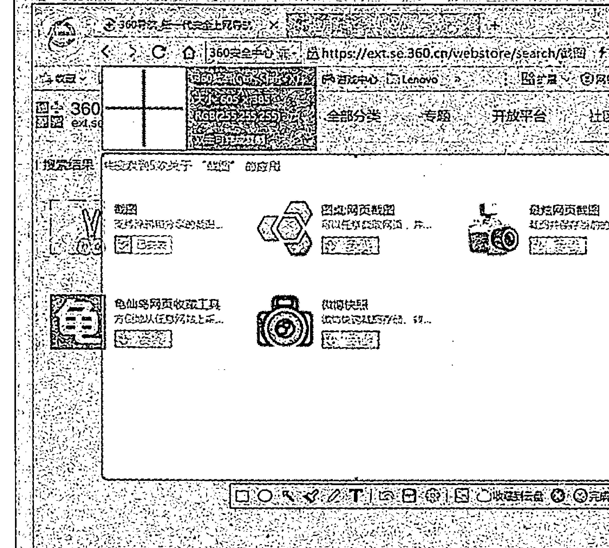

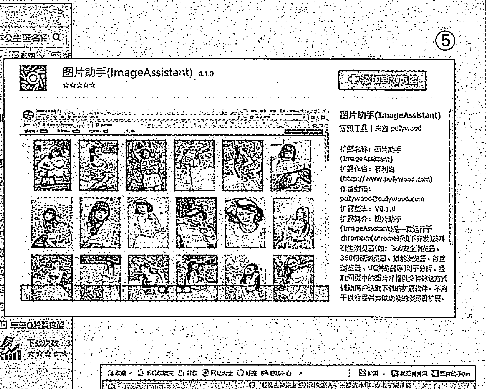

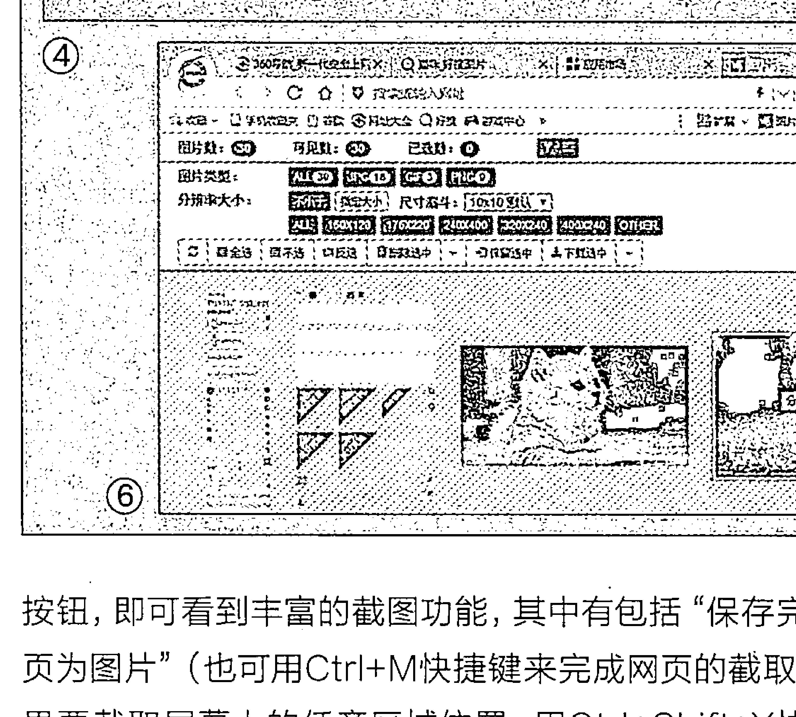

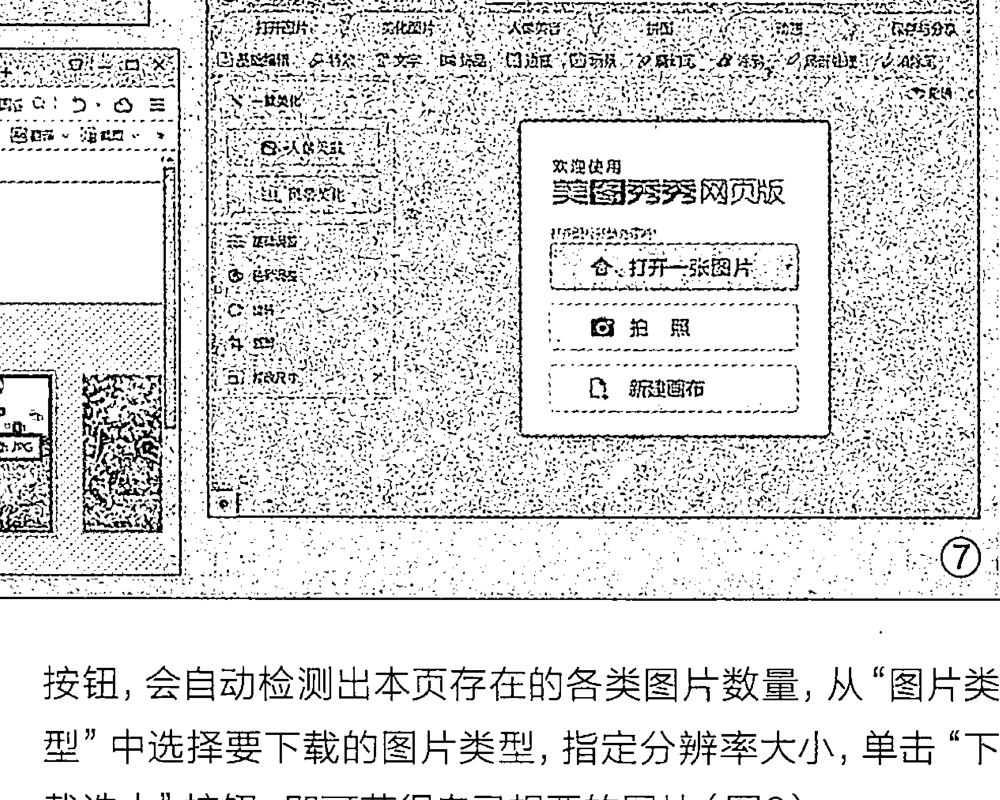

按钮，即可看到丰富的截图功能，其中有包括“保存完整网页为图片”（也可用Ctrl+M快捷键来完成网页的截取）。如果要截取屏幕上的任意区域位置，用Ctrl+Shift+X快捷键组合来完成。若组合键与其他软件的组合键相冲突，可点击“截图→指定区域截图”菜单项进行截取。该截图工具不仅能完成图片的保存，还可以用文字和线条对图片进行涂鸦、进行网络分享、将截图收藏到云盘等（图4）。

> 小提示：如果扩展栏没有出现截图按钮或自带的截图轻应用丢失，可通过扩展应用市场，用“截图”关键词进行搜索，点击搜索结果中的“截图”进行添加。在弹出的应用说明窗口中点击“安装”按钮，即可将该应用添加到浏览器的扩展栏。

### 4. 下图——灵活下载网页图

除了将网页本身截取为图片之外，有时我们还希望下载网页中的某些图片。借助于“图片助手（ImageAssistant）”Web轻应用，可达到灵活下载网页图片的目的（图5）。在要抓取图片的网页中点击图片助手

按钮，会自动检测出本页存在的各类图片数量，从“图片类型”中选择要下载的图片类型，指定分辨率大小，单击“下载选中”按钮，即可获得自己想要的图片（图6）。

### 5. 修图——不用安装照样用

美图秀秀你一定不陌生吧！不安装能不能用？当然可以！我们可以添加一个Web轻应用按钮，从服务器端运行它即可。添加美图秀秀轻应用图标到浏览器之后，只需点击“美图秀秀网”按钮，即可随时调用服务器版的美图秀秀了，一切更加简单（图7）。具体操作类似桌面版。

> 扩展阅读：其他常见浏览器（如搜狗浏览器、QQ浏览器）默认安装后一般都有轻应用栏，QQ浏览器称“应用中心”，搜狗浏览器称“扩展栏”，称谓不同但功能大同小异。通过这些浏览器的轻应用市场也可不同程度地找到图像处理的相关轻应用，读者朋友可按自己所用的浏览器自行选择使用。

## 文件太大？上传有妙招

文/万立夫

有时，我们需要将一些大个头软件或数据包保存在云盘中。但是，云盘上传数据都有单文件大小限制，就拿百度云来说，普通会员上传单个文件的大小限制为4GB。在不注册收费会员的情况下，利用制作共享BT种子和网盘离线BT下载相结合，可突破这一限制，将超过4GB的大文件收藏到自己的百度云盘中。

### 1. 制作种子 共享访问

首先准备好单个大文件，或者可以将本地超过4GB的资料打包成RAR或ISO镜像备用。准备一款可以制作和共享BT种子的工具软件（如经典下载软件BitTorrent，或比特精灵、比特彗星等的最新版本）。

> 在种子所指向的大文件没有完成完整共享之前，百度云也不会完整实现离线下载。因此，需要耐心保持BT种子共享工具的开启状态。就本例来说，不要关闭BitTorrent软件，保证种子所指向的文件可以获得完整的共享，这样才可能将大文件完整地离线保存到云盘中。

启动BitTorrent，在“文件”菜单下选择“制作Torrent”命令（或直接用快捷键Shift+N）操作也可以（图1）。

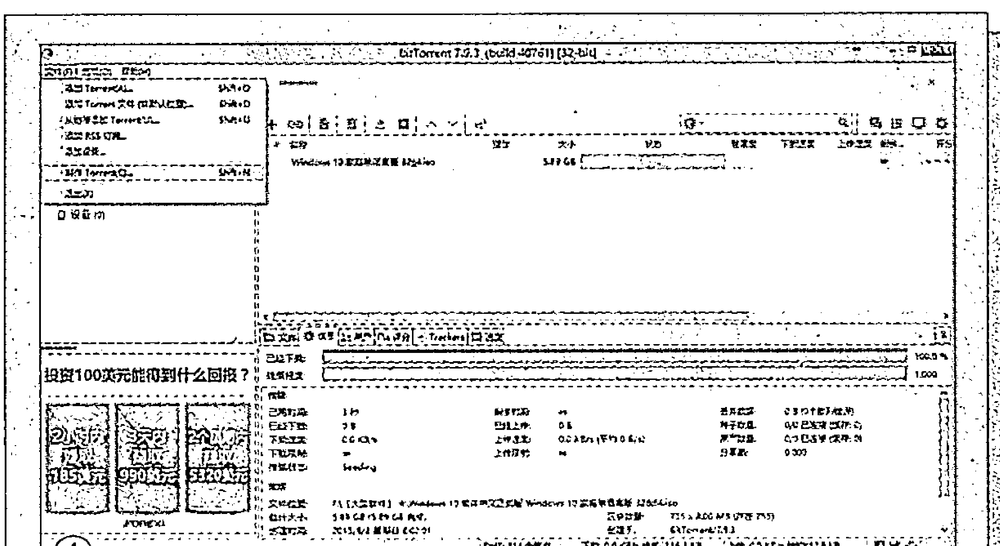

在弹出的制作Torrent种子界面中，通过“添加文件”选择原始大文件的来源，然后选择右侧的“开始做种”选项，设置好相关项目，点击“创建”按钮开始创建大文件的BT种子，并自动开始分享（图2）。

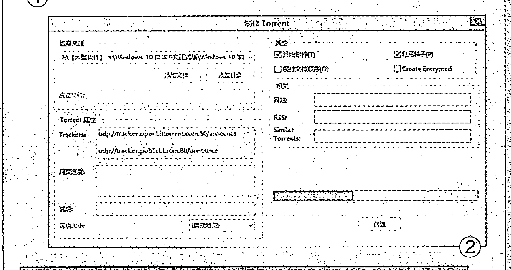

### 2. 离线下载 存入云盘

接下来，要用百度云所特有的离线下载功能，对以上生成的BT种子进行离线下载。

> 如果共享的文件是大众化的视频或软件等，服务器中可能已经存在，这时不要打包或使用文件夹上传，选择原版的单个文件上传更能享用服务器的“秒传”功能。否则，文件会被当作新文件，生成新的文件指纹，以普通速度上传，需要更多的时间才能完成共享。

登录自己的百度云账户，在文件管理界面中，点击“离线下载”按钮，在弹出的“离线下载任务列表”窗口中，点击“新建BT任务”按钮（图3）。

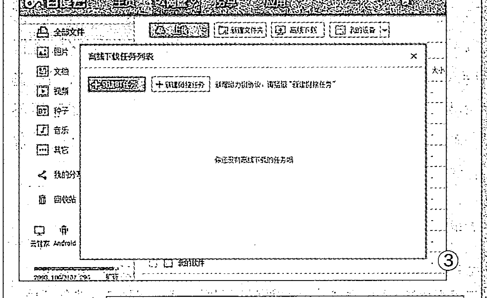

最后从本地选择上述制作好的大文件种子.torrent文件，点击“打开”按钮，即可将种子文件添加到百度云的后台，由百度云负责在后台进行下载了（图4）。这时，即便是本机的百度云被关闭，也不影响该文件的离线下载。

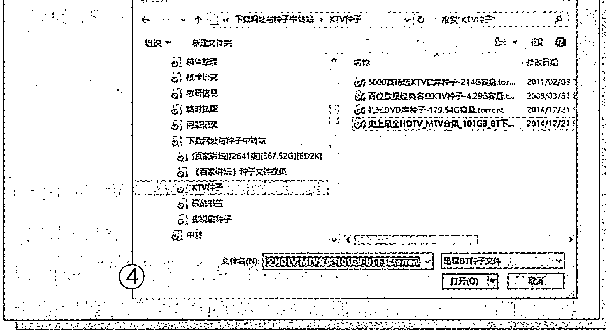

## 自定义Cortana的搜索引擎

文/老万

Windows 10系统在任务栏里面新增加了Cortana搜索功能，利用它就可以快速进行信息的查找。不过Cortana搜索默认使用的是必应搜索引擎，与其他主流搜索引擎相比还有所不及。下面的方法，就是教大家如何将Cortana默认的搜索引擎改成自己想要的。

### 借用扩展进行切换

要想解决这个看似不可能完成的任务，需要借助于主流网页浏览器的帮助。如果用户使用的是谷歌浏览器的话，首先需要登录到谷歌的应用商店，搜索并安装一款名为“Chrometana - Redirect Bing Somewhere”的功能扩展。安装完成后会自动弹出一个页面，让用户从Google、Yahoo或者是DuckDuckGo里面选择一个需要的搜索引擎（图1）。设置完成后接下来点击谷歌浏览器右上角的自定义按钮，在弹出的菜单里面选择“设置”命令并在设置窗口找到“默认浏览器”项。点击下面的“将Google Chrome设置为默认浏览器”命令，这时就会弹出Windows 10系统修改默认设置的窗口。

如果系统没有弹出这个窗口的话，那么点击左下角的开始按钮，在弹出的菜单里面点击“设置”命令。在弹出的对话框中点击“系统”按钮，再在弹出的系统设置窗口中点击左侧的“默认应用”命令，然后在右侧窗口找到“Web浏览器”项。点击该选项当前的软件图标后，在弹出的菜单里面选择谷歌浏览器这项即可（图2）。以后当我们在Cortana搜索里面输入关键词后，Windows 10系统就会通过谷歌浏览器中的“Chrometana - Redirect Bing Somewhere”扩展，来进行相关的信息的查找并反馈搜索建议。当用户点击一个搜索建议后，就会打开谷歌浏览器进行相应的访问操作了。

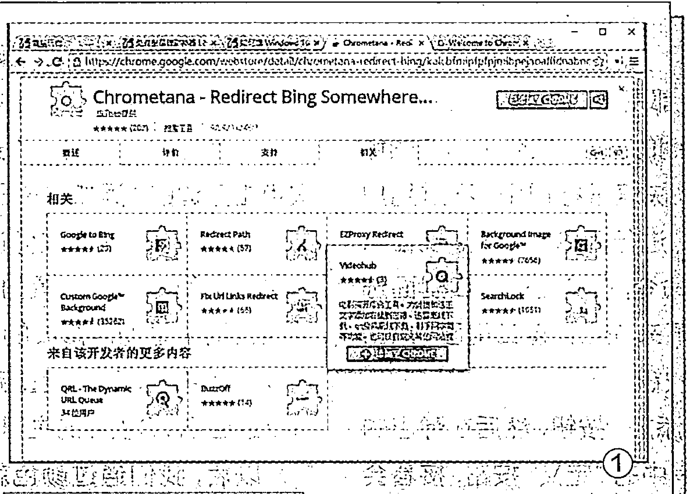

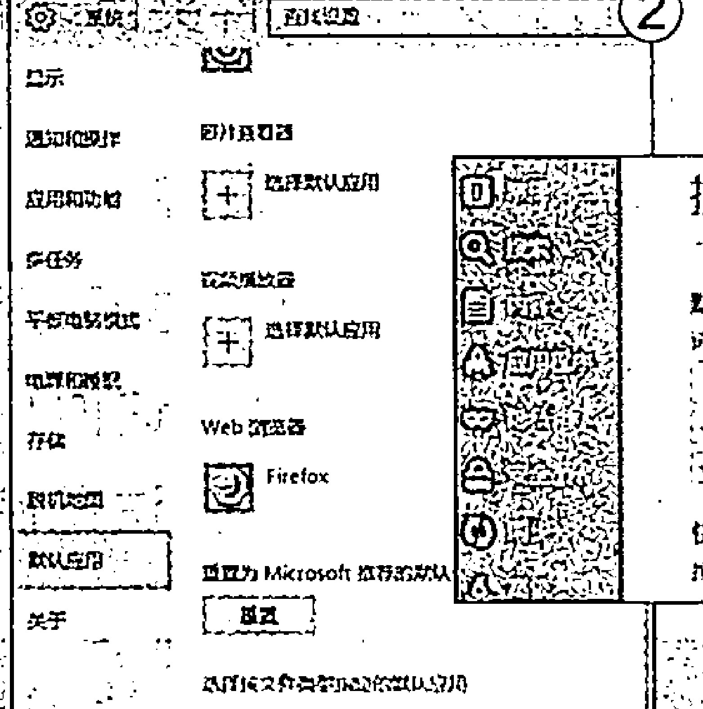

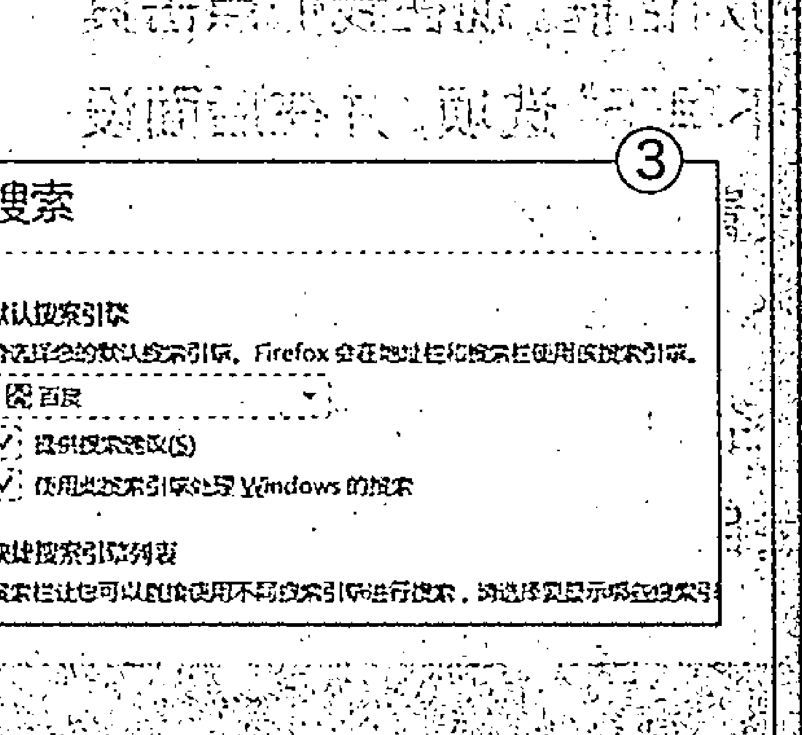

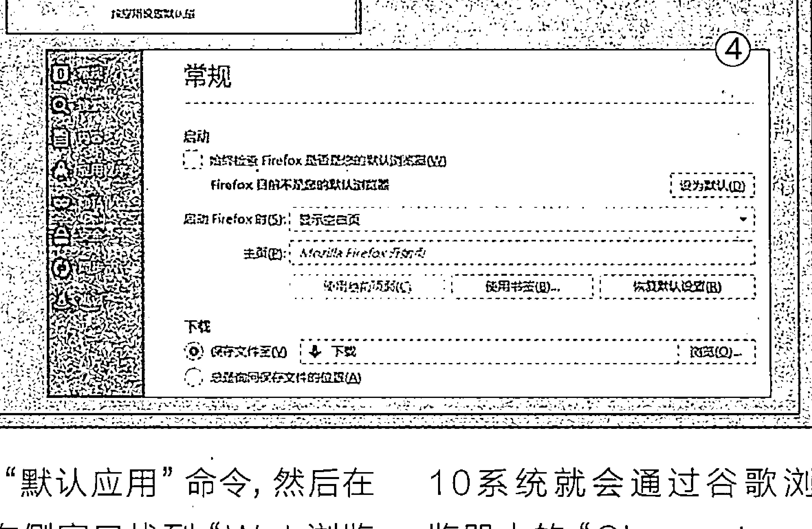

### 将百度设置为Cortana默认搜索

功能扩展的使用虽然非常简单，但是那几个搜索引擎毕竟是国外的，那么如何更加灵活地设置搜索引擎呢？这里就需要使用最新版本的火狐浏览器。首先访问Cortana搜索将要使用的搜索引擎，这时就会在浏览器的搜索框前面看到一个绿色的加号，点击这个加号后，在弹出的菜单里面选择添加搜索引擎命令。

接下来点击右上角的“打开菜单”按钮，在弹出的菜单里面点击“选项”命令。接着在弹出的窗口中点击左侧列表中的“搜索”选项，在右侧窗口中的“默认搜索引擎”列表中选择刚刚添加的搜索引擎，比如我这里就选择的是百度搜索（图3）。接下来非常关键的一步是，选中下面的“提供搜索建议”和“使用此搜索引擎处理Windows的搜索”项。然后点击左侧列表中的“常规”选项，在右侧窗口点击“设为默认”按钮，将火狐浏览器设置为默认的浏览器就可以了（图4）。

- 1. 首先访问Cortana搜索将要使用的搜索引擎。
- 2. 在弹出的菜单里面选择添加搜索引擎命令。
- 3. 点击右上角的“打开菜单”按钮，点击“选项”命令。
- 4. 点击左侧列表中的“搜索”选项。
- 5. 在“默认搜索引擎”列表中选择刚刚添加的搜索引擎（例如百度）。
- 6. 选中下面的“提供搜索建议”和“使用此搜索引擎处理Windows的搜索”项。
- 7. 点击左侧列表中的“常规”选项。
- 8. 在右侧窗口点击“设为默认”按钮，将火狐浏览器设置为默认的浏览器。

## TC帮忙 快速找到需要的文件

文/万立夫

每天我们打开电脑系统，都需要处理大量的文件。可是时间一长，硬盘里面的文件数量就越多，于是从中寻找到需要的文件就会变得越来越困难。而Total Commander（以下简称TC）则是一款非常优秀的文件管理软件，只需要掌握好几个小的技巧，就可以非常容易地找到所需要的文件。

### 醒目颜色帮助识别

我们经常使用的一些文件，都是最近一段时间使用过的。所以我们可以将不同修改日期的文件，按照不同的颜色进行标注，这样一看颜色就可以快速进行识别。不过用户要想做到这一点，首先需要对TC进行简单的配置。现在点击TC“配置”菜单中的“选项”命令，在弹出的窗口里面选择左侧列表中的“颜色”项。接下来在右侧窗口里面，点击下方的“按文件类型定义颜色”按钮。

在弹出的对话框里面点击“添加”按钮，然后在弹出的“请指定文件类型”窗口中点击其中的“定义”按钮，接着会弹出一个名为“定义选择类型”的对话框。现在我们点击其中的“高级”标签，选择其中的“不早于”选项，并在后面设置一个数字信息。比如我们这里设置的就是2，然后点击“保存”按钮（图1）。这时会弹出一个“保存文件类型”的对话框，这里根据需要随意设置一个名称即可，比如“两日内修改的文件”（图2）。设置完成后会自动返回到“请指定文件类型”窗口，点击“确定”按钮后就可以设定这个文件类型的颜色了，比如我们这里就选择非常醒目的红色。

设置完成后返回到“按文件类型定义颜色”窗口，再一次点击旁边的“添加”按钮，按照同样的方法创建一个新的文件类型操作。这次我们设置“一周内修改的文件”，将这个文件类型的颜色设置为桔红色。以此类推，我们还可以分别为两个星期内修改的文件、一个月内修改的文件等分别设定颜色（图3）。设置完成后连续点击“确定”按钮，就可以返回到TC软件的主界面。

以后，我们通过颜色就可以一目了然地分辨出最近修改过的文件和文件夹目录了。

### 快速搜索相关文件

通过时间颜色进行标注虽然非常方便，但是对于长时间没有使用的文件，这种方法就不是很实用。所以要想查找这类文件，最好的方法是使用搜索功能。

> 注意，由于现在网上有不少TC的美化版或增强版，这些修改版本会对软件菜单的内容进行修改，导致一些图解的位置有所不同。本文的演示则是以官方版本为准的。

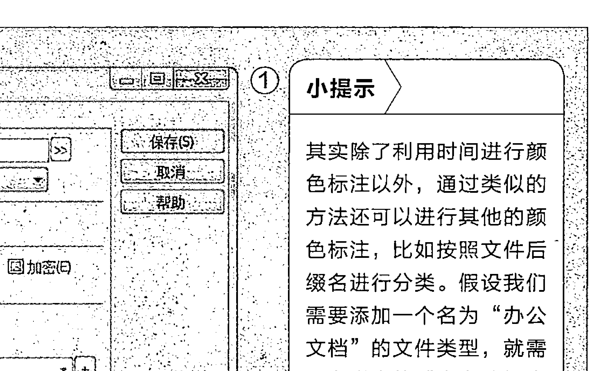

> 其实除了利用时间进行颜色标注以外，通过类似的方法还可以进行其他的颜色标注，比如按照文件后缀名进行分类。假设我们需要添加一个名为“办公文档”的文件类型，就需要在弹出的“定义选择类型”窗口选择“常规”标签。接下来在“搜索”输入框输入指定文件的后缀名，后缀名之间用英文的分号进行间隔，如“*.txt;*.doc;*.pdf”等。这样就可以将这三个后缀名的文件统一为同样的颜色，以与其他类型的文件相区别了。

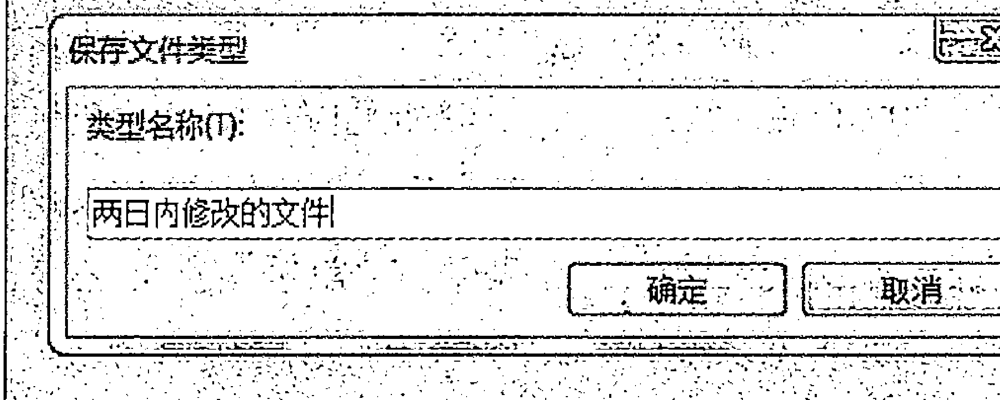

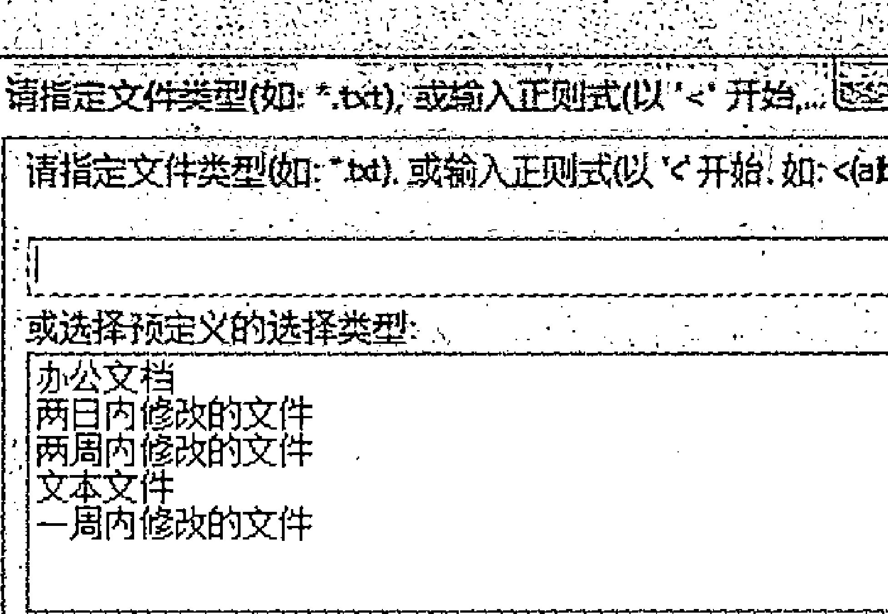

我们知道每一个文件夹目录里面可能会有一些子目录，如果要想查找其中的文件就要先进入到这个子目录中。其实我们只需要按下Ctrl+B快捷键，它的作用就是将文件夹里面的子目录全部去除，而子目录中的所有文件都会在主文件夹列表里面显示出来，这样后面的过滤文件也就更加快捷方便。

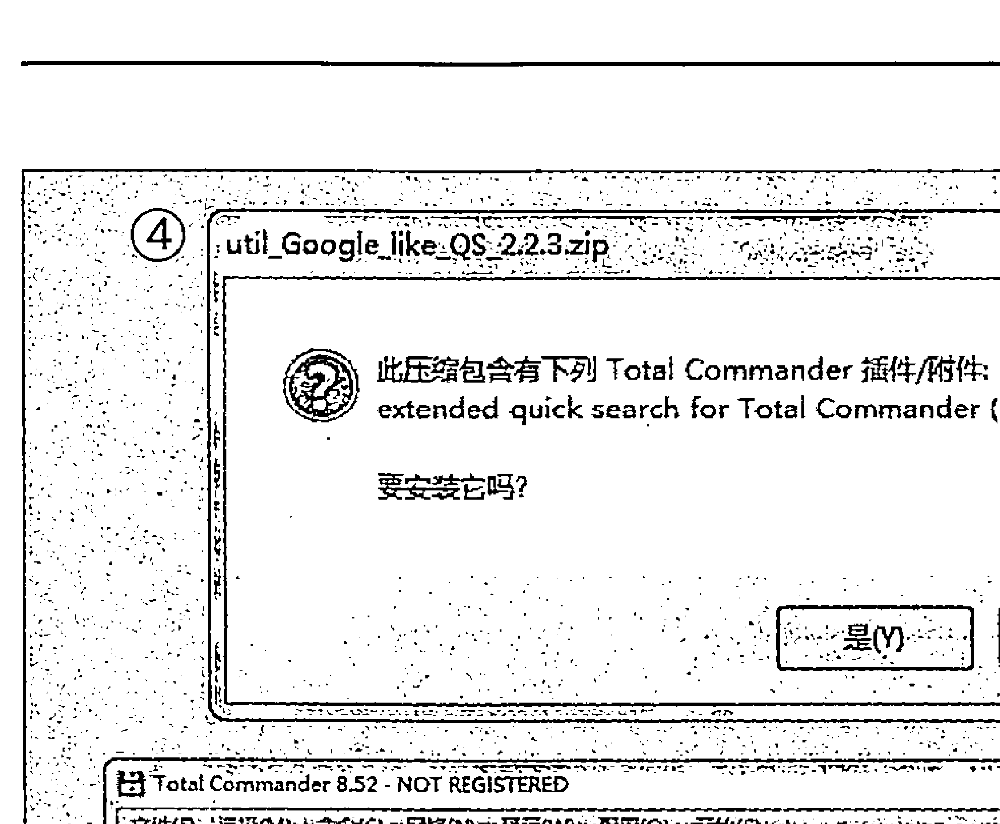

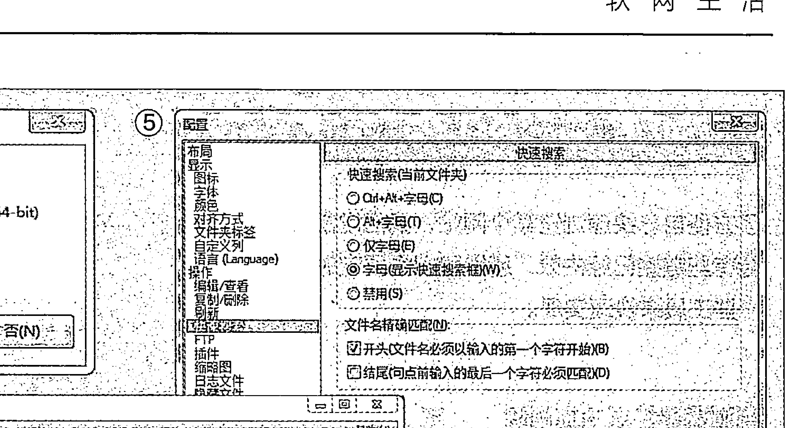

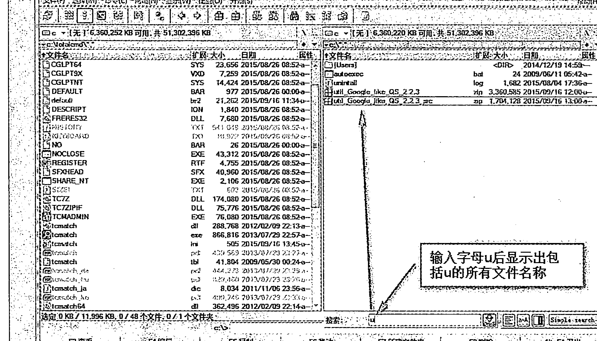

### 过滤文件显示需要

虽然TC软件已经集成了非常强大的搜索功能，但是这里我们还是推荐一款有意思的插件。首先通过浏览器登录到TC的插件网站（www.totalcmd.net），在右侧的下载列表里面可以看到一个名为“QuickSearch eXtended”的TC功能插件。点击它以后进入到介绍页面，点击下载链接中的Mirror链接就可以进行下载了。下载的插件是以压缩包的形式存在的，但是我们不要对它进行解压操作，而是通过TC软件的文件列表找到刚刚下载的插件安装包，直接进行双击就会弹出一个提示窗口信息（图4）。这时点击其中的“是”按钮，就可以自动进行这个插件的安装配操作，接下来就可以进行文件的搜索查找操作了。

首先到插件的工具条，接下来我们就可以按照平时使用搜索引擎的方法来查找文件了。如果不想使用快捷键而直接进行搜索，需要先打开TC的选项窗口。选择左侧列表中的“快速搜索”这项，接下来在右侧窗口里面选中“字母（显示快速搜索框）”选项即可（图5）。简单到只需要输入文件名称的一部分信息，TC就会自动过滤掉其他的文件信息，只留下和查找信息相匹配的文件。比如我们需要查找的文件名称为abc123.doc，这时我们输入“123”、“abc”、“doc”甚至“123 doc”等都可以（图6）。QuickSearch eXtended插件还支持拼音缩写的查询，比如要搜索“电脑爱好者”只需要输入dn即可。不过这里需要提醒大家的是，虽然该插件支持拼音，但是并不支持模糊音。

在Windows系统里面有一个隐藏功能，通过它可以隐藏重要以及不常用的文件。其实利用TC隐藏不需要的文件，也可以加快文件的寻找速度。比如点击“显示”菜单中的命令，既可以显示出所有文件，也可以只显示出可执行文件等。当然还可以点击“自定义类型”命令，在弹出的对话框里面就可以看到前面我们自定义的一些文件类型，比如点击“两日内修改的文件”这个文件类型，然后再点击“确定”按钮，就会在文件列表里面只显示出两天以内修改的所有文件，而其他的文件就会被TC暂时隐藏起来。不过当找到需要的文件以后，最好还是再点击菜单中的“所有文件”命令，以便显示出文件夹目录中的所有文件信息。

## 你收藏夹里的链接还好吗

文/倚楼

为了方便自己快速浏览某个网站，我们常常会将网页链接添加到收藏夹中。可是时间一长收藏的链接越来越多，其中难免就会有些链接已经失效，所以我们需要定时进行整理。不过如果手工对一个个链接进行检测删除会很麻烦，我们大可以借助一些工具来快速实现。

### 借用浏览器扩展扫描删除

如果你使用的是谷歌浏览器，那么通过Bookmark Sentry扩展就可以解决。首先到它官方网站下载（www.crx4chrome.com/crx/2205），接着点击谷歌浏览器右上角的自定义按钮，在弹出的菜单里面依次选择“工具”中的“扩展程序”命令，这样就可以看到扩展程序的管理页面。通过鼠标拖动刚刚下载的扩展到这个窗口，即可完成扩展的安装。

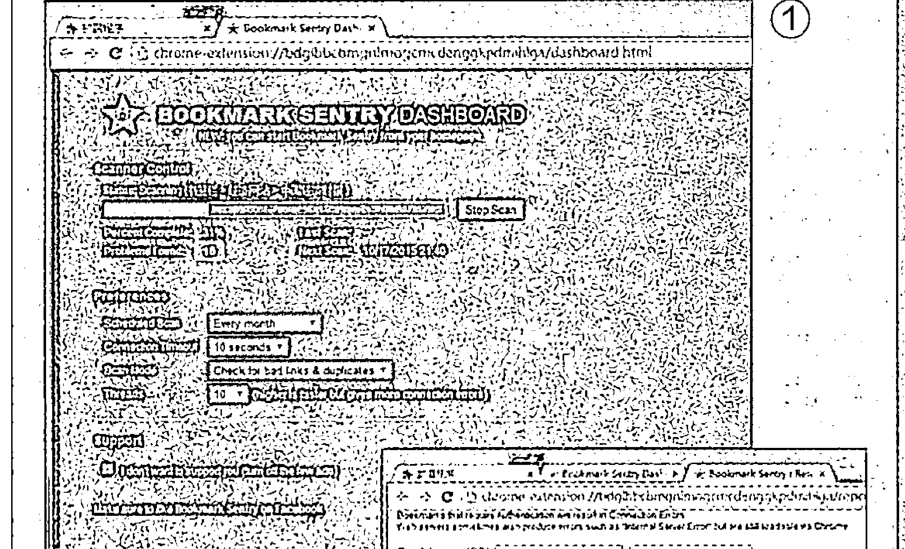

安装完毕点击扩展名下的“选项”，在弹出的页面中点击最上方的“Scan Now”按钮，该扩展即开始进行扫描（图1）。扫描完成后会出现一个结果页面，里面将列出扫描出的失效链接的名称以及失效的类型。我们只需要点击前面的删除按钮，就可以将不需要的链接删除掉（图2）。不过在删除以前最好再点击链接手工确认一下。

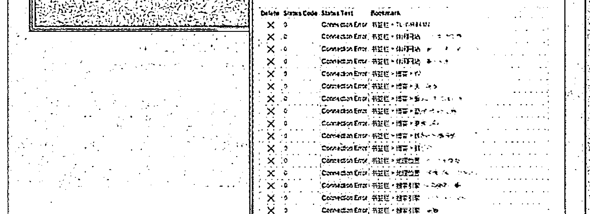

浏览器以及Opera浏览器等，如果用户使用的是其他的浏览器，也可以导出收藏夹，在列表中选择“HTML file”命令后导入收藏夹文件。设置完成后软件将自动载入该浏览器里面所有的网页链接信息。然后点击工具栏上的“检查书签”按钮，这样软件就会依次对收藏夹中的网页链接进行测试。软件在进行测试的过程中，会把测试的结果实时地显示在“状态”列中。如果检测的网页链接无效，还会在“错误”列中显示出错误的类型。

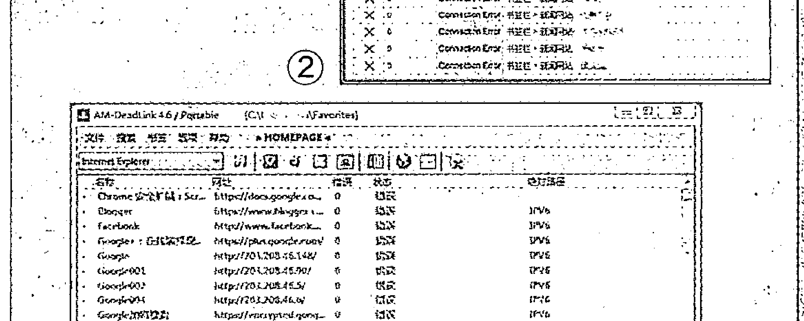

测试扫描结束后软件会用声音进行提示，接下来点击列表中的“状态”或“错误”项目，就可以对收藏夹信息重新进行排序操作。或者点击工具栏中的“将有错误的书签排列到列表的顶部”按钮，AM-DeadLink就会将所有无效的网页链接排列在列表的最上面。使用鼠标并配合Shift键选择所有无效网页链接，再点击工具栏上的“删除”按钮，就可以将所有无效的网页链接进行删除了。除此之外，点击工具栏上的“查找重复项目”按钮，软件会在列表中只显示URL地址相同的链接（图3）。同样点击工具栏上的“删除”按钮，就可以删除收藏夹里面重复的网页链接了。

### 快速高效的专业工具

Bookmark Sentry扩展虽然好用，但是它只适用于谷歌浏览器，以及使用Chromium内核的浏览器。所以要对其他浏览器的收藏夹进行检测，还需要使用另外的工具才可以。好在这个工具并不难找，AM-DeadLink就是这样的一款软件。首先从网上下载最新版本的AM-DeadLink，解压后运行文件夹中的Deadlink程序文件。接着

点击“Options”菜单中的“Language”命令，在弹出对话框的语言列表中选择“Chinese_gb”并点击OK按钮即可。

接下来在软件的工具栏里面，设置要进行收藏夹检测的浏览器名称。用户可以在列表中选择IE浏览器、火狐浏览器、谷歌

330 电脑爱好者 2015年合订本（下）

## 丰富拼音的表情库

文/倚楼

通过趣味表情可以在聊天、发微博的时候让显示的内容更加有意思，于是很多流行的输入法都陆陆续续增加了趣味表情的模块，百度拼音自然也是急流勇进了。虽然增加趣味表情非常简单，但是想要用好它却不那么容易。今天我们就来看看，如何玩转百度拼音中的那些趣味表情？

### 多途径添加趣味表情

人们常说“巧妇难为无米之炊”，既然要想使用趣味表情，就需要首先安装相应的表情包。在百度拼音里面添加表情的方法，和其他常见的输入法都差不多。首先打开百度拼音的“表情中心”窗口，这里面可以看到网络中非常经典的表情。从中选择一个后点击“添加”按钮就可以安装到输入法里面了，添加成功的表情会显示到窗口的下方（图1）。

相当于其他的输入法而言，百度拼音的趣味表情可不止这些。如果还想获取其他的趣味表情，可以点击右上角的“更多精彩表情”链接，在弹出的网页里面选择一个喜欢的表情包。点击“下载”按钮将其保存到系统，当下载完成后点击“表情中心”下面的“我的收藏”按钮。接着点击“导入表情”按钮，在弹出的菜单里面选择“导入本地表情”命令。在弹出的文件浏览窗口选择刚刚下载的表情包，就可以将其中的内容添加到输入法里面了。

### 添加标签查找更方便

当趣味表情成功添加到输入法后，就可以随时随地进行调用了。和其他的输入法一样，只需要输入对应的拼音，就可以显示出趣味表情了。当然除此以外，百度拼音还可以利用一些快捷键来进行调用。用户只需要在输入状态下按一下键盘中的“|”键，这样趣味表情的对话框就会自动弹出来（图2）。接下来只需要从中选择相应的趣味表情，点击一下就可以显示到输入内容里面。

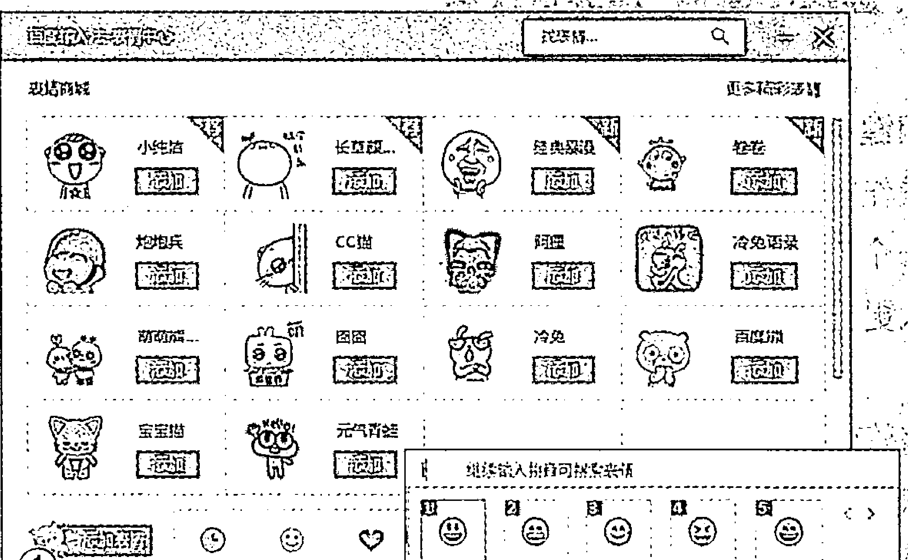

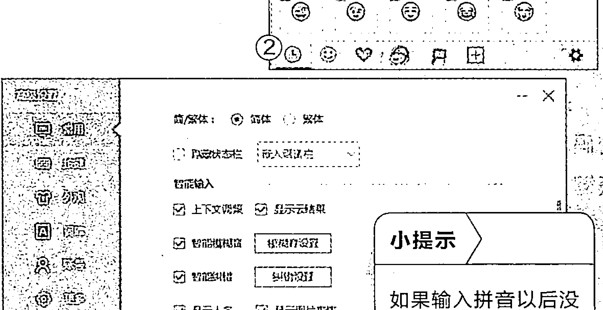

但如果用户安装的趣味表情比较多的话，那么按照传统的查找方式未免非常低效，所以我们可以在按下“|”键以后，输入所需表情的内容信息即可。比如我们需要输入一个哈哈笑的趣味表情，那么就直接输入ihaha，这样和哈哈笑相关的表情就都会显示出来。这样就相当于将前面的两种方法进行了完美的融合，可以更好地提高输入的效率。

虽然这个方法非常简便，但是也有一个小的缺陷，就是趣味表情的内容信息是别人定义的，有的时候会和我们的看法有差异。比如在QQ里面用得最多的表情是“呲牙”，但是很多用户都认为他是“开怀大笑”。为了避免这样的差异出现，最好的方法就是对表情的内容进行自定义，这也是其他输入法不可完成的任务。

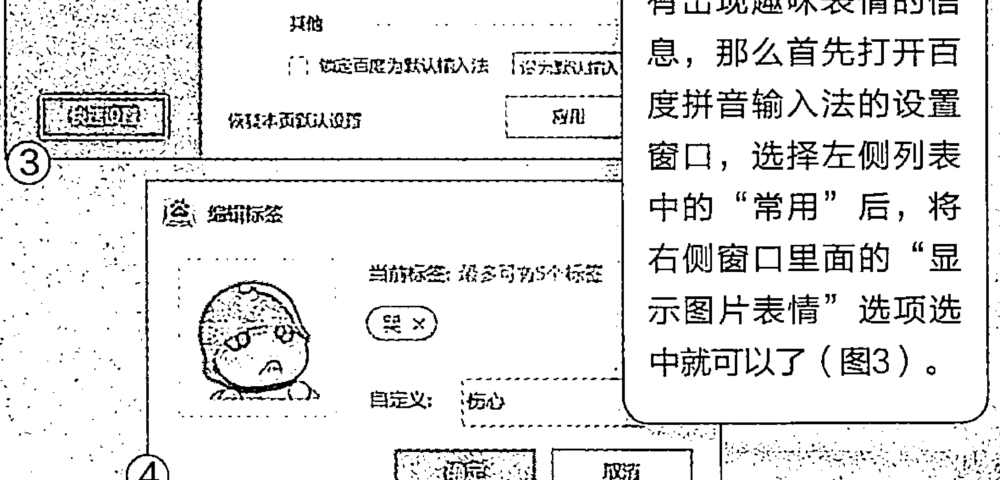

小提示
如果输入拼音以后没有出现趣味表情的信息，那么首先打开百度拼音输入法的设置窗口，选择左侧列表中的“常用”后，将右侧窗口里面的“显示图片表情”选项选中就可以了（图3）。

首先按照前面的方法打开“表情中心”，点击窗口上方的“编辑标签”按钮后，从列表中选择需要编辑的表情。接着在弹出对话框的“自定义”输入框里面输入重新自定义的信息，输入完成后按下回车键进行确认，最后点击“确定”按钮进行关闭即可（图4）。以后在需要调用该趣味表情的时候，同样先按一下键盘中的“|”键，再输入自定义内容的拼音即可。

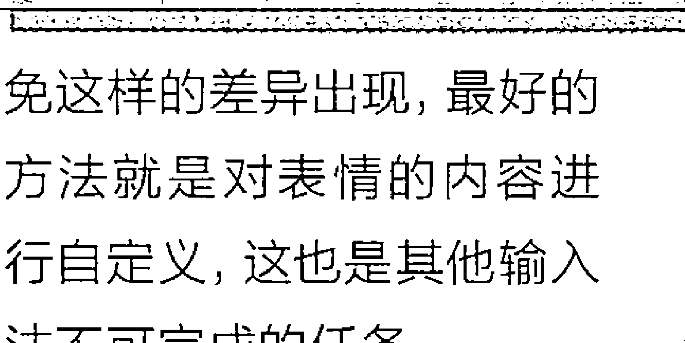

# 键盘玩“虚拟”

文|温青

除了正常的打字、单键控制和快捷键组合操作外，键盘还有一些奇特而实用的“虚拟”用法。在屏幕上虚拟数字小键盘以供表格数据录入、虚拟软键盘供密码安全输入、虚拟键盘音效获得机械键盘声音效果……

## 1. 虚拟小键盘 填表更快速

在涉及到一些频繁的数据录入时，财务人员多习惯采用键盘上的数字小键盘。如果使用不带小键盘的简易键盘操作，一排数据键操作起来会比较别扭。若在屏幕上虚拟一个数字小键盘，用鼠标点击输入数据，可让表格数据录入更方便。

上述需求可借助于一款NumPad绿色小工具来实现。该软件只有一个NumPad.exe程序文件，在填表时运行该软件，在表格编辑窗口按Win+K获取软件焦点，即可进行小键盘数字录入了（图1）。

> 小提示
Windows 10中的Win+K键被定义为打开无线显示器连接或音频设备连接，因此该软件只适合于在Windows 10以下的版本中使用。

## 2. 虚拟软键盘 密码更安全

现在许多网银或安全级别比较高的网络软件，在输入密码时会提供软键盘输入方式，这样可以阻挡一些蓄意截获键盘操作的恶意软件。但是，不是所有网络环境都提供这种输入方式。遇到不提供这种便利的输入环境也不怕，我们可以自己搭建虚拟键盘输入。

在需要输入密码的网络环境中，可借助于Neo's SafeKeys软件来虚拟键盘输入密码，提高网络密码输入的安全性。操作时，先在Neo's SafeKeys中输入密码，然后在下面的密码框中全选密码，拖动选中的密码到网页的密码输入框内，完成密码输入（图2）。

此外，还可以用干扰器保证键盘输入密码的安全。KeyScrambler是一款键盘干扰器输入软件，该软件支持29款主流网络浏览器，当输入网站密码时，它会加密输入，恶意软件截获的将是非真实的键盘输入信息，这样就杜绝了恶意软件获取密码。

软件运行后以一个红色K图标驻留系统托盘，右击图标并选择Options进入设置，选择Advanced选项卡，可设置保护Windows登录密码、Windows浏览器、空格加密、支持东亚语言输入等功能（图3）。在General选项卡中，可设置开关软件加密保护的热键（默认为Ctrl+Shift+K，若与别的软件有冲突，可改变该软件的热键设置）。

运行该软件后，在屏幕上浮动一个蓝底白字的提示条，上面显示“Hi there, press any key to try, double click to configure”。意思是按下键就能看到软件的效果，双击这个提示条可进入软件设置（图5）。这之后的所有按键操作，软件会以另外的一个提示条来即时显示所按下的键位。

> > 小提示
也可以用输入法自带的软键盘，或开启Windows 8.1、Windows 10提供的虚拟软键盘来输入。

## 3. 虽为薄膜键 专业音效拟

是不是很羡慕别人使用机械键盘的清脆咔哒声？没关系，现在就可以让你的那只“烂杏儿”一样的键盘变成响当当的机械键盘！我们可以通过一款软件Tickes来模拟机械键盘的音效，通过音箱的帮助，让录入的过程显得更酷。Tickes软件运行后自动隐藏，我们可随时通过按QAZ123组合键激活软件设置窗口（图4），从中可选择键盘使用的音效（有机械键盘、冒泡、打字机、剑气等可选），同时还可以选择音量、音调。选中“开机启动”复选框，则每次开机后操作，键盘便自动出现设定的键盘音效（当然喇叭要开启）。

> > 小提示
需要退出该软件音效时，也需要依次按QAZ123键，在设置窗口中点击“退出Tickes”按钮退出软件。

## 4. 按下哪个键 屏幕告诉你

在用键盘操作时，有时会按错键位。如果能在屏幕上即时显示按下的键位来提醒，将键盘按键操作可视化，就会及时发现错误。通过KeyCastOW软件，即可实现上述目的。

## 5. 键盘防乱动 上把“软件锁”

如果我们要临时收拾桌面，而又不想关闭电脑甚至电脑屏幕画面，但又担心期间动了键盘而破坏正在运行的任务，这时可给电脑上一把“软件锁”。用BlockInput软件即可搞定。家中有小朋友的人，该软件应该能帮忙。BlockInput为一款绿色软件，双击下载到的BlockInput.exe运行。程序运行后驻系统托盘，右击托盘图标并选择Settings，设置屏蔽快捷键（例如Ctrl+Q）和屏蔽时间（图6）。之后在需要锁住键盘时，按快捷键组合，桌面即被锁定，同时显示倒计时信息。注意！如果时间设得过短，则起不到保护作用，所以请设置时间足够长。如果时间设得过长，可以用Ctrl+Alt+Del来解除。除了以上软件外，KeyFreeze、Anti-Shaya等软件也可以实现键盘的暂时屏蔽。

> > 小提示
Windows中的Win+L其实也有锁定电脑的作用，但所不同的是，该软件锁定当前的操作界面；而系统Win+L锁定则启动了锁屏界面，无法让工作环境画面露在外边。

# 就地取材 网络广告杀无赦

文|老范

上网时弹出的广告让人烦心，在线视频的片头广告更让人生厌。因此，寻求拦截广告的方法势在必行。由于浏览器本身的拦截能力有限，安装专用拦截工具堵截广告便成了常用方法。其实还有更简单的方法——不跳出浏览器这个圈子，就地取材，添加一些轻应用链接，即可实现对网页广告、视频片头广告、微博广告、Flash广告等的拦截。

## 1. 网页广告杀无赦

如果使用了360浏览器，可通过一些轻应用轻松实现网页弹出广告、视频前置广告、Flash广告等多种形式的广告拦截。

### 轻应用: 广告终结者

在广告终结者的设置页面，可以设置各种过滤规则和网站白名单，实现有目标的网页广告过滤，做到既不放过好网站也不漏掉坏网站（图1、图2）。

> 小提示
本文以常用的国产浏览器——360浏览器和搜狗浏览器为例，通过浏览器的扩展中心搜索添加轻应用。使用其他浏览器的用户可自行到相应的轻应用市场搜索广告拦截轻应用或插件。

### 轻应用: 视频广告终结者

拦截国内各大视频网站的5秒到90秒的片头广告。如果要停用，在轻应用扩展管理器窗口中点击该轻应用图标下方的设置按钮，从弹出的菜单中点击“停用”即可（图3）。

> 小提示
目前，优酷启用了反屏蔽措施，在使用广告屏蔽插件后，视频内容也可能会被一同屏蔽掉。因此该插件不是对所有网站的视频广告永久有效。

### 轻应用: Flash广告巧过滤

面对各种各样的Flash广告，可以在360浏览器中添加“Flash过滤”轻应用实现过滤（图4）。通过轻应用设置界面，可设置地址栏显示应用图标及图标显示位置，还可以设置白名单网址（图5）。对于非广告的Flash，可通过点击地址栏Flash图标，选择Disable Flash Block恢复。

使用搜狗浏览器的用户，也可以通过两款轻应用实施搜索广告的拦截。

### 轻应用: 屏蔽百度广告

如果不想在搜索结果中看到百度竞价广告，可以搜索添加“屏蔽百度广告”轻应用。通过设置，可选择自动屏蔽广告或高亮广告（图6）。

### 轻应用: bsAD（鄙视广告）

可自动隐藏百度和搜狗网页中的推广链接（竞价广告），同时在页面末尾显示文字提示。如果需要，点击红色的提示文字可以重新显示出被屏蔽的内容（图7）。

## 2. 微博垃圾洗刷刷

新版新浪微博中增加的多项推广活动和广告窗会令人在浏览时事、趣闻时无法聚焦重点。利用360浏览器中的“微博洗刷刷”轻应用，开启后可按设定去除微博中的页面广告、微博公告、热门话题等，隐藏不感兴趣的栏目（图8）。

见不得含有某类关键词的微博条目？如果使用搜狗浏览器，添加一个“眼不见心不烦”的轻应用，输入不感冒的关键词，设置一下屏蔽方式就可以免去这种烦恼（图9）。

> 小提示
由于拦截与反拦截的动态技术较量，因此随着浏览器的策略性应对升级，如果插件升级的步伐没有跟上，拦截功能可能会失去作用。因此，请使用最新版的插件，或失效后寻求同类可替代品。

## 3. 宽带广告也屏蔽

使用电信、联通、铁通等宽带有网，有时无意中会被一些弹出的强制广告所打扰。对于这类强制性的广告，也有办法解决。

通过搜狗浏览器扩展中心搜索添加“屏蔽宽带强制广告”，之后点击扩展栏中的该应用按钮，即可自动屏蔽这些强制性广告。在该轻应用的控制面板上，用户可控制暂停、清空拦截历史（图10）。

# QQ聊天 跟声音玩“捉迷藏”

很多朋友经常会通过QQ或微信和自己的亲朋好友联络感情，由于是没有主题的聊天，所以内容也是漫无目标，这样时间一长就不知道聊什么了。其实这个时候我们可以加一些恶搞的东西，比如将自己的声音进行变声处理。这样双方都会觉得有意思，一下子气氛就活跃起来了。下面我就来教大家一些变声的方法。

## 变声前装个虚拟驱动

现在无论是手机上还是电脑里面，都有很多变声软件可以供用户选择。但是很多软件只是一个噱头而已，变声的效果非常不好，一听就是经过后期处理过的。今天我们就选择一款功能强大的变声软件——变声宝宝，来看看它是如何实现用户的变声需要的。首先从网上下载最新版本的“变声宝宝”，安装过程和其他软件一样简单。但是由于该软件会安装一个虚拟声卡，所以在安装的时候会弹出一个“Windows无法验证此驱动程序软件的发布者”提示框。这时我们需要点击“始终安装此驱动程序软件”按钮进行安装操作，不然的话后面软件将无法正常进行工作（图1）。

> 小提示
有的安全软件可能也会对安装的虚拟驱动进行拦截提示，这个时候用户需要通过这个驱动的安装请求才行。

## 选择效果增加聊天氛围

运行系统桌面上的“变声宝宝”软件，在弹出的窗口里面可以看到变声效果主要有8种，分别是“男变女”、“男变女甜美”、“男变女孩”、“隐身男”等。从中选择一个自己喜欢的变声效果后，点击窗口右侧的“音效预览”选项。接着对着麦克风说几句话，就可以看看变声后的实际效果了（图2）。如果用户对选择的变声效果不太满意的话，在列表里面找到“自定义效果”的图标。在图标上面点击鼠标右键选择“设置”按钮，在弹出的对话框中调整“音调”和“音色”滑杆。调整完成以后按照前面的方法进行预览，看看是否已经达到自己的要求。

其实除了进行变声处理以外，如果在聊天的时候增加一些音乐，感觉起来也是非常有情调的。端上一杯咖啡的话，就好像在咖啡厅和朋友面对面的聊天一样。如果想在“变声宝宝”软件里面添加背景音乐，在列表里面找到“背景音乐”开关的图标。在图标上面点击鼠标右键选择“设置”按钮，在弹出的对话框中点击“浏览”按钮，选择一个语音文件作为背景音乐即可（图3）。然后调整该语音文件的声音大小，最后关闭该设置窗口就可以了。

> 小提示
测试完成以后需要关闭“音效预览”选项，不然会影响后面的实际使用。

## 变声宝宝绑定QQ语音

前面的一系列设置操作都是为了和聊天软件进行结合，这里就以QQ为例进行演示。首先打开好友的聊天窗口，点击工具栏“开始语音聊天”旁边的命令，在弹出的菜单里面选择“语音设置”命令，然后在弹出的设置窗口里面，我们将“声音输入”和“声音输出”都设置成“Vocalster Virtual Audio”，也就是前面安装的那个虚拟驱动程序（图4）。设置完成后就可以和朋友进行语音聊天了，而神奇的一幕将会在此时发生。

# 文件操作一拖了之

文/阿立

每天我们对电脑进行操作实际上就是对文件进行管理，常见的文件管理包括移动、复制、压缩、删除等等。但是每一种文件管理都需要使用不同的软件或方式，如果遇到大量的文件需要管理，如此操作肯定是既费时又费力。其实只需要借助一款名为DropIt的软件，一些常见的文件操作只需要简单的拖拽就可以完成。

## 拖拽文件进行常规操作

首先登录DropIt的官方网站（www.dropitproject.com），根据需要下载该软件的安装包或者压缩包。安装运行后，很快就可以在系统桌面看到一个类似于下载软件的悬浮框。在悬浮框上面点击鼠标右键，选择“Languages”菜单中的“SimplifiedChinese”命令，这样软件的界面就转换成我们熟悉的简体中文了。

DropIt软件的使用非常简单，同样在悬浮框上面点击鼠标右键，选择“配置文件”菜单后就可以看到多个选项，包括“压缩文件”、“播放列表制作器”、“擦除器”和“照片陈列室制作器”等（图1）。比如我们需要进行文件的压缩操作，首先在菜单里面选择“压缩文件”项。接着在资源管理器窗口选择需要进行压缩的文件，然后通过鼠标将其拖拽到悬浮框上面释放。这时就会弹出一个文件压缩的操作窗口，点击“开始”按钮，DropIt软件就开始进行压缩操作，压缩完成后压缩包会存放到系统桌面上（图2）。

## 定制规则完成更多管理

DropIt软件之所以能够完成常规的管理操作，是因为软件自身设定了一些管理规则。如果用户根据自己的需要设定相应的规则，那么这款软件的管理功能也将大大的增强。比如我们每天会通过下载软件下载各种各样的文件，下载完成以后会将不同的文件移动到不同的文件夹，这里笔者就简单编写了一个将音乐文件移动到存放音乐文件夹的规则。

首先在悬浮框上面点击鼠标右键选择“协议”命令，接着在弹出的对话框里选择列表中的“Default”项，再点击左下角的“添加”按钮（图3）。在弹出的“新建协议”窗口中，首先在“名称”里面设置一个协议名称，比如我这里设置的是“移动音乐文件”。接着在“规则”输入框中设置处理文件的类型，比如MP3文件就输入*.mp3即可，不同的文件类型用英文逗号分开。当然用户也可以点击后面的蓝色按钮，在弹出的菜单里面选择“用于处理文件的规则”，然后选择子菜单里面的“音乐”这项，同时在“操作”列表中选择“移动”这项。

最后点击“目标文件夹”后的按钮，选择那个存放音乐文件的文件夹；点击“保存”按钮就可以完成规则的设置操作（图4）。以后当需要移动音乐文件的时候，可以一次性选择下载文件夹中的所有文件，然后按照前面的方法进行操作就可以了。由于软件会自动过滤文件类型，所以最终只有音乐文件会被移动到目标文件夹里面。

善用DropIt规则，就可以为我们平时的工作增加许多的便利了。

# 键盘也玩“花样”

文|温青

在许多人看来，键盘可开发的技巧不多，除了本栏目之前介绍的“虚拟”用法外，好像很难再找到玩键盘的方式。但实际上我们除了可给它们换键帽、加灯光效果外，还能辅以软件，让其发挥更多的作用，或让其他设备成为键盘的替身。

## 1. 一套键鼠控制多台电脑

家里的多套电脑总需要来回跑着去操控？不用！一套键鼠能代替多套来控制多台电脑。借助于Mouse without Borders软件，就可实现用一套键鼠控制最多4台电脑。需要在多台电脑上同时安装该软件并最好设置安全密码。控制操作也很简单，在软件控制窗口中选中哪个屏幕，键盘就属于哪台电脑所有（图1）。软件支持共享剪贴板、拖动文件等功能，只需拖动文件到屏幕边缘，松开鼠标就自动将文件传送给另一台电脑了。

> 小提示
通过Other Option选项卡设置快捷键，实现用快捷键切换控制不同电脑（图2）。

也可以使用另一款软件Input Director来实现一套键鼠控制多台电脑。除上述软件外，Synergy也是一款在局域网中用一套键鼠控制多台电脑的软件，它不但可以在多台Windows电脑上使用，还可以跨Windows、OS X、Linux等不同平台使用。

## 2. 键盘也能代替鼠标按键

鼠标键盘大家都用过，输入银行密码时的屏幕软键盘即是。但是，键盘鼠标长啥样儿？如果鼠标坏了，身边没有备用鼠，这时可以通过一个模拟软件，用键盘来代替鼠标行事。VirtualMouse就是这样一款软件，它能模拟点击鼠标左键、右键以及双击等常用操作。

软件运行驻留内存，当需要模拟鼠标时，按Ctrl+F10组合键开启模拟，用Ctrl键配合小键盘上的键执行模拟操作。Ctrl加数字小键盘上的八个方向键模拟鼠标指针移动。

> 小提示
Ctrl+F12可呼出软件主界面进行可视化控制（图4）。

方向；如果需要微移，用小键盘左侧的4个方向键。小键盘数字5模拟左键，句点键模拟中键，回车键模拟右键，减号和加号分别模拟滚轮向上和向下两个方向（图3）。

## 3. 摄像头动作控制操作软件

有没有想到过不用键盘、不用语音来控制电脑视频播放？没错，用摄像头来控制！我们可以将比划动作告诉摄像头，让摄像头代替键盘的功能来控制电脑工作。这一想法可以借助于Switch Viacam软件实现。

在Switch Viacam软件中设置摄像头画面区域发生某种变化后，电脑自动执行预设的键盘或鼠标动作。然后在视频播放软件中将这些功能键定义为控制视频播放的相应功能。这样，当摄像头捕获到相应的动作后，便自动执行相应的键盘或鼠标命令。

Switch Viacam支持两个位置的监测，分别为摄像头区域正中间的两侧，监测范围大小可以用鼠标拖动设置（图5）。例如，可以设置在某区域执行挥手动作触发播放器暂停热键，这样看片时要暂停，只需挥一下手播放就暂停，如厕回来后再挥手就恢复播放。用同样的道理，也可以将向上挥手设置为调高音量，将向下挥手设置为调低音量。

## 4. 电脑键盘替代钢琴键盘

想弹钢琴吗？不搞音乐的你斥巨资买架钢琴也没必要。不过，无米也能为炊，用电脑键盘来“替代”钢琴键盘，也能过一把钢琴瘾。

用键盘模拟钢琴演奏音乐，需要安装一款仅有96KB的乐器模拟软件SimplePiano 1.7免费版。用它可以模仿各种钢琴的音效，还可以模仿风琴、长号、苏格兰风笛、吉他、大鼓等多种乐器效果，甚至还可以模拟枪炮声、电话铃声等音效呢（图6）！软件界面虽为英文，但若懂点音乐，点开界面选择菜单，马上就可以“无师自通”了。

## 5. 屏幕图标替代键盘指示灯

桌面下的键盘托没拉出到位遮挡了键盘指示灯，或所用的简易键盘压根儿就没有提供键盘指示灯，键盘状态不易判明。没关系！可用TrayStatus小软件将键盘指示灯“安”在屏幕上。

TrayStatus可在系统托盘显示包括小键盘数字锁定、大小写锁定、滚动锁定等键盘状态。此外还提供硬盘读写状态提示，读写精度可达到0.1MB/s。每个指示灯对应一个小图标（图7）。

除了默认的3个指示灯外，软件还可提供更多的状态指示灯。只需右击该软件在系统托盘的任意图标，选择TrayStatus Settings命令，在设置窗口就可以选择包括Scroll Lock、Alt、Ctrl、Shift、Win等键在内的键盘控制键，开启这些特殊控制键的屏幕状态指示灯（图8）。

> > 小提示：设置时，先要选中图中的Enable sensor复选框，然后在Event type选择框中选择热键。可设置两组动作。注意选择的键鼠热键一定要和要控制的软件热键相对应。

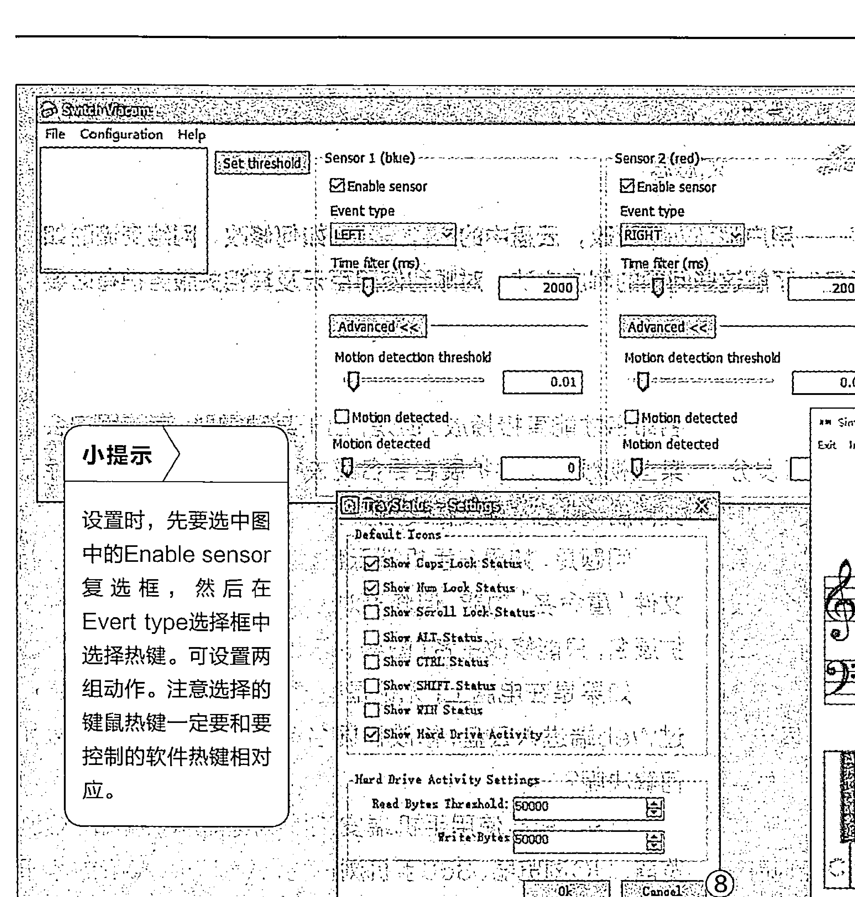

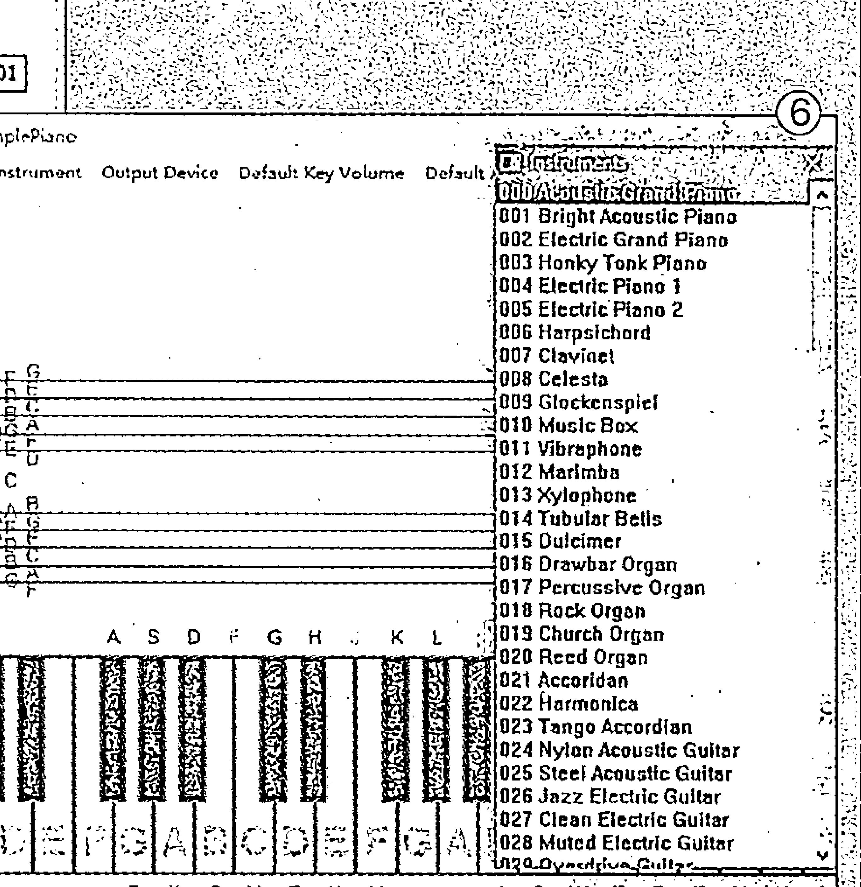

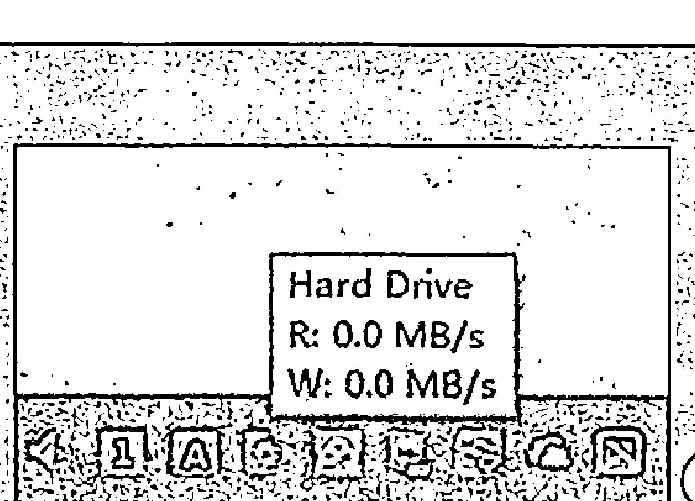

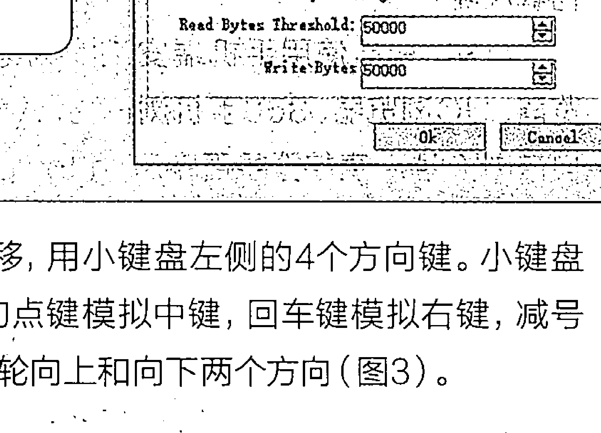

# 走出百度“疑云”

文|悠悠

在使用百度云的过程中，你可能会遇到一些疑惑——用户昵称如何更改，云盘中的文件扩展名如何修改，网络交流时如何隐藏身份，如何“解放”重要邮箱来注册新的云盘？了解这些问题的解决方法，对顺利使用百度云及其相关服务很有必要。

## 1. 找不到云盘昵称更改位置

申请了百度云，随意填了一个昵称，但其后在与好友分享资料的过程中发现，这个昵称不够个性，需要修改。按照惯例，昵称一定在个人账户设置中设置，但进入云盘“账号设置”窗口，点击头像后的“修改资料”链接，弹出的个人设置页面中根本找不到修改昵称的入口（图1）。难道百度云盘的昵称不能修改？

进入百度网盘网页版，点击最上方的“分享”选项卡，点击左侧面板右下角“添加好友”旁边的小齿轮按钮，再点击现有昵称后面的小铅笔图标，这样就可以输入新的昵称了（图2）。云盘昵称藏得好隐蔽，怪不得好多人找不到呢！

## 2. 云盘文件无法修改扩展名

云盘中的视频文件必须以云盘客户端支持的视频扩展名命名才能直接播放。但是，出于某种需要，有的用户会将某些视频的文件扩展名更名或去掉后共享，这样当转存了文件后，就无法直接在线播放了。

问题是，如果在手机端云盘客户端打开文件，虽然也有文件“重命名”功能，但修改对话框中根本无法修改文件的扩展名，只能修改主名（图4）。怎么办？

如果是在电脑上，无论是登录PC云盘客户端，还是通过Web端进入云盘，修改扩展名都轻而易举。但手机端如何解决呢？

其实，只需使用手机端安装的浏览器APP（如QQ浏览器、UC浏览器、360手机浏览器，Android、WP或苹果自带浏览器），直接登录百度云（http://pan.baidu.com），找到要修改的文件，就可以像在PC中一样修改视频文件的扩展名了。

> 小提示
如果使用手机版百度云，修改昵称就容易多了。登入手机百度云后，选择下方的“关于我”，点击头像下方右侧的小铅笔图标，出现“请输入昵称”对话框，即可修改昵称了（图3）。

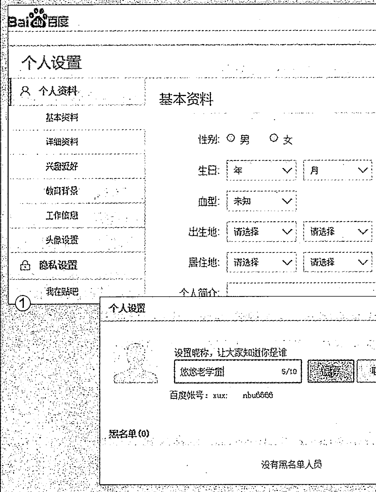

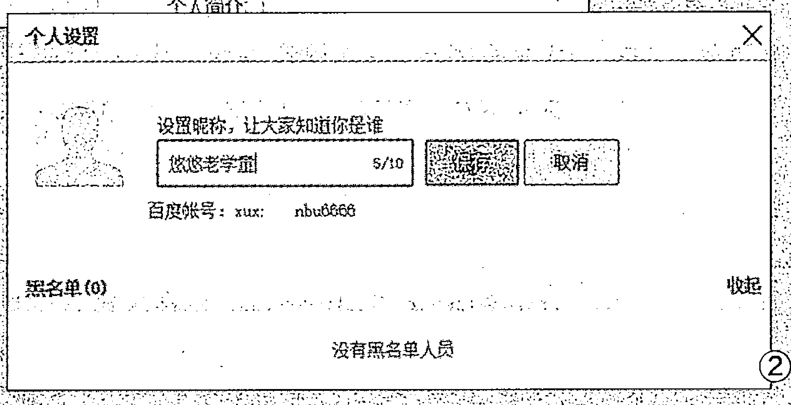

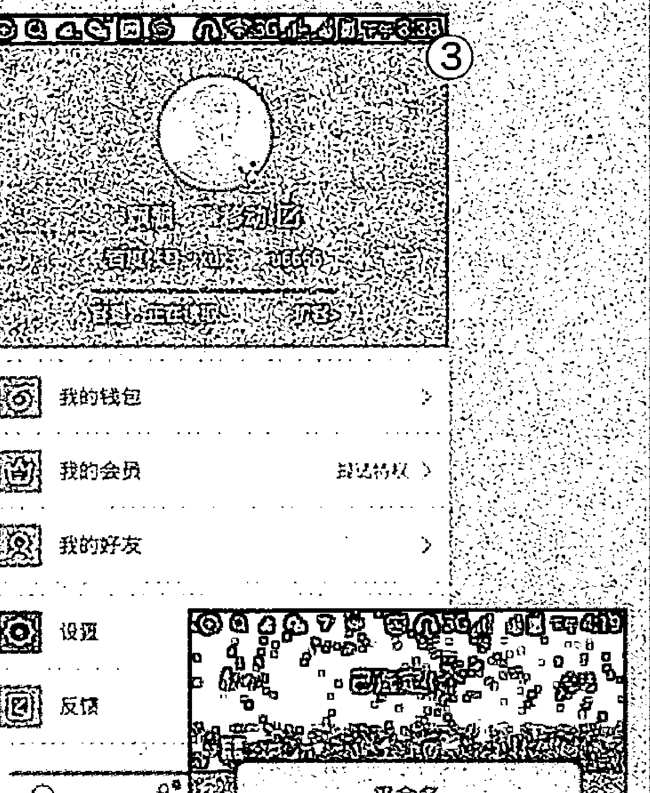

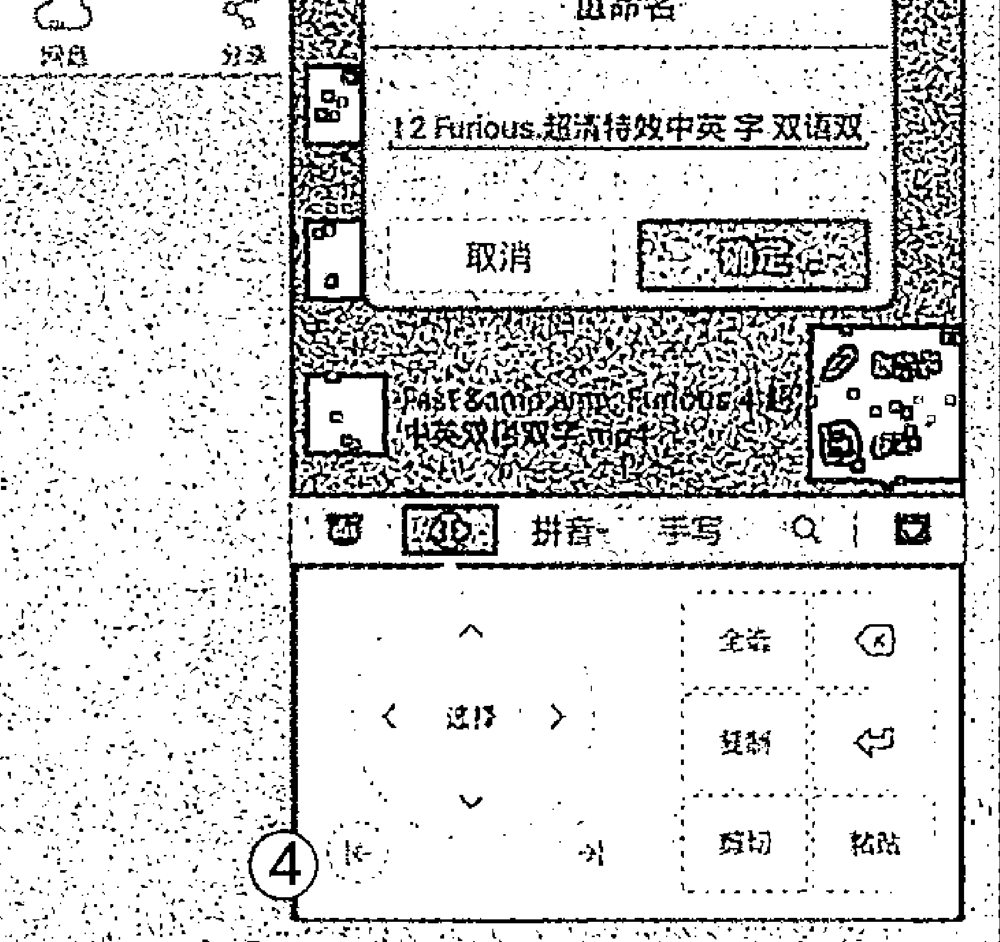

## 3. 隐藏自己的百度账号

百度云可以和其他百度产品通用一个账号。有时在网络交流过程中，我们不希望显示自己的百度账号，更希望“匿名”参与。这有办法解决。

登录百度账号，如果想回答问题但又想当无名英雄，回答时选择“匿名”复选框即可。如果在贴吧发帖又不希望别人关注你的动态，先进入贴吧，从右上角的齿轮设置按钮选择“贴吧设置”，进入后看到“隐私”一项，将“不允许任何人关注我，并隐藏我的个人动态”一项选中（图5），这样别人就看不到你的动态了。

## 4. 解放邮箱 注册新账户

如果用自己最常用的邮箱注册了一个不重要的百度云账户，但该云盘中又已经填满了资料无法继续存放，在这种情况下，若不想放弃这个邮箱而又希望拥有可供使用的云空间，该怎么办？

防打扰：
- 关闭新粉丝提醒
- 关闭新评价提醒
- 关闭贴吧提醒
- 关闭回复提醒
- 关闭@提到我提醒
- 关闭收藏提醒

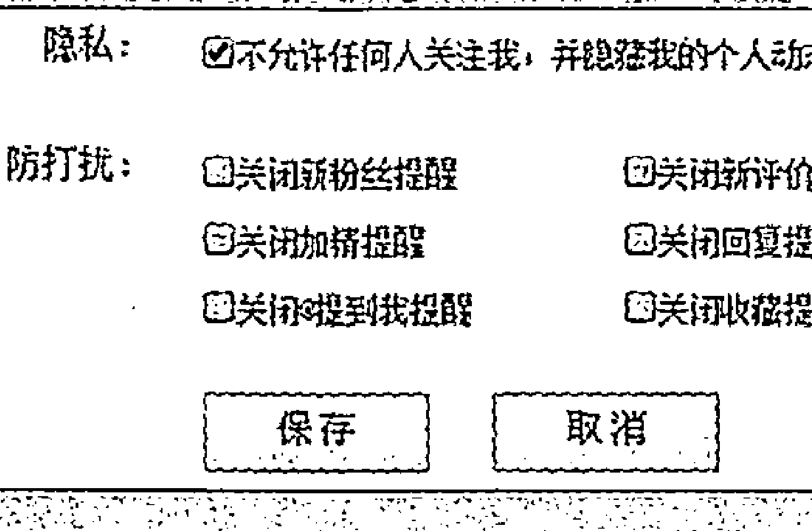

有人希望删除自己在百度里的提问或回答，但作为一种管理体制，百度知道中的资源只有管理员才有权删除。但用户可以通过“个人中心”的“我的回答”把不想露面的答案隐藏起来。也可以将未解决的问题关闭掉，那样别人就看不到你提的问题了（图6）。


百度云的用户名虽然无法更改，但邮箱可以修改。虽然注册时是使用了这个邮箱，但注册成功后，该云盘拥有唯一不变的非邮箱百度云用户名，我们可以将注册时绑定的邮箱解绑，然后用这个邮箱注册另外一个百度云盘，从而让新邮箱账户有更多的云空间可用。

进入百度云账号设置窗口，在左侧栏的快速通道中，点击密保邮箱右边的“修改”链接（图7），在弹出的密保工具页中，点击密保邮箱后的“解绑”按钮，如果有手机绑定，会向手机发送解绑验证码短信，输入验证码之后，解绑成功（图8）。之后，就可以用这个解绑了的邮箱注册或绑定一个新的云盘了。绑定后的云盘可直接用这个邮箱登录。

邮箱注册百度账户后，有一次起账户名的机会，但确定了名字就不能再修改了。如果用户对自己的账户实在不满意，可先清空其中的个人信息，然后将有用信息（如银行卡、邮箱、手机号等）解绑，然后放弃该账户不用。但注意原来用户名下的积分、等级都不能挪到新的用户名上去了。百度用户协议中有“6个月未登录的账号，百度保留关闭的权利”一项。因此，清理了个人隐私的账户，就等着它去自生自灭吧！

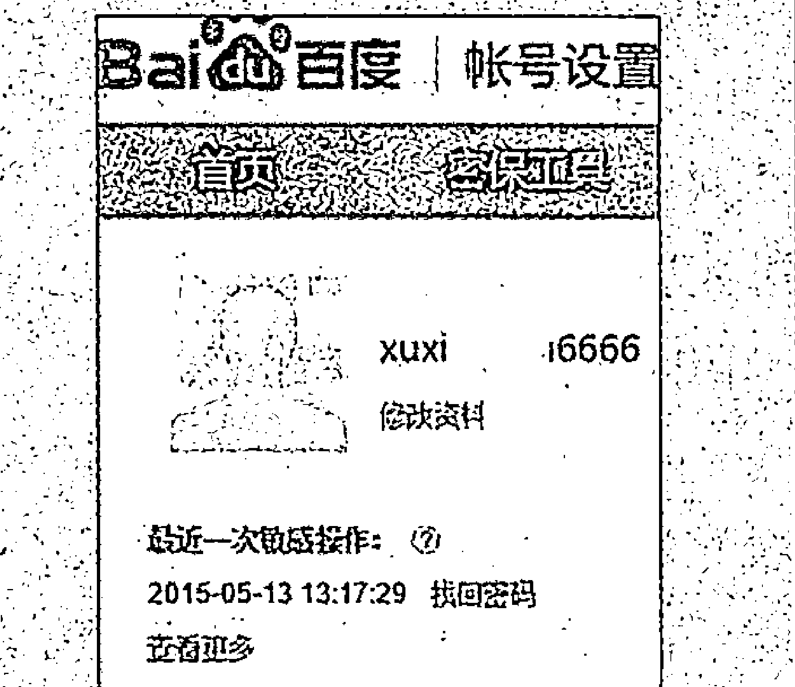

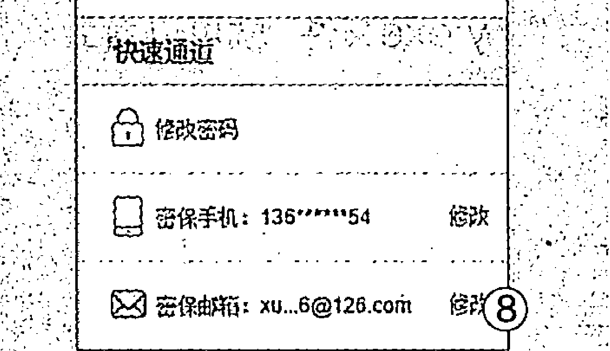

# “跳转”式快速搜索

文|阿立

提到文件搜索很多人都会想到以速度快而著称的Everything，可是很多用户并不知道还有一款和Everything齐名的软件——Listary，它不仅可以快速搜索需要的文件和文件夹，还可以帮助用户快速在不同的文件夹之间进行跳跃，从而减轻用户在不同文件夹切换的繁琐操作。

## 文件查找即输即显

一般来说，如果软件有绿色版或便携版，大多数人会首先考虑使用这种版本，因为这免去了安装的麻烦。但是有利就有弊，绿色软件因为没有进行过安装，所以自然不会在系统的程序菜单里面出现相关的命令。所以要想快速启动这类软件，要么就是在系统桌面创建快捷图标，要么就是通过快捷键命令进行启动。不过现在利用Listary这款软件，一切操作都变得简单起来。

Listary可以从www.listary.com下载获取。比较有意思的是，Listary本身不只提供了安装版，同时也提供了便携版，下载便携版的ZIP文件包，解压后直接运行其中的Listary.exe文件，就可以看到软件的配置向导。首先需要设置软件的语言，在列表中选择“Chinese(simplified)-简体中文”项后，向导界面就变成中文的了（图1）。接下来点击右下角的“继续”按钮，就可以看到软件的相关介绍，当然点击“不，谢谢”按钮直接跳过也可以。安装完成后，比如我们需要打开PotPlayer这款播放器软件，只需要在系统桌面输入和PotPlayer相关的内容即可。

Listary搜索的内容非常灵活，既可以输入文件名称的全部，如本例中的PotPlayer，也可以只输入其中的一部分，比如Pot或者Player等。当我们键入文件名称开头的pot三个字母后，Listary就会马上找出符合搜索条件的文件和文件夹，并以清单方式显示在窗口界面的上方（图2）。通过键盘中的方向键就可以在不同的结果中进行转换，当找到需要的文件或者文件夹后，直接按下回车键就可以打开它了。如果搜索结果中的内容比较多，可以在文件名称后加上exe的信息，比如“Pot exe”，这样就可以屏蔽不相关的内容，直接搜索到PotPlayer的程序文件。

## 复杂操作尽在右键

对于查找搜索到的文件除了打开运行以外，我们很多时候还会通过右键菜单进行其他的管理操作，比如文件复制、删除、压缩、编辑等操作。如果只是利用系统自带右键菜单中的命令，有时可能会发现需要的命令并不存在，这时就需要借助其他软件或技巧了。

打开Listary右键菜单的方法非常简单，除了直接在搜索到的文件或文件夹上点击鼠标右键外，按下键盘中方向键的“→”也可以调出右键菜单。通过弹出的菜单我们可以看到，Listary软件使得快捷命令更加丰富。除了系统右键菜单里面常见的命令外，它还可以复制文件的路径到剪贴板，直接进行共享操作，以及将其添加到指定的库里面（图3）。

如果用户在剪贴板里面保存有文件的话，那么通过其中的“复制到当前目录”命令，还可以快速将文件复制到当前文件夹中，这样就可以避免用户为了复制文件而在不同的文件夹中切换了。

Windows 10系统中，可以将一些常用的文件夹钉在系统的“快速访问”里面。但是如果是在其他的系统里面该怎么办呢？利用Listary就可以快速在不同的文件夹之间进行切换。

首先按照常规方法打开文件浏览窗口，这时按快捷键Win+S打开搜索条。按照前面的方法输入文件夹名称的关键词，搜索到后按下回车键就可以跳转到该文件夹。由于Listary是对整个磁盘进行搜索，所以输入某个关键词以后反馈的内容比较多。如果用户想进入某个磁盘的特定目录，比如需要进入到C:\Program Files中，只需要输入“C:\fi”再按Tab键，就会自动补全为“C:\Program Files”并选中（图4）。如果继续输入“\rar”并按Tab键，就会补全为“C:\Program Files\WinRAR”。

Listary软件的右键菜单中有“收藏”、“历史”和“选项”。那么如何将常用的文件夹目录添加到Listary软件的收藏列表呢？首先在系统托盘中找到Listary的软件图标，在图标上点击鼠标右键选择菜单里面的“选项”。接着在弹出的窗口中点击左侧列表中的“菜单”命令。然后在右侧窗口上方的列表中选择“收藏”选项，再点击下面的绿色加号，在弹出的菜单中选择“收藏的文件夹”命令。再在弹出的列表对话框中选择一个常用的文件夹目录，然后点击“确定”按钮，就可以将文件夹目录添加到收藏列表里面了（图5）。

最后按照相同的方法，将其他常用的文件夹目录添加到收藏列表即可。以后当我们在文件浏览窗口双击鼠标左键或者点击鼠标左键，在弹出的菜单里面就可以看到收藏的文件夹，这样即可快速跳转到需要的文件夹中（图6）。

> **小提示**
Listary软件支持拼音缩写的查询，比如要搜索“电脑爱好者”，只需要输入dn即可。不过这里需要提醒大家的是，虽然该插件支持拼音，但是并不支持模糊音。

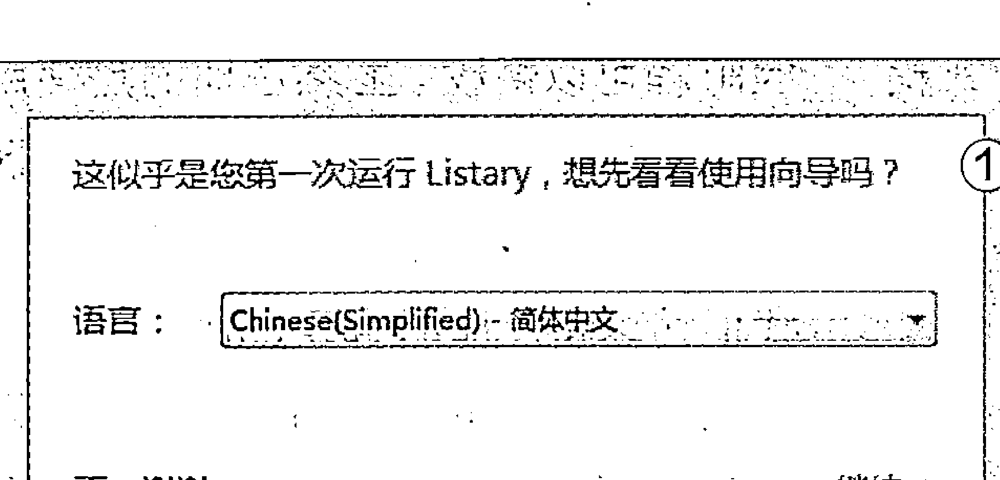

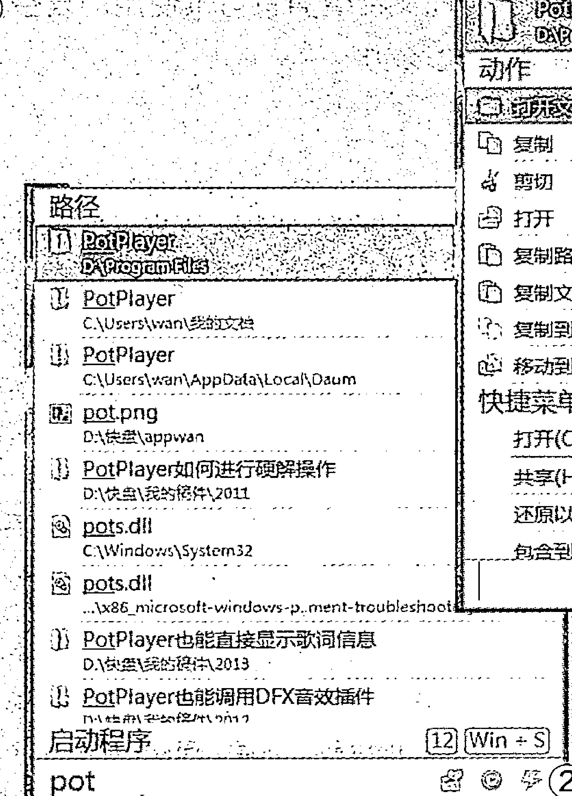

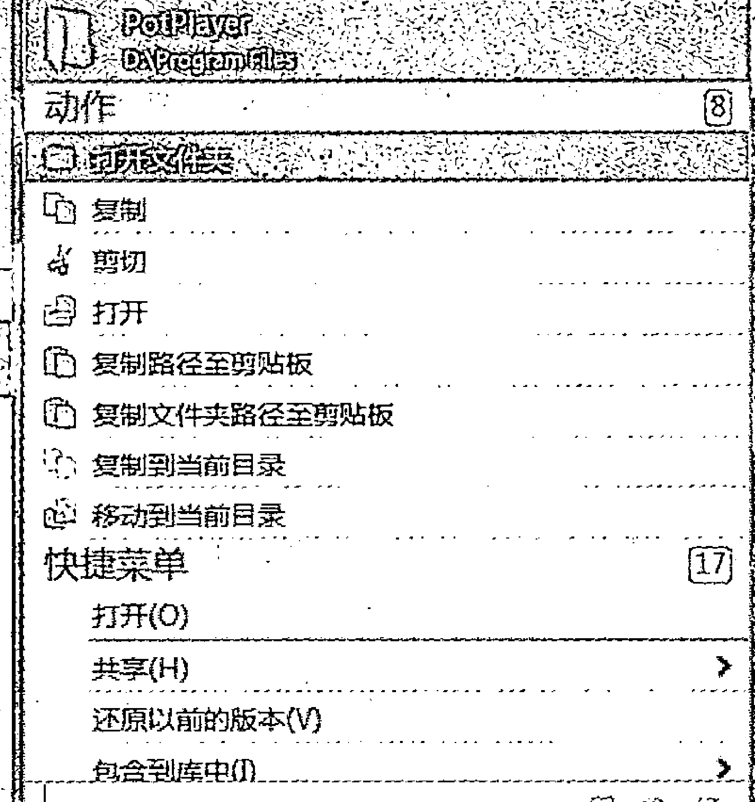

# 协议转换 浏览器通杀不同代理

文|重剑

使用过谷歌浏览器的用户都知道，这款浏览器在很多地方都是直接调用系统的设置，比如网络代理的设置就是如此。可是系统的代理设置只支持HTTP协议，并不支持常见的Sock5协议，所以自然谷歌浏览器也就不能使用Sock5协议了。如果你确实需要Sock5协议的代理，最简单的方法就是将Sock5协议转换成HTTP协议。

## 借用软件间接转换

由于上述问题对不少用户造成了困扰，因此就有网友开发出相关软件进行解决。首先从网上下载最新版本的Privoxy（www.privoxy.org），解压后运行Privoxy软件的主程序文件，在弹出的窗口中点击“Options”菜单中的“Edit Main Configuration”命令，这时就会弹出一个软件的配置文件。通过文本编辑器的搜索功能查找“forward-socks5t”这个关键词，由于配置文件里面多处有这个参数，这里我们只需要修改最后一个搜索到的参数就可以了。现在将这行代码前面的“#”符号删除掉，将后面默认的IP地址和端口修改为Sock5协议代理的IP地址和端口即可（图1）。最后退出时保存刚刚的配置，并且点击“Options”菜单中的“Enable”命令激活即可。

接下来打开系统中的IE浏览器，点击“工具”菜单中的“Internet选项”命令，在弹出的窗口中切换到“连接”选项卡，点击下面的“局域网设置”按钮。在弹出的窗口中选择“代理服务器”下的“为LAN使用代理服务器（这些设置不用于拨号或VPN连接）”项，并在地址栏中输入“127.0.0.1”，在端口栏输入“8118”就可以了，最后点击“确定”按钮完成代理的设置（图2）。以后当谷歌浏览器调用系统代理的时候，首先会发送出HTTP协议的数据包，经过Privoxy软件的转换操作后，再将数据包发送到Sock5协议的代理服务器，这样谷歌浏览器就可以变相使用Socks5协议的代理了。

## 代理软件直接完成

有的用户可能觉得上面的方法不好操作，那么我们还可以选择另外的方法。首先下载Sockscap64这款代理软件（它和Sockscap32没有一点关系）。接着解压运行文件夹里面的可执行文件，在弹出的操作界面里面点击“代理管理器”按钮。在弹出的窗口中点击鼠标右键，选择菜单中的“添加一个代理”命令，然后设置Sock5协议代理服务器的IP地址和端口即可（图3）。设置完成后点击“保存”按钮，返回到软件的主操作界面。点击工具栏中“程序”旁边的按钮，在弹出的菜单里面选择“添加一个可执行文件”命令。然后在弹出的对话框中点击“浏览”按钮，选择谷歌浏览器的主程序文件即可。以后当我们需要使用Sock5协议的代理服务器时，点击Sockscap64软件窗口中的谷歌浏览器图标，再点击工具栏中的“运行”按钮，这样启动的谷歌浏览器就可以通过Sock5协议连接上网了（图4）。

```
# HTTP parent looks like this:
forward-socks4 / socks-proxy.example.com:1080 .
To chain Privoxy and Tor, both running on the same system, you
would use something like:
forward-socks5t / 127.0.0.1:1080 .
The public Tor network can't be used to reach your local
network, if you need to access local servers you therefore
might want to make some exceptions:
forward 192.168.*.*/
forward 10.*.*.*/
```

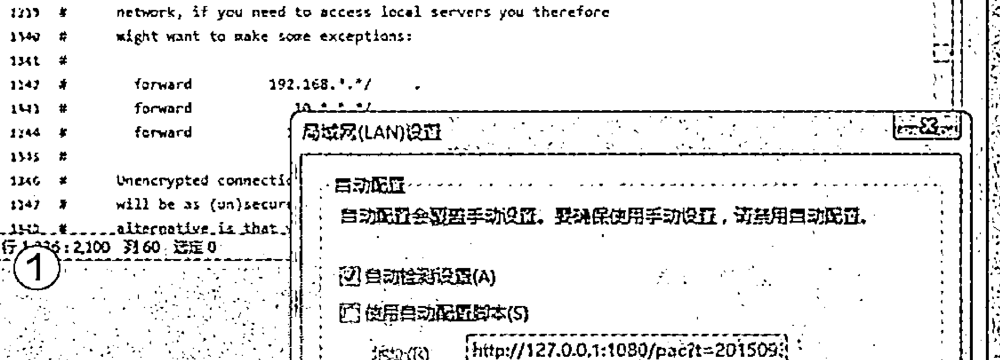

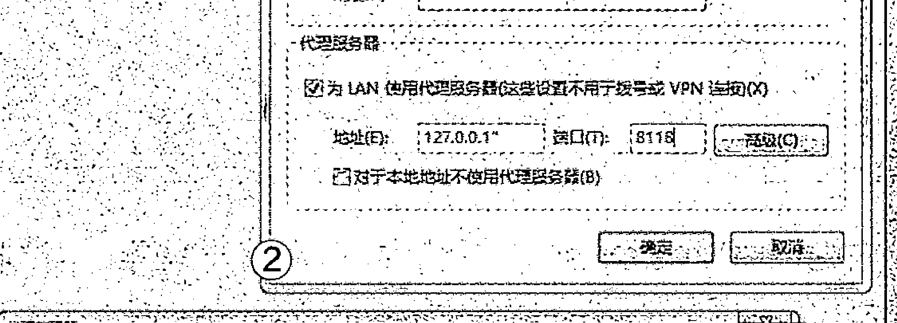

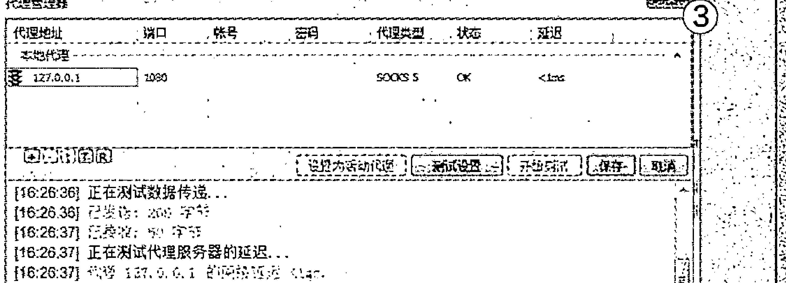

# 巧用手机日历追美剧

## 文|老万

在很久以前人们要想了解电视剧的情况，都是通过订阅或购买电视报来完成的。后来随着互联网的出现，人们开始通过搜索来查询电视节目。但是这种方法只适用于国内的电视节目，对于一个美剧迷来说也不是非常方便。下面我们要介绍的方法，可以让你更加简便地查询和追踪美剧。

### 魅族手机直接订阅美剧

随着移动终端的大力普及，我们利用手机中的日历应用，就可以对喜欢的娱乐节目进行订阅。如果用户使用的是魅族手机的话，那么这个操作就非常的简单，因为利用其自身的日历应用就可以解决这个问题。首先打开系统桌面中的“日历”应用，在弹出的窗口中点击下方工具栏中的“订阅广场”按钮。接着在出现的订阅广场窗口中点击“娱乐”标签，就会显示出很多综艺节目和电视剧的选项（图1）。点击其中的“英美剧”选项后，当前热门的欧美电视剧名称就会一个个列出来。点击电视剧的名称后，可以看到该剧的相关信息，包括导演、演员以及剧情等等。用户只需要点击窗口下方的“订阅”按钮，该电视剧的播放时间就会被添加到日历里面（图2）。当这个美剧即将播放的时候，日历应用还会在系统桌面弹出窗口，提醒用户追美剧的时候到了。

### Sunrise日历一样也能追

当然并不是所有用户都使用的是魅族手机，对于其他手机的用户，使用Sunrise日历应用进行订阅就是最简单的方法。不过Sunrise日历应用在中文状态下是无法订阅电视节目的，所以这个时候我们只能祭出屡试不爽的语言修改大法。首先安装最新版本的Sunrise日历应用，接着点击Android手机系统中的“通用”选项，在弹出的窗口里面找到“语言和输入法”这项。接下来在弹出的列表里面点击“语言”，将默认的简体中文修改为“English(United States)”即可。注意，设置完成后，有的手机系统会自动进行重新启动。当用户重新打开Sunrise日历应用后，就会发现整个界面变成英文状态了。现在点击主界面右上角的齿轮选项，在弹出的设置窗口中找到“INTERESTING CALENDARS”项，接着点击该选项，在弹出的列表中找到TV项（图3）。该选项是按照美国的区域时间来进行分类选择的，比如我需要订阅FX电视台的电视剧“Rescue Me”，首先选择美国东部时间East，在弹出的电视台列表里面找到FX并点击它，接下来就可以在节目时刻表里面发现“Rescue Me”的名称，点击它以后就可以完成该美剧的订阅操作了（图4）。稍等片刻当我们返回到Sunrise日历应用的主界面后，即可在列表中查询到该美剧的首播时间、持续时间、单集概要等信息内容（图5）。所有的操作完成后，将系统的语言修改为简体中文即可。

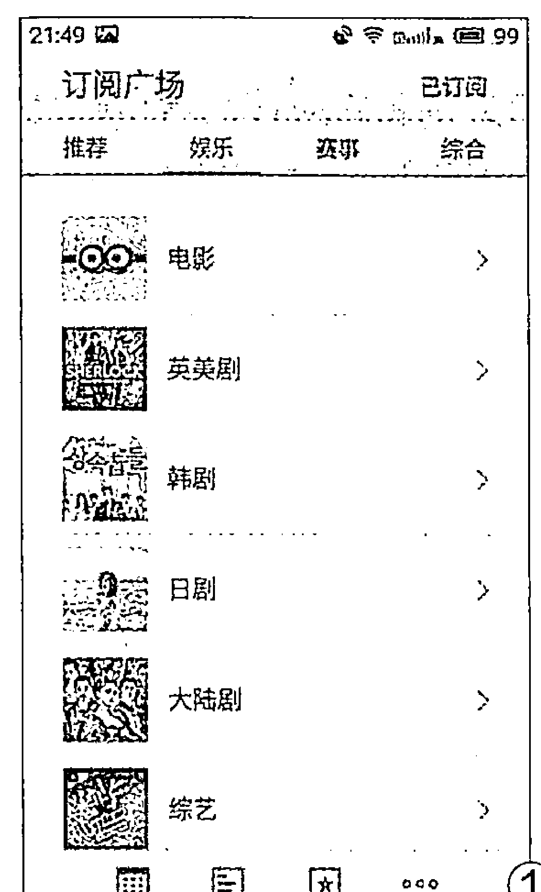

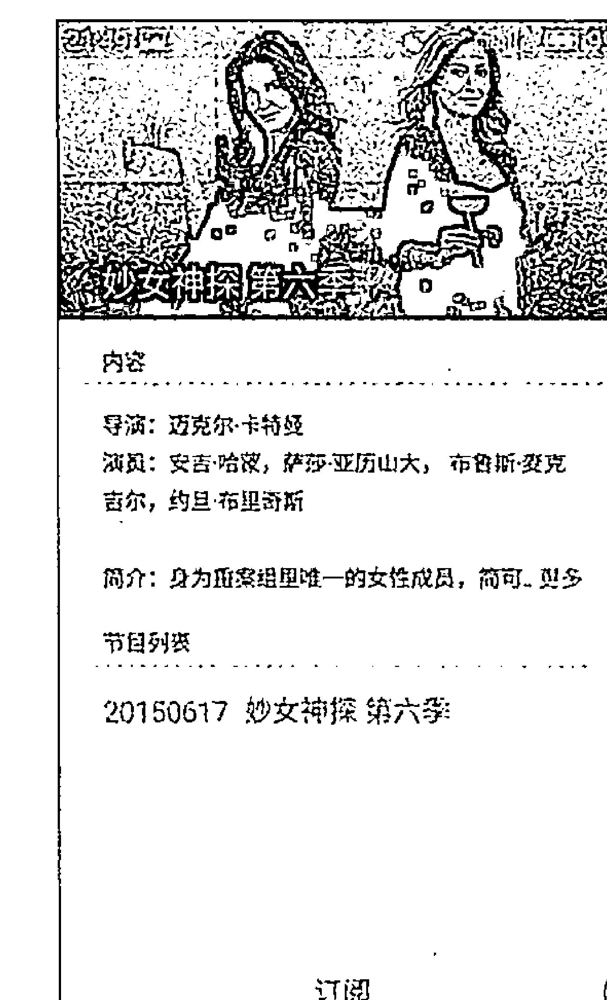

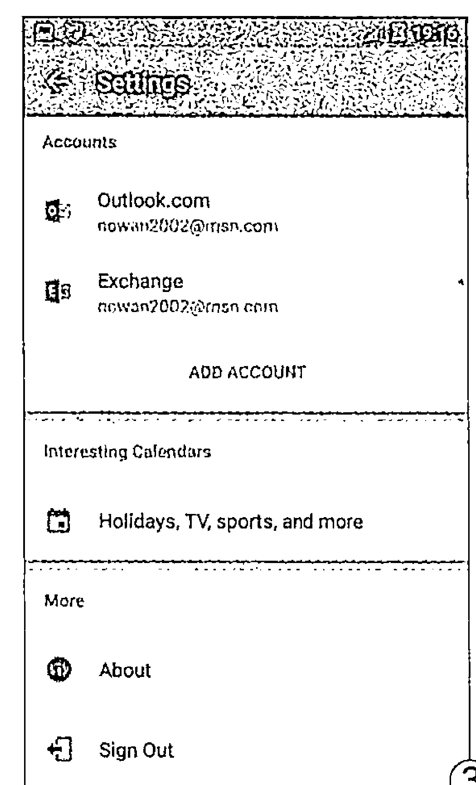

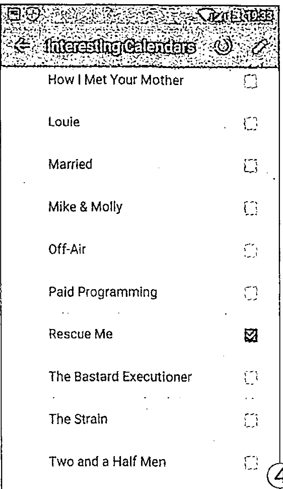

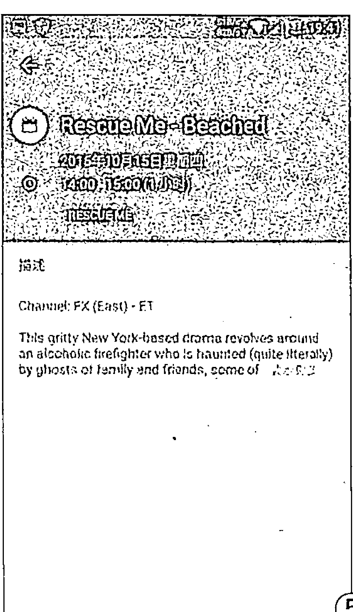

## 文件另类批量重命名

文|楚楚

说起文件重命名，大家一般都会想到用F2修改主文件名或显示出扩展名再做修改的技巧，更进一步则会想到按序号批量命名等方法。然而，由于文件使用的复杂性，文件重命名的需求也是多样化的。借助于Bulk Rename Utility、拖把更名器等工具，我们可以实现特殊需求下的文件批量重命名。此外，甚至还可以用简单的批处理来实现批量文件的快速重命名。

### 1. 改掉无意义的照片文件名

我们拍摄的数码照片常常是一些诸如DSC1089.JPG或IMG_7543.JPG格式的文件名，从中只能看出拍摄序号，而如果要查看照片的拍摄日期，还得借助于系统文件属性或用工具软件，从照片的EXIF元数据中提取日期查看。其实，可以用批量文件命名软件Bulk Rename Utility，将这些照片的EXIF参数中提取拍摄日期，作为照片文件名的一部分。这样，当我们看到照片文件名后，一下子就能辨认出是哪个日期拍摄的了。

先从Bulk Rename Utility的上部窗口目录树中定位要批量命名的照片文件，选中这些文件，然后勾选“自动日期”参数组后的复选框；方式选择为“后缀”；选择类型为“拍摄（原始日期）”；选择格式为“年月日”；分隔符填写“_”，用来连接原文件名和后缀；连接符填写“-”，用来分隔日期。如此设置之后，在上方右侧的文件名预览窗口中，马上会显示出更名后的效果，可以看出文件名后部已经加上了拍摄日期（图1），最后点击“重命名”按钮让批量命名生效。

### 2. MP3音乐标签变身歌名

大家知道，正规的MP3歌曲文件名中应该包含有唱片集、艺术家、标题等与歌曲有关的属性，这些信息以MP3 ID3标签的形式与MP3文件合并保存。平常我们可能只能看到歌曲文件的文件名而看不到标签，如果在Windows 8.1或Windows 10环境下，将文件显示方式切换为“详细信息”，则可以看到这些标签（图2）。

但是，不是所有软件都能像Windows资源管理器那样显示出MP3文件的标签。例如在一些播放器的文件选择窗口中，是没法通过文件名判断出其文件标签信息的。在这种情况下，如果文件名中不带有专辑属性显示，借助于“拖把更名器”更名软件，从MP3文件中提取音乐标签，然后将这些标签作为文件名的一部分，即可完成用标签对音乐文件的重命名。

启动拖把更名器，将MP3系列文件拖动到更名窗口中。点击“标签命名”选项卡，可以看到下面一些带有百分号的数字变量分别代表了歌曲标签中的某种属性。用这些变量的组合，可以轻松构建新的标签表达式，而将构造的标签表达式用于重命名。

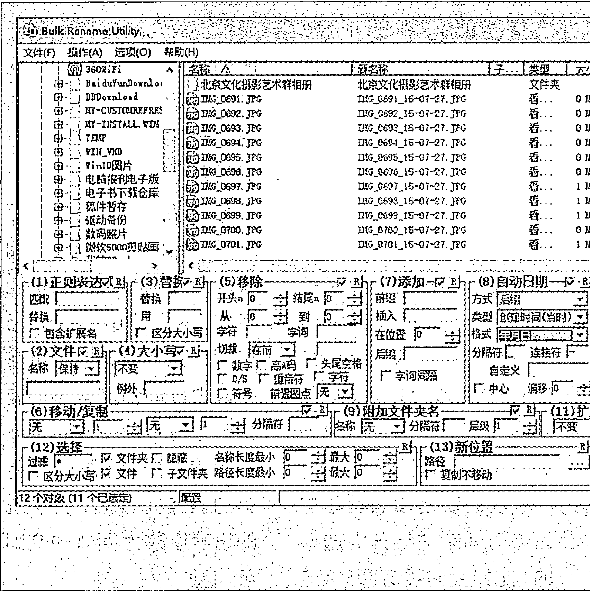

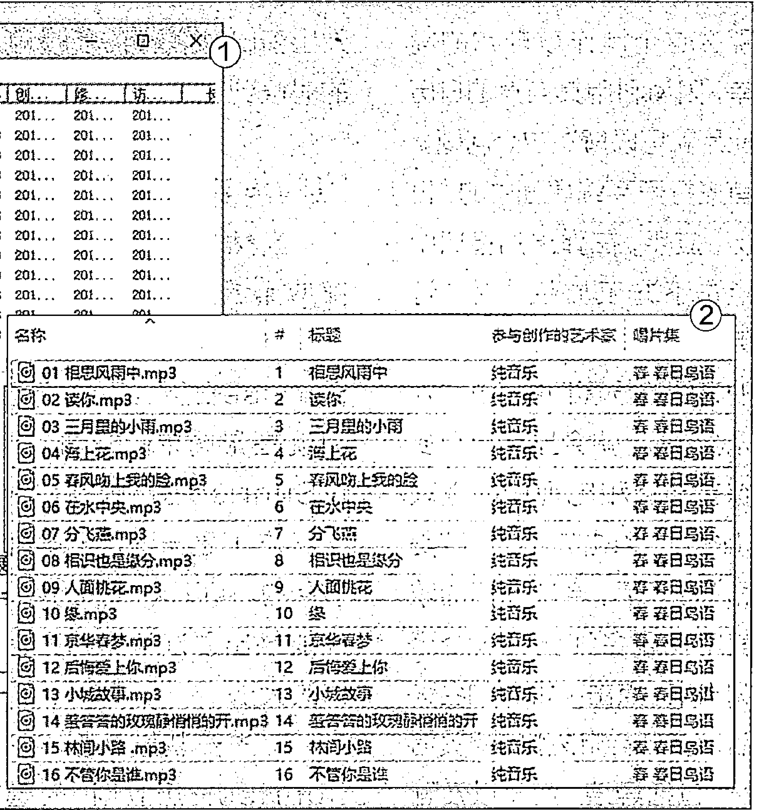

### 3. 借歌单批量命名歌曲

如果从某音乐网站下载的某个专辑，其中的歌曲文件名是01.MP3到15.MP3这样的形式，而网页上却有明确的从01到15的歌曲名单，这时可以借助于文本文件命名的方法，将歌单文本应用于文件名中。

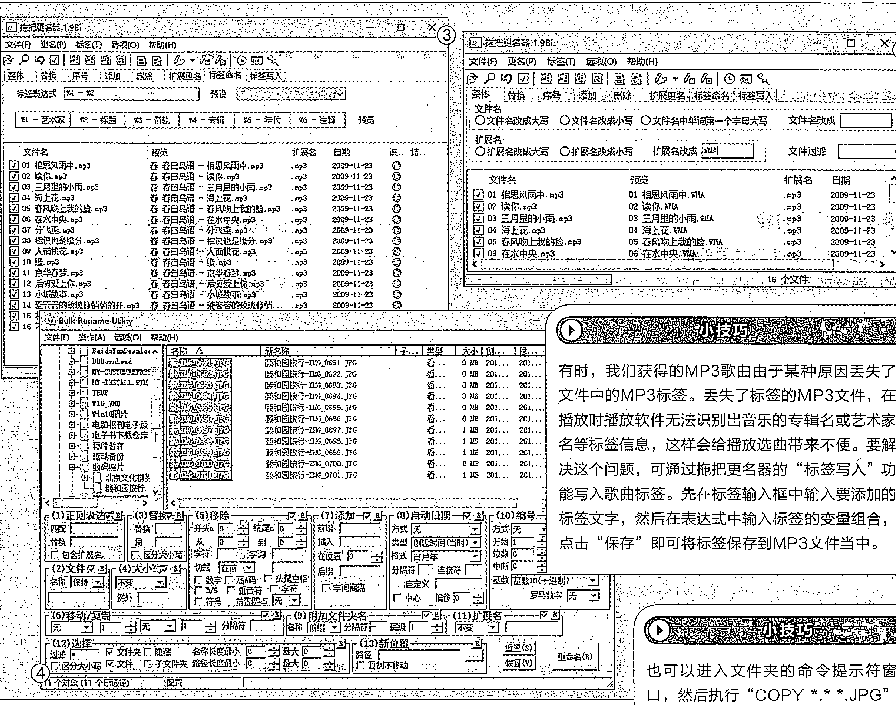

> 有时，我们获得的MP3歌曲由于某种原因丢失了文件中的MP3标签。丢失了标签的MP3文件，在播放时播放软件无法识别出音乐的专辑名或艺术家名等标签信息，这样会给播放选曲带来不便。要解决这个问题，可通过拖把更名器的“标签写入”功能写入歌曲标签。先在标签输入框中输入要添加的标签文字，然后在表达式中输入标签的变量组合，点击“保存”即可将标签保存到MP3文件当中。

具体方法：先将歌名按一个一行拷贝到一个新建的TXT文件中，然后从拖把更名器窗口中执行“更名→调用文本文件命名”，读取该TXT文件，执行命名操作，即可让这个系列专辑的MP3文件名变为歌曲本身的名称，识别起来就方便多了。

### 4. 让照片名称附带出处

在数码库中，如果给照片文件名附带一个所藏文件夹的路径名称，那么，即便是这张照片被拷贝到不同的电脑上，也会一眼判断出这张照片原来是藏在何处的。

假设照片文件夹名为“颐和园旅行”，照片名为形如“IMG_0629.JPG”的格式，希望命名后为“颐和园旅行-IMG_0629.JPG”。可以用Bulk Rename Utility软件，选中“附加文件夹名”，名称选择“前缀”，加上分隔符“-”，根据需要选择文件夹层级。最后在预览合格后，执行“重命名”按钮即可（图4）。

> 也可以进入文件夹的命令提示符窗口，然后执行“COPY *. *.JPG”此类命令，一次性更改文件扩展名。其中“*.*”表示目录现存所有文件，“*.JPG”表示更改为JPG格式文件。

### 5. 不显示扩展名也更名

在我们传统的印象中，要更改文件的扩展名，需要先通过系统设置将扩展名显示出来，然后更改。其实，如果用一些更名软件，可以不理会文件扩展名是否显示出来，直接在扩展名项目中填入新的扩展名，执行更名命令即可实现文件扩展名的批量更改（图5）。

## 功能分解 让安全软件下岗

文|老万

很多安全软件随着功能的不断增加，已经演变成一个软件的集合平台，所以对系统资源的占用也越来越多。但是其中的很多功能实际上平时都用不到，这样就会造成用户的资源浪费。其实我们可以利用一些小的工具，来实现自己必须要的一些功能，这也正是“术业有专攻”的另外一种体现。

### 启用自身拦截功能

很多安全软件在最早的时候，自身的功能也是非常单一的，通常就是帮助浏览器对恶意网站进行拦截。不过现在主流的网页浏览器，自身就带有钓鱼网站、恶意网站的拦截功能，这样我们只需要激活这些功能即可。

> 小提示：其实无论是钓鱼网站还是恶意网站，主要在系统后台进行破坏的是脚本文件。所以如果用户觉得浏览器自带的功能不够的话，还可以安装NoScript这类功能扩展。它可以在浏览器加载网页的时候，自动过滤掉网页里面所有的脚本代码，从而进一步加强用户上网的安全。

如果用户使用的是谷歌浏览器，首先点击右上角的“自定义及控制”按钮，在弹出的菜单里面选择“设置”命令。接着点击设置窗口中的“显示高级设置”命令，在“隐私设置”里面找到“启用针对网上诱骗和恶意软件的防护功能”项，选中它以后重新运行浏览器进行确认即可（图1）。

在弹出的窗口中点击左侧列表中的“安全”选项，再在右侧窗口中将“阻止已报告的攻击站点”和“阻止已报告的钓鱼网站”选项选中，同样重新启动浏览器进行确认即可。

如果用户使用的是火狐浏览器，可以点击右上角的“打开菜单”按钮，在弹出的菜单里面点击“选项”命令。接着

### 修复漏洞更加灵活

造成用户电脑系统被黑客或病毒入侵，很大的一个原因就是系统存在安全漏洞，所以及时修复安全补丁就非常有必要。虽然Windows系统自带有补丁修复功能，但是很多用户使用起来非常不便，于是补丁修复的功能又被加入到安全软件里面。其实网上有很多专门可以修复系统补丁的小工具，通过它们完全可以实现补丁的检测与安装。

比如Windows Update MiniTool这款工具，虽然非常小巧，但是功能却很人性化，可以进行自动更新和手动更新两种选择。不过无论选择哪一种方式，都需要首先在“更新服务”列表中选择“Windows Update”项，这样就可以保证从微软的服务器里面更新补丁。如果用户比较懒的话，接着在“自动更新”列表中选择“自动”即可。

如果用户比较谨慎的话，那么首先在“自动更新”列表

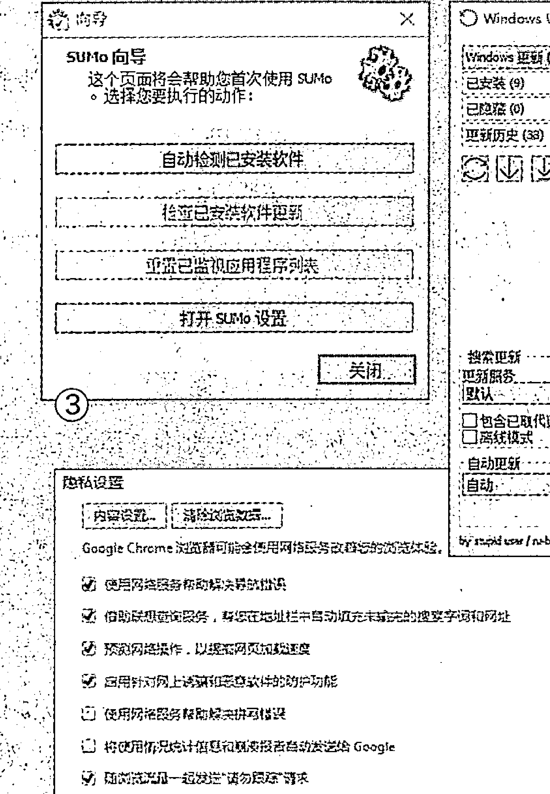

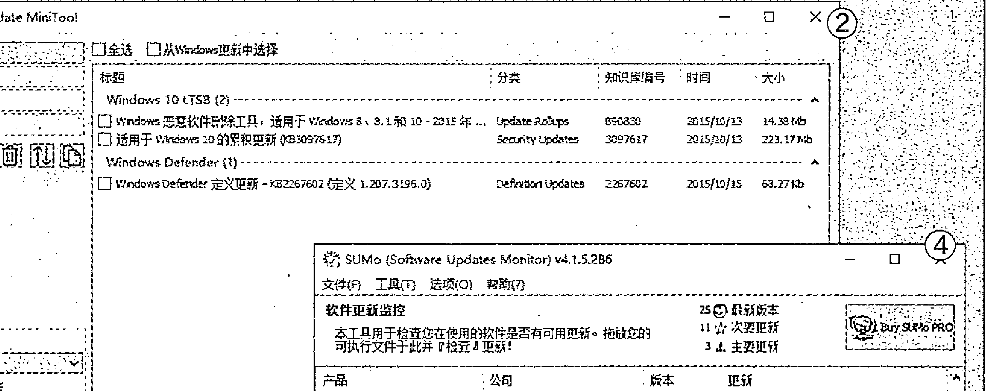

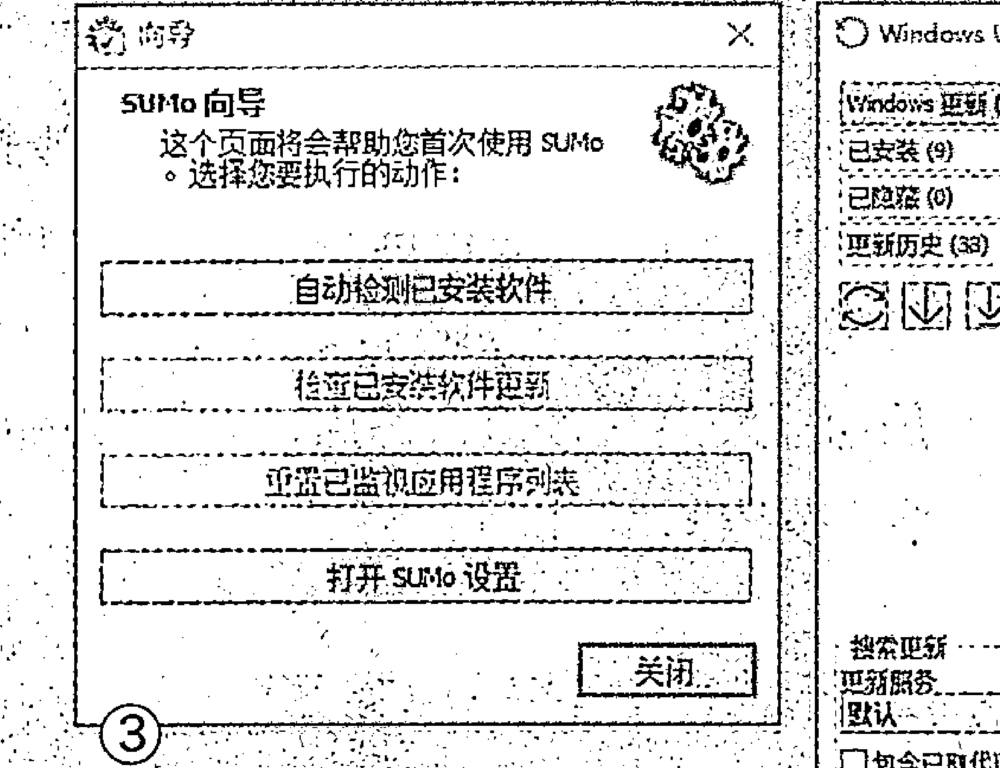

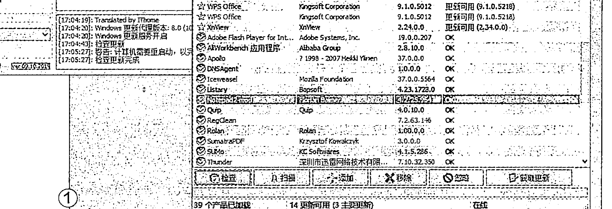

### 软件更新自主选择

除了操作系统的安全漏洞外，软件漏洞也是入侵的重要途径，比如前段时间的WinRAR软件漏洞就是如此。但是由于软件往往并不是通过安全补丁的方式进行漏洞修复的，所以只能通过升级软件版本的方式来解决。而很多安全软件也拿这个作为一个卖点，其实这个时候借助某些工具就可以快速了解到最新的软件版本信息了。

首先下载安装SUMo (Software Update Monitor) 这款工具，安装完成后会弹出一个向导对话框（图3）。点击对话框中的“自动检测已安装软件”按钮，这样就可以对系统里面已经安装的软件进行扫描。当扫描结果出来以后，再点击“检查已安装软件更新”按钮，就可以对软件的版本进行扫描。扫描完成后关闭对话框，在窗口列表中将用不同的颜色图标，显示出软件版本的相关信息（图4）。其中绿色表示当前软件是最新版本，黄色代表是次新的版本，红色则代表版本有些老了。点击需要更新的软件名称后，点击“获取更新”按钮就可以自动打开软件的下载页面，这样用户就可以马上下载进行安装操作了。

### 恶意文件上传扫描

对于从网上下载的文件，尤其是可执行文件，是否安全成为很多人的疑问。于是在安全软件里面就有一个可疑文件云端分析的模块，通过它就可以对用户上传的文件安全性进行分析。如果不想安装安全软件，这个问题又应该如何解决呢？

这可以借助Phrozen Soft VirusTotal Uploader这款工具来解决。通过软件名称就可以知道，这款工具是VirusTotal这个在线分析系统的客户端程序。该工具为用户提供了多种文件上传方式，首先点击操作界面中的“上传进程”标签，接着通过鼠标拖拽一个需要分析的文件到这个窗口释放，这样就可以自动将它们上传到VirusTotal的服务器里面（图5）。除此以外，还有一种文件的上传方法，就是点击“打开”按钮来选择要分析的文件。当分析文件添加到窗口以后，通过下方的进度条就可以看到上传进度。

在文件上传完成后点击窗口中的“等待结果”标签，从中可以看到该文件的基本信息，接下来就是不同杀毒软件对这个文件的分析过程（图6）。当文件分析完成后，客户端会发出一个提示音，并同时在桌面下方弹出一个提示框。接下来点击“可用结果”标签，重点查看其中的“检测率”这个信息（图7）。其中后面的数字说明总共使用的杀毒软件数量，而前面的数字说明判定该文件为病毒的杀毒软件数量。如果用户想要详细地了解分析结果，只需要双击该文件的名称后，在弹出的窗口就能看到（图8）。如果前面显示的是绿色，就说明该杀毒软件判定它是安全的。如果显示的是红色，就说明判定这个文件有问题，同时给出一个对应的病毒代码。根据这些信息，就可以采取相应的处理措施了。

> 小提示
当然并不是所有系统中的软件都可以扫描出来，对于绿色软件来说则需要手动进行操作。首先点击“添加”按钮，选择绿色软件的主程序文件，然后进行分析扫描就可以了。

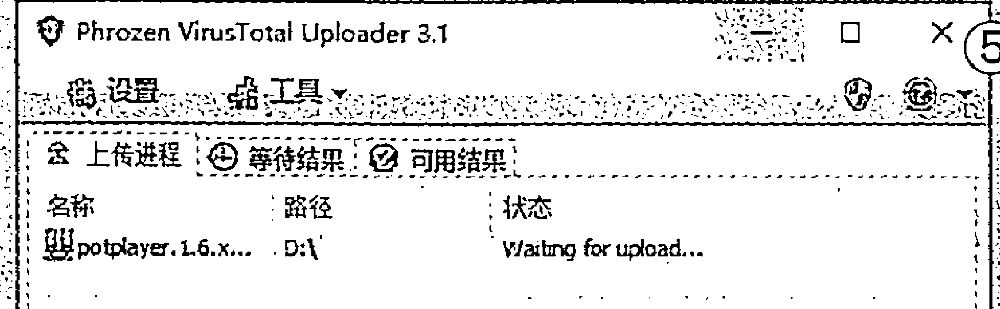

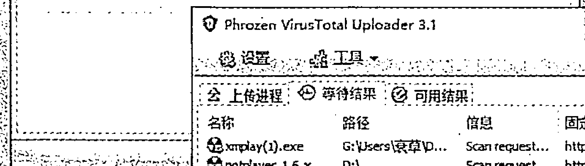

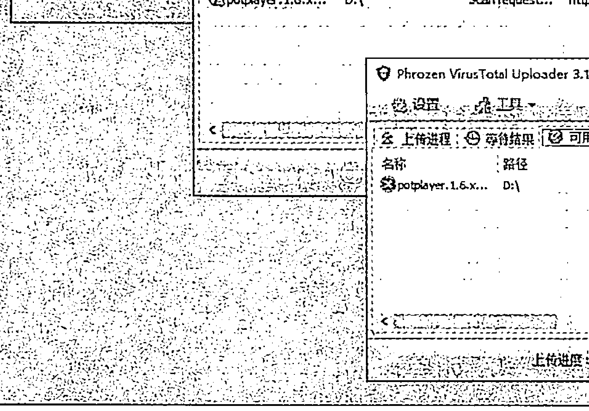

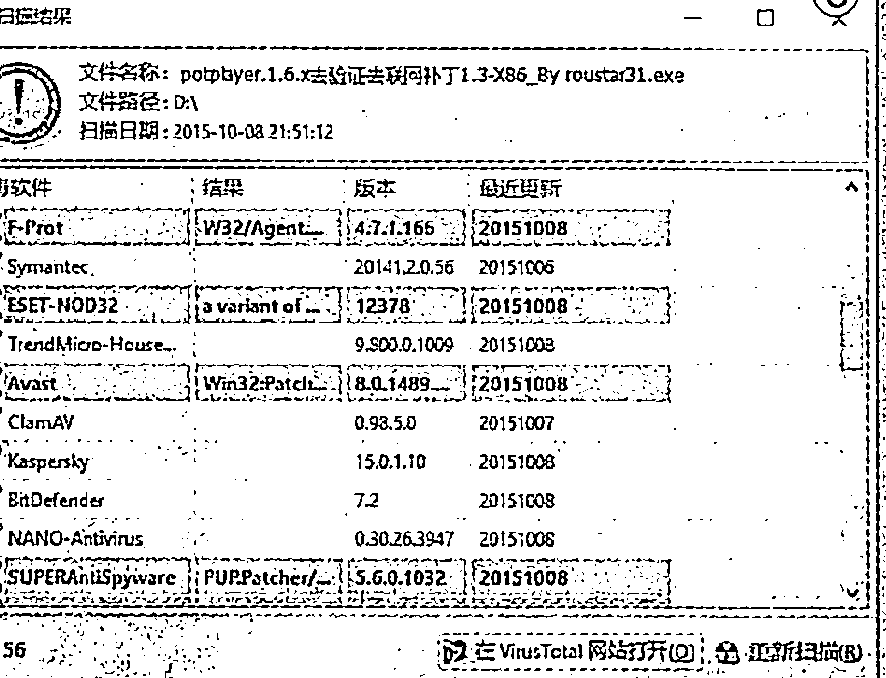

## 挑战网盘的常规限制

文|倚楼

现在很多用户都喜欢通过网盘来分享文件，而网上也有形形色色的网盘可以选择。虽然这些网盘服务表面上都提供了T级的容量空间，但是却在后台进行了各种各样的限制，比如文件大小的限制、传输浏览的限制等等。那么有没有什么网盘服务，可以没有那么多的限制内容，让我们分享得更加方便呢？

### 无须注册直接分享的网盘

我们首先登录WeSendit网盘的官方网站(www.wesendit.com)，在界面左侧的操作窗口下方，可以看到链接和邮件两种分享方式。比如我们点击链接这种分享方式后，再点击窗口中的“Add files”按钮，在弹出的对话框中选择要共享的文件即可(图1)。WeSendit网盘允许用户一次上传单个体积在5GB以内大小的文件，或者也可以一次性上传200个以内任意大小的文件，但是总共上传的文件体积大小不能超过5GB。

当文件选择完成后点击“Send”按钮，就开始上传到服务器里面存储。文件上传完成后，网盘会自动生成一个分享链接，用户只需要像平时一样将分享链接发布出去即可(图2)。当其他用户打开这个分享链接后，点击窗口中的“Start Download”按钮，就可以进行文件的下载操作了(图3)。

WeSendit网盘还有一个好处就是，它可以将多个上传的文件压缩成一个ZIP文件，这样用户在下载的时候就会更加方便了。

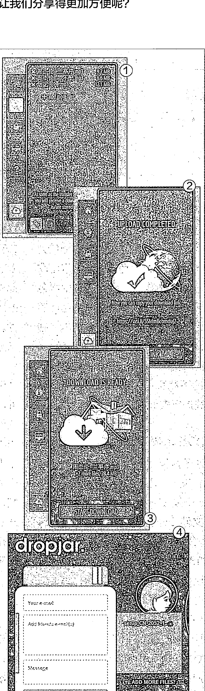

### 更大的网盘 上传分享一气呵成

如果用户觉得5GB的大小仍然不能满足自己需求的话，那么可以通过浏览器登录到Dropjar这个网盘(dropjar.com)，它允许用户上传体积不大于10GB的单一文件。不过用户不用被它简洁的网页吓到，因为它甚至简洁到没有相关的按钮。如果用户需要上传文件的话，只需要选择文件将其拖拽到窗口页面释放即可。不过想要做到这一点的话，需要使用的浏览器支持HTML5技术才可以(现在的主流浏览器差不多都支持了)。当文件在网站页面中释放以后，会自动弹出一个设置窗口。

通常通过网盘进行文件的分享操作，需要经过上传、分享、传播等多个步骤，就像刚刚我们的操作那样。不过现在可以让这些步骤一气呵成。首先根据提示在“You email”里面输入自己的电子邮箱地址，接着在“Add friends email(s)”里面输入朋友的电子邮箱地址，用户可以一次性输入多个朋友的邮箱地址(图4)。然后在“Message”中输入文件的简单介绍信息，点击“Start Transfer”按钮就可以将文件上传到网盘里面，最后网盘会将分享的链接地址发送到朋友的邮箱里面。朋友收到邮件后，点击打开这个分享链接，就可以下载分享这个文件了。而如果不设置邮箱等信息的话，在文件上传完成后，就会给出一个分享链接的地址，再通过其他途径(如聊天软件)发送即可。

当然，以上工具虽然都很方便，但是在数据安全上风险就大得多，基本上没什么保障，所以它们最适合在朋友之间临时分享没有什么隐私安全问题的文件。

## 浏览器看电子书

文/阿立

近来主流的网页浏览器中，都增加了对PDF文件的阅读功能，这样用户就可以摆脱那些体积硕大的阅读器，直接对PDF文件进行阅读操作。但是除了PDF文件以外，电子书的格式还有很多种，这样还是需要安装其他的阅读器才行。其实我们只需要通过安装一些浏览器扩展，就可以直接在浏览器里面对这些电子书进行阅读了。

### EPUB管理阅读两不误

随着移动设备的普及，很多人喜欢从网上下载电子书来观看，这其中最常见的格式就是epub文件。但是我们都知道网上的东西鱼龙混杂，好多东西实际上都是“挂羊头卖狗肉”，所以下载的epub文件最好是进行一下预览。如果用户使用的是谷歌浏览器的话，那么首先打开谷歌浏览器的应用商城，搜索并安装一款名为Readium的应用。安装完成后点击谷歌浏览器的“打开新的标签页”命令，在弹出的页面点击书签栏前面的“应用”按钮，再从弹出的页面中就可以看到刚刚安装的应用了，点击该应用图标也就相当于启动了一个迷你的阅读软件。

现在根据Readium应用的提示，点击右上角的“添加”按钮，将会弹出一个对话框。点击“从本地文件”后的“选择文件”按钮，在弹出的文件窗口中选择需要预览的epub文件，就可以将其导入到Readium应用的窗口里面（图1）。不过需要提醒大家的是，epub文件在导入的过程中比较缓慢，建议大家不要中断文件的导入操作。接下来可以按照相同的步骤，导入其它的epub文件就可以了。当我们需要阅读或者预览某个epub文件的时候，点击应用中的epub文件图标打开即可（图2）。接下来通过键盘中的方向键就能一页一页进行阅读操作了。不过为了获取更好的阅读体验，可以点击右上角的设置按钮，从而对字体大小以及颜色等参数进行调整（图3）。

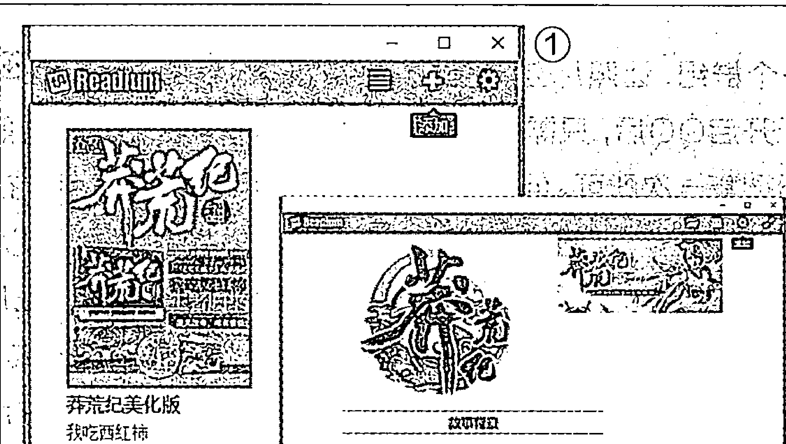

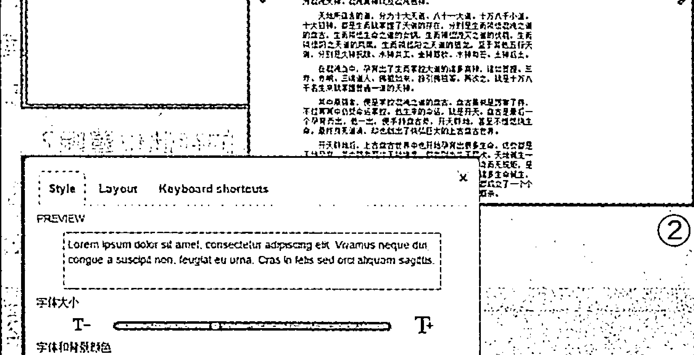

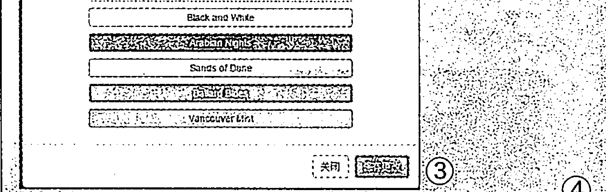

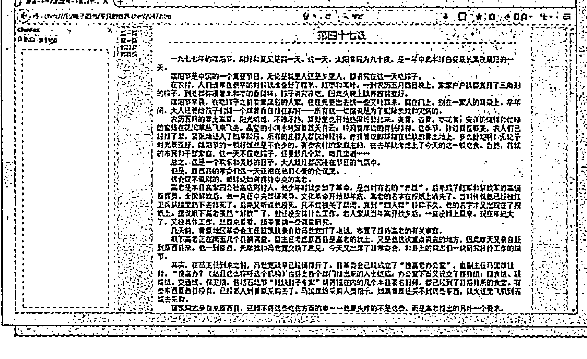

### CHM文件阅读更体贴

CHM文件也是电子书特别常见的一种格式，虽然通过鼠标双击文件即可直接进行查看，但是根本谈不上任何的阅读体验，而且针对CHM文件的阅读器又非常的少。现在利用火狐浏览器的一款扩展就可以解决。首先点击“工具”菜单中的“附加组件”命令，在弹出的窗口中选择左侧列表中的“获取附加组件”项，再在窗口的左上角输入关键词“ChmFox”来搜索。搜索到后点击该扩展名称后的“安装”按钮进行安装，安装完毕根据提示重新启动浏览器即可。

以后当我们需要更好地阅读CHM文件的时候，点击“文件”菜单中的“打开文件”命令，在浏览窗口里面选择一个CHM文件即可。通过该扩展进行阅读，首先可以对页面内容的大小进行调整，这样避免长时间阅读造成的疲劳（图4）。其次可以像普通网页一样，将阅读的位置添加到收藏夹里面。以后点击收藏夹中的书签，可以直接打开CHM文件，并跳转到上次阅读的位置。另外通过快捷键Ctrl+Alt+M，可以快速开启目录和索引，方便用户对内容信息的检索。

## 批量下载QQ多样组照片

文|张爱影

要提高摄影水平，大量阅读别人的摄影作品，很有裨益。为了能够接触更多的高手，欣赏到他们拍摄的作品，笔者加入了数十个国内比较活跃的摄影QQ群。QQ群组里有大家踊跃上传的精彩照片，虽说质量参差不齐，但有对比才有提高，结合专家的点评，对提高水平大有帮助。于是，很想每天将这些照片全都搜集起来欣赏，但限于时间和精力，不能时刻总盯着各个群组，等着图片的出现并下载。如何快速搜集其中的照片成了问题。

搜集照片的思路: 打开QQ各个群组，让照片自动进入磁盘缓存，统一搜集。这样，每天开启QQ后，只需打开各个群不要关掉并将其最小化，每日搜集一次即可。但需要解决多群组信息的干扰问题，还需要找到各群组照片的文件存放所在，更需要用最简单方便的方法过滤无关图片，提取有用照片（图1）。

### 1. 自动搜集美图 先要消除干扰

为了达到既不打扰工作又不影响照片下载的目的，需要消除信息干扰。右键单击群组名称，选择“群消息设置”，然后选择“不提示消息只显示数目”。这样，群组图标上只会显示消息的数量，而不会自动弹出消息，同时也不会错过群组新发的任何图片（图2）。

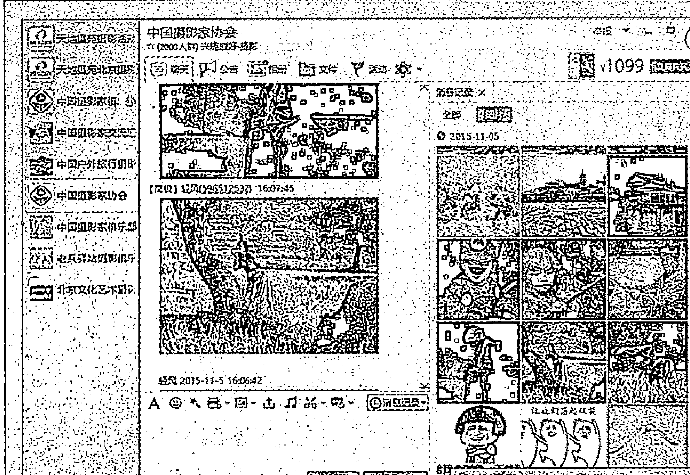

> 小提示
经过如上设置，打开所有群组不管它，自上次访问以来的照片会自动缓存到硬盘中。但如果时间允许，想快速缓冲照片，可在各群组窗口多次点击最上端的“查看更多消息”，直到不再出现“查看更多消息”提示。

### 2. 批量搜集照片 要在确定位置

成批搜集各群组的照片，照片的存放位置是关键。这么多群组的照片都存放在哪里？不同群组的照片是不是在不同的文件夹下？如何以最快的速度来搜集这些照片？文件夹中肯定会有一些无用的点赞符号或其他动画表情图标，如何才能快速撇开或消除这些无用的图片元素？

我们知道，QQ软件清理垃圾功能中，会将聊天历史信息作为系统垃圾来清理。当QQ使用时间一长，系统中的QQ软件垃圾增加，而其中主要的垃圾便是聊天图片。因此，能否利用QQ的系统垃圾清理功能，顺藤摸瓜，找到这些图片的存储位置呢？

进入QQ系统设置窗口，点击左侧导航栏内的“文件管理”项，然后点击“前去清理”按钮，打开“清理个人文件”

> 小提示
本文以介绍照片搜集为例。但其中所涉及到的方法和技巧对于其他爱好者搜集相关群组的图片同样有效。

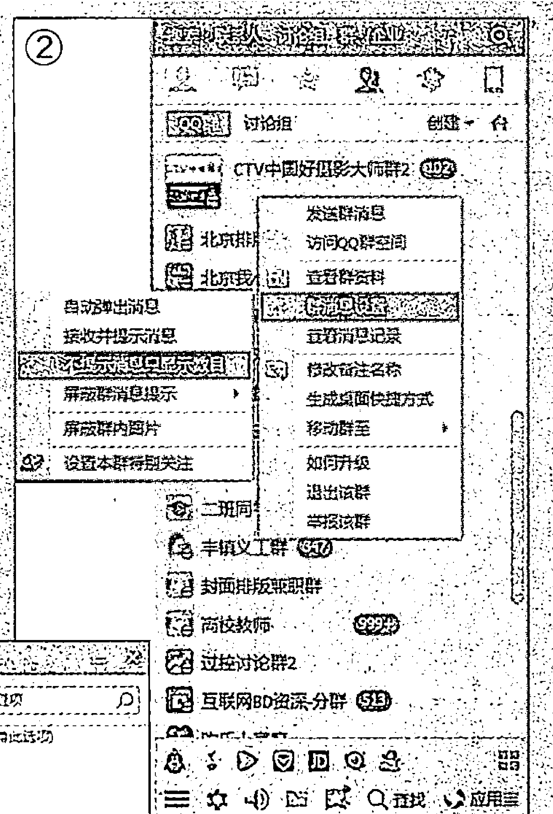

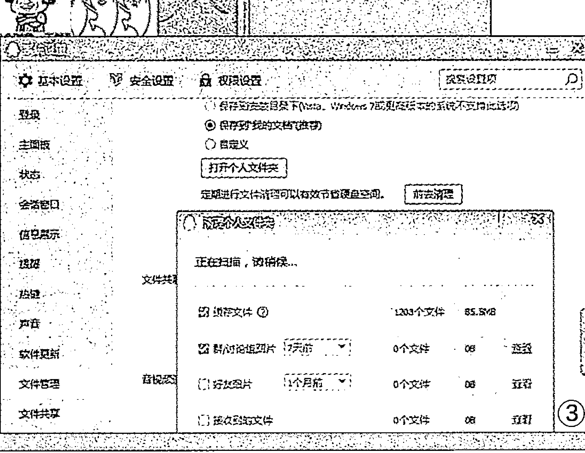## 3. 照片分类处理 去粗取精

此时，剩下的工作就是对该窗口中的图片进行筛选和提取了。需要注意的是，此时，如果没有关闭先前打开的一系列QQ群组，则该目录中的一些图片还处于锁定状态，无法移动。因此，在处理前，要先将已经打开的QQ群组窗口统统关闭。接下来，就可以对该目录中的图片进行处理了。

在聊天图片窗口中，主要有3类图片：一类是聊天动画图片，包括动画搞笑图标、一些人用照片合成的动态照片等；另一类是点赞图标或活跃气氛用的小图标；再一类就是我们需要的数码照片作品了。如果对其中的动画图标感兴趣，需要成批搜集，那么，先点击资源管理器“查看→详细信息”布局，然后按“类型”排列文件，这样就可以看到所有GIF格式的文件都排列到了一起，将这些文件一次性选中并剪切出来收藏即可。若不需要则可以一次删除（图5）。

剩下该处理的就是一些点赞小图片或搞笑小图片了。

> 扩展阅读
> 集中下载相册照片
> 如果群组中建立了专辑相册，也可以进入群组的某个相册，选择该相册右上角的“管理”图标，然后选择“批量下载”，一次性下载一个相册的照片。此外，还有一些用来批量下载各种相册的工具软件，但这类工具需要先用自己的QQ账号登录方能使用，对于是否存在账号安全风险，若软件来路不明则有可能藏有猫腻。从QQ账号安全考虑，此类工具建议还是少用为妙。

对于这些图片，可以采用文件列表按“大小”排序，将小文件排列到一起，几个KB或几十个KB的一般都是这类图片，若觉得不需要收藏，可一次性删除之（图6）。

处理了动画GIF文件和无用的小图片后，剩下的就是各群组网友拍摄的数码照片了，将这些文件来个Ctrl+A操作，一次性选中，然后用Ctrl+X剪切，最后复制到自己的图片仓库即可。当然，也可以建立一个MOVE命令批处理一次性自动转移（图7）。

## 非常规打印的小窍门

文 | 惠香

打印是使用电脑过程中的一项日常操作，多数支持编辑的软件都带有打印功能。然而，这些软件不能解决所有的打印需求，因此，我们需要掌握一些非常规的打印技法。

### 1. 让打印机快速“复活”

公司里的打印机常常会出现“罢工”的情况。有时发出打印指令，打印机却没有任何反应，其他员工发送打印任务也一样没有结果。此时通过编辑器无法解决，更糟糕的是打印管理器中的任务也无法删除。遇到这种情况，拔掉打印机插头并重新加电可快速恢复，但限于打印机的距离和起身操作，显然比较麻烦。

实际上，出现如上情况的原因是Print Spooler打印服务出现问题。只需进入服务列表窗口找到Print Spooler，将其停止后再启动，就可以正常执行打印任务了。

但是，寻找、停止、重启打印服务的过程也显得有些麻烦，而借助于“快速删除打印任务”这样一个小软件可轻松解决。当遇到上述打印障碍时，运行该软件，点击“删除打印任务”按钮，即可让打印机功能复原（图1）。

### 2. 批量打印不用开启软件

打印常见的文档一般先要用创建这些格式的程序将文档打开，然后从编辑器中下达打印命令，才能完成打印任务。但有时我们根本不需要编辑文档，而只是希望将现成的文档打印出来。如果要打印好几类文档，打开好几种编辑器就显得麻烦了。

借助于一款PrintConductor软件，可在不打开文档的情况下进行不同类文档的批量打印。在打印时，只需开启PrintConductor软件，将要打印的各种文档拖入到软件窗口中，通过Select Printer列表选择所用的打印机，点击START按钮，即可将任务送入到打印机（图2）。该软件支持除常用的PDF、DOC、WPS、TXT、XLS、PPT外，还有WRI、RTF、PPS、POT、VSD、DWG、SNP等文档格式。

> 小提示
> 虽然用PrintConductor打印文档不需要打开创建它们的主程序，但仍需要安装这些软件才能完成打印。省去的只是频繁打开应用程序的过程，而不是免去支撑软件。

> 小技巧
> 如果系统中安装有虚拟PDF打印机，并将某些应用程序的默认打印输出设备用该软件映射为PDF虚拟打印机，那么就能够以“打印”的方式实现从一种格式的文件向PDF文件格式的自动转换。

> > 另有一款CutePDF Writer软件也同样能实现PDF文档的“打印”输出，它比PDFCreator更为小巧。编辑完Word文档后，打印时选择打印机为CutePDF Writer，即可获得转换后的PDF文档。

> > 在PDFCreator的设置窗口中，点击“一般→整合至文件管理器右键菜单”下的“新增”按钮；之后在文件资源管理器中，右键单击一个文件并选择“PDF Architect 4→Convert to PDF”，即可方便地将文档转换为PDF文档（图5）。

### 3. 根据任务自动选择打印机

公司里可能安装有彩色喷墨打印机和黑白激光打印机，我们常常会根据打印的任务类型不同选择不同的打印机进行打印。例如，Photoshop制作的文档送到彩色喷墨打印机，Word制作的文档送到黑白激光打印机。

这样，每次打印时都还需要手动选择打印机。为了减少这方面的麻烦，可借助于Automatic Printer Switcher软件（简称APS），根据不同的任务定制自动选择打印机。

第一次运行APS软件，会自动扫描系统中安装的所有可用来发送打印任务的应用程序或进程，默认的每个程序或进程所映射的打印机为系统当前的默认打印机。如果要改变某个应用程序所默认使用的打印机，点击该程序或进程名称，然后单击菜单栏上

### 4. 让所有编辑器都能生成PDF

PDF通用性极强，然而不是所有软件都能生成这种格式，但我们可以借助于PDFCreator软件，让所有编辑软件都能输出PDF格式。

安装PDFCreator后，系统的打印机列表中会出现一个PDF虚拟打印机。之后，在任何一个支持打印的应用程序中发送打印命令，并将打印设备选择为“PDFCreator”，即可将其他文档格式“转换”为PDF文档（图4）。这样，通过打印的方式，变相地实现了文件格式的转换。

### 5. 随意打印个性化文件列表

在盘点一些珍藏的文件时，可能希望将其中的一些列表打印出来。使用一个小软件DirPrintAdv，可以随心所欲地打印文件列表。

在DirPrintAdv窗口上方定位要生成列表文件所在的文件夹（也可用通配符筛选），在下方的参数面板中选择文件列表包含的项目、列表文件保存格式，设定文件排序方式以及是否包含子目录下的文件、是否包含文件夹和隐含文件等项目，然后点击Print就可以将定制好的文件列表打印出来（图6）。

> > 除了直接打印外，DirPrintAdv还支持输出为TXT、HTML、CSV等文件格式。通过“File and Print Options”列表框可选择输出格式。

## # 武装Win+R极速控制电脑

文 | 倚楼

键盘和鼠标是我们每天使用最多的硬件设备，但是不停地在鼠标和键盘之间进行切换，必然会造成工作效率的降低。于是现在出现了一批所谓的键盘党，他们通过键盘就可以执行电脑的操作控制，其中Windows系统自带的快捷键Win+R功能，就成了键盘党的必备工具。不过，通过该快捷键启动程序需要不同的命令，如何才可以有效地创建和管理这些命令，从而更加快速地操作自己的电脑呢？

### ## 独立项目设置启动

以前要想通过Win+R来启动程序，首先需要创建一个新的文件夹，将软件程序的快捷方式复制到其中。接着在“系统属性”的“环境变量”对话框里，将刚刚创建的文件夹添加到变量Path里面才可以。这种方法不但操作起来非常繁琐，而且快捷方式的管理也非常不便，不过现在我们借助于nTrun这款快速启动工具就可以解决。我们下载运行这款工具，可以看到工具默认已经为自己自动创建了两个项目，即“Goto”和“Run”。接下来我们开始创建自己经常使用的软件程序，比如现在创建一个启动百度云管家客户端软件的项目。首先点击工具栏中的“添加”按钮，在弹出的对话框“启动名”中设置用户启动这个软件的命令，这里我们就自定义为“bduyun”即可（图1）。接着点击“目标”选项下面的“文件”按钮，在弹出的对话框中选择百度云管家的主程序文件。通常情况下只需要设置“启动名”和“目标”项目即可。如果用户设置的启动项目比较多的话，建议在“备注”里面进行一个简单的说明。这样不仅可以帮助用户识别项目，同样也可以通过它来快速启动软件。设置完成后点击“确定”按钮，就可以在工具列表中看到添加的启动项目（图2）。接下来就可以通过按下键盘上的Win+R快捷键，然后输入“bduyun”（不区分大小写）并按回车键来快速打开百度云管家的客户端程序了（图3）。而输入“run”后回车，则可以启动已自动设置好的nTrun。

### ## 极速启动文件目录

我们有的时候还需要快速跳转到某个特定的目录，利用系统方法实现还是有点繁琐，其实利用nTrun工具也可以快速设置。这里我们以设置快速打开下载文件夹为例。首先按照前面的方法打开“添加”对话框，接着在“启动名”后面自定义为“xz”（名称可随意），然后点击“目标”项目下的“目录”按钮，选择存放下载文件的文件夹目录即可（图4）。以后需要跳转到下载目录时，只需要在运行框里面输入“xz”即可。

> 还有一种更加快捷的添加方式，就是直接把快捷方式、程序文件、文件夹拖入到nTrun窗口。这样工具就会自动输入重要信息，用户仅仅需要输入最简单的启动名称就可以添加完毕。

> **小提示**
> 为了避免软件或文件夹启动不成功的情况，建议用户不要随意更改程序文件和文件夹的路径，尤其是不要把文件放到系统桌面等临时目录中。

## 批量启动快捷方便

很多时候我们需要一次性运行多款软件，比如笔者码字就需要运行编辑软件、截图软件、浏览器等。无论是通过传统的桌面快捷方式还是Win+R来一个一个启动软件都非常繁琐，好在现在通过nTrun工具就可以批量启动多款软件了。
首先还是在“启动名”后面自定义启动名称，我这里就设定为“码字”。接着点击“参数”项目下的“批量项目”按钮，这时会弹出一个新的对话框。在“启动名/路径”输入框里面有二种设置启动软件的方法，传统的方法就是点击“文件”按钮，在弹出的对话框中选择要启动的程序文件即可。接着点击“加入并添加下一个”按钮，然后再点击“文件”按钮来选择其他要启动的软件（图5）。
还有一种方法和nTrun工具直接有关，就是在输入框设置已经添加的启动名称，比如我们前面设置的“bduyun”等。设置完成后分别点击“完成”和“确认”按钮，以后需要批量运行这些软件的时候，只需要在运行框里面输入“码字”后按回车键就可以了。

## 分组管理 项目再多也不怕

当我们设定的快捷项目越来越多的时候，如何管理它们就成了一个问题，而nTrun为用户提供了多种管理方式。俗话说得好，物以类聚人以群分，将不同的快捷项目进行分组，就是最常见的管理方式之一。
首先在nTrun界面左侧的“全部项目”上点击鼠标右键，在弹出的菜单里面选择其中的“新建分组”按钮。这时会弹出一个对话框，在其中输入新的分组名称即可（图6）。然后再次点击“全部项目”按钮，从列表中选择要重新分组的快捷项目。在该项目上点击鼠标右键，选择菜单中的“移动分组”命令，再选择一个分组名称就可以了。
有时候由于长时间没有运行某款软件，可能就会一时间想不起软件的启动名称。这个时候在列表里面一个个找肯定非常麻烦，而利用搜索功能就可以快速解决这个问题。首先点击nTrun界面右上角的放大镜图标，这时就会在窗口里面出现一个搜索框，在搜索框中输入和该软件程序相关的任意信息。比如我们要搜索百度云管家的客户端，只需要输入客户端程序的名称BaiduYunGuanjia，或者路径Program Files\Baidu\BaiduYunGuanjia的部分内容即可，不用输入全部，比如输入baidu、yun、Guan等，很快就可以在搜索框下面看到搜索结果了（图7）。

## 快捷项目的更新

每天我们都会进行大量的电脑操作，其中就包括软件的卸载和安装、文件夹的删除或重命名等等。这样就会造成两种不同的效果，首先是软件卸载或文件夹删除，就会造成快捷项目的失效。另外一种情况就是，重新安装软件后又添加了新的快捷项目，从而造成快捷项目的重复。现在只需点右上角的倒三角按钮，在弹出的菜单里面点击“清除无效重复”命令，马上就会列出所有无效和重复的快捷项目（图8）。接下来自然就是选择无效和重复的快捷项目后，点击工具栏中的“删除”按钮即可。

## 因人而异调整播放设置

文 | 阿立

每款软件在安装完成后都有一个默认配置，视频播放软件当然也是如此。但是视频播放往往和用户电脑的硬件配置密切相关，比如拥有独立显卡的用户使用默认配置，就无法充分发挥独立显卡的优势等等。因此不同的用户需要根据各自的情况，对软件进行因人而异的设置，才能更好地发挥电脑硬件的潜能。

### 启用浏览器自身功能

目前网上播放器软件非常丰富，但能够允许用户充分设置的并不多，所以今天我们就用常见的PotPlayer播放器进行操作。不过需要提醒大家的是，PotPlayer播放器拥有64位版本，但是由于这个版本的问题还有很多，因此建议使用64位操作系统的用户，还是使用32位的软件版本。另外，在安装PotPlayer的时候会自动安装一个OpenCodec解码器，如果用户使用的是精简版，那么还需要自行进行下载和安装（http://tinyurl.com/cf052401，已作缩短网址处理）。

现在我们来看看自带解码器如何进行设置。首先在PotPlayer播放器的窗口中点击鼠标右键，选择菜单里面的“选项”命令。接着在弹出的选项窗口中点击左侧“滤镜”中的“内置OpenCodec”项，然后在右侧窗口里面可以看到Nvidia、AMD、Inter等解码器的设置，用户可以根据自己的电脑硬件来进行开启使用（图1）。如果是使用Intel处理器的用户，就可以在“Intel QuickSync解码器”列表中选择“验证可用后再用”选项，而“Intel QuickSync编码器”则选择为“不使用”。不过这项功能必须使用较新的驱动程序，不然的话在使用过程中可能会出现问题。

接下来点击左侧“滤镜”中的“视频滤镜”选项，再点击右侧窗口中的“内置解码器/DXVA设置”按钮（图2）。如果用户使用的是独立显卡的话，那么可以在弹出窗口的“硬件加速（DXVA）设置”选项中，在“分辨率限制”列表中选择“始终无条件使用”。在左侧的“视频”区域里面可以看到很多的文件格式，从中就可以选择相应的解码器来操作。如果用户使用的是集成显卡的话，也可以试着这么操作看看，如果设置后对系统影响较大，可以将“硬件加速（DXVA）设置”选项关闭（图3）。设置完成后点击“确定”按钮，就可以更好地使用PotPlayer播放器了。

### 第三方解码器的设置

当然有的用户并不喜欢使用PotPlayer内置的解码器，而是喜欢使用第三方的解码器来进行解码操作。常见的第三方解码器包括PowerDVD、LAV Filters、Xvid等，这里就以PowerDVD的解码器为例来说明。

从网上下载由网友提取的PowerDVD解码器，将解码器压缩包解压到一个固定的目录里面，这里假设是放在PotPlayer播放器的安装目录中。同样首先进入到PotPlayer播放器的设置窗口，接着点击左侧列表中的“滤镜”选项。在右侧窗口将“激活条件”改为“不使用”项，这么做就是为了屏蔽播放器自带的解码器选项。再选择左侧列表中的“视频”选项，在右侧窗口的“视频渲染方式”列表中进行设置。如果用户使用的是Windows XP，就选择列表中的“VMR 9无渲染”项。如果使用的是Windows 7及其以后的系统，就使用“EVR(CP) 自荐渲染”项即可（图4）。现在选择左侧列表“滤镜”中的“视频滤镜”选项，点击右侧窗口中的“滤镜/解码器管理”按钮，在弹出的窗口中点击“添加外部滤镜”按钮。在弹出的浏览窗口中选择PowerDVD解码器文件夹中的“CLCvd.ax”文件，添加完毕，在“解码器列表”就会看到两个项目。选中其中的“CyberLink HAM Decoder”项，点击“移除”按钮将其删除掉（图5）。添加完成后点击“确定”按钮，返回到“视频解码器”的设置窗口。然后分别点击每一个视频格式名称后的列表，在解码器列表中选择“CyberLink Video Decoder”这项就可以了。最后点击“CyberLink Video Decoder”后面的“...”按钮，如果用户使用的是集成显卡，那么在弹出的设置窗口中选择“SW”项，就表示通过软件进行解码操作。如果使用的是独立显卡的话，则选择“DXVA”，就表示用硬件解码了（图6）。

> 小提示
> +   ★当用户选择“DXVA”后再打开这个选项时，如果发现选择的是“SW”项的话，不用担心，其实已经确认了“DXVA”这个设置了。
> +   ★使用第三方解码器也可以进行音频解码和分离器的自定义设置，配置操作和视频解码的操作类似。

### 超级傻瓜的一键配置

其实无论是在播放器里面设置，还是借用第三方的解码器使用，都需要一系列的自定义操作。但是这些操作对于一些普通用户来说会比较繁琐，所以对于他们来说可以借助于“完美解码”这类播放器，利用其中的功能快速完成配置操作。由于完美解码包括了Media Player Classic、KMPlayer、PotPlayer三款播放器，以及PowerDVD、LAV Filters、Xvid等主流的解码器，这样普通用户配置组合起来更加方便和随意。

首先下载安装最新版本的“完美解码”（http://jm.wmzhe.com），接着可以在系统桌面看到一个“完美解码设置”图标，运行它就可以打开软件的配置工具。“完美解码”默认已经提供了多种方案，用户只需要在“解码模式”列表中进行选择即可，其中名称里面包括DXVA字符的就代表硬件解码的方案（图7）。当然用户也可以在“主播放器”、“分离器”、“解码器”中根据需要选择相应的选项，这样就可以为不同的视频格式设置不同的解码器了，然后点击“应用”按钮就可以快速完成软件的配置。

# 交互式报表轻松做

文/马震安

开发让员工在各自的电脑终端查询公司服务器上的数据报表的交互查询系统，最枯燥重复和占用时间的工作是通过JSP/ASP/PHP代码写出基于数据库的展示、查询和录入的网页，这样不仅开发效率不高，而且维护工作量也很大。此次，就借助FineReport V8.0，完成利用下拉列表框选择地区，根据所选地区展示该地区各店的水果销售情况的数据报表及图表（图1）。

## 1. 数据先行

任何报表、图表都离不开数据，这里利用了Excel表中的已有数据。首先，将存有数据的Excel表格复制到FineReport V8.0安装目录下的\WebReport\WEB-INF\reportlets文件夹中。运行FineReport V8.0，选择“服务器→服务器数据集”菜单，在弹出的窗口中点击绿色“+”按钮，选择“文件数据集”，双击数据集，名称设置为“店面销售统计”，文件类型选择Excel，文件地址选择reportlets文件夹中所需要的那个Excel文件，勾选“第一行包含列标题”，点击“预览”按钮，若没有问题，确定即可（图2）。

## 2. 报表设计

数据连接设置好后，就该进行报表的设计了。在报表编辑区，选择A2:B2单元格进行合并，右击该单元格，选择“单元格元素→插入斜线”菜单，在弹出的斜线编辑对话框的文本编辑框中写入在斜线当中要加入的内容：水果|店面|地区，通过添加空格来调整文字的位置；在C1:H1列输入各水果名称并设置好样式；在左侧的数据集管理面板选择“服务器数据集”，将添加的“店面销售统计”展开，将相应的字段名称拖动到A2:H2单元格中；在B3单元格中输入“平均”；选中C3单元格，点击右侧插入内容处的“+”按钮，选择“插入公式”，在弹出的公式定义对话框函数名处选择“AVERAGE”，在公式编辑处输入C2，确定后，就会在C2处显示出“=AVERAGE(C2)”，右击拖动填充到H2；选中A1:H2，利用工具栏为这些单元格加上边框（图3）。

## 3. 图表添加

报表设计完成后，点击“插入→悬浮元素→插入图表”菜单，在弹出窗口的图表类型中选择“柱形图”，在右侧的图表属性窗口点击“类型”选项卡，选好需要的类型布局；点击“数据”选项卡，数据来源处选择“单元格数据”，分类轴处输入“=B2”，点击系列名处的“+”，系列名处输入“=C1:H1”，值处输入“=C2:H2”；点击“样式”选项卡，在其下的“标题”子选项卡中输入标题并设置好格式，在“标签”子选项卡中勾选“标签”及其下的“值”；点击“特效”选项卡，在其“交互属性”子选项卡中勾选动态展示、系列拖拽、图表缩放等（图4）。

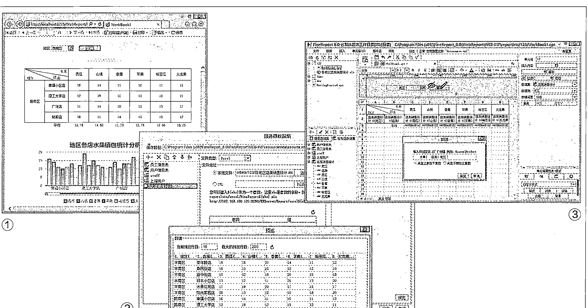

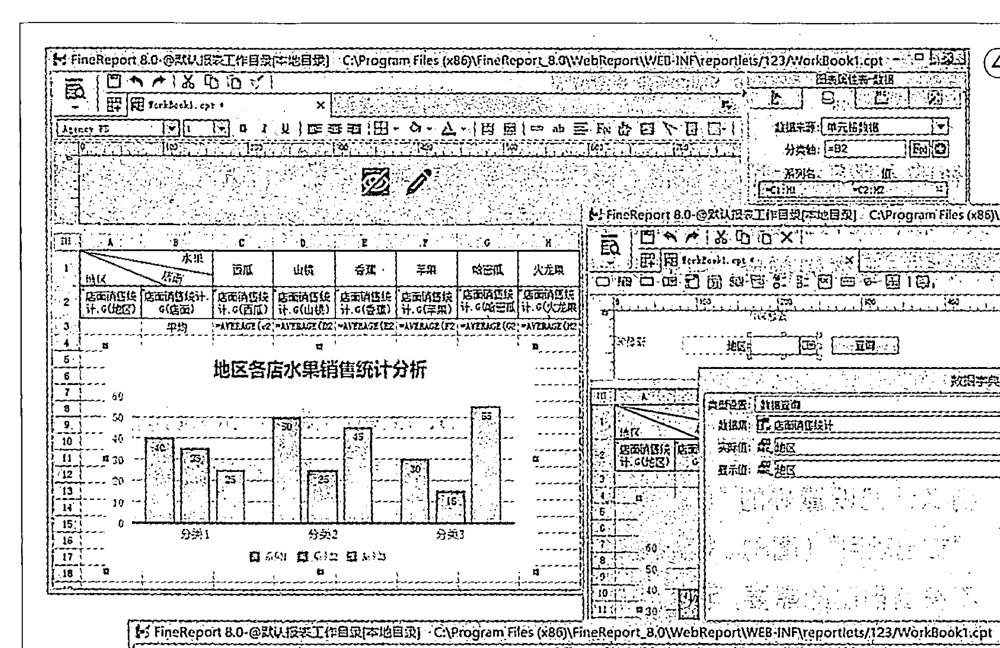

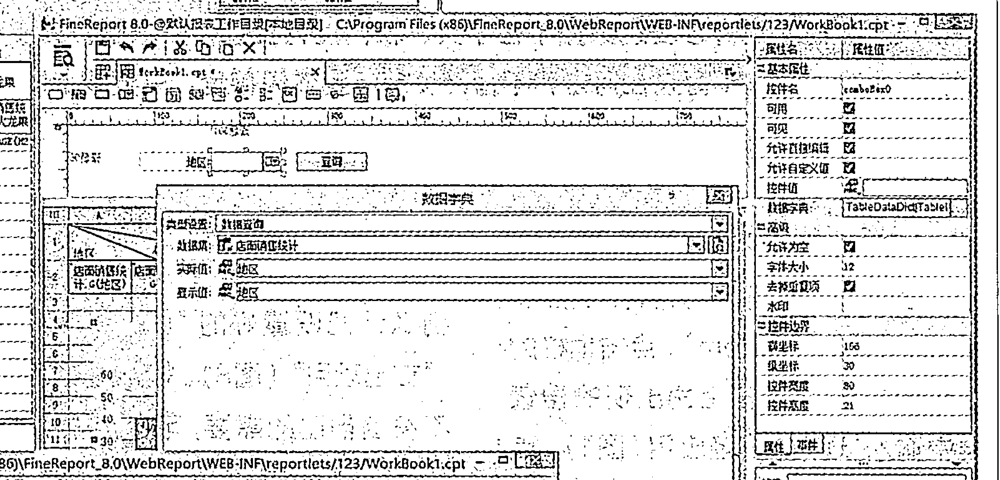

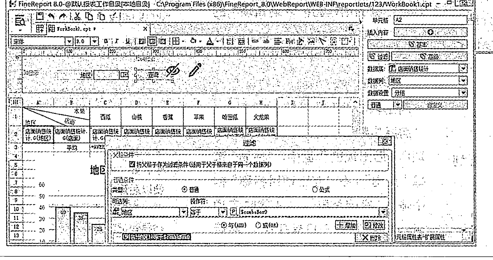

> **小提示**
> tomcat的默认端口为8080，如果该端口被占用，tomcat将无法启动。这时就需要重新配置端口，只需修改%tomcat_home%/conf/sever.xml即可。

## 4. 添加交互控件

报表、图表设计完成后，要想使报表具有交互性，还要添加交互控件。在参数面板区点击笔状按钮，将控件面板中的标签控件、下拉框控件及预定义控件中的查询控件拖放到其中。选中标签控件，在右侧的属性面板中，设置标签的控件值为“地区”，并设置好字体、字号等；选中下拉框控件，在属性面板点击数据字典处的按钮，在弹出的对话框类型设置处选择“数据查询”，数据集处选择“店面销售统计”，实际值处选择“地区”，显示值处选择“地区”，这样就实现了将地区字段值加入到下拉列表框中（图5）。

点击笔状按钮，退出参数面板。在报表编辑区选中A2单元格，在右侧面板点击“过滤”选项卡，在弹出窗口的可选列处选择“地区”，操作符处选择“等于”，点击其右侧按钮选择“参数”后输入“$comboBox0”（comboBox0为下拉列表框控件名），点击“增加”按钮后确定，这样就实现了当列表框中选定地区后点击“查询”按钮显示查询内容（图6）。

最后，将文件保存到安装目录下的\WebReport\WEB-INF\reportlets文件夹中，命名为WorkBook1.cpt，预览一下，没问题即可。

## 5. 文件发布与访问

报表WorkBook1.cpt要达到能被访问的程度，需要将本机配置为服务器进行发布。安装Tomcat服务器程序，将FineReport_8.0安装目录下的WebReport文件拷贝到%Tomcat_HOME%\webapps\下，启动tomcat即可发布成功。之后，建立网址“http://ip:端口/WebReport/ReportServer?reportlet=123%2FWorkBook4.cpt&op=view”的快捷方式，将此快捷方式发到每个员工的桌面上，就能一键点击访问查询了。

# 走进邮箱来 理财更容易

文|连云

说起个人理财，有的人用专用理财软件，有的人用Excel创建表格。其实这些都不是最方便的，尤其是当你换个地方想记账查账时，也许才发现数据不在手头、软件没有安装，很尴尬。其实还有一个方便的个人理财方法——用126邮箱轻应用来理财。不管人在何方，不管带没带电脑或闪存盘，只要能上网，它就能做到开销明白、账目清楚。

## 1. 请来“理财易” 安全要先行

登录126邮箱（一分钟免费注册http://www.126.com），点击顶栏的“应用中心”，在左上角出现的搜索框中输入“理财易”轻应用（图1）。点击此应用图标，在弹出的应用介绍界面点击“添加到我的应用”按钮，将“理财易”添加到邮箱应用列表中即可使用。

> > **小提示**
> >
> > 对于理财功能，由于涉及到资金安全，如果单靠邮箱的密码保护显得薄弱，这时可在理财易首页中设置加锁，让自己的账目信息得到更好的保护（图2）。

## 2. 账目要明白 项目先规划

要想有一本明白账，首先要规划好收支项目。在“理财易”界面中，点击“收支项目管理”选项卡，可看到默认已设置好的“收入项目”与“支出项目”（图3）。如果这些项目不符合自己的需要，可以点击每个项目右侧的铅笔图标来编辑项目的名称，或者点击右侧的叉号删除该项目。

要新增收支项目，点击蓝色的“新增收支项目”链接。如要增设“房屋贷款”项，在点击“新增收支项目”后出现的界面中，“性质”选择“支出”，在“支出项目名称”框中输入“房屋贷款”，“从属收支项目”选择“从属于日常开支”，然后点击“新增收支项目”按钮即可（图4）。增加收入项目的操作方法类同，在此不再赘述。

## 3. 任意建账本 立项有技巧

按需建好收支项目后，就可及时登记发生的收入与支出，建立自己的账本了。点击“新增记录”选项卡，选择“收支日期”，填写“说明”文字，选择“收支项目”，填写“金额”后点击“提交”按钮，这样就登记了一笔账目（图5）。

> > **小提示**
> >
> > “说明”填写有技巧。如果使用信用卡，建议在“说明”中标注使用哪个卡，如“中银”、“中信”等，这样方便以后形成不同信用卡的账目，方便知道额度使用情况与还款额等。如果此次需要登记的账目在以前的“收支项目”中没有建立适当的项目，可以点击“收支项目”右侧的“添加新收支项目”文字链接来添加。

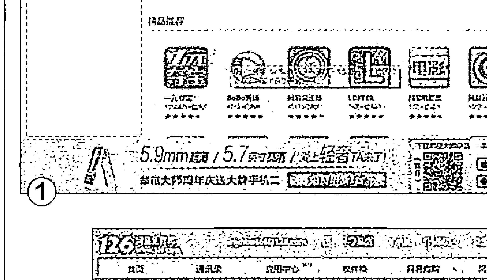

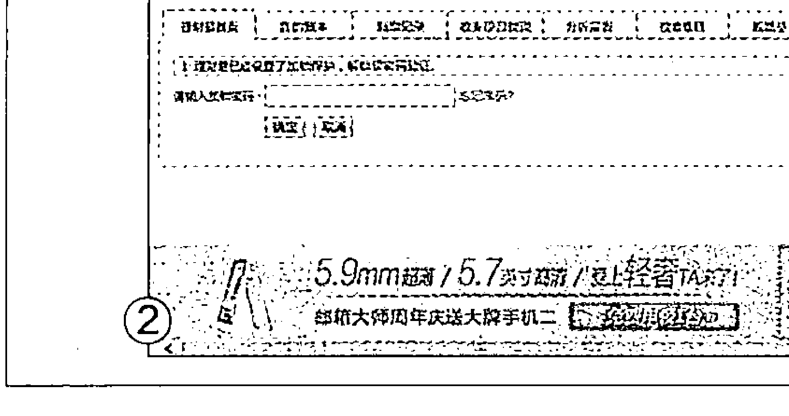

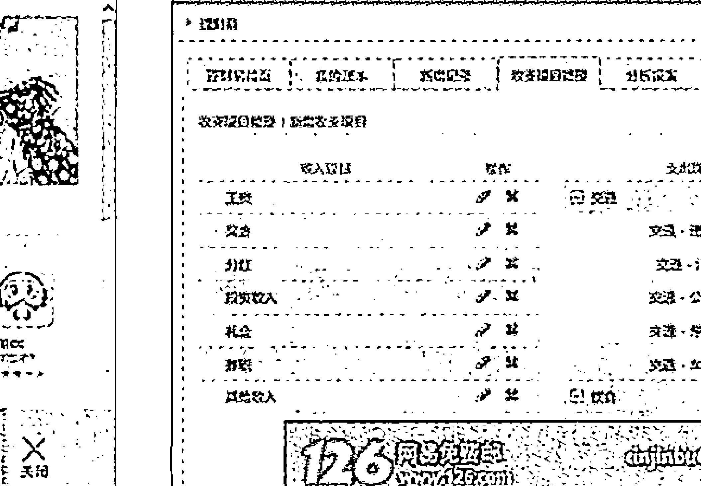

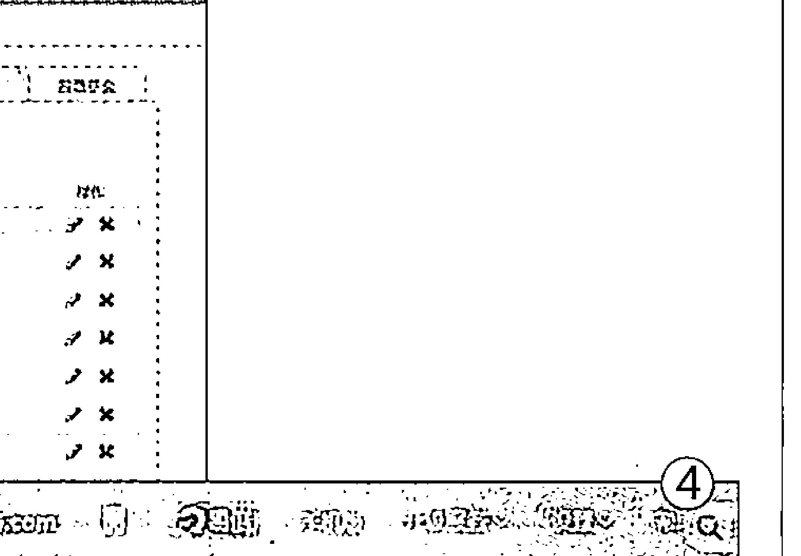

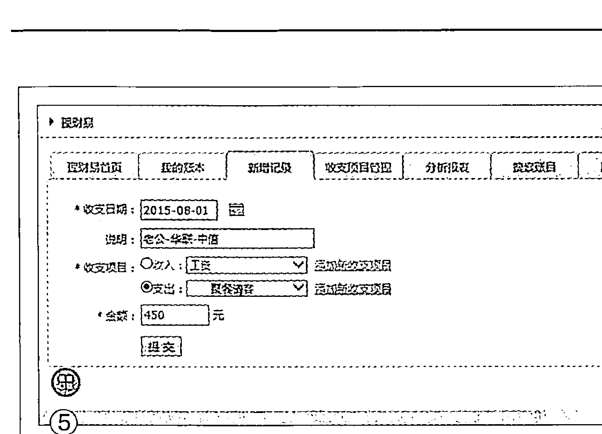

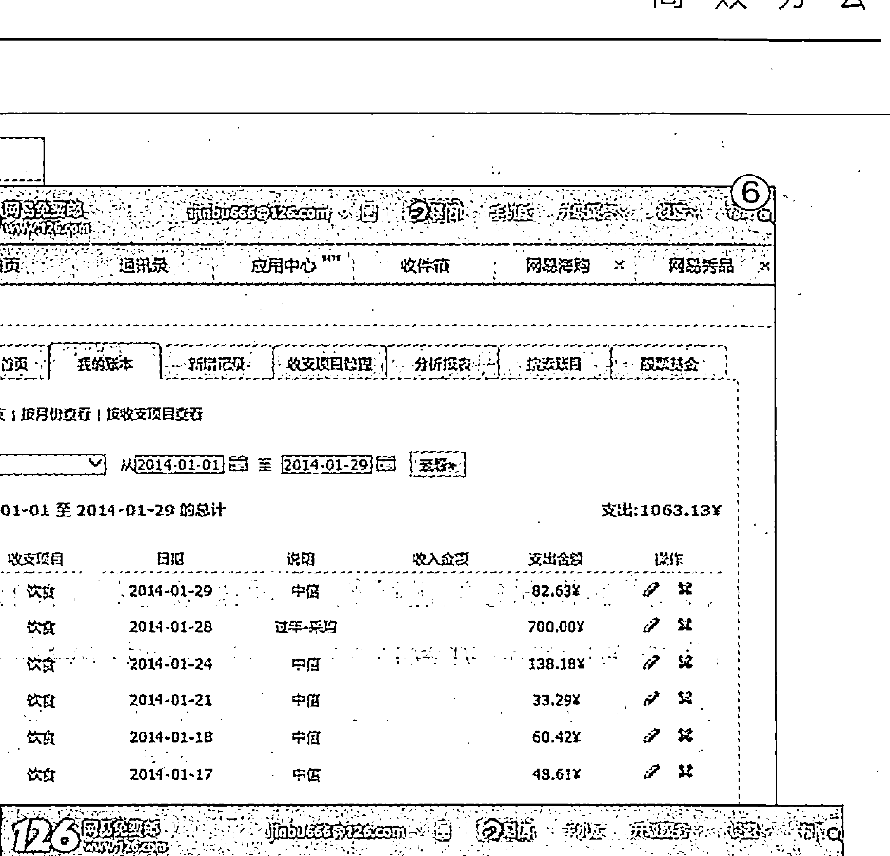

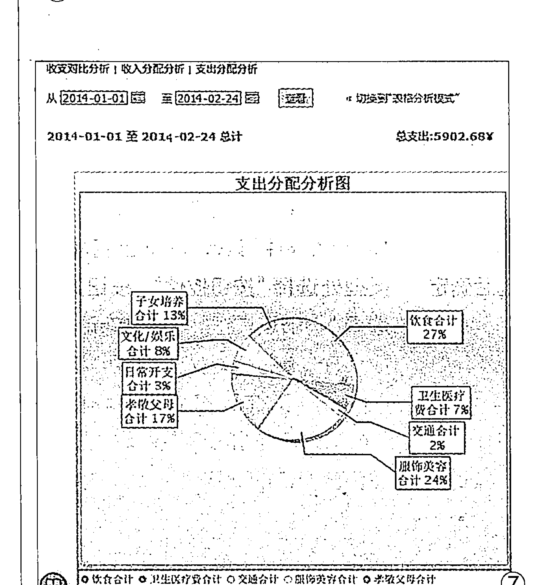

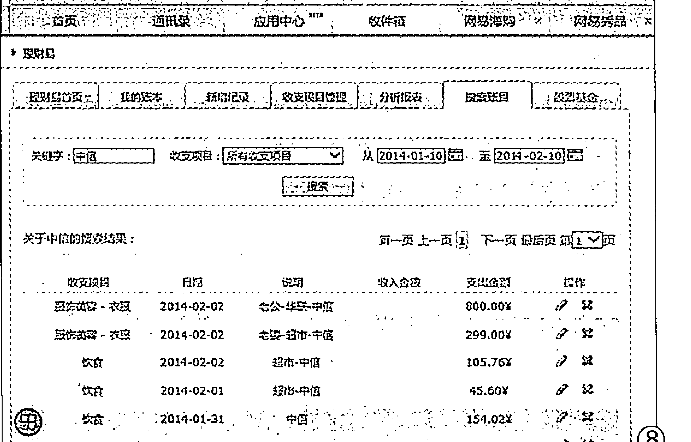

## 4. 灵活来查询 账目看得清

经过以上步骤，登记了收入支出项目，就形成了“我的账本”。日积月累，这个账本数据多了，就需要有灵活的查询方法。

### (1)收支情况一目了然

点击“我的账本”选项卡，可选择按“本月收支”、“按月份查看”、“按收支项目查看”查看账本，默认给出的是“本月收支”。如果要查看其他月份的收支情况，选择“按月份查看”，所选月份的收支情况，收入、支出明细一目了然，同时，在上面与下面还有收入、支出、结余合计。与此同时，对登记的账目还可以进行编辑与删除操作。要查看某一收入或支出项目，需选择“按收支项目查看”，然后选择收支项目（如“饮食”），选择时间期间（如“2014-1-1”至“2014-1-31”），然后点击“查看”，就会查出“饮食”支出项目的明细与合计数目（图6）。

### (2)及时了解财务状况

点击“分析报表”选项卡，可按“收支对比分析”、“收入分配分析”、“支出分配分析”三项进行分析。选择“收支对比分析”，选择时间期间，点击右侧“查看”按钮，可以看到各级收支项目合计及总收入、总支出与结余数。选择“查看明细列表”则出现每笔收支项目的明细列表。选择“切换到‘图形分析模式’”则以直方图形式表示收支对比分析情况。这些可以让自己及时了解财务情况，及时调整花钱计划。查看“收入分配分析”可以了解各项收入的情况。查看“支出分配分析”，可以了解各项支出情况。如果选择“切换到‘图形分析模式’”，则会以饼状图显示出各项支出在总支出中所占的比例（图7）。

### (3)了解不同账目情况

通过“搜索账目”，可以知道到底什么地方花了那么多钱，还可以让自己了解信用卡的使用情况，方便用钱与还款。例如：在“关键字”右边的文本框中输入“中信”，“收支项目”选择“所有收支项目”，选择账单时间期限，然后点击“搜索”，关于中信信用卡在以上定义的时间段内的用卡情况就一目了然（图8）。不足之处是没有汇总，不过可以把它拷贝到Excel表格中进行本地集中管理。

# 动态折叠树 数据巧展示

文|马震安

由于数据很多，报表就显得非常臃肿、繁乱，如果将这些数据以目录树的形式按类折叠在一起，想看哪些数据就点击哪个门类，将其展开，下面的数据一目了然，这样展示数据岂不更妙？

实例: 将公司水果销售情况按照地区、店面、水果的情况分类进行统计展示，相同类别的数据折叠在一起，客户端想看哪里就点击“+”号展开显示（图1）。

## 1. 原始数据准备

上期我们已经为大家介绍用FineReport V8.0软件实现交互式报表的方法，本次我们用该软件实现另一个截然不同的方案——折叠数据展示。同样，需先将存有数据的Excel表格复制到WebReport\WEB-INF\reportlets文件夹中。启动FineReport后在左侧的数据集管理面板选择“模板数据集”并点击“+”按钮，选择“文件数据集”，在弹出窗口的名字处输入“各地区分店各类水果销售统计”，文件类型选择“Excel”，文件地址选择reportlets文件夹中所需要的那个Excel文件，在设置处勾选“第一行包含列标题”，点击“预览”查看效果，没有问题后确定（图2）。

## 2. 设计用户界面

在报表编辑区，选择B1:L1单元格进行合并，输入标题并设置好样式；在B2:L2单元格输入相应的报表标题内容；在左侧的数据集管理面板，选择“模板数据集”，将添加的“各地区分店各类水果销售统计”展开，将字段名称拖动到相应的单元格中。为了看得更清楚，可把行高变大些（图3）。

分别右击B3、C4、D5单元格，选择“控件属性”菜单，在弹出的窗口中，类型处选择“按钮控件”，按钮类型处选择“树节点按钮”，这样单元格就变成了树节点的开关按钮了（图4）。

右击C4单元格选择“编辑”菜单（或选中后点击右侧“基本”按钮），在弹出窗口的父格设置处，左父格处选择自定义后，左父格设置为“B3”（即店面的上一级地区所在的单元格），数据设置为“分组”，扩展方向为“纵向”。同理，将D5单元格的左父格设置为“C4”（图5）。

右击E5单元格选择“编辑”菜单，在弹出的窗口中选择“过滤”选项卡，普通条件可选列处选择“店面”，操作符处选择“等于”，在其右侧点击选择“单元格”，内容是“C4”，点击“增加”按钮。再在可选列处选择“水果”，操作符处选择“等于”，在其右侧点击选择“单元格”，内容是“D5”，点击“增加”按钮，两个条件的关系是“与(AND)”（图6）。

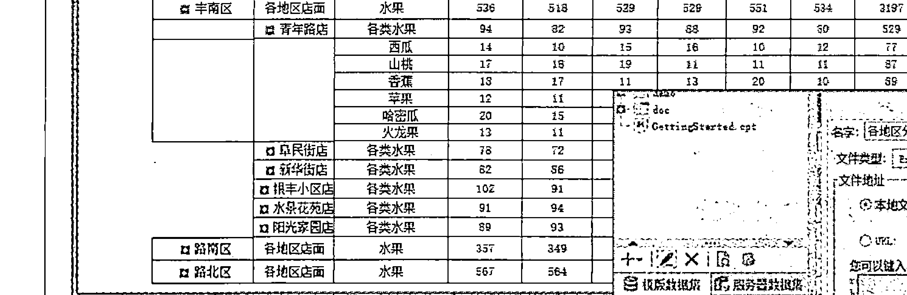

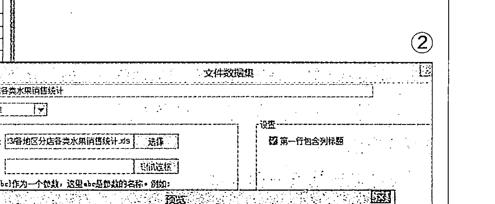

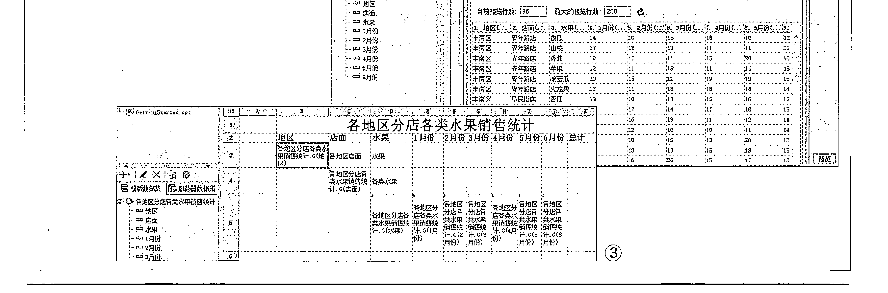

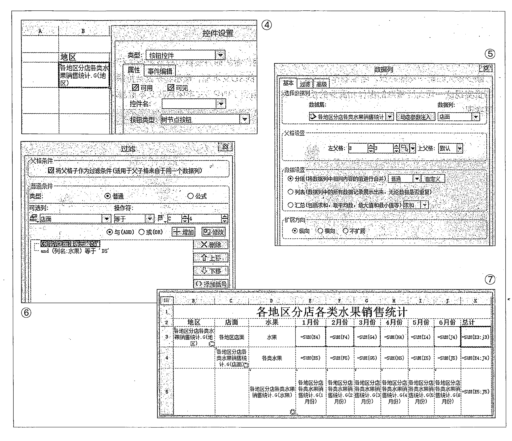

## 3. 添加简单公式

为了进行数据统计，还需要在报表中添加公式。为了统计各分店各类水果的各月份销售情况，需要选择E4单元格，在右侧面板的插入内容处单击“+”，选择插入公式，插入的公式为“=SUM(E5)”，然后向右拖动填充到J4；同理在E3单元格插入公式“=SUM(E4)”向右拖动填充到J3统计各地区各类水果的各月份销售情况；如果选择K3单元格，插入公式“=SUM(E3:J3)”，向下拖动填充到K5单元格，就统计出了各分店所有月份及每种水果所有月份的销售总计（图7）。

最后，选择B2:K5单元格，利用工具栏上的按钮对其美化，加上框线。将文件保存到安装目录下的\WebReport\WEB-INF\reportlets文件夹中，命名为WorkBook4.cpt，以数据分析的方式预览一下，没问题即可。报表WorkBook1.cpt要达到能被访问的程度，先要配置Tomcat服务器，对表格进行发布，然后用户就能用固定地址进行访问。

> **知识链接**
> 服务器具体配置方法以及客户端访问方法请参见2015年《电脑爱好者》第17期文章《交互式报表轻松做》。

# 文本框酷变3D效果

文|南粤

排版中常见的文本框一般默认为单线矩形框，有时也会根据作者的偏好设置边框宽度或进行线条虚实或有无的各项设定，缺少令人眼前一亮的感觉。若能制作出活泼、动感十足的3D文本框，展示起来就会抢眼许多。说到这里，也许你会感觉实现这一切需要复杂的操作和高深的技巧，其实只用到了WPS文字中修改文本框基本形状，应用特殊效果，即可实现。

要制作这样一幅横向卷轴字画。立体感的卷轴画由渐变色铺底，上书篆体大字。

1.  先插普通文本框。通过“插入→文本框”菜单插入一个普通的文本框，调整好文本框的大小。
2.  更改为卷轴形状。选中文本框，点击“绘图工具”菜单，选择“更改形状”按钮，从“星与旗帜”中选择“横卷形”图形。文本框变成了卷轴形。
3.  填充为渐变效果。选中上述卷轴形文本框并调整长宽。点击“绘图工具→填充→渐变”菜单。
4.  设置双色渐变效果。选中“双色”并设置两种颜色，选择透明度和底纹样式。
5.  这是生成的渐变卷轴。点击并输入文字，设置为篆体字并设置文字大小和对齐，即可生成作品。

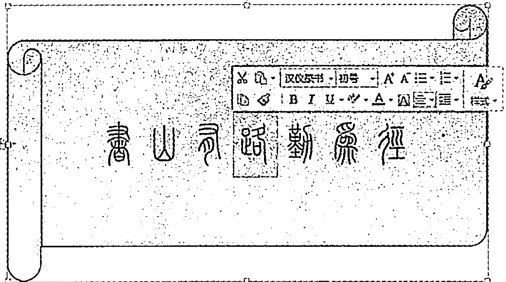

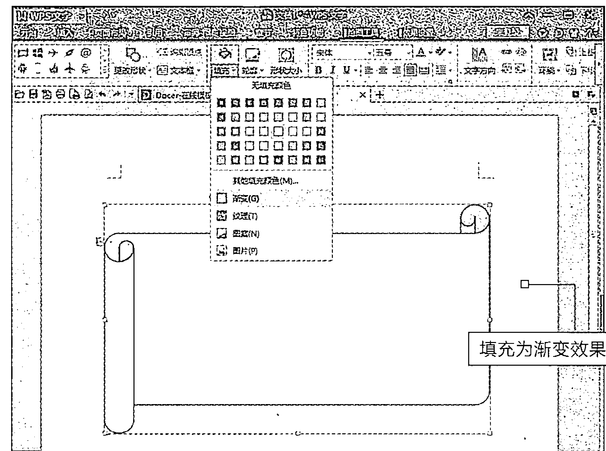

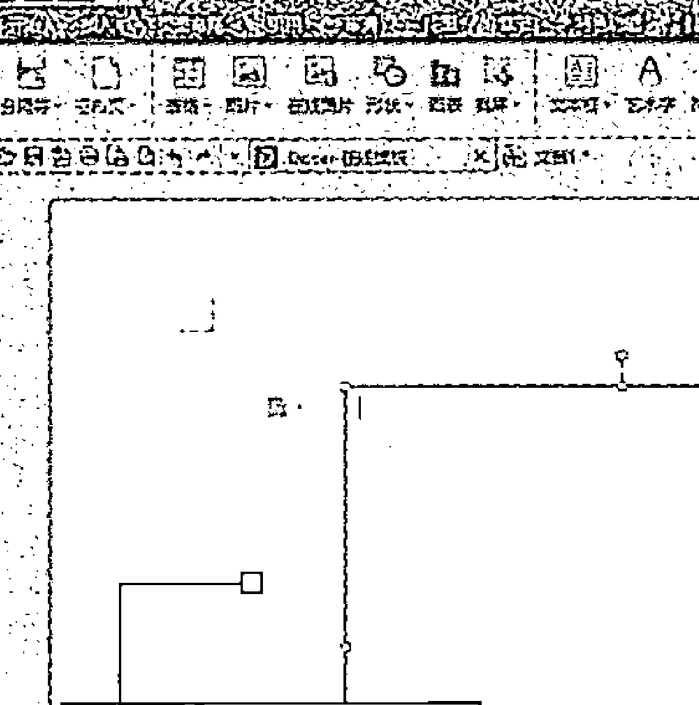

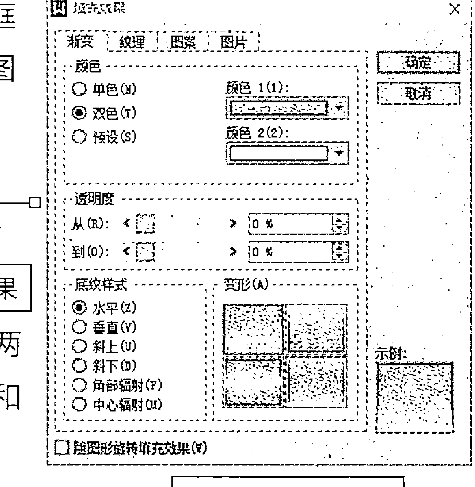

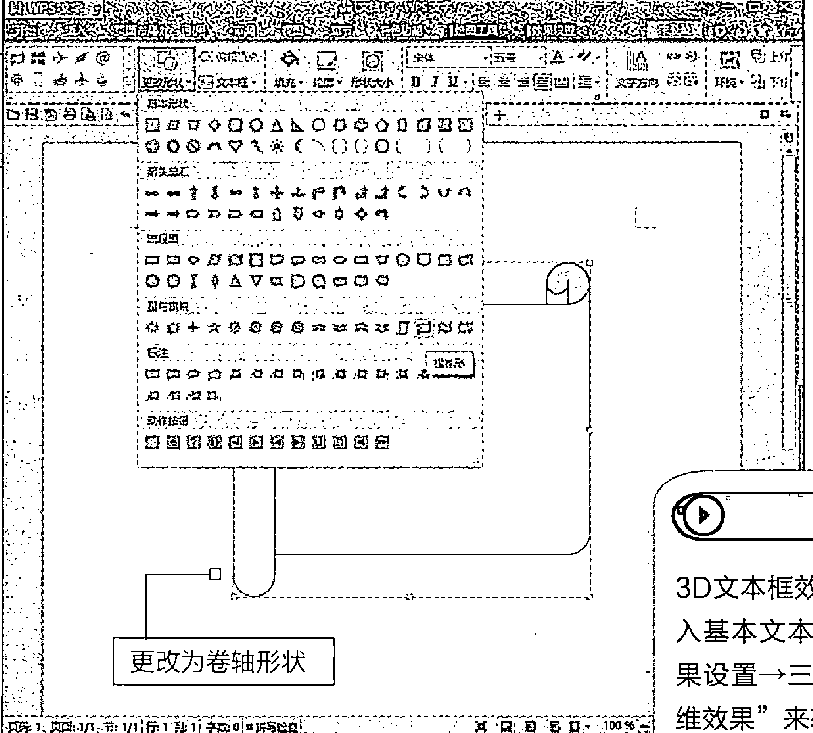

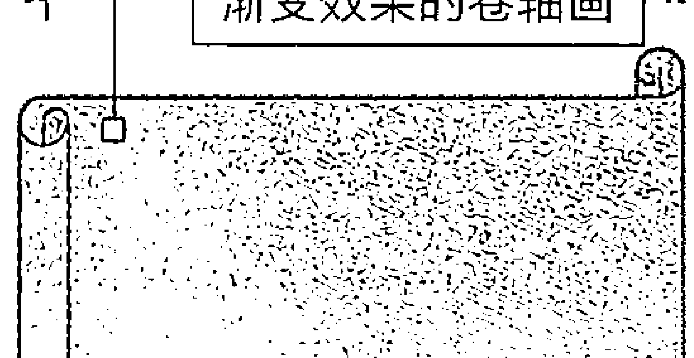

> **小技巧**
> 3D文本框效果，还可以在插入基本文本框后，通过“效果设置→三维效果→设置三维效果”来获得。

# 徒手绘制中国特色表格

文|张菲

常见表格多是n行m列的规整表格，但在办公生活中也可见许多没有“规矩”的表格，如缺边缺角，或同一表格内出现多条斜线等。这些表格看似简单，修改起来可谓问题不断，若利用徒手绘制功能即可解决传统绘制中操作复杂、容易错乱等问题。

## 1. 缺角表格的绘制

要绘制一张如图1所示的课程表。由于星期和节数的说明不标大家也能明白，因此将左上角做成空白缺口样式（图1）。

> > **小提示**
> >
> > 按照Word 2013或WPS文字的传统做法，设置边框的宽度，再将左上角属性设置为“无”将是一个很繁琐的过程。它需要通过表格属性中的边框和表线样式先设置基本表格框架，然后分别设置特殊边框的有无并补齐线框。这要经历好多道工序（图2）。

用新版WPS文字徒手绘制就方便许多。先绘制一个8行6列的普通表格，然后给边线指定一个更大的宽度；接下来在选中表格后出现的“表格工具”菜单中选择橡皮擦工具，分别点击一下左上角单元格的上框和左框，即可生成缺角。接着用同样的办法点击擦除第6行中间的各条竖线。

> > **小提示**
> >
> > 左上角单元格的左、上两个边框被擦除后，该单元格下边和右边还是细线，该怎么办？此时，只需点击工具栏上的“绘制表格”按钮，从粗黑边框断头处开始描绘两条细线，画笔会自动感知和沿用前面所设的外框宽度，将缺角处两条细线加粗。这样，一个缺角的课程表就“完美无缺”了。

## 2. 绘制多斜线表格

说起斜线表头，以往我们多见一条或两条斜线的表头，但多于两条斜线的中国特色表头也屡见不鲜。像图3所示的这张表头就需要3条斜线才能说明各个行列的数据属性（图3）。要快速绘制这样的表格，也有窍门。

用最新版的WPS先拖动插入一个6行7列的规整表格，切换到“表格工具”菜单，点击“绘制表格”按钮，从第一行第二列中间开始绘制一条上下分割该行的表线，填好表头文字。接下来在左上角单元格中用“绘制表格”工具直接画出三条斜线，然后填入表头文字即可。

> > **小提示**
> >
> > 传统的做法是通过“表格样式→绘制斜线表头”菜单，选择三斜线表头样式，作调整之后输入斜线表头文字（图4）。但这样插入的斜线因默认给出的样式有限，不一定正好能吻合，且调整时容易错乱。

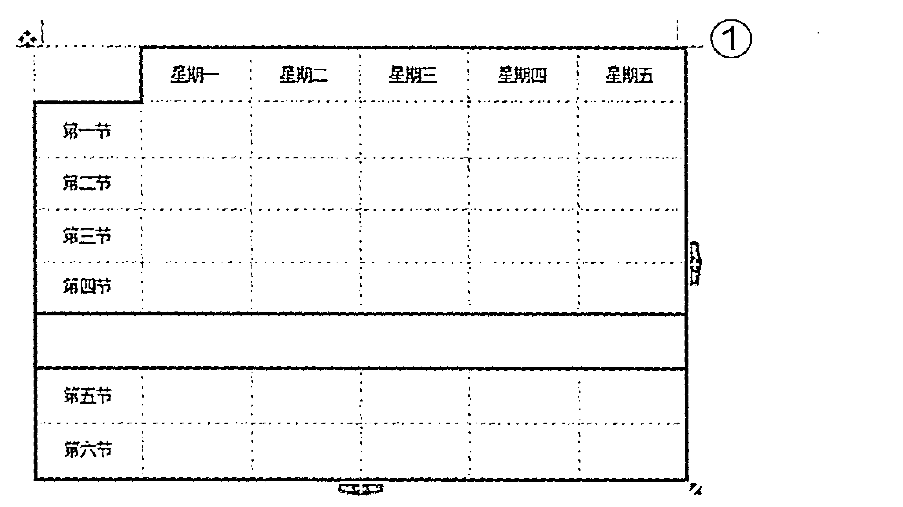

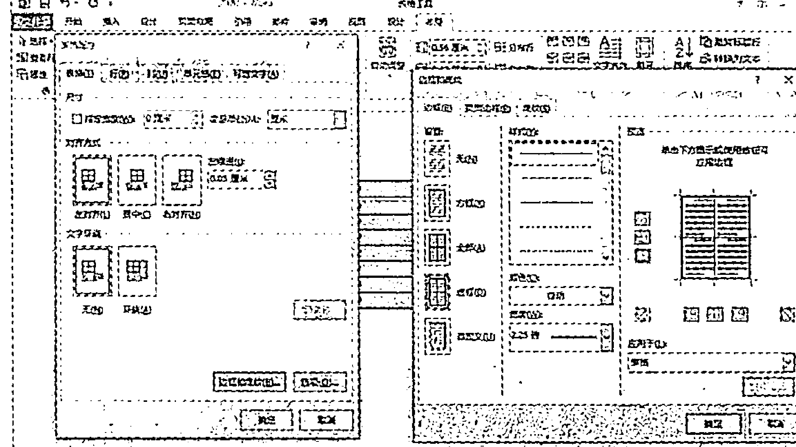

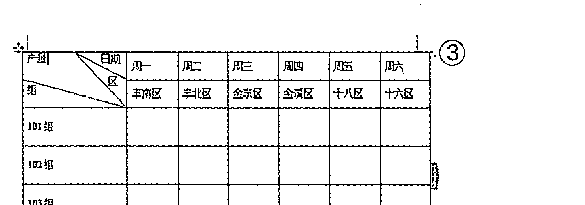

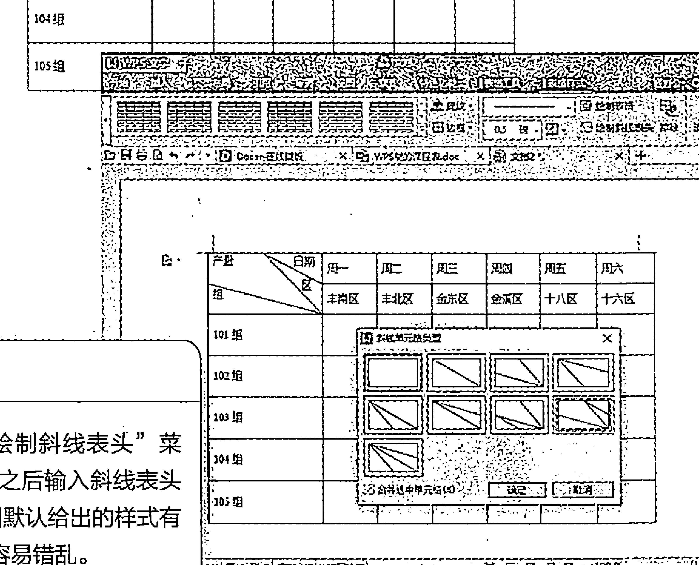

## 动感幻灯片 制作更轻松

文|马震安

传统PPT的线性播放控制不够灵活。虽然我们以前用Prezi、PPTplex插件、微舞幻灯等做过一些灵活点播的幻灯效果，但这些软件都有不尽人意之处——Prezi对中文支持不太好，PPTplex插件的模板太少，微舞幻灯中的动画效果不太完美，这些都限制了幻灯片的精彩展现。而Focusky很好地弥补了这些不足，能够轻松制作出有趣的动感幻灯片。

如利用其制作一个关于华东五市六天五晚旅游线路介绍的幻灯片，分为4大模块，分别介绍旅游特色、行程简介、注意事项及行程安排，内容包括文本、图片、视频等，画面生动，播放顺序既可线性播放又可点哪播哪(图1)。

### 1. 设计主界面

运行Focusky，新建空白项目(也可直接从模板中选择合适的项目套用)，利用工具栏设置好背景，在左侧帧编辑窗口选择“添加矩形窗口”，点击或拖动“+”按钮到主窗口，在主编辑区选择添加的矩形帧窗口，设置边框颜色为白色。在左侧帧编辑窗口点击新添加的矩形窗口，进入矩形帧的编辑窗口，利用右侧工具栏添加主界面图片，并调整它的大小与矩形帧窗口大小一致。点击右侧“图形”按钮，在主界面中添加4个椭圆图形，并旋转调整它们的角度。添加标题文本，设置好它的样式(图2)。

### 2. 添加分镜头

Focusky是以帧(路径)的形式进行播放的，每一帧就是一个分镜头。帧除了用上述方法添加外，还可以将主界面中的元素转换成帧。本例中共有4大模块，可分别选中主界面中的4个椭圆，点击其右侧的“+”按钮，将它们加入到路径中。这样，就形成了4个帧(即4个分镜头)。

接下来，就可以对分镜头进行编辑了。如制作关于旅游特色的介绍，可点击左侧帧编辑窗口中的第1个椭圆，这时在主界面第1个椭圆就被放大，在里面利用工具栏中的文本、图片等工具插入所需要的素材，选中各个素材，利用右侧的属性窗口设置好它们的样式。行程简介、注意事项等模块的制作也与之类似(图3)。

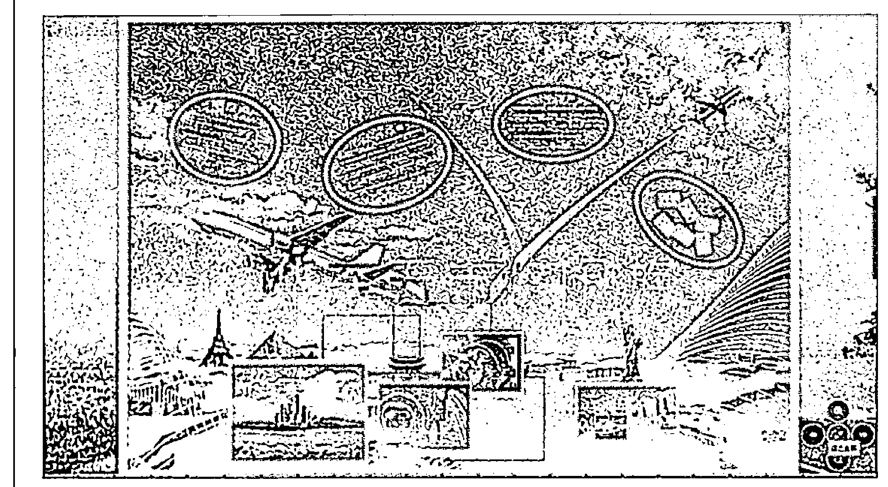

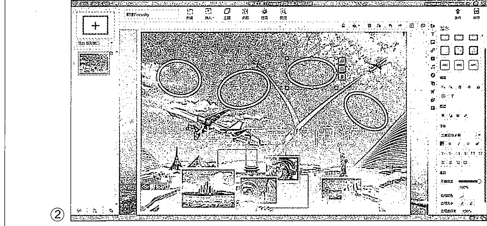

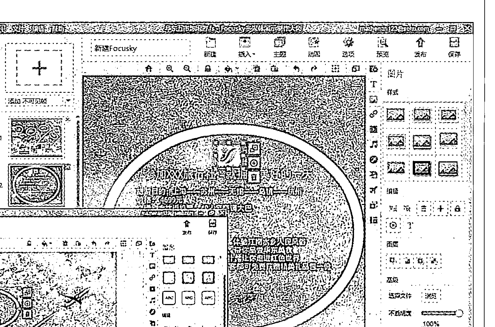

高效办公

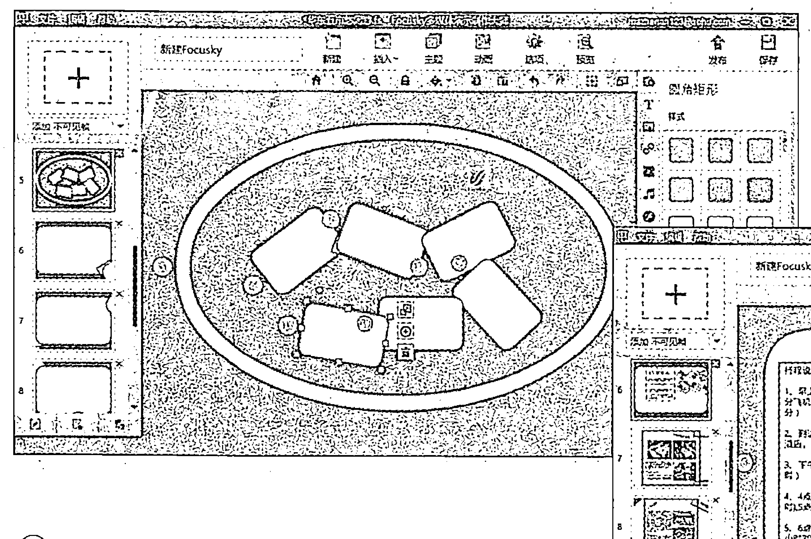

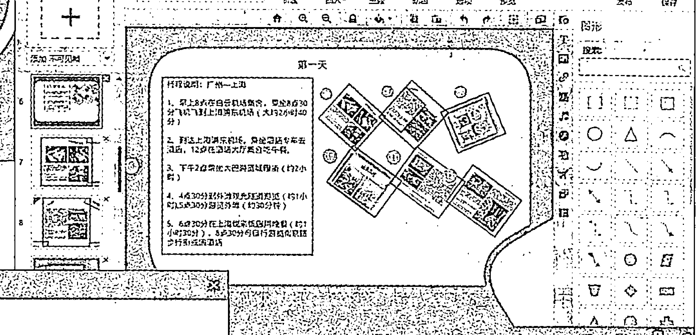

### 3. 镜头嵌套有诀窍

要在第4个模块中展示1～6天的具体行程及特色，这需要用到镜头的嵌套。选择第4个椭圆（即点击第5帧），在它的编辑窗口插入6个圆角矩形，设置好它们的样式及层次结构，将它们按以下的顺序都添加到路径中（图4）。

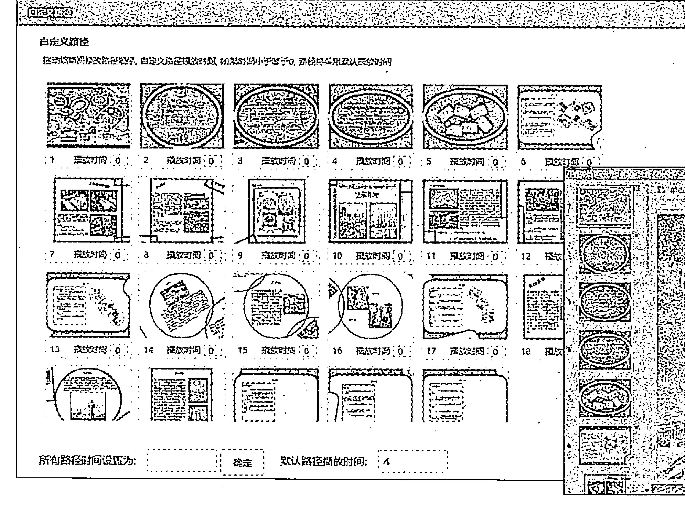

点击左边帧编辑窗口的第1个圆角矩形，放大它进行编辑。插入第1天行程的具体文字说明，设置好文本的样式，插入6个矩形方框，将6个矩形方框旋转一定的角度并将它们添加到帧（路径），点击每个矩形帧对它们里面的内容进行编辑（图5）。

> **小提示**
由于幻灯片既要按顺序播放，又要能点哪播哪，所以还要对帧的前后顺序进行调整。这里有三种方法，一种是在左边的帧编辑窗口，拖动相应矩形到圆角矩形的下面；一种是利用帧编辑窗口左下角的“编辑路径”按钮，在主界面中拖动路径索引号进行设置；另一种是点击帧编辑窗口右下角的调整路径顺序按钮，进行自定义路径的顺序调整及时间设置（图6）。

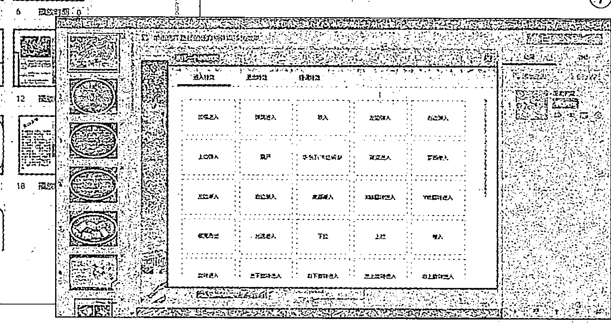

其他圆角矩形中的每天具体行程细节也这样设计，这里不再赘述。

### 4. 动画效果巧修饰

为了使幻灯片在播放时更加生动，可以对镜头中的素材进行动画设置。如对主界面中的标题进行动画设置，切换到标题所在帧，点击“动画”按钮，选定标题后点击“添加动画”，选择所需要的动画效果。在右侧动画效果处，根据需要进行播放方式、播放时间等的设置（图7）。所有场景设置完成后，点击“发布”按钮，可将作品发布成EXE、网页、视频等多种形式。

> **小提示**
其他素材的动画效果的设置与之类似。但要使镜头在切换时能够达到更好的效果，可在编辑界面中对分镜头（如实例中的圆角矩形、矩形等）进行适当角度的旋转。

## 打包版电子书无障碍阅读

文|南楚

PDG电子书以原味扫描和数量庞大闻名，但每页一个文件，让PDG图书的管理比较麻烦。用好压和UnicornViewer相结合，可以大大简化图书的管理和阅读。

### 1. 好压搭桥 普渡打包版电子书

UnicornViewer阅读器可以直接在不解压的情况下阅读Zip压缩包中的PDG文件。由于目前人们使用RAR格式的压缩包的情况很普遍，从网上下载的PDG电子书有不少是RAR格式，而该软件不支持RAR文件，因而人们总是先将RAR文件解包再阅读。

> **小提示**
如果你是一位漫画迷，还可以使用一款来自日本的著名电子漫画阅读工具MangaMeeya，该软件支持CBR和CBZ格式漫画，并且能直接读取RAR或ZIP压缩文件中的漫画文件，是管理和阅读漫画电子书的首选。

其实，可用好压进行图书压缩包的成批格式转换。安装好压后，用鼠标右键点击要转换的PDG电子书的RAR压缩包，选择“好压→用好压打开”（图1）；在弹出的窗口中回退一级目录，选择要转换的RAR文件（可多选），然后执行菜单命令“工具箱→转换压缩格式”（图2）；弹出转换窗口，指定目标文件夹路径，点击“确定”即可开始转换（图3）。经过以上几步，就可以获得“Zip版”的PDG电子书压缩包。

### 2. Unicorn出马 阅读电子书太容易

UnicornViewer阅读器是一个绿色小软件，只有一个EXE文件。阅读Zip版的PDG电子书有两种方法。第一种方法是通过UnicornViewer界面的“打开”菜单来阅读，这种方法尽人皆知，但显得有些麻烦。另一种更方便的办法：只需将上述绿色阅读器拷贝到含有Zip版电子书的文件夹中，然后直接拖动要阅读的Zip包到UnicornViewer文件图标上，即可自动打开阅读界面（图4）。

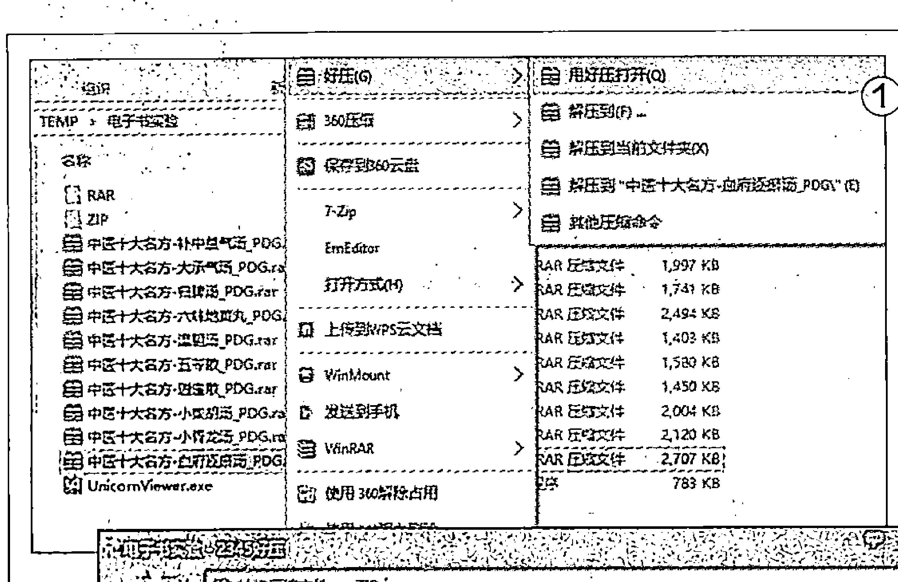

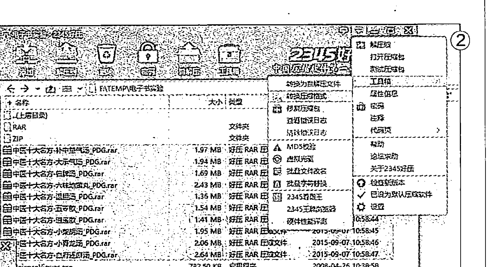

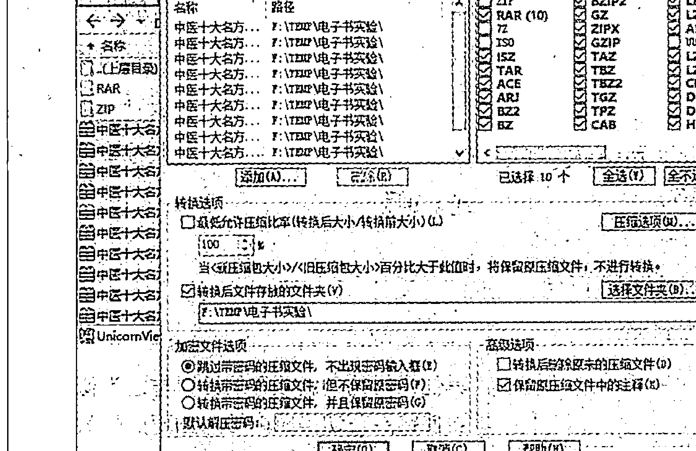

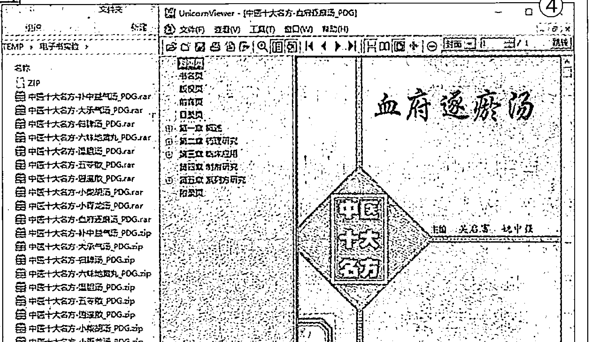

## 显示所见为何非打印所得

文|梦圆

Word是所见即所得的文字排版软件，屏幕上排出什么样版，打印时就能得到怎样的效果。但有时我们会发现，排好的文稿到了打印机上后，就是另外的样子。这是怎么回事呢？

### 1. 草稿字体显示文档

Word在某些视图中允许用户以草稿字体显示文档。这样，在屏幕上用户看到的字体将和打印之后获得的纸面字体有很大差别。

要查看当前文档是否以草稿字体显示文字，点击“文件”菜单下的“选项”命令（图1），在Word选项窗口中，点击左侧栏中的“高级”项目，滚动右侧窗口项目组到“显示文档内容”，若“在草稿和大纲视图中使用草稿字体”选项被选中，则说明当前使用了草稿字体显示，将该项选择去掉即可（图2）。

与上一种情况相反，Word也可能正在以草稿的方式打印文稿。验证和解决方法：在“Word选项”窗口单击左侧窗格“高级”项，滚动到“打印”一组，查看“使用草稿品质”选项是否被选中。取消对此项的选择，可使文稿以原样输出到打印机（图3）。

### 2. 打印字体支持缺乏

如果使用比较老式的打印机，使用打印机字体打印，而所用打印机不支持文档中的字体，也可造成所见非所得现象。解决方法：将文档字体改为TrueType字体，或改为可在该打印机上使用的字体。

### 3. 屏幕显示字体缺乏

文档字体虽然在打印机上是可用的，但没有与之相应的屏幕显示字体。Windows将在屏幕上改用TrueType字体显示文字。这时，试将文档中的字体更改为TrueType字体打印以获得一致效果。

### 4. 输入不当遇纸张变化

由于Word可根据不同纸型自动调整文档版面，所以当纸张设定变化时，不必手动调整版面的边距或换行符。Word将调整后的文档居中放置在新纸型上。但常见初学者易犯一个毛病，每当录入文字到页面边缘时总是要手动回车换行，这样做虽然最后也排出了看似合格的版面，但殊不知这恰恰为今后的排版带来混乱。一旦版面和纸张规格发生了变化，会造成版面调整的麻烦和打印的混乱。

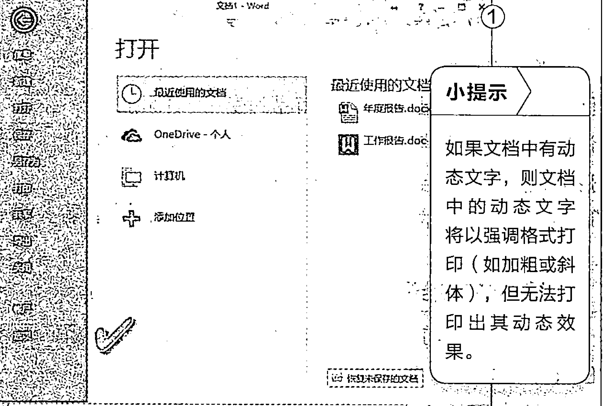

> **小提示**
如果文档中有动态文字，则文档中的动态文字将以强调格式打印（如加粗或斜体），但无法打印出其动态效果。

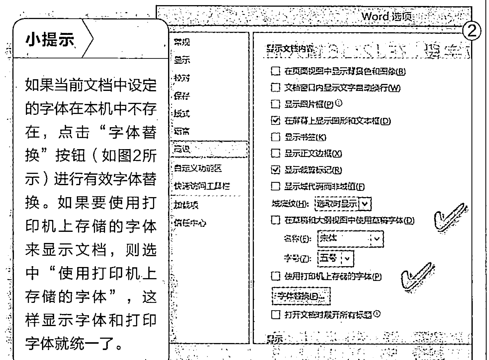

> **小提示**
如果当前文档中设定的字体在本机中不存在，点击“字体替换”按钮（如图2所示）进行有效字体替换。如果要使用打印机上存储的字体来显示文档，则选中“使用打印机上存储的字体”，这样显示字体和打印字体就统一了。

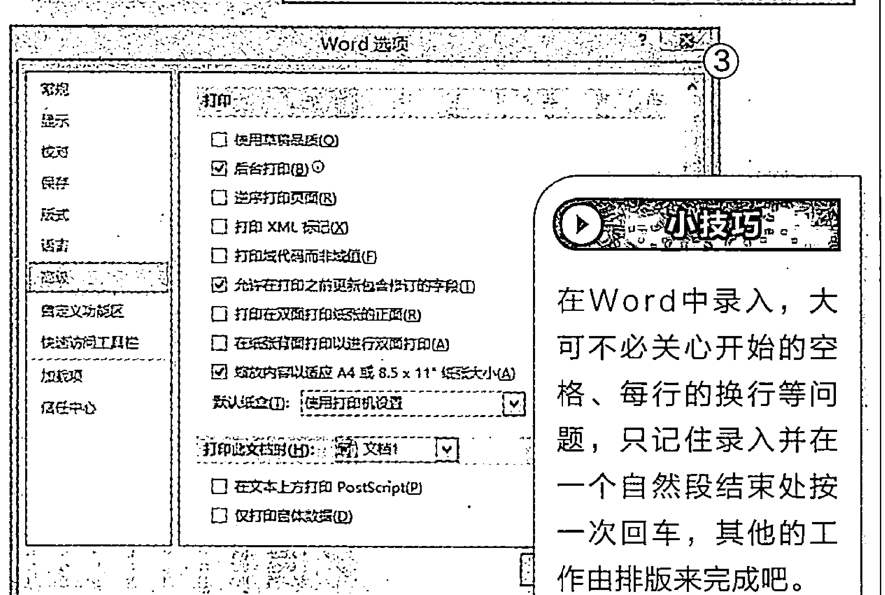

> **小技巧**
在Word中录入，大可不必关心开始的空格、每行的换行等问题，只记住录入并在一个自然段结束处按一次回车，其他的工作由排版来完成吧。

## 图表三级联动巧实现

文|马震安

一在校生暑期到某商场总部参加社会实践，商场领导交给他一个看似简单的任务——用图表联动的方式统计空调的销售情况。这让自以为熟悉Excel的学生犯了难。其实用Excel和水晶易表结合，问题就简单多了。

### 1. 基础数据准备

图表使用前，数据要备好。在Excel“数据”工作表中，要想计算出各个店面1月~6月份所有空调的销售情况，可在J1:P1输入相应字段，在J2:J6输入店面名及总计；在K2单元格输入“=SUMIF($A:$A,$J2,C:C)”，向右下方方向拖动填充到P列第5行；在K6单元格输入“=SUM(K2:K5)”，拖动填充到P6。再添加一个名为“控制”的工作表用来存放临时数据(图2)。

### 2. 制作基本图表

数据准备完成后，就该制作所需要的图表了。运行SAP BusinessObjects Dashboards(水晶易表)，新建一个空模型，点击“数据→导入”菜单(或工具栏上的“导入电子表格”按钮)，导入准备好的数据表格。先添加标题，点击窗口左边的“部件”，拖动“饰图和背景”中的“背景”、“文本”中的“标签”部件到画布，调整好它们的位置关系及大小；选中标签部件，在右边的“常规”属性中输入标题内容，在“外观”属性中对标签进行必要的修饰；添加“选择器”部件中的3个组合框部件，调整好它们的位置；拖动“统计图”部件中的折线图、柱形图、饼图及1个标签部件到画布，调整好它们的大小及位置关系；选中标签部件，输入有关操作说明的内容，并对标签进行修饰(图3)。

### 3. 图表交互性设置

所需部件基本上都添加到画布中了，接下来对各个部件进行交互性设置。


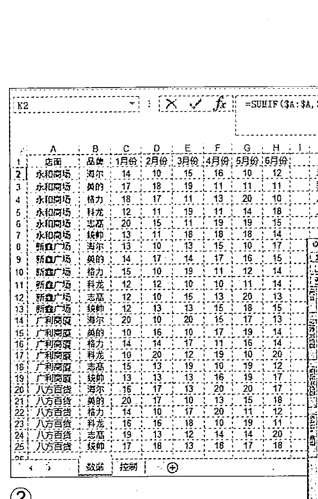

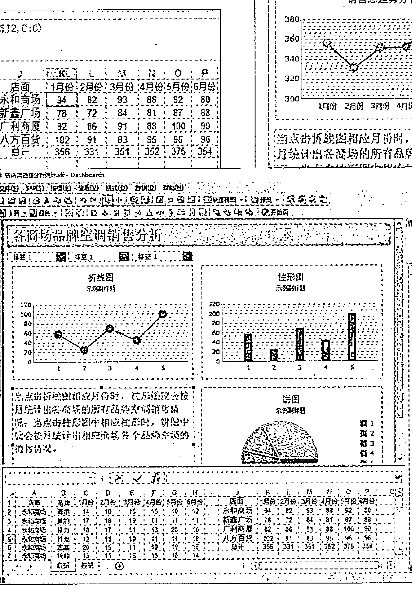

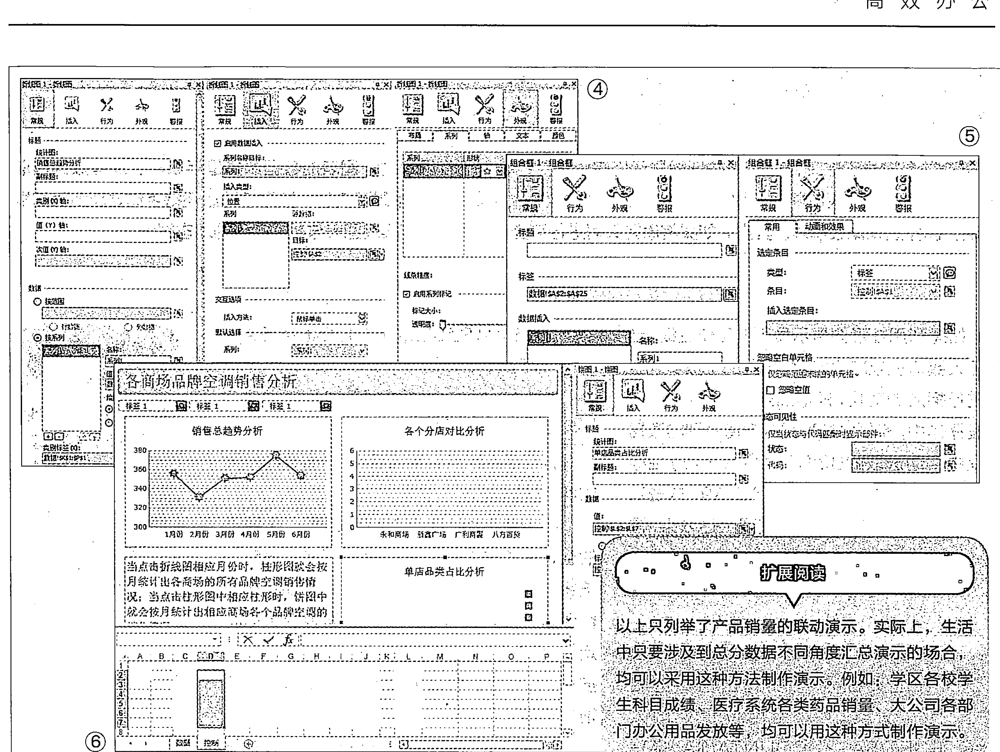

部件的设置，需要选中它们，利用右侧的各个属性面板进行操作。

### **折线图设置**

在“常规”属性中输入统计图标题，数据处选择“按系列”，单击“+”，“值”处选择数据表中的K6:P6，“类别标签”处选择数据表中的K1:P1；在“插入”属性中，勾选“启用数据插入”，“插入类型”处选择“位置”，“系列”处选择“系列1”，“目标”处选择控制表中的A2；在“外观”属性中，选择“系列”选项卡，系列形状设置为星形，填充色为桔黄（图4）。

### **柱形图设置**

同上输入统计图标题，数据处选择“按系列”，单击“+”，“值”处选择数据表中的I2:I5，“类别标签”选择数据表的J2:J5；在“插入”属性中，勾选“启用数据插入”，“插入类型”处选择“行”，“系列”处选择“系列1”，“源数据”选择数据表中的J2:J5，“目标”处选择控制表中的A1。

选择“系列1”，“源数据”选择数据表中的J2:J5，“目标”处选择控制表中的A1。

### **饼图设置**

输入统计图标题，数据“值”选择控制表中的L2:L7，“标签”选择控制表中的D2:D7（图5）。

### 4. **组合框交互性设置**

要想使3个图表具有良好的交互行为，还需要在画布中添加3个组合框并进行必要的设置。

选中组合框1，在“常规”属性中，“标签”选择数据表中的A2:A25，“数据插入”处选择“系列1”，插入类型选择“过滤的行”，“源数据”选择数据表中的A2:H25，“目标”选择控制表中的C2:J13；在“行为”属性中，选择“常用”选项卡，选定条目的类型处选择“标签”，条目选择控制表中的A1（图6）。

A1（图6）。

### **组合框2**
“常规”属性“标签”设置同组合框1，“数据插入”选择“系列1”，插入类型选“列”，“源数据”选K1:P5，“目标”选I1:I5；“行为”属性“常用”选项卡，条目类型选“位置”，条目选A2。

### **组合框3**
“常规”属性“标签”设置、“数据插入”、插入类型设置同组合框2，“源数据”选E1:J7，“目标”选L1:L7；“行为”属性“常用”选项卡下条目设置同组合框2。

最后，将这3个组合框组合后放置在某个图表的下一层，用图表将它们遮挡住。

所有部件属性设置完成后，就可以利用“文件→导出”菜单导出图表，生成单独的SWF文件，也可将图表导出到PPT文件中进行演示。

## 数据有增加 图表自适应

文/马震安

公司常常会将员工的工作业绩用柱形图展示出来。在用Excel制作图表时，图表的数据源多是手动根据现有数据选取的，但有时员工的人数并不是固定不变的，这就意味着原始的数据区域也是可变的，数据增减后还得手动更新图表的数据源，操作起来比较麻烦。其实，如果将原始数据进行可变性设置，就能实现图表与数据联动的动态图表。

如需利用柱形图展示员工的工作业绩，当员工人数增加或减少时，柱形图的个数实现自动进行相应的变化，即增加或减少（图1）。在一般操作中，实例中柱形图的数值系列的数据源是由手动选取的B2:B9，水平（分类）轴标签的数据源也是手动选取的A2:A9，这些数据源都是固定不变的。要想实现上述效果，需要将这两个数据源更改为可变的表达式。

### 1. 数据源名称定义

用Excel 2013打开数据表，点击“公式→定义名称”，在弹出窗口的名称处输入“分类轴”，引用位置处输入“=OFFSET($A$2,,COUNTA($A:$A)-1,1)”；以同样的方式再定义一个名称为“数值轴”的名称，引用位置处输入“=OFFSET($B$2,,COUNTA($A:$A)-1,1)”（图2）。

### 2. 图表数据源修改

数据源名称定义完成后，就该修改柱形图的两个数据源了。
右击柱形图，选择“选择数据”，在弹出的窗口中点击“图例项(系列)”下的“编辑”按钮，在弹出的窗口系列值处输入“Sheet1!数值轴”（Sheet1这要根据数据表的名称而定）；点击“水平(分类)轴标签”下的“编辑”按钮，在弹出的窗口中输入“=Sheet1!分类轴”（图3）。
最后点击“确定”，返回Excel工作表界面。这时在A列和B列新增一行数据，图表就自动变化了，也会自动增加新的柱形。

> 以上仅以人员销售业绩来举例。实际上，凡是涉及到动态增加的表格项目，比如学生补考成绩、家庭业余收入统计等都可以用这种方法来实现。

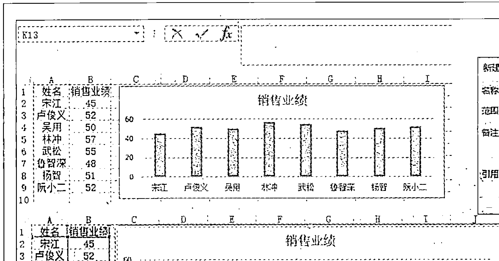

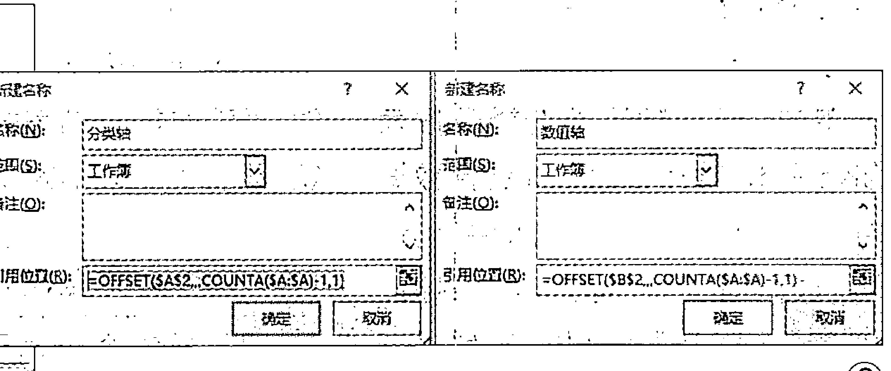

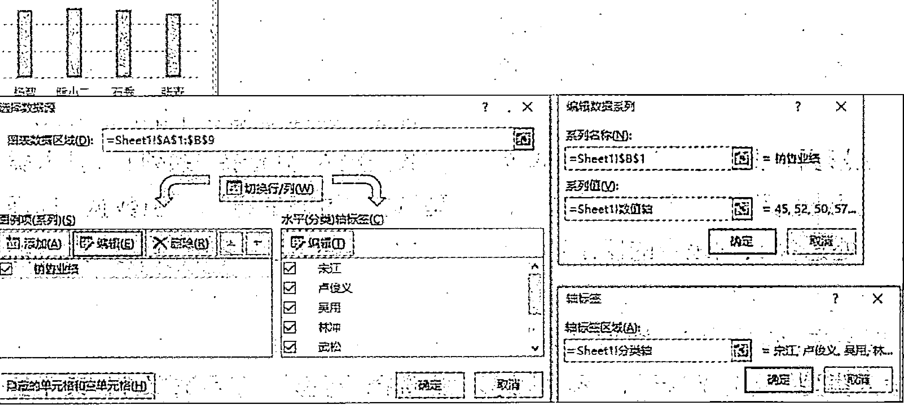

## 制作傻瓜化智能表格

文|马震安

让Excel表格填写更加智能化，这无疑会大大提高表格使用者的工作效率。数据到期自动提醒、单元格输入自动简化，这些都是我们希望实现的自动化效果。

### 日期到期前自动提醒

某公司是做租赁服务的，对于设备租金有欠款的客户都要到期提前提醒，但是由于租赁的订单量很多，人工查阅提醒信息很费力，所以希望设计到期自动提醒功能，可以根据租赁日期，提前几天用颜色提醒，距离收款日期小于或等于7天的单元格变成黄色，距离收款日期小于或等于5天的单元格变成红色，过期的单元格变成绿色（图1）。

选中需要提醒的列（G列），选择“条件格式→管理规则”，在弹出的窗口中点击“新建规则”，在新弹出的窗口中选择“使用公式确定要设置格式的单元格”，输入公式“=AND(G1<>"",DAYS($G1,TODAY())<=5)”，点击“格式”按钮设置单元格的填充色为红色，其他条件的设置与之类似。

> **小提示**
距离天数越小的条件越要放到上面，这样才能保证满足所有的条件。

### 单元格输入自动替换

在向Excel表中输入数据时，有些文本项目数据需要重复输入（例如教师登记表中的职称一项），按部就班地输入比较麻烦，如果只输入1个数字或字母就能自动代替所需文本项目，就会给工作带来更大的方便。如果在职称列单元格中输入“0”后自动替换为“中学高级”，输入“1”后自动替换为“中学一级”，输入其他数字后自动替换为“中学二级”，这样输入效率就飞速提升。

选中职称列后，选择“格式→设置单元格格式”，选择“数字”选项卡中分类下的“自定义”，输入“[=0]中学高级;[=1]中学一级;中学二级”。这样，当在这列中输入相应数字并回车后，就变成了相应的文本（图2）。

或在Excel 2013中选择“文件→选项”，在弹出的窗口中点击“校对”中的“自动更正”，“替换”处输入“0”，“为”处输入“中学高级”，点击“添加”；在“替换”处输入“1”，“为”处输入“中学一级”……这样，当在单元格中输入相应数字时，就会变成相应的文本了（图3）。

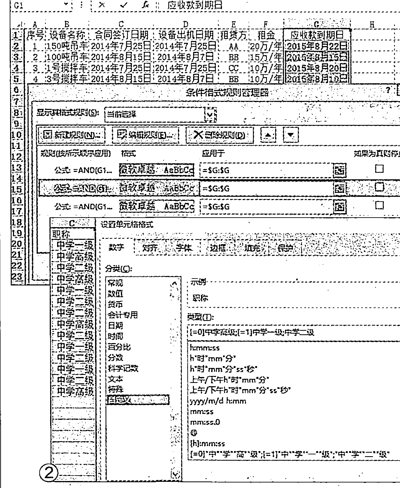

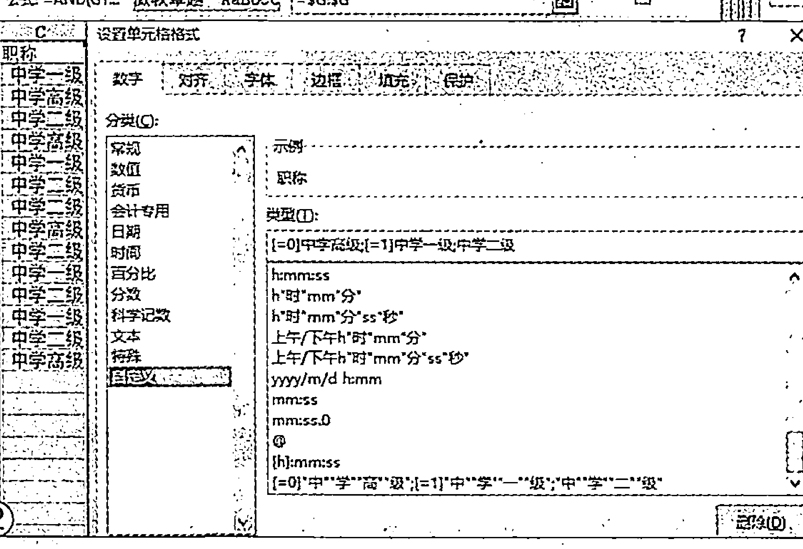

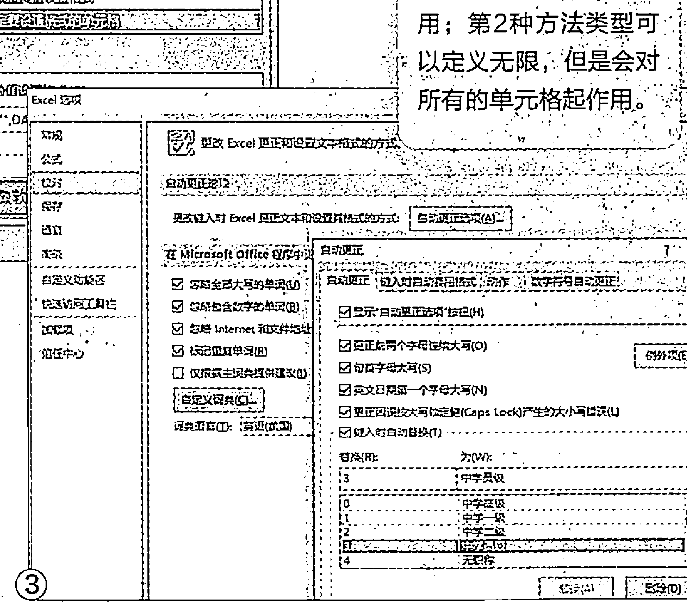

> **小提示**
第1种方法定义的类型是有限的，但能约束到某列、某行的单元格，可对特定单元格起作用；第2种方法类型可以定义无限，但是会对所有的单元格起作用。

## 多图片互动式图片课件制作

文/马震安

小李想制作《红楼梦之人物性格分析》互动式课件，点击开始界面的“开始”按钮进入内容界面；当鼠标悬停在内容幻灯片的图片上时，图片位置便会出现文本说明，同时幻灯片左边会出现详细解释；点击图片时图片放大；点击图片中的人物会弹出相应窗口；如果图片被点击过，会在文本说明上打上“√”（图1）。这样的复杂互动效果在PPT中不容易实现，用Articulate Storyline 2制作就比较简单。

### 1. 开始界面的制作

新建项目后双击无标题幻灯片，再插入一张空白幻灯片，设置好背景色。在第一张幻灯片中插入所需要的图片、文本、开始按钮及四个装饰性矩形，分别设置好它们的样式及进入、退出时的动画，这些操作和PPT中都是相类似的；在时间线上拖动调整对象的左、右两边，安排各对象出现的先后顺序；在时间线最上方合适位置右击，选择“在播放指针处创建时间点”，创建一个时间点。交互效果的设置需要新建3个触发器并按表1进行设置。

| 触发器 | 暂停时间线 | 时间线：此幻灯片，时间：时间轴到达，选择：提示点、第1个 |
| 触发器 | 恢复时间线 | 时间线：此幻灯片，时间：用户单击，对象：开始 |
| 触发器 | 跳转到幻灯片 | 幻灯片：1.2无标题幻灯片，时间：时间轴结束，对象：1.1无标题幻灯片 |

这样，开始界面幻灯片就编辑完成了（图2）。

### 2. 制作主界面幻灯片

切换到第二张空白幻灯片，在它上面插入四幅人物合成图并调整好各自的位置；插入四个矩形，输入相应的文字说明，调整矩形与各图片大小一致，并将每个矩形覆盖到各图片上，将各个矩形的初始状态设置为隐藏；插入四个互动对象处控件下的热点矩形，调整热点矩形与各图片大小一致，并将每个热点矩形覆盖到各文字矩形上；插入四个“√”图形，并将它们放置到热点矩形上的合适位置，也将它们的初始状态设置为隐藏，图层分别命名为标记1、标记2、标记3、标记4；在右侧点击底层图层处的新建图层按钮，增加4个图层，分别命名为十二金钗、各位公子……在每个图层上利用文本框在幻灯片的左侧添加相应的详细文本解释（图3）。

在进行交互设计前，先切换到故事视图，新建一个场景，接下来再切换到“1.2无标题幻灯片”界面。点击右侧触发器处的“管理项目变量”按钮，新建4个变量，名称分别为m1、m2、m3、m4，类型均为“真/假判断题”，值均为“假”。

对于热点矩形 的交互设置，我们以第1个热点矩形为例（选定它），需要新增3个触发器并按表2进行设置。

| 触发器 | 操作 | 设置 |
| :--- | :--- | :--- |
| 触发器 | 更改状态 | 在对象上：矩形1（即图片上的文本说明），目标状态：正常，时间：鼠标悬停，对象：热区题1，勾选“在鼠标离开后恢复” |
| 触发器 | 显示图层 | 图层：十二钗，时间：鼠标悬停，对象：热区题1，勾选“在鼠标离开后恢复” |
| 触发器 | 跳转到幻灯片 | 幻灯片：2.1无标题幻灯片，时间：用户单击，对象：热区题1 |

其他热点矩形的交互设置与之类似。不选定任何对象，新增触发器并设置：操作一更改状态，在对象上一矩形1，目标状态一正常，时间一时间轴开始，对象一1.2无标题幻灯片。点击“显示条件”按钮，新增条件，设置：列表一变量，如果一m1，运算符一一等于，类型一值，值一真。其他文本矩形、“√”图形的显示设置与之类似（图4）。

### 3. 制作分场景幻灯片

切换到故事视图，选择“2 无标题场景”，根据图片中的人物需要，插入若干张空白（用来显示图片中某个人物的性格分析）。双击“2.1无标题幻灯片”，插入与“1.2无标题幻灯片”中相同的四幅人物合成图并调整好各自的位置。以图片1为例，在图片1上所需人物的合适位置插入若干个热点矩形，在合适位置插入一个按钮，文本为“关闭”，插入一个矩形缩放区域，调整好大小，一定要将热点矩形、“关闭”按钮等包含其中，在时间线上调整每个对象出现的先后顺序并在时间线最上方的合适位置创建一个时间点。 对于利用变量来控制文本矩形、“√”图形的显示及单个人物窗口显示设置，需要新增4个触发器并按表3进行设置。

| 触发器 | 操作 | 设置 |
| :--- | :--- | :--- |
| 触发器 | 暂停时间线 | 时间线：此幻灯片，时间：时间轴到达，选择提示点，第1个 |
| 触发器 | 调整变量 | 变量：m1，运算符：=赋值，值：值，真，时间：用户单击，对象：按钮1 |
| 触发器 | 跳转到幻灯片 | 幻灯片：1.2无标题幻灯片，时间：用户单击，对象：按钮1 |
| 触发器 | 灯箱幻灯片 | 勾选导航控件，幻灯片：2.2无标题幻灯片（即新插入的某个空白幻灯片），时间：用户单击，对象：热区题1 |

当然，其他的热点矩形的触发器设置与之类似。

对于用来显示人物性格分析的新插入空白幻灯片的编辑，以“2.2无标题幻灯片”为例，打开它，设置好背景颜色，在里面插入林黛玉的图片及判词。

再建立其他图片对应的场景，场景里面幻灯片的设置与上述类似，在这里就不一一赘述了。

切换到故事视图，将场景1设置为启动场景，选择相应幻灯片，在右侧将幻灯片属性中导航控件中的勾选全部去掉。点击“播放器”按钮，在弹出窗口的功能选项卡中，将资源、菜单之类的勾选全部去掉，点击“发布”按钮进行发布即可。

## 速记快捷键 WPS办公快如风

文/云菲

谁都知道使用快捷键能加速操作，然而一个最大的难题是每个软件都有许多快捷键，多了就不好记忆。因此，不少人宁愿用鼠标点击菜单命令来操控软件。但是，如果使用分片突击和巧妙记忆的方法，可以快速解决快捷键记忆的难题，让办公操作效率倍增。

### 1. 文件操作快如风

当双手正放在键盘上录入时，若需操作文件或窗口，如果再用动手去拿鼠标就显得麻烦些了。几组键盘快捷键就能顺手解决（图1）。

4组文件操作快捷键（表1）

| 功能 | 快捷键组合 | 巧记要诀 |
| :--- | :--- | :--- |
| 新建文档 | Ctrl+N | New（新的）的第一个字母 |
| 打开文档 | Ctrl+O | Open（打开）的第一个字母 |
| 保存文件 | Ctrl+S | Save（保存）的第一个字母 |
| 关闭窗口 | Ctrl+W | Windows（窗口）的第一个字母 |

记忆方法：记忆关联的单词的首字母。

### 2. 格式复制不动刷

重复性的文字排版，常用到复制格式的操作，总用鼠标找刷子、点刷子、刷格式效率太低。其实，用键盘操作更简捷（图2）。

记忆方法：在传统复制、粘贴快捷键Ctrl+C和Ctrl+V的基础上记住Shift即可。

### 3. 内容操作不用鼠

用鼠标对文档内容进行复制操作有一个问题——当内容多、跨页时，若遇鼠标不灵活，很容易在拖到半道时让内容“跑丢”。若用键盘的内容操作快捷键，可让内容操作既快速又安全。

内容操作普通快捷键6组（表2）

| 功能 | 快捷键组合 | 巧记要诀 |
| :--- | :--- | :--- |
| 选择所有 | Ctrl+A | A是All（全部）的首字母 |
| 到文档头 | Ctrl+Home | 回家到头用Home |
| 到文档尾 | Ctrl+End | 结束到尾用End |
| 内容查找 | Ctrl+F | F是Find（查找）的首字母 |
| 内容定位 | Ctrl+G | G是Goto（到达）的首字母 |
| 内容复制 | Ctrl+C | C是Copy（复制）的首字母 |

记忆方法：记忆关联单词或关联单词的首字母。

内容操作另类快捷键3组：
- 内容剪切：Ctrl+X
- 内容替换：Ctrl+H
- 内容粘贴：Ctrl+V

记忆方法：通过形状或快捷键定义缘由来记忆。

记忆解析：形象记忆法记住Ctrl+X
X像个剪刀，用它剪下内容，所以Ctrl+X为剪切。

记忆解析：替换为何不用Ctrl+R
按理说“替换”在英文里应该是Replace，替换应该用Ctrl+R组合键才合适。只可惜，Ctrl+R先前已分配给了“右对齐”。因此，Office设计人员就想其他合适的键位，发现H离R比较近且尚未被占用，于是就使用了H（图3）。也有人说，H是取Hide（隐藏）的第一个字母，理由是对于一些隐藏在文中的东西，一按Ctrl+H并输入关键词搜索，便显示出来了。这两种说法均无助于记忆这组快捷键。

记忆解析：粘贴为何不用Ctrl+P
在英文里，粘贴的单词是Paste，粘贴的快捷键理应用Ctrl+P。然而，由于电脑里P通常在Windows中被用作暂停（Pause）或打印（Print）的快捷键，因此只能放弃这种设计。而V代 表拉丁单词Vipe ctus（意思相当于英文Paste），于是，V就用来顶替粘贴（Paste）。

记忆解析：依顺序安排的快捷键除了Ctrl+X外，还有Ctrl+Y（恢复）、Ctrl+Z（撤销）两组快捷键，由于这两组快捷键在设计时没找到合适的单词，因此，依次按字母顺序安排了。

### 4. 字体控制更容易

字体控制快捷键7组（表3）

| 功能 | 快捷键组合 | 记忆技巧 |
|------|------------|----------|
| 改变字体 | Ctrl+D | 用“点”的拼音首字母D记忆，点数不同字会变 |
| 字体加粗 | Ctrl+B | B是“粗体”英文单词Bold的首字母 |
| 字体倾斜 | Ctrl+I | I是“斜体”英文单词Italic的首字母 |
| 增大字号 | Ctrl+Shift+>或Ctrl+] | 记大于号。]>与>相像，而句点与大于号同键位 |
| 减小字号 | Ctrl+Shift+<或Ctrl+[ | 记小于号。[与<相像，而逗点与小于号同键位 |
| 变为下标 | Ctrl+= | 记住=号键。等号在该键位下方，所以为下标 |
| 变为上标 | Ctrl+Shift+= | 加了Shift换挡为上方的+号，所以为上标 |

对于字体设置，也有它的相应调用快捷键Ctrl+D（图4）。最初的字体是由点阵组成，因此我们可以“点”的第一个拼音字母D来记忆此快捷键。此外，还有加粗、变斜体、增大或减小字号、变上下标等均可用键盘快捷键来完成。这些也都有它们的快速记忆方法。

### 5. 格式对齐更方便

排版时格式的对齐也是常见的操作，如果使用快捷键组合，就不用切换到格式面板反复点选格式按钮了。

格式对齐快捷键7组（表4）

| 功能 | 快捷键组合 | 记忆技巧 |
|------|------------|----------|
| 左对齐 | Ctrl+L | L为“左”Left的首字母 |
| 右对齐 | Ctrl+R | R为“右”Right的首字母 |
| 居中对齐 | Ctrl+E | 居中Center，C被占用，顺序用E |
| 两端对齐 | Ctrl+J | 对齐Adjust，A、D被占用，顺序用J |
| 分散对齐 | Ctrl+Shift+J | 在两端对齐的基础上加Shift |
| 增加缩进量 | Alt+Shift+Right | 记住Alt+Shift，光标越往右Right缩进越多 |
| 减少缩进量 | Alt+Shift+Left | 记住Alt+Shift，光标越往左Left缩进越少 |

小提示
由于新版WPS的大多数功能兼容于Word，因此，以上介绍的快捷键组合在WPS和Word中基本通用。

记忆方法：通过单词记忆法、联想记忆法、方位记忆法等多种方法记忆。

记忆解析：Ctrl+E和Ctrl+J两组快捷键在WPS中，居中操作的快捷键是Ctrl+E。E是Center（居中）的第二个字母。那么为什么不用第一个字母C呢？因为它已经被Ctrl+C（复制）所占用，所以只能用第二个字母E。与此类似的还有Ctrl+J这组快捷键，对齐的英文单词本是Adjust，理应用A才对，但由于A已经被Ctrl+A（全选）占用，而D又被Ctrl+D（字体设置）占用，因此只能用第三个字母J了。

### 6. 特种插入有捷径

对于在文档中插入分页符、换行符、书签、空域、超链接等特殊操作，由于平时用得相对比较少，因此，寻找按钮或命令也不容易。其实也有对应的快捷键来快速实现，不如直接记忆快捷键。

插入操作快捷键5组（表5）

| 功能 | 快捷键组合 | 记忆技巧 |
|------|------------|----------|
| 插入分页符 | Ctrl+Enter | Enter本换行，加Ctrl为分页 |
| 插入分段符 | Shift+Enter | Enter本换行，加Shift为分段 |
| 插入书签 | Ctrl+Shift+F5 | 书签插入，双控（Ctrl与Shift）F5 |
| 插入空域 | Ctrl+F9 | 插入空域加F9 |
| 插入超链接 | Ctrl+K | 插入超链加老K |

## 解决疑难 让Office 2016更顺当

文/王志军

很多朋友已开始使用Office 2016。虽然新版与2013版相比界面上差距不大，但使用中仍可能遇到些问题。如打开工作簿自动开启空白窗口、邮件不能正常预览Excel附件、找不到联动页面设置等。解决了这些问题，才能让新版Office使用更顺当。

### 1. 拒绝自动加载空白窗口

在使用Excel 2016打开工作簿文件时，除了打开指定的工作簿之外，有时还会同时打开一个空白窗口，关闭时需要一同关闭这个无用的窗口，令人不厌其烦。出现这个问题的根源是Backstage视图与Excel 2016存在兼容性方面的问题。打开“Excel选项”对话框，切换到“保存”面板（图1），在右侧窗格取消“打开或保存文件时不显示Backstage”复选框，确认之后关闭对话框。重新打开Excel工作簿，此时就不会再同时打开空白窗口了。此时可以再次打开“Excel选项”对话框，重新启用“打开或保存文件时不显示Backstage”复选框。

### 2. 邮件不能预览Excel附件

职场用户一般使用Outlook处理邮件，但遗憾的是Outlook 2016不能正常预览Excel格式的附件，鼠标点击时会显示不能预览的信息。而Word、PowerPoint、PDF等附件却可以正常预览。起初以为是信任中心设置的问题，打开“Outlook选项”对话框，切换到“信任中心”面板，在右侧窗格点击“信任中心设置”按钮，打开“信任中心”对话框，切换到“附件处理”面板，在右侧窗格点击“附件和文档预览器”按钮，在这里可以看到所有已经启用的预览器（图2），“Microsoft Excel预览器”赫然在目。难道每次需要打开Excel附件才能阅读吗？

用修改注册表的办法可解决这一难题。依次跳转到“HKEY_LOCAL_MACHINE\SOFTWARE\Microsoft\Office\ClickToRun\REGISTRY\MACHINE\Software\Microsoft\Windows\CurrentVersion\PreviewHandlers”，这里是Office所有组件的预览器设置的位置。首先右击选择“导出”进行备份，接下来在右侧窗格对各个字符串的键值数据进行修改：

- 项目: {21E17C2F-AD3A-4b89-841F-09CFE02D16B7}
数值: Microsoft Visio previewer

需要提醒的是，请保持上述位置不变，尤其是{00020827-0000-0000-C000-000000000046}的位置必须在最底部，这一点至关重要。

### 3. Word无法设置联动页码

此前，我们常为Word文档设置“第几页共几页”的效果，但在Word 2016中已经找不到直接插入“第几页共几页”的选项，我们可以采取下面的方法。

双击页脚区域，进入页脚编辑界面，或者直接切换到“插入”选项卡，在“页眉和页脚”功能组选择“页脚”，向下拖拽滑块（图3），在这里选择“网格”或“信号灯”的样式，随后可以在页脚插入“1|1”或“1/1”的效果，接下来只需要手工添加“第”、“页”、“共”、“页”就可以了。

### 4. 提取信息效率低下

以往我们提取表格中的纯中文字符效率比较低，如图中的“半叉”、“大底”、“后跟”、“挂钩”等（图5），由于字符长度不一，无论分列或是使用公式，效果都不是很理想。如果在Excel 2016中依然用老办法，工作效率还是难以提高。

其实在Excel 2016有更高效的录入方法。首先在C列的C2、C3单元格分别手工录入半叉、大底，注意必须是纯手工录入，接下来当在C4单元格录入“后跟”的“后”字之后，后面的“跟”以及B4：B16的所有内容都已经出现在提示屏幕，单击回车键，所有数据都会自动录入。如果没有发现这些提示内容，请打开“Excel选项”对话框，切换到“高级”面板，在右侧窗格勾选“自动快速填充”复选框。

如果需要提取04、32A这样的英文字符，也可以采取上述类似步骤。

| 编号 | 型体全称 | 类别 |
|---|---|---|
| 001 | S16-04半叉 | 半叉 |
| 002 | U10-32A大底 | 大底 |
| 003 | 2016-01后跟 | 后跟 |
| 004 | SPD-S1603挂钩 | 挂钩 |
| 005 | U10-32A垫片 | 垫片 |
| 006 | T-998跟扣 | 跟扣 |
| 007 | S16-04-01跟 | 跟 |
| 008 | S16-04-01天皮 | 天皮 |
| 009 | GSM-040357后跟 | 中叉 |
| 010 | D50中文 | 靴跟 |
| 011 | E-235前掌 | 跟跟 |
| 012 | S258后跟 | 大底片 |
| 013 | S258大底片 | 鞋扣 |
| 014 | FDR-432鞋扣 | 防磨片 |
| 015 | T-998防磨片 | |## 文档提效 用好WPS模板

文|张惠香

为提高效率，大家常用套用特效滤镜的办法来处理图片。而对于WPS文档编辑，套用模板则同样能带来事半功倍的效果。WPS模板不但可通过“拿来主义”使用别人制作的“成果”，还可以自己制作个性化独特模板。

### 1. 拿来主义 两类模板任我选

金山WPS相对于微软Office的一大优势，是其丰富的本土化特色的模板。启动WPS文字之后，眼前首先会出现Docer稻壳儿主页，上面就提供“在线模板”（图1）。这些模板分门别类提供，且有无数人参与，时刻动态更新。除了可以从门类目录下查找自己需要的模板外，我们还可以通过右上角的搜索框，以关键词搜索所需模板。

> > **小提示**
> 对于标示有要“米”才能下载的文档模板（“稻米”是WPS的虚拟货币单位），需要登录WPS账号并付出相应的“米”才能下载使用。WPS账号可直接用QQ、微信、小米等账号登录（图2）。稻米可通过充值、官方活动赠送、WPS论坛、微博获得方式获取，可用于轻办公圈子的升级，WPS在线付费模板的下载等。

除了在线模板外，WPS系统本地也提供实用模板。点击标签栏上的“+”按钮（或按Ctrl+N快捷键），调出一份空白页面，这其实是一份最简单的文档模板，它已经规定好了页面的纸张大小、页边距、文字属性等。此外，在系统的“文件→本机中的模板”菜单所激活的模板窗口中，切换到“日常生活”选项卡，可以套用“稿纸打印版”和“笔记”两种模板之一（图3），建立一份相应风格的文档。

> > **小技巧**
> 如果经常使用系统提供的某个模板建立文档，请在选择模板时选中“设为默认模板”复选框。此后，通过WPS页面标签栏“+”号按钮后的小箭头，选择“从默认模板新建”创建文档即可快速调用该模板（图4）。

### 2. 个人定制 一次制作多次用

总套用别人的模板显得不够个性化。此外，如果随意套用别人的商业模板也有版权风险。因此，在必要时，可将个人常用的版式自定义为模板备用。

要定制一份个人模板，需先用常规方法设计好一份文档样式。打开样本


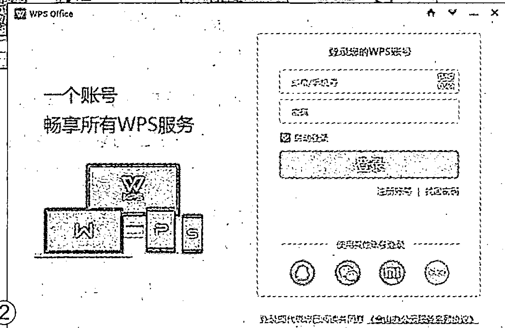

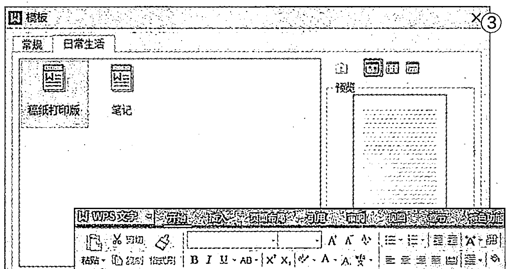

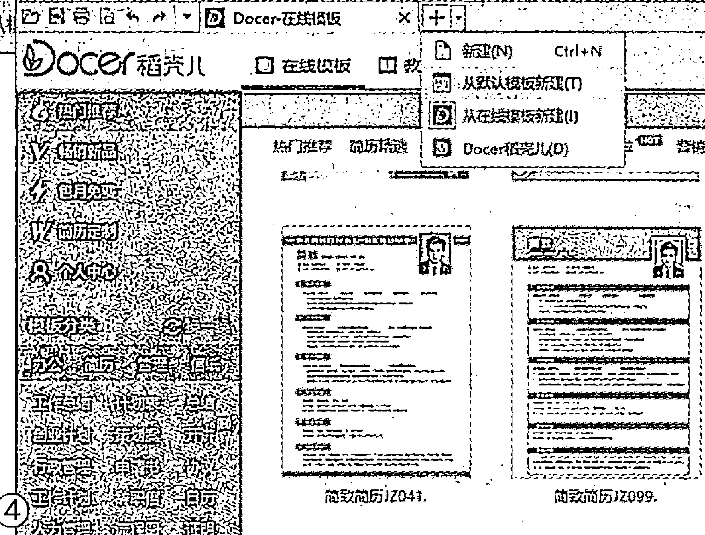

### 3. 高级进阶 模板技巧藏起来

### 搞清WPS模板默认位置

知道模板的存放位置有利于模板的一次性备份。在WPS中随便打开一个文档，点“另存为”，文档格式选“WPS文字模板”，然后右击其中的任一模板文件并选择“属性”，在“常规”选项卡下的“位置”后边，就会自动显示模板的存放路径了（图6）。WPS模板的保存位置一般为“C:\Users\用户名\AppData\Roaming\kingsoft\office6\templates”。

### WPS模板加密私人独享

如果将自己经常使用的文档设置为WPS默认模板，与此同时，给模板加密，那么别人在打开此电脑的WPS用默认模板建立文档时，需要权限口令才能访问。要做到这一点，需在保存模板时，点击保存页面右下角的“加密”按钮，然后在进入的设置权限属性窗口进行权限设置（图7）。像普通文档权限设置一样，模板文档的权限同样可设置打开权限或编辑权限（也可二者同设）。此外，点击“高级”按钮还可以选择加密的类型，以此来确定解密的难度。

### WPS模板上网大众分享

如果你是一个热心人，自己觉得设计的模板可以为大众所分享，或想要用模板换“米”，那么可以到WPS在线模板网站，分享自己的模板作品（网址：http://docer.wps.cn/member/mid-wps.htm）。点击“上传作品”按钮，进入上传文档页，按上传文档须知的容量和格式；上传不大于10MB的模板（图8）。

如果考虑到要与使用Word的朋友分享，或者自己可能在Word环境下使用该模板，则在另存为模板文件时，选择将模板文件另存为“Word模板文件（*.dot）”格式。

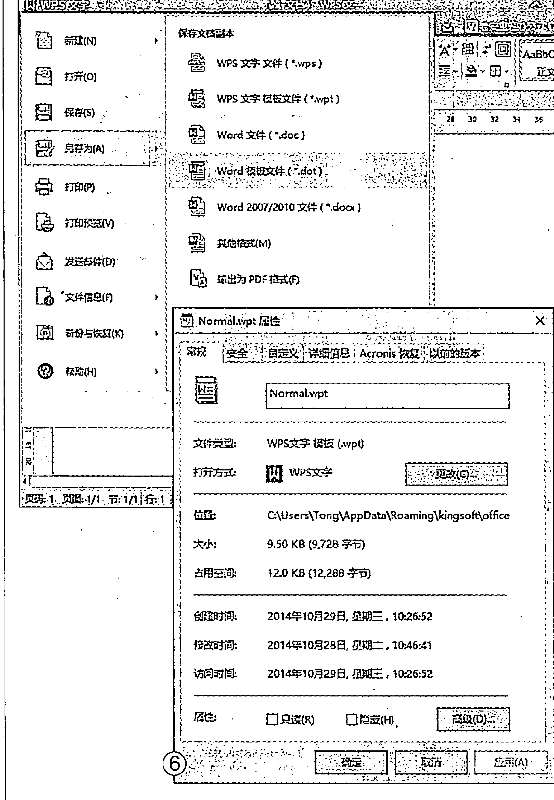

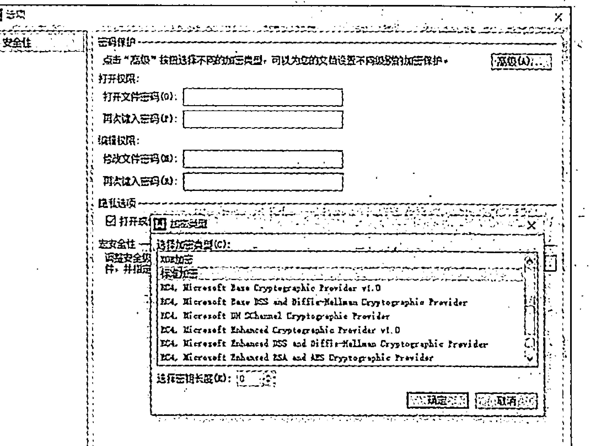

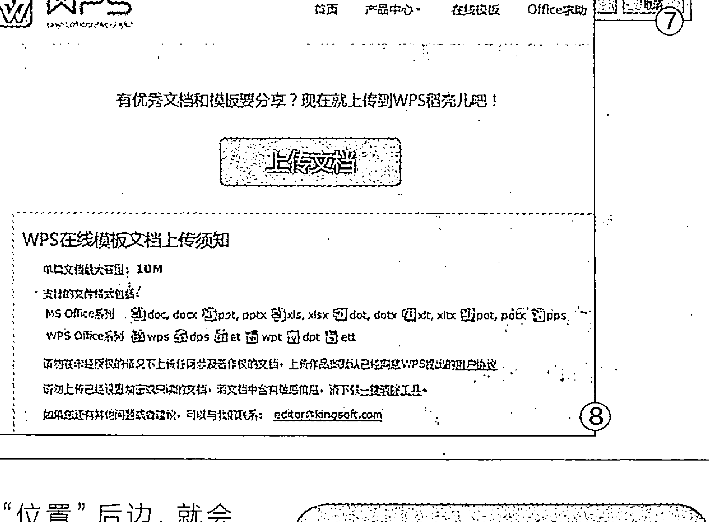

扩展阅读 还可以通过“特色功能→保存云文档”，选择保存为模板类型，将WPS文档作为模板保存在金山云服务器中备份或分享。此外，除了WPS文字，WPS表格和WPS演示也可以用同样的方法来使用模板。

## 精通非常规文本替换

文|南粤

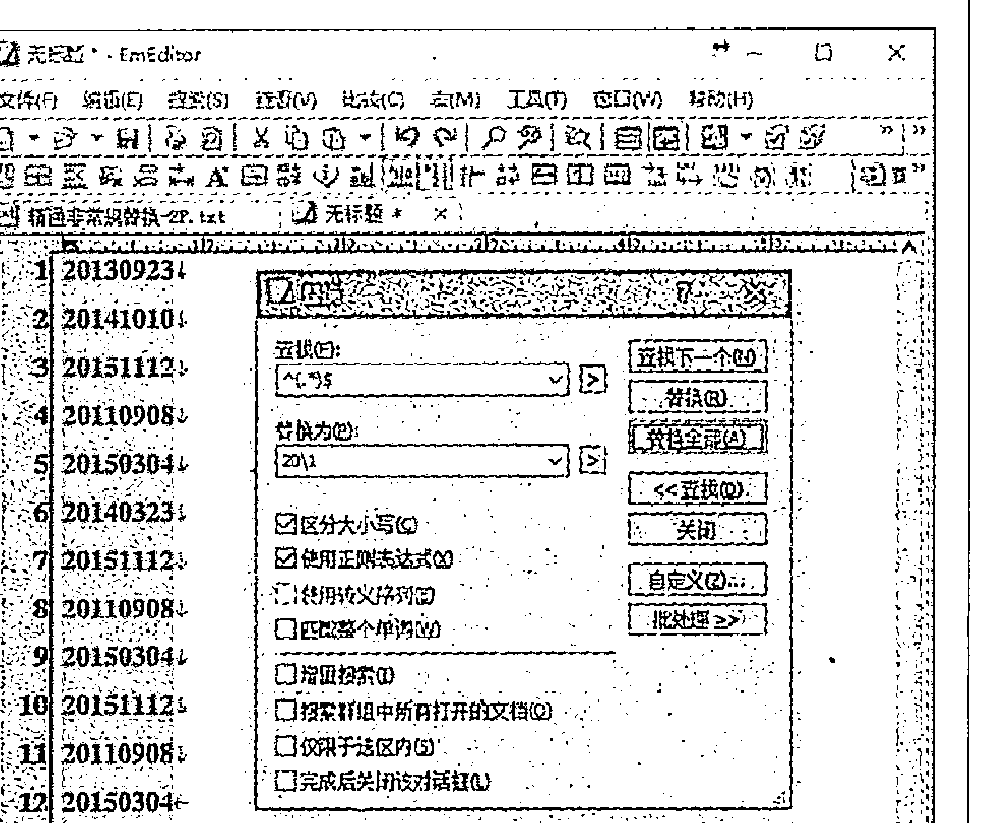

在用电脑办公或写作的过程中，成批替换操作是常会用到的提效措施。常见的成批替换是将固定的甲字词句成批替换为固定的乙字词句。这样的操作极容易掌握。但还有一些特殊情况，替换的甲乙双方都不固定。如将E1-18-ABCD这样格式的产品型号字符串统统改为ABCD.E1.18这种形式，这就为替换操作提出了新的难题。

> > 小提示
> 从软件的轻便性和功能的灵活性来讲，使用EmEditor更为高效。Word、WPS中也能完成，但操作过程更为繁琐，此外还有格式上的各类旁因，因此CFan建议在面对复杂替换时，使用EmEditor会方便许多。

### 1. 增减内容型

#### (1)增加前缀型

有一列日期数据，都是短格式（如140429、130812等），要统一替换为长日期串（如20140429、20130812等），需要在前面统统加上“20”两个数字。前面给出的6位数字都不固定，如何替换？

```

替换方法:
用控制键Ctrl+H先激活替换框，启用“使用正则表达式”复选框，在“查找”框中先输入字符“^(.*)$”6个半角字符；在“替换为”框中输入“20\1”，执行“替换全部”按钮即可实现成批添加前缀（图1）。

```

```

技巧解读:
以上方法巧用了段首判断控制符“^”、段尾判断控制符“$”，以及通配符“*”相结合，用一个表达式“^(.*)$”就能扫描出所有6位短日期字串。与此同时，用一组小括号控制符，定义了当前组6位短日期串的编码（只有一组，所以编码为1）。而后在“替换为”对话框中，先给出要添加的前缀20，然后再附上原有的6位日期串（用代码“\1”表示），完成替换表达式的构造。

```

#### (2)添加后缀型

有了上面的基础，如果要将09-18、12-28这样的零件短型号数据列表后，统一加上型号后缀-AB，变成09-18-AB、12-28-AB这样的格式，就简单多了。

```

替换方法:
构造“查找”表达式“(..-..)$”，“替换为”表达式“\1-AB”，执行全部替换操作即可（图2）。

```

```

技巧解读:
这次仅用了段尾控制符，前面的位数控制由通配符加原有的连字符“-”来构造表达式“..-..”。

```

#### (3)删除前后缀

如果反过来，需要将上述例子中的前缀或后缀成分统统删除掉，替换操作该如何进行？

```

替换方法:
删除前缀，在“查找”框中输入“^”加前缀字串；删除后缀，在“查找”框中输入后缀字串加“$”。执行替换即可。

```

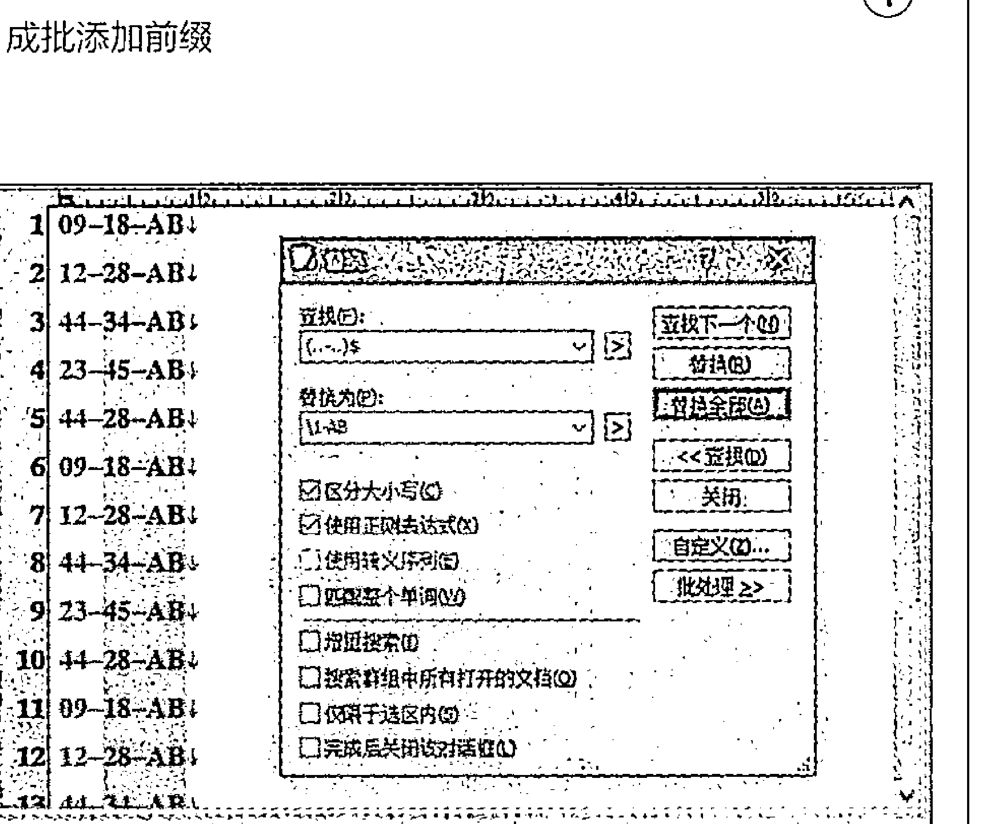

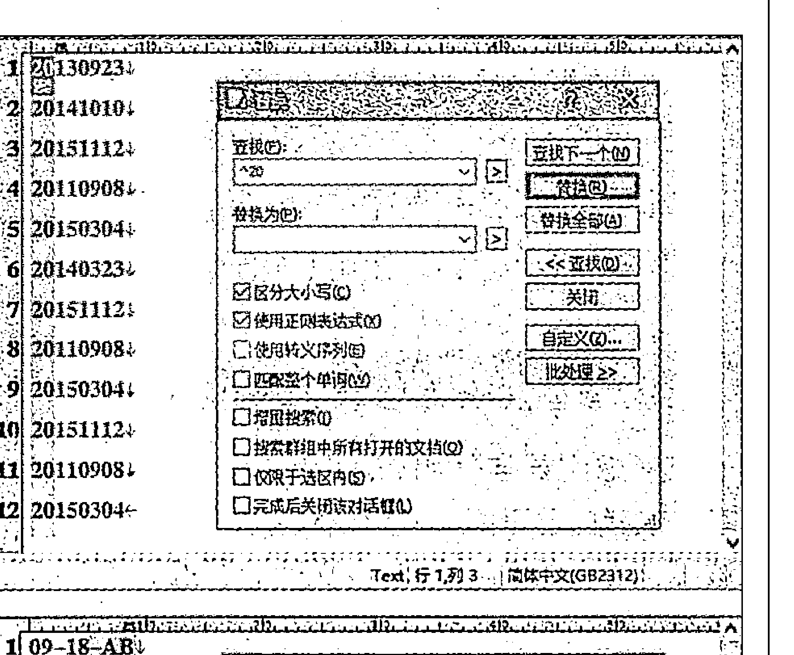

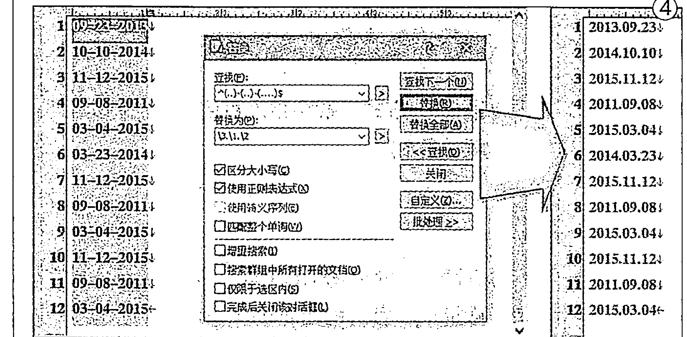

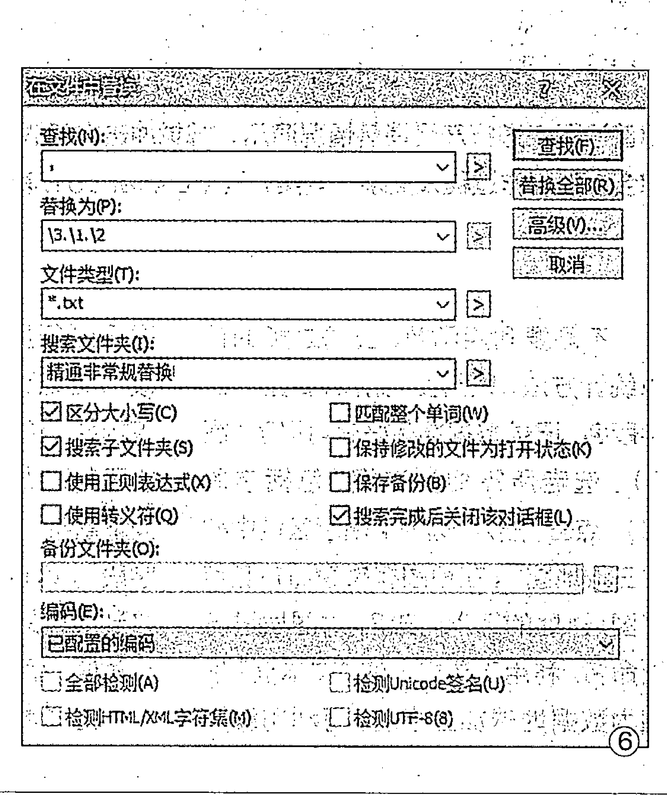

| 转义字符 | 说明 |
|----------|------|
| \r | 回车(在文件中查找时使用) |
| \t | 制表符 |
| \w | 单词 |
| \s | 空格 |
| \d | 数字 |
| \l | 小写字母 |
| \u | 大写字母 |
| \Q | 开始引用 |
| \E | 结束引用 |
| \\ | 转义特殊字符 |

“查找”框中输入后缀字串加“$”。在“替换为”文本框中清空所有内容（注意，连同空格也不能输入，空格也是占位字符）。然后执行全部替换即可将所有前缀或后缀都清空（图3）。

如果要在中间插入内容，或删除中间部分的内容，也可以采用如上表达式构造技巧。例如，要在长日期字串20140918的中间插入连字符，变成2014-09-18这样的格式，可以这样操作：在“查找”框中输入“^(....)(..)(..)$”，在“替换为”框中输入“\1-\2-\3”，执行全部替换。反过来，若要将2014-09-18格式变为20140918，则只需将查找表达式写成“^(....)-(..)-(..)$”，将替换为表达式写成“\1\2\3”即可。这又是灵活定义和使用了3个变量表达式的结果。

### 2. 位置颠倒型

除了上述介绍的前后缀或中间部分的替换外，有时还需要进行位置的颠倒替换。例如，要将形如10-28-2015的长日期格式统一替换为2015.10.28。这就涉及到了在替换的同时颠倒位置顺序。

替换方法:

先构造一个3段“查找”表达式，用\1代表月份，用\2代表日，用\3代表年份，然后分别用新的顺序和新的间隔符号来构造替换表达式。具体操作方法是：在“查找”框中输入“^(..)-(..)-(..)$”，在“替换为”框中输入“\3.\1.\2”，点击“替换全部”。最后的替换结果如图右侧所示（图4）。

### 3. 段落处理型

有时我们从网上下载的小说，该断开的段落却被广告语连接在了一起；而又有的时候，该是一个自然段的内容却被某个符号断开为两截。这种情况下，就需要对不正确的段落进行断开或连接的批量替换处理。

段落断开:

有的商家在网页中插入了隐含的广告语（例如：ABC期货交易），当我们复制一篇文章后发现该断开的地方都被“ABC期货交易”这几个字给连上了。这时，可以用“ABC期货交易”作为“查找”内容，在“替换为”对话框中输入“\n”这个控制符，执行成批替换，它代表了凡是遇到这个广告的地方，都自动替换为自然段换行。这样就解决了段落自动批量整理问题。

段落连接:

如果下载的小说文本，每个段落都被一个特殊的符号（如）断开了，我们也可以巧妙地利用自然段控制符将其一次性连接起来。具体方法：在“查找”文本框中输入“\n”，保持“替换为”文本框为空，不能有任何内容（包括空格），执行全部替换。

有时可能还需要在多个文本中进行搜索和替换。这时，可利用EmEditor高版本中集成的跨文档替换功能来实现。具体操作方法是：点击“查找”菜单下的“在文件中替换”命令，然后指定要搜索的文件所在的文件夹，选择是否包含子文件夹；最后用如上提到的方法构造替换表达式，完成全部替换操作（图6）。

# 三维数据地图 Excel轻松作

文|马震安

用普通图表进行产品销售情况演示，视觉冲击力不强。如果利用3D地图加图表的方式，就会给人耳目一新的感觉。也许你会认为制作过程太复杂。其实，利用Excel 2016就能轻松做出这样的效果（图1）。

不需要利用函数、公式之类的计算统计方法，只需要将所需要显示的字段名、记录数据准备好就可以了（图2）。选定所需要的数据（包括字段名），点击“插入”选项卡演示区域中的“三维地图”。在地图编辑窗口右侧点击图层1处的第2个按钮，对图层进行重命名。利用工具栏上的“文本框”按钮为数据地球加上标题。再利用编辑窗口中控制地球的按钮来调整数据地球的显示角度（图3）

接下来制作所要显示的各个场景。点击“新场景”中的“世界地图”，添加一个新场景。选择这个场景，对图层进行重命名；位置处点“添加字段”，区域处选“城市”，点城市右侧向下箭头，选“城市”；高度处点“添加字段”，区域处选“销售”，点销售右侧向下箭头，选“平均”；类别处点“添加字段”，区域处选“城市”。最后，利用控制地球的按钮来调整数据地球的显示角度（图4）。

主场景设置完成后，设计显示各县区销售情况的分场景。点击“新场景”中的“世界地图”，选择新添加的场景，对图层进行重新命名；位置处点“添加字段”，区域处选“区县”，点击城市右侧向下箭头，选“县市”；高度处点“添加字段”，区域处选“销售”，点击销售右侧向下箭头，选“求和”；类别处点“添加字段”，区域处选“区县”；点击筛选器中的“添加筛选”，区域处选“城市”，勾选所需城市（如唐山）。同样需要调整数据地球的显示角度。

其他城市各县区销售情况的显示，可以点击工具栏上的“新场景”选择“复制 场景3”，设置方法同上，只是在筛选时要选择不同的城市。

所有场景添加完成后，点击“播放演示”，播放最终效果。也可以将最终的效果输出为视频文件。

| 城市 | 区县 | 销售 |
|------|------|------|
| 唐山 | 丰南区 | 19 |
| 唐山 | 路南区 | 16 |
| 唐山 | 路北区 | 15 |
| 唐山 | 开平区 | 19 |
| 唐山 | 遵化 | 20 |
| 唐山 | 迁安 | 13 |
| 唐山 | 迁西 | 20 |
| 秦皇岛 | 海港区 | 18 |
| 秦皇岛 | 山海关区 | 11 |
| 秦皇岛 | 北戴河区 | 16 |
| 秦皇岛 | 昌黎县 | 11 |
| 秦皇岛 | 抚宁县 | 12 |
| 秦皇岛 | 卢龙县 | 20 |
| 秦皇岛 | 青龙满族自治县 | 14 |
| 保定 | 定州市 | 15 |
| 保定 | 涿州市 | 16 |
| 保定 | 安国市 | 15 |
| 保定 | 高碑店市 | 20 |
| 石家庄 | 长安区 | 12 |
| 石家庄 | 桥西区 | 10 |
| 石家庄 | 新华区 | 17 |
| 石家庄 | 桥东区 | 20 |
| 石家庄 | 裕华区 | 15 |


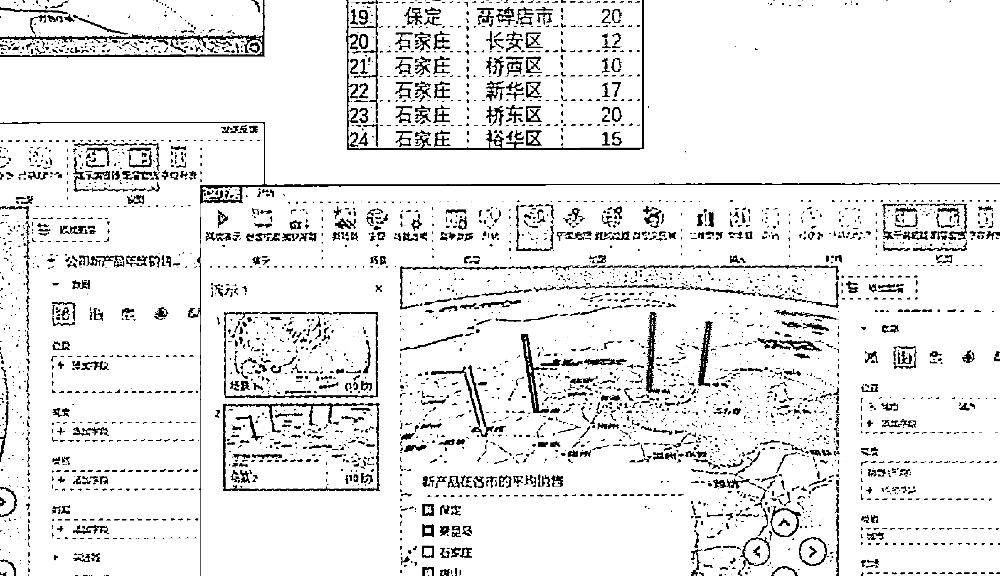

> 在演示过程中，将鼠标放到柱形图上，即可显示出该柱形的具体含义。

# Excel图表数据巧钻取

文|马震安

图表的数据钻取是通过点击图表中的图形，利用该图形所代表的数据来生成另一个更详细的图表。如图为用公司各店铺1~6月的销售额作为数据源制作的一个饼图，当点击饼图的每一块时，就会生成相应店铺1~6月份的销售折线图（图1）。在Excel 2013中，怎样实现这种图表级联的交互效果呢？

### 1. 制作主图表饼图

首先制作主图表——饼图。选择店铺所在列A1:A6，按下Ctrl键再选销售总额所在列H1:H6，点击“插入”选项卡中的“三维饼图”，向外适当拖动饼图的任意一块，将饼图拆开。然后，选择饼图，在“设计”选项卡上点击“添加图表元素”中的“数据标签”，选择“数据标签内”（图2）。

### 2. 交互效果巧实现

要想在Excel的图表中实现交互效果，需要借助少许VBA代码。点击“开发工具”选项卡中的“Visual Basic”按钮进入VBA编辑器，右击“VBAProject(工作簿1)”，选择“插入→类模块”，这时就会出现一个类模块文件夹；点击“+”将其展开，选择“类1”，选择“视图→属性窗口”，将类的名称改为“EventClassModule”，双击这个类进入编辑窗口，输入如图代码。接下来，双击“ThisWorkBook”，选择编辑窗口左侧的Wordbook，右边选Open，并输入图中代码（图3）。

> **小提示**

图中代码的作用解释：打开工作簿时，激活工作簿中的第1个图表；当选择图表中的图形时，将图形所表达的数据所在数据源的行、列位置存放在A10、B10单元格中。

### 3. 制作折线图

生成折线图，关键是确定数据源。接下来就是利用A10、B10单元格中的数据来生成折线图所需要的数据源。在A8单元格输入“=OFFSET(A2,$B$10-1,0)”并填充到G8单元格（是以A2为参照系，根据$B$10-1的值返回新的引用），确定折线图的数据源。

折线图的制作和饼图类似，在此不再赘述。

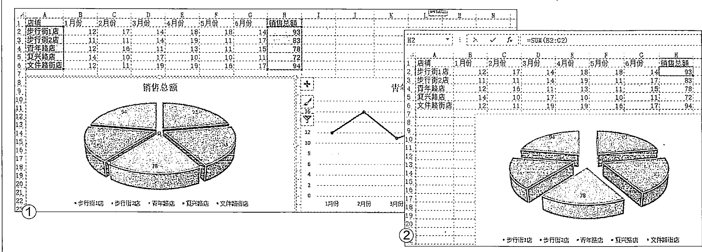

### 宏安全设置

要想使用VBA代码，还需要点击“开发工具”选项卡中的“宏安全性”，选择“启用所有宏”，只有这样才能实现上述图表的数据钻取。

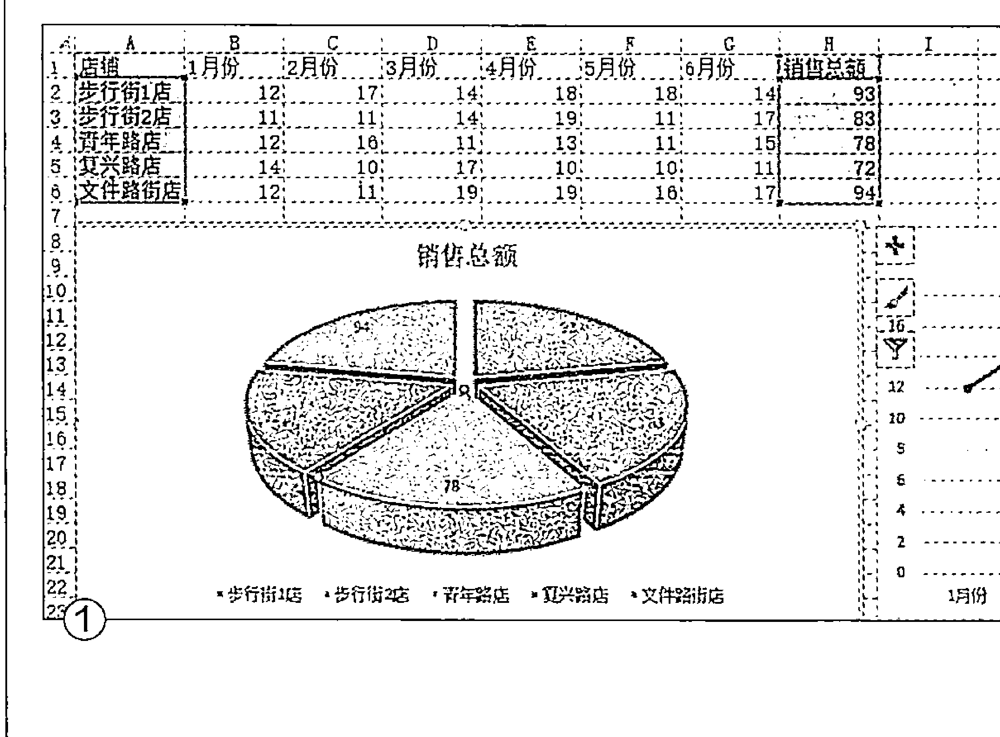

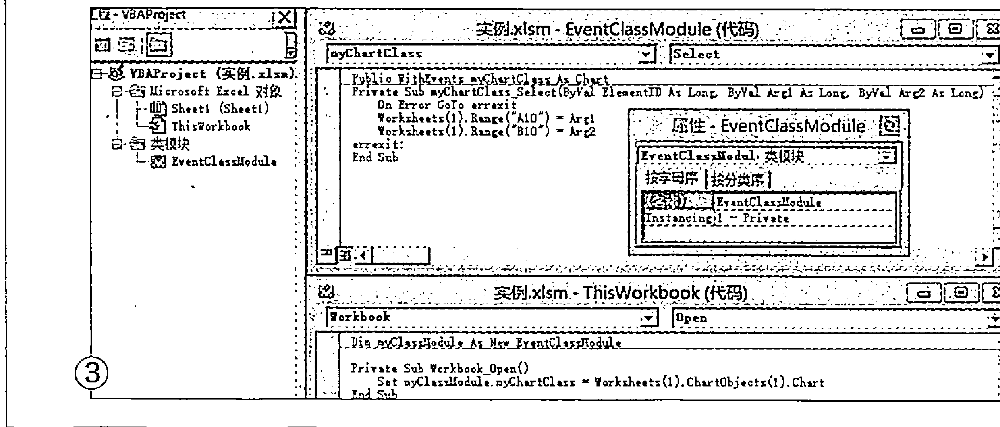

## 个人硬笔手写体亲体验

文|刘志勇

一直以来，办公文档或书稿打印都是使用系统默认或从网上下载的字体，想把自己的硬笔手写体制作成TTF格式的计算机字体是比较麻烦的一件事情。自己做太耗时间，还要熟悉各种工具软件。找做字库的公司来做，价格不菲。就算网上找到可以制作的个人，最少也要收费百元左右。难道只能羡慕老徐（静蕾）、小井（柏然）这些大明星，只有这些人才能拥有一套自己的手写体字库吗？

现在，你也可以迅速免费拥有一套自己的专属字库了。而且，只需要将制作好的字库安装到电脑中，就可以和宋体、黑体一样在Word、QQ等软件中使用，还可打印为手写文档。而要实现以上这一切，所需要的仅仅是笔、A4纸、打印机、拍照手机和写字的耐心！

打印出来并完成书写，用手机拍照上传，几分钟后就可以自动生成自己的专属字体了。具体的注意事项和要求，网站常见问题栏里已经讲得非常清楚，而且有教学视频（图3），此处不再赘述。这里只想说说我在生成字体中遇到的问题，希望给大家一点启发。

### 1. 基本制作流程

首先登录北京大学计算机科学技术研究所的手写体中文字库自动生成系统（http://t.cn/RAXt0nO），完成注册（图1）。登录后选定需要的字符模板下载，字数越多的模板系统分析生成的字体越准确（图2）。

### 2. 使用经验分享

开始打印选定模板时我用A4纸直接打印，发现格太大，写出的字不好掌握，很多笔迹缺陷，字显得很丑。后来改用一张A4纸打两张图，写出的字基本满意。当然写字超好的人士除外，毕竟字越大，细节就越清晰（图4）。

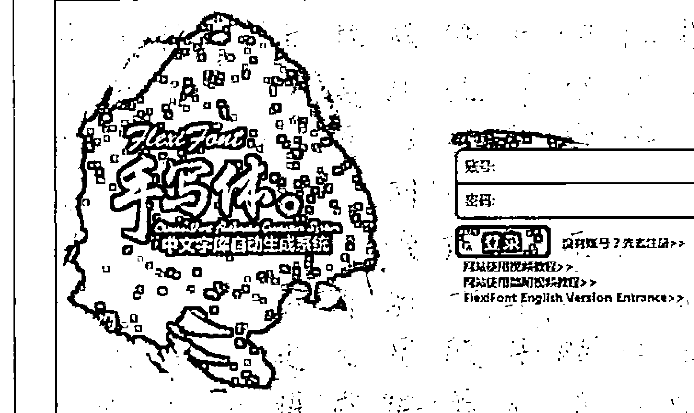

| 模板选项 |
|----------|
| 6763字+符号（下载） |
| 639字+符号（下载） |
| 2500字+符号（下载） |
| 3500字+符号（下载） |
| GB2312全（下载） |
| 符号模板（下载） |
| 2500常用字（下载） |
| 3500常用字（下载） |
| + 添加自定义 |

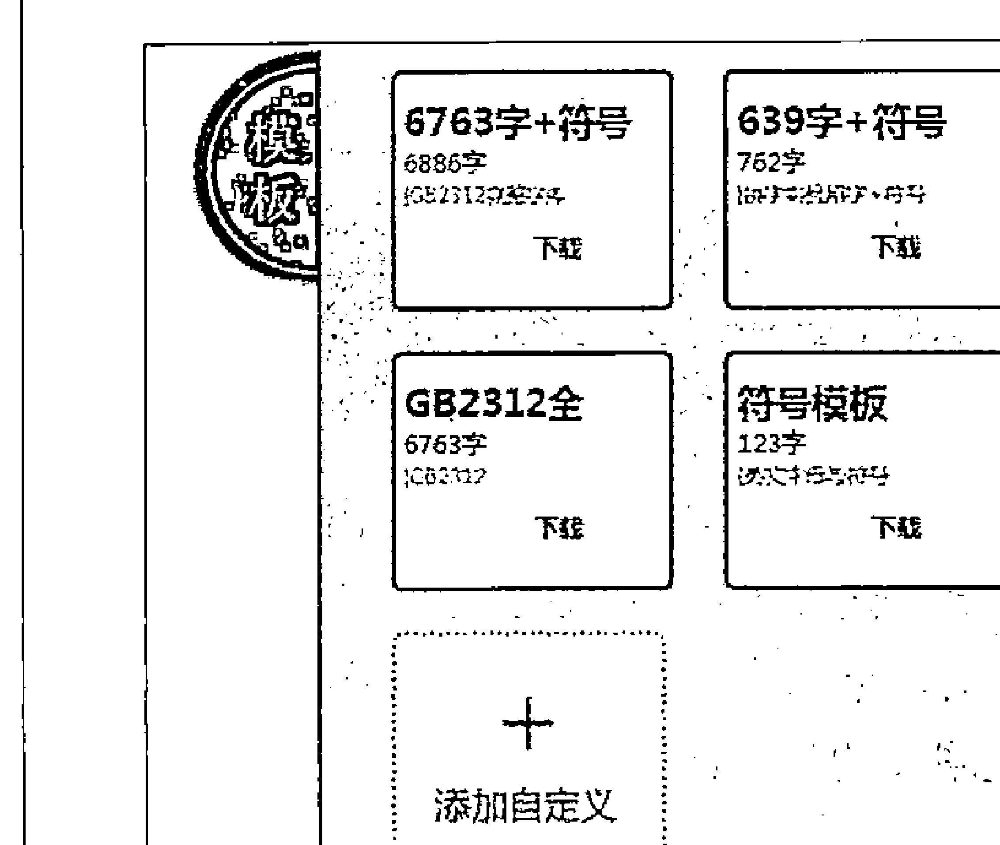

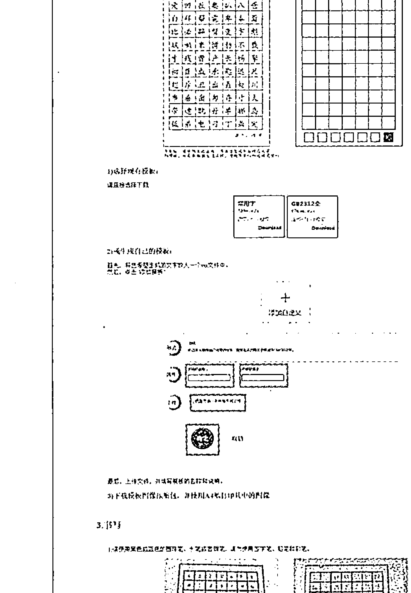

右侧栏标题：如何得到一款属于自己的字库？

- 准备的东西
  - 笔
  - 纸
  - 扫描仪或者相机
  - 电脑
- 准备模板
  - 到网站（http://t.cn/RAXt0nO）注册后，选择需要的字符模板下载。

```

http://t.cn/RAXt0nO

```


- 打印
  - 最好用A4纸打印。
- 书写
  - 在打印好的模板上书写，尽量工整。
- 拍照或扫描
  - 将写好的模板拍照或扫描成电子版。
- 上传
  - 登录网站，上传图片。
- 生成字体
  - 系统自动生成字体文件，可下载安装。

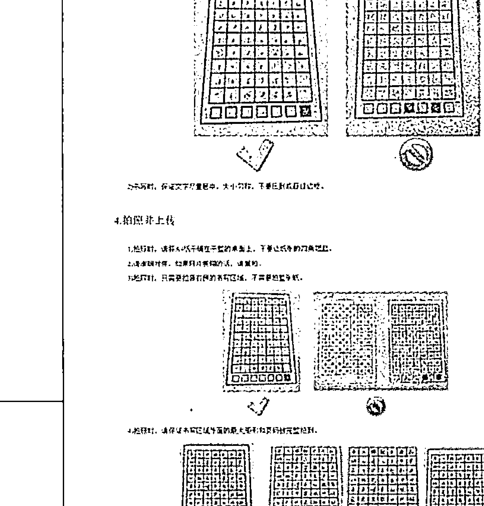

- 拍照上传
  1. 拍摄时，请保证光线充足，手机与纸面平行。
  2. 照片要求清晰，无阴影，无反光。

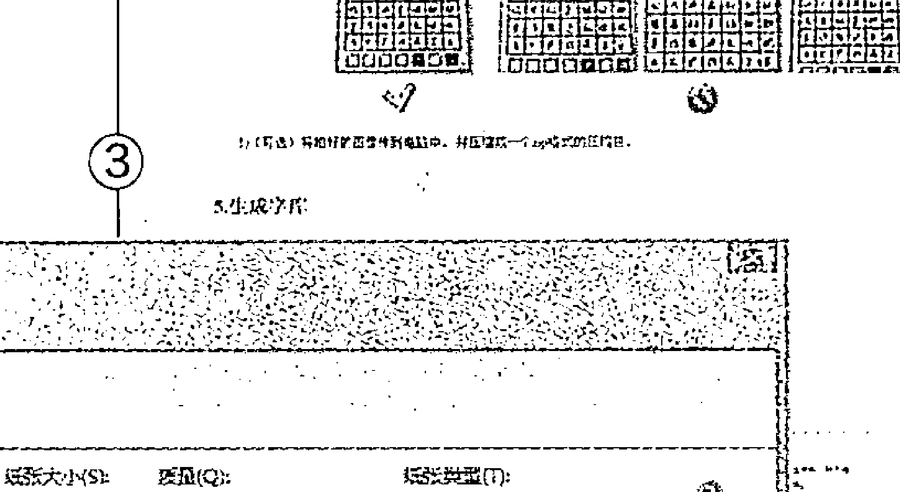

- 生成字体
  - 上传后，系统会自动处理，生成字体文件。

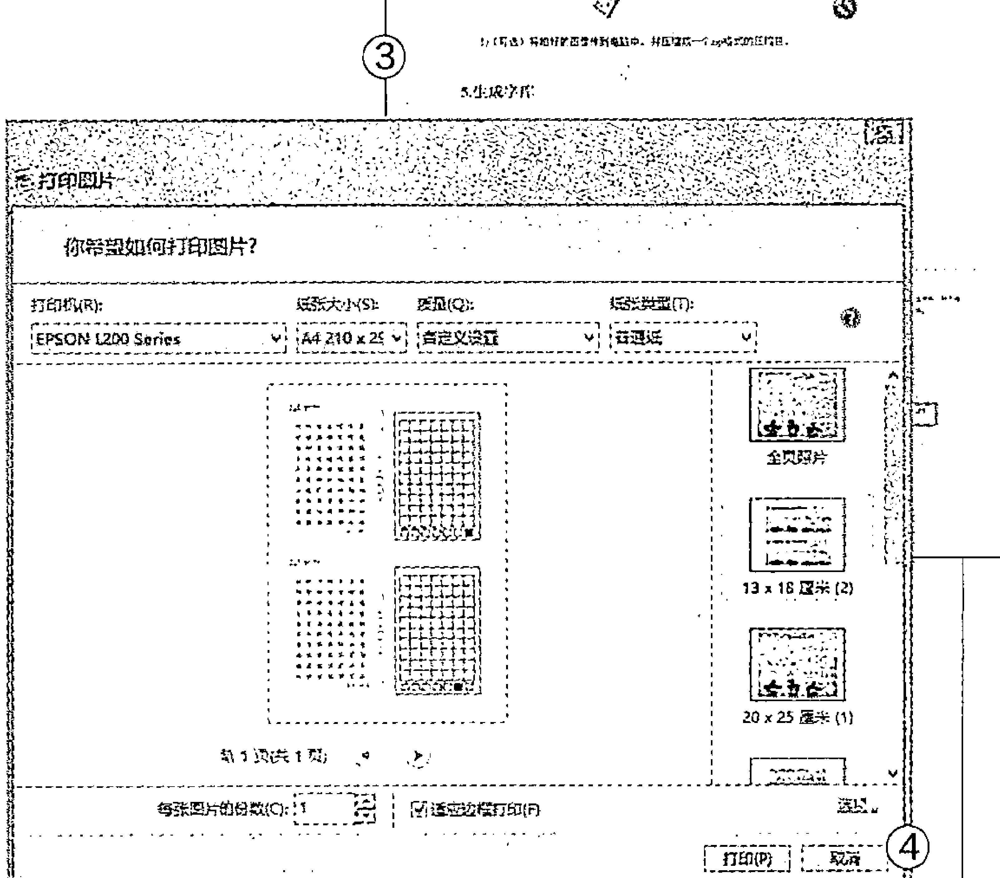写好后为了保证清晰度，用扫描仪扫描后导入电脑完成裁切修图，每张图片1MB左右(生成压缩包体积太大，多次上传、生成失败)。事实证明我多虑了，系统拥有良好的识别性，手机的图片就能很好地被识别。按照常见问题栏中的拍照要求完成图片采集，导入“光影魔术手”，使用批处理功能统一处理成200KB左右，全部打包压缩成ZIP格式(图5、图6)。点击字体上传，选择使用的模板，勾选“生成结束邮件通知”选项，完成上传。上传过程没有进度提示，但如果上传成功，网页会自动跳转到“我的字体”页面，几分钟后自己的邮箱会收到网站生成成功或失败的邮件提醒(图7)。如果提示生成失败，请重新登录系统“我的字体”栏找到“生成失败”，点击进入，会有详细的失败原因描述，根据描述修改错误的图片重新打包上传(图8、图9)。如果邮件提示生成成功，就可以在网站“我的字体”栏编辑、预览或下载使用。若开始使用的模板并不是6763字+符号6886字(GB2312完整字库)，而是639字+符号762字(拼字实验用字+符号)、2500常用字2500字(现代汉语常用字表)等小字库，可以在生成成功后勾选“合并”选项，生成新的完整合并字体(图10)。将生成的字体文件下载并安装到Windows中之后，就拥有自己的专属字体了。相信你的字比笔者的更漂亮，那就请大家快来试一试吧！

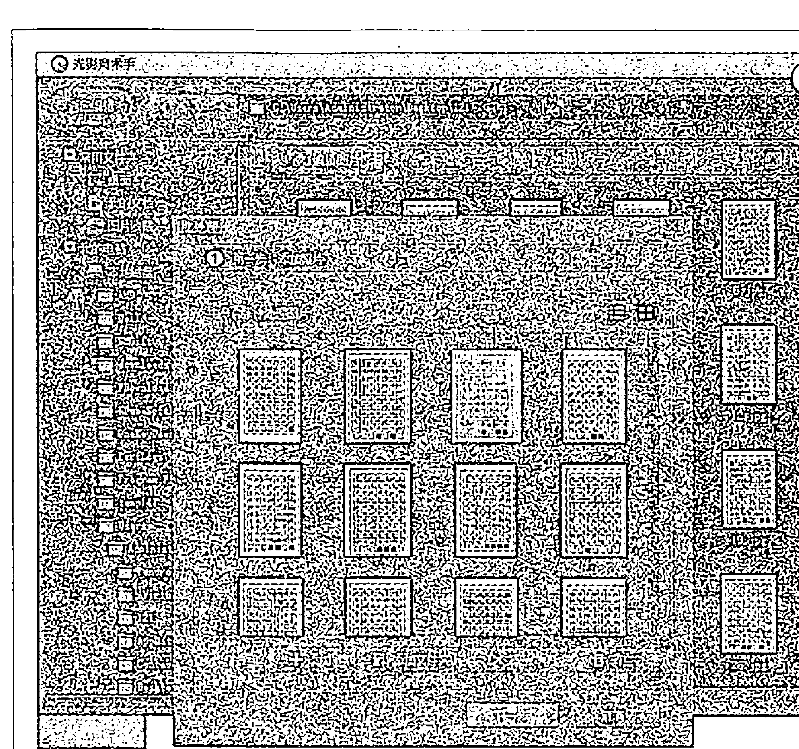

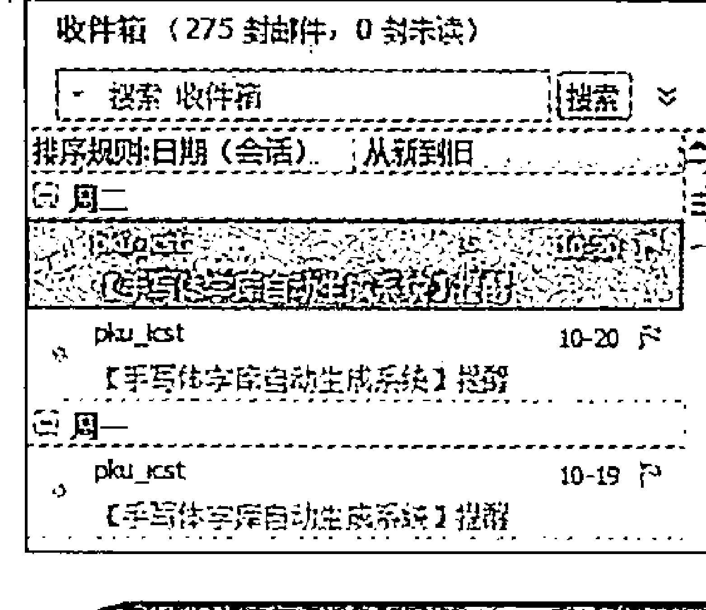

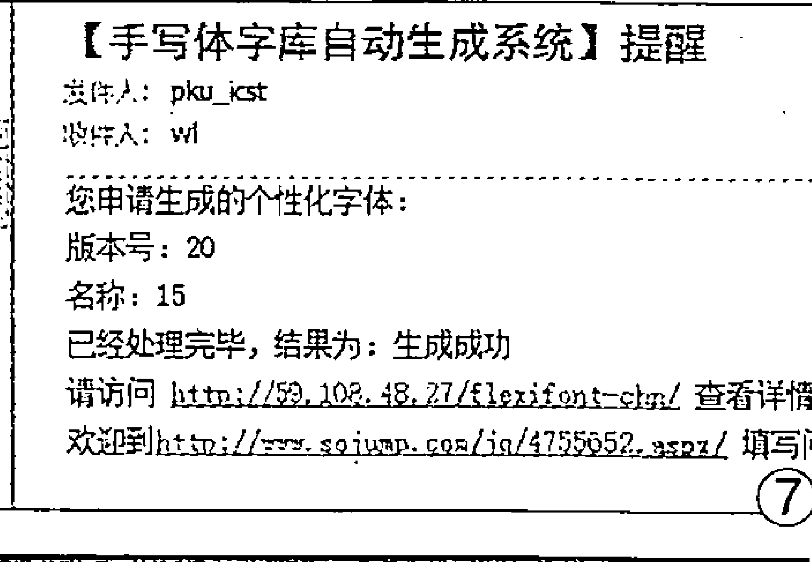

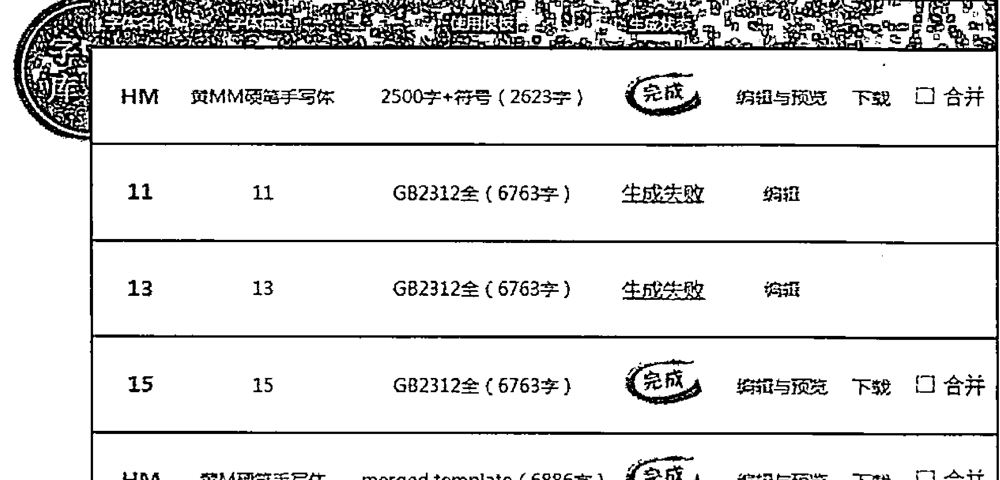

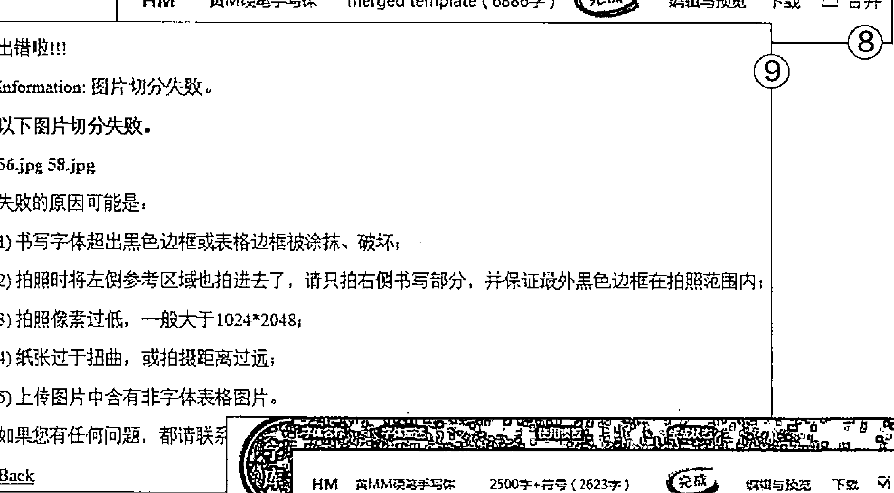

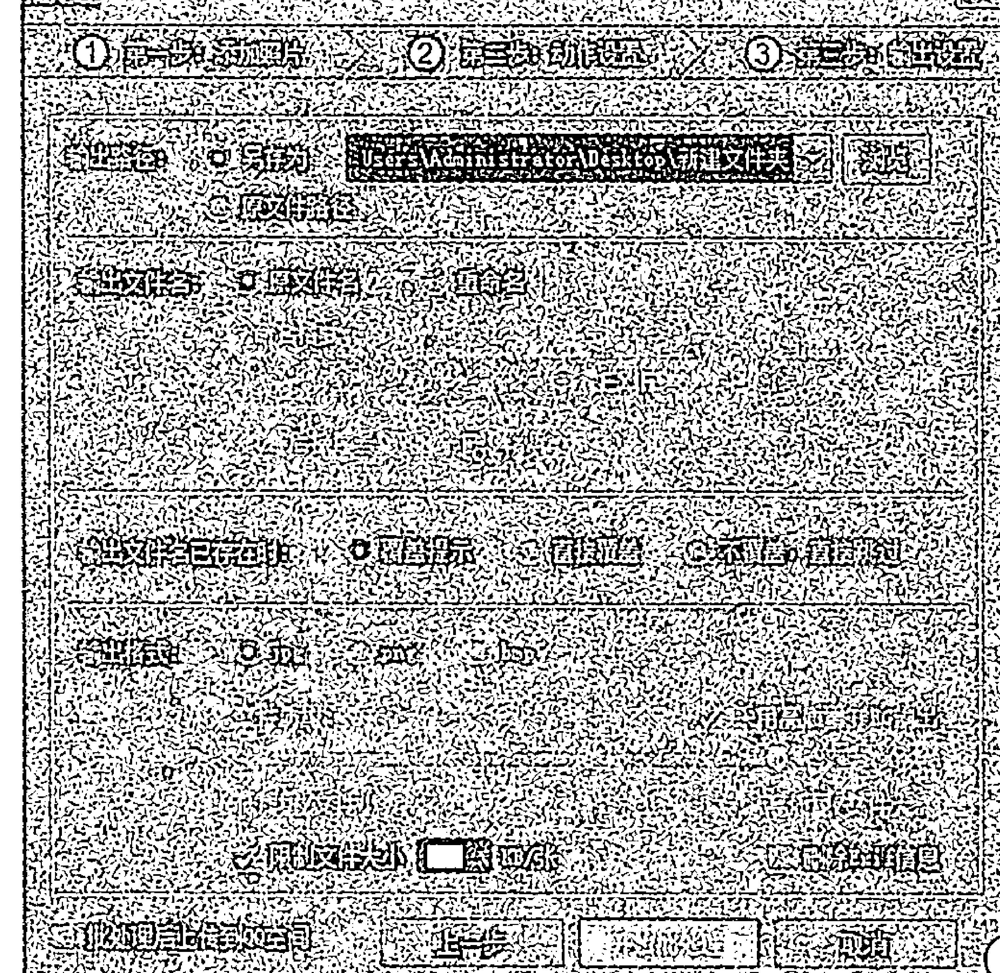

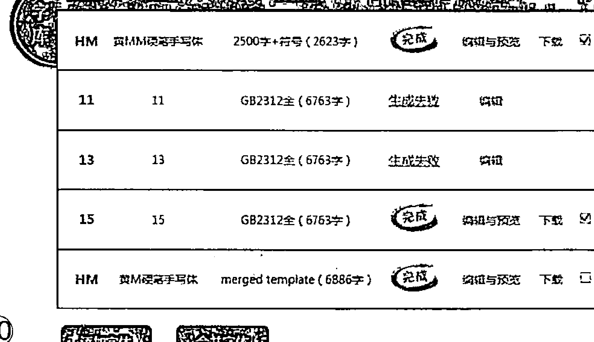

## 图解文表 Excel信息联动法 文|马震安

Excel表格中存放了水浒中108位好汉的姓名、对应头像、绰号、座次及简介。为了浏览的便利，想做成这样的交互效果：利用下拉菜单选择姓名后，该人物对应的头像、绰号、座次及简介就会联动显示出来（图1）。这样可以大大节省显示界面的占位空间。

大家知道，在Excel中实现交互效果，尤其是涉及到图片的效果，是不容易实现的。但是，我们可以巧妙利用一些特别的函数，实现这种效果。

首先，将存放108位好汉相关信息的数据表进行整理，工作表的名称为“人物”，同时新建一个名称为“筛选”的工作表用于对姓名的交互筛选（图2）。

数据准备好后，进行交互设置。首先，在“筛选”工作表的C5单元格插入一个图片，并调整好大小；选中D5单元格，点击“数据”选项卡中的“数据验证”，在设置中“允许”处选择“序列”，“来源”处选择人物工作表中的B2:B109（即“人物”表中的姓名列），这样在“筛选”表中的D5单元格就形成了带姓名的下拉菜单。

利用下拉菜单，选择一个好汉姓名，如“林冲”。分别选择E5、F5、G5单元格，在公式编辑栏分别输入“=VLOOKUP(筛选!$D$5,人物!$B$2:$E$109,2,FALSE)”、“=VLOOKUP(筛选!$D$5,人物!$B$2:$E$109,3,FALSE)”、“=VLOOKUP(筛选!$D$5,人物!$B$2:$E$109,4,FALSE)”。

接下来是最为关键的一个环节：点击“公式”选项卡中的“名称管理器”，新建一个名称为“头像”，引用位置为“=INDEX(人物!$F:$F,MATCH(筛选!$D$5,人物!$B:$B,))”的名称。选中这个图片，在公式编辑栏输入“=头像”，调整好图片大小，使之与单元格的大小相适应（图3）。

> Excel中的文字与图片联动的效果是不是很酷呢？以上仅是一个显示游戏图片的特例，但其实现方法适用于文字和图片联动的任何场合，比如各行各业所涉及到的各种类产品信息和图片的显示等，相信对您一定有用。

上述操作完成后，利用下拉菜单选择不同好汉的名字，头像、绰号、座次、简介等就会跟着进行相应的变动了。

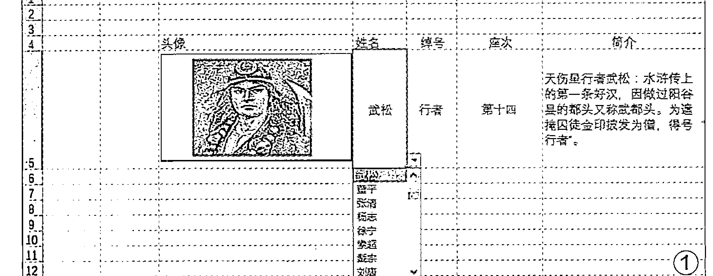

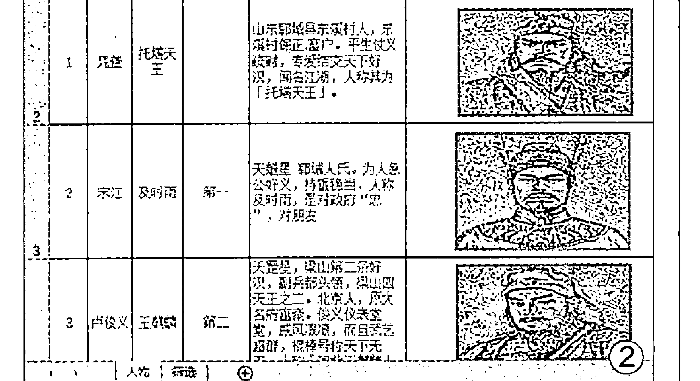

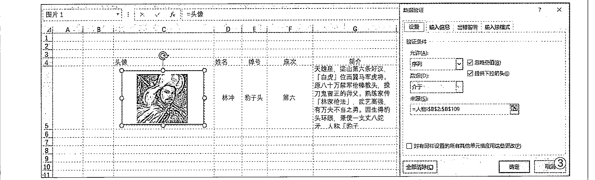

# 制作滑动控制联动数据图表

文|马震安

要用Excel图表向领导展示两款新研产品全年销售不断增长的业绩，如果一次性地将全年12月的销售统计全盘托出，不能给领导太多的惊喜；但如果先展示1月份的数据，随着向右滑动滚动条，逐月比较的图表陆续展现在眼前，必定会带给领导更多激动（图1）。现在，让我们在Excel 2016中实现上述想法。

### 1. 准备图表数据

图表制作，数据先行。打开名称为“新产品销售统计”的工作表，点击公式选项卡中的“名称管理器”，新建名称“cpA”，引用位置为“=OFFSET(新产品销售统计!$B$2,0,0,1,新产品销售统计!$B$8)”；新建名称“cpB”，引用位置为“=OFFSET(新产品销售统计!$B$3,0,0,1,新产品销售统计!$B$8)”（图2）。

> 小提示
B8是将来作为滚动条值的临时存放位置。

### 2. 滚动条巧设置

选择“开发工具”选项卡，点击“插入”按钮，选择“表单控件→滚动条”，在工作表中画出一个滚动条。右击滚动条，选择“设置控件格式”，在“控制”选项卡中设置当前值为1，最小值为1，最大值为12，步长为1，页步长为1，单元格链接为B8（图3）。

### 3. 应用图表数据

数据准备好后，就该把它应用到图表中。首先，在数据区域外选择一个空白单元格，再按住Ctrl键选择A2:B2、A3:B3单元格；然后点击“插入”选项卡中的“推荐的图表”，在弹出的窗口中点击“所有图表→组合”，选择“簇状柱形图-折线图”，其中产品B的图表类型选择“带数据标记的折线图”。图表添加后，右击图表，点击“选择数据”，在弹出的窗口左侧的图例项处分别选择产品A、产品B，点击“编辑”，在弹出的窗口的系列值处分别输入“=新产品销售统计!cpA”、“=新产品销售统计!cpB”；在右侧水平分类轴标签处点击“编辑”，选择B1:M1（图4）。
最后，设置好图表标题。右击图表，选择“设置图表区域格式”，对图表进行装饰、美化；拖动滚动条到合适位置与图表对齐，调整好大小，将滚动条、图表进行组合就可以了。


| 产品 | 1月 | 2月 | 3月 | 4月 | 5月 | 6月 | 7月 | 8月 | 9月 | 10月 | 11月 | 12月 |
|------|-----|-----|-----|-----|-----|-----|-----|-----|-----|------|------|------|
| 产品A | 31 | 33 | 35 | 32 | 36 | 41 | 44 | 46 | 46 | 48 | 50 | 51 |
| 产品B | 28 | 30 | 32 | 35 | 31 | 33 | 36 | 34 | 38 | 42 | 45 | 48 |

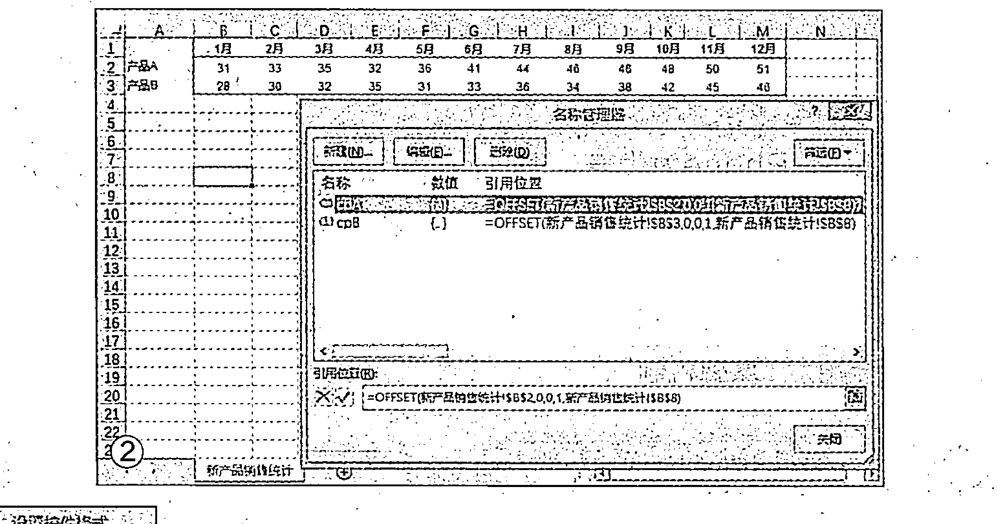

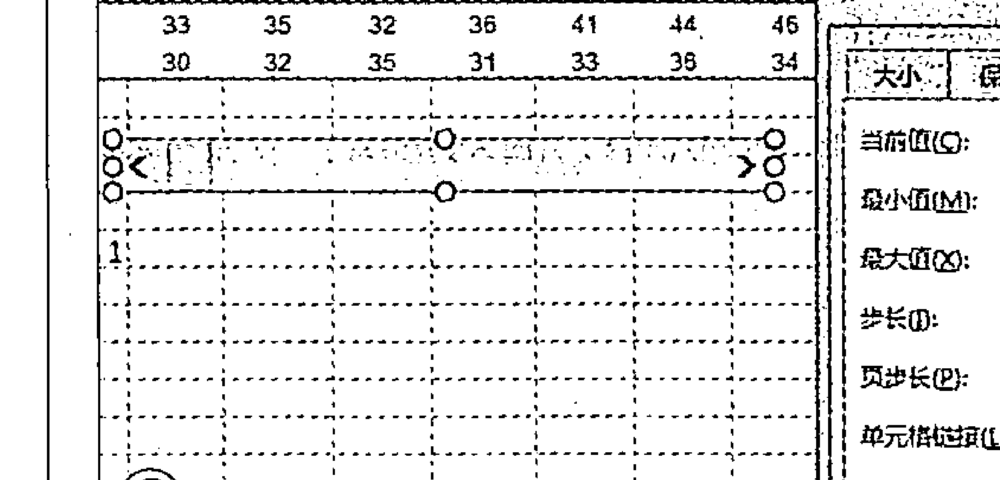

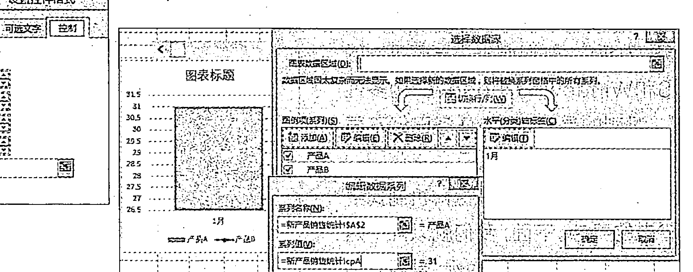

如何延长续航时间

浅谈Android手机的省电机制

文/镜花水月

Android手机的续航能力为何普遍偏低，如今各大手机品牌又有哪些“补救手段”？为何很多Android手机在开启节能模式后却收不到微信消息？这一切，还得从手机的省电机制谈起。

为何iOS相对省电

很多苹果用户都觉得自己的iPhone续航时间偏短，如果你也抱有这个想法，那就太冤枉iPhone背后的省电机制了。实际上，如果你拿一款和iPhone尺寸相同、电池容量相近的Android手机对比，那后者的续航能力只有被秒杀的份。5.5英寸的iPhone 6S在相同使用强度下，待机时间远超同尺寸的Android手机就足以说明问题（图1）。

iPhone之所以“相对省电”（和同尺寸同电池容量手机相比），是因为以iPhone为代表的iOS系统设备们的内存管理采用了“墓碑机制”：当你按下Home返回桌面，或是临时接听电话时会触发“墓碑机制”，刚才运行的APP会被强制暂停（好似APP“已死”），而该APP最后一瞬运行的状态（比如画面、游戏进度等数据）则会被冻结保存（好似把APP临终前的信息记录在墓碑上）。当我们重新切换回这个APP时（图2），iOS系统会同时加载“墓碑上的信息”，好似APP重新从墓地里爬出来，并保持最后一瞬记忆的同时原地满血复活。

墓碑机制最大的好处，就是被冻结的后台程序不会产生额外耗电。此外，由于iOS通知系统的存在，像QQ、微信一类的社交APP可以借助通知系统接收推送消息，而Android系统却需要通过APP本身去主动请求数据，因此需要APP始终保持运行状态。iOS省电与节约内存的特性就是由此而来。

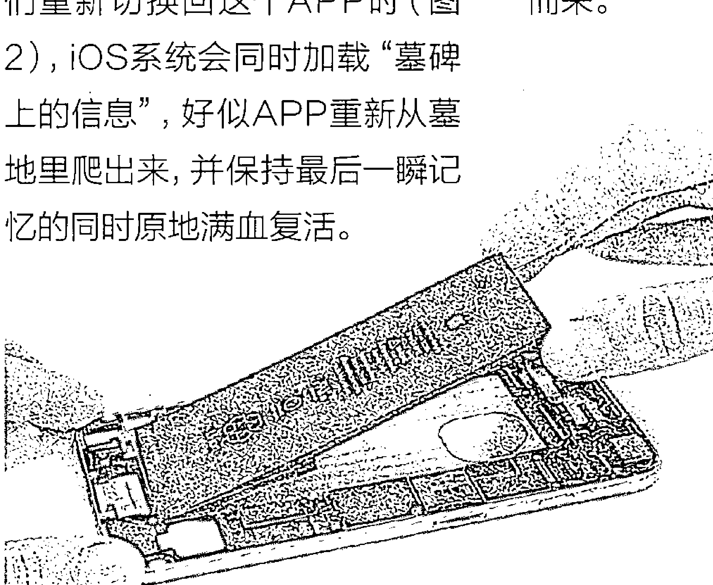

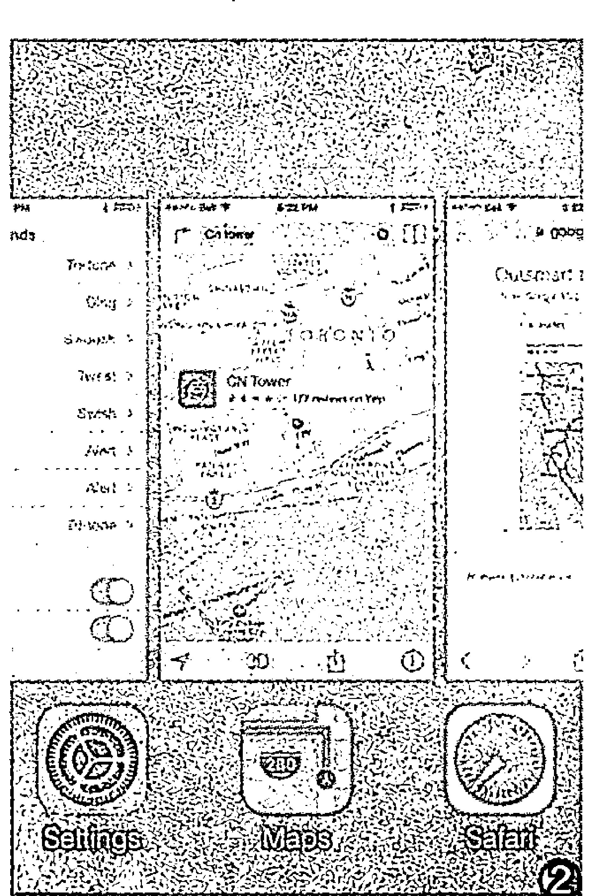

Android手机如何省电

Android系统从诞生伊始就以“多任务”为卖点，并讽刺采用墓碑机制的iOS和Windows Phone是“伪多任务”。讽刺的是，如今多任务已经不再是什么值得称赞的卖点，而越来越多的Android手机，却不断从墓碑机制找到了省电的灵感。下面，我们就以几个熟悉的Android手机品牌为例，看看它们是如何诠释对省电的“理解”。

> 多任务的尴尬

Android多任务的特性，导致后台总会驻留无数的APP进程，而某个APP可能还会触发与之关联的其他APP自启，并不停地推送广告、服务或上传数据信息，造成电量和流量的流失。

最原始的省电机制：

三星手机（TouchWiz UI）的省电机制应该算是Android手机中“相对原始”的代表。以Galaxy S6为例，它的省电模式仅是单纯限制CPU频率、降低屏幕亮度、关闭震动反馈等形式实现节能（图3）。而超级省电模式则更是“简单粗暴”，仅保留通话短信等基础功能，其他多媒体功能被全部屏蔽（图4）。之所以说三星手机省电机制“相对原始”，是因为上述省电功能早已在Android手机中遍地开花，毫无特色可言（超级省电模式曾是三星首创，但如今也被无数品牌模仿）。

## 移动新天地

留意“一刀切”的省电设置

对Android手机而言，如果可以降低熄屏（锁屏待机）后的耗电，无疑可以最大限度延长续航时间。好消息是，如今越来越多的Android手机都提供了类似的省电设置；坏消息是，如果你没有留意省电说明，则会给手机的使用带来影响。

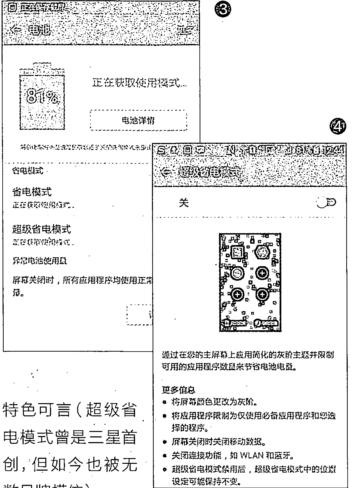

以华为手机（EMUI）为例，其在省电管理中加入了“熄屏省电”的选项，当你打开这个模式后，在按下电源键锁屏后，系统将仅保留最基本的通话和短信服务，并同时切断数据联网功能（图6）。此时，你将收不到任何APP的推送消息，除非你点亮屏幕并运行这些APP。此外，有很多华为手机用户反映待机时收不到微信消息，而且并没有开启熄屏省电一类的选项。此时，大家可以进入省电管理的设置界面，查看是否关闭了“休眠时连接数据业务”，并尽量始终保持WLAN处于连接状态（图7）。

还好，三星Galaxy S6对CPU的调校已近完美，而其特色的AMOLED屏幕也相对省电，所以S6的续航时间并没有因其配置高、电池容量低而大幅缩水。

### 拿背景数据“开刀”

如果给驻留后台的APP做个耗电排行，肯定是可“偷偷联网”的APP排名更高。因此，很多Android手机会将省电的思路转移到限制背景数据的层面上。以华硕手机（ZenUI）为例，如果开启它的省电模式（图5），除了CPU降频亮度变低以外，背景数据功能也会被临时关闭，但这也意味着我们只有打开微信、QQ的软件界面才能收到消息，如果你正运行着其他程序，这些社交软件的推送消息将被拒之门外。

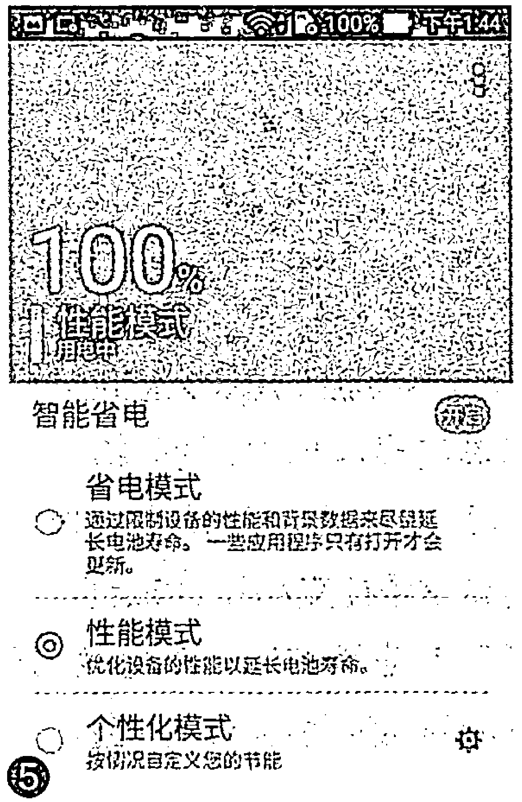

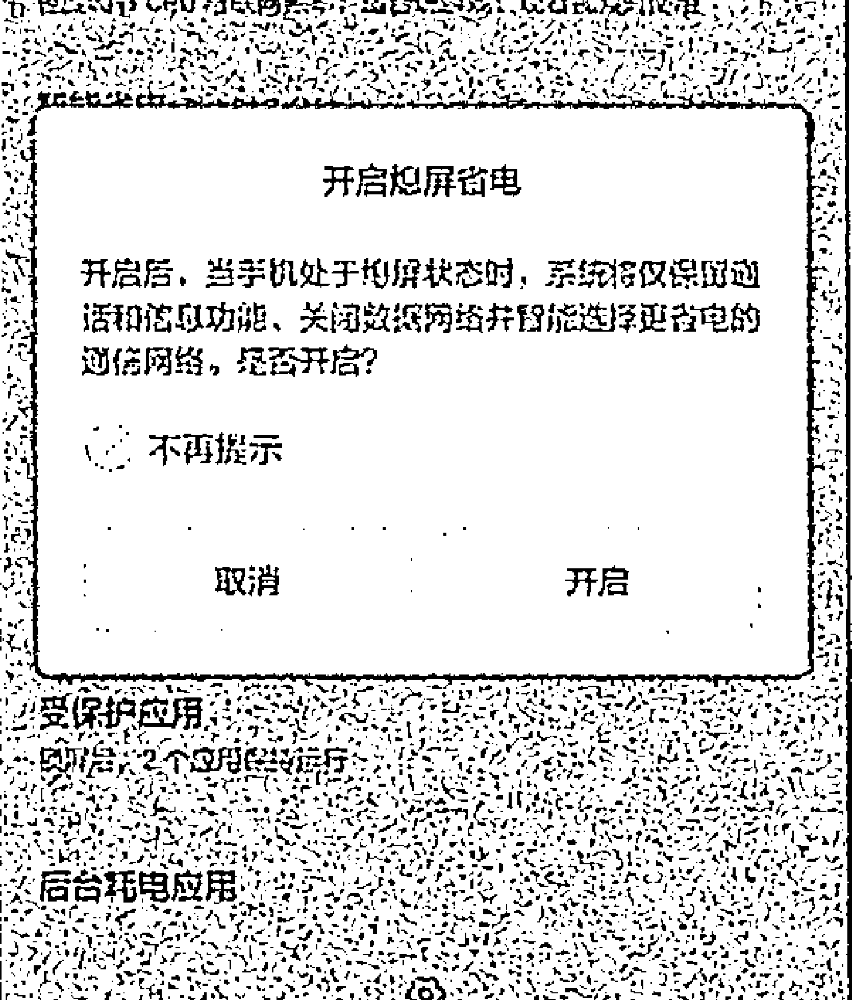

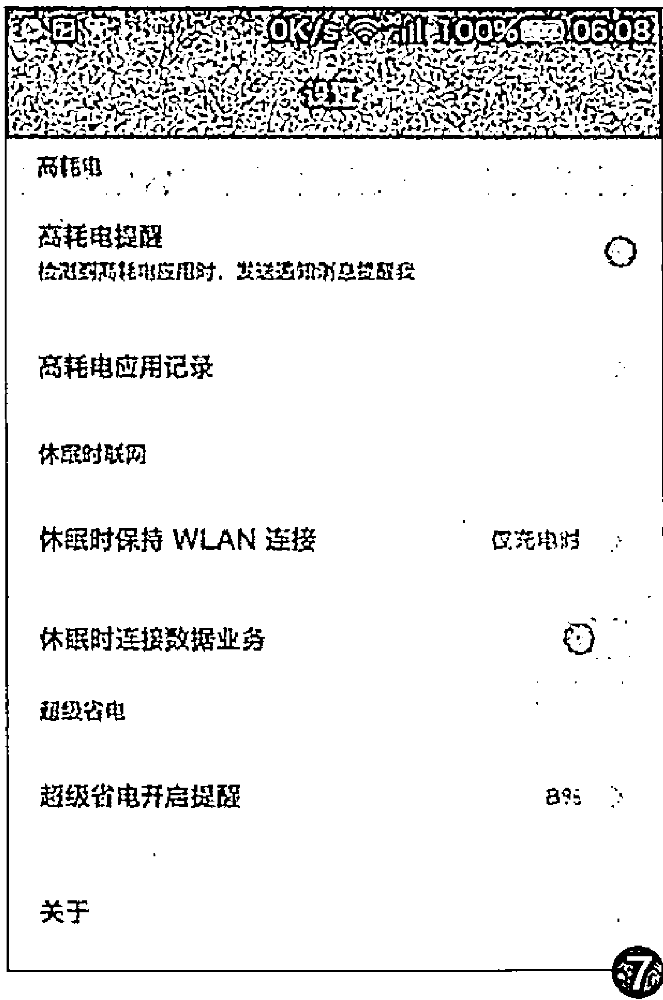

### 准墓碑机制渐成共识

由于iOS的墓碑机制既可无视后台APP的耗电，也不影响社交软件的推送消息，因此如今越来越多的Android手机都纷纷引入了“准墓碑机制”的省电思路。以魅族手机（Flyme）为例，它在传统省电模式的基础上增加了“待机耗电管理”功能（图8），凡是没有被添加到自动清理后台耗电应用白名单的APP，在锁屏3分钟后都会被自动强制关闭，以避免它们造成额外的电量与流量消耗。

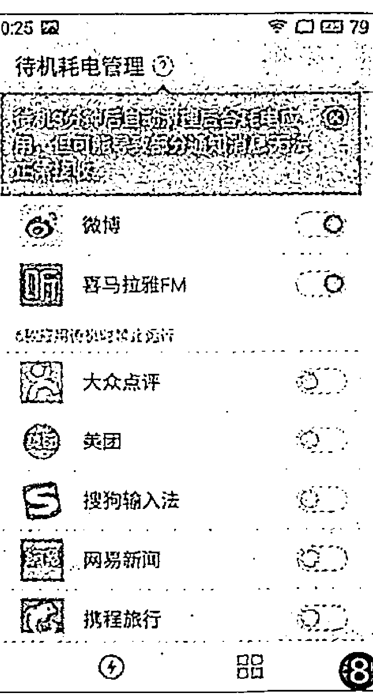

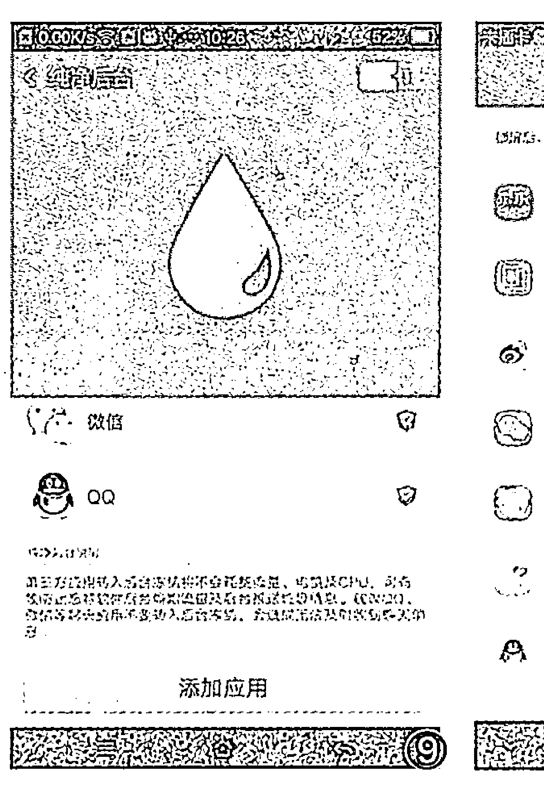

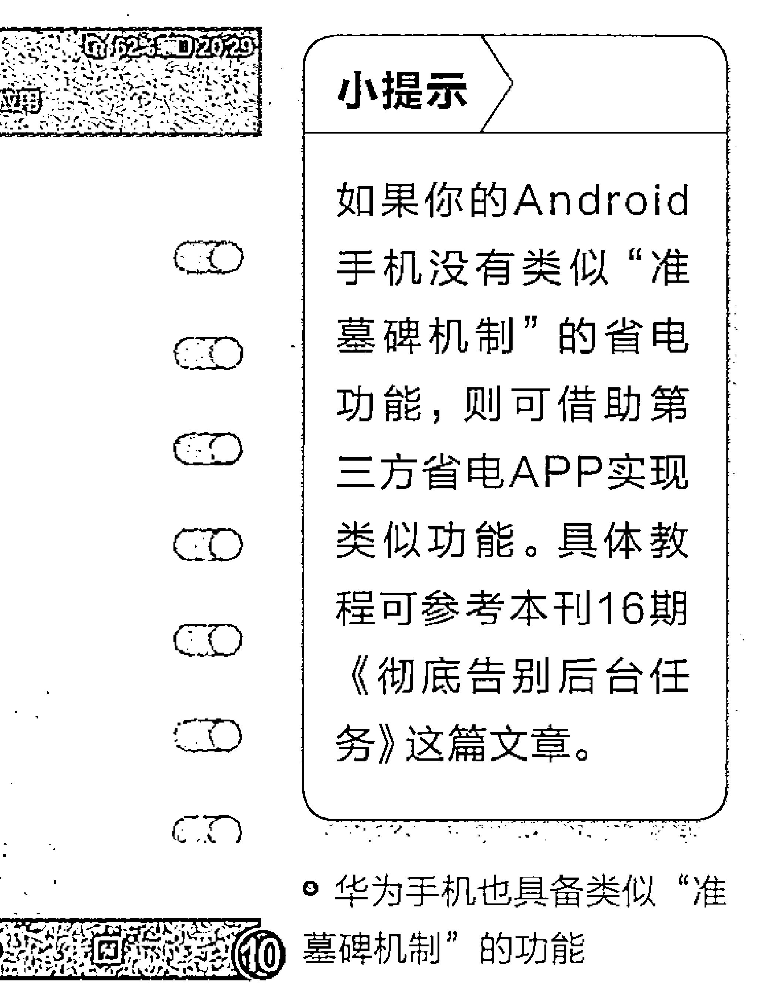

> > **小提示**
>
> 如果你的Android手机没有类似“准墓碑机制”的省电功能，则可借助第三方省电APP实现类似功能。具体教程可参考本刊16期《彻底告别后台任务》这篇文章。

不同品牌的Android手机，对类似“准墓碑机制”的省电功能在描述上可能存在差异。比如，OPPO(ColorOS)就将其称为“纯净后台”，开启该功能后第三方APP转入后台后将不会耗费流量、电量和CPU资源（图9）。当然，如果你想保持微信、QQ消息的正常接收，同样需要将它们加入到纯净后台的白名单中。

总之，“准墓碑机制”的技术原理都是一样的，在锁屏待机一段时间后自动触发清理后台内存的动作，凡是没有列入白名单的APP都会被干掉（图10）。而其与iOS真正墓碑机制的差异在于，真墓碑机制无需设置白名单，所有后台APP都不会耗费流量、电量和CPU资源，与此同时不影响消息的推送，切回后台APP时还可恢复到退出前的状态，全程无需用户干预。

华为手机也具备类似“准墓碑机制”的功能

### 如何限制Android的多任务

如果你对Android的多任务特性不敏感，同时对续航时间有着极为苛刻的要求，则可考虑手动限制Android的多任务数量实现省电的目的。方法很简单，进入手机的开发者选项，勾选“不保留活动”（按Home键退出后会直接关闭该APP，相当于变成单任务手机）或者将“后台进程限制”设置为“不超过3个进程”或更低（图11）。需要注意的是，后台进程限制功能并不智能，它不能分别哪个后台APP是微信、QQ一类的社交软件，适合平时不怎么聊天的用户尝试。

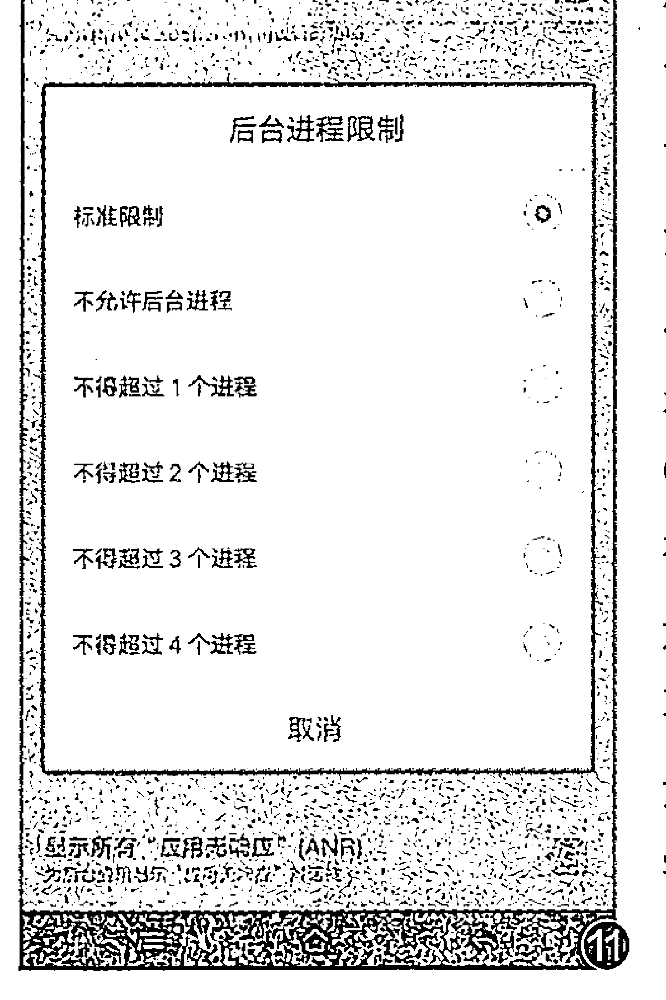

### Android 6.0将“内置”墓碑

也许谷歌也想明白了，多任务的噱头的确不如墓碑机制实用，因此计划在Android 6.0系统中正式引入墓碑机制。届时，Android用户也能享受到后台APP不会占用内存和耗电的惬意体验了（图12），让512MB内存也能流畅使用的梦想变成现实。

需要注意的是，即使Android 6.0有了墓碑机制加盟，我们也不要指望小内存设备也可获得类似iPhone的流畅切换体验。举个例子，内置512MB内存的Lumia 720（Windows Phone 8系统）同样支持内存机制，但在打开QQ、微信、UC等常用软件后，返回第一个应用会出现“正在恢复”提示，而且还要等待若干秒。反观512MB的iPhone 4S在开启较多应用后依旧可以快速切换。而这种体验差异的背后，除了系统和APP优化的层面以外，Lumia 720采用了低性能的RAM（内存）也是“功不可没”。因此，想让墓碑机制发挥真正的优势，硬件品质、系统和应用优化也是必不可少的环节。

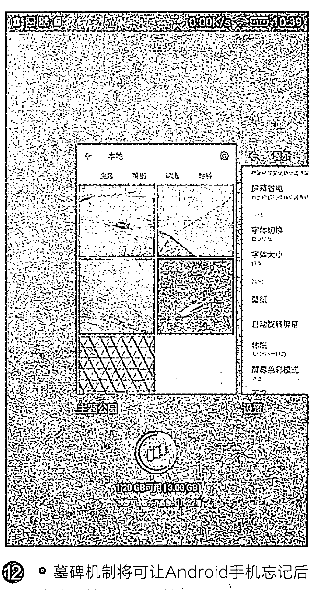

看到这里，相信你已经对Android手机们当前的省电策略有了一定的认识。当大家入手Android手机后，建议大家优先开启基本的省电模式，同时检查有没有类似“准墓碑机制”的功能，记得将常用社交APP添加到自动查杀后台应用的白名单列表，如此才能省电沟通两不误。

## 通知栏问题全搞定

文|雅兰

Android手机使用时间一长，装的软件多了，通知栏就有可能会出现一些烦心事——通知栏突然消失拉不下来，通知栏图标去不掉或加不上，反复弹出骚扰信息，或看着不顺眼。如若重启手机未能解决，该怎么办呢？

### 1 找回消失的通知栏

如果有一天，你的Android手机通知栏突然不见了，这时一些“大师”告诉你重新刷机便可找回，而刷机又不是你能独立完成的事（图1）。这时，难道就没有别的办法吗？实际上，在刷机之前，还可以尝试许多别的办法找回手机通知栏。

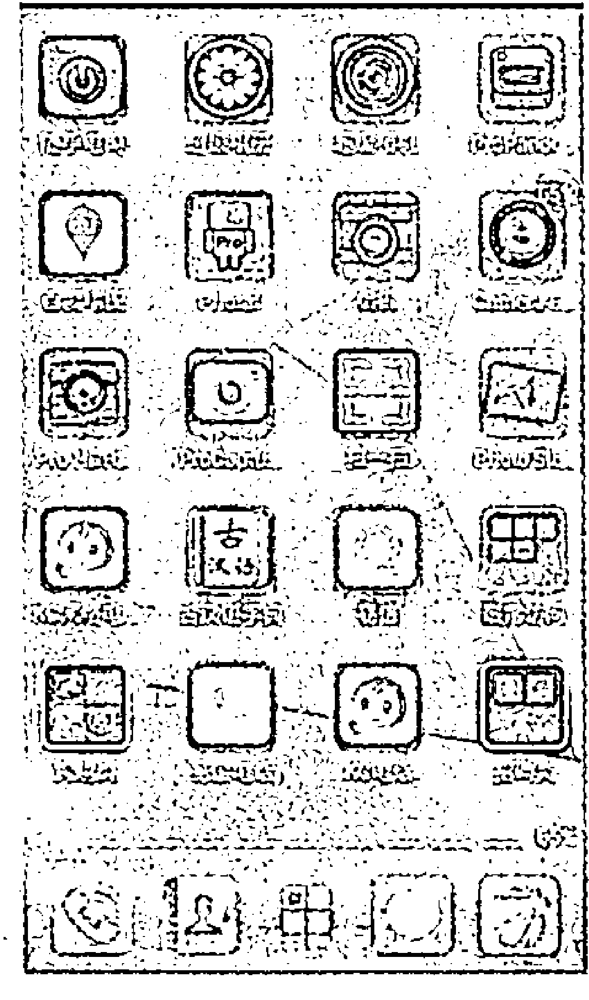

> 小知识
通知栏在有的环境下也称为状态栏。通知栏消失可能是因为通知栏进程被禁止，或因为不小心卸载了相应软件而造成。在使用系统优化软件不当，或一些软件产生冲突的情况下，也可能发生这种现象。

#### （1）用手机自带的桌面软件找回

由于目前主流手机多为4.x和5.0的版本，而不同品牌的手机多经过了定制，通知栏的设置也不尽相同。有的手机自带的桌面软件有通知栏开关显示，可通过在手机桌面点击菜单键进入设置，查找有无该开关选项，如果有，则可通过切换开关找回通知栏。

#### （2）借助第三方桌面应用找回

如果手机没有自带的通知栏开关功能，那么可以借助于一些第三方桌面应用来找回，例如Go桌面、360手机桌面等。
Go桌面应用就有关闭或重新打开通知栏（状态栏）的选项。用手机菜单按键进入“桌面设置”，进入“屏幕设置”，其中的“桌面状态栏”选项开关即是用来打开或关闭通知栏的，打钩表示显示通知栏，取消勾选表示隐藏通知栏（图2）。

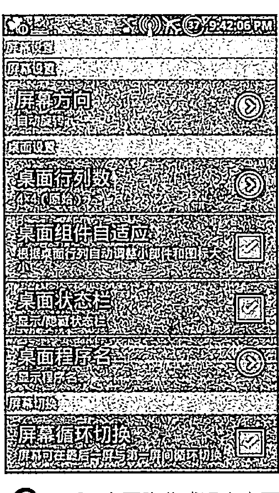


#### （3）借助第三方手机助手找回

如果安装了腾讯手机管家或360手机卫士等手机系统管理优化应用，使用不当也可能造成通知栏丢失。因为这些软件可能会由于某种操作不当的原因，将通知栏进程加入到了自动清理项目当中，造成通知栏丢失。可进入这些软件的“系统软件”清理选项中，查看是否禁用了与通知栏相关的系统进程，若有则将它们开启一试（图3）。

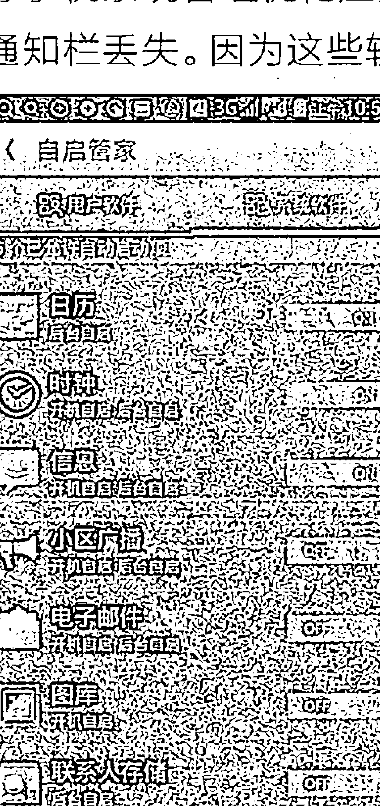

> 小技巧
尝试设置旋转屏幕，将屏幕变换一个方向显示，切换方向时，系统会重新显示通知栏，或许可以解决问题。此外，还可以点击电源键关闭屏幕，然后重新开启屏幕，刷新显示，看能否显示通知栏。还有的时候，在使用一些软件（如读书软件或播放软件）时，为了获取最大的屏幕使用面积，这些软件会自动屏蔽通知栏，而当关闭这些软件时，通知栏又会自动恢复显示。因此，如果正在使用这样的软件，不妨先关掉它看能否找回通知栏。

> 小提示
可先用手机助手或管家应用对系统进行一次全面的清理优化。有时因为系统资源的枯竭，可能会造成系统通知栏的显示暂时失效。经过优化之后，与系统核心进程无关的一些进程会被清理软件关闭，资源空间被腾出，剩余的进程可能会复活，通知栏会出现。

#### （4）用恢复出厂设置功能恢复通知栏

如果以上方法均无效，可行的一招便是恢复系统出厂设置了。进入系统设置窗口，找到“恢复出厂设置”一项，点击该项进行手机重置（图4）。

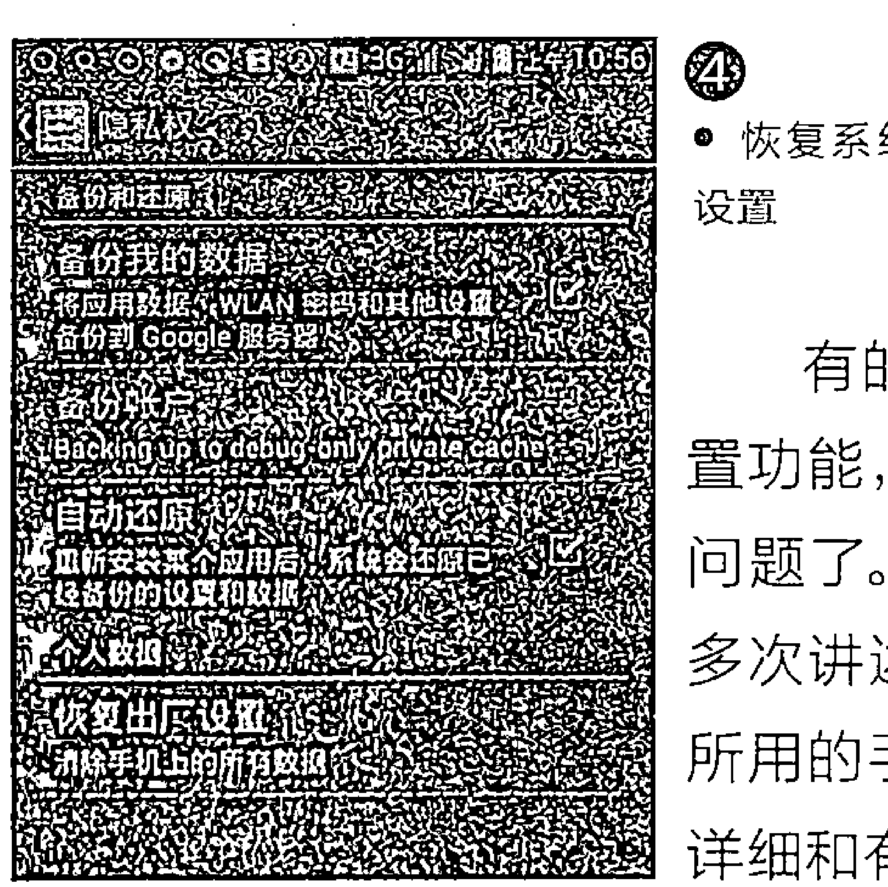

● 恢复系统出厂设置

有的手机隐藏了恢复出厂设置功能，那就只能靠刷机来解决问题了。有关刷机的知识本刊曾多次讲述，读者也可以根据自己所用的手机型号，上网搜索更为详细和有针对性的刷机教程。

### 小技巧

如果手机已经ROOT过，则可以通过刷机ROM包，在其中找到通知栏相关程序（system/app/SystemUI.apk），用该程序替换手机中的通知栏程序，可以恢复通知栏显示（图5）。

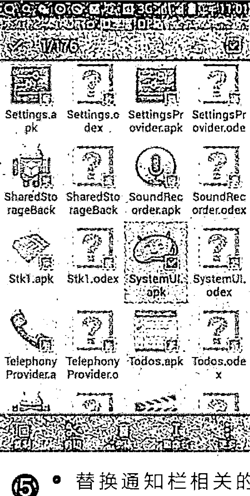

● 替换通知栏相关的APK程序

### 扩展阅读

丢失通知栏是件不幸的事，但隐藏通知栏也有积极的一面。比如，当阅读的时候，希望手机屏幕有更大的面积，且通知栏不要弹出任何广告或软件提示信息，这时将通知栏全部隐藏起来就具有非常重要的意义。要实现这一功能，可充分利用手机自带的或第三方桌面软件提供的通知栏开关来解决。此外，对于4.0版以上的Android手机，可以使用Apex启动器APP，它可以设置通知状态栏隐藏，也可以用上面介绍过的Go桌面或360手机桌面。如果是使用更低版本的老手机，则可使用iReader阅读器来阅读，它支持看书时隐藏通知栏（图6）。


● 用iReader阅读可自动藏起通知栏

### 2 通知栏拉不下怎么办

平时要查看正在运行的系统或某些软件的状态，只需在屏幕上边下滑，即可滑出通知栏。但有时，你也可能会发现下滑操作失灵、通知栏无法被呼出的情况。

如果手机自身有开关通知栏功能，那么先关闭通知栏，重新开启，看通知栏是否可以恢复下拉。如果没有该功能，可安装以上介绍的Go桌面或360手机桌面，借此软件关闭通知栏然后再开启恢复下拉功能。

如果是因为屏幕灵敏度下降，下拉时，先按下通知区，稍停留，然后向下滑动。若以上方法均无法解决，可恢复出厂设置。对于恢复出厂设置被屏蔽的手机，则只能用刷机的方法来解决了。

### 3 让通知栏不显示某图标

如果我们不希望通知栏显示某些图标，通过手机自带的通知栏设置或优化软件的通知栏图标拦截功能，就可以轻松选择不显示的图标或通知。此外，我们还可能需要将我们常用的一些软件或状态以通知栏图标的方式显示出来，以便随时可以切换出来。

如果QQ明明是开启着的，但手机通知栏不显示QQ图标，该如何让QQ图标显示出来？首先在手机辅助功能里查找是否有“系统通知栏显示QQ图标”的开关选项，若有则使其保持开启状态（图9）。此外，如果要在通知栏显示QQ消息，还需要在QQ应用的设置中，开启“通知显示消息内容”、“锁屏显示消息弹框”、“退出后仍接收消息通知”等选项（图10）。

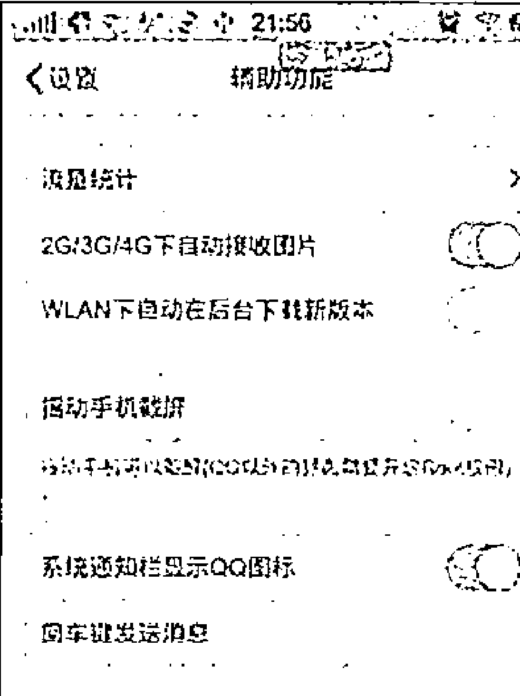

● 系统通知栏显示QQ图标

如果安装有360手机卫士，在其界面中找到“广告屏蔽”选项，点击进入；点击“通知广告”，可看到推送消息的被禁软件列表（图11），如果看到手机QQ消息被禁止在通知栏显示，点击取消屏蔽即可。重新打开手机QQ，并切换到后台运行，看通知栏是否可显示QQ图标和通知。

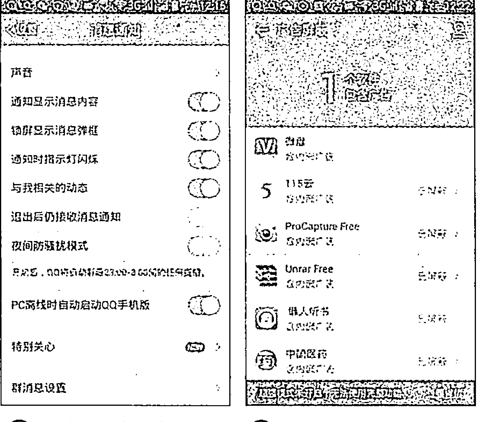

### 小技巧

不希望某软件的弹出消息再出来烦你吗？在弹出的通知上长按，显示“应用信息”（图7），然后在应用信息窗口中去除对“显示通知”选项的选择即可（图8）。不过要注意关掉的是什么类型的应用，如果是以信息显示为主的应用（如天气预报应用、聊天应用等），关闭通知会使你错过重要通知，这要特别引起注意，关闭前要定夺好。

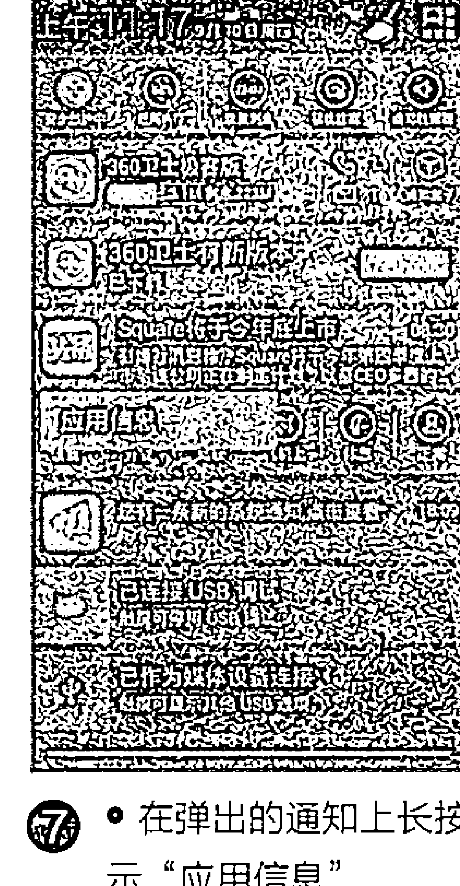

● 在弹出的通知上长按显示“应用信息”

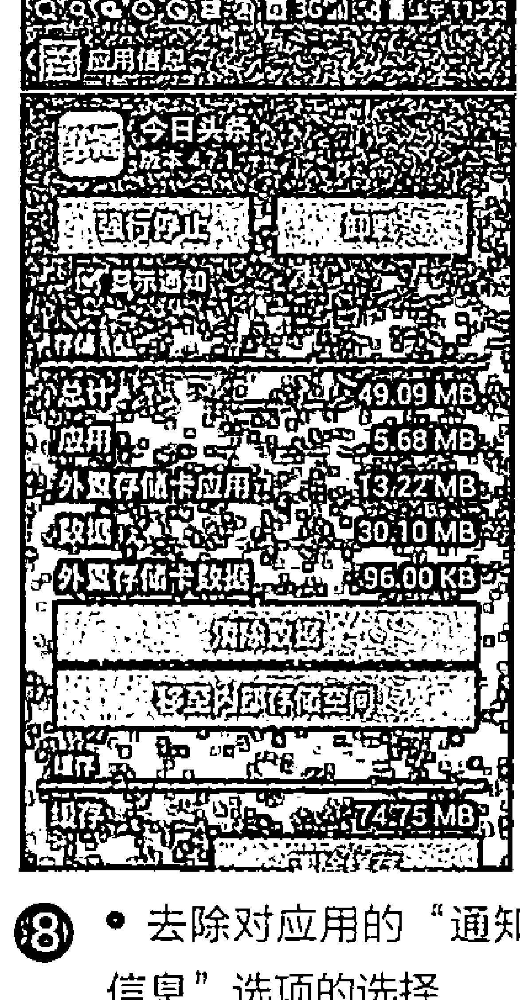

● 去除对应用的“通知信息”选项的选择

### 4 通知栏的图标去不掉

通知栏常驻图标和弹出的一些信息，有的我们心知肚明，但有的我们压根儿就不认识，也不需要它们，如何将这些不用的图标去掉呢？也许你会说用手机助手工具可以解决，但问题是这些工具里也不会出现该图标的项目，因而也就无法令其关闭。

有时候我们会发现手机通知栏里有个下载小图标，无法去掉，但到下载工具中查看也没发现什么下载任务，而这时在系统优化类的工具（如360卫士或手机管家等）中，也无法扫描出有什么下载任务。这时，可以用先彻底卸载这款下载软件再安装的办法来解决，卸载之后下载小图标就会自动消失。如果下载工具已被卸载或没有卸载完全，可先重新安装这款软件，然后再将其卸载，这样下载小图标会随之消失。

如果出现的图标是某个应用的某项功能所致（例如：同步功能、下载通知、通知功能等），那么，通过在相应的应用选项中去掉这一功能，然后重新启动手机，通知栏中的相应图标应该就会消失。例如：不少用户在使用HTC手机中的Gmail联系人同步功能时，就发生过这种现象。

> **小提示**
如果是使用Android手机的原生下载功能，下载图标无法去掉，可进入手机的程序管理界面，找到“下载文件管理”，清除其中的数据，问题就可以得到解决。如果是其他下载工具造成的下载图标无法去除，也可以用这种办法尝试在清除应用数据后，看图标是否可以消失（图12）。

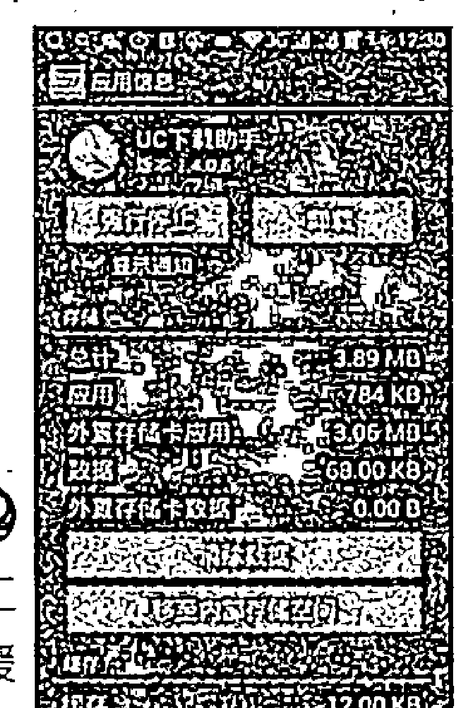

### 5 美化难看的通知栏

如果觉得经常显示于自己眼前的的通知栏图标不够精致，影响自己的心情，不妨给通知栏图标进行一番美化。

有的系统ROM支持通知栏的自定义，如MIUI可以通过更换主题美化通知栏，只需在其中设置，换一个花样即可。如果系统本身不支持美化设置，可通过一些第三方应用来设置。

一键通知栏插件1Tap Quick Bar中文版，这是一款非常实用的下拉通知栏菜单应用，通过它可以进行通知栏的个性化定制（图13）。从库中选择需要的图标，点击添加到通知栏上。再次点击则可以去除。

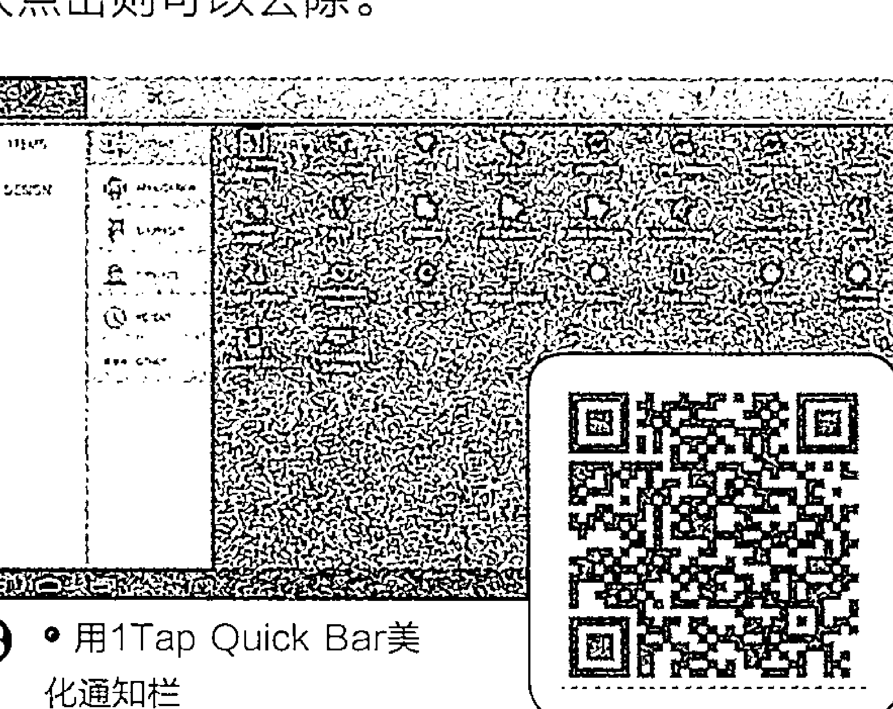

安卓通知栏美化工具(Flat Style Colored Bars) v0.57 汉化专业版是另一款通知栏美化工具，它可以根据APP颜色实现自适应沉浸式通知栏。选择在屏幕左上角随时调整颜色，状态栏的颜色也可以定义与某个位置颜色一致。该软件需要手机ROOT后安装xposed框架才能使用（图14）。

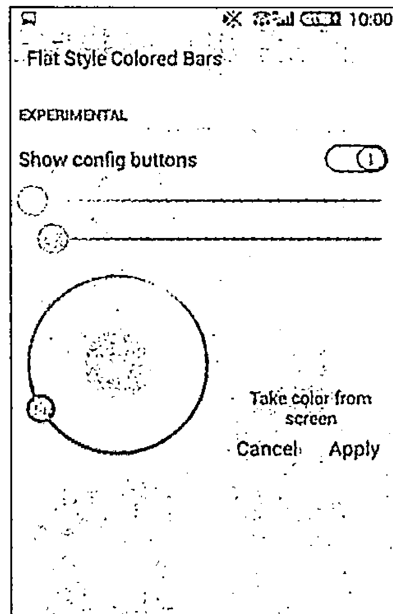

## Android “变身” Windows

文|悠悠菲

你是否想过将自己的Android手机变成Windows的模样？其实，借助于一些装饰类的应用软件，很容易将Android手机“打造”成一部Windows模样的手机。不但可以将Android手机的桌面或部分功能模拟成Windows Phone风格，甚至还可以模仿传统PC版Windows的界面和操作风格呢！

### 1 Android手机“变身” Windows Phone

用惯了Android手机，如果想体验Windows Phone的风格，可以借助于模拟Windows Phone的桌面软件，在不安装Windows Phone系统的情况下，体验Windows Phone的界面和操作方法。

#### (1) 微软助你体验Windows Phone

从目前的情况来看，微软短期内没有办法让多数人的手机上运行它的Windows Phone系统了。但它也有“曲线救国”的新办法，除了极力推广Windows 10新手机之外，微软还在鼓动Android手机用户在不动原有系统的情况下，将桌面或操作风格模拟成Windows Phone的样子，先尽可能地喜欢上这种风格，然后再说。Arrow Launcher是微软出品的Android桌面软件，使用该软件，我们可以将自己的Android手机的操作界面变成Windows Phone界面（下载地址：http://pan.baidu.com/s/1c06IXK0）。

Arrow Launcher是一款桌面替代软件，因此在Android手机上安装了此软件后，如果点击Home键，会弹出桌面选择菜单，这样便于在原有桌面和Arrow桌面之间进行灵活切换，选择自己要用的桌面（图1）。

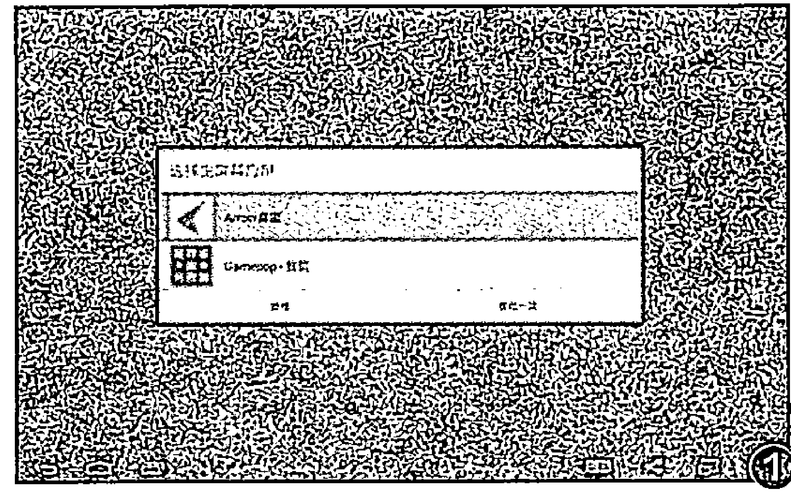

选择Arrow桌面后进入欢迎窗口，点击下方的“开始使用”按钮，就可以正式使用这个模拟桌面了（图2）。

进入主屏幕之后，可看到上方是最近使用的应用列表，中间是系统自带的常用应用列表，下方工具栏上分别是上网、联系人、程序库、系统设置、地图等常用功能按钮（图3）。向左滑动桌面可切换到联系人窗口，添加联系人或拨打电话（图4）；向右滑动桌面则可以切换到笔记与提醒窗口，添加与编辑记事或闹铃（图5）。点击主页下段工具栏中间的应用库按钮，可进入应用库，从中可以看到以字母A~Z排列的所有应用，按字母排列定位应用非常方便，还可以通过顶栏的搜索工具直接查找已安装的应用（图6）。


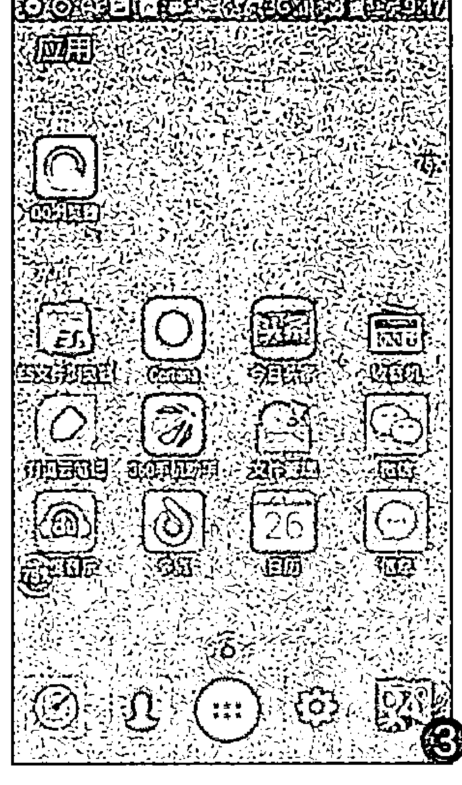


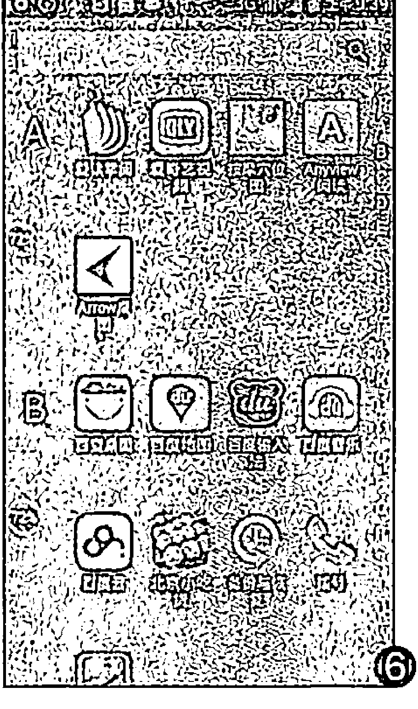

#### (2) 部分功能变身Windows Phone

除了利用微软出品的桌面模拟应用将Android手机模拟成Windows手机的样子外，我们还可以选择性地利用其他小工具，将Android手机的部分功能模拟成Windows Phone的风格。例如，将手机桌面、联系人、播放器或锁屏风格之一模拟成Windows Phone的风格。

该桌面所管理的软件包含手机原来已经安装的所有应用，当然也可以通过显示在应用列表中的市场应用，搜索并安装添加更多的应用。此外，上方的最近应用列表会显示最新安装和使用的应用，而下面的常用工具栏也可以根据自己的需要自定义。

#### 模拟Windows Phone 8风格桌面

如果喜欢Windows Phone 8手机桌面，可用一款“Windows Phone 8桌面”应用来模拟(图7)。从图中可以看到，桌面图标平面感很强，各类应用图标也赏心悦目，完全可以给人一种不是在用Android，而是在用Windows Phone的感觉。桌面瓷砖图标连成一体，可左右滑动切换桌面(图8)。还可以自定义瓷砖，更改颜色或指定应用程序(图9)。


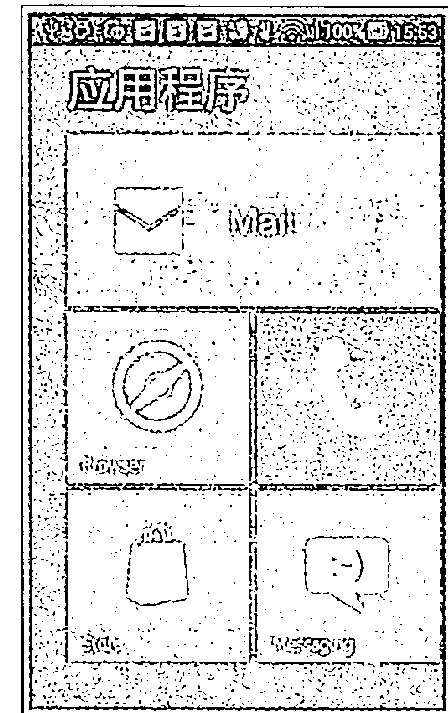

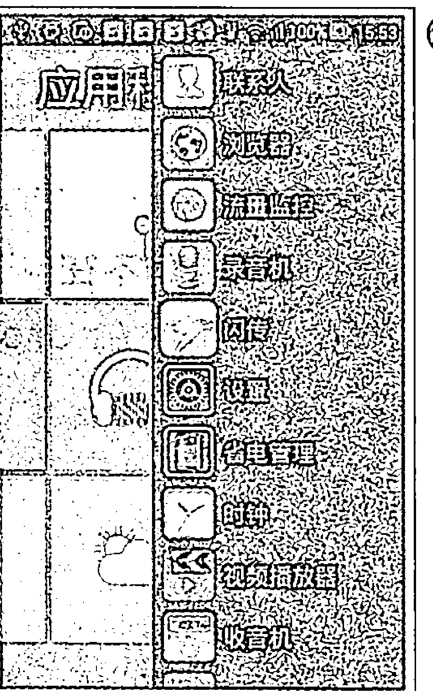

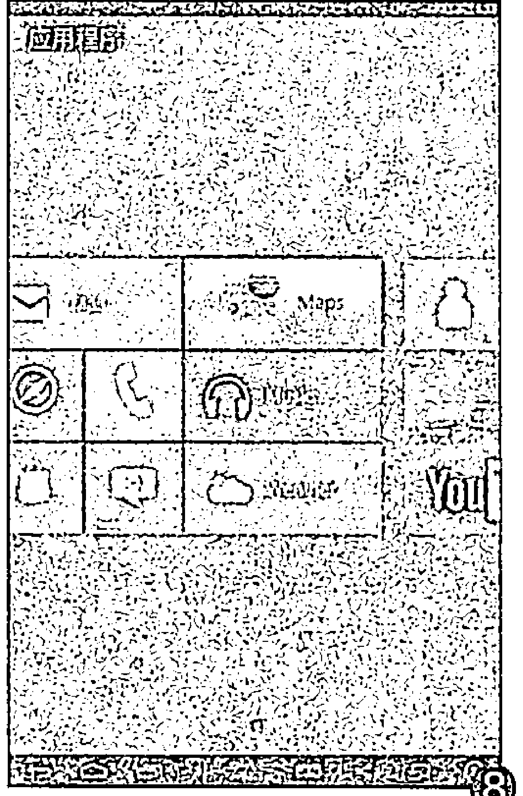

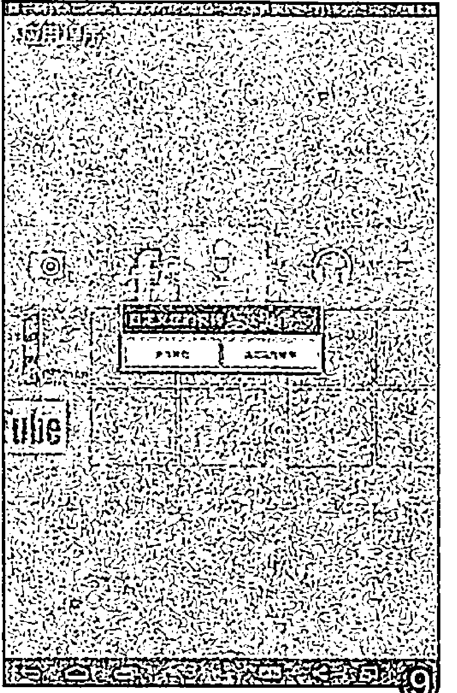

#### 模拟Windows Phone风格通讯录

如果只喜欢Windows Phone风格的通讯录，则可以用一款“Windows Phone风格通讯录”的应用，将Android手机的通讯录模拟成Windows Phone通讯录风格(图10)。

这款应用具备鲜明的Metro风格，支持简体中文语言，可键盘拨打或通过联络人地址选择拨打(图11)；还可以建立群组或将联络人添加到“我的最爱”列表中以方便拨打(图12)。

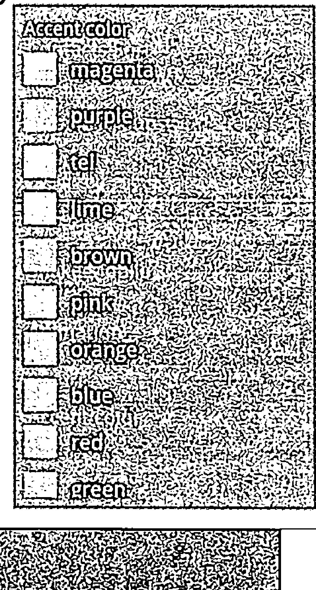


#### 模拟Windows Phone风格锁屏

有的人可能只喜欢Windows Phone的锁屏风格，那也没关系，可以只将其锁屏风格移植过来。利用一款“Windows Phone 8华丽锁屏”的APP，就可以享用Windows Phone的华丽锁屏风格（图13）。

安装这款软件后，只需在开关设置中开启“启用解锁”开关，即可在按下电源键之后，马上体验华丽解锁效果，而锁屏壁纸、解锁音效等都可以自行进行个性化设置（图14）。


Windows Phone 8 华丽锁屏


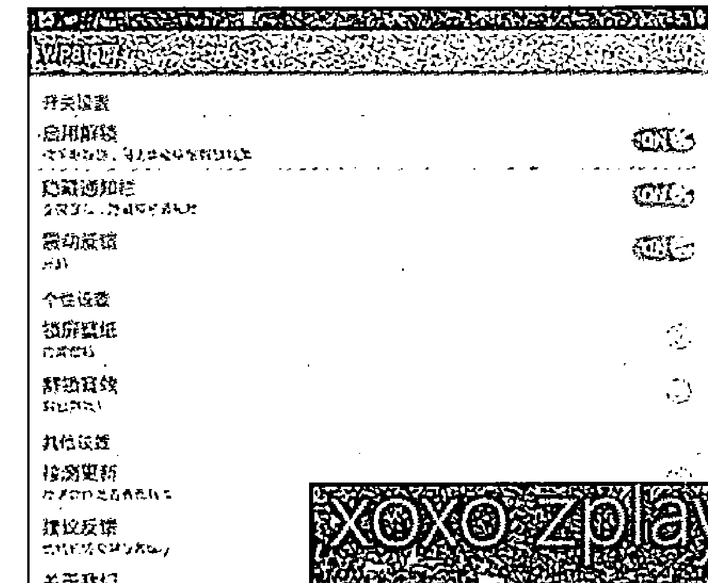

#### 模拟Windows Phone风格的播放器

还有的人只喜欢Windows Phone风格的播放器，那么就使用“WPZ播放器”这款应用来模仿其播放器风格界面吧（图15）。播放器的界面极其简单明了，纯文字的列表风格倒也有一种回归原始的感觉。


WPZ播放器

### 2 Android手机“变身”PC Windows

用惯了Windows XP、Windows Vista或Windows 7之类的传统经典桌面版操作系统，是不是很留恋这些系统的开始菜单、桌面、控制方式等界面和操作风格？那么，何不在自己的Android手机上也来模拟一番传统Windows系统呢？借助于“魔伴桌面（Windows版 for Android）”这款软件就可以实现这一梦想。

> > 软件版本读起来是不是很拗口？到底是Windows版还是Android版？其实该软件原来是合一的版本，后来作了拆分，拆分为魔伴桌面（Android版）、魔伴桌面（Windows版）和魔伴主题三款软件，分别针对于两种不同平台以及主题环境。本文我们要在Android手机上模拟Windows界面，因此选择“魔伴桌面（Windows版 for Android）”。不要选错版本。

魔伴桌面（Windows版 for Android）是一款专门为Android用户打造的手机桌面仿Windows界面软件，只需在Android市场中搜索下载“魔伴桌面Windows版”并安装即可开始体验之旅（图16）。如果手机中已经安装有多款桌面软件，在切换主屏幕时，系统会给出桌面应用选择，只需选择“魔伴桌面Windows版”即可进入该桌面（图17）。

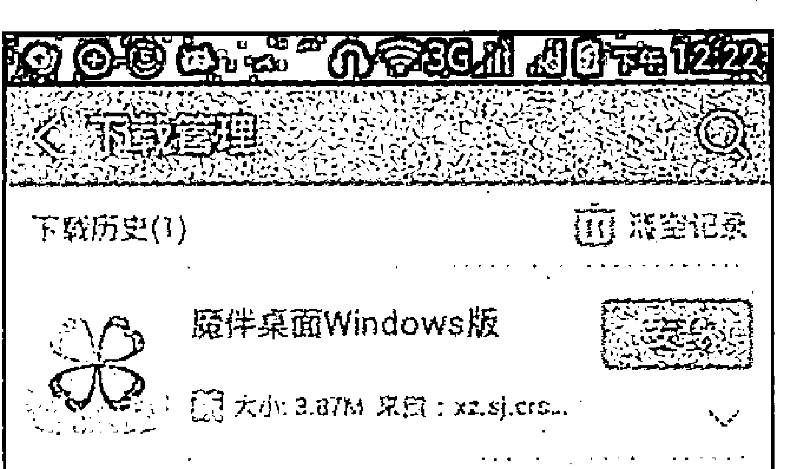

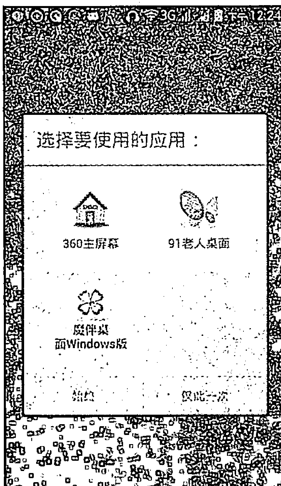


魔伴桌面 模拟Windows版

进入桌面后，我们可以听到熟悉的Windows开机声音，与此同时看到熟悉的Windows桌面、Windows 8/8.1和Windows 10风格的开始按钮，还有系统托盘也是那么相像和熟悉（图18）。点击开始按钮，可以看到常用程序的链接和"所有程序"菜单（图19）。进入"我的电脑"可看到资源列表和控制面板列表（图20）。

右键菜单是用桌面上单击停留模拟出现的，其中有非常丰富的多级菜单设置项目可供选择，包括桌面、插件、系统设置、时间设置等一应俱全（图21）。这些设置也可以通过点击桌面上的"控制面板"项来进行设置，效果是一样的（图22）。

软件提供了非常丰富的插件选项，包括系统插件、相框插件、日历插件、天气插件、便签插件、时钟插件等，用这些插件可以自定义非常个性化的手机桌面，这些功能甚至超越了传统Windows的功能设置（图23）。

对于文件或图标的右键菜单，不同的对象会有不同的结果，这一点与Windows右键菜单也一致，例如我们可以用右键菜单命令对图标执行更名、删除、修改图标、设置文字样式等操作（图24）。

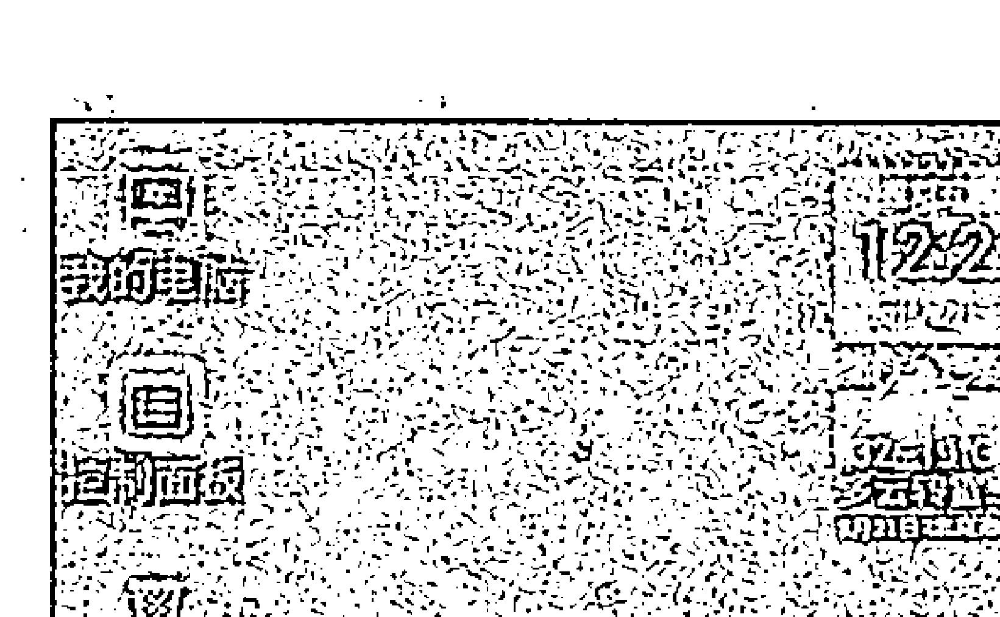

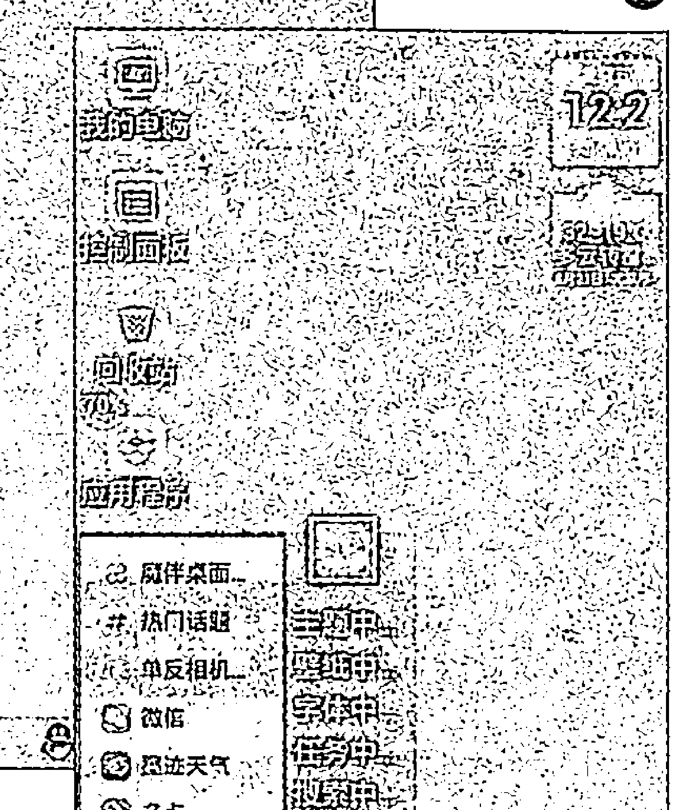

点击桌面图标"应用程序"可进入应用管理的大本营。在所有程序的管理列表窗口中，我们可以看到该软件用尽了桌面Windows窗口所能用到的所有组件，包括菜单栏、标签式图标页面，结合触屏特点的滑动式切换页面，共同构成一个操作非常方便的应用管理界面（图25）。

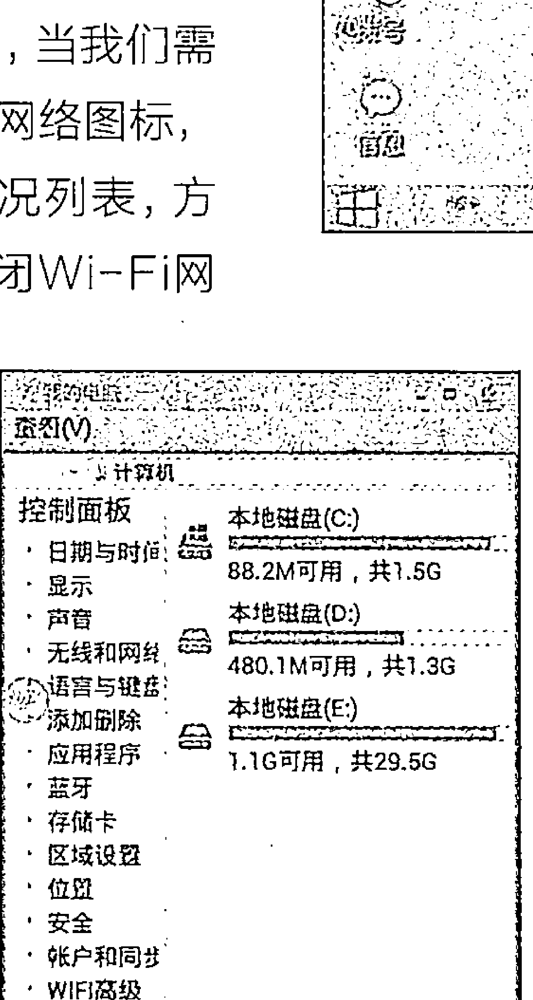

而在系统托盘的功能管理上，设置和操作也非常方便。例如，当我们需要使用或关闭网络时，点击网络图标，即可弹出无线网络连接情况列表，方便通过这里点击开启或关闭Wi-Fi网络（图26）。

> 小提示
魔伴桌面随着Windows的版本升级而不断变化升级，追新的你可不断追随版本的升级，在Android手机上体验更新式的PC Windows风格。魔伴桌面版本升级有3种方法：一是用手机或者电脑访问官方网站，点击最新版本的链接直接安装；二是直接在手机或者电脑上下载该应用的APK安装包点击安装；此外，如果已经安装了该软件并处于开启状态，若软件有了新版本的时候，会自动提醒下载安装。

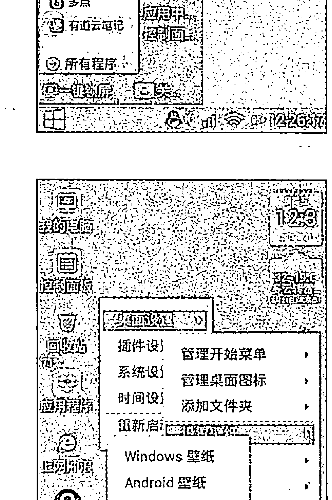

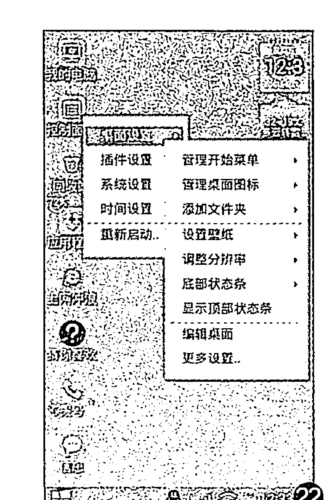

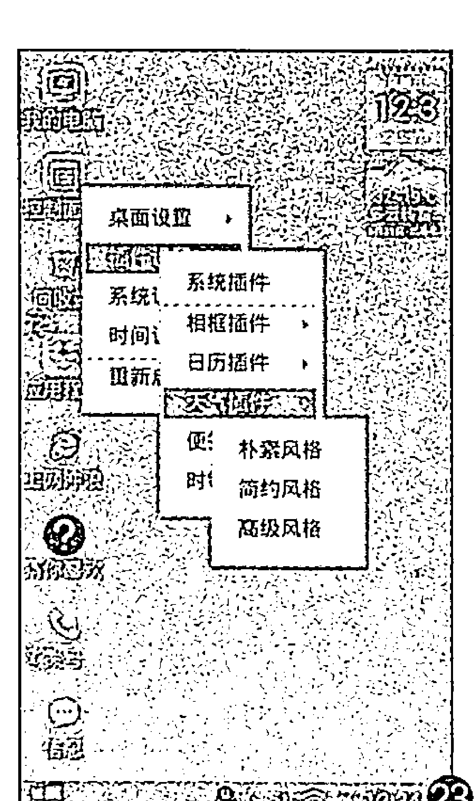

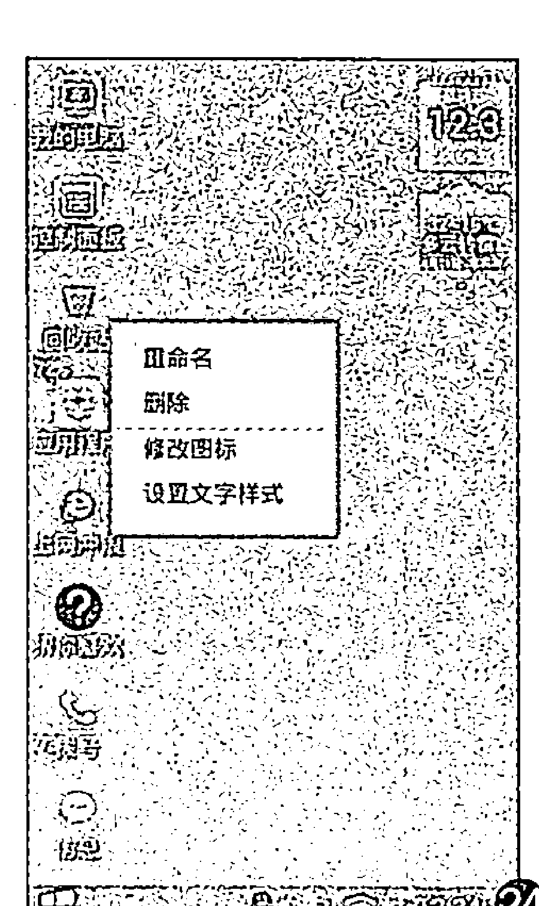

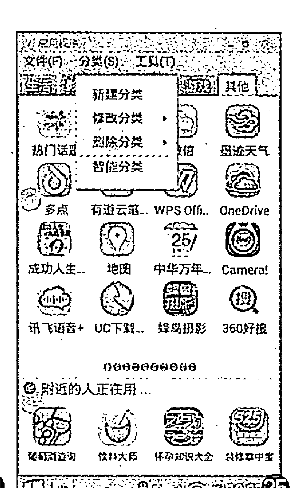

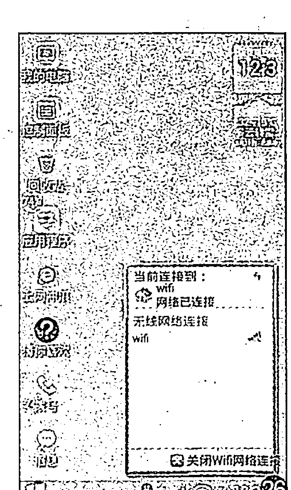## PC当成手机玩
## 随心所欲玩转Android软件游戏

文|江月影

某些应用或游戏APP在智能手机的触摸屏上操作起来，远没键鼠来得方便。而Android软件那“感人”的权限需求，也让人在发现好玩或陌生的APP时多了几分顾虑。若利用模拟器在PC端运行可以同步数据的APP或检验论坛中下载的APK文件，实是集安全便捷于一身的选择了。

## 省心自动安装APK

苹果iOS系统令许多人羡慕的原因无外乎APP品质卓越、下载安装过程省心、不需要操心如何选择权限诸如此类的事情。使用Windroy模拟器在PC端也能实现省心安装的效果，只要将想要使用或运行的APK文件拷贝至其自动生成的文件夹即可。

Windroy软件默认安装目录比较特殊，它会直接安装在系统盘根目录（“C:\Windroy”）（图1）。运行它需要OpenGL 2.0或以上版本的API支持，运行时会出现一个黑色的监控控制窗口，在该窗口中会实时地出现该软件执行的命令，无需理会它的存在，将其最小化即可（图2），注意不能将其关闭，这是后台执行命令的地方，关闭此窗口，软件将无法运行。

Windroy以全屏方式运行，且无法切换到可变的窗口状态。首先出现的界面是日历时钟和锁屏挂锁，拖动挂锁可进入Android程序界面（图3）。随后，系统会用英文提示如何将用户喜欢的应用安置在屏幕的合适位置（图4、图5）。接下来显示系统设置窗口，仍以英文界面为主（图6）。可通过PERSONAL设置项下的Language&input，选择“中文(简体)”，将软件的界面设置为简体中文（图7）。

只要将下载的apk文件放入Windroy的安装目录的“\Windroy\windroy_root\system\app”文件夹里，重新启动Windroy即可完成软件的自动安装，基本不需要用户干预。如果Windroy报错，可以试着将APK文件保存至“\Windroy\windroy_root\data\app”下，重启Windroy程序即可（图10）。此外，想直接在Windroy中安装应用的另一个方法是安装各类应用市场（如应用宝、豌豆荚），通过它们直接选择喜欢的APP（图11）。

- **Windroy的前身是WindowsAndroid**，它能让安卓系统直接运行在Windows系统内核上。由此软件还延伸出了另外一款虚拟机产品——Windroye，能够完整模拟Android 4.4.2版本功能。两款软件仅一个字母之差，但技术内核和功能不同。此外，还有一款可以用Android手机的传感器来控制PC操作Android软件或游戏的应用“Windroye手机伴侣”。Windroy系列工具可通过其官方网站下载：http://www.socketeq.com/

从右上角的软件库按钮中挑选应用（图3）。

将应用拖动到主屏幕上（图4）。

> 小技巧
电脑屏幕分辨率在1280×800以下Windroy会自动使用手机模式。如果觉得全屏显示不方便，也可以手动更改分辨率：设置新增一个Windows环境变量WINDROY_RESOLUTION，值为“=宽×高”，例如“WINDROY_RESOLUTION = 1280×720”。进入Windows控制面板的“系统”设置，选择“高级系统设置”，在“高级”选项卡下点击“环境变量”（图8），然后具体设置以上环境变量即可（图9）。

> 小提示
APK文件名不能包含中文或空格。如果自定义软件安装路径，Windroy本身的安装路径也不能包含中文或其他符号。

如遇Windroy的兼容性问题，可以尝试Windroy团队出品的另一款模拟软件Windroye。Windroye默认安装在“C:\ProgramData\Windroye”文件夹中。软件本身默认集成了应用商店、下载中心、ES文件管理器、APK管理器等（图12）。通过软件设置，可控制安卓区域的横屏或竖屏显示分辨率、占用系统内存的大小、系统处理器数量、系统分辨率等（图13）。通过APK管理器，可成批选择电脑中的APK应用，实现一次性安装多款Android应用到Windroye环境中（图14）。安装的应用和数据保存在“C:\ProgramData\Windroye\app\data”文件夹下。Windroye应用同样也可以通过安装在Windroye中的应用市场来进行。

> **小提示**
Windroye还提供了一个“Windroye手机伴侣”的Android应用，手机装上这个APK后，可当作遥控器来远程控制Windroye，用它来玩游戏可获得电视游戏主机的感觉。

## 手动选择安装APK

如果说Windroy需要将文件拷贝到固定文件夹才能运行，操作稍显复杂的话，那么双击APK就能自动安装应用的方法则显得更加人性化，这时就要请出经典的BlueStacks（蓝叠）了。BlueStacks使用了硬件虚拟化技术，因此需要电脑开启硬件虚拟化支持，否则运行环境将会非常缓慢。

通过“更改”按钮，可改变数据空间的指向（图15）。此外，安装时最好同时选择“应用市场访问”和“应用通知”两个选项，这样可以获得更好的运行体验（图16）。

> **小技巧**
电脑是否支持硬件虚拟化技术，可通过CPU虚拟化支持检查软件securable.exe来检测。同时，还需要在系统BIOS设置中开启硬件虚拟化选项。

启动BlueStacks时有一个初始化过程，显示初始化界面（图17）。之后进入应用主界面，界面中包含最近玩过的应用、精品推荐应用和时下热门的应用，底部则是Android手机常见的三个控制按钮。点击“所有应用”按钮，可看到本机安装的所有应用（图18）。单击“BlueStacks设置”图标，进入BlueStacks设置窗口，可对Android系统的各项性能进行选择性设置（图19）。

对于希望使用或测试的应用的安装，可通过PC先将APK下载到本地目录中。由于在安装BlueStacks模拟器后，APK与BlueStacks自动建立了关联，因此，通过直接双击APK即可将应用安装到BlueStacks中。

> 小技巧
除了上面的应用安装方法外，在BlueStacks上安装应用还可以使用以下方式：在桌面上右键Start BlueStacks图标，选择“属性→快捷方式”选项卡，点击“打开文件所在的位置”，打开应用所在的目录。找到文件HD-ApkHandler.exe，只需将下载好的APK文件拖拽到HD-ApkHandler.exe上，即可实现应用的安装。右键点击APK文件，选择快捷菜单中的“Open with BlueStacks APK Installer”项，或选择“打开方式”为BlueStacks，即可自动安装APK程序。

除在最新版的Windows 10中使用外，以上3款软件在Windows 7、Windows 8/8.1环境下也可以正常运行。但由于部分软件对系统硬件虚拟功能开启有要求，此外受每个用户软件环境复杂因素的影响，加之软件均处于更新换代频繁的活跃开发期，因此不能保证每款APP都能在每个模拟器下正确运行。如果你在使用中发现不兼容的问题，可在3种模拟器中更换环境安装测试。

> 扩展阅读
除了用以上方法提高APP测试效率和安全性检查外，对于APP开发者来说，用虚拟环境对编好的软件进行反复测试、查找Bug，要比来来回回在手机中安装、使用和卸载APP操作要高效得多。

# 手机出大片 其实你也行

文|于正青

我想每个女生都有自己最漂亮的一面吧？或许每个女生都想拥有一套属于自己的个性写真，来纪念她们即将逝去的青春。在智能手机飞速发展的今天，借助于APP，用手机制作一张“专业级”照片也变得不再困难。

### 1 拍摄先行 ——不能不说的秘密

目前，智能手机拍摄操作傻瓜化，但很多以拍照为卖点的手机都会保留复杂的拍摄参数。而这些拍摄参数是手动操作、拍摄大片的前提。若要使用手动操作就必须搞清楚ISO（感光度）、光圈、快门这三者之间的关系。ISO越低所需要的曝光量就越大，照片质量就越好；光圈通过调整通光孔的大小来调节单位时间内的曝光量；快门通过开闭通光孔来调节曝光时间。在光照充足的时候（正午或下午的室外），可调整ISO至400以内以保证照片的质量。若手机没有手动操作的设置怎么办？没关系，安装Camera FV5这款APP来帮你解决。经过APP的基本设置后，掌握和利用好拍摄技巧至关重要。他拍时要多选择竖拍，人物的头部、眼睛尽量与构图线重合（图1）。

人像摄影分割点的选择主要有以下几处：肩膀，适合拍头像类；腰部，半身照的最佳选择，注意不要把手“截”掉；大腿，半身像最佳分割点，也是人像摄影中最常用的分割点。自拍时常以面部为主要拍摄对象，因此面部细节显得尤为重要。

> > 小编寄语
> 有关如何拍好人像的更多构图和拍摄技法，请参见本刊2015年第7期文章《手机也拍最美的肖像》。

### 2 后期小调 ——手机也出专业效果

目前手机拍出的照片清晰度很高，往往会把脸上的痘痘等一起拍上去。因此，后期的第一步就是祛痘磨皮。安装并打开PhotoShop Touch（以下简称PS Touch），打开要修补的照片，找到“修复画笔工具”（图2）。放大照片并选择合适的画笔大小，在有痘痘的地方点击，这样就可以轻松去除脸上的痘痘了。除痘往往会使皮肤肤色不均匀，对照片磨皮可使人物肤色均匀，点击“Fx→照片→磨皮”（图3）。在磨皮选项中，“阈值”是软件自动识别肤色的范围，阈值越大磨皮范围就越大；“强度”是软件磨皮轻重，强度越大皮肤细节越少，肤色越均匀。具体数值的选择需要根据不同的照片来调节，原则是既能美化照片而又不失真实性。

完成上述工作后便是照片整体调整，包括细节的追回:照片更加真实;图像通透的调整:照片层次感更好,照片更真实;肤色的调整:人物更自然。

(1) 细节的追回:打开要调整的照片,点击“调整→阴影/高光”(图4),提高深色及阴影的数值;降低浅色及高光的数值,这样可以最大程度地保留高光及暗处的细节。再点击“Fx→锐化”,这可使照片细节更加清晰,可放大照片调整。

(2) 图像通透的调整:点击“图层按钮→添加图层按钮→复制图层→完成→图层选项按钮”,在混合模式中选择正片叠底,在不透明度中调整透明度,透明度的调整应使图片尽量自然。点击“图层选项按钮→合并图层按钮→合并可见图层”(图5);再点击“调整→色阶”,上面三个滑块从左到右分别代表暗调、中间调及亮调,下面两个滑块代表输出色阶。适当向右滑动暗调给照片去灰,向右滑动中间调提亮照片。经过这样的操作之后,照片是不是变得更通透、更真实了?

(3) 肤色的调整:下载并打开“泼辣修图”,打开要调整的照片,在滑动调整中点击HSL(图6),里面有多种颜色可选。针对面部肤色,主要调节红和橙两种颜色。降低红色相值调节唇色更亮丽;提高红饱和度使人物肤色更红润;提高红明亮度使人物肤色更白皙。橙是调节人物肤色的关键颜色:降低橙色相值肤色变红,反之肤色变黄绿;降低橙饱和度肤色变白,反之变黄;降低橙明亮度肤色变黑,反之变白。以上几种参数要根据照片来选择具体的调节参数。例如使人物变白皙的方法不止一个,每一个滑块与其他滑块在细节处理上有很大的差别,不能只调其中某个参数,也不可大幅度调节某个值(一般在20%以内),否则易引起偏色。

### 3 照片定调 ——赋予照片情感灵魂

照片风格俗称调子,是照片表达情感的重要手段。一般而言,照片的风格直接决定了大家对它的印象。

(1) LOMO小清新:适合自拍的一种照片风格。照片整体偏冷或暖(蓝或黄)、有胶片感,非常适合表达快乐、朦胧、忧伤的情绪。
① 调整照片:在PS Touch中打开要处理的图片,点击如图4中的“调整→色彩平衡”,冷色调适合表达忧伤寂寞的情绪,需把红色值调低些,蓝色值升高些;暖色调适合表达快乐美好的情绪,需把红色值调高些,蓝色值降低些。调整后照片整体偏色,适合表达情绪。
② 加入滤镜:再点击“图层按钮→添加图层按钮”,添加两个空白图层,选中最上面的图层,点击“其他操作按钮→填充和描边”(图7),在颜色中选择蓝色(冷色调)或橙色(暖色调)后, 更改混合模式为“正片叠底”并适当降低图层透明度。
③ 镜头暗角: 选中第二个空白图层, 点击如图7中的“其他操作按钮→渐变”, 选择合适的暗角(图8), 并适当降低该图层的透明度, 让整张照片自然即可。
④ 整体调整: 整张照片还不够朦胧, 选择照片图层, 也就是最后一个图层, 点击“Fx→照片→柔光”, 根据实际情况调整即可。

(2) 低饱和特效: 其效果清新淡雅, 非常适合写真类照片, 深受广大女生的欢迎。
① 选择选区: 在PS Touch中打开照片, 选择“画笔选择工具”并选择“+”号模式(图9), 将整个人物选择出来, 被选择的区域会用蚂蚁线表示。该过程必须仔细认真, 蚂蚁线可以落在人物边缘以内, 尽量不要选取人物背景。完成后点击“选取图标→羽化”(图10), 根据选区的大小及选区边缘的好坏确定具体数值。羽化的作用是柔滑边缘, 让边缘更自然。再点击“图层按钮→添加图层按钮→选区图层”, 这样我们就把整个人物抠了出来。
② 调整背景层: 复制带有背景的图层, 选中中间那层, 点击“调整→饱和度”。适当降低饱和度, 若对饱和度的修改不满意, 可以调整该图层的透明度。
③ 整体调整: 若感觉背景还比较抢眼, 点击“调整→曲线”, 向上滑动左边的滑块(图11), 使图片整体变白。这样一张低饱和特效的照片就完成了。

(3) 柔系风特效: 非常适合写真类照片, 其效果唯美、清新淡雅。
① 选择选区与低饱和特效中的操作相同。
② 调整背景层: 复制带有背景的图层, 选中中间那层, 点击“Fx→照片→柔光”, 根据照片选择合适的数值即可。再点击“调整→曲线”, 向上滑动左边的滑块, 使图片整体变朦胧。
③ 人物的调整: 选择人物图层, 点击“Fx→照片→柔光”, 选择适当的数值(比背景层数值小), 让照片看起来更自然。
④ 逆光的加入: 若在室外拍摄及窗边拍摄, 可加入逆光使照片更唯美。点击如图7中的“图层按钮→合并图层按钮→合并可见图层→其他操作按钮→镜头光晕”。在类型里选择自己喜欢的光晕类型, 调整强度及比例, 让光晕更加自然。光晕中心点的选择应放在高光处, 例如窗口、天空等位置(图12)。

> 小提示: 上述只是简单地介绍了3种照片风格, 照片风格还有很多种类型, 每种类型都能表达不同的情绪。手机常见图片类APP中所使用的滤镜指的就是照片的风格。

### 4 多图拼合 ——看似简单的美学

当上述工作完成后，一张漂亮的图已呈现在眼前。可实际情况是妹子们会拍很多照片，也很喜欢将图片拼合成一张图。那怎么在一张图里拼合多张图呢？安装并打开“Moldiv”这款专业拼图软件，根据具体实际情况选择拼图的类型。选择合适的拼图类型后，打开照片并添加图片。拼图的原则是：一张图一般只能有一张主图，其他图作为主图的陪衬；主图和辅图的照片风格要相似；主图与辅图不要把整个画面铺满。

当主图为竖版时，可占半个拼图版面，剩下的安插辅图（图13）；横版主图可单独成版，底边留白加字（图14）；横版主图也可两张竖排占半个版面，剩下版面添加文字（图15）。人像摄影要多以竖版为主、横版为辅，横版照片不太容易拼图。值得一提的是，在“帧调整”中可以改变图片的比例，这对于拼图来说十分重要。拼图完成后可添加文字，文字特效的添加可为图片添色。文字的添加原则是：文字尽量放在背景层之上；文字可稍稍倾斜；文字尽量不要单独一行，第一行表达主题，其他行做陪衬。

### 5 添入文字 ——不仅仅是画龙点睛

当完成了照片的整体调整后，接下来便是添入文字以体现照片主题。文字的插入不仅能对照片起到画龙点睛的作用，还能丰富画面构图，让整张照片看起来更加自然、真实。在PS Touch中打开照片。
① 插入文字：点击“其他操作按钮→文本”，在文本框中输入文本。点击字体选择自己喜欢的字体；插入的文字可以自由放大、移动及旋转。文字的插入也是有一定的原则的，若要突出主题，文字应放在图片主题附近，通常选择在大面积单色处，且字体颜色鲜艳；若要点明主题，文字应放在图片主题边缘，颜色清新淡雅。
② 美化文字：点击“Fx→基本”，在这里可以选择投影、发光、动感模糊、高斯模糊等（图16）。

当完成上述的工作后，一张“专业级”漂亮照片就完成了。[CF]

> **小提示**
使用PS Touch插入文字只能识别英文，不能识别中文。也可以使用美图秀秀、足记、Over、POCO相机、百度魔图等软件辅助添加文字。

# 手机屏幕那点事

## ‘视界’如何扩展 or 省电

文|镜花水月

手机屏幕是最耗费电力的部件，而每天与手机打交道，最多直接面对的也是屏幕。因此，如何减少屏幕耗电、尽可能让屏幕不伤眼，就显得尤为重要了。

### 1 屏幕材质差异，省电有技巧

在智能手机的使用过程中，屏幕的耗电量往往可以占据总体耗电的50%甚至更多（图1）。因此，想办法降低屏幕的耗电，无疑是提升手机续航时间的最有效手段。那么，我们该怎么做？

目前智能手机的屏幕材质主要以TFT和OLED为主，并在此基础上衍生出了IPS（基于TFT的显示技术，有效提升了可视角度）和AMOLED（三星的OLED屏幕技术）两大分类。其中，IPS具备高亮度的优势（视背光灯的功率而定），在日光下的可读性更好，但缺点是相对费电且色彩偏冷，在显示黑白图像时可能会出现略微泛蓝的现象。而AMOLED的特色是对比度高，色彩显示更为鲜艳且省电，但缺陷同样明显：日光下阅读效果不尽如人意。如果你想最大程度地降低屏幕自身对电量的消耗，首先就要根据屏幕材质采取对应的策略。其中，AMOLED屏幕的省电思路就是“黑黑更健康”。

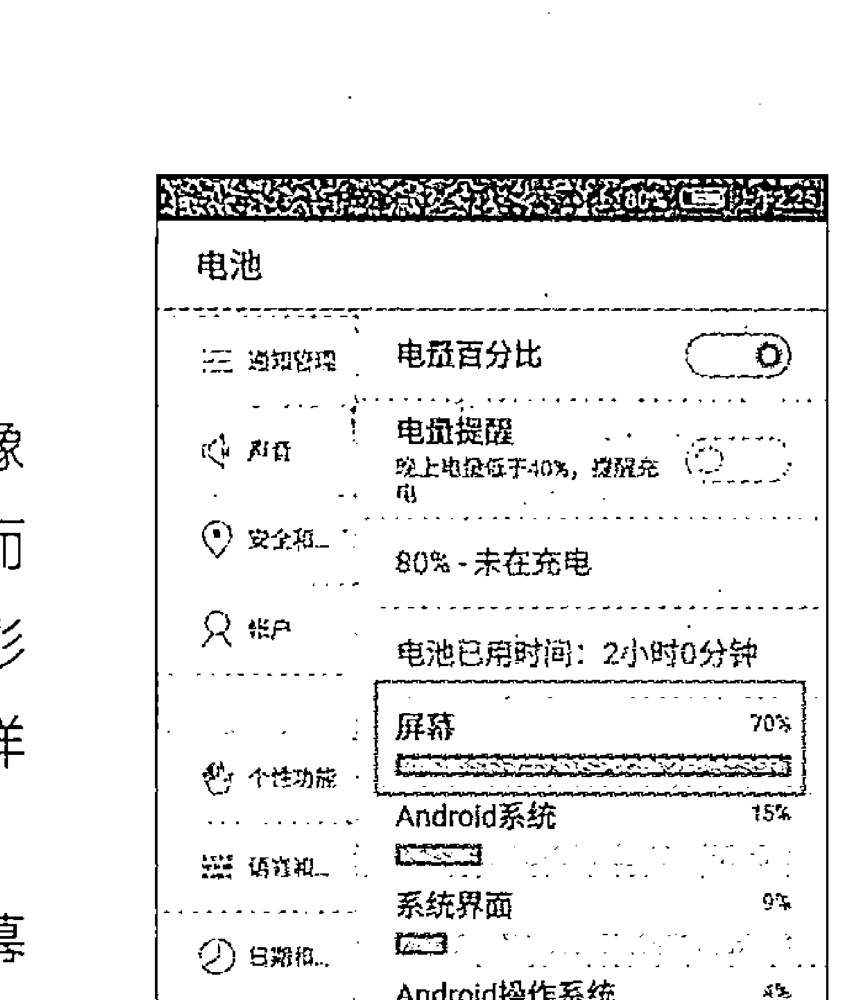

#### AMOLED屏的省电思路

AMOLED (Active Matrix OLED)又称主动驱动式OLED，采用独立的薄膜电晶体去控制每个像素，而每个像素皆可连续独立地驱动发光（自发光），驱动电压低且发光元件寿命长。换句话说，AMOLED在显示纯黑色背景时，每个像素点都等同于完全关闭的状态，此时几乎不会消耗电量。

因此，如果你的手机采用了AMOLED屏幕（代表手机有魅族MX5、Pro5；OPPO R系列；VIVO X5Max；金立S系列；三星中高端机型等），可以将壁纸换成以黑色为主的深色系图片。

此外，有些手机可以修改设置界面的背景色，比如金立M5在省电设置中就可开启“暗色主题”（图2），开启后要比默认的白色背景设置更省电。

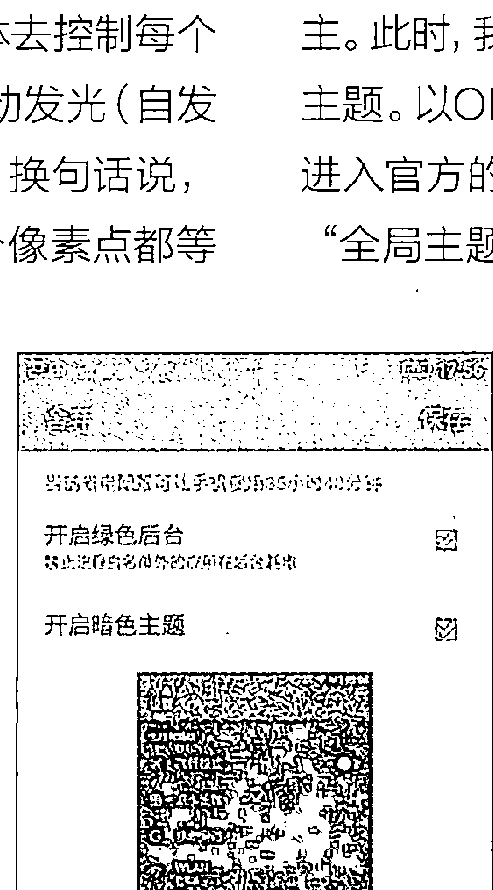

问题来了，有些手机虽然采用了AMOLED屏幕，但无论是拨号、短信还是设置界面依旧以白色为主。此时，我们可以考虑更换全局主题。以OPPO R7 Plus为例，进入官方的在线主题商店，搜索“全局主题”就能看到很多将拨号、短信、设置和下拉菜单都变成了黑色系的主题资源（图3）。替换此类主题之后，就能进一步挖掘AMOLED的省电潜力了。

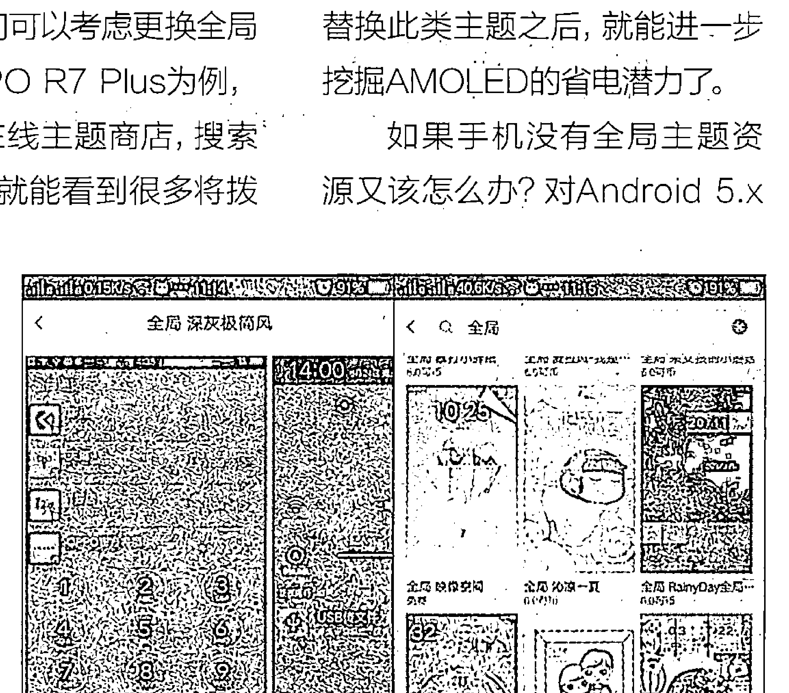

如果手机没有全局主题资源又该怎么办？对Android 5.x系统而言，可以进入“开发者选项”，找到“模拟颜色空间”将其设定为“全色盲”模式（图4），此时你的手机色彩就会变成以灰色为主的色调，较之默认的纯白色要省电不少。

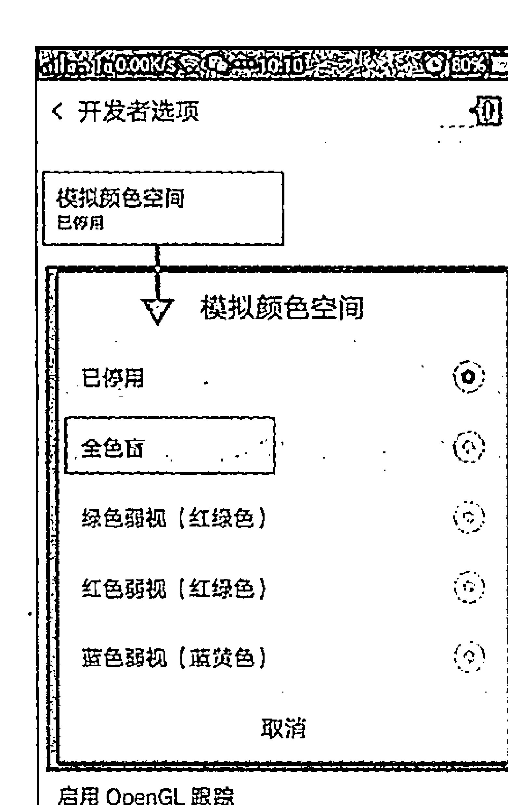

此外，大家可以进入常用的APP，看看它们的设置中有没有修改背景颜色的选项。以UC浏览器为例，就可将网页背景色修改为黑灰色（图5），从而发挥出AMOLED的节能优势。

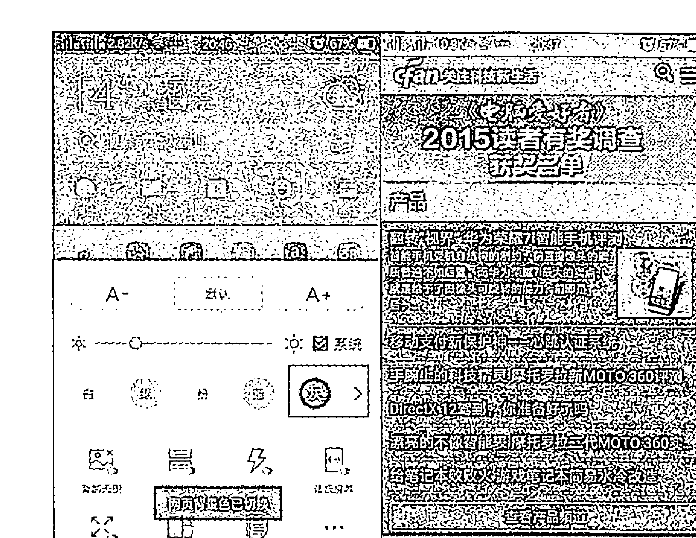

#### IPS屏幕省电思路

很遗憾，IPS材质屏幕需要借助背光层才能发光，在显示黑色背景时也仅仅是用遮光层挡住了灯管发出的光而已，所以无论是白色还是黑色背景时的耗电量几乎是一样的。因此，对IPS屏幕的手机而言，大家就不必耽误工夫替换黑色的壁纸或主题了。

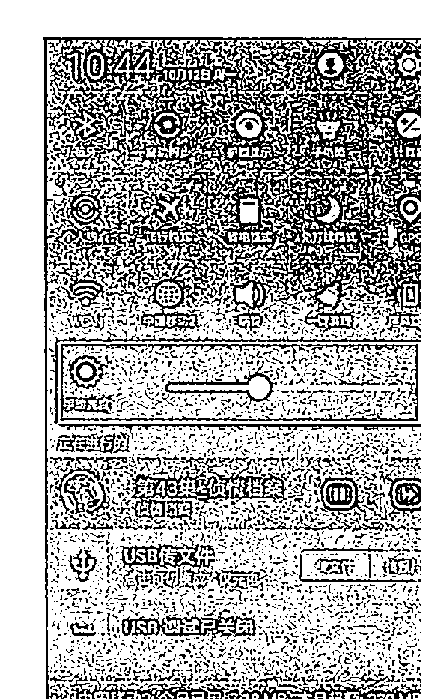

想降低IPS屏幕的耗电量，最有效的方法就是降低亮度。由于使用自动亮度设置时，传感器可能过于敏感，在你不需要的时候也会增加亮度从而造成不必要的耗电。因此建议大家平时可以关闭“自动调节亮度的选项”，而是通过下拉屏幕的方式在通知界面手动修改亮度（图6）。而下拉屏幕调节亮度也很方便，随时根据你眼睛的要求调整亮度，才能节省每一分电力。

> ### 扩展阅读
对Android 4.x的AMOLED屏幕手机而言，我们还能通过Root手机，并使用RE管理器提取“system/framework”目录里的framework-res.apk（将其用压缩文件解压），并替换“framework.res/res/drawable-nodpi”文件夹中的background_holo_dark.png图片，自定义Android手机设置背景图片（改为深色或黑色背景）。需要注意的是，将修改完的framework-res.apk文件拷贝回根目录时需要将权限改为3-1-0，否则会导致无法开机等严重问题。具体的教程大家可以在网上查询。

> ### 小提示
iPhone手机使用的都是IPS屏幕，也是最需要通过亮度节约电力的代表。iPhone用户可以考虑使用BrightVol或Light Bright等插件，实现用音量键调节屏幕亮度，使用起来更方便。

> ### 扩展阅读
决定屏幕耗电量还有一个很重要的参数：分辨率。尺寸、材质相同的屏幕，2K>1080P>720P。如今很多高端手机都以配备2K级别屏幕为荣，但随之而来的耗电量也令人惊叹。好消息是，我们可以通过修改根目录“system”里build.prop文件的“ro.sf.lcd_density=”键值降低分辨率，起到减小屏幕耗电的功效。具体教程请参考这个网址的内容：http://dwz.cn/1Y8GHQ

### 2 滤掉蓝色光，视力少受伤

我们都知道，屏幕所释放的蓝色背光对视力的伤害最大，对长时间使用手机的用户而言，想办法降低蓝色光波的危害，同样具有十分重大的意义。
这里向大家推荐“蓝色光波过滤器”（Android版下载地址：http://pan.baidu.com/s/1kTjcEur），在手机上安装并运行后，勾选“启动以过滤蓝色光波”即可激活，通过修改过滤量百分比和过滤器颜色，可以调整整个色彩的风格。调整量因人而异，比如笔者就觉得自然色+37%左右的过滤量组合看着最为舒服（图7）。

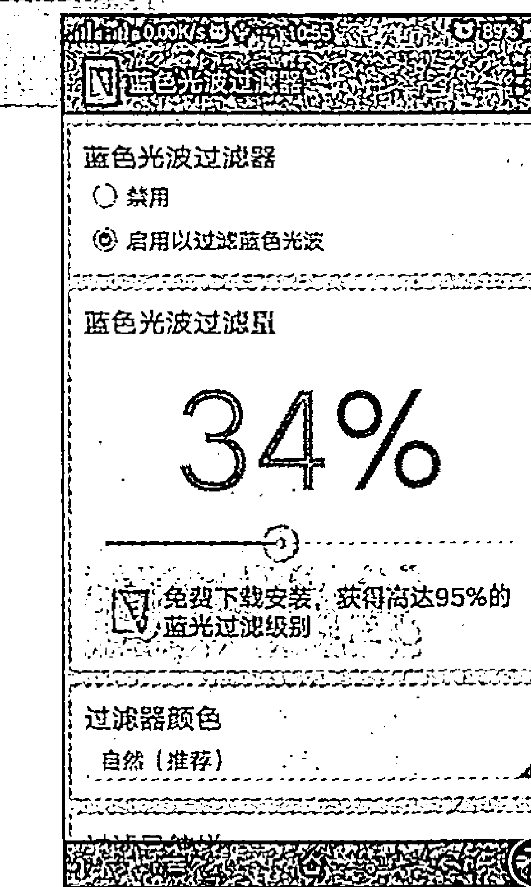

# 闪光灯 摄像头 玩玩小花样

文|神鸟易飞

许多手机都自带简易手电筒功能，一个开关即可开启，简单实用。但是，如果借助第三方的手电筒应用，可以让一个普通手机的闪光灯和屏幕玩出许多新花样。此外，手机的摄像头也能延伸出拍照之外的其他好玩法。

## 1 电筒“变身” 屏幕闪光灯灵活玩

手机充当手电筒，无非就是两种玩法。一种是利用其照相机的闪光灯模拟手电筒发出光亮，另一种就是利用开启高亮度的屏幕显示来照亮环境。我们可以借助于一款“神指手电筒”的Android应用，让这两组闪光灯的组合玩得更加随意。

启动神指手电筒，我们可以看到在该软件主界面上部有3个闪光灯按钮，分别是“屏幕灯”、“闪光灯”和“屏幕闪光灯”（图1）。而下面的大圆盘则兼具手电筒开关和指南针的双重作用，其中中间的蓝色闪亮圆形按钮为手电筒开关，周边的圆环为动态显示的指南针图标，可随着手机的移动而变化方向。

要使用屏幕作为手电筒光源，我们只需将光源选项选择为“屏幕灯”，然后点击手电筒开关，即可开启屏幕手电筒。这时屏幕亮起，在屏幕的左右两侧会显示两个滑动调节图标，其中右侧为亮度调节，越往上亮度越高；左侧为SOS急救信号按钮调节机构，通过向上滑动，可出现频率不同的闪烁信号（图2）；而中间则是手电筒开关按钮，点击可以退出手电筒模式，回到软件的正常界面。

如果要使用照相机闪光灯作为手电筒光源，只需先选择光源选项为“闪光灯”，然后点击软件主界面的手电筒开关即可。如果觉得使用一种光源环境亮度还不够，则可以选择“屏幕闪光灯”，这样手机屏幕和后面的闪光灯就同时亮起了。


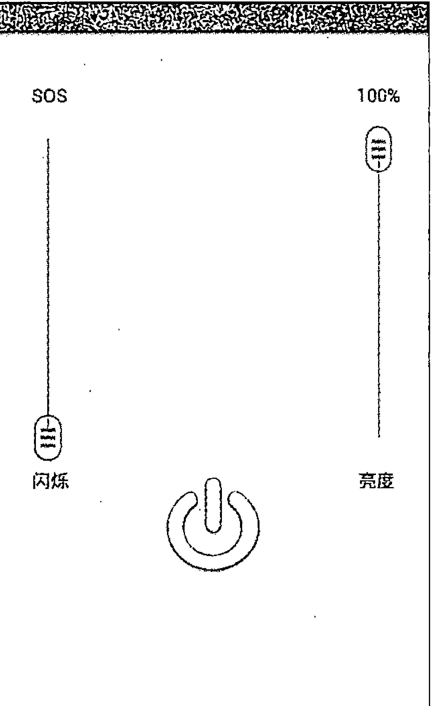


> 小提示
**变身灾害应急报警灯**
在平时，我们多数情况下都是在晚上回家开门时用手机照下钥匙孔，或者在起夜时寻求一点亮光。这时，如上提供的两种手电筒功能就足够了。但人常说，天有不测风云，人有旦夕祸福，有备无患。到了危急时刻，也许需要能发出报警信号的装置，这时手机可以派上用场。也许你已经发现，在软件界面3种光源选项的下方，有一个红色显眼的“报警”按钮。其实这是一个报警指示灯按钮，当我们双击这个按钮后，屏幕和后面的手机闪光灯会同时发出闪烁信号，这时的手机就变身为一部光电报警器了。

警车报警灯信号、设备故障指示灯信号大家一点都不陌生。在一些特殊的场合，如果这些灯不能发挥作用，而情况又危急时，我们还可以用手机来模拟警灯发出红蓝相间的闪烁信号，或者模拟一上一下闪烁显示的故障指示灯信号，给行人或车辆提供安全信息。设置警用灯模拟或故障指示灯模拟，可通过软件的“万能”选项窗口，选择启用“警用灯”或“故障灯”（图3、图4）。

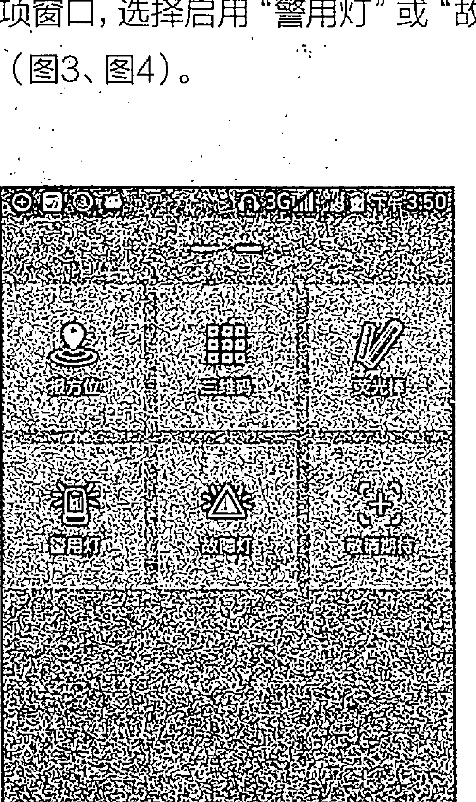

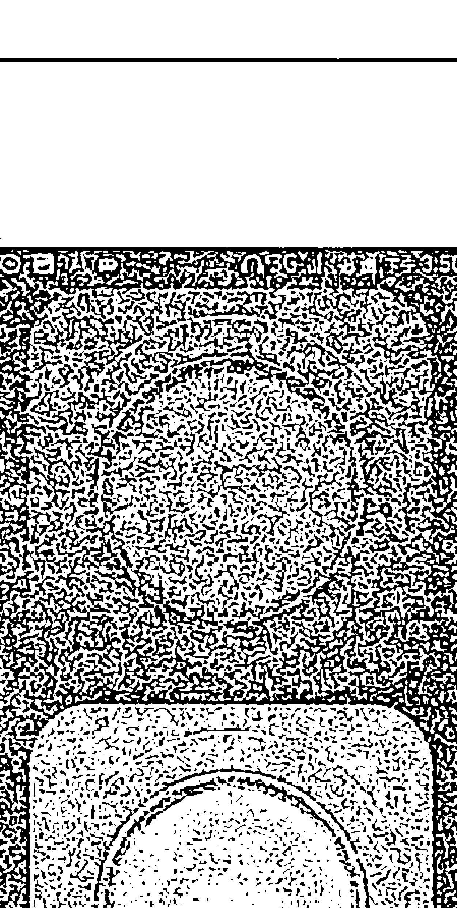

神指手电筒还有一个延伸用法，那就是作为震动报警器。我们将手机放置在一个比较平稳的地方，当受到震动后手机开始报警。用此功能可以报告震动的发生（包括但不限于地震）。要启用此功能，点击软件主界面下方中部的“万能”按钮；进入功能选择窗口，点击“地震仪”图标（图5）。将手机放置在一个平整的位置后，听到一声“喀”的提示音之后，即进入震动报警模式（图6）。其后，如果有震动发生，报警器监测到震动信息，屏幕会发出闪烁信号。

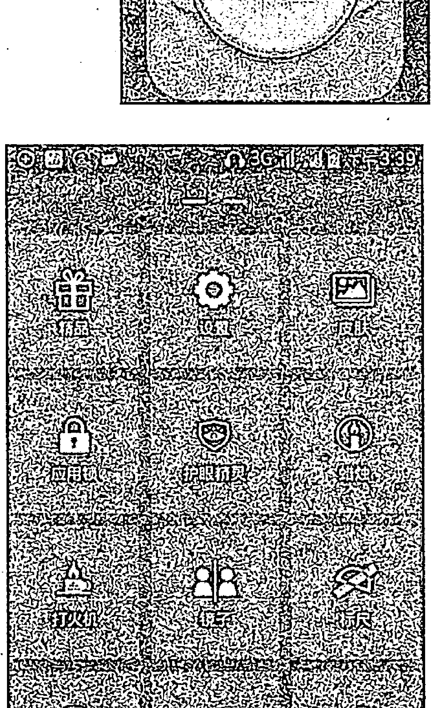

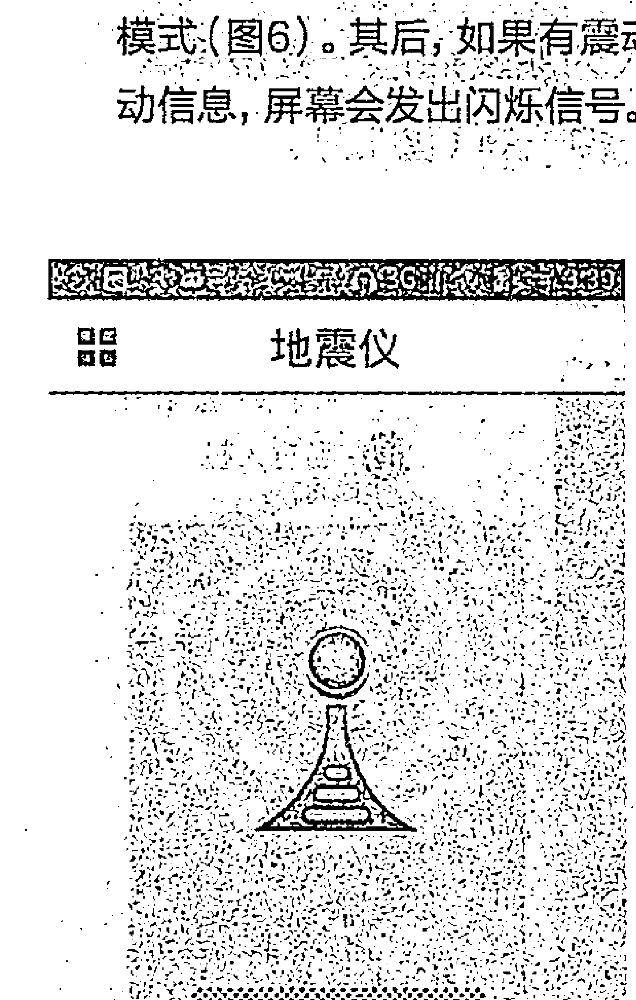

> **小提示**
在黑暗中开启手机手电筒有时也比较麻烦，如果只是希望更简单地使用手机手电筒，也可以给手机安装一个摇一摇手电筒APP。简单一摇即可开启手电筒。有的此类应用还可以设置三次摇晃开关灯，以及支持灵敏度设置。

## 2 增添气氛 屏幕变身炫彩灯

参加一些联欢会、演唱会或派对晚会，大家常常会看到人们手拿五颜六色的闪光棒欢动的场景。其实，如果手头上没有那些道具，我们可以用我们的手机屏幕或闪光灯，模拟出各种炫彩效果，可活跃现场气氛。
在神指手电筒软件中开启屏幕灯，然后通过左右滑动，可以将屏幕变幻出10种不同的颜色。看到屏幕下方的小圆点了吗？这就是屏幕可提供的各种颜色效果的标志（图7）。除此之外，我们还可以让手机变身为荧光棒，只需在神指手电筒的“万能”选项窗口选择“荧光棒”按钮，即可选择3种颜色的荧光棒，让手机屏幕变成一支荧光棒（图8）。

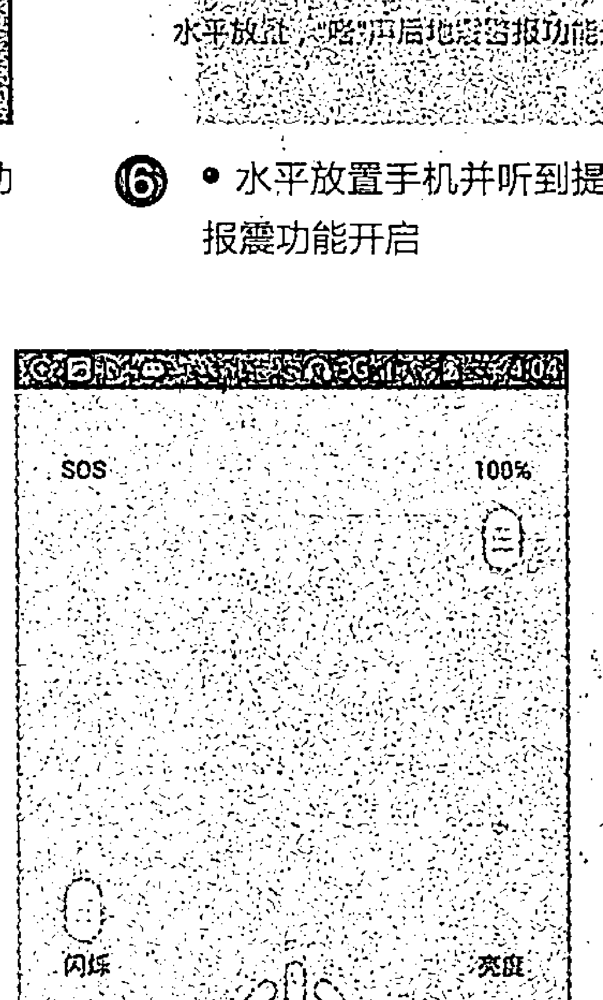

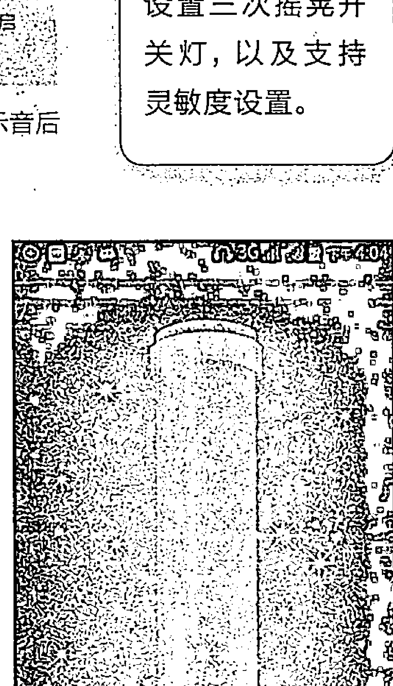

屏幕灯还有一些有趣的玩法。例如，我们可以将屏幕变成一个点燃的打火机。在“万能”选项窗口点击“打火机”按钮，这时屏幕底部出现一个印有美女图案的打火机图标（图9），用手拨动顶盖，露出打火机的拨动轮（图10），向右拨动打火轮，打火机就会燃起熊熊大火（图11）。用此画面来渲染活动气氛，既安全又热闹，何乐而不为呢！

还有一个有趣的玩法，如果朋友生日在一个特殊的环境下没有蜡烛可用，可以掏出你的手机，打开神指手电筒的“万能”窗口，选择“蜡烛”，这样，每个人为朋友点起一支没污染的蜡烛，那也是别有一种气氛（图12）。

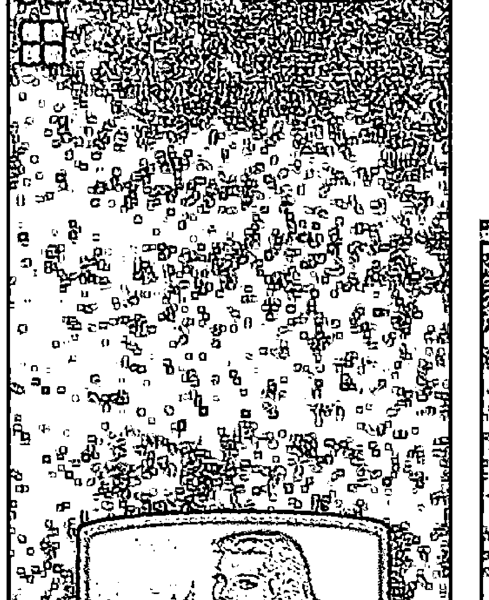

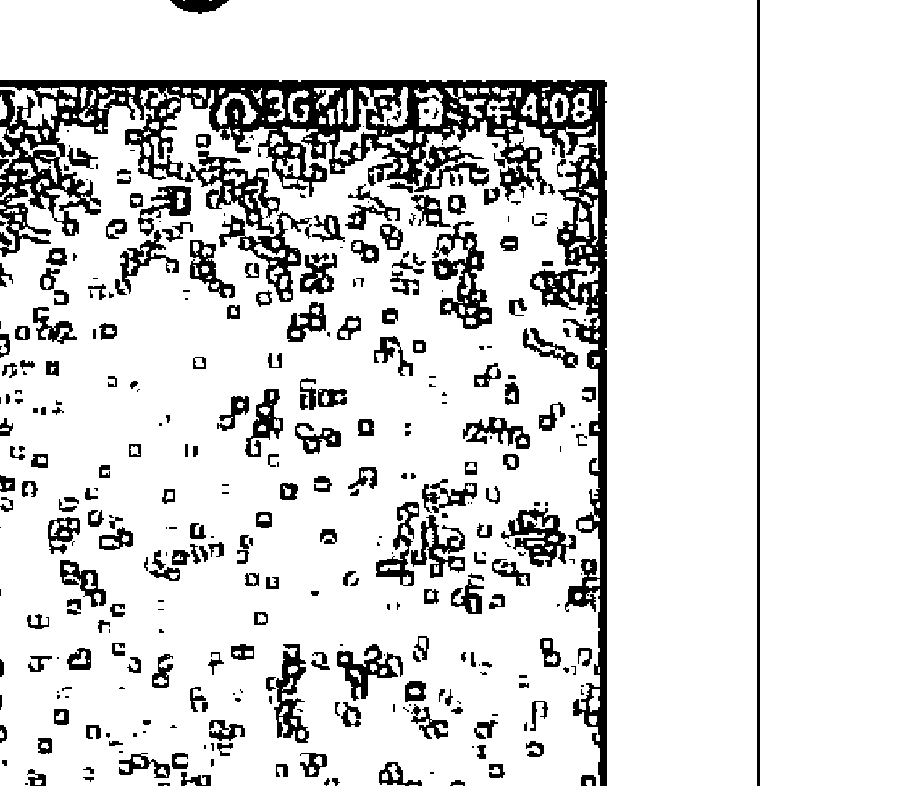

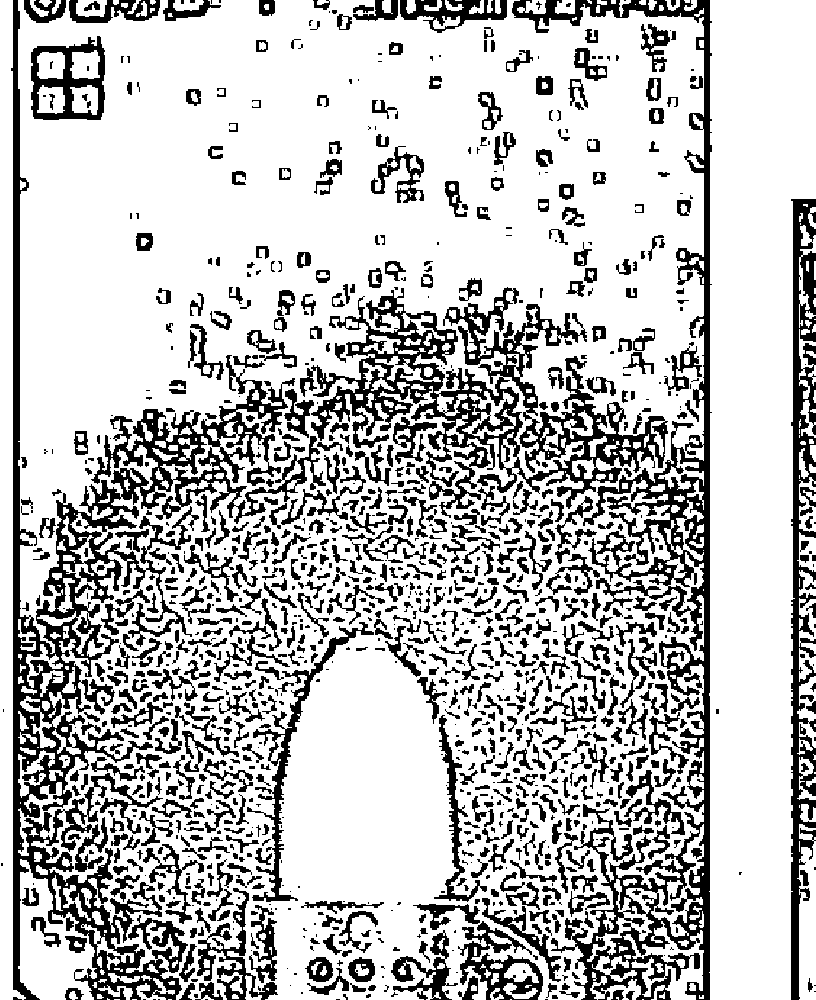

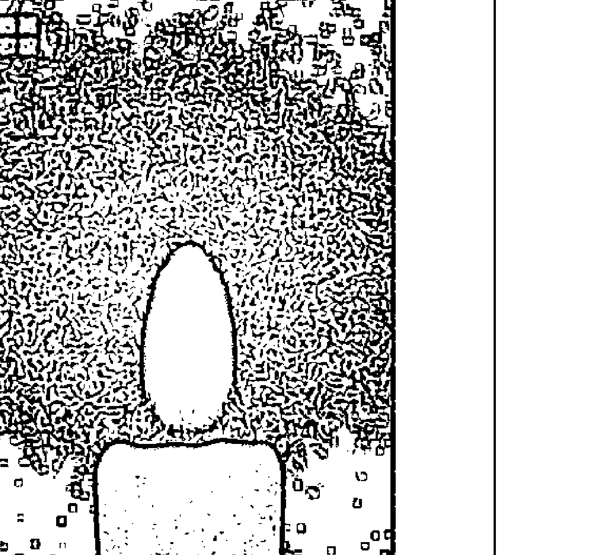

## 3 减少麻烦 手电筒定时自动关

手机模拟手电筒的确可以解决应急问题，但有时在开启之后手动关闭很方便，或者有时因忘记关闭很快耗光电能。如果给这个“手电筒”设置定时关闭的功能，则可解决以上问题。

在神指手电筒开关的右侧，有一个定时指示刻度，通过用手指上下滑动，可以设置手电筒的定时关闭时间。可设置从30秒到10分钟的不同时段。这样设置之后，当我们开启手电筒之后，即便是忘记关掉，很快它会自动“熄灭”（图13）。

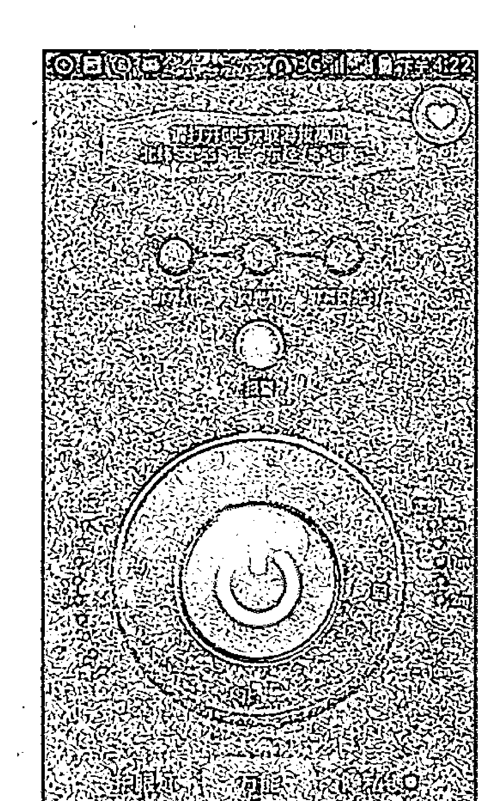

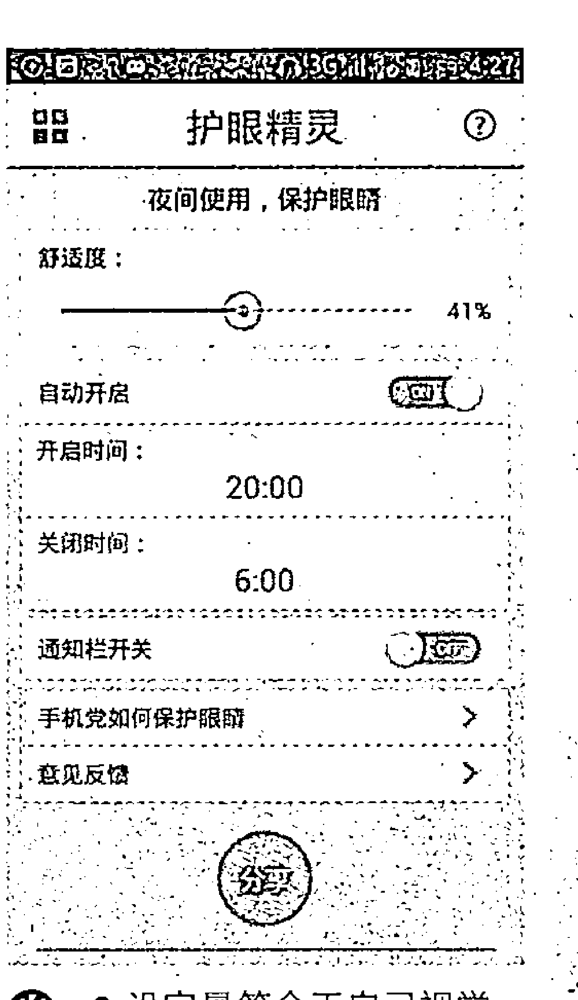

**小提示**

屏幕亮度不合适会在某种程度上影响到视疲劳的程度。如果在指定时间内阅读时，手机能自动将屏幕调整到最适合于阅读者的亮度，会对保护视力起到一定的帮助作用。亮度的设置经过你的实验来具体得出。启动万能窗口中的“护眼精灵”，调整舒适度滑块检测最适合自己视力的亮度，然后设置开启自动亮度调节的时间段，这样就可以让屏幕亮度到时自动调节到最合适的水平了（图14）。

## 4 光源变身 手电筒也能换灯泡

普通的手机自带的手电筒提供的光源也比较单一，如果你厌倦了这些简单的光源，可以给自己的手机手电筒换换“灯泡”。通过“九合一手电筒”的应用，可以让你的一只“手电”变身不同灯泡的效果：利用背光灯的原理照明的背光灯、指示灯、节能灯、白炽灯；利用外部光线的不同的光感灯；利用手机相机的闪光灯原理进行照明的闪光手电筒、照明灯笼、高亮车灯、绚丽壁灯等，都可以随心所欲地更换。


开启软件后，直接选择所需光源的灯泡即可（图15）。要设置更多的效果，点击所选的“灯泡”，然后选择所需的光源效果（图16）。

**小提示**

部分机型的手机在升级后无法打开闪光灯，例如魅族手机，可以尝试在设置中允许使用闪光灯解决。操作步骤：通过“设置→应用控制→手电筒终极版”，勾选“摄像头（拍照/录像）”。其他型号手机用户如果无法打开闪光灯，也请到相应的项目设置中，检查一下是否禁止了使用闪光灯权限。

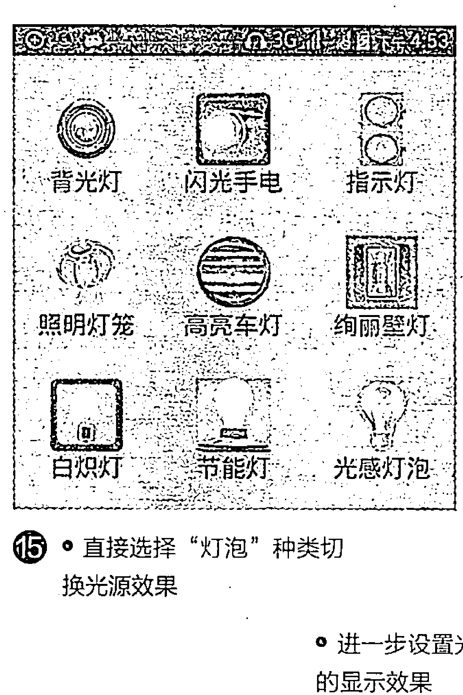

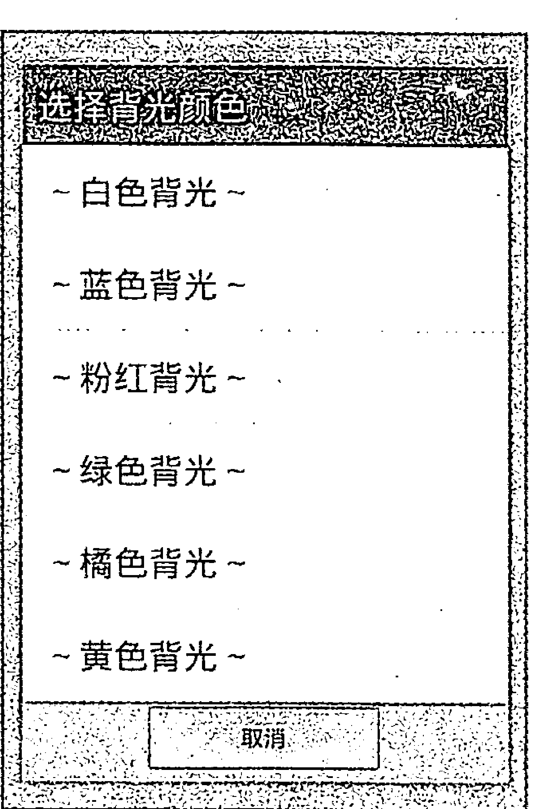

### ⑮ • 直接选择“灯泡”种类切换光源效果

### ⑯ • 进一步设置光源的显示效果

## 5 神奇功能：手机找出“偷拍器”

除了闪光灯和屏幕的一些特殊玩法外，手机摄像头也有另类的玩法。网上流传着这样一个探测宾馆是否暗藏摄像头的“土办法”：关掉房间的灯，拉上窗帘，打开手机照相机，不开启闪光，拿着手机围绕房间转一圈，如果发现红点就是有摄像头，没有红点就是没有摄像头。那么，这样的“传说”是否靠谱？如果是真的，其原理又是什么呢？让我们先普及一点理论知识，然后用一个简单的实验来验证这种说法的可靠性。

**小提示**

手机只能拍到有红外线补光灯的摄像头，如果安装的是没有补光灯的摄像头，靠以上方法就无能为力了。虽然专业人士可以用传感器侦测针孔镜头发出的不同频率的电磁波来找到摄像头，但这种方法对多数普通人来说并不具有可操作性。对于不会发光的针孔摄像头，倒不如直接拿手电筒去寻找反光物更可靠些。

**小实验**

找来一部有补光灯设计的手机，白天到附近的一家商场用手机对着几个摄像头拍摄，结果屏幕上没有看到红外线光束现象。等到晚上在公园附近的阴暗处对两个摄像头拍摄，结果发现摄像头发出非常明显的偏紫色光线。而这些摄像头用肉眼看上去是没有任何光线发出的。尽管没有做更多的实验，但基本上验证了以上理论的可靠性。此外，我们用手机摄像头拍摄红外电视遥控器发射的光线，发现可以拍到紫色光线；而改用小型数码卡片机拍摄则无法拍摄到，进一步证明了手机摄像头对发现红外线的有效性。

**小知识**

手机摄像头只能找到有红外线补光灯的摄像头，而不能找到不会发光的摄像头。中国市场上的多数红外摄像头主要是通过红外线滤光片实现日夜转换，即白天会自动打开滤光片，以阻挡红外线进入CCD，让CCD只能感应到可见光。而夜视或光照条件不好的状态下，滤光片停止工作，不再阻挡红外线进入CCD，红外线经物体反射后进入镜头进行成像。由于光源中的红外光也不一定够强，所以为了保证成像，一般红外摄像头都会有一个红外光灯来补光。

**扩展阅读**
**LED闪光灯与氙气闪光灯**

由于定位和成本的因素，目前多数智能手机的相机闪光灯采用的是LED闪光灯。有的手机上还配有两颗LED闪光灯，用作“补光”。LED补光灯是使用LED发光二极体对被摄物体进行补光，LED灯由于能耗低、亮度高，一般用在手机或数码摄像机上，用于光线不足时补光。由于LED发光二极体的亮度远低于真正的闪光灯，所以只能起到“补光”的作用。例如苹果早在iPhone 5S上就配有两颗这样的闪光灯，其中一颗发出白光，一颗发出黄光，其目的是为了在低照度环境下能够更好地调节拍摄的色温，提供更好的色彩还原效果。而一些以拍照为主打卖点的手机，已经在采用照相机上常用的氙气闪光灯。氙气闪光灯，又称高强度气体放电闪光灯，由氙气灯泡、变压安定器和绝缘导线组成，利用特殊氙气气体在超高电压状态下击发放电，通过相机的触点触发后，通过变压器在瞬间内将12V电源升至2万伏以上的高压脉冲电压，启动氙气灯泡中的氙气在电弧中产生6000K~10000K色温度的强劲光芒，颜色呈晶钻白中略带紫蓝。氙气闪光灯效果要比LED补光灯好，但是不能像LED一样常亮当作电筒用。

# 玩转手机自拍杆

文|神鸟易飞

目前，前置1300万像素摄像头的智能手机已有售。然而，再强的前置镜头，也受制于人类的手臂，自拍只能玩“大头照”。因此拍照“神器”自拍杆就应运而生。也许你会认为那东西太简单，插上一按就能拍照了。然而，由于市面上的Android手机型号五花八门，单靠资料中的说明，不一定能确定买到的自拍杆在自己的手机上可正常使用。那么，购买自拍杆需要注意什么？自拍杆无法使用到底是手机的问题，还是自拍杆本身的问题？自己能解决吗？

## 1 分清类别买我想要的

常见的自拍杆有蓝牙控制和线控两种。蓝牙自拍杆是通过蓝牙遥控的方式触动快门拍照的（图1），这类自拍杆从结构上又可以分为自拍杆与蓝牙遥控器分离型和自拍杆内嵌蓝牙无线按钮两种。而线控自拍杆，则是通过与耳机插孔相连接的按钮，将线控音量控制指令自动映射为触动快门操作而完成拍照（图2）。

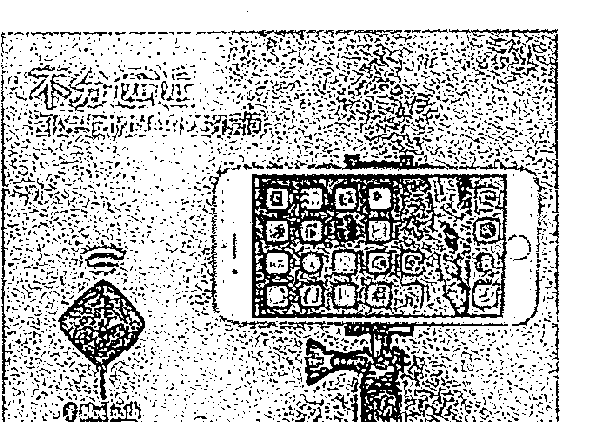

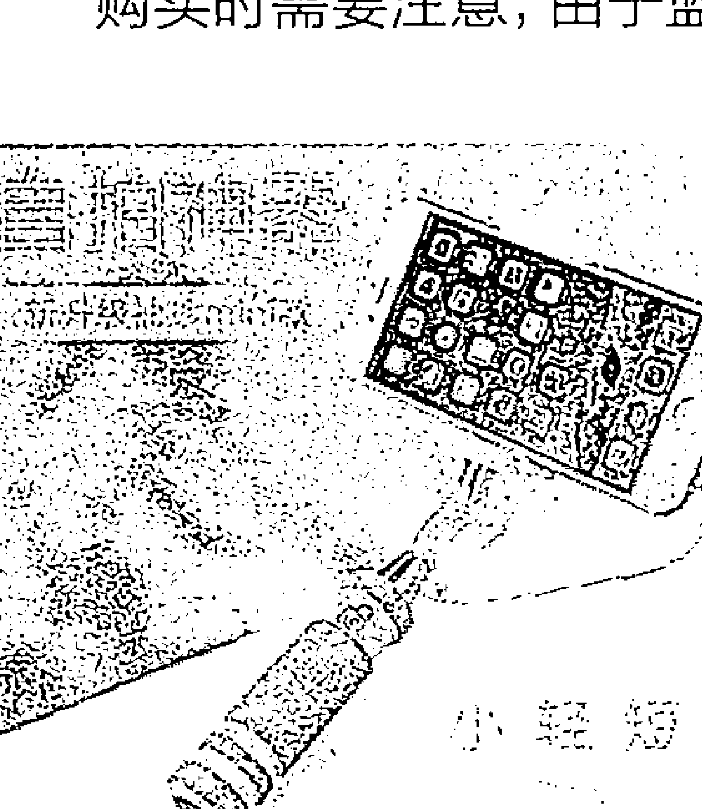

购买时需要注意，由于蓝牙遥控器与自拍杆分离型设备的遥控器相对很小，遥控器很容易丢失或掉在地上被踩坏，所以为便于管理，可考虑遥控器与自拍杆一体式的产品。此外，蓝牙设备需要电池或充电使用，尽管一次充电使用几十个小时没问题，但若遇到忘记充电或电池耗尽中途断电就比较尴尬了。而线控的一个短板是对距离的制约，不像蓝牙遥控那样可以控制10米左右的距离拍照，所以想用线控自拍杆拍摄人多的全家福可能会成问题。总之，两类设备各有利弊，可根据个人情况权衡选择。

> > **小提示**
>
> 市面上多数自拍杆可同时兼容iOS和Android手机，但也有个别自拍杆只能支持一种系统。购买时要注意看清支持的系统种类。

## 2 无法识别的原理分析

蓝牙控制型的自拍杆问题相对较少，只要发射器没有问题，配对成功就可以使用了。若蓝牙配对成功后，按拍照按钮出现控制“声音”或“缩放”，请在手机中将音量键设置为拍照键即可（图3）。

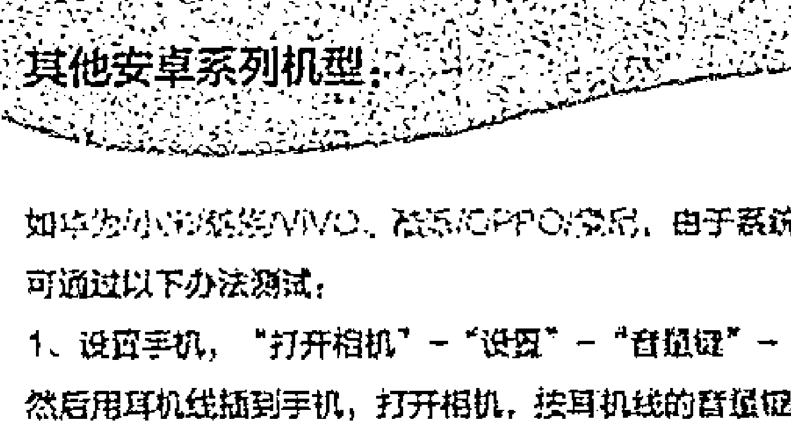

- **其他安卓系列机型：**

1. 设定手机，“打开相机”->“设置”->“音量键”->“设置音量键为拍照（快门）”，然后用耳机线插到手机，打开相机，按耳机线的音量键，看可不可以拍照。
2. 如果不可以拍照，可以下载第三方APP如“相机360”，在软件设置里面把音量键设置为拍照后，看可不可以拍照。
3. 如果不可以拍照，则不能使用线控自拍杆；如果可以拍照，80%的线控自拍杆可以（部分由于耳机孔改版不能用线控自拍杆）。
4. 某些品牌耳机孔设计不同，初次插入会导致不可用，多次插拔后可正常使用。

从身边朋友和网友们反映的情况来看，线控自拍器的问题则相对较多，一般集中在手机无法识别自拍杆上。也就是说，当连接好设备之后，按下自拍杆上的自拍按钮，拍照软件并无触动快门的动作，不能完成拍照。

发生这样的问题原因可归咎于物理损坏及系统按键映射上：前者只能更换设备，而后者则可通过软件调试的方式解决。线控自拍杆按键的键值一般是115代表音量

> > **小提示**
>
> 在不少安卓机型使用线控自拍杆前，需要设置音量键为拍照键。通过“设置->音量键->设置音量键为拍照（快门）”设置，之后连接设备，按下耳机线音量键测试能否拍照。若所用的手机无此设置，可下载第三方APP（如相机360、美颜相机等），在软件中将音量键设置为拍照功能（图4）。

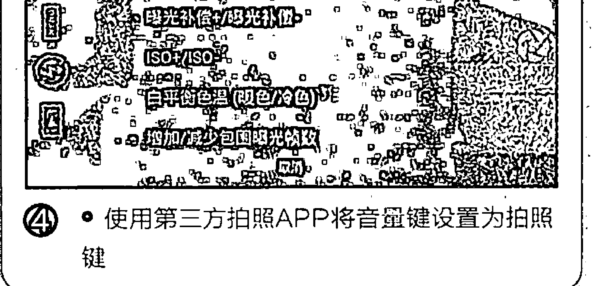功能，因此需要手机的照相机软件能使用音量+作为快门按钮。但是，由于各种手机的耳机插孔可能存在差别，用同一个自拍杆的按键在不同的手机上测出来的键值会有所不同。因此，为了让此类手机也能支持线控自拍杆控制，需要重新进行按键映射。

## 3 测试信号的连通情况

那么，问题来了，怎么才能知道自己的自拍杆不能用的原因是物理接触不良或损坏，还是键位映射存在问题呢？其实也很简单，我们可以通过一款Keytest的APP，测试手机是否能够接收到自拍杆发出的按键信号。如果能够收到信号，说明不是物理连接问题。

安装并启动KeyTest.apk应用，按下自拍杆按键，如果手机屏幕显示：

```
keycode=KEYCODE_MEDIA_PREVIOUS
scancode=165 (*键值为165)
```

说明自拍杆与手机物理连接正常。否则，如果按下自拍杆按键之后手机屏幕没有任何键码显示(图5)，说明自拍杆损坏或手机耳机插孔与自拍杆插头连接有问题。

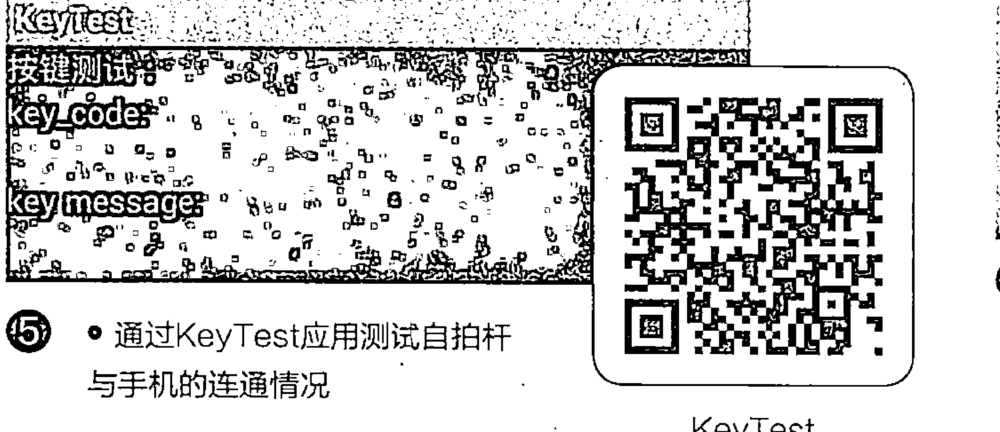

KeyTest

## 4 解决自拍杆控制问题

测试自拍杆与手机物理连接没有问题之后，则可以用一个“自拍杆助手”的APP，将按钮映射为正确的拍照按键。“自拍杆助手”APP适用于所有Android手机，无需Root，不用更改系统文件，不会对手机系统造成任何破坏。

启动自拍杆助手APP，依次点击1、2、3启用自拍杆映射，不用重启手机，一般就可以使用了(图6)。自拍杆助手可将自拍杆按键映射为快门键，软件内置映射音量加、音量减、上一首、导航确定、二级线控和info共6个按键为快门键。如果你的手机经过如上“傻瓜化”设置后还是不能拍照，可以点第1步，然后手动选择“按键映射→映射1”，按下自拍杆按钮，选择映射为相机拍摄键即可(图7)。

> > **小提示**
>
> 经测试，自拍杆识别成菜单键和返回键以及主页键的，此类手机无法使用该软件映射成快门，也就不能使用该自拍杆了。

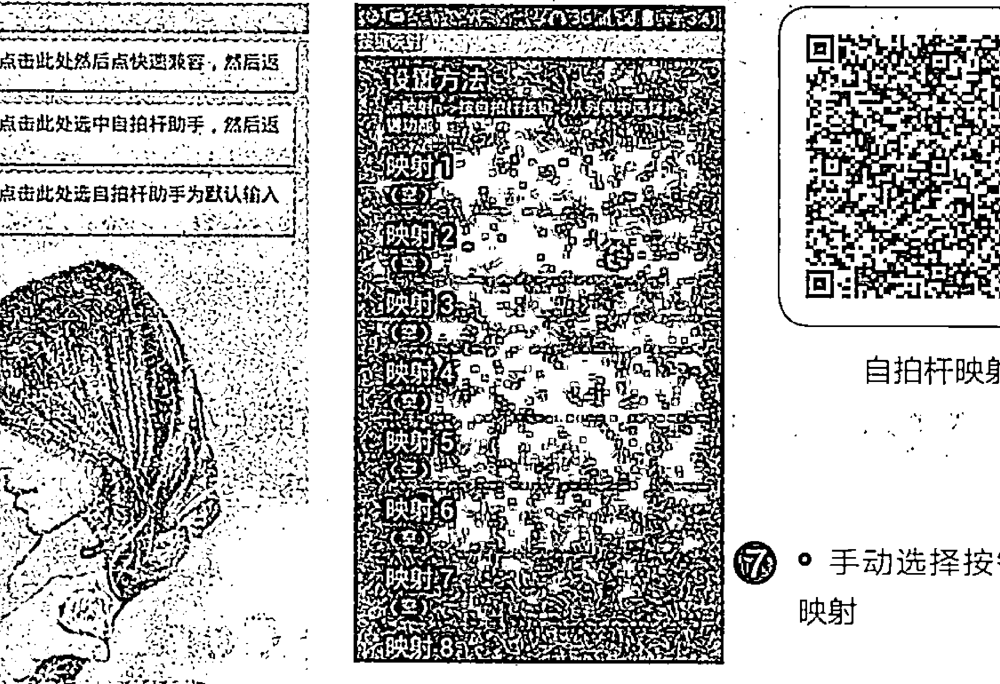

## 火速连接

手机映射按键可延伸更多应用。详情请参考本刊2015年第9期《挖掘手机上的按钮潜力》。

## 5 使用更兼容的自拍杆拍照软件

担心手机自带的拍照软件对自拍杆有兼容问题，使用能够自动识别或提醒切换自拍杆的拍照应用，效果会很好。一款自拍杆专用软件“自拍杆相机(酷玩相机)”，可很好地支持线控式、蓝牙式自拍杆，支持常用的拍照、摄像、连拍、翻转等拍摄模式(图8)。

值得一提的是，当耳机插孔插入设备之后，软件会提示用户选择插入的设备是耳机还是自拍杆，选择“自拍杆”就可自动映射为自拍杆(图9)。

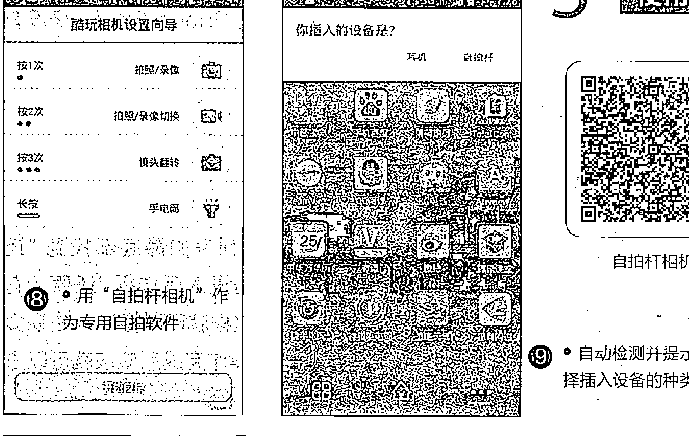

## Android 5.x如何进行ROOT

文|老万

Q: 最近我的手机开始推送Android 5.x的系统了，而我也在第一时间进行了试用，感觉操作运行起来更加流畅。但是一个新的问题又出现了，就是5.x的系统如何进行ROOT操作啊？

A: 有不少人使用SuperSU进行ROOT，效果还不错。但是要想使用这款应用的话，首先需要刷入第三方的Recovery，接着下载SuperSU刷机包，复制到手机的SD卡中。然后利用Recovery将刚刚复制到SD卡的刷机包刷入系统即可。


上述的方法需要刷机，操作比较复杂，而且还有一定的风险，刷机不顺有可能导致手机无法使用。所以也可以试试其他的方法，比如一款名为TowelRoot的应用。这款应用安装以后直接点击“获取ROOT权限”按钮即可，但是这款应用也有一个明显的不足，就是没有自带权限管理的相关功能。

## 巧用日历显示来管理手机图片

Q: 手机中的照片一多管理起来就很麻烦，比如有时想找较远时期的照片就很不方便。有没有什么方法可以快速找到某个日期的照片？

A: 要想实现这个要求，一般需要用户根据属性，对照片进行相应的分类。比如通过拍摄日期等，将照片整理到不同的相册，这样就可以按照时间进行寻找了。如果用户没有进行类似的分类操作，那么可以安装Scene这款图片管理应用，它最大的特色就是将所有照片按照时间顺序归类，这样就可以按照查询日历的方法来管理照片了。

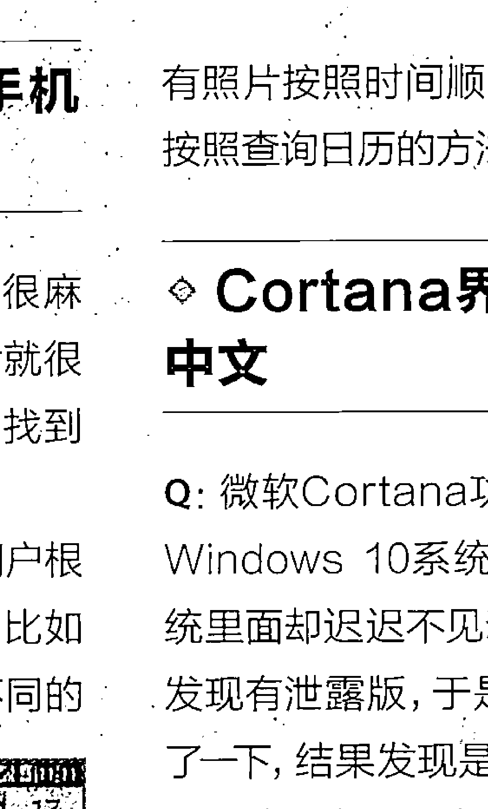

## Cortana界面如何显示成中文

Q: 微软Cortana功能已经成功应用到Windows 10系统中，但是Android系统里面却迟迟不见动静。最近好不容易发现有泄露版，于是下载到手机里面试了一下，结果发现是英文界面。有没有什么方法让它显示中文界面？

A: 这里已经网友总结出了一个经验，可以试试。首先确保开发者选项中的“使用返回键强行关闭应用”选项关闭，接着从左边往右划出侧边栏，依次点击Notebook→Finance→Add a stock。这个时候随便输入一个股票代码，比如AAPL即可。此时Cortana就会卡住，然后按1到2次手机的返回键。很快系统会弹出“Cortana无响应，要将其关闭吗？”的提示，点击“确定”按钮后Cortana就是中文界面了。

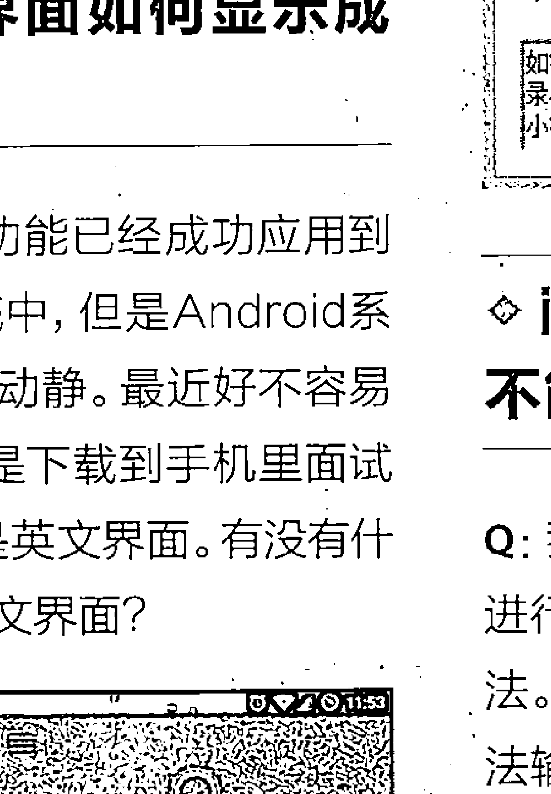

## 微信语音如何在电脑中播放

Q: 经常和女友在微信上甜言蜜语，产生了不少的音频文件。可是将这些文件复制到电脑中后，发现居然没有一款播放器可以播放。这个问题如何解决？

A: 出现你所说的这种问题，主要是因为这种语音文件是微信的专属格式。不过也不是没有播放器可以播放，有一款名为“楼月微信语音播放器”的工具就可以。用户只需要将amr、aud文件拖到软件界面中，接着软件就可以进行播放了，当然也可以保存为常见的WAV格式。

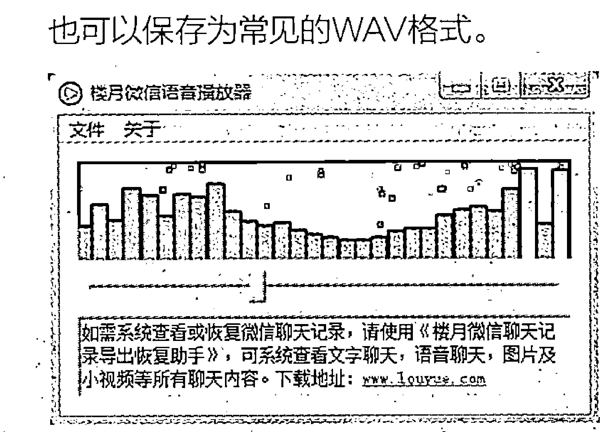

## iPhone所有中文键盘输入不能用

Q: 我使用的是iPhone 6手机，既没有进行越狱操作，也没有安装第三方输入法。可是不知道怎么回事，手机键盘无法输入中文信息。请问这该如何解决？

A: 首先找到iPhone屏幕上的“设置”图标，点击进入后选择列表中的“通用”选项。在通用列表的最底部找到“还原”选项；点击进入后选择“还原所有设置”按钮，这样就可以将输入法恢复到初始状态，操作完成后应该就可以进行中文输入了。

## ◆ Windows 8和Windows 8.1的驱动能否通用

Q: 我的ThinkPad是比较老的机型，最近想换一个Windows 8.1系统来试试。但是官方网站上针对Windows 8的驱动软件有三十多个，而针对Windows 8.1的却只有十几个。不知道是Windows 8.1本来就不需要安装那些驱动，还是没有出那么多的相关驱动。所以想问一下，Windows 8和Windows 8.1的驱动是不是通用的？

A: 由于Windows 8和Windows 8.1在大的版本号上是相同的，所以基本上这些驱动文件是可以相互使用的，但是效果能不能达到最佳就不好说了。当然并不是所有的设备都需要安装驱动的，比如用户平时使用的是鼠标，那就没有必要为触控板安装驱动。另外通过系统的补丁升级功能，也可以下载安装一些通用性比较好的驱动程序。

## ◆ 系统时间显示与微软图标重叠

Q: 最近我安装了魔方的“软媒时间”工具，想通过它查看农历等信息。但是没想到本来在右下角的系统时间，居然被移动到了左下角，这样就和开始按钮重叠了。请问这个问题怎么解决？

A: 如果确认是此软件引起的问题，也只能是先删除它看看了。首先退出这款软件，然后将其卸载并完全删除。如果不能进行删除的话，说明该软件在系统后台留有进程。打开系统的任务管理器，在“进程”列表中找到Mytime和Pcmastersvc选项后，点击下面的“结束进程”按钮后再删除即可。然后换用其他类似功能的软件再试试。

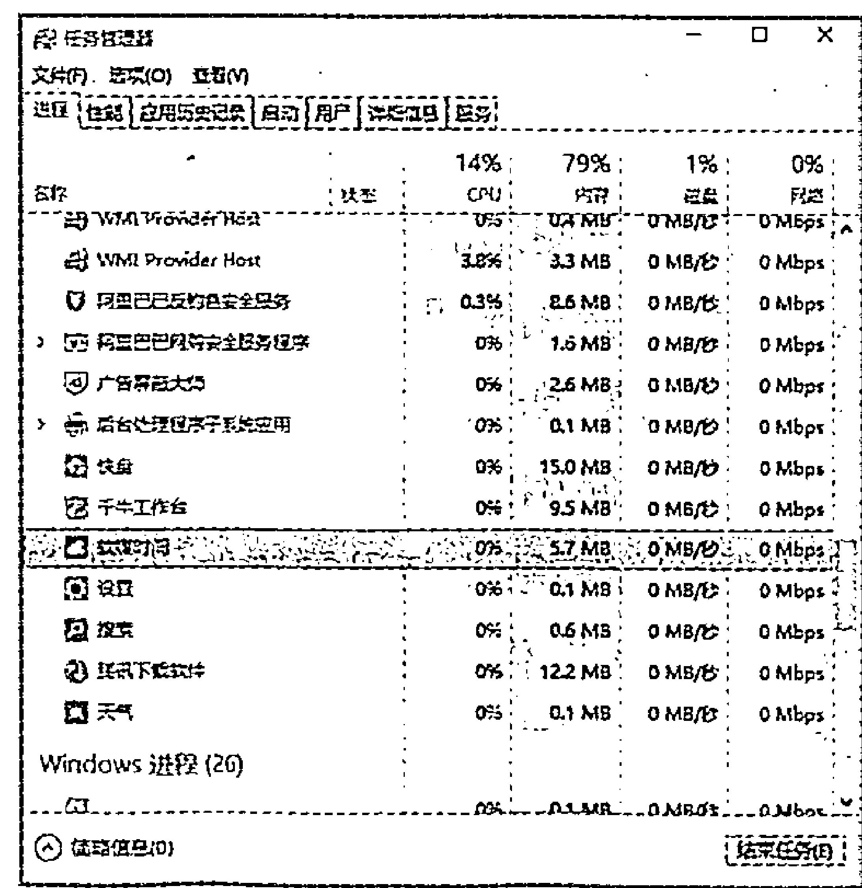

## 怎么查看连线中的Wi-Fi密码

文|老万

> Q: 有朋友到家中做客，询问我家里的Wi-Fi密码，结果我一时间想不起来，在朋友面前感觉非常尴尬。我想问问有什么方法，可以查看电脑中已经连接的Wi-Fi密码？

A: 首先打开Windows系统的控制面板，点击“网络和Internet”下面的“查看网络状态和任务”链接。在弹出的窗口中点击当前的网络连接名称，再在弹出的对话框中点击“无线属性”按钮。然后从弹出的属性窗口点击“安全”标签，再选中下面的“显示字符”项，这时网络安全密钥内的小圆点就会显示出你的Wi-Fi密码了。

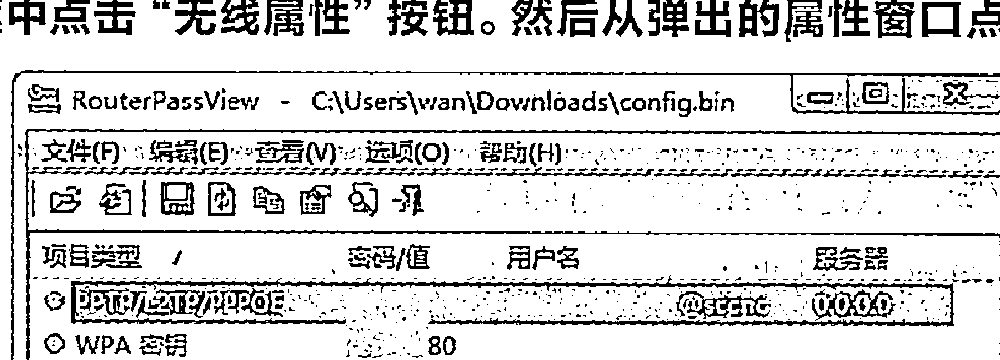


其实我们也可以登录到路由器的后台，选择“备份和载入配置文件”选项后，点击右侧窗口里面的“备份配置文件”按钮。现在运行RouterPassView这款工具，载入刚刚备份的配置文件，就可以读出路由器里面存储的所有密码信息了。

## ◆ 鼠标右键中的属性命令不能显示

Q: 我开机时在桌面空白处点击鼠标，结果发现右键属性显示不出来，等屏幕闪了一下后又都出来了，但是点击桌面上文件右键属性又正常。请问这该如何解决？

A: 这应该是某些软件注册了鼠标右键菜单后，与其关联的文件已经存在或者损坏，所以导致打开右键菜单的时候Explorer文件崩溃。可以运行CCleaner这款工具，选择左侧工具栏中的“注册表”按钮，然后进行扫描并修复就可以了。

## ◆ 游戏时系统蓝屏

Q: 最近我在玩游戏的时候经常蓝屏，找了一个懂电脑的朋友看了以后，说问题出在lgxpdx32.DLL文件上。请问这个文件是什么，为什么它会造成系统的蓝屏？

A: lgxpdx32.DLL是Windows系统里面非常重要的一个文件，很多软件或者驱动程序的运行都需要它的支持。建议通过PE盘启动操作系统，然后利用系统急救箱软件对这个文件进行修复。

## # 数码照片在云端优化压缩

文|老万

Q: 虽然现在硬盘容量非常大，可以存放大量数码照片。但是由于数码照片体积比较大，因此传输起来非常不方便。那么有没有什么方法可以对照片的体积进行压缩，但是质量并不会受到很大的影响？

A: 首先在浏览器中登录TinyPNG网站（https://tinypng.com/），通过鼠标选择要进行压缩的图片后，拖曳到网页中的“Drop your png or jpg files here”框里面。当图片上传完成后就会自动进行压缩操作，从进度条中就可以查看到数码照片的压缩进度。然后点击每一张照片后面的“Download”链接，就可以方便地将压缩完成的照片下载到本地系统了。

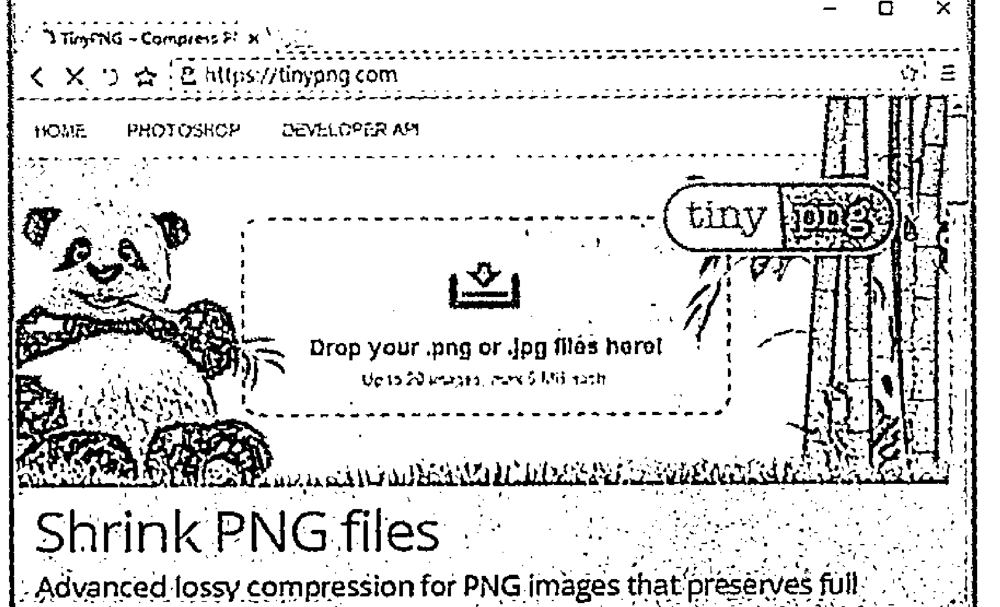

云端压缩操作非常简单，但是它有一定的限制，就是数量不能超过20张。如果想继续操作的话，建议大家重新启动一下路由器或者电脑系统，这样就可以更换一个IP地址，从而突破网站的相关限制。

## ◇ 导入的词库不能同步到云端

Q: 由于越来越多的输入法开始耍流氓，因此我现在改用刚刚推出的手心输入法。可是我发现在导入其他的输入法词库后，手心输入法不能对导入的词库进行同步操作。请问这个问题怎么解决？

A: 其实这个并不是手心输入法的问题，而是你没有很好地进行设置。首先进入到输入法的设置窗口，点击工具栏中的“账号”按钮，在弹出的窗口中点击“立即备份数据”。在弹出的对话框中选择“安装的词库”项，点击“确定”后重新进行同步操作，就可以将导入的词库同步到云端了。

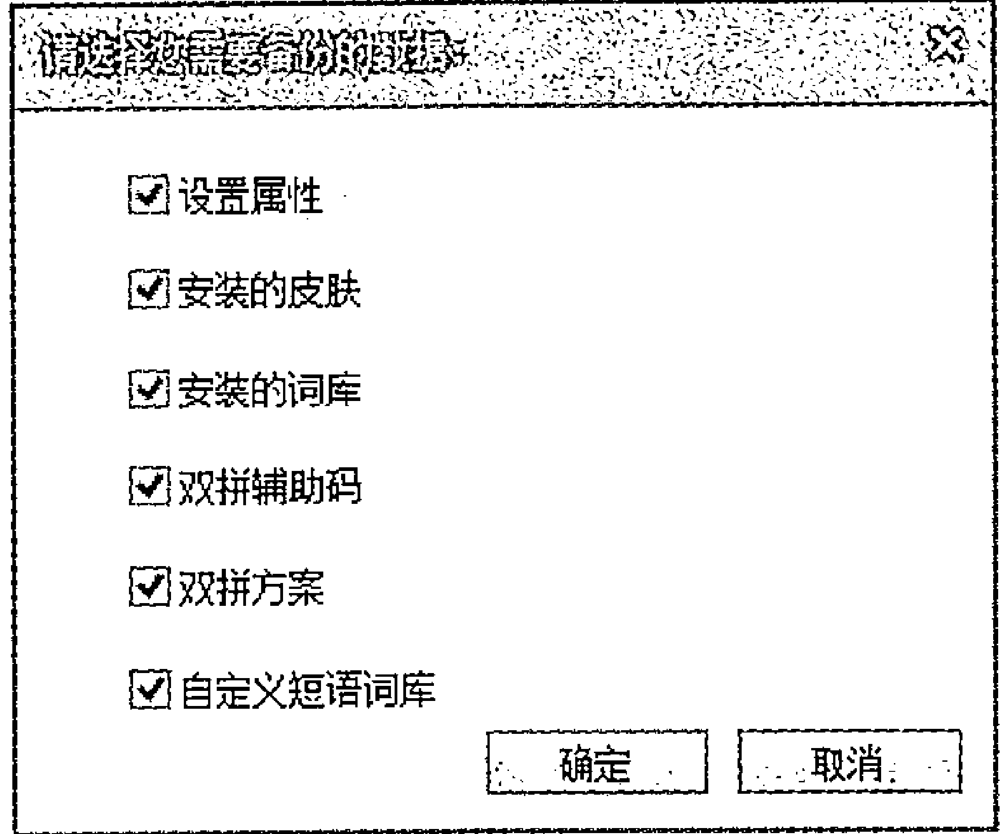

## ◇ FastCache无法使用

Q: 为了避免网络运营商的干扰，我安装了一款名为FastCache的软件。本来这款软件运行好好的，但是这几天发现状态栏中的图标是红色的。这到底是怎么回事？

A: 如果FastCache的图标是红色的话，那么就说明这款软件没有正常的工作，这样上网的时候就无法进行DNS解析操作。应该是用户在使用优化软件的时候，将软件的启动项进行了删除。而在手工运行的时候软件会弹出一个提示框，这个时候应该点击提示框中的“是”按钮，如果点击的是“否”按钮就会出现你所说的那种状况。

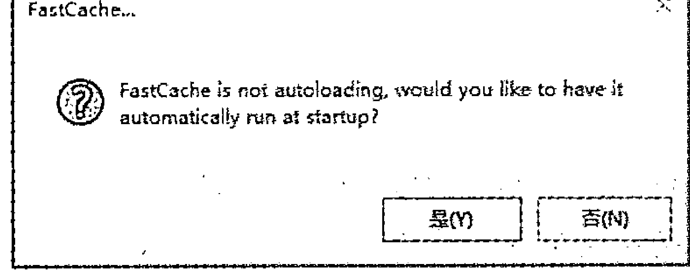

## ◇ 同时刷新浏览器的多个窗口

Q: 哪款浏览器可以直接对所有的浏览器窗口进行刷新？如果没有这样的浏览器，那么通过哪些功能扩展可以实现呢？

A: 傲游、搜狗以及360极速浏览器等，都带有你所说的所有页面刷新功能。虽然不同的浏览器功能命令不在同一个地方，但是它们都是通过快捷键Shift+F5来完成的。如果你喜欢使用谷歌浏览器的话，那么可以在应用商店下载安装“Reload All Tabs”、“Reload Tabs”等功能扩展来使用。

## ◇ QQ浏览器如何完全使用迅雷

Q: 我使用的QQ浏览器虽然已经安装了迅雷下载支持等扩展，但是在很多时候仍然不能调用迅雷软件来下载，而是通过浏览器自带的功能来操作。请问这个问题如何解决？

A: 如果用户使用的是Windows 10系统的话，这是由于迅雷的DLL文件会导致频繁崩溃，所以官方暂时将它们屏蔽掉了。如果使用的是其他的操作系统，那么建议你重新安装迅雷软件，以保证所有的DLL文件在系统注册表里面成功注册，只有这样浏览器才可以成功地进行调用。

## # 电脑游戏如何录像

文|老万

## ◇ WPS中带的病毒到底是什么

Q：我通过WPS办公软件打开一个Word文件后，安装的Avast杀毒软件就报病毒，病毒编码是VBA:Downloader-HG [Trj]。这个病毒到底是什么，它会不会对系统进行破坏？

A：从杀毒软件的病毒编码我们可以看出，这个Word文件里面应该含有宏病毒。不过还好，WPS办公软件里面没有自带相应的宏处理模块，这样这个病毒就无法在系统里面运行。不过为了安全起见，建议将文件中的内容复制出来，然后粘贴到一个新建的Word文件进行保存，以去掉其中的宏病毒。

Q：我和周围的朋友都喜欢玩网游，有时候玩的成绩比较好，自然要炫耀一番。可是他们往往都不相信我的话，所以我想将游戏过程录制下来。请问这该如何解决？

A：对于屏幕录像这个操作而言，只需要找到专业的软件就可以了，这里就为你推荐Bandicam这款软件。软件运行以后点击工具栏中的按钮，选择需要进行屏幕录制的区域。接着在“常规”标签中设置录像文件存放的目录，再点击右上角的“REC”按钮就可以录制了。

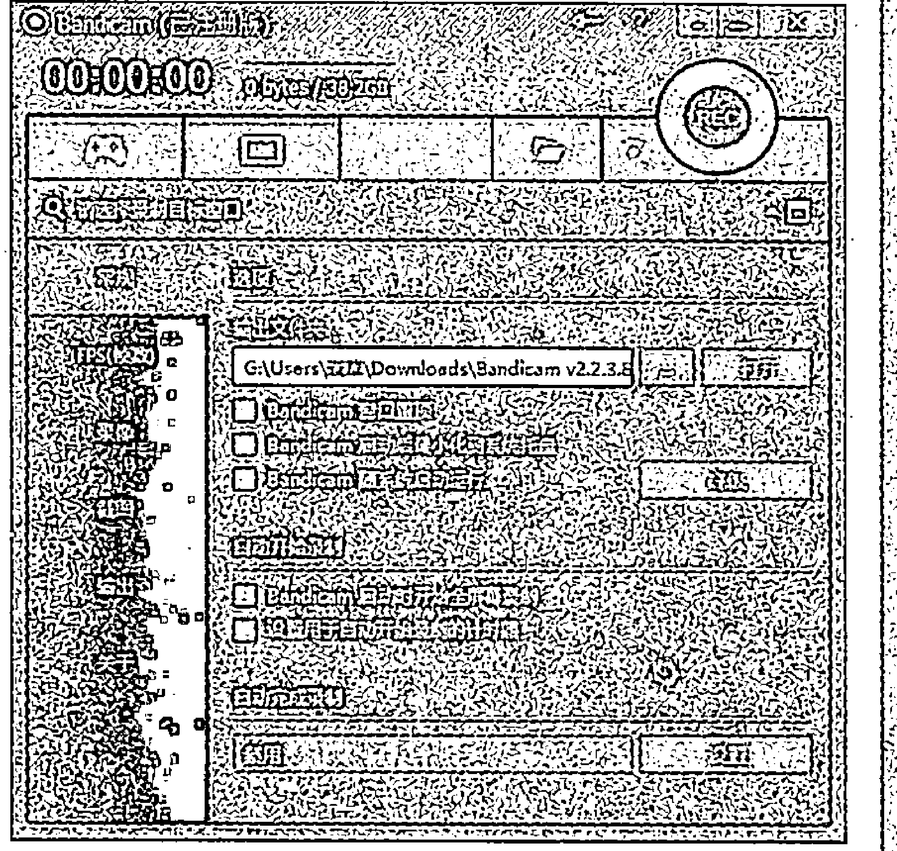

## ◇ 利用Office直接修复受损文档

Q：我双击一个Word文档准备用微软Office办公软件打开它，却出现了错误提示，提示该文档已受损。那么如何才可以修复受损的Word文档呢？

A：首先启动已经安装的Word，在“开始”标签里面选择“常用”组。点击“打开”按钮以后找到并选择损坏了的文档，再点击“打开”按钮旁边的三角箭头，最后点击菜单中的“打开并修复”命令，这样Word就会尝试修复并打开文档了。


## ◇ 禁用Firefox中不用的功能

Q：我平时使用的是Firefox浏览器，随着这款浏览器版本的不断升级，里面自带的功能也越来越多，不过其中的不少功能实际上很少用到。这些功能如何才能关闭呢？

A：首先在地址栏里面输入命令“about:config”，按下回车键就会弹出一个设置的提示窗口。在搜索框中输入“loop.enabled”后进行搜索，找到这个参数以后修改后面的参数值为“false”就可以了。接下来按照同样的方法，搜索“browser.pocket.enabled”、“reader.parse-on-load.enabled”、“media.peerconnection.enabled”这几个参数并进行设置就可以了。

| 搜索：(R) loop.enabled |
| :--- |
| 首选项名称 | 状态 | 类型 | 值 |
| loop.enabled | 用户设置 | 布尔 | false |

## ◇ EmEditor软件的便携化设置

Q：EmEditor软件默认将配置信息保存到系统的注册表中，不过如此一来，到了其他电脑上使用它时又需要重新设置。请问如何让EmEditor的设置便携化？

A：首先打开EmEditor软件，点击“工具”菜单中的“导入和导出”命令，接着在弹出的对话框中选择“导出所有配置到INI文件内”项，将EmEditor的配置文件保存。可以将它放到云盘上，或者放到随身携带的闪存盘中，以后在任意电脑上使用EmEditor，只需要将该ini文件复制到EmEditor根目录下即可。

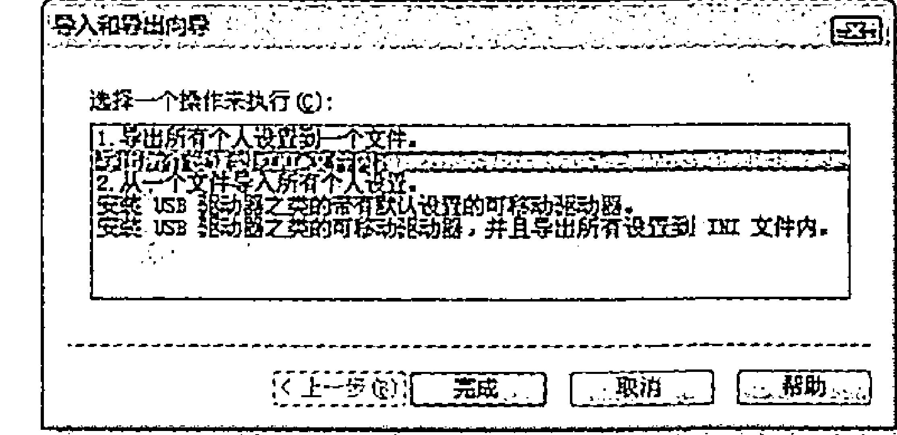

## # 音乐文件怎么添加专辑封面

文|老万

**Q:** 我平时喜欢下载一些音乐文件，发现有的音乐文件自带有音乐专辑的图片，感觉非常意思也非常神奇。请问这个效果是如何制作出来的？

**A:** 首先下载运行Mp3tag这款工具，点击工具栏中的“添加目录”按钮，选择存放音乐文件的目录。接着右键点击左侧工具栏中的封面图标，在弹出的菜单中选择“添加封面”命令，选择封面图片文件后，选择“文件”菜单中的“保存标签”命令就可以了。

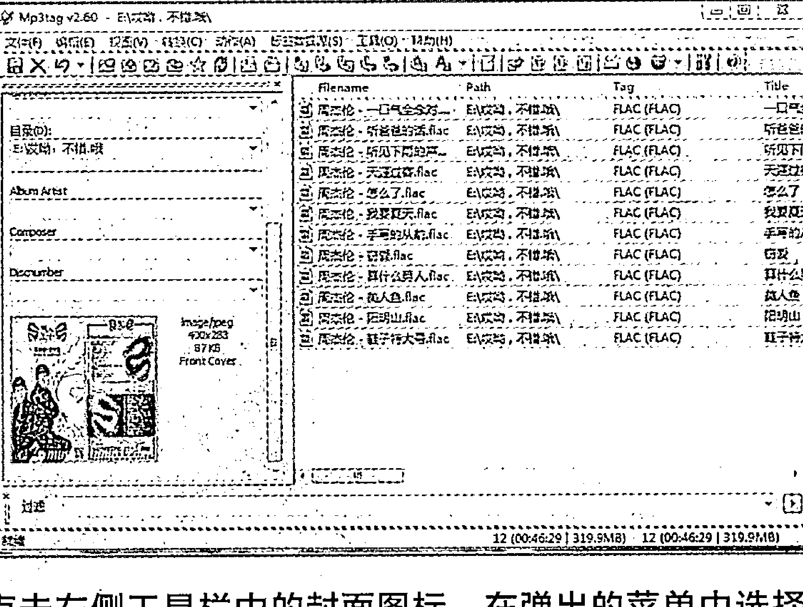

> > **傻博士有话说**
> 
> 其实利用百度音乐、Foobar2000等常见的播放器也可以制作专辑封面。我们只需要在播放列表的文件上点击鼠标右键，选择“文件信息”命令后，在弹出窗口的“专辑封面”标签里面进行设置就可以了。

## ◇ 如何加快Office的启动速度

**Q:** 我平时使用的办公软件是Office，使用时间一长发现软件的启动非常缓慢，但是运行其他的办公软件并没有这种情况。请问如何为Office的启动提速？

**A:** 启动速度变慢是因为软件里面的加载项增多了，我们只需要屏蔽不需要的加载项即可。首先启动Word软件，点击“文件”菜单中的“选项”命令。在弹出的窗口中点击左侧的“加载项”，然后在右侧窗口可以看到一个“管理”列表。从列表中选择“COM加载项”这项，并点击旁边的“转到”按钮。在弹出的窗口中就可以看到“COM加载项”所有的项目了，从列表中去掉平时不常使用的项目即可。

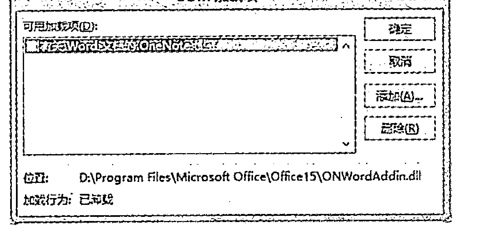

## ◇ Potplayer必须安装Opencode吗

**Q:** 我在安装Potplayer的时候，是否必须安装Opencode呢？如果不安装的话，我打算安装一个Win7codecs解码器。但是不知道它们之间会不会有冲突？

**A:** Opencode和Win7codecs都属于第三方解码器，如果能正常播放视频，可以不安装它们。不过如果遇到官方所说的“某些编码的音轨无法播放或者没有声音”的问题，那么这些第三方的解码器还是需要的。当然，网上不少绿色版Potplayer已自带Opencode，这就免去自己安装的操作了。

## ◇ Edge收藏夹如何导入360的书签

**Q:** 我以前使用的是360浏览器，现在系统已经升级到Windows 10，发现其中的Edge浏览器很不错，打算改用这款浏览器。但是如何才可以将360的书签导入到Edge浏览器中？

**A:** 如果想直接进行导入，应该是无法完成的，不过我们可以间接实现。首先在360浏览器中将书签保存为HTML文件，接下来在IE浏览器中导入这个HTML文件。然后再在Edge浏览器中导入IE浏览器的收藏夹，这样就可以实现你的目的了。

## ◇ 让迅雷看看的KKV.exe不开机自启

**Q:** 我安装了迅雷看看，发现开机后进程里有个KKV.exe。可是在计划任务、系统配置工具里都找不到该启动项。请问通过什么方法可以禁止这个启动项开机运行呢？

**A:** 首先打开系统的注册表编辑器，将左侧列表展开到HKEY_LOCAL_MACHINE\SOFTWARE\Microsoft\Windows\CurrentVersion\Explorer\ShellIconOverlayIdentifiers\XLKKDesktopIcon\。在这个项目上点击鼠标右键，选择菜单里面的“删除”命令，然后重新启动系统试一试。注意，在修改注册表之前，请先对注册表进行备份，一旦误操作还可以快速恢复。

## 国外DNS无法进行解析操作

Q: 我使用OpenDNS、Google DNS时出现无法解析的情况，但是在尝试百度DNS、阿里DNS、ISP自动获取的DNS时都是正常的。请问这是什么原因？

A: OpenDNS、Google DNS的服务器都在国外，因此由于线路等问题造成暂时无法解析的故障也很正常。其实我们主要的目的无非就是尽可能使用最快的DNS服务，这里推荐一款名为DNS Jumper的小工具，运行后点击窗口左侧的“最快DNS”按钮，程序将会对自带的DNS服务地址进行测速。检测完成，最快的DNS服务地址就会显示到窗口的IP地址窗口中，此时只要点击“应用DNS”按钮就可以快速应用这个DNS服务了。

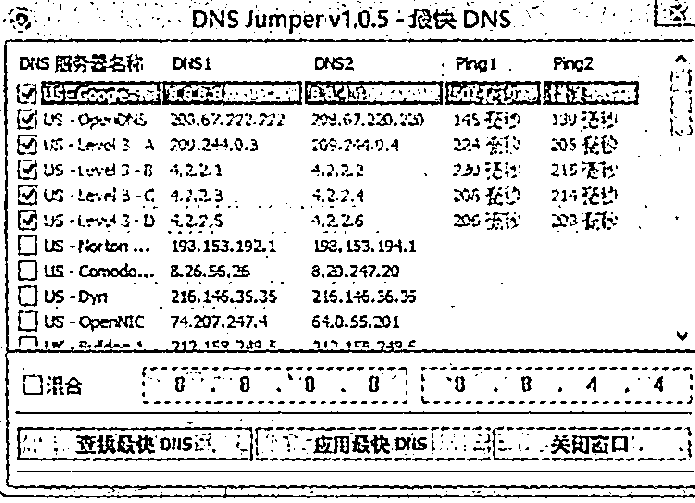

## 浏览网页慢但下载快的解决

Q: 本人使用的是4M的宽带，以前网速都挺快的，近几天却出现怪事，打开网页非常慢，但用迅雷下载文件却很快。用卡巴斯基扫描没有病毒，电脑和路由器的设置也没改动。这到底是什么问题？

A: 如果一切如常的话，那么问题可能出在下载软件上。首先点击迅雷下载软件工具栏中的“系统设置”按钮，在弹出的设置窗口中点击左边的“下载设置”选项。再在右侧窗口中的“模式设置”里面选择“网速保护模式”项，然后点击“确定”按钮。最后重新启动下载软件，问题即可解决。

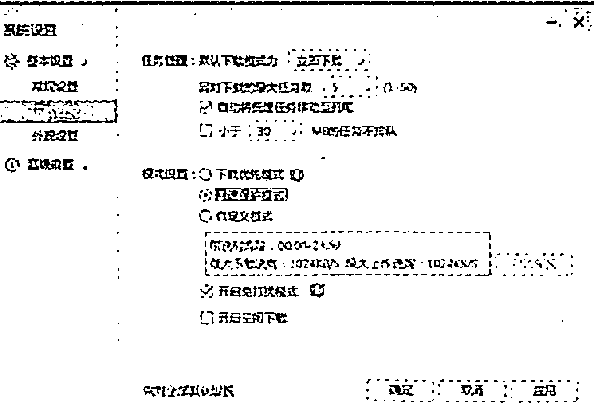

## Edge无法调用下载软件

文|老万

Q: 我的系统已经升级到最新的Windows 10，在使用其自带的Edge浏览器时发现一些问题，比如在下载文件的时候无法调用第三方下载软件，只能通过浏览器自带的下载功能进行操作。请问这个问题如何解决？

A: 这主要是因为Edge浏览器刚刚推出，很多下载软件还和它不兼容造成的。要想解决这个问题，首先需要将下载软件升级到最新版本，接着在设置选项里面启用相关的功能。比如笔者使用的下载软件是IDM，在配置窗口的“捕获以下浏览器的下载行为”列表中选中Edge浏览器，确定以后重新启动软件就可以了。

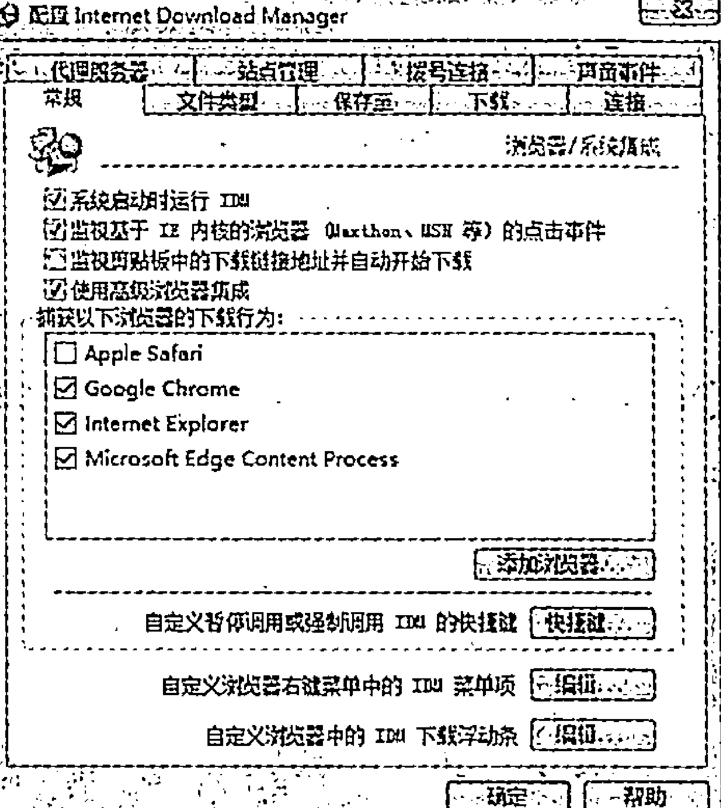

> 如果用户还不想升级下载软件的版本，那么可以试一试比较传统的方法，就是将下载链接复制到剪贴板中，然后利用下载软件的剪贴板监视功能来调用下载软件。

## 无线路由器用多少信道为好

Q: 现在我家里都是通过路由器上网，总感觉网速有问题。有朋友建议我将路由器默认的信道修改一下，但是我不知道具体如何操作，请求帮助。

A: 路由器信道并没有一个固定的值可以参考，但是你可以这么操作来试一试。首先打开路由器中的WDS功能，这时会出现一个“扫描”按钮，点击该按钮后就能扫描到你周围的无线信号都在使用什么信道，而你要做的就是选择一个别人没有使用的信道就可以了。最后记得扫描完成后，一定要将WDS功能关闭才可以。

## 如何修改IE11网址链接的右键

Q: 我的IE浏览器最近在打开网页右键菜单的时候，发现多出一个莫名其妙的菜单选项，而且还显示的是乱码信息。请问如何将这个右键项删除？

A: 首先运行CCleaner这款工具，点击左侧工具栏中的“工具”按钮。在出现的窗口中选择“启动”命令，接着选择窗口中的“Internet Explorer”标签，这样就可以看到所有IE浏览器的右键菜单命令。选中需要删除的命令后，点击“删除该项”按钮就可以将其清除了。

## Windows Defender无法随机启动

文|老万

Q: Windows系统自带的Windows Defender，现在实际上就是微软的杀毒软件MSE。可是最近我发现Windows Defender软件无法正常随机启动运行。请问这个问题如何解决？

A: 首先按下Win+R组合键打开运行对话框，输入命令“gpedit.msc”并按回车，在弹出的组策略编辑器窗口左侧列表中，依次展开“计算机配置→管理模板→Windows组件→Windows Defender”项。然后在右边找到并双击“关闭Windows Defender”项，在弹出的窗口中改变状态设置为“已禁用”项即可。

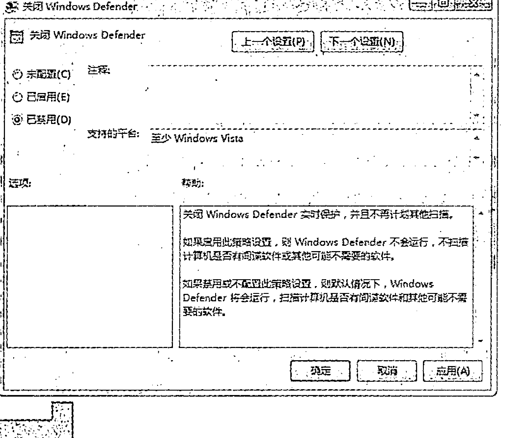

> 用户也可以在系统服务列表中找到“Windows Defender Service”选项，直接双击打开该服务的属性窗口，将“启动类型”列表设置为“自动”。接下来点击窗口中的“应用”按钮，再点击“启动”按钮就可以了。

## 查询Windows 10是否永久激活

Q: 最近我将系统升级到最新版本的Windows 10，可是有的人说这个系统只能免费使用一年，有的人又说可以永久性进行激活使用。所以我想查看一下系统的激活状况，看看到底是有多长的激活时间，我该怎么办？

A: 首先在系统左下角的开始按钮上点击鼠标右键，选择菜单里面的“命令提示符（管理员）”命令。在弹出的命令提示符窗口中输入命令“slmgr.vbs -xpr”后按下回车键，稍等片刻，在弹出的提示框中就可以看到是否永久激活的信息。除此之外，使用“slmgr.vbs -dlv”这个命令，还可以看到包括激活时间、激活状态等更加详细的信息。

## 用DiskGenius创建ESP分区的问题

Q: 我在PE下通过DiskGenius删除了原来的ESP、MSR这2个分区，重新用DiskGenius手工创建ESP、MSR分区。但是创建后的ESP分区是FAT16，而网上说应该是FAT32的。请问这是怎么回事？

A: 其实对于ESP分区来说，只要是FAT这个类型就可以了，至于是FAT16还是FAT32，都可以进行系统的引导操作，所以用户对于这个问题无需担心。如果实在不放心的话，可以对这个分区进行重新格式化操作，然后选择FAT32格式即可。

## Windows Update系统托盘图标消失

Q: 我用Windows Update打了一些补丁，重启之后弹出Windows已经安装好更新的提示，点击提示框后系统托盘的Windows Update图标就消失了，可是还有没安装的补丁呢。请问这个问题如何解决？

A: 你可以进入系统的控制面板，找到“Windows Update”功能后打开它。接着点击左侧列表中的“检查更新”按钮，对系统里面的安全补丁重新进行检测。在发现有必要安装的补丁程序后，再从列表中选中它进行安装操作即可。对于那些可以不安装的补丁程序，不理它们即可。

## 为什么删除或者重命名文件就卡死

Q: 最近一段时间不知道怎么回事，我在进行文件的删除或者重命名的时候，系统就出现卡死的状况，比如删除文件就一直这样等十几分钟。请问这是怎么回事？

A: 出现这类和文件相关的问题，应该检测一下磁盘的健康状态。所以首先在磁盘列表中找到该文件所在分区，点击鼠标右键选择“属性”命令，在弹出的对话框中切换到“工具”选项卡，点击“查错”下的“开始检查”按钮即可。

## Android 5.0如何进行截屏

文|老万

### ◆ 魅蓝Note2自带应用如何删除

Q: 我最近买了一个魅蓝Note2, 发现里面自带的应用比较多，所以想删除一些应用。可是我按照通常的做法，在“设置”选项中没有发现相关的卸载功能。那么是不是自带的应用就无法删除啊？

A: 其实并不是不能删除这些自带的应用，而是你没有找到删除应用的正确路径。首先在主界面找到“应用中心”图标并点击它，在底部的工具栏里面点击“我的应用”图标。接着在出现的列表里面点击“已安装”选项，这样就可以看到系统里面自带的应用，点击应用名称后的“解除安装”按钮就可以进行卸载操作了。

### ◆ Google Play服务总是停止运行

Q: 我为了运行某些特定应用或游戏，需要在系统里面选择安装谷歌服务框架。但是按照提示进行安装操作后，总是出现“Google Play服务已停止运行”之类的问题。这个问题如何解决？

A: 由于Google Play针对不同的产品拥有不同的版本，所以出现这个问题应该是版本没有选择正确造成的。至于如何选择Google Play的版本，主要是需要查看版本号的最后三位数字，这三位数字第一位决定了Google Play服务运行的Android版本，第二位取决于所运行设备的CPU架构方式，第三位则取决于所运行设备的dpi信息。

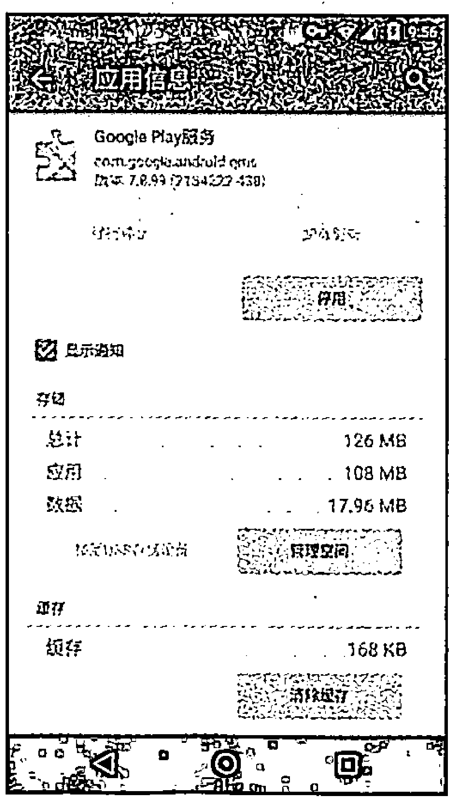

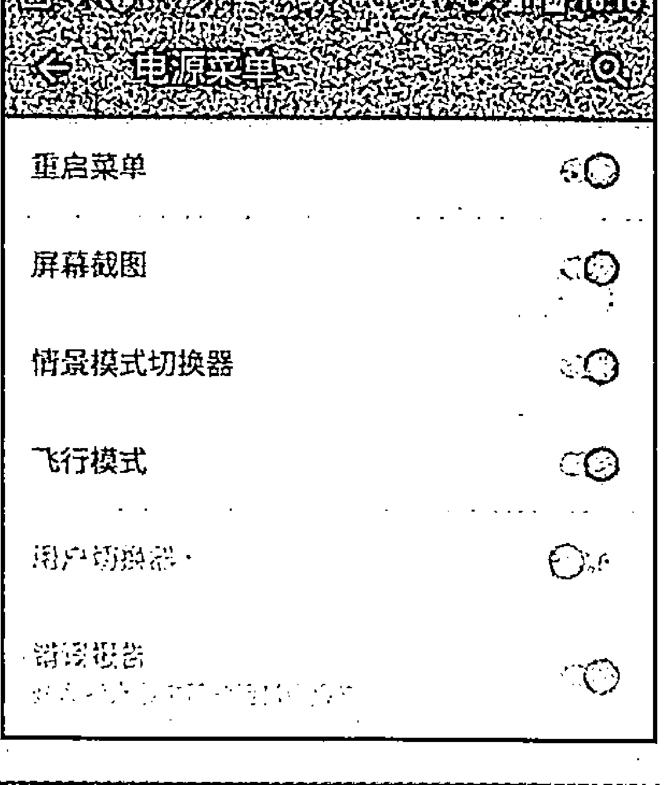

Q: 我已经将手机系统升级到Android 5.0，按照以前的方法进行截屏操作怎么都不成功，请问这该如何解决？我的手机系统是已经ROOT操作过的，所以理论上应该不会有问题的啊？

A: 通常情况下不同的手机品牌，拥有不同的截屏方式。不过常见的方法有两种，一种是同时长按“电源键+HOME键”或“电源键+音量下键”来进行截屏。另外一种方法就是通过专业的手机应用进行操作，而截屏大师就是当前Android平台比较好用的截屏应用，不过它需要获取ROOT权限才可以进行。


对于像CM、魔趣这样的第三方ROM来说，用户还可以根据需要自定义截屏命令。首先在设置菜单中打开“按键”命令，在子菜单中选择“电源菜单”命令，然后勾选“屏幕截图”选项就可以了。

### ◆ 魔趣ROM如何开启ROOT权限

Q: 我使用的是国产的魔趣ROM，听说这款系统自带有ROOT功能，但是找来找去都没有发现。请问魔趣ROM是否真的自带ROOT功能，如果有的话如何进行开启操作？

A: 魔趣ROM的的确确自带有ROOT功能，只不过这个功能隐藏得比较深而已。首先在设置菜单里面打开“关于手机”命令，在子菜单里面连续点击“版本号”命令，接着返回到上级菜单选择“开发者选项”命令。然后在菜单里面选择“ROOT授权”命令，在弹出的对话框中选择“应用与ADB”项即可。最后重新启动一下系统就可以了。

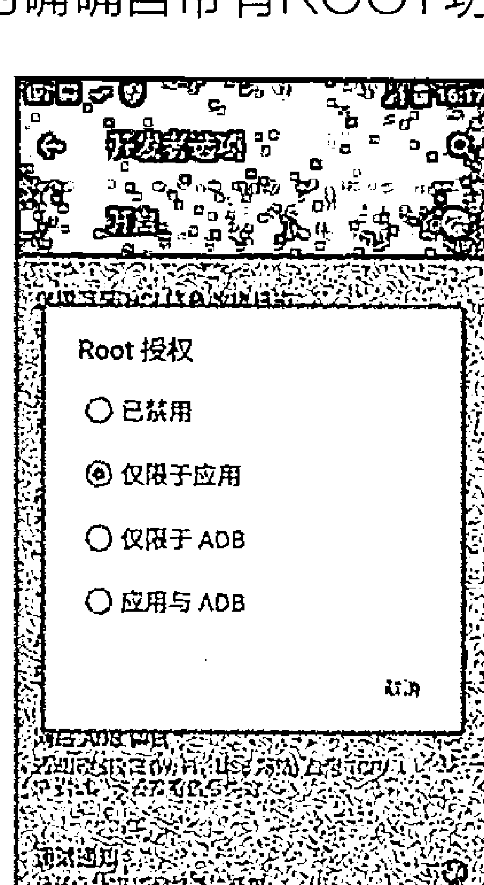

### ◆ 优酷视频进度的无线传播

Q: 平时喜欢在优酷里面看视频，不过有时在看的时候需要离开电脑，想接着利用移动设备继续观看。可是打开手机客户端以后，通过拖动进度条总是找不准位置。有没有什么方法可以解决这个问题？

A: 首先在视频播放的页面中点击下面的“下载”按钮，这样在“用手机看”下面就会显示出一个二维码。打开手机中的优酷客户端，激活其中的二维码扫描功能，扫描页面中的二维码图标，这样就可以接着继续观看视频了。

## 如何开启CM12的虚拟按键

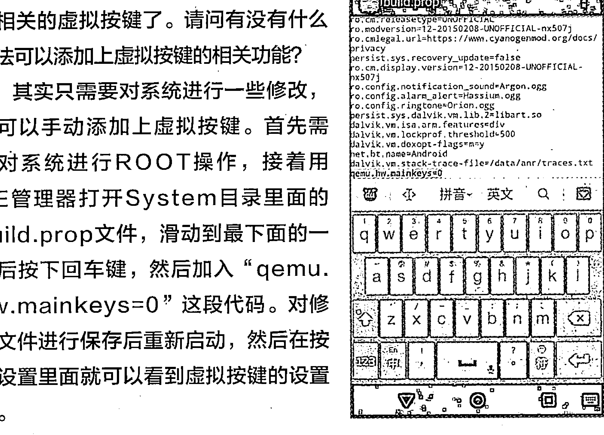

## 快速获得自己的素描画像

Q: 现在很多社交应用都需要上传一张图片作为头像，我想上传自己的照片又怕被人恶意利用，所以就想将照片转换成一张素描像。有没有什么应用可以快速解决这个问题？

A: 这里可以先安装一款名为“Photo Sketch”的应用，接着点击屏幕左上角的相机图示，根据提示拍摄一张照片，或者从相册里面选择一张照片。当照片添加到应用中以后，马上就可以预览到素描像的效果。而点击下方左右的箭头，还可以切换不同的素描效果。

## 从Google Play各国市场下载应用

Q: 前段时间微软公司发布了一款应用，可是我上网一查才发现，这款应用只有Google Play的新西兰市场才能下载。请问有没有什么方法可以将其下载下来？

A: 首先大家打开电脑上的浏览器，登录这个http://apkpure.com/网站地址。在搜索框里面输入需要下载的应用名称后开始搜索，接下来在搜索结果里面点击应用名称的链接。在弹出的页面里面点击“Download APK”按钮，就可以将安装包下载到本地磁盘中了。接下来就是安装使用了。

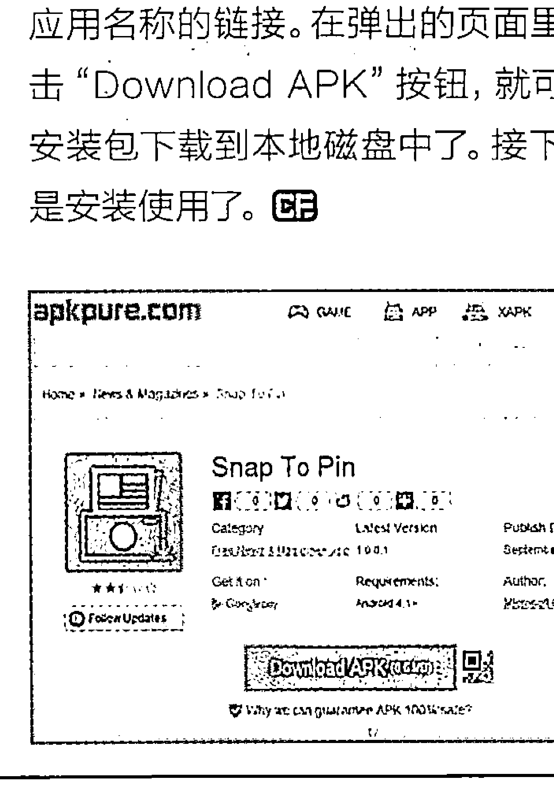

## 傲游浏览器加载非常缓慢

Q: 我平时在手机上用傲游浏览器都是好好的，但是不知道最近是怎么回事，加载网页非常慢。难道是我打开的方式有问题吗？请问这该如何解决？

A: 其实这个是因为最近傲游浏览器加入了Adblock Plus扩展，而这个扩展还存在一定的兼容性问题。所以我们只需要点击浏览器工具栏中的设置按钮，在弹出的设置窗口里面点击齿轮图标。接着在弹出的菜单里面点击“广告过滤”命令，将“广告过滤”选项进行关闭即可。最后重新打开要访问的链接，访问速度就立即上去了（但损失了广告过滤的相关功能）。


## 安装应用总是提示资源损坏

Q: 最近我照例通过“百度手机助手”来升级手机中的应用，可是不知道怎么回事，不是无法进行下载操作，就是提示下载的应用资源错误。请问这个问题怎么解决？

A: 造成这样的问题有多种情况，首先就是网络连接的问题。因此建议大家重新启动系统，或者关闭网络重新进行连接。其次就是进入到系统设置的“应用”选项里面，找到需要升级的应用名称并点击它，将该应用的缓存信息清除掉即可。


## 快速了解笔记本电池健康状况

Q: 我平时主要都是通过笔记本进行工作的，可是最近一段时间发现电池越来越不经用，充一次电一个多小时就没有了。请问有没有什么方法，可以快速了解到电池的健康状况？

A: 首先在系统左下角的开始按钮上点击鼠标右键，选择菜单里面的“命令提示符（管理员）”命令。在弹出的命令提示符窗口输入命令“powercfg / batteryreport /output "C:\battery_report.html"”后按下回车键，稍等片刻就可以在系统盘生成一个电池的健康报告。这份报告详细记录了系统安装后电池的使用情况，通过其中的数据就可以掌握电池的相关情况。

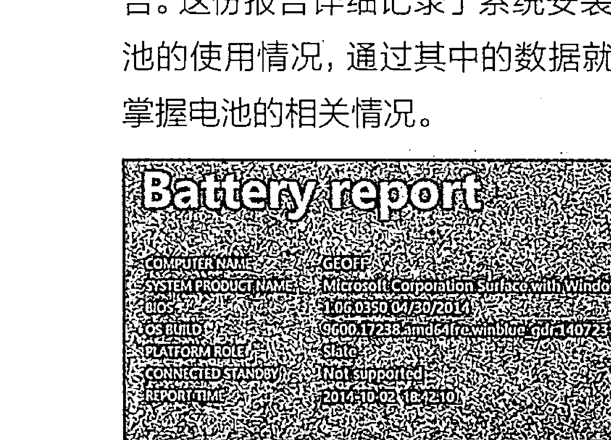

## 按F8键无法进入安全模式

Q: 由于我经常要进行各种各样的软件测试，所以进入到安全模式也是很常见的事。可是我在升级到Windows 10系统后，发现开机后按F8键已经无法进入安全模式了。请问在Windows 10系统里面，如何进入安全模式？

A: 首先进入系统的设置窗口，点击其中的“更新和安全”，在弹出的窗口中点击“恢复”，接着点击右侧的“立即重启”。重新启动系统后在高级启动里面分别点击“疑难解答”和“高级选项”按钮，然后在弹出的窗口中点击右边的“启动设定”命令。这时会出现一个启动设定的介绍窗口，点击“重启”按钮后就到了最后一步。这时可以看到安全模式有三种不同的形式，用户根据需要按下对应的快捷键即可。

## Windows 10定时更换壁纸

文|老万

Q: 我升级到Windows 10后觉得各方面都非常不错，就是发现无法定时更换桌面壁纸。那么这个功能在新系统中是没有了还是隐藏起来了？

A: 首先在系统桌面上点击鼠标右键，选择菜单里面的“个性化”命令。在弹出窗口的右侧将背景栏由默认的“图片”改成“幻灯片放映”，接下来点击下面的“浏览”按钮，并在弹出的对话框中选择壁纸所在的文件夹。然后将下方“更改图片的频率”修改为一个自己认为合适的时间，这样Windows 10系统以后就可以自动定时更换壁纸了。

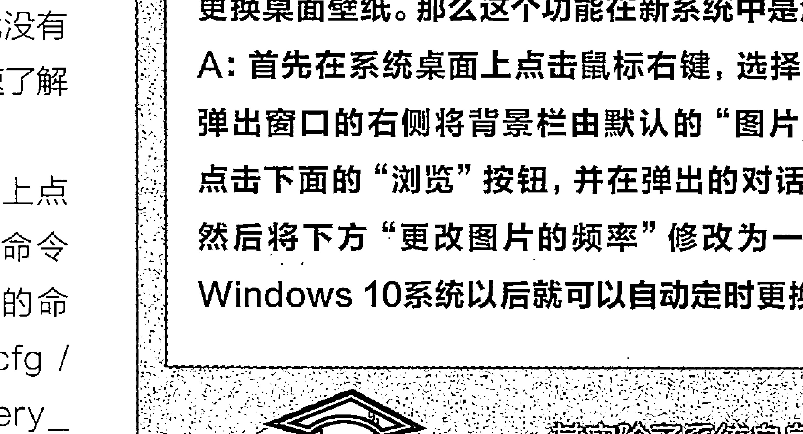

实际上除了系统自身的功能以外，还可以借助一些专门的工具来进行操作，比如“搜狗壁纸”以及“百度壁纸”等等。这样不仅可以下载到很多精美的壁纸，也可以定时自动进行壁纸的更换操作。

## 修改Windows 10的关机策略设置

Q: Windows 10虽然默认的启动速度非常快，但是它的关机速度却慢了。这样就常常出现显示器已经关闭，而主机没有关闭的情况。如果这时切断电源就会造成磁盘的损毁，那么如何才可以加快Windows 10的关机速度呢？

A: 首先按快捷键“Win+R”打开“运行”框，输入“gpedit.msc”后按回车键启动组策略编辑器。通过鼠标展开“计算机配置”中的“管理模板”，接着在右侧窗口依次选择“系统”中的“关机选项”子选项，这样就可以看到一个“关闭会阻止或取消关机的应用程序的自动终止功能”的命令。直接双击该选项打开它的配置窗口，在里面选择“已启用”选项即可。

## 不开启UAC如何使用Metro应用

Q: 我不喜欢UAC那种干什么都要确定的操作，然而又挺喜欢折腾系统的Metro应用。请问有没有办法不开UAC权限，或者开着权限不提示的办法啊？

A: 彻底关闭UAC后是无论如何都没有办法打开Modern Apps的，因为这是系统自身已经决定好了的。唯一的解决办法就是，开启UAC以后将其设置为永不通知。

## 浏览器用明文保存密码

文|老万

Q: 为了自己使用起来更加方便，我平时都是启用浏览器的密码记录功能的。可是最近我发现通过WebBrowserPassView这款小工具，可以非常方便地读取出浏览器记录的密码，这太危险了。请问有什么方法可以更好地保护密码？

A: 其实包括Firefox、Opera等一些常见的浏览器，在软件设置里面都包括一个主密码的功能。它的作用就是对保存的密码信息进行加密，而用户要使用这些密码的时候，首先需要输入主密码进行解锁操作才行。比如在Firefox的设置窗口点击“安全”标签，再选中“使用主密码”选项后，设置一个主密码信息就可以了。

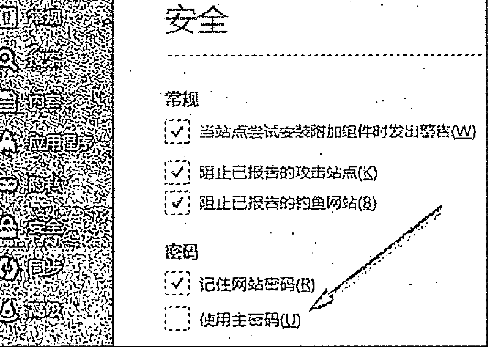


当然并不是所有的浏览器都提供有主密码这个功能，比如谷歌浏览器就没有。所以这个时候可以安装一个名为Lastpass的扩展，这样浏览器所处理的密码信息将被存储到云端服务器里面。

## 直接将网页标题保存为文件名

Q: 通常情况下通过浏览器的另存为命令，保存的网页都是以文件标题为文件名的。但是如果通过批量下载操作的话，文件名称就是链接的名称，这样一个个进行修改就非常麻烦。请问有没有简单的解决方法？

A: 这里我们可以使用傲游浏览器，登录到需要批量下载的页面。接着单击鼠标右键选择“下载全部链接”命令，在弹出的对话框列表中选择要下载的链接后，点击“浏览”按钮设置网页文件的保存目录。最后点击“保存”按钮，就可以将这些网页以文件标题的形式命名保存下来了。

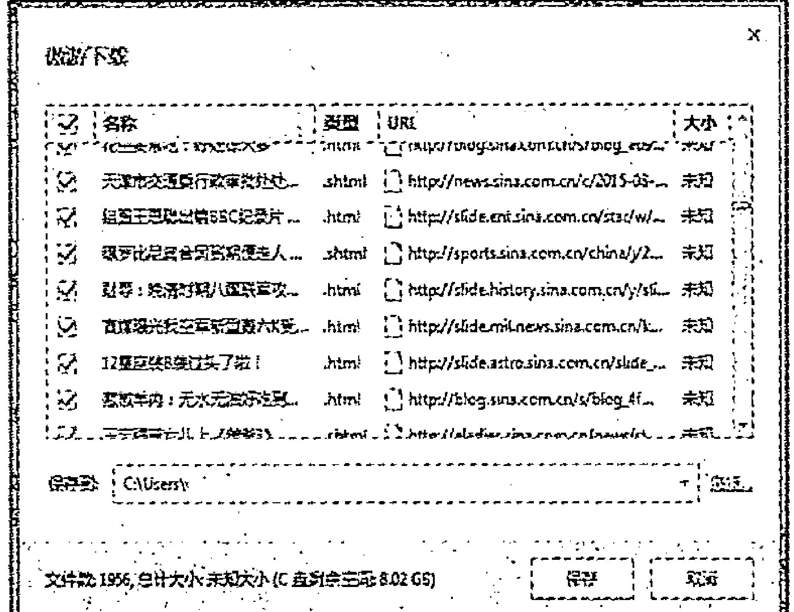

## 在 Windows 10 中用 Edge 打开 QQ 链接

Q: 我将 Windows 10 系统自带的 Edge 浏览器设置为默认浏览器，可是在点击 QQ 软件的相关图标后，发现还是调用的 IE 浏览器打开这些服务的链接。请问这该如何解决？

A: 最笨的方法就是，通过 IE 浏览器打开网页之后，再用 Edge 浏览器打开同一个网页，然后再把 IE 浏览器关掉就可以了。如果你觉得这么做比较麻烦的话，也可以试一试“IE to Edge”这款工具，它运行后会自动将 IE 浏览器打开的网页通过 Edge 浏览器打开，从而减少用户手工操作的麻烦。

## 如何寻找VPS服务商的优惠码

Q: 最近单位想搭建一个官方网站，想了多种方案以后决定通过 VPS 完成。听说通过优惠码可以在购买的时候进行折扣，请问如何才可以找到最新的优惠码信息呢？

A: 其实很多 VPS 服务商都将优惠码隐藏到首页代码里面，这样就让用户像寻找彩蛋一样寻找优惠码。而我们只需要通过浏览器打开首页，点击鼠标右键选择菜单中的“查看源代码”命令，在代码的最上方就可以找到优惠码。而且用户每刷新一次页面，显示的优惠码都不一样。至于哪一个优惠码的幅度最大，用户只有在提交订单的时候一个个的测试了。

## 百度云自动备份的是否原始图片

Q: 我现在通过百度云来自动备份照片文件，但是不知道上传的图片文件会不会经过压缩处理。我希望上传原始大小的照片，应该怎么办？

A: 其实无论是百度云还是其他的云存储软件，在传输照片文件的时候都会进行压缩，这样就可以减少传输的时间和压力。不过用户可以放心，当用户从百度云下载到本地系统后，就会还原到原始照片的状态。

## ◆如何输入万字符

Q: 最近家里有人开始学习佛经，所以经常需要输入万字符。由于万字符属于特殊符号，因此很多输入法不能输入。请问有没有什么好的解决办法？

A: 遇到这样的问题有两个解决方法。首先就是安装百度拼音这种最新的输入法，输入“wan”后就可以在候选词里面看到万字符了。如果使用的是其他的输入法，可以通过搜索引擎查找到万字符并将其复制下来，然后利用输入法中的自造词功能创建一个词组，这样以后输入相关字符的时候就会出现万字符了。（编者注：随手试了下QQ五笔，输入wan拼音，向后翻几页，也可以找到这个“卍”万字符。）

## ◆火狐打开百度首页存在异常

Q: 前几天更新到火狐40.0.2版本后，便无法打开百度的首页，这其中包括无法正常利用百度搜索，而且经常出现“连接被重置”的提醒。不知这两者之间有没有什么关系？

A: 现在任何浏览器在访问百度首页的时候，默认的HTTP协议都会自动转换成加密的HTTPS协议，所以这个时候可能是证书出现了问题。首先点击右上角的“打开菜单”命令，在菜单中选择“选项”，在弹出的对话框中选择左侧的“高级”按钮。接着点击“证书”标签页，点击下面的“查看证书”按钮后，在弹出的对话框中将过期的证书删除即可。

## ◆灵格斯词典的翻译不靠谱

Q: 我的灵格斯词典的翻译太不靠谱了，好多词不是翻译不准确就是显示别的意思。请问有没有好一点的词典软件，可以让翻译结果显示得更加准确一些？

A: 如果要想翻译得更加准确，在线翻译就是最好的选择，当然你不一定非要在浏览器中使用，借助QTranslat这款翻译软件即可实现。首先打开软件的操作界面，在翻译条左侧选择“Auto-Detect”，右侧选择“Chinese (Simplified)”项。以后通过鼠标选中需要翻译的外文后，就会弹出一个翻译的提示图标，点击该图标后就可以马上进行在线翻译。

## 找出磁盘中重复的图片文件

文|老万

Q: 我平时喜欢从网上收集各种各样的图片，但是时间一长发现了一个问题，就是有的图片内容实际上是重复的。如果人工一个一个的检查非常麻烦，请问有没有可自动进行的方法？

A: 其实很多用户遇到了类似的问题，所以早就有人开发出了相应的软件，比如“Alike Duplicate Image Finder”等。首先点击软件窗口中的“添加”按钮，选择需要进行分析扫描的文件夹。接着通过调整相似度的滑杆，来设置扫描图片的相似程度。最后点击“扫描”按钮开始扫描，扫描完成后就可以在列表中显示出来并进行删除。

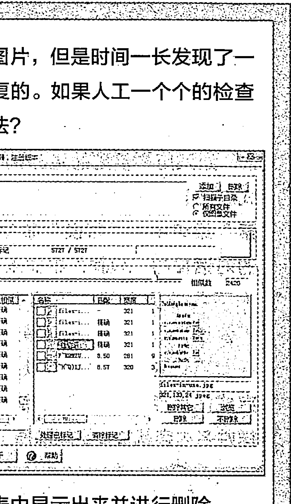


> 其实网上有一种利用哈希函数进行扫描的工具，它也可以分析出磁盘里面的重复文件。这类工具的优势是可以扫描所有的文件类型，缺点则是只能分析出完全一样的文件，而不能分析出内容相似的文件。

## ◆小红伞为何突然停止运行

Q: 我使用的是正版的Windows 7系统，杀毒软件是小红伞最新的专业版。但是昨天晚上打游戏的时候，突然小红伞就失效不能运行了。首先是内存不能为read，紧跟着许可证显示无效。请问这是怎么回事？

A: 问题可能是出在杀毒软件的Key文件上，如果这个Key文件失效或者使用用户较多，就会被官方加入到黑名单里面，从而出现你所说的这种情况。所以建议你可以试试免费版的小红伞来保护系统。

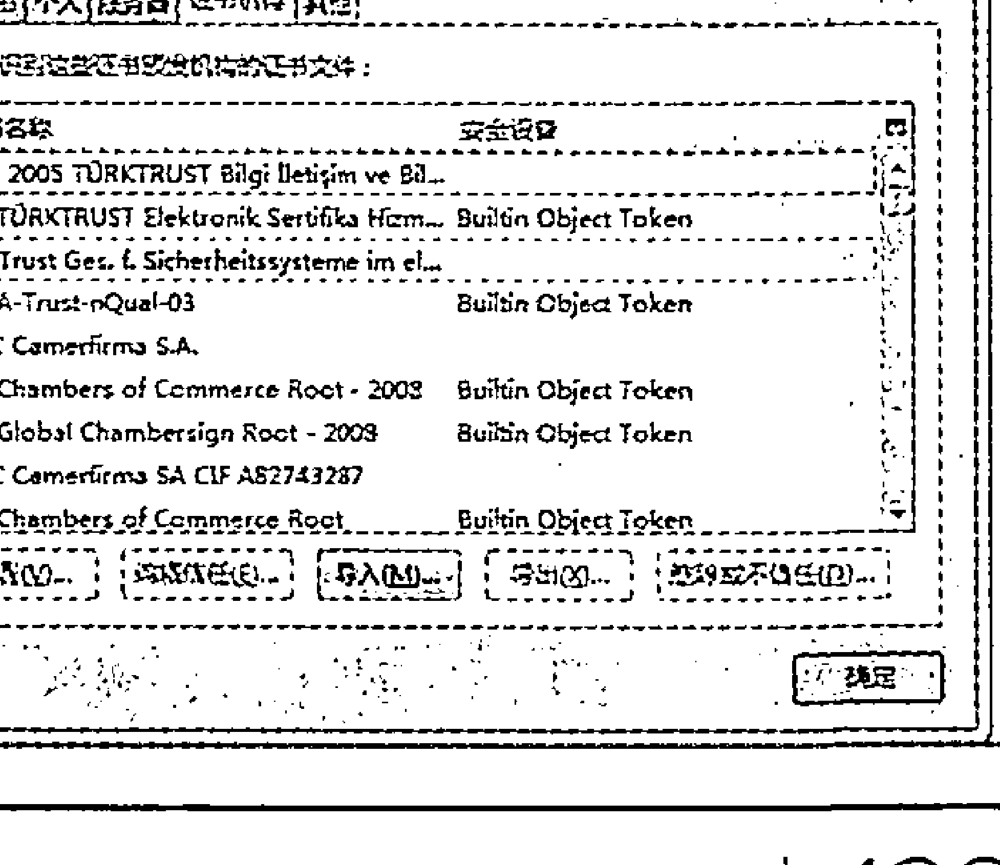

## 如何批量删除空格后字符

文|老万

Q: 我有一个文本格式的文件，内容前半部分是一个邮箱地址，中间是一个空格，后面是用户的姓名。请问有没有什么方法，可以将空格后面的姓名批量删除掉？

A: 如果用户使用的是EmEditor这类编辑器，那么通过正则表达式就可以轻松地解决。首先点击“搜索”菜单中的“替换”命令，在弹出的对话框的“查找”中输入“\s.*”（不含外侧引号，下同），接着在“替换为”输入框里面留空，然后将“使用正则表达式”选项选中。输入完成以后点击“替换全部”按钮，这样姓名内容就被批量删除掉了。

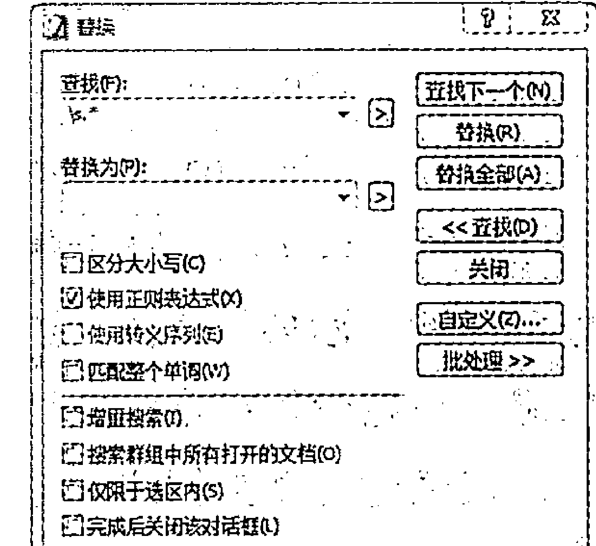

当然还有一个比较简单的方法，就是首先按住键盘中的Alt键，接着用鼠标左键选择要选择的竖列中的内容，然后利用Delete键将其删除即可。这个方法在内容信息比较少的情况下比较实用。

## ◇ 右键菜单有两个7-Zip命令

Q: 我使用的压缩软件是7-Zip，但是最近发现在系统桌面单击右键后，在菜单里面出现两个相同的7-Zip命令，可是在注册表中找了半天没找到在哪儿删掉。请问这个问题应该怎么解决？

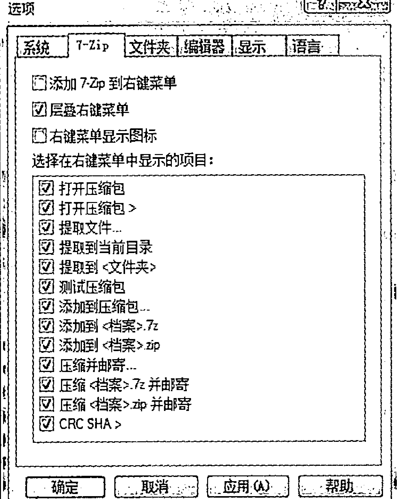

A: 首先打开7-Zip的操作界面，点击“工具”菜单中的“选项”命令。接着在弹出的设置窗口里面，选择其中的“7-Zip”标签选项，将其中的“添加7-Zip到右键菜单”和“层叠右键菜单”选项的勾选清除掉。设置完成后点击“确定”按钮，重新启动系统后看看还有没有问题。如果这个问题已经消失，重新再将两个选项选中即可。

## ◇ 提高MPC-be音量的方法

Q: 最近我开始使用MPC-be这款播放器，各个方面都觉得没有问题，就是有一点觉得声音很小。同样的一个视频，其他播放器播放声音都很大，就是这款播放器声音很小，不知道怎么解决这个问题？

A: 其实这并不是MPC-be的问题，在设置选项里面修改一下就可以了。首先运行安装的MPC-be播放器，点击“视图”菜单中的“选项”命令。在弹出的窗口里面选择左侧列表中的“音频”项，接着选中右侧窗口里面的“混合声道至”和“自动音量控制”选项。设置完成后点击“确定”按钮，退出MPC-be播放器并重新运行它即可。

## ◇ 百度云的自动备份功能在哪

Q: 请问百度网盘是取消了自动备份文件夹功能了吗？以前设置了一个文件夹之后百度云就可以监控里面的文件，如果有更改就会自动进行上传操作。但是这个功能现在却没有了，真的有些无法理解啊？

A: 百度云里面有两个重要的产品，一个是百度云同步盘，一个是百度云管家。根据你所说的，一定是把这两个产品搞混了。如果要想实现你所需要的功能，就需要使用百度云同步盘这款软件。在软件安装完成后设置一个同步目录，就可以将文件夹中的内容自动上传到服务器里面了。

## ◇ Edge浏览器如何调整大小

Q: 全新的Edge浏览器使用起来非常不错，但是按照常规的方法来调整窗口大小，怎么也不能成功。那么Edge浏览器是不是不允许调整大小啊，如果可以的话应该如何操作？

A: 通常情况下当我们将光标移动到窗口边缘的时候，就可以通过鼠标拖动来调整窗口的大小。不过要想调整Edge浏览器的大小，只需要将鼠标移动到窗口最上方的边缘。这个时候鼠标图形不会有任何的变化，但是按住鼠标左键进行调整就可以了。

## 在线检查英文语法哪个比较好

- Q: 我因为工作的关系，有时需要和外国友人通邮件讨论工作，虽然我勉强能写英文，但是有点担心自己的语法出现错误。有没有相关软件可以像检查拼写错误一样检查语法错误的呢？
- A: 这类检测软件大家公认比较好的是“1Checker（易改）”，用户可以根据自己的习惯选择在线操作，或者安装客户端程序在本地系统里面进行操作。比如我们通过客户端进行操作，首先将需要检查的内容粘贴到软件窗口，接着点击工具栏中的检查按钮。这样客户端在联网的状态下就可以开始检查，检查完成后会给出检测结果以及修改建议。

## 内网系统要开放哪些端口才能Ping

- Q: 我在家里通过路由器上网，最近在电脑系统里面架设了一个FTP服务。请问电脑系统需要开放哪些端口，互联网的用户才可以Ping通我的电脑系统啊？
- A: 如果是使用的路由器进行连接，有两种方法可以解决这个问题。首先就是启用路由器的“DMZ状态”选项，接着在“IP地址”后设置电脑在局域网中的IP地址。或者就是进行端口映射操作，将FTP服务使用的端口映射到外网中的某个端口上。这样互联网中的用户就可以连接到FTP服务，至于是否可以Ping通则和FTP服务没有关系。

## 用Firefox登录卡饭提示密码错误

- Q: 我将Firefox更新到最新的版本后，在登录卡饭论坛的时候，被网站系统提示密码错误，但是利用IE浏览器却可以正常登录。这个应该如何解决？
- A: 遇到这样的问题首先建议大家刷新网页，重新登录一次看看效果怎么样。其次需要提醒大家的是，卡饭论坛有两种登录方式，分别是用户名和注册的电子邮箱。所以在登录的时候一定要选择正确，不然的话也会出现登录失败的情况。

## 播放录音同时整理为文字信息

文|老万

> Q: 我在单位里面从事的是文秘工作，经常需要将领导的讲话内容整理成文本信息后打印处理。可是利用传统的编辑器和播放器进行操作，总是觉得不太顺手。请问有没有什么比较专业的软件解决这个问题？
> A: 其实在现如今云计算这么发达的情况下，完全可以在线进行相关的整理操作。首先通过浏览器打开http://otranscribe.com这个网站，根据页面提示选择领导讲话的录音文件进行上传。然后就可以在文本框里面，一边收听一边进行文字整理操作了，整理完成后可以将文本通过文本文件的形式进行导出。

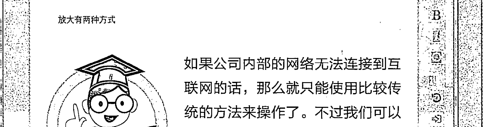

如果公司内部的网络无法连接到互联网的话，那么就只能使用比较传统的方法来操作了。不过我们可以将播放器调整为工具条的形式，这样既不会占用桌面的空间，操作控制起来也非常方便。


## 雅虎邮箱不能用的解决方法

- Q: 我的雅虎邮箱已经被关闭，但我的不少账号是通过这个邮箱进行注册的，现在要用它接收验证码什么的是不可能的了。那么还有什么方法可以验证身份修改密码呢？
- A: 既然雅虎邮箱已经关闭，所以只能借助于其他的方法来验证身份。不过好在现在很多服务商都提供了多种身份验证方式，比如备用电子邮箱、手机号码、验证器应用等等。从中选择一个自己认为合适的方法，点击网页中的“使用其他验证方法”命令后，就可以完成身份的验证，也可以修改密码了。

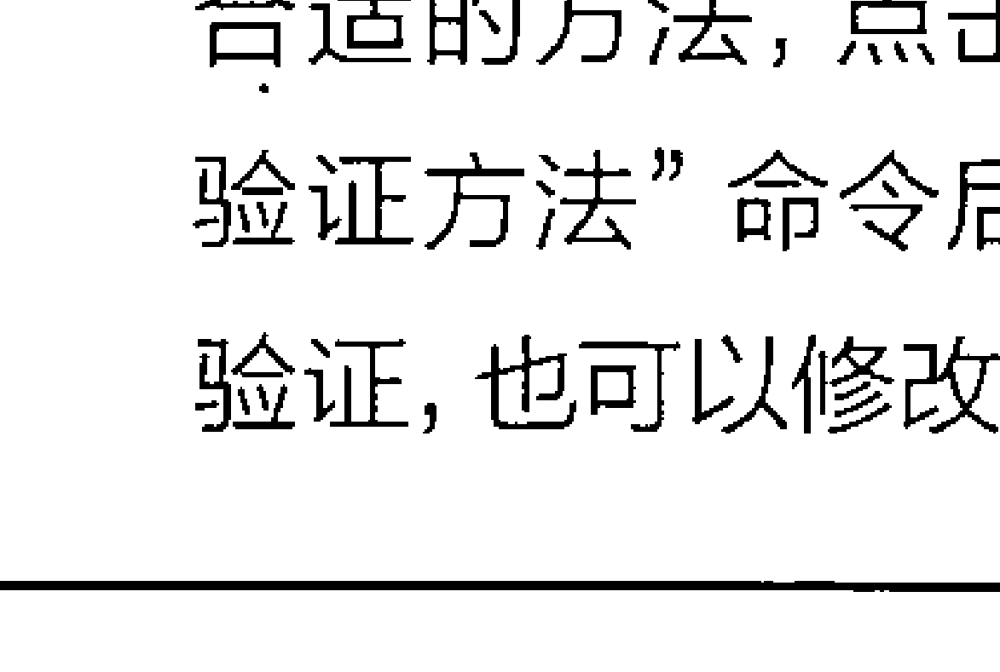

## 禁止Windows 10自动下载

文/老万

Q: 虽然Windows 10系统发布已经有一段时间了，但是我觉得现在用的Windows 7还不错，所以没有必要进行升级。但是听说微软会自动在后台下载Windows 10的安装包，那么请问有没有什么方法可以阻止这个行为？

A: 解决这个问题很简单。首先打开注册表编辑器，定位到HKEY_LOCAL_MACHINE\SOFTWARE\Policies\Microsoft\Windows，接着在该项目名称上单击右键，创建一个名为WindowsUpdate的新项目。接着在右侧窗口中新建一个名为DisableOSUpgrade的DWORD（32位）项目，将它的键值设置为1就可以了。


## Windows 10的Windows照片查看器

Q: 我平时已经习惯使用Windows照片查看器来浏览图片，可是我发现Windows 10系统里面是通过应用来查看的，而在“打开方式”中也没有找到这个功能。请问这个功能在新的系统里面是不是给取消了？

A: 首先从http://tinyurl.com/nmm3u7u下载文件并导入注册表，接着点击左下角的“开始”按钮，在弹出的菜单里面点击“设置”命令，再从弹出的对话框中点击“系统”按钮，并在弹出的系统设置窗口点击左侧的“默认应用”命令，然后在右侧窗口找到“图片查看”这项。点击默认的图片应用图标后，在弹出的菜单里面选择Windows照片查看器项即可。

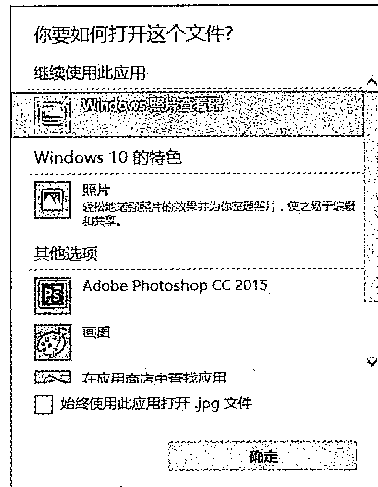

## Regsvr32.exe的参数[/i] [/n]是什么

Q: 我知道Regsvr32命令是用于注册动态链接库文件的，但是这个命令里面有好几个设置参数，其中就包括[/i]和[/n]。我就想请教一下这两个命令参数到底是干什么的？

A: 说到Regsvr32命令的参数，其中使用最多的是[/u]，用于解除相关文件的注册操作。而你所提到的这两个参数平时很少用，其中[/i]参数可以单独使用，调用DllInstall。但是[/n]参数则必须和[/i]参数组合使用才行，主要用于卸载系统里面相关的DLL文件，在作用上和[/u]参数有些类似。

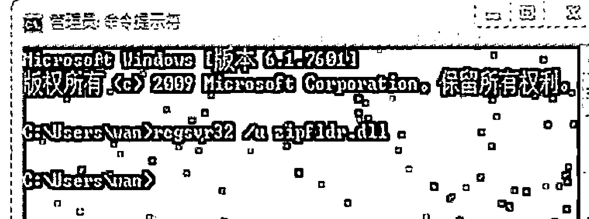

## 硬盘莫名其妙故障的解决

Q: 我刚拿到的笔记本感觉它的硬盘很慢，于是加装了SSD做主盘，将原先的硬盘作为数据盘。但是现在系统无法进入，而将原先那块硬盘拔下来就又恢复正常，BIOS里仍能识别该硬盘。请问这个是不是零磁道坏了？

A: 如果是硬盘零磁道坏的话，故障现象是认不出硬盘，所以这可能是硬盘的电路板出现了问题。因此建议你找专业人士进行检测，确定问题及相关解决方案，不要自己私自对硬盘进行操作，避免对硬盘造成二次损害，最终造成硬盘数据的丢失。

## Windows 10是否需要第三方杀毒软件

Q: 我现在有一件事非常纠结，就是听说Windows 10系统里面自带有杀毒软件和防火墙，那么是否还需要安装第三方的杀毒软件和防火墙呢？

A: Windows 10系统里面自带的杀毒软件就是Windows Defender，这款软件对国内病毒的防范并不是很好，所以还是建议你安装一款第三方杀毒软件。至于系统自带的防火墙，对于普通用户来说已经够用了。

## ## 利用二维码快速传递信息

文|老万

## ◇如何一键切换到夜间模式

Q: 听说开启夜间模式，可以很好地减轻眼睛疲劳，但是并不是所有的应用都支持夜间模式。请问有没有什么方法可以解决这个问题？

A: 这里建议用户可以安装一款名为“月食”的应用，运行该应用后打开夜间模式的开关，接着根据自己的习惯调节亮度和颜色。设置完成后返回到系统桌面，就可以看到通知栏的左上角有一个月亮的图案，这就说明该应用已经成功运行。接下来打开需要的应用程序，就可以在夜间模式下进行操作了。

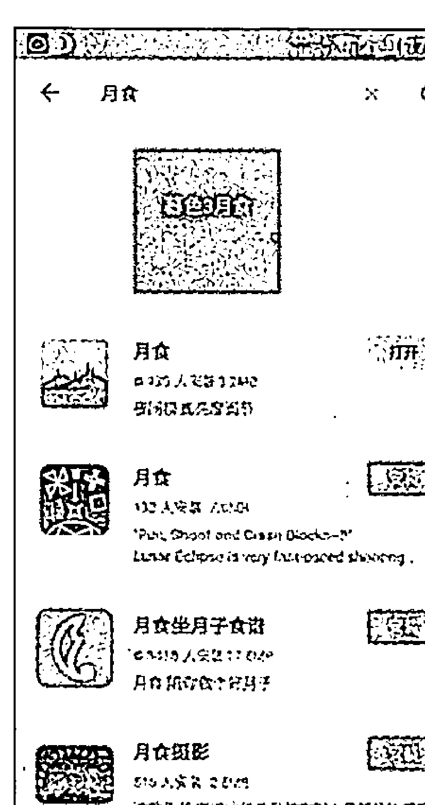

## ◇如何查看更多天气预报

Q: 我们平时使用的天气预报应用，顶多可以预测七天的天气，可是将七天长假和年假放到一块的时候，七天的预测就感觉不太够用了。那么有没有什么更好的方法可以获取更长时间的天气预报？

A: 有一款名为“Weather 14 days”的应用可以试一试，从名称上看这款应用就是主打未来14天的天气预报。通过它可以详细了解到今天和明天每小时预测信息，以及未来一周以内每3小时的预测信息。但是两周以内就只能查看到每12小时的预测信息了。

## ◇如何下载iOS旧版本的应用

Q: 有时候一个新版本的应用，在使用几天后可能会觉得不太适合，所以就想重新下载旧的版本。但是各大市场看了一下，都是只有最新的版本。请问有没有可以下载旧版本的方法？我的手机已经越狱了的。

A: 只要是苹果手机已经越狱了，下载旧版本的应用就有可能，这里推荐用户到当乐网去看看。首先通过网站的搜索功能，查找需要的应用名称。接着进入到应用的介绍页面，其中有一个“历史版本”的项目。点击它就可以看到相关的版本信息，从中找到一个合适的版本后，点击“高速下载”按钮就可以下载到本地系统里面了。

Q: 我知道通过一些软件和应用，可以在电脑和手机里面传递文件。但是有的时候出差在外，电脑里面没有相关的软件，这个时候就无法进行操作。请问有没有好的解决方法？

A: 其实利用二维码就可以快速传递各种信息。首先打开网页浏览器登录到“草料二维码生成器”的页面，点击网页工具栏中相关的功能按钮。比如我们选择“文本”这项后，在文本框输入相关的文字信息。点击“生成二维码”按钮，稍等片刻就可以创建一张二维码图片。最后利用手机里面的二维码扫描功能进行扫描，就可以将这段文字传到手机里面了。


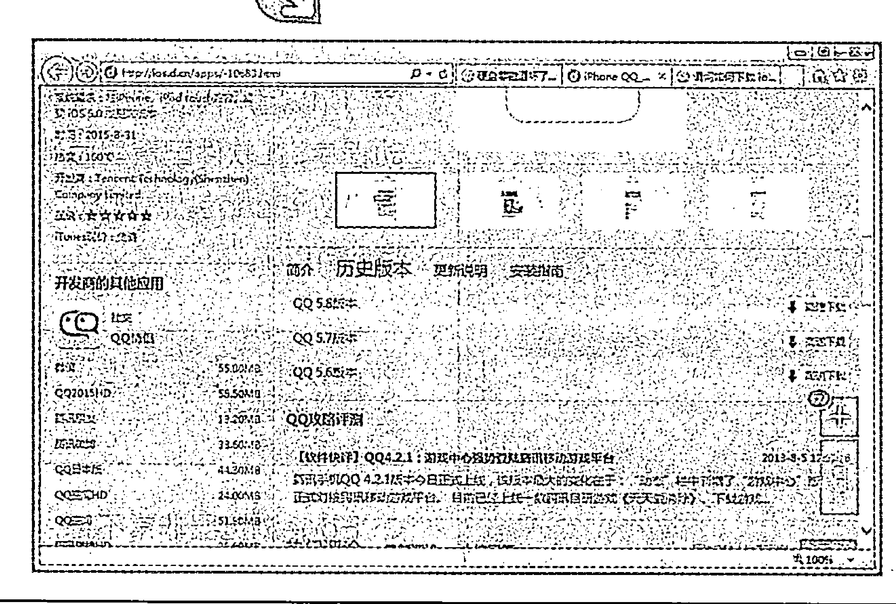

## ◇快速切换到上一个应用程序

Q: Android系统通常只能同时运行一个应用程序，有时候想要切换到刚刚运行过的应用程序，只能返回到系统桌面后重新启动该应用。那么有没有更快更简便的方法呢？

A: 其实最简单的方法就是在使用的时候，长按手机下面的HOME键，这时屏幕就会出现最近使用过的应用程序图标。通过手指的滑动切换到需要的应用窗口，点击它就可以激活该窗口进行使用了。

## IE浏览器为何无法正常使用

文|老万

Q: 最近我使用过一款代理软件后，再打开IE浏览器时就无法正常访问了，但是聊天软件以及其他浏览器却可以正常使用。请问为什么会出现这样的情况？

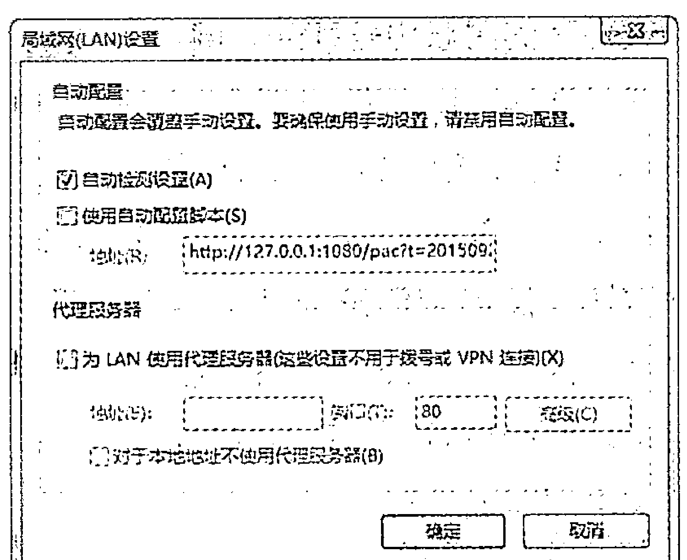

A: 这个问题是因为运行代理软件后，它会自动对IE浏览器的代理进行修改，但是有的代理软件关闭后，并没有重新将设置复原，所以就出现了你遇到的情况。解决方法很简单，首先打开浏览器的“Internet选项”窗口，在弹出的设置窗口中选择“连接”标签，然后点击下面的“局域网设置”按钮。接着在弹出的窗口中可以看到“自动检测设置”，将该选项选中后确定退出就可以了。

> 其实还有一种方法，就是在“Internet选项”窗口中，选择“高级”标签后点击“重置”按钮，这样IE浏览器就可以恢复到安装时候的初始状态。这样设置后就可以进行正常的连接了。不过这里会将其他的设置恢复到默认状态。


## 数据嗅探软件不能获取信息

Q: 最近我为了跟踪软件访问的网址，专门安装了一款名为DNSQuerySniffer的工具。可是设置完成以后发现，软件并没有如自己所想出现相关的跟踪数据。请问是不是我的操作有问题啊？

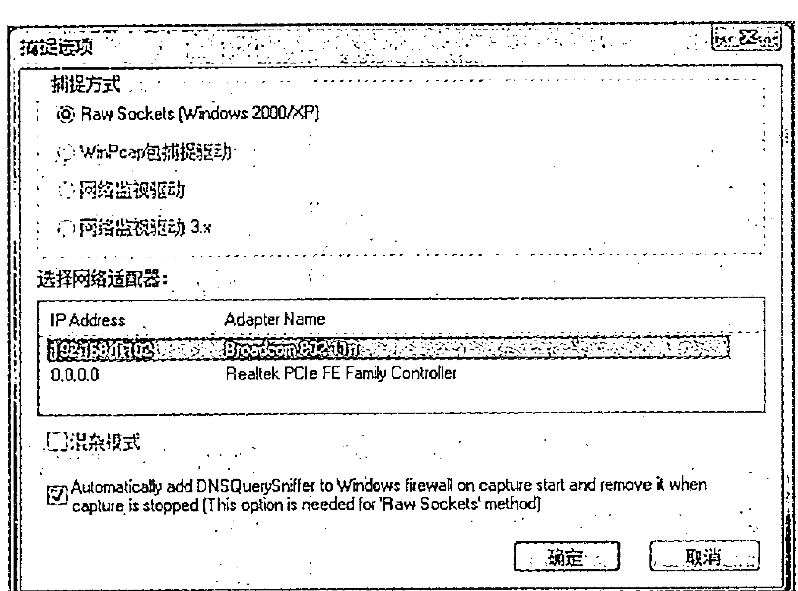

A: 其实包括DNSQuerySniffer在内的这类软件，都是通过分析软件发送出的数据包来进行相关的分析操作的。不过要想获取数据包信息就需要安装相关的驱动程序才可以，而WinPcap就是最常见的这类网络驱动程序。所以用户需要安装好驱动程序，在软件配置里面选择“WinPcap包捕捉驱动”项就可以了。

## Edge浏览器的输入法问题

Q: Edge浏览器非常不错，但是我发现自己常用的谷歌拼音在Edge中输入时常常出现问题。这个问题应该怎么解决？

A: 和现如今所有的网页浏览器不同的是，Edge浏览器是一款纯粹的Windows Apps，而不是我们通常认为的可执行软件。这也就意味着，只有使用支持Windows Apps特性的输入法，才可以在Edge浏览器里面正常地输入。而你所说的谷歌拼音正好就不支持这个特性，所以建议你在这个时候使用系统自带的微软输入法等进行操作。

## 如何下载离线版的PDF阅读器

Q: Adobe Acrobat Reader软件更新了，但是官方给出的是在线安装的版本。虽然网上有很多下载离线安装包的方法，但是都不起任何作用。那么如何在官网下载到离线安装包呢？

A: 包括Adobe在内的很多国外软件公司，都习惯于将自己的软件版本，存放到一个专门的FTP服务器里面。所以用户只需要找到Adobe的FTP服务器，根据提示在里面一层层地寻找就可以发现需要的安装包。比如你所需要的Adobe Acrobat Reader离线安装包，在ftp://ftp.adobe.com/pub/adobe/reader/win/AcrobatDC里面就可以下载到。

## 英文版QQ无法登录的问题

Q: 我安装的是英文版的QQ客户端，不知道为什么登录的时候总说密码不对。后来我把系统语言换成英文后也不行，难道是我的QQ被盗号了吗？

A: 遇到这样的问题首先是换一种输入方式，比如利用QQ自带的软键盘进行输入，或者就是利用二维码的方式登录试一试。其次就是确认密码的大小写是否正确，同时确认键盘输入的切换是否正常。

## 炒股软件的端口被封如何解决

Q：现在股市的波动比较大，所以需要时时刻刻进行关注。但是公司为了避免员工上班时间炒股，把炒股软件使用的端口进行了屏蔽。请问这种情况有没有什么方法可以解决？

A：遇到这类问题最好的方法就是使用代理。首先从网上找一个比较成熟可靠的代理商购买一个代理账户，接着打开炒股软件自带的代理功能，按照要求设置好代理的IP地址、端口、密码等信息后，就可以通过代理连接到炒股软件的服务器了。如果炒股软件没有相关的代理设置，那么购买一款VPN软件也可以突破限制。

## 谷歌浏览器扩展为何被自动删除

Q：最近我从网上下载了一个功能扩展，安装到自己常用的谷歌浏览器里面，可是第二天打开浏览器的时候，就提示我说该扩展程序已经被自动删除。请问为什么会出现这么奇怪的现象？

A：这个问题主要是因为现在的谷歌浏览器禁止用户安装第三方的功能扩展，所以会对安装的扩展安全性进行检测。要想杜绝这个问题的发生，需要首先打开谷歌浏览器的设置窗口，接着点击其中的“显示高级设置”命令。然后在“隐私设置”里面找到“启用针对网上诱骗和恶意软件的防护功能”项，去除前面的勾选后重新安装该扩展就可以了。不过需要注意的是，这也会增加一定的风险。

## 浏览器一键屏蔽网页中的图片

文|老万

Q：现在很多网页都通过各式各样的图片来吸引用户的眼球，但是有时遇到网络不稳定，就会导致网页加载很慢。那么有没有什么方法可以一键屏蔽网页中的图片，而不需要在浏览器的选项里面进行设置呢？

A：如果用户使用的是火狐浏览器，那么点击“工具”菜单中的“附加组件”命令，在弹出的窗口中选择左侧列表中的“获取附加组件”项，再在窗口的左上角输入关键词“Image Block”来搜索。搜索到以后点击该扩展名称后的“安装”，安装完毕根据提示重新启动浏览器即可。以后遇到需要一键屏蔽图片的时候，点击一下该功能扩展的图标就可以了。

## 绿色版谷歌浏览器怎么安装扩展

Q：我使用的是绿色版的谷歌浏览器，可是在安装了迅雷下载软件后，通过浏览器无法调用该下载软件，但是迅雷软件又可以正常运行。那么这是什么原因造成的呢？

A：迅雷下载软件在安装的时候，会向系统里面的浏览器安装相关的插件，但是由于你使用的是绿色版，所以迅雷没有找到软件的安装目录。首先进入到谷歌浏览器的安装目录，在Chrome.exe同级目录里面建一个Plugins文件夹，然后把迅雷插件文件Npxunlei.dll放入Plugins里面，最后重新启动一下谷歌浏览器就可以了。

## 在线计算文件的各类Hash值

Q：虽然现在网上有一些计算Hash值的工具，但是它们很多只可以计算MD5的内容。有没有可以计算多种Hash值的工具？当然有在线操作的网站也可以。

A：这里给你推荐Atool这个网站，首先通过浏览器访问http://www.atool.org这个网址。点击其中的“在线计算文件MD5”链接，接着通过鼠标将文件拖放到打开的页面里面。然后选中需要计算的Hash类型，稍等片刻就会显示出对应的计算结果。

## Windows 10下如何进行网络监视

文|老万

Q：Windows系统自带有相关的安全软件，也有类似的网络监视功能，但是它们的监视数据都不够精确。有没有什么方法可以准确地监视相关数据，并且可以实时显示出来？

A：其实在网上有很多专业的网络监视软件，通过它们就可以方便地进行操作。比如我们下载运行cFosSpeed这款软件，安装完成以后在系统托盘中找到它的图标，右击图标，选择“当前连接”命令，在弹出的窗口就可以看到网络监视的信息了。如果单击其中的“活动连接（高级）”链接，还可以看到更加详细的信息。

### 在哪里设置窗口默认打开的大小

Q：在Windows 7和Windows 10的系统里，通过快捷键Win+E就可以打开资源管理器。但是在哪里设置默认打开的大小呢？

A：包括资源管理器在内的软件，通过拖动边框就可以调整大小。在窗口大小调整完成以后，下次启动就是设置的大小了。至于你所说的窗口大小调整命令，应该是点击窗口左上角的图标后，在弹出的菜单里面选择“大小”命令，通过键盘里面的方向键来逐步调整窗口的大小。

### Windows 10不支持独立音量调整

Q：Windows 10系统改进了原有的音量调节滑杆，由之前的竖版改成了现在的横版。不过非常可惜的是，它取消了原来的独立音量调节功能。请问有没有什么方法可以恢复独立调节的功能？

A：首先打开注册表编辑器，展开左侧的项目到[HKEY_LOCAL_MACHINE\Software\Microsoft\Windows NT\CurrentVersion\]，在该项目上点击鼠标右键选择菜单中的“新建→项”命令，将新建的项目名称设置为“MTCUVC”。接着在右侧窗口新建一个名为“EnableMTCUVC”的32位DWORD值，然后将“数值数据”设置为0并重新启动系统即可。

### Windows 10系统桌面反复崩溃

Q：虽然Windows 10的兼容性已经做得十分出色，但是我发现仍然有一些第三方软件存在问题，从而导致系统桌面反复闪烁甚至崩溃。请问这个问题应该如何解决？

A：你说的这个问题微软也收到很多的反馈，微软给出的建议就是首先进入到安全模式，将这些不兼容的软件彻底进行删除，然后等到厂商发布新版本后再进行安装。除此以外，有的厂家已经推出了专门的修复软件。如赛门铁克提供的一个修复工具，在安全模式下执行后，就能让现有的诺顿软件兼容Windows 10系统。

### 桌面右键一刷新图标就乱

Q：我在系统桌面点击右键中的“刷新”命令后，系统桌面原有图标的排序就乱了，可是我并没有勾选“自动排列图标”这个选项。请问这个问题怎么解决？

A：首先通过Gpedit.msc命令启动组策略编辑器，依次展开“用户配置→管理模板→桌面”项，接着在右侧窗口可以看到一个名为“退出时不保存设置”的项目。直接双击该选项打开它的配置窗口，在里面选择“已启用”选项就可以了。

### 如何关闭iOS9的Wi-Fi助理功能

Q：听说在iOS9的系统里面，有一个名为“Wi-Fi助理”的功能，会在后台偷偷跑流量。请问这个功能到底是干什么的，有没有什么方法可以屏蔽它？

A：“Wi-Fi助理”功能是在用户上网的时候，发现Wi-Fi信号不好或不流畅的情况下，就会自动使用移动网络的流量进行上网，所以就会出现后台走流量的现象，只不过用户不知道而已。如果要关闭这项功能，首先打开系统的设置窗口，在列表里面找到“蜂窝移动数据”项，点击它以后找到“Wi-Fi助理”项目并关闭即可。

### 微博客户端变成英文界面

Q：这几天苹果公司开始推送最新的iOS9，可是安装完成以后发现新浪微博的界面成了英文的。虽然看上去有种高大上的感觉，但是毕竟使用起来非常不方便。请问怎么才可以修改为中文界面？

A：其实不光是新浪微博，很多应用都出现了你所说的这个情况。如果想要重新改回中文界面，首先打开新浪微博的应用，点击工具栏中的“Me”后，在弹出的窗口中点击右上角的“Settings”。再在列表中选择第四个选项“Settings”，这样就可以看到语言设置的“Language”。点击它后将“跟随手机系统”改为“简体中文”就可以了。

### 如何保存微信公众号中的文章

文|老万

Q：在微信公众号里面会发现一些非常不错的文章，可是有时因为有事没时间读完，想等有时间的时候接着读。请问如何才可以将它收藏起来，方便以后进行查找？

A：如果用户是想进行专业的收藏，那么首先在微信公众号里面订阅“我的印象笔记”，接着根据提示捆绑自己的印象笔记账号。以后遇到喜欢的文章，点击右上角的功能按钮后，在弹出的菜单中选择“我的印象笔记”命令，就可以将这篇文章保存到印象笔记里面。当有时间的时候打开印象笔记的应用，就可以查看到保存的文章内容了。

如果只是想临时收藏一下，可以在点击右上角的功能按钮后，在弹出的菜单中选择“收藏”命令即可。当有时间的时候点击“我”按钮，在弹出的界面中点击“收藏”，就可以看到收藏文章的标题内容了。

### 如何才能更好地学习普通话

Q：我出生在中国的南方地区，说话有一定的地方口音。可是现在各行各业都要求说普通话，那么如何才可以掌握普通话的规律，让自己说一口标准的普通话呢？

A：这里推荐一款名为“普通话学习”的应用，通过它可以从最基本的发音开始学习。应用会一个个的对声母和韵母进行教授，同时可以对用户的发声进行判断，通过这样的学习就可以掌握普通话的基本发音。过一段时间后通过模拟考试，还可以对自己的普通话的好坏进行验证。

### 触宝电话效果不好的解决

Q：前段时间看到一个手机的发布会，介绍了一款名为“触宝”的免费电话应用，但是我使用了以后发现效果并不好。请问有没有什么方法增强它的效果？

A：现在的免费电话都使用了不同的技术，最常见的就是通过网络进行连接，或者利用回拨技术进行连接。“触宝”在默认情况下使用的是网络连接方式，所以受网络好坏的影响非常大。建议你在拨号的时候，点击“回拨”按钮试一试另一种方式，效果可能会好一些。

## 设置软件不自动启用代理

文|老万

Q：现在很多代理软件为了方便用户使用，在运行的时候就会自动设置代理选项。但是我平时使用IE浏览器进行上网，要使用代理的时候则运行谷歌浏览器。请问怎么才可以让软件不自动启用代理？

A：首先通过“gpedit.msc”命令启动组策略编辑器，接着在窗口左侧列表中依次选择点击“用户配置→管理模板→Windows组件→Internet Explorer”。接着在窗口右侧的列表中双击其中的“阻止变更代理设置”选项，在弹出的属性窗口中选择“已启动”，然后点击“确定”按钮就可以避免软件对代理的启用了。

其实除了在组策略里面进行操作外，在注册表里面也可以进行阻止。在注册表中依次展开到HKEY_CURRENT_USER\Software\Microsoft\Windows\CurrentVersion\Internet Settings\Connections，再在权限窗口设置Everyone权限禁止操作即可。

## Edge浏览器怎么禁止弹出式广告

Q：微软全新的Edge浏览器非常不错，但是它自身没有带广告过滤功能，甚至连弹出广告都无法进行过滤。请问有没有什么方法可以拦截弹出广告？不使用第三方软件最好。

A：Edge浏览器的很多特性和IE浏览器是相通的，既然IE浏览器可以拦截弹出广告，Edge浏览器自然也是可以的。首先打开IE浏览器的“Internet选项”窗口，在弹出的设置窗口中选择“隐私”标签，然后选中下面的“启用弹出窗口阻止程序”选项。设置完成后关闭选项窗口，再打开Edge浏览器就可以阻止弹出广告了。

## Potplayer总是提示更新

Q：我平时使用的播放器是Potplayer，为了杜绝软件的自动更新操作，已经将相关的选项进行了关闭，但是重新打开播放器又提示要更新了。请问这个问题应该如何解决？

A：其实这个只是提醒用户有更新，是否更新需要用户自己进行选择，并不会在系统后台自动进行操作。如果用户不喜欢这样的提示，可以下载一个“Potplayer去验证去联网补丁”。下载完成后将其复制到播放器的安装目录，运行后点击软件窗口中的“补丁”按钮，就可以去除播放器的联网行为，自然也就不会弹出相关的提示窗口了。

## 为IE浏览器加入鼠标手势

Q：我平时使用的是IE浏览器，遗憾的是IE没有鼠标手势功能，这样操作起来有些不便。有没有什么方法可以为IE添加上鼠标手势功能？

A：由于IE自身的封闭性，无法通过扩展进行解决，所以只能借助于第三方工具，比如知名的鼠标手势工具StrokesPlus。首先运行该软件并添加设置需要鼠标手势的IE浏览器，接着点击“添加操作”按钮设置一个鼠标手势的名称，然后设置相应的鼠标手势动作就可以了。按照相同的步骤，再设置其他的鼠标手势就可以了。

## AutoRuns不能启动

Q：我刚刚重装了纯净原版的Windows 7系统，结果发现原版系统真的非常难用，各种权限限制就不说了，我必备的启动项管理软件AutoRuns也使用不了了。请问这该如何解决？

A：首先为这个工具在系统桌面添加一个快捷方式，接着点击鼠标右键选择菜单里面的“属性”命令，然后在弹出的属性窗口中找到“目标”项，最后在默认的信息后面添加上“/accepteula”（不含引号，斜杠前有空格）这个参数即可。

### 通过浏览窗口无法跳转到快盘

Q：我平时都是通过快盘来存储文件的，所以在保存文件时会通过浏览窗口左侧的收藏夹来快速跳转到快盘所在的同步文件夹。可是最近不知道怎么回事，怎么点击收藏夹也无法跳转。请问这该如何解决？

A：快盘以前是金山的一款云存储软件，后来被出售给了迅雷公司，所以名称由“金山快盘”变成了“快盘”。由于该软件在升级的时候并没有卸载以前的版本，所以在收藏夹里面的“金山快盘”项目依然存在，但是点击它以后就会出现你所说的问题。这个时候只要进入注册表，搜索“金山快盘”的信息并全部删除就可以了。

### 在线查询颜色的色号信息

Q：有的时候我需要查询一个颜色的色号，这个时候启用Photoshop等软件，感觉有些“杀鸡用牛刀”。请问有没有更加简便的方法？

A：首先通过浏览器登录www.colr.org网站，在网页中可以看到三张图片。将鼠标移动到图片上方色块上时就能看到色号，这时点击“Add tags”按钮为颜色加上一个标签。接下来切换到“Search”选项卡，输入标签关键字来搜寻刚刚寻找的颜色，就可以查看该颜色的信息了，其中左侧为单色，右侧为颜色组合。

### 快速查询网站的各项数据信息

Q：最近我的一个朋友办了一个网站，随时需要关注网站的各个信息，比如Alexa排名、搜索引擎的收录情况等等，但是要想查询这些信息，需要在不同的网站里面完成。有没有一个网站就可以查询所有这些信息的？

A：首先打开浏览器登录www.openadmintools.com这个网站，在网页里面输入查询网站的域名，接着点击“网站分析”按钮进行查询。稍等片刻就可以在网页里面看到被查询网站的各种信息，包括网站名称、域名年龄、Alexa排名、搜索引擎收录、DNS解析等信息。

### 如何防范XMLRPC安全漏洞

文|老万

Q：我通过WordPress搭建了一个人博客网站，最近在网上看到WordPress里面的XMLRPC文件，可以对网站里面的账号信息进行破解。那么这个安全漏洞如何进行防范？

A：XMLRPC是WordPress中进行远程调用的接口，如果用户是在本地电脑系统里面发布博客的话，这个功能就完全可以关闭。首先进入WordPress后台界面，点击左侧列表“插件”中的“安装插件”命令，接着搜索并安装一款名为Disable XML-RPC的插件。安装完成后在插件列表找到它，点击“启用”按钮激活它就可以了。

除此之外还有一个更加简单的方法，就是首先进入服务器的后台界面，点击“文件管理”按钮查看服务器里面所有的文件。在根目录里面就可以找到一个名为Xmlrpc.php的文件，选中它后将其删除就可以了。

### 迅雷下载总是卡在99%

Q：我平时使用的下载软件是迅雷，但是经常遇到一个非常奇怪的问题，就是下载到99%的时候就不能下载了。听说这个问题很多人都遇见过。请问有没有什么办法可以解决？

A：以前要想解决这个问题就是开通迅雷的VIP，通过专门的服务器下载最后的1%就可以了。不过最近迅雷官方已经向普通用户提供了专门服务器的使用权限，这样理论上以后就不会遇到这个问题了。

### 组策略功能错误提示

文|老万

Q：最近打开Windows系统的组策略功能，总是弹出一个解析错误的提示框，告诉我找不到某些资源。在关闭这个提示框后，发现组策略的一些功能无法正常使用。请问这该如何解决？

A：遇到这样的问题可以试着对组策略功能进行重置操作。首先通过管理员权限打开命令提示符窗口，输入 `gpupdate /force` 命令后按下回车键，此时就可以看到“正在更新策略”的提示，稍等片刻，当出现“计算机策略更新成功完成”的提示后，重新打开组策略编辑器进行操作就可以了。

```
Microsoft Windows [版本 6.1.7601]
版权所有 (c) 2009 Microsoft Corporation。保留所有权利。
C:\Users\wan>gpupdate /force
正在更新策略...
用户策略更新成功完成。
```

还有一个比较简单粗暴的解决方法（有风险），就是根据提示框查到出错的文件，接着从其他同版本的系统里面复制一份过来，替换掉出现错误的这个文件后，重新启动系统进行确认就可以了。

### 安装显卡驱动后系统马上死机

Q：我在安装显卡驱动程序的时候，一开始出现花屏死机问题。卸载驱动程序重新安装，安装过程中就会死机，驱动无法正常安装。请问这该如何解决？

A：首先需要确认安装的驱动程序和自己的显卡是匹配的。确认以后可以进入到安全模式里面安装，首先对安装的驱动程序文件进行解压，找到驱动程序文件夹里面的inf文件后，点击鼠标右键选择菜单里面的“安装”命令进行操作。另外，我们也可以利用系统的升级功能，自动下载升级通用的驱动程序进行使用。

### 什么是重新分配事件计数

Q：我通过HDTunePro软件检测硬盘的时候，看到“重新分配事件数量”这项发黄并提示警告。请问这个选项是什么意思，是不是代表这块硬盘出现问题了？

A：这个项目说明曾经出现过扇区损坏，但是坏扇区已经被备用扇区替换或者修复了，所以在此对用户进行警告而已。当然如果用户还是不放心的话，可以点击HDTunePro软件的“错误扫描”标签，点击“开始”按钮对磁盘的坏道进行扫描。一旦发现有坏道就需要及时备份数据，以防万一。

### Office 2013无法关联Word文件

Q：我原来使用的是Office 2003，后来又安装了Office 2013，之后我对系统进行了备份。今天当我恢复系统后，发现Word文件无法正常打开，通过右键设置用Office 2013打开也一样不行。请问这该如何解决？

A：出现这样的问题，应该是Office 2013的某些文件没有成功在注册表里面完成注册所致。建议你重新运行Office 2013的安装包，执行到软件卸载的那一步后不要选择卸载软件，而是选择软件修复选项，然后根据向导一步步进行操作，就可以完成对Office 2013软件的修复，从而正常使用了。

### 文件在PE系统下也无法删除

Q：我要删除的这个文件在C盘的Windows文件夹中，即使进入到Windows PE的运行环境也无法删除它。请问这该如何解决？

A：文件不能正常删除的原因有很多，比如文件权限的原因、文件占用的原因等。这里推荐使用磁盘管理软件DiskGenius进行强行删除。首先在DiskGenius里面找到要删除的文件，点击鼠标右键选择“强制删除”命令即可。

傻博士有话说

## 如何防止小孩购买付费APP

文|老万

> Q: 家里客人带来的小孩拿了我的手机玩游戏，乘我不注意自行从应用市场下载游戏，还购买了付费的道具，我又无法当面责备他。请问有没有什么方法可以防止小孩购买付费APP?

A: 如果已经升级到Android 5.X的话，那么系统的“访客模式”功能可以解决你的问题。进入系统设置后找到“访客模式”并激活它，点击列表中的“已允许的应用程序”选项，设置“访客”能够使用的APP应用。设置完成后返回到上一步，点击“锁定屏幕类型”后设定不同的屏幕解锁模式。这样在屏幕锁定的情况下，使用不同的解锁图案，就会进入相应的桌面。

## ◆ 为老系统添加Heads-up样式

Q: 我最近发现Android 5.X的系统里面增加了一种名为Heads-up的通知新样式，不仅看着非常直观而且非常实用。但是我的系统还是以前的老版本，请问有没有什么方法可以增加该通知样式?

A: 既然用户不愿意升级到最新的系统版本，那么可以借助于第三方应用进行解决，比如通过Heads-up Notification应用就可以解决。安装该应用后运行它，点击“开启/关闭 Heads-up”按钮。接着点击“设置”按钮，在弹出的窗口中根据需要进行相应的设置，最后点击“测试”按钮就可以看到演示效果了。

## ◆ 苹果商城下单遇到的问题

Q: 我最近几次消费都是在iTunes下载电影，而且都已经把账单发到自己的邮箱，同时钱也从银行卡里面自动扣除了。可是今天想要继续消费的时候，显示上次存在账单问题要求更换支付方式?

A: 出现这样的问题可能是由于用户在上一次购买服务的时候，从指定的账户没有成功进行扣款操作，换句话说就是你现在欠苹果公司的钱。所以这次购买服务的时候，需要首先将上次的欠款还上。之所以出现这样的问题，应该是用户的银行卡没有钱了，所以要求用户更换别的支付方式。当然以上仅是参考意见，最好的办法还是亲自联系苹果商城的客服进行解决。

## ◆ 开启Android 6.0的隐藏功能

Q: 我的Nexus设备开始推送Android 6.0了，安装以后发现新的功能使用起来很不错，但是听说还有一些功能被隐藏了。请问通过什么方法可以开启隐藏功能?

A: 首先把Android系统的通知栏向下滑动，长按下拉菜单的齿轮按钮数秒，松开手以后系统就会提示设置界面已经添加了“系统界面调谐器”的功能。接下来进入到设置界面并拉到最下方，就能够看到一个名为“系统界面调谐器”的选项。点击进去后系统会提示用户，这些隐藏功能是否有趣，这取决于你的个人感觉，点击“知道了”后就可以开始使用了。

## ◆ 为何我的CM系统没有天气预报

Q: 我和朋友的手机系统都是安装的第三方CM系统，而且版本都是一样的。可是他的系统自带有天气预报，而我的系统里面怎么没有这项功能呢?

A: 其实不是你的系统没有这项功能，而是因为你没有激活这项功能。要想激活这项功能非常简单，在系统设置里面打开GPS定位功能就可以了。定位完成以后下滑系统的通知栏，在时间下方就可以看到天气预报了。

如果用户还没有升级到Android 5.X的话，可以利用“LBE安全大师”等安全应用，对指定应用或游戏的权限进行设置，从而减少这些应用由于权限太大可能会造成的不良后果。

## 手机中如何滚动截图

文 | 老万

Q: 现在的手机都自带有截图功能，但是只能对当前界面进行操作，如果超出指定的范围就不行了。请问手机里面有没有什么方法可以实现滚动截图，从而截取当前屏幕外的信息内容？

A: 首先安装一款名为“咔咔截屏录屏大师”的APP，不过该APP的使用需要相应的ROOT权限，安装运行后可以在窗口中看到一个悬浮框。现在打开想要截屏的手机应用，点击悬浮框选择“滚动截图”命令，咔咔录屏截屏大师会弹出一个内容选择区。用户可以根据使用场景自由调整区域的大小及位置，最后点击“确定”按钮并按照提示操作即可。

启动后，还需要进入模块里面设置一番才行。这里直接勾选“Enable for all apps”并全选“Global text links”中的所有项目即可。

除此以外还有一个笨办法，就是按照传统的方法进行截图，需要注意的是，在拼的图片一定要有可以衔接的部分，接着利用PPIICC之类的APP，将截图信息一张张的连接起来就可以了。

## ◇ 如何关闭手机淘宝的推送功能

Q: 我和很多人都一样都在手机里面安装了淘宝的客户端，可是这款应用每天都会推送相关的促销信息，即使是利用安全软件结束进程也不管用。请问有没有好的解决方法？

A: 手机淘宝应用自身带的功能，就可以解决用户所遇到的问题，只不过这个功能隐藏得比较深。首先打开手机淘宝应用，在搜索框里面输入“:labs”后回车，即可禁止应用的静默启动操作，这样自然也就不会继续推送消息了。当然在进行完该操作以后，建议重新启动一下手机，以便确认刚刚的设置操作。

## ◇ 手机号码不能被应用识别

Q: 现在许多应用都为电话号码等信息做了智能识别，比如点击其中的电话号码可以跳转到拨号页面，但是并不是所有的应用都是如此。请问有没有什么方法可以解决这个问题呢？

A: 这种问题除了静静等待应用的开发商完善之外，我们也可以尝试一下第三方解决方案，比如Xposed应用中的模块TextLinkify。不过该模块默认是不起任何作用的，所以在勾选该模块并重新启动后，还需要进入模块里面设置一番才行。这里直接勾选“Enable for all apps”并全选“Global text links”中的所有项目即可。

## ◇ 关闭支付宝中的社交搜索功能

Q: 最近我在升级到最新的支付宝以后，莫名其妙接到很多的推销电话，而且很多人都可以喊出我的名字。是我的个人信息泄露了，还是什么问题造成的啊？

A: 最近支付宝里面加入了社交功能，这样陌生人可以通过邮箱等方式搜索到你，只需要把这项功能关闭掉即可。首先打开支付宝应用的“我的信息”窗口，点击列表中的“设置”命令，接着选择列表中的“隐私”命令。然后将“通过邮箱找到我”等三个选项关闭掉，这样就可以杜绝陌生人的骚扰了。

## ◇ 快速输入网页地址后缀等信息

Q: 在移动终端上网仍然需要输入网址，这个时候就没有电脑上方便了。有没有什么方法可以简化一下在iOS系统里面输入网址的步骤？

A: 一般来说，可以简化的内容也就是网站链接的后缀信息了。其实用户只需在输入网址的时候，长按键盘空格键右边的“.”键，然后手指滑动选择相应的网址后缀松手，这样就可以自动补齐网页地址的信息了。

## MPSigStub.exe是什么文件

Q: 我的F盘里面莫名其妙出现了一个名字很长(有字母也有数字的组合)的文件夹，里面有个名为MPSigStub.exe的文件。请问这是什么东西啊？能不能进行删除？删了会不会对系统有影响？

A: 这是微软发布的一款验证软件。因为在微软软件升级过程中有些黑客会编写一些恶意程序，诱使微软的软件升级程序运行他们的恶意程序。微软发布软件MPSigStub.exe可以通过数字签名识别出哪些程序是来自微软的，这样自动升级软件就只运行来自微软的程序了。

## 如何找回IE浏览器记录的密码

Q: 现在很多浏览器都带有密码记录功能，系统自带的IE浏览器自然也是如此。可是我最近想查看一下浏览器记录的密码信息，不知道通过什么方法才可以查看到呢？

A: 首先通过系统自带的搜索功能查找“凭据管理器”，找到后点击打开这项功能的操作界面，这样我们就可以看到“Web凭据”和“Windows凭据”两项功能。点击其中的“Web凭据”项，可以看到IE浏览器所有记录的账号密码。点击密码后面的“显示”命令，按照提示输入当前系统的账户密码，完成验证后就可以看到密码信息了。

## 增强Windows系统的预览

文|老万

Q: Windows系统自身就带有预览功能，但是其自带的预览功能非常有限。比如系统自带的功能可以打开PDF文件，但是预览功能却无法进行操作。那么有没有什么方法可以增强预览功能呢？

A: 既然系统的功能无法完成你的需要，那么只能借助于第三方的工具了。首先下载运行Seer这款预览工具，软件会自动常驻系统后台。以后用鼠标选中一个文件，再点击一下键盘中的空格键，就会自动弹出一个预览窗口，显示相关的文件信息。该预览工具支持常见的压缩文件、多媒体文件、文档文件等。

| Filename | Size | Packed | Ratio | Time |
| :--- | :--- | :--- | :--- | :--- |
| ∨ PCHunter_free | | | | 15/10/19 12:17 |
| 说明.txt | 1.44 KB | 909 字节 | 61.38% | 15/10/17 15:23 |
| readme.txt | 8.44 KB | 2.09 KB | 24.77% | 15/10/17 15:22 |
| PCHunter3... | 6.64 MB | 2.83 MB | 42.61% | 15/10/17 11:46 |
| PCHunter6... | 9.08 MB | 3.66 MB | 40.40% | 15/10/19 12:06 |

其实利用一些知名的文件管理器，也可以对常见的文件进行预览，比如Total Commander (TC)等，首先在TC里面点击选择一个文件，按快捷键F3就可以对文件进行预览操作了。

## 本机如何禁止访问80端口

Q: 我听说通过电脑系统的80端口，就可以对电脑系统进行访问。所以我想问问如何才可以关闭80端口，杜绝其他人对电脑系统的远程访问？

A: 一般Windows的家庭版或者专业版系统，默认都是关闭了80端口的，除非某些软件打开了80端口。所以你可以首先运行名为PCHunter的工具，点击操作界面中的“网络”标签，在“本地地址”列里面查看是否有80端口打开。如果有的话找到对应的进程，结束进程后80端口也就自然而然地关闭了。

## 英特尔快速储存技术要不要开

Q: 本人电脑挂着一个系统盘和三个从盘，但是并非磁盘阵列而都是机械硬盘。一直开启着“英特尔快速储存技术”，感觉硬盘间传输速度也没有提升。可不可以关闭或卸载英特尔快速储存技术？

A: 如果你不用磁盘阵列就没必要开，台式机也没必要考虑续航等问题，开省电模式没有多大的意义，而且机械硬盘频繁关停对寿命是有影响的（不过不大）。但如果是SSD则最好关闭，否则相当影响性能。CF

## 突破115网盘登录的相关限制

文|老万

> Q: 我平时使用的都是115的网盘，可是最近遇到一个非常“奇葩”的事，就是115网盘官方要求用户，登录网盘的时候必须使用115的浏览器。请问有没有什么方法可以突破这个限制?

A: 首先登录115网盘的官方首页，点击右上角的“简体中文”后，在弹出的菜单里面选择“English”项。接着根据网页里面的要求，打开115网盘的手机应用来扫描页面中的二维码，扫描成功以后就可以直接通过其他浏览器进行登录了。如果用户对115网盘和其他社交账户进行了捆绑，那么也可以利用社交账户进行登录操作。

以前115网盘曾经推出过一款名为“115云备份”的客户端程序，虽然现在官方没有继续进行维护更新，但是也可以使用它登录到网盘的服务器里面，实现文件的上传以及下载等相关操作。

## ◇ TheWorld 6.2不能显示淘宝网

Q: 我的电脑配置比较低，所以使用的是Windows XP系统，以及世界之窗的浏览器。可是最近发现访问淘宝网的时候，出现了网页信息无法加载完整的情况。求解决方法?

A: 当出现这样的问题后，可以先试一试其他浏览器（如IE、Chrome等），看看能不能完整加载网页信息。如果还是不能的话，说明问题并不是出现在系统或者软件上面，很可能是网络中某个节点出现了问题，用户此时能做的，也只能是等待网络服务商解决问题了。

## ◇ FTP经常出现传输出错

Q: 有的时候我需要通过FTP来传输文件，但是最近手动检查后发现，传输文件的哈希函数信息不准确。特别是大文件，经常出现这种问题。是通过FTP的传输不可靠吗?

A: 首先从网上选择一个文件到磁盘里面，和本地系统里面的文件进行一下对比，看看它们的哈希函数是否是相同的。如果是相同的，可能是因为服务器对文件进行了压缩处理。如果不相同，应该是用户在传输的过程中出现了中断，造成文件内容信息的不完整，最终出现哈希函数信息不准确的情况。

## ◇ 把源码导出为带高亮的PDF

Q: 我平时需要写一些代码，然后将它导出为PDF文件。但是传统的软件在导出时，不能对代码信息进行高亮显示。有没有什么方法可以解决这个问题?

A: 写代码的人肯定知道Markdown吧，现在很多云笔记都支持Markdown格式，比如刚刚出现不久的云笔记leanote。用户只需要登录该云服务的官方网站，将代码信息粘贴到编辑框里面。接下来在列表里面找到这篇笔记的名称，然后点击鼠标右键选择“导出PDF”命令，这样生成的PDF文件就会以高亮显示代码信息了。

## ◇ 禁止搜狗输入法偷偷联网升级

Q: 为了杜绝搜狗拼音弹出广告框，我使用的是网友制作的破解版，结果前几天还是被升级到最新版本。请问有没有什么方法禁止输入法的联网升级啊?

A: 这类问题可以试试通过组策略来禁用升级程序。首先在软件限制策略里面点击“创建路径规则”命令，这时就会弹出一个“创建路径规则”窗口。点击“路径”选项下面的“浏览”按钮，在弹出的窗口中选择输入法的升级模块文件即可。

## Edge浏览器的音质问题

Q: 有一次我在看S5直播的时候，直接复制链接到Edge里面，明显感觉话语的细节更清晰。后来在网页上听歌，也感觉变化明显。不知道是我的心理作用，还是微软使用了什么“黑科技”？

A: 微软在它的一篇官方博客中宣布：“Edge浏览器将对HTML5、MSE和EME格式的多媒体内容提供杜比音效支持，从而为H.264视频带来更加出色的画面展现和多声道听觉体验。未来杜比音效将被应用于AVC/H.264视频以及此前宣布的HLS和MPEG DASH Type 1串流服务当中”，原因应该就在这个地方吧。

## 如何让Adobe Acrobat瘦身

Q: 自从前两年我安装Adobe Acrobat以来，一直随着官方的步骤在不断地更新该程序。结果近来一看该文件夹，已经达到7.6GB的大小了。请问如何让它瘦身啊？

A: 现在Adobe Acrobat也和Windows系统一样，通过发布补丁来修复漏洞以及拓展功能。随着补丁文件在文件夹里面的日积月累，当然也就会出现你遇到的这个问题。所以首先在文件夹里面找到“Adobe patch files”这个目录，找到后将其彻底删除就可以了（为了安全起见请先做备份，确定能正常工作后再清除备份即可）。当然不嫌麻烦的话，也可以通过下载新版本的安装包进行升级。

## Edge浏览器首页被绑定

Q: 最近我每次打开Edge浏览器的时候，主页都变成了百度搜索的页面。我用的是ADM广告屏蔽软件，但是我已经关闭了首页捆绑。请问这是什么原因造成的？

A: 这个是因为最近微软公司和百度公司开展了合作，百度成为Edge浏览器默认的主页和搜索引擎，于是也就出现了你所说的情况。不过好在用户可以进行自定义设置，将其修改为自己喜欢的首页信息即可。首先点击右上角的更多操作按钮，在弹出的菜单里面选择“设置”命令，然后在“打开方式”里面进行设置就可以了。

## ROM文件复制到外置SD卡

文|老万

Q: 我手上没有现成的SD读卡器，但是需要从电脑中把ZIP或ROM文件复制到手机外置的SD卡上。请问有没有一种软件，可以把手机上的SD卡映射为一个盘符？

A: 理论上无论是内置存储卡还是外置存储卡，通过数据线连接到电脑以后就会显示出来。不过需要在状态栏点击“USB计算机连接”，然后点击菜单中的“打开USB存储设备”命令即可。如果这么操作不成功的话，可以先将文件复制到内置存储卡中，然后通过文件管理器剪切到外置存储卡中即可。

如果用户连数据线都没有的话，那么只能通过无线进行传输。比如在电脑中安装一个FTP服务器软件，然后将手机中的文件通过FTP服务器软件，最后将相应的文件下载存储到手机中即可。

## Chrome46无法打开开发者工具

Q: 最近谷歌浏览器升级到46以后，按照以前的方法进行操作，结果发现无法打开开发者工具。到底是新版本取消了开发者工具，还是我打开的方式不对啊？

A: 通常情况下点击右上角的选项按钮，在弹出的菜单里面点击“工具”命令，接着选择子菜单中的“开发者工具”命令即可。不过据描述猜测问题出现的原因是使用了快捷键，有的版本将快捷键改为Ctrl+Shift+I，按照老方法操作就会有问题。

## 苹果升级后无法访问应用商店

文|老万

Q：最近我发现一个非常奇怪的问题，就是iOS系统更新到最新的版本后，无法正常使用苹果的应用商店。每次打开应用商店图标后，看到的都是一个白色的空白页面。请问这个问题怎么解决？

A：首先点击系统桌面的“设置”按钮，在设置列表里面找到“iTunes Store与App Store”命令并点击，这样就可以看到自己已经登录的ID账户。点击这个账户后选择菜单里面的注销命令，接着重新启动设备的iOS系统。然后按照前面的方法打开“iTunes Store与App Store”，重新登录自己的ID信息就可以访问苹果商店了。

## ◇一键扫出手机屏幕中的文字

Q：虽然平时在Android中复制文字很方便，但是那只是针对文本页面的内容，如果是信息窗口则不能进行复制。有没有什么方法，可以将应用软件窗口中的内容复制出来呢？

A：首先推荐用户安装一款名为“Text on screen”的应用，接着按照通常的方法对应用窗口进行截图，然后通过图库的分享功能共享给刚刚安装的这个应用。这个时候可以在“Text on screen”窗口看到一个选择框，调整选择框选中需要复制文字的区域。稍等片刻点击“Save”按钮，就可以将选择的文字信息保存下来了。

## ◇自拍杆为什么无法正常使用

Q：最近看到很多朋友都带有一个自拍杆，所以马上从网上买了一个。结果买回来安装上后，手机无法使用，而换一个手机则又可以了。请问这是怎么回事？

A：这个问题应该是出在快捷键的设置上，所以首先通过手机打开相机应用，按下音量键看看能不能进行拍摄操作。如果可以拍摄的话，说明你的自拍杆安装有问题。如果不能拍摄的话，打开相机应用的设置窗口，将音量键设置为拍照功能。这样再插上自拍杆的插头，就可以进行正常的使用了。

## ◇如何标注汉语拼音的音调

Q：在苹果的通讯录中给联系人添加中文姓名，有的时候也会遇到一些生僻字，这个时候就需要添加一些拼音和音调。拼音输入倒是方便，但是音调怎么输入啊？

A：其实汉语拼音的音调输入，就隐藏在iOS键盘里面。比如用户要给“a”加上声调，只需要在字母键A上长按，就会弹出一个拥有各种声调的提示框，然后滑动手指选择相应的声调项即可。

## ◇将电脑上的电影分享给其他设备

Q：我想利用HTTP协议将电脑上的电影，分享给同一局域网中的其他设备观看。这样其他设备只要打开浏览器，连接上电脑以后就可以直接进行播放。不知道有没有简单的解决方案？

A：最简单的方法就是利用Everything来进行解决。打开这款软件以后点击“工具”菜单中的“选项”命令，在弹出的窗口中点击左侧的“HTTP”选项。接着在右侧窗口里面选中“启用HTTP服务器”选项，确定退出以后服务器就架设完成了。然后利用其他设备的浏览器访问电脑的IP地址，就可以看到电脑里面所有的文件，点击电影以后就可以在线进行播放了。

## Windows体验指数在哪里

文|老万

## 怎样禁用Ctrl+空格键切换输入法

Q: 我的Ctrl+空格键和IDE的智能完成快捷键有冲突，而我又不想改IDE的快捷键，所以只能在Windows 10上打主意了，但是我在输入法设置那里却无法修改。请问这个问题如何解决？

A: 首先在Cortana搜索框里面键入“Language”，按下回车键打开语言设置窗口。点击左侧的“高级设置”按钮，在弹出的窗口中点击“更改语言栏热键”按钮。然后在弹出的对话框中选择“中文(简体)输入法-输入法/非输入法切换”后，点击下面的“更改按键顺序”按钮，最后在弹出的对话框中设置相应的快捷键就可以了。

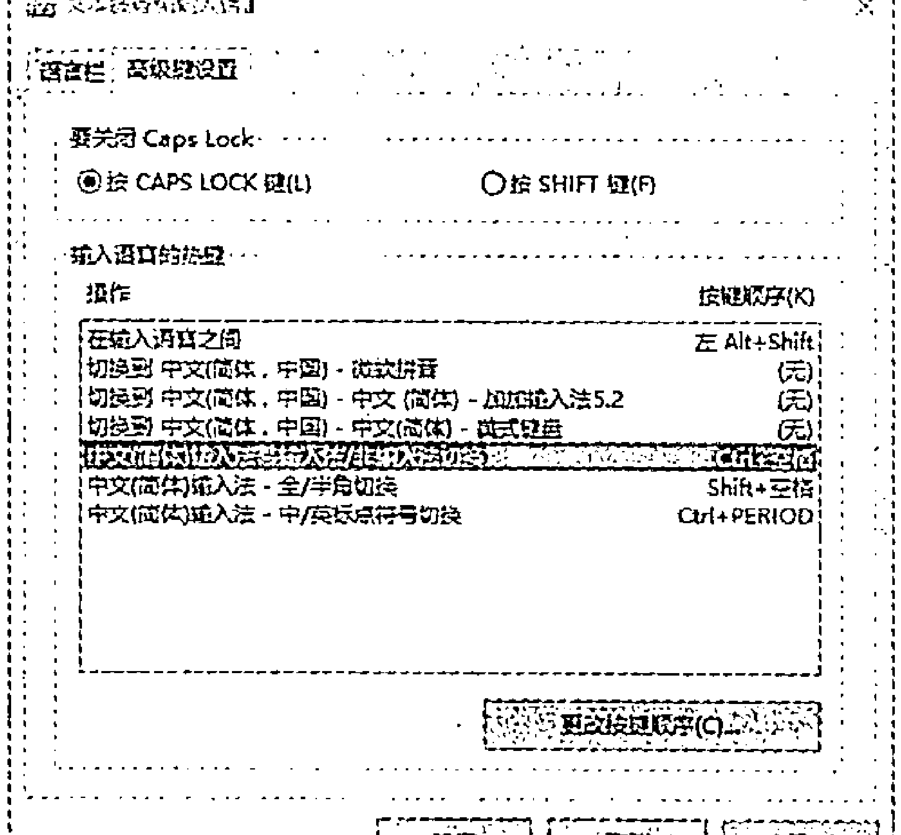

## 解决Windows 10的更新问题

Q: 最近将系统升级到Windows 10后，在通过Windows Update更新补丁的时候，不是无法安装某些补丁就是系统陷入无限重启。不知道有没有解决的方法？

A: 你说的这个问题有不少人也遇到了，问题可能是系统的UAC功能引起的。所以首先在Cortana搜索框里面输入Msconfig命令，在弹出的系统配置窗口选择“工具”标签，这时在列表中找到“更改UAC设置”项。点击窗口下方的“启动”按钮，在弹出的用户账户控制设置窗口，将通知拉到最下方并点击“确定”即可。

Q: 以前我在使用Windows 7系统的时候，发现里面有一个Windows体验指数的功能，通过它可以测量处理器、内存、显卡和硬盘等五大子项目的成绩。Windows 10系统是不是取消了这个功能？

A: 首先通过“开始”菜单打开命令提示符窗口，在其中输入“winsat formal”命令后回车。这时会重新弹出一个命令提示符窗口，而Windows体验指数功能就会以这种方式运行。当这个功能测试完成后，提示符窗口会自动消失。接着利用搜索工具查找文件winsat.log，就可以查看到体验的详细报告信息了。


当然我们也可以借助于第三方工具进行检测，比如下载运行“鲁大师”这款软件后，点击主界面的“硬件体检”按钮进行操作，稍等片刻就可以看到检测的分析结果了。

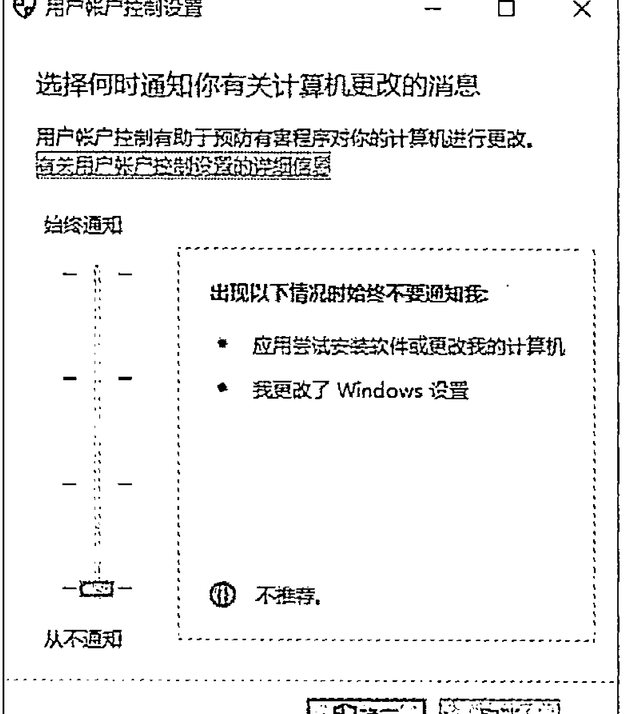

## 为系统添加玻璃透明效果

Q: Windows 7系统的窗口有一个玻璃透明效果，但是现在Windows 10系统却没有这个效果了。请问有没有什么方法可以重新添加上？我确实很喜欢这个效果。

A: 首先从网上搜索一款名为Aero Glass10240的小工具，下载完成后将文件夹解压缩到C:\AeroGlass。接着以管理员身份运行“Install_x86.cmd”这个文件（如果是x64版本则运行“Install_x64.cmd”）。当脚本文件运行后，透明效果应该就出来了。如果用户觉得有必要的话，还可以执行AeroGUI.exe来调整效果。

## 电脑主机拔耳机后没声音

Q: 在Windows 10系统中通过浏览器播放视频的时候，为了避免影响到他人，我使用的是耳机。但是当拔下耳机后再插上就会没声音了，刷新页面后又会出现。这是怎么回事啊？

A: 首先检查一下你的耳机线，看看是不是存在插头接触不良的问题。如果没有问题的话再看看使用的浏览器，因为有的浏览器带有静音的功能，找到这个功能以后将其关闭就可以了。

## 秒拍中的视频如何下载

文|老万

Q: 前段时间微博出现了一批非常好笑的配音视频，仔细观察这些视频都是通过秒拍发布的，可是通过硕鼠、维棠都无法下载这些视频。请问傻博士有没有什么好的方法？

A: 已经有网友针对这个问题，开发了一款名为“短视频下载助手”的小工具。运行后点击工具栏中的“添加任务”按钮，在弹出的对话框里面粘贴短视频的链接。如果用户需要批量下载的话，每一行输入一个短视频的链接即可。然后设置视频的保存文件夹，点击“确定”按钮就可以分析并下载了。


### 斗鱼直播的声音断断续续

Q: 我在使用360极速浏览器一边看斗鱼直播一边浏览网页的时候，发现直播声音非常卡顿。如果返回到斗鱼直播的页面，就不会出现这样的问题。请问这是什么情况，如何解决？

A: 出现这样的问题我觉得应该是在Flash上面，因为Flash插件默认开启了硬件加速。所以在打开直播视频以后，在视频窗口点击鼠标右键，选择菜单里面的“设置”命令。在弹出的设置窗口中，将默认的“启用硬件加速”选项关掉。然后重新启动一下浏览器，再打开直播窗口就不会出现你所说的问题了。

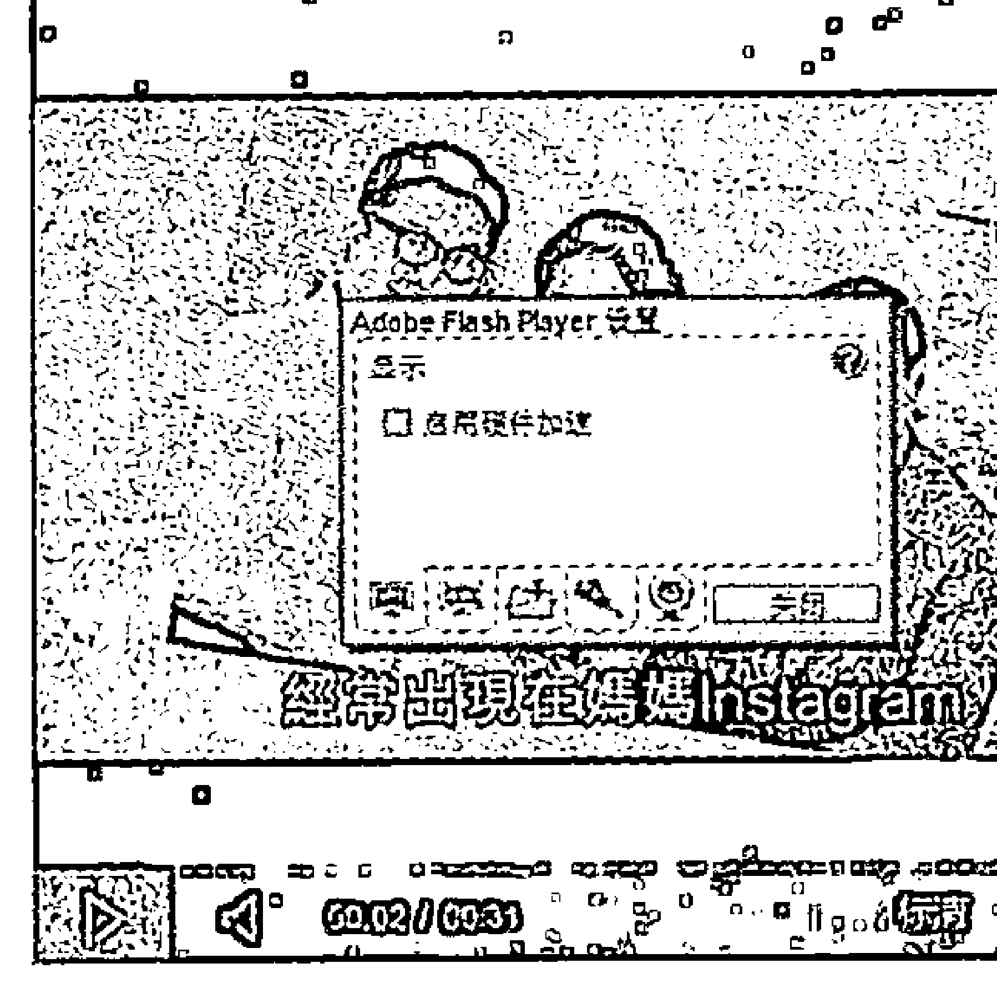

DNS被篡改了。所以首先登录路由器的后台，点击左侧列表中“网络参数”中的“WAN口设置”选项，然后点击右侧窗口中的“高级设置”按钮。在弹出的对话框中选中“手动设置DNS服务器”项，接着查看“DNS服务器”和“备用DNS服务器”中的内容是否被修改过。如果被修改过则改回常用的DNS，最后点击“保存”按钮就可以了。

### 我的微博账户是被盗了吗

Q: 我怀疑我的新浪微博账户被盗了，因为我发现有人用我的账户，发出了一句调皮的话“我是一只猪”，而且发布信息里还写着“from 新浪房产_微博”。请问要不要进行密码修改啊？

A: 其实这样的问题也有其他用户反映过，所以并不是你的账号密码出现了问题，而是新浪微博的某处接口授权有问题。这样网络黑客即使没有你的账号密码，也可以通过这个接口来发布微博信息，于是就出现了你所遇到的这个问题。只能等待新浪对这个漏洞进行修复了。

### 能Ping通但是无法访问淘宝

Q: 我的天猫、淘宝、京东等都打不开了，但是通过“ping www.taobao.com”命令又可以正常返回数据。换了浏览器和电脑情况都一样。这是怎么回事？

A: 出现这样的问题，有可能是路由器的

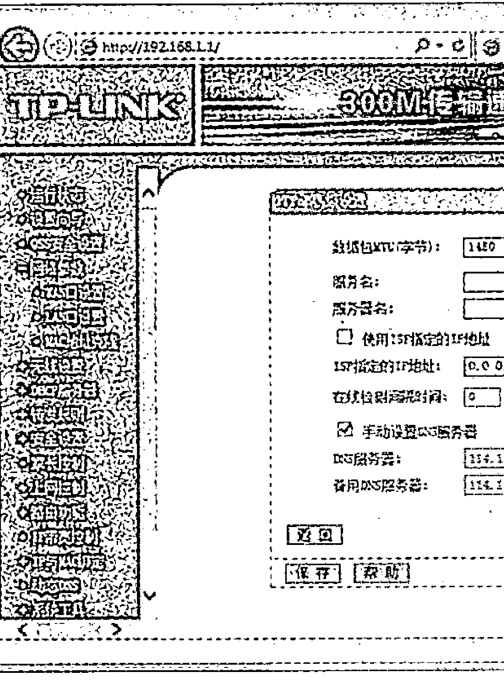

### 目前哪款邮箱安全性比较高

Q: 前段时间听说国内某个电子邮箱服务商的数据库被黑客窃取，可能会造成用户个人信息的泄露，而我也急着马上修改了账号密码。请问现在还有没有安全性比较高的电子邮箱服务商啊？

A: 绝对安全的电子邮箱是不存在的，不过像国外的Gmail、Outlook等可以考虑。因为这些电子邮箱都有两步验证的功能，这样即使是黑客拥有用户的账号密码也无法正常登录。

### Rolan软件启动卡顿的解决

Q: 我平时使用的快捷启动工具是Rolan，但是我发现这款工具无论是在Windows 8还是Windows 10系统里面，启动运行的时候都非常卡顿。不知道有没有什么好的解决方法？

A: 其实你遇到的问题，官方已经给出了解释。如果用户使用的是Windows 10系统的话，首先打开系统的设置窗口，点击窗口里面的“更新和安全”按钮，接着在弹出的窗口中点击左侧的“Windows Defender”选项。再在右侧窗口里面点击“添加排除项”命令，最后在排除文件和排除进程里面分别添加上Rolan的主程序文件即可。

### COMODO和大蜘蛛扫描器被报毒

Q: 我的电脑系统使用的是360的杀毒软件，今天从网上下载了COMODO和大蜘蛛的扫描器。结果下载完成以后，360就弹出提示框报毒。那么这些扫描器真的是病毒吗？

A: 国内有的下载网站有二次打包的习惯，这样就有可能被捆绑上广告插件什么的，杀毒软件报毒就非常正常了。但是用户如果是从官方网站下载的，那么360杀毒软件误报的可能性相对较大。

### 能否暂停GIF图片的播放

Q: 我经常遇到一些GIF图片，由于播放速度太快无法看清楚每一帧。我知道2345看图王有这个暂停功能，就是可以把GIF图片一帧一帧的看，但是我不想用看图王。请问有没有更轻量级的看图软件有这个功能？

A: 既要有这个功能而且还需要是轻量级的，所以这里我推荐Imagine这款软件。首先运行这款看图软件，接着跳转到存放图片的目录，双击某个图片就可以进行查看操作了。如果想进行暂停操作的话，依次点击“查看→多帧→暂停”命令即可。如果用户觉得菜单命令不方便的话，可以将暂停命令添加到工具栏里面。

FSCapture这款截图软件，点击工具栏中的“屏幕录像机”按钮，在弹出的对话框中根据需要选择录制方式，再点击“录制”按钮就可以进行录制了。录制完成后点击“编辑”按钮，在弹出的窗口中点击工具栏中的“转换为GIF文件”命令，即可保存为GIF格式的文件。

## 命令符无法完整复制文件名

文|老万

Q: 我想把硬盘里存的无损音乐名称全部复制下来，于是通过一个批处理文件进行操作，可是导出来的文件名称总是不完整的。请问有没有更好的方法或者相关的小工具？

A: 其实最好用的工具就在我们的系统中，压缩工具WinRAR就是这样一款工具。首先通过WinRAR进入到存放音乐文件的目录，点

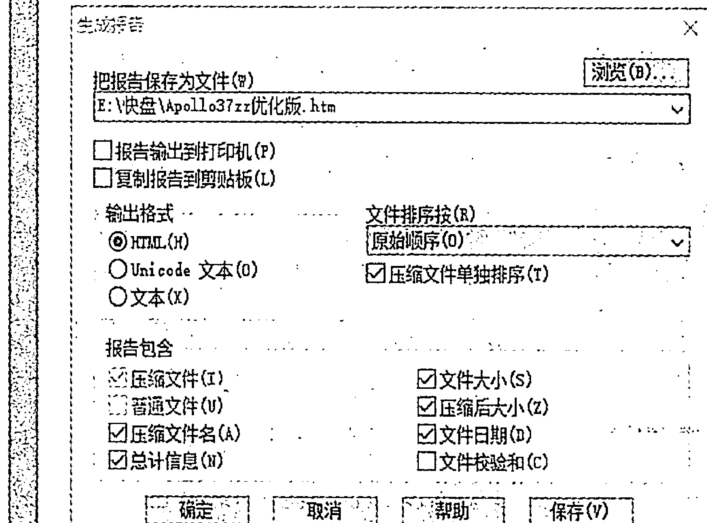

击“工具”菜单中的“生成报告”命令，在弹出对话框的“输出格式”里面选择文本。接着将“报告包含”选中的所有选项去除，最后点击“确定”按钮就可以生成一个文件名称的列表了。

如果用户使用了第三方的文件管理器软件，那么这个操作也就更加简单了。首先在TC窗口里面选择所有的音乐文件，点击“选择”菜单中的“复制文件名”命令，然后将内容粘贴到一个文本文件里面即可。

## 如何截取GIF格式的图片

Q: 经常在网上看到网友发一些GIF格式的图片，看上去非常的有意思。我也想制作一些类似的GIF文件，但是不知道怎么做。能不能简单地指点一下？

A: 其实不少网友制作的GIF文件，是从一些视频中获取的。你可以试试

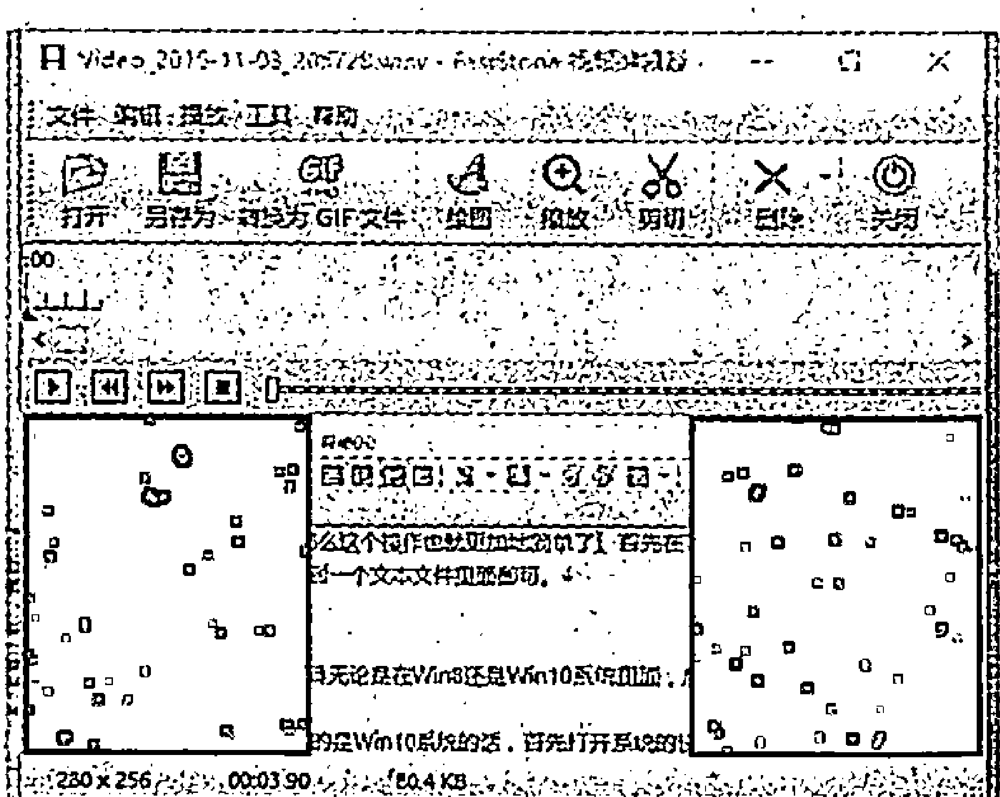

## 跑分党必看

如何提高SSD硬盘测试成绩

文|纯金处理器

随着SSD固态硬盘价格的一路走低，越来越多的普通用户也能体验到极速的磁盘性能了。不过，同一款SSD，为何在相近硬件平台上的性能会出现差异？如何才能提高它的跑分成绩呢？

## 谁在影响SSD性能

一般来说，SSD的性能强弱主要源于主控芯片、闪存芯片及固件算法的不同。此外，像AHCI开启、4K对齐以及高品质SATA数据线也会影响到SSD性能的发挥。那么，除了这些耳熟能详的参数以外，妨碍SSD发挥最佳性能的“捣乱分子”还有哪些呢？

## 隐藏幕后的节能模式

英特尔和AMD都有相应的节能技术。比如英特尔芯片组主板BIOS选项中的C1E（系统闲置状态时的CPU节能功能）、EIST（英特尔新节能技术）等都与节能有关。以笔者的微星Z97A GAMING 6为例，BIOS中的“intel C-State”、“C1E Support”和“EIST”这几个选项就在影响着SSD性能（图1），而它们在默认时均处于Enabled开启状态。

## 测试软件的设置细节

很多人喜欢用CrystalDiskMark对SSD读写性能进行测试，而该软件却提供了随机/All 0X00/All 0XFF三种测试数据模型（图4）。对同一款SSD而言，在0FILL数据模式下的成绩会更出色一点。而三种模式成绩的差异大小取决于SSD主控，像以SandForce为代表的压缩型主控会有着天壤之别的差距。而东芝Q-PRO系列SSD选用了MARVELL的改良型主控，所以受影响的幅度较小。

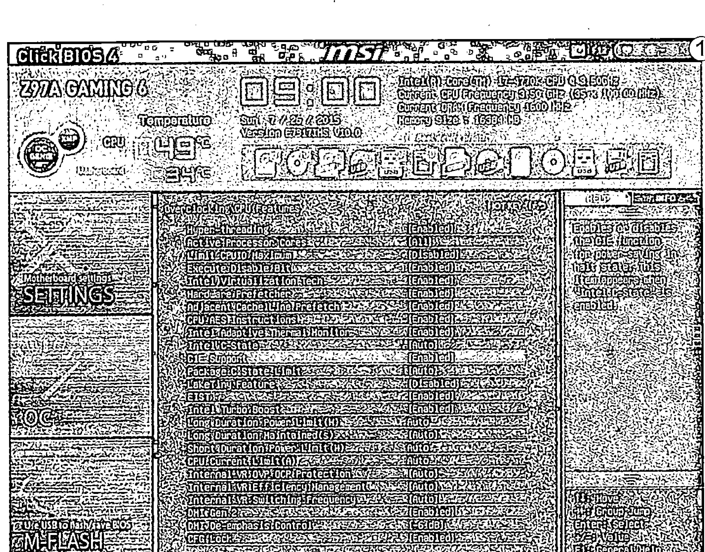

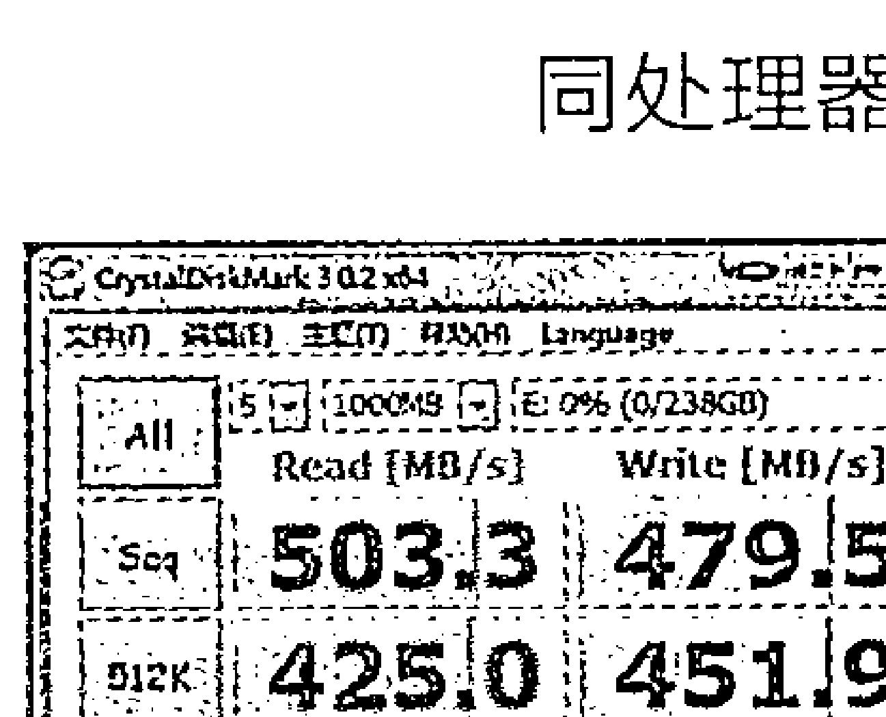

## SSD驱动对性能的影响

Windows 7、Windows8/8.1和Windows 10都集成通用版的AHCI驱动，安装硬盘后即可默认安装并开启，而无论英特尔还是AMD也都提供了针对自家芯片组定制的AHCI驱动。如果你想100%挖掘SSD潜力，请安装英特尔或AMD自己的AHCI驱动，可获得比系统自带AHCI驱动更好的性能。具体差异请参考本刊2015年1期《英特尔VS微软 SSD的AHCI驱动选哪家》这篇文章。

## 处理器也会拖SSD后腿

没错，就同一芯片组而言，搭载不同处理器也会影响到SSD性能。以笔者的H81芯片组为例，在使用赛扬G1830和酷睿i7 4770K处理器时，后者性能要略微领先于前者。

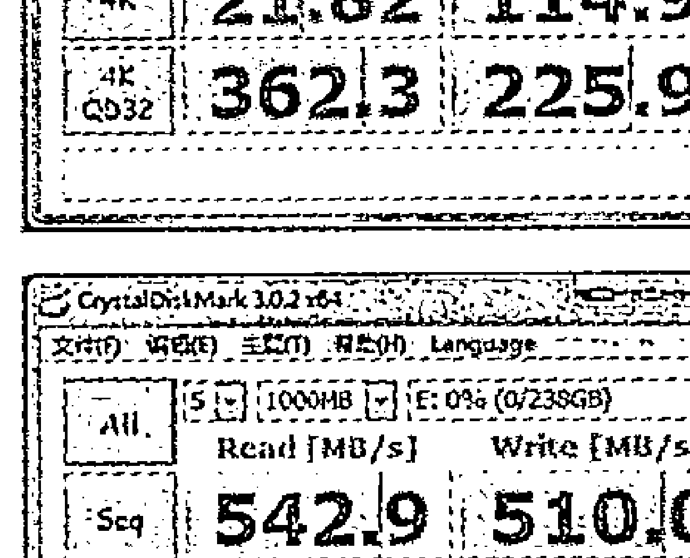

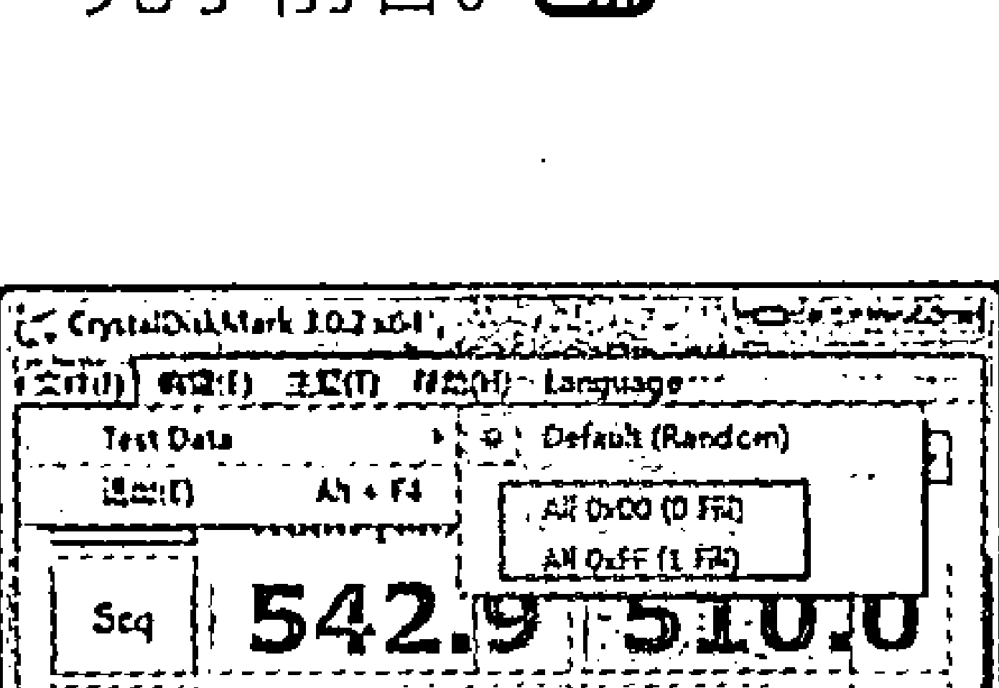

## 用Windows 10内部P2P带宽

文|小苗

默认情况下，Windows 10可以将你的电脑变成一台将软件更新分发到其他电脑上的服务器，想要避免这种情况出现并不难。

### Windows 10占用电脑带宽

最新版Windows中采用了新的对等更新分发机制。只要下载一次Windows软件更新，电脑就会将该软件更新分发到你本地网络的所有电脑上。但实际上它不仅与本地电脑共享，还很有可能通过互联网与其他电脑共享。Windows 10的P2P共享蚕食你的上传带宽，还会减慢网络连接速度。

这种P2P云方式规避了集中更新导致微软服务器变得不堪重负这个问题，但是这项功能会占用我们的带宽，难免令人不爽。其实很容易就可以调整相关功能或者完全禁用，具体方法如下。

### 在Windows 10中禁用P2P更新

首先打开开始菜单，选择设置，然后点击更新和安全。点击左边导航面板中的Windows更新，如果此时系统有更新的话首先更新完毕，如果需要重新启动的话先重启电脑一次（图1）。

重启完成后确保Windows已经更新到最新，然后点击下面的高级选项（图2）。这里有很多选项和复选框，想要找到P2P更新相关内容，应该点击选择如何提供更新选项（图3）。

这里有几个选项规定Windows 10如何处理P2P更新的页面。默认情况下Windows 10会从你网络上的设备和整个互联网上的设备发送及接收更新。后一个选项正是需要避免的，因为它有可能大量耗用数据流量（图4）。

将这个选项调整为“我本地网络上的电脑”，就可以选择只允许在你本地网络上的电脑之间分发P2P更新，或者完全禁用它们单单依赖微软的服务器，就像以前的传统方法那样（图5）。

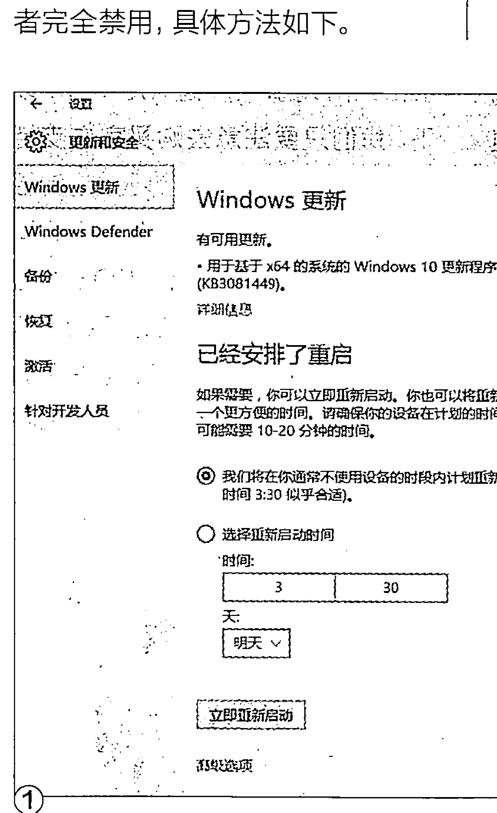

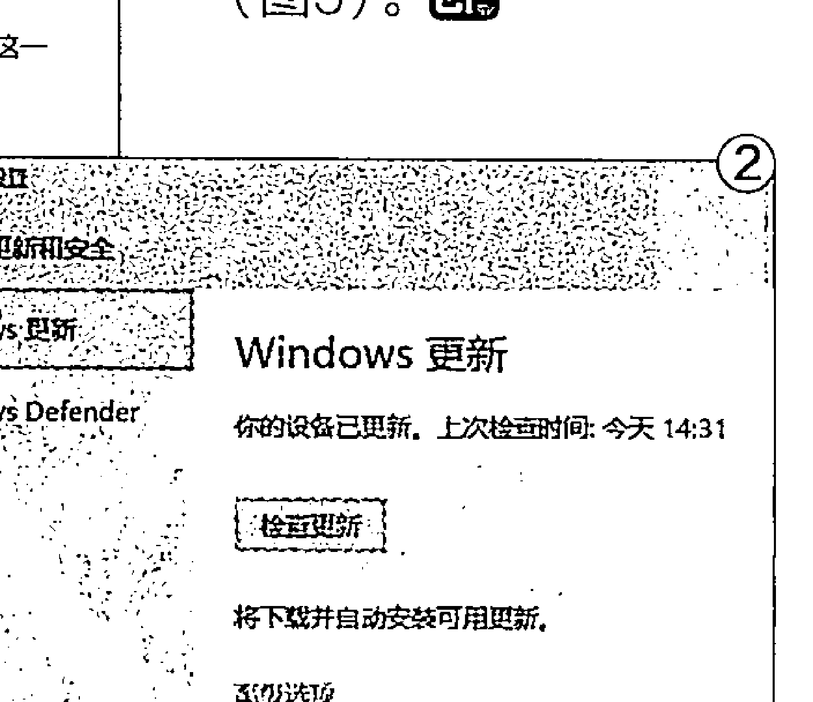

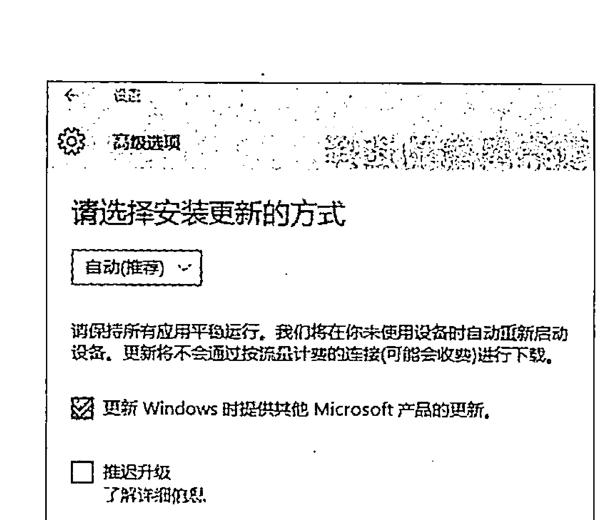

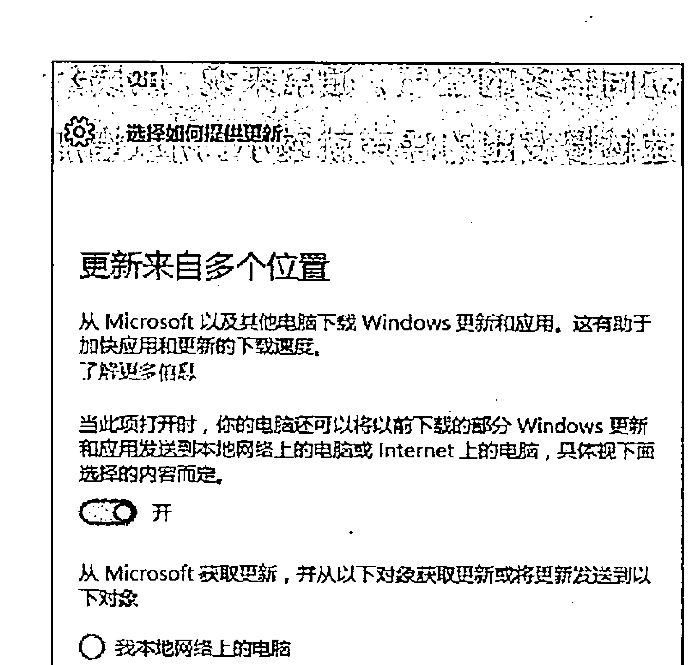

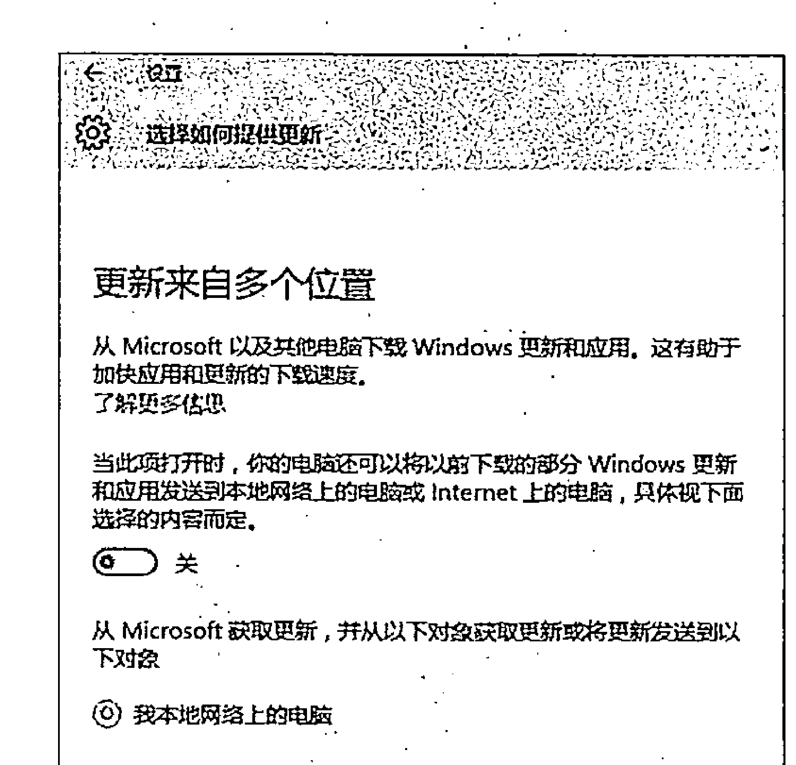

## 机箱降噪有绝招

文|小苗 小字

谁也不想电脑发出很大的噪声，但是为了让各部件都在安全的温度下运行，散热风扇多少都会造成噪音。电脑距离使用者往往很近，近乎无声是很难的。如果噪音过大，难免破坏游戏和视频欣赏的效果。其实目前市面上有很多设备可降低电脑噪声，我们应该只关注花最少的钱就能让系统静音的办法。

## 散热风扇的选择

电脑系统的噪声主要来自安装在机箱上的散热风扇和处理器之类的任何发热部件。关于散热风扇的两个降噪原则很简单，就是加大风扇尺寸并减少转速，或者选择采用液压或套筒轴承的风扇。如果是120mm风扇，用1000rpm左右的转速就可以实现80mm风扇2000rpm以上转速的风量，因为更大的风扇能以较低转速吹动同样多的空气。通常来说，风扇转速越慢发出的噪声就越小。所以增加风量并减少转速换用大尺寸140mm风扇甚至200mm风扇是很有必要的（图1）。

另外许多风扇上的滚珠轴承是振动源因而产生噪声，选择液压或双滚珠轴承的风扇具有显著的降噪功效。滚珠轴承风扇一般会在出故障之前发出更大的噪声，让你知道这时有必要更换。需要注意的是，液压轴承虽然降噪效果很好，但根本没有这种提醒机制（图2）。很可能风扇已经有故障或者停转很久后我们仍不自知，可能危及其他系统部件。双滚珠轴承风扇通常往往比滚珠轴承风扇更为耐久，也是目前高端风扇采用最多的一种轴承方式。

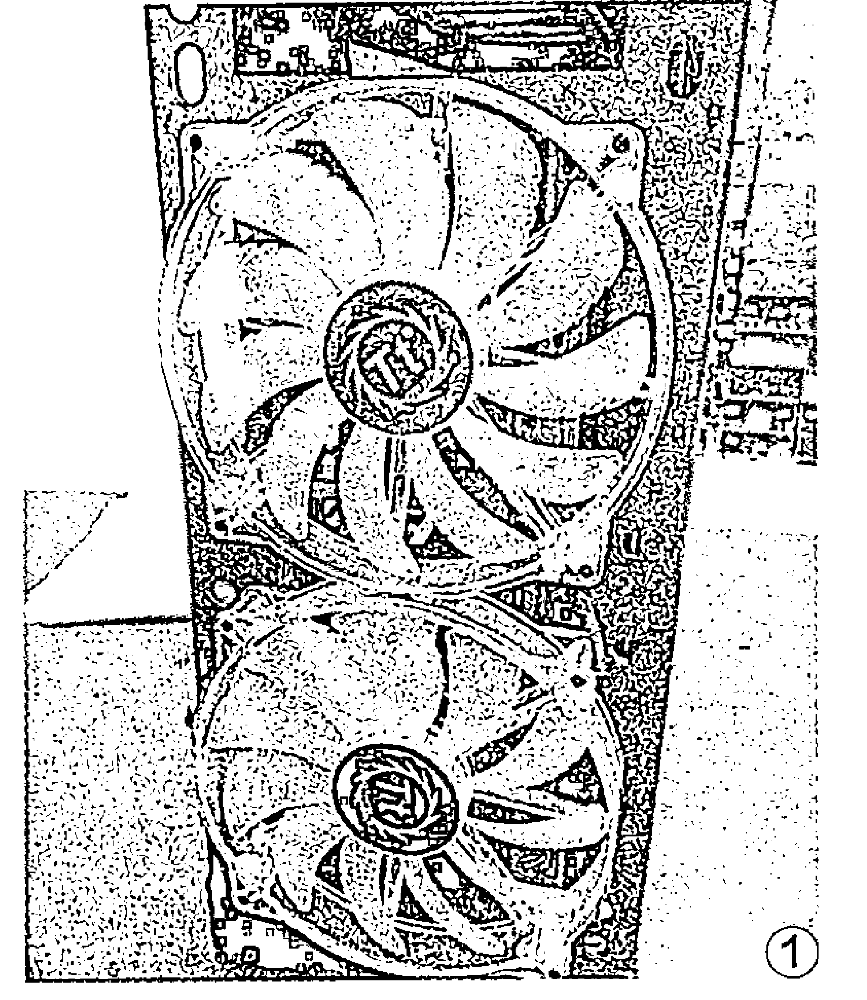

## 与散热器的搭配

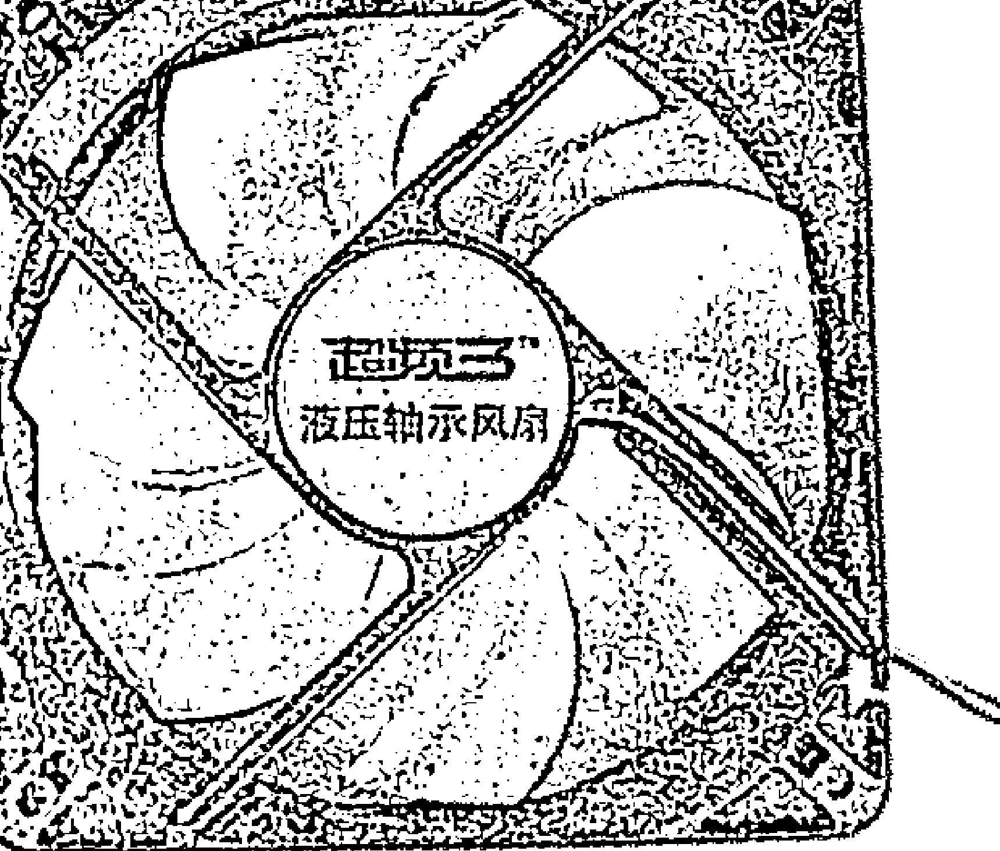

为了让高功率系统在运行时避免温度过高，势必要优质的处理器散热器，但不见得一定要让安装的风扇全速转动。一些散热器含有简单的风扇转速标度盘，可以安装在机箱的背面或正面以便调整。更加高端的产品还可能提供可视化的风扇转速与温度提示（图3），但其实对于普通用户而言，一款支持PWM的散热风扇就能完成最基本的转速和温度控制。

一般的PWM风扇使用4pin连接主板上的风扇接口（图4），通过系统测温点主板可以根据主板和CPU温度来自动控制风扇转速。许多散热风扇实际上会标出生成的噪声分贝大小，数值越低越好。20分贝以下称得上超静；20至30分贝比较安静；30至40分贝噪声有点大。一般来讲品质好一些的90mm在2000rpm以下都比较安静，120mm风扇一般是1500rpm以下。我们只要注意去购买官方支持4pin PWM风扇的散热器，或者给我们的散热器手动更换4pin PWM风扇，就可以通过主板BIOS设置温度与风扇转速之间的关系了。注意不要将4pin风扇连接到主板的3pin接口上，这样会让PWM风扇全速运转。

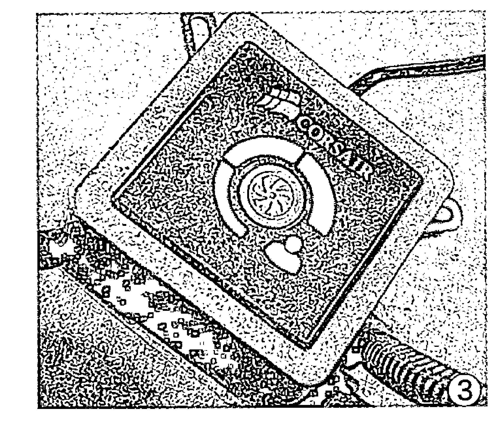

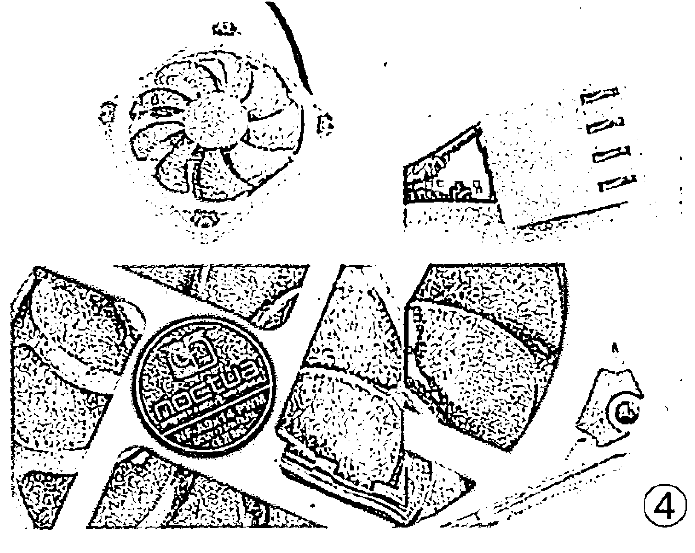

## 机箱及风道

机箱的设计是影响系统散热性能和噪声产生的一个关键因素。通风充足的机箱自身就能为部件散热，不增加噪声大小。值得关注的是机箱里面有多个风扇安装位置，还有机箱内部是否有为风扇吹动空气留出的开阔区作为风道。

以前很多机箱为了进风留了很多网孔，被称为“洞洞流”的这类机箱其实会打散打乱风的导向，同时风扇过风时经过网孔还会产生单独的噪音（图5）。其实目前很多机箱只提供前进后出或者下进上出的两个风口，整体的风道效果反而变得更为合理。

每个机箱的散热情况都需要单独考虑，很多时候还需要结合内部所装配件考虑，不能一概而论。对一些机箱来说只装一只120mm风扇就有可能起到良好的散热效果，其他的各个风扇位置空着即可（图6）。工作的风扇越少噪声显然更低，如果温度可以接受，用不着在机箱里面装满风扇。

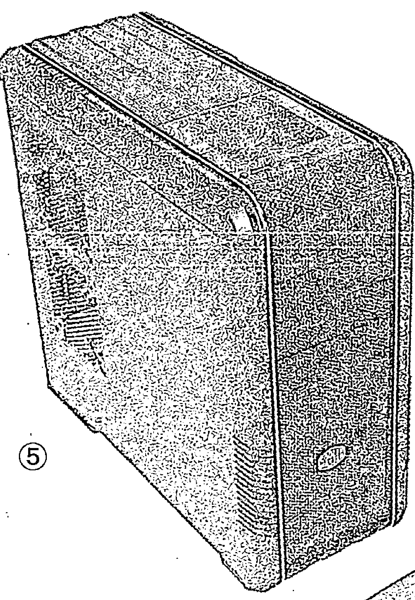

## 风扇控制器

风扇控制器多种多样，但是它们都有同样的功能：让风扇避免全速转动。将风扇的转速减慢对噪声有明显影响，并且依旧能保证散热性能。一些机箱自带风扇控制器，这种风扇控制器很方便，因为它不需要单独安装。高端一些的风扇转速控制器则把所有控制权交到用户手里，通常位于光驱位可以改变风扇转速（图7）。

其实如果用户要求不高，使用风扇减速线一样可以达到减速要求。减速线一般提供5A、7A、12A等多种电流输入，越小的电流输入就越能明显地降低风扇转速。

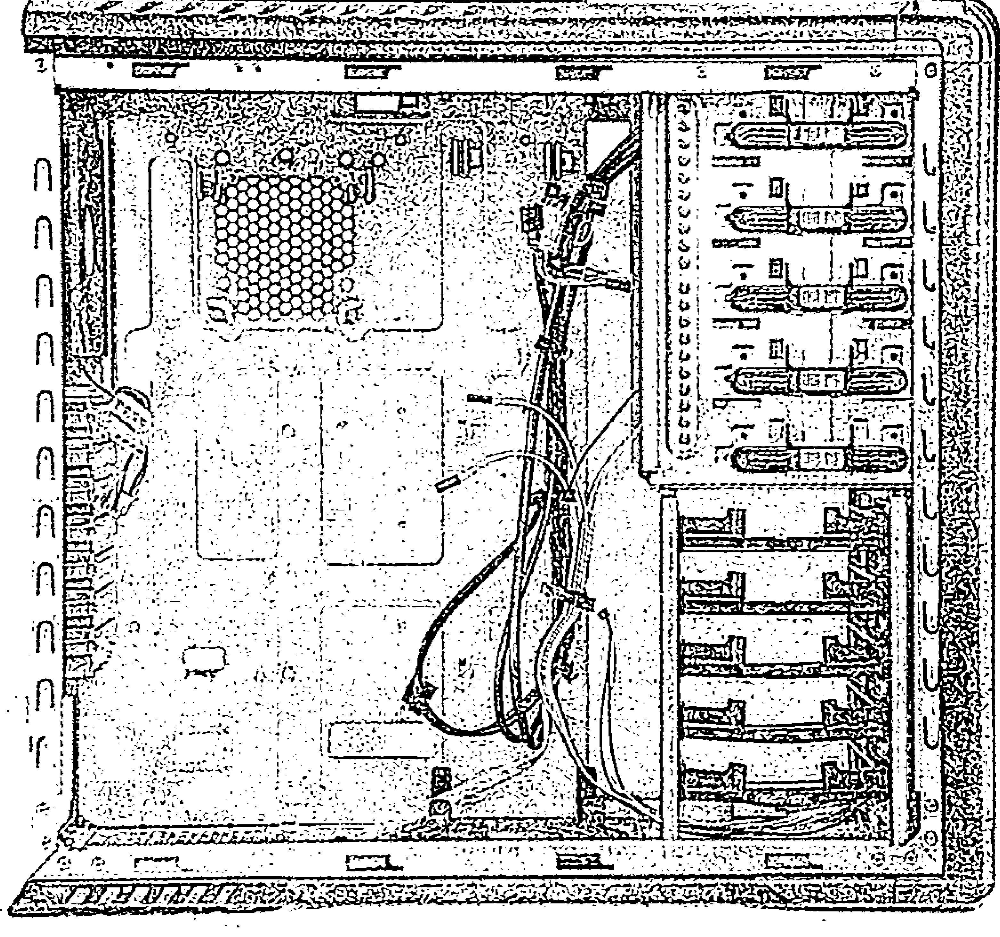

## 无声电源

电源风扇虽然并不是机箱内部噪音的主要来源，但目前已经有不少产品开始着手降低这一部分的噪音了。不仅有在低负载下降低甚至停止风扇旋转的产品，甚至还有完全不使用风扇的电源存在。如果用户需要绝对的静音效果，可以考虑选购这类产品。

## 减震配件

市面上有些产品既能防止噪声从机箱传出来，还能减少系统部件引起的振动。这样一些隔离产品可以用在电脑系统的许多方面，能够显著降低震动产生的噪声。就电脑机箱底部而言，橡胶垫脚可以替换常见的硬塑料垫脚。硅胶垫圈可以安装在电源装置或机箱风扇与机箱之间，减少振动传递和噪声的放大（图8）。如果你不想让机箱里面的噪声传到外面，甚至还有背面涂有粘合剂的隔音片可以粘在电脑机箱内壁。目前很多新品机箱自带很多减震相关的设计，如果用户新装电脑，尽量选择此类产品。

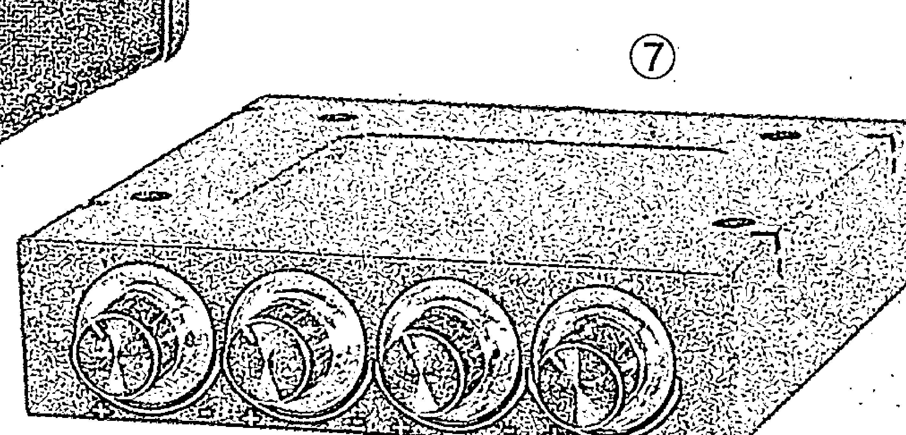

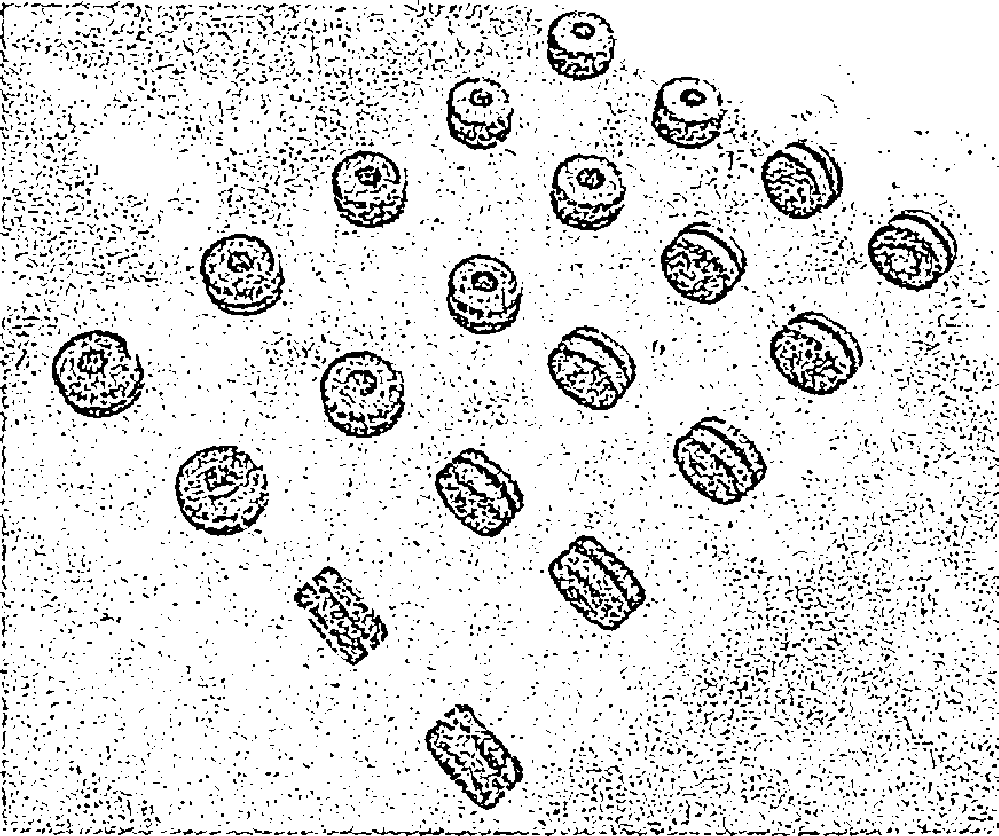# 游戏笔记本简易水冷改造

文/王伟行（河北保定BTCC）

对武装高端独显的游戏笔记本而言，仅靠风扇和热管很难彻底摆脱CPU/GPU全速工作时的高温困扰。于是，针对笔记本的水冷改造方案就成为了彻底告别“火炉”的最佳选择。

## 水冷改造的基本前提

在2015年第6期《告别高温笔记本逆天水冷改造》一文中，我们曾介绍过可随时拆卸的笔记本水冷改造方案。不过，这篇文章的改造还是涉及到了对笔记本底壳的穿孔，破坏了机器原有结构。如今你想在不影响笔记本保修的前提下进行水冷改造，而且水冷模块还可随时拆装，方便笔记本外出携带，那就不妨参考一下网友“fwwx”的改造思路吧。

需要注意的是，本文的水冷改造有个前提条件，就是笔记本底盖可拆卸，而且取下底盖就能看到CPU和GPU的散热片和热管（图1）。对那些散热模块隐藏在C面的笔记本而言，本文的改造思路就没有用武之地了。

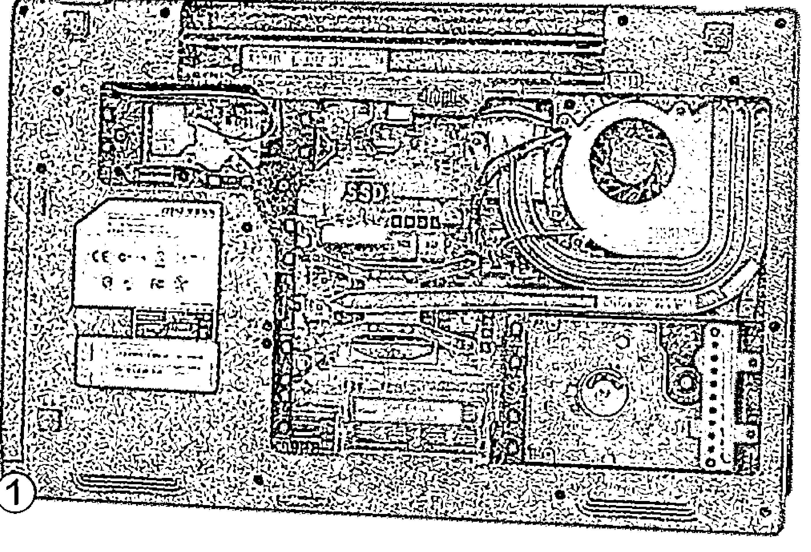

## 不影响保修的水冷改造

网友“fwwx”的笔记本型号为微星GE60，这是一款配备了i7 4710MQ和GTX760M独显的高端游戏本，平时工作时发热量很高。而他的改造思路很简单，将可拆卸的底盖换成紫铜材质，在紫铜底盖上加装水冷头，并增高CPU/GPU表面散热片高度与紫铜底盖接触。这种改造的好处是不对笔记本进行肢体破坏，水路全部在笔记本外部，即使漏水也不会影响到内部芯片，用户可随时拆除恢复笔记本原本样貌，不影响外出携带和保修服务（图2）。

> **小提示**
> 本文改造最难的部分，就是需要有对紫铜切割与加工的设备，如果你缺少相关的动手能力，可以考虑花钱定制。

## 基本改造过程的演示

本次改造首先需要更换固定CPU/GPU表面散热片的螺母，并将切割打磨好的紫铜散热片固定其上（图3），而高度则是刚好可以紧密与底盖接触。为了提升散热效率，还需要在紫铜散热片上涂抹硅脂（图4）。

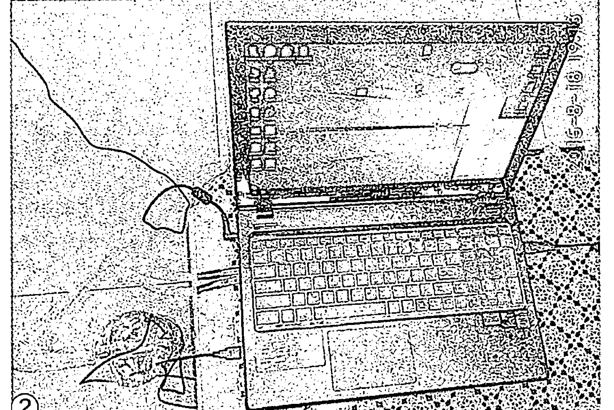


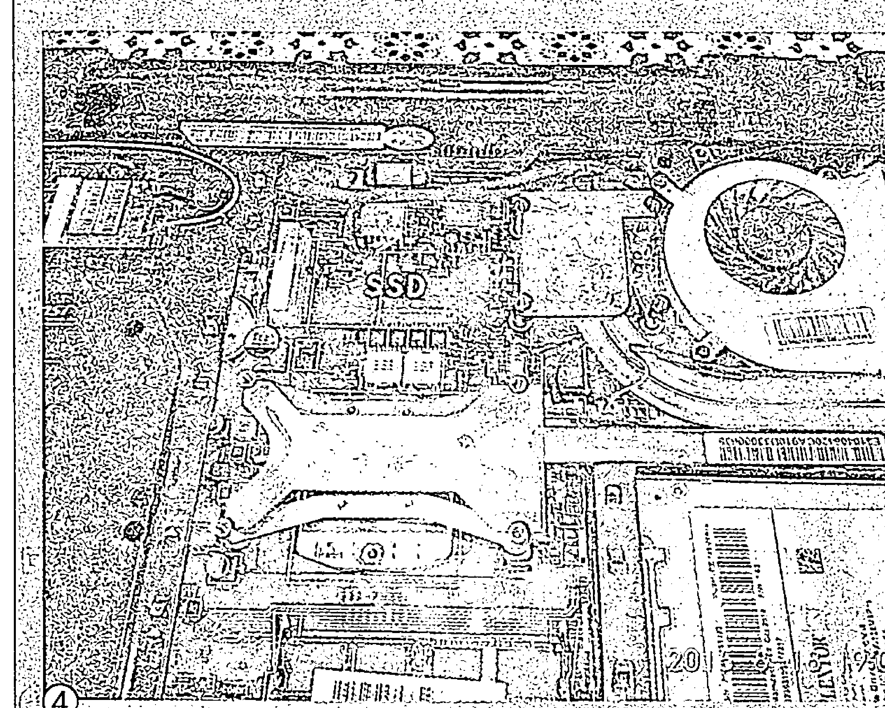

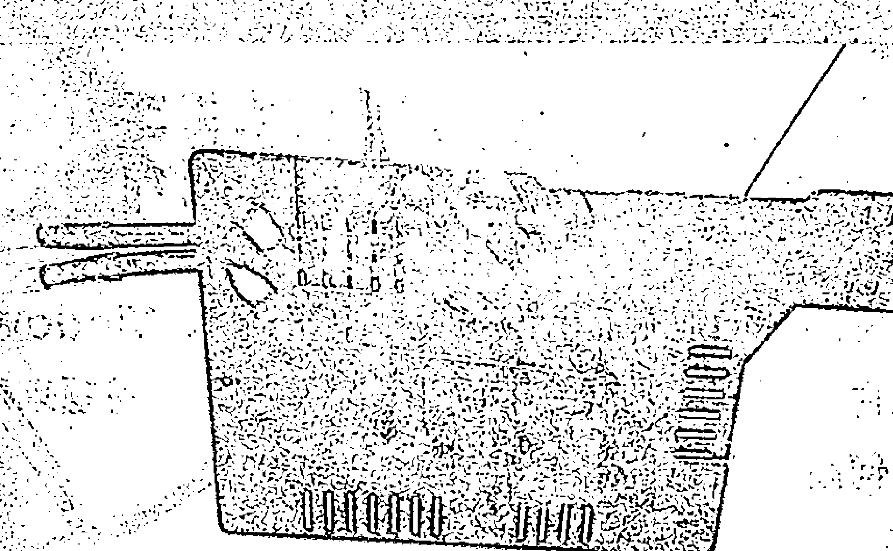

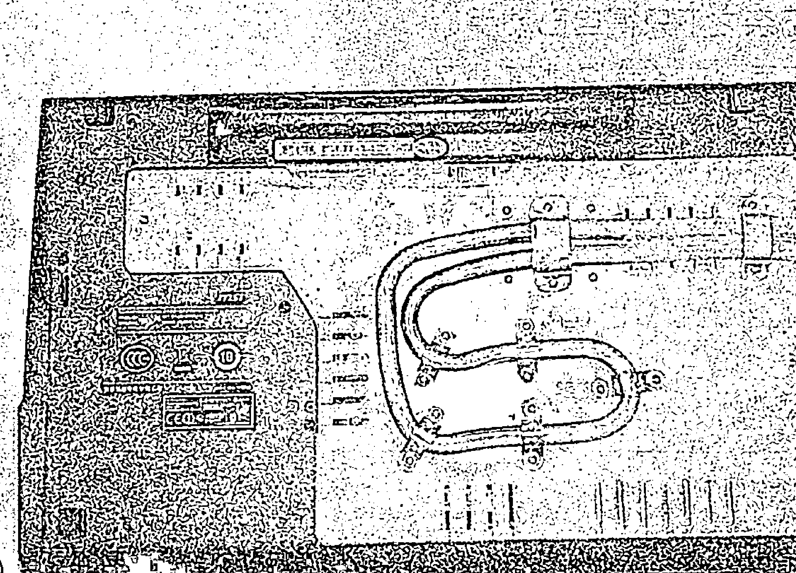

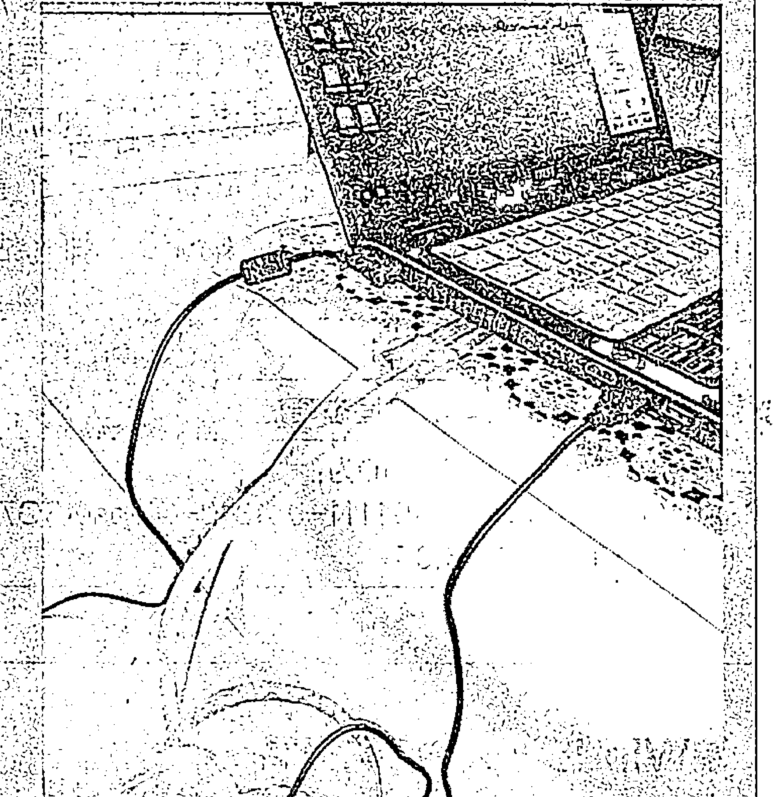

将笔记本原有的塑料底盖用紫铜底盖替换（图5），并在底盖上留出散热通风口和螺丝孔位。同时，将金属的水冷管转个方向，尽量增加其与紫铜底盖的接触面积，并用螺丝固定在底盖之上。

接下来，将紫铜底盖装回笔记本，并用螺丝固定即可（图6）。而水冷的胶管则可顺着机身一侧引到桌面下面的水箱和水泵上（图7）。

整个改造虽然不需要破坏笔记本原有机身结构，但对每一个自制散热片的形状、厚度都有较高的要求，能否与笔记本紧密贴合、硅脂涂抹是否均匀、螺丝是否能够压紧都是需要我们注意的环节。如果你比较在意美观，最后还可使用喷漆美化一下。

## 比较理想的散热效果

微星GE60原本的发热量很高，而通过本文的水冷改造后，运行Furmark和Aida64进行双拷机测试15分钟后，CPU和GPU的最高温度为74℃和55℃，较改造前在同等条件下对比至少降低了18℃和15℃，在游戏过程中再也不会出现因过热而触发的降频问题。

> 本文的水冷改造具备较强的通用性，只要你的笔记本符合改造标准，而且你能找到支持定制紫铜散热片的淘宝店铺，都可以进行类似的尝试。由于本次改造的目标是随时可拆，所以并没有将水冷散热的效率发挥到极致，有条件的玩家可以取消紫铜底盖，而直接将水冷铜管固定到CPU和GPU表面的散热片上，如此可以更有效率地将热量排出笔记本外。CF

# 让迷你电脑顺利用上XP系统

文/小年（山东）

如今网购迷你电脑（miniPC）大都已预装Windows 7系统，但某些行业或用户总会用到仅支持Windows XP系统的软件，只能自行重装回Windows XP。问题来了，新平台与老系统间经常出现各种“冲突”，如果你不幸遇到又该如何解决呢？

笔者公司近期新添置了一批迷你电脑，标配Windows 7系统（图1）。可惜，公司内部使用的财务系统仅支持Windows XP（下文简称XP），所以我们只能改回Windows XP。没有想到的是，该迷你电脑说明书虽说支持，但在安装过程中还是遇到了麻烦，而网上搜到的解决方案没一个管用。无奈之下只得自己动手、排除故障。下面，笔者就将排查过程和解决思路整理出来，供遇到类似问题的朋友参考。

| 处理器 | INTEL C1037U | 内存 | 镁光MT内存4G/1333 |
| 硬盘 | 士必得60G固态硬盘 | 外置驱动器 | 先锋USB外置光驱DVR-XU01 |
| 主板品牌、型号未知。主板 ID为：63-0100-000001-00101111-041312-Chipset$G7X0C103_BIOS DATE: 04/29/14 21:27:35 VER: 04.06.05 |

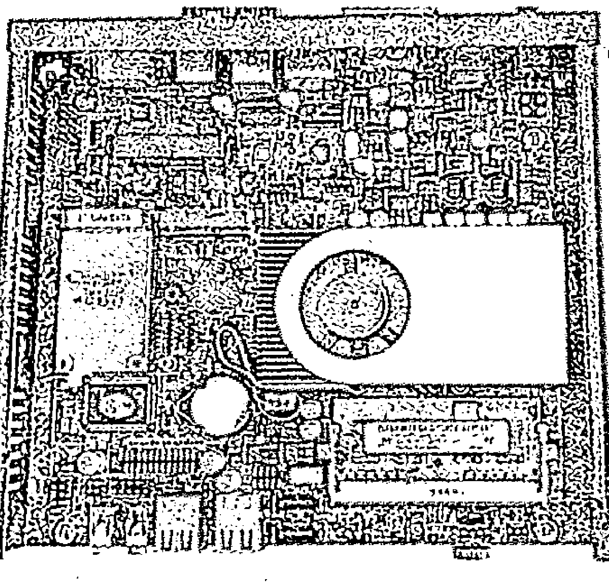

## 安装Windows XP系统报错

笔者利用USB外接光驱和XP系统光盘的方式安装系统，但在安装系统的过程中屏幕上出现如图2的提示，无法继续进行。遇到了麻烦，最先想到的办法是：根据提示内容到微软网站上寻找帮助。而微软给出的解释：“如果安装程序无法与 CD-ROM 驱动器通讯，则可能发生此问题。”

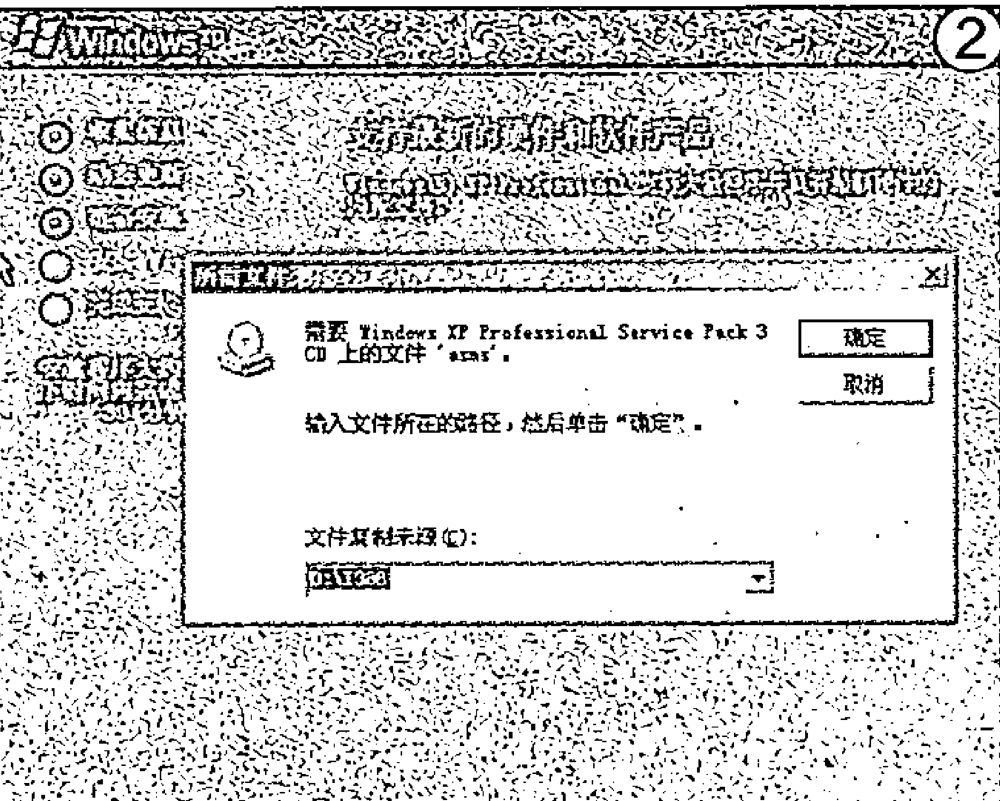

扩展阅读
ACPI (Advanced Configuration and Power Interface) 是目前电脑上应用最广泛的一套节能规范，规定了电脑的六种不同的工作状态S0~S5。其中S0就是电脑处于正常工作时的状态，S5是电脑关机的状态，S后面的数字越大电脑越省电；PPM (Processor Power Management) 主要通过降低处理器的时钟和供电来实现省电节能，拥有C0-C7八种状态；字母C代表处理器，C后面的数字越大处理器越省电。T-State是CPU处于C0状态下的一种降低能耗的方法，与此对应的是P-state，二者实现的原理不同，但目标都是为了降低处理器的功耗和温度。

## 排查故障的基本思路

微软在上述页面给出的排查处理的思路汇总一下，其实是三个意思：

- 1. 光驱本身或者自行刻录的光盘出了问题；
- 2. 安装过程中光盘的盘符或者路径发生了变化，可以通过修改注册表处理；
- 3. 为了避免出现这个问题，可以把光盘的安装文件先拷贝到硬盘上去，然后再安装。

首先排除了第1点，光盘或者光驱本身是没有问题的，那就剩下了第2和第3。但是，我试着按微软的思路去处理，试了好几次故障始终没有得到解决。那么，有没有其他更直接的办法呢？

既然故障出在安装程序和光驱间的通讯上，并且光驱、光盘以及它们之间的连接也没有问题，那么，问题就肯定在安装程序的运行上。于是，思路逐渐聚焦到了处理器上：处理器本身肯定是没有问题的，会不会是处理器的工作模式方面的问题呢?更换一种处理器的工作模式是不是可以避免这个情况再发生?

进入电脑的APTIO设置(图3),看到ACPI设置的休眠模式是S3 only,即Suspend to RAM(挂起到内存);此处,可选项目还有:Suspend Disabled、S1 only (CPU Stop Disk)。尝试在此处更换为其他设置选项,测试无效。于是,笔者将ACPI恢复为S3,进入CPU PPM CONFIGURATION界面(CPU能耗管理配置),继续尝试。

## CPU PPM CONFIGURATION（CPU能耗管理配置）

| 项目 | 释义 | 可选值 |
| --- | --- | --- |
| EIST | 增强型的SpeedStep技术 | Enabled启用/Disabled禁用 |
| CPU C3 Report | CPU进入C3状态时报告给系统 | Enabled启用/Disabled禁用 |
| CPU C6 Report | CPU进入C6状态时报告给系统 | Enabled启用/Disabled禁用 |
| CPU C7 Report | CPU进入C7状态时报告给系统 | Enabled启用/Disabled禁用 |
| Config TDP LOCK | 锁定TDP设置 | Enabled启用/Disabled禁用 |
| ACPI T State | 处理器节流状态 | Enabled启用/Disabled禁用 |

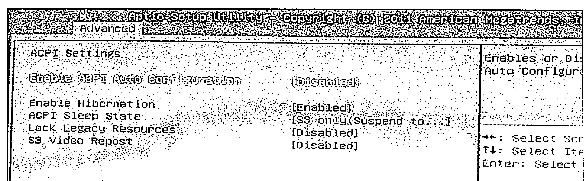

## 找到问题根源

在CPU PPM CONFIGURATION界面, 笔者发现CPU的C3/C6/C7 Report项目设置的都是Disabled状态(图4)。将这些调整为Enabled, 然后保存并退出, 再次运行Windows XP的安装, 发现前面遇到的问题没有了!由此可见, 处理器的工作状态在整个电脑的能耗中起着决定性作用, 一些全新的电源节能模式很可能引起与旧硬件和系统之间的兼容问题。

原本以为问题到这里就解决了, 但是没想到的是, 接下来又出现了一些新的情况:

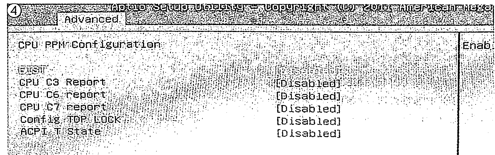

- 1. 另一台同配置机器按照上文方法处理问题依旧。对比检查发现, 该电脑的USB口插着一个无线WIFI网卡, 将网卡去掉后问题解决;
- 2. 接下来还有进一步的发现: 迷你电脑的USB口上除了外置光驱和键盘以外, 只要插有其他东西,甚至包括鼠标, 都有可能导致此问题;
- 3. 另外一台不同批次的C1037小电脑, 发现APTIO设置界面中CPU C3/C6/C7 Report都已经是Enabled了, 但还是出现上面的问题, 后来将这几项改为Disabled, 竟然解决了问题(这款迷你电脑使用了不一样的主板, 主板ID是: 63-0100-000001-00101111-041312-Chipset$1APTC027_BIOS DATE: 06/01/15 09:35:28 VER:04.06.05)。

> 结合前面的发现, 笔者所遇到的故障应该是源于处理器的能源管理和Windows XP安装程序之间存在兼容性问题, 再具体一些说就是: 处理器的能源管理(PPM)影响到了Windows XP安装程序对于USB端口的驱动, 使之出现了不稳定的情况; 安装程序运行一段时间后, 对连接在USB端口上的光驱的驱动出现了失控, 造成读取数据失败。总之, 正所谓"万变不离其宗", 在新的电脑硬件平台上无法完成安装以前的操作系统, 那我们就把注意力关注在新硬件平台的新特性, 尝试改变一下新特性设置去适应老的操作系统:

# 秒杀闪存盘 将普通SSD打造成移动硬盘

文/镜花水月

为了满足用户对极致读写速度的需求，三星和闪迪等品牌都推出了以SSD作为存储介质的移动硬盘。可惜，此类产品的价格普遍在千元左右，毫无性价比可言。那么，我们如何才能享受更实惠的SSD移动硬盘呢？

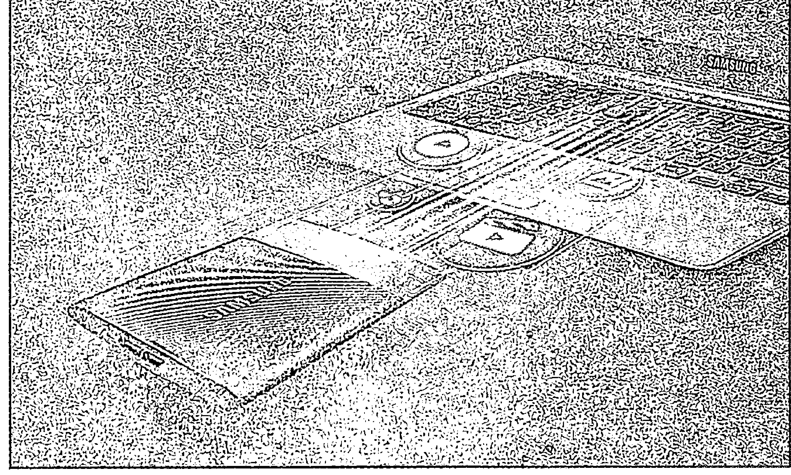

## SSD移动硬盘的崛起

2015年初，三星推出了T1系列的SSD移动硬盘（图1），它以850 EVO固态硬盘作为内核，并通过USB3.0 UASP模式与850 Evo特有TurboWrite技术的配合下，在使用USB3.0接口时也能获得450MB/s的读写速度。随后，闪迪也推出了自家的SSD移动硬盘，其中至尊极速900系列通过USB3.1接口，甚至可以获得850MB/s的读写性能（图2）！

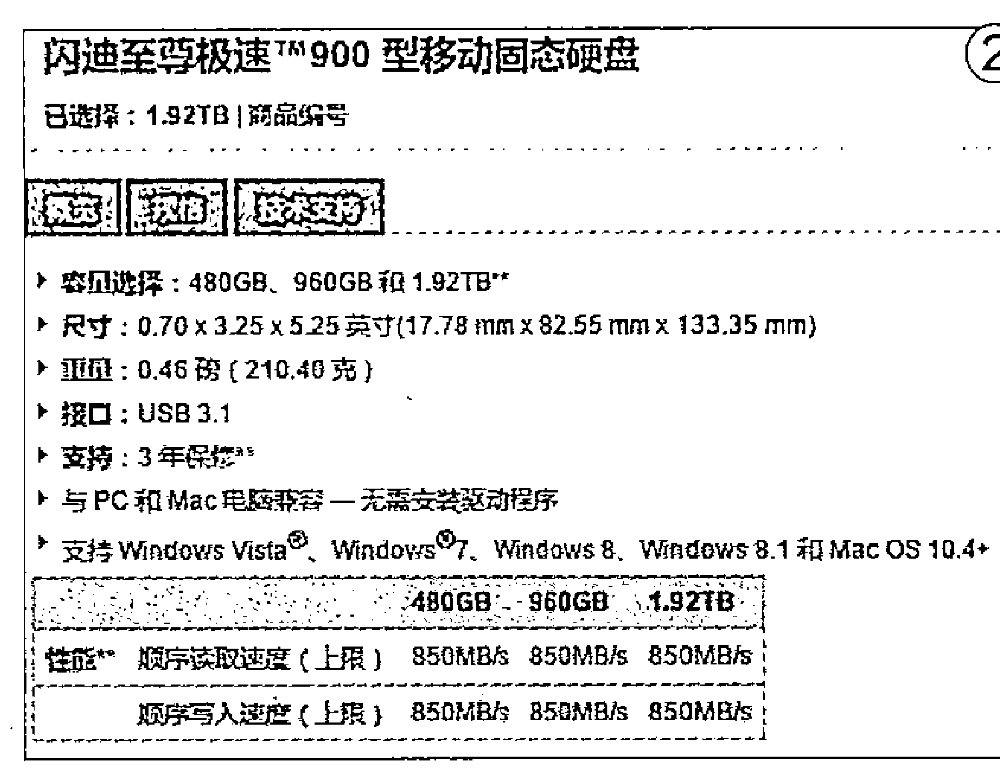

### 闪迪至尊极速™900型移动固态硬盘
| 容量选择 | 480GB, 960GB和1.92TB** |
| 尺寸 | 0.70 x 3.25 x 5.25英寸(17.78 mm x 82.55 mm x 133.35 mm) |
| 重量 | 0.46磅 (210.46克) |
| 接口 | USB 3.1 |
| 支持 | 3年保修* |
| 兼容性 | 与PC和Mac电脑兼容—无需安装驱动程序 |
| 支持系统 | Windows Vista®, Windows® 7, Windows 8, Windows 8.1和Mac OS 10.4+ |
| 性能 (顺序读取速度/上限) | 480GB: 850MB/s, 960GB: 850MB/s, 1.92TB: 850MB/s |
| 性能 (顺序写入速度/上限) | 480GB: 850MB/s, 960GB: 850MB/s, 1.92TB: 850MB/s |

可惜，此类品牌SSD移动硬盘的价格多在千元左右(120GB)，足以吓退绝大多数普通用户。如果你在工作生活中需要进行频繁的数据互换，并忍受不了HDD移动硬盘的“龟速”，以及闪存盘（U盘）的小容量，那就不妨考虑自己DIY一款廉价的SSD移动硬盘吧。

## SSD做移动硬盘的优势

如今SSD硬盘的价格已经逐渐趋于主流，比如闪迪旗下120GB PLUS系列SSD仅售299元，很多二线品牌120GB SSD甚至只卖200元出头。要知道，现在很多128GB的闪存盘也要卖300元左右呢。而一款支持UASP的高品质USB3.0移动硬盘盒也就100元左右，DIY一套120GB SSD移动硬盘的总成本可轻松控制到400元左右。

> ### 扩展阅读
> **为何SSD能远胜闪存盘**
>
> SSD和闪存盘内部都是由Flash颗粒构成。其中，闪存盘大都内置1~2颗Flash颗粒，主控性能偏弱，所以其读写速度普遍仅有100MB/s和50MB/s左右。而SSD内置多颗Flash颗粒，而主控也会以类似RAID模式对其进行管理，再加上更先进的算法优化以及缓存辅助，读写速度可轻松突破500MB/s大关。

## 硬盘盒是选购核心

首先我们需要认清一个事实，如果你将SSD装进PC体内（使用SATA3.0接口），在读写速度上肯定要远远超过将其装进移动硬盘盒时的表现，因为后者暂时只能使用USB3.0接口与PC相连（图3）。

另一方面，闪存盘在使用USB3.0接口连接PC时，其读写速度多在100MB/s和50MB/s左右。当然，也有少部分高端产品可获得更高速，比如闪迪至尊超极速CZ88闪存盘，其拥有260MB/s的读取速度和240MB/s的写入速度，只是128GB版本售价高达599元。

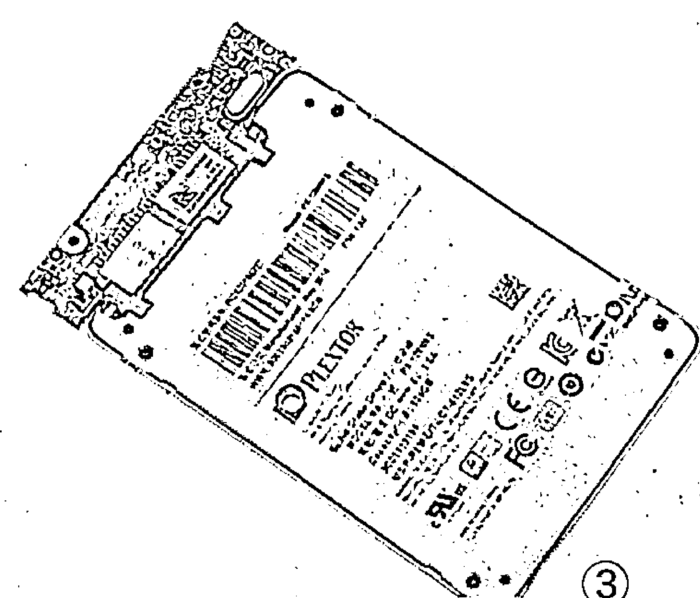

反观SSD，如果你拿它作为移动硬盘的存储介质，可以轻松超越闪迪至尊超极速CZ88闪存盘的性能。如果你家里恰好有闲置的SSD，那整体成本还可以进一步降低。

像三星和闪迪这类品牌SSD移动硬盘之所以拥有极高的读写速度，是因为它们体内的主控芯片都针对内藏的SSD进行了定制优化，可以120%地发挥SSD性能。如果由我们自行DIY一个SSD移动硬盘，SSD部分很容易选择，只要不选择山寨品牌，随便一款的读写速度都能超过USB3.0接口的速度上限。因此，移动硬盘盒的选择，将决定能发挥SSD多少百分比的性能。

> 小提示
> 市面上还有很多内建mSATA或M.2插槽的移动硬盘盒（图4），如果你手头有闲置的这种迷你SSD，可以考虑通过它们变身移动硬盘。

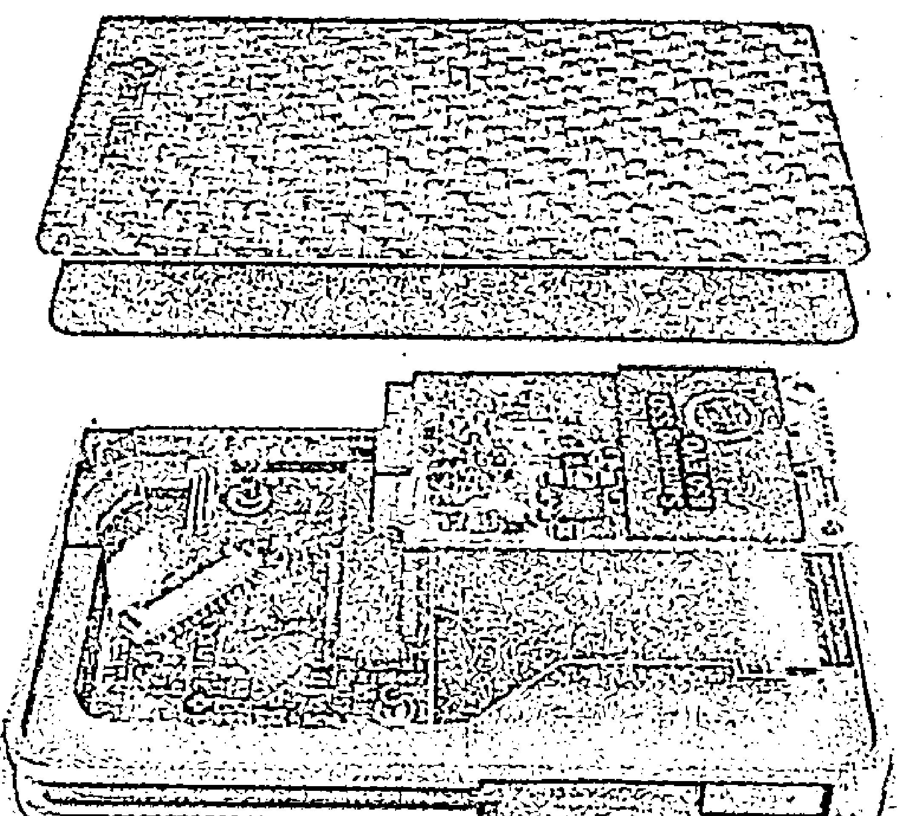

## 如何挑选SSD的“家”

如果你想充分释放SSD的潜力，在挑选移动硬盘盒时，一定要注意产品是否支持UASP加速协议。此外，很多移动硬盘盒虽然号称支持SATA3.0(6Gbps)转USB3.0，但其主控芯片的本质却是SATA2.0转SATA3.0再转USB3.0输出，其理论速度极限只有SATA2.0标准而已。因此，移动硬盘盒内的SATA接口是否为原生SATA3.0也非常重要。

那么，当SSD与移动硬盘盒结合后，究竟能达到怎样的性能？网友waterloke使用英睿达MX100（512GB）SSD，分别在连接PC的SATA3.0接口（图5），以及使用世特力CSS25U3BK6G-7MM移动硬盘盒（开启/关闭UASP功能）时进行了测试。从测试结果可见，使用USB3.0接口时，SSD性能会出现较为明显的下降，特别是4K写入性能甚至降低了3/4（图6）。而如果没有开启UASP功能，SSD的写入性能更是会出现暴跌的情况（图7）！

> 扩展阅读：UASP是什么
> UASP (USB Attached SCSI Protocol) 是由USB-IF制定的基于USB3.0传输规范之上的新传输协议，能够强化USB接口在大容量数据交换的能力，在多命令并发执行及NCQ队列功能方面提升传输速率。此外，要启动UASP协议还需要硬件与系统的支持。据悉，Windows 8系统自带UASP驱动，无需另外安装；而在Windows7下，则需手动安装主板厂商提供的驱动软件。

图5：连接PC SATA3.0接口的CrystalDiskMark 3.0.3 x64测试结果
| All | Read [MB/s] | Write [MB/s] |
|---|---|---|
| Seq | 511.8 | 472.0 |
| 512K | 425.1 | 450.2 |
| 4K | 27.05 | 115.4 |
| 4K QD32 | 337.5 | 360.2 |

图6：移动硬盘盒（开启UASP）的CrystalDiskMark 3.0.2 x64 Beta测试结果
| All | Read [MB/s] | Write [MB/s] |
|---|---|---|
| Seq | 400.3 | 406.2 |
| 512K | 357.2 | 390.0 |
| 4K | 17.70 | 29.46 |
| 4K QD32 | 71.03 | 56.58 |

图7：移动硬盘盒（关闭UASP）的CrystalDiskMark 3.0.2 x64 Beta测试结果
| All | Read [MB/s] | Write [MB/s] |
|---|---|---|
| Seq | 381.4 | 214.1 |
| 512K | 344.6 | 190.2 |
| 4K | 17.98 | 2.214 |
| 4K QD32 | 71.00 | 2.487 |

## DIY SSD移动硬盘很容易

DIY一套SSD移动硬盘的方法和HDD移动硬盘一模一样，拆开硬盘盒→塞进SSD→重新组装硬盘盒。不过，有些移动硬盘盒仅支持7mm厚度的硬盘，如果你手上的SSD为9.5mm标准（图8），可以选择拆开SSD原有的外壳，直接将内部的PCB主板装进7mm硬盘盒内（图9），这样还能进一步减轻移动硬盘的整体重量。

需要注意的是，如果选择拆开SSD将PCB直接装进移动硬盘盒内的方式，很难将SSD完美固定在硬盘盒体内，一些震动磕碰可能导致接口松动。

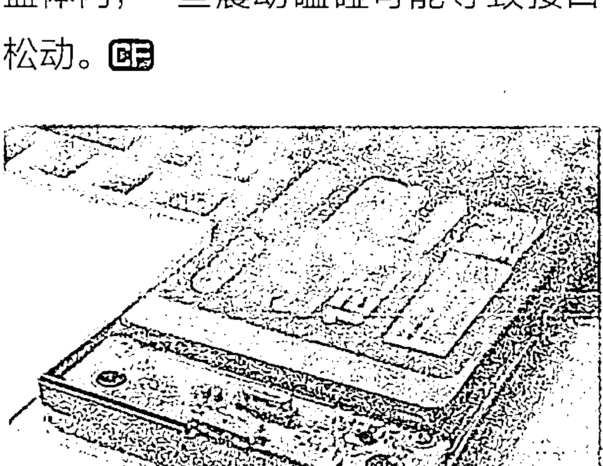

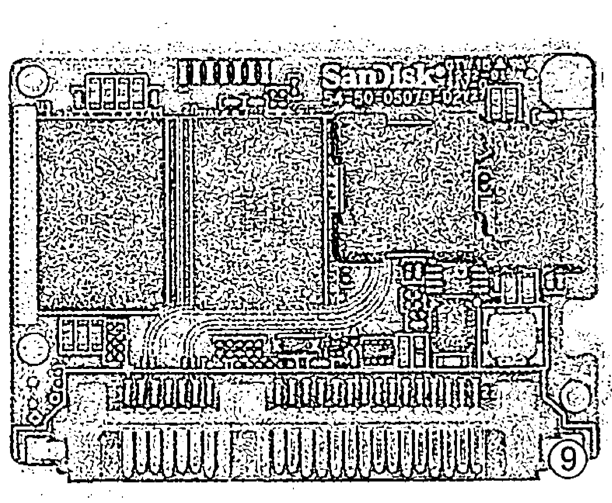# 你所不知道的DIY小妙招

文|宁宁

DIY领域可谓活到老学到老，永远都有学不完的知识。本文将为读者带来几个DIY高手可能都不知道的小妙招，主攻的是在不花钱的情况下尽可能实现我们需要的效果。

## 耳机当作麦克风使用

耳机还能当作麦克风使用，主要的原理是动圈式耳机与动圈式麦克风的物理构造基本相同，所以在身边没有麦克风的情况下，只要把耳机插入到主板上的粉色麦克风接口即可(图1)。根据笔者的体验，耳塞式耳机基本无效，最好选择包耳式耳机。通话时必须用嘴贴近耳包说话，效果甚至可以比肩市面上十多元的低端麦克风。


此外，如果主板采用了AC97声卡，并且还使用了5.1声道音箱，那么在使用麦克风前，还需要依次点击“控制面板”→“音效管理员”→“喇叭组态”，并将“5.1声道(6喇叭)”切换为“立体声(2喇叭)”(图2)，这样才能把主板上的粉色音频接口从中央/重低音输出切换回麦克风输入。

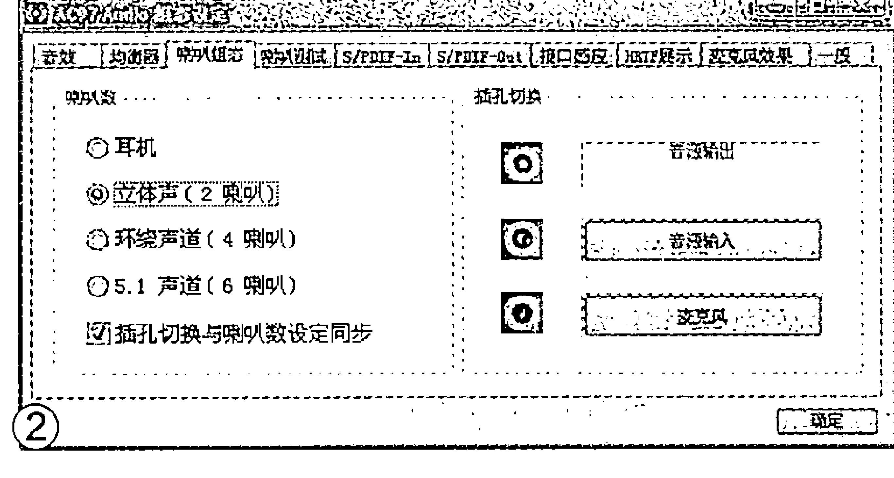

## 路由器变身网线延长器

低端的网线延长器由于并不需要具备独立供电(图3)，所以效果都不算太好。一旦网线太长或网线质量偏差，网线延长器就会彻底失效。而高端的网线延长线虽然有独立供电，但价格不菲，路由器变身网线延长器则解决了这个问题，操作起来也并不复杂，只要把路由器的WAN口空闲，并将两条网线插入到路由器的两个LAN口即可把两条网线串联起来(图4)。考虑到现在已经是无线时代，家里淘汰下来的有线路由器并不少见，需要网线延长器时不妨多多考虑这种方法。

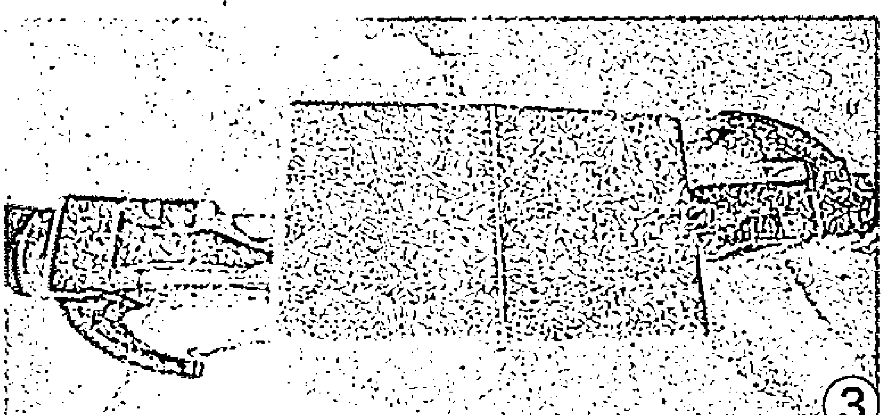

此外，分别把宽带猫输出的网线和电脑主机接入的网线插在路由器的两个LAN口上，虽然废掉了路由器的路由功能，但却等于直接把宽带猫与电脑主机相连接。在怀疑断网的情况下，可以更便捷地使用拨号软件进行测试，检查宽带猫是否能够正常拨号。

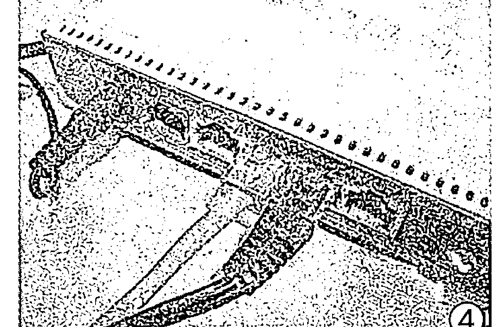

## 电视遥控器的学习功能

笔者家里买了一个天猫魔盒用着不错(图5)，但每次看片时都得电视遥控器和天猫遥控器轮番上阵，很麻烦。其实，很多电视遥控器都有学习功能，让电视遥控器学会天猫遥控器的部分功能，比如说快进快退、音量大小以及电源键，使用就会更方便了。

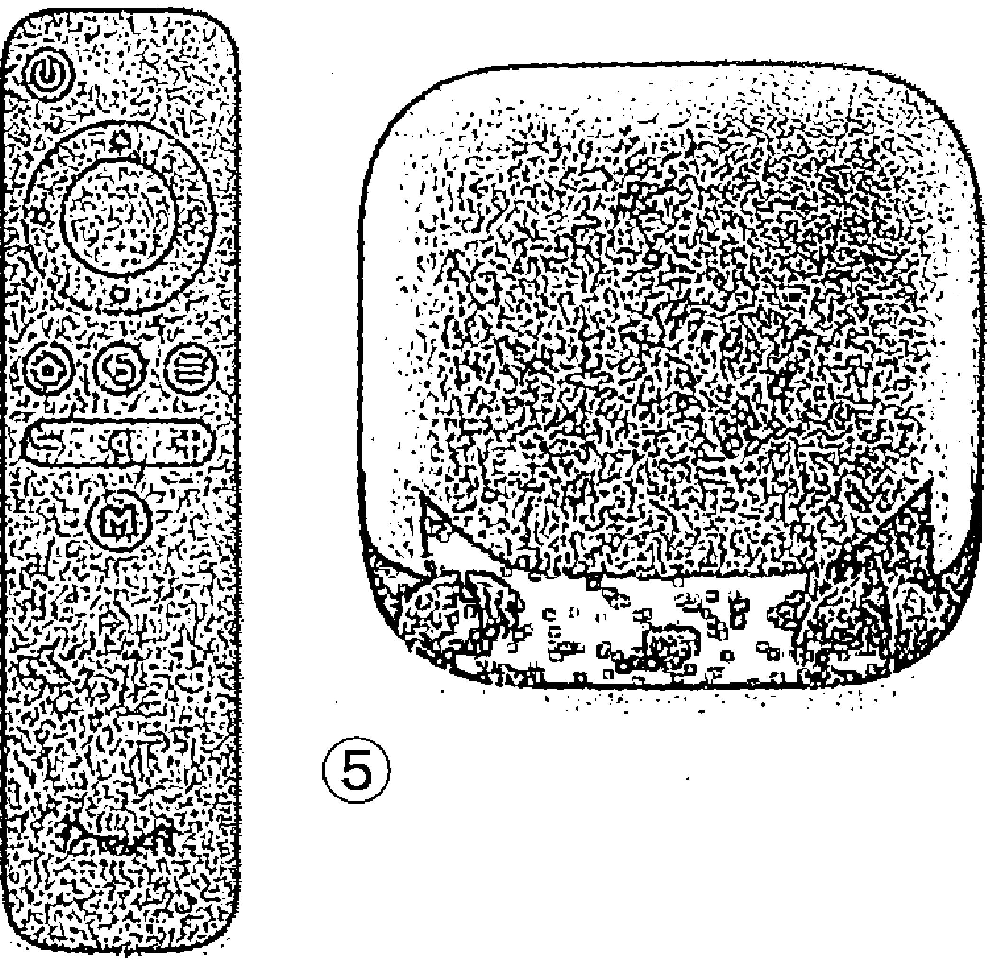

以笔者家里的创维电视遥控器为例，在遥控器正面的右上角就有一大片11个按键的学习区域（图6）。首先，将两个遥控器的红外发射头对准并距离1cm-3cm，之后按住创维遥控器的“设置”键约3秒钟，指示灯常长后松开。然后，按一下创维遥控器需要学习的按键，如“电源”键，指示灯开始闪烁。接着，按一下天猫遥控器上对应的按键，如“电源”键，指示灯变成长亮。最后，学习完毕后按一下创维遥控器的“设置”键，学习就算大功告成了。诸快进快退、音量大小等按键，均可照此方法完成学习，观看天猫魔盒的网络电视只需一个遥控器就够用了。此外，网上卖的万能遥控器大多拥有此类学习功能，但具体操作却完全不同，必须仔细阅读说明书才行。

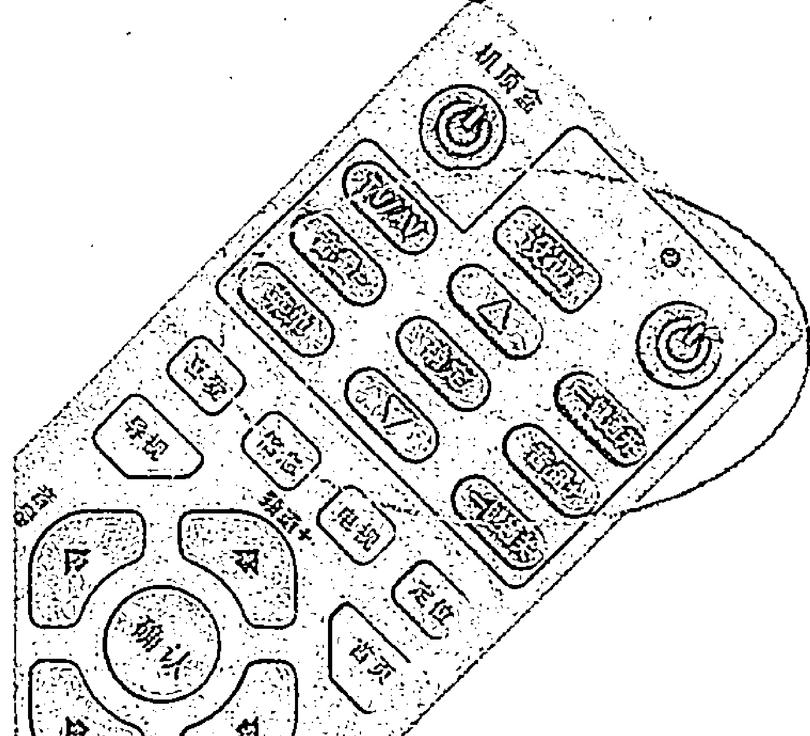

## 扫描仪+打印机=复印机

扫描仪搭配打印机虽然可以替代复印机，但在控制复印尺寸时却比较难办。尤其在复印身份证的时候，如何控制打印尺寸与实物相一致就成了难题。实际上，使用常见的看图软件ACDSee即可解决。首先双击图片文件进行预览，之后再依次点击“文件”->“打印图像”->“位置”，即可进入到打印图片的尺寸设置界面。在这里，只需把打印数据输入为身份证的宽度和高度实测数据（图7），即可让打印尺寸与实物相一致了。

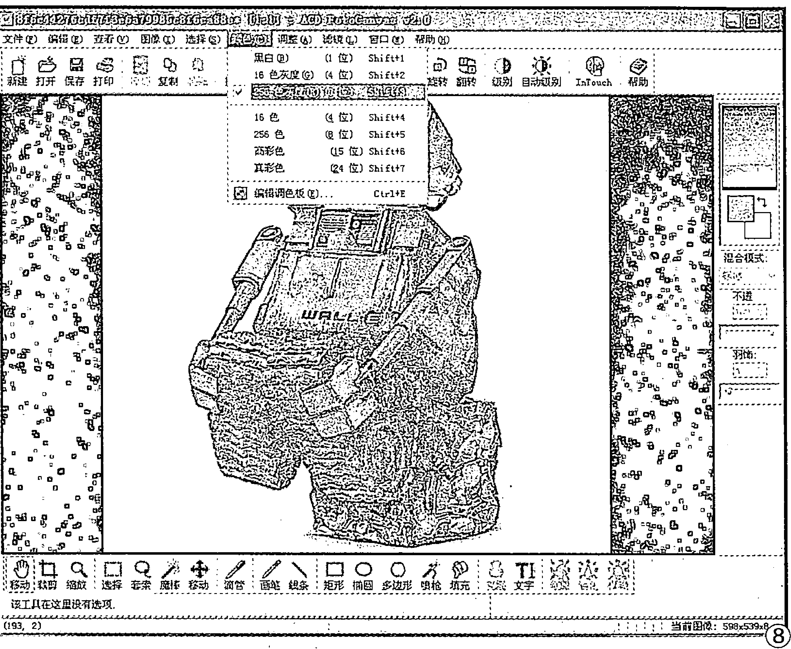

此外，如果是彩色打印机，不妨利用ACDSee的编辑器，将身份证的扫描图片从彩色转换为256色灰度（图8），这样便可获得纯正的黑白效果身份证复印件了。

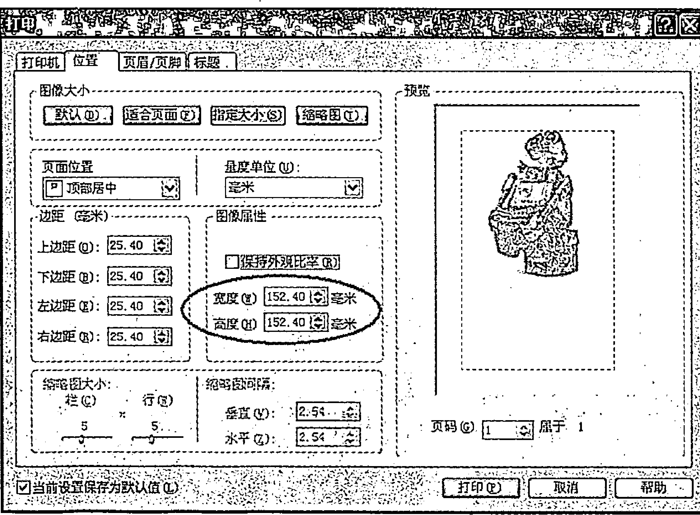

> **小提示**

目前出售的家用多功能一体机中大多同时拥有打印和扫描的功能，当然也就具备了一机实现复印的可能。一般只需要在一体机当中直接设置等比复印，使用复印功能直接印出的复印件其大小就可以控制为与实物一致。

这些小技巧其实都非常简单，但是知道并且可以活用的用户可能并不多。对于很多还在使用老式电脑和操作系统的用户，可能这些小技巧会更为实用一些。

# 从路由器端规避网络风险

文|小苗

我们的路由器其实不如想象的那么安全，恶意软件已感染的路由器可能会将我们置于险境。本文将简要介绍如何检查路由器、查找恶意软件，从而确保路由器的安全。

## 固件升级

首先升级路由器的固件，可能很多用户认为路由器并不像手机和平板电脑那样需要经常升级，因为升级前后它们的界面基本没有任何改变。但其实新版本固件会有最新的安全补丁，这对于重视安全的用户尤为重要。固件升级的办法传统有两种，浏览厂商的官方网站下载新版本固件或者查看路由器本身的固件升级相关功能。

在笔者的ASUS路由器上，操作步骤是先登录进入到路由器，然后点击“系统管理”找到“固件升级”（图1）。在这个页面当中可以显示路由器的固件版本，另外升级路由器固件不再像以往那样需要固件文件才能升级，它可以像手机APP那样通过检查是否有更新版本之后自动升级的方式，非常简单（图2）。

## 关闭远程管理功能

其次确保远程管理功能已关闭。远程管理功能是提供给一些有特殊需要的用户群体使用的功能，用户就算不再局域网范围内，也可以通过互联网连接来远程改动路由器设置，这在一些智能路由器上尤其常见（图3）。如果我们无需此项功能，为了安全应该尽可能关闭它。

登录进入后选择“系统管理”进入“系统设置”后，确保远程管理功能“从互联网设置路由器”已被设成“否”（图4）。一些路由器可能不会明确告诉你远程管理功能被禁用还是被启用。此时可以查看远程管理IP地址，如果是0.0.0.0，表明该功能已被禁用。如果是除此之外的其他IP地址，记得一定要关闭它。

## 检查DNS服务器

如果路由器使用了DNS服务器来解析网址，一定要检查路由器在使用什么样的DNS服务器。因为一个被劫持的DNS，很可能表明你的路由器遭到了黑客攻击。

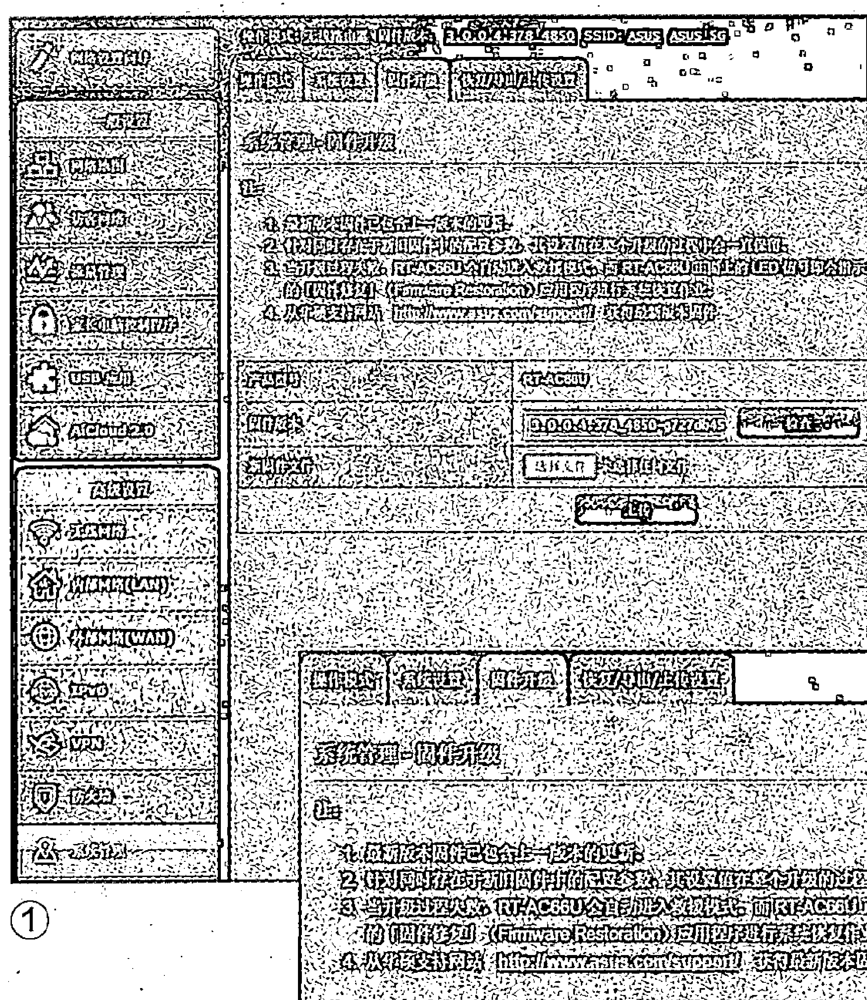

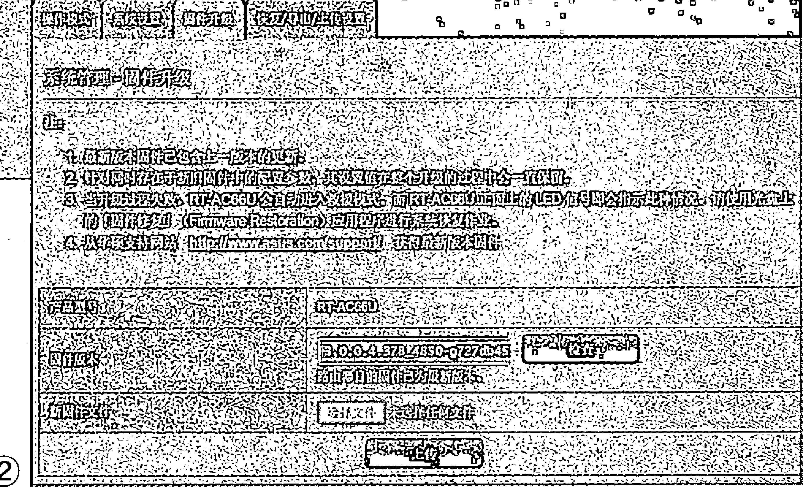

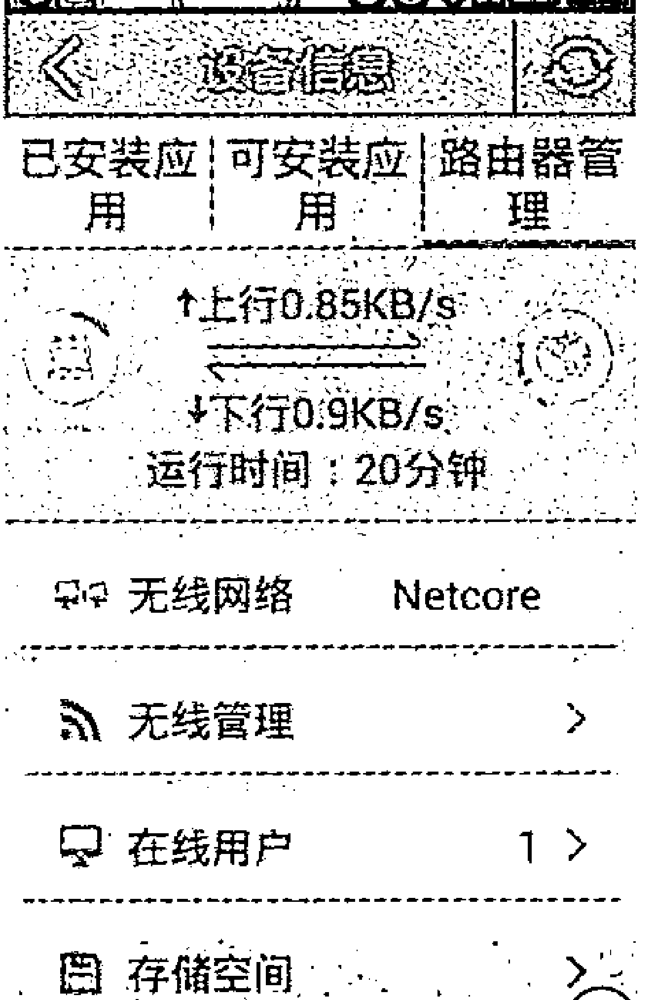

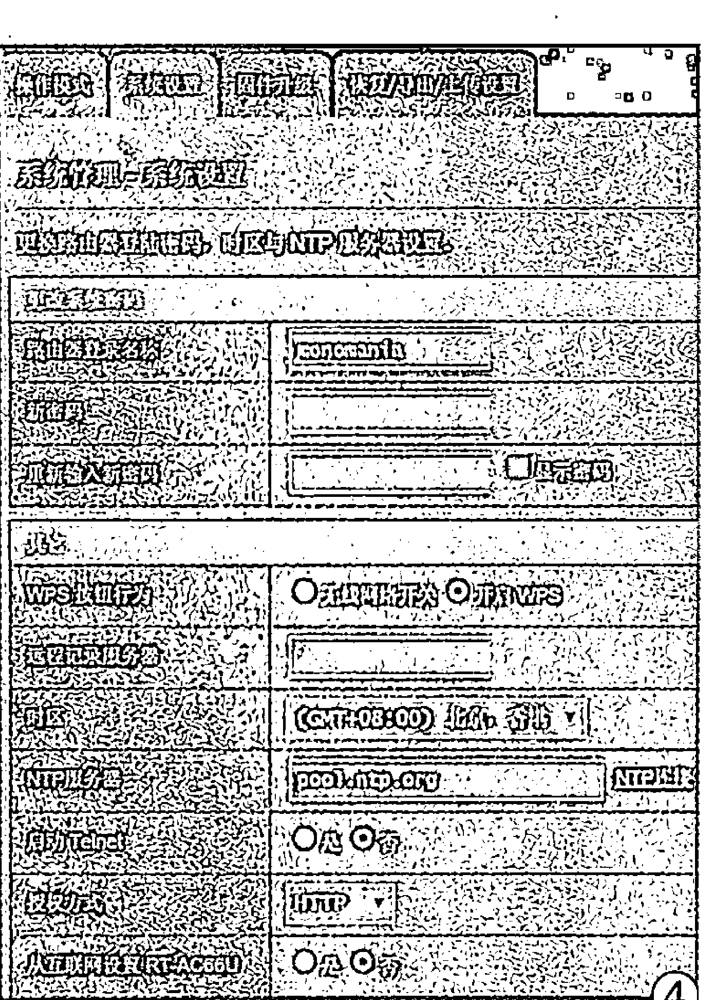

检查DNS设置的方法在不同路由器上都大同小异，如在ASUS路由器上登录进去后，进入到“内部网络”中找到DHCP服务器设置，会看到下面的DNS设置，如果它们为空或者是0.0.0.0表明正常（图5）。比较有名的安全DNS服务器，比如谷歌DNS的DNS设置（8.8.8.8和8.8.4.4）（图6）以及OpenDNS的DNS设置（208.67.222.222和208.67.220.220），都是可以信赖的DNS服务器（图7）。但如果在这里我们看到不熟悉的设置，表明很可能有问题，应该上网搜索一下，看看它们是否被举报为与恶意软件有牵连。

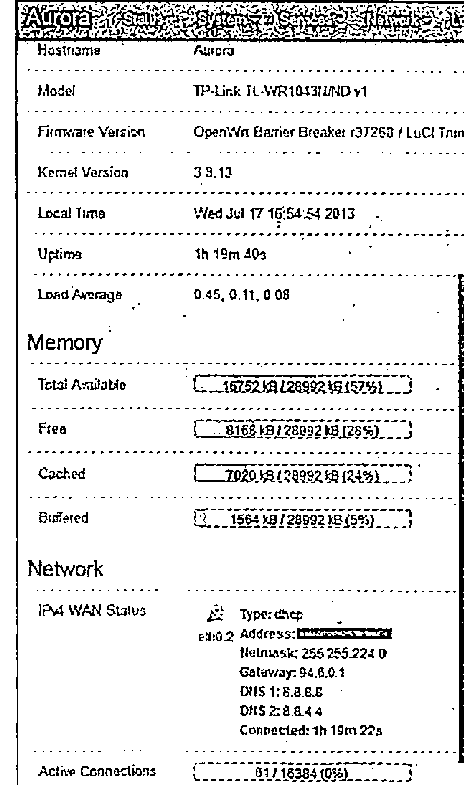

## 其他安全选项

除此之外，还应该关闭通用即插即用（UPnP）功能。UPnP（Universal Plug-n-Play）可以连接各种各样的智能装置、无线装置和个人计算机，形成无缝网络连接结构，可进行远程设定与数据传送。UPnP主要使网络装置可自动被发现，可远程设定装置以支持一些网络功能。

虽然方便，但这也是家用路由器上一个众所周知的安全风险，对于没有需求的普通家庭用户完全可以进行关闭。在路由器上，登录进入到“外部网络”，找到互联网设置中的UPnP，设置为禁用即可避免潜在的威胁（图8）。

> 路由器遭到恶意软件攻击的事件已报道过多起，包括Linksys和华硕等大牌厂商的路由器均无一幸免。恶意软件不仅会破坏网络和系统，还会利用你的路由器对其他网站发动DDoS攻击。互联网圈内常说的僵尸网络就是由成千上万个家用路由器组成的，这些路由器被用来发动此类攻击。其实除了上面的几项，只要用户养成定期更改路由器上密码的习惯，即可规避大多数潜在风险。除了路由器默认密码十分不安全以外，过短的路由器登录密码也很容易被破译，尽可能使用路由器认可的强密码来保障最基本的安全问题。

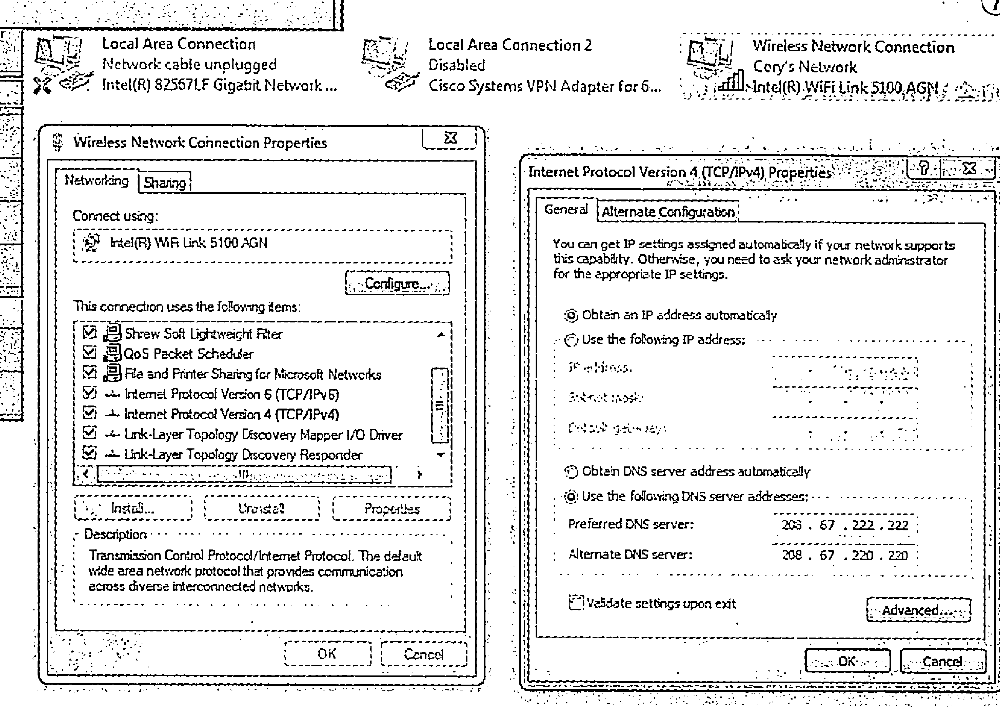

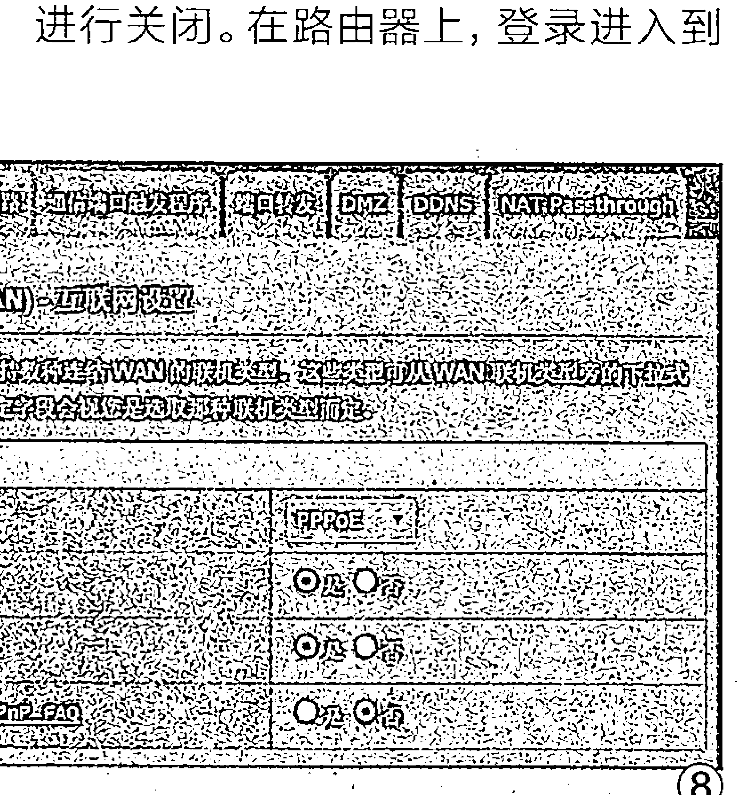

# 风扇来帮忙 缓解Windows平板的“热情”

如今Windows 8.1和Windows 10平板电脑都采用了无风扇设计，但无论是BayTrail、CherryTrail还是酷睿M，这些处理器平台在全速工作时依旧会因高温而触发降频机制，从而影响使用体验。那么，我们有什么方法可以缓解此类产品的“热情”呢？

## 缓解“热情”的思路

几乎所有的Windows 8.1和Windows 10平板电脑都会出现因发热量大而被强制降频的问题，在游戏过程中的不时卡顿就是由此引发的。既然笔记本可以通过散热底座提高散热效率，那我们是否也能利用外置风扇辅助平板电脑散热呢？
恰好笔者家里有一组闲置的USB接口的散热风扇（图1），如果将它固定在平板电脑背后发热最严重的地方，应该就能起到不错的效果吧？

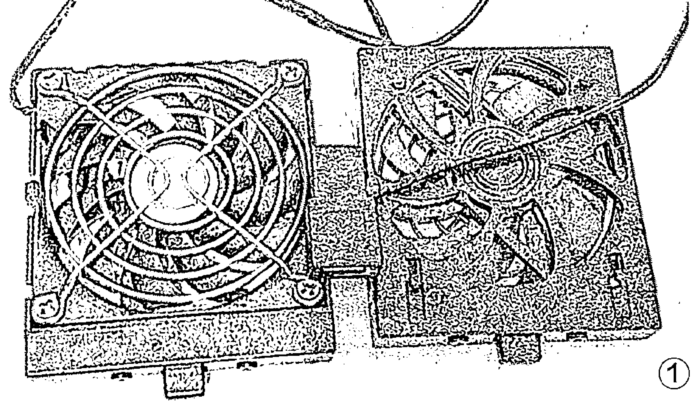

## 找到平板的发热源

笔者的平板电脑为昂达V116w CoreM版，搭载了酷睿M处理器。这款产品的背盖为塑料材质，在导热性上不如全金属材质的背盖。用鲁大师的温度压力测试，其CPU最高温度可达84℃（图2）。这款平板电脑的CPU芯片、内存颗粒以及SSD都集中在产品背部的右侧（图3），所以这个位置就是我们要找的发热源了。

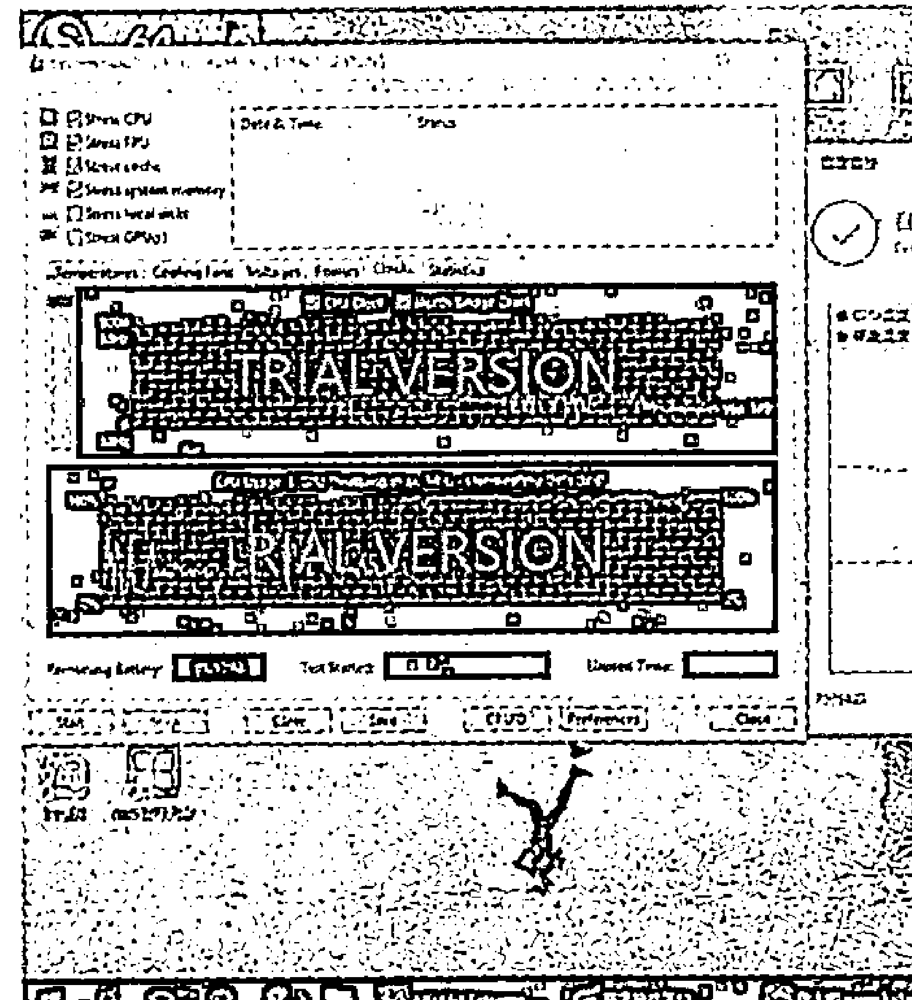

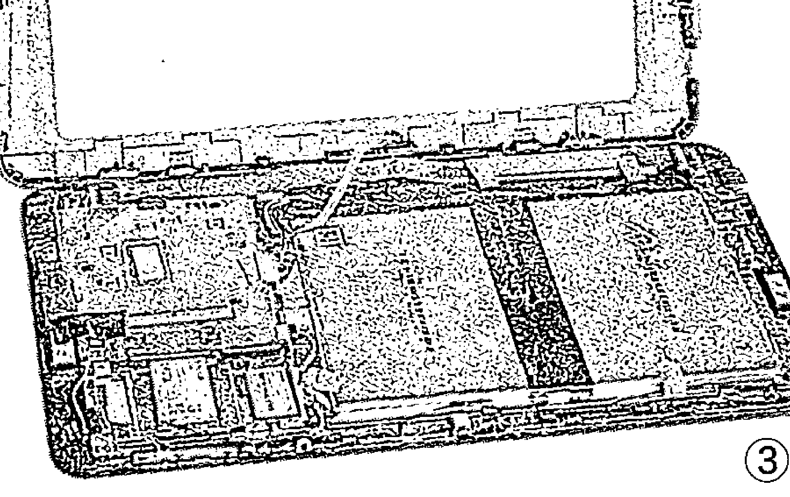

## 固定散热风扇

笔者的USB风扇是一拖二的设计，先用双面胶将两个风扇固定好（图4），再用透明胶条将其粘在平板电脑的发热源位置即可（图5）。在这里需要注意风扇的方向，由于V116w CoreM背后没有散热孔，其内部不存在散热风道，所以最佳的方式是让风扇对着后盖发热源吹风。如果你将风扇方向搞反，对着封闭发热源吸风的效果会大打折扣。


## 实际效果检测

将风扇固定好后，将USB接口与平板侧面的USB接口相连即可通电让风扇工作(图6)，此时再运行鲁大师的压力测试，其CPU最高温度仅有70℃(图7)，SSD硬盘的温度也降低了10℃左右，成绩斐然。需要注意的是，笔者家里的USB风扇的转速和风量并不算大，如果你能找到更高转速的风扇，散热效果应该还会有所提升。

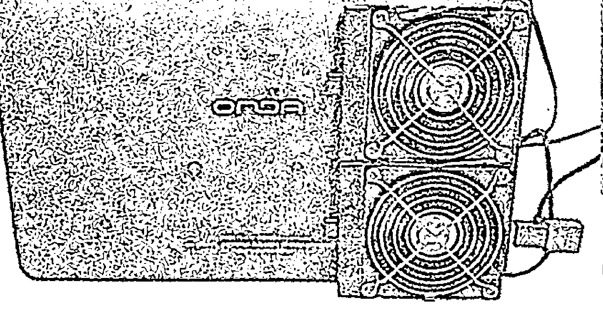

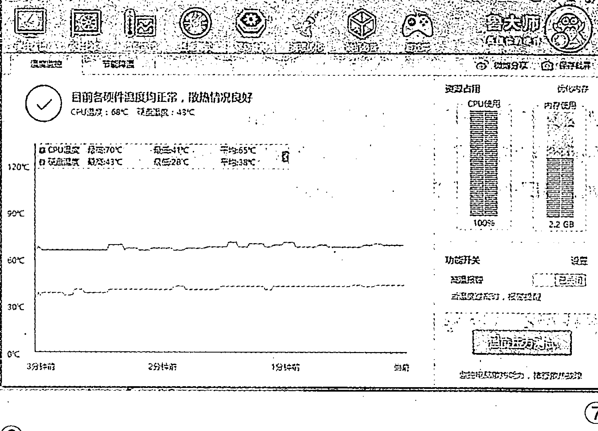

### 扩展阅读
更高端的改造

遗憾的是，即使用上了散热风扇，平板电脑在长时间游戏时依旧会出现偶尔的降频问题导致游戏卡顿。如果你想彻底解决Windows 8.1和Windows 10平板的发热缺陷，就需要对机身结构进行一番更为彻底的改造了。比如有网友就将平板电脑拆开，在CPU和金属散热板之间再贴上几颗紫铜散热片(图8~图9)，并在对应的背盖部分开孔，让发热源可以“裸露”出来。同时，再将抽风式散热器固定在背盖的开孔位置(图10)，将CPU全速工作时产生的热浪迅速抽出平板体外。这种改造基本就可彻底杜绝高温降频问题，只是破坏了平板电脑原有结构将失去厂商的质保服务，仅限发烧级玩家尝试。

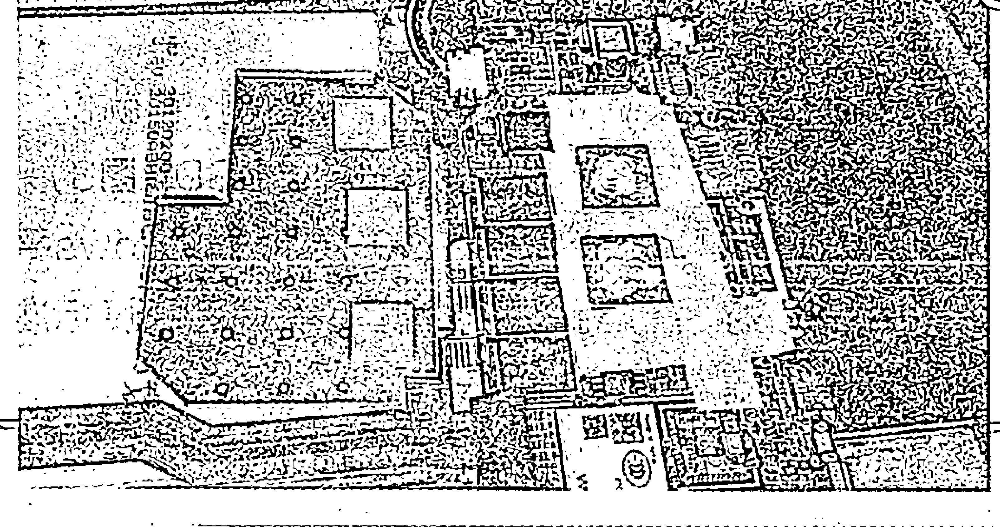

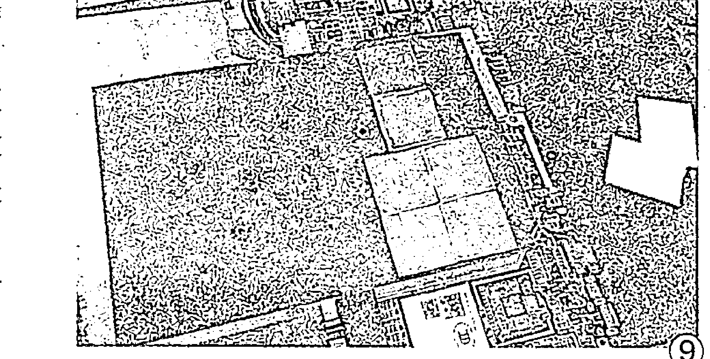

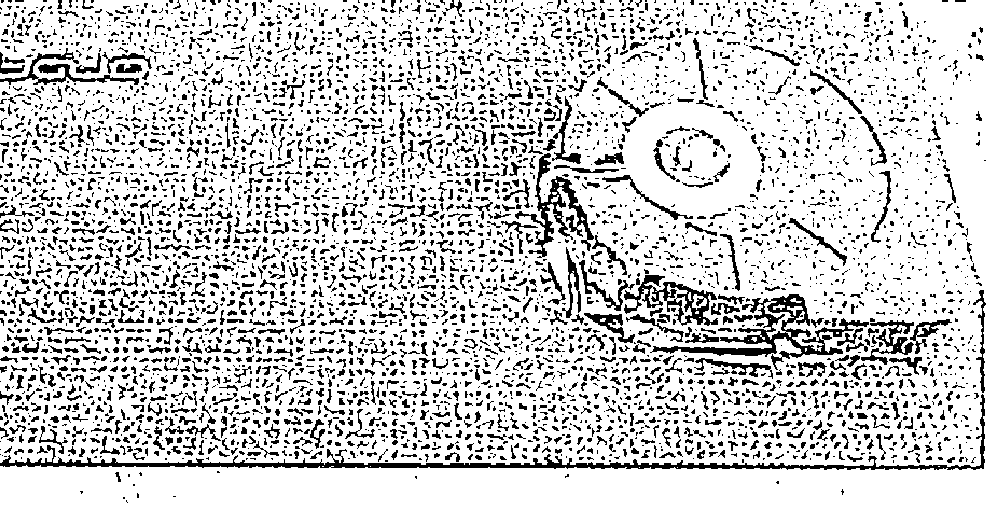

小结
当你拿到本期杂志时，Windows 8.1和Windows 10平板电脑领域即将成为Cherry Trail和酷睿M处理器平台的天下，这两类CPU都采用了最新14nm制程工艺，TDP分别为6W和4.5W，理论上无需风扇辅助散热。但理论毕竟是理论，当CPU满载运行，因温度的激增导致降频几乎是必然的，而这个问题的严重性与否，则取决于产品用料(金属优于塑料)和散热结构(有无加大的石墨或铝箔散热片)，以及厂商在BIOS中设定的CPU降频温度阈值的高低。[CF]

作者的这篇文章仅算是抛砖引玉，利用了手头闲置的风扇缓解平板发热压力。如果你有更好的改造方案，欢迎给我们投稿与广大读者分享。

## 火速连招

CFan以前也介绍过Windows 8.1平板的散热改造思路，感兴趣的读者可以登录这个网址查看: http://dwz.cn/1PGyDe

# 扩容提速必看
# 浅谈M.2 SSD硬盘升级思路
文|曹操

M.2又称NGFF，是时下最迷你SSD硬盘的规格标准，也因此成为了无数平板电脑和笔记本等移动设备的标配。如果你想给“移动伴侣”提速扩容，M.2接口的SSD自然就是优先之选了。

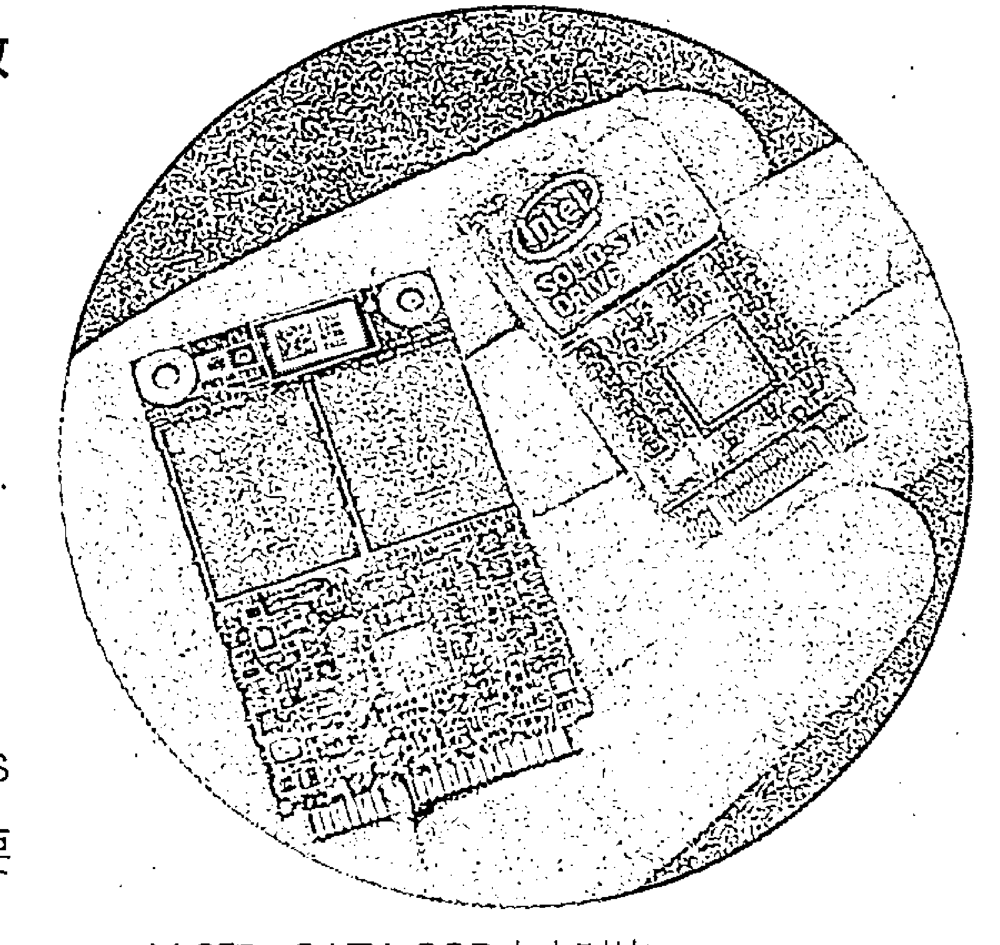

## 想升级得先有接口

目前256GB M.2 SSD的价格多在600元~900元之间，容量价格比还算不赖，也因此被很多用户列入了升级名单中。不过，虽然M.2已成未来标准，但却依旧未在移动设备中完全普及。
比如，很多早期的Windows平板电脑或笔记本还停留在mSATA时代，而mSATA接口的迷你SSD要比M.2 SSD大一圈，二者互不兼容(图1)。此外，出于成本的顾虑，很多轻薄型笔记本仅配备了唯一一个2.5英寸的标准SATA接口，并没有配备M.2插槽，此类产品也就宣告与M.2 SSD无缘。

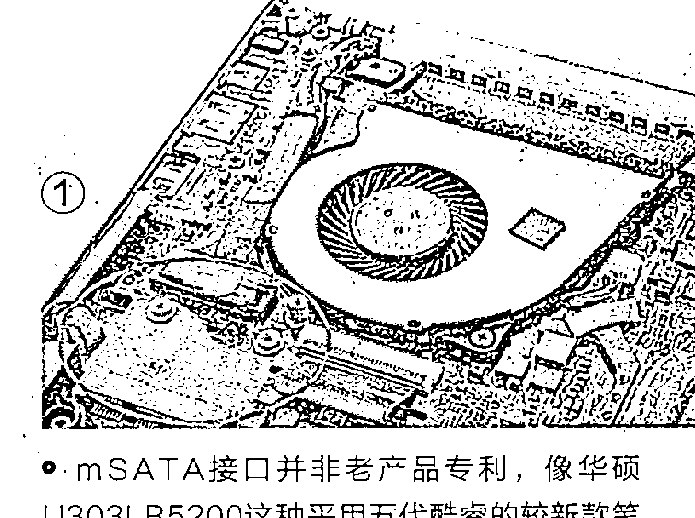

因此，如果你想给自己的Windows平板或笔记本升级M.2 SSD，首先要做的就是确认它是否配备了这个接口。方法很简单，在百度搜索“型号+是否支持M.2”的关键字(图2)，基本就能在网上找到确切的答案。

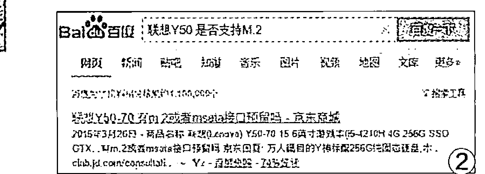

## 确定兼容的长度标准

问题来了，M.2 SSD的规格很乱，从传输通道来看存在PCIE (速度更快)和SATA (速度一般)，从长度来看又被细分为了30mm、42mm、60mm和80mm四个标准。所以，我们接下来要做的就是再次确认自己的移动设备到底支持哪个标准的M.2 SSD。
好消息是，PCIE和SATA两种规格的接口是通用的 (限移动设备)，这意味着采用PCIE通道的M.2 SSD插在SATA通道的M.2接口上也能使用，只是速度被限定到了SATA通道的峰值上。反之，采用SATA通道的M.2 SSD插在PCIE通道的M.2接口上，速度也不会因PCIE而出现变化。此外，如今90%以上的移动设备走的都是SATA通道的M.2接口，所以大家也不必过于纠结。
至于所兼容M.2 SSD的长度标准，就需要我们对产品进行拆机，或是从网上相关的拆机评测中寻找答案了。

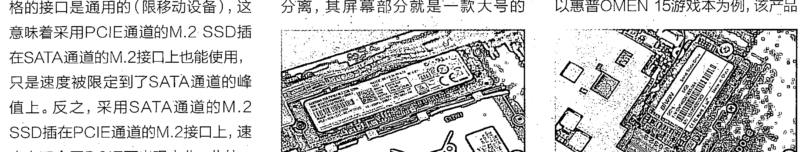

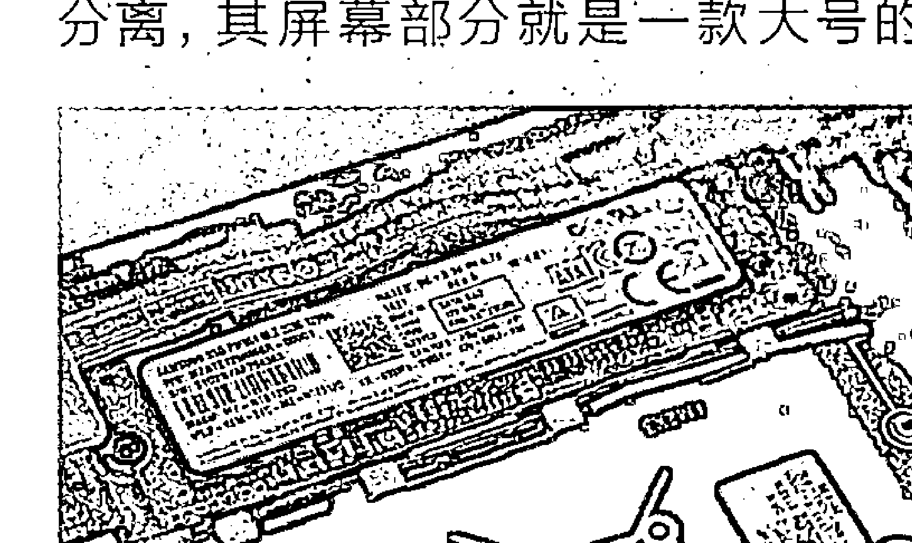

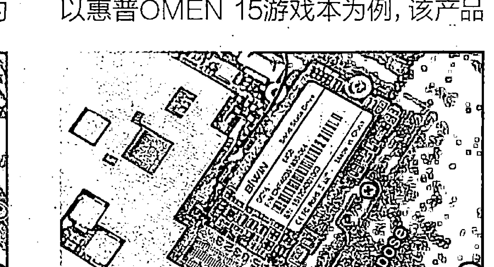

在M.2接口的位置上就提供了2个螺丝固定位，可支持60mm或80mm两种长度标准的M.2 SSD(图5)。遗憾的是，OMEN 15属于非常小众的产品，绝大多数移动设备只会提供1个螺丝固定位，无法兼容更短或更长的M.2 SSD。


## 基本拆机安装思路

对Windows平板电脑而言，用于固定后盖的螺丝多在侧边，而更多的产品连螺丝都没有，仅是依靠卡扣固定。拆卸平板后盖时需要从侧边按键或接口的接缝处下手(图6)，用拆机片或信用卡边缘轻轻翘起，再逐渐向两侧剥开卡扣直至取下整个背盖。对笔记本而言，则需要我们拧下D面的所有螺丝，依旧是从机身缝隙边缘入手(图7)，或是拆下D面底盖后就能看到M.2接口了。如果移动设备本身就已安装了M.2 SSD，则需要先拧下固定该SSD的螺丝，将其拔下后再插入新买的更大容量的M.2 SSD(图8)，最后再用螺丝固定。需要注意的是，拆机之前一定要确保已完全切断设备的电源且处于关机状态！替换SSD的话需要事先做好数据的备份，在新SSD硬盘上安装系统后，可以借助第三方软件实现数据的迁徙。

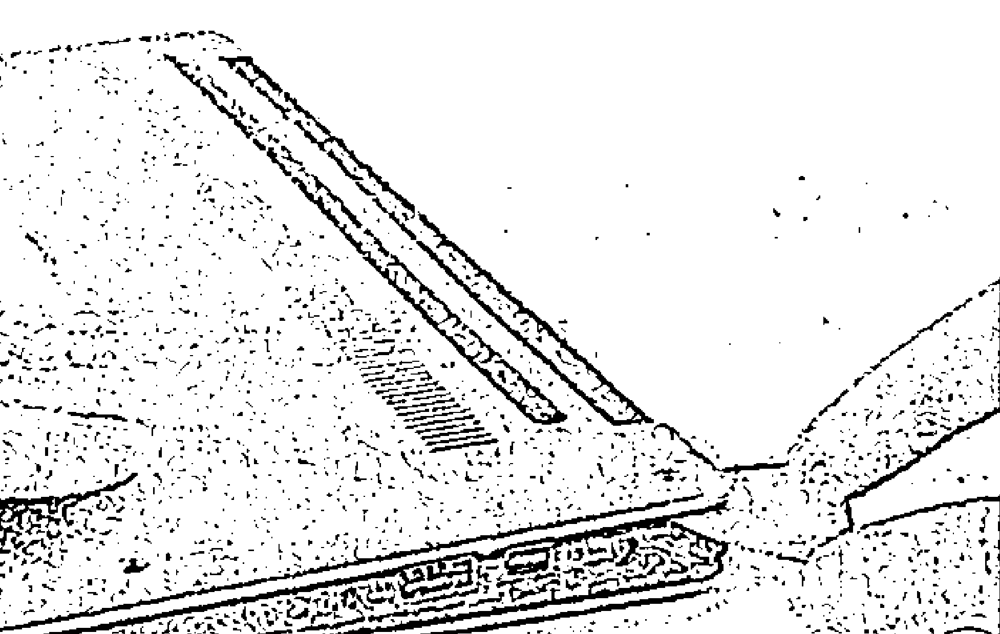

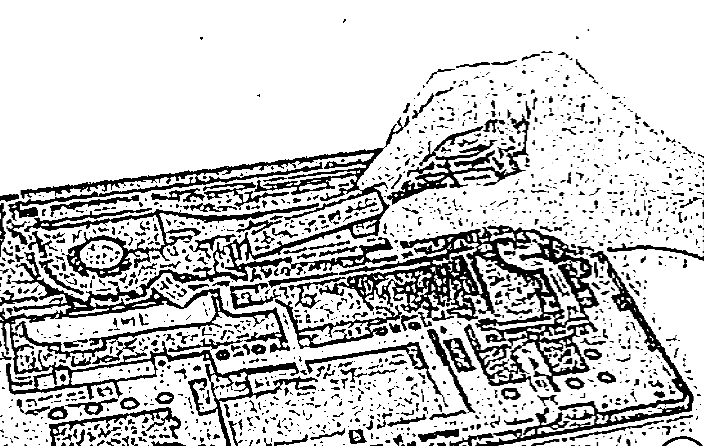

## 淘汰的SSD不要浪费

当我们升级全新的M.2 SSD后，如何处理淘汰下来的老SSD？在这里，笔者向大家推荐M.2接口的移动硬盘盒，将其安装进硬盘盒就可变身高速“移动硬盘”(图9)，实现“废物利用”。只是，给M.2 SSD“选家”也有很多需要注意的地方呢。

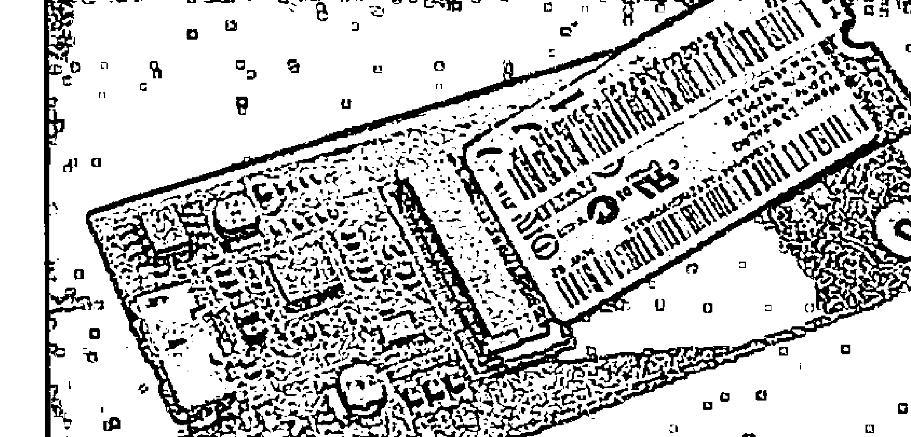

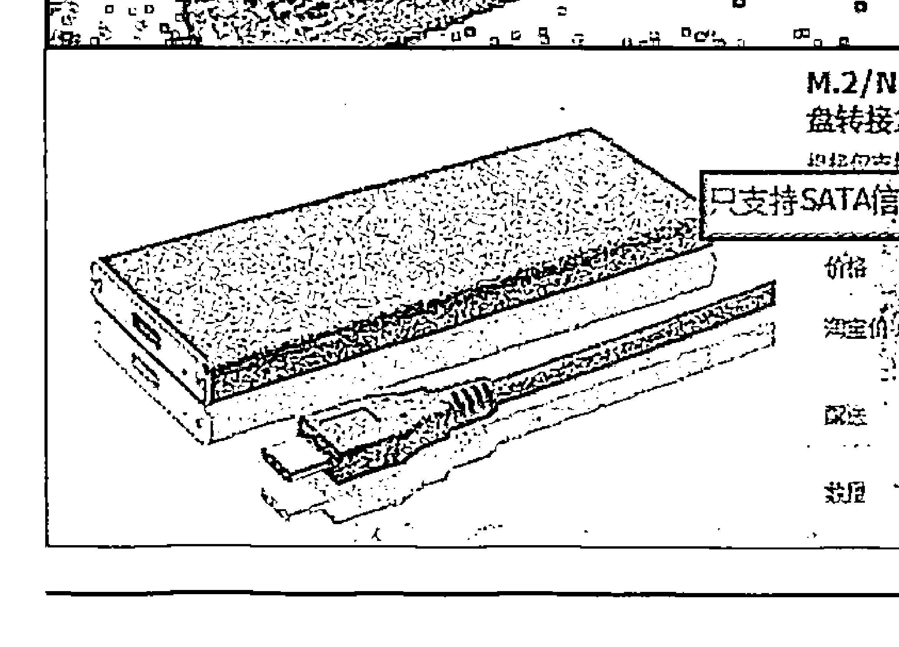

## 移动硬盘盒也有讲究

目前， M.2 SSD硬盘盒拥有USB3.0和USB3.1两大类。其中，前者的价格多在40元~80元之间，由于绝大多数产品缺少对UASP协议的支持，仅依靠USB3.0接口是无法100%发挥出M.2 SSD应有的读写速度。如果你希望硬盘盒可100%释放SSD的速度，则可考虑USB3.1接口的产品。此类硬盘盒均采用了最新的Type-C型接口，读取速度可突破500MB/s大关(视SSD自身的速度)。可惜，现阶段USB3.1硬盘盒不支持PCIE通道的M.2 SSD，仅兼容SATA通道的产品(图10)，这一点大家需要多加留意。此外，选购M.2硬盘盒时依旧需要根据淘汰下来的M.2 SSD长度而定，建议选择可同时支持多种长度标准的硬盘盒产品(图11)，以备未来使用之需。

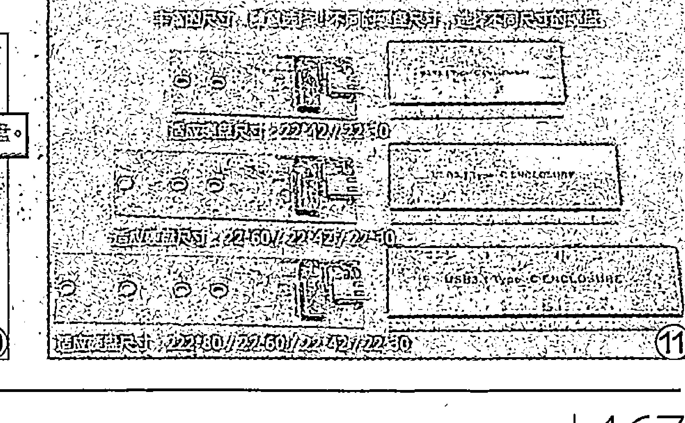为程序或设备在路由器上打开端口

文|小苗

在我们架设FTP服务器时、运行一些特殊的程序和游戏时经常会遇到需要端口转发的情况。比如目前火爆的《我的世界》端口是25565，全球最主流的BitTorrent客户软件则是6881-6887。若是不知道需要为应用程序开哪个或哪些端口，可以参阅这份端口转发列表（http://dwz.cn/24oozR）。另外端口转发并不像听起来那么难，下面介绍如何转发路由器上的端口。

端口到底是什么

路由器就好比是连接至无线或有线网络的任何设备与互联网之间的桥梁。它有点像邮政系统，确保进进出出的数据被引到合适的地方。端口就有点像编了号的门——它们可以开或闭，从而允许或阻止数据进出。大多数数据使用几道普遍认同的门（比如端口80），但有些应用程序或设备很麻烦，需要使用默认情况下关闭的其他端口。如果你有某个软件或设备要使用默认情况下被关闭的端口，就需要遵照下列步骤来转发端口。

如何设置端口转发

在Web浏览器中，往地址栏中输入你路由器的IP地址编号（如192.168.1.1），按回车键。要是你不知道其IP地址，可以将路由器反过来看铭牌信息或者上网找找这方面的资料。路由器的网页显示后，输入用户名和密码（图1）。默认用户名和密码应在说明手册中、路由器的粘胶标签上，或者写在某个地方（通常在背面铭牌信息）。可以用百度查找大多数路由器的默认用户名和密码。如果你忘了更换后的用户名和密码，或者找不到默认的用户名和密码，就需要使用针孔重置按键、重置路由器。

想转发端口需要我们寻找一个选项卡或菜单，不同品牌其名称不一，常见有应用程序、端口转发、端口触发、NAT、高级或类似的名称。每款路由器的界面不一样，如果找不到可以上网搜索相关设置。

找到端口转发就从列表中选择某个应用程序，但如果你的游戏或应用程序不在上面，就创建一个新的条目并命名（比如3724是《魔兽世界》），并输入想打开的端口号或者输入想打开的端口范围。选择相应协议时切记TCP、UDP两个都要选（图2）。

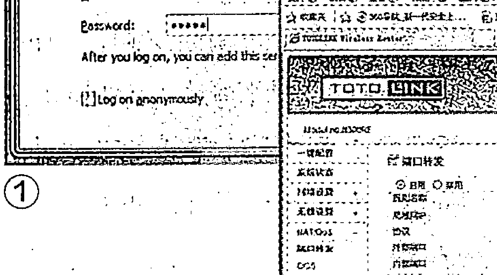

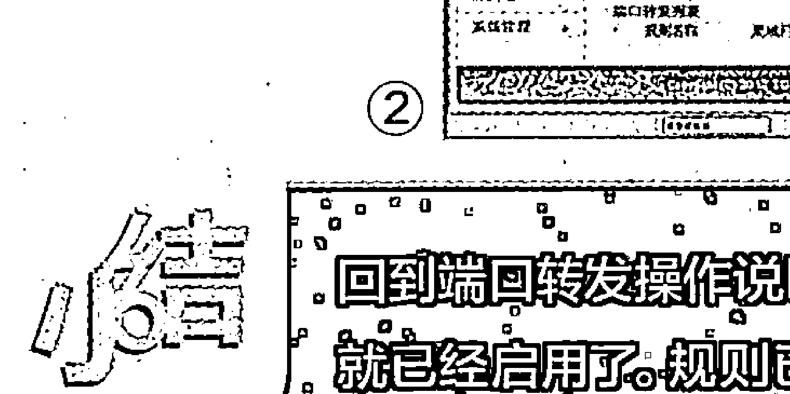

IP和MAC地址设置

端口选好后选择规则应该适用于网络上的哪个设备，可从列表中选，不过多数路由器得按IP地址来选择（图3）。无论是哪种方法，你都可能需要为该计算机或另外某个网络设备赋予一个静态IP地址。这意味着告诉路由器只要该计算机连接至路由器，它就始终赋予同一个IP地址。这样一来，端口转发规则会始终正常工作，路由器就会按照无线或以太网适配器的MAC地址来识别计算机。

| Index | Service Name | Protocol | Public Port | Private IP | Private Port | Active |
| :--- | :--- | :--- | :--- | :--- | :--- | :--- |
| 1 | SMTP | TCP | 25 | 192.168.0.2 | 25 | ☑ |
| 2 | | — | 0 | | 0 | □ |

③ 必须在Private IP下输入地址

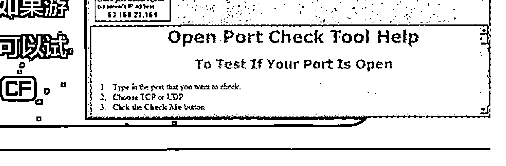

> 小提示
> 回到端口转发操作说明选择了规则适用于哪个设备后，端口转发其实就已经启用了。规则已在列表中，该规则就处于活动状态。在路由器上可以通过启用和禁用规则让端口转发生效，不用删除规则。如果游戏、服务或设备可能需要多个端口开着，就需要创建多个规则。复杂的情况可以试试端口转发检查工具PFPortChecker，弄清楚你是否已设置成功（图4）。

```
Open Port Check Tool Help
To Test If Your Port Is Open
1. Type in the port that you want to check.
2. Choose TCP or UDP.
3. Click the Check My Port button.
```

DDR4时代 选择8GB还是16GB内存

文|纯金处理器

随着Skylake处理器平台的出现，DDR4内存终于进入了普及期。那么，多大的DDR4内存才能“喂饱”全新的硬件平台呢？

新平台的诱惑

与Skylake平台搭配的主板芯片组有Intel Z170和B150，除了支持DDR4内存外还具备Ultra M.2（具备32Gb/s传输速率，走PCI-E 3.0×4通道的M.2接口）、SATA Express和USB3.1接口的全新特性，吸引了很多DIY玩家的关注。

DDR4内存的尴尬

在DDR3时代，其最小内存容量为2GB，预算有限的玩家也能轻松搭建起2GB+2GB的双通道内存模块（图1）。步入DDR4时代后，其最小内存容量就达到了4GB，此时就会有很多用户开始纠结：是购买4GB+4GB凑合着用，还是一步到位选择8GB+8GB内存呢？4GB×2和8GB×2的差别大吗？

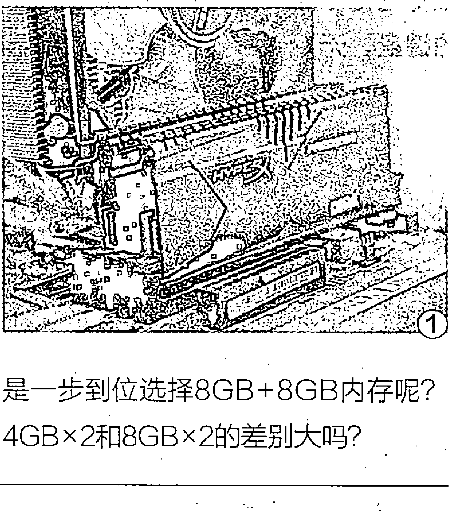

> **Z170和B150的差异**
> 两个芯片组的最大差异体现在PCI-E 3.0总线数量上。B150为8条，Z170达到了20条。此外，Z170支持超频、支持更多的原生USB3.0和SATA-E接口数量，且支持英特尔PCI-E快速储存技术。虽然B150没有自带USB3.1，但却可通过SATA Express接口和前置USB3.1面板曲线获得该功能。

大内存对性能的影响

为此，笔者通过实际测试，对4GB×2和8GB×2内存模式的性能进行了对比。测试平台为英特尔i7-6700K处理器、Z170主板、GTX960和GTX950显卡，测试内存为HyperX Predator DDR4 2400 4GB×2和十铨DDR4 2400 8GB×2，两组内存的时序、延迟等参数基本一致。

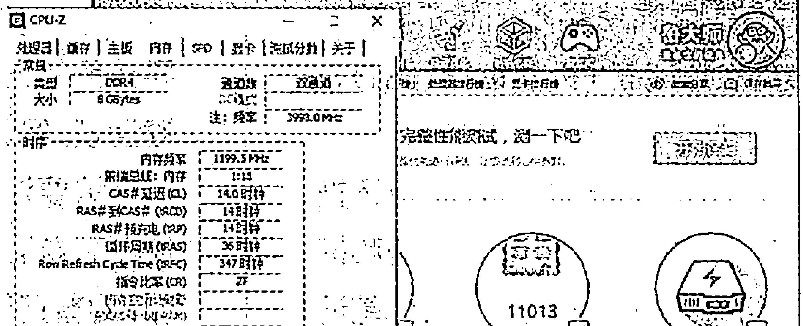

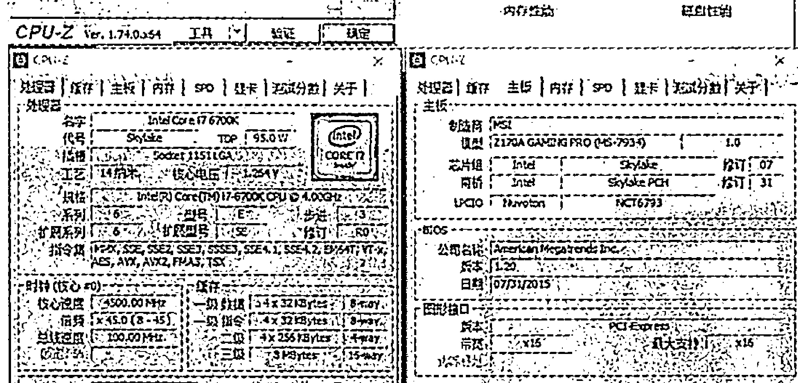

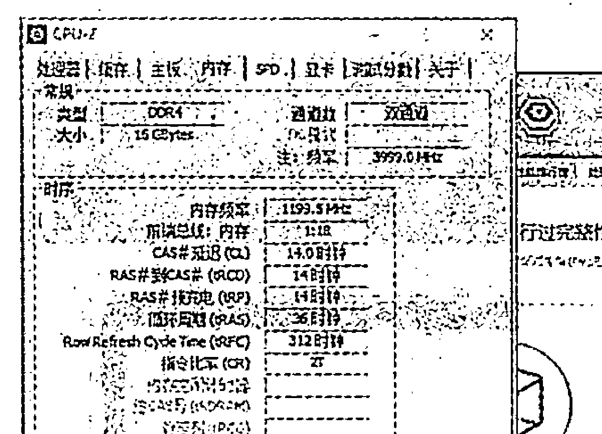

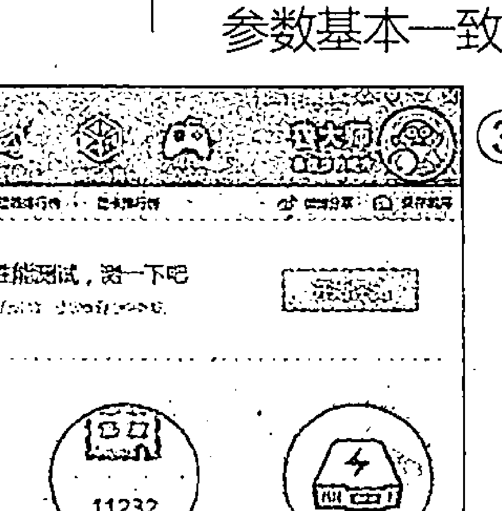

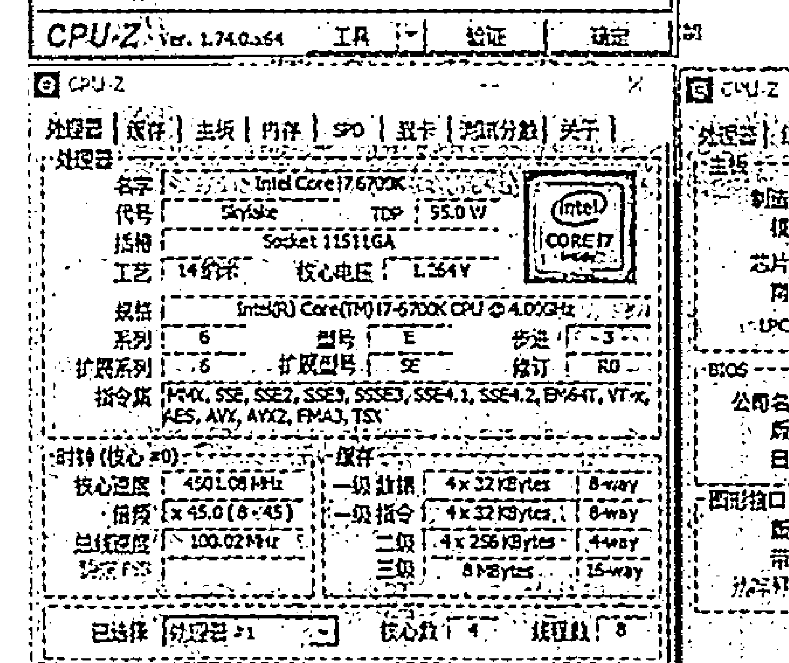

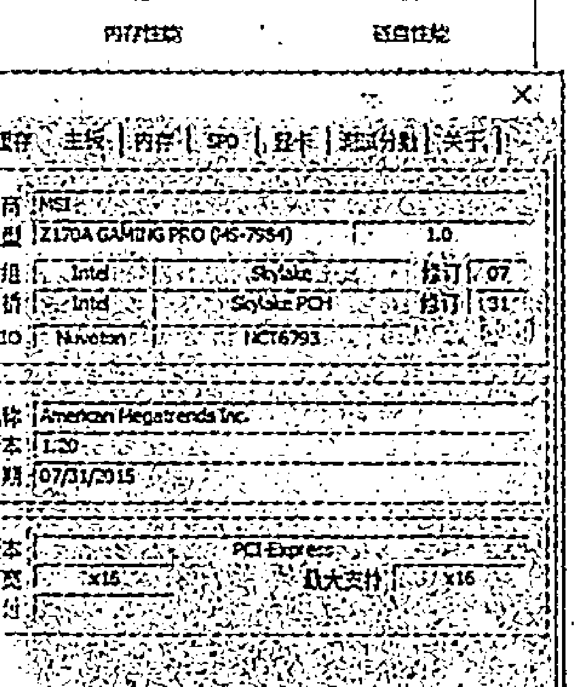

| 测试平台 | 4GB DDR4×2 | 8GB DDR4×2 |
| :--- | :--- | :--- |
| **鲁大师（内存）** | 11013（图2） | 11232（图3） |
| **GTX950显卡** | | |
| 3DMark11-X档 | 2965 | 2978 |
| 3DMark-X档 | 3050 | 3048 |
| **GTX960显卡** | | |
| 3DMark11-X档 | 3505 | 3495 |
| 3DMark-X档 | 3536 | 3524 |

从测试结果来看（见表），在DDR4时代，4GB×2和8GB×2的内存组合对整机性能几乎毫无影响，4GB×2的内存就可满足绝大多数主流应用的运行需求了。与其将投资放在更大的内存容量上，还不如购买一块M.2 SSD来给磁盘性能提速，如此才能带来立竿见影的体验升级。

保持好心情

### 让笔记本键盘持久如新

最令笔记本用户头痛的问题，就是长时间使用后键盘缝隙堆满污垢、键帽磨损出油。看着就让人闹心的键盘，无疑会影响我们工作、娱乐的心情。那么，如何才能让笔记本键盘持久如新呢？

### 外接键盘最保险

笔记本的键盘与掌托是与用户接触最频繁的部位，也因此成为了易耗损的“大户”。掌托出油、键帽标识被磨花，类似的困扰始终伴随我们左右。如果你想让这些部位持久如新，最简单的方法就是降低使用率，而可调整角度的散热底座+外接键盘（图1），则是最简单易行的解决方案。

不过，笔记本不可能始终被“禁锢”在桌面上，散热底座和键盘会严重影响便携性。因此，笔记本键盘膜、贴纸等产品就有了用武之地。

### 贴膜还是贴纸

理论上讲，笔记本键盘膜可以为本本带来最理想的防护效果，因为它不仅可以避免键帽磨损，还可遮挡住键帽之间的缝隙（图2），避免灰尘碎屑的堆积。在键盘膜的选购上，建议大家购买TPU材质的产品：耐磨、耐油、弹性好，价格多在20元~30元之间。此外，一定要按照笔记本的具体型号挑选匹配的键盘膜，保证100%的严丝合缝。

需要注意的是，有些键盘膜会因加入了炫彩或图案，导致厚度有所增加，对普通笔记本而言毫无影响，但对一些超薄本就可能出现合不上屏幕的尴尬了（或键盘直接碰触屏幕，造成屏幕磨损的情况）。

如果你的笔记本全速运行时发热量很大，封闭的键盘膜也会影响C面的散热（笔记本键盘也承担着一定的散热通风作用）。此时，更为个性的键盘贴纸也许会更适合你。

在键盘贴纸的选择上千万不要贪图便宜，一定要挑选采用类似PVC材质背胶（不仅粘度高，长时间使用再撕下也不会留下胶渍）的贴纸（图3），一些10元左右的通用键盘贴纸好粘不好揭，残留的胶渍极难清理（图4）。

此外，键盘贴纸也要根据笔记本型号选择匹配的版本，而且除了键盘，笔记本外壳（A面）、屏幕边框（B面）和键盘四周的掌托部分也可以由贴纸覆盖。

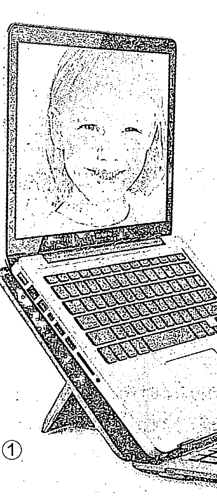


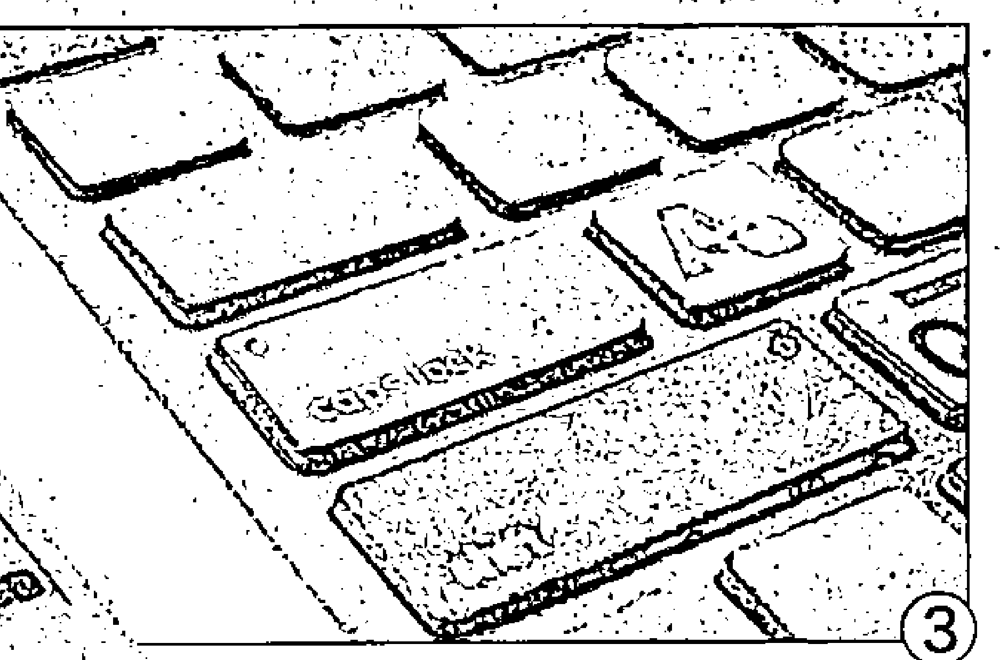

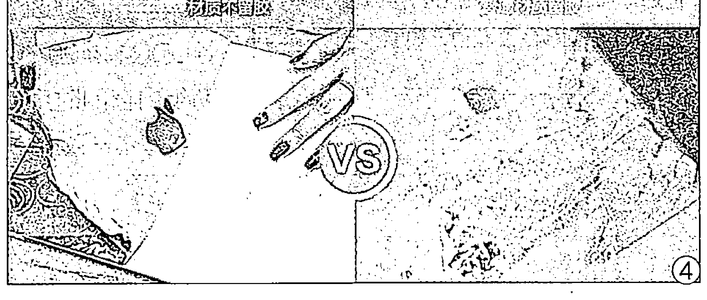

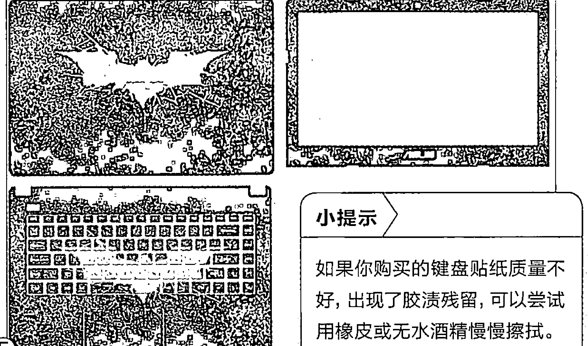

> **小提示**
> 如果你购买的键盘贴纸质量不好，出现了胶渍残留，可以尝试用橡皮或无水酒精慢慢擦拭。

去除缝隙污垢

问题来了，如果笔记本的键盘已经被“糟蹋”了，还有挽救的余地吗？答案是肯定的，而且方法还有很多种。比如，清理键盘表面的污渍和油污，用清洁剂（擦屏幕的那种就可以）+清洁布即可，将清洁剂喷洒在清洁布上（不要直接喷在键盘上，防止液体流进笔记本体内损坏电路）擦拭键帽即可。

如果键帽之间的缝隙很脏，则可选择带刷子的USB键盘吸尘器，用刷子沿着缝隙将碎屑灰尘“赶出来”，再用吸尘器口吸走（图6）。如果键盘缝隙的杂质太过顽固，则可将键盘的键帽一个一个的卸下来（沿着键帽底向上一掰即可，安装时只需将其重新扣回即可），然后再仔细清理（图7）。

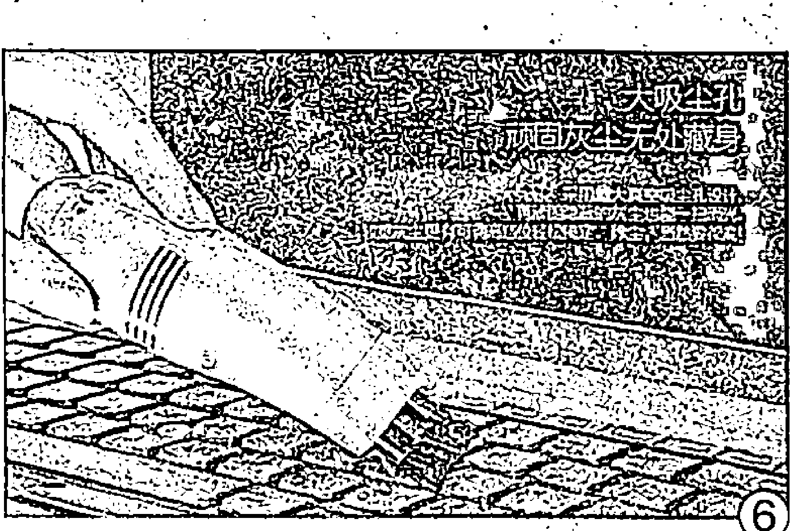

> 小提示
> 笔记本键盘存在巧克力、悬浮式等不同的结构，拆卸键帽时对力度和手法的要求可能略有不同。如果心里没底，可以在网上直接搜“笔记本型号+拆键帽”查看教程。

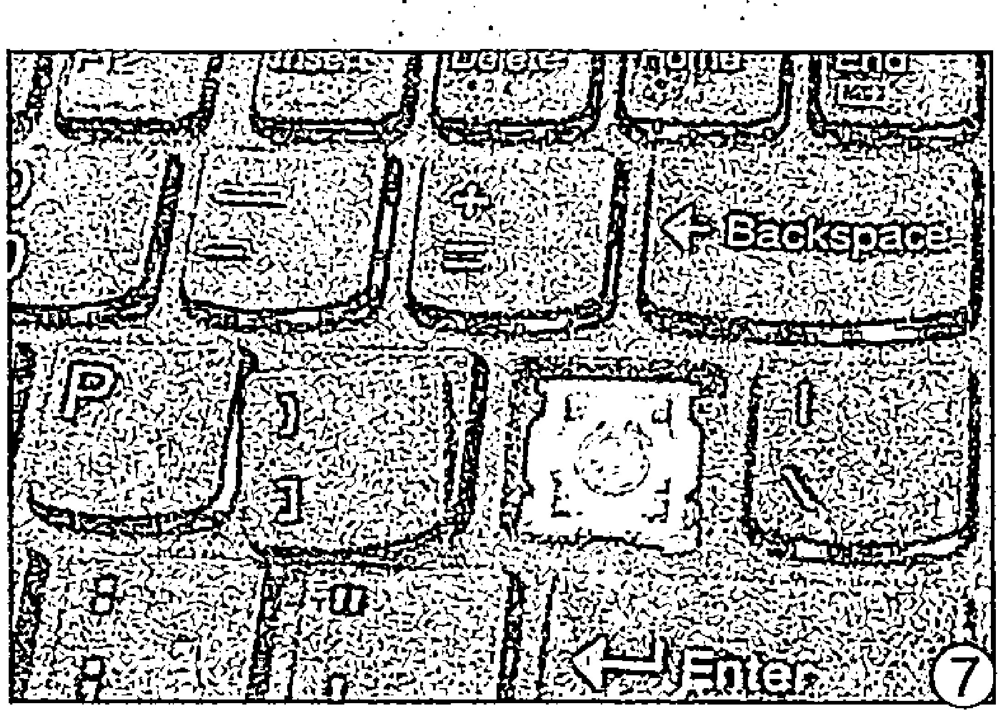

键盘整体更换

如果键帽的标识已经被磨去，或是出油到惨不忍睹的地步，你再怎么清理也是没有意义的。此时，更换一个全新的笔记本键盘就是最佳的选择了。

在淘宝上我们通过搜索“笔记本型号+键盘”就能轻松找到匹配的产品（图8）。但是，一些非热门的机型（或是已经退市的型号）可能会出现没有原装键盘可选的情况。此时，我们可以与商家沟通，根据笔记本品牌，或是键盘排线的位置及宽度，或是反面螺丝孔位置及数量找到兼容键盘替换。

在更换键盘前，大家一定要先在网上搜索自己笔记本的拆机教程，了解键盘固定的结构。有些键盘是通过螺丝固定，需要拧下笔记本D面对应的螺丝（可能涉及到拆下底盖）；有些笔记本则是通过卡扣固定（图9），需要沿着F5键等位置拨动卡扣才可拆下键盘（图10）。

此外，拆卸键盘时还要小心地取下排线。目前笔记本键盘排线大都采用两种固定结构，一种是需要用卡片或一字改锥向上撬起锁扣（图11），从而取下排线；另一种则是用改锥分别推动两侧的卡栓（图12）。只要不是暴力的拔下排线基本没有危险，重新安装时则按照拆卸的反过程装入即可。

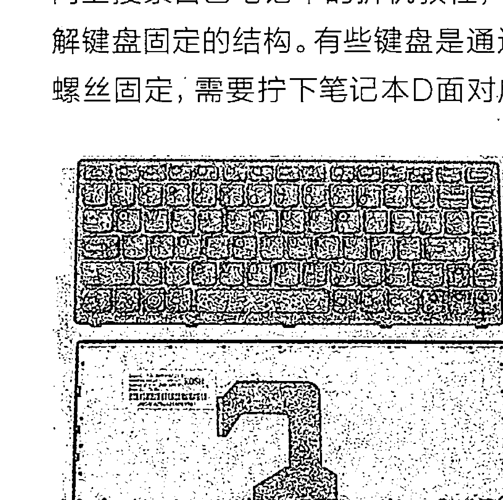

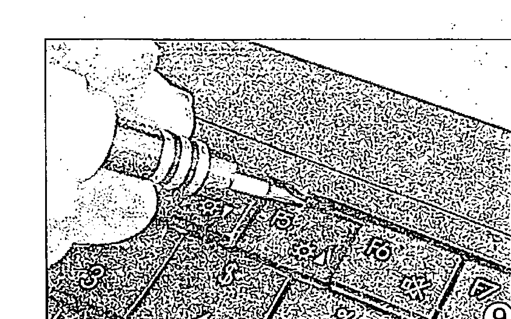

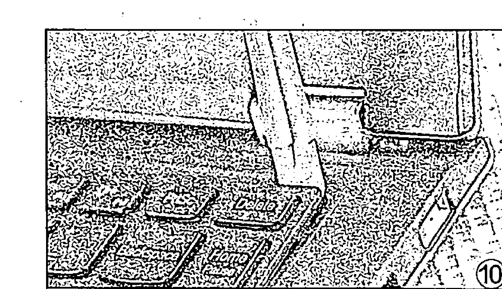


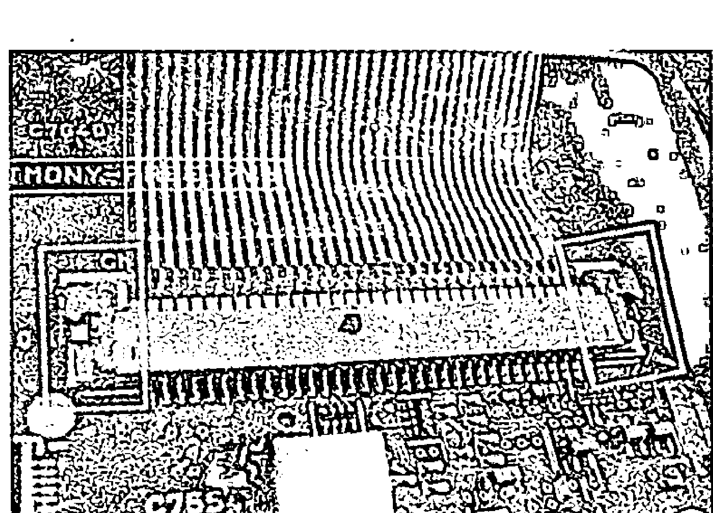

> 扩展阅读
> 一般来说，笔记本键盘没有必要挑选所谓的“原装”，由于键盘开模成本较高，很多笔记本（厂商/型号）都是直接从精元、达方、群光等键盘代工厂订货，这就让不同笔记本兼容同一款键盘变成了可能。不过，键盘代工厂可能会因笔记本厂商的需求对键盘进行一些定制优化，比如文字标识、按键大小、Fn和Ctrl键的位置等等。只要笔记本螺丝、排线相同，上述一些细节的差异不会影响到使用上的兼容性。

均衡游戏本的较量

### 微星GE62 PK 机械革命X6S-M

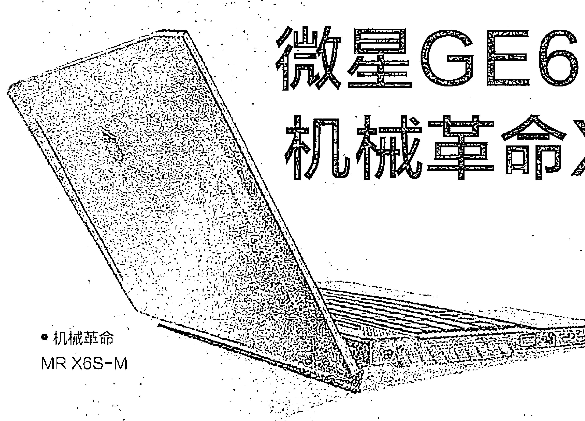

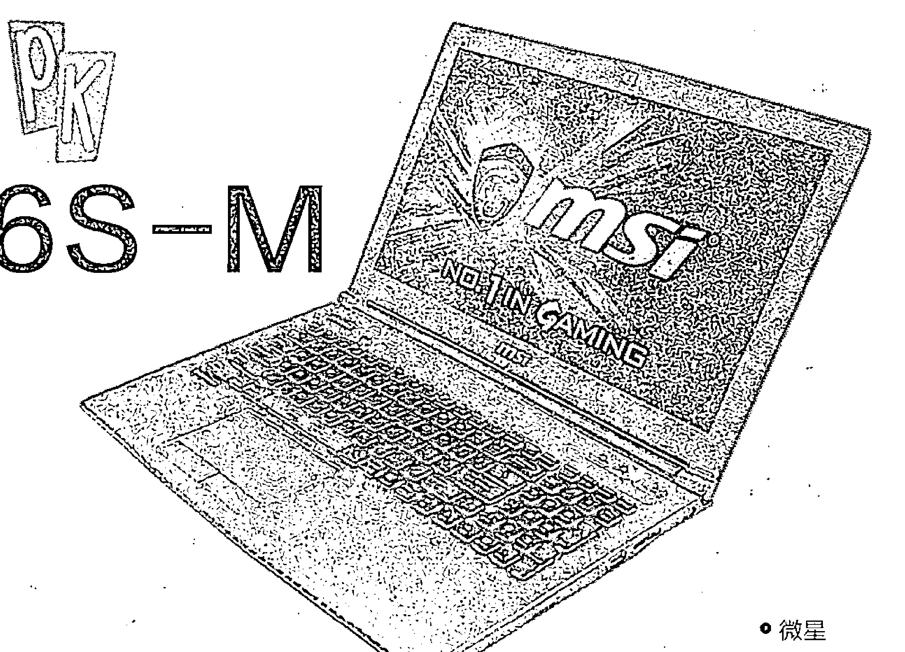

虽然PC行业正值严冬季节，但定位高端玩家的游戏笔记本却依旧保持着相对高速的发展势头。而微星GE62和机械革命MR X6S-M则是6000元档位颇受关注的游戏悍将，它们都武装GTX960M独显，并具备较强的扩展潜力。那么，谁更适合你？

不规矩的金属悍将

作为定位中高端的游戏本，微星GE62和机械革命X6S-M都引入了大量的金属材质，并在造型上采取了“不规矩”的设计风格。其中，微星GE62在顶盖表面加入了四条对称的凸起纹路，并呈现向中间合拢的趋势，整体感觉好似跑车疾驰；而机械革命X6S-M则参考了隐形战机的设计灵感，顶盖两侧向下凹陷，并融入了两道红色的背光纹理（图1），生怕别人不知道它定位“游戏机”的专属身份。

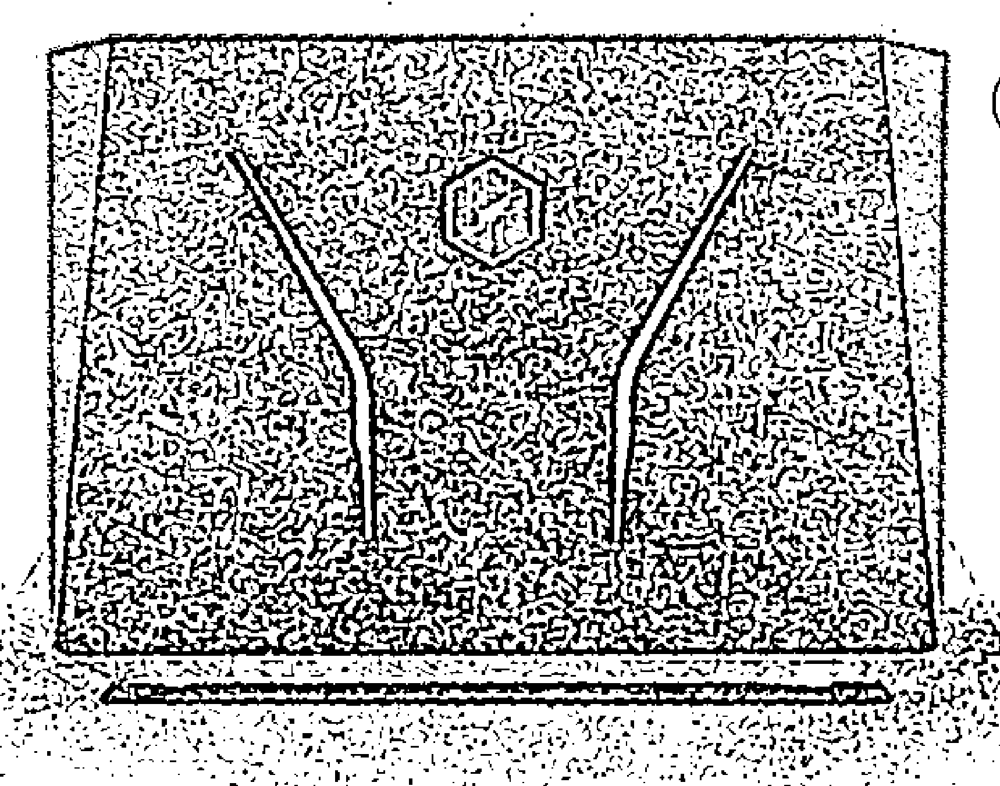

从细节感受态度

为了提升使用效率，微星GE62和机械革命X6S-M都配备了独立的快捷键。GE62在电源键旁边为玩家准备了一键降温按钮和背光开关，而X6S-M则提供了风扇加速、背光开关以及一键降频三颗快捷键。此外，X6S-M在机身底部加入了起落架设计，当屏幕开启后起落架可以让机身抬高5度（图2），从而增加了底部空气的流通，无形中提高了散热效率。由此可见，X6S-M在细节的设计上更显人性化。


虽然同属15.6英寸游戏本，但微星GE62却有着更为苗条的身材。在比X6S-M更薄更轻的前提下，GE62还额外加入了更多的USB接口以及标准的DVD刻录光驱（图3）。就工业设计一项而言显得难能可贵。

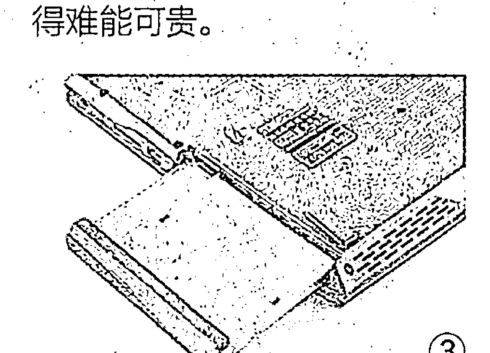

| 参数对比 | 微星GE62 2QC-264XCN | 机械革命MR X6S-M |
| :--- | :--- | :--- |
| 屏幕 | 15.6英寸IPS (1920×1080像素) | 15.6英寸IPS (1920×1080像素) |
| 处理器 | 酷睿i5-4210H | 酷睿i7-4710MQ |
| 内存/硬盘 | 8GB/1TB HDD | 8GB/64GB SSD+1TB HDD |
| 显卡 | NVIDIA GTX960M (2GB GDDR5) | NVIDIA GTX960M (2GB GDDR5) |
| 接口 | 读卡器、USB3.0×3、USB2.0×1、HDMI、miniDP、RJ45、DVD刻录光驱 | 读卡器、USB3.0×2、USB2.0×2、HDMI、VGA、RJ45 |
| 体积 | 383mm×260mm×27mm | 380mm×272mm×31.5mm |
| 重量 | 2.4kg | 2.66kg |
| 京东报价 | 5999元 | 6199元 |

### 表面参数对对碰

两款笔记本的价差为200元，但机械革命X6S-M却有着更为明显的性能优势，无论是酷睿i7-4710MQ处理器还是额外的64GB SSD，都让GE62 2QC-264XCN感到了极大的压力。值得注意的是，微星GE62系列游戏本选用了后缀为“H”的酷睿处理器，这意味着它们的CPU都是BGA封装（焊在主板上无法升级），而机械革命X6S-M的处理器还有升级的机会。所以如果你在意CPU性能且中意GE62，那就得一步到位挑选该系列的高配版。

### 内部拆机大比拼

两款游戏本拆机升级都需要从D面底盖入手，相对而言微星GE62拆机最容易，而机械革命X6S-M则要复杂一些（图4），因为后者要想加装SSD还需进入二次拆机，取下起到龙骨支架作用的挡板层（图5）。

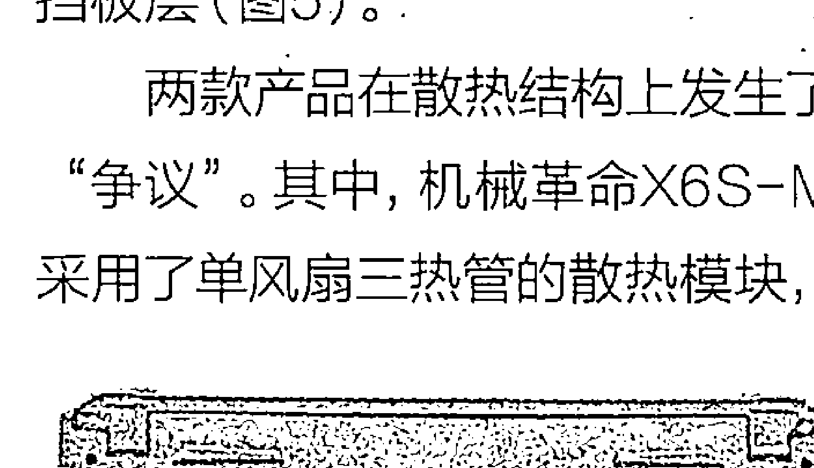

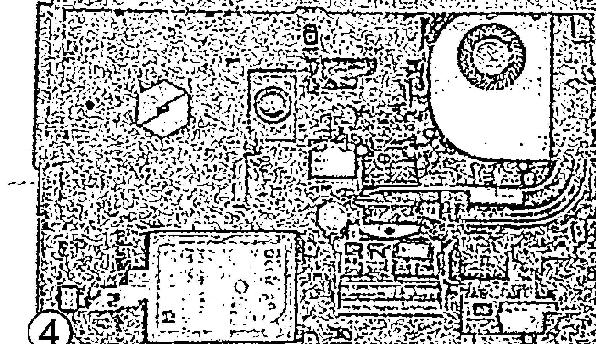

两款产品在散热结构上发生了“争议”。其中，机械革命X6S-M采用了单风扇三热管的散热模块，依靠更大功率的风扇将热量排出体外。而微星GE62则选择了双风扇四热管的散热方案，CPU和GPU分别由一组风扇和两根热管负责散热（图6），总体的散热效率要优于X6S-M。

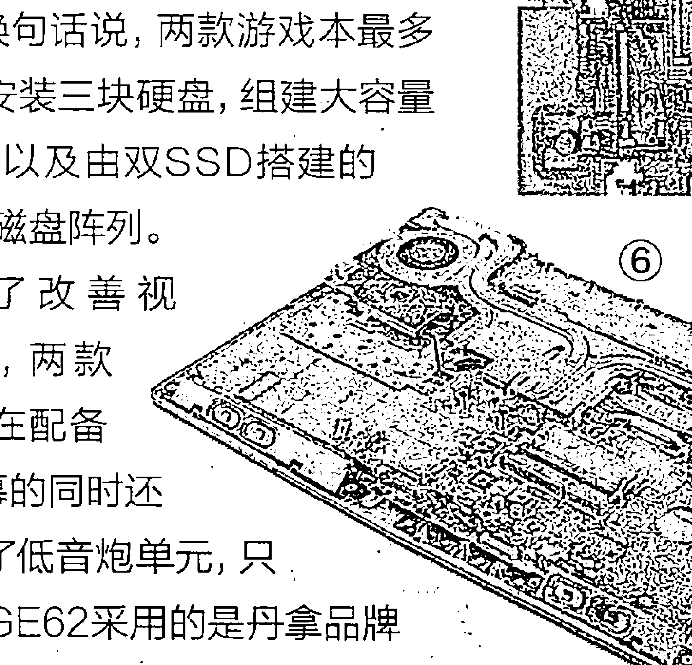

在扩展潜力上，机械革命X6S-M标配一个2.5英寸标准硬盘位，一个M.2插槽（支持80mm的SSD），并利用光驱接口加装了一个转接M.2插槽的转接卡。而微星GE62 2QC-264XCN的接口数量与X6S-M相同（图7），只是想利用光驱位加装硬盘需要自配托架。换句话说，两款游戏本最多可同时安装三块硬盘，组建大容量的HDD以及由双SSD搭建的RAID0磁盘阵列。


为了改善视听体验，两款游戏本在配备IPS屏幕的同时还都内置了低音炮单元，只是微星GE62采用的是丹拿品牌扬声器，而且还是更为夸张的4.1声道，从而获得了更为出色的临场表现。

### 扩展阅读
微星GE62系列有秘密

微星GE62系列包含很多子型号，它们除了表面上的参数不同外，在很多细节设计上也存在差异。比如本文介绍的2QC-264XCN就是GE62系列的低配版，它除了将七彩背光键盘换成了单色的白光键盘，电池容量也从51Wh缩水到了41Wh。而最令人感到遗憾的是，微星G62系列本来预留了三个M.2插槽，但2QC-264XCN却“阉割”了其中的两个，只保留了一个M.2插槽。要知道，G62三个M.2插槽中间的插槽可同时支持PCIE和SATA通道（图8），如果同时加装了三块SATA的SSD则组建顶级的SUPER RAID 2磁盘阵列，可实现突破1500MB/s的读写速度！

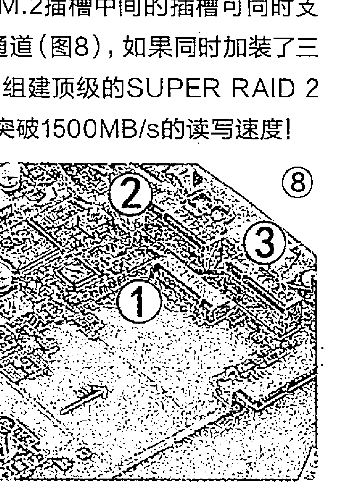

> 作为6000元档位游戏本的代表，微星GE62(2QC-264XCN)和机械革命X6S-M都有着炫酷的外观与较强的扩展潜力，都是不可多得的性价比游戏本。如果你比较在意性能，那两款产品中机械革命X6S-M凭借更高端的CPU和额外的SSD可轻松将GE62(2QC-264XCN)甩在后面。但是，如果你看中了这两款游戏本的设计，而且还能再提高预算的话，那高配版的GE62则可表现出更出色的竞争力，无论是更为炫酷的七彩背光灯，还是华丽的三个M.2插槽(比如6699元的2QD-059XCN)，都足以让X6S-M生出“美慕嫉妒恨”的心理。CF

## 主流游戏本从940M独显开始

文|曹操

在NVIDIA新一代显卡中，虽然入门级的GeForce 920M性能已经实现了翻身，但想在更高画质下挑战最新游戏还是有点力不从心。因此，如果你想兼顾性价比和性能，那940M无疑是最佳之选。

## 依旧是“马甲”的天下

在NVIDIA GeForce 900M系列移动显卡中，我们再次感受到了“马甲”的力量。940M、GTX950M、GTX960M分别是上代GT840M、GTX850M和GTX860M的马甲，着实凉了不少玩家的心。作为消费者，我们无法主动改变NVIDIA的产品策略，自然只能选择“被动接受”这一条道路了。

如果你想了解NVIDIA全新900M系列移动显卡的更多资料，请参考本刊2015年8期《马甲还是新丁 解读NVIDIA新900M系列移动显卡》这篇文章。

## 娱乐本需从940M独显起步

还好，虽然NVIDIA GeForce 940M是上代GT840M的马甲（图1），但其性能也说得过去，至少在720P分辨率+中高特效下能以30fps（平均帧数）以上的速度运行《孤岛惊魂4》、《使命召唤：高级战争》等最新3D大作（图2）。当然，如果你固执地想挑战1080P分辨率（外接显示器），那就得面临时常卡顿的挑战了。除非你肯提高预算，选择那些武装GTX级别高端独显的机型。

## 3999元起挑选940M独显本

考虑到940M乃上代GT840M的马甲，所以它在身价上肯定不应与那些武装GT840M的老款笔记本拉开差距，因此5000元就是它的“价格上限”。那么，面对琳琅满目的新品，我们又该如何抉择呢？

### 旧瓶装新酒型

为了降低研发成本，很多厂商习惯“旧瓶装新酒”，即在老产品模具的基础上更换新硬件以实现扮演“新品”的目的。此类产品中最具代表性的产品就是清华同方锋锐K560-03，其延续了前辈锋锐K5系列的模具，主打性价比。

### 清华同方锋锐K560-03

锋锐K560-03与本文其他产品最大的差别就是搭载了标准电压的四代酷睿i7-4710MQ处理器，其运算性能足以秒杀i7-5500U，与940M独显结合后可以发挥出更好的娱乐动力。

- 屏幕: 15.6英寸 (1920×1080像素)
- 处理器: 酷睿i7-4710MQ
- 内存/硬盘: 4GB/1TB
- 显卡: NVIDIA GeForce 940M
- 电池/厚度/重量: 37Wh/25.3mm/2.37kg

¥4199

### “新”欣向荣型

为了提升产品卖点，更多的品牌通过改换新模具，并引入时下流行的“轻薄风”概念，尽可能地帮产品瘦身以吸引消费者关注。与此同时，再借助多彩外观、新鲜的材质或更高品质的扬声器单元加以突围。

### 海尔S530 ¥3999

海尔S530的用料相对一般，但它依旧是一款纤薄选手，2.1kg重量在15.6英寸轻薄笔记本阵营中还是很有底气的。该产品的卖点在于配置，不足4000元就武装了相对高端的i7-5500U处理器，通过光驱位和mSATA插槽最多可加装3块硬盘。

- 屏幕：15.6英寸（1920×1080像素）
- 处理器：酷睿i7-5500U
- 内存/硬盘：4GB/500GB
- 显卡：NVIDIA GeForce 940M
- 电池/厚度/重量：38Wh/23mm/2.1kg

### 宏碁E5-573G-55YL

该产品的最大卖点就是引入了3D打印+激光蚀刻技术，将笔记本的AD两面打造出了类似亚麻的那种天然织物纹理。产品预留了光驱接口，用户可以自行购买光驱，或是通过硬盘托架加装第二块硬盘。

¥4199

- 屏幕：15.6英寸（1366×768像素）
- 处理器：酷睿i5-5200U
- 内存/硬盘：4GB/500GB
- 显卡：NVIDIA GeForce 940M
- 电池/厚度/重量：37Wh/29.2mm/2.4kg

### 惠普Pavilion 15-ab008TX

这是一款相对纤薄的大屏娱乐本，它在内置光驱的前提下将厚度和重量控制到了25mm和2.3kg左右，多种颜色版本和丹麦B&O音响也为其实添了不少卖点。

¥4199

- 屏幕：15.6英寸（1366×768像素）
- 处理器：酷睿i5-5200U
- 显卡：NVIDIA GeForce 940M
- 内存/硬盘：4GB/500GB
- 电池/厚度/重量：41Wh/25.2mm/2.29kg

### 华硕K501LB

该产品的A面经过拉丝工艺打造，体现出了浓郁的金属质感，在牺牲光驱之后将厚度控制到了21mm左右，而2kg的体重较很多14英寸的娱乐本也是不遑多让。在IceCool酷凉散热技术的帮助下，该产品还解决了掌托位置发热量大的问题。

¥4399

- 屏幕：15.6英寸（1920×1080像素）
- 处理器：酷睿i5-5200U
- 内存/硬盘：4GB/500GB
- 显卡：NVIDIA GeForce 940M
- 电池/厚度/重量：48Wh/21.7mm/2.0kg

### 极致纤薄型

NVIDIA GeForce 940M的发热量不算很高，而英特尔最新五代酷睿处理器的功耗表现也很理想。换句话说，无需特别夸张的散热模块即可搞定它们的散热需求。因此，以联想U41系列为代表的产品借此机会进一步压缩身材，获得了更为出色的便携属性。

### 联想U41-70

- 屏幕：14英寸（1920×1080像素）
- 处理器：酷睿i5-5200U
- 内存/硬盘：4GB/500GB
- 显卡：NVIDIA GeForce 940M
- 电池/厚度/重量：45Wh/19.3mm/1.68kg

联想U41-70是一款主打纤薄的娱乐本，它的厚度不足20mm，重量更是仅有1.68kg，比很多13英寸的机型还要轻薄。当然，纤薄的代价就是取消了内置光驱设计，但与金属打造的精致机身相比，有无光驱就不那么重要了。

¥4999

## 千元指纹手机的较量

### 中兴威武3 PK 酷派大神Note3

在2015年以前，指纹识别功能始终是顶级旗舰机的专利。如今，就连千元级别的手机也纷纷将指纹识别功能收入囊中，而中兴威武3和酷派大神Note3就是其中的代表。那么，这两款产品谁更适合你？

| 参数对比 | 中兴威武3 | 酷派大神Note3 |
| :--- | :--- | :--- |
| 网络 | 移动联通双4G (双卡双待) | 移动4G (双卡双待) |
| 屏幕 | 5.5英寸 (1920×1080像素) | 5.5英寸 (1280×720像素) |
| CPU | 高通骁龙615<br>(四核1.5GHz+四核1.0GHz) | 联发科MT6753<br>(八核1.3GHz) |
| GPU | Adreno 403 | ARM Mali T720MP3 |
| 内存/存储 | 2GB/16GB (支持128GB存储卡) | 2GB/16GB (支持64GB存储卡) |
| 摄像头 | 500万/1300万像素 | 500万/1300万像素 |
| 纤度 | 155.3mm×77.2mm×8.55mm | 151mm×77mm×9.3mm |
| 电池 | 3000mAh (不可换) | 3000mAh (不可换) |
| 参考售价 | 999元 | 899元 |

### 指纹模块藏背后

作为首批千元级指纹手机，中兴威武3和酷派大神Note3可谓“英雄所见略同”，都将指纹识别模块设计在了产品背后，也就是后置摄像头的正下方，正常持握时恰好处于食指的覆盖范围（图1），可以轻松进行指纹的识别解锁等操作。好消息是，两款机器都采用了新一代的触控式指纹技术，具备0.5s极速识别响应的能力，而且除了常规的屏幕解锁、程序加密等功能外，它们还可利用不同手指的指纹信息绑定指定的APP程序（图2）。比如你可以自定义使用食指进入微信，或者无名指进入QQ，一切都可根据你的习惯而定。需要注意的是，大神Note3支持指纹支付功能（图3），而中兴威武3貌似还未加入该功能。

遗憾的是，中兴威武3和酷派大神Note3并没有100%挖掘出后置式指纹识别模块的优势。手机行业的普遍观点认为，像iPhone 6这种前置指纹识别器的手机普遍会导致下边框过长从而出现“大下巴”的现象，而后置指纹则可最大限度帮助大屏手机提高屏占比。而威武3和大神Note3的屏占比并不理想，要知道魅族MX5也是一款5.5英寸的手机，在采用前置指纹模块的前提下依旧将机身长度控制到了150mm以内。当然，MX5的售价高达1799元，而本文的两款产品则不足千元，我们也不必过于纠结这个问题。

### 高配都带全网通

威武3和大神Note3在发布之初都以“全网通”作为核心卖点之一，为此它们都搭载了具备全网通“潜质”的64位八核处理器。其中，中兴威武3采用了高通骁龙615处理器，而酷派大神Note3则选择了联发科最新的MT6753处理器。就性能而言，骁龙615和MT6753处于伯仲之间，安兔兔测试都可轻松突破30000分大关（图4~5），在同价位手机上属于中上游的水准。

之所以说它们的全网通属于“潜质”，是因为中兴和酷派都采取了相同的策略，那就是只有高配型号才具备全网通能力，而更实惠的主打型号则会在网络支持上出现缩水。以中兴威武3为例，999元的青春版仅支持移动联通双4G，只有1299元的能量版和1499元的至尊版才支持4G全网通。而酷派大神Note3的表现更是可惜，899元的低配版连双4G功能都没了，仅支持移动4G一种标准，想体验全网通的话就得购买1099元的高配版了。因此，如果你对网络的要求较高，在选购产品时不要选错低配版哦。

### 强化拍照体验

作为千元机代表，威武3和大神Note3都进一步强化了拍照能力。两款手机的主摄像头都是1300万像素，采用5片式镜头。其中，威武3主摄像头的光圈为F2.2，而大神Note3的光圈大小则为F2.0。在光线充裕的环境下，两款手机的拍照效果都不逊于1500元以上的中高端手机，绝对可以满足用户日常的拍摄需求（图6）。

不过，就拍照软件的体验而言，继承努比亚特色NeoVision 5.0拍照APP的中兴威武3提供了更多拍照模式，比如电子光圈、星轨相机、光绘相机、延迟摄影等，结合支架固定后可以拍摄出媲美专业相机的照片。相对来说，大神Note3拍照软件所提供的拍照模式就有些常规了。

### 外观和细节的较量

外观和用料也是威武3和大神Note3的主要差异之一。大神Note3为了控制成本，选用了保守的塑料材质机身，并通过不同颜色的渐变色彩壳和磨砂材质纹理提升视觉效果和把握手感（图7）。威武3则引入了金属工艺，三段式的后盖中间部分采用了航空级铝合金，并通过CNC冲压加工和二次阳极氧化等工艺的处理之后更显档次。

值得一提的是，两款产品均支持存储卡扩充，但由于威武3的存储卡槽与SIM卡共占一个位置，所以我们只能在存储卡和双卡双待中任选其一（图8）。而大神Note3的两个SIM卡槽和存储卡槽则采用了分离设计，我们在使用双卡的同时依旧可以通过存储卡扩容。

曾几何时，指纹识别功能一直是数千元级别的高端机的专利，谁能想到如今只需千元就可体验指纹解锁的乐趣了。作为首批千元级指纹手机，中兴威武3和酷派大神Note3都不具备不俗的性能，只是威武3具备更细腻的屏幕以及做工上的优势，适合对外观设计要求更高的用户选择。虽然大神Note3在屏幕分辨率和塑料外壳材质上存在不足，但100元的价差对于千元机而言已经算是足够大的优惠折扣了。因此，如果你的预算吃紧，选择大神Note3也不会让你失望。

## 戴尔游匣7000-15 PK 神舟战神Z6

游戏笔记本面对的都是挑剔的游戏玩家，除了对主机配置要求较高外，外观是否炫酷也是考量游戏本的重要一环。而黑与红，无疑是最能激起玩家消费“荷尔蒙”的配色。下面，就让我们看看两款配置相近的“好色”游戏本的较量。

### 黑红搭配 看着不累

很多游戏笔记本都喜欢用红色与黑色搭配，呈现一种神秘的炫酷之感。戴尔新游匣7000和神舟战神Z6系列就符合这股潮流风暴，提供了红色外壳掌托+酷黑色键盘的子型号，视觉冲击力还是蛮震撼的。

两款笔记本都采用了15.6英寸全高清屏幕设计，IPS技术的加盟也保证了它们都具备接近完美的可视角度。值得一提的是，戴尔新游匣7000的高配版还可选配UHD（4K分辨率）的屏幕，只是售价也将进一步水涨船高。

### 武装高端独立显卡

作为定位游戏的娱乐悍将，戴尔新游匣7000和神舟战神Z6都采用了NVIDIA最新的GTX960M独立显卡，在3DMark11中可轻松取得P5000+的成绩，游戏性能在台式机领域的GTX750~GTX750TI之间，在1080P分辨率足以驾驭绝大多数3D游戏。两款游戏本在独显方面的差异是，新游匣7000配备了4GB GDDR5显存，而神舟战神Z6则仅标配2GB。不过，显存容量对性能的增益很小，4GB显存只有在UHD分辨率下游戏才能发挥全部潜力，而1080P分辨率的游戏环境2GB显存足矣。

为了与高端独显搭配，两款游戏本还选用了主频更高的H系列（BGA）封装的四代酷睿处理器。其中，5999元的戴尔新游匣7000搭载了酷睿i5-4210H双核处理器，睿频加速频率可达3.5GHz。而神舟战神Z6则更进一步，选用了高端的酷睿i7-4720HQ四核处理器，最大睿频频率可达3.6GHz。

为了控制高功耗的处理器与高端独显的发热量，两款游戏本都采用了双风扇的散热模块。比如新游匣7000就拥有3个散热通风口、2个80mm超大散热风扇和3根8mm铜热管构成的豪华散热系统（图1）。而神舟战神Z6则采用了双散热风扇和热管分离的设计，确保CPU和GPU的发热不会堆叠，并由机身后端的2个散热通风口排出体外。

| 参数对比 | 戴尔游匣7000 (Inspiron 7557) | 神舟战神Z6-i78154R2 |
| :--- | :--- | :--- |
| 屏幕 | 15.6英寸IPS (1920×1080像素) | 15.6英寸IPS (1920×1080像素) |
| 处理器 | 酷睿i5-4210H | 酷睿i7-4720HQ |
| 内存/硬盘 | 4GB/1TB HDD | 8GB/1TB HDD+128GB SSD |
| 独立显卡 | NVIDIA GTX960M (4GB GDDR5) | NVIDIA GTX960M (2GB GDDR5) |
| 主要接口 | 读卡器、USB3.0×3、HDMI、RJ45 | 读卡器、USB3.0×4、HDMI、VGA、miniDP、RJ45 |
| 体积 | 383mm×265mm×25.3mm | 385mm×268mm×28.5mm |
| 电池/重量 | 74Wh/2.57kg | 62Wh/2.53kg |
| 参考报价 | 5999元 | 5999元 |

### 来自外部接口的差异

戴尔新游匣7000拥有更为纤薄的外观设计，25.3mm的机身厚度在性能级游戏本领域也算“性感”了。而该产品纤薄的秘诀，则是牺牲了内置光驱模块，同时精简了外部接口，仅提供了3组USB和1个HDMI视频输出接口。

神舟战神Z6虽然机身相对偏厚，但在外部接口的配置上却堪称豪华。它的USB接口数量要比新游匣7000增加了1个，同时还多出了VGA和miniDP两个视频输出接口（图2），而S/PDIF光纤输出接口也可满足不少发烧级影音玩家的需求。

### 内部格局探秘

神舟战神Z6采用了由18650电芯构成的可拆卸电池模块，拥有62Wh的容量（图3）。该产品保留了内置的光驱位（标配减重模块），有需要的用户可以自行购买光驱位硬盘托架安装第二块2.5英寸SATA硬盘。此外，战神Z6在内部还增加了一个M.2插槽，用户可加装该标准的迷你SSD用于给磁盘提速（图4）。

戴尔新游匣7000采用了更薄的锂聚合物电池，而且容量更是达到了74Wh，而这也应该算是15.6英寸游戏本中的最强音了，由此也可为其带来近8小时的续航能力（官方标称）。和去年上市的14英寸游匣相比，15.6英寸的新游匣7000系列新增了一个M.2插槽（图5），终于可以由用户自行升级到HDD+SSD的双硬盘模块，实现容量与性能的平衡。

### 扩展阅读 还有更酷的选择

华硕旗下的“暗夜火神”N551JW也是一款引入了红黑配色的炫酷游戏本（图6），该产品的配置和价格与戴尔新游匣7000相似，采用了15.6英寸1080P屏幕，搭载酷睿i5-4200H处理器和GTX960M独显的组合，只是32mm厚度与2.7kg重量便携性一般。

总之，戴尔新游匣7000和神舟战神Z6都是同价位游戏本中“颜值”较高，且武装了GTX960M高端独显的代表，足以满足绝大多数玩家的“游戏梦”。神舟战神Z6的优势在于更为均衡的配置，酷睿i7和标配SSD的组合可满足玩家一步到位的选购心理，而新游匣7000则具备相对更为精致的做工，以及夸张的4K视野（高配）。如果你想以最低预算获得最大性能，战神Z6无疑是首选；如果你对品牌与品质的要求更高，新游匣7000更不会让你失望：CF。

可扮演“准PC”的平板电脑

文|曹操

如今很多家庭用户都想给客厅的电视找个“搭档”，而电视盒子和HTPC就是此类需求的衍生产物。问题来了，上述产品虽然可赋予电视更多娱乐功能，但产品形态却将它们束缚在了显示设备的身旁而缺乏移动性，这就给了双系统平板电脑异军突起的机会。

电视盒子与HTPC的尴尬

随着广电总局多次加强对电视盒子的监管力度，一度风光的盒子变得无比尴尬，很多我们熟悉的电视端视频APP纷纷下架，最终导致盒子无资源可用的窘境。另一方面，电视盒子的系统属于精简版的Android，它们在第三方APP的支持上存在诸多限制，如果没有影视内容资源的支撑，电视盒子无疑就会如同鸡肋。

双系统平板电脑的机会

预装Windows和Android双系统的平板电脑并非新事物，只是随着BIOS版本的更新，双系统切换和体验变得越加成熟，而不断走低的报价更是击溃了普通用户的心理防线。此外，Windows 10系统的出现，更是极大改善了Windows系统自身对触控操作不佳的缺陷，进一步提升了双系统平板的可玩性。比如，抢电视盒子和HTPC的饭碗。双系统平板电脑全部基于英特尔BayTrail-T平台设计，具备在最低画质运行LOL游戏的能力，而此类平板都会配备HDMI接口，同样可以作为电视的搭档，扮演HTPC或迷你PC的角色。此外，在切换到Android系统并安装“兔子视频”一类的APP之后，双系统平板也具备了视频直播和点播的能力，如此一来电视盒子的地位也就面临挑战了。最重要的一点是，双系统平板自带触控屏幕，哪怕没有接驳电视或显示器也不影响使用，并跟随我们走出家门在户外共享力量。那么，在挑选双系统平板时需要注意哪些问题呢？

我们在前几期介绍过的迷你PC被很多家庭用户所青睐，它们被作为替代HTPC的首选，与客厅的电视组成搭档。可惜，无论是迷你PC还是HTPC，它们都需要连接显示设备才能使用，也因此面临着耗电（总不能一直开着电视吧）以及缺乏移动性的尴尬。

台电X80HD

台电X80HD最大的亮点就是便宜，不足500元开销即满足了同时体验Windows 10和Android双系统的机会。需要注意的是，市面上很多更低价位的产品可能仅标配1GB内存，为了保证系统运行的流畅，2GB内存是必需的。

¥499

- 系统: Windows10 + Android
- 屏幕: 8英寸IPS (1280 × 800像素)
- 处理器: Atom Z3735F
- 内存/存储: 2GB/32GB (支持64GB存储卡)
- 电池: 4500mAh
- 厚度/重量: 8.9mm/328g

驰为Hi8

和台电X80HD相比，驰为Hi8在配置上要更为抢眼，它选用了主频更高的Atom Z3736F处理器，并将屏幕分辨率提升到了1080P规格，适合喜欢直接在平板上欣赏高清视频的用户选择。

¥499

- 系统: Windows10 + Android
- 屏幕: 8英寸IPS (1920 × 1200像素)
- 处理器: Atom Z3736F
- 内存/存储: 2GB/32GB (支持128GB存储卡)
- 电池: 5000mAh
- 厚度/重量: 7.9mm/352g

中柏EZpad 4s

中柏EZpad 4s最大的亮点是采用了10.6英寸屏幕，较常见的10.1英寸更大，但540g的体重依旧便携。此外，该产品配备了标准的USB接口和额外的MicroUSB，扩展能力更强。

¥699

- 系统: Windows 8.1 + Android
- 屏幕: 10.6英寸IPS (1366 × 768像素)
- 处理器: Atom Z3735F
- 内存/存储: 2GB/32GB (支持128GB存储卡)
- 电池: 6600mAh
- 厚度/重量: 9.88mm/540g

选购双系统平板须知

- 首先，尽量一步到位挑选直接预装Windows 10+Android的双系统新品，因为部分Windows 8.1+Android双系统的老款平板默认就开启了Windows下共享Android系统的磁盘共享功能，自行升级Windows 10会出现“无法更新系统保留的分区”的问题而导致升级失败（需重新刷机后才可升级，非常繁琐）。
- 其次，喜欢玩Windows系统游戏的玩家最好购买标配64GB存储空间的型号，并将游戏安装到系统空间中以缩短Loading时间。
- 最后，在Windows系统环境下与电视或显示器相连时，请按“Win键+P”选择“仅第二屏幕”的投影方式，让平板电脑自身屏幕处于熄灭状态以节约电力。

酷比魔方i6 Air

酷比魔方i6 Air采用了9.7英寸视网膜屏幕，并在屏幕顶部添加了光线感应模块，可以根据环境光线而改变背光亮度。

- 系统：Windows10+Android
- 屏幕：9.7英寸IPS（2048×1536像素）
- 处理器：Atom Z3735F
- 内存/存储：2GB/32GB（支持32GB存储卡）
- 电池：8000mAh
- 厚度/重量：8.8mm/500g

乐凡F8S

乐凡F8S的价格不算便宜，而它的特色就是选用了小众的8.9英寸1080P屏幕，兼顾了视野和便携性。这款产品同样配备了标准的USB接口和额外的MicroUSB接口，可同时接驳更多存储外设。

昂达V919 Air

昂达V919 Air的卖点源于外观设计，一体化金属机身和土豪金的配色显得十分高档，而8mm的厚度与450g的体重也不逊于苹果旗下的iPad Air。该产品的另一特色就是Windows和Android共享存储空间，方便了用户随时调取数据。

- 系统：Windows10+Android
- 屏幕：9.7英寸IPS（2048×1536像素）
- 处理器：Atom Z3735F
- 内存/存储：2GB/64GB（支持128GB存储卡）
- 电池：7200mAh
- 厚度/重量：8mm/450g

- 系统：Windows 8.1+Android
- 屏幕：8.9英寸IPS（1920×1200像素）
- 处理器：Atom Z3735D
- 内存/存储：2GB/64GB（支持128GB存储卡）
- 电池：5800mAh
- 厚度/重量：9.8mm/460g

针尖对麦芒

红米Note2
PK 坚果手机

●锤子坚果手机

●红米Note2标准版

最近千元级手机市场格外热闹，继魅蓝Note2、中兴威武3等热销机型之后，小米和锤子也纷纷祭出了自家的杀手锏：红米Note2和坚果手机。那么，这两款高性价比新机谁更适合你？

| 参数对比 | 红米Note2标准版 | 锤子坚果手机 |
|---|---|---|
| 网络 | 移动联通双4G（双卡双待） | 移动联通双4G（双卡双待） |
| 屏幕 | 5.5英寸（1920×1080像素） | 5.5英寸（1920×1080像素） |
| CPU | 联发科Helio X10（MT6795） 八核2.0GHz（高配版为2.2GHz） | 高通骁龙615 四核1.5GHz+四核1.0GHz |
| GPU | Power VR G6200 | Adreno 405 |
| 内存/存储 | 2GB/16GB（支持32GB存储卡） | 2GB/16GB（不支持存储卡） |
| 摄像头 | 500万/1300万像素 | 500万/1300万像素 |
| 厚度 | 152mm×76mm×8.25mm | 152.9mm×76.9mm×9.0mm |
| 电池/重量 | 3060mAh（可换）/160g | 2900mAh（不可换）/155g |
| 参考价格 | 899元 | 899元 |

用料设计的对比

作为千元机的代表，红米Note2和坚果手机都放弃了相对昂贵的金属机身，而踏踏实实选择了塑料材质。为了提升卖相，两款手机都融入了“多彩元素”，比如红米Note2可选灰、白、黄、蓝、粉五种颜色的后盖（图1），而坚果手机更是拥有包括红、紫、绿在内的七色后盖（图2），用户可以根据自己的喜好搭配不同风格的炫彩后盖调节心情。

坚果手机的后盖采用了竖条纹路设计，手感不错并且清新范儿十足，但代价则是49元的额外开销。红米Note2的后盖只是在聚碳酸酯材质的基础上加入了细磨砂处理，虽然手感不如坚果，但其成本却仅需9.9元（搭配手机购买时的优惠价）。

就整体设计而言，两款手机算是半斤八两。坚果手机延续了锤子手机的“对称设计”，在机身左右两侧都配备了连体式的快捷键（图3），用户可根据习惯将一侧按键设定为音量键，而另一侧则可自定义其他功能，手机底部的扬声器孔分别位于MicroUSB接口两侧；顶部的耳机和电源开关也是各站一边。总之，坚果手机的整体感觉就是“小清新”，简约时尚，把握手感不错。可惜的是，该产品的屏幕被厚厚的边框包裹其中，多少感觉有些别扭。

红米Note2的身材与坚果手机类似，其最大特色是在顶部增加了红外模块，可以随时扮演电器遥控器的角色（图4）。此外，该产品沿用了可换电池以及加装存储卡的设计，对容量要求较高的用户无需购买32GB高配版（999元），如今50元左右即可买到32GB的Micro-SD卡，用省下来的50元可以把所有彩壳购买齐。

硬件规格上的差异

坚果手机采用了千元手机惯用的骁龙615八核处理器；基本可以满足Android平台的大型3D游戏运行所需。可惜，该产品没有发挥出骁龙615应有的全网通特色，仅支持移动联通双4G（想支持电信4G需额外的专利成本，所以坚果手机并没有采用全网通基带芯片）。红米Note2在配置上的最大亮点就是选用了联发科Helio X10八核处理器，和我们熟悉的乐视超级手机（1499元）、OPPO R7 Plus（2999元）等中高端手机同芯。就性能而言，Helio X10具备秒杀骁龙615的实力，更适合喜欢3D游戏的玩家考虑。

在主摄像头方面，红米Note2和坚果手机都选用了1300万像素的三星传感器，又有F2.2大光圈。其中，红米Note2支持相位对焦，而坚果手机则是标准的BSI背照式传感器。从用户的实际反馈来看，两款手机的实际拍摄效果处于伯仲之间，在优化调校方面都还有一定的改进空间。

系统侧面的体验差异

红米Note2采用了基于Android 5.0深度定制的MIUI 7系统，其最大的特色就是快（流畅）和省（省电）（图5）。根据用户的测试，红米Note2的系统流畅度和开启APP的等待时间要比定位高端的小米Note还要快，这让动辄1999元起步的老大哥们情何以堪。

坚果手机预装的Smartisan OS 2.0是基于Android 4.4深度定制而来，其特色是九宫格、拟物化和稳定感。简单来说，用户可以在Android原生界面与九宫格或十六宫格之间切换（图6），并坚持着被iOS弃用的拟物化APP图标和界面风格，并增加了语音识别、Mac同步应用等功能，在体验上较锤子上代手机要好用不少。

就实际体验而言，MIUI7在流畅度上要超过Smartisan OS 2.0，通过丰富的主题、字体资源，可以随用户心意而随时换装，可玩性十足。而Smartisan OS 2.0的优势则是源于默认九宫格界面的简洁，上手十分容易。总之，两种系统各有粉丝和拥簇，各取所好即可。

> 作为时下最热的千元机新品，红米Note2和坚果手机都算是极具诚意的产品，前者将用于1500元以上中高端手机的联发科Helio X10打入了“凡间”，最终让红米Note2获得了不逊于1999元起小米Note的性能和体验（除了做工稍逊）。坚果手机的配置算是均衡和全能，899元的起价远远低于该产品发布前1499元的预期价，自然博得了更多用户的关注和好评。

但是，千元级手机比拼的就是性能、体验和价格。如果从这三点出发，799元起（移动版）的红米Note2显然更具性价比，所以如果你在意性能，而且还仅是移动4G用户，红米Note2可以让你以更低的开销获得更好的体验。如果你一直对Smartisan OS情有独钟，坚果手机可以让你以1/3的开销就能获得锤子T1手机的体验，相信这也是一种诱惑吧。CF

逼台式机“下岗”

17.3英寸巨屏笔记本怎么选

文|曹操

如今越来越多的家庭用户都喜欢将笔记本作为家里唯一一部PC，对视野要求较高的玩家可能还会再配个显示器。如果你已决定彻底让台式机“下岗”，那就不妨一步到位，挑选一部性能和扩展能力更为均衡的17.3英寸巨屏笔记本吧。

为什么选择17.3英寸

14英寸和15.6英寸是最主流的笔记本尺寸，前者具备不错的便携性，适合用户随身携带上下班；后者拥有相对更大的视野，适合在室内“留守”。问题来了，很多用户觉得15.6英寸视野依旧不够大，在扩展能力上也是稍显薄弱。此时，比15.6英寸视野面积增大23%的17.3英寸笔记本便映入了眼帘。

巨屏笔记本更具全能潜质

由于17.3英寸巨屏笔记本拥有更为宽大的机身，所有此类产品几乎都保留了光驱（或是用减重模块替代光驱），并提供4个以上的USB接口，充裕的内部空间也有利于散热优化。换句话说，哪怕17.3英寸笔记本没有配备M.2或mSATA这种迷你SSD插槽，也能借助光驱位的硬盘托架，去安装第二块SSD硬盘，实现存储容量和速度的完美平衡。

超值之选

考虑到17.3英寸笔记本大都是家庭用户买来取代台式机所用，是否具备足够的娱乐动力就是选购它们的前提条件。在这里，笔者向大家推荐配备NVIDIA GT840M/940M或更高级别独显的产品，以获得在1080P分辨率下流畅运行3D游戏的资质。

华硕K751LN4210

华硕K751LN是目前最超值的17.3英寸巨屏本之一，它采用四代酷睿i5和GT840M独显的组合，具备较强的娱乐动力。需要注意的是，该产品采用板载4GB内存的设计，并留有一个闲置的内存插槽，想加装内存需要从C面着手拆机，并拆下整个PCB主板。

此外，K751LN并没有配备M.2或mSATA插槽，想安装第二块硬盘只能牺牲光驱使用硬盘托架。

¥3999

- 屏幕: 17.3英寸 (1920×1080像素)
- 处理器: 酷睿i5-4210U
- 内存/硬盘: 4GB/1TB
- 显卡: NVIDIA GT840M
- 厚度/重量: 31.2mm/2.8kg

宏碁E5-772G-59TT

宏碁E5-772G系列包含无数子型号，本文介绍的为低配版，屏幕分辨率只有1600×900像素。该产品采用五代酷睿i5和NVIDIA最新940M独显的组合，并选用SSHD混合硬盘与之搭配，整体配置更为均衡。此外，E5-772G-59TT虽然预留了光驱位，但随机仅标配减重模块，有需求的用户可以自行升级光驱或硬盘托架。

¥4499

- 屏幕: 17.3英寸 (1600×900像素)
- 处理器: 酷睿i5-5200U
- 内存/硬盘: 4GB/8GB+ 500GB混合硬盘
- 显卡: NVIDIA 940M
- 厚度/重量: 27.5mm/3kg

均衡之选

如果你的预算比较宽裕，那就尽量挑选武装GTX950M或更高级别独显的型号，以获得在更高画质下畅玩3D游戏的能力。此外，为了让17.3英寸笔记本更好地胜任台式机替代者的角色，能否加装3块硬盘也可列入考察项。

微星GE70 2QE-858XCN

微星GE70 2QE是一款非常“厚实”的巨屏游戏本，其最大的特色就是采用了多彩键盘背光设计、杀手网卡和丹拿品牌扬声器。配置方面，该产品采用了主频较高的H系列四代酷睿i5，在GTX960M独显的帮助下可在1080P高画质下体验更多3D大作。此外，GE70 2QE不仅内置光驱，还拥有一个闲置的mSATA插槽，用户最多可加装3块硬盘。

- 屏幕：17.3英寸（1920×1080像素）
- 处理器：酷睿i5-4210H
- 内存/硬盘：8GB/1TB
- 显卡：NVIDIA GTX960M
- 厚度/重量：35mm/3.0kg

雷神G170T

雷神G170T采用了17.3英寸广色域全高清屏幕，机器表面还选用了手感出色的类肤漆材质，并拥有VGA、HDMI和miniDP视频输出接口，可实现三屏显示功能。此外，该产品搭载高端的四代酷睿i7和GTX960M独显的组合，通过M.2插槽和光驱位，同样可以加装最多3块硬盘。

- 屏幕：17.3英寸（1920×1080像素）
- 处理器：酷睿i7-4720HQ
- 内存/硬盘：8GB/1TB
- 显卡：NVIDIA GTX960M
- 厚度/重量：31.9mm/3kg

高端之选

我们都知道，笔记本专用的移动处理器性能远逊于同档次的台式机处理器。那么，当台式机处理器可被笔记本所用之后，CPU性能的瓶颈也就不复存在。此外，NVIDIA顶级的GTX970M/GTX980M已具备70%以上顶级台式机显卡的性能，足以赋予笔记本挑战顶级3D大作的实力。

神舟战神GX7-GL7S1

和其他产品相比，神舟战神GX7-GL7S1的厚度和重量可能有些超标，但它的性能却足以秒杀同价位的其他竞争对手。原因很简单，这款产品将本应用于台式机领域的六代酷睿i7处理器塞进了体内（还可超频），同时还武装了配备6GB GDDR5显存的GTX970M独显，并通过双风扇七铜管缓解散热压力，而4个DDR4内存插槽、2个M.2插槽、2个2.5英寸硬盘插槽的扩展能力也不逊于台式机。如果你的预算不足万元，则可考虑神舟旗下的战神G8-17极速版，这款产品改用i7-4720HQ和GTX980M独显，价格为9999元。

- 屏幕：17.3英寸（1920×1080像素）
- 处理器：酷睿i7-6700K
- 内存/硬盘：16GB/256GB SSD
- 显卡：NVIDIA GTX970M
- 厚度/重量：38.7mm/3.9kg

## 轻薄大屏游戏本
## 华硕V505L VS 惠普新ENVY 15

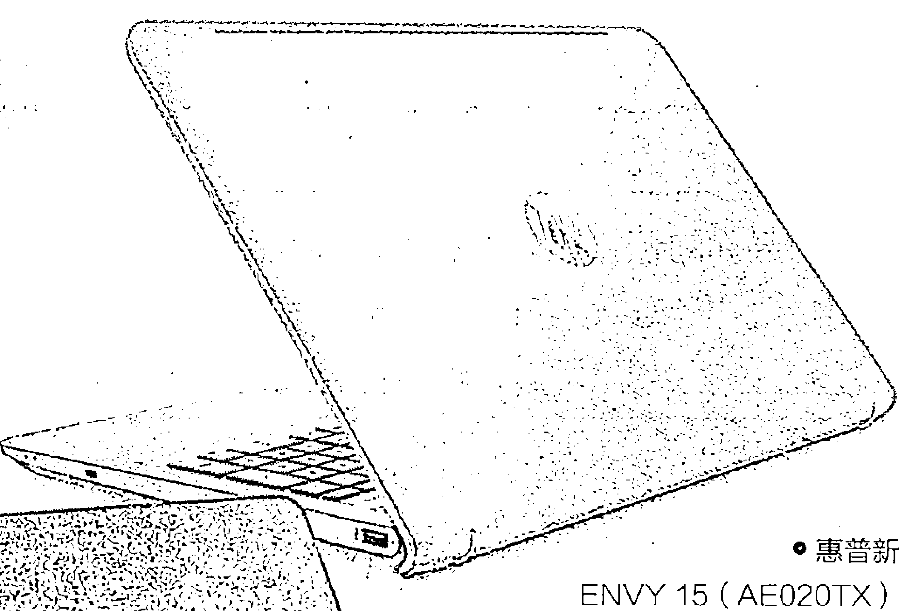

宽阔的视野、强劲的性能、持久的续航、轻薄的身材，集上述卖点于一身的笔记本无疑最能博得用户关注。华硕V505L和惠普新ENVY 15就是符合这些卖点的新品，那么它们之间谁更适合你？

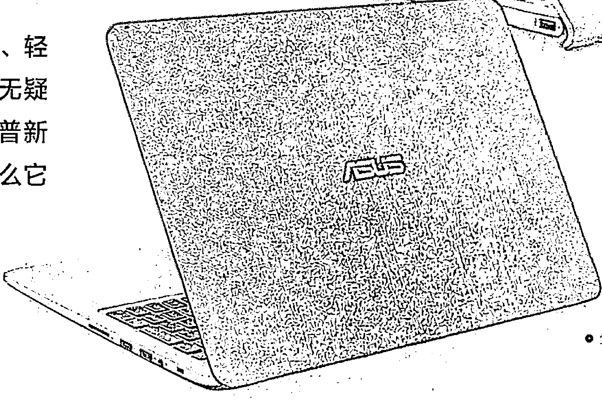

## 轻薄金属新秀

华硕V505L和惠普新ENVY 15都是拥有15.6英寸1080P大视野的娱乐本，而且它们都采用了纤薄化的设计，就便携性而言不逊于很多14英寸的竞品。其中，华硕V505L机身最厚处仅21.7mm，2.05kg的体重在15.6英寸笔记本阵营中堪称轻盈（图1）。而惠普新ENVY 15也不逊色多少，22.9mm厚度和2.19kg体重也算不错的成绩。

| 参数对比 | 华硕V505L | 惠普新ENVY 15 (AE020TX) |
| :--- | :--- | :--- |
| 屏幕 | 15.6英寸 (1920×1080像素) | 15.6英寸 (1920×1080像素) |
| 处理器 | 酷睿 i5-5200U (双核2.2GHz~2.7GHz) | 酷睿 i5-5200U (双核2.2GHz~2.7GHz) |
| 内存/硬盘 | 4GB/500GB (5400rpm) | 4GB/1TB (5400rpm) |
| 显卡 | NVIDIA GTX950M (2GB DDR3) | NVIDIA GTX950M (4GB DDR3) |
| 主要接口 | 读卡器、USB3.0×2、USB2.0×2、HDMI、RJ45 | 读卡器、USB3.0×4、HDMI、RJ45 |
| 体积 | 382mm×255mm×21.7mm | 384mm×255mm×22.9mm |
| 电池/重量 | 48Wh/2.05kg | 55Wh/2.19kg |
| 参考报价 | 4999元 | 5499元 |

两款笔记本都采用了金属材质的A面（顶盖）和C面（掌托），由此解决了纤薄机身的强度问题。其中，华硕V505L的外壳由金属拉丝工艺打造，顶盖采用了深蓝配色，与银色的机身形成了鲜明对比。

惠普新ENVY 15的机身采用了Unibody一体成型设计，整机以银色为主，显得更为简约时尚。这款产品配备了特殊的转轴切面设计，当屏幕开启后转轴部分会抬高机身（图2），起到提高空气流动的效果，而转轴两侧镶嵌的条形脚垫也避免了划伤隐患。

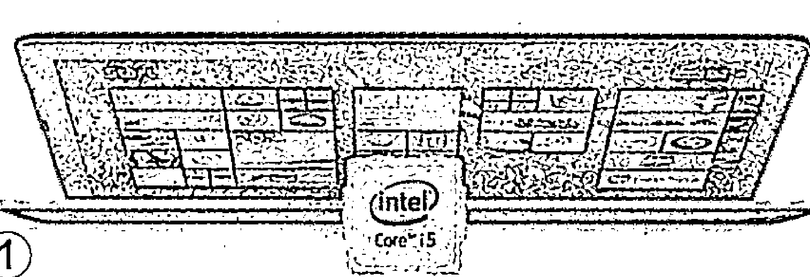

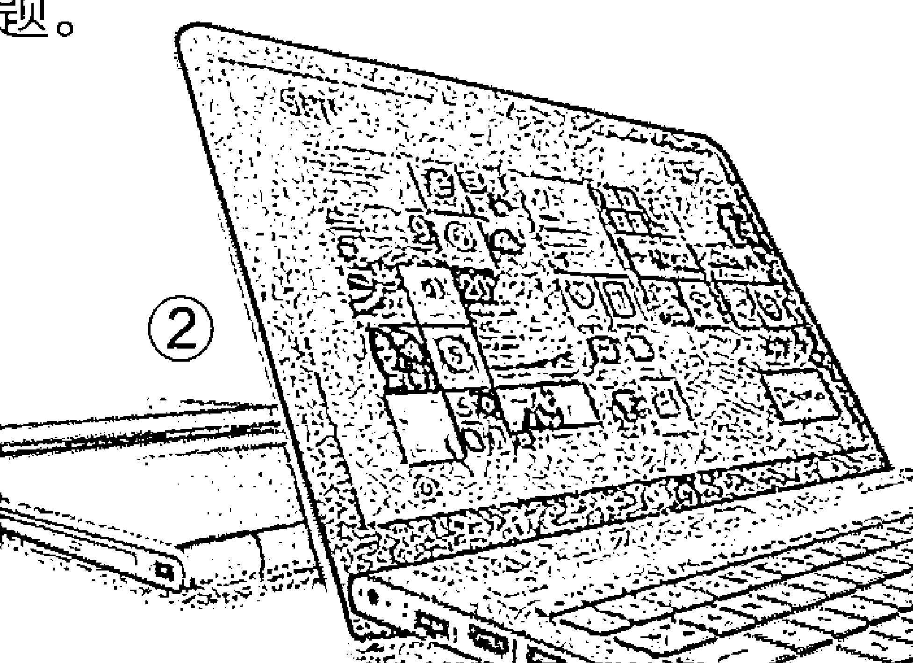

值得一提的是，华硕V505L和惠普新ENVY 15的键盘都采用了全尺寸分岛式键盘，所有的键帽全部从C面金属外壳内凸出，不仅视觉效果和手感出众，也不存在传统键盘结构的缝隙容易堆积灰尘碎屑的问题。

## 毫不含糊的性能

虽然机身纤薄，但华硕V505L和惠普新ENVY 15都采用了NVIDIA最新的Geforce GTX950M独显，这颗独显可以在3DMark11测试中取得接近4000的分数（P档），游戏性能可以秒杀Geforce 940M，也因此可以获得“游戏本”的资质（图3）。

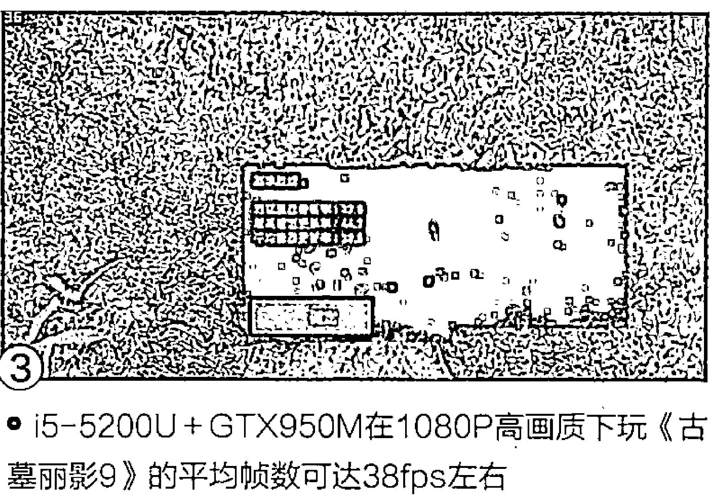

## 扩展能力大比拼

两款笔记本都因纤薄而牺牲了VGA接口，只保留了一个HDMI输出接口。不过，惠普新ENVY 15所配备的4个USB接口都是3.0标准，而华硕V505L的USB则是2.0和3.0标准各两个，相对而言新ENVY 15的优势更大一些。

如果你想拆机升级或除尘，只需拧下两款产品底部的螺丝即可拆下底盖，难度都不高。其中，惠普新ENVY 15提供了两个内存插槽（最大支持16GB内存），同时保留了光驱扩展位和一个M.2插槽，我们可以通过硬盘托架额外再添加两块硬盘（图4）。而华硕V505L的内部结构则颇为紧凑，采用了板载4GB内存和一个内存插槽的结构，最大支持12GB内存。可惜，该产品仅提供了一个额外的M.2插槽，可以由用户自己添加SSD升级（图5），在升级潜力方面新ENVY 15占优。

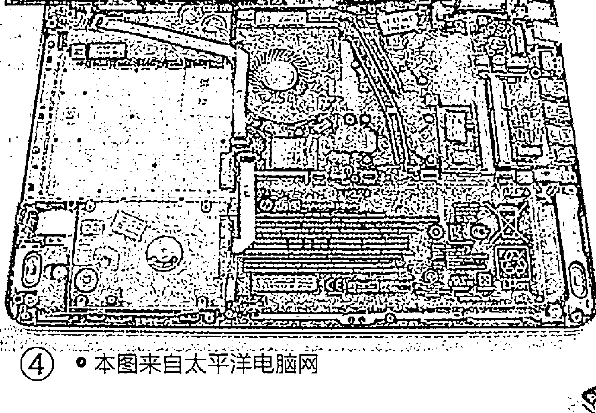

值得注意的是，两款笔记本都将CPU和GPU芯片设计在了主板中部靠后的位置，好处是其工作时只会导致C面键盘中心偏上位置温度较高，而用户最常接触的掌托和键盘两侧则可保证相对清凉的状态，不会因温度而影响使用体验。在散热模块的设计上，华硕V505L采用了双风扇的结构（图6），在散热效率方面要比新ENVY 15的单风扇更高一些。

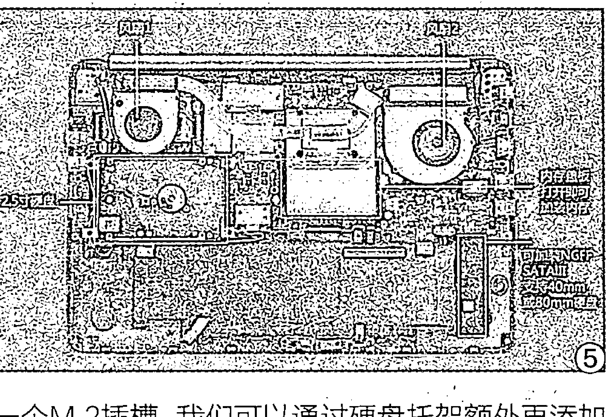

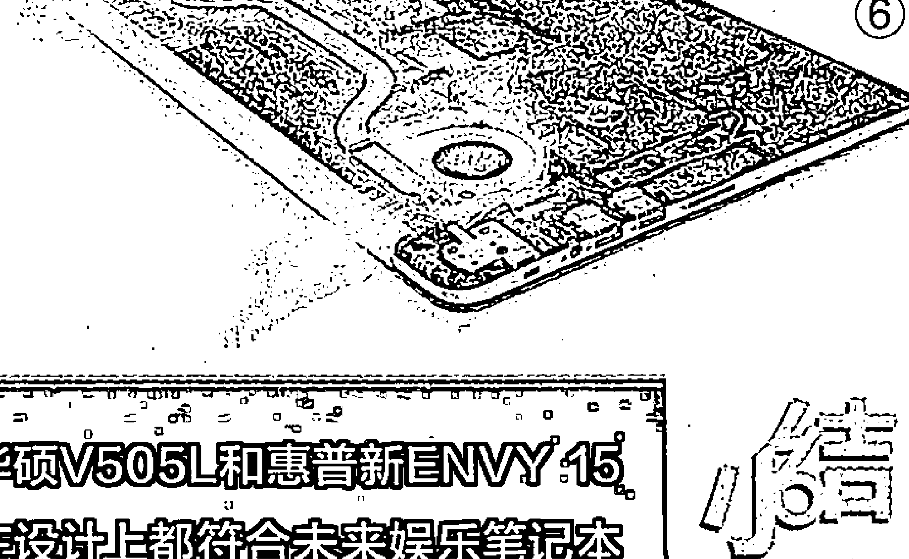

## 其他特色功能对比

华硕V505L的屏幕可以通过预装的靓彩技术在不同显示模式下切换（图7），在护眼模式下可有效地抑制屏幕所发出的短波蓝光，降低因长时间使用而造成的眼睛疲劳与视力损害。此外，该产品同样支持SonicMaster美声大师音效技术，可以带来不错的音频体验。

惠普新ENVY 15在音频方面与丹麦B&O音响合作，主机内配备了四个扬声器单元组成的4.1声道，就音质而言的表现甚至要在华硕V505L之上。此外，新ENVY 15还采用了背光键盘，并支持超广范围的亮度调节。

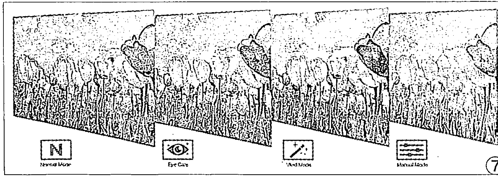

## 总结

华硕V505L和惠普新ENVY 15在设计上都符合未来娱乐笔记本的发展趋势：纤薄机身、超长续航（搭配低功耗处理器）、较强性能（中高端GTX950M独显）、额外SSD支持（M.2插槽扩容），都是接近完美的15.6英寸大屏娱乐本。不过，新ENVY 15在设计方面更显前卫，并具备更优秀的扩展和音频表现力，只是价格方面较华硕V505L要贵出一块256GB SSD硬盘的价钱。所以，如果你更在意性价比，不足5000元的华硕V505L显然更为超值。

## 谁是“待机王”
## 联想P1 PK 金立M5

如今智能手机的硬件规格虽然越来越强，但随之而来的则是无法回避的“一天一充”的尴尬。为此，不少用户都将目光投向了武装超大电池的“待机王”，而联想P1和金立M5，则是在续航上极具诱惑力的一对竞品。

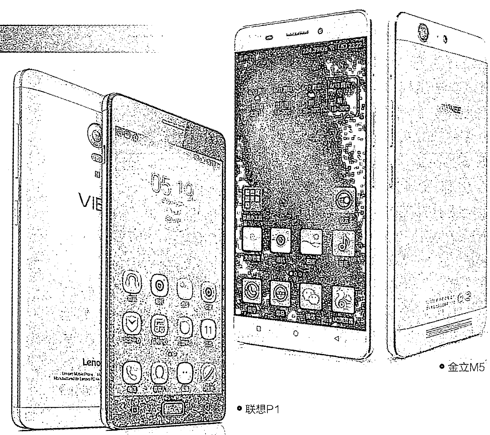

## 牺牲轻薄换电量

从设计的角度来看，联想P1和金立M5都与时下流行的“轻薄风”背道而驰。其中，联想P1属于在厚度方面“超标”，9.9mm的厚度似乎已经倒退到了2年前主流手机的标准（图1）。而金立M5虽然将厚度控制到了8.5mm，但其重量却超过了210g大关，几乎与6.8英寸的华为P8 Max（228g）持平！

| 参数对比 | 联想P1 | 金立M5 |
| :--- | :--- | :--- |
| 网络 | 全网通（双卡双待） | 全网通（双卡双待） |
| 屏幕 | 5.5英寸IPS (1920×1080像素) | 5.5英寸AMOLED (1280×720像素) |
| CPU | 高通骁龙615 四核1.5GHz+四核1.0GHz | 联发科MT6735 四核1.5GHz |
| GPU | Adreno 405 | ARM Mali-720MP2 |
| 内存/存储 | 3GB/16GB (支持128GB存储卡) | 2GB/16GB (支持128GB存储卡) |
| 摄像头 | 500万/1300万像素 | 500万/1300万像素 |
| 体积 | 152.9mm×75.6mm×9.9mm | 152mm×76mm×8.5mm |
| 电池/重量 | 5000mAh(不可换)/187g | 6020mAh(不可换)/214g |
| 参考价格 | 2199元 | 2299元 |

当然，这种在轻薄属性上的牺牲还是有意义的，比如联想P1硬是在5.5英寸的身材里塞进了5000mAh电池，并打破了单体电池最大容量的纪录。而金立M5为了容纳破天荒的6020mAh电池，通过改用双电芯设计弥补了充电时高温可能带来的安全隐患（图2）。

为了解决大电池导致的充电时间延长问题，两款产品都支持快速充电技术。其中，金立M5可以在5V/2A和9V/2A两个标准间智能切换，充电功率最高为18W，充电5分钟即可通话2小时26分钟（官方参数）。而联想P1独立MCU充电管理芯片支持在5V/7V/9V/12V四个档位间智能切换，充电功率最高可达24W，充电5分钟可通话3小时。从充电参数来看，显然是联想P1更为给力，再加上其电池容量本身就比金立M5小了1000mAh，所以可以更快速地充满电力。

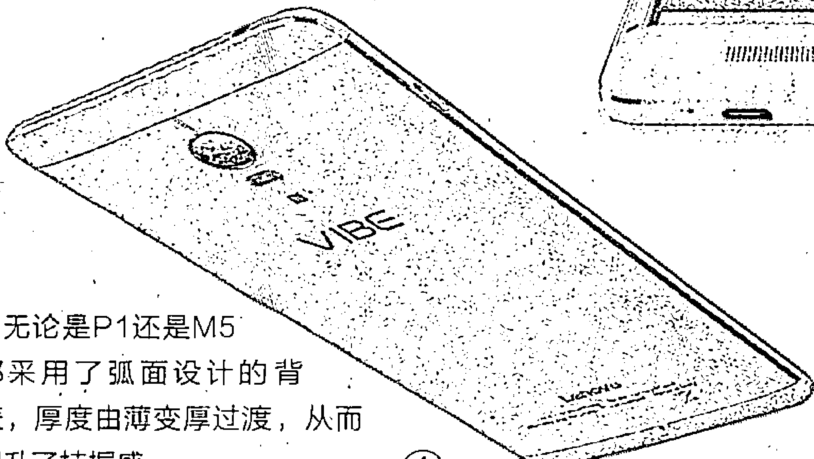

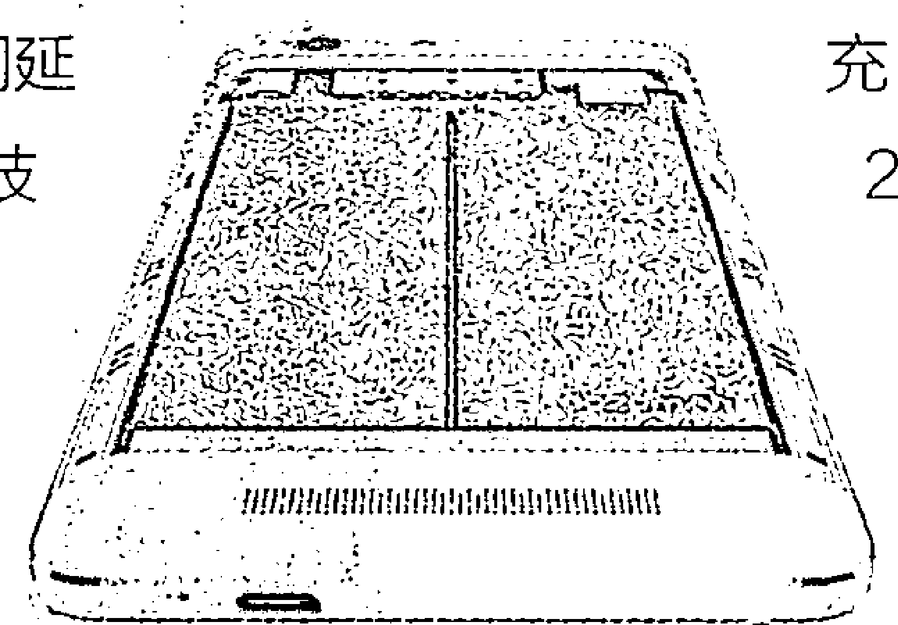

值得一提的是，金立M5的屏幕分辨率停留在了1280×720像素标准，并将屏幕材质换成了AMOLED，在提升显示效果之余还具备更为省电的优势。另一方面，联想P1为了弥补IPS材质1080P耗电较高的缺点，引入了独特的AD屏幕算法，官方称该技术可让5.5英寸屏幕达到5英寸屏幕的功耗，较传统1080P屏幕节能25%。

## 诚意满满的“软节能”

作为以待机为主要卖点的产品，联想P1和金立M5自然不会仅满足于超大的电池容量，它们在系统层面的节能优化同样极具看点。以金立M5为例，该产品可将设置的背景色改为黑色（充分发挥AMOLED屏黑色不耗电的优点），并加入了绿色后台、同步心跳功能（图3）。前者可在手机灭屏后自动关闭非白名单的后台程序，而后者则可减少CPU唤醒次数。此外，金立M5还提供了极致省电模式，在该模式下以黑白色为界面，冻结电话短信等应用外的所有APP，实现极致的低耗电状态。

联想P1的省电思路和金立M5类似，都是通过限制后台APP自启、联网以及其他耗电权限实现长效待机。不过，P1的独特省电模式较M5有了进一步的创新，它可通过机身左侧开关一键启动节能模式，而在该模式下还可加入三个自定义APP（如微信和QQ），并赋予三个APP连接网络的权限（其他APP全部冻结，无法自启和联网）（图4）。如果说金立M5的极致省电模式是以“变身功能机”为代价换来的省电，而联想P1的省电模式就是可以聊QQ和微信的“功能机”。当然，联想P1的省电模式也可强制断网，仅保留功能机的功能。

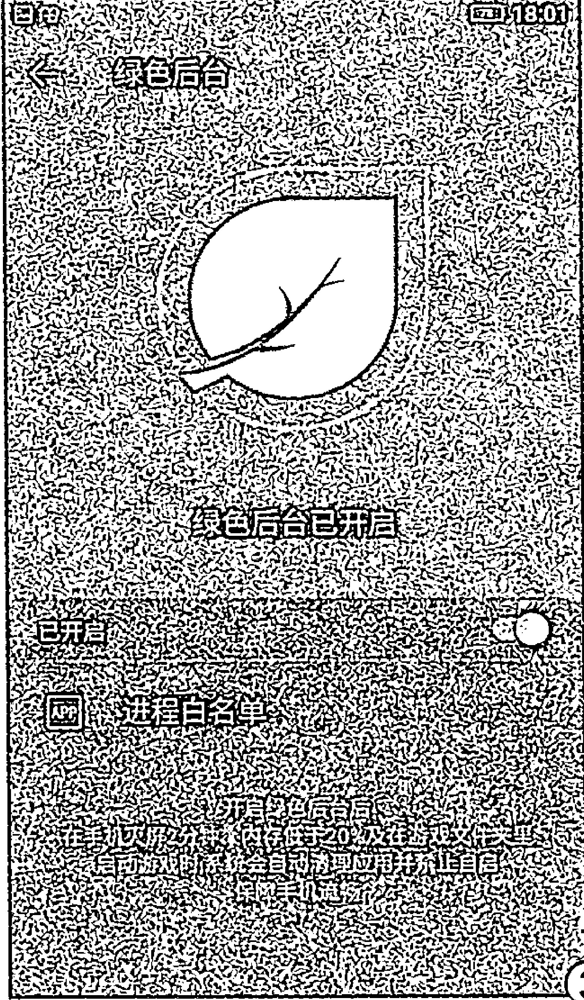

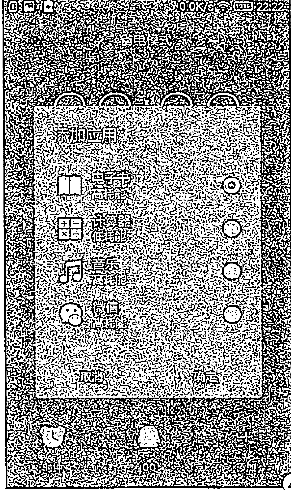

## 功能和性能上的差距

金立M5选用了联发科MT6735四核处理器平台，其最大的优势是支持全网通和发热/耗电更低，但就性能一项而言却属于入门级别，仅比高通骁龙410强点有限。还好，金立为M5添加了红外发射模块，通过内置的APP可以远程遥控家用电器，算是一项免费的增值功能。

联想P1搭载了高通骁龙615八核处理器平台，在具备全网通能力的同时还拥有更强的性能（图5）。此外，P1还标配3GB内存，并在Home键上加入了指纹识别模块，提供了支付宝、百度钱包、京东钱包的指纹支付能力，在安全性上达到了非常高的水准。

除此之外，两款手机的风格就无限接近了。比如，它们都采用了金属材质的后盖，在支持双卡双待的同时还可加装最大128GB存储卡，并内置支持相位对焦功能的1300万像素主摄像头，具备OTG反向充电等功能。

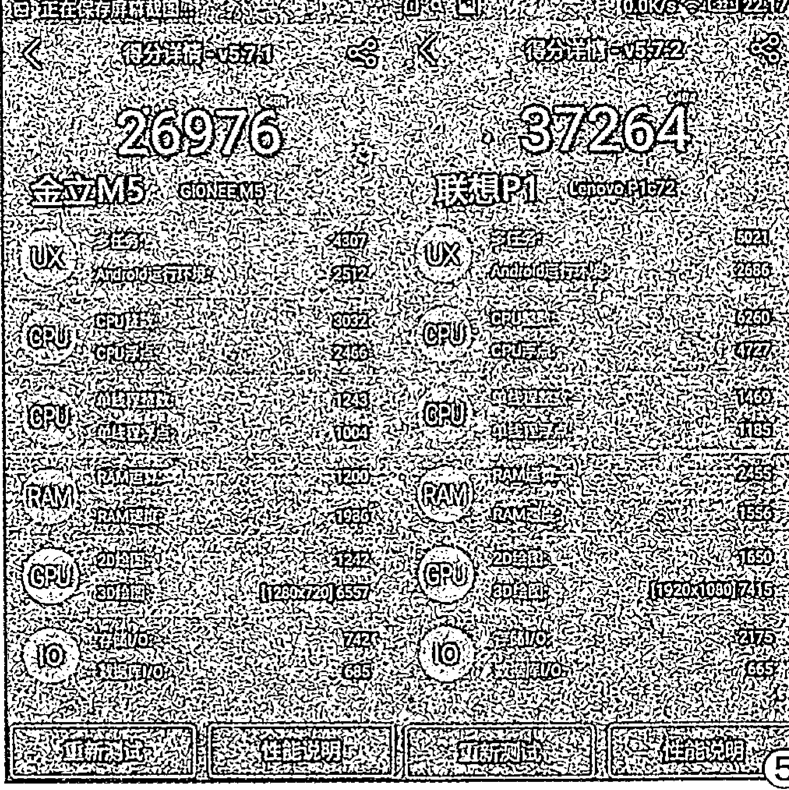

## 结语

联想P1和金立M5应该是2015年Android手机领域在待机方面最有建树的产品。其中，联想P1在保证续航能力的同时，还赋予了产品主流级别的硬件性能，以及包括指纹识别在内的潮流功能。而金立M5在设计之初就秉承了“够用就好”的心态，无论是MT6735处理器还是720P标准的AMOLED屏幕，都是为了以更持久续航为目的所选。因此，如果你想单纯地选择一款续航最为持久的Android手机，金立M5真的难逢敌手。但如果你希望手机同时具备待机、性能和功能三个要素，那么联想P1则要比M5更具吸引力。CF

## 华硕U303LB PK 联想U31

当13英寸遇到独立显卡，无疑是轻薄性能两相宜的组合。而华硕U303LB和联想U31则是目前13英寸独显笔记本的代表，但我们又该如何看待两款产品间近千元的价差呢？

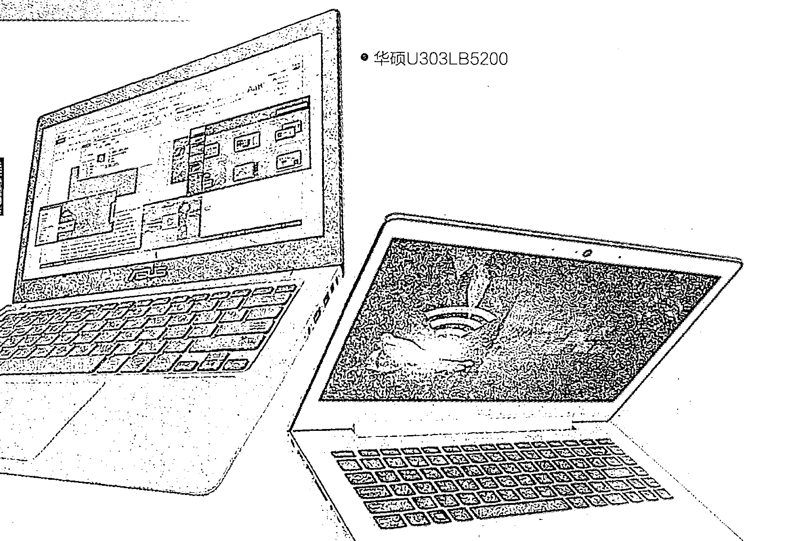

## 释放纤薄的魅力

13.3英寸素被誉为“黄金尺寸”并非没有原因，视野面积够大、更紧凑的机身设计，可让此类笔记本轻松获得傲人的苗条身材（图1）。而华硕U303LB和联想U31就很好地抓到了这一特性，19mm的厚度与1.5kg左右的重量，虽然谈不上极致轻薄，但也足够在外出时帮我们的肩膀减负了。

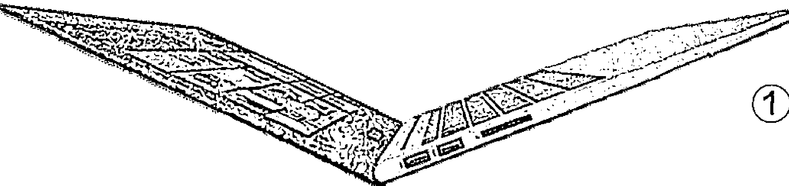

| 参数对比 | 华硕U303LB | 联想U31-70 |
| :--- | :--- | :--- |
| 屏幕 | 13.3英寸(1920×1080像素) | 13.3英寸(1366×768像素) |
| 处理器 | 酷睿i5-5200U | 酷睿i5-5200U |
| 内存/硬盘 | 4GB/1TB | 4GB/500GB |
| 显卡 | NVIDIA 940M(2GB DDR3) | NVIDIA 920M(2GB DDR3) |
| 接口 | 读卡器、USB3.0×3、HDMI、miniDP | 读卡器、USB3.0×2、USB2.0×1、HDMI、RJ45 |
| 体积 | 323mm×223mm×19.2mm | 323mm×230mm×19.3mm |
| 电池/重量 | 50Wh/1.45kg | 35Wh/1.5kg |
| 参考报价 | 5299元 | 4299元 |

扩展接口还是有所保障的。比如，它们都提供了三组USB和HDMI视频输出接口，不过，联想U31保留了RJ45网线接口，可以直接接驳家里/酒店的有线网络。而华硕U303LB则需要USB转RJ45的适配器（随机标配）才能有线上网，并额外增加了一个miniDP接口，可以实现三屏输出。

## 设计差距在哪里

华硕U303LB和联想U31都引入了金属材质，强化坚韧性。其中，U303LB的A、C、D面都以金属打造，A面的同心圆纹理显得颇为高端，更大面积的金属对散热的增益效果也是不言而喻。而联想U31只是A面和C面采用了金属，并提供了多种颜色的彩壳可选（活力橙、蔷薇粉和珍珠白），就色彩而言显得更为活泼（图2）。

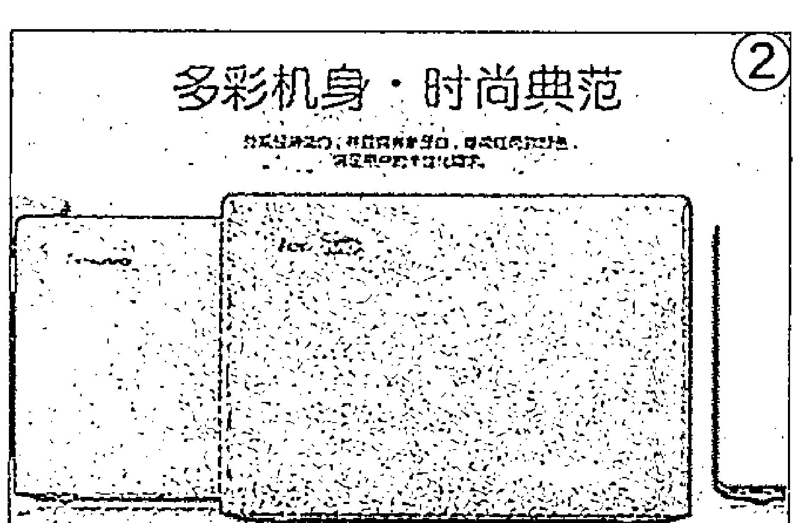

虽然两款产品都追求纤薄设计，但最基本的

## 920M与940M独显的较量

华硕U303LB和联想U31都基于英特尔五代酷睿处理器平台设计，搭载i5-5200U处理器，它们的性能差异主要体现在NVIDIA 920M和940M独显的较量上。简单来说，NVIDIA 920M和940M都拥有384个流处理器，显存位宽也都是64bit，从表面规格上看差距不大。但是，920M的架构是NVIDIA上代开普勒架构，而940M则为最新的麦克斯韦架构，核心架构的差异注定了它们的性能强弱。

以3DMark11为例，920M独显可以取得1700左右的成绩（图3），而940M则可达到2300（图4）。在主流级别的3D游戏中，940M独显运行的最低帧数大概和920M独显的平均帧数持平，差距还是蛮大的。

## 升级潜力谁更强

两款笔记本升级都不算困难，只要拧下D面螺丝即可拆下底盖。有意思的是，华硕U303LB和联想U31都采用了板载4GB内存和额外一个内存插槽的结构设计（图5），我们可以再买一根4GB或8GB内存与之搭配。

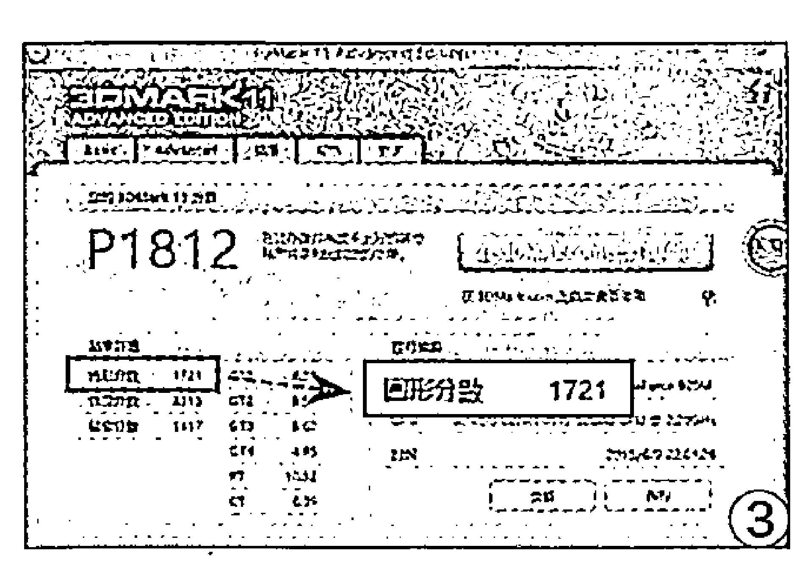

联想U31的扩展能力有些保守，它仅提供了唯一一个SATA硬盘插槽（图6），如果你想升级更高速的SSD就必须替换标配的HDD硬盘。华硕U303LB的表现相对好一些，它提供了一个半高mSATA插槽（图7），可以由用户自行安装40mm长度的mSATA SSD，虽然这一标准的SSD最大容量多以128GB为主，但也总算是聊胜于无吧。

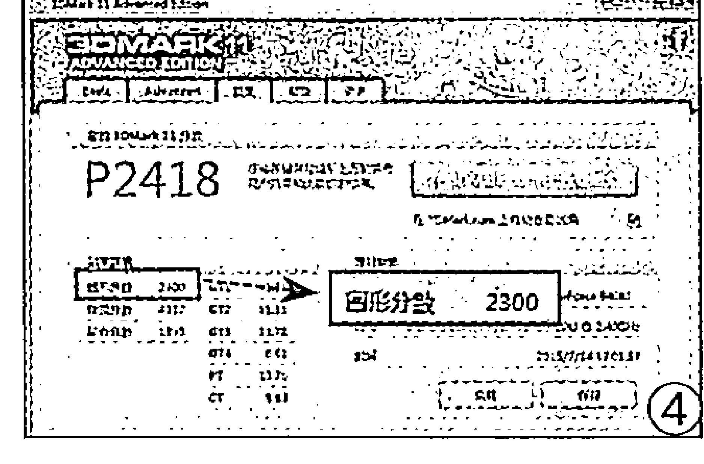

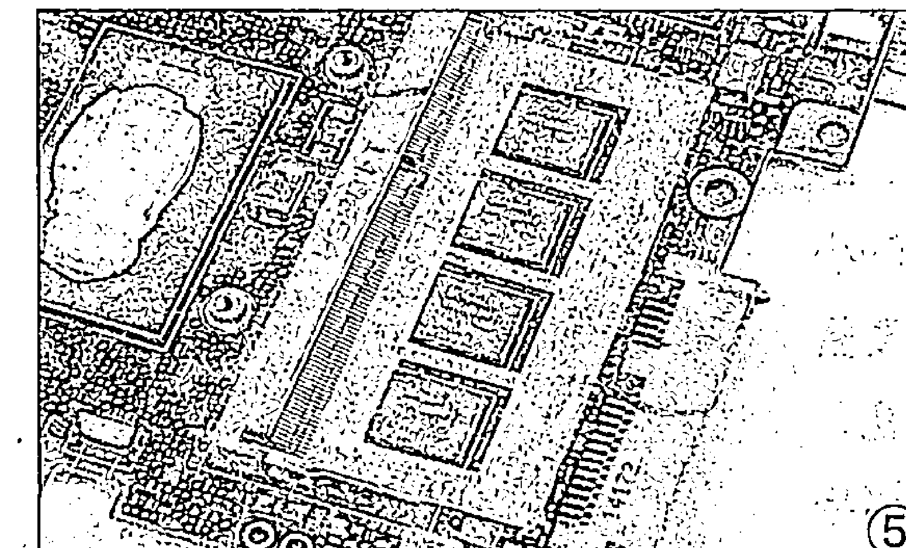

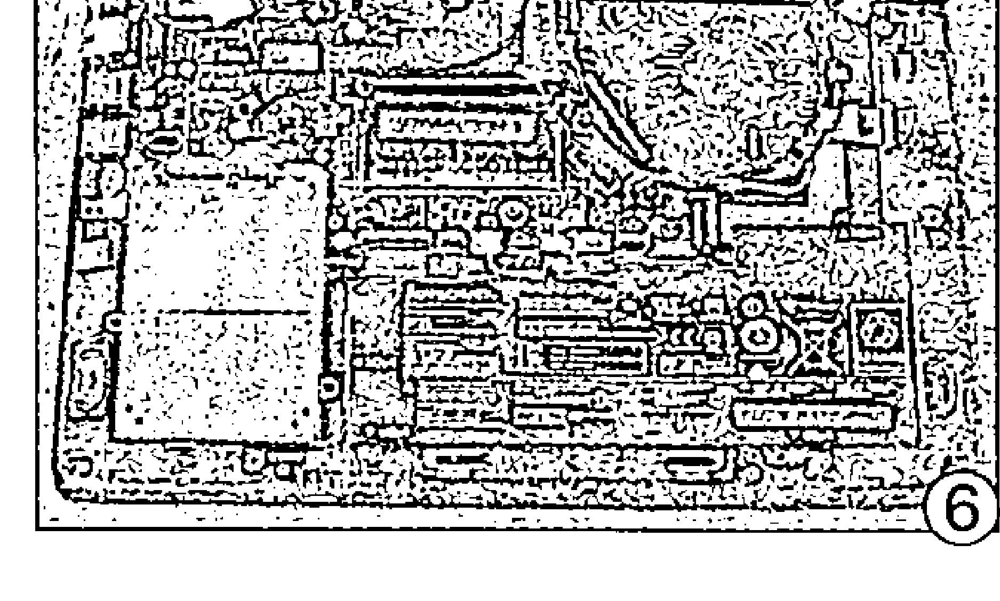

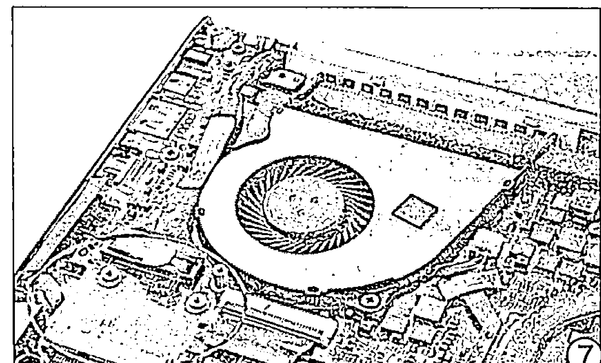

## 值得关注的细节

华硕U303LB和联想U31都采用了15W处理器，理论上二者的耗电量是相近的，所以它们的待机能力就取决于电池容量的大小了。就这一点来看，华硕U303LB更好地挖掘了内部闲置空间，塞进了一块50Wh的锂离子电池，较联想U31的35Wh增加了整整15Wh。如果只是单纯地欣赏视频，U303LB的续航时间至少要比U31多出1~2个小时。

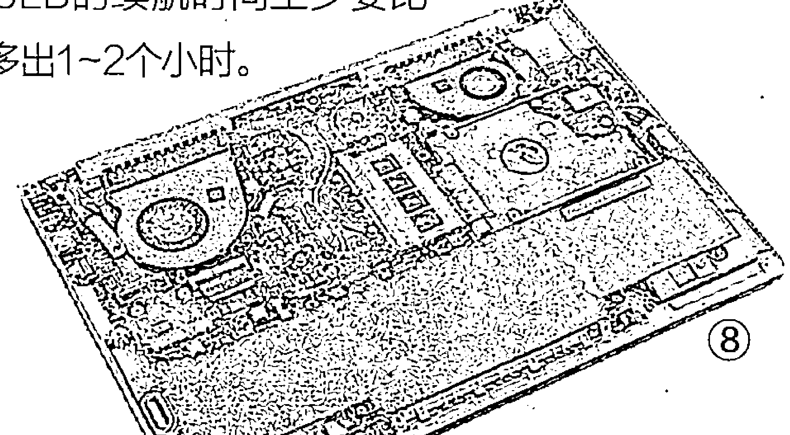

在散热设计上，U303LB的CPU和GPU分别由一根热管和一个风扇+鳍片负责散热，而联想U31则由一根热管和一个风扇负责CPU和GPU的散热（图8）。从表面上看，似乎U303LB的表现应该更给力，但由于U31的热管更宽，风扇尺寸更大，所以两款笔记本的散热效率其实都在伯仲之间，在全速工作时的发热量都不算低。

两款产品都采取了散热孔后置的设计，打开屏幕之后你能从转轴的缝隙处看到散热通风口。还好，华硕U303LB和联想U31的转轴都很宽，预留出了足够的空间，不必担心转轴会挡住热量。值得一提的是，U31的屏幕可开启到180度（图9），在一些商务演示的环境下可以获得更好的体验。

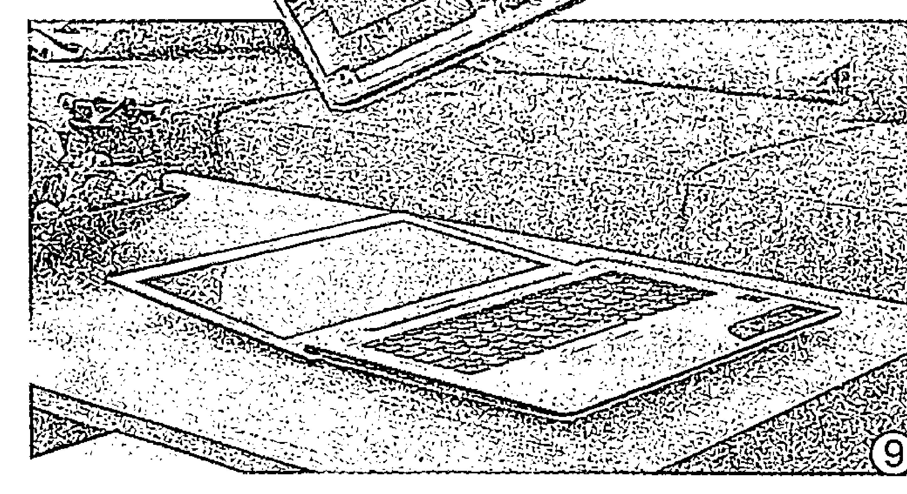

华硕U303LB和联想U31是目前仅有的几款13英寸独显笔记本，它们都拥有出色的便携性，将“黄金尺寸”的优势发挥了出来。不过，如果你更在意性能，武装940M独显的华硕U303LB可以更为流畅地运行最新3D游戏，而更大范围的金属覆盖率也让其具备了更显精致的做工。而联想U31的优点就体现在更为实惠的价格上了，920M独显性能基本够用，如果你只玩LOL或Dota2一类的游戏，这款产品也足够你去折腾了。

## 国产旗舰的较量
## 魅族Pro 5 PK 小米Note顶配版

作为国产手机领域的一对欢喜冤家，小米和魅族历代旗舰的较量自然可引来无数关注。在魅族发布全新旗舰Pro 5之后，小米Note顶配版的日子还能过得踏实吗？

### 并不对等的较量

用魅族刚发布的Pro 5与已上市数月之久的小米Note顶配版相比似乎有些不太合适，但搭载骁龙820的小米5预计的发售时间要在2016年初，所以现阶段小米Note顶配版是唯一一款有资格与Pro 5较量的小米手机。还好，小米Note顶配版在配置上依旧是当前Android的顶级水准，它与魅族Pro 5的正面对决还是有着几分把握的。

### 工艺上的理念差异

两款手机都采用了5.7英寸屏幕设计，不过小米Note顶配版要比魅族Pro轻薄一点点。究其原因，则是因为小米Note顶配版采用了金属边框+前置2.5D水滴玻璃面板+后置3D圆润玻璃设计(图1)。这种双面玻璃的结构优点是触感舒适且轻盈，缺点则是玻璃后盖与金属边框的衔接处存在一定的缝隙，容易堆积污垢，在磕碰之后也更容易碎裂。如果你平时没有配保护套的习惯，购买额外的碎屏险还是很有必要的。

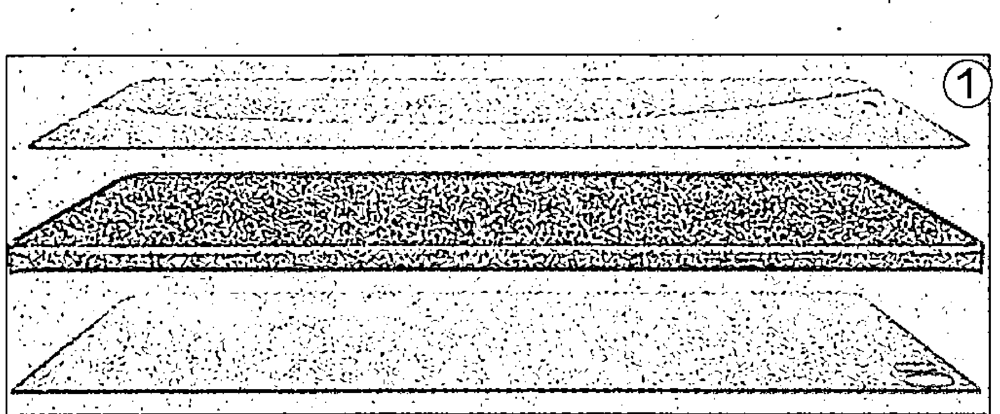

魅族Pro 5延续了前辈MX5的设计风格，整体来看更像是MX5的放大版。它依旧采用了与金属边框一体的三段式背盖设计（后盖上下两端为塑料材质），而金属与塑料之间的T槽也不存在MX5的割手感，2.5D屏幕玻璃设计也让Pro更具卖相(图2)。可惜，魅族Pro 5的机身还是轻磨砂的雾面处理，圆弧侧边设计防滑性一般，如果不小心脱手，2.5D屏幕的碎屏风险也是很大的。

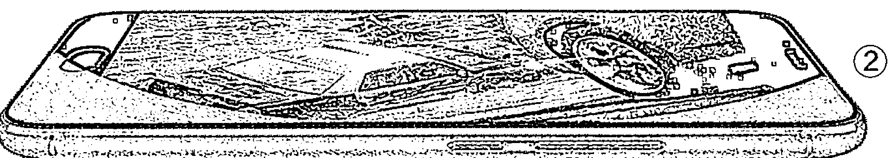

| 参数对比 | 魅族Pro 5 | 小米Note顶配版 |
| :--- | :--- | :--- |
| 网络 | 移动联通双4G (双卡双待) | 移动联通双4G (双卡双待) |
| 屏幕 | 5.7英寸AMOLED (1920×1080像素) | 5.7英寸IPS (2560×1440像素) |
| CPU | 三星Exynos 7420 | 高通骁龙810 |
| GPU | ARM Mali-T760MP8 | Adreno 430 |
| 内存/存储 | 3GB/32GB (支持128GB存储卡) | 4GB/64GB (不支持存储卡) |
| 摄像头 | 500万/2116万像素 | 400万/1300万像素 |
| 尺寸 | 156.7mm×78mm×7.5mm | 155.1mm×77.6mm×6.95mm |
| 电池/重量 | 3050mAh (不可换)/168g | 3090mAh (不可换)/161g |
| 参考价格 | 2799元 | 2999元 |

*魅族Pro 5还有3099元的高配版，配置升级到4GB内存和64GB存储空间的组合；小米Note顶配版也包括3099元的全网通版。

## “芯”脏上的较量

小米Note顶配版搭载了高通骁龙810八核处理器，也是目前Android旗舰手机中最常见的顶配芯片（图3）。可惜，骁龙810也是目前最“热情”的处理器，让小米Note顶配版在游戏过程中的机身表面轻松突破42℃大关，在游戏过程中注定面临强制降频的尴尬。

魅族Pro 5选用了和三星Galaxy S6/Note5相同的Exynos 7420八核处理器，其理论CPU性能优于骁龙810，但GPU性能却要略逊于骁龙810。但是，得益于工艺上的领先，Exynos 7420可以更稳定地运行在较高主频上，因此在安兔兔测试中魅族Pro 5可以取得完胜小米Note顶配版的成绩（图4）。根据媒体实测，魅族Pro 5全速运行时机身最高温度可保持在40℃以内，散热表现明显优于小米Note顶配版。


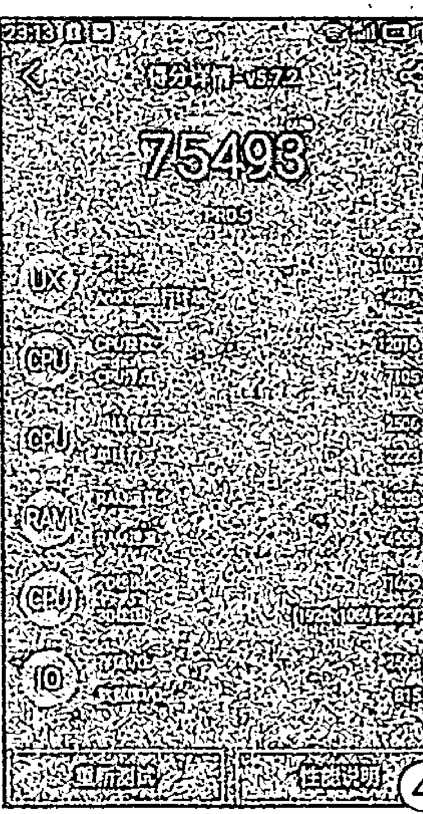

## 其他功能上的竞争

小米Note顶配版的主摄像头采用了索尼IMX214传感器（图5），而魅族Pro 5则选择了索尼IMX230传感器。两款传感器除了像素值分别为1300万和2116万像素以外，后者还加入了相位对焦功能，而魅族也在此基础上保留了MX5用过的激光对焦模块，最终使Pro 5成为了目前少见的同时支持反差对焦、相位对焦以及激光对焦的机型（图6）。在理论拍照效果上，魅族Pro 5无疑是领先于小米Note顶配版的。

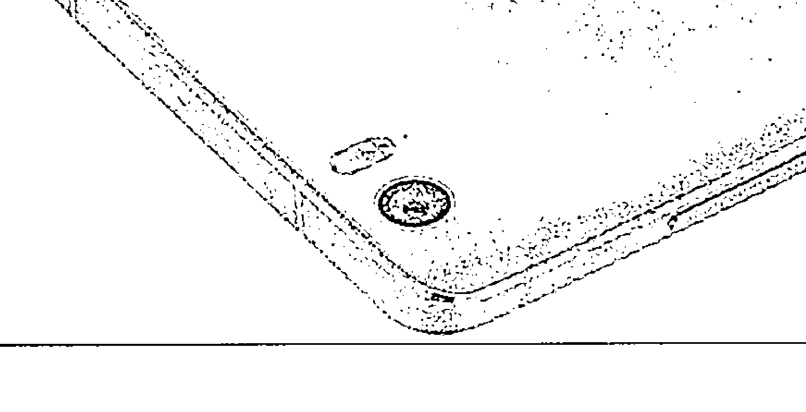

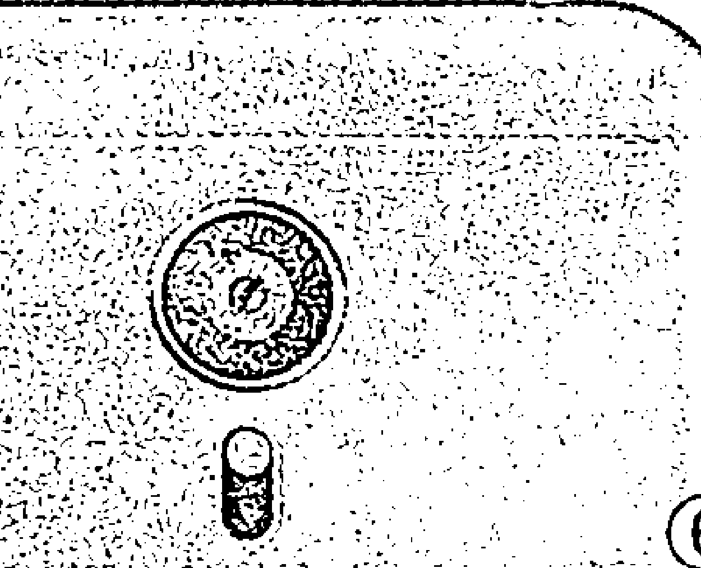

据魅族官方说法，在认识到MX4 Pro上搭载2K屏而导致续航疲软且显示效果提升有限之后，魅族决定在Pro 5回归到1080P规格，并选择拥有10000:1对比度和100% NTSC色域的AMOLED材质屏幕，而AMOLED特有的省电优势，也将给予Pro 5更持久的续航时间。就显示效果来看，魅族Pro 5基本可以与三星Note 5持平（只是分辨率没有Note 5高），对喜欢高对比度、鲜艳色彩的用户而言无疑是个好消息。

小米Note顶配版最大的特色就是采用了2K级别分辨率的屏幕，PPI高达515，具备95%NTSC色域和1400:1的对比度。就表面参数来看，魅族Pro 5的屏幕规格要逊于小米Note顶配版很多，真的是这样吗？

魅族Pro 5延续了MX5特色的mTouch主键，具备触摸返回上层、按压回桌面的独特操作方式。此外，在这颗mTouch键内同样集成了FPC1155指纹传感器，识别率很高且支持支付宝等APP的指纹支付功能（图7）。此外，Pro 5还将MicroUSB换成了USB Type-C型接口，支持反正都能插的特性。值得一提的是，由于换了处理器方案，所以魅族Pro 5的快充功能也升级到了mCharge 2.0，最高可支持24W的快充规格，较MX5最高18W提升了25%。

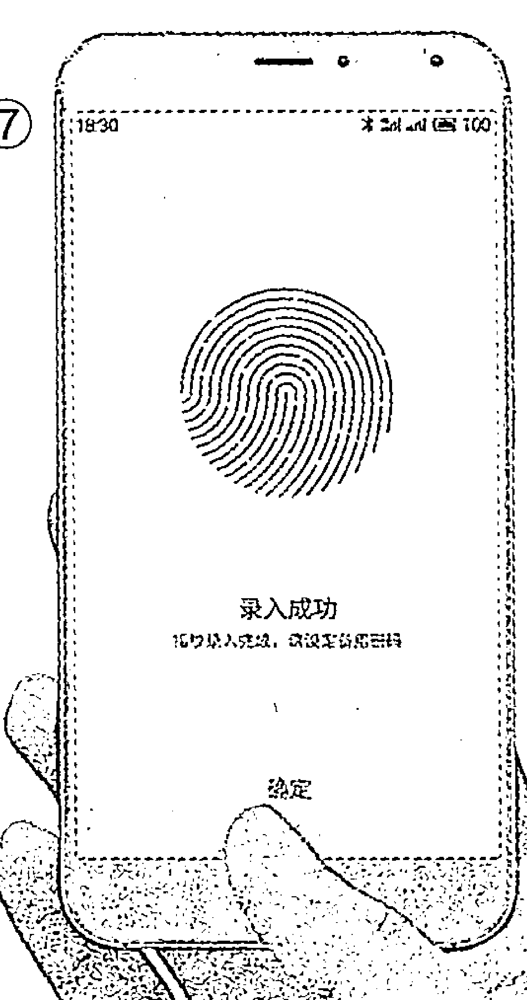

小结：无论是性能还是功能，魅族Pro5都大有压小米Note顶配版一头的态势，而这也是必然现象。毕竟，魅族Pro5比小米Note顶配版晚上市半年之久，如果再没有这点优势才叫说不过去呢。由于魅族Pro 5的起价要比小米Note顶配版还便宜200元，所以非常适合追求性能和性价比的玩家选择。

但是，市场留给魅族Pro5的时间不会太多，在高通骁龙820正式发售之后，会有一大批搭载该芯片的“国产旗舰”抢驻2000元-3000元区间的市场，而这个时间就是2015年底或2016年初。能否在此之前卖出更多机器，就得看魅族的产能了。

## 理性看待硬件搭配
## 东芝P50-C PK 华硕UX501JW

同属酷睿i7处理器，五代就一定强于四代吗？仅差一个数字的GTX950M和GTX960M独显间的性能又差多少？当实惠与性能发生碰撞之际，我们又该作何抉择？

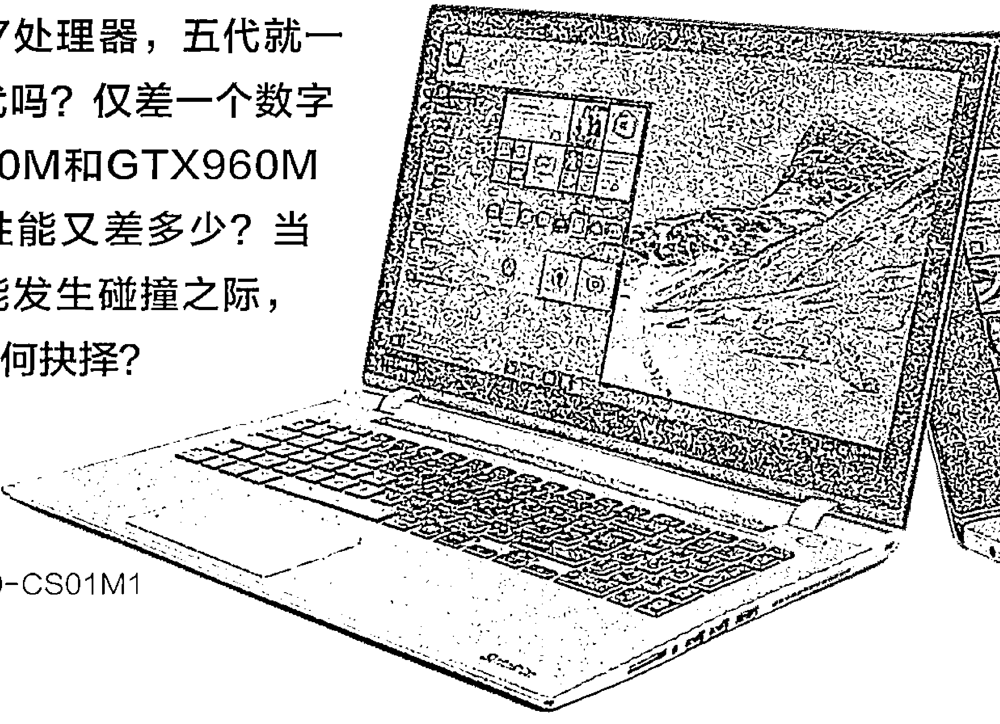

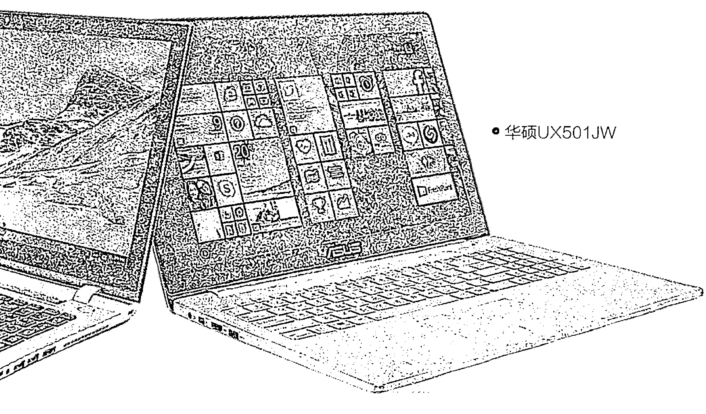

P50-C是东芝Satellite系列家族的最新成员，而UX501JW则是华硕在2015年年初推出的足以与MacBook Pro叫板的游戏本。这两款15.6英寸的产品都采用了轻薄化设计，以及看似“相近”的硬件组合，但在价格上却出现了2000元的差距。那么，这2000元的差距到底值不值呢？

| 参数对比 | 东芝P50-CS01M1 | 华硕UX501JW |
| :--- | :--- | :--- |
| 屏幕 | 15.6英寸IPS（1920×1080像素） | 15.6英寸IPS（1920×1080像素） |
| 处理器 | 酷睿i7-5500U（双核2.4GHz~3.0GHz） | 酷睿i7-4720HQ（四核2.6GHz~3.3GHz） |
| 内存/硬盘 | 8GB/1TB+8GB混合硬盘 | 8GB/1TB |
| 显卡 | NVIDIA GTX950M（4GB DDR3） | NVIDIA GTX960M（4GB GDDR5） |
| 接口 | 读卡器、USB3.0×3、HDMI、RJ45、DVD刻录光驱 | 读卡器、USB3.0×3、miniDP、HDMI |
| 体积 | 380mm×259.9mm×22.5mm | 383mm×255mm×20.6mm |
| 电池/重量 | 45Wh/2.15kg | 60Wh/2.05kg |
| 京东报价 | 5999元 | 7999元 |

### 又见轻薄金属派

东芝P50-C是一款相对传统的轻薄型大屏游戏本，之所以说它传统，是因为其电池可以拆卸（需要拧螺丝），并保留了内置式的DVD刻录光驱。不过，P50-C依旧在此基础上实现了22.5mm的纤薄机身以及2.15kg的轻盈身材，对一款15.6英寸游戏本而言还是不错的成绩。在用料方面，P50-C的A面（外壳）和C面（掌托）采用了金属材质，而B面（屏幕边框）和D面（底壳）则是塑料材质（图1）。

华硕UX501JW在发布之初就将MacBook Pro视为了竞争对手，而它的确也有着这番资质。比如，20.6mm厚度与2.05kg的轻薄设计、同心圆发丝纹顶的金属盖（图2）、一体化的金属机身（C面和D面都是金属），这些都能体现UX501JW不俗的做工和工艺。但是，也正因为追求轻薄设计，让UX501JW失去了RJ45网线接口与光驱。

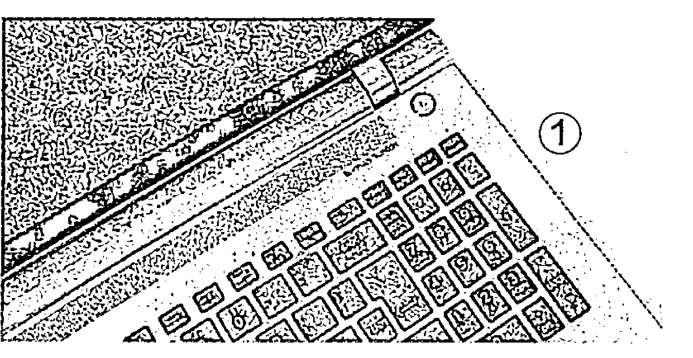

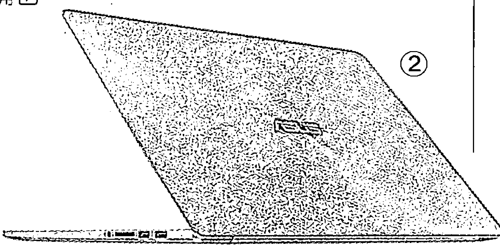

### 教你读懂硬件参数

东芝P50-C搭载i7-5500U处理器，属于六代酷睿阵营。华硕UX501JW武装i7-4720HQ，为四代酷睿的代表。可惜，i7-5500U是六代酷睿处理器中的低功耗版，通过降低主频，并将核心数量缩减到双核才把TDP控制到了15W。而i7-4720HQ则是四代酷睿中的高端型号，其具备四核心优势，最高睿频也可达3.3GHz，但随之而来的则是高达47W的TDP功耗。15W对47W，显然后者的性能更为强悍。

| 性能对比 | 东芝P50-C S01M1 | 华硕UX501JW |
| :--- | :--- | :--- |
| CPU性能 | | |
| Cinebench R11.5(多核) | 3.23pts | 6.64pts |
| Cinebench R15(多核) | 301cb | 604cb |
| GPU性能 | | |
| 3DMark11 | P4224 | P5361 |
| 3DMark Firestrike | 2648 | 3952 |
| 古墓丽影9(高画质) | 32.7fps | 41fps |

两款笔记本的独立显卡分别为GTX950M和GTX960M，并均配备了4GB的独立显存。从架构而言，两款独显都隶属于“麦克斯韦”家族中的“GM107”核心，拥有640个流处理器。问题是，GTX960M较GTX950M有着更高的核心显存频率，并将显存规格从DDR3换成了GDDR5，像素填充率和纹理填充率几乎是GTX950M的两倍。因此，二者在实际游戏中的性能差距也是相当明显。

回到两款产品身上，东芝P50-C采用了i7-5500U和GTX950M的组合，无论是CPU还是GPU的性能都远远落后于武装i7-4720HQ和GTX960M组合的华硕UX501JW（见表）。好消息是，东芝为P50-C准备了集成8GB闪存芯片的混合硬盘，在磁盘性能方面要优于华硕UX501JW。

### 再探扩展能力

两款笔记本拆机都不算困难，只需拧下背部螺丝即可拆下底盖，便于硬件的更换以及风扇散热鳍片的清灰操作。通过两款机器的拆机图片可见，东芝P50-C内置两个内存插槽，最大支持16GB容量。可惜，这款产品的散热模块稍显寒酸，仅有一根热管覆盖在CPU和GPU芯片之上，而GTX950M的发热量不可小觑，最终导致其在全速工作时C面数字小键盘区域的温度可达50℃。虽然东芝P50-C没有配备M.2插槽，但有需要的玩家则可通过光驱位的硬盘托架安装SSD提速（图3）。

华硕UX501JW采用了板载4GB内存+内存插槽的设计（图4），并提供了一个M.2插槽，方便用户直接安装M.2 SSD。为了缓解高端硬件的发热，这款产品采用了双热管双风扇的散热模块设计（图5），全速工作时键盘左上角和右上角的温度分别在41℃和45℃左右，整体的散热表现要优于东芝P50-C。

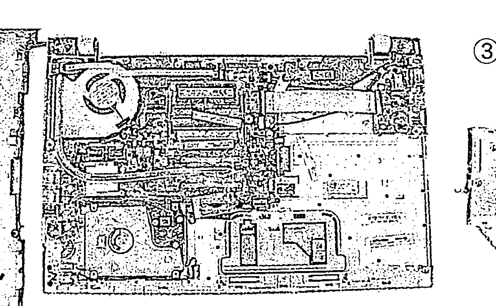

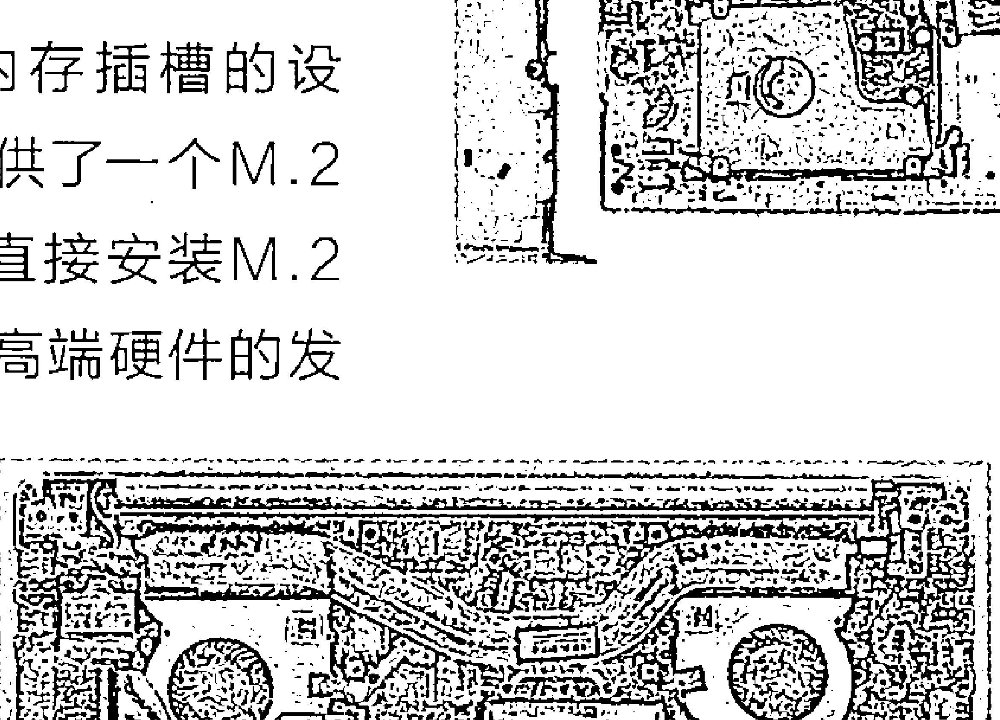

> 扩展阅读 还有更酷的选择
如果你心仪15.6英寸轻薄游戏本，还可考虑惠普最新的Envy15（5899元）和华硕V505LX5200（5299元）（图6），两款产品同样配备了GTX950M独显，散热模块要比东芝P50-C考虑得更周到（双风扇结构），而且新Envy15还升级到了六代酷睿i5-6200U处理器。有关此这两款产品的更多特色，请参考本刊2015年20期杂志的CFan打擂台。

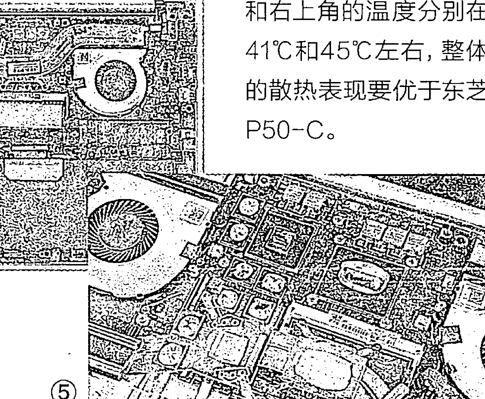

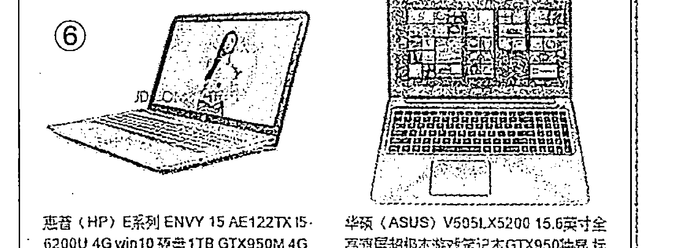

通过上面的对比，相信大家对这两款轻薄型的大屏游戏本已经有了初步的了解。东芝P50-C的优势在于内置光驱设计，对于需要读刻光盘的用户而言吸引力很大，而5999元的售价也极具性价比，只要你并非发烧级游戏玩家，其硬件规格已经足够强悍了。而华硕UX501JW的优势在于更为精致的做工和更高的配置，适合追求完美的游戏玩家考虑，但同时也需要你付出更多的资金。CF

## 华为麦芒4 PK 中兴天机mini

对商务用户而言，高档的金属以及全网通特性都是选购手机的必备要素，而华为麦芒4和中兴天机mini则是时下2000元档位颇受关注的商务新机。那么，它们之间谁更适合你？

### 满城尽是土豪金

华为麦芒4和中兴天机mini都是针对商务用户定制的Android手机，它们在设计上有着很多共同之处。比如，两款产品都提供了“土豪金”配色的版本，而一体式的全金属外壳设计，也为它们带来了更为高档刚毅的质感。

不过，在“刚毅”的用料之余，两款手机在边角处也加入了曲线，圆润的边角让它们有了一分灵韵之感（图1）。其中，天机mini在屏幕上下两侧以及背后摄像头部分引入了云纹镂空的样式，带来了更多格调。

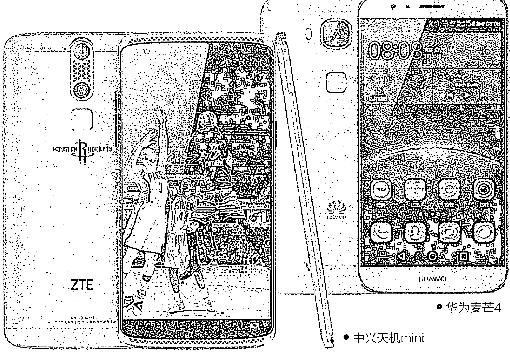

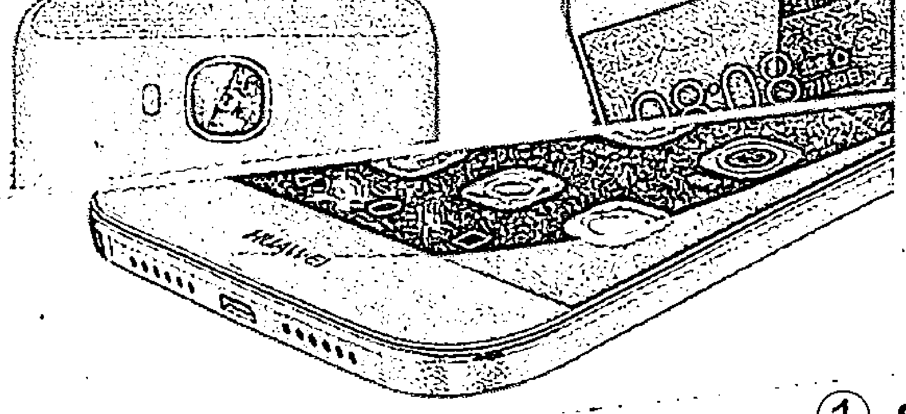

### 来自屏幕的差异

麦芒4和天机mini还都选用了时下流行的2.5D弧面屏幕（图2），可以给人一种画面跃出了手机的感觉。需要注意的是，两款产品在屏幕材质的选择上出现了差异：麦芒4为标准的IPS屏幕，拥有85%的色域，5.5英寸大屏视野更震撼。而天机mini选择了5.2英寸AMOLED屏幕，色域达到了102%，显示效果更为艳丽，而且还兼具省电的特色。

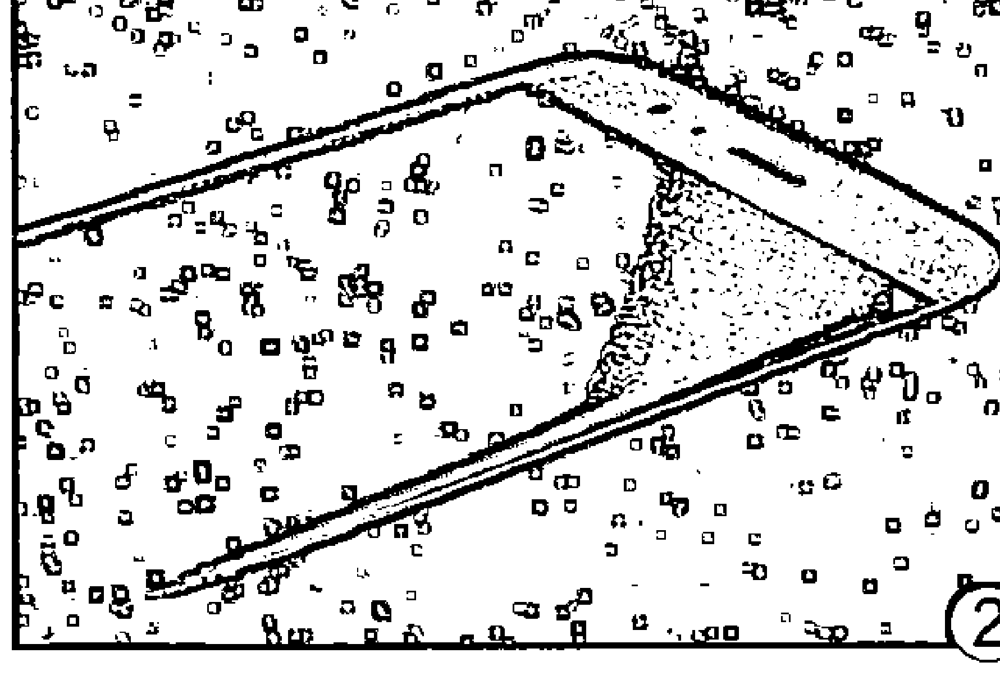

### 商务安全不可少

作为商务手机，安全无疑是重中之重。为此，麦芒4和天机mini都准备了指纹识别模块（FPC传感器），并“英雄所见略同”般地将其安置在了手机背部（图3）。在单手持握手机时，食指可轻松覆盖其上进行指纹解锁或支付等操作。值得一提的是，天机mini除了指纹识别以外，还加入了声纹解锁和眼纹识别功能。不过，这两种方案的实用性远不如指纹，噱头的成分要更大一些。

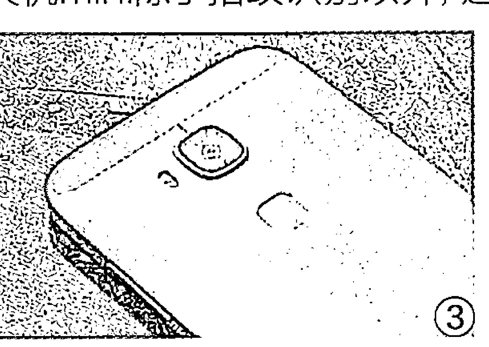

| 参数对比 | 华为麦芒4 | 中兴天机mini |
| :--- | :--- | :--- |
| 网络 | 全网通（双卡双待） | 全网通（双卡双待） |
| 屏幕 | 5.5英寸IPS (1920×1080像素) | 5.2英寸AMOLED (1920×1080像素) |
| CPU | 高通骁龙616（MSM8939） | 高通骁龙616（MSM8939） |
| GPU | Adreno 405 | Adreno 405 |
| 内存/存储 | 3GB/32GB (支持128GB存储卡) | 3GB/32GB (支持128GB存储卡) |
| 摄像头 | 500万/1300万像素 | 800万/1300万像素 |
| 体积 | 152.5mm×76.5mm×7.5mm | 143.5mm×70mm×7.9mm |
| 电池/重量 | 3000mAh（不可换）/167g | 2800mAh（不可换）/140g |
| 参考价格 | 2499元 | 2299元 |

### 娱乐要素大比拼

华为麦芒4采用了500万像素和1300万像素前后摄像头的配置，其后置摄像头与华为P8一样都是支持RGBW的索尼IMX278传感器，其拍照效果理论上与P8持平。而中兴天机mini采用了800万+1300万像素的摄像头组合，其中它的后置摄像头传感器型号为三星ISOCELL 3M2，支持PDAF相位对焦功能。两款手机都采用了双色温闪光灯设计，只是天机mini巧妙地将闪光灯隐藏在了主摄像头下面的圆形镜片内(图4)，给人的感觉是这款产品依旧保留了AXON天机标准版的双摄像头。

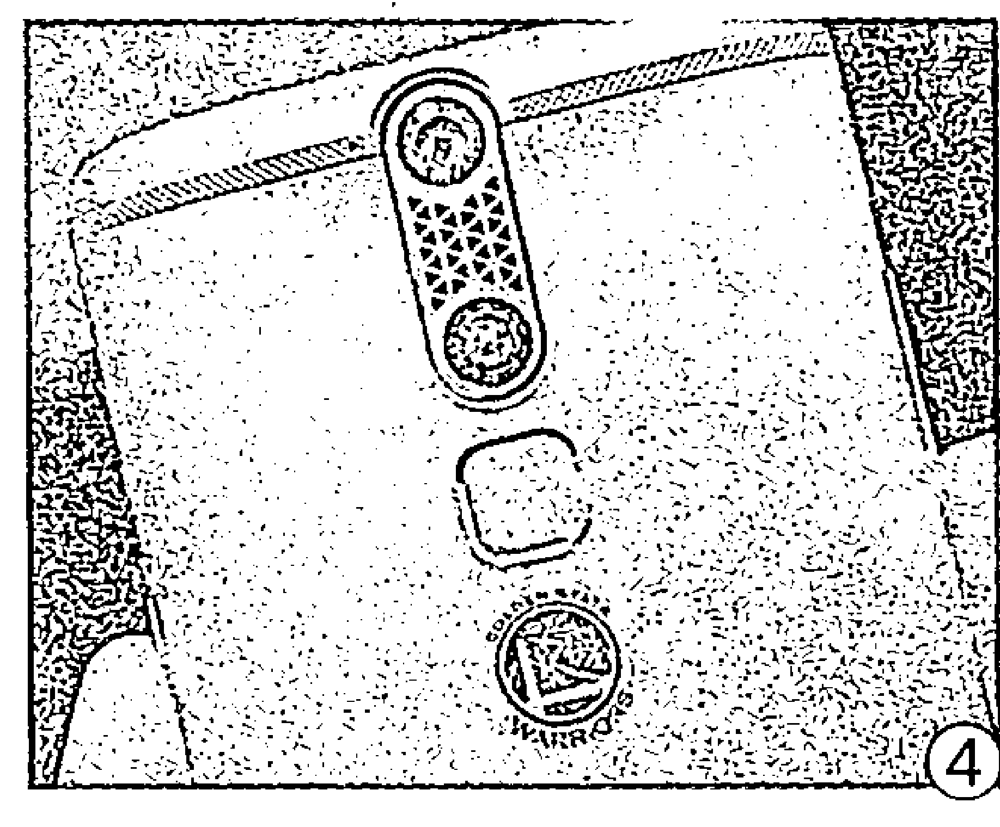

为了提升音频体验，天机mini采用了双MIC设计，并搭载了独立的音频芯片AK4961，可以实现32bit的HiFi音效和高保真录音，对需要经常录制高品质会议音频，或进行2米内手机会议的用户而言算是个绝好消息。

而麦芒4则强化了在无线信号方面的表现力。该产品支持智能双天线切换技术，可根据接收电平和发射功率情况智能选择信号更好的天线进行通信，保证通信质量畅通。此外，麦芒4还支持华为特色的Pa和LNA技术，可有效提升Wi-Fi连接和下载时的速度。

### 相同档次的性能

华为麦芒4和中兴天机mini在核心硬件的规格上几乎一致。它们都搭载了高通骁龙616八核处理器。与我们熟悉的骁龙615相比，骁龙616改用了更为先进的基带(支持LTE Cat.4和载波聚合技术)，但CPU和GPU方面的性能依旧与骁龙615持平(图5)。换句话说，骁龙616和615之间就是“马甲”关系，只是在信号和发热量方面的表现有所优化而已。

此外，两款手机均标配3GB运行内存与32GB的存储空间组合，并支持最大128GB存储卡扩充。令人遗憾的是，麦芒4和天机mini都采用了二合一式的卡托结构(图6)，用户只能在双卡双待或单卡+SD卡之间任选其一。这对既需要双卡通讯，又需要海量存储空间的商务用户而言可不是一个好消息。

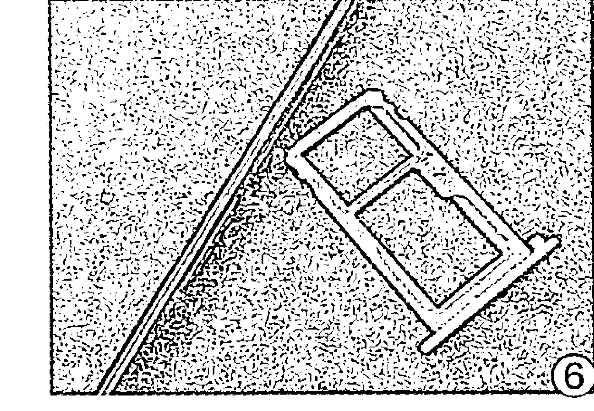

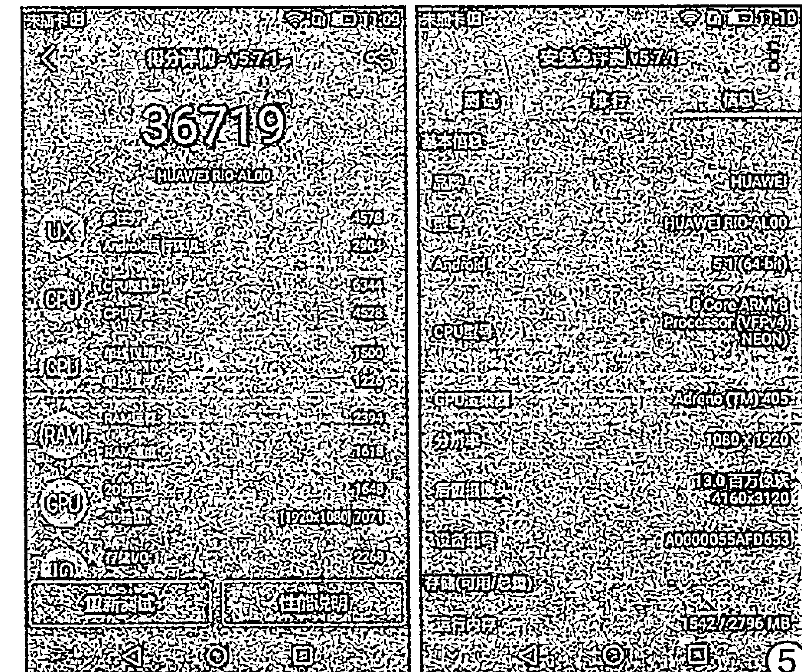

> 扩展阅读：还有更酷的选择
中兴AXON天机还有搭载高通骁龙810处理器的高配版，和mini版的差别还有采用5.5英寸屏幕(IPS材质)，配备了1300万像素+200万像素双后置摄像头。可惜，3000mAh容量电池对高配版天机而言偏小，如果你在意性能可以考虑天机高配，如果在意续航和便携，天机mini则是不错的选择。此外，天机mini还有配备压力屏的特殊版本，感兴趣的用户可以关注一下。

小结
华为麦芒4和中兴天机mini都是以设计取胜的商务新机，它们的硬件规格并不算强悍，2000元价位搭载骁龙810顶机处理器的手机都是一抓一大把，骁龙616的性能仅是刚刚够用而已。但是，就商务用户所需的“面子”和安全问题，两款手机的成绩单都算不俗，可以满足绝大多数商务用户的品味和需求。如果你喜欢更大的视野，麦芒4的5.5英寸屏幕不会让你失望；但如果你更在意性价比，以及更为轻巧的设计，那天机mini的诱惑显然远高于麦芒4。 CF

## 最适合Windows 10的变形本

Windows 10带来了全新的“平板模式”，让触控操作变得更加合理和顺手。因此，如果你想充分挖掘出Windows 10的使用乐趣，配备触控屏幕的变形本无疑是最佳之选。

### Windows 10的触控体验

我们都知道，Windows 10新增了“平板模式”，加入类似Android系统的返回键等虚拟按钮，并屏蔽了传统的桌面模式，真正让触控操作的体验得以升华。如果你对Windows 10感兴趣，可以参考本刊17期关于该系统的特别话题。

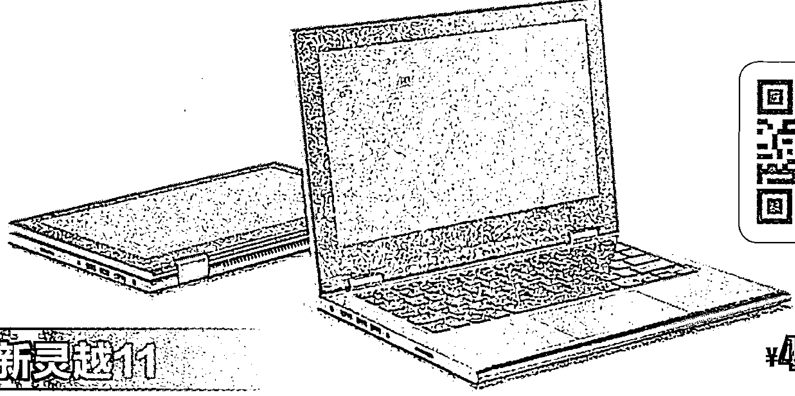

### 酷睿M还稍差点劲儿

目前配备触控屏的移动设备有很多，便宜的有BayTrail-T或Cherry Trail-T平台的平板电脑（价格在1500元以内），中档的有基于酷睿M处理器平台设计的二合一产品（价格在2000元以上）。只是BayTrail-T和Cherry Trail-T平台的性能稍逊，而且此类产品仅能使用eMMC作为存储单元，磁盘容量和性能都不能令人满意。

#### 戴尔新灵越11

新灵越11是一款11.6英寸的轻巧变形本，它的屏幕可进行360度翻转，从而实现多种使用模式。而该产品最大的特色在于武装了英特尔最新的六代酷睿处理器，i3-6100U所集成的HD520核芯显卡性能很强，足以满足用户日常的工作娱乐需求。

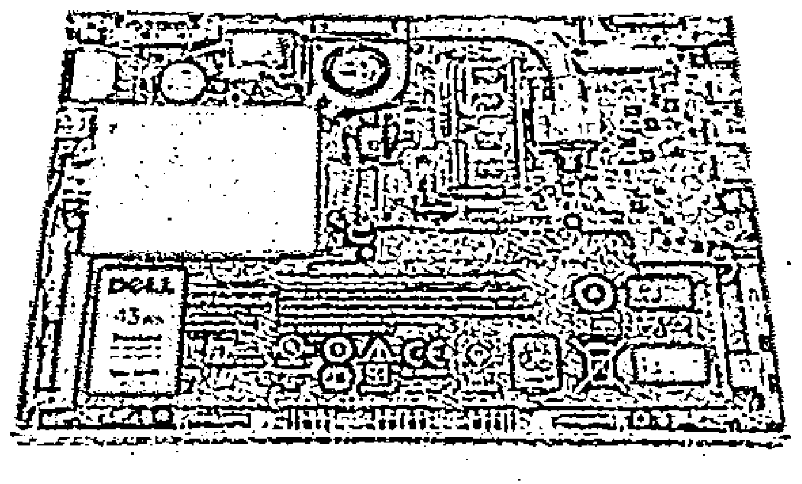

酷睿M虽然性能还不赖，但绝大多数产品都会选择无风扇设计，而酷睿M在全速工作时却会触发降频机制，不利于长时间的游戏体验。如果你对性能的要求较高，而且希望产品可以保持长时间流畅稳定的运行，那基于标准酷睿处理器平台设计的变形本才能胜任。接下来，我们就来看看近期市面上的几款热门触控变形本。需要注意的是，其中有些型号还在预装Windows 8.1系统，但我们可以通过系统升级而免费用上Windows 10。

- 屏幕：11.6英寸IPS触控屏 (1366×768像素)
- 处理器：六代酷睿i3-6100U
- 内存/硬盘：4GB/128GB SSD
- 显卡：HD520核芯显卡
- 厚度/电池/重量：19.4mm/43Wh/1.39kg

> > **升级建议：** 新灵越11拆机很容易，拧下背部所有螺丝就可拆下底盖。对存储容量有要求的用户可考虑自行更换256GB SSD（标准2.5英寸7mm硬盘）。

#### 华硕TP300LJ

TP300LJ采用了13.3英寸可360度翻转的触控屏幕，五代酷睿与NVIDIA 920M独显的组合还算合理，至少对主打触控体验与便携特性的变形本而言，足以应对主流3D游戏的挑战了。遗憾的是，该产品屏幕分辨率不高，对细腻视野有要求的用户可考虑TP300LJ系列的高配版（配1080P屏幕）。

> > **升级建议：** TP300LJ的扩展能力一般，它采用了板载4GB内存和一个独立内存插槽的设计，而且没有配备M.2或mSATA插槽，只能换掉原有硬盘才可升级。

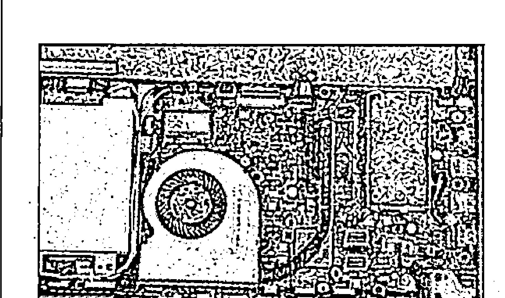

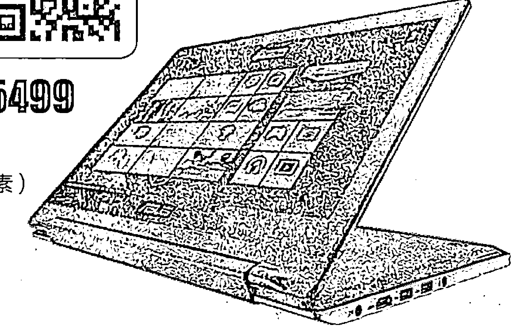

- 屏幕：13.3英寸触控屏（1366×768像素）
- 处理器：五代酷睿i5-5200U
- 内存/硬盘：4GB/1TB
- 显卡：NVIDIA 920M
- 厚度/电池/重量：22mm/50Wh/1.75kg

## 联想Flex3 14

联想Flex一直是Yoga系列的简化版，素以屏幕可300度翻转著称。而从新一代Flex3开始，该系列产品同样获得了360度翻转屏幕的特性，与Yoga系列的定位越加模糊。就这款Flex3 14来看，它的卖点是配备了920M独显，而且机身轻薄便携性十足，唯一可惜的就是屏幕分辨率不高。如果你对性能要求较高，可考虑Yoga 3 14系列，14英寸1080P+ 940M独显，只是价格要较Flex3 14贵了1000元。

- 屏幕: 14英寸IPS触控屏 (1366×768像素)
- 处理器: 五代酷睿i5-5200U
- 内存/硬盘: 4GB/500GB
- 显卡: NVIDIA 920M
- 厚度/电池/重量: 21.5mm/45Wh/1.85kg

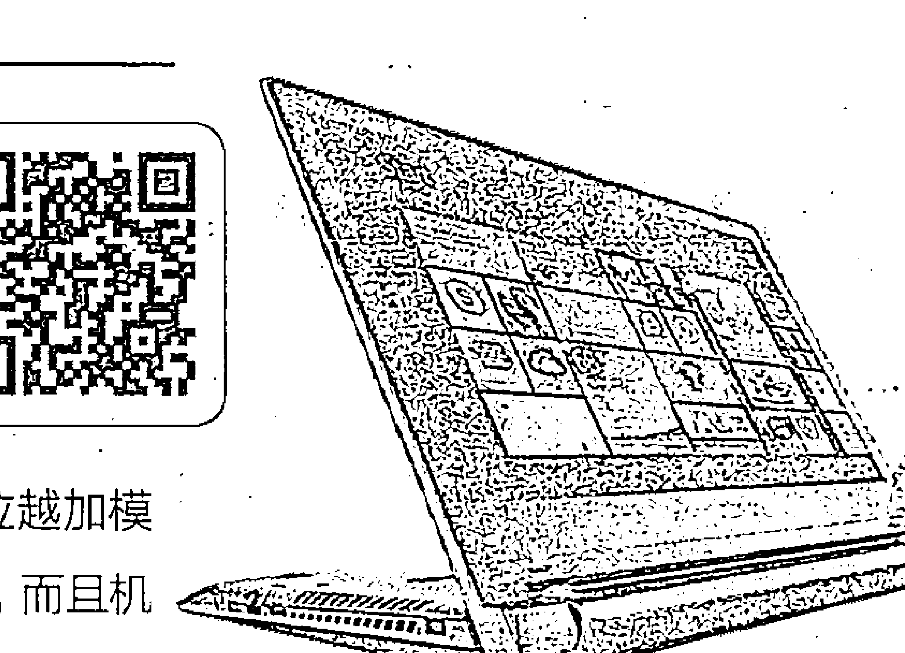

> > 升级建议: Flex3 14限于定位制约，联想仅为其配备了一个2.5英寸SATA3.0硬盘接口，如果你想提升磁盘性能，就只有更换混合硬盘或纯SSD这一条出路。

¥5699

## 惠普Pro x360

Pro x360是一款主打设计的变形本，它采用了铝合金精密工艺打造，在纤薄的同时却又刚毅无比，可以很好地保护屏幕以及机身内部的硬件。令人欣喜的是，别看Pro x360的厚度只有15.4mm，但却塞进了一块56Wh的超大电池，续航时间在同类产品中名列前茅。

- 屏幕: 13.3英寸IPS触控屏 (1920×1080像素)
- 处理器: 五代酷睿i5-5200U
- 内存/硬盘: 4GB/128GB SSD
- 显卡: HD5500核芯显卡
- 厚度/电池/重量: 15.4mm/56Wh/1.5kg

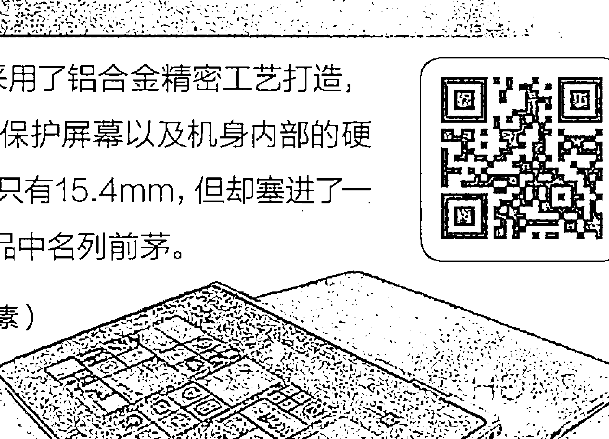

> > 升级建议: 由于Pro x360太过追求纤薄设计，所以它采用了板载内存的形式，可供用户更换升级的仅有80mm长度的M.2接口SSD硬盘而已。

¥6999

## ThinkPad S3 Yoga

在NVIDIA 940M独立显卡的帮助下，让S3 Yoga进阶为性能级变形本，在360度可翻转触控屏的多模使用状态之外，它还可以搞定绝大多数3D游戏的运行所需。而S3 Yoga在设计上更是抢眼，在屏幕翻开超过180度后，它的键盘会自动下陷至掌托平面之内，这种会“呼吸”的键盘完全不怕平板模式下被桌面磨损的问题。

- 屏幕: 14英寸IPS触控屏 (1920×1080像素)
- 处理器: 五代酷睿i5-5200U
- 内存/硬盘: 4GB/500GB+8GB混合硬盘
- 显卡: NVIDIA 940M
- 厚度/电池/重量: 21mm/56Wh/1.9kg

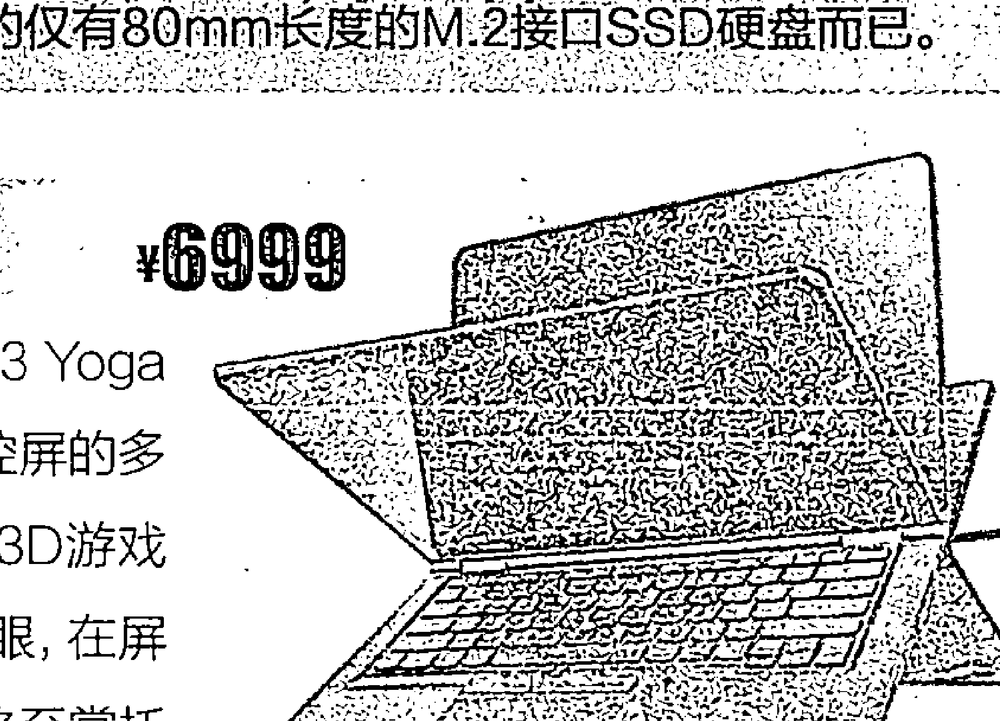

> > 升级建议: 得益于相对较大的14英寸机身空间，S3 Yoga的扩展能力还是不错的，除了标准SATA3.0接口外，它还额外配备了一个M.2插槽，可以加装M.2 SSD给磁盘性能提速。

¥6999

## 宏碁R7-572G

R7-572G是一款以设计取胜的产品，它将转轴设计在了顶盖的中间，立起来之后屏幕可以进行前后翻转，实现了“笔记本”、“Ezel”、“平板”、“显示”等模式。该产品支持电磁笔，可以实现精准复杂的手写绘图，而独立的GTX850M独显，也为其赋予了强悍的娱乐动力。

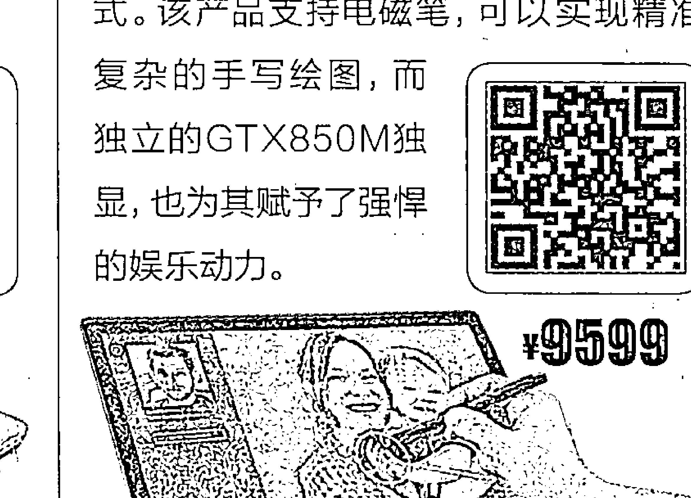

- 屏幕: 15.6英寸IPS触控屏 (1920×1080像素)
- 处理器: 四代酷睿i7-4510U
- 内存/硬盘: 8GB/1TB
- 显卡: NVIDIA GTX850M
- 厚度/电池/重量: 27mm/52Wh/2.5kg

¥9599

> > 升级建议: R7-572G的机身相对宽大，所以宏碁为其准备了2.5英寸和mSATA两个硬盘插槽，方便用户在磁盘容量和速度间获得平衡。而双风扇的散热结构，也有利于缓解中高端独显的散热需要。

宏碁前不久刚刚发布了全新的R7-371T，它能以屏幕中央的转轴为轴心进行“E”翻转视界，目前搭载酷睿i5-5200U的型号仅售7199元，感兴趣的用户可以参考本刊20期CFan新视野的报道。

## 听歌级无线蓝牙耳机导购

文|宁宁

前两年的时候无线蓝牙耳机还都比较昂贵，单声道的都要卖几十元，双声道立体声的就更贵了。但是近期蓝牙产品开始走低价路线，双声道立体声蓝牙耳机普遍卖到了99元，如果是非知名厂商的产品还要更便宜，音乐爱好者终于可以出手了。

### PC手机两相宜

目前市面上的无线耳机主要有三种。第一种就是FM无线耳机，与FM收音机实际上是一个原理。但是大多数智能手机并没有FM信号的发射功能，所以这种无线耳机只能在PC上使用(图1)。重要的是FM无线耳机传输的并不是数字信号，而是模拟信号，并且还容易受到干扰，所以并不是听歌的好选择。第二种则是2.4GHz无线耳机，这种无线耳机通常都会附送一个USB接口的2.4GHz接收器。所以只要把接收器插在电脑的USB接口中即可，多数情况下都无需安装驱动。但是这种无线耳机却无法与智能手机完美结合，因为大多数智能手机并没有内置兼容无线耳机的2.4GHz接收模块，虽然也可以通过智能手机的OTG模式外接2.4GHz接收器，但OTG连线却严重影响了智能手机的便捷性(图2)，所以始终未能普及。第三种无线蓝牙耳机则完全没有这种烦恼，因为智能手机普遍内置了蓝牙模块，所以根本就用不到OTG，只需在手机系统里智能配对即可。至于PC分为台式机和笔记本电脑两部分，台式机需要借助蓝牙USB适配器(图3)，而笔记本电脑如今都是采用Wi-Fi+蓝牙的二合一无线网卡，几乎全部支持蓝牙4.x。

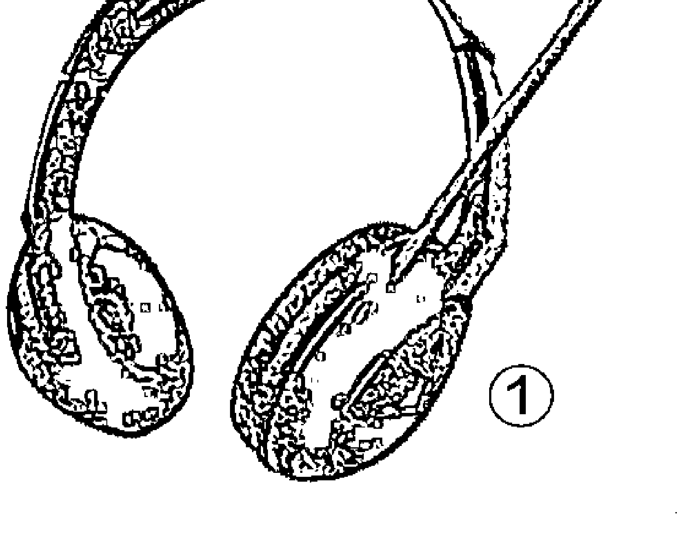

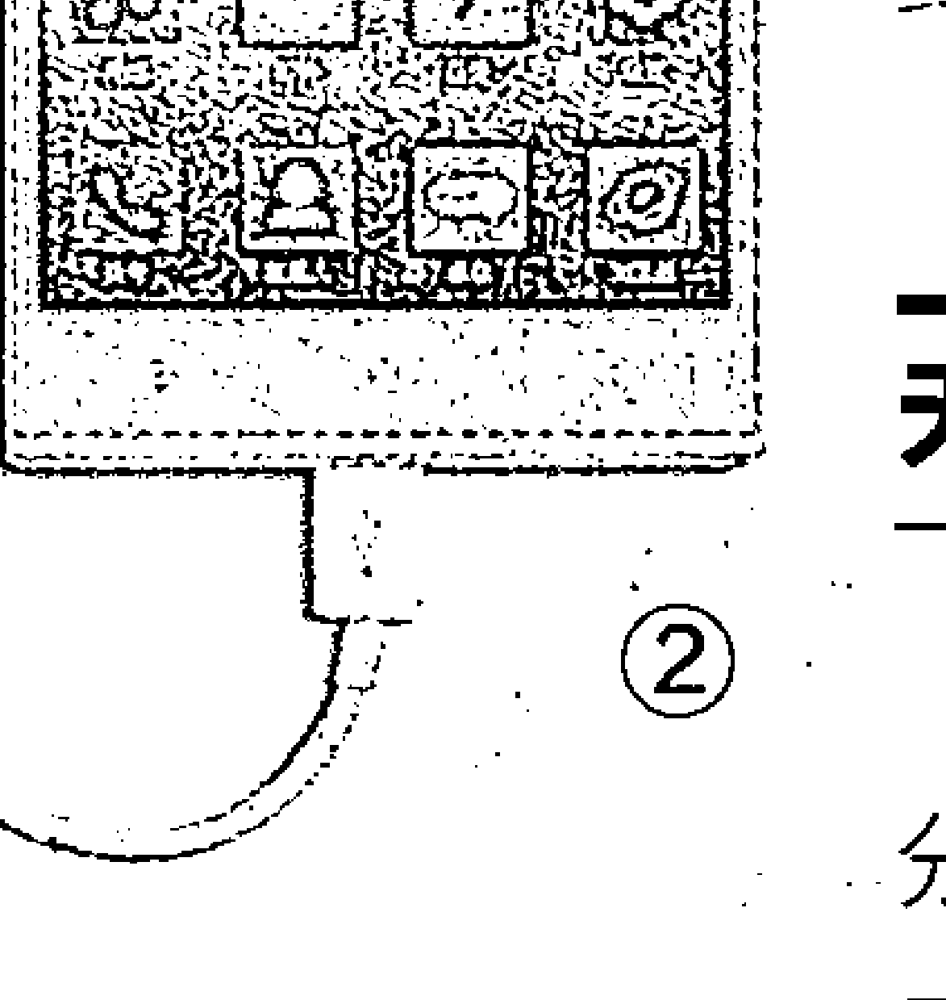

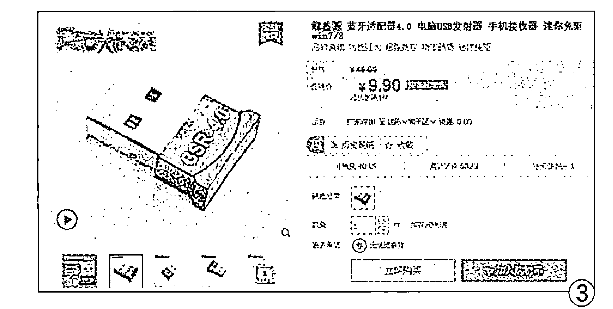

> 扩展阅读
单声道蓝牙耳机
无线蓝牙耳机还分为单声道和多声道两种，单声道蓝牙耳机普遍只能接打电话使用(图4)。虽然也可以在手机上装个APP进行“破解”来听歌，但效果实在太差了。并且多数智能手机并不能同时支持两个蓝牙耳机，所以依靠两个单声道耳机同时与一台智能手机相配对来实现双声道也难以实现。

### 无线蓝牙版本哪个好

说起无线蓝牙技术，其实还分为V1.x、V2.x、V3.x、V4.x这四代版本。V2.1+EDR曾经成为绝对主流(图5)，而之后V4.0/V4.1降耗90%左右，延时也降低到了几乎可以忽略不计的3ms，理论连接距离更是从10米延长到了100米。而更为重要的是，蓝牙V4.0/V4.1的无线耳机价格并不贵，甚至与尚未退市的V2.1+EDR产品售价相仿，而且还能向下兼容低版本的蓝牙模块及适配器。


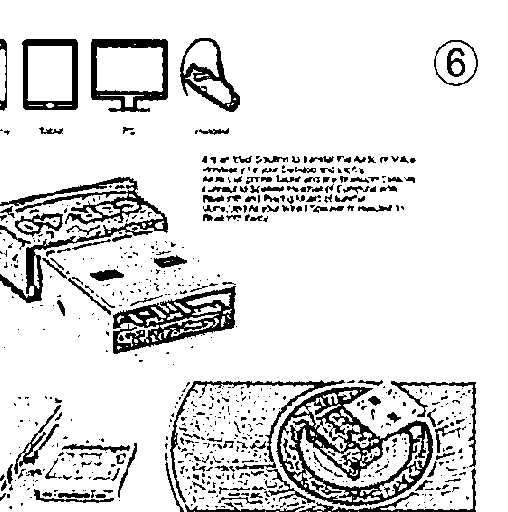

综上所述，考虑到无线耳机最在乎的就是传输距离、续航时间、延迟时间等技术特性（图6），所以购买V4.0/V4.1版本的蓝牙无线耳机绝对是最佳选择（图7），其它版本除非拥有极为明显的差价，否则干脆就不予考虑。至于蓝牙耳机的外形，还分为入耳式、耳挂式、耳塞式、后挂式、头戴式这五种。但只有后挂式和头戴式的发音单元比较大，可以提供听歌时比较在意的重低音效果。但后挂式蓝牙耳机的可选种类却并不多（图8），所以本文后面推荐的都是头戴式蓝牙耳机。

| 无线蓝牙版本 | 传输速率 | 备注 |
|---|---|---|
| V1.1/V1.2 | 748~810Kbps | 易受干扰 |
| V2.0 | 2.1Mbps | 配对复杂功耗大 |
| V2.1+EDR | - | Sniff Subrating |
| V3.0 | 24Mbps | 高速数据传输 |
| V4.0/V4.1 | 24Mbps | 功耗延迟降低距离增加 |


### 超值推荐

#### 爱度A2+

性能参数 蓝牙V4.0版本/40mm发音单元/10小时续航时间/6-10天待机/黑白红三色

推荐理由 爱度A2+可以说是天猫平台50元以内功能最多的蓝牙耳机，标价88元，但拍下后49元成交。不仅拥有了同价位产品所并不具备的TF卡扩展功能，同时还具备了上一曲、下一曲、加减音量、一键接听等功能，通话质量也算不错。


#### 乐视EB20

性能参数 蓝牙V4.0版本/40mm发音单元/12小时续航时间/26天待机/黑白红三色

推荐理由 乐视EB20是知名上市公司所打造的一款运动蓝牙耳机，外观上相比同类产品更为时尚，并具备了上一曲、下一曲、加减音量这四个独立按键。续航时间也达到了超长的12小时，待机时间更是长达26天，通话质量可以说是同类产品当中最好的。但缺点则是略微夹头。


#### 宾果FB100

性能参数 蓝牙V4.0版本/40mm发音单元/10小时续航时间/6-10天待机/黑白蓝黄粉五色

推荐理由 宾果FB100绝对是大厂最低价产品，提供了黑、白、蓝、黄、粉五色可选，易迅报价仅为88元。续航时间也非常优秀，可以达到官方承诺的10小时，通话质量也比较不错，并具备了比较特别的多功能拨动键。缺点则是头戴式设计尺寸偏小，部分用户反馈比较夹头。

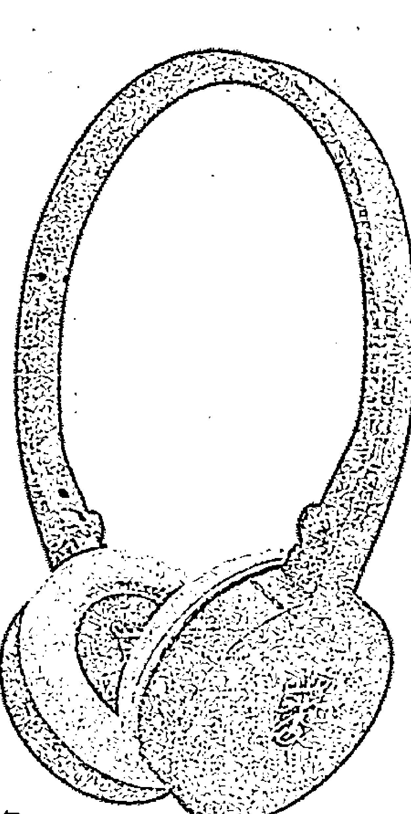


#### 雷柏H6020

性能参数 蓝牙V4.1版本/40mm发音单元/16小时续航时间/待机时间不详/蓝绿黑粉四色

推荐理由 依托雷柏品牌强大的无线产品设计能力，雷柏H6020的续航时间长达16小时，同时还具备了非常特别的多功能拨动键。并且这款耳机还提供了无信号自动关机功能，所以待机时间就等于内置锂电的自耗时间，明显优于同类产品。缺点则是音质和通话都只是常规水平。


## 游戏新兵 惠普暗影精灵 PK 宏碁T5000

如今，笔记本处理器已经逐渐向六代酷睿过渡，而OEM厂商也借此机会推出了很多全新的产品系列。比如惠普WASD暗影精灵和宏碁T5000就是5000元价位的一对新兵。那么，它们之间谁更值得选择？

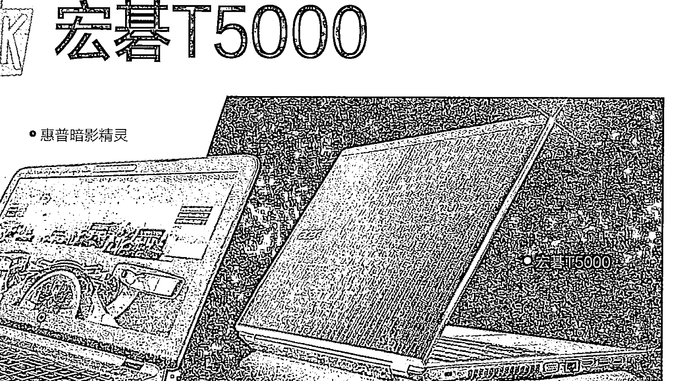

### 四核酷睿i5参上

武装英特尔Skylake架构六代酷睿i5-6300HQ是两款游戏本的最大亮点（图1）。不要因i5-6300HQ隶属i5就小看它哦，它可是移动版i5史上首款四核处理器，初始频率为2.3GHz，睿频加速最高可达3.2GHz，同时还拥有6MB高速缓存。就性能而言，i5-6300HQ可以轻松秒杀市面上主流的四代酷睿i5-4200H，无愧“史上最强i5（移动版）”之称。

| 参数对比 | 惠普WASD暗影精灵 | 宏碁T5000 |
|----------|------------------|-----------|
| 屏幕 | 15.6英寸IPS (1920×1080像素) | 15.6英寸IPS (1920×1080像素) |
| 处理器 | 酷睿i5-6300HQ | 酷睿i5-6300HQ |
| 内存/硬盘 | 4GB DDR3L/500GB | 4GB DDR4/1TB |
| 独立显卡 | NVIDIA GTX950M (4GB DDR3) | NVIDIA GTX950M (2GB DDR3) |
| 接口 | 读卡器、USB3.0×2、USB2.0×1、HDMI、RJ45、DVD刻录光驱 | 读卡器、USB3.0×2、USB2.0×1、HDMI、RJ45 |
| 尺寸 | 384.5mm×256mm×28.8mm | 382mm×260mm×30.3mm |
| 电池/重量 | 48Wh/2.48kg | 56Wh/2.4kg |
| 参考报价 | 4999元 | 5499元 |

需要注意的是，i5就是i5，虽然它顶着六代酷睿的光环，但其性能与四代酷睿i7还是有着一定的差距（见表）。虽然i5-6300HQ和i7-4700HQ都是四核处理器，但i7-4700HQ拥有更高主频，而且还支持超线程技术（四核八线程），这些特性足以将i5-6300HQ踩在脚下。

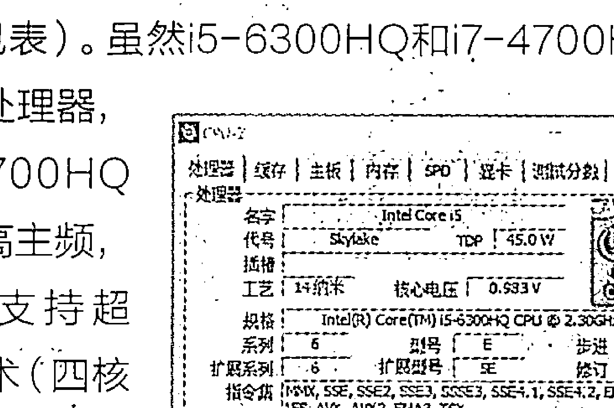

| 测试项目 | i7-4700HQ | i5-6300HQ | i5-4200H |
|----------|-----------|-----------|----------|
| 国际象棋 | 11691 | 8505 | 5830 |
| Cinebench R11.5 | 6.96pts | 5.34pts | 2.7pts |
| Cinebench R15 | 635cb | 462cb | 310cb |
| 3DMark11 (物理) | 8156 | 5417 | 3769 |

### GTX950M独显护航

为了不止于拖累酷睿i5-6300HQ的发挥，惠普和宏碁都为两款游戏本准备了NVIDIA旗下中高端的GTX950M独立显卡。GTX950M采用了和GTX960M相同的GM107麦克克斯韦核心，拥有640个流处理器和128bit显存位宽，只是频率相对较低，而且没有采用GDDR5显存。

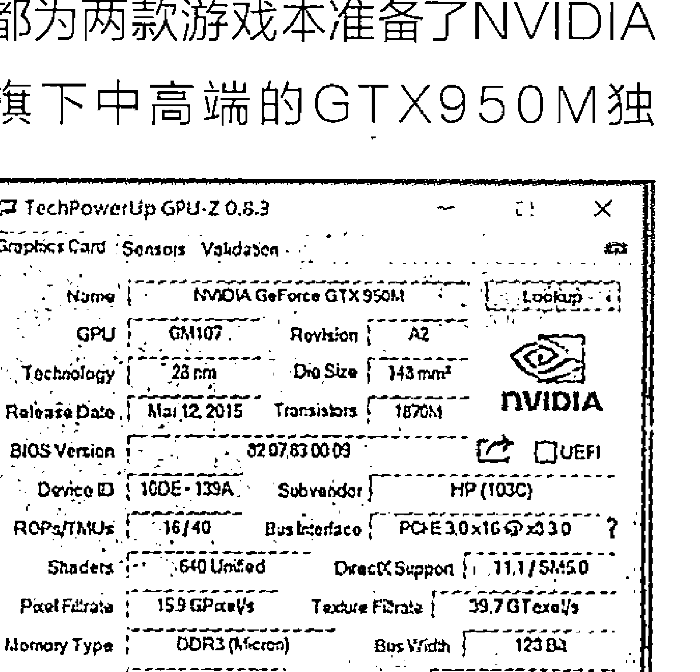

两款产品在独显规格的差异主要体现在显存容量上，惠普暗影精灵标配4GB DDR3显存（图2），是宏碁T5000的两倍。不过，显存容量对独显性能的增益很小（除非在2K或更高分辨率下运行游戏，但GTX950M至多仅能保证在1080P下流畅运行大型3D游戏），仅能算是锦上添花。

## 留意内存规格的差异

我们都知道，六代酷睿处理器支持DDR4-2133、LPDDR3-1866、DDR3L-1600三种规格的内存，只是如何选择就取决于笔记本厂商的需要了。出于成本的考虑，惠普选择了DDR3L-1600（1.35V）内存与暗影精灵搭配，无法充分发挥出i5-6300HQ的全部潜能（主要体现在核芯显卡上，DDR4的增益要大于DDR3）。而宏碁T5000则直接选择了最新的DDR4标准的内存，不仅频率提升到了2133MHz，1.2V的工作电压也要比DDR3L更省电。

需要注意的是，现阶段DDR4的笔记本内存并不多见（本文截稿时京东还未上架，只能通过淘宝购买），而且价格也要比DDR3内存贵一些。以三星8GB内存为例，其DDR3L-1600的版本价格约280元，而DDR4-2133的版本则要卖到350元。两类内存插槽互不兼容，如果有升级的需求请多加留意。

## 颇具个性的全新设计

为了吸引游戏玩家的关注，两款游戏本都采用了颇为个性的新模具设计。其中，惠普暗影精灵是以Pavilion 15为蓝本，加入了绿色的背光键盘，而且在键帽标识、掌托网纹和脚垫等部分也以绿色为基调（图3）。绿色很容易让人联想到神秘高傲的精灵，“暗影精灵”的代号也就是由此而来。

如果说惠普暗影精灵是以“撞色”吸引眼球，那宏碁T5000则就是更为注重触感。这款产品采用了铝合金金属上盖，并纳米压印技术呈现出了神秘暗码纹理（图4），不仅视觉效果炫酷，摸起来也能感觉到冷冰冰的金属触感。同样，T5000也配有白色的背光键盘，夜晚打游戏不必再开灯。

很遗憾，两款产品都没追求时下流行的纤薄设计，机身厚度都在30mm左右，2.4kg以上的重量也谈不上轻薄。但是，更为宽大的机身则有利于改善散热环境，这也算是种自我安慰吧。

好消息是，无论是惠普暗影精灵还是宏碁T5000都采用了IPS材质的15.6英寸屏幕，可视角度可超过170度，而1920×1080像素FHD级别的分辨率也确保了细腻的视野。在这面屏幕的帮助下，我们不必担心因屏幕角度不合适而出现画面偏色而影响游戏成绩的隐患。

## 浅析内部结构

惠普暗影精灵的扩展潜力很大，它除了标配500GB机械硬盘以外，还提供了一个M.2插槽，方便用户加装M.2 SSD硬盘扩容提速。如果你觉得两块硬盘还不过瘾，可以考虑将光驱拆除，使用光驱位的硬盘托架安装第三块硬盘（图5）。在散热设计上，这款产品采用了单风扇双热管的结构，两根热管呈U型排列，分别穿过CPU和GPU芯片。

相对而言，宏碁T5000的升级潜力就要略逊一筹了。这款机器除了标配的机械硬盘外还提供了一个M.2插槽（图6），可加装第二块SSD硬盘。

> 随着六代酷睿的全面上市，四核i5将为主流价位的笔记本带来显著的性能提升。就本文对比的两款产品来看，以绿色点缀的惠普暗影精灵拥有更强的扩展能力和散热表现，只是DDR3L内存拖累了六代酷睿的性能发挥。宏碁T5000的亮点在于DDR4内存的加持，以及更大的56Wh电池，在续航时间的表现上更为抢眼。笔者的选购建议是：如果你注重性价比和后期维护，惠普暗影精灵更加适合你。而宏碁T5000的价格相对较高，只有当其价格比同档次的暗影精灵便宜时才值得入手。

## 谁是千元杀器 魅蓝Metal PK 荣耀5X

曾几何时，金属材质和指纹识别等特性仅属于2000元价位中高端手机的专利。如今，此类卖点却纷纷被千元级手机继承，在更低的价位上演“屌丝逆袭”。而魅蓝Metal和荣耀5X就是这些新品的代表。那么，它们之间谁更适合你？

| 参数对比 | 魅族 魅蓝Metal | 华为 荣耀畅玩5X |
| :--- | :--- | :--- |
| 网络 | 移动联通双4G（双卡双待） | 移动4G（双卡双待） |
| 屏幕 | 5.5英寸IPS（1920×1080像素） | 5.5英寸IPS（1920×1080像素） |
| CPU | 联发科Helio X10 | 高通骁龙615 |
| GPU | PowerVR G6200 | Adreno 405 |
| 内存/存储 | 2GB/32GB<br>（支持128GB存储卡） | 2GB/16GB<br>（支持128GB存储卡） |
| 摄像头 | 500万/1300万像素 | 500万/1300万像素 |
| 厚度/重量 | 150.7mm×75.3mm×8.2mm | 151.3mm×76.3mm×8.15mm |
| 电池/重量 | 3140mAh（不可换）/162g | 3000mAh（不可换）/158g |
| 参考价格 | 1099元 | 999元 |

荣耀5X还有内置3GB内存且支持全网通的高配版，只是价格也高达1399元，失去了性价比优势。

## 更具质感的金属机身

与魅蓝和荣耀家族低端机的“前辈”相比，魅蓝Metal和荣耀畅玩5X（下文简称荣耀5X）都改用了更为高档的材质，宣告千元级手机在工艺方面的“革命”。不过，两款产品在金属材质的选用和后期“修饰”上依旧存在差异。

其中，荣耀5X采用了航空级铝材，并采用高速CNC钻石刀内外抛光打磨，而后盖部分则引入了3D曲面金属拉丝工艺，拉丝抛光处理让手机整体档次感提升。为了保证信号质量，荣耀5X的后盖为三段式结构，中间部分为拉丝金属，顶部和底部为塑料（图1），解决了金属的信号屏蔽干扰。

魅蓝Metal采用了在传统铝材中加入多种稀土和钴、钛等金属微量元素的全新合金材料，同样经过了CNC工艺的修饰。和荣耀5X相比，魅蓝Metal的后盖看起来是一个整体（图2），难道它真的是“全金属”机身？

我们都知道，为了避免信号屏蔽，智能手机要么采用类似荣耀5X这种中间金属两边塑料的三段式机身，要么就学习苹果在全金属后盖上添加“白带”（一种注塑工艺，成本很高）。而魅蓝Metal的解决方案很取巧：它同样采用三段式后盖结构，只是在整个表面都进行了金属烤漆，用颜色遮住了金属与塑料的区隔，给人一种全金属的假象。

## 必不可少的指纹识别

作为新一代千元级的代表，魅蓝Metal和荣耀5X自然也都配备了指纹识别模块：由按压式指纹识别供应商FPC提供的解决方案，可以在0.5秒内完成整个指纹解锁过程。不过，荣耀5X将指纹识别器放在了产品后部（图3），而魅蓝Metal则将其与Home键合二为一（图4）。两个位置使用起来都很方便，不存在孰优孰劣的问题。

两款产品指纹功能的差异主要体现在特色功能上，比如魅蓝Metal除了指纹解锁外，还可利用Home键实现给应用、文档加密以及指纹支付等功能。而荣耀5X则在此基础上增加了来电接听、指纹拍摄、闹钟停止、显示通知等功能，充分挖掘了指纹识别作为额外快捷键的潜力。

## 核心硬件的性能差距

作为千元级代表，魅蓝Metal和荣耀5X在核心硬件的选择上出现了分歧。为了实现全网通的特性，荣耀5X武装了高通骁龙615处理器平台，只是为了降低成本吸引更多移动用户关注，才单独推出了999元的移动定制版（在基带芯片上有所改变，属于硬件级缩水，无法通过破解的方式开启联通或电信4G）。骁龙615的性能勉强算是中档级别，在安兔兔测试中可以取得36000左右的成绩（图5）。

魅蓝Metal采用了和自家MX5相近的联发科Helio X10处理器平台，只是MX5为2.2GHz的Helio X10 Turbo版，而魅蓝Metal则是2.0GHz的标准版。即便如此，魅蓝Metal依旧能在安兔兔中取得50000分的成绩（图6），就性能而言足以秒杀荣耀5X所搭载的骁龙615。可惜，由于Helio X10的基带不支持电信网络，意味着魅蓝Metal彻底将电信用户拒之门外。

## 源自系统底层的差异

荣耀5X的系统为Android 5.1深度优化的EMUI 3.1，使用体验与荣耀7/7i、Mate S等华为自家产品相同。而魅蓝Metal则比较特殊，它采用了基于阿里云YunOS平台深度定制的Flyme 5.1操作系统，并不是我们熟悉的Android。

好消息是，YunOS版的Flyme 5.1在界面、操作方式、功能等方面与MX5等产品采用的Android版Flyme 5.1并无差别，而且还兼容所有的Android APP，如果不做特殊说明，相信魅蓝Metal用户根本就无法知道自己使用的竟然是YunOS。该系统最大的特点就是将谷歌服务替换成了基于阿里大数据的阿里云软件服务。比如，它将YunOS与Flyme账号进行了深度融合，Flyme账户可与淘宝账户绑定进行购物。此外，YunOS版Flyme 5.1还会根据用户使用习惯而推送更准确的信息，比如猜你喜欢的歌曲、你可能感兴趣的资讯等等。

毫无疑问，魅蓝Metal和荣耀5X都是目前千元手机中的佼佼者，它们具备同价位最优秀的做工用料、包括指纹识别在内的最新安全技术以及存储卡扩充能力（图7），几乎不存在“短板”。不过所谓“就怕货比货”，如果你并非电信用户，魅蓝Metal在性能方面完胜荣耀5X，适合喜欢游戏的玩家。而荣耀5X全网通版的性价比并不高，笔者只建议移动用户考虑低配版的荣耀5X，性能够用，还比魅蓝Metal便宜100元。

## 旅行家居必备 多口USB充电器帮你忙

如果卧室插线板的孔位仅剩一个，但你的手机和平板电脑却都在等着充电，你会怎么办？难道将另一部拿到客厅充电？外出旅游，如果你需要随身携带充电宝、手机、平板、智能手环，难道还需额外准备上述设备的充电器吗？此时，一款多口USB充电器就能解决大问题。

### 充电安全一般无碍

所谓多口USB充电器，就是“一拖多”形态的充电器类别，它们的总输出功率多在20W以上，可以满足同时为多部移动设备充电的需要。不过，也正是因为它们的输出功率太高，引起很多用户的担心：我的手机仅支持5V/2A输入，插在这玩意儿上面会不会影响寿命？

答案是你多虑了。无论是智能手机、平板电脑，还是智能手环（手表）等移动设备，它们的充电电流都是由移动设备端的IC芯片控制，而不是充电器。如果说通过充电器输出的电流是水管里的水，设备自身就是水阀门，能通过多少水（电流）全是水阀门说了算。水量再大也不可能突破水阀门的极限值；而如果水流太少，哪怕你将水阀门开到最大也是无用。总之，充电电流的控制权在于手机，充电器只能被动地适应手机的需要（只要设备和充电器都是5V的电压标准）。

那么，在挑选多口USB充电器时我们需要注意哪些参数和问题呢？

### 总输出功率是关键

“贪多”是很多用户的潜意识，因此在挑选多口USB充电器时，USB数量越多、价格越便宜的产品总是更能吸引我们关注。但是，有一个参数指标要比USB数量更为重要，它将决定一款多口USB充电器是“神器”还是“垃圾”。

这个参数就是最大总输出功率。比如，有些多口USB充电器的总功率只有10W（5V/2A），但却提供了4个USB接口。这意味着，它只有仅连接一款设备时才能保证5V/2A的输出效率。当你同时接驳2款~4款设备时，每个USB接口的输出将被平均，也就是分别以5V/1A、5V/670mAh和5V/500mAh输出（图1），从而导致给每款设备的充电时间都大幅延长2~4倍！

如果你家里的移动设备较多，而且多是支持5V/2A充电的标准，那就请尽量挑选总输出功率在30W以上的多口USB充电器，保证至少可以让两个USB接口能同时以5V/2A的效率输出。

### 合理搭配使用接口

一些高端的多口USB充电器内会添加自适应芯片，每个USB接口都能根据当前接驳的移动设备而任意调整最大输出电流。而有些多口USB充电器就没这么“聪明”了，它们会将USB接口分成两类，一类注明支持5V/2.xA输出，而另一类则仅支持5V/1A（图2），需要用户自己根据移动设备的充电参数，选择匹配的USB接口。因此，如果你怕麻烦且不计成本，可优先挑选支持自适应的充电器产品。

### 不可忽视的线路耗损

一款标注40W总输出功率且支持自适应的多口USB充电器，可以全速为4款移动设备以5V/2A供电吗？答案是否定的。电流在电路中的传导是存在耗损的，能保证80%输出效率的多口USB充电器就已经算是合格的产品了。因此，为了保证充电效率，笔者建议大家尽量不要插满充电器的USB接口，保留至少1个USB处于空闲状态。此外，USB充电器接驳的移动设备越多，其工作时的发热量也就越高（图3），不让其满负载运行也有利于充电器自身和设备的安全。

### ORICO DCA-4U

DCA-4U的棱角边缘采用了ABS高强度塑胶，握感比较舒适，30W的输出功率可以满足同时为2~3款移动设备充电的需要。

- USB接口数量：4个
- 最大总输出：30W
- 单口最大输出：5V/2A
- 尺寸：90mm×85mm×35mm

### CHOETECH 50W 充电器

这款充电器的总功率高达50W，6个USB接口足以满足绝大多数家庭用户的使用。产品可以检测接驳的设备而自动切换至其所支持的最大电流输出，确保充电效率。

- USB接口数量：6个
- 最大总输出：50W
- 单口最大输出：5V/2.4A
- 尺寸：89mm×72mm×29mm

### 360 超级充电器

该产品的特色在于实惠，且拥有多种颜色版本，可惜最大功率仅有25W，勉强可以同时为两部iPad充电。

- USB接口数量：4个
- 最大总输出：25W
- 单口最大输出：5V/2.4A
- 尺寸：81mm×58mm×27mm

### ROCK RWC0209

RWC0209采用了可隐藏的连体接头设计，外出时不必再准备电源线。产品支持最大34W输出，其表面积比一张银行卡还要小巧，适合外出携带。

- USB接口数量：4个
- 最大总输出：34W
- 单口最大输出：5V/2.4A
- 尺寸：72.5mm×48mm×30.5mm

### 绿联CD102

这款产品自带独立开关，方便用户随时断电以节省电力。它的总输出功率为31W，提供的4个USB接口中有2个支持5V/2.1A输出，而另外2个则仅支持5V/1A输出。

- USB接口数量：4个
- 最大总输出：31W
- 单口最大输出：5V/2.1A
- 尺寸：107mm×80mm×32mm

### Anker 40W 充电器

Anker品牌充电器的品质很不错，就这款产品而言具备40W大功率，且支持自适应的智能匹配输出电流功能，而包括降压补偿在内的多项技术也能最大限度确保充电安全。

- USB接口数量：5个
- 最大总输出：40W
- 单口最大输出：5V/2.4A
- 尺寸：98mm×65mm×25mm

## 游戏新主张 联想拯救者ISK PK 宏碁暗影骑士2

随着六代酷睿的上市，各大厂商旗下的游戏笔记本系列也迎来了新一轮的升级。而拯救者ISK和暗影骑士2则是联想和宏碁为游戏玩家定制的新一代悍将。那么，它们之间谁更值得期待？

### 更炫酷的“暗影骑士”

作为“暗影骑士”家族的第二代成员，宏碁VN7-592G延续了上代产品的设计风格，22.9mm的厚度和2.3kg的体重更显轻盈（上代产品厚度为23.9mm）（图1）。为了彰显“新品”地位，VN7-592G在一些细节之处做出了改变：

| 参数对比 | 联想拯救者ISK进取版 | 宏碁VN7-592G-58NG |
| :--- | :--- | :--- |
| 屏幕 | 15.6英寸IPS（1920×1080像素） | 15.6英寸IPS（1920×1080像素） |
| 处理器 | 酷睿i5-6300HQ | 酷睿i5-6300HQ |
| 内存/硬盘 | 8GB DDR4/1TB | 4GB DDR4/500GB |
| 独立显卡 | NVIDIA GTX960M (2GB GDDR5) | NVIDIA GTX960M (2GB GDDR5) |
| 接口 | 读卡器、USB3.0×2、USB2.0×1、HDMI、VGA、RJ45 | 读卡器、USB3.0×2、USB2.0×1、USB Type-C×1、HDMI、RJ45 |
| 尺寸 | 387mm×272.6mm×27.9mm | 390mm×262.8mm×22.9mm |
| 重量 | 2.6kg | 2.3kg |
| 参考报价 | 还未上市 | 5999元 |

A面边缘的切边更为锋利，给人一种棱角分明的感觉；在金属A面增加了天线开口，Wi-Fi信号的接收能力更强。

值得一提的是，VN7-592G机身右侧新增了一个USB Type-C型接口，支持最新的USB3.1技术。可惜，VN7-592G在材质方面并没有变化，只有A面是铝合金材质，而B、C、D则为塑料材质。还好，VN7-592G的金属A面加入了纳米压印技术的类肤质涂层，C面也选择了膜内转印(IMR)工艺的丝印质感，尽可能提升了触感。

### 更大“视界”的“拯救者”

15.6英寸的拯救者ISK其实就是14英寸型号的“放大版”，它的外壳延续了亚光材质的类肤涂层，沉稳的黑色与转轴内外覆盖梯形凸起的红色镂空网眼结构相呼应，构成了红黑搭配的超跑风格。顶盖的三条棱线背脊和红色的背光键盘（限高配版）也被延续了下来（图3）。
得益于更大尺寸的机身，拯救者ISK-15增加了数字小键盘，对经常与数字打交道的用户而言，绝对是个好消息。遗憾的是，该产品的接口布局与14英寸的版本一模一样，3个USB接口对15.6英寸游戏本而言并不算多，2.6kg的体重也谈不上轻盈。

## 硬件配置的一致性

两款游戏本新品在硬件搭配上可谓“英雄所见略同”，它们都采用了IPS材质的屏幕，可视角度非常出色（图4）。而硬件平台，则毫无争议地选择了英特尔最新的六代酷睿处理器，i5-6300HQ和NVIDIA GTX960M独显的组合相当强悍。要知道，i5-6300HQ是移动版酷睿i5家族中首颗四核处理器（图5），虽然它的性能较上代酷睿i7还有一点点差距，但秒杀i5-4210H还是没任何问题的。

令人欣慰的是，拯救者ISK和宏碁VN7-592G都支持DDR4内存标准，比很多采用六代酷睿+DDR3的竞品要厚道很多。此外，两款产品都标配了一个M.2插槽，有需求的玩家可以自行购买M.2接口的SSD升级。
其中，拯救者ISK的拆机升级难度很小，拧下D面所有螺丝后就能拆下底盖，并随意替换内存、硬盘或加装M.2 SSD。而宏碁VN7-592G的拆机难度就要大了很多，拧下D面螺丝后，需要从C面着手拆下整个键盘面，期间要小心地卸开几个排线。5999元的VN7-592G仅内置一根4GB DDR4内存，如果你想升级到双通道，还需再拆下整个PCB主板并将其翻过来后才能看到内存插槽（图6），动手能力不够的用户最好去宏碁客服中心进行硬件的更换和升级。
在散热方面，两款笔记本都采用了双风扇双热管的散热结构，后置的散热通风口让我们在游戏之时也不需要再受热气炙烤（图7）。好消息是，宏碁VN7-592G新增了智能反转除尘功能，启动该功能后可以从特定位置排出灰尘，免去了拆机除尘的繁琐。而联想笔记本的电源管理软件也提供了一键除尘功能，原理和VN7-592G相似。

> > **小提示**
>
> 宏碁VN7-592G的M.2插槽支持PCIe x4通道，预算有限的用户可购买实惠的SATA通道的M.2 SSD，对性能要求更高的玩家则可选择更高速的SSD提速。

伴随六代酷睿的全面普及，游戏笔记本的性能再次达到了一个新的高度。作为本文的主角，拯救者ISK和宏碁VN7-592G就是典型的Skylake游戏本的范例：四核i5、DDR4内存、GTX960M级别的独显，以及额外的M.2接口，基本不存在性能和扩展方面的瓶颈。相对来说，宏碁VN7-592G凭借全新的USB3.1接口和更轻薄的身材，在购买指数上要比拯救者ISK更高。在本文截稿时拯救者ISK进取版还未正式上市。如果它的价格不能与VN7-592G拉开400元以上的差距，在性能价格比上就讨不到太多便宜了。

## 视觉盛宴轻松拥有

## 曲面显示器典型导购

文|宁宁

近期曲面显示器大批量上市，为高端玩家提供了一场视觉盛宴。那么市面上有哪些曲面显示器值得购买呢？

### 为何要掰弯显示器

曲面显示器刚刚大批量上市的时候很多人就提出了疑问，好好的显示器为何要“掰弯”呢？实际上掰弯显示器其实是为给人眼更好的视觉体验，因为人的眼球是凸起且有弧度的，所以曲面屏幕的弧度刚好可以保证人眼与屏幕各个角度的距离均等（图1），从而带来更好的视觉体验。并且曲面屏幕的设计也更贴合人眼生理曲线构造，从而打造零失真的视觉体验。同时曲面显示器还可给人眼更好的视觉宽广度（图2），并更加适合多人观看。即便是坐在边缘的观看者仍能体验到与屏幕中央位置比较相近的视觉体验。这种原理近似于电影院中的曲面IMAX屏幕，可以实现更好的环绕观影效果。

此外，曲面显示器还可产生一定的“裸眼3D”效果，就是会有一种次要内容靠前排列，人物等主要内容靠后的视觉体验，这种画面的立体感错觉也是平面显示器所并不具备的。而到了游戏当中视觉效果则更加明显，尤其是第一人称视角的射击游戏，就更能体验到一种身临其境的代入感。也正是因为上述原因，液晶面板厂商才急于掰弯显示器。

### 平衡均匀图像


### 更宽广，深邃的图像

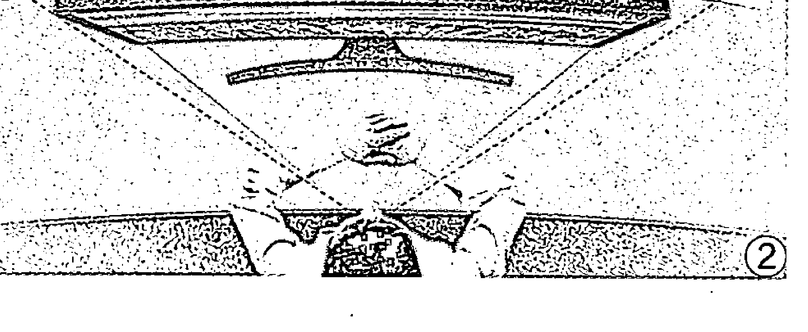

### 曲面显示器贵不贵

目前来看，各大厂商面对曲面显示器的定价差异化极大。以AOC为代表的厂商，可以说是大力推广曲面显示器的“先锋军”。同样是27英寸的广视角显示器（图3），AOC品牌的平面显示器要卖到1199元（IPS面板），AOC品牌的曲面显示器却只贵了300元（MVA面板），卖到了极具性价比的1499元。再以惠科（HKC）品牌为例，同样是31.5英寸的广视角显示器（图4），平面显示器要卖到1799元（ADS面板），曲面显示器则只贵了500元（MVA面板），卖到了仍然比较超值的2299元。曲面显示器并非都是贵族，只要经过精挑细选也能选到非常超值的产品。

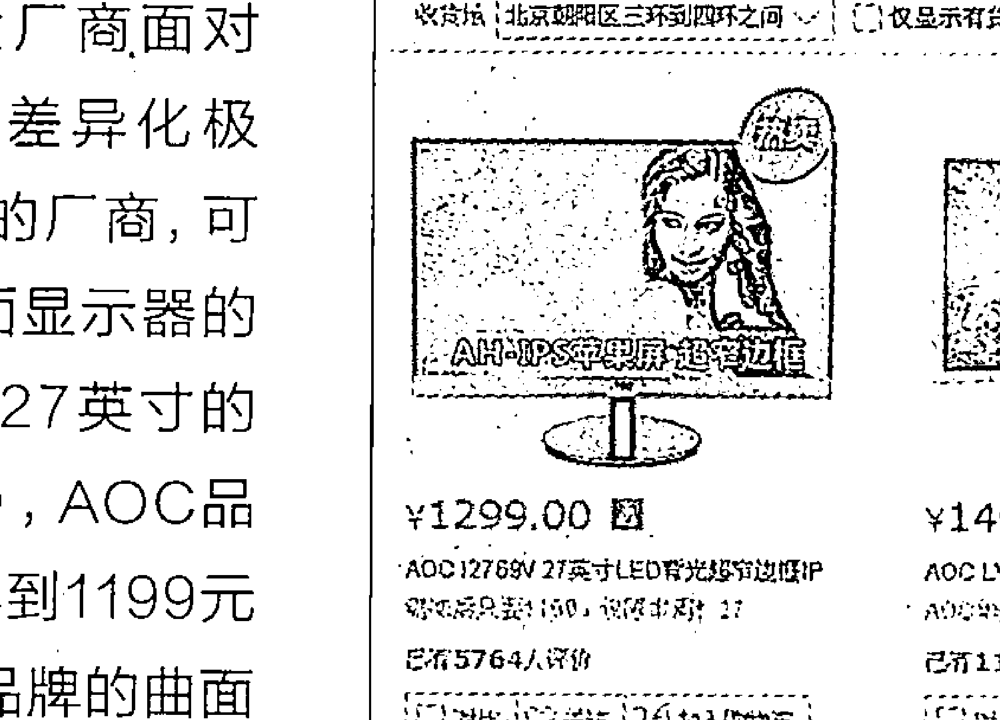

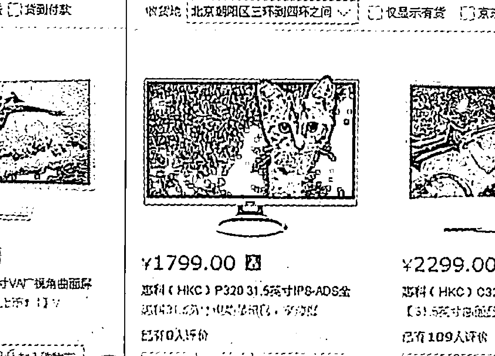

### 曲率多少才合适

接触了曲面显示器之后还会碰到一个名叫“曲率”的概念，实际上这个概念并不复杂，说得直白一点就是显示器被掰弯的严重程度。市面上的曲面显示器通常分为4000R、3000R、2000R这三种曲度。在这里可以把显示器想象成一个完整圆形的一部分圆弧，其中4000R就是半径为4米的圆弧（图5），3000R和2000R则是半径为3米和2米的圆弧。并且通过常识便可以知道，圆弧的半径越小，显示器被掰弯的程度就越大。如果说4000R只是刚刚体验到显示器面板的弯曲，那么3000R和2000R就变得越来越弯曲了。尤其是2000R的曲率，甚至可以提供一个十分封闭的环绕效果，所以非常适合游戏发烧友购买。但2000R显示器的售价普遍要卖到6000元以上，都够买一台发烧级游戏电脑主机了，所以本文推荐更多的消费者考虑4000R和3000R的曲率产品，等到2000R降价普及之后再考虑更新换代也不迟。

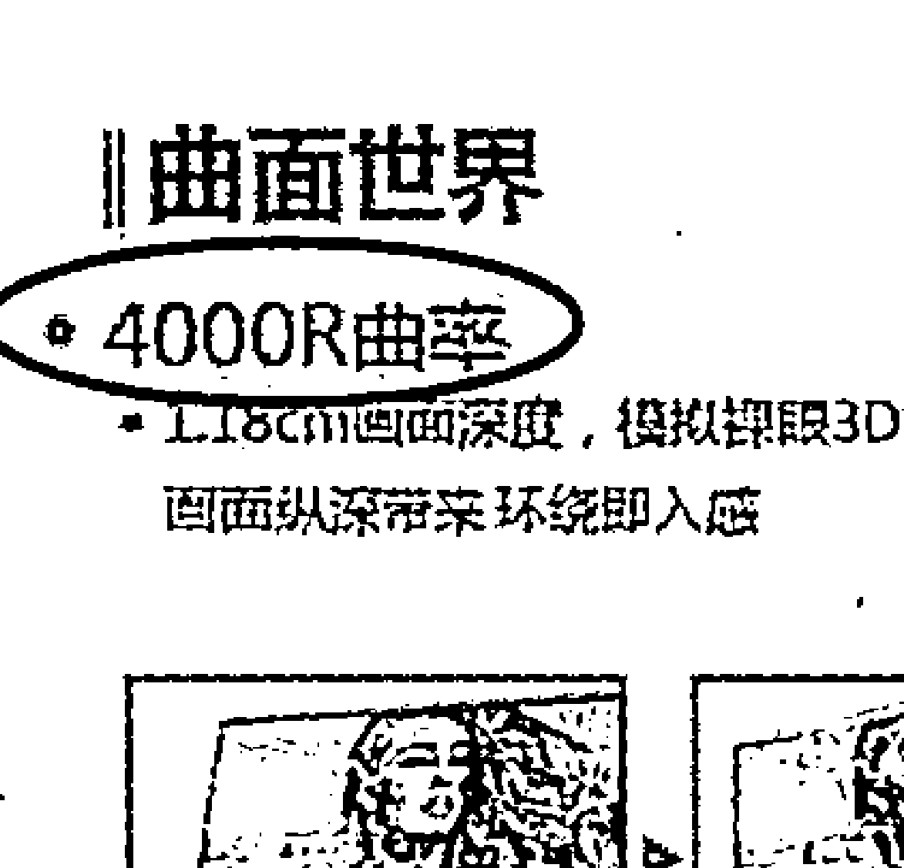


### 并不适合所有人

曲面显示器无论是看片还是游戏都可以带来环绕效果视觉，这显然是为家庭应用所打造的一款新锐产品。但是对于专业用户来说，却绝对是严重排斥的一种选择。尤其是在作图、设计、绘画等专业领域，因为弯曲的屏幕会对画面多多少少造成一定的扭曲失真，所以专业用户购买之后绝对是适得其反。更为重要的是，曲面屏幕的面板在均匀性控制难度上也要明显高于普通平面显示器，尤其是普及型低价产品更是会有色彩不均匀这样的现象，所以就更不适合对画面要求较高的专业用户购买了。此外，如果是在京东平台购买不要忘了查阅是否有促销活动（图6）。

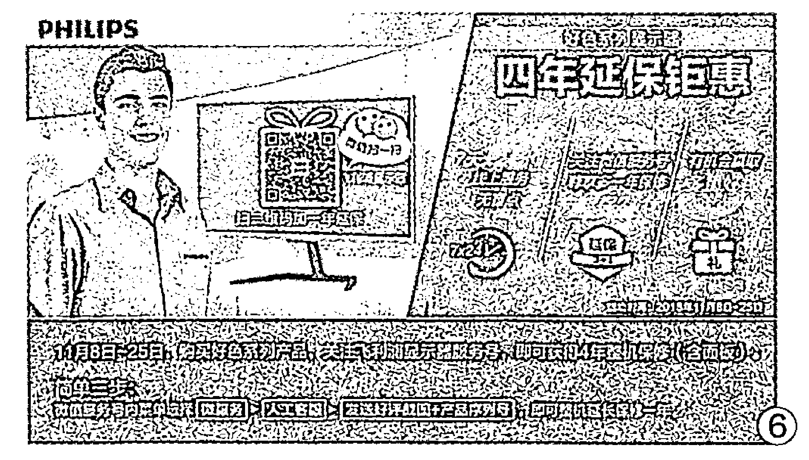

### 尺寸哪种最适合

曲面显示器主要有23.6英寸、27英寸、29英寸、31.5英寸、34英寸、35英寸这六种尺寸。其中23.6英寸由于尺寸太小所以根本就形成不了环绕效果，所以并不是市场主流，本文在后面也仅列举一款，推荐给不习惯大屏显示器的消费者购买。27英寸、29英寸、31.5英寸则是绝对主流，市面上的产品也比较多见且极具性价比，普遍售价都不会超过3000元。34英寸和35英寸则是最新的高端产品，售价普遍都要在6000元以上，仅适合发烧级玩家购买，所以在本文当中并不涉及。而根据面板类型来区分，还分为色彩柔和均匀并且漏光很少的MVA面板，以及色彩艳丽但却漏光严重的IPS面板。

## 超值产品推荐

### 三星S24E500C

【性能参数】23.6英寸/MVA面板/4000R曲度/1920×1080分辨率/HDMI+VGA
【推荐理由】由于其他厂商都热衷于大屏，所以三星S24E500C就成了市面上最廉价的曲面显示器。23.6英寸的尺寸确实偏小，仅推荐给不习惯大屏显示器的消费者购买。


### AOC LV274HCP

【性能参数】27英寸/MVA面板/4000R曲度/1920×1080分辨率/DP+HDMI+DVI+VGA
【推荐理由】其最大的特点就是提供了DP+HDMI+DVI+VGA全套视频接口。可以很方便地与XBOX、PS4、DV、DC等设备互联，并且HDMI接口还符合MHL标准，可以实现智能手机及平板的画面同步显示功能。

### 飞利浦279X6QJSW

【性能参数】27英寸/MVA面板/4000R曲度/1920×1080分辨率/DP+HDMI+VGA
【推荐理由】国际大厂的超值产品，不仅HDMI接口符合MHL标准，而且还支持AMD的FreeSync技术，利用DP接口在游戏时控制屏幕刷新率，保证游戏画面与显示器的同步显示。

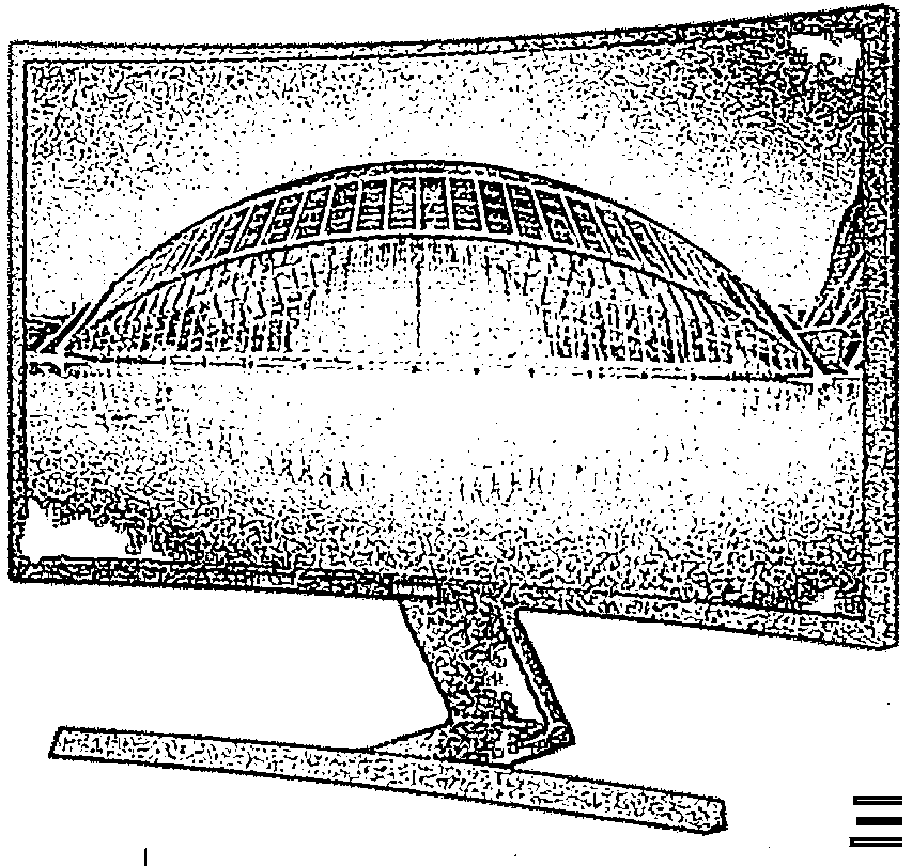

### 三星S27E500C

【性能参数】27英寸/MVA面板/4000R曲度/1920×1080分辨率/HDMI+VGA
【推荐理由】三星500C系列的27英寸产品，在性能参数上与前文推荐的三星S24E500C只有尺寸上的区别。视频接口仍旧是可怜的HDMI+VGA两种，好在价格并不算贵，京东手机端报价仅为1688元。

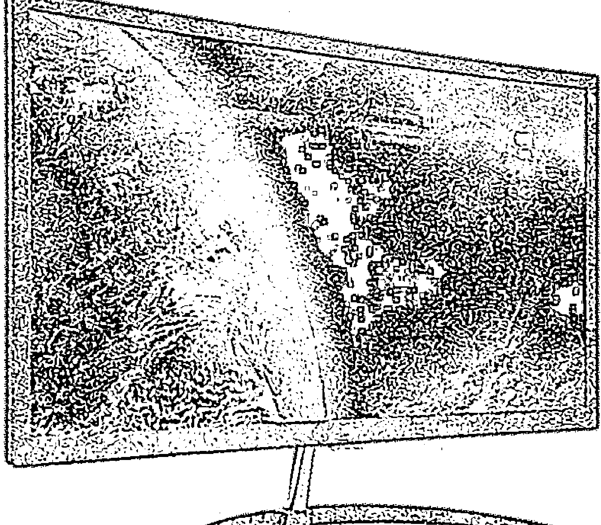

### 惠科C320

【性能参数】31.5英寸/MVA面板/3000R曲度/1920×1080分辨率/DVI+VGA
【推荐理由】采用了低端产品难得一见的3000R曲度，缺点是视频接口只有可怜的DVI+VGA两种，甚至就连HDMI接口都没有。优点则是价格只有2000元出头。

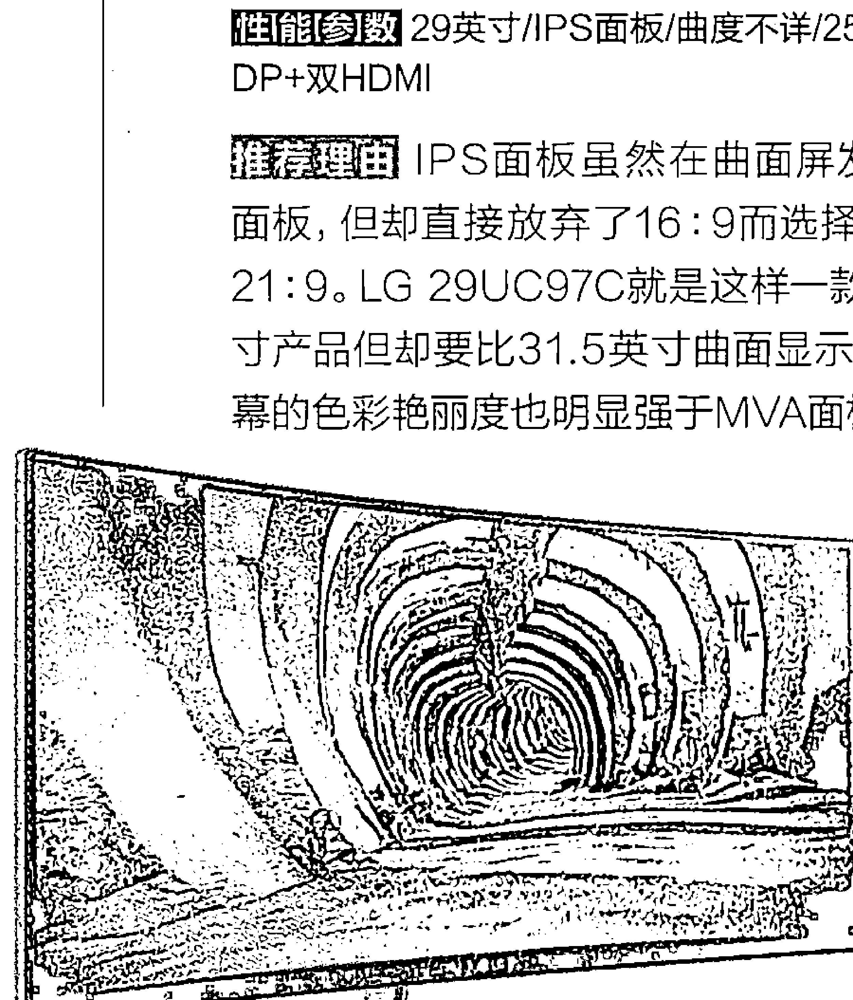

### LG 29UC97C

【性能参数】29英寸/IPS面板/曲度不详/2560×1080分辨率/DP+双HDMI
【推荐理由】IPS面板虽然在曲面屏发展上落后于MVA面板，但却直接放弃了16:9而选择更适合电影观看的21:9。LG 29UC97C就是这样一款产品。虽然是29英寸产品但却要比31.5英寸曲面显示器更加宽广，IPS屏幕的色彩艳丽度也明显强于MVA面板。