# 电脑爱好者2015合订本（中）第一部分

《电脑爱好者》2015年9期~16期精华内容集合
赠送超值DVD 2015年1期~16期完整电子版

> 剔除新闻等已过时效性的文章，每期收录的应用内容由40页提高至70页；内容重新归类整合，满足读者便捷查阅的需求

# 《电脑爱好者》2015年合订本（中）

电脑爱好者杂志社

# 《电脑爱好者》2015年合订本（中）

主管 中国科学院
主办 北京《电脑爱好者》杂志社
中国计算机世界出版服务公司
编辑出版 《电脑爱好者》杂志编辑部
顾问 郭传杰

董事长 洪京一
副董事长 熊晓鸽
董事 万鹏远 许伟明 刘学义
总裁 黎争
副总裁 梁继有 覃超
出版人 梁继有
总编辑 许伟明
副社长 西浩铭
副总编辑 张博
出版部 聂静（主任）

作者 《电脑爱好者》编辑部
发行总代理 北京爱好者文化传媒有限公司
杨波（发行总监）
办公地址 北京市海淀区翠微中里14号楼4层
通信地址 北京123信箱（《电脑爱好者》杂志社）
邮编 100036
网址 http://www.cfan.com.cn
总机 010-88230000
广告客户部 010-88230596 010-88230597
读者服务部 手机短信：13801293315 电话：010-88230549
（发行） （周一至周五 9:30~11:30 13:30~17:00）
零售 全国各地邮局（所）
国内发行 北京报刊发行局
邮发代号 82-528
中国标准连续出版物号 ISSN1005-0043
CN11-3248/TP
印刷 北京新华印刷有限公司
广告许可证 京海工商广字第0055号
出版日期 2015年9月10日
法律顾问 周涛律师
网站：www.zt148.cn 电话：13366185341

本书如有印刷或装订质量问题，我们负责调换。
图文版权所有，未经同意不得转载、翻印
全套合订本（正文+配套1DVD） 定价：39.8元

# CONTENTS 目录
## 《电脑爱好者》2015年合订本（中）

# 特别话题

时间就是金钱 提升效率才是王道 ............................................................................ 7
远离诱惑 营造无扰之境 ................................................................................................... 39
信息时代 走过六月“节” .................................................................................................. 70
感受IT的“速度与激情” .................................................................................................. 105
梦想照进现实 哆啦A梦伴我们同行 ............................................................................. 140
谁在说？寻找正确方式主宰IT新生活 .......................................................................... 172
谁主沉浮？软硬圈的迭代之旅 ....................................................................................... 198
文字优势渐尽 走入读图时代 ....................................................................................... 229

### 系统应用

不要怕丢 备份桌面方法多 ............................................................................................. 258
ADDS解决Ghost搞不定的C盘 .................................................................................... 260
用好新系统窗格 ................................................................................................................ 261
排除问题 用好VHD虚拟系统 ......................................................................................... 262
同名文件（夹）怪现象解惑 ........................................................................................... 264
走出软件安装位置的困惑 .............................................................................................. 266
走进Microsoft Edge浏览器 ........................................................................................... 268
随手记 玩转Windows 10日记本 .................................................................................. 270
注意细节 用好Edge浏览器 ........................................................................................... 272
消除文件夹图标的难看边缘 ........................................................................................... 274
快速拿下Windows 10 ISO镜像 ..................................................................................... 276
再现过程 用好步骤记录器 ............................................................................................ 278
补缺DLL 让软件重生 ..................................................................................................... 280
难缠升级遗留文件连根拔 .............................................................................................. 282
虚拟盘不“快” 出错为哪般 .......................................................................................... 284

### 软网生活

超强览图 鼠标贴靠魔力大 ............................................................................................ 286
借用WPS 抓图标注一条龙 ........................................................................................... 288
CCleaner增强版看上去更美 ......................................................................................... 290
度娘助你Word在线处理 ................................................................................................ 291
- PDF文件全面合成多样化…………………………292
- 聊天动画全面制作……………………294
- 快速打造本地DNS服务器………………296
- 成批图片图注水印一次加………………298
- 两面夹击 让恶意证书无处遁形…………300
- 防范全新的“受戒礼”……………………301
- “铺窗”多任务 对比更明晰………………302
- 让删除的数据彻底不可恢复……………304
- 休息右手 鼠标左右互搏…………………305
- 让数码照片更“夺目”……………………306
- 大数据预测未来…………………………308
- 巧用哈希数值传递文件…………………310
- 获取免费升级Windows 10的途径………311
- 热键冲突巧解决…………………………312
- 跨过风行视频三道“坎”…………………314
- 去除网盘中的重复文件…………………315
- 杜绝不良网站的后台跟踪………………316
- 激活潜能 浏览器更舒服的阅读…………317
- 制作“蒙太奇”拼图海报…………………318
- 静态风景变身雨雪水波动画……………320
- 压缩解压要更强更稳……………………322
- 跳过开头 视频看得更爽………………323
- 免编程制作寓教于乐识字软件………324
- 有技巧有陷阱 照片查重要当心………326
- 多一层保护 QQ更安全…………………328

### 高效办公

- 免PPT 两用幻灯片轻松做………………330
- 原始数据划片引用输入…………………332
- 制作版权保护型公文……………………334
- 游戏打“大怪” 学习更有趣………………336
- 教你“简单重复”办公……………………338
- 用好WPS文字 排书你也能……………340
- 汉字变身金光四射立体动画……………342
- 交互式课件巧制作………………………344
- 炮弹打单词 英文巧记忆…………………346
- “杂牌”数据 去留任我行
- 幻灯片播放想播哪里点哪里
- 提升效率 文章巧修改
- 拒绝记事本 用好便利贴
- 双Y轴柱形线性图表轻松做
- 幻灯片级联菜单简单制作
- 交互式图片对比展示轻松做
- 制作超酷数据视觉化图表

### 移动新天地

- 解惑APK Android手机玩通透
- 玩转记录 手机变身“烂笔头”
- 行动起来 升级Android 5.1
- 自动 + 智能 让Android手机更聪明
- 鱼与熊掌兼得 定制4G变身全网通
- 声控玩手机 还可更酷点
- 无损高清乐 也用手机听

### 傻博士有话说

- 傻博士有话说

### 硬件应用

- 玩转AMD平台笔记本的双显卡
- 不足10元加装北桥散热风扇
- 梅雨季节PC防潮大作战
- 将旧手机打造成简易PC
- 电源风扇朝上还是朝下
- Android手机改造虚拟现实头盔
- 载入游戏SSD能比HDD快多少
- SSD搭建RAID0也要看驱动脸色
- Windows 8.1平板散热改造思路
- 让显卡更好地服务于游戏
- 不让Windows 8.1平板自动休眠
- 如何从坏掉的SD卡恢复文件
- 从宏碁E5-573G学笔记本拆机思路
- 电视转换显示器攻略 ............................................................ 442
- 快速打造多显示器系统 .......................................................... 444
- 对硬盘来次大清理 ................................................................ 447
- 为无线网络提速 .................................................................. 448
- 用路由器尝试光纤双拨 ............................................................ 450

### CFan教你选

- 特色“二合一” 华硕T3 CHI PK 宏碁Switch 12 .................................. 454
- 品牌价值的较量 HTC Desire 820m PK 摩托罗拉 Moto G ....................... 456
- 寻找超值游戏杀手 武装9系GTX独显的游戏本 ................................... 458
- 有钱花在刀刃上 大屏手机选购思路 ................................................ 460
- 拒绝忽悠 新手选购显卡慎防陷阱 ................................................ 462
- 最均衡千元机的对决 乐檬K3 Note PK 魅蓝Note ................................. 464
- 细节决定体验 留意手机接口引起的矛盾 ............................................ 466
- 唯快不破 双频路由器选购 ........................................................ 468
- 翻转的力量 惠普Pro X360 PK 联想YOGA3-14 .................................. 470
- 最便宜的旗舰 乐视乐1 Pro PK 努比亚Z9 Max ................................ 472
- 浪里淘沙 入门级笔记本也有好货 ................................................ 474
- 手机电脑两相宜 “两面派”闪存盘怎么选 .......................................... 476
- 高分屏需要超前产品 适用于4K/5K分辨率的游戏显卡 ............................... 478
- 两代旗舰的较量 华为P8 PK 索尼Z3 ............................................ 480
- 莫要羡慕新MacBook 低价酷睿M平板也能“啃苹果” ................................. 482
- 入门级电脑 选一体电脑还是迷你PC .............................................. 484
- 移动设备好伴侣 USB排插怎么选 ................................................ 486
- 入门级游戏本的对决 惠普ENVY 15 PK 宏碁VN7-571G ............................ 490
- 性价比神器之争 魅蓝Note2 PK 么么哒3S ........................................ 492
- 打造隐形电脑 性能级迷你PC怎么选 .............................................. 494
- 性能级迷你PC的较量 技嘉BXi5-4570R PK 英特尔NUC5i7RYH ....................... 496
- “大视界”的竞争 乐Max PK 华为P8max .......................................... 498
- 同室操戈谁更强 联想拯救者 PK 联想Y40-80AT ................................... 500
- 谁是性价比之王 魅族MX5 PK 华为荣耀7 .......................................... 502
- 光驱救驾 硬盘托架解决存储难题 ................................................ 504
- 超便携蓝牙音箱 让手机“唱出”好声音 ............................................ 506
- 性能身材可兼顾 解决PC内部空间问题 ............................................ 508
- 超越“全天候” 拥有超强续航能力的笔记本 ........................................ 510“时间就是金钱，我的朋友”是唯财如命的地精们最常出现的口头语。在单位时间内，完成的工作越多，所体现出来的效率及自身价值将越大。其实你只要花一点点的时间，就可以使你的一切变得更美好。无论是桌面办公、娱乐，还是游戏掌间，记忆几个快捷键，使用一个技巧，设置一些别人未曾知道的项目，安装一些实用的软件等，绝对会让你的效率翻倍哦！

## 时间就是金钱

## 效率才是王道

## 01

### 高效办公全提速

我们已经习惯于软件的一些操作方法，或点击菜单命令，或使用工具按钮或右键。然而，除这些方法之外还有许多更加高效的使用方法。如果我们能不失时机地使用这些快捷操作方法，我们的工作效率将会有很大的提升空间。

## 让系统控制与文件操作更简化

为了对Windows系统进行各种控制，或者在资源管理器中对文件进行各种日常操作，我们往往需要进入深浅不一的系统菜单，寻找对应的命令或按钮进行操作。事实上，许多操作可以简化，经过必要的优化设置，我们只用一次点击就可以完成以往需要“翻过几道梁”才能完成的工作。

## 让关机按钮无处不在

关机操作一般都是通过开始菜单的相应命令来完成，也有的人选择在桌面上定制一个关机按钮来完成关机操作或者通过快捷组合调出系统控制菜单来选择关机。实际上，关机操作不单单局限于在开始菜单中或桌面上，它可以无处不在。当我们工作完成后，可以顺手在文件夹中实现关机；当我们正在执行网盘上传下载任务而需要离开电脑时，可以通知云盘代为我们关机；当我们正在用迅雷等下载工具下载电影时，只需下达一条命令让下载软件为我们代劳，到时候任务完成后软件也会为我们关机。

### 在工作文件夹中关机

在日常使用电脑的过程中，我们多数时间是工作在一个文件夹下的。当工作完成之后，需要关机的时候，往往需要切换到开始菜单选择关机命令。实际上，完全可以给工作文件夹安装一个关机按钮，当工作完成退出应用程序以后，顺便双击这个“关机”机关，即可马上关机了。

要完成以上任务，只需要用记事本在工作文件夹中建立一个TXT文件（不要保存文件），然后在其中输入如下一条命令：
`shutdown -s -f`（图1）

命令输入完后保存文件时，选择文件类型为“所有文件(*.*)”，将文件名定义为“关机.BAT”，点击“保存”。这就是我们要的“关机”文件（图2）。

### 让云盘为你自动关机

我们不但可以在工作文件夹中手动点击关机文件立即关机或延时关机，如果正在使用云盘上传下载文件，还可以让云盘替我们关机。完成这一任务只需调用云盘的关机指令即可。如果我们使用的是百度云盘，只需在离开电脑前，右击系统托盘的百度云盘图标，然后将右键菜单中的“本次传输完自动关机”项选中即可（图3）。

若使用360云盘，系统托盘右键菜单中自动关机的命令为“同步完成之后自动关机”，只需要选中该项即可实现上传或者下载任务完成后自动关机（图4）。

> 小提示：除了关机方案外，许多下载软件也能自动关机。迅雷下载软件窗口底部左下角边框的“计划任务”中（图5），硕鼠下载软件的“显示更多设置”界面中，都可设置下载任务完成后自动关机的选项。

> 小技巧：在以上命令中，`-s`参数的意义是执行关机指令；`-f`参数是强制关闭应用程序，由于在关机时可能有一些后台执行的应用或者进程影响关机，所以这个参数能保证关机操作的顺利进行。如果在工作完成后后台还有下载任务或者上传备份等任务，还可以将命令改为延时执行，要达到这一目的，可使用形如`at XX.XX shutdown -s -f`的命令，其中的`XX.XX`在使用时要换成具体的时、分信息，表示在几点几分关机。此外还可以改为倒计时关机的形式，例如预测下载任务在1小时后肯定能完成，则将命令改为`shutdown -s -f -t 3600`，代表倒计时3600秒之后自动关机。

### 将深层命令装进窗口边框

在资源管理器中对文件进行各种管理和操作，以往都要通过菜单命令或快捷键组合来执行，即便是目前采用更方便的Ribbon风格的Windows 8.1或Windows 10系统，依然要通过选项卡的切换和功能组按钮的选择，才能完成相应的文件操作。但是有更方便的办法，通过更进一步地将经常用到的功能安置到文件资源管理器的窗口边框上来完成快捷操作。

### 将“文件夹选项”按钮置顶

我们常常习惯于通过“文件夹选项”命令或按钮设置显示或隐藏文件或者扩展名，或者进行一些与文件、文件夹相关的其他操作。Windows XP或Windows 7需要通过菜单命令进入，Windows 8或Windows 10虽然已经将这个命令以“查看”选项卡下的“选项”按钮安排到更显眼的位置，但如果我们当前工作的位置不在此选项卡下，要调用这个功能还需要点击几次才能完成。

如果我们将这个按钮设置在文件资源管理器的顶栏，这样就可以不用理会自己所处位置在哪个选项卡下，只需点击顶栏的“文件夹选项”图标，即可进入文件夹选项设置窗口了。

要实现如上任务，只需在Windows 8.1资源管理器窗口中切换到“查看”选项卡，然后在右侧的“选项”按钮上单击鼠标右键，选择其中的“添加到快速访问工具栏”命令即可（图6、图7）。

## 《电脑爱好者》2015年合订本（中） 特别话题

### 实现一键放映照片幻灯片

看照片是我们经常要做的一件事情。大家知道，在Windows 8.1中放映照片幻灯片需要先进入图片预览窗口，然后点击下方工具栏上的幻灯片放映按钮才能实现。如果能给资源管理器顶端安装一个照片幻灯片放映按钮，这样以后打开照片文件夹后，只需点击一下标题栏上的幻灯片放映按钮，照片就开始以幻灯片形式播放了，非常方便。

要实现这一功能，也很简单。首先，我们随便准备一个存放有数码照片的文件夹，打开这个文件夹，在文件夹中任意点击一个照片文件，这时在资源管理器的菜单序列中会出现一个“图片工具→管理”的选项卡式工具列表，其中有一个“放映幻灯片”按钮处于点亮状态。这时只需在这个按钮上单击鼠标右键，选择“添加到快速访问工具栏”，即可将幻灯片放映按钮安装在文件资源管理窗口的标题栏上了（图8）。

### 小技巧：永久删除也可以定制“一键”

如果希望给资源管理器的顶端安装一个“永久删除”文件按钮，可切换到资源管理器的“主页”选项卡，然后点击“删除”按钮的下拉小箭头，在菜单中右击“永久删除”并选择“添加到快速访问工具栏”即可。

**特别警示：**用此按钮删除文件要小心，误删后只能马上通过恢复工具找回，不能通过回收站找回，这与Shift+Del删除文件的作用相当（图9）。

如果希望图片格式转换生成的新图不保存在当前文件夹，可通过“选项”设置指定新的位置。只需在设置窗口中选中“文件转换输出文件夹”选项，并在后面输入目标文件夹地址即可（图11）。

## 将复杂操作改为右键操作

通常，许多任务的下达通过鼠标左键单击菜单命令来完成，偶尔我们也使用鼠标右键菜单，但这往往仅限于文件复制、粘贴、改名等操作。至于其他一些操作，使用右键来完成的不多。这样就造成一个左键忙、右键闲的现实。实际上，还有许多工作，我们都可以借助鼠标右键来完成，而且其效率要大大高于通过左键操控软件菜单命令。

### 右键管理图片更方便

在对数码照片进行管理或共享使用时，我们会发现，也许有的照片的文件格式不是我们想要的，需要转换格式；也许其中有的照片是躺倒的或头朝下的，需要旋转。在这种情况下，我们往往需要先开启图像处理软件，调用图片才能完成格式的转换或图片的旋转。如果给鼠标右键安装相应的功能，只需一点就完成以上工作，操作起来就方便多了。

要实现上述设想，我们可以给Windows安装一个名为XnShell的看图和图像处理插件。插件安装之后，只需打开任意一个照片文件夹，选中需要处理的照片（可以是单张也可是多张照片），然后单击鼠标右键，在XnShell菜单下就可以立即进行图片预览、格式选择性转换和旋转等操作了。生成的文件默认被保存到与原图所在目录相同的文件夹中（图10）。

### 右键管理也要简单化

常用的文件压缩软件都有右键操作功能，软件安装之后，一般都会在右键菜单中添加一个或多个压缩或解压相关的项目，意在方便用户操作。出于格式的广泛兼容性的考虑或对比测试的需要，有的用户会在系统中安装两款或多款压缩软件，这样一来，系统的右键菜单中就会出现许多与压缩、解压相关的选项，加上右键菜单中原有的各种项目，这很可能会让右键菜单的长度超过屏幕的高度，需要滚动才能找到需要的项目。本来是为方便操作而设置的右键功能，反而变得操作更为不便了。在这种情况下，我们可以使用右键菜单的折叠功能和集中管理功能来实现右键菜单的简单化管理。

以WinRAR为例，我们只需通过‘选项→设置’窗口，在‘综合’选项卡下，将‘把WinRAR整合到资源管理器’和‘层叠右键关联菜单’两个选项选中，即可实现WinRAR右键菜单的精干化管理。

即便是每个压缩软件都可实现自身的精干化右键菜单管理，但多个压缩软件的右键菜单依然还是会占用更多的菜单空间。这种情况下，我们可借助于360压缩软件的右键菜单整合功能，将其他压缩软件的项目统统整合到一个菜单项中。具体实现方法是，通过360压缩软件的‘工具→右键菜单管理器’，进入右键菜单管理界面，选择左侧下方的‘简洁菜单’选项并确定。这样就实现了将其他压缩软件的右键选项统一管理起来的目的。平时可使用360压缩直接压缩或解压文件，当有特殊需求要调用其他压缩软件时，只需从360压缩的右键菜单中选择‘其他压缩软件’，再选择相应的命令就可以了（图12）。

## 让文件打开更方便一些

对于打开文件的操作，最常用的就是直接双击文件后以关联的程序打开。但当一个系统中安装两个或两个以上能够打开某类文件的应用程序后，文件打开的选择就变得多样化。与此同时，也产生一个矛盾，那就是双击文件后启动的关联程序却只能有一个默认的程序。这种情况下，如果选择目标程序，需要用户作出干预，也要选择打开文件的另一种方式。

在Windows 8.1系统资源管理器中，用户打开文件的方式至少有3种。以打开一个图片文件为例来说明。在资源管理器中，单击并选中一张图片，如果电脑中安装有多款图片处理软件，我们可以通过‘主页’选项卡，点击‘打开’按钮旁的小三角，在下拉菜单中就可以选择用来打开图片的应用程序。

但如果这种方式也不是最方便，因为当我们不在‘主页’选项卡下工作时，需要切换出面板并定位到此下拉菜单才能完成任务。最方便的操作还是要靠右键来完成。在选中图片之后，单击鼠标右键，选择右键菜单中的‘打开方式’，然后就可以从中选择用来打开的程序了（图13）。

如果我们觉得用这种选择打开方式还不够方便，或者自己需要的程序没有出现在右键菜单选择列表中，而自己又需要用某种特定的程序来打开某种文件。这时，可以通过自定义‘发送到’菜单项来解决。具体方法是，通过系统搜索的办法找到系统分区中的SendTo文件夹，一般路径为`\Users\Default\AppData\Roaming\Microsoft\Windows\SendTo`，在该文件夹下创建用来打开某文档的应用程序主程序的快捷方式，之后，就可以通过右键菜单的‘发送到’命令，直接将文档发送到该应用程序来打开文件了（图14）。

## 输入法使用 还可以更方便

输入法是我们使用得最频繁的电脑工具。每个人使用的输入法软件可能不尽相同，但是追求调用和输入速度最快是我们每个人的共同目标。如果能够想方设法让自己使用的输入法调用更方便、输入更快捷，那么就会大大提高录入效率。

### 不论装几款调用一样快速

Windows安装之后，根据所装版本的不同，系统本身一般已经带有一两款输入法，如智能ABC、微软拼音等。但是，这些输入法目前往往不被人们看好，因而更多的人会在电脑中同时安装另一款或多款其他输入法，例如国内目前比较流行的搜狗拼音输入法、百度输入法、QQ拼音输入法等。尤其是当多人共同使用一个系统时，若不设置分别的登录账户，而在同一个账户下使用，那么多人使用多款或多人共用一款输入法的情况在所难免。多种输入法同时存在，就存在一个快速调用问题。由于多人共用，输入法的先后顺序很可能会经常发生变化，如果用系统默认的Ctrl+Shift或“Win+空格”进行输入法切换，要切换到自己所需的输入法，按键次数就不定。要快速调用自己所用的输入法，还需另想办法。

在这种情况下，我们可以利用输入法调用组合热键来实现输入法的快速调用。一般来说，当前流行的输入法多默认提供快捷调用的组合热键，只是大家可能不太留意。如：
- 百度输入法默认的快速调用热键为“Ctrl+;”
- 搜狗输入法快速调用组合键为“Ctrl+,”
- QQ拼音输入法快速调用组合键为“Ctrl+~”

我们只需在输入环境下按下相应的组合键，即可很快调出自己熟悉的输入法。如此，不论列表里安装有多少款输入法，也不管自己所需的输入法在列表中的位置如何，都可实现以最快的速度立即调用（图1、图2）。

但这些系统默认的快捷调用组合键不是任何时刻都会发生作用。有时由于在输入法安装前，可能已经有别的软件的快捷键占用了相同的键位组合，这样就会引起快捷调用组合键的冲突，致使输入法的默认快捷调用组合键失去作用。如果我们某日忽然发现无法用“Ctrl+~”调出QQ拼音输入法了，那么可以断定要么是QQ输入法默认的调用组合键没有开启，要么就是默认热键产生了冲突，失去了作用（图3）。

一旦遇到输入法默认调用热键组合发生冲突，而我们一时又不能确定其与哪个软件的热键发生了冲突，这时不必细究，只需将当前输入法的快捷调用组合键改为一个别的组合，例如将QQ拼音输入法的调用组合键改为“Ctrl+Q”，更改后若不与别的软件的快捷组合键发生冲突，QQ输入法管理器就不会提示冲突信息，确认有效。

> 小提示
> **精简独有的输入法**
> 在个人单独使用的电脑中，如果平时只使用一款输入法，那么还可以通过Windows系统的输入法设置窗口，将其他不用的输入法统统卸载掉或隐含起来。这样，只需用系统默认的Ctrl+Shift或“Win+空格”快捷键，就可以随时调出自己熟悉的输入法。

> 小技巧
> **输入法调用个性化**
> 出于难以记忆的原因或其他考虑，我们或许会对系统默认的输入法调用快捷键不满意。这时，只需通过所用输入法的“输入法管理器”或“热键设置”窗口，将调用热键设置为“Ctrl+<自己喜欢的热键>”即可，只要不与系统中已有的热键相冲突就可以了。

### 方案不同无需另设置

如果两个或多个人在使用同一个系统下的同一款输入法，有的人在使用全拼或简拼，而有的人使用效率更高的双拼，按照以往的习惯来说，在一个人用完电脑后，另一个人再用就需要重新设置输入法方案，当前面的人或第三个人来用的时候，依然需要重新设置。如此往复，比较麻烦。其实，在多人共用一款输入法的不同方案的情况下，完全可以实现不重新设置而快速调用自己熟悉的输入方法。我们仍以当前流行的3款输入法为例来说明。

如果在使用搜狗拼音输入法，只需点击输入条右侧的扳手按钮，打开“搜狗工具箱”，点击“属性设置”按钮，然后在“常用→特殊习惯”分组框下选择自己使用的双拼方案，最后将下方的“双拼下同时使用全拼”复选框选中，即可实现双拼和全拼用户共享输入法而免去另行设置的麻烦了（图4）。

百度拼音的输入方法共享冲突，要通过“基本设置”的“拼音模式”分组，选择“全拼双拼混输”选项来解决。同时还可以选中“提示正确的双拼输入码”选项来学习双拼的编码规则。在选中了这两个选项后，当我们使用全拼输入的时候，输入条上同时会显示输入内容的双拼编码（图5）。

QQ拼音输入法的输入方法共享设置则藏得更深一层，需要通过“基本设置→双拼设置”按钮，进入双拼设置页面，选中“输入时全拼双拼互相提示”、“使用全拼双拼混合输入”和“超级简拼”3个选项。这样才能实现各种输入方法多人使用时不产生冲突。

# 小提示

如果要将辅助输入法的快捷调用方式更改为自己希望的另一种方案，可点击扩展管理窗口中相应辅助模块后的快捷组合文字链接，进入后更改具体的快捷组合方式（图6）。

### 辅助输入法调用也迅速

在基本拼音输入之外，目前的流行输入法还提供诸如手写输入、语音输入、二维码输入等辅助输入功能。按照通常的办法，调用这些输入法，一般要通过设置窗口或工具面板，选中需要的功能，打开相应的模块窗口来使用。实际上，这些辅助输入功能也可以实现快速调用。

以百度拼音输入法为例，如果我们希望用更快的方式调用语音输入法、手写输入法和二维码输入法，要先通过“百度输入法扩展管理器”安装相应的扩展输入模块，之后进入输入法设置窗口，点击左侧一栏的“扩展管理”，在弹出的扩展管理窗口中，点击手写输入、神马传文、语音输入后面的“安装”按钮，下载安装相应的插件，然后就可以按相应的输入模块后边所附的快捷组合键提示，用快捷组合的方式调用手写、二维码、语音输入了。百度手写输入默认的快捷组合键为“Ctrl+Shift+D”，二维码输入法默认的快捷组合键为“Ctrl+Shift+R”，语音输入法默认的快捷组合键为“Ctrl+Shift+V”。

### 快捷键要好记需要有个性

虽然输入法中都提供了一套默认的快捷调用方案，但是，为了更便于记忆和操作，我们完全可以根据自己的喜好来定制一套属于自己的输入法调用快捷方案。

在输入法软件提供的快捷键定义列表中，有的键位是不允许改变的，例如在百度拼音输入法的“按键设置”窗口中，所有的基本功能调用快捷键和扩展功能调用快捷键都必须首先无条件地使用Ctrl+Shift两个快捷键，接下来可以由用户来定义余下的另一个快捷键位。也就是说，留给用户来定义的其实只有一个键位的空间，但这个键位可选余地也较大，它包括当前未被使用的26个字母中的剩余部分。我们完全可以根据自己的喜好或习惯预定方案。例如，“皮肤”用P字母代替，语音就用Y字母，手写就用S字母，这样就好记多了（图7）。

### 专业化提速成批量定制

大家知道，有的领域专业性很强，其中涉及到的一些词汇很偏门，平时很少用到，在输入法自带的词库中往往有许多无法找到。在这种情况下，为了让录入提速，可以采用以下方法。

### 严格按自动智能组词法录入

智能拼音输入法都具有“智能组词”的功能。所谓智能组词，就是当我们输入一个系统中没有的新词的编码后，系统不会马上出现我们要的词，但我们可以通过逐个挑选的办法，从系统单字列表中选出组成该词的每一个正确的字，当组成该词的所有单字挑选完毕之后，在我们获得了自己想要的正确词的同时，输入法也记住了我们要输入的这个词。这样，当再次输入这个词的时候，只需输入该词的正确编码，输入法就会在候选列表中列出该词供我们选择。

系统记忆的词存放在用户词库中，要达到让输入法记忆用户输入的新词的目的，需要在输入法词库设置页面中启用用户词库记忆设置，若该项未被选中，则智能记忆功能不起作用。许多情况下输入法记不住用户输入的新词的原因，正是因为该项没被选中的缘故。

需要用百度拼音输入法输入一个专业词汇“牛腿桩子”，我们使用拼音加加方案的双拼输入，当输入这个词的正确编码“nntvvhzì”之后，由于输入法词库中没有这个词的正确候选词，因此我们看到的是“牛腿庄子”的结果，显然其中的“庄”不是我们希望得到的，我们需要的是“桩”字。在这种情况下，我们先从前面选择正确的分词或字，在这个词的候选分词或候选字中，我们看到已经有“牛腿”二字是正确的，因此这时我们选择候选词“2.牛腿”，紧接着选择后面的分词“1.桩子”，这样就在我们完成“牛腿桩子”一词的输入过程中，系统也学会了这个词的正确编码方法，这个词也就被记忆在系统的用户词库中。当下次要输入这个词时，只需输入这个词的正确编码“nntvv hzi”，即可在候选词中直接选择到该词的正确组合了（图8、图9、图10）。

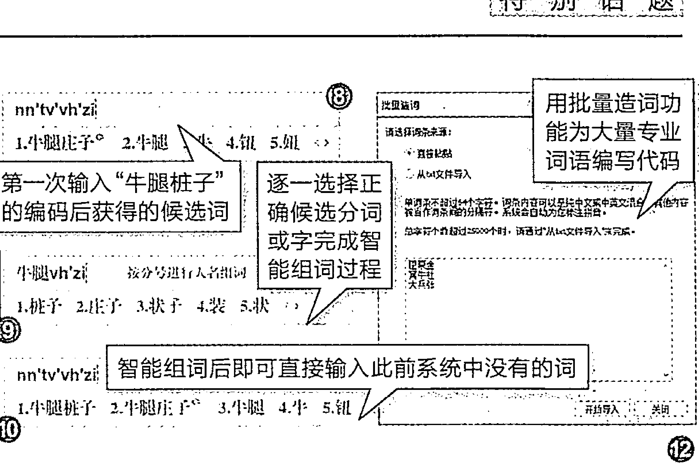

# 小提示

智能拼音不但有自动组词的功能，还可按使用频率将经常使用的词的候选次序逐步提到前面，这一功能称为输入法的“词频自动调整”。例如上面我们提到的那个例子中的“牛腿桩子”的候选词，当第一次输入并智能组词后，它的候选地位还在第二位，但当使用过3次之后，我们发现其候选地位已经由第二位跃升到第一位了。而要实现这一功能，必须保证输入法设置中该项功能处于开启状态。针对于百度输入法来讲，我们需要选中“根据上下文智能调整词序”选项（图11）。

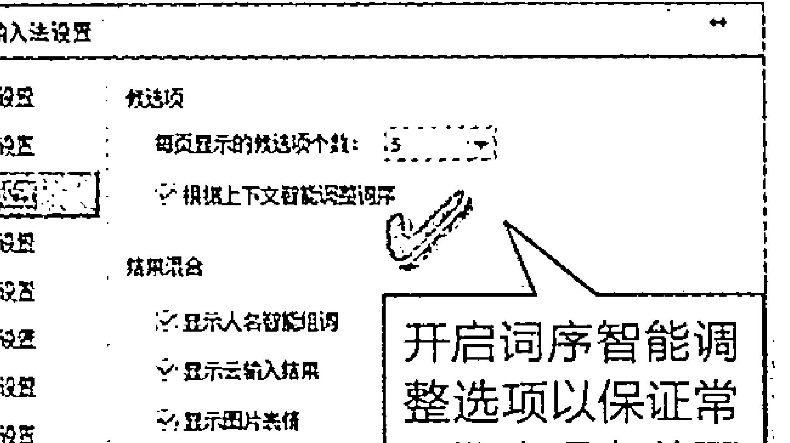

## 亲自动手批量定制专业词库

用以上方法只能一个接一个地手动添加专业词汇。这样操作虽然管用，但当系统不认识的专业词语太多时，第一次输入会感到非常吃力，因为每个词的第一次记忆过程都是一次痛苦的输入和选择过程。在这种情况下，可以使用批量造词的功能进行专业词汇的一次性批量添加。仍以百度输入法为例，假设我们要一次添加上百个专业词汇，只需在词库设置窗口中选择“批量造词”按钮，然后从一个专业的文本中通过复制或成批导入的办法，将这些专业词语导入进来，输入法系统就会自动为这些词标注最优的拼音代码。若没有现成的词汇列表，只能手动输入。完毕之后点击“开始导入”完成造词。之后，当我们用正确编码输入导入的词汇中的某个词时，系统会自动在候选词列表中给出正确的词语（图12）。

## 效率为上 Office一键办公

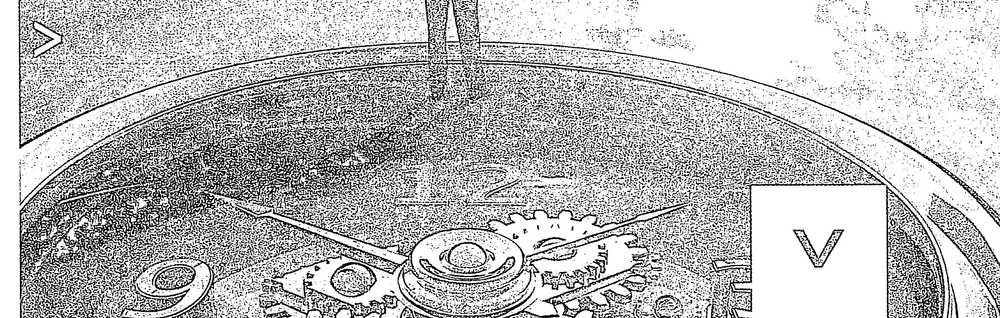

随着生活节奏越来越快，时间对我们来说更显得宝贵。而要想节约更多时间，提高工作效率是一个最直接的途径。平时大部分人都用微软的Office办公套件，其中包含很多工具可以把重复、繁杂的事情精简为更简单的操作。比如Office的VBA宏功能，让许多繁琐的操作一键完成；使用正则表达式，可以批量完成多个任务等。

## 批量处理用好Office宏操作

平时处理工作文档的时候，我们经常要对一些文档进行批量处理。比如为了文档的风格统一、美观，我们经常需要将每篇文档中插入的图片调整为统一大小。这里就以此为例，大家可以举一反三，学习使用Word宏操作（以Word 2013为例）。

启动Word 2013后在首页界面点击“选项→信任中心→信任中心设置”，在打开的窗口中选择“启用所有宏（不推荐：可能会运行有潜在危险的代码）”，这样即可在Word中使用宏了（图1）。

接着点击窗口左上角的“自定义快速访问栏→其他命令”，在打开的窗口中将“查看宏”命令添加到快速访问工具栏。这样点击工具栏上的宏按钮即可打开宏编辑窗口，按提示创建一个名为“调整图片大小”的宏，点击“创建”（图2）。

在打开的宏编辑窗口，按提示输入下列的代码（注意，单引号后面为代码注释，无需输入），点击“保存”，这样就完成了宏的创建。除去注释，关键代码实际上只有4行，非常简单，输入也没有困难。

```
Dim n '设置计数图片个数
For n = 1 To ActiveDocument.InlineShapes.Count '文件中图片总个数，图片类型为inlineshapes
    ActiveDocument.InlineShapes(n).Height = 400
    ActiveDocument.InlineShapes(n).Width = 300 '设置为400*300大小，具体数值请根据自己实际需要设置
Next n '顺序处理直到最后一张图片
End SUB
```

完成宏的创建后，以后打开需要处理的文档，同上点击工具栏上的宏按钮打开宏窗口，选中“调整图片大小”宏，点击“运行”，即可快速将文档中所有图片大小全部调整为400×300大小了（图3）。如果你希望图片的大小不一样，只需简单修改上述代码中的高和宽的数值即可，很方便吧。

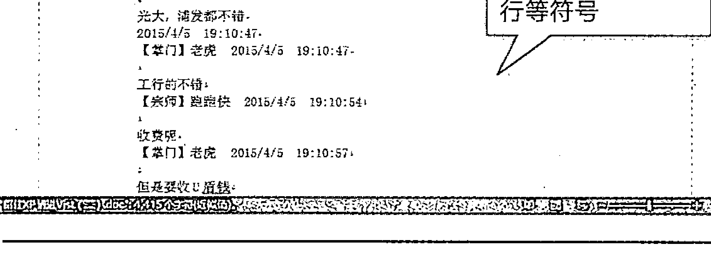

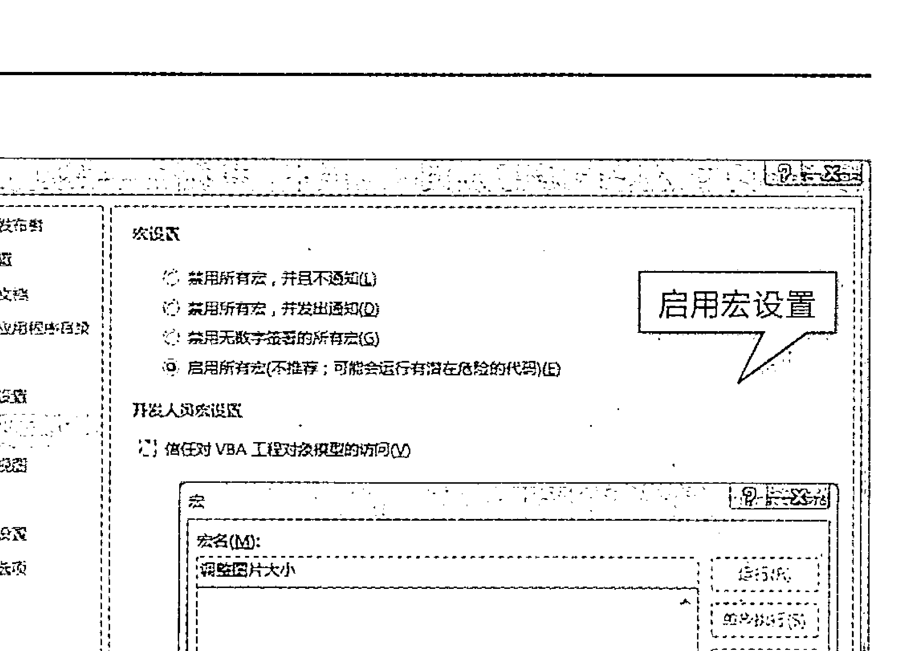

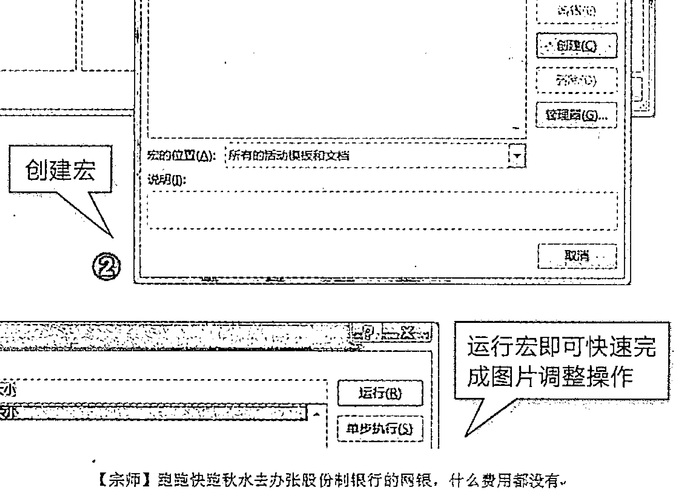

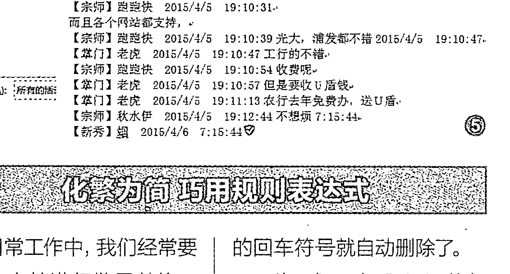

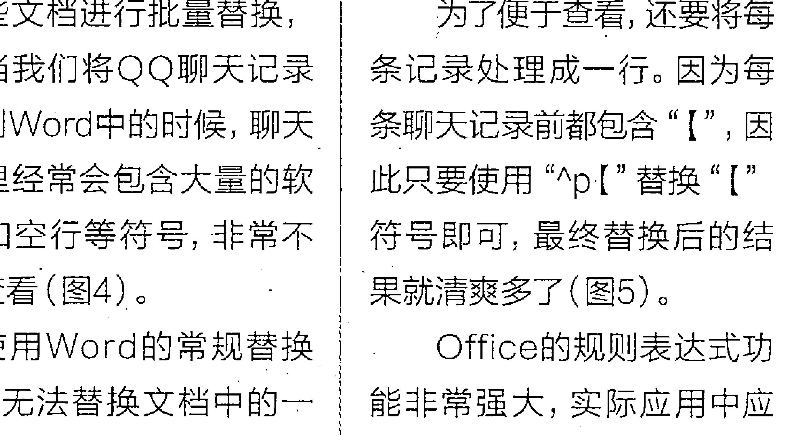

## 化繁为简巧用正则表达式

日常工作中，我们经常要对一些文档进行批量替换，比如当我们将QQ聊天记录复制到Word中的时候，聊天记录里经常会包含大量的软回车和空行等符号，非常不方便查看（图4）。

使用Word的常规替换功能，无法替换文档中的一些特殊符号，而借用正则表达式进行批量替换，可很快消除其中的回车和空行等符号。首先切换到“查找和替换”，在打开的替换窗口中点击“特殊格式→手动换行符”，将查找的内容设置为“^l”（如果是硬回车则为“^p”），替换为留空，点击“全部替换”，这样文中所有的回车符号就自动删除了。

为了便于查看，还要将每条记录处理成一行。因为每条聊天记录前都包含“【”，因此只要使用“^p【”替换“【”符号即可，最终替换后的结果就清爽多了（图5）。

Office的正则表达式功能非常强大，实际应用中应该使用什么表达式，大家需要根据不同文章的特点进行选择。比如批量删除Word文档中的多余空行，可将查找内容选择为“^p^p”，替换内容选择为“^p”，即可将连续的两行变成一行，对于多行空行则可以进行重复替换，从而快速去除文档中的多余空行。

文|平淡

## 用活组件高效处理文档

除了宏和表达式外，Office套件本身还自带许多函数和批量处理组件，用好这些也可以为我们的日常操作提速。例如在很多Excel文档中，日常编辑时经常会留下不少空白行（或列），这样打印时会浪费不少空间。现在借助Excel的“定位条件”函数即可轻松删除文档中所有空行。下面以Excel 2013为例。

首先在Excel中打开包含空行的文档，然后全选文档内容，按Ctrl+G组合键打开定位窗口，点击“定位条件”，然后单选“空值”，定位到空行位置（图6）。

返回文档窗口就可以看到Excel会全选中空的单元格，右击某一选中的空的单元格，从右键菜单中选择“删除→下方单元格上移”，点击“确定”后即可将文档中所有空白单元格删除了（图7）。

通过全选文档，然后利用Office本身提供的组件对整篇文档中的多处目标进行编辑，这是提高文档处理效率的常用方法。比如要取消Excel文档中的所有超链接，可以先全选文档，然后点击“插入→超链接”，随意选择一个超链接插入，这样文档内容都会插上统一链接，接着再选择取消超链接即可达到目的。

大家可以举一反三用活Office更多的组件。

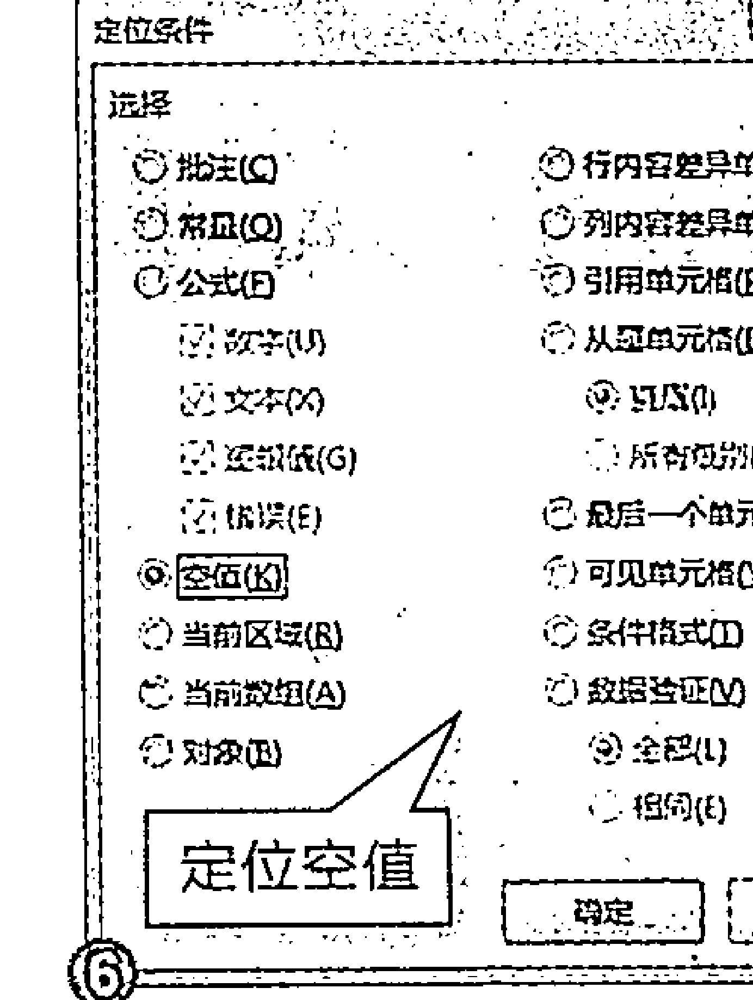

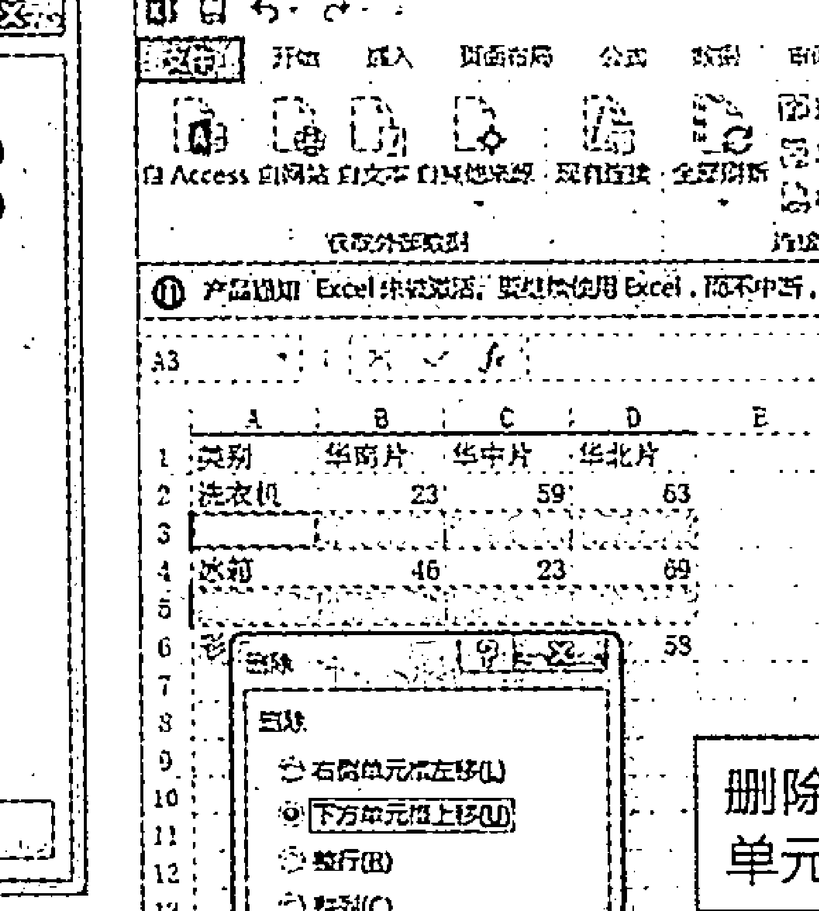

## 聘请外援批量处理更简单

Office自身提供的工具，对初学者有一定难度，其实可直接使用第三方批量处理软件，像“Word文档批量处理大师”（下载地址：tinyurl.com/mt4j95m），就能轻松对常见Word文档进行批量处理。就日常应用来说，为了保证一些技术文档资料不被他人编辑修改，经常会将原Word文档全部转为PDF文档，就可借助Word文档批量处理大师来完成。

启动程序后点击“待处理Word文件列表→添加Word文件”，然后依次导入需要转化为PDF文档的文件，如果需要处理的文档较多，而且分布在不同位置，可以先用DIR命令获取文件列表，然后使用记事本制作一个“dsd.wordLst”文件（每个文件一行），这里点击“导入文件列表”即可（图8）。

在“Word文件批处理选项”中选中“Word转化为PDF文档”，在右侧窗格中设置保存转化后文档保存的位置，点击“添加为待处理任务”，最后点击“处理所有任务”，这样即可将选定的文档全部自动转化为PDF文档。

Word文档批量处理大师还支持对多个文档进行多个批量操作，如对于上述文档还可添加“批量添加版权文字”，按提示设置好需要添加的版权文字和字号、颜色等样式后，程序会调用Word依次打开每个处理的文档，并在文章中随机部分添加上设置的版权文字（图9）。

如此一来，在实现导出为PDF的同时，程序还会在每篇文章的随机部位添加上我们设置的版权文字，颜色默认为白色字体，要设置为黑色或其他颜色才会显示出来，可很好地保护自己的文章不被他人随意转载（图10）。

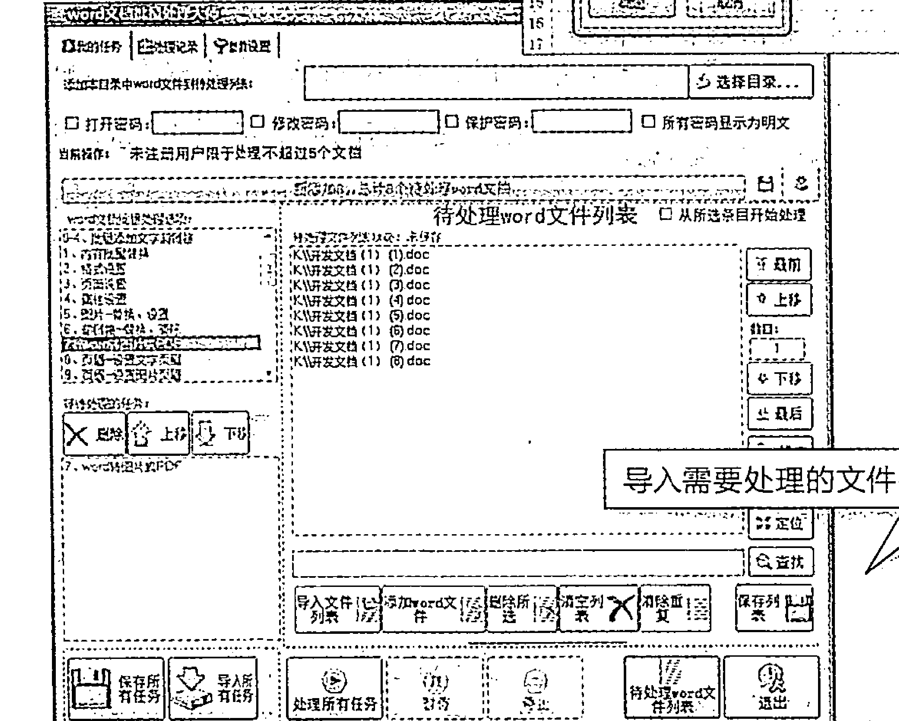

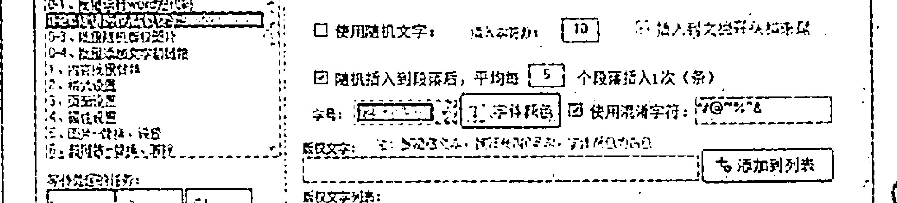

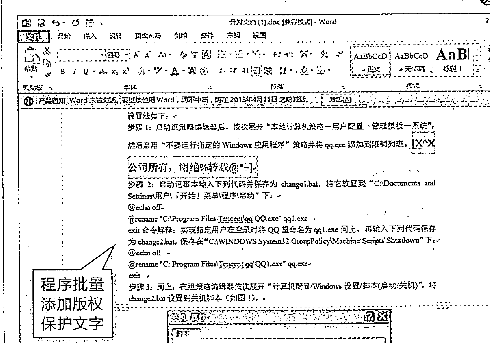


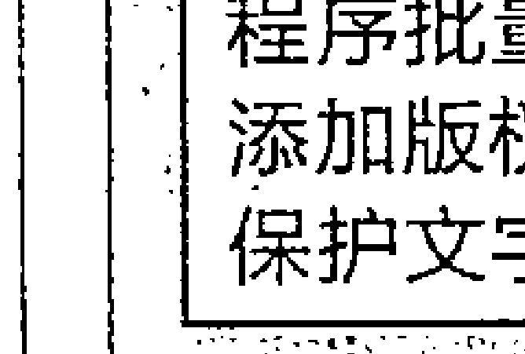

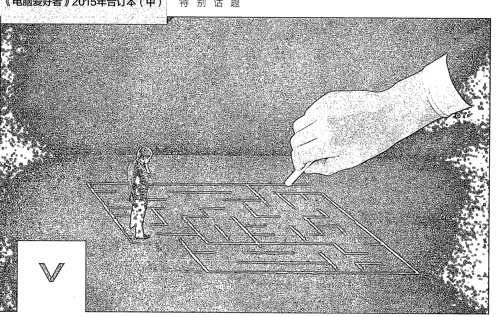

文|利达

## 文章编修 多步变为一步走

在进行文字处理或文章修改过程中，我们往往会进行一些重复性的步骤。例如，文章中有许多英文单词需要用首字母大写，但原稿中却统统使用了小写，小写改为大写就是一个重复但很浪费时间的工作；对于每天用记事本写日记的人来说，天天写完后要插入当天的日期和时间，虽然每天的日期和时间不同，但也算是一个重复性的工作。那么，如果将这些重复性的工作变为一步可以完成，甚至可以自动完成的工作，我们的工作效率就会获得提高。

## 重复性编辑一键搞定

对于文字编辑过程中遇到的重复性步骤，用EmEditor宏可以将多步才能完成的任务变为用一个按钮点击完成。就让我们以上面提到的全文英文单词变首字母大写为例来说明。

首先用EmEditor打开这篇含有不规范拼写的英文单词的文章，例如windows一词未按首字母大写来拼写。选中不规范拼写的英文单词windows，执行“宏→开始/停止宏”（或直接按Ctrl+Shift+R组合键），开始宏的录制过程。之后，编辑窗口的鼠标光标马上变成一个录像机样式的图标，表示宏的录制已经开始。这时我们右击鼠标，依次选择右键菜单中的“转换选定内容→每单词首字母大写”命令。接下来再次执行“宏→开始/停止宏”命令停止宏的录制。这时“宏”菜单下的“另存为”选项变得可选，选择该项并将刚才录制的宏保存为一个宏文件（这里我们保存为“首字母大写”）（图1、图2、图3）。

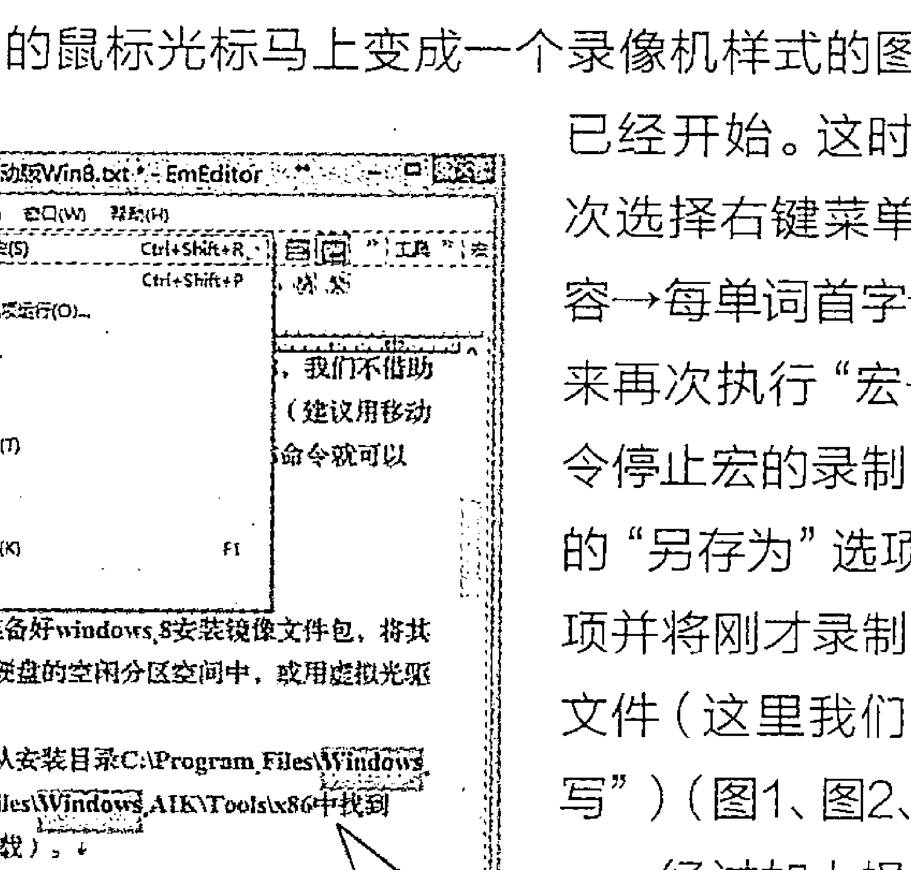

经过如上操作后，在EmEditor窗口中的“宏”菜单下，可以看到多了一个“首字母大写.jsee”的宏文件项目，如果宏工具栏开启，在工具栏上也可以看到一个“首字母大写”的宏按钮（图4）。
此后，如果用该系统下安装的 EmEditor 来编辑文件，只要遇到需要将首字母变为大写的单词时，不论该单词是什么内容，只需点击单词，然后再点击工具栏上的“首字母大写”宏按钮，光标处的单词马上会变成首字母大写的形式，这要比通过右键菜单经过两层选择转换要方便得多。

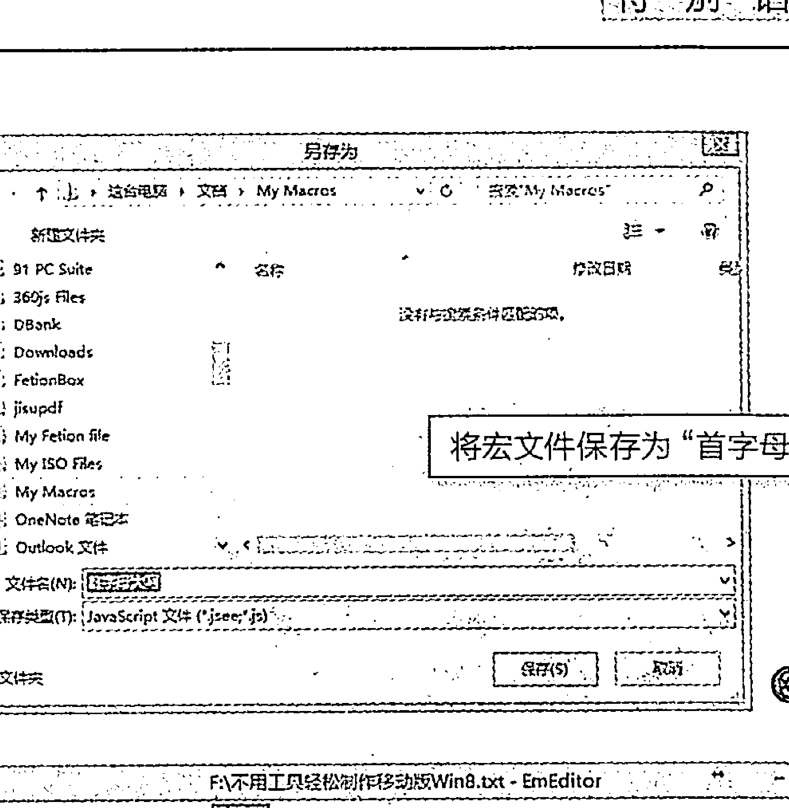

> 将宏文件保存为“首字母大写”

其实，有更简单的方法，实现低门槛安装移动版 Windows 8。对于任何工具，于任何工具，我们只需要准备一个10GB以上剩余空间的移动硬盘或移动U盘（建议用移动硬盘，以保证速度），准备好 Windows 8 安装包，两条DOS命令就可以实现移动 Windows 8 的安装。

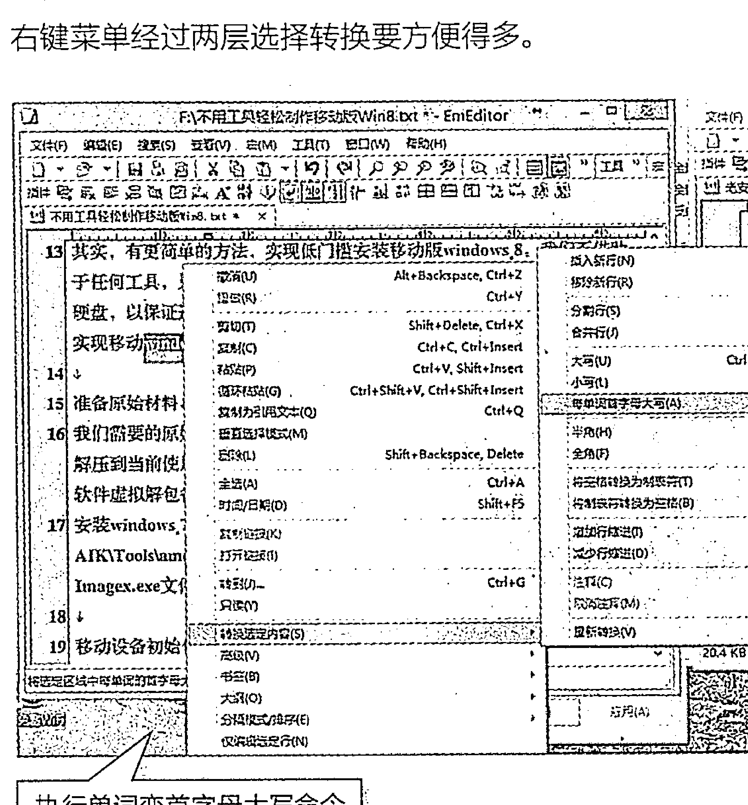

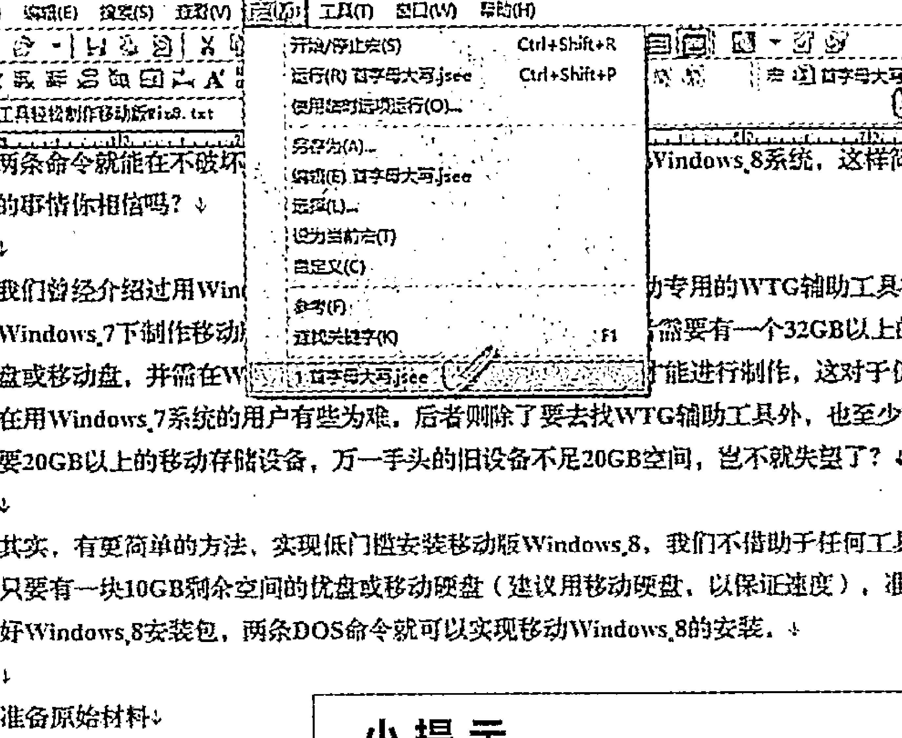

# 小提示

这里只提供一种用“宏”创建重复性工作一键完成任务的思路，当然不能只局限于“首字母大写”。相信读者稍加发挥就会创造出自己无限数量的实用“宏”。

## 日记签署还能再简单

对于在日记文档中插入时间和日期的重复性工作，我们也可以实现自动化输入。通过 Windows 记事本中的简化操作功能，可以实现通过快捷键一键插入日期，或通过简单代码自动插入日期、时间落款信息。

具体方法是，在用系统记事本程序写日记的过程中，只需要直接按 F5 功能键（或者选择“编辑→时间/日期”命令），即可在光标处插入当前时间和日期，这样就不用再手动输入时间日期了（图5）。

另外，如果用记事本修改一篇长篇 TXT 格式文章，需要很长一个时期才能完成修改，每次修改时希望在文章末尾标注本次修改的日期和时间。在这种情况下，除了使用手动按下 F5 自动插入当前时间和日期外，还有一种更加自动化的方法，那就是只需在文章的最前面加上一个“.LOG”指令，保存文件。之后当再次打开该文档的时候，文章的末尾会自动出现本次和前述各次修改的时间和日期。所有时间和日期的签署都由记事本软件自动来完成，连按一下 F5 键都省了（图6）。

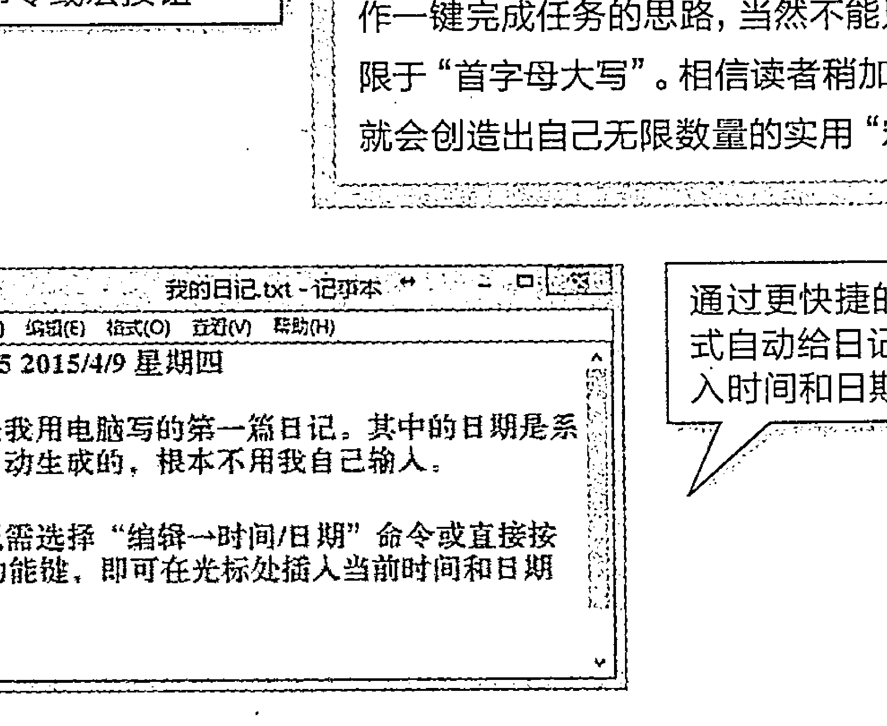

> 通过更快捷的方式自动给日记输入时间和日期

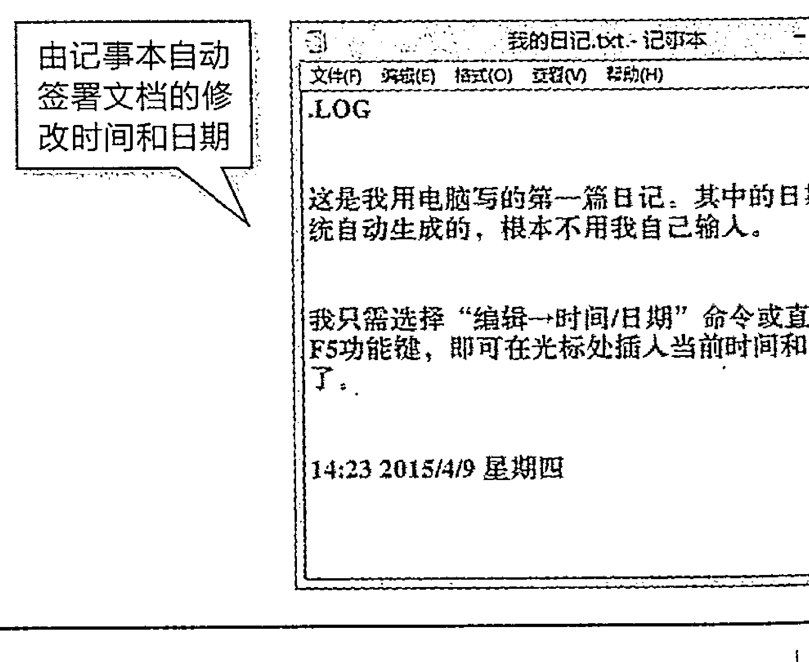

> 由记事本自动签署文档的修改时间和日期


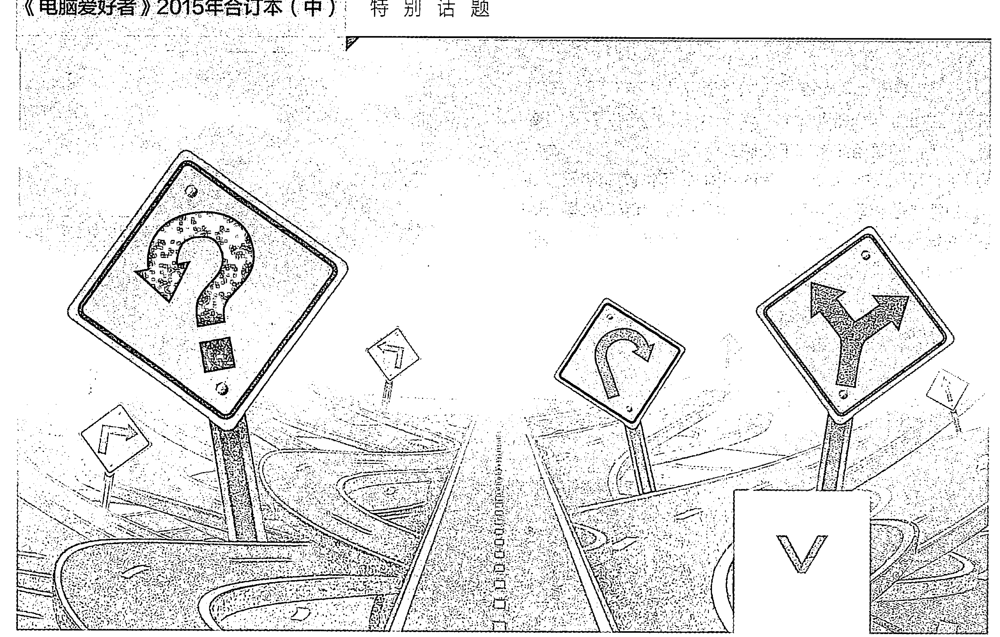

文|雪松

## 简单批处理 代替复杂流程

### 一键执行EXE多道程序串起来

我们可以将经常重复进行的、用多个软件实现的任务用批处理串起来完成，一道工序完成后自动进入下一道工序。例如：填完表后上传到局域网服务器、备份到云盘同步文件夹、完毕后自动关机，这一系列任务可以通过一个批处理完成。此前我们曾介绍过用Windows内部命令编制BAT批处理文件的方法完成类似任务。今天我们给大家介绍另一种方法，通过多媒体创作软件Multimedia Builder（以下简称MMB）编制EXE自动批处理文件串起流程执行。不要害怕，这个过程不需要使用复杂的代码，只需选择相应选项并会使用Windows最基本的内部命令，同时参考一下MMB的帮助系统，能够调用其基本指令即可完成批处理程序的创建。首先启动MMB软件，在工程文件中根据要处理的工序数量添加相应数量的空白页面，比如添加4个页面。双击每一个页面，给每一道工序定义调用程序的页面属性。页面属性中主要定义调用程序的脚本，只需点击“脚本”按钮，然后点击第一个按钮“向导”，在弹出的脚本窗口中选择“动作”为“Run”，并在路径中指定要执行的外部程序，或将“动作”指定为“SysCommand”，填入相应的系统命令，即可完成对程序的调用或文件的操作。

在电脑上完成一项任务，许多时候往往需要经过多道流程、使用多个软件才能完成。如果这些流程呈现经常化的固定趋势，那么就会出现重复性的操作。在这种情况下，如果能以简单的批处理来串起复杂的多道工序操作，效率就会有所提高。

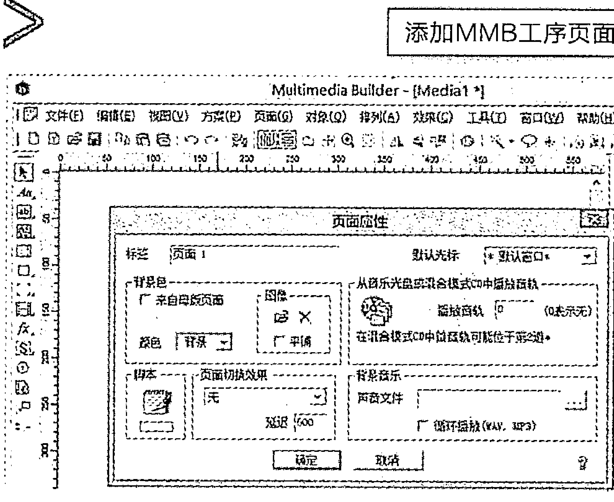

具体指令可查阅Windows命令提示符帮助信息和MMB帮助系统（图1、图2）。

当各道工序的调用指令定义完成后，再将最后一页之前的所有各页的“页面退出”脚本都选择为“NextPage”，这样当本页的任务完成后，就会自动进入下一页去自动执行后续的脚本（图3）。

当所有脚本和指令定义完毕后，通过“文件”菜单下的“发布”命令将工程文件编译为一个EXE文件。之后，我们只需执行该EXE文件，就可以启动多道任务自动执行的过程了。

### 以一管二 备份销毁一条龙

有时，我们需要在一台公用的电脑上完成自己的工作，当工作完成后，需要将完成后的文档传送到自己的U盘或网盘上去，然后在离开之前将工作电脑硬盘中刚才自己所建的文档删除掉。对于比较机密的资料，还得考虑采取一些措施，让删除后的文档别人不能恢复。如果我们能编制一个批处理文件，让文件完成后自动拷贝备份和自动删除，且采取一些文件防恢复粉碎性处理的措施，那么前面所讲的复杂过程就会变简单了。

先建立以BAT为扩展名的纯文本文件“文档备份并销毁.BAT”，在其中输入3条指令。假设使用的工作文件名为“工作文档.DOC”，而备份U盘的盘符为U，这时命令构成如下：

```
COPY 工作文档.DOC U:
COPY NUL 工作文档.DOC
DEL 工作文档.DOC
```

在完成工作文档的编辑任务后，只需双击该文件夹下的“文档备份并销毁.BAT”文件，即可自动将工作文件备份到U盘中，同时销毁本地的工作文件。即便别人用恢复软件，也难以恢复有用信息了（图4）。

# 小提示

格式工厂命令行格式基本形式为：
FormatFactory "方法名称" "配置名称" "源文件全路径"
注意书写具体命令时，最前面的部分是调用格式工厂的主程序，要能找到程序的路径；中间的两部分“方法名称”和“配置名称”要按软件帮助中提供的方法名称和配置名称来套用；而最后一部分是用户的媒体文件所在的文件夹，可自行定义。

## 后台执行文件转换自动化

一般来说，我们对文件进行压缩，对照片、音乐或视频文件进行转码处理，都要通过一些专门的压缩软件或文件格式转换工具，在视窗界面下来完成的，而这一过程需要多次的点击操作。实际上，许多压缩或格式转换工具都带有命令控制台，可以通过相对固定的命令行的方式，只需改变为不同的转换参数，即可实现成批文件的快速压缩、解压、格式转换等操作。

### 分散文件压缩批量化

我们通过WinRAR或好压等压缩控制台命令，可以批量处理压缩文件。WinRAR的压缩控制台程序为程序安装文件夹中的RAR.EXE文件，通过调用此文件可编制批量处理压缩文件的批处理程序。假如我们要对不同分区的不同目录进行压缩备份，可以先将此RAR.EXE文件拷贝到一个工作文件夹中，然后在工作文件夹中编制一个批处理文件如“批量压缩.BAT”，

```
rar a -r e:\我的备份.rar @backup.txt
```

在工作文件夹下建立备份列表文本文件backup.txt，在其中录入要备份文件夹的路径，每个路径占一行。

工作完成后，以后只需执行“批量压缩.BAT”，就可一次性地将多个分区中的文件夹打包备份到E盘的“我的备份.RAR”里备份了。

### 媒体格式转换自动化

对于一些媒体文件的格式转换，也可通过命令批处理方式实现一键转换。如将当前文件夹下的所有MP4文件均转换为AVI文件供老式DVD机在电视上播放，可先安装新版的格式工厂软件，在当前媒体文件夹下的命令提示符窗口中执行命令（图6）：

```
"C:\Program Files\FreeTime\FormatFactory\FormatFactory.exe" "All to AVI" "High quality and size" "E:\My-MP4\*.mp4"
```## Windows 快捷工具大比拼

日常很多操作，我们都是按部就班地执行，这样不仅费时而且费力。其实Windows下的许多任务可以批量操作，这样我们就可以高效、快捷地完成很多的操作。

执行批量操作，利用Windows自身的批处理功能就可以实现，当然因为是字符界面，不是很好用，所以可以通过Windows批处理调试器之类的工具进行辅助。除了Windows自身的工具，第三方开发的一些宏工具也很强大。

## 就地取材 用好Windows批处理

系统自带的批处理是一个多命令自动执行脚本，只要编辑好特定的批处理，它就可以帮助我们执行很多的操作。以Windows 7（及以上版本）系统为例，很多系统文件都被赋予严格的权限，如果要对某个系统文件进行改名或者编辑等操作，常规的操作是要先取得文件的所有权，接着再赋予当前管理员账户对该文件的完全控制权，这样才能完成上述的操作。比如，为了方便访问一些网站，我们经常要对C:\Windows\System32\drivers\etc\hosts进行编辑，该文件默认所有者为System账户，当前管理员账户没有编辑权限，而且没有对“C:\Windows\System32\drivers”写入权限（图1）。这就需要一步步解锁权限。对于这类的操作，借助批处理即可快速完成取得所有权和写入控制权的更改，让复杂操作变简单。示例代码如下（rem为注释无需输入）：

```
rem 运行NotePad同时打开指定的系统文件，在批处理中如果文件路径包含空格，一定要用半角的""括起来
notepad "C:\Windows\System32\drivers\etc\hosts"
rem 赋予指定文件（夹）所有者为管理员组
takeown /f C:\Windows\System32\drivers\etc\hosts /a
```

rem 赋予指定文件(夹)完全读取权限到当前操作用户，其中yumufa为当前登录用户名，“:F”为完全控制权限

```
icacls C:\Windows\System32\drivers\etc\hosts /grant yumufa:F
```

将上述批处理保存为Aa.bat批处理文件并放置在桌面，以后只要右击选择“以管理员身份运行”，运行完成后记事本会自动打开指定的文件，并可以直接对该文件进行编辑和保存了（图2）。

继续打开C:\Windows\System32\drivers\etc\hosts的“属性→安全→高级”，可以看到该文件的所有者已经被更改为当前管理员组（默认为System），同时切换到“安全→编辑”，在用户列表中则可以看到当前登录账户已经获取到完全控制权限了（图3、图4）。

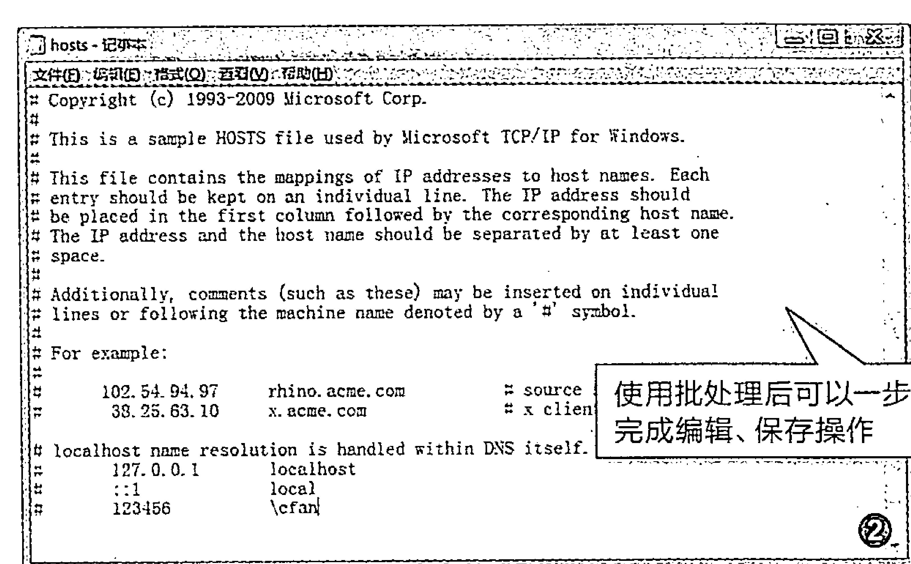

使用批处理后可以一步完成编辑、保存操作

因为严格的权限管理机制可以很好地保护系统，因此对系统文件的权限进行更改，完成文件的编辑后建议恢复原来的权限，恢复的操作也很简单（只是操作前一定要记住原来文件的所有者和权限设置）。比如需要恢复Hosts文件所有者为System账户，可进入文件“属性→高级→编辑→所有者”，将所有者重新更改为System即可。需要注意的是，如果是恢复为TrustedInstaller，需要“NT SERVICE\TrustedInstaller”才可以添加（图5）。

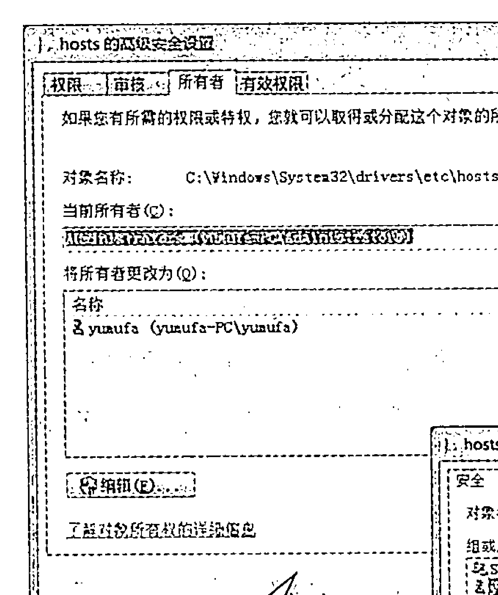

通过批处理快速获得所有权

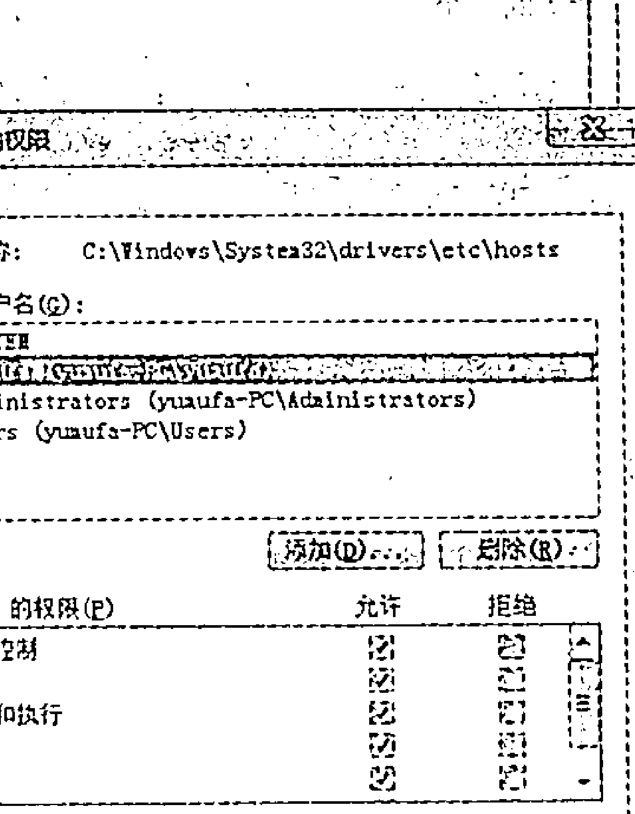

通过批处理快速获得完全控制权限

完成添加延时语句后，现在在原来批处理中就会添加“ping 127.0.0.1 -n 4”语句。如此一来，即使是新手也可以非常方便地对批处理进行编辑和调试（图6）。

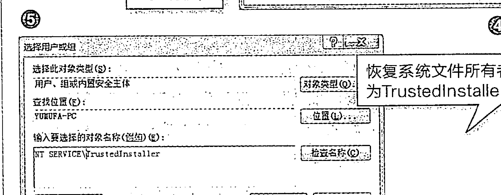

恢复系统文件所有者为TrustedInstaller

# 小提示

系统自带的批处理命令还有很多，我们既可以像上面实例一样使用类似takeown、icacls一样的命令行制作批处理，比如喜欢一键备份的朋友可以借助Dism命令制作备份/还原脚本，ADSL用户则可以借助RasDial实现一键自动拨号。此外，还可以利用常见的GUI程序，如文件管理器、记事本等生成脚本，比如C:\Recovery是系统隐藏的目录，为方便日后访问，可以制作一个批处理（代码：explorer.exe C:\Recovery）即可一键打开。

### 扩展阅读

一般用户对批处理语法并不熟悉，为了方便对自己制作的批处理进行编辑或调试，可以辅助使用“iBAT批处理编辑工具”（下载地址：tinyurl.com/o7gsrnh），启动程序后导入需要调试的批处理进行编译即可。该程序还自带常见的语法命令，比如对于上述批处理，如果Hosts文件较大，就可以在第一行语句后添加延时命令，以方便后续程序的启动，此时可点击右侧窗格的“ping延时”，在打开的窗口中选择延时的时间，点击“输入”即可。它使用所见即所得的方式，方便我们自行添加语法命令（图7）。

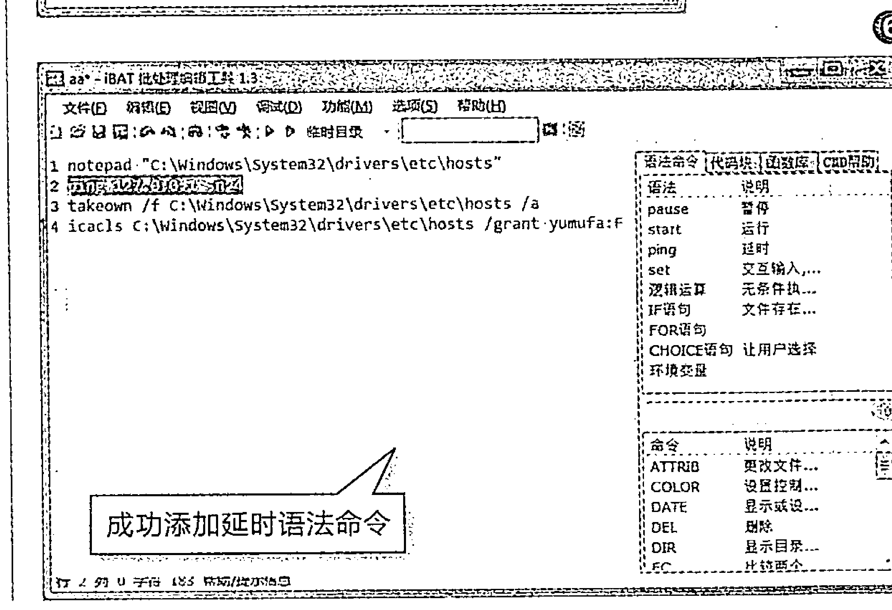

成功添加延时语法命令

## Windows批处理“外援”更好用

系统自带的批处理编写起来需要一定的电脑知识，对于很多小白来说，网上已经有许多现成的快捷工具，这样我们只要实行“拿来主义”即可快捷执行很多的操作。这里以AutoHotkey（下载地址：www.autohotkey.com）扩展系统应用为例。

AutoHotkey既支持常见的编程语法，又可通过录制屏幕操作生成宏。对于有一定编程知识的朋友来说，可以自行使用记事本编制批处理脚本。比如为了工作方便，很多朋友喜欢将常用的程序都设置为自启动，但是对于配置较低的电脑，在进入桌面时各种程序一起启动很容易造成桌面假死。现在借助AutoHotkey即可轻松安排各个程序按顺序启动。

```
首先启动记事本输入下列的代码（分号“;”后面为注释，可以不用输入）：

run "C:\Program Files\Microsoft Office\EXCEL.EXE" ;启动指定程序，这里需要输入程序具体路径，如果路径包含空格，请用半角双引号括起来
sleep, 5000 ;延迟5秒启动下一个程序
run 下一个程序具体路径
sleep, 5000
ExitApp ;退出程序
```

完成代码编辑后将其保存为Run.ahk放置在C:\Users\yumufa\AppData\Roaming\Microsoft\Windows\Start Menu\Programs\Startup (yumufa为本例的登录用户)下，这样每次进入桌面后，上述设置的自启动程序就会每隔5秒依次启动了(图8)。

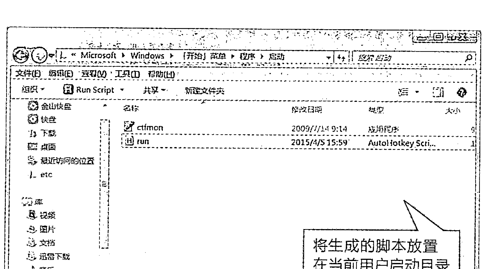

对于电脑小白来说，如果不会编辑脚本，那么还可以直接利用AutoHotkey来录制操作脚本。比如现在很多在外求学的同学们喜欢使用QQ和家中的老爸、老妈们视频聊天，不过对于电脑水平不高的老爸来说，视频聊天的操作还是略显复杂。借助AutoHotkey就可以录制一个实现自动视频聊天的脚本了。

首先在老爸的电脑QQ（可以通过远程协助方法实现）的好友列表中找到自己的账号（假设昵称为“儿子”），再将其拖到桌面上生成快捷方式，接着右击快捷方式，在快捷键设置框中将F2设置为快捷键，以后老爸按下F2键（需要将QQ设置为记住密码自动登录）即可启动和我们的对话(图9)。

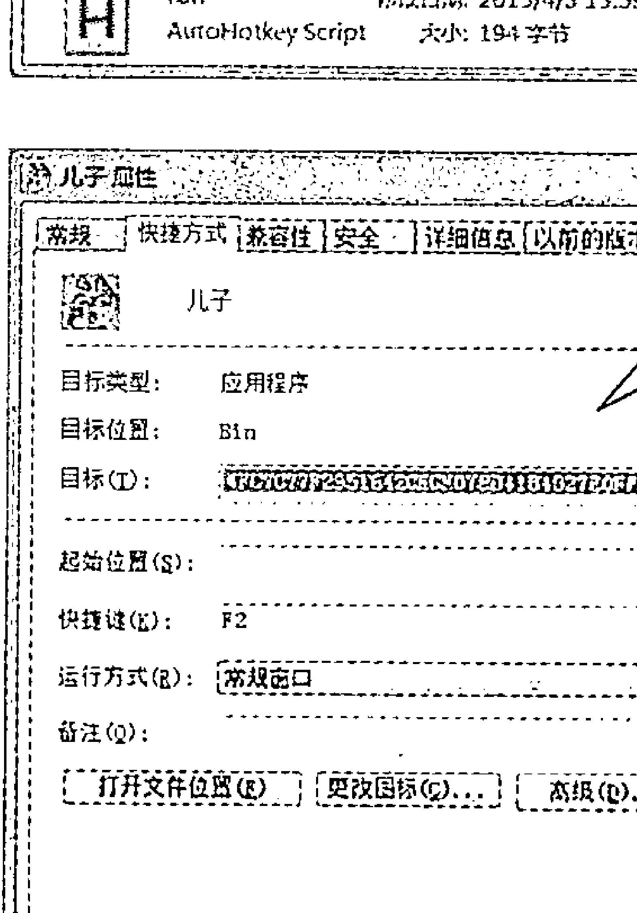

AutoHotkey支持很多编程命令，比如IF语句（用于条件判断）、LOOP语句（用于循环调用），大家可以结合实际需要制作出符合自己使用的脚本。

接着启动AutoHotkey中的AutoScriptWriter.exe组件，单击Autohotkey界面的“Arecord”按钮开始录制屏幕操作，按提示依次执行下列的操作：

按下F2（这样会自动登录QQ并打开老爸和“儿子”QQ的对话框）→将鼠标移动到QQ对话框→点击开始视频对话按钮→打开视频对话窗口后结束AutoScriptWriter.exe的录制(图10)。

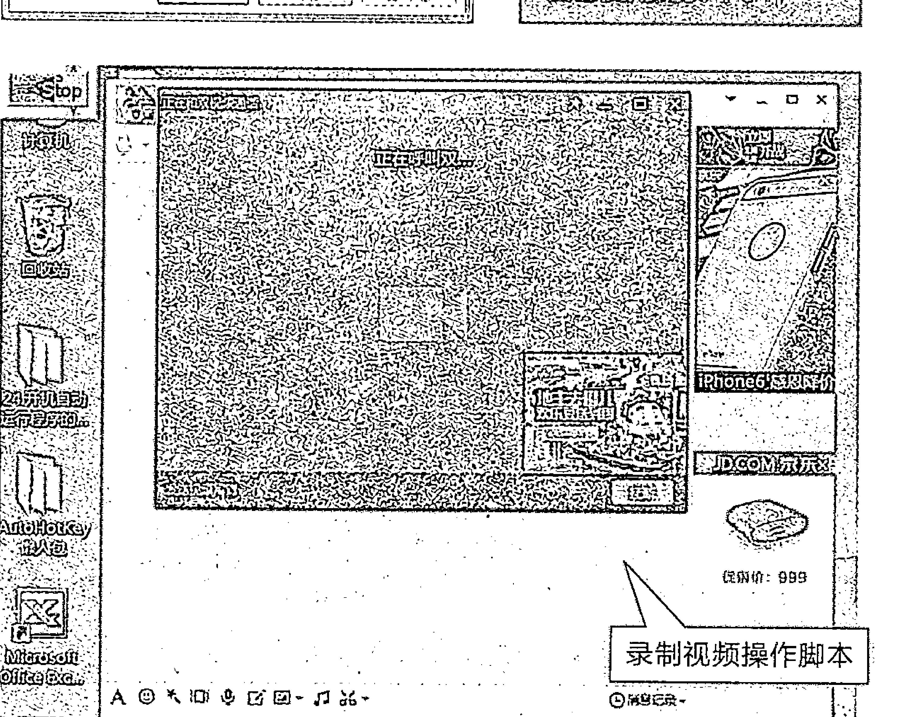

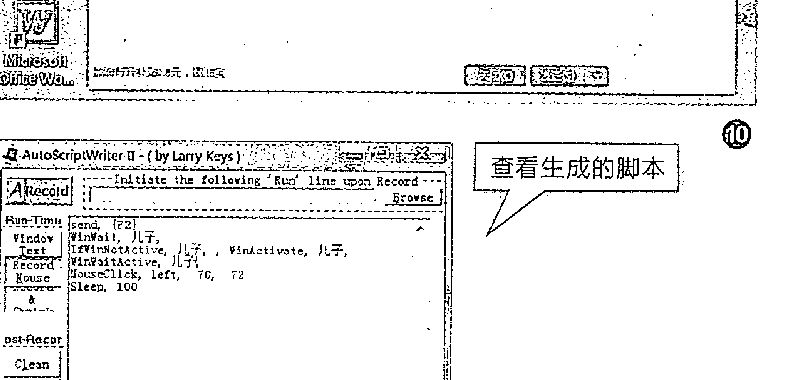

停止脚本的录制后, 返回AutoScriptWriter.exe窗口, 此时, 我们就可以看到录制的脚本了。其中Send表示发送的按键, 其他语句则是具体操作 (包括活动窗口和鼠标的点击), 点击 "SAVE" 将其保存为Aa.ahk在桌面备用 (图11)。

因为上述代码是连贯运行操作, 在实际使用中我们还需要根据实际情况对代码加以修改。比如默认情况下按下F2键后会自动启动QQ, 因此需要为启动QQ预留启动时间, 这样才会打开视频对话窗口。使用记事本打开Aa.ahk, 按提示在 "Send, {F2}" 代码后添加 "Sleep,5000" (单位为毫秒, 表示延迟5秒), 这样当老爸按下F2键后, 5秒后才会执行下一步操作 (等待QQ完全启动), 其他代码请自行修改 (图12)。

现在测试上述代码看看能否正常运行, 如果无误再运行Autohotkey的 "Convert .ahk to .exe" 组件, 导入Aa.ahk, 点击 "Convert", 生成Aa.exe放置在桌面备用 (图13)。

操作同上, 再为Aa.exe创建一个快捷方式, 比如赋予快捷键为F3键, 这样以后老爸开机以后只要按下F3键, 他的电脑就会自动向我们的QQ发送视频对话, 是不是更方便老爸老妈们的操作了呢?

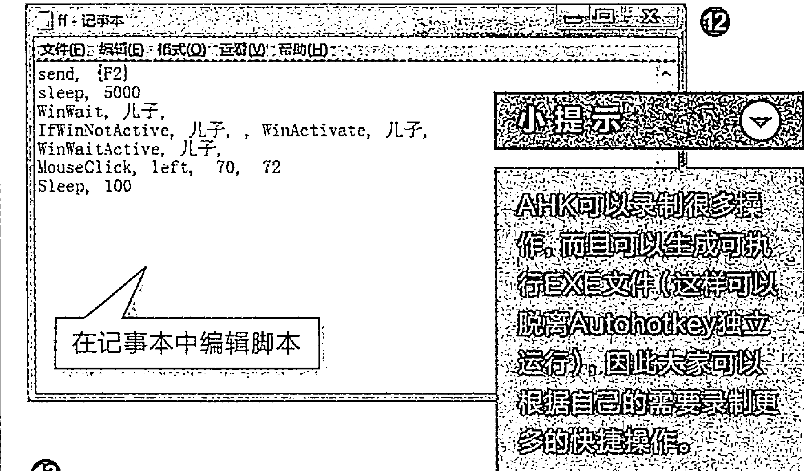

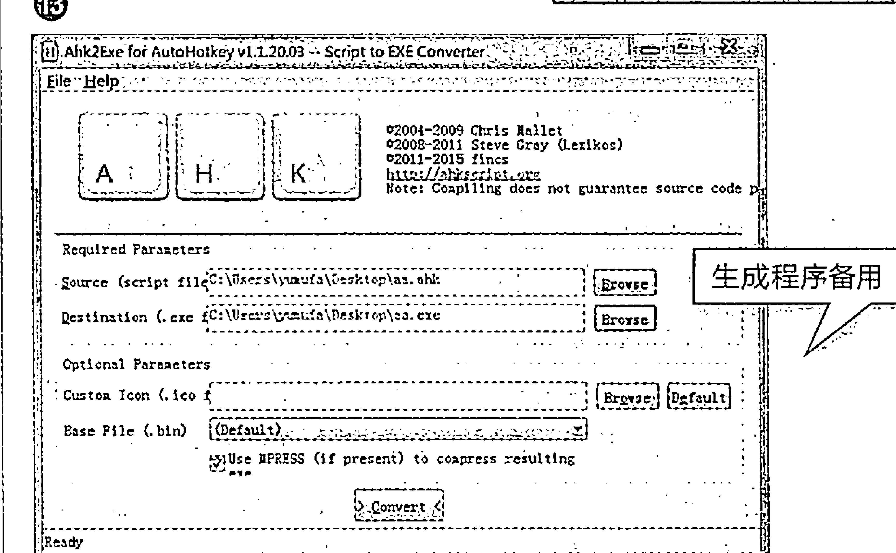

## 牛刀小试 Photoshop 一键美图

文|流言


Photoshop是以专业而著称的修图软件, 功能强大却令人望而生畏。与之相对的则是美图秀秀, 以超级简单而闻名, 无论是美图、特效, 只需简单的操作, 甚至是一键即可完成。其实Photoshop自身也提供强大的批处理操作功能, 只要制作出合适的脚本, 它同样可以像美图秀秀那样, 对复杂的操作一键完成。

## 自制个性的场景模板

美图秀秀中有一个一键替换场景的功能，随意打开自己的某张照片，然后再从软件提供的不同素材中挑选一张场景模板，则所选照片就会自动嵌入场景中，非常有趣(图1)。

这点在Photoshop中其实也可以轻松实现，且场景模板可自己制作，彰显与众不同的风格。

启动Photoshop(这里以CS5版本为例)，首先制作一个场景模板。这里我们选择的是一个比较有特色的“眼镜”，你也可以用任意自己喜欢的图片来替代。

在图层面板上双击“背景”图层，弹出新建图层对话框，直接点击“确定”，即可将背景图层变成普通图层，这是为了建立透明的背景，方便后面嵌入图片(图2)。

接下来利用各种选取工具(如磁性套索、魔棒等)选中眼镜片中间的部分，并按Del键删除，一个挖空效果的场景图片就制作完成了。

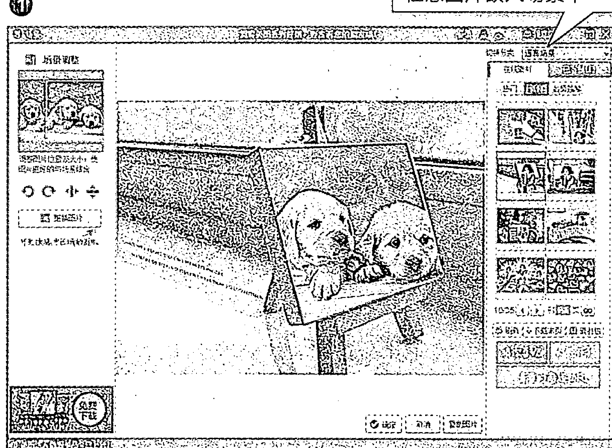

挖空的部分，就是以后要嵌入其他图片的地方。注意，在选取并删除镜片中间图像时，最好先通过菜单命令“选择→修改→羽化”(可以按Shift+F6键)，进行一次2个像素的羽化，这样边缘连接的地方就会柔和一些。如果感觉羽化的效果不够，可以多按几次Del键。处理完毕，将其另存为PSD格式的文件，这就是自己独有的场景模板。

Photoshop功能强大，在制作个性化模板的时候非常灵活、方便，这是其他图形软件所不具备的。而且我们是在已有图片的基础上进行加工的，所以也无需担心自己的美术功底不够，只是简单地在图片上找出适当的位置进行“挖空”操作即可。

借鉴上面的方法，我们可以制作无限多个不同的模板文件，可以集中放在同一个文件夹内，比如这里我们将文件存放在D:\PhotoTmp目录下(图3)。

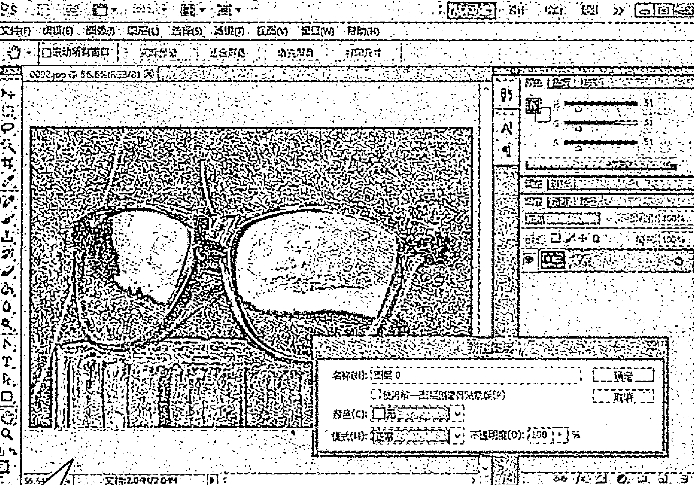


## 录制动作序列

接上文，现在点击菜单命令“窗口→动作”调出“动作”面板。为了避免自己制作的动作模板与其他的混淆，可以点击动作面板右上角的按钮，从弹出的菜单中选择“新建组”，再从弹出的对话框中为新建组设置一个名称，这里设置为“我的模板”，点击“确定”。接下来，选中刚刚新建的组，再次点击右上角的按钮，从弹出的菜单中选择“新建动作”，并从弹出的对话框中为此动作命名，比如可以命名为“照片换场景”，然后点击“记录”按钮，开始记录操作(此时动作面板下方的红色记录按钮为激活状态，点击方块按钮可以随时停止录制，右侧的垃圾筒按钮则是删除已录制的动作)(图4)。

首先通过“文件→置入”命令导入要嵌入眼镜中的图片，默认情况下置入的图片在上方，所以还要将它拖放到眼镜图片的下方。因为眼镜片是凸起的球面，为了更加真实，可通过滤镜(比如镜头校正工具)将置入的图片略作变形。现在已经完成图片换场景的任务，接下来以另外的文件名另存(注意不要直接保存，否则会覆盖模板文件，影响下次的使用)并关闭即可。

在以上的操作完成之后，点击动作面板上的“停止”（方形按钮）停止录制即可。这时就可以看到在“照片换场景”的动作下，已经按照秩序记录下刚才的一系列操作了。

这里只是一个示例，你也可以进行各种更加复杂的操作(图5)。

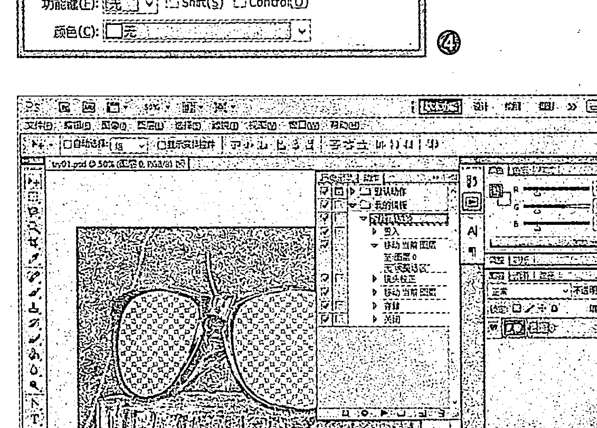

点击展开序列中的某个动作，可以看到它具体做了哪些操作及相关参数等

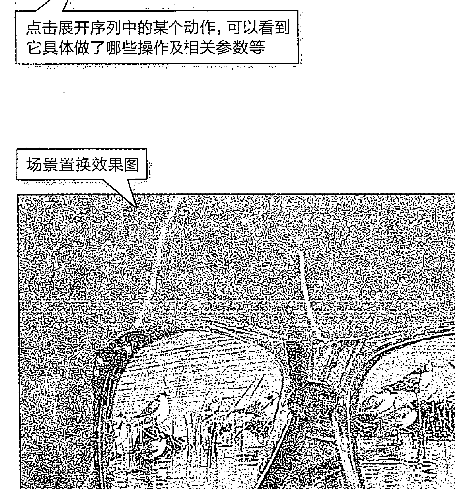

## 快速切换色彩配置

不少人曾遇到这样的情况：同一张图片，如主色调是绿色的，在本机浏览的时候正常，放到网上在IE中看也正常，可是用Firefox看时可能就成了土黄色，用Safari看可能又变成了另一种颜色。辛辛苦苦制作的效果，完全被破坏。这其实是颜色配置上出了问题。MacOS及Windows系统，不同的显示设备、不同的浏览器软件，应用了不同的颜色管理方案，导致了它们在显示时出现差异。解决方法有多种，可将色彩丰富的图片（如AdobeRGB色彩配置），在Photoshop中相对安全地转换成颜色简化的sRGB模式的图片（大部分Windows下软硬件默认色彩配置），这涉及到Photoshop“图像”菜单下的一系列操作，可以将这些操作录制成动作，以后在需要时就可以一键进行转换了。

## 为任意照片一键替换场景

上面其实都是准备工作，只需要一次性的操作即可，以后就可以一劳永逸地应用它了，应用起来比美图秀秀还要简单。假设在上面录制动作的时候，置入的是D:\PhotoTmp目录下的Aaa.jpg照片，最后保存的是同目录下Bbb.jpg，那么要对其他任意图片进行一键替换场景的操作，只需将要换场景的照片放到D:\PhotoTmp目录下并改名为Aaa.jpg（之前处理好的文件需先拷贝至他处），然后在Photoshop中打开想要应用的任意模板文件，选中上面制作的“照片换场景”动作，点击“播放”（三角形按钮），置换场景的新图片瞬时就自动完成了。如果我们在新建动作时还设置了快捷键，那么连鼠标都不用动，直接按一下快捷键即可完成图片的场景置换(图6)。借鉴上面的方法，几乎可以完成美图秀秀能做的大部分简便操作，如美化、饰品、边框、拼图等，且Photoshop还有美图秀秀所不具备的强大而灵活的编辑功能，可谓一举多得。


## 02 移动领域的“快捷生活”

在移动设备一统“娱乐办公江湖”的今天，笔记本、平板电脑和手机已经成为我们身边最不可或缺的设备。然而，在使用这些移动设备的时候，我们往往只看它们的硬件配置和性能，鲜有关注它们的“快捷潜力”。

## 笔记本快捷键那点事

和台式机键盘不同，笔记本的键盘不仅拥有丰富的快捷键，额外的触控板也能成为提高操作效率的绝密武器。但想让它们发挥100%的功效，依旧需要一番优化和设置呢。

> 快捷键为何失效

很多笔记本用户在重装系统后只顾安装芯片组、显卡和无线网卡等核心驱动，忽视了电源管理、触控板和Hotkey这三类小驱动。实际上笔记本上那些音量调节、无线网卡硬开关、F1～F12上面的那些功能键，全都需要借助上述三类驱动才能正常运行。所以如果笔记本出现快捷键失效问题，请尝试重装或更新这些驱动（图1）。

### 驱动程序 & 工具软件

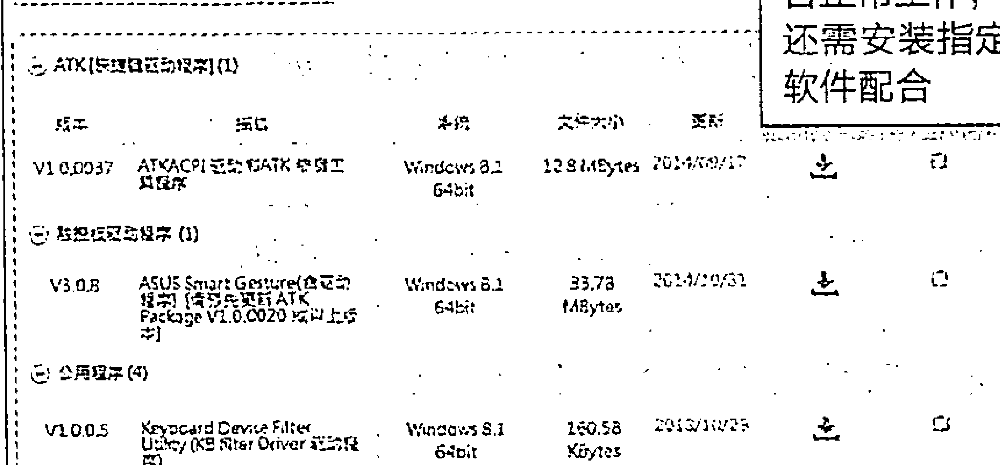

> 不要小看这类小驱动，它们将决定快捷键是否正常工作，有些品牌还需安装指定的电源软件配合

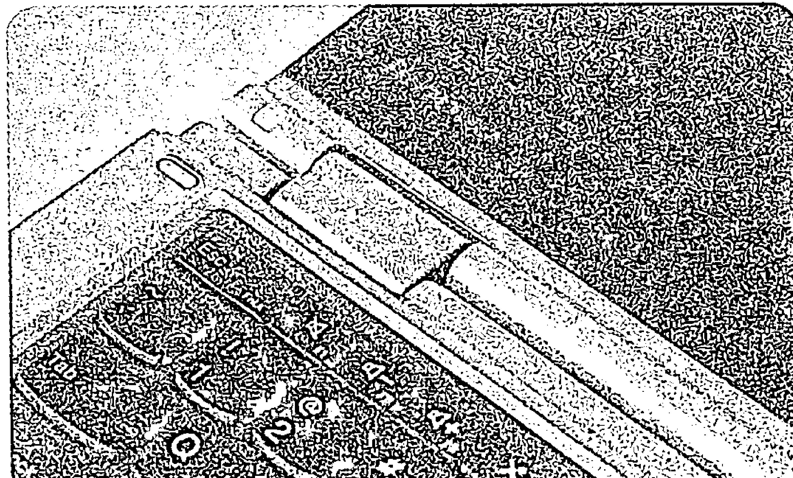

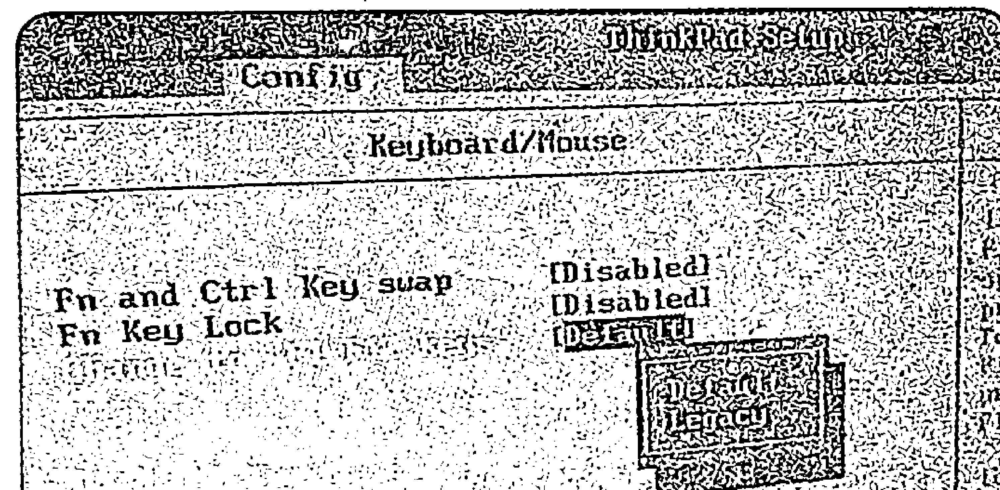

## F功能键切换

为了方便使用，笔记本配合Fn+F1~F12往往能扮演关闭屏幕、打开无线、调节音量或亮度等功能的快捷键。但以联想和ThinkPad为代表的很多品牌笔记本，F1~F12默认就是快捷键(图2)，想使用它们原本的功能反而要按Fn键配合，这对《魔兽争霸3》一类需要用F1等键切换英雄的游戏来说可谓噩梦。那么如何能让F1~F12在快捷键和原功能键间切换呢？

此类笔记本通常都会在BIOS中提供F1~F12默认功能的选项。以ThinkPad E440为例，开机时按F1进入BIOS(无需按Fn)，依次选择“Config→Keyboard/Mouse”，将Change to “F1-F12 keys”选项设置为Legacy后(图3)，F1~F12键位功能就能切换了。如果你只是临时需要使用F1~F12键的默认功能，则可通过Fn+Esc组合键进行切换。

> 很多品牌的笔记本键盘会将Fn键设计在Ctrl键左面，这对经常切换输入法、FPS游戏下蹲动作、复制粘贴等快捷操作时很容易误按。实际上如果在BIOS中提供了类似“Fn and Ctrl Key Swap”选项，将其设定在Enabled时就可实现Fn和Ctrl键位功能的互换。

> 笔记本键盘上的Pause和Fn键不允许映射，对外接的USB键盘也是无效的。如果你安装的是Windows XP系统，那么想自定义Power/Sleep这两个按键，就需要在电源选项中将“电源按钮设置中”改为“不采取任何措施”。

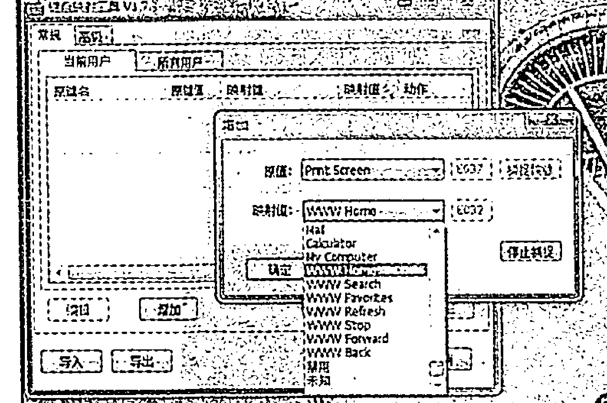

## 让普通按键变成快捷键

并非所有笔记本都提供了丰富的快捷键，如果你羡慕ThinkPad拥有针对Windows 8定制的4个功能按钮，或者希望可以实现一键启动XX程序，那么不妨通过“键盘映射工具”(下载地址: http://pan.baidu.com/s/1gdnJmxI)加以实现。运行该程序后，我们可以先进入“高级”选项卡，对一些默认的键值进行功能上的自定义。比如双击“WWW Back”，将对应按键的类型设定为“ShellExecute”，然后就能在动作项中自定义运行任意外部程序了(图4)，比如启动“魔兽争霸3”。接下来回到“常规”选项卡，点击“增加”按钮后，就可以将笔记本键盘上的任意按键映射为“WWW Back”(图5)，当你今后按下该键后就能直接启动“魔兽争霸3”。同理，我们可将一些不常用的按键改为打开邮件、增加减少音量等等，一切视你的需求(图6)。

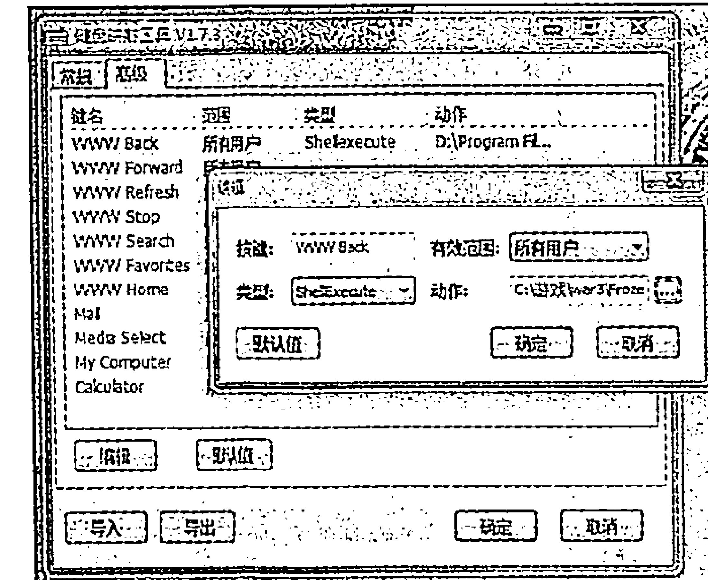

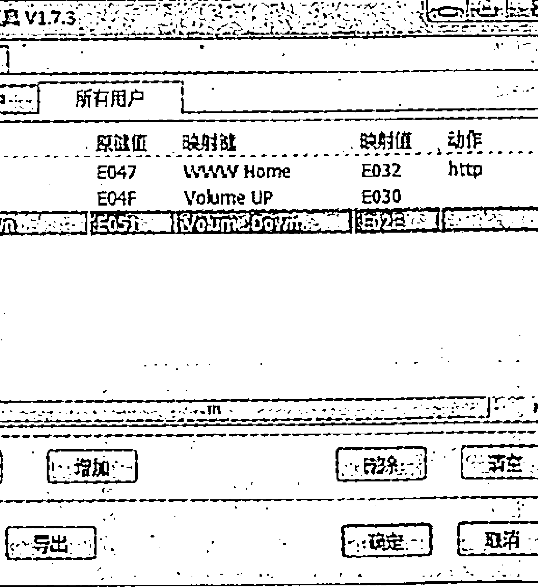## 将触控板变成快捷键

如果你觉得笔记本键盘上的按键日后都有可能使用，不希望使用第三方软件修改它们的默认功能，那就不妨考虑通过触控板，实现一些高级的快捷命令操作吧。

目前笔记本大都使用了Synaptics触控板，在安装最新驱动程序后就能在“控制面板→鼠标”中看到“装置设定值”选项了（图7）。点击“设定值”进入触控板的高级界面，其中“触击”和“单击”设置中就支持自定义快捷键的功能（图8）。

其中，“触击”可以将触控板四个边角的区域映射为快捷键，我们可以修改有效区域的大小，指定启动任意程序，或预设的各种功能（图9）；在“单击”中我们可以自定义双指、三指或单击边缘触发动作，触发对象可以是键的宏指令，也可直接启动QQ等程序，或其他的预设功能（图10）。

### 扩展阅读

## 如何屏蔽触控板

在玩游戏时，如果不小心碰到触控板容易引起误操作，因此绝大多数笔记本都可通过Fn+组合键的方式一键屏蔽触控板。如果你的笔记本没有这个快捷键，或你觉得这个方法比较麻烦，则可通过修改注册表的形式，实现插入鼠标自动屏蔽触控板的功能。如果你的触控板是Synaptics品牌而且是Windows 7系统，可以下载两个注册文件（http://pan.baidu.com/s/1i3ovd0D），按照先1后2的顺序写入注册表并重启电脑，在“控制面板→鼠标→装置设定值”中就会出现“连接外部USB指向装置时禁用内部指向装置”选项了（图11）。如果使用该方法还是没能出现“连接外部USB指向装置时禁用内部指向装置”选项，可运行注册表编辑器，在“HKEY_LOCAL_MACHINE→SOFTWARE→Synaptics→SynTPEnh”中新建一个名为“ShowDisableIcon”的DWORD（32位）值，并将对应数值改为1（图12），重启后就可解决。

## 显卡驱动也能实现快捷功能

除了前面介绍的方法，如果你的笔记本配备了AMD独立显卡（或APU的集显），在安装完整的显卡驱动后，通过显卡控制面板同样可以实现丰富的快捷功能定义。进入显卡控制面板的高级界面后，点击右侧的“添加预设”按钮，在弹出的界面中勾选“分配热键”，就能自定义“Ctrl+Alt+任意指定按键”启动程序（图13）、打开文件或者一些预设功能了。点击“管理预设”可以重新编辑已添加的快捷键（图14），如此我们就可以将常用的软件或游戏以这种方式实现“一键（实际是同时按三个键）启动”了。

## 更高级的快捷设置

对笔记本而言，快捷键只能算是“入门”，它可以提高操作效率，但却很难影响到使用体验。接下来，就让我们了解和笔记本相关的更多高级快捷设置吧。

## 让屏幕色彩切换随心所欲

很多笔记本随机都提供了屏幕色彩调校软件，比如华硕Splendid靓彩技术（图1），可以通过快捷键在风景、剧院、游戏、夜间和标准等模式之间切换。问题是，绝大多数笔记本并不支持此类功能，难道我们只能根据上网、游戏等使用环境，临时性地一次次调整屏幕亮度等参数吗？

好消息是，只要你的笔记本搭载了英特尔处理器，在“图形和控制面板”也可以实现类似Splendid这种屏幕调校功能。在左侧选项列表中点击“显示→颜色增强”，我们可以对亮度、伽马值、对比度和色调等参数进行微调（图2），点击保存按钮后就可以自定义一个色彩模式（图3）。我们可以根据不同的使用环境对这些颜色参数进行调校并保存为游戏、电影、上网等名称。今后，当我们玩游戏的时候就选择游戏模式，看视频时就选视频模式，是不是方便多了？

此外，在“显示→媒体”中，我们还能够对在屏幕上显示的视频内容做进一步的优化。如在图像增强中勾选“肤色增强”，视频中人物的肤色就会更加自然（图4）。

在这里我们依旧可以自定义并保存多种色彩模式以方便日后切换，但是想让这些设置有效的前提是必须将它们定义在“驱动程序设置”状态下（图5）。

## 笔记本显卡超频变变变

如今绝大多数笔记本都配备了双显卡，但由此也引出了几种比较尴尬的情景：

1.  早期笔记本集显太弱，非长期使用独立显卡不可，但独显发热功耗太高；
2.  集显玩某款游戏不给力，但独显又太强，玩该游戏实在浪费；
3.  独显性能偏弱，玩喜欢的游戏总感觉慢半拍。

如果你也曾被类似问题困扰，不妨尝试利用显卡超频软件解决上述尴尬。笔者向大家推荐MSI Afterburner 4.x显卡监控超频工具（下载地址：http://www.dwz.cn/GnDIg）。类似1和2的尴尬，我们可以通过给GPU降频的方式，在降低独显发热和功耗的情况下依旧可流畅运行喜欢的游戏。而像尴尬3，我们则可对GPU进行超频，获得120%的性能去驰骋游戏。具体的超频方法CFan在以前曾介绍过很多次，在这里我们主要介绍MSI Afterburner的自定义设置模式（图6）。

在对GPU进行超频或降频后，点击右下角的保存按钮，旁边的1~5个序号会闪动（图7），此时可将当前频率保存在指定的序号上。利用该方法，我们可以将GPU降频到极低以实现省电、超频到极高以榨取性能并分别保存，相当于自定义了超级节能、省电、默认、超频、极限等模式。接下来点击MSI Afterburner的设置按钮，在“自定义设定”中可以对1~5个序号设定快捷键，比如按“Ctrl+Alt+数字键”。今后，当你想玩游戏时按“Ctrl+Alt+5”进入极限超频模式，待机时再按“Ctrl+Alt+1”进入超级节能模式，非常方便。

NVIDIA自GeForce 800M系列移动显卡后加入了“Battery Boost”技术，它能够动态地调整GPU性能来渲染场景和保证画面流畅但不掉帧（图8），因而不会过多地浪费电量。此外，笔记本超频会导致发热增加，建议大家通过购买抽风式散热器来缓解超频带来的散热压力（图9）。

## 电源管理快捷控制电脑状态

电源管理图标位于任务栏右下角，而且默认只能显示两个电源模式，选择和设置起来不够方便，如何才能快速进入电源管理界面呢？很简单，在控制面板中右键点击电源选项图标，选择“创建快捷方式”。回到桌面后右键点击该快捷方式选择属性，在这里可输入任意自定义快捷键，如“Ctrl+Alt+P”（图10），今后想切换电源状态按下这组快捷键即可。

对笔记本而言，电源管理对性能和续航时间有着决定性影响。在很多用户眼中，电源管理只是提供了节能、平衡和高性能三种电源计划，最多也就是再设置休眠和睡眠时间而已。如果你对电源管理还停留在这个层面认识上，那就太“暴殄天物”了。

在电源计划的高级电源设置中，有很多细节选项都是值得我们认真对待的。比如，当CPU性能足够强或是笔记本散热不给力时，我们可以将最大处理器状态调整到99%，此时等同于屏蔽了酷睿i5/i7处理器的睿频功能；如果笔记本在玩游戏时经常卡顿，一方面可将系统散热方式都改为“主动”，如果设定在“被动”时CPU就会在过热时自动降频了，另一方面则可将PCI-Express设置在“关闭”状态（图11）。针对这些原则，我们可以自定义更为合理的电源计划，以便在需要时方便切换。

## 挖掘手机上的按键潜力

和键位丰富的笔记本相比，手机上通常只有电源和音量键，最多就是高端机加上了指纹识别器，格外寒酸。如果你想让手机用得更惬意，不妨考虑给这些有限的物理按键赋予快捷功能。

为了延长电源键的寿命，很多Android手机都支持音量键点亮屏幕，或双击屏幕亮屏。然而如果手机不支持这些功能，如何才能赋予音量键亮屏的快捷功能呢？

以酷派5930手机为例，在手机获取Root权限后，运行Root Explorer文件管理器，用文本编辑器的形式打开“system/usr/keylayout”目录下的“surf_keypad.kl”文件（不同品牌手机对该文件的命名可能不同，有些品牌只需修改Generic.kl文件）。找到VOLUME_DOWN和VOLUME_UP两项并在它们的后面加上“WAKE_DROPPED”键值（图1），保存退出并重启手机，之后在待机时音量键就可解锁，且唤醒后仍可调节音量。

## 让音量键变成相机快门

当我们用手指按下屏幕上的虚拟快门难免会出现抖动，在光线不足时很难确保拍照质量。实际上，在绝大多数Android手机相机APP的设置中，都可以自定义音量键的功能（图2），比如对焦或快门，而我们只需将其改为快门（图3），今后拍照时按下音量键就可完成拍照，最大限度避免抖动现象。

## 音量键可以充当程序锁

出于隐私或安全的原因，很多用户喜欢给手机里的部分APP加密或隐藏，但传统的数字图案解锁很容易被人破解或“逼问”。在这里笔者向大家推荐“Oops! AppLock”（下载地址：http://pan.baidu.com/s/1eQIJQ0a）这款软件，它无需Root，可以通过连续按音量加键的次数对指定程序进行解锁，而运行被加密的程序可以定义黑屏或各种错误界面（图4）。如此一来，你就能以系统不兼容或APP报错的理由，不让朋友玩你的手机，而谁又能想到解锁的方法只是按几次音量键呢？

## 耳机线控变成快按钮

由于手机快捷键有限，很多玩家喜欢通过快按钮、米键和360智键等设备将耳机孔打造成一个快捷功能键。然而，上述设备还需花钱购买，实际上，只要你的耳机带有线控功能，将它插在耳机孔里再运行类似快按钮设备的APP，耳机线控按钮就可扮演快捷键的角色。

以快按钮APP为例（下载地址：http://www.helloklick.com/），插入耳机时软件会弹出“您插入了什么设备”的提示（图5），选择“快按钮”后，就能进入APP对单击、双击、三击和长按线控按钮进行功能定义了（图6）。

## 03 DIY设备 也可以很方便

移动设备发展速度如此之快，除非我们对性能和操作有很高的要求，一般的家庭娱乐使用便捷型设备已经足够了。但这并不是说传统DIY PC只要性能好就可以，不重视加入给用户体验的产品一样要被淡化。其实厂家研发出了不少加强的便捷操作，只不过有很多隐藏的便利体验，需要我们一步一步去挖掘出来。

## 尽在掌握 硬件刷新更简单

以往谈到BIOS和固件刷新，新手总以为是高端操作，望而却步，其实经过软硬件双方面的长足发展，现在刷新硬件已非常简单。不仅能通过厂家提供的专业软件升级，一些设计优秀的主板甚至可实现一键升级。

## 官方刷新软件最安全

以前大家升级BIOS除了依靠DOS命令外主要通过一些通用的BIOS更新软件实现，这些软件虽然在一定程度上可以在不同设备之间实现通用性，但是最大的问题就是更新缓慢而且安全性较低。好在之后板卡厂商越来越重视固件和BIOS的刷新，在设备推出后纷纷推出了自己的专用配套软件（图1），SSD产品目前也出现了只要配套软件好用设备卖相就大增的现象（图2）。只要用户去产品官网下载正版最新的固件或者BIOS文件，使用官方刷新工具按照步骤一步步升级很简单。

## 更快速的刷新方案

在一些高端板卡上还有更为激进的设计，我们刷新固件甚至无需进入操作系统，只需要把从官网下载的BIOS或者固件文件用USB闪存盘方式插在接口上，按一个物理按键就可以升级（图3），比如华硕的USB Flashback功能。不过使用这种设计，虽然操作简单，但是需要注意的事项要比软件方式多一些，特别是物理按钮附近的LED指示灯信号十分关键（图4）。

> 火速链接 关于USB Flashback功能的详细操作过程在2015年“特别话题”DIY部分有过详细介绍，其他品牌的刷流过程大同小异，用户在仔细阅读说明书文档后需谨慎操作。

## 美观静音 快速调整风扇转速

## 集美观实用于一体

电脑入门用户看到DIY高手的机箱总是有一种叹为观止的感觉，其内部结构复杂，配件选择考究，并不容易上手。其实有一个很好的办法能够简单地提升自己机箱的极客感觉，只需要一个简单的5.25英寸风扇调速器即可。

其实DIY高手反复折腾他们的机箱，还是希望在固定的空间内能实现更合理的空间利用，最终达到静音与散热兼得的效果。那么机箱内什么东西会影响空间利用和美观程度呢？各类的线缆是罪魁祸首，这其中风扇线缆首当其冲。但是为了散热，我们有时不得不在机箱内部安装大量的散热风扇，这其中既有CPU和显卡散热器的风扇，也有有机箱内部作为进风/出风使用的风道风扇。风扇一多线缆难免杂乱无章，而且主板上不见得有充足的风扇插座供大量风扇连接。不少用户偷懒而直接将其接到传统4Pin的D形接口上，这样很不可取。因为首先会进一步加剧线缆杂乱，另外直连电源线的风扇会以满速运行，原本可以不吵的风扇会发出很大噪音。就算主板风扇接口较多，实现风扇控速也要重启进入BIOS，而且能智能调速的只有CPU所用的1-2个，而大量3pin风扇接口只能通过主板BIOS锁死速度，并不人性化。

## 光驱位风扇调速器

DIY高手并不常用光驱，但他们的机箱第一个光驱位却常有设备，有些带不少旋钮，个别还有液晶显示，这就是5.25英寸风扇调速器（图1）。其原理很简单，通过物理或电子的方式集中控制风扇的速度，使风扇按照自己的意愿随时改变或保持某种转速（图2）。一些调速器在最基本的功能上增加了USB接口扩展和多功能读卡器，实用性进一步提高（图3）。

个性一些的产品会摒弃旋钮，改用更节省面板空间的变速拨片。这样的好处是可在一个光驱位的空间内容纳更多的风扇调速器（图4），比如NZXT做得就相当不错。这样并没有丧失面板的美观性，NZXT单独为每个风扇集成了一个LED速度指示灯，视觉效果十分出色。

更专业一些的是带有LED或者液晶显示功能的风扇调速器，不仅拥有风扇调速功能，还可以连接主板、显卡上的测温点监控设备温度。高端一些的产品甚至还能检测水冷散热器温度、检测CPU频率以及其他硬件运行状态。

## Fan Commander 7-Channel风扇控制器

比起普通的风扇控制装置，Fan Commander 7-Channel风扇控制器的系统温度控制做得更好。装置通过内部热量来智能控制风扇转速，有了它我们根本无需关心PC里面的温度和风扇转速间的关系，全部实现智能控制。如果你是超频一族，在狂热的游戏模式下这款设备让你高枕无忧。控制器最多可控制七只风扇，包括三种热传感器，还有独立的温度警报器。如果PC里温度超过默认上限，Fan Commander的自动控制设置功能就会启动，伴以警报声并激活PC风扇保护，风扇全速转动会使系统温度迅速降低至可接受的安全数值。

值得一提的是，Fan Commander 7-Channel的操控界面完全使用液晶显示屏显示（图5），比起许多LED产品来说更加高端大气。尽管功能繁多，但仍然可以轻松塞入5.25英寸光盘驱动器托架。

## 艾乐酷FP-01液晶风扇监测器

艾乐酷这款设备可以用惊艳来形容，FP-01是一款类似汽车音响、配备弹起式屏幕的单机位设备（图6），可监测PC温度。它包含媒体读卡器、USB集线器，还有一个eSATA端口，可以轻松塞入到任何5.25英寸扩展槽。FP-01的温度部件可检测三组温度和风扇转速，有三种不同类型的警报设置，通知PC实时的温度。

FP-01右上方还有一个拷贝按键。按下此键后数据就会从插入的闪存卡拷贝到桌面文件夹，该文件夹使用与闪存卡一致的名称来命名文件夹，文件转移整个过程十分方便。FP-01上面有多个插槽，可支持多种类型的内存卡，包括CF、MS、SD和SM等内存卡，背部拥有包括数据传输、风扇控速和温度检测在内所有必要的线缆。

如果用户懒于安装风扇调速器，又确实觉得BIOS控速十分不便，其实也有更为直接的办法，就是直接购买带有控速功能的风扇或者风扇减速线。控速风扇一般不能实现自由的调速，但是至少可以在P（性能）和S（静音）两档之间切换，使用最基本的开关方式实现。减速线可能新手没有接触过，这其实是一种广泛使用在没有调速功能机箱内部的小设备，一头连接4pin电源D形接口，另一头可输出多个电流的接头（图7），比如3A、5A、7A等等。插在越小的电流插头上，风扇转速就会越低。

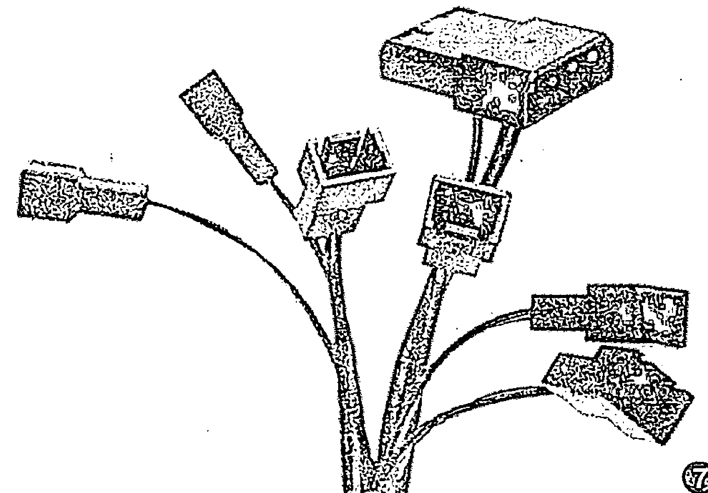

## 便捷超频
手机控制电脑频率

经常看科技电影的用户肯定看过主角们使用高科技手机远程控制电子设备的剧情，现在我们也可以实现了。决定电脑性能关键的频率，现在已经可以用智能手机或者平板电脑进行无线操控了。除了调整频率，利用移动设备的可视性可以实现很多便捷功能。

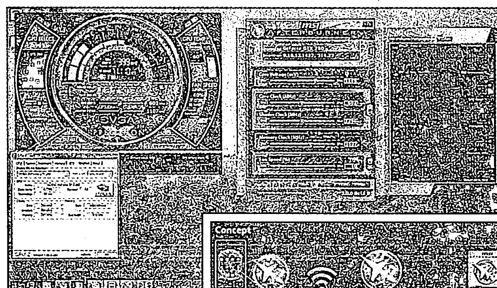

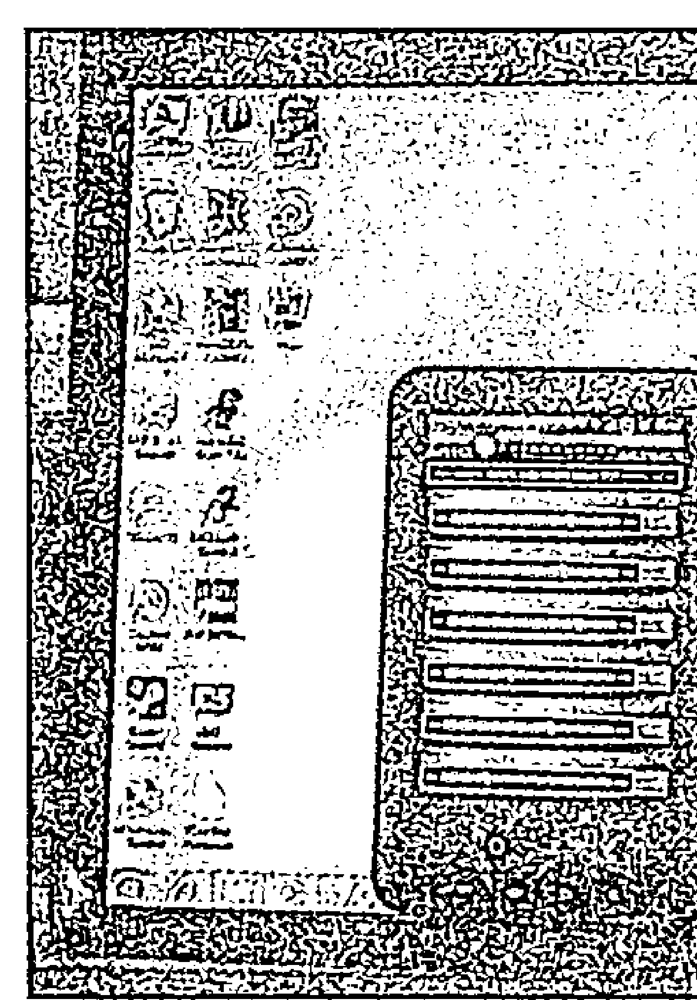

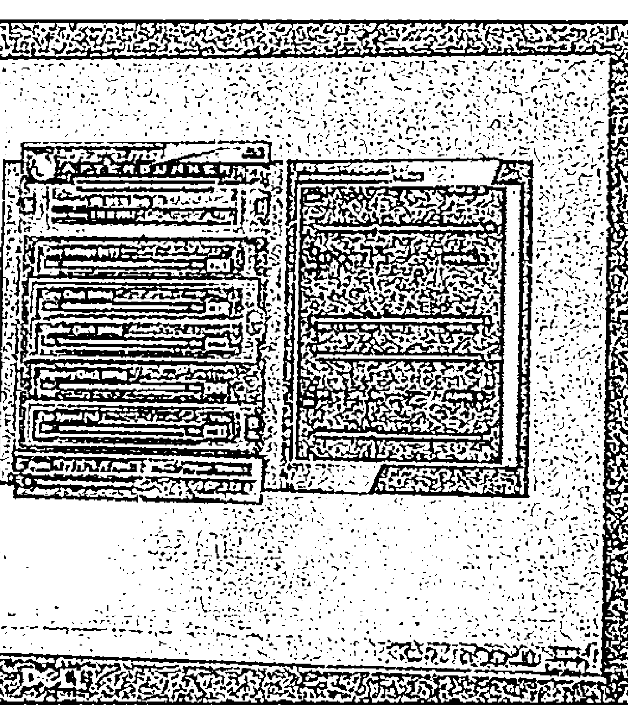

## MSI AfterBurner

类似华硕GPU Tweak、微星MSI AfterBurner这类显卡超频工具以前我们也曾介绍过，它们的特点不同于主板软件，只要是主流的显卡都可进行控制及频率、风扇转速和电压调整，无需一定是华硕或者微星显卡（图1）。

今天着重说微星MSI AfterBurner，因为这是目前唯一同时在iOS和Android双智能系统上推出AfterBurner APP的工具，通过同一网段内的移动设备和PC，能实现其他软件根本无法企及的功能和特殊用法（图2）。

## 手机遥控超频

我们正在玩一款单机大作时基本都是使用全屏幕显示的。玩到一关正激烈时，由于场景复杂显卡有些吃不住劲fps骤降，又或者显卡风扇声音像拖拉机难以忍受。在传统的使用场景当中我们只能暂停游戏，切回桌面打开显卡工具去调整频率。不过很多全屏游戏切入切出会由一定问题，如果退出游戏再调整实在有些影响心情。

PC和手机/平板端同时安装AfterBurner，打开后移动设备和PC均在同一网络环境中即可。PC端要设置好IP、端口和安全密钥。之后在手机/平板APP上的设置里一一验证就可顺利联通。不论是在PC端还是移动设备端更改显卡参数都会及时使彼此同步（图3），在全屏状态下即时调整显卡以适应不同游戏。

有了AfterBurner APP则不同，通过Wi-Fi网络可随时监控PC中显卡的温度、电压与风扇转速等，还可直接对PC显卡进行超频和电压调整，PC版AfterBurner中几乎所有高级功能都在AfterBurner APP里完整体现。连接方法很简单，只需

除了调整，显示功能也很方便。熟悉AfterBurner的用户都知道它能即时显示核心显存频率和占用情况、显卡转速及温度等信息，PC端使用屏内OSD方式呈现在游戏画面中。使用APP后就不必担心OSD信息文字遮挡游戏内容了，只需把手机放一边，需要时激活监控即可。

## 网游神器 自定义鼠标侧键功能

现在的游戏鼠标卖点已经逐渐从酷炫灯光、超高DPI回报率上回归到游戏性本身。如果鼠标能对游戏操作有额外的提升，就会被游戏迷趋之若鹜，而想要实现这一点并不难。

### 品牌鼠标的驱动程序

玩游戏时，左手键盘右手鼠标的模式基本已成定势。左手都要长时间在WASD四个方向键上，如果挪去按技能就会暂时离开方向键，一瞬间的失误就会被对手抓住。侧键鼠标的诞生，本质就是为了让用户在不离开WASD方向键的同时释放技能。

随着侧键鼠标的发展按键数量和位置逐渐优化，玩家对这种鼠标也产生了依赖心。尤其在一些复杂的网游上，玩家需要释放的技能很多，绑定的技能数量已经不能满足要求。要想实现更加复杂的键位绑定，只能寄希望于鼠标的驱动程序给力。

### 罗技设备游戏实用程序

罗技最出名的侧键鼠标是G600和G602，售价300元出头的这两款鼠标风格截然不同，但共同点都是侧键出色。罗技鼠标驱动是一体化的，驱动程序会在安装完毕后自动根据设备区分程序功能（图1）。

罗技对侧键的定义除了基本的鼠标按键功能外，还可以定义为键盘上任意一个按键，这样一来我们在按下键盘或者侧键都可以释放这个技能（图2）。比如在一些支持混合按键的游戏中我们完全可以把侧键设置为Ctrl或者Shift，这样用右手侧键做开关，左手所有的1234等常规技能按键都拥有了双倍效果。

### 赛睿WOW专用程序

在网游中魔兽世界的技能是出了名的多，一个职业需要设置10来个快捷按键不是新鲜事。外设贵族赛睿就针对魔兽世界推出了多款游戏鼠标，在侧键多同时支持键盘按键的基础上，赛睿还针对魔兽世界的宏功能，在驱动程序中实现了类似的效果。

用户只要在赛睿的专用程序中根据说明一步步设置，游戏内那些复杂操作有望一键执行（图3）。

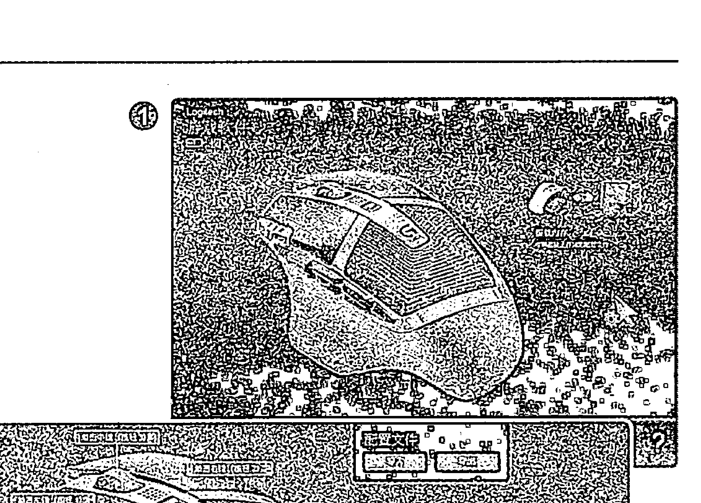

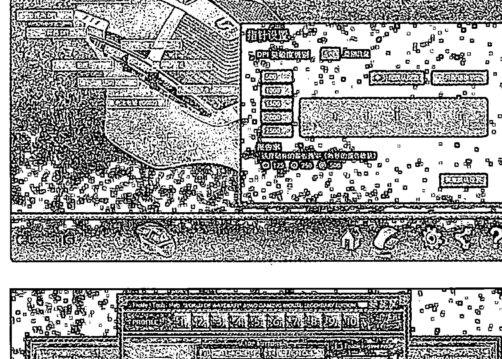


### 五键鼠标通用程序

可能用户并没有拥有罗技和赛睿那些专业产品，但通过第三方程序一样可以实现类似效果。五键鼠标是最常见的侧键鼠标，包括左中右三个基本按键和前进后退两个基本侧键，高度的统一性使第三方控制程序成为可能。


比如这款MouseSideButtons软件，被玩家俗称为鼠标侧键设置精灵。虽然不能像罗技、赛睿和雷蛇那样的品牌专用程序那么专业，但也能实现基本的控制功能。打开程序后可设置前进后退两个侧键的关联功能，比如Ctrl、Shift和Alt+其他的组合键，点击启动就可以去游戏里验证是否生效了（图4）。

### 儿童节 专注大作战

策划 | 《电脑爱好者》编辑部

信息大爆炸的时代，
有太多的东西让我们分心，
无论是工作或学习，
上网时有微博、论坛、影视等干扰、
下线的时候有手机游戏、微信、
移动QQ、音乐等诱惑。
各种干扰无时无处不在，
让我们很难静下心来做好某件事。
本期的特别话题，
我们一同来营造以专注为主的平台，
全身心地去学习、去工作……


### 快乐清爽 儿童节

六一儿童节就快到来了，作为家长，不仅仅给他们提供物质上的保障，在教育上也要多下点力气。当下网络呈现越来越开放的态势，内容鱼龙混杂，对儿童有着很多不利的诱惑，而他们本身对是非的识别能力又不高，就需要成人适当的保护，打造一个适合儿童使用的专一安全的平台是当务之急。就让我们通过一些简洁、实用的技巧，为儿童营造出一个纯粹的系统、网络环境，剔除不利的干扰。

### 健康为上 打造适合儿童的应用桌面

文 | 阚永强

在这个电脑普及的时代，禁止儿童完全不接触电脑似乎不太现实。不过儿童都处于发育阶段，长时间使用电脑难免会对身体造成不好的影响，所以作为家长，必然要在电脑使用时间上做一些硬性的限制。除此之外，我们也可通过一些技术手段，优化儿童使用电脑的环境，针对孩子的特点进行设置，同时还要适度制定一些时间上、使用上的限制，让儿童用电脑有利有度。

## 《电脑爱好者》2015年合订本（中） 特别话题

### 用心呵护 桌面针对性设置

现在大家都在使用23英寸甚至27英寸的大屏显示器，这些显示器的默认分辨率较高，显示的字体较小，桌面图标也很小，如果长期使用会对孩子们的眼睛造成不利影响。因此我们可以针对孩子的特性做出适当的调整。

首先，在桌面空白处右击选择“查看→大图标”，将桌面快捷方式的图标放大，然后再右击选择“个性化”，切换到“显示→设置自定义文本大小”，将文本调整至“中等”或者“较大”，这样孩子们看起来就更舒服了（图1）。

其次，需要对显示器的亮度进行调整，为了方便调整，我们可以借助软件“Gamma Panel”来完成。程序启动之后在热键框按下F11键，将其保存为“正常亮度方案”（图2）。

接着返回程序界面，拖动“亮度”滑块，再将屏幕调整到一个适合孩子阅读的亮度模式，同样设置一个热键F12键，配置方案为“孩子阅读”。这样，以后如果电脑给孩子使用时，只要按下F12键即可进入到“孩子阅读”的模式，如果我们需要恢复原来的亮度，则按下F11键即可（图3）。


### 有利有度 儿童上网一手掌控

孩子正处于发育期，因此除了上述设置外，我们还要对他们使用电脑的时间、使用程序（如QQ游戏）等作出相应的限制。除了可以使用系统自带的“家长控制”进行限制外，还可以借助批处理实现更灵活的限制。

#### 1.限制孩子使用电脑时间

假设我们需要限制孩子每次只能使用电脑45分钟，那么只要制作一个关机批处理即可。首先启动记事本新建一个批处理保存为Gj.bat（后缀为bat的文本文件，文件名随意），将其放置在孩子账户的启动目录下，这样每次孩子的账户登录后就会自动运行这个批处理，这个批处理会在用户每次登录电脑45分钟后自动关机，从而实现限制孩子使用电脑时间的目的（图4）。

```
shutdown -s -t 2700 /c “使用电脑时间别太长哦”
```

这个批处理的代码其实非常简单，只有一行：

#### 2.限制使用特定程序时间

假设需要控制孩子聊QQ的时间为30分钟，首先启动组策略编辑器，依次展开“计算机配置→Windows设置→安全设置→本地策略→审核策略”，双击右侧的“审核对象访问”，在打开的窗口启用成功审核（图5）。
接着找到QQ.exe，右击


选择“属性→安全→高级”，在打开的高级安全设置窗口，切换到“审核”选项卡上，单击“继续”，在“选择用户、计算机或组”对话框中，添加要审核操作的用户名cfan（假设此为孩子登录系统的账户名），审核所有访问项目。这样系统自带的事件查看器则会自动记录各种成功审核事件，每当孩子账户运行QQ.exe后就会自动生成事件记录。

单击“开始→运行”，输入“%windir%\system32\eventvwr.msc /s”启动系统自带的事件查看器，展开“Windows日志→系统”，右侧窗格的审核事件中可以看到事件ID为4663的记录，里面记录了cfan账户成功运行QQ.exe的事件（图6）。


点击右窗格的“将任务附加到此事件”，在打开的新建基本任务窗口就会创建一个上述事件作为触发器的新任务（图7）。
按向导提示完成任务的创建，“操作”是“启动程序”，启动的程序是“C:\windows\system32\shutdown.exe”，参数是“-s -t 1800”，即30分钟后自动关机（图8）。
这样一旦孩子账户登录系统后启动QQ，后台自动生成的审核事件就会激活关机的任务计划，到了30分钟就会自动关机。如果要控制其他程序，操作类似。


### 儿童上网免打扰

文|周太彪


孩子的天性就是爱动，对什么都感兴趣，而且孩子们的学习能力非常强，因此很多简单的限制方法极易被他们破解。为了更好地让孩子们获得免打扰的上网环境，一方面我们要从系统底层进行限制，另一方面则要使用更为强大有效的方法对外界干扰进行屏蔽。

对于Windows 8用户（Windows 7有类似家长控制，操作大同小异，不过功能薄弱一些），系统已经自带“儿童账户”，这个账户可以很好地对孩子们进行保护。

在桌面激活Charm菜单（右侧超级按钮），点击“设置→更改电脑设置→电脑设置→账户→其他账户”，然后点击右侧窗格的“添加账户”，按向导的提示添加一个名为cfan的账户，在最后步骤勾选“这是一个儿童账户”，创建一个儿童账户给孩子们专用（图1）。

完成账户的创建后登录，再从应用商店下载孩子所需的应用即可（本地应用的限制要进入家庭安全设置里进行设置）。如复习期间不想让孩子使用电脑上网，但又要满足孩子使用QQ的需求，那么可只在cfan账户下安装QQ应用。完成应用的安装后返回账户设置窗口，点击“为分配的访问权限设置账户”，在打开的窗口中点击“选择账户”，选择上述创建的儿童专用账户（图2）。

继续点击“选择应用”，然后在应用列表里选择允许孩子们使用的应用如QQ，这样在允许的列表中就会出现QQ。应用商店的应用基本可以满足我们的日常使用，比如要允许孩子使用浏览器上网，则可以下载傲游云浏览器，需要简单编辑文档则可以使用Onedrive等（图3）。

完成上述设置后重启生效。这样以后我们就可以将cfan作为孩子的专用账户，孩子们使用cfan登录系统后会自动启动QQ全屏应用，除此之外无法运行其他任何应用（QQ应用会始终前置显示，用户无法启动其他应用），这可以有效控制孩子们使用电脑过度上网。当然孩子们如果有其他合理需求，我们只要在允许列表添加其他应用即可（图4）。

上述限制只是对孩子账户使用应用进行限制。如果要对孩子访问的网站、本地程序、使用时间进行更多的限制，可以打开“控制面板→用户账户和家庭安全→家庭安全”，选中上述建立的儿童账户，在打开的设置窗口中，我们就可以对账户访问的网站等进行详尽的设置。如果需要控制孩子的电脑上网时间，可以点击“时间限制”进入设置（图5）。

在打开的窗口中选择“设置开放的时段→只能在我允许的时间内使用电脑”，然后根据自己的实际需要进行设置即可。比如可以设置工作日孩子只能用1小时的电脑，周末则可以使用2小时（图6）。

如果还要对具体使用时间进行设置，则切换到“设置限用时段”，然后在打开的窗口中设置不允许使用的时间即可。比如周一到周五只允许作业做完后的20~21点使用电脑，则将其他时间区域全部选择即可（图7）。


小提示
点击“在家庭网站上管理设置”，这样会自动打开在线管理网站，使用自己的Microsoft ID登录后就可以在线进行管理了。


### 全面呵护 打造安全健康的使用环境

虽然儿童账户可对允许运行的应用进行很好的控制，但网上的内容鱼龙混杂，仅仅儿童账户的限制还无法屏蔽一些不健康的内容。为了让孩子有个更安全的上网环境，还可以借助专业工具进行更深层次的屏蔽。

对于常见的不健康网页的拦截，最有效的方法是利用DNS服务器进行屏蔽，这样在网络底层就可以进行屏蔽。比如114DNS服务就有这个功能，首先进入自己的路由器设置页面（这里以水星M305R路由器为例），依次展开到“网络参数→WAN口设置→高级设置”，勾选“手动设置DNS服务器”，然后在首选DNS服务器和备用DNS服务器中分别输入114.114.114.110和114.114.115.110（图8）。

以管理员身份启动命令提示符，输入“ipconfig /flushdns”清除DNS缓存，就可以使用114DNS的色情网页屏蔽服务了。因为这是在路由器端的设置，所以对所有连接到路由器的设备，如手机、平板均有屏蔽作用。


对于已确定是不健康网站的，我们还可借助Hosts文件进行屏蔽。启动记事本打开C:\windows\system32\drivers\etc\hosts文件，然后将获知的不健康网址转向到百度，按提示添加下列代码即可（前面为百度的IP，使用ping命令获得，后为确定的不健康网址）：

```
220.181.57.217 不健康网址1
220.181.57.217 不健康网址2
```

当然，上述的操作虽然是针对儿童的限制操作，对于成人来说同样起作用。比如对于公司展示电脑，为了不被展示者随意折腾，我们同样可以设置一个儿童账户作为展示专用账户，在里面只允许运行特定的展示程序即可。通过路由器的设置则可以屏蔽公司员工在上班时间访问与工作无关的网站。

| 控制 cfan 可以使用电脑多长时间 |
| :--- |
| cfan 可以按天使用电脑 |
| cfan 只能在允许的时间段内使用电脑 |
| **允许使用的总时间** |
| **开始时间** | **结束时间** |
| 工作日 | 1小时30分钟 |
| 星期六 | 2小时30分钟 |
| 星期日 | 1小时30分钟 |
| 星期一 | 1小时30分钟 |
| 星期二 | 1小时30分钟 |
| 星期三 | 1小时30分钟 |
| 星期四 | 1小时30分钟 |
| 星期五 | 1小时30分钟 |

小提示：对于没有路由器的用户，则进入本地网卡的属性设置，然后选择“手动设置DNS地址”，将上述DNS作为自己的DNS服务器地址即可。


| cfan 何时使用电脑? |
| :--- |
| cfan 可以按天使用电脑 |
| cfan 只能在允许的时间段内使用电脑 |
| 设置 cfan 不能使用电脑的时间 |
| **时段** | **00** | **01** | **02** | **03** | **04** | **05** | **06** | **07** | **08** | **09** | **10** | **11** | **12** | **13** | **14** | **15** | **16** | **17** | **18** | **19** | **20** | **21** | **22** | **23** |
| 星期一 | □ 允许 | □ 禁止 | □ 允许 | □ 禁止 | □ 允许 | □ 禁止 | □ 允许 | □ 禁止 | □ 允许 | □ 禁止 | □ 允许 | □ 禁止 | □ 允许 | □ 禁止 | □ 允许 | □ 禁止 | □ 允许 | □ 禁止 | □ 允许 | □ 禁止 | □ 允许 | □ 禁止 | □ 允许 | □ 禁止 |
| 星期二 | □ 允许 | □ 禁止 | □ 允许 | □ 禁止 | □ 允许 | □ 禁止 | □ 允许 | □ 禁止 | □ 允许 | □ 禁止 | □ 允许 | □ 禁止 | □ 允许 | □ 禁止 | □ 允许 | □ 禁止 | □ 允许 | □ 禁止 | □ 允许 | □ 禁止 | □ 允许 | □ 禁止 | □ 允许 | □ 禁止 |
| 星期三 | □ 允许 | □ 禁止 | □ 允许 | □ 禁止 | □ 允许 | □ 禁止 | □ 允许 | □ 禁止 | □ 允许 | □ 禁止 | □ 允许 | □ 禁止 | □ 允许 | □ 禁止 | □ 允许 | □ 禁止 | □ 允许 | □ 禁止 | □ 允许 | □ 禁止 | □ 允许 | □ 禁止 | □ 允许 | □ 禁止 |
| 星期四 | □ 允许 | □ 禁止 | □ 允许 | □ 禁止 | □ 允许 | □ 禁止 | □ 允许 | □ 禁止 | □ 允许 | □ 禁止 | □ 允许 | □ 禁止 | □ 允许 | □ 禁止 | □ 允许 | □ 禁止 | □ 允许 | □ 禁止 | □ 允许 | □ 禁止 | □ 允许 | □ 禁止 | □ 允许 | □ 禁止 |
| 星期五 | □ 允许 | □ 禁止 | □ 允许 | □ 禁止 | □ 允许 | □ 禁止 | □ 允许 | □ 禁止 | □ 允许 | □ 禁止 | □ 允许 | □ 禁止 | □ 允许 | □ 禁止 | □ 允许 | □ 禁止 | □ 允许 | □ 禁止 | □ 允许 | □ 禁止 | □ 允许 | □ 禁止 | □ 允许 | □ 禁止 |
| 星期六 | □ 允许 | □ 禁止 | □ 允许 | □ 禁止 | □ 允许 | □ 禁止 | □ 允许 | □ 禁止 | □ 允许 | □ 禁止 | □ 允许 | □ 禁止 | □ 允许 | □ 禁止 | □ 允许 | □ 禁止 | □ 允许 | □ 禁止 | □ 允许 | □ 禁止 | □ 允许 | □ 禁止 | □ 允许 | □ 禁止 |
| 星期日 | □ 允许 | □ 禁止 | □ 允许 | □ 禁止 | □ 允许 | □ 禁止 | □ 允许 | □ 禁止 | □ 允许 | □ 禁止 | □ 允许 | □ 禁止 | □ 允许 | □ 禁止 | □ 允许 | □ 禁止 | □ 允许 | □ 禁止 | □ 允许 | □ 禁止 | □ 允许 | □ 禁止 | □ 允许 | □ 禁止 |

# 打造纯净的手机或平板环境

对Windows系统的PC来说，我们可以通过多账户的方式建立多个桌面环境，用户之间可以自由切换而互不干扰。对Android系统的手机或平板而言，如何才能打造纯净的系统环境，而且还不影响日常的使用呢？


# 简单粗暴的应用加密

为了防止家里的小孩沉迷于手机平板里面的游戏世界，很多家长都会选择给部分应用进行加密。以华为手机为例，在系统自带的“手机管家→辅助工具→应用锁”中可以对任意APP加锁（图1），如此就可防止小孩运行指定的程序了。

不过，这种方法可谓“简单粗暴”，因为这些图标看得见摸得着，小孩往往可以通过“偷窥”的方式找到密码，让应用锁形同虚设。此外，作为家长的我们每次运行某些APP时也得输入密码，颇有费力不讨好之嫌。那么，有没有更好的方案？


# 利用Launcher实现多用户

既想给儿童建立纯净的桌面，还不想影响日常使用，类似PC的“多账户”无疑是最佳解决方案。不过Android默认并不支持该功能，可通过安装第三方桌面Launcher曲线实现类似功能。

以安装“小米桌面”（下载地址：http://zhuomian.xiaomi.com/）的华硕手机为例，首先将小米桌面设置为默认桌面（图2）。双指在桌面上滑就可进入隐藏桌面应用界面，根据提示设定密码后，就可将任意APP加入到隐藏列表中（图3）。此时，小米桌面的界面就相当于“儿童模式”，里面只有适合小孩使用的指定APP，是最纯净的系统环境；而默认的ASUS Launcher则为“家长模式”，里面功能齐全，便于我们自己使用，二者互不干扰。如果你想在两个模式间切换，只需进入“设置→主屏幕”按需选择即可（图4）。


如果你担心小孩自己会进入设置里面切换Launcher，则可以使用系统自带的程序加密，或者类似360手机卫士、联想乐安全等的第三方安全软件的程序加密功能，给“设置”这个程序添加密码锁。想进入设置切换Launcher？没有密码就没门！

# 大屏设备用户怎么办

很多平板电脑默认都是原生Android系统，并不支持图标隐藏、加密等功能，安装手机用的第三方Launcher界面和图标也不美观。如果你想将Android平板打造成纯净的儿童环境，可借助“乐桌面HD”(下载地址：http://launcher.lenovo.com/)，这款Launcher针对大屏幕进行了优化，可完美适配7英寸以上的大屏设备。安装以后按主页键锁定始终以乐桌面HD运行，点击右下角的菜单按键进入“桌面设置→儿童模式”(图5)。切换到儿童模式时我们需要先建立一个密码，将指定的APP图标添加至桌面(图6)，而未添加的则会进入隐藏状态(图7)。

# 移动设备为孩子保驾护航

儿童安全是当今社会面临的巨大挑战，如果孩子放学后没按时回家，相信很多家长的心都会提到了嗓子眼。既然现在很多小孩都随身配有手机，何不利用它随时获取小孩的位置信息呢？

> **小提示**
通过安装第三方Launcher的方式，还可将普通Android手机打造成“老年手机”，只需安装“极简桌面”的Launcher。

很多安全类APP都支持手机防盗功能，而利用这个功能即可随时监测携带该手机的孩子的具体位置信息。以360手机卫士的手机防盗功能为例，绑定360账号后，在PC端登录http://fd.shouji.360.cn/网址就可定位手机当前位置(图8)，甚至连移动轨迹都可查看，或进行摄像头抓拍等高级功能。


> **扩展阅读**
考虑到很多学校可能不允许学生佩戴手机，而手机辐射可能也会对儿童身体健康造成影响。有需要的用户可以考虑购买类似360儿童卫士智能手表一类的穿戴式设备，获得更为专业的定位、轨迹定位追踪功能。有兴趣的读者可以参考本刊2015年第2期《360儿童卫士智能手表 让你随时知道孩子在哪》这篇文章。

# 寻找适合儿童的外设

孩子在把玩手机或平板时，难免会遭遇液体泼溅、刮蹭磕碰等问题。如果你不希望身边的手机或平板因小孩的不经意而“夭折”，为其加入一些保护措施必不可少。这里笔者向大家推荐硅胶材质的保护套(图9)，在淘宝上搜索“具体型号+防摔+防水+硅胶”等关键字即可找到匹配的产品。此类产品在选购时主要就看材料是否环保(有无异味)，在使用接口时是否方便等等。当一款系统纯净，且拥有三防防护措施的手机或平板摆在小孩面前时，这才算是一款“武装到牙齿”的儿童设备。


## 2 拒绝骚扰 安心办公

当下的生活节奏越来越紧张，许多事情往往需要抽出一些碎片时间来完成，如抽空学交规、上网学英语等等。但是电脑上、网络上各种诱惑太多，很容易造成干扰让我们分心。如何才能做到安心办公？


### 办公模式自己定制 环境切换零干扰

文|平淡

我们经常要在不同环境下工作：在家里加班赶制文档、在公司办公室撰写文稿、在会议室演示PPT等。为了避免不必要的干扰，我们可以为不同环境定制不同的桌面，让我们的工作模式更高效！

### 工作桌面自己打造

如前所述，不同工作环境对桌面要求是不同的。比如当我们使用笔记本在会议室向老总们展示PPT的时候，如果此时桌面忽然弹出GF要求语音对话窗口，或者一些不合时宜的弹窗，显然这是非常令人尴尬的场景。

为了避免类似的骚扰，我们可以自己打造一个专用的桌面场景，这样电脑用于工作时只要快速进行切换即可。借助Dexpot即可轻松打造出专用工作桌面。启动Dexpot后会自动最小化到任务托盘，右击程序图标选择“设置”，切换到“常规→语言→简体中文”，切换到中文版，同时勾选“开始时自动运行Dexpot”，方便我们开机后随时使用哪个桌面（图1）。

继续切换到“切换桌面→桌面元素→高级”，单选“为每个桌面创建一个单独的文件”，这样每个桌面就可以根据自己的需要定制显示的图标，方便各种环境下的使用（图2）。

返回桌面右击任务栏程序图标选择“配置桌面”，在打开的窗口中选中“桌面2”（假设将其作为工作专用桌面），在右侧窗格切换到“工具”，勾选隐藏桌面组件下的“系统托盘图标”，这样类似迅雷弹窗、QQ消息弹窗就不会在工作专用桌面显示出来（图3）。

> 可对每个桌面的屏保、分辨率、桌面背景、任务栏进行更多的个性设置。比如对于大屏幕显示器，如果显示的字体过小，可专为显示工作文本的桌面设置较低的分辨率，以显示更大的字体。另外还可将办公室内景作为工作桌面的壁纸，这样一看就知道哪个是工作桌面。

继续切换到“启动”标签，选中桌面2，点击“浏览”，添加需要进入桌面的PPT程序，事件选择“每次进入”，其他保持默认设置，这样每次进入桌面2后都会自动启动PPT程序（图4）。

返回桌面右击任务栏程序图标选择“配置桌面”，在打开的窗口中依次点击“增加”，将要在桌面2显示的工作程序全部添加到列表，其余类似QQ、视频客户端的非工作软件添加到桌面1。这样只要启动工作程序，程序就会自动出现在桌面2（图5）。

这样每次需要使用电脑展示PPT的时候，只要按下Alt+2键切换到工作桌面，在桌面上就会自动启动PPT，而且桌面和任务托盘没有任何多余的图标，即使有各类QQ弹窗，弹窗也会自动被屏蔽显示，可以给我们一个清爽的工作环境（图6）。


> Dexpot的功能强大，大家可根据实际需要配置更多专用的桌面。比如低分辨率游戏启动后会自动更改当前显示器的分辨率。对于这类游戏可以专门设置一个合适分辨率的桌面，并且设置进入该桌面后启动对应的游戏，这样要玩游戏的时候只要切换到对应桌面即可。

### 权限模式自己定制

除了桌面设置外，在实际的工作中我们还经常需要对各种桌面下对应的文件权限进行有效的限制。比如对于一些财务敏感数据的访问，我们只能面向特定账户开放，这就要对不同环境下的权限做出有针对性的限制。Windows作为多账户系统，现在用好系统自带账户设置即可实现有针对性的限制。假设某台电脑的“K:\财务数据”保存的是重要财务数据，平时需要对电脑大部分账户隐藏，只允许“CFAN”账户登录后查看，只要进行下面的设置即可。

首先以管理员身份启动命令提示符，接着输入 `attrib +s +h k:\财务数据`，按提示将其设置为系统、隐藏属性，这样该目录就变为系统、隐藏目录，默认情况下只有设置为“显示所有文件和文件夹”的账户才能查看。

接着在资源管理器中打开K盘，右击“K:\财务数据”选择“属性→安全→编辑”，将原来“组和用户”列表下的所有数据删除，点击“添加”，添加本地“cfan”账户，设置只有该账户才有访问该目录的权限（图8）。

启动记事本输入下列的代码保存为“1.bat”，放置在CFAN账户的“启动目录”，即C:\Users\CFAN\AppData\Roaming\Microsoft\Windows\Start Menu\Programs\Startup下（图9）。

```
attrib -s -h k:\财务数据
explorer.exe k:\财务数据
```

继续启动记事本输入“attrib +s +h k:\财务数据”，保存为“hf.bat”放置在E:\，接着启动组策略编辑，依次展开“计算机配置/Windows设置/脚本(登录/注销)”，双击“注销”，在打开的窗口单击“添加”，将“E:\hf.bat”添加到注销脚本（图10）。

这样默认的情况下，其他用户登录到电脑是无法看到“K:\财务数据”的，即使用户设置“显示所有文件”，并且去除“隐藏受保护的操作系统文件（推荐）”前的勾选，由于权限的限制也无法直接访问（图11）。

当然对于CFAN账户来说，用户登录后不仅可以自动打开“K:\财务数据”，而且会去除其隐藏、系统属性，很方便用户的使用。由于关机脚本的存在，每次关机后会自动恢复系统、隐藏属性（图12）。


# 小提示

在实际工作中，由于每个人的工作环境、业务性质不同，对于环境切换的要求也不相同，我们还需要根据实际情况灵活使用各种方法进行快速切换。比如为了避免进入桌面后出现网卡分配IP地址假死，很多朋友喜欢自定义好IP地址，但是公司和家里IP地址又不同，此时只要启动记事本制作一个批处理放置在桌面（具体IP请自行参考实际路由设置，“本地连接”为本地网卡连接名称）：

```
netsh interface ip set address 本地连接 source=static addr=192.168.1.102 mask=255.255.255.0
netsh interface ip set address name=本地连接 gateway=192.168.1.1 gwmetric=1
netsh interface ip set dns 本地连接 static 223.36.39.62
```

这样需要在不同环境下实现IP的快速切换时，我们只要运行桌面批处理即可。总之，大家可以参考上述的实例，举一反三实现更多实用的个性化快速切换（图13）。


## 创建无干扰工作环境


电脑和网络在为我们带来丰富的信息来源渠道和内容的同时，也给我们的工作与生活带来更多干扰。在上网交流或使用软件的过程中，有时往往会弹出与内容无关的信息；而如果不加管制，这些信息很可能会成为转移注意力的诱发因素，轻则浪费了我们的宝贵时间，重则会延误工作，造成不良后果。因此，学会阻止或屏蔽工作、学习中可能产生的各种信息干扰就显得非常重要。

### 上网浏览 安心做事找清净

网络时代，我们大家都希望能在干干净净的环境下浏览上网，但是，现实的情况却不能让我们乐观。当电脑中安装有多款浏览器之后，浏览器之间争夺地盘会让我们感到非常不爽。而上网时各种不失时机出现的广告页面又让人厌烦无比。那么，有什么办法能消除这些烦恼呢？

#### 1. 系统拦截 阻止霸道浏览器

如果我们安装了多款网络浏览器，桌面的使用或上网浏览功能就会被一些浏览器所绑架。当启动到Windows桌面或启动某网址上网时，会自动弹出某个自己不喜欢的浏览器。可气的是，当我们将默认浏览器设回到我们喜欢的浏览器之后不久，旧的问题又可能会再次发生。遇到这种情况，虽然可通过修改注册表的方法彻底解决，但一般用户动用注册表容易误操作而出现问题。所以用系统自身的设置来解决可能更为稳妥。


我们可以利用系统防火墙对网站的阻止功能来实现对特定浏览器的阻止拦截。首先通过控制面板“Windows防火墙”启动防火墙设置窗口，点击左侧列表的“启用或关闭Windows防火墙”项（图1），在随后出现的窗口中将两项网络防火墙选项均设置为“启用”状态（图2）。

接下来点击防火墙设置窗口左侧的“允许应用或功能通过Windows防火墙”一项，进入“允许的应用”选择窗口，若其中有希望屏蔽的浏览器，只需将前面的选项对钩去除即可。如果列表中没有发现该浏览器的主程序，可点击右下角的“允许其他应用”按钮（图3），在弹出的应用窗口中通过“浏览”按钮确定该浏览器所在文件夹，找到浏览器的主程序进行添加（图4）。之后该浏览器便出现在允许列表中，这时只需将列表中该浏览器前面的选项对钩去除，也就实现了不允许该浏览器通过防火墙启动的目的，达到拦截此浏览器随意启动弹出的目的。


#### 2. 讨厌引擎 加载选项来屏蔽

许多用户都喜欢用百度搜索，但使用Windows 8.1默认的IE浏览器时，微软为了推广其搜索引擎，在启动IE甚至Windows时就会自动弹出微软必应的Bing搜索页面。如何才能屏蔽掉这一页面，转而变为我们乐于使用的百度或其他搜索页面呢？点击IE浏览器的齿轮状工具按钮（或直接用Alt+X组合键），点击弹出菜单中的“管理加载项”（图5）。在“管理加载项”窗口中点击“加载项类型”下的“搜索提供程序”项，从右侧窗口中选中Bing，右键单击此项并选择“删除”，消除IE与Bing的关联。再点击窗口左下角的“查找更多搜索提供程序”文字链接，添加更多满意的搜索引擎（如百度搜索引擎）。最后回到搜索引擎列表中，右击需设为开启IE后自动开启的搜索引擎条目，从快捷菜单中选择“设为默认”即可（图6）。


将常用引擎设为默认选项

> **小提示**：如果希望在打开IE浏览器之后，自动开启并定位到百度搜索页面，只需要在Internet选项设置窗口中将主页设置为百度的主页即可（图7）。


设置锁定浏览器的常用首页

#### 3. 广告拦截 浏览器本身也行

现在许多人都在使用IE之外的国产浏览器，例如360安全浏览器、搜狗高速浏览器等。这些浏览器除了可以实现IE浏览器的基本功能之外，还提供了许多附加的实用功能，这其中就有广告页面的自动拦截功能。如果我们用此类浏览器上网，通过必要的设置之后，就可以达到在浏览网页的过程中阻止广告弹出、清净上网的目的。

若使用搜狗高速浏览器上网，可通过“工具”菜单选中“广告过滤”下的“启用弹出窗口拦截”子菜单命令，在上网时就会以设定的过滤条件对弹出的窗口进行自动拦截（图8）。具体过滤条件的设定方法下面会有讲述。


有一些弹出式页面也许是我们所需要访问的正当页面，但也会被搜狗自身的过滤机制所过滤。这时，我们可以通过设置“豁免权限”的方法来排除这些页面，以便达到不被过滤的目的。设置豁免过滤的规则可通过“广告过滤→广告过滤设置”命令进入设置（图9）。只需点击“编辑免过滤列表”，在弹出的窗口中填入免过滤的网页地址即可。如果有多个这样的网页，可反复添加，添加之后“豁免”网站将出现在窗口的免过滤列表当中（图10）。

浏览器默认的过滤机制也不一定能百分百地过滤网页的弹出广告。如果我们发现某个网页的弹出广告没有被过滤掉，还可以使用扩展过滤功能将更多的网页加入被过滤的行列当中。具体方法是，在浏览器设置页面的“高级→广告过滤”项目中，点击“使用扩展过滤更多广告”一项，然后在弹出的扩展中心页面中选中一款名为“广告过滤”的轻应用扩展，单击“安装”添加该扩展即可增强广告的过滤功能（图11）。


扩展安装之后，会在网址上显示一个红色的阻止符号，点击该符号可以看到开启该网站过滤的选项，需要订阅过滤规则库或者可以进行手动过滤设置（图12）。过滤规则库会定期自动更新。

我们可从更新列表中选择使用过滤规则，也可以自定义过滤的规则和排除的域名（图13）。而手动过滤设置更为直观和方便，如果遇到一个网页没有被过滤，可以点击该工具菜单下的“手动设置”按钮，然后点击网页中需要屏蔽的元素，即可将该元素纳入被屏蔽的队列中了（图14）。

360安全浏览器也可以过滤网页广告，通过浏览器窗口右上角的“菜单→工具→广告过滤”进入设置。开启拦截可选择拦截弹窗广告、页面欺诈信息和其他影响浏览器体验的广告信息等。若希望获得最大化的清净体验，可选择“拦截所有广告”一项（图15）。

此外，还可以用360安全浏览器进行系统右下角软件弹窗拦截设置，可以选择“一般拦截”和“强力拦截”两种选项。可以拦截的项目包括右下角的广告弹窗、屏幕中间广告弹窗、网页弹窗等。功能非常强劲，也非常简单易控（图16）。

#### 4. 安全工具 除却烦恼更省心

通过专用的安全工具来过滤和拦截网络无关信息则更加省事方便，可借助于360安全卫士，在软件设置中心的“网页安全防护”中开启挂马网站的拦截功能和欺诈信息的拦截功能（图17），上网时可有效拦截这两类不良信息。

### 通信交流 屏蔽信息更专心

通讯工具在极大地方便了我们交流的同时，也像一个无形的黑洞一样吸走了我们大量宝贵的时间。其中的罪魁祸首就是有规律或随机弹出的信息窗口。这些窗口中的某条信息一旦吸引了我们的注意力，一段宝贵时间也就在不知不觉中浪费掉了。可以说，使用通信工具的人们几乎人人都有这种经历和体会，就像吸毒一样，道理不说自明却往往难以自拔。

那么，就让我们在无法完全戒掉“聊天”这个“毛病”的大前提下，采取一些小小的行动，甩掉那些无关但浪费时间的因素，争取出更多的宝贵时间吧。由于QQ是当前工作中使用量最大的通讯工具，我们还是以它来讲述。

#### 1. 自动弹窗 自身设置来屏蔽

每天启动QQ都会弹出一个迷你的新闻窗口，这看似很方便的一个功能，但可能每天都在浪费我们不少时间。每次启动QQ后总会忍不住地点击查看吸引人的头条八卦，这一去没有几分钟或几十分钟的不行。其实这个窗口可以关掉的。

通过QQ面板的底部点击“系统设置”齿轮状工具按钮，在设置窗口中点击“权限设置”页下的“资讯提醒”，将“登录后显示腾讯迷你版”一项的选择取消即可（图18）。


> 在广告过滤轻应用中开启过滤设置


> 从订阅的过滤规则库中选择过滤规则


> 通过点击屏蔽元素完成手动过滤设置


> 360安全浏览器的3种拦截方式


##### 360弹窗拦截器的3种拦截方式

- 从不拦截
- 一般拦截
- 强力拦截

> 在看，去广告，就这么办


##### 通过360安全中心设置拦截

```
如果你的QQ在每次登录时还弹出网购精选提示窗口，可通过QQ系统设置的“基本设置”页的“登录”选项，将“订阅QQ网购每日精选，了解最新商品资讯”一项的选择去掉(图19)，以屏蔽这类窗口。
```


#### 2. 群组信息 屏蔽阅读两相宜

由于每个人都有不同的爱好，加之我们会在不同的场合参加不同的组织，因此可以断定，我们每一个人的QQ面板里一定会有不同类别的朋友群组。这些群组每天都会随时产生大量的交流信息，但是这些信息多数是自己不需要关注的信息。即便是不去仔细阅读这些信息，看到红色的来信提示，总是会想是不是有与自己有关的重要信息。于是又去点击查看，却发现是别人的事，但出于好奇，又去阅读了。如此一来，又在别人的事情上浪费了许多本属于自己的时间。

既然这样，是不是干脆像郑渊洁或余秋雨大师那样关掉QQ或扔掉手机了事？个人认为不现实！因为总会有一些重要事情需要联络，而人们又都早已习惯于用QQ，离开QQ就像瞎了眼一样。那么，这个矛盾如何解决？

其实，腾讯在QQ中早就想到了这一点。只需做一点必要的设置，即可实现平静工作和信息收取两不误。我们只需在QQ朋友群组中，对每一个不是太重要的群组的接收消息进行设置，右击每一个群组，将“群消息设置”项下的“不提示消息只显示数目”选中(图20)。这样，群组中的消息就不会在平时显示了。而当真正闲下来需要了解自己的朋友群组发生了什么事时，只需进入群组列表，点击含有信息提示条目数的项，即可看到该群组的聊天历史记录了。

#### 3. 兼顾情面 拒绝聊天巧设定

不知你有没有这样的“粘Q友”——Ta会不管你的是否繁忙，时不时会来找你聊上一会儿。你不好拒绝，但是又在浪费你的时间。而你的朋友本身不坏，没有必要将其加黑。但是如果不回复，对方明明看到你在线，说不定还以为你不理呢，这样也影响朋友间的感情。如果遇到这样的Q友，我们有什么办法能够做到既不失面子，又能够巧妙地“拖延”或者“拒绝”与其聊天。

只需在该好友头像上单击鼠标右键，然后依次选择“设置权限→在线对其隐身”即可(图21)。这样，当自己忙于工作不想回复对方时，可长时间不理会收到的消息，等工作不忙了再回复。对方也看到你不在线，因而也以为你真的不在呢，从而减少了误会的产生。


### 使用软件 净化环境免打扰

相信和我一样，软件带来的烦恼你一定尝过不少吧！当安装一个软件时，一不小心多选或少选了一个复选框，之后使用过程中便会出现无尽的弹窗。在软件使用中，由于没有深入对软件商预置的一些选项亲手关闭或取消，也会引来使用过程中定时或不定时弹出窗口或信息，让人烦不胜烦。既然如此，就下一番功夫，让我们将各种软件中暗含的干扰因素消除掉吧！

# 小提示

莫名其妙的弹出信息 用户本不需要某项附加服务，但由于安装软件时没有注意而安装了这样的项目，因此当这样的项目发生作用时，我们往往会感到莫名其妙，甚至不知道这些窗门是哪里来的。其实都是安装过程因自己疏忽所致，但由于软件厂方也已经告知你选择的项目，因此我们总无法怪‘过错’，只能‘吃哑巴亏’。


安装之前不小心点击“下一步”也会中招

### 小技巧

针对以上种种安装软件前、中、后期发生‘混迹’捆绑软件或插件的现状，应对的办法却是一项不是技术的‘技术’，那就是‘不要贪快’、‘眼尖一点’，在软件安装时，宁肯多付出三两分钟时间，也要仔细看清每个页面的边角有没有捆绑安装的选项存在，并分析清楚这个选项被选中的后果是什么，进而消除隐患。这样就能保证软件安装后，相对纯净运行而不至于受到其他因素的干扰。


安装过程中的捆绑更容易让人中招


启动风行软件弹出的推荐和广告窗口

#### 1. 消除干扰 先从安装入手

许多时候干扰信息的源头来自软件的安装环节。软件开发者由于生存的需要或利益的驱动，会与其他软件或网络厂商达成合作协议，将对方的某种软件或网络服务集成在自己的软件安装程序中，以默认生效选项的形式提供给用户，当用户安装软件时，如果不进行人为处理，习惯性地点击‘下一步’或‘确认’，则捆绑的软件或服务就会安装到电脑中。

生。而也有在安装一开始就迫不及待地捆绑选项的。例如大名鼎鼎的腾讯QQ，在安装开始时就‘献出’自家的‘全家套餐’，囊括电脑管家、杀毒软件、音乐播放器、APP市场应用宝、QQ游戏等，可谓应有尽有，好不‘体贴’（图23）。但不知腾讯是否想到过，用户需要这些吗？人家只想聊天，谁说要你的这些东西了？为何不来一个默认‘不选中’让我们自己选择呢？答案不言自明，显然是希望用户在不经意间全盘安装他们‘奉献’的这些软件，可谓‘殷勤’过头。

软件安装捆绑可能只捆绑一个软件，安装后并不自动运行，但在桌面生成了一个‘诱人’的快捷方式；也可能是安装一个服务助手或插件类的程序，安装后常驻任务栏，还不时地弹出广告或营销信息。例如，PPTV网络电视客户端的升级安装程序中就足足捆绑了6种程序或助手（图22），这些程序中既有输入法、系统美化、下载工具、音乐工具，又有不止一种上网购物助手。如果我们因一时疏忽，在看到安装‘完成’按钮的情况下，情急中点击了‘完成’按钮，就会酿成顺带安装6种‘烦恼’的‘大祸’，麻烦就会接踵而至。

有前有后，当然也有在安装的中间过程‘混迹’捆绑其他软件的。这一招其实更‘阴’，因为用户一般会小心开始或末尾的捆绑，中途多数会一路直击‘下一步’或‘确认’安装，中间出现捆绑很容易蒙混过关。例如爱奇艺视频播放器在安装中途出现路径选择时，协议下方默认提供并选中了叫做‘东方输入法’的软件（图24）。用户很容易因为一时疏忽而中招，误装一款输入法。安装后当某一天切换输入法时，突然觉得不对劲了，才发现调出的不是自己熟悉的输入法。

以上捆绑发生在安装之后，在人们不小心时自然发生。

#### 2. 使用过程 也需消除干扰

以上所说的是软件安装过程中可能存在的隐患。在消除了软件安装环节可能给我们带来的弹出骚扰隐患之后，并不表示就可以万事大吉地放心用软件了。现实当中，还有许多软件不只是在安装环节捆绑软件，而在其软件中直接捆绑其他选项，即便是在安装过程中完全‘纯净’的，但当软件运行之后，依然可能会不时地弹出一些与软件使用本身无关的窗口或消息。

以上所说的是软件安装过程中可能存在的隐患。在消除了软件安装环节可能给我们带来的弹出骚扰隐患之后，并不表示就可以万事大吉地放心用软件了。现实当中，还有许多软件不只是在安装环节捆绑软件，而在其软件中直接捆绑其他选项，即便是在安装过程中完全‘纯净’的，但当软件运行之后，依然可能会不时地弹出一些与软件使用本身无关的窗口或消息。

就以视频播放软件风行来说，在安装软件并启动后，每次你都发现软件启动较缓慢，好不容易启动到视频播放器的主页，随后却弹出一个“风行今日推荐”的窗口，窗口中最抢眼的却是一个天猫的大广告（图25）。更让人烦恼的是，它还会随机弹出赞助商的广告、公告、个人通知、热门影片信息等多项信息。这些都是在软件安装过程中无法控制的项目，只有在软件运行之后，通过软件的设置中心进入“选项”窗口，对“通知选项”进行人为消除，才能杜绝这些信息的产生。而对于“今日推荐”，也只能选择“一周之内不再显示”，如果一周之后忘了重新选择，那么烦人的消息又会出来打扰（图26）。但有个选项总比没有强，总还是有能关掉的余地。

> 消除软件使用过程中的干扰信息,要通过软件控制中心去查找造成隐患的设置选项,将其关闭。必须由用户亲自手动设置完成,别指望软件厂商为你默认设好。


### 定时作息 消除干扰保健康

除了一些无关的信息对工作的干扰外，电脑带给我们的莫过于无休止的工作、娱乐和上网浏览对身体健康的干扰。因此，定制特定时间段工作或休息，也就显得非常重要了。

#### 1. 系统级别的计划任务安排

通过设定定时关机，让电脑在工作一定时间后自动关机，人机共同休息。这一任务虽然可通过系统计划任务来实现，但用简单易用的关机倒计时工具“自动关机小助手”会更方便。运行“自动关机小助手”，可选择“定时关机模式”在某时某刻关机，或选择“倒计时关机模式”在若干时间段后关机（图28）。

#### 2. 健康软件的专用控制呵护

除了定时关机外，还通过一些专用的软件来实现定时强制锁定屏幕，强制自己离开屏幕若干时间后再回来工作，这样也可以达到保健康的目的。

在自己的电脑中安装一款护眼工具软件Workrave，通过设定休息时间，让电脑提醒自己若干时段后只开电脑，起来跟着电脑做体操，并锁定电脑上的其他工作，时间到达后才能自动解锁。还可设定每天在电脑上工作的最长时间限制，并能给出使用电脑的时间监控和工作量提示（图30）。安装时间限制和健康监测类软件后，变原来难以实现的自觉行动为强制执行并不失乐趣的被动行为，有效地实现了工作时间和休息、活动时间的相互协调，因而最大限度地消除了过度使用电脑对健康的干扰和影响。


#### 3. 借助工具 全面拒绝干扰

除了用软件自身的拦截功能外，还能借助于一些专用的拦截软件来实现。使用这类软件的好处是，即便是软件自身没有弹出窗口的关闭功能，也可以通过此类工具来进行拦截。要获得这方面的软件，只需从搜索引擎中搜索“弹窗屏蔽器”，即可发现许多专门到弹窗拦截屏蔽软件，可根据自己的需要选择下载使用。此外，还可以借助于安全工具软件、杀毒软件中集成的弹窗拦截功能来实施对各种弹窗的拦截和阻止。

> 一些软件不但会提供消除其他软件干扰的功能，而且即便是对于自身软件的有用弹出信息，也会给用户提供一种选择，让用户来决定这种弹出信息是否需要显示出来。典型如：360杀毒软件的“免打扰”模式设置（图27）、QQ聊天软件的“接收但不显示群组消息”选项等。


> 将关机方式选择为“安全地关闭所有进程后才关闭电源”，这样可保证正在工作的任务不丢失数据。选中“执行关机前弹出窗口提醒”，保证有足够的时间来保存数据，自动关机（图29）。利用这种方法可以保证自己在设定的时间关机离开电脑。


### 营造清静手机学习环境

文\刘霞


> 俗话说“活到老学到老”。对于使用电脑来辅助学习的学子们来说，使用浏览器上网查询学习信息，很容易受到各种不良或无关信息的干扰。这时，可以考虑通过手机来学习，通过安装APP来营造一个更为清静的学习环境。此外，用个人云盘，将收集的有用资料集中起来，搭建一个个人使用或朋友间共同享用的资料平台，也可以达到消除外部信息干扰的目的。

### 经典应用宝库 精心打造

通过安装经典的字典、词典类APP，可将手机打造成一个学习工具宝库。这样就不用再通过浏览器的搜索引擎去搜索词典进行翻译，避免了因无关信息的干扰而浪费学习时间。以往要通过翻阅大量工具词典才能完成的查询任务，现在用手机就可以完成了，在防止骚扰的同时，工作效率也得到了提高。

也许你的文化程度已经很高，但以博大精深的汉语为母语的我们，免不了要进行一些自己把握不准的字词的查询，给自己的手机上安装“汉语词典”的APP，那么我们就同时拥有了《新华字典》、《汉语词典》、《成语词典》、《成语故事》等经典辞书（图1），而且在一个查询窗口中就可以实现字词、成语、典故的查询，且查询方法也集成了汉字检索、拼音检索、部首检索、笔画检索、五笔检索等多种方式（图2）。

对于法律人士或生活中经常涉及到法律条文查询的民众来说，如果给自己的手机安装“法律大全”、“法律文书大全”、“法律案例大全”等APP，这样手机就变身为一部法律大典，需要什么法律条文或案例，都可以随时随地进行查询了（图4）。有的软件还提供交互式法律服务，这样当遇到法律方面的疑难时，就会在线寻求到律师为我们提供帮助。

对于各级中小学生来说，可以将自己平时学习所用的公式或概念、考试指南、题库等APP安装在自己的手机中。考研的学子们可以在手机里安装“考研帮”之类的APP，借助该款软件，可完成考研资讯的查找、考研经验分享，还可以通过它来完成公共课的复习、练习，获得考研真题的解析（图5）。


# 小提示
实用“汉语词典”工具的好处之一，不但可按词语的打头字查询，还可通过位于该词任何位置的字来查询含有该字的所有词语或典故，这是传统词典无法做到的（图3）。此外，还可借助手机的输入法优势，只需在输入框中手写写入字词（哪怕是不认识的），也能很快地搜索到所有字词含义。

### 小技巧
要寻找某方面的APP并快速免费安装到手机中（例如考研的APP），可先连接手机与电脑，在电脑上通过手机助手软件输入关键词“考研”，然后就可以搜索出与考研相关的各种APP了。单击“一键安装”按钮，可快速地将APP安装到自己的手机中（图6）。免去了下载APK文件再传输和点击安装的繁琐步骤。

# 特别话题

### 封闭资料圈子 随时营造

除了安装各种实用的APP之外，我们平时还会常常自行收集一些有用的资料，例如学车使用的交规、中高考、考研所用的复习资料等。这些资料可能是通过不同平台的不同设备进行收集的，文件类型可能是五花八门，存储的位置也比较分散。这时，如果仅靠传统的硬盘存储或闪存盘存储，难免有的资料会丢三落四，尤其是当转移了学习或复习地点之后，资料调阅很难完全保证到位。在这种情况下，我们若能充分利用好“云”这个中转站，将各处的有用资料随时汇集到自己的手机上，供我们随时随地调用，那就方便多了。通过“云”营造一个相对封闭的资料“圈子”，这样学习起来既不缺乏资料，也很少会受到外界的干扰了。要实现以上任务，需在自己的手机、平板和电脑安装相同类型的云盘，例如统一安装不同平台版本的百度云软件，或统一安装360云盘客户端，建立自己的云知识库。这样在电脑、Pad或手机上就可随时快速实现库内资源的搜索查看了（图7）。

相对于手机来说，用PC端搜集资料更方便快捷。只需安装云盘的同步版客户端，在PC中设置同步文件夹，平时随时将搜集的资料保存在本地的云盘同步文件夹中，云盘会自动将资料同步到云端进行保存。若电脑中安装有非同步版的云盘客户端，则需要通过设置同步文件夹，将本地的任何一个文件夹指定为同步文件夹（图8）。手机端如果要使用云盘中收藏的资料，最好是将移动云盘APP升级为最新版，这样可以最大限度地保证其内置的文档阅读器、媒体播放器能够提供更强劲和广泛的媒体支持，保证能够直接通过网盘打开支持的媒体。否则，我们就需要在自己的手机上安装更多能够打开某种媒体的APP。此外，如果从云盘中直接点击某种学习资料而不能打开，处理方法是先将资料下载到手机本地存储卡，再尝试双击打开，或者直接指定本地的某种应用程序，打开从云盘中下载的媒体文件。


> 为达到不同平台和设备间共享和统一收集资源的目的，需用同一个账号登录各种设备的同种云盘。否则若换用不同账号，即便使用同种云盘，也会造成资源存储的割裂局面，给资料搜索或汇集造成不便。

> 为了避免在某设备或平台上搜集的资料忘记传送到云端，而出现在某地忽然想起用手机学习时，才发现先前的资料没有备份到云端的尴尬，我们尽可能根据云盘提供的自动上传功能，在每个设备上都设置和开启自动上传功能，养成这种习惯，将本地需要共享的文件夹与本设备的云盘实现关联。这样，平时只需保证将学习资料存放在固定的同步文件夹中，即可保证在使用时无论身处何处，都可用手机调用云端的共享资源了。

# 3 让硬件设备要绽放一些

俗话说“术业有专攻”。因此哪怕是配置低下的学习平板，售价往往也能媲美旗舰级别的普通平板，这就是“纯粹”的优势所在。实际上，借助周边外设或一些APP，我们同样可以让最普通的硬件设备也能获得“专业级”功能，从而使其身价倍增，或适用于更细分的应用环境。


## 让人又爱又恨的“学习机”

为了提高学生的成绩，很多家长都倾向于选购“学习机”来辅助子女的功课。问题是，这类产品的价格动辄数千元，是否真的物有所值？有没有可以替代的廉价“学习机”方案？

## 低配高价的学生平板

学习机可谓“自古有之”，它的产品形态也逐步从早期的“计算器”、中期的“上网本”，慢慢演化到了时下最热的“平板电脑”(图1)，而唯一不变的就是那高高在上的身价。表1是目前市面上热门的四款“学生平板”，价格从2998元到3698元不等，足以和iPad家族一较高低。

经常关注平板电脑领域技术和行情趋势的玩家肯定会对“学生平板”的配置嗤之以鼻，以好记星N818S为例（图2），这款8英寸的“学生平板”采用了瑞芯微于2012年底推出的RK3188四核处理器，1GB内存和1024×768分辨率屏幕也还停留在2013年初期平板电脑的主流标准。

问题来了，以台电P90HD普通平板为例，这款采用8.9英寸2K屏幕（2560×1600像素）、瑞芯微新一代RK3288处理器，内置2GB内存和7000mAh的产品只要899元，让比其贵2000元的N818S情何以堪？再看更高端的诺亚舟U30（图3），目前市面上采用联发科最新64位八核处理器且支持4G网络的10.1英寸平板电脑也不过千元……这不禁让我们产生疑问：低配高价的“学生平板”，不是公开的“抢钱”吗？

## 学生平板的杀手锏

实际上，产品定位和设计理念，注定让“学生平板”和“普通平板”之间存在配置与价格不匹的格局。作为“学习机”的最高端形态，“学生平板”的主要任务就是“学习”，在硬件规格上本着“够用就好”的原则无可非议。此外“能够在线呼叫老师，一对一解答难题”、“独具扫描功能”、“教辅资源最全”、“同步诊断练习”（图4）……诸如此类的卖点无疑就是学生平板的杀手锏。而在这些特色功能背后的学习功能研发费用和版权费用，则是最容易被我们忽视的成本。

不可否认“学生平板”背后的各种隐性成本，以及厂商在打造“纯粹学习环境UI”而做出的努力。但平心而论，绝大多数“学生平板”的价格定位依旧偏高，而且在一些功能宣传方面也有着刻意夸大的嫌疑。比如光线感应和距离感应器，这种在“普通平板”上最为常见的基础功能，也被各种“学生平板”以保护视力的名义重新包装并加以宣传（图5）。


## 目前较热的四款高端学生平板

| 型号 | 读书郎G100 | 步步高S1 | 诺亚舟U30 | 好记星N818S |
|------|------------|----------|-----------|-------------|
| 屏幕 | 10.1英寸（1280×800像素） | 7.85英寸（1024×768） | 10.1英寸（1280×800像素） | 8英寸（1024×768） |
| 处理器 | 四核处理器 | 四核处理器 | 八核处理器 | 四核处理器 |
| 内存/存储 | 1GB/16GB | 1GB/32GB | 2GB/16GB | 1GB/16GB |
| 摄像头 | 30万/500万像素 | 500万像素 | 30万/500万像素 | 30万/500万像素 |
| 电池 | 6000mAh | 4700mAh | 7000mAh | 5000mAh |
| 特色 | 被动式电容笔 | 神器扫描笔 | 电磁笔，3G上网 | 电磁笔 |
| 参考售价 | 2998元 | 2998元 | 3698元 | 2998元 |

### 理性看待学习平板

既然“学习平板”的性价比不怎么样，那它是否真的就不值得家长选购了吗？这个问题得从两个方面来看。

适合选购：首先，“学习平板”虽然都是Android系统，但其UI界面和功能都经过了二次开发，并对一些娱乐功能进行了限制，可以防止学生随意安装游戏并沉迷其中。此外，“学习平板”的一些在线功能的确非常实用，比如可以用摄像头或扫描笔扫描纸张上的习题（图6），并自动在题库中匹配并提供解题思路（并非只给答案）。虽然Android上也有支持摄像头将图片转文字的APP，但却无法一步解决搜索题库和准确给出正确答案的功能。最关键的是，“学习平板”的系统会将各种教材、视频、题库梳理分类，便于调用，可以轻松做到“上手即用”。因此，如果你预算比较充裕，懒得折腾，在配置和功能相近的“学习平板”中挑选最具性价比的型号即可。

不适合选购：如果预算有限，并有足够时间收集Android系统中各种与学习相关的APP，那就没必要选择昂贵的“学生平板”了，因为我们完全可以通过“自己动手丰衣足食”的方法，将“普通平板”打造成“学生平板”。


### 选购超值的普通平板

俗话说“工欲善其事必先利其器”，想自制“学生平板”前提是“普通平板”的基础要牢靠。目前Android平板之芯主要以英特尔、联发科、瑞芯微和全志四款方案为主，笔者向大家推荐英特尔和联发科两大阵营的产品。

选购英特尔平台产品时可优先挑选搭载BayTrail-T架构的Atom处理器，并同时预装Windows 8.1和Android双系统的平板。这类产品优势是性能强悍，可在两个系统间自由切换，扮演PC角色（图1）。缺陷是多数产品没有光线和距离感应器，存储空间普遍只有32GB甚至16GB，从而制约了Windows 8.1系统下的使用空间。在选购联发科平台产品时，大家可优先挑选支持插SIM卡、支持4G和通话功能的平板，比如联发科最新的MT8752（MT6752处理器的平板版）平台（图2）。

### 普通平板改造大作战

“学习平板”的核心竞争力就是丰富的教材和视频资源，而这些资料在相关厂商的官网都可无限制自行下载。比如步步高（下载地址：http://down.eebbk.com/）、读书郎（下载地址：http://www.elpsky.com/）等（图3），我们可根据需求将这些资料下载并保存到普通平板里。当然，由于“普通平板”无法安装“学生平板”的定制APP，所以上述资料很难被协调调度，这就要求我们下载时要分门别类，以便后期索引查找。


### 普通平板改成学习机

“学生平板”实际上就是普通Android平板+定制Launcher，并预装了很多特色APP和功能。既然了解了它的原理，那我们为何不尝试将“普通平板”打造成“学生平板”呢？


### 通过一款APP统筹

我们都知道，“学生平板”的本质就是安装无数学习相关APP的平板。问题是，这类APP在哪下载？如果让我们自行摸索无疑是不现实的。在这里，笔者向大家推荐“学习中心”（下载地址: http://pan.baidu.com/s/1ntsrp1Z），该软件汇集了包括学前教育、中小学和成人教育在内的无数APP资源（图4），比如模拟考试、名校视频等等。如果你犯愁不知在哪里下载APP来武装“普通平板”，这款软件肯定不会让你失望。

### Launcher扮装学习平板

很多家长直接选购“学习平板”的目的并非专业，而是此类产品会限制一些娱乐功能，让孩子只能使用它的学习功能。如果你也有类似的顾虑，不妨考虑使用第三方Launcher桌面的形式，让“普通平板”变身“学习平板”。

如果你家有适龄的学前儿童或者小学生，建议安装“工程师爸爸”（下载地址: http://www.idaddy.cn/），这款软件可直接将平板电脑变成学习机（图5），并提供了丰富的认知类、语言类、数学类、手工类等开发智力的APP，并默认屏蔽平板里原有的APP，只有在家长模式下手动添加的APP才会出现在桌面的图标之中。

如果你羡慕“学生平板”的专业属性，则可考虑“学生电脑”（下载地址：http://www.yikouwang.com/），这款Launcher的整体结构更为专业，教材资源的管理很方便（图6），唯一可惜的就是需要收费（约99元）。实际上，在淘宝上有很多类似的“半专业级”可让普通平板变学习平板的Launcher软件，只是在资源的后续服务上可能存在较大差异，需要我们自行鉴别。

### “作业帮”辅助学习

专业“学生平板”的核心竞争力就是在线解题和在线呼叫老师一类的功能，而普通平板通过“作业帮”（下载地址：http://zuoye.baidu.com/）一类的APP也能曲线实现在线解题的功能。在平板上安装该APP后，我们可以用摄像头拍摄问题，软件会从题库中自动匹配并给出答案（图7）。如果题库中没有，也可以问答的形式找热心网友帮你解题。

### 学习平板的反思考

“学习平板”虽然可以辅助我们功课，但太过便利的解题形式也容易养成依赖性，从而失去了自己钻研难题的机会。总之，此类产品是一柄双刃剑，善加利用可以弥补课堂上落下的功课并提供丰富的自学空间，如果太过依赖则会起到反效果。


## 让Windows扮演电视盒子

作为家中的最大屏幕，液晶电视在最近几年中的开机率持续下降，究其原因就是互联网资源远比TV节目更为丰富多彩。为了提高电视屏幕的使用率，特意买台HTPC或电视盒子肯定是不可取的。那么我们为何不将身边的平板电脑变成电视盒子呢？

## 逐步普及的Windows 8.1平板

如今基于BayTrail-T平台设计的Windows 8.1平板已经卖到了不足500元的“白菜价”，而部分最新上市的产品甚至直接预装了Windows 8.1+Android双系统，真正实现了娱乐办公两不误。有关Android平板如何变身电视盒子我们在以前的杂志中曾有过介绍，而本文就让我们看看如何改造Windows 8.1平板吧。


## OTG底座让平板安家

1000元以内的Windows 8.1平板普遍仅内置32GB存储空间，如果不使用闪存盘或移动硬盘扩容肯定是不够用的（图1），而想实现远程操作还必须借助无线键鼠的帮忙。问题是，此类产品大都只配备一个MicroUSB接口，想外接存储和操作设备就必须使用OTG线。本来一根HDMI线和一根电源线就已影响到电视桌的“风景”了（图2），如果算上OTG线、平板支架等外设，无疑更是大煞风景。想让电视桌上显得更整洁，笔者建议大家选择多功能型的OTG底座。比如来自优越者的“3口OTG Hub”（淘宝价约69元），这个底座提供了3个标准的USB接口和MicroSD读卡器，而且还配备了用于固定平板电脑的凹槽（图3）。通过它，我们可以轻松地固定平板，并同时接驳无线键鼠的Nano适配器、用于扩容的闪存盘/移动硬盘等外设。


### 扩展阅读

如果家里的电视机HDMI接口较少，而家里却有着类似PS3、机顶盒、蓝光播放器、平板电脑等需要HDMI线相连的设备，此时可借助HDMI分配器实现“一拖多”的功能（图4），此类产品可以避免频繁插拔电视HDMI接口而可能产生的硬件故障，并方便用户在多部HDMI输入设备间进行切换。

## 将屏幕画面投影到TV

虽然BayTrail-T平台的Windows 8.1平板支持英特尔WiDi无线显示技术，但一方面需要用户另行购买WiDi适配器，而无线显示可能出现的延时问题也容易影响到使用体验。因此，笔者还是建议大家使用HDMI线将平板与电视相连，并选择“仅第二屏幕”的投影方式（图5），该模式下平板电脑自身的屏幕会被自动关闭（省电、降低发热量），而画面则仅输出到电视机的屏幕上。此时我们就能靠在沙发上，使用无线键鼠对Windows 8.1系统进行远程控制了。


> > 绝大多数HDMI分配器仅能使用液晶电视自带的喇叭，中间不能走音响的功放，这一点需要留意

## 尴尬的Windows系统环境

回到本文主题，我们的目标是将Windows 8.1平板打造成电视盒子。遗憾的是，在Windows系统环境下缺少好用的资源聚合类的客户端程序，如果仅依靠网页版的优酷爱奇艺客户端看视频，和PC的体验就完全类似，还得忍受越来越长的广告。

好消息是，BayTrail-T平台的硬件性能还不错，可以流畅地运行Android模拟器（玩游戏会卡，但看在线视频还是很流畅的）。因此，如果你的Windows 8.1平板没有预装双系统，那么就不妨通过模拟器的形式在Windows 8.1平板上运行Android系统，并通过安装“兔子视频”一类的影视内容聚合APP实现类似电视盒子的点播操作方式，最终实现曲线变身电视盒子的目的。

在这里笔者向大家推荐傻瓜式的“Bluestacks模拟器”（下载地址：http://dwz.cn/l0OtB），在平板上安装后直接运行“Start Bluestacks”即可进入模拟器界面（图6），使用模拟器预装的“百度手机助手”搜索并安装“兔子视频TV版”即可。运行该APP，可以使用鼠标替代遥控器进行影视资源的点播和搜索（图7），获得无限接近电视盒子的体验。

同理，还可在模拟器环境中安装PPTV、优酷、爱奇艺等视频客户端搜索播放在线视频（图8），从而跳过Windows系统下看在线视频的广告、界面复杂等问题。


# 小提示
使用Bluestacks模拟器需要NET Framework 3.5插件的支持，有需要的读者可参考本刊第6期《Windows 8.1平板必备教你安装NET Framework 3.5》这篇文章。


## 4K娱乐性能上的扩展


电脑性能不错的用户目前已用到i5以上处理器、GTX 900或AMD R9系列显卡，外加大内存和SSD，配置似乎无可挑剔。这样的电脑或许面对最新的主流游戏依然可保持流畅，但并非无懈可击。如果我们对游戏画面进行录制或直播，系统性能会由于视频流的关系骤降，原本60fps满帧数的电脑降到20fps并不是新鲜事。如何高效录制或直播游戏画面？走进此部分你将得到解答。

## Fraps 传统录制方式

说到录制游戏视频，最广为人知的就是Fraps这款经典软件了。它被许多游戏爱好者作为显示帧数用的小软件，但其实录制无损的AVI视频才是它的主要功能。具体录制十分方便，只要安装软件并运行，在游戏当中使用快捷键录制就可以将游戏视频以无损AVI形式录制到指定硬盘位置，十分方便。

如果只是这样，那么拥有Fraps就足够了，显卡厂商也不会费力去研制录制软件来增加产品的卖点，Fraps这种传统录制方式必然存在问题。抛开无损AVI超大的体积以及录制时对硬盘的压力不谈，Fraps使用的是一种软件解码方式的录制方法，这就是说在录制时GPU几乎无法提供任何额外的帮助，所有解码转码的过程由CPU完全负责。

CPU虽然在很多游戏当中并不起主要作用，但在解码转码时会瞬间满载，这和2560×1440以上分辨率视频的软解码是完全一样的情况。原本富裕的CPU资源被压榨至极限，最直接的后果就是游戏帧数骤降。原本我们需要一颗3.0GHz频率的i3就能够流畅的配置，在录制Fraps时4.0GHz频率的i7也会“卡”，这再正常不过了。


## ShadowPlay NVIDIA GTX显卡专用

NVIDIA的GeForce Experience一经推出就备受好评，它不仅可以自动更新显卡驱动、调节游戏设置并优化，在1.7版本之后的GeForce Experience所增加的ShadowPlay游戏视频录制功能绝对是软件内最大的亮点。

ShadowPlay实现了游戏视频捕捉功能，旨在让玩家能够捕捉到游戏中的精彩瞬间。具体的方法同样是游戏视频录制，但与传统Fraps最大的不同就是使用NVIDIA GPU硬件解码，CPU方面几乎没有任何负担，最终效果对游戏帧数几乎不产生影响。


我们只要有一颗Core i3-2100或Athlon II X4 630或更高型号的CPU，4GB或以上的系统内存，Windows Vista/7/8系统，安装GeForce Experience 1.7及更新版本就具备了录制视频的基本条件。当然一块GTX 650及以上型号的显卡必不可少，这是一项NVIDIA的封闭性技术。GPU会使用H.264编码器进行视频压缩，最大可以支持4K分辨率下的60fps录像，输出格式是MP4。


# Gaming evolved
AMD显卡最强配套软件

之前AMD经常被批“软件方面不给力”，终于在NVIDIA祭出杀手锏ShadowPlay之后，也推出了类似竞争对手的Gaming evolved，其中就包括游戏视频的录制功能。安装最新版本驱动程序的时候Gaming evolved会根据用户进行选择安装，安装完成后的Gaming evolved拥有近似于GeForce Experience，同时在社交方面做得更好。

我们现在只聚焦其视频录制功能，打开AMD Gaming evolved界面直接就看到了录制和直播，非常直观。只需要在菜单中设置好录制的快捷键，然后添加游戏就可以在游戏中进行录制了。不过需要注意的是，运行STEAM以外的游戏，从AMD Gaming evolved客户端打开游戏才能进行录制，游戏被AMD认证后才可以顺利进行录制，这可能在一些盗版游戏中会存在问题。

（图片：游戏内录制提示图标）

游戏视频录制时会在右下显示一个提示图标，以告知用户视频正在被录制。我们可以自己设定一个热键进行录制与关闭的开关，这和ShadowPlay是一样的道理。具体的录制效果也很不错，跟ShadowPlay一样几乎不占用资源，游戏体验非常好。

（图片：Gaming evolved录制界面）

（图片：录制设置选项）

（图片：录制质量选择）

# 硬件解码的优势测试

ShadowPlay和Gaming evolved能比Fraps流畅多少，还需要进行具体游戏的测试。另外Fraps所录制的视频是无损AVI格式，而ShadowPlay和Gaming evolved都是经过压缩的MP4等视频格式，是否会降低画质也是需要我们关心的。

以GeForce Experience当中的ShadowPlay为例，我们来看看这种硬件解码能否完美胜任性能要求。ShadowPlay默认被GeForce Experience关闭，如果要开启需要打开GeForce Experience的第三个选项卡。点击右上角的ShadowPlay按键，在弹出的小窗口内点击左边的开关启动ShadowPlay，不过这个状态只支持全屏游戏录制。如果是窗口模式（包括最近流行的窗口最大化模式）一定要点击ShadowPlay主页面的录制显示器桌面的选项，这样才能对窗口类游戏提供支持。在录制之前别忘了选择临时文件和录制文件的存储目录，不然ShadowPlay会默认将视频录制至C盘。录像质量有高、中、低三档可供选择，输出分辨率也可以自由设置或者使用“InGame”选项与游戏分辨率同步。开启ShadowPlay后屏幕的四个角之一（根据用户需要自行选择）会有ShadowPlay的图标提示用户正在录制，输出视频的目标和预测大小都可以在软件当中体现。

值得一提的是阴影录制功能，这项与ShadowPlay同名的录制方法旨在不让用户漏掉每一次精彩的游戏内容。开启后程序会自动录像每一次游戏的内容并保存于临时文件夹内，我们如果需要保存进入软件设置即可，不过对应有一定限制时间。另外的手动模式则和其他录制方法类似，需要我们手动开启，不过好处则是没有录制时长的限制。

（图片：声音开关选项）

（图片：阴影录制功能开启）

（图片：根据游戏选择质量）

（图片：快速进入ShadowPlay功能选项）

根据上面的测试可以看出，使用ShadowPlay或者Gaming evolved这类利用硬件解码的录制工具几乎不会影响游戏或者3D程序内的帧数，因为GPU几乎完成了所有解码转码功能，CPU基本不参与重负载工作。而反观Fraps这种传统方式，帧数几乎降低了一半还多，严重影响游戏流畅程度。

# 测试平台1

处理器: i5-2500K @ 4.5GHz
主板: 华硕P8Z68-V Pro Gen3
显卡: NVIDIA GTX 970
硬盘: Samsung 850 Pro 256GB
内存: Samsung DDR3 1866MHz 2×4GB
操作系统: Windows 7 x64 SP1
测试内容: 魔兽世界1920×1080视频9分钟

# 测试平台2

处理器: i5-2500K @ 4.5GHz
主板: 华硕P8Z68-V Pro Gen3
显卡: AMD HD 7970 GE
硬盘: Samsung 850 Pro 256GB
内存: Samsung DDR3 1866MHz 2×4GB
操作系统: Windows 7 x64 SP1
测试内容: Unigine Vallage极限HD模式视频1分钟

另外最大的不同就是录制完毕后的视频格式和体积，由于Fraps录制的AVI文件是完全无损的，质量自然是最高的，但占用硬盘空间非常夸张，接近十分钟的视频文件可以达到数十GB。而以ShadowPlay为例，其9分钟文件大小是前者的十分之一，而且视频质量几乎达到完美，没有比无损AVI格式有明显降低。其实我们在共享这些视频时一样需要压缩和转码，并不可能将数十GB的文件直接上传，这种“有损”的视频最终是完全可以接受的。

# 魔兽世界视频录制

| | 默认运行 | Fraps | ShadowPlay |
| --- | --- | --- | --- |
| 帧数 | 98fps | 40fps | 95fps |
| 文件大小 | - | 34.56GB | 3.3GB |
| 视频质量 | - | 无损AVI | 高质量MP4 |

# Vallage Benchmark视频录制

| | 默认运行 | Fraps | Gaming evolved |
| --- | --- | --- | --- |
| 帧数 | 31fps | 13fps | 29fps |
| 文件大小 | - | 2.43GB | 251MB |
| 视频质量 | - | 无损AVI | 高质量MP4 |

# 直播流畅与否的关键 硬件解码对游戏直播的意义

（图片：开启Fraps录制后帧数骤降）

（图片：开启ShadowPlay后帧数影响很小）

（图片：蓬勃发展的游戏直播行业）

游戏直播于近期兴起并大红大紫，成为游戏圈内最热的话题，甚至因此诞生了游戏圈内全新的行业——游戏主播。与视频录制类似，主播自己正在玩的游戏同样也是一个视频解码转码的过程，只不过一个目标是硬盘文件夹，而另一个是网络直播间。

（图片：各类游戏直播）

除了相似的部分，游戏直播还有其特殊性就是网络环境。在用户直播时专业一些的直播平台都会测试直播的网络环境，进行游戏直播的主播必须要拥有10Mbps以上的网络条件才能够满足高品质视频文件的实时上传。如果使用传统解码转码方式，最终形成的视频流容量会比较大，这就对网络提出了更高的要求；而如果能在直播时使用GPU进行类似录制视频那样的硬件解码，不仅有望提高直播时自身游戏的流畅性，对于直播的画面质量与速度也都是一种提高。

（图片：火爆的PC游戏直播）

# 斗鱼TV 完全的CPU软件解码

目前最火的斗鱼TV直播平台使用的是基于OBS或者Xsplit的方案，OBS比较万能支持Windows Vista\7\8以及Mac OS系统，如果用户使用Windows XP系统就需要Xsplit。这两款软件均是使用CPU进行软件解码的工具，实际开启后对游戏的压力与Fraps近似。

如斗鱼对于《英雄联盟》直播台式机的推荐配置见下表，熟悉LOL的用户都知道这款游戏所需电脑配置比斗鱼的推荐配置要低得多，之所以这样推荐就是因为CPU软件解码时候的压力。而且就算是用推荐配置，原本可以流畅60fps的游戏在直播时依然会降低到40fps左右，很影响游戏流畅性。

# 虎牙直播 逐渐发展的硬件解码直播方案

| 斗鱼推荐LOL配置 | |
| --- | --- |
| 处理器 | E3-1230 v3 物理四核(虚拟八核) |
| 主板 | B85 |
| 内存 | 8G或更多 |
| 显卡 | GTX760 2G显存或AMD同等级显卡 |
| 硬盘 | 500G或SSD |

| 上行速度 | 理论码率 | 分辨率 |
| --- | --- | --- |
| 1Mbps | 500kbps | 720×480 |
| 2Mbps | 1500kbps | 1280×720 |
| 4Mbps | 1500kbps | 1920×1080 |
| 10Mbps | 4050kbps | 3840×2160 |

有问题就会有新的解决方案出来，虽然斗鱼TV是直播行业内的翘楚，但依然有全新的直播平台登场。YY是我们熟悉的最著名的网络游戏语音平台，虎牙直播是YY旗下的全新直播平台，虽然人气依然比不上斗鱼TV，但在硬件领域它拥有最大的特点，就是支持基于ShadowPlay的硬件解码功能。

前面的斗鱼TV所使用的是开放的OBS或者Xsplit的方案，虽然所有的平台都可以使用，但是无法硬件解码，对主播电脑和网络都提出了苛刻的要求。但是通过YY与NVIDIA合作，虎牙直播平台支持基于ShadowPlay核心功能的视频硬编码技术。

这项技术可以造福于想要进行电竞直播的玩家，H.265格式与Maxwell架构的GPU组合一起使用，用户在有限的网络带宽下可以带来更好的画质，所有基于Maxwell架构以及Kepler架构的显卡都可以使用。其实通俗来讲就好比是Fraps与ShadowPlay录制视频那样的区别——传统直播时帧数低、容量大，同时对网络上行带宽要求高，而虎牙直播与NVIDIA显卡组合就会变得流畅、容量小，同时对网络要求低。

做直播玩家最重要的就是游戏性能和网络流畅，如果游戏时出现卡顿肯定要影响主播的发挥。职业主播的主机大多为8000元以上的高端主机，同时使用10Mbps以上上行带宽的网络，就是为了解决视频硬编码压力与大容量视频流的上传压力。而通过硬件解码这项技术会大幅度地降低直播时的CPU占用率，提升游戏帧数，同时降低上传压力，普通玩家更轻松实现游戏直播。

> 斗鱼TV主推的OBS软件使用了与Fraps类似的纯CPU解码方案

> 直播所需的建议码率和分辨率遭遇国内缓慢的上行网速十分尴尬

最关键的是网络速度问题，所有家用网络就算下行速度可达30Mbps的高速，但上行速度只有4Mbps左右。对应到直播相关，最多只能支持1500kbps这样的基本码率在1920×1080分辨率下的勉强直播。国内绝大多数家庭用户上行速度只有1Mbps~2Mbps，远远达不到高清上传要求。如果主播家中网络上传速度只有2Mbps左右，分辨率会降为1280×720，直播画面很难保证清晰；但如果提高分辨率就会卡顿，陷入进退两难的境地。

（图片：直播软件界面）

（图片：OBS设置）

（图片：网络速度测试）

（图片：硬件解码开启）

（图片：CPU占用率对比）

> 如果用户使用Maxwell架构以及Kepler架构就支持硬件加速

> 开启NVIDIA硬件解码后CPU占用率会直线下降

> 虽然目前虎牙使用的加速还属于N卡专享，但给直播领域带来了积极意义

（图片：直播画面对比）

（图片：不同架构显卡支持情况）

（图片：直播效果展示）

# 信息时代走过六月“节”

策划｜《电脑爱好者》编辑部

六月，是温和与火热的分界点。在看似捉摸不定的夏月里，节日接踵而来。这其中有你熟知的，也会有你陌生的。节还是那个节，看大家想怎么过。对于身处信息时代的人们，在节日气氛中放松身心，理解它们的意义，也许才是我们制作本期专题的本意。

（图片：六月节日氛围）

# 调动声色 留住童真

文｜亦云

六月一日是孩子们的节日。在这个难忘的日子里，无论是参加纪念活动还是娱乐、旅游，家长们总要为孩子拍摄许多照片或录像，以便留下美好的回忆。那么，如何利用这些珍贵的多媒体资料，才能更好地见证儿童的成长历程？

# 有序管理 原味留存

拍摄技术的发展带来影像拍摄设备的大繁荣，大到数码单反和专业摄像机，小到每个人手中都有的智能手机。我们不再将拍照录像看作一件很神奇的事，对于拍摄下来的照片或录像，也不再像前些年那样，很当回事儿地进行精心加工处理。许多时候，我们很乐意为孩子拍摄更多的影像，但当拍摄了一大堆照片或视频，将文件夹往电脑中一丢之后，往往连看都没有看完一遍便“尘封”在硬盘中了。实际上，用不着费多少功夫，只需调动系统文件管理功能并稍加发挥，就能管理好自己的照片和视频，为日后查找和欣赏提供极大的方便。

数码相机中的照片文件夹，一般只以数字序号和相机品牌名命名（如佳能的100CANON、富士的102_FUJI等）。如果在拍摄完毕后，只将这个文件夹移到硬盘中，过些日子之后，要判断文件夹中存放的是什么照片，唯一的办法就是预览照片了。当照片拍得多了之后，这样的方法将变得很笨拙和麻烦。

其实，由于目前相机存储卡容量较大，谁都很难一次性拍摄足够存满空间的照片，因此可在将存储卡作为备份的同时，科学规划照片文件夹。

首先将相机存储卡通过读卡器插入PC，直接将本次拍摄的卡内文件夹以“日期+主题”的形式命名，如2015年3月4日到动物园，就命名为“(2015.03.04)动物园游玩”（图1）。其后不是将该目录直接移动到电脑硬盘，而将其先移到相机存储卡根目录下，再拷贝到电脑硬盘中。这样存储卡起到了备份的临时作用，一旦PC中拷入的照片在使用过程中丢失或出现损坏，还可通过存储卡原样恢复。另外下次拍摄时相机会自动重新命名一个文件夹，照片不会与上次拍摄的掺杂在一起。

这样，即便是不启动任何看图软件查看照片，也可以在Windows中一目了然地快速定位某次拍摄的照片文件夹（图2）。

如果拍摄的影像积累得很多，浏览起来很吃力，可通过资源管理器的搜索窗口更快速地以关键词进行搜索定位（图3）。也可通过高速搜索工具如Everything，以日期或主题关键词，极速找到照片所在的目录（图4）。用Everything可将两个关键词用符号“|”连接起来，实现“或”搜索，一次性搜索出包括多个关键词的所有文件夹或文件。

# 文件夹编目 快速定位

> 这几年推出的单反和微单相机在系统设置中均有文件夹设置功能，虽然不能完全创建以中文命名的文件夹，但可选择以日期作为排序的相片存储方式，也是整理记录相对便捷的方式。此外每次处理完存储卡照片文件后，要留意剩余容量是否足够下次拍摄使用，若空间不足，做好历史文件删除或备用卡计划。

（图1：重命名文件夹）

（图2：文件夹按日期主题排列）

（图3：资源管理器搜索）

（图4：Everything搜索工具）

> 关于文件资源搜索排序的更多更详细技巧，请参见本刊2014年第10期专题《你才是PC的上帝——PC本地搜索》部分的详细讲述。

# 照片加注释 留住记忆

只是给文件夹添加好找的文件名还不能很好地解决照片本身内容的记忆问题。例如，某张照片中包含了一个特别的故事，但这个故事可能从照片本身来说很难看得出来，又容易忘掉，对于这样的照片，我们可以为其添加特别的文字注释。

在Windows 8.1资源管理器中单击要加文字注释的照片，从快捷菜单中选择“属性→详细信息”，然后在“说明”一栏中添加“标题”、“主题”、“标记”等简要信息。如果有一个故事需要用文字来描述，点击“备注”字段，写入在这张照片上发生的故事（图5）。

# 小提示

要能一目了然地看到所有照片的“备注”信息，请在资源管理器中将文件查看方式切换到“详细信息”，然后在列表标题栏上单击鼠标右键，在“选择详细信息”列表对话框中选中“备注”一项并确认（图6）。之后从资源管理器文件列表中就可以一目了然地看到“备注”一栏中显示的照片备注信息了（图7）。如果信息比较长，没有完整显示出来，只需将鼠标移动到含有备注信息的照片“备注”字段上，有关该照片的完整备注信息就会显示出来。

# 照片配声音 声色互搭

如果觉得用文字给照片作注释还不够快捷，那么，还可以用语音注释来代替文字。给电脑安装看图软件ACDSee Pro 6，就可以给照片添加音频信息。

ACDSee支持将音频信息内嵌到照片文件中，还支持给照片外部关联音频信息。内嵌音频的图片格式可以是TIFF或JPEG图像。带有关联音频的照片与独立的WAV音频文件成对使用，照片文件及其关联的音频文件使用相同的文件名并且都位于相同的文件夹中。通过给照片文件与WAV文件指定相同的文件名并放入相同的文件夹，或者直接将音频添加到照片中，可以将它们关联起来。

若要将录制好的WAV音频添加到照片中，在ACDSee图片“管理”模式下选择一个图像文件，或在照片“查看”模式中打开一个照片文件，在ACDSee“工具”菜单中依次选择“图像音频→编辑”（图8）。接下来在“编辑音频”对话窗口中，单击“浏览”按钮并选择WAV文件，然后点击“保存”按钮，最后点击“确定”完成添加音频操作（图9）。

如果已有多余成分，希望截断或剪辑音频文件，选择“使用标记”复选框，并拖动起始标记与结束标记滑块，单击“截断”按钮删除音频文件的头、尾部分（即起始标记与结束标记以外的部分），单击“剪辑”按钮可删除音频文件起始标记与结束标记之间的片段。要预听音频文件，只需单击“播放”按钮。测试好之后，单击“确定”即可添加。

若没有录制好的音频，要现场给照片配音频注解，可以录制自己的音频文件，并将它添加到图像中。要给图像录制音频并添加，可在“管理”模式下选择一个图像或在“查看”模式中打开一个图像。依次单击“工具→图像音频→编辑”，在“编辑音频”对话框中，单击“录制”按钮，使用麦克风录制一段声音。再次单击“录制”可停止录音。

若选择“替换声音文件”，上面的编辑框中的照片声音文件将以刚才录制的照片同名音频文件代替，可点击“播放”按钮试听声音文件。还可以使用“覆盖”选项从起始标记滑块位置开始替换录制的音频；用“混音”选项合并录音与现有的音频文件；用“使用起始标记插入”选项将录音插入起始标记位置，拖动起始标记滑块以选择位置；用“附加到声音文件”选项将录音添加到现有的音频文件。

（图5：在照片属性中添加备注）

（图6：选择显示备注详细信息）

（图7：资源管理器中显示备注列）

（图8：ACDSee中编辑图像音频）

（图9：选择并添加WAV音频文件）

## 配乐相册 活现童真

**小提示**

向JPEG或TIFF图像添加音频时，音频将嵌入到图像中。对于其他文件格式，音频文件与图像关联；音频文件保存在相同的文件夹，并在查看图像时播放。如果移动或重命名图像文件或与之关联的音频文件，这两个文件都必须重命名且放入相同的文件夹，否则它们将不再相关联。内嵌音频的图像则不受影响。

**小技巧**

除了可用ACDSee添加照片声音注释之外，还可使用一款为照片加声音注释的专用工具AudioJPEG Studio来为照片添加声音注释。使用该工具，只需先选择一张照片，然后用录音按钮录制一段语音注释，再点击“保存”按钮就可以给JPEG照片添加语音注释了。添加好之后，只需用IE浏览器打开，即可在欣赏照片的同时听到照片语音注释。另外，熟悉Photoshop的朋友也可以用这个传统的专业软件来为图片文件添加音频注释，具体方法是通过“语音注释工具”，顺着“语音注释向导”的提示进行操作即可。

**小技巧**

在幻灯片制作窗口中无法设置图像切换的过渡效果。要设置图片过渡效果，需要通过“幻灯片→幻灯片设置”命令启动幻灯片设置对话窗口，然后从软件提供的内置幻灯片过渡效果中选择一个或多个过渡效果。

如果单单以照片幻灯片一种形式来呈现拍摄的照片，对表现童年的成长缺乏足够的生气。这时，若将成长照片配以活泼的背景音乐，将照片做成动感十足的音乐多媒体影集，表现效果就大大增强了。

能够将照片做成多媒体配乐影集的软件很多。当前环境下由于免费好用的照片处理类软件选择余地很大，我们没有必要选择大个头的收费软件，只用免费的看图软件附带的多媒体相册制作功能就足够以应对这一任务。下面就可以使用免费看图软件iSee图片专家为例，说明多媒体音乐数码照片相册的合成方法。

启动iSee图片专家软件，在工具栏内单击“幻灯”按钮右侧的下拉箭头，从中选择“合成相册程序”选项（图1）。在相册合成对话窗口中，先通过工具栏上的第一个按钮“添加图片文件”添加参与制作的所有数码照片文件，然后点击“背景音乐”框右侧的“...”按钮添加要使用的背景音乐（图2）。背景音乐可用的音乐文件支持MP3、WMA、WAV、MIDI等四种常用格式（图3）。

当基本的照片素材和背景音乐素材添加完毕之后，需要设置显示的基本参数。第一项是两张照片出现的时间间隔，直接填入秒数即可；然后是照片的播放顺序，有顺序播放、倒序播放和随机播放3种选择；还有照片播放画面大小的选择，除默认给出的“当前屏幕尺寸”外，软件又提供了5种常见分辨率的尺寸可选；“背景”选项则是作为对于那些屏幕尺寸大于照片尺寸的演示，超出的边框所显示的背景颜色。

以上均设置好之后，点击工具栏上的“确定”按钮，执行音乐相册的生成操作。软件要求输入相册文件名，保存的类型自动设置为.EXE文件，意味着生成的文件可以独立运行，不需要任何播放器软件即可演示（图4）。经过一段时间的转换和合成之后，就可以获得EXE相册文件了。

**小提示：**
若选择“合成相册屏保”，可将照片制作成带有背景音乐效果的屏幕保护程序，供系统闲置时自动演示。若选择“合成视频相册”，则可以将照片合成为带有背景音乐的视频相册，可用任何支持视频播放的软件来播放该视频。

## 视频加工 画龙点睛

由于场景环境的复杂性以及准备时间等问题，外出拍摄的儿童纪念视频文件不可能都是那么完美的，其中段前段后或中间夹杂一些不如意的片段也属常事。这时，将其中自己认为不合适的内容剪掉就很有必要。此外，外出的场景一般不会配有合适的背景音乐，回来后给视频配上合适的背景音乐也会使留念视频锦上添花。而给视频添加合适的字幕，更能起到画龙点睛的作用。

大家知道，专业的视频工作者剪辑视频一般使用Adobe Premiere或Sony Vegas等专业工具软件。而对于普通大众来说，大型工具既不利于掌握，使用起来也比较笨拙。再者，这样的工具一般均为收费软件，一般的用户也不愿为此付出费用，而使用破解或盗版既不符合道义又不能保证安全。因此，普通用户考虑使用免费的工具软件是最佳的选择，只要能满足制作需求就可以了。

在媒体播放软件QQ影音中，集成了一个工具箱，其中就有音视频剪辑功能的“截取”工具。使用时只需先打开要处理的视频文件，通过播放窗口右下角的工具箱按钮选择“截取”工具，这时的画面下方就会出现剪辑工具面板。通过工具条上的快进、快退或微调按钮，或用滑动剪辑起点和终点游标的方法，确定要剪辑片段的始末位置。最后点击工具条左端的“保存”按钮，即可将剪辑的视频保存下来(图1)。

多数情况下，户外拍摄的视频没有配背景音乐。可以在拍摄回来后，给视频加上背景音乐。添加背景音乐同样可以用QQ影音的附加组件“合并”来完成。通过QQ影音播放器工具箱进入音视频合并窗口，通过“浏览”按钮添加背景音乐文件，同时选择“替换背景音乐”选项。点击“自定义参数”按钮可对输出的视频文件和音频参数加以设置。之后指定文件的输出路径和合成文件的文件名，单击“开始”按钮就可以得到合成有背景音乐的视频文件了(图2)。

除了添加背景音乐外，有时还需要给视频配以必要的字幕。给视频文件配置字幕，首先需要确认字幕的内容和字幕的出现位置，然后用专用的工具来生成字幕文件。最后用字幕合成软件将制作的字幕文件合成到原有的视频文件中。

字幕文件首选srt格式，可用“srt字幕制作助手”来完成字幕制作。首先打开拍摄的视频文件，播放到需要添加字幕的位置,点击“开始计时”,播放到合适位置后点击“停止计时”，这时在文本框中输入字幕内容,点击“添加/修改”，完成一条字幕的制作。通过“高级功能”按钮,可以设定反应速度、自动保存时间、窗口布局模式、字幕预览刷新时间等参数(图3)。

srt字幕制作完成之后,通过格式工厂或QQ影音播放器的附加字幕工具,将srt字幕集成到视频文件中。若使用格式工厂,先选择一种转换格式的按钮,调入要处理的视频文件,然后点击“输出配置”按钮启动配置参数选择窗口(图4)。在配置参数窗口中,其中有一项“附加字幕”选项,点击此项后边的小按钮加载先前制作好的srt字幕文件,指定合成文件的输出路径,点击“确定”按钮,即可开始视频文件与字幕文件的合成操作。

使用QQ影音播放器附带的“转码”工具,也可以给视频添加srt字幕。具体方法是,通过QQ影音载入要处理的视频,然后从工具箱中选择“转码”按钮,进入“音视频转码”设置窗口,选择一种视频输出格式,在视频列表中右键单击要添加字幕的视频文件,选择右键菜单中的“添加字幕”添加先前制作好的srt视频文件。点击“开始”按钮开始转码过程,转码的过程中顺便也就给视频添加了字幕(图5)。

**小提示**
srt字幕制作助手正确运行需要VB6运行库，系统中如无此文件，请下载msvbvm60.dll并复制到Windows的System32目录中。Windows 8.1或Windows 10下请用管理员权限运行。

# 特别话题

## 串起媒体 声色并存

前面只是分别对照片和视频进行了必要的处理。围绕“六一”儿童节所产生的媒体信息可能既有图片又有视频，有时还可能有一些孩子自己制作的Flash动画、自己写的纪念性文章等。如果将这些种类不同的文件集成到一起，形成一个图、文、声、像俱全的多媒体演示文件，管理和演示起来将更加方便。用专业而小巧的多媒体生成工具Multimedia Builder（简称MMB）就可以轻松完成这项任务。

首先准备好制作所需的各种素材，将照片、视频、文本等文件分别存放在独立文件夹中备用。

开启MMB建立一个“工程”文件，在主界面中添加背景效果和主菜单元素，比如设置“美照一览”、“视频回放”、“美文记忆”3个按钮（图1）。然后添加足够的空白页面，并在每个页面中分别添加拍摄好的照片文件、视频文件、文本段落等。双击“美照一览”按钮，添加动作，将鼠标点击此按钮时的动作设置为跳转至第一个图片页面（图2）。用同样的方法设置好“视频回放”和“美文记忆”两个按钮的点击跳转属性。双击每个图片页面，给页面设置切换过渡效果（图3）。同时用热区工具给每个页面设置热区，并将点击热区后的动作设置为跳转至下一页，这样可以保证点击图片页面的连续播放以及页面之间的动态过渡效果。还可给页面添加背景音乐文件。用同样的方法对视频页面和文本段落页面进行属性设置。视频页面主要是设置视频播放的窗口位置和播放后返回的页面。文本段落页面是设置文本段落显示的位置，以及是否有文本浏览滚动条等。此外还应该添加一个返回到主页的按钮并给此按钮添加跳转到首页的动作属性。

所有这些都设计完成后，按F5功能键调试设计效果。若效果有不理想的地方或错误的地方，可返回到设计窗口中进行更正或修改，直到满意为止。最后，通过“文件→检查并发布”命令，设置好文件输出的品质和路径、文件名等，即可生成一个可以独立运行的EXE多媒体文件（图4）。

**小提示**
手机也能制作儿童成长影集
不但可以在PC上制作图文并茂的儿童成长纪念作品，在手机上也能制作这样的作品。只需在手机上安装“微视”这款APP，用软件底部的“图片”工具按钮选择相册中的照片，然后选择设置视频的播放动画，添加视频的音效配置，为视频首页添加水印效果，然后选择发布视频即可。

## 选择可靠的儿童设备

笔者孩童时代的最大乐趣就是在沙土堆里挖胶泥、和小伙伴们藏猫猫。如今小孩的最大爱好，往往则是抱着平板和手机玩游戏，或是盯着电脑屏幕看“光头强”。我们不可否认电子产品能为儿童带来极大的乐趣，但其背后的安全、健康隐患也是不容我们忽视的课题。

### 过早接触电子产品的隐患

很多80后的家长平时工作很忙，鲜有时间照顾孩子，所以经常会将手机、平板、电脑丢给小孩并让他们自己玩耍。但是，让小朋友过早地或者长时间接触电子产品却有着极大的风险。以下是网上列举的几种危害：
- 影响脑部发育
- 拖慢儿童发展
- 流行性肥胖
- 剥夺睡觉时间
- 患上精神问题
- 具有攻击性
- 上瘾
- 辐射……
虽然有些说法没有科学依据或是有夸大之嫌，但是造成视力下降却是电子产品给儿童带来的公认危害(图1)。因此，哪怕我们无法阻止电子产品融入儿童成长期生活的现实，但是至少也要在维护儿童视力的方面投入更多的精力。

其实，保护视力的最正确方法就是严格控制儿童与电子产品接触的时间。可惜，正是由于人们很难做到这点，才导致了儿童近视率越来越高的现状。因此，我们只能通过“被动”的手段，尽可能减少电子产品对儿童视力的影响了。

### 简单却实用的光线感应功能

在我们给儿童选购电子产品时，“光线感应”无疑是最不可或缺的功能之一。比如智能手机“系统设置→显示→亮度”选项中的“自动亮度”就是光线感应的工作原理(图2)：根据环境光线的强度，自动调高或降低屏幕的亮度，以起到护眼的功效。可惜，光线感应功能在平板电脑和PC显示器领域并不普及，所以如果你家里有小孩，就尽量挑选支持该功能的电子产品吧。

很多针对儿童定制的“儿童平板”(早教类平板)之所以价格昂贵并非没道理，它们除了预装丰富的学习资源和特色UI外，还会标配光线感应甚至距离感应器，并在系统中植入健康使用的条件限制：如当距离感应器检测小孩眼睛距离屏幕太近时会提醒孩子调整到健康距离(图3)，如果提醒无效自动锁机；当光线感应器检测到当前光线极亮或极暗时(如孩子偷偷窝在被子里玩平板)也会自动锁屏(图4)，确保孩子只在健康的光环境下使用。
问题来了，如果你早已给孩子购买了不支持光线感应的平板或PC(如笔记本或显示器)，难道就只能另购新品了吗？
其实只要平板或PC配有摄像头，就能通过摄像头“曲线”获得类似光线感应的功能，具体方法我们会在后面的章节里加以介绍。

### 警惕LED屏幕的蓝光危害

电子产品的LED屏幕是通过LED芯片发出蓝光来激发黄色荧光粉的方式产生白光。作为白光的组成部分，蓝光是能够进入眼睛视网膜的短波光，当视网膜捕获的光子达到一定量后视网膜细胞开始死亡，从而造成视网膜损伤(图5)。换句话说，无论孩子使用的是手机、平板还是电脑，只要是带屏幕的电子产品都存在蓝光对视网膜的威胁问题。

对普通电子产品而言，我们可以通过“抗蓝光屏幕贴膜”的方式抵御蓝光威胁。

“抗蓝光屏幕贴膜”的原理是能够阻挡LED特有的420nm～470nm波长蓝光(图6)，通过控制380nm～450nm的阻挡率减少色调变化，从而保持一定亮度(图7、图8)。可惜，此类贴膜的价格不逊于钢化玻璃膜(手机抗蓝光贴膜在30元以上，平板和笔记本贴膜多在100元以上)，但是考虑到无价的儿童视力安全，这点开销还是很有必要的。

于是，很多针对儿童定制的平板电脑开始改用“滤光屏”，号称能大幅削减对眼睛伤害最大的蓝光，从根源上保护眼睛。当然，此类产品的价格比较高昂，

但无论何种产品和防护措施，能够起到的作用是极为有限的，不能因为宣称能够如何就放心大胆地给孩子们使用。我们应该更为积极地鼓励在生长发育阶段的孩童去亲近自然，用运动和互动游乐项目给予他们美好的童年，而不是用电子设备困住他们的想象与童真。不要让他们接触电子设备的时间过长，1小时/天以下是最理想的状态，切勿因个人时间和精力有限而忽视下一代的健康成长。

### 不容忽视的材质安全

很多家庭都喜欢购买实惠的电子产品，或是将闲置淘汰的机器丢给孩子“折腾”。需要注意的是，很多廉价电子产品的外壳都是最为普通的塑料或橡胶/硅胶，不仅存在异味，与小朋友敏感的皮肤亲密接触会存在极大的健康隐患。如果家里的小孩年龄较小，建议购买全新符合ROHS认证、采用低敏硅胶或食品级有机硅橡胶等环保材质打造的产品。如果要给电子产品配保护套，同样也要注意保护套的材质。

如今，电子产品在给人们的生活带来方便和丰富内容的同时，也无时无刻不在伤害着人们的眼睛。其实，只要我们注意科学用眼，合理地选择和使用各种电子产品，就能够将伤害降低到最低限度。我们甚至还可以借助于一些视力保护类的软件或者设备，保护眼睛并起到缓解视疲劳的作用。

## 视力健康 软件保护

爱护眼睛，预防近视，从今天开始，从点滴做起，让人人享有看见的权利。全国爱眼日就要到了，你还在用电子产品折磨你的眼睛吗？电脑伤害了我们的眼，就让软件来弥补吧！

### 视力保护从选好软件做起

颜色搭配不合理的软件设计会对使用者的视力造成影响，而用户如果选择了设计不合理的软件，就等于选择了对眼睛的伤害。视觉设计不合理的软件，因为字太小或颜色反差等原因，不得不让人离显示器更近或忍受光线刺激才能看清其中的内容，加快了视疲劳的发生。

有些软件的设计者只从软件功能的需要出发设计软件，造成最终呈现在用户面前的是一个实用但看起来不很“悦目”的软件。鉴于这种情况，用户在选用软件时，除了在功能方面考虑选择自己最需要的软件外，最好选择视觉设计令人赏心悦目的同类软件。最起码应该做到看着舒服，长期盯着眼睛也不累。选择软件时，在功能可以满足要求的前提下，以能够提供皮肤选择或自定义皮肤功能的软件为优先考虑对象。

### 用软件来测试和训练视力

测试视力一般都是到医院的眼科用纸质的视力表或电子视力表来测试。平时我们不可能总跑去医院里测试视力，当发现视力明显变差而去医院时，可能已经晚了一些。其实，我们可以通过软件随时利用闲暇时间，在自己的电脑上测试视力情况。尽管这种方法不一定比医院的方法准确，但总会让你了解个大概，通过前后情况的对比，可以大致了解自己的视力发展情况。此外，还可以借助软件来进行视力训练，消除视疲劳，减缓视力变差。

训练视觉和测验视力可借助于Eyes relaxing and focusing这款软件。视觉训练可选择“自动启动”和“手动启动”两种训练方式。“自动启动”被选中后，电脑可在设定的间隔时间到达后，暂时搁置正在进行的工作，自动启动训练程序进入视力训练中；还可选择在用户无操作时启动训练或在操作频繁时启动训练。若选择“手动启动”，则可通过直接点击“启动视觉训练”按钮启动训练程序(图1)。视觉训练程序可由用户来配置两种不同的颜色，程序启动后会在屏幕上动态显示由这两种颜色组成的各种动态图案，用户只需跟随着图案的变化观看，通过眼球肌肉的缩放运动，就会让眼球得到锻炼。

我们还可用Eyes relaxing and focusing软件进行视力测验。点击“视力测验”选项卡，然后点击“开始测试”按钮，通过从下方显示的四个图案中按提示选出不同的一个，程序会自动判断正误。测试类型可以从“颜色”、“线条”、“符号”三者中选择，还可选择难度级别(图2)。字符逐渐变小，变得越来越难以看清，能看清越小字符的题目，说明你的视力越好。 针对于医院测试视力所用的E字形视力表，我们可以借助于一款“淘金者E电子视力表”绿色版软件来测试视力。使用这款软件先要输入自己当前所用的显示器的尺寸来校准标准，随后软件会提示当前显示器的宽度和高度，若相符则保存数据。具体测试方法同平常在医院测试视力一样，只不过该软件每次只出一个字母而不是整张表全显示。测试时同样需要先挡上一只眼，只用一只眼作测试。测试时需要坐在离显示器1米远的位置，然后通过键盘的四个方向箭头来给出测试字母的开口方向。每测试完一个字母，在测试表的左上角会显示当前视力的值。结束测试用Esc键，重新测试需点击左下角的“复位”按钮(图3)。 使用Android手机或平板的用户可借助“标准视力测试 2.2”APP来测试视力(图4)。此软件根据国际标准近视力表设计(测试范围 0.05-1.2/3.7-5.1)，小数视力和五分视力同步显示，以E字为视标，从大到小共15层设计。利用触屏感应特性，只需在屏幕上按照E字开口方向上、下、

### 小知识:全国爱眼日的由来

全国爱眼日是在1992年9月25日，由天津医科大学眼科教授王延华与流行病学教授耿贯一首次向全国倡议发起，并在天津召开了第一次全国爱眼日研讨会。这一倡议受到眼科学界和眼科专家们的响应，决定每年5月5日为“全国爱眼日”。之后的两年间，天津、北京、上海、广州等大中城市相继在5月5日举办义诊和咨询活动，宣传爱眼日的意义。而国家正式确定爱眼日是在1996年，国家卫生部、国家教育部等12个部委联合发出通知，将爱眼日活动列为国家节日之一，并重新确定每年6月6日为“全国爱眼日”。

左、右轻轻一划，手机就可以智能化地判定并测试视力。测试结果1.0以上（含1.0，五分视力5.0以上）则标明视力为正常。

如果需要更形象的视力表来测试，还可在手机上装“视力检查2.2”视力和色盲色弱测试应用Android版，实现“标准对数视力表”（国标GB 11533-1989）模拟与医生互动测试视力（图5）。调出视力表后，通过上下滑动视力表，测试自己可以看清的级别，字符右侧标示了对应的视力水平级别。该软件集成了眼保健操练习程序，还附加了用来测试色盲、色弱的“神奇图片”集。

以上手机应用只是用来测试视力，而还有一款名为“视力锻炼”的Android应用能对视力起到训练的作用。启动软件后通过“设定”菜单设置一个训练级别，点击“开始”按钮进入训练（图6）。训练的方法是，眼睛要随着屏幕上图案中变化的绿色圆点移动，这样就可以让眼睛随着软件的指引进行左右、上下或对角的灵活运动，达到消除眼疲劳的目的。软件还设置了一个锻炼日历，每天每次锻炼的级别，都会自动记录在软件日历中。只需通过软件主菜单的“记录”按钮，即可看到训练日历，其中有过训练经历的日期上都会有个眼睛标志，点击该标志就可看到当日锻炼的次数和成绩了（图7）。

使用苹果移动设备的用户，可使用“近视视力测试1.4”这款应用测试。这款由Albert医生提供的独特应用可帮助你确定哪种阅读眼镜更适合佩戴。它还有视力测试功能，只需按屏幕提示操作进行测试即可（图8、图9）。

> 小提示
> 使用“标准视力测试2.2”测试，要将手机置于受测者正前方40cm处。同时将亮度调整到最舒适的水平。两眼需分别测试。如果某字母看起来模糊，将手机屏幕向受测眼移动时视力增加，可能为近视或假性近视；如果将手机屏幕向受测眼移远时视力增加，可能为远视或老花眼。

> 小提示
> 使用“视力检查2.2”软件，眼睛要与屏幕保持25cm的测试距离。另外能测试的最高水平与手机的分辨率有关，低分辨率显示器可能无法测试更高的档次。


| 日 | 一 | 二 | 三 | 四 | 五 | 六 |
|---|---|---|---|---|---|---|
| 3 | 4 | 5 | 6 | 7 | 8 | 9 |
| 10 | 11 | 12 | 13 | 14 | 15 | 16 |
| 17 | 18 | 19 | 20 | 21 | 22 | 23 |
| 24 | 25 | 26 | 27 | 28 | 29 | 30 |
| 31 |   |   |   |   |   |   |


## 别让软件伤害了你的眼

虽说保护视力的最有效方法是远离电脑和一切电子产品，但是，在信息化逐步普及的今天，多数人已经无法做到这一点。在这种情况下，积极探索和执行健康有效的用软件方法是最靠谱的选择。这样，最起码可以从某种程度上降低或减少因光污染而造成的视力伤害。通过掌握一些保护或改善视力的软件使用方法可以让自己眼睛受益。

用电脑来阅读或写作，建议用“绿色”的编辑器来编辑或阅读。例如国产办公软件WPS文字中有“护眼模式”和“夜间模式”，若使用电脑来写作，可优先考虑用WPS文字处理软件。若使用电脑来阅读，可将内容复制到WPS文字中，然后开启护眼模式来阅读（图10）。使用其他有护眼模式的阅读器或编辑器。若用手机来阅读电子书，为了创造最舒适的阅读环境，选用背景和亮度便于调节的阅读器作为首选。例如QQ阅读器可方便地进行阅读亮度的调节和阅读背景颜色图案的选择，智器阅读器可方便地滑动选择屏幕亮度并从6种阅读背景模式中选择护眼模式，而金山WPS也可以从系统提供的三种模式中选择“清新”模式或“夜间”模式以保护视力（图11）。这些软件，应该作为手机阅读的首选“护眼”应用。

### 使用相机或手机等

拥有这两种设备就会很简单，将显示器显示一张白色背景，将显示器分别调整至0和100亮度分别测试，无需拍照，只要观看相机或手机液晶屏幕中的图像即可。从相机屏幕观看显示器，闪屏的显示器低亮度可看见屏幕上出现波浪形条纹（图2），不闪屏显示器两种亮度均不会出现。有时会因为显示器摩尔纹的干扰产生混淆，最好从不同距离多测试几次以求准确。


### PWM调光方式和蓝光

注意这里提及的蓝光刺眼并非肉眼可见的蓝光，而是存在于光谱之中的肉眼难以看到但确实存在的蓝色光源（图1）。我们使用传统CCFL背光时看一天显示器都不会累，而现在观看LED背光显示器两个小时就会觉得刺眼难受，主要就是这个原因。针对蓝光问题，有人主观地想我们直接调节显示器亮度为最低就可以解决，但其实PWM调光方式普遍在低亮度情况下会产生屏幕闪烁，这会加剧视觉疲劳，最终变成了“高亮度蓝光刺眼、低亮度屏闪费眼”的无解状况。具体蓝光为何刺眼有些晦涩难懂，今后我们会在杂志中做进一步解读，今天我们需要解决的是实际问题，如何挑选适合肉眼观看的显示器。


### 使用风扇或者手指

比起相机或者手机，风扇和我们自己的手指测试更为简单。将显示器显示一张白色的背景，伸出一根手指平行对着屏幕呈扇形非常快速地摆动。如果是闪屏显示器你会发现低亮度时手指的闪影是分段的重影扇面，不闪屏显示器两种亮度均不会出现。使用风扇可能会更加准确一些，在白色桌面背景下让风扇对着显示器，闪屏显示器低亮度会发现重影的扇叶（图3），而不闪屏显示器两种亮度均不会出现。

### 显示器调节与校正

对于显示器，很多用户的认知还停留在购买显示器之后直接连接线缆通电直接使用这个层面。其实几乎所有显示器在入手之后都需要或多或少的调节才能够使其满足自身的需要，不能一概而论。

### 显示器校色

尽管现在越来越多的显示器在出厂前经过了厂家的校色，但用户最终拿到手中的产品其实和厂家校色时候的配置并不相同。不少以sRGB标准校色的显示器在厂家调整时是以sRGB模式进行的，但出厂时所有显示器统一调整至标准模式，这样出厂的显示器其实厂家的校色并没有什么实际意义（图4）。

在LCD显示器初期，亚洲地区出售的显示器标准色温被设计成9300K，自从LED显示器普及后几乎全世界的显示器标准色温都统一为6500K，只有6500K标准色温下进行的显示器校准才有实际意义。而且厂家的校色只是简单调节，并非将产品调整至最佳状态，需要用户进一步微调。严格意义上，显示器的校色使用肉眼是十分不严谨的，目前比较普遍的方法是使用屏幕校色仪（图5），国内比较流行的产品是Spyder蜘蛛系列和X-Rite爱色丽系列。不过这类专业产品的售价都在千元以上，专业版可能会达到两千元以上，普通用户并没有购买的必要。比较简单的方法是参考一些论坛用户以及专业用户的校色结果，同样批次的产品所用面板和驱动都相同，调整至最佳状态即可。


> 目前一些不闪显示器使用的是高频PWM调光方式，注意这类显示器只有在20%亮度以上屏幕才会不闪，测试时需要相对调节亮度值。

### 具体操作范例

比如说飞利浦一款4K显示器BDM4065UC，目前国内相关校色资料较少，我们就可以到国外专业色彩机构比如TFT CENTRAL寻找这款显示器的较色情况（tftcentral.co.uk/reviews/philips_bdm4065uc.htm）。在这里可以看到显示器出厂校色厂家使用的是不能调节亮度的sRGB模式，这明显不适合用户长时间观看，所以需要调节到用户自定义模式重新定义色温。

TFT CENTRAL机构最终调整的结果使用了用户自定义模式下校色，最终为亮度34、对比度50、伽马值2.2，色温自定为R100、G99、B84。熟悉VA面板特点和看过出厂校色文件的用户肯定会知道这是十分合理的设置：因为VA面板亮度较高，所以调整在标准亮度之下肯定肉眼会更舒服；出厂Delta E最不准确的就是蓝色（dE94高达8.7，远远高于5的平均值），所以调低三原色当中的蓝色是十分合理的。

当然没有校色仪的话细节微调是无法准确还原的，不过一般这些对色彩敏感的用户都会提供较色后的icc或者icm文件，我们找到对应自己的显示器（tftcentral.co.uk/articles/icc_profiles.htm#P），在Windows下应用就可以得到一个与亲自校色近似的结果。调节后从原来的平均Delta E 2.4最大8.7左右（图6），到平均Delta E 0.7最大1.3左右，色温位于6480K左右，与标准光源6500K十分接近，提升的效果十分完美。

Philips BDM4065UC - Default Factory Settings

| 设置项 | 值 |
|--------|----|
| Brightness | 100 |
| Contrast | 50 |
| Color Temperature | 6500K |
| Gamma | 2.2 |


## 让移动设备的使用更护眼

移动设备已经成为我们生活中最不可或缺的“成员”。无论你是躺在床上、挤着公交地铁还是WC如厕时，都需要盯着移动设备的屏幕获取你所需的内容。因此，想要保护视力就必须重视起移动设备的“护眼经”。


### 亮度是视力第一杀手

如今的笔记本、手机和平板电脑的屏幕背光源都是LED（OLED除外），虽然它可以帮LCD做的更薄更省电和环保，但其蓝光波段的含量却远高于已被淘汰的CCFL，而且蓝光也会随着LED亮度和色温的增加而增加。换句话说，那些高亮度、高色温的LED屏幕蓝光是很严重的，对人的眼睛刺激性很大。
在前面的章节中，我们介绍了通过贴膜的方式缓解蓝光危害，并提出了由光线感应自动调节屏幕亮度的必要性。接下来，就让我们继续前面的内容，学习利用摄像头“曲线扮演”光线感应模块的方法。

### 曲线方式获得光线感应功能

千元内的Android平板大都没有光线感应模块，但哪怕是299元的Android平板也会配备摄像头，既然摄像头可以拍摄图像，那自然也能感受当前环境的明暗变化。如果通过摄像头采样光线的方式调节屏幕亮度，自然是无光线感应模块的平板电脑的最佳出路。

“亮度调节大师”（Lux Auto Brightness，下载地址：http://pan.baidu.com/s/1bn2LD4z）这款软件是Android系统上口碑最好的光线调校APP之一，它不仅可以调节光线感应器的灵敏度，还可让摄像头获得光线感应器的功能。


在平板上安装并运行程序后会在桌面弹出提示窗口，点击电源按钮就可激活亮度调节功能（图1）。软件默认提供自动、白天、夜间、车厢和影院5种显示模式，可直接切换进入预设的亮度、色温和对比度的组合（图2）。如果平板电脑没有光线感应模块，点击右下角的设置按钮，依次进入“样本采集→选择光线读取来源”中勾选摄像头（前置后置均可，建议选前置）即可（图3）。此时摄像头变成光线感应器，可自动根据光线的强弱调节屏幕亮度。该软件功能强大，可自定义背光阈值、更改淡入亮度，支持近距离传感器检测到靠近物体时背光不作出调整等功能，大家可自行体验尝试（图4）。


### 笔记本也能自动调节亮度

光线感应对以笔记本为代表的PC而言绝对是“奢侈品”，还好，100%的笔记本都标配摄像头，PC显示器也可外接USB摄像头。既然平板电脑的摄像头可以变身光线感应器，那笔记本的摄像头自然也就没有道理不支持了。

Smart Brightness Controller（下载地址：http://pan.baidu.com/s/1bnIQLsF）就是一款支持让摄像头采集光线并改变屏幕亮度的软件，在PC上安装并运行后就会自动进驻后台，而我们则可通过任务栏的图标进入该软件的高级设置界面（图5）。

这款软件会自动检测笔记本上的摄像头，如果台式机外接摄像头就会显示“USB摄像头”。勾选“Webcam Sensor brightness control”就可使用摄像头采集的光线来自动调节屏幕亮度，如果勾选“Screen Sensor brightness control”，则会根据屏幕当前显示的内容调节亮度。出于护眼的考虑，自然是以摄像头的方式调节的效果更好。点击“Configure Brightness Controller”选项可以修改亮度调节的范围（图6），点击“Configure Refresh Controller”则可自定义亮度调节的快捷键。


### 扩展阅读

Smart Brightness Controller 软件虽然使用简单，但是它在自动加亮屏幕时可能会出现略微的泛白现象。考虑到笔记本和手机/平板不同，其使用位置和光线相对固定，所以我们还可考虑通过显卡控制面板自定义不同场景的色彩模式（如游戏、电影、上网等），预设不同的亮度、对比度和伽马值（图7）。具体设置方法请参考本刊2015年第9期特别话题中的“让屏幕色彩切换随心所欲”部分内容。

### 善用软件的护眼模式

在进行文字阅读时，屏幕上的白光对眼睛的刺激很大。因此，很多软件都提供了护眼设置功能。比如PC端的UC浏览器，我们可以通过插件中心下载类似“Apple Green”和“关灯”的插件，实现一键修改UC浏览器底色的目的。而在手机APP中就更简单了，以掌阅iReader为例，点击菜单键在“护眼·亮度”中就可开启绿色背景的护眼模式（图8）。UC浏览器的设置中也能随时切换白天/夜间模式，或者在皮肤管理中选择护眼绿的背景效果（图9）。


-   UC浏览器网页背景色预览

网页背景色是UC浏览器首创的功能。
采用先进的渲染技术，自由切换网页的背景颜色，
满足用户保护视力及深度个性化的需求。
这么逆天的功能，还不赶快试试！

Aa 经典白
Aa 护眼绿
Aa 稚气粉
Aa 天际蓝
Aa 爵士灰

## 二手手机的流通

“无偿献血最光荣”，这是我们每个人都需牢记的口号，而每一次献血就意味着一次流通（血液）与救助（生命）。在信息时代，流通与救助也是极为重要的主题。就让我们看看电子产品的流通渠道和如何选择产品，以及在遇到电脑问题时如何根据不同的环境找到寻求救助的渠道和解决办法。


在2014年，中国移动电话市场出货量是4.25亿台，但新入网用户却仅有5700万，这意味着2014年有接近3.5亿部手机“被下岗”。与其让这些下岗的手机闲置落灰，为何不让其“流通”起来，通过二手市场为自己回笼资金呢？

### 流通选择什么渠道

当你想处理手头闲置的手机时，会选择哪些二手回收渠道？线下手机店（图1）、二手交易的网站论坛还是APP客户端提供的回收渠道？考虑到不同城市，不同型号手机的二手价格、成交难易度并不平均，很难一笔概括，所以在此笔者仅分享一下自己的二手交易经验供大家参考。
首先，笔者是非常不放心与专业手机回收商家打交道的。所谓“无商不奸”，有良心的商家会通过手机上的各种瑕疵进行压价，最终会以低于二手市场均价

# 特别话题

成交，赚取中间利润。而无良心的商家，会以各种理由（如愿意加价）将你“骗到”交易地点（图2），并以需要例行检查的理由破坏手机的质保标签或直接拆开手机，会“发现”各种问题拒绝之前谈妥的价格，最终会以极低的价格让你不得不将手机留下。

那么一些APP提供的专业手机回收服务靠谱吗？以鲁大师APP（或登录http://www.ludashi.com/page/sjhs.php网站）的二手回收为例，笔者通过苹果iPhone 6 Plus 16GB版、华为Mate7联通版、OPPO Find7标准版三款手机进行评估（条件是硬件问题，无明显使用痕迹，有3个月以上保修），鲁大师二手回收价格分别为4160元、1710元和870元（图3、图4、图5）。

问题来了，在本文截稿时，二手iPhone 6 Plus的价格至少能卖到5000元；华为Mate7因缺货和炒作，哪怕二手机也能卖到2500元以上；至于OPPO Find7，不急着卖1600元也能轻松出手。由此可见，二手手机的型号越小众，评估的价格也就越低廉，出售的用户也就越吃亏。

那么，如何才能保证我们出售闲置手机时的利益？根据笔者的经验，还是要与真正需要这款手机的用户打交道才靠谱。简单来说，如果你闲置的是二手iPhone，可以去威锋网的二手交易论坛发帖出售（图6）；如果是Android手机，则可在机锋网、赶集或58同城发布出售信息。但在选择交易人时，要坚持“不送货”的原则，拒绝任何形式的拆机要求。只要你的价格定得合适，不怕卖不出去。

### 火速链接

在二手交易的过程中，作为买方和卖方，如何才能保证自己的最大利益？具体的买卖思路请参考本刊2012年第1期《学淘客 低开销玩转天下机》这篇文章。

### 二手手机流通前的必修课

在决定出手闲置手机之前，我们一定要提前做好数据的备份，并彻底删除手机中的照片、视频、短信以及微博支付宝等各种账号。需要注意的是，很多用户会通过“恢复出厂设置”的方式一键清理个人数据，殊不知这种“看似最安全”的方式并不能彻底清除手机数据，通过专业软件依旧可以还原部分隐私文件甚至账号密码！

因此，在出售手机前，建议使用“360清理大师”中的隐私粉碎机功能先删除可选的隐私数据（图7、图8），再通过设置选择“格式化存储卡”。之后，建议反复往手机里面拷贝一些影音视频等大容量文件并进行删除，最后再选择恢复出厂设置。如此折腾一番，再厉害的黑客也很难重组你的手机数据了。


-   软件隐私清理
- 微博
- 支付宝钱包
- 京东
- 天猫
- 闲鱼

-   手动清理隐私数据
- 手机淘宝
- 美团
- 京东
- 天猫
- 支付宝钱包

-   粉碎隐私照片
- 粉碎隐私照片

-   粉碎隐私短信
- 粉碎隐私短信

-   粉碎隐私通话记录
- 粉碎隐私通话记录

-   粉碎陌陌已删信息
- 粉碎陌陌已删信息## 官翻手机靠谱吗？

出手闲置手机不仅可以回笼资金，选择“官方翻新”的手机也能帮你省钱。只是，市面上的那些所谓的官翻机靠谱吗？
首先我们需要肯定一点，官翻机的价格肯定要比直接购买网友的二手机贵很多，因此只适合没有验机经验或者懒得折腾的用户选择。目前推出官翻机服务的品牌有魅族、小米（图9）、苹果（由富士通主导，但是在截稿时官翻iPhone已被下架）等，价格相当于全新机的8折左右。其中，魅族小米的官翻机会更换全新的外壳，除了其官翻的身份外，质保、品质和全新机是一样的。而苹果的官翻机则是在富连网和爱锋派等平台销售，由于其不会对外观进行翻新，所以这些机器可能会存在磕碰瑕疵，而且不享受苹果官方的任何质量担保以及售后服务。相对来说，像魅族、小米这种官翻机的品质更可靠，而由第三方官翻的iPhone则存在各种隐患，所以反而不如直接购买用户手上的二手机器，至少可以保证成色满意。


| 型号 | 内存 | 颜色 | 价格 |
| --- | --- | --- | --- |
| 移动3G版 | 16GB | 星空灰 | 1999元 |
| 联通3G版 | 64GB/3GB内存 | 月白色 | 1999元 |
| 电信3G版 | | | 1999元 |

## 买IT设备请认准行货

近些年由于淘宝等网购途径越来越普及，我们购买IT设备的方式逐渐从跑实体卖场转为了网购。网购的好处是可以多处比价，就算是完全相同的产品在不同卖家也会有不同的售价。但现在在一些商品上会出现差额比较大的情况，商家都声称是正品，我们如何选择？


### 判断是否为正品国行

在这里首先要纠正一个概念，就是“正品不等于行货”。IT设备科技含量很高，类似CPU这样高度集成的设备要想作假是非常难的。也就是说比如我们购买CPU，买到假货的几率十分低。但为什么不同商家之间的售价会有非常大的差异？
以CPU为例，原本在市场流通的主要分为盒装和散片两种，抛开二次封装的假冒盒装不谈，基本上所有盒装CPU都是正品。但要注意这其中分为国行和其他渠道的行货两种，针对不同渠道进入卖场的产品，厂家采取的质保政策也是完全不同的。以Intel处理器为例，如果通过序列号和SN等序号确定用户手中出问题的CPU为正品国行，由于CPU集成度较高并不容易修理，所以一般Intel的质保政策为直接换新。而我们手中的处理器如果并非国行（图1），是很难享受到这一政策的。

### 板卡等产品高差价高风险

CPU基本是DIY配件当中集成度最高、最不容易损坏的设备，除非人为操作不当否则出问题的几率非常低。而正品国行和其他渠道的产品当中差价最大的当属主板和显卡，同时板卡也是目前DIY领域中故障率最高的两个配件（图2）。
在高端主板显卡领域正品国行（图3）和其他渠道产品甚至有10%以上的价格差（图4），为了追求“性价比”很多用户选择了后者。但产品一旦出现问题厂家并不给予质保，用户只能与卖家协商返回产品销售地维修，不仅周期长且费用高。目前国行板卡多数质保三到五年，而不靠谱的“店保”最多只有一年，对板卡这种高故障率的产品显得太短。


### 二手充新或返修品

不仅有质保问题，如果用户购买的产品并非第一时间上市的产品，还很可能买到一些二手充新的返修品或者残次品，这样带来的隐患比质保问题更为严重。除了必须“海淘”才能够买到的产品以外，总体来说是不建议购买正品国行以外的电子设备的。在购买特别是网购时，一定认准正品国行产品，而非“正品”这个含糊其词的概念。


## 电脑故障救助有道

说起献血，自然就会想到救助的话题。其实在使用电脑的过程中何尝不需要救助？电脑出现问题，救助的渠道、方法和技巧又有哪些可以采用？目前的电脑多数能够上网，因而上网救助是大家常采用的方法。但有的电脑不能上网，出现问题需救助解决，还有时电脑出现问题恰恰是不能上网的问题，这时上网救助也就无从谈起，因而寻求离线的解决办法也很有必要。


### 用360系统急救箱解决系统问题

### 在线救助 可选渠道多

由于普通用户对Windows系统内部结构不很熟悉，因此当系统出现问题时，最方便的办法莫过于使用傻瓜化的系统维护工具来解决。系统出现的问题多由恶意软件、木马或用户操作不当引起。如果电脑中安装有360安全卫士，可通过它找到“系统急救箱”工具来解决。点击该急救箱链接，系统会自动将急救箱更新为最新版本，用户只需点击软件中间的“开始急救”绿色按钮，即可自动扫描系统问题并解决。如果问题严重，普通模式无法解决，可选中“强力模式”进行急救，这一急救模式会深入到系统底层进行，有一定风险（图1）。


### 在360人工服务窗口查找现成的答案

如果电脑还可以上网，问题不影响系统本身的使用，那么还可以使用360安全卫士中集成的另一个救助服务“360人工服务”模块（图2）。对于常见的电脑或软件问题，360服务器中已经有现成的解决方案，而且这些方案都是免费提供的。只需在360人工服务窗口上方的搜索框中输入电脑问题或问题症状的简单描述，点击“查找方案”按钮，即可找到此问题或与此相关的问题解决方案。此外，也可以从问题分类列表中通过浏览的途径找到自己关心的问题的解决方案。

### 通过360免费工程师解决问题


除了自行查询问题的解决方案外，还有免费专家可在线提供帮助，数千位工程师为用户在线服务。每个工程师有自己擅长的范围，我们可根据自己所遇到的问题的类别选择工程师，直接点击该工程师右侧的“常用工具”按钮解决相应问题，也可以点击“立即提问”按钮发起对话，与工程师进行实时在线沟通，描述问题并请求协助解决。

> 系统急救箱可强力修复常用的系统设置，修复电脑不能上网的问题和系统缺失的关键文件，强力修复主引导记录等。如果系统不能启动，可制作360急救启动U盘启动系统，通过其中的系统急救箱来修复系统。

如果使用中遇到系统之外的硬件或软件问题，还可以到产品官方的技术服务频道或社区论坛中寻找答案或求助。一般来说，一个产品不可能是十全十美的，总会存在这样那样的问题。而一个产品的问题往往会集中于某些方面，具有一些共性。因此，产品官方会将问题总结起来，在答疑栏目中与大家分享。与此同时，也可以将无法找到的新问题通过互动反馈，提交给产品客服部门，寻求技术帮助（图4）。除了官方的技术服务频道之外，民间也会有一些爱好者对某个产品组织专门的讨论社区。例如，百度贴吧就是一种内容非常丰富的讨论社区形式，Windows 10相关的问题有Win10吧等（图5），遇到问题可以到这里来查找或发帖。此外还可到百度知道中查找是否有别人已经问过并获得了解答的同类问题，百度经验中也可能有别人已经总结成文的问题解决的经验和技巧，这些都可以作为求助的现成渠道和资源。如果网上无法找到现成的答案，而网线的那头有一位自己确认可靠的专家或朋友能够在线协助。这时可开启QQ的远程协助，或使用TeamViewer之类的远程控制软件（图6），将电脑的控制权交给对方来帮助解决问题。


以上讲述了在可以上网的情况下的解决办法。那么，如果电脑上网功能出现问题或因条件所限电脑本身就无法上网，该怎么办？其实，没有网的电脑遇到问题照样有解决办法。现在人们体验Windows 10系统的越来越多，许多人都是通过在线将现有的低版本系统直接升级到Windows 10体验。但如果要在一台没有上网条件的电脑上体验Windows 10，可先在一台能上网的电脑上通过微软Windows 10体验页面注册会员，下载Windows 10的ISO体验包（图7），然后在无法上网的电脑上直接运行该映像包中的安装文件进行升级或全新安装。安装时选择用建立本地账号的办法来进行安装，这样即便在没有网的情况下也能体验新版的Windows 10了。对于使用其他应用软件或手机软件，若遇到版本发生问题，需要升级为高版本或重装解决，这时也可以通过另一台能上网的电脑下载软件的最新安装包，拷贝到不能上网的电脑上进行安装。Android手机若出现上网故障，可以通过PC在应用市场里下载APK安装包，然后将安装包用数据线传到手机里，直接在手机里运行APK便可进行安装，或者用数据线+手机助手的形式来通过PC安装软件。

文化遗产是不可再生的珍贵资源，所以必须要做好保护与传承。从中国的“文化遗产日”的建立，可以看出政府也非常重视。许多文化遗产目前还散落在民间，有待于发现和发掘。“工欲善其事，必先利其器”，这里我们就来聊聊如何通过摄影工具记录下文化遗产，并通过微博微信等社交平台进行宣发、推广。


## 用镜头留住历史

文一页

想要更好地保护文化遗产，就要让更多的人能认识它、关注它，摄影就是一种非常好的展现方式。CFan的视像栏目中有很多关于摄影技巧的介绍，有兴趣的朋友可以持续关注，而在这里我们则为大家介绍一款拍摄利器——外置镜头。它可以给普通的手机带来专业相机的画质，并且有着专业相机所没有的灵活性，让我们可以从不同的角度来展现文化之美。

## 秒变单反外置镜头武装手机

智能手机的拍照功能虽然越来越强大，可是因为硬件的限制，效果依然比不上专业单反相机。迷你外置镜头的出现，弥补了这方面的欠缺。以OPPO O-lens1为例，它的体积也就和平常一个充电宝的大小相当，携带很方便，但是却提供了10倍光学变焦和1600万有效像素的超强能力，并且还支持1080p/30fps、720p/30fps和480p/120fps等规格的视频录制，简而言之其就是没有液晶屏幕和控制按键的数码相机。
OPPO O-lens1使用非常简单，首先从OPPO软件商店中找到其官方提供的“O-Lens”应用安装到手机中，通过手机Wi-Fi网络连接。在手机上启动O-Lens应用，镜头中的图像即实时传递到手机屏幕上，按下快门拍摄即可。


### O-lens1拍摄手机拍不到的影像

O-Lens1是分离式镜头，无需绑定在手机上，取景和控制的分离，为拍摄带来很多方便。比如可以一只手高高举起镜头取景，另一只手可以方便地在手机上预览、按快门。而如果是用手机拍摄的话，举得太高，既看不清屏幕也不方便操作。
使用外置镜头的优势之一，就是可以用非同寻常的角度拍摄，不过这也会产生很多问题，比如光线较暗，或者逆光拍摄等。可以在O-lens1中，根据实际情况开始WDR或HDR功能。WDR模式适用于在逆光环境下的宽动态范围拍摄，HDR适用于复杂光线环境下的高动态范围拍摄。说白了就是，在光线恶劣的环境下，这两种模式也可获取很好的画质。
当然了，并不是说只有配置了外置镜头才可以拍好照片，在发现文化遗产的过程中，普通手机摄影也可以起到很大作用，只不过有了外置镜头，能让我们的工作做得更完美。


## 指尖上的文化 视频拍摄与后期技巧

有时候，对发现的文化遗产，仅通过静态的图片还不足以展示，这时不妨尝试录制视频，通过动态的影像，让这些文化遗产得到更形象的表现。

### 手机可以借鉴的大片拍摄方法

作为一部优秀的纪录片，报道中国饮食文化的《舌尖上的中国》受到许多“吃货”的热捧。仔细研究这个系列纪录片（第一季），会发现他们所用的摄像技巧并不是很花哨，绝大部分就是固定镜头的拍摄，也就是选择好场景，设计好景别、角度后固定好镜头，连续拍摄就可以了。这一方法其实很适合手持手机拍摄，这种固定镜头中的画面动感，主要由被拍摄对象自身来实现。 固定镜头拍摄时，布光相对也容易些，一般采用经典的“三点布光”法，一盏灯为主体光，照亮主要对象及其周边的区域，一盏灯为辅助光，也就是补光，用来填充被主体光遗漏的区域，还有一盏灯为轮廓光，也就是背光，主要作用是增强深度感。当然，对一般人来说，用不到这么专业，但是也可以借鉴三点布光法，用一些反射板（如白纸板）来替代光源进行布光。

要避免固定镜头带来的平淡和僵化，可以有很多种方法，一个非常好用的解决方案，就是多机拍摄。说白了，就是对同一件事件，同时用多个摄像机（这里也就是我们的手机了）从不同角度拍摄，然后在后期的时候将它们剪辑到一起，即可让拍摄的事件变得丰满。现在智能手机几乎人手一个（甚至多个），所以多机拍摄很容易实现。 当拍摄的对象是静态的，可通过摄像机的运动来表现动感。另外当被拍摄的对象非常大，固定镜头无法表现其全部的时候，也可通过摄像机的运动来扫描整个对象，就如同我们平时观察的时候，用眼睛扫来扫去一样。 摄像机的运动，归纳起来，无非就是推、拉、摇、移、跟、甩等动作。《舌尖上的中国》（第一季）中摄像机的运动部分所占比例略少，但也是对固定镜头的非常大的补充。

我们在看电影电视的时候，经常会看到一个远景的镜头，一个人物非常小，然后镜头逐渐向前推进，镜头离人物越来越近，人物在画面中也越来越大，这个过程就是一个“推”的操作。 手机拍摄要实现推镜头，有两种方法，一种是我们拿手机，自己慢慢均匀、平稳地向被拍摄的对象靠近。还有一种，就是通过手机上的操作来实现，手视频拍摄界面中，两只手机呈对角的形式，慢慢向外侧划，把画面变大。另外在前面介绍的外置镜头上，有一个滑钮，左侧显示为W，右侧显示为T，当向T的方向滑动时，实际上就是加大焦距，实现推镜头的效果。 拉 拉与推正好是相反的操作，一开始被拍摄的对象局部占满镜头，然后也可以通过两种方法进行拉的操作，一个是慢慢倒退远离拍摄对象，一个是通过相机界面上的功能进行操作（两个手机向中间捏），或者在外置镜头上将滑钮滑向W一侧。拉镜头可以让我们从局部慢慢看清对象的整体。 摇和绕 摇镜头，是以一个点为固定的中心，摄像机左右或上下围着圆心转动。对于摇镜头的操作，手机用户并不陌生，我们在拍摄360度全景图时，实际就是摇镜头的操作。 和摇镜头反向的操作，应该算绕镜头了，也就是镜头反过来以被拍摄对象为中心，绕着它拍摄。 摇和绕，都需要镜头平稳。摇镜头的时候最好有三脚架固定，绕镜头的时候最好有轨道配合。不过这些对一般人来说都不太可能配备，所以我们在用手机拍摄时，尽量保持平稳就可以了。


移和摇有点类似，不过它不是围着一个中心点，而是沿着水平向各个方向移动并同时拍摄。这种镜头，很容易产生巡视或展示的效果。

除了上面几个基本的运动外，还有跟（跟着移动的对象拍摄）、甩（镜头快速从一个方向甩向另一个方向）等，这里就不再一一介绍。

### 后期制作中的特效

不少时候，现场拍摄的视频需要进行一些后期处理，才能达到最终想要的效果。在文化遗产这类纪录片性质的拍摄中，经常碰到的是对时间的处理。

首先是对时间的压缩，比如为了表现文化的演变、寒来暑往、时间流逝，往往会采用延时拍摄的方法，把几个小时，甚至数天数月的时间，压缩在几十秒的时间中。

延时摄影也叫缩时摄影，它通过在一个固定不变的拍摄点上，进行间隔采样（每隔一段时间采样一次）或者降帧拍摄（比如一般为1秒24帧，降帧可以1秒拍1帧）的方法来实现，达到在较短时间内呈现平时用肉眼无法察觉的细微变化的景象。现在的摄像机大都有相关设置。不过对于手机来说，就只能正常拍摄，然后在Premiere等视频编辑软件中后期处理了。

启动Premiere，导入要处理的视频，然后把视频拖入时间线中，右击该视频，选中“速度/持续时间”，然后设置一个较大的数值，如150、200等，就可以实现快镜头的效果了。制作过程中可以播放预览，调整速度数值到满意为止。

与延时摄影相反的，则是慢镜头效果，有意把时间进行拉长处理。拍摄方法上也是反其道而行，进行高速摄影。比如平时是1秒24帧，高速摄影中则达到1秒240帧，甚至上千帧。而播放的时候又按正常速度（如1秒24帧），那么整体就呈现出慢镜头的效果来。当然，大部分手机还不支持高速摄影，同样可以在后期软件中进行编辑处理。在Premiere中，导入要处理的视频，同样打开速度调整窗口，然后设置一个较小的数值，如50，即可实现慢镜头的动作了。


## 网络展示 让文化‘扬名立方’

不少地方的文化遗产，因为不被人们所知，而渐渐湮灭于历史的尘埃中。所以，当我们发现了有价值的文化风貌，一方面要拍摄下来做好资料备份，另一方面还要广为宣传，让更多的人来了解。网络就是一个非常好的发布平台，我们可以充分的利用。下面介绍的几个方法，主要是在拍摄完成，甚至在拍摄的过程中，就对图片进行相应的美化处理，从而发布到网上时，有一个更好的展示效果。

小提示

Moldiv应用在普通模式中，提供了“拼贴画”和“串联”两种特殊的模板。其中“拼贴画”可以让用户自由进行拼图，比如可以随意调整照片的大小、角度、层叠等，当然背景既可以选择应用提供的背景，也可以是自己的照片。而“串联”就是将不同尺寸的照片，一张张首尾相连拼接成一张照片，有些类似于微博里面常见的长微博这种形式。


## 为微博微信制作最美的拼图

为了全方位的展示，微博微信上经常要同时发很多图片，如果只是简单堆放，效果会大打折扣，而如果用拼图的方法，则能为图片增色不少。

不过拼图也是一门艺术，自己拼的效果往往总是没有别人拼得好看，这时可借助Moldiv这款应用，会让你有种“柳暗花明又一村”的感觉。Moldiv提供了80多种基本拼图模板，无论是1张还是多达9张，它都可以拼接，我们能想到的样式几乎都囊获其中(图1)。

启动Moldiv后，选择需要的拼图模板，这里以其特有的杂志拼图模式为例(图2)，在杂志模式下用户只需要在指定位置，加入想拼接的照片就可以做出漂亮的杂志风拼图了。首先根据提示选择照片来源，我们既可以调用相册中已有的照片，也可以调用相机功能进行拍摄。选择完成就可以预览效果了，如果对此效果不满意的话，可以在照片上点击一下，然后选择菜单里面的“照片特效”命令。通过应用自带的滤镜特效，就可以为照片加上不同的效果。

为了显示照片当前位置，可以适当加入一些提示文字。点击下方工具栏中的“T”按钮，继续在子菜单中点击“T”，接下来就可以输入需要的文字内容了。可以对文字内容的字体、颜色、背景等进行调整，最后点击屏幕右上角的“OK”按钮完成操作。如果需要的话，还可以对文字的位置、大小、角度等进行调整(图3)。编辑完成之后，点击工具栏中的“分享”按钮，在菜单中选择“发送到其他应用程序”命令，就可以将照片发送到微博或者微信中了。

### 让‘文化走店’走向国际

很多知名的影视作品，由于是在名胜古迹拍摄完成的，因此让此处景点更加与众不同。现在利用‘足记’这款应用，也可以制作出大片效果的照片。

首先启动‘足记’应用，应用会要求用户进行登录，通过新浪微博、微信等账户就可以登录。由于‘足记’是一款照片分享与旅行应用，所以进入到应用的操作界面后，首先看到的是其他网友分享的照片。

足记可以使用已经拍摄好的照片，当然也可以现场拍摄。点击工具栏中的‘拍摄’，进入拍摄取景窗口，再点击左下角的‘模式’，从弹出菜单中选择‘普通模式’、‘画中画模式’、‘对比模式’和‘大片模式’等（图4）。这里就选择与众不同的‘大片模式’，由于常见的影视大片都是宽屏幕效果，所以用户需进行横向拍摄才可以。拍摄完成后通过对边框的调整，即可裁剪拍摄的照片，从而达到更完美的效果。

然后点击右下角的‘下一步’，应用会随机为照片配上一组文字。点击这段已有的文字，在弹出窗口中就可以输入自己喜欢的文字内容。为了看上去更像大片的情景，还可以利用翻译功能做出双语的效果。比如点击‘英’按钮，就可以翻译成对应的英文。当然还可以翻译为日文、韩文以及法文等，最后点击右上角的按钮进行确认。返回到主界面后，还可以通过‘字幕大小’按钮，来调整字幕文字的大小。除此以外，通过‘滤镜’、‘对比度’等项目对照片进行进一步的加工。

当加工完成后点击‘保存’，在照片下方输入需要的文字内容。接着点击‘戳这里，继续加标签’和‘我的位置’按钮，就可以为照片加入对应的标签，以及发布地点的位置信息等（图5）。

由于应用默认只会发布到自身的社交网络中，因此我们还需根据需要，在‘同步’选项中选择微博、微信等，最后点击‘发布’按钮就可以同步到其中了。

### 不会剪辑也能出大片

拍照虽然可以记录下精彩的瞬间，但是有些人可能更喜欢摄像。但是相对于摄影的瞬间完成，摄像则是一个长时间的操作，而且后期的剪辑好坏直接影响到成品的效果。但是普通用户既没有学过专业的摄像，也没有学过专业的后期剪辑，那么遇到这个问题应该如何解决呢？这个时候利用‘美拍’这款应用就可以轻松地搞定。由于‘美拍’是一个视频分享应用，因此在第一次使用的时候，需要进行登录才可以操作。不过好在应用允许用户通过新浪微博等社交账户进行登录。当所有这些事操作完成后，就可以开始自己第一个视频的制作了。

‘美拍’提供了三种不同的制作方式，它可以导入前面已经拍摄好的视频，也可以利用已经拍好的照片构成一段视频（图6），还可以直接拍摄视频。选择直接拍摄的话，只需要按住拍摄按钮不放，对着需要拍摄的内容即可。

注意，在拍摄的过程中，松开拍摄按钮就会暂停拍摄。当再次按下拍摄按钮，就可以继续进行拍摄，直到10秒钟的时间要求达到为止。拍摄完成后可以对刚刚的内容进行预览，如果满意的话，接下来就是为拍摄的视频选择剪辑风格了，其中包括百老汇、摩登时代、迷幻等MV效果。

由于是在外出旅游的时候拍摄的，因此往往周围显得人声嘈杂，这时点击‘原声关闭’按钮就可以屏蔽它们。另外点击‘有新音乐哦’按钮，就可以在列表中选择一段视频配乐。所有的处理完成后，点击右上角中的‘下一步’，这样就到了视频分享时（图7）。同样在视频下面输入分享的文字，再在‘同步到’列表中选择同步到的社交网络，点击‘分享’按钮就可以在分享到‘美拍’社交网络的同时，同步分享到新浪微博等其他社交网络里啦。


### 与时俱进 不断前行的半导体行业

熟悉处理器的用户肯定听说过摩尔定律，在半导体行业飞速发展的年代它就是科技进步的切实体现。但是与半导体市场和用户需求一同升温的还有处理器温度与功耗，最终由于种种原因，摩尔定律的内容实际上已经被彻底放缓。但是半导体行业并没有止步前行，而是在另一个方向上不断前行。


### 多种原因使发展放缓

事与愿违，到2010年国际半导体技术发展已开始放缓；而前几年可用飞速来形容的移动设备的新增长也在2013年年底放缓。据业界乐观估计，之后的时间里晶体管数量密度预计只会每三年翻一倍。

这其中的原因是多方面的。首先在传统PC领域中央处理器方面，自从推出Core 2架构后Intel就逐渐将竞争对手AMD越甩越远，之后推出的酷睿i7、i5和i3系列更是一骑绝尘，不论是绝对性能和性能功耗比均优于同类产品（图3）。这直接导致自从酷睿二代Sandy Bridge小幅度更新后，之后Ivy Bridge和Haswell的升级幅度几乎可以忽略不计。目前桌面级i7当中主流最强的处理器当属i7-4790K（图4），如果将其和i7-2700K对比，你会发现不仅晶体管数量没有倍增，就连同频性能提升的幅度都十分有限。

显卡领域的情况与处理器类似，比如两年前的今天最强的桌面单芯显卡当属GTX TITAN无疑，而当下最强的单芯卡还属GTX TITAN X。如果不说性能，单比较晶体管数量，两年前的GTX TITAN大概是71亿，而GTX TITAN则是80亿，虽然有所提升，但完全达不到翻倍的程度。毕竟TITAN系列的身份特殊，如果说到主流旗舰，GTX 680和GTX 780之间间隔的时间并非到达两年，但从35亿到71亿，晶体管之间的提升真实反映了摩尔定律（图5）。

### 摩尔定律的意义

摩尔定律是由Intel创始人之一戈登·摩尔提出：集成电路上可容纳的晶体管数量，每隔两年便会增加一倍（图1）；而更多的晶体管使处理器性能提升幅度如何呢？“18个月会将芯片的性能提高一倍”，Intel一位CEO大卫·豪斯如是说。

需要注意的是，定律原本适用于物理或者自然法则，而并不应该适用于半导体行业发展。摩尔定律最多只能算作一种观测或推测，由于源自Intel，所以多年来不断被竞争对手比如AMD或者NVIDIA等厂商吐槽。不过尽管如此，摩尔定律的趋势确确实实持续了非常久的时间（图2），当时不少下游厂商仍乐观地认为摩尔定律将持续到至少2015年或2020年。也难怪，不断发展的半导体技术会成为用户不断更新设备的源动力，有利可图的厂商的乐观态度并不难理解。


## 功耗阻碍性能发展

上述所说由于缺乏市场竞争导致的发展速度放缓其实并不是主因。其实不论什么时候，用户对于性能的要求是没有极限的。但为什么摩尔定律速度放缓，实际产品性能停滞不前呢？那就是功耗问题和与之俱来的散热压力问题。

熟悉DIY的用户肯定记得最初的CPU和GPU几乎是不需要散热的，后来逐渐出现了被动散热鳍片方式的散热器，之后是尺寸小、转速低的小型风冷散热器。随着晶体管密度越来越高，半导体发热也越来越大，风冷散热器的鳍片和风扇尺寸也与日俱增。直到现在不少超高频率的产品已经不搭载原装风冷散热器单独发售了，官方推荐使用水冷散热器，这样的产品其实都是为了追求性能最终向功耗和发热妥协的产物（图6）。

在硕大无比的PC当中只要有空间散热问题都还容易解决，而到了移动设备上这一问题就有可能遭遇无解的尴尬。ARM架构移动智能设备处理器当中的高通其实身份有些类似x86架构当中的Intel，但是其两年前的旗舰为骁龙800，而当下的旗舰骁龙810提升的幅度非常有限。不仅如此，骁龙810因为其功耗、漏电率和发热问题直到今日都没有普及，就是在手机设备当中解决散热问题要比PC难上数倍。


## 摩尔定律的挑战

台积电董事长张忠谋认为“未来5-10年半导体产业的摩尔定律将会走不下去。”但也有不同的声音出现，比如华为手机总裁何刚接受采访时就不认同摩尔定律将失效的观点，他认为半导体领域还有很多创新机会。

比如iPhone 6所使用的苹果A8处理器就是一个很好的榜样（图7），A8处理器的晶体管数量高达20亿，而核心面积差不多是87mm²，比竞争对手骁龙800系列的120mm²要小得多。

而Intel的Haswell处理器中Core i7-4790K是14亿晶体管，核心面积177mm²，换句话说台积电20nm工艺的A8晶体管密度比Intel 22nm 3D晶体管工艺的Haswell处理器还要高。

而PC领域显卡的架构更替更能说明问题，如本代GTX 980拥有53亿晶体管、核心面积为398mm²，上代GTX 780晶体管数量71亿，核心面积561mm²。核心面积变小、晶体管数量变少（图8），照理说性能应该大幅下降，但实际上GTX 980的性能要远胜GTX 780。


## 小结

生物在大自然中生存会找到自己的生存之道，而目前半导体行业似乎也找到了自身的解决之法。不仅依赖于制程，在工艺上的不断进步同面积下晶体管是有可能增加的。而类似显卡领域那样利用架构的进步，就算是核心面积变小、晶体管减少，依然能带来性能提升，是目前半导体行业新的方向。


大家都知道严父慈母，父爱和母爱同等伟大。在父亲节到来之际，我们同样应该给自己的父亲送去祝福。不过对大部分朋友来说，一般都是在外地学习、工作，可能都没时间回家看望老爸。幸好现在的网络、通讯工具都很发达，只要用好这些工具就可以将满满的祝福送给远方的老爸。当然，对父母的关心，不能只是一天两天，为了让老人们的生活更加丰富，我们还应该购置一些适合他们使用的手机等设备，并且做好各方面的优化设置，让他们用起来更舒心。

文|阿木

## 四大方法问候老爸 祝福轻松送

工作太忙，没时间回家看望老爸，如何让老爸在父亲节这一天感受到亲情呢？不妨制作个性化的节日祝福多媒体电子贺卡，并且巧妙定制时间，在一整天不同时段中，按计划定时发送祝福。

## 图文祝福 制作多媒体贺卡

适合：较“年轻”的老爸，有使用网络工具的习惯

在父亲节到来之际，通过图文并茂的多媒体作为节日贺卡，这无疑是个很好的祝福方法。现在很多网站都提供在线贺卡服务。比如你的老爸有使用QQ的习惯，那么只要进入自己的QQ邮箱，然后切换到“贺卡→节日卡”，在其中找到和父亲节有关的贺卡即可（图1）。

这里可以根据自己和父亲的感情选择合适的贺卡，预览满意后地点击“发送”，然后在联系人列表选中老爸QQ即可。当然除了多媒体贺卡外，在邮件祝福语里别忘记加些感恩、祝福的文字问候哦(图2)。不过父亲节的祝福当然是要在节日那天发送才更有效果，点击“定时发送”，在弹出的窗口中选择2015年6月21日早上8点发送，点击“发送”即可。这样到了父亲节那天，老爸就可以收到我们的祝福邮件了，因为QQ邮箱会在使用QQ时自动弹出新邮件提醒，老爸只要点击就可以看到我们发给他的多媒体祝福贺卡了(图3)。


## 定制个性短信祝福

适合：年纪比较大、不使用电脑但用智能手机的老爸

多媒体的祝福虽然实用，不过对于一些在农村或者年纪较大的父亲，他们可能不会或者没有使用电脑、QQ的习惯。对于这类老爸，我们可以通过手机彩信和文字短信的方法发去祝福。

如果你的老爸在使用智能手机，那么可以通过彩信的方法发送祝福。中国移动的用户可以使用139邮箱提供的免费彩信服务（每月可以免费发送20条）。在电脑上打开http://mail.10086.cn，进入以后用你的手机号码登录，进入139邮箱后切换到“特色应用→彩信”，切换到“彩信仓库→假日祝福→父亲节”，然后选择自己喜欢的彩信(图4)。

选中自己需要的彩信后，在打开的彩信预览窗口按提示输入发送主题、正文等内容。这里要注意的是，免费彩信使用的是移动的业务号码（非我们本机号），因此在正文里最好添加自己的私人祝福信息，以免老爸误认为是诈骗短信。最后勾选“定时发送”，选择父亲节发送即可(图5)。这样老爸的手机收到短信后，只要点击其中的图片，接着在打开的窗口中即可播放我们发送的彩信祝福了(图6)。


为了更好地表达自己对父亲的祝福，在QQ邮箱里还可选择“明信片”（支持添加自定义照片，如加上小时候和老爸的合影，让你老爸更感动），或选择“音频、视频邮件”，使用摄像头和耳麦，录制一段自己对父亲的视频问候，相信更能让远方的老爸感动。


## 在线飞信传祝福

适合：年纪比较大、不用电脑也不用智能手机的老爸

当然如果你的老爸没有或者不会使用智能机，你还可以使用最传统的文字短信发送祝福。这里可以使用在线飞信服务。首先将老爸添加为自己的飞信好友，接着在PC上登录https://webim.feixin.10086.cn, 使用自己的飞信账号登录后切换到“发短信”，在好友列表中选中老爸，接着输入祝福短信内容，最后勾选“定时发送”，选择父亲节(2015年6月21日)那天发送定时短信，这样老爸的手机在那天就可以收到我们的祝福了。

## 更多的祝福准送达

适合：各种不同类型的老爸

除了使用上述方法祝福外，我们还可以结合自己的具体情况使用更多的方法送去祝福。比如，你的老爸工作、业务繁忙，发送彩信、短信信息可能不会被他们发现。对于这类老爸我们还可以借助“易信”的免费语音电话服务。在手机上启动“易信”后，在联系人列表中找到老爸号码后右下角的“+”号菜单中的“电话留言”，然后在打开的窗口按提示进行语音留言，在这里录下对老爸的节日祝福。这样4009668668这个电话会将祝福语音拨打到老爸电话（可以使用固话和手机），再也不怕老爸收不到你的祝福了。如果你的工作繁忙，怕到时没空给老爸打电话问候，那么可以使用Morning call，在手机上启动该应用后可以设置在指定时间如父亲节那天自动拨打老爸的号码。

## 给老爸创造一个好用的手机环境

在很多用户的印象中，“老年手机”=“功能机”。实际上，当手机步入智能化时代后，只需一些APP和优化设置的组合，智能手机才是真正适合老爸使用的掌心利器呢。

## 长辈到底需要怎样的手机

大按钮+语音提示，是功能机时代“老年手机”的标签。然而这种手机虽然使用简单、价格低廉，但功能上太过落伍（图1）。比如它无法在天气变化时提示父母增减衣服，无法记录父母生活的点滴瞬间（拍照功能太烂），更无法让父母享受互联网时代的诸多乐趣。因此将智能手机打造成老年手机才是时下的主旋律。


在智能机时代，这种老年手机已经OUT啦

## 实用的“老年模式”

考虑到老爸或年龄较大的长辈们眼神不好，对新事物的理解能力有限，所以拥有大字体、大图标且将无用功能隐藏或屏蔽的UI就显得格外重要了。好消息是，以小米、酷派、华为为代表的很多手机厂商都在系统设置中加入了“极简/简易/老年模式”（图2），当切换到该模式时系统就会隐藏绝大多数无用的APP图标，仅保留常用的拨号、通讯录、短信、拍照图片等程序，而且还将界面改为了超大字体，并提供快速拨号和语音拨号、语音念短信等诸多功能，瞬间让智能手机变身老年手机。


小提示

小米、酷派、华为等品牌的极简/老年模式在界面和功能上无限接近，它们的本质只是一款Launcher桌面APP而已。如果你的Android手机没有提供类似功能，可以通过安装“极简桌面”（下载地址：http://www.jeejen.com/os.html）获得老年模式功能（图3）。


智能手机的最大优势就是可以联网，并通过APP获得最新的资讯、天气预警、在线沟通等丰富功能。但是，这些功能都需要一个前提条件：走流量。问题来了，和老爸解释流量套餐、剩余流量、打开关闭3G/4G等名词或功能是一件非常费力不讨好的事情。智能手机上安装的APP越多，老爸平时玩得越High，我们帮老爸充值的频率也就会越为频繁（图4）。

因此，如果你的父亲或长辈没有玩转智能手机的“天赋”，建议通过拨打10086或10010等方式关闭SIM卡的联网功能，并在家里安装无线路由器，让老爸的手机只能通过Wi-Fi联网。

如果你的父亲比较“好玩”，无论何时何地都想刷刷朋友圈、看新闻，智能手机是否支持ROOT，或是直接提供联网防火墙功能就显得尤为重要了。通过联网防火墙，我们可以关闭天气、新闻、微信等老爸常用软件以外所有APP的3G/4G联网权限（图5），如此就不必担心APP“偷流量”的隐患了。如果手机没有提供该功能，在ROOT系统后则可以通过安装360、LBE等安全类软件获得流量防火墙功能。如果一款手机既没有这个功能，网上也没有ROOT的方法，那么就尽量不要买它作为老爸的“装备”了。

# 解决老年手机的“视听”问题

对老年人而言，影响手机体验的最关键问题就是“视听”，即是否能看清屏幕上的字体，能否听清喇叭传出的铃声和通话声音。在“设置→显示”或“设置→辅助功能”中改变字体大小，可惜这两项设置可选的字体大小只有4个等级，很难满足每一个家长的视力需求。此时，建议大家安装“调整系统字体大小”（下载地址：http://www.dwz.cn/aDcvV）这款软件，运行后直接拖动界面上的进度条就可放大或缩小字体，并以0.01为单位进行微调，找到满意的大小后点击保存字体设置即可（图6）。

如果老爸觉得手机喇叭或听筒的音量偏小，我们则可借助APP进一步挖掘喇叭的潜力。对采用联发科处理器的手机而言，我们可以通过“移动叔叔工具箱”（下载地址：http://dwz.cn/JFPUt）进入手机的工程模式，通过修改参数的方式提高音量。具体方法是运行工具箱并选择“工程模式”，滑动选项条进入“Hardware Testing”的“Audio”选项。其中“Weakest Mode”和“Loudspeaker Mode”分别对应耳机音量和扬声器音量，我们只需修改其中的“Max Vol”项的数值即可（图7）。不同品牌手机都有自己的进入工程模式的方法，利用类似的思路就可以修改音量参数了。

对非联发科手机，或是找不到工程模式代码的手机，我们则可安装“音量增强Volume+”（下载地址：http://dwz.cn/JFT3e），勾选音频设定就能修改音量增强的幅度（0~20级），为了防止破音，建议不要超过+10级的音量（图8）。


奥林匹克日于1948年设立，旨在纪念1894年6月23日在巴黎索邦诞生的现代奥林匹克运动会。纪念日的宗旨是鼓励世界上所有人，不分性别、年龄或体育技能的高低，都能参与到体育活动中来。奥林匹克虽然最明显的表现是竞争，但相互了解、友谊、团结和公平是伴随着竞争而不可或缺的内容。在电脑系统环境中，其实也需要这种精神——在平稳安全运行的条件下超频，在协作、平和、安全的条件下尽量提高速度，这都是我们所追求的目标。


# 小超怡情

# 小幅提升系统性能攻略

奥林匹克讲究公平竞争，加压后的大幅度超频再辅以稳定散热有点类似兴奋剂，我们更希望找到健康、稳定的性能提升办法。目前的处理器和显卡大多都带有睿频或者Boost功能，充分利用这一功能就是合理的性能提升方式。


# 充分利用睿频功能

现在基本所有Intel的主流处理器都带有睿频功能，在处理器负载时会自动提升处理器的最大频率。看起来一切都很美好，全自动超频能满足我们的需求吗？不过请注意Intel对于处理器的睿频进行了限制，比如一款CPU最大普通频率是3.3GHz，而最大睿频是3.7GHz，这不是说明四个核心均可睿频至3.7GHz，而是只有1-2核心可达到最终频率(图1)。想想也不难理解，如果四个核心均可睿频，那Intel完全能将处理器直接超到3.7GHz来出售。不过万能的主板厂商看到了商机，推出了一系列可锁定睿频的主板，尽管Intel官方不支持这种行为，不过主板厂商通过不断更新产品BIOS来保持产品的这种“福利”。

# 锁定Intel处理器睿频

其实只要主板支持，锁定Intel处理器睿频异常简单。开机进入主板BIOS，进入Overclocking或者类似选项，直接将处理器倍频一项调整至标准最大频率+400MHz即可。比如使用原本不能超频的E3-1230 v3系列至强处理器，一样可通过这种方法从原本3.3GHz频率达到3.7GHz。

需要注意的并非超频过程，而是主板是否支持锁睿频和具体的BIOS版本问题。由于Intel官方不支持，所以厂家对于这项功能并不大力宣传，产品是否支持、具体哪个版本支持需要用户自身摸索或者参考其他用户的解决案例。比如说华硕B85 pro gamer是一款热卖的B85主板，但出厂的0201版本BIOS并不支持，需要用户去官网升级0205以后的BIOS即可轻松支持锁睿频(图2)。


目前的主流显卡与CPU情况类似，公版显卡本身就带有Boost功能，就是说显卡在负载时会自动提高自身的频率。而非公版显卡厂家甚至官方已经提供了更高频率，自然Boost之后的频率也就更高。在这种情况下是否还需要继续超频要看用户的切实需求，充分考虑散热和供电后再开始着手超频。要注意的是目前N卡的核心频率和Shader频率是相关联的，已经不用像以前那样分别调整核心和Shader两个频率；而A卡则只有核心频率一项，根本无需调整Shader频率。至于显存频率不建议用户进行大幅度调整，很多显卡超频后花屏均是由于显存频率问题导致的。此外在实际操作时更推荐使用驱动程序中的原生功能调整频率，在稳定性上更有保障(图3)。


# 更快更高 文|俞木发

# 优化Windows 10

奥林匹克运动有一句著名的格言：“更快、更高、更强”。对于操作系统来说，更高不容易做到，但是我们却可以通过必要的优化实现更快（优化后有更快的运行速度）、更强（比默认设置更强大）。这里我们主要以优化Windows 10为例。

# 开机要更快 自启动优化

自启动程序过多始终是拖慢系统开机速度的元凶，在Windows 10中只要按Ctrl+Alt+Del打开“任务管理器”，点击“详细信息”，在打开的窗口中切换到“启动”，这里列出了本机所有启动项。对于每个启动项，系统还会给出“启动影响”的高低，只要根据自己的实际需要进行优化即可。比如系统默认启动OneDrive，这样每次进入桌面后都会自动进行同步（同步会占用大量资源），对于配置较低或者没有使用OneDrive的用户则可以选择该项，然后点击“禁用”，关闭其自启动以提高开机速度（图1）。


此外，在安装Windows 10的过程中，系统要求我们先后创建网络账户和本地账户，默认使用后续创建的本地账户登录，在每次登录界面左下角会出现网络账户和本地账户选择列表。现在我们可以自行设置选择哪种账户自动登录，以加快进入桌面的时间。右击开始菜单的微软标记选择“运行”，接着在弹出的窗口中输入“Rundll32 Netplwiz.dll,UsersRunDll”（不含外侧双引号），接着在弹出的窗口中去除“要使用本计算机，用户必须输入用户名和密码”选框的勾选，点击“确定”，输入需要自动登录的账户名和密码即可。

# 性能要更强 自动优化系统

系统默认设置只是针对大多数用户的使用，要让自己的系统功能更强大，我们可以针对系统进行优化，这里使用“Windows 10优化大师”进行自动优化即可。启动程序后会弹出优化设置向导，根据自己的需要按照向导的提示优化即可。对于新手，系统每个优化项目软件都会给出相应的优化建议，根据建议按部就班地进行操作即可（图2）。


对于有一定电脑知识的朋友则可以结合自己的实际需要进行优化。比如记事本可以快速丢弃排版格式等，只保留纯文本，这在净化网上复制的内容时非常有用，所以在复制网页内容时我们经常要启动记事本。现在可以在程序主界面点击“Win+X菜单”，接着在打开的窗口中选中任意分组，点击“添加”，在弹出的窗口名称中输入“记事本”，运行程序为“C:\windows\notepad.exe”，点击“保存”。这样以后就可以直接在开始菜单的右键快捷菜单中快速启动“记事本”了。


扫一扫，更多精彩内容立现！

# 感受IT的“速度与激情”

策划《电脑爱好者》编辑部

作为好莱坞史上最卖座系列影片的续作，《速度与激情7》以20.1亿的成绩（国内票房）超过了《阿凡达》所创造的票房纪录。这部影片以一贯的“速度”和“激情”给观众带来了紧张、刺激和畅快淋漓的观影体验。除了穿插影片始终的各色跑车、发动机轰鸣和轮胎摩擦声，让跑车如坦克般坚固的改造手段、令人或事物无所遁形的天眼系统更是叫人大呼过瘾。而影片让“奥康纳”（保罗）从此金盆洗手，与妻儿共享天伦之乐的结局，在缅怀保罗·沃克之余更是引起了我们的深思。实际上，我们家里的电脑、包包里的平板、掌心的手机，这些IT设备同样生活在“速度与激情”的世界中。因为激情，科技才会进步；因为速度，体验才能更尽兴。那么，我们能否借鉴《速度与激情》系列影片中团队、改造、速度等元素，让身边的IT设备更具激情与速度呢？

## 速度与激情之“极速挑战”

什么叫做激情？《速度与激情》系列的经典台词“Couldn't slow down so we had to crash it”（绝不放慢速度，宁愿粉身碎骨）很好地回答了这个问题。那么，如何才能诠释速度？“I see some people ahead that we gon' pass”（前面的对手我们都要超越），它便是答案。挖掘软硬件的潜力，挑选激情满满的硬件，才能体验到唯快不破的IT生活。

# 不求人 深入挖掘IE浏览器的神秘力量

文|平淡

## 下载要提速 开启IE要多线程

很多时候我们要在浏览器中下载软件，因为IE默认只使用单线程下载，所以给人很慢的感觉。其实，IE也可以开启多线程下载，从而为下载提速。下面就以IE11为例，看看如何来开启。

启动注册表编辑器，依次展开[HKEY_CURRENT_USER\Software\Microsoft\Windows\CurrentVersion\Internet Settings]，接着在右侧窗格找到“MaxConnectionsPerServer”项（IE同时连接的最大线程数），双击打开将其数值更改为“6”，十六进制（图1）。继续更改MaxConnectionsPerServer数值，将“MaxConnectionsPer1_0Server”的数值也更改为“6”，这样重启IE后就可以使用多线程下载了。

上网就离不开浏览器，虽然Windows本身已经自带IE浏览器，但是很多朋友却基本不使用它来上网，总是认为IE各种功能都太弱，转而通过安装第三方浏览器来上网。其实第三方浏览器拥有的功能，IE基本都具备，而且安全性能一点也不比那些所谓的安全浏览器逊色。

## 使用要提速 加快IE运行速度

IE运行速度慢一直让人诟病，不过实际上，IE的运行速度慢并非全是它的错，而是一些插件和默认设置拖慢了其性能。因此我们需要对症下药提高IE的运行速度。

### 提高IE启动速度

很多软件安装后都会在IE中添加自己的插件，因此首先要禁用不必要的插件以提高IE的启动速度。启动IE后点击‘工具→管理加载项’，在打开的窗口中可以看到很多第三方插件，这里可根据需要进行选择，类似豌豆荚之类的插件，建议将其全部禁用并卸载（图2）。


### 提高IE打开新建标签速度

在浏览时经常要打开新的标签页，IE11默认打开选项卡页面，包含历史访问页面，打开速度比空白页面慢，因此可进入‘工具→Internet选项→选项卡’，在打开的设置窗口中将‘在打开新选项卡后，打开’，设置为‘空白页’（同理也可将主页设置为空白页加快开启速度），这样可加快新建选项卡的速度（图3）。


### 提高IE浏览速度

IE的默认设置会影响网页的浏览速度，可以通过优化以提高浏览速度。比如IE会保存临时缓冲文件以提高浏览同一页面的速度，不过这样IE每次启动后都会去校验各个文件是否有更新版本，反而会影响IE启动速度。其实对于喜欢浏览新闻，或者上网只是经常使用百度搜索的用户，IE临时缓存对这类用户帮助并不大（反而会由于校验文件占用更多资源），因为新闻页面更新速度很快，每次打开几乎都是全新加载，对于百度这类简单的页面则无需借助缓存就可快速打开。因此我们可选择不检查更新页面，只要进入‘Internet选项→设置→设置为从不’，以加快IE浏览网页速度（图4）。


> 火速链接：由于大家电脑的内存都比较大，对于需要使用临时缓冲文件的用户还可以将文件位置定位到虚拟内存盘以提高读取速度，具体操作可以参考2014年19期《莫要浪费大内存 活用‘内存硬盘’为PC提速》一文的介绍。

### 用好IE的智能筛选器

现在网络安全形势比较严峻，网上各种钓鱼网站横行，很多恶意网页隐含各种恶意代码。如何保障浏览网页的安全？对于IE用户其本身已经自带智能筛选器组件，用好智能筛选器就可以很好地防范钓鱼网站和恶意代码的危害。默认情况下IE就已开启智能筛选器，如果没有开启，则点击‘工具→Smart screen筛选器→启用Smart screen筛选器’即可。


Smart screen筛选器一方面可以帮助我们识别报告的钓鱼网站，它通过微软动态更新的钓鱼网站数据库对钓鱼网站进行识别，反钓鱼功能比那些所谓第三方安全软件要强大得多。在IE试图访问钓鱼网站的时候，我们即可根据Smart screen筛选器的提示来更好地防范。

当然IE还有许多设置可进行优化以提高其运行速度，其实无论从使用便利性还是安全性来说，IE都有无可比拟的优势（这从各类网银只能使用IE内核浏览器可知）。只要根据自己的实际需要加以设置，加上IE本身的组件，我们就可以让IE更好地担当主力浏览器的重任！

# 物尽其用 挖掘Windows的隐藏功能

文|俞木发
Windows是个大而全的系统，它本身已经包含很多丰富的组件，基本可以满足我们日常需要。不过Windows系统自带的很多功能，需要我们加以挖掘才能充分发挥它们的作用。


## 强行更改当前账户密码

很多朋友喜欢设置账户自动登录，时间长了以后就忘记自己账户登录密码了，这样在需要更改账户密码（或者需要使用账户密码登录，比如在局域网其他电脑访问本机共享目录）的时候就会带来麻烦。默认情况下如果要在控制面板的账户管理中更改密码，我们又必须要先知道原密码。怎么才能在不知道原密码的情况下更改账户密码呢？
其实Windows自带的计算机管理组件已经提供强行重置密码的功能，打开“控制面板→管理工具→计算机管理”，在打开的窗口中依次展开“本地用户和组→用户”，接着在右侧窗格右击需要更改密码的账户，在弹出的菜单选择“设置密码”（图1）。
继续在弹出的窗口中按提示输入新的密码，点击“确定”，这样下次登录就需要输入这里设置的新密码了（图2）。

> ### 小提示
警告：本文中的操作是强行重置账户的密码，在重置操作之前一定要确保该账户没有使用过EFS加密（或者虽已使用但已经确保导出了密钥），否则重置密码后会导致加密文件无法访问，造成数据丢失。


> ### 小提示
对于设置自动登录的Windows 7系统，如果不想强行重置密码，其账户密码实际保存在注册表的[HKEY_LOCAL_MACHINE\SECURITY\Policy\Secrets\DefaultPassword]键值下，可通过一款名为LSASecretsView的工具来查看。

+   - [HKEY_LOCAL_MACHINE\SECURITY\Policy\Secrets\DefaultPassword]


| 设置新密码 |
| :--- |
| **新密码(N):** [输入框] |
| **确认密码(C):** [输入框] |
| **注意：** 如果您单击“确定”，将发生如下情况：此用户账户将立即失去对他的所有加密的文件，保存的密码和个人安全证书的访问权。如果您单击“取消”，密码将不会被更改，并且将不会丢失数据。 |
| **[确定] [取消]** |

## 轻松访问EFI分区

现在很多安装Windows 8的电脑都是使用UEFI模式进行引导，UEFI引导文件保存在FAT格式的分区。默认情况下我们是无法对其进行访问的，在磁盘管理器中打开后只能看到有一个没有盘符，并且状态为“（EFI 系统分区）”的分区，在这里既无法打开也无法为其分配盘符（图3）。
不过有时候我们需要访问其中的内容，如备份BCD引导文件，或自己手动添加其他系统的引导（此时要对其中的BCD文件进行编辑）。在资源管理器中默认无法访问EFI分区，只是微软出于对系统引导文件的保护。如果确实要访问其中的内容，Windows其实已内置命令行的方式加以访问。以管理员身份启动命令提示符后，依次输入下列的命令：
mountvol z: /s
mountvol
输入上述命令后在命令提示符窗口就可以看到“EFI 系统分区装载在Z:\”的提示（图4）。
不过这样还是无法在资源管理器中访问EFI分区，还要先启动任务管理器，接着将其中的“资源管理器”进程终止，点击“文件→运行新任务”，输入“explorer.exe”，并勾选“以系统管理员权限创建此任务”，这样重启资源管理器后就可以在资源管理器中访问Z盘（即EFI分区）了。

更让人贴心的是，这里使用“mountvol”命令只是临时装载EFI分区，重启后会自动恢复保护，下次访问时仍然需要重复上述的步骤。

# 小提示
使用命令行方式还可以完成很多默认GUI程序无法完成的任务，比如一键还原的“g:\”目录默认无法直接访问，此时可以在命令提示符下输入“cd g:\g..”进入该目录，继续输入“Dir”命令可以查看其中的文件，接着就可以使用copy命令复制其中的文件了。其他的，如果闪存盘或者SD卡出现故障无法直接在资源管理器中打开，我们还可以使用Diskpart命令对其进行初始化以解决故障（数据会丢失）。

## 使用设备管理器查找驱动病毒
现在病毒的防护能力越来越强大，比如一些驱动级病毒，它们把自己伪装成驱动，并注入到System内核（这样安全模式下也可加载），并且在自启动项中也看不到它们的身影。这给我们的查找和查杀带来极大的困难。不过既然是“驱动”，我们现在就可以使用设备管理器来进行查找。

因为这些驱动病毒是通过驱动文件的形式自动加载的，因此我们可以通过设备管理器进行查找。启动设备管理器后点击“查看→显示隐藏的设备”，这样在右侧窗格就可以看到新增的“非即插即用驱动程序”（由于这些病毒文件并非是真正的驱动，因此它们只是藏身于此），按提示展开查看相关的可疑设备即可。如克邻大盗病毒，感染这个病毒后就会在这里添加一个名为“Nvmini”的驱动项目（图6）。

右击该项目选择“属性”，在打开的窗口中切换到“驱动程序”，可以看到这个驱动使用服务的形式加载，目前状态是“已启动”，服务名为Nvmini（图7）。

继续点击“驱动程序详细信息”，在打开的窗口中可以看到该驱动文件位于C:\Windows\System32\Drivers下，而且没有提供商、文件版本等信息，这是一个极为可疑的驱动文件（图8）。

这样我们通过设备管理器就知道驱动病毒加载的服务名称和详细位置，现在按提示打开服务管理组件将其中的“Nvmini”服务终止，并且启动注册表编辑器，展开[HKEY_LOCAL_MACHINE\SYSTEM\CurrentControlSet\Services]删除相应的“Nvmini”服务（图9）。最后打开资源管理器，删除C:\windows\system32\drivers\Nvmini.sys文件即可彻底清除这类驱动病毒。

为了方便及时地发现驱动病毒，我们可以在系统正常的时候展开“非即插即用驱动程序”列表进行截图保存，如果以后怀疑自己中招此类病毒，那么只要再次截图进行比较，即可快速发现是否有驱动病毒的存在。

## 软硬件信息一手掌握
很多时候我们需要对电脑的软硬件信息进行查看，虽然系统本身已经自带设备管理器、程序添加/删除等组件可以查看软、硬件的信息。但是这些组件一是分散在系统各处，运行起来不方便，二则每个组件查看的信息不完整。因此很多朋友都是借助第三方软件如AIDA32、HWINFO32等来获取电脑的软硬件信息。实际上系统已经自带一个全面查看软硬件信息的组件Msinfo32.exe，一些第三方软件其实也是调用这个组件获取信息的。启动命令提示符输入“Msinfo32.exe”，接着启动“系统信息查看工具”，在“系统摘要”项我们就可以看到本机操作系统版本、主板厂家、BIOS版本、分区等详细信息，如自己电脑是否为UEFI引导，现在只要系统摘要项的BIOS模式显示“UEFI”即表明是UEFI模式引导（图10）。当然如果要查看其他详细信息，只要展开具体项目即可，比如对于系统服务进行优化，禁用某个系统服务后系统出现故障，这里就可以展开“软件环境→服务”，接着点击“启动模式”，按照服务启动模式进行排序，所有被禁用的服务就全部排列在一起，非常方便我们的查找（图11）。系统信息查看工具还支持导出信息内容，比如我们需要对服务进行批量优化，点击“文件→导出”，可以将所有服务信息导出为“aa.csv”文件。导出后可以使用Excel打开，只要按照服务优化批处理格式在服务名称列前后插入类似“sc config”和“start= AUTO”的列，然后复制后即可使用这个代码来快速执行优化（图12）。

## 唤醒笔记本的速度与激情
在《速度与激情7》中，各种“开挂”的美式肌肉车再度上演了一幕幕激情火爆的街头飙车，1970年款普利茅斯Road Runner秒掉奥迪R8，从天而降的道奇Charger R/T诠释了什么叫越野，莱肯超跑更是高空穿越了三座迪拜的摩天大厦……这些肌肉车简直坚固如坦克，速度超导弹。随着PC市场的重心逐渐向移动领域偏移，一向孱弱的笔记本也逐渐获得了向台式机秀肌肉的资本，并有了足够的速度与激情。

## 笔记本如何秀肌肉
“肌肉车”之所以能在《速度与激情》的世界里大展拳脚，与经验丰富的驾驶员、性能澎湃的发动机、极限的氮气加速改造等因素密不可分（图1）。对笔记本而言，处理器、显卡、硬盘和内存都很重要，那它们又分别扮演了什么角色？

### 内存：不值得初期投资
如今绝大多数笔记本都已开始标配4GB内存，在容量上不存在“不够用”的问题。考虑到笔记本最容易升级的部件就是内存（图2），所以它也就成为了最不值得我们初期投资的存在。不过如果你的笔记本仅配有集成显卡，采用2×2GB或2×4GB组合的双通道内存就有必要了，因为双通道可更充分发挥集成显卡的性能，但对独立显卡无效。

### 硬盘：锦上添花的氮气加速
很多用户都青睐配备7200rpm机械硬盘或SSD固态硬盘的笔记本（图3），原因是此类产品的磁盘性能更给力。诚然，磁盘性能一直是笔记本的短板所在，但它最大的功效只是帮助笔记本实现更快速的开机，或缩短打开程序所需的时间。如果你平时喜欢玩游戏，哪怕你升级到最顶级的SSD硬盘，它也无法帮你提升游戏实际的运行帧数。

不知道大家是否记得《速度与激情1》中奥康纳（保罗扮演）和唐老大飙车的情节，虽然奥康纳为爱车进行了氮气加速改装（图4），却因自身技术的局限性而输掉了比赛。在笔记本上硬盘就好似氮气加速装置，只有建立在优秀赛手和跑车的基础上才能发挥最大功效。

### CPU/GPU：车手和发动机
作为笔记本的“心脏”，CPU所扮演的角色更倾向于车手，负责统筹全局。但是，再优秀的车手想要飙出好成绩也需要足够动力的发动机支持，而GPU（独显）就是发动机的扮演者。在预算一定的情况下，GPU的影响力要远大于CPU。这就好比直线加速赛，开着QQ的专业车手肯定跑不过驾驶法拉利的业余选手，而目前绝大多数3D游戏就等同于直线加速赛，它们对GPU的敏感度要远大于CPU。

由于99%的笔记本独显都是BGA封装（焊在主板上）而无法升级（图5），因此就GPU来说“一步到位”还是非常有必要的。总之，建议大家按照GPU>CPU>硬盘>内存的优先级顺序挑选笔记本，对硬盘和内存这类可随时升级的硬件的关注度可以适当降低。

> 笔记本内存升级毫无难度，唯一要注意的就是早期笔记本可能不支持低压版DDR3内存

|  | A款笔记本 | B款笔记本 | C款笔记本 | D款笔记本 | E款笔记本 |
| --- | --- | --- | --- | --- | --- |
| 处理器 | i7-5500U<br>无法升级 | i7-4710MQ<br>可以升级 | i7-4720HQ<br>无法升级 | i7-4720HQ<br>无法升级 | i7-4710MQ<br>可以升级 |
| 内存 | 4GB×2 | 4GB×2 | 4GB×1 | 8GB×2 | 8GB×1 |
| 主硬盘 | HDD | SSD | HDD | SSD | HDD |
| 显卡 | NVIDIA GTX 940M | NVIDIA GTX 950M | NVIDIA GTX 960M | NVIDIA GTX 970M | NVIDIA GTX 980M |
| 3DMark11 | P2431 | P4694 | P5317 | P8542 | P10654 |
| 3DMark FireStrike | 1387 | 2858 | 3720 | 6469 | 8111 |
| PCMark7 | 2455 | 4569 | 3233 | 4856 | 3471 |

> 独立显卡永远是决定笔记本游戏性能的最核心硬件，内存和硬盘仅影响了PCMark中的磁盘性能

## 那些最具速度与激情的硬件
既然知道作为发动机的GPU的重要性，那么究竟哪款GPU才值得用户关注呢？对NVIDIA最新900M系列移动显卡而言，GTX950M就是一道分水岭，在它之下的940M仅能算“入门级”，只能保证在720P分辨率时的游戏流畅度。如果你平时喜欢玩大型单机游戏，GTX950M才能算“将将够用”，可以提供1080P分辨率驾驭绝大多数3D游戏的实力（见表）。如果你厌倦了台式机的笨重，想在笔记本身上就能享受到“专业游戏机”的动力，GTX980M独显的性能绝对不会让你失望，它的游戏性能已经堪比GTX970台式显卡了（图6）。想保持笔记本的速度与激情，可以随时更换经验丰富的“车手”还是很有必要的。我们可以留意一下笔记本的CPU型号后缀，凡是带“U”或“H”的型号都是BGA封装，无法自行升级。而后缀带“M”或“MQ”，则可以像台式机一般更换同接口的CPU了（图7）。如果笔记本搭载的是英特尔第三代酷睿处理器（i*-3xxxM系列），目前最值得替换的CPU就是i7-3612QM（淘宝价格约900元）（图8），如果是四代酷睿处理器（i*-4xxxM）则建议升级到i7-4710MQ（淘宝价约1400元）。

> 只有少数体积硕大的笔记本会采用可升级的MXM标准的独显模块，绝大多数笔记本的独显都无法升级

> 配备GTX系列顶级独显的最著名游戏本品牌：Alienware

> 升级笔记本CPU时，淘汰的CPU也能在二手市场卖掉以回笼资金。比如i5-4200M，这颗CPU在二手市场大概可以卖到600元~800元，此时如果你再升级i7-4710MQ，实际开销可能只需600元。

随着台式机的没落，越来越多的用户都习惯将笔记本作为家中唯一的PC。因此，笔记本的基础性能，未来的升级潜力都是值得我们关注的所在。如果你想让本本可以长时间保持“速度与激情”，搭载可更换的处理器、提供额外硬盘接口（如mSATA或M.2）、不以入门级独显为噱头的产品才是王道。

## 因地制宜选硬件
通过系统优化、软件更新甚至硬件超频的方式的确能改善电脑速度，但最行之有效的方法始终是硬件的更换。针对不同的需求，抓准硬件当中的短板，准确地更换硬件获得更高的性能提升是一门学问。

### 游戏不流畅更换GPU
GPU就是显卡，显卡性能等同于平台的游戏性能这是长久以来的观念，在绝大多数的情况下这个观念是能够站得住脚的。尽管近几年GPU的性能提升用突飞猛进来形容一点不为过，但依旧抵挡不住大型3D游戏画面的进化以及不断提升的显示器物理分辨率。面对大型单机游戏卡顿与不流畅，更换显卡是最行之有效的方法。

### 需要更换CPU的场景
CPU是整个PC的大脑，基本上关于PC的软硬件处理都要经过CPU。判断一台电脑的CPU是否成为瓶颈并不是很容易的事，要准确对不同的使用场景分别判断。传统意义上游戏不流畅用户需要更换显卡，但是目前微软主流的API DX11对于处理器的利用效能十分不佳，如果处理器性能不能达到某一个标准，显卡就算再强也无法发挥功效。我们杂志中“装机报价”栏目长期提供各类主流游戏的配置推荐，其中将处理器需求放在显卡需求之前就是这个原因。一些引擎较老的游戏只需要双核3.0GHz频率即可达标，而引擎效率较高的全新大型3D游戏则甚至可以支持最多4个物理核心，4GHz频率也能比3GHz频率有明显提高。针对不同的游戏，找出其性能需求的阈值十分重要。另外特别需要注意的是一些网络游戏，它们的共同特点是虽然游戏的画面比不上大型3D单机大作，但对电脑的要求一点也不低。究其原因是因为网络游戏同屏幕当有大量其他玩家和NPC单位存在，在激烈的战斗当中对CPU的要求自然水涨船高。具体判断的方法十分简单，置身游戏角色于一个人多并且复杂的战斗场景，如果将游戏的特效降到最低依旧卡顿则是处理器瓶颈；如果降低特效前后有明显的流畅性改善则瓶颈基本不在处理器。近期观看高清大片（1080P及以上片源）、全屏幕视频录制、游戏直播的爱好者越来越多，这些应用几乎全都和CPU性能挂钩。虽然在这些应用上使用GPU硬解码效果更为出众，但受限于平台、软件和官方指定加速器等限制，依旧有大批用户在使用CPU软解方式。针对这一部分的用户，CPU升级是没有“够用就好”一说的，软解码对于处理器的要求没有止境，而且传统应用中很难利用的HT超线程这类虚拟核心技术也能够被支持得很好。

### 更换SSD须知
从HDD升级到SSD会让操作系统读写小文件性能有天翻地覆般的变化，随机读写性能的提升大幅提高了系统流畅程度。但一些商家和游戏厂商官方配置似乎将SSD作为游戏标配来宣传，这样的说法并无根据。影响游戏帧数的关键在于GPU以及CPU，与硬盘挂钩的唯一情况是当内存不足时系统开始调用硬盘上的页面文件作为虚拟硬盘，调用的瞬间会造成卡顿。但注意目前大多数PC内存都不存在容量不足的情况，调用虚拟硬盘后游戏帧数也会逐渐恢复正常，所以硬盘对于游戏性能依旧是几大件当中最弱的一环。

> 斗鱼使用的OBS直播软件会让CPU承受较大的负荷
> 只要使用软解码方式对CPU要求就非常高
> X99的四通道平台也只带来了微量的提升

### 聚焦多通道/多卡系统
厂家作为噱头但实际上根本不实用的设计和产品近些年越来越少了，但一些“忽悠”依然存在，其中最具代表性的多通道内存和多卡系统。首先看双/多通道内存，其实在过去的文章中我们曾经多次提及，双/多通道内存确实对于内存的读、写和潜伏性能有一定的提升，但是这个值几乎可以忽略不计。比如用户选择双通道2×4GB内存或单通道1×8GB内存，对于系统的读写速度差异在5%以内。唯一特殊的是X99平台这类四通道平台，但性能差异也不会超过10%，而且使用旗舰平台的用户一般也不会在内存上省钱。但在双卡系统上，情况就完全不同了。如果用户的主板和具体游戏都支持SLI或者交火系统，理论上使用双卡几乎可以达到单卡的两倍性能。但实际使用当中会遇到诸多问题，其中关于显存方面的问题大大影响了双卡系统的实用性。

### 并不叠加的显存与位宽
首先就是显存问题，使用双卡时两块显卡的显存并不叠加，游戏对系统性能的压力虽然均分至每一块显卡，但不同显卡均在各自为战，如果在某个游戏配置下需求3GB以上显存，使用两块2GB显存的双卡系统依旧会被“爆显存”。另外虽然严格来说显存位宽是彼此叠加的，就是说多显卡内的显存数据是同时传输，而不是先等待卡1的显存数据载入完毕后再载入卡2所需的显存数据，两张256bit的卡SLI时位宽实际上是512bit。但由于两张卡的显存内的数据完全一样，所以这样的叠加是没有意义的，最终实际的执行效率还是256bit。使用双卡系统就是为了最好的游戏性能，但并不叠加的显存以及位宽明显与初衷不符，这是中端多卡系统最尴尬所在。一般认为购买中端显卡时考虑以后组成多卡系统均是不划算的消费理念，只有在顶级平台上使用顶级显卡依旧不能满足游戏所需性能时，使用顶级显卡进行多卡系统才有其实用性。除了需要极致游戏性能的发烧友外，选显卡时使用能接受预算内的最佳显卡一步到位。

> 多卡系统只适合追求极致性能的顶级平台
> 多卡系统彼此不叠加的显存/位宽是致命伤

## 速度与激情之“团队合作”
俗话说，不怕神一样的敌人，就怕猪一样的队友。《速度与激情》中的主角们之所以屡战屡胜，凭借的就是“We the fam and loyalty never change up”（我们亲如一家，彼此永远忠诚）以及“Something we carry together, He went to have a look two people together are better than one”（有事大家一起扛，两个人在一起总比一个人强）这两句台词所表现的信条。由此可见，在关键时刻还是“自家人”靠得住，因此想让Windows系统变得更好用，首先还是要从自带的软件入手优化，让它们团结一心才可发挥最大功效。

### “自家团结”也能办大事
文|刘飞
以往人们普遍都认为Windows自身的功能太过简单，因而为完成一件事情，总是习惯于寻求Windows之外的工具来解决问题。实际上，Windows本身就为我们提供了许多非常实用的工具，如果能充分利用好系统自带的这些工具，照样可以完成许多日常任务。下面我们就以当前最流行的Windows 8.1操作系统为例，讲述依靠系统自带的小工具，“团结”也能办大事的案例。

#### 图片管理+照片应用=玩转照片
当我们调查关于数码照片的管理和处理问题时，有一部分用户表示他们只用Windows系统自带的照片查看器查看照片，鉴于系统对照片处理的功能较为简单，所以会用一些专用的照片处理小工具（如美图秀秀之类的软件）对照片进行处理；还有一部分用户则认为系统对数码照片的管理和处理功能太过简单，自己会借助于专业的数码照片管理和处理工具来进行照片的管理和处理。

在以往的低版本Windows系统上，以上两类用户的担忧和选择也是很现实的。但在如今的Windows 8.1平台环境下，我们完全可以脱离第三方的图片小工具或专业照片处理工具，仅仅依靠Windows 8.1的自身图片管理功能和“照片”应用，即可很好地解决数码照片管理和处理的日常事务。

也许有人会对在Windows 8.1中管理照片不知所措，但实际上只需将自己的数码照片分类放入命名明确的文件夹。

在文件资源管理器中切换到存放数码照片的文件夹之后，系统资源管理器的菜单栏会临时出现一个“图片工具”的“管理”菜单，通过图片窗口上方工具栏上的按钮，可方便地实现图片的左右旋转、成批照片的幻灯片式放映演示，或将好看的照片设置为当前屏幕的壁纸。若外接更多显示设备，还可以直接切换到这些设备播放输出（图1）。

当然，也可以继续用传统的方法使用系统内置的图片“预览”功能，打开图片浏览器对照片进行预览和幻灯片放映等操作。若照片文件被别的照片工具所接管，双击操作会打开该照片编辑器而不是系统内置的照片浏览器，这对于只需查看照片的用户来说又带来不便。不过，不论安装了多少外部应用，始终可以通过在右键菜单中选择“预览”命令来实现用内置照片预览器进行预览，但总这样还是不如直接从窗口预览和用点击工具栏按钮放映来得更方便些。

至于处理照片，在Windows 8.1中有一个系统自带的“照片”应用，小小的应用功能却不容小觑。为了便于使用，可以通过系统文件关联，将JPG或其他常用的照片格式设置为与此程序关联（图3）。这样每次双击照片即可自动通过“照片”应用来打开照片程序。该应用不但能够实现照片的鼠标滚动预览，方便地实现照片的裁剪和旋转，还能对照片进行很专业的美化和修饰，甚至可营造出单反才能拍出的虚化效果。


> 小提示：为便于预览图片，可通过“查看”菜单将照片显示方式设置为“超大图标”模式（图2）。

> 火速链接：关于Windows 8.1“照片”应用的详细使用技法，请参阅《电脑爱好者》2014年第16期文章《“照片”应用不“鸡肋”》。

## 常规清理+查错优化 = 搞定磁盘

磁盘的效率高低往往是影响Windows系统使用的重要因素。我们常常可以看到，为了提高磁盘的性能和使用效率，不少人会安装这样那样的系统优化工具，对磁盘进行垃圾清理、碎片优化、查错等操作。这些工具的确能管用，但是安装它们本身也会对磁盘或内存资源造成一定的占用。再者，对于不是专业的电脑使用者来说，安装另一个软件和使用这个工具总还是要付出学习使用的代价。其实，只要熟悉Windows 8.1系统自身的磁盘管理和优化功能，就可以让磁盘永远焕发着“青春”的活力。要做到这一点，只需用好磁盘的“常规清理”和“查错优化”两项功能即可。


系统使用的时间长了，在系统分区难免会出现一些垃圾文件。如果需要对某个系统分区进行清理，只要在磁盘图标上单击鼠标右键，然后选择快捷菜单中的“属性”命令，在弹出的窗口中点击“常规”选项卡下的“磁盘清理”按钮进行清理（图4）。开始清理之前，系统会计算可以释放的空间量，显示“正在计算”的提示框（图5），通过扫描系统错误内存转储文件等过程，最后会显示出可清理的项目列表，包括已下载的程序、Internet临时文件、Windows错误报告文件、回收站中的垃圾文件、系统临时文件、设置日志文件、缩略图文件、用户文件历史记录等（图6）。点击“确定”经系统确认后删除被选定的文件。点击“清理系统文件”按钮对系统文件进行清理。


影响磁盘效率的除了一些垃圾外，最要命的要数磁盘错误。如果磁盘中出现文件方面的逻辑错误，会造成文件操作过程的缓慢现象，这往往会比出现一些垃圾更让人难以忍受。因为垃圾的存在可能只是让人感到系统反应速度明显变慢，而磁盘文件系统错误的出现会给人以难耐的等待，有时会发现即便是打开资源管理器这样一个简单的操作，也会让人等上半天，甚至会出现打开资源管理器时死机的情况。这时要使用系统自带的另一个工具来解决问题。依然是先选中需要处理的磁盘，单击鼠标右键并选择“属性”，单击“工具”选项卡，然后点击“查错”分组框下的“检查”按钮，进入磁盘检查过程（图7）。


> 在磁盘检查结果窗口中，多数情况下会出现“不需要扫描此驱动器”的结果，但这并不表示磁盘一定没有错误。为了保险起见，建议在看到此信息后，仍然尝试点击下面出现的“扫描驱动器”按钮进行扫描。我们发现在许多情况下，靠这种方法可能挖出真正埋藏于磁盘中的逻辑错误，解决系统变慢或死机的问题（图8）。


除了垃圾和磁盘文件系统错误外，如果使用的是传统硬盘，文件碎片也是影响系统效率的一个客观因素。在磁盘属性的“工具”选项卡中还有另一个按钮——“优化”。通过它可以对磁盘碎片进行整理。点击该按钮，进入“优化驱动器”窗口（图9），在该窗口中可选定驱动器进行立即分析或优化。如果觉得这样比较麻烦，还可以通过“更改设置”按钮，进入自动优化设置窗口，开启自动优化功能，让系统在特定时间内对选定的磁盘进行碎片自动优化处理。只需选中“按计划运行”复选框，然后选择优化的频率（周期），选择参与优化的驱动器，确定即可（图10）。

> 有一点要特别说明的是，不少用户在查看磁盘碎片优化窗口中显示的当前优化状态时，往往被显示的“碎片整理已经完成”的百分比所迷惑。因为显示结果多数情况下是“当前状态”显示为正常，但后面紧接着显示的“碎片整理已完成 0%”，这会让人误认为整理还没有开始。其实前面显示为“碎片整理已完成”和后面的百分比是两个内容，不是连接起来的一句话，这一点微软在显示布局上可能有些问题。


## 安全权限 配额管理 与 限定访问

如果想要限制一台电脑上磁盘空间的使用，限制人们对系统中安装的软件和资源的访问，大家常常也会选择一些安全类或加密类的工具软件。其实，在Windows 8.1系统环境下，如果能很好地结合使用“安全权限”和“配额管理”两项工具，也可以对磁盘资源的分配、软件或文件的使用权限等作出自由的限制。

对于系统磁盘空间的占用访问，可以通过“配额”分配的办法来进行管理。在系统中以管理员的身份建立不同的用户账户，然后通过磁盘属性的“配额”选项卡，点击“显示配额设置”按钮（图11），进入配额设置窗口。选择“启用配额管理”复选框，选中“拒绝将磁盘空间给超过配额限制的用户”选项，然后在下面设置“将磁盘空间限制为”若干数量级别，点击“应用”即可（图12）。这样，指定的用户就只能使用特定的磁盘空间，超过的磁盘空间将拒绝使用，即便是磁盘仍然有剩余容量也是如此。

除了磁盘空间的限制外，还有磁盘读写权限的限制。这也可以通过系统自身的设置来进行限制。点击磁盘属性窗口中的“安全”选项卡，在“组或用户名”中可以看到系统中的各类用户名，要更改某用户对当前磁盘的访问权限，只需选中用户名后单击“编辑”按钮，对该用户权限进行编辑修改即可（图13）。权限修改只需在权限窗口中对“允许”或“拒绝”使用的权限作出选择即可（图14）。

在系统中还有一些特殊的主体，例如SYTEM、Authenticated Users等，这些主体可能会对系统要求有完全控制或可修改的权限，但如果由于某种原因造成这些权限的丢失，就会出现系统层面的文件访问问题。在这种情况下，需要通过“安全”窗口下方的“高级”按钮，进入到特殊权限的高级安全设置窗口，选择主体对象，单击“更改权限”按钮进行权限的更改，使其获得应有的文件系统访问权限（图15）。

> > 在共享文件夹的时候，也可以通过设置不同的文件安全权限，确定该磁盘对于访问者来说是只能读取，还是允许修改文件或在文件夹中进行写入等操作。如果结合磁盘的配额分配来使用共享文件夹，则可以将多人共享使用的文件夹设置为一个有特定安全权限，同时又有空间限制的特有空间。


## 一个好汉三个帮 用好Windows组合拳

刘技术宅

很多时候为了完成一项较为复杂的任务，我们经常通过安装第三方软件来完成。实际上，我们可以将系统里的两个或多个组件组合起来使用，也具有同样的功效，而且执行效率更高。


比如对于公司一些重要的数据，出于安全考虑，老板要求员工对文件的权限进行严格的限制（只允许指定账户有访问权限）。同时为了保证数据的安全，公司要求操作者每天都要将新建（或者修改过）的文件备份到公司服务器一份，并且保持文件原有权限设置。现在要达到上述目的，可借用下列的系统组件组合即可完成——

- **权限组件：**
对指定目录设置授权账户访问权限

- **共享组件：**
对服务器备份目录设置共享以便于数据的复制备份

- **凭据管理组件：**
实现自动保存指定凭据，以方便备份命令的自动授权访问共享目录

- **Robocopy命令：**
可以自动检测指定文件变化，同时实现自动完整复制文件及其所有属性（包括权限在内属性）

- **任务计划组件：**
设置备份命令在指定时间自动执行，实现无人化值守

设置访问权限

首先对指定目录进行严格的权限设置，假设本机“K:\cfan”目录为保存本机数据的目录，右击该目录选择“属性”，在打开的窗口中切换到“安全→高级→更改权限”，去除“包括可从该对象的父项继承的权限”前的勾选，在弹出的窗口中点击“删除”，将所有用户全部删除（图1）。

返回权限设置页面，点击“添加”，然后将本机允许访问的用户添加到“组或用户名”列表，只允许一个特定用户访问该目录（图2）。


设置服务器共享目录

在服务器电脑上选择一个目录，假设为“D:\cfan”作为共享目录，右击该目录选择“共享”，然后点击“共享”，设置一个指定用户（需要记住相应的账户名和密码）可以访问该共享目录，同时记住共享的网络地址，类似“\\Yumufapc\d\cfan”的形式（图3）。

设置凭据自动访问

返回本机电脑，打开“控制面板→所有控制面板项→凭据管理器”，接着在打开的窗口中点击“添加Windows凭据”，在弹出的窗口中，Internet地址输入服务器PC的计算机名，类似\\my-pc形式，用户名和密码则输入上述在共享里设置的参数（图4）。

点击“确定”后即可成功添加可访问服务器共享目录的凭据，这样我们在本机访问服务器的共享目录后就无需再输入用户名和密码，方便Robocopy命令可以自动将文件复制到共享目录上。


> 小提示
Robocopy还支持很多参数，大家可以根据自己的实际需要添加，添加“/lev”表示复制的层级，比如指定为2级，则两层目录下的文件会被复制；添加“/max”，可以选择文件大小上限，其单位为byte（如果是“/min”，则限定了文件大小的下限），这样方便复制指定大小的文件（比如对于类似ISO之类的大文件则不复制备份）；更多的命令参数大家可以通过输入“robocopy /?”获取。


## 设置复制参数

Robocopy是系统自带的功能强大的复制命令，通过添加不同参数可以实现文件权限完整复制，同时自动监测指定目录并复制变化的文件到共享目录。启动记事本输入下列的代码，然后保存为Aa.bat放置在D盘根目录下备用：

```
robocopy k:\cfan \\Yumufapc\d\cfan /e /copyall /mot:2 /r:50 /w:30
```

参数含义：
“k:\cfan”为源目录，即需要复制备份文件的目录。
“\\Yumufapc\d\cfan”为目标目录，即服务器上设置的共享目录的路径。
“/copyall”（等同于“/copy:DATSOU”），表示将所有源文件夹的信息复制到目标文件夹中，包含（D: 文件数据; A: 文件属性; T: 时间信息; S: 权限信息; O: 所有者信息; U: 审核信息）等文件的所有信息。如果源文件夹的权限被修改，并且需要将其同步更新到目标文件夹的时候，并不需要进行重复复制，只需添加“/is /copy:sou”参数即可同步更新复制后的文件信息。
“/e” 复制源目录下的所有子目录和文件。
“/mot:2” 指定监测源目录（即“k:\cfan”）的时间间隔是2分钟，这样只要源目录文件发生更改（如新增文件或者对文件进行编辑、重命名等操作），Robocopy就会每隔2分钟自动进行监测，并在检测到文件变化后自动复制新文件到指定目录。它的原理和快盘、云盘等的同步功能极为类似，只是这里是同步到本公司服务器，数据安全性比网盘要高。
“/r:50 /w:30”，分别指定复制失败后重新尝试的次数是50次，执行再次复制间隔则为30秒。
完成上述命令的编辑后试运行脚本，在命令提示符窗口可以看到该命令会自动将指定的文件复制到服务器上的共享目录。同时它能够时时刻刻监视需要备份的目标文件夹，当遇到文件夹被修改或者定时器倒数归零，Robocopy就会立即开始备份。在用户不进行额外干预的情况下，这种监视文件夹的任务不会终止，而且会一直进行直到用户关闭提示符为止（图5）。

## 设置任务计划执行自动备份

因为Robocopy运行后会一直在监视指定目录，对于数据文件备份我们一般只要在下班之前完成即可，因此我们还需要借助系统自带的任务计划实现指定时间运行Robocopy命令。
依次展开“控制面板→系统和安全→管理工具→任务计划程序”，启动任务计划窗口后按提示新建一个名为“自动备份”的任务计划，切换到“触发器”，点击“新建”，按提示设置一个开始任务执行周期是“制定计划时”，执行时间则为：每周工作日（即周一到周五）每天“16:55”（假设每天17:00下班）开始执行的触发器，设置每天下班前5分钟激活任务（图6）。
切换到“操作”，点击“新建”，操作是“启动程序”，运行的程序是上面建立的D:\Aa.bat脚本文件，这样每天到了指定时间即可开始运行自动备份批处理。
完成上述的设置后，这样到了每天的16:55分，Robocopy就会开始自动检测K:\cfan目录下的文件变化，如果其中有新的文件或者更改过文件，批处理就会将新的文件复制到公司服务器上，而且每隔2分钟会自动检查一次，即使你下班前才忙完的文档也可以自动复制到共享目录中。

## 速度与激情之“游戏”

在《速度与激情》中最令人热血沸腾的台词就是“Drag racing or death”（飙车或者死亡）。但是在现实生活中飙车太过危险，如果你想感受飙车的刺激，在“游戏世界”疯一把无疑是最佳的选择。

### 1994 赛车游戏年

飙车说起来爽快，但由于安全问题和交通规则所限生活中并不能实现。自从有电子游戏的一天起，就有无数游戏爱好者期待着赛车游戏能够真正真实，能够真正让赛车迷们在虚拟中过一把飙车的瘾。

早期的赛车游戏都是2D画面，真正意义上的3D赛车游戏从1994年开始大红大紫。这一年恰逢次世代主机世嘉SS和索尼PS上市，诸多优秀的赛车游戏从街机上登陆到家用机上来，其中最有名的当属SEGA的《Daytona USA》（梦游美国）和NAMCO的《Ridge Racer》（山脊赛车），分别作为SS和PS上面赛车游戏的当家花旦，名噪一时。

与SS和PS一同竞争的游戏主机3DO自然不甘看着竞争对手独大，松下电器联手伙伴EA(艺电)也推出了自己的赛车游戏《Need for Speed》（极品飞车）。由于3DO性能、定位和软件阵容比起SS和PS并出众，几年下来就成为了短命主机，但被迫转战PC的极品飞车系列却最终大红大紫，反倒成为1994年三大赛车游戏当中最为成功的系列作品。


### 最真实的赛车游戏？


PC平台最令人熟知的竞速游戏《极品飞车》系列，从1994年开始每一年我们都能看到《极品飞车》新作的身影。对很多玩家来说《极品飞车》每年的新作已经成为自己生活的一部分了。这样老牌竞速游戏系列的首部作品却很少有人玩过，因为其只能在Windows 98或以下的系统运行，目前的主流Windows XP和Windows 7根本无法运行，平台受限让这款游戏变得无法触及，而游戏本身的光盘更为稀有。

《极品飞车》初代有ROAD&TRACK PRESENTS的字眼，其实因为EA和知名汽车杂志《ROAD&TRACK》联合出品的。EA起初定义极品飞车是一款专业核心驾驶体验软件。进入主菜单就可以看到《ROAD&TRACK》杂志对游戏的影响，虽然游戏中只有8台可供操作的跑车，但每一辆都拥有《ROAD&TRACK》提供的专业数据，从该车的历史、性能到发动机，都被利用到了游戏里面，而每一辆车甚至都有《ROAD&TRACK》提供的独家影像资料，这是在以后的《极品飞车》作品里不曾见到的。游戏的操作和以后的《极品飞车》都不一样，即使你选择的是自动挡操作，在启动的时候你仍需要自己进挡，而倒车的时候依然不能忘记退挡。这和现实驾驶是很契合的。车辆的驾驶手感非常的厚重扎实，可以看到EA的确起初是把《极品飞车》当做驾驶模拟软件来制作的。


游戏的画面在当时可以说是震撼无比，车内驾驶舱的贴图分辨率可以达到640×480，而仪表板的动态要素也具备，每辆车的驾驶舱都有着细腻的刻画。之后的《极品飞车》系列但凡涉及到公路竞速都没有了舱内视角，据说这是为了避免玩家在现实生活中危险驾驶。游戏对赛道的刻画完全就是巧夺天工，赛道上的物件非常丰富，每条赛道上的风景都各有不同。特别是大瀑布这个赛道，居然有段森林中的驾驶体验，这在当时机能受限的年代可以说是非常震撼。


路段里的NPC车辆也会给玩家的驾驶体验带来挑战。游戏前三条赛道里面有警车追缉要素，一旦玩家超速，警车就会追击玩家车辆。警察首先会给你开超速罚单，两次过后警察就会正式拘捕你。不仅方式很真实，游戏居然还用真人影像的方式来展现这一内容。

得益于《ROAD&TRACK》杂志初代作品十分专业。

在当年近乎真实的驾驶舱刻画

## 不断完美的游戏画面

《极品飞车》的初代并不像后面的系列作品，这是一部非常特殊的作品，它是通过完全真实的数据和近乎真实的游戏设定在一个3D效果还很原始的年代实现真实性。不过游戏完全接近真实并不一定是件好事，就好比几代《实况足球》完全贴合真实就会让游戏毫无流畅性一样。初代之后极品飞车系列游戏画面越来越出色，也抛开了专业赛车杂志的束缚，开始向画面酷炫高流畅度进化。早期最有名的可能是国内玩家俗称的六代《极品飞车 热力追踪2》和九代《极品飞车 最高通缉》这两部作品，其中六代全美销量200万部，加入的慢镜头特效让爱好者血脉喷张，而九代主攻自由度超高的双车系统，而这一系统一直被沿用至今。最新的极品飞车19代预计要到下半年才会面世，目前极品飞车系列的头牌是《极品飞车 宿敌》，本代极品飞车使用了先进的寒霜3游戏引擎，画面已经是极品飞车系列当中的最高水准，玩家可以自由扮演赛车手或者警察这两个“宿敌”，在公路上进行追逐。

## 近乎真实的GT 赛车

1997年诞生的赛车游戏《Gran Turismo》(GT赛车)几乎是目前唯一能够和极品飞车相提并论的赛车游戏。在游戏当中并没有极品飞车系列中常见的飙车、追捕等桥段，而是将真实感做到了最佳。游戏中的赛道几乎都是真实存在的，赛车性能严格按照实际产品出发，整个系统都尽量做到尽善尽美。不过GT赛车虽然与极品飞车齐名却只存在于索尼PS系列游戏主机上难免令人遗憾，同时其追求的真实操控理念在实际游戏当中难倒了许多入门玩家。

极品飞车系列的不断进化 代表了赛车游戏的进步

## 偶像派山脊赛车

赛车游戏当中除了最为火爆的极品飞车外还有很多优秀的作品。前面说过的山脊赛车就是相当出色的一个系列，游戏在索尼PS上的初代就获得了比世嘉SS的梦游美国更好的评价，不断革新后也成为了游戏主机上最畅销的赛车游戏之一。由于NAMCO积极发展手游系列，山脊赛车也成为继极品飞车之后在iOS系统上最火爆的赛车游戏。山脊赛车比起其他赛车游戏来讲并不拘泥于游戏真实性，而是将虚拟进行到底追求流畅度，对于游戏中“漂移”的理解也独树一帜。在山脊赛车4当中更是祭出名为永濑丽子的赛车女郎作为虚拟偶像，成为赛车游戏当中最有名的美女代言人。

永远的山脊赛车和永濑丽子

被寄予厚望的GT赛车6

## 拉力赛车游戏与DiRT

其实在1994年SS推出梦游美国时，同平台下还有一款与之齐名的赛车游戏，那就是《SEGA RALLY》（世嘉拉力）。由于游戏主题是拉力赛车，实际游戏时的操作感与普通公路赛车游戏大相径庭。虽然比起公路赛车游戏来讲小众了一些，但多年来优秀的拉力赛车游戏层出不穷，而这其中的佼佼者就是《Dirt》（尘埃）系列。

系列中的尘埃3代接近完美，作为一款超级拉力赛车体验的作品不容错过。卓越的操控，大量的赛道和竞赛，整体充满乐趣的元素仍然让该作成为一款出色的作品。同时作为一款2011年推出的游戏，那美轮美奂的画面和丰富真实的天气效果放到今天来看依然不落伍。尘埃3经常作为显卡测试工具，其出色的画面和先进的视觉效果可见一斑。

## TIPS 对战游戏的60FPS

与赛车游戏30FPS即可流畅的特性相对，3D游戏当中还有一个特例就是对战格斗类游戏。由于游戏当中招数都是通过FPS来计算必杀技生成与生效时间，基本上目前所有主流的格斗游戏必须达到60FPS才能无障碍运行，只要低于60FPS基本就无法正常游戏，算是与3D赛车游戏相对的一个反例存在。

## 扩展阅读 赛车游戏与FPS

在最新一代《极品飞车 宿敌》当中，由于全新寒霜3引擎的威力赛车游戏的画面得到了空前的提高，近乎真实的赛车建模与赛道场景已经乱真。不过不少玩家在游戏过后发现EA在游戏中锁死了30FPS，这是为什么呢？

FPS表示每秒中画面的帧数，常见于电影、电视、视频和电子游戏画面当中。我们熟悉的电影一般需要达到24FPS就可以实现人眼的流畅观看，而我们每天观看的视频等只要到22FPS左右即可称之为流畅。除了一些硬性测试PC软硬件解码能力的片源之外，我们能够下载到的电影、动画视频文件也多是在这一FPS区间之内的。

而电子游戏则完全不同。尽管主流3D游戏通常被认为在30FPS时即可流畅，但实际上运行游戏时由于不同场景下对于GPU的压力不尽相同，30FPS只是一个最低限制，就是说游戏中最小FPS达到30FPS才能称之为流畅。不仅如此，很多场景快速切换的3D动作游戏，30FPS只是起点，要想完全流畅，一般认为达到与液晶显示器同样频率的60FPS才是真正的流畅。赛车游戏是比较特殊的，如果我们接触的赛车游戏较多，就能经常在游戏视频设置中找到普通3D游戏内没有的一个选项，屏幕刷新率30Hz。由于赛车游戏画面主体赛车在游戏当并不会大幅运动，反倒是不断卷轴或者渲染的赛道和背景变化较大。在这种情况下影响赛车游戏流畅度的并非是30FPS到60FPS之间的刷新率差值，而是由于GPU负载不同所造成的帧数忽高忽低，最终带来的画面停滞感和撕裂感。不光《极品飞车 宿敌》硬性锁定了30FPS，很多赛车游戏视频设置当中都有单独的30FPS设置一项。

硬件发烧友可能会对这种厂商硬性锁定帧数很不满，《极品飞车 宿敌》刚刚上市就曝出了一个解除游戏30FPS帧率限制的方法：为游戏的快捷方式加入“-GameTime.MaxSimFps 60 -GameTime.ForceSimRate 60”，但PC必须足够强劲到能持续以60FPS运行游戏才能让游戏速度正常，否则游戏会因为帧率下降效果大打折扣。而且这种快捷命令有时会造成游戏背景画面撕裂，非常得不偿失。平心而论，稳定在30FPS和60FPS的《极品飞车 宿敌》游戏体验几乎没有任何差别。

2015年GPU的性能已远远超过2014年《极品飞车 宿敌》刚推出时的水平，越来越多的用户都尝试使用这个命令让游戏画面稳定至60FPS。据说EA全新一代极品飞车19当中游戏帧数重新回到60FPS，也被看做赛车游戏厂商的妥协。

## 速度与激情之“改造”

在《速度与激情7》中，经过改造的车辆可以安全通过“高空跳伞”、“山坡滚落”、“极限对撞”、“穿越大厦”等考试，确保驾驶人的安全。那么，电脑和手机要怎么改造才能获得更为安全的使用体验呢？

## “改造”方能出“效果”

文|依云

## 鼠标提效改造

安装Windows系统和应用软件之后的默认配置，虽然也能都保证系统或软件的正常运行，但具体到某个用户来说，它们当中可能暗藏着一些影响效率或效果的因素。若能针对用户自己的使用情况，对Windows系统或常用工具软件自身进行必要的“改造”处理，则更能获得让人满意的运行效果。

我们常常可以看到人们为了手掌和指关节的健康或追求操作的精准而去选择更好的鼠标或鼠标垫，希望以此来获得更舒适的鼠标操作体验，这些本没有错。但是，不知你是否想到过，如果在没有条件或不想去更换、添置硬件设备的前提下，仅仅依靠软件的改造，同样能够获得性能的提升或使用感受的提升。我们仅对系统鼠标进行一个小小的设置“改造”，就可以用一只较差劲的鼠标、一块较差劲的鼠标垫营造出舒适的使用环境。

进入Windows 8.1控制面板选项，选择“鼠标”项进入鼠标属性设置窗口，单击“指针选项”选项卡，然后选中“移动”一项下的“提高指针精确度”复选框，然后再将“移动”分组下的滑块滑动到最右侧，也就是最快的一侧，单击“应用”按钮（图1）。如果你一直在使用一个设置较慢的鼠标移动速度（例如系统默认的速度设置），那么这时很可能习惯不了新的设置，但要告诉你的是，这是一种“保健”的设置方案，它能够让手腕在不动的情况下，仅靠稍稍移动手指即可让鼠标光标“驰骋”于屏幕的任何位置。相当于变相提高了鼠标的精确度，原来需要滑动一大段距离才能达到的屏幕目标，现在只需稍微移动鼠标即可达到。另外还有，原来的设置中，如果你的鼠标垫不够给力，那么当大距离滑动鼠标的时候非常考验鼠标垫的敏感程度。而现在，由于不需要大距离滑动鼠标，只需具备一定反光度的牛皮纸或A4打印纸，就可以作为一个不错的鼠标垫来使用完成日常工作了。光电鼠标如此，对于滚轮鼠标来说更是如此。不信你可以马上试试，不过要提醒你的是，适应这样的灵敏度设置，需要训练一段时间，任何事情都需要付出，别指望设置一下马上就能体验A4纸张原地不动操作鼠标的快感。

## 文件管理改造

说起文件管理，不少人都在沿袭微软默认给出的Windows文件管理办法。但实际上，根据不同人的使用特点和操作习性，很有必要定制适合于自己的文件管理办法。而要达到这一目的，就需要在系统默认的文件管理架构基础上，对管理文件的方式作必要的“改造”。有的人喜欢在不同的窗口中使用文件夹，而有的人则喜欢在同一个窗口中打开每一文件夹。面对不同的需求，可通过“文件夹选项”窗口，在文件夹选项下选择相应的文件夹打开方案。有的用户习惯于Windows 7或Windows 8用库管理文件的方式，但到了后来的Windows 8.1或Windows 10版本，系统对库的概念有所淡化，这种情况下可通过对导航窗口的设置改造，由用户来决定库的显示去留（图6）。对于普通用户来说，总担心不小心动用了系统级别的文件而造成系统瘫痪或文件系统错误；而对于大师们来说，则总担心有什么程序隐藏起来作乱，因此总是希望所有类型的文件或扩展名一览无余。这种分歧之下，对于是否隐藏项目和文件扩展名就有了不同的需求。通过在Windows 8.1“查看”菜单下“显示/隐藏”分组下文件扩展名和隐藏项目的选择设置，或通过文件夹选项中相应项目的选择或去除，均可以实现文件管理方式的个性化改造（图7、图8）。

## 文件效能改造

对文件的访问是使用Windows系统最经常化的一项操作。也许你会觉得自己的电脑最近访问文件时反应迟钝，其实，这可能是在使用的过程中逐步给文件管理系统增添了一些“拖累”所致的文件管理效能降低。如果对系统文件管理功能作必要的“改造”，那么，文件的使用效能就会获得相应的提升。文件操作效能的降低往往是由于系统对文件的检索负担增加而引起的。当系统中纳入搜索范围的文件越来越多时，打开资源管理器就可能要付出更多的文件索引时间，而时间的长短与索引选项的设置情况有很大关系。打开资源管理器，鼠标点击到窗口右上角的搜索框中，这时的系统顶端菜单栏会临时出现一个“搜索工具”菜单。单击“高级选项”下拉选单，移动到其下的“更改索引设置”选项，这时系统会浮出一个提示信息“更改建立索引的文件夹以提高搜索速度”（图2）。

单击该项进入“索引选项”窗口，窗口中可见到已建立索引的文件夹，这些文件夹的加入为系统能够更快地搜索到所需文件而缩短搜索时间，但此处若过多地加入建立索引的文件夹，反而会影响系统的整体效率。因此，如果将不常用的文件夹从索引位置列表中剔除掉，也可以为提升系统文件效能而提供条件，只需单击“修改”按钮即可进行文件夹项目的增减设置（图3）。在索引位置设置窗口中，通过选中或取消对某个文件夹或磁盘的选择，改变参与索引的文件夹的数量（图4）。注意，磁盘图标可以展开后具体选择某个或某些文件夹。

> 小技巧
如果由于索引设置不合理而造成文件操作效率低下或搜索准确度等出现问题，可通过在索引高级选项窗口中点击“重建”按钮重新建立系统文件索引来解决（图5）。

## 用机节能改造

在Windows 8.1环境下，不同的电源配置会造成不同的能量消耗。虽然不同配置之间的能量消耗差别对电费的影响不是非常明显，尤其是许多以“单位”的电力为源头的办公族来说，更多人不会考虑自己的电脑能为公司节约或浪费多少电力。但是，作为一项好的习惯和道德养成，我们每个人都应该尽可能地将自己的设备设置到高效和节能的最佳平衡状态。要做到这一点，就需要对自己使用的Windows进行必要的节能“改造”。

右键单击开始按钮，选择“电源选项”进入电源选项设置窗口，系统默认提供一种“平衡”的电源功能（图9）。若平时只是处理一些基本的公文或上网查询资料或处理普通的文字图片等内存，则完全可以将电源计划更改为“节能”模式，这样可以在最短的时间内让闲置不用的系统进入睡眠状态，同时也会在更短的闲置时间内关闭显示器以节省能耗（图10）。

> 小提示
系统节能设置也不限于默认给出的这两种模式。如果用户有更多要求，可通过“更改计划设置”或“创建电源计划”，对电源节能模式进行更为细致的改造，创建更为合理的节能计划。在进入创建电源计划后，只需根据向导的提示一步步操作选择即可（图11）。

## 改造播放器让视频更流畅

现在人们观看视频，越来越多地采用在线网络播放。但是，由于网络速度分布不均匀的现状，目前的网络播放还不能让每个人都能达到像本地播放那样时时刻刻都均匀流畅的地步。带宽较高的环境下尚可，但普通带宽或带宽较低的用户，时不时会遇到播放不流畅或不清晰的情景。俗话说，知彼知己，方能百战百胜。如果要让网络视频播放达到稳定流畅，需要在充分了解自己所用网络的基础上，对自己所用的播放器作必要的技术“改造”。

> 使用测速软件时，要关闭其他一切正在使用网络带宽的在线音频或在线视频播放器。如果正在使用在线播放器播放视频，那么测出的实际网速将和实际播放时的网速有很大的出入。此外数据上传或下载类的软件，如下载工具或云盘等也会影响测速的准确度。还有如果电脑中存在正在升级的软件，如杀毒软件、系统补丁升级、其他系统中的软件升级等情况，也会对测速的精确度造成影响。为判断是否有其他程序占用网速，可使用360的加速球上的带宽监控图标来判断，若加速球右侧显示的上传或下载速度接近0K或只有几K，则说明其他因素影响很小或基本可忽略不计，带宽测速所得结果将是较准确的。

首先进行带宽测速，了解当前所用网络的状况。以使用“搜狐影音”网络客户端为例。启动搜狐影音PC客户端，通过窗口左上角的软件控制菜单选择“带宽测速”命令（图12），这时带宽测速程序会开始运行，测速需要一定时间，经过自动计算会给出一个平均的速度，这个速度就是用户用该播放器在当前软件设置状态下可用的播放速度（图13）。

接下来根据带宽测速所测得的网速实际情况，对可用的播放清晰度作设置改造。通过搜狐影音客户端窗口左上角的菜单进入软件设置窗口，点击“播放器设置”选项卡，点击“播放模式”选项，在右侧窗口中根据网络速度设置可用清晰度（图14）。可先尝试使用“自动匹配”选项，如果设置为该选项后视频播放的清晰度和流畅度都能达到自己的要求，那么就沿用这个选项。若设置后发现流畅度没问题，但清晰度欠佳，那么可尝试设置为“高清”或“超清”选项。一般来说，2M的带宽设置为“标清”或“高清”可流畅播放。若使用“超清”或“原画”的画质，则适合于更大的带宽。目前人们所用的网络网速在逐步提高，10M、20M或更高的带宽也在普及，对于10M以上的带宽，使用“原画”的选项播放一般不成问题。

> 是否能够用更高清晰度的画面播放视频，不仅取决于播放器的画面清晰度设置。最根本的因素是取决于视频源的视频文件画质水平，如果视频源服务器上放置的视频文件的码率本身没有达到超清的水准，那么无论你的网络带宽有多么“高大上”，设置的清晰度有多高，也无法达到足够的清晰标准。此外，能否用更高清晰度来流畅播放，还取决于供源的服务器的出口带宽，如果因为使用的用户争抢带宽，视频源服务器上提供的有限带宽被超限的用户所访问或者服务器在高峰期做了出口带宽限制，那么即使你拥有再大的带宽，也会发现在播放某种视频时有不流畅的感觉。在这种情况下，就不能把播放不流畅归罪于自己的网络带宽不足了。

此外，如果对于画面质量不满意，还需对画面质量进行改造设置。点击“播放器设置”窗口中的“画面设置”按钮，通过调节亮度、对比度、饱和度等参数，获得较满意的播放效果。对于使用不同系统版本的用户来说，可尝试切换软件提供的四种渲染器来试验哪一种渲染器对当前视频播放的效果最好（图15）。

## 酷夏将至 搞定系统供电散热隐患

PC内的电子设备只有运行在安全温度下才能发挥最佳性能并保持稳定性，盲目追求性能而不注重供电与散热的平衡，会给系统留下安全隐患。应对即将到来的散热压力，DIY平台应做哪些准备？


## 超频考虑塔式/一体式水冷

普通使用的CPU就算用户长期使用官方自带的散热器也没有问题，由于预涂的硅脂属于长期有效的一类，动手能力不强的用户也没有更换硅脂的必要。不过很多用户都不满意CPU的性能，在冬季对处理器进行了超频，酷夏将至必须要做一些散热方面的准备。

原本散热器已经不错的用户可以根据实际使用时间和硅脂情况，定期进行除灰和硅脂更换工作。在今年的“硬件应用”栏目当中曾有过详细介绍，有需求的用户可以参考。如果目前散热器不佳，应该针对具体超频情况去更换塔式热管散热器或者目前比较流行的一体式风冷散热器。

塔式热管散热器要注意安装的方向，风扇方向应该是前进后出或者下进上出才符合热量流动原理。另外由于热管的冷凝原理，热管末端不应该向下倒置，具体安装方法可参考散热器安装说明书。一体式水冷散热器安装十分简单，在方向上也没什么特殊的要求，不过要注意一体式水冷由于水泵与水冷头集成其寿命一般在三年左右，很难实现风冷散热器那样超长的寿命。


塔式热管风冷散热器是空间允许前提下的首选

## 显卡更换注意事项

前面说过更换显卡是提升游戏性能最佳的方案，但是更换时（特别是在夏季）需要格外注意供电和散热问题。显卡厂商在推出显卡时候都会标注显卡的TDP（热设计功耗）及推荐系统电源具体的瓦数，如果新卡功耗较大，老电源又恰好已在超负荷工作，就不适合硬上新卡，系统电源要一并更换。另外，很多用户电源的PCI-E供电只有单6Pin，而新卡却是双6Pin甚至6+8Pin，实际使用就需要转接，这会加剧电源的负荷。一些非公版显卡由于超频和供电模块修改的缘故，对电源的要求会比GPU厂商规定的更高，需要用户单独注意。


一体式水冷散热器安装相对要简单

另外散热是需要用户注意的一项，这里谈的并非是新卡散热性能是否优秀的问题，而是新卡散热器长度问题。很多用户的老机箱并不支持超长显卡，如果购买超长显卡可能会面临无法安装的情况。另外机箱是否支持硬盘笼拆卸、机箱能够最多支持单、双、三槽的显卡都需要注意。此外一些显卡在标注的显卡长度并不严谨，官方数据是显卡的PCB长度，而实际上显卡的散热器边缘超过了官方标注数据，这样的情况也会干扰用户顺利安装。

另外使用双卡系统会遭遇比较苛刻的供电和散热压力，只有类似公版显卡那样的涡轮外排式散热最适合多卡系统，非公版常见那种双/三槽散热器会让多卡系统很难实现。另外并不是所有用户的电源都能够支持两块显卡运转，硬上两块显卡会造成整个平台的安全隐患。


### 移动设备的安全改造

随着夏日的降临，我们都将迎来“轻装上阵”的生活，再也没有厚实的口袋或包包来保护手机，还得面临随时可能的雨水袭击。此时，我们能否借鉴赛车改造的精神，借助一些外力保护移动设备的安全呢？


### 从笔者的“杯具”谈起

我们不指望所有的智能手机都能具备三星Galaxy S5那IP67级别的防水功能(图1)，但至少在设计之初也应该考虑到一定的防(液体)泼溅能力吧？很遗憾，绝大多数手机可能连防泼溅都做不到。笔者前不久在洗车时，喷头水流不小心溅到了女友的手机上，结果一下子就“杯具”了：手机瞬间黑屏，而该手机还不能更换电池，无法第一时间做断电处理……

痛定思痛，这起“杯具”本来是可以避免的。出于美观的考虑，女友的手机套是表面贴有可爱装饰的硅胶磨砂硬壳，它仅能包裹手机的侧边框，而顶部和底部的位置则是“裸露”的（图2）。此外，女友平时都会在3.5mm耳机孔上插上防尘塞，但那天却在戴耳机听音乐后忘记插回……

由此可见，在随时可能遭遇液体泼溅和雨水袭击的夏日里，通过保护套为手机赋予一定的防水能力还是很有必要的。结合笔者的经验，建议大家不要“以貌取套”，而是选择可以将手机四周边框以及电源音量键都能包裹其中（有些清水套按键的部分是镂空的）的清水套（图3），并用防尘塞堵住耳机和MicroUSB接口（图4）。这样一来，在遭遇泼溅或雨水的袭击时，可以最大限度避免液体通过手机外壳间的缝隙流到电路部分，在关键时刻保它一命。


### 如何让手机“游泳”


夏日里去水上乐园戏水是无数年轻用户的最爱，但考虑到存包处的安全问题，很多人都不放心将手机等贵重物品存放其中，而是选择随身携带。问题来了，在游泳池和各种水上项目面前，手机似乎会面临更大的安全隐患，难道出门戏水时就不能携带手机了吗？

最简单的解决办法，就是购买像索尼Xperia Z3这种支持IP68级别防水功能的手机，可以短时间内深入水底拍照或录制视频（图5）。如果你的手机并不支持防水功能，那就需要借助三防级别的保护套或防水袋的帮助了。

像iPhone、三星Galaxy Note、小米4一类的热门手机，在淘宝上都可买到防尘、防水、防摔的三防保护套，此类保护套多由顶盖玻璃、密封式中框、底盖和各种防水塞构成（图6）。手机“穿上”它就能获得短时间的下水能力，在相机APP中将音量键设定为快门功能后，便可享受水下拍摄的体验了。可惜这种三防套的价格普遍都在100元之上，且显得格外臃肿，只能作为去水上乐园的临时之选。最关键的是，一些小众或非热销手机根本找不到匹配的三防套可选，此时又该如何呢？


### 通用型的防水袋

当然，还有很多用户喜欢手机“裸奔”，不喜欢因保护套而影响美感和手感。那么，有没有让裸奔的手机也能具备防水能力呢？此时，纳米防水涂层就能帮到你。

在淘宝上我们可以买到名为“镀膜液”的产品，其主要功能是纳米分子固化后附着在玻璃表面实现防划疏水（荷叶效应，滴水成珠，并非防水），可以替代传统的屏幕贴膜。但是，很多商家在宣传时却会配上夸大效果的图片，让人误以为此类产品可以让手机不再怕水（图8）。

实际上，真正意义上的全防水纳米镀膜的确可以实现让手机丢入水中不短路，因为纳米镀膜可以附着在主板电路板的死角上，保护其不受进水影响。但是，由于手机主板有死角、有空隙，纳米镀膜必须通过真空镀膜机的真空雾化才能确保360度镀膜完全，根本不可能由用户自己DIY操作。目前包括淘宝和宏图三胞的部分店面可以提供手机全身纳米镀膜服务，在不拆机、不换电池、不换零件的情况下，内部永久防水，表面防水3个~6个月（图9），其中宏图三胞给出的价格为168元。

### 通用型的防水袋

还好，我们可以购买通用型的防水袋赋予其他手机“下水”能力。此类产品的价格多在30元~50元，将手机放在袋子里并封口后就可防水（图7）。需要注意的是，绝大多数防水袋在入水后表面的塑料薄膜都会由于水压而紧紧贴在屏幕上，使照相键无法按下，水压作用还会在屏幕上产生一些水泡而无法看清画面。


- 小提示：手机纳米镀膜可最大限度保证手机掉入水中而不短路，但具体效果视手机内部结构和型号会有所差异，所以作为避免意外的保险是不错之选，但要真想让镀膜后的手机游泳，也要承担很大的短路风险。

- 火速链接：相对手机硬件的安全，很多用户更在意个人隐私的数据安全。如果你想给微信等APP进行加密，请参考本期《移动串串烧》的相关内容。


## 速度与激情之“天眼”

《速度与激情7》中的“天眼系统”能够调用地球上任何位置的摄像头和音频系统，让你想要搜索的人或事物无所遁形。那么，这在现实中有可能实现吗？我们又该如何挖掘操作系统的自身监察能力？


## 让“天眼”为我所用

《速度与激情7》中的“天眼”系统实际上就是摄像头的人脸识别和追踪+音频系统的语音采集+高速数据计算和大数据存储、挖掘和分析的技术（图1）。看起来很酷，但它毕竟只是好莱坞大片里描绘的情节，现实中的“天眼”还差得很远。

## “天眼”距离你我有多远

美国芝加哥虚拟城市防范系统（OEMC）是电影中“天眼”系统的原型，OEMC将城市海量摄像头进行集中存储、分析及管理，其部署的摄像头支持可缩放画面的PTZ功能、人脸识别功能（图2）、对人或车进行自动跟踪功能等等。遗憾的是，现实中人脸识别会受到光照、遮盖物（如口罩）、拍摄角度等多方面因素影响，准确率并不高；语音识别部分也会因感冒或其他原因对声音的判断发生一定的误差。此外密集的摄像头也意味着公民隐私的丧失，芝加哥市民与OEMC有关的官司一直接连不断，个人隐私与公共安全的矛盾尤为突出。

那么，有没有不存在隐私和安全矛盾的“天眼”呢？答案是肯定的，美国一家名为Nextdoor的社区分享平台通过社交+共享的模式解决了上述问题。简单来说，Nextdoor与硬件厂商合作，在每个社区住户家里都安装了具备动作识别功能的摄像头，并鼓励每个家庭把自己的摄像头接入到社交平台上（图3），让社区里的住户共享这个监控网络，属于“众人拾柴火焰高”的“天眼”系统。


### 用摄像头打造“天眼”

作为普通用户，相对于无所不能的“天眼”，我们只需要摄像头最基础的监控功能为人身和财产安全保驾护航即可。那么如何选择家庭用的“天眼”呢？

### 稍显复杂的监控“套装”

如果你想同时监控多处环境，比如车库、房门口、院落，那最合适的选择就是多组摄像头与硬盘录像机的组合（图4）。需要注意的是，这种组合“套装”的安装难度和成本都比较高。比如，需要根据摄像头与录像机的距离布置足够长且不影响美观的视频走线、录像机内部也需要购买硬盘用于存储监控视频，并通过显示器实时显示监控画面。

- 小提示：目前绝大多数硬盘录像机也支持网络服务，可以通过PC或手机客户端远程浏览监控画面。


### 一部到位的网络摄像头

如果你觉得打孔、走线、安装太过复杂，可直接购买网络摄像头，此类产品无需使用视频线连接显示器，只需接入Wi-Fi网络，就可在PC或手机端实时显示监控的画面（图5）。此外，此类产品大都还支持安装存储卡，可选择只将监控数据保存在存储卡本地，而不上传到网络中。


| 产品型号 | 价格 | 特点 |
| :--- | :--- | :--- |
| 联想（Lenovo）智能摄像头mini高清版 | ¥299.00 | 高清双向语音、高清夜视、存储卡、自动巡航、水平360度、垂直120度 |

- 小提示：网络摄像头的价格不算贵，普遍在200元～500元之间。

### 隐私和安全的取舍

出于隐私的考虑，很多用户非常抵触将监控视频与网络挂钩。但是，就笔者来看网络监控还是利大于弊。比如，如果你家的监控系统只选择本地存储，一旦失窃小偷只需拿走存储卡或硬盘，那就悲剧了。而网络监控除了不怕数据丢失外的好处还有“随时待命”，比如，我们可以在临近小区前用手机看看门口的免费车位有没有被占；出门前设置好报警范围和时间段，一旦被摄像头捕捉到动态的画面就将抓拍内容发送到手机上（图6）。

- 前沿阅读 更智能摄像头：电影中“天眼”系统可识别周围的声音，以实现定位和追踪的目的。好消息是，如今民用的网络摄像头已出现了可“听声辨位”的产品，比如来自萤石的C6互联网云台摄像头。这款摄像头可根据声源定位而自动旋转摄像头的方向，实现镜头跟踪拍摄的目的。

如果你羡慕“天眼”系统那神器的人脸识别能力，那就不妨尝试赋予手机和PC这一“高大上”的体验。对Android手机而言，可以进入“系统设置→安全→解锁方式”中选择“人脸解锁”，在录入自己的面部特征后，今后点亮手机后只需将脸对准摄像头的取景框即可解锁（图7）。对笔记本、台式机或者Windows平板等X86设备而言，也能通过摄像头实现人脸识别解锁的功能。如果你的PC是联想品牌的，可安装“Veriface Pro”（图8），对非联想品牌的电脑，则可以使用“Luxand Blink! Pro”（下载地址: http://dwz.cn/LNTFF），该软件会自动识别摄像头硬件，并按照界面提示进行人脸的录入并设定账户密码后就可使用。

- 设置访问权限

- 小提示：使用PC的人脸识别软件前，一定要先到系统“用户账户”里面添加管理员账户密码，然后在程序密码设置窗口输入你在系统中创建的密码。以免出现无法识别你的漂亮脸蛋后无法登入系统的窘境，此时可改用传统的密码登录方式。


## 用好系统自身的“监控”功能

说起监控，我们首先会想到通过设备或软件来监视或控制一个目标或环境的变化。实际上，监控不但包含电脑之外的目标，系统自身的运行情况也属于监控的一项主要内容。对系统性能和系统资源使用情况的监控也很必要，它能让我们及时充分地了解系统的状态和运行情况，为顺利完成工作创造条件。此外，通过系统自身的监视控制功能，可以发现问题、分析和解决问题。

## 监视系统性能 发现效率瓶颈

系统性能是一个综合性的考量，不能单以处理器的配置高低、内存的大小、硬盘的水准或网络的快慢来衡量。只有当这些方面的因素达到一个基本平衡的状态，才能整体上给人以流畅平稳的感觉。任何一种因素的拖累都会成为系统整体性能的瓶颈，从而表现在使用系统的感觉上。那么，如何才能知道自己所用的系统在这些方面的配置是否达到基本平衡的状态？如何才能获知自己的系统在哪些方面遇到瓶颈？

我们可以通过Windows 8.1系统的“任务管理器”，通过其“性能”监控窗口来获得判断。首先，在系统任务栏空白处单击鼠标右键，选择“任务管理器”（图1）。进入到任务管理器窗口之后，点击“性能”选项卡，即可看到以图表方式显示的各类性能监视画面（图2）。


通过系统任务栏启动任务管理器


以单一画面显示的CPU利用率图片也称之为“图形摘要视图”，除了可通过双击显示外，也可通过CPU综合摘要窗口，从右键菜单中选择“图形摘要视图”来开启或关闭“图形摘要视图”。

任务管理器中的性能监视图表

点击CPU一项可进入CPU监视窗口。在CPU监视画面上，我们可以看到当前CPU的利用率情况，包括CPU的最大速度、当前速度、利用率百分比、进程数、线程数等都一览无余。系统默认显示的是CPU综合利用率的情况，也就是说，如果电脑中安装的是双核或多核的处理器，默认看到的是两个或多个处理器的综合参数指标。双击该画面可以更为纯净的方式来显示CPU利用率（图3），再次在CPU综合指标图表上双击，可还原到原来的复合窗口显示。


双击CPU图表显示单一完整的CPU综合指标

那么，如何才能看到双核或多核处理器各自性能的情况呢？只需在综合CPU利用率的画面上单击鼠标右键，在右键快捷选单中选择“将图形更改为→逻辑处理器”（图4），即可看到双核或多核显示的CPU利用率情况了（图5）。由于本例中使用了一台双核CPU配置的电脑，所以显示的是双核画面。如果你的电脑中使用的是4核或8核处理器，那么看到的利用率图片将是4个或8个图组成的画面。


如果发现CPU占用过高，可以切换到“进程”选项卡，单击CPU一项的标题栏，让占用CPU的进程按照从大到小的顺序排列，就可以一眼看到占用CPU最多的那些进程，进而便可以对其采取相应的措施。例如，突然发现电脑速度非常缓慢，CPU占用将近100%，而最占用CPU进程的是一个自己不在使用的程序，那么，可以断然用右键命令将其停止掉，这样就可以解除其对CPU的占用，获得正常的性能平衡。


内存的占用监视则更加直观，近乎一个筒形的画面显示着一个“水桶”装了多少“水”。下半部分的“水”显示已经使用的内存量，而上半部分的空间则显示还剩余多少内存（图6）。不仅如此，在内存占用图的下部，还有个一个附图——内存组合图，显示“页面缓存池”和“非页面缓冲池”的占用比例。


如果内存占用过高，超过90%或将近100%，也会使系统的整体速度明显变得缓慢。在这种情况下，我们就需要考虑去释放更多的可用内存空间。点击“进程”选项卡，切换到进程窗口，单击“内存”标题栏，让进程以内存占用由高到低的顺序排列，然后从占用内存最多的进程一一进行检测，看哪一个进程不是自己需要的，选中并点击右下角的“结束任务”按钮将其一一关闭，即可腾出更多的内存空间，换回系统的流畅运行（图7）。


磁盘占用过高或磁盘访问速度过慢也是影响系统效率的一大因素。通过在系统性能监视窗口中查看磁盘的占用率和磁盘传输速率，可判断目前磁盘因素是否为影响系统效率的主要因素（图8）。如果磁盘占用率过高，访问速度太低，可能会造成硬盘灯常亮，明显感觉操作速度受阻的情况。在这种情况下，就需要查明有哪些因素占用了磁盘和导致磁盘速度降低，进而决定采取相应措施。我们同样可以到进程管理窗口中去排队查找占用磁盘的进程，结束那些影响当前工作的无关进程，进而提高磁盘的使用效率。


网络对系统性能的影响也不可小视。如果正在使用的软件是在线软件，网络的好坏关乎着使用的总体流畅感受。通过“性能”窗口中的“以太网”图形显示，可看到当前网络的状况显示，包括发送和接收的速度（图9）。如果要获得更为详细的网络情况信息参数，只需在网络监视图表上单击鼠标右键，然后选择“查看网络详细信息”，即可弹出“网络详细信息”窗口（图10）。


如果在使用过程中发现网络缓慢，下载或上传的速度出现异常，应首先进入“进程”窗口，点击“网络”标题栏，对“网络”一栏进行由大到小的排序，然后逐个判断占用网络带宽的进程是否为自己正在使用的有用进程，从而决定是否需要立即关闭这些进程，从而为急需要使用网络带宽的程序留足可用的带宽（图11）。

## 监视系统资源合理加以利用

如果说上面是从影响系统性能的4个因素出发而分析系统性能和解决系统问题的话，那么本部分将从更为深入的系统资源和相互关联的角度出发，监视和探寻这些资源对系统性能的影响。在任务管理器窗口‘性能’选项卡页面的下方，点击‘打开资源监视器’链接（图13），可进入‘资源监视器’窗口。在资源监视器窗口的‘概述’窗口中，我们可以一览无余地看到系统资源的占用或使用情况（图14）。通过‘概述’后面的4个选项卡，则可以对CPU、内存、磁盘、网络等4个主要影响系统性能的因素进行更为细致的分析。


分析影响CPU占用的因素，我们不但可以通过进程所占CPU的百分比来了解某程序对CPU的占用，更可以进一步通过该进程中涉及到的服务当前所耗CPU的百分比占用来分析（图15）。对于一个影响系统效率的进程，可以通过右键菜单命令，选择‘结束进程’、‘结束进程树’、‘挂起进程’等方式进行处理。如果对某个进程的情况有所不明，则可以选择‘联机搜索’来查明该进程的具体含义，从而确定可以采取的措施（图16）。而对于涉及到的服务，则可通过选择‘启动’或‘停止’、‘重新启动’来调度，不明的服务也可以选择‘联机搜索’来判明其含义。


在内存资源监视窗口中，可以通过‘提交’一列，了解到每个进程占用系统虚拟内存的情况，进而可通过右键菜单命令对某个影响系统效率的进程采取‘结束’或‘挂起’等措施。通过这里，也可以对任何不明进程及时进行网络搜索，弄清其是否有用（图17）。


在磁盘资源监视窗口中，通过对‘读’、‘写’两项的排序，可具体了解到正在进行读或写的进程的情况，从而判断每个程序的具体读盘或写盘情况。在看到占用读写指标较高的进程后，通过中间相应窗口的‘文件’信息，了解到具体是哪个文件占用了读写指标，从而可以决定是否对正在占用指标的进程或文件采取必要的措施（图18）。


在‘网络’资源监视窗口中，通过选定某个进程，可查看对应于该进程所使用的IP地址，TCP连接使用的本地地址和远程地址，这样对分析网络的占用情况会起到更加明晰的作用。可以通过此窗口信息，更加细致入微地了解到底自何方的程序进行了网络访问（图19）。


## 监视活动用户 判断非法入侵

在任务管理器中，不但可以对进程、服务和系统性能等进行监控，为采取优化系统提供最直接的参考，还可以通过活动用户的情况来监视非法入侵的情况。

启动任务管理器，点击“用户”选项卡，如果发现窗口下面只有当前使用的一个用户，那么可以确定没有其他用户在登录本系统（图21）。若发现有2个或更多用户的列表，则要判断此前是不是已经有合法用户登录本系统，若其中有管理员没有确认的用户出现在列表中，则可能就是非法入侵的用户了。这时，可通过选中该用户，在右键菜单中选择“断开连接”或“管理用户账户”将非法用户账户清除掉（图22）。


通过进程及其服务监视和分析CPU占用情况


通过不同措施来处理某个进程


网络资源监视与利用

除了可以通过任务管理器的相应入口进入性能监视器、资源监视器外。我们也可以通过“控制面板→所有控制面板项”，单击“管理工具”选项，从这里也可以方便地启动性能监视器或者资源监视器（图20）。


内存资源监视与利用


磁盘资源监视与利用


从控制面板列表中选择启动两个监视器


通过当前用户列表来判断是否有非法用户登入本系统


通过右键菜单命令处理非法登入的用户

> > 《速度与激情7》最煽情的一幕就是影片最后由CG合成的保罗的笑脸，从而传达了“告别”，同时也凸显了家的重要。正如“Remember, the second you go through those doors, everything changes, Our old life is done”(记住！你一旦踏入那扇门，一切都改变了，过去的生活不复存在了)，你还喜欢出生入死吗？家庭才是最重要！与影片情节的后知后觉相比，我们是不是也该反思一下，作为普通消费者的你是否依旧要不断追求所有的那些充满速度与激情的硬件技术呢？


## 速度与激情之“回归家庭”

### 在适当的时候要慢下来

当家庭在“使命召唤”时，再不羁的浪子也应担当起自己的职责。在《速度与激情7》中，奥康纳最终因家庭这一需求而选择了隐退。在硬件技术不断革新的今天，我们是否有必要始终充满激情？找到自己的“家庭”（实际需求）而脚踏实地的选择才是王道。

### 反思追求极致的误区

2011年，英特尔提出了“超极本”概念，但随着时间的推移，昔日这个代表高端和极致的代号的含金量已经严重缩水，反而是那些看着稍显笨重的游戏本异军突起，并成为了很多消费者的首选。

原因很简单，超极本为了追求极致的纤薄所作出的牺牲太大：没有光驱、削减接口、无法武装高端独显（图1），这种超纤薄的产品仅适合那些整天往返不同城市的“空中飞人”。要知道，80%以上用户的PC一生都会“宅”在家里，超极本那极致便携的属性注定仅限于小众群体。反观游戏本，借助精准的市场定位，在武装中高端独立显卡后获得了挑战绝大多数3D大作的实力（图2），也因此有了让用户不再选择DIY攒机的理由。

很多手机也正逐渐钻进超极本的误区。金立ELIFE S5.1（5.15mm）、OPPO R5（4.85mm）、Vivo X5 Max（4.75mm）一款比一款薄，而2015年的绝大多数新品也均以超薄最为主打卖点（图3）。遗憾的是，这些产品并没处理好厚度与续航之间的矛盾，配备5英寸以上1080P屏幕却仅塞进2000mAh容量电池的产品数不胜数。没办法，电池每多100mAh，手机厚度就要增加0.1mm，这个数字在宣传数据上不好看。

无论是笔记本还是手机，极致的纤薄仅能代表工业设计水平，对绝大多数普通用户的意义着实不大。我们可以想象一下，当你购买了一款极致轻薄的笔记本时却发现没有太多背着它外出的机会，或是当想玩某款游戏时发现它的性能不够，还需再买一款PC时的情景；又或是当你购买一款超纤薄的手机后，发现每天外出还得再拿一款移动电源时，纤薄这个特性反而成为了累赘。

## 理性看待“军备竞赛”

就在绝大多数笔记本还停留在双核时代的今天，联发科已经为手机准备好了全新的十核处理器：Helio X20（MT6797）。这颗十核心芯片由负责最高性能运作的双核A72（2.5GHz）、负责平衡性能与功耗的四核A53（2.0GHz）以及负责低负载任务和节能省电的四核A53（1.4GHz）构成（图4）。在以数字论英雄的今天，Helio X20还未上市就已经吸引了足够的关注。

然而，Helio X20并非真正意义的十核，哪怕是在最高功耗需求情况下最多也只会同时运行两个Cortex-A72核心。实际上，如今的那些所谓四核和八核处理器，在绝大多数情况下至少有一半的核心都是在闲置状态，更多的核心数量仅仅是看起来很爽而已。还好，手机市场的竞争足够激烈，最新CPU从上市到普及的进程越来越短，比如联发科Helio X10刚刚上市，就被乐视手机杀到了1499元，并很快还会出现低于千元的产品。继2K屏幕后，更高4K分辨率（3840×2160像素）的手机屏幕也步入了量产阶段。然而，对6英寸以下的手机而言，1080P的规格就以达到了视网膜标准，更高的2K或4K标准，只有拿着放大镜观察才可看出屏幕的点距（图5）。因此，在挑选手机时没必要在屏幕规格上而纠结，1080P足矣。2K或4K除了更耗电以外，基本没有太多的实际意义。

这个理论放在笔记本身上也同样适用。有些高配型号的笔记本会以武装2K或4K屏幕为荣，然而笔记本受限于尺寸制约，哪怕武装了最顶级的GTX980M独立显卡，最多也仅能在1080P高画质下驾驭大型3D游戏。这意味着即使笔记本屏幕分辨率很高，但在玩游戏时依旧要调低分辨率，而LCD液晶屏在非标准分辨率时的画质会略有降低，2K/4K的视频资源更是凤毛麟角，此时我们又为何抢着为2K/4K屏幕而买单呢？


## 且慢下手的新技术

为了增加“颜值”，“无边框”已经成为智能手机的新趋势。为此，乐视手机提出了“视觉无边框”概念，利用“全悬浮玻璃”技术和黑色壁纸营造的一种没有边框的视觉效果。而努比亚Z9则再进一步，通过2.5D玻璃折射的原理躲避了LCD屏幕无法去掉的那道黑边（图6）。虽然无边框可以让手机的“颜值爆棚”，但随之而来的机身厚重和易碎问题也同样值得我们重视。如果你平时不喜欢给手机配手机套，经常出现脱手磕碰的情况，但现阶段无边框或超窄边框的手机可能并不适合你，还是踏踏实实选择那些更结实的“低颜值”产品吧。

除了无边框外，USB Type-C型接口也成为手机的努力方向。虽然它无视正反插，并将电源接口、USB接口、DP接口、HDMI接口、VGA接口一网打尽，但在周边产品成熟前，外出还是要随身携带USB Type-C数据线这一累赘。

## 哆啦A梦伴我们同行

策划|《电脑爱好者》编辑部


日本动漫作品多如天上繁星，但藤子·F·不二雄笔下的《哆啦A梦》却能稳稳跻身于“最亮那几颗”当中。

《哆啦A梦》是国内“80后”这一代人最早接触的日本卡通作品之一，有着“小叮当”、“机器猫”等外号的哆啦A梦在国内有着超高的人气，近期上映的《哆啦A梦：伴我同行》票房堪比超级大片，作品的受欢迎度可见一斑。

自宅、放学路和热闹的广场，午后阳光与欢颜笑语，电影主题就是友情和青春。

当我们年华老去之后，自然会认为年轻原本就足够美好。

可《哆啦A梦》最初吸引我们的并非情怀，而是哆啦A梦口袋中四次元百宝箱里那些充满科技感的道具。

距离《哆啦A梦》诞生已经有四十多年，现代科技的飞速发展已经让许多当年看起来遥不可及的道具成为现实。

即便是仍未实现的道具也可依靠其思路帮我们曲线实现。

本期就让梦想照进现实，缅怀那份初见时的感动，让哆啦A梦伴我们同行。


## 盘点已实现的那些宝贝

### 见证40年科技之力

《哆啦A梦》成功的关键就是作者笔下那些异想天开的未来道具。现代科技的飞速发展已经让其中一部分得到了实现，甚至在某些领域的表现已经超过了哆啦A梦的未来道具。


### 竹蜻蜓

竹蜻蜓是机器猫众多道具当中最出镜的一个，在漫画单行本和诸多大长篇当中共登场263次，远远领先第二名时光机的122次。竹蜻蜓其实就是一个迷你的直升飞机系统，其最大的特点就是能够实现人体飞行。戴在头上就可以轻松起飞，甚至戴在裤子上都可以——如果你对自己平衡的能力有足够信心的话（图1）。


现代科技当中直升飞机已经非常成熟，但是个人飞行器还在不断完善当中。尽管这些机器依旧十分笨重，适用性、灵活性也无法与竹蜻蜓相比，但是人类对于个人飞行器的研究从未停止。这种产品目前比较成熟的还停留在军用领域，而针对个人用户的产品，其数十万美元的售价还是天价。如果退而求其次只追求迷你飞行器的话，本期话题当中的多轴飞行器也许符合你的胃口（图2）。


### 立体超大屏幕电视

大雄总是羡慕同学小夫家的高级设备，哆啦A梦很贴心地拿来一面墙大小的“立体超大荧幕电视”。超大无比的显示画面、多角度均能以最佳效果观看及3D立体效果，震撼的画面让大雄和哆啦A梦两人赞叹不已（图5）。


如果硬要说现代科技当中与之最相似的应该是IMAX级别的3D电影屏幕，不过它明显不符合家用的标准。目前最尖端的众多家用设备当中似乎都有“立体超大荧幕电视”的影子：如高端一些的投影机画面也可达到一面墙那么大（图6）；高端的广视角面板以及曲面屏幕适合多视角观看（图7）；还有已经较成熟的3D显示及尚未完善的裸眼3D技术等等（图8）。不过要想完美达到哆啦A梦道具的程度，还需要科技更进一步。


### 自动定向机

在《大雄与银河超特快列车》当中，大雄和哆啦A梦来到未来，跑步时被未来人嘲笑时出现的道具。自动定向机可以在道路表面上安装小球，通过滚动我们可以去任何地方，只要在心里想想就行了。脚下的圆球会向着我们要去的方向旋转，带着我们前进（图3）。


现代科技当中针对这种场合设计了定向的传送带，一般设置于需要长时间走直线的情况，比如机场候机楼到登机口之间那段距离。不过需要注意的是，传送带可远没有自动定向机那么智能，速度似乎也要慢上许多（图4）。不过如果我们不满意其速度，可以在保证安全的情况下跑在上面，至于是否能够超过哆啦A梦自动定向机的速度——视个人能力而定。


### 道路地图和行踪徽章

大雄总是因为各种五花八门的原因被胖虎和小夫追逐，哆啦A梦为了其顺利逃脱给出过多种不同的道具，主要都是能显示地图与目标所在位置的设备，如显示行踪的徽章（图9）及道路寻找地图。现实生活中与其最相似的就是基于GPS等定位系统实现的地图类应用，而其中的佼佼者就是经典的Google地图与其中的纵横功能（Google Latitude）。在经过互加好友并彼此同意的情况下，使用Google地图中的纵横功能就能实时准确地掌握彼此的位置，纵横功能一度被认为是Android手机上最实用的功能（图10）。不过后来由于隐私及其他众所周知的原因，这一功能被“放逐”到Google +上成为一项附属功能，已脱离了Google地图本体。


### 回忆放映机

大雄在作品中总是丢三落四的，为了帮大雄找到丢失的压岁钱，哆啦A梦给大雄戴上了一部回忆放映机。这部头戴式设备可放映出穿戴对象看到过的景象，如发现大雄被野狗追赶、在路边小便，也最终发现了藏起来的压岁钱（图11）。在现在众多的头戴式设备当中，Google Glass接近这样的体验。它可以录制视频，还能通过视频来回顾一天的事情。Google Glass比漫画中的回忆放映机更小巧，功能也更强大——浏览网页、收发信息、检索地图皆可完成（图12）。只不过回忆放映机放映的基础是基于“记忆”，而Google Glass是基于“录制”，在这一点上依旧和未来道具没法比，不过已经算是相当接近了。


### 任意门

任意门的出镜频率几乎是所有道具中最高的之一，和竹蜻蜓、时光机并称为三大基本道具，漫画中共出镜89次。而想去哪里就去哪里的功能如果能实现，无疑给日常生活带来了极大方便（图13）。有了它，不用担心上班迟到，不用再买车票机票，不用担心错过约会，甚至还能马上见到心爱的人——不管他/她是否在洗澡。不过遗憾的是，以目前的科技来讲这是不可能实现的。如果我们不是《魔兽世界》中会开启传送门的法师的话，就只能退而求其次了。法国国家铁路局曾携手巴黎广告公司，在欧洲各国城市广场安装上一道道色彩鲜艳的“任意门”，打开门后眼前的屏幕就会展示着同一时间里其他城市的生活，还能与屏幕出现的民众互动。虽然没法直接走过去，但总算能看到门另一侧的情景（图14）。


## 扫地机器人

淘气的大雄有一次将家中弄得一团糟，哆啦A梦使用了自动清扫机器人，尽管有些让人坐立不安，但总算是把家里清扫干净了（图15）。其实这个道具尽管在当年看起来有些遥不可及，但其实实现并不算困难。

目前扫地机器人已经不是什么新鲜事物，甚至花几百元就可以购买到一台能够实现基本清洁功能的机器人。当然不可能像哆啦A梦道具那样智能全自动完成除尘、洒水以及擦拭，但基本的除尘已可以实现（图16）。遇到边边角角通过预先设定好的角度随机改变机器人的方向，通过一些通电外设还能实现近似“空气墙”的效果，防止机器人跌落楼梯。

### 3D打印相关功能

哆啦A梦拥有众多速成类型的设备，包括偏光式速成制景相机、拍立得徽章、万能制造机等。只要提供影像来源或放入设计图纸，马上就能生成我们要的立体模型（图17）。

近几年十分流行的3D打印相关功能是最贴近的科技成果，只要我们能够给出足够准确的立体图纸，3D打印机就可以打印出精确无误的产品（图18）。不仅仅是模型，材料强度合适的话实际成品甚至是可用于生活之中的。不过目前3D打印机民用化还有些尴尬，如果价格低廉的话其实用度远远不够，而高端的3D打印机和所需材质的费用远非普通家庭用户能够承受。不过相信随着技术进一步成熟，完全达到哆啦A梦道具那样的日子指日可待。

### 朋友圈

其实在哆啦A梦众多道具中找一款与现实产品一字不差的并不难，还真有。一张纸上的一个圈，与Ta一同站在里面就能成为朋友，这就是“朋友圈”（图19）。看到这里，相信多数用户都会想到微信当中的朋友圈功能——你看还真的是一字不差。

不知道腾讯最初在推出朋友圈功能时是否借鉴了哆啦A梦的创意，不管怎样它们起到的功效有些类似（图20）。站在一起的可能是真正的朋友，也可能是泛泛之交的路人——但至少看上去他们都很像朋友。

### 遥控仿真车

通过180°曲面屏幕能够带来足够真实的操控体验（图21）。类似的道具还有缩小灯后亲自驾驶的遥控汽车，总之哆啦A梦带来的仿真车系统在当年看来无比“高大上”，近乎真实。

近些年的赛车游戏已进化到可以乱真的程度，外加显示技术的进步，完美实现哆啦A梦道具的例子并不算多，而遥控仿真车就可算作一个（图22）。一些大型体感的街机可以实现大型环绕屏幕外加足够真实的驾驶舱，去过高档游戏中心的玩家相信并不会陌生。而近几年由于大屏幕液晶显示器、曲面液晶显示器及多屏幕系统的流行，在家也可以打造这种游戏系统。要想实现近乎街机的效果，首先就要在曲面大屏显示器和三联屏幕当中二选一。曲面显示器是2015年最新最流行的显示器，目前的主流尺寸是32英寸。虽然距离哆啦A梦的道具仍有一定的差距，但是最简单易行的实现方案（图23）。

要支持三联屏首先我们的显卡性能是流畅运行一块显示屏的三倍左右。就算我们使用三块1920×1080分辨率的显示器，最终的分辨率也会达到5760×1080这样夸张的分辨率。由于显存并不共享，最好使用一块显存较大的显卡才是理想之选。与此同时，显卡最好拥有DP 1.2版本以上的接口，这样才能够通过分屏实现多连屏系统。目前流行的主流显卡有NVIDIA、AMD以及Intel核芯显卡三家，其中NVIDIA和AMD在显卡驱动程序中给出了足够方便的多连屏配置方案，而且其配置是所见即所得的方式。只要我们通过显卡DP接口将显示器正确分插，通过拖拽等鼠标操作就能完美实现多连屏（图25）。Intel核芯显卡驱动程序目前在多屏设置方面比前两家仍有差距，所以核心显卡的重点并非高端游戏，基本也不会有人考虑使用核心显卡多屏玩赛车游戏。

为了省去用户的麻烦，有一些显示器厂家已经推出了官方的多连屏解决方案，从超窄边框三屏到官方支架，甚至在电源系统和显示器视频连线都进行了集成，使用起来毫无难度（图26）。

哆啦A梦是一只来自22世纪的猫型机器人（所以也叫叮当猫），它从未来赶回20世纪，帮助一个叫野比大雄的男孩。这部漫画，陪伴许多人度过了快乐的童年，留下美好的记忆。还有不少人在看漫画的同时，同时还想自己也画只这样可爱的猫。只要依照下面的步骤，你会发现，画一个哆啦A梦是如此简单。

## 制作自己的哆啦A梦

### 哆啦A梦的结构

“知己知彼，百战不殆”，首先我们来了解一下标准哆啦A梦图形的身体结构（图1）。

### 哆啦A梦的构成示意图

- 1. 大脑袋
- 2. 红外线眼睛
- 3. 超级鼻子
- 4. 雷达胡须
- 5. 嘴巴
- 6. 铃铛
- 7. 四维口袋
- 8. 防滑手
- 9. 尾巴
- 10. 脚

< 首先画一个大的圆形，并在圆形中间画个“十”字线作为参考线，再在圆形下面画一个矩形（图2）。

> 接着绘制两个并排的小椭圆形，看起来像一个横着的“8”，再在下面画一条曲线和一条横线，作为嘴和衣领（图3）。

### 一步一步绘制哆啦A梦

从上面哆啦A梦的构成图可以看出；它主要由一些圆形、椭圆形，以及其他一些简单的几何图形组合而成。而下面的方法，其特色所在，就是简单地画几个圆圈以及一些英文字母的形状（这应该谁都会），就可以画出哆啦A梦了。我们先在纸上画出哆啦A梦的轮廓，再扫描进电脑中（其实用手机翻拍即可），然后在随意一个图形软件中，比如Windows的画笔工具，进行着色即可。

< 在上面的小椭圆形中，分别加一个更小的黑色的圆，作为瞳孔。再在下方加个小圆形作为鼻子。在衣领处加一个小圆形，作为铃铛的轮廓。左侧画一条“L”形状的曲线，这是手臂（图4）。

V 在脸的两侧画两条大曲线，这样脸颊的轮廓就出来了。在铃铛的圆下面是一个倒放着的字母“D”的形状，这就是四维口袋。再在右侧画一点“J”形状的曲线，这是身体的外形轮廓。最后在左下及右上画两个小圆，这是两只防滑手（图5）。

< 脸上简单画几条斜线作为雷达胡须。在四维口袋外围加一个大圆形，这就是肚子。再用两条线将防滑手与身体连接，手臂即完成（图6）。

V 完成上述的步骤后，擦掉不需要的引导线和辅助线，一个哆啦A梦的线条轮廓图就完成啦（图8）。

### 在Windows画笔中着色

虽然完成上面的图形已经足够你向朋友们炫耀的，不过要是能为它上上色，那就更酷了。哆啦A梦的色彩并不复杂，只有蓝色的身体、金色的铃铛、红色的鼻子（及尾巴和衣领）三种，在Windows的画图软件中就可以完成。将上面最后完成的哆啦A梦的线条图扫描进电脑后，启动Windows系统自带的画图软件，打开线描图。

< Windows画图用来填充颜色的油料桶工具，是针对一个封闭的图形进行填充的，所以填充颜色前要仔细检查填充的区域，如果发现有缺口，可用画笔工具把缺口连接上（图9）。接下来就简单了，选中油料桶工具后，在右上的色彩板中点选需要的颜色，再在相应区域点击一下就行了。最终效果还不错吧（图10）。

### 扩展阅读

通过上面绘制哆啦A梦的过程，我们可以总结出画卡通人物的两点技巧：1. 首先要画出超级简单的几何图形及辅助线，确定好卡通人物的骨架；2. 在辅助线的基础上，将一些简单的几何图形进行组合连结，即可完成可爱人物的绘制。这两条技巧，同样可应用于其他卡通人物的绘制，比如Hello Kitty、米老鼠、喜羊羊等等。下面的例子中，就是先用一个简单的圆形加十字线确定了米老鼠的大致轮廓，然后再添加各种小圆形、曲线等丰富细节，一个生动的米老鼠形象就完成了。大家可以举一反三。V 借助辅助线绘制米老鼠的简化过程（图11）。

## 梦幻的道具 超前的科技

### 多轴飞行器模拟竹蜻蜓

在哆啦A梦的世界里，“竹蜻蜓”无疑是出镜率最高的道具之一，主要是将它贴在脑门儿上就能带着主角穿越浩瀚大海或原始森林。那么现实世界中我们能否找到使用竹蜻蜓的感觉呢？

### 竹蜻蜓的参数

哆啦A梦的竹蜻蜓里装有小型大功率电动机，并在竹叶上安装了反重力板，当螺旋桨转动起来时会在周围的空间形成一个反重力场，再借由里面的微型计算机读取脑电波传达的数据来控制方向以及速度，其有效时间为8小时，最高时速达每小时80公里。竹蜻蜓如此傲人的参数，相信稍有科学常识的人都会直呼“不可能！” 虽然现代科技无法还原竹蜻蜓，但作为普通的用户，我们却可以通过新兴的“多轴飞行器”体验竹蜻蜓的部分功能：将“视界”从地面拓展到天空。

### 新兴的多轴飞行器

作为无人机的分支，多轴飞行器和固定翼飞机、直升机等无人机最大的差别是配备了多个动力输出轴和多个旋翼（图1），可做垂直、前后侧向等六通道运动并能在空中悬停，在结合摄像头和GPS模块后可执行停机定点监控、拍摄等远距离无线实时影像回传（图2），实现自主导航和一键返程等功能。 以常见的四轴飞行器为例，它通过四个螺旋桨构成了一个旋翼平面，位于中心的主控板可以接收来自遥控器（或手机平板）的控制信号，通过调节各个旋翼的不同转速产生各个方向的扭力，从而实现控制机身的目的，并由内建的陀螺仪保证飞行的稳定。比如，当四个螺旋桨产生的向上拉力与飞行器重量相等时，飞行器就可以在空中悬停（图3）；在前方的马达减速的同时给后方的马达加速，此时四轴就会向前倾斜实现向前飞行。

此外，多轴飞行器还具备结构简单、连动部件较少、尺寸小重量轻等优点，从百元左右的民用级产品到数万元的专业级产品都有，可谓“全民典范”。

### 多轴飞行器的光明前景

目前多轴飞行器已经在很多领域贡献力量了。能够快速部署，且可在第一时间实时传回高清视频和高精度图片的多轴飞行器，在抗震救灾、交通疏导、电力设施维护、环境监测等场景下都能一展拳脚。总之，这种反应迅速、灵活多变、高效率低成本的辅助科技设备，在今后还将承担更多使命。

### 多轴飞行器怎么选

竹蜻蜓我们这辈子是指望不上了，但通过配有摄像头模块的多轴飞行器，同样可以让我们体验一番鸟瞰世界的梦想。不过，市面上多轴飞行器品牌型号繁多，价格更是从几百元到数千元不等，我们又该如何挑选呢？

> 高端和低端飞行器最大的差异主要体现在安全性方面，比如口碑较好的Parrot Bebop飞行器在超过飞行距离失联后会自动悬停，2分钟还没连上的话就会自动返航（使用自动返航功能最忌讳的就是中途有障碍物）。而一些低端飞行器失联后就可能跑没影了。此外，一些高端飞行器会提供专业级的遥控器，可以实现以公里为单位的远程遥控。

### 续航和范围 这是个问题

对普通用户而言，四轴飞行器的性价比和易用性最好。而选购四轴飞行器最核心的两个要素，就是续航时间和飞行范围。目前，绝大多数飞行器都以锂聚合物电芯供电，容量在500mAh~1500mAh之间，可以持续飞行5分钟~15分钟。在电池容量一定时，飞行器自重越大续航时间就越小。

影响飞行范围的因素有很多。比如，如今四轴飞行器大都以2.4G的Wi-Fi技术作为无线遥控模块，而Wi-Fi信号的发射功率越大，飞行范围也就越远，但随之而来的则是更高的耗电。此外很多中高端四轴飞行器还支持APP操作，通过手机/平板的屏幕去遥控飞行器，此时的飞行范围就取决于手机/平板自身的Wi-Fi信号强度了（图4）。一般来说，专用遥控器的有效距离要大于手机/平板的APP客户端（因为手机/平板出于省电的考虑，Wi-Fi发射功率都不算大），而千元级别四轴飞行器的飞行范围也就是以遥控器为半径的50米~100米之间，大家不要轻信厂家的过度宣传。

### 不可忽视的安全问题

考虑到飞行器使用中难免会遇到磕碰问题，所以绝大多数四轴飞行器都会给每个螺旋桨配个环形防撞杆，可以最大限度避免与障碍物亲密接触时保护螺旋桨不受损伤（图5）。但是这个防撞杆的材质如果过硬，可能一次磕碰过后就会断裂，所以采用软性材质的防撞杆还是很有必要的。此外，如果你想要在空间相对狭小的室内体验飞行器，那么尽量佩戴护目镜来保护眼睛，以防螺旋桨断了射出去！

### 理性看待飞行器“视界”

如今配备摄像头模块的四轴飞行器很多，但它们中多以720P（30万像素~200万像素）摄像头为主，低端产品仅支持自动录制（保存在存储卡上，需拷贝到电脑上播放），而中高端产品则可通过APP客户端，在手机/平板屏幕上呈现航拍的实时影像（图6）。需要注意的是，飞行器摄像头的素质普遍不高，比如售价3699元的Parrot Bebop虽然配备了1400万像素摄像头，但其实际拍摄效果可能还不如手机用的800万像素摄像头。此外，实时航拍图像的传输也会受到距离和信号强度的影响而出现各种延迟问题。

总之，多轴飞行器虽然不能带着我们的身体飞行，但它却有机会带着我们的眼睛去鸟瞰世界（图7），这就足够了。

### 电脑里神秘的穿墙圈

在哆啦A梦里有一个道具——穿墙圈，只要将圈子放在墙上，一个洞便会出现并一直通往墙的另一面。由于洞中是第四度空间，无论墙壁有些什么都不会受到影响，当然如果墙壁是特制的则例外。但是如果放在地上，它却不会穿过地球中心，反而变成一个有底的陷阱。其实在电脑世界里也有许多类似的“穿墙圈”，我们只要用好一些工具软件就可以穿透很多文件，并从中获取想要的内容。

### 图标资源轻松获取

在美化系统时我们经常需要执行替换图标操作，不少程序文件里都会包含很多精美的图标，不过这些图标文件打包在EXE文件中，默认情况下无法将其提取出来。现在如果要穿透EXE文件获取想要的图标，那么借助常用的7ZIP进行解压提取即可。选中需要提取图标的EXE文件，右击选择“7zip→打开压缩包”，依次展开“.exe\.rsrc\ICON\”目录，在这里就可以找到很多ico图标文件，按提示将其解压出来即可（图1）。

其实很多常见文件也都是压缩文件，只不过不是常见的.zip、.rar的扩展名而已，我们同样可以通过7ZIP之类的压缩软件进行穿透提取。比如Word 2010生成的.docx文件，可以使用7ZIP打开，其中“word\media\”里保存的就是文档中的图片文件，这样无需特意安装Word 2010即可提取其中的图片。另外，FLV视频文件也可以使用7ZIP打开，从而直接提取其中的.mp3文件，也就是影片的伴音文件。还有如Windows 8安装镜像里的主要文件Install.wim，使用7ZIP直接打开后可以任意提取其中的资源，有时如果误将本机某个系统自带的驱动文件删除，那么只要使用7ZIP打开上述文件后，展开“Install.wim\1\Windows\System32\drivers\”，然后将需要的文件解压使用即可（图2）。

> ### 小提示
一些程序的快捷键设置可能并不在主程序中，如Chrome的快捷键设置在同目录下的Chrome.dll文件中，此时就要编辑该文件。ResHacker还可对EXE文件的图标、位图、菜单名称等进行更多个性化设置。不过要注意，对加壳或每次启动会检查文件完整性的程序如QQ.exe，使用ResHacker反编译后可能会造成程序无法启动，所以在反编译前请做好源程序的备份工作。

### 穿透软件自定义快捷键

在日常的操作中为了提高操作效率，我们经常使用快捷键来进行提速，但是很多软件都是预设好了操作默认的快捷键，我们无法进行手动更改。比如现在的股市行情跌宕起伏，股民朋友都希望有一个一键快速交易的快捷键，但是很多交易软件并没有开放用户自定义快捷键设置（原因主要是大部分交易软件已经内置大量的快捷键，开放设置的话很容易引起快捷键冲突）。现在借助“ResHacker”即可深入软件内部更改快捷键，这里以同花顺交易软件为例，这里的操作是将F7键设置为“闪电买入”快捷键。

启动“ResHacker”后点击“文件→打开”，打开交易软件主程序，接着展开“快捷键→128→2052”，在右侧窗格可看到很多软件预设的快捷键。这里快捷键默认的格式是“VK_次键，编码，主键，virtkey”，比如其中的“VK_F10，32161，NOINVERT，CONTROL，VERTKEY”这行代码，其中的主键就是CTRL（即CONTROL键，如果没有则直接使用次键快捷操作），次键则是第二个要按住的键即F10键，32161为快捷键的编码，其他值默认，这个快捷键即CTRL+F10。因此如果要更改快捷键，只要更改这里的代码即可。

因为现在操作是要将F7键设置为“闪电买入”的快捷键，因此我们首先要知道“闪电买入”的代码是多少。同上切换到“菜单→128→2052”，这里可以看到程序会自动调用交易软件的对应菜单组件，在右侧窗格和调用的菜单栏即可看到相应的菜单代码（图3）。

经过仔细查找（直接使用软件“搜索”功能），可以知道闪电买入对应的是5101代码，因此我们只要将5101代码赋予F7键，这样按下F7键后就可以实现快速买入了（图4）。

现在返回快捷键设置窗口，按提示将“VK_F7，605，NOINVERT，VERTKEY”更改为“VK_F7，5101，NOINVERT，VERTKEY”，接着点击“编辑脚本”并保存，这样重新打开交易软件后只要在股票列表选中任意股票，按下F7键后即可自动弹出“闪电买入”菜单（交易软件原来的“闪电买入”功能则需要先选中股票，然后按F5键切换到分时走势图，接着右击才能调出“闪电买入”功能），输入价格即可快速购买指定的股票了（图5）。

# 将手机打造成“记忆面包”

小时候笔者非常痴迷于哆啦A梦的神器道具——记忆面包，这个只需贴在课本上、印上内容吃下便可以记忆所有内容的宝贝堪称“考试神器”。那么，你想不想在现实中获得媲美记忆面包的能力呢？

# 换个记忆方式

记忆面包是通过“吃”的方式，将记忆刻在脑子里。现实生活中不可能有如此神奇的道具，所以我们只能另辟蹊径，换个角度去模拟记忆面包的能力了。好消息是，与我们形影不离的手机、几款小而实用的APP，有了它们的帮助这便不再是梦想。

# 让手机变成你的大脑

记忆面包的最大功效就是可以记录课本上的内容。在现实生活中，无论是街边的小广告、报摊的书籍、电脑屏幕所显示的画面……无论何时何地都会出现让我们感兴趣的信息，可惜我们没有过目不忘的本领，而此时手机就派上用场了。

比如，当你急需记录一款产品的使用说明书，就可以通过以下几款APP模拟记忆面包的部分功能：

印象笔记（下载地址：www.yinxiang.com/）是最简单的“记忆面包”，新建笔记并选择“拍照”模式（图1），便可将需要记忆的说明书页面拍照保存，并与PC版的客户端同步，方便随时在手机和PC之间调取查看。今后，哪怕说明书不在身边，需要查找内容时只需翻阅笔记的记录即可。

扫描全能王（下载地址：www.camscanner.com/）就能解决“好记不好找”的问题，这款APP可以将拍摄的内容扫描进手机，通过剪裁、锐化、亮度增强等操作可以确保扫描图片的清晰度（图2）。接下来，点击底部的“识别”图标（需下载插件）后APP便可以自动识别图片上所有的文字信息（图3）。当APP扫描海量照片以后，在软件主页点击搜索按钮并输入关键字（图4），软件就会自动检索每张图片上的文字信息，帮你迅速准确地锁定需要查找的内容（图5）。

问题又来了，有时候我们需要记忆的仅是文字信息，但上述APP只能以照片的形式记录内容，虽然可以查看但却无法对照片中的文字进行复制粘贴和编辑等操作。

此时，涂书笔记就派上用场了。我们可以用该APP的拍照功能，将需要记忆的文字部分拍摄下来（图6），圈中需要记忆的文字范围并点击确认按钮后，软件便会自动联网进行图片转文字的操作（图7）。涂书笔记同样支持与PC端同步，去管理和编辑笔记内容（图8）。

总之，上述几款APP都谈不上完美，但只要让它们联起手来，记忆面包的绝大部分的功效就可成为现实。

# 将整个网页装进记忆

如今越来越多的用户都直接在手机上浏览网页，但是当我们记录某篇好看的文章或者精彩的网站论坛的时候，往往只能通过收藏网页的形式方便日后查看。这种方法虽然简单，但是每次重新查看网页都需要重新加载内容，既浪费时间又浪费流量。实际上，通过“APC浏览器”的网页全屏截图功能（图9），就可以将一整篇长长的网页保存在一张图片中。当然，你也可以将它插入一些云笔记APP中与PC同步，方便日后随时调用。

# 新技术带来了什么？深入了解3D V-NAND技术的优势

更大的容量、更强的性能、更便宜的价格，SSD白菜价的始作俑者，一切都看上去都那么美好。一切的一切都要归功于去年10月三星宣布量产的3D堆叠的TLC V-NAND闪存（简称3D V-NAND），3D V-NAND为何物？它究竟能为我们带来什么？今天我们不妨做一个讨论。

# 神奇的时光斗篷

哆啦A梦里有个时光斗篷道具，只要人一坐上去就可以回到过去或去到未来。这种神奇的时光机就像让我们吃上了后悔药和进入时光隧道一样，可以随时进行“撤销”和“预览未来”的操作。在电脑世界里同样有很多类似的时光机，它们也可以让我们随时撤销目前不满意的操作回到从前，或者查看未来世界。


-   WIFI连接
    1.  确保路由器已开启。
    2.  开启手机的WLAN功能，在可用的WLAN列表中选择“CMCC”，点击连接。
    3.  打开手机浏览器，输入任意网址，跳转到登录页面。
    4.  输入手机号和密码，点击登录。
-   NFC连接
    1.  开启手机的NFC功能。
    2.  将手机背面靠近支持NFC的设备（如POS机），APP自动弹出支付界面。

# 文件回溯 用好系统自带的时光机

自Windows 7开始，Windows的系统还原组件就和资源管理器紧密结合在一起，因此对于已经开启系统还原的用户，就可以利用系统还原随时回溯文件。比如笔者下载学习文档均保存在“K:\解压缩”，这样只要在“系统属性→系统保护”里选中K盘，再将其保护功能开启即可。如果需要保存多个还原点，则建议点击“配置”，为系统还原增加更多的空间（图1）。

如果我们以后对K盘保存的文档进行了错误的编辑，或者误删除了文档，那么可以随时打开K盘，然后右击“解压缩”选择“属性”，切换到“以前版本”后，在打开的窗口即可看到系统还原自动创建的副本文件（图2）。

点击“打开”，在打开的窗口中可以看到上述目录的完整备份，地址类似“\localhost\K$\解压缩 (2015年6月8日，11:18)”，这里既可以直接提取备份文件，也可以直接选择“还原”，将备份文件恢复到创建还原点之前的状态（图3）。

> 火速连接
> 除了系统还原组件之外，Windows 7以上的系统还原自带文件历史记录功能可用于回溯，具体使用请参看2015年第10期特别话题。


# 对症下药 软件降级不求人

现在的软件更新换代都很快，默认情况下软件会自动更新到最新版本。但是有时候新版本会出现各种BUG，此时可能需要恢复到软件的旧版本。我们可以根据具体软件选择相应的降级方法，进行时光的穿越。

对于一些大型软件，如CAD、Office、.net Framework组件，这些软件升级时一般会同时保留旧版本。此时只要进入“控制面板→程序→卸载程序”，选中需要降级的软件，如果这个软件可以回溯到旧版本，则会出现“卸载/更改”菜单（图4）。

比如.net Framework组件，笔者电脑上一款软件需要.net Framework组件支持，但是升级到.net Framework 4.5.1后无法识别（升级前旧版本没有问题），现在选中上述组件后点击“卸载/更改”，在弹出的窗口中选择“将.net Framework 4.5.1修复到原始状态”，剩余的操作按照屏幕提示完成即可恢复到旧版本（图5）。类似的，通过系统更新完成的新版本也可以通过上述方法实现降级。比如现在IE的升级都是通过安装更新实现，如果要恢复IE到旧的版本，只要在上述窗口切换到“查看已安装的更新”，然后在更新列表选中IE，右击选择“卸载”，成功卸载后即可恢复到旧版IE了（图6）。

如果你更新的软件在“添加/删除”组件中只显示“卸载”，那么就需要使用另外的方法进行回溯。同样的如果你的电脑之前已开启系统还原，那么也可使用系统还原来回溯旧的版本，启动系统还原后点击“扫描可能受影响的程序和驱动”，在列表里就能看到哪些新版本程序可以恢复到旧版本了（图7）。

如果你更新的软件无法通过上述方法回溯，那么就需要通过手动方法进行降级。对于软件的降级，操作关键是版本降级后能够保持原来配置和使用习惯不变（否则直接下载安装旧版即可）。


# 特别话题

即可）。因此对于无法使用上述方法直接进行降级的软件，我们就需要先将旧版配置导出保存，然后再执行卸载新版→安装旧版→导入配置的做法。比如WinRAR用户，如果需要恢复旧版，首先运行新版WinRAR，单击“选项→设置→导入导出→导出配置到文件”，将WinRAR配置文件导出。接着卸载新版并安装旧版程序，同上执行“选项→设置→导入导出→从文件导入配置”即可（图8）。对于移动设备上应用的更新，默认情况下更新后都会自动保留旧版本应用，如果你没有删除旧版本安装程序，那么只要再次安装即可恢复旧版本。比如iOS用户，如果之前已经使用过iTunes和电脑同步，那么默认在电脑上的iTunes就会留有应用的旧版。这样如果在iPhone或iPad上更新应用后觉得新版不好用，那么只要在iTunes中切到资源管理器，然后双击保存的老版本应用，此时iTunes会提示是否替换，点击“是”，然后再将手机里面对应的新版本删除，再同步即可恢复到旧版（图9）。

# 使用系统还原进行回溯


# 恢复到原始状态


-   修复 .NET Framework 4.5.1 安装到其原始状态(R)
-   从此计算机中移除 .NET Framework 4.5.1 (M)

# 通过卸载补丁的方法可以恢复旧版本


| 名称 | 大小 | 类型 |
|---|---|---|
| 用于 Microsoft Windows 的安全更新(KB2900986) | Microsoft Windows | Mic |
| 用于 Microsoft Windows 的安全更新(KB2868626) | Microsoft Windows | Mic |
| 用于 Microsoft Windows 的安全更新(KB2962152) | Microsoft Windows | Mic |
| Internet Explorer 11 | Windows | Mic |
| Internet Explorer 11 zh-CN 语言包 | Windows | Mic |
| Microsoft Windows English Spelling Package | Microsoft Windows | Mic |
| Microsoft Windows English Hyphenation Package | Microsoft Windows | Mic |
| 用于 Microsoft Windows 的更新(KB2883428) | Microsoft Windows | Mic |
| 用于 Microsoft Windows 的更新(KB2883429) | Microsoft Windows | Mic |
| 用于 Microsoft Windows 的更新(KB2883430) | Microsoft Windows | Mic |
| 用于 Microsoft Windows 的更新(KB2883431) | Microsoft Windows | Mic |
| 用于 Microsoft Windows 的更新(KB2883432) | Microsoft Windows | Mic |


-   导入设置(I) - Ctrl+I
-   导出设置(E) - Ctrl+E
-   文件列表(F)
-   文件夹树(R)
-   配置文件(P)
-   保存设置(S)
-   保存设置到文件(F)
-   从文件导入配置(I)
-   管理配置文件(M)
-   查看日志(V)
-   清除日志(C)

# WinRAR通过手动安装旧版本并导入配置文件的方法实现降级


# 时光穿越 容貌预测

俗话说“三岁看大，七岁看老。”这个谚语形象地描述了幼儿发展的一般规律，不过谁也不知道自己过几十年或者老了以后的模样到底是怎么样的。现在可以借助“ProphecyMaster”瞬间变老20岁，看看自己20年后是什么模样。软件的使用很简单，只要准备好自己的一张大头照，启动软件后点击“Load image”加载照片，再点击“Next”即可看到20年后的模样了（图10）。除了上述软件外，很多网站也提供容貌预测的服务，比如对于新婚的夫妇可以登录www.cebaobao.com查看自己未来宝宝的容貌。登录后上传准爸爸、准妈妈们的大头照，选择宝宝的性别后点击合成即可看到你们未来宝宝的样子（图11）。当然，这个只是一个参考，更多是娱乐性质。

# 使用iTunes恢复旧版本应用


# 查看自己变老的模样


# 喜旧厌新

# 操作系统的降级

随着Windows 10预览版的发布，很多朋友将自己的系统升级到Windows 10。不过新版系统毕竟还有许多BUG，现在我们可以“时光穿越”，将自己的系统降级回旧的系统。

如果你是品牌机的用户，因为这类机型大多在本地硬盘内置了出厂镜像，因此只要提取恢复镜像进行恢复即可。比如华硕S400电脑，它的出厂镜像保存在卷标为Recovery的分区（可以使用Diskgenius打开），然后将其中的“Asus.swm”复制到E:\，并将其改名为“Asus.wim”备用。

接着下载好“ImageX一键恢复”也放置在E:\备用，重启电脑后进入WinRE环境，启动命令提示符后将安装Windows 10的C盘格式化，然后启动“ImageX一键恢复”，镜像文件选择“E:\asus.wim”，选中C盘和“分区还原”，接着点击“执行”，剩下的操作按照屏幕提示完成，即可恢复到原来出厂状态（图12）。


> 火速链接
> 如果你是普通用户，在默认用Windows 10升级安装时，旧版本的系统会自动安装在C:\Windows.old目录中，只要将其提取出来进行降级即可，具体操作可以参考本刊2015年20期《徒手Windows 8“自己动手”还原Windows 7》一文的介绍。

此外，对于已经升级到Windows 10却想降级到Windows 7的用户，微软也提供另外降级的方法，只要登录 http://tinyurl.com/knfxe3b，按提示使用自己原来的正版KEY申请到和自己KEY对应版本的安装文件，下载后可以使用U盘制作启动安装盘重新安装全新的Windows 7系统。

# 假如电话亭

文|刘如意

# 别让虚拟世界破坏现实环境

假如电话亭也称“如意电话亭”，也是《哆啦A梦》的道具之一。只要对电话说出心目中的幻想世界，便可使现实世界变成该世界。要求实现后，电话亭便会响起来。而在铃声响后愿望将在零至十二小时后实现。但如果它坏了，幻想世界将无法变回现实世界（图1）。


让幻想变成现实，是一个美丽的想法。电脑世界里，在虚拟的环境下实现一些想法也并非不现实。但虚拟的东西有许多不可预测的隐患，那么如何才能保证处在虚拟环境下所做的一切，不对现实环境造成影响呢？例如，搭建虚拟网络浏览环境，恶意网页不会破坏系统。在网页浏览器中访问网页，不会留下任何浏览痕迹，不会写入任何历史记录或Cookies信息，就像没有访问过一样。

使用过360安全浏览器5.0的朋友，应该知道其中有一个“隔离模式”的浏览功能，选择“文件→新建隔离模式窗口”即可进入网页隔离运行模式（图2）。当我们开启这种浏览模式之后，所有的网页浏览操作都是在一个封闭的“沙箱”环境下进行的，期间所进行的一切操作都不会影响到系统本身。当我们关闭这个浏览环境之后，所作的一切操作将不会被写入硬盘，更不会影响到系统文件或其他软件。当该软件升级到6.2以上版本之后，软件本身已经不再提供该项模式了。但这并不表示360安全浏览器不再具备隔离运行的功能，恰恰相反，它所具备的“隔离”功能更加强了。因为在新的版本中，打开的每一个网页都是在隔离模式下运行的，360的安全机制可以保证网页在安全的环境下运行，不会与其他网页或环境发生关系，因而这种运行同样会很安全。

如果不希望在浏览过程中留下任何痕迹或写入任何内容，可借助于360安全浏览器的“文件→新建无痕窗口”命令（图3），或也可以使用搜狗浏览器的“文件→新建隐私窗口”命令（图4）。以上两种浏览器的特殊模式，由于不写入浏览记录，不写入Cookies信息，因而通过Cookies泄露隐私的情况也得以杜绝。

除了借助于网络浏览器本身的功能外，我们还可以借助于专用工具来创建隔离环境，如使用系统备份工具ATI的附加功能模块Try&Decide实现虚拟环境下的软件测试（图5）。在这个环境下，所有的操作最后是否会造成对实体Windows系统的写盘操作，都由用户来决定，若担心安全问题，完全可以选择不写盘。因此，对于存在隐患或威胁的软件，包括网络访问，完全可以通过该软件提供的Try&Decide功能实现虚拟环境下的安全访问。


360安全浏览器的隔离模式

借助于360安全浏览器的“新建无痕窗口”隔离访问


用搜狗浏览器的“新建隐私窗口”实现隔离访问

上网不留痕 看片爽到嗨


> 火速行动
> 有关利用ATI软件Try&Decide功能实现软件或网站的安全访问的详细方法，请参见《电脑爱好者》2014年第2期系统栏目文章《安全不安全  无试用决定》。

Try&Decide功能可以搭建软件虚拟环境## 缩小灯

文|依云

## 创建高效节约型环境

缩小灯是《哆啦A梦》的一种特殊道具，外形类似圆筒状的手电筒，可以用来缩小物体的体积与重量，再照一次便恢复原状。在使用电脑的过程中，其实也有许多神奇的“缩小灯”，我们可以利用它们获得系统或软件对空间的优化，获得软件运行效率的提升（图1）。


## 拒绝庞大系统也有“缩小灯”

我们介绍第一盏灯——Windows系统“缩小灯”。通过对系统的合理选择和优化，在满足功能需求的同时带来空间的节省和效率的提升。

| 功能 | Windows 7 Home Premium* | Windows 7 Professional | Windows 7 Enterprise/Ultimate |
| :--- | :---: | :---: | :---: |
| 利用改进的桌面导航简化您的日常任务操作。 | ✓ | ✓ | ✓ |
| 启动程序和查找您最常用的文档 - 快速且简单。 | ✓ | ✓ | ✓ |
| 利用 Internet Explorer 8 让您的 Web 体验变得更加快速、简便和安全。 | ✓ | ✓ | ✓ |
| 在电脑上观看、暂停、倒回和录制电视节目。 | ✓ | ✓ | ✓ |
| 通过家庭组轻松创建家庭网络并将电脑连接到打印机。 | ✓ | ✓ | ✓ |
| 通过“域加入”轻松连接到公司网络，而且更加安全。 |  | ✓ | ✓ |
| 通过“位置感知打印”，无论您是在办公室还是在家，都能将文档自动发送至相应的打印机。 |  | ✓ | ✓ |
| 定期备份以将整个系统保存到网络位置或本地驱动器上。 |  | ✓ | ✓ |
| 使用自动备份将数据轻松恢复到家中或办公室网络。 |  | ✓ | ✓ |
| 为文件和文件夹加密，帮助保护机密信息。 |  | ✓ | ✓ |
| 在 Windows XP 模式下运行较早版本的 Windows XP 电脑应用程序。*** |  | ✓ | ✓ |
| 通过 BitLocker 驱动器加密帮助保护电脑或便携式存储设备上的数据，防止数据丢失或被盗。 |  |  | ✓ |
| 利用您选择的语言工作，并在 35 种语言之间任意切换。 |  |  | ✓ |

Windows 7的3种主要版本选择比较

我们使用的PC环境多数以Windows平台为依托，Windows为我们使用各种应用软件提供了基本支撑。但是，并不是说Windows的所有文件都是我们用户需要的，也不见得安装一个旗舰版的Windows比家庭版的Windows能起更大的作用。这就涉及到一个系统版本与功能的平衡问题。

安装的系统版本越高级，所能提供的功能也越强大，相应地安装的文件就越多，占用的磁盘空间也会越大。但对于普通用户来说，企业版或旗舰版Windows所包含的企业级或专业级的功能，几乎不会派上用场，这实际上造成了空间的白白浪费。由于过多的功能模块载入会在不同程度上占用内存空间，因此在某种程度上也会或多或少影响到系统的运行效率。那么系统用什么样的版本最好，系统“缩小灯”的秘诀又在哪里？

## 功能能够用为前提 选择版本最小化

按照自己所需的功能，选择够用的、最低版本的Windows，实际上是变相地“缩小”了系统。目前虽然Windows 8.1和Windows 10被炒得很热，但使用Windows 7的人依然还占多数，而且在新操作系统还不是最稳定的情况下，选择最小化的、最实用的Windows 7版本依然是很必要的。大家知道，Windows 7有简易版、家庭普通版、家庭高级版、专业版、企业版、旗舰版等6种版本，而在实际使用场合，人们选择最多的是家庭高级版、专业版、企业版/旗舰版等3种类型。对于不同人来说，“最小化”的Windows版本选择的意义可能不尽相同。普通家庭娱乐或学生学习，选用家庭高级版就基本够用了；但对于喜欢深入研究Windows和编程的用户来说，则最好选择更高阶的产品。如果对Aero效果的有无并不在乎，选择不带Aero功能的Windows 7家庭版将更省空间、更高效。如果对备份到网络和组策略、加密文件系统EFS、Bitlocker、Bitlocker To Go等高级功能并无需求，则使用家庭高级版即可满足要求。在办公支持方面，若不需要位置感知、Windows XP模式、加入域和组策略的小办公环境，则完全可以选择更小更省的家庭高级版甚至家庭普通版来应对办公需求（图2）。

Windows XP以上版本的Windows产品还分为32位和64位两种版本，其安装文件大小和安装后的磁盘占用也相差很大。以Windows 10预览版1007来说，64位版的安装文件为3.72GB，而同版本的32位版安装文件却只有2.74GB。对于内存小于4GB的用户来说，以牺牲更多空间的代价安装64位的系统换来的性能提升不会太大，选择32位系统无论从软件兼容性还是磁盘占比来说，都更加合适。对于Windows 8.1和Windows 10的选择来说，尽管这两种系统提供给用户的版本没有Windows 7那么丰富，但我们依然还是可以根据自己的实际需求，选择自己够用的、最小的版本为好，系统版本选择切忌贪多求大，若搭上空间和效率甚至更多的金钱换来一个所用功能相同的系统，就有些得不偿失。


Windows 10也将有多种版本可供选择

## 已有版本再优化 精简功能最小化

以上是从版本选择上来规划最小化系统。一旦系统被选定，该版本所有可能被用到或终身不用的功能都被安装到硬盘中了。这种情况下，系统的另一种“缩小灯”还能发挥“魔力”。

首先，可以用系统本身提供的“启用或关闭Windows功能”，对系统的已有组件进行精简优化。以Windows 8.1为例，右键单击开始按钮，选择快捷菜单中“程序和功能”一项，在窗口的左侧，可以看到“启用或关闭Windows功能”（图4），点击该项即可进入Windows功能选择窗口，如果列表中有自己不需要的功能，则取消对这些项目的选择，这时该功能模块就不会被加载并占有内存空间。取消所有不用的功能选择之后，点击“确定”按钮，可使上面这些选项生效。

如果觉得Windows系统自带的启用或关闭功能模块优化程度还不够，还可以利用第三方系统优化工具“软媒魔方”来为系统“减负”（图5）。用其中的“软媒优化大师”对系统进行“轻量化”处理，通过对不必要的开机启动项的精简、无用的计划任务和服务项的停用或删除，达到优化系统、使系统更轻便“精干”的目的。

还可以利用“软媒清理大师”，通过对各类系统垃圾的清理，对Metro应用缓存、浏览器缓存、常用软件缓存、媒体播放缓存等进行清理，从文件占用方面“缩小”系统，同时让系统运行效率得到更大的提升（图6）。

另外，通过“软媒设置大师”，还可以对系统的右键菜单、资源管理器、多系统属性、文件夹属性、系统媒体、系统服务、网络、账户等等各项内容进行自由优化精简，达到“缩小”系统的目的。

### 小知识 Windows 10正式版的8种版本

即将发布的Windows 10正式版将有8种版本可供选择：专为手机和平板打造的Windows 10移动版；面向普通用户，适合于在笔记本、台式机和一些变形设备上安装的Windows 10家庭版；在家庭版的基础上有所增强，适合于PC爱好者和小规模办公使用的Windows 10专业版（专业版所具备的Windows Update for Business功能可让企业更加高效率地对软件升级进行管理，Secure Boot和Device Guard工具提供了更多的应用和设备管理功能，该版本还提供了CYOD自选设备办公所需的云技术支持）；Windows 10企业版则适合更大的企业使用，在高级版的基础上又新增了一种名为Long Term Servicing Branches的服务，可让企业拒绝功能性升级而只获得安全相关的升级，该版本只通过VOL渠道发布，普通消费者无直接购买渠道；Windows 10教育版则是面向学生的版本，也是通过VOL渠道发布，或可从家庭版和高级版按照一定的升级步骤变为该版本；Windows 10物联网核心版则是为连接智能家电和通讯设备，让人“眼前一亮”的一个版本，小的物联网装置可使用该版本，普通PC和手机也可以使用该版本；Windows 10移动企业版则是为方便企业进行移动办公而设计的版本。除了以上7种版本外，英特尔近日曝光了Windows 10 with Bing版本，这个版本是OEM到某些特定移动设备中的版本，用户选择该版本的唯一途径是购置含有该版本的设备，没有独立软件可供使用（图3）。


启动或关闭Windows功能的选项入口

利用“软媒魔方”工具为系统“减负”


> 小提示
Windows功能选择窗口中，复选框中如果选中的符号不是对钩，而是一个黑色方块，表示在该项下还有下级选择，且启用的仅仅是该功能项下的一部分。


> 小提示
对于一些未经压缩的文件格式来说，更换压缩方式的压缩效果最为明显，例如TXT文档、图文混排办公文档或未压缩的图形格式等。对于一些已经压缩过的图片格式（例如JPG格式），则压缩效果可能不够明显。要看具体的文件格式而定，不能一概而论。


追求绝对压缩比高的压缩软件，这曾经是过去的时尚，然而随着设备性能的提高和压缩软件技术的发展，“绝对压缩”已经不再重要，“相对压缩”显得更加切实可用。

软件压缩、文件压缩可以通过不同的压缩标准、不同的文件格式，选用不同的压缩软件和压缩方法来实现。所有的压缩都是相对的，无论选择什么压缩标准、采用什么文件格式、利用什么软件和方法，最终的目的只有一个，那就是文件“缩身”、空间节省和效率的提升。对于文件压缩来说，由于软件操作方式和提供功能的同质化倾向，加上开发者对压缩率的不懈追求，主流的文件压缩软件的压缩率虽然不尽相同，但差距越来越小。从某IT专业网站对多款主流压缩软件的评测结果来看，这些软件的压缩率已经很接近（图7）。目前在用户层面上去追究哪款软件的压缩比更高，意义已经不是很大。因为用这些软件来应对日常的普通压缩任务，在当前配置的机器上已经很难人工感觉出效率的差别，除非是出奇大的压缩任务。因此我们还不如从别的使用层面上去追寻最有用的“缩身”因素。

## 换一种方式 压缩文件更“苗条”

我们平常使用压缩软件往往采用右键菜单直接生成压缩包，这样非常方便。例如，选择一批资料，单击右键并选择“WinRAR→添加到<某压缩包>”命令进行压缩文件生成时（图8），其实就隐含着进一步“缩身”的空间，这种压缩方法其实可以再挖掘。我们与其寻求一种比WinRAR压缩比更高的软件来压缩，还不如将WinRAR本身的压缩潜力挖掘出来更实惠。这时不妨换一种压缩文件生成方法，选择右键菜单中的“WinRAR→添加到压缩文件”命令，在弹出的“压缩文件名和参数”窗口中，将压缩方式由默认的“标准”改为“较好”甚至“最好”（图9），这样便可获得更满意的压缩效果。

## 变相压缩 采用不同的文件格式

除了选择不同的压缩方式生成不同大小的压缩文件外，还可以换一种思路，用生成不同格式文件的方法来解决文件空间占用问题。例如，对于我们平时拍摄的数码照片，摄影专家极力推荐一种RAW的格式，它能保存图片的细节以便在室内作后期编辑并调整拍摄得不合适的参数。但是，这一格式对存储卡空间的占用也非常大。在这种情况下，如果拍摄的照片仅作为日常记录和在电脑上显示，我们既不用它们来参加影展或作商业海报之用，也不打算冲洗为大幅照片，那么完全可以用一种接近PC屏幕或液晶电视的分辨率的标准来设定照片拍摄参数，然后选择JPG格式来存储照片（图10）。

图像记录画质设置指南（大约值）

| 画质 | 记录的像素 (M=百万像素) | 文件尺寸 (MB) | 可拍摄数量 | 最大连拍数量 |
| :--- | :--- | :--- | :--- | :--- |
| AL 高画质 | 约1790万像素 (18M) | 6.4 | 570 | 34 |
| AL | 约1790万像素 (18M) | 3.2 | 1120 | 1120 |
| AM 中等画质 | 约800万像素 (8M) | 3.4 | 1070 | 1070 |
| AM | 约800万像素 (8M) | 1.7 | 2100 | 2100 |
| AS1 JPEG | 约450万像素 (4.5M) | 2.2 | 1670 | 1670 |
| AS1 | 约450万像素 (4.5M) | 1.1 | 3180 | 3180 |
| S2 低画质 | 约250万像素 (2.5M) | 2.2 | 1670 | 1670 |
| S3 | 约35万像素 (0.35M) | 0.3 | 10780 | 10780 |
| RAW 高画质 | 约1790万像素 (18M) | 24.5 | 150 | 6 |
| RAW+AL | 约1790万像素 (18M) | 24.5+6.4 | 110 | 3 |

在数码相机选择JPG格式时，为了获得更好的显示效果，请尽量选择“精细”级别存储，这样获得的照片将更加细腻鲜艳。

## 换一种思路 选择压缩软件和方法

说起文件压缩软件的选择，人们往往会把目光集中到同类的软件中。例如，我们习惯于用WinRAR、好压、360压缩、7-Zip、WinZip等软件去相互比较权衡。实际上，如果我们能换一种思路来应对压缩问题，也许效果会更加明显。

我们常常抱怨Windows系统的庞大，当C盘空间不够用的时候，总是先想到去挖掘各种系统优化工具，精简一些系统的组件或项目，清理垃圾文件以腾出C盘空间。但当这些措施都用尽之后，腾出的空间仍然不尽如人意时，该怎么办？迁移系统分区？借用别的分区空间来扩充系统分区空间？这些当然可以，但还可以采取另一个行之有效的办法，那就是利用系统自身的NTFS格式文件系统压缩功能来压缩系统文件。只需在Windows、Program Files等目录上单击鼠标右键，在文件夹属性窗口的“常规”选项卡下点击“高级”按钮（图11），在随后弹出的高级属性窗口中，将“压缩内容以便节省磁盘空间”一项选中，确定之后即可开始系统文件的压缩过程（图12）。经过如上方法对系统文件的压缩，会获得比较可观的剩余空间。

系统备份也是一个文件打包和压缩的过程。但我们发现，用Windows系统自带的备份功能或映像文件生成功能，不但生成的文件体积比较大，而且备份过程所需的时间也很漫长。在系统压缩备份这个问题上，如果我们也能换个思路，无论是文件备份效率还是备份所得的文件大小，都可以得到很大的改观。这时可以跳出Windows平台，采用Linux核心的ATI专业备份工具来备份系统。先将启动设备设定为光盘启动，用ATI光盘启动电脑，选择要备份的系统分区或数据分区，然后执行备份过程。这个过程要比在Windows系统中进行映像生成或系统备份高效得多。一个新装的系统只需要十几分钟即可备份完成，安装了许多应用的系统一般用二三十分钟就可以完成备份，恢复的过程也同样快捷。同时，生成的TIB格式的备份文件压缩率也远远高于系统本身备份功能的压缩率。


ATI光盘虽不是以Windows为启动内核，但ATI有在Windows下安装的可执行版本，通过在Windows下安装此版本可实现在运行Windows的同时，后台备份当前的系统，克服了用Ghost备份系统需暂停当前任务的弊端。同时ATI还可被集成到Windows PE光盘或U盘中，做到用移动设备启动系统，从而备份或恢复系统。

## 处理好体积与性能的关系

面对庞大的微软Office办公套件，不少人总是埋怨其“个头”的庞大和对磁盘的占用。在软件功能和性能强大的背后，也有不利的一面，尤其是对那些分区空间不够宽裕的用户来说更是如此。因此有的用户去寻求并安装精简版的Office，有的则想尽一切办法去精简当前已经安装的Office系统。实际上这也是对软件体积与性能的关系不了解或与没有处理好有关。

## 实用、够用、好用为原则

首先，办公软件的选择，也应该从功能性需求出发来确定。在确定了自己要干什么之后，再去了解除了传统的Office软件能满足这些要求外，还有哪些更为简洁的软件也能满足这些需求。就目前的情况来看，国产的办公软件WPS Office基本可以应对日常学习、生活、办公中遇到的图、文、表处理任务，而且文件格式也可做到与微软Office高度兼容。从“实用、够用、好用”的原则出发，安装只有几十兆大小的国产WPS组件，在磁盘负担上要比安装动辄几百兆甚至上GB的微软Office产品轻松得多。

## 体积大的不一定最合适

选用“大块头”的微软Office一是由于历史的习惯，二是由于对他方同类软件的不了解，第三可能还有一些虚荣的成分，总以为用微软Office高端上档次，第四还有就是出于部分企业的行政命令或工作部署（这当另提别论）。但无论是哪种原因，对于使用者来说，用最轻巧的软件、最快的速度、最低的代价，完成特定的工作是最终目的。放弃旧有观念，尝试用一种新工具来解决老问题，说不定就有一种柳暗花明的感觉。只要能快速高效圆满地完成自己的任务，为何不可以一试呢？

> 选择精细的JPG格式来存储数码照片


## 随意门

文|刘吉祥

## 想到哪里就到哪里

随意门又名任意门、如意门、出入门，是《哆啦A梦》最常用的道具之一，打开之后可以到想去的任何地方。其用法是在打开门的同时，说出或想着要去的地方，这样门里的电脑便会让门的另一边到想要去的地方，但地点必须要明确才行，不然可能会到奇怪的地方。随意门只是作品中的一个道具，不过在现实世界中，目前已经可以通过室内定位技术和Wi-Fi随身盘之类的设备，在一定程度上实现准确定位，实现“想到哪里就到哪里”的目的。

## 室内定位知识扫盲

说起定位，大家一定会首先想到GPS。的确，自从上世纪首次海湾战争，以美国为首的多国部队用此技术对伊拉克发起精准打击，随后不久GPS定位技术便扩展到了民用。但是该技术也不是万能的，对于室内或一些穿透性较差的墙体或掩体设施，GPS依然不能很好地进行定位，因而也有让人得以藏身的死角。因此之后室内定位技术便成了GPS定位的一个必要的补充，被列入研究和实际应用的范畴，一直被长期加以重视。

## 两类主流的室内定位公司

室内定位系统所采用的技术主要是基站定位、无线通讯、惯导定位等多种技术的集成，应用目的主要是实现对地面或地下室内空间中的人、物的位置监控。目前能够提供这种服务的公司主要有两类：一类是采用Wi-Fi基站定位的公司，如百度、谷歌、高德、苹果、诺基亚、TI等；另一类是采用惯性导航定位（简称惯导定位）的公司，如美国NAVISEER、龙崎瑞普科技、上海消防研究所等。


## 两种定位技术及适用场合

在日常商用领域，采用最多的是Wi-Fi、RFID等无线通讯基站方案，由于日常生活或商业场所的环境比较稳定和良好，因而此类网络能够发挥更好的作用。与此对应的定位是在灾害## 特别话题

场合的应急定位，由于这类环境情况复杂，多数可能已经造成无线基站根本无法使用的恶劣环境，因此基站定位的方案是行不通的，于是惯导定位就派上了用场。惯导定位无需任何额外的基础设施或网络，以无线方式实时输出人员的行走距离与方向信息，可以实现在各种复杂环境中人员的准确定位，为保证人员的生命安全提供有效的保证。


室内定位技术中一项最容易理解的原理就是利用灯光的定位，通过几束光线聚焦到特定部位来确定物体的坐标。

谷歌地图的这种室内定位功能在方便了人们定位的同时，也隐含着一种泄露隐私的隐患。当一个用户来到一个连自己都不知道是否涉密的场所之时，如果开启了定位功能，这个场所的详细位置可能无意中就被谷歌收集到服务器中了。用户无意中可能将自己的生活场所或一个重要涉密场所的位置隐私泄露给了谷歌。所以提醒在使用该服务的时候，要意识到这一点，并谨慎决定是否开启该服务。

## 常见的室内定位技术应用

目前我们可以见到的谷歌手机地图APP，就已经加入了室内导航的功能。谷歌室内导航技术是依靠GPS、Wi-Fi网络、手机基站外加室内“盲点”的具体位置来实现的。这个方案的关键点在于室内“盲点”的丰富程度。起初，由于室内盲点数量的不够理想，因而此技术也不能尽如人意。因此后来谷歌又发布了一款名为Google Maps Floor Plan Marker的手机应用。通过这款应用，可以指导用户上传自身所处位置的平面图，这样用户若日后来到这里，就可以在更加精确及时地定位自己所在的位置。与此同时，谷歌会通过GPS、Wi-Fi和基站位置等信息，确定用户所在的地理位置，从而锁定该建筑平面图的精确地理位置。随着用户对各自所在位置平面图的上传量的增加，谷歌地图对室内盲点的识别能力也逐渐增加。这样就与用户形成一个良性的互动，用户在付出自己所在位置的同时，也获得了回报——越来越精准的室内定位。

室内定位技术在公共安全及应急响应，超市、停车场或建筑类物品导览，社交需求与市场推广等方面有着广阔的应用前景。鉴于室内定位技术的光明前途和巨大市场，2015年1月18日文件，选择恢复目标位置为新系统的硬盘相应分区，选中“使用异机还原”复选框（图3）。恢复过程中要指定新系统驱动程序所在的磁盘路径，以便还原程序在剥离了旧系统的驱动后，可以顺利找到新系统的驱动程序以便安装。当然，也可以先不指定驱动目录，待Windows恢复之后再安装缺失的驱动。

恢复过程中，如果无法从指定的目标位置找到部分驱动程序而显示错误消息，可忽略并继续查找所需驱动，继续恢复进程。系统恢复完成后，ATI异机还原程序会修补注册表并安装新的驱动程序。因此，这时仍然需要保证新电脑驱动程序所在目录的有效性。建议提前将新电脑的驱动程序准备好，解压到U盘的某个文件夹中备用。

系统恢复过程完成后，拔出光盘或闪存盘，设置为硬盘启动，机器便会自动启动新硬盘上的Windows。首次启动过程中，将会多次显示发现新硬件的提示，要求重新启动计算机。


> 要实现剥离驱动的“异机还原”，需要安装带有“异机还原”功能的ATI版本或ATI plus pack附加包。只有这样的版本，才能在还原时执行剥离驱动恢复系统的功能。

## 增多镜 文/刘信

## 想到哪里就到哪里

“增多镜”作为《哆啦A梦》的另一种道具，什么都可以复制，不过复制出来的东西是左右倒转的。实际上，在电脑世界里，也存在这样的“增多镜”，如果我们能利用好“复制”的技巧，无论是操作系统还是应用软件，在使用过程中，都可以大大提高工作效率。

## 操作系统也“克隆”

自己使用的PC硬盘中的Windows系统里安装了许多常用的工具软件，硬盘中还存有许多个人收藏的文件资料。如果觉得这台电脑太老、效率太低，能不能将系统连同数据资料“复制”一份，“克隆”到新装的一台电脑中？

也许你会说，新电脑和旧电脑配置不同、档次不同，Windows系统拷贝到新系统中后由于驱动程序等不尽相同，怎么可能正常运行呢？不重装系统怎么能行？！事实上，即便硬件配置完全不同，也可以有办法实现系统“克隆”。以克隆Windows 8.1操作系统为例。首先在原电脑上安装ATI备份软件，启动该软件，选择“备份与恢复”选项卡，点击“磁盘和分区备份”工具按钮，进入磁盘备份窗口，选择需要备份的系统分区和用户数据分区，指定备份的目标位置（一般为插入的外部移动设备）（图1）。接下来点击“备份方案”后的文字链接“增量”，将备份方案设置为“自定义方案→完整”（图2）。点击“立即备份”按钮开始系统和数据分区的备份过程。接下来要将系统和数据分区备份数据恢复到新电脑上。用ATI启动光盘或带ATI的WinPE启动U盘启动新电脑，启动ATI软件，选择“备份与恢复”选项卡，接着点击“恢复”按钮，选择先前备份的TIB备份文件，选择恢复目标位置为新系统的硬盘相应分区，选中“使用异机还原”复选框（图3）。恢复过程中要指定新系统驱动程序所在的磁盘路径，以便还原程序在剥离了旧系统的驱动后，可以顺利找到新系统的驱动程序以便安装。当然，也可以先不指定驱动目录，待Windows恢复之后再安装缺失的驱动。

恢复过程中，如果无法从指定的目标位置找到部分驱动程序而显示错误消息，可忽略并继续查找所需驱动，继续恢复进程。系统恢复完成后，ATI异机还原程序会修补注册表并安装新的驱动程序。因此，这时仍然需要保证新电脑驱动程序所在目录的有效性。建议提前将新电脑的驱动程序准备好，解压到U盘的某个文件夹中备用。

系统恢复过程完成后，拔出光盘或闪存盘，设置为硬盘启动，机器便会自动启动新硬盘上的Windows。首次启动过程中，将会多次显示发现新硬件的提示，要求重新启动计算机。


> 要实现剥离驱动的“异机还原”，需要安装带有“异机还原”功能的ATI版本或ATI plus pack附加包。只有这样的版本，才能在还原时执行剥离驱动恢复系统的功能。

## 复制粘贴增效技法

Ctrl+C结合Ctrl+V是我们最常用到的信息“克隆”法，这个方法虽然用途广泛，但其功能也有限。为了达到某种需求，我们常常需要寻求别的解决办法。利用一些复制粘贴的辅助工具，可以解决Ctrl+C、Ctrl+V之外的复制难题，更快、更好地满足对复制粘贴的需求。

### 没有Windows 8 复制也暂停

在早期的Windows系统中，例如Windows XP，利用系统自带的文件复制功能复制大批文件，如果中途有事需要暂停，则只能中断复制，等忙完中途“插播”的任务后，回来还需要判断哪些文件已经复制，哪些没有复制，重新进行复制，以跳过已经复制的文件，复制尚未复制的文件，复制操作还需要执行一回，很麻烦的。Windows 8系统有了复制文件暂停功能，但对于仍然使用老系统的人来说，也不能将此功能搬到低版本系统中。好在我们可以通过工具软件来解决问题。


在低版本系统中，我们可以运行FastCopy、KillCopy、TeraCopy等工具，在复制的过程中，可以随时按下暂停按钮，实现随心所欲的中途暂停。这样，即便没有Windows 8，也能享用复制文件中途暂停的“福利”。如果初次使用FastCopy工具拷贝文件，也许会找不到“暂停”按钮，其实并非该软件没有暂停拷贝功能，在软件的主窗口中有一个拖动条，只需要将拖动条拖动到最左边，也就是说让拷贝速度变为0，即表示暂停了（图4）。

> 如果没有或不想用ATI安装文件，也可从网上下载ATI光盘镜像，刻录成ATI启动光盘，用该光盘启动电脑，选择电脑中的系统分区和数据分区，一次性或分别地进行备份。如果电脑上没有安装光驱，也可下载内置ATI的WinPE镜像写入闪存盘，做成WinPE启动U盘，将电脑设置为闪存盘启动，再用该闪存盘启动到WinPE环境，运行其中的ATI工具，对系统分区和数据分区进行整体或分别克隆。用以上方法克隆的系统或用户数据分区，可存放在闪存盘或移动硬盘中备用。

### 拒绝覆盖 复制多任务

Windows系统的剪贴板一次只能复制一个任务，当我们用Ctrl+C复制第二个任务时，剪贴板中的前一个任务就被覆盖掉了。那么，如果要多次利用剪贴板中的多个任务该怎么办？

除了可以使用高版本微软Office提供的多重剪切板功能外，如果电脑中未安装这样的大个头工具，还可以用小工具来解决问题，例如，使用一款非常经典的3D Clipboard剪贴板工具。该工具只有一个53KB的可执行文件，只要系统中有msvbvm50.dll库文件支持，不论是哪个版本的Windows系统均可运行，软件运行后常驻任务栏托盘，图标为一个曲别针。每次当我们执行Ctrl+C复制操作后，曲别针左键列表中就会多出一个复制项，要利用这个内容，只需点击相应的项目，然后在编辑环境下执行Ctrl+V粘贴就可以了，这样便很好地解决了系统剪切板新内容“冲掉”老内容的难题（图5）。


> 小提示
通过托盘图标的右键命令Options，可以为3D Clipboard设置剪贴板数量的最大值，最大可设置50条。此外还可设置清空剪切板选项Clear Clipboard。除了可以使用3D Clipboard外，我们也可以利用QQ拼音输入法附带的QQ拼音剪贴板工具，该工具可设置为“只收集文字”，还可以搜集图文信息并始终保留剪贴板记录，这样即便是关机之后重启，仍然可以看到剪贴板中保留的历史信息并加以利用（图6）。


### 免粘贴 复制内容直达目标

按照传统的习惯，在执行内容复制时，我们总是先在原位置复制内容，然后再变换到目标位置执行粘贴命令。试想，如果只在原位置执行复制操作，而后马上自动出现一个目标位置选择浮动框，点击一下目标按钮，复制的内容自动到达目标位置，这样不更人性化吗？这样的想法已经有人为我们实现了，只需使用一款ClickTo的小工具，即可实现上述想法（图7）。

安装该软件的过程中，软件会让我们选择需要粘贴到的目标应用程序，可以选择包括Office几大办公组件、Google搜索、Facebook、Twitter、Evernote、记事本、资源管理器等多种应用环境。保持该软件在运行状态，这样以后无论在什么环境下执行Ctrl+C复制操作，即可马上出现一个目标选择浮动工具条，点击要复制到的目标软件图标，复制的内容即可自动进入目标程序编辑环境中。


> 小技巧
虽然ClickTo 已经内置支持几十个常用的应用程序的粘贴，但不要以为ClickTo 仅支持内置的这几十个应用，通过自定义应用程序规则，可以添加更多支持的程序。

### 免复制 选择内容自动复制

如果说上面介绍的是免去粘贴切换步骤操作的话，那么，下面我们要介绍的就是免去复制操作过程的方法。利用一款DragKing软件，可以实现选择内容的自动复制。该软件小巧绿色，下载之后执行EXE文件运行使用，软件运行后，程序图标常驻系统托盘。当我们选择了一项内容之后，不用执行复制操作，该内容会自动进入DragKing软件设定的剪贴空间中，我们只需进入需要使用该内容的编辑环境，然后执行粘贴命令即可。

为DragKing指定专用粘贴热键操作更高效


> 小技巧
在DragKing 软件的设置窗口中，通过Hotkeys 热键选项卡，可以指定Ctrl、Alt、Shift 常用控制键为粘贴内容所用的热键，也可以将鼠标左键、右键、中间滚轮按键指定为粘贴动作所用的热键。这样一来，粘贴操作将更加高效了（图8）。

## “吃”了翻译粒

文|平淡

### 再也不用担心外语了

翻译粒（另译作翻译年糕、翻译海绵等）是哆啦A梦里的一个道具，据说吃下后，便可以和所有不同语言的人或物沟通。在电脑世界里同样有不少类似功能的“翻译凉粉”，“吃”下它们，就可以和使用不同语言的工具软件进行交流了。

#### 电脑翻译不求人

随着网络的普及，我们接触外语的机会越来越多，比如上网时遇到全英文的网页，使用即时聊天工具和国外网友聊天收到英文信息，外企工作收到老板的外文E-mail等。这时候就要找些“翻译粒”来帮助我们识别其他语言了。

##### 网页浏览不愁人

对于网页翻译，现在很多浏览器都自带翻译插件，我们只要轻松点击即可实现即时翻译。IE用户，只要打开tinyurl.com/pzh6eht，然后点击“添加至Internet Explorer”，这样即可将“Bing在线翻译”插件添加到IE中，以后在IE浏览英文页面时，在网页中单击右键，选择“使用必应翻译”，即可在新窗口中自动在线翻译（图1）。

对于邮件内容的翻译，我们同样可以使用上述在线翻译服务，比如Foxmail收到的英文邮件我们可以转发到自己的QQ邮箱，然后登录mail.qq.com，打开转发的邮件，同样在打开的页面右击选择“必应翻译”即可。如果鼠标悬停一会还可以直接看到翻译预览窗口（图2）。


##### 聊天无国界

现在很多朋友都在使用QQ、雅虎通等和国外好友联系，这些即时通讯软件也都有各自的翻译插件。以使用广泛的QQ为例，如果要和国外好友聊天，则建议使用QQ国际版，这样在和好友聊天时，可以发送带双语的即时消息。

启动QQ国际版后打开任意好友的聊天窗口，点击对话窗口下方的“Translate→Translate setting”，在打开的窗口中点击“ADD”可以自行添加翻译语言（默认包含中英文），比如经常和日本网友聊天则可以添加日语Japanese（图3）。

返回QQ聊天窗口，以后向国外好友发送信息时，只要先输入中文信息，再点击“Translate”（或按下Alt+E）发送，这样发送的信息就包含中英文了（可自行选择添加的语言，图4）。


除了使用电脑外，现在很多朋友还在使用手机、平板，在这些智能终端设备中上网也会遇到上述问题。在智能终端上我们同样可以借助一些APP来进行翻译。

## 掌中翻译多面手

### UC浏览器翻译

在手机上使用UC浏览器的用户，启动程序后点击界面右上角的图标，在弹出的窗口中点击“+”，然后在打开的“UC插件”窗口中找到“翻译”，点击“安装”。下载完插件后进行安装（图5）。


这样在手机上查看外文页面时，只要点击“菜单→插件→网页翻译”，接着在打开的窗口中选择需要翻译的目标语言（支持多种语言的翻译），点击“翻译”（图6）。


在打开的页面我们就可以看到翻译结果了，可以看到这里调用的其实是谷歌翻译的页面，因此我们也可以直接在手机浏览器上打开translate.google.cn（谷歌翻译）、fanyi.baidu.com/#auto/zh（百度翻译）等在线翻译页面，并将其添加到收藏夹，以后需要翻译时直接从收藏夹中打开即可使用。

### 手机QQ翻译助手

手机QQ国际版同样具备即时翻译功能（不过只能翻译对方发过来的消息）。如现在使用QQ国际版聊天后，在对话窗口长按对方发过来的消息，在弹出的窗口中再点击“翻译选项”，选择需要翻译的语言，如将英文消息翻译为中文（图7）。

再返回消息窗口，此时在对方发送的消息右下方就会出现一个小地球的图标，再次点击气泡就翻译成你所需的语言了，对方发送过来的消息就变为我们所知的中文了，和国外网友聊天是不是更轻松了呢（图8）。


### 英文APP菜单汉化

由于开发水平的不同，智能终端上很多优秀的APP都是国外作者开发的，这样对于E文不好的同学，使用这些APP时就会遇到不少的麻烦。现在我们可以借助“AndroidResEdit”对应用菜单进行汉化。

首先使用7ZIP打开需要汉化的APP（.Apk）文件，将其中的Resources.arsc文件解压到桌面备用。在电脑上安装AndroidResEdit并启动后打开上述解压的文件，在打开的窗口中就可以看到原来应用的英文菜单（图9）。

| 文件(F)  编辑(E)  资源(R)  工具(T)  帮助(H)  关于(A) |
|:---|
| 原始资源 | 替换资源 | 偏移... | 字符... |
| open | 打开 | 81922 | 1 |
| setting | 设置 | 85153 | 1 |
|  |  | 87957 | 1 |
|  |  | 87985 | 1 |
|  |  | 88129 | 1 |
|  |  | 88309 | 1 |
|  |  | 88757 | 1 |
|  |  | 88937 | 1 |
|  |  | 89685 | 1 |
|  |  | 89721 | 1 |
|  |  | 89769 | 1 |
|  |  | 89817 | 1 |
|  |  | 89929 | 1 |
|  |  | 89965 | 1 |
|  |  | 90013 | 1 |
|  |  | 90061 | 1 |

双击需要汉化的菜单，然后在弹出的窗口中按照英文意思输入对应的中文菜单，完成所有菜单的编辑后点击“汉化”并保存文件（图10）。


完后上述文件的汉化后，将修改过的Resources.arsc文件重新添加到原来的APK文件中，接着同上使用AndroidResEdit的签名功能对APP重签名，这样安装到手机上后就变为中文软件啦。


## 计算机铅笔不是梦想

哆啦A梦的主角大雄可谓“零分专业户”，因此他最渴望得到的宝贝就是“计算机铅笔”；只要拿在手中就可自动回答问题。那么，在现实中我们有没有机会体验类似的功能呢？

## 神奇的智能笔

哆啦A梦中的计算机铅笔可以不分科目地自动答题，这种超智能的设备至少在几十年内是不可能问世的。好消息是，计算机铅笔的部分功能，我们却可通过一些软硬件外设模拟出来。比如，支持扫描和翻译等功能的智能笔。

- 抛开品牌因素不谈，挑选智能笔要从如下几个功能入手：
  - 扫描器的识别速度，如今比较高端的智能笔每秒最多可识别30个汉字（图3）；
  - LCD屏幕大小，屏幕越大，所显示的内容就越丰富，避免折行和翻页；
  - 是否支持Wi-Fi联网，像汉王A30T一类的智能笔可接入网络实现实时在线翻译；
  - 是否提供手机端APP，可以随时将扫描内容与手机同步，便于保存和再加工（图4）。

实际上，智能笔早在几年前便已出现，只是如今它们的价格已经趋于亲民化，而翻译效率和准确性也有了一定提升，支持无线和手机联动的特性更是便于用户管理。值得一提的是，目前还有可以直接扫描纸张（支持彩色扫描）的专业型便携扫描笔，感兴趣的用户可以关注一下。

可惜，随着智能手机的普及，智能笔的生存空间被逐渐压缩，因为手机可以通过APP直接将摄像头拍摄的内容记录或翻译保存，而且还能做到即拍即看，成本却仅是流量而已。

> 扫描型智能笔的工作原理是向下压扫描触发管脚触发扫描窗口工作，扫描窗口为高速的图像获取装置，可以快速连续地获取高质量的图像文件。这些图像文件经过拼接、校正等处理，通过OCR识别核心进行图像文字识别。

## 从纸上写到屏幕上

除了支持扫描功能的智能笔外，现在还有一种手写笔，可实现书写内容实时同步至电脑或手机。简单来说，此类产品可通过USB或无线形式与手机/PC连接，通过客户端APP可以实现在纸上涂写或手写的内容同步到屏幕上（图5），与直接在屏幕上手写相比，在纸上书写的智能笔可以100%还原真实笔迹。


## 手机APP帮你答题

有些学习机也配有支持扫描的智能笔，甚至可以直接扫描作业题目。

在动漫中计算机铅笔可以帮主角直接解题。在现实生活中，我们则可以通过手机（摄像头）+APP获得作业的答案。

作业通、学霸君、学习宝、作业帮等是目前比较热门的答疑类APP，它们的运行原理将决定实际的使用体验。比如，作业通、学霸君、学习宝采用的是题库搜索的方式，在我们用摄像头拍摄习题之后（图6），软件会通过网络在题库中检索关键字并给出相关答案。这种答疑所需时间较短，对拍照习题的格式、字体和清晰度要求较高，否则检索结果很可能“驴唇不对马嘴”（图7），最后还是需要手动输入关键字才能获得答案。

而作业帮则采用了题库搜索+在线答疑的方式，我们在用摄像头拍摄习题之后，首先会匹配在线题库（图8），如果没有结果的话则会以任务的方式交由在线的学霸（免费答题）或老师（收费答题）解题。这种方式的缺点是需要等待一段时间才会有人解答，但优点是可以保证100%的准确率（图9）。

需要注意的是，答疑类APP只能作为辅助学习的工具，大家不要太过依赖它去解题，否则对自身学习成绩的提高并没有好处。

| 数学（初中） |
| :--- |
| **解不等式组:** {2x < 1-x <br> x+2 > 4x-1} |
| **解方程:** (1) 3/(1-x) = x-5; <br> (2) 解不等式组: {2x+1 > 0 <br> x > 2x-5} |
| **解不等式:** (1) 解不等式 3(x+1) < 4(x-2) -3, 并把它的解集表示在数轴上; <br> (2) 解不等式组 {3(1-x) ≥ 2-5x <br> x+2 > 2x-1} |

## 哆啦A梦的游戏圈

### 哆啦A梦修理工场

iOS和Android双平台上的第一款哆啦A梦中文游戏就是精品，这就是Animoca为了纪念藤子·F·不二雄80周年带来的游戏《哆啦A梦修理工场》。

### 出色的卡通休闲游戏

《哆啦A梦修理工场》是一款模拟经营类游戏，手游的特性注定了它不会像主机游戏那样复杂，轻松愉快才是手游的主题，但如果一款游戏太没有挑战性也是不行的，《哆啦A梦修理工场》就是一款将休闲游戏注入挑战性的典范。

游戏的剧情始于大雄和哆啦A梦一起吃铜锣烧，零花钱并不多的两人胃口又出奇的好，于是想出一个办法：通过哆啦A梦四次元口袋中的道具为镇上伙伴们修理家居用品来赚钱自己购买铜锣烧！游戏的大场景就是哆啦A梦和大雄他们的小镇，被细分为学校、后山、空地、自宅等等九个区域，相信这样的俯视卡通地图就连哆啦A梦原著中都没有出现过，整体风格非常活泼可爱。

### 紧张轻松并存的游戏方式

进入不同的任务，就可以看到需要修理家居用品的场地。这种纯2D的卡通画风，在劣质3D游戏泛滥的当下显得十分珍贵。前来修理的用户五花八门，不过相信在我们的动画或漫画当中全都登场过；修理的家居用品也同样是千奇百怪，不过通过时光布、照相机、加速钥匙等等特殊道具全都可以修好。

游戏并非这么简单，由于同时需要修理的用品会越来越多，修理的速度也会逐渐加快。在修理的过程中我们必须要有自己的一套修理策略，不然很容易就会手忙脚乱。怎么样，看到这里是不是有一种经典的《主题医院》那样的感觉？没错，由于经营压力越来越大，提升我们的修理效率、提高顾客的满意度是游戏的目标。

作为终极道具，如果修理的压力实在太大可以使用复制镜、假如电话亭等特殊道具来维持场面。游戏开头只会有大雄和他的孙子世修两个店员，通过保存每日获得的铃铛可购买哆啦美、哆啦A梦、小夫等小伙伴作为自己的店员，他们彼此的技能还各不相同，十分有趣。

## 哆啦A梦道具大暴走

Animoca的第一款智能移动平台游戏“修理工场”大获好评之后并没有急于推出其他产品，而是经过一年多的积累才推出了新作：《哆啦A梦道具大暴走》。一样的轻松可爱风格，一样精致细腻的2D游戏画面，却带来了完全不同的游戏风格。

### 天天爱消除

《哆啦A梦道具大暴走》初看就是一款简单的消除类游戏，熟悉手游的用户对这类游戏类型肯定会再熟悉不过。消除类游戏讲究的就是轻松、愉快、不耽误时间，这也与游戏主题的哆啦A梦十分契合，卡通游戏就应该轻松愉快。

不过消除类游戏实在太多，《哆啦A梦道具大暴走》能否带来新意呢？我们要消除布满游戏屏幕的五颜六色铃铛，哆啦A梦头像会作为特殊铃铛存在。要在规定时间里尽可能通过连接三颗或以上的同色铃铛以达到效果，激活特殊铃铛会对游戏中的假象敌人——外星人实现打击。如果同时消除大量铃铛的话，屏幕中会解锁特殊道具，自动攻击外星人。

消除类游戏的爽快感来自于连续消除，或称之为combo消除。我们不间断连续消除铃铛的话系统会进入combo状态，此时发动的攻击会大幅度提升。进入到后期的高级关卡时如何反复激活combo状态是成功的关键所在。

### 出色的剧情性

很多消除类游戏的核心内容就是消除，而忽视了游戏必需的剧情性。《哆啦A梦道具大暴走》的出色所在就在于其出色的剧情性和丰富的敌我NPC设定。游戏开始哆啦A梦的四次元口袋中大量道具被外星人偷走，所以我们需要不断挑战路上的外星人来逐渐夺回我们的道具。

卡通风格的外星人十分有趣，五花八门的造型可以说老少皆宜。一路上可以联系到哆啦美、大雄、静香、胖虎和小夫等小伙伴们加入战斗，逐渐收回哆啦A梦的道具和邀请伙伴们加入也是玩家不断前行的动力所在。

作为一款消除类游戏，《哆啦A梦道具大暴走》的最大亮点就是完全忠于原著的人物和道具设计，但加入的外星人剧情让老Fans有了新鲜感。爽快感十足的combo系统和五花八门的外星人，给了玩家不断进行下去的动力。

### 哆啦A梦快跑

有了消除类的“道具大暴走”和近似模拟的“修理工场”，肯定会有人期待哆啦A梦的跑酷类游戏出现，因为跑酷类游戏与消除和模拟经营并称手游三大休闲类型。别担心，电影哆啦A梦火爆之后，一款获得版权的新游戏已到来，那就是马上要面市的《哆啦A梦快跑》。

### 经典又华丽的2D画面

哆啦A梦当中的经典剧情和轻松愉快的画面将在游戏内得到重现，哆啦A梦的小伙伴大雄、小夫、静香、胖虎等都会悉数登场。玩家可自由选择主角进行攻关，还可召唤哆啦A梦攻击我们的敌人。

游戏中各式各样的服饰让主角焕然一新，还可选择很多不同的厉害技能。哆啦A梦主题的跑酷类游戏吸引力胜过普通跑酷类游戏，同时丰富的角色和出众的2D卡通画面效果让人耳目一新。

## 谁说？寻找正确方式 主宰IT新生活

自从开始使用电脑，“菜鸟”们便得到了各类前辈们的指点，玩家们也在不断分享他们的各种经验与习惯：“这样操作才是对的”，“这么设置才会让电脑更快”，“装这个软件吧，这是必须使用的”，“这个不健康，那个不正确”……是谁说的？谁也不知道！是对还是错？也都不知道！都只是坊间的流传和高手的经验之谈。但这些“说儿”对你我真的有用吗？这些“说儿”是“真真”的”吗？今天，我们要听自己说……

### 1 移动设备要爱听自己说

随着智能手机、平板电脑的普及，一些约定俗成的“经验”和“说法”也随之而来。实际上，与我们形影不离的移动设备更应该体现自我的意志，如此才能释放它们的满满激情。

#### NFC不仅配对这么简单

虽然NFC并非什么新技术，但它至今仍仅是中高端手机的专利。令人遗憾的是，很多用户对NFC的态度却是“永不录用”，一方面是担心它的高耗电，一方面是觉得它根本无用。那么，NFC真的如此不堪吗？

##### NFC没有想象中的耗电

很多人一提到NFC就会和“耗电大户”联系起来。实际上，NFC的耗电量基本仅与蓝牙持平甚至更低。简单来说，NFC有两种工作模式，其一是用来识别NFC标签内容的主动工作模式，耗电量非常低；其二是被动工作模式，用于被其他NFC设备读取，该模式几乎不耗电。另一方面，绝大多数Android手机在熄屏待机状态时会自动关闭NFC功能，只有解锁亮屏后NFC才会激活工作，因此说NFC是“耗电大户”并不靠谱。当然，如果你平时没有与其他NFC设备分享数据的习惯，可以选择性地开启NFC功能并关闭“Android Beam”选项（图1），如此可以进一步降低NFC模块的耗电量。

##### NFC丰富且实用的功能

如今很多蓝牙音箱都支持NFC功能，只要将支持NFC的手机靠近蓝牙音箱的NFC识别区即可完成配对(图2)，免去了传统蓝牙设备间连接的繁琐。而配对功能，也就成为了很多用户对NFC的基础印象。实际上除了方便与蓝牙设备间的配对之外，NFC还支持移动支付(购物结算时刷一下手机即可结账走人)、门禁识别(手机保存验证码，进门时刷一下即可解锁门禁)、数据传输(两部NFC手机间可通过Android Beam实现照片、音乐等数据的传输)、信息浏览(将手机贴近支持NFC的公共设施即可浏览交通、演出、天气等信息)、读取感应卡信息(读取银行卡余额和消费记录)等功能。

以移动支付为例，最具代表性的案例就是苹果Apple Pay和三星Samsung Pay的移动支付功能(图3)。Apple Pay的工作原理是在iPhone的处理器内设定一个安全区，拥有保存个人信用卡、储蓄卡卡号，以及个人的指纹信息，然后通过手机内置的NFC芯片和POS机的NFC芯片进行数据交互，最终完成付款。

##### 更贴近生活的NFC标签

上面提到的NFC功能看起来非常不错，可惜限于NFC普及率较低，在实际生活中NFC并不能给我们带来太过惬意的生活。那么，在这种大环境下我们又该如何玩转NFC功能呢？

“NFC标签”是目前最能挖掘NFC潜力的小配件，在OPPO和魅族的官网或者淘宝京东都可以买到(图4)。此类产品会预设或自定义一些控制手机功能的信息，当手机打开NFC功能并与标签接触后就会激活这些设置。比如一些咖啡或餐饮店铺，我们只需用手机刷一下柜台前的NFC标签就会自动接入店铺的免费Wi-Fi网络。问题来了，这些NFC标签也是需要成本的，比如魅族的NFC标签6件套售价39元，如果我们不想掏钱又该如何享受NFC的便捷呢？

好消息是，我们身边的公交卡/地铁卡，再或是一些提供支付功能的穿戴式设备，它们内部都含有和NFC标签一样的感应电路(图5)。换句话说，我们身边随处可以见的这些小东西，都可以“扮演”NFC标签的角色。在此之前，我们需要先在手机上安装NFC管理软件，以“AnyTag NFC”软件为例，运行后用手机与公交卡接触就可添加新标签(图6)，像笔者就将它设定成了户外情景模式的标签功能，每天上班时只要将手机与其接触就可自动关闭Wi-Fi、调高音量和亮度，适合室外观看和使用(图7)。而在公司，我还用同事的公交卡做了一个室内模式的情景标签，一扫即可降低音量接入公司网络。

> 小提示
>
> Android系统NFC管理软件有很多，如AnyTag NFC、碰碰贴、魔法贴等等，NFC管理软件只需安装一个即可，装多了系统会让你选择，而且不能设置默认这个功能。

## 《电脑爱好者》2015年合订本（中） 特别话题

### 可换&不可换手机电池该如何设计

三星S6是有史以来最受争议的GALAXY系列旗舰，其精湛的工艺和澎湃的性能让人叫绝，但失去可换电池和加装存储卡的特性却令人扼腕。那么智能手机到底该不该采取可换电池的设计呢？

### 不可换电池渐成趋势

纵观当前的手机市场，90%以上的中高端手机都改用了不可换电池的设计。无论你接受与否，我们都得面对这渐成趋势的现实。

好消息是，不可换电池的设计可以让手机做得更为纤薄精致，也没有频繁更换电池导致的后盖松动和电池触点接触不良的隐患（图1）。此外，如今用户更换手机的频率越来越快，还没等到电池寿命衰减，新手机也许就已整装待发了。在长途外出时，一款移动电源完全可以胜任第二块甚至第三块电池的角色，同时还可为多部移动设备充电，而且移动电源的价格也远比“原装电池”便宜。

### 不可换电池的三大弊端

基于以上原因，越来越多的手机都舍弃了可换电池的设计。但是手机不能更换电池也存在三大弊端：

1.  边玩边充电的安全隐患较高，很多电池爆炸事故都是建立在用户充电时玩手机的基础上；
2.  一旦电池出现质量问题，用户很难自行购买匹配电池并更换（图2），而选择官方更换内置电池的隐性成本较高；
3.  在户外唯有使用移动电源补充电力这一条出路，而移动电源会影响便携，挂着移动电源打电话的场景要多别扭有多别扭。

网友“游侠奥尔格”的比喻很精辟：“这就像你玩游戏，换电池就好似游戏角色在战场上死后赶紧开挂或投币，从而原地满血满魔瞬间复活。而移动电源则相当于时刻都在角色身后安排一个需要照顾的法师，当角色快死时坐在地上，由法师负责加血，而这又需要一个漫长的过程……”

### 如何解决不可换电池的弊端

实际上，手机不能换电池并非什么大不了的事，关键是看手机厂商有没有在软件、硬件和服务的层面上给出应对方案。

**软件：** 系统层面加入优化后的省电策略。目前在Android手机阵营中，索尼特有的“STAMINA模式”是最出众的省电技术（图3）。很多Android手机的省电模式都是通过全局限制处理器性能、降低亮度等方式节约电力；而索尼STAMINA模式则以管理APP的唤醒和联网控制为主，更注重关屏时的省电。

**硬件：** 增加内置式电池的容量，并通过快充技术减少充电等待时间。以金立M5手机为例，该产品配备了6020mAh电池，并通过双电芯并联和智能双充电管理芯片解决了可能出现的安全隐患（图4）。此外，M5还支持9V/2A快充，充电时间和普通智能手机基本持平。

**服务：** 对内置式电池提供针对性的质保服务。以Galaxy S6和Galaxy S6 Edge为例，三星为它们内置的电池提供一年保修，如果在该时间段电池最高容量降到出厂标称的80%以下就可免费更换（图5）。

好消息是，目前中高端Android手机都在软件和硬件的层面做出了很多优化省电的努力，但就服务一项而言，却仍然缺乏统一的标准。以华为Mate7手机为例，如果用户需要在官方售后更换电池，需要97元的电池物料成本以及50元的人工服务费（图6、图7），接近150元的开销谈不上便宜。要知道，如果换成可换电池的手机，完全可以购买品胜、飞毛腿、羽博等品牌电池，可能只需50元就可让手机电池满血复活。

由此可见，如果想让用户欣然接受不可换电池的手机设计，还需要厂商在服务方面做出更多的让步和努力，比如进一步降低或取消更换内置式电池的人工服务费，并制定合理的电池物料价格。总之，手机电池到底能不能换很难有个明确的说法，但至少我们不会喜欢下述行为：

*   为了追求极致纤薄而牺牲内置电池的容量，且不提供快速充电的辅助技术；
*   内置式电池的保修期低于半年甚至只有3个月；
*   夸张的更换内置电池成本，用电池这种消耗品作为敛财的手段。

| 项目 | 故障描述 |
| :--- | :--- |
| 充电器 | 不工作或工作不正常，使用指定充电器无法正常充电 |
| 电池 | 充电后手机仍不能正常工作，判断依据为电池容量不小于80% |
| 移动终端卡 | 不能正常工作 |
| 外接有线耳机 | 无法正常送受话 |
| 数据接口卡 | 不能正常工作 |

| Ascend Mate7 移动联通版(MT7-TL10)的非保修常用备件参考价 | 主板 | 摄像头 | 电池 | 后盖 |
| :--- | :--- | :--- | :--- | :--- |
| 屏幕（触控屏+显示屏） | ¥593 | | | |
| | ¥1208 | ¥165 | ¥97 | ¥266 |
| 注：以上价格为更换备件的价格（不含人工费） | | | | |

| 服务项目 | 维修内容 | 人工费标准 |
| :--- | :--- | :--- |
| 1级维修 | 手机机壳等外观件受损或松动、触屏、喇叭、摄像头、摄像头座、[电池/内置电池] 电池外壳等 | 50元 |
| 2级维修 | 包括更换主板、显示屏、主板、摄像头、摄像头座、摄像头、摄像头座、主板上元器件重焊接 | 80元 |
| 3级维修 | 内在板电子元器件的损坏，如：更换晶振、排线、STB功能、USB接口、耳机插座等 | 100元 |

### 移动电源容量够用就好

为了缓解手机“一天一充”的压力，移动电源（充电宝）迅速崛起。不过，绝大多数消费者却将容量作为选购的第一要素。没错，移动电源的容量将决定它能给手机充满几次电力，但随之而来的缺陷你又是否考虑过呢？

### 容量与重量成正比

从电芯来看，移动电源可以划分成18650和锂聚合物两大类，前者的优势在于成本低（图1），后者的特色则是超薄且相对更安全（图2）。不过，无论是哪类电芯都摆脱不了一个宿命，那就是容量与重量成正比。一般来说，凡是10000mAh以上容量的移动电源重量都在300g以上，几乎等同于一听330ml的铝罐可乐。如果随身没有挎包，我们很难将它塞进贴身的衣服口袋中。

# 正确认识所谓“快充”

很多移动电源都以提供5V/2A（或2.5A，可保证平板电脑的充电速度）“快充”接口为卖点。实际上，这里的“快充”仅仅是说说而已。要知道，如今智能手机普遍都标配5V/2A的充电器，移动电源的“快充”接口仅是刚刚达标，可以帮你在3小时左右充满一部配3000mAh电池的手机。

什么样的移动电源才符合真正意义上的“快充”概念呢？答案是能通过高通Quick Charge 2.0（下文简称QC2.0）认证，也就是内建支持QC2.0技术的IC芯片。这种移动电源的USB输出电压支持5V、9V和12V三个标准，其中9V与12V正是对应了高通QC2.0手机所需的充电要求(图3)。


遗憾的是，目前支持QC2.0快充技术的移动电源可谓凤毛麟角，感兴趣的玩家可关注一下在京东众筹平台的“kpow8”（图4）和爱魔客快充2.0（图5），这两款移动电源都内建高通QC2.0芯片，大约30分钟就能帮小米Note从0充到50%，快充的魅力可见一斑。


> 小提示
如今绝大多数中高端Android手机都支持高通QC2.0快充技术，而且不仅限于搭载高通处理器的手机，比如三星S6（搭载三星处理器）、华硕ZenFone2（搭载英特尔处理器）通过第三方IC芯片也能支持QC2.0，而联发科主导的Pump Express快充技术也与QC2.0专用的充电器和移动电源兼容。

> 小提示
OPPO V201+移动电源主打自主研发的VOOC闪充技术，其原理是保持5V电压不变，支持3.5A大电流输入，从而实现了快充效果。此外，Noontec POWA这款移动电源提供了两个MicroUSB接口，可同时接驳两个5V/2A充电器给其自身充电获得5V/4A的快充效果，可在3小时充满10000mAh(图8)。


# 被忽视的自充电时间

大容量移动电源除了自重较高以外，给其自身的充电时间也会因容量的增加而延长。根据移动电源充电时间的计算公式：(电芯容量×电芯电压)÷(标称输入电压×电流)，假设一款10000mAh的移动电源，它的INPUT输入规格为5V/2A，其所需充电的理论时间约为(10A×3.7V)÷(5V×2A)=3.7小时。之所以说是“理论充电时间”，是因为移动电源在充电时存在线路耗损，一般品质较高的移动电源充电效率多在70%左右，因此10000mAh移动电源的实际充电时间往往还需再除以0.7，即3.7/0.7=5.2小时。

10000mAh的移动电源尚且需要5小时以上才能充满，那些达到16000mAh甚至20000mAh的产品更是可想而知。而很多移动电源的INPUT输入规格甚至仅有5V/1A，实际充电时间还要再延长一倍！

那么加入“快充”技术的移动电源能否解决自充电时间的尴尬呢？这个问题的答案是“不一定”。以在国外上市的两款快充移动电源为例，虽然它们都支持QC2.0的USB输出接口，但在用于给自身充电的MicroUSB接口上却出现差异(图6)。没错，只有INPUT输入也符合QC2.0标准的移动电源，也就是支持“双向快充”的产品才可缩短自身充电时间(图7)。

总之，希望大家今后可以理性看待移动电源的容量。比如你手机电池容量为3000mAh，那么选一款5000mAh的移动电源就足够了，在保持便携的同时可以帮手机补满一次电力。如果你经常随身带手机和平板出远门，那一款大容量的移动电源才有用武之地。此外，如果你的手机支持快充技术，那就多留意一些支持快充的移动电源新品，以便让电力耗尽的手机迅速投入战斗状态。


# Android手机使用上的两件事儿

iPhone用户从来不用在意剩余内存的多少，也无需考虑太多的系统安全性问题，因为封闭的iOS从“根儿”上就比开放的Android靠谱。反观Android手机用户，我们总在纠结于是否应该频繁清理内存、开启USB调试等问题。那么，网上流传的那些说法是否正确呢？

## 一键清理内存到底有用没用

很多Android手机用户非常在意剩余内存的数字大小，总喜欢在桌面添加一键清理内存的插件，没事就点击一下，每当看到剩余超过60%以上的内存就感觉很爽(图1)。不过，在网上有种“清理内存无用论”，大意是Android系统自身具备完善的内存管理机制，它会根据当前系统负载自动关闭后台无用程序，因此频繁清理内存就是多此一举。

实际上，这种说法理论上是正确的。Android系统的内存管理机制“很聪明”，它会帮我们管理后台进程，确保手机总处于流畅运行的状态。那么，一键清理内存真的就没有意义了吗？

答案是否定的。Android系统的apk安装包是一套组件，在运行某款APP时哪怕我们点击了“退出程序”的按钮，该APP也仅仅是退出了MainAcitivity，与之相关联的线程和服务并不会退出，它们往往会在后台继续收集信息、推送消息、提供浮窗等小部件、甚至强制弹出（理论上APP在点击退出按钮后应该可以完全退出内存，并切断相关的进程和服务，但出于商业目的能做到的软件厂商很少）。此外，Android系统中的APP之间可以互相唤醒(图2)，即使你用各种办法彻底关闭了某个APP之后，当你使用同一厂商的另一款APP时，很有可能会在后台唤醒之前关闭的APP。

换句话说，Android系统的内存管理机制仅能最大限度保证系统的流畅度，但却无法杜绝后台进程“偷跑流量”、“推送消息”等活动(图3)，以及随之而来的电力耗损。从这个角度来看，用一键清理内存干掉后台“蛀虫”还是很有必要的。


- 通过APP可切断APP相互唤醒的功能
- 无数APP即使关闭后也会在后台推送消息


## 如何正确使用清理内存功能

笔者并不建议大家盲目或频繁地使用一键清理内存的功能，而是将其与安全类软件结合并用。以LBE安全大师为例，在“节能优化→锁屏时省电”的设置中(图4)，我们可以设定手机休眠一段时间后，自动关闭除白名单以外的所有后台程序，在不影响微信、QQ等社交软件的聊天功能之余，彻底杜绝无关APP在后台偷流量和耗电的行为。如今很多Android手机系统都自带通知权限管理、绿色后台或类似锁屏省电的功能(图5)，大家不妨将其利用起来，让系统自己“清理内存”，无需我们总想着要去点击一键清理内存的图标。

> 如果你的Android手机预装安全类软件，那我们就没有必要再去安装像360手机卫士、LBE安全大师一类的第三方APP了，因为APP间同样的功能容易引发冲突，而且第三方安全类APP需要ROOT权限才可使用全部功能，可能影响手机日后的保修。

## OPPO手机独特的纯净后台功能


> 如果你的手机默认没有开发者选项，可以通过连续点击“设置→关于手机→版本号”的方式激活开发者选项功能(图6)。如果你想再次屏蔽该功能，则只需在“设置→应用管理→应用设置”中点击“清除数据”即可。

## 为什么手机待机是黑屏

智能手机的屏幕材质都是玻璃，理论上它应该是由N层电路板和滤光层构成，那为什么我们无法透过屏幕玻璃看到内部的电路呢?手机待机时屏幕为何以纯黑色示人呢(图7)?原来，手机屏幕依次是由背光灯、导光板、偏光板、液晶材料、滤光板、滤色玻璃和配向膜等结构组成，当我们唤醒手机时，背光灯开始向四面八方射出光源，而这些背光通过导光板后变得均匀。此时，偏光板会对光进行筛选，唯有“横着”的光线才能穿过偏光板，而“竖着”的那些光则无法穿过。由于液晶材料具有旋光性，它会将刚刚穿过偏光板的“横光”慢慢旋转，直至90°、270°等完全变“竖光”时再穿过滤光板。这个时候的光线只有黑白之间的亮度颜色，它们会以三个液晶为一组，分别透过红、绿、蓝的滤色玻璃形成三原色，最终构成一个像素。手机系统会通过控制电压大小改变液晶扭转的角度，从而调节经过这个液晶所得到的亮度。而手机屏幕之所以在待机时为纯黑色，是因为断电时液晶不旋转，背光灯未开启，上下两偏振片互相垂直挡住了所有光线，所以才是黑色的。

## USB调试模式是否开启

很多Android手机用户总会抱怨“为啥没看到开发者选项?”因为只有激活开发者选项之后才可以使用“USB调试模式”，从而顺利地让豌豆荚等PC客户端软件管理手机，或者进行ROOT等高级操作。不过，网上还有一种说法，称手机开启“USB调试模式”以后就不再安全了，所以尽量不要打开它。如果你的手机里藏有很多私密信息或者数据，那么屏蔽USB调试模式还是很有必要的。不过，对于普通用户而言，只要你不用手机连接网吧或者别人的PC，那平时开启USB调试模式却有着很多意想不到的好处。比如，当你忘记了锁屏密码，唯有开启USB调试模式之后才能使用PC端的工具解锁；当你的手机因误删系统文件或刷机错误而反复重启，一些“救砖工具”的使用前提也是手机必须开启了USB调试模式。因此，开启或关闭USB调试模式关键还得看我们对手机内数据安全的敏感度。


# ## 2 约定俗成 来自“远古”的习惯

在电脑的世界里，许多通用习惯被延续下来，但这些习惯不一定都是最科学的做法。一个不是最科学的习惯能流传至今，这印证了“存在的就具有必然的合理性”的说法。那么，这些“存在”的“合理性”来自何处？其对立的一面生存状况如何？它们又是如何立足于电脑世界？且看我们的分析。


## 他们说：硬盘要多分区 文赖子

许多人说硬盘要多分区。虽然根源已无法追溯，但从能够安装Windows的时候起，已经习惯了将硬盘分成C、D、E等多个盘符，因为他们“说”C盘只装系统干净、启动速度快，D盘只装软件启动快，E盘存文件不影响速度。那么就你自己而言，是否想过这样的问题：我为什么要选择多个分区？一个分区真的不够用吗？多分区的选择是真正出于需求还是跟风？

#### 磁盘分区真的影响数据安全吗？

##### 多分区是懒人的安全港

先说数据安全的问题，如果将用户数据存放在与系统同一个分区中，无论是保存在系统默认的“用户”文件夹下（图1），还是系统盘的其他自定义目录中，抑或是应用软件指定的系统盘其他目录中，都有可能在重新安装系统时，因系统刷新或格式化分区而造成全部或部分数据丢失。这的确是一个事实。尤其是对于没有备份习惯或备份习惯不完善的国内电脑用户，面临的这种危机更加深重。即便是有备份习惯，但“智者千虑必有一失”，除非是将整个系统分区都备份下来，否则也难保证百分百地将位于C盘的用户数据留存下来。而如果将硬盘分为多个分区，软件和用户数据从开始就统统放在系统盘C之外的分区中，甚至包括桌面和系统默认的文档目录都可以指向到其他分区，那么无论何时格式化系统分区或以何种方式重装系统，都不会破坏其他分区的用户数据(图2)。可见，这种多分区的习惯有其现实意义。

#### 单分区必有其安全策略

一个分区能保证系统安全，因为有好的备份数据习惯和一整套科学合理的备份方案，但作为多分区使用习惯来说，既然能保证数据安全，为何不能使用和推广呢？也正因如此，才最后造就了两类使用硬盘分区的现实情况，也就是很必然的了。没有对错，只是一个习惯问题。

#### 多分区也是一把“双刃剑”

还有一个不容忽视的事实。许多人听旁人说，硬盘该分几个分区，系统分区该分多大，自己也跟着这样做了。也许某一天因为不小心安装了某个大软件或运行了某个产生大数据量的临时文件的程序后，C盘真的满了，于是就去寻找各种垃圾清理的好方法，或者寻找什么分区工具去借用别的分区的剩余空间。但却忽视了一个问题——由于分区类工具的操作具有很大的操作风险，借用分区空间的操作稍有不慎，很可能会造成系统分区或其他数据分区丢失的情况发生，因此反而埋下了数据安全的隐患(图4)。


#### 如何选择？哪一种方案更安全？

如果你没有备份习惯，肯定用多分区的方式存储数据更安全。如果你有好的系统备份习惯和方案，一个分区也同样安全。但这时你要多掌握几招系统备份大法(图3)。

#### 只有一个分区，坏了怎么办？

有人说，只分一个分区的情况下，如果系统崩溃不能启动，用户数据如何取出？那么我要反问：如果分多个分区，系统不能启动了，用户数据又如何取出？还不都需要借助于系统修复工具或“外援”来取出吗？实际上，只要C盘未被格式化，即便是系统不能启动，同样可以用WinPE启动盘启动系统，修复系统或者直接取出其中的用户数据，与数据放在哪个分区无关。即便是文件分配表出现问题，WinPE盘不也有集成的修复工具可以用来修复吗？取出文件同样不成问题。


#### 单一分区是否对系统性能产生影响？

我们再说单一磁盘分区对系统效率的影响问题。这个问题在目前来说，可能其实际意义要大于理论探讨意义。虽然从科学实验的角度上来说，分区与否是否会影响系统效率，的确能得出一个有差异的结论，但对于今天的主流硬件配置来说，分一个区或多个区使用硬盘，只要硬盘空间足够用，速度感觉上基本可忽略不计。因为现在的磁盘设计磁盘寻道时间很短，不同于以前的老设备，因而对普通用户来说，没必要去追究分区是不是影响效率或哪个效率更高。

但是，这并不是说分不分区与效率没有关系，就目前的普遍情况来看，一个影响效率问题的关键点可能更多地集中于文件管理习惯的影响上。赞成分区的人们一般认为，将文件分门别类地存放在不同分区中，找起来要比统统放在系统C盘分区中方便一些。但是，单一主区的拥护者则说，将不同类别的文件按不同的“库”分类，不管其文件夹在何处，自动归为几个大类的“库”来管理，不是更好搜索、也更方便吗（图5）？到底谁说得对？其实，这也有一个习惯问题在其中。微软从Vista之后酝酿的这项类似于苹果的更加人性化的文件管理计划，希望将“库”的概念深入到人心，但由于已经习惯于微软式文件管理的用户的大量存在和“不买账”，因此至今未能推开。但这并不表示用一个分区的“库”方式管理文件效率不高，恰恰相反，正因为其文件管理效率高于传统的分区方式，微软才极力推广这种方式，但在技术和习惯的较量中，微软还是暂时败下阵来。以后这种方案是否能“得逞”，还需要在发展中验证和等待。


- 小提示：影响硬盘速度的主要因素是硬盘本身的参数，转速、缓存、读写速度非常关键。而分区与否对硬盘速度的影响非常微小，对用户来说可以忽略不计。

多分区影响文件系统效率。对于软件安装来说，即便是把软件安装在C盘之外的分区中，但当打开 “C:\\user\\用户名\\appdata\\roaming” 文件夹之后，发现其中还是有一些软件的数据，这不是靠分区能解决的问题。还有一些大型的软件或游戏，在安装过程中还是要将一些类似于VC2005、VC2008的运行库文件，安装在C盘而不是其他分区。这样，在软件运行过程中，就会造成在其他分区与C盘不同分区之间来回跳转磁头来寻找数据，这样会加大磁盘负担，在一定程度上影响系统效率。从这种意义上来说，单一分区上运行软件更为高效。

火速前进：关于如何深入掌握用“库”的方式管理单一分区的文件，用好文件搜索，提高文件管理效率的更多内容，请参阅《电脑爱好者》2014年第15期《通过“库”实验搞清“库”本质》。关于“库”管理方式下文件搜索的技巧，请参阅《电脑爱好者》2013年第20期《畅通搜索不为例》。

### 他们说：新电脑一定要重做系统

无论台式机还是笔记本，大部分品牌机会自带恢复分区和还原功能，但有人说这些没用，一定要全盘清空，重装系统可取？不可取？

#### 清理保留分区要有道？

习惯于用专门的分区放置系统的人们，看不惯机器买回来后被恢复分区无端“霸占”掉的磁盘空间，因而也有人为了能腾出这些空间，而将被占用的分区删除，文件清空，将被占用的空间合并到一个分区中，然后再重做一遍系统。其实，这样的做法也不是不可以，只要做好系统恢复方案，备份好系统有关数据，准备好系统恢复所需要的恢复分区或原始介质，就可以放心地删除系统的恢复分区，腾出空间为己所用。但此前必须明白两个问题：删除恢复分区和删除Windows安装时默认保留的空间代价是什么？最佳的应急方案与技巧是什么？

小技巧：如果想要删除系统自带的恢复分区，可以先做好系统的备份措施。然后再用WinPE启动盘来启动系统，使用WinPE内置的分区助手工具来删除。删除之后，可以腾出上百个MB甚至几个GB到10多个GB的磁盘空间。

在全新硬盘上安装系统时产生的100MB或200MB隐藏分区，其作用与Bitlocker分区加密、系统修复和启动项备份等功能有关。如果在已经分区的硬盘上安装系统，则不存在这样的情况。而一些PC出厂时所附带的这一分区正是这些功能的具体体现（图1）。另外，我们在磁盘管理窗口中还可以看到一个EFI分区类型的100MB分区，这是采用了GPT分区之后的启动引导分区，不可以删除。此外还有附带数百MB甚至几个GB大小的隐含分区，则是为系统恢复映像准备的分区，是用来存放系统备份数据的，若删除则无法恢复系统。

那么，如果非要删除这个“不顺眼”的隐含分区，该怎么办？首先，在删除分区之前，要确保自己手中有启动恢复介质和恢复映像文件。如果没有，需要先创建系统恢复启动介质（光盘或闪存盘），并创建系统的恢复映像文件。最好在创建恢复启动介质的同时将恢复映像文件一并包含在恢复介质中（图2）。这些工作完成之后，再行删除系统隐含的恢复分区。这样，今后系统一旦发生问题，需要修复或恢复时，只需用恢复启动介质启动电脑，然后通过硬盘中或介质中保留的系统映像文件，就可以将系统恢复或还原到之前的状态，或者恢复到出厂的设置了。

退一步，万一在没有做好准备工作的状态下，删除了系统的隐含分区，而这之后出现了系统故障，该怎么办？如果系统中没有留存恢复映像或恢复分区，手头上又没有Windows安装介质，可以通过微软官方提供的创建Windows 8.1的链接（地址：http://windows.microsoft.com/zh-CN/windows-8/create-reset-refresh-media），创建Windows 8.1的安装光盘或闪存盘（图3）。按提示准备好光盘或闪存盘安装介质，根据接下来的页面提示进行操作，即可获得重新安装Windows 8.1需要的启动介质，用安装介质就可以进行系统安装和恢复了。


#### 恢复分区丢失也能自己‘造’

系统的一键恢复功能，其实是利用了专业的系统备份软件的一项特殊备份功能，其原理是在硬盘中划出一块特殊的区域，然后将系统备份数据保存在这个区域中，这个区域的数据在平时使用系统时对用户不可见，用户也无法操作其中的数据，因而保证了系统备份的安全。例如，希捷硬盘或一些PC商家采用的一键恢复技术，就是利用了专业备份软件ATI其中的一项隐含分区一键备份恢复技术。因此，如果我们安装一个这样的备份软件，自己同样也可以打造一键系统备份和恢复分区，并随时进行系统的一键还原操作。

启动ATI 2013软件，在“工具与实用工具”选项卡页中，点击选择“保护工具”一栏下的“Acronis安全区”工具（图4），我们可用该工具在磁盘上创建一个备份系统的安全区域。此后，系统会进入“管理Acronis安全区向导”，首先进入的是创建ASZ空间分配窗口（Acronis Secure Zone空间简称ASZ空间），在这个窗口中列出了当前可用的硬盘，以及每个硬盘上的可用分区，所需空间只能在激活的主要分区上进行选择（图5）。接下来，指定安全区所用磁盘空间的大小，默认会在剩余空间中划出50%的空间作为安全区，我们可以根据自己的系统所占的磁盘空间来指定为安全区预留的空间的大小（图6）。一般来说，如果要在安全区里存储新装的系统，预留10GB的空间足以存放系统文件和用户配置。如果是在原始系统的基础上安装更多用户应用，则要根据所安装应用的多少来确定预留多少空间更为合适。在安全分区的大小确定后，

按上述方法进入安全区创建向导，以比测试大小稍大的空间给安全分区划定空间并完成安全区的创建。安全区创建之后，被借用磁盘空间的分区相应地减少若干空间，而安全区则以隐含分区的方式存在于硬盘中，用户在系统资源管理器中是无法看到该分区的。这时我们开始备份系统到安全分区中。启动系统时用F11功能键启动恢复管理界面，选择系统分区进行备份，将备份文件指定为安全分区即可。也可在Windows 8.1环境下启动ATI 2013，选择“备份与恢复”选项卡，点击“磁盘和分区备份”，选择要备份的系统分区，此处要特别注意将“目标位置”选择为安全分区，“备份方案”选择为完整备份，然后开始备份，这样就可以在安全分区中生成系统的完整备份文件（图7）。

> 小贴士：其后，如果系统使用中遇到问题要恢复，只需在启动电脑时按下F11功能键，进入启动恢复管理器，选择安全分区的系统备份文件，就可以用系统恢复功能恢复备份的系统了。


> 小贴士：如果在进行Acronis安全区域划分时不能确定预留多少空间更合适，可以临时在Windows 8.1下进行预演。具体方法是，在Windows 8.1中启动ATI 2013安装版，对系统分区进行备份操作，备份压缩方式选择自己认为合理的方式，压缩完成后即可生成TIB类型的系统备份文件，查看该备份文件所占磁盘空间，这就是为系统划分安全分区所需的磁盘空间。原始系统可能只需4GB左右即可，安装了更多应用软件之后，该文件的大小就会随之增加。

### 他们说你的电脑击败了全国XX%电脑

Windows XP的年代，就有无数人在相互比拼开启界面的读条速度，最少2遍是优化的极致。Windows 7年代则是转圈的数量，1.5圈最强。开机之后，它们说你的电脑有漏洞、你的电脑应该优化、你的电脑被XXX拖慢了性能……它们始终在保护你的电脑，它们是正确的吗？

#### 启动时间与开机排行榜揭秘

我们首先需要弄明白，启动时间XX秒代表了什么？证明你打败了全国XX%的电脑的数据来源何处？

#### 开机启动过程揭秘

Windows开机启动时长是指从加电自检结束到启动到桌面所用的时间。此前我们常用的电脑多采用传统的BIOS（Legacy BIOS），当加电自检过程完成之后，若设备没有问题，自检顺利完成，BIOS会引导电脑读取硬盘中的MBR信息，将引导分区中的扇区代码读入内存并将控制权交给该代码处理。引导扇区代码读取并加载NTLDR文件，读取BOOT.INI文件，加载NTDETECT.COM。此后，NTLDR加载合适的内核和HAL映像文件，读入SYSTEM注册表HIVE文件，加载驱动程序，调用NTOSKRNL.EXE并由它开始初始化执行程序子系统并引导系统启动设备驱动程序，在一系列的初始化工作完成后为系统本机应用程序作准备并运行SMSS.EXE。SMSS负责初始化注册表，创建系统环境变量，加载Windows子系统内核模块，启动子系统进程CRSS，启动登录进程WINLOGON。然后开始执行创建初始窗口和桌面对象等过程。然后创建服务控制管理器（SCM）进程（\SYSTEM32\SERVICES.EXE），它加载所有的标记为自动启动的服务程序和设备驱动程序和本机安全验证子系统（LSASS）进程（SYSTEM32\LSASS.EXE）。当一切加载成功且用户在控制台成功登录后，SCM则认为系统引导成功。之后我们便看到了桌面。

目前越来越多电脑使用UEFI BIOS，传统的Legacy BIOS对应的分区方案为“MBR分区”，而UEFI BIOS对应的分区方案为“GPT分区”。UEFI下启动Windows的流程为：
UEFI BIOS→EFI系统分区→\EFI\MICROSOFT\BOOT\BOOTMGFW.EFI→\EFI\MICROSOFT\BOOT\BCD→\WINDOWS\SYSTEM32\WINLOAD.EFI→加载内核启动系统
ESP分区是UEFI下Windows的引导分区，实际上就是一个FAT格式的分区，并无其他特殊的要求，并不像在传统BIOS下启动Windows需要“活动的主分区”。在ESP分区下，只需EFI文件夹中存在几个重要的文件：BOOTX64.EFI（或BOOTIA32.EFI）、MICROSOFT/BOOT/BOOTMGFW.EFI、MICROSOFT/BOOT/BCD、MICROSOFT/BOOT/ZH-CN，即可满足系统启动的需要。从系统启动光盘中找到这些文件，复制粘贴到ESP分区中即可启动系统。

#### 开机启动排行榜的来源

以上介绍了开机启动到桌面的基本过程。开机启动所用时间也就是针对这些过程来说的。那么，某些软件所说的开机打败全国的百分之几的电脑，数据到底从何而来呢？我们以360安全卫士中的开机小助手为例来说明。实际上，360安全卫士依托其对用户的安全控制，从而取得了使用360安全卫士用户的电脑启动数据，以期所获取的大数据作为基本依据，再与当前用户启动系统所用时间做对比，就很容易得出用户的电脑启动所用时间在全国甚至全世界电脑中的排名，因而算出击败多少电脑用户的百分比也不足为奇了。但是，这只是一个理论的数据，并不是说这个排名靠后、启动时间较长就表示用户的电脑或系统一定太差劲。

#### Windows 8启动更快速的另一个秘密

Windows 8采用的启动可以是混合启动。当在电源设置选项中选择了“启用快速启动”选项之后，可以大大加快系统的启动过程。在默认情况下，在Windows 8中的快速启动已启用。Windows 8执行快速启动操作的具体原理是，在关机后将系统信息保存到特定文件中，在重新启动电脑时，Windows使用该系统信息恢复电脑，而不是重新启动，因而启动速度将更加快速。Windows 8的快速混合启动有点类似于休眠功能，但与休眠功能有所不同的是，休眠会将用户的工作内容也保存为文件，下次加电后会自动恢复；而快速启动则只保存系统的核心文件，不会保存用户的工作内容，但启动过程的确要比古老的传统方式更节省时间。

> 小贴士：在Windows 8系统中开启快速启动的方法是，通过单击开始按钮选择“电源管理”，进入“更改当前不可用的设置”窗口，选中“启用快速启动”选项（图1）。注意需要首先打开睡眠或休眠功能。


#### Windows 8启动更快速的另一个秘密


#### 选择开机加速优化项目


#### 自由控制开机启动时间提示功能


#### 一味追求“开机榜”可取吗

有人觉得开机启动时间排名靠前很有面子，说明自己的电脑或系统档次高、速度快，因而盲目追求开机速度排名靠前。这种态度可取吗？

#### 启动时长不搞“一刀切”式竞争

前面我们讲述了关于开机启动速度的“排名”和“竞争”之风。从理论上来说，开机启动速度快肯定是好事，打败全国更多的用户也并不是什么坏事，除了心理的满足之外，减少了开机等待时间，加快了进入工作的速度，何乐而不为呢？但是，在开机启动时间这件事上，还需要具体问题具体分析，要因人而异，不能搞“一刀切”。
大家知道，在360开机小助手所宣称的开机加速优化功能里，其重要的功能除了优化系统的进程和服务外，主要的一项就是减少随系统启动而自启动的程序或进程。而这些程序或进程如果是恶意软件或商业广告软件所为，则“格杀”掉它们是理所当然，也是用户所希望的。但如果开机启动项目是用户自己主动添加进去的，那么将这些有意添加进去的有用功能“优化”掉，就起不到用户所想要的作用，用一个更快的开机启动速度换取一个更麻烦的手动加载自启程序的过程，就显得得不偿失了。

#### 答疑解惑：如何获得更快的开机速度

右键单击360安全卫士系统托盘图标，选择“优化加速”进入优化加速选择窗口（图2），选择“开机加速”一项，扫描之后选择加速项目，点击“立即优化”按钮进行优化加速（图3）。

我们就拿某作者A君所使用的电脑来说，由于每次开机后A君都要抓取一些图片，所以设置抓图软件Snagit自动启动是很必要的；又由于每次工作期间总是要不断和各种人保持在线联系，所以开机自动启动QQ也是必需的；写作过程中，A君担心稿件丢失，所以开启了云盘监控自动备份功能，因此开机自动启动云盘客户端也非常必要；而快速搜索工具Everything、剪贴板工具、文件批量命名工具、云笔记工具、安全工具和杀毒软件，这些也是A君必开的应用软件。毫无疑问，将这些软件设为开机自动启动必将大大降低开机速度，为系统启动“评分”拖了“后腿”。当然，将这些项目从开机启动列表中去除，肯定能大大提高启动分值，但当每天要使用这些软件时，还得不厌其烦地一个接一个地去开启，岂不更加麻烦？可见，用每天开机时增加10秒20秒的等待，换取一天工作的顺手，要比为了获得一个“打败全国多少用户”的排名实惠得多。因而，这个排名对于这样的用户来讲，其实没有任何实用价值。

#### 答疑解惑：如何开关启动时长提示功能

也许有人会觉得开机启动时长报告是个“鸡肋”，需要将其关闭。也许还有人会觉得开机启动时间很有必要，需要每次开机都报告一番。那么，如何来控制这一功能的开合呢？在安装了360安全卫士的电脑中，我们只需右击系统托盘的360安全卫士图标，然后选择“设置”项进入360设置中心，选择“开机小助手”，然后从右侧窗口中选择（或取消选择）“开机后提示本次开机时间”，就可以随心所欲地控制开机后启动时间提示功能了（图4）。如果选中了该项目，每次启动系统之后，右下角就会弹出电脑开机时间对话框。

### 它们还说你的软件该升级了

它们提示你升级、它们让你升级，它们说这个最新最好、功能最佳，它们还说安装包变大是因为功能更强了……事实的确如此吗？

#### 新的一定就是好的吗？

10年前的软件要等到一次升级，可能就像盼中秋的月亮一样漫长。而今，许多软件会在你还没摸清当前版本的功能时，却早已不知升级了几次版本。软件升级的频率越来越高，软件商宣传的辞藻越来越华丽，越来越吸引人。那么，新的软件版本一定就是最好的吗？是不是遇到新的版本就要升级？遇到一个新的升级信息，如何确定升级或不升级？我们以几款常用软件来说明。

#### 确定软件有没有升级版本

判断软件是否有新版本可以用三种基本方法来确定。
- 第一种方法是通过软件的功能菜单，查找是否有最新的系统版本。以查找百度云管家软件的最新版本为例，右击系统托盘上的百度云管家图标，在弹出的菜单中依次选择“帮助→版本升级”命令，即可联网检测是否有该软件的最新版本（图1）。
- 第二种方法是直达软件的官方网站，查看软件下载栏目，即可找到当前的最新版本，与正在使用的版本作比较，即可确认当前所用是否为最新版本（图2）。

前面两种为单独判断软件版本升级的方法，还有一种则是对软件升级的集中管理。这种判断软件升级版本的方法是用软件管家工具来实现。以使用360软件管家工具为例，启动该工具后软件会自动检查当前系统中安装的软件，并自动联网判断有几款软件存在最新版可供升级，与此同时会在“软件升级”按钮的上方显示可升级软件的数量。点击该按钮，即可看到可升级软件的列表（图3）。在软件列表中，单击软件名后面的“新版功能”文字链接，弹出最新版升级功能说明信息（图4）。


#### 判断软件升级的必要性

在确定了有新版本可升级之后，接下来就需要判断升级的必要性了。判断升级必要性的方法是通过软件升级信息给出的说明，逐条地进行对比判断。对比的依据是自己的需求和官方给出的更新说明，如果所列的更新信息与自己的需求无关，或者都是一些可升可不升的项目，那么就选择不升级。如果在升级列表中有自己迫切需要的功能，那么可以考虑升级该版本。

升级软件，最忌讳的是不看升级功能说明信息，看到升级的提示就点升级按钮执行升级。看到了官方推送的升级弹出信息，需要仔细看清，冷静地分析其实质性内涵。对于模棱两可的升级说明，可以进一步到软件官方网站或者软件论坛中查证，甚至可以直接联系客服，搞清楚该功能所代表的确切含义，然后再决定是否需要升级。需要明白的另一个情况是，不是所有升级的版本都是稳定的、比之前的版本好用，有的升级版可能会隐含着连开发者也不知道的不稳定因素，有待使用者检验和反馈。因此，如果升级到一个自己根本不需要新功能的版本之后，不巧遇到了一个不稳定因素在其中，那么，这次升级不但没有给自己带来好处，反而会给今后的使用带来麻烦，其效果还不如继续使用一个相对老旧的版本。

#### 安装包越大功能越强吗？

从表面看，一个大的安装包似乎要比一个小的安装包所包含的功能更多，其功能也越发强大。但实际情况并不一定如此。对于同一种软件来说，在不断开发的过程中，由于算法的改进，在版本升级后，更小的安装包中可能会包含更多、更强大的功能。Windows 10新版本的安装包比旧版本更小，就能说明这个问题。在Windows 10预览版的早期几个版本中，安装包的体积都较大。

而新近推出的内部预览版，不但安装包的体积有所减小，因为微软采用了更先进的文件压缩技术，32位的Windows 10系统安装后的磁盘占用还可比原来省出1.5GB的空间，而64位的系统更可省出多达2.6GB的磁盘空间。在软件的整体功能有增无减的情况下，软件安装包的体积在减少，而磁盘占用却更少。由此权威的软件案例不难看出，功能的强大与否与安装包的大小不成正比。

### 科技带来的谣言


> 在世界上，流传着许多似是而非的理论，听起来合情合理，实际上又没有真实的数据支撑。而大多数人更喜欢传播信息，却懒得花精力去辨别真伪，以至于人云亦云，真相被淹没于信息的洪流中。今天我们不要只简单地听他们说，还要深入其中，一探究竟。

文|技术宅

#### 辐射致癌？探寻无线路由器辐射背后的秘密

他们说，
辐射致癌；
他们也说，
电磁波是治疗仪

前段时间一则“媳妇怀孕，丈夫挨家挨户求邻居关掉Wi-Fi”的消息在网上成为热门话题。一时间无线路由器辐射超标，它会对人体造成伤害的说法广为流传。360路由器更是趁势推出孕妇模式，号称可以更好地保护孕妇的健康。那么什么是路由器的辐射？它又真的像网上流传的那样会对我们的健康造成危害吗？

#### 知识问答：什么是辐射

根据《现代汉语词典》的解释，辐射是热传播方式的一种，从热源沿直线向四周发散出去，光线、无线电波等电磁波的传播也叫辐射。因此任何有温度的物体都会产生辐射，自然界中的一切物体只要温度在绝对温度零度以上，都会以电磁波的形式时刻不停地向外传送热量，这种传送能量的方式称为辐射。物体通过辐射所放出的能量称为辐射能，简称辐射。


从上面的名词解释我们可以知道，辐射其实是我们生活中无处不在的一种热传播方式。由于无线路由器使用无线电磁波的方式传播Wi-Fi信号，因此其在工作状态下就会产生辐射。此时Wi-Fi是以电磁波的形式向外发散的，我们人体可以接收这种辐射能，因此无线路由器会产生辐射，并且我们会受这种辐射的影响是客观存在的（图1）。


#### 小知识

辐射分为两类。
- 一类是电离辐射，比如α射线、X射线和中子射线等，这类辐射，像我们在医院做的X光照片检查、日本地震核辐射等，辐射量过多就容易致癌。
- 另一类是非电离辐射，如可见光、电磁辐射等。无线路由器的电磁辐射，这类辐射量较少，一般来说对人体大多没有直接伤害。

#### 路由器辐射到底有没有想象的大

如上所述，无线路由器在工作状态会产生辐射，人体也会接收这些辐射。那么在实际生活中，人体（特别是孕妇）的健康会像网上说的那样受到严重影响甚至致癌吗？

首先我们要了解一下人体可以承受的安全辐射值。我国现行的电磁辐射防护标准是国标《GB8702-88》，其中对公众照射限值的规定，无线路由器这类电子产品的电磁辐射在40微瓦/平方厘米（即0.4瓦每平方米）以下，即是安全的。

> PS: 电磁辐射防护标准欧盟的是450微瓦/平方厘米；美国则是50微瓦/平方厘米（2.4G频段），均明显高于我国的标准，GB8702-88仍是目前世界上最严格的标准。

那么一般无线路由器的工作状态下的辐射值有多少？根据科研机构的实际测试，即使在紧贴路由器状态下，电磁辐射测试结果在10~25（微瓦/平方厘米）之间，比如TP-LINK路由器的测试结果就只有10.20微瓦/平方厘米，这个数值也是在国家标准（40微瓦/平方厘米）之下（图2）。


当然在实际使用中我们是不会离路由器那么近的，而电磁辐射会随着距离变化极速衰减，在距路由器约3米的位置，测试的数值基本低于1微瓦/平方厘米，此时电磁辐射的值就几乎可以忽略不计了。实际上我们日常使用电视、微波炉、显示器、日光灯都会产生辐射，而且很多家用电器的辐射值比无线路由器要高得多。测试数据显示，用Wi-Fi联网的手机辐射值为2.38微瓦/平方厘米；用4G上网的手机辐射值为1.43微瓦/平方厘米。因此如果担忧无线路由器电磁辐射，那么你更应该担心手机给你带来的辐射（实际上目前手机的辐射也是处于安全值之下，图3）。

因此，只要是符合国家标准的无线路由器，它的电磁辐射是对我们的健康没有危害的。而对于前面所提到的360路由器的孕妇模式，实际上是指路由器支持手机端APP远程操控，可以进入路由器的设置中调节Wi-Fi信号强弱以降低其辐射值。不过由于无线路由器本身Wi-Fi所发出的电磁辐射可以忽略不计，因此这类产品宣称的孕妇保护模式就只是一个噱头而已。个人观点，它的实际意义并不大，只能算聊胜于无吧（图4）。不过，对于网上售卖的一些所谓改装神卡，号称可以搜索到几公里外Wi-Fi信号的，这类改装无线路由器电磁辐射就可能较大了，倒是不建议大家使用这类非标的网络设备（图5）。

#### 写在最后

Wi-Fi辐射不可怕，但是要养成尽量减少辐射源的习惯。虽然无线路由器的辐射对我们影响微不足道，但除了路由器的辐射外，在现实生活中我们还会遭遇各种辐射。比如小区的移动基站也是大家较为关心的辐射源，不过经过环保部门实际测试，发射功率为20瓦的基站，基站天线前10米的辐射值只有0.006瓦/平方米，根本不会对健康造成任何危害。

另外由于家里电器都产生电磁辐射，因此如果家里电器同时开启，电磁辐射的叠加就有可能对健康造成危害，如空调的辐射值大约在5微瓦/平方厘米左右（图6）。

因此我们要养成尽量减少辐射源的习惯，比如睡前彻底关闭电视、电脑、空调等的电源（而不是将它们处于待机状态），另外购买电器时一定要购买符合国标的设备，这样就可以远离辐射的困扰了。为了方便大家认识，这里我们将常用电器的电磁辐射做个列表供大家参考（见表）。

| 电器       | 辐射值                  | 测试位置   |
|------------|-------------------------|------------|
| 电吹风     | 800（微瓦/平方厘米）    | 3cm位置    |
| 电动剃须刀 | 500（微瓦/平方厘米）    | 3cm位置    |
| 吸尘器     | 600（微瓦/平方厘米）    | 3cm位置    |
| 微波炉     | 150（微瓦/平方厘米）    | 3cm位置    |
| 收音机     | 50（微瓦/平方厘米）     | 3cm位置    |
| 电脑       | 25（微瓦/平方厘米）     | 3cm位置    |
| 冰箱       | 22（微瓦/平方厘米）     | 3cm位置    |
| 彩电       | 45（微瓦/平方厘米）     | 3cm位置    |


## 打破常规另辟蹊径 上网大提速 文昊昊

### 他们说，上网越来越慢，你的网络有问题

虽然现在大家都在用宽带，但是平时浏览却要半天才能打开一个网页，看个视频一直在缓冲。不过当你问起为什么网页越来越慢，他们说：测速去。可是在运营商测速页面测试后又没什么问题。那么要怎样才能提高上网速度？影响上网速度的原因有很多，下面我们就列出常见的影响网速的因素，并有针对性地进行优化以提高上网速度。

### 为臃肿的网页减肥

大家知道现在网页元素越来越多，很多网页包含Flash视频、图片、各种脚本等等，如果使用默认的方式打开整个网页，速度就比较慢。因此要提高网页的打开速度，我们就可以从为网页瘦身入手。一方面可以借助专业的屏蔽广告软件如Adsafe进行屏蔽，它可以自动屏蔽Flash广告、漂浮广告图片，这样可以大大加快网页的打开速度。另一方面则可以自行定制精简页面进行浏览，比如你经常浏览的是文字新闻页面，为了提高网页打开速度可以使用360极速浏览器，启动浏览器后在地址栏输入‘chrome://settings/content’进入设置页面，接着将图片设置为‘不显示任何图片’（如果需要浏览图片网站，则点击‘管理例外情况’进行自定义设置），JavaScript设置为‘不允许任何网站显示’（如果有些网页显示异常，同上进入管理例外情况自定义设置，图1）。

这样当我们使用360极速浏览器访问网页时，这些网页图片和JavaScript脚本代码就会自动被屏蔽，比如打开www.163.com，不仅原来首页弹出广告不会显示，页面原来的各种图片也消失殆尽，但是不影响我们浏览文字新闻。这样可以大大加快页面的打开速度，特别是对于使用Windows平板+移动网络（3G、4G）上网的用户，可以节省更多的流量（图2）。

使用Chrome核心的浏览器和IE相比，同样网页打开的速度前者更快，因此希望有更快浏览速度的朋友可考虑换用360极速浏览器、搜狗浏览器这类双核心浏览器，普通网页用Chrom核心高速打开，类似网银、支付宝页面使用IE兼容模式打开（图3）。

# 特别话题


#### 选择合适的页面访问

随着更多智能手机、平板电脑、智能手表和其他数码设备接入网络，现在很多网站都为移动设备和PC开发不同的页面，考虑到移动设备屏幕和硬件水平，大部分针对这类设备开发的页面都较为简洁。因此对于一些特定的操作，比如经常使用Web邮箱查看邮件的用户，我们就可以登录专为移动设备开发的Web页面，比如QQ邮箱的用户，可以直接登录w.mail.qq.com，不仅访问速度更快，而且不会影响我们对邮件的读取（图4）。类似的页面还有许多，比如QQ客户端登录慢的用户可以直接使用WEBQQ（w.qq.com）快速登录查看QQ消息，使用Windows Media Play直接播放在线视频。对于使用Chrome核心浏览器的用户，大家还可以直接使用其自带的开发者工具模拟移动设备访问手机页面。比如360极速浏览器用户，启动浏览器后按F12键调出开发者模式，接着点击[Show drawer.]图标，在打开的窗口中切换到“Emulation”，此时在“Device”一栏的下拉列表中可以看到主流的移动设备，覆盖平板、手机，平台也包括Android、iOS、Windows Phone，比如我们可以选择“Samsung Galaxy tab 7.7 8.9 10.1”平板（图5）。这样就可以使用上述平板方式浏览网页，喜欢看搜狐新闻的用户，现在直接在浏览器地址栏输入“m.souhu.com”即可打开，因为这是针对移动设备开发的精简页面，打开的速度非常快（图6）。


#### 禁用不必要的插件

网页打开速度缓慢，除了网站的原因外，浏览器本身加载过多的插件也是其中一个重要的原因。要提高浏览器启动速度，我们就应该加载尽可能少的插件。对于IE用户，只要点击“工具→管理加载项”，然后按自己的需要禁用所有不必要的项目即可（图7）。

如果不知道哪些插件该禁用，在网速较慢的情况下我们还可以彻底禁止插件加载，使用无插件模式启动IE。点击“开始→所有程序→附件→系统工具→IE无加载项模式”启动，这样启动的IE不会加载任何插件，可以最快启动浏览器（图8）。


#### 专业软件来优化

影响网速的因素很多，可能很多的新手朋友不知道具体该怎么优化。对于这类朋友，可以借助“金山卫士网络优化大师”进行自动优化。启动软件以后点击“网络体检”，它就会对本机所有的网络组件进行测试，对于有问题的组件会给出相应的提示，我们可以点击查看错误信息并进行修复（图9）。

切换到“流量管理”，这里会列出本机所有使用网络的程序，可以根据实际情况手动对这些程序进行限速，以确保主操作使用最大的带宽。假设主要操作是浏览网页，那么就可以对后台运行的网络程序（如搜狗输入法升级程序）进行限速，选中该程序后，在弹出的窗口按提示输入上传、下载的限制数值即可（图10）。


# 小提示

#### 其他加速方法

- 影响网页打开速度的因素还有许多，现在的浏览器大多支持多标签浏览，但是同时打开太多网页会造成网速减慢，所以我们要养成及时关闭闲置网页、及时清理IE临时文件夹的习惯。
- 病毒、恶意网页、木马也会造成页面打开速度缓慢，此时则要查杀病毒和清除流氓插件。
- 诸如此类的因素还有不少，大家需要根据自己的实际情况有针对性地进行优化。

## 不再龟速 提高下载速率 刘俞枫

> 他们说，
> 带宽高下载慢，
> 你的算法有问题

现在很多人都在使用10Mbps、50Mbps甚至100Mbps的宽带，运营商都说即使是10M的宽带，你的下载速率都可以达到1MB/s，因为1Mbps=1000Kbps=1000/8KBps=125KBps，即1M的带宽下载的速率理论最大值是125KB/s。可是我们在实际下载中却经常无法达到相应宽带的标称数值。那么其中的原因是什么？我们又该怎样提高下载速率？

### 认识下载速率

一般的网络都包含上传和下载速率，在日常使用中我们用到最多的就是其中的下载速率。对于ADSL用户，由于其上行和下行带宽是不对称的，即使采用最新的ADSL2+技术，运营商理论上也只能为我们提供最高24Mbps的下行速率（这其中还要受到线路的距离、线材质量、用户数多少等影响）。对于老旧小区，ADSL最高速率更是只有8Mbps，因此ADSL用户即使签约12MBps、20Mbps宽带，可能最终网速都只有8Mbps左右，这是被ADSL技术所限制，很难有更快网速的提升。

要查看自己使用的是哪种ADSL协议，一般只要进入路由器ADSL信息中查看，如果其中的线路协议显示为“ADSL_2plus”或者“ADSL2+”，则表示使用的是ADSL2+技术（图1）。

对于小区宽带用户，理论上线路的上、下行速率是一致的，但是目前的实际情况是运营商会在局端对上、下行速率进行不同的限制。一般100Mbps的宽带，理论上的下载速率可以达到10MB/s，不过由于现在小区宽带大多使用一栋楼共享宽带的方式上网，小区宽带的下载速率受到同时在线用户数、光纤/网线质量的影响，一般在夜间人数较少的时候，下载速率才会快些（图2）。


### 另类方法提高下载速率

上面了解了ADSL和小区宽带的上网方式，那么在实际的下载中如何提高下载速率呢？首先测试自己的宽带（测试时尽量关闭杀毒软件、QQ、迅雷等后台程序），可以使用360测速软件，启动软件后会自动接入当前网络，切换到“宽带接入速率”，这里即可看到你当前宽带的下载速率（图3）。

如果你签约的宽带经过实际测试（多次、多时间段）后总是和签约值有较大的差距（如10Mbps用户测试总是显示为4Mbps~6Mbps），那么就可以进行投诉（包括拨打运营商投诉电话和工信部投诉），要求运营商为我们提供真实的签约带宽。只有确保局端的网速没有问题后，才可对下载软件进行优化。如迅雷用户，会员可以得到更快下载速率，如果要使用免费的会员服务，可借助xifans.com提供的会员账号共享服务，打开上述网站后复制当前分享的会员账号和密码（注意账号包括后面的“:1”、“:2”字符），因为使用的用户较多，可先测试最新发布的账号（图4）。

启动迅雷后点击“用户登录”，然后输入上述获得的账号和密码，成功登录后我们就可以使用迅雷会员服务了，会员可以直接使用高速通道加载和离线下载服务(图5)。

因为下载的速率还受到网站服务器的影响，在网站高峰期或者同时下载人数过多也会影响下载速率。因此我们还可以通过网盘离线下载的方法，变相更换网站服务器。比如在小网站下载软件，百度网盘用户可以在登录后切换到离线下载，然后新建离线链接任务，将原来网站的文件先离线下载到百度服务器(图6)。

在百度网盘完成离线下载后我们就可以使用百度云管家进行下载了，这样文件不仅转移到了百度云服务器，而且可以实现断点续传，下载的速率也更快(图7)。

此外，影响下载速率的因素还有时间，如半夜下载的速率会更快。另外电脑其他网络进程(如后台大型的网络游戏、网络视频)会占用大量的带宽，因此要提高下载速率，我们还可以在下载的时候尽量关闭后台不必要的网络进程，使用任务计划设置下载软件在半夜下载。以迅雷用户为例，可以先建立下载任务，接着点击左下角的“计划任务”(如果你的下载软件不支持任务计划，还可以使用系统自带的任务计划组件自行为软件设置任务计划，设置指定时间开始下载)，选择“按具体时间点”，设置午夜时间“开始全部任务”就可以啦(图8)。

小提示

手机UC用户也支持离线下载，因此如果是不方便使用电脑下载的用户，也可以先使用UC的离线下载，然后到家后再从离线服务器上将文件下载到电脑上。

## 4G上网怎么快不了

> 他们说，
> 4G网络
> 下载速度非常快

随着4G的普及，联通、移动、电信三大运营商各自在吹嘘自己的4G有多快，比如移动4G号称自家4G网速下载最高可以达到100Mbps，可是在实际测试中却常常只有标称速率的一半，甚至三分之一的速率（图1）。那么为什么你的4G速率这么慢，运营商是否在说谎，我们又该怎样才能提高4G网络的下载速率？

### 下载速度理论值并不靠谱

目前主流的4G理论下载速度确实可以达到100Mbps的下载速度，不过在实际使用中却还受了很多因素的影响。

我们先来了解4G访问流程，当大家使用4G手机访问网站时，首先手机的数据通过4G网络达到4G基站，接着基站将数据通过固定宽带传到网站的服务器，最后得到网站的服务器的响应，这样才完成一个4G的访问流程（图2）。

显然在这个访问过程中，4G网络会受到多种因素的影响。首先4G速度受基站信号的影响，如果你所处的区域基站的4G信号较弱，此时4G网络传输速率和带宽就较小，自然影响到了手机和基站数据之间的传输，而且无线信号的传输还受地理位置、天气、障碍物等的影响。其次访问速度的快慢还直接受到网站服务器的影响，如果访问的网站服务器拥挤，用户也会觉得上网很慢。最后，现在4G网络普遍使用的是共享宽带的模式，因此如果同一时刻用户基数较多，自然用户访问速度就较慢了。此外，用户手机下载速率的测试，还受到用户手机上网络程序多少的影响，如果后台使用网络程序多，自然下载速率就会更小。因此4G上网速度一般都不可能达到运行商所说的标称值。


### 自动动手提高4G下载速度

了解了4G网速的影响因素，下面我们就可以对症下药进行优化以提高访问速度。对于基站的影响，我们使用的时候尽量处在基站信号较强的区域。除此之外，我们还可以针对4G手机做进一步的优化。

比如对于基站布局我们无法改变，但是可以使用“4G信号增强器”解除厂家网络锁定和修改通信模块参数，优化4G/3G网络，在不增加发射/接收功率和手机辐射的情况下，增强网络信号。在手机上启动应用后，只要点击“4G网络信号增强”，接着应用就会自动在后台进行优化操作，完成后重启手机即可生效（图3）。

对于手机上网络程序的联网则可借助“Leb安全大师”进行控制。在手机上启动应用后展开“安全与隐私→权限管理→按权限分类→开启移动网络”，然后在应用列表按自己的实际情况将不需要使用4G网络的应用如手游、优酷等设置为“禁止开启”移动网络，这样在实际使用4G网络的时候，应用就不会占用4G网络的带宽了（图4）。

除此之外，现在很多专业的下载软件也都有手机对应的版本，比如经常利用4G下载的用户可以使用手机迅雷安卓版，这些专业软件可有效提升4G网络的下载速度。


## 不要盲目追高 选购存储卡更应活在当下

由于闪存颗粒和NAND等介质的高速发展，目前的SD等存储卡的速度可能已超过我们的硬盘了。目前存储卡中主流的SD卡或者Micro SD卡读写速度最高可达90MB/s和80MB/s，如果用户电脑老一些还在使用SATA 3Gb/s硬盘的话，存储卡的速度是真的有可能超过硬盘的。现在问题来了，我们选择如此高速的存储卡，是否有意义呢？

### 性价比分析

以金士顿为例，金士顿SDXC存储卡当中30MB/s读写的64GB存储卡在京东的售价是159元（图1）；如果选择读取90MB/s、写入45MB/s的高速卡，售价就会一跃到249元。而这前两者还都属于Class 10/UHS-Ⅰ 1的级别，更高端的产品是Class 10/UHS-Ⅰ 3，也就是目前最高级的90MB/s读取、80MB/s写入的最高阶SD卡，而这种卡64GB容量的售价会达到惊人的529元，比起低速卡贵了三倍多（图2）。

Micro SD的情况比起SD卡来要好一些，低端159元不变；中档读取90MB/s、写入45MB/s的售价比较高，达到329元，最高端的90MB/s读取、80MB/s写入卡售价要到399元之多。


### 相机的读写速度

目前主流一些的单反或者微单/单电相机，在拍摄单张的高品质照片所需的读写速度为20MB/s左右（图3），如果进行高速连拍需要的速度会增加一些，不过基本上中档的读取90MB/s、写入45MB/s存储卡也可以完美满足需要。那么什么样的相机和使用环境会需要高达90MB/s的读写速度呢？以佳能著名单反相机70D为例，其视频拍摄的最大码率大概为每秒93MB/s，也就是说我们用单反相机进行最高清晰度的视频拍摄时，对于SD卡的读写速度要求才会达到90MB/s左右（图4）。

如果达不到这个标准，是不是视频就不会被录制呢？当然不是，就算相机内装的SD卡速率达不到视频码率的要求，相机也会有一个缓冲区供SD卡“慢慢写入”。而且我们日常使用的多是照相环节，即便是高品质的RAW照片文件连拍，一般的U1存储卡速度也能满足用户的需要了。而且在照相时即便用户使用的是10MB/s左右的低速卡，相机也会在照相后慢慢写入数据，实际上并不会对操作体验有很大的影响。


## 笔记本屏幕并不是分辨率越高越好

现在不论是手机、平板还是PC都追求高分辨率，但是过高的分辨率也会带来一系列的问题。与台式机不同，主流笔记本屏幕中较大的也只有15英寸到17英寸左右，在这样的方寸之间使用多大的分辨率其实是很讲究的一件事。既不能盲目追求过高分辨率，也不能过分保守，在硬件性能支持的基础上根据自己的需求决定。

### 高端旗舰本

毫无疑问，在目前手机已经上到2560×1440分辨率的今天，PC如果再没有达到1080P的程度基本上是不适合作为游戏PC使用的。但是什么样的笔记本电脑才能带起1080P分辨率呢？首先可以肯定的是外形需大于14英寸，并且使用Intel高端i7处理器和Nvidia/AMD旗舰级移动显卡的游戏类笔记本电脑，使用1920×1080分辨率是没有太多问题的（图1）。


一般此类笔记本售价在万元左右，高端品牌甚至达到两万元，均使用顶级配置（Intel i7+NVIDIA GTX 980M+SSD），性能能和中端游戏台式机媲美，给予1080P的游戏体验没什么问题。而且17英寸笔记本的显示器物理尺寸较大，如果还使用低于1080P分辨率的屏幕，近距离观看时会产生颗粒感，视觉效果肯定不完美。由于整机拥有较高接近台式机的性能，就算在1920×1080分辨率下进行高端游戏，帧数也可维持在40fps-50fps，效果和流畅度都很有保障。至于用户关心的散热问题，由于此类产品并不主打便携性，且散热模块都较豪华，总体来说压力不大（图2）。


### 中端游戏本

市场上此类游戏本很多，性能比台式机有一定差距，主要推广的人群就是不方便固定玩游戏的玩家，毕竟如果经常搬家的年轻人在家中安置游戏用台式机并不现实。售价比起旗舰产品可以便宜一半以上，一般主流的售价就是5000元-6000元（图3）。处理器多以Intel移动版i5为主，也有部分产品可以上到i7级别。显卡多是移动显卡中端水准，大概可以达到台式机显卡入门水平。


平心而论，此类笔记本的图形性能带起1920×1080分辨率的游戏问题还是不大的，尤其目前主要流行的LOL、DOTA2等游戏其实对于显卡要求并不高（图4）。

而一些MMORPG比如魔兽世界的压力也主要在处理器上，笔记本较弱的显卡方面并不会成为明显的短板。不过如果用户希望使用笔记本来玩大型3D单机游戏就会出现问题，如果在1920×1080分辨率下特效全开，主流游戏足以让移动显卡变成“幻灯片”放映器，而此时如果分辨率为1366×768的话情况就会好很多。关键的一点是，对于单机游戏来讲，在笔记本上用1920×1080还是1366×768分辨率区别并不大，反倒是帧数的差异会大幅度影响游戏体验。


## 谁扛旗？硬盘的迭代之旅

策划：《电脑爱好者》编辑部

### 硬盘的取代之旅


### 缅怀被历史掩埋的HDD硬盘

HDD机械硬盘自1956年诞生至今已近60年，历经风雨的它承载了太多的数据和记忆。在SSD打响普及战役前，我们不妨先来回顾一下HDD的发展轨迹吧。

#### HDD的“瘦身史”

HDD机械硬盘的60年其实就是一部“瘦身史”，体积最小化、容量最大化就是它的终极目标。然而，限于物理结构的制约（图1），HDD再怎么瘦身都是有极限的，于是就给了SSD取代它的机会。

随着CPU、GPU的升级换代，PC性能始终在稳步前行。然而，原配的机械硬盘却始终是“PC木桶”中最短的那块板，不遗余力地拖累着整体性能的发挥。好消息是，据《Information Weekly》一份调查显示，在2016年，PC产业将会迎来SSD固态硬盘大规模取代HDD机械硬盘的拐点。而届时个人电脑的性能也将因此获得一次大提速。
长期以来，SSD受制于成本与容量的制约，始终仅是发烧级用户的专利。然而，随着三星最新一代850 Pro、850 EVO的发布，消费级固态硬盘容量终于突破了2TB大关，而30TB容量的SSD也有望在2018年问世。至此，SSD在容量上的最后一块短板已被攻克。与此同时，在最新生产工艺和市场需求的双重驱动下，SSD的价格也面临着持续滑坡，预计在2016年SSD和HDD之间的成本差异已被大大拉近。当SSD的成本和容量不再是问题，取代HDD自然毫无争议。
实际上，除了硬盘领域外，在软件方面也存在新技术取代“老古董”的可能性。而随着高速网络的日益普及，传统办公软件也面临着在线办公的挑战。本期大话题就让我们从硬盘开始，展开一次软硬件的迭代之旅吧。

#### HDD曾是“巨无霸”

今天我们可以往硬盘里塞进数百GB的数据，而且可随时快速读取调用。但你可曾想到，在60年之前的人们只能使用打孔卡和磁带进行数据的存储，而且在数小时或几天后才能得到所需的数据，这就是顺序存取技术的尴尬。终于，1956年IBM推出了RAMAC 305，作为全球首部随机存取磁盘驱动器，RAMAC 305可以在几秒内找到数据，并对数据进行修改和移动，以找到完全不同的数据。遗憾的是，RAMAC 305体积有2部冰箱那么大（图2），而且重量高达1吨，但容量却仅有5MB而已。


肢解后各加上螺丝得有近百个零散配件

本图来自PCPOP


堪称巨无霸的RAMAC 305显然不符合PC逐步向小型化发展的潮流趋势，于是IBM在1968年提出了“温彻斯特”(Winchester)技术，即“密封、固定并高速旋转的镀磁盘片，磁头沿盘片径向移动，磁头悬浮在高速转动的盘片上方，而不与盘片直接接触”。而这一技术也就成为了现代机械硬盘的原型。

#### 从未停歇的瘦身之旅

以“温彻斯特”技术为基础，再结合不断改进磁头技术、电机技术、盘片技术（图3），机械硬盘的体积也在不断的瘦身之中，从主宰60至70年代的14英寸，一路缩小到8英寸、5.25英寸，直至我们熟悉的3.5英寸（台式机硬盘）和2.5英寸（笔记本硬盘）。其中，最值得关注的就是1980年面世的5.25英寸硬盘驱动器ST-506（图4）。这款硬盘的规格为4张盘片5MB容量，虽然容量与RAMAC 305持平，但其体积却真正实现了向“迷你”时代的跨越。
1983年，Rodime推出了世界第一块3.5英寸的硬盘驱动器RO-352，但是却因为成本高、容量小而险些夭折。还好，硬盘存储密度的增长速度最终超出了客户实际需求的增长速度。在不断的技术革新之下，3.5英寸硬盘最终在成本和容量上战胜了5.25英寸，确立了其在PC行业（台式电脑）近30年的霸主地位（图5）。与此同时，随着第一块2.5英寸硬盘由Prairietek于1989年推出，这种相对迷你的HDD最终被笔记本相中，并被作为了移动PC的存储核心。

#### HDD也曾超级迷你

步入2000年后，随着以iPod为代表的MP3的崛起，如何在巴掌大小的音乐播放器里保存更多歌曲，就成为了硬盘厂商新的研发动力。于是HDD开始了新一轮的瘦身竞赛，从1.8英寸开始，一路减肥到了1英寸（以IBM为主）和0.85英寸（以东芝为主）。以0.85英寸的东芝HDD为例，最大容量约3GB，体积和SD卡相当（图6），但依旧容纳了磁头、电机、盘片和一系列主控芯片，可谓麻雀虽小五脏俱全。可惜1英寸和0.85英寸硬盘市场太过小众，很多国内用户根本无缘接触。而1.8英寸硬盘的境遇则稍好一些，它曾被很多笔记本所武装。如今，如果你在京东或淘宝上搜索“1.8英寸 移动硬盘”，依旧可找到很多武装20GB~120GB容量不同的1.8英寸移动硬盘产品，价格多在百元以内（图7），只是这类硬盘转速只有4200rpm，读写速度并不快。

#### 遭遇闪存阻击

遗憾的是，小于1.8英寸的超迷你HDD硬盘生不逢时，正好赶上了NAND闪存技术迅速崛起的时代。NAND闪存没有机械结构，所以不怕振动、耗电小、无噪音，于是一步步将超迷你HDD踢出了MP3、MP4、笔记本等移动设备市场。如今，一款指甲大小的MicroSD卡的容量就可达到200GB（图8），读取速度高达90MB/s，这是超迷你HDD硬盘无论如何也难以企及的高度。实际上，SSD固态硬盘的主要组成部分也是NAND闪存（图9），其成本和容量受限于生产工艺。目前NAND的工艺正处于20nm向15nm（东芝）和10nm（三星）转型的阶段，而SSD之所以敢取代HDD的底气也就源于此：HDD无论是体积、速度还是容量都存在机械结构的物理极限，但NAND却存在无尽的可能，换个工艺就能在体积不变的基础上容量翻倍、成本减半！


#### HDD的“提速史”

HDD机械硬盘在瘦身的同时，硬盘与PC间的传输通道也在不断改进和进化，以满足更大容量的读写速度需求。然而目前主流的磁盘接口理论传输速度都远远超过HDD可能达到的极限，这也是SSD能取代HDD的另一个重要原因。


#### 那些尘封于历史的接口

在PC的历史上，最早的通用型硬盘接口应该是由希捷倡导的ST-506/412接口，该接口的名称对应希捷ST-506和ST-412这两款硬盘。1983年，迈拓推出了全新的ESDI接口，速度可达10Mbps，是ST-506接口的2~4倍。随着HDD硬盘容量突破1GB大关后，其对读写速度也提出了更高要求。于是从1986年开始，IDE时代就此来临。

#### 从IDE到SATA的跨越

IDE (Integrated Drive Electronics) 是指把控制器与盘体集成在一起的硬盘驱动器，其在后期也被称为PATA、ATA、ATAPI，经历了ATA-1、ATA-2……ATA-6等标准升级，主要用于硬盘、光驱等存储设备，使用40针/80针的并行数据线，最大速度可达133MB/s。IDE应该是史上寿命最长的传输接口（图1），直至2013年12月29日，西部数据才正式停止销售IDE硬盘。

虽然IDE足以满足HDD硬盘的读写需求，且兼容性也不错，但存在抗干扰性差、安装不便、不支持热插拔、无法外部使用（需设置主从盘）、接口和排线太占用空间等问题。因此随着Serial ATA (SATA) 标准的出现，IDE也就逐步退出市场，形成SATA一统江山的局面。


#### HDD读写速度的瓶颈

SATA接口最大的特性就是以连续串行的方式传送资料，用四个针就能完成所有的工作，可有效降低电力消耗、减小发热量。而更简洁的接口和排线设计，也符合PC往小型化发展的趋势。截至目前为止，SATA经历了从SATA1.0、SATA2.0（3Gbps）、SATA3.0（6Gbps）三次标准升级（图2），理论外部传输率分别为150MB/s、300MB/s和600MB/s。遗憾的是，从SATA2.0开始，其理论传输率就已经远远超过了HDD硬盘所能达到的最高速度（图3）。换句话说，如果你想充分挖掘SATA接口的传输潜力，只能选择读写性能更优秀的SSD硬盘。
针对SSD高速的特性及小型化PC设备的设计需要，比SATA更迷你的mSATA及M.2（NGFF）接口也随之面世。其中M.2可绕过SATA而选择带宽更充裕的PCIe总线，轻易突破SATA3.0的速度极限，理论传输速度最高可达1000MB/s！这足以让HDD羡慕到吐血。因此，HDD在最近几年中也不再谈及速度，而是将重心放在了提升单碟容量、降低功耗的层面之上，以求博得用户的关注。


### HDD的“沉沦史”

在HDD机械硬盘数十年的峥嵘岁月，见证了无数品牌的崛起与衰落。昆腾“火球”、昆腾“大脚”、迈拓“新火球”、IBM“玻璃硬盘”等经典产品依旧言犹在耳。多年后，这些昔日的大牌早已退出历史舞台，让HDD的历程变成了一出活生生的“沉沦史”。

#### HDD的国产回忆

在HDD最风光的那几年，很多国产品牌也纷纷加入战局。最具代表性的就是易拓硬盘和长城硬盘，其中易拓以引入IBM生产工艺为噱头，最终陷入玻璃硬盘的质量漩涡中；而长城硬盘曾打造出第一块中国自主生产的8.6GB高速硬盘，但同样因质量问题而早早退出了市场。别看HDD似乎是PC内最不起眼的硬件，却对生产工艺和品控的要求极高。无论国外的IBM，还是国内的易拓长城，都是因某几款产品的故障率而失去江山（图2）。要知道HDD自身的确不值钱，但其承载的数据却是无价的。你把人家无价的数据弄丢了，不找你拼命才怪！


回忆当年，HDD机械硬盘的价格动辄千元以上，丰厚的利润蛋糕引得无数厂商疯抢。然而，随着2000年PC销量步入下滑期，很多昔日的“大佬”撑不住了。而首先陷入并购宿命的，就是当时的老大哥——昆腾，将硬盘部门以股权置换形式卖给了迈拓公司，交易总值约为23亿美元；2012年，IBM受玻璃硬盘坏道率奇高的拖累，将硬盘业务以20.5亿美元转手日立（HGST）；2005年底，希捷以19亿美元为代价，将迈拓收入门中（图1）；2009年初，东芝以不足10亿美元的代价收购了富士通的磁盘驱动器业务；2011年，希捷以现金加股票的形式，出资43亿美元收购了日立（HGST）。经过这么一番折腾，如今HDD市场硕果仅存其三，希捷、西部数据（下文简称西数）以及东芝。而由于东芝已将战略重心转移到了SSD市场，因此严格意义上讲今天的HDD领域就是希捷和西数两家独大了。

#### 希捷西数“自挖墙脚”

> > “根据大量的测试和统计，发现固态硬盘即使在不通电情况下数据也会随时间丢失。此外温度也至关重要，每升高大约5℃，数据保存的时间就减少一半”这种惊天观点（事实证明没太多依据），但却不妨碍两大硬盘巨头在SSD领域布局。


其中希捷早在2013年就推出了针对企业级用户定制的高端SSD硬盘（图3），并完成了对Avago公司旗下LSI加速解决方案部门、FCD闪存组件部门的资产收购。要知道LSI拥有当今市场上最广泛的PCI-E闪存产品系列和知识产权，而FCD部门则拥有同类最佳的SSD控制器，也就是大名鼎鼎的SandForce。此外在2015年初业内也传出西数JIMicron拿到了西部数据的订单，将用于后者的固态硬盘产品的消息。种种迹象表明，希捷、西数这两尊HDD大鳄已经认识到HDD民用市场的颓势，力求在SSD领域寻求突破的决心。

### HDD的“未来经”

虽然SSD取代HDD似成定局，但HDD真的会退出历史舞台吗？答案自然是否定的，即便SSD真的降到很便宜，那短期内也只会限定在笔记本、平板、一体机和迷你机等领域，传统台式机和移动硬盘市场，HDD依旧难以被取代。


> > 你舍得往路由器里塞SSD吗？HDD容量大，速度够用，SSD反而有浪费之嫌


#### 有需求就有市场

和SSD相比，HDD最大的优势依旧是容量。特别是在最新的氦气硬盘技术和叠瓦式磁记录技术的加持之下(图1)，让HDD终于突破了史无前例的8TB甚至10TB大关! 反观SSD，哪怕它未来真的可以做到相同的容量，但是价格依旧会维持在天价级别。

> > 扩展阅读：所谓氦气硬盘，是指在封闭的硬盘内填充氦气，可使硬盘比普通硬盘多2张碟片，瞬间容量增大40%，而叠瓦式磁记录技术则类似于图片的叠加效应，可提高33%的硬盘存储密度。

并非所有的设备都需要SSD那高速的读写性能，比如路由器(图2)、移动硬盘、视频监控设备、影音发烧友用于保存视频的PC等等。在这些领域，哪怕SSD的价格再便宜，但只要它们的容量不达标，依旧难以吸引用户关注。

#### “混合硬盘”救市

在SSD的步步紧逼下，HDD也展开了自救之旅。除了想办法提高容量外，它还采取了和NAND闪存联姻的方式，以SSHD“混合硬盘”的身份杀入市场。

简单来说，SSHD就是在传统HDD的PCB主板上增加一颗8GB起步的NAND闪存芯片及主控芯片(图3)，通过特殊的算法提高HDD的随机读写性能。目前SSHD内的NAND闪存主要有两种工作模式，其一是SSD缓存加速技术，即将NAND作为加速缓冲区，为主体的HDD机械硬盘提供缓存加速服务；其二是缓存记忆技术，即把用户最常使用的软件、数据信息预存到NAND中缓存，这个缓存具备学习和记忆功能，随着使用时间的增加你会发现常用的软件可以越用越快。目前硕果仅存的希捷、西数、东芝都曾涉足混合硬盘业务，但在国内最流行的还是希捷的SSHD系列(图4)。在SSD普及之前，如果你同时需要速度和容量，此类产品不会让你失望。

## SSD普及首站移动设备

在SSD的普及战役中，首当其冲的就要数以笔记本、二合一、平板电脑为代表的移动设备。此类产品在通往纤薄之路的过程中，迷你省电且安全的SSD无疑是最佳的存储方案。

## 笔记本更欢迎SSD


传统台式电脑机箱普遍配有3个以上的硬盘位，只要你有足够的预算，HDD和SSD随你搭配，轻松实现容量与性能的双丰收。然而，在以“移动”为诉求的笔记本电脑面前，多硬盘仅是那些15.6英寸以上“巨无霸”级别产品的专利，更多的笔记本体内只能塞进一块2.5英寸硬盘（图1）。另一方面，笔记本在移动办公的过程中难免遭遇磕碰、跌落等“安全事故”，而处于工作状态的HDD很可能因一次大幅振动就“罢工下岗”，造成无价数据的损失。

实际上，很多笔记本用户之所以心仪SSD，并非看重其高速的读写潜力，而是相中了它不怕磕碰振动的特性（图2），用于保护无价的数据安全。而真正让SSD得以在笔记本领域攻城拔寨，则要归功于三大机缘：


### 1. 纤薄设计使然

越来越薄的笔记本面临着两个隐患，其一是没有空间去安置更大容量的电池，想提高续航时间就必须改用更为省电的硬件；其二是机身变薄后，对硬件的保护也会有所下降（机身结构的强度逊于传统厚实的笔记本）。而SSD省电和安全的特性，刚好可以弥补笔记本轻薄化的后遗症。

### 2. 不断提高的容量价格比

早前64GB容量SSD价格就动辄上千元，基本与主流市场绝缘。如今，2.5英寸256GB SSD的价格已经逐步跌入500元价位（图4），这个价格足以击溃绝大多数用户的心理防线，而256GB的容量也足够用户安装操作系统、常用软件和数款游戏大作了。

### 3. 更高速网络的支持

如果时间倒退几年，别说256GB了，哪怕512GB空间也不够“折腾”，因为我们总喜欢将热门的美剧电影下载到本地保存。如今更高速的网络环境已足够在线欣赏高清视频，而各种云盘也可用于保存不常用的大量数据。

在这三大契机的联合作用下，价格实惠量又足（相对而言）的SSD，自然有着比HDD更讨喜的卖相。一旦日后512GB SSD降到五六百元，那HDD也就只能在入门笔记本市场残喘了，中高端笔记本一定会全面倒戈SSD阵营。


> 小提示
为了帮笔记本进一步瘦身，2.5英寸硬盘也不再满足于标准的9.5mm厚度，衍生出更轻薄的7mm标准。而无论HDD还是SSD，都拥有7mm和9.5mm两种规格的型号；如果你想给本本升级硬盘，一定要先确认硬盘位是否支持9.5mm，如果仅支持7mm硬盘但你却错买了9.5mm硬盘，那将面临无法合上底盖的尴尬（图3）。

## 平板二合一彻底告别HDD

如果说今天的笔记本正处于SSD和HDD的徘徊期中，那以平板电脑（X86架构）和二合一（包括变形本）在内的更轻薄设备，早已彻底切断了和HDD的联系，哪怕是2.5英寸标准形态的SSD，也被此类产品列入了拒绝名单之中。

原因很简单，这些极致纤薄的移动设备采用了更高集成度的设计，没有额外的空间去安置2.5英寸硬盘位（图5），甚至连mSATA这种迷你SSD接口都塞不进去。因此你会发现，步入2015年后，M.2插槽已经“垄断”了所有最新款移动设备（图6）。随着平板电脑和二合一设备逐渐蚕食传统PC市场，自然也会殃及池鱼到HDD身上。而SSD产能的提升又往往伴随着容量的提高和成本的降低，这种良性的循环更将彻底断送HDD在移动市场的机会。

问题来了，智能手机同样以NAND闪存作为存储介质，而SSD也是由NAND构成的，那岂不是说在手机领域早已是SSD的天下了？


## SSD与eMMC的竞争

实际上以智能手机、Android系统平板电脑、iPad、BayTrail-T/Cherry Trail平台的Windows平板电脑为代表的移动设备，虽然它们的存储介质也是NAND闪存，但与SSD却存在着本质的差别。

简单来说，无论2.5英寸SSD还是mSATA或M.2接口的迷你SSD，都是由集成着NAND闪存、主控、缓存等芯片的PCB板构成（图7）。而像手机和平板等设备的存储单元则是将NAND闪存、主控等单元封装在一起的颗粒芯片（图8），这种一体化的封装则被统称为“eMMC”。从广义上来看，我们熟悉的TF（MicroSD）存储卡也属于eMMC，其特点是高集成度、功耗低、布线难度低，但缺点则是性能相对一般。

反观SSD，则可将其理解为由多颗NAND芯片构成的闪存阵列（好似RAID0），读写性能要远远领先于eMMC。以微软最新的Surface 3（Cherry Trail平台）为例，这款Windows 8.1平板的读写速度分别约为125MB/s和45MB/s，而武装M.2 SSD的Windows 8.1平板读写速度可达到500MB/s和90MB/s。

好消息是eMMC和SSD都有着相同的存储单元，那就是NAND闪存，它们之间其实也是相互促进的关系。因为手机厂商要想内置更大容量的存储空间，就得向芯片厂定制更大容量的eMMC，而芯片厂就得想办法提升NAND的生产工艺，从而提高单芯片容量并降低成本。正如前文所说，NAND的工艺将决定SSD的容量和成本，这种“连带关系”也将进一步加速SSD取代HDD的进程。


## 闪存入侵移动存储设备


> 哪怕HDD真被SSD取代，HDD也能凭借容量优势在移动存储市场混得风生水起。然而随着大容量高速USB闪存盘和存储卡的崛起，HDD在移动存储领域也遇到麻烦。

### HDD移动存储设备的极限

HDD凭借容量价格比的优势，一直在移动存储市场占据着主导地位。然而，随着笔记本、平板电脑、二合一等移动设备的普及，大家越来越不喜欢这种需要带着尾巴（USB线）的大号移动硬盘（图1），反而将目光投向了USB闪存盘和存储卡身上。而HDD逐渐“失势”的原因不仅限于便携性太差，其固有的速度优势渐被对手反超也是原因之一。

我们先来回顾一下HDD移动硬盘的性能表现吧。目前主流USB3.0 HDD移动硬盘的读写速度都在100MB/s左右（CrystalDiskMark测试成绩），像希捷睿品4TB这类移动硬盘通过内置2块2.5英寸硬盘组成RAID 0模式（图2），从而使读写速度突破了200MB/s大关。但像后者使用双硬盘结构的产品已经失去了“移动”性，所以综合来看，100MB/s左右的读写性能基本已是主流HDD移动硬盘的上限了。


### 速度被闪存移动存储设备反超

多年以前，USB闪存盘和存储卡容量小、速度慢，根本就无法撼动HDD在移动存储领域的霸主地位。可惜，随着UHS-I接口标准的出现，哪怕是指甲盖大小的MicroSD卡已经具备了挑战HDD移动硬盘速度的资质。以闪迪Extreme Pro系列存储卡为例（图3），其读写速度可达90MB/s和80MB/s，已经无限接近了HDD移动硬盘的水准。遗憾的是，想充分发挥UHS-I存储卡的速度优势，需要支持UHS-I标准的读卡器或手机/平板接口支持。目前市面上很多多合一读卡器仅有SDHC接口支持UHS-I，这意味着我们还需购买microSDHC转SDHC卡的卡套才能满速运行。

USB闪存盘近几年的发展更是不给HDD面子。除了最大容量已经突破1TB大关外（图4），在速度上更是具备了秒杀HDD移动硬盘的能力。以闪迪至尊超极速CZ88闪存盘为例，其读写速度可轻松突破200MB/s大关，比采用双硬盘组RAID0的希捷睿品2TB还要快。可能有同学会问了，我买的也是USB3.0接口的闪存盘啊，为啥读写速度感觉没有HDD移动硬盘快呢？


## USB闪存盘结构决定性能

如今USB闪存盘领域正流行一股“减肥风”，并以仅有Nano适配器大小（图5），或配备MicroUSB和标准USB两种接口为荣，以直接在Android手机和平板上使用。实际上可将此类迷你闪存盘视为eMMC颗粒+外壳+USB接口的产品（图6），最高读取速度多在100MB/s上下，很难和HDD比拼速度。

如果你很在意闪存盘的读写速度，那就请放弃迷你属性，而是选择相对修长的传统闪存盘。像闪迪CZ80、创见JF780、东芝EX2、金士顿DTWS、威刚UE700等产品，都具备200MB/s级别的读写速度。问题又来了，为什么同样采用了USB3.0接口，但是不同品牌型号的闪存盘速度会出现云泥之别呢？

这个问题的答案同样源于闪存盘的结构设计。以威刚UE700、创见JF780、东芝EX2等型号为代表的闪存盘采用了银灿科技（Innostor）的IS903主控芯片，以及由两颗NAND闪存芯片构成的双通道存储单元，以类似RAID0的模式获得了速度的提升。而金士顿DTWS和闪迪CZ80则采用了类似SSD的结构，内嵌SSD主控以及多颗NAND闪存芯片，并通过USB3.0-SATA Bridge LSI转换芯片进行桥接（图7），最终使用USB3.0接口进行数据交互。

这两类结构都具备高速读写的优势，而一些低价位的闪存盘就没这么好的待遇了，它们虽然配备了USB3.0接口，但却采用低性能的廉价主控和TLC闪存搭配，性能自然会出现明显的缩水。

总之，决定闪存盘读写速度的关键就是主控和NAND闪存芯片（比如MLC颗粒的性能就优于TLC；同一型号闪存盘，内置2颗NAND芯片的性能要优于内置1颗NAND芯片的版本）。随着未来USB3.1接口的普及，新一代闪存盘将彻底将HDD移动硬盘的速度甩在身后。


## 硬盘盒拯救淘汰的HDD

好消息是，NAND的工艺还不够完美，所以至少在短期内HDD在容量上依旧会压制以闪存作为介质的存储设备。特别是在移动存储领域，只要你能接受HDD硬盘相对硕大的机身，那它依旧是最理想的“数据仓库”。

相信大家家里肯定不止一部台式机或笔记本吧，在不断的更新换代过程中，有没有考虑过让淘汰的硬盘重新“上岗”？而移动硬盘，就是闲置HDD的最好出路。那么，什么样的移动硬盘盒才适合它呢？

在这里，笔者向大家推荐利于装卸的产品。比如ORICO的2.5英寸/3.5英寸硬盘盒（图8），以及硕力泰HD623硬盘底座（图9），此类产品采用了免工具的拆装设计，而且体积也算小巧，可以方便管理多块闲置的硬盘，一次投资反复使用。


> 扩展阅读
目前还有些闪存盘主控支持eMMC芯片，如慧荣科技NS1081，不同于传统NAND主控芯片，其支持多个eMMC芯片并以RAID0的方式运作，使容量和读写性能加倍。如果eMMC芯片内部集成Cache模块，基于此类芯片打造的闪存盘就会具备更好的随机读写性能。


## 废物利用:让HDD重获新生

当HDD因磁盘坏道或其他原因损坏时，你的选择是将其丢掉还是卖废品？如果你真这么做就太对不起硬盘那复杂的机械结构以及高档的用料了。

毫不客气地说，HDD机械硬盘是PC里面机械结构最复杂的部件，可谓“内外都是宝”。当它因特殊原因“光荣牺牲”后，我们不妨将其“肢解”，让HDD的每一分零件都能物尽其用。在这里，我们就来欣赏一些网络达人的作品，看看他们是如何让HDD“重获新生”的。

将旧硬盘盘片换成砂轮，利用硬盘马达驱动，最终实现砂轮机磨刀的效果


给硬盘装上石英钟机芯，采用电池供电，连底座也是用硬盘电路板制成的，去掉底座之后也可以安装在墙上


这款集彩灯和时钟功能于一体的艺术品灵感来源于街上闪烁的LED灯，其表盘是使用硬盘中的铝制碟片做成的，用LED灯代替了时钟指针，红色表示时针，而绿色表示分针，更有细小的蓝色光束用来表示秒针


谁说淘汰的HDD不能赚钱？看网友用HDD改造的棉花糖机，用18650电池驱动，可凭它摆摊了


> 实际上，HDD里面的每一个部件都有可利用价值，关键就是你的创意和动手能力如何了。这些都是达人用HDD的零件打造的艺术品，有没有让你心动的创意呢？


## SSD仍有潜力可挖

现在SSD的速度已经进入瓶颈期，想取代HDD还需要更具说服力的理由，而更高的速度无疑就是最好的突破口。SATA接口过于老旧，目前下一代硬盘接口、磁盘格式都有推出，新技术就是更新换代的最佳动力。


### 脱胎换骨的提升

SSD在PC当中已流行了四五个年头，不过市场上绝大多数产品都被目前的SATA接口所限制，无法发挥更佳性能。但目前这一现象有希望被改写，因为全新的磁盘标准和新一代硬盘接口已开始流行了。熟悉电脑的用户肯定会知道IDE和AHCI之分，这是在BIOS中设定磁盘的两种格式标准（图1）。目前一般推荐用户使用AHCI标准，目前的主板在出厂时也会默认设置AHCI为芯片组支持的磁盘格式（图2）。如果用户使用AHCI安装了操作系统，在BIOS中调回IDE方式的话会无法进入操作系统，反之亦然。

从IDE到AHCI其实从性能上并没有特别明显的提升，主要是增加了对硬盘热插拔的支持。不过目前有一种最新的磁盘格式可不是这样，能够切实地提高磁盘性能，那就是最新的NVMe标准。

NVMe标准比起老旧的AHCI标准最主要的就是能够减少硬盘的延迟现象，而且比起为HDD设计的老标准，这种新标准是为SSD量身定制的。目前NVMe标准的硬盘市场上并不太多，只有三星SM951-NVMe（图3）和Intel 750系列两款PCI-E通道硬盘，并且不是所有主板都支持，只有旗舰级别的X99平台和最新的Z97主板才提供了NVMe标准的完整支持。


## PCI-E SSD总览

前面的文章中我们说过，目前家用SSD当中的性能王者是使用NVMe标准的PCI-E通道的SSD硬盘，如果硬盘满足这两个条件，那么无论它使用什么样的主控和闪存颗粒都会是目前SSD性能当中的佼佼者。

SATA通道已经在硬盘领域存在了太多年，众多产品早已达到其性能上限。就算硬盘依旧使用AHCI标准，只要是通过PCI-E接口与芯片组交换数据的硬盘也可以跻身目前SSD当中最好的那一批。目前常见的产品包括直接通过主板PCI-E插槽的卡式SSD以及走PCI-E通道的M.2 SSD硬盘。

对于SSD，PCI-E有两个含义需要用户注意，在选购当中很容易将这两者弄混。而且从PCI-E还可以扩展出很多相关知识，如果用户不注意的话会买到不能使用或者无法完全发挥硬盘性能的产品。


首先是PCI-E方式的SSD硬盘（图4）。除了2.5英寸SSD和M.2插槽SSD，目前性能最佳的SSD多数使用了PCI-E方式。就是说SSD像声卡网卡那样插在主板的PCI-E插槽中直接与芯片组交换数据，因为只有PCI-E接口才是芯片组中速度最快的接口。

M.2接口的SSD情况比较复杂，使用M.2接口的SSD分为两种，其一使用传统SATA 6Gb/s通道，另外一种使用PCIe通道，这两者的性能表现完全不同，而且硬盘之间也不能混用。尽管外形完全一致，但硬盘与PC之间交换数据的通道不同（图5），M.2硬盘使用哪种通道一般可以在产品的外包装参数或者产品的主页、电商的销售页面中查询参数得知。具体到主板或者笔记本电脑上，具体使用哪种通道需要用户去产品官网查询后才能知道。硬盘和电脑的通道必须匹配，M.2硬盘才可以正常工作。


### PC的PCI-E通道是有限的

前面说过，在SSD领域如果对性能有一定追求一定要认准PCI-E通道硬盘。那么是不是只要选对硬盘的通道，性能就一定能够得到提升呢？这里需要具体分析。主流的台式机主板芯片组和笔记本电脑芯片组，由CPU原生出来的PCI-E通道是有限的，只有16x（图6）。而显卡用的就是这部分PCI-E通道，如果需要完整发挥显卡性能就不能挪作他用。

尽管PCH芯片可以提供另外的PCI-E通道，不过需要经过PCH芯片与CPU通信，延迟和速度都没有CPU原生的那16x理想（图7）。而且这16x PCI-E通道还不支持零散分拆，只要有两个设备共同使用就会对半分，也就是两条8x。也就是说即便目前的PCI-E SSD最多只会占用4x通道，和显卡插在一起的话也会各自占用一个8x，显卡得不到完整带宽，而SSD白白浪费了4x。

虽然单卡电脑只要给显卡8x通道也可以发挥性能，不过多少会有一些性能损失。要想解决此类

Intel® 9 Series Chipsets
| Key Feature Comparison | Z97 | H97 |
| :--- | :--- | :--- |
| Processor Support | 4th and 5th Gen Intel® Core™ Processors | 4th and 5th Gen Intel® Core™ Processors |
| Max. Processor Cores | Up to 4 cores | Up to 4 cores |
| Intel® Turbo Boost Technology | Yes | Yes |
| Intel® Hyper-Threading Technology | Yes | Yes |
| Intel® Virtualization Technology (VT-x) | Yes | Yes |
| Intel® VT-d (Directed I/O) | Yes | Yes |
| Intel® 64 | Yes | Yes |
| Intel® AES New Instructions | Yes | Yes |
| Intel® Advanced Vector Extensions (AVX) | Yes | Yes |
| Intel® Advanced Vector Extensions 2.0 (AVX2) | Yes | Yes |
| Intel® TSX-NI | Yes | No |
| Intel® Transactional Synchronization Extensions | Yes | No |
| Max. PCIe* 3.0 Lanes | 1x16 or 2x8 or 1x8 + 2x4 | 1x16 or 2x8 or 1x8 + 2x4 |
| Integrated Graphics | Yes | Yes |
| Intel® HD Graphics | Gen 7.5 | Gen 7.5 |
| Max. Graphics Output | HDMI, DisplayPort, DVI, VGA | HDMI, DisplayPort, DVI, VGA |
| Max. Display Support | 3 | 3 |
| Max. Resolution (HDMI) | 4096x2304@24Hz | 4096x2304@24Hz |
| Max. Resolution (DisplayPort) | 3840x2160@60Hz | 3840x2160@60Hz |
| Intel® InTru™ 3D | Yes | Yes |
| Intel® Insider™ | Yes | Yes |
| Intel® Wireless Display | Yes | Yes |
| Intel® Clear Video HD Technology | Yes | Yes |
| Intel® Flexible Display Interface (FDI) | Yes | Yes |
| PCI Express* 3.0 Revision | 3.0 | 3.0 |
| Max. PCIe* 3.0 Lanes | 1x16 or 2x8 or 1x8 + 2x4 | 1x16 or 2x8 or 1x8 + 2x4 |
| SATA Port(s) | 6 (6 Gbps) | 6 (6 Gbps) |
| Max. SATA Speed | 6 Gb/s | 6 Gb/s |
| RAID Support | 0, 1, 5, 10 | 0, 1, 5, 10 |
| USB Port(s) | 14 (USB 2.0) / 6 (USB 3.0) | 14 (USB 2.0) / 6 (USB 3.0) |
| Max. USB Speed | 5 Gb/s (USB 3.0) | 5 Gb/s (USB 3.0) |
| Integrated LAN | Yes | Yes |
| Audio | Intel® HD Audio | Intel® HD Audio |
| Intel® Rapid Storage Technology | Yes | Yes |
| Intel® Smart Response Technology | Yes | Yes |
| Intel® Small Business Advantage | Yes | Yes |
| Intel® Device Protection Technology with Boot Guard | Yes | Yes |
| Intel® Stable Image Platform Program | Yes | Yes |
| Intel® Anti-Theft Technology | Yes | Yes |
| Intel® Identity Protection Technology | Yes | Yes |
| Manageability | Standard | Standard |
| Package Size | 25mm x 25mm | 25mm x 25mm |
| TDP | 4.5W | 4.5W |
| Lithography | 22nm | 22nm |问题，必须使用类似X79、X99这样的旗舰平台，由于处理器给出的PCI-E通道数一般为24条以上甚至达到40条，同时安置一个PCI-E硬盘和显卡不成问题（图8）。


## 管好PC的胃

毫无疑问，硬盘扮演了PC胃口的角色。不过，在SSD的使用过程中有很多种经验、疑虑，各说纷纭，而用户也不知道该不该听。这些关于SSD购买、安装、使用、优化方面的所谓“经验之谈”、“隐患”之类的说法，到底对不对？

> **Q 主控和闪存芯片的选择**

由于众所周知的闪存芯片SLC>MLC>TLC的知识，以及Marvell在SATA 6Gb/s时代横行SSD主控领域多年，不少新接触SSD的用户片面地认为只有使用Marvell主控并使用SLC闪存颗粒的SSD才是最佳选择（图9）。真的是这样吗？

**A** 决定SSD性能最为关键的是接口和磁盘标准，其次才是主控和闪存颗粒性能，最后还有具体厂商对于主控芯片和闪存颗粒控制所用的固件效率。如果硬盘和最新的NVMe标准、PCI-E通道都没有沾上边，才是主控芯片和闪存颗粒的较量。要注意的是，就算是市场主力的Marvell主控芯片也有三六九等，其中既有8通道的高级产品也有4通道的普通货色，而且一些低端产品在编号上要比高端产品更高，在选购的时候需要用户格外注意（图10）。


一些低端产品的编号要比高端产品更高，用户选购时需要格外注意


另外就算是TLC闪存，如果主控和固件出色一样能够取得好成绩。比如三星很流行的840、850 EVO系列就是市售最流行的TLC SSD（图11），不过其性能一点也不输给很多MLC产品。至于测试中大量持续读写文件后造成的性能下降，一般家庭用户并不会遇到。

> **Q 格式化SSD的正确姿势**

很多用户在使用HDD时对于格式化硬盘并没有太留心，到了SSD上因为硬盘的确有很大的性能提升，如果在格式化时不注意的话确实会造成性能损失。那么，如何格式化硬盘才是正确的姿势呢？

**A** 首先，SSD是否能够在用户新装后达到最佳性能，是否4K对齐是关键点之一（图12）。绝大部分用户格式化硬盘只有两个途径，一个是在操作系统当中或者是安装操作系统镜像时格式化；另一个是使用一些例如GHOST系统的相关格式化功能。

## C盘之前的100MB是什么

在Windows 7之后的操作系统虽然官方支持4K对齐，不过通过安装程序来格式化的SSD会在C盘之前产生大小不等的隐藏分区。这部分分区是否会影响4K对齐？它用来做什么的？可不可以不建立呢？

Windows 7之后的操作系统一般在安装时会默认建立一个100MB的隐藏分区，用于放置Windows的启动boot相关内容（图14）。在最新的Windows 10当中依然拥有这个特性，而且还增加了一个200MB左右的EFI分区（图15）。

隐藏分区是不会影响SSD的4K对齐状态的，首先从扇区0到这100MB结束的分区部分已经被4K对齐了，那么之后的C盘依然会是从对齐状态开始，对性能并没有什么影响。如果用户不希望产生这个隐藏分区，可以在SSD安装系统之前首先在其他电脑当中初始化并分区好之后再进行操作系统的安装。安装过程中注意不要点击重新分配磁盘相关内容，直接选中C盘安装即可（图16）。

SSD是否拥有这个分区，其实只在更换操作系统和安装多系统时有一定差异，具体就是系统的启动项是存在C盘还是这隐藏分区的差异。不过在Windows 10之后，从目前的测试版来看微软似乎建议用户分配这个隐藏分区，用户如果通过提前格式化不建立的话会在操作系统切换方面出现一定问题。在Windows 10之后更换操作系统，建议先把之前操作系统的硬盘直接断电后进行，以免造成启动文件的混乱。

在Windows Vista之前的操作系统当中，如至今仍有大量用户的Windows XP中格式化硬盘，硬盘是不会被4K对齐的。如果用户使用HDD，那么性能的差异几乎可以忽略不计，而且目前很多新款HDD官方植入了默认对齐的芯片，不论用户如何格式化都是可以接受的。

但在SSD上的情况则完全不同。首先SSD多数并没有强制对齐的芯片设计，如果用户使用新款SSD但仍用老旧的XP系统来格式化，或者通过XP安装过程中的格式化硬盘功能来格式化SSD，SSD肯定是处于不对齐状态。不对齐的SSD对比理想状态大概有1%到5%的性能差异，可能很多用户觉得不以为然，但是别忘了就算是SSD依然是电脑中性能最弱的一环，不对齐就安装操作系统会让木桶效应进一步恶化（图13）。至于另一部分用户常用的GHOST系统盘中的格式化功能，大多数同样是不会照顾到4K对齐的。

用户安装Windows 7等常见的主流操作系统时，只要通过Windows安装程序格式化，SSD就会自然对齐。就算安装XP，也推荐在安装前先通过Windows 7等操作系统对硬盘做一次格式化后再进行。


## 团队无处不在 随时随地项目协作

PC上的项目管理软件，大多数专业、复杂，而且费用很高。其实很多时候，我们都会遇到一些临时性的项目，比如像家庭装修、学生组织、临时组队出游、家庭婚礼视频等等，都是临时性的，如果单花钱购买软件，还要学习其复杂的使用方法，很不划算。这时我们不妨找一些在线的项目管理工具来替代。这些在线工具很多是免费的，即使有些是收费的，但大部分也会有一个月的免费试用期，这么长的时间用来应付临时性的项目任务已绰绰有余了。对于许多人来说，家庭装修就是非常临时性的项目，都是偶尔才会碰上一次，所以下面我们就以一个家装的项目为例，看看如何运用项目管理。

### 有条不紊搞装修

最近笔者家里需要对新房进行装修，杂七杂八的事情非常多。为了能够有效地对装修过程进行管理，于是我准备借用一些项目管理软件来帮忙。虽然电脑上有很多的项目管理软件，但是它们不仅复杂而且收费，所以决定通过网络找一款在线的项目管理工具来协助。其实现在无论是在国内还是在国外，都存在着大量在线的项目管理软件，而笔者的选择就是Teambition。

## 玩转一个新项目管理工具

## 细化实际的管理任务

首先打开浏览器登录到Teambition的官方网站（www.teambition.com），接着根据网站的提示注册一个使用账号。接下来我们就可以登录到Teambition里面，这时就可以看到一个管理项目的列表，在其中已经包括了一个“示例项目”的内容（图1）。

点击网页右上角的“创建”按钮，在弹出的菜单中选择“项目”命令，这样就会弹出一个创建新项目的对话框。在“项目类型”中选择一个类型，由于我是进行家庭装修，所以自然选择“设计项目”项。接着在“项目信息”名称中创建一个项目名，比如我这里输入的是“家庭装修”，然后就可以在下面输入更加详细的介绍内容了。接下来在“拥有者”列表中选择“我”，在“项目公开性”列表中选择“公开项目”项。之所以没有选择“私有项目”项，是为了方便自己的亲戚朋友也可以随时访问，从而给自己提供一些建设性的意见（图2）。设置完毕点击“创建”按钮，就可以完成新项目的创建工作了。

项目创建完成后接着会弹出一个对话框，要求用户来邀请该项目其他的合作伙伴，这一点和我们常用的在线办公系统非常相似。邀请的方式主要有三种，比如点击“批量邀请”按钮，在弹出的对话框中输入对方的电子邮件，点击“确定”按钮就可以发送邀请信函。或者点击“二维码邀请”命令，系统就会自动创建一个二维码和短地址，将它们发送给自己的合作伙伴就可以了。当然用户也可以点击“跳过”按钮，暂时不对相关的合作伙伴进行邀请（图3）。

现在在项目管理列表中点击刚刚创建的项目，就可以开始进行项目内容的细化操作了。对我自己而言，家庭装修主要分为三大阶段，分别是设计图纸、开始装修以及质量验收等。首先点击页面工具栏中的“新任务”按钮，在弹出的对话框的“任务内容”中，输入“请人设计装修设计图”等内容。接着点击“参与者”中的按钮，添加这个任务的执行者。然后点击“截止日期”下面的选项，在弹出的窗口中选择从即日开始七天以内完成。最后点击“优先级”下面的按钮，在弹出的窗口中选择“紧急”项（图4）。除此以外，还可根据需要设置其他的选项，这里就不再详细介绍了。所有的设置完成以后点击“创建”按钮，这条任务即可创建完成。

每个阶段又有不同的任务要完成，比如在“设计图纸”这个阶段就包括找设计公司、带设计人员看房、设计装修图纸及提出修改意见等等。所以在任务列表中找到刚创建的“请人设计装修设计图”这个任务名称并点击它。在弹出的对话框中点击“添加子任务”命令，在输入框里面输入“找设计公司”后，在后面选择这个子任务的执行者，按下回车键就可以输入其他的子任务及执行者了（图5）。以此类推对所有的子任务进行添加操作，当操作完成后点击“保存”按钮即可。我们就按照类似的方法，将所有的家庭装修的任务都一一细化罗列出来。

> 如果要修改项目内容或添加其他合作伙伴可进入Teambition系统的在线项目列表中，将鼠标移动到项目图标的右上角点击“编辑”按钮，在弹出的对话框里的“项目信息”或“成员管理”标签中进行修改即可。


> **小提示**
如果对工具栏中的命令按钮顺序不满意的话，按照前面的方法进入到项目的编辑窗口，选择其中的“高级设置”标签。通过鼠标拖动“项目导航设置”中的命令按钮，这样就可以重新对按钮进行排序操作了。

## 实时跟踪项目进度

当所有的项目内容都计划完成后，我们就可以开始实施了。点击网页上方的“任务板”命令，这样所有的任务都会像团队使用的白板一样，通过标签的形式将整个家庭装修的任务一一展现出来。这样整个家庭装修的参与者，都可以一目了然地了解到自己的任务，以及整个家庭装修的进度过程。

比如对于家庭装修而言，首先需要寻找一个设计公司，所以我们首先在列表中找到“找设计公司”这个任务，将其从“待处理”列表中拖拽到“进行中”列表中，这就表示正在寻找合适的家装设计公司。一旦找到合适的设计公司，就在“找设计公司”这个任务前面打钩，这样这条任务就会被移动到“已完成”列表中（图6）。如此一来，我们就可以有条不紊地进行项目的管理操作。

> **小提示**
当我们在执行某个装修阶段子任务的时候，可以将这些子任务转换为普通任务，这样可以更好地在“任务板”里面进行展示。在“任务板”中点击“请人设计装修设计图”这个任务的名称，在弹出的对话框中点击子任务后面的下拉三角，在弹出的菜单中选择“转换为任务”命令即可。


## 更多项目辅助管理

除了使用Teambition系统的主要管理功能以外，用好其他的辅助功能也可以帮助用户进行项目管理。比如当设计人员将装修草图设计完成后，点击网页工具栏中的“文件库”命令，再点击“上传文件”按钮选择设计草图，这样就可以将草图上传到系统里面。而当我们进入到“文件库”以后，点击文件名称后的“下载”按钮，就可以将草图文件下载到本地系统进行查看。如此一来，我们就不需要再跑到设计公司去专门查看相关的设计草图了。

另外，当我们发现设计草图中的问题后，或者还有什么特别需要交代的内容，也可以利用系统中的功能进行说明。点击工具栏中的“更多”命令，在弹出的菜单里面点击“分享墙”按钮。接着点击“添加分享”按钮，在弹出的对话框中输入说明的标题和内容，最后点击“立即发布”按钮，这样其他人在“分享墙”中就可以看到我的要求了（图7）。同理，设计人员也可将自己的想法发布到“分享墙”里面供用户进行选择和参考。

## 在线编曲 音乐随心所欲兴

在实际生活中我们经常要对音乐进行分割或者合并，比如将几段搞笑的音乐合并在一起，制作一段更好玩的音乐，或者提取某段音乐中的片段作为手机铃声。以前，我们都要通过专业的音频软件来处理，而现在，只需要一些在线工具，便可以完成这些简单的音频剪辑工作了。

## 音乐在线分割

如果需要在线制作手机铃声，首先准备好需要制作铃声的歌曲放置在桌面备用，接着在浏览器进入网站mp3cut.seven.cn，打开页面后点击“Open File”，然后选择需要制作铃声的音乐文件。音乐文件上传完毕后会自动切换到处理页面，点击播放按钮预览音乐，接着依次拖动左右分割按钮，选中需要作为铃声的部分（中间蓝色即为选取部分），再根据自己的手机选择铃声类别（一般选择MP3格式即可），最后点击“CUT”（图1）。此时会自动切换到下载页面，按提示点击“Download”，将分割好的音乐下载到本地保存，将其上传到手机上作为铃声就可以啦（图2）。


> 上传音乐后网站会对音乐频率自动标示，铃声一般要选择音频较高的部分。此外一些旧的手机可能不支持MP3格式，如一些低端的诺基亚手机只支持AMR，可点击“More”后选择AMR。

## 音乐在线合并

如果需要对几段音乐进行在线合并，同样准备好需要合并的音乐放置在桌面备用。接着在浏览器中打开百度搜索，输入“在线MP3剪切器”，然后选择其中的“MP3剪切器（带组合器）”应用，点击“进入应用”即可打开在线应用（图3）。打开在线“MP3剪切器”后切换到“组合器”，接着点击“添加歌曲”，依次添加需要合并的歌曲，添加完成后点击预览（歌曲会按照添加顺序进行合并），如果满意则点击“保存到本地”，这样下载到本地的就是合并好的歌曲了（图4）。


> 除了在线分割和合并外，网上还有许多关于音乐的在线应用，比如MP3和WAV音乐的在线转换（tinyurl.com/ndzb85j）及在线录制音频（tinyurl.com/pbgm8a5）等。

## 酷炫视频在线轻松制作
文平

现在用手机拍摄视频，很容易就能做到，这类视频一般比较短小，非常适合在QQ、微信、微博中炫耀。不过要想让自己手机拍摄的视频更加有趣，往往需要进行一些后期处理，但是很多手机并没有提供视频后期处理功能。为了增加这一特效，我们一般还要在电脑上安装Premiere之类的大型专业软件，显然得不偿失，其实对于类似视频的处理，很多在线工具就可以满足我们的需要了。

### 视频在线切割

为了方便在微信、QQ里分享视频，我们经常要对视频进行分割，只要选取其中的有趣部分（一般在1分钟内）进行上传即可。对于手机拍摄视频的分割，现在可以直接使用studio.stupeflix.com/en提供的在线服务。首先将需要处理的视频放置在电脑桌面备用，登录上述网站后按提示注册一个用户，接着点击“Make a free video”，在打开的页面中选择一个自己喜欢的模板（图1）。


继续在新页面中点击“Make a video”，接着点击“+” → “Add photo & videos” → “Upload from your computer”，选择上述准备好的视频文件。成功上传后在视频素材库中就可以看到，此时点击刚上传的素材选择“Edit”（图2）。在打开的页面中点击“Trim * cut”，此时在新页面中可以看到网站会将视频的每一帧分解，我们可以按照帧进行分割，只要按提示拖动左右分割条到要分割帧的位置，再点击“Apply”即可（图3）。


完成视频的分割以后，返回上述素材库，点击“Produce & save”，继续在打开的新页面中点击“Make free video”，然后在新页面中可以预览到分割好的视频。在播放窗口中右击选择“视频另存为”，这样即可将分割好的视频下载到本地了。最后将处理好的视频上传到手机上就可以在微信、手机QQ里分享了（图4）。

下载分割视频


上传文件


## 视频特效在线加

平时使用手机拍摄视频，我们一般都只是按部就班地进行拍摄。如果现在要将拍摄的视频和好友分享，我们就要对拍摄的视频添加一些特效处理。借助www.magisto.com提供的服务即可轻松对视频添加各种精美的特效。

在浏览器中打开上述网站并注册一个用户，成功登录后点击“Great movie”，然后在打开的页面中点击“Select file”，选择需要处理的视频上传。上传完成后点击“Choose editing style”（选择编辑模板，图5）。网站已经预置很多模板，点击模板上的预览按钮可以观看模板效果，按提示选择自己需要添加的视频效果（图6）。

接下来可以继续为视频添加背景音乐，只要按提示选择歌曲即可，如果需要添加自己的音乐，则点击“Upload your music”。因为网站必须添加背景音乐才能继续制作，所以如果你的视频不想添加音乐，则可以自己录制一段空白声音文件上传并添加，这样就不会有背景音乐了（图7）。

完成上述所有操作后点击“Make my video”，在打开的页面中网站会按照你上述的设置对视频进行处理。最后点击“Go to my video”，接着在打开的页面中就可以看到制作的视频了。按提示点击“预览”按钮即可播放，可以看到经过上述网站的处理后，你的视频不仅有优美的背景音乐，而且还添加了各种转场特效，点击“Download”下载到电脑并上传到手机上即可炫耀了（图8）。


## 在线视频云剪辑

由于手机和拍摄技术的限制，一些酷炫、搞笑的视频我们可能无法拍摄出来。不过这类视频在视频网站上却比比皆是。虽然这些在线视频一般体积较大，不适合直接在手机上传播，但是现在很多视频网站也推出云编辑的在线服务，这样我们就可以直接在线对视频进行编辑。这里以爱奇艺提供的“云剪辑”为例。

使用自己的百度账号登录后打开up.ipd.pps.tv/upload?type=0，点击“开始云剪辑”，选择一个无主题模板，继续在打开的上传视频页面切换到“在线视频”，然后输入在爱奇艺搜索到的搞笑电影，点击“添加”，这样即可自动跳转到云剪辑页面。播放视频后按提示选择需要剪辑的视频，点击“截取视频片段”，这样即可截取到5秒（可自定义调节）为一个单位的小视频片段了（图9）。

完成视频的剪辑后点击“确定”返回制作视频页面，这样即可按自己的需要生成所需的搞笑视频，点击“全片预览”后可以看到自己剪辑的视频（原来的6分钟视频剪辑为25秒），提交后使用爱奇艺客户端就可以下载自己剪辑的云视频了。


## 网站页面在线设计

有些时候我们会被朋友、同事请求，帮助他们制作一些网页什么的，当然有时我们自己也有类似的需要。虽然可以找到Dreamweaver这类专业的网页制作软件，但是要想制作出一个让人满意的网页仍然是非常繁琐。好在现如今网上已经有一些免费的网页制作工具可以使用，通过直接调用这些在线工具进行操作，不仅操作快速而且看上去会很有面子的。

### 创建网页制作工程

这里我们就通过“9466网页助手”（www.9466.com）来进行操作，它是一款在线可视化网页制作工具。用户不需要有任何的专业知识，只需要通过鼠标拖拽需要的网页元素进行配置，再对某些参数进行简单的修改，就可以得到需要的网页文件。通过浏览器打开“9466网页助手”的官方网站，首先点击标题栏中的“我的”命令，在弹出的网页中点击“创建新项目”按钮。这时在弹出网页的“项目名称”中，任意输入一个项目的名称即可，比如我这里就设置为“我的网站”（图1）。设置完成后点击右上角的“确定”按钮，这个项目就创建完成了，而这个项目就相当于是网站的总架构。


### 添加内容设计网页

由于一个网站是由一个或多个网页组成的，所以接下来我们就需要来设计制作网页，而“9466网页助手”非常体贴地为用户提供了两种设计制作的方式。一种就是传统的“白手起家”，在空白的页面中添加上自己需要的内容，最终完成网页的设计制作操作。另外一种相对比较简单，就是从“9466网页助手”网站中选择合适的模板，在这个模板的基础上进行简单的修改即可。

先来看看“白手起家”是怎么做到的。再一次点击标题栏中的“我的”命令，在弹出的网页中就可以看到刚刚创建的项目名称。将鼠标移动到“设计”按钮的上面，在弹出的菜单里面选择“PC”项，点击它以后就表示我们开始制作适合电脑访问的页面了（图2）。


当进入到设计窗口的时候，系统就会自动添加一个命名为“首页”的页面。当点击左侧列表中的“页面”按钮，在弹出的对话框中点击“添加页面”按钮，再点击“创建空白页面”命令就可以创建更多的网页。一个公司的网站除了首页以外，还可能包括产品介绍、公司简介等页面，所以我们在弹出对话框的“页面名称”当中，设置一个网页的名称信息，比如“公司简介”等等。接着在“文件名”后面输入这个网页的名称，需要提醒大家的是，这个名称不能是中文信息。最后点击“创建”按钮就可以了（图3）。


一个页面是由标题、关键字、网页内容等构成的，所以接下来需要做的就是为网页添加相应的内容了。点击左侧列表中的“添加”按钮，在弹出的对话框中就可以看到众多的元素内容。比如我们需要图文并茂地介绍一下公司的产品，于是就在元素列表中找到“图文”项，接着利用鼠标将其拖放至设计窗口里面。接下来根据提示再点击元素窗口中的图片图标，在弹出的对话框中点击“从本地选择图片上传”按钮，然后选择要上传的图片文件就可以了。


现在在右侧列表里面，就可以对图片进行调整了，包括图片对齐、位置大小以及高度和宽度等。接着在图片的旁边输入相应的文字信息，双击输入的文字信息就会弹出一个工具栏，通过它就可以设置文字的字体、大小、对齐方式等（图4）。


设计完成后首先点击左侧列表中的“保存”按钮，接下来再点击工具栏中的“预览”按钮，就可以查看到网页设计的最终效果。

### 套用模板简捷方便

如果用户不喜欢自己进行设计制作的话，那么就点击标题栏中的“模板”命令，在弹出的网页中可以看到大量的模板。当将鼠标移动到某个模板的缩略图上面的时候，可以查看到这个模板的相关信息。其中“页数”这个参数非常重要，它明确告诉用户整个项目里面有多少个网页，而且详细地介绍了PC和移动终端的页数。如果PC的页数显示为0的话，说明这个模板文件只适用于移动终端，而不适用于PC端的网页制作（图5）。


当选中一个模板文件后，点击下面的“克隆”按钮，在弹出的对话框中输入克隆到项目的名称。比如我们设置的项目名称为“我的网站”，接着在下面选择需要克隆的页面类型（图6）。最后点击“克隆”按钮，这个模板就被移动到自己的项目中。现在点击标题栏中的“我的”命令，在创建的项目中就可以看到复制过来的模板文件。接下来进入到自己项目的设计窗口中，按照前面的介绍对模板中的页面进行简单的调整和修改就可以了。

### 一键发布快速直达

当网页信息编辑完成并且自己也认为非常满意后，就可以将其发布到自己的空间里面，这样其他用户就可以访问自己的网站了。它为用户提供了两种不同的发布方式：一种是将制作的网页整体打包下载到本地系统，一种则是直接上传到自己的空间服务器里面。

点击对话框中的“FTP”，接着根据提示分别输入FTP的IP地址、端口、用户名和密码（图7）。

而“发布路径”选项一般设置为“/”或者“/wwwroot/”就可以了，如果用户使用的是西部数码的网络空间，这里则要设置为“/用户名/wwwroot/”。这里的用户名指的是用户在西部数码的FTP用户名，设置完成以后点击“发布”按钮，网页文件就可以直接传输到空间服务器中了。当文件传输完成后会有提示，这样通过域名就可以进行访问啦。


## PC小工具取代大型应用软件

文|亦云

以往很多软件都追求“高大上”，想一软在手诸事莫愁，但功能越多往往会导致软件“体态臃肿”、效率缩水。所以有时为了实现一些需求，通过小软件加以解决反而更加受到大家的追捧，用小软件却能换取比大应用更有效率的体验。这让小软件越来越多地有了崭露头角的机会，甚至在许多领域，小应用干掉了“巨无霸”，成为这台“戏”的主角。

### 大块头“一软包打天下”有来头

曾几何时，一说起图像处理，人们就会说出Photoshop的名字，不管其本身具备的图像处理水平如何；一说起办公，就会说出Word、Excel、PPT或WPS，不管其办公技能如何。在那个年代，不是人们爱用这些“大块头”的软件，而是不得已而为之。那时用电脑选择软件的余地很小，除了这些堪称优秀的大个头应用软件外，虽然也有不少同类的工具软件可供选择，但那时的软件往往是“共享软件”居多，需要交费后领取一个注册码，或汇款后通过邮件（或邮政）得到一个授权文件才能“转正”。虽然那时也有一些免费软件，但真正好用的可谓凤毛麟角，因此就造成了大软件“一软包打天下”的局面。那时，无论是正规教材，还是培训班课程，无一例外地要求掌握这些大个头的“家伙”。由于免费软件的严重缺乏，功能性选择的余地很小，因此人们干脆选择更为省心的一站式解决方案，反正都是花钱，要完成某个方面的事情，干脆不如选择一个大而全的软件。

> ### 小技巧
>
> 让画图变得透明 如果不希望照片画布填充某种颜色，或者希望将照片及附加的画框、文字等以透明方式叠加到别的环境中，那么可点击“画布颜色→透明”命令，将照片画布设置为透明色。

### “碎片化”修炼“快车道”

在那个“大个头”的年代，人们往往还是以蹲守在办公室用电脑为主，家庭里也开始购置电脑，但移动使用的情况很少。随着电脑应用的网络化发展，移动设备逐渐涌现，“浅阅读”时代来临了。人们逐渐发现，电脑中装了一些大型软件，其实利用率很低，多数情况下连人们普遍公认的20%利用率都达不到。因此，为了实现某些需求，更多人选择安装短小实用的同类应用软件。在这种需求的推动下，加之市场营销观念的改变，一些免费的工具软件随之雨后春笋般地产生了。这一情况逐渐打破了原来“一软包打天下”的局面，所有这些，都源于碎片化的年代为人们提供的更多的选择余地——免费的、同质化的工具软件遍地都是。软件选择余地大，一个功能即可对应一个软件。如果使用者对一个功能不满意，只需马上上网搜索下载，换一个即可，免去了因更换大软件而带来的麻烦和纠结。

### 照片处理“狗拿耗子”也在行

以往要对照片进行外观形状、颜色效果、特效变换等操作，需要借助于Photoshop本身的功能，甚至需要利用效果插件来完成。而今，我们不但可以用美图秀秀、光影魔术手之类的小工具来完成数码照片的处理，甚至可以用一个小小的抓图软件Snagit所附带的图像编辑器来完成照片的高级处理。用抓图软件来修图，看来有点“狗拿耗子”，但用过之后你会发现它也的确很“在行”。以使用Snagit 11版为例，右击系统托盘Snagit图标并选择“打开Snagit编辑器”，在编辑窗口中通过“文件”菜单打开一幅照片。切换到“图像”菜单，可通过“画布”分组功能框，对照片进行裁剪、剪切、修剪等操作。这三者的区别是，执行“裁剪”命令可以只留下照片选取的范围，这就是通常意义上的照片有效区域保留操作；而剪切则可以对照片的横向或纵向的某个区域进行去除，留下上下或左右的两边内容，中间断开的部分则给人以剪切效果的艺术特效（图1）；而“修剪”则可以将照片周边不变色的纯色部分加以消除，也就是俗称的“去边”效果。如果要对照片进行方位的改变，用“旋转”下拉菜单，从中选择两种翻转方式以获取照片的镜像显示，或者以90度或180度为单位进行旋转。若对旋转角度有特别要求，可用“自定义角度”按钮呼出旋转角度设置窗口进行自定义（图2）。照片大小可通过像素大小或打印尺寸的重新指定来调整，也可以用图像细节DPI重新采样来调整。通过Snagit编辑器的“调整大小→调整图像大小”命令，就可以随心所欲地以这3种方式来调整图像大小，同时最大限度地保证图像的清晰度（图3）。如果要在照片的周边添加一些装饰花边，或书写纪念性的文字，那么就需要在不动原照片画幅的基础上，扩大照片的周边范围。这只需选择“调整大小→调整画布大小”命令就可以办到。指定新的照片尺寸，再通过点击八方位位置示意图箭头，就可以指定照片扩大区域的位置和范围（图4）。照片的外观修饰，不但可以自由添加设置宽度和颜色的相框，甚至可以直接选择卷边、阴影等效果，让照片看起来更加动感十足。

> ### 小技巧
>
> 与“去边”对应的是添加边框，要实现边框添加可通过“图像样式”分组框中的“边框”下拉列表选择相应的边框样式。


页”等效果，即可将这些效果应用到当前图像（图5）。通过“卷页选项”或“阴影选项”，还可以自定义卷页或阴影出现的角度和大小、深度等（图6）。

照片是光影的艺术品。在编辑过程中，除了形态的改变外，光和色的修改变化也至关重要。通过Snagit编辑器，也可以轻松完成各种类型的光影效果的编辑转换。打开一幅照片，切换到“图像”菜单面板，在“修改”分组中，点击“灰度”按钮可让一幅彩色照片马上变成一幅黑白照片。如果要改变照片的对比度，可通过“颜色效果→直方图对比度”标尺来进行调整，更可以通过“自定义”按钮进行更精确的自定义（图7）。

照片特效是通过对照片的噪点、锐化程度、曝光程度、像素控制、透明度等控制实现的一种特别艺术效果；也可以通过直接套用油画、浮雕等效果模板来实现艺术化的效果。通过Snagit编辑器的“过滤器”命令，即可实现这些效果。选择“删除噪点”或“添加噪点”命令对照片的噪点进行增删控制；通过“锐化”菜单能将照片颜色变得更加锐利；而“像素化”设置可将一幅清晰的照片变成具有不同程度的马赛克效果的照片；通过“曝光”控制，可让拍摄时曝光有欠缺的照片变得更加符合实际；调整“油画”或“浮雕”效果参数，可让照片变成一幅类似油画或浮雕效果的艺术作品（图8）。


从以上种种功能在Snagit照片编辑中的具体应用，可以看出，虽然是一个抓图软件的附加功能，但是从其使用效果来看，并不亚于专业的图像处理软件，而且从使用方便性程度上来看，甚至比专业软件更为便捷和易用。因此，在没有或干脆不购买、不安装Photoshop的情况下，我们依然可以通过更加小型化的手段来实现照片处理的实际需求。


> 小提示
>
> 除了可以在“颜色效果”下调整照片对比度外，如果对照片中的某种颜色不满意，还可以通过颜色校正、颜色替换、颜色反转等命令实现颜色的更改编辑。


> 火速链接
>
> 在Windows 8.1、Windows 10系统中，自带一款“照片”应用，通过它也可以很方便地对照片进行编辑和效果制作。有关“照片”应用的详细使用技法，请参阅《电脑爱好者》2014年第16期文章《“照片”应用不“鸡肋”》。

## HTML5取代APP的探讨

2014年底，历尽八年标准之争后，HTML5进入了正式推荐阶段，该标准最终会被万维网联盟(W3C)批准为正式标准，替代使用了20多年的HTML 4.01版本(1999年制定)。目前，已经有越来越多的网络浏览器支持HTML5标准，在这种标准的支持下，开发人员可以开发出在网页端直接运行的、类似于传统APP的交互功能，不但免去了安装传统APP的繁琐步骤，还打通了系统平台的限制，将多系统软件开发变为只需考虑浏览器的支持，大大节省了开发工作量。

HTML5具有如此诱人的魅力，因而“引得无数英雄竞折腰”。由于Flash对触屏效果的支持不佳、耗电量大、对移动端的支持不能令人满意，因此大名鼎鼎的苹果公司早就在移动端放弃了Flash，转而首先支持HTML5。国内的企业曾纷纷开发网页端轻应用，所用技术也是HTML5。但时至今日仍没看到HTML5“燃起熊熊大火”的景象，传统APP依然如火如荼。是这种先进的东西不好，还是另有原因？将来HTML5的前景如何，能否代替APP？

### 如何使用Web APP

也许你已经注意到，现在从一些网页当中直接就可以使用类似于以前的应用软件功能。当点击了网页链接中的某个功能链接，在网页中出现了镶嵌于其中的应用界面，我们不但可以在其中输入数据、执行各种操作，还可以及时得到运算结果，这俨然与传统应用程序的效果没啥两样。这其实就是使用Web APP的结果。

要将一段文本或网址转换为二维码，在百度搜索“二维码生成器”关键词，这时看到搜索结果中有两个有关二维码生成的百度应用(图1)，点击其中的一个，会弹出“在线二维码生成器”的应用窗口，在通用文本框中输入文本或网址等原始内容，然后点击“生成”按钮，即可生成对应的二维码图，右键单击该图可保存到本地使用(图2)。

> **小知识**
>
> ### Native APP与Web APP
>
> 目前，一提起APP 大家就会想到手机中安装的一个个小应用。如果从严格的意义上讲，这类应用应该称之为Native APP，它是指基于智能手机本地操作系统(如iOS、Android、WP),使用原生编程方式编写的第三方应用程序,我们平时在市场中下载安装的苹果、安卓或微软应用,就是这类APP。与Native对应的，还有一种新式APP——Web APP，它是基于浏览器、直接在服务器端运行的APP。


> **火热进行**
>
> 有关在浏览器中使用轻应用的更详细资料，请参阅《电脑爱好者》2014年第21期的相关文章《轻装前进玩轻应用》。

在以上过程中，我们既没有安装任何应用程序，也没有做任何设置，只是通过网页来完成一项以往要通过应用软件才能完成的工作，这就是轻应用在发挥作用。轻应用不但能完成二维码的转换、短网址的转换等，目前的发展趋势是，可通过本地应用完成的工作，已经越来越多地可以通过网页直接完成。而要完成这些带有交互性的工作，在以往的网页端是不可想象的，这其中发挥作用的就是HTML5。

轻应用除了镶嵌在网页搜索结果中供用户直接使用外，还可以插件图标的方式“安装”在浏览器的专用工具栏上。这里所说的“安装”不同于传统的软件安装，传统的软件或插件安装需要在本地机器上安装许多文件，然后才能运行。而轻应用的浏览器“安装”只是给浏览器安装一个指向服务器的快捷方式，所有文件都是在远端网络服务器中，用户要完成计算，只需通过图标的指引，将需求提交给服务器端，所有运算通过数据的上传之后，都在服务器端完成，然后将运算结果再下传到用户终端的浏览器界面中。

以360轻应用为例，启动6.0以上版本的360安全浏览器，从插件栏上选择“扩展中心”命令（图3），进入360应用市场，选择安装自己需要的轻应用，安装后轻应用会出现在插件栏中，默认以图标显示。如果不好确认，则可以选中“显示扩展名”以便于识别。通过“扩展管理”命令，启动轻应用管理窗口，可对已经“安装”的轻应用进行管理（图4）。由于轻应用的平台无关性，所以只要在操作系统平台上有支持HTML5的网络浏览器，就有Web APP的立足之地，这为Web APP的运行提供了更多可能。无论是手机端的浏览器中，还是手机内的各类支持网页链接的传统APP中，只要置入一个网页链接，就可启动HTML5的网页APP。而在用户界面呈现上，手机网页APP可以是一个安身于手机桌面的图标，也可以是集成在某个小应用中的链接，还可以是某个浏览器中的插件图标，甚至可以什么也不是，只需在浏览器内一搜，便可搜索到自己需要的Web APP了。


### 申请开发Web APP

对于希望开发Web APP的用户来讲，开发工作也变得极其简单。360开放了应用开发平台，只需在360应用开发平台（http://wiki.dev.app.360.cn）注册用户名，点击“创建应用”按钮，即可选择创建PC Web APP、网站应用链接（图5）。百度也有开放的轻应用开发平台（http://developer.baidu.com/），进入平台用自己的百度账号登录，选择“轻应用”，点击“创建轻应用”，就可以开启自己的轻应用开发之旅（图6）。


### HTML5的发展趋势

新生事物是不可战胜的。苹果轻应用、谷歌轻应用已经崭露头角，国内的百度轻应用、360轻应用虽然暂时还没有表现出明显的优势，但从它们提供给人们的便于使用的特性，结合HTML5与生俱来的方便优势和优秀特性，完全有理由相信，在不久的将来，HTML5轻应用会遍地开花，逐步取代传统的APP，成为跨平台应用的生力军。从目前各类网站、各种服务（如邮箱、云盘等）内置的功能都使用HTML5来开发的现实来看，已经能够看出这种趋势在生根发芽，在逐步挤占传统APP的生存空间（图7、图8）。面对HTML5暂未“出人头地”的现状，请不要气馁，也不要急躁，该用的大胆去用，有能力开发的去放心开发。与传统应用开发不同的是，


HTML5的开发成本会比传统的开发成本大大降低，以至于可以让个人坐在家里，利用业余时间就能轻松开发出各种精小实用的Web应用，这给它的发展提供了极大的可能性。

**小提示**

HTML5目前最大的瓶颈是网络带宽，目前的网络带宽在某种程度上存在不均衡性，因而影响HTML5技术的推广应用。随着网络技术的发展和网络应用的加深，这个瓶颈会逐步解决，HTML5的道路也会越走越宽。

## 平台搭建方式的替代

### 新式个人主页——博客

博客以文字和图片为主，还可以集成声音、视频等多媒体内容，更可以链接更多的同类媒体或其他相关媒体的博客、网站等，形成一个立体组合的媒体平台。与以往的个人网页相比，博客的最大特点是方便的互动性。传统网页要设计网友留言的接口，需要在后台程序中涉及数据库的支持，这有一定的技术难度，也对服务器提出了更高的要求，一般用户实现起来比较麻烦。而博客则只需要申请一个账户，用一个用户名和密码登录，即可形成一套完整的个人信息系统，其中就包含有发布信息和网友互动的结构。其他人在访问了该博客后，如果要提出看法，可随手方便地留言。

在上个世纪90年代，要创建个人信息传播平台，就需要搭建个人网站。我们常说的个人主页，其实就是指简单的个人网站。要搭建个人网站，不但申请域名和空间是一个技术活儿，写网页更需要有一定的技术水平，即便是用Word制作网页，从制作到上传，再到空间管理，最后达到能让人访问的程度，也不是那么轻而易举的事情。如今，随着网络应用的发展，个人信息传播的方式有了翻天覆地的变化，个人主页的概念也有了进一步的延伸，我们不但可以用传统的方法申请个人域名和空间制作个人主页，还可以制作一个博客，创建一个微博，甚至编辑一个QQ个人空间，只要会打字就可以轻松搭建属于自己的信息平台。

### 突破短篇幅——长微博

由于新浪微博限制为140个字的短篇幅，因此，在方便信息发布和阅读的同时，也给人们带来了难题——对于表达水平欠佳或需要发布的信息确实无法用140个字表达的情况下，如何表达更多的内容成了问题。于是，有人将更多信息做成链接，将人们的目光引向另一个网页，但这样做有诸多弊端，它除了引起阅读环境的跳转外，会大大增加移动端的流量，因而这种跳转的方式不受人们欢迎。于是，一种“变相”发布长信息的方式——长微博诞生了。长微博允许将更多的文字做成图片的形式，算作一则信息发布，但容量不但可以突破140个字的限制，更可以在图片中使用各种符号、图片、表格、图表、涂鸦等内容，大大丰富了微博可以表达的内容，也使信息表达更加生动形象，因而在一些新闻站点或技术站点被广泛采用。

### 不编码搭建个人主页——QQ空间

不用博客、不用微博，更不要编写网页代码，照样也可以搭建个人信息发布平台。QQ软件几乎我们每个人都有，利用QQ软件附带提供的QQ空间，我们可以输入希望发布的内容，小到每时每刻都可以随手发布的“说说”和“心情”，再到一篇长篇日志，大到一篇谈论天下古今的鸿篇巨制或高深的技术文章、精彩绝伦的照片、响彻心扉的歌声，都可以通过自己的QQ空间发布出来，让信息公之于天下。QQ空间已经成为目前使用最广泛、操作最方便的个人信息发布平台，深深植根于中国网民的日常生活中（图4）。

### 传统个人网站如何搭建

个人网站创建首先需要申请域名和服务器空间。域名是用来访问该网站的一个固定HTTP地址，而服务器空间是用来存放网页相关文件的网络空间。长期使用一般需要付费，也有一些提供免费域名和空间的机构，不过其使用效果和功能与收费服务相比将大打折扣。域名申请后或申请域名的同时在本地用网页编辑软件制作网页。网页可以用专业的Dreamweaver、FrontPage来制作，甚至还可以用常用的办公软件MS Office或者WPS来编辑图文，然后保存为HTML文档来制作网页。熟悉HTML语言的用户，更可直接用记事本来编写代码，生成网页文件。网页制作成功后，利用FTP文件传输工具将网页从本地传送到服务器空间中。之后人们就可以用先前申请成功的域名地址来访问该个人网页了。可见个人网站从申请到投入使用，是一个比较复杂的技术过程，需要人力、物力、财力、技术的投入。

### 多种方法创建长微博

创建长微博的方法有多种。一是可以用WPS最新尝鲜版提供的长微博功能来创建，在WPS页面中输入文字、图片或其他内容，然后将页面模式切换为长微博模式，调整好版面后输出长微博图片，或直接将长微博发布到微博中（图1）。生成长微博的另一种方法是通过下载安装专用的长微博生成器来实现，例如用“长微博生成器”这款软件来生成长微博（图2）。此外，还可以用长微博生成在线服务来实现长微博的制作。例如可用金果长微博（http://www.changweibo.com/），直接在网页中输入图、文、表等内容，点击下方的“生成长微博”按钮，即可生成长微博（图3）。

### 更专业——在线建设多平台网站

如果说以上这些信息发布方式只是从方便性方面来说解决了个人信息的发布问题，还不够专业，那么，回归正统的个人网页的需求，也呼唤出一片正在发育的市场。目前有不少商家推出可用更专业的方式免费或收费搭建个人网站的服务。这样的服务虽然看似好像当年网站建设的味道，但从其易操作方式来看，已经远远简单于历史上曾经的个人网站搭建方式。当我们有这种需求时，只需访问相关服务商的网站，在上面注册账户信息并登录，即可获得全套网站建设服务。网站建立的过程都是向导式的，类似于编写文档一样，按照用户的材料或知识结构，输入内容即可，非常易于操作。这样专业网站的建设也平民化、简单化了(图5、图6)。

微信公众平台也是目前最为火热的信息发布平台。目前微信公众平台采用实名制认证，在百度搜索“微信公众平台”，选择进入微信公众平台官方网站，输入本人的身份信息和相关资料，通过认证后即可编写自己的微信主页了(图7)。有关微信公众平台的注册和详细使用信息，请参见腾讯客服关于公众平台的官方说明文件(http://kf.qq.com/product/weixinmp.html)。

## 视觉的规则是进入读图时代

策划《电脑爱好者》编辑部

移动互联网时代来临之前，文字是传递信息的主要介质之一，我们能够从中获取知识和想象。自移动阅读成为主流，人们习惯碎片阅读后，相对传统的文字渐失去感染力。因为时间和精力不再允许从中“挖掘”精华，升华想象。于是，早已流行多年的阅读成为主流，不断占据着本应文字出现的空间……

文|平淡

### 以图文

#### 图片阅读缘何兴起

现代人的生活节奏都非常快，工作压力大，而随着移动互联网的普及，轻阅读逐渐成为很多朋友的喜爱。最早提出“轻阅读”概念的是上海文艺出版社，其编辑王肖练对“轻阅读”一词诠释：轻阅读是轻松的阅读，轻快的阅读，轻灵的阅读，轻阅读是另一种重质感的阅读。

轻阅读的一个重要特性就是“轻”，即现在很多书籍、知识大多通过“图片+文字”（图片为主）的方式展示，给人以轻松、愉悦的方式获取知识，提高阅读质量。它和纯文字传统阅读方式相比，一方面可以减少人们的阅读量，现在人生节奏快，很多人根本没有那么多的闲暇时间去读那些长篇大论的文章；另则可以和日渐流行的移动阅读紧密契合，因为移动设备的屏幕大多较小，在手机上阅读不便，图片式则可以很好地解决这个问题，可以轻松阅读、定位，很符合现代人使用碎片化时间获取资讯。

那么现在流行的轻阅读有几种方式呢？一种是纯粹图片式的读本，比如现在很受欢迎的动漫书籍，全书基本以图为主，只在图中穿插少许的文字，全书阅读起来比较轻快（图1）。

扫一扫，更多精彩内容立现！

## 自己动手制作“感人”的信息图

文/阿木

俗话说“一图抵千言”，尤其是信息图 (InfoGraphic)，它所表述的信息往往起到很多意想不到的作用。那么网上那些精美的信息图是怎么制作出来的？

另一种是图文并茂(但以图为主)的读本，如介绍如何烹调的菜谱读本，经常使用大幅图片+简单文字说明，这种书籍阅读起来也很轻松(图2)。

其实这些轻阅读模式就是信息图 (InfoGraphic) 的典型表现方式。InfoGraphic是information+graphic的组合，它主要借助图像的力量让生硬的数据或晦涩的知识点显出趣味与生命力，让读者更轻松地阅读和理解。

InfoGraphic可广泛运用在日常的生活中，对于一些文档，比如眼部保健说明，将其制作成一张InfoGraphic并配上简洁的文字，显然要比单纯的文字说明更为简单易懂(图3)。

当然在很多方面都可以使用InfoGraphic来进行表述，它通常可以起到化繁为简、化难为易的效果。以手机上轻阅读的代表“微信”为例，其中朋友圈中很多的新闻就是通过InfoGraphic的方式发布的，比如对于类似乘坐高铁出行的难题，有个网友就通过InfoGraphic的方式制作了一张全国高铁线路指示图，通过图文结合的方式，将每条高铁线路使用不同颜色标注，使得我们可以像查询地铁那样轻松查询到出行路线。而且由于是图片形式，也非常方便在微信中进行传播和收藏(图4)。

### 信息图准备工作

- 1. 明确信息图类型
信息图有多种表达方式，有图表、时间轴、表格、统计图、地图、图形符号等分类。因此在制作信息图的时候，首先要确定自己应该使用什么样的信息图方式。如介绍的是某某物种的分布，显然使用地图形式的表达更直观，而表述历史事件则使用时间图的形式更贴切(图1)。
- 2. 收集信息资料
信息图的主要作用就是使用图表的方式表达清晰易懂的信息，信息主要是通过数据和文字表述的，因此在确定信息图的表达方式后，我们就要收集相关的资料。如需要制作一张某某物种的分布信息图，就需要先收集各个物种的分布资料，包括物种的种类、图片、数量等等相关的信息。

### 3. 制作草图

完成信息的搜集后为了让制作的信息图更符合自己的要求，在开始制作前最好先草绘一个信息图的草图，后续操作就按照这个草图进行设计。草图的制作可直接使用绘画笔，或使用Photoshop钢笔等工具进行草绘。

### 4. 选择合适的制作工具

完成上述工作后，接着是选择合适的工具。主要有在线工具和专业软件。前者使用简单，网站提供大量可直接使用的模板和素材，实行“拿来主义”即可快速制作出可用的信息图，缺点是扩展性较弱，无法制作得更专业（图2）。专业的工具软件Photoshop、Illustrator等功能强大，可制作出各种专业、漂亮的信息图，缺点是门槛较高，需要一定的专业知识才能掌握。

## 网络大补帖

### 信息图制作相关知识推荐

- ★ 9个功能强大的信息图制作网站经验分享
  网址: tinyurl.com/ppukldr
- ★ 热门有趣的信息图是怎样诞生的?
  网址: tinyurl.com/q64hg3p
- ★ 经验分享:超赞的静态信息图设计方法
  网址: tinyurl.com/o8xer8g
- ★ 膝盖亮出来!制作信息图时五个最容易犯的错误
  网址: tinyurl.com/6qwoff
- ★ 当红设计趋势!揭秘信息可视化图表的设计方法
  网址: tinyurl.com/pnd6eo
- ★ 免费的数据可视化分析工具推荐
  网址: tinyurl.com/qdvykrb

### 就地取材在线制作

因为信息图的使用越来越广泛，于是很多网站开始提供在线制作的服务，对于普通的用户，利用随手可用的在线资源设计信息图是个不错的方法。同样，要制作好一张信息图，也要根据上面的步骤去准备资料。这里以www.easel.ly提供的在线服务制作“海南五日游”的旅游信息图为例，行程按照时间顺序进行，因此这类信息图建议选择时间轴形式表达。需要收集资料则主要是行程的安排和各大景点的照片，通过“典型景点照片+行程描述+时间轴”进行表述，可先草绘信息图（图3）。登录上述网站后可看到网站已经内置很多模板，因为这里主要以时间轴的形式表达，因此我们可选择其中的“Song”模板。打开模板后可以看到这就是一个时间线的信息图，下面根据实际需要进行资料的填充即可（图4）。首先选中标题栏，双击后将其改为“海南之行”，其他文字栏可使用类似的方法修改（图5）。接着就可以使用自己的图片素材替换模板中

的图片，点击“Upload”上传自己准备好的景点素材图片，比如第一日计划是万泉河水上人家竹筏漂流，这里就可以将相应景点的照片添加在第一天计划下。同上继续添加其他时间的景点照片，然后在时间线上添加箭头图标表示行程，并在每天的行程下添加说明文字（图6）。

调整各模块的位置，并去除不必要的模块，同时对信息图的字体、背景色等进行美化。完成上述工作后，现在预览一下最终效果图，如果没有什么问题就可以下载到本地了（图7）。

点击“Download→High quality”（下载→高品质），可以将上述制作好的图片下载到本地进行保存。在最终发布的时候还可以根据实际的需要加以修改（直接在图中修改即可，比如添加交通工具图标，方便了解出行方式，调整大小以便在微信等中发布）。最后我们可以将其发送微信或者QQ和好友共享，这样希望一起出行的朋友通过这张信息图就可以一目了然地了解整个行程了（图8）。

修改模板文字

预览效果图

编辑模板

制作好的信息图

### 自己动手 制作信息图

利用在线服务制作信息图虽然简单，但是对于比较复杂的信息图，网站可能没有相应的模板，而且网站提供的素材也比较简单，对于这类信息图，我们就需要借助专业的软件来进行制作。下面用Adobe Illustrator（以下简称为AI）制作大学四年足迹信息图。因为是足迹信息图，这里我们选择时间线作为模板即可。按照大一直到大四的时间进行排序，然后将期间发生的事情添加到时间线中，这样一张自己的大学足迹信息图就可以完成，以后可以用它来作为自己的大学回忆。

在AI中点击“文件→新建”，新建一个大学足迹项目，大小为“1024×768”，颜色模式选择“RGB”，其他参数默认（图9）。

接着使用矩形工具建立一个画板，并且使用渐变

颜色进行填充，将其作为信息图的底板，点击“图层→新建一个图层”，然后使用文字工具加上信息图的文字说明（图10）。

接着就可以按照大学四年的顺序建立一个时间线，同上再新建图层，时间线使用直线工具画一条竖线，然后填上时间，并且加上对应的大学里发生的事件，这样一张信息图的雏形就基本完成了（图11）。

接下来就可以对信息图的其他元素进行美化了，比如可以将地图换成其他漂亮图片（如可以使用学校风景图），粘贴自己在大学获得的荣誉（奖状、奖杯）等，因为是信息图，主要通过图+简单文字的形式进行表达。为了方便后续的编辑，这里添加的元素建议都使用新图层的方式添加（图12）。

完成上述工作后，检查无误，点击“文件→存储为”，然后将其保存，因为这是AI的矢量图文件，可保存在本机备用，以后可随时使用AI打开进行编辑。最后点击“文件导出”，再将信息图导出为PNG格式保存，这一格式可应用于其他文档或网页中（图13）。

有了上述的信息图，以后我们需要回忆自己的大学生活时，只要打开它即可，这样信息图的表达方式是不是比简单的文字记录更好呢（图14）？

当然，我们这里只是以时间线为例简单介绍用AI制作信息图，实际上AI的功能非常强大、丰富，而它的操作方法则和Photoshop非常相似。更重要的是它和Photoshop是一家公司的产品，网上海量的PSD格式的矢量图同样可以尽情导入使用。

### AI常见教程推荐

- ☆ AI实例教程
  网址：tinyurl.com/ns9e9a4
- ☆ AI视频教程
  网址：tinyurl.com/prtcY8r
- ☆ 手把手教你绘制精美信息图
  网址：tinyurl.com/pjcbs2x# 让数据说话

文依云

### 单元格数据变身系列图表

在日常工作或生活中，我们往往会涉及到一些最基本的数据，小到个人的收入支出，大到公司的产品产量、销量或更为庞大复杂的科学实验数据。对于这些数据，我们往往首先会以最原始的方式进行存储——Excel数据表或WPS表格是最常用到的两种数据表格。但是，哪怕是一个很简单的二维数据表，直接在表格内观看数据间的关系，都不那么直观。如果将这些数据换一种表达方式，变成柱状图、饼状图或其他图示的方式，则一眼就能看出其间的关系。当然，如果能对这些图表作更为个性化的设置，则更能带来清晰的表现。

以往总是将一张表格变成一个图表。不妨换一种思路，将一行或一列不直观的数据变为仅占一个单元格的图表，然后将这些图表加以对比，可直观地反映一张二维表格中数据的变化情况。

如一张Excel表格中分别记录了7名家庭成员在4个季度的生活支出数据情况。由于从表格中难以一眼看出每个人的支出趋势，所以需要将每个人的消费情况用图示的方式展示出来。在Excel 2013中，将每条记录内容转换为迷你图表即可实现直观对比。

首先将光标置于第一个成员“爸爸”的第4季度支出单元格之后的空白单元格F2中，然后从“插入”选项卡下的“迷你图”下拉列表中点选“折线图”样式。在弹出的对话框中，通过鼠标拖动的办法，将“数据范围”选择为B2:E2单元格区域，迷你图放置的位置范围以设置窗口默认给出的$F$2单元格为准，点击“确定”按钮(图1)。随后，在第一行爸爸支出数据的后面，就出现了一条支出趋势折线图。这直观地反映了爸爸在4个季度中支出的总体情况。下面的几位成员的支出线条就没有必要再一一制作了，可以采用“克隆”的办法。点击爸爸的折线图单元格右下角的黑色填充柄方块，向下拖动到最后一个成员处，这时在每个成员数据的后边，就会自动生成相应的支出趋势折线图(图2)。最后通过对7名家庭成员4个季度的消费趋势图对比，不难看出，爸爸的支出有增加趋势，而妈妈、哥哥和我在节省开支方面做得比较好，是家庭的节约型典范。

| 行号 | 姓名 | 1季度 | 2季度 | 3季度 | 4季度 |
|------|------|-------|-------|-------|-------|
| 1    | 爸爸 | 3010  | 3000  | 2900  | 3800  |
| 2    | 妈妈 | 2780  | 2500  | 1900  | 2300  |
| 3    | 哥哥 | 2400  | 2390  | 2100  | 2000  |
| 4    | 我   | 1010  | 900   | 870   | 690   |
| 5    | 妹妹 | 560   | 540   | 600   | 390   |
| 6    | 弟弟 | 260   | 340   | 180   | 320   |
| 7    | 保姆 | 120   | 230   | 280   | 180   |


小技巧：通过选中“设计→显示”分组下的“标记”复选框，可在折线图上标出转折点，这样更易于看出每个阶段的位置。选择了该项后，样式栏中的样式也都相应地加上了标记小块符号。通过样式栏下拉列表选择框，还可以选择各种颜色的折线样式(图3)。

### 默认“最佳”也要按需选择

其实Excel 2013系统推荐的最佳图表不是万能的，默认给出的图表虽然称作“最佳”，但若不假思索地随便套用，很可能无法直观地反映数据的变化情况。因此，仍需要自己作出判断。

图4是某个电器商场一年4个季度的电器销量数据表。为了更直观地表现4个季度每种电器的销量情况，可以用最省事的办法生成图表——系统推荐图表法。首先选择所有的数据区域单元格，包括季度名称行和商品名称列在内，然后通过“插入”选项卡，选择“推荐的图表”按钮。在“插入图表”窗口中，Excel 2013推荐了7种图表样式。但是，这些图表样式并不一定都最适合于表现当前的数据表。这就要根据当前数据表格的实际情况，人为作出判断。我们发现，簇状柱形图不但能显示每种电器总体销量的趋势，还能直观地反映每种电器各自在4季度销量的比较。而其他几种图表样式在表达效果上欠佳。因此，我们选择这种图表样式，最后点击“确定”按钮（图5）。

### 相同数据不能套用同一图表

同样架构的二维数据表格，里面的数据都相同，但如果换作不同的项目，若要能以图表清晰地反映出数据间的关系，用同一种图表就不一定能说明问题，也需要根据情况选择合适的图表。

我们以上面例子中的数据为基础，改变一下原始表格的性质，数量维持不变，但是将7种电器产品名称改为7个门市的名称，表中的数据为同一种电器（如电饭煲）的销量。这时如果依然沿用上面的簇状柱形图样式，虽然看起来也比表格直观，但是如果要比较每个门市的全年总销量的情况，看起来效果就比较差了（图6）。这时，可以选中所有的数据区域单元格，重新生成图表。将图表类型选择为“堆积柱形图”，然后点击“确定”按钮。从制作的图表结果中，这次就能一目了然地看到7个门市全年电饭煲销量的对比了，而且每个门市各季度销量也可以通过4种色块配合纵向的坐标轴来很好地判断确定（图7）。


#### 简易但实用的结构图制作法

根据从事行业的不同，我们平时可能遇到各种结构图的制作。各类组织机构的组织结构图、程序设计人员的程序设计框图、工程人员的工程计划图、生产人员的生产流程图、个人工作计划或生活计划图等。尽管行业不同，结构图的种类不同，但这些图形的制作都有一个共同点，那就是由基本线条所构成的图形和标注文字两个部分。以往我们总是把眼光放在用更专业的软件来制作这些图表。实际上，利用免费办公软件WPS配合手边的小工具即可完成各种各样的实用结构图制作。

买了新房后，如何在新房中布置家具，是我们首先要设想的一件事。如果不打算雇佣专业的机构提供一条龙服务，全盘交由设计师来设计方案，也可以自己先用软件“比划”一番。这时，用不着“临时抱佛脚”去学习和使用专业的家装设计软件，只用常规的办公软件WPS配合抓图软件Snagit，即可轻松制作出家居布置图了。

开启一个空白WPS页面，将从开发商那里获得的房间平面结构图插入到这个空白页面中。将窗口最大化到整个屏幕，然后用WPS窗口右下角的页面放大按钮缩放排版页面到满屏大小（图8）。启动Snagit抓图软件，执行屏幕抓取操作，抓取WPS页面中的全幅平面结构图。然后通过“绘制”选项卡下的“图案”绘制按钮，选择“Blueprint”图案类型，即可从丰富的家居图案中选择需要的标注符号（如沙发床具、卫生洁具等），在房间内作标注了。图案大小可以通过鼠标拖动图案上的8个缩放柄进行缩放，以适合于空间的位置（图9）。

设计完成之后，可以通过Snagit直接送往打印机打印。如果版面不合适，还可以将这幅图片再次置入到WPS页面中，然后重新设置纸张大小，将图片设置到与纸张大小吻合的尺寸。这样就可以打印出较大幅面的家具设计示意图了。


> 若所用的SnagIt软件中没有发现Blueprint图案库，通过软件的帮助菜单进入官网的产品库中可免费下载该图案库。下载之后双击即可自动安装在软件目录中供调用了。SnagIt官方网站提供了许多种类的图案库，各行各业需要的图案都能找到，而且还不时有网友制作共享出来。安装了这些图案后，结合WPS等编辑软件，就可以很快制作出所需的示意图或流程图了。

| 粮站 | 2010年 | 2011年 | 2012年 | 2013年 | 2014年 |
|------|--------|--------|--------|--------|--------|
| 第一粮站 | 3910 | 3010 | 3000 | 2900 | 3800 |
| 第二粮站 | 2880 | 2780 | 2500 | 1900 | 2300 |
| 第三粮站 | 2000 | 2400 | 2300 | 2100 | 2000 |
| 第四粮站 | 9910 | 9010 | 8900 | 8870 | 10690 |
| 第五粮站 | 8590 | 8560 | 8540 | 8600 | 9390 |
| 第六粮站 | 7260 | 7260 | 7340 | 7180 | 7320 |
| 第七粮站 | 5120 | 5120 | 5230 | 5280 | 6180 |


# 特别话题

我们常常会发现，按照软件默认的方式制作出的图表千篇一律，死气沉沉。那么在系统默认的基础上，制作出更加花样繁多、更加灵活的图表会存在哪些问题？该如何解决？

**问**：通过Excel默认提供的功能，由数据表格自动生成的条状或柱状图表都由实心颜色条构成。如果要表示某种物品的产量（例如小麦的产量），能否将这些图形元素改为更形象的代表这种物品的图案？这样看起来更加切合实际。

**答**：灵活使用Excel图表的格式自定义功能，即可改变图表的外观，制作出更具个性化的图表。以制作一张多个粮站小麦销售统计图为例（图10）。要实现个性化的图案，首先需要准备好一张小麦颗粒图案的图片备用。接下来按常规方法先生成一份7个粮站5年小麦销量的柱状统计图表。选中所有数据表所有数据区，利用“插入→推荐的图表”命令，生成一份“堆积面积图”图表（图11）。右键单击某个色条，从快捷菜单中选择“设置数据系列格式”（图12）。在设置数据系列格式窗口中单击油漆桶图标，将填充方式选择为“图片或纹理填充”，单击“文件”按钮，打开先前准备好的小麦图片（图13）。之后图表的色条就变为以小麦图案显示了。如果本地没有准备好的小麦图案文件，也可以直接点击“联机”按钮，通过网站直接搜索合适的图片来使用。如果觉得改变了图案后表现效果差、难以分辨，则可以改换为另一种图表样式，如簇状柱形图，直至看起来最满意为止。

**问**：在Excel中，通过数据生成的相应图表较简单。有没有不需输入复杂的代码就可做出具有动感功能性图表的办法？如随变化而不断自我调整的图表，好看又实用的。

**答**：其实，通过Excel自带的“数据筛选”功能结合“插入图表”功能即可实现动态图表的制作。以一份大学的录取分数线表为例。这是一份北京部分重点大学某年在某省录取理科生的分数线列表（图14）。选中所有院校和分数线数据，通过“插入”菜单生成一份簇状图。孰高孰低，从这份图表中可更直观地看出来（图15）。现在要筛选出分数线在600分以上的学校，且需要按分数从高到低的顺序制作一份柱状图表。这时，点击“数据”选项卡，然后点击“筛选”按钮，随后表格标题栏都自动加上了小三角下拉按钮。点击“分数线”下拉小三角按钮，选择“降序”，再选择“数字筛选→大于”，并在对话框中输入分数线大于“600”分，点击“确定”（图16）。随后，图表范围就变成了满足分数线在600分以上且降序排列的学校了。这样制作出来的图表，看起来就比前面制作的更直观了（图17）。适合复杂数据下对特定数据进行选择，突出重点而隐藏不需要的内容。

傻博士


> 图表制作的方法虽然相对固定，套用也非常容易，但要能更好、更恰当地反映数据关系，还需要根据实际情况对比和定夺。注意通过右键菜单命令对制作好的图表的各种属性作必要修改和设置，会对美化图表起到很好的辅助作用。

傻博士有话说

## NO.2 善用图片去表达

鉴于人们的各种习惯，文字不再是单一的表述方式。图片或图形具象化在继承了文字的延展性与想象空间的同时，适度减少了思考与理解的过程，这便是图片带来的好处。如何善用图片去表达出相应的内容，这也是本章节为您呈现的。

文|平淡

### 图片表达

### 动静两相宜

静态图留有想象的空间，动态图则可以更感染人，两者之间的变换不仅会弥补相互的缺陷，也是现在流行的推广方式。

# 特别话题

## 化动为静 把精彩留住

虽然影片性质的动态图片更有感染力，但是这类视频在手机上观看时更容易占用资源，而且不方便定位。其实对于需要学习动漫或者只想在手机/电脑上静静观看每一帧动漫图片的朋友，我们可以将动漫影片转换为静态图片慢慢欣赏。现在很多视频网站，如优酷、爱奇艺上都有大量的动漫影片。如果要将影片转换为静态图片，我们可以先将影片下载到本地，然后借助Kmplayer提取其中的关键帧为图片，接着再为图片添加文字注释，最后合成为PDF动漫书籍即可。当然不只是动漫影片，那些真正的电影、电视剧视频，同样可以应用下面的方法。

首先将需要转换的动漫影片下载到本地桌面备用，启动Kmplayer后播放影片，在播放窗口右击选择“捕获>画面：高级捕获”，在弹出的窗口按自己的需要进行下列的设置：

前缀可添加影片名称，格式选择“JPEG(中)”，尺寸选择原始尺寸，模式选择“有信息、字幕”。这样在播放窗口播放到需要截图的关键帧时，只要点击“开始”即可将画面截图保存，图片默认保存在Kmplayer安装目录下的“Capture”子目录中（图1）。

完成所有关键帧图片的设置后打开上述目录，这里可以看到截取的图片。对于没有字幕（或者字幕解释不够明白的画面），我们可以使用系统自带的“画图”组件进行说明文字的添加，只要使用其中的“文字”和“形状”工具添加即可，比如可以添加“云形插图”（可以根据实际情景进行移动、旋转），然后移动到人物嘴边并添加对话文字即可（图2）。

完成文字的处理后就可以使用“宁格思 图片转PDF”来进行PDF的制作。启动软件后点击“添加”，然后将上述处理好的截图全部导入到处理列表（这里可以根据实际情景对照片顺序进行调整），最后点击“转换”即可将截图转换为PDF文件（图3）。

PDF书籍制作完成后，我们可以将其上传到手机上，或者直接在电脑上使用福昕PDF阅读器浏览。由于这是静态的动漫书，我们既可以非常快捷地进行图片的定位（点击左侧窗格的缩略图即可定位，而不像视频那样需要拖动进度条定位），而且可以随意放大、移动，非常方便动漫制作者进行原图的创作参考（图4）。


> 系统的画图只能添加简单的文字注释，如果要添加更专业的效果，可以借助Snagit、PhotoCommenter、Photoshop等专业的工具进行注释的添加。


> 为了让动漫的静态人物更加鲜活，我们还可以借助Photoshop等工具在图片部分区域添加动态效果（如增加人物的张嘴动作以表现其惊讶程度），然后保存为GIF图片，这样在手机上欣赏这些动漫的时候就可以获得更佳的观看效果。当然也可以在手机上直接制作类似局部动态的图片，iOS用户可以参考http://tinyurl.com/p2fbnmv，Android用户则可以参考http://tinyurl.com/oksmtw6。

## 化静为动 静态图片变身动感影片

与上面的需求相反，不少人感觉静态图片有点枯燥，于是想方设法将静态的动画书拆解开来，然后再将它们重新“组装”成动态的视频。而这一方法，也同样适用于那些喜欢旅游拍照的人，将旅行途中拍摄的静态照片变为动态影片，与好友共享。这两个例子异曲同工，可以通过同样的方法来实现。

首先参照上述方法使用“画图”组件为静态照片添加一些注释，比如在一些景点留影可以添加上景点的说明，方便观看影片时对景点有个更加直观的了解（图5）。

接着就可以使用微软免费提供的“Windows Live 影音制作”（可以到http://tinyurl.com/p4ohp下载）来进行影片的制作。启动程序后点击“导入视频或者照片”，然后在打开的窗口中按提示导入需要制作为影片的照片（图6）。

点击“片头”，在照片的开始处添加一个片头，依次设置片头的字体、背景颜色、视觉效果等参数，这样在观看这些旅游照片的时候就会显示片头的内容（图7）。完成片头的设计后，同样选中需要添加过渡特效的照片，点击“动画”，然后为前后张照片添加动画和视觉效果，也可点击“文字”添加一些说明文字（图8）。

完成上述设计点击“片尾”，为片尾添加字体、背景、特效等参数，最后还可以点击“开始→添加音乐”，为影片配置背景音乐，当然对于内容比较丰富的照片，则可以点击“添加旁白”，然后使用麦克风录制语音解说（可以模仿导游的语气为观看者介绍景点的历史等内容）。完成上述的操作后这样就完成影片的全部设计了。点击“保存→保存电影→手机和设备设置→Android手机”，即可将影片保存为手机支持播放的MP4格式影片（图9）。

完成影片的制作后，我们既可以在手机上播放，也可以在电脑上直接使用Windows Media Play播放，这些原来静止的图片就会以动态影片的形式展示，这样是不是比静态图片有更好的展示效果呢？


> 小提示：片头内容完成后可放在视频，对于景点之间的衔接，我们同样也可以在两片之间添加“片头”，输入景点的相关文本（如添加“下面大家就一起进入XX景点”文本提示）。


## 以图为“媒”，信息最佳表达

信息的表达，最常用的就是文字、图片、音视频等方式。对于同一个要表达的内容，如果将纯文字换成图示或图片形式的表达，会有立竿见影的效果。声音和视频虽然比图文更胜一筹，但如果要通过网络传播这些媒体，借助图片会起到重要的辅助表达作用。此外即便是图文并茂的幻灯片、网页或排版文件，如果挖掘并合理利用图片的辅助作用，也能让表达效果更上一层楼。


### 以文变图 表达更形象

如果有一篇文章，原材料尽是一些文字，找不到合适的图片来作陪衬，或者没有必要配图，那么干巴巴的文字很可能会降低人们的阅读兴趣。一大堆文字排成一篇文章，读起来很累，怎么办？

我们可以将文字作图形化处理，借鉴图形的排版模式，让具有不同意思的段落看起来有所区别，让具有严格步骤性的内容做到关系明确。这样是不是更轻松？

以一篇制作西红柿炒鸡蛋的小文章为例（图1）。我们看到，如图所示的文章以正统的文字形式排版，若不细读其中的内容，很难看出文章的层次。如果对照这篇文章去炒菜，参考和记住每一个步骤都不够显而易见。这时，可对这篇文章做如下版面技术处理。

以上内容设置之后，整个排版工作就由对全文文字的排版，缩减为对几个文本框的排版。由于文本框可以看作是一种特别的图形元素，至此，文字排版演变为图形排版。由于文本框排版要体现的是文章各个层次的关系，这时，就需要对文本框作整齐划一的排布。通过“开始→选择→选择对象”命令选中所有文本框对象，右键单击选择区域并执行快捷菜单中的“设置对象格式”命令（图2）。在“版式”选项页中选择水平对齐方式为“居中”显示（图3），即可获得排列均匀的版面效果。

最后可以利用一些元素（例如加入漂亮的箭头或线条）来辅助表达文本框之间的关系。加入了辅助性的元素之后，整个版面就变成了如图所示的样子（图4）。这样一来，一步一步看着操作，是不是就比一口气看一段文字明了多了？

#### 以图示图意思更明了

现今网络上流行有图有真相。按理说，图片已经是最直观的一种信息表达方式了，直接将图片展示出来就能说明问题。但事实上也并非一定如此。许多时候，一张图片中要表达的中心内容可能还不够突出，需要强调的内容在这张图片中并不十分显眼，这时就需要对希望强调的部分进行突出强化。在这种情况下，可用标注文字、引出气泡、标注放大子图、图片重组等方式来突出强化要表达的内容。

举个例子：我们截取了一幅新版Windows 10系统设置的窗口（图6），希望通过它来向用户讲述锁屏设置的使用方法，这样就要用到其中的一项关于“背景、锁屏、颜色”的“个性化”设置，如果仅仅将这张图片展示给用户，用户要从这张图片上找到这一选项的位置，要在9个图标中判读。在这种情况下，如果用标注软件给这一选项加注一个指示箭头或干脆用不同寻常的色框将其圈定，那么用户就能一眼定位到这一选项上（图7）。

有时，仅凭对图片上的元素作指示或框选还不能实现突出强化的目的。仍以上面的控制面板小图标窗口为例，如果要将这幅图片作为一个微型小册子中的一幅图片，用来讲述“凭据管理器”选项的用法，由于图片中涉及到的项目较多，图上的字体又太小，而小册子的印刷版面又不够大，因此可能会造成印出后字体太小看不清的情况。这时，整个图片就成为了示意图性质，而其中的“凭据管理器”一项只有突出显示才能被看清。在这种情况下，我们可以对这幅图片做如下处理。

在Snagit图片编辑器中，选择“凭据管理器”所在区域，执行复制操作，然后在该区域附近找一片合适的区域执行粘贴操作。右键单击复制而来的小图片区域，选择菜单中的“合并”命令，将两层图像合并为一层。随后再选择粘贴的区域，点击“图像→变焦和放大”命令，在变焦与放大设置窗口中设置适当的放大百分比，这样就获得了“凭据管理器”的局部放大显示效果（图8）。为了突出局部区域，可以给这一区域添加底色或用气泡圈定，加上一个小箭头指明其原有位置（图9）。

经过这样标注之后，即便是在小册子印出之后，整个图片上的字体因为太小而模糊不清，其中需要突出的内容却清晰可见，不会影响到这段文档的阅读效果。


小提示：文本框除了传统的横向方式外，还有竖向和“多行文字”两种形式。目前竖向文字多用作特殊版面的标题使用，而多行文字则多用于公文或者文章的长标题，当一个标题太长，一行排不下时，用多行文字进行标题排版更加省心（图5）。


## 借助图片 表达音视频

如果要将一些音视频组织成多媒体版面或网页来进行展示，单一的名称罗列会显得枯燥无味。这时如果能调动起图片来发挥其应有的积极作用，用它来展示音视频的魅力将会更加引人注目。

我们知道凡是音视频节目，肯定会有与其内容关联的故事或画面。此时不妨将音乐中的故事做成优美的文字图片，如果是CD或音乐专辑，专辑封面和封底曲目文字就是最好的素材；如果是视频节目，则将视频中最具代表性和概括性的画面截取出来，配上必要的文字，按一定的方式组织起来，就会给人一目了然的感觉。

如图所示为亚马逊网站上销售音乐CD的一个页面（图10）。作为一个销售页面，如果仅仅只给出音乐的文字名称、价格和其他相关信息，对交易操作过程完全不会构成影响。但是，当购买者搜索产品名称，到达这个网页之后，因为看不到具体的CD包装画面，就会觉得心里没底，万一有另一张同名CD，恰恰不是自己需要的那个版本，买了之后可能会不称心。而放上一张图片则效果大不同，客户看到图片后即便不看文字介绍，马上就会知道是不是要买的那张CD。因此，虽然是音乐相关的内容，图片的展示方式还是起到了非常重要的作用。


> 本例涉及到的项目尚少，对于那些项目比较多的图片，如果要针对某一项来讲，就更要做这样的标注了。在以传统方式进入Windows 8.1或Windows 10的控制面板后，有一种“小图标”的项目显示方式，这其中的项目就够多。如果要强调其中的“凭据管理器”一项，就更需要以一种醒目的方式对该项进行标注，以减少用户的判读时间。这时可用一只小手图标指向要选择的项，让读者可在看到这幅图片后一眼就先看到这个选项。

再看一个例子，我们希望在线观看一部大片《澳门风云2》，在360影视网上搜索这部大片，在搜索结果中看到了如图所示的图文排版画面（图11）。虽然我们的目的是点击链接看大片，有没有图片无关紧要。而对于电影网站一方来说，没有了图片的空间和带宽占用，传输效率岂不更高？但最终还是选择了图片的表达方式。我们注意到，在这个宣传页面中，不但加入了海报的图片元素，至关重要的“立即播放”和“手机观看”按钮也做成了图片样式，还有直接链接这部电影的网站（优酷、土豆、电影网等）都用其Logo图标进行了直接标示。所有这些大小图片元素的加入，不但让整个版面显得主次分明，更能让阅读者一目了然地快速获取这部电影的相关信息，并能以最快的速度找到进入的网站和播放位置。可见图片对视频表达的重要性。

> 截取视频画面可以使用暴风影音或QQ影音的截图功能来实现。当画面播放到需要的位置时，按下软件指定的截图快捷组合键，这时视频画面就会保存到软件指定的截图文件夹中。用这些保存下来的画面文件，就可以作为网页制作的好素材了。


图文排版，界限设置有技巧。要将图片和文字混排在一个页面中，表格能起很重要的作用。虽然我们最终在页面中看到的海报、简介或其他项目的区域并无表格线，但其实在制作过程中，制作者首先需要规划整个版面，将不同内容作条块分割，然后将不同的图片、文字内容置入到相应的单元格中。最后再将不必要的表格线设置为0宽度线框或设置为无色透明属性。这样，就有了我们最后看到的十分规整的无表线的图片版面了。


## 图示表达 页面更直观

我们不但可以将文字块转变为图示形式、图片用特殊强化方式、音视频用图片形式来更直观地表达，对于已经是图文并茂的文档版面或网页，也还可以进一步作图示处理，这样就多了更直观的表达方式。通过Word或WPS等软件内置的标注方式，让现有版面更加清晰易读，让制作者、修改者、阅读者的意图更加明确。不仅是排版文档，甚至在线的网页也可以用图示的方式作进一步处理，最新版的Windows 10所附带的Edge浏览器就能完成这项工作。

用Word或WPS内置的标注功能，对已有的版面进行标注，使版面更具图形化的味道，阅读起来更加清晰直观。通过Word或WPS的边框花纹、图层、标注符号的利用，可使文字偏多的版面更具图形化效果。

对于一个纯文字版面，单调的文字会使得版面缺乏生机或过于庄重。如果不是正规的公文，对于生活中的文字性文章或广告宣传性的文章，可以通过添加边框的技巧，让文章具有图形化的效果。在WPS文字版面中，通过“页面布局”选项卡，选择“页面边框”命令，进入“边框和底纹”设置窗口，选择“页面边框”选项卡，选择“方框”并选择自己喜欢的一种线型，选择线条颜色和宽度，选择“应用于→整篇文章”，确认后就会给整篇文章加上漂亮的边框。文字性的版面就变得有些图形化的味道（图12）。


对于需要批注、审阅修订的版面，在文章中用符号加文字批注，要比在文章中直接用增、删、改修改的方式更加直观和有据可查。这种方式会以图形化的方式显示修改过程和结果，而传统的增删改方式不能显示过程，只能显示结果。因此建议大家多使用这种方式来修改文章。


不仅文字编辑的版面可以进行图形化的标注，已有网页也可以进行图形化标注。利用Windows 10中最新的网页浏览器Edge软件，可以对现有网页进行标注，实现图形化的效果，让页面展示更加直观。用Edge打开一个网页（例如“西红柿炒鸡蛋做法”的页面），点击浏览器工具栏上的“用Web做笔记”按钮，网页就会切换到标注编辑页面（图14）。点击标注工具栏上的第二个按钮（荧光笔工具），从下拉面板中选择一种标注颜色（如淡蓝色），然后选择标注的笔触形状和尺寸（如大圆形）。接下来用这支定义好的荧光笔在页面中需要强调的地方进行涂抹（本例中我们要强调的区域是有关西红柿做法的文字段落）。如果不合适，可点击第三个工具橡皮擦，将以前标注的内容清除掉。此外，还可以用第一个按钮“画笔”在标注页面中进行书写（同样可以选择颜色和笔触形状和大小），用第四个按钮插入文本框标注段落。

## 寻找你的“绘图先锋”

虽然图片、漫画、信息图等形式能表现比文字更丰富和细腻的内容，但依旧会面临一个问题：这些图形化内容从何而来？并非所有用户都熟悉Photoshop和Office等专业软件。此时借助手写绘图板一类的外设，也能创造出精彩的图形化内容。


### 区分手写笔和绘图板

首先我们需要明确一点，“手写板”和“绘图板”是两个不同的概念。其中，“手写板”的目标是将手写笔或手指划过的痕迹转换为文字（图1），用于取代传统的键盘输入法，此类产品的价格可能低至百元以内，对手写精度的要求不算很高。
而完整的“绘图板”是由电磁板和电磁笔两部分组成（图2），其中电磁板的表面由横竖均衡排列的线条切割成无数的正方形，从而产生均衡的纵横交错的磁场。电磁笔的笔尖在移动时会切割磁场并产生电信号，绘图板内的主控芯片结合PC端的绘图软件会根据多点电信号精准捕捉笔尖移动的轨迹，最终完成绘画或书写。


此外，通过笔尖与绘图板表面接触的压力值，可以还原手绘线条的粗细圆润（图3），实现所谓的“原笔迹”功能，在绘制漫画或专业设计等领域更是显得尤为重要（图4）。根据电磁感应触控技术的分类，以及可识别压感的最大值，绘图板的价格也从数百元到数千元不等。换句话说，手写板不一定能胜任绘图板的角色，但绘图板却肯定可以扮演最高端的手写板。

> 电磁笔的笔尖存在使用寿命，根据使用频率的不同普遍在半年~两年之间。如果不及时更换，会影响绘画的精度和流畅性。


### 大众化的数位绘图板

回归主题，如果你想以图案、漫画、信息图等形式表达创意，绘图板无疑是最佳的辅助外设，而所谓的数位绘图板，则是指表面没有屏幕，需要使用USB线连接PC，再安装驱动并在专业绘图软件下工作的产品形态（图5）。此类产品主要以Wacom（和冠）、汉王、友基、蒙恬等品牌为代表，我们在选购产品时则需要留意绘图感应区域大小、压感数值等级、分辨率数值、读取速度值等核心参数。

- **绘图感应区域大小**：可识别电磁笔的有效区域，如果面积太小会很难进行精准的绘图，并造成手腕手臂舒展不开等问题。而如果面积太大，则会加大手臂的移动范围引起疲劳。所以，我们要根据实际需求选择合适大小的绘图板，一般而言5×8/6×8（约为A4纸的1/2）是比较通用的规格。
- **压感数值等级**：数位绘图板的感应数值普遍以512级起步（入门级），向上还包括1024（高级）和2048（专家级），压感数值越高，意味着可更完美地还原线条粗细，建议选择1024或更高级别感压能力的产品。
- **分辨率数值**：该数值越高意味着绘图板可以捕捉的信息量越大，绘制的线条更加精细连贯。如果分辨率过低，PC屏幕上显示的光标可能因为精度不足而不断抖动，放大画布后线条可能并不流畅均匀。
- **读取速度值**：对应绘图板捕捉电磁笔的速度，从133~230不等。建议选择读取速度在200左右的绘图板，该级别足以杜绝延迟现象，而更低的速度则可能造成绘画线条中间断线或折线。

在数位绘图板领域，Wacom的口碑和效果是最好的，其次就是汉王和友基，大家可以根据预算筛选最适合自己的型号。在使用方面，如果你喜欢用漫画的形式表现内容，建议使用ComicStudio这款软件，它可以模拟很多漫画的专业绘法；如果你青睐手绘效果，则可考虑Alias SketchBook这款软件，它仿手绘的效果逼真；此外，OpenCanvas适合精通高级绘法的达人，ArtRage可以模拟更真实的自然画笔。总之，找到合适的数位绘图板只是第一步，最终效果还得看匹配的绘图软件和你的绘画技术。


### 逐渐兴起的电磁屏技术

数位绘图板使用固然方便，但它最大的缺陷就是电磁笔在绘图板上留不下物理痕迹，我们需要盯着显示器才能知道画对了没有。为了解决绘图板可视化的问题，电磁屏技术孕育而生。目前，已经有部分绘图板内嵌了一面LCD触控屏幕，并将电磁板置于触摸屏背光模块的后方，可获得100%的透光度，而LCD+触控+电磁板（或芯片）即所谓的“电磁屏”（图6）。有了电磁屏幕后，我们便可以直接用电磁笔在屏幕表面绘画，从眼到手都可得到如同在纸张上真实、直观的绘画体验，可谓所画即所见（图7）。得益于电磁屏技术，绘图板也不再局限于传统形态，大到数十英寸的液晶显示器，小到便携的笔记本或平板电脑，它们都可随时“客串”一把“准专业绘图板”的角色。

很多笔记本、变形本和平板电脑都配备了触控屏幕，其中也不乏同时武装电磁屏技术的产品。那么，它们为何只能算是“准专业绘图板”呢？不同产品之间的差异又体现在哪里呢？


### “绘图平板”三分天下

我们熟悉的E人E本系列、微软Surface Pro系列等平板电脑都配备了电磁屏（图8），但它们在体验和实际手绘效果上却存在差异。在这背后，则是源于电磁感应触控技术的供应商不同。

简单来说，电磁感应触控技术可以分为两大阵营，它们分别为Wacom技术和N-trig技术，二者虽然都叫电磁，但在体验上却存在较大的差异。

其中，采用Wacom技术的平板电脑可以获得1024级别以上的压感数值等级，与其对应的电磁笔内也无需安装电池，也因此被称为“无源笔技术”。其主要特色是笔尖相对较细、应用范围广、书写流畅、压感灵敏，能很好地反应出书写力道。但Wacom技术的缺陷也很明显，会明显增加平板电脑的厚度（感应层较厚），涉及到专利费用所以成本较高。代表产品包括：ThinkPad 10/helix/yoga系列、微软Surface Pro 1/2等。

N-trig技术的最大特性就是采用了有源电磁笔，即电磁笔内需要安装电池，虽然笔身变得粗大了，但对平板电脑的设计要求也相应降低，可以进一步压缩平板的身材，符合时下轻薄化的潮流趋势（图9）。

而该技术的缺陷在于压感数值等级多为256级，早期的绘图软件对其缺乏优化。代表产品包括：微软Surface Pro 3、索尼触摸控笔记本等。

相对而言，Wacom技术在手绘的效果上要明显强于N-trig技术，Surface Pro 3在刚上市时被很多专业玩家抱怨改换电磁屏技术就可说明问题。

值得一提的是，目前平板电脑领域还有一种基于Synaptics技术的“绘图平板”，虽然它也采用了有源触控笔但却并非电磁笔，而是电容触控笔的一种。该技术支持256级压感，但在使用上却远没有Wacom和N-trig流畅（偶尔会出现拖慢、粗细不匀、断线等现象）。但是，Synaptics技术对设备的硬件要求很低，只需在主板上集成一颗芯片，再辅以定制的感压触控笔即可使用，在成本上要优于Wacom和N-trig，还可令设备进一步瘦身。此技术代表产品包括：戴尔Venue 8 pro、Venue 11 Pro等（图10）。


Surface Pro 3主板上的N-trig DS-P4196触摸控制器

### 专业绘图板仍是王道

虽然很多平板电脑都配备电磁屏技术，可以脱离PC和显示器进行独立的绘画，但距离取代传统手绘板却还有一定差距。除了压感数值等级、分辨率数值、读取速度值等核心参数绘图板占优以外，在使用体验上绘图板也有着独到的优势。以用Photoshop画画为例，绘图板上都配有各种快捷键和滑轮（图11），我们可以一边画画一边利用快捷键提高效率。换成平板电脑的话，我们需要一只手扶着机器，一只手画画，根本无法使用任何快捷键。此外，由于电磁笔和平板电脑屏幕内的电磁板间还隔着一层LCD和玻璃，所以你会发现落笔的点与屏幕内的图标始终存在略微的漂移，对精准绘图而言影响很大。

实际上，无论是微软Surface Pro，还是E人E本等主推电磁笔手写的设备，它们在设计伊始就没考虑过抢专业绘图板的饭碗，这一点从宣传上就可以看出端倪。微软始终强调Surface Pro的电磁笔是帮OneNote做“Note”的用途而已（图12），而E人E本主打的也仅是手写办公系统，它们强调的更多是还原手写笔记，而“写”和“画”可是两种概念哦。


### 如何改进普通平板的绘图体验

虽然我们知道专业的绘图板很难被平板电脑取代，但是平板电脑可以脱离PC随身携带随时涂鸦的特性却是绘图板所无法企及的。那么，我们通过什么方法可以提升平板电脑的绘图体验呢？

像Surface Pro等产品自带电磁屏和电磁笔，而绝大多数平板电脑（包括手机）都仅配备了标准的电容触控屏幕。好消息是，无论是iOS还是Android都可下载Photoshop等专业绘图软件，通过一根电容触控笔，也能获得可以接受的绘图效果。

目前电容触控笔可以分为被动式和主动式两大类，其中被动式的原理就是将笔尖模拟成人的手指，此类产品价格极为低廉，但笔尖的直径却普遍在5mm以上（图13），很难保证绘图的精度。而主动式电容触控笔，则是需要安装电池，由笔身发射信号给触摸屏矩阵接收，来检测笔的坐标。此类触控笔可以改用更细的笔尖，从而实现更精准的绘制，只是价格多在百元以上（图14）。

对于iPad用户而言，如果你不差钱并且想获得专业绘图体验，则可考虑Adobe出品的压感尺笔组合套装（1698元）（图15），或者支持2048级别压感的Adonit JTPP电容笔（799元，需要指定APP配合才可识别感压）。如果你经常出差，需要在户外或者咖啡厅等环境下完成绘制工作，而又觉得传统绘图板太笨重不易携带的话，Equil Smartpen2无线扫描蓝牙触控笔也许是个不错的选择（1098元），它可以将普通的A4纸变成绘图板（图16），将你画的内容即时表现在平板/笔记本的屏幕上。


## NO.3 让可视更舒爽

以图为主的可视化表现可以更为直观地展示我们想要表达的内容，但是当制作完成后，它依旧需要一个“表现”的平台。特别是在公开场合与多人分享时，更大的显示设备就是最佳选择。

### 微型投影 让精彩随身

毫无疑问，投影机可呈现比液晶电视和显示器更为震撼的“视界”，随着智能微投的崛起和普及，此类产品更适合成为我们身边的可视化“搭档”。

### 微型投影机的逆袭

每个人都有一个“家庭影院”的梦想，可惜并非谁都可承担起巨屏电视或高端投影机的开销，特别是对于在异地打工奋斗的游子而言，就连普通的电视机都是一件奢侈的居家物件（搬家时不方便）。还好，微型投影机在几年异