# 电脑爱好者2015合订本（中）第二部分

## 朝智能家居方向进化

异军突起，从而给了我们一个打造“随身影院”的机会。

微型投影机的最大特色就是小巧便携（图1）。它与传统投影机的最大差异就是放弃了3片式LCD作为成像部件，而改用LCOS、DLP或激光投影技术（图2）。其中，LCOS技术虽然成本低但是效果不佳，已经慢慢被市场淘汰，而激光投影技术又过于高端，所以现在一统微型投影机江湖的技术还是以DLP为主。

此外，微型投影仪的光源也从传统的灯泡换成了LED灯，具备功耗低、寿命长等优点（图3）。据了解，传统投影机的灯泡在工作2000小时左右时亮度就会降到初始值的50%，超过3000小时后甚至会低于初始值的25%。另一方面，传统投影机的光衰现象并不局限于灯泡，反射镜、色轮等各光学组件同样存在耗损问题，哪怕更换了灯泡，亮度也难以回到初始值的状态。

反观LED灯，基本不存在易衰老的组件，由于它体积小、发热低，所以可帮投影机大幅瘦身，更低噪音的风扇即可解决散热压力。最令人欣喜的是，LED光源微型投影机的亮度也从2008年的10流明提高到如今的1000流明以上，虽然不及传统投影机2000流明的主流标准，但也足够使用了。

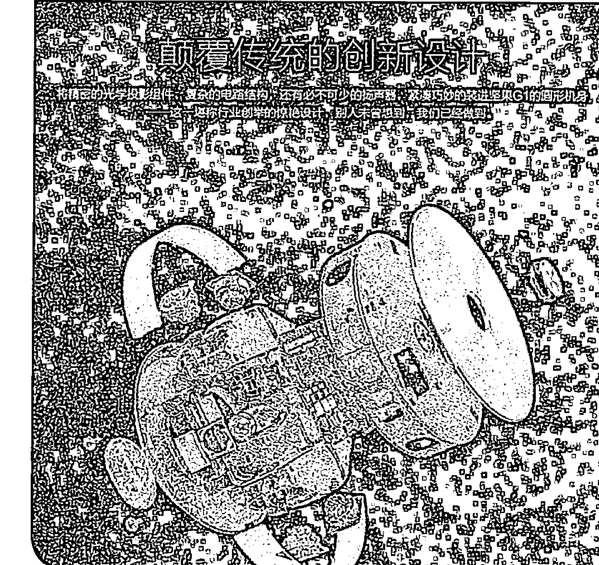

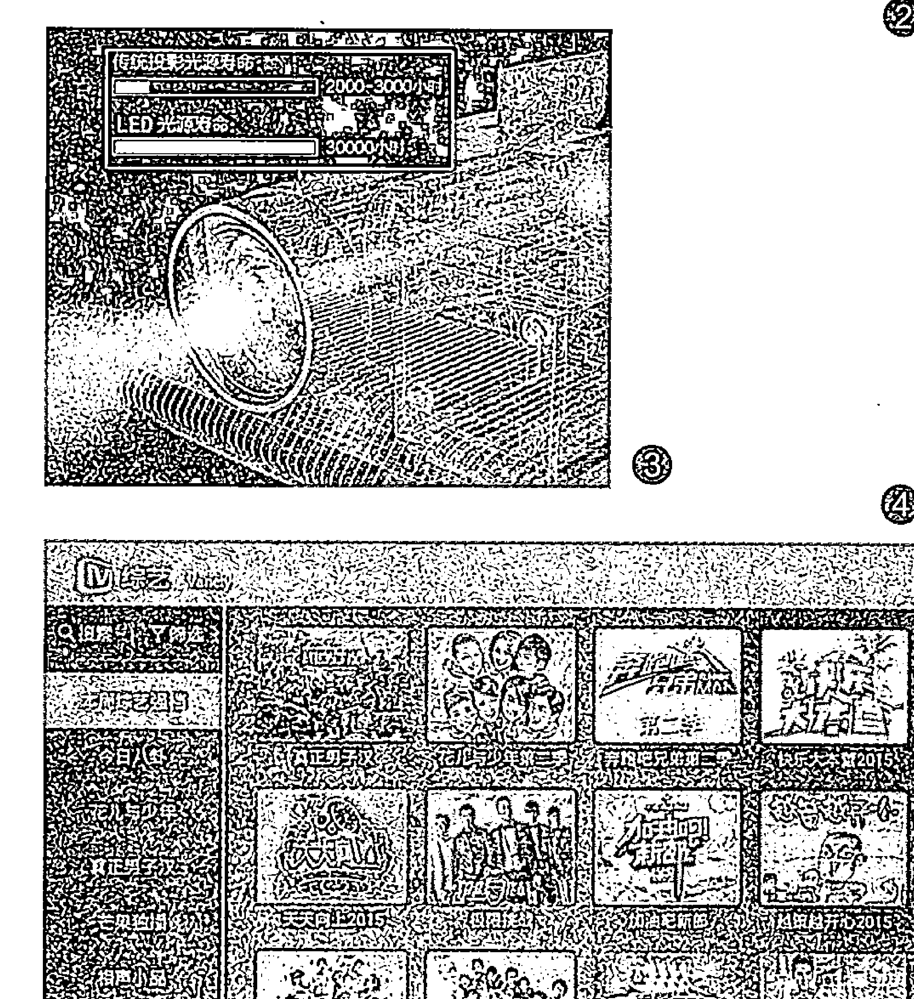

“随身影院”是微型投影机的终极目标，因此它们在设计伊始就采取了“去PC计划”：不太依赖PC提供视频源。早期的微型投影机普遍内置类似MP4的解码芯片，可以直接播放闪存盘中的视频，而最新款的微型投影机更是塞进了电视盒子常用的ARM架构处理器，并预装基于Android系统优化的初始界面（图4），可以连接Wi-Fi点播丰富的在线视频。换句话说，只要有电有墙有网络，微型投影机就有了用武之地。

为了攻陷家庭市场，微型投影机也不再限于传统的外观形态，而是采用了更为家居化的时尚外观和配色（图5），并主打简单易用的操作/设置方式。随着“互联网思维”的接入，微型投影机也不再神秘，不仅频频出现在小区电梯广告窗等位置，其性能价格比也在不断的翻番之中。

## 当微投遇到互联网

坚果和极米应该是目前最热的互联网品牌，通过对它们旗下新品的分析，不难把握这一阵营微型投影机市场的脉络。

明基应该算是传统投影机领域的代表品牌，GP30（微型投影机：5999元）（图6）和i700（智能投影机：7699元）则是其近期的代表新品。从这两款产品身上，不难发现为啥微型投影机没有在传统企业手里“发扬光大”：GP30的规格较低但售价高昂，并将智能系统融入到了i700这种大型投影机身上。换句话说，这些产品都没有击中消费者的需求痛点。

相对而言，在“诱导”用户消费的层面看，互联网

那么，互联网品牌的微型投影机是否好用？它们与传统品牌产品相比的差异体现在了哪里？

# 特别话题

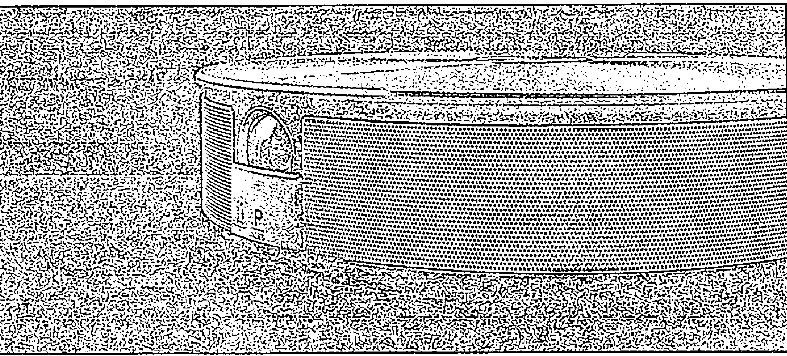

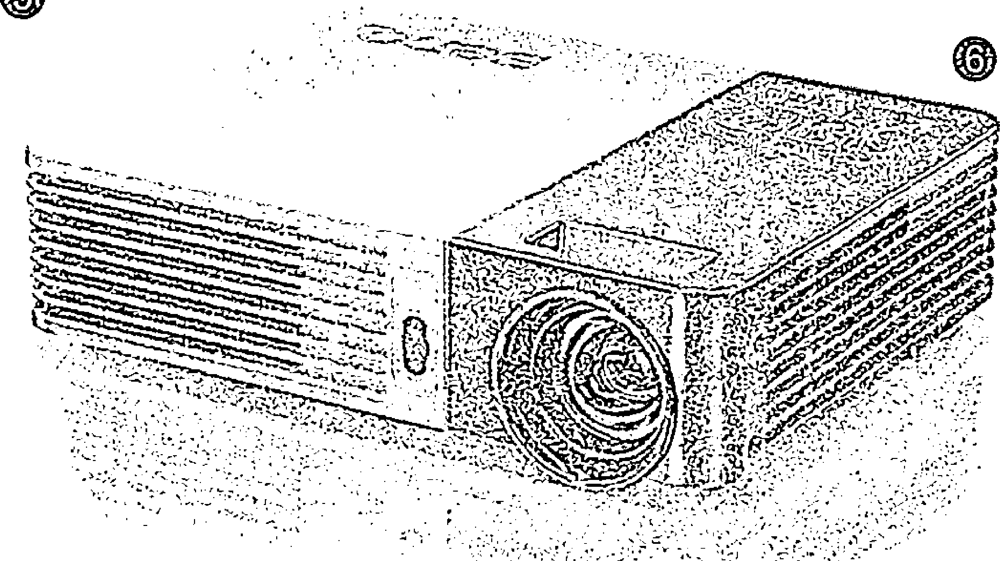

| 参数对比 | 坚果G1 | 极米Z3S | 极米Z4X | 明基GP30 |
| --- | --- | --- | --- | --- |
| 投影技术 | DLP | DLP | DLP | DLP |
| 投射比 | 1.2:1 | 1.2:1 | 1.2:1 | 1.2:1 |
| 显示亮度 | 450流明 | 450流明 | 580流明 | 900流明 |
| 对比度 | 5000:1 | 5000:1 | 5000:1 | 10000:1 |
| 分辨率 | 1280×800像素 | 1280×800像素 | 1280×800像素 | 1280×800像素 |
| 处理器 | 四核1.5GHz | 四核1.5GHz | 四核1.5GHz | —— |
| 内存/存储 | 2GB/16GB | 2GB/4GB | 2GB/16GB | —— |
| 系统 | Android 4.3 | Android 4.3 | Android 4.3 | —— |
| 体积 | 219mm×219mm×60mm | 232mm×132mm×40mm | 196mm×196mm×50mm | 220mm×177mm×61.8mm |
| 重量 | 1.55kg | 800g | 1.2kg | 1.5kg |
| 参考价格 | 2599元 | 2299元 | 2499元 | 5999元 |

品牌就聪明多了。首先他们会给产品赋予更易融入家居环境及科技感的外观，内置Android智能系统，并将每个卖点都无限放大，在宣传文字和配图上更易打动消费者，分分钟击中你的需求痛点。可惜互联网思维的一些“坏毛病”也被继承下来，比如模糊概念。

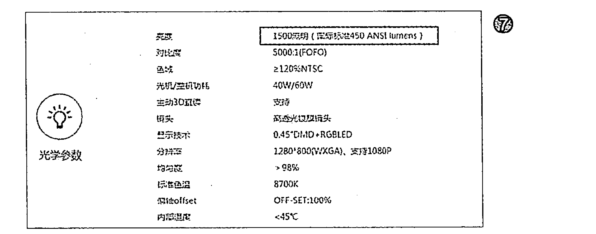

无论是坚果还是极米，在官网的很多产品参数页面都将亮度一栏写上了1500流明，并在后面补充了一个括号，注明国际标准是450流明（图7）。如果你真的认为该产品具备1500流明的国际标准，买回来肯定后悔死。此外，这些产品在宣传上会突出“兼容1080P”，但它们的实际分辨率却只有1280×800像素，根本无法实现点对点的全高清播放。需要注意的是，像极米早期的极米Z3、坚果A3等产品仅搭载双核A7架构处理器，孱弱的性能根本无法流畅播放1080P本地视频，在线播放高清视频源时经常缓冲（全速处理视频解码时网络会卡），此时其“电视盒子”的功能就被浪费了。

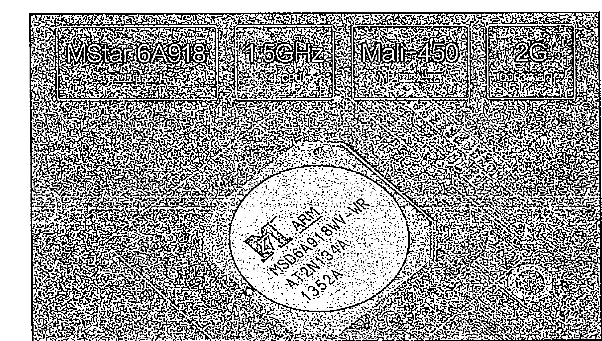

好消息是，坚果和极米的几款新品配置已经趋于主流，它们搭载的Mstar6A918已经算是比较强悍的处理器了（图8），以乐视超级电视X50 Air为代表的智能电视也搭载了同款芯片，可以获得非常流畅的“电视盒子”体验。就实际的投影效果而言，同价位的微型投影机差别不会很大（它们选用的投影技术和芯片几乎一致），其使用体验更多还是表现在系统的UI界面优化、内置/外置喇叭效果以及自动梯形校正等细节处理上。

可能有些同学会说了，我自己有电视盒子或平板电脑，再买智能微型投影机会不会浪费呀？理论上讲是有点浪费，如果不要智能可以便宜500元，我们可以轻松买到性能更高的平板电脑当做内容源。可惜，时下微型投影机大都捆绑智能系统，无论你需不需要。所以我们还是稍微看开点吧，毕竟投影机主要还是拿来看视频或是播放PPT的，主流的四核处理器+2GB内存已不存在性能上的瓶颈了。

## 微型投影机可以取代电视吗

互联网销售+LED光源+DLP技术+Android系统，让投影机变得史无前例的便携和亲民，而且表现不错，足以面对家庭影音和商务演示等需求。可惜，微型投影机的分辨率仅有1280×800像素，而且亮度较传统投影机的差距还是蛮大的，只有在拉上窗帘避免外部光线直射时才可保证最佳效果（图9）。

而如今2000元就可买到40英寸以上的1080P智能电视，取代之说为时尚早。因此，微型投影机的最大意义还是随意性，你可以带着它从客厅回到卧室，从家里提到公司，随时都可与朋友一起欣赏投影，在第一时间分享你创造的可视化内容。


> 扩展阅读：自制3D全息投影
如果你羡慕那些特色的投影手机，但却苦于预算不够，来自国外网友自制3D全息投影的创意说不定可以帮你圆梦。方法很简单，将透明塑料板剪成四块梯形，并用透明胶条围成金字塔形状（图16），并将其倒扣在手机屏幕上，即可将特定的壁纸图案以3D影像的形式呈现出来（图17）。


## 移动设备的“投影搭档”

刚刚介绍的都是家用微型投影机，虽然它们的体积重量较传统投影机已经苗条不少，但依旧不适合长时间外出携带。此外，当我们需要给客户或朋友展示内容时，也难以保证周围一定有电源插头。如果你想获得真正随时随地的投影体验，比微型投影机更迷你的掌上投影机无疑就是最佳之选。

此类产品的体积通常只有移动电源大小，可以轻松托在手心或是塞进口袋里（图10）。在技术原理上，掌上投影机和微型投影机一样，都采用了DLP技术，只是受限于体积，LED背光的亮度普遍在100流明以内，分辨率只有854×480像素，喇叭音量也不大，只能在短距离或者更为昏暗的环境下才可保证投影效果。

此外，掌上投影机还会内置Wi-Fi模块，支持DLNA、Airplay和Miracast等无线显示技术，可以将手机、平板里的视频无线推送到投影机上，或是直接播放闪存盘里的视频和图片（少数产品也会内置完整的Android系统）。为了实现“随时随地”使用的卖点，掌上投影机通常会采用内置锂电池的设计，在没有外接电源的情况下持续工作1.5小时还是不成问题的（图11）。

- 内置系统：可以安装APP扩展功能
- 支持Airplay：支持苹果Airplay协议
- 超长续航：内置锂电池，可续航2小时
- 移动电源：可当移动电源，可给手机充电
- 超长续航时间：内置锂电池，可续航15小时
- 硬盘高清播放器：内置硬盘播放器，可接1080P全高清

## 那些自带投影的移动设备

如果你觉得掌上投影机还是累赘，那就不妨将目光投向直接内置投影功能的移动设备身上吧。三星G3858 (GALAXY Beam 2) 应该是最具代表性的投影手机之一（图12），它在手机顶部配备了一个20流明亮度的投影模块，并引入了Camma自动校对和背景色矫正功能。可惜 Beam 2已经停产，而三星似乎也没有推出下代产品的计划。好消息是，联想已经拿下了投影手机的“接力棒”，在联想科技创新大会上发布了概念行投影手机“Smart Cas”。该产品顶部配备了可旋转的投影模块（图13），能在桌面上投射一个大虚拟触屏，通过虚拟键盘完成绘图、核算、笔记等多项互动（图14）。不仅如此，旋转投影模块后便能将一面墙变成一个放映厅，看视频、做讲演，乃至一些功能能够通过手势操作。

此外，联想在YOGA 2 Pro平板电脑上也加入了投影模块（图15），可投射出40英寸~80英寸WVGA级(480P)画面，只是35流明的亮度制约了实际效果。该产品评测可打开http://dwz.cn/11OCFN网页查看。当手机或平板被赋予投影功能后，最大的意义是可以直接对投影内容进行编辑，随意性无可替代。只是此类产品可以容纳的投影单元更小，无论是分辨率还是亮度都要进一步逊于掌上投影机，而且投影单元工作时耗电量极大，极易造成设备自身供电的压力。因此，对普通用户而言，我们还是更推荐选择普通手机+掌上投影机的组合套餐。

## 所“见”即所“得”

当你看到感兴趣的图文影像等信息资料时，如何将它们转换成可随时为你所用的形式呢？通过一系列外设实现“所见即所得”，也许就是不错的一条出路。

### 让照片所见即所得

很多时候我们不希望将照片以数码格式保存在手机或PC中，而是将其打印成相片欣赏留念。当然，你可以去数码洗印店打印照片，或者通过打印机和相纸自行打印，但当我们出门在外，身边又没有洗印店时该如何即刻获得相片呢？

有两种解决方案，其一是购买拍立得类型的相机，它们可以加装相纸，将拍摄的照片随时打印出来，让旅行的点滴记忆即时呈现（图1）。如果你觉得此类相机拍照效果太次，或是希望随时打印非摄像头记录的图片，那可考虑便携式打印机，此类产品可通过数据线或者无线的形式与智能手机/平板电脑建立连接（图2），将照片或图片通过APP编辑修饰后再打印出来，灵活性更高。

要注意的是，无论是拍立得相机还是便携式打印机，在工作时的耗电量都不算低，相纸的成本也不便宜。而我们则可通过移动电源随时帮其补充电力，并在淘宝购买兼容相纸以降低打印成本。

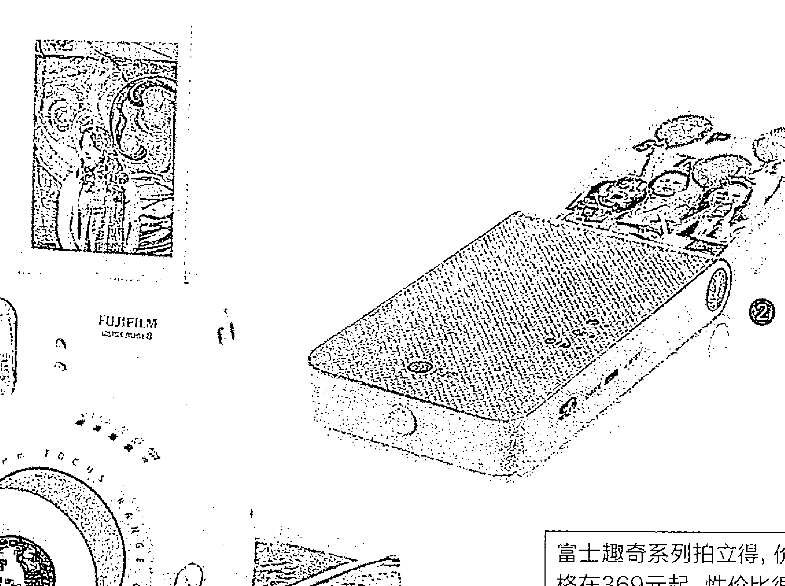

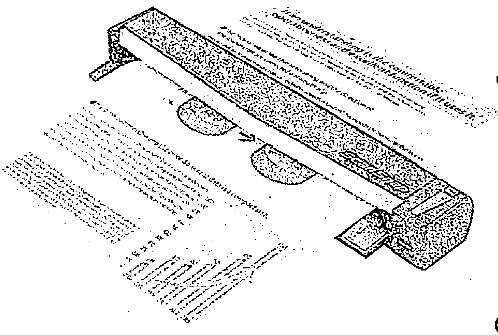

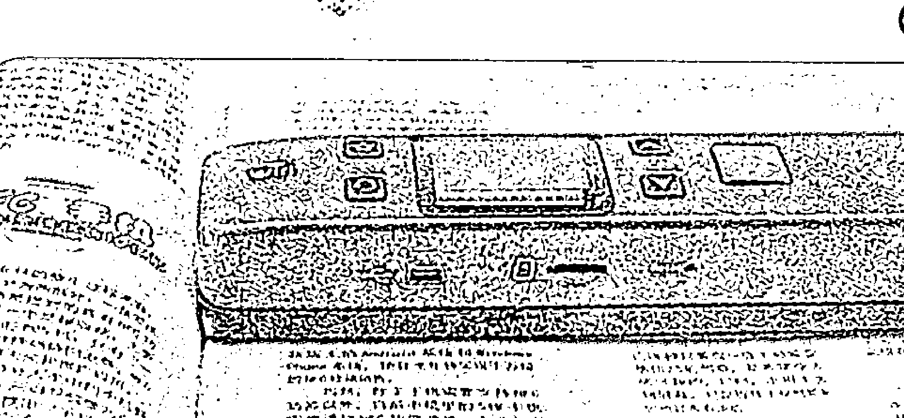

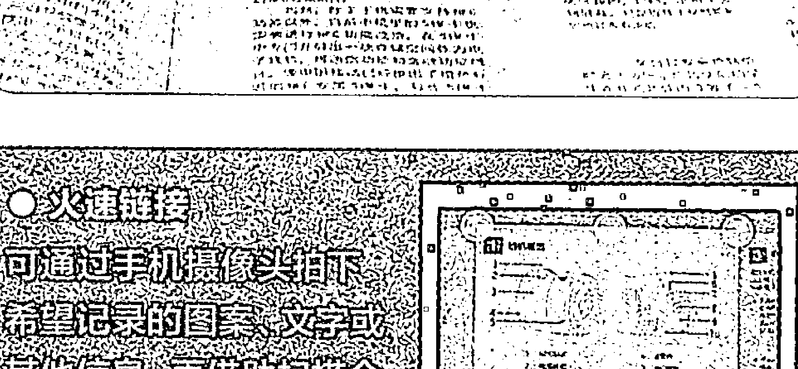

### 让纸质内容一见即得

扫描仪是最常见的将纸质内容转换为电子格式的设备，而随着便携式扫描仪的普及，哪怕我们出门在外，也能随时将你感兴趣的内容扫描编辑。简单说，便携式扫描仪都内置电池，并拥有扫描笔和扫描仪两种形态。其中扫描笔的价格相对较低（千元内就有不错的产品），并需要用户手持使用。扫描前要将文档平整地摆在桌面上，并进行匀速扫描才可获得平整自然的图片（图3）。而扫描仪形态的产品体积稍大，使用的感觉好似打印机（图4）。两类产品都支持A4大小的纸张扫描，携带和使用都较为方便。

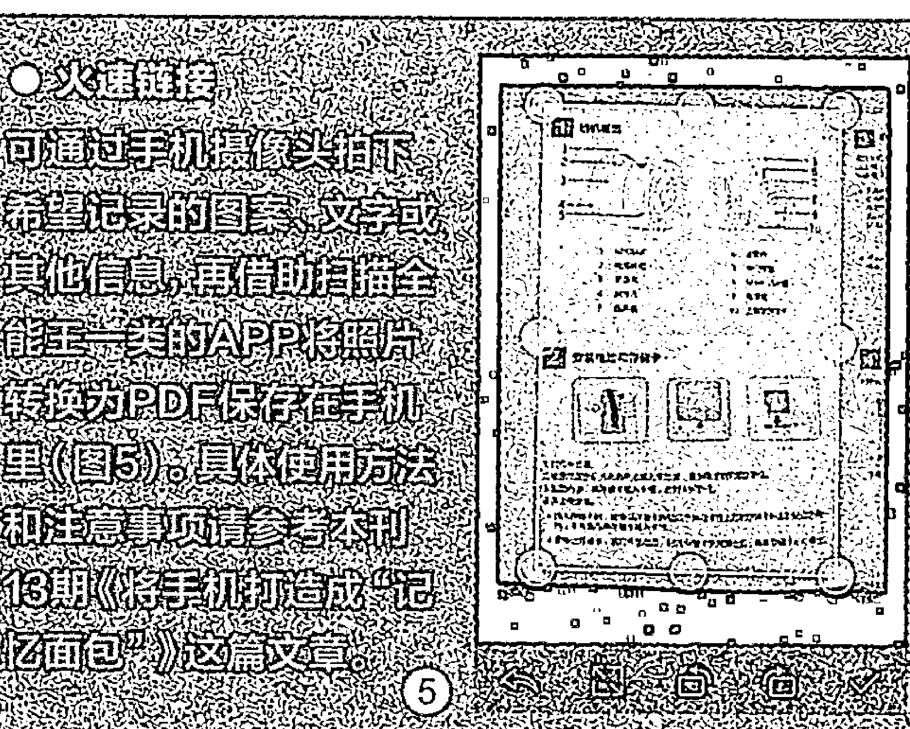

### 让一切都看得懂

就像从DOS过渡到Windows一样，电脑系统不论是软件还是硬件都逐渐从纯文字向图形化过渡。图形化带来的所见即所得的优势十分明显，一些原本只有高手能完成的复杂操作现在很多入门用户也能轻松完成，同时原本很多晦涩难懂的信息现在一目了然。


## 硬件状态图形化

硬件运行的状态，除非专业人员，普通用户是很难迅速掌握和了解的。特别是在电脑运行不正常的时候，甚至是电脑无法启动的时候，问题出在了哪里让人十分头痛，除了替换排查以外没有什么更好的办法。

### Debug卡

后来逐渐出现了一种Debug卡，通过电脑的ISA或者PCI插槽来收集启动信息，通过肉眼可见的数字形式鉴别问题出在哪里。这种Debug卡其实就是一种典型的图形化设备。不过扩展卡方式毕竟麻烦，主板厂商逐渐将这种Debug灯安装在自家的中高端主板之上，特别是主推超频的主板上十分多见。

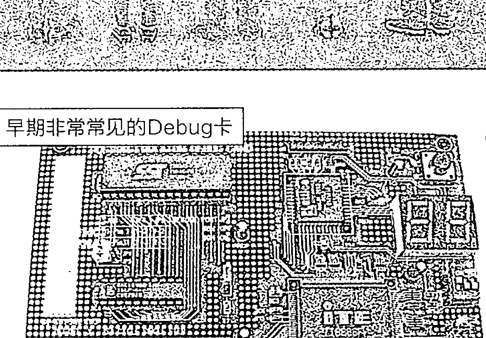

不过硬件技术发展到现在，目前依然集成Debug灯的超频主板已经不多了。如果用户遭遇电脑无法启动同时显示屏幕没有任何信息的时候，就只能借助主板跳线上的PC喇叭来大致鉴别问题来源。好在目前的主板其CPU插槽、内存和显卡插槽都已经十分稳定，不太容易出现以前那种接触和氧化问题（图1~图3）。

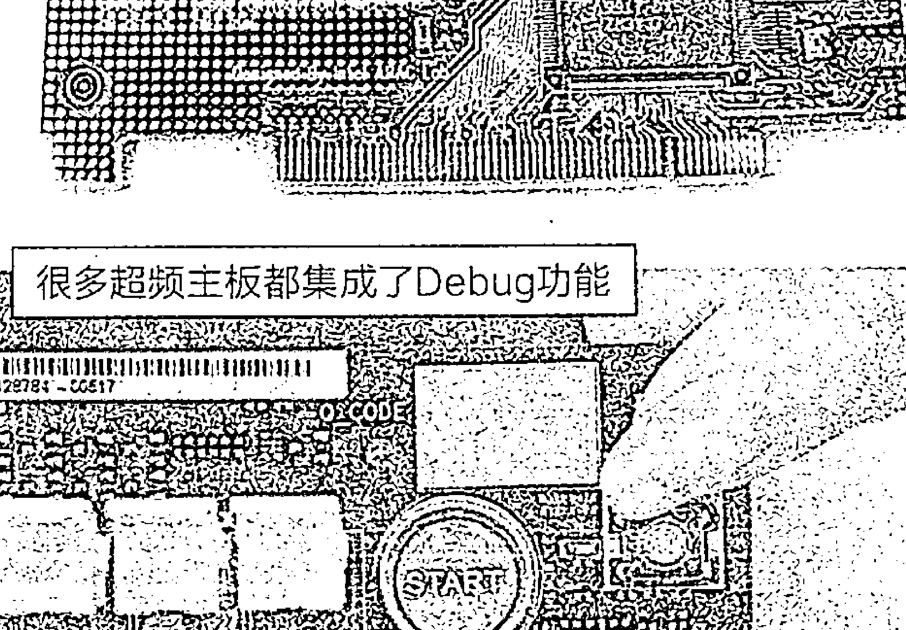

### 光驱位温度转速计

现代电脑已经不太容易出现不能启动的情况，对硬件有要求的用户更多希望看到硬件在机箱中的温度、转速和频率等信息。最初并没有硬件能够官方支持这些信息，不过由于板卡的测温点和

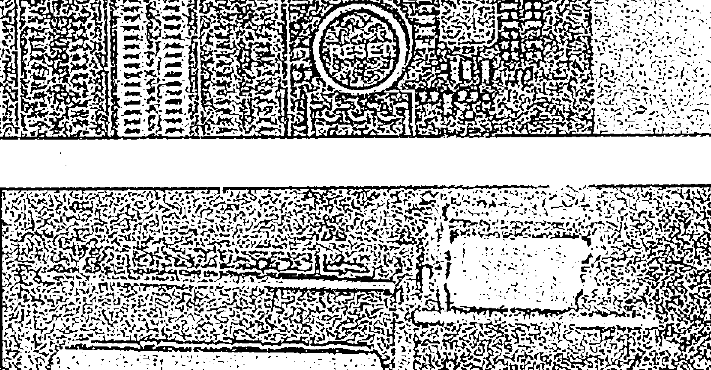

3/4pin电脑风扇都是统一规格，这就给集中显示提供了可能。一些第三方厂商将目光投向了机箱的光驱位，目前电脑光驱的存在感越来越低，用途也不再广泛，但大多数机箱都会预留数个光驱位，于是光驱位的温度转速面板诞生了。面板通过背后的温度测针连接主板显卡的测温点，同时将机箱风扇统一连接至面板提供的排线内，这样正面的LED屏幕就可以显示温度和转速等信息。还有一些带有控制功能的产品可以通过旋钮等方式手动控制风扇转速，深受硬件爱好者喜爱（图4、图5）。

## 自带显示功能的硬件

近几年台式PC已经不是入门用户上网的首选，逐渐发展成游戏玩家和硬件发烧友的平台。注重品质和效果的市场需求，也催生了自带显示功能硬件的诞生。而且显示效果并非单纯为了显示温度等信息，还带有不错的视觉效果，可谓一举两得。

### 主板

带有灯光效果的主板是最先出现的设备之一，它通过CPU、DRAM、PCI-E插槽等等不同位置的灯光信息逐个闪亮体现正常启动顺序，比如当启动出现问题，找到哪个灯光常亮就能马上解决。后来主板灯光效果更进一步，如显示供电区域的供电相数、主板的大致运行温度都成为了可能，甚至通过PCH芯片散热器显示信息（图6）。

### 显卡

主板之后许多显卡也拥有了类似的设计，且发展比主板还要先进。最初显卡的图形效果只停留在肩部LOGO灯光上，除了酷炫外并没有更多用处。后来逐渐出现了显卡负载的灯光，显卡厂商通过一排LED小光源来表示显卡的负载，如果8/10个灯全亮则代表显卡在满负载运行。之后显卡厂商干脆将肩部灯光效果智能化，通过显卡肩部的LOGO灯光的亮度、闪烁间隔速度和其他灯光效果，甚至可以知道显卡此时的负载、大体温度和风扇转速等等信息。可以说这是近几年PC内部图形化效果的经典案例之一（图7）。

### 散热器

除了板卡之外，甚至散热器也拥有了图形化效果。当然并不是那些简单的风冷散热器，一般拥有图形化设计的产品都是一体式水冷散热器。通过水冷头上面的灯光亮度和效果，用户可以知道CPU温度的情况。同时一些产品的灯光颜色等等信息可以通过软件进行调节，更好地和机箱内部视觉效果融为一体（图9）。

### 内存

内存也是经典的几大件之一。内存占用用户可简单地通过操作系统得知，但温度就不一定了。一些高端的品牌内存不仅拥有灯光效果，还通过呼吸灯等方式告知用户内存的温度情况，具体表现类似显卡肩部灯光设计（图8）。

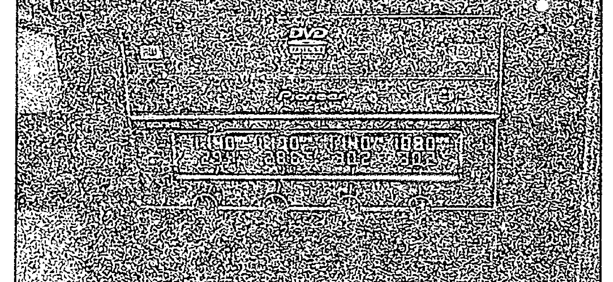

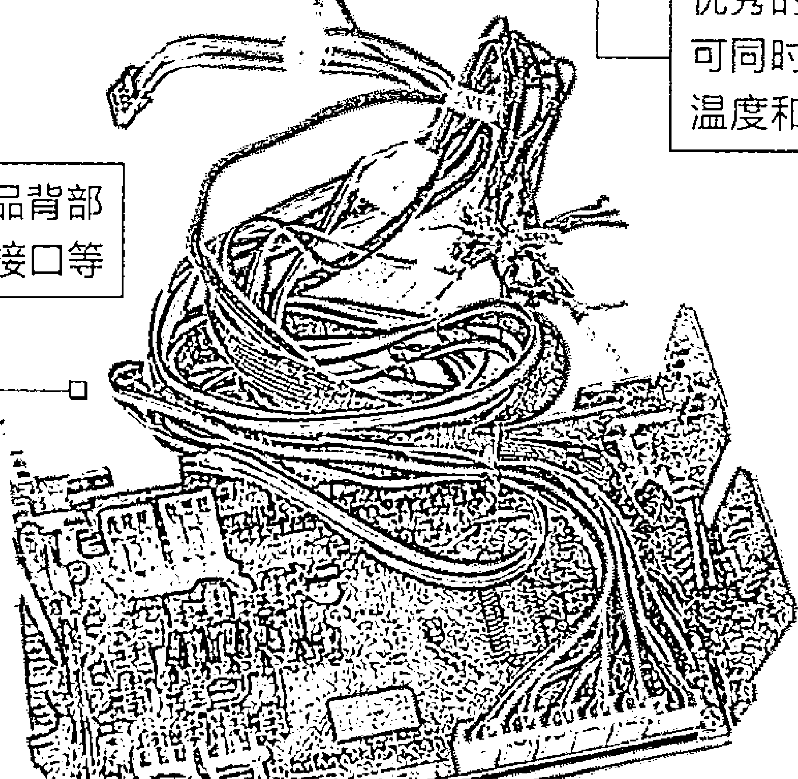

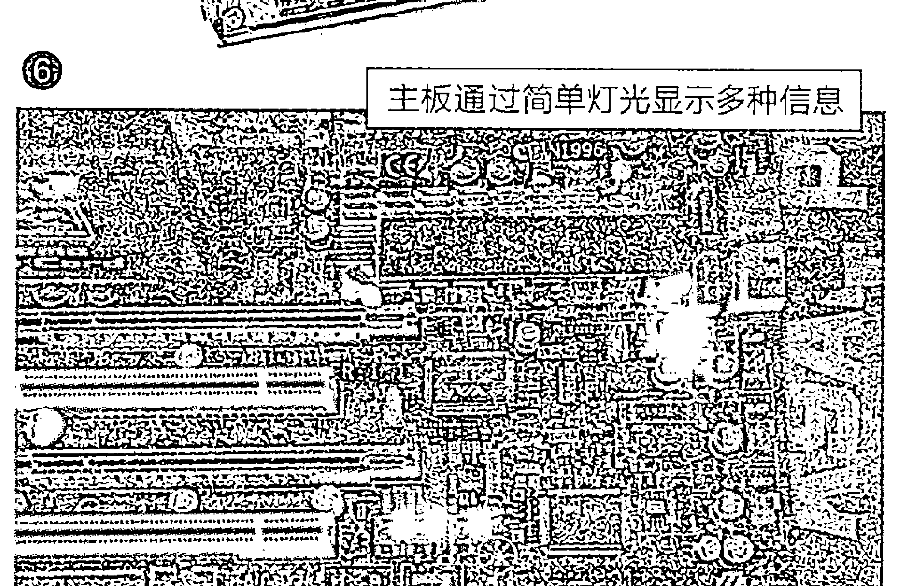


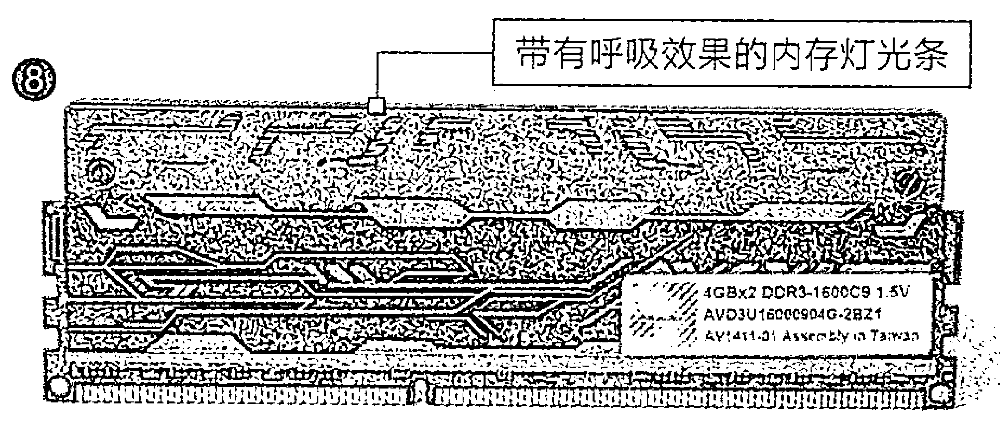

## PC图形化的软硬结合

除了自带显示效果的硬件之外，其实用户可以通过很多方法掌握自己硬件的运行状态。最简单的方式就是安装硬件监控软件，如国内比较有名的鲁大师，虽然软件并不专业，但是最基本的温度和转速等信息都有提供。如果希望掌握完整的硬件信息，还可以安装类似AIDA64这类软件，它可以识别一切PC中的硬件及其驱动信息，并通过Windows任务栏或者浮动窗口即时刷新展示。

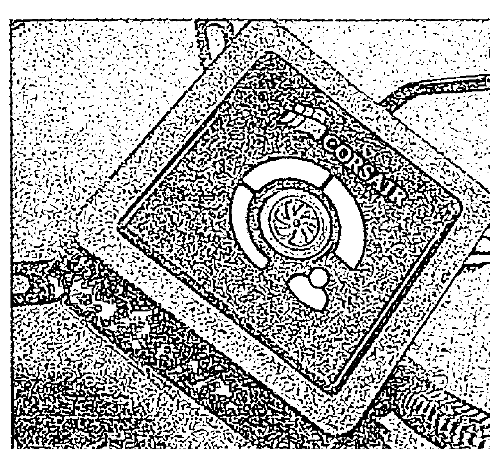

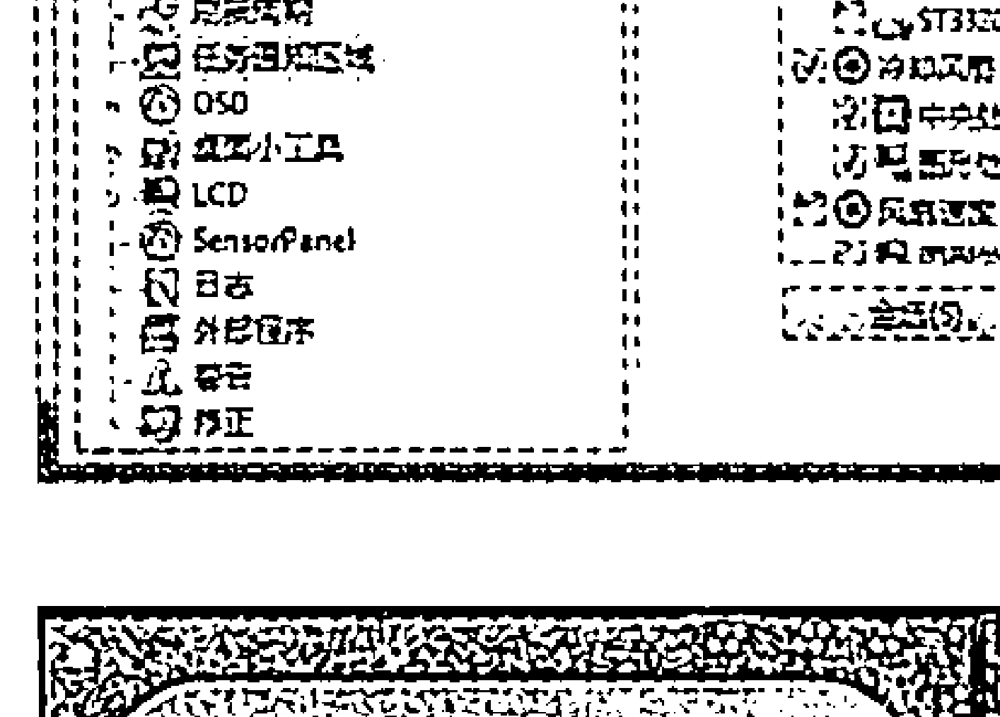

鲁大师在安装完毕后，在设置中就会有“是否启动Windows任务栏标尺”的选项，只要激活这个功能就会在任务栏出单独显示出一些信息。AIDA64可以实现的功能更多，不过在任务栏图形化部分设置也要相对麻烦一些。打开主程序的设置，在任务通知区域里勾选需要显示的任何内容，最后勾选顶部的“在任务通知区域显示”即可。需要特别注意的是，一般Intel处理器温度比较准确的是CPU package而并非CPU表面温度，另外显卡风扇转速有时会有rpm（每分钟转速）和转速百分比两个项目，但程序并未标明，需要的用户可以自己尝试开启。

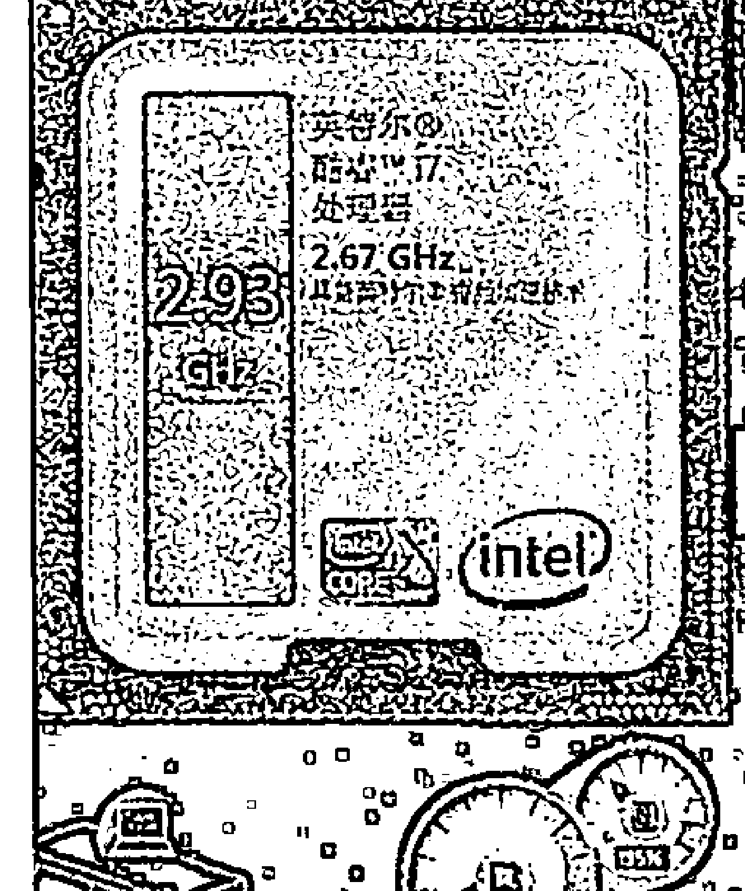

爱好者推出了许多对应的小工具，包括监视网络下载、上传状态等等多种实用的功能。

上述软件都是作用于Windows窗口时，如果需要在全屏幕游戏情况下显示信息，可以尝试使用MSI Afterburner、ASUS GPU Tweak这类支持全屏幕状态的软件实现。虽然难以完全图形化，但用户可以挑选自选的字体、颜色和展示内容嵌入全屏幕游戏当中，类似CPU频率和占用率、内存占用、显卡温度、转速、GPU和显存占用率都可以即时显示。

此外，在Windows Vista之后就加入了Windows小工具功能，官方集成的CPU仪表盘工具其实就是很好的图形化功能。此外Intel官方推出的睿频加速技术软件，可以通过大中小三种尺寸的小工具即时显示处理器的睿频状态。还有很多第三方厂商和电脑

以AfterBurner为例，进入程序的“监控”菜单下可以选择所要监控的项目，显卡的各种频率、核心/显存的占用率、GPU核心电压、风扇的转速甚至游戏的帧数都可以进行实时监控。选择后勾选“在OSD上显示”之后RivaTuner会被激活，就可以做到在全屏游戏中实时监控（图10、图11）。

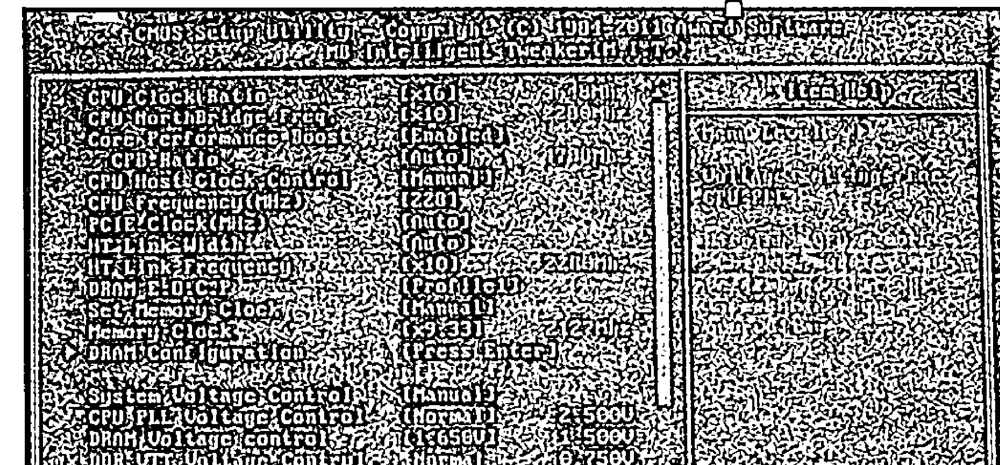

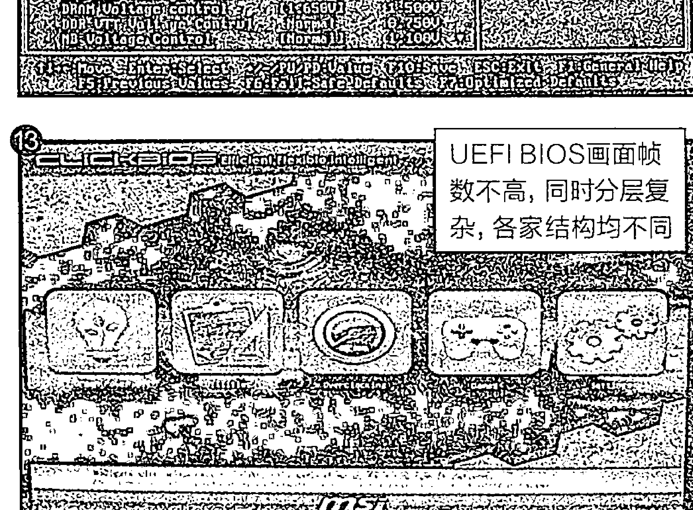

> ## 扩展阅读 图形化BIOS的优势与不足
目前几乎所有主板BIOS都已图形化，比起传统字符的BIOS，现在BIOS更多的中文化，部分实现图形化效果更易被普通用户接受，不过比起PC的其他图形化设计，BIOS图形化似乎意义不大，问题主要出现在操作上。传统BIOS使用全文字方式，尽管并不直观但熟练的用户操作起来飞快，各家的BIOS格式也比较类似，使用并无差异。但在不少品牌的图形化BIOS流畅度不够，感觉就像在操作一台配置很差的电脑，鼠标的移动很卡顿，键盘操作又不方便。同时各家BIOS结构均不相同，就算是对BIOS较熟悉的用户使用一块新主板，都要熟悉很长时间才能找到功能所在位置（图12、图13）。

## 不要怕丢 备份桌面方法多

文|张非

许多人习惯于将最常用的文件和收到的资料顺手放在Windows桌面上。方便之外，也有很大的隐患。当系统崩溃或重装时容易因忘记拷出而将桌面文件丢失殆尽。那么，如何保证系统异常后桌面内容不丢失呢？

备份桌面的方法至少有五六种。我们可以根据各自的方便程度，用不同种类的工具将桌面上的文件和文件夹打包成不同类别的文件包备份。使用时通过直接浏览访问、虚拟磁盘访问、解包挑选恢复等方法。此外，还可以通过系统自身的备份功能、云盘的桌面备份功能以及专用的桌面备份工具来备份桌面。

```
RAR a deskbak "D:\Users\faith\Desktop\*.*"
```

### 一键压缩的RAR桌面备份

按照我们最常规的想法，打包桌面的办法应该是用WinRAR将整个桌面都压缩起来保存，当出现问题需要恢复时，只需解包挑选文件即可。但是，即便是最方便的“全选桌面→右键调用WinRAR→指定压缩文件夹→进行压缩”的方法，也需要4步才能完成。其实，我们完全可以从WinRAR中抽取其核心控制文件RAR.exe（图1），利用用此文件的控制功能扩展来实现桌面的一键备份。

为了安全起见，我们的桌面最好不要备份到与系统同在一个硬盘分区中。假设要备份到U盘，我们只需在U盘中建立一个“桌面备份”文件夹，将系统WinRAR软件安装目录下的Rar.exe文件拷贝到此文件夹中，然后在该文件夹中用记事本建一个“BACKDESK.BAT”文本文件，在其中输入形如“RAR a deskbak "C:\Users\<用户名>\Desktop\*.*"”的一行代码（其中<用户名>要改为自己的当前登录用户名）（图2）。保存文件并将此文件用右键向桌面发送一个快捷方式。

这样，每次当需要备份桌面时，只需双击桌面上的BACKDESK快捷图标，在U盘的备份目录中，就可以自动生成一个deskbak.rar的桌面备份压缩包（图3）。需要恢复的时候，打开该压缩文件挑选文件即可。

### 即点即览的TIB桌面备份

RAR文件毕竟还需要解包，使用起来还是有点不方便。如果我们电脑中安装有系统备份专业工具ATI，我们还可以通过它来自动生成TIB桌面备份文件。TIB文件的好处是使用时不需要解包，直接双击即可像使用文件夹一样获取其中的文件。

启动ATI备份工具，通过“备份与恢复”选项卡下的“其他备份→文件备份”，建立一个“文件”型备份任务，备份内容选择上述桌面路径所在的文件夹下的所有文件（图5）。

接下来点击“备份名称”后的对话框选择备份文件的存放目标。

点击“预定”选项后的“打开”，进入任务预定窗口，设定自动备份桌面的时间（如设定在每天中午的11点50分备份桌面）（图6）。点击“立即备份”按钮，即可在目标位置生成一个桌面的TIB备份包。这之后就不需要人为干预了，每天中午11点50分系统会自动生成一个桌面备份的。

#### 小提示

### 找回“库”并隐藏收藏夹
升级到Windows 10之后，如果发现“库”不见了，而自己又需要这个东西，那么选择“显示库”命令即可。如果资源管理器中收藏了一些自己的快捷方式，而给别人使用电脑前，你可以通过导航窗格菜单将“显示收藏夹”一项前的选择去掉，即可将收藏夹暂时隐藏起来（图1）。

获得当前用户桌面真实地址的方法：若怕忘记，还可以将该桌面快捷方式复制到系统启动文件夹下让电脑每次开机自动备份桌面。该方法的重点在于找出当前用户桌面所在的真实文件夹地址，具体方法：在资源管理器左侧打开自己的用户文件夹，然后打开“桌面”分支，右键单击其中的任意一个文件，从“属性”窗口中就可看到需要的桌面文件夹真实地址了（图4）。

| 属性 | 值 |
|---|---|
| 文件类型 | 快捷方式 (.lnk) |
| 描述 | 百度日历主程序 |
| 位置 | D:\Users\faith\Desktop |
| 大小 | 2.41 KB (2,469 字节) |
| 占用空间 | 4.00 KB (4,096 字节) |
| 创建时间 | 2015年3月9日 星期一, 8:52:32 |
| 修改时间 | 2015年3月11日 星期三, 8:55:28 |
| 访问时间 | 2015年3月9日 星期一, 8:52:32 |
| 属性 | □只读(R) □隐藏(H) [高级(D)...] |

| 名称 | 大小 |
|---|---|
| 办公工具 | |
| 网络浏览 | |
| 网络云盘 | |
| 我的开始 | |
| 系统工具 | |
| Win 8.1 update1原生WIM... | 10 KB |
| 基本磁盘与动态磁盘.txt | 10 KB |
| 今日日记.txt | 1 KB |
| ！微博更新 | 0 KB |
| ！学习记事 | 0 KB |

设定自动备份桌面的时间

## 扩展阅读

除了用以上方法备份桌面文件外，我们还可以借助于一些专门的工具软件来备份桌面。如“鼎甲桌面备份”、“狂龙桌面文件自动备份器”等备份工具均专门用来备份桌面。此外，我们还可以用云盘提供的备份功能，将桌面直接备份到云端。有的云盘提供“桌面备份”选择，有的虽没有这种选择，但我们可以通过其“自动备份”功能，指定备份的文件夹为当前用户的真实文件夹即可。

### 虚拟桌面的ISO映像备份

此外，我们还可以将桌面做成一个ISO映像文件。依靠Windows 8以上系统对映像文件的直接支持，当需要恢复桌面时，只需双击该映像文件，就可以直接虚拟出一个“桌面”磁盘，然后从中挑选自己想要的桌面文件了。

建立桌面的ISO映像可以用传统的软碟通工具、WinISO工具等。具体方法是，在软碟通窗口下方选中桌面下的所有文件，然后将其拖动到上方窗口，最后点击“存盘”图标，选择存盘路径，即可获得我们需要的桌面映像ISO文件了。

### ADDS解决Ghost搞不定的C盘
文|王昌红

前些天用Ghost对C盘进行了全盘备份，把备份的镜像文件存放在F盘下。现在想把镜像文件恢复到C盘，可是在Ghost还原的最后一步选择要还原的分区时不能选择C盘（盘符为灰色），但可以选择其他分区（图1）。把C盘格式化成Fat32格式，Ghost从低版本到高版本都试过一遍，从PE上运行的Ghost恢复也不行，均无法选C盘。为什么在原电脑可以用Ghost备份，却又不能进行还原呢？

查看计算机的属性，镜像文件大小不到20GB，而C盘总容量足有30GB之多，C盘空间是镜像文件的1.5倍。也许是Ghost对C盘空间估计不足造成的，那就试试给C盘扩容。

### 1 调整F盘容量

打开“计算机”后，发现F盘的空闲空间较为富足，可以从F盘中腾出20GB的可用空间。下载并运行Acronis Disk Director Suite硬盘分区工具（以下简称ADDS），选中ADDS窗口下方“磁盘1中”的“FAT32(C)”后，依次单击ADDS窗口的“操作→增加空闲空间”菜单，打开“增加空闲空间向导”的“分区大小”窗口。在“分区大小”后输入“50”后，单击“下一步”进入“硬盘驱动结构”窗口（图2）。单击窗口中的C分区后，单击“下一步”进入“挂起的操作”窗口。单击“继续”按钮，开始锁定分区C。然后进入到“操作进度”界面。操作成功重启计算机后，在ADDS主窗口下多出一个空间为20GB的“未分配”分区。

### 2 创建分区并激活

在“未分配”分区上右击，选择ADDS的“创建分区”菜单，进入“创建分区”窗口。单击“创建为”下拉按钮，选择成“主分区”（图3），确定后进入到“挂起的操作”窗口，单击“继续”按钮即可进行相关操作。

> 由于每台计算机硬盘的使用情况不同，最好是调整D盘的容量，因为它紧靠C盘，可以省去步骤2。

### 3 合并分区扩C盘

在C盘根目录下新建一个文件夹后，单击ADDS窗口中的“I:”分区（即刚才新创建的分区），依次单击该窗口的“操作→合并分区”菜单，打开“合并分区”窗口。单击窗口中的“C:”分区后，单击“下一步”按钮，进入“组合单个分区成一个”窗口，找到刚才新建的文件夹并选中。接着，单击“确定”按钮，开始锁定分区C，进入“操作进度”界面。单击“继续”按钮，进行合并操作。当“总进度”完成到100%时，会弹出“操作成功”的提示，至此完成合并分区，C盘容量增到50GB。

最后再次运行Ghost进行镜像恢复，这时就能选择C盘分区了，还原到C盘即可。

### 用好新系统窗格
文|张菲

越来越多的人在放弃Windows XP或Windows 7，转而投入后续操作系统的怀抱。新系统中以Windows 8.1最为稳定，但以Windows 10最为看好。新系统的文件资源管理器更加人性化，基本窗格是组织和展示文件的基本空间，灵活地用好这些窗格，有助于高效地组织、管理和使用文件。

> 小提示
找回“库”并隐藏收藏夹
升级到Windows 10之后，如果发现“库”不见了，而自己又需要这个东西，那么选择“显示库”命令即可。如果资源管理器中收藏了一些自己的快捷方式，而给别人使用电脑前，你可以通过导航窗格菜单将“显示收藏夹”一项前的选择去掉，即可将收藏夹暂时隐藏起来（图1）。

### 1 弥补“超大图标”预览的不足

在Windows 10的文件布局视图中，我们可以通过选择“超大图标”选项来预览图片。但是，如果要预览的图片太多，切换到超大图标模式后，将占用很大的屏幕空间，图片滚动浪费资源，也影响整体速度（图2）。这时可换用较小图标的文件布局方式，通过“查看→窗格”组的“预览窗格”开启文件预览。这样即可在窗口的中部滚动图片列表的同时，在右侧预览窗口中实时地看到图片的真实“面貌”了（图3），解决了预览速度和预览效果之间的矛盾。

> 小技巧
定制列表显示项目
还可以通过在文件列表标题项目栏上点击鼠标右键，通过右键菜单列表的点选来实现。

### 2 寻求默认之外的布局

在Windows 10的文件查看布局中，系统默认提供了从“超大图标”到“详细信息”、“内容”等8种文件查看布局。这8个项目当中的7个是系统定制好的格式，用户只能选择无法改变。唯有“详细信息”一项可以根据自己的需要进行定制。以此为突破口，就可以打破文件列表的8种默认布局限制，延伸出更多的文件显示方式。
要实现文件显示布局的8种之外的个性化，只需先将文件布局列表切换到“详细信息”模式，然后在“当前视图→排列方式”下拉列表中选择“选择列”（图4）。接下来在“选择详细信息”对话窗口中，对文件项目进行选择性添加或删除。这样，就可以定制出变化多端的文件布局显示方式。

### 排除问题 用好VHD虚拟系统

#### 小知识：在已有系统下挂接体验VHD版Windows 10

如果原来的电脑中运行有一个或多个Windows系统（如Windows XP、Windows 7或Windows 8），可借助于Windows VHD_VHDX辅助处理工具，通过“创建VHD/VHDX”选项，以Windows 10系统安装文件ISO中的install.wim为原料，创建出一个VHD/VHDX类型的单文件虚拟系统（图1）。创建之后，用“挂载”命令将启动选项添加到系统启动菜单中。启动时选择新增的VHD启动项目，进入后按提示执行安装即可。安装后的系统启动还是通过多系统菜单进入使用，类似于实体多系统。

VHD虚拟Windows系统是一种仅用一个文件就能管理和使用Windows系统的技术。目前正值流行Windows 8和Windows 10系统，通过这项技术我们可以轻松地把自己要使用和体验的新版Windows打包成一个VHD文件使用，这样可以在不影响原有Windows系统的基础上体验最新版系统，而感觉上和使用传统方法安装的Windows没啥两样。但是，在使用VHD系统的过程中，也可能会遇到一些麻烦，因此，掌握这些常见问题的解决办法很有必要。

#### 使用中发现VHD文件大小

创建一个虚拟的VHD系统，首先要划出一部分硬盘空间来生成VHD文件。我们在体验Windows 10的时候划出了15GB的磁盘空间，本以为只体验一下，空间应该足够了，但随着体验的深入，安装的软件数量不断增多，发现启动后磁盘空间不够用了。这意味着就如同我们在安装系统时没有规划好磁盘，造成C盘空间不足一样，C盘空间不足需要从别的分区来调用，进行系统分区扩容。而虚拟系统是在一个VHD文件中打包安装的，不同于传统普通Windows的安装，扩容问题怎么办？

可借助于VHD Resizer软件来解决问题。运行VHD Resizer之后，首先弹出选择VHD文件的对话框，选中存放虚拟系统文件的VHD文件并加载。然后在VHDResizer窗口中指定新的VHD文件目标存放位置和文件名（第二个对话框中），指定新的VHD文件大小，最后点击Resize按钮执行文件扩容操作即可（图2）。

由于VHD Resizer不支持VHDX文件格式，因此要使用上述方法，在建立虚拟系统时只能选用生成VHD文件格式。若系统建立时选择了VHDX格式，要更改VHDX文件格式，就不能用VHDResizer。这时我们可使用BOOTICE 1.3.3工具软件来解决。运行BOOTICE 1.3.3版工具，通过第二个选项卡“磁盘镜像”选择虚拟系统VHDX文件（图3），点击“VHD文件信息”按钮，进入重设VHDX文件大小窗口，点击“重设容量”输入新的文件大小，重设虚拟硬盘大小即可（图4）。

#### 启动VHD系统后原盘C丢失

我们在Windows 7和Windows 8.1组成的双系统中，使用VHD技术加装了一个虚拟的Windows 10系统。在用VHD虚拟技术体验Windows 10的过程中发现，当通过多系统选单选择启动到VHD格式的Windows 10系统后，发现在资源管理器中原来安装Windows 7的C盘不见了。但里面的目录下有一些重要文件需要使用，如何找回C盘？

其实，Windows 7的C盘并没有丢失，而是因为系统启动配置文件放置在Windows 7的C分区中，为了安全起见，VHD系统自动隐含了这个分区。我们可以通过Windows 10的磁盘管理器，找到这个分区。在Windows 10磁盘管理器中，可以看到原来的Windows 7分区依然存在，只是没有了盘符，因此才造成在虚拟系统下该分区不可见。要访问其中的文件，只需在磁盘管理器中为其指定一个盘符，就可以访问其中的文件了。

#### VHD移动位置后不能启动

VHD系统只是一个独立的虚拟文件包，它可以保存于硬盘的其他分区，也可以保存在任何移动介质中。在安装了VHD系统之后，我们有可能在资料整理过程中有意无意地移动了VHD的位置。VHD移动位置后，我们会发现从系统多重启动菜单中无法启动VHD系统了。这时我们除了将VHD文件“乖乖地”放回到原来的位置外，还可以通过以下办法来修复启动功能。

在无法将VHD文件放回原来的位置的情况下，我们可以采用工具来修改多系统启动菜单，用重新构造启动菜单项的办法来解决问题。上网搜索下载“Windows VHD_VHDX 辅助处理工具”，运行后选择“挂载/卸载VHD/VHDX”一项，点击“移除BCD中的VHD/VHDX项目”按钮，将多系统配置文件中原有的VHD项目移除。然后通过“浏览”按钮指定最新的VHD文件所在的位置，随后点击“向BCD中添加VHD/VHDX项目”按钮，这样就在多系统菜单中恢复了有效的VHD项目链接（图5）。

重新启动系统，选择多系统启动菜单中的VHD一项，即可正常启动VHD虚拟Windows 10系统了。

> 如果是因为磁盘空间的问题而移动了VHD文件的位置，那么将文件恢复到原来的路径的办法就变得不太现实，因此只能寻找其他解决办法。

## 同名文件（夹）怪现象解惑
文|张江南

是否遇到过这种怪现象：在同一个文件夹下，竟然出现了两个一模一样的文件或文件夹。造成这种现象的原因是什么？如何辨别真伪？可不可以自己建立这样的文件或文件夹？

### 假象同名文件

最常见的同名文件或文件夹，可能只是一种“假象”。也就是说，这些文件或文件夹只是从视觉上看来是一模一样，但其实是不同的。

如图1所示，在同一个文件夹中出现了两个一模一样的“我的苹果”文本文件（图1）。通过查看其文件扩展名，发现文件类型均为标准的TXT类型，并没有任何文件格式方面的“猫腻”（图2）。

尝试用F2功能键为文件更名，当点亮文件名之后，发现其中一个文件的阴影区域比另一个稍多出一块（图3）。猜想，文件名后是否有一个空格，这样的文件，系统也能认吗？于是将光标置于阴影多出来的一个文件名上，试着选择多余块区，果然可以选中。将其删除，这时系统弹出重命名文件提示窗口，警告此位置已经包含同名文件（图4）。那么，被删掉的一小块到底是不是一个空格呢？我们用另一个文件做实验。先建立一个文件“实验.TXT”，然后再建立一个同名文件，且在确认文件名之前，在其后面加一个半角空格，结果系统认了，成功建立了“实验 .TXT”文件，这证实了上面的设想。再建立另一些文件，分别在后面增加2个、3个、4个……空格，统统可以建立。但在文件资源管理器中显示的文件名和图标看起来却一模一样。

再看一组文件（图5），在这组的两个文件中，图标一模一样，文件名看起来都是“我的苹果”，通过F2改名键查看文件名，发现其长度也完全一致（图6）。这又是怎么回事呢？

通过资源管理器的“查看”选项卡启用“文件扩展名”复选框后发现，这两个文件原来是两个不同扩展名的文件（图7），只因为pmd文件和zip文件都为压缩文件，且都为360压缩软件所关联，因此其图标完全相同；又因为系统扩展名默认隐藏，所以很容易给人文件一模一样的印象。其实这也是一种假象罢了。

### 2 异常同名文件

如果说以上文件或文件夹同名看似异常，实则是正常现象的话，那么，还有一些情况就不正常了。有时出现的同名文件，无论从文件名还是扩展名上，都看不出有什么不同，但在同一个地方的的确确出现了两个一模一样的文件。
例如，一位同事反映，他在更改了系统用户文件夹的“图片”文件位置之后，不知何故，“图片”文件夹却变成了“音乐”文件夹，虽然图标有所不同，但文件名却相同，而且没有办法改回来(图8)。那么，同一个文件夹中为何出现两个同名的“音乐”文件夹且无法更改？这个问题如何解决？
此现象在Windows 8.1系统中才会出现，这是由系统故障造成的。首先可以尝试新建另一个用户，用同样的方法更改“图片”文件夹为“音乐”文件夹，若问题依然如故且无法改回，则说明是当前系统的bug，只能借助于系统恢复工具来恢复解决。若系统中保留有自动还原点，可先用自动还原功能来还原到先前的位置看能否解决。若系统还原也无法解决，则需要到系统设置中启用系统重置或系统刷新功能，将系统“音乐”文件夹和“图片”文件夹恢复到正常状态。
此外，在某些情况下，病毒也会造成同名EXE文件的出现，且这些文件无法删除。此时，可以借助于杀毒PE盘或将磁盘挂接到另一台电脑上用最新版杀毒软件查杀。熟悉杀毒或反黑工具的用户，也可以用类似“冰刃”等工具强制结束病毒进程之后，彻底删除文件。

文件名假象的情况还有别的类型。例如，如果将一个软件的快捷方式图标上的小箭头图标去掉，那么，若将该软件的主程序放在桌面上，就会给人一种感觉，好像桌面上出现了两个一模一样的程序。此外，文件夹也是如此，如果桌面上有一个真正的文件夹，还有一个此文件夹的快捷图标，若将文件夹快捷图标的图片样式改为和文件夹图标一模一样，也就可以乱真了。

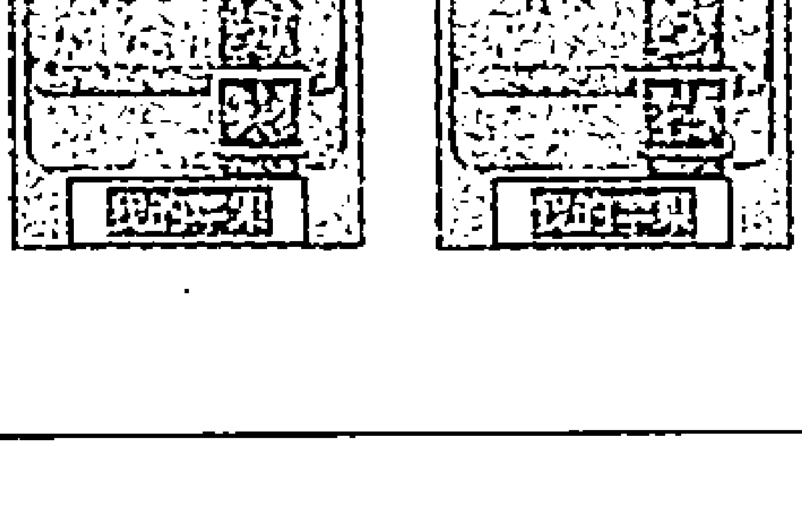

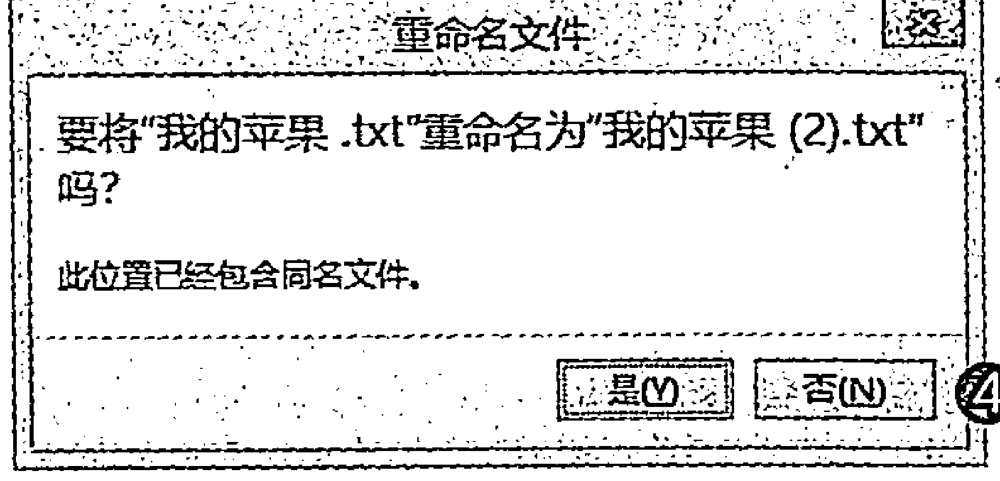

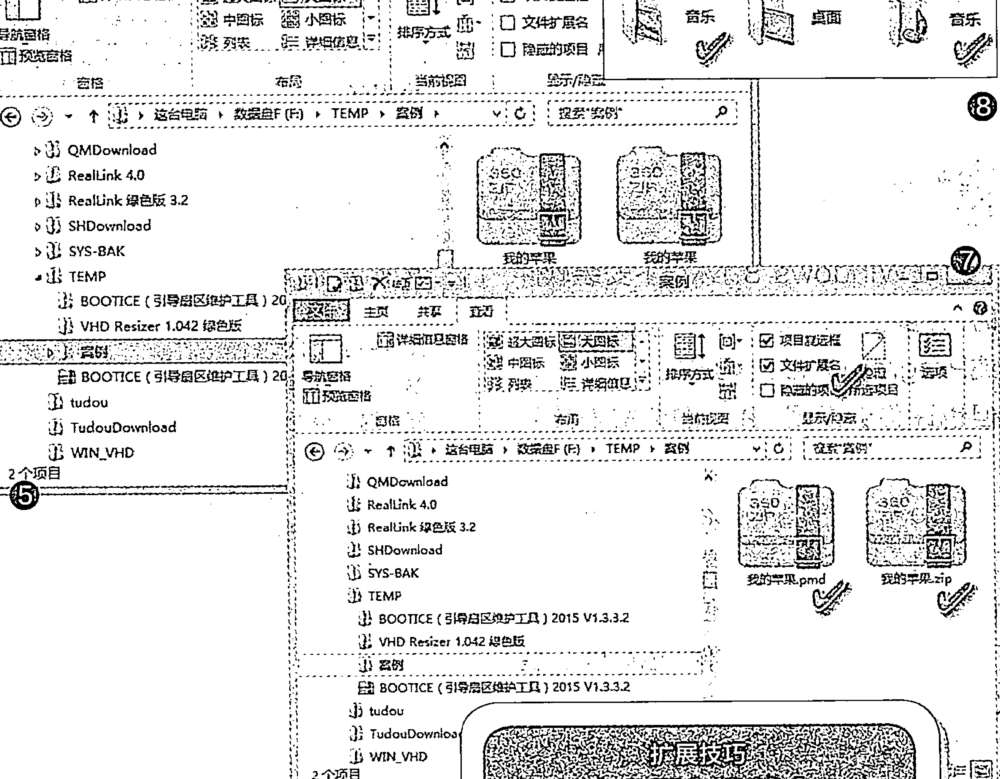

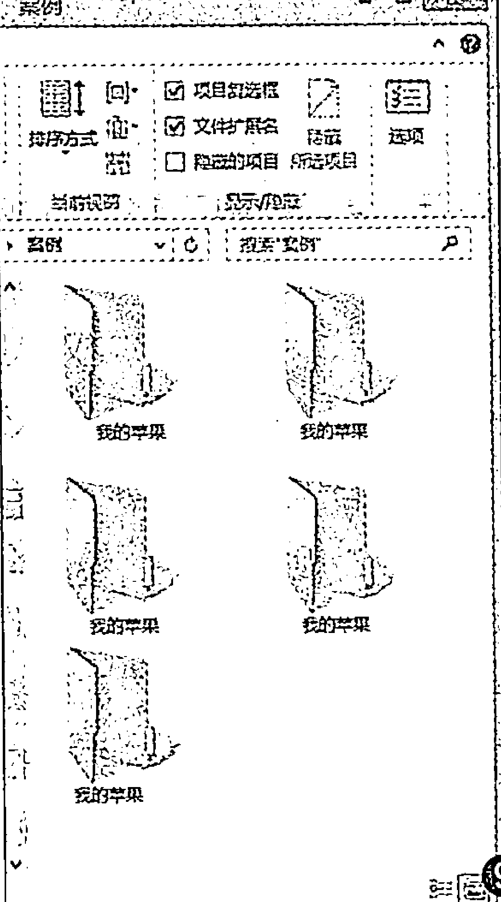

通过以上试验，在文件名后面加一个或多个空格可以建立看起来相同但实质上不同的“同名”文件。那么一定会想，文件夹也可以这样建立吧！但是文件夹不能这样做！那么，如果要建立两个可以“乱真”的“同名”文件夹，有什么办法呢？既然系统不认同文件夹后面的半角空格符号，那么我们尝试一下把半角空格改为全角空格如何？全角空格只需在输入法工具条上将半月图标点亮为全月图标，按一下空格键即可。看一看这个图片吧（图9），这是五个看起来相同的文件夹，这就是用全角空格的技巧建立的“同名”文件夹。

## 走出软件安装位置的困惑

在Windows下围绕软件安装位置的问题不少，其中包含Windows传统应用默认的多种安装路径，还有新的Metro应用的安装路径问题。有的路径是软件自作主张确定的，用户看似无法改变；有的安装路径对用户不够透明，让人摸不清去脉。就让我们来揭开这些谜团。

### 软件默认安装位置知多少

在Windows 8.1环境下安装软件时，许多软件被安装到Program Files或Program Files (x86)文件夹中的，但也许你会发现，还有的会被安装到“Users\用户名\Local\AppData”或“Users\用户名\Local\Roaming”文件夹。文件安装位置首先与软件的设计位数有关。在64位的Windows下可以安装64位的软件，也可以安装32位的软件。但在32位的Windows下安装软件，只能安装32位的，不支持64位的软件在32位Windows下安装或运行。不同权限的软件被安装到不同的目录中。通常情况下，传统桌面软件若是32位的Windows则只有一个Program Files文件夹，若是64位的系统则有Program Files与Program Files(x86)两种文件夹，其中32位设计的软件被安装在Program Files(x86)文件夹中。但是，安装到上述两种常用位置可能需要具备管理员权限，因此如果当前用户是标准权限用户，可能会需要进行UAC提升（User Account Control，即用户账户控制），如果UAC已关闭，会因权限不够而造成安装失败。因此目前有些软件的安装或运行，若本身不需管理员权限，为简化安装过程，让标准权限用户也能直接安装，软件开发者可能会将软件默认安装路径设置到“Users\用户名\Local\AppData”或“Users\用户名\Local\Roaming”文件夹。这些位置是针对于“EveryOne”用户的，每个用户都可以直接向其中创建文件夹或写入新文件，不需要提升权限。还有一些软件基于其他原因，要求系统中的每个用户必须自行安装一份软件，也会用类似的做法将软件默认安装到这些“特别”的位置。

> **小提示**

Windows商店里的Metro应用安装在系统分区“Program Files”文件夹的隐藏目录“WindowsApps”里，文件夹上有公司名、软件名、版本号等，一目了然。这一点要优于传统应用程序。注意：要查看该文件夹，可能需要添加或提升当前用户的权限，方法见后（图1）。

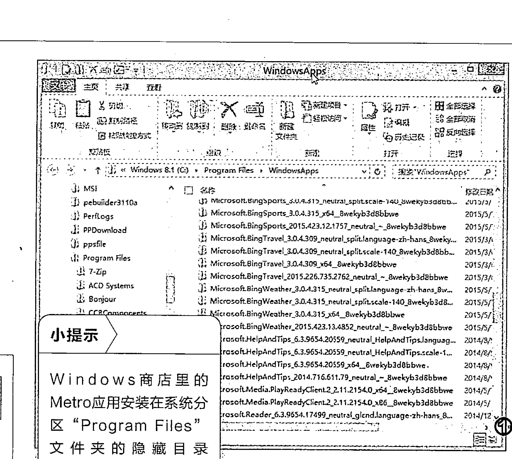

注册表中修改传统应用默认安装路径

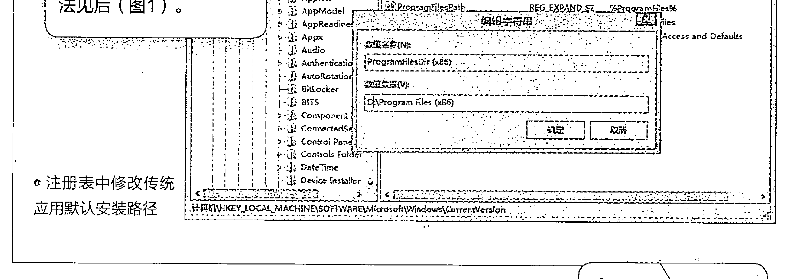

> **小提示**

修改上述路径时若遇到权限问题而无法修改，在弹出Appx权限表窗口后，点击TrustedInstaller，选择“高级”，在选择用户或组的窗口中“立即查找”当前登录用户，将权限设置为“完全控制”，返回后就可以修改路径了。

### 默认安装位置是否可自定义

我们注意到，在不少软件的安装过程中，安装程序会给我们一次选择自定义安装路径的机会，但它们也会给出默认的安装路径C:\Program Files或Program Files(x86)。可自定义路径的自不必说，那么，这个自带的Program Files或Program Files(x86)文件夹，是不是可以改为别的路径呢？例如改为非系统分区(图2)。

对于传统应用，可通过修改注册表来改变默认安装路径。在注册表编辑器中定位到“HKEY_LOCAL_MACHINE\SOFTWARE\Microsoft\Windows\CurrentVersion”，找到含有ProgramFileDIR的项目并双击，将其修改为自己想要的安装路径即可(图3)。

对于商店应用安装路径的修改，可先用PE启动盘中的WimTools工具将系统盘下存放应用的WindowsApps文件夹打包移动到新分区的位置，然后启动注册表编辑器并定位到“HKEY_LOCAL_MACHINE\SOFTWARE\Microsoft\Windows\CurrentVersion\Appx”，双击PackageRoot，修改数值数据为新路径即可。

### 查看已安装软件的位置

对于传统应用，右击快捷方式查看属性，点“打开文件位置”查看即可。对于商店应用，右击开始屏幕中的应用图标或在触屏上长按应用图标，在屏幕下方菜单中选择“打开文件位置”即可。

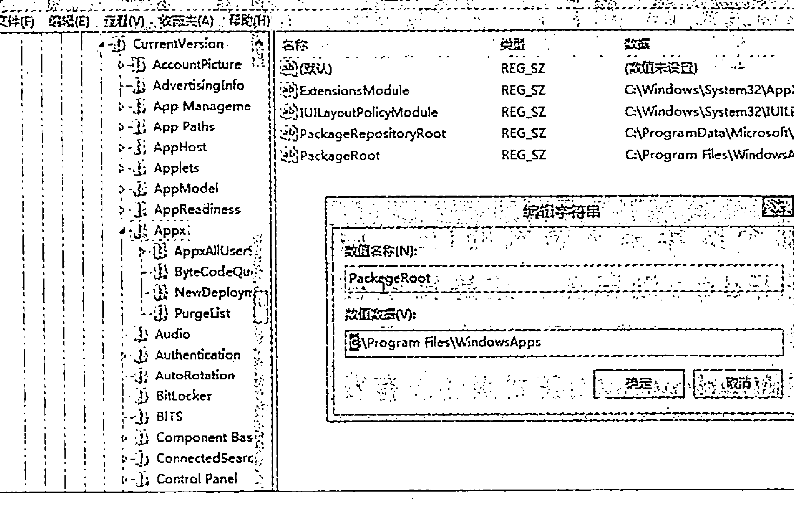

### 如何确定最合理的安装位置

那么，软件到底是安装在系统默认给出的路径合适，还是自己指定一个别的位置更好呢？现在有不少人建议不要将软件安装在Windows系统目录中，认为这样容易让系统盘爆满，且会拖慢系统速度。这种说法似乎有一定道理，因而引起不少人的认同，且在实际中也这样做了。大家会将硬盘分为好几个分区，不同分区放置不同的文件，甚至为应用软件专门设置一个分区。这样做虽然并无什么不妥，但是，细心的你一定会发现，许多笔记本或品牌台式机在买回来后都只有一个分区，不管硬盘空间有多大，默认建议只有一个分区。这是微软“不懂事”还是别有“用心”呢？

其实，微软早在Vista时期就引入“库”的概念，他们本希望用户像苹果系统管理资源那样，淡化文件系统的存在，不去考虑文件保存在C盘还是D盘，反正文件都在一块物理硬盘中，这样就没必要将磁盘分为多个分区了。但文件和文件夹这种传统Windows文件思维在老用户头脑中已经根深蒂固，很难抛弃，因此在经历了从Windows Vista到Windows 10的几代演变之后，用户始终没有转过弯来，微软只得屈从用户原来的习惯，还不得不将“库”做成一个可以藏起来的东西让用户选择，这样就造成了两种思维都不算不合理且并存的局面。所以，到底是不分区安装在默认的Program Files目录，还是分区独立安装，没什么对错，只是用户的习惯问题而已。

> 其实软件是否安装在C盘，最大的一个问题是空间划分是否足够。这其实也是因分区的思维而引起的，若只有一个分区，就不存在这个问题，当空间不足时说明你该腾空间或换更大的硬盘了。还有一个问题就是系统崩溃之后用户数据的丢失，但这可以通过良好的备份习惯和科学的备份方法来解决。

### 能否实现安装位置的大一统

如果觉得将软件安装在不同的目录管理和升级不方便，还可以用360软件管家来一键安装升级。只需在360软件管家中开启一键安装升级设置参数，设定默认的软件安装路径即可(图4)。

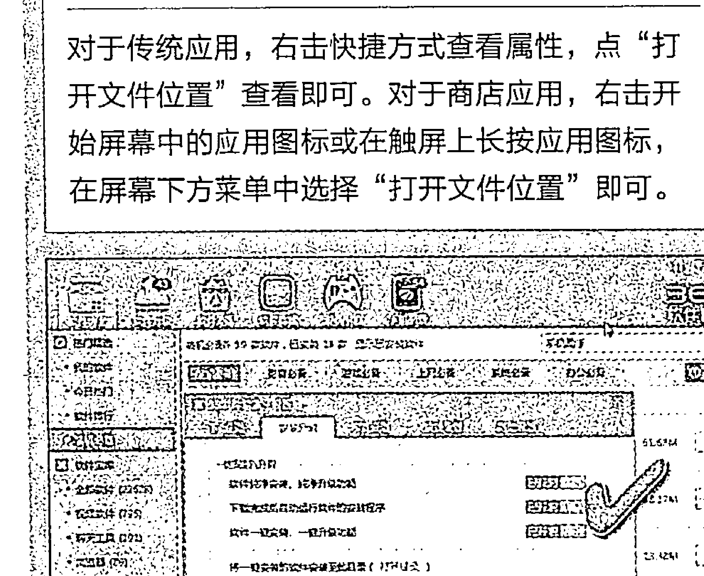

## 走进Microsoft Edge浏览器

文|那仁

抛弃那个多年来不争气的IE，启用新的Edge浏览器，这是微软在Windows 10操作系统中的惊天之举。在Windows 10正式版还没有发布之前，微软就给它的新浏览器暂定一个Project Spartan（斯巴达）的名字，在最近召开的Build 2015开发者大会上，微软确定将Project Spartan浏览器更名为Edge，此名将出现在正式版中。Edge到底有何能耐？让我们通过Windows 10 10074预览版，一睹它的“风采”吧！

### 地址栏搜索的3721式“回归”

还记得15年前的那个3721吗？在Google还没有正式进入国内之前，百度还没有“萌芽”，人们只能用点击门户菜单或用纸质笔记记录网址来搜索，这时国内出现了一个能从地址栏输入内容而定位网站的东西（一个浏览器的插件），这就是3721。虽然后来人们对3721有所“微词”，但那时候它的确给人们上网提供了方便。

> 小提示
若安装Windows 10 10074版之后，在任务栏上没有发现新浏览器的图标，在搜索框中输入“Project Spartan”搜索，即可获得启动斯巴达浏览器的链接（图1）。或通过开始菜单程序列表查找。

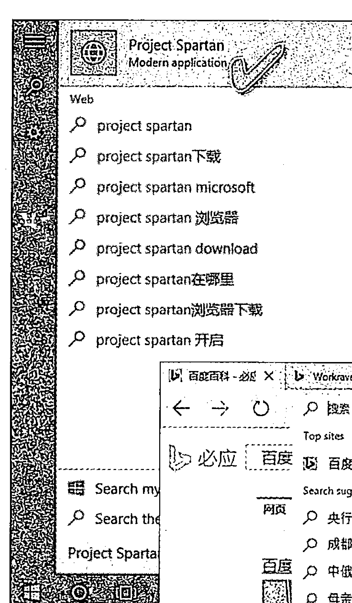

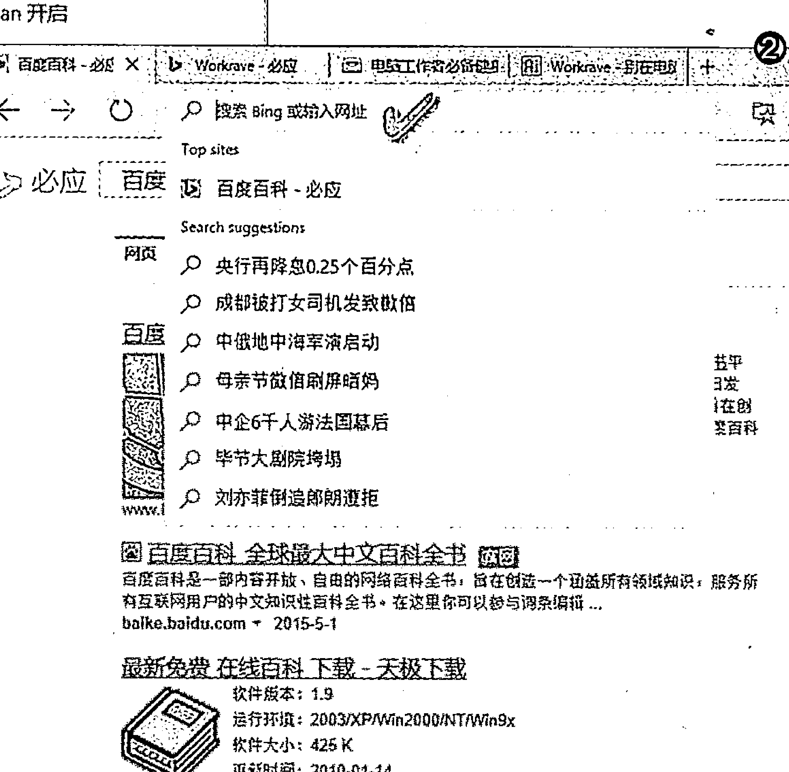

定义直接通过地址栏使用某种搜索引擎搜索

> 小技巧
地址栏中搜索默认使用必应Bing搜索，但并非固定要用这一种，通过右上角的三点式设置按钮，进入设置窗口，可在“从地址栏搜索时使用此搜索引擎”列表下指定其他搜索引擎（图3）。

### 一个“中心” 四个“基本点”

Edge浏览器使用一个资源中心，将所有信息集中到这一个中心上。这些信息包括收藏夹、阅读列表、浏览历史记录、下载任务列表等4项内容。点击工具栏上的五角星压文件夹状按钮，即可进入这个“中心”，通过4个按钮选择四项基本任务（图4）。

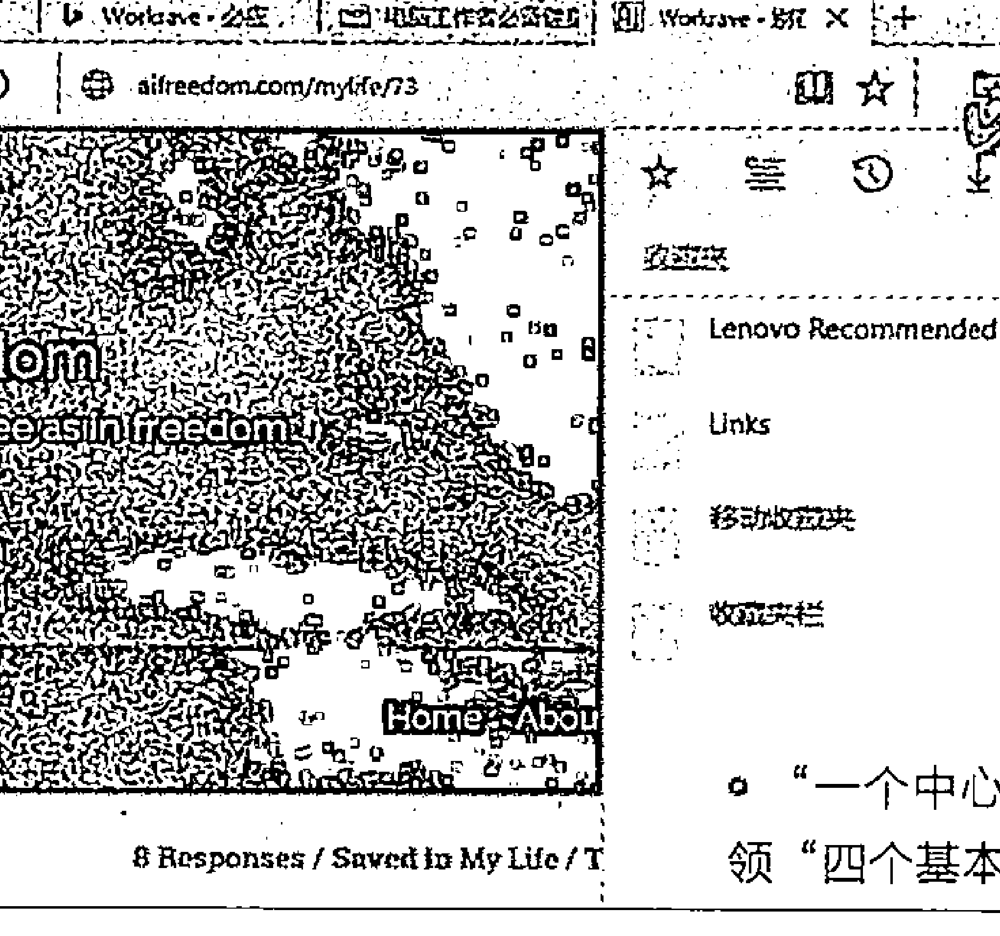

### 网页变身自由批注“画板”

以往，要在一个网页上做批注和笔记，只能先将这个网页复制到Word中，然后进行“批注”。现在，利用斯巴达浏览器的网络笔记功能，可在线对任何网页做随意批注。在触摸设备的Windows系统中，借助手写或触笔对网页做批注处理，更可以用软、硬键盘来输入大量批注信息。可对网页内容进行标注、突出显示等处理。处理的信息可分享或作为协作办公使用。点击右上角工具栏上的“做Web笔记”按钮，即可启动批注工具面板。批注可使用线条、背景、文字和剪切等功能。批注之后，点击右侧的磁盘或分享按钮进行存盘或分享（图5）。

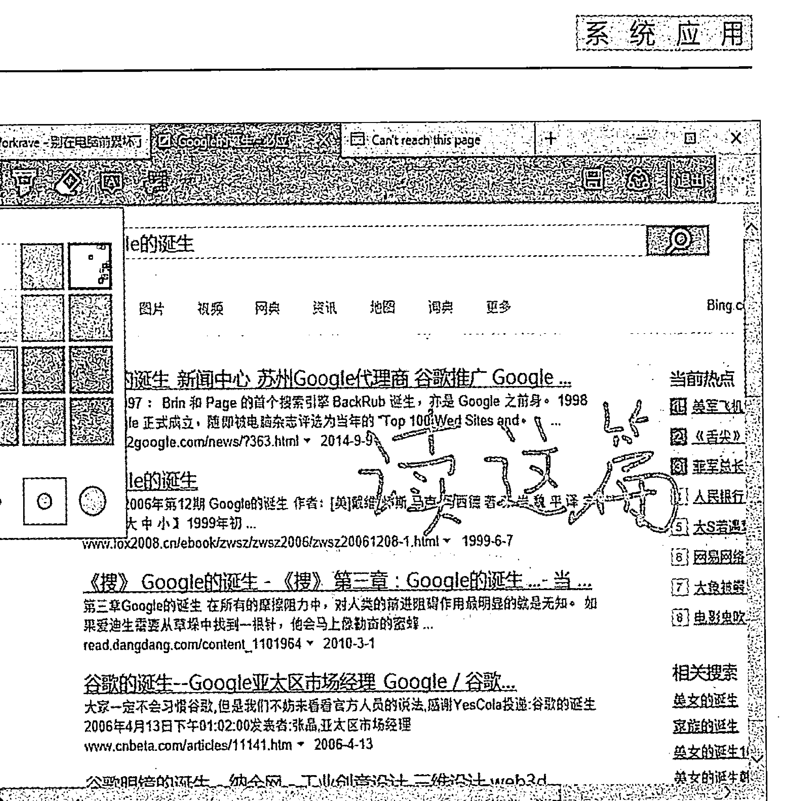

### 清爽无限“无缝”阅读体验

在阅读的过程中，如果页面周边存在干扰阅读的信息，可通过工具栏点击“阅读视图”工具，打开阅读视图。这样，正在阅读的内容板块将会自动前置或居中，无关的栏目或广告也将自动关闭，就可以像阅读一本书那样，清晰地阅读网页栏目了（图6）。使用Edge浏览器阅读网页内容，对于没有读完的内容，可通过点击五角星工具按钮添加到收藏夹或阅读列表，阅读的内容链接会出现在信息中心的“阅读列表”或“收藏列表”中（图8）。之后无论在哪里用何种Windows 10设备阅读，只需用相同账户登录，就可以在信息中心通过打开“阅读列表”或“收藏列表”，选择上次阅读的网页继续阅读了。

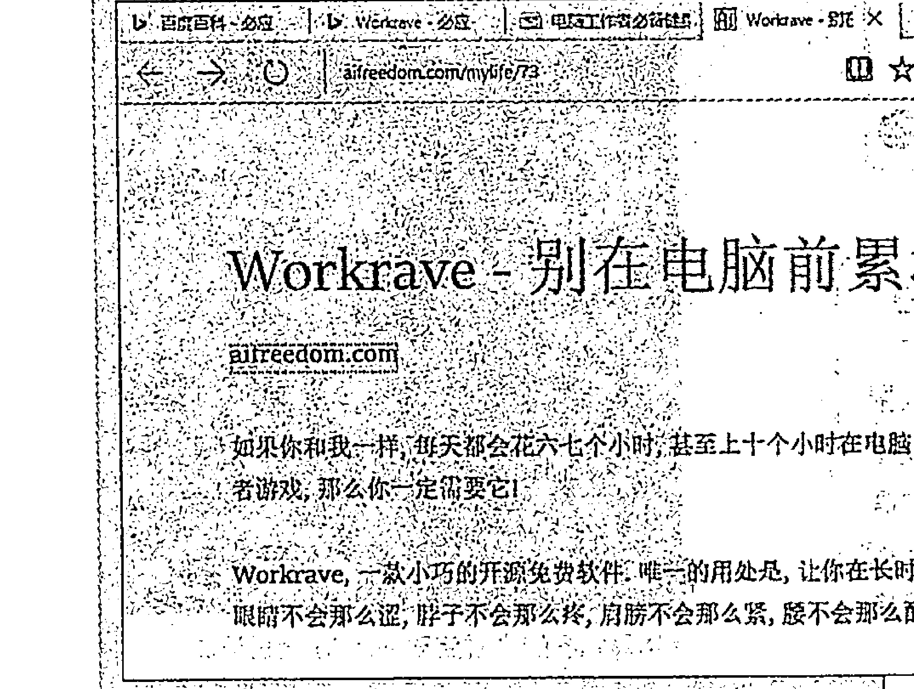

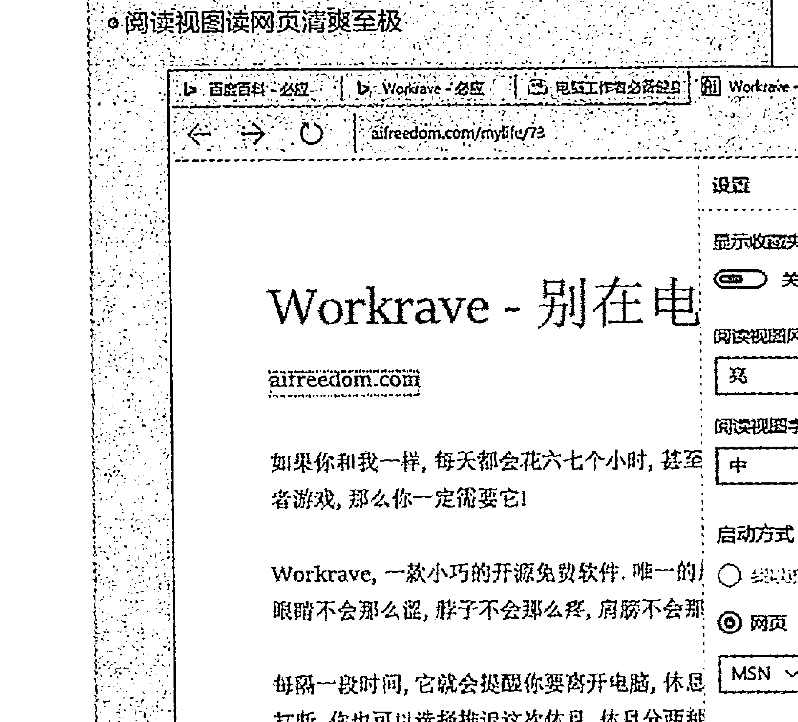

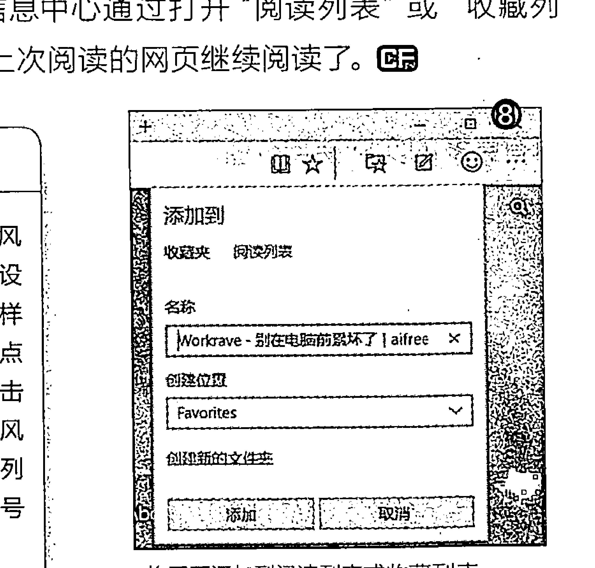

> 小提示
通过更改阅读板块的视图风格或字体，将版面视觉设置为最适合自己阅读的样式。在“阅读视图”页面点击“...”按钮，然后点击“设置”，在“阅读视图风格”和“阅读视图字号”列表下选择相应的风格或字号即可（图7）。

## 随手记 玩转Windows 10日记本

文|张江南

在过去的Windows版本中，有一些被冷落的工具，如今随着触摸Windows设备的兴起，这些工具因能派上新的用场而“梅开二度”。Windows日记本就是其中一员。

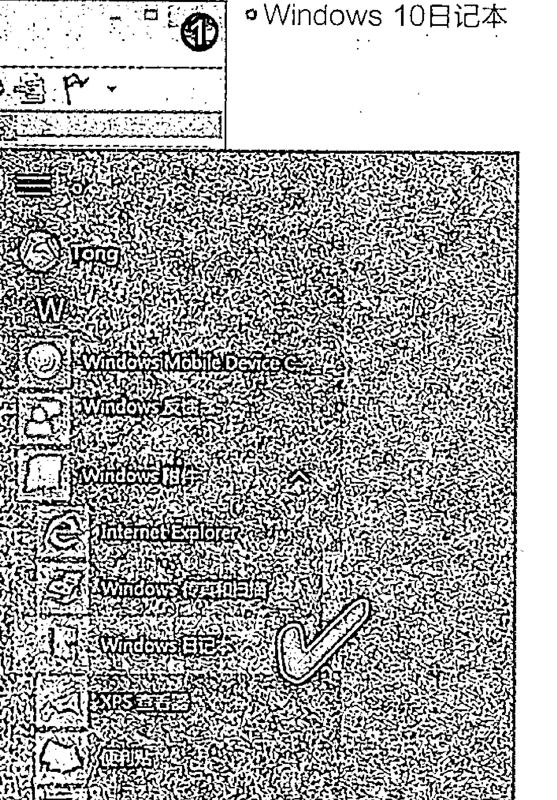

以往我们在Windows中记录一些事情，多使用系统自带的记事本，若遇到需要记录图片等信息，还需要启动Word等大部头工具。如果还需要附加手写或手画的内容，则更需要支持手写的软件来完成。如今，在使用了Windows 10系统和一些带有触摸功能的设备后，我们可以抛弃原来的大部头工具，转而使用轻便的“Windows日记本”，用多种手段更加轻松地完成记录(图1)。

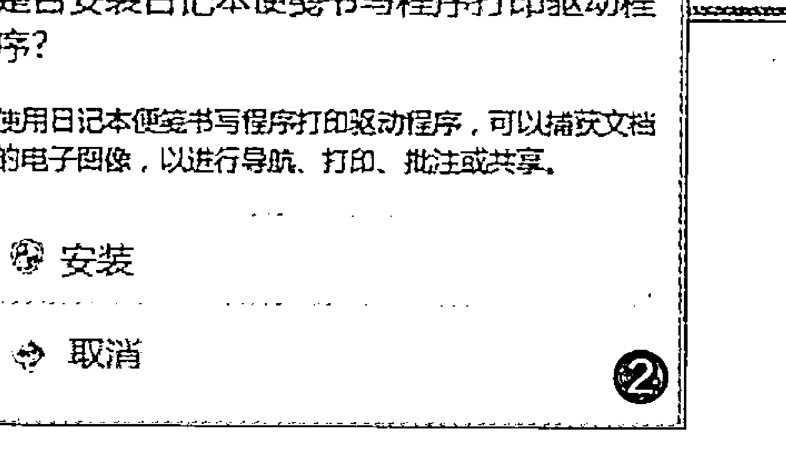

> 小提示 以“笔”为宗 “书写”回归 Windows日记本对手写设备更为合适，从鼠标指针变为手写笔来操作，更适合于移动设备使用。因此，对于能用手写笔的设备，为提高工作效率，请尽量配备使用手写笔来代替手指或鼠标操作，这样将能获得更高的精度和更良好的使用感受。

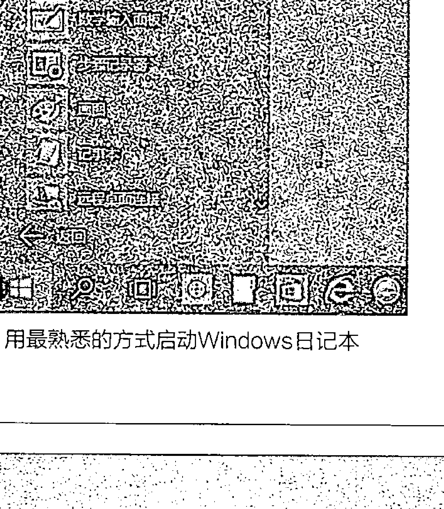

其实，Windows日记本工具最早从Windows XP Tablet PC Edition就有所配备，只不过由于此后的很长时期用机环境多在PC上使用，触摸设备还没普及，所以没被人们所重视。如今Windows 10设备将遍地开花，Windows 10日记本功能又大大增强，因此具有更多的实际使用价值。

### 新建日记方法多

在Windows 10环境下，要启动Windows日记本建立新日记有多种方法。大家可以根据自己的使用环境情况灵活选择。

由于Windows 10开始菜单的回归，熟悉Windows XP或Windows 7的用户可以很容易地用传统方法找到程序的启动入口。在开始菜单的“所有应用→Windows附件”下，就有Windows日记本的程序图标(图3)。

对于惯于键盘的朋友，启动Windows 10的另一种方法是先用Win+R组合键打开运行窗口，然后输入journal命令运行，也可以快速开启该工具。

Windows 10任务栏提供了“搜索”框或“搜索”按钮，我们还可以用该搜索功能从这里启动Windows日记本。只需在搜索框中输入“Windows 日记本”，搜索窗的顶部马上会出现“Windows 日记本应用程序”图标，点击即可启动。

> 小提示 首次使用Windows日记程序，需要安装日记本便笺书写程序的打印驱动程序。在弹出的确认对话窗口中点击“安装”按钮进行安装(图2)。安装了该驱动程序后，即可捕获文档中的电子图像，以便进行导航、打印、批注或共享。

### 2. 墨迹也能变文字

手写的内容虽然形象和难以仿造，但有时会给编辑再利用带来不便。在日记本中，手写的字体可以变成印刷文字供编辑再利用。通过“操作→把手写转换成文本”命令，即可实现由手写文字到电脑文本的方便转换。

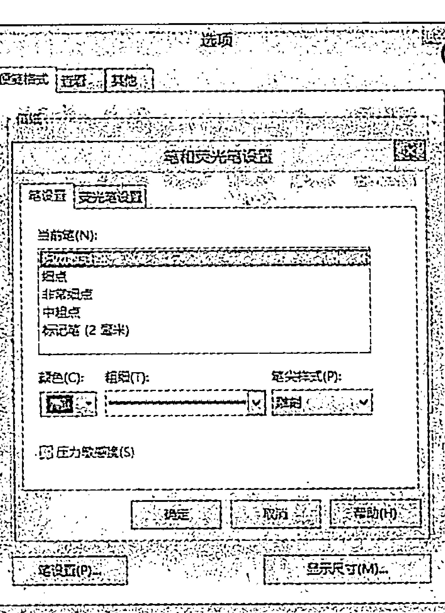

> 小技巧：如果在打印对话框中没有发现“日记本便笺书写程序”，或点击该程序没有反应，可通过日记本程序的“工具→安装或修复日记本便笺书写程序”命令重装或修复（图6）。

### 3. 打造个性化涂鸦板

通过对手写笔或荧光笔的笔触大小与颜色、各类选取工具、字体大小和颜色、缩放方式等进行设置，可以打造出更适合自己使用的个性化手写“日记本”。点击软件的“工具→选项”命令，通过“选项”窗口的“便笺格式”选项卡，点击“笔设置”按钮，可进入设置普通笔和荧光笔两类笔的具体样式（图4）。

### 4. 用好内置模板提效

善于使用内置模板是提高日记建立速度的捷径。通过“文件→根据模板新建便笺”命令，弹出便笺模板选择窗口，可从中选择音乐、日历、速记、备忘录、图表等现成模板，以此为基础可快速建立各种样式的日记文件（图5）。

### 5. 外部取材充实内容

如果想把已经存在的文档加入到日记本中（如TXT文档或Word文档），需先在记事本或Word程序中选择“文件→打印→日记本便笺书写程序”进行虚拟打印，生成一份日记本虚拟打印文件，然后使用日记本的“导入”功能将此文件导入就可以了。

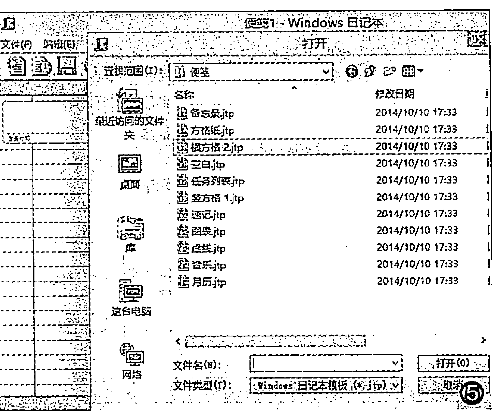

> 小技巧：如果在使用过程中发现Windows日记本无法启动，初始化组件发生错误，可在管理员模式的命令提示符窗口中，用“SFC /SCANNOW”命令修复系统文件来解决。

如果经常需要用到该工具，还可以用鼠标右键菜单命令将该工具锁定到开始菜单的磁贴区域或任务栏上。此外，如果当前处于一个文件夹中，要建立一个新的日记本文档，还可通过在文件夹空白处单击鼠标右键，从右键菜单中选择“新建→日记本文档”来创建新的日记文件。

### 6. 让日记兼容低版本

多种保存日记的方式有两种。若使用“另存为”方式保存，则可以保存为默认的JNT格式日记本便笺文件或JTP格式的日记本模板文件。若使用“导出”功能来保存，则可以保存为网页打包文件MHT或TIF图片文件，这样即便是在Windows XP中也能打开高版本建立的日记文件了。

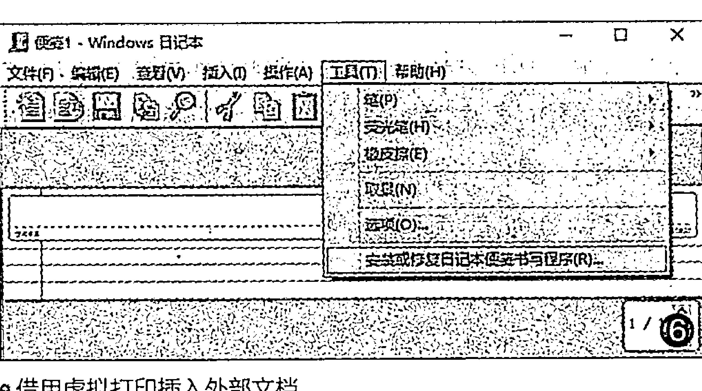## 注意细节 用好Edge浏览器

文|张扬

Windows 10自带的Edge浏览器简单易用，但要让它更好地发挥作用，还需要用好其中的每一个细节。通过对Edge的选项卡、高效的浏览和页面控制、上网安全防范等几大方面的细节功能的充分利用，能让看似“简单”的浏览器发挥更强大的作用。

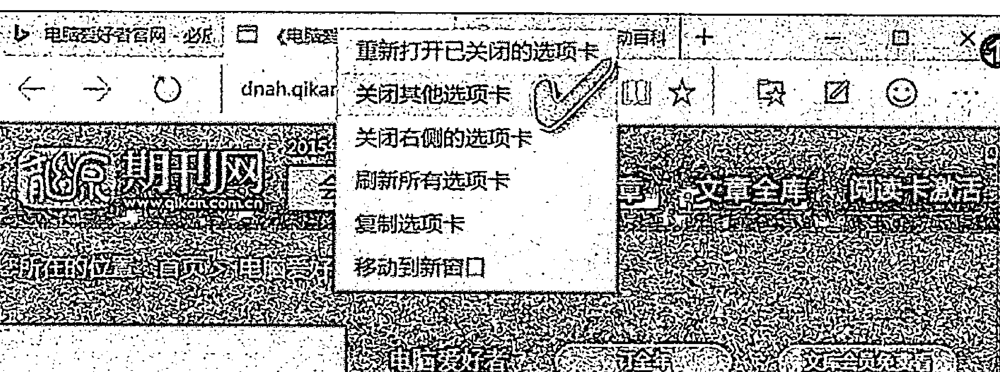

### 1 高效使用选项卡

在Edge浏览器中，默认可以开启多选项卡浏览多个网页。在上网过程中，我们有时会为一个任务而开启多个网页，但最终权衡之后，可能只需要其中的网页中的内容，这时需要关闭其余的选项卡。以往需要挨个地动手关闭多余的选项卡。现在，只需在留用的那个网页选项卡上单击鼠标右键，然后从中选择“关闭其他选项卡”就可以了(图1)。

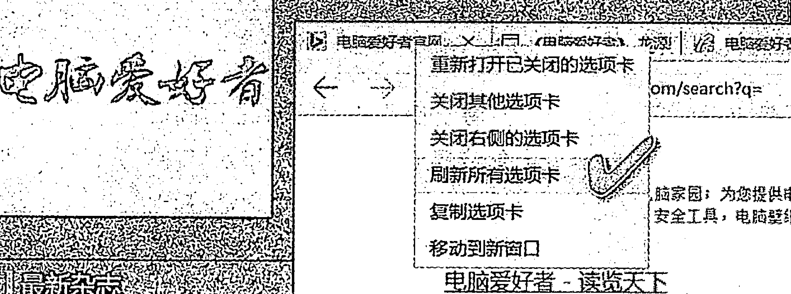

有时，我们会同时开启多个网页作参考(如多个微博页面)，每个网页作为一个选项卡存在，而这些网页中的内容可能是实时更新的，在这种情况下，是不是需要逐个点击选项卡并用F5刷新页面？不用！只需在开启的任一选项卡上单击鼠标右键，然后选择“刷新所有选项卡”，即可获得所有选项卡的内容实时刷新(图2)。

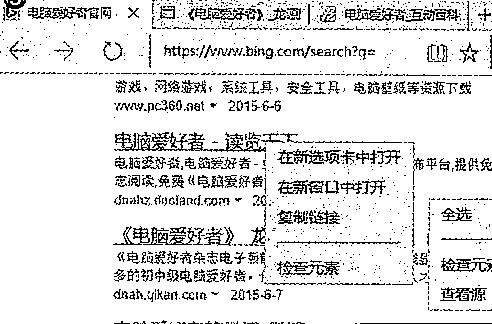

> > **小提示 精干的网页快捷菜单**
> 在一个Edge网页的链接上单击鼠标右键，只有“在新选项卡中打开”、“在新窗口中打开”、“复制链接”和“检查元素”等4个选项。网页空白处的右键快捷菜单则只有“全选”、“检查元素”和“查看源”3个选项。选项不多但非常实用，满足了对网页操作的基本需求(图3)。


### 2 让页面操作更快速

将具有页面预测功能的Edge快速翻页功能开关打开，可以大大提高网页浏览速度(图4)。具体可通过浏览器窗口右上角的“三点式”(更多操作)图标菜单，选择“设置”一项进入(图5)。

除了快速加载页面外，快速选择文本也很必要。当使用触屏设备时，文本的选择相对困难，尤其是触屏灵敏度较差的低档设备。这时，可将设置中的“始终使用插入光标浏览”选项打开，就可以在触摸设备上用模拟键盘或键盘套来选择文本了(图6)。

> > **小提示**
> 在当前选项卡下按F7也可以开启插入光标浏览功能。

## 让访问控制更高效

在浏览器高效访问控制上，也有几个方面可供利用和值得注意。为了腾出更多的页面显示空间，Edge浏览器默认未开启收藏夹工具栏，用户收藏的内容只能从收藏列表中选择，这样多有不便。通过设置列表将“显示收藏夹栏”开关打开，将提供更加方便的网址选择(图7)。通过“启动方式”可以指定每次启动Edge浏览器时先看到什么页面。MNS为每次启动的默认进入页面，也可以选择为必应搜索页面，还可以通过自定义指定别的搜索引擎或页面。如果上次关闭时有选项卡没关闭，则还可以选择自动打开“我以前的选项卡”(图8)。Edge还专设了电影游戏开关键。不少网页电影和游戏是按Adobe Flash标准设计的，如果遇到这类网页，需要将Edge的Platform controls开关打开，才能顺利观看电影或玩游戏。若在看电影或玩游戏时发现无法开启，请检查这一设置(图9)。

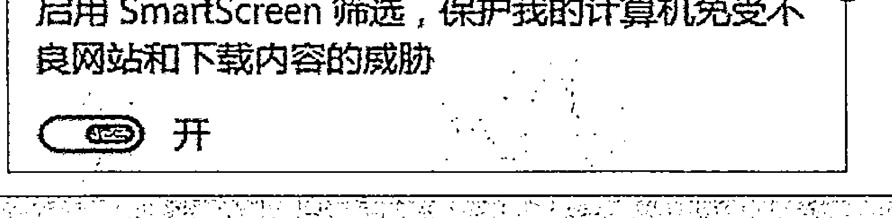

## 三关把住Edge安全

安全是使用网络的第一要务。Edge浏览器在安全方面比IE更容易控制，且防护功能更强大。上网浏览过程中Windows系统Cookie记录上网信息，就会泄露用户隐私。在Edge浏览器中，可对网站是否使用Cookie进行控制。可以选择“仅阻止第三方Cookie”，也可以选择“阻止所有Cookie”。此外，还可以一键清除隐私。若打开“阻止弹出窗口”开关，则可以自动屏蔽弹窗信息(图10)。Edge浏览器也可能会泄露使用者的位置信息。这一信息无法通过浏览器本身的设置屏蔽，但通过系统“隐私”选项列表可进行设置，沿着系统的“设置→隐私”，将Project Spartan应用开关关闭即可(图11)。同IE类似，Edge的SmartScreen筛选默认处于开启状态，但是由于某种原因可能在使用过程中关闭了该选项。为了保护计算机免受不良网站和下载内容的威胁，请检查并保持浏览器的SmartScreen筛选开关处于开启状态。具体项目在“设置”列表中查找(图12)。

## 消除文件夹图标的难看边缘

文|南岭人

有时我们在操作文件夹时，会发现图标的显示不如以往那样规则平整了，看起来很不舒服。例如，笔者前些天在Windows 8.1环境下执行文件夹删除操作时，出现文件夹图标显示有黑色锯齿状不规则边缘的现象，看起来很不舒服（图1）。类似的问题身边的一些朋友也遇到过，那么这个问题是如何引起的，又该如何解决？

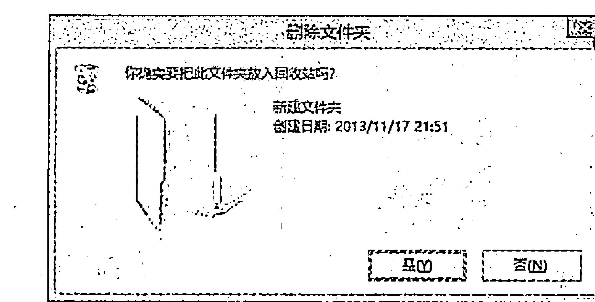

> 遇到文件夹图标显示不清的情况，要先通过文件夹属性，查看是否为原图标瑕疵所致，排除这一因素后再从下面的因素进行分析解决。

### 1 显示分辨率与驱动重置

涉及到显示方面的问题，首先应该将目光聚焦到分辨率设置或显卡驱动是否正确这两个点上。在问题的解决思路上，应该本着先易后难的顺序去尝试处理。

具体到本文的问题，首先需要查看当前的分辨率设置。在Windows 8.1桌面空白处单击鼠标右键并选择“屏幕分辨率”，在弹出的屏幕分辨率设置窗口中，查看当前分辨率是否为显示器说明书中标示的最佳分辨率。若分辨率显示与屏幕说明手册给出的最佳设置不符，则尝试通过分辨率下拉列表，查看有无显示器建议的最佳选择，如果有则选择该项并点击“应用”（图2）。

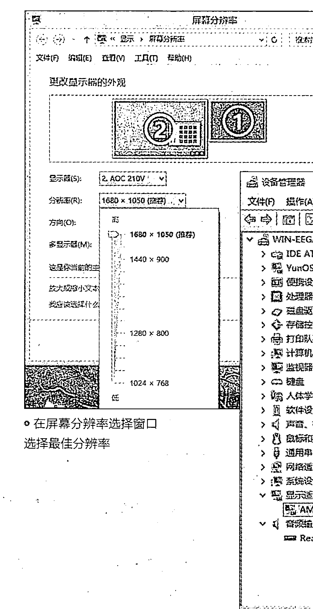

> 如果在屏幕分辨率选择窗口的“显示器”列表中没有能给出显示器的正确型号，则说明当前系统未能识别出所用的显示器。这时可从显示“高级设置”中在线刷新显示设备驱动，或到显示器官方网站查看是否有该显示器的驱动程序可供下载。下载安装该型号显示器对应于当前Windows版本的驱动程序，可在当前Windows系统中正确识别出该显示器。若找不到该显示器，则还可通过在设备管理器中将显示器删除，重新启动系统，让系统重新识别该显示器，尝试问题是否能得到解决。

此外，还可以尝试将分辨率更改为不同的分辨率设置，测试文件夹的显示情况，看是否有某个分辨率设置的情况下文件夹显示没有锯齿边缘。

如果屏幕分辨率设置无法正确进行，那么要考虑显示单元（显示芯片或显卡）的驱动合理性问题。不合适的显卡驱动程序会造成屏幕元素显示的不完美甚至不完整。在这种情况下，需要更新显卡驱动程序为最新版本来尝试。

先尝试用系统的自动识别功能来进行显卡的识别。在系统设备管理器中找到显卡设备，删除该设备并重新刷新或重启系统（图3），如果系统能够自动识别出显卡，则进入文件资源管理器，再次查看文件夹显示是否还有锯齿。

如果依靠系统的驱动刷新功能无法解决问题，可按照显卡或主板说明书中标示的显示单元型号，到官方网站下载最新版驱动程序，安装并更新显卡驱动（图4）。若无法找到驱动程序，可安装驱动精灵和驱动人生两个驱动管理软件，有时它们能识别出系统无法识别的设备驱动程序，可作为临时救急的一个补充渠道（图5）。

## 修复系统作进一步解决

经过上面的驱动更新和分辨率设置，如果均不能解决问题，则可以进一步考虑通过修复系统来解决。

如果系统中已经建立了恢复映像文件或恢复分区数据，则可以用系统的恢复功能将系统恢复到正常时的状态，以此来带动恢复系统文件夹的正常显示。

恢复系统可以从桌面右侧的浮动控制面板中选择“设置→更改电脑设置”，然后选择“更新和恢复→恢复”，在右侧选择“恢复电脑而不影响你的文件”一项，即可在不丢失个人文件的情况下恢复系统（图6）。

如果早前的文件夹显示是正常的，系统使用过程中才出现了锯齿显示怪现象，通过将系统恢复到先前的状态，就可以让文件夹显示恢复正常了。


到显卡官方网站下载更新显卡驱动


| 驱动名称 | 版本信息 | 文件大小 |
|----------|----------|----------|
| Realtek RTL81xx系列网卡驱动8.036.0926.2014 | 版本：8.036.0926.2014 日期：2014-8-26 | 3.52MB |
| Intel核心显卡驱动15.33.9.64.4061版 | 版本：10.18.10.4061 日期：2014-12-16 | 94.56MB |
| Realtek HD Audio音频驱动2.77版 | 版本：6.01.7501 日期：2015-5-5 | 111.68MB |

用驱动精灵扫描和更新显卡驱动


通过恢复映像来恢复系统

如果系统中没有留存恢复映像或恢复分区，手头上又没有Windows安装介质，可以通过微软官方提供的创建Windows 8.1链接，创建Windows 8.1的安装介质（具体链接为：http://windows.microsoft.com/zh-CN/windows-8/create-reset-refresh-media）（图7）。按提示准备好闪存盘或光盘安装介质，根据页面提示一步一步操作，即可获得需要的Windows安装介质，用安装介质进行系统安装恢复即可。


通过微软官方链接创建Windows 8.1安装介质

## 快速拿下Windows 10 ISO镜像

文|金妹

微软网站放出Windows 10最新预览版的ISO镜像下载链接，于是我迫不及待地想先下载了待晚上回家安装。直接点击链接只能用浏览器单线程下载，右键属性又得不到真实的文件下载链接，而公司偏偏禁掉了迅雷下载。如何才能截获真实的Windows 10 ISO下载地址，并快速下载到该镜像文件？


### 1 通过辅助插件IDM获取真实地址

在Windows 10正式版即将推出之际，微软网站放出了Windows 10 Insider Preview 10130多种语言版本的ISO安装文件，并公开给出了产品的安装密钥：6P99N-YF42M-TPGBG-9VMJP-YKHCF。

| 下载的链接 | SHA-1 散列值 |
| --- | --- |
| 搜狗高速下载 | D63B... |
| 文件名：Windows10_InsiderPreview_x64_EN-US_10130.iso 大小3.73GB | - |
| 下载到：K:\*精选软件\【系统工具】 剩余2.32GB | 浏览... |
| 解压 | - |


直接点击“下载”链接，用浏览器下载，进度缓慢。若能将地址提供给网盘离线下载倒是一个好办法，但点击“下载”的右键命令“复制链接地址”，看不到真实的下载地址，所获得的地址无法被网盘离线下载功能所识别（图1）。

这时可装IE下载插件IDM（全称Internet Download Manager）。安装该工具后，通过浏览器支持设置窗口，设置为对当前浏览器支持有效（例如笔者使用的是搜狗高速浏览器，其他浏览器设置类似）（图2）。


在搜狗浏览器点击下载链接时，就可以在下载对话窗口中选择IDM下载选项。这样便可以将Windows 10 Insider Preview的ISO文件下载任务添加到IDM下载窗口（图3）。
在下载窗口中，右键单击下载任务并选择“属性”（图4）。
在“文件属性”窗口的地址栏中，便可获得真实的ISO文件下载地址（图5）。

### 2 用真实地址离线下载安装镜像

打开自己的云盘(360云盘或百度云盘等支持离线下载的云盘均可)，点击“离线下载→新建链接下载”，将以上地址提交给云盘离线下载，就可以将这个版本的Windows 10 Insider Preview的ISO文件倾刻间收藏在自己的云盘中，免去了本地长时间的等待。如果本机暂不用这个镜像，则可马上关机。需要时到自己的云盘中下载即可(图6)。

> 小提示
由于此类镜像出来之后，云盘服务器中一般会有发烧友收藏，所以将镜像的地址提交给服务器下载时，服务器会自动判断文件的有无，一旦存在相同文件，则可“零等待”以“秒速”下载到服务器中。


### 3 通过IDM直接多线程高速下载

如果在将系统镜像ISO文件存入云盘的同时，还要马上在本机用这个镜像来安装系统。可用云盘客户端将离线下载的ISO文件快速下载到本地硬盘中，但目前云盘取回文件一般都作了带宽限制。作为一种更加快速的选择，可用直接执行已经加载于IDM窗口中的下载任务的方法，能更快速地获得ISO文件(图7)。


> 小提示
如果是使用公司网络，为了防止下载独霸带宽影响别人上网，切换到“速度限制”选项卡，选中“使用速度限制”复选框，输入允许下载速度，可以将下载速度限定在一个合理的范围内(图8)。


### 4 解决大文件下载等待关机问题

镜像文件的体积不小，要将32位和64位的Windows 10镜像一次下载完成，加起来就有6.9GB之多，目前常用的网速下载需要比较漫长的等待。如果离下班时间不远了，又不希望在下班后继续等待任务下载完后关机，可切换到“下载完成选项”标签页，将“显示下载完成对话框”复选框的选择去掉，然后就可以选择“下载完成后断开连接”、“完成后退出IDM”和“完成后关闭计算机”、“强制终止进程”等选项了。为了保证能在离开后，任务下载完成顺利关机，请将这4个选项都选中(图9)。


## 再现过程 用好步骤记录器

文|陆叶

如果要给远程网友讲述一个电脑问题，也许你会用QQ远程控制，或用屏幕录像软件配以音频解说录为视频。这些方法固然可行，但QQ远程控制需要双方同时在线，而录制音视频不但操作稍显复杂，且录制品占用磁盘空间也大，不利于传输。若改用Windows 10自带的“步骤记录器”录制和还原电脑操作过程，可弥补二者的不足。


### 启动记录 方法多样

Windows 10中启动步骤记录器可用多种方法。传统方法是通过开始菜单的“所有应用→Windows附件”来浏览查找(图1)，还可通过在任务栏搜索框中输入PSR或输入“步骤记录器”搜索启动(图2)，也可以通过Win+R组合键调出运行窗口并输入PSR命令来呼出此工具，或通过资源管理器“文件”菜单进入命令提示符窗口运行PSR命令来启动。

> 小提示
Windows 10步骤记录器的原形是Windows 7中的“问题步骤记录器”，这样的称呼有点太狭隘。也许称为“操作步骤记录器”更为合适，Windows 10中命名为“步骤记录器”也更加简洁。


### 自动记录 图文并茂

步骤记录器记录的步骤最终以文件的形式保存。要记录操作步骤，可以先指定记录文件的存储路径和文件名。点击“开始记录”按钮，然后执行希望记录的任务，即可开始记录操作步骤了。步骤记录器可以将操作过程保存为纯文字描述，也可以保存为图文并茂的文件。当记录完毕后，点击“停止记录”按钮，记录操作过程结束，生成记录文件并按以上设置的记录文件名和格式类型自动存盘。在记录的过程中，还可以用“添加注释”按钮为操作步骤添加必要的说明文字(图4)。

> 小提示
记录过程中是否保存操作画面可由用户来决定。软件设置中默认开启屏幕画面捕获功能，并最多允许捕获25张屏幕图片。也可以自定义捕获更多的图片(图5)。

### 灵活查看 紧凑打包

如果开始没有指定记录文件路径和文件名，那么在记录过程完成并点击了“停止记录”按钮后，步骤记录器会弹出步骤记录详情窗口，其中会以“步骤1+<描述文字>+<截图>……”的形式记录操作的详细过程（图6）。用这种方式获取的操作记录是“后保存”式的，需要单击“保存”按钮，指定保存路径、文件类型和文件名存盘，方法同上。

操作步骤记录之后，可通过两种方法查看记录的步骤。一是以图文版式查看，在记录窗口直接滚动鼠标查看即可；另一种方法是以幻灯片形式演示记录过程，点击“以幻灯片形式查看记录的步骤”文字链接来进入幻灯演示（图7）。


步骤记录器生成的文件格式则可选ZIP格式或XML格式。ZIP中包含一个图文合成的MHT格式文件，文件名为Recording打头并以录制日期和时间为后缀（图8）。MHT是微软对含有多媒体信息的HTML网页的打包格式，无论一个页面中含有多少文字或图片，均可以将其打包为一个单一的MHT文件，这样便于管理和携带，不会因丢失其中部分文字或图片而造成网页内容的残缺不全。MHT文件可直接用IE打开。如果选择输出XML格式，则可以用Excel软件来阅读该文件。ZIP或XML文件生成后，即可将此文件发送给需要查看操作步骤的朋友，告诉他们具体操作步骤，或让其帮助解决问题了。

> 小提示
在步骤记录器记录文件的最后，有一项“其他详细信息”，其中记录了一些供高级用户或程序员使用的记录信息。主要用来准确判断此记录中使用的程序和用户界面的情况。


+   此文件包含记录的所有步骤和信息以帮助你向其他人描述记录的步骤。在共享此文件之前，应验证以下内容：
- 下面的步骤准确描述了记录过程。
- 以下信息或任何屏幕截图上没有你不希望其他人看到的内容。
除了你使用的函数和快捷键之外，不会记录你键入的密码或任何其他文本。
你可以执行以下操作：
- 查看记录的步骤
- 以幻灯片形式查看记录的步骤
- 查看其他详细信息


## 补缺DLL 让软件重生

文/白帆

由于软件与系统的兼容问题，我们有时会遇到软件无法运行、系统提示缺少某个DLL文件支持的情况。在某个版本系统下用得好的软件，换到另一个系统为何就不能用了呢？出现这种情况后，除了换系统还有别的解决办法吗？

### DLL文件缺失为哪般

作为与EXE发生关联的一种文件，DLL文件可与其关联的EXE主文件处在同一个目录中，也可能不在同一目录中。许多程序共享使用的DLL文件随系统存在于Windows目录或其子目录中，为系统自带的文件，也有软件在安装时才将这些文件安装在系统目录中。但是，当一些程序作为“绿色”软件使用时，人们又往往会忽略这一点。在同样的系统中，拷贝了主程序而未拷贝DLL文件，到了另一个相同版本的系统中使用，由于该系统中默认已有所需的DLL文件，所以给人的假象便是该软件好像不需要DLL文件也能运行，但实际上在运行中它是要调用系统目录中的DLL文件的。若将该软件直接拷贝移植到了另一个不同版本的系统中，若系统中不包含其所需的DLL文件，运行时就会出现问题，显示DLL缺失的提示。

> 小提示

### DLL文件的作用与好处

大家都知道，软件的主程序一般为EXE类型的可执行文件，直接双击它可以启动一个软件，但对DLL文件知道的可能不如EXE多。DLL是一种“动态链接库”文件，它是一套程序的重要组成部分。在许多程序的开发中，由于需要调用相似或相同的功能，或由于功能繁多，开发时设计者会将功能相对独立或可以共享使用的部分单独设计成一个模块，于是就将这些功能模块包装成一个动态链接库DLL文件。一个程序可以调用多个DLL，而多个程序又可以分享同一个DLL，管理起来就方便多了，同时又节省了资源。

### 跨越系统 DLL借用移植

知道了问题发生的原因，就可以用“倒推法”解决了。系统提示缺少哪个文件，就通过系统搜索功能，在原来运行完好的系统中搜索这个文件，从搜索结果中选择位于系统目录下该DLL文件版本，拷贝移植到新的系统目录中，或者直接拷贝到与主程序相同的目录中即可。以一款剪贴板软件3DClip.exe为例，这款软件在Windows 7之前的系统中一直运行良好，且人们一向都将其作为绿色软件直接拷贝使用。但在Windows 8之后的系统中运行，却出现了系统错误提示信息，显示“无法启动此程序，因为计算机中丢失MSVBVM50.DLL。尝试重新安装该程序解决此问题”（图1）。由于下载不到该软件的安装程序或安装后问题依旧，因此只有通过寻找MSVBVM50.DLL来解决了。

此前在Windows XP中3DClip.exe运行一切正常，因此可以断定该MSVBVM50.DLL文件一定存在于Windows XP系统的某个角落。这时只需找一台运行Windows XP的电脑，用搜索工具在系统盘下搜索MSVBVM50.DLL文件，从搜索结果中复制此文件到新系统中（图2），或直接拷贝到3DClip.exe所在的文件夹中运行。这时，我们发现已经能一如既往地启动该软件了（图3）。

如果手头上正好没有低版本的系统，无法通过直接替换法找到相应的DLL文件，这时可以借助于专用工具来在线查找DLL文件。这里推介一款DllFiles.comFixer工具，启动该软件后，点击“安装DLL文件”选项卡，在出现的文本框中输入要查找的DLL文件名，然后点击“搜索DLL-Files.com”按钮，即可联网搜索出需要的DLL文件（图6），下载补缺即可。

> **小提示**

缺失的DLL文件不一定非要拷贝到和软件相同的目录或Windows目录下，其实拷贝到系统路径能够识别的其他位置也可以。那么，系统能够识别的路径有哪些？这需要通过系统“高级”设置窗口的“环境变量”来查看PATH变量，双击即可看到可支持的完整路径变量（图4），将DLL文件放在这些文件夹中都可以找到。此外，也可以直接在命令提示符窗口中运行不带任何参数的“PATH”命令来查看当前可支持的系统路径（图5）。

> **小技巧**

为了防止今后在不同系统下运行程序再次遇到缺失DLL的情况，在获得了DLL文件之后，可将该文件与原程序EXE存于同一目录一并打包存放。这样，在下次使用时，就不用到处去找缺失的DLL文件了。

> **小提示**

DllFiles.comFixer不但具有缺失DLL的检测和自动修复功能，还具有注册表检测修复功能。软件运行后，在“状态”页面点击“立即开始扫描”按钮，即可对注册表进行深入扫描、清理和优化，有利于提升系统的性能（图7）。

### 3 借助工具 DLL自动下载

（注：此标题在原文中与上一节内容连续，但标号为3，且内容承接“因此只有通过寻找MSVBVM50.DLL来解决了。”故保留为标题，但实际内容已包含在上一节的“跨越系统 DLL借用移植”段落中。）

## 系统升级遗留文件连根拔

文/连云

由于系统升级的需要，重装了高版本的Windows 10。老分区中有些数据有用，因此未格式化原系统盘，选择在新分区安装了Windows 10。安装之后，老分区中遗留了老系统的Windows和Users等文件夹。在清理这些文件夹时发现，总有一些文件因为系统权限不够而拒绝删除操作。看来熟练掌握新系统的文件授权机制迫在眉睫。

### 1 新系统采用不同的授权机制

Windows 8.1或Windows 10系统在权限管理操作方面，要比Windows XP严格。以往在Windows XP下只需以一个Administrator管理员账户就可以搞定一切，而现在尽管注册的也是管理员账户，却不可以为所欲为了。这就需要能玩转账户权限的审查机制，关键在于对当前所用管理员权限的特别授权，设置权限需要一连串复杂的操作。只要把握了这一授权的关键技巧，今后遇到所有同类问题就可以迎刃而解了。下面以解决“用户”（Users）文件夹下部分文件无法删除为例说明。

### 2 文件夹所有者的更改

假设当前登录用户名为“玩童老小伙”，具备管理员的级别权限。右击Users文件并选择“属性→安全”选项卡，看到在“组或用户名”中没有出现当前用户。显然，对该文件夹的管理权限，目前已经将当前登录用户排除在外，需要添加所有者（见图1~图6）。

### 3 文件夹所有权扩大化

Users文件下的文件不能删除的原因是某些文件的所有者不属于当前登录用户，因此要将该文件夹下所有文件的所有权扩大到当前登录用户（见图7）。

### 4 权限继承功能的启用

由于拒绝删除的文件可能位于Users目录的下级目录中，因此如果只给Users本级目录设定权限，将不能影响到下级目录的权限，这时需要设定并启用权限继承。在上图中点击窗口下方的“启用继承”按钮启用权限继承功能，与此同时选中下面的“使用可从此对象继承的权限项目替换所有子对象的权限项目”复选框。之后点击“应用”按钮（见图8-图10）。
以上步骤操作完成后，选择遗留的系统文件夹，用Shift+Delete组合键即可顺利删除那些“难缠”的文件了。

小提示
设置删除老旧的Windows、Windows.old或Program Files等也如Users文件夹一样操作即可。遇到系统之外的文件夹因权限问题无法删除，也可如法一试。

## 虚拟盘不‘快’ 出错为哪般

文/张江南

如今PC上使用大容量内存条的人越来越多，将多余的内存空间利用内存虚拟盘软件虚拟为一个分区，作为上网临时文件存储空间使用，可获得内存般的存取速度。但若浏览器设置或虚拟盘创建时格式选择不当，会造成Windows 8.1的IE出现各种各样的问题。

## 设置无效造成上网缓慢

如果擅自操作或受其他软件的影响，打开了Windows 8.1的IE‘高级’设置‘启用增强保护模式’选项（图1），那么网络浏览器会始终将自身上网时的临时文件夹指向一个固定的文件夹（C:\Users\<用户名>\AppData\Local\Microsoft\Windows\INetCache）。而在这种强力保护模式下，此文件夹不允许更改，会出现即便是在内存虚拟软件中将上网临时文件夹指向虚拟盘，但进入IE后发现设置仍无效的情况。明白了这一原因，问题就可迎刃而解：只需启动IE11，进入‘Internet选项’窗口，单击‘高级’选项卡，在列表中将‘启用增强保护模式’一项的选择关闭，重新启动计算机，然后再设置IE临时文件夹为内存虚拟盘即可。之后，通过在‘Internet选项’中点击‘常规’选项卡下的‘浏览器历史记录→设置’按钮（图2），即可看到在弹出窗口中显示路径已经指向了虚拟盘临时文件夹。

火速解决
关于内存虚拟盘的创建方法，请参见文章《莫要浪费大内存 活用‘内存硬盘’为PC提速》（http://www.cfan.com.cn/2014/1027/112393.shtml）。

## 格式不对导致应用闪退

有的用户发现，当IE临时文件夹被设置到内存虚拟盘之后，有的Windows Metro应用在启动时或使用过程中会出现闪退的现象。这是因为许多带有网络功能的Metro应用同样要读写IE临时文件夹里的文件，而它们只能识别NTFS格式磁盘。但是，在一些内存虚拟软件中，建立虚拟磁盘时允许指定为NTFS格式之外的磁盘格式。例如，SoftPerfect RAM Disk虚拟磁盘软件就是如此。如果指定了非NTFS格式的虚拟磁盘，就会在使用时出现上述现象。
要杜绝如上问题的发生，只需在建立虚拟磁盘时，不要将磁盘格式选择为FAT32或其他格式，只能选择为NTFS格式（图3），同时请勾选“SCSI硬盘（更真实地模拟物理硬盘）”选项（图4），这样创建出的内存虚拟磁盘就和真实的NTFS硬盘效果相同，Metro应用也能很好地认可，就不会出现闪退的问题了。
如果Metro IE强制启用了增强保护模式，使用Metro版IE的时候临时文件仍会被放在“C:\Users\<用户名>\AppData\Local\Microsoft\Windows\INetCache”里面。这时，可以使用NTFS的 symbolic link (符号链接) 功能，将临时文件夹重定向到虚拟磁盘中。具体实现原理和方法如下：
我们知道，不单单是IE临时文件夹，通常使用的各种应用软件也会产生大量的临时文件，而且多数软件不提供存放缓存文件的专用文件夹，转而使用的是“C:\Users\<用户名>\AppData”下的某个文件夹来存放临时文件。
在这种情况下，通过系统资源监视器监控硬盘的读写情况，找到软件的临时文件夹所在的路径（例如“C:\Users\Laoliu\AppData\Local\Microsoft\Windows\INetCache”），用路径重定向功能将其指向虚拟内存盘的临时文件夹（假设为Y:\TEMP）。具体在命令提示符窗口中使用如下命令即可（图5）：

```
mklink /D C:\Users\Laoliu\AppData\Local\Microsoft\Windows\INetCache Y:\TEMP
```

这样一来，在软件需要读写临时文件夹的时候，实际上读写的却是Y:\TEMP文件夹。“瞒天过海”，实现了目的。

小技巧
如果使用的是Chrome浏览器，可通过在修改Chrome的快捷方式时增加启动命令行参数来解决浏览器临时文件夹的指向问题。将Chrome浏览器的启动命令行修改为：'C:\Program Files (x86)\Google\Chrome\Application\chrome.exe' --disk-cache-dir='Y:\temp'即可。其中的参数‘--disk-cache-dir=“R:\temp”’即为指定浏览器临时文件夹的附加参数，'Y:\temp'为虚拟盘Y中的临时文件TEMP。

## 扩展阅读：3款好用的内存虚拟盘软件

-   **AMD Radeon RAMDisk:** 硬件厂商AMD为内存配合使用的软件产品，最大支持64GB内存转换为虚拟硬盘。免费版可建立4GB虚拟硬盘，已能满足一般用户的需求。
-   **SoftPerfect RAM Disk:** 完全免费的轻量级内存虚拟硬盘工具，具备基本的硬盘功能，内置简体中文，有64bit和32bit两种版本可选。
-   **Primo RAMDisk:** 功能强劲的内存虚拟硬盘工具，配置丰富，支持根据实际内存大小动态建立不同容量的虚拟硬盘，也有64bit和32bit版本可选。

## 超强览图 鼠标贴靠魔力大

文/张文道

看图软件我们见多了，图片编辑软件也不稀罕，然而能在一个简单的图片预览页面以隐含的形式集成强大的图片浏览和编辑功能的软件却不多。在看图软件FastStone Image Viewer 4.2以上版本中，鼠标“贴靠”功能被赋予了强大的“魔力”——当鼠标光标贴靠到屏幕的不同边框时，会延伸出与图片有关的诸多实用功能，这样只需在一个图片预览窗口中就几乎能完成图片处理的一切任务，看图、修图、编图变得无比方便。

本文所要讲述的功能位于图片全屏预览窗口。全屏预览功能入口不但可通过照片管理器（图1）双击图片进入，还可以通过Windows资源管理器照片右键菜单，先选择“Browse with FastStone”进入图片管理界面（图2）。之后，只需点击任意一张照片并回车，即可进入图片全屏预览窗口。

进入全屏预览窗口后，软件会提示使用全屏模式浏览图像时的鼠标贴靠功能（图3）。

# ## 1. 向上挪 大小照片一览无余

在全屏图片预览窗口中，我们只需将鼠标移动到窗口的上边框，即可看到以电影胶片式显示的当前目录中的照片（图4）。下方则显示当前选中照片的大图。通过胶片上方的一系列工具按钮，可以对当前照片进行包括删除、旋转、发邮件、打印等基本操作。

# ## 2. 向下移 照片功能全盘控制

当我们将鼠标光标移动到全屏预览窗口的下边框时，可以看到照片演示和编辑操作的控制面板（图5）。通过这里可以对当前照片进行缩放预览、自动幻灯片预览、各种编辑操作，还可以进入照片扫描、打印、邮件发送等窗口。这些功能均可通过相应的工具按钮来方便地调用。

> **小提示**

点击“树形文件夹”图标可展开照片文件夹树形目录，便于改变照片所在的文件夹，定位切换预览图片的位置所在。

点击左下角的“导航”按钮，可改变照片显示的尺寸，以便看清照片中的细节。

### 3. 向左靠 实现照片超强编辑

如果要对照片进行形状、色彩、特效等编辑，只需将鼠标光标贴靠到屏幕的左边框上（图6）。
通过浮出的面板，我们可以方便地旋转、裁切、修复、缩放照片，还可以通过自动调色、补光、色阶调整、锐化模糊或去噪等编辑照片的色彩，更可以利用“特效”面板直接套用特效，生成各类艺术照片。

在预览窗口中可以用鼠标滚轮来方便地切换图片。按下Ctrl键后鼠标光标会变成十字形，这时可选取部分区域放大。而当按下Ctrl键后滚动鼠标滚轮，则可以对当前图片进行缩放显示。

### 4. 向右贴 图片属性全面管理

如果我们要查看或修改照片的各种属性，只需将鼠标光标贴靠到屏幕的右边框，即可呼出照片属性选项卡（图7）。
照片属性由3组选项卡组成。默认显示的是照片的EXIF信息，这里边就包含照片拍摄时的各种参数，如照相机的型号、照片曝光补偿、焦距、光圈、快门等应有尽有。点击“直方图”选项卡后，我们可以看到当前预览的照片的曝光情况，是曝光不足还是曝光过度可直观地看出（波形图偏左为曝光不足，偏右为曝光过度）（图8）。如果怕以后忘记照片的环境，要给照片添加一些文字注释，可点击“JPEG注释”给照片添加文字注释。

## 借用WPS抓图标注一条龙

Windows 8.1系统自带Win+PrintScreen全屏截图功能和“截图工具”，这让我们无论是截取桌面还是截取窗口区域，都不需借助于外部工具即可完成。虽说还可结合画图工具，对抓取的图片进行任意图形和文字标注，然而对于标注的图形元素来说，我们常需要一些固定类型的图标，如果靠自己在画图软件中手绘或拼合，做起来比较费事。其实，借助于新版WPS Office办公软件自带的截图工具和形状工具，结合WPS文字的排版合成功能，就能非常快速地完成图片抓取以及各种形式的标注，从而完成复杂的图文合成的最终版图片。

# ## 1. 借用WPS文字空白页面

我们需要借助于WPS空白页面为“承载”来完成WPS窗口之外的图片抓取和复杂标注任务。双击桌面上的“WPS文字”快捷方式，启动到WPS编辑页面，单击文档标签页上的“+”号按钮，添加一个空白页面(图1)。该页面将来要接纳截图获得的图片，并要以此为平台完成图片的各种标注任务。

# ## 2. 启用隐含窗口截图功能

我们要借助于WPS文字的截屏功能来抓取桌面内容。WPS文字的截屏功能位于“插入”菜单的“截屏”折叠按钮中，对应于“屏幕截取”和“截屏时隐藏当前窗口”两个命令(图2)。在WPS系统的默认设置中，后一个命令未被选中，因此，当我们要截取桌面上的其他区域画面时，如果点击WPS文字的“屏幕截图”按钮，这时会发现WPS编辑窗口遮挡了我们的视线。为了避免这种情况的发生，我们首先需要在“截屏”菜单下将“截屏时隐藏当前窗口”选项选中。
经过以上设置之后，如果需要抓取桌面上的任何窗口或区域，我们都可以随时通过WPS文字的“截屏”按钮启动截图功能，这时WPS窗口会自动隐藏，我们就可以随意抓取桌面的窗口，或者以框选的方式抓取桌面上的任意区域了。


**小技巧**

以上方法我们总需要在WPS窗口中通过工具菜单单击启动抓取功能，这多少显得有些繁琐。其实还有更方便的办法，我们可以在需要抓图时随时按下Ctrl+Alt+X组合键，更方便地调用WPS文字的抓取功能进行画面抓取。我们还可以直接通过Ctrl+Alt+C组合键来实现在隐藏当前WPS窗口的同时启动WPS文字抓取的功能。

矩形区域了。
用WPS截图工具截取图片后，图片除了会出现在WPS文字编辑窗口中外，也默认在后台保存在系统剪贴板中。此时，我们只需回到WPS空白编辑页面，就可以看到图片已经被自动粘贴到WPS版面中了（图3）。

### 3. 用WPS标注各种图形符号

接下来我们要在WPS文字版面中对获取的图片进行标注。借助于WPS提供的丰富的形状和样式，实现多样化的版面效果。
展开右侧面板，点击WPS文字版面右侧的“形状”按钮，在自选图形列表框中我们不但可以选择标注各种曲直不同或是否带有箭头的线条，还可以从基本形状中选择使用常见的标注形状部件元素（图4）；“箭头总汇”里包含的箭头类型之多会让你吃惊（图5）；“流程图”标注框囊括各种基本的流程组件，“星与旗帜”和“标注”组件让标识丰富多彩（图6）；而通过“在线形状”则可以标注各种生活元素（图7）。


### 4. 将WPS版面再次抓为图片

当所有需要的图片上的元素被标注在WPS版面之后，我们只需将版面缩放到合适的尺寸，然后再次用WPS抓图指令抓取合成后的WPS版面，就可以获得最后带有标注的截图了（图8）。截图之后，WPS截图工具条上会有“存盘”按钮，点击此按钮就可将最终合成的图片保存为我们需要的文件名和指定的格式了。


**小提示**

也可以在WPS文字编辑页面中，直接将排好版的版面另存为PDF格式。

# CCleaner增强版看上去更美  文|老万

以前CFan杂志上有过一篇制作CCleaner增强版的文章，其中的方法非常实用，不过我觉得其制作过程还可以再优化，因为有一些软件图标和相关链接会干扰用户的使用操作。所以今天我们就沿着上篇文章的足迹继续前进，来打造出一款更加完美的CCleaner增强版。

## 屏蔽软件手势链接

使用过CCleaner的用户都知道，在软件界面的右上角有一个鸭梨图案的图标。当鼠标划过这个图标的时候，就会提示用户访问其官方网站。为了防止误点击而打开不必要的网页，可以将这个手势链接屏蔽掉。

首先运行一款十六进制编辑器软件，我这里使用的是C32Asm。点击“文件”菜单中的“打开十六进制文件”命令，选择CCleaner软件的主程序文件。接着点击C32Asm窗口“搜索”菜单中的“搜索”命令，在弹出窗口的“类型”中设置为“Unicode字符串”，在“搜索”选项中输入字符串“www.piriform.com/go/app_cc_home”，点击“下一个”按钮后很快找到一处相关的字符串信息（图1）。通过滑动鼠标左键选中这段字符串后，再点击右键选择菜单里面的“填充”命令（图2）。在弹出的对话框中选中“使用十六进制填充”这项，并在填充框中输入“00”后点击“确定”按钮即可（图3）。接下来按照同样的方法进行搜索和填充，替换操作完成后通过“文件”菜单的“另存为”命令，保存修改过的CCleaner主程序就可以了。

> 注意：为了避免误操作损坏程序文件，在进行修改前最好对该文件做一个备份。

## 删除界面鸭梨图标

既然手势链接已经被我们屏蔽掉了，那么这个鸭梨图标也没有存在的意义了。所以我们一不做二不休，将这个图标也删除掉。现在运行程序修改工具Restorator，点击工具栏上的“打开文件”按钮，在弹出的浏览窗口中选择刚刚修改过的主程序文件，接下来点击并展开左侧列表中的“PNG”项，分别选择列表中的6000和6001两项，这样就可以在右侧窗口预览到鸭梨图标的图案。分别选择6000和6001两项后点击鼠标右键，选择“删除”命令就可以将其从程序内部删除掉了（图4）。修改完毕点击工具栏中的“保存文件到磁盘”按钮确认即可。

## 屏蔽软件升级链接

在CCleaner界面右下角有一个“检查更新”的链接，如果用户不小心点击了它就会自动检查并下载新版本，而我们制作的加强版文件就有可能被替换掉。为了避免这种意外的发生，我们还是将这个链接屏蔽掉比较好。

运行程序修改工具Resource Hacker，点击“文件”菜单中的“打开”命令，选择刚刚保存的CCleaner主程序文件。在左侧列表中找到并展开“字串表”项，找到其中的“7”这项后点击鼠标右键，选择菜单里面的“删除资源”命令就可以了（图5）。最后点击“文件”菜单中的“保存”命令，这样一个更加完美的CCleaner加强版就会呈现在我们面前啦。


# 度娘助你Word在线处理 文|倚楼

百度刚刚推出了一款全新的在线办公系统——百度doc，通过名称我们就知道它可以进行在线的Word编辑处理。这样我们以后如果临时要处理Word文档，一时半会又找不到电脑或者合适的办公软件的话，那么“百度doc”就是一个非常不错的选择。

## 不用安装即可使用的“Word”

要想使用它的话非常简单，通过浏览器登录word.baidu.com即可。接着点击网页中的“立即使用”按钮，在弹出的对话框中输入自己的百度账号密码，然后点击“登录并授权”按钮就可以看到“百度doc”的主界面了。由于“百度doc”直接打开空白页，因此可以随时开始进行新文档的编辑操作。而“百度doc”的主界面和Office非常相似，所以用户操作起来不会有任何的难度(图1)。


且“百度doc”对网速的要求并不高，只要可以连接到在线编辑系统，就可以顺畅地进行编辑操作，甚至利用移动设备也完全没有阻碍。这对于使用微软、谷歌等在线办公系统很不稳定的用户来说，实在是一个利好的消息。不过也有一点操作方面的要求就浏览器的Flash版本不能太低，否则不能使用所有的功能。而在文件的保存上，“百度doc”既可以选择保存到本地系统，也可以选择保存到百度云里面(图2)。建议大家保存至百度云中，这样“百度doc”就会定时进行自动保存操作。


辑操作。“百度doc”除了常见的编辑功能以外，最具特色的就是利用云端的优势，可以在线插入很多云端的内容。如要想插入地图，只需要点击“插入”菜单中的“地图”按钮，就可以将搜索到的某地的百度地图插入到文档里面，这个功能对于公司的介绍推广非常有用(图3)。如果要想插入图片的话，除了可以调用本地图片以外，还可以利用百度搜索直接插入搜索结果，这也就是在线编辑相对于本地办公软件的优势(图4)。


**小提示**
为了避免文档内容丢失，建议大家首先保存一个文件到网盘，这样输入的内容就会自动存储到该文件中。

## 云端内容快速丰富文档

如果要处理已有的文档，那么点击主界面右上角的“导入文档”按钮，选择要处理的文档即可上传处理。不过现在只可以上传Word文档的格式，像文本文件这类格式的文件暂时都还不能支持。刚刚上传的文件处于只读状态，需再点击“编辑”按钮才可以开始编辑。

## 在线文档快速分享

当文档编辑完成后，点击右上角的“下载”按钮，“百度doc”就会用docx的文件格式下载保存我们的文档内容。另外，还可以点击右上角的“分享”按钮，就可以选择文档的分享方式。由于现在“百度doc”还处于开发阶段，因此包括邮件分享以及私密分享等功能还没有开放。但是经过测试发现，下载的docx在用Office打开的时候会提示错误，而用WPS则可以正常地打开编辑。看来“百度doc”在文件格式的处理上还存在着一些问题亟待解决。

# PDF文件全面合成多样化

PDF是一种通用性很强的文档格式，加之多数人的电脑中装有PDF阅读器，且多数网络浏览器也支持直接打开PDF文件。尤其是移动设备大行其道的年代，无论是iOS还是Android智能操作系统，PDF都具极强的通用性。因此，人们很喜欢将自己手头上的文字、图片、表格、演示等内容做成PDF文档分发。但除一些通用PDF编辑器所提供的图文PDF输出功能外，还有一些特殊的制作技巧需要掌握，以便更好地发挥PDF文件格式的优势。

## 1. 批量照片合成PDF

将数码照片做成PDF，将照片按一定顺序串成一个完整的故事作品，还可以添加目录和文字注解等，可谓是一种比较方便可行的照片打包共享方法，而这正是ACDSee Pro 6能够很好完成的事情。

在数码照片文件夹上单击鼠标右键，选择“使用ACDSee Pro 6管理”进入照片管理窗口，选中参与制作的所有照片，执行“创建→PDF”命令（图1）。选择“创建一个包含所有图像的PDF文件”（图2）。

按需用“添加”和“删除”按钮对序列中的照片做增删调整处理，指定保存PDF文件的位置和文件名。如果希望演示时呈现全屏模式，选中“按全屏幕模式打开图像”选项（图3）。开始PDF文件的创建过程，完成后点击“启动PDF”按钮可直接进入作品预览。

> 如果以Windows 8内置的PDF应用来阅读照片PDF文件，可实现横向滚动式预览。借助于鼠标的滚动操作，图片切换非常方便。

## 2. 分节PDF汇总PDF

如果现有文档是一些分散的PDF文件，希望将这些分散的文件汇集成一个PDF文件，可借助于PDF-Tools Portable这款软件来完成。

启动软件后选择Split/Merge项，并点击右下角的Start按钮（图4）。点击ADD按钮添加全年的分期PDF文件，在列表窗通过Up和Down按钮调整每期杂志的顺序，使其按从1到24的增序排列（图5）。选择All Pages to One Document将所有页面合并为一个文档，选择下面的两个复选框，将原有书签包含到输出文件中，同时使用原始的文件名作为新文件书签名（图6）。点击Next进入合并过程，之后即可获得合并的PDF文件。

> PDF-Tools Portable还具有书签处理、页面编辑、水印添加等多种实用功能。如果对制作的PDF成品不满意，还可以借助该工具作具体编辑加工处理。

## 3. Word文档合成PDF

如果手上有一系列Word文档，希望将其合成为一份完整的PDF文档，可以使用Adobe Acrobat Pro的合并功能来完成。在Acrobat中选择“文件→创建→将文件合并为单个PDF”，在合并对话框中添加所有Word文档，通过上移、下移等按钮调整文档的顺序，然后点击“合并”按钮。之后Acrobat会自动将这些Word文件按顺序转换并合并为一个PDF文档。在合并后的文档中，还可以进行页码编排、添加书签等后续编辑工作。


整的PDF文件，可借助于国产免费办公软件WPS Office来处理。

开启最新版WPS文字处理软件，切换到“插入”选项卡，点击“对象”按钮并选择“文件中的文字”。在“插入文字”窗口选中所有章节内容，然后点击“打开”按钮即可将所有分散文档合并到当前空白页面中。

经过一些必要的格式调整和编辑之后，通过WPS文字系统菜单，选择“另存为→输出PDF格式”，即可将整个文档保存为单一的PDF文件。

## 4. 网页变身PDF文件

有时我们希望将一些网页做成PDF在平板上阅读，这种情况下，有许多方法可以实现PDF的生成。

**小提示**
PDF文档输出还可设置阅读和打印权限，具体详情参见本期办公栏目文章《制作版权保护型公文》。

可以安装福昕浏览器，安装时选择安装 Foxit Reader PDF Printer 虚拟打印机组 件。之后，在需要保存为PDF的网页上发送打印命令，然后将打印机选择为Foxit Reader PDF Printer，即可获得输出的PDF格式网页文件（图7）。

此外，还可以通过Google Chrome浏览器直接将网页打印为PDF文档。先用Chrome浏览器打开网页，在需要打印的网页中执行Ctrl+P命令，这时会显示网页的打印预览，点击左侧窗格中的“更改”按钮，从中选择本地目标并选择“另存为PDF”即可。

**小技巧**
我们还可以通过在线转换的方法将其他文档转换为PDF。例如通过PDFonline网（http://www.pdfonline.com/）或“Z转换大师网”（http://wordtopdf.55.la/），在线提交文档后直接获得PDF文件。

# 聊天动画全面制作

文|张菲

在电脑聊天的过程中，我们常常会收到或转发一些非常有趣的动画图片，这些动画往往图文并茂，很有吸引力。那么，除了摘抄转发之外，如果让自己来创作，有哪些方法可以使用呢？

## 1. 将影视片段转为动画

将正在观看的精彩视频作为聊天素材，直接拖入窗口的做法是非常不可取的。由于一般的视频格式非常占用空间，且分辨率至少也有VCD或DVD级别（PAL制式的VCD分辨率为352×288像素，DVD的分辨率为720×576像素），即便只有几秒，也会有数MB之多。若将它们拖入到聊天窗口，将是对接收者的网速的一大考验。将要分享的视频变成分辨率更小、体积更小、适合于在QQ对话窗口中传播的GIF格式，才能以流畅的速度和最快的时间传达给好友。

**小提示**
除了将视频文件转换为GIF格式的需求，网站上还有许多有趣的动画是Flash格式的，文件名一般为SWF，这些也是我们常常可以利用的素材。如果要将这些网络动画作为聊天窗口中直接可用的文件，可通过Magic Swf2Gif转换工具将SWF文件转换为GIF格式。

虽然视频编辑有各种各样的专业软件可使用，如Premiere、After Effects等，但这些大部头的工具往往让普通用户望而生畏。其实，使用QQ影音播放器附带的视频编辑功能，便可实现从任何一种常用的视频中截取并压缩视频片段，将通行的视频格式转换为更适合于QQ窗口传播的GIF动画。具体方法是，先用QQ影音打开要截取的视频文件，从工具箱中启动“动画”工具，设定画面尺寸为“小图”，用滑块确定截取动画的始末位置，设置好之后，点击前面的“保存”按钮，即可将选定的视频片段保存为GIF动画了（图1）。

## 2. 有趣操作过程录成动画

不是所有的聊天动画都靠截取视频文件来实现。有时候需要的动画是操作电脑的一个现场录像，例如用QQ来演示美化网店的过程、完成某个设计或操作的过程等，而不是从现成的视频文件中截取。这时，需要借助“GIF动态截图”工具软件来截取操作过程。“GIF动态截图”软件提供有三种截图模式，分别是：全屏截图模式、控件截图模式、区域截图模式（图2）。录制前首先选择一种录制模式，然后进行录制设置，包括延迟调节参数、录制的画面大小等（图3），设置完毕之后，点击“开始录制”按钮便开始录制过程。如果需要给录制的动画添加水印，可通过“GIF水印”选项卡，选择开启水印功能，并为动画设置必要的水印文字。


**小技巧**

若需要编辑动画GIF文件，可用工具软件Namo GIF Animator来完成。要给已有动画填加文字，可先将图片导出，用图片处理软件添加文字后再导入到该软件中替换生成即可。若要反过来将GIF动画分解成图片序列再编辑再利用，可利用看图软件ACDSee的“转换文件格式”命令指定JPG图像格式输出。

## 3. 数码照片变身动画相册

除了上面的两种情况外，还有的时候需要将已有的照片串成动态相册来展示。这样做的好处是，可以在一个位置上展出许许多多的照片，这要比在QQ窗口中接连发送n多张照片要来得更高效、更省空间。

借助Ulead GIF Animator动画软件可实现从数码照片到GIF动画的转变。Ulead GIF Animator软件的使用非常简单，启动软件后根据动画向导的指引，添加动画所需的系列照片，作必要的调整设置后保存图片序列文件，即可获得GIF动画文件（图4）。

需要指出的是，由于我们平常所拍摄的数码照片的分辨率一般至少有屏幕分辨率的大小，而QQ窗口中播放的动画不需要那么大的尺寸。因此为了减少作品的空间占用和提高传输、播放速度，在使用该软件制作照片视频动画前，需要先将原始的照片文件用批处理的方式统一缩减尺寸。利用2345看图王、FastStone Viewer、iSee、Snagit等看图软件附带的图片批处理功能可一次性处理图片尺寸。

**扩展阅读**
手机也能制作GIF动画

如今手机应用如火如荼，我们不但可以通过PC制作自己需要的GIF动画，通过一个移动应用“GIF快手”，也可以在手机上直接制作聊天动画。该APP可以通过摄像头拍摄或在相册中选择照片的基础上来制作GIF动画（图5），可将已有照片进行各种变形处理，而后生成需要的GIF图片动画。它不但有Android版本，另外还有iPhone版和Windows Phone版本可供选择。

GIF快手Android版下载地址

## 4. 亲手绘制并生成个性动画

无论是视频截取、视频录像还是照片相册，都缺乏个性的气息。在QQ聊天窗口中共享的动画图片中，最富有个性的往往是那些带有自定义文字或图片信息的动画了。这类动画的制作方法也并不高深。

只需在上面第3步的基础上，将所用的原始照片用图像处理软件进行必要的加工，甚至可以用绘图软件绘制一些中间性的图片，然后再用上述介绍的图片转GIF工具，将这些图片串成GIF动画即可。制作图片每一个人因水平所限，因而最终动画质量参差不齐，但技术就这么简单。赶快试一试自己的水平吧！

**小技巧**

Ulead GIF Animator软件也可以将视频转为GIF文件。方法是通过“文件→打开视频文件”调入视频，然后导出为GIF格式。

快速打造本地DNS服务器 文|老万

DNS可以完成对域名的解析服务，是畅游网络的“交通要道”，所以不少网络运营商借机在其中植入广告以赢取私利，为此很多用户不得不改用第三方的DNS服务器。不过现在第三方的DNS服务也经常受到各种干扰，那么又该如何解决呢？

## 设置自建DNS服务器的参数

要想解决上述问题，最简单的方式就是在本地电脑系统自建一个DNS服务器，不过这对普通用户来说很难，我们不妨借助一些工具软件来完成，比如DNSAgent（下载地址: tinyurl.com/nssyjvc，此软件需微软.NET Framework 4.5支持）。

下载上述软件并解压，用文本编辑器打开其中的Options.cfg文件，可以看到该工具默认使用的是谷歌的DNS服务器(图1)。可以根据需要修改为自己常用的DNS服务器，比如114DNS(114.114.114.114)、阿里DNS(223.5.5.5)、OpenDNS(208.67.222.222)等。修改完成后对配置文件进行保存，再运行文件夹中的DNSAgent.exe文件，该工具就开始在系统后台工作了(图2)。

-   由于DNSAgent使用了DNS压缩指针技术，所以并不是所有的DNS服务器都支持该技术。
-   由于DNSAgent需要运行才可以进行解析服务，所以用户可以运行文件夹中的Install.bat文件。这样就会在系统中添加一个启动服务，从而使得DNSAgent在系统运行的时候自动启动运行。如果不需要再使用这款工具了，也可以运行Uninstall.bat文件，来删除对应的启动服务。

### DNS服务转移到本地

接下来打开Windows的“控制面板”，点击“网络和Internet”下面的“查看网络状态和任务”命令，在弹出的对话框中点击左侧的“更改适配器设置”命令，然后打开系统的“网络连接”窗口。如果用户是通过路由器上网的，那么就选择列表中的“以太网”项。如果用户还是使用传统的拨号上网方式，那么就选择列表中的拨号连接即可。

选中自己的网络连接后，右击它，选择“属性”，在弹出的窗口列表中选择“Internet 协议版本 4”项。点击下面的“属性”按钮后，在弹出窗口的“首选DNS服务器”选项中，将其设置为127.0.0.1即可(图3)。以后所有系统发出的域名解析请求，就会经过该工具的处理后，再发送到设定的DNS服务器进行处理。接下来该工具将DNS服务器的解析数据存放到本地系统中，这样当用户下一次访问同一个网站域名的时候，就不需要再向DNS服务器发送解析请求了，将直接调用还存储在本地系统的解析信息。这样一来就避免了DNS信息被干扰的可能。

### 提效率 为不同网站定制解析服务

除了域名解析，DNSAgent还有很多比较实用的网络功能。如针对不同的网站域名，可以使用不同的DNS服务器进行解析，国外的网站域名使用谷歌DNS，国内的网站域名使用114DNS等。不过要想使用这个功能的话，需要自己编写相应的规则才行。

> **小提示**
> 由于规则默认使用的是114.114.114.114这个DNS服务器，用户也可以根据需要将其批量替换为其他的DNS服务器地址。

现在通过文本编辑器打开DNSAgent中的rules.cfg文件，按照下面的格式来编写几行代码即可。

```
{
    "Pattern": "^(.*\.)?baidu\.com$",
    "NameServer": "114.114.114.114"
},
```

这几行代码的意思就是，当访问含有baidu.com信息的网站域名的时候，就使用114.114.114.114这个DNS服务器进行域名解析。虽然这个规则使用了正则表达式，依葫芦画瓢也是可以完成的。但是对于普通用户来说还是比较繁琐，所以下面我们利用网友制作的网站规则，进行转换后就可以为我所用了。

首先通过浏览器访问tinyurl.com/mac5gh4，在列表中找到accelerated-domains.china.conf项并点击它，在弹出的网页中就可以看到网友制作的网站规则（图4）。现在点击“Raw”按钮后打开一个网页，接着点击鼠标右键选择菜单中的“全选”命令，将所有的网站规则都复制下来，接着在浏览器中访问tinyurl.com/m6cnymo，将刚刚复制下来的网站列表粘贴到左侧列表中，然后点击左上角的“Convert”按钮，在右侧列表中就可以看到转换好的网站规则了。点击右上角的“Select Results”按钮，自动选中转换完成的规则（图5）。接下来点击鼠标右键将其复制粘贴到一个文本编辑器中，再将开头的“[”和结尾的“]”符号删除。最后将这些编辑后的规则，粘贴到rules.cfg文件最后一个“]”符号之前就可以了（图6）。

### 替代hosts更方便

Windows系统的hosts不仅可以直接进行域名解析，还可以起到过滤广告的作用，但是现在要想修改系统中的hosts文件，首先需要获得系统的管理员权限才可以，操作上有些繁琐。而现在DNSAgent工具就可以通过类似的功能替代hosts文件，从而减少系统权限获取等操作，而且以前一个域名就需要编写一条规则，DNSAgent则可以通过一条规则替代hosts文件中的多条规则，从而减少大量规则输入的麻烦。

以亚马逊为例，现在很多用户喜欢到亚马逊的美国站进行海淘，就可以通过修改hosts中的信息，让其直接连接到亚马逊的美国服务器而非中国的服务器，从而避免我们在不同的站点之间进行切换。首先右击“开始”，点击“命令提示符（管理员）”启动它，在其中输入“ping www.amazon.com”并按下回车键，可以得到服务器对应的IP地址。接着用文本编辑器打开DNSAgent中的rules.cfg文件，输入下面的一段代码并保存就可以了。这段代码表示只要访问域名包括www.amazon.com的链接，就直接连接到205.251.242.103这个服务器的IP地址（图7）。

```
{
    "Pattern": "www\.amazon\.com$",
    "Address": "205.251.242.103"
}
```

成批图片图注水印一次加 文|张亦文

出于版权保护的考虑或宣传的需求，我们需要给一批上网的图片添加文字图注或版权水印。这些图片有的是已经拍摄好的，有的则需现场截取屏幕画面。针对不同来源的图片，要用不同的快速自动添加办法。

### 1. 图注水印 抓图时批量添加

用Snagit抓图软件的自动文字添加功能，可为抓取的成批图片添加相同的文字标题或注释。在抓取命令下达之前，需为抓图软件开启自动加注“标题”功能，并按需定义标题所用的文字内容和属性。

点击屏幕上方Snagit 11圆形浮动面板最下端的配置启动按钮，进入配置窗口，在Snagit“配置设置”一栏下点击“效果”按钮旁的小三角，在弹出的菜单选择“标题”命令（图1）。

在标题内容设置窗口中，输入标题文字。如果不希望标题影响图片本身的内容，要放置在图片之外，则需选中“放置标题在图像之外”复选框。同时，还可调用Windows的计算机名、用户名和系统日期时间作为标题名称（图2）。

> **小提示**
> 水印图片支持的类型非常丰富，可以是BMP、CUR、EMF、EPS、GIF、ICO、JPG、PNG、PSD、TGA、RAS、TIF、WFX、WMF、WPG、WFX、SNAG等格式。涵盖各种平台下的各种制图软件支持的文件格式。

若要对标题文字的位置和样式进行个性化设置，点击“标题设置”蓝色文字链接，进入设置窗口。在这里，可选择标题文字在图像的相对位置（包括上下左右4种选择），标题是否需要添加边框，文字和标题边框颜色、阴影，还可以定义轮廓文字并指定轮廓颜色（图3）。

经过如上设定之后，以后抓取图片，每个图片就会自动带上相同的文字标题了。

除了给抓取的图片成批添加文字标题外，还可以用一个已经做好的图片给抓图烙上水印，添加到抓取图片的某个角落。这同样需要在抓取之前“告诉”抓取软件要加的水印图片是什么，位置和属性如何。

右键单击系统托盘的Snagit图标，在弹出的快捷菜单中选择“效果”，然后点击下级菜单中的“水印”命令启动水印设置窗口（图4）。

Snagit水印功能启用

Snagit水印底图设置

巧用Snagit图像转换为成批图片添加标题或水印

用iSee的批处理功能添加文字说明或水印

在“水印”窗口中，选中“启用水印”复选框以启用水印功能。接下来通过文件预览图标指定要添加的水印图片。水印图片可以是任何图片编辑器生成的图片，也可以是一个抓图，当然也可以直接用Snagit的图片编辑器来制作水印图片。通过在“显示效果”下选择“底图”或“覆盖”以确定水印是作为抓图的底图还是覆盖在原图的上方（图5）。在“水印”窗口中点击“高级设置”按钮对水印图片属性进行详细设置。可定义水印图片是否使用浮雕图像，从8个基本方向中选择水印图片的放置方向，调节水印深度，通过位移量的改变重新定位水印图片出现的位置。若水印原图大小不合适，还可以通过宽高比和平滑缩放重新定义水印的大小。设好之后点击OK按钮（图6）。经过如上设置后，今后抓图时，每一张图片都会自动带上设置好的相同水印图片。

### 2. 已有图片 转换时附带添加

如果要添加内容的图片是已经存在的图片（比如已经拍摄好的一系列数码照片），可借助于Snagit的图像成批转换功能，在转换的过程中添加自动转换过滤器为“水印”或“标题”，为新生的成批图片附带添加水印图像或标题。在系统托盘或Snagit配置窗口中选择“工具→图像转换”，进入成批图像转换向导，添加图片后选择转换过滤器为“标题”或“水印”，然后按同上一样的步骤进行属性设置，执行后续转换操作，即可一次性获得带有同样标题或水印的成套图片（图7）。

> 小提示：除了用Snagit外，还可以用一些免费看图软件所附带的批处理功能来添加文字或水印。如用光影魔术手、iSee、ACDSee等软件，均可以批量添加文字说明或水印（图8）。

两面夹击 让恶意证书无处遁形

前段时间联想的Superfish事件闹得沸沸扬扬，最主要的原因就是该广告软件自带有一个安全证书，可以干扰HTTPS加密数据的传输。而最近CNNIC颁发的安全证书，也出现了一些安全上的非议。那么对于一些存在恶意性质的安全证书，我们如何将其从系统以及浏览器中清除呢？

## 禁用系统中的安全证书

不同的浏览器对安全证书的使用方式是不一样的，比如IE、Chrome、Safari等浏览器，使用的都是操作系统的证书体系。所以要想清除相应的安全证书，就只能在系统里面进行操作。

按 Win + R 组合键打开“运行”框，输入“certmgr.msc”命令后按回车键打开Windows的证书管理器。接着在左侧列表中找到“受信任的根证书颁发机构”项，展开它后选择其中的子项目“证书”。再在右侧的窗口列表中，就可以看到所有系统里面已经安装的安全证书。为了避免在删除安全证书后再被安装上，这里可以选择禁用而非删除。现在从中找到需要禁用的安全证书，点击鼠标右键选择“属性”命令（图1），在弹出的属性对话框中，选中“禁用此证书的所有目的”，点击“确定”就可以了（图2）。

如果用户觉得禁用安全证书还不彻底，还可以将它们导入到“不信任的证书”列表中，这样也就等于加入到系统的黑名单中了。

首先在证书列表中找到需要操作的安全证书，然后选择“所有任务”中的“导出”命令。在弹出的向导对话框中，按照默认的提示一步步进行操作。在“要导出的文件”中点击“浏览”按钮，然后将这个安全证书保存到硬盘中即可。接下来在左侧列表中找到“不信任的证书”项，点击鼠标右键选择“所有任务”中的“导入”命令。这时会弹出一个证书导入的向导，点击“下一步”后在新的对话框中点击“浏览”，再在弹出的对话框中选择刚刚导出的那个问题安全证书文件。最后点击“下一步”按钮，按照默认的设置进行操作即可。

### 删除浏览器不需要的证书

当然并不是所有的浏览器都是使用系统的证书体系，包括火狐浏览器在内的一些浏览器自带了一套证书体系。所以要想对这些浏览器的安全证书进行管理，只有在这些浏览器的内部才可以完成。

以火狐浏览器为例，点击右上角的“打开菜单”命令，在弹出的菜单中选择“选项”，在弹出的对话框中选择“高级”按钮。接着再点击其中的“证书”标签页，然后点击下面的“查看证书”按钮（图3）。

在弹出的证书对话框中，切换到“证书机构”标签页。在安全证书列表中找到需要删除的证书后，点击下面的“删除或不信任”按钮。这时浏览器会弹出一个安全警示框，点击“确定”按钮就可以完成不必要证书的删除。

当然如果不愿意删除的话，也可以点击“编辑信任”按钮。然后在弹出的对话框中将“此证书可以标识网站”等选项的勾选都去除，这也就相当于对这些证书进行了禁用设置，以后在需要使用的时候再选中信任选项即可。

防范全新的“爱戒礼” 文|倚楼

据统计现在仍然有大约30%的网络通信，是由RC4算法进行加密保护的。不过RC4算法自身的安全性不高，最近就有黑客通过RC4算法中的安全漏洞，对SSL链接中的加密信息成功进行了窃取。这个攻击方式被命名为“爱戒礼”。面对这一全新的攻击方式，我们该如何防范呢？

### IE浏览器的防范

既然问题出在RC4算法上，除了网络运营商要禁用这种算法外，用户也需要禁止浏览器使用RC4算法来加密传输数据。虽然我们要解决的是IE的问题，但是修改需要到注册表中操作。打开注册表编辑器后，依次展开到HKEY_LOCAL_MACHINE\SYSTEM\CurrentControlSet\Control\SecurityProviders\SCHANNEL\Ciphers，接着通过右键菜单新建三个不同的项目，名称分别为RC4 128/128、RC4 40/128和RC4 56/128。任意选择其中的一项，在右侧窗口中新建一个名为“Enabled”的DWORD(32位)键值即可。接着再在其他的两个项目中，新建同样的“Enabled”的DWORD(32位)键值(图1)。最后重启操作系统，IE浏览器就可以防范类似攻击了。

### 谷歌浏览器的防范

如果使用的是谷歌浏览器，那么修改注册表是无效的，需要通过浏览器的特定的参数来防范。首先在桌面上找到谷歌浏览器图标，右击，选择“属性”，在弹出的属性窗口中找到“目标”项目，在软件默认的信息后面加上`-cipher-suite-blacklist=0×0004,0×0005,0xc011,0xc007`。修改完成后点击“确定”即可(图2)。重新启动谷歌浏览器后，软件就会强制使用加密程度更高的SSL版本，从而避免使用通过RC4算法进行传输加密的老版本了。

### 火狐浏览器的防范

火狐浏览器也有不少用户，如何来防范呢？首先在浏览器地址栏中输入命令“about:config”，按下回车键就会弹出提示窗口，直接点击“I’ll be careful, I promise”按钮，进入火狐浏览器的设置界面。在设置界面的搜索框中搜索“RC4”，很快就可以找到四个相关的参数。双击任意一个设置参数后的“value”值，就可以使得默认值被修改为“false”(图3)。同样方法将其他几个设置参数也改成“false”即可。设置完毕点击“确定”，重新启动浏览器，这样火狐浏览器在进行数据加密传输的时候，就可以禁止使用RC4这种问题比较大的算法来进行操作了。

| 首选项名称 | 状态 | 类型 | 值 |
|---|---|---|---|
| security.ssl3.ecdhe_ecdsa_rc4_128_sha | 用户设置 | 布尔 | false |
| security.ssl3.ecdhe_rsa_rc4_128_sha | 默认 | 布尔 | true |
| security.ssl3.rsa_rc4_128_md5 | 默认 | 布尔 | true |
| security.ssl3.rsa_rc4_128_sha | 默认 | 布尔 | true |

> **小提示**
> 用户可以访问http://tinyurl.com/p5alf75，来检测自己的浏览器是否存在问题。在网页中搜索RC4来查询相关的检测项目，如果显示的项目为橘红色就表示存在问题，如果显示的是绿色就表示问题已经修复(图4)。

## “铺窗”多任务 对比更明晰

文|凡夫子

在新版的Windows 10中，有一项功能非常引人注目，那就是可以将开启的程序或文档窗口丢向屏幕的四角，实现在一个屏幕上同时显示4个窗口。微软为这个功能津津乐道。然而在此之前其实有许多程序已经具备多任务“铺窗”显示功能。不同环境下的软件铺窗显示方式有哪些？又如何实现铺窗显示？

> 小提示
Windows 10增加了四角快速铺窗显示功能，然而令人遗憾的是，Windows资源管理器内至今却不能有原生的功能实现多文件夹或多标签同时显示，只能用开启多个单窗口或者加装插件来开启多标签。

### 1. 资源管理器铺窗显示

早在Windows XP时期，一款日产的MDIE浏览器就能实现在一个资源窗口中铺窗显示多个文件夹。在同一个MDIE窗口中，先将不同的文件夹以多标签的形式打开，然后通过窗口菜单中的“窗口排列模式”和“平铺模式”命令，可让多个文件夹窗口同时出现在一个资源管理窗口中（图1）。

Windows资源管理器内不具备这种多文件夹铺窗显示功能。要实现多文件夹的铺窗显示，只能在桌面上进行，但操作起来有些繁琐。以Windows 8.1为例，要平铺4个窗口，需要先打开4个文件夹的资源管理器视图，然后通过任务栏空白处的右键菜单选择“并排显示窗口”来实现（图2）。

### 2. 文字编辑器铺窗显示

在文字编辑过程中，将文章铺窗显示有时也很有必要。例如，参考同一篇文章的不同位置来写作，或者参考另外一篇或几篇文章来写作。这时要求在编辑器内能够铺窗显示多个位置或多篇文章。

若使用EmEditor编辑器来编辑一篇文章，希望文章中其余3个点的内容能够作为参考。这时，可以用快捷键Ctrl+F12来分割当前窗口，按下该快捷键后，窗口立即变为4个分格，可通过拖动分隔边界来调整每个窗口的大小（图3）。每个窗口其实显示的是同一篇文章的内容，只是可以将当前显示调节到文章的不同位置。如果要恢复原来的窗口显示，只需按下Shift+F12组合键即可。


> 小技巧
如果只是平铺两个窗口，在Windows 7、Windows 8和Windows 10中，有一个更快速的办法。只需用鼠标按住窗口标题栏并向左或向右一丢，窗口就会贴靠在屏幕的左右两侧，两个窗口丢向两边，则这两个窗口“平分秋色”并排显示。若使用Windows 10，不但可以实现左右丢窗平分显示，还可以实现如上所述的四角“丢窗”分屏幕铺窗显示。不过要注意，有的小平板或上网本因分辨率太低，所以即便是在Windows 10下，最多也只允许平铺2个窗口。


> 小技巧
也可以通过给EmEditor的插件栏安装分窗显示插件实现。这样，在编辑过程中，只需单击插件栏上的田字形按钮，即可实现分窗显示和恢复。

### 3. 网页浏览器铺窗显示

如果在EmEditor中同时打开了多篇文档（例如4篇不同文档），要实现分窗平铺显示，需要先通过“窗口”菜单取消对“启用标签”的选择，打散标签管理文档模式，然后执行“窗口→水平平铺”或“垂直平铺”命令来平铺窗口于桌面上（图4）。

若是使用WPS文字软件处理文档，可在“视图”菜单选项卡中，使用“重排窗口”对所有打开的文档窗口进行水平或垂直平铺显示；用“拆分窗口”命令对同一篇文档进行窗口拆分，以便同篇内对比编辑；此外也可用“并排比较”命令实现多篇文档并排显示以比较内容（图5）。

> 小提示
其他网页浏览器铺窗显示的设置方法思路相同，请在所用浏览器的选项中寻找去除标签页方式显示的选项，然后采用系统铺窗显示方式平铺窗口即可。

如今的网络浏览器多数有标签页显示功能，个别浏览器也可以将不同的页面平铺显示在一个打开的浏览器窗口中。对于不具有铺窗显示功能的网络浏览器，我们依然可通过开启多个窗口，用系统任务栏铺窗显示功能来铺窗对比查看多页面。

如果希望铺窗Windows 8.1 IE浏览器显示，而不是以标签页方式显示，可通过IE的Internet选项设置，将自动打开选项卡显示功能取消。这样每打开一个新页面就会启用一个新的IE窗口，将打开的多个IE窗口按照Windows铺窗的方法，平铺在桌面上显示即可达到多网页互参阅读的目的。

取消IE选项卡自动开启的方法是，在Internet选项窗口“常规”选项卡下点击“选项卡”按钮，然后在“选项卡浏览设置”窗口中取消“启用选项卡分组”的选择，再选择“始终在新窗口中打开弹出窗口”和“在新窗口打开来自其他程序的链接”（图6），确定即可。

> 小提示
对于使用Word 2013的用户，可通过“视图→全部重排”按钮在桌面上排列多文档。也可以通过“拆分”按钮将一篇文章拆成两部分对比编辑。还可以通过“并排查看”和“同步滚动”功能在同一窗口中查看多个文档。

## 让删除的数据彻底不可恢复

文|万立夫

无论是从单位离职还是出售自己的旧电脑，都害怕硬盘中的数据会泄露自己的个人隐私，毕竟现在各种各样的“门事件”层出不穷。但是常规删除的文件很容易被一些专业软件恢复，有没有可以彻底删除的方法呢？下面提供几种方案，供大家根据自己的情况选择。注意，下面的删除方法，文件将无法再恢复，所以操作前一定要慎重考虑。

### 少量文件快速彻底删除

> 小提示
如果要想清除整个磁盘文件的话，那么首先需要通过WinPE进入系统。接着按照上面的设置打开“清除扇区”对话框，直接点击“清除”按钮即可。

由于现在有这类要求的用户很多，所以网上也就出现了很多相关的工具，比如Eraser就是其中比较有名的一款。运行软件后首先点击“Edit erasing preferences”按钮，在弹出的对话框列表中选择文件的清除方案（图1）。这里推荐使用方案2或方案3，它们都是美国政府机构常用的方案，设置完成后点击“确定”（图2）。接着点击软件窗口中的“Browse”按钮，在弹出的窗口选择要删除的文件，最后点击“Erase”按钮，就可以对文件进行彻底删除了。在删除的操作过程中，会连续弹出多个窗口，当操作完成后会自动关闭。


> 小提示
很多安全工具都带有文件粉碎的功能，但是目前国内对文件粉碎有两种定义。一种是数据粉碎类的，可以防止文件被恢复，也就是本文介绍的这种。另外一种是解除文件占用后删除文件，主要是用来删除无法正常删除的文件，这种删除的文件是可以被恢复的。

非常繁琐而且时间很长。这种情况下我们可以换一种工具，对整个磁盘或者某个分区进行操作。首先运行磁盘管理软件DiskGenius，接着在左侧磁盘列表中选择要操作的硬盘。在硬盘上点击鼠标右键，选择菜单中的“清除扇区数据”命令，然后在弹出“清除扇区”对话框的列表中选择“清除分区”这项（图3）。接下来DiskGenius会要求用户选择清除数据的分区，在确认无误以后点击“确定”按钮返回到设置窗口（图4）。其他的选项按照软件默认的设置就可以了，用户只需要在“完成后”中选择操作完成以后的动作，最后点击“清除”按钮就开始批量删除操作了。

### 整个磁盘分区彻底删除

当然有时文件比较多，此时再用上面的方法，不仅

难操作，因为找不到文件。这种情况我们就需要借助CCleaner这款软件了。首先点击软件左侧工具栏中的“工具”按钮，在弹出的窗口中选择“驱动器擦除器”命令。接着在“擦除”列表中选择“仅剩余空间”这项，这样就会对已经删除的文件进行擦除。

### 彻底清扫已删除的文件

很多时候用户都是通过传统的方法，即通过回收站的方式来删除文件的。这个时候由于文件已经被删除，所以利用删除软件也很难操作，因为找不到文件。这种情况我们就需要借助CCleaner这款软件了。首先点击软件左侧工具栏中的“工具”按钮，在弹出的窗口中选择“驱动器擦除器”命令。接着在“擦除”列表中选择“仅剩余空间”这项，这样就会对已经删除的文件进行擦除。如果选择的是“整个驱动器”选项，那么效果就和DiskGenius的操作是一样的。然后根据需要在“安全”列表中，选择数据覆写的方式，一般用户推荐“高级覆写”这项即可。接下来在磁盘目录中选择要操作的磁盘分区，最后点击“擦除”按钮就可以了。

## 休息左手 鼠标左右互换

鼠标可以说是电脑中使用频率最高的设备，但是长期使用鼠标不但会导致右手出现各种毛病，而且也会加速鼠标左键的损坏频率。其实我们可以将鼠标左右键进行调换，这样不但可以通过左手减轻右手的负担，而且也可以减轻鼠标左键的使用频率。

### 左右键切换设置

要想实现鼠标左右键的互换，可以利用专门的软件如iMouse（下载地址：http://wintys.blog.51cto.com/425414/948200）来实现，也可以利用系统自身的设置来完成。首先进入系统的控制面板，在其右上角的“查看方式”中，点击下拉菜单选择“大图标”项。接下来点击列表中的“鼠标”命令，在弹出的鼠标设置窗口中点击“按钮”选项卡。如果是普通的台式机电脑，那么直接选择“切换主要和次要的按钮”选项即可。
如果有的用户和我一样，是在笔记本电脑中接入了鼠标，那么首先在“鼠标键配置”下的“装置”列表中，选择“其他定点装置”项，接着再选择“习惯左手”选项就可以了（图1）。然后分别点击“应用”和“确定”按钮，就可以完成左右键切换了。这里需要提醒大家的是，确定操作的时候就需要使用右键，因为此时左键已经失去原有的功能。


> 需要提醒大家的是，由于光标箭头发生了偏转，因此焦点也发生了变化。现在只能通过箭头尾部进行指向，鼠标的操作才会有操作反映的。另外需要注意，在上述的操作中，对原有的鼠标指针文件一定要做好备份，不要覆盖它，这便于你想要恢复原来状态的时候使用。

### 批量转换光标的指向

虽然通过上面的设置，已经可以通过左手进行操作了，但是操作起来总觉得有些别扭。因为以前右手操作的时候，光标箭头是朝向左上方的，但是现在已经通过左手操作了，指针还是朝向左上方的话，操作时看着别扭，也容易出现偏差。所以我们需要将光标指针，调整到朝向右上方。首先点击“鼠标”属性窗口中的“指针”标签，点击下方的“浏览”按钮，就可以查

看到当前使用的鼠标指针的存放目录。通过资源管理器找到这个存放目录，将其复制到其他磁盘中待用。
接着通过XnView打开刚刚复制出来的文件夹，然后点击“编辑”菜单中的“选择全部”命令，将所有的鼠标指针文件都选择上。接下来点击“工具”菜单中的“批量转换”命令，在弹出的设置窗口中选择“格式”列表中的“ICO”（图2）。然后切换到窗口中的“变换”选项卡，选择“图片”中的“水平翻转”项，点击“添加”按钮添加到功能列表中。最后点击左下角的“开始”按钮，就可以一次性完成图片转换和图片翻转的操作了。

### 启用新鼠标指针文件

因为ICO的格式与鼠标指针的格式是一致的，只需要把后缀名进行修改就可以作为鼠标指针来使用。
现在在XnView的窗口中，选择刚刚转换完成的图片文件。接着点击“工具”菜单中的“批量重命名”命令，在弹出的设置窗口中选中“扩展名”，并在输入框中输入“cur”，再点击“重命名”按钮（图3）。当文件格式转换为鼠标指针的格式后，我们只需要将现在的鼠标指针替换成新的即可。
还是在控制面板中，打开“鼠标”属性窗口，选择“指针”选项卡后在列表中选择一个动作，接着点击“浏览”按钮选择一个对应的鼠标指针。当鼠标指针设置完成以后，点击“自定义”按钮并设置一个名称，这样系统就启用新的鼠标指针了。

## 让数码照片更“夺目”

文|乐云

通过手机或卡片数码相机拍摄的照片只是最忠实地记录了原本的场景，效果一般不够明显。为了达到各种赏心悦目的效果，还需对照片进行二次“修整”或添加一些实用的元素。若不使用Photoshop类的大工具，通过一些简易的免费软件，也能达到让照片更“鲜明夺目”的效果。

### 1. 加字幕加标签明确主题

给照片添加字幕类的文字，或者添加形式多样的气泡文字，可以让照片的主题更加明确。使用2345看图王软件即可完成这一任务。安装好压软件或独立安装2345看图之后，即可获得该功能。在照片文件上单击鼠标右键，选择“使用2345图片处理编辑”命令（图1）。

在简易的编辑窗口中，点击“气泡”按钮，从浮出的气泡样式中选择一种自己需要的气泡，选好合适的透明度，然后在图片上移动气泡位置并改变气泡尺寸。接下来点击“文字”按钮，选择与气泡底色匹配的文字颜色和文字大小，输入气泡文字，最后将文字框拖动到与气泡重叠的合适位置即可（图2）。

添加图注元素之后，既可以单击“原图”按钮查看原图，也可以点击“对比”按钮调出标注后的图片与原图的比对效果（图3）。如果对标注效果满意，点击“保存”按钮覆盖原图保存，若点击“另存”按钮则可另起一个文件名保存。

### 2. 添加边框改变照片外形

有时为了更加庄重，我们会给照片添加一个边框。若用画图工具添加，还需要确定边界、挑选画笔、确定颜色、选定矩形工具、画出边框这么多复杂的步骤。如果安装过Snagit抓图软件，那么给照片添加边框就方便多了。不需要启动Snagit软件，只需在要添加边框的图片文件上单击鼠标右键并选择“打开方式→Snagit Editor”打开该图片（图4），选择“图像→表框”并指定边框色和边框宽度，边框就自动套在这张图片上了（图5）。

小提示
使用系统自带的画图工具也能完成以上任务，但从操作方便程度上来说，2345看图王的标注功能更加方便。


#### 小提示

Snagit添加的边框宽度和颜色可以自定义，但边框样式比较单一。如果希望获得样式丰富多彩的照片边框，可利用FastStone看图软件的艺术边框命令添加90多种艺术边框（图6），也可用光影魔术手软件的丰富边框命令添加边框。

### 3. 制造虚化突出专业效果

手机或卡片机拍摄的照片很难做到像专业大光圈数码相机那样的背景虚化效果。我们发现，许多时候本来是要突出照片中的一个人或物，却将周边的无关景物都拍摄得一样清晰。实际上，不用Photoshop的滤镜或特效，只需Windows 8.1或Windows 10系统中增加的“照片”应用，即可非常方便地对照片“制造”虚化效果了。例如，要将一张通过手机拍摄的照片中的房子突出显示，对房子之外的景色加以虚化。我们可以这样操作：在Windows 8.1资源管理器中单击照片，在弹出的菜单中选择“打开方式→照片”，随后照片应用会自动启动到该照片的预览界面。在照片上点击，窗口下方会浮出一个工具条，点击工作条右侧的“编辑”按钮（图7），进入照片编辑界面，点击左侧工具面板最下方的“效果”按钮，然后再点击右侧面板的“背景虚化”按钮（图8），之后的画面中出现一个椭圆形的选取框，通过4个黑色的句柄，可改变椭圆的形状，拖动椭圆可改变聚光的位置。将椭圆的大小改变为符合房子的尺寸并套在房子上，这时房子之外的背景都得到虚化，只有房子是清晰的。最后点击“应用”按钮使编辑生效（图9）。


#### 小提示

Windows 10的照片应用在Windows 8.1照片应用的基础上又做了一些改进，主要是增加了按时间轴显示的照片“集锦”，增加了幻灯片放映照片的功能等。

## 大数据预测未来

文|白洋

“大数据”是一个很时髦的词，几乎每个人都听说了，但不少人觉得这个词似乎与自己的生活不直接沾边，好像大数据暂且还是一个“公司行为”。其实不然，就目前来看，大数据已经能为我们的日常生活提供直接的指导。无论高考选择学校或专业，还是流行病的区域性预测等，大数据都能为我们提供直接的参考。

### 1. 高考选学校 让大数据说话

高考刚刚结束，在接下来的两个月时间里，同学们或家长们的主要任务是等分数和报志愿。全国那么多学校，每个学校又有那么多专业，挑选一个合适的学校和合适的专业真的不比考大学容易。由于可用的时间太短，要全面了解这些学校的确不是易事。现在，就让百度大数据来给我们一些参考。

新闻上有关某些大学或专业的热门排行出自何处，是否真实，我们一无所知。这次让我们亲手通过百度大数据（网址：http://trends.baidu.com/），查个究竟。在百度预测频道指向“高考预测”按钮，单击“点击进入”按钮（图1），进入高考预测页面。

#### 1），进入高考预测页面。

在“高考预测”页面中，先选择学校所在的省份，或者输入学校名称，可以搜索出符合条件的学校和两项重要指标——报考热度和报考难度。以报考学校所在地为陕西省的大学为例，选择之后窗口右侧以表格形式显示两项指标的值；而左侧以图表的形式显示学校的分布图，当鼠标指向某个位置的点时，马上会出现符合此点数据的学校的名称和两项指标值，一目了然（图2）。以此为依据来比对学校，就可以有效地防止陷入盲目选择学校的误区，杜绝了将差学校排在志愿表前面、好学校排在后面的情况出现，有效地避免了高分低就的遗憾。


> 小技巧
为进一步验证并获得最直接的权威数据，最好在选定排名之后，再直接点击学校名进入该校招生专栏中核对以往几年的线差情况，以印证大数据排名的科学性。还可在学校招生栏目查看往年录取的更多信息及周边环境（百度地图）等相关情况。

需要注意的是，这些数据对于高考政策没有改变的省份参考价值更大，如果高考政策变化较大，则参考价值相对较小。所有预测数据只供参考之用，不保证100%准确，考生或家长还需要在此基础上，结合自身情况做更全面和仔细的分析。

点击疾病预测窗口右下角的‘百度健康’图标，马上可以进入当前预测疾病的‘百度健康’频道，在这里，您不但可以获得有关该种疾病的权威介绍和定义，基本概况和病因、传播特性等，还可以了解到关于这种疾病如何预防、如何治疗这种疾病哪家医院好等有关信息，可谓是一条龙服务，温馨体贴（图7）。

大数据不光能比较学习的实力和报考的难易程度，还能根据学生本次考试的估分，自动对比数据库中前几年的考试录取分数，给出可供参考的报考学校或专业。点击上述高考预测窗口右上角的‘估分选大学’按钮，进入‘百度教育’频道。输入自己的估分（考前填报的情况）或实际考分（知分填报的情况），选择自己所在的省市、文理科类型、录取批次，点击‘预测’按钮（图3）。请求被提交到百度教育服务器，与历史大数据做对比后，系统会给出报考参考数据（图4）。

在建议报考学校结果中，还可以通过‘保底’、‘稳妥’、‘冒险’等风险选项，查看不同风险级别可报考的学校。同时还可在结果中按符合条件的省份或院校性质（如985、211等）作进一步筛选。

### 2. 预测流行病 也能靠大数据

‘疾病预测’栏目（图5）。

从‘疾病’下拉列表中选择要预测的疾病名称，当鼠标在地图上移动位置时，会显示当前位置所在省份的该疾病的流行情况。同时，在窗口的右侧，会显示该种疾病在全国各省市的流行排行数据。如果继续在地图上点击，显示画面会进一步放大到该省，详细显示该省各地市县此种疾病的流行情况。与此同时，右侧的数据也变为地市县的该种疾病流行情况排行（图6）。

如果要查看该种疾病在过去的某一日的流行情况统计，可点击地图下方数据轴线右侧的向左箭头按钮，以确定要显示的历史日期，切换到的时间数据所对应的地图上表格内显示的疾病流行情况，就是当时根据全国的大数据统计的疾病流行的真实情况。

如果要预测未来的某个时点的疾病流行情况，同样可以用地图下方的时间轴。点击向右箭头按钮，从地图中选择疾病名称、区域名称，获得的数据就是疾病预测系统根据此前的大数据分析情况，预测所得的疾病流行情况了。

## 巧用哈希数值传递文件

文|重剑
我们经常在下载文件的时候，会看到有一个MD5这样的哈希数值，而这样的哈希数值又具有唯一性。也就是说，一个哈希数值只能对应唯一的一个文件。那么既然这样的话我们能不能反向思维一下，通过计算出一个文件的哈希数值后，将其转换为现在比较流行的磁力链接，然后发布到网络之中供用户下载呢？

### 计算文件的哈希数值

现在网络中比较常见的哈希数值计算方式有两种，一种是MD5方式，另一种是SHA1方式。目前只有通过MD5这种方式计算出的结果，才可以成功转换为磁力链接信息。所以我们首先下载运行“MD5-Hash哈希值计算工具”这款软件，接着点击窗口下方“校验类型”中的“MD5”选项。然后点击“计算文件哈希值”按钮，在弹出的对话框中选择需要传递的文件，很快就可以在软件的“哈希值”里面看到计算出来的哈希数值了（图1）。

默认情况下计算出的哈希数值是32位的，但是转换为磁力链接的哈希数值必须是40位的。这里就涉及到一个数值转换问题。首先我们将数值转换为16位的哈希数值，这个转换方法倒是非常简单。只需要将32位的哈希数值前后八位掐头去尾，剩下的就是16位的哈希数值了。比如32位的哈希数值为B7FCE0CE2229E2A289D3E6816D26D507，那么它的16位哈希数值就是2229E2A289D3E681。而40位哈希数值的转换方式为，16位的哈希数值加上32位哈希数值的后8位，再加上32位哈希数值的后16位即可。通过这样的计算就可以得到40位哈希数值，本例的结果为：2229E2A289D3E6816D26D50789D3E6816D26D507。

### 转换为磁力链接内容

既然现在已经有了哈希数值的内容，接下来我们就可以将其转换成磁力链接了。首先下载运行HashToMagnet这款工具，将刚刚转换出来的哈希数值信息粘贴到窗口中（图2）。如果转换的哈希数值比较多，那么一行粘贴一个哈希数值就可以了。接着点击工具栏中的“哈希→磁力链接”按钮，然后在弹出的对话框中点击“转换”按钮（图3）。
当工具提示转换完成后关闭转换对话框，在软件的窗口里面就可以看到转换成功后的磁力链接信息。将得到的磁力链接信息通过微博、微信等方式发布出去，这样其他网友就可以获取到我们发布的相关文件了。

> 小提示
如果不喜欢使用上面的工具，也可以手工进行转换操作，只需要在哈希数值的前面加上“magnet:?xt=urn:btih:”这段信息即可。

最后，网友无论是在百度云等云存储里面，还是在迅雷等下载软件里面，只需要粘贴上这段磁力链接的信息，软件就会自动下载对应的BT种子，然后再利用BT的方式下载传递的文件（图4）。

## 获取免费升级Windows 10的途径

文倚楼

最近微软公司为广大Windows用户提供了一顿免费的大餐，因为他们承诺正在使用Windows 7以及以上版本的Windows用户，可以免费获得Windows 10一年的使用权限。而且最近几天已经有不少的用户相继收到了免费升级Windows 10的预约提醒。那么对于还没有收到提醒的用户，怎样才可以获得免费升级的机会呢？

### 安装补丁才是关键

要想获得微软的这份免费大餐，首先需要打开系统的控制面板，点击“系统和安全”这个项目。接着在弹出的窗口中点击“Windows 更新”下的“检测更新”命令，这样系统就会开始扫描微软推送的安全补丁，这其中也就包括“获取Windows 10”的补丁文件。当分析出微软推送的相关补丁程序后，选中其中一个编号为KB3035583的补丁程序，进行安装并重启系统即可。

当我们重新登录系统以后，会在系统托盘中发现一个“获取 Windows 10”的提示图标。点击它以后，在弹出的窗口就可以开始订阅免费的Windows 10。不过在此之前还是要提醒大家，最好首先检测一下所使用的电脑是否和Windows 10兼容(图1)。

点击窗口左上角三条横线的按钮，在弹出的菜单里面点击“检查你的电脑”命令，这样获取程序就开始对当前系统的硬件和软件进行检测，稍等片刻就可以看到检测结果(图2)。

如果检测出存在兼容性的问题，那么这份免费的大餐还是不要吃了，以免到时后悔莫及。如果检测结果没有任何的问题，那么点击右下角的“预定”按钮，在弹出窗口的“输入您的电子邮件以获取确认邮件”中输入你的电子邮箱(图3)。接着选中下面的选项，并点击“发送确认邮件”按钮，整个预定操作就完成了。接下来我们就等待着好运的降临吧。

### 不想订阅莫打扰

当然并不是所有的用户都想试一试这份免费的大餐，如有的用户就会继续坚守现在的Windows 7操作系统。

可是已经收到了微软推送的Windows 10免费升级提示，而且这个提示窗口没有取消按钮，同时它还长期霸占了自己的任务栏，那么有没有什么方法取消这个提示窗口呢？

方法当然是有的，一是首先把鼠标移动到任务栏，点击鼠标右键选择“任务管理器”命令，在弹出的窗口选择“进程”标签。在进程列表里面找到“GWXUX”这个进程，接着点击下面的“结束进程”按钮，这样推送的Windows 10提示图标就会消失。这种方法的缺点在于每次开机都需要如此操作，但是优点则是在想要用Windows 10的时候就能订阅。

二则是同样首先进入到系统的控制面板里面，点击“程序”下的“卸载程序”命令。在弹出的程序和功能窗口中点击左侧的“查看已安装的更新”命令，接着拖动列表下方的滚动条并点击列表右侧的“安装时间”选项，就可以看到最近安装的补丁程序了。从中选中“用于Microsoft Windows的安全更新(KB3035583)”项，再点击上面的“卸载”，然后根据提示点击“是”按钮。成功卸载该补丁程序后重新启动系统，任务栏右下角的提示图标就彻底不见了，可一劳永逸地解决升级提醒的“麻烦”。

# 热键冲突巧解决 文|阿雯

在使用电脑过程中，我们有时候会收到热键冲突的提示，遇到这种情况，修改当前软件热键是一种办法，修改冲突软件热键也是一种办法，但如何获知冲突软件？能否做到提前预知？

## 1. 退让一步 修改当前软件热键

当热键冲突发生后，最省事的办法就是退让一步。马上将当前软件的热键指定为另一个自定义的热键，这样就可不用理会发生冲突的软件在哪里，各用各的热键，马上可继续投入到工作中。
以QQ为例。在启动QQ图像捕获功能时，软件弹出提示信息，显示捕获屏幕热键被占用，建议修改冲突软件的热键，以保证QQ功能可用，但QQ并没有告诉我们冲突的软件是哪一个，所以这里最省事的办法是“修改QQ热键”(图1)。
只需点击这个文字链接，就可以自动进入QQ全局热键设置窗口，直接按下一组键盘上的组合键，如果不与电脑中的其他软件发生冲突，则QQ会接受这组新设的热键，并将其作为今后截图的热键来用(图2)。

## 2. 稳住阵脚 揪出热键占用元凶

如果已经习惯于QQ使用Ctrl+Shift+A截图，而别的软件占用了这组热键，但你又是一个“说不进去话”的人——“我的热键不能修改，只能修改别的软件热键”，又该怎么办？这时，就必须先找到与QQ热键发生冲突的软件是哪一个，然后修改这个软件占用的快捷键。
用一款非常小的工具GHotkey可以查到全局热键和被什么软件占用，还可以修改某个软件的热键。运行该软件后，窗口显示为空白(图3)。点击软件窗口左下角的GetHotKey（获取热键）按钮，Key（热键）一列下就会列出当前系统中的热键，在对应的PATH（路径）一列下，则列出了该热键对应的运行程序及其所在的具体路径。
修改热键也可以直接在该软件中进行。若要修改某个软件的某个热键，可直接选中该热键，将光标置于窗

> 小提示
在退出修改了热键的软件之后，修改的热键还能使用，除非是注销系统或重启该软件。

> 小技巧
若要为程序、文件夹或文档指定快捷键组合，只需右击目标并选择“属性”，然后在属性窗口的“快捷方式”选项卡下，点击“快捷键”文本框，然后组合按下键盘快捷键，快捷键组合即出现在文本框中，最后点击“确定”即可（图8）。

## 3. 预防为主 定义冲突早知道

我们常常还需要给自己的一些快捷图标、文件夹或文档建立快捷调用组合键，那么，如何才能选择一组在系统中尚未使用的快捷键组合为己所用呢？

我们可以通过Ethervane ActiveHotkeys软件，查看系统的全局热键看哪些未被使用，使用其中未被占用的热键来定义自己的快捷组合。

运行Ethervane ActiveHotkeys后，如果直接点击Test Active Hotkeys按钮，在右侧窗口中会看到按左侧的默认规则选出的所有快捷键组合定义情况（图4）。默认情况下，右侧窗口Active列之下显示所有被占用、未被占用的快捷键，标示Yes表示该快捷键组合被占用，No则表示未被占用。如果觉得这样查看不太方便，则可以按下F5键

分别显示，第一次按下F5键后只显示被占用的快捷键（图5）；再次按下F5键，则只显示未被占用的快捷键（图6）；第三次按下F5则恢复为全显示状态。若需要定义快捷键，查看定义还是未被定义的快捷键组合，可以从这里选择查看。

如果要按自己的需要进行筛选，首先从左侧Select modifier modifier keys分组中选择所需查找的快捷键组合，比如需要查找Ctrl+Shift+D的使用情况，则勾选Ctrl+Shift；然后从Select normal key groups分组下勾选快捷键组合中的常规字符范围，可以只勾选字母，或只勾选数字，也可以全部勾选，这里勾选Alphabetical(a-z)即可；最后单击左下方Check which hotkeys are active分组下的Test Active Hotkeys按钮进行检测，检测结果显示于右侧快捷键使用情况列表中（图7）。在查询结果中看到，这个组合键Ctrl+Shift+D当前未被系统所占用，因此可以放心地将其定义给自己需要的软件了。

## 跨过风行视频三道“坎”

文|南粤

因风行视频提供丰富的内容，但当搜索发现是风行提供的资源，按照网上的指引安装风行视频客户端后，点击“下载”却找不到下载的文件保存在哪里，也看不到下载进度窗口。使用过程中，可能还会遇到列表下载进度没有动静的异常情况。此外，多平台共享也存在问题。如何跨过摆在用户面前的这些“坎儿”？

## 1. “下载”丢失为哪般

安装风行播放器，从“影视库”页面点击找到的视频后添加下载，不知道下载的视频保存在何处，下载控制在哪里。这时多数人会在“影视库”页面上方欣喜地看到“下载”按钮，但是点击此按钮切换到的不是下载列表，而是风行客户端软件的下载链接。如何找到下载位置？
不同于其他客户端有下载的专门界面，风行的下载列表是隐藏在播放界面中的，切换到“播放器”界面，需点击播放控制栏的最右侧的按钮，才可以打开下载列表（图1）。

小提示
下载文件的具体存放位置，可通过软件设置中心查看。软件设置中心位于风行窗口右上角的第二个按钮的下拉列表中。

## 2. 下载为何没动静

找到了下载列表和下载文件的位置，但可能会发现下载列表中的文件一动不动，执行开始下载命令也无济于事。而测试其他下载软件却畅通无阻，可见网是没有问题的。那么，这种情

况又是如何造成的？
视频无法下载其实是权限不足造成的，但风行播放器并没有这方面的提示信息，因此当加入的视频无法下载时，用户会在那里干等或者莫名其妙，最后失望地离开。其实，只需在风行客户中随便登录一个账户，这样就能下载列表中的视频。切换到“影视库”页面，从窗口右上角点击登录自己的账号，会发现列表中的视频马上可以下载了。若没有账号，现场随便免费注册一个即可（图2）。

小技巧
如果登录账户之后仍然不能下载，可能是网络或客户端出现问题，需要进行修复。点击风行客户端“主菜单→诊断工具”，启动网络诊断工具，进行网络诊断和修复，然后尝试下载（图3）。

## 3. 轻松跨越多平台

如果下载的视频不单是在PC上欣赏，还要在智能电视或手机等设备上共享，那么需要做相应的准备工作方可实现。
在风行“播放器”界面下段，通过播放控制条上的“用其他设备播放”按钮，开启多平台设备选项，将下载的视屏共享给其他播放工具。客户端会自动搜索同一个网段中安装了风行客户端的设备，找到后选择设备并点击“连接”按钮即可将影像投送到该设备播放。

小提示
当视频下载完毕后，还可以通过下载列表上方的“传输管理”按钮，将视频传输到手机上播放（图4）。

## 去除网盘中的重复文件
文|万立夫

现在很多人喜欢通过网盘来专门存储一些重要的文件，或者将他人分享的文件转存到自己的网盘里面。但是时间一长难免就会出现一些名称不同但是内容相同的文件，这样就会占用过多的网盘空间。那么如何快速分析出这些重复的文件，并将其从网盘空间里面彻底删除掉呢？

### 1. 自带功能快速扫描

由于很多网友都有类似的需求，所以有的网盘运营商已经开发出了相应的功能。比如要想去除快盘中的重复文件，那么首先在系统托盘找到快盘的图标，双击它以后进入到快盘的同步目录里面。接着选择右侧面板中的“文件分析”功能，在弹出的对话框里面点击“开始分析”按钮，这样快盘的客户端就开始对存储的文件进行分析。

当分析完成后点击窗口中的“重复文件”命令，客户端就会将重复文件通过列表的形式显示出来。

当用户想要删除其中的某个文件时，点击文件名称后的“查看”按钮（图1）。这时客户端就会自动跳转到该文件的目录里面，接下来将这个文件进行删除，然后客户端进行同步操作，这样云端的重复文件也被删除掉了。

除了快盘以外，360云盘的客户端也有类似的功能。用户只需要点击360云盘客户端工具栏中的“功能大全”按钮，在弹出的窗口点击“文件去重”命令。操作和快盘类似。

> 小提示
以上所讲的重复文件，指的是文件的哈希数值相同的文件。对于名称相同但内容不同的文件，就不能算相同文件了。

选择不需要的文件，如果重复文件较多的话可以直接点击“选择重复文件”按钮，这样云端就会自动帮助用户选择重复的文件（图2）。最后点击“更多操作”按钮，在弹出的菜单里面选择“删除”命令，就可以将重复文件删除掉了。

### 2. 云端服务分析判断

当然并不是所有的客户端都有类似的功能，比如115网盘就把类似的功能放到了云端服务器里面。首先登录自己的115网盘，点击功能列表中的“文件”按钮，这样就进入到存放文件的目录。接着点击窗口右上方的“...”按钮，然后在弹出的菜单里面点击“文件排重”命令，这样云端就开始对云盘中的重复文件进行分析。当分析完成以后

### 3. 借第三方软件协助

当然也有一些网盘运营商，既没有在客户端也没有在云端提供类似的功能，这个时候只能借助于第三方软件进行协助了。比如我们首先运行“重复文件扫描器”这款软件，接着点击“添加”按钮来选择网盘的同步目录。然后点击“扫描”按钮进行分析操作，分析完成以后既可以手工选择重复文件，也可以点击“自动选择”按钮让软件进行协助操作（图3）。

最后点击“清理文件”按钮就可以将重复文件进行删除，然后再利用客户端进行一次同步操作，就可以将存放在网盘中的重复文件删除掉。不过，这种方法仅限于同步文件夹中的文件排重处理，对于网盘中的其他文件夹则无能为力了。

## 杜绝不良网站的后台跟踪
文|老万

现在所有主流的网页浏览器，都有一个名为“请勿跟踪”的功能。通过它可以在用户访问网站的时候，发送一个不想被跟踪的信息到网站服务器。但是这个请求并不是要求强制遵守的，所以很多网站还是在后台悄悄地跟踪用户行为。那么如何杜绝这些网站在后台的跟踪行为，从而更好地保护自己的个人隐私呢？

### 激活火狐的跟踪保护功能

不久前，火狐浏览器发布了全新的跟踪保护技术，该技术通过屏蔽请求和跟踪域名来减少跟踪行为。由于火狐浏览器默认并没有启用这项技术，所以用户要想使用它的话，首先要通过“about:config”命令进入到火狐浏览器的参数设置界面。然后搜索参数名称“privacy.trackingprotection.enabled”，双击找到的参数名称，把它的参数值变为“true”就可以了（图1）。
这一技术由于拦截了很多不必要的网络内容，因此还有一个好处就是能加快网页的载入速度。

不过由于这一保护技术依赖于“Safe Browsing”功能，所以还需要开启“Safe Browsing”。首先点击右上角的“打开菜单”按钮，在弹出的菜单中点击“选项”命令。接着在弹出的窗口中点击左侧列表中的“安全”选项，在右侧窗口里面将“阻止已报告的攻击站点”和“阻止已报告的钓鱼网站”选项选中即可（图2）。


所有的设置完成后重新启动火狐浏览器，以后它在屏蔽了任意跟踪域或者混合内容的时候，就会在地址栏的前方看到一个盾牌图标，点击该图标后就可以看到被拦截的详细信息（图3）。

### 为其他浏览器添加类似功能

虽然火狐浏览器拥有了跟踪保护的功能，但是并不代表其他的浏览器也有类似的功能，那么使用其他浏览器的用户应该如何进行保护呢？由于火狐浏览器的这项功能是基于Disconnect的黑名单完成的，所以如果使用的是谷歌浏览器及其衍生浏览器的话，可以到应用商店寻找一个名为“Disconnect”的功能扩展进行安装，这样同样可以起到跟踪保护功能的效果。


还有些人使用的浏览器可能比较小众，没有相关的功能扩展可以使用，那么我们还可以选择另类的方法进行操作。比如在知名的“Adblock Plus”扩展里面的“EasyPrivacy”规则，就是用于尽可能阻止网站的用户跟踪脚本的，通过广告过滤软件订阅该规则就能进行防范操作。


比如笔者使用的广告过滤软件是广告拦截大师，首先进入到该软件的安装目录。接着用文本编辑器打开配置文件Adhook.ini，在其中添加一个名为[exrule]的参数，再在下面添加上EasyPrivacy规则的链接地址https://easylist-downloads.adblockplus.org/easyprivacy.txt（图4）。保存该配置文件并重启系统即可。所有的浏览器都可以进行类似的跟踪保护操作。

激活智能 浏览器更舒服的阅读
文|倚楼

苹果Safari浏览器中有一项“阅读模式”，非常有特色，不少用户都喜欢其轻便简洁的内容浏览模式。而最近包括微软的Edge浏览器在内的诸多浏览器，也都相继增加了这一深受用户喜欢的功能。下面我们就来介绍一下，不同的浏览器中，如何激活阅读模式功能，并且让它更加符合自己的阅读习惯。

### 激活火狐中的阅读模式

火狐浏览器应该是最早加入阅读模式的，但是要想使用这项功能还需要激活它。首先在地址栏中输入命令“about:config”，按下回车键弹出设置提示窗口，点击“I’ll be careful, I promise”，进入火狐浏览器的设置界面。在设置界面的搜索框中输入参数名称“reader.parse-on-load.enabled”，按回车键进行搜索，找到这个参数后修改后面的参数值为“true”就可以了（图1）。重启火狐即可在地址栏后看到阅读模式图标。当用户需要将网页转换为阅读模式时，只需要点击这个图标就可以了。这个时候网页中的干扰元素基本被去除，用户阅读起来将更加清爽。在窗口左侧的工具栏里面点击“类型控制”按钮，在弹出的对话框中可以对文字的大小进行调整，也可以对背景的颜色进行修改等等，以便让阅读更加符合自己的要求（图2）。另外，火狐浏览器还和Pocket进行了合作，这样可以将没有阅读完的内容保存到云端。

> 小提示
虽然谷歌浏览器的移动版已经有阅读模式功能了，但是桌面版却迟迟没有相应的功能推出。所以要想在谷歌浏览器里面使用阅读模式，只能在应用商店下载安装iReader、Readbility这类功能扩展才可以解决。


### 用好Edge的阅读模式

虽然Windows 10还处于测试阶段，但是其全新的Edge浏览器却让人眼前一亮，而阅读模式可以说是其中的亮点之一。Edge浏览器的阅读模式功能默认就处于地址栏的后面，并不需要什么特别的操作即已激活（图3）。但如果用户想对阅读模式进行调整以适应自己习惯的话，那么就点击右上角的“更多操作”按钮，在弹出的菜单里面点击“设置”命令。然后在“阅读视图风格”和“阅读视图字号”选项中，就可以分别对背景和字体大小等进行设置操作了。Edge浏览器中也有一个类似于Pocket的功能，当用户需要保留待阅读的内容后，点击地址栏后面的“添加到收藏夹或阅读列表”按钮。在弹出的对话框里面选择“阅读列表”按钮，再点击“添加”按钮就可以了（图4）。以后当我们需要阅读这篇文章的时候，点击“中心收藏夹、阅读列表、历史纪录和下载”按钮，在弹出的对话框里面选择“阅读列表”按钮，就可以打开需要查看的文章内容，它将自动处于阅读模式状态中，而且还可以进行离线阅读。

> 小提示
并不是所有的网页都可以转换为阅读模式的，所以遇到一些识别不了的网页时，可以在地址栏输入“about:reader?url=网址”后回车。比如我们要将《电脑爱好者》的首页转换为阅读模式，只需要输入“about:reader?url=http://www.cfan.com.cn”就可以了。

制作“蒙太奇”拼图海报
文|秀秀

通过大量的照片拼接成一幅马赛克形象宣传照片或大幅海报，这样的例子你一定见过吧。比如，用无数小图标拼合成的一张可爱猫咪图，远看是一只猫咪，近看却是一堆小图片的拼合（图1）。那么，没有美术基础的你是不是也可以拼接这样的照片呢？其实，通过一款Foto-Mosaik-Edda软件就能轻松实现这一想法。

### 1. 原材料的来源与收集

Foto-Mosaik-Edda软件要用大量的图片来拼接出一幅蒙太奇效果的大图，因此，首先需要有足够数量的原始图片作支撑。这些图片可以是用户自己长期收集在硬盘中的图片，也可以从一部电影中通过截图方式截图系列画面（如利用暴风影音或QQ影音软件）。

先要指定硬盘中的图片存放目录。在“软件配置”窗口的“硬盘上的资料库目录”文本框中输入或选择图片存放目录（图3）。

正式使用之前还需要创建原图数据库。在程序主界面点击“创建/编辑数据库”按钮，打开图片资料库创建或选择编辑向导进行操作（图4）。

选择原始照片文件夹路径，选择是否包含子文件夹，设置图片的分辨率/质量，点击“运行”将照片添加到数据库中（图5）。

> **小提示**
该软件支持多语言，软件首次运行后呈现英文界面，通过主界面的Preferences按钮，将语言选择为Chinese[ZH]，点击Save按钮，界面会自动变为简体中文（图2）。


> **小技巧**
如果要获得更好的制作效果，请预备大量丰富多彩的原始图片来创建图片数据库，太少的图片数量或太单调的颜色组成会直接影响到制作效果。数据库可以建立多个。


### 2. 效果图的制作与生成

数据库创建好之后，就可以用来创建马赛克拼图了。点击程序主界面的第二个按钮“制作马赛克拼图”，向导会引导我们完成拼图设置。

首先是选择拼图风格类型，有4种风格可选（图6）。

然后选择要转换成马赛克样式的主题图片的文件（例如选择一幅猫咪图片），选择最终生成的图片是单图像文件还是多图像，选择最终文件的保存路径，然后点击“下一步”（图7）。

从资料库中选择一个照片库，如果有多个资料库，可以多选，点“下一步”制作（图8）。

随后设置拼图的打印用纸尺寸和图片像素精度，设置马赛克图片中所用原始图片的数量，选择拼图的样式，之后可点击“预览”按钮预览拼图效果（图9）。

满意后继续点击“下一步”设定同一拼图的最大重复次数。然后点击“下一步”设置好边框和透明度，点击“运行”按钮生成马赛克图片（图10）。

> 小提示
为使制作效果恰到好处，请适当调整拼图中的拼图数量以及图片的最大重复使用次数。通过调整拼图的格式、主体图片的透明度设置等获得不同的拼图效果。马赛克图片自动生成过程包括加载资料库、分析输入图片、搜索最佳拼图、渲染马赛克图片等几个步骤，这些都是软件自动进行的。

马赛克图片生成后，就可以将此图片用作排版、网站宣传或其他电子宣传渠道。也可以将其送到打印店，按需生成可以张贴或悬挂的印刷海报。


## 静态风景变身雨雪水波动画
文|文欣

常看到网友在群里发的动态风景画，据说是大师们用Photoshop制作的，因而没敢擅自去尝试制作。直到最近才发现，有一款老软件Nature Illusion Studio就可以将自己拍摄的照片加上雨雪动感场景，或可将静态湖面变成碧波荡漾的水动画，让静态图片变得情趣十足！专业的效果实现起来其实并不难，一学就会。

启动Nature Illusion Studio 3.41主界面（图1）。从工具栏可以看到，用该软件可以生成SCR屏保、EXE可执行文件、视频、GIF等4种类型的动画。软件首页有3个主要功能按钮：“创建新项目”是该软件的核心，用来在一幅画的基础上创建动感画；“打开项目”则是用来在一幅已有的动画文件的基础上进行预览或修改；而“打开帮助”则可以开启英文界面的帮助说明书，学习该软件的使用过程，需要必要的英文基础。

> 小提示
要在一幅原有风景照片的基础上创作一幅富有诗情画意的动感照片，首先需要通过软件主界面的“创建新项目”按钮创建新的工程。点击该按钮，进入制作流程。

### 1. 最快的学习捷径不是帮助

对于初次使用该软件的用户来说，英文版的帮助信息看起来可能比较费劲，这时，可通过“打开项目”按钮，选择开启软件自带的工程文件样本，点击“预览”按钮观看该文件的具体演示效果，查看左侧参数栏分析其制作过程，这样可以更快地进入角色。
系统自带的工程样本文件为扩展名wip的文件。根据所用版本的不同，系统自带的样本文件数量可能会有所不同（图2）。将来由用户自定义生成的工程样本也是沿用这种文件格式。

### 2. 制作雨雪天效果风景动画

我们先以给一幅花的照片制作下雨前景动画为例来说明。


首先载入一幅原始花照片，给作品指定保存位置并命名一个文件名（例如“我的动画.wip”），然后点击“确定”按钮（图3）。随之，软件会切换到制作页面。由于下雨效果属于“天气”效果的范畴，因此需要点击“效果”框下的“天气”按钮，进入天气类型选择列表，选择“雨”效果。在“雨”的下方设置雨的粒子数、速度、不透明度、风向、粒子大小等参数。为了观看到整体效果，可以用导航栏中的缩放按钮将图片调整到窗口完全可见的程度。点击工具栏右侧的“自动查看”按钮，随即可在窗口中看到动画预览效果。点击“预览”按钮可选择全屏观看预览效果，更好地体现下雨效果的预览（图4）。

预览显示效果OK之后，通过“生成”菜单选择相应的命令，确定生成哪种类型的文件，即可将作品保存为自己所需的动画文件了。

### 3. 制作水波效果风景动画

接下来再制作一幅水波荡漾的风景动画。首先需要准备一幅具有静态水面的照片。

新建一个工程，命名为“我的水波纹.wip”，载入制作所需的静态照片小熊游泳（图5）。点击“确定”后进入效果制作界面，单击“水纹”效果，在参数设置列表下用调整滑块的方式分别设定波纹的波幅、频率、波纹效果、扭曲程度、速度、方向等。接下来用鼠标涂抹希望出现波纹效果的水面区域。点击“自动查看”按钮会看到波纹的动画效果窗口预览（图6）。点击“预览→全屏”会以全屏方式预览显示效果。显示效果满意后，根据需要选择工具栏上的4个生成按钮，将水波效果风景图生成为动画文件。


> 小窍门

如果要在QQ或微信中共享动态图片，请选择生成GIF格式（图7）。如果自己在群里刚刚发布的一幅静态水面风景照，没有几分钟就被网友PS成了一幅动态照片，没准该网友就是用这个软件制作的。获此绝技后，下次也可以试试将别的网友共享的照片，用两分钟时间“变”成一幅水波荡漾的动画了。

> 小技巧

如果保存为SCR格式的屏保文件，则可以将该文件置入到系统的SYSTEM32目录下，并在系统屏保设置页面中将该文件指定为当前屏幕保护程序。这样，当屏保时刻一到，就可以出现由自己亲手打造的动感雨雪天屏幕保护程序了。

> 小提示

在程序提供的效果选择中，不但有雨雪天气、水纹效果可供选择，还可以选择“声音”效果，给一幅静态的照片添加背景音乐，这样就可以形成一幅音画相伴的场景多媒体照片，气氛更加活跃。此外，还可以通过“对象”效果，为静态照片添加点缀图片、文字标注等，形成图文并茂的艺术作品（图8）。

压缩解压要更强更稳
文|文林

使用压缩软件来处理文件，如果双核的电脑只用了单核的压缩处理技术，压缩效率会大大缩减。开启智能CPU优化，效率工作两不误。压缩解压的临时文件夹如果设在内存中，“电”一般的存储速度是磁盘所无法相比的。选对优秀的压缩工具并合理利用，可取得更高、高强的文件压缩效率。

### 1. 选支持双核压缩引擎的工具

RAR压缩引擎和7Z压缩引擎是文件压缩领域最为知名和历史悠久的两种压缩引擎。许多压缩工具不能同时支持这两种标准，如果使用360压缩工具来处理压缩包，可合理利用这两种压缩引擎，遇到RAR或7Z格式的压缩文件时，会自动切换压缩处理引擎，取得速度的最大化。

检查360压缩工具是否开启双核智能引擎的方法是，启动该工具，观察窗口右下角的状态显示。或单击右下角的双核压缩状态提示，打开双核压缩引擎显示窗口，从中可看到双核压缩引擎是否处于开启状态(图1)。

> **小提示**
若当前所用软件未显示有双核智能引擎信息，请下载安装最新版压缩软件进行升级安装。

### 2. 智能CPU优化解决效率平衡

如果在一台四核的电脑上使用一些老版本的压缩软件，你可能会发现CPU只有25%的利用率，压缩或解压速度不能获得实质性的提升。

以上问题可通过使用最新版360压缩工具得到解决。该软件充分利用CPU的处理速度，对于平衡压缩或解压效率有帮助。在软件“常规”设置中，选中“压缩或解压时开启智能CPU优化”选项(图2)。这样在充分利用CPU的同时，还能保证其他任务的流畅运行，让系统压缩效率和资源过度占用的矛盾得以解决。

> **小技巧**
如果发现在一些大型的文件压缩或解压过程中，影响了系统中其他软件的运行，可考虑在压缩选项中开启CPU智能优化。


### 3. 取得更快的压缩解压速度

在压缩包的操作过程中，会产生一些临时文件，这些文件一般存储在系统的临时文件夹TEMP或TMP中，文件产生过程即为对硬盘的读写过程，如果数据量大则比较费时。这时，如果用多余的内存创建一个虚拟盘(比如J:盘)，在压缩软件的“高级”设置中将临时文件目录改道为J:盘，则可以将写盘读盘速度变为内存速度，大大加快压缩解压效率(图3)。

磁盘速率严重影响压缩解压效率，除了使用内存虚拟盘外，换用固态硬盘也可大大提升文件压缩解压速度，提高多核CPU在压缩解压过程中的利用率。

> **小技巧**
压缩包内不解包连续看图是360压缩的一个“绝活儿”。双击图片压缩包后双击其中的图片，可通过鼠标滚轮滚动切换看图。实现这一功能需要保证在软件设置窗口中开启“连续看图”。

跳过开头 视频看得更爽
文|倚楼

从各大视频网站下载的影视作品，往往都有一个没有太大意义的固定开头，浪费欣赏者的时间。虽然通过拖动进度条也可以解决，但是往往不是拖过了就是拖得不够。另外，如果是电视连续剧的话，每一集都要重复操作，比较繁琐。下面的方法，就是要让你轻松且精确地跳过无用的视频开头，影视看得更舒心。

### 开启PotPlayer的“跳略播放”

由于上述的需求非常强烈，所以不少播放器已经加入了类似的功能，比如网友常用的PotPlayer播放器就是其中之一。运行PotPlayer后，在屏幕主界面上右击鼠标，选择右键菜单中的‘打开文件’，在弹出的对话框中选择要播放的电视剧文件。当第一集的电视剧开始播放并播放到显示‘第一集’信息的时候，点击工具栏中的‘暂停’停止播放，并且将当前的时间位置记录下来。


现在再一次在主界面上右击，选择右键菜单中的‘播放’，接着选择‘跳略播放’中的‘跳略播放设置’命令（图1）。在弹出的对话框里面首先选择‘开启跳略播放’选项，接着选择‘片头（媒体正开始处）’选项，然后在‘跳过’中输入当前暂停的时间位置（图2）。至于‘片尾（媒体快结束处）’选项就建议大家不要选择了，因为当每一集电视剧播放完成以后，我们可以点击工具栏中的‘下一个’按钮，这样就可以直接跳过，开始播放新一集了。

> PotPlayer播放器的设定时间是以秒为单位的，所以如果需要设定为1分30秒，就需要在‘跳过’输入框中设置为90秒即可。

### 按键精灵化解麻烦

当然并不是所有的播放器都加入了类似的功能，比如流行的MPC播放器里面就没有。但是我们可以发挥自己的主观能动性，利用播放器里面已有的功能，来完成类似的操作就可以了。

在MPC播放器的主界面中，点击‘播放’菜单中的‘转到’命令，在弹出对话框的‘时间’输入框里面输入跳转的时间，再点击‘跳转’按钮就可以完成相关的操作（图3）。不过由于整个过程都是手工操作，因此这里我们可以借助于‘按键精灵’来帮助完成。

首先点击窗口中的‘新建脚本’按钮，在弹出的对话框中点击‘空白脚本’项，再点击‘确定’按钮就可以开始编写脚本了。由于很多网友都不会编写脚本，所以我们直接点击工具栏中的‘录制’按钮，在弹出的‘录制键盘鼠标动作’对话框中点击‘开始录制’按钮，接下来在MPC播放器里面完整地操作一遍跳转设置即可。

为了操作过程更加流畅，建议大家尽量使用快捷键，比如通过Ctrl+G组合键就可以打开转到对话框。录制完成后点击‘录制键盘鼠标动作’对话框中的‘保存录制’按钮，就可以将整个过程的脚本文件内容记录下来（图4）。

以后调用这个脚本时，在‘按键精灵’主窗口点击‘我的脚本’，在弹出的脚本窗口里面找到录制的脚本。选中它以后点击工具栏中的‘运行’按钮，这样就可以模拟用户的操作来执行转到操作了。从而轻松跳过无用的片头。

## 免编程制作寓教于乐识字软件

文马震安

小朋友对自己感兴趣的东西记得很快很牢，然而对于传统枯燥的汉字抄写记忆法，这些孩子却提不起兴趣，效果自然也不会太好。效果差的原因，多半是学习兴趣所致。何不制作一个有趣的识字软件，利用“游戏”来提高学习兴趣呢？

实例描述：在幻灯片中出现5个汉字，当拼音出现时，点击相应汉字放飞气球，点击“下一个”按钮出现新的拼音（图1）。这个学习游戏的制作是用Articulate Storyline 2完成的，它的操作和PPT非常相似，但比PPT有着更多的交互功能。

> 某个矩形设置完成后，可利用“主页”选项卡中的“格式刷”按钮设置其他矩形，这点和PPT中的操作非常相似。

### 1. 游戏界面制作

打开Articulate Storyline 2并新建一个项目，双击无标题场景幻灯片，右击设置它的背景。切换到“插入”选项卡，利用“图片”、“形状”等按钮插入5个动态的GIF气球图片、5个矩形、1个云标注、1个装饰性喜羊羊图片。利用“控件”按钮插入1个圆角矩形按钮。分别右击矩形、云标注及按钮，选择“编辑文本”菜单输入相应文字。分别选中它们，可利用“格式”选项卡对其格式进行设置。分别右击5个矩形，选择“按钮集→按钮集1”。双击“底层图层”重命名为“放飞气球”（图2）。

### 2. 气球动画呈现

为了达到点击汉字后气球飘走的效果，还需要为气球进行动画设置。对于这个动画效果，使用“动画”选项卡中的“进入”效果是不可以的，需要选择“添加动作路径”按钮下的“线条”，路径选项设置为“向上”（图3）。某个气球的动画效果设置完成后，可利用“动画刷”按钮设置其他气球。

### 3. 音标图层添加

拼音的位置是放在图层上的。在底层图层处单击“新建图层”按钮，对新建的图层重新命名，如“克”。在这个图层上插入1个矩形，编辑其文字为“kè”。再插入一个按钮控件，其文本为“下一个”，调整好它们的大小及位置等，复制这个图层为1个新的图层并重命名为“公”，更改这个图层中矩形的拼音内容为“gōng”，其他拼音层的添加与之类似。

### 4. 交互效果设置

要想实现根据所显示的拼音点击相应汉字后气球放飞的效果，就需要为每个汉字按钮添加触发器。首先，切换到底层图层，添加触发器，设置操作为“移动”，对象为“图片1”（即第1个气球图片），路径为“直线动作路径1”，时间为“用户单击”，对象为“矩形1”（即相应气球下的文字），条件设置为“变量1==等于ke”，其他气球的放飞设置与之类似，只不过触发条件要进行相应的设置。再为“开始”按钮增加触发器，设置操作为显示图层，图层为“克”，时间为“用户单击”，对象为“按钮1”。新增触发器，设置操作为“更改状态”，在对象上为“按钮1”（即开始按钮），目标状态为“隐藏”，时间为“用户单击”，对象为“按钮1”（图5）。

拼音图层添加好后，接下来就是为每个图层中的按钮添加动作了。选择名称为“克”的图层，新增触发器，设置操作为“调整变量”，点击“添加新变量”按钮，在弹出的窗口中输入变量名称“变量1”，类型选择“文本”，值为空，运算符设置为“=赋值”，值设置为“值”，内容为“ke”，时间为“时间轴开始”，对象为“克”。再新增触发器，设置操作为“显示图层”，图层为“松”，时间为“用户单击”，对象为“按钮1”（图4）。

> 小提示
其他图层中的触发器也是这样设置，只不过变量就不用再增加了，只使用变量1，在每个图层中变量1的值要有所不同，如“公”图层中变量1的值可以设置为“gong”，相应的对象也要进行更改；另外，每个图层中的按钮所要显示的图层名称也要进行相应更改。

### 5. 游戏设置发布

在游戏发布前还需要对它的操作界面进行设置，切换到“故事视图”状态，点击工具栏中的“播放器按钮”，在弹出的播放器属性对话框的“功能”选项卡中，将播放器选项卡中的资源、菜单等不需要显示的项目前的“√”去掉，输入标题，点击确定（图6）。设置完成后，点击“发布”按钮，设置好发布文件夹，最后点击“发布”按钮就可以了。

## 有技巧有陷阱 照片查重要当心

文|楚楚

硬盘中收藏的照片，日久天长缺乏整理，可能会出现“重复”现象，重复的照片会占用多余的磁盘空间，造成资源的浪费。在这些重复的文件中，有的文件名相同但内容不同，有的文件名不同但内容相同。若查重过程中操作不慎，会造成照片丢失的遗憾。本文讲述照片查重和防止因消除重复文件操作不当而造成照片丢失的技巧。

> **小知识：照片重复的两种情形及其弊端**

文件异名但内容重复：有时，因照片整理或共享，一些照片的名字很有可能被更改，这样有的照片虽然看似文件名都不同，但其内容实际上是完全相同的，这样就造成了相同照片白白占用磁盘空间的浪费现象。

文件同名但内容不同：由于相机对默认目录中文件命名的数量一般都有限制，所以很可能出现照片名重复的现象。例如佳能单反默认目录存储张数为10000张，超过编号9999后，重新自动建立文件夹，文件名重新从0001编号。这样拍摄的照片一多之后，便会出现重复的编号。在照片归类时若所用查找重复文件的方法不当，以为同名的照片是同一张照片，不小心就容易在复制或清理时覆盖或删除，造成同名照片中的一张或一系列的丢失。

### 1. 系统自带功能比较查重

在Windows 8.1或Windows 10系统环境下归集数码照片文件，在文件移动过程中若发现重复提示，要看清弹出的“替换或跳过文件”对话框（图1）。其中有3个选项，如果贸然选择了“替换目标中的文件”选项，很可能会造成同名但内容不同的照片因被覆盖而丢失；如果选择了“跳过这些文件”选项，而误以为目标文件夹中已经有了这些重复文件，因此在移动完毕后顺便将源文件夹中的遗留文件删掉，这样也会丢失照片文件。

为了防止由上面两种情况造成的照片丢失，最保险的做法是点击第三个选项“让我决定每个文件”，之后在文件对比列表中就可以一目了然地看到，虽然文件名是相同的，但照片可能是完全不同的两张。随后，可以将同名但不同内容的照片前的复选框都选中，点击“继续”按钮，这样就会在目标文件夹中保留同名照片，重复的文件名中的一张将以添加编号的方式出现（图2）。这样就巧妙地解决了文件同名但照片内容不同的文件保留问题。

### 2. 看图软件查找重复文件

在一些经典看图软件中，就集成有查找重复图片的功能。例如，用ACDSee Pro 6这款专门的看图软件就可以很方便地找出重复的图片。在ACDSee Pro 6窗口中点击“工具→查找重复项”命令，弹出重复项查找器向导；添加照片所在的文件夹（可添加多个文件夹，还可以选择“包含子文件夹”），选择在本列表或在本列表与另一个列表之间查找重复文件（图3）；接下来选择查找文件名相同的文件还是内容完全相同的文件；执行下一步操作，软件便会自动扫描出文件列表中所有重复的图片，选择要删除的图片，执行下一步操作即可完成冗余图片的删除和空间的释放（图4）。

### 3. 文件搜索工具搜索查重

想要知道某个已知文件名的照片是否存在同名的照片，可使用Everything快速搜索工具来搜索。在存放照片的驱动器或总文件夹上右击鼠标并选择“搜索Everything”，在弹出的搜索窗口中输入要查重的照片文件名，软件随即会自动列出所有与此照片重名的文件。通过文件大小和修改日期，可初步判断重名文件是不是同一张图片（图5）。
但这一方法也不能百分百保证是同一图片。对于文件名和文件大小均相同的图片，也存在内容不同的特殊情况。为保险起见，这时最好通过在搜索结果列表中用右键菜单命令，调用系统图片预览或专用看图软件，实地查看照片的内容并作出抉择。

### 4. 文件查重专用工具查重

对于更加灵活需求的重复文件查找，可使用专业查重软件DoubleKiller Pro来处理。先通过该软件的“扫描选项”设置排除的文件夹或要查找的文件夹、文件类型（图6）；然后通过“比较选项”设置比较的项目，可在文件名、文件大小、文件日期、文件内容之间作多项选择（图7）；最后点击“运行”按钮，即可获得比较结果。
该软件对32位的系统支持较好。若使用64位系统，请改用其他工具，如Easy Duplicate Finder。该软件可以查出真正重复的文件，不管文件名是否相同，它会通过对文件实质性的内容进行对比来确定重复文件（图8）。

## 多一层保护 QQ更安全

文|张南

常见有人的QQ密码被盗，为找回密码而大费周折。QQ号码被盗有两个必要条件，一个是QQ号泄露，同时QQ密码泄露。号码获取容易，通过搜索甚至猜测就能获得一个有效的QQ号码。而密码被获取可能有两个途径，一是通过自动算号器计算获得，密码设得越简单，越容易被算到；二是黑客或恶意程序通过在电脑中种入木马并伺机偷窥登录QQ时输入的密码，这是最常见的一种获取密码方式。

### 1. 未雨绸缪 QQ可以不丢

养成了使用电脑的好习惯，是保证QQ安全的前提。QQ最大的安全隐患是木马置入，使用功能强劲的安全防护软件并一直保持这些软件的及时自动更新，可创造安全的系统环境。但当一个来历不明的网络链接发送给你时，无意中的点击可能会绕过杀毒防护让电脑种上木马。因此不主动去点击来历不明的链接，若要访问收到的链接，将链接拷贝到安全浏览器中，然后在安全模块的监控下访问网页。或要访问有怀疑的链接时开启沙箱访问，然后关闭虚拟环境。使用QQ需养成不选择记录账号密码和自动登录选项，可避免在所用电脑上留下影响安全的蛛丝马迹。

此外，用虚拟键盘输入的方式也是一个不错的办法。目前的新版QQ密码输入框中已经集成了一个软键盘，该键盘具有与传统键盘不同的键位布置，是专门为防止盗号而设计的。使用此键盘输入密码，可有效地防止密码被截获（图1）。

在网吧等公用电脑上使用QQ，可通过用手机扫描电脑QQ登录画面中的二维码，在电脑上点击确定登录来使用QQ。这样绕过了密码输入的环节，因而更加安全。

> 密码的设置也是一把双刃剑，长而复杂的密码在防范恶意程序的同时也给自己的使用设了一道坎。其实，只要密码达到一定的长度，比如18位，即便是只用一种形式的字符（如全用小写字母），其安全性也很高。因此，为了既方便于输入又保证安全，可以用一个长拼音串来作为密码，不妨找一个外国人或少数民族的长人名，然后音译为拼音发音作为密码输入。

### 2. 丢也无妨 有备就能找回

防患未然，保证QQ密码丢失找回的最行之有效的省钱办法是提前设置密保手机。而作为密保的手机号码最好不要是正在使用QQ的手机号码。也就是说，如果有两部手机，那么在不同手机中登录使用QQ号，使用另一部手机的号码作为密保号。这是为了防止在手机丢失后被别人重设密保的安全考虑。

#### 用好密保手机

设置密保手机是在QQ安全中心首页中通过输入当前登录QQ的密保手机号码进行。设置之后经过密码短信确认，即可生效。设置了密保手机后，当密码丢失，可通过手机短信修改密码找回QQ。此外还可以设置锁定QQ账号、设置账号保护、安全通知短信等（图2）。

#### 通过短信修改QQ密码

设置手机密保后，若QQ号被盗，可通过一条短信随时随地修改QQ密码。编辑短信“gm#您的QQ帐号#新密码”，移动用户发送到1065755802381，联通用户发送到10698888170069，电信CDMA用户发送到1069070069即可修改密码。例如QQ是123456，需要修改密码为123abc，编辑短信内容为“gm#123456#123abc”。注：gm是“改密”的拼音首字母。

#### 紧急冻结QQ

发现QQ被盗后，进入QQ安全中心，点击“紧急冻结”链接通道（图3），进入选择冻结QQ号码的类型（能登录和无法登录）（图4）。若无法登录，可马上提交账号申诉并邀请好友对被盗QQ发出借钱等可疑举报，以冻结QQ。若还可登录，进入后按页面指引操作，先向好友发送一键通知，再点击“通过密保工具冻结账号”，输入自己的密保问题答案，点击“验证”通过后，QQ就被完全冻结了，除了知道密保的你之外，别人无法登录QQ了。

> 小提示
除以上安保措施外，还可以购买实物保护产品——QQ令牌，它是一个类似银行卡U盾的安全物件，通过验证动态密码保护QQ账户安全。

### 3. 加强保护 筑牢QQ铁壁

在移动设置上使用QQ更需要做好安全工作。腾讯针对手机QQ推出的最高级别防护——设备锁功能，可将QQ号和手机绑定，一旦QQ号在未经认证的设备上登录，就需要手机验证码，这样一来即便QQ号被盗，无验证码也无法登录。通过在手机QQ的设置窗口中点击“设备锁、账号安全”进行设置。

此外，在设备锁与安全窗口中，可看到你的账号目前在线的所有设备，选择希望下线的设备后点击“下线”按钮即可使其下线（图5）。

## 免PPT 两用幻灯片轻松做

老板下达制作产品图片轮播效果幻灯片的任务，要求既能在公司网站使用，又能用在产品推荐会的演示文稿中。在PPT中通过自定义动画及触发器等功能实现图片的轮播效果，这咱在行，但把这个幻灯片中的轮播效果放在网站上恐怕有些困难。难道要给老板做两套轮播效果，一套在网站用，一套在他的演示文稿中用吗？这个工作量也太大了。有没有一套效果既能在网站用，也能在演示文稿中用的办法呢？

经过仔细研究后发现，如果将轮播效果做成网页格式的幻灯片，就能实现“一片二用”。也许您会说，用PPT制作后再转成网页格式不就行了？问题是，先不要说PPT转换成网页后图片的轮播效果还能不能保证，单就在PPT中制作轮播效果就是费力的事儿。如果我们改用Amazing Slider软件来制作，就能轻易制作出图片轮播效果的网页格式的文件。

### 1. 图片添加到“滑动”

打开Amazing Slider软件后，点击“滑动”按钮进入图片添加窗口。点击“添加图像”按钮就可以一个接一个地添加图片了。选定添加好的单个图片，为其添加标题、描述，注意标题和描述中不能有中文，否则不能进行文件的发布；在“Button text”为图片添加按钮标签，“CSS style”处设置按钮样式，“Button link”处设置点击按钮时打开的页面，目标处设置是在空白窗口、原窗口还是上一级窗口打开页面，当然这些不添加也可以；可勾选“选择一个特殊文本效果”添加文本效果；在“点击打开网站链接”处选择“打开网站”，输入网址，设置好目标（图1）。

> 小提示：在背景选项卡里，既可以为整个播放界面设置背景，也可在功能区设置图像。

### 2. 漂亮皮肤自己定

漂亮的播放界面不仅为网站增光添彩，也能博得客户的喜爱。图片添加、设置完成后，点击“皮肤”按钮，在左侧列表选择所需要的皮肤，在“自定义皮肤选项”下，还可以根据自己的需要选择不同的选项卡，设置导航箭头样式、播放按钮样式、播放背景等（图2）。

> 小提示：添加图片时要勾选“不裁剪图像”和“不裁剪缩略图”，否则可能由于图片太大而影响显示效果。最好将图片都放到没有中文命名的文件夹中，这样选择第一个图片后，以后再添加图片时就能直接打开相应的文件夹。

### 3. 过渡效果巧设置

对于图片间过渡效果的设置，只需要点击“过渡”按钮，就会弹出设置窗口。选择好相应效果，并点击相应的显示选项按钮就可以进行进一步的设置（图3）。

### 4. 滑动选项有门道

以上操作都设置完成后，就应进行滑动选项的设置了。点击“选项”进入设置窗口，如果勾选“创建一个完整宽度的滑动”，整个播放窗口的宽度将会变大为屏幕宽度；如果勾选“Do not resize images”，且选择“fill”，则播放区的宽度变为图片的宽度。当然，这些可根据自己的实际需要进行设置（图4）。

> “创建一个完整宽度的滑动”和“创建一个全屏幕的滑动”两个只能选择一个。

### 5. 发布文件一招定

如果预览没有问题后，点击“发布”按钮，在发布窗口中设置好发布文件夹及滑动文件名，点击“发布”按钮就可以了。打开发布文件夹运行滑动文件名就可以一睹图片滑动效果了（图5）。

### 6. PPT中巧插入

那么如何将这个制作好的图片滑动效果的网页插入到PPT中呢？接下来，笔者以在PPT2013中插入这个效果为例进行简要的说明。

打开PPT2013，建立一个空白幻灯片，选择“开发工具”选项卡（如果没有可点击“文件→选项→自定义功能区”勾选“开发工具”），在控件处选择“其他控件”，然后找到并选择“Microsoft Web Browser”控件，页面上画一个Web控件，这个控件用来显示要插入到PPT中的网页。在同一个PPT页面上插入一个CommandButton按钮，到属性页面中将按钮的“Caption”改为你期望看到的名字，比如图片轮播，双击刚才插入的CommandButton按钮，进入了VBA环境。在光标默认的位置输入以下代码：webbrowser1.navigate("d:\tmp\tmp\slider.html"). 完成以上步骤，演示PPT页面的时候，只需点击一下CommandButton按钮，PPT页面上就可以显示出要链接的网页页面（图6）。

> 如果要让嵌入本机上网页的PPT可以在任何一台电脑上顺利运行，必须始终保证这个页面在电脑上的绝对位置，比如slider.html页面在本机上是放在d:\tmp\tmp文件夹，当演示文稿拷贝到其他电脑上时，也应该放在这个位置。同时，需要在运行该PPT的电脑上，将宏安全性设置为“启用所有宏”或“低”。设置完宏的安全性之后，关闭PPT，重新打开即可。

# 原始数据划片引用输入

文|宋金宝

大家知道，通过表格“数据有效性”功能将已有的数据序列做成下拉列表，输入时只需从列表中选择，就可以为今后的字段信息输入提供极大的方便。但由于这种方法的原始数据一般来源于一行或一列数据，而许多时候我们的原始数据不仅限于单一的行列，很可能是一个多行多列的数据“片区”。那么，如何实现“片区”数据的自动引用输入？

案例描述: 假设有两个小组，每个小组各有6个人，这两个小组的名单位于两个单独的列中（图1）。我们要在这两个小组中随机挑出选手，需要在另一个新的列中输入挑出的人名。我们的任务就是以这两个小组人员的姓名为数据来源，构造一个可选的下拉菜单。我们以在WPS表格中操作来说明。

## 1. 尝试传统有效性引用的办法

我们首先按传统有效性引用的思路，尝试一次性对两个数据列进行引用设置。

第一步: 选择输入区域，点击“数据”选项卡下的“有效性”按钮（图2）。
第二步: 在“数据有效性”窗口中，设置有效性条件，“允许”条件选择为“序列”，“来源”用鼠标框选的办法选择为第1列和第2列原始数据（图3）。
第三步: 点击“确定”之后，WPS表格弹出信息，提示“列表源”必须是划定分界后的数据列表，或是对单一列或一行的引用（图4）。
显然这种办法行不通。怎么办？如何划定分界？

## 2. 巧用“名称管理器”突破限制

先给其中的一列原始数据定义区域代码，然后给这个区域代码设置有效性条件，最后通过扩大有效性条件范围的办法，将数据选择范围扩大到两列。
第一步: 从“公式”菜单下点击“名称管理器”，在弹出的“定义名称”窗口中输入一个名称代号，如“xz”；在“引用位置”处通过鼠标框选的办法选中第2列数据，这样就为第2列人名定义了一个名称“xz”。“引用位置”处的数据自动变为


“=Sheet1!$B$2:$B$7”。点击“确定”（图5）。

第二步：选择“数据→有效性”命令，在有效性条件的“允许”列表中选择“序列”，“来源”框中输入“=xz”，实现了用定义的名称来引用第2组数据（图6）。
第三步：确定之后，现在从“参会挑选结果”一列下输入，可看到第2组的人名列表并能对第2组的人名进行选择输入了（图7）。

## 3. 扩大定义名称的引用范围

那么，怎么才能将第1组的人名引入到候选输入列表中呢？我们可以通过修改引用范围的办法来实现。通过“公式”菜单下的“名称管理器”按钮调出“名称管理器”定义窗口，点击此前定义的名称“xz”，接下来把“xz”引用位置扩大到两列数据的范围，方法是在“引用位置”处删除原来的引用字符串，然后用鼠标框选的办法选择第1组和第2组人名数据，点击“确定”（图8）。

之后，我们再来点击输入列表，发现候选人名中出现的已经是两个小组的人名了（图9）。

> 小提示：用Excel 2013也可以实现如上功能。只是在Excel 2013中，“数据有效性”的提法对应于“数据验证”，位于“数据”选项卡下。这一点要注意，否则若按“数据有效性”查找会无所获。


# 制作版权保护型公文

文|张菲

如果不希望自己的文档被别人盗用，或不希望文档内容被轻易复制、修改或打印，该怎么办？可利用WPS文字输出文档时的版权保护设置，设定阅读、修改、打印受限条件；还可以利用文内保护措施，实现特定内容不可修改；此外，也可考虑用其他手段，如水印、合成图片等手段来实现版权补充保护。

> 小提示
编辑完一份文档或打开一份已有的文档，通过“文件”菜单下的“另存为”命令另存当前文档（或直接用F12功能键）（图1）。在文件“另存为”对话框右下角有一个“加密”按钮（图2），点击该按钮可进入文档安全性设置窗口。在安全性设置窗口中，在“打开权限”下两次输入相同的密码，即可设好文档的打开权限。不但可以设置打开权限，还可为打开的文档设置编辑权限，只需在“编辑权限”下的密码框中两次输入相同的编辑权限密码，确认即可（图3）。

## 1. 阅读修改限制型

版权保护型文档一般都是分发给别人的文档，个人留存的文档不需要进行限制保护。因此，一般是在自己留存的、原有未加密文档的基础上“脱壳”出来一份加密文档提供给他人。
进入文档加密的渠道不光是“另存为”对话框，还可以通过WPS主菜单的“选项”进入。文档的打开权限密码和修改权限密码是分别设置和单独起作用的。若同时设定了文档的打开权限密码和修改权限密码，那么当打开文件时，会先要求输入打开密码，而后输入修改权限密码，若没有修改权限密码，这时仍然可以使用文档，只不过不能修改而已。这时，只需点击“只读”按钮进入只读模式，就可以照常阅读文档内容了（图4）。
此外，若在加密窗口的隐私选项下取消对“打开或保存时标记可见”复选框的选择，那么，分发的文档中可能存在某些修订标记或批注信息，但这些信息不被阅读者首先看到，但它们却是存在着的。若通过选中该选项，则这些批注或修订信息会显示出来，这样就会泄露文档编辑或修改的隐私。因此，一般不要去掉对该选项的选择。


在“安全性”设置窗口中，点击“高级”按钮进入加密类型选择窗口，可选择不同的加密类型，从而可为文档设置不同级别的加密保护。还可以通过设置不同的密钥长度，确定加密和解密的难易程度(图5)。

以上所述为对整个文档内容进行加密处理的情形。如果仅需要对文档中的部分内容进行修改限制，只需选中要限制的段落，然后通过“审阅→限制编辑”按钮，进入编辑限制设置窗口，选中“限制对选定的样式设置格式”，选择文档保护方式，选择受限成员，最后点击“启动保护”按钮设置保护密码即可(图6)。

小提示
WPS文件“另存为”功能可将文件保存为WPS文字格式.WPS、Word早期版本格式.DOC、Word新格式.DOCX，此外还可以保存为WPS文字或Word的模板文件。以上文档的加密功能仅限于上面所说的几种文件格式。由于WPS文档还具有另存为TXT、HTML、RTF等格式的功能，但这些文档均不能保存加密限制信息，因此加密保护措施对这三种格式无效。

## 2. 内容打印限制型

除了阅读和修改限制之外，文档限制还有一个重要的方面，那就是打印限制。大家知道，许多文档或复习资料由于版权方面的考虑，制作者会将其制作成只能看、不能打印的PDF格式。那么，我们自己如何制作这样的PDF文件呢？


小提示
为了保留出版物的内容或版式的版权，我们还可以给文档添加带有版权Logo水印的页面背景图片，实现方法是通过“插入→水印”或“插入→图片”来进行；或者将文字合成到版权图片上之后，再将合成的图片置入WPS文字的版面中提供给他人使用。

用WPS文字打开编辑要加密的文档（不论是TXT格式，或者是WPS、Word格式），通过“输出为PDF格式”命令调出PDF文件设置窗口(图7)。点击“权限设置”选项卡，选中“权限设置”复选框（若无此密码将无法完成后续设置），按需选择三个复选项目，通过“打印权限”下拉列表选择打印受限选项(图8)。

# 游戏打“大怪” 学习更有趣

文|马震安

少儿学习九九乘法表，一遍遍重复无味地背诵容易引起注意力不集中，效果也不好。但儿童一般对电脑小游戏兴趣十足，如果将九九乘法表做成小游戏，在游戏中学习提高，学习就不再是一件苦闷的事了。

实例描述：制作一个九九乘法小游戏。在首界面出现大怪、英雄及Play按钮，当鼠标悬停其上时会变色。点击Play按钮进入游戏，在游戏界面有题目及选项，如果回答正确，英雄会抛出手雷炸大怪，否则，大怪会发出闪电。第1题答完后继续下一题，直到题目结束。最后，显示最终结果(图1)。

## 1. 准备素材

在游戏中要用到不少卡通图片、SWF动画、声音效果等，我们可以到网上下载，如果没有适合的素材就得自己去制作了。用Flash或其他软件均可，只要做出所需的效果就行了。

## 2. 首页幻灯片制作

打开Articulate Storyline 2软件，新建一个项目，双击无标题场景幻灯片进入编辑窗口，右击设置它的背景与所使用的SWF动画背景一致；插入3个所需图片及1个文本框，文本框中输入Play；点击大怪图片，切换到“状态”后点击“编辑状态”，新增状态，名称为“彩色”，选择“正常”状态，利用格式选项卡中的“重新着色”将正常状态设置为灰色；选择“彩色”状态，将其状态设置为无重新着色，添加1个梯形，设置其填充色为白色，透明度为50%，无边框，调整好它的大小，再添加1个云标注，输入所需文字，点击“编辑状态完成”。英雄图片的状态设置与之类似(图2)。右击Play文本框选择“按钮集→按钮集1”，设置好它的颜色，增加1个状态为“向下”，颜色设置为另外一种。接下来，选择大怪图片，新增触发器，设置操作为“更改状态”，在对象上为“图片2”（即大怪图片），目标状态为“彩色”，时间为“鼠标悬停”，对象为“图片2”，勾选“在鼠标离开后恢复”，这样就实现了当鼠标悬停在大怪上时会由灰色变为彩色。英雄图片、Play文本框的悬停效果设置与之类似(图3)。选择Play文本框，新增触发器，设置“操作”为“跳转到幻灯片”，“幻灯片”为“下一张”，“时间”为“用户单击”，“对象”为“文本框1”。到此，首页幻灯片就制作完成了。

## 3. 试题幻灯片制作

点击插入选项卡的“新建幻灯片”，在弹出窗口的测试选项卡中双击打分标签下的单选题进入试题编辑窗口。在窗体视图状态，问题处输入“5×8=”；输入选择处输入备选答案；更正处设置好正确答案；删除反馈信息处的文字；更正处点击“其他”，在弹出的窗口中点击“导入音频”


> 小提示：如果SWF文件中带有声音，这里就不需要导入了。

文件”导入手雷爆炸时的MP3文件；同理，错误处的反馈音频文件为发射闪电时的MP3文件。

切换到幻灯片视图状态，点击“管理项目变量”，新增变量名称为“fen”，类型为“编号”，默认值为“0”。选择底层图层，插入所需大怪、英雄、分数显示区等图片，插入矩形作为题目显示区，设置好题目、备选项的格式；插入文本框，输入“%fen%”，作为分数显示。为题目显示区的矩形添加动画效果，在时间线上通过左、右拖动调整好动画及题目所要显示的时间点（图4）。

接下来，选择第1个备选按钮，新增触发器，设置操作为“提交互动”，互动为“单选题”，时间为“用户单击”，对象为“单选按钮1”；其他备选按钮动作的添加也与之类似，但是对于正确答案的按钮还要再增加触发器，设置操作为“调整变量”，变量为“fen”，运算符为“+加”，值为“值”，设置为“20”，时间为“用户单击”，对象为正确按钮的名字。

切换到“正确”图层，插入大怪、英雄的图片及英雄发功、大怪死亡时的动画。另外，插入两个矩形，将填充色设成与幻灯片背景一致且无边框，这是为了遮挡底层图层中的大怪、英雄图片。在时间线上调整好它们的位置及出现的时间点。切换到“错误”图层，也插入相应的图片、动画、矩形，设置与前面类似。到此，试题幻灯片就制作完成了（图5）。


## 4. 结果幻灯片制作

插入一张空白幻灯片，新增两个图层，分别命名为“成功”、“失败”。在这两个图层上分别插入所要显示的图片，在时间线上调整好各个元素所要显示的时间点。切换到底层图层，新增触发器，设置操作为“显示图层”，图层为“成功”，时间为“时间轴开始”，对象为当前的幻灯片；再增加条件为“fen==等于100”，这样，当变量fen等于100时就会显示成功图层。同样，再增加触发器，条件为fen<小于100，用来显示失败图层（图6）。


> 小提示：其他试题幻灯片的制作，只需在目录窗口右击这张试题幻灯片，选择“重复”就会生成一个完全相同的幻灯片，将试题、正确按钮及正确按钮的调整变量动作进行更改即可。

最后，为了有一个简洁的操作界面，需要切换到故事视图状态，点击相应的幻灯片，在幻灯片导航处去掉一些不必要的按钮；在播放器功能处选择“自定义选定幻灯片”，去掉一些不必要的按钮。点击“发布”按钮，在弹出窗口选择Web选项卡，输入标题，设置好发布文件夹，最后发布就可以了。

# 教你“简单重复”办公

文|魏晓聪

平时办公应用总少不了“重复”操作。Word里要重复利用同一段文字、同一个图片、同一个表格，应用同样的字体、同样的样式；Excel里要填充同样的内容、批量修改、重复动作等；PowerPoint里免不了用老板规定的、有公司风格的、同一种格式的模板。总依靠“复制+粘贴”毕竟不是长久之计。掌握一些“重复”的技巧，让它们在日常办公中助你一臂之力。

## Word中的“简单重复”

### 1. 应用文档部件库

以如图所示文档中的4月份销售业绩统计表为例。将光标移动到表格上，单击左上角的十字箭头，选中整个表格，然后单击菜单栏的“插入”，单击“文档部件”下拉菜单，单击“将所选内容保存到文档部件库”（图1）。单击“库”对应的下拉菜单，选择“表格”，单击“确定”（图2）。再次需要插入这个表格时，通过菜单栏的“插入”按钮依次单击“表格→快速表格”按钮，在“常规”栏即可看到刚才插入的表格（图3）。同样的方法可用于录入同样的大段文字。更加让你得心应手的是文档部件库的部件可以应用的文档位置较多，可以插入的位置有当前文档位置、页眉页脚、节的开头末尾、文档开头末尾等。如果需要更多个性化设置，文档部件菜单下的域会带给你更多惊喜。Office本身提供了编号、日期和时间、文档自动化、用户信息等常用域类别，又可以通过下拉菜单的选择和公式的设置来自主改变域属性，最大程度地满足用户的需求。办公中适合应用域的例子有若干，比如希望页码能够根据分栏来编码，可以通过“域→等式与公式”实现；若希望更好地实现文档的交互功能，单击“文档部件→域→文档自动化→MacroButton”，若干的宏可以很好地满足简单交互设计的需要。以DoFieldClick为例，在显示文字框中输入“请在此输入内容”，单击“确定”，就完成了一个输入文字框的模板设计，在设计问卷开放题时就可以重复使用了。域最大的特点在于可以完成更新。


### 2. 添加并复用字体样式

依次单击菜单栏的开始按钮、样式右下角的样式按钮、左下角的新建样式按钮，按要求对相关的属性进行设置即可（图4）。需要对文档中的文字进行格式应用时，在样式栏即可找到此样式，选中文字，单击样式即可将格式应用到文字上（图5）。

### 3. 格式刷的两种用法

用菜单栏“开始”下的格式刷可以对字体应用同样的格式。若只应用一次，在格式刷上单击鼠标左键即可；


若需要连续应用，比如设置多个同一级标题，双击格式刷按钮即可。

## Excel中的“简单重复”

- 1. Ctrl+Enter组合键

这个组合键用于同样内容的快速填充。首先，选中要填充同样内容的单元格，输入内容，然后按Ctrl+Enter键即可填充（图6）。

- 2. “重复”按钮和命令

编辑栏里的“重复”按钮用来重复上一步动作。如果想在Excel中执行同一动作，比如重复修改字体、字形字号等，可用该按钮。按F4键或者Ctrl+Y也可轻松实现上述功能。

- 3. 宏让重复更简单

单击“视图→宏→录制宏”，在弹出的对话框中设置好快捷键，尽量不要与常用快捷键重复，单击“确定”，做一遍动作，单击“停止录制”，就可以用自定义的快捷键重复所做的操作了。录制宏的最大优势是多个动作可一次性搞定。

- 4. 筛选重复数据

在此列举两种方法：函数法和条件格式法。函数法的核心要点是利用好COUNTIF函数。准确输入要计数的单元格范围和计算条件即可。条件格式法的步骤为“开始→条件格式→突出显示单元格规则重复值”，这样，重复的内容就会被标记不同的颜色。

```
=INT(RAND()*500)
```

- 5. 快速随机编号

以序号在1~500范围为例，在需要随机生成序号的单元格中输入“=INT(RAND()*500)”，将生成的随机数复制并选择性粘贴成数值即可。

## PowerPoint中的“简单重复”

- 1. 动画刷

动画刷是一个类似于格式刷的工具。对某张幻灯片中的某一对象（比如图片）进行动画设置，选择第一张幻灯片的图片，动作设置为“轮子”，效果选项为8轮辐图案。双击格式刷，对第二张、第三张幻灯片中的图片进行同样的设置（图7）。

- 2. 应用母版

在制作幻灯片时通常需要在每一页的同一位置添加企业的Logo。如何能便捷地添加呢？答案无疑是应用幻灯片母版。单击“视图→母版视图→幻灯片母版”，在母版的左上角插入图片，关闭母版视图，即可看到每一张幻灯片上都添加了这张图（图8）。

# 用好WPS文字 排书你也能

文|张惠香

专业出版机构一般不用WPS或Word之类的工具来排版，但这并不代表此类工具无法完成书刊制作。实际上，在一些机构中，经常使用这两种工具来制作宣传小册子、产品说明书甚至图书。就让我们用WPS编制一本图书《西游记》吧！

## 1. 内容的准备和植入

> > **小技巧**
> 为了保证置入的文字不受原来文档或网页中版式的影响，在WPS文字中粘贴文字时，不直接使用Ctrl+V，转而选择右键菜单命令“选择性粘贴”，以“无格式文本”来粘贴。

图书排版是内容和形式的完美统一过程。就内容来说，用WPS排版首先要准备好文字和图片等基本材料。

在WPS页面中进行键盘输入是最直接的文字来源。如果环境允许，还可用语音快速输入，百度拼音语音输入模块就可胜任。若用现成文字，则要视文件格式确定转入方法。TXT、Word文档、HTML网页文档，可使用WPS文字直接打开，然后选择文字复制并粘贴到排版文档中。如果是PDF或其他特殊格式，则需要用PDF阅读器或其他专用文档阅读器打开，然后复制粘贴到WPS文字排版文档中。本例我们将从网上下载的《西游记》文本置入到WPS中。

除了现成的图片外，如需产品或工程的草图、示意图、结构框图等个性化的图形，可通过WPS文字自带丰富的形状工具来绘制。点击编辑窗口右侧边框的箭头，展开折叠面板，点击“形状”按钮，就可以用其中提供的丰富基本形状、线条、箭头、流程图组件、标注框、按钮等图形元素，任意组合出需要的图形。

其中的一些图形元素还允许标注文字和数据，这样可达到图文互补的表达效果（图2）。

排版的关键难点在于“形式”。我们且将WPS文字软件使用的图形、图像统称为图片。图像包括数码照片、软件界面图，图形包括用画图工具绘制的草图、美术作品等。此外，WPS文字还支持文字演变来的艺术字，线条和文字组成的表格、图表，我们且将这些类别的元素也看作是一种特殊的“图形”，归入图片来叙述。注意，表格和图表依赖于WPS的另一个组件WPS表格。排版用的普通图片可来自于本地照片、软件截图、网络在线、扫描仪等渠道。这些可通过WPS文字“插入”选项卡下的相应按钮等来置入（图1）。


> > **小提示**
> 目录制作不要急。目录的排版可在最后自动生成，千万不要急着手动去制作，否则改动起来就麻烦了。

## 2. 章节的安排和划界

当文字、图片等内容都准备好之后，先期只需按照其出现的顺序，简单地置入到WPS版面中即可。按顺序填好书名、作者、制作者、版权信息、内容提要、序文等，置入正文和图片，最后是编后语和附录内容等。接下来的工作就是给页面和章节进行“划界”了。
划界操作主要是利用WPS“章节”设置实现的。在版面中将光标置于需要划界的位置，从“章节”选项卡下选择“拆分章节”。拆分章节比较有讲究，它涉及到页码、版式是否具有连续性，因此要根据具体情况选择划界类型。若只是一节内容中换页则选择“下一页分节符”；若不要保持页码和页眉页脚等连续性分为另一节，则选择“连续分节符”；如果对新的一节所在的页码的奇偶性有要求，则需选择“偶数页分节符”或“奇数页分节符”(图3)。

> 小提示：图文的平面或立体关系也可以通过在“页面布局”中选择。


> 小提示：通过右侧面板中的“样式”窗口，可对样式进行方便的管理和编辑。样式包括各级标题、正文、默认段落、页眉页脚等。

## 3. 内容的“三维”布排

我们平常说“平面设计”，但实际上在操作时呈现“三维”的模式——除了平面纵横向的内容布排外，还有一个版面元素在垂直于版面方向上的层叠问题。只是在排版结果的视觉上呈现的是平面效果，因而叫“平面设计”罢了。排版时要有“三维”的概念，排版就好掌握了。

### 各级标题的样式处理

首先要统一规划标题级别。选中标题文字后，通过“开始”选项卡下的标题样式选择套用。如果对默认标题样式不满意，可右击标题样式并选“修改样式”进行修改。也可以通过“新样式”按钮自定义并添加新的样式供以后套用（图4）。

### 图文关系的层次解决

插入的图片对象在排版时与正文文字的关系要处理好。这涉及到图片与文字的环绕、层叠问题。图片在版面的形态，还需要通过旋转、组合等操作来改变。所有这些，只需在选择了图片对象之后，通过右键菜单选择层次关系命令来完成（图5）。

## 4. 页眉页脚和页码处理

内容制作过程中，还需要给各章节设置各具特色的页眉、页脚和页码。页眉页脚可全书统一，也可以按章节各具风格。页码需要保持连续性，但也有特殊章节分立页码，如目录页和索引页、广告页等。
要插入页眉、页脚和页码，在“插入”选项卡下点击“页眉和页脚”、“页码”等按钮即可实现（图6）。光标要置于当前的一节内操作。分立页码要有分节符来作保障，如果没有分节符，则无法独立设置页码，需特别注意。

## 5. 目录与封面的生成

目录的生成依赖于设好的各级样式。各章节各级标题和正文有一套统一的样式风格，才不至于在自动抽取目录时出错。正文排版完毕后，将光标置于要插入目录的位置，单击“章节→目录页”，在出现的下拉选单中根据本书标题样式划分选择一种目录样式，可自动生成全书的目录。
对目录页的样式做适当调整，编排完书名页、版权页、序言页之后，通过“章节→封面页”选择封面模板，直接在书的最前面插入一个封面页，经过简单修改后，一本带有精美封面的图书就制作完成了。

> 小技巧：页眉页脚内支持文本框或图形的置入，巧妙地利用页眉页脚的高度设置和图形、文本框等，可做出带有红字标题或版权水印的形式各异的公文版面。

# 汉字变身金光四射立体动画

文|江南

制作光感十足的效果一般需要借助于大型三维设计软件（如3D Studio Max）才能完成，而掌握这样的软件也不是一朝一夕之事。其实，如果不是专业从事动画制作，完全可以通过另一款简易的立体文字动画工具Xara 3D 6.0，制作出各种动感十足的立体标题文字。就让我们以制作“电脑爱好者”几个字的立体动画效果为例，学习立体动感文字的制作技法。

1. 输入制作的标题文字
   点击左侧工具栏第一个文本选项Aa按钮，将弹出的文本选项模板中的文字改为“电脑爱好者”（图3）。
2. 选择字体并设置格式
   从文本选项窗口左侧的字体列表中选择需要的汉字字体，例如选择“方正舒体”。上方格式栏可选择加粗、斜体或空心字，可设定文字间距，如果文字有多行，还可设定行间距。通过左上角的按钮可创建有趣的轮廓字效果或空心字。参数设好后点击“确定”按钮（图4）。

选好字体之后，通过设计窗口左侧工具栏中的颜色选项和图样选项，改变文字或背景的颜色，或用纹理图案来填充文本或背景。作为一种更快捷的方式，还可以通过右键单击主设计窗口的部件，选择菜单命令快速改变设计参数。例如，通过在背景的右键菜单中选择，可改变背景的颜色和材质（图6）。

> > **小提示**
> 如果电脑中的默认字体不够用，可以到字库网站上通过字体预览效果有针对性地下载安装自己需要的更多字体（图5）。字体下载后，在Windows 8.1系统中双击字体文件安装，也可以直接将字体文件拷贝到Windows系统的Font目录中。

Xara3D能够创建高质量的Logo、标题、按钮；也能创建高质量的GIF、AVI以及Flash动画和屏幕保护程序。相对于英文原版，汉化版能够完全使用中文字体及输入中文注释，因此建议用汉化版（图1）。

首次运行软件会弹出一个文字动画案例，如果你没做过此类动画，一定要研究一下这个案例，会对制作有很大帮助。当鼠标移动到实例的不同组成元素上时，窗口底部的状态栏上会显示此部件制作操作的提示信息，可依此来快速掌握基本操作方法（图2）。


3. 改变文字角度和光照

通过挤出选项、斜角选项、阴影选项等设置，改变文字的各种角度。然后点击软件上方工具栏的灯泡按钮，开启光源图标，通过拖动光源图标改变光照方向，双击光源图标还可改变光照颜色（图7）。

> 小技巧
直接在对象上拖动鼠标实现对象旋转。通过按下Alt后拖动设计对象，可移动设计对象的位置。用键盘方向键移动目标，配合Ctrl键改变斜角深度，配合Shift键则可以围绕目标中心线进行旋转。双击对象可改变对象的颜色设置。

4. 按需输出需要的格式

点击工具栏上的演示按钮（或用快捷键Ctrl+Space），查看文字动画的演示效果（图8）。若有不满意的地方，再返回到设计界面进行调整。最后通过“文件”菜单的三种导出命令，将作品导出为合适的文件格式。可将设计作品输出为BMP、PNG、JPEG、GIF图片格式，还可输出为GIF、Flash SWF、AVI动画格式，每种格式还提供详尽的输出参数选择。此外，还可输出为SCR格式，直接用作系统屏幕保护程序。

> 小提示
单击闪电图标可使Xara3D进入Flash显示模式。如果将动画的输出格式选择为Flash动画的SWF格式，演示效果将更加逼真。通过结合文字或背景材质图片，还可以将动画做成图文并茂的立体动画形式。掌握了以上基本方法后，读者朋友们可自行发挥，结合已有图片和字体，创造出更多更好的作品。


# 交互式课件巧制作

文/马震安

一位同事请求帮忙用Flash制作一个滑动变阻器的课件。考虑到用Flash制作要用代码甚至编程，比较高深，于是寻求更为简单可行的制作方法——改用Articulate Storyline 2软件来完成滑动变阻器交互式课件的制作。

实例描述：课件中的线路图有电源、安培表、开关、滑动变阻器、电灯。当开关闭合时，电灯根据滑动变阻器的滑块位置达到一定亮度，安培表指针也指到一定数值，且左、右拖动滑动变阻器的滑块时，电灯的亮度及安培表的指针都发生相应变化。当开关断开时，电灯灭掉，安培表指针恢复到0（图1）。

## 1. 素材准备好

准备好课件中所要用到的图片素材。灯泡、滑块、滑杆、开关的刀片都需要单独的图片，安培表中的指针可在幻灯片中利用自选图形画出，而线路图可在画图软件中组装完成，生成新的图片。最好将这些图片的背景设置为透明，可通过图像处理软件或在线服务去除图片背景。


## 2. 配件巧组装

打开Articulate Storyline 2，新建一个项目，双击无标题场景幻灯片进入编辑窗口，右击设置好它的背景。在幻灯片中插入线路图、刀片、灯泡等图片，插入控件按钮中的一个滑块并选中它，在格式选项卡的滚动块样式处，单击“滚动块填充”下的“图片”，选择“滑块儿.png”文件，在轨道样式处单击“轨道填充”下的“图片”，选择“滑杆儿.png”文件，这样就将插入的滑块变成了滑动变阻器中的滑块样式。选择“设计”选项卡，设置滑块的开始为1，结束为10。再插入“箭头”形状作为安培表的指针。最后，调整好各个图片及控件的位置，并在时间线上下拖动调整好各个元素间的层次关系（图2）。

## 3. 更改素材状态

由于开关有打开和闭合两种状态，灯泡的亮度、安培表的指针也要进行变化，所以就需要设置它们的不同状态。选择刀片图片，由时间线切换到状态，点击“编辑状态”按钮，新增状态，状态名称处选择“已选定”，选择“正常”状态，调整好图片的角度。同理，选择灯泡图片，新增10个状态，命名从1到10，利用格式选项卡中的亮度、对比度来调整灯泡的颜色。选择箭头（安培表指针），新增10个状态，命名从1到10，调整好指针的角度（图3）。

> 小提示：如果滑块中的图片大小不太合适，可通过调整8个控制点及控制滑块、轨道的2个黄色控制点调整大小。


## 4. 设置素材动作

点击窗口右边的“管理项目变量”按钮新增一个变量，名称为kg，类型为编号，默认值为0。选择开关（即刀片图片），新增触发器，设置各项参数（图4）。新增条件，按如图所示进行设置（图5），这样表示当开关处于正常状态（开关打开）时变量kg的值为0。同样道理，再新增触发器，当图片5的状态处于“Selected”（已选定，开关闭合）时，变量kg的值为1。

新增触发器，按如图所示设置（图6），表示当滑块的值为10（在最右侧）且开关闭合时，指针指向状态10。再新增9个触发器，目标状态分别为9、8……条件分别为“滑块1==等于9和kg==等于1”、“滑块1==等于8和kg==等于1”……直到目标状态为1。同理，新增10个触发器，按如图所示设置（图7），表示当滑块的值为10（在最右侧）且开关闭合时，灯泡状态为1。

和上述操作类似，增加10个触发器用于控制灯泡根据滑块的调整来更改相应亮度，“时间：滑块移动”，“对象：滑块1”，条件和上述类似。再增加10个触发器，用于控制指针根据滑块的调整来指向不同刻度，“时间：滑块移动”，“对象：滑块1”，条件和上述类似。

## 5. 合理优化发布

最后，为了有一个简洁的操作界面，需要切换到视图状态，点击相应的幻灯片，在幻灯片导航处去掉一些不必要的按钮；在播放器功能处选择“自定义选定幻灯片”，去掉一些不必要的按钮。点击“发布”按钮，在弹出窗口选择Web选项卡，输入标题，设置好发布文件夹，最后发布就可以了。

# 炮打单词 趣文巧记

文|马震安

儿童背单词没耐性，但对电脑游戏兴致勃勃。若将单词融进游戏，效果应该不错。现成的游戏不能和课程同步，怎么办？自己制作！通过GameMaker8.0，不用编程也能轻松制作出与课程同步的单词游戏。

**游戏效果：** 在游戏界面中，几个蝙蝠背着中文单词不断飞动，随机出现1个英文单词，玩家用左、右箭头调整炮口，用空格键发射炮弹。如果炮弹击中与英文对应的中文时，获得10分，蝙蝠消失；当没有炮弹可发射而蝙蝠还没打完时，出现提示，显示高分榜并重新开始游戏；当蝙蝠全被干掉时，游戏结束（图1）。

## 1. 创建单词表

为了能够与课程同步，需要创建一个名字为danci.ini的文件，定义好单词数量，标记好中、英文单词的开始，输入中、英文单词（图2）。

> **小提示**

以后根据课程进展，只需更改这个文件中的单词数量及中、英文对应的单词，游戏不需要重新编写。

## 2. 添加精灵角色

右击Sprites文件夹，选择CreateSprite，在窗口中输入名称，点击“编辑精灵”，在ImageEditor编辑窗口利用工具制作精灵。

精灵编辑完成后，点击中心按钮，点击完成。所需精灵有player（玩家）、pd（炮弹）、bf（蝙蝠）、wall（墙）（图3）。

## 3. 物体的创建

右击Objects文件夹，选择CreateObject，在弹出的窗口输入物体名字，选择好精灵图片，当然不需要精灵图片可以不选（如hzdd_bf）。如果所创建的物体是静止不动的（如墙），需要勾选“固体”。所需物体有player（玩家）、pd（炮弹）、wall（墙）、bf（蝙蝠）、hzdd_bf（绘制导弹、蝙蝠）、dc（绘制随机英文单词）。

右击Fonts文件夹，创建字体，名字为font0，字体为黑体。

## 4. 物体的设置

设置物体的事件、动作。双击物体进入设置窗口，点击“添加事件”，选择所需事件，在动作面板将所需动作拖入到窗口，再进行设置。

-   (1) player物体设置（表1、图4）
-   (2) pd物体设置
    添加创建事件，拖入3个设置变量，variable分别为image_angle、x、y，value分别为player.direction、lengthdir_x(35, player.direction+90)、lengthdir_y(35, player.direction+90)。


| 事件 | 动作 | 参数 |
| :--- | :--- | :--- |
| 创建 | 设置健康 | 值：100 |
|  | 分数 | 分数：0 |
|  | 设置变量 | variable: fs, value: 1 |
| 计时器 (选择计时器0) | 设置变量 | variable: fs, value: 1 |
| 步 | 设置变量 | variable: image_angle<br>value: direction |
|  | 如果物体的数目 | 物体：bf, 数目：0, 条件：等于 |
|  | 开始 | |
|  | 显示消息框 | 内容：“恭喜你，已顺利过关！” |
|  | 结束游戏 | |
|  | 结束 | |
|  | 如果生命值 | 值：0, 条件：小于 |
|  | 开始 | |
|  | 显示消息框 | 内容：“你没有炮弹了，请重新开始吧！” |
|  | 显示高分表 | |
|  | 重新启动游戏 | |
|  | 结束 | |
| 键盘 (选择<Space>) | 如果变量 | 变量：fs, 值：1, 条件：等于 |
|  | 开始 | |
|  | 创造移动物体 | 物体：pd, x、y都为0, 速度：5,<br>方向：player.direction+90 |
|  | 设置变量 | variable: fs, value: 0 |
|  | 设置生命 | 生命：-1, 勾选相对 |
|  | 设置计时器 | 步数：15, 计时器：定时器0 |
|  | 结束 | |
| 键盘 (选择<左>) | 设置变量 | variable: direction, value: 3, 勾选相对 |
| 键盘 (选择<右>) | 设置变量 | variable: direction, value: -3, 勾选相对 |

-   (3) hzdd_bf物体设置（表2）
-   (4) dc物体设置（表3、图5）
-   (5) bf物体设置（表4）

| 事件 | 动作 | 参数 |
| :--- | :--- | :--- |
| 创建 | 执行代码 | globalvar dczs,dc1,dc2;<br>ini_open("danci.ini"); |
|  | 设置变量 | variable: dczs<br>value: ini_read_real("game","dancizongshu",0) |
|  | 循环下一行动 | Times: dczs |
|  | 创造物体 | 物体:bf<br>x: irandom_range(80,room_width-80)<br>y: irandom_range(80,room_height-80) |
|  | 设置生命 | 生命：dczs+2 |
| 绘制 | 用精灵绘制生命数目 | x: 48, y: 464, 精灵：pd |

| 事件 | 动作 | 参数 |
| :--- | :--- | :--- |
| 创建 | 如果物体的数目 | 物体：bf, 数目：0, 条件：大于 |
|  | 开始 | |
|  | 执行代码 | 如图5 |
|  | 结束 | |
|  | 设置变量 | variable: number, valu: dc2 |
|  | 设置变量 | variable: en<br>value: ini_read_string("english",string(dc2),"ERROR") |
| 绘制 | FN选项组合三 | 字体：font0，字体颜色：红色 |
|  | 初级绘制文字 | x: 100, y: 400, 文本：en |

| 事件 | 动作 | 参数 |
| :--- | :--- | :--- |
| 创建 | 移动中的第1个动作 | 角度：8个方向，速度：1 |
|  | 设置变量 | variable: dc1, value: 1, 勾选相对 |
|  | 设置变量 | variable: cn<br>value: ini_read_string("chinese",string(dc1),"ERROR") |
|  | 设置变量 | variable: number, value: dc1 |
| 碰撞<br>(选择pd) | 如果表达式为真 | 表达式:self.number==dc.number |
|  | 开始 | |
|  | 破坏物体 | 自己 |
|  | 破坏物体 | 其他 |
|  | 破坏物体 | 对象：dc |
|  | 设置分数 | 分数：10, 勾选相对 |
|  | 创造物体 | 物体：dc |
|  | 结束 | |
| 碰撞<br>(选择wall) | 反弹物体 | 选择全部物体 |
| 绘制 | 绘制精灵 | 精灵：bf, x: x, y: y,<br>帧数：image_index |
|  | FN选项组合三 | 字体：font0 |
|  | 初级绘制文字 | x: x, y: y, 文本：cn |

## 5. 场景的搭建

在左侧窗口右击Rooms文件夹，选择CreateRoom，在窗口对象选项卡中选择相应物体，利用鼠标左键在房间中添加player、hzdd_bf、dc及四周的wall（图6）。
所有设置完成后，利用“文件→创建可执行exe”菜单，生成可运行的EXE文件。

> **小提示**
如果想将这个游戏与人分享，只需要将EXE文件、danci.ini及FoxWriting.gex中文插件打包发给对方就可以了。

# “杂牌”数据 去留任我行

文|张江南

在表格中记录金额或数量时，一般会将数值与事项分列来记录，但也有时以叙述的方式来描述一个金额或数量发生的过程。在这种情况下，要汇总其中的数据，由于文字和数字夹杂在一起，将无法实现计算过程。

**实例描述**：如图所示的表中各行数据为多来源摘录到WPS表格中的各组完成任务的情况记录（图1）。由于是不同人在现场记录的数据，格式不够统一和规范，数字在单元格中所在的位置不统一且没有规律。现在要将其中的数字提取出来，让A列中只保留文字内容而不包含数字，单纯的数字出现在B列中，可以汇总。

## 1. 保留文字 剔除所有数字

首要任务是将A列中的所有数字剔除掉。但由于数字还要在后续转移到B列中且参与汇总，因此先要对A列数据留存备份。复制A列所有数据，点击Sheet2表，将其复制到Sheet2表的A列中。

全选Sheet1表中A列内容，打开一个WPS文字空白文档，将刚才复制的内容粘贴到空白文档中（图2）。

用Ctrl+H热键启动“替换”窗口，在“查找内容”对话框中输入“[0-9]”（图3），而“替换为”对话框中不输入任何内容（注意连一个空格也不能有）。点击“高级搜索”按钮，选中“使用通配符”前面的复选框（图4）。点击“全部替换”按钮，这时WPS会提示完成多处替换操作（图5），表明表中的所有数字被“空”字符所替换。

这时，关闭替换窗口，回到WPS文字页面中，可以看到其中的所有数字已经被剔除掉了（图6）。将全部文字选中，复制回WPS表格Sheet1表的A列中。

> **小提示**
“[0-9]”是WPS中的特有通配表达式，用半角方括号将一个数字区间0-9括起来，表示凡是出现0-9这10个数字的地方都是满足要求的字符，都将被选择。


## 2. 提取数字 参与数据汇总

接下来，我们要从刚才备份的Sheet2中，将所有数字都提取出来，复制到Sheet1的B列中。那么，如何实现从不规则的数据中提取纯数字呢？

依旧将原始的数字与文字混排的A列数据复制到一个WPS文字空白页面中，用Ctrl+H启动替换窗口，这次要注意，在“查找内容”文本框中要输入“![0-9]”，注意其中的符号（包括叹号）均为半角字符，切不可输入全角的中文字符（图7）。同样使用“通配符”选项，进行全部替换。

替换之后，我们发现在WPS文字页面中，所有的汉字都消失，只留下了数字列表（图8）。随后，将此列数字复制并粘贴回WPS表格Sheet1表的B列中。

最后是B列数字的求和。非常简单，不需要借助于函数，只需将B列中的所有数据选中，查看窗口底部状态栏的显示，就可以看到“求和”结果了（图9）。


> **小技巧**
以上特殊替换操作不但可以在WPS文字中完成，还可以在Word或EmEditor文字处理软件中完成。只不过在EmEditor中，“通配符”选项对应于“正则表达式”，其余替换符号不变（图10）。


# 幻灯片播放想播哪里点哪里

文|马震安

在用幻灯片进行演示的演讲过程中，根据任务的具体情况，有时在播放部分内容后，需要挑选重点的内容进行展示说明。由于利用PPT制作的演示文稿多是按线性播放的，要想实现任意跳转很困难，要么需要快速地点击鼠标翻页，要么就是退出播放回到目录视图找重点播放，这样往往会让人手忙脚乱，很是尴尬。如果在幻灯片的播放过程中，能够实现想播哪里点哪里，岂不让操作者运用自如？利用“微舞幻灯”这个软件就能很好地实现这个效果。

实例描述：制作公司年度市场推广策划方案，要求满足播放者想要播放哪部分内容，就可点击鼠标或滑动滚轮将内容选择放大显示，还可以缩小显示。

## 1. 利用模板制作

打开“微舞幻灯”软件（笔者使用的是1.2.8内测版），在弹出的窗口中选择所需要的模板后，点击“使用选定模板”按钮。选择模板进入编辑窗口后，双击主页面中的标题，对其进行内容的更改和设置，利用窗口上方的“多媒体”工具插入公司Logo。当然，如果需要插入swf、flv、mp4等文件也使用这个按钮（图1）。

> **小提示**
当然，也可以通过鼠标滚轮的前后滚动来调整页面的放大、缩小，通过鼠标左键对页面进行拖动。

## 2. 添加页面元素

如果模板中的元素不能满足需要，可点击窗口上方的“图形”按钮，根据需要添加相应元素。选定添加的图形元素，利用它上面的工具栏设置它的粗细、颜色及层次关系等，再利用“转换成页面”按钮将其转换成页面，在里面双击添加内容或利用“多媒体”、“图形”等按钮插入其他元素。添加的连接线，拖动其上的三个控制点可进行拉伸、弯曲等操作（图3）。

## 3. 元素的动画设置

像这样能随意点击进行缩放显示的幻灯片，如果再给页面中的元素加上动画效果岂不更好？选定需要设置元素动画的页面，点击它上面工具栏上的第二个“页面动画”按钮，进入动画设置窗口，点击相应元素和其动画效果，确定即可（图4）。

> **小提示**
当元素的动画效果设置完成后，播放时，通过鼠标点击或滚动显示到这个页面后，需要通过键盘上的下箭头或右箭头才能播放动画效果、显示内容。


## 4. 主题页面巧装饰

如果自己觉得模板中的背景不是太满意，可以点击编辑窗口上面工具栏中的“主题”按钮，在右边的主题工具栏中选择自己满意的主题。当然，如果给出的主题列表中也没有自己满意的，可点击“上传背景图”按钮来更换主题背景。如果上传的图片较小，不能铺满最外面的那个页面，可选定最外面那个中括号页面缩小它。如果想为幻灯片加入背景音乐，只需要点击“插入背景音乐”按钮，选择需要的MP3即可（图5）。

> **小提示**
>
> 在“上传背景页”或“替换背景页”按钮上，实际有3个功能，点击它左上角的圆圈可设置背景颜色，点击它右上角的“×”可删除背景，点击它本身可选择背景图片。


## 5. 添加激活页面

模板中的页面是可以添加或删除的，如果删除的话，只需要选定相应页面后，点击它上面的“删除”按钮或按Delete键即可，页面中元素的删除也是这样操作；当然，也可点击左侧目录栏中每页右边的删除按钮来删除某页；如果要添加一个激活页，拖动左边目录栏中的“+”按钮到合适位置即可，对于新添加的页面可通过它的控制点来调整大小。

> **小提示**
>
> 在添加激活页时，如果不采用拖动的方法，而是直接单击添加，一般是添加了一个总激活页。


## 6. 调整页顺序及播放

利用鼠标点哪播哪，这给了我们无限的操作空间，但如果利用键盘的方向控制键也能操作幻灯片的播放岂不更好？如果想利用键盘的方向控制键播放所预想的顺序，需要在左侧的目录栏调整好各个激活页面及其子页面的显示顺序，这样就可使用方向键按照页面顺序进行播放了。页面顺序调整好后，切换到主页面（即第1张页面），选定最外面的那个中括号，调整它的大小与背景图片大小一致，最后点击左上角的播放按钮就可以了（图6）。


当然，如果模板中没有自己想要的样式，那就点击“使用空白模板”按钮，发挥自己的创新能力了。

# 提升效率 文章巧修改

文|张恒生

如今，耍笔杆的人越来越少，敲键盘的人越来越多。用电脑写东西同样离不开修改，修改自己的文章，修改他人的文章，多人修改同一篇文章……其中会涉及到不少影响效率的问题。下面介绍用经典文字编辑软件EmEditor和国产办公软件WPS，实现提升文章修改效率的三种高级技法。

## 1. 解决内容替换的难题

修改文章时若出现不好寻找统一规律的大量问题。例如，搜集自网络的文章，由于网页格式符号作怪，复制来的文本在每段后带有无用的“中医网***”类字符串，这样的字符串往往不仅内容不相同，甚至字符串长度也不同，无法用普通替换来完成（图1）。

这时，先将要处理的文字复制到EmEditor空白文档中，执行Ctrl+H命令启动替换窗口，选中“使用正则表达式”复选框，在“查找”框中输入“中医网.*$”，“替换为”框保持空白，不输入任何内容（图2）。最后点击“替换全部”，只需数秒钟，就可完成成千上万字的不规则段尾信息处理（图3）。表达式中“.*”表示从当前位置开始的若干个任意字符，“$”表示一直到段尾结束。

## 2. 用好文章的审阅技能

传统的文章修改一般用彩笔勾勾画画，修改之后的文章一目了然。电子稿若通过普通手段增删改之后，往往看不出修改的痕迹。为此，WPS中提供了效仿传统修改的审阅功能。

给别人修改文章，要添加建议，只需点击“审阅”菜单，用“插入批注”按钮插入批注意见即可（图4）。若发现文章出现内容错误、重复、缺失，需要修改、删除或补充时，可利用“修订”按钮与下拉选单，直接进行文章的修改（图5）。修订的内容会自动以红色显示。

> **小技巧**
>
> 对于由别人作了批注和修改的文章的处理，在看完批注意见并领会后，可通过“删除→删除批注”命令删除批注意见。对于别人修订的内容，可通过“接受”或“拒绝”按钮来进行回应处理。接受或拒绝修订按钮都有两个选项，可选择接受或拒绝当前所选项目或一次性拒绝、接受所有修订项目。


## 3. 文章修改的其他难点

除了按审阅的办法修改文章外，日常工作中往往还会遇到一些特殊情况。当别人给你修改一篇文章时，也许对方没按办公软件审阅与修订的办法去处理，而是直接在文章中作了增删改操作，这样若不看原稿，文章变动了哪些内容，不好完全看出来。遇到这种情况，可采用WPS文字软件的文章“比较”模式来找出不同。

-   通过“审阅→比较”呼出文档比较对话框，指定修订前后的文档，然后点击“确定”按钮（图6），即可出现文档修改前后不同之处的对比画面。

> **小提示**
若用比较和处理结构复杂的大文档，还可根据处理文档的性质，充分利用EmEditor提供的多种视图模式，例如大文件控制器、大纲导航、文件对比、分窗操作等功能来提高操作效率。

文章修改的另一个难点是体例不统一。现实中，不少人写的文章中涉及到的英文术语大小写很不统一，例如写“Windows”的文章，一会儿写为首字母大写的“Windows”，一会儿又是全大写的“WINDOWS”，或者又出现了全小写的“windows”，一篇文章中反反复复，随机出现，手工修改比较麻烦。这时，用批量转换选定内容操作，效率就会大大提高。将文章复制到EmEditor中，选中要转换的英文术语所在的段落，用右键菜单命令“转换选定内容→首字母大写”，一次性统一规范英文术语（图7）。

此外，还可以定制变首字母大写（或变全大写、全小写）的“宏”按钮，遇到拼写不规范的英文术语时，点击一下该按钮，不规范的词语马上可规范起来。具体办法：通过“宏→开始宏”开始录制宏，选中任一个单词（如：winDows），从EmEditor右键菜单“转换选定内容”选择执行转换操作（如“首字母大写”），然后用“宏→停止宏”命令停止录制，给宏命名“首字母大写”。最后开启宏工具栏，“首字母大写”按钮显示在工具栏上，方便以后使用。

> **小提示**
虽然以上术语规范也可以用Ctrl+H成批替换法，但至少需要两次来完成，第一次将全部的“windows”替换为“Windows”，第二次将“WINDOWS”替换为“Windows”即可。另外，若出现类似“winDows”这样中间大写的不规范情形，则会有漏掉的词。而采用上面的一次性全选转换，或使用宏命令按钮进行自动处理，则不会出现漏掉的情况，因此更快更准。

# 抛弃记事本 用好便利贴

我们平时在办公室或自己房间里的电脑上、办公桌上甚至墙上，会贴上提醒自己的各种便签。电脑软件虽然也能记事，小到记事本、写字板，大到Word都能编辑记事，但都不够形象和方便。如果能将自己要写的一些零碎小话贴在屏幕上，效果像贴满便签的墙那样岂不更好？要实现这个想法，用Windows系统自带的便笺工具或第三方软件可以完美搞定。 文|继平

## 1. 简单实用的Windows便笺

早在Windows 7中，系统就自带一个便笺工具。这个工具极其简单，但非常实用。启动程序即可在桌面上贴上一张黄色便签，输入待办事情或备忘内容。若要增加记事帖，只需在任意一张便签上单击+号按钮或者右击任务栏便笺图标并选择“新建便笺”即可（图1）。默认便签为单一黄色，若“张贴”的便签太多，一种颜色不好分辨类别内容，可右击需要变色的便笺，从快捷菜单中任选六种颜色之一（图2）。

> **小提示**
便笺就是图个方便，从开始菜单查找启动多有不便。启动便笺后将任务栏图标用右键锁定，以后直接点击任务栏便笺图标就可以创建便签了。

如果觉得便笺程序太简单，只能输入不能手写，那么，还可以用Windows 7或以上版本自带的另一个工具“Windows日记本”来实现手写便签。该软件不但可以支持手写设备或鼠标模拟手写，还可以将手写的文字变成印刷体文字进行编辑。

Windows 8.1便笺沿用了Windows 7便笺的方便功能，如果一次添加的便笺较多，还会自动叠放。当然，用户也还可以自行用拼图的方式或改变每个便笺的尺寸，随意在桌面...

### 小技巧

Windows自带便笺具有丰富的文字排版功能，但因需快捷键操作，不为人们所知。具体参见附表。

| 快捷键组合 | 对应功能 |
| :--- | :--- |
| Ctrl + B | 加粗 |
| Ctrl + D | 删除便笺 |
| Ctrl + E | 居中对齐 |
| Ctrl + I | 斜体 |
| Ctrl + L | 左对齐 |
| Ctrl + N | 创建新便笺 |
| Ctrl + R | 右对齐 |
| Ctrl + T | 给文字添加删除线 |
| Ctrl + U | 给文字添加下划线 |
| Ctrl + Shift + A | (选中文字) 切换字母大小写 |
| Ctrl + Shift + L | 添加项目符号和编号 (多按几次会出现不同的符号) |
| Ctrl + Shift + < | (选中文字) 减小字号 |
| Ctrl + Shift + > | (选中文字) 增大字号 |
| Ctrl + = | (选中文字) 变为下标 |
| Ctrl + Shift + = | (选中文字) 变为上标 |
| Ctrl + 1 | 选中多行后，按此快捷键设置行距为单倍行距 |
| Ctrl + 2 | 选中多行后，按此快捷键设置行距为双倍行距 |
| Ctrl + 5 | 选中多行后，按此快捷键设置行距为1.5倍行距 |


> 有关Windows日记本的详细使用方法，请参见《电脑爱好者》2015年第12期相关文章《随手记玩转Windows 10日记本》。


面上排布便笺（图3）。Windows 10 便笺更名为“便利贴”。

## 2. 更为专业的便签软件

系统便签软件虽然方便，但也有令人不如意的，占用桌面不能藏起、没有声音提醒容易误事等。为弥补以上不足，我们可以安装使用第三方专用便签软件。如安装“多彩便签”软件来管理自己的事务。

> **小技巧**
>
> 看到上图所示便签中的标题了吗？“老胡便签”后还自带日期和时间参数，这是怎么弄上去的呢？其实只需在软件的“通用”设置窗口中，将便签标题填入“老胡便签%date% - %time%”内容，即可自动生成时间可变的便签标题了（图6）。

多彩便签运行后常驻任务栏系统托盘。右击托盘程序图标，可选择新建便签或导入导出便签数据。

详细的设置则可通过“选项”进行（图4）。

多彩便签创建的便签，可以隐藏到窗口边缘，在不妨碍桌面图标或窗口的前提下不失记事功能。在便签窗口最小化按钮的左侧，有一个竖形最小化按钮，点击该按钮可使便签贴靠屏幕一侧（图5）。

便签的颜色默认为黄色，还可以选择修改默认颜色或者选择随机生成一种颜色。系统默认便签边框为窄边，如果不喜欢窄边，可取消“窄边框”选项，启用普通窗口边框显示。这些设置可通过“选项→外观”来进行（图7）。

如果眼神不好嫌字体太小，可为多彩便签定制更大的字体，通过“选项→字体”来进行。

> **小技巧**
>
> 如果觉得鼠标点击开启便签比较麻烦，还可以通过“选项→快捷键”为新建标签设立键盘组合快捷键，需要新建记事时，按下组合键即可添加一个便签。

多彩便签可以自定义音乐闹铃提醒，这比死气沉沉的无声便笺的提醒功能要管用得多。为便签设置闹钟的方法是，单击便签并选择“闹钟”按钮，选择闹钟响起的时间即可（图8）。

闹钟时间到时，设定的声音会响起，同时便签会闪烁。闹钟音乐可在“选项→闹钟”窗口选择更换（图9）。有了铃声提醒，再也不用担心写了便笺却忘了事了。

# 双Y轴柱形线性图表轻松做

文/马震安

Excel虽然能够制作出日常所需要的图表，但对于一些要求较高的复杂图表就显得“力不从心”了。利用Sigmaplot能轻松制作较复杂的图表，且制作的图表能嵌入Word、PowerPoint等软件中。

实例描述：制作一个双Y轴柱形、线性销售图表，用柱形表示销售额，线性图表示增长率（图1）。

## 1. 图表制作数据先行

图表离不开数据的支持。打开SigmaPlot 12.3版，新建笔记簿，点击“工作表”中的“导入文件”按钮，将保存在Excel中的数据导入到“数据1”中。若数据列过多不好分辨，可右击列标，选择“列标题”，对每列的标题进行更改。也可以在“数据1”手工录入数据。

## 2. 柱形图表轻松做

数据导入后就可以进行柱形图表的制作了。选择“创建曲线图”选项卡“柱”下的“简单垂直条”，在数据格式窗口选择“XY对儿”，在“选择数据”窗口中，选择“数据X: 1-月份”、“数据条: 2-销售额”，点击“完成”（图2）。

小提示 选择数据时，也可用鼠标在数据表中点击相应的列。

## 3. 线性图表巧插入

柱形图表制作完成后，插入线性图表。在柱形图表空白处右击，选择“添加新的绘图”，在弹出的窗口选择“线绘图”；在曲线风格窗口选择“单一直线”，在数据格式窗口选择“XY对儿”，选择“数据X: 1-月份”、“数据Y: 3-增长率”，点击“完成”。线性图表添加完成后，右击它，选择“添加新的轴”，在弹出的添加轴窗口选择“绘图2”，在接下来的窗口选择“Y轴”；进入下一步后，在窗口中选择“右边”（即新增加的轴放在右边），点击“完成”（图3）。

## 4. 图表修饰添光彩

两个图表制作完成后，利用右边的属性浏览器对页中的对象，如标题、轴标签、图例、图表颜色等进行修饰（图4）。最后利用“工具箱”选项卡中的Insert Graphs Into Word、Paste to PowerPoint Slide将制作好的图表插入到Word或PPT中。


# 幻灯片级联菜单简单制作

文/马震安

有时我们希望在幻灯片中使用级联菜单，用于在各幻灯片之间进行切换。PPT中通常的做法是，利用文本框之类的元件组成菜单；利用触发器或超链接进行设置，再把设置好的菜单复制到每张幻灯片中，这样做很繁琐。另一种做法是用VBA代码编程解决，这更令普通人为难。这里向大家介绍一种更为简单的制作幻灯片菜单的方法——通过Lectora Inspire软件制作交互式幻灯片。

实例描述：制作一个级联菜单，有5个主菜单，每个菜单下有若干个子菜单，点击子菜单后能够切换到相应的幻灯片中(图1)。

## 1. 添加必要菜单

运行Lectora Inspire，在作品资源管理器处选择“标题1”，点击“插入”选项卡中的“菜单”按钮，在弹出的“菜单创建者”窗口，通过“添加项目”按钮来添加各个菜单。菜单添加完成后，通过左面的上、下箭头来调整各个菜单的上、下位置，通过左箭头可将某个菜单设置为子菜单，通过右箭头可将子菜单设置成主菜单(图2)。

> 如果菜单添加到了页(幻灯片)上，那么它只能显示在该页，如果想让它在每页中显示，可将它拖放到章标题下。

## 2. 菜单样式美化

为了给幻灯片增光添彩，需要对菜单进行一番修饰。在“菜单创建者”窗口分别选择“菜单样式”、“子菜单样式”选项卡，分别对主菜单、子菜单的颜色、字体、变换颜色、轮廓线颜色等进行设置(图3)。

## 3. 设置菜单动作

菜单创建完毕后，需要对每个子菜单进行操作设置。右击添加的菜单，选择“编辑”，在“菜单创建者”窗口选择相应的子菜单，点击“无操作”按钮，选择“转到”，目标处选择相应幻灯片(页)，滚动所到之处可根据需要进行选择(如页首)，打开方式选择“现有窗口”(图4)。所有的子菜单动作都是这样设置的。

## 4. 完成作品发布

最后利用“预览”按钮进行测试，没有问题后，利用“主页”选项卡中的“发布”按钮，将作品发布成EXE或HTML格式的文件就可以了。


# 交互式图片对比展示轻松做

文/马震安

小李要在报告会上利用图表展示单位最近5年的效益情况，为了在任意图表之间进行数据的对比展示，他用PPT做了若干张幻灯片，每张幻灯片上有若干个图表的组合，并做成了链接用来进行切换，制作过程很费事。如果利用Lectora Inspire软件，则能以优越的交互性能，轻松实现上述效果（图1）。

## 1. 幻灯页面先行装饰

为了使幻灯片更加赏心悦目，需要对幻灯片版面先进行一下装饰。

运行 Lectora Inspire软件，添加新的空白页（幻灯片），选择该页，利用“属性”选项卡中的“背景向导”按钮设置该页的背景；利用“插入”选项卡中的“文本块”、“形状/线条”分别插入标题及用来作为显示区域背景的矩形，设置好文本块及矩形的颜色，并将矩形锁定。

## 2. 插入图片及列表框

由于本例所用到的图表是在Excel中生成的，所以先要将这些图表保存成图片后插入到页面中。当然，也可以利用“插入”选项卡中的“图表”按钮插入各个图表，在图片的“属性”选项卡勾选“总在最前”。图表插入后调整好它们的大小及位置。点击“测试&调查”选项卡中的“列表框”按钮，在页面中插入1个列表框，输入列表文本，并调整好它的位置，勾选“允许多选”、“保留值”（图2）。

## 3. 设置列表操作关系

要想使列表框具有交互性，实现选定某些列表时显示相应的图片，需要对列表框进行设置。

选定列表框，在其“属性”选择卡中点击“操作”按钮，在“操作”选项卡触发处选择“选择/更改”，“无操作”处选择“显示”，“目标”处选择“2011年统计图表”，点击“条件”处的“始终”按钮设置条件，在弹出的设置操作条件窗口的“变量”处选择“列表_0001”，“关系”处选择“包含”，“值”处输入“2011年”（即列表中的相应文本内容），确定。这样如果列表框中选择了“2011年”，就会显示2011年统计图表。点击“添加操作”按钮，在“操作”选项卡触发处选择“选择/更改”，“无操作”处选择“隐藏”，“目标”处选择“2011年统计图表”，点击“条件”处的“始终”按钮设置条件，在弹出的设置操作条件窗口的变量处选择“列表_0001”，“关系”处选择“不包含”，“值”处输入“2011年”，确定。

这样如果列表框中没有选择“2011年”，那么2011年统计图表就会隐藏。当然，其他图表的显示与隐藏也是这样设置的（图3）。


最后，点击“主页”选项卡中的“发布”按钮，根据需要将作品发布成EXE、HTML等格式就可以交互式图片对比展示了。

# 制作超酷数据可视化图表

文/马震安

在PPT中经常用图表来表达数据。视觉上具有冲击力的图表，一定会吸引人的眼球。要想设计出这样的图表，一靠创意，二靠技术。创意不是人人都能够有的，但技术却人人都能学。下面一同利用PPT的Nordri插件来完成两个超酷的数据视觉化图表的制作吧。

## 用图例表示出就业人数所占百分比（图1）

起初看到这个，你也许会觉得，这还不简单？不断地复制图例、粘贴图例，然后再调整好行距、列距，最后利用格式设置好图例颜色不就完了吗？这种肉眼对齐法的确可以完成任务，但是太费事。如果利用Nordri插件，就能一键复制出行、列得当的若干图例来。

首先安装好Nordri插件，在PPT中插入单个图例并选定它；然后，点击Nordri Tools选项卡下的“矩阵复制”按钮，在弹出的窗口中输入横向数量、纵向数量、横向间距、纵向间距等，确定后图表所需图例就复制完成了（图2）。

接下来选择相应的图例，利用“格式”选项卡中的“颜色”设置好颜色。最后，再配合文本框添加好数字，一个具有视觉冲击力的图表就制作完成了。


## 利用环形图展示计算机拥有率（图3）

如果这个图表再用肉眼对齐法，所要浪费的时间恐怕不是一点半点了。但如果用Nordri Tools选项卡下的“环形复制”按钮，能够一键搞定。首先画一个小圆，选定它后点击这个按钮，在弹出的窗口中设置好所要复制出的数量、形状直径，确定后就完成了复制（图4）。接下来再把中间的小圆放大，在放大的圆中输入文字、插入图片，并设置好图片的位置，根据需要选择好适量的复制出的小圆，将其填充色设置为灰色。最后，利用文本框增加比例文字，就完成了制作。

## 解惑APK Android手机玩通透

文/俞木发

对于使用Android手机的用户来讲，无论你是直接从市场里点击安装的APP，还是通过下载后安装的，实际上，都无法逃脱与一种APK格式的文件打交道的过程。因此如果要把Android手机玩通透，我们就要深入认识和掌握这种文件格式及其使用技巧，相信你的手机会用得更加得心应手。

APK是Android Package的缩写，直译过来即Android安装包（APK），它是安卓系统上的一种可执行文件，类似iOS平台上的.ipa文件、Windows平台上的.exe文件。它其实是ZIP格式的一个压缩包，可以在Windows平台下直接使用7ZIP将其打开，其中的Dex文件（即Dalvik VM executes）就是Android Dalvik（安卓虚拟机）执行主程序（见图1）。

> **小提示**
>
> 现在一些x86安卓设备在运行一些APK时会出现无法安装或者闪退的情况，原因大多就是由于LIB文件夹没有专为x86处理器适配的运行库文件所致，此时一般只要下载For x86专版即可。比如MoboPlayer x86播放器，打开APK文件后即可看到x86目录，这种版本就可以在英特尔芯平板上完美运行（见图2）。此外ARM处理器架构有ARMv7、ARMv8、ARM9等之分，一些特殊应用（主要是和显卡密切相关，如视频播放器、3D手游等）为了保证兼容性，在LIB目录还会有类似ARM-v7a之类的名称，因此这类应用最好下载和自己设备ARM类型一致的版本。


| 名称 | 作用 |
|------|------|
| LIB文件夹 | 保存的是应用运行所需的各种第三方Java库文件。由于目前安卓设备CPU主要是ARM和x86（英特尔），因此一般在LIB文件夹有类似名为“ARMeabi”或“x86”子目录，不同目录分别对应ARM和Intel处理器的设备。我们应该下载和自己CPU对应的APK文件 |
| RES文件夹 | 保存的是APK的资源文件，比如应用的图标，启动Logo资源。如果我们需要对应用进行资源的修改，这就需要替换其中的图标。比如一些喜欢个性的朋友，那么就可以通过替换其中的资源文件实现应用图标个性化展示 |
| AndroidManifest.xml文件 | 里面包含应用安装方式、调用运行库、应用程序的元数据（如它的图标或者主题）、权限声明等配置信息；比如AndroidManifest.xml文件中的“Android.Permission.*”条目，就是应用的权限声明，我们在安装应用的时候都会看到类似的权限说明，这里的权限就是由AndroidManifest.xml文件的代码指定的。对于不要的权限，我们则可以通过对AndroidManifest.xml文件的编辑将其删除 |

### 不走寻常路——玩转APP另类安装

平时对于应用的安装，大家一般都是通过直接点击链接和下载的方法进行。不过这种常规的安装方法有不少弊端，比如无法批量安装、无法安装到系统目录等。其实应用的安装还有更多简洁、高效的方法。

#### 1. 批量安装应用

在新买手机或者手机进行系统恢复后，我们经常要安装很多应用。如果需要批量安装多个应用，大家可以借助第三方安装工具。以豌豆荚为例，首先在电脑上下载好需要安装的应用，接着将手机和豌豆荚成功连接后，在电脑上启动豌豆荚并切换到“应用和游戏管理”，然后点击“安装新应用”，将本地已经下载好的应用全部导入安装列表，点击“安装”即可（见图3）。

#### 2. 安装应用到系统目录

平时用品牌机的用户都知道手机上会预装不少出厂的应用，这些应用无法卸载，而且可以在每次使用系统重置后自动恢复。其实对于自己需要经常使用的应用，也可以将其安装为系统应用。比如喜欢使用微信的用户就可以将微信安装为系统应用，这样每次系统重置后就不需要再次安装了。首先确保你的设备已经ROOT，接着按照常规的方法安装微信，接着在手机上启动“Link2SD”，然后在应用的列表长按微信，在弹出的菜单选择“转为系统应用”，这样“Link2SD”会在后台自动将微信的文件复制到“/system/app”下（见图4）。按提示重启设备后，打开豌豆荚后切换到“系统预装”，这里可以看到现在微信就变为手机预装的应用，使用普通的方法无法将其卸载，而且系统重置后我们就可以继续使用微信了（见图5）。


> **小提示**
>
> 我们也可以使用手动复制应用到上述目录的方法将应用变为系统应用（如果应用还有LIB目录，则需要手动将LIB目录下的文件复制到/system/lib），并且为其配置合适的权限。如果想将已安装的应用在手机内存和SD卡中互转，比如要将安装在SD卡的应用移动到手机内存中，我们只要找到SD上的应用文件和.so文件，然后手动移动到“/data/app”和“/data/data/下即可。

> **火速连接**
>
> 2013年第20期《管好你的应用 走进Android APK文件的世界》一文详细介绍如何手动将APK变为系统应用。手动复制方法的原理其实是和Link2SD一样的，只是Link2SD使用更为简单，更适合新手的使用。不过手动复制方法则可以让大家更清楚地了解系统预装APK的运行原理。

### 深入APK——定制符合自己使用的APK

> **注意**
>
> 设备ROOT可能会带来一些不可测的后果，比如错误编辑系统文件可能导致系统崩溃，一些品牌机如三星手机，自己随意ROOT则可能造成保修失效。所以大家在进行ROOT之前，一定要注意是否会给自己的设备造成什么样的影响！

在日常使用中，由于应用默认安装经常会给我们带来不便，如很多英文软件安装后显示的是英文名称，这给英文不好的同学带来诸多不便。因此我们可以手动对APK进行编辑，定制符合自己使用的APK。这里以APK应用改名为例。

#### 1. 更改应用快捷方式名称

大家知道，Android都是使用多个虚拟桌面，对于自己经常使用的应用，我们经常会将其拖动到第一桌面。这里的应用图标实际上和Windows桌面的快捷方式是一样的（不过Android的设备默认不支持修改快捷方式的名字）。对于原来是英文的应用，我们可以借助“GO桌面”轻松进行更改。在手机上切换到GO桌面，进入应用列表后长按需要更改桌面的英文应用，点击上方的“发送到桌面”，接着在桌面长按选中需要改名的快捷方式，在弹出的菜单中选择“重命名”，这样可以将应用快捷方式改为自己需要的中文名称（见图6）。


#### 2. 自行编译应用名称

上述方法由于需要用到第三方桌面，一些朋友可能并不喜欢使用GO桌面。如果要对应用改名，我们还可以通过对应用进行编译的方法来实现。因为应用的名称是由APK内部文件决定，因此需要对APK进行编译，并且需要重新签名才能正常安装。这里我们以“com.betterandroid.bettercut.apk”文件为例。应用默认安装后显示的是“bettercut”的名称，实际上它是一款创建快捷方式的应用。下面就将它改名为“创建快捷方式”。

首先在电脑上使用7-ZIP打开APK文件，然后将其中的“resources.arsc”解压到桌面备用，接着在电脑上启动“ArscEditor”，然后将上述解压的文件拖入程序窗口，接着切换到“string”，其中“App_name”对应的就是程序名称。现在按提示在“区域值”文本框输入自己想要的名称“创建快捷方式”，点击“保存当前值”（见图7）。


完成应用的改名后返回桌面，然后将修改过的“resources.arsc”文件重新拖到7-ZIP窗口，替换原来APK文件中的同名文件（见图8）。


继续在电脑上启动“AndroidResEdit”，启动程序后点击“签名→签名APK文件”，接着在打开的窗口选择上述修改过“resources.arsc”文件的APK文件，点击“立即签名”，然后将签名的文件另存，成功完成签名后就可以在手机上正常安装了（见图9）。


现在将修改过的APK文件安装在手机上，可以看到在安装界面，应用的名称已经显示为“创建快捷方式”，剩下的操作按常规的方式安装即可（见图10）。

因为这里对应用进行了重新签名，所以如果安装同一应用，需要将旧应用卸载后才能安装改名后的应用。改名后的应用成功安装后，在应用列表中可以看到应用的名称已经变为上述定义的“创建快捷方式”(见图11)。


鼠标指针资源是“/system/framework/framework-res.apk”文件中的一张图片文件，因此我们首先要找到一个包含大鼠标指针的APK文件。比如英菲克系列盒子的鼠标指针就较大，首先在任意英菲克盒子中提取上述“framework-res.apk”文件，将其复制到桌面后，同上使用7-ZIP打开，然后将“res/drawable-mdpi/pointer_arrow.png”文件解压到桌面备用(见图12)。

文件列表表格，包含名称、大小、压缩后大小、修改时间、创建时间、访问时间等列，以及一些权限设置选项。


同上，在自己的盒子上安装RE文件管理器，将“/system/framework/framework-res.apk”文件也复制到桌面备用。使用7-ZIP打开后，按提示将上述解压后的“pointer_arrow.png”文件拖到其中替换原文件。接着将修改过的“framework-res.apk”拷贝到“/system”下，然后使用RE管理器将其权限修改为“rw-r-r”(见图13)。

完成权限的修改后将修改过的“framework-res.apk”复制到“/system/framework”替换同名文件，此时盒子会自动重启，重启后再插上无线鼠标，现在就可以看到修改过的指针变大了许多(见图14)。


### 跨越平台——在其他平台上运行APK

由于APK文件默认只能运行在ARM架构(包括ARM和专为ARM架构适配的英特尔CPU)的设备上，但在日常操作中，我们可能希望在其他平台上运行APK文件。对于有这些需求的朋友，可借助虚拟机来实现。

之前杂志已经多次介绍过通过安装Android虚拟机运行APK文件，这里再为大家推荐一款绿色版Android虚拟机(下载地址: http://www.qqtn.com/down/50016.html)。下载解压后直接运行其中的“Emulator.exe”即可启动虚拟机，选择“平板电脑模式”之后就可以开始使用虚拟机了(见图15)。

如果需要安装APK游戏，点击程序界面的“安装软件”，接着在打开的页面中下载需要安装的APK游戏运行即可(见图16)。


### 玩转记录
手机变身“烂笔头”
文|俞木发

俗话说：好记性不如烂笔头。在日常生活中我们经常要记录一些东西，常规的方法是使用传统的“笔+纸”的形式进行记录，随着智能手机的功能越来越强大，我们可以利用随身携带的手机便捷地记忆大量内容，让手机变身“烂笔头”。但要充分用好手机记录，绝不是仅仅依靠其自带的记事本和录音机软件就能取得满意的效果，还需要掌握更多的工具和技巧。

#### 一、学生党：用活手机记录功能

对于大部分莘莘学子来说，平常都要花费很多时间在图书馆、阅览室查阅资料，对于一些重要资料，除了使用传统的纸、笔摘抄外，我们还可以用活手机的拍照（扫描）功能，这样可以快速将所需的资料保存在手机上。

如果只是要简单保存图文资料，那么借助“扫描全能王”即可快速将所需的资料拍摄成图片。首先在手机上激活“扫描全能王”的拍照功能，拍照完成后自动进入编辑状态。因为我们在拍摄书籍等资料的时候页面一般都没有那么平整，扫描全能王提供非常贴心的选择功能，可以根据文本方向自动进行匹配调整和自动优化，这样书籍资料即可快速保存到手机上。当然，拍摄的内容比较多，完成资料的拍照后，应用还支持将照片输出为PDF文件，这样以后就可以将资料快速制作成图片电子书保存（见图1）。

如果保存的资料过后需要编辑整理（如准备论文的资料），那么我们还可以借助“ABBYY_TextGrab”让手机摄像头摇身变为扫描仪，只要扫一扫即可快速录入大量的文本内容。

在手机上启动应用后点击“菜单→Setting”，在打开的窗口点击“Recognition Languages”（扫描语言），然后在打开的列表选择“Chinese S.”（简体中文），选择扫描识别语言为中文，应用会自动下载中文字库（如果要扫描识别其他语言则下载对应的字库文件）（见图2）。

接着返回应用界面，点击“拍照”按钮，这样会调用系统自带的相机，将需要扫描的书籍放置在摄像头进行对焦拍照即可。完成照片的拍摄后会自动进入编辑状态，按提示调整需要扫描识别的区域。这里要注意的是照片大小是上下左右同步调整（但是整个选择框可以上下左右平移选择），因此拍摄的时候一定要保证页面的工整（见图3）。


最后点击“Read”开始扫描识别，识别完成后自动打开文本编辑页面（默认以当前日期为名自动保存）。对于无法识别（或者识别不够准确）的字符则会以红色显示，我们只要按提示进行简单的编辑即可。经过实际测试，应用对中文的识别准确率还是比较高的（见图4）。


注：在不允许照相的图书馆等区域，请勿使用上述方式。

#### 驴行一族过往风景全记录

很多朋友喜欢旅行，或者当出差到了一个新的城市，回到家后，我们都喜欢回味旅行的历程。不过，我们大多是通过照片或者大脑记忆。现在借助“Alibi”即可轻松实现旅程的完整记忆，它像是飞机上安装的黑匣子，可以在后台监听手机所处环境的声音，记录手机到过的位置，默默拍摄照片或者视频，并将最后一个小时内收集的内容储存到本地设备。

在手机上启动应用后向左滑切换到“Setting”选项，按提示勾选需要自动记录的内容，默认选择Audio (即麦克风的内容, 如你和朋友之间的谈话), Location (即GPS数据, 记录你的位置移动信息), Image (即应用使用手机拍摄的照片) 或者Video (应用调用手机拍摄的视频, 因为视频内容比较占用空间，建议只选择图片)二选一（见图5）。

完成设置后继续左滑，点击应用图标后返回手机主页界面，这样应用就会在后台自动开始记录上述内容（下拉任务栏可以看到“Alibi is now recording”的提示）。当然因为要记录音频、照片和GPS数据信息，所以在记录之前一定要开启相应的录音、拍照、位置等选项，同时

> **小提示**
> 如果仅仅是要记录自己的足迹，大家还可以使用“GPS轨迹记录仪”，同上先开启GPS位置信息，在手机上启动应用后先定位当前位置，定位成功后点击菜单中的“开启自动记录”，这样应用就会在后台自动记录你的GPS轨迹，记录文件保存在“SD卡\gpsrecorder”文件夹中，大家可以借助Google Earth软件来打开记录文件，查看自己的旅行或者运动轨迹。

将手机随时拿到手上以便可以拍到合适的照片信息（见图6）。

应用会在后台实时录音/摄像、间隔拍照以及记录经纬度信息。默认会保留最近一个小时的数据，保存的数据文件位于“系统内存根目录\alibi 文件夹下”；如果以后需要查看保存的数据，打开上述目录后可以看到很多以每天日期命名的目录，其中的“audio”、“image”、“location”就分别保存音频、图片和GPS地理数据，音频默认使用的是.3GP格式，打开后可以直接使用手机自带的播放器回放（见图7）。


当然了，Alibi不仅仅是记录这些随身数据，在很多时候还可以作为重要证据使用。比如自己明明在朋友家打麻将，但是女友不信非要诬告你在酒吧喝酒，那么此时拿出这些数据就可以证明自己的清白了。

#### 职场人士 用手机快速记录

对于很多职场人士来说，在日常工作中，总有各种各样的东西需要记录。现在利用智能手机本身的记录功能，加上丰富的第三方扩展应用，可以让我们更高效地记录各种和工作有关的内容，让手机成为职场好帮手。

#### 1. 名片信息 快速录入

在日常商务交往中，我们经常要记录客户名片上的联系方式，常规的方法是将联系人信息手动输入到手机的通讯录中，不仅费时费力，而且记忆的内容不完整。“名片全能王”则可以可快速实现名片信息的全面录入。

在手机上启动“名片全能王”后切换到“名片夹”，然后点击应用界面的拍照按钮，激活手机上的摄像头后将名片放置在合适的区域，等到对焦清晰后点击“拍照”即可将名片拍摄下来。在拍摄名片时，要注意将名片摆放工整，尽量拍摄清晰的照片以方便后续的扫描识别。如果有多张名片需要扫描，则切换到“批量模式”（见图8）。


名片拍摄后应用会自动识别名片区域并进行裁剪，同时会自动进行识别，我们只要在编辑窗口对识别有误的一些信息进行简单的修改，最后点击“确定”即可将扫描的信息添加到手机上的通讯录里了。如果有多张名片需要录入，则批量扫描照片后依次进行扫描识别和更正（见图9）。


#### 2. 零星内容 快速录入

在日常工作中，我们还经常要记录一些琐碎的内容，如到某公司参观，需要快速记下某种产品的主要特征，对于一些VIP客户，我们要及时记下他们的特殊需求等。对于这些零散、琐碎的内容，现在可以利用“速记王”进行快速记录。

在手机上启动应用后可以看到应用提供了笔记（手写）、拍照、录音和录像等多种快捷记录方法。对于记录内容主要是文字的，可以点击“笔迹”，在打开的窗口先输入文章标题，接着就可以使用全屏手写的方法快速记录文本了，文本输入完成后会自动保存（见图10）。


> 小提示
> 速记王提供散页、工作、生活等多个默认目录，为了方便对录入的文字进行管理，我们还可以自建其他目录（如“客户”、“好友”等目录），然后在对应的目录下新建新的笔记。

对于不方便使用手写的内容，则可以使用录音或者图片（视频）的方法进行快速记录。若需要记录一些语言不好描述的产品，比如要到商店为办公室购买各种花色的装饰物品，但是各种款式不方便使用语言进行描述，此时就可以使用图文并茂的方法进行记录。同上切换到“拍照”，此时会自动调用系统自带的照相组件，按提示拍摄照片后设置文章标题，同时添加文字描述，这样下次查看时就可以非常明了地看清记录的内容了（见图11）。

#### 3. 商务通话 自动录音

在日常的商务交往中，我们经常是通过电话方式和客户联络，很多具体工作也是通过电话交代的。不过如果工作电话内容涉及到多项的事项，如商务伙伴的多个业务订单等内容，我们在接听的过程中就不得不再借助笔、纸等进行辅助记忆。而在公车上或者上班路途中并不方便使用这些传统工具，现在借助“触宝电话”的录音功能，可以实现通话内容的自动记忆，这样接完电话后我们可以回放通话内容，到公司或者家里后再慢慢整理通话内容。

在手机上启动“触宝电话”后点击“菜单→功能设置→通话录音”，开启通话录音功能，接着点击“自动录音”，选择“仅针对联系人自动录音”，这样当我们使用触宝和联系人通话的时候，应用就会在后台自动进行录音保存（见图12）。

现在返回应用界面，点击拨号面板进行拨号，此时在拨号界面就会自动录音（对于非联系人电话则可以手动点击录音），完成通话后录音文件会自动保存在SD卡上（见图13）。


完成通话的自动录音后，如果需要查询通话的内容，打开通话记录找到前面通话的联系人，点击后方的“>”按钮，在打开的通话记录详情窗口选择下方的“录音”文件，点击“播放”即可回放录音内容（见图14）。如果有重要的事项，我们还可以使用上述介绍的“速记王”补充添加文本记录内容。

#### 4. 客户通讯录 短信自动记录

对于很多办公人员来说，通话记录、来往短信都是比较重要的内容，但是在平时的操作中由于系统限制（比如很多手机短信保存条数有上限的限制，超过限制会自动删除），或者误操作经常误删这些内容。现在可以使用百度云来自动备份记录这些重要内容。

首先注册一个百度用户，接着在手机上启动百度云并登录后，在弹出的设置界面选择“通话记录自动备份”和“短信的自动备份”，这样应用就会在后台（当连接Wi-Fi的时候）自动将通话记录和短信备份记录到百度云网盘（见图15）。

当我们发现自己手机上的短信或者通话记录被误删除后，只要在任何联网的电脑上登录 http://yun.baidu.com/，然后在右侧窗格选择“通话记录”或者“短信”，接着在打开的页面就可以看到自动备份的通话记录或者短信的内容了（见图16）。

不过需要注意的是，百度云（包括很多同步软件）并没有提供短信恢复功能。如果要恢复短信，大家可以使用飞信服务，使用自己的手机号码注册飞信后在电脑登录https://webim.feixin.10086.cn/login.aspx，接着切换到“发短信”后，接收者选择自己，然后将百度云的短信内容重新发到自己的手机上即可（见图17）。


### 行动起来 升级Android 5.1 文|俞木发

今年3月，Android 5.1低调推出。谷歌官方微博称其系统更加稳定的同时还增强了设备的Wi-Fi能力，支持多张SIM卡，加强了设备的保护机制。谷歌表示绝大部分Android手机和平板升级至Android 5.1后都会支持这一功能。那么，在数据不受损的前提下，如何将自己的手机系统升级到最新的Android 5.1？

#### 了解Android常见的升级方式

Android和Windows、iOS系统一样，每隔一段时间后，谷歌就会推出新的Android版本。对于Android新版本的升级主要有如下方式：

##### 1. 全新升级

Android全新升级就是我们常说的刷机（线刷），它的原理就像是将PC平台上的Windows XP升级为Windows 10系统。它使用工厂镜像的方法，对手机原来的数据进行双清后在Recovery模式下写入新的工厂镜像文件，从而实现系统的全新升级，因此这种方法会删除手机上的所有数据。

工厂镜像则是官方推出的出厂镜像文件，它就类似一些品牌PC在电脑上内置的恢复镜像。因为在手机上无法像Windows那样直接安装系统，而是手机厂商将手机驱动、通信模块等封装在一个镜像文件中（类似我们PC上常用的GHO镜像文件），然后在Recovery模式下写入手机内部存储上。由于手机底层驱动、通信模块等参数厂商一般不会对外泄露，所以手机系统升级一般就只能用厂商提供的镜像，这就叫工厂镜像。

##### 什么是双清和工厂镜像

双清就是彻底将手机上的数据全部清除，类似Windows下的格式化并删除所有硬盘分区，一般在Recovery模式下依次执行“winpe data/factory reset”和“winpe cache partition”，因为是执行两次winpe，所以叫双清（见图1）。


● Recovery模式下的双清操作

##### 2. OTA升级

OTA是通过厂商服务器的推送更新数据包，通过在线下载操作系统的更新包后实现升级。它和PC平台上的Windows升级很类似，比如Windows 8升级到Windows 8.1就是使用类似的方法。它只是下载新版本所需的更新包，然后在原有系统的基础上进行安装，因此用户的数据不会被覆盖。OTA是一种增量升级的方式，目前Android 5.0升级到Android 5.1就是这种方式（见图2）。


● OTA自动升级图解


##### 3. 手动升级

OTA升级虽然方便，但是前提是我们要能顺利连接到厂商服务器，并且可以收到厂商给我们推送的更新信息，否则极易造成升级失败。就拿目前的Android 5.1升级来说，由于谷歌的服务器在国外，很多用户无法得到OTA升级推送消息，通过手机在线下载也常常无法顺利完成。因此对于Android 5.1升级，我们可以在PC上下载升级补丁包，然后通过手动的方法实现升级。因为同是OTA升级，这种方法也不会破坏原来的数据（见图3）。

> 小提示
> 虽然OTA升级不会造成手机数据的破坏，但毕竟这是对系统进行的升级，操作不当仍然可能造成系统无法进入，因此操作之前仍然强烈建议做好手机数据的备份工作。备份工具可以使用百度云、QQ同步助手等工具，在手机上安装后按提示将通讯录、短信等备份到云服务器上即可（见图4）。


#### 1. 就地取材 自动升级

现在大部分品牌手机都在使用OTA方式升级。因此如果你的手机已经是Android 5.0版本，那么只要进入“设置→关于手机→系统更新检查”，这样官方如果有新的升级包可用，在手机上就会自动下载并进行升级（见图5）。


> 小提示
> 对于非Nexus机型，由于目前Android 5.0仍然尚未普及，Android 5.1是在5.0的基础上进行升级。因此其他品牌的手机如果希望使用内置OTA自动升级到5.1，需要先完成目前系统到5.0的升级。比如华为用户预计在9月份可以完成5.0的升级，HTC用户也要等到8月份，因此其他品牌用户希望自动升级到Android 5.1，请耐心等待手机厂商的升级推送。

#### 2. 自力更生 手动升级

如上所述，由于厂商服务器和谷歌OTA推送政策的限制，目前很多Android 5.0的手机仍然无法通过OTA的方式自动升级到5.1。对于这类机型，现在可以通过手动的方法进行升级。这里我们主要以Nexus 5手机为例，其他机型的升级操作类似。

> OTA升级的前提条件：
> 对于Nexus 手机，要成功进行OTA升级，首先要确保手机没有ROOT（ROOT后的手机无法升级，三星、联想、华为等机型也是如此），同时没有刷入第三方Recovery，因为第三方的Recovery并没有“apply update from ADB”，无法进行后续的升级。

如果你的手机不符合上述要求，请先尝试恢复手机原生状态。对于已经刷入第三方Recovery的手机，可以使用官方镜像进行线刷恢复；对于已经ROOT的手机，则尝试使用Super SU的反ROOT功能，在手机上启动Super SU后切换到“设置→清除→完全清除ROOT权限”，这样重启后可以恢复手机的未ROOT状态(见图6)。

确保你的手机符合上述要求，在手机上依次进入“设置→关于手机”，然后对着当前版本号连续点击七下，这样会切换到开发者模式，返回设置页面，在开发者选项中勾选“USB调试”，开启手机的USB调试功能(见图7)。

使用数据线将手机和PC相连。


连接，在手机界面会弹出是否允许USB调试的询问窗口，按提示点击“确定”(见图8)。

此时PC上会提示发现新硬件，按提示完成手机驱动的安装。如果手机和PC连接后没有提示发现新硬件，可以在PC上安装豌豆荚、91手机助手等软件，这样连接后会自动安装驱动。完成驱动的安装后打开设备管理器，展开“Android Phone”，确保已经成功安装类似Android ADB interface的驱动(见图9)。

准备好所需的本地刷机驱动文件，然后将所有文件依次复制到C:\Windows\System32、C:\Windows\System和C:\Windows\SysWOW64文件夹。这样我们就可以在命令提示符下以ADB的方式访问手机了。


继续以管理员的方式启动命令提示符，按提示输入“adb devices”，回车后确保返回类似“012345hkjdkleu Device”的提示，这表明PC已经成功连接到了手机(见图10)。


> **小提示**
如果输入上述命令后系统提示符出现“adb server is out of date. killing...”之类的错误提示，这是因为adb server端口被占用了，此时可以先输入“adb nodaemon server”，查看adb server的端口是多少，比如我的PC上是5037。再输入netstat -ano|findstr "5037", 查看占用这个端口的进程ID，假如是996，则继续输入“tskill 996”，这样即可成功启动Adb命令(见图11)。


完成上述操作后，根据自己的实际机型，到网上去下载适合的安装镜像包，下载后将镜像包名称更改为“update.zip”放置在d:\备用。

重启手机，然后同时按住“音量下+电源键”，这样开机后会进入Fastboot模式，继续用音量键选择“Recovery mode”进入手机的Recovery模式，此时手机屏幕会出现一个绿色倒地机器人图案，表明已经成功进入Recovery模式(见图12)。


### 什么是Fastboot模式

这是Android定义的一种简单的刷机协议，在此模式下，将手机和电脑连接后（需要预先在电脑上安装好自己手机的驱动），我们就可以通过ADB命令对手机Recovery、内核等分区进行刷写，从而实现手机系统的升级。一般成功完成刷机后会自动退出Fastboot，如果无法自动退出，可以在Fastboot模式中选择Power down（关机）即可，内置电池的可以尝试按住电源键10秒以上即可强制退出。

### 其他品牌手机进入Fastboot模式的方法

| 品牌 | 进入Fastboot模式方法 |
|---|---|
| 华为 | 关机后拔下电池，超过2秒后再重新装入电池（如果手机是不可拆卸的电池，请长按电源键10秒以上强制关机）。装入电池后同时按下音量下键+电源键，并保持10秒钟以上时间，此时手机会停留在开机第一屏界面（即华为logo）不动后松手，这样就进入Fastboot模式了。 |
| HTC | 手机关机后同时按住“音量下+电源键”，此时进入hboot模式，再用音量键选择“fastboot”，然后再按一次电源键确认，这样即可进入Fastboot模式。 |
| 小米 | 小米1/1S：手机关机后同时按下电源键+音量下+米键即可进入Fastboot模式。<br>小米2及以后机型：关机状态下同时按住音量下+电源键。 |
| 索尼 | 按住音量上键，然后用USB线连接电脑，待LED变为蓝色后，松开手即可进入Fastboot模式。 |
| OPPO | 在关机状态下同时按电源键及音量上键就会进入Fastboot模式。 |
| 中兴 | 手机关机，按 home+音量下+电源键进入 Fastboot。 |

现在再次按“电源键+音量上”，此时会进入一个黑底红字的升级页面，在这个页面使用音量键选择“apply update from ADB”菜单，按下电源键确认后，这样就可以从PC上将Android 5.1刷入手机了（见图13）。

再次进入“设置→关于手机→系统版本”，我们就可以看到手机已经成功升级到Android 5.1了（见图16）。

> **小提示**
如果开始解包文件时，命令提示符界面提示“can't read ota.zip”之类的错误，原因大多数是由于下载到的升级包并非和你手机型号一致，或者下载到的升级包文件错误，请尝试重新下载正确的升级包。

继续返回PC界面，在命令提示符输入“adb sideload d:\update.zip”，这样PC就会将Android 5.1所需的补丁包文件写入手机中（见图14）。

上述的操作我们只是以Nexus 5手机为例，实际上其他品牌手机的升级操作大同小异。手动OTA升级的关键一是要获得5.1升级镜像文件（其他品牌用户可以到一些论坛下载测试版），二则要手机开放Fastboot模式（请参照附表测试自己的手机能否进入），剩余的操作参照上述步骤完成即可。


此时在手机界面会出现“Finding update package”（发现升级包）之类的提示，从PC上传输过来的补丁包文件会自动传输到手机上，完成升级包文件的更新后手机会自动重启（见图15）。

不过要注意的是，对于很多国产品牌来说，国内智能手机厂商在获得Android 5.0正式版之后，还需要进行大量的二次开发。比如需要在电话本功能上加入“来电归属地”、“黑名单”、“黄页查询”等一些便于国内用户使用的功能。此外升级至Android 5.0后，Android系统的应用编译模式由之前的Dalvik模式更新到ART模式。因为编译模式不同，国内手机厂商的深度定制系统还要进行各种适配。因此目前大部分国产品牌手机的升级还需等待一段时间。


### 自动+智能 让Android手机更聪明

文|俞木发

虽然现在的手机多是智能手机，但手机本身的智能化并不高。比如多数手机都有屏幕自动旋转功能，但这种自动旋转并非智能旋转，很多时候我们不要旋转却旋转了。下面我们就结合生活中遇到的问题，针对Android系统进行智能化的改造，让Android手机更聪明。

> **特别提示**
本文介绍的一些应用要常驻内存才能正常发挥功效，这些应用会占用一定的手机内存，不同程度地影响系统运行效率，因此对于小内存（如512MB、1GB）的手机用户，建议只根据自己的需要和系统运行流畅度，有选择地安装本文介绍的应用。

#### 1、横不横屏听我的

现如今Android手机均有自动横屏的功能，当手机屏幕处于横向或纵向把持的时候，Android的重力感应组件会自动将屏幕显示设置为和手机屏幕方向一致。但是，在实际的使用中，自动横屏也会给我们带来不便。比如当侧躺在床上看新闻的时候，此时屏幕一般是横向显示，但此时我们仍然更希望使用纵向方式浏览（特别是对小尺寸屏幕手机，因为横向显示内容较少，而且不方便单手触摸操作）。

Android系统自带的自动横屏可没有那么聪明，它只是机械地根据屏幕方向进行调整，而不管我们在何处使用手机，也不管我们是在运行何种应用。如果要让Android自动横屏更智能，可借助一些应用来实现。"Smart Rotator"这款应用就可以为特定软件设置是否横屏，实现横屏的自定义操控。

在手机上启动该应用后，它会将本机已经安装的所有应用列出，长按需要关闭自动横屏的应用（如浏览器），在弹出的窗口点击“关闭”（需要自动横屏则点击“打开”，不过要注意的是应用并不会对原来不支持横竖屏切换的应用生效），这样浏览器以后就不会自动横屏，方便我们在床上使用纵向方式浏览新闻（见图1）。

如果觉得关闭自动横屏功能后使用起来不方便，那么还可以使用“Adaptive Rotation Lock”来解决。在手机上启动应用后设置为“自适应锁定”，这样它会在应用要自动旋屏前弹出一个透明的旋转小图标（在应用窗口的中央），如果点击则会自动进行横竖屏切换，不理睬它则保持原来的屏幕方向，屏幕是否旋转完全由使用者来定（见图2）。


> **小提示**
为了防止这些软件被一键清理内存或内存管理机制踢出后台，需要在清理应用的设置（如一键清理白名单）中设置允许它们在后台运行。下面介绍的应用亦是如此。

#### 2 节电模式自定义

随着Android手机硬件配置和屏幕尺寸的提升，手机的耗电量越来越大，因此，我们需要更智能的节电模式以便节省电量。过高的屏幕亮度、持续开着的Wi-Fi、蓝牙等是耗电的“大老虎”。不过一些组件平时我们需要使用（如开车的朋友喜欢使用蓝牙耳机，此时手机蓝牙就必须开启），但是这些组件在不开车时就可以关闭以节省电量。不过Android系统并不能够智能判断这些，即使是在深夜也仍然保持日间的设置。现在我们可以借助一些节电APP（如金山电池医生），实现在特定时段使用最低的功耗以节省电量。

在手机上启动金山电池医生后切换到“模式”，点击“超级省电”后的“>”进入编辑模式，在此按自己的需要进行调整。例如可以将亮度调整到最低显示（10%），同时关闭所有不要的组件。如果没有半夜起来看微信或者夜间下载的习惯，则可以将Wi-Fi关闭（见图3）。
完成模式的编辑后保存，


继续切换到“定时切换”，同样进入“睡眠切换”编辑模式，开启定时任务，点击“开始设置”，然后根据自己的实际情况进行设置。如果自己一般是在23:30睡觉，这里时间就设置为23:30（见图4）。
在接着弹出的菜单中选择这个时间段自动切换到“超级省电”模式并保存。这样每天到


了一些23:30后，手机就会自动进入上述设置的省电模式，自动关闭蓝牙、Wi-Fi等耗电组件以节约电量（见图5）。
同上，继续设置“结束设置”，设置结束超级省电时间自动切换到正常模式的时间（如7:00），当然也可以根据自己的实际作息时间设置更多的任务计划。这样一来，手机每天23:30会自动进入超级省电模式，每天7:00则自动恢复到正常模式。


一些品牌手机系统可能已经自带节能功能，这些功能可能会和金山电池医生的节能设置冲突。如果觉得自带的功能不好用，想使用金山电池医生替代，请关闭原来的系统节能设置，更不要同时使用两者进行节电。

> **小提示**
对于夜间基本不接电话、看短信的朋友，还可以使用“自动开关机程序”实现手机的定时开、关机（需要ROOT，关机实际上是进入飞行模式）。启动应用后根据自己的需要设置开、关机时间，这样可以节省更多的电量（因为飞行模式还会关闭电话功能，减少待机电量的损耗）。

#### 3 情景模式自动切换

在生活和工作中，我们经常会根据不同场合，更改手机的一些设置来提高自己工作和生活的效率。为了便于文本阅读，在手机上使用PDF阅读文档时，可能会需要提高屏幕的亮度，并将关闭屏幕时间设置得长一些（以免看一会儿书后屏幕自动关闭），同时降低手机铃声音量（以免在专心阅读时被来电铃声惊吓），这就是情景模式。一些品牌手机虽然预设了不同的情景模式，但却不能智能切换。现在我们可以借助“EasyProfiles”应用实现情景模式的自动切换。
在手机上启动应用后选择任一内置的模式点击“编辑”，在打开的窗口点击“+”新建一个名为“阅读模式”的情景模式，接着切换到

EasyProfiles


“声音”，点击“铃声音量”图标，拖动滑块将铃声音量调整到一个较小的数值（见图6）。


切换到“显示”，依次点击“屏幕亮度”和“屏幕超时”图标，拖动滑块根据自己的需要调整到合适的数值（见图7）。


切换到“动作”，点击“+→启动应用程序”，然后在弹出的应用列表选中PDF阅读应用，设置激活上述模式的动作是启动PDF阅读应用（见图8）。


这样一来，当以后要使用手机进行PDF阅读时，只要在应用界面点击“规则激活”，然后点击“阅读模式”，接着会自动启动PDF阅读应用，同时来电铃声音量、屏幕亮度和屏幕超时就会自动切换到上述设置的数值。如果需要切换到正常模式，在应用界面点击“Default”即可恢复到默认设置（见图9）。

#### 4.关屏网络自动切换

现在很多朋友的手机都是4G手机，虽然4G功能更为强大，但4G待机也更为耗费系统资源和电量。其实在手机关闭屏幕的时候就没必要使用4G，此时如果能够自动切换到2G，不仅可以节约电量，同时也不影响接听来电（2G网络覆盖比4G要好得多）。现在借助于Xposed框架就可以实现关屏后自动切换手机网络。在手机上先安装Xposed框架，启动Xposed框架后点击“模块”，在打开的窗口即可看到“智能网络”模块，点击即可激活（见图10）。激活该模块后切换到“移动网络”，在打开的窗口点击“默认屏幕关闭模式”，然后在弹出的窗口中选择“仅GSM”（即只选择2G网络，如果关屏后仍然要保持下载，则可以根据自己的实际运营商选择合适的网络）。这样每次当我们关闭手机屏幕（或者自动关屏）的时候，手机网络就会自动切换到2G网络，亮屏后会自动切换回4G网络（见图11）。


#### 网络大补贴
Xposed框架其他智能插件的介绍

Xposed框架是Android平台上一个功能十分强大的组件，利用其丰富的插件，我们可以对Android很多组件进行改良以提高其智能性。Xposed其他很多常用插件介绍参见：http://dwz.cn/LB9uk


#### 5. 智能全面提升：任务激活自定义

在手机的日常使用中，Android默认设置会给我们带来很多不便。例如，为了方便在嘈杂的公车上也能接听电话，很多朋友经常将铃声音量调整到最大+震动，到了公司会议室参加早会忘了调回，此时过大的来电铃声就很容易招致同事的反感。同样，深夜骚扰电话的铃声过大也会给我们带来惊吓。Android本身没有智能调整铃声的功能，不过我们可以借助Tasker实现铃声的自动调节。

在手机上启动该应用后切换到“配置文件”，点击“+”，接着在弹出的菜单中选择“时间”，然后设置7:30→8:30（假设这个时间段是每天坐公车上班的时间），把这个时间段作为任务运行的触发器（见图12）。

点击返回按钮切换到应用主界面，点击“新建任务”，新建一个“铃声切换”的任务并将其设置为“开启”。继续点击“+”为该任务配置一个操作，这里选择“音频设置→铃声音量”（见图13）。

在打开的窗口将铃声音量设置为最高，勾选“显示”，这样在7:30→8:30这个坐公车的时间段，手机铃声是最大的（见图14）。

同上，继续设置一个8:30→12:00（即上班时间）的铃声音量是“2”的任务，睡眠时间（23:00→6:30）铃声音量为“0”，同时开启“震动”。这样手机每天7:30→8:30的铃声音量是最大的，到了公司和晚上铃声则会自动减小（见图15）。

当然，Tasker的功能远远不止这些，它支持手机上很多组件的智能化设置。指定任务的关键，一是选择合适的触发器，二则是为触发器设置指定的操作。大家可以根据自己的实际需要进行更多的设置。比如每次和同事聚餐，由于笔者的酒量较差，他们一般都建议笔者到家后给他们发条短信报平安。现在只要在触发器选择位置（可以使用自己家里的Wi-Fi网络定位或者基站位置），操作类别则选择“电话→发送短信”，然后按提示输入接收者的手机和短信内容，这样只要到家，笔者手机接入家里的Wi-Fi后就会自动发送短信给朋友报平安（见图16）。


> **小提示**
除了在此设置简单的铃声外，对于高级用户，Tasker还支持使用IF语句添加更多的条件，比如可以使用地理位置设置（可以使用GPS定位），假设到了公司会议室位置，则可以将铃声设置为0，同时切换到“震动”，实现更为智能的设置。

### 鱼与熊掌兼得
定制4G变身全网通
文|俞木发

现在很多朋友都在使用移动、联通等定制手机，出于自我利益保护的目的，运营商定制机会限制智能手机仅能使用他们自家的网络或固定频段。其实对于4G智能手机来说，很多定制机出厂时就支持全部4G制式，只是运营商在软件层面进行了限制。对于这类手机，我们可以动手恢复它们的全制式……

### 关于手机制式的那些事儿

目前我国使用的4G网络只有FDD-LTE和TD-LTE两种4G标准；前者主要是中国移动在使用，后者则主要是中国电信、中国联通在使用（当然这两家是TD-LTE/FDD-LTE混合组网，但以TD-LTE为主）。因此，目前市面上所谓的双4G手机，就是指可以兼容TD-LTE和FDD-LTE两种4G标准的手机。

因为之前还有2G、3G网络，而中国移动、中国电信、中国联通使用的是不同制式的2G、3G网络，因此市面上还有所谓“全网通”、“5模13频”、“7模18频”全制式手机，这些是指支持三大运营商全部频段的手机，即支持GSM、CDMA、WCDMA、TD-SCDMA、CDMA 2000、TD-LTE、FDD-LTE全部网络。如中兴努比亚nubia Z9 mini就是一款支持全网通模式的智能手机（见图1）。

不过需要注意的是，并非4G制式相同就可以使用4G网络。即使是支持TD-LTE网络的4G手机，特别是一些国外品牌手机，由于制造国的4G频段可能与中国的频段不同，所以这些手机带到中国后也可能无法使用中国的网络，只有支持中国4G频段的手机才能正常使用。中国移动的4G网络使用的是TDD-LTE 1900MHz/2300MHz/2600MHz，中国联通和中国电信的4G网络使用的是FDD-LTE 1800MHz/2600MHz，也就是说中国移动使用的是B38/B39/B40/B41频段，而中国联通和中国电信使用的是B1/B3/B7频段。这里制作了一张手机常见网络对照表供大家参考（见表1）。

#### 表1 手机网络对照表
| 制式 | 模式（7种） | 频段（18个） | 运营商 |
| :--- | :--- | :--- | :--- |
| 2G | CDMA2000（1个） | 800MHz | 电信 |
| | GSM（4个） | 900MHz、1800MHz、1900MHz（美国）、850MHz（E-GSM） | 联通、移动 |
| 3G | WCDMA（2个） | 800MHz、2100MHz | 联通3G |
| | TD-SCDMA（3个） | F频段（1880MHz~1920MHz）、A频段（2010MHz~2025MHz）、E频段（2300MHz~2400MHz） | 移动3G |
| | CDMA EV-DO（3个） | 1920MHz-1935MHz、2110MHz-2125MHz、3100MHz | 电信3G |
| 4G | LTE FDD（2个） | 1800MHz/2600MHz | 移动4G |
| | TD-LTE（3个） | 1900MHz/2300MHz/2600MHz | 电信、联通4G |

### 网络锁定 定制机背后的秘密

从硬件上来说，一款手机能否支持FDD-LTE和TD-LTE两种4G标准，主要是由手机内置芯片决定的。例如，内置FDD-LTE解码芯片的手机就可以支持FDD-LTE网络。不过手机厂家出于市场占有率的需要，特别是4G时代，由于4G制式只有两种，所以推出的手机大多是支持两种4G的手机。只是对于定制机来说，运营商会在软件层面加以限制。那么运营商一般是怎么进行网络锁定的呢？

熟悉Windows 7组策略的朋友都知道，对于本机USB设备的限制，我们可以通过组策略的相关选项来阻止USB设备的识别，从而保证自己的Windows 7系统只能使用指定的USB设备，这就是一个典型的软件限制硬件的应用。运营商对于双4G手机的限制与此类似，对于原本支持双4G的手机，手机网络的识别是通过手机操作系统的组件来完成的。以Android系统为例，依次进入“设置→更多→移动网络→SIM卡管理”，就可以根据当前手机的SIM卡类型识别出对应的4G网络（见图2）。

对于定制机（如中国移动用户所用的定制机），运营商会在Android网络识别组件里屏蔽对TD-LTE的识别（类似使用了Windows 7组策略，相当于在操作系统层面屏蔽对TD-LTE芯片的识别）。这样如果插入联通SIM卡，在上述组件中就不会搜索到联通的TD-LTE网络，从而阻止其他运营商SIM卡在定制机上的使用。

### 对症下药 自行解锁锁定的网络

了解了手机网络锁定的原理后，对于原来就支持双4G的定制手机（如华为Ascend Mate 7、HTC One M8t、联想A858T等），我们就可以通过手动替换文件的方法，实现在Android系统下开启对TD-LTE芯片的支持。Android系统中，网络锁定实际上是通过“手机网络锁策略文件”实现的，因此解锁的关键是用未锁的策略文件进行替换。针对目前中国移动的网络限制和手机所使用的处理器，替换“手机网络锁策略文件”主要有两种，下面我们各以一款不同处理器的机型为例，介绍具体解锁方法（具体支持机型列表请登录 http://61.148.212.108/wordpress/devicelist/ 查看）。

#### 华为海思处理器
所用机型：华为Ascend Mate7移动定制机
辅助软件：网络解锁助手（下载地址：http://61.148.212.108/wordpress/）

因为华为机型解锁需要到华为官网申请解锁码，所以首先要获取手机相关信息，在手机上依次进入“设置→关于手机→版本号”，连续单击版本号，点击七下，这样屏幕会提示“您现在处于开发者模式”。切换到开发者模式，接着返回设置页面，在开发者选项中选择“USB 调试”，开启手机的USB调试功能（见图3）。

继续返回设置界面，点击“关于手机→查找[型号]”，在打开的界面记住自己的手机型号，类似“HUAWEI Ascend Mate7-TL10”的字样。点击“关于手机->状态消息”，记住手机序列号和IMEI号等信息（见图4）。

> 注意
> 下面的解锁操作需要将手机重新刷入第三方的Recovery并ROOT，这种操作会导致手机无法使用OTA升级，也可能会影响手机的保修，操作之前请注意做好手机通讯录、个人资料的备份。

接着在电脑上登录华为官网（http://dwz.cn/OzmJR），然后输入上述获得的信息申请解锁码，接下来就可以在电脑上准备解锁了（见图5）。

完成上述的操作后到 http://www.dwz.cn/ytreaq 下载所需的文件，安装其中的“adb1.3.exe”和所需的驱动。启动命令提示符后依次输入下列的命令解锁手机（见图6）：

```
adb reboot-bootloader（手机重启进入bootloader模式）

fastboot devices （确认ADB连接成功）

fastboot oem unlock **************（*号为申请到的16位解锁密码）

fastboot reboot （重启手机完成解锁）
```

继续在命令提示符输入“d:\MT7_CWM_CN_EN\Run.bat”（假设文件解压到D:\），按照屏幕提示开始刷入Recovery，此时手机会进入bootloader模式，继续长按音量上+电源键，直到开机进入Recovery模式并自动刷入Recovery即可（见图7）。

完成上述操作后，使用“一键ROOT”、“刷机精灵”等工具对手机进行ROOT，完成ROOT后在手机上启动“网络解锁助手”，启动应用后会提示应用需要获取ROOT权限，点击“授权”获取该应用的ROOT权限（见图8）。

应用启动后会自动检测当前手机使用的网络，对于移动定制机，这里显示已经连接到FDDLTE的4G网络，同时小锁的颜色是蓝色的，表示目前锁定在移动网络（见图9）。

按提示点击小锁开始解锁，当屏幕的小锁显示为绿色标记，说明解锁成功，这样手机重启后就可以使用联通的SIM卡了（见图10）。

完成网络的解锁并插入联通的4G电话卡，依次进入“设置→更多→移动网络→SIM卡管理”，在这里就可以看到手机成功解除网络锁定后，可以使用联通/移动4G了（见图11）。

#### 高通处理器
所用机型：三星Note3（型号：SM-N9008V）移动定制机
采用方法：手动替换文件

对于这类机型，由于其“手机网络锁策略文件”在系统底层（需要在工程模式下进行替换），我们需要使用手动方法进行文件替换。首先下载所需的文件并安装到电脑上，接着在手机上的拨号键盘输入“*#0808#”进入手机工程模式，在弹出的菜单选择“DM+MODEM+ADB”模式（见图12）。

将手机使用数据线和电脑连接，此时在电脑上会自动安装所需的驱动，完成驱动安装后打开设备管理器，展开端口可以看到安装的三星手机的串口驱动，记住这里的串口号（见图13）。

点击“开始→所有程序→QPST→QPST Configuration”，启动程序后切换到“Port”，点击“Add Port”，在打开的窗口增加一个“COM50”端口（即上述设备管理器中显示的端口号），点击OK完成添加，返回程序窗口就可以看到连接的端口（见图14）。

点击“开始→所有程序→QPST→EFS Explorer”，启动程序后会自动连接到上述手机，在打开的类似资源管理器的窗口，在左侧窗格选中“Policyman”目录，然后在右侧窗口空白处右击并选择“Copy Data File From PC”，将前面下载的“carrier_policy.xml”文件上传到该目录替换同名文件，这样重启后即可解除网络限制了（见图15）。

#### 表2 常见机型进入工程模式方法
| 支持机型 | 进入工程模式方法 |
| :--- | :--- |
| OPPO R5 | 在拨号键盘输入*#801#，打开“全端口”开关 |
| OPPO R1S | 在拨号键盘输入*#801#，打开“全端口”开关 |
| OPPO Find7 | 在拨号键盘输入*#801#，打开“全端口”开关 |
| 三星Grand2（SM-G7108V） | 在拨号键盘输入*#0808#，选择DM+MODEM+ADB模式 |
| 三星Galaxy S5（SM-G9008V） | 在拨号键盘输入*#0808#，选择DM+MODEM+ADB模式 |
| 中兴红牛V5二代 V5S N918St 型号：ZTE V5S N918St | 在拨号界面输入*#7678#，勾选工厂端口 |

小提示

其他高通处理器的手机替换锁定文件都需要进入工程模式替换文件（剩余操作类似）。为了方便大家的操作，可以参考表2的方法进入工程模式。

### 声控玩手机 还可更酷点
文|云梦

语音控制是智能手机的一个发展方向：常见的声控玩法有语音控制打电话、发短信，还有语音录入文字和语音朗读文章等。但这些不是声控玩手机的全部。其实，除了以上常见的声控玩法，掌上还可以有更多的“声”玩法。

#### 1. 语音控锁屏

手机在不用的时候，总要将屏幕锁上，以免因触动程序而造成混乱甚至拨出电话。平常最常用的手机锁屏方法有两种，一种方法是短触手机上的电源按键或调用系统的锁屏功能进行锁屏；另一种方法是用手机自带或安装第三方专用一键锁屏软件来锁屏。但是，这两种锁屏方法各有其缺点。触动硬件按钮锁屏，肯定在某种程度上会影响按键的使用寿命；而使用一键锁屏软件则需要在锁屏时定位到一键锁屏软件所在的屏幕，按下锁屏动作。如果能用声音控制的办法下达指令锁屏，那么既可以延长手机实体按键的使用寿命，又能免去手动调出锁屏软件和触控的麻烦。

在手机中安装“声控锁屏 v2.2.1102”软件，在首次使用该软件时，软件会首先检测使用环境，需要解除对录音器和联系人的禁用，因为有的系统优化软件可能会自动禁用该软件使用这两项功能，而该软件的正确使用恰恰需要这两项功能，以便使用语音功能与呼出联系人，因此必须解禁（图1）。

##### 用声音解锁手机
声控锁屏软件启动后，锁屏状态下屏幕下方会显示一个麦克风按钮，在亮屏状态下直接说“解锁手机”，手机锁屏状态随即会被解开（图2）。与此同时，有甜美的女郎声音告诉你“解锁成功”。

由于系统中已经带有锁屏功能，因此为了避免使用中出现冲突，若要开启该软件的语音解锁功能，则请在软件中关闭系统锁屏功能（图3）。如果出现双锁屏或声控锁屏呼不出来的情况，请到该软件“问题修复”里解决。

> **小提示**
>
> 声控锁屏软件不单单是能完成锁屏任务，还可以锁屏展示天气，让我们随时在不解锁的情况下掌握当前天气情况；在锁屏的情况下展示未读的系统消息，免去了需要解锁才能获取最新消息的麻烦。这些都可以通过软件的设置屏幕进行设置。该软件在支持4.0以上版本的Android智能手机上均可使用。

> **小技巧**
>
> 声控锁屏还支持亮屏时用声音打开应用。如果直接说“给我打开手电筒”，手电筒应用随之就会打开；还支持亮屏语音拨号，如果直接说“打电话给王虎”，就会自动拨通王虎的电话，无需解锁、无需翻找电话本。声控失败后，只需手动将麦克风按钮向下一划，就能解锁当前语音屏幕了。

##### 自定义声控口令
声控口令默认为“解锁手机”，在声控锁屏应用的“声控解锁”设置菜单下，进入“选择解锁口令”，可从许多内置的口令中选择自己中意的解锁口令（图4），或者也可自定义更多的个性化解锁口令（图5）。

> **小技巧**
>
> 为保证声控识别的正确性，在使用“声控拨号”控制启动应用时，请尽量保证说出的软件名称与手机中已经安装的软件名称完全吻合，不正确的发音或名称可能将无法准确帮你调出需要的应用。

#### 2. 启动任意软件
平时启动软件都是通过手机桌面图标，如果装的软件多，没能建立桌面图标，需要切换到软件总目录中去查找，找到后才能启动。试想，如果说出某个软件的名字，手机识别后就能帮我们自动启动自己想要的软件，那该多方便啊！

> **小提示**
>
> 声控拨号使用权威的讯飞语音声控技术。使用该软件时需要注意，为保证识别率，请保持语速适中，距离麦克风10厘米左右为宜，并最好在安静的环境中使用。讯飞语音技术支持一次说几句话呢！

安装一个只有700多KB的“声控拨号”应用，就能解决这个问题。这个软件的名字虽然为“声控拨号”，但它的作用不仅仅是用来拨号，它还可以用来通过语音控制的方式启动应用。

启动该软件后看到，屏幕上显示有三个绿底黑字的按钮，其中最下方的按钮“启动声音打开程序”即为声控启动软件的功能入口（图6）。点击该按钮后，开始说出软件的名字（图7），如“墨迹天气”，然后声控拨号软件就开始自动搜索墨迹天气软件，并打开该软件（图8）。

除了用以上介绍的“声控锁屏”、“声控拨号”等软件实现语音唤醒应用外，一款“手机声控 v3.5.6”也能实现语音唤醒功能。安装了此软件，只需说“打开QQ”即自动帮你打开QQ，说出“我想看看新闻”即帮你打开新闻软件或者网站……

#### 3. 拍照片传照片
用手机拍照片，最常见的控制方式是用一根手指点击对焦和点下屏幕上的快门按钮。还有高级一点的用户会利用软件的设置功能将音量键设置为对焦或快门按钮。但是，这些都需要动手才能完成。其实，还可用更简单的方法——用语音控制的办法来拍照和控制“相机”应用。

#### 4 计算全程用声控

为实现此功能，需要先在手机中安装一款“声控相机 v1.7.2”（Say Cheese Camera）的应用。用该软件不但能实现声控拍照，还可以完成预览、缩放、对焦、简单编辑等功能（图9）。

在软件的语音控制（Voice Control）设置窗口中，选择 Voice Recognition On 开启语音控制，之后就能用 Cheese、Smile、Ready、Zoom In、Zoom Out、Zoom Max、Zoom Clear、Camera Switch 等英文语音命令，来控制拍摄、缩放、开关相机了（图10）。

声控相机软件有四种拍摄模式，包括：常见的按键拍摄、长按快速连拍、语音控制拍摄、私密模式拍摄。通过屏幕右侧的加减号缩放按钮，可方便地调焦；通过两个太阳按钮，可方便地进行亮度的调整。

> 小提示：在软件的设置面板中，提供了关于语音控制、音调设置、语音应答、效果设定等丰富的选项（图11），可根据自己的实际情况进行个性化设置。

我们最常用的声音计算器是在按键时发声提醒并给出声音计算结果。如果能用语音告诉手机要算什么，手机将计算结果播报出来，全程互动都用声控，那就更酷了。安装一款“手机声控”的应用，即可达到这一目的。

启动该软件，如果软件检测到未安装中文语音组件，会先提示安装该组件，才能实现声控的目的。点击“现在安装”进行“讯飞语音+”声控组件的安装（图12、图13）。

启动“手机声控”应用，在主界面中点击“语音计算器”按钮，启动语音计算器（图14）。这时，用语音出一道计算题，如“帮我算一下：1+2+3+4等于多少？”随后软件会自动计算并把结果用语音播报出来（图15）。

> 小提示：要正常应用语音计算器功能，需要在“生活娱乐”模块中任意下载使用一款推荐的应用，不用注册登录即可继续永久使用。“手机声控”还能实现语音发短信、语音读短信、语音拨打电话、语音唤醒应用、语音自动搜索等功能。

#### 5 语音玩自动搜索

在手机上搜索信息也是常有的事，平时我们总习惯于启动手机百度，然后查找所需内容，这期间启动软件和输入关键词也是个麻烦事。安装了上面介绍的“手机声控”软件后，这件事情就变得简单了。

在“手机声控”软件主界面中点击“语音自动搜索”按钮（图16），即可启动“语音搜索”界面。这时，说出要搜索的内容，例如“查找如何做清炖排骨”，即自动开始搜索有关清炖排骨做法的网页了（图17）。

#### 6 歌曲片段声控搜歌曲

此前你一定听说过用一句不知道歌曲名的歌词，搜索出所在歌名的搜索方法。那么，能不能在给出一句歌曲的语音哼唱后，让手机帮着搜到整首歌曲来播放呢？

唱出一句歌，搜索出整首歌。要达到这个目的，可借助于“卓悦声控”这款应用来实现。

“卓悦声控”利用原生的 Google 语音搜索，需开启 GPRS 或 Wi-Fi 信号支持，除了可实现语音拨打电话、语音发送短信、语音输入网站上网、语音备忘等功能外，还可实现我们想要的语音查找歌曲并播放功能。

使用该软件来语音识别歌曲，只需哼唱出一句歌词，软件会自动搜索出符合这句唱词的歌曲，并给出提示，这时从提示的列表中点击歌曲名，即可收听这首完整的歌曲了（图18）。

除了以上软件外，还可借助于“灵犀语音助手”这款应用来搜歌。这款应用的最大亮点就是“三合一”的音乐搜索功能，支持原音搜索、哼唱搜索、歌名/歌手语音搜索，只需给出信息或哼出个调来就能搜出歌曲并选择试听（图19）。软件有全球中文正版曲库和 300 多万首歌曲作为坚强后盾，搜索效果可得到保证。想听音乐时，只要按下麦克风，对“灵犀”说出想听歌曲的相关信息，“灵犀”便会自动搜索并播放。例如你说：“来一首老鼠爱大米”、“我想听刀郎的歌”、“我想听最流行的江南 style”等，即可搜出相应的歌曲。

小提示：“卓悦声控”语音功能需要用到谷歌的应用框架，使用本应用前请确保手机支持 Google 语音服务。如果打开本应用后提示要安装 Google 语音服务，请在乐商店等 Android 手机应用市场搜索“Google 语音搜索”并下载安装，即可使用本应用的全部语音功能。

小技巧：如果用仅知道的一句歌词来查找这首歌到底是什么歌曲，还可访问“我爱歌词网”（http://dwz.cn/TbSu2），用键盘或语音输入这句歌词，然后点击“搜索”按钮就可以获得结果了。

### 无损高清音乐 也用手机听

之前限于存储空间和设备处理能力，使用手机来欣赏无损高清音乐只是人们的一种理想。然而，随着技术和设备的发展，目前在智能手机上播放无损高清音乐的梦想已经变为现实。与其苦于 MP3 的音质是否为高清音乐，不如直接在手机上了欣赏无损高清音乐。但在 Android 移动设备上播放无损高清音乐可能会遇到无法播放或软件支持等问题，这些该如何解决呢？

#### 手机播放无损音乐的选片

> 网上下载的无损音乐有的是经过 MP3 反转、伪装而成的‘假无损’。借助一款‘无损音乐校验助手’软件，可以验证从网上下载的无损音乐是否有‘诈’。

> 声音的比特率 声音的比特率是指将模拟声音信号转换成数字声音信号后，单位时间内的二进制数据量，是间接衡量音频质量的一个指标，单位是 Kbps。

#### （1）无损播放 外来和尚好念经

在手机里播放无损高清音乐要依靠支持它们的 APP。下面推介的几款适合于无损音乐播放的外来 APP 各具特色。

安装文件只有几百 KB 的轻型无损播放器 andless。可播放 FLAC/APE/MPC/WV 等无损音乐，支持苹果 M4A 无损格式；还能支持 CUE 及列表播放

| 音频格式 | 特点 |
| :--- | :--- |
| MP3 | 利用 MPEG Audio Layer 3 的技术，将音乐以 1:10 甚至 1:12 的压缩率，压缩成容量较小的文件。最高比特率 320K，高频部分一刀切是它的缺点。 |
| WMA | WMA 的全称是 Windows Media Audio，是微软力推的一种音频格式。WMA 格式是以减少数据流量但保持音质的方法来达到更高压缩率的目的，其压缩率一般可以达到 1:18，生成的文件大小只有相应 MP3 文件的一半。WMA 可通过 DRM (Digital Rights Management) 方案加入防止拷贝或限制播放时间和播放次数，甚至是播放机器的限制，可有力地防止盗版。 |
| OGG | 全称 OGG Vobis，是一种音频压缩格式。它完全免费、开放，没有专利限制。OGG Vobis 支持多声道，是目前最好的有损格式之一；智能手机装软件即可支持，最高比特率 500Kbps。 |
| FLAC | FLAC 是 Free Lossless Audio Codec 的缩写，中文可理解为无损音频压缩编码。FLAC 是一套著名的自由音频压缩编码，其特点是无损压缩，可以还原音乐光盘音质。 |
| WAV | WAV 格式是微软公司开发的一种无损声音文件格式，也叫波形声音文件，是最早的数字音频格式，被 Windows 平台及其应用程序广泛支持。WAV 格式支持许多压缩算法，支持多种音频位数、采样频率和声道，采用 44.1kHz 的采样频率，音质与 CD 相差无几，但 WAV 格式对存储空间需求太大，不便于交流和传播。 |
| APE | APE 是目前流行的数字音乐文件格式之一。APE 的文件大小大概为 CD 的一半，随着宽带的普及，APE 格式受到了许多音乐爱好者的喜爱，若希望通过网络传输音频 CD，APE 可以节约大量的资源。它较 FLAC 体积小，但编码速度偏慢。 |
| DTS | DTS 音轨，采用的是经由 DTS(Digital Theater Systems) 编码后的 5.1 声道标准。DTS 的最大编码流量是每秒 48000×16×2=1536000bps=1536kbps。DTS 在多声道压缩过程中失真小得多。这一特点使得 DTS 在多声道编码系统中有着先天的优势，也正因为如此，与 DTS 相关的制品和设备也在市场上日渐受到消费者的青睐。 |

##### PowerAMP

-   Android 强力无损播放器 PowerAMP。自带解码器；支持 APE、FLAC 等无损音乐，支持多声道文件；支持均衡器 EQ 设置

小提示：PowerAMP 有 Intel 版和 ARM 版之分，要根据自己的手机处理器情况下载对应的版本。

##### 中子播放器 Neutron Music Player

-   可休眠无损播放器中子播放器 Neutron Music Player。有定时休眠功能，具有专业高清 32 位音频渲染核心，能输出更好的音效

小提示：XBMC 软件比较耗费资源，对于运行内存小于 1GB 以下的手机用户，不建议使用该软件。该软件占用存储卡空间预计在 100~150MB 左右。

##### Rockbox

-   公认的发烧级别的音乐播放器。支持音轨无缝连续播放，支持 CUE 文件分轨播放。简版软件少了 EQ 设置和其他数据，因此建议下载带数据库的版本

小提示：注意 CUE 文件必须为 UTF-8 编码，否则东亚语言（中日韩）字符不会被正确识别。

##### XBMC

-   绝无仅有的 DTS 无损播放器 XBMC。除 DTS 音乐外，XBMC 还能播放 APE、FLAC、WAV 等无损音频格式，甚至能播放压缩在 ZIP 和 RAR 中的音乐

##### Golden Ear 苹果版

-   苹果无损音乐播放器 Golden Ear。支持 FLAC、APE、WAV、AIFF、ALAC 等常见无损格式，还可以识别内嵌在 FLAC 文件中的专辑封面和曲目评论

接下来再推介几款适合于播放无损音乐的国产音乐 APP。

除天天动听外，还有许多优秀的国产应用也支持无损音乐播放。

#### 表2 常见国产无损音乐播放应用

| 应用名称 | 主要特点 | 二维码图 |
| :--- | :--- | :--- |
| 酷我音乐 | 包含海量曲库，可自动精准匹配歌词及高清专辑图片 |  |
| 多米音乐 | 支持多种无损音频格式播放（APE/FLAC/WAV等），支持高品质 320Kbps MP3 下载 |  |
| 酷狗音乐 | 酷狗音乐·支持 APE、FLAC 等无损音乐 |  |
| 百度音乐 | 听歌、K歌、直播深度整合，本地音乐也能匹配伴奏资源 |  |
| QQ音乐 | 收录海量正版高品质音乐，多终端云同步，只需一个账号即可实现电脑、手机、PAD、音响多终端音乐云同步 |  |

#### 下载无损音乐

启动天天动听，在搜索栏里输入歌曲名称搜索，搜索结果介绍中有标示为无损的音乐，点击下载即可。

-   天天动听是一款拥有专业解码器和先进 EQ 音效的无损音乐播放器，均衡器可以自由选择播放效果

#### 2 分轨音乐的使用技巧

电脑中有的无损高清音乐是分轨打包的，看起来是一个文件，但在某些播放器中播放却能显示出单曲目录。但是，将这样的歌曲上传到手机里播放，有的手机无法播放；有的手机虽可播放，但无法挑选单曲。可通过如下两种方法来解决。

#### （1）分轨转换法转换单曲

可以在电脑上用支持无损音乐分轨转换的软件来完成专辑文件的分轨转换。

如果使用百度音乐软件来转换一个由“班得瑞.-.[20年精选].专辑.(ape).ape”和“班得瑞.-.[20年精选].专辑.(ape).cue”文件组成音乐专辑。在电脑上启动百度音乐软件，将“班得瑞.-.[20年精选].专辑.(ape).cue”文件拖入播放列表窗口，这时播放列表中马上会显示出该专辑的所有 15 首单曲名称。全选 15 首单曲，右键单击选区，然后依次选择“转换格式”（图8）。进入歌曲格式转换窗口，选择输出格式为 APE，选择输出目录，点击“开始转换”即可获得

-   百度音乐可将 APE 合辑以单曲显示出来

#### 3 云盘音乐与播放技巧

现在许多人习惯于在自己的云盘中收藏音乐。移动云盘里收藏音乐很容易，无论是采用离线下载还是在线上传，只是存储方式的不同。但如果要直接在云盘里播放音乐，则不一定每首歌都能放出来。通过给云盘安装插件或安装与某种音乐格式配合使用的音乐播放 APP 可以解决问题。

#### （1）安装插件解决云盘音乐直接播放问题

目前的云盘多能支持普通 MP3 或其他几种开放格式的音乐播放（图10），个别不支持直接播放的云盘可以通过安装插件的方式获得播放支持，但对于无损音乐普遍无法支持或支持不够好。

#### （2）安装 APP 解决云盘中任意格式的音乐播放

对于无法直接在云盘中播放的音乐格式，可先点击下载到设备中（图11），然后点击下载列表中的文件，会提示选择打开文件的应用（图12）。这时，如果设备中安装有能够打开无损音乐的应用，选择一款即可播放。否则，需要安装一款上文介绍的无损音乐播放应用。

#### 4 写在手机播放之后

> Q: 普通手机有必要将 APE 等无损高清音乐转为 MP3 听吗？
A: 这主要看所用手机的容量、音频处理能力、播放格式支持等实际情况。如果手机存储卡的空间足够，装上无损播放软件可以支持 APE 高清无损文件的流畅播放，则说明手机本身的声音处理能力可以胜任。这时，没有必要费工夫去转换音频格式。反之，如果播放不流畅、安装无损软件运行不正常，或手机存储空间紧张，不足以存放希望的音乐数量，则将 APE 等格式转换为 MP3 很有必要，但只需转为 128Kbps 或 192Kbps 的 MP3，即完全可以将一般手机的播放性能用到极致，同时可大大节约存储空间。

> Q: 手机听歌出现卡顿现象如何解决？
A: 出现卡顿的原因有两个方面。可能是手机硬件性能较低，处理能力有限而造成。若是此前能正常播放，但后来出现卡顿，则可能是内存占用或后台程序运行所造成的。这时，可先关机再重新启动一试。

> Q: 听本地歌曲总出现网络未连接错误。这是为何？如何解决？
A: 在播放器的设置中开启了歌词与图片自动下载功能，歌曲播放时软件自动寻找网络下载歌曲，而这时你的网络处于关闭状态。可关闭软件中有关歌词和图片自动下载选项来消除这一提示。

## 如何取消 Word 的启动画面

文|dream

Q：我使用的是 Office 2013，每次启动 Word 前都会出现启动画面。请问有没有方法将启动画面取消，直接进入 Word 呢？

A：你可以打开 Office 的安装目录，找到 Word 的应用程序，右击 Winword.exe，选择“发送到→桌面快捷方式”，接下来，再右击桌面上这个新建的快捷方式，选择“属性”，在打开的窗口中的“快捷方式→目标”框中的程序地址最后端按一个空格键，再输入“/q”（类似于“C:\Program Files (x86)\Microsoft Office\Office12\WINWORD.EXE” /q”）。设置完毕，以后只要双击此快捷方式打开 Word，就不会再显示启动画面而直接进入主界面了。

很多程序都带有启动参数，具体有哪些参数会实现什么样的功能，可以从程序的帮助说明中查找相关的介绍。当了解这些启动参数后，只要在程序快捷方式的地址后面加上，就会在启动时实现相应的功能。上面的方法可以去除 Word 的启动画面，按同样的方法还可以去掉 Excel（将“/q”变成“/e”）及 PowerPoint（将“/q”变成“/s”）的启动画面。

### ◇ 同花顺总是自动翻页

Q：我一直使用同花顺看股票行情，但最近由于自选股列表过长，一页显示不完，而同花顺每隔一小会儿就会自动翻页，导致相关数据看不仔细。请问如何禁止同花顺自动翻页？

A：这可能是你无意中开启了自动翻页功能所致，只要按下述方法设置即可解决：单击菜单“工具→系统设置”，在打开的窗口中选择“其它设置”，点击“停止翻页”按钮即可。

### ◇ Snagit 中如何截取下拉页面

Q：我在浏览器中想把整个页面都截取下来，但只能用鼠标选择区域。请问，如何才能将下拉页面整个截取成图片？

A：Snagit 提供了捕获滚动窗口的功能，只要在截取之前对软件进行截取方式的指定即可：启动 Snagit 后，在“方案设置”中找到“统一捕捉”，选择后点击“截取”按钮就会以滚动窗口截取的模式进行截图了。其实，在浏览器中，还可以通过菜单“文件→保存为”，选择将页面保存为图片，这样更方便。

### ◇ 如何搜索网络映射驱动器

Q：我的电脑中映射了多个网络驱动器，使用 Windows 自带的搜索功能无法对网络驱动器的内容进行搜索。请问，有什么方法可以搜索网络映射驱动器？

A：推荐你试试“Archivairus 3000”（下载地址：tinyurl.com/phmw7jk）这款搜索工具，它支持网络映射驱动器中文件的搜索，同时搜索文件的速度也比较快。

### ◇ TC 没有打开驱动器列表

Q：我不知道动了哪个地方的设置，现在在 Total Commander (TC) 软件中找不到切换驱动器的下拉列表了，使用时非常不方便。请问如何将驱动器列表重新调出？

A：启动 Total Commander 后，单击菜单“配置→选项”，在打开的设置窗口中选择“外观”，再在右侧窗口列表中选择“显示驱动器下拉框”，保存设置即可。

## ◆ 笔记本风扇噪音大

Q: 最近不知道什么原因，我的笔记本风扇转速加快，明显能听到较大的噪音，我已经将能关闭的程序都关闭了，还是如此。请问这是什么原因？

A: 这种情况一般都是由于风扇上的灰尘过多导致散热效果不良而引起的，可以对风扇进行清理：小心地打开笔记本后盖，将CPU风扇取下，然后将风扇上的灰尘进行清理，必要情况下可以为风扇添加润滑油，这样就可以解决风扇噪音大的问题了。注意，笔记本的构造各有不同，拆解可能非常复杂，请一定要在专业人士指导下进行。

## ◆ 如何将文件夹放到“开始”屏幕

Q: Windows 8的“开始”屏幕中放了很多应用程序，我现在想把一个文件夹也放进去。请问，如何将某个文件夹放到“开始”屏幕中？

A: 只要打开这个文件夹，在菜单栏中找到“轻松访问”，选中“固定到‘开始’屏幕”项，就可以直接将其固定到“开始”屏幕中了。以后，从“开始”屏幕中即可直接打开这个文件夹。

## 如何找回文件

Q: 我通过系统中的“创建存储池”功能将一块机械硬盘添加到存储池中，结果导致这块硬盘上的所有文件丢失。请问，这种情况下如何找回丢失的数据？

A: 创建存储池功能需要使用一块已被格式化的空硬盘，如果磁盘上有文件，经过这样的操作后，会删除磁盘上的所有文件，通过回收站是无法找回丢失数据的。这种情况下，可以立即停止操作，然后使用专业的数据恢复类软件（如Final Data）进行恢复。如果硬盘中的数据非常重要，建议还是请专业数据恢复人员帮助恢复。

## 更新后系统盘空间不足

文|dream

Q: 我安装的是Windows 10，并进行了系统更新，更新后却被提示系统盘剩余空间不足。请问这种情况下应该如何解决？

A: 出现这种情况时，可以先试试系统自带的磁盘清理功能来解决：打开“计算机”，找到系统盘，鼠标右击系统盘并选择“属性”，在“常规”选项卡中单击“磁盘清理”按钮，打开磁盘清理向导，按照向导提示，将回收站、系统缓存等进行清理，一般可以解决系统盘剩余空间告急的问题。

随着操作系统版本的更新，系统占用磁盘的空间越来越大，而系统运行时又会产生临时文件、更新文件、垃圾文件等，就会越来越占用磁盘空间。因此，为了避免系统盘空间越来越紧张的局面，我们可以：
- 将应用软件安装到非系统盘；
- 如果是升级安装系统的，在系统盘中还有一个名为“Windows.old”的文件夹，此文件夹中保存了旧系统的文件，可以清除；
- 此外，如果平时不需要使用休眠功能，还可以将系统休眠功能关闭，这样也可以节约与物理内存值大致相当的磁盘空间了。

## ◆ 32GB物理内存如何设置虚拟内存

Q: 我的电脑上有32GB的物理内存，系统则安装在64GB的SSD硬盘上，现在的问题是，系统虚拟内存就占了32GB，导致系统硬盘剩余空间几乎没有了。请问这种情况下应该如何设置虚拟内存？

A: 对于SSD硬盘来说，设置过大的虚拟内存的必要性不是很大，但如果禁用虚拟内存又会导致一些软件运行出错。因此，只要在虚拟内存设置中将系统盘区的虚拟内存设置一个很小的值即可，例如设置成1GB。

## 如何关闭三星手机的拍照声音

Q: 我使用的是三星Galaxy S4手机，每次拍照时都会自动播放快门声音，我想将其关闭。请问具体如何设置才能实现？

A: 首先你需要对手机获取Root权限，然后安装并打开RE管理器，进入根目录找到以下文件 “System→media→ui→shutter.ogg”，直接将此文件重新命名成其他文件名即可。

## ◆ 如何快速在朋友圈发布电脑图片

Q: 我使用的是Android手机，在电脑中使用截图软件截取了图片，这种情况下如何快速将图片发布到自己的微信朋友圈中？

A: 如果电脑与手机已经建立了连接，直接将图片存放到手机存储卡中，之后发布微信朋友圈文章时选用图片即可。此外，可以使用微信电脑版，这样就可以通过微信中的“文件传输助手”来解决，即在电脑微信中向“文件传输助手”发送图片文件，然后在手机微信中即可调出图片，再通过转发的方式即可快速在朋友圈中发送了。

## ◆ 微信聊天无法语音留言

Q: 我在Android系统下安装的微信，在与朋友使用微信进行语音聊天时，经常出现无法语音留言的问题，需要重新启动手机才能恢复正常。请问这该如何解决？

A: 如果微信版本过低，请先将微信进行升级，看看问题是否解决。另外，再检查最近手机中安装的软件，是否与微信构成冲突，可以先将可疑程序卸载然后再重装，通过排除法找出相冲突的软件。还有就是，在微信出现问题后，不需要重新启动手机，只要点击微信右下方的“我→设置→退出→关闭微信”，将微信关闭后重新再运行即可。

## ◆ 如何精简“分享”菜单

Q: 我使用的是联想手机，系统是Android较新版本的系统。请问，如何将手机应用中的分享菜单进行精简，避免一些繁杂的选项？

A: 你可以考虑使用第三方应用程序“Andmade”，它可以帮助你解决这个困扰。该软件可以重新自定义分享菜单，删除不必要的选项，并根据自己的需求进行重新排列。

## ◆ 其他手机无法蓝牙找到我

Q: 我刚换了一部Android手机，在手机中明明已经开启了蓝牙功能，但是别的手机在搜索蓝牙时总是找不到我的手机。请问这该如何解决？

A: 开启了蓝牙功能后，若想让别的手机找到你的手机，还需要将手机的蓝牙状态设置成让附近蓝牙设备均可检测到此设备，通常会有几分钟的倒计时。在这个时间内，其他手机再使用蓝牙搜索功能就可以正常找到你的手机了。

## ◆ 如何不让系统拦截关键短信

Q: 最近有一些重要短信被手机的防火墙软件拦截了，我使用的是联想手机，内置“乐安全”安全工具。请问，如何让手机只拦截黑名单中的账号发来的短信？

A: 打开乐安全，找到“骚扰拦截”项并进入设置，点击右上角的设置按钮，选择“拦截模式→只拦截黑名单”。以后，只要是黑名单中的短信才会被拦截，而正常短信就不会被误拦截了。

## 如何查看邮件的发出IP地址

文|dream

> Q: 我收到一封来自客户的邮件，现在需要查出这封邮件发出时的IP地址。请问，有没有什么方法可以查询到？

A: 你可以直接打开邮件，然后再打开邮件的原文件内容即可看到。这里以QQ邮箱为例，打开邮件后，点击右上角的展开按钮，再点击“显示邮件原文”链接，然后在打开的页面中就可以看到邮件原文，其中包含了它的发出IP地址。

通过邮件原文可以查到很多信息，但是，如果邮件被转发过，那么原始邮件的邮件头信息就会丢失。因此，如果需要查询原始邮件的相关信息，就需要想办法获取原邮件，或在转发时原邮件是以“作为附件发送”的方式进行发送的，这样才可以查询到原文内容。

## 无法输入远程登录密码

Q: 我在访问远程计算机时，弹出的输入密码提示框直接在资源管理器的后面，然后鼠标还无法点击弹出窗口将其置前。请问，这样的情况一般如何处理？

A: 这种现象应该是操作系统自身Bug导致的，并且此现象还很常见。当出现这种情况后，可以尝试按Alt+空格键调出弹出窗口菜单，再通过移动命令配合键盘的方向键操作将窗口移动到鼠标可以操作的范围，最后再进行需要的操作即可。

## 京东商城中如何收藏商品

Q: 我看好了一件商品，但现在还不太想下单。请问，在京东商城中如何将目标商品收藏起来，供日后下单使用？

A: 京东商城的每个商品详细介绍页面下端都有一个“关注商品”，只要你在登录状态，就可以通过此链接将其添加到关注列表中。日后只要在登录后，找到“我的京东→我的关注”就可以看到之前收藏的商品了。

## Ping百度为何成了另外的域名

Q: 我使用Ping命令Ping百度的域名www.baidu.com，但是在Ping的结果列表中显示的却是：正在 ping www.a.shifen.com。请问这是怎么回事？

A: 这也是百度的域名，百度公司之所以会在Ping时转至这个域名，是出于网络安全方面的考虑。如果你在Ping百度时，去掉域名前面的“www.”后，就会正常显示为百度域名了。

## 飞信短信不发送到手机

Q: 我记得以前在电脑中登录到飞信后，朋友回复的短信都会同时在电脑与手机上收到。但现在却只有电脑收到，手机无法同步收取短信了。请问这是什么原因？

A: 这应该是设置的原因所致。打开飞信设置窗口，选择“全部设置”，勾选“离开状态时，消息同时发送到手机”选项，保存设置后将飞信置入“离开状态”即可达到同步收取回复短信的目的了。如果在这种情况下，不想让手机同步收到消息，只要将飞信从“离开状态”改成“在线”状态即可。

## 如何升级到Android 5.0x版本

文|dream

> **Q:** 谷歌的Android 5.0x版已经发布有一段时间了，可是我的手机厂商至今没有发布新版本的固件。那么有什么办法可以让我也升级到Android 5来试一试呢？
> **A:** 如果官方没有发布基于Android 5.0x的固件版本，那么最好的方法就是使用第三方的固件。比如最近知名的第三方固件CyanogenMod就发布了基于Android 5.0x的CM12版本，你可以看看是否有针对你手机型号的编译版本。如果有的话就可以下载进行安装，从而体会到Android 5.0x的全新特性了。

## 手机淘宝无法加载商品信息

**Q:** 以前我通过手机淘宝上网购物都一切正常。可是最近不知道怎么回事，通过手机淘宝无法打开商品信息的介绍，而客户端却一直显示为正在加载。请问这个问题如何解决？

**A:** 如果我没有猜错的话，你的手机还是使用的Android 2.X的老版本。这样当手机淘宝升级到最新的版本后，就会出现你所说的信息无法加载的情况。这个时候你需要将这个版本的应用从手机中卸载，同时清除该应用已有的缓存信息，然后利用手机助手安装3.9.5这个经典版本就可以了。

## 快速保存需要的信息内容

**Q:** 平时通过电脑上网的时候，发现有用的信息就通过“另存为”保存下来。可是这种方法对于手机来说就不适用，因此保存的网页不方便上传到电脑中。那么通过手机如何快速保存想要的信息？

**A:** 这个问题非常简单，你可以利用UC浏览器进行查看，发现需要的信息后长按屏幕。接着拖动选择框选择要保存的信息，然后将它们分享出去就可以了。比如重要的信息可以分享到云笔记或者云存储里面，这样当用户打开电脑中的客户端，这些信息也就自动同步到电脑系统里面了。

## 让苹果应用的下载更快

**Q:** 有没有什么方法，可以让苹果应用的下载更给力呢？

**A:** 首先打开iOS设备的“设置”图标，在设置列表中点击“Wi-Fi”项，接着在“选取网络”列表中选择正在使用的信号源，并点击这个信号源右侧的那个蓝色按钮。在弹出的设置窗口中选择“DHCP”标签，找到标签中的“DNS”后将其修改成178.79.131.110即可。不过下载应用用这个DNS可以，平时上网浏览最好还是用默认的。

## 快速获知苹果的免费应用

**Q:** 我们都知道苹果的应用商店里面，有很多各种各样的应用程序，而有的时候这些应用会推出免费的活动。那么我们如何在第一时间获知应用的免费活动呢？

**A:** 这个可以通过一些知名的手机应用网站来获知，比如异次元（www.iplaysoft.com）、少数派（www.sspai.com）等。它们每天都会发布一些应用的限免内容，这样用户就可以在其中选择需要的应用，然后进行下载和安装操作了。

## 电脑系统无故出现卡死状况

文|dream

## 千牛和Windows10不兼容的解决

Q: 最近我在淘宝上开了一个小店，所以在Windows 10系统中安装了最新的千牛，结果在系统里面一运行就出现假死的情况。不知道有没有什么方法可以解决？

A: 由于现在Windows 10系统还处于测试阶段，因此和有的软件出现不兼容也是正常的。通常情况下遇到这类不兼容的问题，就在快捷方式的属性窗口选择“兼容性”这个标签，选中“兼容模式”中的“以兼容模式运行这个程序”选项，然后选择列表中的“Windows 7”项即可。最后点击“确定”按钮进行确认，重新运行就可以解决你所说的假死的问题了。

Q: 我用IE浏览器打开新的选项卡的时候会卡死，而且鼠标动不了，任务管理器也调不出来，最后只能强制关机才行。通过NOD32杀毒软件全盘查杀，并没有发现任何的电脑病毒。

A: 既然是浏览器引起的系统问题，就需要从浏览器来寻找问题的根源，而最大的可能性就在浏览器的插件上。比如我们最常见的Flash插件，它会定时对自身版本进行检查，一旦发现新的版本就会加载升级。这样浏览器的系统资源占用就会突然升高，从而出现系统卡死等情况。所以建议用户在控制面板里面，将Flash插件的自动升级功能关闭。

其实不仅是IE浏览器和Windows系统，Flash插件在其他浏览器或系统中也会造成系统资源占用过大的问题。所以在条件允许的时候，可以禁用Flash插件，在必要的时候再激活它。

## Linux的无害安装和操作

Q: 我以前都是使用Windows操作系统，最近想试一试免费的Linux系统。可是听说Linux系统的分区操作比较麻烦，搞不好会对电脑系统有所损害。那么有没有什么比较安全的安装方式呢？

A: 如果是第一次接触Linux系统的话，不建议直接在电脑系统里面进行操作。最好是在虚拟机中进行操作，在熟练操作以后再在本地磁盘中操作，而现在常见的虚拟机包括有VMware、VirtualBox等，可以一试。另外你并没有说明使用的是哪个版本的Linux系统，如果使用的是Ubuntu的话，那么可以利用它特有的Wubi安装方式，就像安装一个软件程序一样简单。

## Windows 7替换主题后被360报木马

Q: 近来我对Windows 7系统的主题进行了替换，本来一切操作非常顺利，但是当替换完成以后，安装的360杀毒软件却提示其中的ExplorerFrame.dll文件为木马。请问这个问题如何解决？

A: 由于Windows系统对第三方主题进行了限制，所以要想使用第三方主题就必须要对系统文件进行破解，这样杀毒软件就会认为这样的行为是病毒。如果你自己能确认这个文件是安全的，那么只需要将其添加到白名单里面就可以了。

## DiskGenius恢复失败

Q: 不知道谁将我磁盘里面的照片都删除了，于是我通过DiskGenius进行恢复，结果恢复的文件都损坏了。那么接下来应该怎么办呢？

A: 如果DiskGenius无法进行恢复的话，可以换用其他的恢复软件，如FinalData等，重新试试。不过在这之前一定不要对这个磁盘分区进行读写，避免新的数据将旧的数据覆盖掉，从而造成文件彻底无法恢复的噩运。注意，如果丢失的文件非常重要的话，还是不要自己轻举妄动，最好请数据恢复的专业人士协助解决。

## 最新百度云管家提速特权

文|dream

> Q: 现在的百度云管家不开会员的话，在下载文件的时候就会被限速。虽然可以免费提速试用300秒，但是试用一到就又回到慢速。请问有没有什么方法可以解决啊？
> A: 其实要想解决这个问题非常简单，你只需要卸载当前的最新版本，改用以前的4.x版本就可以了。因为4.x版本用的还是老服务器，所以在功能上并没有什么限制。除此以外还有一个方法，就是直接使用浏览器的下载功能进行下载。由于浏览器不会响应服务器的限速请求，所以也可以破解限速的问题。

## 谷歌浏览器书签还是旧的好

Q: 最近我将谷歌浏览器升级到了最新版本，结果发现它的书签有很大的变化，一时间使用起来非常的不顺手。有没有什么方法可以恢复到谷歌浏览器以前的书签样式啊？

A: 在谷歌浏览器的地址栏中输入命令“about:flags”并回车，就可以进入到浏览器的实验室设置页面。从中找到名为“启用增强型书签”的选项，点击这个选项列表中的“已停用”选项。设置完成以后按照提示，点击下方的“立即重新启动”按钮重新启动浏览器，就可以看到熟悉的旧书签样式了。

## 如何保存好家里的相片文件

Q: 我和家人经常出门旅游，所以家里有很多的相片需要管理，可是存在电脑硬盘中的话，又怕小孩子不小心给删除了。那么有没有什么比较稳妥的保存方法呢？

A: 其实首先可以选择云存储这种方式，建议你使用百度云管家、360云盘这样的软件。因为它们不但存储空间比较大，而且数据备份都是单向同步的。这样即使是不小心删除了文件，已经上传到服务器的文件也不会受到影响。当然如果条件允许的话，也可以通过移动设备再进行一次备份。

## 将Evernote数据导入到印象笔记中

Q: 我最早使用Evernote来保存一些资料，但是由于服务器在国外，所以同步常常出现问题。现在想把其中的内容导入到印象笔记里面，不知道用什么方法可以完成类似的操作？

A: 其实利用NoteDup这款工具就可以做到（下载地址: tinyurl.com/lkfjxy2），用户只需要分别设置自己的Evernote和印象笔记的账号密码，然后点击“复制”按钮就可以进行导入操作了。这款工具是跨平台的，使用Java开发，所以首先需要安装Java支持环境才行。

## 印象笔记剪藏无法使用的解决

Q: 我平时都是通过印象笔记的剪藏插件，来将需要的网页保存到笔记中的，可是最近我发现剪藏插件无法使用，即使是重新安装浏览器和插件也不行。那么应该如何解决这个问题呢？

A: 首先在浏览器的地址栏中输入“chrome-extension://pioclpplcdbaefihamjohnefbikjlc\loptions.html”并按回车键，这样就可以打开“剪藏”插件的设置窗口。在“默认操作”列表中将选项设置为“剪辑文章”，最后再进行保存就可以使用“剪藏”插件了。

## 解决火狐扩展菜单变英文的问题

Q: 我使用的明明是中文的火狐浏览器版本，可是安装的扩展插件并没有切换为中文，依然显示的是英文的菜单信息。如何才可以解决这个棘手的问题呢？

A: 首先在地址栏中输入命令“about:config”，按回车键后进入火狐浏览器的设置界面。接着搜索“general.useragent.locale”这个参数，找到它以后双击这个参数名称，在弹出的对话框中将其设置成“zh-CN”。点击“确定”按钮后重新运行浏览器就可以了。


## 如何用TC预览docx内容

文/dream

> Q: 我平时都是通过Total Commander（TC）来管理和查看文件的，可是这一方法对Office全新的docx格式却不适用。那么有没有什么方法可以让TC快速查看docx中的内容？

A: TC是一款非常优秀的文件管理平台，但是光依靠它自身的功能是无法完成很多操作的，这个时候就需要借助于其他的功能插件。要想查看docx中的内容，我向你推荐uLister和Office2007wlx这两款插件，这两款插件都可以在未安装Office的情况下对docx文件进行查看。用户只需要下载插件的安装包，在TC中双击安装包就可以完成安装操作。


## Everything无法进行搜索

Q: 平时我都是通过Everything来搜索磁盘文件的，可是最近经常发现它无法加载数据库，以至于搜索无法顺利完成。请问这是什么原因？如何解决？

A: 该问题主要是由于权限不够引起的，用户只需要利用右键菜单中的管理员身份运行就可以了。除此以外还可以在Everything的选项窗口中，将“常规”中的“以管理员身份运行”选项选中。确定后退出应用程序，以后利用常规方式进行启动也可以搜索了。


## 看图软件如何选择好

Q: 我以前使用的都是系统中的Windows照片查看器，可是最近想换一个功能强大的看图软件，于是就有朋友向我推荐XnView、IrfanView、ACDSee2.4X等几款软件。到底要用哪一款好呢？

A: 首先不推荐使用ACDSee2.4X，因为这个版本太老，有些新的文件格式不兼容。所以推荐使用XnView和IrfanView，因为它们都是免费软件，而且有很多的功能插件可以选择。其次从操作方式上说XnView很像ACDSee，而IrfanView很像Windows照片查看器，用户可以根据习惯来进行选择。

## Outpost无法进行卸载操作

Q: Outpost安装到Windows 8.1后不起作用，于是我就想卸载它换其他的软件，结果等了半天都没有反应。应该如何将其卸载？

A: 由于安全软件都有极强的自我保护特性，因此在进行卸载的时候会出现各种问题。为了避免这些问题，最好在卸载前在系统托盘中找到软件图标，通过右键菜单中的命令彻底退出正在运行的软件，然后再通过系统中的卸载功能进行操作。如果还是不行的话，可以借助专业的卸载工具，如AppRemover就是一款专门用来卸载杀毒软件的免费程序，包括诺顿、卡巴斯基在内的杀毒软件都可以被它轻松搞定，用户只需要根据向导一步步进行操作即可。

## LBE导致应用成山寨软件

文|老万

Q：最近我将常用的LBE安全大师升级到最新版本，可是升级后没有多久，系统里面的手机助手就将安装的某些应用判定为“山寨软件”。以前从未出现过这样的状况，请问如何解决？

A：出现这样的状况应该是你使用了LBE安全大师的“安全沙箱”功能所致。由于这些功能号称无需ROOT就可以实现应用的权限控制，为了实现这样的目的，LBE安全大师就会对应用进行修改打包。以后当用户调用改包后的应用时，就会通过LBE安全大师的接口进行调用，这样自然就可以对应用的使用权限进行控制了。正因为进行了修改操作，所以才会被认为是山寨软件。

想解决这个问题有两种方法，第一就是对手机进行一次重启操作后再看看能不能加载。第二就是利用手机安全软件的加速功能，去除手机系统后台中多余的应用进程，然后再运行易信客户端试一试。


沙箱这种防范方法就是转换了一个思路，变修改系统本身（ROOT）为修改应用软件（二次打包）。经过LBE修改过的应用会在图标上显示一个LBE的图标，如果没有此标志则可能是真的山寨应用，可通过手机助手将某替换为官方版本为好。

## 将词库转换成手机客户端格式

Q：我平时为自己创建了一些常用的词库信息，现在想将这些词库信息导入到手机里面。可是我创建的时候用的是文本格式，请问用什么方法将它们转换成手机输入法的格式啊？

A：其实很多用户以前在电脑上也遇到过类似的问题，不过好在通过“深蓝词库转换”这款工具就可以搞定。首先点击第一个输入框后面的选择按钮来选择制作的词库，接着在列表中选择导出的词库类型，比如“百度手机”这个词库类型等。最后点击“转换”按钮即可，转换完毕点击“是”按钮保存到本地磁盘就行了。


## Everything无法搜索移动设备文件

Q：我平时一直使用Everything进行文件的搜索查找，但是近来我将手机插入到系统中以后，居然发现通过它无法进行搜索。这个问题如何解决？

A：Everything的搜索速度的确非常快，但是这款软件也有一个致命的“弱点”，就是只能针对NTFS格式的磁盘进行操作。而包括手机存储在内的很多移动设备，都是使用FAT这样的磁盘格式，所以Everything就无法对其进行操作。这里给你推荐“Wise JetSearch”这款搜索软件，虽然速度上比Everything稍差，但是特殊之处在于支持FAT这种磁盘格式。

## 易信客户端无法加载新闻页面

Q：为了可以免费打电话，我安装了一个易信客户端，有时也用它看看时事新闻等。可是最近不知道怎么回事，打开新闻页面显示为空白，请问这该如何解决？

A：这个问题应该是手机后台打开的应用较多所致，应用之间可能存在着一定的干扰，从而造成你所说的这种情况。要

## Android手机快速截取屏幕

Q：很多人都喜欢将自己的手机屏幕发到朋友圈，炫耀自己手机屏幕的与众不同。可我一直不明白手机屏幕是如何截取的，我用的是Android系统的手机。

A：如果使用的是Android 4.0以后的版本，那么同时按住“音量减+电源键”两秒以上，就可以完成手机屏幕的截取操作。当然也可以通过知名的截图应用来完成，不过首先需要系统进行ROOT操作才可以。接着点击手机界面中的“图库”按钮，就可以看到刚刚截取的屏幕图片文件了。


396 | 电脑爱好者 2015年合订本（中）

## 一键修复和还原系统功能

文|老万

> **Q:** 很多安全卫士软件都有一键修复系统的功能，可是这些软件通常占用很多的系统资源，所以我并不喜欢安装这类软件。那么如果遇到系统选项被修改的时候，通过什么方法可以快速进行修复还原呢？

**A:** 用户不喜欢安全卫士类的软件，主要还是因为软件常驻系统的原因，所以可以找一些不常驻系统的软件，如PC Hunter、AntiSpy、PowerTool等安全工具，都带有系统修复的相关命令。以AntiSpy为例，运行后点击“工具”标签中的“高级工具集”，接着在“解锁”选项中就可以修复被破坏的注册表编辑器、任务管理器等项目了。


### Windows 7开机后卡顿很久

> **Q:** 最近刚刚新买的一台电脑，因为工作原因换成了Windows 7 64位版，而且用的是MSDN上下载的版本，因此并不会出现多余的软件。但是我发现每次开机都会卡很久，只有重启一下资源管理器才可以解决，请问这是什么原因？

**A:** 首先需要想一想最近安装了什么软件，比如压缩软件、云存储软件、杀毒软件等。由于这些软件会将线程插入到资源管理器的进程中，所以就有可能出现和系统的不兼容的情况。如果软件没有问题的话，那么就检测一下硬件的情况，检测一下硬盘S.M.A.R.T信息，同时做一下完整的磁盘扫描。

### 自定义Windows 8.1的“Win+X”菜单

> **Q:** 在Windows 8.1系统里面当把鼠标移动到屏幕左下角后，在弹出的缩略图上点击鼠标右键，就可以看到很多的系统命令。那么我们能不能对这个菜单进行自定义设置操作呢？

**A:** 利用“Win+X Menu Editor”这款小工具就可以实现，运行它后点击“Remove Shortcut”按钮，然后就可以删除默认菜单中不需要的命令了。如果想要添加新的控制命令，点击“Add Shortcut”按钮后选择指定的命令文件即可。

### 禁止资源管理器显示最近搜索

> **Q:** 我平时通过资源管理器的搜索框查找后，在下次使用的时候就会显示出上次的关键词。为了不让他人找到自己搜索过的内容，有没有什么方法不让资源管理器显示这些信息？

**A:** 首先按下Win+R组合键打开“运行”框，输入“gpedit.msc”后按下回车键打开组策略编辑器，依次展开“用户配置→管理模板→Windows组件→Windows资源浏览器”，接着在右侧窗口中找到“在Windows 资源管理器搜索框中关闭最近搜索项目的显示”项。双击打开此项，选择对话框中的“已启用”命令，然后点击“确定”按钮即可。


很多系统修复通过注册表就可以完成，但是为了防止用户对这些选项的修复，病毒往往会对注册表编辑器进行锁定。这个时候用户可以试着将Regedit.exe的后缀名改为bat或者scr等，这样再运行就可以对注册表进行操作了。

### 如何克隆文件夹的目录结构

> **Q:** 有的时候我需要将一个文件夹目录的结构移动到其他的电脑系统或磁盘中，利用传统的方法先复制粘贴，再一个个删除文件夹中的文件非常麻烦。请问有没有什么简单的方法实现呢？

**A:** 这个问题利用Miroirs这款工具就可以解决。首先点击“Template directory”项，选择需要复制文件夹结构的目录。接下来点击“Target directory”项，设置需要套用文件夹结构的目录。然后选择“Copy only contents of template to target”项并点击“Create”按钮，整个文件夹结构就被复制过去了。

## 访问hao123无故跳转到2345

文|老万

Q: 我平时上网喜欢使用hao123这个导航网站，可是最近不知道怎么回事，打开hao123就无故跳转到2345。请问这个问题是怎么造成的，应该如何解决？

A: 出现这样的问题，很明显是被劫持了，但是造成劫持的原因却很多。首先很多软件开发商出于利益的原因，会进行相应的劫持跳转操作。这个时候可以换一个浏览器试一试，如果换了浏览器没有问题，说明问题出在常用的浏览器上，此时最好对浏览器进行卸载重装。如果换了浏览器还有问题的话，那么就可能出在DNS的解析服务上，建议使用114这种第三方DNS试一试。


> 除了上面的原因外，还有一个方式不大引起大家的注意，那就是广告过滤软件或过滤规则。当浏览器通过它们过滤广告的时候，就可以对访问的地址进行劫持。当然有的时候并不是跳转到其他网站，而是直接在访问地址后面加一个小尾巴。

## 获知自己曾经注册过的网站

Q: 很多时候要在一个网站进行操作，首先需要注册一个网站的账户。可是时间一久就忘了注册过那些网站，有没有什么方法可以快速列出注册过的网站信息呢？

A: 网易邮箱推出的“帐号通”服务，它就可以解决你所遇到的困难。首先登录自己的网易邮箱，找到“帐号通”服务后开通它。经过大概几秒钟的分析时间，就可以给出我们曾经使用163、126、yeah等邮箱注册过的网站。通过分析结果，可以看到注册网站的时间，以及找回网站登录密码等相关功能。


## Egde有没有办法过滤广告

Q: 最近安装了最新的Windows 10测试版，发现全新的Egde浏览器非常不错。可惜通过常见的广告过滤软件，无法将访问页面的广告去除。那么有没有办法解决这个问题呢？

A: 既然直截了当的方法没有，那就找一个折中的方法来解决。不久以前本刊介绍过一篇借用电脑过滤移动网络设备中广告的文章。其实我们可以利用类似的方法，将IE浏览器的代理设置为广告过滤软件的地址和端口。接着在Egde浏览器中启用系统默认代理选项，这样就可以通过广告过滤软件的代理服务过滤广告了。

## 将Socks5协议转换为HTTP协议

Q: 我们平时使用最广泛的代理协议，分别是Socks5和HTTP这两种协议。但是Windows系统自带的IE浏览器却不支持Socks5协议，那么如何将Socks5协议的网络数据转换成HTTP协议的网络数据呢？

A: 其实利用Privoxy这样的专业软件就可以解决。首先运行Privoxy的主程序，点击“Options”菜单中的“Edit Main Configurationg”命令。接着查找“127.0.0.1:9050”这个关键词，找到以后将这行代码前面的“#”符号删除掉。最后保存刚刚的配置，点击“Options”菜单中的“Enable”命令激活配置即可。

```
config.txt 文件配置示例，包含 forward-socks5 等配置行。
```

## 寻找Material Design风格的图标

Q: 现在Android 5的Material Design扁平化风格非常流行，在哪里可以找到相关风格的应用图标呢？

A: 正巧Google刚刚发布了一套精美的Material Design扁平化风格的图标集，里面包含了近千枚各种类型的图标文件，覆盖了APP、网站等日常设计中需要用到的大部分类型。如果感兴趣的话，可以下载来看看。

## pcxFirefox新版无法过滤广告

文|老万

> Q：我平时上网使用的是pcxFirefox浏览器，过滤广告使用的则是adbyby。以前这两款工具配合非常默契，可是最近我升级pcxFirefox后，发现无法过滤广告了。请问这个问题怎么解决？

A：这主要是由于adbyby等过滤软件在工作的时候，需要将自己的线程插入到浏览器的进程中。而有些浏览器出于安全方面的考虑，又不想让其他软件的线程插入到自己的进程中，所以就出现了广告无法过滤的情况。要想解决这个问题也比较简单，进入到pcxFirefox浏览器的安装目录，用编辑器打开配置文件tmemutil.ini。将SafeEx选项的参数设置为0，保存后重新启动浏览器就可以了。


## 统一思维导图中的信息格式

Q：我平时通过MindManager来制作思维导图，由于很多资源来源于不同的地方，因此复制粘贴的信息格式也就可能不同。那么如何让其中的信息内容格式统一呢？

A：这种信息内容格式统一方面的问题，利用软件的“格式刷”命令就可以解决。首先选中设定为标准格式的信息，接着点击“开始”菜单中的“格式刷”命令，然后再选择需要设定格式的信息内容就可以了。

## “WPS null can't load”问题解决

Q：为了杜绝WPS里面的广告信息，我都是下载绿色版的WPS来使用。可是今天运行WPS文字的时候，出现了“WPS null can't load”这样的提示。这个问题需要怎么解决啊？

A：由于使用的是绿色版的WPS，所以首先进入到软件的安装目录，在其中找到Ksomisc这个文件并运行。接着在弹出的对话框中点击“高级”按钮，选择“重置修复”标签以后，分别点击“重新注册组件”和“重置工具栏”按钮进行修复就可以了。

## 手动添加Mathtype公式编辑器加载项

Q：Mathtype公式编辑器安装完成后，正常情况下会在菜单中自动添加Mathtype的加载项。可是最近我安装的时候却出现了意外，那么能不能手动添加上Mathtype的加载项呢？

A：首先将安装好的Mathtype卸载干净，接着进入到Office的安装目录中（比如C:\Program Files\Microsoft Office\Office12），然后手动创建一个名为Startup的文件夹。最后重新安装Mathtype，就会在Startup文件夹中出现Mathtype Commands 6 For Word的加载文件了。

## 哪款免费的病毒扫描器最给力

Q：我家里有台老式电脑，性能较低，如果实时运行的软件太多就会导致系统很卡，所以就没有安装杀毒软件。但有时又确实不太放心，在没装杀毒软件的情况下，能否对系统进行安全扫描呢？

A：这可以通过在线的免费病毒扫描器来完成，比如“Dr.web Cureit!”、“Kaspersky Virus Removal Tool”等，都是一些知名的安全公司推出的产品。除此之外，我们也可以在安装小红伞等杀毒软件的时候，通过自定义安装的方式去除实时监控等模块（避免占用系统资源），这样也就相当于一个免费的病毒扫描器了。


## 加快网页文件的加载速度

文|老万

Q: 有时我在网上发现一些有用的资料，就通过网页保存的方式将其保存到硬盘中。可是当我双击打开这些文件时，发现浏览器加载起来非常慢，有时还会出现浏览器假死状况。请问这个问题怎么解决？

A: 一个网页文件是由多个不同的部分组成的，除了网页代码外，还有图片、脚本、动画等内容。所以在浏览器中打开这个文件的时候，浏览器就会检测那些没有下载到硬盘中的内容，发现不存在的内容后再通过网络进行下载操作，这样就会花费不少的时间。再加上系统默认的浏览器是IE浏览器，而它的加载速度明显慢于其他浏览器，所以遇到这种情况可以考虑使用其他浏览器试试。


> > 我们还可以借助MyReader这类阅读软件来解决这个问题，这些阅读器往往都支持HTML、TXT等常见的格式。它们在加载网页文件的时候，会自动滤除一些不必要的信息，这样加载速度自然就加快不少。

## 安装Office 2016遇到问题

Q: 最近微软发布了最新的Office 2016测试版，我也下载了一个，但是根本无法安装。请问这是怎么回事？

A: 首先Office 2016只支持Windows 7以上版本的系统，所以首先要看看你的系统版本是否符合要求。其次需要卸载系统中已经安装的Office版本，所以建议你去下载一个微软提供的卸载器，利用它对老版本进行彻底的卸载后，再重新安装Office 2016试试。

## Notepad2无法生成配置文件

Q: 平时我都是通过Notepad2这款编辑器来处理一些简单的文本文件。最近在将它升级到新版本后，发现它无法生成配置信息了，这样每次使用都需要重新设置。有没有什么方法可以解决这个问题？

A: 其实我在刚刚升级到新版本以后，也发现了你所说的这个问题，不过通过一些设置就可以简单地解决。首先在配置完成以后，马上点击“设置”菜单中的“立即保存设置”命令，这样就可以手动生成配置文件。其次还可以选择“设置”菜单中的“退出时保存设置”选项，这样在关闭程序的时候就会自动创建配置文件。


## 看电影经常出现马赛克的效果

Q: 我平时都是使用“QQ影音”来播放电影，可是最近一段时间不知道怎么回事，播放电影时常常出现马赛克的效果。这个问题如何解决？

A: 在保证不是电影片源的问题后，那么应该是出在软件的硬件解码上。如果你的电脑配置不算太高的话，那么通过硬件解码播放电影就会出现这样的问题。所以要解决这个问题，只需要在设置窗口中，关闭硬件解码功能就可以了。另外由于QQ影音已经很长时间没有官方更新，所以建议可以换成其他的播放器试一试。

## 如何关闭WPS的广告弹出窗口

Q: 现在的WPS也和其他的网络软件一样，在运行的时候会弹出一个新闻广告窗口。如何才能关闭这个弹窗呢？

A: 其实在WPS的设置窗口中就有一个对应的选项。首先点击左上角的WPS按钮，在弹出的菜单里面选择“工具”中的“选项”命令。接着在弹出的设置窗口中选择左侧的“视图”命令，然后在右侧窗口中选择“订阅WPS热点”中的“不再显示”选项。最后点击“确定”按钮，重新启动WPS就可以了。


## PC端如何进行流量数据压缩

文/老万

## 遨游浏览器不能过滤广告

Q: 我一直使用的是遨游浏览器，因为它功能强大而且“不耍流氓”。可是最近升级到最新版本以后，发现广告过滤功能大不如前。应该怎么解决这个问题呢？

A: 遨游浏览器的最新版本已经去除了自身的广告过滤功能，但是集成了知名的广告过滤插件“Adblock Plus”。之所以出现你所说的状况，是因为默认情况下没有启用它造成的。所以首先通过遨游浏览器打开一个网站页面，然后在右下角找到“Adblock Plus”图标。点击该图标按钮后，在弹出的菜单中选择“过滤本站广告”命令即可。


## 让谷歌浏览器单进程运行

Q: 我平时使用的是谷歌浏览器，但是每次打开任务管理器，都会发现很多的浏览器进程。能不能让谷歌浏览器只使用一个进程来运行？

A: 其实利用谷歌浏览器的一个启动参数就可以解决。首先在系统桌面找到谷歌浏览器的图标，在图标上点击鼠标右键并选择其中的“属性”命令。在弹出的属性窗口中找到“目标”项目，再在软件默认的信息后面加上“ --single-process”这个参数。设置完成后重新启动浏览器就可以了。另外利用这种方法设置后可以更好地节省内存资源。


## 绿色版谷歌浏览器运行出错

Q: 我一直喜欢使用绿色版的谷歌浏览器，这样通过闪存盘就可以随时随地的带走。可是最近升级到最新版本后，在运行的时候老是提示“无注册类”。这个问题如何解决？

A: 首先打开注册表编辑器，点击“编辑”菜单中的“查找”命令，在弹出的对话框中输入“ChromeHTML”进行搜索。找到的内容往往是“ChromeHTML.****”这种形式，而“****”就是一长串随机数字。在这个注册表项目上点击鼠标右键，选择菜单中的“删除”命令删除它。接着查找下一个ChromeHTML并删除，直到这个信息被全部删除后，重新启动浏览器就可以了。


> 其实除了上面的方法以外，我们还可以通过修改浏览器的UA，将自己伪装成一款移动端的浏览器。这样访问的就是网站的WAP页面，由于广告等信息的大量减少，也可以减少不少的流量使用的。


Q: 最近我无线网卡用得比较多，但是因为有流量的限制，所以想尽可能减少流量的使用。请问在PC端，有没有像移动端的流量宝之类的流量压缩类软件？

A: 如果你稍微了解一下流量宝这款应用，就会发现它是由Opera公司开发的，而它使用的技术已经很早就在PC端的浏览器上使用了。所以要想得到类似的效果，可以试着在浏览器上开启Turbo模式。如果不喜欢使用这款浏览器的话，也可以采用“浏览器+功能扩展”的方式来解决，比如谷歌就推出了一款名为“流量节省程序”的数据压缩扩展。

## 线上轻松画出精美的设计图

Q: 我最近买了一套房子准备装修，想先画出一个设计图来看看。可是不知道哪些设计软件比较好，能否推荐一下呢？当然如果有在线设计的网站也可以。

A: 我觉得Floorplanner这个在线设计网站就不错，首先打开floorplanner.com网站进行注册，接着就可以进行设计创作了。在左边可以看到大量的设计素材，点击需要的素材添加到设计图中即可。点击右上角的命令按钮，还可以在平面、2D、3D等效果间进行切换，基本上可以满足你的设计需求。

## Windows 10开启毛玻璃效果

文/老万

> Q：我听说最新的Windows 10测试版里面增加了以前Windows 7的毛玻璃效果，可是我在安装完成后却没有发现。如何才可以让毛玻璃效果“重现江湖”？
> A：微软在他们的官方博客中，已经介绍了只有50%的用户在安装新系统后会默认打开希望的毛玻璃效果。由此可见，你应该属于另外50%的用户，不过也不需要灰心，因为通过修改注册表就可以解决。打开注册表编辑器，依次展开到HKEY_CURRENT_USER\SOFTWARE\Microsoft\Windows\CurrentVersion\Themes\Personalize，双击右侧窗口中的“EnableBlurBehind”项，并将其中的内容修改为“1”。修改完成以后，重新启动操作系统就可以了。


## 怎么看Svchost启动了哪些服务

Q：打开任务管理器后可以看到很多的Svchost进程，我听说有些病毒木马就是通过Svchost来启动的。那么通过哪种方法可以知道，Svchost到底是启动了哪些服务？

A：首先按快捷键“Win+R”打开系统的“运行”框，输入“resmon”命令后回车启动资源监视器。在弹出的窗口中选择“CPU”标签，在进程列表里面选中所有的Svchost进程。然后点击下面的“服务”列表，就可以看到相关的启动服务了。在每一个服务后面都对应了一个PID编号，利用这个编号和进程列表中的编号进行对应，就可以知道Svchost具体启动了哪个服务了。


## 文件夹突然变成应用程序

Q：最近我同学的电脑发生了一件奇怪的事，明明是一个文件夹目录，结果却显示为可执行程序的后缀名。请问这是什么问题？如何进行解决？

A：出现这样的情况有两种可能性，有人恶作剧或者电脑中毒了。不过无论是那种可能性，都是对注册表文件关联进行了修改所造成的。所以我们运行安全工具System Repair Engineer（SREng），点击左侧工具栏中的“系统修复”按钮，接着选择“文件关联”标签后点击“修复”按钮，就可以对错误的文件关联进行修复。

## 查看当天电脑的使用时间

Q：现在天气是越来越热了，电脑中设备的温度也越来越高。为了有效控制电脑的使用时间，有没有什么方法，可以快速查看电脑当天已经使用的时间？

A：首先把鼠标移动到任务栏，点击鼠标右键选择“启动任务管理器”命令，在弹出的窗口中选择“性能”标签。在下面就可以看到一个“开机时间”的项目，后面的时间就是开机到现在使用的时间长度了。


## 系统桌面突然出现泛白显示

Q：最近一段时间不知道怎么回事，我的系统桌面用着用着就会出现泛白的情况，而且桌面上的图标也随之消失。这个问题如何解决？

A：出现这样的问题，应该是软件和资源管理器的兼容性有问题。首先打开系统的任务管理器，选择“进程”标签后找到Explorer.exe进程，点击“结束进程”按钮结束它。然后点击“文件”菜单中的“新建任务”命令，在弹出的对话框中选择Explorer.exe文件，就可以对系统桌面重新进行加载了。

# 傻博士有话说

## 重新找回支付宝的手势密码

Q：我最近将支付宝应用升级到最新版本，结果发现常用的手势密码没有了，取而代之的是系统的Touch ID功能。那么有没有什么方法，可以重新使用手势密码呢？

A：支付宝并没有完全取消手势密码，所以要想使用的话，首先打开支付宝，通过“服务窗”找到“支付宝客户中心”，接着点击左下角“遇到问题”中的“服务大厅”这项。然后在输入框里面输入“如何开启手势密码”，找到答案以后根据提示点击“设置手势密码”，最后即可设置对应的手势密码了。


## 解决内存泄漏自动重启系统

文/老万

Q：我最近将手机系统升级到了最新的Android 5.0，虽然全新的界面和以往有很大不同，可是带来的问题也不少。比如手机使用久了后，就会发现运行越来越慢，最后只有重新启动系统才行。那么有没有什么好的方法可以解决呢？

A：你所说的这个问题通常被称为“内存泄漏”，也就是说Android应用关闭后系统依然不释放相应的内存。这样剩余的内存就会越来越少，最后导致后台进程频频重新启动。既然已经知道重新启动是最好的解决方法，那么就可以安装一个名为Phoenix的应用，这样就可以根据需要设置系统自动重启的条件，当条件符合以后就会自动重启。


Phoenix的重新启动包括“硬重启”和“软重启”两种。“软重启”就是仅仅对手机应用进行重启，不会重启整个手机系统。因此反应的速度较快，减少错过重要电话的可能。而“硬重启”则是对整个手机系统进行重新启动。


## 利用空格键快速选择词组

Q：我最近买了一个iPhone 6的手机，用着感觉还不错，就是屏幕大了单手操作不方便，尤其是在文字输入的时候，选词非常麻烦。那么有没有什么方法可以解决这个问题？

A：其实要解决这个问题还是很简单的，通过键盘中的空格键就可以完成操作。比如要选择第一个词组就按一下空格键，这时光标就会自动移动到这个词组上，再点击“确认”按钮进行提交即可。如果要选择第二个词组，连续按两下空格键即可选择，其他的操作以此类推（前提是不能开启“句号快捷键”功能）。

## 通过手机扫描图片中的文本

Q：走到街上经常会看到一些推广资料，有的内容可能觉得以后会有些用，所以就会通过手机将其拍摄下来。那么有没有什么方法，可以将图片中的文字转换出来？

A：其实利用拥有OCR技术的软件，就可以解决你所遇到的问题。比如微软最新发布的“Office Lens”应用，通过它就可以轻松地识别出图片中的中文以及其他文字信息。识别完成以后会将其转换为Word文件，这样通过编辑器就可以进行编辑操作了。


## 微信朋友圈缓存图片的存放位置

Q：以前我曾经浏览过一个朋友圈好友的图片，但是今天发现好友把朋友圈那张图片删了。请问一下我手机里还缓存有这张图片吗？这张图片应该放在Android系统的哪个文件夹中？

A：如果你没有通过优化软件清理过系统垃圾的话，那么这张图片肯定还是应该存在手机里面的。只需要通过“RE管理器”进入“sdcard0/Tencent/MicroMsg”这个目录，就可以看到一个名称特别长的文件夹，里面可以看到有个“sns”文件夹。打开其中的缓存目录，就可以找到需要的图片文件了。

## 手机图片删除后的找回方法

文/老万

> Q: 我一不小心将手机里面的一个相册删除了，而这里面有很多照片和VCR视频。请问，这些被误删除的文件是否还能找回？
> A: 这样的问题其实很多用户都遇到过，我们可以借助于专业的软件进行恢复。首先将手机连接到电脑的USB接口，接着打开“360全卫士”软件并点击工具栏中的“功能大全”，点击窗口中的“文件恢复”并打开它。然后通过左上角选择存储卡的位置进行扫描，扫描完成以后就可以进行文件的恢复操作了。


虽然现在有各式各样的文件恢复软件，但是并不能保证所有的文件都可以恢复。所以建议大家在手机里面安装一款云存储软件，设置在有Wi-Fi的情况下自动备份文件到服务器。这样以后如果不小心误删除文件，还可以从网络备份中找回。

## 刷CM12.1后没有了网络信号

Q: 我使用的手机是Nubia 7 mini，手机卡是一个电信一个移动的。最近我将系统升级到CM12.1版本，可是不知道怎么回事，升级后就没有电信信号了。请问这个问题应该如何解决？
A: 这可能是在升级系统的时候，基带出现了一些问题而造成的。不过你可以试着进入到手机的SIM卡设置中，首先将卡1这个选项进行关闭。接着进入到手机的“移动网络”选项设置，将卡2的“首选网络类型”改为“CDMA/EvDo”，这时卡1的“首选网络类型”也会自动切换为“CDMA/EvDo”。最后再进入SIM卡设置中，打开卡1的使用设置，稍等一下就有信号了。


## iOS系统快速输入笑脸符号

Q: 在和朋友聊天的过程中，经常需要输入一些符号来烘托一些交流的气氛。那么在iOS系统的默认输入法中，能不能快速输入笑脸等符号呢？
A: iOS系统当然是可以输入的，只不过隐藏得比较深而已。首先在中文输入状态下，点击左下角的“123”，在新出现的键盘中再点击“#+=”，就可以在空格键的上面看到一个笑脸命令。点击它以后在候选框里面，就会出现各式各样的笑脸符号，现在想用哪个点哪个就可以了。


## Apple Watch自定义快捷回复信息

Q: 最近买了一个Apple Watch，发现其中很多与众不同的功能，比如利用快捷回复就可以让信息回复更加得心应手。可是快捷回复的信息都是系统默认的，我们能不能自定义一些回复信息？
A: 要想解决你的问题也很简单。首先在iPhone上打开Apple Watch对应的应用程序，在弹出的操作界面中选择“我的手表”选项卡。进入到“信息”选项后点击“默认回复”命令，在出现的窗口中找到相应的快捷回复选项，然后就可以在下面输入自定义的回复内容了。


## 易信应用如何进行升级

Q: 自从易信提供免费的电话业务以来，我就经常使用这款应用软件，可是我发现很多的应用商店都无法进行该应用的升级操作。那么这款应用如何进行升级呢？
A: 其实很多应用自身就有升级功能，易信这款应用当然也不例外。点击右上角的“我”后，在列表中点击“设置”命令，接着滑动设置列表到最下方，点击“关于易信”命令就可以进行升级。

## Windows 10应用商店打不开

Q: Windows 10预览版已经先后发布了几个版本，但是我发现应用商店闪退的问题并没有解决。如果是一两次也就算了，可是经常这样真是忍无可忍。请问这一问题是否可以解决？

A: 既然传统的方法不能解决，那么我们就试一试民间的偏方。当你打开系统的应用商店后，立即点击系统的“开始”按钮。这时候应用商店就不会挂掉了，当应用商店加载完成后再关闭“开始”菜单即可。

## 如何将应用安装到其他分区

Q: Windows 8时代，微软限制应用商店中的应用只能安装在系统的C盘中，这样难免就会造成C盘空间的紧张。请问在Windows 10中这个问题是否已经解决？

A: 在全新的Windows 10系统里面，微软的确已经考虑了这个问题，并且自身就提供了一个解决方案。首先点击“开始”菜单中的“设置”，在弹出的设置窗口中点击“系统”命令。接着点击左侧中的“存储”选项，在右侧窗口即可看到“保存位置”项目，在“新的应用将保存到”列表中选择将应用安装到相应的分区即可。


## 如何查杀老病毒

文/老万

> Q: 我电脑中的EXE文件全被感染上一种老病毒，所有的文件夹中都有Desktop_1.ini和Desktop_2.ini两个文件，而且磁盘根目录下还有一个名为Cool_GameSetup.exe的文件。请问这个病毒如何解决？
> A: 通过你的介绍可以判断，这个病毒至少包括Auto病毒和感染性病毒的双重特性，但是并不能证明这就是一个老病毒。要想对付这类病毒，可以通过PE的方式进入到系统。接着通过Dr.web Cureit等病毒扫描器进行扫描，看通过它能否对破坏的EXE文件进行修复。最后实在别无它法的情况下，可以试试先将重要的文件进行备份，然后格式化整个磁盘并重装系统。


今年以来这类感染性的病毒呈上升趋势，所以大家最好要开启杀毒软件的主动防御功能，这样可以有效地防范系统文件被感染。

## 能否双击Update安装64位Windows 8.1

Q: 我目前使用的是Windows XP系统，最近下载了一个64位的Windows 8.1安装文件。请问可以通过解压到任意文件夹后双击Update来进行升级安装吗？

A: 并不是所有的系统都可以解压直接安装的，必须是相同的架构才可以。比如你的XP是64位的就可以，如果是32位的则不行。如果要在32位的系统中安装64位的系统，可以试一试“NT6 HDD Installer”这款工具。利用它就可以在硬盘里面引导安装程序进行安装操作了。


## 如何减少电脑主机风扇的噪声

Q: 随着天气越来越热，电脑主机的温度也越来越高。但是我发现一个非常奇怪的现象，就是电脑主机在待机的时候，主机的风扇反而转个不停，但是在使用的时候却没有声音。请问这是什么原因造成的？

A: 为了减少对系统资源的过度占用，系统以及很多软件都会在待机的时候，自动运行一些设定的命令，所以风扇的旋转就会增加。为了减少这样的状况，我们可以关闭一些程序，比如对磁盘进行优化：在磁盘的属性窗口中选择“工具”标签并点击“优化”按钮，再在弹出的窗口点击“更改设置”按钮，去掉“按计划运行”项的勾选即可。


## 让NPAPI插件在Chrome42版中正常运行

文/老万

Q: 最近我照例将谷歌浏览器升级到了最新的版本，结果发现以前的第三方插件无法使用了。请问这到底是怎么回事呢？有什么方法可以解决？
A: 这是因为谷歌浏览器从42版开始默认禁用了NPAPI插件，如果还想使用这些插件的话，那么就需要在Chrome浏览器的地址栏中输入命令“about:flags”并回车，从而进入浏览器的实验室设置页面。从中找到名为“启用 NPAPI”的项目，点击选项下面的“已启用”项。设置完成后，按照提示点击下方的“立即重新启动”按钮即可。


> 这个方法目前也仅仅是权宜之计，因为根据谷歌的计划，在谷歌浏览器45发布的时候，将彻底禁用所有的NPAPI插件。到那个时候这个开关选项也将被彻底取消。不过那时相应的插件也应该会及时升级的。


## 解决火狐浏览器卡顿的方法

Q: 我使用的浏览器是Firefox，它不仅更新非常快，而且有很多的脚本可以选择。可是一直以来有一个问题困扰着我，就是这个浏览器用起来感觉比较卡顿，不知道这个问题如何解决？
A: 出现浏览器卡顿现象，首先可以考虑将“平滑滚动”功能进行关闭。点击“工具”菜单中的“选项”命令，在弹出窗口的左侧点击“高级”项，接着在窗口中将“使用平滑滚动”选项的钩去除。如果还是不行的话，那么可以安装Process Lasso这款软件，它可以有效地分配系统中进程的资源占用，从而解决火狐浏览器的卡顿情况。


## Adbyby和小红伞冲突的解决

Q: 我一直使用的广告过滤软件是Adbyby，最近又安装了小红伞杀毒软件。可是不知道怎么回事，Adbyby和小红伞之间有冲突，老是弹窗显示Adhook.dll有错误。请问这个问题怎么解决？
A: 通过Adhook.dll这个文件的名称，就可以知道它是通过劫持所有流量从广告过滤软件通过，来对网页里面的广告内容进行过滤的。由于这款软件没有数字签名，加上又拥有劫持这样的行为，所以被杀毒软件拦截就很正常了。好在遇到这样的问题解决也非常简单，只需要将Adhook.dll这个文件加入到小红伞的白名单就可以了。当然，你需要先确认Adbyby是安全的。

## 旧版迅雷为何离线频频崩溃

Q: 我使用的下载软件是迅雷7.2.13.3884版本，打开软件后能够正常进行下载，但是一旦进入离线下载模式，软件就会立即自动退出。请问这该如何解决？
A: 如果你进入到迅雷的官方论坛，就会发现很多网友都有你所说的这个问题。因此问题并不是存在于你的操作上，应该是迅雷官方对老版本进行了封锁造成的。所以要避免这个问题的出现，要么安装最新的官方版本，要么使用一些网友制作的破解版本。

## 百度云如何在线挂载srt字幕

Q: 百度云里面可以在线查看视频文件，但是有的视频需要字幕才可以看懂。虽然我上传了相应的字幕文件，但显示出的字幕为乱码，这该如何解决？
A: 我觉得这个应该和字幕文件的编码有关。首先用记事本程序打开字幕文件，点击“文件”菜单中的“另存为”命令。在弹出的对话框中找到编码一项，将其设置为“Unicode”后进行保存。然后再上传到百度云中，字幕文件就应该能正常显示了。

## 如何压缩程序文件

文|老万

Q: 网上有很多网友发布的单文件程序，用起来感觉非常的方便，只是感觉这些文件的体积比较大，有没有什么方法可以对它们进行压缩？

A: 这些单文件的体积看上去之所以比较大，主要是它集成了程序运行必要的一些元素。单文件程序的制作方法大致分为两种。一种是利用自解压的方式进行压缩，在用户运行的时候首先进行解压，接着再自动运行程序的主文件。还有一种就是单独一个可执行文件，运行的时候不需要进行解压操作。对于后一种情况就可以利用UPX Shell、ASPack等软件进行压缩。


这里所说的压缩和我们常说的压缩不是一个含义。这个压缩过程通常被称之为“加壳”。经过加壳处理的程序文件不仅体积可以减小，而且可以对程序自身进行保护，从而降低程序被破解的可能性。

### ◆ 音频文件音量的统一操作

Q: 我平时和很多网友一样，喜欢从网上下载一些MP3文件。可是这些下载的音乐文件，有的声音比较大，有的声音则比较小。有没有什么方法，可以让这些文件的音量统一呢？

A: 网上有一款名为MP3Gain的软件，就是专门用于控制MP3文件音量的，你不妨下载来试一试。首先点击主界面上的“添加文件”按钮，在弹出的对话框中选中要改变音量的MP3文件，接着软件开始对加入的MP3文件进行分析。然后在“对象‘标准化/最大化’音量”中，把需要的音量数字填进去，最后点击“音轨增益”按钮就可以进行统一操作了。

### ◆ 清除右键中的SkyDrive Pro命令

Q: 我在安装Office 2013的时候，使用的是默认的安装方式，结果“SkyDrive Pro”组件也跟着安装了，谁知道该组件在鼠标右键添加了一个命令。请问如何清除掉这个命令呢？

A: 首先打开注册表编辑器，依次展开注册表HKEY_CLASSES_ROOT\AllFilesystemObjects\shell，可以看到一个名为SPFS.ContextMenu的子项，右击此项，选择菜单中的“删除”命令将这个项目删除即可。接下来重新启动操作系统，再打开鼠标右键就会发现该命令已经没有了。


### ◆ 让CCleaner支持更多垃圾的清理

Q: 我平时使用的是CCleaner这款垃圾清理软件，但是软件自身支持的扫描类型却比较少。如何可以让它清理更多的垃圾？

A: 你可以试一试CCEnhancer这款小工具，运行它以后点击界面中的“Download Latest”按钮，这样就可以自动下载最新的配置文件。下载完成后将配置文件复制到CCleaner软件的安装目录，接着用管理员权限重新启动CCleaner，这样就可以清除更多的垃圾文件了。


### ◆ 为‘完美解码’程序手动更新

Q: 我一直使用‘完美解码’这款软件，可是它已经很长时间没有更新了，自带的播放器和解码器都已经比较老。请问有没有什么方法可以手动更新？

A: 手动更新其实就是用新版本的文件去替换掉播放器里面的老版本文件。虽然操作起来是可行的，但是对于普通用户来说比较繁琐。这里推荐使用‘PureCodec Patch’这款工具，它其实就是网友制作的‘完美解码’的补丁程序。下载到本地硬盘后直接运行，按照提示进行升级操作即可。

## 恢复浏览器的标签位置

文|老万

Q：最近我从网上下载了一款名为Yandex的浏览器，安装后发现浏览器很炫很漂亮。可惜就是它的标签一直是放在窗口下方的，使用起来感觉不便。有没有什么方法让它和其他浏览器一样，将标签放到窗口的上方呢？

A：Yandex浏览器是俄罗斯搜索引擎厂商Yandex开发的，它在开发时借鉴了包括Opera在内很多浏览器的特色，而标签栏在窗口下方就是其中的一项。其实要想恢复到上面也非常简单，在地址栏输入“browser://flags/”并按下回车键，在弹出的页面中找到“打开新的浏览器模式”这个选项，将其设置修改为“停用”即可。然后根据提示重启浏览器，就会发现标签栏恢复到窗口上方了。


## Chrome也有拦截网页功能

Q：最近去一个比较有名的下载站下载软件，结果在打开下载通道的时候，使用的Chrome浏览器提示有恶意程序，并且对这个下载操作进行了拦截。可是我并没有安装什么安全软件，难道是浏览器自身拥有拦截功能？

A：谷歌浏览器的的确确拥有类似的功能，如果你不需要使用相关功能的话，可点击浏览器右上角的“菜单”按钮，在弹出的菜单中选择“设置”命令，接着在弹出的窗口中点击“显示高级设置”命令。然后在“隐私设置”里面找到“启用针对网上诱骗和恶意软件的防护功能”项，去除前面的勾选并重新启动浏览器即可。


## 电子邮件乱码信息的解决

Q：每天我都需要处理大量的电子邮件，但是有的时候收到的邮件内容为乱码。这个问题该怎么解决？

A：出现这样的问题主要是邮件客户端默认字体编码的问题。比如我们在Foxmail里面收到这样的邮件，在该邮件上点击鼠标右键选择“更多操作”命令。接着在“编码”子菜单里面，将“简体中文(GB2312)”修改为“Unicode (utf-8)”就可以了。


## 如何将CAD图纸打印成图片格式

Q：我因为工作需要，经常接触各种各样的CAD文件，但是利用CAD软件查看文件的话比较慢。有没有什么方法把CAD文件转换成为图片文件？

A：这里你可以试一试Zan Image Printer这款虚拟打印机。首先通过CAD软件打开图纸文件，点击工具栏中的“打印”命令，在打印对话框的设备里面选择Zan这项。接着根据需要设定必要的参数后，就可以将图纸转换成图片文件了。

## 修改QQ聊天记录保存目录

Q：QQ的聊天记录一般都保存在系统的USERS文件夹下，但是重装系统对于任何一个用户来说都是难免的，这样我们的聊天记录也会付诸东流。那么如何修改默认的QQ聊天记录保存目录呢？

A：虽然QQ或者TM都有类似的修改功能，但是需要登录以后才能进行操作，所以这里就为大家介绍一种其他的方法。首先在系统里面查找一个名为UserDataInfo.ini的配置文件，找到以后用文本编辑器打开它。在其中就可以看到一个UserDataSavePath参数，将它的值修改为自己想要的QQ聊天记录保存位置，保存文件即可。


### ◇ 金山快盘无法登录的解决

Q: 我平时习惯使用金山快盘，可是最近在打开电脑后，金山快盘却无法登录，同时提示了一个错误信息，而在之前一切使用还是正常的。请问这该如何解决？

A: 造成你所说的这个问题的原因有很多，需要一个个进行排除才可以。首先是现在的电脑系统能不能正常上网，这个通过访问金山快盘的网页就可以知道。其次其他的客户端软件能不能正常使用，可以通过QQ、迅雷等软件进行判断。如果上面的操作都没有问题的话，可以试试将“%USERPROFILE%\AppData\Roaming\Kingsoft\k1ive”这个目录删除掉，重新运行金山快盘进行配置即可。

### ◇ 如何复制360DOC网上的文章内容

Q: 经常喜欢到360DOC里面查看一些资料，但是在保存下载的时候常常遇到问题。因为360DOC不允许进行下载，那么如果想要下载一些资料的时候，有没有什么比较简单快捷的方法？

A: 确实有一个比较简单的方法，首先在360DOC里面选中自己需要的内容。接着打开一个文本编辑器，比如记事本或者Word等。然后通过鼠标左键将选中的内容拖拽到编辑器窗口中释放，这样选中的信息内容就转移到编辑器里面。接下来对编辑器中的内容进行保存，就可以轻松地完成内容的复制了。

### ◇ 一键去除图片中的背景信息

Q: 有的时候为了突出图片中的重要信息，我们会将图片中的背景进行清除。虽然通过Photoshop这类图片编辑软件，也可以完成相关的一系列操作，但是操作过程相对而言还是比较复杂的。请问有没有比较简单有效的方法呢？

A: 首先通过浏览器打开一个名为 “Clipping Magic” 的网站 (clippingmagic.com)，点击 “Choose file” 按钮后选择需要编辑的图片。当图片上传完成以后，首先用绿色标示需要保留的内容，再用红色标示要去掉的部分。当用户使用二种颜色标示完成后，如果对实际的处理效果比较满意的话，点击 “Download” 按钮就可以下载处理完成的图片信息了。

## 如何下载腾讯视频中的内容

文|老万

Q: 最近在腾讯视频上发现一个不错的视频，想把它下载下来，可是按照网上的方法操作都不理想。有没有简单易行的解决方法？

A: 由于腾讯视频的格式经过了特殊的加密，就是下载了也无法正常进行播放，即使是腾讯的QQ影音也不行。所以我们要在加密以前对文件进行操作，这个时候就可以试一试傲游浏览器的嗅探功能。在傲游浏览器里面打开这个视频的链接，当其开始进行播放以后点击“资源嗅探器”命令。在弹出的对话框中点击“视频”标签，就可以看到嗅探的视频链接，接下来进行下载就可以了。


### ◇ 解除网页无法选取内容的限制

Q: 我经常在网上寻找各种各样的资料，但是有的网站不知道为什么总要锁定右键，这样很多资料无法进行选择和保存。请问如何突破这样的限制？

A: 如果用户使用的是谷歌浏览器的话，通过一款名为 “Allow Copy” 的扩展就可以解决。安装完成以后会在右上角多出一个“绿钩”的图标，以后只要遇到网页锁定右键的情况，按一下该按钮就可以解决了。


## 开启Windows 10中的夜间模式主题

文|老万

Q: 最近看到一个同事使用的Windows 10系统，有一套背景色均为黑色的主题，感觉非常的好看。请问如何才能开启这一模式？

A: 首先打开注册表编辑器，依次展开到HKEY_CURRENT_USER\SOFTWARE\Microsoft\Windows\CurrentVersion\Themes\Personalize。接着在右侧窗口点击右键，选择菜单中“新建”中的“DWORD（32位）值”，然后将名称命名为SystemUsesLightTheme。其中的DWORD值不需要修改，保持默认值就可以了。


其实系统里面有很多隐藏的功能，微软出于各种各样的原因并没有将其公开。好在有不少网友发现了激活这些功能的原理，于是通过对注册表的一些修改或者设置就可以体验到这些隐藏的功能了。

觉得重新启动太浪费时间的话，可以打开系统的任务管理器，选择“进程”标签后找到“桌面窗口管理器”进程，点击“结束进程”按钮结束它。这时会弹出一个提示窗口，选中“放弃未保存的数据并关闭”，然后点击“关闭”按钮。稍等片刻桌面窗口管理器会自动重启，这时候“开始”菜单就可以恢复使用了。

### ◇ 解决Windows 8.1应用数量少的问题

Q: Windows 8.1系统已经发布一段时间了，自己也逐渐适应了其中的应用程序。但是我发现应用商店里面的应用少得可怜，那么如何才可以找到更多的应用程序呢？

A: 首先点击“超级按钮”中的“设置”按钮，接着点击面板中的“首选项”命令，在窗口里面将“更容易找到与我的首选语言一致的应用”和“更容易找到包括辅助功能的应用”两个选项，都设置为“否”并重新启动操作系统即可。

### ◇ 如何列出电脑中已安装的软件

Q: 最近由于电脑系统变得越来越慢，所以打算重新安装一下系统。可是系统里面安装了很多的软件，要想一一记录下来就非常麻烦。有没有什么方法可以快速将安装的程序名单导出来呢？

A: 首先运行CCleaner这款软件，点击左侧工具栏中的“工具”图标，在出现的窗口中选择“卸载”命令。这时就可以在列表中看到已经安装的所有程序，点击窗口右下角的“保存为文本文件”按钮，在弹出的窗口中即可将软件名称保存下来。不过这个方法对绿色软件不管用，好在绿色软件也不需要重新安装。

### ◇ Windows 10开始菜单打不开

Q: 我安装上了最新的Windows 10系统后，不知道什么原因，“开始”菜单有时候打不开。请问这个问题怎么解决？

A: 你说的这个问题确实一直都存在，通常情况下重新启动系统就可以了。如果觉得重新启动太浪费时间的话，可以打开系统的任务管理器，选择“进程”标签后找到“桌面窗口管理器”进程，点击“结束进程”按钮结束它。这时会弹出一个提示窗口，选中“放弃未保存的数据并关闭”，然后点击“关闭”按钮。稍等片刻桌面窗口管理器会自动重启，这时候“开始”菜单就可以恢复使用了。

### ◇ 使用Ping命令的时候提示错误

Q: 最近我在使用系统里面自带的Ping命令的时候，系统提示Ping不是内部或外部命令，也不是可运行的程序或批处理文件，但是以管理员的权限打开则可以操作。请问这个问题怎么解决？

A: 首先在系统桌面的“计算机”图标上单击右键，选择菜单中的“属性”命令打开系统属性，接着点击左侧列表中的“高级系统设置”命令。接着在弹出的对话框中切换到“高级”标签下，点击下面的“环境变量”按钮以后找到path这个变量名称。双击该变量名称后在弹出对话框的“变量值”中添加上“%SystemRoot%\system32;”，然后进行保存就可以了。

### ◆ 在苹果iOS系统里面自定义词组

Q: 每个人都有自己不同的表达习惯，这样输入的词组也往往是不相同的，所以自定义一些词组在所难免。请问在iOS系统里面能不能自定义词组？如果可以的话应该如何进行操作？

A: 首先在设置窗口中点击“通用”项，选择列表中的“键盘”。在弹出的界面中点击“添加新的短语”命令，然后在“短语”和“输入码”中，分别输入需要的短语以及对应的拼音，最后点击“存储”命令保存即可。当我们返回到“键盘”界面的时候，在“用户词典”中就可以看到刚刚自定义的词组了。

### ◆ 电脑和手机之间文件的快速传播

Q: 以前我都是通过QQ进行电脑和手机之间的文件传输的，但是利用这种方法必须要登录QQ才可以。请问有没有更加简单的方法，不需要注册和登录就可以解决？

A: 首先通过电脑访问portal.pushbullet.com这个网站，扫描网页中的二维码下载指定的应用。接着确认你的电脑与手机在同一个网络环境，按下应用中的“Scan”按钮后再去扫描网页中的二维码，完成电脑与手机的连接，然后将文件拽到网页窗口，就可以传输到手机上面了。


## Android 5去除叹号的方法

文|老万

Q: 最近我将Nexus5的系统更新到Android 5.1.1，结果移动网络和Wi-Fi网络的图标都有一个叹号。本来我自己也不是太在意，结果发现电量消耗激增，实在不能容忍。请问有没有什么破解方法？

A: 问题主要由于从Android 5开始，引入了一种新的网络评估机制，而该机制需要连接到国外的服务器。由于服务器连接不成功，所以就会出现这个叹号图标。可借助网友制作的修改器来解决。


上面的方法虽然比较简单，但是需要Android系统ROOT才行。如果你的系统没有ROOT过，可以进入到手机的设置窗口，点击列表中的“添加用户”命令，此时会提示需要网络连接，一直点击“下一步”连接网络。当进行到验证联网时，强制关机后再开机就可以了。

### ◆ UC浏览器自定义广告过滤规则

Q: 我平时使用的是UC手机浏览器，虽然它自身就有一些广告过滤功能，但是仍然有一些广告内容无法进行过滤。请问能不能自定义广告规则，来增强广告过滤的效果呢？

A: 首先通过RE管理器找到data/data/com.UCMobile/UCMobile/userdata/rules.txt这个文件，长按该文件后在打开方式里面选择“文本编辑器”，这样你就可以看到官方的过滤规则内容。由于UC浏览器是通过CSS进行过滤的，所以接下来就可以按照其语法规则，添加上需要过滤的广告元素就可以了。

### ◆ 如何在iOS上看相册中的GIF文件

Q: 虽然iOS的功能越来越强大，但是至今对GIF文件的支持并不友好，因此无法在相册中进行播放操作。请问有没有什么方法可以解决这个问题？

A: 这就好像iOS系统的闹钟应用曾经出问题一样，我们完全可以借助于其他的应用进行操作。比如可以试一试GIF Viewer这款应用，该应用会将手机相册中GIF图像以外的文件进行过滤，这样用户在应用中就可以方便地查看相册中的GIF图像了。

## Office软件直接输出PDF文件

文|老万

Q: 我听说金山WPS Office自带PDF输出功能，可是单位里面统一使用的是微软的Office，不便于安装其他的办公软件。请问有没有什么方法让微软Office也可以直接输出PDF文件呢？

A: 其实微软的Office软件从2010版开始，就可以将内容直接输出为PDF文件了。具体操作步骤为，点击Office软件左上角的“文件”按钮，在弹出的窗口中点击左侧的“另存为”，接着在右侧窗口中再点击“计算机”项。这样就会弹出一个另存为的对话框，在窗口下方的“保存类型”列表中选择“PDF”项，设置一个名称后点击“保存”就可以了。


### ◆ 广告拦截大师如何设定白名单

Q: 我使用的广告过滤软件是“广告拦截大师”，但是我发现在浏览某些网站的时候，它会对某些内容进行过度拦截。有网友说可以通过设置白名单来解决，请问具体如何操作？

A: 首先进入到该软件的安装目录，用文本编辑器打开配置文件Adblock.ini，在其中找到一个名为[filter]的项，并在其下添加一个“whitehost”参数，再在后面加上白名单的网址即可。比如我们要将《电脑爱好者》的网址加入白名单，就输入“whitehost=cfan.com.cn”即可。

| adblock.ini配置示例 |
|---|
| `[filter]` |
| `...` |
| `whitehost=cfan.com.cn` |
| `...` |

### ◆ PotPlayer如何开启硬件加速

Q: 我的电脑系统使用的是NVIDIA的显卡，而播放器使用的是目前比较流行的PotPlayer。可是我想开启硬件加速功能，却总是不能成功。请问这个问题怎么解决？

A: 要想开启硬件加速这项功能，首先需要满足两个必要的设置。第一是将内置滤镜处理器设置为不使用，第二要在视频解码器里找到“使用硬件加速”功能并选中它。另外，并不是所有的视频格式都支持硬件加速功能，因此用户可以多试一试不同的格式再看看。

### ◆ 暴力清除PDF文件的保护密码

Q: 以前出于保密的原因，我给自己的一些PDF文件设置了密码。可是由于长时间没有使用，设置的密码居然忘了。请问还有没有办法打开这些文档？

A: 有一些软件，比如“PDF Password Remover Tool”，可以清除PDF文档的密码。首先点击软件界面中“Open Pdf file”选项后的按钮，在弹出的对话框中选择要解除密码的PDF文件。接着点击下面的“Convert”按钮，稍等片刻就可以清除成功了。软件会在原始的PDF文件名称后面加上-copy后缀，形成一个副本，这样在出现错误的时候可以方便用户进行还原。

### ◆ 看图软件Imagine直接最大化

Q: Imagine是一款小巧好用的看图软件，但是我在使用过程中也遇到一些麻烦，比如软件默认只是居中的小窗口，每次操作还要按最大化按钮。怎样才能让它启动就最大化呢？

A: 首先在软件图标上点击鼠标右键，选择菜单里面的“属性”命令。接着在弹出的属性窗口中选择“快捷方式”标签，在“运行方式”列表中选择“最大化”项。最后点击“确定”按钮确认，重新运行软件就会自动最大化了。

如何自动转发内容到新浪微博

Q: 每天我都会浏览一些特定的网站和博客，现在我想让这些内容自动转发到我的新浪微博，这样即可更好地同朋友进行分享。不知道有没有什么方法可以解决这个问题？

A: 对于你所提到的这个要求，通过皮皮时光机或者IFTTT都可以做到。比如首先在IFTTT里面设置网站或博客的RSS地址，接着在转发项目里面找到新浪微博这一项，然后输入自己新浪微博的账号密码进行授权，这样内容就可以转发到新浪微博了。

Vivaldi浏览器自定义脚本信息

Q: 最近看到Opera前CEO开发了一个全新的Vivaldi浏览器，我以前也使用过Opera这款浏览器，对它的自定义功能印象深刻。那么这款浏览器能不能和以前一样随意添加脚本呢？

A: 通常情况下浏览器要使用各种各样的脚本，首先需要安装对应的功能扩展才可以，Opera浏览器却不需要扩展就能使用。Vivaldi浏览器继承了这一特点，用户只需要进入到浏览器的安装目录，将脚本文件放到Application\1.0.201.2\resources\vivaldi\user_files这个文件夹里面即可。其中1.0.201.2是软件的版本号，根据用户安装的版本会有所不同。

直接收取Gmail中的电子邮件

Q: 我们公司是进行外贸生意的，所以我使用的都是国外的电子邮箱，比如Gmail、Yahoo等等。请问有没有什么软件，可以方便地接收这些邮箱中的邮件？

A: YoMail就是这样一款Windows系统下的电子邮件客户端，它可以利用位于香港的中转服务器，完美地接收包括Gmail在内的国外电子邮箱中的邮件。

小米路由器404劫持

文|老万

> Q: 我使用的是小米的路由器，之前一直正常，近来却状况频频，经常出现访问失败的“404页面”，另外访问的一些页面被插入了页眉广告。请问这些问题如何解决？

A: 由于这种事件受到不少用户的谴责，因此小米公司也给出了一个解决方法。首先在手机上面打开小米路由器的APP，找到其中的“工具箱”选项后，点击其中的“路由器设置”命令，再找到“关于”选项并打开它。最后找到“网页调试选项”，将这个功能关闭就可以了。


如何删除Firefox不能卸载的扩展

Q: 我平时使用的是火狐浏览器，为了让浏览器的功能更加强大，我安装了大量扩展应用。但是有时我发现安装的扩展应用无法进行卸载，遇到这样的情况应该如何解决呢？

A: 首先在浏览器的地址栏里面，输入“about:support”并按下回车，进入到浏览器的“故障排除”页面。在其中找到“扩展”这个区域，就可以看到扩展的名称和ID信息。接下来点击页面“应用程序概要”中的“显示文件夹”按钮，在弹出的窗口中打开“Extensions”文件夹，根据扩展名称对应的ID信息就可以找到对应的扩展应用文件，然后将找到的文件进行删除，再重启浏览器就可以了。

| 名称 | 版本 | 已启用 | ID |
|------|------|--------|----|
| NoScript | 2.6.9.29 | true | {73a6fe31-595d-460b-a920-fcc0f8843232} |
| Scriptish | 0.1.11.1-signed | true | scriptish@enikvold.com |
| Stylish | 2.0.2.1-signed | true | {46551EC9-40F0-4e47-8E18-8E5CF550CFB8} |
| userChromeJS | 1.5 | true | userChromeJS@mozdev.org |

## 系统时间不准确的解决方法

文|老万

Q：最近我发现公司里的台式电脑时间总是不对，为了解决这个问题我不仅重装了系统，而且开启了Windows time服务以及设置与Internet时间同步等操作。可是调整完成以后过不了几天，系统时间又明显出问题。这该如何解决？

A：虽然现在电脑系统都普遍采用Internet授时的标准，但是实际上在电脑当中的走时是根据主板的晶体管来决定的，这个走时能源供应主要是BIOS电池。电池电量不足以供应晶体管正常工作的时候，就会造成系统读取晶体管走时出现异常，从而出现系统时间显示不准确的现象。解决方法非常简单，买一块BIOS电池更换上就行了。


傻博士有话说：
如果公司里的电脑是在局域网里面，不排除局域网里面某些电脑系统中毒，对其他用户电脑系统的入侵和破坏。这时可以安装一个ARP防火墙，或者启用安全软件的ARP防护功能，从而对局域网病毒的攻击进行防范。

## 解决Svchost进程占用过多内存

Q: Svchost到底是个什么进程？每次开机过两分钟它的内存占用就飙到99%，大概持续一分钟左右又恢复正常，让人有些莫名其妙。请问这个问题怎么解决？

A: Svchost进程是系统的宿主进程，很多程序都需要注入这个进程才能运行，同样这个进程也很容易被病毒木马所利用。所以首先打开系统的运行对话框，输入“msconfig”命令打开“系统配置”窗口。分别选择其中的“启动”和“服务”标签，查看有没有可疑的启动项和启动服务，有的话将其禁用，然后重新启动系统再看看效果。


## Windows 8.1操作系统莫名蓝屏

Q: 我使用的Windows 8.1系统，之前一直正常，最近不知道为什么，总是无缘无故出现蓝屏。我身边的朋友也有类似的情况。请问为什么会出现这样奇怪的现象？

A: Windows系统蓝屏问题一般都是由硬件问题导致，其中包括硬件驱动问题和硬件本身的问题。可是你说周围朋友也有类似的情况，那么就可以排除硬件相关的问题。那么最大的可能性就是用户使用了第三方Windows更新程序修补漏洞，而安装的时候安装了不符合要求的系统补丁，从而因不兼容而出现蓝屏。用户只需要登录到安全模式，将最近安装的补丁卸载即可。

## 快速更改网络连接绑定的顺序

Q: 当我在办公室里面工作的时候，常常会同时有无线和有线两个网络。可是有的时候明明连接了有线网络，笔记本电脑却仍然使用的是无线网络。能不能让笔记本电脑优先使用特定的网络连接呢？

A: 首先打开系统的“网络连接”窗口，点击“高级”菜单中的“高级设置”命令。在“高级设置”对话框中选择“适配器和绑定”选项卡，接下来在“连接”下选中“本地连接”项。点击窗口右侧的绿色箭头，把“本地连接”提到“无线网络连接”之前，并点击“确定”按钮就可以完成网络连接的顺序调整了。


## 如何挽回老硬盘里面的数据

Q: 我有一台电脑是上大学买的，最近刚毕业就开不了机了，不知道是不是硬盘坏了。可是这个硬盘里面有好多照片，有什么合适的数据恢复的方案吗？

A: 首先将这个硬盘取下来接到其他的电脑里面，接下来开机进入系统以后用磁盘扫描工具，对老硬盘所在的分区进行错误扫描。如果发现磁盘问题就可以立即进行修复，然后再进入到分区里面将照片给复制出来。如果数据已经丢失，就需要借助专业的恢复软件进行恢复，如7-Data数据恢复、Recuva、Easy Recovery等。

◇ 没手环也能做健康的上班族

Q: 如今智能穿戴设备非常流行，最常见的就是各式各样的手环。但是这些产品的功能比较单一，买一个觉得没有什么意思。请问有没有什么手机应用可以替代手环中的常见功能？

A: 现在和健康相关的手机应用有好多，比如 “Rest+” 就是比较特别的一款。它可以根据用户自己的情况，将工作分为几个时间段，在中间穿插几次休息的时间。在休息时间到来的时候，应用就会提示用户进行简单的活动，并且给出诸如 “5分钟拉伸锻炼” 这样的教程。这些动作不但简单而且实用，在预先设定的休息时间完成以后，手机的通知中心就会跳出提示信息。


◇ 快速查看手机电池的当前温度

Q: 不知道是我的手机使用高通810的原因，还是天气本身就非常热的原因，最近我一直觉得手机非常烫人。请问有没有什么方法可以查看手机电池的当前温度啊？

A: 这个操作倒是非常简单，不需要应用的帮助就可以解决。首先打开手机的电话拨号界面，输入 “*#*#4636#*#*” 后就会弹出一个测试界面。在测试界面里面可以看到一个项目叫做 “电池信息” ，点进去以后就可以看到和电池相关的所有信息，其中 “电池温度” 项目就是你所需要的内容了。


去除QQ移动版的文件注册

文|老万

> Q: 我的手机系统里面安装的是QQ轻聊版，但是在文件管理器里面点击一个文件，立马会弹出一个QQ的分享菜单出来。它频繁出现很是烦人，有没有什么方法可以去除这个菜单啊？

A: 由于在Android下没有Windows那样完善的打开方式处理机制，所以在这些文件没有被其他应用注册过的时候，就默认用唯一的那一个应用打开方式进行操作。对于你这样的问题，可以试试再安装一个完整版的QQ，这样在你点击一个文件的时候，系统会询问你选择哪一个应用打开，这个时候直接关掉对话框就可以了。


除此以外，还有一个方法，但是比较麻烦，就是写一个没有任何含义的空应用，将这些文件格式注册到这个应用中。这样就可以避免QQ应用弹出相应的菜单了。

◇ 通过微信直接进行拍照并发送

Q: 我想很多人和我一样都使用了微信，可是这款应用居然没有相关的拍摄功能。这样我们要转发照片的时候，首先需要通过其他的应用进行拍摄，再通过微信进行转发操作。


问有没有更加简单的方法？

A: 其实微信里面是自带拍摄功能的，只不过很多用户都没有发现而已。我们进入到微信的主界面以后，按住主界面向下拖动，就可以看到一个眼镜的图标。接下来根据其中的提示，就可以进行拍摄操作了。拍摄完成以后会出现自己的好友列表，选中好友以后即可发送。当然通过这样的方法，也可以发送到朋友圈里面。

◇ 如何可以感受到Apple Music

Q: 听说苹果最近发布了Apple Music，可是我怎么都没有测试成功。是不是我的操作有问题，请问如何解决？

A: 由于Apple Music服务目前还没有覆盖至中国区，所以要想使用这项服务的时候首先需要注册一个美国的账号，然后利用这个账号在设备上登录即可。需要提醒大家的是，Apple Music服务是收费的。


## 如何使用Notepad++的云设置

**Q:** 我平时使用的文本编辑器是Notepad++，听说它的新版本增加了一个云设置功能，可是我找来找去都没有找到。请问这个功能怎么设置？

**A:** 这个所谓的“云设置”功能，其实就是将Notepad++的配置文件自动保存到云存储的同步目录中，这样就可以在多个不同的设备里面对配置文件进行同步操作。不过要使用这个功能的话，系统里面首先要安装OneDrive、Google Drive、Dropbox等云存储软件。当Notepad++发现这些云存储存在后，就会在同步目录中建立一个Notepad++目录来储存配置文件。


## 停止使用Chrome浏览器中的Flash

**Q:** 最近一段时间以来，经常听说Flash插件存在各种各样的安全问题，而且有的安全问题还可以用于挂马。那么如何才可以防范Flash插件漏洞引起的系统破坏？

**A:** 通常只要升级到最新的版本，安全漏洞即可修复。但是正如你所说的，现在的Flash插件漏洞一般都没有相关的修复方法，所以安全起见可以暂时卸载Flash插件（许多视频和网页游戏将无法观看运行）。对于自带Flash插件的谷歌浏览器等，只需要在地址栏输入“chrome://plugins”后回车，找到Flash插件，点击“停止”即可。


## 如何加快常见浏览器的启动运行

**Q:** 我平时使用的是Chrome浏览器，但是最近发现它启动越来越慢。有的人说是因为扩展安装过多造成的，可是我并没有安装过多的扩展啊。请问有没有什么方法可以让启动速度快起来？

**A:** 其实你所说的这个问题很多用户都遇见过，所以这里给你推荐一款名为Speedyfox的小工具。首先退出正在运行的网页浏览器，接着运行该工具以后就会自动检测出浏览器配置信息的存放目录。然后点击“Optimize”按钮就可以自动进行优化，从日志窗口中可以看到配置信息被优化的过程，优化完成后重新启动浏览器速度就会快多了。

## EmEditor “快捷方式”选项变灰

**Q:** EmEditor是我常用的编辑软件，可是最近我发现它的“快捷方式”标签里面，很多内容是灰色而且无法进行设置。不知道这是不是和我用的64位系统有关系？

**A:** 问题并不是出在系统的版本上，而是出在编辑软件的版本上。猜测你应该是网友制作的第三方版本，建议直接下载64位的官方版本来使用。

## 小红伞开启Web Protection时卡顿

**Q:** 上个月趁小红伞打折的时候，买了一个三年的Pro版本。可是使用了几天后发现，开启Web Protection功能卡网比较明显，打开网页微博都需要刷新几次才行。请问这个问题如何解决？

**A:** 首先打开小红伞的设置窗口，点击左侧列表中“System Scanner”下的“例外”命令，接着在右侧窗口中将小红伞的安装目录添加到列表中即可。接下来按照同样的方法，点击“Real-Time Protection”下的“例外”命令，进行同样的设置就可以了。


◆ Firefox的重置按钮在哪

Q: 最近我将自己常用的火狐浏览器升级到最新版本，可是按照以前的方法进入到“故障排除信息”页面，居然找不到常见的“重置”按钮。请问这个按钮是不是在新版本中被取消了？

A: 其实这个功能按钮并没有被取消，而是被官方换了一个“马甲”而已。首先在浏览器的地址栏里面，输入“about:support”并按下回车，进入到浏览器的“故障排除”页面。在页面的右上角可以看到“保养一下 Firefox”这个区域，其中的“刷新 Firefox”按钮就是你所需要的“重置”按钮了。


◆ 奶牛过滤爱奇艺广告后无法播放

Q: 我使用的广告过滤软件是奶牛，可是今天发现在过滤掉爱奇艺的广告后，视频居然不能正常的播放了。那么这个问题是什么原因造成的呢？

A: 现在很多的视频网站对常见的过滤软件都具有相关的检测能力，一旦发现有广告过滤软件存在，就会出现无法播放的“黑屏”情况。要想解决这个问题，最好的方法就是对现有的过滤规则进行更换，或者订阅其他的广告过滤规则。这样网站无法检测到广告被过滤，也就不会出现后面的问题了。

◆ 如何查询自己的宽带和IP地址

Q: 刚刚接入了电信的4M网络，用了几天发现经常卡网、掉线、断网，就怀疑这不是真正的电信宽带。百度搜IP结果是鹏博士宽带，其他查IP宽带的网站又说是电信、联通、移动全都有。请问这是怎么回事？

A: 关于是不是真的电信宽带，打一个客服电话就可以确定。至于IP地址出现多重的查询结果，这是因为你使用的宽带经过了NAT转换，这样的话电脑上显示的是内网的IP地址，而通过网页查询到的则是公网的IP地址。现在很多的宽带服务商都使用了NAT技术，主要是用来节省IP地址，减缓国内IP地址的紧张程度。


除此以外还有一个方法，就是打开百度在线输入法的页面，在里面输入相关的文字信息以后，将其拖拽到相应的输入框即可。而且这种方法适用于现有的在线输入法，可以辅助完成本地系统的输入。


◆ TeamViewer内网使用不流畅

Q: 公司内部经常通过TeamViewer进行远程控制，但是我们觉得操作起来非常的不流畅。有没有什么方法可以解决这个问题？

A: TeamViewer在内网使用的时候，需要用户设置它的工作方式在内网才行。首先打开选项设置窗口，在“常规”标签中将“允许本地局域网的接入连接”选项打上钩即可。不然的话它默认初始化是通过外网进行连接，这样就容易出现不流畅的情况了。

## 让Windows Defender在任务栏显示图标

文|老万

Q: 微软已经将系统里面的Windows Defender升级为默认的杀毒软件来供用户使用，但是这个软件不像其他杀毒软件那样有任务栏图标，使用不便。有没有什么方法可以显示出软件图标？

A: 首先打开注册表编辑器，在左侧列表中找到HKEY_CURRENT_USER\SOFTWARE\Microsoft\Windows\CurrentVersion\Run。接着在右侧窗口中点击鼠标右键，选择“新建”子菜单中的“字符串值”命令，然后将其重命名为“Windows Defender”。双击该字符串名称，在弹出的窗口中将“数值数据”设置为“%ProgramFiles%\Windows Defender\MSASCui.exe”-runkey”即可。


如果不愿意使用这种方法，也可以安装一款名为“Windows Defender Status Manager”的小工具。安装完成后，就可以在系统托盘中看到一个Windows Defender的图标，并且会通过不同的颜色说明系统的安全状态。

◆ 安装应用出现0x80073cf9错误提示

Q: 在Windows 8.1的应用商城安装应用没有成功，根据提示点击“再试一次”按钮，结果出现0x80073cf9这样的错误。请问出现这样的问题如何解决呢？

A: 这个问题应该是一些优化软件不小心将Windows目录中一个名为AUInstallAgent的空文件夹删除掉所致，这个文件夹正好就是存放下载的应用安装包的目录。所以解决方法就是在C:\Windows目录下重新建立一个新的AUInstallAgent文件夹即可。

◆ 让Windows 10音量控制支持单应用调节

Q: 微软在Windows 10中引入了全新的音量控制器，不过我在使用后发现该功能非常简单，甚至不能像以前一样进行某个程序音量的单独调整。请问这个问题有什么方法解决？

A: 其实你遇到的这个问题，国外的一些网友也发现了。于是有两位Windows技术爱好者，针对这一情况开发了一款名为Ear Trumpet的小工具（http://tinyurl.com/pssrd53）。工具安装后会在任务栏显示控制图标，但是它不会替代Windows 10自带的音量控制器，点击该图标以后就可以对软件音量进行单独设置了。

◆ My eBooks文件夹怎么彻底删除

Q: 在“我的文档”里面有一个名为“My eBooks”的文件夹，每次删除以后它又会重新出现。怎样才可以彻底删除它？

A: 这应该是你的系统里面安装了cajviewer这款软件所致，在每次运行的时候它都会自动创建该文件夹，除非你将这个软件从系统里面彻底删除。

◆ Windows 8.1系统输入法无法切换

Q: 我使用的是Windows 8.1系统，其他方面都没有问题，就是经常在切换输入法的时候，无法弹出输入法的选择菜单。这个问题有没有办法解决？

A: Windows 8.1输入法的这个问题，很多用户也都遇见过。要解决这个问题，首先可以选择使用快捷键Ctrl+Shift，这样就可以在不同的输入法之间进行切换。其次也可以打开系统的任务管理器，在“进程”列表中找到“Windows资源管理器”项，点击下面的“重新启动”按钮重启它即可。

## 插耳机后指定运行某个应用

**Q: 我平时喜欢插入耳机来听歌，在插入耳机的时候就会调出音乐播放器，操作非常方便。但是最近不知道什么原因，插入耳机以后手机没有反应。请问这是什么原因？**

**A:** 最大的可能性，就是你的手机安装了多款播放器，这样就出现了播放器“打架”等情况。要想解决这个问题非常简单，安装一个名为“耳机菜单”的应用。在开启这款应用以后，首先在列表中选择插入耳机后需要启动的应用名称，接着根据需要设定其他的选项。以后在插入耳机以后，会在通知栏弹出一个窗口，让用户选择要运行的应用。


## 为应用加上手势密码

文|老万

> **Q:** 我手机上的一些应用，不想让别人使用（比如临时借我手机的人），能不能为特定的应用添加手势密码，这样既可以阻止别人使用，又不影响自己的平时操作？

**A:** 其实要解决这个问题，安装一个专门的应用锁即可。比如我们安装“ES应用锁”后，在主界面选择需要加密的应用，接着设置对应的手势密码即可。以后当我们打开这个加密的应用后，该应用需要输入手势密码才能开启使用。而且加密后的应用经过一次解锁后，在屏幕锁定以前再次开启就不会要求进行解锁操作了。


> **傻博士有话说**
其实现在几乎所有的智能手机都具备有“锁屏密码”这样的功能，所以使用Android系统的用户，可以在设置选项中的“安全”里面启用这个功能，从而为用户增加多一层的安全保护。

## 傲游浏览器快速屏蔽图片

**Q: 我电脑里面使用的是傲游浏览器，所以手机里面也安装的是傲游浏览器。我想问问这款浏览器能不能对图片进行快速过滤？因为一到月底手机流量就很吃紧。**

**A:** 打开傲游浏览器后，点击手机下面的菜单按钮，在弹出的对话框中选择“无图模式”项。这样在浏览网页后，其中的图片信息就会自动进行过滤。除此以外还有一个方法，就是在进入一个网页后，点击右上角的“无图”选项，这样网页中的图片将被自动屏蔽掉。


## 天气预报不能自动定位所在城市

**Q:** 我最近下载安装了一个国外的天气预报应用，结果不但不能自动定位所在的城市，而且不能手动选择所在的城市，但是换了MIUI V5 ROM就可以使用。这究竟是什么原因？

**A:** 我们知道，很多国外的手机应用都需要Google play services服务框架进行支持才可以运行，但是国内的ROM都是将这些内容删除了。所以要解决这个问题，首先需要手工安装Google play services服务框架。接着就是查看应用需要的权限是否受到了限制，比如定位功能、网页链接功能等。

## 无需切换直接进行手写输入操作

**Q:** 最近给老爹买了一个新的手机，里面自带的输入法虽然有手写输入的功能，但是老爷子常常不小心弄成拼音输入，结果他又不知道如何切换回去。有没有什么方法不切换就能手写输入？

**A:** 这里你可以为老人安装上“讯飞语音输入法”，并且将输入法的状态设置好即可。以后无论是在拼音还是其他的状态下，都可以在键盘区域通过手写进行输入。这样即使是老人又不小心切换到其他输入状态，也不会影响到他的手写输入操作。另外，该输入法的语音输入也非常不错，可以让老人也试一试。

## 聚焦显卡控制面板
## 玩转AMD平台笔记本的双显卡

文|镜花水月

如今很多笔记本都开始武装AMD Kaveri APU平台，让更多的用户都能体验双A卡交火的魅力。不过，此类产品中出现了很多后缀为DX的“独显”，这个后缀到底代表了什么？在AMD显卡控制面板中还存在很多被我们忽视的功能，如能善加挖掘将会给你带来意想不到的体验。

### 交火衍生出来的“DX”

联想小新V1070 FX就是基于Kaveri APU平台设计的笔记本之一，它最大的卖点就是搭载AMD至尊FX-7500处理器，并武装“Radeon R7 M260DX”独显。问题来了，我们以前只听说过“Radeon R7 M260”，当这个型号后面出现“DX”后缀又代表了什么呢？

### 通过GPU-Z判断独显真身

AMD Kaveri APU平台交火显卡的型号划分可谓混乱，同一款独立显卡，当它与不同的Kaveri APU组合时会以不同的型号示人（表1）。还是以小新V1070 FX为例，在GPU-Z软件的设备ID信息中显示为“6665”（图1），这就意味着它真实的独立显卡其实就是R5 M230，只是与处理器集成显卡交火后才被称为R6 M255DX。同理，ThinkPad E555这款笔记本在GPU-Z的设备ID显示为“6664”（图2）；就代表它的独立显卡本质就是R5 M240。


原来，“DX”代表着混合交火（Dual Graphics），是集成显卡和独立显卡交火后衍生出来的型号。问题又来了，所有Kaveri APU平台笔记本在显卡的参数上只标注带“DX”后缀的显卡信息，那我们又如何才能判断它真正的独立显卡核心是什么呢？比如小新V1070 FX，它原本的独立显卡难道就是“Radeon R7 M260”吗？

表1：AMD独显与Kaveri APU搭配时交火显卡的命名规则

| 独显型号 | 设备ID | 与至尊FX或A10交火时 | 与A8交火时 | 与A6交火时 |
| :--- | :--- | :--- | :--- | :--- |
| R5 M230 | 0x6667 0x6665 | R7 M260DX | R6 M255DX | dGPU Attach |
| R5 M240 | 0x6664 | R7 M265DX | R7 M260DX | dGPU Attach |
| R6 M255 | 0x6901 | R7 M265DX | R7 M260DX | dGPU Attach |
| R7 M260 | 0x6900 | R7 M270DX | R7 M265DX | dGPU Attach |
| R7 M265 | 0x6604 | dGPU Attach | dGPU Attach | dGPU Attach |

*dGPU Attach代表“已接独显”

> 扩展阅读
- Kaveri APU平台采用了和台式机领域相同的“压路机”Steamroller CPU架构。
- 支持HSA异构架构、hUMA内存统一寻址、Mantle和TrueAudio等新技术。
- 此外，Kaveri APU集成的GPU也为GCN架构。

### 正确开启双显卡交火模式

如果你购买了Kaveri APU笔记本，却发现本本的跑分成绩或游戏速度明显不如同规格的其他型号产品，首先就要进入显卡控制中心（在桌面点击鼠标右键选择“显示卡属性”），在“性能”选项卡中启用“AMD Radeon Dual Graphics”技术（图3），确保双显卡可以正常交火。


如果该功能处于“禁用”状态，即使你在可切换显示卡全局设置中选择了“最大化性能”，系统依旧会屏蔽集成显卡，仅以独立显卡单独作战（表2）。

表2：至尊FX-7500处理器 + Radeon R7 M265DX平台在不同显卡模式下的测试成绩

| 测试项目 | Radeon R7集显 | Radeon R5 M240独显 | Radeon R7 M265DX交火 |
|----------|---------------|-------------------|---------------------|
| 3DMarkVantage-E | 14735 | 21014 | 23884 |
| 3DMark11-P | 1146 | 1625 | 2406 |
| 3DMark-CloudGate | 3960 | 5442 | 5156 |

*测试数据只取GPU子项分数，并非所有程序或游戏在双显卡交火模式下都有所增益，比如3DMark就出现了性能下降的现象。如果有个别游戏在交火模式下性能变差，我们则可禁用AMD Radeon Dual Graphics，仅用独显模式运行游戏以获得最优化的体验。

### 让显卡帮你自动省电

在AMD显卡控制中心的“电源→PowerPlay”界面中，我们不仅可以自定义电源计划，还可手动开启“Vari-Bright”技术（图4）。简单来说，该技术可以自动根据屏幕上的实时画面，通过增加Gamma级别来降低和补偿显示器的亮度。换句话说，开启Vari-Bright技术后GPU会在不影响画面效果的前提下自动调节屏幕亮度，从而起到节约电量消耗的作用。建议将该选项下面的滑块设定在靠近“最大化电池寿命”的位置上。


### 让显卡解决视频抖动问题

在手机可以轻松拍摄高清视频之际，很多用户都喜欢将拍摄的内容拷贝到电脑上播放。但是，用手机录制的视频很难避免画面的抖动问题，特别是边走边拍时更是一塌糊涂。而AMD最新的GPU都支持“AMD Steady Video”技术，它可以自动补偿视频中的画面抖动问题，让模糊的画面变得更稳定。只是该技术默认处于关闭状态，需要我们进入“视频→AMD Steady Video”中手动开启（图5），并可根据喜好对强度、视频延迟和缩放进行调节。其中，强度一项可以随意调整，而视频延迟请谨慎微调，否则会出现影音不同步的问题。


> **小提示**
无论是AMD Steady Video还是AMD视频增强功能，在电池供电时默认都是自动关闭的，需要我们进入“视频→全局视频质量（省电显示卡）”的电池状态视频中启动这些功能（图7）。

### 让显卡提高视频播放效果

如果你平时喜欢用Windows Media Play等不支持高级设置的播放器看视频，利用AMD显卡控制中心也能改善视频播放的效果。在“视频→颜色/质量”界面中，我们可以让显卡自动去修饰视频里的亮度、对比度、饱和度和色调，使用这些设置可消除皮肤中多余的红色，增加白色的亮度，并可精确调整其他颜色层次以提升视频图像的质量。当然，使用该功能的前提需要我们勾选“使用AMD设置”这个选项（图6）。


## 不足10元加装北桥散热风扇

文|飞翔狐

很多台式机主板都忽略了北桥或南桥芯片的发热问题，仅采用“裸奔”（芯片裸露）或普通散热片的形式缓解散热压力。如果你的主板出现了北桥/南桥芯片过热的问题，不妨考虑自行加装散热风扇吧。

### 确定改造思路

> 笔者的台式机主板属于“古董级别”，在北桥芯片中集成了显卡模块，但在它的表面却仅标配一个薄薄的散热片，平时工作时热得烫手。为了解决它的散热压力，加装额外的散热风扇无疑是个好主意。问题是，这个主板的北桥附近结构紧凑，没有任何固定风扇的空间……难道只能放弃？

实际上，我们不妨放弃让风扇紧贴散热片的保守思路，哪怕风扇距离散热片有一定的距离，但只要能对着它“吹风”，同样可以起到改善散热环境的效果。

### 不足10元的改造成本

在电脑城我们可以轻松买到带D口电源线的散热风扇，比如笔者买的风扇就只卖7.5元（图1）。而我们只要将它固定在机箱里面，并对准北桥芯片吹风即可（图2）。


由于笔者机箱底部距离北桥芯片还有一定的高度，所以想让散热风扇对准北桥芯片，还需在它的下面垫点东西。为此，笔者准备了一块塑料泡沫，以及散热风扇的包装盒，二者叠加之后高度刚好。在包装盒中间剪出一个2.5厘米左右的正方形孔洞（根据风扇的宽度而定），刚好可以将风扇插入其中并保证稳定（图3）。


- 小提示：我们可以通过双面胶或502胶水，将塑料泡沫、包装盒固定粘在机箱底部，防止风扇工作产生的震动改变它们的位置。

### 解决风扇的供电问题

考虑到这个风扇全速工作时噪音较大，所以我们可以通过给其降速的方法降低噪音。这款风扇额定工作电压为12V，所以只要用电源提供的5V电压给它供电就可以达到减速的目的。前文提到过，该风扇自带D口，我们只需将插在12V的两个插头退出来换到5V的位置上即可（图4）。


接好电源后，这个降速的风扇刚好可以解决北桥芯片的发热问题，而不足10元的改造成本和简单的动手步骤，相信稍有DIY经验的玩家都可搞定。如今的新主板可能只有一个南桥芯片，芯片的位置也不尽相同。但只要将本文的改造思路拓展一下，解决它们的散热压力不成问题。

## 梅雨季节PC防潮大作战

文|镜花水月

随着夏日梅雨季节的来临，PC长时间在湿度较高的环境下工作，难免会遭遇各种受潮和锈蚀的现象，轻则引起死机蓝屏，重则直接导致硬件烧毁。那么，在湿度较大的环境中，我们应该如何提高PC的防潮能力呢？

### 锈迹斑斑的PC

北方的用户很难想象南方PC的“窘境”，在浓浓湿气的侵袭下，如果家里没有及时通风，PC机箱的散热孔、主板插槽的缝隙、散热器的热管和鳍片……几乎所有的金属部件都会出现锈蚀（图1~2）。这些锈迹斑斑的PC会频频出现莫名的蓝屏死机问题，如果因温度变化在机箱内部形成水滴，还有可能直接威胁到硬件的安全。


> **小提示**
如果你所处环境湿度较大，建议每天都能开机至少一小时，利用硬件运行时产生的高温驱散水汽，令其保持干燥。此外，还需尽量避免机箱接触地面及墙体，最好能将机箱放到桌面上或是有空气流通的地方，这样才不会让电脑受潮。

### 给PC做除湿

除了迷你机箱以外，绝大多数PC机箱里面都有较大的富裕空间，我们可以在网上购买活性炭除湿盒（或食品干燥剂），并将它们藏在机箱里面，就可最大限度吸附机箱中的水分。这些除湿盒的价格很便宜（图3），相信不会成为大家的负担。


### 找防尘塞帮忙

当然，仅仅依靠除湿盒还是不够的，建议大家再购买一些主板防尘塞以及主板上各种接口的硅胶防尘盖。这些胶塞的价格从几毛钱到几块钱不等（图4），我们可以根据主板上PCI、USB、网卡等接口的数量进行选购，争取将所有闲置的接口都能套上这些胶塞。

虽然这种胶塞主打防尘，实际上它们也具备不俗的防潮能力，将暂时用不上的接口“堵上”（图5），可以避免内部金属指或金属接缝氧化生锈，等你需要使用接口（如USB）时再临时将胶塞拔下来即可。

总之，无论你身处南方还是北方，无论你所处环境的湿度如何，笔者都建议大家不要吝啬这些防潮外设的开销。最多十几元就能避免价值数百上千的硬件设备的损坏，怎么算来都是一笔划算的投资。


## 废物利用有诀窍
### 将旧手机打造成简易PC

文|沈建苗

移动智能设备这两年发展太快，我们的旧智能手机应该有更好的归宿而不是被塞到抽屉里。其实如果手机支持OTG又兼容MHL端口，完全可以将旧手机打造成迷你PC或流媒体播放器，哪怕屏幕坏掉照样派得上用场，让我们来试一试吧。

### MHL和USB OTG

大牌手机厂商的Android手机都拥有MHL端口，另外还内置了与USB OTG兼容的功能。MHL端口实际上为手机的micro-USB端口增添了HDMI输出功能（支持1080p和7.1声道数字多声道音频）以及远程控制功能；而USB OTG可以连接许多不同的USB外设（比如存储设备和输入设备）并与之协同运行。结合两者的功能，拥有MHL和USB OTG支持功能的移动设备就能够连接至独立的外部显示屏和键盘或鼠标等外设。

在淘宝搜索“OTG MHL”关键词，可以找到很多第三方的OTG MHL to HDMI多功能底座。它们可与众多设备兼容，一般的主流手机都可以应用。产品提供了双USB端口、闪存卡读卡器、HDMI及音频输出端以及充电接口。只要将手机的Micro接口连接至底座上，就可以通过底座后面的接口同时连接至显示屏和键盘鼠标。实际上，此时智能手机就变成了一台具备基本功能的PC了，不同之处只在于其运行的是Android操作系统。在手机上装几个Office类应用程序，实际上你就能处理一些办公任务了。

在不同设备之间使用，其实只要手机支持USB OTG（或者USB host）和MHL就非常简单直观。类似三星Galaxy S3/S4/S5、note2/3/4、小米各代、索尼Z系列等诸多智能手机均可实现。


### 视频输出的关键

底座拥有一个HDMI输出端，可连接至外接屏幕。如果显示器没有HDMI接口，使用DVI转换HDMI也是可以的。实际测试中兼容性是相当不错的，不论是高清电视还是一般显示器连接都很顺利。要想实现视频输出，连接底座必须要接通外接电源，这可能与单纯连接USB OTG略有不同。可以通过设备上的5V micro-USB充电接口为其供电。

电源来满足，可以将附带的USB-Micro连线连接至电视或显示器上的USB端口供电，或者使用5V标准的充电接口供电。

在底座上的扩展USB端口都使用全尺寸，方便我们连接PC标准键盘和鼠标。驱动程序方面通常不用特意去设置，一般使用标准的USB HID驱动程序即可。个别多功能键盘和鼠标上的特殊按键和其他自定义按键可能会无法操作，但并不影响我们的基本使用。

智能手机与底座连接正确时，移动设备的屏幕会变黑，输出会自动发送到外接显示屏上。智能手机实际上成了一台运行Android系统的PC，一切都非常简单。为了便于显示和操作，可以尝试将画面自动旋转成横向模式，更适合像PC方式那样处理文档和多媒体文件。

## 键鼠与触控的不同

连接本身难度并非很大，其实比较大的挑战是键鼠操作与传统触控屏幕方式有根本的不同。

如果使用键盘和鼠标，浏览操纵Android上的各个菜单可能有点麻烦。需要我们慢慢去适应整个操作，这是一个熟能生巧的过程。

连接鼠标后的智能设备，鼠标右击相当于后退按钮，左击相当于点击触摸屏。许多应用程序内的图标和菜单（甚至鼠标光标本身）在大屏幕上显得尺寸过大，但是用起来的体验还可以接受。


> 由于只能实现基本功能，我们不能指望Android设备完全取代PC。但是如果我们的手机或者平板已经闲置或者触控屏幕损坏不易维修，完全可以用比较少的成本去购买连接底座，使用过时的移动设备处理一些原本需要PC的工作。熟悉操作方法以后，需要考虑的就是使用哪些APP的问题了。CF

## 迎接夏日挑战

## 电源风扇朝上还是朝下

如今很多最新款机箱都采用了下置电源设计，而一款标准ATX架构电源则只会在一面配有风扇。问题来了，在安装下置电源时电源风扇的一面到底是朝上好，还是朝下好呢？在夏日来临之际，这个问题还是有必要加以探讨的。

### 下置电源引起的风扇讨论

在早期ATX时代，电源都是“驻留”在机箱顶部（电源内置的风扇面朝下），这个时期的机箱并没有专职的机箱风扇，而内部硬件的发热量还不算大，此时电源风扇则起到了“兼职”机箱风扇的作用。然而，随着最新CPU和GPU等硬件功耗和发热量越来越大，机箱内的温度也越来越高。为了让电源风扇不“添乱”，下置电源结构孕育而生（图1），其目的就是让电源本身有独立风道，电源风扇不再参与机箱的散热。从理论上来讲，下置电源的风扇面只有在朝下的时候才可建立独立风道，不受机箱内部空间的影响，也因此成为了业内流传的电源下置的正确安装方式。反之，如果电源风扇面朝上，势必会和独立显卡发生冲突（图2）。但是，仍有很多玩家会选择下置电源风扇面朝上的安装方式，目的是让电源风扇再度参与到机箱内部的散热中来。当然，还有不少玩家在安装下置电源时根本就没有考虑过风扇面的朝向问题，只是随手就把电源固定了而已。既然下置电源的安装并没有一种100%正确的方式，那我们就通过一组实际的测试，看看风扇的不同朝向会对机箱内的温度以及CPU和GPU的温度造成多少影响吧。


- 测试平台
- 机箱：普通电源下置机箱
- CPU：超频到4.5GHz的奔腾G3258，安装普通原厂风扇
- 显卡：影驰GTX960 GAMER
- 电源：先马金牌750电源
- 机箱前置/后置风扇：关闭（模拟未安装状态）

### 风扇面朝上时的表现

首先我们来看看公认“错误”的风扇面朝上的安装方式，并在机箱里放置温度检测仪查看机箱内温度的变化（图3）。当电脑开机并处于待机状态时，机箱内温度为24℃；使用鲁大师的压力测试让CPU处于满负载状态时，CPU最高温度为71℃（图4）；GPU温度为66℃，机箱内温度为27.8℃；运行FURMARK让显卡工作在满负载状态时，GPU最高温度为81℃，此时机箱内温度达到了29.5℃。


### 风扇面朝下时的表现

接下来看看风扇面朝下安装方式时的温度变化（图5）。待机时机箱内温度同样为24℃；使用鲁大师测试时，CPU最高温度达到了79℃（图6），GPU温度为66℃，机箱温度为27.9℃；运行FURMARK后，GPU温度同样为81℃，机箱内温度为30.4℃。


| 测试项目 | 测试说明 | 电源风扇朝上 | 电源风扇朝下 |
|----------|----------|--------------|--------------|
| 待机状态 | --- | 24°C | 24°C |
| 鲁大师测试 | CPU温度 | 71°C | 79°C |
| 鲁大师测试 | GPU温度 | 66°C | 66°C |
| 鲁大师测试 | 机箱内温度 | 27.8°C | 27.9°C |
| FURMARK测试 | GPU温度 | 81°C | 81°C |
| FURMARK测试 | 机箱内温度 | 29.5°C | 30.4°C |

通过测试对比表格来看，原本认为错误的电源风扇朝上的安装方式反而要比风扇朝下更“冷静”。可见，理论与实际往往并不相符。

### 理性看待电源风扇的朝向

需要说明的是，笔者的测试环境并不严谨，所以得出的结论仅供参考。要知道，下置电源结构的机箱是需要安装专职机箱风扇辅助散热的，而笔者为了避免机箱前后风扇对机箱内温度的影响刻意将其关闭了。此外，不同品牌的机箱、CPU、GPU的功率和风扇转速都存在差异，而我们也不可能针对不同的硬件平台分别进行测试对比。而本文的初衷是，不要轻信所谓的“业内公认”，适合自己PC的散热方式才是最好的。


### 风扇面朝下的隐患

如果你的机箱前后都安装了电源专职风扇，则可以考虑采用电源风扇面朝下的安装方式。只是，风扇面朝下会形成“吸尘器效应”，时间久了电源风扇内会聚集无数的灰尘。因此，风扇朝下时一定要加配个防尘网（图7），避免灰尘导致的散热不畅磨损风扇轴承。如果你懒得折腾，风扇面朝上的安装方式，会让风扇内部“持久如新”。

### 无需花大钱
## Android手机改造虚拟现实头盔

文|沈建苗

2014年谷歌I/O大会上Cardboard的出现让众多3D虚拟迷眼前一亮，用户能在这个廉价的虚拟现实装置上面实现各种3D虚拟现实。现在你只要花几十块钱，就能捣鼓出一款属于自己的虚拟现实头盔。

### 廉价虚拟现实设备

SONY、Samsung和NVIDIA等厂家都拥有虚拟现实设备，但这些产品目前的成本过于“高大上”了。谷歌在去年6月份召开的I/O大会上宣布了Cardboard，这个DIY项目可以将任何运行Android 4.1+以上系统的手机变成虚拟现实头盔，只需要几十块钱。只要我们的手机屏幕尺寸不到6英寸，运行Android 4.1或更新版本，它应该就是兼容的。Google Cardboard所需手机功能当中，近场通讯NFC功能并非必不可少，NFC可用来自动启动Cardboard应用程序，没有也不是完全不能使用。很多新朋友不明白这个头盔是怎么用的。只需要把智能手机放在产品指定的位置，播放左右格式的视频电影或者游戏，玩游戏就会有种身临其境的感觉，看电影自然效果也是同样的，有了它我们再也不用去电影院了。目前还没有完整iPhone版的Google Cardboard应用程序，但其实iOS可以使用其中部分的应用程序。其中一些应用程序包括《过山车》（Dive City Coaster）、《挑战高度》（The Height）、《僵尸历险》（Dive Zombie）、《打野鸭》（Moorente）和《立体隧道》（Stereoscopic Tunnel Effect）。

### 购买套件或DIY

在淘宝搜索Google Cardboard，已经有很多商家在出售原装的整体套件，套件包括NFC标签、头带、双凸镜片等，可以在数秒内制作Google Cardboard虚拟现实头盔。如果你不想花大钱就能获得Google Cardboard，可以购买随附树脂镜片组的散装头盔部件，价格会比原装产品便宜数倍，只要十几元就能基本搞定。不过要注意的是，组装产品安装起来没有指示说明，镜片质量不是很好，磁铁在耳机里面老是要滑落。如果你选择便宜的这种方案，不妨遵循下列步骤逐步制作属于自己的Google Cardboard虚拟现实耳机。组装产品盒子里应该有两块镜片、两块磁铁、两块尼龙搭扣垫和三块薄纸板（图1）。我们把薄纸板事先裁好，需要小心地压掉切口，又不能将纸板撕破或弄弯。这番操作应该不会太难，纸板质地相当硬（图2）。把两块随附的镜片放入大圆孔（镜片朝哪个方向摆放并不要紧），然后沿正面和背面折叠薄纸板让镜片搁到位。必要的话，可以用一点胶带或胶水固定住镜片（图3）。将主件折叠成形，从图4中所示的部分开始。圆圈应该面朝里，用来放置磁铁。沿着附有镜片的部分折叠部件，中央圆孔朝正面。别忘记使用小小的分割片确保你的每只眼睛只能看到对应的图像（图5）。之后为手机做一个可以轻松打开但又牢固的小隔间，只要使用双面胶贴纸即可固定（图6）。下载Cardboard应用程序后，就可以将手机放到Google Cardboard里面了，使用双面胶贴纸将手机牢牢固定住（图7）。


### 使用Google Cardboard

Google Cardboard应用程序启动后，手机与我们的交互主要依靠震动。其中许多应用程序都很酷，比如在Google Earth中可以探索一个真正立体的世界。在一些国内第三方支持的资源中心还有很多国内景点的全景视频，戴上Google Cardboard头盔，配上这些全景视频就会有身临其境的感觉（图8）。


最受欢迎的是一些小游戏，如在Windy Day中我们要在森林中寻找老鼠，两幅不同的画面同时输出实现了3D立体感觉（图9）。手机截图很难体会这个感觉，因为无法区别对应每只眼睛的视图结合到一起后的感觉。


很多第三方视频软件也已经支持3D化，比如在暴风影音里进入视频后先选好高清画质，然后点击下方的3D立体视觉标志即可开启3D模式（图10）。两幅同时生成的画面，通过Google Cardboard头盔看起来就是一副活灵活现的3D电影。


## 游戏在哪安家
### 载入游戏SSD能比HDD快多少

和HDD相比，SSD虽然速度给力，但容量就搬不上台面了。于是，很多用户都习惯将操作系统装进SSD，而将动辄数十GB的游戏装在身为从盘的HDD身上。如果你真的这么做了，那就太浪费SSD对游戏加速的“满满激情”了。

### 你的游戏在哪安家

如今128GB容量的SSD是市场的主旋律，在安装身材会越来越臃肿的Windows系统，并预留足够的冗余空间后，实际可供我们随意使用的容量也就在30GB~40GB左右了。面对越来越大的单机/网络游戏，这点空间还真不够用。于是，更多的用户会选择将它们安装在HDD所在的D、E、F盘以便节省宝贵的SSD空间。而笔者想要说的是，SSD不仅可以帮助系统提速，减少开关机时间，在游戏的载入速度上，也要遥遥领先于HDD硬盘。

- 测试平台
- 处理器：酷睿i7-4770K
- 主板：微星Z97银环蛇
- 显卡：耕升GTX960 魂版
- 主盘：东芝Q256G

对比测试的从盘：
- SSD：东芝Q128G
- HDD：希捷双碟2T

### 实测SSD和HDD游戏载入速度

为了尽可能减少测试误差，笔者将系统安装在了一块256GB的SSD主硬盘上，并分别使用东芝128GB SSD和希捷2TB HDD作为从盘（图1）。在格式化从盘后分别往里面拷贝了完全相同的6个大型游戏：《FARCRY3》、《失落的星球3》、《狙击精英3》、《范海辛魔幻之旅》、《全面战争-罗马2》，所有的游戏都是相同硬盘绿色版（图2）。接下来就是分别在SSD和HDD硬盘上启动相同的游戏，并用手机的计时器功能统计载入的时间（所有的时间测试都是从点击“开始游戏”到完全载入游戏主界面结束）。从测试结果来看，将游戏装进SSD时，游戏的载入时间要比装进HDD快很多，特别是《FARCRY3》类型的游戏更是能减少一半的等待时间（图3~4），这对急性子的游戏发烧友而言还是颇有吸引力的。需要注意的是，由于本次测试仅限载入时间，所以像《范海辛魔幻之旅》等游戏会出现SSD和HDD载入速度相近的情形，而实际的游戏过程中，在场景的切换、关卡的选择时仍会进行大量的磁盘读写操作，此时SSD将发挥更为明显的速度优势。考虑到我们在同一时间段只会专注于1~2款游戏，因此借助SSD的闲置空间为游戏减轻载入压力，何乐而不为呢？

| 测试项目 | SSD | HDD |
| :--- | :--- | :--- |
| 全面战争：罗马2 | 12s | 18.5s |
| 范海辛 | 17.6s | 19.3s |
| 狙击精英3 | 8.7s | 11.3s |
| 失落的星球3 | 26.9s | 30.1s |
| FARCRY3 | 21.5s | 42.2s |


## 驱动是灵魂 SSD搭建RAID0也要看驱动脸色

在2015年1期杂志中，我们对比了Windows 7系统自带驱动和英特尔快速存储技术软件驱动对SSD硬盘性能的影响，结果是英特尔驱动胜出。那么，当由两块SSD搭建RAID0磁盘阵列之后，驱动对性能的影响还大不大？

### SSD价格进入普及期

不知不觉间，128GB容量的SSD硬盘纷纷跌破了400元大关，比如东芝Q Pro（128GB版）更是降到了369元，哪怕是同时购买两块SSD搭建RAID0也不再是什么奢侈之想（图1）。需要注意的是，驱动依旧是唤醒SSD RAID0磁盘阵列性能的灵魂所在。不相信？那我们就来看看实际的测试差距。


- 测试平台
- 处理器：酷睿i7-4770K
- 主板：微星Z97
- 内存：4GB×2
- 显卡：微星虎鲨960
- 硬盘：东芝Q Pro 128GB SSD×2
- 系统：Windows 7

### 实测性能吓一跳

根据实测，SSD RAID0在英特尔快速存储技术软件驱动的帮助下可谓一骑绝尘，在所有的测试项目中都领先于Windows 7系统自带的驱动，特别是在和4K性能有关的测试中更是明显。以CrystalDiskMark软件的4K写入成绩为例（图2），系统驱动的速度为103.9MB/s，而英特尔驱动时则提高到了246MB/s（见表），138%的性能改善足以说明问题。在AS SD Benchmark的4K写入测试中，英特尔驱动更是要比系统驱动提高了184%（图3）。此时，你还会嫌麻烦，不去单独安装英特尔驱动给SSD RAID0提速吗？


### SSD的一些使用技巧

对仅有一块SSD硬盘的用户来说，笔者建议大家尽量将SSD的空间占用比控制到50%左右，因为当SSD使用量过半之后会出现性能的滑坡。为了保持SSD的高速特性，双SSD的话建议搭建RAID0，虽然在安全性方面有些欠佳，但我们平时只需注意备份即可，这样就能有更多的空间去安装大型游戏了。网上曾有一种言论称英特尔快速存储技术不如操作系统自带的驱动稳定，但笔者在使用的这段时间里并没有发现任何不稳定的现象。所以为了激活SSD RAID0的性能潜力，额外安装英特尔驱动还是不可或缺的。

| 测试软件 | 测试项目 | Windows7系统驱动 | 英特尔快速存储驱动 | 提升幅度 |
| :--- | :--- | :--- | :--- | :--- |
| PCMark7 | Raw（原始）结果 | 7752 | 12090 | 55.9% |
| PCMark8 | Your Storage score | 349.46MB/s | 393.17MB/s | 12.6% |
| AnvilBenchmark | 总成绩 | 5532.70 | 6662.79 | 20.4% |
| AS SDBenchmark | 总成绩 | 1576 | 1816 | 15.2% |
| CrystalDiskMark | 平均（读/写） | 1001MB/s 895.2MB/s | 1007MB/s 961.1MB/s | 0.05% 0.73% |
| | 512K（读/写） | 749.2MB/s 816.3MB/s | 756.8MB/s 832.5MB/s | 0.09% 0.19% |
| | 4K（读/写） | 23.77MB/s 103.9MB/s | 24.96MB/s 246MB/s | 0.5% 138% |
| | 4K QD32（读/写） | 245.1MB/s 151.1MB/s | 347.4MB/s 349.3MB/s | 41.6% 131% |

## 不让高温拖后腿
### Windows 8.1平板散热改造思路
文|曹操

随着BayTrail-T和酷睿M等超低功耗CPU平台的出现，Windows 8.1平板再也无需风扇辅助散热，也因此具备了更为轻薄的机身。可惜，此类平板依旧没能摆脱因过热而导致的性能下降的梦魇，而我们又该如何缓解它们的散热压力呢？

### 过热引发的后遗症

虽然Windows 8.1平板搭载的Atom Z3735F和酷睿M-5Y10c一类的处理器功耗很低，无需考虑散热风扇，但这并不代表它们的热量小。实际上，绝大多数Windows 8.1平板都存在过热的问题，在长时间玩游戏或看视频时，平板后盖对应芯片的位置普遍烫手。

问题是，平板发热除了会影响我们皮肤的舒适度外还会导致CPU降频，用Windows 8.1打游戏一段时间出现的莫名卡顿现象就是这个问题引起的。以酷睿M-5Y10c为例，这颗最高主频可达2.0GHz的处理器，在温度过高时会被降频到0.8GHz的水平上（图1），此时只有重启系统或是等温度降下来之后频率才能恢复正常（图2）。至于CPU在达到多少温度才触发降频机制，则取决于平板厂商写入BIOS的温控参数。

### 分析平板电脑的散热原理

由于缺少风扇主动散热，所以Windows 8.1平板们就只好采取被动散热的方式“纳凉”了。简单来说，Windows 8.1平板被动散热模块的效率取决于如下几个部分：

- 平板后盖的材质，如果是导热性更好的金属（图3），则有利于芯片温度的扩散；
- 覆盖芯片上的导热材质，常见的有锡纸（铝箔）、石墨贴纸、金属屏蔽罩（图4）；
- 芯片与后盖之间有无导热材质，比如通过硅胶垫让芯片与后盖接触以提高导热效率。

由此我们不难理解为啥有些Windows 8.1平板会发热严重了。比如，某产品采用了塑料后盖，而CPU芯片表面还没有采用任何散热措施，或是仅仅贴了一层面积小且薄的导热帖（图5），那么它不过热还有谁会过热呢？

### 平板电脑散热改造思路

了解Windows 8.1平板的散热原理后，我们就知道应该从哪些方面去改善散热效率了。在淘宝上我们只需花很少的钱就可以买到各种尺寸和厚度的锡纸、石墨贴纸和固态导热硅胶垫，而所谓的散热改造，就是找到合适的地方将它们贴上去。

比如，很多平板电脑采用了塑料材质的后盖，我们可照着后盖尺寸剪裁锡纸或石墨贴纸，再将它们贴在后盖内（图6），从而起到扩大导热面积的作用。

对芯片表面只贴有一点导热帖的平板，我们可先把导热帖撕下来，再用酒精加棉球将芯片表面擦拭干净，再贴上更大面积或更厚的石墨贴纸或锡纸（图7）。需要注意的是，无论采用哪种材质的导热帖，都要避开天线的位置，否则会屏蔽信号导致Wi-Fi连接性能变差。

接下来，我们可以在CPU芯片的对应位置（无论是金属屏蔽罩还是导热帖），再贴一块硅胶垫（图8），让它与后盖的锡纸或石墨贴纸充分接触，以便可以迅速将热量传导到更大表面积的散热层上。

接下来我们再来看一看一些网友的改造成果。比如图9，网友就在芯片和锡纸之间添加了一块硅胶垫，起到了提高导热效率的功效。而如图10中，玩家则更进一步，在平板后盖对应CPU的位置开了一个孔，再贴上对应尺寸的铜质散热片，散热效果更是出众。

需要注意的是，平板电脑的散热改造涉及到拆机，可能会使产品失去质保，大家需要根据自己的动手能力和平板日常发热表现再做决定。

## 夏天超频要适当
### 让显卡更好地服务于游戏
文|沈建苗

显卡超频不比处理器，需要考虑的事项还是比较多的。散热、电源要求和系统总体稳定性都需要充分考虑。在这个基础上通过超频工具，进行稳妥的超频操作，最终达到良好的超频效果。要想超频显卡并不难，几个简单易用的免费工具都可以适用于多种显卡之上。

### 准备工作

超频显卡前要考虑几个重要方面，比如散热、电源要求和系统总体稳定性。超频显卡本身意味着让显卡在高于默认的GPU和内存频率的情况下运行，这会导致耗电量和散热量更大。如今大多数游戏型显卡上所用的散热器通常留有一些余地以满足超频的需要，但如果你的显卡或系统已经发烫，可能需要更换散热器后再考虑超频问题。

绝大多数显卡厂商都在板卡上设计了热传感器，使用GPU-Z、AIDA64等软件可以很轻松地掌握硬件健康状况数据。每款GPU的峰值温度因卡而异，NVIDIA一般被设计到83℃~84℃左右，而AMD显卡通常被认为93℃以下是安全值。

超频显卡会导致耗电量加大，需要更多的电量在更高频率下运行显卡的GPU和显存。如果电源已经接近上限，超频会让电源不堪重负，引起系统不稳定，甚至损坏电源。测试实际功耗可以采用插在接线板上的功率计来显示系统耗电量，相关产品在电商平台十分常见。如果系统耗电量远低于电源装置的额定功率，就可以比较安心。

现在电商和显卡官方网站都会给出显卡的热设计功耗（TDP）以及建议电源，但在超频时可能会超过其负载。虽然电源可能留有一些余地，因为典型系统的其余部件其耗电量是浮动的，我们应当按所有设备都在负载来计算。如果系统在超频前非常稳定、运行顺畅，但在超频后不稳定，就可以确定超频的幅度并不适合这个平台，应酌情降低。

比如说显卡TDP为250W，其建议电源600W以上，这已经是给出了一定的余量了。但是如果超频显卡的瞬时负载可能会大于250W，每个用户机箱内的设备都不相同，如果硬盘较多，CPU也在超频，就有可能会超过电源负载。计算显卡功耗的变化可以在超频前后将PC电源线缆通过PC功耗表连接接线板，计算其差值即可。

在开始超频之前，建议更新显卡驱动程序，最新的驱动程序常常可以解决刚发布的游戏存在的性能问题。

并且分别测量超频前后的图形性能，确保超频后性能有所提升。要是超频后游戏没有收到良好的效果，系统却因而温度更高、声音更响就得不偿失了。

还可以运行一些游戏中的基准测试，这类测试很容易捕获可重复的数据。

如果系统超频后仍然运行稳定，但性能不升反降，就降低GPU和内存频率直到性能开始适度提升。因为目前很多显卡带有GPU动态提速技术 (GPU Boost) 有关的自动性能调整功能，该技术可以动态提高显卡的时钟速度，直到达到某个温度限值。功率及温度提高时，实际的GPU动态提速时钟可能高于或低于指定的偏移值。

### 超频工具简介

硬件厂商和独立软件开发商都提供了超频显卡的工具，不过在这其中最为稳妥有效的还是官方超频软件和大厂作品。比如AMD将Overdrive这款工具直接集成到Catalyst驱动程序套件中，可以在Catalyst控制面板软件的性能选项卡中找到它，就是相当好用的AMD显卡超频工具。NVIDIA显卡可以使用Afterburner，Afterburner基本适用于任何显卡厂商生产的任意显卡。就基本超频而言，不建议改动显卡电压。

显卡超频本身几乎没有什么技术含量，不过请注意单独改动GPU或显存频率而不是一同拉升，避免导致单个频率产生不稳定后的判断困难。比如，先将核心GPU时钟频率每次提高10MHz。提高10MHz后保存变更，然后启动Heaven或Valley基准测试，看看有没有出现系统不稳定或图形错误（奇怪的颜色斑点、闪烁的光或者其他画面失真）。要是一切良好，将显卡再提高10MHz，重复这个过程。一旦有问题就调回一点，直到失真消失。记下最后的峰值时钟速度，将它重置回标准。显存频率并不对游戏性能有非常显著的影响，应该根据显存种类量力而行。

> 小提示
超频可能会缩短显卡的使用寿命，特别是调高GPU电压将频率推向极限的场合。超频显卡尽量不要像CPU那样改动电压，有助于减少超频可能带来的损耗。另外，超频可能会使保修失效，这取决于不同显卡厂商的售后策略。

### 动手超频

开始超频显卡之前应该运行一些基准测试，大致了解未改动系统的基准状态。建议使用Unigine的Heaven或Valley基准测试工具。如果喜欢，你

> 超频可提升性能，但是通常导致温度更高、耗电量增加。超频显卡与CPU不同，需要随时控制温度，调节显卡的时钟频率。调节电压会缩短显卡的使用寿命，但具体缩短多少则因GPU而异。由于目前显卡已经替代CPU成为机箱内温度最高的设备，一般用户超频还是尽量不要去调整电压相关选项。

## 修改电源计划
### 不让Windows 8.1平板自动休眠
文|曹操

随着低价Windows 8.1平板普及，很多用户都遭遇到了平板无缘无故自动关机的现象。如果排除电池耗尽的情况，那此刻平板其实是进入了休眠状态。如果你不希望平板自动休眠误事，又该如何下手呢？

### 平板为何无故关机

如果你的Windows 8.1平板在电池供电时经常自动关机，按下电源开关需要等一会才能进入系统，而且会还原到关机之前的状态，那么，这种自动关机实际上就是平板电脑自动触发了休眠功能，而我们可以通过修改电源选项的方式避免此类现象。

点击任务栏右下角的电源图标选择“更多电源选项”，依次进入“更改计划设置→更改高级电源设置”（图1）。Windows 8.1平板之所以会自动休眠，就源于其中“电池→关键级别电源操作”中都被设定到了休眠状态（图2），只要将其修改为“不采取任何操作”就可关闭自动休眠的问题。

问题来了，在默认的状态下，只有接通电源状态中才有“不采取任何操作”的选项（图3），而使用电池状态则仅有休眠和关机两个选择（图4）。此时又该怎么办呢？

### 第三方软件修改休眠状态

“OpenPowercfg”（下载地址：http://pan.baidu.com/s/1qWBRaVy）是一款高级电源管理设置软件，下载后解压缩并运行OpenPowercfg.exe即可。该软件可以显示被Windows 8.1系统屏蔽的隐藏电源选项（图5），找到对应的“电池→关键级别电源操作”，在这里就可以修改使用电池状态时的策略了（图6）。

修改设置之后，我们还需勾选OPTIONS菜单下的Apply changes选项（图7），然后再退出软件就能生效（图8）。

> 扩展阅读：休眠和睡眠的区别
首先，休眠和睡眠都是Windows系统的电源节能状态，其中当PC进入休眠状态时，系统会将当前打开的文档和运行的程序都保存到硬盘中，然后关闭电源，此时电池不耗电，当你再次按下电源开关时，系统会从硬盘中读取之前保存的文档的程序，恢复到休眠之前的工作状态，相对而言耗时较长；而PC进入睡眠状态时，系统会将当前文档和程序写入内存后切断屏幕等硬件的供电，就好似视频播放的暂停，当你按下电源开关时可以迅速从内存读取数据恢复到工作状态。不过，由于睡眠过程依旧要给内存和CPU供电，所以其耗电量要大于休眠状态。

### 解决平板“睡死”问题

除了自动关机（休眠）以外，很多Windows 8.1平板还会出现“睡死”问题，在电量充沛的情况下按电源开关无法开机，需要按住电源键好久才能亮屏解锁。而这个问题则主要源于Windows 8.1系统自身的“混合睡眠”功能上。

同理，我们在OpenPowercfg软件的“睡眠→允许混合睡眠”中对其进行设定（图9），选择关闭即可禁用混合睡眠功能，从而解决平板容易睡死的问题。

指定当电池容量到达关键级别时要采取的操作。

Indexed: Hidden = 0
(0) 0 = 不采取任何操作 (不采取任何操作)
(1) 2 = 睡眠 (睡眠)
(2) 3 = 休眠 (休眠)
(3) 5 = 关机 (关机)

⑥ • 其中DC代表电池供电，AC为电源供电

> 小提示
笔者的Windows 8.1睡死问题通过禁用混合睡眠的方式得以解决，但类似睡死的问题也可能是硬件或其他软件冲突引起的，所以本文的方法仅供大家参考尝试，还得具体问题具体分析。

允许 Windows 保存你的工作并进入低电源状态，以便你可以即时恢复工作。

Indexed: Hidden = 0
(0) 0 = 关闭 (关闭)
(1) 1 = 启用 (启用)

## 如何从坏掉的SD卡恢复文件
文|沈建苗

SD卡很脆弱，性能很不稳定，一不小心就坏掉。SD卡可以大大提高手机或相机的存储容量，并大大提升用途。但要是SD卡罢工坏了，你会丢失许多数据。本文介绍的这几个方法可以帮助你试着从坏掉的SD卡恢复文件，找回照片及其他数据。

### 找一款读卡器

一般SD损坏时系统总会提示我们格式化，如果你想保留上面的照片，别格式化磁盘。在你试过恢复卡上的任何文件之后，再对写保护的SD卡格式化也不迟。如果你将SD卡插入自己的笔记本电脑或PC的内置插槽后毫无反应，不妨换一台电脑或USB读卡器试试。有时问题出在读卡器上，而不是出在卡本身上。可以在网上购买microSD卡和SD标准都能读取的USB SD读卡器，花不了多少钱。

### 文件恢复软件

有许多免费软件声称能够从受损或坏掉的存储卡恢复数据。一些免费的恢复软件在它们可恢复的文件数量或数据数量方面很有限，所以下载之前先要看清任何限制。使用Disk Digger可以恢复不小心删除的文件，这个过程同样适用于在Windows资源管理器中看不到内容的SD卡（图1）。如果不喜欢Disk Digger，可以试试其他诸多文件恢复应用软件，包括EaseUS Free Data Recovery（图2）。使用这类软件时，无法保证你能完好无损地找回文件，它们通常会丢失原始的文件名，这对一些对文件名有要求的用户可能是个问题。另一些软件能够比较轻松地重命名已恢复的文件。

比较著名的一款免费恢复软件是ZAR（图3），大多数软件的工作方式大同小异，下面以ZAR为例操作，让你可以大致了解用法。安装ZAR后，将损坏的SD卡插入到PC的读卡器，启动ZAR（建议禁用PC的安全软件，还应该断开互联网连接）。

看到提示后，点击Image Recovery（Free）即“照片恢复（免费）”选项，这会帮助你从SD卡恢复照片。ZAR现在会寻找已安装的设备，你需要将它引向有问题的SD卡。选择正确的磁盘点击下一步，ZAR现在会分析SD卡。这个过程需要几分钟。一旦分析完毕，你会看到已恢复文件列表。

在大多数SD卡上，点击“Root”复选框很可能会选择所有照片。选择下一步，随后你可以选择把已恢复的文件放入到哪个文件夹。默认情况下，该文件夹与你选择保存的文件夹是同一个。

重要的一点是系统会要求你为已恢复

### 修复SD卡的小贴士

由于塑料外壳很薄，标准尺寸的SD卡易损坏。如果你将卡塞在口袋里或未加保护就塞入包里，这些卡很容易坏掉。

有时那个小小的写保护开关会脱落，让SD卡在相机或需要能够将数据写到卡上的其他任何设备中无法正常使用（图5）。SD卡处于写保护不管出于什么原因，你都无法删除写保护状态下的文件，因为需要更改文件分配表，而这需要写入到卡上。

如果你的卡本身没有问题，而开关处于“写”位置，可以试试Windows的内置工具来试图解决。在Windows资源管理器中鼠标右键单击SD卡，选择属性，然后选择工具选项卡。点击查错，Windows就会扫描卡、查找错误，并试着修复错误。

如果SD卡没有出现在资源管理器中，搜索开始菜单，查找磁盘管理工具。在这个工具中，你可以发现Windows能“看到”哪些驱动器，这个驱动器列表可能包括没有驱动器名的驱动器。如果你在驱动器列表中找不到你的SD卡（图6），它可能完全坏掉，或者读卡器失灵（可能是由于驱动程序问题）。

要是SD卡在列表上但没有驱动器名，你应该能够鼠标右键单击它，使用可用选项为它赋予驱动器名，或者按Windows能读取的文件系统对它格式化，然后分配一个驱动器名。在Windows中直接可以对新建立好的SD查错（图7）。此外如果为了SD卡的兼容性，尽可能在格式化时为其分配FAT32的磁盘格式。

如果SD卡在其他读卡器使用正常，而在本地电脑就不行，很有可能是读卡器本身的软硬件出了问题。在资源管理器当中查看读卡器的状态（图8），一些难以寻找的读卡器驱动程序其实完全可以在Windows在线更新或者驱动精灵等第三方软件中解决。

## 拆机清灰不用愁

### 从宏碁E5-573G学笔记本拆机思路

文|曹操

笔记本无论是硬件升级还是清灰除尘，都需要经历拆机这个步骤。遗憾的是，2014年款的宏碁、华硕、惠普等品牌旗下的很多产品都采用了从C面着手拆机的设计，着实难为坏了不少动手能力稍差的玩家。好消息是，步入2015年后，更多的新品改回了D面拆机的结构，而今天我们就从宏碁最新的E5-573G，探讨一下此类笔记本拆机的思路。

### 冰火两重天的拆机经

2014年款的很多笔记本都需要先拆开键盘所在的C面，再将整个PCB主板都翻过来才能升级内存（图1），这种设计可以打碎绝大多数普通用户自行升级的信心。当然，我们也可以求助于厂商客服中心，但代价就是50元~100元不等的服务收费。实际上，我们更希望看到厂商可以在笔记本内部预留升级专用的扩展仓，只要拧下几颗螺丝就能更换硬件或清理灰尘（图2）。很可惜，随着笔记本轻薄化以及成本的限制，越来越多的笔记本则采取了将整个底壳作为扩展仓盖的设计，而宏碁E5-573G就是其中之一。

### 拆机前的准备

如果你没有太多的拆机经验，建议提前在网上以“型号+拆机”为关键字进行搜索，通过别人拆机的教程或图片掌握笔记本大概的内部结构。此外，还需准备螺丝刀组合套装以及拆机撬棒，以应对不同规格固定螺丝的挑战。

以宏碁E5-573G为例，这款产品属于“大众化”的螺丝钉+卡扣的固定结构，我们首先要做的就是拧下底盖上的所有螺丝。需要注意的是，该产品并没有内置光驱，但却在光驱仓中配备了减重模块（图3），而在光驱仓出口位置还隐藏着3颗螺丝（图4）。拧下背后的共计21颗螺丝后（图5），就可正式用撬棒沿着接缝边缘缓缓滑动拆机了（图6）。


凡是内置光驱的笔记本，在拆机前都需要我们提前取下光驱，而光驱普遍通过一颗螺丝固定，在背盖上会有相关的图示信息。像E5-573G这种没有内置mSATA或M.2插槽的笔记本，可以借助光驱位的硬盘托架加装第二块硬盘，托架的成本约30元（图7）。需要注意的是，光驱托架有12.7mm和9.5mm两个标准，如果你不知道自己笔记本光驱位的厚度标准，请提前与卖家沟通确认。


- 这种拆机方式对动手能力要求非常高


- 在笔记本越来越薄的今天，类似设计会越来越少


### 留心排线与接口

在拆卸底盖时，我们要从接口最少的一个方向入手。像E5-573G这种笔记本都会将接口集中在机身左侧，而USB、VGA等接头又是略微凸出容易卡到底盖接口的凹槽，如果你从这些接头方向翻开底盖很容易连带着PCB主板断裂(图8)。因此正确的方法是先抬高光驱一侧的底盖，再顺势向另一个方向一推即可安全拆下底盖(图9)。


由于E5-573G将扬声器嵌入到了底盖内，所以底盖与PCB主板间还连着这一条供电排线，所以在拆下底盖时需要顺带断开排线接头(图10)。此时，笔记本的内部结构就一览无余了(图11)。


### 升级除尘随你折腾

当我们在对硬件进行更换之前，还需断开E5-573G电池与主板之间的排线，一定要确保已彻底切断了电源(图12)。升级内存没什么可说的，而更换硬盘前则需要拧下固定原硬盘的减震橡胶框(图13)。如果你想对笔记本进行除尘，拧下固定风扇的2颗螺丝，再拔下供电排线即可取下风扇(图14)，用小刷子就能清理散热鳍片内的异物了(图15)。


总之，包括E5-573G在内的很多2015年新款笔记本都采用了类似的D盖拆机结构，只要我们掌握了本文的拆机思路，相信就能随时为本本扩容升级或清灰除尘了。


## 电视转换显示器攻略

文|沈建苗

对比电脑显示器，液晶电视有着屏幕大、价格低的优势。是不是所有液晶电视都能够作为显示器使用呢？答案当然是不能。想要扮演好显示器的身份，液晶电视必须具备一定的条件。如果你正考虑将一台高清电视摆在书桌上，就要知道下面这些事情。

### 数字接口要注意

先不说液晶面板的具体参数，想要让电视作为显示器，首先取决于输入/输出端口的类型。现代的高清电视都有HDMI输入端，一些老式高清电视则有DVI输入端，还有一些电视有VGA输入端用于电脑输入。

如果你的显卡有HDMI输出端，只要使用HDMI线缆就能将电脑连接到高清电视。不过需要注意一些显卡用的是Micro-HDMI接口，连接电视的话需要转接头或者转接线(图1)。如果显卡只有DVI输出端，HDMI转换DVI线缆(图2)在1080P分辨率下基本可以做到视频信号无损，然后插入到高清电视的HDMI输入端。


如果你把高清电视安装成多显示器，可能需要使用电脑的DisplayPort输出端。这种情况下，可以购买DisplayPort到HDMI转换线，然后插入到高清电视的HDMI输入端。最差的选择是VGA输入/输出端(图3)，模拟信号得到的画面比HDMI或DVI信号要模糊得多，分辨率也低得多。


HDMI与其他数字信号的主要区别在于HDMI同时能传输视频和音频——如果使用DVI或VGA，需要另外将电脑的音频连接到高清电视或连接到外置音箱。比如通过传统3.5mm音频接口转换成红白双声道线缆连接电视的AV接口，或者使用HDMI-VGA和3.5mm分接器(图4)。


### 显卡相关设置

开始把高清电视用作显示器之前，需要搞清楚显卡/集成显卡的输出能否达到高清电视的分辨率。要注意的是一些高清电视拥有非标准分辨率。要找出显卡的最高分辨率，进入到控制面板的变更屏幕设置相关，进入高级设置列出所有模式即可。找到与高清电视匹配的那个分辨率然后选择它，一般为1366×768或者1920×1080(图5)。部分4K高清电视可能能够达到3840×2160，但是这些电视多数只有30Hz刷新率，并不建议作为液晶显示器使用。


三星、索尼等品牌的液晶电视拥有输出端自动识别功能，连接PC后会自动调整画面。但是很多国产电视并不具备这一功能，有些电视还会出现过扫描等输出画面与电视画面不对齐的现象。在此时需要使用显卡驱动程序中的屏幕完整度调整等功能，将输出画面与屏幕尺寸完全对齐（图6）。

### 画面效果相关

画面效果如何取决于许多因素，大多数价位适中的高清电视最高为1080P，在32英寸以上的高清电视屏幕上，近距离观看是可以感觉到颗粒感的。这里的重要因素是像素密度，即塞入到每平方英寸屏幕的像素数量。比如说15.6英寸笔记本电脑屏幕拥有与32英寸高清电视屏幕一样多的像素数量，但笔记本电脑的像素密度（141.21ppi）比高清电视（68.84ppi）要高得多。在同样距离下观看时，笔记本电脑的屏幕比高清电视的屏幕显得更清晰、更锐利、更细腻。观看距离越近像素密度的重要性就越高，这就是为何iPhone等手机一定要具备视网膜屏。如果你在正常的观看距离下用电脑，那么尺寸更大但像素密度更低的高清电视屏幕所显示的文本、图标和图像会有些模糊难以看清。液晶电视作为显示器使用应该将屏幕挂到墙上，而不是摆到桌上。

### 游戏效果

如果用高清电视显示器来玩游戏，需要考虑另一个因素——输入延迟，这是指你在输入设备上所做的动作与屏幕上显示的画面之间的延迟。虽然许多电脑显示器优先考虑最小延迟时间，但许多高清电视并不是如此，而是优先考虑滞后的视频处理。但是你在玩分秒必争的第一人称射击游戏时，那多出来的几毫秒肯定大有关系。要是玩游戏时遇到输入延迟问题，试着激活高清电视的“游戏模式”设置（图7）。

### 性价比分析

电视作为显示器比较可行的方案是在40英寸以上的环境下，而且推荐作为影片播放和游戏显示，不建议作为处理文本和浏览网页使用。这是因为屏幕尺寸每大几英寸，像素密度就会大幅下降，高清电视厂商建议坐在离电视几英尺开外的地方是有道理的。如果你需要它既充当近距离的办公/电子邮件屏幕，又充当电影/娱乐屏幕，就需要纯正的大屏液晶显示器而不是液晶电视。高清电视相比显示器未必会为你省钱，但却能带来更大的画面。如果我们要购买新屏幕，建议还是购买成熟可靠的大屏电脑显示器，尺寸较小的电脑显示器目前已经在1500元左右，27英寸以下屏幕的高清电视并不具备性价比。不过有一种情况高清电视用作显示器非常理想，如果你想为单屏幕或多屏幕系统添加另一台屏幕用于娱乐，比如看视频或者在60英寸屏幕上玩大型3D游戏，高清电视代替显示器很不错（图8）。如果你正好有一台多余的高清电视闲置，如此组建多屏系统就再好不过。

- 保持纵横比
- 将图像比例调整为整个面板的大小
- 使影像居中显示

| 项目 | 内容 |
| --- | --- |
| 显示器名称 | VA2431 Series |
| 报告的最高分辨率 | 1920x1080 |
| 报告的最高刷新率 | 75 Hz |

### 轻松愉快
快速打造多显示器系统

多显示器平台可不是游戏专属，在很多情况下多显示器平台也能提高我们的工作效率。垂直方向的多显示器可以避免在长长的文章中频繁滚动，而横向的多显示器很适合多文本处理、图片处理和股票软件。如果是游戏玩家一定要选择三台以上的显示器，避免屏幕正中间出现边框。本文介绍如何安装多显示器，还有安装之前需要考虑的因素。

### 检查显卡情况

组建多显示器之前，需要首先考虑的是显卡而不是显示器本身。在买显示器之前，一定要看看你的电脑和显卡能否处理得了多屏幕图形输出功能。最简单的办法就是看一下电脑背面：看到有几个图形输出接口，就是我们常说的DVI、HDMI、DisplayPort和VGA等等（图1）。要是你没有独立显卡，可能只看到两、三个视频端口（图2），大多数主板随带的集成显卡只能支持双显示器系统，而独立显卡支持的视频输出接口则很多。


然而就算接口较多，也未必意味着可以同时使用所有这些端口。比如说，许多老式NVIDIA显卡无法在一块卡上支持两台以上的显示器，哪怕它们有两个以上的端口。想弄清楚显卡是否支持多台显示器，最好的办法就是找到显卡的名称。

进入显卡驱动的控制面板，找到设备管理器里的屏幕适配器，然后前往官网搜索一下显卡支持的多屏幕类型（图3）。比如NVIDIA GeForce GTX 650 Ti可支持四块屏幕，除了一个DisplayPort端口和一个HDMI端口外还有双DVI端口，它们可以同时输出画面内容。


另外，支持DisplayPort多流传输技术的新显示器可通过显卡上的一个DisplayPort 1.2接口，呈菊花链状连接分插，使用另外的DisplayPort线缆将另外的显示器彼此连起来。这些屏幕不需要具有相同的尺寸或分辨率，也能够在同一个DisplayPort 1.2接口上正常工作（图4）。


### 显卡不支持怎么办

如果显卡不支持想要组装的显示器数量或者接口情况不允许，我们可能就需要购买另外一块显卡支持所要组装的多显示器系统。一般推荐购买拥有至少一个DisplayPort 1.2接口的显卡，一般此类显卡对于多显示器支持得都非常出色。

当然也可以购买一块与当前显卡同样的显卡，使用SLI或CrossFire将它们连起来（图5）。SLI和CrossFire架构可以提升电脑的整体图形性能，而且支持单卡模式下多一倍的显示器数量。不过多块连接的显卡并不会带来翻倍的性能提升，从技术上来说可以并行使用，但是弊大于利，不建议这么做。

在购买另外的显卡组成SLI或CrossFire之前，要确保机箱里有足够的空间和空余的PCIe插槽，电源机箱也能满足额外的电源需求。


### 尝试集显独显同时工作

如果不希望在显卡上花钱，其实还有一个办法可以尝试。目前很多CPU和主板都支持集成显卡输出功能，我们可以使用集显和独立显卡上的端口来同时安装多台显示器。需要进入电脑的BIOS，进入到配置中的视频选项找到Integrated graphics device（集成显卡设备），将其设成Always enable（总是开启）即可（图6）。不过并不是所有芯片组都支持集显和独立显卡同时工作，即使可以也会出现性能下降，而且在显示器之间移动窗口时会出现一些滞后。一般只推荐办公用户尝试，游戏多屏用户并不适用。


### 显示器端口和线缆

准备好显卡，就可以购置另外的显示器了。对我们来说最理想的显示器取决于多个因素，包括已有的显示器、办公桌尺寸以及另外的显示器打算派什么用场。比如用户已经有两台24英寸显示器，想要一台更大的显示器充当主显示器，于是选购了一台27英寸显示器，把它放在那两台24英寸显示器当中。由于不用多显示器系统玩多显示器游戏，所以尺寸差异和高度差异不是问题（图7）。

然而，如果你打算经常玩游戏，游戏画面又横跨多个显示器，这个高度差异会带来很不佳的体验。一定要尽量选择同样品牌和型号的显示器以保证显示器屏幕之间可以尽可能地贴近，在这个基础上寻找底座可以升降并旋转、显示器边框最小的型号最佳（图8）。

购买显示器之前，还应该确保它们的输入端口与显卡的输出端口相一致。虽说可以使用转换线，比如DVI-


### 活用显卡驱动程序

除了Windows的多显示器配置外，NVIDIA和AMD的控制面板其实可以做得更好。NVIDIA的相关功能可在控制面板中找到屏幕点击设置多显示器选项（图10），AMD则在控制中心的桌面管理和常用显示器任务中可配置多显示器系统（图11）。在这里，可以用所见即所得的方式创建AMD独特的Eyefinity显示器组，设置横跨多块屏幕的桌面。

### PC端的设置

装好显示器插上线缆，打开电脑后要做的头件事是配置Windows，以便与多显示器很好地兼容。鼠标右击桌面屏幕分辨率，屏幕分辨率菜单就可以配置针对多显示器的选项。这里可以识别显示器，点击识别按钮会看到大大的数字出现在屏幕上，那样就能识别到底是哪块屏幕并选择主屏幕（图9）。还可以选择是复制桌面，还是多块屏幕之间扩展桌面。在大多数多显示器系统中，用户需要的都是扩展桌面而不是复制。Windows 7的多屏幕系统很简单，Windows 8有针对多显示器系统的更多选项。不仅可以在屏幕之间扩展任务栏，还可以为每块屏幕分配不同的墙纸。

在开始玩用到多块屏幕的游戏之前，需要装好相关驱动。NVIDIA用户需要安装NVIDIA Surround，而AMD用户需要为多台显示器建立Eyefinity显示器组。进入游戏后首先还要配置视频设置，将游戏设置成正确的分辨率，那样游戏才能横跨所有的显示器，而不是挤在一台显示器上。如果显卡性能不足以支持三倍以上的压力，恐怕还要改动游戏的其他设置。就游戏效果而言，如果多块屏幕一模一样，基本就不会遇到分辨率、失真和色彩表现不同的情况，而多显示器如果品牌型号不同，想要完全一样的视觉表现恐怕需要长时间的调整和较色。许多厂商推出过官方三屏、六屏的方案，不过这类产品一般价格都很高（图12）。


## 对硬盘来次大清理

文/沈建苗

很多用户喜欢使用电脑收藏各类文件，下载文件后不加分类地保存在文件夹中。但是如果磁盘空间不足，除了购买新硬盘存储更多的文件以外，其实更应该来次大清理，搞清楚哪些东西需要扔掉。问题是现在用户硬盘中的文件实在容量太大、种类太多，从哪里开始入手呢？

### 清理利器CCleaner

就算用户可以搞定下载文件，可是程序留下来的垃圾文件同样多如牛毛。我们需要软件帮助我们弄清楚从哪里入手，并且如何安全地清理PC上的杂乱数据。在Windows系统上，你可以使用两款很流行的工具来彻底清除不再必要的文件，而且它们都是免费的。第一个是久负盛名的CCleaner，另一个是Windows内置的磁盘清理工具。

CCleaner用起来很简单，下载并安装程序后运行即可。点击左边的Cleaner清洁器选项卡，然后点击运行清洁器。清理完毕后，CCleaner会报告它从哪些应用程序收回了多少存储空间。

默认情况下，清理Web浏览器数据时CCleaner不会去碰历史记录、重要Cookie、保存密码和自动填写的项，所以你没必要担心丢失它们。可能有些用户会想这些功能一些国产的“安全卫士”同样可以做到，但其实在这方面CCleaner做得更好。即便是在各类安全卫士横行的今天，CCleaner在国内依然有大批粉丝用户，而且CCleaner也不断改进自己以适应国内的PC使用环境(图1)。

### Windows磁盘清理工具妙用

与第三方工具不同，Windows自带的磁盘清理工具最安全和简单，同时稳定性也是所有清理软件中最好的。打开文件资源管理器，进入到我的电脑，鼠标右击想要清理的驱动器选择属性，在详述驱动器空间细节的地方，点击磁盘清理按钮，就能启动磁盘清理实用工具(图2)。

默认情况下，列表含有来自应用程序的临时文件、文件资源管理器本身生成的文件以及驱动器的回收站里面的内容。你可以获得内容更全面的列表，里面有系统级文件，只要点击确定或者清理系统文件按钮即可开始清理。这里显示的一类文件是不再需要的旧的Windows更新文件，或已被更新版本代替的旧的Windows更新文件，删除起来不会有任何问题。“其他选项”选项卡可以将你带到“程序和功能”去卸载应用程序(图3)，同时还可以删除最近的系统还原点的所有数据(图4)。

## 为无线网络提速

文|沈建苗

目前在家中使用无线设备的用户越来越多，传统有线连接方式基本只限台式机PC了。设备过多会进一步降低我们本来压力就很大的无线网络表现，如何改善信号干扰、流量拥塞等现象呢？

### 减小无线干扰

无线的本质就是空中传播，而影响质量的主要原因就是无线传输信号的时间。通常每次只有一个设备可以在某个信道上传输信号。无线设备和接入点要共享电波，轮流传输。传输速度越慢，设备占用的空中传播时间越长，其他设备可用的时间就越短。

优化无线网络时首先要做的事情是减少或消除其他无线网的干扰（图1）。先从最容易控制的信道干扰入手，这种干扰是由同一信道或重叠信道上的两个或多个无线接入点引起的。虽然一些路由器有最佳信道的信道自动选择功能，但是由于周边同类设备过多，难以起到良好效果（图2）。

同信道干扰问题在2.4GHz波段中比在5GHz波段中来得严重。

2.4GHz波段里面有11个信道，但只有3个信道不重叠：信道1、信道6和信道11（图3）。在5GHz波段中，有多达24个信道。图形类无线软件能提供一些信道自动分析和规划功能，这种简单的应用程序可以扫描电波，然后列出关于附近无线路由器和接入点的基本详细信息，包括信道使用情况。我们应该分配给覆盖区外缘上的信道，避免受到邻近无线网络的干扰。

### 5GHz网络的特性

5GHz波段提供的信道比2.4GHz波段多得多，支持5GHz的双波段路由能够很好地错开高峰波段。老设备使用2.4GHz，而支持AC的新设备连接5GHz是很好的选择。不过5GHz网络虽然在信道上有很好的带宽优势，但信号强度上并不如2.4GHz那样强劲，特别是在信号的穿透力方面。

现在一些路由器允许配置信号阈值，一些双频段设备如果连接5GHz信号受到墙壁等阻碍导致信号不佳，会自动切换至2.4GHz信号。波段切换功能可以让双波段设备自动连接到信号较好的高波段而不是交给用户决定，信号阈值设置可以兼顾两种信号源的优势（图4）。信号好时可以缓解2.4GHz上的拥塞，又不用勉为其难穿墙使用5GHz网络。

### 使用WPA2安全机制

老式路由会默认使用WEP安全机制作为路由器的密码，WEP安全机制并不安全，如果遭遇蹭网的话无线环境肯定不会好。手动更改为WPA或WPA2很重要，WPA速率限制于54Mbps，一般用于老式802.11a和802.11g标准。目前的802.11ac提供的更高数据速率，推荐使用WPA2安全机制以及AES加密技术(图5)。

### 隐藏SSID

你可能听说过禁用SSID广播以隐藏网络名称有助于提高安全。然而只隐藏了网络名称可以不被偶尔使用的用户看见，但其实大多数设备会显示附近有一个未命名的网络。此外使用无线分析工具发现SSID并不难，它仍会出现在一些工具当中(图6)。隐藏SSID还会给网络带来额外的管理流量，比如探测请求和响应会耗用更多的传输流量，这种安全方法实际上弊大于利。

另外有些路由器支持多个SSID共存，比如说访客Guest网络等等(图7)。但其实这样每个虚拟无线网络必须广播单独的信标和管理数据包，耗用了更多的空中传播时间，所以尽量少用多个SSID。如果用户无需访客网络，推荐进行手动关闭，使用虚拟SSID来处理一个SSID就能解决的问题。

### 合理配置信道宽度

无线网络可以使用不同的信道宽度。通常来说信道宽度越大同时能发送的数据就越多，因而占用的传播时间就越短。802.11b/g标准支持老式的20MHz信道宽度，802.11n增添了对40MHz的支持，802.11ac增添了对80MHz的支持，将来会支持160MHz。

一般来说802.11g使用20MHz，802.11ac设备使用80MHz是没有什么争议的，大多数无线路由器的默认设置也是这个状态。比较存在争议的是802.11n使用哪个信道宽度合适，其实完全可以考虑使用信道宽度自动设定，一些路由器支持的80MHz的802.11n会让设备获得更高的数据速率，但在影响802.11ac时则会自动降低至40甚至20MHz，阻止双频段设备同时在该波段下连接(图8)。

由于无线网络涉及众多的变化因素，有时很容易将问题搞错。其实关于无线网络，其传播时间对网络质量而言至关重要。提升无线网络的表现，其实就是尽可能缩短无线在空中的传播时间，缩短数据包大小来提升速率。

## 刷新merlin固件 用路由器尝试光纤双拨

文|小宇

一款优质的路由器不仅体现在用料、规格和参数上，路由器所使用的固件可以看做路由器的操作系统，这个系统是否稳定好用也是重要的卖点之一。如果我们能够找到比原版路由器固件更好更稳定的固件的话，要不要自己动手刷新试试看？

### 为什么要刷固件

华硕高端路由器使用的merlin固件是家用路由器当中性能最好的之一，merlin固件被爱好者们俗称为梅林固件。由于merlin和华硕的关系，其他品牌基本没有官方版本的merlin固件。不过近期可用于第三方路由器的merlin固件已经放出，比起普通路由器的固件来讲它有很多优势。在刷新路由器固件之前我们首先要搞清楚一件事，我们为什么要刷新路由器的固件呢？

### 界面优势

首先肯定是操作界面的实用度和美观程度，比起传统蓝白主色调、用文字信息充斥整个路由器画面的固件来讲，merlin固件的优势就好比是Windows对于DOS的优势。主界面拥有CPU、内存的用量监控(图1)，类似网络用量和连接用户也都用图形的方式一一呈现(图2)。

### 功能优势

除了最基本的功能外，merlin固件还可以实现家长控制和一些SS设置(图3)，部分高端的产品甚至拥有路由器流量控制，很适合对于网络环境要求苛刻的用户(图4)。能够自动搜索刷新并升级自身系统，比起其他只能手动更新的固件来讲也很先进。

### 双拨优势

merlin固件有一个特点就是支持第二WAN。也就是说在同一个局域网环境内，用户可以通过使用用户名和密码的PPPoE连接同时拨两个号，这种俗称双拨的方式可以让理论网速达到两倍，支持ADSL方式和FTTx方式。不过具体要涉及到地方ISP供应商的策略，需要手动尝试。

### 扩展阅读 merlin固件中的云功能

路由器刷新merlin固件之后，在路由器上连接的闪存盘或者移动硬盘可以直接从局域网当中访问，而且还可以使用华硕AiCloud功能，远程访问本地的文件，在很多功能上已经接近NAS了。远程浏览其他设备中的文件需要一定时间，路由器会快速唤醒存储设备。通过Android和iOS版本的AiCloud，可以在非PC环境下简单使用一些下载和上传的功能(图5)。

### 刷新固件的前提

由于merlin固件基本都是根据华硕路由器量身定制的，所以如果我们想刷新固件后路由器稳定，手头的路由用料、配置应该与对应的华硕路由器基本相同。如果使用的CPU和网络方案都不相同，自然也没有多少刷新的可能性。

另外如果要刷新merlin固件，最好是路由器在原厂固件原厂设置的情况下再进行刷新。如果路由器并非原厂固件的情况下进行刷新，有可能会出现刷新失败、或者路由器“变砖”的情况出现。

此外需要注意，尽管正确操作的话路由器的固件可以在原厂和第三方之间任意切换，但根据不同路由器厂商的质保策略的不同，可能有部分品牌会存在刷新过后丧失质保的情况，用户一定要注意。

### 具体刷新过程

挑选固件前一定要保证两者的硬件配置尽可能一致，在这里我们以网件路由器R7000为例。R7000的硬件配置与华硕经典的RT-AC68U几乎如出一辙，天线数量和LAN口数量也完全一致，这就为成功刷新提供了良好的前提条件(图6)。

进入第三方merlin固件下载地址http://t.cn/RAujeno，选择对应的XWRT固件for R7000，版本一般选择最新即可。注意网件原产固件只认CHK文件，必须先刷成CHK格式。如果用户希望有Shadowsocks等功能还可以进一步刷新RTX版本的改写版固件，需要在一个已经安装成功的merlin固件中完成。

固件准备妥当，在浏览器地址栏输入192.168.1.1，网件默认的账号为admin，密码为password，与一般路由器略有区别，具体可以参考路由器背面的出厂信息。如果用户曾经修改过用户名或者密码，以修改过后的状态为准。

点击路由器中的“高级”选项卡，在其中找到管理选项，进入后就可以看到路由器升级的功能(图7)。可以选择通过闪存盘刷新，具体过程和刷新原厂固件并没有什么不同，刷新过后自动重启即可(图8)。

### 刷新之后的初步设置

重启完成后，再次输入192.168.1.1应该就已经能够看到merlin固件的界面了。虽然配图依旧是RT-AC68U，但固件完整识别出了网件Netgear R7000的信息和硬件配置,说明merlin固件已经正确识别了硬件,能够实现各种功能了(图9)。

通过网络设置向导,merlin固件可以智能地识别用户所用的互联网环境是ADSL、FTTx或者是LAN,并给出对应的互联网拨号环境。之后再给2.4GHz和5GHz两个无线频段分别设置好SSID和密码就算基本设置成功了。要注意爱好者提供的第三方固件通常都是欧美版本固件,比起国内固件来讲多了一项可以选择的选项就是无线信号强度,可以在100%范围内自由调节。国内产品一般只有30%-50%左右,如果用户需要最强的无线信号,可以尝试在这里使用100%的信号强度,不过辐射也会相应增大一些。

### 实现第二WAN双拨

实现双拨不仅需要固件支持、还必须正确连接硬件之间的连线，之后在固件中正确设置，最后是否能够双拨、双拨后速度是否翻倍还取决于当地ISP供应商的策略,这几个步骤缺一不可。

### 硬件连接

要想实现双拨首先需要有一个交换机,或者使用一个四LAN口路由器实现交换机的功能。首先从ADSL或者光猫出来的网线连接到交换机的LAN1口上,然后交换机的LAN2和LAN3口分别连接路由器的WAN口和LAN1口(图10)。

ADSL猫或光猫进网的线通过交换机之后,一根线变为了两根去连接路由器。也就是说,交换机至少需要有3个LAN口,而路由器原本的LAN口1234中第一个LAN口变为了WAN口身份,而剩余的LAN口只剩下了三个。如果用户需要四个LAN口的话就必须进行取舍。

另外需要注意硬件设备在局域网中的IP地址彼此不应冲突。比如说光猫本身有一个固定的IP地址192.168.1.1,那么路由器就应该尽可能的避免重复,比如说设置成192.168.1.2即可。由于双拨是否成功的不确定性,一般不建议直接购买交换机使用,可以尝试用淘汰的路由器作为交换机,如果在这个环境下作为交换机的路由器的IP地址也应该避免和光猫以及路由器冲突。

### 设置环节

硬件连接完成后,打开电脑浏览器输入对应的IP地址,如果能够正确访问光猫或者终端路由器,就代表硬件之间的网线连接正确无误了,IP地址之间彼此也无冲突。进入merlin固件,找到高级设置中的双线路选项,首先打开双线路开关,然后在第二WAN上选择好LAN口。比如之前我们连接的是LAN1口，在这里也要选择LAN1。双线路模式非常重要，一般推荐选择“负载均衡”模式，而下面负载均衡设置填写1:1即可。这样如果双拨成功，双线路能够均衡处理网络带宽（图11）。

之后找到互联网设置，确认联机类型均为PPPoE方式（图12）。一些ISP运营商对于MAC地址有限制，也就是说可能会存在禁止同一MAC地址的设备同时存在两条连接，这时需要在第二条线路处将MAC地址进行改动，只要保证首选WAN和第二WAN的MAC物理地址不同即可（图13）。

### 检测效果

设置完成后就可以在merlin固件的主界面看到第二WAN了，点击连接即可（图14）。一般根据ISP运营商的策略，会有几种不同的表现。

首先就是主WAN连接后第二WAN无法拨号，如果连接和设置均正确的话基本就是说明ISP禁止了用户双拨。第二种现象是用户可以双拨，但最终网速与单拨速度一致，这种现象一般在中国联通中比较常见。第三种现象是用户可以双拨，速度也确实翻倍了，但是网络没有之前稳定，这时可能需要根据用户的需要在下载时再双拨，平时使用单线路即可。如果没有以上三种现象，那么恭喜你可以获得双倍的下载和上传速度了（图15）。

虽然比较麻烦，不过能够顺利进行双拨的话对下载和上传速度均有很大帮助。如果之前我们使用的是100Mbps下行和10Mbps上行的网络，双拨成功后会变成200Mbps下行和20Mbps上行的网速，提升效果非常明显（图16）。不过如果用户使用的是限时网络的话尽量不要进行双拨尝试，因为很可能会进行双倍计时，得不偿失。CF

## 特色“二合一”
### 华硕T3 CHI PK 宏碁Switch 12

英特尔酷睿M处理器在提供较强性能的同时依旧具备无需风扇散热的能力，因此很多厂商都将其作为“二合一”设备之芯。有意思的是，在5000元价位上出现了两种风格迥异的二合一设备：华硕T3CHI和宏碁Switch 12。那么，这两款产品谁更适合你？

### 倾心“二合一”

随着iPad一类平板电脑的崛起，很多用户都习惯了用手指在屏幕上“指点江山”的快感。于是，采用可拆卸键盘设计、拥有便携身材、武装触控屏幕的“二合一”设备就此诞生，它们既可以像传统笔记本一样处理繁重的文字录入工作（配合键盘），又能像平板电脑一样托在掌中尽情娱乐。在酷睿M挥师“二合一”领域之后，此类产品的设计理念再度出现了分化。其中最具代表性的就要数华硕T3 CHI和宏碁Switch 12了，这两款产品的配置和价格基本相似，只是在可拆卸键盘的设计上没能“达成共识”。

| 参数对比 | 华硕T3 CHI | 宏碁Switch 12 SW5-271 |
| :--- | :--- | :--- |
| 屏幕 | 12.5英寸IPS触控屏<br>(1920×1080像素) | 12.5英寸IPS触控屏<br>(1920×1080像素) |
| 处理器 | 酷睿M-5Y10a (0.8GHz~2.0GHz) | 酷睿M-5Y10a (0.8GHz~2.0GHz) |
| 内存硬盘 | 4GB板载内存/128GB SSD | 4GB板载内存/128GB SSD |
| 接口 | 读卡器、Micro USB3.0、<br>Micro HDMI、音频接口 | 读卡器、USB2.0、Micro USB3.0、<br>Micro HDMI、音频接口 |
| 厚度 | 317.8mm×191.6mm×7.6mm~16.5mm | 317.5mm×220.98mm×16.5mm |
| 电池 | 30Wh | 36Wh |
| 重量 | 720g/1.43kg (带键盘/不带键盘) | 1.12kg/1.46kg (带键盘/不带键盘) |
| 参考价格 | 5299元 | 5299元 |

### 华硕T3 CHI：秉承传统

华硕T3 CHI应该是最为传统的“二合一”设备，它将酷睿M处理器、内存、SSD、电池等硬件一股脑地塞进了屏幕后面，其主机部分就是一部超大号12.5英寸Windows 8.1平板电脑（图1）。令人欣慰的是，T3 CHI的身材格外“性感”，7.6mm厚度和720g体重，哪怕是与部分10.1英寸平板相比也是不遑多让。

华硕T3 CHI“变身”笔记本的秘诀源于标配的蓝牙键盘底座。这个底座采用了和T3 CHI后盖相同的金属材质+喷砂工艺打造，无论是视觉还是触觉都颇显档次（图2）。可惜，也许## 宏碁Switch 12：颠覆理念

宏碁Switch 12给人的第一感觉就是“键盘装反了”（图3），当我们掀开屏幕后会发现它的键盘和屏幕的方向是相反的。实际上，这就是Switch 12的个性之处：它将酷睿M处理器、内存、SSD等硬件塞进了屏幕后面，而电池则藏在了与屏幕连体的“半个底座”里面。之所以说是半个底座，是因为Switch 12标配的蓝牙键盘扮演了另外半个底座的角色。
简单来说，Switch 12的蓝牙键盘采用了吸附式无卡扣的支架结构，而Switch 12主机的前后都配有吸附式的凹槽。平时键盘会被收纳在主机背部起到更好地支撑屏幕的作用，当你希望Switch 12变身笔记本时则可轻松将键盘拔出来（图4），再重新插入屏幕正面对应的吸附式的凹槽内即可。

## 两种理念的优缺点分析

华硕T3 CHI这种“传统设计”的最大优势就是在平板模式下可以实现尽可能的轻薄，哪怕是长途外出也不会成为肩膀的负担。可惜，T3 CHI太过追求纤薄的机身设计了，导致其屏幕主体部分只有一个Micro USB3.0接口，在扩展能力上的表现相对一般。此外，T3 CHI标配的蓝牙键盘太重，而且键盘底座上也没能提供多余的USB接口，其最大的意义就是固定屏幕（图5），提供全尺寸键盘的敲击手感，以及让T3 CHI与键盘结合后看起来“更像笔记本”。当然，我们在外出时也可自配更轻薄的蓝牙键盘，只是此时还需单独购买一个平板支架用于固定屏幕。
Switch 12的设计理念虽然独特，但由于Switch 12的屏幕无法甩掉连体半个底座的“尾巴”，导致其在平板模式下的重量也要在1.1kg左右。换句话说，Switch 12在平板模式下几乎谈不上便携。还好，得益于相对厚实的机身，让Switch 12可以配备包括标准Micro USB3.0在内的两个USB接口，而更大容量的锂电池也让其具备了更为持久的续航能力。

### 扩展阅读 还有更酷的选择

在“二合一”领域中，采用可360度翻转屏幕设计的设备也是一大阵营。比如联想旗下的Yoga、华硕TP500LN、戴尔Inspiron 11系列等等。其中，联想Yoga3 11同样采用了酷睿M处理器，11.6英寸屏幕结合1.1kg的重量在便携性方面也是非常出众的，它的价格同样在5000元上下，适合经常外出办公的用户选择。

华硕T3 CHI和宏碁Switch 12的核心硬件完全一致，这意味着两款产品在性能体验上毫无差异，因此它们在结构上的差异就是影响选购与否的关键要素。T3 CHI的“二合一”形态可以完美诠释平板电脑“或”笔记本的两种体验，适合需要经常携带PC外出的用户使用，其720g的屏幕部分几乎已达到了12.5英寸平板的极致。而Switch 12的优势在于扩展能力，以及更多种的使用形态上（图6）；如果你想在家和办公室等固定场所选择一款亦平板亦本本的设备，Switch 12可以带来更多体验上的乐趣。CF

# 品牌价值的较量

## HTC Desire 820m PK 摩托罗拉 Moto G

国内的“千元机”市场可谓火爆，红米、魅蓝、荣耀、大神、乐檬等子品牌争相斗艳，好不热闹。然而，上述产品固然性价比极高，但依旧有很多玩家拥护品牌的力量，比如来自HTC和摩托罗拉旗下的Desire 820 mini和Moto G，就是千元机市场的两股不容忽视的力量。

## 都是经典的“迷你款”

| 参数对比 | HTC Desire 820mu | 摩托罗拉 Moto G (XT1077) |
| :--- | :--- | :--- |
| 网络 | 移动联通双4G (双卡双待) | 全网通 (双卡双待) |
| 屏幕 | 5英寸 (1280×720像素) | 5英寸 (1280×720像素) |
| CPU | 高通骁龙410 (四核1.2GHz) | 高通骁龙400 (四核1.2GHz) |
| GPU | Adreno 306 | Adreno 305 |
| 内存/存储 | 1GB/8GB (支持128GB存储卡) | 1GB/8GB (支持32GB存储卡) |
| 摄像头 | 500万/800万像素 | 200万/800万像素 |
| 体积 | 150.1mm×72.7mm×9.6mm | 141.5mm×70.7mm×11mm |
| 电池/重量 | 2100mAh/160g | 2390mAh/155g |
| 系统 | Android 4.4 | Android 5.0 |
| 参考价格 | 1099元 | 1299元 |

虽然Desire 820 mini (下文简称Desire 820m) 和Moto G隶属不同的品牌，但它们都有着相同的命运：经典的“小弟”。其中，Desire 820m是Desire 820的迷你版，屏幕尺寸从5.5英寸缩小到了5英寸；而Moto G则是Moto X的迷你版，屏幕尺寸从5.2英寸降到了5英寸。

遗憾的是，由于两款产品定位低端，所以HTC和摩托罗拉都没有在用料材质和瘦身上下功夫，从而导致它们缺少了金属元素的冷峻质感，并在身材和重量上有些“超标”。要知道，很多5.5英寸的手机在塞进3000mAh以上大电池的情况下依旧能将身材控制到8mm以内和150g的重量上。

## 设计理念小“撞车”

除了身份相似以外，它们都还继承了前辈的设计风格，有着独特的ID基因。有趣的是，它们的ID基因也有着很多相同之处。比如，色彩和对称。Desire 820m通过“双点注入技术”实现了撞色的经典外观设计，在一体成型的外壳上两种颜色形成了无缝的对接(图1)。这种工艺的好处是不会出现传统喷漆常发生的表面色彩脱落、拼接处易有缝隙或断裂等情况。而Moto G同样追求“撞色”的设计理念，只是通过可换彩壳的设计加以实现(图2)。目前购买Moto G的用户可获赠价值198元的两个原装彩壳，再加上标配后盖可以获得三种不同的色彩诱惑。Desire 820m和Moto G的身材之所以有些“超标”，宽大
的‘脑门’和‘下巴’功不可没。为了实现对称的双扬声器设计，两款手机都特意增加了顶部和底部的空间用于安置扬声器孔位。需要注意的是，Moto G的上下扬声器都能出声，从而构建了左右立体声的环绕音场（图3）。而Desire 820m只有下面的扬声器孔才能播放音乐，顶部的扬声器孔只是负责通话时听筒（图4），其存在的意义只是装饰而已。

## 够用就好硬件配置

很遗憾，HTC和摩托罗拉均没有放下品牌的身段，并没有为这两款千元机武装太过强悍的硬件，而是遵循‘够用就好’的原则以入门级的配置示人。由于Moto G上市较早（先在国外上市），所以它的处理器还停留在32位时代：高通骁龙400四核处理器和1GB内存的组合，在八核+2GB满天飞的当下实在有些不够看（图5）。而Desire 820m也没好到哪去，其搭载的骁龙410仅仅是骁龙400的64位版，二者的主频都是四核1.2GHz，GPU也均是Adreno 30x系列，实际性能差距不大。换句话说，骁龙410能玩的游戏骁龙400也没问题，而骁龙400跑不动的游戏，骁龙410也别想流畅。

在其他规格上两款手机的表现也格外相近，比如都是5英寸720P屏幕、1GB的运行内存、800万像素的后置摄像头。不过，Desire 820m前置500万像素摄像头具备更好的美颜自拍基础，而Moto G多出来的近300mAh电池则可带来更长的续航能力，综合看来算是半斤八两。

## 网络系统差异

相对于摄像头等参数的小打小闹，我们应该将注意力放在两款手机在网络支持和系统体验差异上。Desire 820m家族拥有移动版（820mt）和公开版（820mu），前者仅支持移动4G，而后者则支持移动联通双4G（图6）。Moto G家族则被细分为移动联通双4G版（XT1079）和全网通版（XT1077）。如果你是电信用户，目前仅有具体型号为XT1077的Moto G才能满足你的需求。
在系统层面，Desire 820m预装了基于Android 4.4定制的Sense 6 UI界面，其特色在于内容丰富的信息聚合页面以及语音助手小hi。而Moto G系统则是相对纯净的原生Android 5.0，除了谷歌商店、地图、邮件等APP被替换以外，在使用体验上无限接近原生系统。

> **扩展阅读**
还有更酷的选择
除了HTC和摩托罗拉以外，索尼在千元机市场也投入了一员猛将：Xperia C3（图7）。这款产品采用了5.5英寸720P屏幕，搭载骁龙400处理器，内置1GB内存和8GB存储空间，999元的售价也算超值了。

> HTC和摩托罗拉都曾代表过一个辉煌的时代，虽然受中华酷联等国产品牌的集体狙击，其品牌价值依旧不可小觑。Desire 820m和Moto G作为两大品牌在千元机市场的主力军，虽然在硬件配置上有些孱弱，但就质量和稳定性而言依旧有着不俗的表现。考虑到两款产品的性能相似，对非电信用户而言，目前Desire 820m的性价比更高。如果Moto G可以把免费赠送的原装彩壳折算成现金优惠，相信会受到更多用户的关注。

## 寻找超值游戏杀手

### 武装9系GTX独显的游戏本

文|镜花水月

如今NVIDIA已经完成了GeForce 900M系列移动显卡的布局，今后我们在选购笔记本时免不了要与940M、GTX950M等新一代显卡打交道。如果你想让本本获得挑战顶级3D游戏大作的实力，武装9系列GTX级别独显的产品自然就是上上之选了。

#### 认清900M系列显卡的本质

CFan在上期《马甲还是新丁 解读NVIDIA新900M系列移动显卡》这篇文章中分析了NVIDIA最新900M系列和800M系列移动显卡的关系，除了GTX980M、GTX970M、GTX965M以外，其余型号几乎都是800M系列的“马甲”。比如GTX950M和GTX850M、GTX960M和GTX860M、940M和840M等等，它们之间的差异主要仅体现在了频率上。那么，既然是马甲就不值得选购了吗？

#### 入手前要先和前辈比比价

答案自然是否定的。只是我们在挑选配备900M系列独显的产品时，不妨和同型号中采用800M系列独显的上代产品比比价，如果仅仅是显卡的“升级”自然不能成为加价销售的理由。而一些升级反降价，或是在价位相近时对其他配置进行了革新的产品，自然也能列入我们优先挑选的名单中。本文，就让我们锁定在7000元以内、武装了9系“GTX”级别高端显卡，并在和上代“老将”的竞争中表现出足够诚意的“新品”。

#### 神舟战神K650D-i5 D2

战神K650D-i5 D2应该是目前最为实惠的游戏笔记本，特别是IPS屏幕的加入，让我们在游戏或看视频时再不必担心因偏色而影响心情的窘境了。这款产品的扩展能力颇为出色，利用光驱位的硬盘托架和mSATA插槽，最多可以加装三块硬盘，彻底解决磁盘性能和容量的矛盾。如果你比较在意CPU性能，则可以考虑K650D-i7 D2这款型号，它改用了i7-4710MQ处理器、1TB硬盘和GTX850M独显的组合，只是4799元的价格要比K650D-i5 D2贵上一些。

¥4499

- 屏幕：15.6英寸（1920×1080像素）
- 处理器：酷睿i5-4210M
- 内存/硬盘：4GB/500GB（7200rpm）
- 独立显卡：GTX950M（2GB DDR3）
- 体积：374mm×250mm×29mm
- 电池/重量：48.84Wh/2.3kg

#### 华硕ZX50JX4200

ZX50隶属于华硕旗下的玩家国度，其最大的特色就是外壳上加入了ROG LOGO铭牌。与华硕同价位FX50飞行堡垒系列、暗夜火神N511系列相比，ZX50有着更为炫酷的卖相，在不足5000元的价位里i5-4200H和GTX950M独显的组合也堪称高端。最关键的是，ZX50的背盖可轻松拆卸，额外的M.2插槽也便于玩家自行升级SSD。反观华硕同价位的其他型号，拆机升级时普遍要从C面着手。

¥4899

- 屏幕：15.6英寸（1920×1080像素）
- 处理器：酷睿i5-4200H
- 内存/硬盘：4GB/1TB（5400rpm）
- 独立显卡：GTX950M（2GB DDR3）
- 体积：380mm×251mm×31.7mm
- 电池/重量：48Wh/2.35kg

#### 微星GP60 2QF-864XCN

¥5399

- 屏幕：15.6英寸（1920×1080像素）
- 处理器：酷睿i5-4210H
- 内存/硬盘：4GB/1TB（7200rpm）
- 独立显卡：GTX950M（2GB DDR3）
- 体积：390mm×266mm×19.9mm
- 电池/重量：48Wh/1.9kg

作为一款拥有15.6英寸大屏幕的游戏本，GP60 2QF最大特色就是仅1.9kg的轻盈身材，甚至比很多14英寸的产品还要轻薄，这对需要经常携带笔记本外出的游戏玩家而言绝对算是一个好消息。此外，该产品延续了微星笔记本惯用的Killer网卡和丹拿扬声器，前者可以减少网络游戏中的延迟，而后者则可带来更为理想的听觉体验。

#### 雷神G150T

和雷神上代的G150S相比，G150T属于全新的“私模”设计，它不仅拥有炫目的红色外观和更为纤薄的28.5mm机身，在新增Mini Display接口的帮助下可以实现三屏输出功能。此外，该产品还新增了光驱位（默认为减重模块），方便用户安装第二块2.5英寸硬盘，再结合M.2插槽最多可支持3硬盘结构。值得一提的是，G150T为GTX950M准备了GDDR5显存，其性能无限接近GTX960M。当然，如果你的预算有限，则可以考虑配置相近的G150S（约5499元）。

¥6699

- 屏幕：15.6英寸（1920×1080像素）
- 处理器：酷睿i7-4720HQ
- 内存/硬盘：8GB/1TB（5400rpm）
- 独立显卡：GTX950M（2GB GDDR5）
- 体积：385mm×268mm×8.5mm
- 电池/重量：62Wh/2.5kg

#### 机械革命MR X5S

MR X5S延续了上代X5的外观设计，其最大的变化就是武装了最新的GTX960M独显，并配备额外的128GB SSD硬盘，整机没有明显的性能瓶颈。可惜的是MR X5S价格偏高，6799元谈不上便宜。如果你的预算有限，不妨考虑上代X5（6099元左右），与这款MR X5S相比只是显卡依旧是NVIDIA上一代的GTX860M，内置的SSD也降到了64GB。不过，考虑到GTX860M和GTX960M性能差距不大，用省下来的700元完全可以升级到256GB SSD。

¥6999

- 屏幕：15.6英寸（1920×1080像素）
- 处理器：酷睿i7-4720HQ
- 内存/硬盘：4GB/1TB（7200rpm）
- 独立显卡：GTX965M（2GB GDDR5）
- 体积：385mm×271mm×25mm
- 电池/重量：60Wh/2.6kg

#### 未来人类T5S

第一次看到T5S是不是有一种熟悉的感觉呢？没错，这款产品和神舟旗下的战神Z7系列一样，都采用了蓝天P65系列模具，最大特色就是拥有25mm的纤薄身材，便携性在同级别游戏本中名列前茅。除了GTX965M这一卖点外，丰富的接口和内置多M.2和SATA插槽也是其引以为豪的资本，扩展能力不逊于很多17.3英寸的巨屏产品。

¥6799

- 屏幕：15.6英寸（1920×1080像素）
- 处理器：酷睿i7-4710MQ
- 内存/硬盘：8GB/1TB + 128GB SSD
- 独立显卡：GTX960M（2GB GDDR5）
- 体积：383mm×249.5mm×37.6mm
- 电池/重量：49Wh/2.47kg

# 大屏手机选购思路

当手机屏幕超过5英寸后，5.5、5.7和6.0等数字已经没有太多意义，因为它们都已失去了单手操作的机会。因此，在我们挑选大屏手机时不妨将目光放在特色功能或技术上，让每一分钱都花在刀刃上。

# 平板逆袭 酷比魔方T7

当屏幕大小一样之后，手机和平板的关系是可以相互转换的。得益于联发科的芯片技术，让传统的平板电脑品牌也能跨界涉足手机领域，推出支持通话功能的平板电脑。与前面介绍的荣耀X2的大屏手机相比，基于联发科方案设计的“平板手机”普遍更为实惠。

酷比魔方T7是一款基于联发科最新MT8752处理器设计的平板手机，我们可以将这颗芯片理解为MT6752的“平板版本”，其性能和魅蓝Note等手机持平，并支持联通和移动的双4G网络。如果你的预算不足千元，但又想同时获得平板电脑和中端手机的使用体验，此类产品是不错的选择。

- 网络: 移动联通双4G
- 屏幕: 7英寸 (1920x1200像素)
- CPU: 联发科MT8752
- GPU: Mali-T760MP2
- 内存/存储: 2GB/16GB (支持32GB存储卡)
- 摄像头: 200万/500万像素
- 体积: 192mm x 113mm x 9.3mm
- 电池/重量: 3500mAh (不可换) /280g

# 游戏达人 华硕ZenFone2 ZE551ML

随着手游的兴起，手机已经逐渐取代了PC，在“行走之路”上为我们奉上无尽的游戏大餐。然而，想在游戏战场尽情驰骋，首先就需要手机武装强劲的CPU和GPU以确保游戏的流畅。此外，内存容量也将成为考验“掌上游戏机”的重要一环。当你在游戏的过程中突然来电或想上网查找攻略资料，在通话或切换程序时如果内存不足就会导致后台游戏进程被自动关闭，最终导致游戏进度丢失，需要重新启动游戏。

ZenFone2是全球首款内置4GB内存的手机，哪怕后台开着再多的进程也不必担心内存不够用的问题，真正可以将多任务的概念发挥得淋漓尽致。作为动力源泉，ZenFone2所搭载的Atom Z3560处理器也具备媲美骁龙805的实力，而与iPhone隶属同门的PowerVR G6430 GPU，也让这款手机在游戏的表现中得以加分。

¥2499


## 忘记相机 努比亚Z9 Max

手机取代入门DC已成不争的事实，在硬件趋于同质化的今天，在拍照体验上实现差异化突围也是各大手机品牌的努力方向。需要注意的是，考量一款手机拍照效果不能仅看摄像头的像素数值，传感器型号和光圈大小才是决定成像好坏的物理基础。此外，拍照APP的“软优化”也格外重要，再好的摄像头如果只和Android的原生相机软件搭配，其拍照效果也会大打折扣。

努比亚Z9 Max号称“手机中的单反机”，其所依托的资本就是1600万像素索尼IMX234 Exmor RS堆栈式传感器，以及F2.0的大光圈镜头。其特色的NeoVision 5.0拍照APP拥有更快的启动、对焦、快门的响应速度，并支持测光分离、电子光圈和星轨相机等多种拍摄功能。除了拍照实力突出以外，该产品还武装了高通最新的骁龙810处理器以及金属边框和双玻璃材质的时尚设计。

- 网络：全网通（双卡双待）
- 屏幕：5.5英寸（1920×1080像素）
- CPU：高通骁龙810
- GPU：Adreno 430
- 内存/存储：3GB/16GB（支持128GB存储卡）
- 摄像头：800万/1600万像素
- 体积：154.8mm×76.6mm×7.9mm
- 电池/重量：2900mAh（不可换）/165g

## 自拍狂人 OPPO N3

俗话说：爱美之心人皆有之。为了解决MM们的“面子问题”，现在几乎所有的智能手机全部开始支持自拍美颜功能。遗憾的是，手机用于安置前置摄像头的空间并不宽裕，能否嵌入一颗素质媲美后置摄像头的传感器就显得尤为重要了。OPPO N3绝对是最具代表性的自拍手机。它采用了可206°自由旋转的电动旋转镜头，支持自动全景和追踪趣拍等独特功能，可带来各种有趣的拍照体验。在前置摄像头肯定不如后置摄像头的“物理定律”下，N3通过旋转的方式让前置=后置，这种技术创新值得肯定。

¥3009


- 网络：移动4G（双卡双待）
- 屏幕：5.5英寸（1920×1080像素）
- CPU：高通骁龙801
- GPU：Adreno 330
- 内存/存储：2GB/32GB（支持128GB存储卡）
- 摄像头：1600万像素施耐德镜头
- 体积：161.2mm×77mm×8.7mm
- 电池/重量：3000mAh（不可换）/192g

## 超值之选 红辣椒Note

在红米、魅蓝、红牛等子品牌的搅局下，入门级手机市场变得格外热闹起来，让更多的消费者只需很小的开销就能买到配置均衡的手机产品。目前在低于700元的入门级市场是高通骁龙410和联发科MT6752/MT6732的天下，如果你经常使用手机导航功能，可以考虑骁龙方案的产品；如果你更注重性能，联发科方案会让你玩转更多游戏。

红辣椒Note应该是同价位配置最均衡的手机，它采用了主频为1.5GHz的八核MT6752m处理器，2GB内存和1300万像素摄像头的组合也毫不示弱，而3100mAh的电池也足以弥补大屏幕带来的额外耗电问题。

¥1699


¥699


- 网络：移动联通双4G（双卡双待）
- 屏幕：5.5英寸（1920×1080像素）
- CPU：英特尔Atom Z3560
- GPU：PowerVR G6430
- 内存/存储：4GB/32GB（支持64GB存储卡）
- 摄像头：500万/1300万像素
- 体积：152.5mm×77.2mm×10.99mm
- 电池/重量：3000mAh（不可换）/170g

- 网络：移动4G（双卡双待）
- 屏幕：5.5英寸（1280×720像素）
- CPU：联发科MT6752m
- GPU：Mali-T760MP2
- 内存/存储：2GB/16GB（支持64GB存储卡）
- 摄像头：500万/1300万像素
- 体积：154.8mm×78.9mm×9.1mm
- 电池/重量：3100mAh（不可换）/180g

## 新手选购显卡慎防陷阱

显卡在游戏中的重要性不言而喻，不过如果你是硬件“小白”，对显卡知识知之甚少，那么在选购时很有可能掉进商家的虚假宣传当中。这些陷阱，你都了解吗？

### 陷阱1 以型号数值来混淆性能

忽悠指数：★★★★☆

商家这里采用的是典型的“数值欺骗法”，无论是软件版本、系统版本还是CPU型号，基本上遵循的都是型号越大越稳定，同时功能也更强的原则。比如在CPU中，Core i5明显要优于i3、i7要优于i5，但如果我们就此便认为显卡型号的数值大小也与其性能成正比那就错了。其中的道理很简单，目前，不论是NVIDIA还是AMD，其型号命名都遵循着一定规则，这些规则虽然看起来很复杂，但新手朋友只需牢记几点即可。从中我们可以看出，从型号判断显卡的性能其实很简单，在新手应记住的显卡命名规则

> GTX780TI 已经是淘汰货了，想要买的话至少也得买GTX 960，型号越高功能当然要强大得多。

第一位数字相邻或相同的情况下：NVIDIA显卡主要看数值中的第二个数字，该数字越强，说明显卡的性能越强。而ATI显卡，则要区分是HD系统还是R系列，如果是前者，其查看方式与NVIDIA显卡相同；如果是后者，则要同时查看第一位和第三位数字，这两个数字越大，代表该显卡的性能越好。


### 新手应记住的显卡命名规则

| 命名格式 | NVIDIA显卡 | AMD显卡 |
|----------|------------|---------|
| 命名格式 | GTX+数值+后缀 | R+单数字+数值+后缀；HD +数值+后缀。下面我们所说仅限于R系列 |
| 第一位数字 | 产品线，比如GTX 660TI中的首位数字6代表该产品属于GeForce第6代产品 | 代表产品定位，其中9代表高端如R9、7代表中端如R7 |
| 第二位数字 | 代表显卡定位代表显卡性能强弱，该数值越大越好，其中7、8、9一般为高端或旗舰产品 | 产品所用的产品线，如：R9 280中的2代表该显卡属于R系列中的二代 |
| 第三位数字 | 版本细分 | 代表显卡定位代表显卡性能强弱，该数值越大越好，其中7、8、9一般为高端或旗舰产品 |
| 常见后缀 | Ti、Ti Boost。Ti为某型号的高端版本，比如GTX750Ti要优于750 | X、X2、XT。其中X为完整核心版，X2为拥有两个GPU核心；XT为低端型号 |
| 其他 | Titan(卡皇) |  |

### 陷阱2 推荐用户用不到的设备

忽悠指数：★★★☆☆

以“万一”为借口诱惑用户买单，是销售过程中最喜欢使用的忽悠手段之一，其针对的人群主要是那些对自己的需求定位不明的用户，换句话说，就是不清楚自己购买该商品究竟要用来做什么。以笔者周围的朋友为例，许多人平时很少玩游戏或根本不玩游戏，即使玩也只是玩一些诸如斗地主、连连看之类的游戏，i3和i5内置显卡足以胜任，但却在奸商的忽悠下无一例外地在PC中配备了用不上的独立显卡。

实际上，“万一”是世界上最靠不住的东西，即使忽然对大型或3D游戏产生了兴趣，发现集成显卡已无法满足自己的需要，到时再根据自己的实际情况配备一块合适的显卡，岂不要稳妥得多？目前显卡的更新周期大约为18个月，到那时高价才能入手的显卡往往会便宜不少。


i3和i5 CPU中内置的显卡可流畅地运行CF等大众网游

> i3、i5 CPU内置的显卡性能完全可以媲美一些入门级独立显卡，如果要为PC配备独显，应尽量选GTX660和GTX760及其以上的中、高端显卡。

| 项目 | 详情 |
|------|------|
| 标题 | 华硕GTX660Ti DirectCU II OC 2G D5正品行货 全国联保 买就送 |
| 价格 | ¥1999.00 |
| 配送 | 北京至 山东烟台莱阳市 · 快递¥10.00 |
| 数量 | 1 件(库存10件) |
| 承诺 | 7天无理由 |
| 支付 | 聚划算  支付宝支付 |

先前售价为2499元的华硕GTX660Ti DirectCU II OC 2G D5，现在只需1999元即能买到

### 陷阱3 鲁大师跑分肆意鼓吹

忽悠指数：★★★☆☆

这种现象在网购显卡时最为常见，卖家通常会以鲁大师得分说明该显卡有多么强悍。实际上鲁大师对于电脑硬件性能的检测方法并不专业，所谓的得分只能看作是一种娱乐消遣。最基本的一点就是鲁大师在测试显卡时并不区分分辨率情况，而熟悉显卡渲染游戏的朋友肯定会知道在不同分辨率下对比帧数完全没有意义，在专业的显卡测试当中一定会具体区分分辨率情况的。所以说鲁大师的显卡测试部分，只作为参考就好。

目前，真正用于显卡性能测试的软件主要是3DMark系列。该软件的特点在于它使用了原生DirectX 11引擎，在测试场景中应用了包括Tessellation曲面细分、Compute Shader以及多线程在内的大量DX11新特性，能够全面均衡地测试出显卡在游戏中的表现，从而能够直观地反映出显卡的综合性能。


鲁大师测试当中显卡测试部分不区分分辨率是硬伤


同样以得分的形式，3DMark 11能够准确地反映出每块显卡的真实性能

## 乐檬K3 Note PK 魅蓝Note

不知不觉间，千元机市场已经成为了“Note”争相斗艳的舞台：红米Note、魅蓝Note、乐檬Note、红辣椒Note……而在这些产品中，竞争力最为出色的无疑就要数乐檬K3 Note和魅蓝Note了。那么，这两款产品谁更适合你？


### 千元机的“新标杆”

三星Galaxy S6、HTC M9等旗舰机固然光彩夺目，但其高昂的售价却令更多普通消费者望而却步。还好，随着“千元机”的崛起，我们只需30%~40%的开销就能获得旗舰机80%以上的性能体验。步入2015年后，千元机的配置标准再度提升：64位八核处理器、1080P屏幕、2GB起步的内存、1300万像素级别的摄像头，如果哪款千元机没有达到这个门槛，都不好意思与其他对手同台竞技。作为2014年底和2015年初千元机的代表，魅蓝Note和乐檬K3 Note拥有无限接近的配置，一场宿命对决不可避免。

| 参数对比 | 联想乐檬K3 Note | 魅族魅蓝Note |
| :--- | :--- | :--- |
| 网络 | 移动联通双4G（双卡双待） | 移动联通双4G（双卡双待） |
| 屏幕 | 5.5英寸IPS（1920×1080像素） | 5.5英寸IPS（1920×1080像素） |
| CPU | 联发科MT6752（八核1.7GHz） | 联发科MT6752（八核1.7GHz） |
| GPU | ARM Mali-T760MP2 | ARM Mali-T760MP2 |
| 内存/存储 | 2GB/16GB（支持32GB存储卡） | 2GB/16GB（不支持存储卡） |
| 摄像头 | 500万/1300万像素 | 500万/1300万像素 |
| 尺寸 | 152.6mm×76mm×7.99mm | 150.7mm×75.2mm×8.9mm |
| 电池/重量 | 3000mAh（可更换）/146g | 3140mAh（不可换）/145g |
| 参考报价 | 899元 | 999元 |

*魅蓝Note还包含电信版，只是其处理器换成了高通骁龙615，价格也要贵上100元；魅蓝Note分为移动版和联通版，想实现双4G，需要刷通用版的固件

### “一奶同胞”的配置

魅蓝Note和乐檬K3 Note的配置堪称“一奶同胞”，联发科MT6752处理器拥有64位技术和八核1.7GHz的傲人参数，在ARM Mali-T760MP2 GPU的帮助下安兔兔跑分可达45000以上，其理论性能甚至在Galaxy S5、HTC M8等昔日旗舰之上（图1）。哪怕与小米4、一加等2000元价位的国产旗舰相比也是毫不逊色。不要怀疑，MT6752的确拥有越级挑战的实力，它与骁龙801等旗舰处理器相比，在体验上的最大不足就是GPS定位速度和网络支持


上。好消息是，联发科最新的MT6753和MT6735也已经开始支持Cat.6 和 “全网通”，而这两款处理器也将成为未来千元机的新标配。

除了处理器之外，魅蓝Note和乐檬K3 Note均采用了5.5英寸1080P屏幕，内置2GB内存和16GB存储空间，配备500万/1300万像素摄像头。这意味着，两款产品拥有无限接近的性能。因此，二者孰优孰劣，就得从其他方面着手考量了。

## 设计工艺上的角逐

设计理念的不同，让魅蓝Note和乐檬K3 Note出现了迥异的感官体验。其中，魅蓝Note最大的特色就是选用了聚碳酸酯材质作为机身材质，圆润细腻的手感，白、粉、黄、蓝、绿五种配色（图2），机身底部的螺丝和扬声器孔（图3），让这款产品有着浓郁的iPhone 5C风格，以至于魅蓝Note刚上市被无数网友戏称为“iPhone5C Plus”。遗憾的是，iPhone 5C的一些“缺陷”也被魅蓝Note继承了下来，比如不可更换电池的一体化机身设计、不支持存储卡扩容等等。如果你平时喜欢玩游戏又常用手机导航，就必须咬咬牙选购32GB的高配版，否则标准版仅10GB左右的剩余空间将很难满足离线地图包、游戏数据包和音乐视频的存储需求。

相对于魅蓝Note的圆润，乐檬K3 Note就显得有些“刚毅”了。这款产品在外观设计上较为传统，只是提供了辨识度较高的柠檬黄配色，使其看起来更为醒目个性。为了增加卖点，乐檬K3 Note家族还包含999元的“天籁版”，在899元标准版的基础上在后盖上增加了陶瓷振片（图4），通过共振方式改善了扬声器的外放效果。


## 源自系统体验的差异

由于乐檬K3 Note上市较晚，所以它出厂便已预装基于Android 5.0深度定制的VIBE UI系统，在ART模式的帮助下较基于Android 4.x定制的VIBE UI流畅了许多。就系统版本而言，魅蓝Note落后了一步，不过魅族表示会在6月发布基于Android 5.0系统定制的Flyme 4.5 UI，届时魅蓝用户可以自行升级到最新版系统。VIBE UI和Flyme UI的体验各有优劣，前者的优势在于功能丰富，传统Android的三键设计也便于用户操作；而后者的优势在于干净（没有预装太多第三方APP），需要通过滑动home键获得返回、打开多任务栏等功能，操作起来稍显繁琐。

### 扩展阅读 还有更酷的选择

在千元机中，酷派大神F2全高清版也是一款值得我们关注的产品。它同样拥有5.5英寸1080P屏幕，只是处理器换成了高通骁龙615，支持移动联通双4G，999元的手机也颇为实惠。唯一可惜的是，大神F2的电池只有2500mAh，续航能力稍显薄弱（图6）。


> 魅蓝Note和乐檬K3 Note都是千元机里的“战斗机”，我们完全可以根据自己的第一感觉加以筛选。相对来说，魅蓝Note的设计和手感要领先于K3 Note，适合注重工艺、对存储空间没太多要求的玩家选择；而乐檬K3 Note的优势在于可换电池和加装存储卡（图5），比魅蓝Note便宜100元的价格更是其杀手锏。至于天籁版是否超值就因人而异了，如果你不差那100元，选择天籁版可以提高户外的音频体验；但如果你只有室内欣赏音乐的喜好，这100元就不如直接购买外置音箱来得实在了。CF


## 留意手机接口引起的矛盾

俗话说“细节决定成败”。就手机领域而言，细节设计虽然还不至于决定成败，但对使用体验的影响却是不言而喻的。不相信？那我们就从物理按键与接口布局的角度切入主题。

### 物理按键的布局

每款Android手机都会配备一个电源键和两个音量键，但却很少有人关注这三个按键的位置会对日常体验造成怎样的影响。比如，电源键应该放在手机顶部，还是和音量键放在一侧，又或是放在音量键的“对立面”呢？

音量键在手机顶部：仅适合4.5英寸或更小尺寸的手机，对5英寸或更大尺寸的手机而言，平时持握手机时的重心都在手机下部，手小的用户根本按不到位于顶部的音量键（图1）。

此时，需要将手机往下滑动一部分才可够到电源键，因而会影响到使用体验。

音量键在手机侧边：最合理的设计是音量键和电源键分别位于两侧，这样比较容易实现单手按“音量减+电源”的截图功能。如果音量和电源键位于同一侧就要注意二者的间隔距离了，太近容易误操作（图2）。此外，有些手机的音量键或电源键刚好位于侧边中部的位置，冷不防拿起手机时很容易被手指误碰。


> 小提示：现在还有些手机会将音量键设计在手机背部，这种设计可最大限度避免误操作，但体验效果就取决于手机的尺寸和用户的手型大小了。

### 功能按键的布局

不同品牌的Android手机在功能键的布局上都有自己的考虑，比如从左到右的排序是菜单键、主页键、返回键，而有些品牌却是返回键、主页键和菜单键，还有少数品牌会取消菜单键并用最近运行程序键代替。此时问题就来了，习惯左手使用手机的用户希望返回键在最左边，习惯右手使用手机的用户则希望返回键在最右边，如果返回键在另一侧会出现大拇指够不到的问题（图3）。此外，有些APP需要菜单键的配合，如果手机没有提供该按键就悲剧了。

## 实用技巧

有些品牌在系统设置中提供了菜单键和返回键位置互换。如果手机不支持该功能，在Root手机后使用RE管理器修改/system/usr/keylayout目录中的generic.kl和qwerty.kl两个配置文件即可实现三个功能键位置的自定义功能（图4）。具体教程请参考本刊2014年15期《Android手机互换功能按键位置》这篇文章。

```
qwerty.kl
key 139 BACK WAKE_DROPPED
key 230 SOFT_RIGHT WAKE
key 60 SOFT_RIGHT WAKE
key 107 ENDCALL WAKE_DROPPED
key 62 ENDCALL WAKE_DROPPED
key 229 MENU WAKE_DROPPED
key 158 MENU WAKE_DROPPED
key 59 MENU WAKE_DROPPED
key 127 SEARCH WAKE_DROPPED
key 217 SEARCH WAKE_DROPPED
```

### 耳机电源孔的布局

耳机和USB不就是两个窟窿吗，还有什么可说的？相信这是很多同学的第一印象。实际上，这两个孔的位置和布局，将直接决定周边外设的使用体验。

#### 耳机和USB孔分处对面：

这种看似“平衡”设计的最大问题就是同时接驳耳机和移动电源时，我们无法将手机放进口袋里，否则总有一边的接头会折弯（图5），时间久了容易损坏。


- 建议购买一根L型的MicroUSB数据线或自带L型线的移动电源，这种线不怕折弯（图6），可以将手机和移动电源同时放进口袋而不必担心耗损问题。


#### 耳机和USB孔位于一侧：

如果耳机和USB孔位于一侧就不怕移动电源和耳机线折弯了吧？很遗憾，此时你还需留心两个接口的距离。很多玩家喜欢自带USB线的移动电源以方便外出携带，但如果耳机和USB孔距离太近，在使用移动电源时USB线可能会刚好挡住耳机孔（图7）。


- 如果两个接口距离太近，使用标准直头USB和耳机线即可避免冲突。

#### 小提示

有些手机出于个性化的外观设计，会将耳机孔或USB孔设计在手机侧面（图8）。如果耳机孔在侧面，就需要我们使用L型接口的耳机线了，否则配直头耳机线放进裤带里容易损坏接头。如果USB接口在手机左侧，而你还有经常使用移动电源的需求，那就尽量不要购买翻盖式手机套，因为这种保护套都是由右向左翻盖，闭合状态下无法接驳USB线。


接口位于侧面直头线会很尴尬，L型接头的耳机和USB线会帮你省去不少麻烦。

## 双频路由器选购

目前路由器中的高端产品几乎都是双频路由器。双频路由器究竟是什么？究竟会带来多大的速度优势？双频路由器如何选购？接下来，将为广大读者一一解密。

### 什么是双频路由器

所谓双频无线路由器，其实是指同时工作在2.4GHz和5.0GHz频段的无线路由器（图1）。相比于单频无线路由器，它具有更高的无线传输速率，具备更强的抗干扰性、稳定性更高、不容易掉线等特点。因此，双频无线路由器也成为了无线产品的主流发展趋势。

双频路由器由于可以把2.4GHz和5.0GHz频段的速率相叠加，所以相比单频无线路由器其最大的特点就是速度优势。目前来看，单频产品普遍只能实现300M的最高速率，但双频产品却最低也能实现600M的最高速率，甚至还能实现750M、900M、1000M、1200M、1300M、1750M这些更高等级的最高速率。如此一来，双频产品可谓是无线路由器当中的“战斗机”，绝对是唯快不破的尖兵利器。

除此之外，2.4GHz频段上“堆积”着各种电子设备（中低端配置手机、无线鼠标、微波炉等常见电器），彼此互相干扰，甚至还会掉线；而5GHz频段使用少，具备干扰小、传输更快、数据吞吐量更大等特点，信号品质有极大提升，让在线影视、游戏、下载更加畅快淋漓（图2）。

当然双频路由器还可以更快速地下载影片一类的数据，可以让手持设备（如平板电脑或智能手机）更快开启低功率的省电模式，从而有效降低手持设备的功耗，延长电池续航时间，实现“多快好省”。


### 双频路由器如何选购

很多电脑用户在买到双频路由器之后，会发现相比单频路由器的速度并没有提高。这其中，最大的原因就是无线网卡匹配错误。如果电脑用户还在使用单频无线网卡，却为其搭配了双频路由器，那么电脑用户也就只能享受单频速度，最高只有300M而已。因此，电脑用户必须购买双频无线网卡或内置了双频无线网卡的手持设备才行。

目前绝大多数智能手机和平板都支持双频路由器，具体辨别某款产品是否支持该功能的方法就是看官方参数是否支持5GHz信号那一项。

路由器的5GHz信号在穿墙能力方面也可能被用户诟病，而实际上，穿墙能力其实是与产品设计、发射功率、天线增益值等要素有关的。电脑用户并不能单纯地误认为双频路由器的穿墙能力就会更强、覆盖范围就会更广，因此，在选购双频路由器时，还需要针对穿墙能力进行特别研究。除此之外，诸如双频路由器是否具备360度无死角转动设计的天线、一键Wi-Fi功能、一键穿墙功能以及天线增益值，也都是用户在选购时需要特别考虑的。

### 市售主流双频路由器规格一览表

| 品牌型号 | 天线数量 | 天线增益 | 360度全向 | 无线传输率 | 一键Wi-Fi | 一键穿墙 | 京东报价 |
| :--- | :--- | :--- | :--- | :--- | :--- | :--- | :--- |
| 磊科NW752 | 2 | 5dbi | 是 | 600M | 无 | 无 | 59元 |
| 磊科NW774 | 3 | 5dbi | 是 | 750M | 无 | 无 | 59元 |
| 水星MW3030R | 4 | 5dbi | 是 | 600M | 无 | 无 | 99元 |
| 腾达F1202 | 4 | 5dbi | 是 | 1200M | 有 | 无 | 129元 |
| 磊科AC1 | 3 | 5dbi | 是 | 750M | 有 | 有 | 129元 |
| 美国网件JNDR3000 | 2 | 5dbi | 是 | 600M | 无 | 无 | 149元 |
| TP-LINK TL-WDR5600 | 4 | 5dbi | 是 | 900M | 无 | 无 | 149元 |
| 腾达FH1202 | 5 | 5dbi | 是 | 1200M | 有 | 无 | 199元 |
| 联想R3450 | 2 | 7dbi | 是 | 600M | 有 | 无 | 199元 |
| TP-LINK TL-WDR6500 | 5 | 5dbi | 是 | 1300M | 无 | 无 | 264元 |
| 友讯DIR-806 | 6 | 5dbi | 是 | 1200M | 无 | 无 | 419元 |
| TP-LINK TL-WDR7500 | 6 | 5dbi | 是 | 1750M | 无 | 无 | 439元 |


### 最廉价的双频路由器 磊科NW774

目前来看，磊科NW774绝对是最廉价的双频路由器。售价已经在近期跌破60元，卖到了59元的超值价位。不过需要注意的是，由于这款600M双频路由器价位低廉，所以也是设计平平。既没有一键Wi-Fi也没有一键穿墙，诸如穿墙能力更是被人所诟病，因此仅适合于追求高速率的用户购买。

### 超值产品推荐


### 最廉价的5天线双频路由器 腾达FH1202

腾达FH1202近日卖到了199元的超低价位，绝对算是市面上最廉价的5天线双频路由器，轻松实现广覆盖。并且这款1200M路由产品还拥有一键Wi-Fi功能。再加上腾达品牌的研发能力还算不错，所以这款双频产品在各方面都表现得可圈可点，适合于追求特色智能功能的用户购买。


### 最廉价的4天线双频路由器 水星MW3030R

作为市面上廉价的4天线双频路由器，水星MW3030R已经跌破百元大关，只卖99元超值价位。虽然穿墙能力略显一般，但4天线却带来了非常优秀的广覆盖能力，600M的速率也不差。居室环境较大且家中没有承重墙的用户，值得考虑这款超值产品。


### 百元以内USB双频无线网卡

| 品牌型号 | 双频速率 | 数据接口 | 京东报价 |
| :--- | :--- | :--- | :--- |
| 磊科NW383 | 300M | USB2.0 | 39元 |
| 卡王KW-DB6002 | 300M | USB2.0 | 39元 |
| 水星MW3030U | 300M | USB2.0 | 75元 |
| 迅捷FAC450U | 450M | USB2.0 | 76元 |
| 水星MAC450U | 450M | USB2.0 | 76元 |
| 磊因WL-WN680A1 | 600M | USB2.0 | 89元 |
| 捷稀JYL-AC110 | 600M | USB2.0 | 98元 |
| EDUP EP-AC1602 | 1200M | USB3.0 | 99元 |
| COMFAST CF-912AC | 1200M | USB3.0 | 128元 |
| 磊因WL-WN688A2 | 1200M | USB3.0 | 129元 |

### 最超值的5天线双频路由器 TP-LINK TL-WDR6500

TP-LINK TL-WDR6500的售价仅为264元，虽然不是最低价，但却可能是市面上最超值的5天线双频路由器。更为重要的是，这是一款双频1300M产品，所以速率上优于常见的双频路由器。如此一来，再加上TP-LINK极强的技术底蕴，实现高端家用和入门级商用都没有太大问题。

## 翻转的力量

### 惠普Pro X360 PK 联想YOGA3-14

配备触控屏幕，采用分体或翻转设计的“变形本”正逐渐成为笔记本市场的“香饽饽”，而来自惠普和联想旗下的Pro X360和YOGA3-14则属于2015年度“翻转本”领域的代表新秀，两款产品各具特色，或纤薄或强悍。那么，谁更适合你？


### 又见翻转视界的力量

在各种形态的变形本中，采用可360度旋转屏幕的“翻转本”无疑是最能打动用户的品类，它们可以轻松在笔记本、平板、帐篷、立式等模式下切换（图1），在不同的使用环境里都能带来良好的体验。作为2015年度翻转本的代表，惠普Spectre Pro X360和联想YOGA3-14都搭载了英特尔第五代智能酷睿处理器平台，定价也颇为接近。可惜，核心硬件的差异，导致两款产品在游戏性能上出现了云泥之别。

| 参数对比 | 惠普Spectre Pro X360 | 联想YOGA3-14 |
| :--- | :--- | :--- |
| 屏幕 | 13.3英寸IPS触控屏（1080P） | 14英寸IPS触控屏（1080P） |
| 处理器 | 英特尔酷睿i5-5200U | 英特尔酷睿i5-5200U |
| 内存/硬盘 | 4GB/128GB SSD | 4GB/256GB SSD |
| 显卡 | 集成HD5500核芯显卡 | 集成HD5500核芯显卡<br>NVIDIA GeForce GT940M独显 |
| 体积 | 325mm×218 mm×15.4mm | 334.9mm×229.5mm×18.3mm |
| 主要接口 | 读卡器、USB3.0×3、<br>HDMI、miniDP | 读卡器、USB2.0×1、<br>USB3.0×2、Micro HDMI |
| 电池/重量 | 56Wh/1.5kg | 45Wh/1.7kg |
| 参考价格 | 6999元 | 7499元 |


YOGA3-14在武装酷睿i5-5200U处理器的基础上，还额外加入了NVIDIA新一代GeForce GT940M独显。需要注意的是，GT940M实际就是上代GT840M的“马甲”，依旧是Maxwell架构且配备了384个流处理器，只是频率略有提升。为了“镇压”额外独显的发热问题，YOGA3-14改用了双风扇的散热模块（图2），而这多出来的独显芯片和散热风扇，则是YOGA3-14身材“超标”的罪魁祸首。

### 武装独显的YOGA3-14

作为联想YOGA家族的最新成员，YOGA3-14采用了更大的14英寸屏幕设计，可惜其机身尺寸和重量却较13英寸的YOGA“超标”不少。究其原因，则是


虽然GT940M独显使YOGA3-14不再那么“苗条”，但它却给YOGA3-14的游戏性能带来了质的飞跃。我们都知道，英特尔酷睿i5-5200U处理器集成的HD5500核芯显卡已足以媲美入门级独显，但“入门级”仅代表“勉强够用”，在3DMark11测试中HD5500核芯显卡只能跑到900分出头（图3），而GT940M却可获得2300以上的成绩（图4）。如果以LOL级别的游戏为例，HD5500只能保证720P+中高画质下流畅运行，而GT940M则可让你在1080P+最高画质下爽翻游戏。

看到这里，也许很多中意惠普Pro X360的同学心已凉了半截。先别着急，别看Pro X360缺少独立显卡支撑门面，但它的“颜值”却领先YOGA3-14不少。

### 做工精湛的Pro X360

联想YOGA家族固然经典，但一成不变的设计风格却少了几分新鲜感，而以复合材质为主的机身结构也缺乏一些档次感。如果你比较在意翻转本的“颜值”，惠普Pro X360说不定就能打动你。

惠普Pro X360的感觉更像是MacBook Air和YOGA的结合体。它的机身采用了由CNC工艺加工而成的全铝材质，除了无比坚固之外，在表面也不存在碍眼的缝隙，而360度铰链和360度全包边设计，也让惠普Pro X360实现了可360度翻转的屏幕，从而获得多种使用形态（图5）。

### 不能不看的升级潜力

受限于独特的机身结构，翻转本在升级潜力上往往不如传统笔记本，而主打极致纤薄的惠普Pro X360更是如此。这款产品拆机比较容易，只需拧下D面的螺丝就可拆下底盖。遗憾的是，由于该产品采用了板载内存，所以唯一可供我们升级的就只有M.2接口的SSD硬盘了（图6）。因此，如果你的工作对内存消耗较高，一步到位购买标配8GB或16GB内存的高配版还是很有必要的。

联想YOGA3-14的拆机方式和Pro X360相似，而且还采用了标准的内存插槽以及SATA3.0硬盘接口（图7）。如果你对存储有更高需求，可以自行更换512GB或更高容量的2.5英寸SSD。同理，内存大小也能随你的心意随时升级。


如果你喜欢翻转的视界，并希望视界面积越大越好，平时还有玩中大型游戏的需求，那就不妨关注一下华硕旗鼓下的TP500LB（6799元）。这款产品采用了可360度旋转的15.6英寸触控屏幕，并搭载了酷睿i7-5500U和GT940M独显的组合，具备不俗的游戏动力，只是22mm的厚度和2.6kg的体重导致移动性一般（图8）。


相信绝大多数购买变形本的用户都有经常外出的需求，一款轻薄便携且可以根据环境改变形态的翻转本也因此获得了打动用户的资本。作为一款武装五代酷睿处理器的产品，惠普Pro X360依靠纤薄的金属机身，可以带来冷峻的科技触感并为肩膀减负，适合家里已有更高性能的PC，且需要一款本本用于外出办公的用户选择。而联想YOGA3-14的优势在于牺牲部分便携性（实际还是很轻薄的）换来了GT940M独显提速（游戏动力），只要你并非游戏发烧友，其综合实力完全可以胜任家里唯一一部PC的角色。CF

## 最便宜的旗舰

### 乐视乐1 Pro PK 努比亚Z9 Max


● 乐视超级手机1 Pro


● 努比亚 Z9 Max

毫无疑问，高通骁龙810绝对是2015年度的旗舰级CPU之一。遗憾的是，曾一度以性价比之王自居的小米却借骁龙810之威杀入了高端领域，2999元的小米Note旗舰版让不少玩家望而却步。还好，武装骁龙810且价格实在的产品还有不少，比如乐1 Pro和努比亚Z9 Max。

### 对“美”的理解

作为乐视和努比亚的扛鼎之作，乐1 Pro和Z9 Max在工业设计上都达到了国产手机的巅峰水准。只是两个品牌在“美”的理解上存在差异，最终让我们看到了两款风格迥异的旗舰产品。

努比亚Z9 Max追求的是纤薄弧线之美。它采用了时下流行的金属中框与双玻璃的组合（图1）。其中，康宁第三代大猩猩材质的玻璃让Z9 Max的屏幕和后盖都具备了极为耐磨的属性，而表层玻璃边缘和金属中框都采用了弧线处理，不仅让产品看起来更具流线美感，还带来了更为舒适的把握手感。

乐1 Pro追求的是刚毅之美，金属韵味十足。这款产品采用了全金属一体化的机身和无边框包裹的创新结构设计，整块康宁第三代大猩猩玻璃完全悬浮于金属之上（图2），彻底杜绝了影响手机美感的各种接缝。在这种“无边框ID设计”的帮助下，为乐1 Pro的屏幕带来了一种无边框的视觉效果。

| 参数对比 | 乐视超级手机1 Pro | 努比亚Z9 Max |
| --- | --- | --- |
| 网络 | 移动联通双4G（双卡双待） | 全网通（双卡双待） |
| 屏幕 | 5.5英寸（2560×1440像素） | 5.5英寸（1920×1080像素） |
| 处理器 | 高通骁龙810 | 高通骁龙810 |
| 内存/存储 | 4GB/32GB（不支持存储卡） | 3GB/16GB（支持128GB存储卡） |
| 摄像头 | 400万/1300万像素 | 800万/1600万像素 |
| 尺寸 | 147.9mm×73.5mm×9.5mm | 154.8mm×76.6mm×7.9mm |
| 电池/重量 | 3000mAh（不可换）/177g | 2900mAh（不可换）/165g |
| 参考价格 | 2499元 | 2499元 |


### 一边倒的硬件配置

相对于顶级CPU骁龙810而言（图3），努比亚Z9 Max在屏幕的选择上相对保守，在千元级手机都纷纷晋级1080P屏幕的今天，它的视界就显得毫无诚意了，而唯一令人欣慰的也许就是1080P要比2K级别的屏幕更省电吧。从这个角度来看，乐1 Pro所武装的夏普2K屏幕就显得格外震撼了，高达538的PPI较Z9 Max的屏幕提高了34%。除了屏幕更为细腻以外，乐1 Pro的优势还体现在内置业内最大的4GB RAM内存，在以3GB内存为主的旗舰手机领域显得鹤立鸡群。


● 骁龙810的性能仅次于三星S6所搭载的Exynos 7420

### 来自摄像头的较量

乐1 Pro和Z9 Max都表示具有不俗的拍照实力，那我们就不妨看看它们在摄像头上的差异所在。乐1 Pro采用了400万像素OV4688背照式前置摄像头，和HTC上代旗舰M8所采用的后置摄像头相同，拥有F2.0大光圈以及2.0um超大像素的傲人参数，在暗光环境下的自拍效果值得肯定。这款产品的后置摄像头型号为索尼IMX214，同样具备F2.0大光圈并支持OIS光学防抖。

Z9 Max的前置摄像头选用了索尼IMX179背照式图像传感器，光圈大小为F2.4，单像素尺寸为1.4um。这款手机的后置摄像头则选择了索尼IMX234堆栈式图像传感器，拥有F2.0大光圈，CMOS达到1/2.6英寸，在弱光环境下也能将细节真实还原。

综合来看，Z9 Max的主摄像头实力更为出众，而努比亚特色的NeoVision 5.0拍照软件还支持包括测光分离、独立白平衡、电子光圈、星轨相机等诸多功能和拍照模式，在拍摄的可玩性上具备较强的优势。

### 不能忽视的一些细节

虽然Z9 Max在核心硬件上落于下乘，但它却具备“全网通”的杀手锏功能，同时支持移动、联通和电信三大运营商的网络，可以让用户远离各种换号的困扰。此外，该产品还支持最大128GB容量的存储卡扩充，从而弥补了存储空间偏低的缺陷。

乐1 Pro不支持存储卡，所以乐视为其准备了32GB或64GB的存储空间。为了打通手机和电视等设备的关联性，乐1 Pro在手机顶部配备了红外发射模块，可以作为遥控器远程控制家里的空调，或乐视TV和乐视盒子等自家的产品。值得一提的是，乐1 Pro还配备了Type-C型USB接口，正反都能插。

需要注意的是，两款手机在系统UI的理念上也有不小的差异。其中Z9 Max预装的nubia UI 2.8提供了分屏模式、易模式等特色功能，基于Android 5.0定制的系统流畅度非常高。而乐1 Pro预装的eui则更强调互联网属性，除了传统的应用桌面外，eui还融合了三大乐视生态应用，可24小时不间断全网直播，还能经由乐生态被投射到乐视超级电视，实现小屏大屏的无缝对接。相对而言，nubia UI更易上手，而eui功能虽然丰富，但对网络环境的要求更高。

### 最终成本变数

无论是乐1 Pro还是Z9 Max，它们的初期供货量都不会太大，所以抢购是避免不了的。好消息是，乐视为了推广手机产品，推出了每购买一年乐视全屏影视会员服务，硬件价格直降300元的优惠活动，这意味着当300×N约等于硬件价格时，可实现0元购买乐视超级手机。对家里已购买乐视TV等产品的老用户而言，购买必要的服务就可优惠甚至免费得手机，无疑是非常划算的选择。此外，乐视还会针对手机用户提供最高每月达6GB的定向流量，以供合约机第一年随心所欲使用乐视的APP。

> 作为目前最实惠的骁龙810旗舰，乐1 Pro和Z9 Max有着出色的工业设计和毋庸置疑的性能表现。从实际表现来看，具备2K屏幕和4GB内存优势的乐1 Pro更适合发烧友级别的玩家选择，而在拍照上有着独到优势的Z9 Max则更能吸引喜爱拍摄的用户关注。不过，通过购买乐视会员服务而减免购机成本的优惠，则会让乐1 Pro在与竞品的竞争中获得更多的可能性（当然，作为乐视试水手机行业的首款产品，可能还要忍受一些软件层面的Bug）。

## 入门级笔记本也有好货

文/镜花水月

随着时间的推移，英特尔第五代酷睿已经在笔记本领域落地生根，哪怕是3000元出头的产品也已武装了这种最新款的处理器。那么，面对越来越便宜的五代酷睿笔记本，哪些产品才值得我们关注呢？

### 认准酷睿i5-5200U

在第五代酷睿处理器中，最值得我们关注的就是i5-5200U。这颗处理器的基础频率为2.2GHz，睿频加速后最高可达2.7GHz，再结合其内部集成的HD5500核芯显卡，性能直逼四代酷睿处理器中高端的i7-4500U。因此，在低价笔记本浪里淘沙的过程中，是否配备了这款支持睿频加速的处理器就显得尤为重要了。

### 理性看待入门独显

五代酷睿处理器集成的核芯显卡性能可媲美NVIDIA入门级的GeForce 820M独显。很遗憾，一些笔记本依旧以820M独显作为“卖点”。因此，在我们挑选低价笔记本时，像NVIDIA 820M和AMD R5 M230级别的独显只能算是“免费赠品”，如果厂商借助独显的噱头提价就太不厚道了。在低于4000元的价格区间里，真正值得我们关注的独显只有NVIDIA 920M、840M/940M（二者互为马甲，只是频率有差异），其中920M的规格参数和NVIDIA早期的GT740M持平，拥有384个流处理器，性能还是颇为给力的。

### 戴尔Ins14C-4518B

这款产品隶属于戴尔全新的“飞匣3000”系列，外观棱角分明，并配有极具质感的菱格网纹装饰，酷感黑和活力红两种颜色的外观也颇为时尚。飞匣3000应该是目前最实惠的五代酷睿笔记本，在3199元的价位里就提供了i5-5200U和820M独显的组合，性价比十足。

| 项目 | 规格 |
| :--- | :--- |
| 屏幕 | 14英寸（1366×768像素） |
| 处理器 | 酷睿i5-5200U |
| 内存/硬盘 | 4GB/500GB |
| 显卡 | NVIDIA GeForce 820M |
| 光驱 | DVD刻录光驱 |
| 体积 | 346mm×246mm×25.4mm |
| 电池/重量 | 40Wh/2.5kg |

¥3199

### 惠普HP14-r217TX

HP 14-r217TX采用了纤薄机身设计，25.3mm的厚度和1.96kg的体重令其便携性十分出色，而IMR工艺外壳在更吸引眼球的同时还能增强表面抗腐蚀性和耐磨性。可惜该产品的显卡仅为NVIDIA入门级的820M，性能没能和处理器集成的HD5500拉开差距。

| 项目 | 规格 |
| :--- | :--- |
| 屏幕 | 14英寸（1366×768像素） |
| 处理器 | 酷睿i5-5200U |
| 内存/硬盘 | 4GB/500GB |
| 显卡 | NVIDIA GeForce 820M |
| 光驱 | DVD刻录光驱 |
| 体积 | 345mm×244mm×25.3mm |
| 电池/重量 | 41Wh/1.96kg |

¥3299

### 宏碁V3-572G-51MR

V3-572G-51MR最大的亮点就是武装了NVIDIA GeForce 840M独显，结合i5-5200U可以驾驭绝大多数3D游戏，通过光驱位还可加装第二块硬盘，从而可实现磁盘性能和空间的平衡。可惜该产品定位偏低，所以外壳的塑料感较强。

| 项目 | 规格 |
| :--- | :--- |
| 屏幕 | 15.6英寸 (1366×768像素) |
| 处理器 | 酷睿i5-5200U |
| 内存/硬盘 | 4GB/500GB |
| 显卡 | NVIDIA GeForce 840M |
| 光驱 | 减重模块 (可改硬盘托架) |
| 体积 | 381.6 mm × 256mm × 30.3mm |
| 电池/重量 | 2500mAh/2.55kg |

¥3500

### 华硕R454LJ

R454LJ是华硕R455系列的升级版，在更换五代酷睿i5-5200U处理器的同时还改用了全新的模具设计，外壳的咬花工艺、下沉式转轴设计和无缝分岛键盘让其更具卖相。得益于GeForce 920M独显，让这款产品有了不错的娱乐动力，500GB 7200rpm硬盘也算是一大亮点。

| 项目 | 规格 |
| :--- | :--- |
| 屏幕 | 14英寸 (1366×768像素) |
| 处理器 | 酷睿i5-5200U |
| 内存/硬盘 | 4GB/500GB |
| 显卡 | NVIDIA GeForce 920M |
| 光驱 | DVD刻录光驱 |
| 体积 | 348 mm × 241mm × 31.7mm |
| 电池/重量 | 37Wh/2.1kg |

¥3699

### 扩展阅读：酷睿i3去哪了？

英特尔第五代酷睿中还包含i3-5010U和i3-5005U处理器，可惜目前搭载这些CPU的产品性价比不高，比如戴尔Ins15MR-4328S (3999元)、宏碁E5-571G-35P1 (4399元)，甚至比武装更高端i5-5200U的型号还要贵。那么，五代酷睿i3就那么不招人“待见”吗？好消息是，迷你PC已经成为五代酷睿i3的全新舞台，比如英特尔NUC-5i3RYH和技嘉Brix i3，这两款可以握在掌心的超迷你PC就板载了i3-5010U处理器和无线网卡，用户可以根据需要加装内存和硬盘，它们也能像笔记本一样被你塞进包包里，与任意显示设备连接就可变身PC，而且整体性能也比较可观。如果你购买的笔记本只限家里使用，这种迷你PC也是不错的替代选择。

### 英特尔NUC-5i3RYH

英特尔旗下的NUC无疑是迷你PC中的标杆，而这款NUC5i3RYH则是NUC家族中最具性价比的型号。别看它只有巴掌大小，但却依旧集成了酷睿i3-5010U处理器，并提供了极为丰富的扩展接口。当然，如果你嫌麻烦，也能直接购买标配内存和硬盘的型号，只是性价比没有自行另配超值而已。

| 项目 | 规格 |
| :--- | :--- |
| 处理器 | 酷睿i3-5010U |
| 显卡 | 集成HD5500核芯显卡 |
| 内存 | 2个内存插槽 |
| 硬盘 | 2.5英寸插槽， M.2插槽 |
| 接口 | 读卡器、USB3.0×4、miniHDMI、miniDP、RJ45、音频接口 |
| 机身尺寸 | 115mm × 111mm × 48.7mm |

¥2499起

### 技嘉Brix i3 5010u

技嘉Brix i3 5010u是目前英特尔NUC的最有利竞争者，它的身材甚至比NUC还要迷你，而且硬件规格和扩展潜力也毫不逊色，最关键的是它比NUC5i3RYH还要便宜200元，可以购买更大容量的SSD给磁盘提速。

| 项目 | 规格 |
| :--- | :--- |
| 处理器 | 酷睿i3-5010U |
| 显卡 | 集成HD5500核芯显卡 |
| 内存 | 2个内存插槽 |
| 硬盘 | 2.5英寸插槽， mSATA插槽 |
| 接口 | 读卡器、USB3.0×4、HDMI、miniDP、RJ45、音频接口 |
| 机身尺寸 | 114.4mm × 107.6mm × 46.8mm |

¥2299起

## “两面派”闪存盘怎么选

文|镜花水月

为了同时满足电脑与手机平板等移动设备的扩容需求，同时配备MicroUSB和标准USB两个接口的闪存盘纷纷亮相。面对琳琅满目的产品，我们如何才能买到最适合自己的那一款呢？

### 迷你的“手机闪存盘”

能同时支持电脑和手机等移动设备的“两面派”闪存盘又被称为“手机闪存盘”（也叫手机U盘）。此类产品的杀手锏就是拥有MicroUSB和USB两个接口，而且体型要比传统闪存盘小巧得多。而它们如此迷你的秘诀就是在芯片结构上采用了“黑胶体封装”，所有零部件一次性封装，闪存盘内部主体上没有一丝缝隙，也因此获得了不易损坏、可靠性高、防水、防震、防尘、防磁等优点。需要注意的是，超高的集成度注定“黑胶体封装”在性能上很难达到传统“PCBA封装”（闪存盘内部由PCB板+主控+晶振+阻容电容+FLASH闪存芯片组成）的高度。以闪迪旗下最高端的手机闪存盘至尊高速OTG USB3.0（黑胶体封装）为例，其与PC连接时最高的读写速度分别为130MB/s和40MB/s（更多USB3.0手机闪存盘的读取速度仅有70MB/s左右），而传统的至尊极速CZ80闪存盘（PCBA封装）的读写速度却可达245MB/s和100MB/s。这就是迷你的代价。因此，如果你希望单独为手机找个存储搭档，小巧的手机闪存盘无疑是最佳之选。但如果你平时主要在多台电脑间进行数据传输，只是偶尔才与手机平板打交道，此时就比较适合高速传统闪存盘和OTG线的组合了。

### 物理结构的可靠性

为了实现瘦身的目的，手机闪存盘在物理结构上可谓花样百出。比如有些产品在MicroUSB或USB接口上配有对应的保护盖，这种结构设计最为简单，但缺点就是保护盖容易丢失。为了避免保护盖丢失，更多的手机闪存盘改用了连体设计，或是配备可翻转的保护盖，或是采用可伸缩的滑块。这种连体结构虽然可让闪存盘更简洁，但频繁使用则可能出现连体结构松动甚至损坏的问题。总之，手机闪存盘的物理结构各有优劣，大家可以根据自己的喜好和习惯加以选择。

### 不能不提的附属功能

手机闪存盘的第一任务自然是存储，但为了提高身价，很多品牌都赋予了手机闪存盘更多特色的功能。比如有些产品提供了MicroSD（TF）读卡器的功能，可以将身边闲置的存储卡重新武装起来；而有些产品则加入了无线模块，可以通过自建Wi-Fi热点的形式，让手机以无线的形式访问；此外，还有些产品推出了APP客户端软件，可以帮用户更直观地管理闪存盘里的数据，或对指定数据进行加密/解密。

接下来，就让我们看看近期市面上热门且颇具特色的几款手机闪存盘吧。

### 闪迪至尊高速 OTG 手机闪存盘

这款产品采用了平滑可伸缩滑块设计，通过顶部的拨片可以轻松切换到MicroUSB或标准USB接口，无需取下设备保护套或接口保护盖，即插即用。该产品最大的特色就是采用了USB3.0接口，从闪存盘到电脑的读取速度最高可达130MB/s，通过“闪迪存储地带”APP可管理闪存盘中的数据、与各种云存储服务进行同步，或对所选中的文件进行密码保护，保证敏感数据不被外人窥探。

¥59/16GB

### 三星OTG手机闪存盘

三合一的闪存盘，它除了配有MicroUSB和USB双接口以外，还内置了一张三星原厂MicroSD卡。换句话说，它的存储空间视存储卡容量而定，我们可以将手上闲置的存储卡借助它与电脑或手机相连，或将其内部的MicroSD卡取出单独使用。虽然这款产品的接口标准为USB2.0，但官方给出的最大读取速度却达到了48MB/s。

¥79/16GB

### 忆捷V80 手机闪存盘

这款闪存盘外形小巧精致，采用金属+ABS材质精工打造，时尚的连体推拉式盖帽可以防止MicroUSB接口受到损坏。该产品采用了USB3.0接口设计，官方给出的读取速度为40MB/s。

¥59/16GB

### 金士顿DT DUO3 手机闪存盘

这款产品的体积和重量都和一元硬币相差无几，其USB口的一端没有盖帽，MicroUSB端则是用滑动翻转式塑料盖帽保护。为了便于用户携带，在闪存盘的金属部分还配有一个挂绳孔，搭配挂绳可将其挂在钥匙圈等不易丢失的地方。从官方的参数来看，该产品的读取速度为70MB/s。

¥59/16GB

### 台电苹果专用闪存盘

和Android设备相比，iOS阵营的iPhone和iPad对存储空间的需求更为迫切。好消息是，现在很多品牌都推出了配备Lightning接口的闪存盘。比如台电的这款产品采用了金属机身和推拉式的开关设计，安装客户端APP后，无需越狱即可进行联络信息的备份，或将图片等文件在手机和闪存盘之间进行传输。

¥499/32GB

## 适用于4K/5K分辨率的游戏显卡

高分屏目前很火，但实际上想要真正用爽高分屏需要很多前提条件。其中最重要的一点就是性能压力，如果我们花千元就能玩爽绝大部分的1080P分辨率主流游戏，在4K或以上分辨率下就只能降低画质了。什么样的显卡适合我们的高分屏呢？

### 聚焦显卡接口

在说性能之前，必须要普及一下目前高分屏所需的带宽问题。目前能够完美实现3840×2160分辨率下达到60Hz刷新率的接口只有DP 1.2接口，就算是带宽不错的HDMI 1.4接口依然不能满足4K分辨率下60Hz刷新率的带宽要求。也就是说，如果我们的显示器和显卡不同时支持DP 1.2，4K的前提条件都无法达到。

至于5120×2880这类极限的5K分辨率，单单一根DP 1.2接口的带宽也已经无法满足了，目前主流的做法是两根DP 1.2接口并联，比如DELL的UP2715K。如果我们使用5K分辨率，显卡必须同时拥有两个以上的DP 1.2接口。这就是说N卡至少需要GTX 900系列的公版I/O接口布局才可以（DP 1.2×3），而一些非公版的GTX 970那种DP 1.2只有一个的显卡完全无法使用5K。而AMD显卡在这方面比较友好，从HD 6800系列开始就拥有两个mini DP 1.2接口，支持5K更简单一些。

> > **扩展阅读：显卡接口的带宽**
>
> 之所以说5K分辨率单单一根DP 1.2无法满足带宽需求，就是因为DisplayPort 1.2带宽为17.28Gbit/s，而一个60Hz的5120×2880画面带宽已经超过了20Gbit/s。目前最高端的DP接口规范为1.4，它支持8K分辨率下的60Hz画面，不过普及至少需要到2016年。
>
> HDMI的下任规范已经成熟，目前主流的HDMI 1.4带宽只有可怜的10.2Gbit/s，只能满足标准4K下3840×2160分辨率维持30Hz。这最多只能满足4K电视的需求，作为4K显示器基本无法使用。而下任HDMI接口带宽提升到18Gbit/s，基本可以满足标准4K。
>
> 其实目前很多显示器/高清电视已经支持HDMI 2.0，只不过在显卡接口或者其他高清播放设备端一直“不给力”，以至于HDMI这种视频接口被DP压制很久。

### 显卡性能与显存相关

解决了接口问题，4K分辨率就可以正常显示了。但不要认为这样就解决了所有问题，如果我们希望在高分辨率下玩游戏，就要同时考虑显卡性能和显存占用两个问题。

首先看显卡性能，从字面看，从1080P到2160P只是两倍的提升，但实际上3840×2160足足有4个1080P分辨率那么大，对显卡GPU方面的压力几乎是四倍的提升。比如我们使用一块GTX 960几乎可以通吃市面上所有游戏在1080P分辨率下的中等特效游戏流畅，到了4K分辨率下使用GTX 980甚至只能勉强流畅。

而很多人认为的显存问题却不是按照4倍的比例提升的。打个比方，如果我们使用4GB显存显卡玩游戏，1080P下占用了2GB显存，到了4K分辨率这一数值很可能是3.5GB或者4GB，并非我们想象中的8GB那么多。当然在全开特效下，一些最新的高端游戏显存占用会达到6GB以上，就不在讨论之列了。

### 显卡推荐

#### 技嘉GV-N960WF2OC-4GD
GTX 960虽然显存带宽只有128bit，不过由于Maxwell的架构优势已经超过了不少以前的中高端显卡。技嘉这款GV-N960WF2OC-4GD拥有双DVI、HDMI 2.0以及三个DP 1.2的超完整接口布局，同时一线大厂的4GB版本售价与其他产品2GB接近，十分有诚意。

#### EVGA GTX 980 DDR5 4G
EVGA在近两年内进入国内市场，是世界上最大的几家NVIDIA核心合作伙伴之一。旗下这款标准频率版GTX 980是比较珍贵的NVIDIA公版显卡，同时拥有HDMI 2.0接口和三个DP 1.2接口。显存为标准的4GB，应付绝大多数游戏的4K分辨率没有任何问题。

#### 映众GTX970 ULTRA 冰龙超级版ICHILL
映众冰龙版的一贯特点就是使用公版或者超公版的显卡PCB及零部件，但是安装了独家的ICHILL散热系统，结合了公版与非公版显卡的双重优势。由于绝大多数市售GTX 970接口都不规范，这款DP 1.2×3、HDMI 2.0×1的标准接口GTX 970显得弥足珍贵。不过需要注意的是，由于GPU核心内部屏蔽的关系，实际上4GB显存中只有3.5GB能够完美发挥功效，另外0.5GB则定位尴尬。不过对比GTX 980依旧显得更具性价比。

#### 迪兰R9 280X 酷能 3G DC V2
AMD显卡方面R9 290系列功耗较高，下一代390系列问市在即但并不适合购买，反倒是之前的R9 280X很适合入门级别4K用户考虑。由于拥有3GB显存和双DP接口，就算是应对5K分辨率的日常使用也不在话下。

## 两代旗舰的较量
### 华为P8 PK 索尼Z3
Mate 7的成功让华为有了继续耕耘高端市场的底气，而P8就是其在2015年度的首款旗舰之作。那么，这款售价高达3588元的手机能否抵御国外品牌的反击呢？比如来自索尼的昔日旗舰Z3，也许就能给P8带来不小的麻烦。

| 参数对比 | 华为P8高配版 | 索尼Z3 |
|---|---|---|
| 网络 | 移动联通双4G（双卡双待） | 移动4G或联通4G |
| 屏幕 | 5.2英寸IPS（1920×1080像素） | 5.2英寸IPS（1920×1080像素） |
| CPU | 海思麒麟935<br>四核A53（2.2GHz）+四核A53（1.5GHz） | 高通骁龙801<br>MSM8974AC（四核2.5GHz） |
| GPU | ARM Mali-T628MP4 | Adreno 330 |
| 内存/存储 | 3GB/64GB（支持128GB存储卡） | 3GB/16GB（支持128GB存储卡） |
| 摄像头 | 800万/1300万像素 | 200万/2070万像素 |
| 尺寸 | 144.9mm×72.1mm×6.4mm | 146mm×72mm×7.3mm |
| 电池/重量 | 2680mAh（不可换）/144g | 3100mAh（不可换）/152g |
| 参考价格 | 3588元 | 3799元 |

### 颜值的较量
毫无疑问，P8是华为史上做工最好的手机。这款产品舍弃了上代P7特色的双面玻璃工艺，而是改用了“Unibody”全金属机身。屏幕部分的玻璃被金属机身包裹其中，并在边框上开了几个便于信号通过的“隔断条”，后置摄像头也没能突出机身表面，纯平的外型轮廓和打磨后的金属材质带来了绝佳的科技感（图1）。

> 小提示：华为P8在屏幕和金属边框中间安排了一圈聚碳酸酯隔离带，既能加固屏幕减少碎屏风险，配合注塑天线还能起到天线增益增加信号的作用。

P8的一体化金属机身和Z3的双面玻璃材质都具备极强的观赏性，也代表了当前智能手机领域的最炫酷的设计和工艺水平。不过，由于华为P8的机身表面几乎感觉不到缝隙，所以它给人的感觉可能会更精致。

索尼Z3延续了Xperia Z家族的双面钢化玻璃设计，为了提高档次和手感，该产品采用了圆润的铝制边框包裹两块相对“脆弱”的玻璃，并将机身的四个边角换成了塑料材质作为机器意外摔落时的缓冲模块（图2），最大限度地减少了意外跌落的碎屏风险。可惜，这种金属、玻璃和棱角复合材料之间的衔接工艺要求非常高，部分批次的Z3金属边框与复合材料的接缝较大。

### 一力降十会
由多种材质组合而成的索尼Z3可能存在瑕疵，MicroUSB、存储卡和SIM卡槽位置的防尘盖在使用上也存在诸多不便（图3），但这并不妨碍Z3继承Xperia Z家族前辈那IP65/68级别的防尘防水能力。要知道，IP68代表着不仅仅是“防水”，这个标准可以让Z3安然地在1.5米内的水中浸泡30分钟的静水中“生存”30分钟，借助独立的物理拍照键，我们甚至可以实现在水下的拍照和摄影（图4），让喜爱潜水的用户随时记录眼前的一切美景。

不要小看防水功能，随着夏日的来临，一次暴雨或是意外的液体泼溅，你花数千元购买的旗舰手机就可能光荣牺牲，这种在关键时刻的“保命”技能还是值得肯定的。随着三星GALAXY S6放弃了防水设计，这就让索尼品牌手机再度成为了三防手机的代名词。

### 性能对对碰
华为P8采用了自家的海思麒麟935，这颗8核处理器采用了A53+A53的架构，在性能上可能无法挑战A57+A53，但华为却将其中的四核A53可稳定运行在2.2GHz的高频率下，既保证了性能也控制了功耗。这颗芯片还集成了Mali-T628MP4 GPU，在安兔兔V5.7测试中可以取得46000左右的成绩（图5）。

索尼Z3由于上市较早，所以它搭载的还是高通上代旗舰：骁龙801。不过，得益于2.5GHz的高主频和更强悍的Adreno 330 GPU，它在性能上并没有落后麒麟935太多（图6），特别是GPU子项的成绩还要远远领先于麒麟935。对于这个级别的处理器而言，单纯的理论测试意义不大，关键还得看系统优化方面的表现。

从系统这个角度来看，华为P8预装的EMUI 3.1是基于最新Android 5.1系统定制而成，在系统版本上占据先天优势。而索尼Z3默认依旧是Android 4.4，索尼官方才刚刚推送Android 5.02的系统升级不久，想获得最新5.1系统升级还得等一阵子。就针对国内用户的优化层面而言，自带联网防火墙、自启动和权限管理、老人桌面模式的华为P8表现更好，而索尼Z3给人的感觉则更像是原生系统。

### 同室操戈的摄像头
华为P8的后置摄像头采用了索尼最新的IMX278堆栈式传感器（图7），拥有F2.0超大光圈和OIS光学防抖设计，而特色的RGBW感光策略可以在红绿蓝三原色的基础上，在每个感光像素上加入一个白色的次像素，从而提高画面亮度，拍摄更为理想的夜景照片。

索尼Z3后置摄像头为其自家的IMX220堆栈式传感器，其有效像素为2070万，并同样具备F2.0超大光圈和OIS光学防抖这两样参数。而对于索尼来说，传感器、镜头、处理器这三方面的均衡优势一向是业界公认的，因此Z3和P8的拍照实力应该会在伯仲之间。

> > 作为刚刚上市的新品，华为P8在设计上吸取了很多前辈的经验，最终获得了令人满意的颜值表现。作为已满周岁的索尼Z3，其颜值至今来看也并不落伍，而IP68级别的防水能力和超长的续航能力也是P8这种后辈所无法比拟的。值得注意的是，根据Mate 7的营销经验，消费者短期内想以原价购买到华为P8并不现实，加价购买所谓的“套装版”还是避免不了的。反观索尼，在其最新旗舰Z4上市后，Z3将经历一轮明显的调价，在此消彼长之下，相信未来半年内Z3会呈现出更高的性价比优势。CF

## 莫要羡慕新MacBook
### 低价酷睿M平板也能“啃苹果”
文/镜花水月

苹果全新的12英寸MacBook拥有极为苗条的身材，也是无数玩家心的梦中情人。可惜，新MacBook起价就达9288元，而且也仅有一个USB-C型接口，无论是成本还是扩展能力都令人汗颜。实际上，随着国产酷睿M平板的陆续登台，我们只需3折左右的开销，同样可以获得媲美MacBook的纤薄体验。

### 欲与MacBook试比薄
新MacBook的厚度和重量分别为13mm和930g，已然做到了传统笔记本形态的极限（图1）。当然，新MacBook也并非没有对手，比如联想Yoga 3 Pro（7999元）、三星930X2K（7999元起）和惠普1020 G1（8999元起）等产品也都具备极致纤薄的表现。

可惜，能拿出8000元预算买款“非性能级”笔记本的用户还是少数，更多的玩家都在期待新MacBook的“廉价替代者”。好消息是，如今基于英特尔酷睿M处理器平台设计的国产Windows 8.1平板已经进入井喷阶段，此类产品拥有比MacBook更为纤薄的身材，而且扩展接口也要比MacBook更丰富，最关键的是价格多在3000元上下。

为了提高竞争力，目前绝大多数国产酷睿M平板电脑都在开展买主机送键盘（底座）的促销（图2）；平板主体与键盘底座结合后的重量也能控制在1kg以内，此时的操作体验无限接近MacBook。虽然这种分体式的结构远没有MacBook那般精致和“高大上”，但看在3折优惠的情分上相信大家还是可以接受的。

### 同属酷睿M也有差异
虽然新MacBook和这些国产平板都采用了酷睿M处理器，但它们之间的性能还是存在一定差距。因为MacBook搭载的酷睿M型号为“酷睿M-5Y31/ M-5Y51”，最高主频可达2.6GHz。而国产酷睿M平板的处理器则多为酷睿M-5Y10c，其最高主频仅有2.0GHz。此外，国产酷睿M平板内置的SSD硬盘容量也多以64GB为主，而且磁盘速度也远远比不过新MacBook硬盘所采用的PCIe总线。

值得庆幸的是，国产酷睿M平板的拆机难度都不大，通过拆机撬棒就可轻松拆下背壳（图3），从而自行更换M.2接口的SSD硬盘，等今后128GB/256GB容量的SSD价格降到心理价位时再升级也不晚。

### 国产酷睿M平板比什么
由于处理器相同，所以国产酷睿M平板们的性能都在同一起跑线上，因此在选购时我们应该留意做工、接口数量（主要是USB）以及电池容量。有些产品为了体现差异化的竞争优势，还会选择2K分辨率的屏幕，或支持安装3G上网卡。如果你对视野的要求较高，或有随时随地联网的需求，则可多加关注支持此类功能的产品。

#### 昂台Pipo W8
Pipo W8应该是目前最便宜的国产酷睿M平板，分辨率高达2560×1600像素的屏幕是它的最大卖点。需要注意的是，官方称Pipo W8内置的64GB磁盘为eMMC标准（闪存芯片直接焊在主板上），这意味着该产品将无法自行更换硬盘。

- 屏幕: 11.6英寸IPS (2560×1600像素)
- 处理器: 酷睿M-5Y10c (0.8GHz~2.0GHz)
- 内存/硬盘: 4GB/64GB eMMC
- 接口: 读卡器、USB 3.0、USB OTG、HDMI
- 电池/厚度/重量: 38Wh/9.9mm/780g

#### 昂达V116w
昂达V116w也是一款性价比极高的酷睿M平板，它与竞品相比最大的优势就是同时配备了USB2.0和USB3.0两个接口，在扩展能力上无限接近传统笔记本，而标配SIM卡插槽也意味着它可实现随时随地联网的能力。

- 屏幕: 11.6英寸IPS触控屏 (1920×1080像素)
- 处理器: 酷睿M-5Y10c (0.8GHz~2.0GHz)
- 内存/硬盘: 4GB/64GB SSD
- 接口: 读卡器、USB3.0、USB2.0、HDMI、SIM卡插槽
- 电池/厚度/重量: 36Wh/10.8mm/790g

#### 蓝魔M12
蓝魔M12应该是国产酷睿M平板中卖得最贵的，而其高价的理由就是采用了铝合金一体化的压铸工艺和CNC边缘切割技术，并在背后提供了可调节金属支架，以及标配256GB的SSD硬盘。

- 屏幕: 11.6英寸IPS触控屏 (1920×1080像素)
- 处理器: 酷睿M-5Y10c (0.8GHz~2.0GHz)
- 内存/硬盘: 4GB/256GB SSD
- 接口: 读卡器、USB3.0、HDMI
- 电池/厚度/重量: 38Wh/9.1mm/730g

#### 酷比魔方i7
酷比魔方i7是最早上市的酷睿M平板之一，经过几轮调价后2599元的报价极具性价比。该产品最大的缺陷就是放弃标准的USB，改用了一组Micro USB 3.0接口。

- 屏幕: 11.6英寸IPS触控屏 (1920×1080像素)
- 处理器: 酷睿M-5Y10c (0.8GHz~2.0GHz)
- 内存/硬盘: 4GB/64GB SSD
- 接口: 读卡器、Micro USB 3.0、HDMI、SIM卡槽
- 电池/厚度/重量: 37.5Wh/9.1mm/840g

#### 乐凡S10
乐凡S10应该是目前最轻薄的酷睿M平板，它采用了10.1英寸屏幕，但分辨率却达到了2560×1600像素，可以为用户呈现极为细腻的视界。

- 屏幕: 10.1英寸IPS (2560×1600像素)
- 处理器: 酷睿M-5Y10c (0.8GHz~2.0GHz)
- 内存/硬盘: 4GB/64GB SSD
- 接口: 读卡器、USB3.0、HDMI、UltraStick插槽
- 电池/厚度/重量: 28.12Wh/10mm/645g

#### 佑途PH103
PH103在背部提供了独立的可调节金属支架，支架收纳时就是一部标准的平板电脑，打开支架并与吸附式键盘连接时就可变身标准的笔记本。此外，该产品还配备了UltraStick插槽，用户可以自行增添NGFF 3G/LTE模块以获得随时随地联网的能力。

- 屏幕: 11.6英寸IPS触控屏 (1920×1080像素)
- 处理器: 酷睿M-5Y10c (0.8GHz~2.0GHz)
- 内存/硬盘: 4GB/64GB SSD
- 接口: 读卡器、USB3.0、HDMI、UltraStick插槽
- 电池/厚度/重量: 44Wh/11.4mm/850g

## 选一体电脑还是迷你PC
文|镜花水月

很多家庭都有选购第二部“轻量级”电脑的需求，它们无需拥有太过强悍的性能，只要符合全能和便宜这两个要素即可。问题来了，入门级一体电脑和迷你PC都具备上述特性，这两类产品究竟谁更适合你？

### 来自“轻量级”电脑的需求
随着手机平板的普及，很多用户都将休闲娱乐的精力转移到了“移动战场”，因此对传统电脑的性能要求仅是“够用就好”。另一方面，为了解决“僧（人）多肉（电脑）少”的局面，更多家庭都出现了购买第二部廉价电脑的需求。于是，拥有大视野、家居外观且价格低于3000元的一体电脑就成为了很多用户眼中的“香饽饽”（图1）。

先别着急出手，因为新一代迷你PC已经足以威胁到一体电脑的生存空间了。我们只需花费50%~60%的价格就可以买到和一体电脑配置相近的迷你PC，它们可以和任意显示器或液晶电视组合，无论是成本还是易用性都要较一体电脑更为出色。那么，如果你正在纠结于这两类产品，究竟要做出哪种选择？

### 都是BayTrail“惹的祸”
造成一体电脑和迷你PC“纠纷”的源头，就是英特尔在2014年推出的BayTrail平台。如今，绝大多数3000元以内的一体电脑都武装了BayTrail-M架构的赛扬J1900处理器，并标配4GB内存和500GB硬盘的组合，而屏幕部分则多以19.5英寸（1600×900像素）为主（图2）。

反观迷你PC，同样采用赛扬J1900处理器，4GB内存和500GB硬盘组合的产品大都在1500元以内，比如《电脑爱好者》在2015年10期评测的神舟MiniPC更是仅有1299元（图3）。此外，目前一部19.5英寸

#### 小问题 迷你PC为什么选J1900
基于BayTrail平台设计的迷你PC价格从499元~1999元不等，其中低于千元的产品大都选择了BayTrail-T架构的Atom处理器，而千元以上的产品则以BayTrail-D和BayTrail-M架构为主。考虑到其中仅有BayTrail-D架构的赛扬J1900才最具备接近传统电脑的性能（见表），所以除非你的预算太少，否则一定要以J1900处理器作为首选要素。至于迷你PC的选购思路，请参考本刊2015年10期《将空间压榨到极致 如何挑选适合你的迷你PC》这篇文章。

| 参数对比 | J1900 | N2940 | Z3740 |
|----------|-------|-------|-------|
| 架构 | BayTrail-D | BayTrail-M | BayTrail-T |
| 主频 | 2.0GHz~2.42GHz | 1.83GHz~2.25GHz | 1.33GHz~1.86GHz |
| TDP | 10W | 7.5W | 2W (SPD) |
| Super PI | 35s | 39s | 47s |
| 国际象棋 | 3938 | 3419 | 2648 |
| 3D Mark-Cloud Gate | 1517 | 1444 | 670 |

Super PI为100万位的测试，成绩越小越好；3D Mark-Cloud Gate测试取GPU子项成绩的显示器价格多在600元以内（图4），迷你PC+显示器的总成本很容易就能被控制到2000元以内。既然一体电脑和迷你PC+显示器的性能、成本和空间占用方面的表现相近，那它们在扩展能力和易用性上的差异就显得尤为重要了。

### 扩展能力小不见得差

一体电脑体型硕大，迷你PC轻盈纤小，这就给了很多用户一种错觉：一体电脑的扩展性肯定要优于迷你PC，事实真的如此吗？

以联想C260一体电脑为例，这款19.5英寸的产品提供了2个USB2.0接口、1个USB3.0接口、RJ45网线接口以及读卡器，内置光驱还仅限3000元以上的高配版。令人欣慰的是，迷你PC的接口并不比一体电脑逊色，以英特尔型号为DN2820FYKH的NUC为例，这款巴掌大小的迷你PC比联想C260还要多出1个HDMI接口和红外接收模块，并同样在方寸之间塞进了4GB内存和2.5英寸的500GB机械硬盘（图5）。实际上，英特尔DN2820FYKH还算扩展能力较差的，更多迷你PC还能额外加入1个VGA接口，并在主板上预留mSATA或M.2插槽，最多可以安装2块硬盘！

1. 英特尔赛扬处理器N2820
2. 1个DDR3L SODIMM 支持高达8GB内存
3. 预装英特尔Wireless-N 7260BN (IEEE 802.11bgn, 蓝牙4.0, 内置英特尔无线显示技术)
4. 内部支持2.5英寸硬盘或固态硬盘
5. 前面板USB3.0接口
6. 消费者红外传感器
7. 12V/36W的DC电源接头
8. HDMI接口支持HDMI 1.4a
9. 英特尔千兆网卡
10. 后面板双USB2.0接口
11. 耳机/麦克风插孔
12. 电源按钮和LED

### 必须面对的问题 升级与淘汰

当电脑性能不够用时，很多用户都能想到升级。遗憾的是，一体电脑由于采用了非常稳固的屏幕支架，所以拆机时的难度不低，往往需要先卸下支架，再拆开整个背面的外壳才能看到主板。问题来了，BayTrail平台处理器都是直接焊在主板上的，而且几乎99%的一体电脑都仅配备了一个内存插槽和一个硬盘接口（图6）。换句话说，我们能对一体电脑“下手”升级的就仅有内存或硬盘。正如前文所述，迷你PC在扩展能力上不逊于甚至超越了一体电脑，而且此类产品拆机的难度极低，可以轻松对内存硬盘进行更换升级（图7-8）。

实际上，一体电脑最大的弊端就是没有提供HDMI接口（更高端的一体电脑才会配有HDMI Out/In接口），它的显示器仅能为己所用，一旦硬件损坏或是性能不够用时只能整套淘汰。而迷你PC则可与任何显示器“联姻”，只要显示器背后有VESA壁挂接口，它平时就可藏身于显示器后面，从视觉上也扮演“一体电脑”（图9）。此外，如今显示器领域还出现了19.53英寸的类别，此类产品的分辨率达到了1080P级别，比如AOC旗下的M2060SWD，其售价仅有599元，而且还具备178度广视角，堪称迷你PC的最佳搭档。另一方面，迷你PC的小巧设计可以让你轻松“转移阵地”，当与客厅的电视机相连时，它还能扮演一部HTPC的角色。

> 低价一体电脑在与迷你PC的较量中，唯一的优势就是一体化设计和更为简洁的外观，不用考虑任何线缆的连接，毫无上手难度，而且还内置扬声器。但是，迷你PC与显示设备的连接也谈不上难度，100元买个笔记本音箱的声音表现也足以秒杀一体电脑内置的喇叭。因此，站在性价比与后续的升级角度考虑，笔者还是更推荐家庭用户选择迷你PC作为低价一体电脑的替代品。

## 移动设备好伴侣

## USB插座怎么选

文/曹操

随着智能手机和平板电脑的普及，几乎所有家庭都有3~5款需要使用5V USB接口充电的移动设备。问题来了，当多款设备电量消耗殆尽时，如何才能解决为它们同时充电的难题？

### 来自同时充电的烦恼

相信很多读者都遭遇过这种尴尬：你和家人的手机都快没电了，但家里只有一个手机电源适配器。此时，只有一款手机可以享受正常充电的待遇，而其他手机则只能忍受使用电脑USB口那龟速的充电效果（USB2.0接口的供电电流仅500mA，而USB3.0也不过900mA），因谁先谁后（充电）而导致的争论屡见不鲜。那么，如何才能最大限度避免此类尴尬呢？

### 兼容的电源适配器

每一款手机的包装里都会配有一个电源适配器和一根USB线（图1），每当家里“喜添新丁”，这种用于充电的“组合套装”便会增加一套。很多用户在充电时总喜欢使用和手机配套的“原装组合套装”，一旦该套装被别人占用就会很不爽。

实际上，只要接口相同（比如microUSB），USB线本身不存在任何兼容性问题，电源适配器也是如此。除了少数10.1英寸或更大尺寸平板电脑会使用输出电压为9V或12V的适配器以外（图2），其他手机/平板都会选择标准的5V电源适配器，只是视产品型号以及电池容量不同，电源适配器的输出电流参数会在1A~2.5A不等（图3），而这些电源适配器之间也是相互兼容的，混用时最多只是影响充电速度。

比如，A品牌平板标配5V/2A适配器，B品牌手机为5V/1A。如果你用5V/1A适配器给A平板充电，充电时间会延长一倍左右（如果适配器质量不好，此时发热量会比较明显）。反之，用5V/2A适配器给B手机充电，如果B手机内部没有充电的限流设置，充电时间也不会因适配器输出电流的增加而缩短。因此，当家里的手机/平板淘汰或损坏时，闲置的大电流电源适配器不要丢，它们可以在其他移动设备身上发挥余热。

> 扩展阅读
很多移动电源随机只配有USB数据线，需要配合手机/平板的5V电源适配器才能给自身充电，从这一点便可验证5V电源适配器之间是相互兼容的。需要注意的是，电源适配器理论上只能配大不能配小，比如手机原装适配器规格为5V/1A，那兼容适配器最佳应该是5V/2A或5V/1.5A，如果你使用早期手机常用的5V/800mA适配器给其充电，容易导致充电时拖低电压，造成充电电路取样值漂移。此外，移动设备充电时，如果电源适配器输出电压过低，对于从输入端取参考值的充电电路是极为危险的，这样的电路会造成锂电池频繁过充引起胀包、永久损坏或爆炸。因此，我们千万不要图便宜在街边购买山寨电源适配器，此类廉价产品的电压/电流波动较大，电气性能很难保证。

### 新兴的USB排插

为了不让手机/平板因没电而罢工，很多用户都喜欢随身带着电源适配器，以便在家里/公司/学校可以随时补充电力。随着夏日的来临，出门揣着适配器很不现实，于是更多的用户将目光投向了配有USB接口的排插身上（图4）。平时在家里用排插的USB口充电，这样适配器就能一直放在公司/学校使用了。问题又来了，对于排插而言，USB接口是越多越好吗？在购买和使用时需要注意哪些问题？

> 小提示：对普通用户而言，尽量不要选择山寨或小品牌的排插产品，并根据实际需要挑选与额定功率相匹配的排插产品。比如，如果这个排插平时需要连接台式PC、音箱，偶尔还需要使用电热壶烧水，那2500W额定功率的排插还是很有必要的。

### 排插自身品质要过关

在讨论排插的USB参数之前，我们还是应该着重考察一下排插自身的品质。比如，排插外壳和线材的阻燃性、绝缘性、抗冲击性和防潮性能；内部材料是否为磷青铜，结构是一体化铜芯还是使用电源线焊接；插孔是否配有安全门，是否配备防雷元件等（图5）。可惜，检测上述指标需要非常专业的知识和设备，作为普通消费者，我们只能参考第三方机构的评测报告，或是从官方参数中获悉答案。

### 读懂排插的USB参数

我的家里有3部手机、2部平板，所以只要购买配有5个USB接口的排插，不就可以满足同时充电的需求了吗？

答案并没有这么简单。配有USB接口的排插有一个非常关键的参数：USB总输出，这个信息通常会印在排插背后的铭牌（图6）或产品包装的参数上。以刚上市不久的小米排插为例，这款排插身上3个USB接口的总输出为3.1A，单个USB接口的最大输出电流为2.1A。

问题来了，当我们同时接驳1款、2款、3款移动设备时，不同USB接口的电流要如何分配呢？比如有2个USB接口同时充电时是2.1A+1A吗？

这些问题的答案首先取决于连接排插的移动设备。比如iPad硬件限流2A，哪怕小米排插只接驳一部iPad，那它所能提供的最大电流输出也仅有2A；一些超薄手机硬件限流1A，那排插USB所能提供的电流最多也就只有1A。所以说，并非排插支持2.1A就一定能以2.1A充电。

此外，小米排插的USB接口讲究“公平原则”。比如当两款硬件限流2A的设备与其身上的USB接口连接时（图7），每款设备可以享受的充电电流为3.1A/2≈1.5A；当3款设备与其连接时，每款设备的充电电流就只有1A了。实际上，所有带USB接口的排插都采用了类似的设计，只是根据USB接口的数量、种类以及USB总输出等参数，在实际使用中的体验会出现略微的差别。

### CFan教你选

比如，Orico HPC-8A5U这款排插共配有5个USB接口，其USB总输出参数为8A。为了方便用户使用，该排插对5个USB接口进行了定义：其中有两个最大支持2.4A输出的超级USB接口，而其余的3个则为普通的1A输出接口（图8）。当你需要给平板充电时，需要插入指定的超级接口，而USB音箱、普通手机接驳1A接口即可（图9）。
因此，如果你身边有很多手机或平板，而且它们都支持2A的大电流充电，选购USB总输出电流在4A或更高级别的排插还是很有必要的。

### USB数量够用就好

回到前面的话题，如果我们身边有5部手机/平板，购买带5个USB且提供8A输出能力的排插是不是最靠谱？
答案是否定的，因为排插的USB模块在工作时的发热量还是很可观的（图10）。根据“充电头”网站对小米排插的测试，其在1A、2A和3A负载模式下，USB模块部分的温度分别为36.8℃、47.1℃和66.9℃（图11）。如果换成USB总输出达4A甚至8A的排插，其满负载时的温度会更为可怕。另一方面，排插USB接口连接的设备越多，其实际的输出电压值也会下降，从而降低充电效率甚至威胁到硬件的安全。
总之，排插的USB接口数量应该本着“够用就好”的原则，因为我们日常生活中很难出现需要同时给3款以上移动设备充电的场景。既然如此，我们又何必为平时用不上的USB接口买单呢？要知道，排插USB接口数量越多，USB总输电流越高，价格也会越加昂贵。

> 根据“充电头”网站对小米排插的测试，其在1A、2A和3A负载模式下，USB模块部分的温度分别为36.8℃、47.1℃和66.9℃。

### USB排插推荐

这是一款旅行专用的排插产品，它的体积只有94.5mm×60mm×26.5mm，外出时可以轻松塞进包包里。其机身提供了5个USB接口，每个接口都能根据接驳的设备自动调节输出电流值（单USB接口最大支持3A输出），总输出电流更是达到了10A，足以稳定地给多部平板电脑充电。平时出门带这么一款排插，总比往包包里塞无数的电源适配器要轻便得多。

| 参数 | 数值 |
| :--- | :--- |
| USB接口数量 | 5个 |
| USB总输出电流 | 10A |
| 线缆长度 | 1.2米 |
| 额定功率 | 50W |

#### 小米排插

小米排插应该是同类产品中最为实惠的产品之一，它提供了3个AC孔和3个USB接口，每个孔位间距分别为15mm和9mm，日常使用不会发生冲突。此外，该产品的插孔还自带了安全门，防止小孩手伸进去触摸。

- 安全保护门
- 桌面桌下分段控制
- 2.4A USB智能快充
- 新国标组合孔

- USB接口数量：3个
- USB总输出电流：3.1A
- 线缆长度：1.8米
- 额定功率：2500W

¥49

#### 奥睿科TPC-4A4U

作为一款排插，奥睿科TPC-4A4U的AC插孔的数量似乎不够丰富，但就一款USB排插而言，这款产品的表现却格外抢眼。TPC-4A4U一共提供了4个USB接口，其USB总输出电流可达6.8A，分别为2个2.4A的USB和2个1A的USB，适合家中移动设备较多的用户选择。

#### 公牛GN-U2050

公牛GN-U2050是专门针对办公室定制的USB排插，它采用了独特的T型设计，其电源开关和两个USB接口的部分可以放在办公桌表面，而其余AC孔位则可顺着桌洞藏在办公桌底下，保持桌面的整洁。该产品的两个USB接口可提供一共2.4A的输出，基本可以满足给一部平板电脑全速充电的需要。

- USB接口数量：4个
- USB总输出电流：6.8A
- 线缆长度：1.5米
- 额定功率：2500W

¥99

- USB接口数量：2个
- USB总输出电流：2.4A
- 线缆长度：1.8米
- 额定功率：2500W

¥79

#### D-park双USB充电插排

这是一款以外形取胜的排插，它的整体是由6个圆环部分组成，可以实现120度自由旋转，根据“地形”随意改变外观结构。这款产品提供了2个USB接口，总输出电流为2A，平时给手机充电不成问题。

¥99

- USB接口数量：2个
- USB总输出电流：2A
- 线缆长度：1.5米
- 额定功率：2400W

## 入门级游戏本的对决

### 惠普ENVY 15 PK 宏碁VN7-571G

对游戏本而言，GTX850M级别的独立显卡才算入门，而具备加装多块硬盘能力的产品方可平衡磁盘性能和容量。惠普ENVY 15和宏碁VN7-571G就是符合上述条件的游戏本，它们的配置和价格相近，谁才是你的菜？

### 五代酷睿和GTX850M的组合

惠普ENVY 15和宏碁VN7-571G在硬件规格方面无限接近，它们都搭载了英特尔最新的五代酷睿i5-5200U处理器，在集成性能媲美入门级独显的HD5500核芯显卡的同时，还额外增加了高端级别的GTX850M独显（图1），显存容量更是达到了4GB。唯一可惜的就是显存规格为DDR3，如果可以换成GDDR5显存就完美了。

可能有玩家会不爽于两款产品为啥没有搭载标准电压的酷睿处理器，认为超低压的酷睿i5-5200U会拖累整体性能的发挥。实际上，得益于五代酷睿在工艺和核心架构方面的升级，i5-5200U的性能并没有落后i5-4200M（四代酷睿标准电压处理器）太多，在GTX850M独显的帮助下足以在1366×768分辨率下流畅驾驭所有的3D大作（图2）。既然性能已经够用，我们就不必纠结于CPU的低压问题了，何况i5-5200U的发热和功耗更低，续航时间较ENVY 15和VN7-571G早期型号更持久。

| 参数对比 | 惠普ENVY 15-k222TX | 宏碁VN7-571G-58SN |
| :--- | :--- | :--- |
| 屏幕 | 15.6英寸 (1366×768像素) | 15.6英寸IPS (1366×768像素) |
| 处理器 | 酷睿i5-5200U (2.2GHz~2.7GHz) | 酷睿i5-5200U (2.2GHz~2.7GHz) |
| 内存/硬盘 | 4GB/1TB (5400rpm) | 4GB/500GB (5400rpm) |
| 独立显卡 | NVIDIA GTX850M (4GB DDR3) | NVIDIA GTX850M (4GB DDR3) |
| 接口 | 读卡器、USB3.0×3、HDMI、RJ45、DVD刻录光驱 | 读卡器、USB3.0×3、HDMI、RJ45、光驱位为减重模块 |
| 厚度 | 384.5mm×260.2mm×26.7mm | 389.6mm×257.5mm×23.9mm |
| 电池/重量 | 48Wh/2.49kg | 52Wh/2.4kg |
| 参考价格 | 5199元 | 5099元 |

*宏碁VN7-571G子型号较多：下有非ISP材质屏幕的型号、上有升级到1080P屏幕的型号。两款产品还有搭载四代酷睿i5-4210U的早期型号，如果在意发热量和续航时间，一定要优先挑选配备五代酷睿的机型*

### 风格迥异的外观设计

惠普ENVY 15和宏碁VN7-571G都在轻薄化上做出了努力，其中VN7-571G的表现最为突出，它机身最厚处仅23.9mm，已经接近了超极本的标准。惠普ENVY 15之所以在厚度和重量上“相对超标”，是因为它采用了内置光驱的设计（图3），方便用户随时读取光盘资料或刻盘备份。

虽然都是游戏本，但两款产品的设计风格却迥异。惠普ENVY 15以银色金属喷砂工艺打造，呈现出极为强烈的金属质感，边角处的曲线和弧度处理也让整体感觉更为柔美。宏碁VN7-571G的机身采用了镁铝材质打造，楔形机身、仿皮肤质感的掌托以及前卫的红色背光键盘则让整体感觉更为刚毅炫酷（图4）。

### 升级路上的“难兄难弟”

惠普ENVY 15和宏碁VN7-571G在内部结构的设计上有种“惺惺相惜，英雄所见略同”之感。请注意，这并非褒义，因为这两款“难兄难弟”的升级难度都相当之高。

先来看看惠普ENVY 15，这款产品标配一根4GB内存和1TB硬盘，如果你想升级到8GB内存或更快速的硬盘，需要拧下底盖的所有螺丝，并用拆机撬棒沿着C面的缝隙慢慢拆下键盘面板才能看到内部结构（图5）。先别美，此时你唯一可以着手的只是更换硬盘而已，如果你想升级内存还需拆下整个PCB主板，将其翻过来后才能看到内存插槽。好消息是，ENVY 15还额外配备了一个M.2插槽，但它被设计到了内存插槽旁边（图6），只有深度拆机后才可加装M.2 SSD。

再来看看宏碁VN7-571G，这款产品的升级思路和ENVY 15一般无二，拆下键盘面板只能更换硬盘，将PCB主板拆下并翻过来才能看到内存插槽和额外的M.2插槽（图7）。对普通用户而言，建议使用两款机器的光驱位，选择硬盘托架加装第二块硬盘。如果你动手能力较强，可以考虑深度拆机，加装M.2接口的SSD或升级内存。

需要注意的是，如此深度拆机可能会使产品失去质保。所以对保修比较看重的用户请选择去官方的客服中心进行硬件升级服务。


> 扩展阅读
还有更酷的选择
如果你是一个游戏爱好者，并对便携性要求较高，想在14英寸的产品中挑选自己的“游戏坐骑”，那么来自戴尔旗下的“游匣”应该不会让你失望（图8）。该产品搭载了主频较高的四代酷睿i5-4200H处理器，并采用了14英寸1080P屏幕和GTX850M独显的组合，不足5000元的价格也极具性价比。


> 结论
这两款笔记本虽然隶属于不同品牌，但无论是硬件规格还是升级潜力都好似“亲兄弟”，所以它们可以为你带来相同的娱乐体验。只是，惠普ENVY 15的外观设计相对柔美，银色外观也显得格外利落；而宏碁VN7-571G给人的感觉则是炫酷神秘，棱角分明，IPS屏幕也带来了几近完美的可视角度。考虑到两款机器的价格几乎相同，所以我们完全可以根据自己对它们外形的喜好进行取舍。CF

## 性价比神器之争 魅蓝Note2 PK 么么哒3S

继899元的联想乐檬Note之后，64位八核全高清手机的价格底线再度被魅蓝Note2和TCL么么哒3S往下砍掉了100元，799元的售价让“全能手机”的门槛再降一个台阶。那么，魅蓝Note2和么么哒3S这两款新品谁更适合你？


### 外观和工艺的较量

虽然魅蓝Note2和TCL 么么哒3S的售价只有799元，但它们在设计和工艺上却没有往日低端机的那种廉价感。其中，TCL 么么哒3S采用了镁合金框架（不是屏幕中框哦）和塑料材质的机身组合，NCVM镭雕工艺的边框和环形CD纹理的后盖，无论是视觉效果还是触感都算不俗。需要注意的是，虽然么么哒3S的后盖可拆，但其电池却采用了不可更换的设计（图1），只是为了方便用户加装TF卡和双Micro SIM卡而已。

魅蓝Note2延续了上代产品的风格与工艺，拥有和iPhone 5C相似的触感。该产品在一些细节的设计上实现了改良，如用带有电容触控功能的实体按键取代了魅蓝Note的圆形虚拟键（图2），电源按钮也从机身顶部移到了音量键的下面，在使用的过程中更为顺手。

相对而言，拥有多彩外观和一体化机身结构的魅蓝Note2的整体感觉要比么么哒3S更显高档，全新设计的单卡槽双 Nano-SIM 卡位可以实现双卡双待或单卡＋最大128GB存储卡扩充（图3），从而弥补了上代魅蓝Note不支持扩展空间的尴尬，让消费者再也无需加价购买32GB的高配版了。

| 参数对比 | 魅蓝Note2 | TCL么么哒3S |
| :--- | :--- | :--- |
| 网络 | 移动联通双4G(双卡双待) | 全网通(双卡双待) |
| 屏幕 | 5.5英寸(1920×1080像素) | 5英寸(1920×1080像素) |
| CPU | 联发科MT6753 八核1.3GHz | 高通骁龙615 (MSM8939) 四核1.5GHz+四核1.0GHz |
| GPU | ARM Mali-T720MP3 | Adreno 405 |
| 内存/存储 | 2GB/16GB (最大支持128GB存储卡) | 2GB/16GB (最大支持128GB存储卡) |
| 摄像头 | 500万/1300万像素 | 800万/1300万像素 |
| 体积 | 150.9mm×75.2mm×8.7mm | 139.6mm×69.6mm×8.9mm |
| 电池/重量 | 3100mAh(不可换)/149g | 3050mAh(不可换)/130g |
| 参考价格 | 799元 | 799元 |

> 小提示
魅蓝Note2的屏幕玻璃从上代产品所用的康宁大猩猩换成了钢化玻璃，二者在本质和强度上没有太大的差异，只是钢化玻璃的耐划性会略逊于大猩猩玻璃。


### “心脏”换来的性能差异

魅蓝Note2之所以可以将价格压缩到799元，“精简版”的联发科MT6753处理器“功不可没”。据联发科的官方资料显示，MT6753是一颗基于Cortex-A53架构设计的八核芯片，其设计主频为1.5GHz，集成ARM Mali-T720MP3 GPU（图4），并支持移动、联通和电信4G在内的七模全频网络。

遗憾的是，魅蓝Note2所用的MT6753芯片在规格上有所缩水，除了主频降到了1.3GHz以外，还取消了对全网通的支持。用户只能根据自己的需求，去挑选双4G版、移动定制版、联通定制版或电信定制版。据悉，魅蓝Note2采购的MT6753芯片硬件仅支持五模十三频产品，这意味着我们无法通过刷固件或基带的方式获得全网通功能。

TCL 么么哒3S所搭载的高通骁龙615我们已经很熟悉了，这颗具体型号为MSM8939芯片的最高主频为1.5GHz，集成Adreno 405 GPU。好消息是MSM8939支持七模全频网络，也因此让么么哒3S获得了全网通的能力，无论你是哪个运营商的用户，都不怕像魅蓝Note2那样买错版本，插上SIM卡即可畅享高速的4G网络。


两款手机的性能处于伯仲之间，在最新版安兔兔测试中的成绩都在30000左右（图5~图6）。换句话说，魅蓝Note2能完美驾驭的游戏么么哒3S玩起来也毫无问题，而么么哒3S玩得卡顿魅蓝Note2也别想流畅。因此，我们无需考虑它们的硬件和性能差异，而是应该将注意力都放在实际操作和功能的体验上。


### 特色功能面面观

魅蓝Note2的最大特色首先就是Flyme 4.5系统（Android 5.0），不仅UI简洁清爽，预装的第三方APP也是所有国产Android手机中最少的。为了方便用户使用，在打开语音唤醒功能后，对着魅蓝Note2说“你好魅族”就可直接唤醒手机，习惯了魅蓝Note小圆圈Home键的老用户也能通过Flyme悬浮球找回手势控制的感觉（图7）。

TCL 么么哒3S在系统上与乐蛙OS6.0系统（Android 5.0）合作，在易用性上并不逊色于Flyme 4.5太多。其特色功能有支持与包括iPhone在内的其他手机互传数据的HotKnot无线传输技术，并引入了特色的“眼纹解锁”功能（图8）。可惜，使用眼纹解锁时对环境光线要求较高，识别速度也没有官方宣传的那么快，所以只能算是一个尝鲜的功能，实用性并不高。

两款手机都配备了1300万像素的后置摄像头，其中么么哒3S采用了三星ISOCELL或索尼IMX感光元件，拥有F2.2大光圈并增加了IR蓝玻璃滤光片和AR增透膜。而魅蓝Note2采用了三星ISOCELL感光元件，同样具备F2.2大光圈和蓝玻璃滤镜。在前置摄像头的选择上，采用800万像素三星摄像头（F2.2光圈，88度广角）的么么哒3S要比采用500万像素OV5670摄像头（F2.0光圈，69度广角）的魅蓝Note2更有底气。

> 魅蓝Note2和TCL么么哒3S刷新了中高配手机的低价记录。哪怕是与很多1500元级别的竞争对手相比也是不遑多让。机身尺寸的差异，多少缓解了一些剑拔弩张的气氛：5.5英寸的魅蓝Note2拥有更为震撼的视野，而5英寸的么么哒3S则可享受单手操作的便捷。抛开便携性的差异不谈，如果你更在意产品的外在表现、注重工艺手感，魅蓝Note2应该是不错之选；如果你是电信用户，同时手头还有一张移动或联通的SIM卡，那么么么哒3S的全网通功能就可让你喜笑颜开了。

## 性能级迷你PC怎么选

对非游戏发烧友而言，如今的PC已经进入了性能相对过剩的时代，因此越来越多的家庭用户不再钟情于笨重呆板的传统PC，转而投入具备简约小巧优势的迷你PC的怀抱。如果你也喜欢迷你PC的极致身材，同时对性能还有一定要求，在挑选性能级迷你PC时需要注意哪些问题呢？

### 准系统还是完整版

为了满足不同用户的需求，迷你PC普遍会有准系统（只配备处理器和定制主板，需用户自行购买内存和硬盘等其他硬件）和完整版（主要硬件都已配齐）两种选择（图1）。需要注意的是，由于内存和硬盘的价格经常出现波动，所以在很多时候购买完整版反而要比购买准系统+自配硬件更划算。


### 处理器决定一切

为了尽可能实现瘦身，绝大多数迷你PC都会选择笔记本上常见的U系列超低电压处理器，CPU芯片直接焊死在主板上而无法升级。虽然少数迷你PC会选择更高性能的台式CPU，但其散热模块和外置电源的功率都是针对该款CPU定制，如果自行更换更高级别的CPU则可能出现过热隐患。此外，迷你PC普遍没有安置独显的空间，它能玩什么级别的游戏，关键就看CPU内集成的核芯显卡型号了。

### 留意内存硬盘标准

受空间的拖累，无论迷你PC采用了台式机还是笔记本的处理器平台，其内存却普遍仅支持笔记本专用的SO-DIMM标准，而且硬盘位也多以2.5英寸的笔记本硬盘为主（图2）。考虑到迷你PC的游戏性能受制于内存条数量（双通道才可发挥集成显卡的全部性能），磁盘性能受制于能否加装额外的SSD，因此建议大家优先挑选内置2个内存插槽，且提供2个硬盘位的迷你PC产品（图3）。


> 接下来，就让我们从准系统和完整版两个迷你PC的角度，看看目前市面上都有哪些值得关注的机型吧。


- 处理器：酷睿 i3-4025U（双核1.9GHz）
- 内存/硬盘：4GB/500GB
- 显卡：集成HD4400核芯显卡
- 接口：读卡器、USB3.0 × 4、HDMI、DP、RJ45、音频接口
- 体积：144.9mm × 145.7mm × 52.3mm

### 惠普Mini 300-030cn

这是一款小巧圆润的迷你PC，其整机重量仅有630g（哪怕算上外置电源适配器和电源线也不足1kg），可以轻松塞进包包里随你外出，而丰富的接口也不逊于标准的PC。感觉Mini 300磁盘性能不给力的用户可自行加装mSATA SSD提速。

¥2799


### CFan教你选

#### 撒哈拉小魔盒

撒哈拉小魔盒是一款由铝合金材质打造的迷你PC，它在机身侧面设计了一个“把手”方便搬家。该产品基于台式机酷睿i5设计，整体性能颇为给力，可惜它没有内置无线网卡，需要用户自配USB网卡去接入Wi-Fi。

- 处理器：酷睿i5-4460（四核3.2GHz~3.4GHz）
- 内存/硬盘：8GB/240GB SSD
- 显卡：集成HD4600核芯显卡
- 接口：USB3.0×2、USB2.0×2、VGA、HDMI、音频接口、光纤口
- 体积：197mm×197mm×80mm

#### Alienware Alpha

这是一款迷你游戏机，小巧的身材和2kg的重量，比很多游戏笔记本都要轻薄。为了兼顾性能和功耗，该产品采用了台式机领域的四代酷睿i5-4590T和NVIDIA在笔记本领域的中高端独显GTX860M搭配，在方寸之间就可满足绝大多数3D游戏的运行所需。

- 处理器：酷睿i5-4590T（四核2.0GHz~3.0GHz）
- 内存/硬盘：8GB/1TB
- 显卡：定制版NVIDIA GTX860M
- 接口：USB3.0×2、USB2.0×2、HDMI×2、RJ45、光纤口
- 体积：200mm×200mm×55mm

#### 英特尔NUC5i5RYH

这是一款准系统，需要用户自行购买内存和硬盘安装使用。作为五代酷睿处理器，i5-5250U集成的HD6000显卡性能还不错，而该产品还可加装2.5英寸和M.2标准的SSD两个硬盘。

- 处理器：酷睿i5-5250U（双核1.6GHz~2.7GHz）
- 内存/硬盘：无
- 显卡：集成HD6000核芯显卡
- 接口：USB3.0×4、miniHDMI、miniDP、RJ45、音频接口
- 体积：115mm×111mm×48.7mm

#### 索泰ZBOX-01520-C

个性的球形外观是ZBOX-01520-C最大卖点，多达7组的USB接口数量足够我们“折腾”。该产品提供了2个内存插槽、1个mSATA插槽和1个2.5英寸SATA3.0接口，用户可根据需求搭配。

- 处理器：酷睿i5-4200U（双核1.6GHz~2.6GHz）
- 内存/硬盘：无
- 显卡：集成HD4400核芯显卡
- 接口：读卡器、USB3.0×4、USB2.0×3、HDMI、DP、音频接口
- 体积：154mm×154mm×161mm

#### 华硕VIVO PC VM62

这是一款做工非常精致的准系统，其机身采用了免工具拆卸设计，将背部的卡扣开关向下拨就可以将Vivo PC的顶盖部分打开。Vivo PC的扩展能力很强，除了丰富的USB等接口外，内部还预留了1个3.5英寸和1个2.5英寸硬件接口，速度容量随你心意。

- 处理器：酷睿i5-4210U（双核1.7GHz~2.7GHz）
- 内存/硬盘：无
- 显卡：集成HD4400核芯显卡
- 接口：读卡器、USB3.0×4、USB2.0×2、HDMI、DP、RJ45、音频接口、光纤口
- 体积：190mm×190mm×56.2 mm


### 性能级迷你PC的较量

#### 技嘉BXi5-4570R PK 英特尔NUC5i7RYH

不知不觉间，迷你PC已经成为了很多家庭用户的首选，其超小巧的身材可以轻松藏匿于电视/显示器的背后，而且性能也足以满足日常的娱乐所需。问题来了，迷你PC中既有武装台式CPU的，也有选择移动CPU的，两类产品谁更适合你？


#### 迷你PC的两种“芯”方向

我们可以将迷你PC视为没有屏幕并将机身折叠起来的笔记本，它们的体积往往只有手机包装盒大小，但依旧内藏CPU、内存、硬盘、网卡等硬件模块，在扩展能力上甚至还要优于绝大多数笔记本。此外，迷你PC普遍支持VESA壁挂功能，可以与任意支持该标准的显示设备组合变身“一体电脑”。可惜，正是限于体积的制约，让迷你PC的性能完全取决于它的“心脏”。问题来了，台式机和笔记本的CPU，谁更适合入主迷你PC？
技嘉BXi5-4570R和英特尔NUC-5i7RYH算是近期性能级迷你PC的典型代表（表1）。它们的准系统版（不含内存硬盘）价格都是3999元，其中BXi5-4570R搭载了英特尔四代酷睿i5-4570R（台式机专用），而NUC-5i7RYH则武装了五代酷睿i7-5557U（笔记本专用）。本文我们就以这两款产品为例，简单探讨一下两类产品在选购时可能面临的取舍问题。

| 项目 | 技嘉BXi5-4570R | 英特尔NUC-5i7RYH |
| --- | --- | --- |
| 处理器 | 酷睿i5-4570R（四核2.7GHz~3.2GHz） | 酷睿i7-5557U（双核3.1GHz~3.4GHz） |
| 内存 | 2个笔记本内存插槽，最高支持16GB；支持DDR3 1333MHz/1600MHz（1.35V）规格 | 2个笔记本内存插槽，最高支持16GB；支持DDR3 1333MHz/1600MHz（1.35V）规格 |
| 硬盘 | 2.5英寸SATA接口（支持9.5mm或7mm）+ mSATA插槽 | 2.5英寸SATA接口（支持9.5mm或7mm）+ M.2（NGFF）插槽 |
| 显卡 | Iris Pro 5200（集成128MB eDRAM） | Iris Pro 6100 |
| 接口 | USB3.0×4、HDMI、miniDP、RJ45、音频接口 | USB3.0×4、HDMI、miniDP、RJ45、音频接口、红外传感器 |
| 尺寸 | 114.4mm×127mm×62mm | 115mm×111mm×48.7mm |
| 电源 | 134W适配器（19V/7.1A） | 65W适配器（19V/3.43A） |
| 参考售价 | 3999元 | 3999元 |

#### “心脏”是迷你PC的性能基石

技嘉BXi5-4570R搭载的酷睿i5-4570R处理器是台式机领域定位中高端的型号，其与我们熟悉的i5-4590等在DIY零售领域常见的型号相比，最大的特色是改用了无法自行升级的BGA封装设计（芯片直接焊死在主板上），而且还集成了Iris Pro 5200顶级核芯显卡。Iris Pro 5200研发代号为GT3e，拥有40个EU单元，并集成128MB eDRAM缓存，性能直逼中端独立显卡（图1）。
英特尔NUC-5i7RYH配备的酷睿i7-5557U处理器是英特尔在移动领域的顶级型号，它最大的特色是基于14nm工艺制造，同样采用BGA封装并集成Iris Pro 6100核芯显卡。与上代顶级的Iris Pro 5200相比，Iris Pro 6100拥有48个

> 如果你想了解更多迷你PC的选购常识和产品，请参考本刊2015年13期《打造隐形电脑 性能级迷你PC怎么选》这篇文章。

EU单元，但由于没有集成eDRAM缓存，所以在性能上要稍逊于Iris Pro 5200（表2）。

除了GPU性能领先以外，酷睿i5-4570R还具备四核心的优势，在CPU性能上更是可以完胜酷睿i7-5557U。换句话说，台式机处理器和笔记本处理器在性能上依旧存在难以逾越的鸿沟，所以如果你追求更高的性能，那同价格的技嘉BXi5-4570R自然要比英特尔NUC-5i7RYH更值得出手。

| | 技嘉 BXi5-4570R | 英特尔 NUC-5i7RYH |
| :--- | :--- | :--- |
| CinebenchR15（多核） | 449cb | 355cb |
| 3DMark11 | P2354 | P1823 |
| 3DMark-FireStrike | 988 | 923 |
| PCMark8-Home | 2860 | 2793 |

#### 台式机芯脏也有缺陷

酷睿i5-4570R的强悍性能是建立在高达65W TDP功耗的基础之上，想让这款芯片始终“冷静”地运行，需要更为豪华的散热模块辅助（图2）。反观酷睿i7-5557U，这颗芯片的TDP仅有28W，对散热模块的要求相对就要低了很多（图3）。回到两款产品身上，技嘉BXi5-4570R受酷睿i5-4570R的“拖累”，导致其机身尺寸较NUC-5i7RYH大了一圈，而且其全速运行时风扇噪音值约70分贝（20cm距离测量），而NUC-5i7RYH在同等距离的噪音值则仅有45分贝左右。

#### 不可不察的内部扩展能力

两款迷你PC的外部接口基本一致，都提供了4个USB3.0接口，以及HDMI和miniDP双视频输出。所以，我们就要将更多的注意力放在它们的内部扩展能力上了。

好消息是，两款产品都支持9mm厚度的标准2.5英寸硬盘，并分别配备了mSATA和M.2两种规格的迷你SSD硬盘插槽。需要注意的是，BXi5-4570R并没有标配无线网卡，需要我们购买，NUC-5i7RYH则采用了集成AC 7265双频无线网卡的设计（图4），而其M.2则支持42mm、60mm和80mm三种长度标准。相对来说，还是NUC-5i7RYH的设计更为贴心，用户完全不必考虑无线网卡型号的兼容性和天线安装的问题。

此外，技嘉BXi5-4570R的电源适配器的功率为134W，而NUC-5i7RYH适配器功率则仅有65W，这意味着无论全速工作还是普通办公娱乐，前者的耗电量始终要比后者高出至少1.5倍。根据网友的反馈，用NUC-5i7RYH玩LOL时，可以在1080P中高画质下始终保持60fps左右的速度，这种性能已经足够强悍了。因此，如果你对性能的要求不是那么苛刻，选择NUC-5i7RYH可以帮你节省更多的电费开销，而且在绝大多数应用体验上也不会和BXi5-4570R拉开明显差距。

在这里我们需要吐槽一下京东商城的推荐功能，这两款迷你PC均仅支持笔记本内存，但商品页的“推荐配件”中却向用户推荐了台式机内存作为套餐搭档（图5），如果用户没有注意购买了，日后还得经历繁琐的退换货流程。


推荐配件 | 最佳组合
--- | ---
全部配件 | 内存（1）
技嘉（GIGABYTE） GB-BXi5-4570 | 骇客神条2400 8GB内存
 | ￥519.00

（图5）

> 作为迷你PC家族的典型代表，技嘉BXi5-4570R和英特尔NUC-5i7RYH都具备不俗的娱乐动力，并分别在性能和功耗方面有着对方难以匹敌的优势。不过从更理性消费的角度来看：真正的游戏爱好者肯定不会选择迷你PC，而是选择DIY游戏机的方式，因此迷你PC未来的发展方向肯定是保持足够强的性能同时尽可能降低功耗和体积，从这个角度来看，NUC-5i7RYH更符合迷你PC的未来趋势。CF

## 乐Max PK 华为P8max

人们对“视界”的追求是无止境的。于是，智能手机的屏幕大小从3.5英寸起步，直至跨界“平板手机”的领域。而在众多武装“大视界”的新品中，来自乐视的超级手机Max和华为P8max无疑是最受瞩目的代表，那么这两款Max之作谁更适合你？


### 突破6英寸的“视界”

对智能手机而言，6英寸应该是“单手持握”的极限，而突破这一标准的产品全部可以归类到“平板手机”的范畴中（图1）。乐视超级手机Max（下文简称乐Max）和华为P8max在命名上都带有“Max”后缀，意味着它们的“视界”已经突破极限，无论是乐Max的6.33英寸还是P8max的6.8英寸，都已经可以让你获得无限接近平板电脑的视觉体验了。其中，华为P8max的屏幕拥有95.9%高色彩饱和度，326PPI的屏幕像素密度也符合视网膜标准，而其系统也支持双窗口显示功能（图2），可以将大屏幕的优势充分挖掘出来。而乐Max的屏幕尺寸虽然相对偏小，但它的分辨率却达到了2K标准（像素密度为464PPI）。这块源于夏普定制的超彩液晶屏NTSC色域更是高达90%，其“视界”虽然不如P8max那般震撼，但无论是色彩还是细节的呈现却都要优于P8max。


| 参数对比 | 乐视超级手机Max | 华为P8max |
|----------|----------------|-----------|
| 网络 | 全网通（双卡双待） | 移动联通双4G（双卡双待） |
| 屏幕 | 6.33英寸（2560×1440像素） | 6.8英寸（1920×1080像素） |
| CPU | 高通骁龙810（4×A57+4×A53） | 海思麒麟935（4×A53+4×A53） |
| GPU | Adreno 430 | ARM Mali-T628MP4 |
| 内存/存储 | 4GB/32GB（不支持存储卡） | 3GB/64GB（支持128GB存储卡） |
| 摄像头 | 400万像素/2100万像素 | 500万像素/1300万像素 |
| 尺寸 | 167.1mm×83.5mm×8.95mm | 182.7mm×93mm×6.8mm |
| 电池/重量 | 3400mAh（不可换）/204g | 4360mAh（不可换）/228g |
| 参考价格 | 2999元 | 3788元 |

### 两块“金属疙瘩”

作为乐视和华为的“当家旗舰”，乐Max和P8max在设计工艺上都达到了一流水准。简单来说，两款产品都采用了一体化的金属机身设计，从边框到后盖好似一整块“金属疙瘩”。而它们的不同之处在于，乐Max通过背盖的纳米注塑条作为天线溢出（图3），而P8max则对顶部和后盖底部变更了材质用于增强信号（图4）。此外，乐Max的正面采用了全悬浮设计，整块玻璃屏幕完全悬浮于金属之上，触控按键被隐藏至整面玻璃中。P8max的屏幕玻璃则是被金属边框包裹其中，当手指移至屏幕边缘时可以感到边框的凸起。总之，这两种设计算是各有利弊，乐Max的全悬浮屏幕好看，但跌落磕碰时的碎屏风险更高，而P8max的屏幕设计虽然相对保守，但却换来更高的安全性。


#### 骁龙和麒麟的对决

虽然乐Max和P8max都是旗舰之作，但它们在性能上却存在一定的差距。乐Max搭载了高通时下最顶级的骁龙810处理器，只是乐视考虑到骁龙810发热功耗太高，所以将A57核心的最高频率限定到了2.0GHz。但即便如此，其在安兔兔测试中依旧可以轻松突破60000分大关（图5），再结合4GB运行内存，乐Max的整体性能绝对是时下Android手机领域的最强音。由于华为自家有处理器技术，而P8max也遵循了“肥水不流外人田”的准则，搭载了海思麒麟935八核处理器。可惜，麒麟935是由双四核A53架构组成，而ARM Mali-T628MP4 GPU的性能也谈不上顶级，所以其在安兔兔测试中仅能取得40000分左右的成绩（图6），整体性能要弱于骁龙810平台。处理器平台的不同，还影响了两款手机的网络支持。8月份以前出厂的乐Max支持移动联通双4G，而8月份之后的版本则可支持全网通功能（早期型号可以通过软件升级支持全网通）。反观P8max，暂时仅有移动联通双4G这一个版本，电信用户暂时无缘享用。


#### 扩展续航存差异

凡是选择巨屏手机的用户大都是视频爱好者，因此手机的存储空间自然也是最值得我们留意的参数之一。华为P8max标配64GB存储空间，还可安装128GB存储卡扩容，如此海量的空间足够我们随意折腾。反观乐Max，由于它不支持存储卡扩充，如果你觉得32GB空间不够用，那就得选择3199元的64GB版本了。在续航时间的表现上，华为P8max具备完胜乐Max的表现。这款产品虽然机身厚度仅有6.8mm，但却塞进了高达4360mAh的锂电池，而重量却仅比乐Max重了20g。乐Max的2K屏幕和骁龙810处理器都是耗电大户，此时其标配的3400mAh电池就有些不够看了。

#### 拍照和系统层面的较量

乐Max在摄像头的参数上要优于P8max，其采用了400万像素的UltraPixel前置摄像头和2100万像素后置摄像头（索尼IMX230传感器）的组合。在系统方面，乐Max特色的EUI充分挖掘了乐视在视频资源方面的优势（图7），通过丰富的在线视频资源弥补了其不支持存储卡扩充的缺陷。值得一提的是，乐Max还支持指纹识别，在安全方面的可玩性更高。华为P8max在系统上的优势源于网络。该产品支持漫游Roaming+和天际通服务（图8），前者可以提高漫游搜网的速度，而后者则可帮用户轻松接入覆盖全球120多个国家的Wi-Fi热点。换句话说，在国际网络市场耕耘多年的华为，可以帮旗下产品在国外“占尽便宜”。


#### 小结

作为时下最新款巨屏旗舰，乐Max和P8max都拥有出色的工业设计，可以帮你赚取更多的回头率。其中，乐Max的优势在于更为细腻的屏幕，以及顶级的性能表现，适合追求发烧级性能以及钟爱在线视频的玩家选择。而华为P8max的优势则体现在更为持续的续航能力、更大的视野和存储空间上，适合希望在外出途中不断欣赏视频的用户。

## 同室操戈谁更猛

### 联想拯救者PK联想Y40-80AT

在联想旗下，“彪悍的小Y”一直是游戏本领域的标杆之一。有趣的是，如今小Y有了一个兄弟机型，那就是“拯救者”家族，二者均具备不俗的游戏动力。问题来了，所谓一山难容二虎，当小Y碰见拯救者，谁更值得我们选择？


### 相近的设计风格

联想拯救者14和Y40-80AT的设计风格有些类似，它们都采用了红黑“撞色”的设计，彰显了其“游戏本”的角色定位。此外，两款产品在转轴两侧都采用了红色镂空网眼结构的跑车尾灯设计，不过拯救者14的这个部分用作了装饰散热通风孔（图1），而Y40-80AT则将扬声器设计到了此处（图2）。相对来说，拯救者14比Y40-80AT更加“棱角分明”，红色背光键盘的引入也让其显得炫酷十足。

值得称赞的是，拯救者14和Y40-80AT都采用了纤薄式设计，它们的厚度分别只有27.5mm和23.8mm，重量也均被控制到了2.2kg左右，在同档次的游戏本中算是相对轻薄的代表了。需要注意的是，Y40-80AT的A面和D面采用的是碳纤维纹理设计，而其因追求纤薄机身而牺牲了VGA接口，而拯救者14的外壳则以复合材质为主，辅以特殊工艺处理，摸起来有一种皮肤的质感，相对厚实的机身也让其有了容纳VGA接口的空间，方便接驳那些没有配备HDMI的显示器或投影机。

### 硬件配置大比拼

联想拯救者14和Y40-80AT都隶属于游戏本阵营，而它们的价格相差700元，理论上应该是贵一些的Y40-80AT性能更强。遗憾的是，这个固有观念被现实打破了（表1）。

联想Y40-80AT选用了英特尔五代酷睿的中低功耗版处理器，i5-5200U在睿频加速后的最高主频为2.7GHz，而AMD最新的R9 M375独显则是Y40-80AT的最大亮点（图3）。遗憾的是，R9 M375来自于R9 M270/M260，核心是诞生于三年前的“Cape Verde”，也是第一批基于28nm工艺生产的GCN架构显卡之一。在笔记本领域，我们熟悉的R9 M260/M260、R9 M275其实都是R9 M375的“妹妹”。联想拯救者14的硬件规格非常出众，它配备了可视角度更高的IPS屏幕，处理器也选用了四代酷睿中功耗较高的i5-4210H处理器，其默认频率就要比i5-5200U睿频加速更高，CPU性能甚至在五代酷睿i7-5500U之上。此外，拯救者14在显卡方面选用了NVIDIA最新的GTX960M，结合GDDR5显存，性能可以秒杀联想Y40-80AT所武装的R9 M375（表2）。以理论测试软件3DMark系列为例，AMD R9 M275和R9 M375的性能在伯仲之间，由此可以断定它们之间的“妹妹”关系。在NVIDIA阵营中，哪怕配备DDR3显存的GTX950M都具备远超R9 M375的性能，就别提搭配GDDR5显存的GTX960M了（图4）。以《英雄联盟》这款游戏为例，在1080P最高画质下，R9 M375独显可以保持在80fps~100fps左右稳定运行，而GTX960M在相同的画质下则可跑到130fps~200fps！


表1：联想拯救者14和Y40-80AT参数对比

| 参数对比 | 联想拯救者14 | 联想Y40-80AT |
| :--- | :--- | :--- |
| 屏幕 | 14英寸IPS（1920×1080像素） | 14英寸（1920×1080像素） |
| 处理器 | 酷睿i5-4210H（2.9GHz~3.5GHz） | 酷睿i5-5200U（2.2GHz~2.7GHz） |
| 内存/硬盘 | 4GB/1TB（5400rpm） | 8GB/1TB（5400rpm） |
| 独立显卡 | NVIDIA GTX960M（2GB GDDR5） | AMD R9 M375（2GB DDR3） |
| 接口 | 读卡器、USB3.0×2、USB2.0×1、VGA、HDMI、音频接口 | 读卡器、USB3.0×2、USB2.0×1、HDMI、音频接口 |
| 体积 | 350mm×249.8mm×27.5mm | 350mm×249mm×23.8mm |
| 重量 | 2.2kg | 2.2kg |
| 京东报价 | 5299元 | 5999元 |


> **小提示**
联想Y40-80系列中包含配备R9 M275和R9 M375两种独显的子型号，它们之间性能差别不大。不过如果你很在意显卡型号的数字，则可优先考虑R9 M375独显的版本。

表2：AMD中高端独显性能对比

| 性能对比 | AMD R9 M275 | AMD R9 M375 | NVIDIA GTX950M | NVIDIA GTX960M |
|----------|-------------|-------------|----------------|----------------|
| 3DMark11-P-GPU | 3274 | 3350 | 4635 | 5251 |
| 3DMark-CloudGate | 10880 | 8578 | 22713 | 31199 |
| 3DMark-FireStrike | 1840 | 1661 | 3207 | 4270 |

### 升级潜力存在差距

从最早的Y40，再到Y40-70和今天的Y40-80，它们都存在一个致命缺陷，那就是仅提供了一个标准的2.5英寸硬盘位（图5）。HDD机械硬盘性能孱弱，256GB容量以上的SSD价格又太贵，注重容量与速度的用户只能选择SSHD混合硬盘这一条出路。问题是，更换新硬盘意味着原硬盘下岗，颇有浪费之嫌。虽然拯救者14的机身尺寸与Y40-80AT相近，但它却在机身内预留了一个M.2插槽（图6），可以加装80mm长度的M.2 SSD（图7）。目前该标准的SSD价格约为450元/800元（128GB/256GB），自行升级后可以用于安装操作系统，而原HDD硬盘则可予以保留，实现容量和速度的完美平衡。


为了缓解高端独显的发热，联想拯救者14和Y40-80AT都采用了双风扇双热管的散热模块，其中拯救者14的两个风扇位于机身两侧，将CPU和GPU芯片的热量分而导出。Y40-80AT的双风扇则集中在了一起，导热效率也算不俗。就实际的发热情况来看，两款机器在全速工作时键盘中部偏上的位置都有着明显的发热量，但与我们手臂接触的掌托部分还算清凉，散热效果均可以接受。由于两款产品只需拧下D面螺丝就可拆卸底盖，清灰的难度很低，稍有经验的游戏玩家都可自行搞定，无需担心散热鳍片堵塞后需要花钱去客服中心体验清灰服务了。

### 既生瑜何生亮

虽然都是联想旗下的游戏本，但拯救者14的表现却远比Y40-80AT出色得多。它不仅搭载了性能更强劲的处理器和独立显卡，额外的M.2插槽以及背光键盘设计，更是让其综合素质趋于完美。而Y40-80AT与上代Y40-70系列相比只是升级了处理器平台，R9 M375独显也没能和R9 M275拉开差距，但价格却比配置相近的Y40-70型号贵了1000元，性价比极差。可惜，联想拯救者属于互联网销售平台定制的游戏本系列，在物流不畅的地区可能很难买到。CF

## 谁是性价比之王
## 魅族MX5 PK 华为荣耀7

6月30日，魅族和华为同时发布了最新中端旗舰：MX5和荣耀7，这两款产品无论是配置还是功能都堪称一流，相近的售价也让我们有了一种“既生瑜何生亮”的感觉。那么，在2000元档的Android手机中，MX5和荣耀7谁能拔得头筹？


### 工艺设计上的较量

作为新一代中端旗舰，魅族MX5和华为荣耀7都继承了同宗兄弟的基因：MX5和MX4 Pro、荣耀7和Mate7，让我们一眼就能看出两代产品间有着明显的“血缘关系”。就MX5和荣耀7而言，它们在设计上也有着相似之处，比如均采用了铝合金材质的外壳，背盖也选择了三段式结构（图1），即中间为金属，上下两端为塑料（避免遮挡信号）。

就视觉效果而言，魅族MX5后盖上下两端的塑料部分采用了类金属色喷漆，给人一种与金属部分浑然一体的错觉，而荣耀7则在塑料部分加入了网络纹理，在视觉上有了一种“隔断”之感。不过，荣耀7后盖金属与塑料结合的部分处理的非常紧密，摸起来的手感还是非常舒适的。而MX5则由于两种材质间的T槽较宽，而且三段式结构的高度没有100%对齐，所以当手指划过T槽时会有一点点割手的感觉，在工艺上还有改进的空间。


| 参数对比 | 魅族MX5 | 华为荣耀7 |
|---|---|---|
| 网络 | 移动联通双4G（双卡双待） | 移动4G（双卡双待） |
| 屏幕 | 5.5英寸AMOLED（1920×1080像素） | 5.2英寸IPS（1920×1080像素） |
| CPU | 联发科MT6795T<br>（四核2.2GHz+四核1.7GHz） | 海思麒麟935<br>（四核2.2GHz+四核1.5GHz） |
| GPU | PowerVR G6200 | ARM Mali-628MP4 |
| 内存/存储 | 3GB/16GB | 3GB/16GB（支持128GB存储卡） |
| 摄像头 | 500万/2070万像素 | 800万/2000万像素 |
| 体积 | 149.9mm×74.7mm×7.6mm | 143.2mm×71.9mm×8.5mm |
| 电池/重量 | 3150mAh（不可换）/149g | 3100mAh（不可换）/157g |
| 参考报价 | 1799元 | 1999元 |

### 指纹识别荣耀7领先

魅族MX5和华为荣耀7都引入了指纹识别技术，只是指纹识别器的位置分别设在了Home键和背部摄像头的下方（图2~3），除了解锁外还支持支付宝支付功能，使用起来都很方便。不过，在录入指纹信息后，荣耀7只需食指轻触指纹识别器表面即可解锁，而MX5则需用拇指按下Home键才可解锁，在体验上荣耀7略胜一筹。此外，就指纹识别的灵敏度而言，荣耀7的表现也要优于MX5，比如在录入指纹信息时，荣耀7只需反复点按7~8次左右即可完成，而MX5则需要点按10次以上。


### 拍照效果MX5占优

在主摄像头的配置方面，魅族MX5选用了索尼2070万像素的IMX220传感器，而荣耀7则配备了索尼2000万像素的IMX230传感器，理论上讲IMX230要优于IMX220，但在实际的拍照效果上，MX5在绝大多数拍照环境下却要比荣耀7好一点（图4~5）。当然，拍照效果可以通过后续固件优化的形式加以改进，所以建议大家及时更新系统。


### 伯仲之间的性能

在芯片方案上，魅族MX5采用了联发科MT6795T八核处理器，而荣耀7则选用了自家的麒麟935，两颗CPU都是双A53架构，最高主频2.2GHz。就CPU运算性能而言，两颗芯片难分高下。不过，就GPU理论性能而言，MT6795T集成的PowerVR G6200要略高于麒麟935集成的ARM Mali-628MP4，因此对喜欢玩大型3D游戏的用户而言，魅族MX5的潜力要更大一些。为了让用户可以迅速补充电力，两款产品均支持快充技术，基本上100分钟以内即可充满电力。

### 需要留意的细节

MX5的屏幕尺寸要比荣耀7大0.3英寸，但它的厚度和重量却要比荣耀7更轻薄（图6）。不过，这一特性在不同类型的用户心中会呈现两个结果：喜欢大屏和轻薄的用户会感觉MX5依旧便携，而荣耀7颇具分量的“身板”则可换来更好的持握感，孰优孰劣还是因人而异。

两款产品的差异还体现在了屏幕的材质上，其中MX5为AMOLED材质，优点是色彩鲜艳+省电。在与荣耀7的IPS屏幕的实际对比中，室内环境下荣耀7的屏幕显得更亮，但在户外阳光下则是魅族MX5的屏幕显示更清晰。

在系统层面，MX5预装Flyme 4.5版系统，预装的第三方APP数量很少，图标风格统一，设置界面简洁清晰。而荣耀7则预装EMUI 3.1版系统，预装了比较丰富的第三方APP，将开机自启、流量管理等功能也添加到了设置界面。总体而言，MX5的系统上手更容易，而荣耀7的系统则因更多的功能而需要用户花时间去适应。好消息是，两款产品系统操作都极为流畅，笔者常用的第三方APP也没出现任何兼容性问题。


在附属功能上，荣耀7比MX5多了一个红外遥控模块，位于顶部的红外端口配合遥控APP可以对很多家电下达指令，再也不必担心夏日里找不到空调遥控器，或是遥控器电池没电等意外情况了。此外，荣耀7的一个SIM卡槽可在SIM卡和存储卡间任选其一（图7），这要比不支持扩充的MX5显得更为人性化。而独立的智灵键，除了默认开启语音服务外还能自定义其它功能，可玩性更佳。

### 定价是道鸿沟

魅族MX5较荣耀7的最大优势就是价格。16GB版的MX5仅售1799元，而且还支持移动联通双4G。而荣耀7移动4G版的价格就卖到了1999元，如果你需要使用双4G功能，则需选择2199元的双4G版，此时它的总开销就要比MX5多了近400元。对配置相似的中端手机而言，每提高100元都有可能流失部分用户，因此对预算有限的用户来说MX5无疑更具吸引力。

> 作为中端手机的代表，魅族MX5和华为荣耀7都堪称2000元价格段的新标杆，它们都采用了性能强悍的硬件平台，并提供了指纹支付功能，做工设计上也较上代产品有了明显的提高，都是诚意满满的新作。其中，MX5的优势在于性价比、更大的屏幕和相对更持久的续航时间，而荣耀7则有着更为丰富的功能和信号表现，特别是经常出国的用户，华为天际通业务可以让你更方便快捷地使用国外网络。CF

## 硬盘托架解决存储难题

很多中低端笔记本内部并没有mSATA或M.2这种迷你SSD硬盘的扩展接口，而HDD机械硬盘的速度实在不给力，更换纯SSD固态硬盘的开销又太大。如果你也有此顾虑，那就不妨考虑让光驱“救驾”吧。

### 被边缘化的光驱

除了超纤薄笔记本外，绝大多数普通笔记本都预留了光驱扩展位（图1），只是可能出于成本控制而改用减重模块替换了标准的光驱。只要你的笔记本配有这个扩展位，就能利用它去安装第二块硬盘，以HDD+SDD双硬盘模式同时兼顾容量与速度。在高速网络越加普及的今天，光驱的实用性已经降到了历史最低，与其让它闲着不用，还不如发挥这个接口的余热呢。


### 留心光驱托架的设计

光驱托架的价格很便宜，淘宝上最低25元即可入手。那么，硬盘托架不就是充当了硬盘和光驱接口的转接器吗（图3），只要能固定硬盘，选择最便宜的产品不就结了？相信这也是很多用户的心中所想，但考虑到硬盘中保存的都是无价的数据，所以更高品质的硬盘托架才能100%确保硬盘硬件和内部数据的安全。

### 确定光驱扩展位的高度

我们都知道，笔记本光驱位存在12.7mm和9.5mm两大标准（图2），我们要根据实际情况选择对应高度的光驱位硬盘托架。需要注意的是，无论是HDD还是SSD，只要是2.5英寸硬盘的厚度就有7mm和9.5mm之分，而12.7mm硬盘托架可同时兼容7mm和9.5mm厚度硬盘，但9.5mm硬盘托架就仅支持7mm超薄硬盘了。

> 小提示
除了极为古老的笔记本外，最近几年的笔记本光驱和硬盘都是改用了SATA接口，所以本文就不涉及IDE和SATA接口之间的转接了。

简单来说，挑选硬盘托架时我们需要留意材质、固定、减震、散热、面板等几个方面的设计。其中，硬盘托架的材质有纯铝、镁铝合金、复合材料，相对而言镁铝合金的重量和稳定性最佳，纯铝次之，塑料最差。

如果你想将HDD安装在硬盘托架上，那就要注意托架的固定设计（图4）。有些托架产品在将HDD塞进托架的凹槽内后，会用软质的橡胶塞在硬盘四周填充，起到防震的效果；还有些产品会用四颗螺丝，从托架两侧拧入到HDD侧边的螺丝孔位里；


少数廉价产品在这方面就有些欠考虑了，选择硬度较大的塑料作为HDD与托架间的填充物（图5），防震性能不甚理想。相对而言，采用橡胶塞+螺丝固定的方式最为合理。

无论是HDD还是SSD，在工作时都存在一定的发热量（SSD相对更高一些），而笔记本光驱所在的位置基本是完全密封，对应的底盖位置也没有预留散热孔（图6）。所以，那些配有散热孔并在硬盘塞入托架内还留有散热凹点的产品自然有利于缓解温度的压力。

最后就是面板了。为了不让硬盘托架影响笔记本的视觉美观，很多商家会随机提供不同样式的面板，“堵住”光驱位出口的缝隙。如果你觉得商家送的面板不好看，可以将原光驱的面板拆下来装在托架上。

### 多通道开关的必要性

如今很多硬盘托架的后面都设有“双通道”或“三通道”开关（图8），它们的意义何在？原来，笔记本为了正确识别光驱内的硬盘或光驱，必须有个接地的反馈信号给主板和CPU，如果不接地，笔记本将切断光驱位的供电，硬盘会因为缺电不工作而导致系统无法识别的问题。绝大多数笔记本都将从右向左起第6个针脚定义为接地，作为判断的依据所在。但是，ThinkPad、惠普等品牌的少数产品却没有采用这一通用方案，将接地信号定义给了其他针脚。此时，就需要多通道开关，在不同针脚间进行切换，从而满足不同笔记本对接地信号的定义。

很多用户在购买托架并安装硬盘后，会出现识别不出托架上的硬盘、无法通过该硬盘引导系统、不能正常关机等问题，实际上就是接地反馈信号识别出现了问题，通过多通道开关切换即可解决。


### 如何取下面板

在不接电的情况下，用曲别针捅一下光驱盖上的小孔就可弹出光驱，而光驱面板则是通过两侧的卡扣固定在光盘托架上（图7）。用指甲或螺丝刀顶一下卡扣就可拆下面板。


> 小提示
如果你将笔记本内原有的HDD装在硬盘托架，新买的SSD安装在原硬盘位，请提前删除HDD硬盘的数据加密（如果有，比如用指纹加密过），否则进入系统后可能无法识别出托架HDD的硬盘盘符。此外，早期笔记本的BIOS可能不支持光驱位启动，遇到这种情况我们可以把主硬盘和光驱位硬盘互换位置。

### 不仅限于标准硬盘

考虑到随着Windows平板电脑和各种变形超极本的崛起，未来的移动设备可能不会再预留标准2.5英寸的硬盘位，而是改用更为迷你的mSATA或M.2磁盘接口。因此，有些用户可能希望“一步到位”挑选M.2接口的迷你SSD，哪怕未来更换机器后仍能继续工作。

好消息是，光驱位的硬盘托架不仅限于2.5英寸硬盘，无论是mSATA还是M.2接口的SSD硬盘，都可以买到对应标准的硬盘托架（图9）。换句话说，哪怕你的笔记本没有迷你SSD插槽，但只要配有光驱扩展位，同样可以用上这些迷你SSD！


⑧ 多功能跳线，全方面兼容 AB开关，按需组合


> 光驱位硬盘托架的选购我们就聊到这里，如果你想知道HDD和SSD谁更适合安装在托架上、原硬盘如何拆卸、拆下的光驱如何处理等问题，请参考本刊2013年第7期《SSD硬盘 老本咸鱼翻身的必杀技》这篇文章，或者登录http://dwz.cn/ZNtjJ在CFan网站查看。CF

## 让手机“唱出”好声音
文|曹操

受限于尺寸制约，无论是手机还是平板电脑都不可能塞进太大的发声单元，哪怕武装了所谓Hi-Fi芯片也仅限于插入手机后才能享用。在很多环境中，我们需要与多人共同分享音乐，此时一款超便携的无线音箱，就能帮助手机唱出“好声音”！

### 迷你音箱还是无线好

便携音箱并非什么新鲜事物，每天晚上给大爷大妈广场舞的“伴奏者”就是便携音箱的分支。不过，如果你想给手机或平板电脑找个帮唱歌的“搭档”，免去线缆束缚的无线音箱无疑是最佳选择。好消息是，随着移动设备的大肆普及，便携音箱也衍生出了“超便携”的分支，其体积普遍仅有手掌大小，而声音表现更是可以秒杀最高端手机内置的喇叭，哪怕是在户外环境也能呈现不俗的声音效果。


### 便携音箱首选蓝牙

从技术上来看，无线音箱可分为蓝牙和Wi-Fi两大类。其中，Wi-Fi属于高品质的代名词，它在传输距离、速度和稳定性上都要优于蓝牙，衍生出的Airplay和DLAN技术可以让你玩出更多花样。可惜，基于Wi-Fi技术的无线音箱体积普遍较大，涉及到Wi-Fi桥接，因此成本不低，动不动就需要220V供电，也因此其始终未曾挤入超便携无线音箱市场。

受限于数据传输的处理方式，蓝牙的理论音质远不如Wi-Fi，但其却胜在简易的连接方式与兼容性。特别是在蓝牙V4.x技术逐步普及的今天，无论是传输距离、续航时间还是信号的稳定性都能完胜昔日的蓝牙V2.1+EDR版本。因此，如果你想给手机平板找个超便携音箱搭档，那是否支持蓝牙V4.x技术将是最核心的指标之一。


### 根据需求选择特色功能

为了提升竞争力，超便携蓝牙无线音箱始终在差异化的道路上前行着。除了最基本的无线传输音频信号的能力外，蓝牙免提、防水防尘、动感灯光、移动电源、读取存储卡数据等功能也被不同型号的便携音箱“瓜分”，而超个性的外观设计更是此类产品吸引眼球的必备功课。因此，想挑选一款超便携的蓝牙无线音箱，一切还得从你的实际需求出发。比如你是户外运动爱好者，配备挂件且具备三防功能的产品自是首选；如果你自认比较懒，具备免提通话功能的无线音箱可以在关键时刻帮你节省不少力气，比如手机放在客厅充电，而你正在卧室聆听音箱唱歌，来电时只需按下音箱上的免提键就可接听电话……

总之，只要你没有“黄金耳”（对音质要求极为苛刻），基于蓝牙技术设计的超便携无线音箱是手机平板的最佳搭档，它们那迷你的身材不会成为你外出时的负担，时尚的设计更是可以成为彰显个性的随身装饰。接下来，就让我们看看几款颇具特色的产品吧。

### 华为“小天鹅”AM08

该产品的卖点在于个性化设计，其头颈下配有一个呼吸灯，在连接和歌唱时都会忽闪忽闪，在昏暗环境下使用时那一抹红相当耀眼。

- 蓝牙版本：4.0
- 体积：83mm×83mm×83mm
- 电池：700mAh
- 重量：250g


¥99


### 雷柏A200

该产品专为户外设计，引入了蓝牙V4.1版技术，具备同时连接两部设备的多点连接能力，而搭载的扬声器则达到了4W输出功率，IP55级的防护能力在潮湿环境当中使用毫无压力。

- 蓝牙版本: 4.1
- 体积: 84.5mm × 82.6mm × 37mm
- 电池: 900mAh
- 重量: 160g


¥199

### 麦博MD216

超便携无线音箱不是圆柱体就是长方体，而这款麦博MD216却鹤立独行地改用了圆饼体，其表面积仅有一张光盘大小，多彩外观与皮质+金属的设计，相信可以为你带来眼前一亮的感觉。

- 蓝牙版本: 4.0
- 体积: 118mm × 116mm × 26mm
- 电池: 不明
- 重量: 157g


¥238 154g超轻便

### 德仕DS-1688

这款音箱采用了瘦长的圆柱体设计，顶部的强力挂钩可以固定在各类箱包之上，支持三防、TF卡扩充、FM收音等功能也为其加分不少，而1500mAh的电池容量也可持续工作20小时左右。

- 蓝牙版本: 4.0
- 体积: 42mm × 42mm × 195mm
- 电池: 1500mAh
- 重量: 200g


¥199

### 不见不散BV120

BV120的体积不算迷你，但它却在内部塞进了两颗18650电芯，拥有4400mAh电池容量。除了可提供长达24小时的持续续航能力外，还可临时扮演手机的移动电源角色。

- 蓝牙版本: 4.0
- 体积: 63mm × 36mm × 126mm
- 电池: 4400mAh
- 重量: 245g


¥158

### RIPPO蓝牙音箱

这款音箱最大的卖点是将震动和炫光结合在了一起，其内置的液体会随着音乐的节奏而跳动，带着它与朋友一起享受烛光晚餐，无疑可以增添不少情趣。

- 蓝牙版本: 4.0
- 体积: 67mm × 67mm × 141mm
- 电池: 400mAh
- 重量: 不明


¥369

### 咔哟战神蓝牙音箱

这款音箱采用了类似耳麦的设计，折叠起来便于携带，而其两侧也配有凹槽，可以充当手机平板的支架，在欣赏视频时解放双手，属于以设计取胜的产品类型。

- 蓝牙版本: 4.0
- 体积: 199mm × 208mm × 51.5mm
- 电池: 不明
- 重量: 381g


¥499

## 性能身材可兼顾

### 解决PC内部空间问题
文：宁宁

PC的小型化已经不是什么新鲜话题了，不论是台式机还是笔记本电脑，很多用户都喜欢使用外形更加娇小的设备。目前有很多DIY厂商为了在有限的空间内实现高性能，推出了很多保证足够性能和超频可能的产品，但是十分节省机箱内部空间。

#### ATX与迷你主板

台式机当中决定平台是否为迷你平台，主要是由主板决定的。我们常见的主板类型一般有ATX大板、Micro-ATX小板，近期还有超小的Mini-ITX，常见类型仅此三种（图1）。三类中除了ATX主板以外，其他两款都可以称之为迷你平台，具体在性能上有何差异呢？


如果是Z97、B85这类主流平台，其实最大的ATX和最小的ITX主板之间并没有任何性能上的不同（图2），主板类型上的不同主要在于更大的板型支持了更多的PCIe、SATA和USB插槽，至于决定性能的关键部分并没有什么差异（图3）。虽然ITX主板可能在供电能力上与ATX略有差距，不过目前也有专攻超频的精品ITX主板，所以这方面的差距也可以忽略不计（图4）。


至于一些旗舰平台，比如说X99平台，其最大卖点之一就是Haswell-E平台带来的四通道内存技术。ITX主板上面那寸土寸金的面积并没有四通道的空间，所以ITX规格的X99主板少之又少，就算有也是双通道内存插槽设计（图5）。这样一来就失去了X99平台的意义，所以并不建议选用这类平台的ITX主板。至于大一些的Micro-ATX则没有任何问题，ASUS一些高品质的ROG MATX主板的做工甚至可以超越很多ATX大板。


#### 小机箱也可以全规格

决定台式机是否是迷你平台还有一个很关键的点就是机箱。根据兼容的主板不同和内部空间不同，我们常见的机箱分为全塔、中塔和各类小机箱。前两者并不属于迷你平台范畴，而第三类还会细分为MATX机箱和ITX机箱等等。顾名思义，MATX机箱支持的就是Micro-ATX主板，ITX支持的就是Mini-ITX主板（图6）。不过由于近几年机箱的飞速发展，也有一些产品能够打破其中的禁锢实现跨界发展。


比如乔思伯几乎是国内最流行的小机箱品牌，近期推出的一款新品就非常有特点。这款名为RM1的产品个头最多只有MATX机箱的大小（图7），可是却可以支持全尺寸的ATX主板，设计非常的巧妙（图8）。RM1机箱采用BTX倒置设计，外观保持小箱子的概念，但内部设计非常紧凑。因为散热器和电源使用同一空间，所以不能使用高塔散热器，推荐一体式水冷散热器或者扁平的卧式CPU散热风扇，高度限制在95mm内。电源和显卡支持绝对是RM1的亮点，可以支持290mm显卡，这就是说NVIDIA和AMD的公版旗舰显卡都可以容身于RM1之中。电源可以容纳标准电源而不是SFX也很贴心，至于长度可以容纳标准的160mm电源。


#### 乔思伯U3 MATX 机箱

借助于小巧的尺寸控制，乔思伯整个箱体都通过拉丝阳极工艺制作，实物极具金属质感。双侧面免螺钉设计和大圆角造型的工艺也深受爱好者喜爱。机箱具备双USB3.0接口，全铝壳脚垫。至于侧透侧板则需要单独购买，目前几乎是京东商城销售情况最好的MATX机箱之一。


京东¥359

#### 技嘉Z97MX-Gaming 5

京东¥1199

技嘉这款主板与其ATX大板同属Gaming 5系列，是京东商城上高端MATX主板的代表性产品。尽管板型比起ATX有了很大的缩小，但是用料和做工并没有任何缩水，而且主板的扩展功能并不少。如果你想打造一款搭载i7-4790K的性能小钢炮，这块主板就是最佳选择之一。


#### 银欣300W ST30SF SFX 电源

京东¥339

银欣的SFX系列电源在市场上基本没有对手，银欣也是少有将SFX也做成80plus品质的电源品牌之一。这款产品额定电压300W，采用主动式PFC设计，智能型风扇可以做到低负载零噪音，优质的表现通过了80plus铜牌认证。


## 超越全天候

### 拥有超强续航能力的笔记本
文：曹操

前不久国外laptopmag.com网站对2015年主流笔记本进行了一番续航测试，其中涌现了无数超越“全天候”续航的产品。那么，这些笔记本都有哪些，它们凭什么具备了超耐久的特性呢？


#### 超越“全天候”的续航

根据8小时工作制度，我们总习惯将待机超8小时的笔记本视为可以满足“全天候”工作的伙伴。步入2015年之后，你会发现越来越多笔记本的待机能力都超过了这个“全天候”的标准，动辄十余个小时的续航时间足以超越iPad这种平板电脑。接下来，就让我们通过几款超越全天候续航标准的笔记本，简单探讨一下它们缘何如此“耐用”吧。

需要注意的是，Laptopmag的测试环境为开启Wi-Fi进行无线上网，如果你一直用笔记本玩游戏，或是进行视频播放等高负载应用，其实际续航时间会大幅缩水。


MacBook Air 13内部的电池占用了60%以上的内部空间

#### 续航秘籍：武装超大锂电池

在电池技术没有根本性突破的情况下，往笔记本体内塞进更大的电池，无疑是最行之有效的提升续航时间的手段。不过，笔记本内部空间并不富裕，还得容纳PCB主板、内存、硬盘、风扇等一系列元器件，留给安置电池的空间更是有限。所以，如何压榨更多空间用于电池，对笔记本厂商设计能力的要求极高（图1）。

##### 惠普Pro x360 (9小时28分钟)

惠普Pro x360是一款屏幕可进行360度翻转的变形本，15.4mm的机身厚度与1.5kg的重量尽显轻薄，而由全金属打造的机身也确保了坚固和稳定。这款产品续航时间之所以可以达到9小时28分钟，则与英特尔14nm工艺打造的五代酷睿处理器和56Wh超大电池密不可分（图2）。


- 屏幕：13.3英寸触控屏（1920×1080像素）
- 处理器：酷睿i5-5200U
- 内存/硬盘：4GB/128GB SSD
- 显卡：HD5500核芯显卡
- 体积：325mm×218mm×15.4mm
- 电池/重量：56Wh/1.5kg

¥6999


##### 戴尔XPS 13（11小时42分钟）

戴尔XPS 13的配置与惠普Pro x360相似，其最大卖点是在11.6英寸机身里塞进了13.3英寸屏幕，超窄的边框令人印象深刻，1.34kg的体重更是极为便携。该产品标配52Wh电池，续航时间接近12小时，可见其在节省优化方面下了不少功夫（图3）。

- 屏幕：13.3英寸（1920×1080像素）
- 处理器：酷睿i5-5200U
- 内存/硬盘：4GB/128GB SSD
- 显卡：HD5500核芯显卡
- 体积：316mm×205mm×18mm
- 电池/重量：52Wh/1.34kg


##### MacBook Air 13（14小时）

2015年款MacBook Air 13拥有更为性感的外观设计，就做工品质而言比同价位Windows笔记本要更显优秀。其续航时间之所以可以达到14小时，Mac OS系统自是功不可没。如果你自行安装Windows系统之后，估计该产品的续航能力也会缩水（图4）。

- 屏幕：13.3英寸（1440×900像素）
- 处理器：酷睿i5-5250U
- 内存/硬盘：4GB/128GB SSD
- 显卡：HD6000核芯显卡
- 体积：325mm×227mm×17mm
- 电池/重量：54Wh/1.35kg


#### 续航秘籍：双电池设计

商务用户并不喜欢内置锂聚合物电池的超极本/超薄本，因为它们的电池不可更换，在户外办公时总得留意剩余电量的多少。难道就无法同时兼顾轻薄和续航了吗？ThinkPad就此问题给出了解决方案，那就是采用内置+外置双电池的结构设计（图5、图6），短途外出时使用内置的锂电即可，将外置电池卸下来降低整机重量；长途外出时则可根据需求，选择3芯或6芯的外置电池，甚至同时携带2块外置电池，以便在快没电时也能在开机状态下更换。


##### ThinkPad T450s（15小时26分钟）

- 屏幕：14英寸（1600×900像素）
- 处理器：酷睿i5-5200U
- 内存/硬盘：4GB/180GB SSD
- 显卡：NVIDIA GT940M独显
- 体积：339mm×232.5mm×20.6mm
- 电池/重量：24Wh（内置）+24Wh（外置）/1.59kg
24Wh（内置）+48Wh（外置）/1.75kg


ThinkPad T450s和X250都是以纤薄示人的商务本，其中T450s的优势在于独立的GT940M独显，娱乐性能可谓强悍；而X250的优势则是更为轻薄的身材。两款产品在采用内置3芯+外置6芯锂电池时都可实现超过15小时的续航时间，足够你在任意航线的旅途中持续办公了（图7、图8）。

##### ThinkPad X250（15小时12分钟）


> 小提示
ThinkPad T450s/X250系列包含无数子型号，而低配版普遍都是标配3芯外置电池。如果你对续航时间要求苛刻，那就请关注标配6芯外置电池和纯SSD硬盘的型号。只是6芯电池的成本不低，而且会影响整机的便携性。

- 屏幕：12.5英寸（1366×768像素）
- 处理器：酷睿i5-5200U
- 内存/硬盘：4GB/500GB HDD
- 体积：305.5mm×208.5mm×20.3mm
- 电池/重量：24Wh（内置）+24Wh（外置）/1.42kg
24Wh（内置）+48Wh（外置）/1.57kg

#### 续航秘籍：超低功耗平台

在电池容量一定的基础上，想提升续航时间最简单的方法就是降低硬件的功耗。好消息是，无论是英特尔、AMD还是NVIDIA，都在想尽办法减少CPU和GPU的耗电量。其中，英特尔基于14nm工艺打造的酷睿M处理器就是其中最具代表性的产品，其性能堪比Y系列低电压版的酷睿i3，但功耗却仅有4.5W，无需风扇辅助散热（图9），可以被塞进超纤薄的平板电脑体内。如果一款笔记本想在性能、纤薄、续航之间取得平衡，那酷睿M无疑是2015年内的首选之芯。


##### 华硕Zenbook UX305（9小时38分钟）

Zenbook UX305（国内对应型号为U305）是一款纤薄度堪比MacBook Air的超纤薄笔记本，其机身由车床冲压整块铝合金制成，12.3mm的厚度和1.2kg的重量极为便携。该产品续航时间约9小时38分钟，除了超大的45Wh电池外，酷睿M-5Y10也起到了决定性的作用（图10）。


- 屏幕：13.3英寸（1920×1080像素）
- 处理器：酷睿M-5Y10
- 内存/硬盘：8GB/256GB SSD
- 体积：323mm×226mm×12.3mm
- 电池/重量：45Wh/1.2kg

¥5999

#### 续航秘籍：内藏电池的键盘底座

如今“二合一”设备大热，此类产品的屏幕部分就是一部标准的平板电脑，在与键盘底座结合后又能变成笔记本，进行更为复杂的办公应用。随着14nm处理器的出现，在薄如平板电脑的体内塞进高性能处理器不是梦想，而为了进一步提升续航能力，很多厂家则将主意打到了键盘底座上。没错，在键盘底座里也塞进一块电池，在与屏幕结合后组成双电池供电的环境（图11），轻松实现续航时间翻倍的目的。


##### 东芝Portege Z20t（14小时37分钟）

Portege Z20t的硬件配置和Zenbook UX305相似，但其最大的不同就是改用了平板电脑形态，699g的体重堪比iPad。这款产品的键盘底座里隐藏了36Wh电池，在笔记本形态下可构成“恐怖”的72Wh供电环境，续航时间轻松突破14小时大关（图12）。

- 屏幕：12.5英寸触控屏（1920×1080像素）
- 处理器：酷睿M-5Y71
- 内存/硬盘：8GB/256GB
- 体积：309mm×199.9mm×8.8mm（主机）；309mm×215.2mm×23.4mm（加键盘）
- 电池/重量：36Wh + 36Wh/699g或1.48kg

¥13999


> 通过盘点上述高续航的笔记本，我们不难发现一个共性：它们都搭载了最新的14nm处理器，无论是五代酷睿还是酷睿M，新一代的CPU成功缓解了笔记本的续航压力。而想尽一切办法塞进更大的电池，也是让它们续航时间得以突破全天候的保障。如果你很在意笔记本的续航时间，今后在挑选产品时记得优先考虑14nm处理器，并关注一下电池参数。需要注意的是，衡量一款笔记本电池大小的单位不是mAh，而是Wh（Wh=mAh/1000×电压）。