# 电脑爱好者2016合订本（一）

#### 《电脑爱好者》2016年合订本(一)

| 项目 | 内容 |
| --- | --- |
| 主管 | 中国科学院 |
| 主办 | 北京《电脑爱好者》杂志社<br>中国计算机世界出版服务公司 |
| 编辑出版 | 《电脑爱好者》杂志编辑部 |
| 顾问 | 郭传杰 |

CCW MEDIA
**计算机世界** 荣誉出品

| 职位 | 人员 |
| --- | --- |
| 董事长 | 洪京一 |
| 副董事长 | 熊晓鸽 |
| 董事 | 万鹏远 许伟明 刘学义 |
| 社长 | 葛程远 |
| 出版人 | 许伟明 |
| 总编辑 | 西浩铭 |
| 副总编辑 | 张博 |
| 出版部 | 聂静（主任） |

| 项目 | 内容 |
| --- | --- |
| 作者 | 《电脑爱好者》编辑部 |
| 发行总代理 | 北京爱好者文化传媒有限公司<br>杨波（发行总监） |
| 办公地址 | 北京市海淀区翠微中里14号楼4层 |
| 通信地址 | 北京123信箱（《电脑爱好者》杂志社） |
| 邮编 | 100036 |
| 网址 | http://www.cfan.com.cn |
| 总机 | 010-88230000 |
| 广告客户部 | 010-88230596 010-88230597 |
| 读者服务部<br>（发行） | 手机短信：13801293315 电话：010-88230549<br>（周一至周五 9:30～11:30 13:30～17:00） |
| 零售 | 全国各地邮局（所） |
| 国内发行 | 北京报刊发行局 |
| 邮发代号 | 82-528 |
| 中国标准连续出版物号 | ISSN1005-0043<br>CN11-3248/TP |
| 印刷 | 北京新华印刷有限公司 |
| 广告许可证 | 京海工商广字第0055号 |
| 出版日期 | 2016年3月31日 |
| 法律顾问 | 周涛律师<br>网站：www.zt148.cn 电话：13366185341 |

本书如有印刷或装订质量问题，我们负责调换。
图文版权所有，未经同意不得转载、翻印

## CONTENTS 目录

《电脑爱好者》2016年合订本（一）
[邮发代号 82-528]


##### 特别话题

- 眼见不为实 耳听或不虚 明晰IT数据的真与假 ..............................7
- 我非超人 也分身有术 .....................................................36
- 别有洞天 小巧能撑大场面 ...................................................68
- 也许这些都是你应该知道的“本源”与“真相” ...............................101
- 这是一场说走就走的旅行 ..................................................132
- 擦亮眼睛 别着了它们的道 防陷 防骗进行中 ................................165


##### 系统应用

- Windows 10桌面图标“长记性” .............................................197
- 挖掘Windows 10看图便道 ..................................................198
- 用好Windows 10的自动机制 ................................................200
- 恢复失灵的Windows 10自动功能 ............................................202
- 磁盘分区不再重要 让“库”回归Windows 10 .................................204
- Windows 10升级全面“防范” ..............................................206
- 闯过Windows 10“分水岭” ................................................208
- 省却麻烦 一键修改注册表 .................................................210
- 超长名称顽固文件巧删除 ..................................................211
- Windows 10用户名自由控制 ...............................................212
- 请个“杀手” Windows 10控制易 ..........................................214
- 手动查安全 揪出“不明身份”者 ............................................215
- 给Windows 10右键菜单做“手术” ..........................................216
- 系统升级之后USB罢工了怎么办 .............................................218


### 软网生活

- 文档阅读 正统之外出路多 ................................................220
- 文件夹快速创建另类法则 .................................................222
- 多管齐下加密文件护隐私 .................................................224
- 不装软件 云端玩转PDF ...................................................226
- 经典重现 软件还是老版好 ................................................228
- 更安全 照片存放私有云 ..................................................229
- 资源定位切换 要更快更准.................................................................230
- 文件同步不那么简单.........................................................................232
- 简单设置优化音乐品质.....................................................................234
- 随你所愿调理Windows Defender..........................................................236
- 优中选优 辨识图片中的字体.................................................................238
- 浏览器突破限制下载.........................................................................240
- 自动计算的云笔记.............................................................................242
- 微博图片批量下载.............................................................................243
- 提取信息直接“黑箱”操作.....................................................................244
- 不只是打情骂俏 Cortana相助提效率.......................................................245
- 文件夹的“变身”用法.........................................................................246
- 读爽ePub格式电子书.........................................................................248
- 让压缩解压更合你愿.........................................................................250
- 别让百度的“小毛病”再碍手碍脚...............................................................252
- 无需第三方 网页亦可P2P.................................................................254

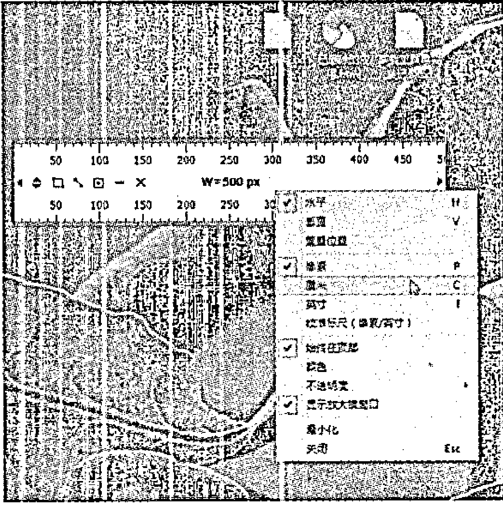

- 一软搞定另类屏幕截图.....................................................................256
- 明察秋毫 解决病毒及后遗症.................................................................258
- 过滤加密页面中的广告.....................................................................260
- 特殊需求就用另类复制.....................................................................262
- 云笔记中快速加表格.........................................................................264
- 文本“变身”有声读物.........................................................................265
- 另类复制 还有特殊法........................................................................266
- 系统 文件 程序 全面保护....................................................................268

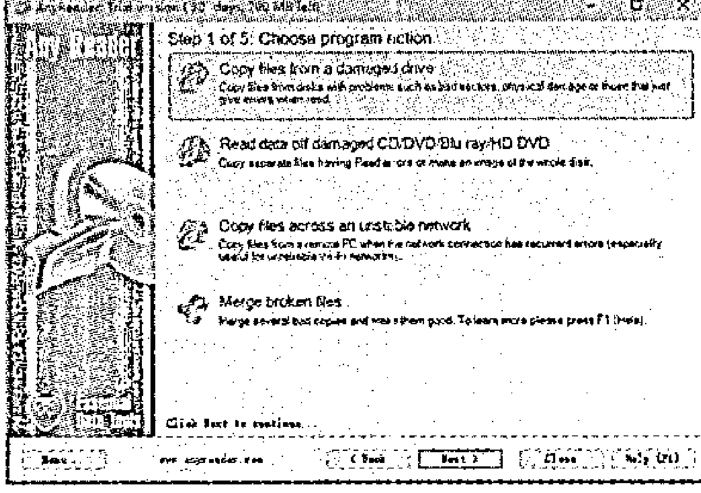

- pCloud带你另类玩转云存储.................................................................270
- 随心设置 在线压缩也灵活.................................................................272

#### 高效办公

- 办公图片内部“消化”.........................................................................274
- 巧取汉字打头的字串内容.................................................................275
- 巧用大纲视图 快速重排版面.................................................................276
- 折线图分组巧实现.............................................................................277


- “非”字型对比图表轻松做.................................................................278
- 图表也能下拉菜单排序.....................................................................279
- 玩转Excel 2016的“快速填充”...............................................................280
- Word另类需求巧实现 282
- 幻灯片动态片头易制作 283
- 多维组织结构图巧制作 284

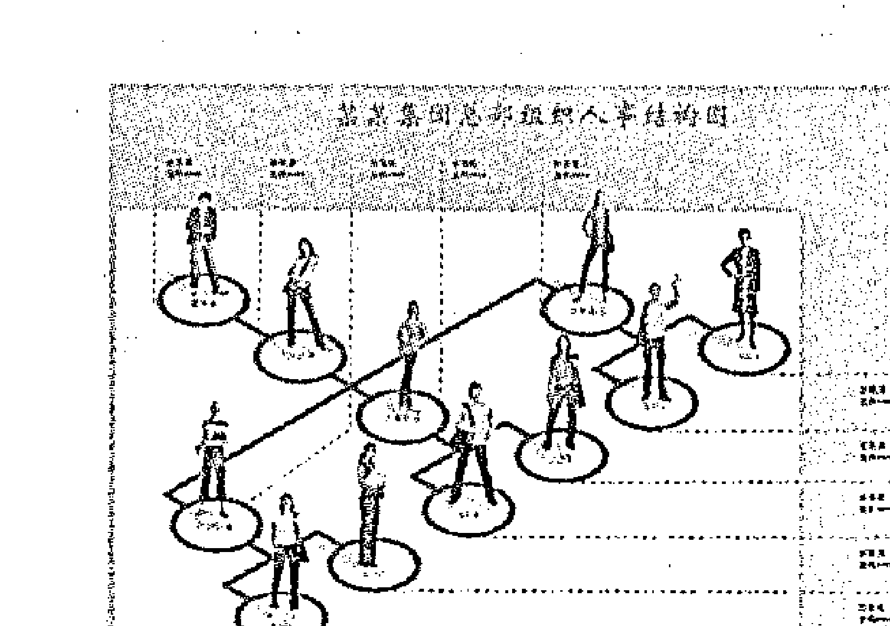

P284

- 分解视频 制作演示幻灯片 286
- 巧用圆角方格展示图片 288
- 多种方法提取列表数字 289
- 借助Power Query快速转换数据 290
- 制作仿Flash变色PPT按钮 292
- 图表变花样 表现有活力 293
- “锅状”对比图表巧制作 294
- 用Excel设计英语单词听写程序 296

### 移动新天地

- Android手机“检阅”微软小娜 298
- 复制信息跨越式快速分享 301
- 让手机充当电脑的“耳目” 304
- 机器冰冷 仍有温情 远程协助玩转Android手机 306
- “摇一摇”还能这样玩 308
- 随时走秀 你也可以是当红主播 312

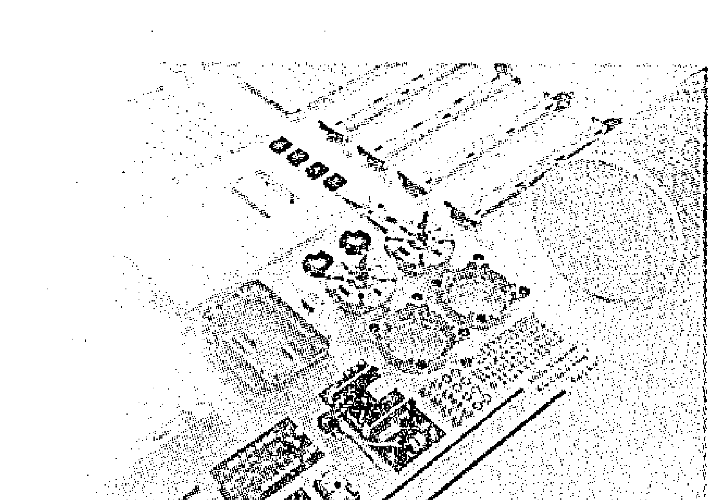

P312

##### 傻博士有话说

- 傻博士有话说 316

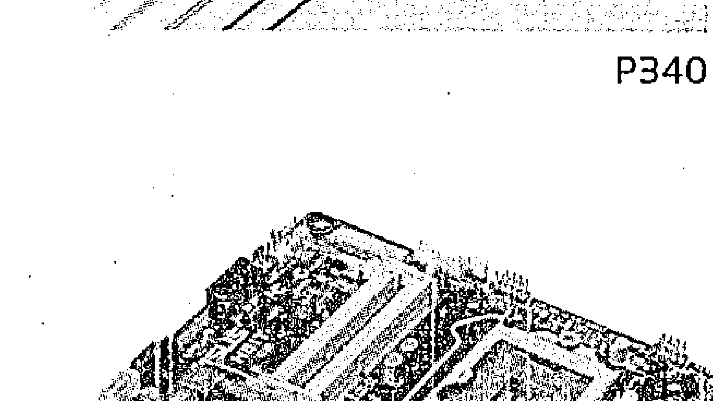

P340

### 硬件应用

- 狙击PM2.5 学会DIY空气净化器 340
- 用Lightberry HD和LED灯条 打造壁挂电视流光溢彩技术 342
- 网卡链路聚合 简单设置实现双倍带宽 344
- 在PC上玩PS4 Remote Play PC流媒体传输 347
- 酷睿何必要买K Z170主板随便超频Skylake 350
- 电脑故障多 尝试自己解决小问题 352
- 门道真不少 如何DIY桌面级平板电脑 356
- 打造完美“视界” 学会为笔记本更换IPS屏幕 359

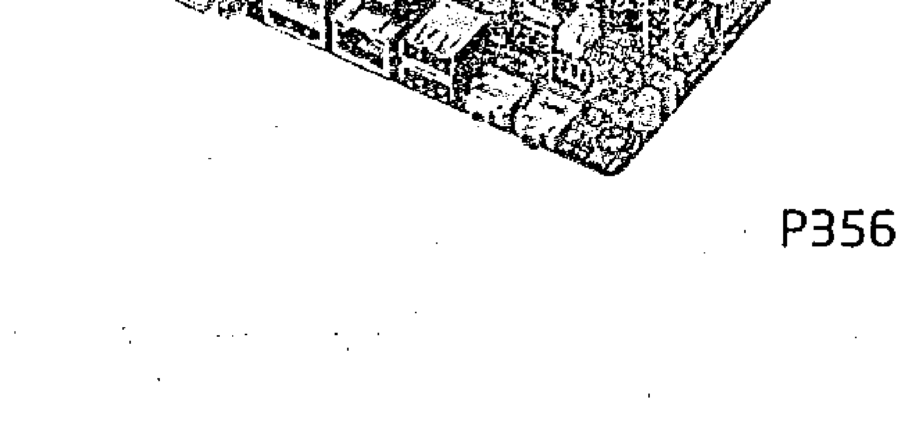

P356

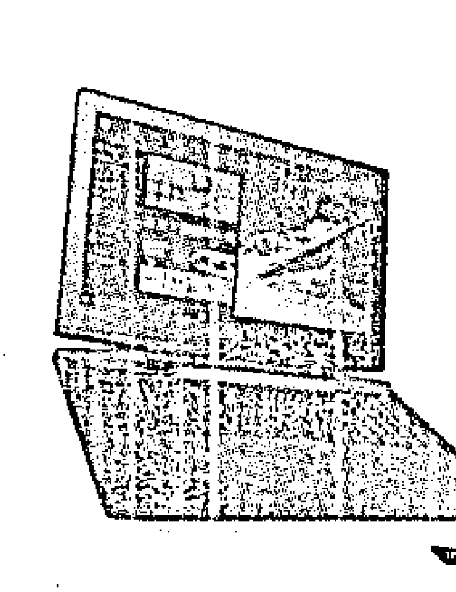

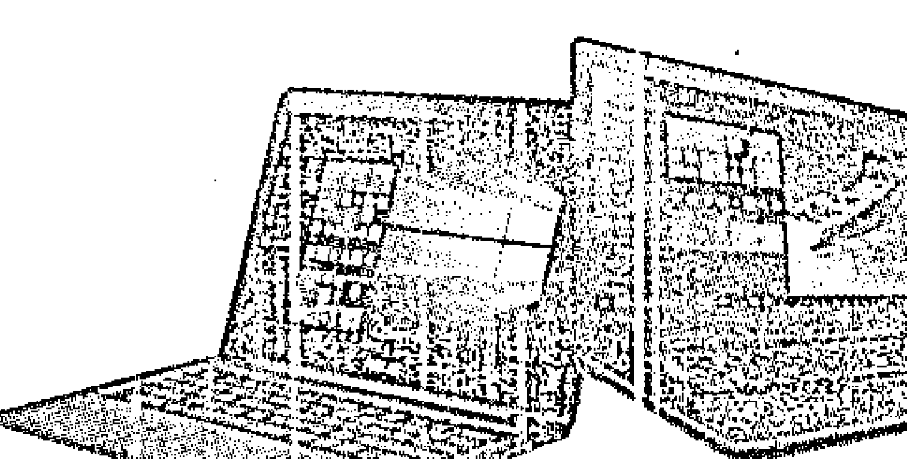


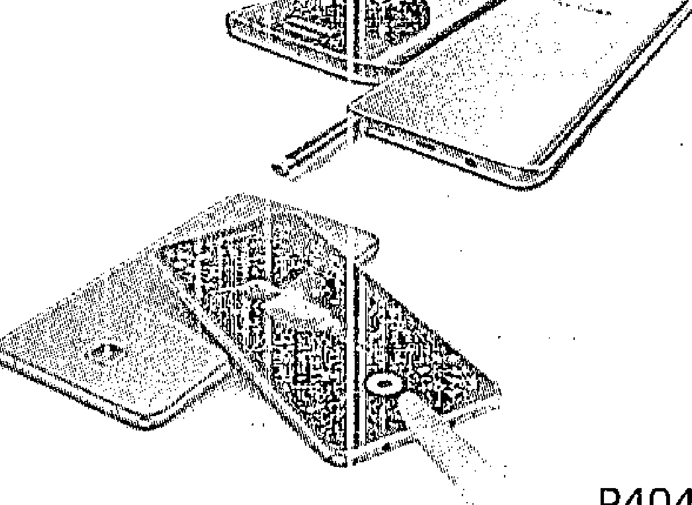

### CFan为你选

- 老将对新兵　联想Y700 PK 机械师T57........................... 362
- 千元神器的争锋　红米Note 3 PK 乐视1S........................ 364
- 从功耗看性能　笔记本CPU性能差异有多大........................ 366
- 更鲜艳的“视界”　武装AMOLED屏幕的智能手机.................... 368
- 广视角也有超低价　ADS显示器导购............................. 370
- 至强E3 V5驾到　神U的性价魅力尚剩几何........................ 372
- 是雷别碰　小心买到不划算的硬件............................. 374
- 新平台计划　Skylake低端处理器平台组建方案................... 377
- “薄”的较量　联想700S PK 华硕U305CA....................... 380
- 电信指纹两不误　中兴Blade A1 PK TCL乐玩2C.................. 382
- 精挑细选乃王道　跳出笔记本的型号误区...................... 384
- 何必羡慕Type-C　MicroUSB接口也能“盲插”................... 386
- 14英寸的游戏机　联想Y700-14 PK 惠普ENVY14................ 388
- 商务旗舰的较量　中兴天机MAX PK 华为Mate8................. 390
- 改善你的生活　智能排插怎么选.............................. 392
- 表盘还是圆的好　教你挑选智能“圆表”...................... 395
- 寻找新旧架构中的性价比　近期划算的游戏级CPU选购.......... 398
- 主机游戏全拿下　无线游戏手柄导购.......................... 400
- 新出炉的游戏本　联想小新700 PK 微星GL62.................. 402
- 来自中端的逆袭　三星Galaxy Note5 PK A9................... 404
- 把钱花在刀刃上　献给开学季的特色笔记本.................... 406
- 终于靠谱　GTX950显卡导购................................ 408
- 轻薄新势力　联想500s-14 PK 华硕U303..................... 410
- 偏执还是颜值　锤子T2 PK 努比亚布拉格S................... 412
- 忘记“BT”　Windows平板请从“CT”开始..................... 414
- 告别一天一充　寻找“超级续航”手机........................ 416
- 为了将来打基础　M.2+USB3.1主板导购...................... 418
- PK白刃战　R9 370X显卡你选谁............................. 420
- 量力而行　高端路由器选购建议.............................. 422
- 中端标杆　宏碁F5-572G PK 惠普Pavilion 15................... 424
- 谁是入门机首选　联想乐檬3 PK 红米3....................... 426
- 推荐试听　降噪耳机选购建议............................... 428
- 享受安静的世界　酷睿M帮你解决静音性能矛盾................. 430## 明断耳数据的真与假

## 眼见不为实 耳听或为真


扫一扫，更多精彩内容立现！

耳听为虚、眼见为实，成为互联网时代有图有真相的另类演绎。
但由于人们过于相信亲眼所见，或者已经习惯它们来佐证自己的论调，却不知很容易陷入他人刻意营造的宣传氛围和逻辑陷阱中，微博热点上那几次新闻图片评论的神反转，使一切都变得不那么可靠了。
本期，CFan要和大家聊聊那些如何眼见不为实、耳听或不虚背后的一些事。
策划：《电脑爱好者》编辑部

##### Mobile 移动篇

我们曾针对移动设备的虚假宣传、APP的恶意侵权等问题做过相关的报道。今天，就让我们将目光放在技术层面，扒一扒那些容易让我们“看错听差”的隐秘吧。


###### 软硬兼施让耳听为实

很多手机用户都遇到过类似的尴尬：打电话时听筒总传来恼人的噪音（特别是在开车或人多嘈杂的环境里），听不清对方在说什么；播放手机的录音文件时总有一些方向的声音偏小；聆听音乐时发现上千元的手机音效还不如几百元的MP3。总之和手机相关的声音与真实总有一些距离。那么如何缩短它们之间的距离，让耳听为实？

###### 降噪传递更真实的声音

相信大家都听说过高端的降噪耳机，但提起手机的降噪技术多半就一头雾水了。如果你正身处酒吧或热闹的街道，听筒对面的朋友能否听清你说的每一个字，此时就要看你手机的降噪技术给不给力了。

MOTO主打的“丽音”就曾是手机降噪技术的代表。简单来说，“丽音”通过软硬结合方案实现对环境噪音和用户声音的辨别，最终剔除噪音。在硬件层面，“丽音”需要手机配备至少两个MIC，其中一个MIC位于手机底部的话筒（MIC A）（图1），用于采集用户的声音。另一个MIC则位于手机顶端或背部（MIC B）（图2），用于采集嘈杂背景声；在软件层面，“丽音”提供了一个背景噪音信息库，在将MIC B采集的背景声经过一系列的硬件精确过滤以及增强型实时信号运算处理后，再与信息库内的背景噪音声波进行对比，从而准确辨别哪些声音属于噪音并将其屏蔽，最终只输出纯净的用户声音（图3）。
实际上，“丽音”就是我们常听到的“双MIC降噪技术”，类似技术已逐渐在智能手机领域普及。只是，不同品牌手机的“双MIC降噪技术”在软件层面的算法存在差异，最终会直接影响到实际的降噪效果。其中最常见的情景就是，降噪技术将你自己的声音也给抵消了一部分，导致对方听筒传出的声音太小，而且无论如何调节听筒音量也是没有效果。
总之，想在通话的过程中让“耳听为实”，手机降噪技术必不可少。但是有些手机出于成本或技术的原因，虽然配备了双MIC，但却在软件算法上一塌糊涂，实际的降噪过程“敌我不分”，反而会影响到声音的传递。如果你想避免这一尴尬，在购买某款手机前最好能找到真机做个试验：在比较喧闹的环境下给朋友打个电话，如果对方听筒既听不到明显的噪音，而你的声音又足够大，那就证明该款手机的降噪技术是靠谱的。

###### 降噪影响通话怎么办

如果你经常被朋友抱怨：总听不清电话里你在说些什么。那么基本就可判断是你手机的“双MIC降噪技术”不够成熟，软件算法存在缺陷了。想改善这一问题，最简单的方法就是在系统设置中关闭降噪技术（图4）。如果设置没有这个选项，则可在通话时用手指堵住位于手机顶部或背部的MIC B。如果你的手机后盖可以拆卸，则可剪两小块胶带，一块将机身上的降噪麦克贴上，另一块将后盖内面的降噪麦克的孔贴上（图5），合上后盖就相当于物理关闭了降噪技术。

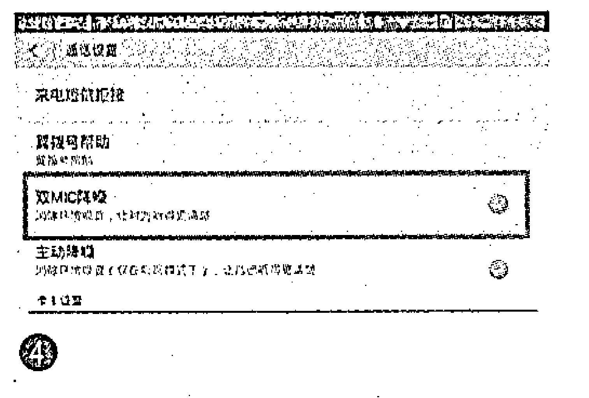

取决于MIC数量和位置，以及降噪芯片的品质和软件算法。有些降噪耳机的MIC与喇叭太近，如果软件算法优化不当，会将音乐中的部分细节也当做噪音而屏蔽掉。

###### 用胶带堵上

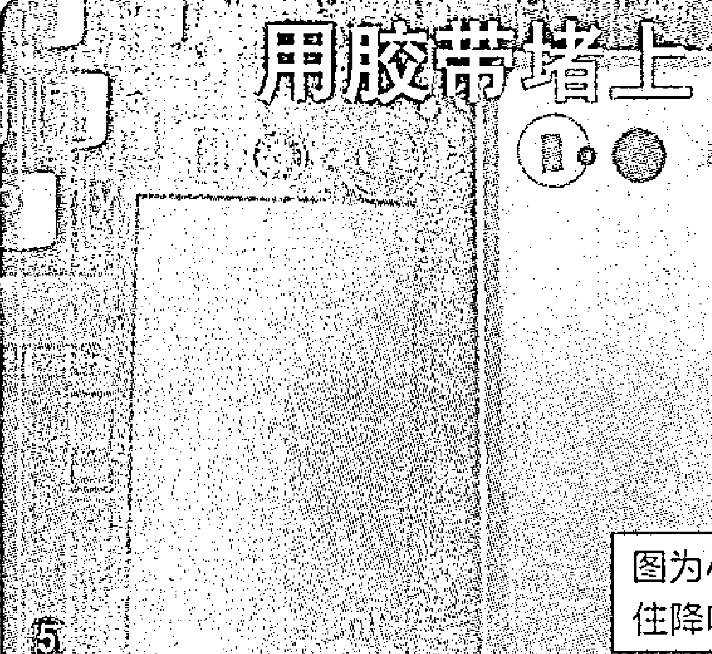

####### 扩展阅读

### 耳机是如何降噪的

很多音乐发烧友，或者注重通话质量的用户更青睐降噪耳机，以求一个安静平和的听音环境。降噪耳机的原理其实和手机的降噪技术类似，都是通过内置MIC和专业降噪芯片（图6），用于采集和分析外界噪音声波频谱，并产生与其相反相位的信号来抵消噪音，从而达到降噪目的。而降噪耳机的效果，则

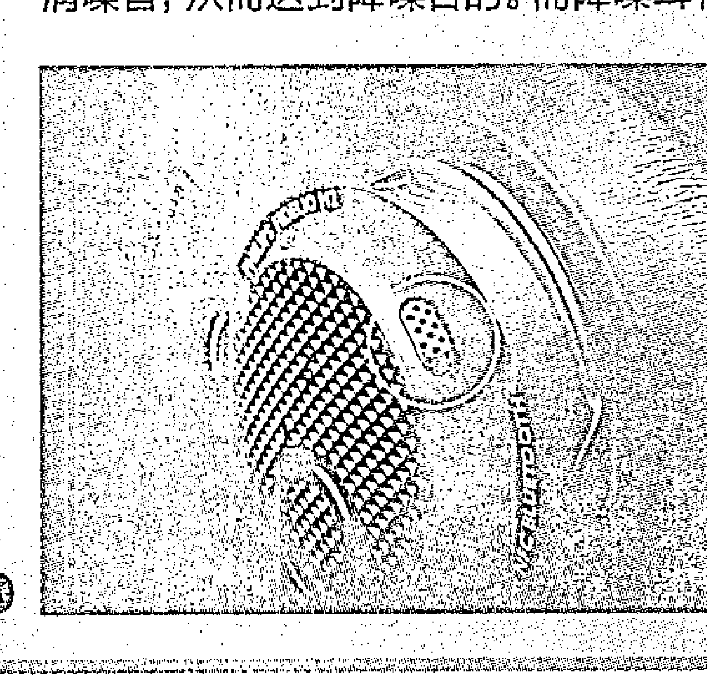

###### 三MIC让录音有了方向

随着语音助手、语音聊天等应用的兴起，不少智能手机已经武装了三个MIC。以魅族早期的MX3为例（2013年9月上市），这款产品就分别在手机底部、手机顶部和手机背部都添加了MIC单元。而三MIC的好处就是哪怕手机平放在桌面（背部降噪MIC被挡住失去效果）时，系统依旧可以通过顶部和底部的两个MIC进行声波的采集，特别是在免提（或者微信语音）状态下可以起到更好的降噪效果。当手机拥有三MIC的豪华配置后，如果依旧将其用于降噪领域就颇有大材小用之嫌了。以华为旗下的Mata S和Mate 8为例，这两款手机就通过三MIC让录音有了方向（图7）。

简单来说，Mata S和Mate 8在机身顶部（1个）和底部（2个）设置了三个MIC，可实现更精确的360度环绕收声效果，让四方声音都能清晰收纳。而其自带的录音软件也加入“会议”的录音模式，在该模式下三个MIC可收集并记录不同方向的音轨，并通过圆形录音界面的波动加以区分（图8）。

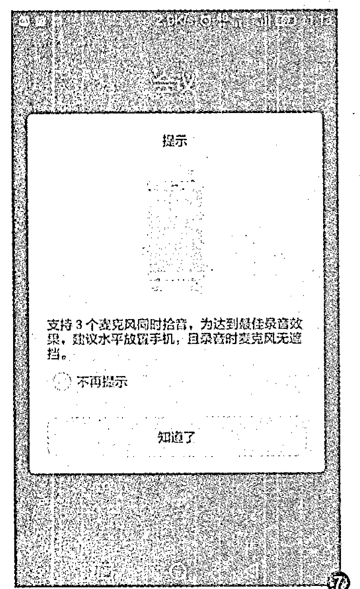

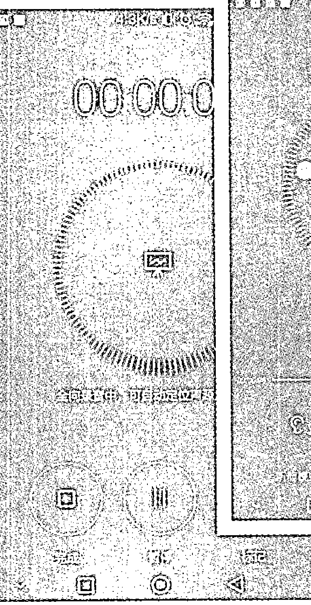

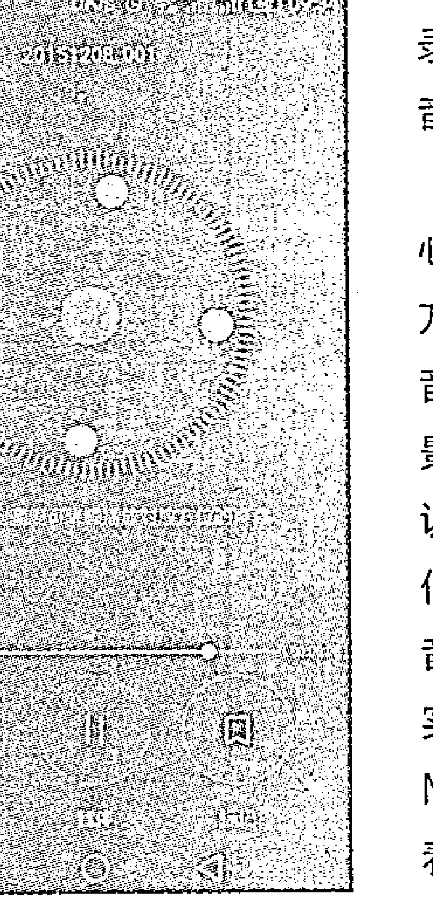

在播放录音文件时，只需将中心小红点拖拽到圆环边缘说话人方向，就可定向增强这个方向的声音收录，而此时其他方向的嘈杂背景音则会被弱化（图9）。哪怕会议期间与会人员争吵得再厉害，我们也能选择性地屏蔽其他方向的音源，指定倾听某个方向的声音。实际这种指向录音就是建立在三MIC硬件基础上的软件算法。随着三MIC手机的普及，以及用户对指向录音需求的增加，相信今后会有更多手机引入类似功能。

#### Hi-Fi 还原音乐的细节

随着无数标榜 'Hi-Fi手机' 的问世（图10），传统音乐播放器受到了严峻的挑战。顾名思义，Hi-Fi(High fidelity)代表着高保真的声音，可还原音乐的每一分细节，真正做到'耳听为实'。但是，时下所谓的那些Hi-Fi手机真的High吗？

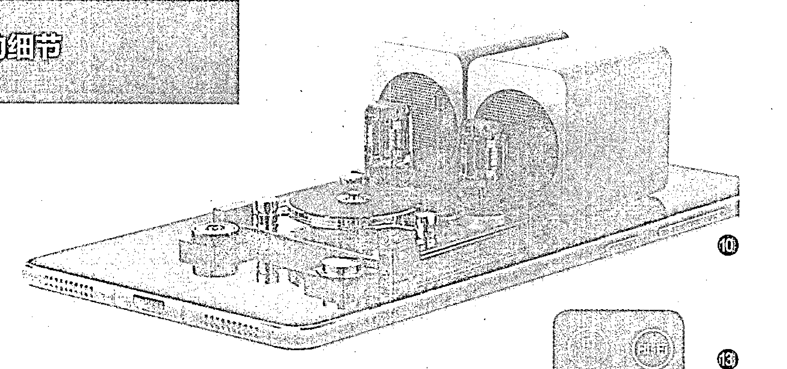

我们先来回顾一下智能手机是如何处理声音回放的：

首先，存储在手机本地的音乐（或在线音乐）要被转换为数字信号，然后通过'DAC'（可选）或'Codec'（必选）解码芯片将数字信号转换为模拟信号，最后再将模拟信号输出到耳机。在这个过程中存在两个可选的需求，比如当你想给声音加入杜比等音效时，需要在数字信号阶段入手；当你想推动发烧级耳机时，在输出到耳机前还需要通过运放芯片将模拟信号放大。因此，一套完整的声音回放步骤应该是：

-   音频文件→转换为数字信号→添加杜比等音效（可选）→通过DAC（可选）/Codec解码芯片（必选）转换为模拟信号→运放芯片放大模拟信号（可选）→输出到耳机或喇叭。

因此，想成为一款Hi-Fi手机的捷径就是直接选择符合Hi-Fi标准的DAC解码芯片和运放芯片（图11）。如联想乐檬X3就选择了ESS ES9018C2M DAC解码芯片和OPA1612运放芯片的组合；vivo最新的X6Plus则采用了ESS自家的DAC芯片ES9028和ES9603运放芯片的组合。理论上讲DAC和运放芯片的等级越高（网上有不同型号DAC和运放芯片的参数和功能介绍，大家可自行搜索），音质表现就越为出众。

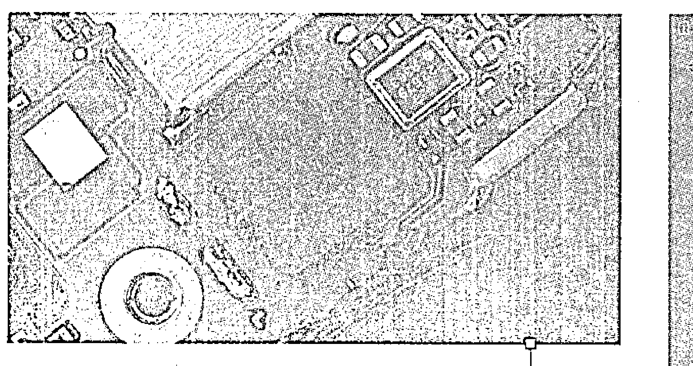

需要注意的是，无论手机有没有配备独立的DAC芯片，它都会集成Codec芯片，只是唯有武装DAC的手机才有机会打上Hi-Fi的标签而已。就像联想乐檬X3就同时配备了ES9018C2M（DAC）和欧胜WM8281（Codec），魅族上代旗舰MX4 Pro则采用了ES9018K2M+WM8998（图12）。

那么，DAC和Codec有什么区别？简单来说，DAC是一颗需要额外耗电的更高品质音频解码芯片，它是手机能实现Hi-Fi音质的前提。但是，在Android系统下，只有极少数APP（比如自带的音乐播放器）才能正确识别和使用它（图13），而且Hi-Fi模式下还会更费电。这意味着，只有播放音乐时你才能体验到由DAC输出的Hi-Fi音质，而在系统声音/应用/电话/语音等环境下，音源都是通过另外的一颗Codec芯片进行输出的。因此Codec又被称为'音频中枢'。

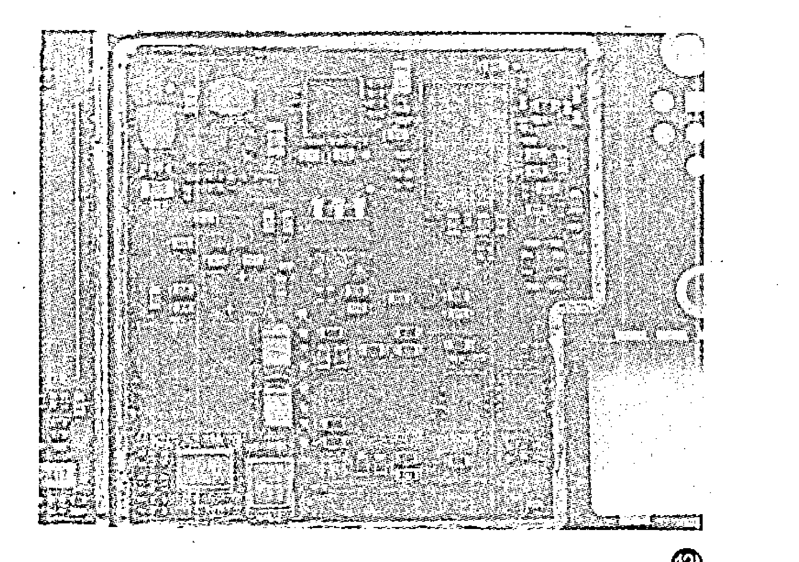

总之，我们可将DAC理解为PC上的独立声卡，Codec则是集成声卡。前者只能用于播放音乐，而后者则用于其他音频内容的输出。具体到手机领域，能否实现Hi-Fi级别音质看DAC（以及Hi-Fi手机），视频和其他声音的表现优劣则取决于Codec（以及喇叭），能否推得动某款耳机就要靠运放芯片了。

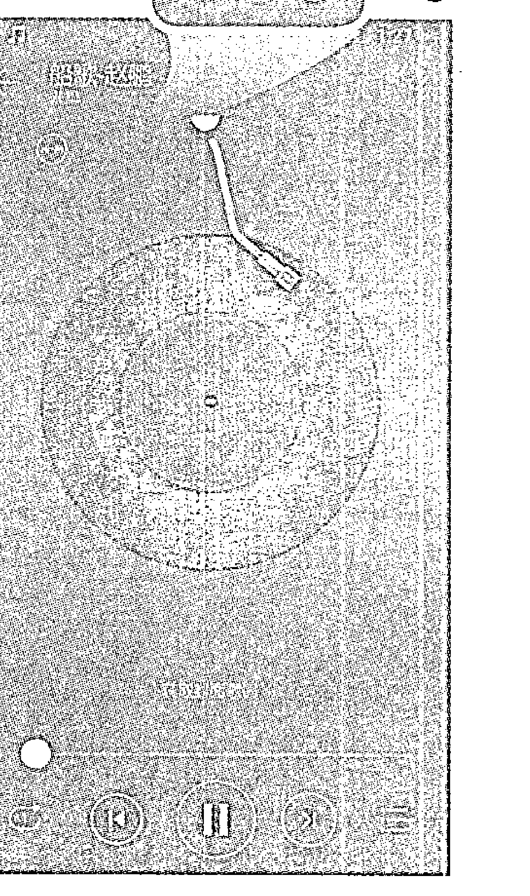

#### USB Type-C眼见也许不为实

USB Type-C接口无疑是2015年科技界的“宠儿”，无论是PC主板、笔记本、手机或是平板身上都能看到它的影子。实际上，USB Type-C就是眼见不一定为实的典型范例。因为外表相同的USB Type-C接口中，在功能和性能上可能存在着云泥之别。

##### 什么是USB Type-C

USB Type-C这么火，那它到底是个啥？实际上，USB Type-C就是一种物理接口的定义规范，与我们熟悉的SATA、HDMI、Lightning没什么分别，只是它的倡导者是USB推广小组，因此我们习惯将其视为下一代USB的通用接口。

具体来说，USB Type-C接口的尺寸为8.3mm×2.5mm，大小与时下主流的Micro-USB相当（图1），而它却参考了苹果Lightning的杀手级卖点：反正都能插。此外USB Type-C接口内含更多的24个针脚，也因此获得了无限的可能：更高速的USB传输速度、高达100W的供电潜力、轻松传输4K级别的视频信号，造就了“N合1”的全能属性（图2）。

可惜，USB Type-C的“全能”只是理论层面。虽然目前配备USB Type-C接口的设备无数，而且它们的接口、数据线看起来也是一般无二，但赋予USB Type-C的功能和性能却出现了极大的差异。接下来就让我们深入扒一扒USB Type-C接口表面下的秘密吧。

##### USB2.0还是USB3.x

作为下一代USB标准的USB Type-C，很多用户都会将它与USB3.1划上等号。在这里就需要普及一个常识了：

USB Type-C只是下一代USB接口的物理结构标准，无论是USB3.1、USB3.0还是USB2.0，它们都能选USB Type-C作为自己的接口。比如，目前在售配备USB Type-C接口的手机中，只有ZUK Z1和Lumia 950/XL的接口支持USB3.0（符合USB3.0标准的Type-C又称“USB 3.1 Gen1”），而像乐视手机、一加2、魅族Pro5等手机依旧停留在USB2.0阶段。换句话说，USB Type-C能否达到USB3.1或USB3.0的速度，关键还得看（配备USB Type-C接口的）设备有没有内置相关的主控芯片，和是否采用USB Type-C标准的接口没有半点关系。

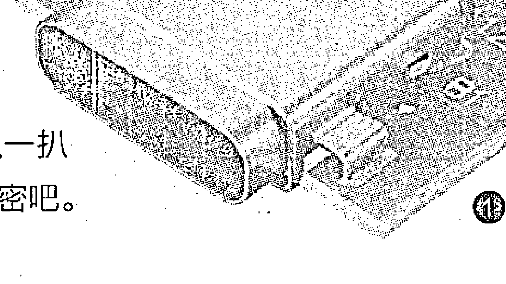

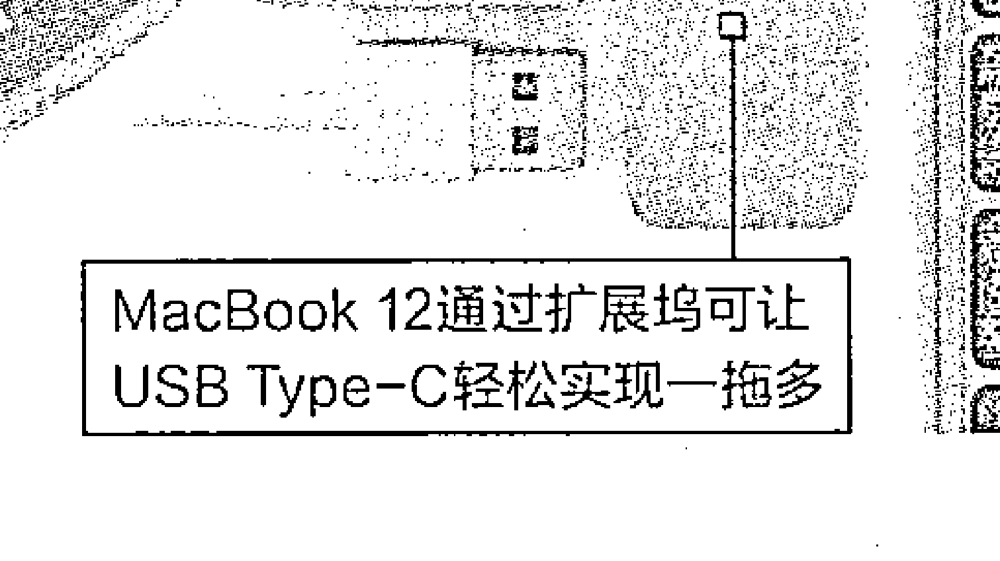

##### 供电参数取决于电源芯片

网上有一种说法，称USB Type-C可带来100W的电力传输能力，因此可作为移动设备（主要以笔记本为主）的充电接口来使用。不过，这个功能却并非所有USB Type-C都能享用，因为它需要额外的硬件支持：符合“USB-PD”（USB Power Delivery）协议标准的电源管理芯片（图4），而且需要在设备（如笔记本）和充电器两端都加入此类芯片才可以。

可惜，USB-PD协议芯片的成本较高，部署起来也需要一定的研发实力。所以时至今日，只有苹果新MacBook 12和谷歌的Chromebook Pixel 2直接将USB Type-C作为了充电接口（图5）。

网上还有一个说法，由于USB Type-C的供电能力在标准的MicroUSB接口之上，所以基于前者设计的智能手机都能获得更快的充电速度。这个说法就更不靠谱了，一款手机是否支持快充与采用USB Type-C还是MicroUSB接口无关，关键还是在有没有搭配符合快充协议的电源管理芯片。

比如，一加手机2等手机虽然配备了USB Type-C接口，但依旧仅支持标准的5V/2A（10W）充电。而同样采用USB Type-C接口的乐视手机1S和魅族Pro5（图6、图7），则分别通过额外的高通QC2.0快充芯片和联发科MTK Pump Express Plus快充芯片，获得了最高24W的充电能力。

总之，与传统的USB Type-A和MicroUSB接口相比，USB Type-C接口虽然在理论上可承载更大的电压（5V~20V）与电流（3A/5A），但实际可以享用多少就取决于具体的电源管理芯片和数据线的质量了。我们可以将USB Type-C理解为直径10cm的水管，MicroUSB接口就好似5cm的水管，但在单位时间里可以流出多少水，还得看水龙头（电源管理芯片）的规格。

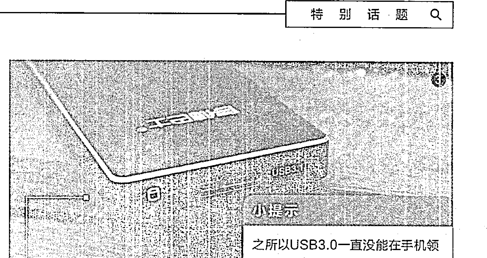

SSD移动硬盘

> 之所以USB3.0一直没能在手机领域普及开，是因为设备在以USB3.0模式进行数据传输时会对网络信号造成干扰，容易引起网络掉线等问题。而USB3.1主控芯片还不成熟，所以现阶段依旧是USB2.0一统江湖的局面。

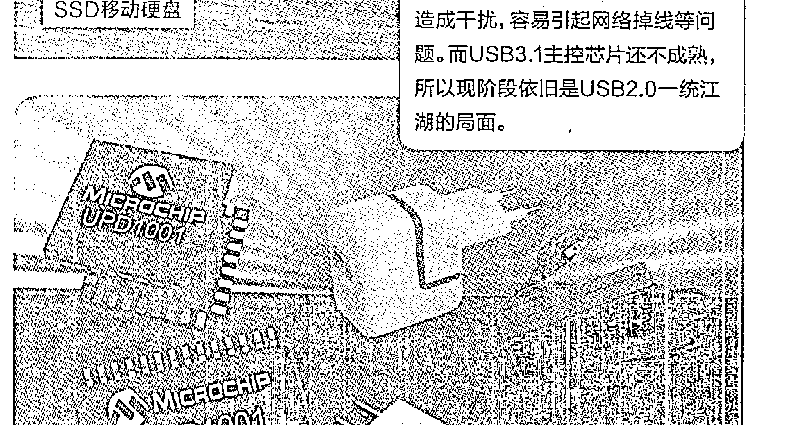

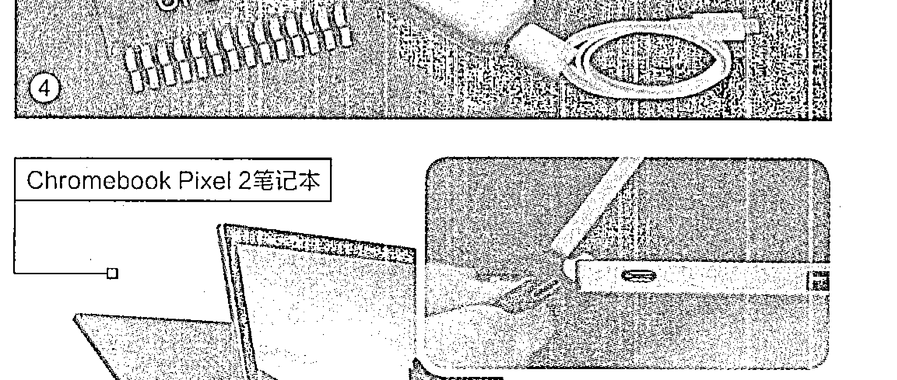

Chromebook Pixel 2笔记本

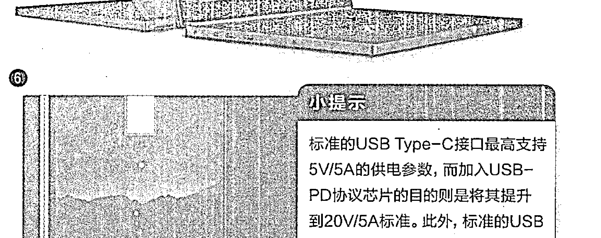

> 标准的USB Type-C接口最高支持5V/5A的供电参数，而加入USB-PD协议芯片的目的则是将其提升到20V/5A标准。此外，标准的USB Type-C型数据线最高仅支持3A的电流，如果大功率设备想使用USB Type-C作为充电接口，还需配备单独定制的USB Type-C充电线。

##### 乐闪冲 更高效便捷的充电方案

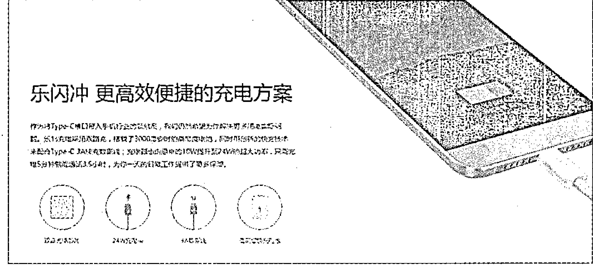


在手机领域，很多手机可通过Micro USB实现MHL视频输出功能，而在最新款笔记本上我们也能看到和USB Type-C长得一模一样的雷电3（Thunderbolt 3）接口。那么，配备USB Type-C的手机还能实现MHL功能吗？笔记本上的USB Type-C是否就等于雷电3呢？


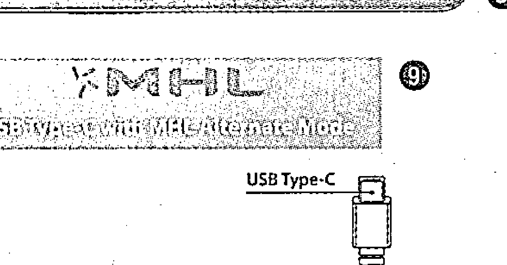

##### USB Type-C与MHL

对老款手机而言，MHL本来就是可选功能，需要手机内部集成相关的解码芯片，而MHL线缆再通过对Micro USB接口的5个脚针重新定义从而完成视频输出（图8）。

到了USB Type-C时代，MHL依旧是可选功能，只是MHL联盟与USB推广小组针对USB Type-C做了进一步的优化。

简单来说，USB Type-C的MHL功能被列全新的“MHL Alternate Mode”（MHL Alt Mode）协议规范（图9）。该补充协议包含了对USB Type-C转HDMI Type A连接线、USB Type-C协议转换适配器和MHL Alt Mode的MHL扩展坞的支持。与MicroUSB的MHL功能相比，采用MHL Alt Mode协议的USB Type-C可通过USB标准ID、供应商定制消息以及MHL功能指示来显示支持USB PD，也可同步传输MHL音视频、USB功能和充电功能，且无需改变MHL接收端上的引脚定义/映射。

##### USB Type-C与雷电3

雷电（Thunderbolt）的发展算是比较“悲催”的，因为它一直就没有属于自己的物理接口，只能依附在其他协议的物理接口之上。比如雷电1和雷电2使用的是miniDP（Mini DisplayPort）（图11），而最新的雷电3则附属在USB Type-C之上，而这也是为什么USB Type-C和雷电3长得一模一样的原因。

英特尔六代酷睿处理器平台（Skylake）原生支持USB Type-C和雷电3，但笔记本厂商抢先武装雷电3接口的热情并不高。原因很简单：成本。雷电3涉及到PCIE通道的重新分配问题，布置起来有一定难度，所以仅被一些定位高端的六代酷睿笔记本所采纳。

| 参数       | 内容                     |
| ---------- | ------------------------ |
| 品牌型号   | 乐1s                     |
| 网络制式   | 全网通                   |
| 处理器     | 联发科Helio X10 Turbo    |
| 内存       | 3GB                      |
| 存储       | 32GB                     |
| 屏幕       | 5.5英寸 1080P            |
| 摄像头     | 1300万+500万             |
| 电池       | 3000mAh                  |
| 系统       | EUI 5.5                  |
| 其他功能   | 金属机身、指纹识别、快充等 |

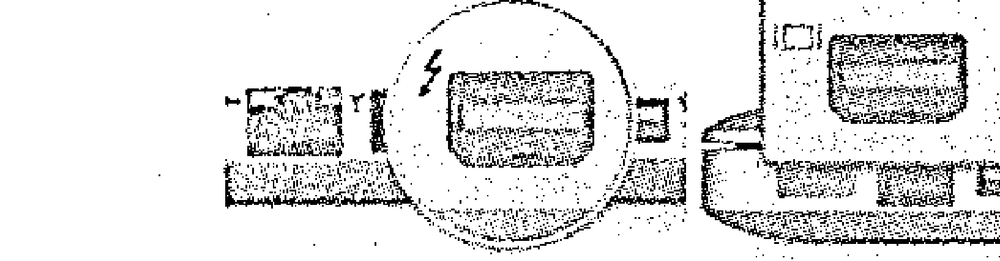

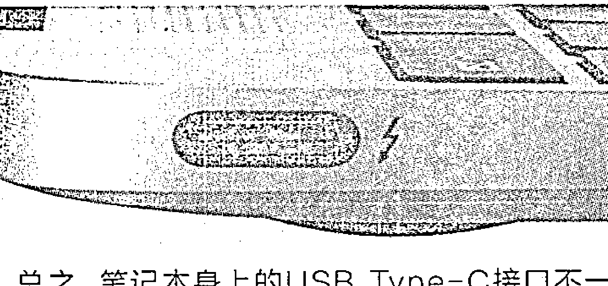

总之，笔记本上的USB Type-C接口不一定支持雷电3，但雷电3接口一般都能向下兼容USB3.1。为了将二者区别开来，在雷电3接口旁边会强制性地印有闪电的标识（图12），而雷电3的传输线缆内部也需要集成英特尔授权的物理芯片（图13），普通的USB Type-C数据线是无法直接传输雷电3的视频画面的（需配备转接头）。

##### USB Type-C Receptacle Pins

##### Pins defined for system or device receptacle

| A1  | A2    | A3    | A4  | A5    | A6  | A7  | A8    | A9   | A10   | A11   | A12  |
|-----|-------|-------|-----|-------|-----|-----|-------|------|-------|-------|------|
| GND | TX1+  | TX1-  | GND | CC1   | D+  | D-  | SBU1  | VBUS | RX2-  | RX2+  | GND  |
| GND | RX1+  | RX1-  | GND | SBU2  | D-  | D+  | CC2   | VBUS | TX2-  | TX2+  | GND  |
| D12 | D11   | D10   | D9  | D8    | D7  | D6  | D5    | D4   | D3    | D2    | D1   |
| Cable Ground | Cable Power | Secondary Bus | Plug Configuration Detection | | | | | | | | |
| *One becomes Vconn, cable power* | | | | | | | | | | | |
| *CC is used for USB-PD communication* | | | | | | | | | | | |

在我们的印象中，随便一根MicroUSB数据线，既可以用在平板电脑身上，也能用于智能手机，而且几乎不存在任何兼容性和安全方面的问题。遗憾的是，当数据线步入USB Type-C时代后，我们在购买兼容数据线时就不能如此草率了。

##### USB Type-C的隐患

武装USB Type-C接口是一加手机2的主要卖点之一，但是它标配的那根USB Type-C数据线却“闯了祸”。

简单来说，USB Type-C的接口有一组CC引脚（图14），专门判断是否插入设备、方向，以及其它的设定。根据USB Type-C 1.1的定义规范，需要为USB Type-C公头的CC接脚配上1组56kΩ ±5%规格的电阻，用于防止大电流事故。可惜，一加手机2的USB Type-C数据线没有严格按照USB Type-C 1.1标准执行（图15），仅选用了10kΩ的电阻器，导致数据线会发送错误的信息给充电器/电脑，让它们“以为”另一头的设备可以承受3A的大电流。

问题来了，一加手机2的USB Type-C数据线无法承载3A大电流，但它会错误地让充电器以为它可以支持3A的电流通过。于是问题就严重了，像NEXUS 6P/5X等手机支持5V/3A快充，如果你用了一加手机2的USB Type-C数据线，很可能导致数据线甚至手机烧毁。有些电脑已经配备了支持快充的USB接口，使用一加手机2的数据线给NEXUS 6P/5X这类支持超过2A大电流的手机充电，也会导致电脑的USB接口直接过载超负荷，安全隐患同样非常严峻。

可见，虽然USB Type-C数据线长得都是一般无二，但一些小细节的差异却可能产生严重的安全隐患。因此，我们在购买兼容USB Type-C数据线（包括转接头）时千万不要贪图便宜，同时也希望手机厂商能够更用心地准备安全配件。

##### Type-C的缺点

-   USB Type-C开放性和灵活性存在BadUSB漏洞，黑客可避开数据读取区，将恶意代码存放在USB设备控制器的固件存储区，让用户在没发现它之前就将恶意代码感染给电子设备，而这个隐患暂时还没有太好的解决方案。
此外，由于USB Type-C接口和线缆做工要求比MicroUSB更高，为了保证传输速度和供电质量，普遍更短更粗（相对）。

##### 小结

USB Type-C最大的意义就是有望终结无数的USB接口标准（图16），而它又好似DIY平台，厂商可根据需求，通过加装不同的协议芯片激活24个针脚的隐藏功能。为了方便区分外观一致的USB Type-C接口的不同功能，USB-IF组织为USB Type-C接口制定了一系列Logo（图17），如拥有“SS”和“SuperSpeed”等标志代表该接口支持USB 3.0；拥有“SuperSpeed+”、“10”、“10Gbps”标识代表支持USB 3.1；以电池图样作为背景的USB Type-C代表集成了USB-PD芯片，可作为设备的充电接口。可惜USB-IF组织定制的这一标识需要授权费（每年约4000美元），能否在行业内普及还是未知数。

##### 特别话题

#### 深藏不露 金属手机的工艺之谜

如今哪怕是千元级手机也用上了金属材质机身，冷冰冰的触感能够刺激用户的消费欲望。然而金属手机虽然看起来都大同小异，但它们的物理结构却可能存在极大差异，唯有掌握其背后的秘密才有机会“眼见为实”。

##### 成本和态度

毫无疑问，金属材质拥有远超塑料（聚碳酸酯）的质感，也是提升手机颜值的不二法宝。然而，赋予一款手机金属元素的工艺有很多种，最常见的就是冲压、压铸与一体化CNC。
-   冲压：将金属板用冲头压出手机外壳所需的金属片样式。固态到固态，属于材料变形；
-   压铸：将熔融的液态金属通过压力，充填到模具型腔，冷却、成型。液态到固态，属于材料成型；
-   CNC：将一整块金属通过数控机床进行切割、钻孔、打磨（图1），最终得到一体化的金属外壳。
就成本、加工难度、流程耗时、物理强度和品质而言，冲压 < 压铸 < CNC。因此，一款金属手机到底采用了哪种工艺方案，就取决于厂商对成本的诉求以及对消费者的态度了。

##### 金属的后遗症

金属材质虽然手感好、强度高，但它却存在致命的缺点：信号屏蔽（图2）。因此100%（不算屏幕玻璃部分）由金属打造的手机并不存在。为了实现信号溢出，必须让金属材质部分“透风”，并通过填充其他材质解决金属对信号的屏蔽问题。目前让金属手机“透风”的方法以三段式、开窗式和NMT纳米注塑为主。而冲压、压铸、一体化CNC与三段式、开窗式、NMT纳米注塑的搭配组合，就形成金属手机的“众生相”。

##### 三段式：入门的选择

所谓三段式是指中间为金属，上下两端为塑料，再将它们拼接在一起的设计方案（图3）。三段式是金属手机中的“廉价货”，而冲压工艺则是三段式方案的最佳搭档。以红米Note3为例，它的金属外壳其实就是冲压而来的(图4)，并将其覆盖在以塑料材质为主的中框和骨架之上(图5)，并通过喷漆工艺将金属与塑料的部分涂成一个颜色，使其看起来显得更加和谐统一，给人一种整个后盖都是金属的错觉。

##### 开窗式：进阶的选择

所谓开窗式，就是在一体化的金属外壳上下两端(或一端)“挖”出一个镂空的“窗口”，再填充进可以透过信号的塑料或玻璃等材质(图6)。需要注意的是，开窗式方案既可以与压铸工艺配合，也能被应用在一体化的CNC工艺身上。

魅蓝Metal就是压铸工艺+开窗式方案的代表。这款手机将一体化金属背盖的上下两端开了信号天窗(图7)，再由注塑工艺填充，并在高光倒角、摄像头外圈还有Home键边缘用CNC加以抛光(用于提升视觉档次)，最后用彩色涂料和喷涂工艺加以覆盖，让纯金属和塑料部分的外观质感相同。

魅族MX5、OPPO R7、华为Mate S/8等手机则是一体化CNC工艺+开窗式方案的代表。以MX5为例，让一整块金属通过CNC数控机床切割成型(图8)，直接钻出用于溢出信号的窗口，再搭配注塑以及喷砂上色等工艺填充美化。

> 网友暴力切割魅蓝Metal的后盖，证实顶部和底部的边缘部分也都是金属，只是天线部分应用了注塑工艺

##### 纳米注塑：极致的选择

开窗式方案虽然不破坏一体化的金属结构，但用于注塑的镂空部分面积较大，从而降低了金属占比的数值。此时一体化CNC工艺+NMT纳米注塑方案便孕育而生。iPhone 6是该方案的最佳代言人，它的金属后盖被CNC数控机床切割出数道细条状的镂空，并通过NMT纳米注塑工艺加以填充(图9)，填充后的条纹被用户戏称为“白带”。而类似的“白带”也出现在乐1 Pro/MAX、vivo X6等手机上(图10)。为了避免这些条纹影响外观，如何减少条纹数量、缩减宽度就是大家竞争的方向。

#### Multimedia 多媒体篇

现代人获取信息，可以从图像、视频、声音、文字等等多种渠道获得，也就是所谓的多媒体。而多媒体信息，随着技术的发展是最容易出现“造假”现象的。那么我们何时需要“造假”，何时又需要“辨假”呢？

##### 图片照妖镜 有图无真相

###### EXIF中有大玄机

网上购物或者查看信息时，常听人说“有图有真相”，不过在很多时候，有图不一定就有真相，因为现在有很多图片都会经过PS（即指经过Photoshop等图像编辑软件处理过），很多时候呈现我们眼前的并不是真实、原始的图片。那么对于一张图片，我们怎么确定是否经过PS，又怎么样去找到原始图片呢？

大家知道当我们使用手机或相机拍摄图片的时候，这些设备会在当前照片写入相应的EXIF信息，如拍摄的设备、曝光度等。如果照片经过后期处理（如PS），那么这些信息就会发生改变，因此通过查看照片的EXIF信息就可以判断出照片是否经过修改。

对于EXIF信息的查看，只要在资源管理器中打开相应的照片，然后右击选择“属性→详细信息”，接着在打开的窗口中就可以看到详细的信息了，如相机制造商、闪光灯模式等信息（图1）。

如果照片经过PS处理，那么我们再次使用上述方法查看详细信息，可以看到在属性窗口会增加一个“程序名称”的选项，里面会清晰标记着这张照片使用PS进行过编辑，而且这些信息默认在资源管理器中是无法删除或者编辑的。这也意味着只要照片出现类似“Adobe Photoshop CS6”字样，则表明该张照片已经被PS过了（图2）。

不过需要注意的是，很多时候仅仅通过简单查看EXIF信息可能仍然无法判断出照片的真伪。因为一些EXIF信息可以被人为编辑，比如在资源管理器中就可以直接对相机制造商和型号信息进行修改，某张照片明明是不知名的山寨手机拍摄的，如果用户将其更改为iPhone 6拍摄，这时怎么进行判断（图3）？

对于修改过的EXIF信息，这里可以借助JPEGsnoop进行判断。JPEGsnoop是一款专业用于检测照片原始性和EXIF数据完整性的软件。启动JPEGsnoop后把要鉴别的照片拖到程序窗口，这样JPEGsnoop会自动对照片EXIF信息进行读取。在窗口最后会显示具体的检测结果，如“Class 1 - 图像被处理/已编辑”，则表示照片已被编辑过了（图4）。

###### 色彩辨真伪

此外，我们还可以根据相机的一些特性进行判断。在成像方面，佳能的数码单反有这样的特点，越是便宜的入门机型，成像反而越鲜艳锐利。而越高端的机型，直接出片的效果往往显得较为朴素、中性。因为低端入门机型的默认锐度和饱和度往往设置得较高，而高端机型追求的是素材性，所以直接出片效果较为朴素。如果低端单反伪造为高端单反机，那么从照片色彩上就可以判断出造假的可能了。

JPEGsnoop通过“Class X”来表示图片被编辑的可能性大小，一般如果结果为Class 3说明照片是原始的，Class 1和Class 2则说明照片EXIF元数据被修改过，Class 4则说明证据不足以判断。对于鉴定为Class 4的照片还可根据其他知识点进一步判断。比如上述将普通手机修改为iPhone 6拍摄的照片，而在iPhone 6配置的800万像素的照片中，默认拍摄到的最佳质量的照片分辨率大小是3264×2448，但上述修改过的照片其分辨率显示为2085×1456，显然这是一张伪造iPhone 6拍摄的照片（图5）。

###### 放大照片显真形

当然了，伪造者也可以通过修改EXIF信息和iPhone 6拍摄的照片一致的方法来造假。对于这类伪造，我们就可以结合照片其他特性进行综合判定。以一些相亲网站上提供的照片为例，有些相亲者提供的所谓素颜照却光彩靓丽，这些照片我们借助PS或者画图软件，将图片放大300%甚至500%，查看图片细节。如果图片有PS，在放大很多倍后，在一些过渡的地方可以明显发现很不自然，通过这些细节就可以判断照片是经过处理的（图6）。

总之，我们要判断一张照片的真假，除了借助EXIF信息查看外，再结合照片的特性、拍摄设备的特征等因素，就基本可以准确判断一张照片的真伪了。

###### 原始照片何处寻

当发现一个图片是假的时候，如果我们需要原始的图片又该怎么去寻找？需要查找图片的原始出处，我们可以借助各类网络智能识图进行查找。如笔者在某QQ群看到一张适合制作易拉宝宣传使用的图片，但是图片大小只有496×966，显然这只是一张编辑过的小图，如果要制作易拉宝必须找到原始出处，下载PSD源文件才能够用于制作成品。现在打开 http://shitu.baidu.com/，然后点击“本地上传”上传获得的小图，上传成功后百度会自动帮助我们查找到同类图片（图7）。通过仔细比对，可以看到这张图片的原图来自千图网，点击其中的链接即可看到原始图片的出处，可以看到这里提供该图原始的PSD图片，分辨率高达1535×2835，正是可以适合制造易拉宝的原始素材。

通过百度识图可以查找同类图片

文|技术宅

##### 火眼金睛看视频 视频造假一眼看清

除了图片的造假，现在多媒体文件中视频的造假也很多。之前可能很多朋友认为视频是无法作假的，而随着技术的发展，视频作假也可以天衣无缝。以前段时间在视频网站很流行的一个完美春晚段子为例（观看网址：http://tinyurl.com/cf060101，来源腾讯视频，已做网址缩短处理），制作者就巧妙利用了原春晚的视频，然后通过剪辑《跑男》、《梦想新搭档》等娱乐节目内容，并通过对口型更换配音文件，制作出一档以假乱真的春晚假视频（图1）。

要制作出一些以假乱真的视频就少不了视频的剪辑，很多造假的视频也大多是通过插入一些剪接的视频实现的，可以借助Premiere实现视频的剪接。因此首先需要准备好原视频和插入的视频素材。上述例子中，在视频的32秒处是朱军报的第一个舞蹈节目《相亲相爱》，舞蹈的节目时长是48秒，因此在这个节点后就要准备好需插入的视频《相亲相爱》，并且截取48秒视频片段备用。

那么这类造假视频是怎么实现“造假”的呢？它主要是通过对原视频的剪接、替换配音来实现，这其实是一种视频处理技术。如果你也要实现类似的“造假”（当然是指纯娱乐性方面的），借助一些专业视频处理软件如Premiere即可轻易实现。

准备好舞蹈节目《相亲相爱》视频后，启动Premiere，点击“新建项目”，按提示建立一个默认的新项目，接着点击“文件→导入”，导入需要处理的视频，Premiere会对导入的视频进行分析，包括音频、视频等信息（图2）。需要注意的是，为了让处理后的视频能够更完美，这里选择嫁接的视频一定要和原视频有个呼应或者顺延关系，避免视频处理后情节变得太突兀，让人一眼就看出是造假视频。现在双击素材面板中的视频1，右边窗口“源面板”便会显示预览，在预览窗口播放视频，然后选择需要嫁接的视频片段，只要依次点击“设置入点”和“设置出点”（即需要截取视频的起始位置），这样即可截取自己需要的视频（图3）。

###### 视频配音的替换

通过上述操作我们完成视频画面的“造假”，为了获得更好的效果，下面还要为视频添加上个性的字幕和配音。比如为了突出搞笑的效果，可使用对口型的录制方法将原来人物的对话变为自己想要的发音。首先使用麦克风录制自己需要的音频，这里需要打开原来视频播放，然后记住需替换人物对话的起始时间，接着开始录制自己的配音（注意口型、语气、语音要和原版尽量一致），完成后将录音文件保存备用。返回Premiere窗口选中上述视频，在时间线下选中音频将其删除，再次选择“插入音轨”，将自己录制好的音频插入即可完成配音操作（图6）。接着根据上述配音添加字幕，根据影片情节选中需要添加字幕的区域（注意起始时间线），然后点击“字幕→新建”，在弹出的窗口按照实际需要添加自己需要的字幕即可。完成上述所有操作后将视频保存，这样一段自己加工的视频就完成了。

###### 视频片段的替换

完成视频的截取后点击“文件→导出→媒体”，将截取到的视频导出保存备用。继续在Premiere中导入需要添加的源视频，同上在预览窗口选择38s→86s处视频，再点击右下角的剃刀工具，选中不需要的视频后右击选择“波纹删除”，这样就删除了原来视频的片段（图4）。完成上述操作后，被删除区域就会出现空白，点击“素材→插入”，将上述提取的视频插入到该位置即完成一段视频的合成，其他片段合成操作类似（图5）。

###### 视频造假的鉴别

从上面的操作可以看到，借助专业视频工具很容易对视频进行造假。那么对于造假的视频我们如何进行鉴别？因为视频的造假和图片不同，如果要对视频进行鉴别，主要依靠视频本身特性进行判断。比如对于情景剧，正常视频的情节是比较连贯的，我们就可以通过将视频分解，一帧帧的查看进行判断，特别是一些情节转变过程，对于进行剪接或者插入其他视频，那么前后帧的情节是不连贯的，据此可以判断视频是否造假。很多播放软件都支持每帧播放，以KMPlayer为例，启动程序播放视频后在播放窗口右击选择“播放→逐帧步进”，这样按下F键即可一帧帧进行查看了（图7）。此外，还可以通过视频其他特性进行综合判断，以一些监控视频为例，它的拍摄时间是连续的，如果用户中途进行删减，那么根据视频时间线即可判断出是否造假。对于一些和周围环境光线结合紧密的视频，我们则可以通过观察前后帧的环境亮度、光线位置等因素进行综合判断。

> 视频很容易造假，如果你喜欢在优酷、爱奇艺等视频网站上传自己拍摄的视频，为了不被他人造假，可使用添加视频水印或MD5验证等方式加以保护。

# 恶搞娱乐两相宜 声音造假

在多媒体文件中，我们经常会遇到声音的造假，比如一些朋友会通过变声软件来恶搞；有些朋友则通过一些音频处理将自己原本难听的原唱变为“好声音”。那么我们该怎么处理自己的声音，以及对于造假的声音又该怎样进行辨别？

###### 恶搞我是谁 变音通话玩转

有些时候我们需要变换自己的语音来达到一些目的，比如周末想使用女孩的声音蒙骗一下自己的好朋友。现在Android用户借助“怪米变声电话”即可实现通话变声。在手机上启动应用后按提示使用自己的手机号注册，这样可以获得免费的话费用于测试，软件提供小萝莉、机器人、大叔等变声选择，按提示选择一个变声效果，然后输入需要拨打的号码，点击“立即拨打”即可实现变声效果了（图1）。

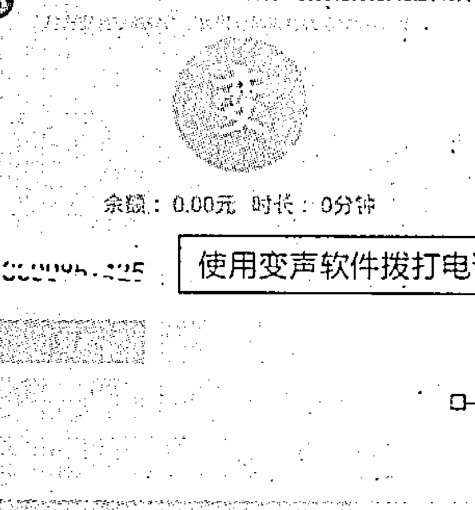

这款软件实际上是一款网络电话软件，如果要长期使用可以点击“获取话费→免费获取话费”，然后按照应用安装其推荐的软件可获取话费（图2），可见天下从来就没有免费的午餐。

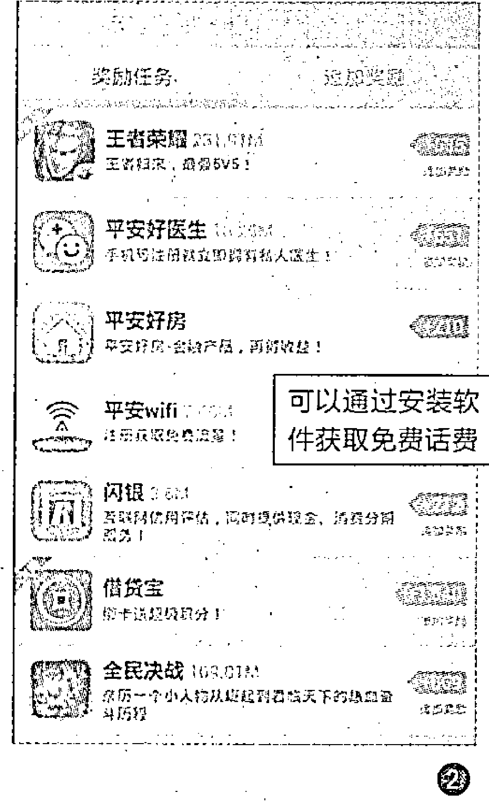

> 小提示：PC平台上也有很多变声软件，比如MorphVOX Pro，就可让你在QQ聊天、Skype中变声。

如果不想被人愚弄，我们该怎么进行辨别？平时我们可以准确辨别出每个人的声音，这主要是由于每个人的音色和音调是不同的，比如男女的音调不同，男高音和男中音的音色不同。正常情况下，人的音色和音调是比较圆润、自然的，对于使用软件（或者特意模仿）的声音，这时候声音听起来就不自然了，比如男模仿女的声音，虽然此时音调比较高，但是只要注意听还是能够感觉出其中的不自然。

###### 好声音自己造

上述声音造假是为了恶搞，很多时候我们则要对自己的声音进行善意的造假。比如一些朋友喜欢将自己演唱的歌曲上传到优酷或者朋友圈共享，但是由于先天条件或者录制环境的限制，可能自己的某些音色并不完美，为了能够让朋友们有更好的听觉享受，此时就要对自己演唱的歌曲进行微调，使得自己的音乐听起来效果更好。对于音乐的润色此时可以借助Adobe Audition来实现。首先准备好自己录制的音乐，启动Adobe Audition后点击“文件→打开”，导入需要润色的音乐文件，程序会自动将导入的音乐文件展示为可编辑的波形文件（图3）。

成功加载后就可根据自己音乐的实际情况进行润色了。一些朋友在录制音乐时由于演唱姿势不同，会导致录制的音乐声音时大时小（或声音有高有低），此时可使用Adobe Audition的“压限”组件进行调整，它可将录制的声音从整体上调节得更均衡，避免出现忽大忽小、忽高忽低。

点击“效果→振幅与压限→电子管压限器→Vocal Booster”（这里有多种压限效果，大家可以根据自己音乐的实际效果进行选择，每种预置效果还可以手动进行微调），接着点击预览按钮，此时可以听到处理后的效果，如果满意则点击“应用”完成压限操作（图4）。

完成上述调整后返回程序主窗口就会自动应用上述选择的压限。其他润色操作类似，每次调整完都可以及时预览，然后再根据其中的不足进行其他的润色操作。完成所有的润色操作后可以看到前后的音乐波形图形已经不同，点击“文件→另存为”保存即可（图5）。

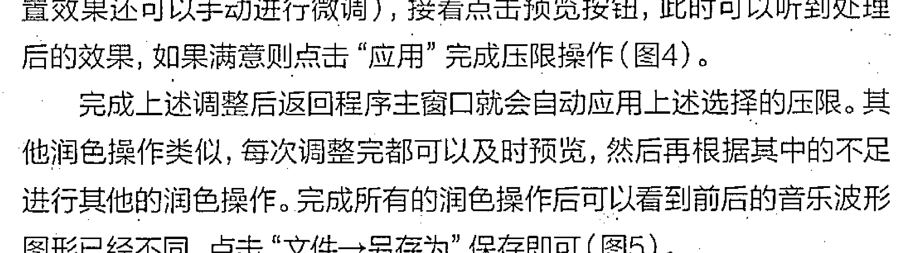

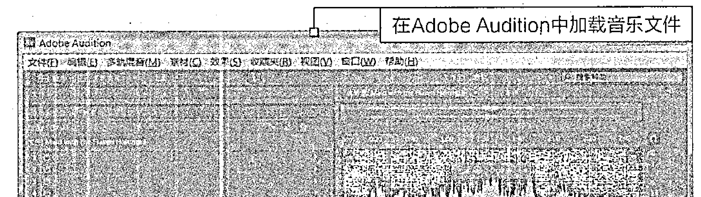


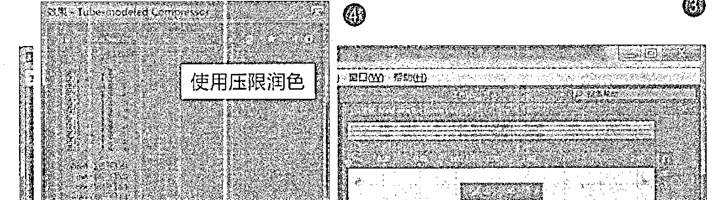

# ## 其他常用润色组件

降噪：降低麦克风录制的背景噪音，使得声音更圆润、干净。操作：点击“效果→降噪/恢复→降噪处理→默认→确定”。

混响：使声音显得不那么干涩，变得圆润和厚重。不过需要注意的是，如果混响加得太多会使人声显得模糊过于假，加得少又会使声音显得很干很涩，具体该选择怎样的效果应该根据每首歌的实际情况进行选择。操作：点击“效果→混响→混响效果→共振房间模式”。

音调校正：校正音调，使得音调高低均衡，整首歌听起来更为舒缓。操作：点击“效果→时间与变调→音调校正→默认”。

# ## 为Adobe Audition添加特效插件

当然如果你对音乐有更多润色需求，Adobe Audition还支持各种音效插件的安装和使用。可以登录http://tinyurl.com/cf060102（已作缩短网址处理）下载其他音效插件，比如需要使用BBE润色（VST插件，可以增强声音的动态频率，调节所录人声的高音和低音部分，使声音显得更加清晰明亮或者温暖厚重）。下载所需的插件后解压到桌面备用，接着在Adobe Audition中点击“效果→音效插件管理器”，然后点击添加导入下载到的插件（图6）。

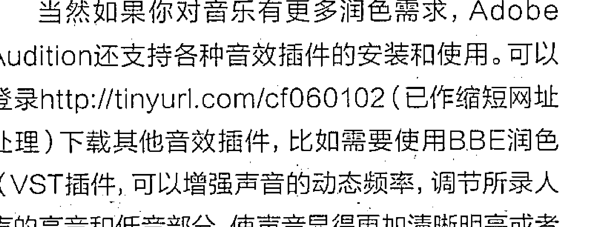

成功导入插件后再次展开“效果→VST→SonicMaximizer”，这样即可启用上述安装的插件，插件的具体使用和内置插件一样，选择合适的效果后预览并应用就可以啦（图7）。

#### Systems Software 系统与软件篇

也许操作系统与常用软件除了技巧外，可深度解说的内容并不多，毕竟我们认识和使用它们的时间远大于其他。但也正因为长时间接触和约定俗成的惯性思维，造就了偏颇刻板的印象。在本章节一同看看是不是曾错过或误会了它们什么吧。

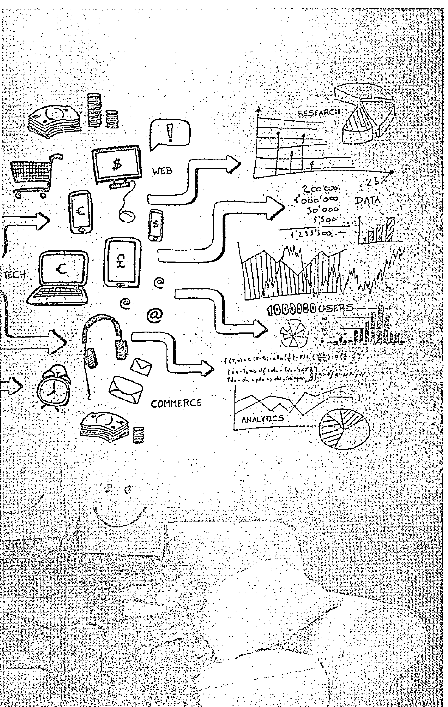

##### 视而不见 微软很伤心

Windows 系统中的一些“动人”传说，往往会让人信以为真。然而经过实测，结果却往往出人意料。接下来让我们一同剖析依旧以Windows为主要生产力工具的桌面世界。

文|刘英

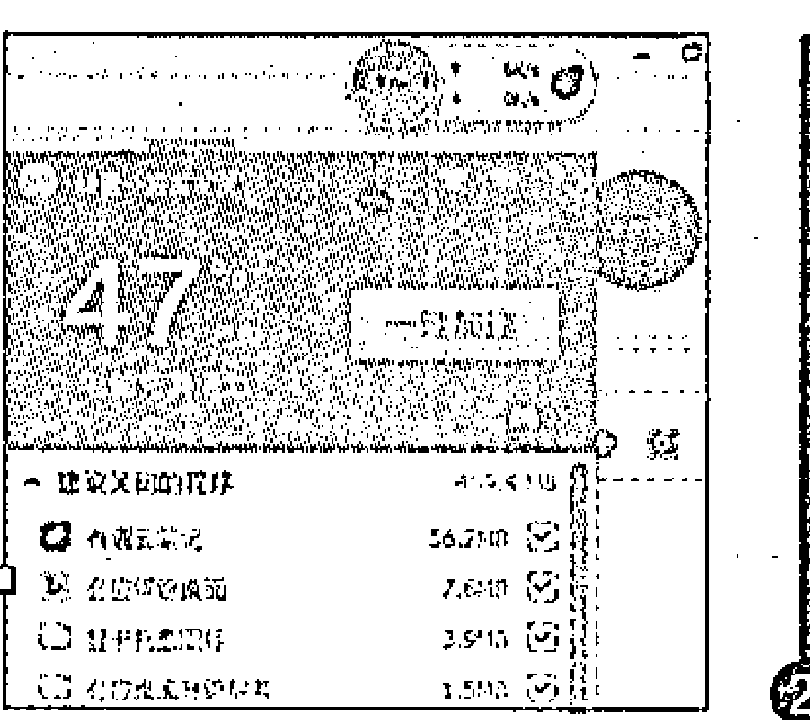

为减少内存占用而设的360加速球


Iobit SmartRAM 内存压缩专用工具

##### 吃内存“大户”助力系统提速

按照通常的思维，程序对系统内存占用越高，系统运行效率就会越低。因此才出现了许许多多的内存优化类工具。这些工具总是极力地将驻留内存的程序或者进程清理干净，然后得以腾出更多的空闲内存来供新的程序访问，如360安全卫士就带有一个系统加速球(图1)。一些专门为内存优化而设计的小软件，会常驻并监控内存的使用情况，当内存空闲空间小于某个值时，便会按照用户的设定自动清理内存占用。Iobit SmartRAM软件就是专为此而设计的，它专门用来整理和压缩系统内存，不影响正在进行的任何工作(图2)。

加速球加速的方法虽然也管用，但需要人为干预和选择，有时还会出现误将有用进程杀掉的尴尬局面。而内存压缩软件所能做到的性能提升其实也很有限，在当前软件越来越繁多和复杂的情况下，这种优化往往只是给用户摆出个优化的架势，实际上所能达到的效果并不十分理想。

Windows 10最新版打破内存占用越少越好的神话，率先主动将自己变成一个内存占用“大户”。系统启动之后，一个“系统和压缩内存”进程便“霸占”了少则数百MB，甚至1GB以上的内存空间（图3）。如果你第一次使用Windows 10的最新版，当从任务管理器中看到这样一个大内存占用的进程之后，一定会怀疑是不是恶意软件在搞什么鬼。其实，这是Windows 10采用的一项内存压缩新服务。如此庞大的内存占用，非但没有使系统效率降低，反而能够消除内存被用尽的隐患。

早从Build 10525版开始，Windows 10就在内存管理器引入了一项名为“压缩存储”的新功能，压缩存储是内存中压缩页的一个集合。当内存管理器察觉到内存压力，它会选择压缩未用的内存页而，不是像老版本Windows那样，将其直接写入磁盘页面交换文件中。这将能有效地减少每个进程使用的内存总量，从而允许Windows 10在有限的物理内存中维持更多的应用程序驻留，有助于改进响应速度（因为内存操作总比对存于磁盘的页面文件的磁盘操作要迅速）。压缩存储位于系统进程的工作集中，由于系统进程也运行在内存当中，因此当有其他进程的空间被其他进程挪用时，其工作集会变得更大。

对于这一功能的利用，由于是系统自动在后台进行的，所以不需要人为干预或去作什么专门的设置。保证安装有足够的物理内存，是有助于提升系统效能的最好措施。一般来说，4GB的基本内存安装64位Windows 10系统，应对日常上网或办公娱乐不成问题。而如果要进行更多任务或运行大型音视频或设计类的软件、游戏，那么8GB的内存则是标配。当然，更多的内存对系统效能的提升有益无害。

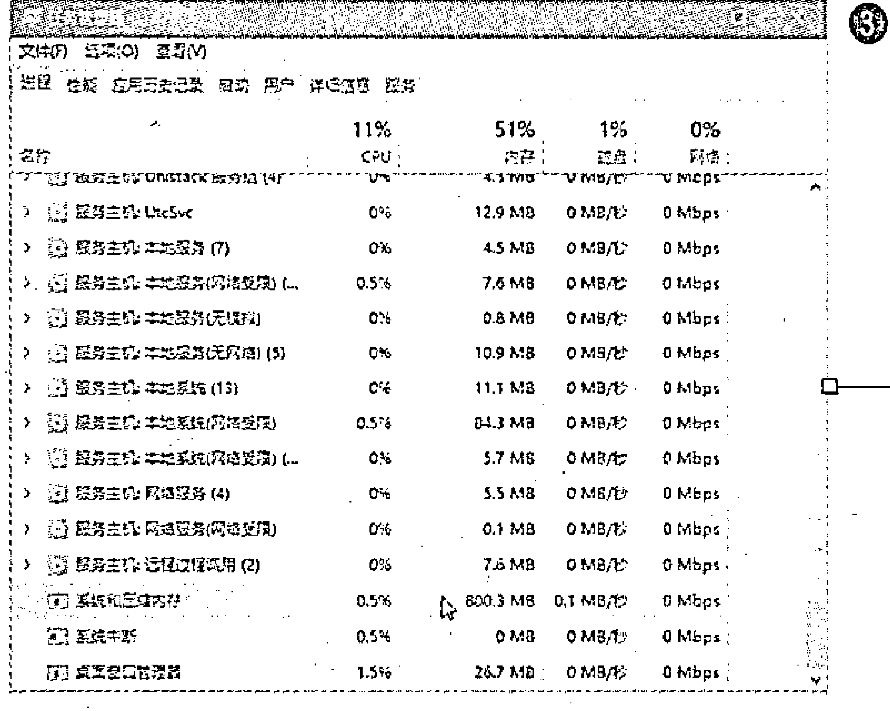

图注：狂吞内存的Windows 10“系统和压缩内存”进程

##### 没有“开始”Windows 8依然好用

Windows 8.1被微软自己击败，某种意义上来说是因为丢弃了“开始”菜单。然而开始菜单真的有那样重要吗？假设Windows没有开始菜单或者开始菜单坏了，就不能工作了吗？其实，借用系统自身内置的功能或者必要的简易工具软件，也能很好地管理程序或者文档。系统的核心功能才是最重要的，“开始”只是一种习惯（图4）。

在阉割了开始菜单的Windows 8.1中，要访问安装的程序、系统功能或用户文档，有多种方法可供选择。直接按下Win键，点击屏幕左下角的箭头，这时也会出现包括传统应用在内的程序列表，从分类列表中调用程序也非常方便（图5）。

像低版本Windows系统那样，可用右键菜单命令，将任何一个程序、文件夹、文档或其他资源的快捷方式发送到桌面，创建便于访问的桌面快捷方式（图6）。

还可创建自己的任务栏开始菜单，用文件夹分类的方式，将包括文件夹、程序、重要文档、快捷方式在内的资源分门别类地进行归集，安置在任务栏访问（图7）。

还有一种省事的方法是给Windows 8.1安装必要的第三方助手插件（如360软件小助手），在开始按钮的旁边生成一个附属的仿真“开始菜单”（图8）。

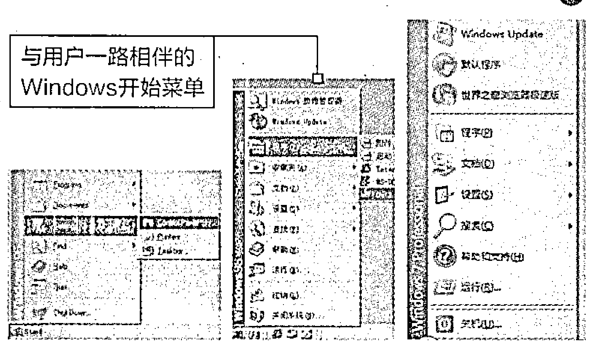

图注：与用户一路相伴的Windows开始菜单

特别话题

创建任务栏自定义开始菜单的具体方法见本刊2014年第6期系统栏目文章《自建优于开始菜单的多级菜单》。

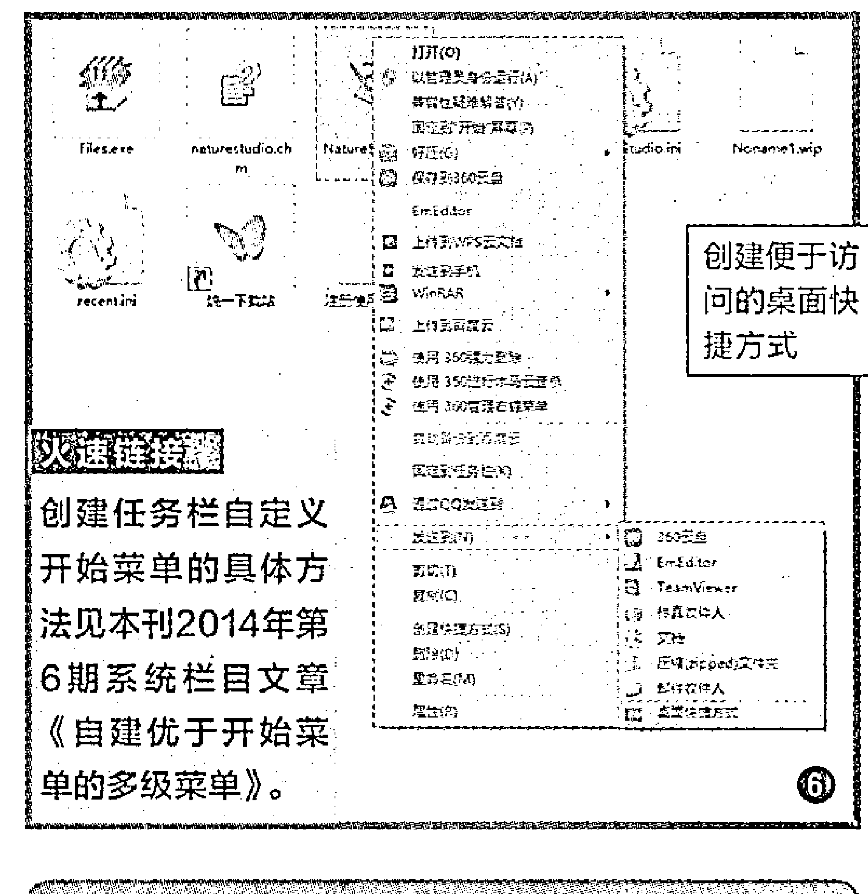

创建便于访问的桌面快捷方式

小提示

使用系统的搜索功能代替选择开始菜单来搜索程序或文档，也非常方便。试着按下Win+S键，在输入框中输入想要的程序或文档，系统会智能筛选出软件或所需信息(图9)。

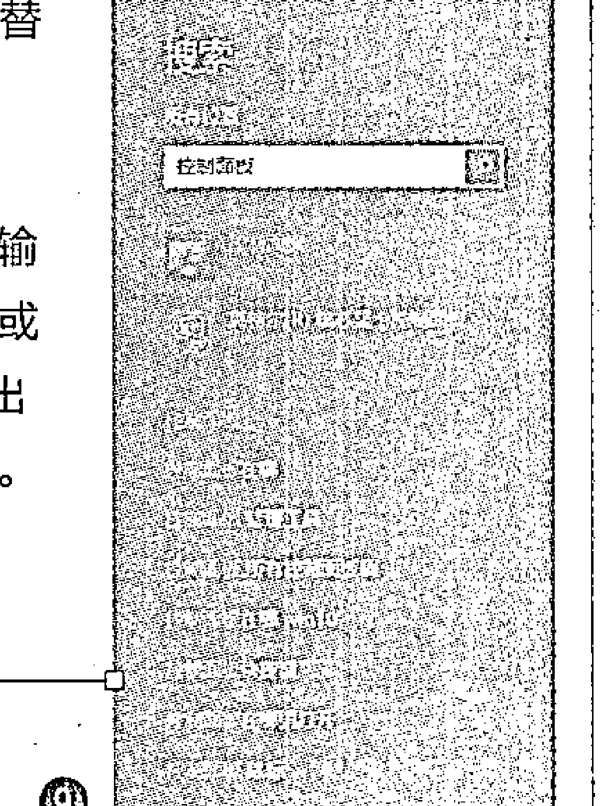

用Windows 8.1系统自带的搜索功能定位程序

##### 在模仿与被模仿中沦落或升华

有人说Android和苹果占领了本该属于微软的那份移动市场，微软那就开发一款在Android或苹果设备上运行的WP桌面，最好把生产力工具也搬到这两种平台上，让更多人知道微软的产品或服务是什么样子。于是微软真的信了，也都一一这么做了。Arrow Launcher就是微软推出的运行在Android移动设备上的WP桌面应用(图10)；此前MS Office移动版在Android和iOS移动设备上安家落户；而微软语音助手Cortana在2015年12月上旬推出它的Android和iOS正式版本(图11)。

也有人说，既然人们习惯于使用Android和苹果设备，倒不如在Windows移动设备上模仿Android和苹果iOS的界面，设计仿真Android或iOS的桌面软件，挂接在Windows设备系统之上。如此一来，Android平台或苹果iOS平台的用户随时可以“零换乘”地过渡到Windows设备上，享用Windows特有的强大功能。由于微软的移动版Windows 10系统迟迟未出，还不能确定微软后续是否会这么做。

那么相比之前，Windows变得如此开放，到底是搬起石头打自己的脚，还是想深入“敌后”，准备寻找时机吃掉对方？要回答这个问题，首先要明确用户为先还是厂商优先的问题。还需要因时制宜地看待，不能固守原有的老观念。

在Windows“横行”的那些年代，移动设备没有普及，人们使用电子设备主要是使用桌面版的操作系统。而在那个时期，微软一家独大，微软在没有开始菜单的Windows 3.2系统的基础上，创造性地发明了开始菜单，将系统升级为Windows 95，那时人们没有更多的选择，加上微软在极力推广这个东西，于是人们顺其自然地只能去学习和掌握这一操作方式。但是，到了2010年前后，当谷歌Android开放性平台和苹果iOS人性化操作平台出世之后，它们独有的方便使用特征让许多“傻瓜”也能轻易用好一个移动电子设备。这相对于动辄就需要上补习班或看专业书才能学好的Windows平台来说，是一个很自然的冲击。人总是有惰性，拈轻怕重，哪个容易用就用哪个，而赶上这个时期，微软又以缺乏APP基础的WP移动设备与以上两种平台的移动设备一争高下，它违背了一个重要的原则——“用户至上”的原则，因此落得当今如此之惨的地步也是理所当然的(图12)。好在亡羊补牢，犹未为晚！Windows 10吸取教训，让众多用户参与到了开发和测试当中，先前所犯的错误一一被更正，倾听用户的呼声成了Windows 10（包括Windows 10移动设备）的首要任务和行动指南。但是，Windows 10移动版的难产，让人们对于Windows移动产品只能持观望态度。试想，如果Windows 10手机以其强大的内部功能，携带一个与Android或iOS一模一样的界面出场，是不是用户会感到更亲切和随和一些？微软的“移动成功之路”还很长远，然而市场留给微软的时间不一定很长，顺应用户需求是微软不二的选择，就看微软怎么走好这段路了。

文|刘英

##### 重大升级可能是你的“鸡肋”

在如今的软件升级说明中，我们看到最普遍的是“性能提升”或“优化内核”之类的技术含量超高的说辞(图1)。对于一些实用功能的升级，普通用户很显然能够感受到其增加了哪些功能或改变了哪些功能。而对于性能提升或内核优化这样的升级，普通用户往往很难通过觉察来感受到（除非是速度悬殊惊人的改变）。因此如果商家想在新版中添加一个广告链接或增加其他猫腻的“升级”，完全可以在性能根本没有提升的情况下，堂而皇之地冠以“速度提升”的字样，让内嵌信息搭上“性能提升”的“顺风车”面世。用户升级之后，也许不能从升级版中带来什么实惠，反而可能带来了更多的广告点击机会或多余插件的安装机会。是否对软件保持“追新”状态，就要具体情况具体分析了，一切以实用为基础原则即可。

若当前使用的软件存在不理想的情况，希望通过升级获得更好的体验，而自己对新版软件又不太了解，这时最好先通过旧版的数据导出功能备份好与软件相关的个人数据。如果软件有比较繁琐的个性化设置，通过软件中心导出个性化设置参数，或将软件安装目录中的相关配置文件拷贝出来留作备份，以备在升级不成功或不理想时恢复旧版本之用。此外，对于常用的软件，安装时最好留有旧版本的安装文件。给大家提供一个下载和备份软件旧版本的好办法：使用360软件管家管理本机软件，在该软件的“设置→其他设置”页面下，选择安装完成后“不自动清理”选项（图2）；同时，在“下载设置”选项卡下设置好自己收藏旧版本软件的目录（图3）。这样，通过软件管家安装过的所有软件的旧版本就不会被软件管家以默认的设置自动清理掉了。如此，大胆尝试新升级软件版本的功能，若不理想，则完全卸载掉新版，再回到旧版软件下载的目录，挑选出运行最稳定的一个版本重新安装就是了。

##### 小心被“同质化”现象所蒙蔽

目前的工具软件，同类软件的功能同质化很严重。因此，不少人认为市面上排名靠前的同类软件大同小异，随便选择一款就能满足要求。但是，当你遇到一些特殊任务时，才知道选对软件有多么重要。例如，将一系列本身含有多层文件夹的压缩包去除路径解压到同一个文件夹中，选不对压缩软件，解压时你会遇到麻烦。

举例来说：有这样的一批MP3压缩文件，每个包里均含有多层目录，各目录下均有MP3文件，现在需要将这些歌曲统统解压到同一个文件夹中。如果选择了普通压缩软件（如360压缩），需要将这些压缩包解压之后，用手动对MP3文件一一挑选或借助搜索软件批量搜索才能进行统一归类。但是，如果你选择了WinRAR或2345好压软件，就可以用路径排除选项将带有路径的压缩包的解压设置为去除路径。使用WinRAR软件，只需先选中所有要解压的RAR文件，右键单击并选择“WinRAR→解压文件”（图4）；在“常规”选项卡下选择好目标输出路径，为防止重名但内容不重的文件被覆盖，可选择“覆盖方式”为“自动重命名”（图5）；切换到“高级”选项卡，选择“不要提出路径”选项（图6）。之后点击“确定”按钮，便可以在同一个目录中收获所有MP3文件了。

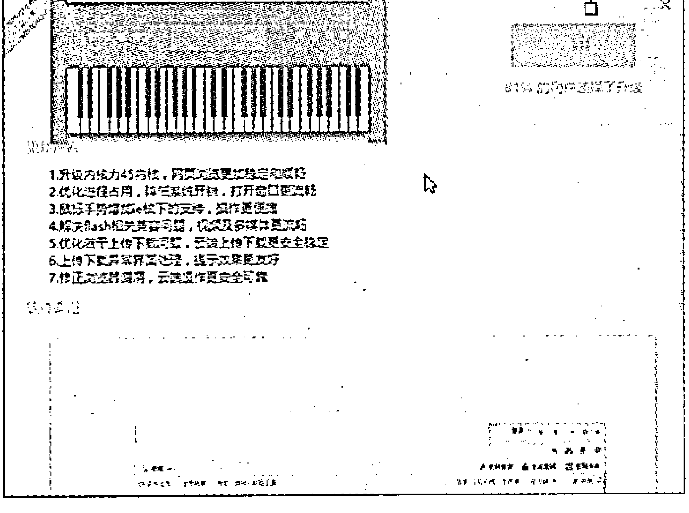

1.  升级内核为45内核，网页浏览速度更稳定和流畅
2.  优化进程占用，按住系统开机时，打开窗口更流畅
3.  优化手机短信等APP的发收，更省电更快
4.  解决Flash相关兼容问题，视频及多媒体更流畅
5.  优化若干线上下载问题，安装线上下载更安全稳定
6.  优化下载速度并改进下载，让下载效果更好
7.  修正游戏插件问题，让游戏插件更安全可靠

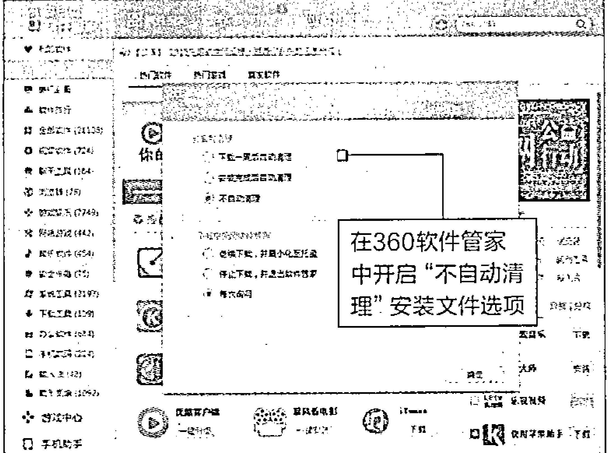

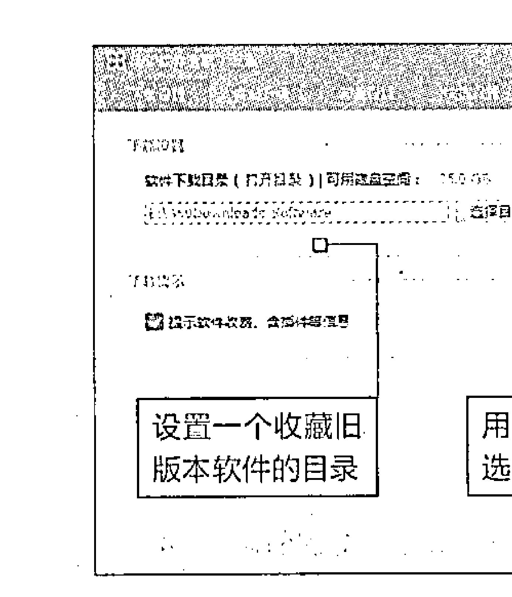

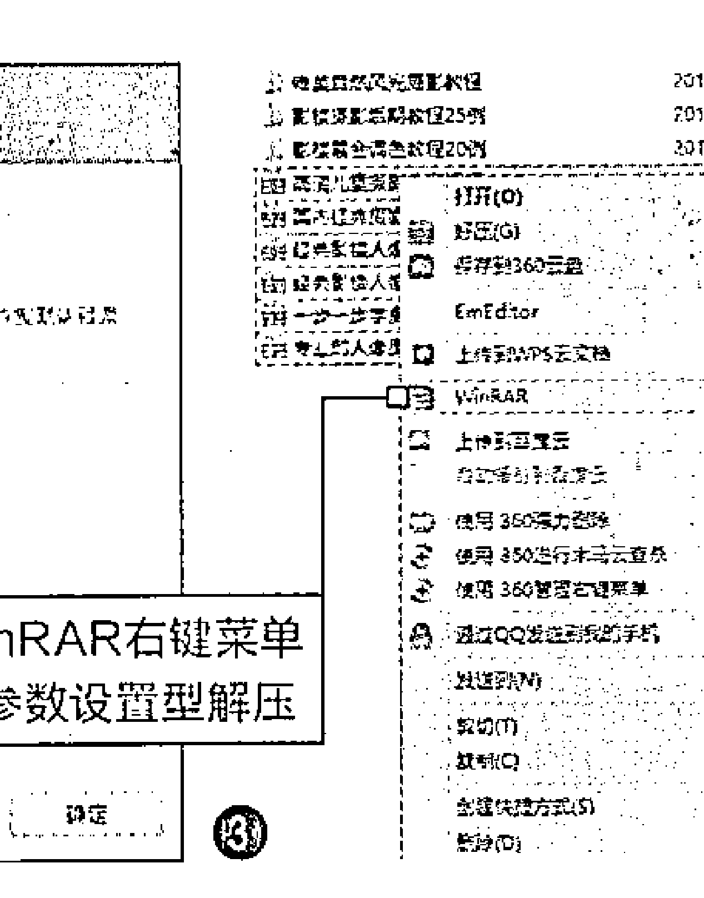

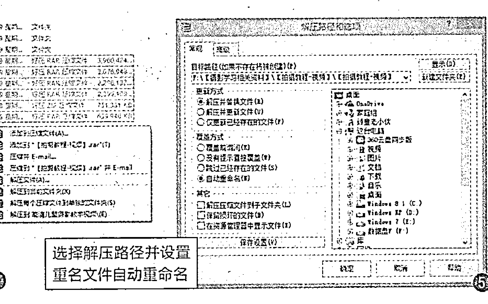同理，如果使用2345好压软件，也能享用这种便捷的高级解压功能。先从右键菜单中选择“好压→解压到”命令（图7）；接下来点击解压窗口中右下角的“切换至经典模式”文字链接（图8）；之后，同样通过“高级”选项卡设置“不解压路径”选项（图9）。经过如上设置后，在同一个目录中可一次性获得所有音乐文件。

可见，在同质化的环境下，选择软件依然非常重要。静不下心来研究同类软件的不同之处，对用好软件具有很大的意义。认为软件功能同质化而随意选择，也许某一天会给自己的使用带来不便。

> 小提示
在360压缩、WinMount等小众的压缩软件中，就无法通过这种排除路径的方法方便地提取多层目录中的文件。7-Zip虽然经典和功能强大，也能够实现一次性提取，但解压出的文件会多出空文件夹，要删除这些文件夹还得手动操作，比上述软件麻烦一些。

##### 让经典下岗的内置下载

不少人习惯于专业下载工具的快速，对网络浏览器或视频客户端等软件自带的下载功能嗤之以鼻。实际上，目前的主流网络浏览器和视频客户端自带的下载功能已经不再弱小，如果能很好地利用其内置的下载功能，多数情况下完全可以抛弃专业下载工具，获得自己需要的网络资料。

目前的网络浏览器内置的下载工具功能越来越强，应对平常的下载任务不成问题。有的甚至与专业下载软件商进行技术合作，内置了专业下载内核，下载速度也堪称一流。

国产搜狗高速浏览器内置了“搜狗浏览器高速下载”插件，可以多任务同时高速下载，能够充分利用现有的网络带宽（图10），不会像目前的一些网盘或专业下载工具那样限制下载速度，而让网络下载成为一种瓶颈。对于本次未能下载完成的任务，在下次开启浏览器之后，可自动接续下载。而且还能设定每次下载文件是否提示保存位置，保存的位置也可以选择记忆路径或指定固定的下载位置。所有这些都是比较体贴的服务。此外，还能调用IE的下载内核，在“默认下载方式”选项中选择“IE”即可切换到传统的IE方式下载（图11）。这样，以往在浏览器中下载不方便、下载的文件不好找、不能续传等问题就不复存在了，浏览器下载的常见短板不复存在。

> 小提示
一般人往往会被搜狗浏览器那简单的下载框所迷惑，以为这个功能过分简单（图12）。其实，当点击下载窗口右下角的齿轮图标后，就会发现非常丰富的下载功能设置全在其中。

##### 特别话题

同样，360安全浏览器自带的下载工具看起来也十分简单，对于它空空如也的下载框，你也许同样会没有信心（图13），但当通过“下载设置”进入设置窗口后，才会发现它的强大之处。默认情况下，可选择它的“内建下载”工具进行下载；如果希望获得更加强大的下载功能，选择“使用迅雷下载加速模块”选项即可。注意，这个选项并非让你安装迅雷软件，而是360内置了迅雷的下载技术，直接调用迅雷核心下载模块，加速下载。此外保存下载位置设定、断点续传未完成任务、下载声音提示等都是比较人性化的设定（图14）。

以“搜狐影音”视频客户端为例，使用该客户端观看影视时，如果需要将整部影片甚至整部连续剧下载到本地，可选择同时下载的最大任务数多达5个。还能在观看视频或做别的工作的同时让软件在后台下载，不影响工作或在线观赏。选择了“下载完成后提示我”，则可在工作的同时看到影视下载完成的提示，以便及时收获下载“果实”。如果要离开电脑，但下载任务还没有完成，可选择“下载完成后自动关机”选项，让下载任务完成后不再白白费电。

###### 小技巧

> 不要担心搜狐影音没有下载完你就关机了。如果选择了“启动后开始未完成的下载任务”、“下载完成后提示我”，同时在“基本设置”窗口中选中了“开机自启动”选项，那么下次开启电脑后会自动接续下载上次未完成的任务，并在下载完成后提醒你。一切都是自动化进行，不需要人为干预。

相对于浏览器的下载功能，视频客户端自带的下载功能也不甘示弱。虽然相对于以往网络带宽比较拘谨时期人们对视频下载的迫切需求，当前的视频下载需求有所缓解，但身处移动环境中的用户还是不同程度地受到网络的限制，因此下载视频的需求还存在。针对这种情况，各家视频客户端软件商也纷纷在其视频客户端中加入了下载功能，且在方便程度上也要盖过某些声称只为下载而生的软件。

由此可见，下载网络资料或视频不一定要安装专业下载工具，在当前软件服务越来越体贴的环境下，抛弃了下载专业户，娱乐生活依然精彩。

##### 小贴士

> 通过电脑下载Android应用也是我们经常要进行的事。使用360安全浏览器下载手机APK文件，可以在下载器设置窗口中选择“当下载APK类型文件时，询问是否一键安装到手机”选项，这样就可以将移动应用直接安装到与电脑建立了连接的手机中。

##### 拓展阅读

当然不是说专业的或另类的下载工具就没有了用途。如为下载功能比较弱的浏览器安装Internet Download Manager插件，该插件支持主流的十多种浏览器，能助这些浏览器下载“一臂之力”（图15）。对于一些特殊的情况，比如希望绕过网络广告片头播放，或者希望以特定的方式来计划安排文件的下载任务等情况，一些专门的下载工具还是无可替代的。如果使用硕鼠下载工具，只要能在线播放的内容，无论是否提供下载按钮，均能通过分析地址的方法，获得真实的下载地址并完成下载。如果使用迅雷下载，则可根据自己的情况来计划安排下载任务，若开通VIP通道，更可获取翻倍的下载速度。

#### Hardware（硬件篇）

传统硬件的迭代及技术更新已趋平缓，时常也有某厂商转型或退市的爆料，但它们却始终是圈内无法避开的话题。无论初期选购、中期使用，还是后期性能挖掘，可说的新旧“点”始终贯穿着产品生命线。这些已融入科技生活每个角落的家伙们，还有什么我们未见的内涵？

##### 抓住性能关键点

在硬件产品选购中，很多被过分宣传的东西影响了正确的选择。一些有图有真相的宣传并不见得符合我们的情况，对于用户而言哪些产品合适，需要我们正确地判断。

###### 虚拟线程核心

硬件性能当中“看上去很美”的例子有很多，普遍都是这样的配置实际上很不错，也确实对PC的系统性能有提升。但实际上对于我们的实际应用来说就无法发挥，并没有在有限的预算中选择到最合理的配件搭配。

这其中最典型的一点就是Intel i7等处理器的虚拟线程核心。
熟悉这两年处理器规格的用户肯定会知道Intel在i7等高端处理器上使用了四个物理核心和八个虚拟线程的超线程技术，在一些支持超线程技术的应用当中，比如说视频渲染、压缩解压缩等等日常PC应用超线程技术的确可以为我们提供性能帮助（图1）。但如果用户是被“i7游戏性能更好”这样的宣传忽悠来的话恐怕要失望了，因为超线程技术在游戏中表现并不怎么样。

###### 适合游戏的处理器

目前几乎九成以上的游戏只会要求处理器拥有4C4T（四核四线程）的配置，同时对处理器主频及单核效率有较高要求，对于是否达到4C8T（四核八线程）完全不敏感。也就是说，我们如果手动在BIOS里将处理器的超线程功能关闭，游戏帧数并不会有什么大变化。

更有甚者，在一些游戏中，看上去更强的多线程处理器效率反而没有物理核心版本的处理器强。一些算法老旧的网络游戏会误把虚拟线程当作物理核心调用（图2），如果游戏只支持双核占用，会出现游戏调用了线程0（物理核心1）和线程1（超线程1）的情况，线程2-7完全被空置。虽然这时可以通过快捷方式或者Windows资源管理器手动指定处理器核心调用，但十分麻烦（图3）。

此外，还有一些技术先进的单机游戏也会出现同一款处理器在关闭超线程之后帧数反而小幅上升的例子，比如著名的“显卡杀手”孤岛危机3等等（图4）。综上所述，目前流行的游戏当中几乎对超线程就没有像样的支持。

###### 高频处理器和E3的例外

不过，在这里我们需要注意，近几代Intel处理器当中最适合游戏的两款处理器毫无疑问就是i7-4790K和i7-6700K，这两款处理器都是4C8T（四核八线程），这似乎与上面的观点相悖了。其实不然，i7-4790K和i7-6700K适合游戏是因为默认的高主频4.0GHz，而并非超线程技术（图5）。

此外如果具体产品的预算相当，由于4C8T的CPU一般都会比4C4T（四核四线程）处理器三级缓存多2MB，这部分提升可以看作实打实的提升。这也是为什么不超频的用户选择E3处理器搭配B85等芯片组会相对划算的原因。

###### 喜忧参半的热管直触技术

在PC的散热系统当中，如果想要提高散热效果其实只有两条路可以走：一个是扩大散热面积，还有一个就是提高导热效率。面对越来越严峻的PC散热形势，哪种方案适合我们呢？在这其中有一种目前已经被广泛使用的技术就是主打提高导热效率的方法——热管直触技术（图6），它看上去很美，但实际的效果还需要具体情况具体分析。

##### 优势和可能的问题

热管类风冷散热器的理念就是让CPU或者GPU的核心通过硅脂的传导直接和热管接触，而不像普通的热管风冷散热器那样多加一层金属底座的传导（图7）。因为热管散热器最主要的导热是由热管完成，理论上热管直触能提高导热效率。可是为什么会有时候说有的时候热管直触是看上去很美呢？

其实核心问题还是在散热系统的另一个关键点——散热面积上。目前高端一些的热管散热器不论是CPU散热器还是显卡散热器都使用了五热管甚至五热管以上的配置，这就是说在热管端接触面积是越来越大了。而由于制造工艺的进步，不论是处理器还是GPU核心的面积都有越做越小的趋势，这两者之间存在矛盾。

细心的读者可能读到这里已经能够发现问题了。没错，就是因为核心小，所以实际使用上涂抹了硅脂之后的核心最多只能和热管当中的三根接触，也就是说，第2、3、4根热管（图8）。而在边缘的第1和第5根热管实际上是没有与核心接触的。这种问题在显卡上更为常见，因为GPU核心不像处理器一样拥有金属顶盖，更多是直接暴露在外面的。拥有金属顶盖的处理器还可以勉强和所有热管都有接触，而越做越小的GPU就很难了。

##### 热管直触并非不可选

那么处在散热器边缘的热管就完全无法参与散热？其实也不是，如果我们用手接触正在工作的散热器，边缘的热管其实也是温的，说明它同样在导热。虽然核心面积与热管不对等导致的无法直接接触降低了散热效率，但它们勉强可以通过底座传导一部分中心热管的热量出来。

热管直触散热器并非不可选，我们需要根据实际情况选择产品。比如在显卡散热器当中常用的多规格热管散热器，就是说如果采用了五根散热热管，其中第2、3、4根是全尺寸8mm以上直径，而边缘的第1、5根是辅助的6mm直径，这种产品在设计之初就已经考虑好了此类问题（图9）。而像LGA 2011这样的大面积金属顶盖处理器，我们选择哪种散热器都可以和金属顶盖完全接触，无需操心。

##### 怎么选购路由器

目前的路由宣传内容多数强调的是天线数量、穿墙、5GHz等等特性，甚至还有将802.11n和802.11ac频率叠加在一起宣传的，有很大的误导作用。但对于具体用户而言，一款好的路由器关键点可能并不在这里。

不同的用户所关注的点并不相同，如果是重视局域网的有线用户就应该多看LAN口数量和速率，而重视无线网的用户则应该看重是否支持新版802.11ac和天线数量。如果是对网内资源共享有特殊要求的用户，自然应该选择那些拥有独特功能的产品。

###### 重视局域网功能的用户

现在多数路由器在宣传时标榜的是智能和无线速率，反倒是在LAN口数量和速率上一再精简。原本传统的家用路由器均使用一个WAN四个LAN的规格（图10），而目前很多全新的路由器品牌虽然在功能上比较新颖，但在有线接口上却能省则省（图11）。如果用户家里多数设备对网络要求都比较高，需要有线网络，那么那些花哨的功能根本就不适合。

除了数量以外还有速率，宣传中很多千兆路由器是否真的能够达到千兆呢？不少通过速率叠加实现的无线“千兆”产品，其WAN和LAN口速率只有100Mbps，折算下来只有12.5MB/s。经过去年整年的宽带提速活动，很多地区都已经提速到百兆光纤网络，这种路由器别说局域网，就连使用互联网都已经过时了。

###### 挑选无线功能更强的产品

比起有线功能，目前家用的路由器其无线功能是重头戏，无线功能也是厂商的宣传重点，我们怎么在诸多噱头中找到适合自己需求的真材实料呢？无线最重要的肯定是规范，目前在路由器宣传中被反复提及的两个关键词是802.11ac以及5GHz网络（图12）。这两个关键词之间有一定联系，又有很大区别。

802.11ac是目前家用无线网络最出色的标准，对应以往的老标准为802.11n。这一个标准的提升能够带来多大的提升呢？比如iPhone 5S使用的就是802.11n，而使用802.11ac的iPhone 6最大无线速度是其三倍左右，目前已经广泛采用在新手机上（图13）。目前802.11ac无线路由器已较普及，购买新路由器已不再推荐使用老旧的802.11n路由器了。

而5GHz路由器是容易让人混淆的概念，先进的802.11ac无线路由器由于高频的802.11ac信号只会使用5GHz，路由器还需向下兼容802.11a/b/g/n，而802.11n可同时采用2.4GHz和5GHz两个频段。就是说如果新购买路由器一定要认准802.11ac而并非5GHz特性，802.11ac路由器一定是5GHz路由器，而反过来则不一定。如果是采用5GHz频段的802.11n信号，只在抗干扰性、传输距离和穿墙性上有一定区别，其速度并没有太大差异（图14）。

###### 注意多天线系统

目前很多看起来比较“高大上”的路由器都使用了3根甚至3根以上的天线，也有很多高端产品采用了内置天线的设计。很多人认为对于无线路由器来讲天线数量多就是信号更好，这其实是一种很大的误区。由于Wi-Fi网络传输有一个MIMO多进多出的特性，天线数量其实是和实际传输速度直接挂钩的（图15）。

熟悉802.11a/b/g/n/ac等协议的用户肯定会知道在典型的802.11n环境下单通道传输速率最多150Mbps，可是那些动辄号称自己有450Mbps甚至600Mbps的无线路由器是在忽悠我们吗？并不是，这是多路叠加后的结果。

由于从802.11n开始Wi-Fi支持MIMO多进多出技术，只要路由器端和设备端拥有足够多的通道（天线），就允许它们之间交叉交换数据，其速率可以叠加，效率有些类似多核处理器一般。比如在40MHz带宽下802.11n单路速率最高150Mbps，三天线路由就是450Mbps。这不是说路由器和手机或者笔记本电脑之间无线传输就可以达到这一理论值了，笔记本也需要拥有3根以上天线的无线网卡（3T3R）才可以（图16）。

###### 结合设备选路由器

现在很多路由器在频率上大做文章，不仅只标注叠加后的速率，更有甚者还将802.11n以及802.11ac的速率叠加在一起作为产品的速率宣传，比如一个三天线同时支持802.11n以及802.11ac的产品其速率为450Mbps和1300Mbps，厂家就会宣传为1750Mbps路由器，这其实对于用户来讲毫无意义（图17）。

我们日常最常见的智能手机多数都只有1T1R的线路，不过新手机绝大多数都支持802.11ac，只需要认准ac路由器即可，无需纠结天线数量。iPad Air这类的平板电脑以及绝大多数入门笔记本电脑的无线天线为2T2R，而很多专业一些的笔记本电脑和高端笔记本电脑则会配备3T3R的无线天线。

##### 色温和颜色

原来由于很多国产显示器出厂校色不准，显示器偏色比较严重，所以用户习惯性将显示器调整至冷色调而非标准色调，甚至9300K这样的色温值。冷色调看上去白色和蓝色都相对更纯，但其实这样做是否合适，需要具体结合设备和使用环境决定。

首先谈谈色温，色温其实指的是光的颜色，由于物体被加热到高温时光的颜色和温度之间存在逻辑关系（图18），所以业界普遍使用温度开尔文（K）为单位来表示颜色。国际照明协会所规定的标准白光是6500K，相当于白天的天光（图19）。更高的色温会让白色逐渐变蓝，这和天文中蓝色恒星温度更高的道理是相同的。

##### 显示器显示模式

回到PC应用环境，6500K是普通PC和sRGB的固定标准，绝大多数液晶显示器在色温一项上都有暖色、标准和冷色三种选择，其中的标准多数都代表着6500K。但也有个别显示器使用暖色作为6500K色温的，就算是同类型产品的出厂态也有可能不同，具体不能一概而论（图20）。

我们应该使用什么样的色温来观看显示器呢？这其实和显示器中显示的内容紧密挂钩。NTSC和数字高清电视的国际标准要求采用6500K的色温，绝大多数网页和视频在PC上观看时，用户都应将液晶显示器的色温设置在6500K。但根据色彩还原方面的差异，有时也需要调整到9300K附近。比如说大多数日本电影采用9300K环境，非日本电影采用6500K环境。这意味着我们在观看日本电影时，理论上液晶显示器的色温需要分别设置才能尽可能贴近电影制作者意图使用的色彩还原，如果一律默认6500K有可能会过暖（图21）。

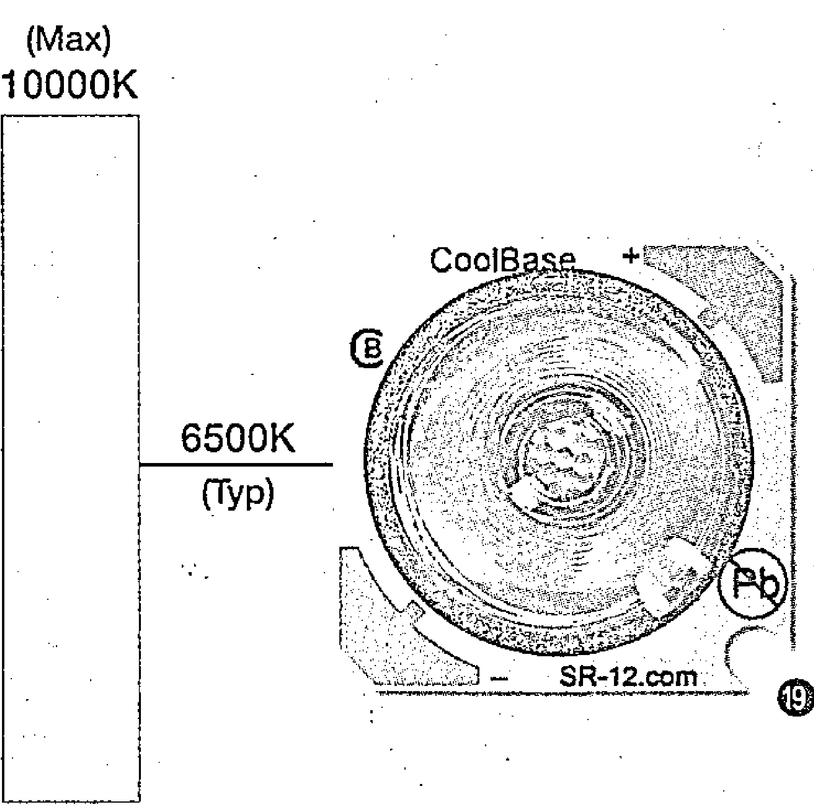

##### 显示器和液晶电视的切换

我们常说并不推荐用户将液晶电视和PC显示器互换使用，除了大家比较熟悉的亮度、刷新率以及点距等等问题，还有一个比较关键的因素就是色温。日本广播标准（NTSC-J）的现行标准为9300K，这大大高于标准PC环境的6500K。由于业界电视多采用这个标准，这也是为什么很多电视画面实际上明显偏蓝的原因。

然而大多数人似乎习惯了电视的效果，所以常常感觉电脑屏幕的颜色偏红。也有一部分是显示器质量不过关导致的偏色问题凸显了冷色调更为准确的原因。所以有些显示器产品提供了9300K左右色温的图像模式，有时命名为“冷色”色调，也有作为“电影”或类似的场景模式供用户选择（图22）。

当使用PC显示器观看电视时，可选择9300K的色温以获得类似于电视的色彩还原。而使用电视连接PC显示PC内容时不仅要降低显示器亮度，还要将电视调整至PC模式。目前很多高端液晶电视会自动侦测信号源来自行调整色温色调，对PC用户而言是比较贴心且方便的设计。


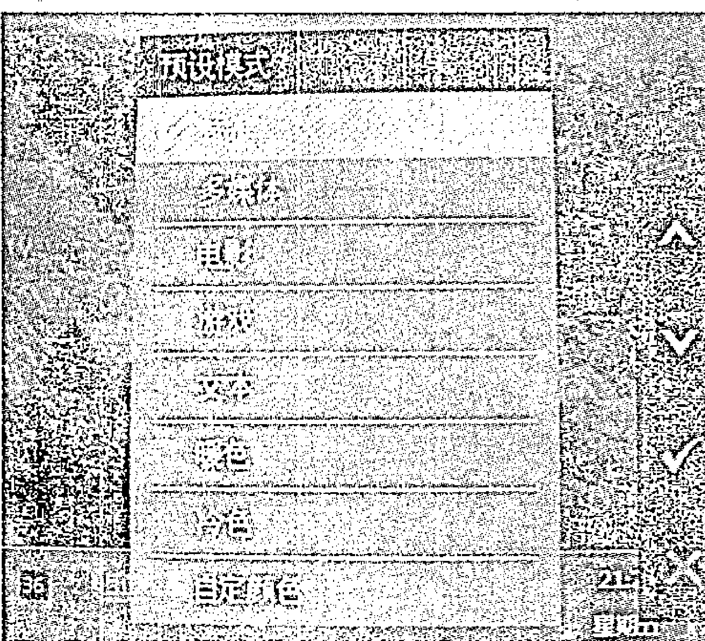

##### 智慧超人 也是分身术

策划《电脑爱好者》编辑部

创业者、科技大佬口中的互联网+、信息爆炸的时代，使身处其中的人们对工作、学习、信息的汲取时感疲乏。

就拿小编们的日常工作来说，除了约稿、改稿、校对外，还兼具着与作者沟通、软/硬件产品测试、技巧真伪验证、官方微博/微信维护、答疑解惑等各项工作，有时真感觉分身乏术，一天下来和打仗一样，一场接一场的战斗应接不暇。

不过正因如此，使我们的职业技能蹭蹭的往上涨，人无双但物有形。

接下来让小编们一同分享一下我们工作的好伙伴——电脑的系统、软/硬件是如何展现“分身术”完成任务的！

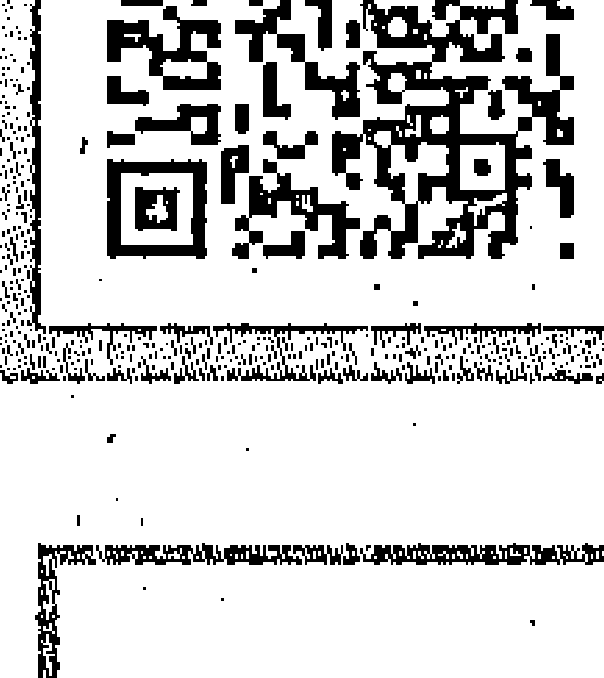

###### 移动本无根 自然需无拘无束

随着我们生活节奏的继续加速，以及利用碎片化时间休闲娱乐的习惯养成，传统PC再也难以承担重任。于是乎，就到了贴身移动设备大展拳脚的时间，只是想让它们发挥出100%的潜力，还需学会“分身”技能才可胜任。


平板二合一设备应该是PC领域最符合“分身”定义的代表，“裸机”状态的它们就是极致轻薄的平板电脑，当与键盘结合后又能获得匹配笔记本的体验和生产力。在2016年伊始，平板二合一设备又有什么新的发展趋势呢？

###### 何为平板二合一

平板二合一设备其实是一个比较宽泛的概念，比如，配备键盘（底座）的平板电脑、类似联想Yoga这种屏幕可翻转的笔记本、采用可折叠设计的宏碁Aspire R7等。总之，此类设备有着两点共性：配备支持触控的屏幕，可像iPad那般用手指“指点江山”（图1）；拥有定制的键盘（底座），可以轻松切换到笔记本形态进行复杂的文字等输入操作。

相对而言，采用屏幕和键盘（底座）可分离设计平板二合一设备才真正诠释了“分身”概念：分即平板，合则PC。另一方面，只有这种形态的产品才更容易在便携性方面做到极致。比如，联想11.6英寸的Yoga 700-11应该算是翻转式二合一设备领域中最苗条的代表，15.8mm厚度和1.1kg体重可谓性感。但是，同样是联想旗下的MIIX 700在采用更大的12英寸屏幕的基础上却能将厚度和重量控制在9mm和750g，在平板电脑形态下的体验更接近iPad。因此，本章节讨论的重点，就放在类似MIIX 700的这种分体式平板二合一设备身上。

###### 影响生产力的键盘（底座）

实际上，每一款Windows平板电脑都是一款潜在的分体式平板二合一设备，只是它们能否承担起PC创造生产力的角色，就取决于能否和键盘（底座）保持“友好”的连接方式了。微软Surface Pro系列之所以被公认为平板二合一的代表，拥有良好手感和稳固连接方式的Type Cover键盘功不可没（图2）。一些Windows平板之所以只能叫做“平板电脑”（主要以9.7英寸或者以下尺寸的平板电脑为主），就是因为它们没有一个与之配套的Type Cover键盘和扩展坞接口，只能选择兼容的蓝牙（或者OTG方式）键盘，无论是看起来还是用起来的感觉都很Low（图3）。

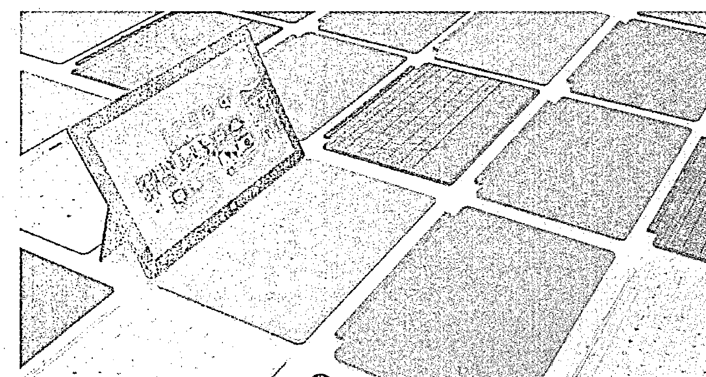

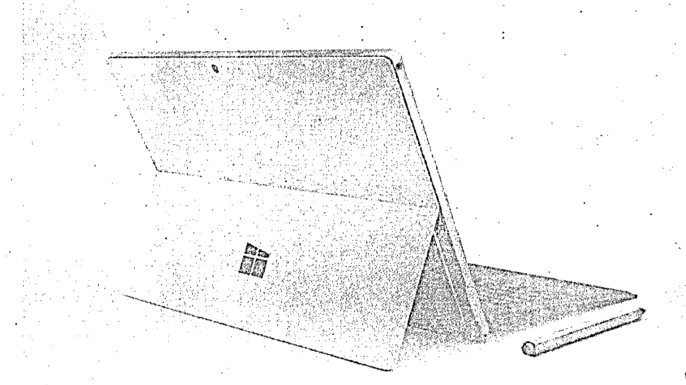

###### 屏幕支架设计有门道

笔记本的屏幕开合角度可随意调节，方便我们寻找最完美的欣赏视角。平板二合一设备在PC（笔记本）模式下的体验是优还是良，就取决于它是否配备可调节的屏幕支架了。纵观当下，支架设计最合理的产品就要数惠普Spectre x2了，该机配备了中间镂空的U型支架（图4），可留出更多的空间用于塞进更大容量的电池确保续航时间。而像微软Surface Pro和联想MIIX 700这种占据1/2背部空间的支架（图5），势必会浪费一定的设计空间。

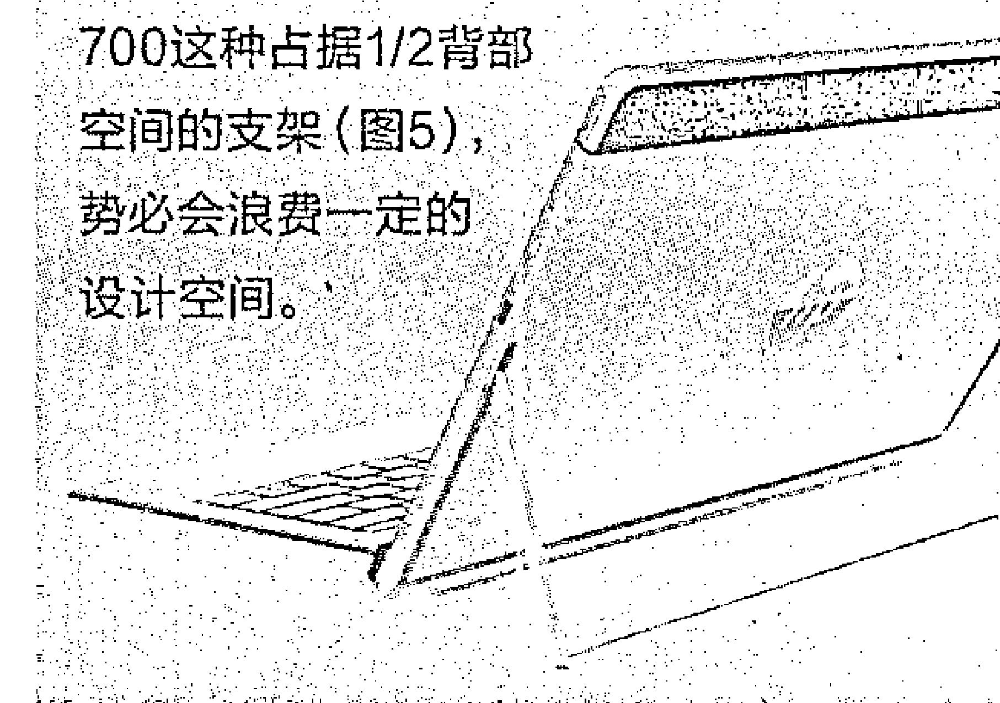

令人欣慰的是，几乎所有的10.1英寸~11.6英寸的国产Windows平板电脑都“参考”了Surface Pro的吸附式扩展坞接口（图6），并提供类似Type Cover键盘（还可充当支架）的外设可选，可以获得Surface Pro式的二合一设备。那么，没有扩展坞接口就不是一款好的平板二合一设备了吗？答案当然是否定的，比如戴尔XPS12就通过蓝牙外接键盘，而官方却为其准备的键盘底座增加了可固定XPS12的凹槽，通过内部的磁铁可将XPS12和底座牢牢地连接在一起（图7），体验上依旧无限接近笔记本。如果将这种思路扩展一下，我们就有办法让所有的Windows平板电脑都“进阶”二合一阵营了。

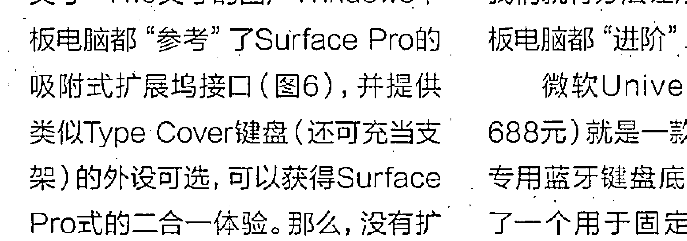

微软Universal Mobile（约688元）就是一款类似戴尔XPS12专用蓝牙键盘底座的产品，它提供了一个用于固定平板电脑的支架（图8），任何Windows平板电脑与其连接都可变身标准的笔记本。如果你觉得Universal Mobile太贵，市面上还有很多结构类似的便携式平板键盘，价格从几十元到上百元不等。在选购此类键盘时需要注意的就是敲击手感、最大兼容尺寸以及内置电池容量。

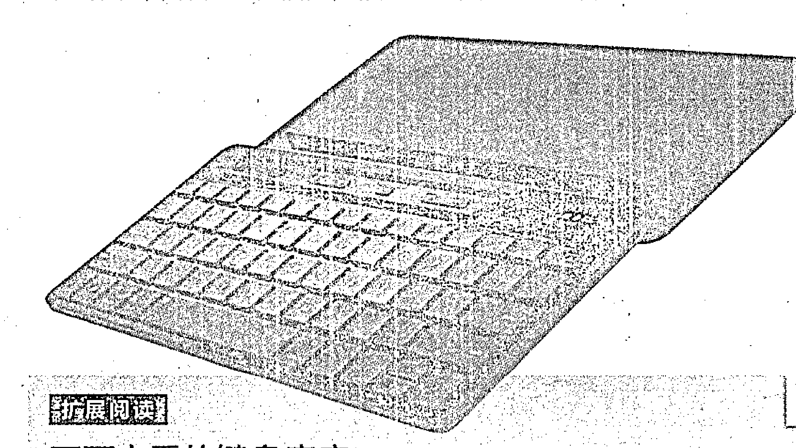

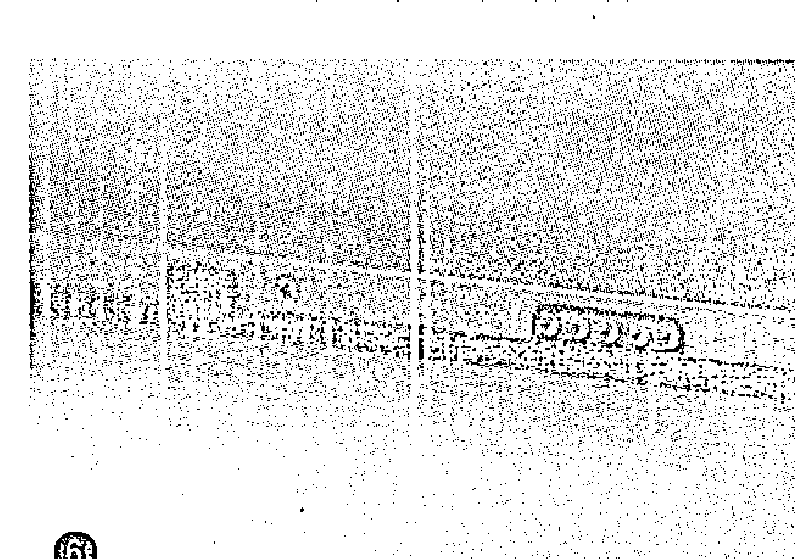

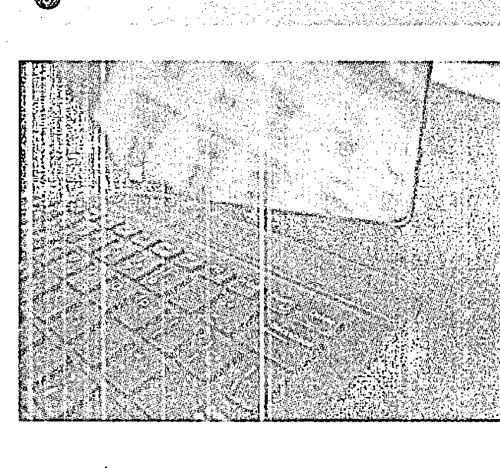

###### 不可小看的键盘底座

键盘底座其实可以玩出很多花样。比如，通过专用扩展坞接口连接的键盘底座，可额外增加更多的USB甚至HDMI视频接口。此外有些平板二合一的键盘底座还内置电池，与平板连接后可以进一步延长续航时间。而真正将键盘底座发挥到极致的，就要数微软Surface Book了，该产品在键盘底座里塞进了独立的GPU，可以提升平板电脑的游戏性能。有关Surface Book的黑科技，请参考本刊2015年23期特别话题。

###### 14nm平台一统江山

分体式平板二合一设备要将处理器、内存、硬盘、电池等部件和屏幕挤在一起，对功耗和散热控制的要求极为苛刻。好消息是，英特尔已经为此类产品准备了两套14nm工艺的处理器平台：CherryTrail-T和Skylake-Y。

其中，CherryTrail-T是BayTrail-T的接班人，被冠以“Atom”（凌动）之名，旗下包含X5-Z8300、X5-Z8500和X7-Z8700三款处理器，主打性价比。Skylake-Y则是Broadwell-Y的继承者，也就是新一代的酷睿M处理器，拥有酷睿M7-6Y75、酷睿M5-6Y57、酷睿M5-6Y54、酷睿M3-6Y30四名成员，主打更强的性能（图9）。

如果你不玩大型3D游戏，不编程调试比较大的项目，平时只是上网聊天看视频、外出给客户做PPT演示、作为移动性（给Android/iOS设备）刷机平台，基于CherryTrail-T平台设计的平板电脑就已足够。总之，如果你现在打算入手一款平板二合一设备，就请认准上述两大平台吧。

> > 如果你想了解CherryTrail-T和Skylake-Y的更详细规格和性能差距，请参考本刊2016年第1期《携Skylake之威 第二代酷睿M深度解析》这篇文章。

###### 二合一“大有可为”

就笔者的使用经验看，10.1英寸或更大尺寸的Windows平板电脑才是最理想的二合一设备。原因很简单，9.7英寸产品大都延续了Android版本的模具，OTG和充电共用一个MicroUSB接口，意味着充电时无法连接闪存盘和有线键鼠套装。8英寸或以下尺寸的视野太小，除非外接显示器，否则Windows系统的很多软件窗口或字体显示过小，不适合长时间使用。而10.1英寸起步的Windows平板电脑视野足够大，而且大都配备了标准的USB接口、带有独立的充电接口以及连接键盘的扩展坞接口，在体验上接近完美。

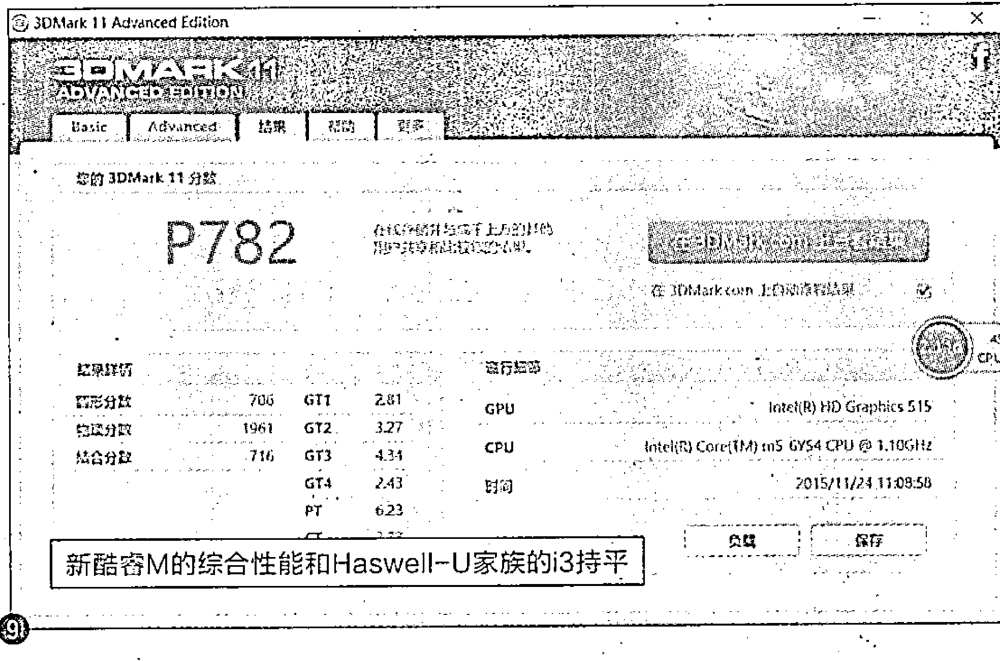

###### 理性分析性价比

基于CherryTrail-T设计的微软Surface 3要3999元起，而武装Skylake-Y的Surface Pro 4更需6688元，没有如此之多的预算怎么办？没关系，Surface系列是平板二合一领域的“贵族”，与其配置相近的国产设备价格绝对有惊喜。

小米平板2就是目前最热的CherryTrail-T平台平板电脑（图10），采用7.9英寸屏幕，搭载Atom X5-Z8500处理器，内置2GB内存和16GB存储空间，售价999元（Android版，可自行刷入Windows 10系统，64GB的Windows版售价1299元）。小米平板2算超值了吗？

很遗憾，小米平板2的性价比远不如自家的红米手机那般给力。台电X80 Plus、酷比魔方iwork8和昂达V820w CH是三款采用8英寸屏幕设计的Windows 10平板，它们搭载X5-Z8300处理器，内置2GB内存和32GB存储空间，但售价却只有499元。当然，这三款竞品的屏幕分辨率和电池容量也偏小，做工不够精细，但就性能和体验上却和小米平板2无限接近。总之，如果你预算不够充裕，在挑选平板二合一设备时不妨货比三家。在国产平板电脑厂商的“搅局下”，Windows平板电脑没有最低，只有更低。

###### 产品推荐

**驰为Hi10 999元**

-   屏幕：10.1英寸（1920×1200像素）
-   处理器：X5-Z8300
-   内存/存储：4GB/64GB
-   厚度/重量：9.9mm/553g

该产品最大特色就是强悍的扩展能力，它平板部分标配USB2.0、USB3.0和MicroUSB三个USB接口，可通过扩展坞连接键盘底座（需另配，约190元）。

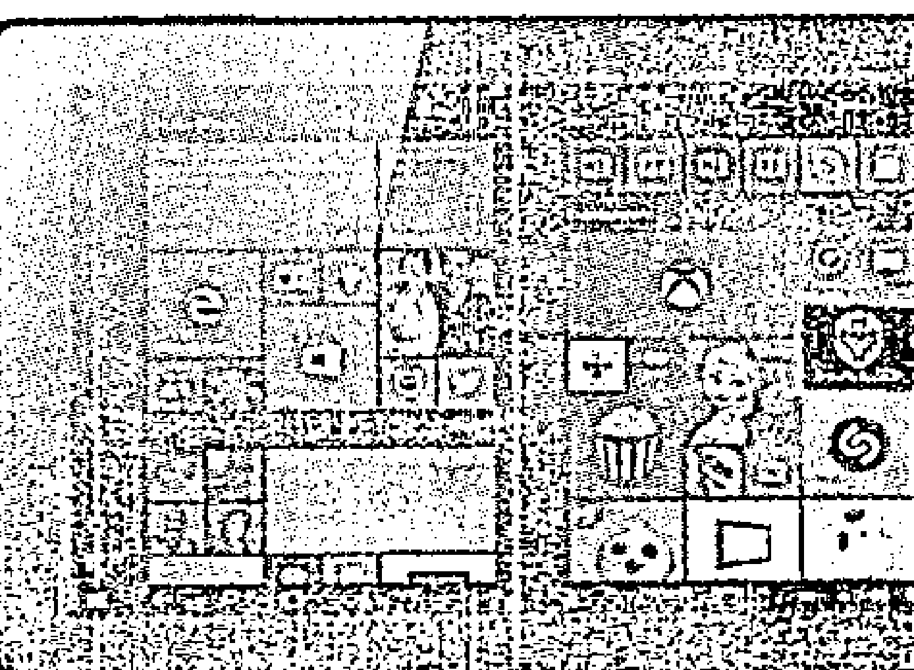

####### 海尔青春小蓝II Pro 3399元

-   屏幕：12.2英寸（1920×1200像素）
-   处理器：酷睿M3-6Y30
-   内存/存储：4GB/128GB SSD
-   厚度/重量：8.9mm/850g

最大卖点是武装了性能级酷睿M3-6Y30，硬件规格与Surface Pro 4低配版看齐。可惜仅配备一个MicroUSB3.0，没能利用相对厚实的机身用上标准USB实属遗憾。

####### 昂达oBook 10 999元

-   屏幕：10.1英寸（1280×800像素）
-   处理器：X5-Z8300
-   内存/存储：4GB/64GB
-   厚度/重量：8mm/575g

oBook 10的配置本着够用就好的原则，并主打8mm的超薄设计。其可选配一个多模式转轴的键盘底座，与平板连接后可增加一个额外的USB接口。

##### 分身的另类表现

###### 有趣的“两面派”配件

MicroUSB、Type-C、Lightning，它们是手机领域的三大接口标准。实际上，不同类别的设备都面临着多种标准接口共存的现象。此时，一些“两面派”的配件也许就能帮我们改善多接口标准之间的关系。

###### 硬盘的分身之旅

作为数据的存储中心，硬盘既可以踏踏实实装进PC（笔记本）体内，也能以移动硬盘的形态帮用户进行数据的迁徙。问题来了，想进驻PC就需要硬盘配备标准的SATA接口，而想扮演移动硬盘就需要配有USB接口。一款硬盘要想同时扮演好上述两种角色，势必需要额外的移动硬盘盒来帮忙（图1）。那么有什么方法能让硬盘摆脱硬盘盒的束缚，随时进行两种角色的转换呢？

宇瞻最新推出的SSD硬盘“AS720”也许就是最佳的解决思路（图2）。这款7mm的SSD同时配备了SATA3.0（图3）和USB 3.1 Type-C两个接口（图4），既可以用在PC体内（使用SATA），也可以直接当移动硬盘使用（使用USB 3.1 Type-C，此时闲置的SATA可以用防尘塞堵住），一举多得。可惜，AS720的创新设计也带来了溢价，240GB的版本约合人民币850元，较同规格标准SATA接口的SSD贵了200元左右。

这种“两面派”的硬盘设计很值得推广。SSD+移动硬盘盒必然导致体型增加而影响便携性，想重新使用SATA接口还需将硬盘盒拆开再将SSD取出，好不麻烦。好消息是，目前淘宝已有mSATA转SATA和USB2.0两种接口的转接卡（图5），如果你手上有闲置的mSATA SSD，或也想打造一款内外两用的SSD，这类产品就能帮上你。希望今后能出现可加装M.2或mSATA SSD的2.5英寸7mm标准厚度移动硬盘盒，方便我们打造出和宇瞻AS720一模一样的两用SSD吧。


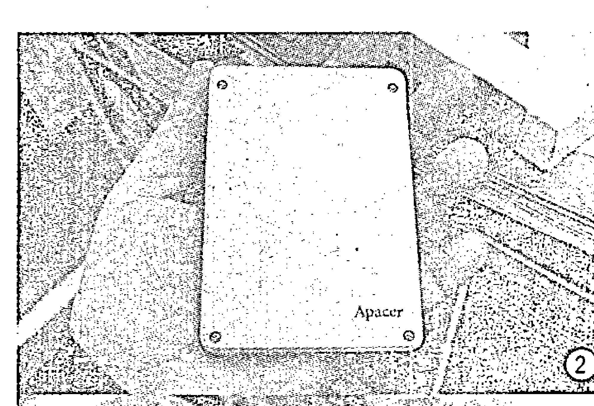

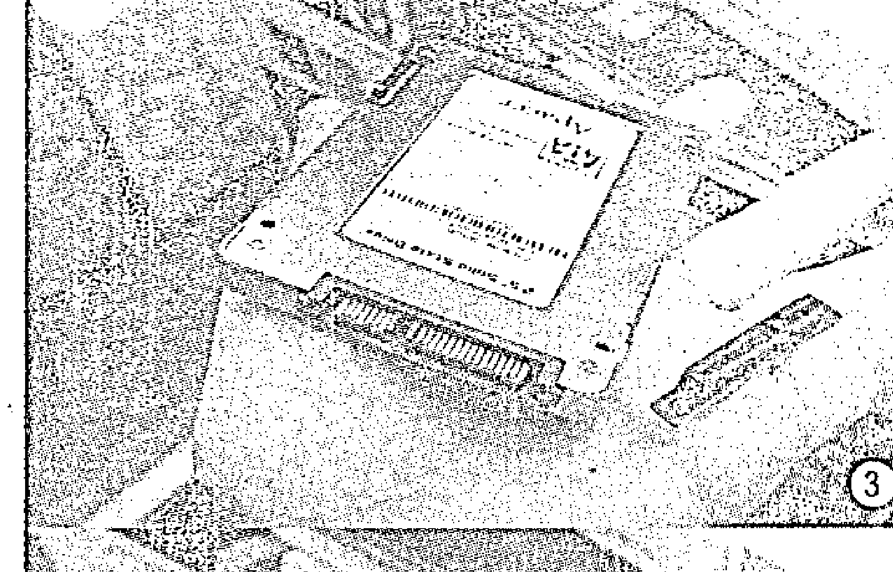

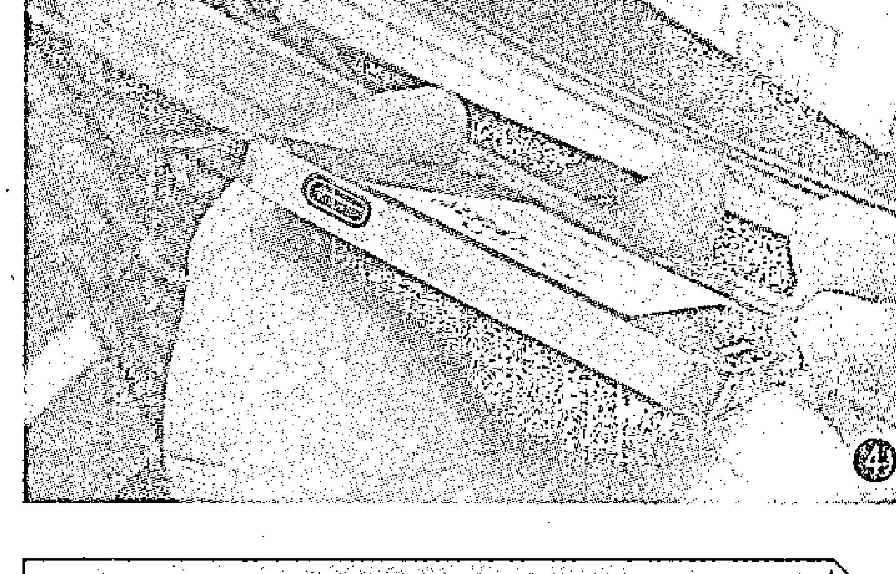

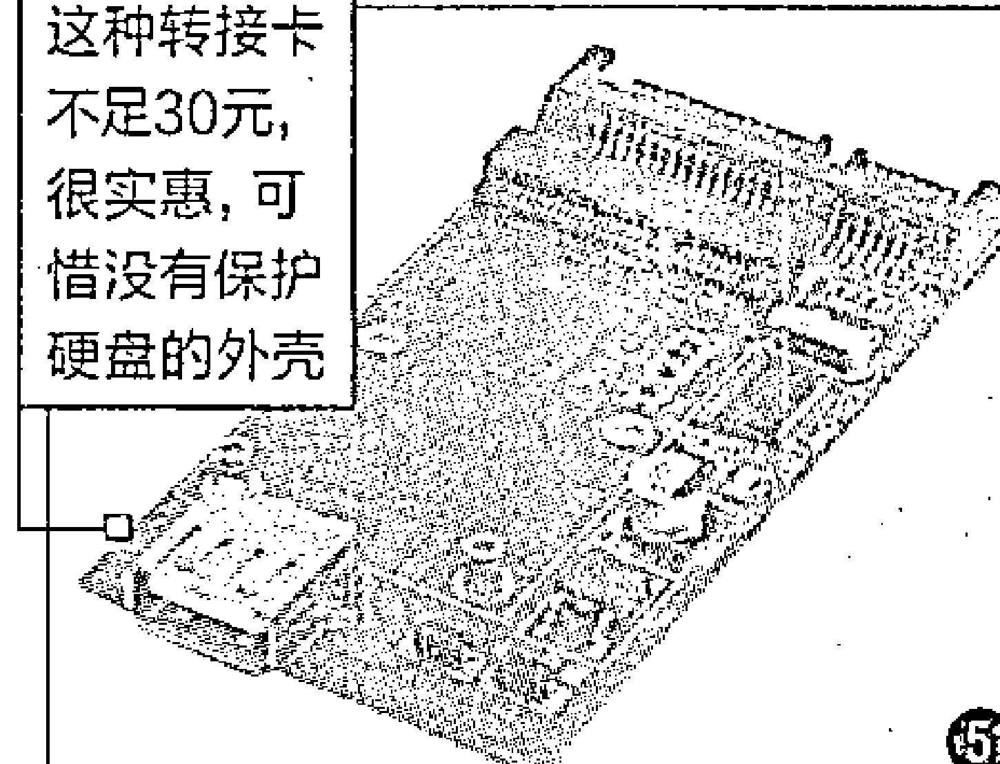

###### 将音频接口拆分

为了实现纤薄化设计，如今越来越多的笔记本都采用了复合型的音频接口，即将耳机孔与麦克孔合二为一。但是，很多耳麦却延续了双线设计（音频和麦克各用一个插头），只能任选其一与笔记本相连。此外，如今的手机和平板也只有一个耳机插口，如果你想同时连接高品质的耳机和麦克风用于录歌，又该如何是好？

实际上，笔记本和手机的音频接口也可以分身，我们只需购买一款音频耳麦转接头即可。这类产品淘宝价格多在10元~20元之间，可以将复合型音频接口拆分成音频和麦克（图7），方便我们同时接驳双线设计的耳麦（PC），或分别接驳更高品质的耳机和麦克风（手机）。

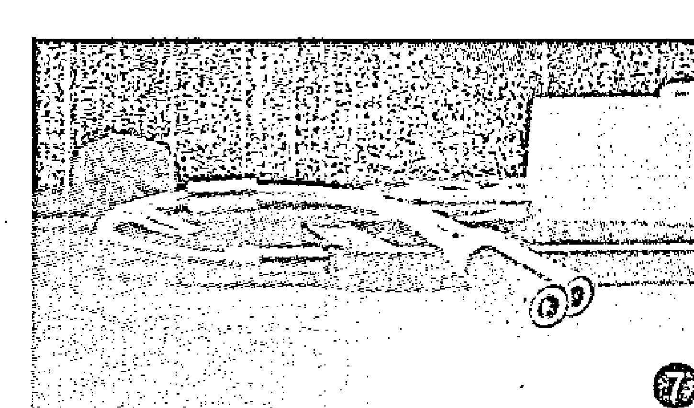

此外，如果你想和男/女友一起欣赏手机里的音乐，还可购买一拖二的音频线同时接驳两副耳机（图8），让两个人都能享受到高品质的乐章，而不是像以前只能每人戴一个耳朵的耳机。

###### 一线两用的数据线

很多人家里都同时拥有iOS和Android两类设备，比如一款iPad一款三星手机。问题来了，两类设备的充电和数据传输接口分别为MicroUSB和Lightning，每次出远门都得同时携带两根数据线，好不累赘。好消息是，如今就连数据线也学会了“分身”，一根线即可接驳iOS或Android设备。此类数据线其实就是在传统MicroUSB数据线的基础上增加了一个Lightning的“盖帽”，需要连接iPhone或iPad时取下“盖帽”，连接安卓手机时则套上“盖帽”即可，一根线解决了两种接口设备的充电和数据传输需求，非常方便。

###### 两面派硬盘与HDD绝缘

如果今后双接口硬盘能够普及，那也仅限于以SSD作为存储介质的产品。原因很简单，SSD只需主控、闪存、缓存等几颗芯片构成，对空间的要求极低（图6），如此就可留出充裕的空间去安装SATA和USB接口。而HDD机械硬盘需要复杂的物理结构，没有闲置的空间去加装USB。


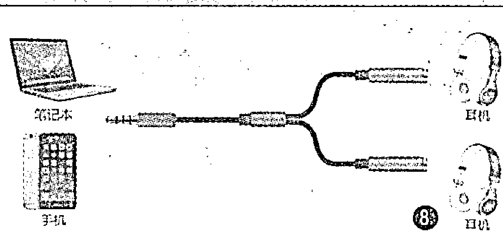

接iOS设备时只需将Lightning插头盖在MicroUSB插头上即可（图9）。它们的价格多在20元~50元之间，不同价位产品的差异主要体现在线缆的长度、材质（好一些的会选用尼龙精编而成），为了保证充电时可以得到稳定的电流（图10），建议大家不要选择太过便宜的产品，有苹果MFi认证自然最佳。

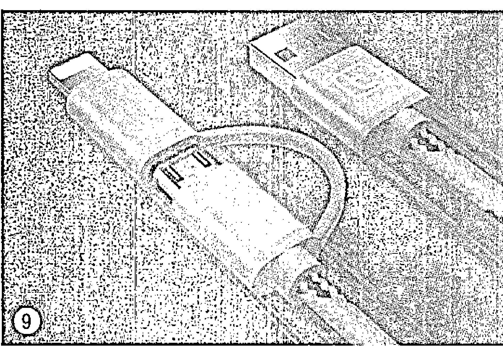

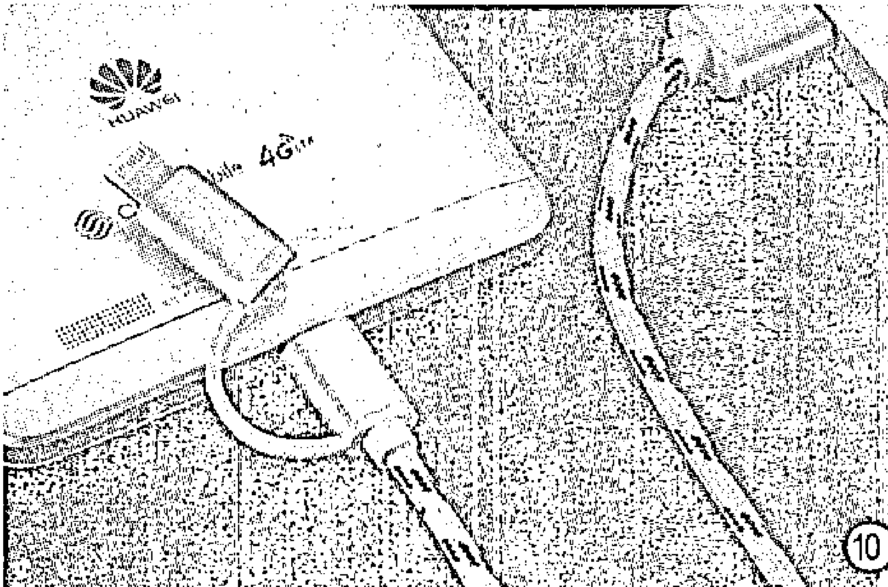

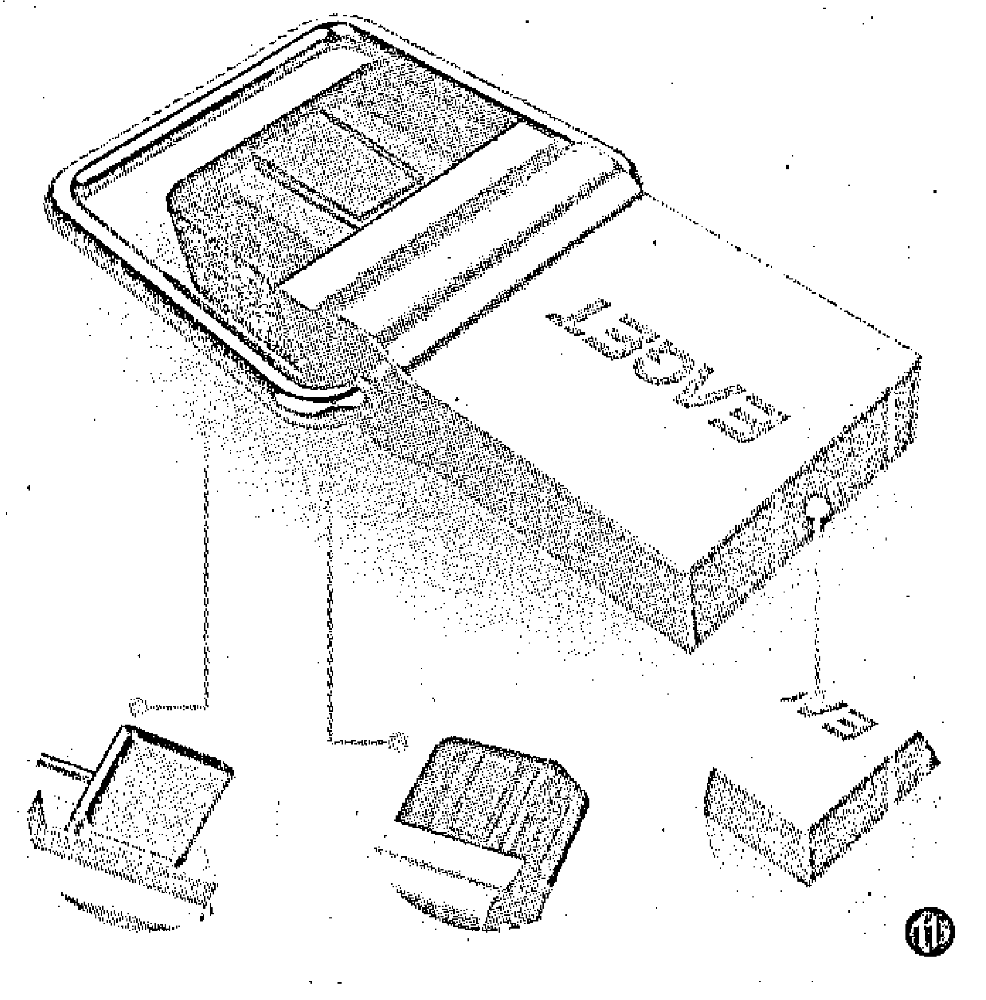

###### 闪存盘也玩二合一

作为USB的下一代标准，USB Type-C接口已出现在越来越多的手机、平板和笔记本身上。为了方便此类设备间互传数据，同样配备Type-C接口的闪存盘自不能少。令人欣喜的是，Type-C已被很多“二合一闪存盘”所武装，无需OTG和Hub等转接设备就可接驳标准USB或Type-C接口。如果移动设备配备了Type-C接口，而你近期又有购置闪存盘的计划，强烈建议你一步到位选择配备Type-C的二合一闪存盘。它们的价格不算贵，如金士顿DTDuo3C和忆捷CU10起价仅69元（16GB）（图11）。


平板电脑的“生产力”之所以无法超越PC或笔记本，除了性能稍逊几筹外，无法实现多屏输出也是很关键的一环。因此，唯有掌握笔记本多屏输出的技巧，才能最大限度释放潜力。

##### 梦幻的三屏显示

对游戏玩家而言，三联屏输出可以在赛车和第一人称射击等类别的游戏中带来梦幻般的“视界”（图1）。随着LCD（液晶显示器）价格的一步走低，哪怕是普通用户也有了搭建多屏输出的“资本”。但是，想让笔记本玩转多屏输出还是有一些需要注意的事项。

比如，三联屏既可以是笔记本屏幕+额外的两台LCD，也可以是笔记本直接外接三台LCD，而能否正常实现三屏输出，就要看笔记本所采用的硬件平台（是英特尔还是AMD）以及视频输出接口的种类和数量了。

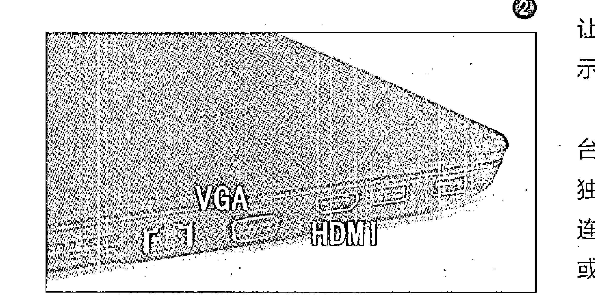

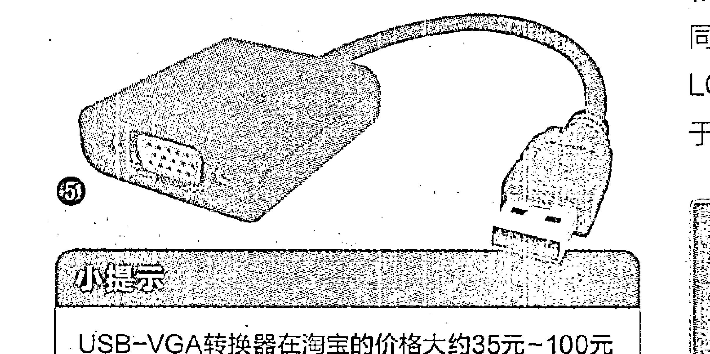

> 小提示

USB-VGA转换器在淘宝的价格大约35元~100元左右，如果你的笔记本配备了USB3.0接口，那就请尽量购买USB3.0转VGA的转换器，以确保更高分辨率的支持和降低显示延迟问题。

##### 多LCD的三屏输出

由于笔记本屏幕太小，与LCD放在一起时很难“对齐”，只适合办公环境。如果你是发烧级的游戏玩家，就需要由三台LCD构成的三屏显示平台了。很遗憾，目前能同时配备VGA、HDMI和DP接口的笔记本很少，而且想在三屏状态的超高分辨率下流畅游戏，至少也需要GTX970M级别的独立显卡支持。因此，对普通用户而言，笔记本+双LCD的三屏模式足矣。

##### 笔记本+双LCD

主流价位的笔记本（超极本/超薄本除外）大都同时配备了HDMI和VGA两个视频输出接口（图2），理论上同时连接两台LCD后就可与笔记本自身屏幕组成三屏模式。真的有这么简单吗？答案是否定的，此时的关键在于笔记本的硬件平台。

如果你的笔记本采用了AMD APU平台，那么恭喜你，只要通过HDMI和VGA接口外接两台LCD，在Windows 10的显示设置中就可让三块屏幕以复制或扩展的方式显示内容了。

如果你的笔记本基于英特尔平台设计，哪怕武装了额外的NVIDIA独立显卡，笔记本屏幕都会与VGA连接的LCD产生冲突：单独用VGA或HDMI连接一台LCD时，笔记本和LCD均可正常实现双屏显示；但同时使用VGA和HDMI连接两台LCD时，VGA对应的LCD屏幕会处于关闭状态，笔记本只能实现自身屏幕与HDMI对应的LCD双屏显示（图3），显示设置中也无法识别出VGA对应的LCD。此时，只有关闭笔记本屏幕（合上顶盖），VGA和HDMI连接的两台LCD才能同时点亮进行双屏显示（图4）。

那么，有没有方法解决英特尔平台笔记本的这一尴尬呢？当然有，我们只需另购一个USB-VGA转换器（USB显示卡）即可（图5）。此时，我们只需使用笔记本的HDMI连接一台LCD，再通过USB-VGA转换器使用USB接口连接另一台LCD，笔记本的屏幕就能和两台LCD同时显示了（图6）。

此外，如果你的英特尔平台笔记本同时配备了HDMI和DisplayPort（或者miniDP），那么就不用考虑USB-VGA转换器了，使用HDMI和DisplayPort接口时笔记本屏幕能完美与外接的两台LCD同时显示。

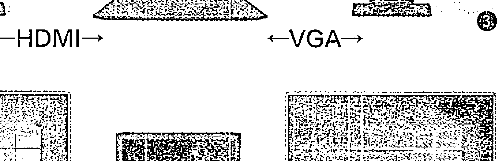

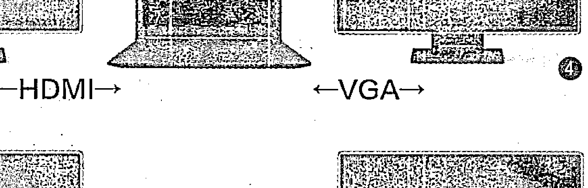

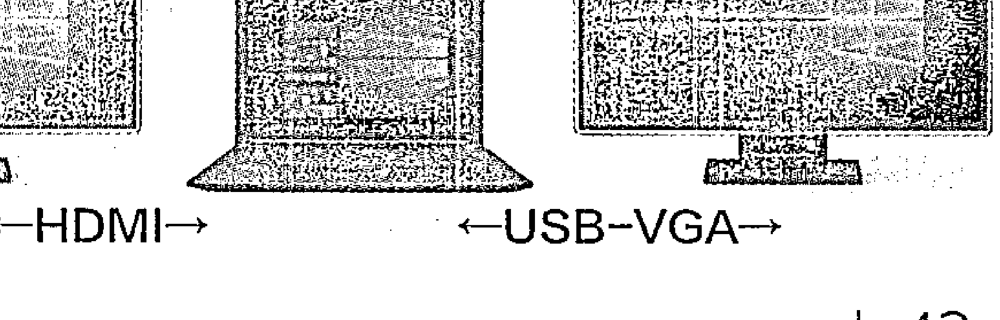

##### 多屏显示的经验谈

笔记本外接多台LCD不存在安装上的难点，只要会插拔视频线即可。但是如果想提高多屏幕带来的使用效率，就需要一些使用上的经验和技巧了。

比如当笔记本与一台LCD连接时，LCD最好放置在笔记本的右侧，作为整个“视界”的延伸。由于开始菜单位于整个显示环境的左下角，LCD右置比左置更便于操作。此外，建议大家将笔记本垫高，让笔记本屏幕的底部与LCD底部处于水平状态，如此才可方便分屏查看相关内容。对Windows 10系统而言，我们可以在桌面点击鼠标右键进入“显示设置”，在这里可以设定多显示器的显示模式（如复制或扩展），通过拖拽带有数字的LCD图案还可改变它们的排列顺序（图7）。

如果你想建立一套专门玩游戏的三联屏平台，建议购买符合标准VESA壁挂规格且屏幕可以旋转到竖屏状态的同型号LCD（图8），以便于适应不同类型游戏的显示。有条件的玩家还可购买显示器支架，通过VESA将LCD固定在支架上以获得更完美的显示效果（图9）。

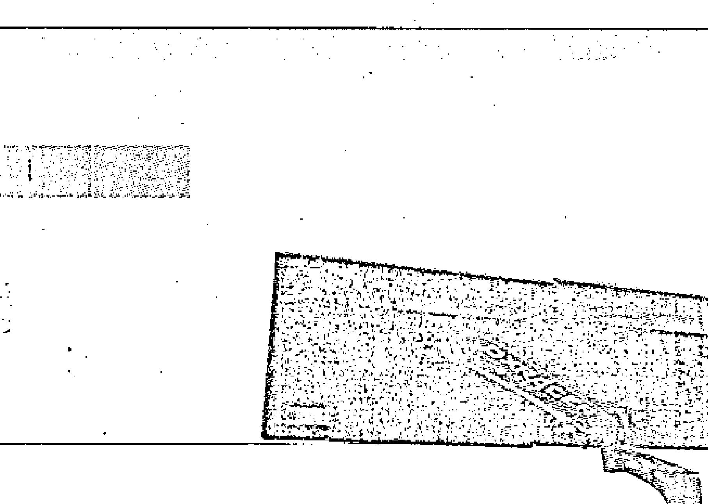

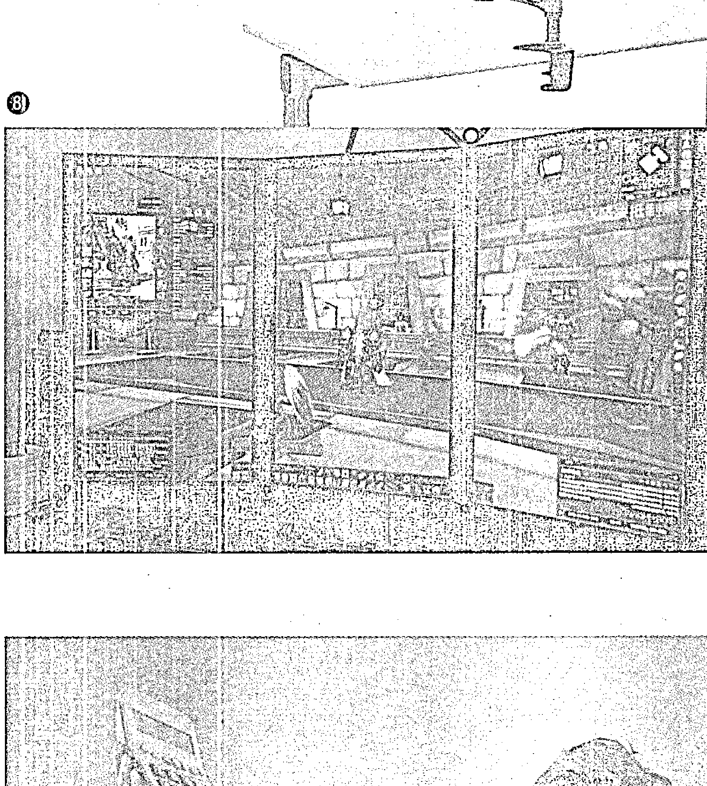


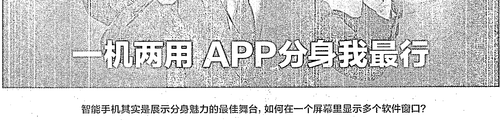

智能手机其实是展示分身魅力的最佳舞台，如何在一个屏幕里显示多个软件窗口？同时运行两个微信和QQ？总之，“一机两用”就是我们的既定目标。

##### 微信双开不是梦

在2015年中，很多新款手机都主打“微信/QQ双开”的功能，着实羡慕坏了不少拥有多个微信、QQ或陌陌账号的玩家。实际上，双开并非什么高科技，无论你的手机品牌型号是啥，都能借助“双开大师”（下载地址：http://www.parallel-app.com/）这款APP实现包括微信、微博、QQ甚至一些游戏的双开！

在手机上安装并运行双开大师后，点击底部的加号即可添加需要分身的APP（图1），按照界面提示就可生成第二个微信或QQ或游戏的图标（图2）。从此，它就能和原APP同时运行，登录不同的账号进行同步操作，在一款手机上实现昔日两款手机才能办到的事儿。

##### 分屏显示更方便

当我们双开某款APP时，每次切换都需要长按Home进入多任务的管理窗口，很容易错过抢红包或重要的消息。此时，如果手机可以实现分屏显示（图3），让屏幕同时显示两个软件的窗口无疑就可解决上述问题。好消息是，如今很多Android手机的系统已集成了分屏功能，只要在设置中开启就可轻松实现一屏两用。以vivo X6 Plus为例，在“设置→分屏多任务”中即可开启该功能（图4）；华为Mate8则需进入“设置→智能辅助→手势控制→分屏手势”中开启（图5）。

如果你的手机不支持分屏功能，则可以借助“xpoesd框架”实现多任务窗口化的曲线救国，只是该方法需要手机联网且获得ROOT权限，所以只限有经验的玩家尝试。简单来说，安装且赋予xpoesd框架ROOT权限后，依次点击“框架→安装/更新→重启”（图6），返回主界面后进入“模块”，勾选安装Xholofloatingwindow模块后重启手机即可（图7）。

如果一切顺利，此时你就能将任意APP变成悬浮窗口，可以在一个屏幕上同时显示微信、QQ、浏览器和游戏等多个APP的界面，随时掌握APP最新的内容更新并轻松进行任务切换（图8）。这个功能看起来是不是很熟悉？没错，三星从Note4开始引入的随心多窗口功能其实就是上述功能的翻版。

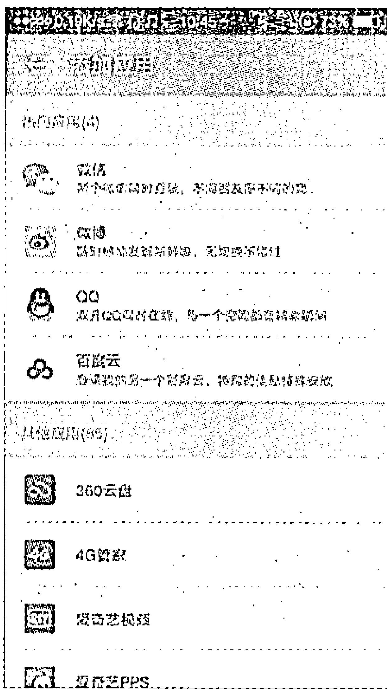

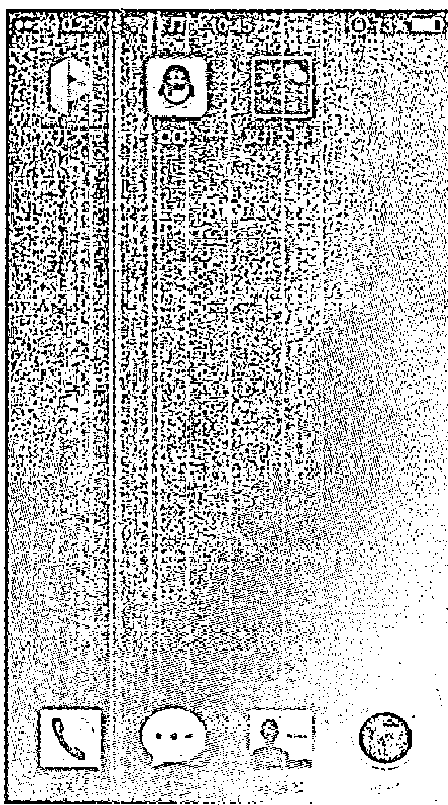

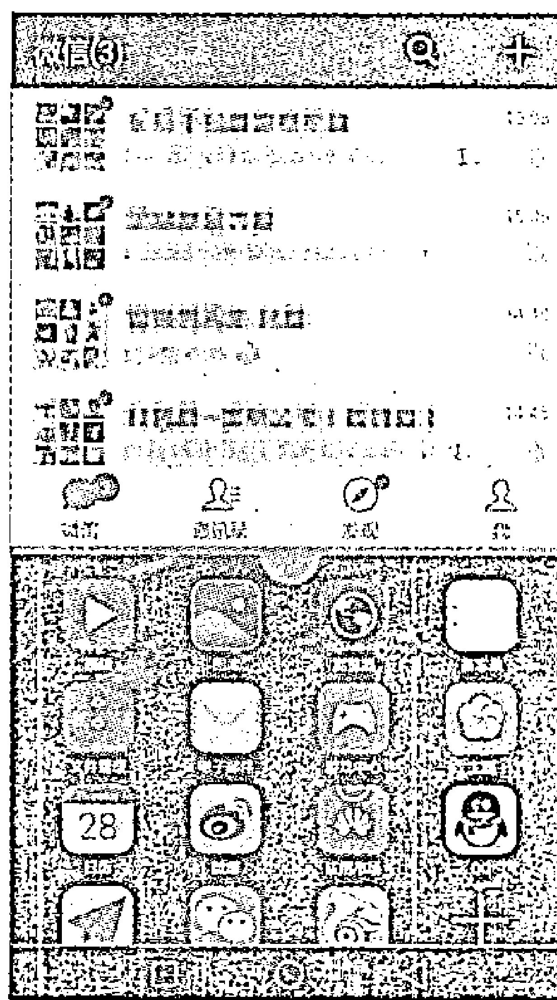

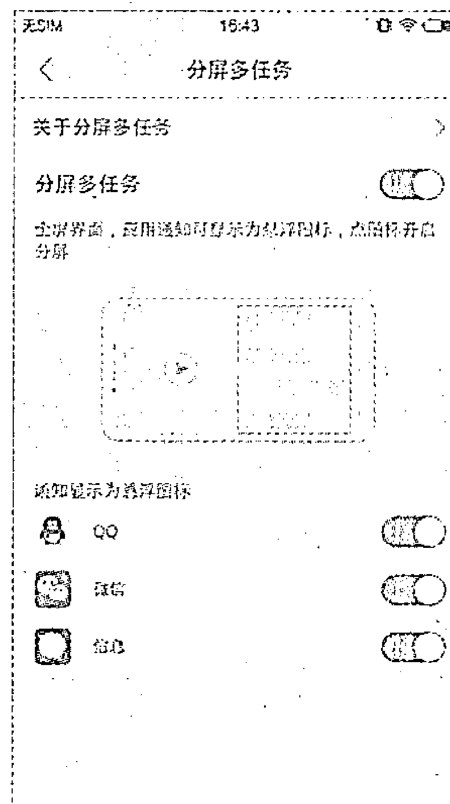

##### 视频玩机两不耽误

很多用户都喜欢将手机用于“掌上影院”，但如何实现看视频和抢红包两不耽误？当然，前文提到的分屏和多任务窗口化方式即可解决。但是，如果你的手机不支持分屏，而你又不想Root系统时又该怎么办？

解决方法其实很简单。如今绝大多数手机自带的视频播放器都支持悬浮窗口的功能，以OPPO R7s为例，在播放视频时只需点击右上角的图标就能将视频以小窗口的状态显示（图9），从而便于我们欣赏视频的同时进行其他操作（图10）。

如果你手机自带的视频播放器不支持悬浮窗口功能，还可以通过乐视视频和MoboPlayer等第三方播放器获得悬窗的能力。

需要注意的是，第三方APP的悬窗功能需要相关的权限支持，比如OPPO R7s就需要进入“安全中心→权限隐私→悬浮窗管理”中允许APP使用悬窗的功能（图11）。

##### 访客模式的妙用

春节将至，很多人都担心亲戚家小孩抢过你的手机随意玩耍，结果误删了重要的程序或数据，又或是一些隐私内容被无意泄露。实际上，很多手机都提供了访客模式，从而方便我们轻松搭建两个系统环境。

以华为荣耀7为例，在“安全→隐私保护”中就可新建访客密码，并设置访客模式下需要隐藏的联系人、图片和程序（图12）。同时，我们还能将此前录入的指纹分别指定进入机主模式或者访客模式（图13）。如此一来，当别人玩你的手机时，你只需用访客模式的密码或指纹解锁，进入的就是被隐藏数据后的干净系统环境；当你自己使用手机时，则可用机主模式的指纹或密码解锁，轻松将一款手机一分为二（两个系统环境）。

> 小提示

并非所有华为手机都支持访客模式，比如最新的华为Mate8就取消了这一功能。

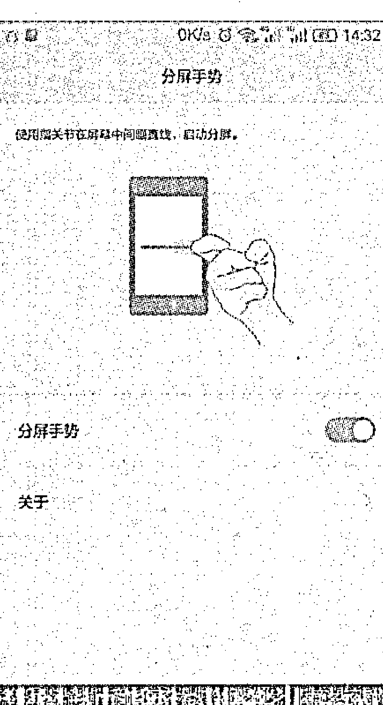


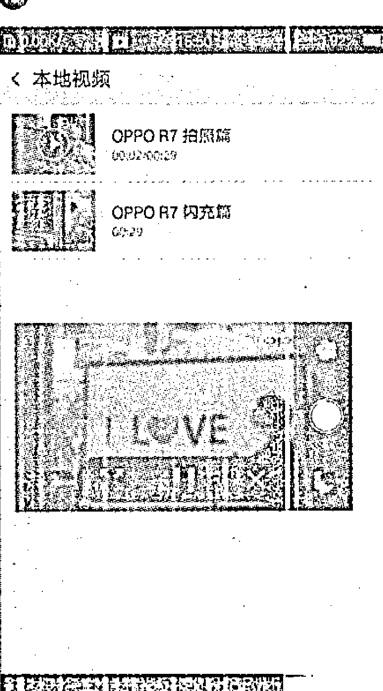

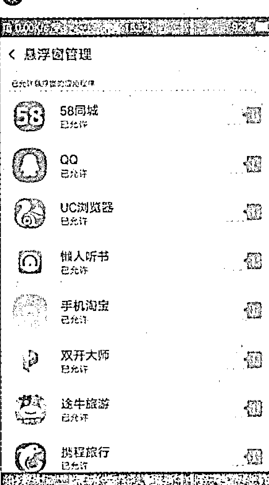

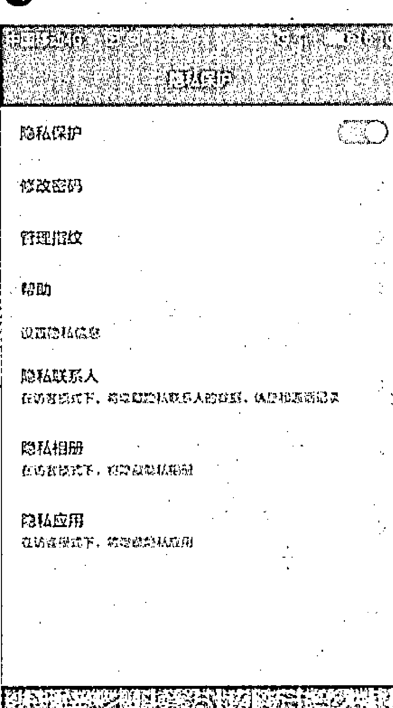

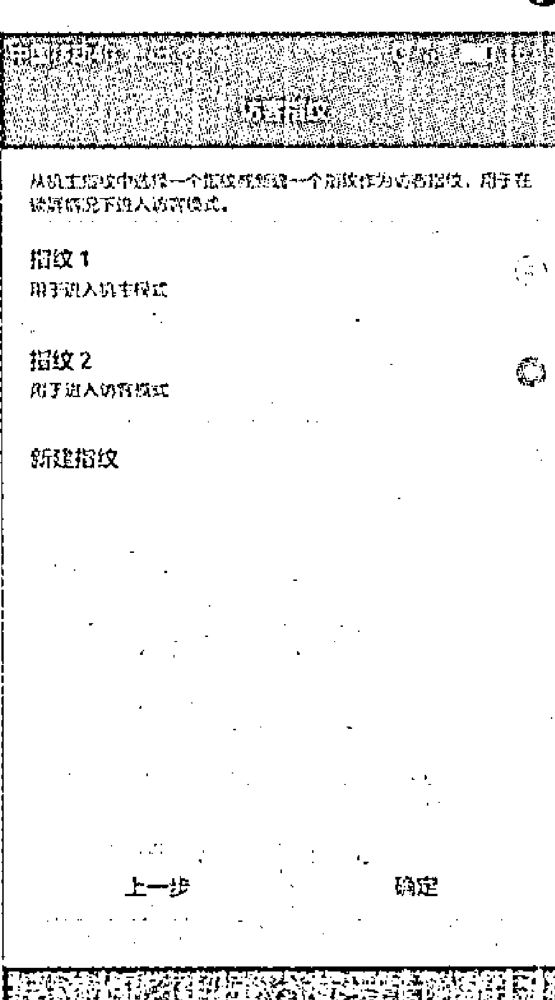

无论是Windows操作系统，还是运行在其上的各类应用软件，都不同程度地存在着可“分身”操作的可能，软件功能的分身操作基本不增加成本，但可极大地提高资源的利用率和工作效率。


##### 延展无限可能 细“分”之后要多能

文|刘英

##### 一机多用 系统能“分身”

- 将Windows操作系统“分身”出另一个系统，用在另一台配置完全不同的机器上；
- 将同一个Windows分给不同的用户“单独”使用而不影响其他人的资源；
- 将一台电脑主机挂接多套键鼠，让几个人同时使用而互不影响。

所有这些，都是系统“分身”的优势所在。

##### 系统“分身”克隆巧搬新家

在Windows 8以前的低版本的系统中，如果将一台电脑中的Windows系统原封不动地“分身”出另一套，给另一台电脑使用，很有可能由于主板芯片、显卡等不适配而造成黑屏或蓝屏，无法正常启动。通过特定的系统备份软件进行系统备份还原，还原时先剥离主要设备的驱动程序（如易引起显示问题的显卡驱动），然后再安装最基本的支持驱动，让系统恢复之后可以在另一台电脑上以最基本的方式运行。之后，再针对本台电脑，直接安装设备官方提供的驱动程序或使用驱动精灵、驱动人生、驱动大师等工具，自动安装最合适的驱动程序。这样，就解决了一套系统在两台电脑上的使用问题。

> 小技巧

要从Windows XP、Windows 7等系统“分身”出一个系统到另一台电脑，可使用带有“异机还原”功能（或者称为“通用还原”）的ATI 2013、ATI 2014系统备份软件，先对原系统执行分区备份，然后在还原时选择“异机还原”选项，将系统还原到新电脑的硬盘中。

对于主流的Windows 8.1或Windows 10系统，如果要实现“分身”，由于这两个系统采用了与低版本不同的启动配置方式，即便系统设备不同，Windows也会自动用微软最基本的配置来启动系统，Windows会对不兼容的硬件设备驱动先作临时屏蔽，用Windows最基本的配置启动系统，而后再尝试联网自动更新。因此，只需安装最新版专业系统备份工具Acronis True Image 2015（简称ATI2015），直接备份恢复即可。

在原系统的Windows中安装ATI2015，启动ATI2015后，点击“添加备份→创建新备份”，点击“选择来源”确定要备份的系统分区。其中“磁盘与分区”为按照磁盘或分区来选择备份来源，请选择这一项（图1）。

随后会出现磁盘与分区选择列表（图2）。可看到，在卷名为TOSHIBA DT01ACA100的硬盘下，存在Windows 10、Windows 8.1和数据分区共3个分区，这里假设要将Windows 10和Windows 8.1“分身”出来，供另一台机器使用。将这两个分区一同选中，单击“确定”。

接下来点击“选择目标”圆形大按钮，下方弹出3个选项。利用这3个选项，可将刚才选择的系统备份到外部驱动器（如移动硬盘或大容量闪盘），或存放到Acronis Cloud云盘中（图3）。点击“浏览”按钮，则可以将目标存放在本地硬盘的某个数据分区中，或保存到局域网共享空间的映射盘符中，甚至可以直接保存到FTP服务器、NAS服务器中。确定目标之后，进入备份过程，一般十几分钟到几十分钟即可完成（所用时间由系统性能和系

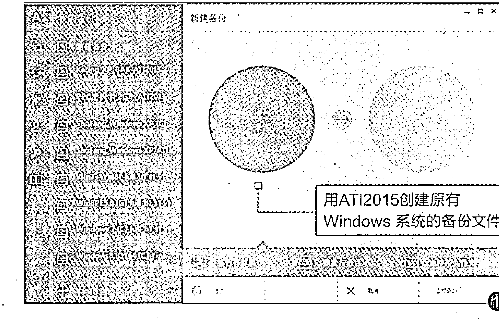

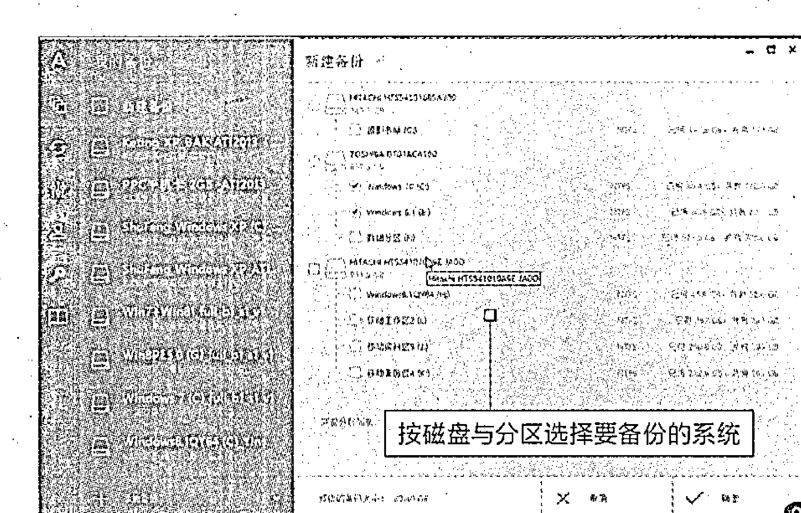

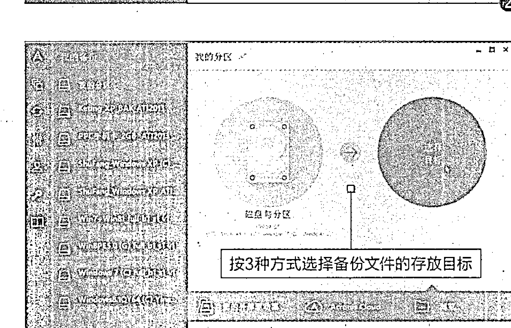

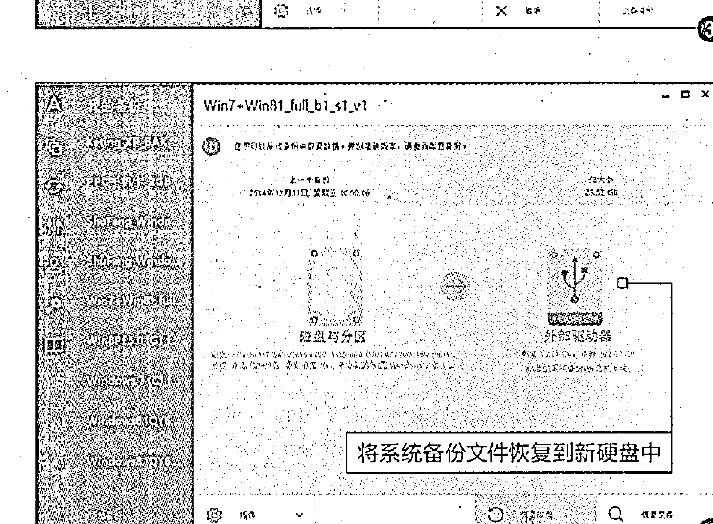

##### 特别话题

系统备份好后，将目标电脑的硬盘拆下来，挂接到先前的那台电脑上。启动电脑并进入ATI 2015，选好先前备份的系统备份文件，点击“恢复磁盘”按钮，按照系统提示，选择新挂接的硬盘位恢复目标，恢复系统到这块硬盘中（图4）。

待系统恢复完成之后，将带有新恢复系统的硬盘挂接到目标电脑上启动。Windows 8.1或Windows 10会自动配置系统，先以最基本的配置启动系统，而后会自动联网更新合适的显卡驱动等驱动程序。用户也可以到设备管理窗口中，右击设备手动更新驱动程序。

##### 一机多主 内容不干涉

Windows本身支持账户“分身”使用，一个Windows系统可以建立多个不同名称、不同权限的账号，分配给不同人登录使用，也可由同一个人用作不同用途。多名成员共用电脑，如果各用自己的账号登录，就可免去使用同一个账号而引起的文件系统混乱和隐私泄露。而如果发现同装两个软件互相冲突，这时可开两个账号，每个账号各装一个软件，只需切换到不同的账号登录Windows即可避开软件冲突。

> 小提示

由于更换了硬件设备，如系统启动后处于未激活状态，可以用自己拥有的合法方式激活系统，或者注册测试用户账号，以测试者的身份使用系统的全部功能。

在Windows 10环境下，默认一般建议创建网络账号，以便能够使用先进的网络服务。但是，如果考虑到安全或有特别需要，不需要使用网络同步功能，也可以改用本地账户登录。通过系统“设置”窗口，点击“你的电子邮件和账户”，在右侧窗口点击“改用本地账户登录”即可添加本地账户（图5）。

> 小提示

如果单位的网络管理员让你注册到设备管理(MDM)，此时就要选择“注册到设备管理”按钮，添加设备管理注册。点击下方“相关设置”下的“加入或离开组织”链接进行相应设置即可离开这一组织。

需要先加入到该组织的账户。在系统“账户”的“设置”窗口中单击左侧的“工作单位访问”，然后点击右侧窗格中的“添加工作单位或学校账户”文字链接，按照提示操作完成添加（图6）。

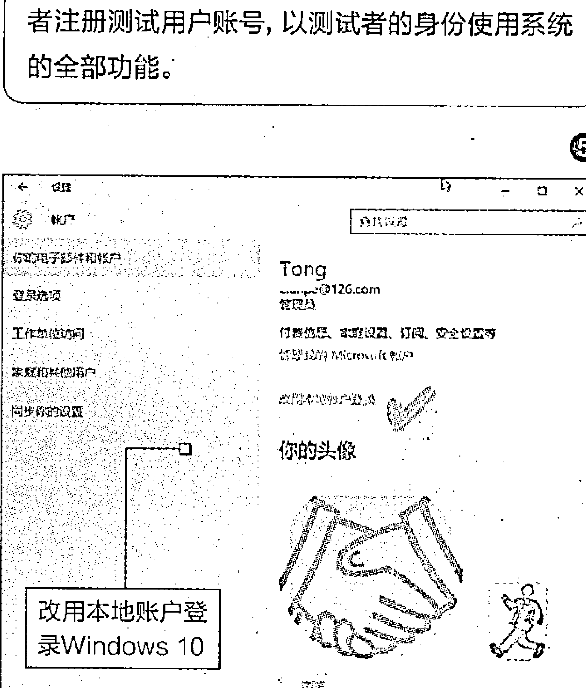

Windows 10对新增的账户还作了更加细致的划分，分为工作单位或学校账户、家庭成员账户、其他用户使用账户等3种类型。如果要加入到工作单位或学校等组织，获取对该组织资源的访问权限，那么就

要给家庭的每个成员（包括儿童）开设一个账户，需通过“账户”设置下的“家庭和其他用户”页面进行设置。点击“你的家庭”分组下的“添加家庭成员”按钮，按照提示设置每位家庭成员的账户信息和账户权限。有时家里来了客人也可能要用到家里的电脑，这时可通过“将其他人添加到这台电脑”按钮，给客人开设一个独立账户（图7）。客人账户独立于家庭账户，其目的是与家庭共享资源相互隔离，这样可以有效地保护家庭隐私。

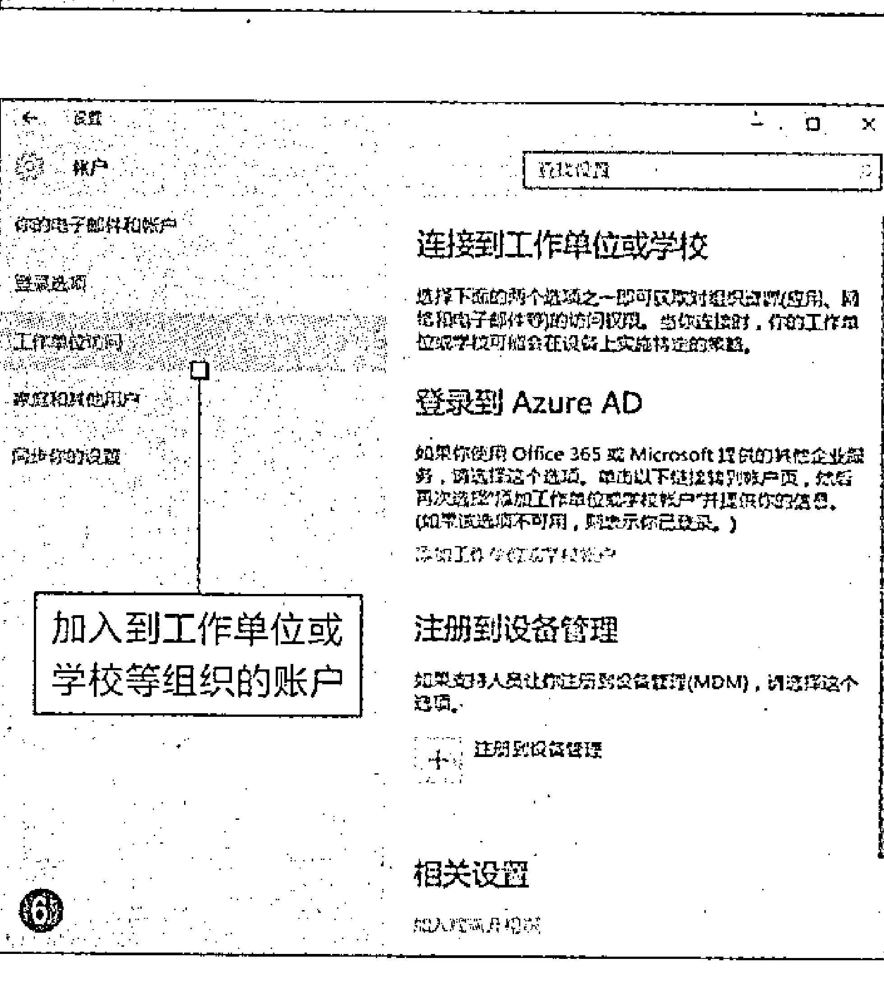

##### 为家庭成员和其他用户开设独立账户

> 小提示

在“添加家庭成员”账户选项下，专门为儿童准备了添加适合于他们使用的系统环境。选择“添加儿童”选项，输入他们使用的电子邮件地址，如果没有电子邮件可点击下面的链接创建一个，然后按照系统的指引设置儿童网络使用环境。成人账号对儿童账号的安全负责，具有比儿童账号更高的权限。

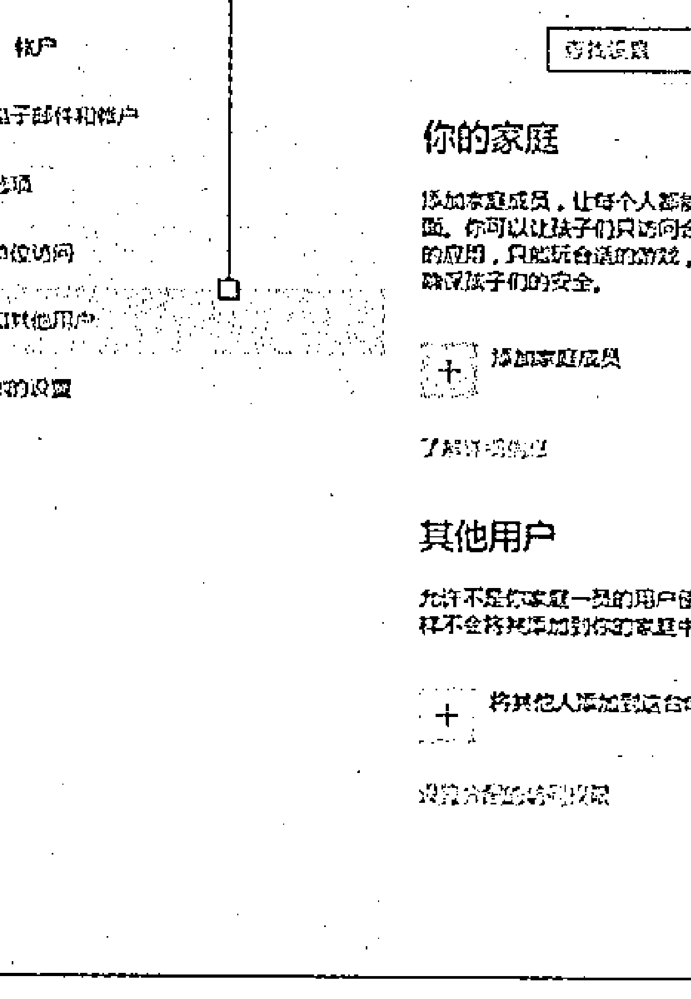

##### 一台电脑 两人同时用

一个Windows系统下开列多个不同的账户，多个用户无法同时使用电脑，只能分时使用。如果给电脑安装控制软件ASTER，配合添加必要的键盘、鼠标、显示器（电脑显卡一般有两个不同接口，可另接一台显示器或电视机），就可以让两个人同时使用一台电脑主机。

先给电脑创建两个不同的登录账号，然后进入其中一个账户安装ASTER Control软件，运行ASTER Control，通过Video（视频）、Input（输入）、Audio（音频）三个选项卡，分别为视频、输入和音频设备分配不同的参数。所有参数设置好后点击Apply（应用）按钮生效（图8）。

设备配置好后重启电脑，用其中的主账号登录系统，启动ASTER Control，点击General（常规）选项卡中的Run ASTER workplaces按钮，电脑开始分身。这时另一个显示器上会显示登录画面，用该用户的账户登录。这样两个人就可以互不干涉地共享一台主机了。

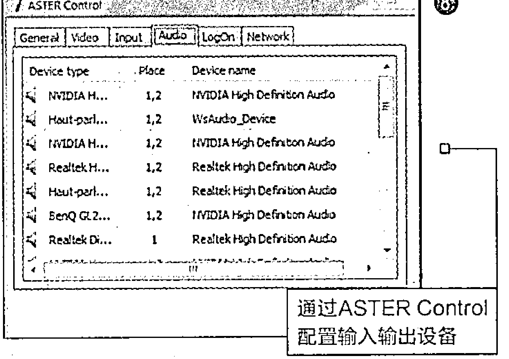

> 小提示

如果键盘鼠标和显示不对应，可以多次按键盘上的Ctrl+F12，直到键鼠正常工作，然后进入Input条目重新分配，点击Apply按钮确认。


我们常常进行的文件复制本身就是一种“分身”操作。

文件“分身”有许多另类的方法和技巧可供我们挖掘和利用，它们能为我们提供更大的操作便利。

##### 复制内容 自动生成文件

如果在网络的不同地方收集文本，然后将这些文本集中到一个文本文件中收藏，是不是需要在网页和文本文件之间来回“穿梭”？其实，通过小工具FastFRecord便可免除这种麻烦。

使用FastFRecord，当复制文本后，能够自动将复制的文本生成一个新的文本文件，也可以一键添加到一个已经存在的文本文件中，这对于文本收集工作来说显得非常方便。每次执行完复制操作后，只需在FastFRecord界面中点击“新建”按钮，或在列表中选择已有文件进行追加即可（图1）。

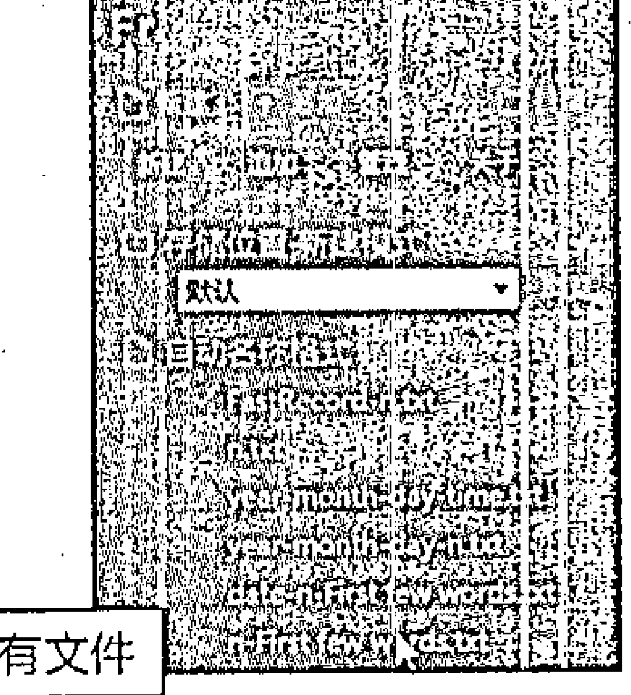

##### 特别话题

小提示

###### 不开文件 直接复制内容

在将信息追加到已有的文本文件时，还可以自定义分隔方式：换行、不换行或用两个空行（双换行）（图2）。

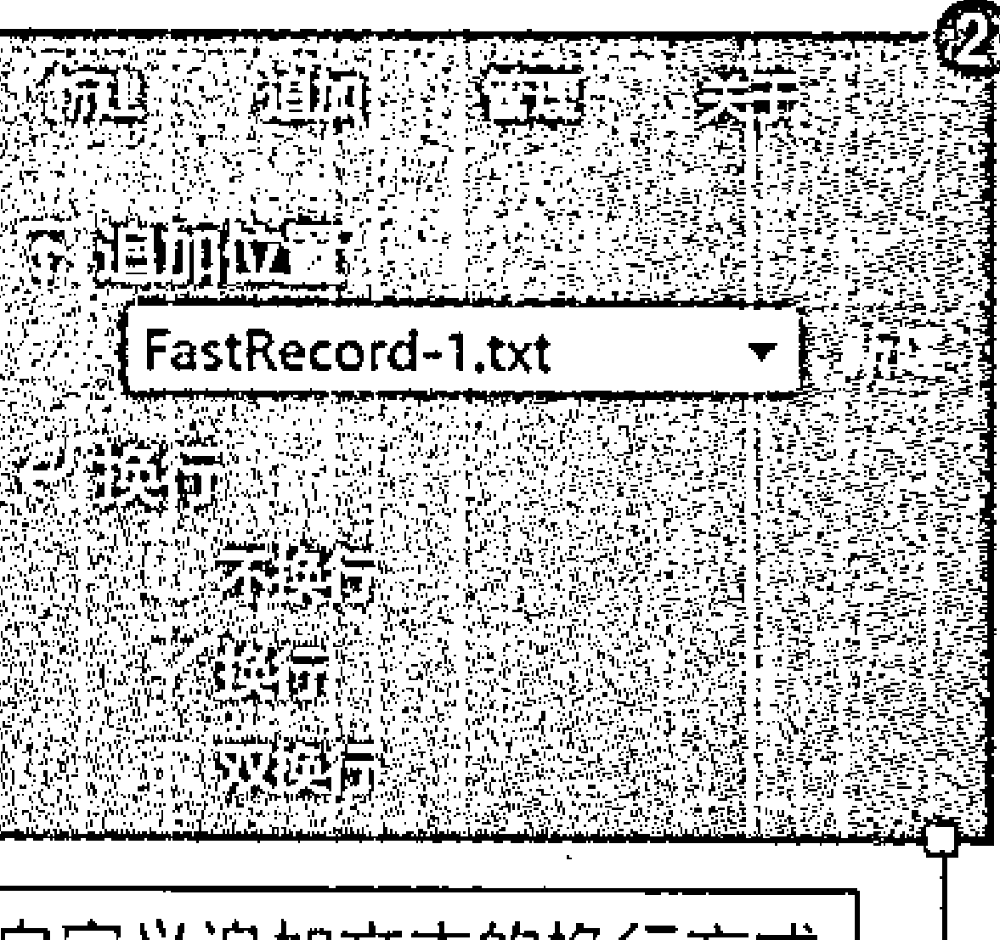

如果要将一个文本中的内容或一张图片的画面复制下来，插入到另一个文档中，通常需要先打开这个文本文件或图片，Ctrl+C复制其内容，然后到目标环境中执行粘贴操作。使用Copy Contents，可实现不打开文本或图片，用右键菜单命令来复制其中的内容。Copy Contents软件并无什么主界面，软件安装后，只会在资源管理器的文件右键菜单中新增一个Copy Contents选项。以后需要拷贝某个文本或图片的内容时，只需在文件上右击，然后选择Copy Contents命令即可（图3）。

小提示

Copy Contents支持复制txt文本格式和jpg、png、gif、bmp等常用图像格式，复制完成后会在屏幕上短暂显示Txt Copyed或Image Copyed提示信息。如果文件夹使用Copy Contents命令，软件会复制该文件夹内文件所在的路径。

免开文件用右键命令复制内容

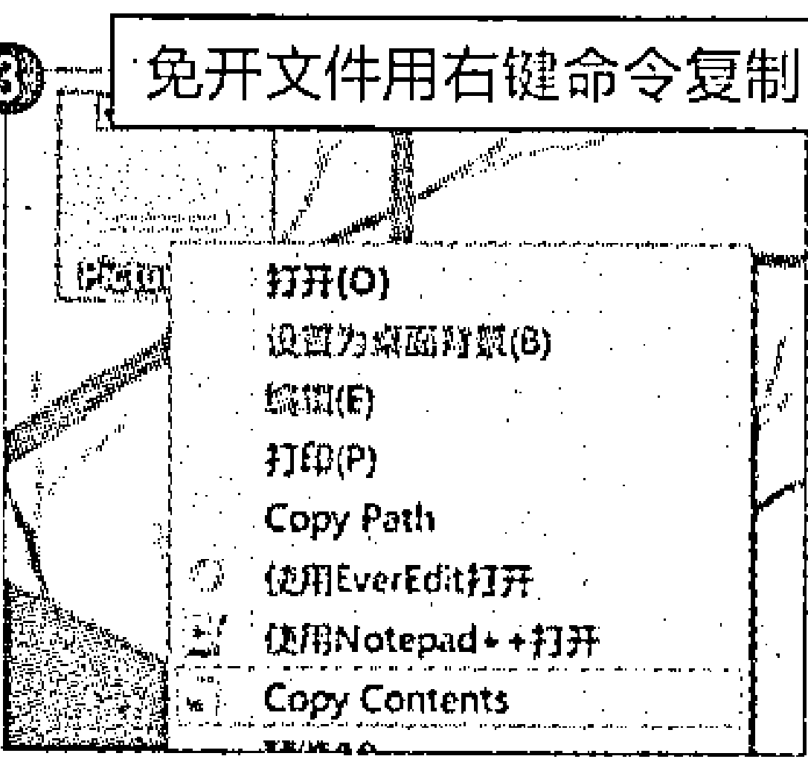

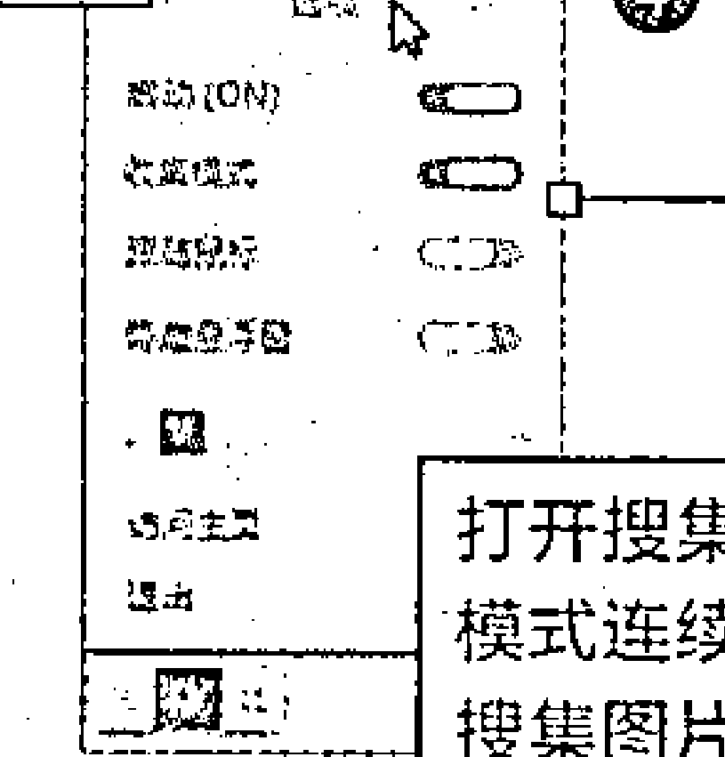

###### 将复制的图片粘贴为文件

许多情况下，从网页环境下复制或截取的图片并不能直接另存为图片文件，只能先粘贴到画笔或其他图片处理软件中，然后再存为文件。借助于Loxclip液切，可以直接把剪贴板中的图片文件粘贴为图片文件。

被打开之后，你可以一个劲地复制图片到剪贴板中，这时在“Loxclip液切”的悬浮窗中会显示复制图片的数量变化（图4）。当所有复制工作完成之后，到目标文件夹下，执行一次Ctrl+V操作，就会将先前复制的图片全部保存为图片文件。

点击REF按钮找回被覆盖的图片

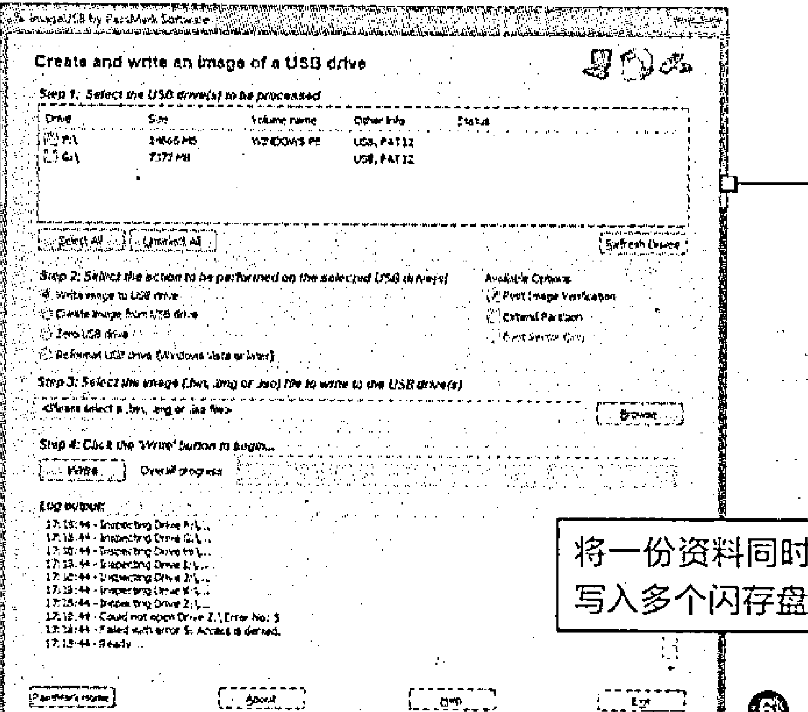

双击运行“Loxclip液切”软件。当网页图片被复制到剪贴板之后，切换到目标文件夹中，执行Ctrl+V操作，即可在该文件夹下自动生成一个图片文件。

如果在复制了一张图片之后，不小心又复制了一段文字或另一张图片，那么后者会覆盖掉前者的内容，还得重新复制。现在有了“Loxclip液切”就不用重新复制了，只需在收集窗口点击REF按钮，重新载入先前复制的图片，即可粘贴为文件使用了（图5）。

不需要每复制一张图片就去粘贴一回。在软件选项设置中，有一个“收集模式”选项开关，当这个开关

###### 一份资料同时复制到多个闪存盘

闪存盘复制也要讲求效率。出于资料备份或分发的需要，有时我们需要将电脑中的一份资料拷贝到多个闪存盘。还有时需要从一个已有的闪存盘复制出多个同样的闪存盘。按照传统的思维，总是复制完一个再复制另一个。其实ImageUSB能够很好地解决这些问题。

先将电脑中的资料或者已有的U盘资料制作成BIN、IMG或者ISO格式的镜像文件。镜像可以通过WinISO、软碟通等软件来创建，闪存盘镜像文件也可以直接通过ImageUSB软件来制作，只需要在Step 1中选择要制作的U盘，然后在Step 2中选择Create image from USB drive即可生成。映像文件生成以后，要复制到多个闪存盘中，先将不同的闪存盘分别插入到每个USB口，然后点击Select All按钮选择所有U盘；在Step 2中选择Write image to USB drive选项；在Step 3中通过Browse按钮选择并加载先前制作好的镜像文件；最后在Step 4点击Write按钮，即可开始同时对多个盘的写入操作（图6）。

##### 一次性搜集不同地方的文件

我们有时需要从不同的目录中将文件归集到同一个文件夹中，File Bucket软件就可以很轻松地将来自不同文件夹的文件一次性归集到一个文件夹中。

从File Bucket软件左侧的窗格中选择来源驱动器与文件夹，然后选择下方的Add folder's FILES to list按钮，将选择的文件夹下的所有文件都加入到右下方的操作列表中。如果要包含子文件夹下的所有文件，选择Add folder & subfolder's FILES to list按钮。若要将选择的文件夹以文件夹的形式加入到列表中，则需要选择Add to list as a folder按钮。如果要部分选择文件夹下的文件，只需在左侧点击该文件夹，然后从右侧上方的窗格中选择要加入到列表中的文件（用Ctrl或Shift键配合鼠标点击来完成），点击右侧窗格中部的Add selected to list按钮，选择的文件就会被加入到下方的列表中。

源文件全部选好之后，点击窗口下方Destination之后的文件浏览按钮，确定目标文件夹的位置。最后点击Start按钮，即可实现文件的统一归集（图7）。

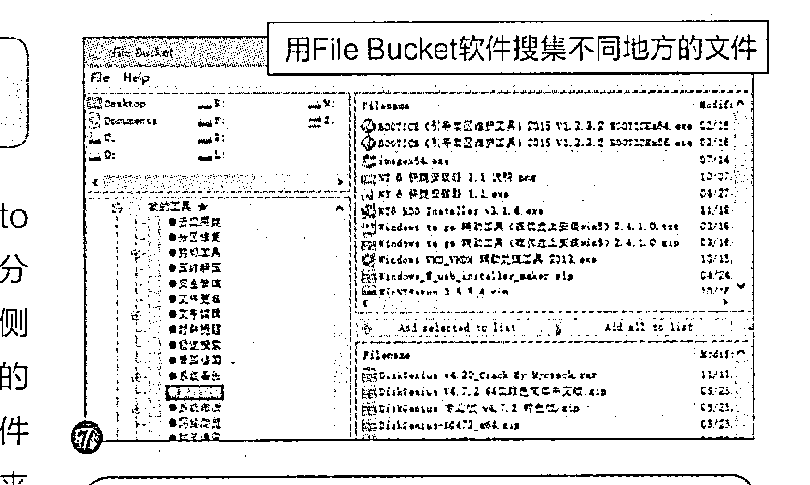

> 小提示
> 在窗口右下角的Method（方法）选择列表中，默认使用Copy items（复制项目）方法。要将不同位置的文件一次性剪切到目标文件夹，可在这里选择为Move items。此外还可通过Creat shortcuts to items一次性建立所有项目的快捷方式；或通过Save list with absolute paths或Save list with relative paths一次性建立所有项目的绝对路径或相对路径的列表（图8）。

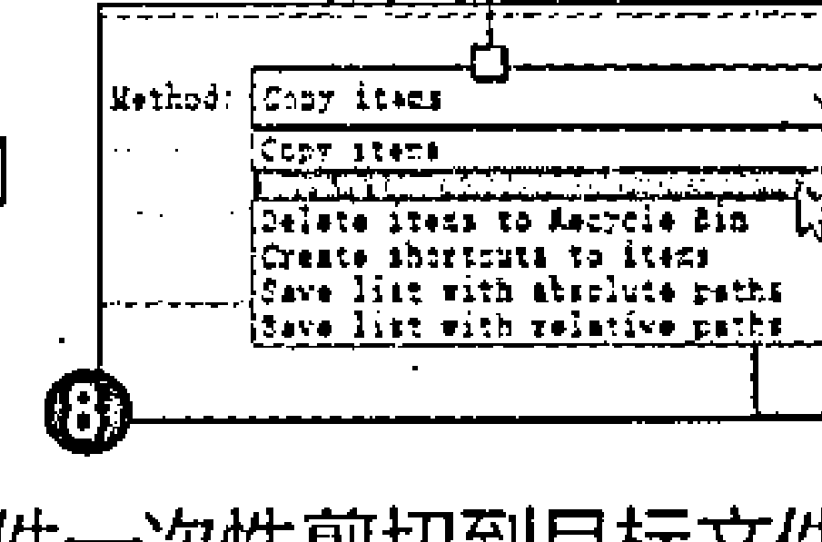


在移动为王的信息时代，办公任务也需要能“分身”操作。通过建立云共享工作空间，配合兼容的办公软件客户端、在线办公服务系统、轻办公软件，就可以完成办公任务的随意“分身”操作。

首先在自己的电脑硬盘中建立一个文件夹（如“我的移动办公空间”），然后安装360云盘（或百度云盘）客户端软件，在安装过程中或安装之后，将自动同步文件夹设为已建的“我的移动办公空间”文件夹（图1）。移动办公空间文件夹建立以后，在本地办公时需要保证将办公文档保存在“我的移动办公空间”文件夹。办公软件可以使用金山WPS、微软Office或与之格式兼容的其他办公软件。注意，这时的云盘客户端要处于开启状态，以保证办公文档能实时地同步到云端服务器空间中。

在一个地点建立了办公文档之后，当使用者“分身”到另一个地点时，可以用多种方法继续之前未完成的办公任务。如果工作目的地使用的是Windows，最好的方法就是在该电脑上也安装同一种云盘客户端并开启本地同步文件夹。云客户端联网运行之后，用自己的账号登录，云端的办公工作文档会自动下载到本地工作文件夹。待系统托盘的云同步图标显示同步完成之后，就可以直接到本地同步文件夹下打开上次未完成的办公文档进行接续工作了。在工作过程中，云盘客户端会不断监视文档的改变，并且及时地将文档同步到云端。这样，当工作完成并退出办公软件以后，工作文件夹和云端的办公文档也保持最新的版本，根本不需要用户去考虑文档版本的问题。

如果觉得安装云盘客户端软件比较麻烦，也可以通过自己的云账户直接登录网页版云盘，下载工作文件到本地，然后启动办公软件进行编辑。编辑完成之后，保存文件，再将最新版本的文档上传到云盘空间中。最后删除本地的办公文档。相比之下，虽然少了软件安装过程，但是却多了一个文档上传过程，且因为上传文档这一过程很容易会因疏忽而忘掉，因此不如安装客户端方便和保险。

> **小技巧**
> 如果在异地使用的是别人的电脑或公用电脑，用上面的方法处理完办公文档后，退出自己的账号，删除本地同步文件夹下的工作文件，这样可防止工作文档的隐私外泄。千万要注意，删除异地工作文件夹要在退出账号之后，否则会连同服务器中的工作文件一并删除，前功尽弃，后悔莫及（图2）。

受条件限制，异地办公有时不一定能有笔记本或PC机。这时，如果手头上有平板或手机，也可以充分用这些移动设备来完成办公任务的接续工作。手机或平板办公有个前提条件——需要在其中安装WPS或MS Office之类的移动版APP。目前微软或金山已经在主流的Android或iOS平台上发布了移动办公APP，只需提前安装或现场下载安装即可（图3）。此外，还需要在移动设备上安装与办公电脑中相同种类的云盘客户端，比如360云盘或百度云盘都有Android或iOS相对应的移动APP。到达异地之后，只需联网并登录云盘账号，定位到工作目录文件夹，点击未完成的办公文档，然后选择用移动设备上安装的办公软件来打开此文档，即可继续完成未完成的办公任务。

> **小提示**
> 移动办公的一个要点是在不同地点要使用同一个云账号。由于云账号是连接异地办公的桥梁和枢纽，因此，只有保证使用相同的账号，才能随时随地访问同一份文档并保证文档的实时更新，且不至于造成文档版本的混乱。

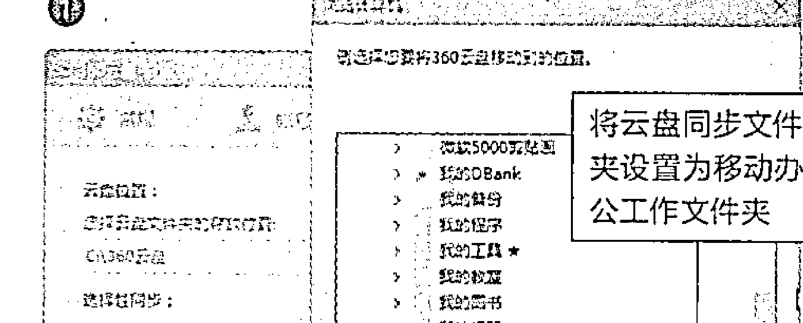

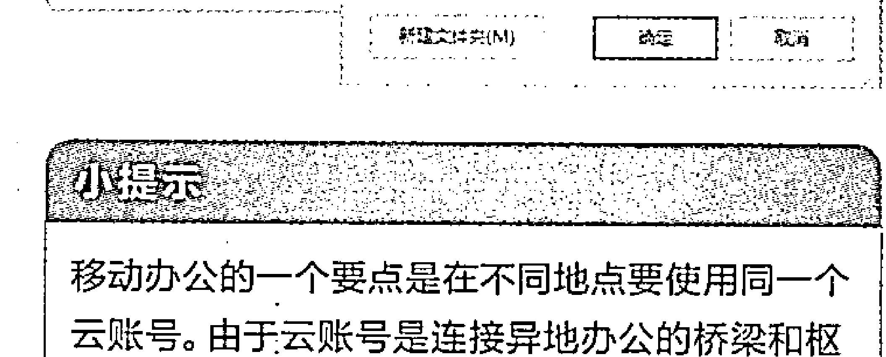

> **小提示**
> 如果移动设备上未安装云盘客户端，同样也可以通过移动浏览器访问云盘的移动网页版，通过网页版云盘下载办公文档，在移动设备中编辑。编辑完成之后，再上传到自己的云空间，保证云中的文档版本处于最新状态。

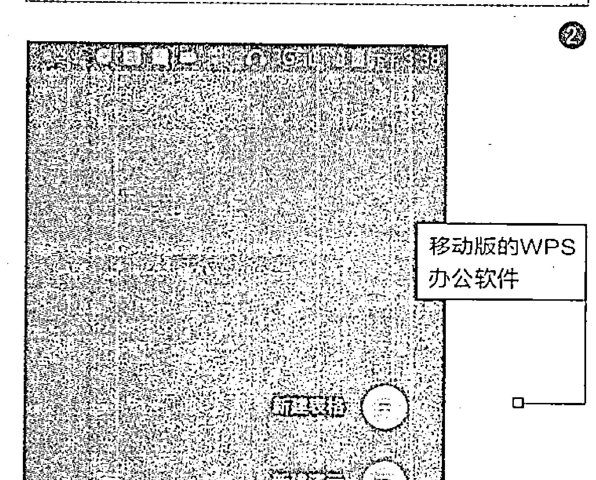

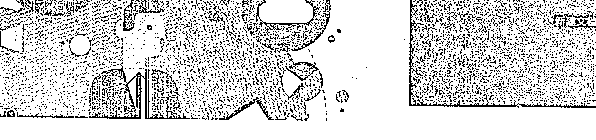

对于公司的网络来说，网管总是要根据工作需要，为不同的部门或用户分配一定的带宽或设定带宽使用限制，这项工作一般通过特定的网络控制软件来完成。对于最普通的个人电脑，也存在带宽分配的问题。

目前最为普遍的使用网络带宽的软件要数云盘了。因此，研究云盘带宽控制问题也具有重要的意义。由于上传下载的需要，云盘一般都提供了上传和下载的限速控制。以百度云为例，在默认的情况下，软件对上传和下载都不作限制，传输速度选项保持在“不限速”的档位。如果在使用这一软件的过程中，影响了其他软件或者其他人的使用感受，可以通过对上传或者下载速度的设定，人为地限制其所使用的网络带宽，达到一个可控的平衡状态（图1）。

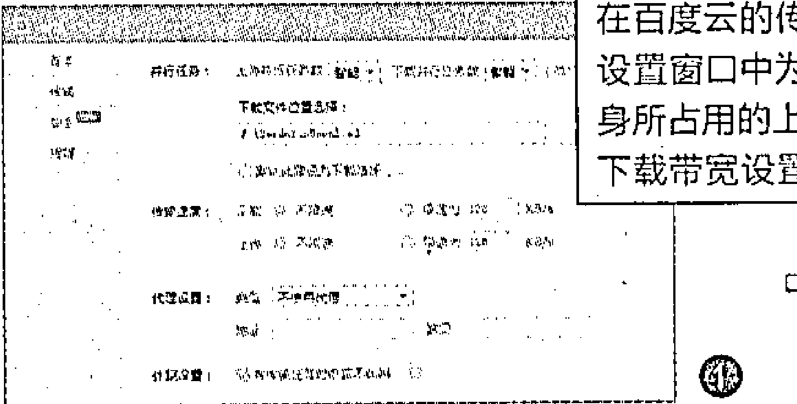

在网络带宽普遍不够理想的现实情况下，下载的需求还在一定范围内存在。因此，专业的下载软件仍然受网民们青睐。在专业下载工具中，一般也会提供比较详尽的下载限速档位控制选择。以“通吃”各家视频见长的硕鼠下载软件，就在其软件设置中提供了非常细致的下载速度限制选择列表和下载任务数选择框，通过这些选项，使用者可以灵活地控制下载所占用的网络带宽（图2）。这样可以将空出的带宽留给其他软件使用。


除了云盘和下载工具之外，目前使用网络带宽最为“霸道”的要数网络视频软件了。而对于视频客户端的限速，现在越来越多是由视频提供商的服务器来根据情况限流的，用户使用的客户端一般只能设置下载的线程数，无法对下载的带宽做自由控制。此外，网络浏览器自带的下载功能，一般也不提供限速设置。

对于以上自身无法控制带宽的软件，借助于第三方带宽控制工具来控制带宽的使用，可以解决带宽合理“分身”问题。用360安全卫士自带的流量防火墙工具来具体设置每一个软件的带宽使用量，就是一个不错的选择（图3）。如此一来，无论什么软件，无论软件本身有没有带宽设置选项，我们都可以通过360流量防火墙来控制其使用网络带宽的数值，这是一种最灵活的带宽“分身”方法。

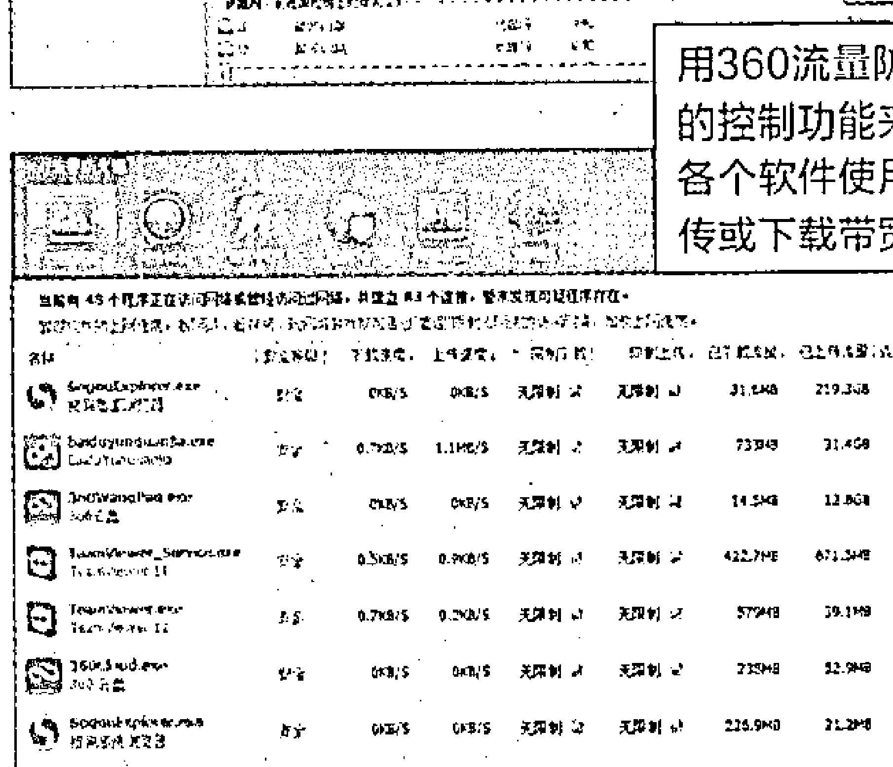

神话里的“分身术”，是指某个人通过法术同时幻化出一个或多个与自己相同的形体，并且具备相同的行为、功能。而在图像、视频等多媒体中，我们无需施展“法术”，只要通过专业的后期软件工具，就可以将同一个人的影像进行多重“分身”变化。而在游戏中则还有一种另类“分身术”，它不是通过外在形象上的简单复制，而是切切实实代替人的操作，就像我们的分身一样，让我们的娱乐更加轻松方便。


##### 多媒体中的花样分身术

###### Photoshop智能图像提取

为了对照中的人或物进行复制分身的操作，首先要做的是将人或物从背景中提取出来。在Photoshop CS5中，原来非常好用的“提取”工具被取消了，不过大家不用着急，CS5中对选区有一个“边缘调整”的增强，可以达到同样效果，甚至比原先的提取工具更灵活。这里简单看一个实例。

对于像小狗之类有毛发的动物，一般的选择工具很难操作。此时，可以先用套索工具（如不方便可改用多边形套索工具）将要选取的对象大致框选出来，边缘不用太精细，也可以在选取好后切换到蒙版模式，对选取的边缘略作修改。然后切换回选取模式，点击菜单“选择→调整边缘”（或按快捷键Ctrl+Alt+R）打开调整边缘窗口。为了方便观察效果，可以在视图模式中根据不同实际情况选择不同颜色作为背景，然后一边拖动调整半径、平滑、羽化等滑钮，一边观察图像，当效果满意的时候，点击“确定”返回，将发现选取的对象已被成功从背景中分离出来了。

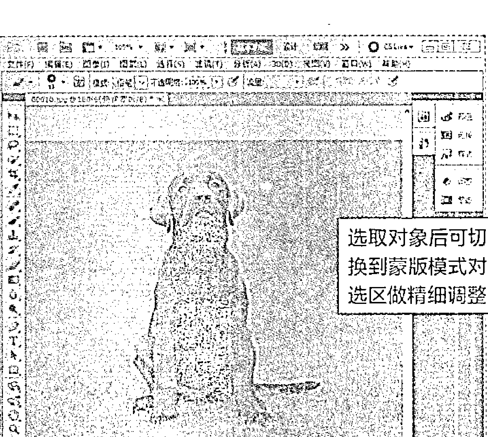

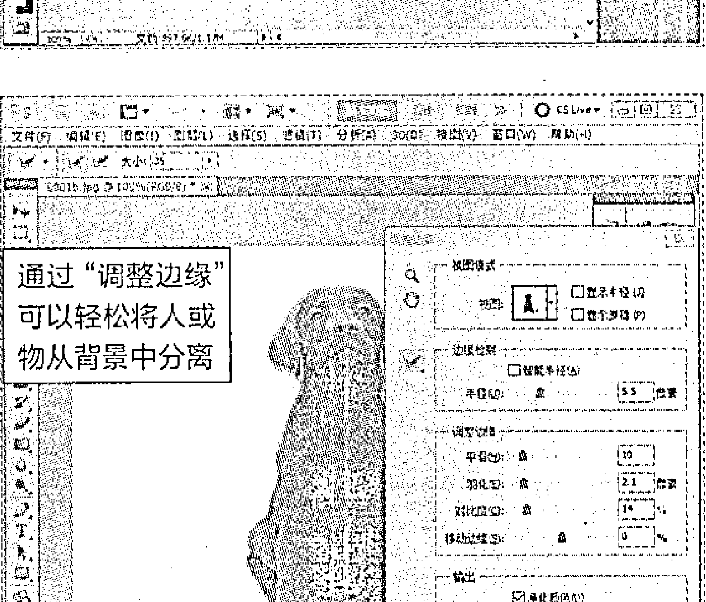

###### 分身复制中的透视技巧

在《电脑爱好者》2016年第1期的视像栏目中，介绍过透视在摄影中的应用。其实我们在进行分身复制的时候，也要合乎透视规律，这样才会让分身显得更为真实可信。

在Photoshop中打开一张背景照片，首先找出其中的透视消失点。下面的例子是基于路面及两边植物底部画出的几条透视线（黑线），交叉点就约略是消失点所在位置了。

接下来将要制作分身效果的人或宠物图片添加到背景图片上，这里我们以一只宠物狗为例。安排好它在前景中的位置，然后从它的头顶和脚下分别引出一条直线连接到消失点上，这就是它的透视线了（蓝线）。如果此时我们想在远处为这只大狗复制一个分身，就需要按照透视“近大远小”的规律来控制分身的大小。具体方法是，假设想在黄圈的位置放置分身，那么就要在大狗透视线的相应位置画一条垂直线，取它与两条透视线交叉之间的高度，作为分身的高度参考。

另外，透视中还有“近清晰远模糊”的规律，所以我们还可以在分身的小狗位置添加一些迷雾，最后的效果就更加真实了。

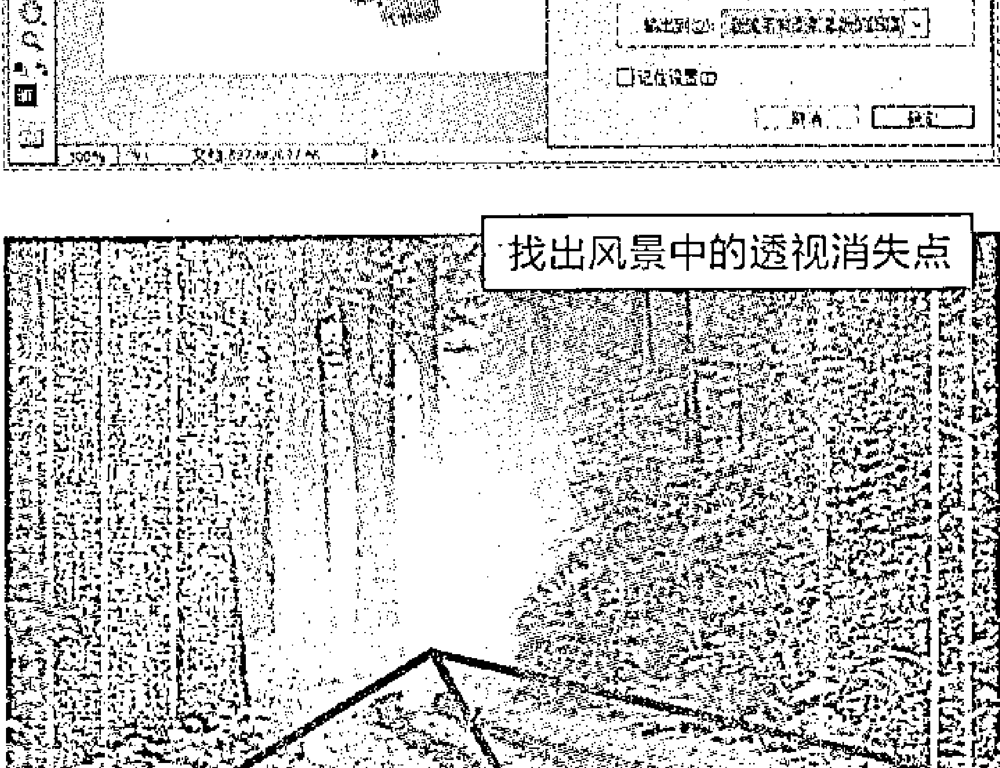


##### 分身不仅仅是简单的重复

开始的时候，人们还只是通过简单复制的方式，在图像中营造分身的感觉，实际上还有更多创意的分身术，可以用于广告、海报、招贴中，以吸引人的眼球。比如同样一张人像，可以通过Photoshop CS5（或更高版本）提供的新功能“操控变形”，将每一个复制的人像的动作进行改变，从而形成不同的姿态的组合。

下面这张舞者的照片，舞姿非常优美。现在我们要为她制作一个分身，让她们合成为一个更加优美的心形动作。

首先通过前面介绍的方法，将人物从背景中提取出来，然后在图层面板中，选中提取出的人物图层，右击，从弹出的右键菜单中选择“转换为智能对象”命令。接下来再点击菜单命令“编辑→操控变形”，就会发现，人物被铺上了一层网格。为了更精确地调整动作，可以在上方工具栏中，将“浓度”设置为“较多点”。

为了便于动作的调整，可以在网格上右击，然后选择“隐藏网格”。接下来在人物主要关节的地方点击鼠标左键“添加图钉”。拖动图钉即可改变动作姿势啦。也可以按住Alt键后，将光标移出黄色图钉点之外，此时会出现一个圆形，通过旋转就可以转动关节改变姿态。精心调整好之后，复制此图层，再做“编辑→变换→水平翻转”处理，最后将本尊和分身合成在一起，独人舞就变成双人舞啦。

###### 为分身变换服装

上面复制的人像，除了改变动作之外，现在看起来还是一模一样，就会感觉呆板。其实除了改变动态姿势，我们还可以将复制人物的同一件衣服，变换成不同的颜色或纹理，就仿佛是穿了不同风格的服装一样。

可以借助“选择→色彩范围”菜单命令及配合套索、蒙版等工具，将其中一个人物的衣服完全选取出来。然后点击菜单命令“图像→调整→色相饱和度”（或按Ctrl+U键）调出饱和度调整窗口，勾选上“着色”，再拖动上面的滑钮，即可为人物的衣服换色啦。


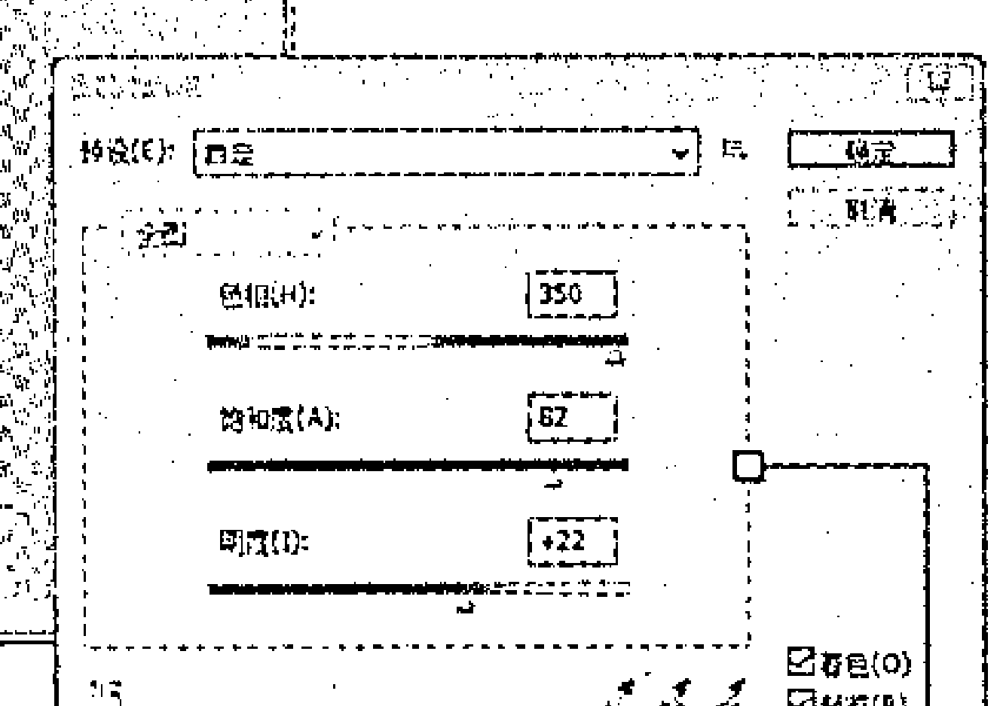


平时看电影时，我们经常能看到一个演员同时扮演两个角色的场景。以前要实现这种一人分饰不同角色的戏，一般采用的方法是，当两个角色出现在同一场景时，其中一个只能用替身来替代。不过随着视频处理技术的发展，只要通过分别拍摄再合成等技术，即可让一个人及其分身，同时在同一个场景中扮演多个不同的角色。

###### 导入分身视频的素材

首先准备好《初音演唱会》视频文件，启动AE后单击“文件→新建→新建项目”，接着点击“文件→导入”，导入需要处理的视频文件（如果导入的视频格式不支持，可以使用格式工厂等预先进行转换），然后将导入的素材拖到下面的时间线，视频导入后可以在AE中进行每帧的预览（图1）。

###### 视频人物抠像

接下来就要提取一个初音人物角色出来，角色的提取其实就是AE的抠像（和Photoshop的抠图类似）。我们只要提取出一段没有背景（提取后可以自行添加其他背景）的视频，然后增加图层和打上关键帧进行合成即可。在时间线窗格按下Ctrl+D键复制一个图层（如果要多个分身则复制对应个数的图层），在预览窗口选中第一图层的视频，拖动时间线选中需要分身提取的帧画面后，在时间线左侧窗格选中视频右击选择“时间→冻结帧”，选择这个帧作为起始冻结帧数。这里冻结帧就类似Photoshop的图层，执行冻结操作后就类似制作了一个图层（图2）。操作同上，选中复制的第二图层的视频，同样选择一个帧作为结束冻结帧，把这个冻结层作为另一个图层。完成上述的操作后，点击窗口左上方的工具栏按钮，选择其中的“钢笔”工具，然后选取需要抠图的人物轮廓，使用钢笔将其勾勒出来（图3）。完成人物的勾勒以后，再点击菜单栏的“图层→遮罩→反转”，这样就可以将没有背景的人物提取出来了。然后继续新建一个没有背景的图层并拉到下方的时间线，在新建图层上右击选择“效果→色阶→蒙版→简单抑制”，最后将上述提取出来的人物背景粘贴到这个图层上（图4）。操作同上，继续将第二个冻结帧也粘贴到上述蒙版。最后点击“文件→导出”，将完成抠像的视频导出保存。

##### 分身视频合成

接下来就可以将完成抠像的视频再次导入AE，操作同上导入视频后也添加到视频线，并且按Ctrl+D键复制一个图层。完成图层的复制后，在时间线上使用鼠标选中导入的两个图层视频，按下P键插入关键帧，此时在时间线窗口会自动展开“位置”子菜单，这里的“位置”就是用于设定关键帧的（图5）。

点击其中的“位置”按钮，拖动时间线，找到需要添加分身的开始时间，切换到第一个图层，此时我们在预览窗口就可拖动图层人物，比如需要制作的是左右分身的效果，则使用鼠标将图层1的人物往左拖动，拖动到合适的位置即可（图6）。

操作同上，选中图层2，拖动时间线选择需要结束分身的时间，然后将图层的人物往左拖动。这样一个左右分身的视频效果就完成了。此时选中两个图层的视频，拖动下方的时间线就可以预览到左右分身的效果了（图7）。

完成上述操作后，如果对分身的效果满意，点击“文件→导出→Adobe Flash Player”，按提示将制作好的分身视频导出为SWF文件。以后就可以使用KMPlayer、暴风影音等播放软件直接欣赏分身视频了（图8）。

> 小提示
如果还要制作合身效果，同样先拖动时间线选中需要开始合身的时间，将左侧的人物往中间拖动，继续选择结束合身的时间，将右侧的人物往中间拖动，可选择一个重合点作参考。这样视频中的人物在指定时间就会自动进行合体了。

##### 网络大补贴:

对AE感兴趣的，可以更深入地学习。下面为大家提供了一些在线的资源，供大家参考学习。

- AE免费模板大全
  包含AE各类模板直接套用。
  网址: http://www.aemoban.com
- 中国素材网
  可以下载各类免抠图的素材直接在AE中使用。
  网址: http://www.vjshi.com

## 更多视频分身技术

除了上述利用AE制作分身视频外，现在很多晚会还利用全息投影实现人物的现场分身，比如2015年羊年春晚，李宇春就是运用全息投影技术倾情演绎中国风歌曲《蜀绣》，在台上我们可以看到两个一模一样的“李宇春”(图9)。随着全息投影设备的不断降价，同时全息拍摄技术也在不断普及，很多普通的摄影爱好者已经配备全息投影设备，这样普通大众也可以非常简单地制作出各种奇幻的分身视频了。

> > 火速链接
> 《电脑爱好者》2015年15期杂志上刊登的《能看还能摸的3D全息投影》一文，详细介绍了全息投影的相关知识，有兴趣的朋友可以阅读。

闲暇时间玩游戏是很多朋友的休闲方式，不过大家平时在玩游戏特别是网页游戏（以下简称为页游）时，是不是经常要执行重复操作？比如重复连续点击某个资源按钮。如果玩游戏时要接个电话或停下去煮个饭什么的，此时是不是觉得自己手脚不够用？其实这些游戏也可以分身，我们让“替身”帮助操作就可以了。

##### 枯燥点击 游戏脚本自动完成

如上所述，对于需要重复连续点击的操作现在可借助一些自动运行的脚本实现。下面我们以“按键精灵”为例，介绍如何录制游戏脚本。

启动按键精灵后点击主界面的“第一次写脚本”，在弹出的窗口中就可以开始制作自己的游戏脚本了。很多网页游戏都是机械地使用鼠标左键点击某个区域，这种情况选择“鼠标左键连点”即可（图1）。

继续在弹出的窗口中，选择鼠标动作下的“左键点击”，然后点击“插入”。接着选择延时的时间为1s（可以根据实际游戏设置为毫秒，但是不建议设置太快，否则游戏会来不及响应），同样点击“插入”，这样我们就完成一次鼠标自动点击的脚本了。如果要多次点击，操作同上继续添加相同的脚本即可（图2）。

完成脚本文件的创建后，点击“脚本属性”，按照游戏实际需要设置脚本运行的次数。比如需要一直点击的游戏，这里则可以设置为“循环到终止键为止”，然后为脚本设置一个终止操作按键，默认为F12键（图3）。

完成上述操作后，点击“启动脚本”，在弹出的窗口中就可以看到刚刚建立的脚本了，勾选新建脚本并点击上方的“运行”按钮，现在将鼠标移动到需要点击的游戏界面，脚本就会帮助我们进行自动点击。如果想要停止脚本的运行，按下F12键即可（图4）。

当然这里只是以简单的鼠标左键点击为例，按键精灵还可以设计出更复杂的脚本，大家可以根据软件的帮助文档和实际游戏进行设计。对于新手则可以直接到http://tinyurl.com/cf060202（已作网址缩短处理）下载或者购买其他网友制作好的各种游戏脚本。

> 注意：在游戏中使用脚本之前，请认真阅读游戏开发商和运营商的相应规范，是否明文禁止使用脚本程序，并将其归为外挂，破坏游戏平衡性。某些游戏开发商对外挂行为处罚非常严厉，如暴雪对不当脚本的使用，轻则封停、重则注销账号。由滥用本文介绍的相关内容所造成的一切损失本刊概不负责。

> 小提示
除了自动点击外，很多网页游戏都只能使用一个账号登录。如果你有多个游戏小号需要登录游戏，现在可借助搜狗浏览器实现多账户登录。启动搜狗浏览器后先在一个窗口中登录当前游戏，接着点击“文件→新建小号窗口”，这样会自动打开一个新的浏览器窗口，现在按提示再次使用另一个账号登录同一游戏即可（图5）。

##### 特别话题

##### 另类分身 远程协助游戏操作

大家知道默认情况下很多网页小游戏都无法实现在线保存，这样如果一款游戏玩得正高兴，但是正好有事需要外出，常规的情况下我们就只能关闭浏览器，等待下次再玩。现在如果要实现游戏操作的分身，我们可借助不同工具来实现。

如果你想继续在电脑上进行游戏，可以利用系统自带的远程桌面，让远方的朋友通过远程操作帮助你继续玩游戏。只要进入“系统属性→远程”，然后在远程桌面下选择“允许运行任意版本的计算机连接（较不安全）”（这样方便不同操作系统的朋友都可以远程连接到你的电脑上），接着点击“确定”，设置好允许远程连接的账户和密码（图6）。

接下来通过QQ、微信等方式将远程连接的账户和密码告诉朋友，这样如果你现在有事需要外出，需要朋友远程帮助你继续玩游戏。那么朋友只要在他的电脑上点击“开始→所有程序→附件→系统工具→远程桌面连接”，启动远程桌面连接按提示输入你的计算机的IP地址、用户名（需要和当前游戏同一账户）和密码，点击“连接”（图7）。

成功连接后，你的电脑当前账户就会自动退出，此时在朋友电脑上显示的就是你的电脑桌面。剩下的游戏操作交给朋友完成即可，轻松实现远程“分身”（图8）。

> **小提示**
如果是内网用户，外网用户使用远程桌面的连接需要进行端口映射，操作较不便。此类用户可使用QQ的远程桌面，它无需进行IP设置，成功连接并授权对方完全控制后，对方可轻松地在他们的电脑上操控我们的电脑继续操作游戏。如果不放心交给朋友操作，现在Android、iPhone也支持远程登录自己的PC，这样即使外出，借助4G网络也可远程连接到自己的电脑上继续玩游戏了。

####### 扩展阅读

如果你觉得远程分身操作不安全，那么可以借助虚拟机实现页游的暂时分身。只要在当前系统上安装一个虚拟机如Vmware，然后在虚拟机里玩网页游戏。这样在需要外出的时候，只要点击Vmware菜单栏的“虚拟机→快照→拍摄快照”即可。以后需要继续玩游戏的时候，只要在Vmware中选择“继续启动虚拟机”，这样完全恢复快照后就可以在Vmware中继续玩你的游戏了，实现暂时分身（图9）。

##### 网络大补贴:

- 教你用安卓手机远程连接电脑的方式
  网址：http://tinyurl.com/cf060203
- 苹果iPhone怎样远程连接控制电脑
  网址：http://tinyurl.com/cf060204

> **火速链接**
如何在虚拟机中保存游戏进度请参考http://www.cfan.com.cn/2015/0529/119074.shtml的介绍。

##### 硬件的分身与融合

比起小巧灵活的移动智能设备和笔记本电脑，传统台式机虽然性能强大，但缺点也很明显，那就是硕大的体积。还好，如今已有不少厂家和产品力求做到一机双用或多设备融于一体。如何组建这样的系统，它又能给我们带来哪些方便呢？

##### 显示器分屏显示

单显示器同时显示两个甚至四个不同信号源的方案已经比较成熟，主要依靠多HDMI或DP接口搭配显示器厂家的软件共同使用。

###### 何种显示器适合分屏

尽管很多品牌的显示器都拥有能够一屏多分的软件和具体产品，但也不是所有显示器都适合分屏显示的。首先我们需要确定的是我们需要如何分屏，如果是21:9这类的超宽显示器（图1），我们可以考虑对其进行左右分屏，也就是左右大约两个7:6的屏幕（图2）。而可以升降并旋转的显示器，就算不是21:9超宽也可以考虑分屏，比如一个16:9的显示器通过旋转后可以变成上下两个9:8的屏幕，也算合理。

而目前有一些尺寸在39英寸和40英寸的超大尺寸液晶显示器，就可考虑四分屏了。就算四等分后每个区域依旧可实现10英寸左右的显示面积，基本来说也算较实用。此时我们要考虑的就是显示器是否拥有如此多的视频接口了（图3）。

###### 显示器厂商的分屏技术

实现分屏除了需要有比例、尺寸和分辨率的基础，具体显示器厂商的分屏技术也是不可或缺的。比如说三星的Picture By Picture功能，我们只需要把显示器的诸多输出端口中一条连接PC，另一条连接游戏主机或者笔记本电脑，通过软件设置就可以实现等分。比如说S32D850T在平时分屏后就是1280×1440的比例，显示器旋转后达成上下两个1440×1280。飞利浦的多视窗同屏信号显示MultiView技术也是同样的原理，在显示器当中被称为PIP/PBP的这种功能在打开后可以分别设置1、2、3、4四个信号源使用的数据接口，接口再连接到不同的设备就可以在同一个40英寸大屏幕内实现四等分（图4）。

要注意的是，此类软件并不是显示器通电连接PC就可实现，有一些品牌需要在PC端安装一个对应的光盘版客户端软件才能够实现分屏或者画中画之类的功能，具体请参阅不同品牌产品的使用说明书。

###### 关于显示器分辨率

前面一段所说的根据显示器比例或尺寸判断是否适合分屏是个前提条件，具体显示器产品是否适合分屏还需要结合物理分辨率一起决定。比如第一种21:9类型的显示器常见的物理分辨率有3440×1440和2560×1080两种，如果在这两者之间作比较，明显是前者更适合左右分屏。分屏后1720×720的分辨率还属于可以接受，但1280×540无疑就显得比较低了。同理，支持升降旋转的16:9显示器需要进行分屏使用时，我们最好去挑选分辨率在2560×1440以上分辨率的产品，达成上下两个1440×1280的标准屏幕效果会好一些。四分屏的时候需要特别注意，不是说液晶显示器尺寸大效果就一定要好，如果物理分辨率达不到标准，具体分屏后效果就会不达标。推荐四分屏显示器一定要使用3840×2160这样的标准4K分辨率显示器，就算四分屏后每个分屏内也有1920×1080分辨率，应付一般的视频处理、视频监控完全没问题（图5）。

###### 分屏显示器推荐

| 产品型号 | BDM4065UC | S32D850T |
| :--- | :--- | :--- |
| 参考售价 | 3999元 | 4599元（支持满减） |
| 面板类型 | VA | MVA面板 |
| 背光源 | LED | LED |
| 面板尺寸 | 40英寸 | 32英寸 |
| 最佳分辨率 | 3840×2160 | 2560×1440 |
| 响应时间 | 3ms | 5ms |
| 对比度 | - | 3000:1 |
| 点距 | 0.16mm | - |
| 亮度 | 300cd/m2 | 300cd/m2 |
| 接口 | VGA、HDMI×2(MHL×1)、DP、mini DP、USB×4 | DVI、HDMI、DP、USB |
| 产品描述 | 飞利浦BDM4065UC是去年下半年大尺寸液晶显示器领域的奇兵，去年诸多厂商在21：9和曲面上大作文章，但并非所有用户都喜欢21：9的超宽比例。此款使用传统16：9比例，但将画面提升到3840×2160同时能达到60Hz的刷新率，作为液晶显示器已是极致。由于屏幕大分辨率高，它是目前最适合四分屏的液晶显示器之一。 | 小一号的三星S27D850T使用PLS面板，与其属于同一系列的S32D850T却是MVA面板，比较特殊。由于显示器的直接支持升降和旋转，再配合三星的Picture By Picture功能可以进行灵活的双屏分割。在竖屏时，如果用户搞不定Picture By Picture系统，完全可以通过显卡的控制面板来将画面进行旋转。 |

##### 机箱双平台&电源双系统

要想在有限的空间内实现双系统，就只能考虑在一个机箱内安装双系统。单平台内双系统的好处是节省空间，而双电源系统的好处则在于可以将老旧的低功率电源废物利用起来。

###### 关于双电源的改造

关于使用两个电源为同一个系统供电，我们曾经在《电脑爱好者》2014年3月第6期的《旧电源上岗 额外电源让高功率显卡不再黑屏》一文（http://dwz.cn/2rWyt3）中有了介绍，本期就不再赘述，只说一下其基本实现的方法。电源在电脑上的工作方式其实很简单，我们按下电源键后主板给电源一个PS_ON信号，而电源上对应的PS_ON信号就在最大的主板插头里。传统电源插头带塑料固定钩一侧的绿色导线对应的就是PS_ON信号（图1）。有的电源并不标注颜色，需要根据电源规范和具体的说明书谨慎操作。另外除了PS_ON信号线，还需要将两个电源的地线也连接起来。将两个ATX电源的PS_ON和旁边任意一条黑色地线烫开露出内部的金属导线，购买两根相同材质的电源线，同样剥掉两端的绝缘层，然后分别缠绕在PS_ON绿线和地线开口处（图2）。为了安全可以考虑用电烙铁焊好，再用胶布绝缘，注意彼此之间不要接错，同时彼此之间一定要保持绝缘（图3）。开机前当主板给电源发出PS_ON启动信号后，电源要等其全部输出电压都稳定后才会送出一个安全信号“Power Good”简称PG给主板。要产生PG信号需先找到主板电源插头上的PG信号线，实际中PG信号线通常为灰色（图4）。此外需要选用一个小的集成电路，比如说CD4081，连接时将IC的第7脚接地，第14脚接主板电源+5V，而两个电源的PG信号分别送到第1、2脚，第3脚再接到已经被切断的PG信号线靠近主板的一侧（图5），就可以利用电路共享双电源的PG信号了。

###### 电源和机箱的分身

在整个PC系统当中关于机箱和电源的改造都属于比较高端的领域，不太推荐新手盲目操作。是否能有更加成熟的方案呢？如果没有足够的动手能力，我们可以考虑通过现有的“一拖二”平台实现目的。其实在目前的DIY领域已经有比较成熟的单机箱内放入两套PC系统的产品，它来自于新兴的全新DIY品牌追风者（Phanteks）。其最典型的产品就是Enthoo Mini XL双系统机箱，在一个尺

寸大概在全塔规格的机箱当中可实现双系统(图6)。Enthoo Mini XL能安装两套完整的PC平台，不过我们常见的ATX平台是不行的，由于受空间的限制只能是Mini-ITX和Micro-ATX的组合，电源方面同时支持一个ATX和一个SFX小电源共同工作(图7)。

可能有的用户觉得这样依旧不够清爽，因为目前很多优质电源的品质和功率都足以带动两套PC平台了。别担心，追风者还有专用的电源分线器(Power Splitter)，只要单电源就能驱动两个平台了。Power Splitter大体上属于一个分插的设计，可以将一个电源的输出分配成独立的两部分同时为两个PC系统供电(图8)。

###### 更一体化的联力方案

如果追风者的方案你依然不满意，还有更一体化的方案可供选择。电脑桌作为一个台式机几乎必备的外设也在占用着我们的空间，如果能让电脑桌与PC一体化，肯定事半功倍。已有机箱厂商想到这个卖点，而且对应的产品有先后两代了(图10)。联力(LIAN-LI)是著名的机箱品牌，旗下有专门的电脑桌系列以DK开头命名。这可不是普通的电脑桌，它使用全金属材质配合玻璃桌面，内部有一个空间以容纳整个PC系统。系列产品中的DK-02(图11)和最新的DK-03(图12)有1300mm左右的桌面宽度，内部空间被联力设计为E-ATX加Mini-ITX的结构(图13)。也就是说有了这个机箱，室友或小两口可使用这一个电脑桌形的机箱配合两套显示器键鼠外设就是两台台式机了。尽管DK系列目前售价依然比较高，但却是非常出色前卫的产品设计理念。

##### 将主板接口一分为二

传统台式机的优势除了性能强之外，还有一个就是扩展性更好了。不过很多爱好者的电脑年代久远，当时配件预留的端口并不能满足当下DIY的需要，此时怎么办？很多小外设可以解决此类问题。

###### 风扇接口分插与转接

最为常见的例子其实就是风扇接口了。老式主板风扇接口较少，后来电脑散热越来越吃紧，我们需要更换双风扇CPU散热器，或者需要增加更多的机箱风扇，此时风扇接口无处可插如何是好？其实有很多将单接口一分为二使用的方案，其中最为常见的就是转接线。

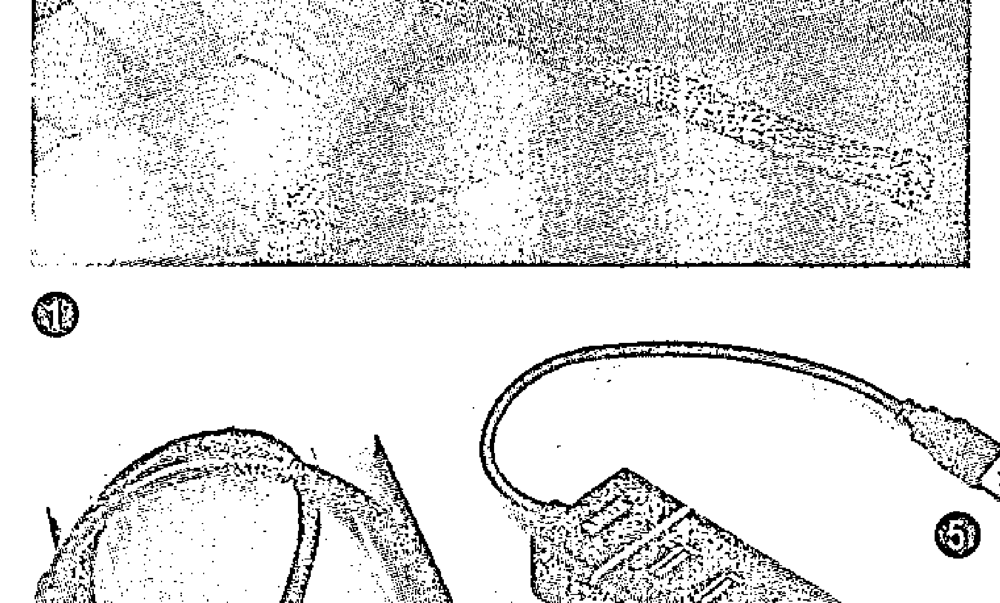

主板上提供的风扇接口单个供电一般在10A到30A之间，可普通的散热风扇基本达不到这一电流上限，这就为接口扩展提供了可能。如果我们使用双风扇CPU散热器，不少厂家会贴心地为我们提供一根双入单出的风扇连接线来连接主板上的CPU_FAN接口（图1）。这样做的好处是如果两颗风扇规格相同，我们可以通过主板BIOS为两颗散热风扇统一控速，不会有转速和供电上的差异导致的散热片共振。

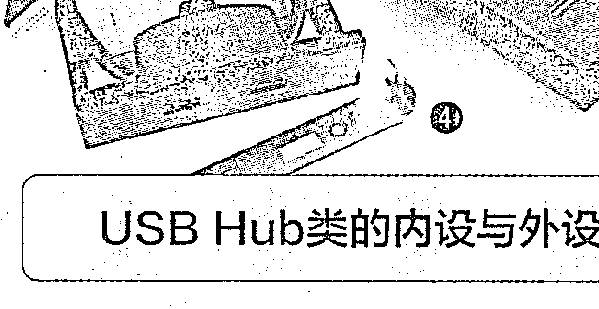

如果机箱风扇过多而主板上又没有足够多的SYS_FAN或者POW_FAN怎么办？目前有很多配件都是为了这个情况而推出的，一般是一个4pin或者由D形、SATA接口供电的一体式风扇集线器固定于机箱当中，其中提供了数个小3或4pin接口分插。通过集线器上的档位小开关来控制D形或者SATA接口供电的电流，实现对机箱风扇的统一控速（图2）。

在机箱集线器这种情况下有一定的注意事项。首先机箱集线器中第一组风扇接口上必须要连接风扇，否则整个集线器的控速是不起作用的。这个特性出现在很多品牌的集线器或者机箱自带的集线器当中，需要控速的用户一定要注意。此外，我们在选择散热风扇时尽可能选择同一品牌统一规格的散热风扇，因为很多集线器并不能像主板那样具体控制每一个接口的转速，所以统一的风扇规格就意味着同样的转速和风道，这十分重要。

###### USB Hub类的内设与外设

除了散热风扇接口，老平台经常缺少的还有USB接口这类的数据接口。如果我们的老平台USB接口不足，可以购买平台PCI-E位置的USB扩展卡。虽然叫扩展卡，但其实它并不连接主板的PCI-E接口，而是通过内部线缆连接主板下面的USB插座，扩展到机箱背部显卡下面实现USB扩展（图3）。如果用户的主板拥有USB前面板插座但机箱并不支持，也可以选用光驱位USB 3.0扩展接口（图4）。

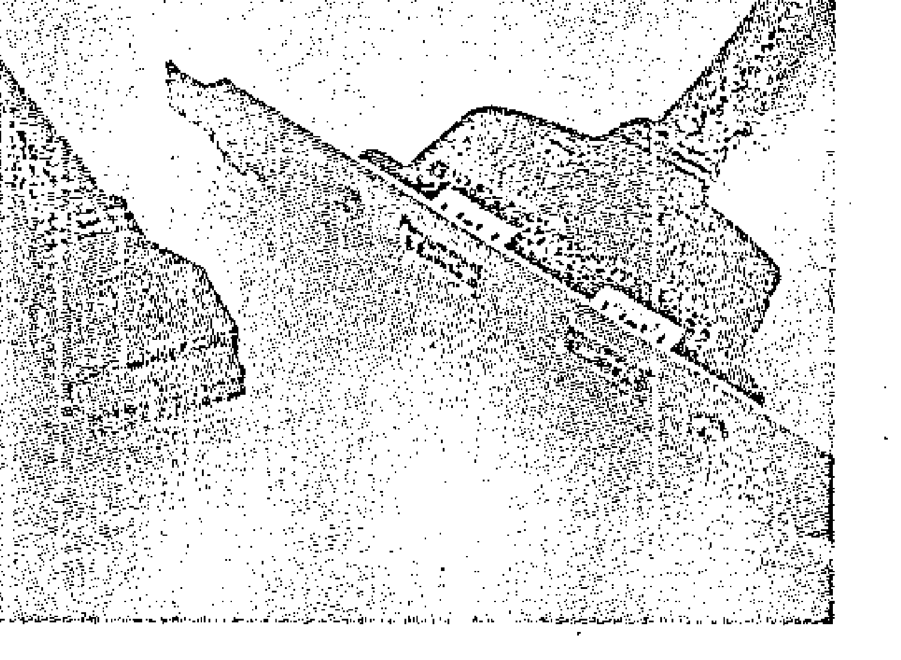

如果用户觉得这个位置并不太方便，还可使用USB Hub一类的外设（图5）。不过用一个USB接口分插出来的USB扩展接口使用有些时候会有供电方面的不足，比如一些内置HDD的移动硬盘在USB Hub上就可能无法正常使用。另外，目前很多显示器也带有USB Hub功能，还是3.0版本的，也可作为不常插拔的设备栖身之处。

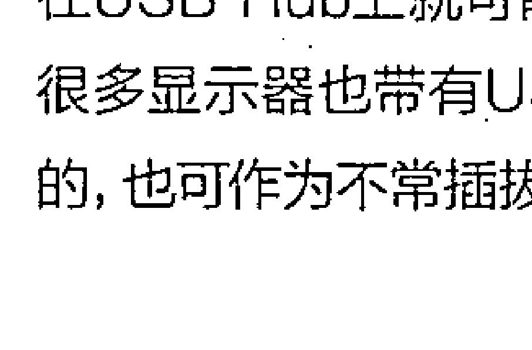


##### 另有洞天

###### 小巧能撑大场面

扫一扫，更多精彩内容立现！


和“外国月亮比较圆”的感觉相似，在很多人的潜意识里总抱有“高价=高端=高品质=大体积”（硬件层面），“专业=全能=好用”（软件层面）的幻想。但在绝大多数情况下，我们根本用不上软硬件的全部功能或性能，迷信所谓的“专业户”反而让我们忽略身边的“细微景观”。无论何时，本着够用就好的原则以及术业专攻的态度才是王道。

###### 给移动设备的问题“翻翻案”

作为移动办公娱乐的伙伴，智能手机、笔记本等移动设备是最容易出现“错假冤案”的。很多玩家都不喜欢手机自带的APP；在选购手机时总是以核心数量和电池容量论英雄；对中小品牌的产品抱以歧视的目光。下面我们就来给这类移动设备的问题“翻翻案”。

##### 告别ROOT 挖掘手机自带APP的潜力

曾经，笔者会帮身边所有朋友的Android手机进行ROOT，并通过LBE或360等安全软件实现流量和权限的管理。如今笔者却不再建议ROOT Android手机，原因很简单：没必要！手机自带的APP已经足够帮你管理好Android系统潜在的各种隐患了。

###### 认识两种身份的APP

每款Android手机都会预装（自带）无数的APP，而这些APP却有着犹如“贵族”和“平民”的两种等级差异（图1）。“贵族”就是系统自带的APP，如相机、相册、文件管理器、音乐和应用商店等。它们都被保存在系统根目录的system/app/文件夹内，享有“终身制”的最高权限：无需你的允许，即可读取联系人、通话记录、位置信息、开启摄像头、进行录音或发送短信等权限，且无法卸载。

“平民”就是Android手机预装的非系统APP，如百度地图、网易新闻、淘宝、美团等。它们被保存在系统根目录的data/app文件夹内，用户可对其权限进行监测和管理，并随时卸载。但有些手机厂商出于某些目的会将非系统APP也集成到system/app/文件夹。如果这个“平民”的本质是“流氓”（存在偷跑流量、偷发短信等问题的APP），而手机厂商的做法就是赋予“流氓”行使“贵族”的权限（图2）……后果你知道。只有预装了很多“贵族”身份的“流氓”，才有ROOT手机的必要，通过安装RE文件管理或第三方安全类软件将它们从system/app/文件夹中删除。好在现在已很少有厂商任用流氓贵族了，ROOT的必要性也就不高了。

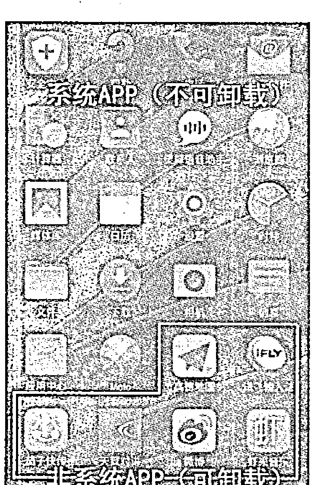

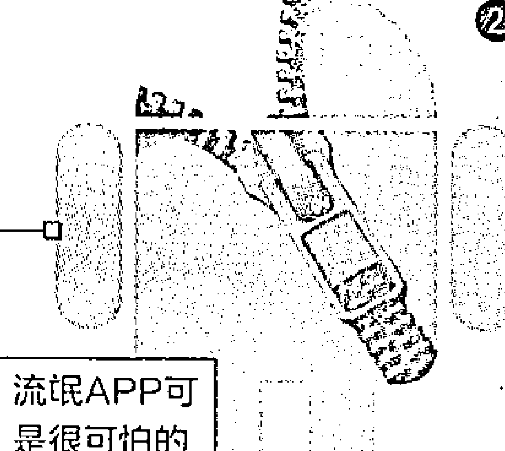

###### 核心的安全APP

除了Root系统外，很多用户在Android手机到手后第一时间就下载安装猎豹清理大师、360手机卫士等第三方安全/清理类APP。实际上除了三星和索尼等少数国际品牌外，几乎所有国产Android手机早已预装了功能丰富的安全APP，如华为的“手机管家”、小米/OPPO/摩托的“安全中心”、联想的“乐安全”、华硕的“智能管家”、酷派的“酷管家”等（图3），这类安全APP都具备垃圾清理、流量防火墙、权限管理、骚扰拦截等功能。如果再安装第三方安全APP，反而会与系统预装的安全APP产生功能冲突。下面就以几款国产手机为例，看看Android手机如何通过自带的安全APP解决使用中的小问题。

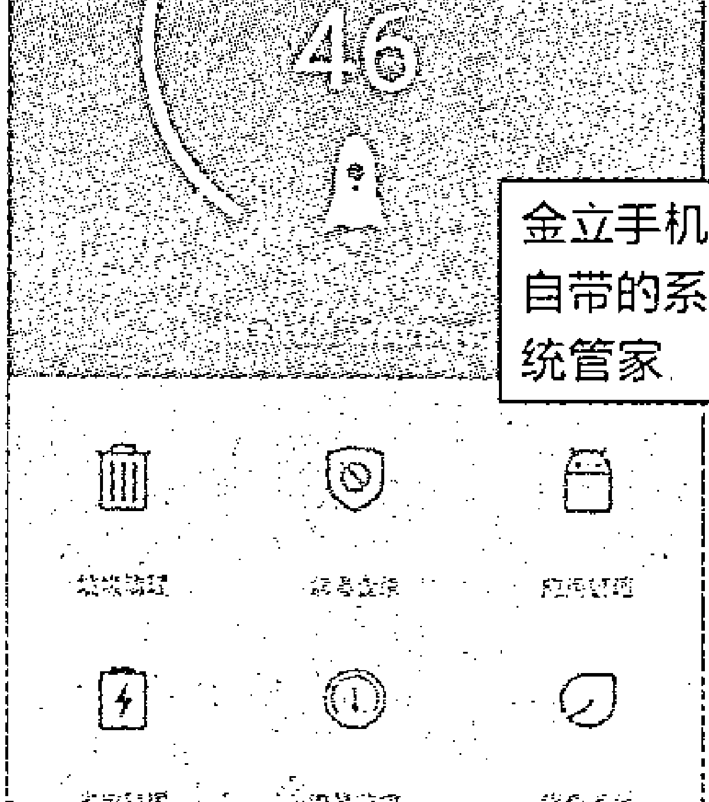

#### 《电脑爱好者》2016年合订本(一)

##### 特别话题

##### 流量总是不够用

在安全APP的流量管理找到联网管理或流量防火墙一类的选项，禁止视频、漫画和音乐这类耗流量大户APP使用手机数据（2G/3G/4G流量）的权限（图4），只有处于Wi-Fi环境下才可联网使用。当然如果你流量多到每月用不完，则可忽视这方面的设置。

##### 通知提醒讨厌死了

几乎所有APP都有通知提醒功能，比如淘宝的促销、网易新闻的头条推送，手机顶部的通知栏很容易被这些提醒占满，吵人又碍眼。实际上，凡是系统版本在Android 5.x以上的手机都集成了通知管理的功能（在安全APP或系统设置界面中），我们可以有选择地屏蔽APP的通知功能（图5）。需要注意的是，不要错选微信和QQ一类的聊天APP哦，避免错过第一时间好友发来的消息。

##### 待机时间还能再久点

很多Android手机用户都抱怨待机时间短，而想提升续航能力可从两方面入手。在安全APP中找到自启动管理，禁止除微信和QQ等聊天软件外所有APP自动运行的能力（图6）；找到省电设置（有些手机会将该功能集成到“设置→电池”中），让手机运行在省电模式下（图7）。此外像华为等品牌手机还可自定义锁屏后允许运行的APP白名单列表功能（图8），凡是列表之外的APP都会随屏幕熄灭而自动关闭。不同品牌对该功能的称呼可能略有区别，比如OPPO就将其称为绿色后台。

##### APP太多预防误启动

很多手机用户不舍得卸载预装的APP，担心日后可能还会用上。但是满屏的APP图标看着有点闹心，还很可能因误碰运行而浪费流量和电量。面对这些闹心的APP，我们有两个解决方案：其一，像华为手机可以通过双手指向屏幕中心捏合屏幕进入APP隐藏设置界面（图9），点击屏幕的加号即可将无用APP隐藏（图10），做到眼不见心不烦。而像摩托罗拉和联想等品牌的手机，则引入了应用冻结的概念。以摩托罗拉手机为例，在“安全中心→应用管理→已安装”界面，就能将勾选的APP冻结起来（图11）。冻结的APP等同于卸载，它的图标会消失，但相关数据会得以保存，需要时可以在冻结APP列表中对其解冻而重新启用。此外，华硕手机也提供了类似功能，只是将冻结一词换成了“禁用”（图12）。

##### 防止游戏不小心内购

Android平台的游戏都是免费的，但里面的一些装备或服务却是收费的，很多玩家都遇到过不小心触发了内购造成了金钱上的损失。还好，目前很多游戏还停留在短信内购的层面，而我们则可借助安全APP的权限管理功能，杜绝游戏偷发短信内购的服务。以OPPO手机为例，在“安全中心→权限隐私→应用权限管理→发送短信”列表中，将包括游戏在内的APP禁止发送短信的功能（图13）。

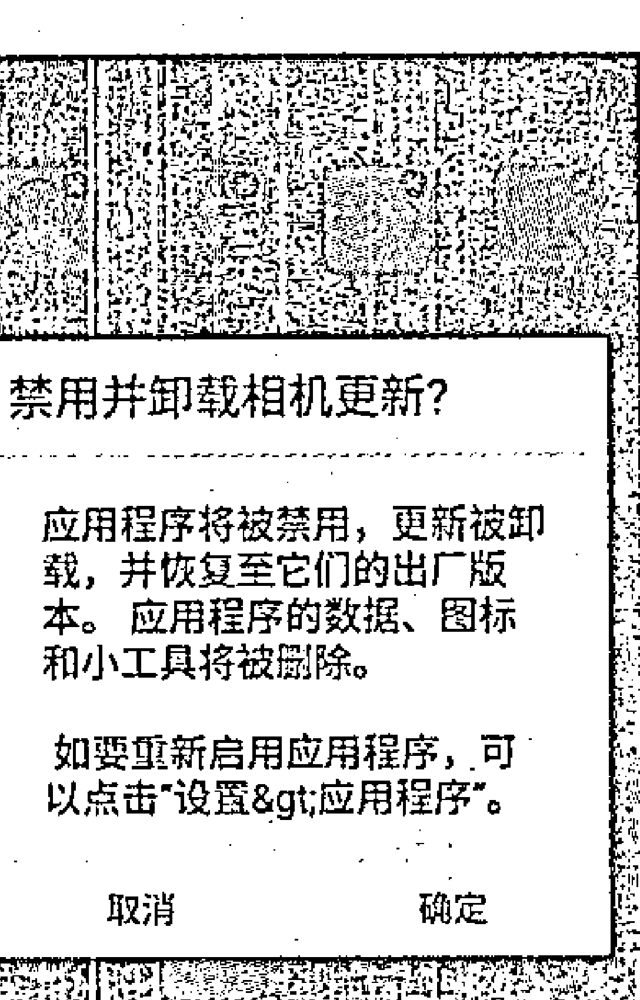

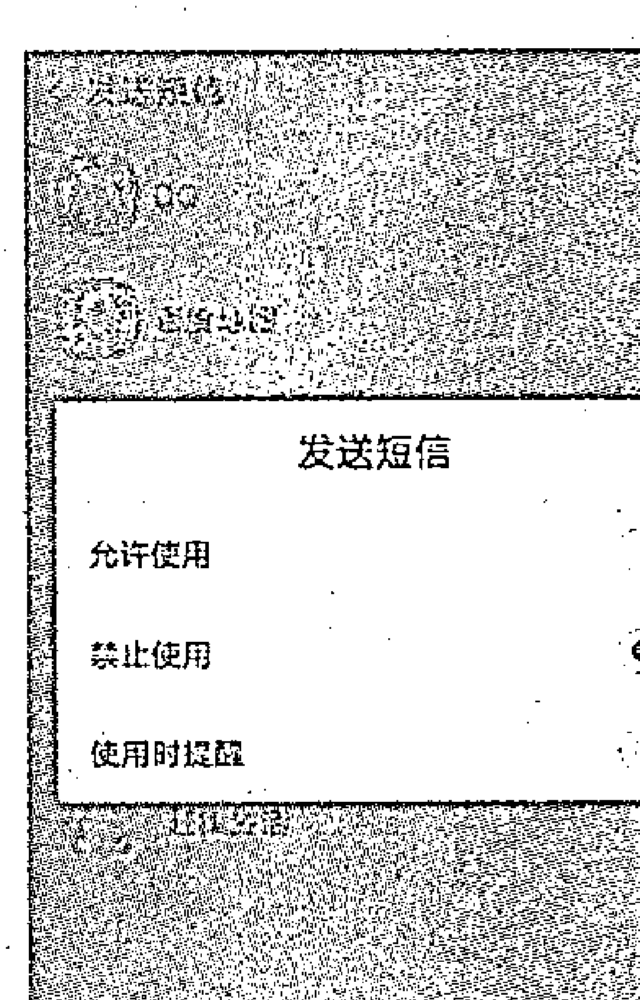

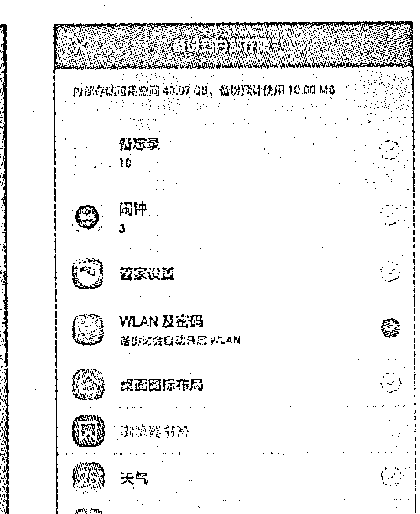

##### 挖掘APP的潜在功能

为了实现某些功能，很多用户都喜欢直接去应用商店下载全新的第三方APP。殊不知，很多实用的小功能，手机自带的APP早已集成，只是你没有发现而已。

###### 找不到科学计算器

有些OPPO手机用户抱怨自带的计算器功能少，还没有切换到科学计算器的按钮，只能去下载第三方的APP。实际上，OPPO计算器是通过重力感应自动在普通/科学计算器间切换的，将屏幕横过来就能解决问题。

###### 忘记Wi-Fi密码

不要小看手机自带的备份APP，它除了可以备份APP、游戏进度数据、聊天记录等，还可以帮助你找回Wi-Fi密码呢。以华为手机的备份APP为例（不要勾选使用密码保护备份数据），我们只要依次选择“新建备份→系统数据→WLAN及密码”（图14），即可在HuaweiBackup→backupfiles→备份时间文件夹中生成名为wifiConfig.db的文件，将该文件的db后缀改为txt即可查看所有连接过的热点名称和对应的密码。

###### 与PC无线传输

很多用户会选择ES文件管理器或者豌豆荚客户端实现手机与PC无线传输数据。实际上，如今手机自带的文件管理器APP大都已集成远程管理或网络邻居一类的功能。以OPPO手机为例，在文件管理器APP中点击左下角的“远程管理”并选择“开启服务”，就能在同处一个Wi-Fi网络的PC上与手机互传数据了（图15）。

| 名称 | 大小 | 修改日期 |
|------|------|----------|
| Movies/ | | 15/9/19 下午2:06:00 |
| Music/ | | 15/12/11 上午10:59:00 |
| Pictures/ | | 15/11/25 上午7:13:00 |
| d_1 | 5.0 kB | 15/11/25 上午7:12:00 |
| CDBrowser/ | | 15/10/31 上午3:02:00 |
| .los/ | | 15/10/30 上午10:02:00 |
| ota.log | 36.7 kB | 16/1/5 下午2:40:00 |
| Download/ | | 15/11/26 下午2:00:00 |
| 360/ | | 15/10/20 上午11:02:00 |
| Android/ | | 15/10/30 下午10:14:00 |
| ThemeStore/ | | 15/11/7 上午3:01:00 |
| ContactsYellowPage/ | | 15/10/20 下午10:46:00 |
| OPPOUserCenter/ | | 16/1/1 上午12:02:00 |
| prosecure_debug.txt | 1.5 MB | 15/11/11 下午2:58:00 |
| .tmpfs/ | | 16/1/1 上午12:02:00 |
| .UISystemConfig/ | | 15/11/25 上午7:09:00 |
| .DataStorage/ | | 15/12/24 下午4:31:00 |
| .tccokbld | 31 B | 15/11/25 下午12:04:00 |
| .secrecom/ | | 15/11/25 上午11:38:00 |
| .mcs/ | | 16/1/5 上午10:05:00 |
| .Reader/ | | 16/1/1 上午12:02:00 |
| Thumbs/ | | 15/10/20 下午8:36:00 |
| | | 15/12/24 下午4:03:00 |

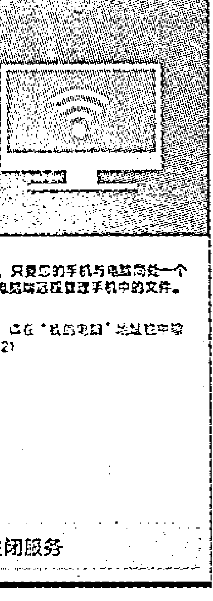

###### 指南针就是水平仪

指南针是所有Android手机必备的APP，但是很多品牌还在指南针基础上增加了水平仪功能。比如华为手机就可以在指南针界面滑动屏幕切换到水平仪界面，从而免去了安装第三方水平仪APP的繁琐。

###### 相册就是PS

有时我们在朋友圈分享照片时，会使用美图秀秀或一些图片编辑APP对照片中的某些细节打上马赛克，或加入一些修饰元素。好消息是，上述这些基础的图片编辑功能，使用手机自带的图片APP就可完成。以OPPO为例，用相册打开照片后，点击菜单键就能进行丰富的图像编辑操作了（图16）。

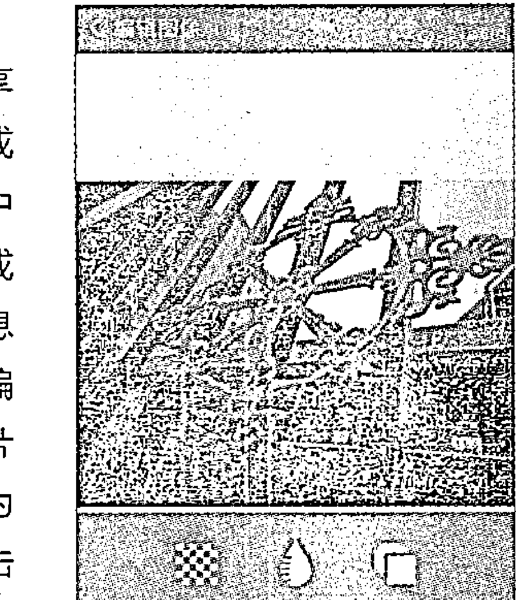

##### 小结

很多用户都“歧视”手机自带的APP，想用某项功能首先就会选择下载新APP。实际上，手机自带APP的功能并不孱弱，善加挖掘总能带来惊喜。此外，任何第三方APP都存在安全上的隐患，而自带APP则没有这样的顾虑。

##### 小(少)亦可为 智能手机的两个误区

在智能手机领域，除了自带APP易被忽视以外，还有很多参数功能容易引起争议。比如，处理器性能以核心数量论英雄，电池容量小就注定无法弥补续航缺陷。那么，事实果真如此吗？

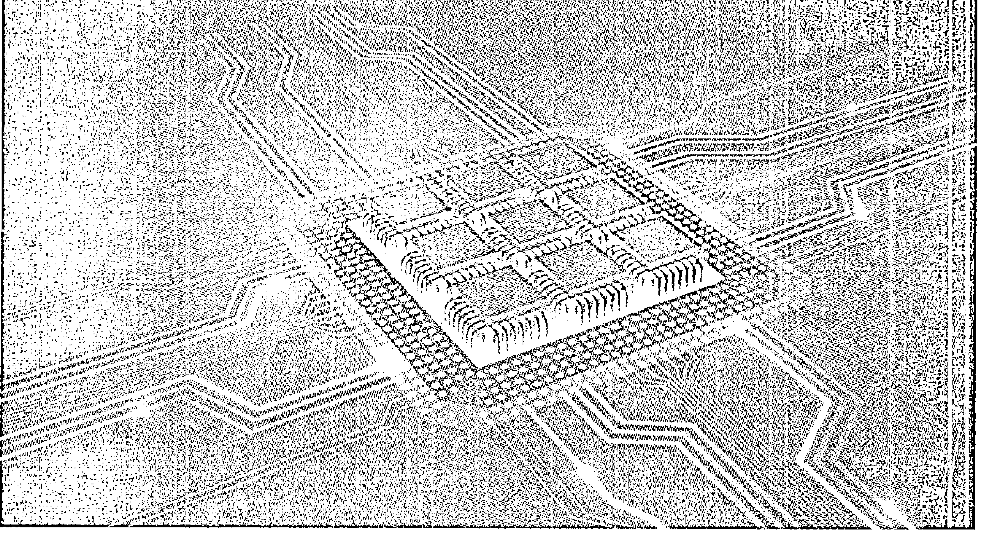

###### 理性看待处理器核心数量

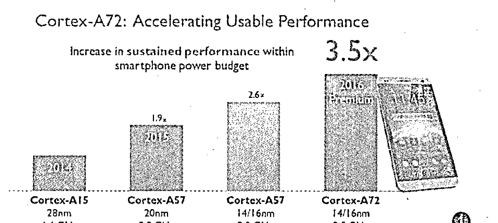

手机处理器的“核心竞赛”到了让笔记本“羡慕嫉妒恨”的境地。要知道如今笔记本领域尚处于双核一统天下的时代，而手机却即将照耀在十核处理器（联发科Helio X20）的光辉下。我们又将面临“老事新说”的讨论：核心数量能否决定性能？

###### 架构影响CPU性能

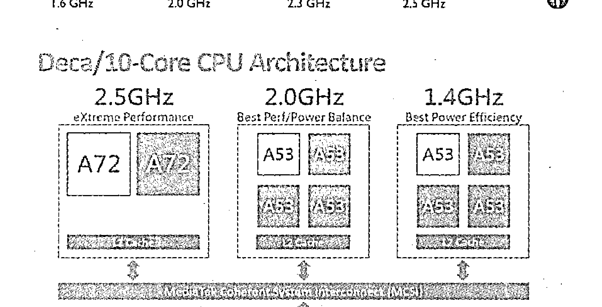

核心架构、制程工艺、核心数量，它们构成了影响CPU性能的“三驾马车”。其中，核心架构为基础，制程工艺为辅助，核心数量为助力。核心架构的先进与否决定了CPU性能的理论基础。如Cortex-A72优于Cortex-A57（图1），而Cortex-A57却又可秒杀Cortex-A53。但高通和三星却不满足ARM对Cortex-A72的公版设计，便自主研发了更高性能的Kryo和Mongoose架构来取代Cortex-A72，进而拥有了更强悍的理论性能基础。

制程工艺影响着CPU的功耗和发热表现，制程工艺越先进，CPU就能更长时间稳定工作在最高主频上。高通骁龙810之所以失败，就是落后的制程工艺无法安抚Cortex-A57架构的热情，极易因功耗和温度过高而触发降频机制，导致其实际体验大幅缩水。只有当核心架构和制程工艺足够先进时，核心数量才变得更有意义。比如，八核Cortex-A53火力全开可能也敌不过双核的Cortex-A57，这就是核心架构的先天差距造成的。

###### GPU决定游戏性能

CPU在3D游戏的运行过程中往往处于性能过剩的状态。而真正决定一款游戏玩起来卡不卡，取决于手机处理器集成的GPU是否给力。联发科Helio X20虽然是业内首款十核处理器（图2），但它的GPU规格却和麒麟950相同：ARM Mali-T880MP4。因此哪怕是联发科Helio X20的理论CPU性能更强，但二者玩游戏时的体验却是半斤八两。

反观高通骁龙820，虽然它只是一颗四核处理器，却凭借着Adreno 530 GPU获得秒杀八核麒麟950和十核联发科Helio X20的游戏性能（见表）。

Android系统平台的3D游戏并不买CPU的账，因为鲜有游戏会针对CPU的更多核心加以优化，这就导致...

|          | 麒麟950                                  | 高通骁龙820                              | 三星Exynos8890                           | 联发科Helio X20                          |
|----------|------------------------------------------|------------------------------------------|------------------------------------------|------------------------------------------|
| 制程工艺 | 16nm FinFET Plus                         | 14nm FinFET LPP                          | 14nm FinFET LPP                          | 20nm                                     |
| CPU架构  | 4×Cortex-A72 (2.3GHz)<br>4×Cortex-A53 (1.8GHz) | 2×Kryo (2.2GHz)<br>2×Kryo (2.0GHz)      | 4×Mongoose (2.3GHz)<br>4×Cortex-A53 (1.5GHz) | 2×Cortex-A72 (2.5GHz)<br>4×Cortex-A53 (2.0GHz)<br>4×Cortex-A53 (1.4GHz) |
| GPU型号  | ARM Mali-T880MP4                         | Adreno 530                               | ARM Mali-T880MP12                        | ARM Mali-T880MP4                         |
| GFXBench*| 17fps                                    | 49fps                                    | 48fps                                    | 17fps                                    |
| GeekBench3.0 单核/多核 | 1763 6358                          | 2320 5460                                | 2300 7500                                | 2190 6884                                |

###### 上下兼顾才是王道

一款手机处理器的强弱是受多个方面因素影响的，单纯以核心数量论英雄显然并不合理。通过对表中的数据进行分析可见：

Helio X20和麒麟950，二者都以Cortex-A72作为性能级核心，且GPU规格一模一样。此时得益于更多核心的助力，Helio X20的性能自然占优；

Helio X20和骁龙820，Kryo架构与Cortex-A72的差距不大，因此有着核心数量优势的Helio X20在CPU性能测试中的表现较突出。但由于GPU差距太大，所以游戏体验上Helio X20会被骁龙820暴虐；

Helio X20和Exynos8890，Mongoose架构优于Cortex-A72，而二者的的核心数量差距不大。此外，Exynos8890集成的GPU也更先进，所以无论CPU还是GPU性能都足以让Helio X20羡慕。

总之，更多核心数量是手机处理器未来发展的必然趋势，但现阶段我们却没有必要盲目追求。联发科Helio X20虽然抢占了十核先机（图3），但强悍的CPU性能和（相对）孱弱的GPU表现，注定它和“顶级”还差了那么一点点。不过，根据2015年Helio X10的经历来看，Helio X20也有望被国产品牌打入2000元甚至1500元左右的价格区间，在性价比方面“秒杀”那些武装骁龙820和Exynos8890的旗舰们。

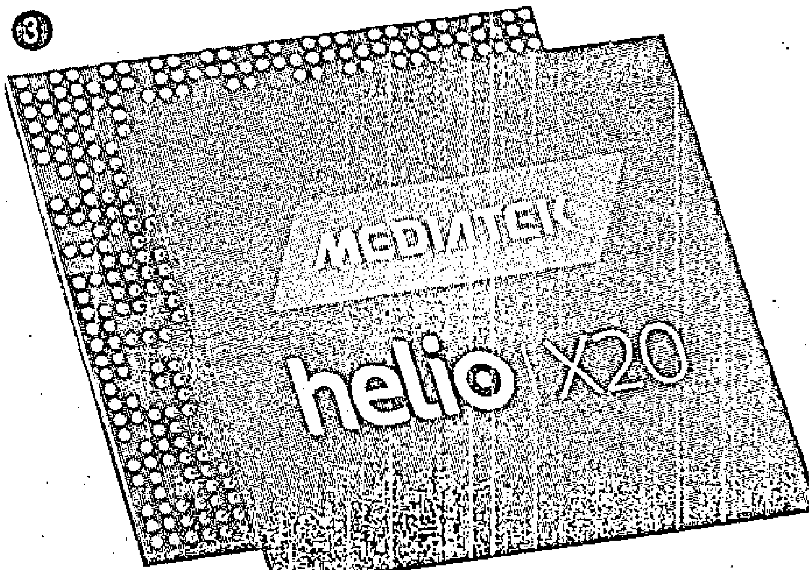

> AMOLED屏幕除了省电还有更高对比度，色彩还原更真实。AMOLED还能实现可卷曲的柔性状态，获得曲面屏幕的显示效果

###### 续航长短光看电池可不够

随着智能手机屏幕尺寸和整体性能的提升，其耗电量也在不断的攀升之中。在很多人的潜意识中，塞进更大的电池才是保证续航的关键。但实际上，电池容量仅是影响续航的因素之一，通过一些软硬件方面的配合，小电池也能保证长续航。

###### 硬件领域的组合

在纤薄风席卷手机领域的当下，想塞进更大的电池是不太现实的。此时，就需要采用更省电的硬件来弥补电池的消耗了。HTC One M9（5英寸1080P，骁龙810，2840mAh）和三星Galaxy S6 edge（5.2英寸2K，Exynos 7420，2600mAh）是最有说服力的两款产品。

从表面参数来看，屏幕小、分辨率更低的HTC One M9应该具备更好的续航基础，但实际情况却是Galaxy S6 edge更为持久。究其原因，就是S6 edge采用了更省电的AMOLED材质屏幕（图4），而14nm工艺的Exynos 7420也要比20nm的骁龙810更省电（图5）。可见更省电的屏幕和处理器组合，不比更大的电池效果差。

好消息是，处理器厂商们在想办法拔高性能之余，并没忘记优化自家产品的功耗。以联发科刚刚推出的Helio P10（又称MT6755，基于八核Cortex-A53架构设计，集成Mali-T860MP2 GPU）为例（图6），它的性能较同属八核Cortex-A53架构的MT6752更强，但是在日常应用中却能实现最多15%的功耗降低。

此外，三星也决定在2016年大幅降低AMOLED屏幕的采购价格，可预见今后会有更多手机受益于屏幕和处理器的节能特性，从而获得更好的续航成绩。

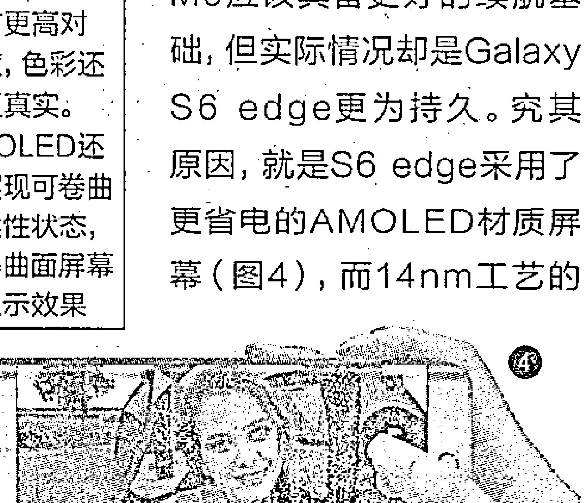

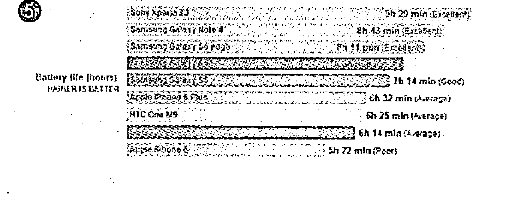


###### 系统层面的优化

在硬件趋于同质化的今天，各个手机之间的续航能力开始向系统优化层面倾斜。比如系统能否自动清理后台驻留的耗电进程？节能选项中处理器的降频机制和幅度是否合理？能否阻止APP在未经用户允许的情况下自动启动？总之，这些“软实力”的较量，更能体现手机厂商的技术实力以及对消费者的态度。

##### 后PC时代 中小品牌新机会

###### 中小品牌的契机

在上期的特别话题中，我们曾说过“后PC时代，1+1>2”，平板二合一设备将趁势崛起。实际上，在这个特殊的时期里，机会不仅限于某种形态的产品，一些曾被我们忽视的中小品牌在后PC时代也是大有可为。

如今，全球PC（包括台式机和笔记本，本章节主要以笔记本为主）市场销量下滑已经成为不争的事实，且这一现象仍在进一步恶化。有消息称，东芝、富士通以及索尼独立的电脑部门VAIO计划将三家的个人电脑业务进行合并（图1），成立以VAIO为品牌的新PC公司。在PC的严冬季节，“抱团取暖”似乎已成必然。

PC市场的不景气也让传统PC企业变得“越来越懒”，很多知名品牌不再搞自主研发，而是直接采购方案公司（ODM）的设计（也就是所谓的“贴牌”），尽可能降低不必要的开销。于是你会发现市面上出现了很多“姐妹笔记本”，仅仅是品牌Logo和配置略有差异（图2）。当然知名PC品牌通常会直接“买断”方案公司的设计，保证产品在市场上的唯一性。

###### X86领域知名的ODM

我们在市面上看到的很多品牌笔记本、平板电脑都是出自ODM之手。以深圳为例，目前涉足英特尔X86设备的ODM企业主要分为三大梯队：

- 第一梯队：深圳台电、厦门联达、深圳创智成、深圳宝龙达、深圳顶星、深圳卓翼、主要以笔记本为主；
- 第二梯队：深圳三诺、比亚迪、庆邦科技、奕义德、英众、卓怡互迪、播思、芯舞、子牛线等，以平板电脑为主；
- 第三梯队：因英特尔转向从Android设备转型而来的深圳忆道、帝硕等。

曾以时尚著称的索尼成为最近一批倒下的笔记本品牌

###### 新方案降低准入门槛

笔记本曾经是无比精密的设备，有比其他电子行业更苛刻的研发生产要求，各种测试标准长达数十页。随着处理器工艺的革新，南北桥芯片已与CPU融为一体（图3），类似USB 3.0/3.1等功能也全部“原生支持”（无需安装第三方芯片）。此外以酷睿M、CherryTrail和BayTrail为代表的处理器平台甚至连散热风扇都省略了（图4），凭借更高的集成度和更低的功耗，大幅降低了ODM的准入门槛。

蓝天P750DM/P770DM模具，很多品牌的顶配游戏本都是该模具的贴牌

###### ODM助力中小品牌

虽然中小品牌自身缺乏足够的研发实力和历史积淀，但这并不妨碍他们学习一线品牌，直接从ODM方案公司进行贴牌。

既然大家都是在ODM贴牌销售，这就将导致一线和中小品牌产品之间的品质差距越来越小。当然，前提条件是大家都选择了同一家ODM企业。

但现实情况是，不同ODM企业的生产经验和工艺之间也存在差距，挑选的ODM是否“靠谱”，将决定中小品牌贴牌产品的表现和口碑。此外，同一家ODM的同一个方案也会根据客户的需要，在用料和设计方面进行精简，比如一些中小品牌为了追求利润而选择廉价或库存呆料，这就导致了产品品质的降低。

还好，目前中小品牌并没有好高骛远，而是将目标锁定在3000元以内的入门级PC战场，并以酷睿M和CherryTrail作为首选的硬件平台（图5）。前文提过，这两个平台集成度高，且周边配套产业成熟，ODM在品控的把握上相对轻松。此外，由于中小品牌没有一线品牌的渠道成本压力，基于线上销售的它们更容易打出极具诱惑的低价，进一步减轻消费者钱包的压力。

###### 1199元的触控翻转本

联想Yoga系列开创了翻转本的先河（图6），随后戴尔、惠普等品牌也陆续跟进，拥有笔记本、平板、帐篷和站立四种使用模式的翻转本受到了很多用户的欢迎（图7）。此类产品的设计难点在于转轴设计，以及如何在纤薄的机身内解决散热和续航的压力。

昂达在前不久推出了oBook 11（图8），这款11.6英寸的笔记本拥有和联想Yoga一样翻转屏幕的能力。在硬件平台上，它选择了英特尔凌动X5-Z8300处理器平台，无需风扇即可解决散热压力，也因此获得了16mm厚度和1.2kg左右重量的纤薄身材。如果将其与市面上常见的翻转本做个对比（表1），它的便携性仅次于YOGA3 11，而性能还要在Pavilion X360之上。当中小品牌挥师翻转本市场之后，其性价比表现可见一斑。但是，昂达oBook 11还是没能摆脱“小家子气”的影子：2GB的内存和32GB存储空间的组合在平板电脑领域也只是勉强够用，然而对于笔记本来说就太过紧张了（图9）。如果oBook 11可以提供凌动X5-Z8500+4GB内存+64GB起步的存储空间，那么它才真正地获得了狙击一线品牌旗下翻转本的资格。

表1 联想YOGA3 11 vs 惠普Pavilion X360 vs 戴尔Ins 11W vs 昂达oBook 11
| 项目 | 联想YOGA3 11 | 惠普Pavilion X360 | 戴尔Ins 11W | 昂达oBook 11 |
|------|---------------|-------------------|-------------|--------------|
| 屏幕 | 1920×1080像素 | 1366×768像素 | 1366×768像素 | 1920×1080像素 |
| 处理器 | 酷睿M-5Y10 | 赛扬N3050 | 奔腾N3540 | 凌动X5-Z8300 |
| 内存/存储 | 4GB/128GB SSD | 4GB/500GB HDD | 4GB/500GB HDD | 2GB/32GB eMMC |
| 厚度/重量 | 15.8mm/1.1kg | 21.9mm/1.49kg | 19.4mm/1.39kg | 16mm/1.2kg |
| 参考价格 | 4299元 | 3099元 | 3999元 | 1199元 |

###### 轻薄机身，比主流笔记本电脑更小40%+更轻60%

这款笔记本电脑采用了Intel Core M处理器，使得机身更加轻薄。相比于主流笔记本电脑，它小了40%，轻了60%，非常适合移动办公和娱乐。

###### 1999元的酷睿M超极本

苹果MacBook 12凭借酷睿M平台打破了笔记本的轻薄记录，而华硕U305F和联想Ideapad 700s等产品也借酷睿M实现瘦身（图10），让传统形态的笔记本也能拥有极致的便携性。好消息是，国内的ODM企业在将酷睿M平板方案打入2000元超低价位内后，酷睿M笔记本的方案也已箭在弦上。比如深圳海邻科信息科技有限公司就推出了不逊于U305F和Ideapad 700s的ODM方案，而乐凡刚刚推出的S1笔记本就是该方案的首批客户（图11）。

为了提升卖相，乐凡S1采用了一体式铝镁合金外壳，13.9mm的厚度和1.2kg的重量，在便携性上不逊于售价是其2倍的一线品牌产品（表2）。该产品还在底部单独为M.2 SSD硬盘开了扩展仓盖，为了方便用户自行升级更大容量的SSD（图12）。此外，乐凡S1除了USB3.0和USB2.0两个标准接口外，还标配一个USB Type-C接口，除了兼容MacBook 12的USB Type-C外设还能用于给主机充电。

为了推广S1，乐凡主打“DIY”的概念，在众筹平台推出了1999元的裸机版以及不同档次配置的版本（图13）。其中裸机版仅板载酷睿M-5Y10处理器和4GB内存，需用户自行安装Wi-Fi网卡和SSD硬盘，适合动手能力较强的玩家考虑。要知道，800元已经可以买到256GB SSD和无线网卡的组合了。

表2 苹果MacBook 12 vs 华硕U305F vs 联想Ideapad 700s vs 乐凡S1
| 项目 | 苹果MacBook 12 | 华硕U305F | 联想Ideapad 700s | 乐凡S1 |
|------|-----------------|-----------|------------------|--------|
| 屏幕 | 2304×1440像素 | 1920×1080像素 | 1920×1080像素 | 1920×1080像素 |
| 处理器 | 酷睿M | 酷睿M-5Y10 | 酷睿M-6Y30 | 酷睿M-5Y10 |
| 内存/存储 | 8GB/256GB SSD | 4GB/256GB SSD | 8GB/256GB SSD | 4GB/128GB SSD |
| 厚度/重量 | 13mm/0.91kg | 12.3mm/1.2kg | 13mm/1.1kg | 13.9mm/1.2kg |
| 参考价格 | 8888元 | 4999元 | 4999元 | 2799元 |

**小结** 有消息称小米将在2016年正式杀入笔记本市场，如果属实，沉寂的笔记本领域有望迎来新一轮互联网营销的洗礼。对品牌厂商而言，没有笔记本相关的研发经验不是问题，成熟可靠的ODM方案有的是，关键是不能放弃品质，并想办法将产品营销出去。传统知名PC品牌受限于自身渠道和经营的成本压力很难掀起价格上的革命，而中小品牌则没有太多的顾虑。同一配置、相似品质、更低价，这就是中小品牌的机会所在。

##### 小PC大作为

在PC领域，体型往往与性能成正比。比如配备GTX980M独显的游戏本普遍要3.5kg以上，而以极致轻薄为卖点的产品则与（大型）游戏无缘。那么，比笔记本和平板电脑还要小的“口袋PC”能干啥？这种小到极致的PC是否上演逆袭？

###### 后PC时代的新形态

很多人都希望给客厅的电视攒一部HTPC，让电视的大视野和音响的音质得到更大的发挥。但真正体验过HTPC才发现，用HTPC玩游戏没有想象的舒服，HTPC在更多时候扮演的仅仅是下载机、在线视频点播的工具。此时，耗费精力和财力DIY的HTPC就显得有些鸡肋了。

我们可以将口袋PC理解为拆下屏幕和电池的平板电脑，基于CherryTrail和BayTrail平台打造的它们能将机身压缩到移动硬盘般甚至闪存盘大小（图14），而且具备静音（可做无风扇设计，但有些产品为了避免因过热而降频会添加一颗风扇）、低功耗（整机功耗只有10W出头）、低成本的优势（价格能做到400元以内），哪怕是最低档的BayTrail平台在性能上也毫不含糊。

你觉得每天上下班背着笔记本或平板电脑太过累赘，只要家里和公司配有显示设备（如电视或LCD），口袋PC就能随时扮演台式机主机的角色，接驳网线、显示设备和键盘鼠标后就能立刻进入工作状态（图15），如此惬意的体验是传统PC无法比拟的。

###### 带来全新的使用场景

口袋PC不仅能像HTPC一样摆在电视旁边，它还能跟随你驰骋天下。比如，如果

###### 根据需求挑选产品

可惜，口袋PC的准入门槛更低，这就导致百家争鸣的市场格局。其中搭载BayTrail（如Atom Z3735F）的产品价格多在400元~700元之间，武装CherryTrail（如Atom X5 Z8300）的型号则不低于650元（图16）。不同品牌产品之间的差异主要体现在外观用料设计、内存和存储空间大小等方面。如果你预算有限，BayTrail+2GB内存+32GB存储空间的产品就勉强够用了；如果你希望口袋PC用于主力的办公和娱乐（非游戏平台），那选择基于CherryTrail+2GB内存+64GB存储空间的产品还是很有必要的。

1999元（限量20台）专为发烧级而设！只需1999元，你就能把乐视盒子1代（4GB/无硬盘，无WIFI）带回家。我们为你准备了专业DIY工具套件、静音手电、装备齐全、亲自手动，体验DIY的乐趣吧！

2799元（限量30台）最具性价比的！乐/视1代（4GB/128GB/WiFi）目前仅2799元，送专业DIY工具套件、静音手电，小白也可以DIY，打造你的私人服务器

**小结** 虽然“PC已死”的呼声不绝于耳，但无论PC销量如何惨淡，用户对Windows设备的需求始终是存在的，之所以步入寒冬是因为我们家里都至少已有一部性能还够用的PC，自然就缺乏更换新PC的“刚需”了。作为全新的PC形态，口袋PC真正做到了“麻雀虽小五脏俱全”，在极致迷你的身材中提供了PC本应具备的功能和体验，并通过较低的价位撬动我们对第二部PC的刚需心理。看到这里，你还会“歧视”这种小到极致的PC吗？

##### 用好那些不起眼的软件功能

我们日常使用的Windows操作系统以及一些第三方工具软件中，有许多小得不起眼，甚至很容易被忽略的功能或应用。由于操作习惯的驱使，平常人们可能很少会留意或使用到它们，而一旦将这些小功能或小软件利用起来，我们就会发现，其实“小不点”也有大用处。

文|刘英

###### “躲”起来的系统小功能

在如今最为流行的Windows 8.1或Windows 10中，虽然微软已经竭尽全力为我们提供了更多实用的功能，但在许多方面做得还很不够，因此许多人还是要借助于外部第三方软件的力量来完成特定任务。实际上还有系统自带的一些实用功能没有被我们挖掘和利用好，用好这些功能，即便是不借助于外部力量，仍然可以高效地完成任务。

####### 以管理员方式运行程序

在系统出现问题需要启动某个软件，或者出于某种需求希望以管理员身份运行某个程序或命令时，如果正常的桌面或者开始菜单渠道已失效，在这种情况下，多数人会选择重启电脑尝试。其实，这时如果可以用任务栏右键菜单或者Ctrl+Shift+Del组合键来调用任务管理器，那么，通过任务管理器或许可以寻到另一条新路。

在任务管理器窗口中，单击“文件→运行新任务”命令（图1）。随后在“新建任务”窗口中，会看到一个“打开”对话框，在其下方有“以系统管理员权限创建此任务”的复选框。在打开的文本框中输入要运行的程序路径和名称或系统命令（如调用命令提示符窗口的CMD命令），点击“确定”按钮，就可用系统管理员的身份启动该应用或命令了（图2）。

小提示：若不确定程序的路径或名称，可使用“浏览”按钮到系统文件夹中去定位。

####### 激活死去的资源管理器

在使用Windows 8.1或Windows 10的过程中，由于调用文件不合适而引起的桌面或开始菜单假死常有发生。遇到这种情况，也可用任务栏右键或系统热启动组合键进入任务管理器，单击进程列表中的“Windows资源管理器”一项，这时看到窗口右下角出现“重新启动”按钮，单击该按钮，系统桌面图标和任务栏图标就会消失，再自动重新刷新并启动新的资源管理器。这样因上述原因而造成的假死局面就被解除了（图3）。

####### 即时查明“服务”的来历

有时我们会在系统服务列表中看到一个来历不明的项目，而我们自己又不能轻易确定该服务是来自于系统或某个已经安装的软件，或者是一种恶意程序。在这种情况下，可右键单击该服务，然后从菜单中选择“在线搜索”（图4）。之后，系统会自动引导进入一个搜索页面，给出与此服务相关的网络解释，就可以很容易看清楚该服务的“底细”了（图5）。这要比自己主动上网搜索方便多了。

####### 系统本身也能压缩文件

莫以为Windows 10只能支持Zip文件的解压，其实系统本身也能将文件直接压缩为Zip文件。如果要压缩一些文件，现在根本不需要安装第三方压缩软件，靠Windows 10本身就能完成。在文件资源管理器中打开文件夹，选中要压缩的所有文件，然后将功能面板的选项卡切换到“共享”，这时会发现“压缩”图标亮起，单击该图标，就会在当前目录中生成一个以选中列表第一个文件名命名的Zip压缩包（图6）。若需要更改压缩包名称，选中该文件按F2更名即可。

####### 调整列宽不要那么麻烦

在文件资源的详细列表中，虽然双击文件属性项目的间隔可以自动调整两列之间的最合适宽度，但若项目过多，调整起来也麻烦。其实系统本身就为我们准备了一键调整所有列宽的选项。在打开需要预览的文件列表之后，将资源管理功能面板切换到“查看”选项卡，然后点击“当前视图”分组下的“将所有列调整为合适的大小”，之后所有列便齐刷刷地自动以最合适的宽度占位了（图7）。

####### 按下热键看清系统面目

在Windows 10中要查看系统版本、计算机名称或系统是否激活等状态，许多人都会拐弯抹角地使用控制面板或“此电脑”的属性来查看。其实，有一个简单的办法，那就是直接按下Win+Pause组合键（图8）。

####### 激活自带“还原”功能

更新蓝屏不稳定，关键时刻很管用。开启系统盘上的“系统还原功能”对目前尚不稳定的Windows 10很必要，它会让系统变得不稳定但还能启动时，很快回到上一次的稳定状态。按下Win+Pause组合键，然后选择“系统保护”（图9）。接下来在系统属性的“系统保护”选项卡下，就可以设置启用系统盘的还原保护了。若还原点尚未创建，可在系统尚处于稳定状态时，点击“创建”按钮创建还原点（图10）。系统不稳定时点击“系统还原”并选择还原点还原即可。

> 小提示
这是未雨绸缪的工作，要在系统处于正常状态时检查并保证还原功能开启。若问题出现却发现功能被升级程序或其他软件关闭就已晚了。

####### 一个命令胜过n次点击

虽然Windows图形界面操作简单，但要完成一个任务有时需要来回点击许多次，甚至一些任务靠点击窗口做起来很难。但如果熟悉简单的命令，用命令来代替窗口操作，操作起来效率可能会更高。

##### 藏书清单不靠外援生成

如果收藏了一批图书，要生成一个藏书清单，这时靠资源管理器窗口界面操作就不好办到。虽然抓图可行，但对于长列表以及列表文字再处理是个问题。这时，只需定位到该图书文件夹，然后从Windows 8.1或Windows 10的“文件”菜单中选择“打开命令提示符”，执行“DIR *.* /ON /B >书名列表.TXT”命令，就可获得一份图书列表文件。/ON是按文件名排序，/B是只显示文件名。

**小技巧**
如果连文件夹名称也不希望修改，可以添加参数/D。若希望修改文件夹下各级子文件夹中的所有文件，则可添加/S 参数来解决。

##### 文件防改不用菜单设置

有时候我们的文档只希望别人看，不希望他人在阅读时无意中修改版面。在这种情况下，如果文档多，可以一次性用ATTRIB命令设置所有文件为“只读”属性，这样别人就只能打开阅读而无法修改了。具体命令为“ATTRIB *.* +R”。+R即表示添加只读属性。

##### 两个命令打造自动日记

我们可以用两个简单的内部命令，加上重定向输出操作，打造一个简单的自动日期时间添加型日记本。首先建立一个日记文本文件“我的日记.TXT”，再建立一个写日记批处理文件“写日记.BAT”，BAT文件内容为如下三行简单命令：

```
DATE /T >>我的日记.TXT
TIME /T >>我的日记.TXT
NOTEPAD 我的日记.TXT
```

##### 一条命令‘脱壳’复杂目录

有时我们需要在一个复杂文件夹目录体系的基础上，将目录结构“脱壳”出来，也就是说只需要空目录结构而不需要其中的已有文件。这时可以用XCOPY命令来实现。先假想一个在此目录结构中根本不可能存在的文件，例如“张三爱吃蛇犄角.JPG”，然后进入该文件夹的命令提示符窗口，执行“XCOPY 张三爱吃蛇犄角.JPG U:\ /E”，这样即可在U盘上生成一份目录结构。假设U为用来放置空目录结构的盘符（可以是闪存盘），该盘符可根据实际情况修改。

##### 一个命令修复系统文件

有时，Windows系统文件会由于安装软件或受到外来病毒、恶意软件的攻击而遭到破坏。在这种情况下，除了重装系统外，更为方便的方法是先尝试一下用命令来修复系统文件。通过一个SFC系统扫描和修复命令，可对系统损坏文件进行扫描和自动修复。

##### 资源管理效率 还能再提高

Windows 10的资源管理器已经够人性化了，但这并不表示没有继续挖潜的余地。通过一些必要的简单设置，还可让其再人性化一些。

###### 自带压缩器‘装’在显眼处

前面已讲过，Windows 10系统自带Zip压缩文件处理功能，可将文件压缩为Zip压缩包。但每次压缩文件时，都要在选中文件后将选项卡切换到“共享”标签，再点击工具栏上的“压缩”按钮才能完成操作。若遇上功能区默认自动折叠，那么压缩操作又多了一个先展开功能区的步骤。这样操作显得繁琐了。

实际上，我们可以在资源管理器的标题栏左上角安置一个“压缩”按钮，当以后需要压缩文件时，只需选中要压缩的所有文件，就可以方便地进行文件压缩了。

首先在文件资源管理器中打开文件夹，选中要压缩的文件；打开功能区面板，切换到“共享”选项卡，这时可以看到“压缩”按钮亮起；右键单击压缩按钮，选择“添加到快速访问工具栏”。之后我们就会看到，在资源管理器的左上角边框，出现了一个压缩图标。平时在没有选中文件时，这个图标呈现灰色显示，一旦选中了文件资源，该图标就会亮起显示。选择需要压缩的文件，然后点击该压缩图标，马上就会发现生成了新的Zip文件。

###### 不连续文件也能单键选择

大家知道，如果要在Windows资源管理器的文件列表中选择不连续排列的多个文件，需要通过键盘和鼠标配合才能完成，先按下Ctrl键不松开，然后再单击鼠标左键逐个选择需要的文件。在Windows 8.1或者Windows 10环境下，其实我们还可以用更高的效率来完成这件事情——只用鼠标点击而免按Ctrl键。

先在文件资源管理器中打开目标文件夹，开启窗口上方的功能区面板，点击“查看”选项卡。在“显示/隐藏”项目组中选中“项目复选框”一项，这时在文件资源列表的左侧就多出了一个空白列，单击任意一个文件前的空白处，就会出现被选中的复选框。依次在需要选择的文件的前面空白处单击，即可选中想要的不连续文件。

文件复选开关也可通过“文件夹选项”窗口设置。在资源管理器中点击“查看→选项”进入“文件夹选项”窗口（或通过右键单击开始按钮，选择“控制面板”，在以小图标方式显示的控制面板列表中选“文件资源管理器选项”进入“文件夹选项”窗口）。在“文件夹选项”窗口的“查看”选项卡下，选中“高级设置”选择列表中“文件和文件夹”分组下的“使用复选框以选择项”一项，确定。以后就能在资源管理器文件列表中以鼠标单击的方式选择不连续文件。

##### 优化工具小驾驭大系统

文|刘英

Windows系统超级庞大，且非常容易产生垃圾。虽然系统本身带有一些清理功能，但由于入口不太明显、功能相对单一、操作起来又不方便，因此许多人都不爱使用它们。而如果借助于这样的国产系统优化工具，虽然效果也能达到全面优化提速的目的，但随之而来的各种捆绑安装和弹窗也让人烦不胜烦。其实，我们通过一款国外的精小系统优化工具Glary Utilities Pro，即可以从方方面面着手，对庞大的系统进行优化。

如果希望以最快和最省事的方式来优化系统，可通过方便的“一键优化”来解决。单击Glary Utilities Pro上方功能栏的“一键优化”选项卡，在窗口中复选需要优化的项目，包括清理无用的注册表项目、修复无效的快捷方式、清除间谍软件、修复磁盘错误、清理隐私痕迹、清理临时文件、清理多余的自启动程序等。选择之后，点击“扫描问题”。之后系统便会自动对选择的项目进行逐个扫描和清理。

系统优化主要是针对垃圾清理、问题修复、功能优化和增强、隐私安全设置、文件和文件夹搜索与分析处理等项目而展开，这是一个庞大的系统工程。而通过Glary Utilities Pro的“高级工具”，就可以有条不紊地实现这些方面的系统优化。我们只需进入“高级工具”选项卡页面，通过左侧的分类列表，在右侧窗格中选择需要优化的具体项目即可。

如果系统变慢了，那么进入到“优化与增强”模块，逐个选择“自启动管理器”、“磁盘碎片整理”、“内存优化器”、“注册表碎片整理”等项目进行优化即可。

系统出现问题往往归结到注册表中项目的改变，因此扫描和修复注册表对系统效率的提升显得非常重要。通过Glary Utilities Pro “高级工具→清理与修复”模块中的“注册表修复”，可以对Windows注册表中的各种分支项目进行扫描和比对，自动找出需要修复的问题进行修复。在扫描结果中，还可以逐个点击查看问题的具体内容，当然也可以选择使用系统的默认扫描结果，然后点击“修复扫描出的问题”按钮，进行一键修复。而涉及到注册表出现问题、冗余的快捷方式、重复文件或空文件夹等棘手问题，可以通过“清理与修复”模块来解决。对于文件加密与解密、反删除与彻底粉碎等常用项目，可以通过“文件文件夹”模块来方便地实现。

###### 小技巧 备份注册表以备不测

无论手动还是通过优化工具，系统优化都要牵涉到注册表的改变。为了防止系统优化造成不测的损失，可在优化前先对注册表进行备份。如果优化之后发现有问题出现，影响系统运行或正常工作，可用恢复的方法将注册表还原到之前的正常状态。备份注册表可通过Glary Utilities Pro 的“高级工具→系统工具”下的“注册表备份”一键完成，恢复时同样只需一键点击“注册表恢复”即可。备份导出的文件为REG 格式，可另存到系统之外的分区、移动硬盘甚至网盘中。

有的项目会需要用户来选择干预，以便留下需要保留的内容。比如自启动项目中的有用项，还有隐私列表中需要保留的项目等。

##### 最小下载工具胜任大型下载

说起下载，大家自然会想到迅雷下载软件。然而，随着生存的严峻形势考验和商业利益的驱使，迅雷软件的功能也越来越庞杂，如果不注册为VIP用户，普通下载任务使用的体验也越来越不够爽了。明明是一个普通的任务，在如此强大的下载工具面前也可能会显得慢慢吞吞或无能为力。实际上，对于一些常见协议资源的下载，可以借助于更为轻便实用的工具来完成。

同样是迅雷下载软件，一款“迷你迅雷”用起来就高效多了。软件安装文件只有400多KB，软件主界面也是出奇的简洁，看起来几乎是“空空无物”。但可设置背景和换肤，其基本的下载功能一点儿也不少、不弱。

遇有文件需要下载时，只需点击右下角的菜单按钮，选择“新建任务”，即可添加下载地址。下载任务不仅可以是常见的http地址，还可以是eMule电驴子资源或BT种子资源。也就是说，网上常见的共享资源方式，这个小软件都可以支持下载，再大的任务也不是问题。而且由于该软件不存在VIP用户之说，因此可以一视同仁，达到网络所允许的最大下载速度。

对于下载的任务，多个任务可并存下载，而且还支持断点续传。甚至在一台电脑上没有下载完成的任务，还可将残缺任务拷贝到另一台电脑上导入并继续下载。所能支持的残缺任务有迅雷的普通下载任务、BT下载任务、eMule下载任务、BitComet下载文件等。

迷你迅雷虽然是个小得不起眼的下载软件，但其控制功能一点也不弱。我们不仅可以可以用它来自定义同时下载的任务数（从1个到10个任务），还可以设定开机自动下载未完成任务、按时自动移除历史任务、设置老板键等。与此同时，还可以设置对浏览器和剪贴板中的下载地址进行自动监视，设定是否关联BT种子，按照用户的具体需求控制下载和上传所使用的网络带宽。

> **小提示**
为提高效率，我们还可以选择安装一款针对于几乎所有流行浏览器都适用的下载辅助软件IDM。该软件可以集成于当前的主流浏览器内，接管浏览器的下载任务，以多线程多任务的窗口管理模式，提供更为高效的下载速度和下载任务管理。

> **火速连接**
有关IDM软件的详细介绍，请参阅本刊2014年第15期文章《给网络下载雇个“金管家”》。

大任务不一定需要一个大软件来完成，小软件一样能胜任。假如电脑挂接了多块硬盘，每个硬盘有多个分区，每个分区中又存放了数十万甚至上百万个文件，要从这么庞大的一个系统中找到自己数年前放入的一个文件，怎么说也是一个很庞大的工程，理所当然需要一个强劲的搜索软件。其实不然，一个小小的“光速搜索”软件就可以解决问题。

“光速搜索”大小仅有800多KB，整个软件只有一个EXE可执行文件。该软件是由盛大创新院开发的一个绝版精品小软件，目前可见到的版本为1.0.1.280。

##### 最小搜索表现出奇效率

“光速”虽然有点夸张，但其速度之快与“身材”之小相比较而言，它们所带来的反差，绝对能让你爱不释手。第一次运行该软件，软件会短暂进行文件资料索引，之后只需在搜索框中输入关键词，即可在眨眼间获得满足条件的文件搜索结果。而且以后再启动该软件进行搜索，基本不会感觉在启动时有所停顿。本例中，笔者的电脑中有60多万个文件，第一次启动建立索引页仅仅用了不到5秒钟时间。这是在一台7年前组装的老电脑上完成的，若是更高配置的电脑，相信效果会更理想。

那么，我们体验一下从这60多万个文件中搜索含有“360安全卫士”的文件有多少个，需要多少时间。在搜索框中输入“360安全卫士”，没用一秒钟，在窗口中就出现了所有60项满足条件的搜索结果。可见其搜索速度的确非常快速。

软件的小巧并不意味着功能的单一。实际上，该软件并没有忘记在搜索功能的基础上做好后续服务。我们知道，搜索文件的目的绝不仅仅是找到文件。对于文件搜索来说，接下来要做的是先对文件的内容有个大概了解，然后再有选择地对文件进行操作。此外，还可能根据需要，会希望到达文件所在的目录，或者打开文件的属性窗口来查看更多的属性。而这些在以往看来，至少需要通过右键菜单来调用相应的命令。而“光速搜索”恰恰知道用户需要什么，它很体贴地在搜索窗口的右侧提供了文件内容的预览，打开文件所在目录和属性窗口的选项，打开、复制、剪切、删除文件的命令按钮。这样，用户只需在选中文件后单击一次鼠标，就可以完成对文件的相关操作。

我们不单单需要按关键字搜索文件，更需要在已有的音乐、视频、文档、图片等4大类搜索的基础上，按类设定过滤条件，这样可以缩小搜索范围。通过软件的“选项→设置过滤组”命令，进入过滤组设置窗口，就可以对四大类搜索设置具体的过滤条件。例如，我们希望在搜索结果中只显示含有“轻音乐”的文件，且搜索出的文件只能是MP3、WMA、WAV、OGG几类文件，而不能是图片或其他文档。这时，只需在搜索框中输入“轻音乐”，选择左侧的“音乐”分类项，然后在过滤器中指定音乐的扩展名为以上四类。之后执行搜索，结果就只有满足想要条件的文件了。

> **小提示**
要使“光速搜索”调用更快速，可通过软件“设置”窗口的“常规”选项卡，将“开机自启动”和“添加光速搜索右键菜单”两个复选框选中，这样就可随时在“此电脑”、驱动器或文件夹上使用光速搜索服务了。此外系统托盘也会常驻该软件的小图标，可随时点击启动搜索服务。另外，还可通过“常规”选项卡指定用快捷键组合来启动光速搜索。需要注意，由于在高版本Windows系统中，Win键与其他键的组合被系统所占用，所以设置快捷键时要避开与系统快捷键的冲突。

##### 应用软件四两拨千斤

文|平淡

###### 告别大块头 手机替代PC

####### 图像处理更便捷

随着智能手机硬件性能的提升，以及针对手机系统开发的各类APP的普及，现在手机的功能越来越强大，原来很多只能在PC上完成的操作，现在借助手机就可以轻松完成，而且对于一些特定的操作如网银转账，手机端操作相比PC还有更多的优势（如免手续费）。下面就一起来看看有哪些常见的操作可以用手机来替代PC完成。

无论是上街购物还是外出旅游，使用手机拍照是很多朋友必做的事情。现在大家的照片也几乎保存在手机上。对于照片，一般多多少少都要进行一些润色、美化等后期处理，以往由于手机性能较低，因此这些操作都只能借助PC来完成，不过现在随着各种图像处理APP的出现，我们在手机上就可以轻松实现对照片的后期处理，省去照片导入/导出的麻烦，实现在手机上即拍即编辑。这里以iPhone平台上的Galaxypic为例，它可以轻松为你的照片加上星空效果（类似Photoshop的添加背景），软件的使用很简单，启动应用后导入需要处理的图片，然后在预置效果中选择一种即可，当然类似的图像处理软件还有许多。

####### 文件下载更省心

对于每个网虫来说，大家几乎都有在PC上使用迅雷彻夜下载连续剧、系统镜像等这些巨型文件的经历。随着Wi-Fi的普及以及各种专业下载APP的出现，那些原本只能在PC上进行的下载操作，现在通过手机就可以轻松完成。手机下载和PC相比，不仅省电、静音，而且下载出错后重新下载操作也方便（特别是冬天，躲在被窝里操作手机自然远比要爬起来操作电脑方便得多）。下面以Android手机的操作为例。

- 进入“设置→无线和网络→Wi-Fi”
- 打开Wi-Fi设置窗口后点击“菜单→高级”
- 在打开的窗口中将“在休眠状态下保持Wi-Fi连接”设置为“始终”

这样手机在下载过程中就不会断开Wi-Fi连接了。

其次还要为下载准备足够容量的SD卡（一定要将下载文件保存地址设置到SD卡上），否则下载占用完手机内存可用空间后可能会对手机本身操作带来影响。同时在下载的时候要将手机的数据连接断开以免造成数据流量的损失。为了确保下载软件不会调用手机数据连接，还可借助LEB安全大师之类的软件，设定下载软件只允许使用Wi-Fi连接。

完成上述操作后就可以开始使用手机来下载所需的资料了。比如需要下载电视连续剧，那么利用腾讯视频、爱奇艺这类视频客户端直接离线下载即可。以腾讯视频为例，在手机上启动腾讯视频后找到自己需要下载的电视剧，点击“离线下载图标”，接着在打开的窗口中选择需要下载的节目即可。

腾讯视频离线下载的文件默认保存在“SD卡\Android\data\com.tencent.qqlive\videos”中，如果要提取到电脑上播放，只要使用文件管理器展开到上述目录，然后复制其到电脑即可。

####### 网银支付更省心

作为网购一族，我们经常要在网上进行支付、转账等日常操作。之前我们一般都是在电脑上安装网银进行这类操作，不过随着各大厂商对于移动支付的日益重视，手机端的网银支付不仅日渐普及，而且针对手机端还有各种免手续费的政策，这样在手机端就可以实现原来PC上的各种网银操作。

不过网银支付毕竟和大家的钱财密切相关，因此我们一定要保证移动支付的安全性。首先对于手机银行、电话银行这类业务，一定要到银行柜面办理并开通短信通知业务，同时客户端也一定要到官方网页去下载（切勿随意下载不明来源的客户端）。

##### 特别话题

到应用市场下载安装)。其次建议使用未越狱的iPhone或Windows Phone手机进行操作，因为这类系统一般不会被恶意安装各种病毒、木马。如果是Android系统，则可进入“设置→个人→安全”，然后去除“未知来源”的勾选，防止各种木马在后台安装和运行(图6)。

此外为了移动支付的安全，建议在手机上安装一款安全软件，并且了解一些手机支付常见的知识。比如交通银行的手机银行可以开通“无卡预约”(即只需凭手机无需银行卡即可在ATM机上取款，这样如果你的网银密码泄露就可能造成不必要的损失)，这类业务危险性较大，在开通此类业务时一定要仔细查看。

在做好手机支付的安全保障后，我们就可以使用各类手机支付业务了。比如，现在很多银行都针对手机银行的转账免手续费，这样对于经常需要转账的朋友，只要在手机上安装手机银行即可实现免费转账。以招行为例。在手机上启动手机银行并登录之后，点击选择“转账汇款/自助转账”，在弹出的“转账汇款”界面中选择“跨行汇款”，接着按提示输入转账的账户信息和金额，使用收到的短信验证码完成转账即可(图7)。

对于没有开通手机银行的用户，现在手机支付宝、微信也支持各大银行的免费转账。以微信为例，启动微信后切换到“我→钱包→银行卡”，然后按照向导的提示绑定一张自己的银行卡，这样微信的转账、提现就可以通过绑定的银行卡完成了(图8)。

以后需要转账、支付的时候，同上进入“我→钱包”，点击“转账”，然后选择需要转账的客户，接着输入转账的金额并输入支付密码即可完成转账(图9)。

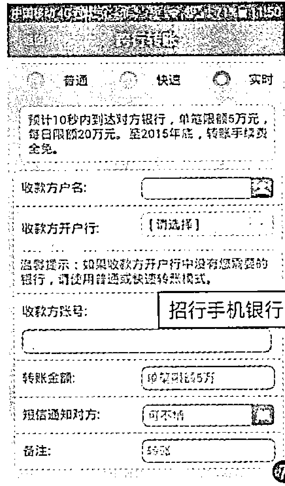

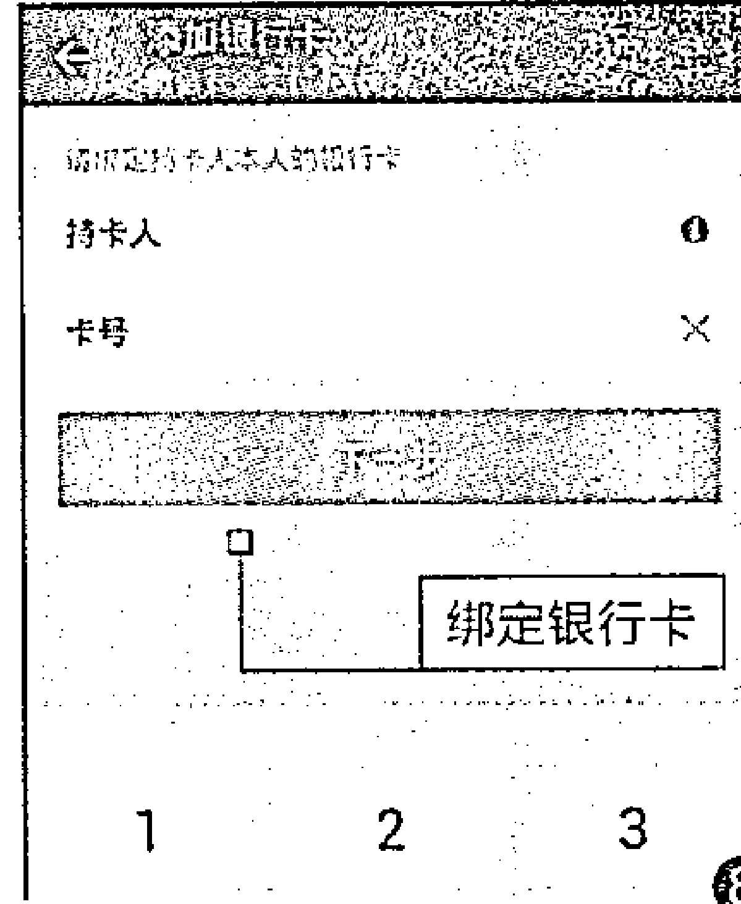

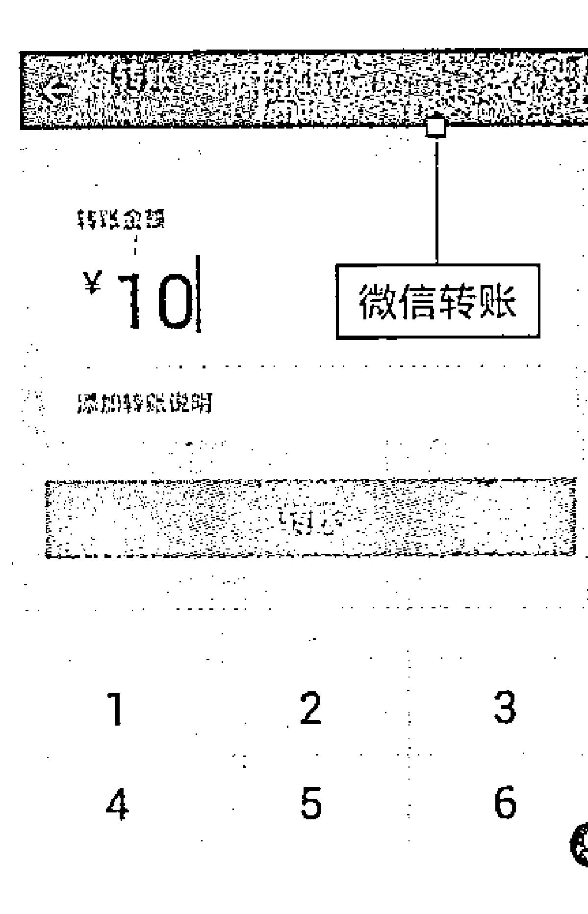

文 | 俞木发

##### 被忽视的小弟 常用软件的实用插件

各种大型专业软件，如Office、Photoshop、Acrobat都会开放自身的程序接口，鼓励第三方厂商(或自行)为软件开发各种插件以扩展软件功能。像第三方组件GuideGuide，就比Photoshop自身参考线功能更好用。另外像Office 2016最大亮点就是支持第三方APP，这样借助小小的插件，就能很好地满足日常工作的需要。下面就一起来看看有哪些小插件可以实现实用的功能需求。


###### 股票预警 QQ提醒插件

QQ是每个网虫必备的组件，不过QQ除了主要的聊天功能外还包含各种丰富的插件，这些插件可以让我们无需再安装其他软件就可以完成很多的操作。比如很多股民朋友在公司电脑上不方便开着行情软件看股票，可是股市跌宕起伏，自己买入或者追踪的股票价格瞬息万变，如果能实时收到股价变动提醒就好了。


###### 资源管理器轻松管理多媒体

资源管理器是最常用的一个组件，我们经常要在其中对各类多媒体文件进行管理。比如，当我们需要将照片发送给朋友共享的时候，经常要将BMP图片转换为PNG格式以加快传输速度，常规的方法是打开“画图”组件进行“另存为”来实现，操作效率不高。对于类似这样的多媒体文件操作，现在有许多资源管理器插件可以提高我们的效率。

对于图片类文件的管理，可以借助SageThumbs来实现，安装之后它会自动在资源管理器中添加右键菜单命令，以后打开保存图片的目录，然后选中（可以多选）需要转换的照片，再右击选择“SageThumbs→转换为PNG格式”，即可完成照片格式的批量转换了。此外，它还可以设置壁纸、预览缩略图、发送邮件等日常的操作（图4）。

对于视频类文件的管理则可以借助Media Preview（全能格式视频预览图插件）来完成。大家知道，资源管理器默认只能预览有限格式的视频（而且只能预览第一帧画面），这样我们在需要查看具体的视频文件时，只能去安装各种体积庞大的万能播放器。而现在借助Media Preview插件则可以直接在资源管理器中预览各种格式的视频。Media Preview安装完成以后会自动弹出设置窗口，按提示全选所有的文件格式并应用即可（图5）。

重启系统以后再打开资源管理器，这样打开保存视频文件的目录后，现在可以看到各种视频文件都会自动显示预览缩略图。我们无需打开视频文件，通过缩略图可以知道视频的大概内容，而且在下方详细信息里还可以知道诸如视频帧高度、宽度、视频编码、时长等相关的信息，方便吧（图6）。

除了QQ的插件外，腾讯其他产品也包含丰富插件。比如Windows 7用户默认无法直接查看PDF文件，那么可以将PDF文件作为附件发送到自己的QQ邮箱，这样在附件里选中需要查看的PDF文件点击“预览”，即可在线预览PDF文件了。使用同样的方法还可在线解压压缩文件。


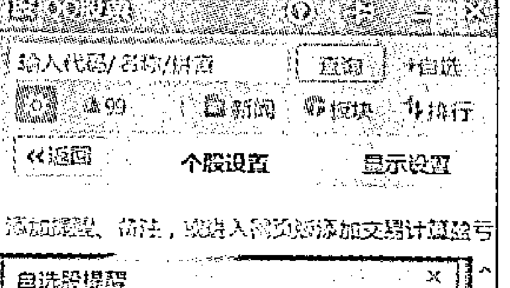

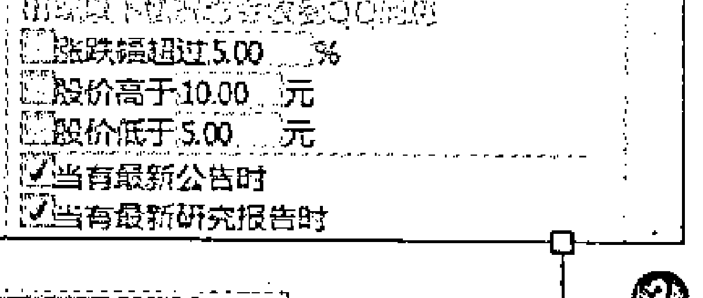

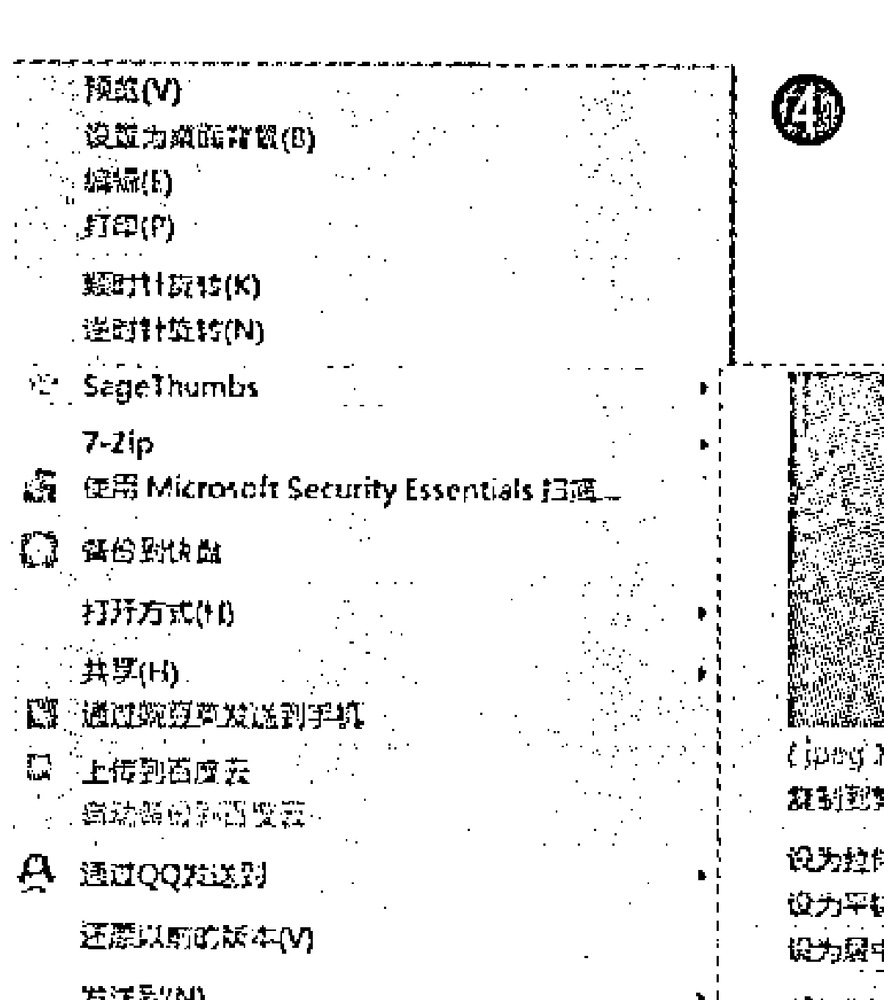

SageThumbs可快速实现照片格式的转换

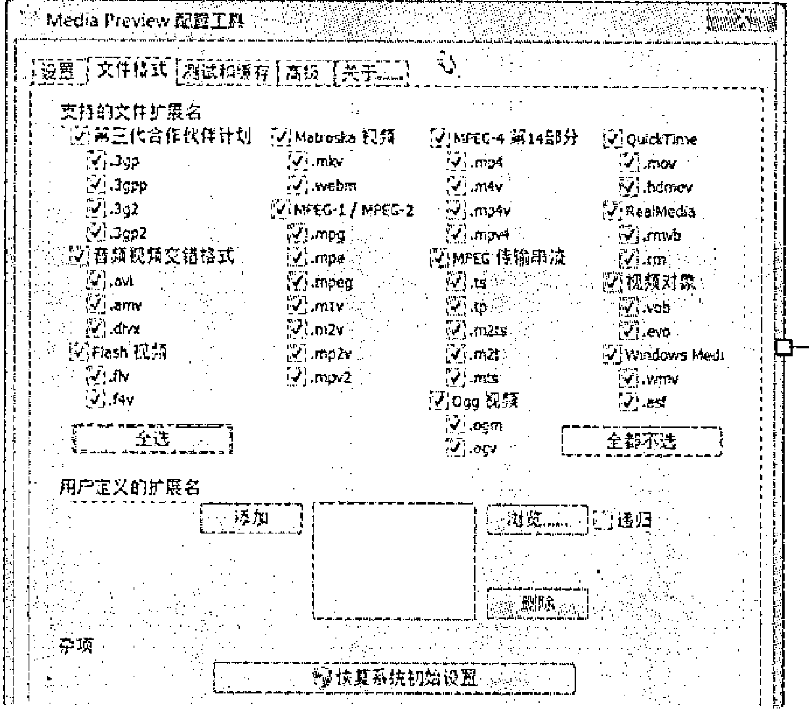

选择预览文件格式

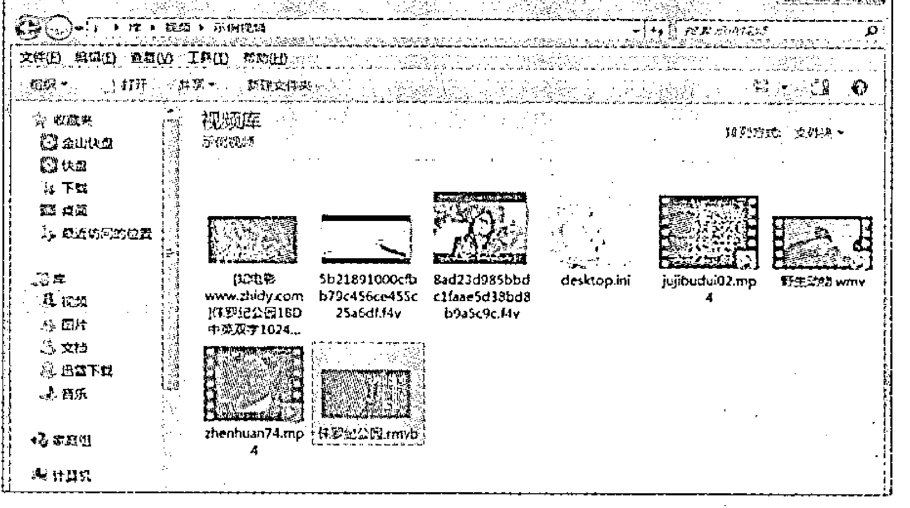

查看视频预览

###### 操作更高效 用好Office 2016插件

如上所述，Office 2016的最大亮点就是对第三方APP的支持，因此可通过安装各种针对Office 2016开发的插件来提高办公效率。Office 2016默认已自带应用商店，对于常用的插件只要进入商店下载安装即可使用。以Word 2016为例，启动Word 2016后新建一个空白文档，再点击菜单栏的“插入→Office程序→全部程序”，接着使用自己的Windows Live ID登录，在打开的页面中就可自行下载各种免费的插件使用了(图7)。

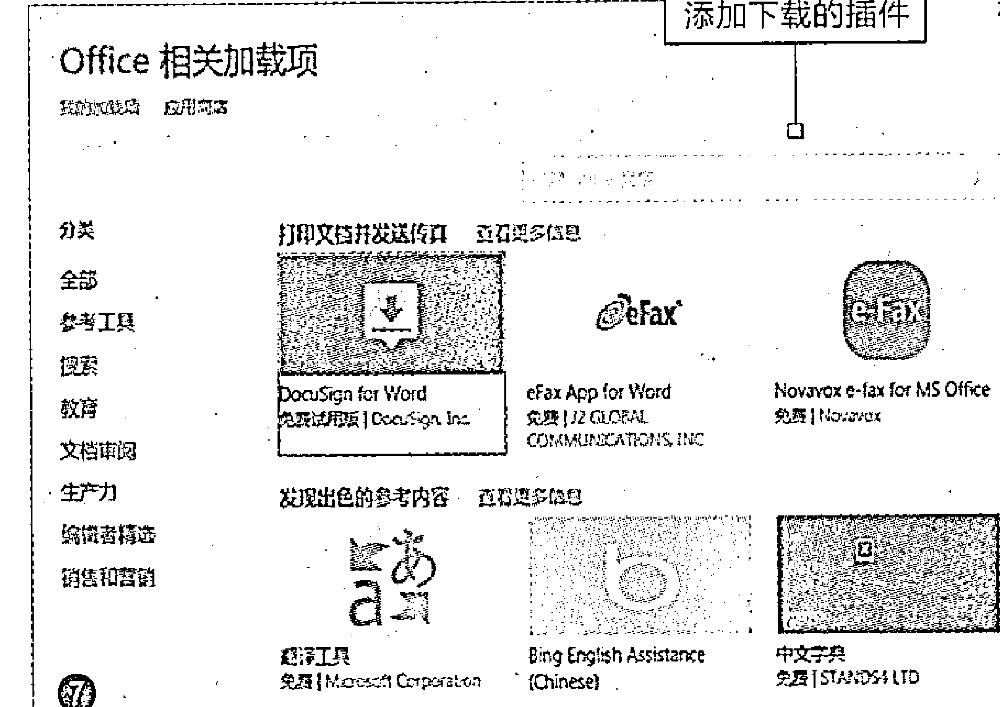

除此之外，大家也可自行到网上下载其他插件。比如Office 2016中的Onenote 2006组件，它默认无法使用宏，这给很多批量操作带来不便。如我们在网上复制一些资料到OneNote笔记中时，这些内容经常包含大量的超链接。现在如果要批量去除其中的超链接，那么利用Onetastic插件即可实现。完成Onetastic插件的安装后启动OneNote 2006，切换到OneNote 2006的“开始”菜单，可看到面板中已包含了Onetastic的诸多功能了，它的图标和OneNote自身的风格非常类似。现在点击Onetastic功能面板的“内容→清除链接”，这样即可快速清除文档中的所有超链接啦(图8)。

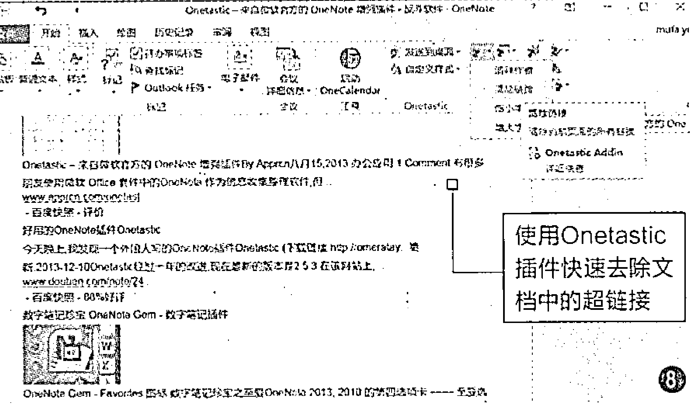

##### 术业有专攻 玩大功能的小软件

现在很多软件都在追求“大而全”，这样一款普通的软件体积就非常庞大，而在实际使用中这些看似功能全面的软件却无法满足我们的需要。下面我们反其道而行，看看有哪些体积小巧但功能强大的小软件。


###### 全能工具Capture.NET

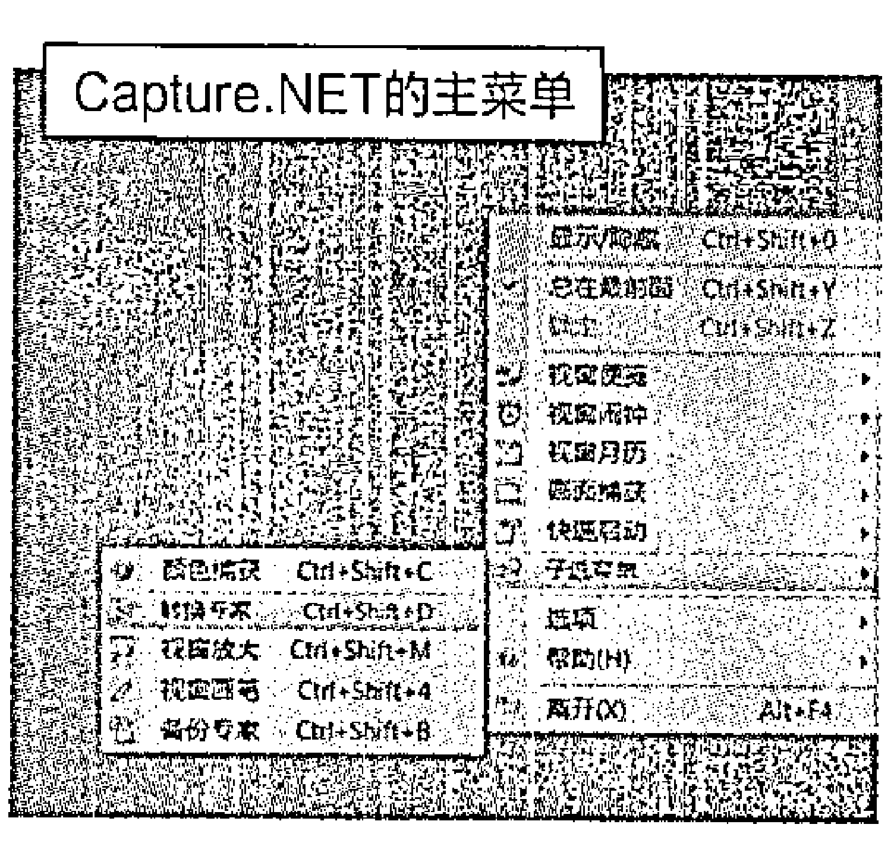

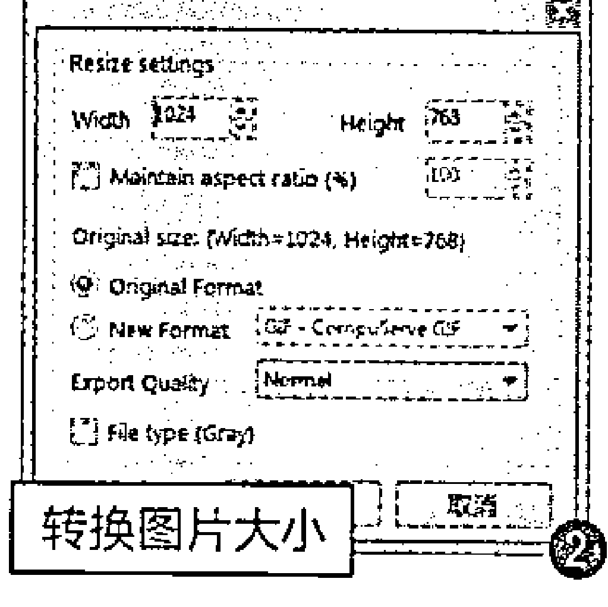

日常操作中，我们经常要用到各种各样的软件，比如在上传一些照片的时候，我们经常要对一些照片大小进行裁剪。对于类似裁剪这样简单的操作，我们不可能专门去安装一款大型的图像处理软件。Capture.NET则是一款具备多功能的工具合集，不仅体积小巧，而且集成大量常用小软件。上述的图片裁剪，启动Capture.NET后它会自动吸附在屏幕边缘，右击程序图标即可弹出各种工具菜单（图1）。

现在按提示选择“子选菜单→转换专家”，在打开的转换窗口右击需裁剪的照片，选择“转换→Imag Resize”，在弹出的窗口选择要转换的大小，点击“确认”即可完成转换（图2）。

除了对照片进行转换外，还可以对文档（如CHM转为HTML文件）、文本格式（如GB转为Unicode）、简繁转换等操作，只要在转换窗口左下角选择菜单即可。其他如截图、截取颜色、时间校对、桌面便签等工具的使用类似。

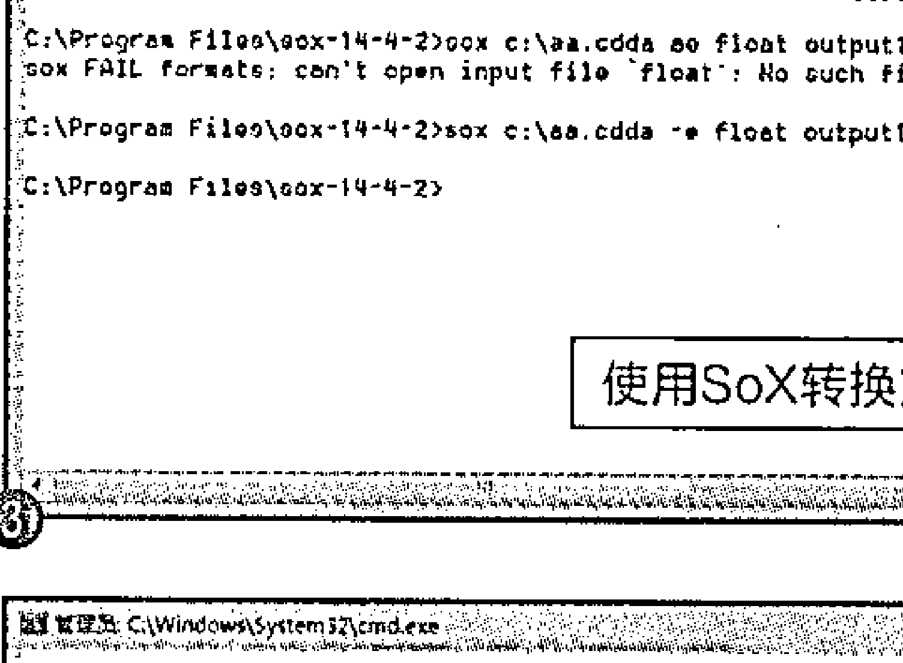

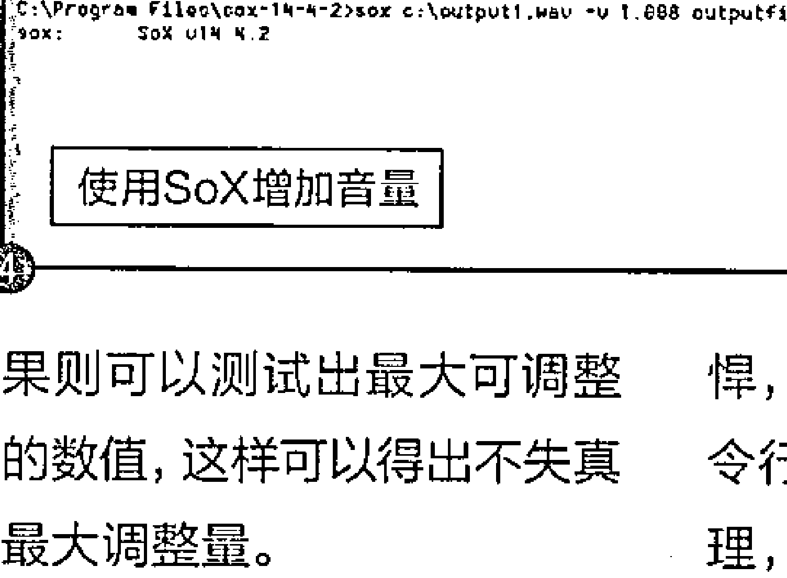

###### 音频界的瑞士军刀 SoX(Sound eXchange)

很多朋友平时都需要对音频文件进行编辑，比如将CD光盘文件转换为手机铃声等，常规的操作是安装体积庞大的“格式工厂”等专业转换软件进行转换。现在借助SoX就可轻松对音频文件进行常见的编辑，它不仅体积小巧（2MB左右），且是跨平台（支持Windows、Linux、MacOS X）命令行处理程序，可对音频进行各种剪辑、合并和增加特效等操作。

```
CD "C:\Program Files\sox-14-4-2"
Sox.exe c:\aa.cdda -e float output1.wav
```
这样CD文件就会自动转换为WAV文件保存在SoX安装目录下。作为手机铃声一般需要较大的音量，如果经过上述转换后的WAV文件需要增加音量，则继续输入下列的命令加大其音量（图4）：
```
sox c:\output1.wav -n stat -v
sox c:\output1.wav -v 1.008 outputfile.wav
```
命令解释：
命令1是使用“stat”为效果器,作用是对音频文件做一个统计分析。因为音量加大会导致音频失真。Stat效果则可以测试出最大可调整的数值，这样可以得出不失真最大调整量。
命令2使用“-v volume”数值，即幅度信息（一种线性调整，并不是调整到原先的绝对数值比，而是幅值调整）。如果数值大于1.0则增加音量，小于1.0则减小音量，负值则改变音频数据的相位。

从上可以看到SoX虽然体积小巧但是功能却十分强悍，当然SoX还可以使用命令行对音频进行更多高效处理，如果需要处理多个文件（或者对一个文件进行多种效果处理），那么按照“sox全局参数格式化参数输入文件1格式化参数输入文件2 …”制作批处理即可。由于命令行的操作比较不便,对于SOX其他操作命令可以打开http://tinyurl.com/cf060310页面进行参考。

###### 无关事物自动关联IFTTT

在日常操作中我们经常要因为A事件的发生而执行B操作，比如对于热恋的男女，如果女朋友所在城市的天气变冷后，可能你希望可以发送一封要其添加衣服的问候邮件到其QQ邮箱，以表示你的关切。这个看似简单的操作，但是实际操作起来却不是很便捷。因为这要我们首先关注对方城市的天气预报，然后发现天气变冷了再启动QQ邮箱发送邮件。这对工作、学习节奏都很快的现代人来说几乎是不可能完成的任务。不过现在借助IFTTT却可以自动实现，Android、iOS用户可以下载客户端使用，PC用户则直接使用其在线服务即可。这里以在线服务使用为例。首先打开https://ifttt.com/channels，然后使用女朋友的QQ邮箱(主要用来接收我们的问候)注册用户。成功登录后点击IF进入主界面，然后选择一个Channel(频道，即发送邮件的触发器)。因为这里主要是关注天气变化，所以这里选择Weather频道(图5)。按提示选择女朋友所在城市的天气预报。接下来设置激活条件，网站已内置很多模板供我们选择，比如选择“Rain tomorrow? Get an IF Notification”(假如明天下雨就获得通知)，这样只要女友所在区域下雨，我们就提醒其出门要带伞(图6)。继续在打开的窗口中就可以给这个激活条件设置指定的动作了。点击“Advance setting”(高级设置)，然后在“Notification”(提醒信息)下输入自己对女友的温馨提醒，如可输入“亲爱的，明天会下雨，出门要带伞哦”之类的温馨提示(图7)。点击“ADD”，最后在打开的窗口中点击“Done”，这样就完成了激活条件的设置。以后只要我们关注的天气预报中女友所在的城市会下雨，那么IFTTT就会将上述设置好的问候邮件发送到女友的QQ邮箱。因为QQ邮件可以在电脑桌面、手机任务栏、微信等自动出现，这样女友会在第一时间收到我们的温馨问候。同样的，我们可以在IFTTT中设置更多的问候，如可以设置温度降到了指定XX度时提醒要多穿衣服等。此外，在IFTTT的主页面方，有一个“Browse”功能，这就是IFTTT的强大之处，不仅仅可以自己创建想要的Recipes，还可以看看大家都在用什么Recipes，若果碰上称心如意的，也可以直接拿来使用。在搜索框中输入你需要的应用服务名称进行搜索即可直接使用。借助这些几乎是0KB的在线服务，我们就可以实现各种强大的自动操作了。


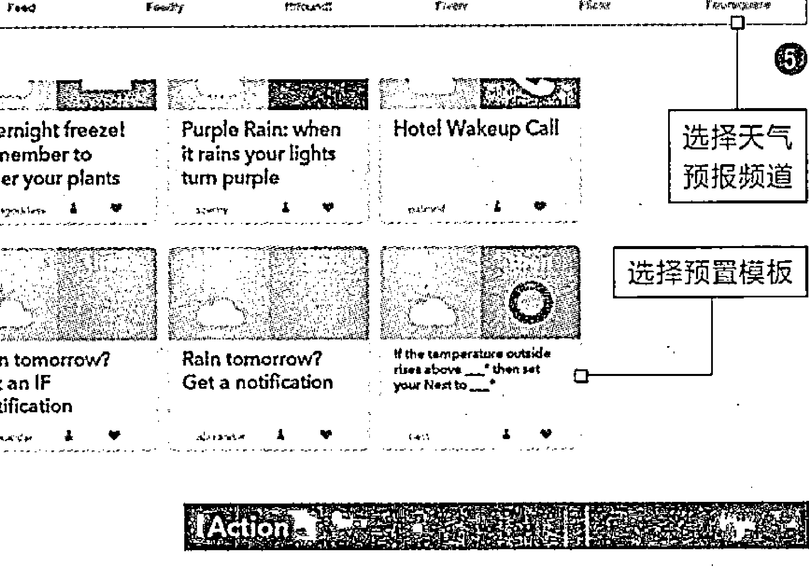

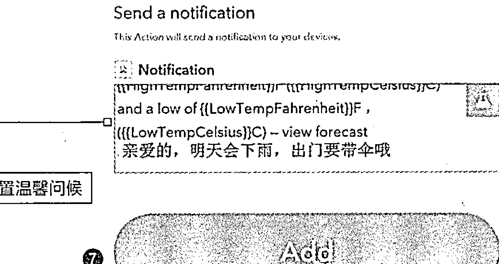

## ## 搜索小强 Everything

平时我们经常要执行各类搜索，但是系统自带的搜索功能并不强大，搜索效率不高。Everything(下载地址：http://www.voidtools.com/downloads/)则是搜索快枪手，不到600KB的身材却可实现秒搜。Everything启动后是一个类似文件资源管理器的窗口。如果要在某个文件夹中进行搜索，那么在文件列表窗口定位到搜索位置，接着只要在上方地址栏输入需要搜索的关键字，程序立刻就会显示出关联的搜索结果，非常方便我们用来进行对于文档、程序、文件夹的搜索(图8)。

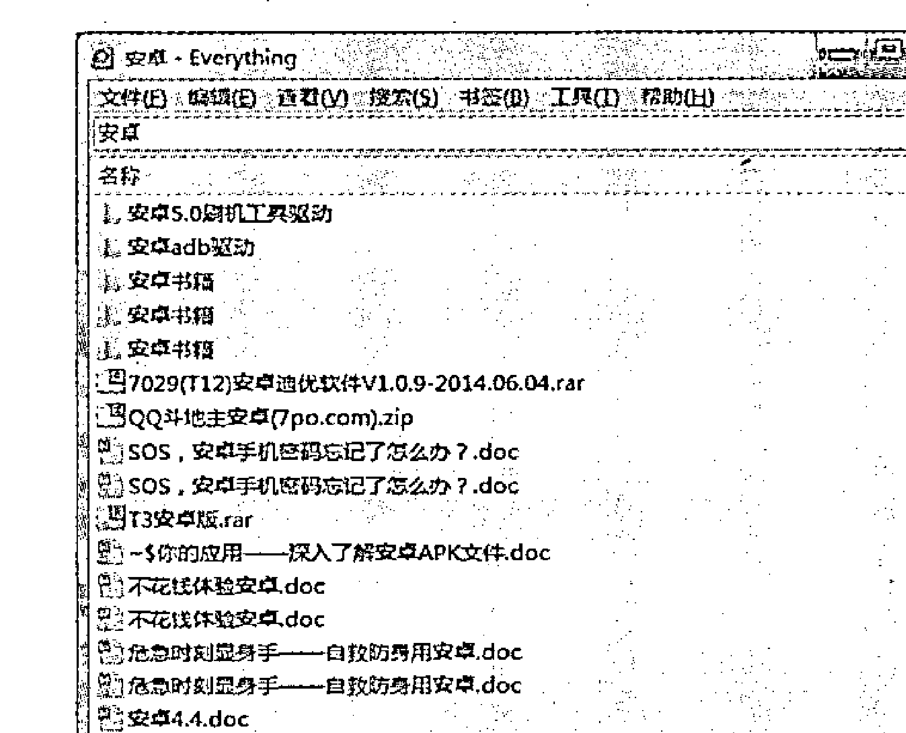

除此之外，用户还可以在Everything中对程序进行更多的设置。比如在搜索时不希望Everything搜索私人目录，那么只要点击“工具→选项”，在打开的窗口中切换到“索引→排除列表”，点击“添加文件夹”，然后将保存私密文档的文件夹添加到排除列表，这样下次使用Everything搜索时就不会读取排除列表的索引了（图9）。

除此之外，Everything同样支持常见的高级搜索命令，如正则表达式、筛选器等各种高效搜索语句。比如为了节省存储空间，我们经常需要搜索同名文件以删除多余的文件。现在只要在搜索框输入“dupe:关键字”，立刻就可以将本机所有同名文件（夹）全部搜索出来，对于不需要的重复文件可以直接在Everything窗口中执行复制、删除等常见的操作，其他搜索命令的使用类似（图10）。

###### 命令行上的Photoshop NConvert

说到图片处理，很多朋友可能马上想到的就是Photoshop（以下简称PS），不过PS虽然功能强大，但是体态也太为臃肿，对于常见的图片处理，其实可以借助NConvert完成。它的体积不到1MB，但是却支持各种添加效果（如水印、光晕）、转换（如调整大小）、调整（如亮度、对比度）和各种滤镜（如模糊、浮雕、锐化等），简直就是命令行上的Photoshop。

Nconvert安装很简单，下载后将其解压到任意文件夹下即可运行，为了方便运行，建议安装到分区根目录下，接着在命令提示符窗口进入安装目录就可以开始使用了。比如我们在自己的博客上发布照片时，为了避免被人随意盗用，经常要为照片添加水印。现在只要准备好作为水印的图片，然后执行下列的命令就可以将水印添加到指定的图片上（图11）：

```
NConvert.exe -wmpos 100 200 -wmflag center -wmopacity 30 -wmfile c:\a.jpg c:\b.jpg
```
命令解释：将图片a.jpg作为水印添加到b.jpg上，同时设置水印的透明度（-wmopacity参数指定）为30%，水印的大小是100×200（-wmpos参数指定），水印的位置（-wmflag参数指定）在图片的正中位置。

这样执行上述命令后再打开C:\b.jpg文件就可以看到添加的水印效果了，当然如果有多张图片需要添加水印，则可以借助批处理命令来实现（图12）。

Nconvert其他命令的使用，方法类似。对于熟悉命令行的朋友还可以借助For命令等自制复杂的批处理脚本，对于新手，因为命令行的操作比较晦涩，大家可以浏览http://tinyurl.com/cf060311参考。

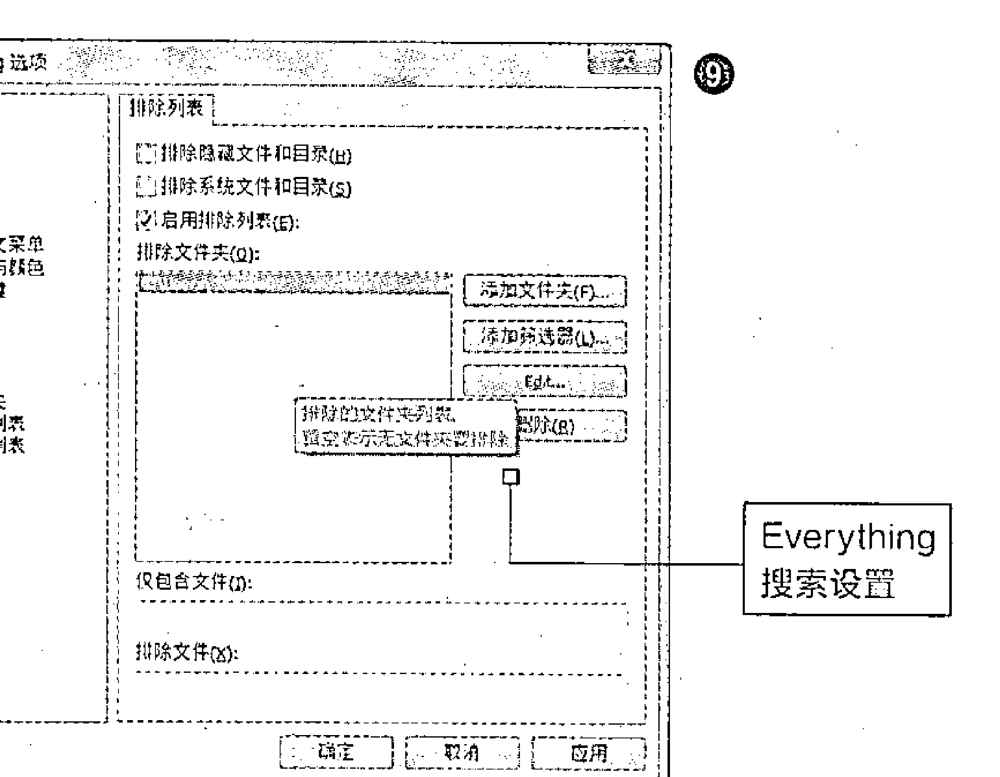

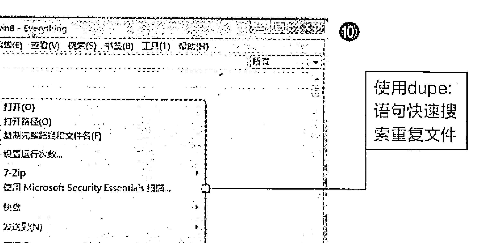

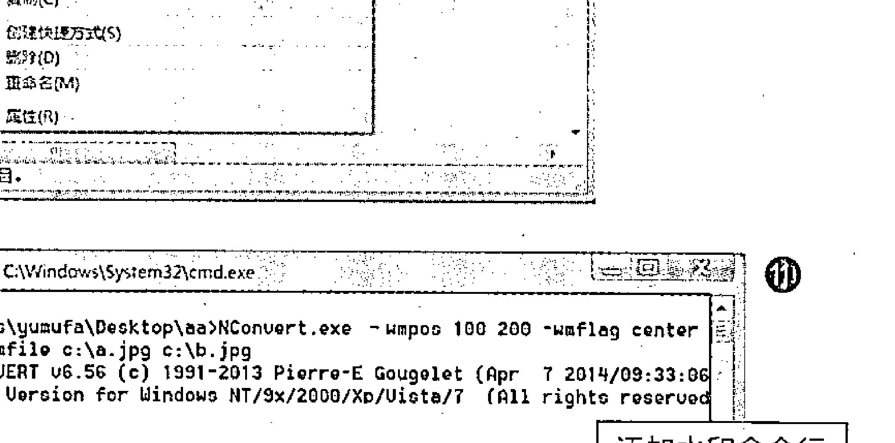


## ## DIY领域不可忽视的小力量

由于对性能无限的需求，原本PC在台式机DIY领域追求的是高大上，而近年来这种风向逐渐有了转变。不少小身材产品越来越受高端用户喜爱，传统全尺寸产品反而成了“大路货”。而很多产品的小设计小功能成为了最大卖点，有品质的用户已经将绝对性能放在第二位考虑。

###### DIY领域的以小胜大

近几年发烧DIY用户中出现了两种分支，一种只追求绝对性能，而另一种追求袖珍迷你。在DIY领域很多产品主攻小而精，而将这些产品搭配到一起就可以成为完美的PC小平台。


###### ITX主板

PC平台的核心就是主板，在主板领域目前最火的就是Mini-ITX主板，简称ITX。ITX主板虽然只有17cm×17cm的空间，但基本主板的功能以及一些出色主板所需的第三方芯片、接口和功能都有。而出色的ITX主板功能很全面，设计越出色的ITX主板与全尺寸大主板差距越小。

比如说针对目前的主流平台Z170，技嘉就推出了一款Z170N-Gaming 5主板，在这款ITX主板上你几乎可以找到对应ATX大板上的所有功能（图1）。比如说Z170芯片组的一个重要特性支持M.2硬盘，在寸土寸金的ITX主板上可能我们找不到地方来安置，但技嘉巧妙地将M.2接口设计到了主板背面，而传统SATA接口则使用尽可能节省空间的方式安置。 别看主板小巧，但依然拥有Gaming系列主板的许多特色。比如虽然PCI-E插槽被挤到主板最下方，但技嘉的加强型金属防护罩解决了稳固性不佳的问题（图2）。供电部分和PCH芯片散热片之间拥有金属热管来协同散热，而标志性的音频专用区域和杀手游戏网卡依然没有缺席。 无线网卡在主板水平面却是无处容身了，但技嘉将其设计为垂直插卡式的2T2R。

而更高端的玩家国度MAXIMUS VIII IMPACT则更完美，其中最出色的设计就是华硕独家的垂直插卡外置式的供电模块，将为了保证绝佳性能的多相供电系统纵置设计确实异想天开（图3）。

此外，由于空间不足无法实现的多风扇插座通过风扇扩展卡实现，高端主板所需的大尺寸音频系统和诸多音频专用电容也采用一块名为Supremefx impact III的独立声卡插在主板上（图4）。 由于主板的思路非常超前，背部I/O都与一般的PC主板顺序上有很大不同。除此之外还有对NVMe硬盘技术的支持，使用PCIe x4通道的U.2接口来连接NVMe硬盘也是非常少见的出色设计。

除了常用工具合集，网上还有许多体积小巧的绿色软件合集，这些软件不仅小巧，而且下载即可使用
★电脑硬件常用检测工具 免安装绿色版合集:
http://tinyurl.com/cf060307
★藤楼电脑维护检测工具集:
http://tinyurl.com/cf060308

###### ITX显卡和SFX电源

由于很多ITX平台内的空间寸土寸金，我们不仅需要17cm×17cm的主板，显卡的长度和厚度也不能超标。这其中最出色的是AMD的R9 Nano显卡，此前我们的特别话题中曾经多次介绍，HBM显存技术不仅能够大幅度增加显存带宽，由于显存GPU一体的独特封装设计还能够大幅度减少显卡的尺寸。

除了黑科技HBM显存，普通一些的显卡也可以通过出色的设计在小尺寸上实现高性能。比如说华硕的DCMII OC系列（图5）、技嘉的IXOC系列（图6）都是可通过出色的做工和多层散热器系统将传统显存的GTX 970/960这样的高性能显卡长度限制在17cm以内的。

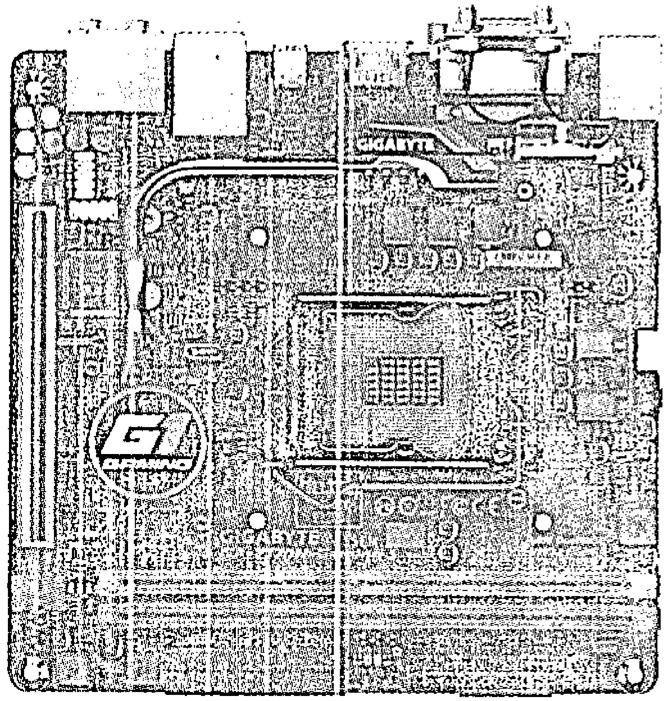

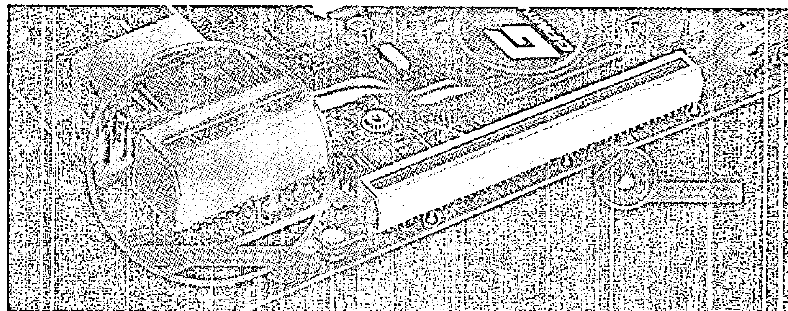


除了主板和显卡之外，机箱内部的大家伙就只剩下电源了。别看传统机箱安装电源并没有压力，但是到了小巧的ITX平台之中就几乎没有传统电源的容身之地了。不过目前有一种与ITX平台完美匹配的新电源类型已经普及了，那就是SFX电源。SFX电源基本只有传统ATX的一半身材，但是也能实现600W以上功率80PLUS白金以上品质，而最大的好处则是已经形成了完整的SFX规格（图7），并不存在很多小机箱附带的小电源每个身材都不一样的尴尬。


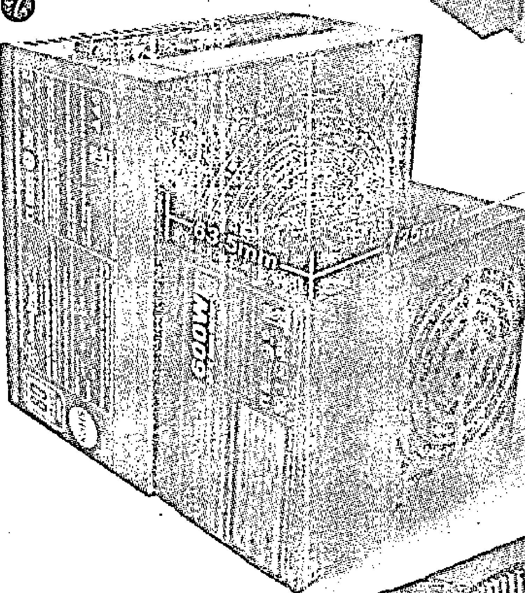

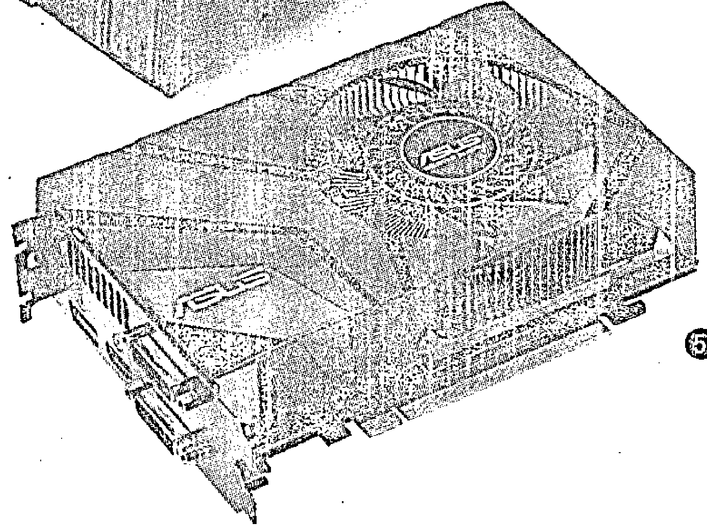

###### 为平台挑选散热器

为了不产生兼容性问题，一般在ITX平台上使用一体式水冷散热器比较省心。特别是像上面所说的华硕纵置式外接扩展卡比较多的ITX主板，由于周边空间已经很小了，购买水冷系统或者一体式水冷散热器将硕大的散热冷排挪开主板区域比较稳妥（图8）。

但偏偏是有很多用户不喜欢一体式水冷，此时选择风冷散热器就比较有学问了。对于一些低功耗的平台其实Intel和AMD原装散热器就可以胜任（图9），如果是高性能平台就需要结合机箱CPU散热器限高和主板综合考量了。比如在一些机箱散热器限高很严格的平台上，可以考虑热管式下压散热器。尽管在出风方面对比塔式有一定差距，但是做工优秀的产品还是能够很快导热并通过机箱风道排出。

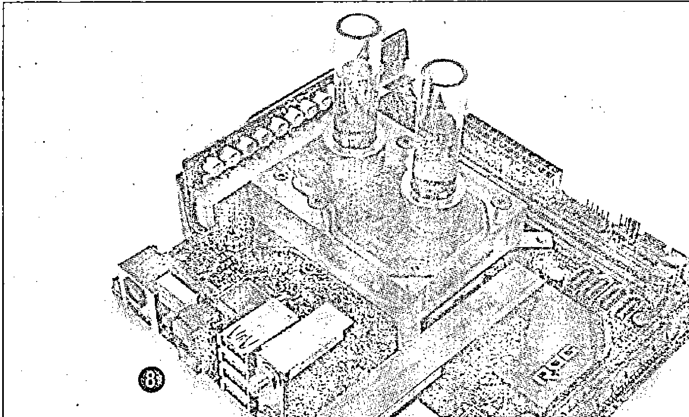

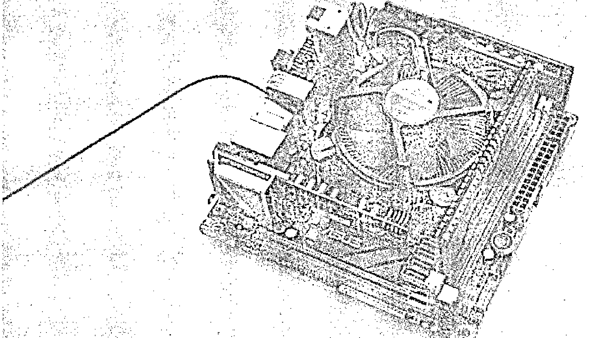

如果机箱CPU散热限高还好，可以在充分阅读产品尺寸说明后购买塔式散热器。其实如果两边机箱拥有风道风扇的话也可以考虑大尺寸散热器但不配风扇的组合，纯粹通过Fanless外加机箱风扇导热。

###### 小设计实现大功能

IT产品同质化十分严重，但其实真正决定一款产品是否出色的其实是那些与众不同的细节。在这里我们挖掘一些易被忽视的设计细节，究竟何种设计才能被称为贴近用户需求，符合用户使用规范呢？另外许多即将推出的新技术也能将设备在小巧精致的基础上做到更强更实用，让我们来一起看看。


###### 鼠标侧键位置

鼠标是否好用其实是一个因人而异的事情，不过还是能在出色产品当中寻找一些共性，找出适合大多数人的设计。一般对鼠标侧键有独特需求的都是游戏用户，而游戏鼠标拥有什么样的侧键功能才算好用呢？

先来说说侧键分布类型。主流的游戏鼠标侧键按分布看可以分为三类，其一是传统的双侧键，之后是四键到六键侧键，最后是多达十二侧键的游戏鼠标。双侧键鼠标普遍都可以做到彼此清晰分开，我们来看一看多侧键鼠标。先看以罗技G700为例的四侧键鼠标，罗技为了让用户清晰分开不同按键，特意在这四个侧键上使用了曲面弧形的设计（图1），通过感受按键边缘用户就能清晰分辨是哪一个。但是这款鼠标比较偏大，但侧键又相对靠后，这就造成了大手用户难以操控靠后两个侧键而小手用户又觉得鼠标过大的尴尬。

罗技G602是近期一款异常热门的无线游戏鼠标，虽然定位没有G700系列高端，但其实侧键设计要比G700来得实用些（图2）。首先侧键也拥有曲面弧形设计，但数量比G700多了两个达到六个，这样大手用户就可轻松操控前四个侧键而小手用户则是后四个，而将不常用的游戏技能放置在不易操作的按键上。

雷蛇也有主攻游戏鼠标的，对于多侧键鼠标它们完全是另外一种设计思路。比如被称为六芒星的那伽梵蛇Naga Hex侧键分布是规则的六边形，雷蛇希望用户将拇指放置在中心区域。但其实实际操作起来用户依然是只能准确操控其中的三到四个，另外按键非常灵敏，轻触就会触发，而鼠标较小，大手用户拇指握感并不舒服。关于中心区域，尽管雷蛇在出厂时给了高低不同三个垫片，但是依然会出现拇指误触的尴尬（图3）。

###### 侧键多功能性

毫无疑问侧键是需要绑定到游戏中具体技能的，但实际上这并不简单，这是否使用取决于定义是否灵活实用。罗技的多侧键鼠标第一、二个是传统的前进后退功能，这是一个独立存在的按键，可直接绑定技能。而之后的侧键往往需要用户自己定义才起作用（图5），比如说我们在玩《魔兽世界》时除了左手可轻松操作的12345五个快捷键外，可以把第三四五六七个侧键定义为键盘上的6789，也就是说按鼠标侧键就等于我们按下了键盘。

而雷蛇的游戏鼠标定义方式十分奇特，比如雷蛇Naga Hex鼠标六个侧键默认是键盘的123456并且不能更改，看到这里可能用户会认为这很不实用。但其实通过鼠标背面的模式切换可以将其更改为小键盘上的123456使用（图6），虽然没有罗技的灵活，但是一旦切换就是强制的，也许分配起来不用太费脑。

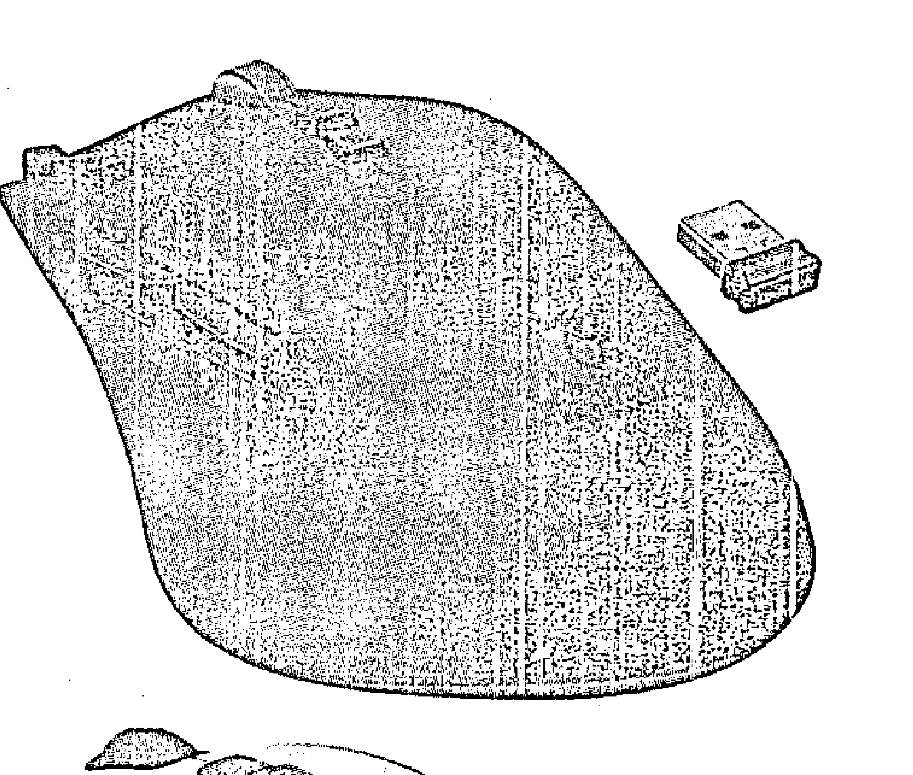

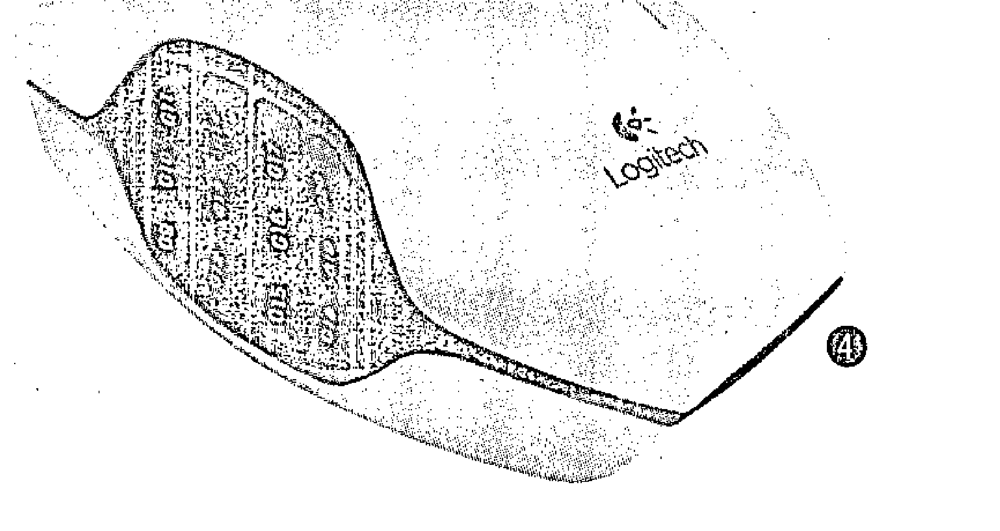

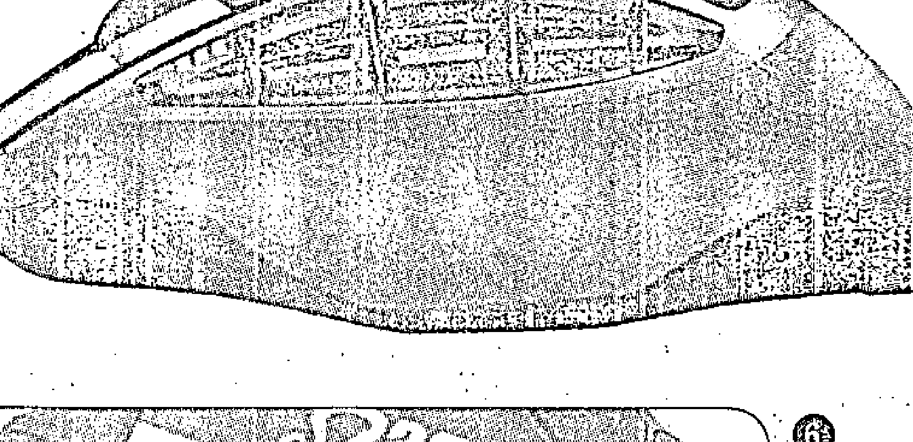

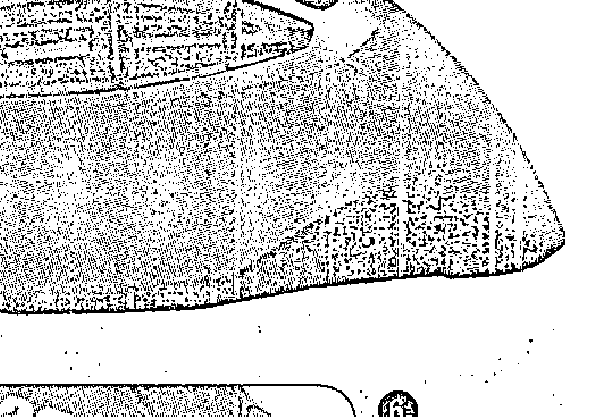

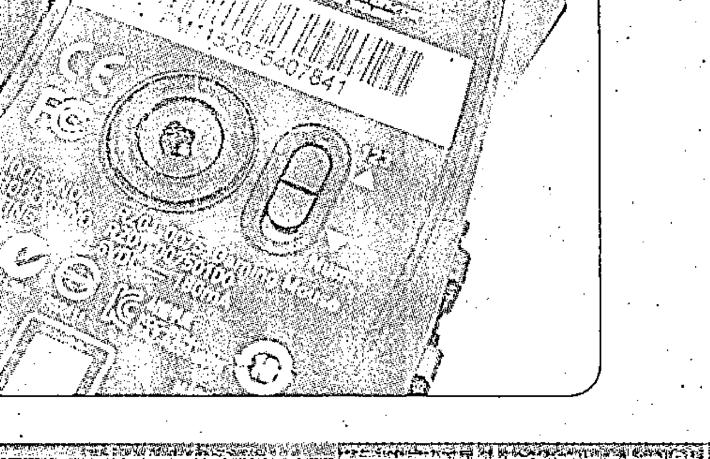


###### 注意机箱细节

现代机箱的易用性已不仅仅局限于免工具安装，很多独到的小设计都很吸引人。比如整个机箱顶部面板和前面板均可拆卸，这样在安装CPU电源线缆或一些大尺寸散热器时就非常简便（图7）。在电源倒置的机箱中使用单独的电源活动挡板配合导轨最后安装，这样就可配合全模组电源实现任意时候的更换，而且在装机时就不必为四散的电源线缆烦扰。传统机箱中最占空间的硬盘位被分散设计，如下置电源前部或改为2.5英寸硬盘位设计到显卡底部或干脆是主板背板后面（图8）。好些的机箱还拥有统一风扇调速器及风扇灯光开关，这样使用背部走线的玩家可实现最大程度的整洁和可操控性（图9）。很多入门用户十分不理解发烧友花费数百元甚至上千元购买高端机箱的做法，但其实如果你留意也会发现机箱内部的精妙之处。抛开高端机箱优秀的用料不谈，一个设计出色并且易用的机箱能够在DIY方面省去你很多麻烦。其实对于入门用户，建议不要盲目购买太过昂贵的机箱，可总结之前机箱中的问题找出自身的需求，之后在了解目标产品特性的基础上逐渐提升机箱的品质。

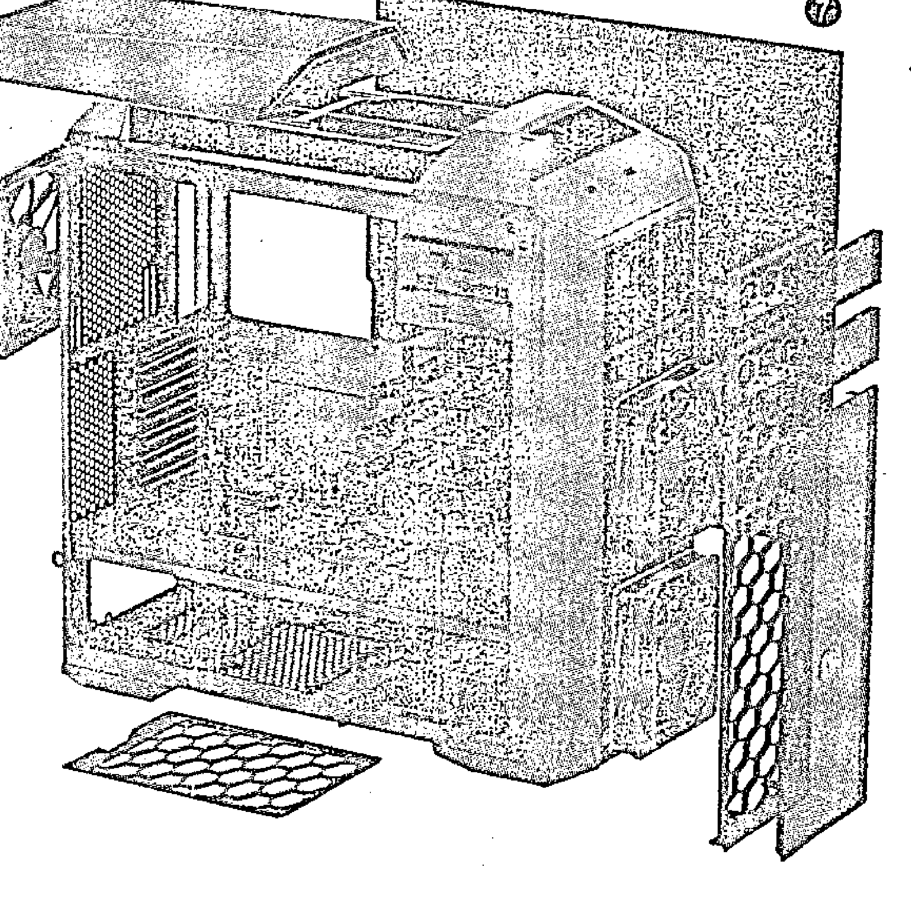

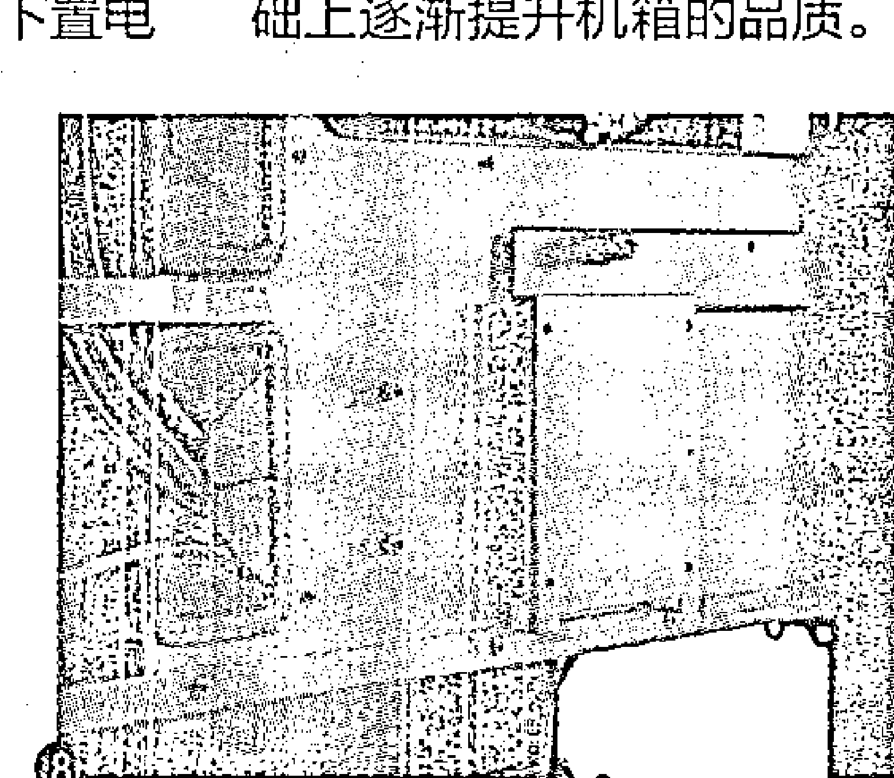

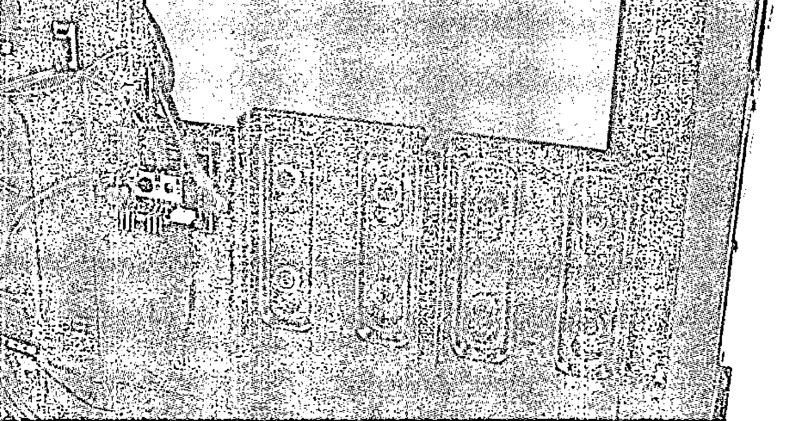

###### 显示器的设计细节


显示器常被想到的是大小、画质等，但其实一般家用价位的显示器在色域、色彩表现和精准度方面并没有太大差异，就算精挑细选水平也差不多，追求画质至少要到4000元左右的价位。但是购买显示器还是有重点的，那就是接口、底座和按键区域。

####### 接口

显示器接口无需多言，自然是拥有HDMI和DP的接口最好。但目前正好赶上接口带宽的更新换代，我们在选购的时候还需要注意接口规范的细节。比如全新的HDMI 2.0接口支持更高带宽，还支持高分辨率下的60Hz刷新率，目前高端一些的显卡接口都是HDMI 2.0了，但显示器还需要精挑细选才行。DP接口最新的是DP 1.3版本，不过目前从显示器到显卡都未普及则不必强求。

####### 底座

显示器的底座绝对是重点。液晶显示器在刚开始流行时，主流的产品基本都采用了可以升降的底座，而自从三星、LG等显示器开始走钢琴漆外观天鹅颈底座这些“颜值”销售以后，入门级别的显示器都将升降底座改为了固定式。别看厂家宣传当中的固定式底座那么美好，但其实这是一种削减成本的办法，而且在我们实际使用时还很不方便。首先显示器越做越大，不同的用户面临着不同的使用环境，厂家官方提供的底座高度不适合所有人。而如果有调高需求时需要垫东西，而调低则需要拆底座自行更换，十分不便。

可升降旋转的显示器基本都不靠外观吃饭，多数搭配了标准VESA 10cm×10cm壁挂规格的可拆卸底座。不仅可以自由调节高低俯仰角度，甚至还支持旋转（图1）。在2016年第2期特别话题中我们提到的显示器纵置上下分屏就需要拥有旋转功能的显示器底座提供支持。而且就算用户有更高的需求，也可以通过标准VESA 10cm×10cm壁挂口结合其他底座实现（图2）。

####### OSD按键

显示器OSD按键区域也是重点。虽然OSD按键只有在显示器刚购买调节颜色亮度时才常使用，但不友好的OSD按键设计操作很吃力。且目前使用单一显示器作为多个设备视频输出的情况越来越多，是否拥有方便的信号源切换、使用场景切换也很关键。目前最佳的实体OSD按键体验是显示器正面的触摸式（图3），而相对最差的则是显示器背部或者底部的实体按键方式。虽然使用体验因人而异，但更好的OSD按键总是提倡可见操作。比如DELL许多显示器虽然OSD按键位置并不太好，但是在显示器按键附近设计了在屏幕上可见的操控提示（图4）。也有部分产品没有使用按键而是一个四方向操作杆，也算是OSD按键不得不设计在显示器背面之后一个切实可行的补足办法。

诸如飞利浦SmartControl这类软件给出了新的思路。既然通过实体按键操作显示器总是有些不便，不如通过软件在Windows系统中直接对显示器进行控制。显示器几乎所有的功能都可通过这类软件进行调节更改，包括信号源切换、颜色调整甚至是多屏幕分屏等高级功能都能实现（图5、图6）。有了它几乎可以不再去使用位置不好的物理按键了，这也是显示器越做越大、越来越宽后的控制思路。

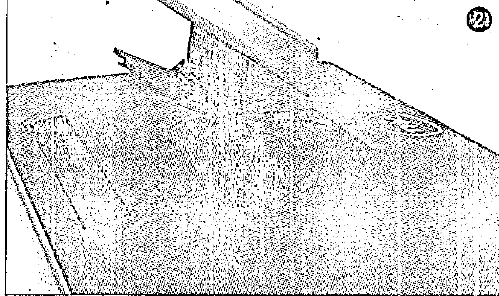


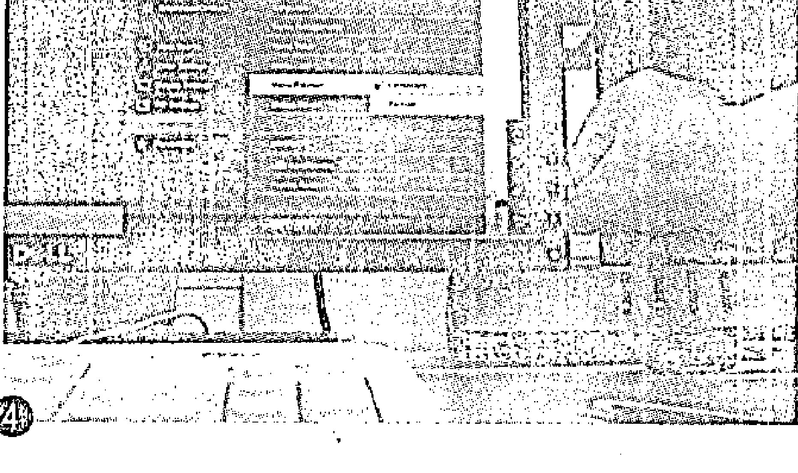

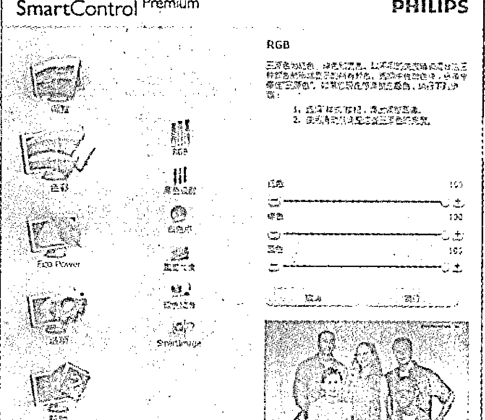

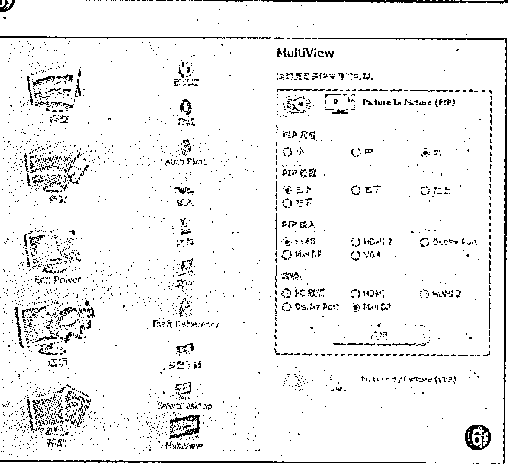

##### 电子设备中那些 你应该知道的“后台”操作


> 有人做面子，自然就要有人做里子。面子是给外人看的，里子干净不干净只有自己知道。我们所看到和接触到的许多事物，展现出来的往往只是它们想让我们看到的。而隐藏在华丽或朴实外表之下的，也许是成功背后的汗水，也许是不为人知的抄袭与借鉴，也许是让我们提前知晓窃取隐私的源头。面子并不重要，里子的好坏才决定了它能或者会做出什么事情。

在全民互联网+时代，不仅应用软件不停地请求联网权限，硬件设备在运行的时候也会进行网络活动。你以为它/它们在“沉默”中只是更新自己、优化程序，更好地服务于你，但是往往“鸡鸣狗盗”之事就发生在我们的想当然中。

##### 写在隐私被泄露前


###### 理性看待APP“福利”

智能手机和移动支付的普及极大地方便了我们的生活，足不出户即可通过APP进行水电煤气的生活缴费，或者利用各种返现APP实现“躺着赚钱”的梦想。不过在享受APP的“福利”之余，我们是不是也应该留意一下背后的潜在风险呢？

####### 天上为何掉“馅饼”

不知不觉间，我们的手机已经成为了“变相赚钱”的工具：以滴滴打车为代表的约车APP犹如打了鸡血一般疯狂发送红包和补贴；以招财狗为代表的财富类APP能通过注册和邀请等机制获取收入（图1）；艺龙等旅行APP可为用户的住宿进行返现；各种外卖APP还能帮用户的下单进行补贴……而这上述种种已然成为了互联网时代的营销常态：互联网企业通过各种“补贴”和“返现”的营销手段来扩大产品知名度和影响力。

这种营销方式表面看是用户占便宜，但实际却是一种双赢的局面：企业可凭借APP的装机量和活跃用户数量增加运营收入（比如广告推送），而用户则以自愿的形式帮助这个APP做宣传（比如分享给更多好友）来赚取收益（图2）。


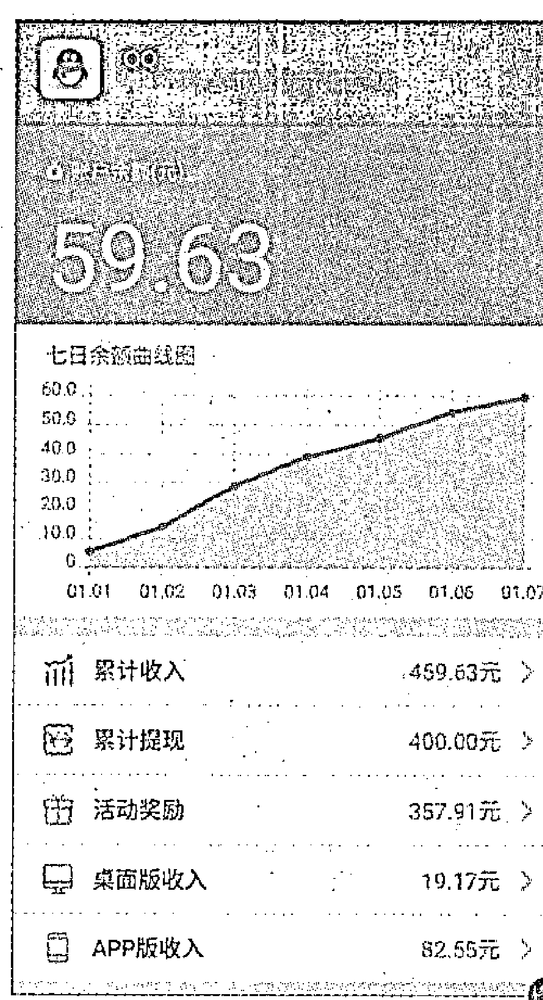

####### “绑定”带来的安全隐患

用户想获得APP宣传中的收益，往往还需一个前提条件：注册用户信息，并绑定银行卡或支付宝账号（或是在获取收益时需填写银行卡或支付宝账号信息）（图3）。那么，这些APP为何会对你的银行卡或支付宝账号信息如此“情有独钟”？

这就需要从两个角度去解读了。以微信为例，如果你想加入超过100人的微信群就必须绑定银行卡才能通过验证，原因就是微信需要推广自己的钱包功能，并迎合网络实名制的要求进行自我审查。而互联网金融一类的APP，绑定银行卡的目的就是为了获取你的姓名+身份证号+银行卡号+手机号这四个要素（确定你是一个真实有效的优质用户），从而顺利地实现返现、补贴、借贷等资金的周转。

一般来说，企业开发的APP与银行/银联或支付公司（如支付宝、微信钱包）都有安全可靠的对接技术。但绑定银行卡或支付宝账号的风险往往出现在APP的获取环节和手机自身的系统环境安全上：

APP的获取环节：轻信街头传单小广告上的二维码（常有新闻说某人扫描了一个二维码结果银行卡里的钱就不见了）（图4），或者在网上下载了经过恶意篡改的APP。这类APP自身就带有后门，从而盗取你的银行卡信息而威胁到资金安全；

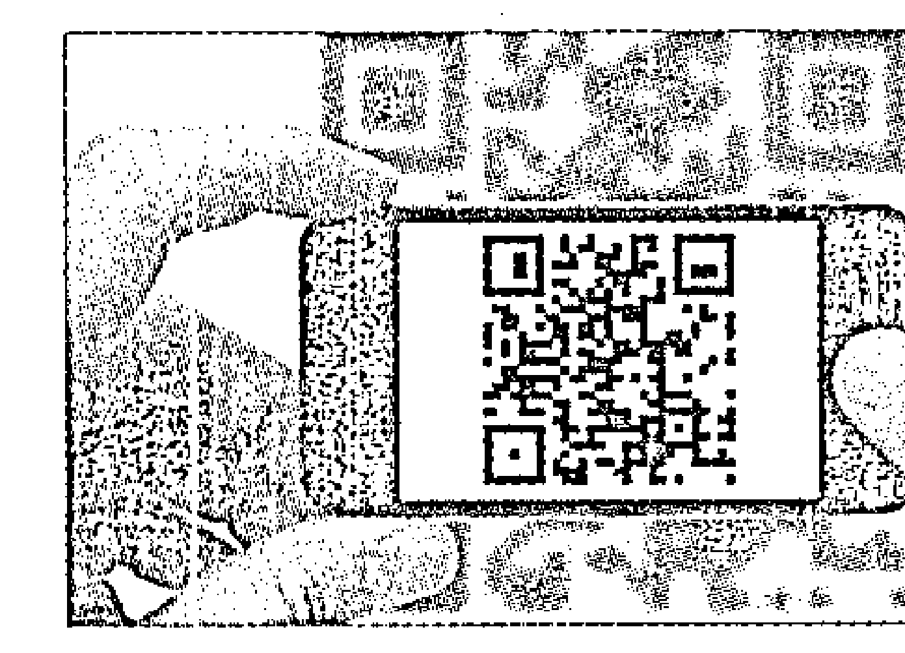

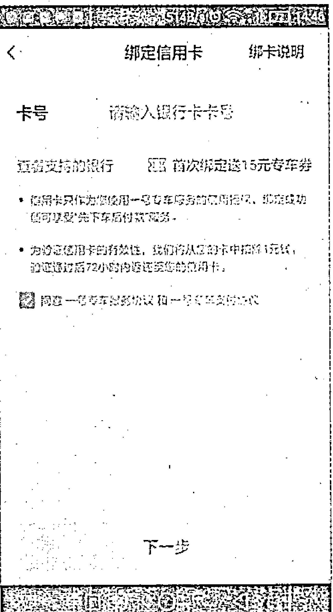

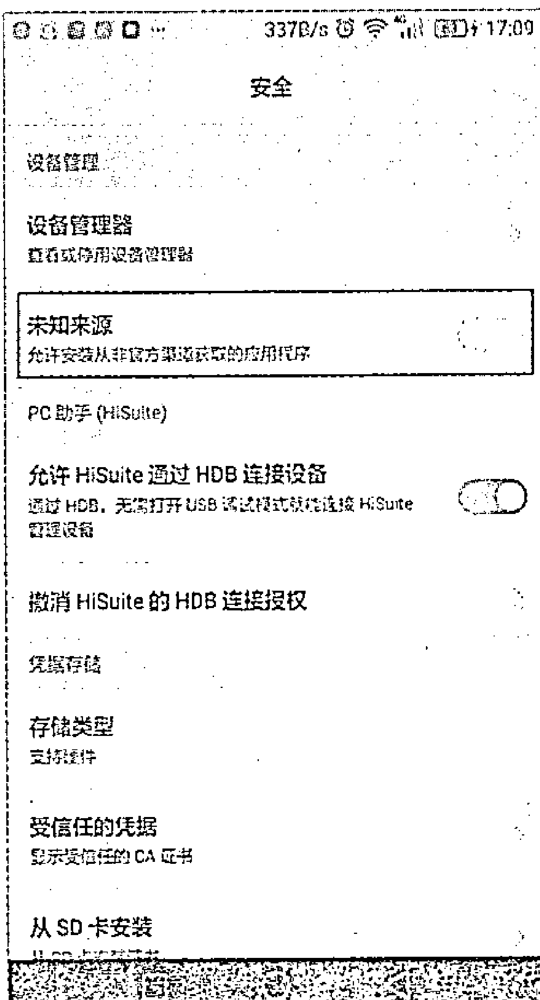

手机系统环境安全：手机系统已中病毒，而该病毒能自动收发短信（拿到快捷支付的验证码）、会截屏分析账户和密码（通过键盘输入触发截屏），病毒制造者就能使用第三方支付盗取你绑定银行卡内的资金。

####### 如何杜绝安全隐患

移动支付是社会发展的表现和趋势，我们不能因为它存在一定的安全隐患就加以否决或是抵触。只要你能做到以下几点，就可最大限度杜绝安全隐患：

- 1. 不要做第一个吃螃蟹的人，只选择口碑较好的大公司开发的APP；
- 2. 在不能确认100%安全的情况下，不要扫描街头广告上的二维码；
- 3. Android手机请进入“设置->安全”，不要勾选“未知来源”（图5），不要从非官方渠道安装APP；
- 4. 只在手机自带的应用商店下载APP，尽可能不要使用浏览器的搜索下载；
- 5. 在支付宝“设置->支付设置”中关闭“小额免密支付”功能。

总之，可“变相赚钱”是APP未来推广营销的手段之一，抓住机会的确能让我们小赚一笔。堵不如疏，了解隐患并以更谨慎的态度接受它们才是正理。

####### 弃用之后莫忘“解绑”

“喜新厌旧”是绝大多数人的潜在心理，当某款APP促销返现的力度更大时，我们会习惯性地忘记或卸载已安装的另一款同类APP。Uber中国数据库被黑的事件，让我们认识到将银行卡、支付宝账号信息保存在企业服务器端是很不靠谱的。当你决定弃用某款APP时，一定不要忘记解除它与银行卡或者支付宝账号之间的绑定关系，尽可能掐断隐私泄露之源。

要注意的是，不同APP解绑银行卡的操作和难度各异。如京东金融是最简单解绑银行卡的APP代表：依次进入“我->银行卡”，在我的银行卡界面点击绑定的银行卡就会弹出删除或修改的菜单（图6），点击删除就等于解绑。

Android版借贷宝的解绑难度次之，在“我->钱包”界面点击绑定的银行卡，在银行卡详情界面点击右上角的更多图标就能弹出“解除关联”的选项，按提示输入姓名、身份证号和验证码后才能解绑。iOS版的借贷宝解绑貌似最难，它不支持客户端解绑操作，需要拨打客服电话才能顺利解绑（图7）。

支付宝解绑也存在多种思路。比如，像交学费、快的打车等等能绑定支付宝账号的APP，可以在手机支付宝APP客户端的“设置->安全设置->安全中心->账户授权管理”界面看到绑定支付宝的APP列表（图8），在这里就可删除它们之间的绑定关系。

像美团这种无需绑定支付宝，只要用支付宝支付一次就成为默认支付方式的APP则有两种解绑方案（比如你的支付宝账号借用在朋友手机的美团上消费一次，朋友手机就会记住这个支付宝账号）：第一是支付时填写新的支付宝账号信息；第二是进入手机支付宝APP客户端的“设置->安全设置->安全中心->设备管理”界面删除需要解绑的手机型号（图9），经过一定的网络延时后，你朋友的手机上就不再会有你的支付宝账户信息了。

Uber算是一类很特殊的APP，它在与支付宝、百度钱包、信用卡绑定后无法解绑，只能通过发送邮件给Uber的形式注销/删除账户，效率极其低下。如果你将支付宝与Uber一类APP绑定，可以拨打支付宝客服热线95188，人工申请暂停Uber代扣（图10）。

[content]

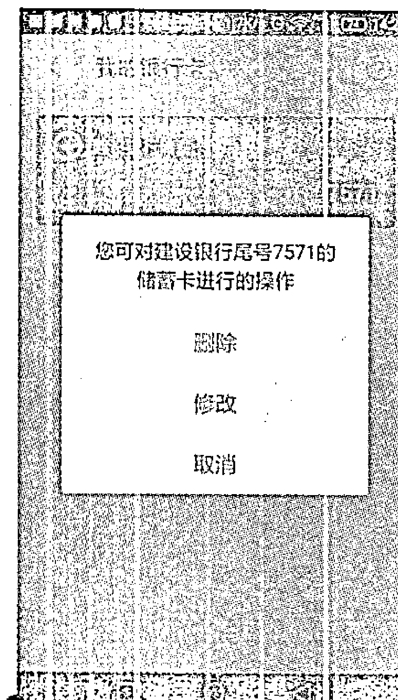

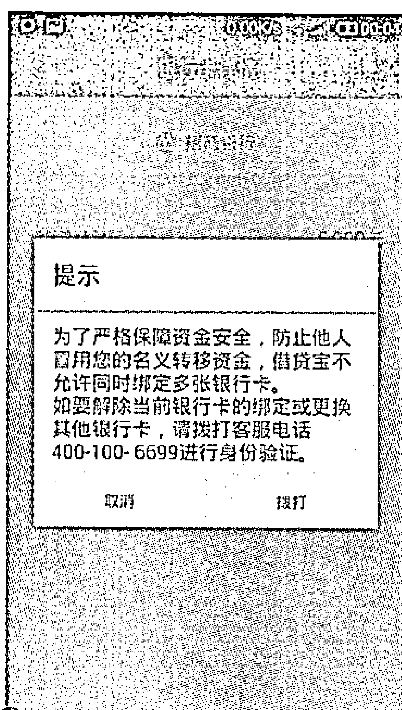

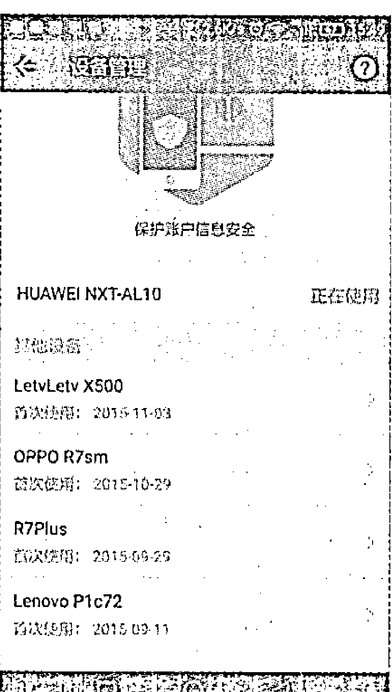


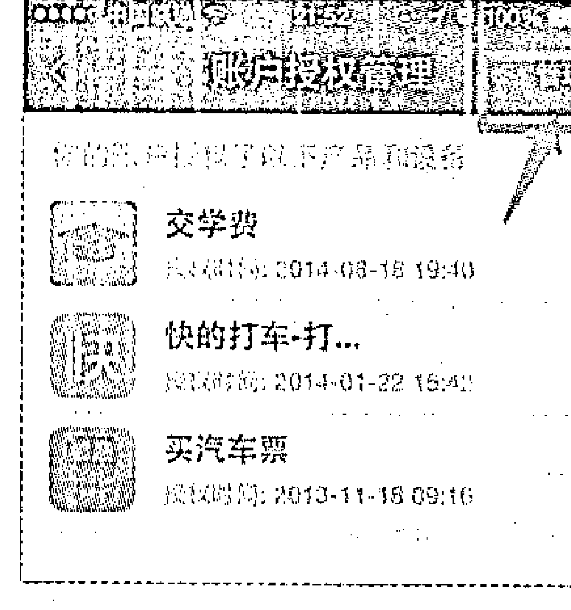

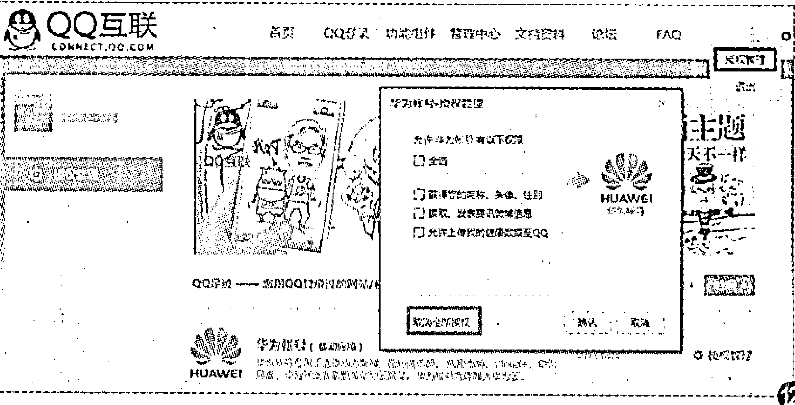

##### 还有哪些需要解绑

除了与资金有关的银行卡和支付宝等账号信息，我们的QQ、微信账号同样是易被盗取的资料。为了简化用户注册的流程，很多网站或APP都支持使用QQ或微信账号登录，而这也就产生了一定隐私泄露的可能性。当你不再喜欢某个网站或APP了，自然也需要解除它们与QQ或微信之间的授权（绑定）关系。


以微信游戏为例，当你厌倦了某款游戏之后，可进入「发现→游戏→游戏管理（点击右上角菜单）」中，看到被微信账号授权的所有游戏列表（图11），点击就能看到「取消关联游戏」的按钮了。

如果想取消QQ授权的网站或APP登录，要从PC端下手。在PC上登录QQ互联（http://connect.qq.com），在授权管理界面就可看到所用使用QQ账号登录过的网站和APP列表，点击它们就能选择「取消全部授权」了（图12）。

此外，随着运动健康类APP的兴起，很多人都喜欢用它们的计步器功能，统计每天消耗了多少卡路里。但是，这类APP也容易泄露很多你的关键信息。比如，很多健康类APP可以检测并记录你一天来所有的运动轨迹（图13），但并非所有安装该APP的用户都有此类需求，通过分析你每天的运动轨迹，很容易得出你的住址、公司、最常去的饭店乃至很多隐私行为。因此，如果你没有对运动轨迹的特别需求，请关闭APP中的相关功能，或者通过系统授权管理功能禁止APP的定位服务。

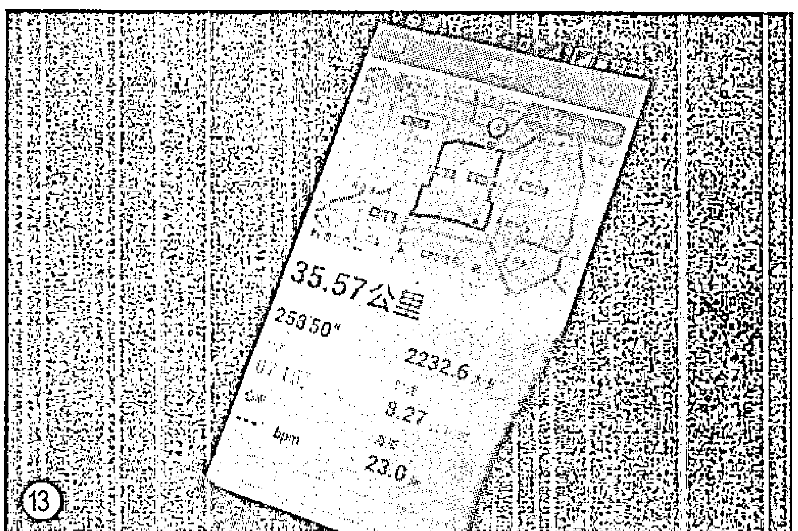


##### 控制软件的联网权限

现在上网是每个网虫的必选动作，但大家的电脑里除了浏览器、QQ等必须联网的软件外，一些与网络无关甚至有害的（如木马、病毒）软件也纷纷会在后台联网。这些软件不仅会占用我们的带宽，而且容易泄露我们的隐私。那怎么对电脑里软件的联网权限进行控制？

###### 360安全卫士限制联网和限速

上述内容需要我们知道具体程序进行限制，一些新手可能并不知道自己的电脑上有哪些程序需要联网，对于这些用户可以使用360安全卫士进行限制。

启动360安全卫士后切换到“更多→全部工具”，然后启动其中的“流量防火墙”，这里会列出本机所有正在使用网络的程序。

比如现在要限制PPlive的联网，在程序列表中选中限制程序后点击其后的管理图标，在弹出的菜单选择“禁止访问网络”即可（图3）。

通过上述操作，以后如果再启动PPLive播放影片，程序就会提示服务器暂时无法连接，因为360安全卫士在后台对其网络连接进行了限制。

当然上述两种方法各有优劣，系统自带的防火墙可以限制本机任意程序的联网权限，而360安全卫士则要程序开始联网之后才能进行设置，但是它的设置界面简单。我们可以把两种方法结合起来，比如通过360安全卫士发现联网程序以后，再通过系统防火墙进行拦截。这样使用一段时间后就可以直接利用防火墙完成拦截设置，省得360安全卫士占用系统资源了。

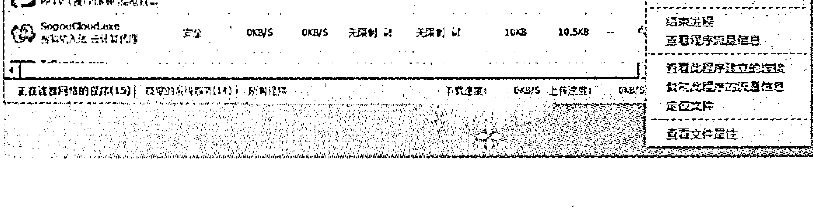

###### 防火墙阻止特定程序联网

对于自己已经知道的程序需要限制其联网，借助系统自带的防火墙进行限制即可。比如不希望家人在自己电脑上安装的游戏联网，可以在“开始”搜索框中输入“防火墙”，点击“高级安全防火墙设置”，在打开的窗口中切换到“出站规则”，再点击右侧窗格的“新建”（图1）。

按照向导的提示依次选择“程序→选择需要禁止联网的程序→操作选择：阻止连接”，这样被限制的程序就无法连接到网络了（图2）。

继续按向导提示选择应用规则的配置文件是全部网络，剩余操作按照屏幕提示完成。这样下次如果启动上述被限制的程序，程序启动后就会被防火墙阻止联网了，其他程序的限制操作类似。

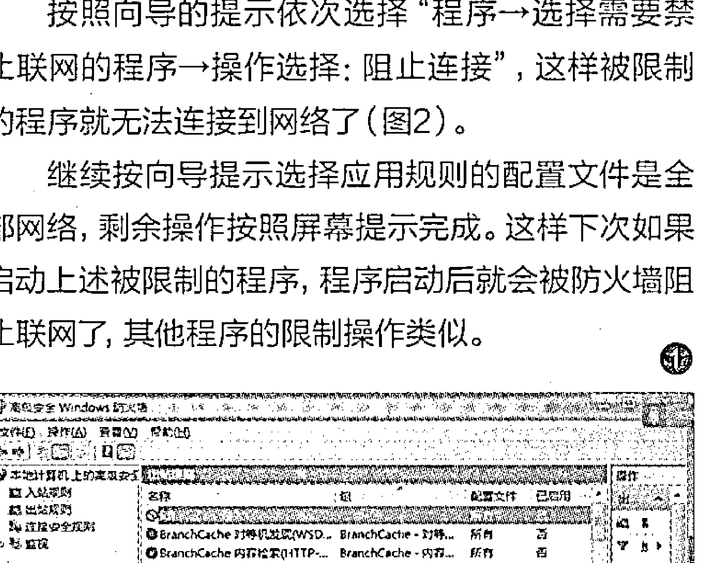

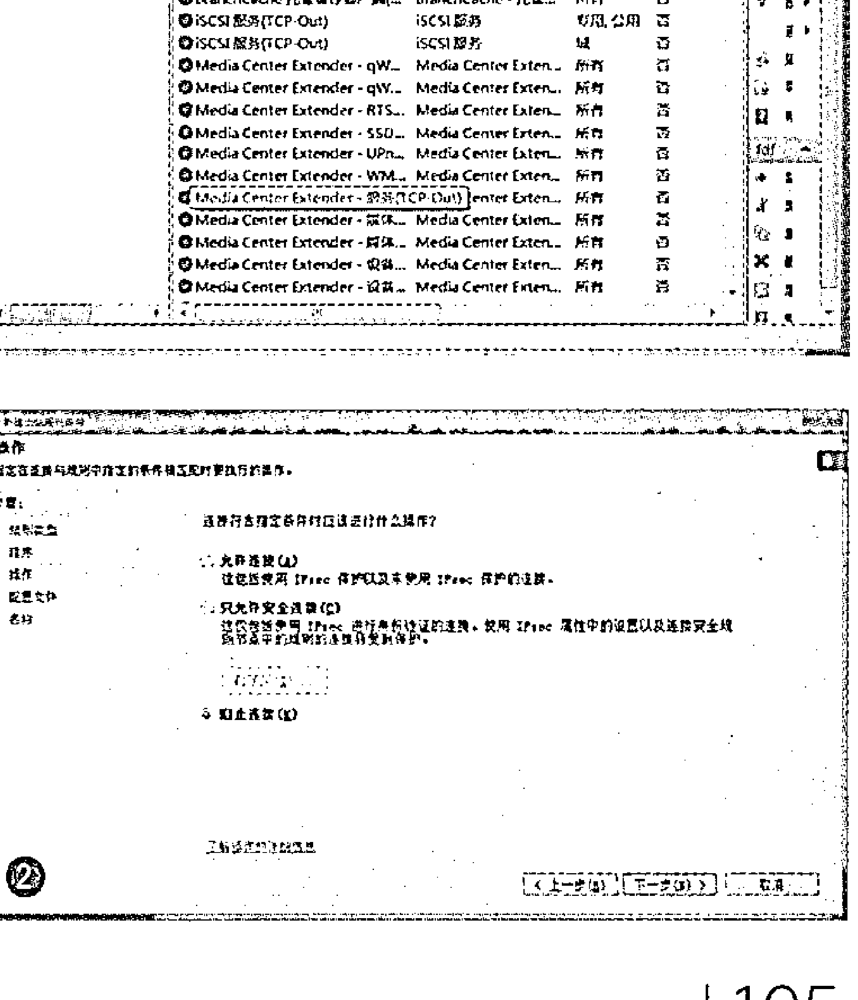

《电脑爱好者》2016年合订本（一）

特别话题

##### 手机越用越卡的背后 Android系统下暗潮涌动的程序自启

Android智能手机和iPhone、Windows Phone相比，前者比较占用资源是不争的事实，这也是为何采用该系统的产品隔年就会有较大的硬件升级。配置相似的三大系统如果运行同样的程序，Android多少会有卡顿的感觉，这主要是由内存管理机制和应用管理机制造成的(图1)。

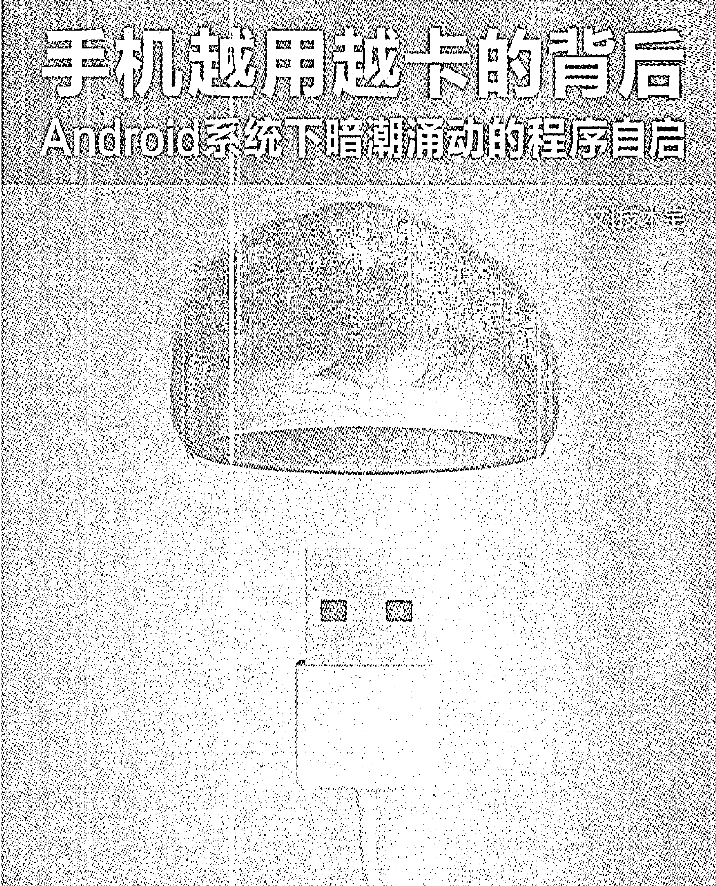

iPhone、Windows Phone使用墓碑式内存管理，这种管理机制的特点是不在前台的程序不会运行，但系统也不会杀掉它，而是尽可能将其保留在内存里。但是这些暂停的程序的优先级非常低，就像只是在系统后台立了块墓碑，告诉系统“我”曾经启动过，只是现在已经暂时死亡了。这样当系统需要内存又发现可用内存不足的时候，系统就会优先杀掉它们(对于非社交类的APP，Android 6.0也开始启用“墓碑机制”，Android和旧版比也可以极大减少内存的占用)(图2)。

从应用管理机制来看，Android是开放、开源的操作系统，一方面任何开发者只要遵循开发文档要求就可以开发出各种“奇葩”的应用。如耗费内存元凶是各种后台自动启动服务和应用。虽然要实现自启动必须获得内核服务授权，但是在Android中只要遵循相应的接口和进行必要的权限申明，任何开发者开发的应用都可以获得授权，从而造成各种耗费资源后台应用的出现，Android用户在手机界面却看不到这些应用存在（而且未ROOT设备还无法对其禁止）。这样系统可用内存被各种各样的应用无端耗费，从而导致Android耗费内存一直高居不下(图3)。

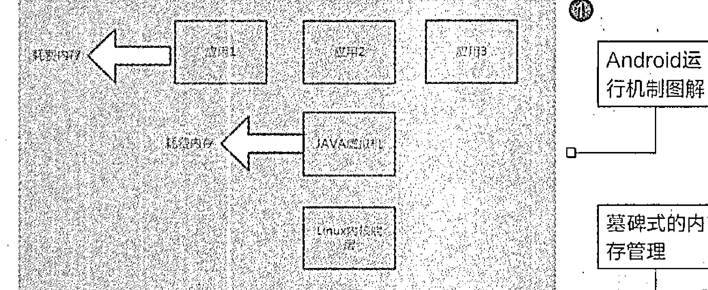

另一方面，Android的开放性还导致诸多应用做出越来越多“出格”的表现，那就是Android应用的各种连环启动，这会进一步造成内存资源的消耗。在Android开发中有个叫广播接收器组件，它用来接收来自系统和应用中的广播，并在接收后会激活指定的动作，如当有电话进来，也会产生一条广播，就会通知电话接听或电话号码判断等。但是现在很多应用开发者却将这个功能发挥到了极限，比如一些应用为了自己能够随时启动，利用各种广播组件来激活自身的启动。以百度云为例，在安装完成后可以看到该应用有8大项(多达26个小项)的连环启动项，这样只要手机上执行下列任何一项操作都会激活百度云。当然

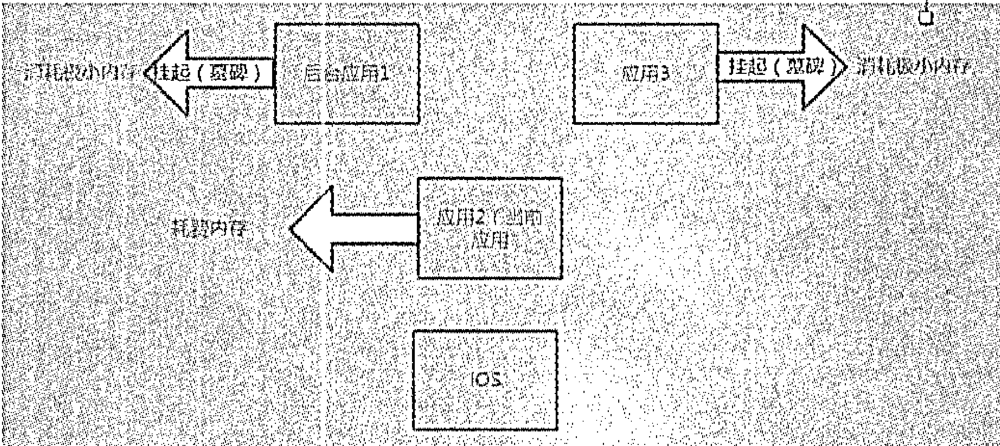

106 电脑爱好者 2016年合订本（一）

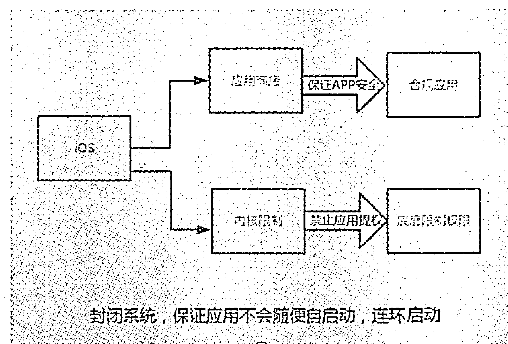

这种软件还有很多，这意味着Android手机上有非常多的应用会在你不经意之间就启动，自然会耗费很多的内存资源了(图4)。

相比之下，iPhone、Windows Phone则是强制、封闭的系统。以iOS为例，对于需要在合法(如未越狱的iOS设备)设备上运行(或者安装)的应用，苹果公司使用代码签名(Code-signing)来进行保护。这一限制要求所有在iOS设备上运行的代码都得被苹果审核通过，并且附有对应的签名。这样只要不是在苹果商店下载的应用就无法在iOS设备上正常使用。

另一方面，苹果公司对应用权限的限制非常严格。iOS是基于UNIX核心的系统，它继承了UNIX系统完善的权限控制功能，默认系统的内核启动以后就为当前登录的用户分配了适当的权限(类似Windows下的“标准用户”)。这个账户封闭了iOS应用的提权请求，用户登录之后没有调用底层组件的权限，也没有类似Windows 7的UAC组件可以手动提权，在系统内核方面就限制应用的权限提升。微软WP系统使用同样的保护手段，这种集中式强制管理，可以从源头上阻止各种恶意应用进入用户的手机，保证用户手机上安装的应用都是合规开发的，不会像Android手机那样可以随意安装各种会在后台耗费内存的资源(图5)。

那么对于Android系统耗费内存高的症状该怎么解决？主要方法自然是禁止应用的自启动，对于应用自启动，本刊已经做过很多介绍。对于连环启动中自己确实需要的启动，现在则可借助“自启管家”进行有针对性的限制。首先对自己的手机进行ROOT，在手机上启动“自启管家”后切换到“应用”，点开即可看到该应用所有的连环启动，现在按提示选择自己不要的启动项，这样下次使用手机时就不会在不经意之间启动那么多耗费资源的应用了(图6)。

应用 系统应用
:--- | :---
联系人 (开机) | [ ]
Key Chain [后台启动] | [ ]
手机 [开机] | [ ]
联系人存储 [后台启动] | [ ]
下载管理程序 [开机] [网络变化] | [ ]
媒体存储 [开机] | [ ]
系统用户界面 [开机] | [ ]
Google 服务框架 [后台启动] [开机] [网络变化] | [ ]
Google 通讯录同步 [ ] | [ ]


百度云 (com.baidu.netdisk)
点击可选择全部
:---
[ ] 通话状态变更 新拨出电话
[ ] 电池状态更改 电量低 电量充足 连上电源 拔下电源
[ ] 移除应用程序
[ ] 开机后 网络连接更改
[ ] 开机后 网络连接更改 挂载媒体 用户登录 连上电源

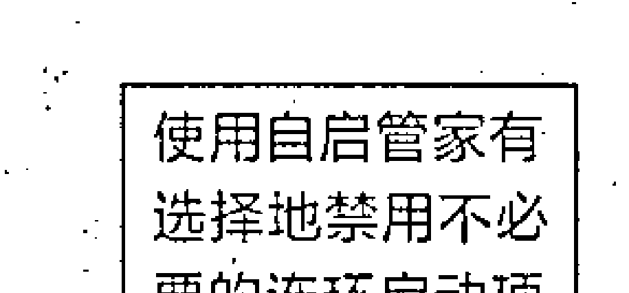

应用信息
百度云 (com.baidu.netdisk)
点击可选择全部
:---
[ ] 通话状态变更 新拨出电话 [禁]
[ ] 电池状态更改 电量低 电量充足 连上电源 拔下电源 [禁]
[ ] 移除应用程序 [禁]
[ ] 开机后 网络连接更改 [禁]
[ ] 开机后 网络连接更改 挂载媒体 用户登录 连上电源 [禁]


##### 探求使用应用软件后

自启动、程序限制等林林总总的软件问题，总会让人浮想联翩。这不仅在于软件的要求，还体现了厂商对整体市场的诉求。而这一切反映在我们身上会是什么？让我们应用起来更快捷？隐藏在数值下的“阴谋”？还是同宗不同面的表象？


###### Windows自启动程序猫腻多

文|刘英

是不是在奇怪于以前的电脑，往往半年甚至一年不重装系统，速度也不会慢到哪里去，而如今的PC上网用不了多长时间，速度就会明显变慢，而且随着使用时间的增加，系统中总会不明不白地招来一些“不三不四”的软件或服务。在手机里安装APP，无论装什么类型的APP，几乎每个应用都要获取自动运行的权限。如果说天气类或系统优化类的软件要获取自动运行权限尚可理解，那么一个在使用时才需要开启的软件，为什么非得要开机就启动，这就很难理解了。

###### 透过软件看自启动的必要性

我们要上网看视频，安装一款视频客户端是必要的。但是，谁会每天一开电脑就看视频呢？因此，根本没有必要将视频播放客户端设置为开机自启动，在不播放视频的时候，也没有必要让视频客户端在后台白白地占用内存资源，除非是我们要离线下载视频。道理虽然如此，但哪一款视频客户端软件不都是在安装后将自身设置为自启动（图1、图2）？那么既然明知用户不一定开机就需要这个服务，为何绝大多数视频

视频播放软件还要自作多情地这样做呢？

其实，软件自启动权限和拥有别人家的钥匙是一个道理。软件安装到你的电脑里，默认自动开启了自启动功能，随之肯定是有一个软件服务处于运行状态，而只要这个服务处于运行状态，软件官方就可以轻而易举地向用户发送消息、控制用户所用的客户端软件的各种权限（图3）。说到底，厂商就是为了更多地抢占用户入口，争夺更多的市场话语权，而用户对软件的装机量、使用度，就是软件厂商可以对市场、与广告商谈判的筹码（当年360实行杀软免费的目的正是如此）。可见，软件自启动对用户不一定是必要的，但是对于商家来说似乎是非常‘必要’的。这是一种行业‘潜规则’在作怪。

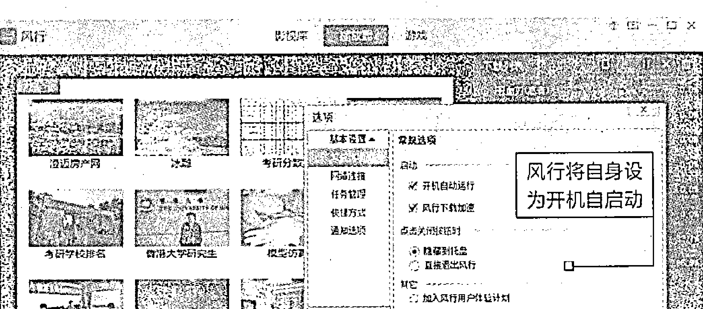


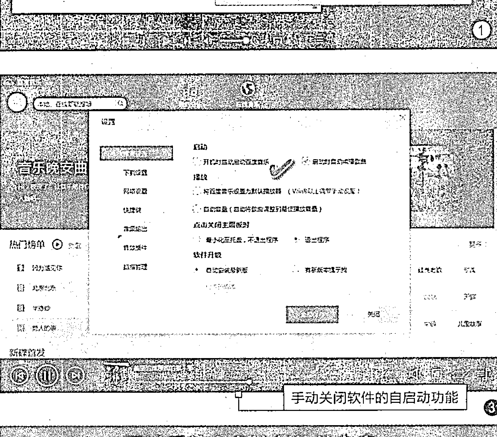

###### 手动关闭软件的自启动功能

如果在电脑中安装的软件多了，便会招来一大堆自启动功能，有的存在系统托盘图标，有的甚至连托盘图标都没有。而即便是有托盘图标，有的图标连关闭选项也不提供，让你无从下手。那么，难道每个软件自启动都需要到各自的设置中心去控制和关闭吗？没有了关闭的命令又该怎么办？其实，通过系统自身提供的维护功能，就可以解决问题。

以Windows 8.1为例，当系统启动后，如果自启动项目太多，系统维护中心会检测到这一情况，并给出优化提示。这时，只需点击系统任务栏托盘的‘操作中心’图标打开操作中心窗口（图4），然后点击维护窗口中的任务管理器链接，便会自动跳转到‘启动’列表，在该窗口中通过右键菜单中的‘禁用’选项，即可禁止某些多余项目的自启动（图5）。而在Windows 10中，维护系统启动项目更为简单，直接在屏幕下方的任务栏点击右键，在出现的列表中选择‘任务管理器’，即可查看系统已加载的启动内容，进行相关操作即可。

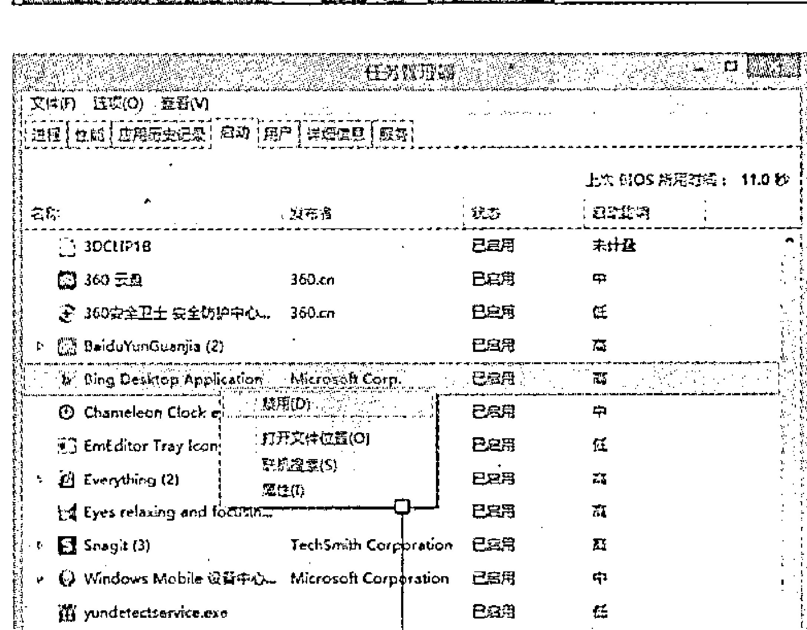

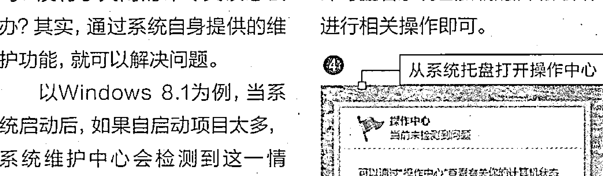

> 右键启动项目选择“禁用”

> 如果不明白启动列表中某个进程来自哪个软件，可通过右键菜单中的‘打开文件位置’项来追根溯源，找到软件所在的具体磁盘文件夹位置。若对所涉及的具体软件也一无所知，还可通过‘在线搜索’选项，让系统自动上网搜索进程的含义，判断该进程是否有用和能否被禁止。

###### 工具控制软件自启更方便

如果觉得通过任务管理器中的“启动”选项卡控制软件自启动比较抽象和不好把握，那么，还可以通过系统优化工具的窗口模式来控制。在360安全卫士软件中，就有这种控制功能。双击系统托盘上的360安全卫士图标，在弹出的主界面中点击“优化加速”选项（图6）。在接下来的窗口中点击选择“开机加速”，这项也是管理软件自启动的入口，再点击“开始扫描”（图7）。在扫描结果窗口中，我们看到的就是一个个具体的开机自启动软件，而不是较抽象的软件进程。在这个窗口中，只需选择要禁止开机启动的软件项目，点击“立即优化”，即可禁止这些软件的开机自启动（图8）。

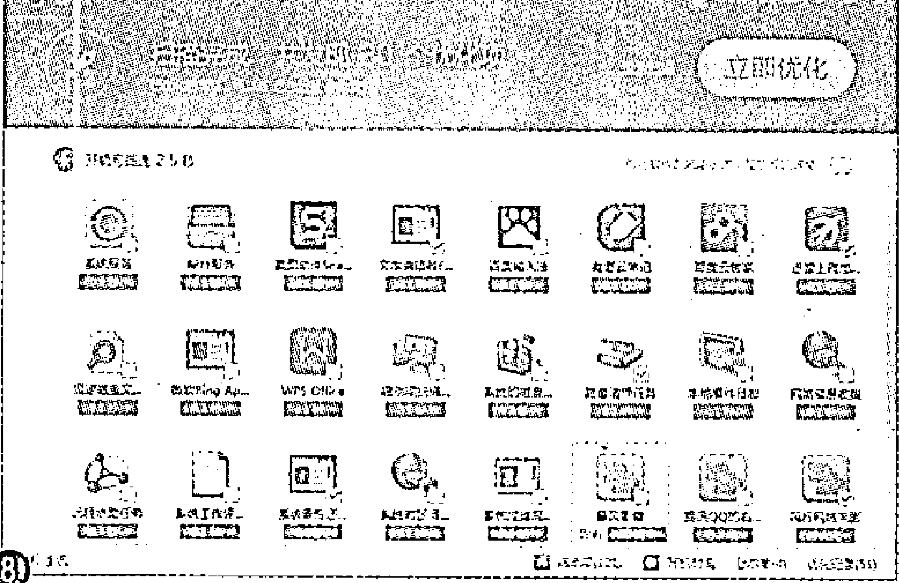

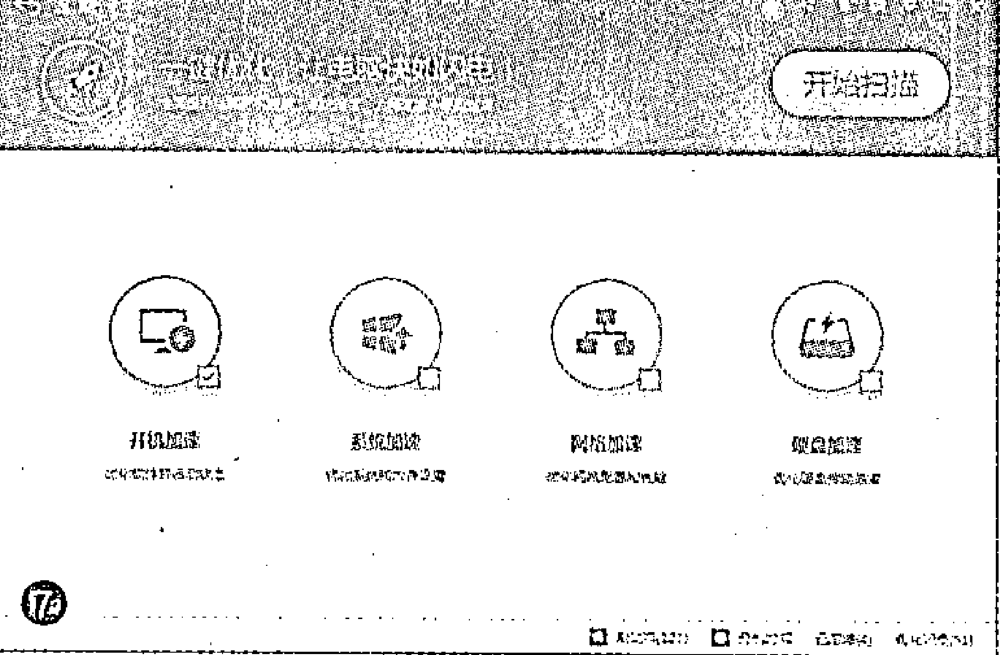

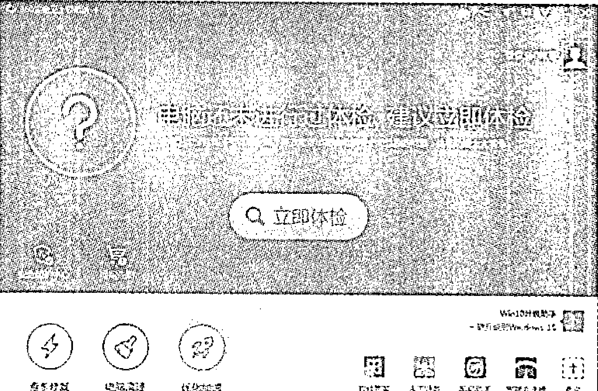

##### 搞清组策略修改的实质


注册表是一个令许多Windows用户望而生畏的技术项目，相对于注册表来说，组策略显得更加“亲和”一些，但这个东西听起来仍然是技术味十足。那么组策略究竟是什么东西？组策略和注册表有什么关联？如何才能搞清修改组策略所对应的注册表项目变动？

###### 呼出组策略编辑器方法多

组策略虽然隐藏于系统的后台，但呼出它的方法也多种多样，我们可以通过不同途径来呼出组策略编辑环境。首先可用Win+R组合键启动“运行”窗口，然后输入GPEDIT.MSC来运行组策略编辑器（图1）。此外，通过系统搜索功能也能调用组策略。在Windows 8.1系统的搜索框中，切换搜索类型为“设置”，再输入“组策略”，即可自动出现“编辑组策略”项目，点击即可进入组策略编辑器窗口（图2）。另外，通过建立快捷方式或建立批处理，也能实现组策略的快速调用。组策略管理器实际上是一

个系统管理程序文件“C:\WINNT\SYSTEM32\ gpedit.msc”。我们可以给这个程序文件建立快捷方式，并将该快捷方式放置在系统磁盘的任何位置，以方便运行。例如，可以将快捷方式固定到任务栏上。此外，还可以建立一个BAT扩展名的批处理文件，其内容只有一个GPEDIT.MSC命令，这样直接运行该批处理文件，也能随时启动组策略编辑器。

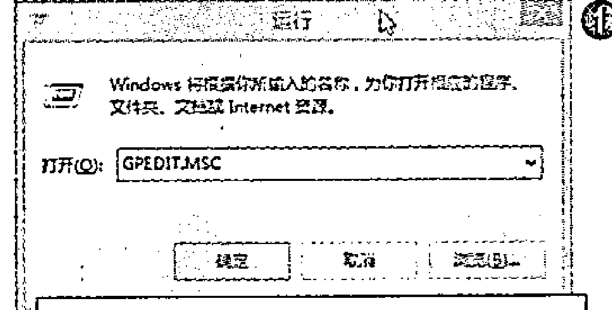

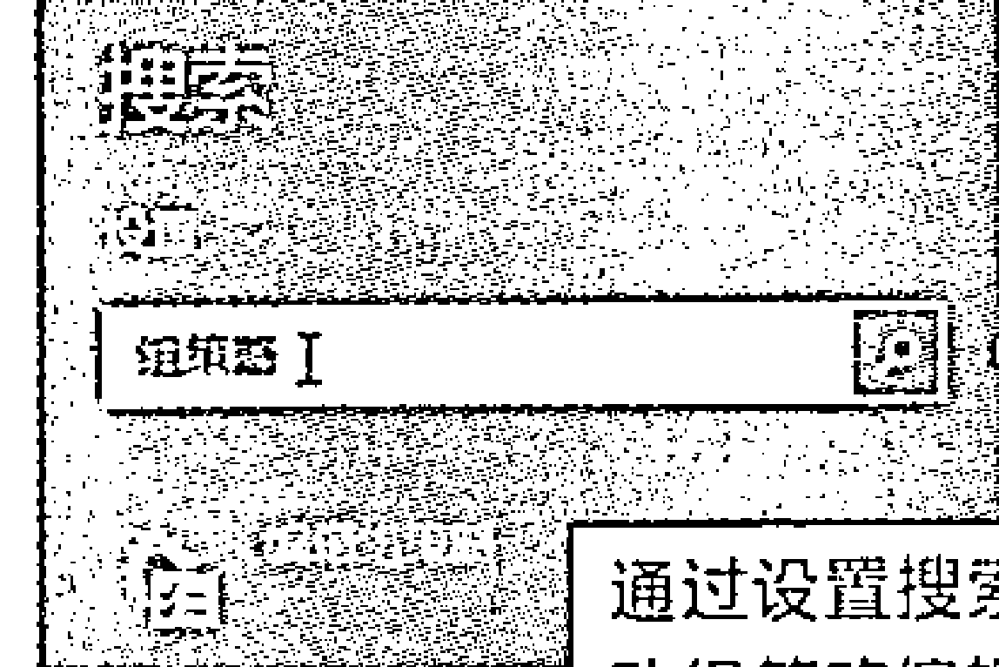

###### 用组策略实现硬件控制

可以通过组策略来控制硬件的使用，例如控制别人在我们的电脑上使用USB设备或移动设备。

通过如上介绍的方法启动组策略编辑器，依次定位到“计算机配置→管理模板→系统→可移动存储访问”，在窗口右侧找到“所有有可移动存储类：拒绝所有权限”（图3）。双击此项目，随后在弹出的窗口中选择“已启用”选项，最后点击“确定”按钮（图4）。这样设定后，以后在系统中插入USB设备或移动设备后，系统就会自动弹出拒绝访问的提示信息。

###### 组策略修改对应注册表变化

若想要知道组策略的某个选项执行之后，对应哪些注册表的变化；例如启用“用户账户控制：用于内置管理员账户的管理员批准模式”组策略后，如何在注册表找出对应的键值，可以利用Wise Installation System这款软件来实现。这是一个著名的安装程序制作工具，提供了丰富的脚本编辑方式及安装选项，但我们同样可以用它来监测修改组策略之后注册表的变化。

先给注册表做一份快照。打开Wise Installation System，点击工具栏的“捕捉安装信息”按钮，或者依次选择“新建→捕捉安装信息”，随后会打开“捕捉安装信息”对话框，点击“配置”按钮，我们会看到“捕捉安装信息”配置”对话框，切换到‘常规选项’选项卡，勾选所有三个复选框，目的是为了给注册表创建快照，点击“确定”按钮完成配置（图5）。

连续两次点击“下一步”按钮，Wise Installation System会扫描注册表，等待直至“执行安装程序”对话框出现，表示首次注册表快照捕捉完成，注意不要关闭

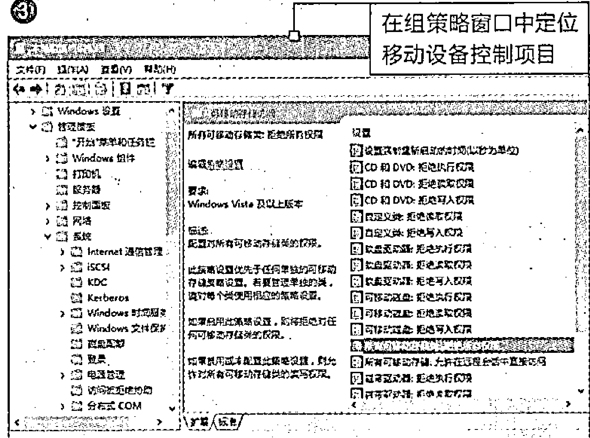

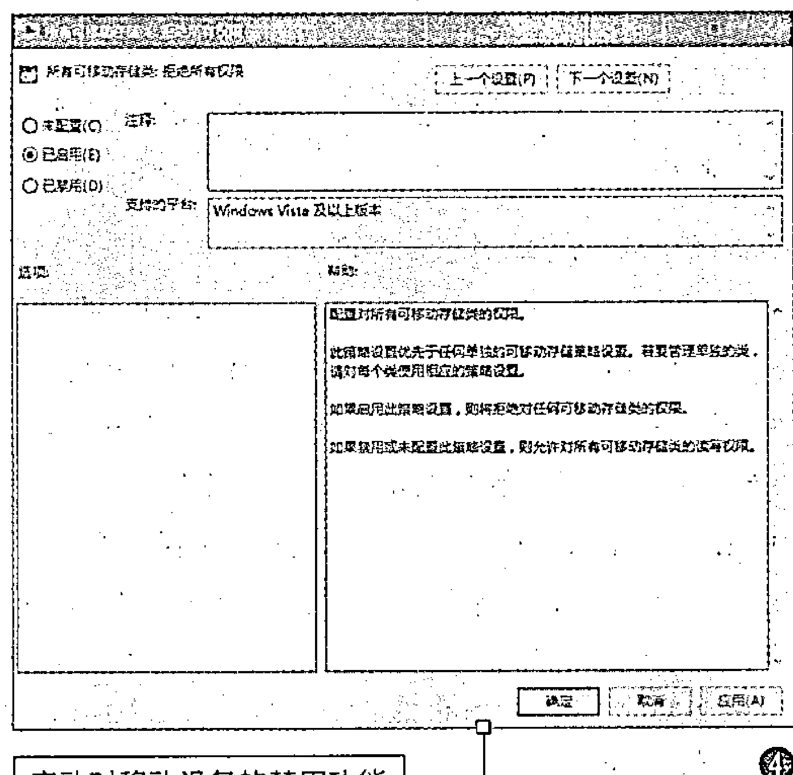

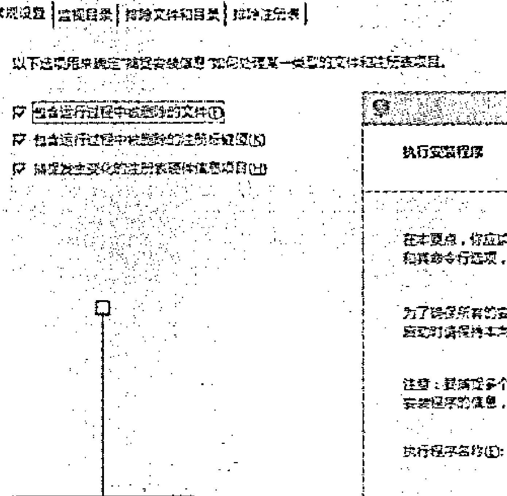

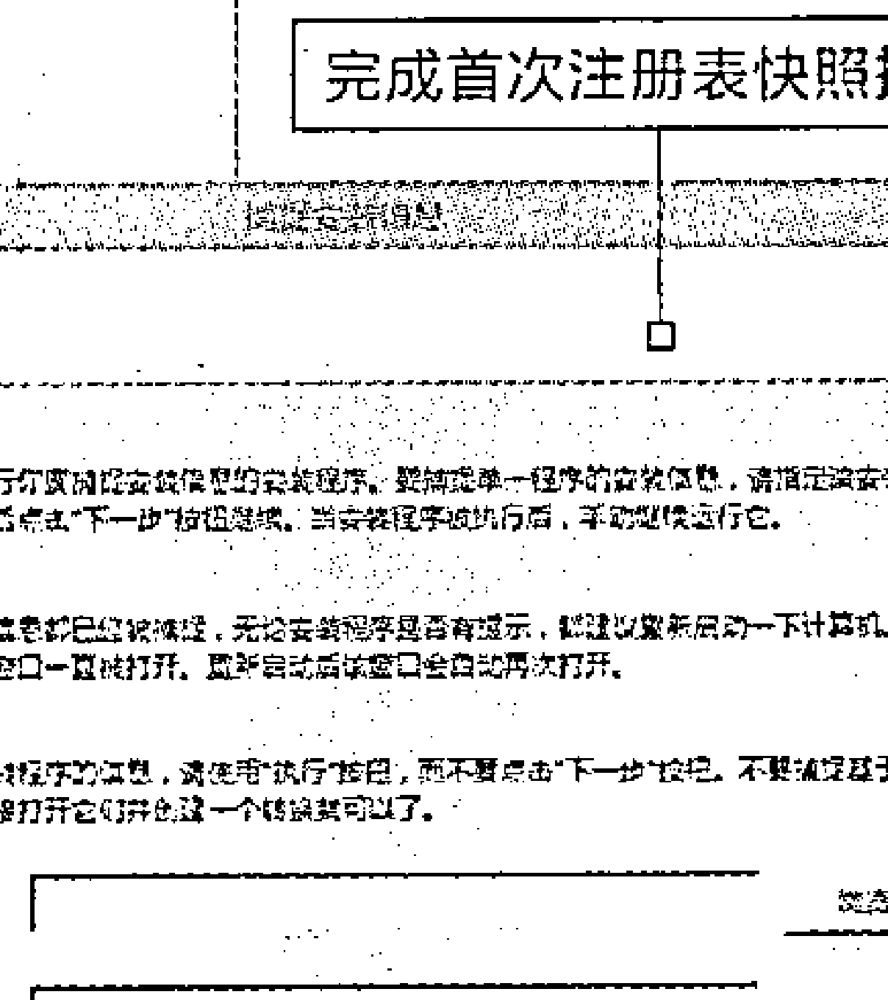

[/content]

#### 《电脑爱好者》2016年合订本(一)

##### 特别话题

“捕捉安装信息”对话框（图6）。打开组策略编辑器，在左侧窗格依次选择“计算机配置→Windows设置→安全设置→本地策略→安全选项”，在右侧找到并双击“用户账户控制:用于内置管理员账户的管理员批准模式”，在打开的对话框可看到默认的操作选项是“已禁用”，修改为“已启用”。组策略设置完成之后，切换回Wise Installation System，在上图所示的对话框继续点击“下一步”按钮，再次进行注册表快照扫描，以捕捉发生改变的注册表设置，直至看到“完成”对话框。完成快照后点击左侧的“注册表”按钮，就可看到组策略在注册表中的设置（图7）。在上边窗口列表中会显示计算机注册表，下边的两个窗格显示安装或改变的键值。现在就可以打开注册表编辑器，找到相应的项进行导出了。

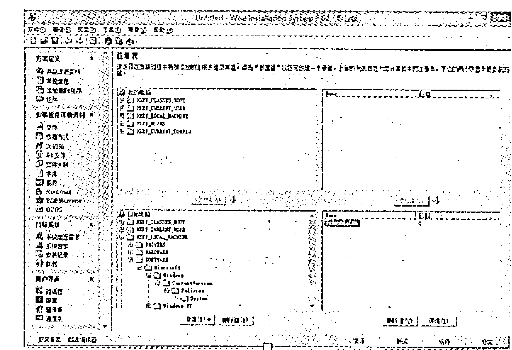

##### 系统小工具背后的秘密
文/刘英

我们经常会用到Windows系统自带的小工具，如属性查看、事件查看、系统信息等。调用这些小工具所需要的操作路径也各有不同，有的要通过系统开始菜单的附件调用，有的要通过控制面板调用，还有的需要利用命令提示符调用，记忆也比较麻烦。其实，系统本身就包含有一种让大家方便地了解和使用这些小工具的途径——用隐藏在系统背后的一个管理命令MSCONFIG，便可轻松看清系统自带的许多小工具所包含的秘密所在。

按下Win+R组合键，启动“运行”对话框，输入“MSCONFIG”并运行（图1）。在随后出现的“系统配置”窗口中，点击“工具”选项卡，就会看到我们经常需要使用的一些系统工具（图2）。

###### 摸清系统工具背后所用的命令

许多系统工具对应一个可执行程序文件，如显示系统版本所对应的程序文件为位于“C:\WINDOWS\system32\”文件夹下的winver.exe文件。其实许多系统工具程序文件都存放在此文件夹下，当进入该目录后，由于不知道其中以英文字母命名的文件名代表什么程序，因此对这些工具的藏身之所不留意。若要知道具体程序文件所代替的工具，需要一个个运行确认。而通过系统配置“工具”选项卡列表，我们很容易确定这些文件所对应的系统工具。下表即是通过此窗口所获得的工具与程序文件的对应关系。

通过“运行”对话框执行MSCONFIG命令

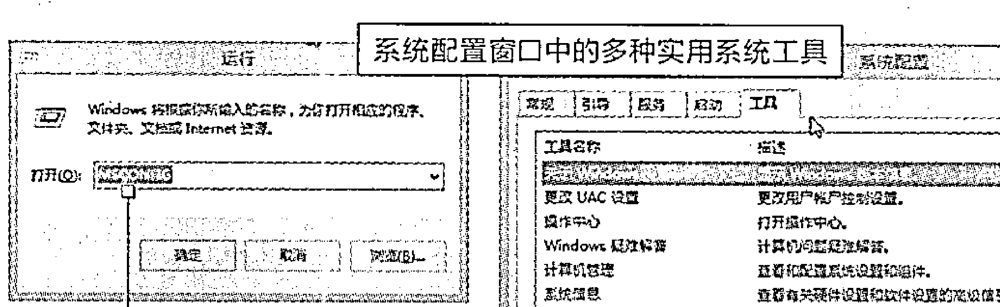

| 调用功能 | 对应的程序名或命令 |
| :--- | :--- |
| Windows版本信息 | winver.exe |
| 用户账户控制 | UserAccountControlSettings.exe |
| 操作中心 | scui.cpl |
| 系统疑难解答 | control.exe /name Microsoft.Troubleshooting |
| 计算机管理 | compmgmt.msc |
| 系统软硬件与高级信息管理 | msinfo32.exe |
| 消息与事件查看 | eventvwr.exe |
| 应用程序管理 | appwiz.cpl |
| 查看系统属性 | control.exe system |
| 进入Internet选项 | inetcpl.cpl |
| 查看和配置网络协议 | cmd.exe /k %windir%\system32\ipconfig.exe |
| 监视本地或远程计算机性能 | C:\WINDOWS\System32\perfmon.exe |
| 监视本地计算机性能和资源使用情况 | resmon.exe |
| 查看运行的程序和进程 | taskmgr.exe /7 |
| 打开命令提示符 | cmd.exe |
| 启动注册表编辑器 | regedt32.exe |
| 启动系统还原 | rstrui.exe |

小提示
如果我们将如上表格稍加记忆，以后就可以绕过许多菜单或窗口，直接在“运行”对话框中输入一个简单命令，启动这些系统工具了。这些命令的字符串一般均为其所代表的功能所对应的单词或单词简写组合，稍有英语基础的用户记忆起来也并不困难。

###### 快速管理系统还原项目

要进入系统还原管理窗口管理系统还原项目，按照通常的办法，需要打开系统资源管理器，在“这台电脑”上单击右键，然后选择“属性”，启动到系统属性窗口，最后点击“系统保护”一项（图4），到达“系统属性”窗口的“系统保护”选项卡下，点击“系统还原”按钮，才能执行系统还原操作。这样的操作过程显然过分麻烦（图5）。如果按上述方法，直接执行“rstrui”命令，马上就可以到达系统还原的设置界面了。

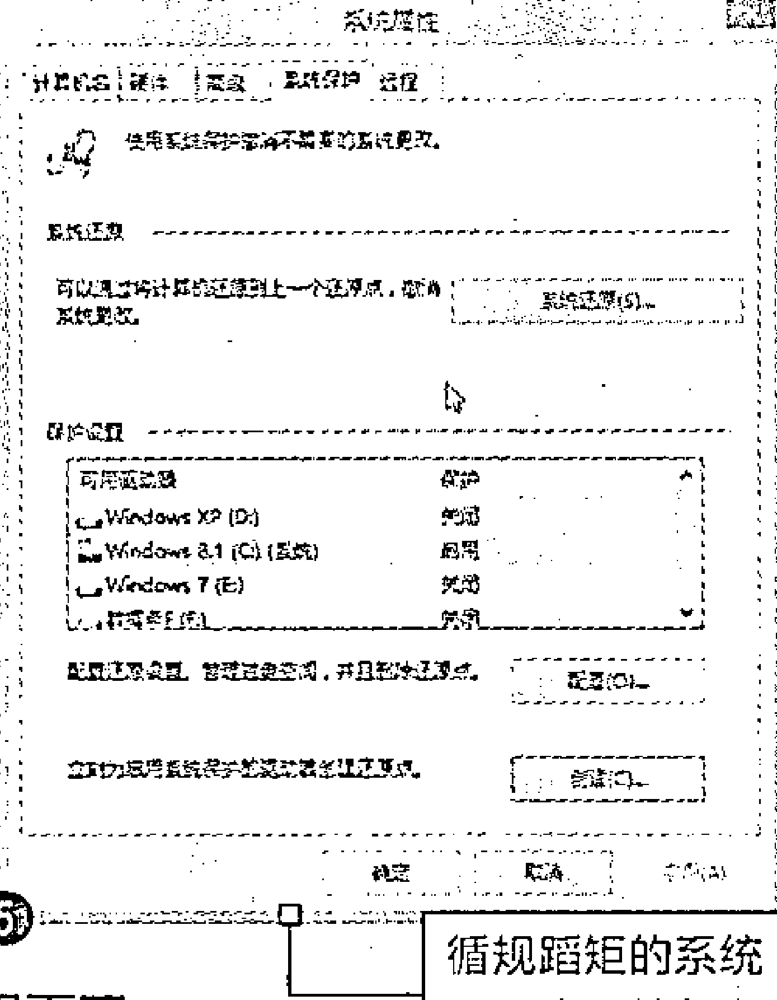

循规蹈矩的系统还原步骤较复杂


###### 获取自启动程序列表

如果我们希望获得当前系统中一个正在运行的自启动程序的名称以及程序所在的具体路径，循规蹈矩地通过任务管理器来一一查看，将比较费事。现在用个简单的命令来完成：按下Win+R并运行“msinfo32”命令，马上可进入“系统信息”窗口，点击“软件环境→启动程序”，即可获得一份详细的自启动程序列表（图3）。当然，如果懒得记忆“msinfo32”命令，也可以直接通过系统配置窗口，依次点击“工具→系统信息→启动”，同样能到达相同的目标。

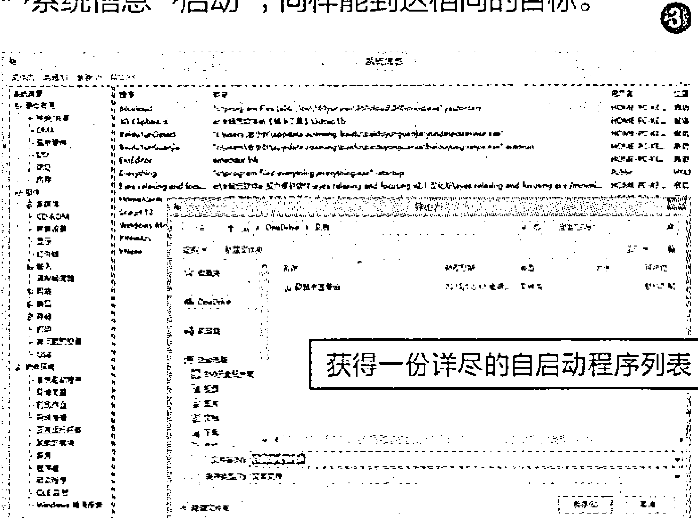

获得一份详尽的自启动程序列表

###### 快速设置用户账户控制

用户账户控制（UAC）的等级设置，关系到系统安装大事。而要进行这样的设置，传统的方法要先进入控制面板，然后找到“操作中心”，进入后通过“安全”一项下的“用户账户控制→更改设置”才能启动到设置窗口（图6）。采用快速调用系统工具的方法，我们只需直接运行“UserAccountControlSettings”命令，即可启动到用户账户控制窗口。虽然这个命令长了一点，但你会发现，它就是“用户”“账户”“控制”“设置”这几个词所对应的英文单词的组合，非常好记。

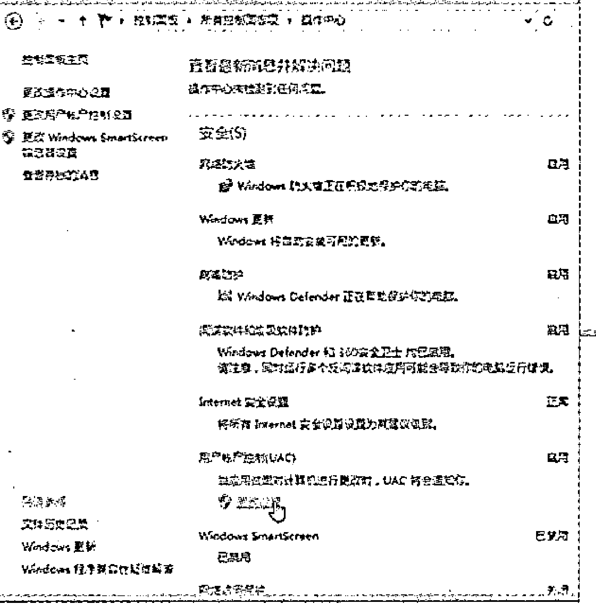

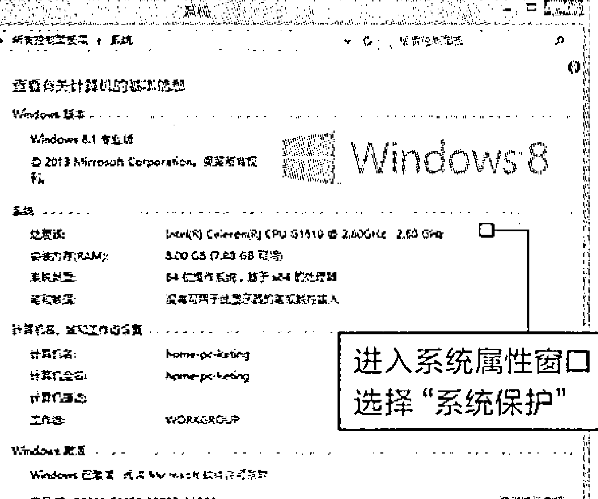

小提示
如果没时间和兴趣来记忆上面所述的简单命令，那也没关系，你只需记住前面介绍的这个MSCONFIG命令，然后在窗口中通过“工具”列表来选择项目，点击“启动”就可以调用相应的工具了。

##### 云盘速度慢背后有“隐情”
文/刘英

云盘的上传或下载速度总是上不去，而网络带宽却绰绰有余，于是百度知道里就有了各种云盘提速的问题或技巧（图1），但试过后会发现许多技巧也解决不了实际问题。其实这背后另有隐情，当然解决办法也不是没有。

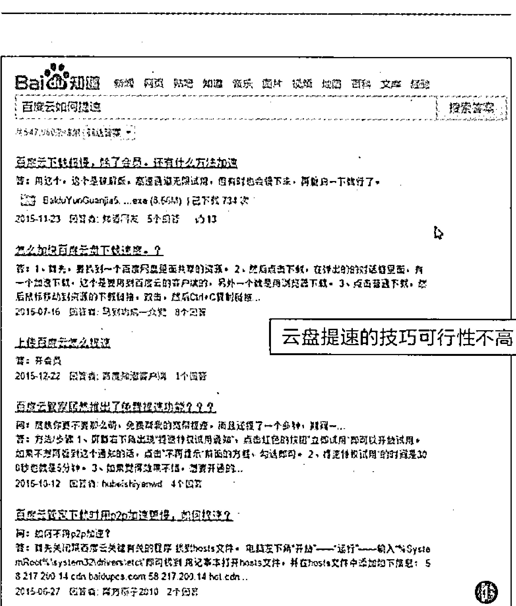

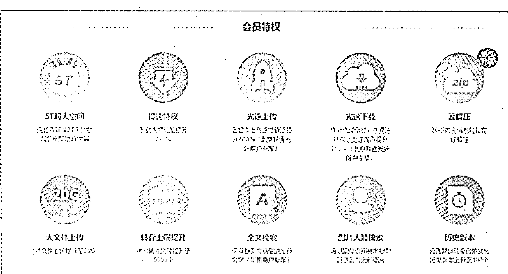

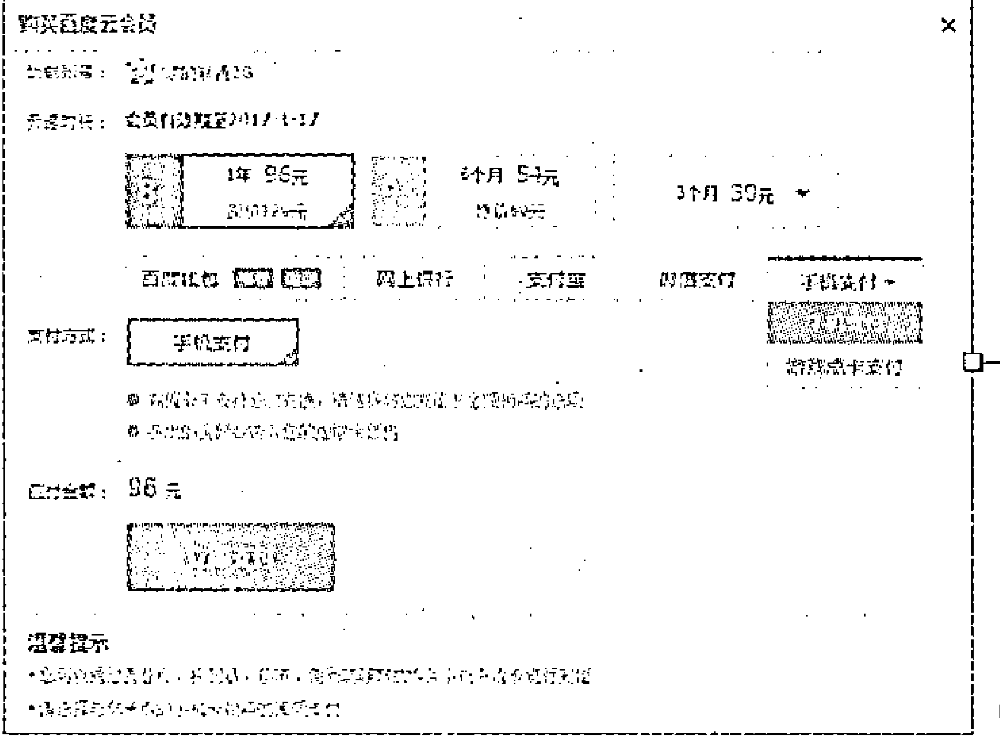

大家知道，外国的云盘多数是要按空间收费使用的，租用空间收费，提升空间收费。但是，国内的主流个人云盘却在这些年来一直可以免费使用，空间大战演绎到无限免费空间的可能。一个面对日益增加的存储空间需求量的云运营商，如何来化解这些成本？面对在免费诱惑下不断增加的用户，他们又何以为继？这些问题也许是网络商家更多考虑的问题，用户可能并不关心这些问题。但是我们只需换位思考一下就可以明白，其实免费在某种程度上来说是潜伏着危机，而一定程度上的收费反而可以换来更多的安全保障。我们看到，如今无论是百度云还是360云盘，都推出了会员制，成为会员的用户可以拥有许多诱人的特权（图2）。而每月只需付出一二十元，即可换得VIP会员资格（图3）。在这些特权中，最诱人的莫过于百度云会员下载速度翻倍和上传速度提高到4倍。这也正是我们使用云盘所急需要的功能。
由此不难看出，云盘速度慢其实是云商家的一个生存“法则”，也就是说速度慢的原因并非技术上不能实现提速，而是云商有意地限制了上传或下载速度。这就好比在高速路上安装了狭窄的关卡，等级再高，有再好的车，能跑得快吗？反过来，如果成为VIP会员，就让你在一个宽敞的通道上跑，速度当然也就提高了。云盘速度上不去也是一个道理，不是路不宽，而是上面被设定了关卡，限制了速度。当然，出于生存的需要，这种“设卡”也是必要的和可以理解的。因此最行之有效的办法是开通VIP权限“打通关卡”。

提速的方法不止是通过加入百度会员提升百度云的速度，对于经常使用迅雷来下载的用户来说，安装一款“迅雷快鸟”的客户端，同时点击“升级会员”开通迅雷会员，同样可以让整体网速翻倍（图4）。从会员价目表中可以看出，虽然价格较百度云会员贵了将近一倍（图5），但这样的付出可以在网速整体提高的同时，享用迅雷离线无限空间和迅雷会员高速下载所带来的便利。在迅雷2014TB超级空间中可存放的内容，加上迅雷VIP的高速下载，是百度云相对较小的空间和下载限制的局限所无法相比的。

360云盘的限制与百度云有所不同。对于使用360云盘的用户来说，虽然会员价格和百度云不相上下（图6），但360官方并未承诺提升速度的具体倍数，只是含糊其辞地说“享受会员专属的服务器和带宽。通常情况下，会比普通用户的速度快”。而实实在在在能够感受到的东西却是：20GB最大单文件上传、90天回收站文件保留期限、在线查看2GB大小压缩包内容、3000个分享文件数、一次转存3000个文件数等。这些都是可用数字来考量的实惠内容（图7）。

由上所述，我们不难看出，云盘速度缓慢的原因在很大程度上是由于商业模式的需要而不在于技术落后。当然，用户在云盘中设定了上传和下载速度限制的情况，也是造成网络慢的直接原因，但这对于用户来说是很好控制的一个环节，且云盘软件安装后默认设置一般并没有开启限速参数。对于因该因素造成的网速变慢，用户应该不言自明。

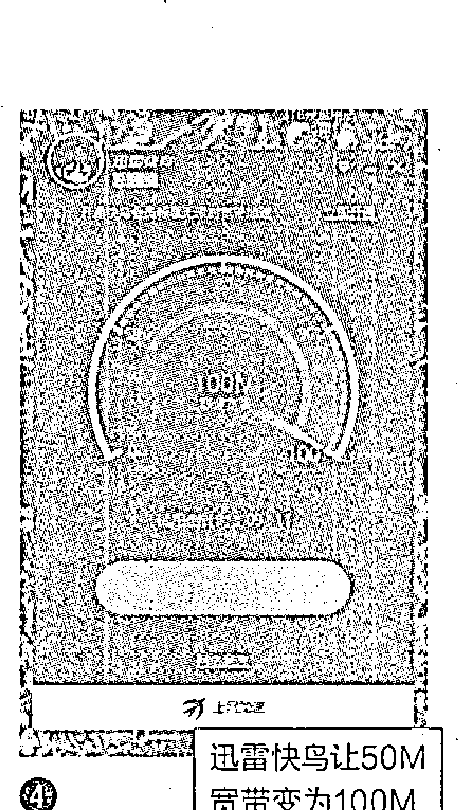

开通迅雷超级会员提升网络速度

对于未加入迅雷会员的用户，使用迅雷快鸟也可以拥有每天10分钟的免费试用时间。若是需要下载一个不算太大的文件，而又想提速，可以安装此软件并充分利用这10分钟的宝贵免费提速时间，给自己的下载任务加速，这也算作是一个免费提速的技巧吧。

360云盘会员的价码

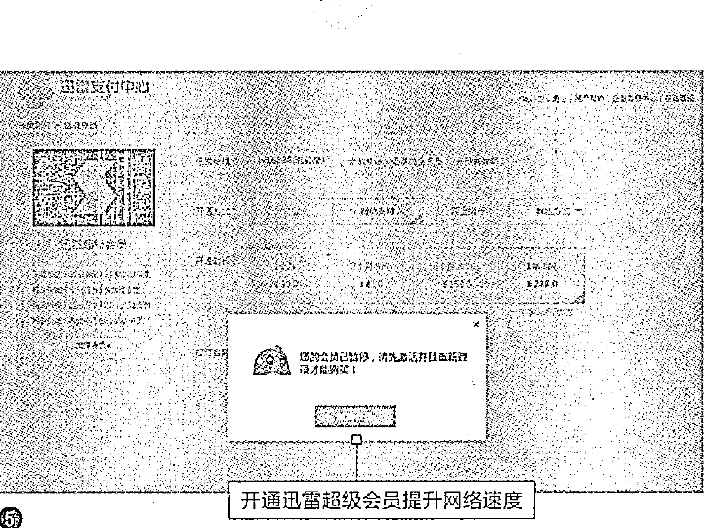

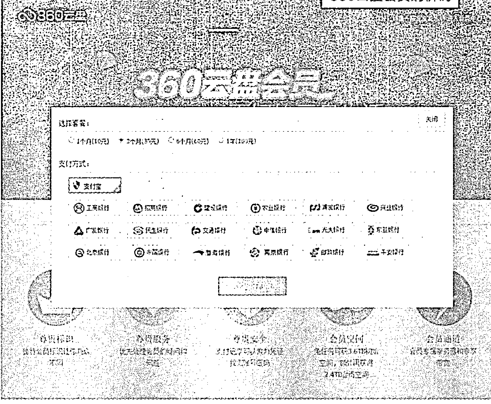

+   **会员服务内容：**

**空间特权：**
- 1. 每个账号空间特权为一次性获得，不可重复，不可累计。
- 2. 免费版的活跃任务直接获取初始用户空间。
- 3. 如该账号此时的任务获得过初始用户空间，则开通会员服务后不再发放初始用户空间。
- 4. 会员空间在会员期内享有，会员服务到期后自动收回。
- 5. 空间到期自动收回后，如存储内容大于原有用户空间，文件不会被删。
- 6. 如果要上传和存储新内容，需要存储内容小于原有空间，可随时删除文件或重新购买。
- 7. 初始空间为3.6TB，会员空间为2.4TB，360有权根据实际使用情况进行调整，调整后对购买的会员生效。

**会员特权：**
- 1. 享受会员专属的服务器和专属带宽。
- 2. 会员速度不会超过物理速度。
- 3. 受用户的带宽等网络环境影响，并不能保证持续高速，并不保证速度稳定在某个数值。
- 4. 通常情况下，会比普通用户的速度快。
- 5. 目前是会员VIP4的速度，以后会考虑推出VIP2,VIP3,VIP5等不同等级，以满足更高速度的购买。

**文件特权：**
- 1. 大文件上传：普通用户单文件上传最大10GB，会员上传最大单文件20GB。此文件上传仅PC客户端支持。
- 2. 回收站特权：普通用户的回收站时间为30天，会员可以延长至90天。
- 3. 云解压特权：普通用户可以在线查看360MB的压缩文件，会员用户升至2GB的压缩文件。

**分享特权：**
- 1. 普通用户分享链接的文件数为2000个，会员为3000个。
- 2. 普通用户可以单次转存2000个文件，会员为3000个。

**会员身份：**
- 1. 尊享会员标识，可以在名字、分享地址看到尊贵的标识，并将逐步添加到和云盘有关的地方。
- 2. 尊享会员安全，在会员账户被盗、出现所有争议、密码丢失，提交支付记录可以作为判断所有权的凭证。

**会员服务：**
- 1. 尊享会员服务，会员的问题和反馈，将优先得到处理和解答。
- 2. 此特权仅限于云盘产品。
- 3. 应用内置的用户反馈由于隐私保护并未自动提交用户名，需要在正文中注明您的会员和云盘用户名，并知悉联系方法。

**神秘功能：**
- 1. 一些会员新功能的优先体验，包括处在创业期体验期的功能，未正式开放的功能。
- 2. 过于细节的功能，没有必要单独列出来的也会放在这里。
- 3. 由于新功能处在体验期期间，内容并不公开，上线时间，下线时间，以及收到体验的用户范围均未知。
- 4. 不会造成功能的现在使用功能受损，云盘功能受损，如发现功能不合适，会随时下线。

360云盘会员所拥有的特权

##### 解密高效搜索的背后
文/刘英

自从Windows 7在开始菜单和资源管理器中集成搜索组件后，我们开始习惯利用它来搜索程序或者文档了。不过在日常的使用中，有些人的电脑搜索速度很快，有些人的电脑搜索速度却不尽如人意。究竟是什么影响到搜索的速度，我们又该如何提高搜索效率？

###### 搜索背后的主要功臣索引文件

为了更方便地了解搜索知识，我们先来了解一下搜索流程。在Windows里使用搜索的时候，我们先输入搜索关键字→系统对关键字在索引里进行检索→如果索引里保存和关键字对应的索引数据（否则提示没有搜索结果）→列出搜索结果→完成搜索。从上述流程可以看到，搜索的关键是其中的“索引”。索引的意思是将文件整理建立数据库，建立了索引后就可以大大加快搜索速度。Windows的索引可以是基于文件属性（系统默认索引设置），也可以是基于文件内容，也就是全文检索。比如系统对DOC文件建立全文检索，那么我们键入的关键字只要在文档名称或者正文中包含，系统就可以快速检索出来（图1）。

不过Windows搜索对文件进行全文检索（因为要对属性+全文内容进行检索）速度明显不如Everything之类的第三方搜索快。因为Everything是通过直接读取NTFS文件系统的USN日志形成索引，速度虽快但无法进行全文检索（没有全文索引）。所以虽然一些第三方搜索软件号称秒搜，但和系统自带的搜索相比，在功能全面性上还是有不足的。

###### 管好索引 提高搜索效率

通过上面的介绍我们知道索引文件的重要性，那么该如何提高系统搜索的速度和效率？在日常使用搜索时，可能很多朋友发现系统自带的搜索不仅速度慢，而且搜索结果很少或者无法搜索到合适的结果。一方面这是因为：Windows默认只为库文件夹、开始菜单、上网历史记录、电子邮件等有限的内容制作索引，对于我们常用的一些目录，却并没有建立索引。正因为索引文件的缺失或者不完整，才导致我们在这些目录执行搜索时速度很慢（图2）。因此要提高搜索速度，我们可以自行指定常见的搜索目录为其建立索引。比如笔者文档都保存在“J:\快盘\常用文件”，同时也经常需要在该目录下进行文档的搜索。现在在开始菜单搜索框中输入“索引选项”，打开索引选项窗口后点击“修改”，在弹出的窗口中按提示展开“J:\快盘\常用文件”（如果其下还有无需搜索的子目录则可以将其剔除）将其勾选，这样就可以为该目录自动建立索引了（图3）。


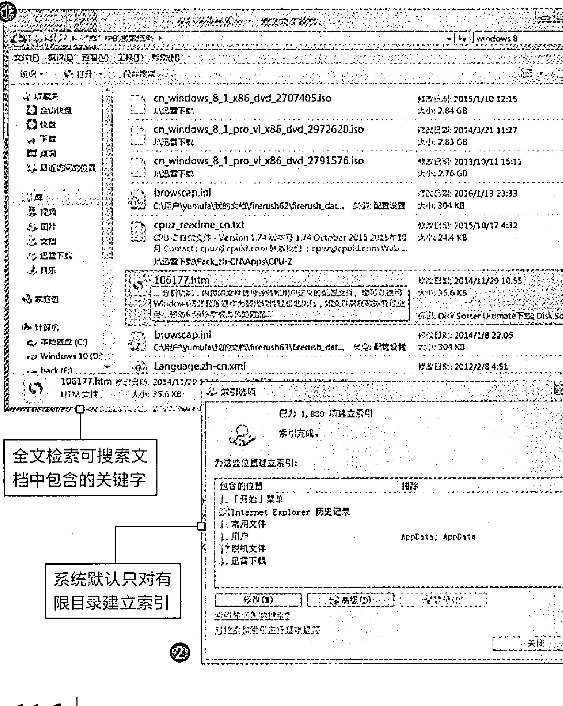

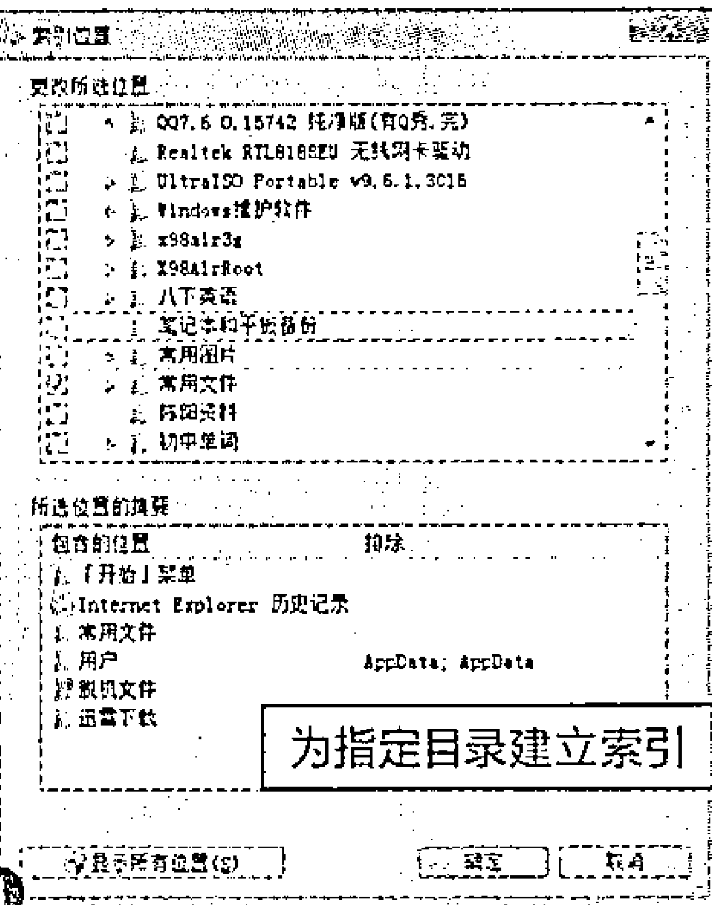

另一方面，由于系统默认的搜索只是对文件的属性进行索引的建立，因此在输入一些文档正文中包含的关键字时就不会显示很多的搜索结果。我们可以根据自己的需要建立全面索引。同上进入索引选项窗口后点击“高级”，接着在打开的窗口切换到“文件类型”，单选“为属性和文件内容添加索引”，这样就可以进行全文检索了（图4）。

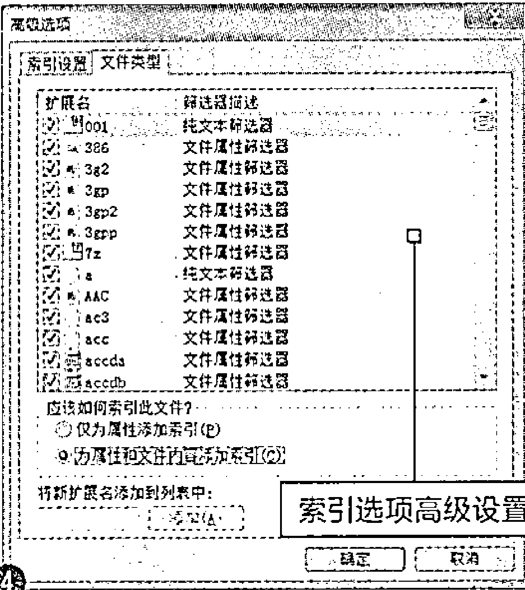

系统默认对所有常见的文件扩展名建立索引，为了提高搜索速度，也可自行勾选经常搜索的扩展名以减小索引文件体积从而提高搜索效率。如笔者只是经常对Word文档进行搜索，如果只选择.doc扩展名，索引里就只包含该类型的文件，使搜索结果更精准。完成上述设置后，现在进行搜索就可加快搜索速度，同时也有更多适合的搜索结果了。通过前后比较可以看到，同一目录、同一关键字的搜索前后结果完全不同，设置之前只有6个搜索结果，建立全面索引后可以搜索到30个结果，而且搜索速度也明显变快（图5）。

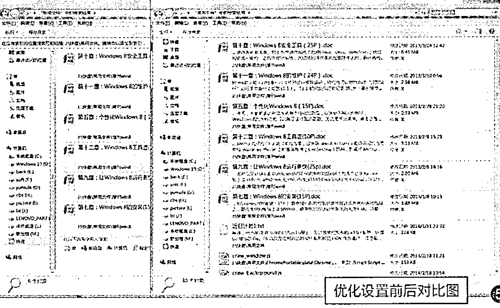

从上面的介绍我们知道索引文件对于搜索的重要作用，因此在日常维护中我们就可以针对索引文件进行更多的优化操作。比如在重装系统时，我们可以先导出索引文件备份，默认索引文件在C:\ProgramData\Microsoft文件夹下，同上进入设置窗口点击“选择新位置”，然后为索引文件设定一个非系统分区的位置，这样重装系统后再次设置为默认位置即可使用原来建立好的索引（图6）。

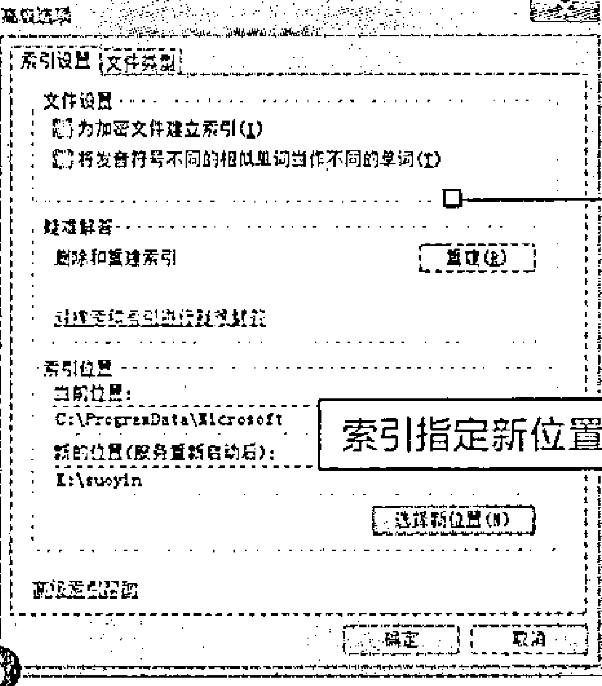

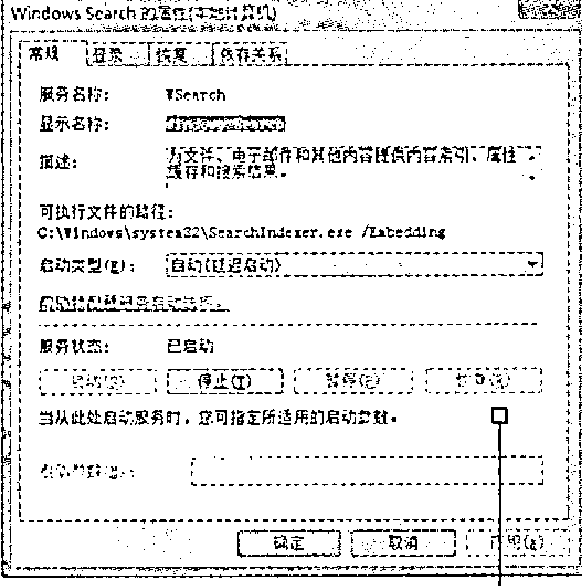

由于在搜索时默认系统会提示我们建立新的索引，这样对于不太常用的目录如包含系统文件位置（如“程序文件”文件夹）建立索引，这样庞大的索引文件反而会使搜索变慢。因此我们可定期将索引文件（即C:\ProgramData\Microsoft\Search目录）复制到其他目录保存（可保存多个索引）。一旦发现搜索速度变慢，可随时将备份的索引文件覆盖到上述位置进行替换，从而保证一直拥有高效的搜索（图7）。

要提高搜索效率还可用搜索高级语法，如正则表达式、通配符等。一些人在系统优化时将系统索引服务禁止，只要进入服务设置窗口，选中名为Windows Search的服务将其设置为自动启动即可（图8）。

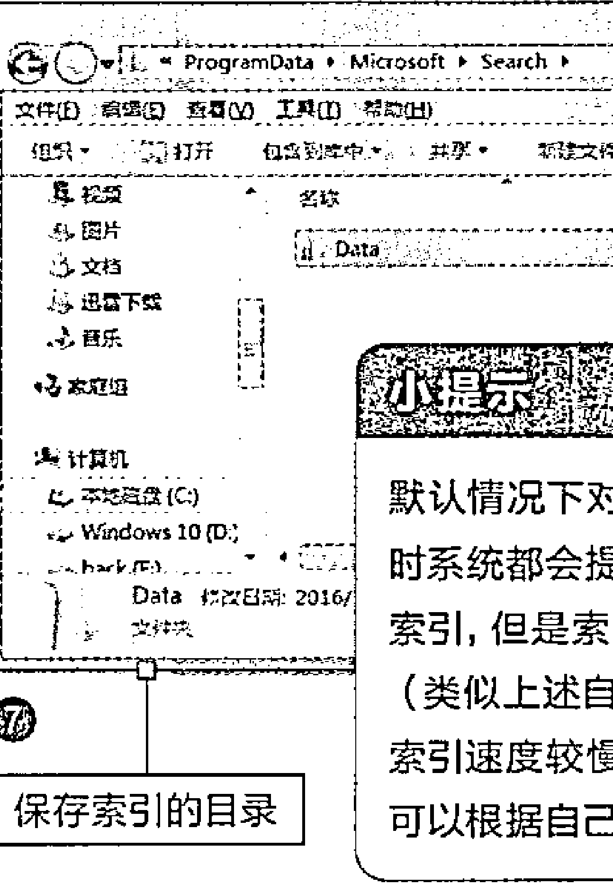

小提示

默认情况下对于没有建立索引的目录，在首次进行搜索时系统都会提示是否建立索引，手动点击虽然可以建立索引，但是索引文件过大同样会影响搜索速度。小索引（类似上述自定义建立索引）可以加快常见搜索速度，大索引速度较慢却可以提供更全面的搜索结果。因此大家可以根据自己的实际需要选择大索引还是小索引。

##### 画皮背后 浏览器内核探秘

文/CFAN迷

浏览器是我们上网的必备工具，除了常见的IE外，市面上还有各种各样的浏览器，有的号称是最安全的浏览器，有的则说自己是最快的浏览器。那么这些浏览器到底有什么不同？各浏览器的“画皮”下又隐藏着什么？

###### 浏览器的核心：认识浏览器内核

对于浏览器来说，其实最重要或者说核心的部分是“Rendering Engine”（译为渲染引擎），也就是我们常称的“浏览器内核”。它负责对网页语法的解释（如标准通用标记语言下的应用HTML、JavaScript）并渲染网页。因此如果要对浏览器进行区分，关键是看看它们使用什么样的内核，内核几乎决定一款浏览器的主要特性。

目前浏览器内核主要有Trident（即IE内核，代表浏览器：IE浏览器），Gecko（代表浏览器：火狐，是一个跨平台内核，可以在Windows、BSD、Linux和Mac中使用），Webkit（代表浏览器：Safari浏览器、傲游浏览器3、Google Chrome、360极速浏览器等），Blink（代表浏览器：Chromium），还有一个就是几乎没人使用的Presto（代表浏览器：Opera，只在Opera12.17及更早版本中采用，现在几乎没有浏览器再继续使用它）。不过就目前主流市场来说，其中Trident和Webkit是使用最多的两种浏览器内核。

```
html
<!DOCTYPE html>
<html>
<head>
<meta charset="utf-8">
<title>示例</title>
</head>
<body>
<div id="swfEveryCookiewrap" style="width: 0px; height: 0px; overflow: hidden;" data-for="result"></div>
<script>
window._async_strategy=2;
</script>
</body>
</html>
```

现在浏览器的内核那么多，那么如何查看自己的浏览器使用的是什么内核？浏览器内核参数可以通过输入特殊命令查看。以IE11浏览器为例（其他浏览器操作类似），启动IE后按下F12键进入开发者模式，接着点击右侧EDGE后的控制台图标，在窗口最下方“>”提示符后输入“navigator.appVersion”命令并回车，此时就可以看到浏览器内核标识了，如IE11显示的是Trident/7.0，表示其使用的是“Trident 7.0”版本的内核（图1）。

```
javascript
// 控制台输出示例
navigator.appVersion
"5.0 (Windows NT 6.1; WOW64) AppleWebKit/537.36 (KHTML, like Gecko) Chrome/38.0.2125.122 Safari/537.36 SE 2.X MetaSr 1.0"
```

不过现在很多浏览器在使用多个内核，如搜狗浏览器6.1就是“Trident+Webkit”双内核，同样在搜狗浏览器里启用高速模式后按下F12键后输入上述命令，此时显示的则为“AppleWebKit/537.36”，表示其在高速模式下（兼容模式使用则为Trident内核）使用的是“WebKit 537.36”版本的内核（图2）。

当然如果你觉得输入命令麻烦，现在很多网站也提供自动在线检测内核。例如 http://ie.icoa.cn/，使用自己的浏览器打开上述网站后会自动显示浏览器内核名称和版本，对于双核浏览器切换内核后则显示另外的内核信息（图3）。

即使现在升级到了IE12，它仍然可以通过兼容性模式往下兼容，这样对于只能使用低版本浏览的页面（如很多网银页面），我们只要点击“设置→兼容性视图设置”，然后将当前页面添加到兼容列表即可使用了（图5）。

###### 为浏览选择合适的内核

Trident和Webkit作为目前使用最多的两种内核，它们各自有什么特点？在日常的应用中又该怎么进行选择？

浏览器内核主要用来渲染网页内容的，将网页的代码转换为最终你在显示器上看得见的页面。而Webkit内核和Trident相比，具有更加清晰的源码结构、更快的渲染速度，并且支持多线程。因此在网页浏览速度上，Webkit内核要比Trident内核浏览器更快，所以那些号称极速、高速浏览器，使用的基本上都是Webkit内核。但是Webkit内核也有不足，现在很多网页都是针对IE浏览器开发和适配的，Webkit内核浏览器在浏览这些页面的时候就可能出现排版错乱或者无法完全打开的故障，特别是一些网银、在线支付页面，由于这些页面需要加载安全控件，Webkit内核浏览器经常无法使用（图4）。

此外，IE11开发者模式可以让用户任意选择“IE5→Edge”内核进行浏览，同上，在IE11中按下F12键之后，在右侧的EDGE默认值展开下拉列表，我们就可以任意选择使用哪个IE版本模式进行页面浏览，即使是为再低版本IE适配的页面也可以完美兼容（图6）。

Webkit内核浏览器打开网页速度快，Trident内核浏览器则兼容性好。因此为了各取两者优点，建议大家使用Webkit+Trident双核浏览器。比如可以使用搜狗高速浏览器，这样浏览普通页面的时候默认使用的就是高速Webkit内核，而在使用网银等时会自动使用默认Trident内核，达到速度和兼容性完美结合。当然我们也可以在浏览时点击地址栏的图标进行内核的手动切换（图7）。

Trident内核的优势则是兼容性好，因为作为系统内置并且市场占有率最高的IE浏览器，各大网站几乎都会针对IE浏览器进行适配。而且IE作为最普及的浏览器，

##### JPG图片背后的秘密

首先我们来了解一下什么是JPG文件。JPG是由国际标准组织(ISO)和国际电话电报咨询委员会(CCITT)为静态图像所建立的第一个国际数字图像压缩标准，它以24位颜色存储单个光栅图像，支持最高级别的压缩。也就是说，JPG是一种压缩格式的图片文件，它其实和Windows中的RAR文件、音频文件中的MP3格式，视频文件中的Divx影片一样。图像数据之所以能被压缩，就是因为数据中存在着冗余。比如图像中相邻像素间的相关性引起的空间冗余；图像序列中不同帧之间存在相关性引起的时间冗余；不同彩色平面或频谱带的相关性引起的频谱冗余。JPG压缩就是对其中不影响画质的冗余数据进行压缩并重新进行编码，从而实现不影响画质的前提下减小图片的体积。

虽然JPG是一种有损压缩文件，但是JPEG压缩方案可以很好地压缩类似的色调。当然对于颜色较少、对比级别强烈、实心边框或纯色区域大的较简单的作品，JPEG压缩无法提供理想的结果。不过在实际使用中，我们大多是对各种颜色丰富的照片进行压缩，因此经过JPG压缩后，就肉眼的观看来说，画质的变化并不明显。比如百度中很多高画质的壁纸图片、数码相机拍摄的高品质图片等就是使用JPG格式，你能说这种图片画质不清晰(图1)？

那么在实际使用中我们该如何对JPG图片进行压缩？最简单的方法是直接利用系统画图组件进行转换，比如要将BMP图片转换为JPG格式，在画图中打开图片后选择“另存为→JPEG图片”即可(图2)。不过“画图”无法选择压缩比且无法对已经是JPG的文件再次压缩，如果要实现自主选择JPG压缩率，就需要借助其他专业软件。如JPGCompact，启动程序后打开需要压缩的图片，然后在“图片压缩比”选中需要的压缩率(可在画质和大小之间平衡，网上使用一般40即可)，点击“图片压缩”即可(图3)。

现在再次打开压缩前后的图片，可看到压缩后图片大小只有原来的一半，但整体显示画质并没有明显的降低(图4)。

###### 小细节引起的大差异

如今笔记本和平板二合一设备已逐渐取代了台式机，成为每个家庭的必备成员。然而，在这些移动PC的选购和使用过程中，经常会出现一些小细节引起的大差异，需要引起我们的重视。

####### 为何大显存有时不吃香

虽然CFan已经不止一次报道过GPU（独立显卡）核心的重要性远大于显存容量，但依旧有无数用户习惯以显存容量作为选购参考，在同价位笔记本中总喜欢优先挑选显存容量更大的型号（图1）。为了让大家不再被显存‘忽悠’，我们不妨重温一下显存和显卡之间的关系。

简单来说，显卡性能受多个因素（或者说参数）影响，而这些因素重要性的排行是：GPU核心＞显存位宽＞GPU核心频率＞显存频率＞显存容量。可见，显存容量的排名最末。实际上，显存只是用于缓冲和存储图形处理过程中的纹理材质以及图形操作指令，它就好似一个物流仓库，并非越大越好。

根据外媒Techspot针对高端台式显卡的测试，像《战地4》、《孤岛危机3》、《刺客信条：辛迪加》一类的大型3D游戏，哪怕将画面调整到2560×1600像素（1600P），且开启FXAA、4xMSAA超高画质，2GB容量的显存也完全可以满足需求（图2）。只有《GTA5》在上述超高画质下2GB显存才会捉襟见肘（图3），在最低帧数上会与4GB显存落下差距。

问题是，很多笔记本厂商会为NVIDIA 940M这一级别的独显武装4GB显存，而940M显卡最多只能在720P＋较高画质下勉强运行《战地4》级别的3D游戏，此时显存的占用率可能只有1GB，而余下的3GB就被完全浪费了。那么，什么级别的笔记本显卡才有必要武装超过2GB容量的显存呢？

答案很简单：在1600P＋顶级画质下，保证大型3D游戏能以至少24fps速度流畅运行的显卡。而在2016年上半年，符合上述资格的笔记本显卡唯有NVIDIA GTX970M和GTX980M，哪怕是GTX960M和AMD R9-M385X也没有这个底气(图4)。换句话说，对GTX960M或以下级别的显卡，2GB显存容量足矣。如果某款笔记本能在价格不变的基础上“附赠”更大容量的显存还说得过去，但要是以配备更大显存为卖点而提价就纯属“骗钱”了。

####### 显存版本远比容量重要

与显存容量相比，显存版本对显卡性能的影响才是实质性的。以NVIDIA GTX950M显卡为例，该显卡拥有640个流处理器，显存位宽为128bit。当它与DDR3显存搭配时，其显存带宽不足30GB/s（图5），在3DMark测试中的GPU成绩只有3012；而当它与GDDR5显存搭配后，显存带宽就可达到64GB/s（图6），相同测试则可取得3560的分数（见表）。我们可以将显存带宽理解为高速公路的行车道，带宽越大意味着行车道越多，单位时间可穿行更多的车辆，从而可尽可能挖掘出GPU核心应有的性能。因此，当两款同样配备GTX950M独显的游戏本摆在面前时，我们可优先挑选采用GDDR5显存的产品。

| 显卡型号         | GTX950M-DDR3 | GTX950M-GDDR5 |
|------------------|--------------|---------------|
| 3DMark11         | 4171         | 4335          |
| 3DMark-FireStrike| 3012         | 3560          |

####### 游戏出现卡顿怎么办

如今笔记本和平板二合一设备都是“模块化结构”，无非就是在有数的处理器和显卡之间自由搭配，我们可以根据具体的CPU/GPU型号判断出其大致的性能。但是，有时我们会经常遇到一个尴尬的问题，明明是两台配置相似的笔记本（比如都是酷睿i5-6300HQ+GTX960M），为何有一款可以流畅运行某款游戏，而另一款却会出现明显的卡顿呢？在排除不是GPU“带不动”某款游戏的情况下（比如我们就不能指望AMD R5-M330可流畅运行《战地4》），我们可以从以下两个方向解决游戏的卡顿问题：

对显卡而言，显存位宽的重要性仅次于GPU核心。但GPU核心决定了显存位宽，比如所有GTX960M都是128bit，所有940M都是64bit，笔记本厂商无法对其增减。因此只要知道GPU核心的强弱即可，可无视显存位宽这组参数。之所以我们强调显存版本，是因为笔记本厂商可根据成本有针对性地选择某GPU核心与DDR3或GDDR5显存搭配，从而导致同一GPU核心实际性能会出现差异。

1. 如今很多人喜欢下载绿色免安装版的3D游戏，而这类游戏可能无法被显卡驱动检测到，从而始终以集成显卡模式运行造成了游戏的卡顿。如果是NVIDIA独显，请在桌面点击鼠标右键进入NVIDIA显卡控制面板，在“管理3D设置”中确定出现卡顿的游戏是否设定在“高性能NVIDIA处理器”的模式下（图7）。如果是AMD独显，同样需要在显卡控制中心的“可切换显示卡应用程序设置”中，将游戏设定在以“高性能”的模式运行（图8）。
2. 无论是笔记本所用的酷睿i系，还是平板二合一设备常用的Atom和酷睿M，这些处理器在温度过高或超负荷运行（TDP达到上限）时都会触发降频机制，瞬间将主频下调到1GHz甚至更低，从而导致游戏出现突然性的卡顿现象。此时，我们可以通过给笔记本风扇和散热鳍片除尘，或者加装抽风式的散热风扇提高散热效率，不让处理器因温度飙升而触发降频的机会。此外，我们还可以安装“ThrottleStop”软件，关闭处理器的降频机制，从而保证它始终都能够运行在设定的频率上。

> > 火热速递：如果你想学习“ThrottleStop”软件的使用方法，请参考http://dwz.cn/2ADGNS这个网址的教程。该软件兼容时下所有主流的英特尔处理器，包括Atom Z3735 之类的平板电脑。

####### 传统已成过去式

SSD并非什么新鲜事物，CFan也针对它的选购进行过诸多报道。但是，在过去的很长一段时间里，SSD的性能取决于三颗“心脏”：主控芯片、闪存芯片和缓存芯片（图1），而且通常来说容量越大的SSD其读写速度也就越快（图2）。比如，体积（相对）硕大的2.5英寸SSD硬盘的整体性能要优于mSATA或M.2（NGFF）这种迷你SSD；512GB的SSD更容易取得接近600MB/s的读写性能。然而，这些“理所应当”的传统，却随着以微软Surface Pro 4为代表的新一代PC的出现而被打破，这款平板电脑中那片小小的SSD（图3），竟然跑出了接近1500MB/s的读取速度（图4）！同样是由芯片构成的SSD，它们的差距怎么会这么大呢？

| 测试项目 | Read [MB/s] | Write [MB/s] |
|----------|-------------|--------------|
| Seq Q32T1 | 1494        | 554.6        |
| 4K Q32T1  | 372.1       | 241.7        |
| Seq       | 864.0       | 459.9        |
| 4K        | 29.97       | 89.65        |

| 指标 | 120GB | 240GB | 480GB |
|------|-------|-------|-------|
| 顺序读（高达） | 550 MB/秒 | 550 MB/秒 | 545 MB/秒 |
| 顺序写（高达） | 340 MB/秒 | 510 MB/秒 | 500 MB/秒 |
| 随机读（高达） | 91K IOPS | 95K IOPS | 95K IOPS |
| 随机写（高达） | 74K IOPS | 78K IOPS | 75K IOPS |
| MTBF** | Telcordia, 应力部件 | 200万小时 | 200万小时 |

我们都知道，SSD是为PC（笔记本/平板）提速的不二法宝，但为何不同SSD硬盘之间的速度差异也存在着云泥之别呢？如何才能让设备100%释放SSD应有的全部潜能呢？

###### 接口协议是王道

如今，只要SSD的主控不算太差，普遍都能获得500MB/s以上的读取速度，但想要取得更高的成绩，就要看物理接口以及软件协议的配合了。

在笔记本和平板二合一设备领域，SSD的物理接口主要以标准的2.5英寸SATA（兼容机械硬盘）、mSATA（已趋于淘汰）和M.2为主。其中，2.5英寸SATA又包含SATA3.0和SATA2.0两种标准，有些低端笔记本光驱接口还停留在SATA2.0上，如果你通过光驱位的硬盘托架安装SSD（图5），那SSD就将受限于SATA2.0而导致性能受损。

M.2是目前迷你SSD的主流标准，只是它正处于“混乱之治”的时代。比如，根据OEM厂商的需求，可以赋予M.2选择SATA3.0、PCI-E2.0 (Gen2) ×2、PCI-E2.0 (Gen2) ×4、PCI-E3.0 (Gen3) ×4四种传输通道的能力。不要小看传输通道对SSD性能的影响哦，同样是M.2 256GB SSD，PCI-E3.0×4的读取速度要4倍于SATA3.0，真正让玩家体验到飞一般的感觉（表1）。

PCI-E3.0×4之所以如此给力，是因为它能与全新的NVMe协议搭配，从而充分释放SSD应有的全部潜力（图6）。简单来说，硬盘的协议标准经历了IDE、AHCI和NVMe三个阶段，比起时下主流的AHCI协议，NVMe通过原生PCIe主控直接与CPU相连，绕过了AHCI协议需要经过南桥控制器中转的步骤，在执行命令时也不再需要读取寄存器，从而大幅降低了控制器和软件接口部分的延迟，最终获得了远超AHCI的性能表现。

需要注意的是，NVMe协议只是PCI-E 3.0×4通道M.2接口和SSD的“可选项”，它需要重新定义M.2物理接口的针脚，以及额外的物理芯片支持。回顾前文，微软Surface Pro 4之所以能在磁盘性能上惊为天人，就是因为它内置的SSD采用了PCI-E 3.0 ×4通道且支持AHCI协议。

###### 表1: 不同M.2通道SSD性能的差距

| 传输通道 | SATA3.0 | PCI-E 2.0×2 | PCI-E 2.0×4 | PCI-E 3.0×4 |
| :--- | :--- | :--- | :--- | :--- |
| 顺序读取 | 520MB/s | 770MB/s | 1080MB/s | 2200MB/s |
| 顺序写入 | 450MB/s | 530MB/s | 800MB/s | 900MB/s |
| 代表产品 | 浦科特M6GV | 浦科特M6GV | 三星XP941 | 三星950PRO |

* 以上四款代表产品的速度取自256GB容量版本的官方参数，PCI-E通道SSD的性能也会因容量的提升而有所增益

如果你不能确定光驱接口的标准，那在升级SSD时就最好将SSD安装在原机械硬盘的位置，将机械硬盘安装在光驱位。

> 拓展阅读 2.5英寸SATA、mSATA、M.2等规格都是消费级领域惯用的形态，在企业级市场中高端SSD更青睐使用半高半长PCI-E扩展卡以及SFF-8639接口的2.5英寸形态。其中SFF-8639本质上就是SATA Express，最多支持四条PCI-E 3.0，因此理论带宽高达4GB/s。

###### 驱动变得更重要

在Windows 7和AHCI协议时代，笔记本要想正确开启AHCI模式需要进入BIOS将SATA RAID/AHCI Mode更改为“AHCI”，同时可能还需要修改注册表的键值。到了Windows 10和NVMe时代，想顺利释放NVMe的“激情”也没有那么容易。

比如，Surface Pro 4虽然武装了时下最强的SSD之一，但却在驱动层面“栽了跟头”。Surface Pro 4配备了支持NVMe协议的三星PM951 SSD，但由于其刚上市时三星NVMe驱动还未更新，所以很多批次的Surface Pro 4默认安装的都是微软驱动（三星NVMe SSD用微软驱动时SSD里的大容量外置缓存将形同虚设），导致SSD的写入和4K性能极差（图7），与外媒和微软官方列出的磁盘性能大相径庭，一度让玩家怀疑微软是否“偷工减料”。

在更新到三星最新NVMe驱动之后，PM951 SSD性能才算趋于正常（图8），但却又带来了读写文件时CPU占用极高的问题，需要进入控制面板后搜索并关闭bitlocker功能和Windows数字签名才算最终解决。总之，对于新兴技术，NVMe SSD也将面临软硬件层面的磨合，如果你想第一时间享用它的极速，就要做好可能“被折腾”的准备。

##### 让设备发挥SSD的潜力

如今SSD固态硬盘的价格已出现大幅下调，无论2.5英寸SATA还是M.2，128GB容量的SSD几乎都跌进350元价位，256GB也纷纷向500元靠拢。可以说SSD全面进驻笔记本的时代已然来临。而我们要做的就是想办法让设备100%发挥出SSD的潜力。

除了前文提到的不要将SSD安装在SATA2.0接口以外，还需根据设备的M.2接口通道类型选择最合适的SSD。以内置两个M.2接口的机械师F57为例，两个M.2分别采用SATA3.0和PCI-E3.0×4通道，用户可根据需求选择两个SATA3.0通道的M.2 SSD组建RAID0，也能安装分别采用SATA3.0和PCI-E3.0×4两种通道的两个M.2 SSD（图9）。在这种情况下，直接购买支持PCI-E 3.0×4通道的M.2 SSD无疑最理想，因为这一标准SSD的读写性能不会比SATA3.0通道M.2 SSD组建的RAID0差多少，也不存在RAID0“一损俱损”（一旦其中某个SSD出现故障会导致整体数据的丢失）的缺点。

反之，如果你的笔记本仅配备了1个或2个都是SATA3.0通道的M.2接口，此时就可以考虑RAID0的方案进一步提升磁盘性能了（图10）。好消息是，最近几年上市的笔记本几乎都支持RAID，而且可以任由不同品牌、不同容量的SSD组合，比如使用64GB M.2 SSD和128GB标准2.5英寸SSD搭配。不过，RAID0模式的容量取决于最小的SSD，64GB+128GB组合后最多只有128GB的空间（64GB×2）。

笔记本组RAID0的方法很简单，开机进入BIOS，将Advanced选项中的SATA Mode模式改为“RAID”（图11），保存退出BIOS并重启后即可按“Ctrl+I”进入RAID的设置界面（图12）。至于具体教程，可参考本刊2013年19期的《追求神速 笔记本也能用SSD组RAID0》这篇文章，或直接访问参看http://dwz.cn/2AVhv7。

##### 处理器是潜在瓶颈

同一款M.2 SSD，在不同笔记本（或台式机）上测试时可能大家的顺序读写速度接近，但4K性能却存在着相当大的差距。在排除4K对齐、驱动等因素外，到底是谁还会拖累SSD的4K性能发挥呢？

答案就是处理器频率。中关村在线最近针对处理器主频和核心数量对SSD性能的影响进行了一番测试，结果相当令人惊讶：以酷睿i7-6700K为测试平台，当处理器超频到4.5GHz和降频到0.8GHz时，SSD的4K读写速度有着2倍~3倍的差距（表2）。但是，当手动将i7-6700K限定在单核/双核/四核，且在开启和关闭超线程技术时SSD的4K读写性能却几乎没有差异。由此可见，SSD的4K读写性能会随着处理器主频的变化出现波动。

不要以为这是危言耸听。很多笔记本因为散热模块设计的缺陷，极易出现因温度过高而导致处理器降频现象的出现，而处理器一旦降频，SSD的性能自然也要受限，由此就会引发更明显的系统卡顿问题。

表2：处理器主频与SSD 4K读写性能之间的关联性测试

| i7-6700K频率 | 浦科特 M6V读取 | 浦科特 M6V写入 | 三星950 PRO读取 | 三星950 PRO写入 |
| :--- | :--- | :--- | :--- | :--- |
| **AS SSD Benchmark测试（取4K子项成绩，单位：MB/s）** | | | | |
| 超频至4.5GHz | 36.37 | 118.84 | 54.56 | 195.15 |
| 默认频率 | 35.2 | 107.53 | 62.93 | 176.88 |
| 降频到3.2GHz | 35.23 | 103.24 | 52.93 | 163.45 |
| 降频到1.6GHz | 31.17 | 72.29 | 44.76 | 102.84 |
| 降频到0.8GHz | 25.62 | 46.5 | 35.43 | 61.21 |
| **CrystalDiskMark测试（取4K子项成绩，单位：MB/s）** | | | | |
| 超频至4.5GHz | 39.72 | 139.4 | 60.95 | 262.4 |
| 默认频率 | 38.94 | 130.6 | 60.27 | 244.4 |
| 降频到3.2GHz | 38.58 | 126.3 | 59.05 | 226.4 |
| 降频到1.6GHz | 35.65 | 95.01 | 54.21 | 156.4 |
| 降频到0.8GHz | 30.68 | 64.96 | 46.15 | 99.69 |

> * 以上数据来自中关村在线的测试成绩 内容出处：http://t.cn/RbEtIVd

##### 性能差异的底层原因

喜欢电脑游戏者或硬件发烧友肯定都知道这么多年来的显卡N、A两家之争，在桌面处理器升级速度放缓时，GPU的提升速度没有受到影响依然速度飞快，这是大型3D游戏不断进化的另一种体现。不过说到显卡性能，不能只看跑分，还要结合实际游戏表现综合衡量。尽管N、A两家显卡都有各自擅长的游戏引擎和游戏类型，但是在一些DX11（DirectX，以下简称DX）API下某些特别倚重CPU性能的游戏中却出现了一边倒的情况。

##### 系统和游戏的新老交替

目前由于Windows 10的火爆，全新的游戏大作有半数都使用DX12作为API（图1），但是依然有很多游戏由于要兼顾PS4和Xbox One主机或者之前的Windows版本，依然采用DX11 API。而且还有诸多老游戏依然人气很高，这些老游戏也是采用DX11甚至DX10、DX9等API设计的（图2）。这就是说我们目前选显卡不仅要看最新版游戏性能，能否适应老游戏也是衡量标准之一。

不论DX11还是DX12都属于一种API，是Windows中的应用程序接口。Windows中的应用程序接口有很多，而我们熟悉的DirectX是一种库与框架的API，应用于多媒体以及游戏开发等领域。应用程序接口在这里的作用是在软件层调用硬件性能，属于一种看不见但非常底层的、直接决定性能的因素（图3）。

##### DX11游戏中的效率问题

既然我们玩到的很多游戏依然采用DX11，那么显卡对于老游戏的效率也就十分关键。但是，在NVIDIA和AMD显卡对于不少老游戏的表现中不少玩家对AMD显卡的效率颇有微词，具体体现在同级别的NVIDIA和AMD显卡总是前者支持得更好并且帧数更高，另外就算是高一个甚至两个档次的AMD显卡在有些老游戏中依然比不过NVIDIA显卡（图4）。

而其中表现最明显的就是暴雪人气很高的网络游戏《魔兽世界》、《暗黑破坏神3》和《星际争霸2》等游戏（图5）。比如说在相同的平台分别使用GTX 670和HD 7970GE运行2560×1440分辨率下的满特效《暗黑破坏神3》，照理说HD 7970GE的性能要比GTX 670高至少10%，但实际的表现却反了过来，更高阶的HD 7970GE比GTX 670性能要差。

在《魔兽世界》中问题更为明显，在相同的平台分别使用GTX 970和AMD R9 Nano运行3840×2160分辨率下的满特效《魔兽世界》（图6），AMD R9 Nano的各方面性能都要比GTX 970高上至少20%，但依然是GTX 970性能更好。而且不仅如此，AMD R9 Nano还经常出现掉帧、无规律的卡顿等问题，实际体验比对手要差不少。

但奇怪的是我们用这两者来运行权威的DX11性能测试，比如3DMark 11、Heaven benchmark等等，测试软件中的成绩一切正常，分数的高低很好地体现了显卡因档次不同的性能差异，并没有游戏中的奇怪现象。

| 同平台下显卡 | 测试游戏 | 分辨率 | 游戏帧数 | 3DMark11 | 备注 |
|--------------|----------|--------|----------|-----------|------|
| HD 7970GE | 暗黑破坏神3 | 2560×1440 | 93 | P10242 | - |
| GTX 670 | 暗黑破坏神3 | 2560×1440 | 119 | P8853 | - |
| R9 Nano | 魔兽世界 | 3840×2160 | 50 | P16489 | 卡顿、时常降至40fps以下 |
| GTX 970 | 魔兽世界 | 3840×2160 | 61 | P12902 | 流畅 |

##### 问题在游戏还是驱动程序

由于AMD在Radeon Crimson驱动前WHQL驱动较少，多是Beta版本，驱动的稳定性相对NVIDIA的也较差，所以绝大多数用户都认为是AMD老旧的驱动程序问题。可去年年底AMD重磅推出了Radeon Crimson (图7)，驱动程序焕然一新，而且在很多方面甚至超过竞争对手，之前说过的问题是不是就不存在了呢？很遗憾，问题丝毫没有得到解决。

如果不属于驱动程序问题，那么是不是游戏本身有问题呢？由于暴雪游戏在全球游戏玩家众多，所以这种现象还是比较普遍的。而且不仅是暴雪游戏，在很多DX11游戏当中都有类似的现象，特别是很多网络游戏。游戏与显卡品牌确实存在很多赞助和对应优化等现象，但是差距都在可以接受的范围之内，并不会出现大幅度的性能低下现象。

不仅如此，不少用户还发现了比较奇特的现象。比如说在《魔兽世界》中高负荷场景使用NVIDIA显卡的话，处理器的负载始终在90%以上的水准，而使用AMD显卡的话，同样平台处理器负载只有70%左右。在很多情况下处理器负载低而显卡满载是显卡渲染效率高的体现，但是在一些对处理器要求较高的游戏中这并不见得是一件好事，具体可以查看上面关于游戏的性能差异。是什么导致了这种现象？

##### 全新3DMark的API测试

这个长久以来困扰游戏玩家的谜团，随着全新3DMark最新版的到来终于有了比较有说服力的解释。v1.5.884新版本API Overhead可以测试DX12、Mantle及DX11的Draw Call绘制命令性能了，也就是说基于API的硬件底层性能 (图8)。

为了在屏幕上绘制一个物体，引擎需要发一个Draw Call给图形API，比如OpenGL或Direct3D。对每个Draw Call图形API要做可观的工作，它消耗CPU性能。然而这还不是关键，开销大的地方是Draw Call之间GPU变换访问资源，因为每个Draw Call都要触发一次图形驱动程序工作。之所以说DX12能更好地降低GPU处理瓶颈，其实就是通过改善Draw Call效率来实现的 (图9)。而在目前仍处于绝对主流的DX11游戏当中，享受不到多核心、多线程的最优化，所以GPU与CPU搭配起来的Draw Call绘制命令性能至关重要。

- 测试平台
  - 处理器：i5-2500K@4.5GHz
  - 芯片组：Intel Z68
  - 内存：DDR3 1866MHz 8GB×2
  - 系统：Windows 10 Pro x64
  - 分辨率：3840×2160
  - 显卡：GTX 970、R9 Nano
  - 驱动：WHQL 359.00、Crimson 15.12

测试成绩在3DMark官网下的性能对比中 (图10)，图中左边数据是GTX 970，右边是R9 Nano。根据成绩对比你会发现一个很有意思的现象，AMD显卡只有在DX12 API下才能发挥出R9 Nano理应比GTX 970强力的性能，而在DX11 API下反倒让GTX 970超越了两倍。R9 Nano性能可要比GTX 970高多了，但不论每帧还是每秒，使用AMD显卡在DX11 API下底层图形程序接口对CPU的调用都要比N卡低一倍还多。不仅如此，N卡和A卡DX11多线程Draw Call比单线程的提升幅度更加奇怪，DX11下A卡的Draw Call性能多线程与单线程还下降了，而N卡根据处理器特性则可以有10%~30%的提升。

###### 显卡不同处理器效率不同

| 详细分数 | | |
| --- | --- | --- |
| DX11 Multi-threaded draw calls per second | 2,451,969 | 1,151,562 |
| DX11 Single-threaded draw calls per second | 2,186,809 | 1,155,119 |
| DX12 draw calls per second | 12,864,244 | 16,211,700 |
| Mantle draw calls per second | N/A | 14,615,321 |
| DX11 Multi-threaded draw calls per frame | 82,644 | 38,490 |
| DX11 Single-threaded draw calls per frame | 73,728 | 41,472 |
| DX12 draw calls per frame | 442,368 | 540,672 |
| Mantle draw calls per frame | N/A | 442,308 |
| DX11 Multi-threaded final fps | 29.56 fps | 32.60 fps |
| DX11 Single-threaded final fps | 29.66 fps | 26.82 fps |
| DX12 final fps | 29.08 fps | 23.98 fps |
| Mantle final fps | N/A | 33.04 fps |

对API比较关心的用户肯定会记得2014年AMD和DICE力推的开源API Mantle，对其支持最好的就是寒霜3引擎。当时AMD认为目前的图形渲染API存在瓶颈，CPU执行Draw Call命令存在限制，导致了游戏性能受限。相比微软主导的DX11其Mantle更接近原生，Mantle下Draw Call命令速度可达DX11的10倍，比如在很多场合下《战地4》Mantle的效率要比DX11高40%左右。

AMD明知DX12马上推出还费力推自己的API Mantle，估计也知道A卡DX11下的表现难尽人意。去年更流行对多核心多线程支持更好的DX12以及Windows 10到来后，AMD的API Mantle又成了非主流。看起来像是AMD白费力了一番，其实不然，Mantle的出现加速了微软全新API出现的速度以及市售主流游戏对于更先进API的支持速度。

AMD认为单靠显卡驱动去优化CPU多线程是治标不治本，认为API底层优化才是标本兼治，这也是API取名为Mantle（地幔）的原因（图11）。所以在很多DX11游戏中，AMD显卡本身的性能并不差，甚至还略强于对手的显卡，但实际表现总是不佳。深层的原因则是AMD显卡及驱动在DX11下底层的CPU效率不佳，而游戏对处理器的要求越高这种现象就越明显。

###### 不被注意的设计

类似的IT产品外观都差不多，但是很多需要注意才能发现的细节才是决定其性能的关键。一些比较好的设计或功能并没得到厂商的大力宣传，所以能够体会其中差异的用户也不太多。但其实这些背后的设计细节潜移默化地让产品更加好用和出色，也因为这些小细节区分了不同的用户群体。

###### 风扇扇叶有大学问

风扇在整个台式机机箱中只是很不起眼的设备，但风扇好不好用直接关系到系统温度和噪音程度，其实影响了用户体验的一环。对风扇要求不高的用户只关心风扇是否静音、是否会发光等问题；而有一定要求的用户则会关注于风量或风压。但其实风扇的物理结构是决定最终性能的关键，有些类似的风扇扇叶形状、角度、尺寸都决定了它的最终性能。

####### 叶片数量和间距

注意观察的用户肯定会注意到，所有PC风扇的扇叶都是奇数，比如5、7、9等，绝少见偶数扇叶风扇。这是由于偶数扇叶容易产生共振，而做动态平衡又是费力不讨好的事情，所以干脆就都做成奇数。而叶片数量还和叶片间距有关，叶片间的距离小，会因气流增加叶片表面的摩擦降低风扇效率，也就是风量，但在这种情况下风压却更大；而叶片间的距离大，则不会有气流之间的干扰，风量较大，但压力明显不足，最终导致风扇的风压不足。即便是同一品牌的风扇也会有扇叶数量和叶片间距之间的巨大差异（图1），这个细节是风扇性能中最重要的一环。

####### 叶片曲率和弧度

曲率和倾角是两个非常相似的概念，曲率是指整个扇叶的弯曲程度，弯曲程度越大，风量与风压都会有增加，但对电机要求更高；叶片弧度是指风扇在俯视时扇叶不是笔直，而是略有弯曲呈一定弧度。如果叶片笔直，虽然阻力小但是送风距离短，而略带弧度则可保证吹出气流集中，增加送风距离与风压。相似的系列风扇在叶片弧度上也有较大不同（图2），取决于不同的使用环境。

####### 风扇中心与边缘占比

风扇中心区域是电机所在，这部分区域是没有气流的。电机越大气流盲区也就越大（图3），但更大功率的电机势必要占用更大空间，这也与之前说的扇叶曲率有关。而叶端间隙其实是扇叶边缘与风扇内框之间的距离，间隙过大风扇效率降低，而过小则会增加风噪（图4）。

####### 风扇性能的取舍

注意风扇性能的用户都会知道风扇最大两个性能因素——风量和风压这两者是不可兼得的，这是由于风扇的物理结构因素决定的。而上面说的很多风扇细节既然是最终决定风量与风压表现的关键，就注定也是鱼和熊掌的关系，没必要苛求风扇在所有部分都做到最好。我们只需要知道自己是需要风量还是风压，对应挑选适合自己使用的产品即可。

###### 风量风扇代表

####### 九州风扇
XFAN120U

和九州风神XFAN120属于同一系列，但是加大了扇叶面积，同时叶片曲率很大，在普通版本风扇的基础上大幅度提高了风量。不少九州风扇塔式散热器就标配了XFAN120U及其后续产品，能够保证塔式散热器所需的大风量。

##### CFan推荐

###### 猫头鹰NF-P12

猫头鹰另一款最著名的风扇，风扇间距极小，风扇边缘与风扇内框间距很小，并且在扇叶端的锯齿设计能减少切风噪音。NF-P12的扇叶很适合水冷设备等需大风压才能吹透的细密鳍片。

###### Scythe S-FLEX SFF21E

Scythe风扇一般被爱好者称为镰刀扇，其特点是扇叶的曲率和弧度都非常大。而且FDB轴承油路十分顺畅，能够保证大曲率下的风扇动力十足并且比较静音，适合作为机箱风道风扇。镰刀扇能够提供近似圆柱体一般的风压。

##### 不起眼的出色主板设计

主板虽然几乎不影响PC最终性能，但是一款好用的主板是会在装机、调试、超频甚至故障维修时多方面帮我们的。目前的主板双雄华硕和技嘉，都拥有自己独特的一套技术，体现在背后的小细节方面，让我们一起来看看主板的I/O和接口。

###### 华硕的FLASH和U2接口

对于一键刷新BIOS华硕主板是走在业界前沿的，用户经常操作BIOS的话是会遇到BIOS失效需要刷新的情况，而华硕背部I/O区域的BIOS FLASH是支持无CPU通电即可刷新功能的（图1）。不仅十分前卫，在需要更新BIOS才能支持新处理器的场合是非常方便的功能。而全新U2接口是一种最新的SSD接口规范（图2），论性能甚至超过M.2接口，论尺寸和稳定性又超过SATA和M.2接口很多。

###### 技嘉多色USB接口的定义区分

技嘉是最早在背部I/O区域使用键鼠通用PS/2接口的主板厂商之一，而在USB方面他们也做足了工作。比如最新的Z170 Gaming主板背部的USB接口竟有黄、蓝、白、红四种颜色，分别代表什么含义呢？黄色接口专供键鼠使用，拥有非常高的响应速度；蓝色接口是传统USB 3.0接口；红色接口是Intel芯片提供的USB 3.1 Type-A接口，当然也有Type-C版本；而白色接口则是支持Q-Flash Plus功能的闪存盘刷新BIOS专用接口（图3）。

##### 这是一场说走就走的旅行

策划《电脑爱好者》编辑部

扫一扫，更多精彩内容立现

经历了春运的一番“折腾”，
不知大家是否感觉到随身的行李太累赘了？
那就把笔记本电脑、移动硬盘之类的东西放下，
让你的行李减负吧。
什么？笔记本电脑不能丢？
还有很多事情需要在旅途中完成！
没关系，本期我们就为大家提供多个远程互通方式，
让你既能轻松出行，也能不误工作与他人沟通。

Let's Go!

##### 看Android能否逆袭PC

当我们出门在外时，身边可能只有一部Android手机和一个闪存盘。
那么，如何利用闪存盘办公？或利用一部手机与远方的PC“沟通”，
进而实现说走就走的目的呢？

##### 将Android装进闪存盘

虽然Android手机的屏幕越来越大，Android平板也越来越便宜，但依旧仅有少数用户将它们作为主力“生产设备”。原因很简单，想提高“生产力”需要足够大的视野、高效率的文字输入及成熟的操作习惯。然而当Android与闪存盘联姻后，却有机会解决上述三大缺陷，让Android也能成为创造“生产力”的平台。那么它是如何实现的呢？

###### 能与PC联姻的Android

可能有人会问，如今Android平板可以外接显示器和键鼠，不一样可以实现大视野和快捷输入获得更高的生产力吗？问题是，Android平板并非人人拥有，而且原生Android系统在体验上与Windows大相径庭，用惯了Windows的用户很难在上面找到感觉。
好消息是，现在已有凤凰OS（下载地址：http://www.phoenixos.com/download_x86，本文测试的版本为2016012301版）和Remix OS for PC（下载地址：http://www.jide.com/remixos-for-pc，本文测试的版本为1.0.1 beta版），这两个基于Android深度定制的OS拥有类似Windows的界面和操作逻辑（图1），并能直接烧录至闪存盘中，插在任意PC（台式机、笔记本、X86平板）上就能引导运行。从此，我们外出时只需带个闪存盘即可（图2），从而有望来一场说走就走的旅行。

###### 闪存盘就是系统中心

将ISO镜像文件烧录进闪存盘的方法很简单，两个系统的官网也都提供了烧录工具，只是在烧录前需要我们提前将闪存盘格式化成Fat32格式，为了保证系统的流畅运行则建议选择容量在8GB或更大的USB3.0产品。以Remix OS for PC为例，运行下载包里的Remix OS USB Tool，选择保存Remix OS for PC目录中的ISO文件再点击确定即可（图3）。

> 小提示
Remix OS for PC要根据PC BIOS的类型选择对应的Legacy或UEFI两种版本的镜像文件。辨别PC BIOS版本的方法很简单，在Windows系统下按“Win+R”打开运行，输入“msinfo32”并回车。在系统信息的BIOS模式中如果显示“传统”，说明该PC启动方式为Legacy BIOS（图4）。

###### 用任意电脑“运行”

无论是凤凰OS还是Remix OS for PC，它们的启动方式均相同。将烧录进ISO的闪存盘插入任意PC的USB接口，在开机时选择以“闪存盘启动”（和我们用闪存盘重装系统的步骤一样）（图5）。其中，Remix OS for PC在此时会让我们选择Resident Mode（可正常保存用户下载的APP和相关数据）或Guest Mode（重启后数据清空，相当于每次都恢复了一遍出厂设置）两种安装方式（图6），除非你身处网吧或对隐私极为敏感，否则建议选择Resident Mode模式安装。安装时间视闪存盘的速度以及具体的电脑配置而定，耐心等待一段时间后就能看到凤凰OS或Remix OS for PC的欢迎界面了。

笔者的笔记本型号为联想扬天V480A，是2012年配置中等的笔记本。就系统首次的载入时间来看，凤凰OS快于Remix OS for PC，而进入系统后的流畅度则是Remix OS for PC优于凤凰OS。总之，无论任意型号的电脑，只要它有USB接口且支持闪存盘启动，就都有机会体验到不一样的Android。

###### PC版Android“靓”在哪

凤凰OS和Remix OS for PC的使用逻辑非常相似，它们在界面布局上都充分模仿了Windows 10的元素，比如开始菜单（图7）、任务栏图标和通知中心等等（图8）。与传统的Android UI相比，这两套系统都加入了双击概念，桌面图标需双击才能运行；增加了回收站机制，我们可以在里面找回误删的文件（图9）；绝大多数APP都能以悬浮的小窗口模式显示，在一个屏幕上可以同时运行并显示多个APP窗口（图10），便于我们像操作Windows系统那样在多APP间切换，就多任务的体验而言完虐原生Android。

作为生产力的保证，两套系统都预装了WPS软件，并可完美兼容PC的键盘和鼠标的滚轮，Ctrl+C、Ctrl+V、Ctrl+A等熟悉的快捷操作都被完美还原（图11）。可像Windows电脑那样处理文档表格PPT，这就是凤凰OS和Remix OS for PC创造生产力的底气所在。

此外，两个系统分别预装了豌豆荚和360手机助手，我们可以在这里下载安装APP。就兼容性而言，我们熟悉的QQ、微信、新闻客户端等软件运行起来都不错，但Android游戏的体验却是不佳：要么用鼠标键盘无法操作，要么就是卡顿感明显。需要注意的是，凤凰OS和Remix OS for PC对硬件的兼容性存在缺陷。比如笔者的笔记本就无法识别无线网卡（打不开Wi-Fi）（图12），只能通过有线网连接网络。

两个系统最大的差异，则体现在磁盘管理方面。比如，笔者将两个系统都烧录到了16GB的USB3.0闪存盘中，而两个系统并不能占满整个闪存盘的空间。其中，Remix OS for PC引导PC启动后可由用户使用的闲置空间约3.2GB，而凤凰OS的用户空间则约2.1GB。问题是闪存盘剩余的空间无法被两个系统访问。如果我们想在两个系统中播放音乐、视频或者其他文档资料又该怎么办呢？
通用的解决方案是将这些文件都上传到云盘，再在凤凰OS和Remix OS for PC中下载安装云盘APP，从而实现文件的“空中传输”。此外，凤凰OS和Remix OS for PC可以识别安装在PC身上的其他闪存盘（图13），并在资源管理器中访问或进行删除等操作，比如笔者为了将系统截图拷贝出来，就用上了第二块闪存盘用于中转数据。而凤凰OS做得比Remix OS for PC好的地方是，它可以识别PC本地的NTFS格式的硬盘，在内容的获取方面更为容易（图14）。可惜，只有“主分区”的本地硬盘才能被凤凰OS识别，而逻辑分区却无法访问。
总之，凤凰OS和Remix OS for PC的操作理念相似，在体验上处于伯仲之间。而他们也都存在一些缺陷，比如有些无线网卡、X86平板的重力感应器等硬件存在兼容性问题，从而引起无法无线上网或自动旋转屏幕失效等问题。在使用体验上，它们并不适合玩Android游戏，只适用于使用鼠标点击操作的社交、新闻、在线视频、WPS等类型的APP，在Office办公领域有着一定的“生产力”。我们在外出时装着它们，可让任何地方的PC都“变成你的PC”。

###### 用SD卡住进Android

最适合凤凰OS和Remix OS for PC的其实是搭载Atom处理器的X86平板电脑，可惜此类设备很多连标准的USB接口都没有，只能通过MicroUSB和OTG的方案连接闪存盘和鼠标键盘。此时，不妨考虑通过将Android装进SD卡（或TF卡）的方式，将宝贵的MicroUSB或标准的USB接口节省下来。
以Surface Pro 4安装凤凰OS为例，首先要关闭Secure Boot功能，并使用EasyUEFI和UltraISO软件的配合。具体操作方面，先用UltraISO格式化SD卡并将凤凰OS的ISO写入。之后再运行EasyUEFI创建新项，点击中间第二个按钮并将类型改为其他，目标分区选择SD卡，文件路径选择“efi/boot/boot64.efi”（图15），再把新建的启动项移到最前面重启即可。

##### 大容量闪存盘 影音资料随身行

> 火速连接
无论凤凰OS还是Remix OS PC，它们不仅可安装进小小的闪存盘，同时也能安装在PC的硬盘里并通过Windows引导Android启动。此外两个系统也在不断完善和更新中，大家可关注两个系统的官方论坛，在里面能找到很多使用教程和故障解决案例。

> 小结
当Android与Windows元素结合后，在办公方面的确具备了一定的“生产力”。如果你落脚的地方（如酒店、网吧）有PC且能有线上网，在凤凰OS和Remix OS for PC的帮助下就能做到“说走就走”，一个闪存盘就能让你随遇而安。

**表1：64GB（实际可用约58GB）闪存盘建议分区状态**

| 分区号 | 分区大小 | 分区格式 | 分区目的 |
|--------|----------|----------|----------|
| A | 48GB | EXFAT（或FAT32） | 普通闪存盘，可被Windows和Remix OS共享访问 |
| B | 2GB | FAT32 | Remix OS系统和相关的引导文件 |
| C | 8.6GB | EXT4 | Remix OS的DATA分区，相当于过去Data.img的大小 |

> 小知识：为何不用Windows磁盘管理工具对闪存盘分区
由Windows磁盘管理创建的分区里包含很多以$开头的文件和文件夹，它们都是在硬盘高级格式化时产生的“元文件”。对Windows的磁盘管理来说，这些元文件都是无法移动的，从而导致压缩卷和扩展卷存在致命的局限性（比如总有很多空间无法压缩）。而第三方磁盘管理软件则可轻松打破元文件的局限性，从而实现更高级的磁盘分区和管理功能。

如果你的闪存盘容量很大，直接制作Remix OS for PC启动盘就太过浪费了（因为Remix OS无法访问闪存盘空间）。那么有没有办法将Remix OS for PC烧录至闪存盘中，又不怕误删关键文件而影响启动，并在Remix OS for PC系统中也能访问剩余空间，实现Remix OS和Windows的共享分区呢？

答案是可以，但操作起来比较复杂。以下是技德官方论坛用户“gujiangjiang”提出的解决方案，适合超大闪存盘和以UEFI启动的PC。简单来说，可将大容量闪存盘划分三个分区，而最终目的就是当PC进入Remix OS for PC系统后，我们能在文件管理器中看到一个48GB大小的闪存盘，并让Remix OS for PC系统本身也能拥有至少8GB的可用空间（表1）。
具体的分区过程需要用到Diskgenius（下载地址：http://www.diskgenius.cn/）、MiniTool Partition Wizard（下载地址：http://t.cn/Rb17DDQ）这两个软件。
首先运行Diskgenius，鼠标右键点击左侧列表中的闪存盘（或点击菜单栏里的“硬盘”），执行“删除所有分区”命令后再点击左上角的“保存更改”。继续鼠标右键点击闪存盘选择“转换分区表类型为GUID格式”，然后点“确定”后再点“保存更改”（图1）。
接下来操作比较复杂，请严格按照下述方法执行：点击菜单栏的“新建分区”，取消弹出窗口中EFI和ESR的复选框的勾选（图2），确定后在新建分区窗口的“新分区大小”中输入第一个分区，即计划中的A分区容量48GB（图3），调整到Fat32格式后点击确定。继续点击菜单栏的“新建分区”创建计划中用于存放系统文件的B分区，输入2GB后点击确定（图4）。

此时Diskgenius主界面对应闪存盘的分区表是由48GB的未格式化Fat32分区、2GB未格式化Fat32分区和7.9GB的空闲分区组成。鼠标右键点击48GB的分区，选“删除当前分区”（图5），将其变成空闲状态。点击Diskgenius主界面左上角的“保存更改”按钮，在弹出的立即格式化新建分区窗口中点击“是”，就能退出Diskgenius软件。

现在Windows系统已经可以识别出闪存盘中2GB的分区，将从官网下载的UEFI版Remix OS for PC镜像解压缩（请用7-Zip解压缩，其他压缩软件会提示镜像有问题），将包括EFI启动文件夹在内的所有文件拷贝到这个2GB的可移动磁盘中（图6）。

请在http://pan.baidu.com/s/1hraub8C将下载的压缩包解压缩，并将initd.img和grub.cfg分别复制到闪存盘的根目录和efi\boot目录下替换原文件。

运行前下载的MiniTool Partition Wizard，右键选择闪存盘对应的最后一个8.6GB分区点击“新建”，在弹出的窗口中将格式设定为“EXT4”，点击确定后再点击主界面左上角的执行按钮（图7）。耐心等待几分钟，完成任务后退出该软件。

再一次运行DiskGenius软件，给闪存盘对应的48GB空闲分区“新建分区”，然后点击左上角的保存按钮。退出DiskGenius软件，进入Windows系统的资源管理器，此时你会发现原先2GB的分区不见了，只能看到一个48GB的分区。现在可以随意折腾这个48GB的分区了，将其格式化为exFAT格式，它就是今后可以被Remix OS和Windows共享的分区了。

用闪存盘引导EFI的PC启动以后，你就能在Remix OS for PC的文件管理器中看到这个48GB的分区了（图8）。

如果在操作过程中遇到了问题，或者对完美大闪存盘方案感兴趣的读者可访问“gujiangjiang”网友的更详细教程：https://bbs.jide.com/论坛查看精华帖。

> 小提示
替换的initd.img文件添加了对EXT4分区挂载的支持；grub.cfg可不替换，但要用“Notepad++”软件（不能使用记事本，否则会损坏该文件）打开原文件并将“CREATE_DATA_IMG=1”这个代码删除再保存。如果嫌麻烦或无法删除那行代码再选覆盖即可。

大家可根据自己闪存盘容量和实际需求来调整大小。

##### 用手机“插足”你的PC

随着各种远程控制类APP的普及，在Android手机上远程控制PC已经不是什么新鲜事。换句话说，哪怕PC没在我们身边，我们也能在手机那小小的屏幕上对其“指手画脚”，从而不耽误我们说走就走的节奏了。

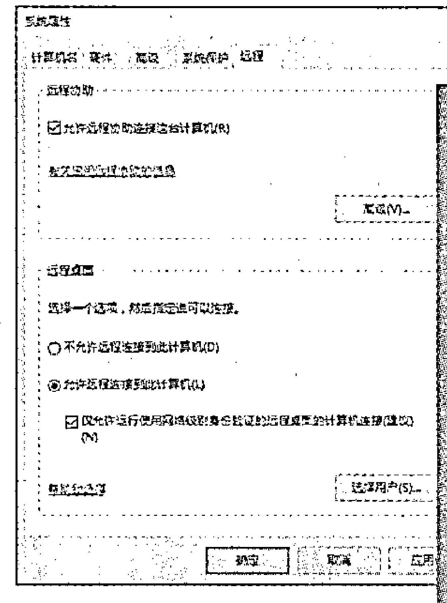

##### 局域网的远程控制

能在局域网环境下控制PC的软件有很多，但口碑最好的还要数微软自家的“Microsoft Remote Desktop”（在手机自带的应用商店即可下载）。只要你的系统版本在Windows 7专业版以上即可使用。以Windows 10专业版系统为例，先给系统设定一个登录密码，鼠标右键点击“此电脑”进入系统属性设置，在“远程”选项卡界面勾选“运行远程协助连接这台计算机”和下面的建议选项（图1），最后应用后即可关闭窗口。

进入控制面板的防火墙设置界面，请确认“允许应用通过Windows防火墙进行通信”列表中的“远程协助”和“远程桌面”是否在开启状态，如果没有就手动勾选。然后在搜索栏中输入“cmd”进入命令提示符界面，接着输入“ipconfig”回车找到并记下IPv4对应的地址（图2）。

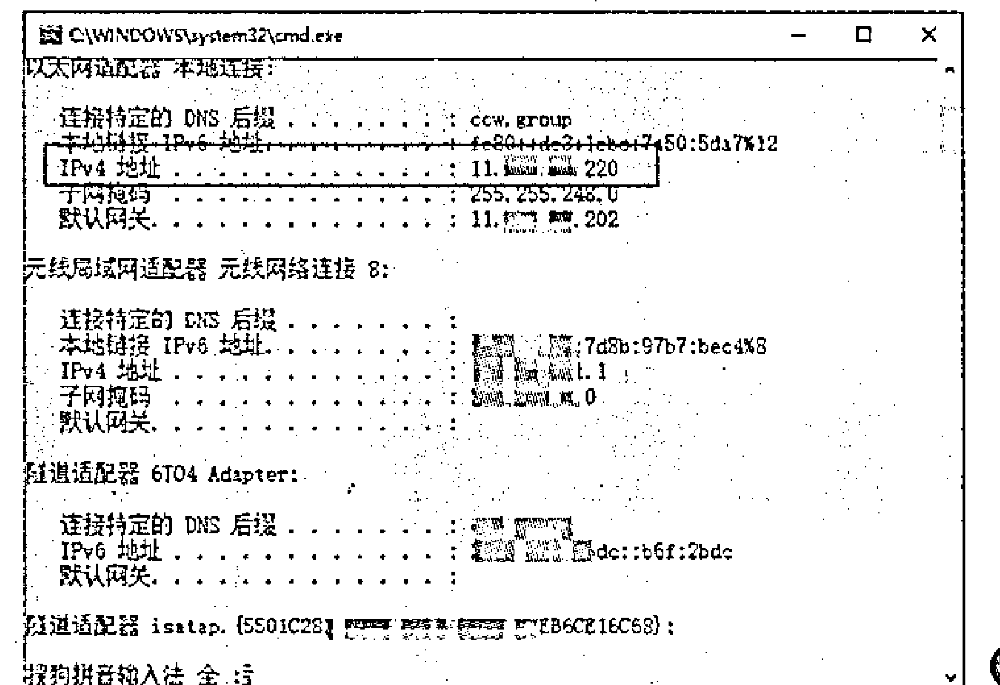

接下来在手机上运行微软远程桌面APP，点击右上角加号中的“Desktop”添加你的电脑，在弹出的窗口中依次输入刚才记下的IPv4地址、添加你电脑的账户名称和密码，点击save按钮后（图3），即可将PC屏幕的画面映射到手机的屏幕上。此时，我们就能通过手机屏幕，去远程编辑PC中的文档、播放PC中的视频（图4）。可惜，微软远程桌面无法将PC端的文件直接传输至手机本地，它更像是远程遥控。如果你有拷贝数据的需求，可以用手机控制将所需文件上传至云盘，再由手机APP从云盘下载。

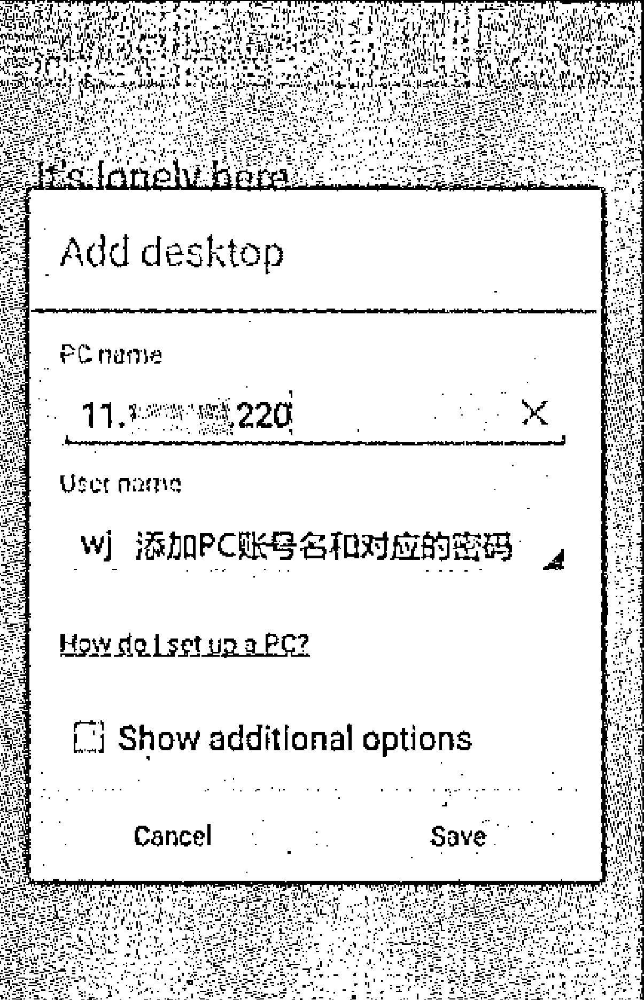

总之，微软远程桌面是操作最简单的远程控制APP，它不需要在PC端安装客户端，而且运行起来也最稳定。此外，该APP其实也支持广域网访问，只是需要申请类似花生壳的账号，并将其绑定到你家里的路由器上，获得一个如“****.xicp.net”的域名。接下来再在手机APP端的PC Name中添加刚才绑定的域名，整个操作非常复杂。

##### 外网的随时沟通

如果你不想将使用环境局限在家里或公司，想在“千里之外”也能对电脑下达指令，此时可以尝试使用TeamViewer（下载地址：http://www.teamviewer.com/zhCN/）实现手机对PC的远程控制。该软件分为PC客户端和手机APP两部分，首先在PC上安装运行客户端，根据界面提示注册账号，登录后可获得唯一的用户ID和对应的密码(图5)。

接下来在手机端运行TeamViewer APP，在主界面输入PC客户端生成的用户ID和密码后(图6)，点击连接即可实现远程控制。

TeamViewer最大的特色就是无需复杂设置即可支持局域网和广域网的访问，并通过多种手势提高操作效率(图7)。只要手机流量和网速够，那我们就能在任意地方实现对PC的“遥控”(图8)。如果手机网速不佳，我们可以点击APP底部的设置按钮，将显示质量设在“优化速度”(图9)。

需要注意的是，无论是TeamViewer还是前面介绍的微软远程桌面，在手机对PC进行远程控制时，PC端是不能操作的。特别是TeamViewer，哪怕不小心有人动了一下PC的鼠标，也可能导致连接的中断。

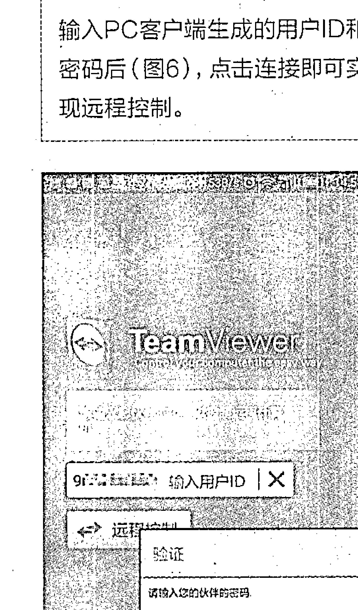

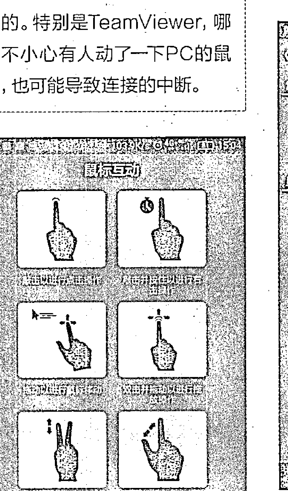

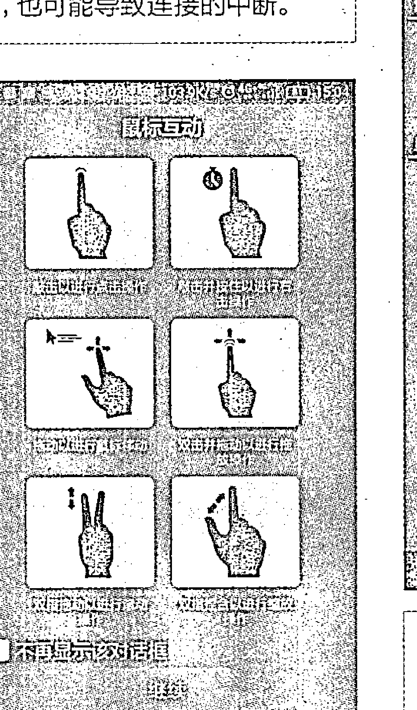

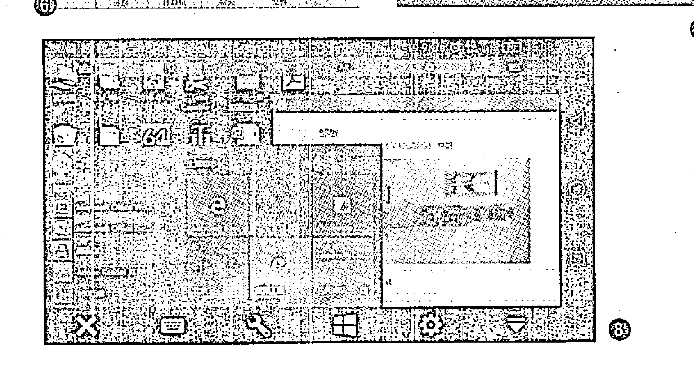

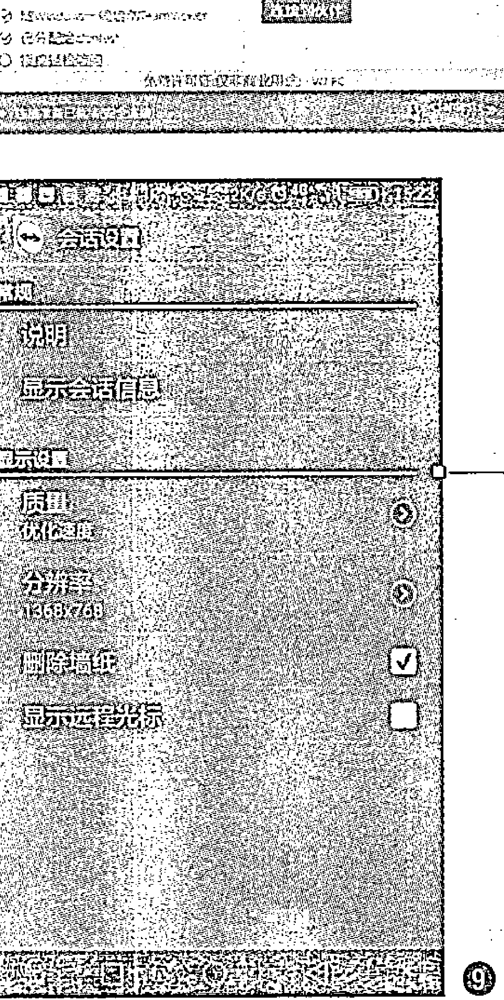

> 小提示
TeamViewer APP运行需要手机上安装谷歌服务和Google Play，不同品牌手机安装方式有所不同，大家可自行搜索。此外，TeamViewer支持手机远程唤醒PC，但具体的设置极为复杂，感兴趣的读者可以参考网友教程：http://t.cn/RhEawtc。在Android平台上可通过广域网控制PC的APP客户端还有很多，比如PhoneMypc、向日葵、网灵和Splashtop Remote Desktop等等，它们的运行机制和TeamViewer类似，都是APP+PC客户端的模式。其中，Splashtop Remote Desktop的功能和体验最好，但只有付费版才支持广域网，而免费版仅支持局域网。其他软件也类似，一些高级功能都需要购买后才可使用。

##### 让手机“唤醒”PC

手机远程控制PC的方法并不难，但前提条件是PC首先要开机状态，而且已运行了相关的客户端。问题是有时我们临时外出才发现PC上有很重要的文件没有拷贝，此时能否实现手机远程唤醒PC，再进行远程控制就显得尤为重要了。

可惜，手机远程唤醒PC非常复杂，笔者在这里主要介绍一些基本的思路：打开PC主板BIOS中类似Wake on LAN、WOL、Boot on LAN的功能（图10），需要PC通过网线与路由器相连，并进行端口映射（虚拟服务器）、IP地址与MAC地址之间的绑定和静态IP地址分配等设置。最后，再通过手机上的远程唤醒APP（比如“Depicus Wake On Lan Free”这款APP）加以实现。感兴趣的读者可以参考网上的详细设置思路：http://t.cn/zQtfNhr。

在这里，笔者再提供两种手机远程唤醒PC的方案：

-   1. 如果电脑BIOS的电源选项中有restore on Ac/Power loss或after powerloss等支持接通电源就自动开机的选项，我们可以将这些功能开启，并将TeamViewer等远程控制客户端添加到开机启动的程序列表中。此时，只需一款支持可以被广域网控制的智能排插，并将PC的电源插在排插上即可。今后，当我们在户外需要远程控制PC时，可以用手机上智能排插APP启动插座给PC供电，从而让PC自动开机并运行TeamViewer客户端，然后再在手机运行TeamViewer APP实现远程控制。
-   2. 现在有一些可以帮PC实现远程唤醒的外设，比如“向日葵开机棒”。将开机棒与路由器或集线器连接（图11），并在PC客户端进行开机棒选择和IP配置后，我们就能通过手机的APP进行一键远程开机（图12），同时还能执行丰富的远程控制命令（图13）。可惜：向日葵开机棒的使用成本较高，除了118元的设备本身，1年后还需续费（50元/年，如果只远程开启1部PC则免费）。

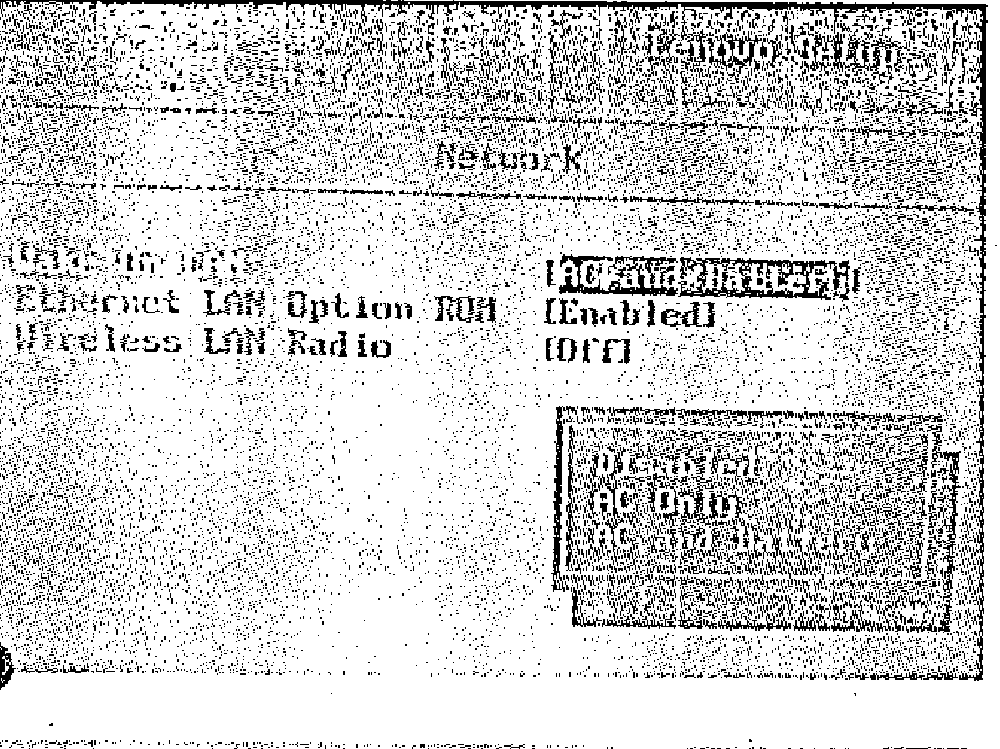


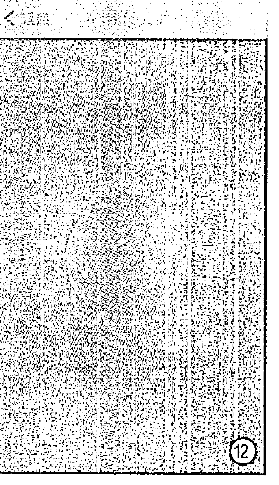

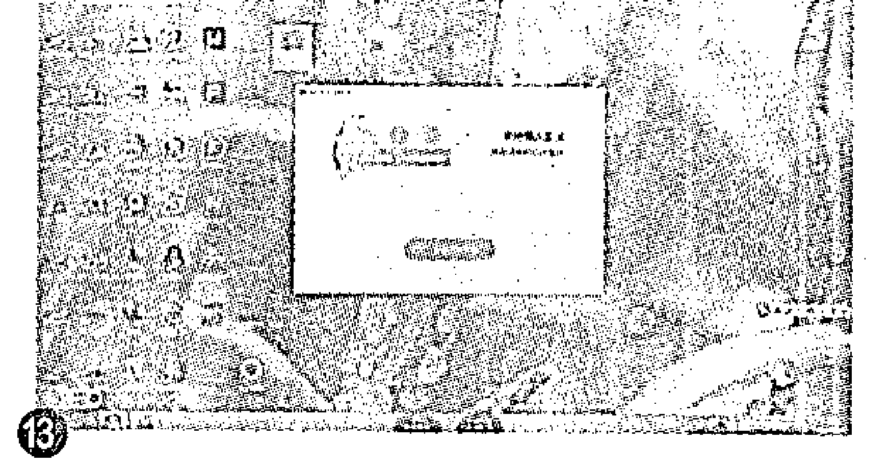

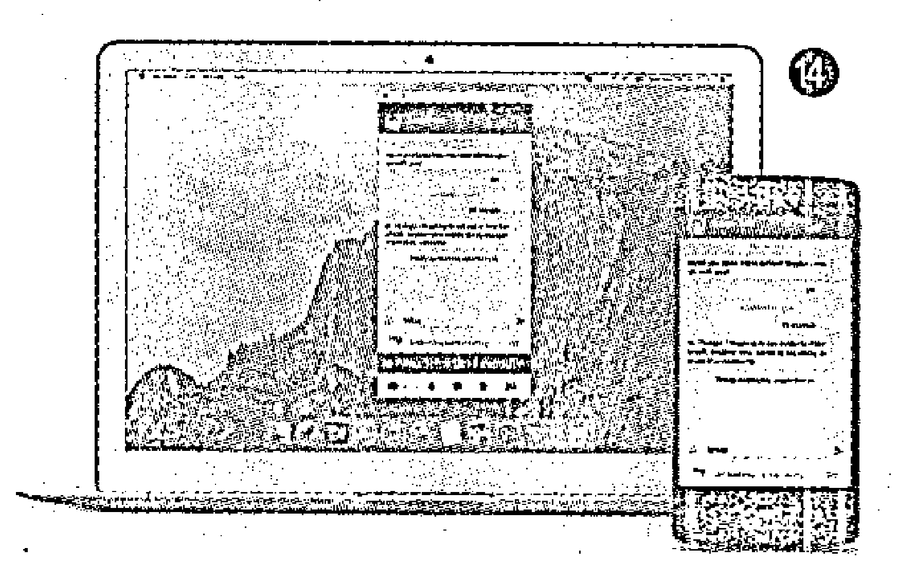

##### 如何远程控制手机

看完手机远程控制PC，那有什么方法让其他设备远程控制手机呢？如果你希望用PC远程控制手机，局域网下在手机和PC上都安装“Airdroid”（下载地址：https://www.airdroid.com/zh-cn/）或“Mobizen”（下载地址：https://www.mobizen.com/）的APP和客户端即可（图14）。可惜上述两款APP都需要手机获得ROOT权限。在广域网环境下PC远程控制手机的难度更大，要在PC上架设VPN，让手机端登录VPN，两端形成在互联网上虚拟出来的局域网才能实施远程控制。

手机可以远程控制手机吗？答案是可以，但目前只有华为手机的亲情关怀和锤子手机的远程协助APP才能得以实现（图15）。简单来说，两款APP的原理相同，都是厂商架设中转数据的服务器，从而不再受局域网限制。需要注意的是，虽然华为亲情关怀APP能被其他品牌和型号的手机安装，但自行安装的话因权限不足无法做到被控（只能远程控制自带APP的华为手机）。

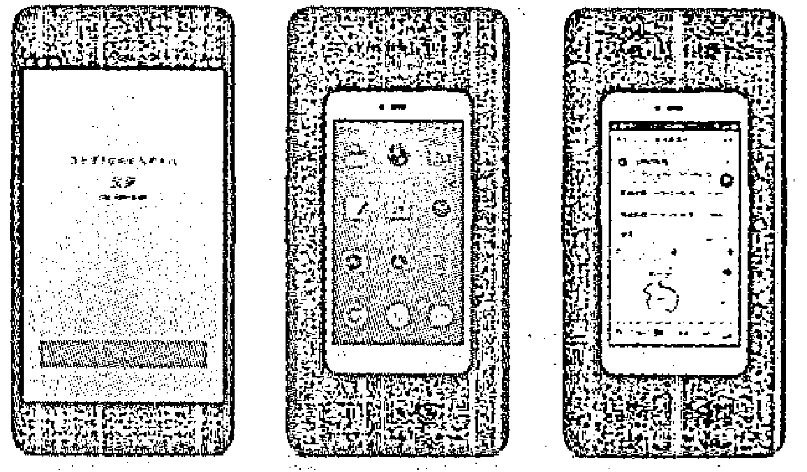

##### 特别话题

##### 用手机远程控制电器


智能家居“嚷嚷”了很多年（图1），但至今也没有一套成熟的民用案例。究其原因，则是缺乏统一标准，各品牌和类型的电器“单打独斗”，想将它们有机结合需要足够的资金（买得起）、技术（玩得转）和耐心（解决兼容问题）。那么普通用户又该如何尝鲜智能家居的味道呢？

##### 智能家电的尴尬

所谓智能家电，就是在传统家电的基础上增加了联网功能，可以通过语音或APP实现远程控制。可惜，市面上真正能击中消费者需求痛点的智能家电极为罕见，更多的产品只是以“玩”为基础，再辅以玩的概念进行所谓互联网思维营销，“想当然”地以为能改变或者迎合消费者的使用习惯。比如智能保温杯，你真的会因为APP的提醒而刻意去喝水吗？此外，所有主打智能的电器也意味着价格不菲，也因此进入了叫好不叫座，或用着没有吹的好的尴尬境遇。

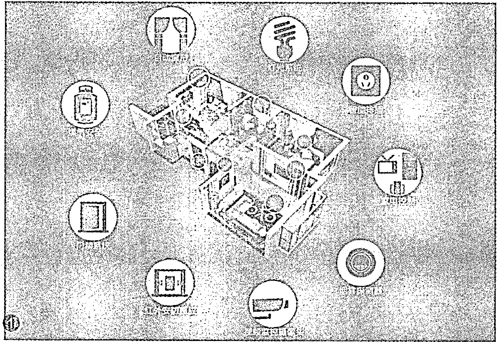

##### 用智能插座补位

既然智能家电可能不靠谱，那我们就不妨通过其他外设赋予普通电器智能的资质，而智能排插就是这么一种“中转站”（图2）。比如，普通的电热水壶和榨汁机只要放好水/水果并插在智能排插的插座上，我们快到家时只需用手机APP启动对应插座的供电即可（图3），从而实现刚进家门就能用热水泡茶或喝到新鲜的果汁。一台智能电热水壶和智能榨汁机要多少钱？而支持外网远程控制的智能排插价格最低不过50元，是否超值相信你心里已经有数。

需要注意的是，智能排插在功能和使用上可能存在很多限制或缺陷。比如，某些型号的智能排插仅支持Wi-Fi局域网环境下的远程控制（不支持外网环境），如果你在外面是无法使用手机APP对其进行远程开关的；有些插座在通电之后会自动开启供电，如果小区供电不稳定，偶尔会停电则会导致连接排插的电器反复工作；还有些智能排插对网络要求较为苛刻，如果家里路由器重启或突然断了那么一秒，也需要手机APP必须退出再重新登录开启后才能恢复正常使用。总之，如果你相中了某款智能排插，在购买前一定要多多留意相关的评测报告，以免出现使用上的尴尬。

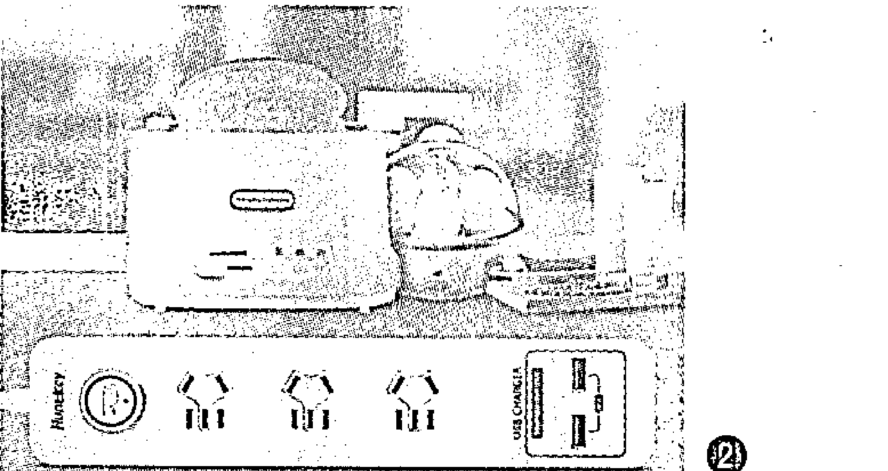

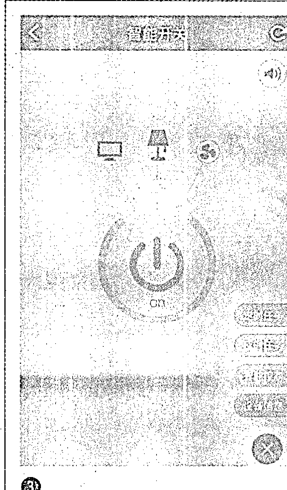

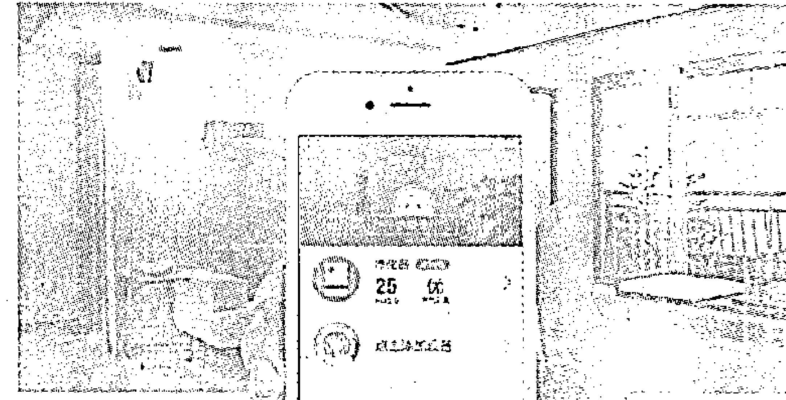

-   选购智能排插要注意的问题：
1.  很多，如有无物理开关、最大支持的电流和功率、是否配置防雷、防过载等安全功能。
2.  对此类产品感兴趣的读者可翻阅本刊2016年第3期《改善你的生活 智能排插怎么选》这篇文章，学习选购智能排插的诀窍。

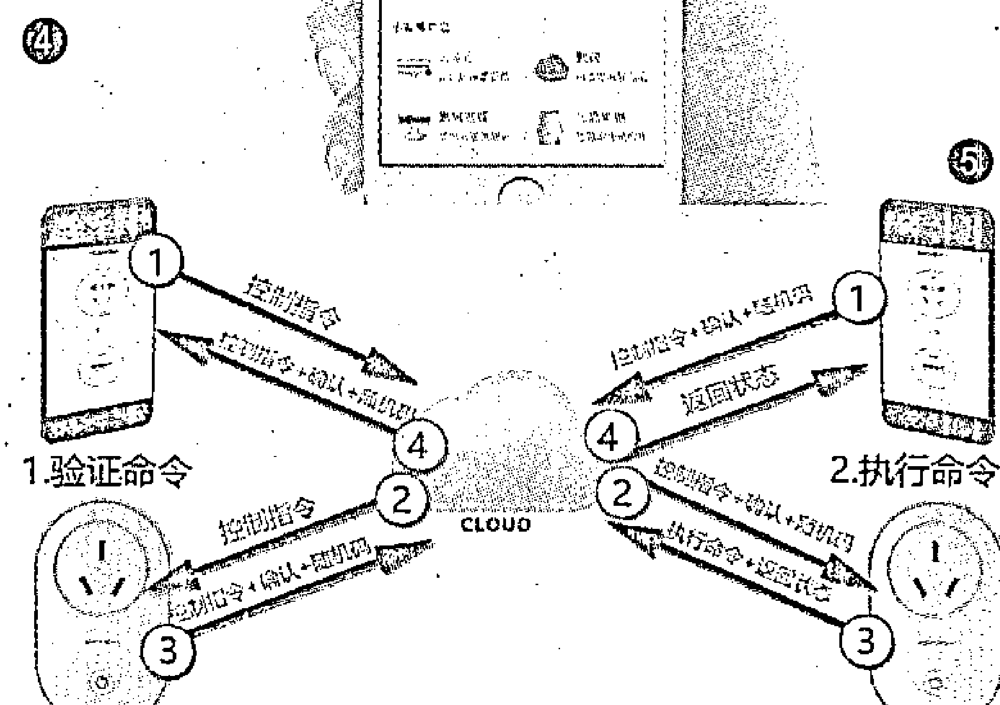

##### 远程控制的利与弊

那么，智能排插是如何让手机获得了使用外网远程控制的能力呢？原来，支持外网的智能排插大都使用了云管理的方式，智能排插通过连接路由器的Wi-Fi信号而接入外网，并将自己的地址信息发送到外网的云处理终端中。手机APP通过云终端获取插座的信息，对APP的操作命令首先会发送到云终端，再通过云终端返回给智能插座，最终实现远程控制的目的。

微联和阿里小智等智能家庭平台合作（图4），通过超级APP（除了能连接智能排插外，还能实现一个APP连接和控制所有智能家庭平台硬件的能力）和对方的服务器对智能排插进行远程管理。

手机APP会通过验证命令过程中获得的随机码+控制指令+确认消息，命令智能排插执行指令。当排插执行动作后，会将状态返回给手机，此时你就可以在APP上查看是否执行成功的结果。

态；外网环境可通过XMPP客户端模拟APP登录到XMPP服务器，再以聊天的方式对插座发送操作指令的密文数据对其进行管理。于是，你将有可能经历插在智能排插上的电脑突然断电关机、外出旅游时家里的电器被黑客远程开启的窘境。

换句话说，当我们购买了某个品牌的智能排插，就相当于选择了这家公司的服务（云服务器），否则不可能实现远程控制。因此，智能排插远程控制的效率高不高，取决于服务器端的性能和资历。而这也是为什么很多智能排插厂商只做硬件，软件部分都是选择与京东

远程控制虽然赋予了智能排插无限的可能，但我们也不能忽略潜在的安全隐患。网友刘健皓就曾剖析过智能插座的破解过程。简单说，智能排插的远程控制可分为两个过程（图5）：

如果你家里的网络被黑客入侵，或是植入了木马后门，黑客就能在网络中进行抓包分析，截取智能排插执行命令的数据包（图6）。虽然厂商会对这个数据包进行加密处理，但依旧有被黑客破解并对智能排插进行“攻击”的可能。而攻击手段大致可分为两种：局域网内可直接对智能排插发送操作指令的密文数据改变排插状态

当然这只是极端情况，而智能排插和软件服务商也会通过系统升级的方式堵住这些后门。但本着防范于未然的心态，笔者还是建议大家不要购买小品牌+自己研发APP使用的小众智能排插产品，提供远程服务的厂商实力越强，智能排插在使用的过程才相对越安全。

-   1. 验证命令
    当智能排插与路由器连接，运行APP时会先验证唯一的智能排插的MAC地址，具体就是通过云端返回的随机码进行验证。
-   2. 执行命令
    当你想对智能排插进行开关或功能设置时，

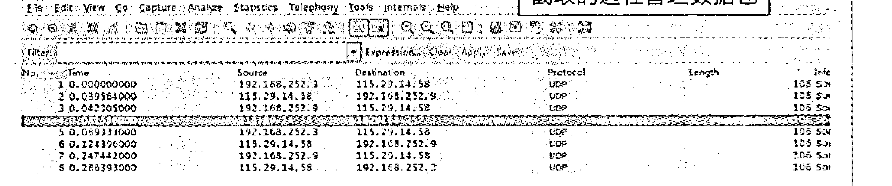

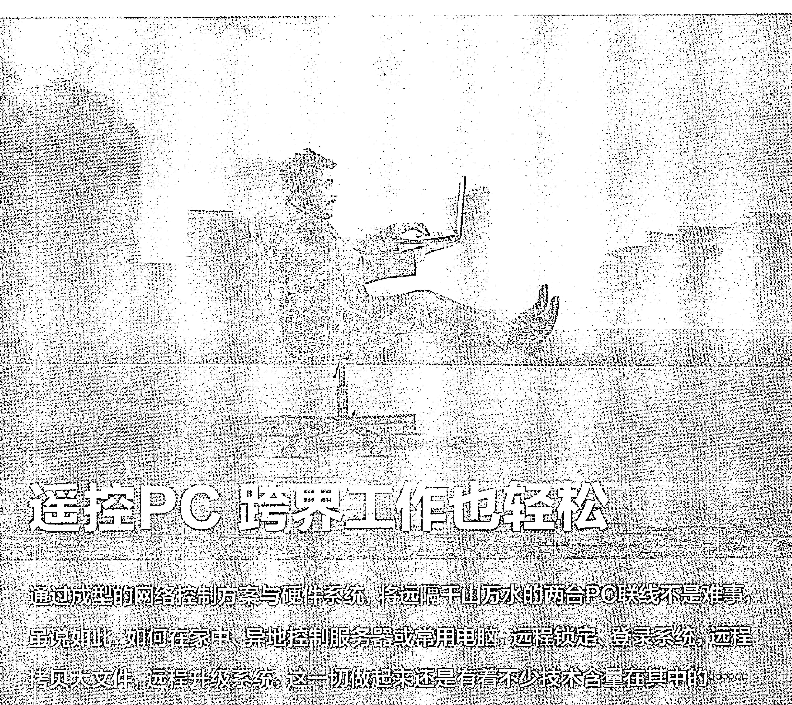

##### 遥控PC 跨界工作也轻松

通过成型的网络控制方案与硬件系统，将远隔千山万水的两台PC联线不是难事。虽说说如此，如何在家中、异地控制服务器或常用电脑，远程锁定、登录系统，远程拷贝大文件，远程升级系统，这一切做起来还是有着不少技术含量在其中的……

##### 网络控制设备已成现实

曾几何时，使用网络控制硬件和家电还只出现在科幻电影当中，而这几年伴随着移动互联网大潮，许多设备都已经实现了网络控制。虽然目前很多设备远程控制还不算太实用，但是在很多领域还是可以方便我们的生活的，一起来看一看吧。

##### 智能电源

电源是整个PC动力的提供者，也是PC系统的基石。电源智能化意味着之后智能控制PC系统开关机启动成为了可能，同时还解决了长久以来用户难以掌握控制电源运行状态的问题。目前不少高端一些的新电源都提供了使用USB线缆连接主板的方式来监控电源，但真正能做到网络监控的寥寥无几。

| 系列介绍 | 软件与功能 |
| --- | --- |
| Thermaltake (曜越) 简称TT，其最新的Toughpower DPS G系列电源不仅提供了USB直连主板的监控能力，其亮点是拥有了一套完整的管理 | 系统软件DPS G APP。其中DPS G APP一代还只是简单的PC版本地连接控制，但已经提供了不少其他品牌没有的功能。而二代APP2.0除了电脑 |
| 版本之外,还提供了手机和平板电脑的APP,提供非常厉害和前卫的功能(图1)。 |

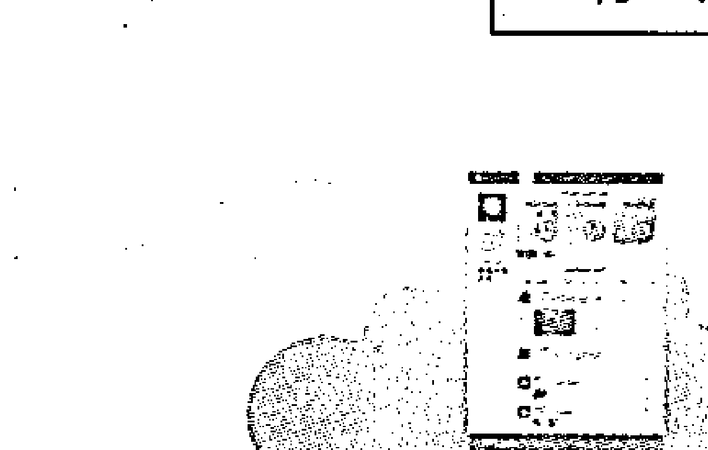

Toughpower DPS G系列电源接线部分左上方有一个4pin USB,可别忘记接上主板(图2),这就是DPS G用来侦测以及传送数据所使用的。如果没有接上它,那Toughpower DPS G就跟一般电源没两样了。连接之后就可以下载DPS G APP了,目前最新版本的DPS G APP同时拥有桌面2.0版本和DPS G Mobile APP 1.0版本。不论PC版还是移动版本,DPS G APP都提供了很多数字电源所没有的功能。TT DPS G APP能看见目前的耗电状态、


电压、电源转换效率,包括12V、5V及3V的电流和功耗。电源的风扇转速点击右上方的设置即可选择静音还是高效,相当实用。很多数字电源确实可监控电源状态,但对整个PC的把控并不足。而DPS G APP除了原本的电源监控外还增加了处理器及显示卡的电压、电流、耗电量以及温度等信息(图3)。DPS G APP会在云端记录电源的相关信息,比如自动保存上一次开机到关机之间的监控数据(上面会记录有日期及使用时间)(图4),而这些数据也能输出至Excel保存。有需求的用户可通过时间轴来查看记录信息、计算电费,非常方便。

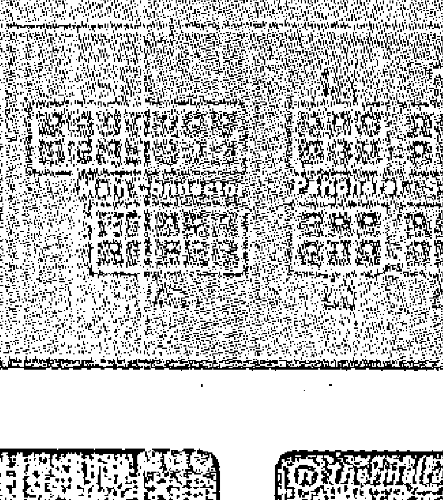

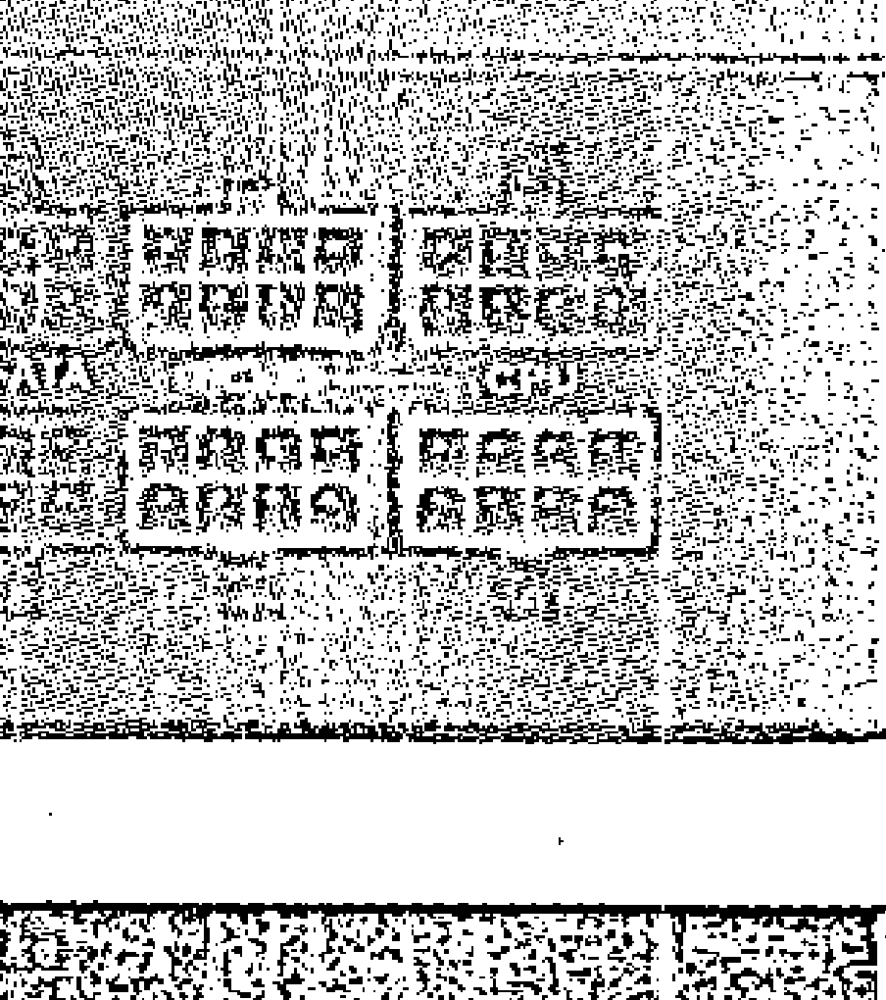

##### 智能路由器

如果说电源是PC的动力和基石,而路由器则是整个家庭网络的入口,是ISP到家用网络之间“最后的一米”。路由器智能化不仅可以远程操控网络开启或者关闭,还能实现一些奇特的功能,比如因为有些用户需要通过路由去管理支持无线网络的智能空调、冰箱、空气净化器等等的需求,才有了像极路由一类的产品。

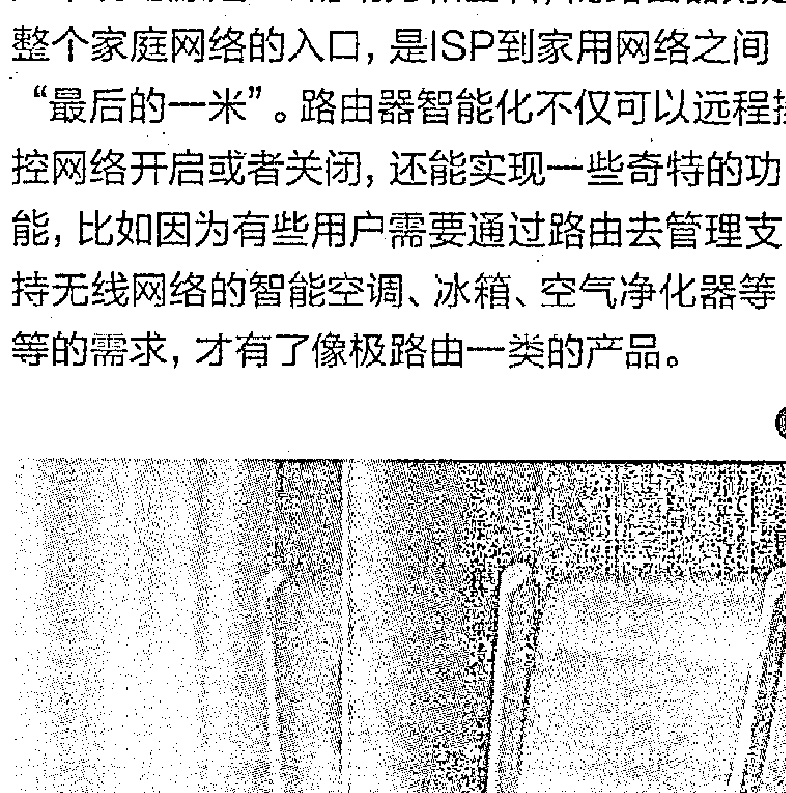

我们在2013年曾经测试过极路由1代,通过极路由远程可以解决很多网络问题。比如监控家中电脑的流量或下载情况,还有诸多APP插件能够实现各种各样的功能。最新版的极3还有很多新功能(图5),能对应不少家电,比如支持无线网络的智能空调、冰箱、空气净化器等等。

##### 极路由3

路由器的智能化必然带来一定程度上的安全隐患,但是由于远程控制的可能,也带来安全的一面。比如任何陌生设备通过无线接入,极路由都会第一时间利用极路由APP(图6)通知用户,此时可立刻屏蔽此设备接入网络。比如我们给身在老家的父母设置了无线网络,但如果他们的无线网被人家蹭掉、黑掉了,自己亲自跑一趟肯定成本较高,但通过APP直接处理就省心省力(图7)。在绑定微信等社交APP后可通过微信通知,再不用担心家中路由器被人盗用。

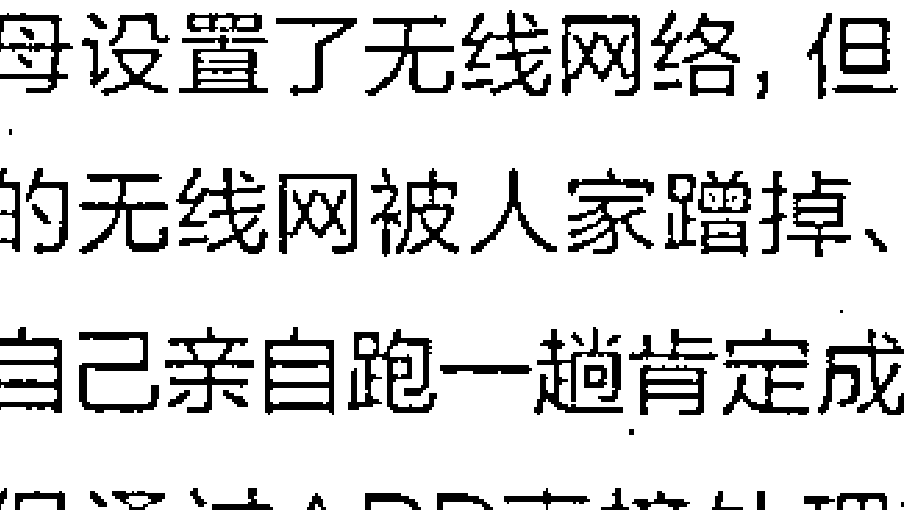

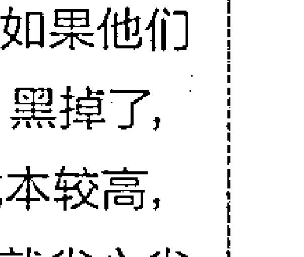

##### 特别话题

##### 智能家电

家电的主旨是在家中使用的，实际上家电是否需要远程控制还需要进一步的研究。不过对于冰箱和空调这类控制温度的家电来说，远程控制还是有一定可玩性的。在整个家电领域当中，目前冰箱和空调也确实是智能化最积极的两个设备。

###### 智能冰箱

海尔、美的等等不少品牌的冰箱目前都带有一个功能，就是自带远程控制APP。可以远程控制的冰箱能够提供什么样的玩法？比如说我们还有一个小时到家，可以提前调节冰箱饮料区单独的中门温度，这样回家就可以喝到我们指定温度的饮料(图8)。通过APP中的食材录入和管理，APP可以给出一个适宜的温度控制方案供我们用户选择，类似一个饮食管家一样的功能(图9)。带有APP的冰箱确实有了一些变化，但也有用户指出广大普通用户不会在意冰箱内食材精准到多少℃的差异，这类控制方案还是噱头大于实际意义。

###### 智能空调

比起智能冰箱，智能空调的意义可能更大一些。因为冰箱是一个需要长时间运行的设备，而空调则是一个需要提前开启和及时关闭的家电设备。比如说我们在回家前想让家里更暖和或者凉快一点；比如我们想给省电费不爱开空调的老人一个舒适的温度环境；比如说我们上了出国的飞机时想不起家中的空调到底关没关时，可以远程控制的空调意义就来了(图10)。目前主要的智能空调比如奥克斯和美的等等品牌都是通过空调拥有的无线网络功能实现，实际上是通过路由器提供的一个信号来开关空调的。目前已经有互联网公司开始研发空调，届时智能空调的控制相信会直接提升一个高度，由手机APP直接对接空调(图11)，相信能够实现更为方便的功能。

###### 终于，她出现了

食材录入

食材管理

10:00

汽车远程启动系统

其实比起家电领域，最需要远程启动的设备是汽车。我们都知道传统汽车在冬天冷车启动需要一定时间的“热车”，而在夏天经过暴晒后的车内温度非常夸张，如果能够提前启动空调系统也会让出行舒适不少（图12）。目前已经有很多汽车品牌中的高端产品拥有远程启动功能，都是通过手机端的APP与汽车中的人机交互系统通过互联网直连实现。部分厂商的交互系统还能提供定位、防盗、通过声音或者灯光系统找车等很多新奇功能（图13）。

本地和互联网体验的不同

目前大抵所有新设备多多少少都冠有智能之名，但是其中真正提供远程控制的设备并不是很多。很多设备如果只支持局域网控制其实是意义不大的，如果对设备有远程控制的需求，我们在选择产品时一定要认准能够在互联网层面控制的产品。

极路由和ASUS Router的差异

在智能路由器领域，传统的路由器厂商和带有互联网基因的产品虽然都有手机端的APP控制软件，但是其实在用户体验方面是有着本质不同的。以极路由的APP和华硕路由器的ASUS Router为例来说明。华硕路由器是家用路由器领域最强的品牌之一，不论是无线网络的标准、路由的做工用料和规格基本都是家用领域的佼佼者。日前华硕推出了其路由器产品对应的ASUS Router APP软件（图1），前面我们说过通过极路由的APP可以实现的一些功能，但是在ASUS Router上很多都无法实现。虽然ASUS Router内部的功能已经足够强大，但是它和极路由APP最本质的一点就是只能在同一个网络环境下使用。也就是说我们拿着手机出了门，只要无法连接家中无线网后就无法再通过手机控制路由器了。

##### 特别话题

###### 分清局域网和互联网

虽然路由器设备的例子最典型，但其实路由器是有一定特殊性的。传统路由器厂商为了保证路由器绝对的安全性，轻易不会开放互联网直接控制路由器的权限。我们选择智能路由器，如果对性能和安全性要求高就选择传统路由器产品；如果对远程控制有需求就选择互联网公司推出的路由器，但多多少少都有一定理论上的风险。
不过在很多其他设备上则完全不同，比如前面说的智能电源，海盗船和ANTEC的很多高端电源也拥有USB直插主板的功能（图2），但是并不具有互联网控制功能，这就是说这款电源基本没有远程开关控制的可能。而冰箱、空调等家电设备如果APP必须要求在一个局域网之内，此时就算安装了厂家华丽的APP也完全没有意义，我们手中的手机最多也就是充当了一个遥控器的身份。
在选择智能设备时不要把目光只放在那些手机端的华丽APP上，而应该关心这款APP是否支持在异地网络的操作和控制功能。

###### 流媒体传输和映射

其实在很早之前国内就有一些厂家提供了一种思路的主机，他们的产品当中并没有太复杂的处理器和显卡系统，有些产品中甚至没有任何存储设备，程序的处理、内容的保存以及画面的来源其实都在云端。虽然这种模式在PC领域最终没有流行起来，但目前通过这种方式的娱乐项目却有很多可选择的案例。

###### 游戏主机的流媒体传输

我们在去年分别介绍了由微软官方提供的Xbox One串流至Windows 10（图1）以及第三方提供的PS4游戏画面串流至操作系统的方法。这类串流其实就是典型的流媒体传输，其中PS4方式的传输还可以是互联网方式（图2）。
早在这两者之前，在PC领域NVIDIA的SHIELD以及Valve的Steam OS都已经支持流媒体传输了。最后的结果是Valve的Steam OS目前还没有流行起来，但NVIDIA通过SHIELD的经验进一步提供了家庭娱乐用的流媒体传输服务。NVIDIA的SHIELD后来进化至GeForce NOW，可以以1080P的分辨率和60帧/秒的速率将PC游戏数据流传到自己的SHIELD设备（图3）。这就和索尼官方提供了PS Vita方式而没有Windows方式一样，如果我们没有SHIELD怎么办？后来一种被称为NVIDIA GRID的技术出现了。

##### 家用电脑的网络唤醒

与其他流媒体传输一样，在NVIDIA GRID技术当中，对于3D游戏的渲染实际上是在云端进行的(图4)，我们本地实际上只需要拥有一个适宜的网络环境以及支持对应视频流的简单电脑即可观看并操作游戏。这有点像看网络视频，但是其中的游戏内容确实是由我们自己来操作的。目前NVIDIA GRID的游戏效果非常好，几乎没有延迟，就像在家里的游戏设备上运行一样(图5)。NVIDIA GRID的横空出世改变了之前云电脑体验不佳的尴尬，而且这其中有很多游戏都是免费支持的，似乎是准备要彻底改变我们玩游戏的方式。

目前的主流电源和网卡基本都对网络唤醒提供了支持，但是其实家用电脑的网络唤醒功能需要很多个步骤的设置，一些有需求的用户往往只设置了其中的一步而忽略了其他，最终导致网络唤醒失败。

###### BIOS和网卡设置

BIOS设置起来一般都比较简单，开机进入主板BIOS的启动一项，打开所有关于Wake on Lan相关的功能(图1)。不同品牌的主板和BIOS相关设置和名称可能不同，新款主板也有可能叫做PME或者ErP，如果有必要的话请参考主板说明书。

第二步就是设置网卡，这也是很多用户经常会忽略掉的一步。比如Intel网卡要打开网卡属性找到“电源管理”选项卡，将网络唤醒相关的“唤醒魔包”相关选项勾中。而Realtek网卡则要在属性中找到“高级”选项卡，找到属性中的“关机 网络唤醒”、“Wake on Magic Packet”的值并开启(图2)。别忘了下面还有一个叫做“网络唤醒和关机连接速度”的值，推荐将默认的10Mbps改为100Mbps。

然后下载Magic Packet这类的软件安装，在IP地址栏和MAC地址栏上填入我们网卡对应的IP地址和MAC物理地址，就可以进行网络唤醒了。如果搞不清楚网卡的两个地址，可以在路由器管理界面中查看(图3)。

##### 身在外 公司服务器 照样接

对于公司的服务器，除了网络管理员之外，普通员工只能有部分的访问权限。平时访问最多的是公司服务器的共享文件目录，还有网络打印服务等。但是当我们外出或者在家里办公时，是不是就不能访问公司的服务器了呢？其实利用自己的工作电脑为“媒”，完全可以做到在家里或外边访问公司的服务器资源。实现以上想法的关键技术点，首先是远程控制功能的开启，也就是说要在公司之外的电脑上对自己的工作电脑进行远程控制。此外就是用工作电脑为中间“桥梁”，来控制服务器。与此同时，尽量设定最方便的服务器访问方式，为远程控制服务器提供方便。

###### 远程控制自己的办公电脑

要实现电脑的远程控制，可在两端的电脑上分别安装最新版本的远控软件TeamViewer。电脑安装TeamViewer软件后，TeamViewer对每台电脑默认都分配一个相对固定的ID编号。每次开启后还会产生一组由字母和数字组成的6位密码。这组密码每次开机后随机产生，因此自己必须记住这组密码，才能在外出后实现对办公电脑的控制（图1）。但这样的密码可能会给自己带来不便。因为下班前一旦忘记抄录密码，回家后也就没法对办公电脑实现远控了。即便是记住了密码，一旦办公电脑由于某种原因自动重启了，原来的随机密码变为新的密码，旧密码也就失去了作用，同样无法进行远控了。为了避免这种情况的发生，可设置无人值守访问。单击“连接”菜单，选择“设置无人值守访问”（图2），然后给自己的电脑起个名称（如BanGong-Win10），设置固定访问密码，点击“结束”确认（图3）。这样，回家后只需在家里电脑的TeamViewer窗口“伙伴ID”处输入办公电脑的TeamViewer ID，点击“连接到伙伴”按钮，输入固定的访问密码，即可切换到远程控制办公电脑的画面了。

###### 小技巧

虽然无人值守密码可以保证用固定的密码访问远程计算机。但还需记忆远程计算机的ID号，输入ID号之后才能控制，当要远控的电脑台数较多时记忆比较麻烦。为了防止因忘却ID号而无法远控的尴尬，还可以创建TeamViewer网络账户，让网络账户记住所有参与控制或被控制的电脑的TeamViewer账户。

###### 小技巧

也可以通过组合键Win+E启动远程电脑的文件资源管理器。但需要注意的是，这时要发送组合命令，需要在TeamViewer控制窗口中开启“动作”菜单下的“发送组合键”选项。否则，按下Win+E开启的是家里的资源管理器而非办公室电脑的资源管理器。

##### 办公电脑为“媒”  控制服务器

实现在家中控制自己的办公电脑后，下面要借助办公室工作机实现对公司服务器的访问。

###### 直接访问服务器共享文件

连接建立后，在远程控制窗口中右键单击远程Windows 8.1 (或Windows 10)的“开始”按钮，选择“文件资源管理器”，在资源导航列中点击“网络”，通过搜索或浏览，定位办公网络服务器的共享文件夹，可看到、打开和编辑其中的文件。如果办公电脑的文件共享功能没有开启，可点击提示栏的更改提示，选择“启用网络发现和文件共享”及“打开网络和共享中心”菜单命令开启文件共享功能(图4)。

###### 映射虚拟盘访问更方便

如果觉得通过远程寻找办公环境下的服务器共享文件资源更麻烦，可提前在办公室电脑上将服务器上的共享文件夹映射为办公电脑Windows系统下的一个虚拟盘符。具体方法：先通过网络定位办公服务器上的共享文件夹，然后通过文件夹右键菜单的“映射网络驱动器”命令，或通过功能面板“网络”分组中的“映射网络驱动器”命令，即可方便地将服务器共享文件夹映射为办公电脑的一个虚拟盘符(图5)。这样设置之后，当家里的电脑远程控制办公电脑成功之后，只需打开资源管理器，访问虚拟盘即等同于对服务器共享文件夹的访问了。

###### 远程使用办公室打印机

如果要通过办公室的打印机远程打印文档，首先需要在办公电脑上安装好打印驱动并测试通过打印。然后可以将家中的文档传送到办公室电脑，通过远程开启办公室文档，用办公室电脑中的文档处理器直接发送打印命令到办公打印机打印。

###### 小技巧

如果要直接通过家里的电脑发送打印命令到公司的打印机上打印，要先通过“文件与其他→激活远程打印”命令激活远程打印(图6)，根据TeamViewer的提示，先安装TeamViewer打印驱动程序(图7)，之后才能通过TeamViewer的打印驱动发送打印指令到公司的共享打印机上进行打印。

文|刘英

##### 锁定登录重启升级 统统远控

下班时发现活还没干完，于是决定让办公室的电脑开着，然后回家远程控制办公室电脑继续工作或取回资料。但下车才想起办公室的电脑只是简单地关闭了显示器而忘记锁定，这样很可能被晚上加班的无关人员开启显示器后看到其中的隐私内容。那么，能不能远程锁定电脑屏幕？锁定屏幕之后继续工作又如何开启和登录？

> > 如果要启动远程电脑的任务管理器，或管理远程电脑的系统服务，除了在远端Windows窗口中用任务管理器或服务的命令激活外，也可以用此方法：先开启‘发送组合键’选项，然后用Ctrl+Alt+Del组合键来激活任务管理器或服务。

###### 阻止远程电脑自动锁定

有时候，我们可能又希望远程电脑永不自动锁定。例如远程电脑是留给一个员工学习或工作的，如果期间锁定了，还得该员工知道解锁密码才能进入，也比较麻烦。这时，可点击“开始→设置”，然后选择“系统→电源和睡眠”，将屏幕关闭和进入睡眠的参数均设置为“从不”（图4）。最后再通过“个性化→屏幕保护程序设置”，将屏幕保护程序设置为“无”，将“在恢复时显示登录屏幕”复选框中的对钩去掉（保持为空）（图5）。

###### 远程控制锁定Windows

如果忘记锁定办公室的电脑屏幕，通过家里电脑的TeamViewer控制窗口，点击窗口上端弹出控制条上的“动作”菜单，再点击“锁定”下拉菜单，在其中选择“立即锁定”，即可将办公电脑的桌面锁定（图1）。

以上是使用鼠标控制的远程锁屏。如果要用键盘组合键Win+L或Ctrl+Alt+Del来控制锁定办公电脑，是不是按下就能成功呢？不会！因为这只能锁定本地电脑，对远程电脑不起作用。要用这种方法控制远程电脑，需要在TeamViewer控制工具栏的“动作→远程互动”分组下选中“发送组合键”选项。这样设置之后，当光标处于远控窗口下，按下组合键后，系统才会知道是要控制锁定远程电脑而不是本地电脑（图2）。

除了以上介绍的两种远程锁定桌面的方法外，还有一种自动锁定方法。远程连通了办公室的Windows后，只需点击“结束会话→结束会话并锁定远程计算机”一项，退出远程控制的同时，远程的Windows桌面即会自动锁上（图3）。

###### 远程解锁和登录Windows

如果远程访问办公电脑时屏幕处于锁定状态，一般来说，直接点击或拖动锁屏图片，即可看到登录密码的输入界面（图6）。但是，有时候点击或拖动锁屏图片后可能会没有反应，或者虽然锁屏图片消失，但点击登录密码输入框却输不进去任何内容。在这种情况下，如果是本地电脑，我们只需执行Ctrl+Alt+Del组合键，即可呼出注销命令或使密码输入框激活。但远程的情况有所不同，这时需要在TeamViewer控制窗口中执行“动作→发送Ctrl+Alt+Del命令”才能将组合键命令发送到远程计算机。同样，该命令发挥作用的前提条件是“发送组合键”复选框要处于被选中状态（图7）。

###### 远程控制重启Windows

如果远程电脑出现问题需要重启一次，或者更新了系统补丁需要重启使之生效，这时除了用控制远程电脑Windows的开始菜单执行重启外，还可通过远控窗口的控制面板，直接发送重启远程电脑命令。执行“动作→重启→重启”命令，即可完成远程重启（图8）。需要注意的是，这里还有另一项选择“重启进入安全模式”，这对于远程处理问题需要进入该模式的Windows 8.1或Windows 10电脑来说，无疑提供了更大的方便。

###### 远程控制升级Windows系统

通过TeamViewer远程控制，不仅能执行远程锁定、登录、文件打印，甚至还可以进行远控Windows系统升级。其中包括日常多见的单系统升级，还有个别用户使用的双系统甚至多系统升级。以升级单系统Windows 10为例，首先通过远程控制启动远端电脑的“设置”窗口，点击“更新和安全”进入“Windows更新”，扫描可用的系统更新包并下载，下载后，系统可能安排一个闲置时间进行自动更新，这时只需点击“立即重启系统”，即可完成远程系统的自动更新了（图9）。若是升级多系统中的某个系统，为能保证升级后自动进入该系统，还需要通过MSCOFIG命令，配置需要升级的系统为第一启动系统。

###### 小技巧

###### 截取远程屏幕

如果需要远端屏幕的内容，除了可以远程控制伙伴电脑执行抓图操作，将图片保存在远端后再传送外，还可以使用TeamViewer的远端抓图功能直接获取远程屏幕的内容。在TeamViewer控制窗口中执行“文件与其他→屏幕记录→截屏”命令，在弹出的窗口中即可选择将截屏画面“另存为”本地文件，或者还可以复制到剪贴板，供其他应用程序使用（图11）。

##### 网际穿越 拷贝大文件

用简单的Ctrl+C和Ctrl+V即可实现远程大文件的拷贝，这一想法可以通过经典远控软件TeamViewer来实现。此外，为了防止大文件拷贝的过程中断而前功尽弃，还可以采用更规矩的文件传输窗拷贝，或使用支持断点续传的P2P远程拷贝工具来实现。

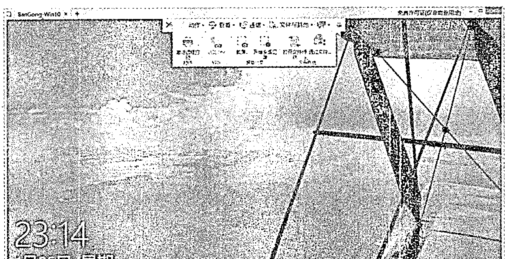

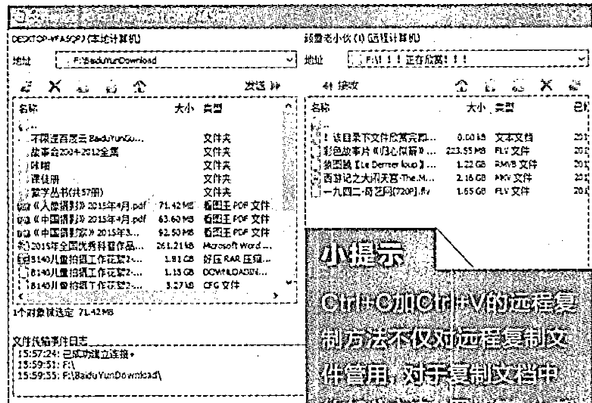

在用TeamViewer建立了两台Windows电脑的远程连接后，拷贝文件最方便的办法其实是用最传统的Ctrl+C和Ctrl+V。这一方法往往也被大家所忽视。只需在远控窗口中开启远程电脑的文件资源管理器，选择要复制的文件并按下Ctrl+C，切换到本地资源管理器窗口执行Ctrl+V，即可开启文件由远程到本地的复制进度。反之从本地到远程电脑的文件复制操作亦然。

如果发现用如上复制命令无法执行文件远程复制操作，请检查远控窗口控制面板中的“动作→发送组合键”复选框是否被选中，没选上这一项是执行失败的原因。当然，也可以用选中资源后执行鼠标右键菜单中的复制命令，完成资源的远程复制。

用以上方法复制远程文件，如果文件过大，网络不稳定时可能会出现中途断线或程序死锁，导致前功尽弃。这时，可尝试使用TeamViewer的文件传送专用面板来传送文件。在TeamViewer控制面板的“文件与其他”菜单下的“文件传送”组中选择“打开文件传送”（图1），弹出文件传送对话框，分两栏显示本地计算机和远程计算机资源列表。从本地一侧选择要发送的文件，在远程电脑资源列表中选择接收的文件夹（图2），点击“发送”按钮，即可开始文件的发送。若复制的文件有多个，屏幕上显示文件发送的总进度和分进度（图3）。反之，如果要从远程电脑拷贝文件到本地电脑，则先从远程一侧的窗口中选择要复制的文件，然后在本地一侧的窗口选择目标文件夹，最后点击“接收”按钮即可。

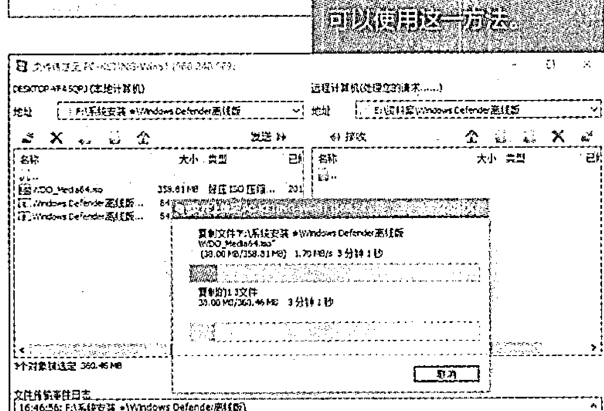

还可通过“文件框”远程共享文件。在TeamViewer控制面板的“文件传送”中点击“通过文件框传送”按钮，这时桌面上自动开启文件框窗口，同时开启了选择本地文件对话框（图4）。当选择了本地文件后，被选择的文件就出现在文件框窗口的列表中。也可通过拖动的办法将本地要共享的文件拖动到文件框的列表中（图5）。文件分享之后并没有执行上传动作，在远程的伙伴电脑上的文件框中也会看到同样的内容，当远程伙伴电脑需要文件框中的某个文件时，只需点击“下载”即可开启文件传输进程，将文件下载到本地了。

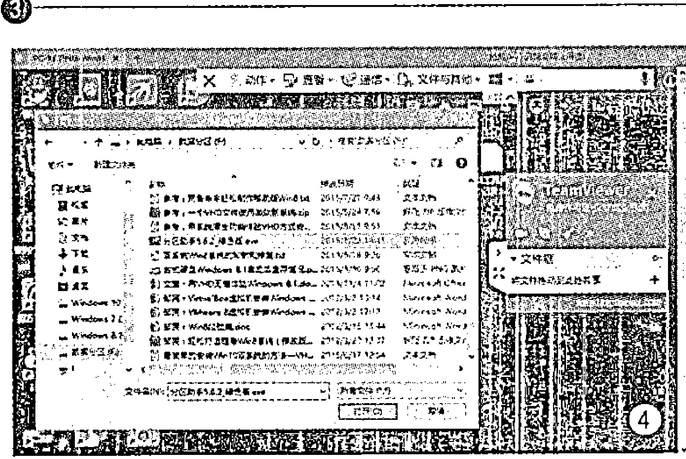

《电脑爱好者》2016年合订本（一）——

特别话题栏目

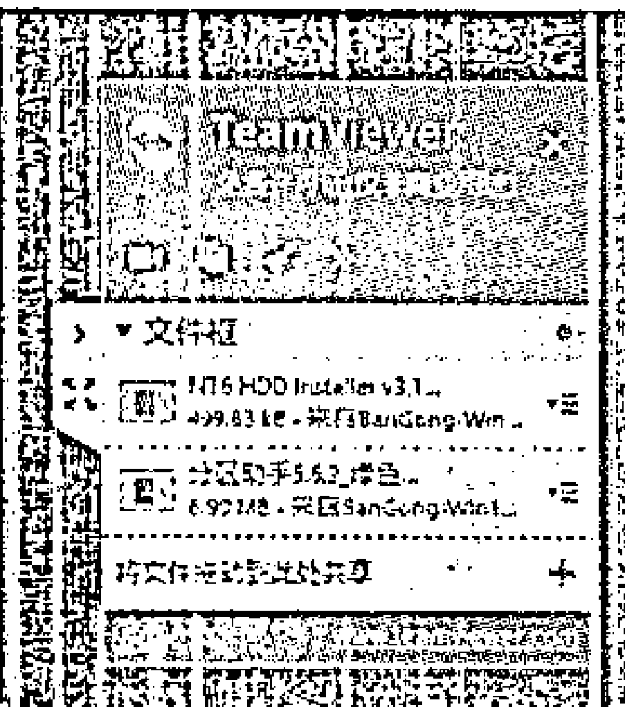

**小提示**
通过文件柜共享文件主要用来实现小文件的交换，这类文件有大小限制，一般只适合小于25MB的小文件。若发送的文件太大，系统会提示文件太大（图6），因此若希望传送大文件，要采用上面介绍的方法或下面将要介绍的方法。

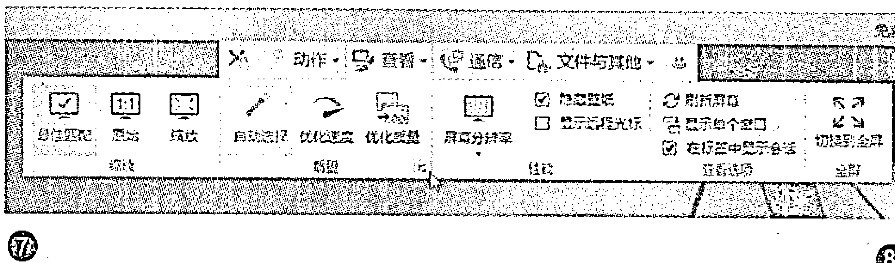

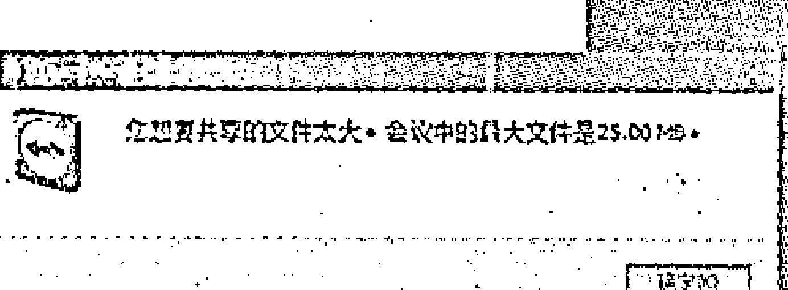

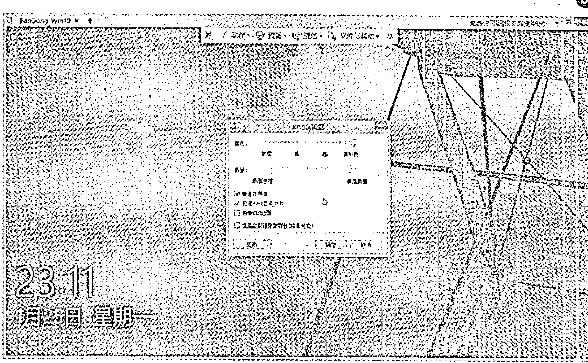

##### 预防因断线而前功尽弃

通过上述方法传送文件，如果文件很大，传送过程中遇到问题造成软件被锁死或自动中断，那么先前传送的任务也会自动失效需要重新传送。如果有很多大文件需要传送，还可以选择支持断点续传的P2P文件传送软件（如RealLink）。

使用RealLink软件需要双端都安装这一客户端。双端PC用各自的账号登录后添加对方为好友，然后A端共享自己的电脑文件夹（可设置密码），在B端远程电脑中即可访问A的共享文件。需下载到本地的文件可直接点击“下载”传送到本地。此软件支持文件断点续传和多线程传输，能充分利用网络带宽实现大文件的快速传送。

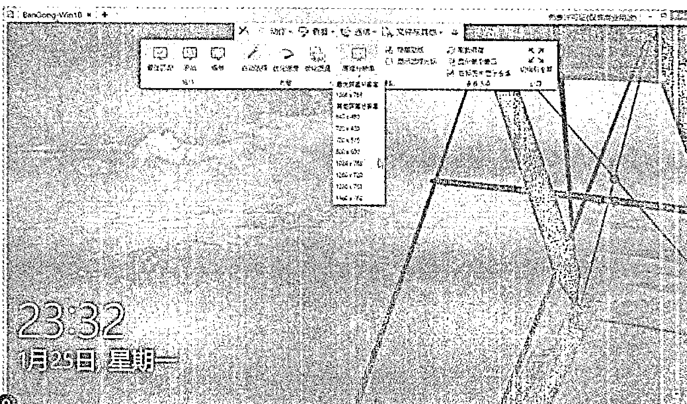

**火速链接**
有关RealLink的详细使用方法和技巧，请大家参阅本刊2014年第17期“特别话题”栏目中《无网亦传——给小网关上塔》一文下的“借助塔局域网的PC共享”和“混合部分的小结”。

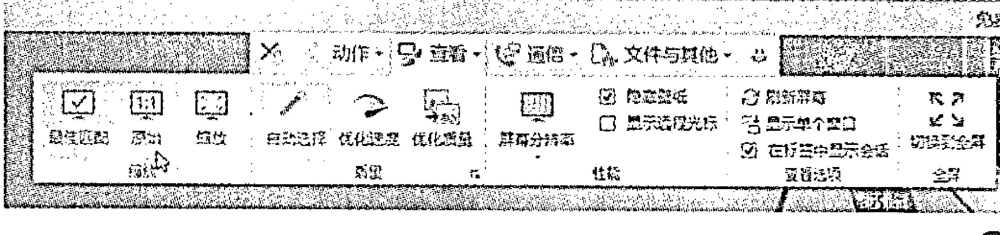

##### 平衡远控速度与质量

远程控制的速度与质量是一对矛盾。最快的速度不一定能够获得最佳的控制视觉效果。反之，如果要获得最佳的视觉效果，则可能影响远控效率。要平衡这一对矛盾，需要根据自己的设备配置情况，经过测试后进行合理设定。

速度方面主要是操作的流畅感，这与电脑的配置和网络的速度有关，此外分辨率参数设得过高也影响操作速度。而视觉质量方面，主要是分辨率和屏幕窗口尺寸的影响。通过远控面板的“查看→质量”分组，可选择质量优化、速度优化和自动选择3种设定（图7）。点击“质量”分组右下角的小箭头按钮，在弹出的自定义设置窗口中，可设置远控屏幕的颜色等级、质量等级以及视频、动画、程序兼容性等方面的内容（图8）。如果视觉上感觉不适应，可通过“查看”选项卡下的“缩放”分组，选择最佳匹配、任意缩放等方案，还可以通过“屏幕分辨率”下拉列表，选择可用的屏幕分辨率（图9）。要实现最佳分辨率的原始画面查看，只需点击“缩放”分组下的“原始”按钮，即可将远端的桌面以1:1的原样分辨率进行显示，但这时的画面不一定正好能与远控窗口相吻合，这要根据双方使用的显示器尺寸和分辨率设定来定（图10）。

##### 巧用云盘 有序管理文件

文|刘英


旅行在外要保证移动办公的顺利进行，就要在走之前做好数据的准备工作，包括必要的文件资料整理、文件到云盘或邮件附件的上传等任务。所有这些听起来简单，但不得法就会影响工作效率，甚至无法获得应有的文件或数据。

###### 文件上传前的整理要诀

云盘对文件的管理不像Windows本地那样方便，无论是修改目录结构还是移动或重组资料，都会感到缩手缩脚。因此在资料上传到云盘之前，最好在本地将目录结构、文件名、文件格式等处理停当，再传入云盘。

首先是目录结构的整理。在云盘使用过程当中，一种最糟糕的情况就是明明知道文件存在云盘里了，但是使用时就是找不到。原因很简单，由于目录没有作结构化处理，一有文件就随手上传到云盘，但是文件名又不能反映文件内容，而云盘要做到按内容搜索，一般需要开通VIP会员才能做到这一点（图1）。因此用不具备内容特征的文件名是无法搜索到想要的资料的。为了避免这种情况的发生，在上传资料到云盘前，请先按工作类型或资料类型在本地建立好文件夹，再以文件夹为单位上传资料到云盘中。

除了文件夹按类组织划分之外，文件名的成批整理也应该放在本地进行，不要等到放在云盘后才想起整理。由于云盘的文件管理功能相对单薄，成批更名几乎不能指望在云盘中进行，因此如果有文件需要在云盘中更名，就会显得特别不方便。在本地为文件成批更名，如果文件名已成序列（如“001.doc、002.doc”），这也还远远不够，需要用批量更名软件（如拖把更名器），添加文件名前缀或后缀，变成诸如“产品汇总001.doc、产品汇总002.doc”或“001产品汇总.doc、002产品汇总.doc”这样的格式。这样做的目的，同样也是为了在云盘中可以快速有效地搜索到。

此外，文件选择怎样的格式，也是在上传到云盘前应该考虑的问题。虽然云盘中存储文件没有什么格式限制，但必须要考虑到，上传到云盘中的文件要能有助于在线直接查看。例如，360或百度云盘中存储的视频或音频格式，均只支持最常用的几种格式的直接播放。对于特殊的格式，播放时只能先下载再播放。而迅雷虽然能实现离线转换文件格式，也得注册为收费VIP用户。另外，大家喜欢将资料打包为RAR或ZIP后上传到云盘，但是，压缩文件在云盘中的使用也是个问题。虽然当今的主流云盘声称能支持压缩包内容的在线预览，但是也仅仅是小文件的预览，甚至需要花钱注册为VIP用户才能预览（图2）。云盘保存电子书也是如此，不是说什么样的电子书云盘都能阅读，一般只有TXT、PDF、DOC类的电子书云盘能自动预览。因此，如果文件格式比较特殊，最好在本地先转换好，然后再上传。具体的图片、音视频、电子书的格式转换方法，本刊曾多次介绍，在此不再赘述。

###### 小技巧

为了达到全方位快速搜索的目的，在本地建立文件夹或文件时，名称最好起复合名称，例如“工作日志-2015年-华南片区”。这样一来，无论按工作类型搜索，还是按年份、地理位置搜索，均可快速搜索到该文件。

在云盘中全文搜索文件内容需要开通VIP会员

云盘预览压缩包内容需注册VIP用户

虽然云盘资料的双备份使用起来较为方便也很安全，但如果条件允许，最好将资料打包拷贝到闪存盘或移动硬盘上带走。实在没有闪存盘或移动硬盘，使用“360手机助手”或“软件数据线”等数据传输软件，将资料传送保存到手机SD卡中，也可在关键时刻派上用场。这样做目的主要是防止在异地没有网络时能继续工作。

###### 云盘双备份双保险备份方法

由于是长途旅行，身负重要的未完成的工作任务或期望值很高的娱乐任务，资料的备份和安全获取是来不得半点马虎的。若是软件或者方法选择的疏忽而造成获取资料时出现意外，那会让人捶胸顿足、后悔莫及。因此，需要掌握一种万无一失的资料远程“携带”方法。

云盘毕竟不是放在自己家里或装在自己兜里的存储设备，网络服务器不畅通也是很可能发生的事。如果放在云盘中的资料由于服务器或线路的原因拿不下来，那样在外出使用时就只能干着急了。因此，采用云盘双备份方案将更加安全。

具体实现思路：在A类云盘中建立同步文件夹，将资料存入该文件夹下。然后再将该同步文件夹作为B类云盘的自动备份文件夹。这样，放入的资料在自动同步到A云盘的同时，还会在B云盘中留存最新的备份。注意，“同步”和“备份”是两个概念。

以使用360云同步盘和百度云自动备份功能相结合为例。在360本地同步文件夹下建立工作资料文件夹，将工作所需文件统统存入该文件夹（图3）。在百度云管家的自动备份设置窗口中，设置自动备份文件夹为360同步文件夹。保证360云同步盘和百度云管家客户端同时处于开启状态。这样设置之后，只需保证在360同步盘的工作目录中工作即可，资料向两个云盘的同步或备份工作将是自动进行的。这样，当回到家里或出远门时，即便是一家的云盘服务器出了问题，也可以从另一家云盘中获取自己的资料。多一个心眼，有备无患。

要实现云盘双备份，最好不要选择同一类云盘（例如同样采用360云盘的两个不同账号）。因为如果一种云盘的服务器出现问题，可能在同一时间内不同的账户都将不能访问。比较保险的办法是采用不同类型的云盘来备份同一种资料（例如用360云盘和百度云盘同时备份）。

###### 巧用邮件附件安全存文件

QQ是我们最常用的工具，而用QQ自带的QQ邮箱携带资料也非常方便。只需在登录PC版QQ后，点击自己的QQ面板上的邮件图标，进入QQ邮箱页面，点击左侧栏内的“文件中转站”，然后点击“上传”按钮上传本地整理好的文件，即可将文件保存在QQ邮箱（图4）。QQ邮箱文件中转站中的资料容量限制为3GB，单文件限制也为3GB，默认免费存放期限为30天，一般可满足节假日外出使用的需求。过期将会失效，如果要延期，可点击“转存到微云”按钮，将资料转入自己的微云空间永久留存。结合微云TB级的超大空间，不用担心资料放不下和资料失效的问题。

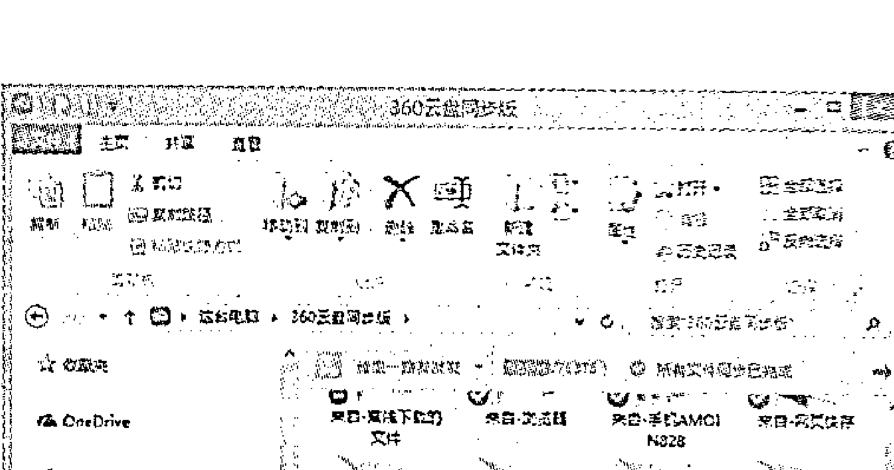

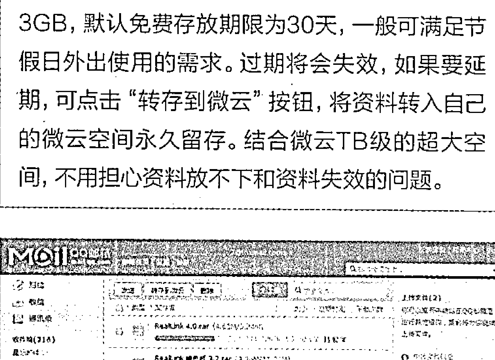

**小提示**
由于QQ有不同平台的版本，因此需要注意资料的备份方法和不同平台QQ软件下的资料获取和使用。手机上的QQ邮箱资料的收取，可通过手机QQ中收到的“QQ邮箱提醒”信息点击进入收取。此外，还可以通过在手机浏览器里直接输入mail.qq.com进入网页收取。对于存入微云的资料，可在手机上安装微云客户端，登录微云账号收取文件资料。

156 | 电脑爱好者 2016年合订本（一）


##### 孤军奋战 抛开中心服务器

为了旅行减负，许多人懒得带上电脑，不过很多时候我们不得不在旅途中处理工作。前面介绍如何通过异地电脑或随身携带的移动设备，远程控制单位的中心服务器或家中的电脑完成办公。但有时会因为条件限制进入无网络环境，就不得不孤军奋战了。

文|平淡

##### 简单+实用 WinPE 临时客串Windows

出外旅行不想带着电脑，可是到了异地之后突然有一些工作上的事要处理，这时怎么办？自然是就地解决，借旁边朋友的电脑一用了。不过别人的电脑上不一定有你所要的工作环境，比如一些必备的工作软件等。而且使用他们的电脑，还难免在系统中留下自己的隐私。怎么办？其实我们可以制作一个WinPE的闪存盘，并在其中集成自己需要的所有软件，然后随身携带。当需要借用他人电脑的时候，用自己的WinPE盘启动系统并处理一些简单的工作事务，就可解不时之需了。

###### 用什么WinPE? 系统版本有讲究

因为大家的系统版本和使用环境不同，有的朋友在使用Windows 7系统，有的则在使用Windows 10系统；有的是32位系统，有的则是64位系统；有的使用传统MBR的BIOS引导，有的则是仅仅支持UEFI启动的电脑。不同的系统有不同的特点，比如Windows 8/8.1和Windows 10系统的DISM.exe支持“/Apply-Image”参数来恢复系统，Windows 7版本则无法使用，这样如果要使用WinPE系统来进行系统维护，就应该优先选择基于Windows 8/8.1和Windows 10核心的WinPE系统(图1)。

因此要制作一款尽可能通用的WinPE系统。

我们就要选择一款比较适合各种电脑的通用版本WinPE。根据Windows系统的特性，高版本系统一般向下兼容低版本系统，64位系统兼容32位系统，UEFI主板则一般兼容传统BIOS主板，所以制作WinPE系统我们就按照“64位+UEFI”的要求进行选择。

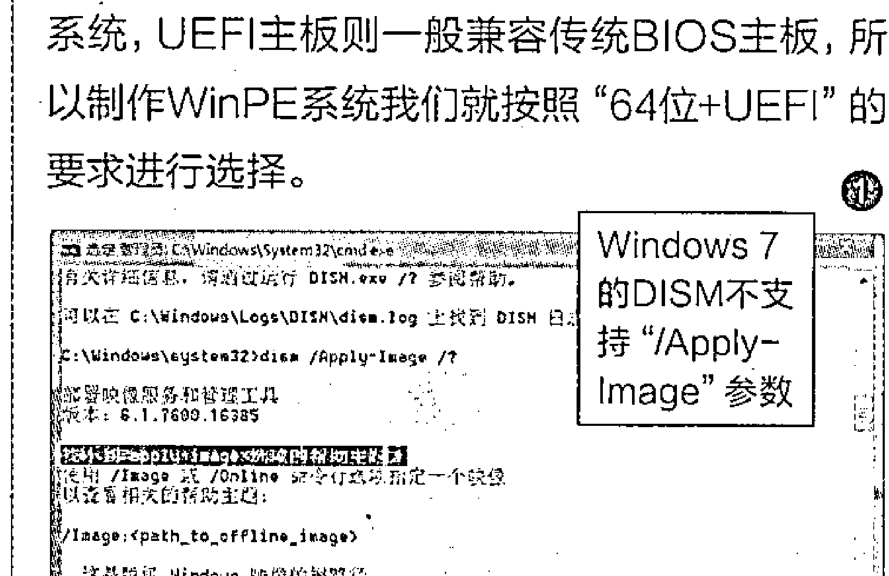

###### 通过解压完成WinPE的安装

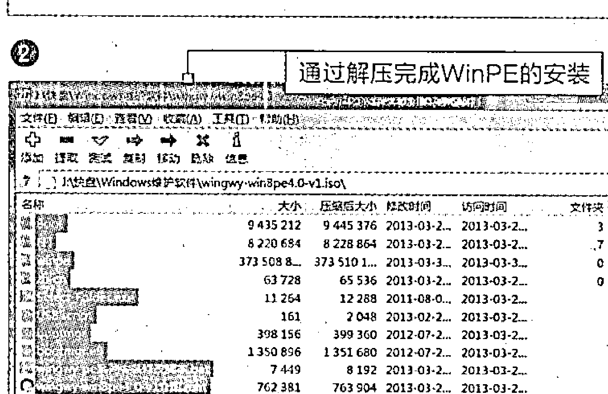

###### 选择UEFI启动WinPE

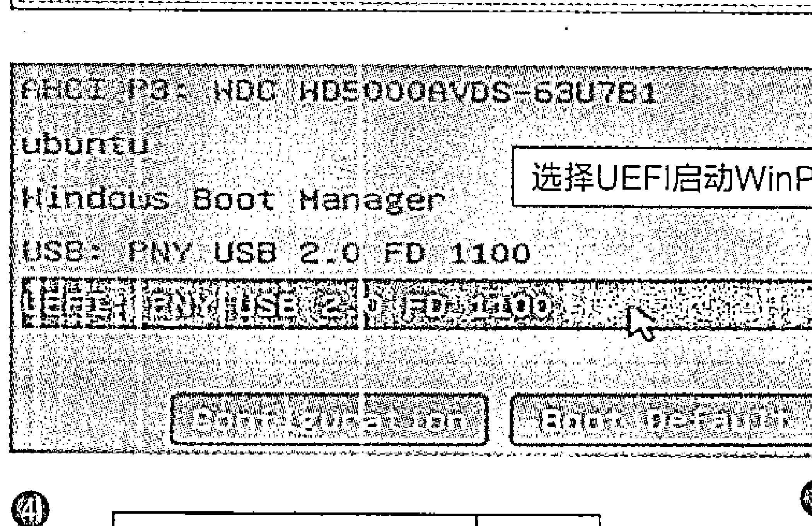

###### 制作适合自己使用的WinPE系统

通过上面的介绍我们知道，WinPE系统要选择64位+UEFI。由于Windows 10系统目前仍然没有普及，建议使用64位Windows 8核心的WinPE（它可以使用Windows 10的全部命令）。不过这里WinPE系统主要作为应急系统使用，因此还要求WinPE里能够集成常用驱动（如网卡）和常用软件。这里介绍使用网友制作好的wingwy-win8pe4.0-v1系统（基于64位Windows 8，支持UEFI+BIOS双启动，下载地址：http://tinyurl.com/cf060502，已作缩短网址处理），然后在其上自己定制即可。

```
CD U:\boot
bootsect /nt60 /force /mbr
```

完成上述操作后重启电脑，如果主板使用的是传统BIOS系统，那么进入BIOS设置后将第一启动设置为闪存盘，即可启动到WinPE系统。如果是UEFI启动，则进入UEFI设置（一般在启动时按F9或者F12键）里选择“UEFI:PNY USB 2.0 FD”字样的启动项，这样可进入UEFI启动的WinPE系统。也就是说，制作的WinPE系统可完美支持BIOS+UEFI双启动（图3）。

**小提示**
如果你的主板支持的是UEFI启动，那么如果要在WinPE中重装系统，在启动时一定要选择UEFI启动，这样在其中安装的Windows 7或以上系统就直接支持UEFI启动了。

成功进入系统后可看到该WinPE系统和我们日常使用的Windows极为相似，而且其默认已集成很多常用软件，具体的使用和日常操作一样（图4）。

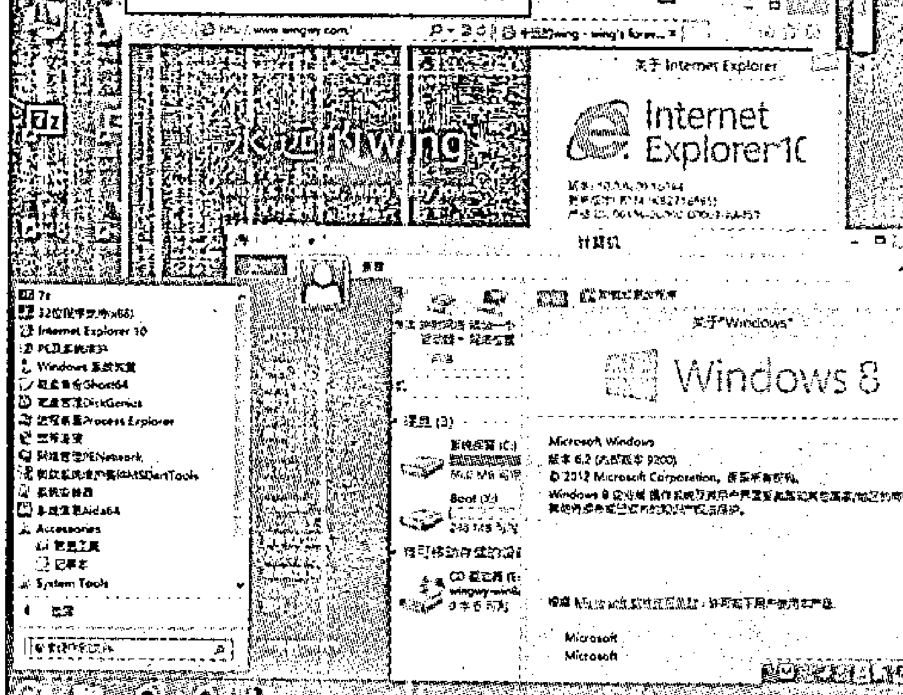

###### 修复常用问题

由于我们要将WinPE系统作为备用系统使用，因此除了系统本身集成的软件外，我们还要根据自己的需要添加其他软件。比如日常办公少不了要使用网络，因此需要在这个WinPE系统中添加自己的网卡驱动。

因为WinPE系统的核心实际上是其中的“U:\boot\winpe.wim”文件，因此我们可以使用DISM命令将所需的驱动集成到其中。首先提取需要集成的网卡驱动文件（可以使用驱动精灵之类软件提取），将其保存在“C:\net”备用，接着进入任意一部正常启动的Windows 7电脑，以管理员身份启动命令提示符并依次输入下列的命令：

```
Rem 将\winpe.wim加载到c:\winre目录
dism /mount-image /imagefile:u:\boot\winpe.wim /index:1 /mountdir:c:\winre
rem 将所需驱动文件集成到winpe.wim中，驱动中要包含.inf安装配文件
dism /image:c:\winre /add-driver:c:\net\RT8169.inf
rem 卸载加载的镜像并提交更改
dism /unmount-image /mountdir:c:\winre /commit
```

完成上述的操作，以后启动到WinPE就会自动加载电脑上的网卡驱动，就可以直接在WinPE中上网了。其他诸如显卡、声卡驱动的集成类似。这样在WinPE中操作时如果需要其他资源，我们就可以直接通过网络下载（图5）。

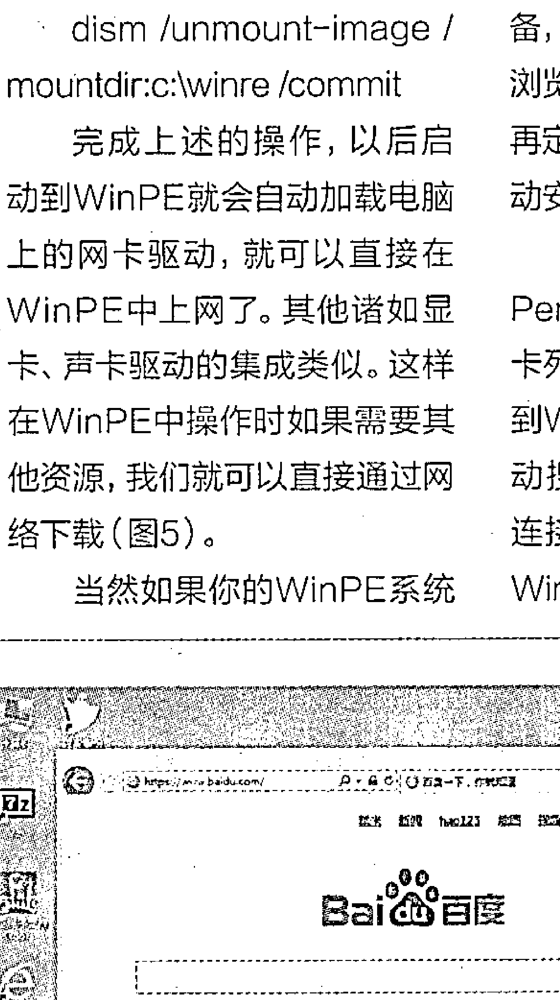

手动安装网卡驱动

当然如果你的WinPE系统需要在不同电脑上使用，上述集成方法并不适合，还可以手动安装网卡驱动。进入PE系统后右击桌面“计算机→设备”，启动设备管理器后展开“其他设备”，看看没有安装驱动的是什么网卡设备，比如笔者这部电脑上显示的是“RTL8187_Wireless”无线网卡（图6）。根据上述说明到其他正常电脑上下载RTL8187 for Win8的64位驱动，之后将其复制到闪存盘根目录下备用。同上，切换到设备管理器，找到上述网卡设备，右击选择“更新驱动程序→浏览计算机以查找驱动程序”，再定位到闪存盘根目录下即可手动安装网卡驱动了（图7）。

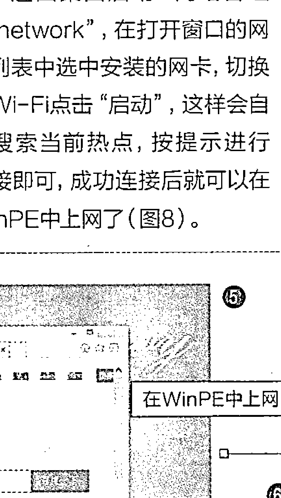

查看本机未安装驱动的网卡

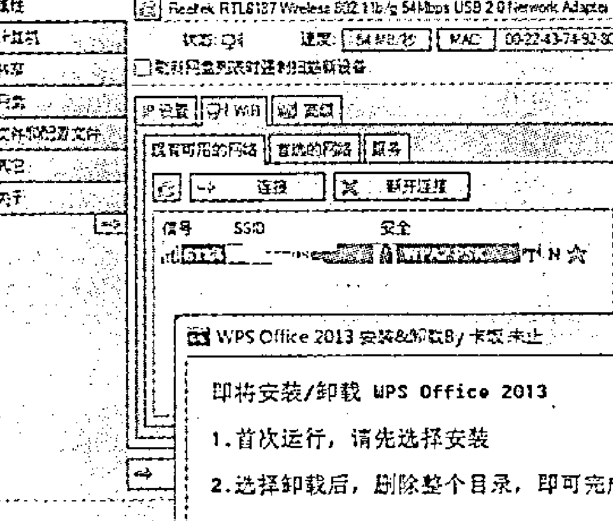

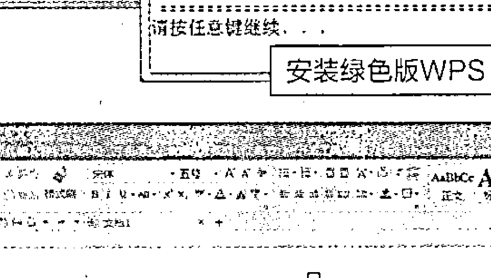

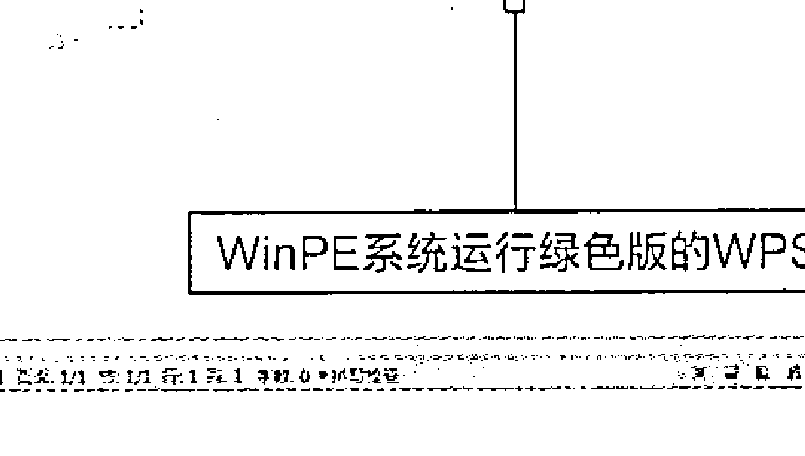

###### 集成常用软件

除了必要的驱动外，我们还要在其中安装办公软件，因为WinPE系统是加载到内存中运行的系统，在当前WinPE中安装的软件重启后会自动卸载。因此为了操作简单，对于常用软件的安装建议使用绿色版的软件。比如办公软件可使用绿色版的WPS，它的集成很简单，只要到网上下载好WPS相应的绿色版，将其复制到闪存盘的根目录，以后要在WinPE系统中使用WPS办公时，只要运行WPS安装目录下的“安装/卸载WPS”，在弹出的窗口输入“1”进行安装即可（图9）。完成WPS的安装后在桌面直接点击WPS图标即可启动，当然为了使用方便，也可打开WPS安装目录，为其中的“U:\WPS Office Personal\office6\wps.exe”创建快捷方式放置在闪存盘根目录下，以后直接运行快捷方式即可在WinPE系统里办公了，WPS其他组件的运行类似（图10）。显然对于WinPE来说，这种即装即用的软件非常适合集成到WinPE中使用。不过WinPE毕竟是精简的Windows系统，如果运行绿色软件时提示缺少相应的DLL文件，则可以在WinPE中进入原来系统的“C:\windows\system32”提取相应的DLL文件到软件安装目录中即可。

文|俞木发

##### 动起来
制作移动办公系统

之前介绍的WinPE系统制作起来虽然方便，不过WinPE毕竟是精简核心的系统，在有些场景下使用起来还是有些不便。比如一些杀毒软件就无法在其中安装使用，很多和系统结合比较紧密的大型软件如Office、Photoshop等也无法在其中运行。WinPE作为应急系统使用是可以的，但是却无法完整使用。如果要确保自己在外旅行的时候也能用上完整的系统，我们可以制作一个移动系统。移动硬盘相对U盘确实大一点，但相比整台电脑则非常小了。

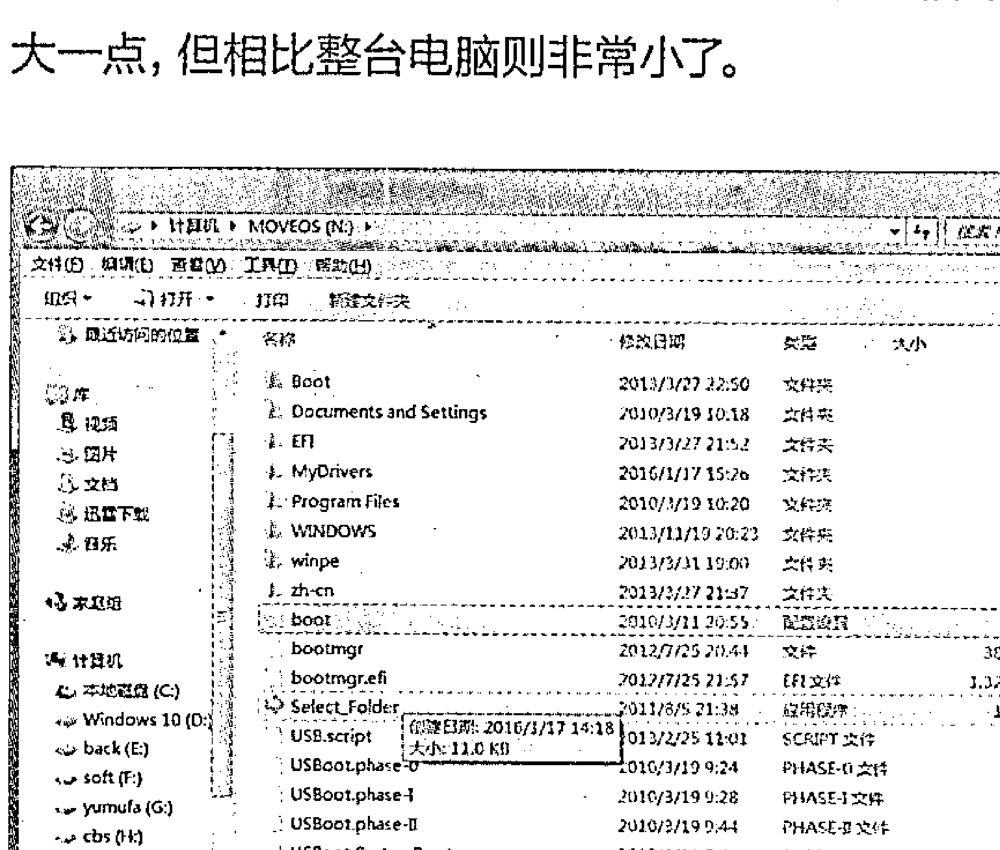

复制所有文件到移动硬盘即可完成安装

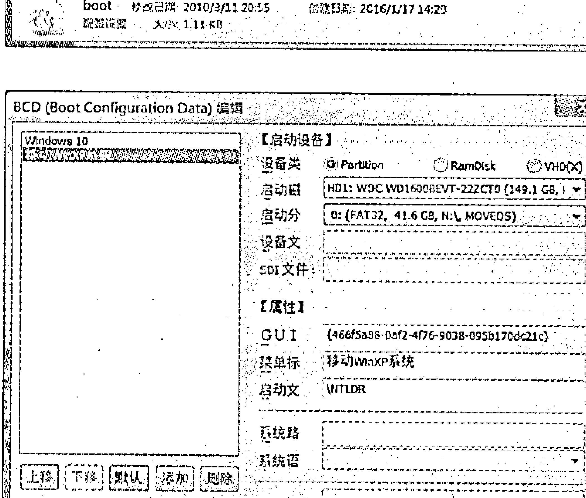

添加Windows XP启动项

###### 移动系统高低配置两相宜

出门在外使用他人的电脑，电脑的配置各不相同，有的可能较低，只适用于使用Windows XP系统（当然在现实中，很多中小城市的宾馆电脑也还在使用Windows XP系统），有的则可使用Windows 8/8.1和Windows 10系统，因此我们制作的移动系统就要兼顾这种高低配置不同的使用环境。现在Windows XP和Windows 10系统都可直接运行在USB设备上，所以我们可以打造“Windows XP+Windows 10”双启动的移动系统。由于操作系统占用的空间较大，而且读写次数极为频繁（频繁读写极易造成闪存盘的物理损坏），因此建议移动系统使用移动硬盘打造。

移动Windows 10系统使用VHD方式进行安装即可，具体安装在之前的杂志中我们已经多次介绍。Windows XP由于默认无法安装到USB设备，这里选择网友已经处理好的U盘Windows XP系统。到http://tinyurl.com/cf060503（已作缩短网址处理）下载U盘Windows XP镜像后使用WinRAR打开，然后将全部文件复制到移动硬盘根目录下，这样即完成移动Windows XP的安装（图1）。

由于Windows XP和Windows 10使用的启动方式不同，接下来将Windows XP添加到移动系统多重启动即可。启动添加借助Bootice.exe，启动程序后切换到“BCD编辑”，然后选择“U:\boot\bcd”（假设移动硬盘的盘符为U）。在打开的窗口中点击“增加→新建Windows XP/2003启动”，启动磁盘和分区分别选择移动硬盘和移动硬盘安装系统分区，启动文件选择“\ntldr”，最后点击“保存当前系统设置”和“保存全局设置”退出即可（图2）。

这样以后我们在其他地方需要使用移动系统的时候，只要开机进入BIOS将移动硬盘作为第一启动项，接着在启动界面就可以根据当前的电脑硬件配置选择进入Windows 10还是Windows XP系统了（图3）。

> 通过Bootice可以非常方便地添加其他启动项，比如正在使用Ghost的朋友可以添加Grub4DOS来启动DOS系统，对于WinPE系统则可以通过添加WIM文件启动项（修改好WinPE后将WinPE的Wim镜像文件和Boot.sdi启动文件放到相同位置即可），这样可以把移动硬盘轻松打造为包含DOS、WinPE（可以包含多个WinPE版本，一个WIM镜像文件对应一个菜单项）、Windows XP、Windows 7等多操作系统的万能维护盘。

##### 特别话题

通过上述方法，我们可以制作多功能启动系统，这些移动系统除了安装介质不同，它们和我们日常使用的PC系统其实是一模一样的。因此为了方便移动使用，我们可以结合一些办公特性进行个性化的设置。这里就以移动Windows XP系统使用为例。

比如为了方便文档在不同地方的使用，我们可以在移动系统里安装Office 2010，同时将文档保存在OneDrive上面。这样进入移动Windows XP系统后安装一下OneDrive和Office 2010，接着运行“C:\保存不重启.bat”，保存在移动系统安装的上述软件（图4）。

我们平时在PC上也设置为文档保存在OneDrive，这样我们无论在哪里使用移动系统，启动Office软件后打开OneDrive目录，然后直接打开其中的文件即可实现无缝移动办公（图5）。

对于其他的常用软件则建议使用绿色或者准绿色软件，如压缩软件可以使用7ZIP，这样将其安装在移动硬盘的其他分区，只要运行安装目录下的“7zfm.exe”，在移动Windows 10和移动Windows XP都可以使用（图6）。

> **小提示**
移动Windows XP系统使用EWF组件来进行读写重定向，默认重启后不会保存移动系统的更改（可以有效保护移动系统的安全，重启即可恢复），因此需要在移动系统保存数据时就要运行根目录下的“保存不重启.bat”或者“保存后重启.bat”来保存数据，但是不建议在安装驱动后重启保存，因为硬件的差异会导致移动系统蓝屏无法启动。对于网卡驱动也是建议即用即装。

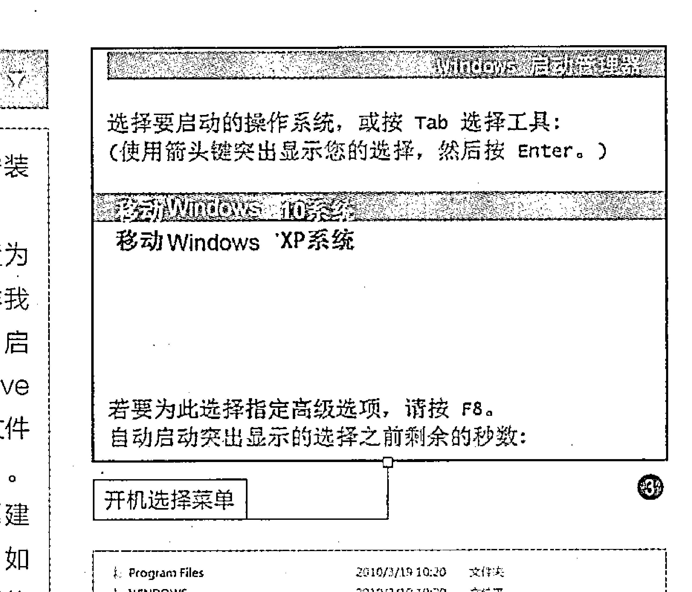

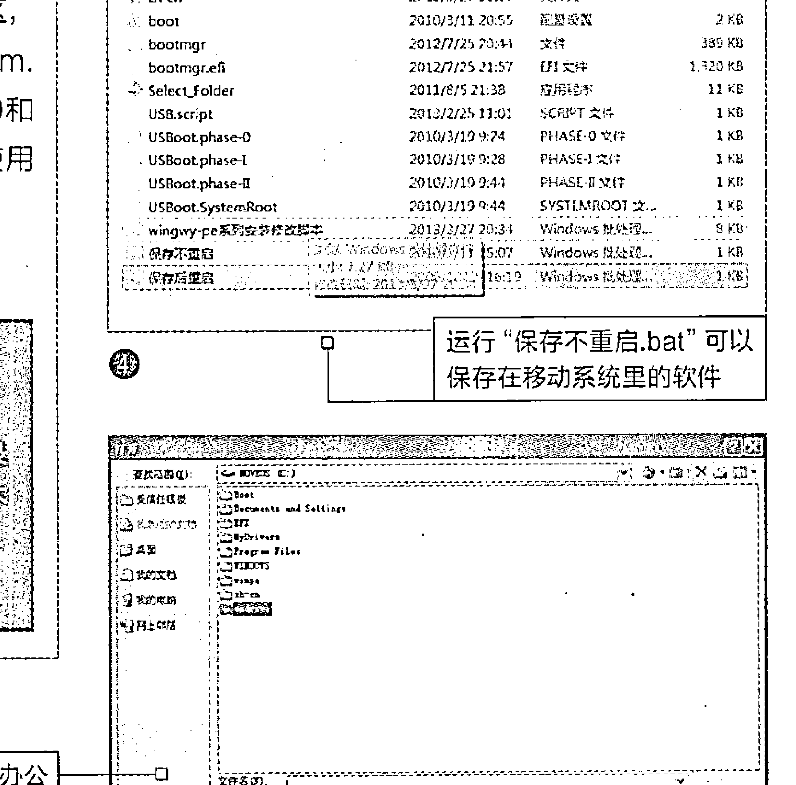

> **小提示**
对于类似Office、Photoshop这类大型软件，上述两个移动系统都可以直接安装并保存在各自系统里即可移动使用。由于是移动系统，平时建议做好系统备份。比如移动Windows XP系统核心是“C:\Windows”和“C:\Program Files”这两个目录，平时可以做好这两个目录的备份，这样在移动系统出现问题时，只要将上述两个目录删除，然后将备份再复制到原来位置即可实现移动系统的快速重装。对于VHD的移动Windows 10系统则可以直接备份其中的VHD文件，要恢复系统时也是删除原文件并恢复备份即可。

##### 以不变应万变 适应转移的阵地

文/技术宅


旅行在外，系统环境改变，必然会带来很多的不适应。要想让原来的系统、工具、数据在新环境中能使用，我们需要进行适当的设置。

##### 分区格式有讲究

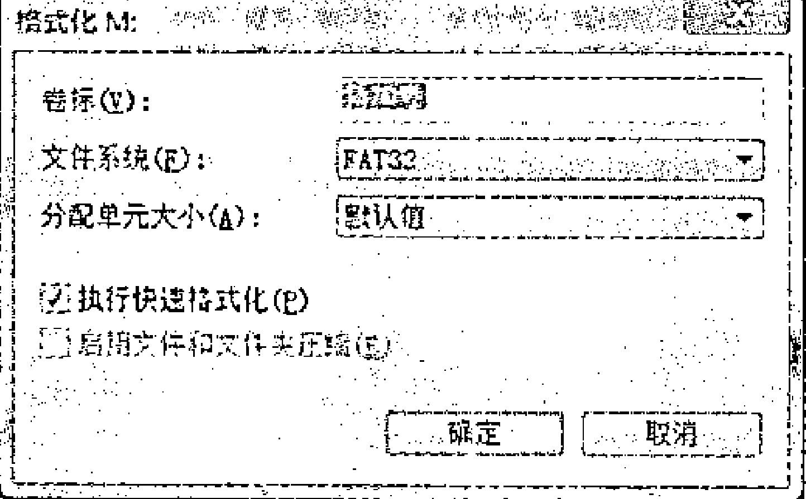

划分新的分区并格式化为FAT32

大家知道不同系统支持不同分区格式，比如NTFS分区支持大于4GB以上的文件，这样如果经常要在移动硬盘存放高清影片，我们就要使用NTFS格式的分区。而UEFI启动只支持FAT格式分区，这样制作可以在UEFI主板上启动的移动系统，我们就要保证移动硬盘至少有一个FAT格式的分区。因为出门在外，我们会遇到各种分区兼容问题，因此为了适应各种变化的环境，我们就要规划好分区格式。为了保证完好的兼容性，这里建议将移动硬盘至少要保留FAT32和NTFS分区，前者用来制作UEFI启动和其他系统如Linux、Mac OS系统的共享和访问（注：若想保证移动硬盘在Mac OS下也能够写入数据，而不是单纯的访问，还要为其准备HFS或exFAT格式的分区），后者则主要用来存放系统和高清大文件。

这里以上述移动系统为例，上述默认制作方法是无法在只支持UEFI主板的电脑上启动的，下面我们介绍如何手动添加UEFI启动。插入移动硬盘到任意一部64位Windows 8电脑上，然后右击桌面“计算机→管理→磁盘管理”，选中当前移动硬盘后使用“压缩卷”功能划分出一个新的分区并且格式化为FAT32格式(图1)。

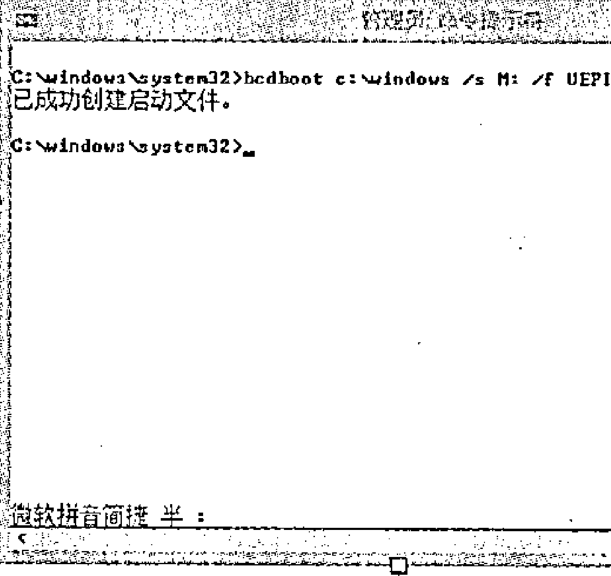

使用命令行创建启动盘

打开移动硬盘将安装好移动系统的VHD文件加载到资源管理器，假设加载后虚拟系统分区的盘符为L。启动命令提示符，输入“bcdboot L:\windows /s M: /f UEFI”命令（假设FAT32分区的盘符为M）制作UEFI启动盘，命令完成后会自动将UEFI所需的启动文件复制到指定的分区(图2)。

这样在需要UEFI启动的电脑上使用移动Windows 10时，只要同上在开机的UEFI启动项选择“UEFI: USB Disk”字样启动项目即可。需要注意的是，移动Windows XP系统无法支持UEFI启动，因此移动Windows XP系统只能选择传统的BIOS启动使用。

> 小提示
默认情况下只有64位Windows 7以上的系统才支持UEFI格式，因此制作移动Windows 7以上的系统请使用64位的安装镜像，并且将VHD磁盘设置为GPT格式。

##### 系统平台无极限

不同平台支持不同格式的应用，比如X86的Windows支持EXE可执行文件，但是ARM平台上的APK应用只能在Android系统里使用。出门在外我们可能遇到各种各样的平台，如果要突破平台的限制，现在就可以在移动系统上安装虚拟机或者模拟器实现跨平台应用的运行。比如出差在外需要使用多个微信同时和客户联系，虽然也有PC版的微信可以在Windows上运行，但是需要手机微信确认才可以登录。为了方便在电脑上直接登录多个微信，这里就可以使用“安卓模拟器+微信多开助理”实现。模拟器可以使用“海马玩模拟器”，在移动系统上安装好海马玩模拟器，启动后即可进入Android界面，进入Android系统后到http://tinyurl.com/cf060504下载“微信多开助理”。文件下载后单击模拟器界面的“设置→安装APK文件”，选中微信多开助理进行安装（图3）。成功安装后在模拟器中启动微信多开助理，点击“选择官方微信”，然后选择本机已经安装的官方微信。返回程序界面继续点击“增加一个微信”，按照安装向导提示在本机再安装一个签名不同的微信（图4），这样我们就可以在模拟器中启动两个微信直接登录使用了（请注意，这里仅为示范软件的使用，其实为了微信账户安全的考虑，并不建议大家使用这种第三方的工具来启动微信等需要账号的软件）。

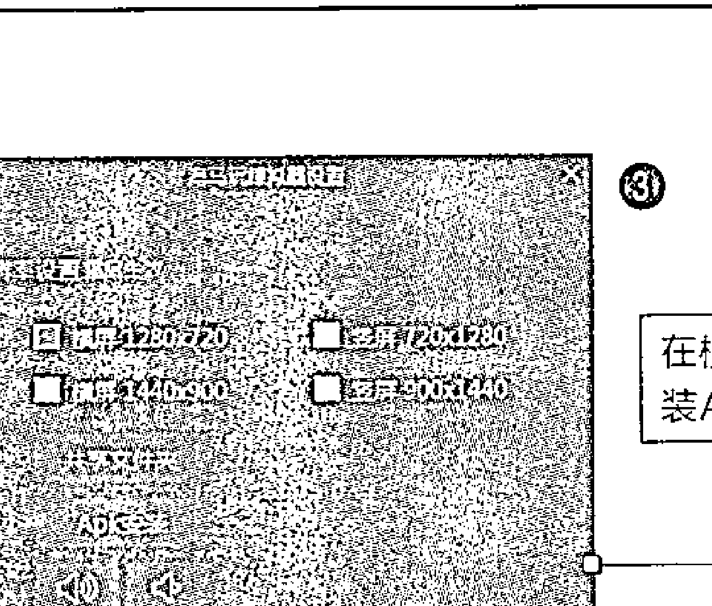

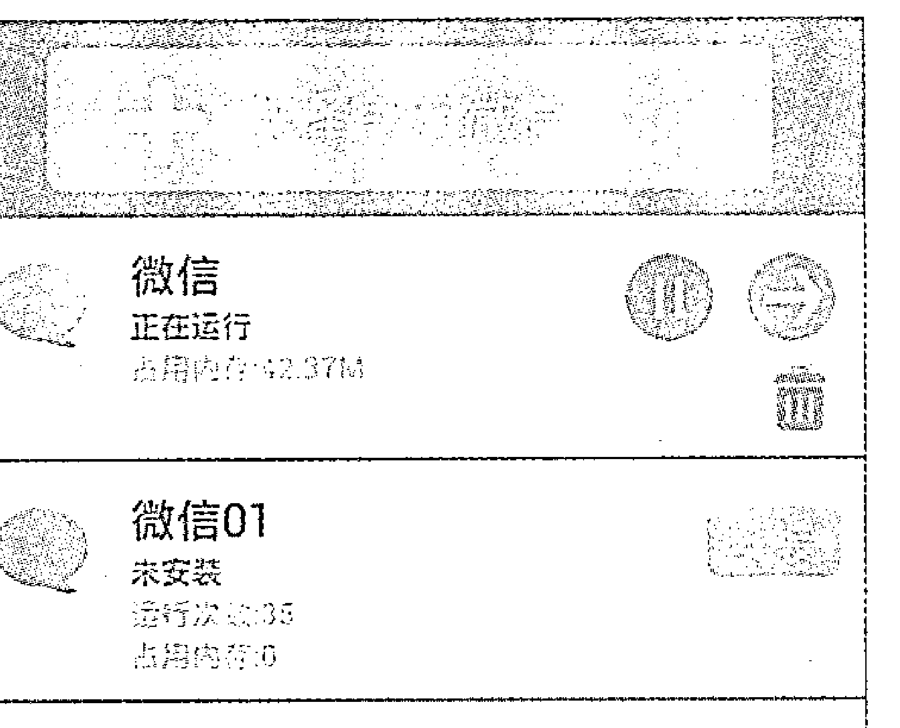

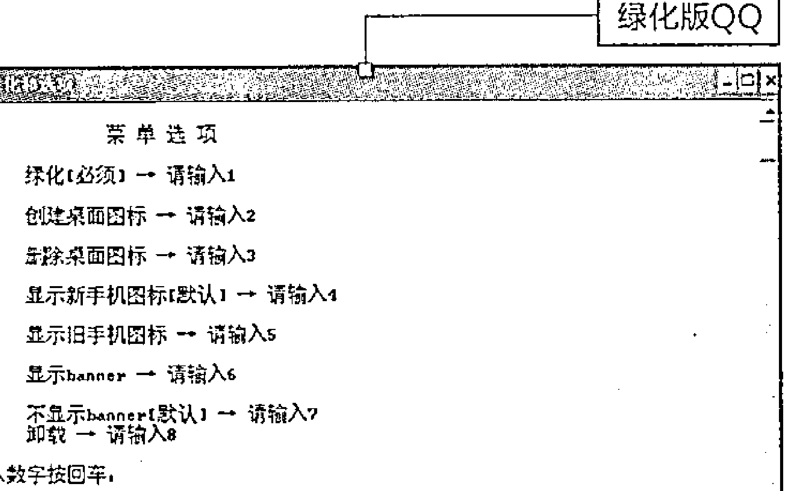

```
菜单选项
绿化[必须] → 请输入1
创建桌面图标 → 请输入2
删除桌面图标 → 请输入3
显示新手机图标(默认) → 请输入4
显示旧手机图标 → 请输入5
显示banner → 请输入6
不显示banner(默认) → 请输入7
卸载 → 请输入8
输入数字按回车。
```

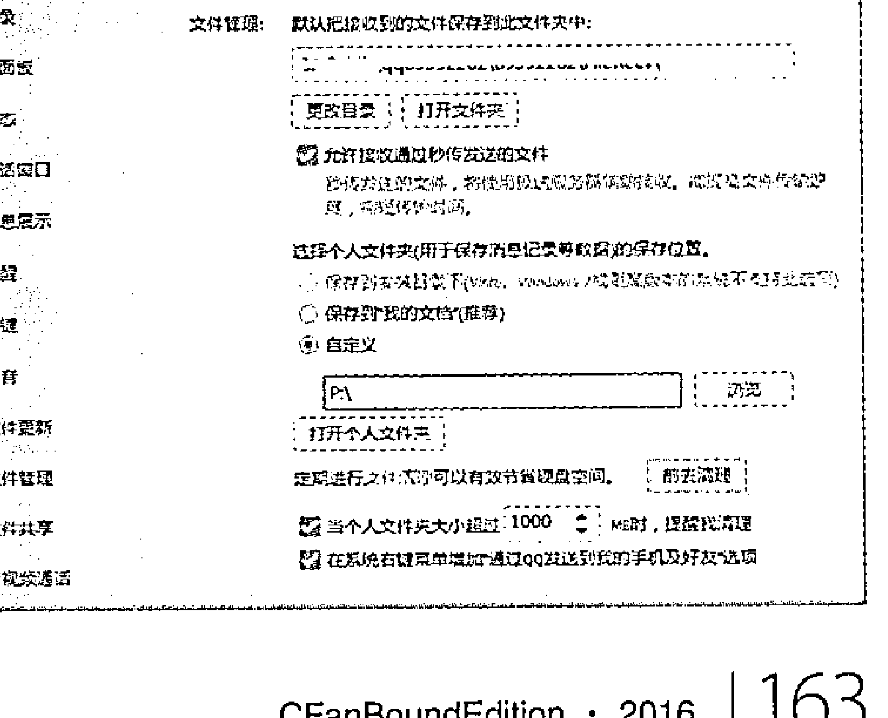

##### 数据共享有高招

出门在外我们经常需要处理一些办公文档，或者查看QQ工作记录。常规的方法是使用快盘等可以同步的网络硬盘实现在不同电脑上访问共享文档。不过快盘这类网络硬盘只能保存一些文档，对于常用的程序无法实现完整的同步。而通过上述方法打造的移动系统却可以实现“程序+配置+文档”的随身同步。比如经常使用QQ和客户联系，并且还要经常出差的朋友，我们就可以直接在移动系统中安装绿色版QQ，如“QQ7.60.15742绿色纯净版”。下载后将其下载到移动硬盘，只要分别在本地PC和移动系统上运行其中的“绿化和选项.bat”，然后按“1”进行绿化，这样安装在移动硬盘的QQ就可以在PC和移动系统中使用了（图5）。这样在PC和移动系统上运行的都是同一个QQ（如果运行绿色QQ后提示msvcr100.dll文件错误，请将本机C:\windows\system32下的同名文件复制到QQ绿色安装目录覆盖即可），启动QQ后点击“设置→文件管理”，将个人文件夹位置指定到移动硬盘目录。这样在任何地方使用的都是同一个QQ，而且接收文件、QQ聊天记录也全部保存在移动硬盘，真正实现QQ程序和数据全部便携(图6)。

当然除了QQ外，其他类似软件也可以使用相应的绿色软件。不少网站均提供大量的绿色软件，我们可以将其保存在移动硬盘，平时在PC和移动系统上均可直接运行，实现数据的随身携带。

##### 文档格式转换

不同环境、程序经常要使用不同格式的文档，比如Word 2007以上的版本默认保存的是.docx格式的文档，但是出门在外使用的电脑可能只安装了Word 2003，这样就无法打开这类文档。为了方便在不同环境下都可以正常访问文档，出门在外时我们可以选择一些实用的在线服务。

比如上述docx文档如果在当前电脑无法打开，只要登录http://cn.office-converter.com/，然后点击在线文档转换下的DOC，接着点击“添加文件”，上传需要转换的docx文档，最后点击“开始转换”(图7)。转换完成后点击“下载”，将转换好的文档下载到本地后就可直接观看了。网站还提供二维码在线预览功能，点击“获得二维码”，此时在网站上会出现一个文档链接的二维码(图8)。

这样我们只要启动微信等自带扫码工具的应用，扫描上述的二维码后在手机上就可以直接打开文档预览。如此一来，出差在外无法使用电脑时，我们只要让同事转换文档，然后将二维码发送到我们的手机上就可以通过扫码直接浏览了(图9)。

这种类似的文档格式转换方法还有许多，我们可以结合出门在外的各种实际情况灵活进行转换。比如.dwg是CAD专有的图片格式，如果要在没有安装CAD的电脑上查看这些图片，那么只要使用截图的方式将DWG图片转换为BMP格式即可在电脑上浏览了(图10)。

##### 更多的应变技巧

除了上述介绍的应变技巧外，在日常的操作中我们经常还会在很多特定场合下需要相应的应变技巧。比如很多朋友喜欢在电脑上下载离线视频到手机上观看，但是手机支持的视频格式有限，网上很多常见的视频格式如FLV、MKV文件，手机自带播放器默认并不支持。如果要在手机、平板上应对各种格式的视频，我们就可以预先在手机上安装rockplay、暴风影音之类的万能播放器。此外，手机、平板这类设备存储空间有限，我们则可以结合百度云盘、快盘这类支持全平台的网络硬盘作为存储扩充，预先将所需资源上传到这些空间中，然后在手机上再按需下载使用。总之，我们需要根据自己遇到的问题灵活选择各种解决方案，真正做到以不变应万变。

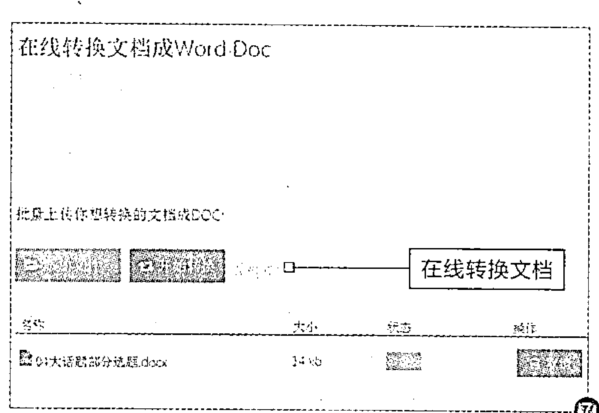

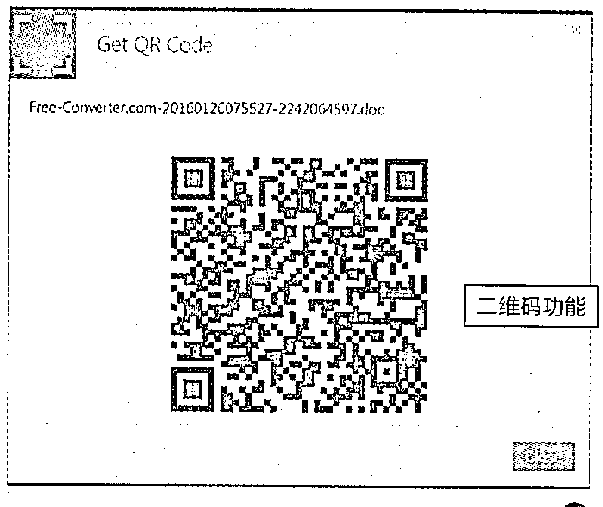

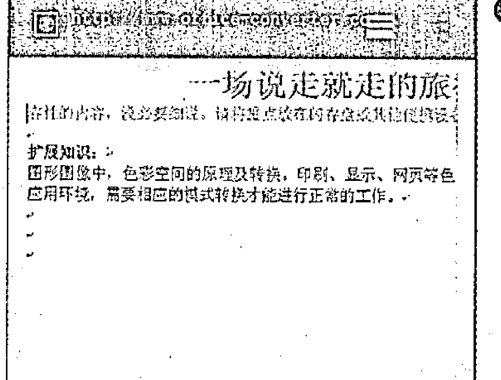

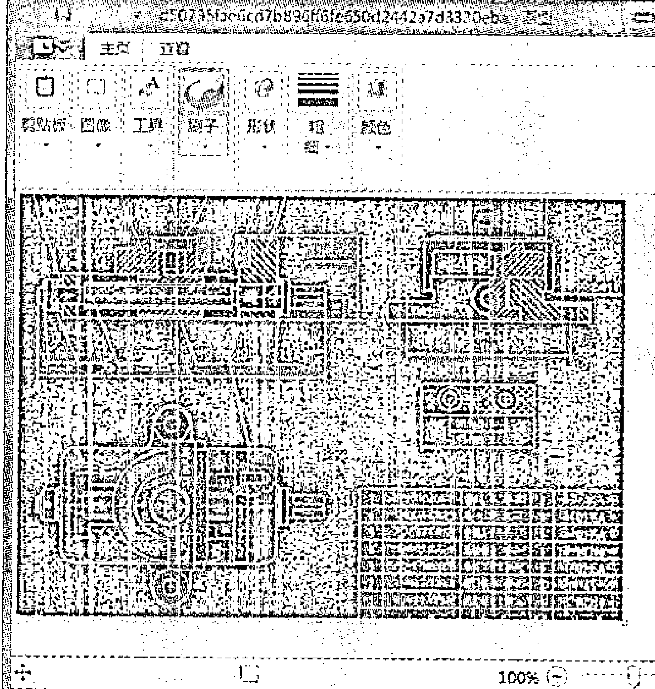

##### 擦亮眼睛别着了它们的道
防陷 防骗进行中


又是一年3.15, 打假进行时。
假，在现如今的规范市场中已算是非常罕见的了，
但“坑”却始终存在着。
一不留神着了它们道儿的例子比比皆是，
这其中有因隐藏在字面下隐晦含义做出的错误判断，
有惯性思维带来的既定性，
均会让我们在瞬间脑“短路”，走向深浅不一的“坑”。
防陷、防骗永远都是进行中

策划|《电脑爱好者》编辑部


扫一扫，更多精彩内容立现！

##### 选购产品从不信开始

面对日益激烈的市场竞争，无论是硬件厂商还是网店商家，
为了提升产品的吸引力往往会在宣传中注入水分，
为我们的选购布下了不容忽视的障碍。
在具体的选购中，我们也经常会被产品的“表面功夫”所蒙蔽，
没能将每一分资金花在实处。
无论如何，在选购产品时我们都应从不信开始。


##### 寻找宣传中的漏洞

网购虽然便捷，但却失去“眼见为实”的亲身体验过程，我们只能从宣传的只言片语中了解产品的卖点和性能。于是，各种夸大和造假的参数信息就成为了网购时的噩梦。

##### 明目张胆的造假

淘宝无疑是各种“魑魅魍魉”的重灾区，当我们搜索“手机”等关键字时，页面右侧的“掌柜热卖”栏总会列出无数看似无比超值的明星产品（图1）。但遗憾的是，敢“顶风作案”的往往也是这些推荐位置的存在。

##### 先从两个案例谈起

Galaxy Tab S T805系列是三星通话平板中的高端产品，正常售价约2000元起。然而，这款高端平板在淘宝竟然只要678元起，而且还拥有64GB、96GB、128GB和160GB的版本可选（图2）。哪怕是三星自己看到这都会感觉精神错乱：俺家的T805明明只标配16GB存储空间，谁那么好心给它升级到了最高160GB？

联发科Helio X20(MT6797)是业内首款十核处理器，就在它还处于计划阶段时，就有无数产品打着MT6797的名号开始骗钱了。比如淘宝推荐位展示的这款歌姿品牌平板（图3），就以十核处理器为卖点宣传，超低的售价更是让人怦然心动。

| 4G | 十核 | 2.0Hz | 视网膜屏 |
| :--- | :--- | :--- | :--- |
| 4G+64位 | +真十核 | +2.0Hz+ | 视网膜屏 |

CPU是MT6797主频2.0GHz
操作系统是阿里YunOS 5.0系统版本
网络制式是双卡双待双4G/联通4G
GPS是支持GPS+北斗
显示屏是10.6英寸(16:9全金属边框)
机身尺寸253mm*153mm*10.9mm
分辨率2560*1600 (4GPS高清屏)
存储容量32G/64G/96G可选，可扩展内存卡

##### 剖析低智商的造假

实际上，上述两类产品就是最“低智商”的造假方式。无论是Galaxy Tab S T805还是其他平板，压根儿就不存在96GB和160GB这种容量版本。在产品的实物图片展示中，高仿T805C的SIM卡和存储卡设计也与真正的T805不一样（图4）。抛开这些细节不谈，原价2000元的产品能以4折销售，这本身就是“不靠谱”的潜台词。

在假MT6797平板的宣传中，有关于处理器参数存在诸多矛盾之处：“MT6797十核2.0GHz”、“MTK6797-64位四核处理器”、“首款A53架构真8核处理器”等参数竟然都集中在对一款产品的描述中（图5）。要知道，真正的十核MT6797应该是由双核A72、四核高频A53和四核低频A53核心构成。最关键的是，这颗芯片在本文截稿时都还没量产，其日后上市时武装它的产品也不可能低于1500元。

总之，在淘宝上充斥着这些考验我们智商的“挂羊头卖狗肉”的产品，它们最大的特色就是超级便宜，对贪小便宜的用户有着莫大的杀伤力。想加以防范也很简单，尽量在京东或天猫购买知名品牌的产品，在淘宝上宁可相信普通的搜索结果也不要相信一些广告推荐位的产品。

###### 留心文字上的漏洞

对手机游戏而言，GPU的强弱比CPU核心架构和数量的影响更直观（图6），因此越来越多的消费者开始重视手机处理器所集成GPU的参数规格。问题是GPU的参数存在漏洞，极易影响我们的判断力。

####### 逐渐被ARM垄断的GPU

在Android手机/平板领域，ARM已然占据了GPU市场的多半江山：除了高通处理器坚持使用自家的Adreno系列GPU以外，三星Exynos、联发科、华为海思等处理器都采用了ARM公版的Mali系列GPU（图7）。理论上讲这应该是件好事，因为统一的GPU规格很容易帮用户判断强弱高下，就好像笔记本领域NVIDIA GTX960M肯定要比GTX950M强，同样两款配备GTX960M独显笔记本的游戏性能也应该大致相仿才对。然而，ARM Mali系列GPU特殊的结构，却注定出现“龙生九子各不同”的尴尬。

####### GPU的核心数量之谜

Mali-T880是ARM时下最顶级的GPU核心，在同频率下它的性能是ARM上代顶级GPU Mali-T760的1.8倍，同时功耗却大幅降低了40%。根据估算，在700MHz频率下，满核的Mali-T760MP16浮点性能约380G Flops，而满核Mali-T880MP16在700MHz频率时的浮点性能则高达685G Flops，较NVIDIA Tegra X1的Maxwell GPU（512G Flops）还要恐怖。

细心的读者肯定发现了，上面笔者强调了一个名为“满核”的关键词。简单来说，ARM Mali系列是一个可定制的GPU方案，芯片厂可以根据成本和需求，为GPU搭配1个~16个不等的计算单元（图8），核心数量越多性能越强，但同时也将带来更高的成本、功耗和发热量（图9）。

在Mali-T760称王的时代，联发科MT6752（代表产品：魅蓝Note）/MT6732（代表产品：魅蓝手机）和三星Exynos 7420（代表产品：三星S6）处理器都

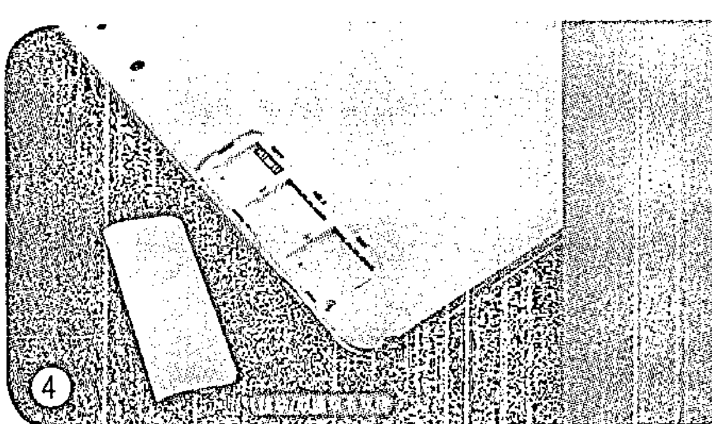

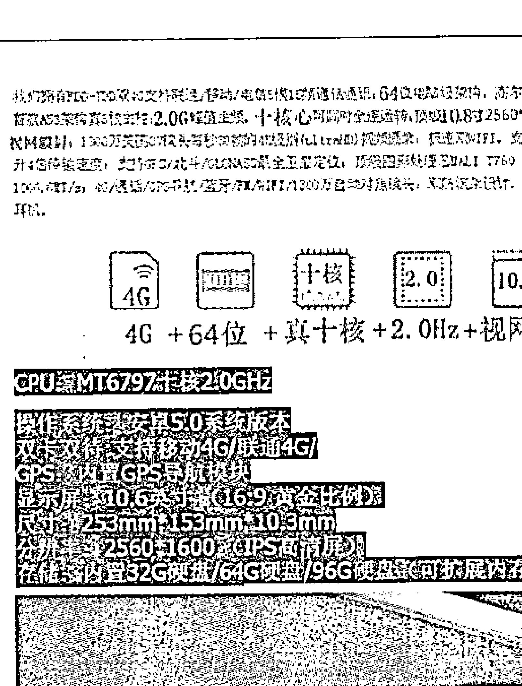

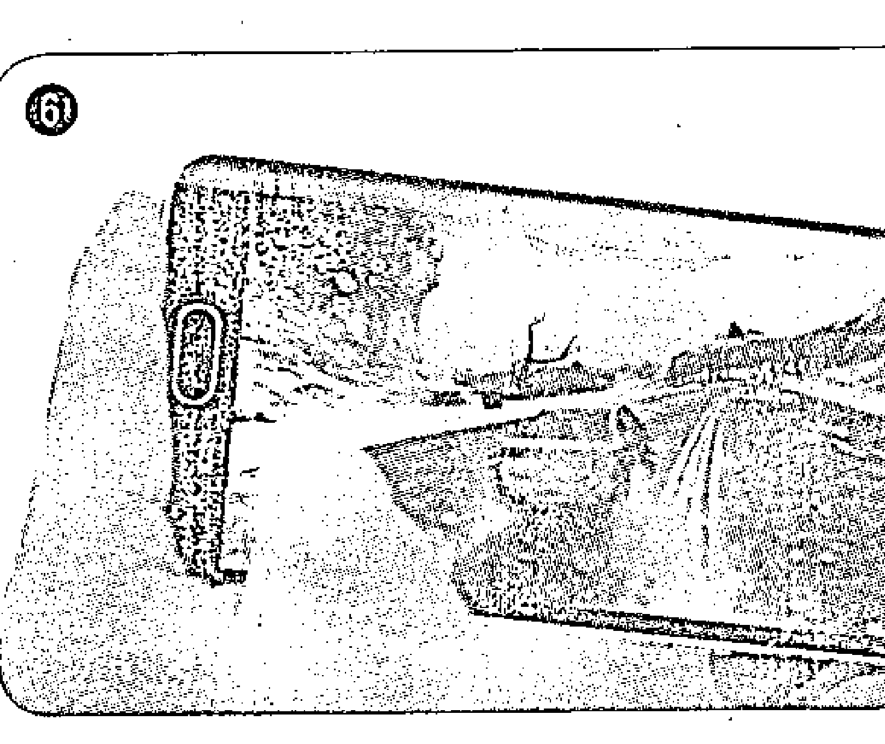

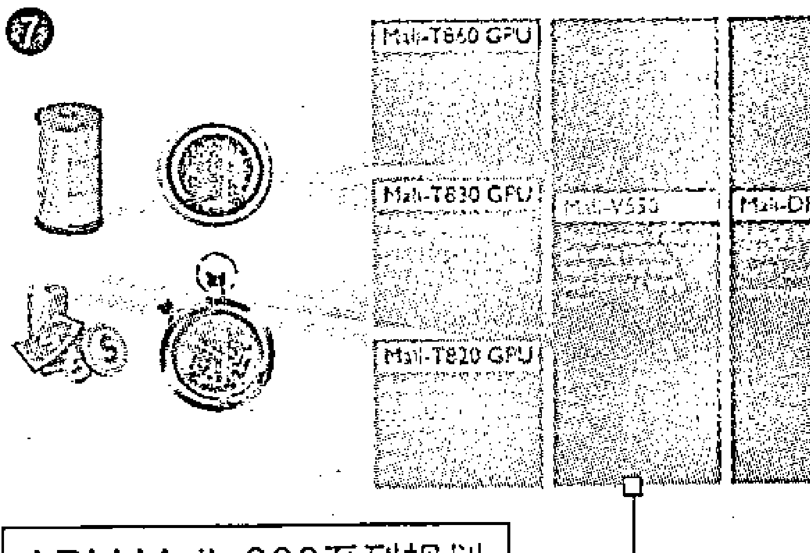

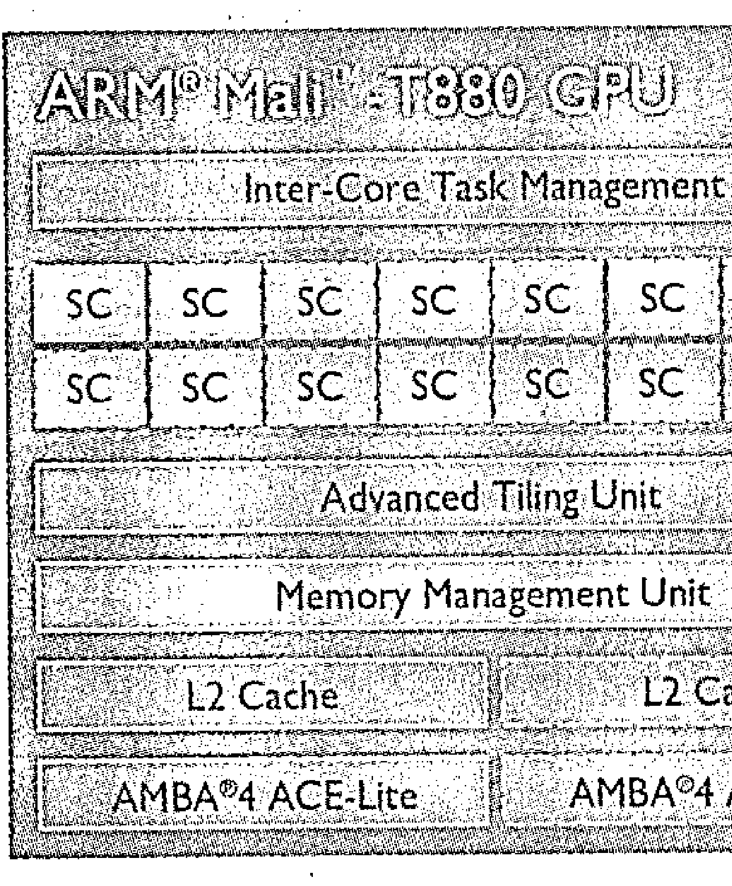《电脑爱好者》2016年合订本（一）

集成了这颗GPU，但是它们的3D性能却有着云泥之别（图10）。究其原因，就是联发科MT6752/MT6732仅为GPU搭配了2个计算单元，具体的型号规格为Mali-T760MP2，而三星Exynos 7420则为其配备了8个计算核心，完整的规格是Mali-T760MP8。总之，紧跟后缀“MP”的数字，就是决定同一个GPU型号实际性能的关键。

进入Mali-T880时代后，我们依旧要面临因核心数量不同引发的混乱。比如联发科Helio X20和华为海思麒麟950集成了Mali-T880MP4，联发科Helio P10/P20选用了Mali-T880MP2，而三星Exynos 8890则武装了Mali-T880MP12。因此可以轻松得出一个结论：就游戏性能而言，Exynos 8890可秒杀麒麟950和Helio X20，Helio P20垫底。

Mali-T760MP8和Mali-T760MP2的性能差距对比

| 项目 | Mali-T760MP2 | Mali-T760MP8 |
| :--- | :--- | :--- |
| 曼哈顿 | 359 (5.8 fps) | 931.2 Frames (15 fps) |
| 1080p 曼哈顿离屏 | 357 (5.8 fps) | 1,527 Frames (25 fps) |
| 霸王龙 | 858 (15.3 fps) | 2,104* Frames (38 fps) |
| 1080p 霸王龙离屏 | 868 (15.5 fps) | 3,205 Frames (57 fps) |

实际上，如果每个厂家都能够清清楚楚地将GPU的详细型号注明，并不会对我们的选购造成太大的困扰（图11）。问题是，更多的手机厂商却对GPU的核心数量三缄其口，哪怕是华为等品牌也没有将GPU的核心数量注明（图12）。

因此，这就给了很多厂家夸大宣传的机会。比如，某些厂商会将配备Helio P10的手机打出“和Galaxy S7相同GPU”，或是格外突出“GPU拥有685G Flops的恐怖计算能力”等宣传标语。而现实情况却是Helio P20的GPU性能大约仅有Galaxy S7的1/5左右，面对一些大型游戏依旧会出现明显的卡顿感。

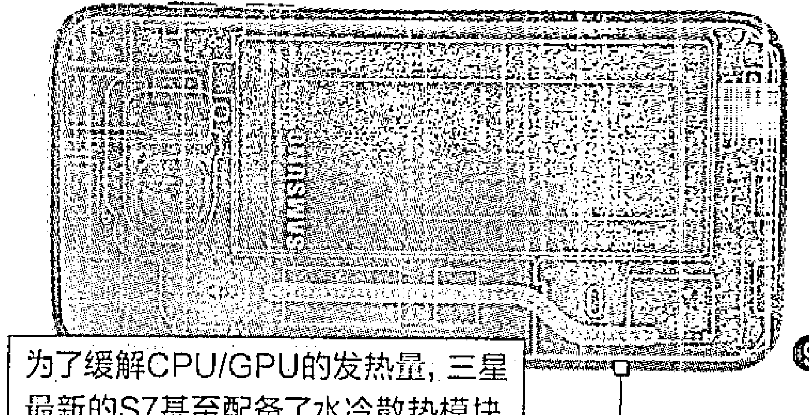

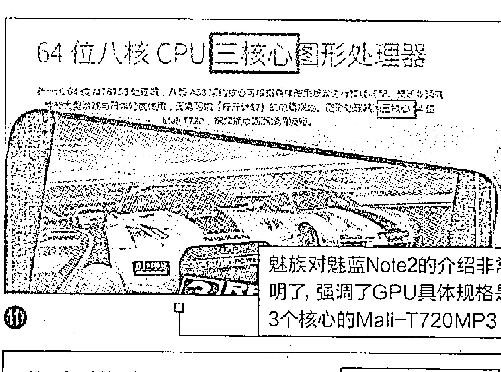

影响性能的背后工艺

那么，当两颗手机处理器都集成了相同核心数量的ARM Mali系列GPU，它们的性能就注定在伯仲之间了吗？这个答案则要取决于GPU核心的最高频率，而影响频率的高低就要看处理器的生产工艺了。比如，联发科Helio X20选用了20nm工艺制造，将Mali-T880MP4的GPU频率限定在了700MHz左右；而Helio P20则得益于最新16nm工艺，将Mali-T880MP2的GPU频率提升到了900MHz。通过提高核心频率，可以在一定程度上弥补GPU核心数量之间的差距。

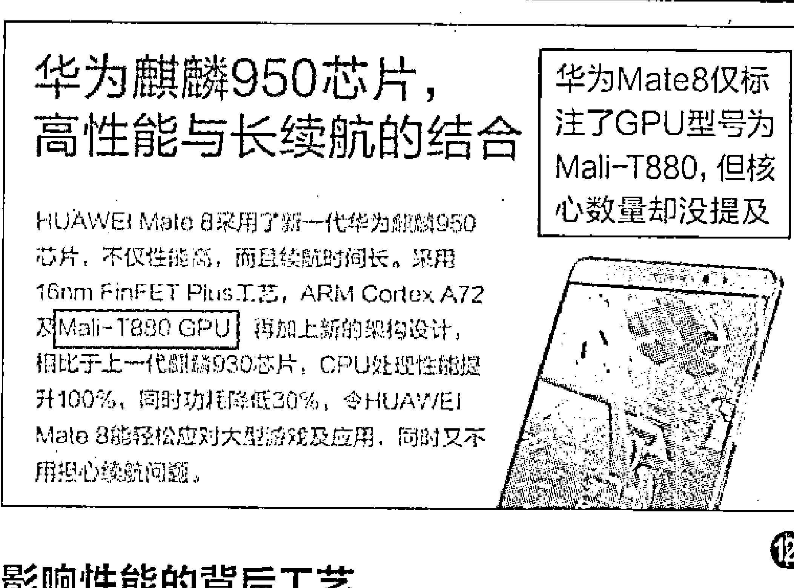

总之，在型号相同的情况下，ARM Mali系列GPU都是以核心数量论英雄（图13）。当你相中某款手机、平板或电视盒子，而厂商却没能标注具体的GPU核心数量时，我们可在网上搜索产品具体的处理器型号，从而“曲线”获得GPU核心数量的数值。需要注意的是，虽然高通Adreno系列GPU不存在核心数量的搅局，但其强弱关系却不在于型号的数字大小，如Adreno 330依旧足以秒杀Adreno 510。


##### 重新认识双卡手机

如今绝大多数智能手机都将双卡双待作为了标准功能，着实方便了拥有多张SIM卡的用户。但是双卡手机在使用体验上却有着极大差距，而造成这一影响的关键词就是“全网通”、“混插”和“双通”。如果你不能搞明白它们的涵义，那么极易被商家忽悠而错买功能缺失的手机。

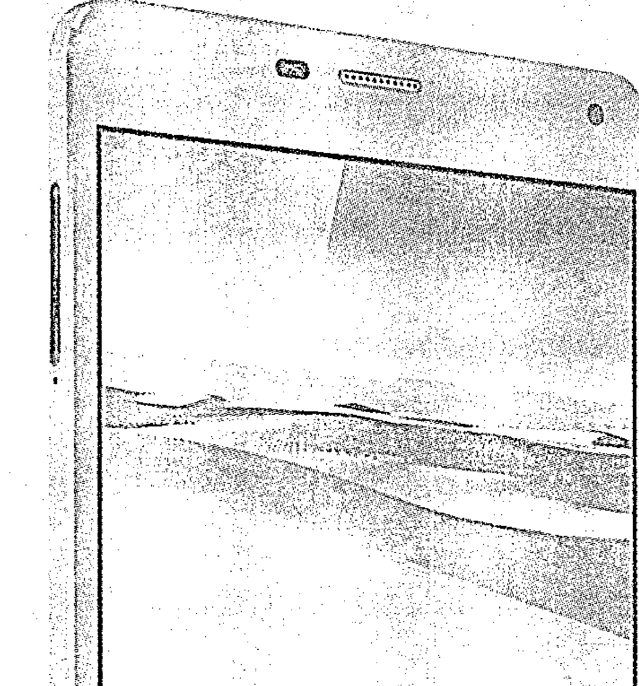

##### 全网通和定制机

如今高通和联发科都有了成熟7模15频左右的通讯基带技术，可为智能手机赋予全网通（同时支持移动、联通和电信的4G/3G/2G网络）的能力。因此如果你手上有不同运营商的4G SIM卡，支持全网通的手机无疑是最佳之选（图1）。可惜由于电信网络需要一定的专利费用，因此更多手机厂商会青睐推出仅支持移动/联通网络的双4G手机。要注意的是，在国内通过运营商渠道销售的手机数量很大，因此手机厂商会根据运营商的需要推出所谓的“定制机”。此时手机厂商通常采取3种方案：

- 1. 单独为运营商设计某一型号产品，仅支持该运营商的4G网络。其中，电信定制机比较特殊，由于它可同时支持电信4G和移动联通的2G网络，所以也经常打出“三网通”的旗号销售。
- 2. 手机厂商为了配合运营商的宣传和销售，会通过软件或者系统层面屏蔽原本支持双4G手机的其中一个网络频段。由于此类手机的通讯基带原本就支持双4G，所以用户有机会通过刷机或者软件手动破解被屏蔽的网络。以魅族MX4/MX5为例，哪怕你购买的是联通或移动的定制版，只要刷入双4G版的ROM，即可获得对双4G网络的支持。
- 3. 为了让某款热门型号打入运营商的销售渠道，手机厂商会针对不同运营商更换定制的通讯基带，或对原本支持双4G/全网通的通讯基带做出硬件级的屏蔽，或者更换不同的处理器和基带方案，没有任何破解其他网络的可能。比如华为荣耀7移动版、荣耀7联通版和荣耀7双4G版就存在硬件层面的差异，各版本间的ROM不能互刷，网络之间也无法破解。

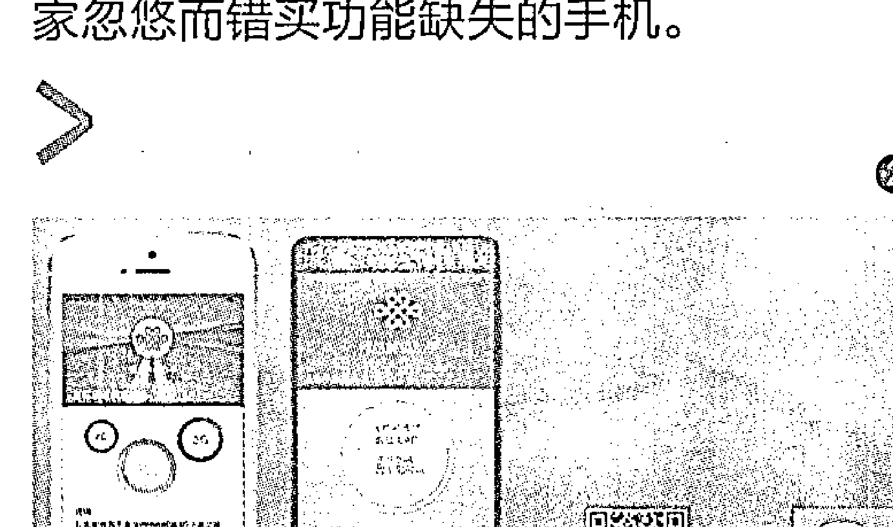

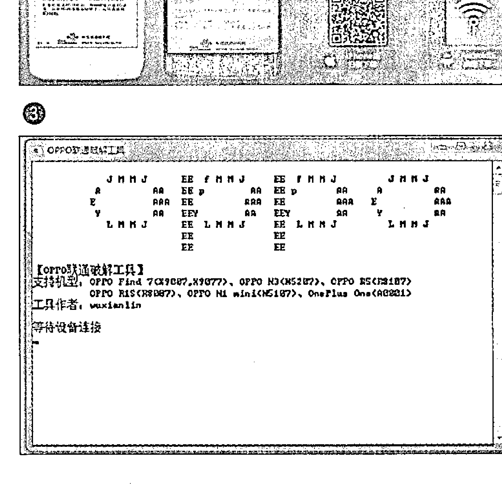

> **小技巧：如何破解网络**
如果你购买的移动定制版手机存在联通版或双4G版分支，可尝试使用联通提供的“网络解锁助手”（下载地址：http://www.10011.cn/）破解被屏蔽的联通4G网络（图2）。或在专业手机论坛寻找有没有网友制作的破解工具，如OPPO N3、Find7的移动版就能通过电脑端程序获得对联通4G网络的支持（图3）。

被忽略的“盲插”

在选购双卡手机时，很多用户只关心它是否支持全网通或双4G，却经常忽略它是否支持“盲插”功能，即2个SIM卡是否都能支持4G网络。一些双4G手机的SIM卡槽存在主副之分，只有主卡槽支持4G，而副卡则仅支持2G网络。而更多的全网通手机，只有指定的某个卡槽才支持电信4G，如果在另一个卡槽错插电信SIM卡将无法实现电信4G的联网（图4）。因此，如果你怕麻烦，支持盲插的手机能帮你免除很多后续的繁琐。

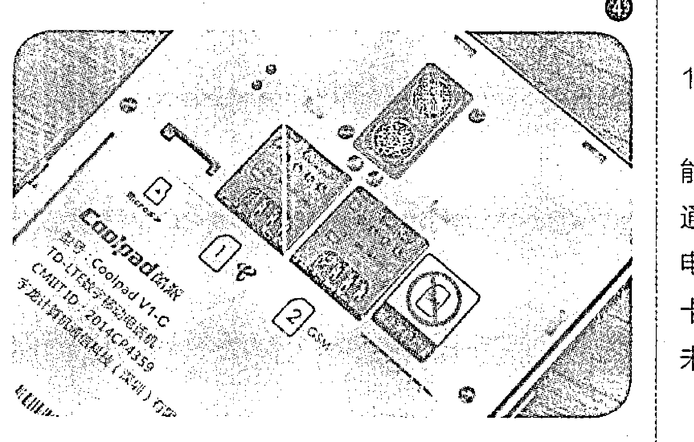

> **小技巧：如何区分两张SIM卡**
支持盲插的手机有时也会带来困扰，就是我们有时会忘记两张SIM卡分别对应哪家4G网络。解决方法很简单，就是为两张SIM卡重命名：进入“设置→双卡管理”，点击指定的SIM卡就能对其名称进行编辑（图5），此后在拨号界面的通话按钮处就会显示之前修改的内容了（图6）。

单通双通很重要

我们都知道“双卡双待”，但你又是否了解“单通”和“双通”呢？双卡双待单通的手机存在一个严重隐患：当你在用卡1通话过程中，如果有人给卡2拨号对方会收到无法接通或不在服务器的提示（此时卡2相当于被屏蔽），而你的手机也不会显示任何关于卡2的来电提示，极易错过重要的通话。
而双卡双待双通则不然，当卡1在通话中，如果卡2来电你将听到“嘟～嘟～嘟”的提示音，此时你能选择无视卡2来电而继续卡1的通话，通话结束后能看到卡2的来电提示；或者保留卡1通话，接听卡2的来电，当卡2通话结束而卡1未挂机时还能继续卡1的通话。
遗憾的是，目前绝大多数双卡手机都仅支持双待单通，而官方也鲜有会在参数列表中注明是否支持双通这一功能。因此如果你不想错过任何重要来电，就一定要选购真正支持双卡双待双通的机型。如果你想判断某款手机是否支持双通也很简单，用卡2给卡1拨号，如果能接通就说明支持双通功能。

> **单通手机莫似双通**
如果你的手机不支持双通，也可模拟双通功能：在设置中找到来电转接选项，把卡1无法接通时转接到卡2，把卡2无法接通时转接到卡1，并在通话设置中打开来电等待和来电等待提示音即可（图7）。要注意的是，来电转接是项收费功能，以北京为例，本地号码来电转接为0.1元/每分钟，非本地则需支付长途费。

> **扩展阅读：通话和上网间的矛盾**
无论手机是否支持双卡双待双通，它们都可能存在通话和上网间的矛盾。在通话的过程中手机网络会自动断开，只有通话结束后才能继续联网。而这个问题是由当前语音解决方案的瓶颈引起的，由于大多数双卡手机都采用CSFB，因此无法实现语音与数据的同步。此外，如果你是移动用户且当前网络环境只有2G信号，还有可能面临更为极端的情况：手机在使用2G网络进行数据交互的瞬间（比如下载或QQ、微信发送接收消息），你对外拨号可能会失败，此时别人给你拨号也会提示无法接通。

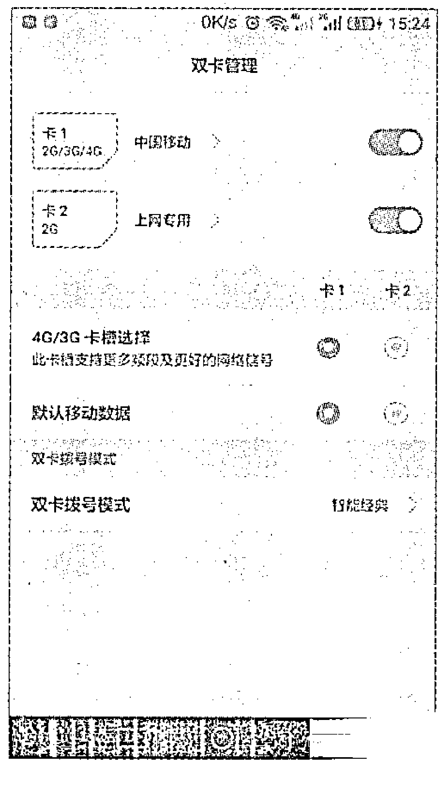

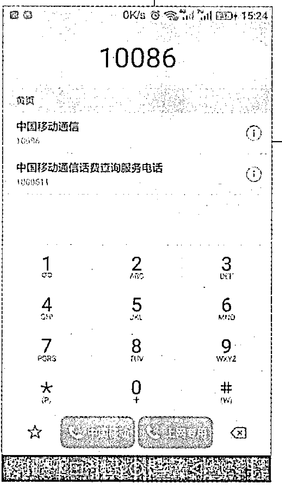

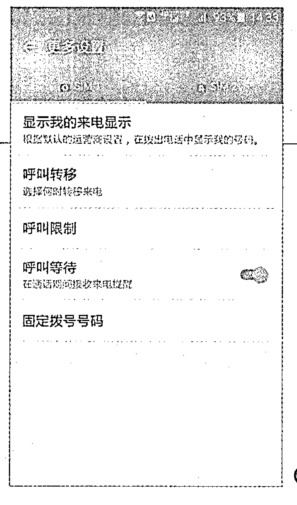


不要被路由器的天线忽悠了

随着IEEE 802.11ac标准的普及，无线路由器的天线数量也在逐渐攀升，让不少用户陷入了一个思维误区：路由器的天线数量越多，速度、覆盖范围和穿墙能力也就越强。于是很多路由器都以多天线作为卖点，而用户也非多天线的路由器不买。但是你真的了解天线数量与路由器的关系吗？

越来越多的天线

在802.11a/b/g时代，无线路由器最多只有1根天线（或内置天线设计），由于当时智能手机和平板尚未普及，而无线路由器也是一个相对小众的市场，因此没有太多用户会去关注天线的数量。随着移动设备（手机、平板、笔记本）和802.11n协议的普及，绝大多数的家庭都将无线路由器列入了“必买”名单，市场竞争的加剧促使厂家不得不为旗下产品寻找更能吸引用户的卖点。于是，哪怕是入门级的300Mbps无线路由也用上了4根天线（图1），路由器也由此进入了以天线数量论英雄的时代。

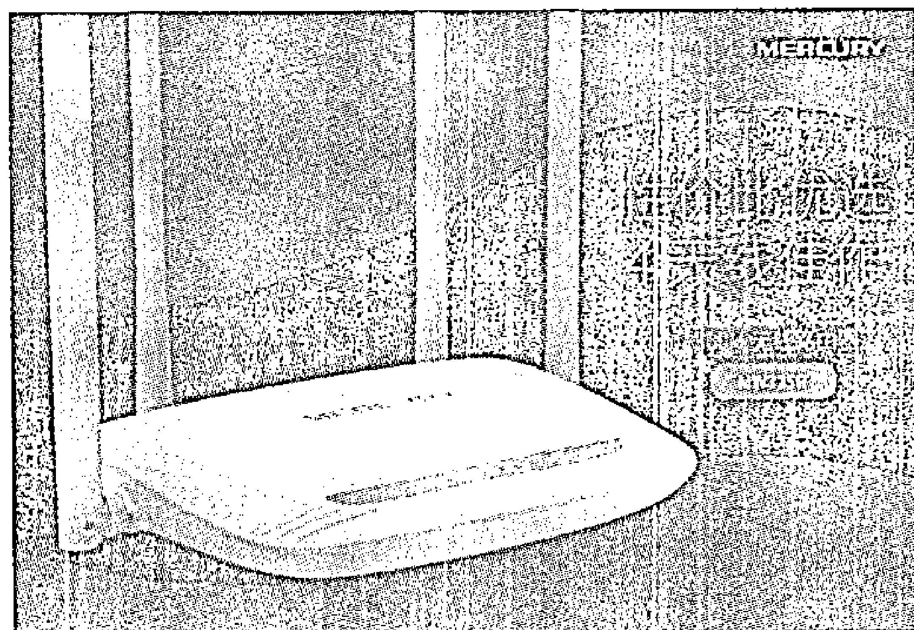

天线是速率的判断依据

抛开高深的技术原理不谈，天线数量可作为判断无线路由器传输速率的参考依据。比如同样是1根天线，对802.11a/b/g的老款无线路由器就意味着最高支持54Mbps的传输速率；对802.11n意味着最高支持150Mbps；对802.11ac意味着最高支持433Mbps。于是当我们看到某款无线路由器主打“最高多少速率”的参数，就能很快判断出它“应该”配备了天线（见表）。

比如，那些号称300Mbps速率的802.11n无线路由器，必然要选择2路11n的天线设计（图2），也就是需要2根天线（每1路11n天线可提供150Mbps速率，2路刚好300Mbps）；号称900Mbps的产品就需要3路11n+1路11ac的天线组合（图3），即3+1根天线（150Mbps×3+433 Mbps×1）。如果某款无线路由器速率和天线数量不符合这个规律，那么就基本可以断定它采用了隐藏的内置天线设计，或者是所谓的“假天线”（好一点的是用于数据备份，“坑爹”的则是直接空接）。

| 理论速率 | 54Mbps | 150Mbps | 300Mbps | 450Mbps | 900Mbps | 1300Mbps | 1750Mbps |
| :--- | :--- | :--- | :--- | :--- | :--- | :--- | :--- |
| 天线数量 | 1 | 1 | 2 | 3 | 4 | 5 | 6 |
| 802.11n | ---- | 1路 | 2路 | 3路 | 3路 | 3路 | 3路 |
| 802.11ac | ---- | ---- | ---- | ---- | 1路 | 2路 | 3路 |

由此可见，那些为300Mbps路由配4天线的产品，多出来的2根天线起不到任何“提速”的效果，只是厂家为了增添卖点而增加的“鸡肋”设计。可能有读者会问了，就算更多天线不能提高传输速率，那多少也能增加Wi-Fi信号强度、覆盖范围和穿墙能力吧？

> 小提示
很多高端路由器采用了特殊的Dual-Band 2.4GHz/5GHz天线，在一根天线里可发射/接收两个频段的信号，从而让11n和11ac双路天线实现了“二合一”。比如主打1750Mbps速率的华硕RT-AC66U，该路由器就通过3根Dual-Band天线实现了3路11n+3路11ac的速率（图4）。因此如果你发现某款高端路由器天线少于标称速率应有的数量，则可关注其中有无Dual-Band天线。

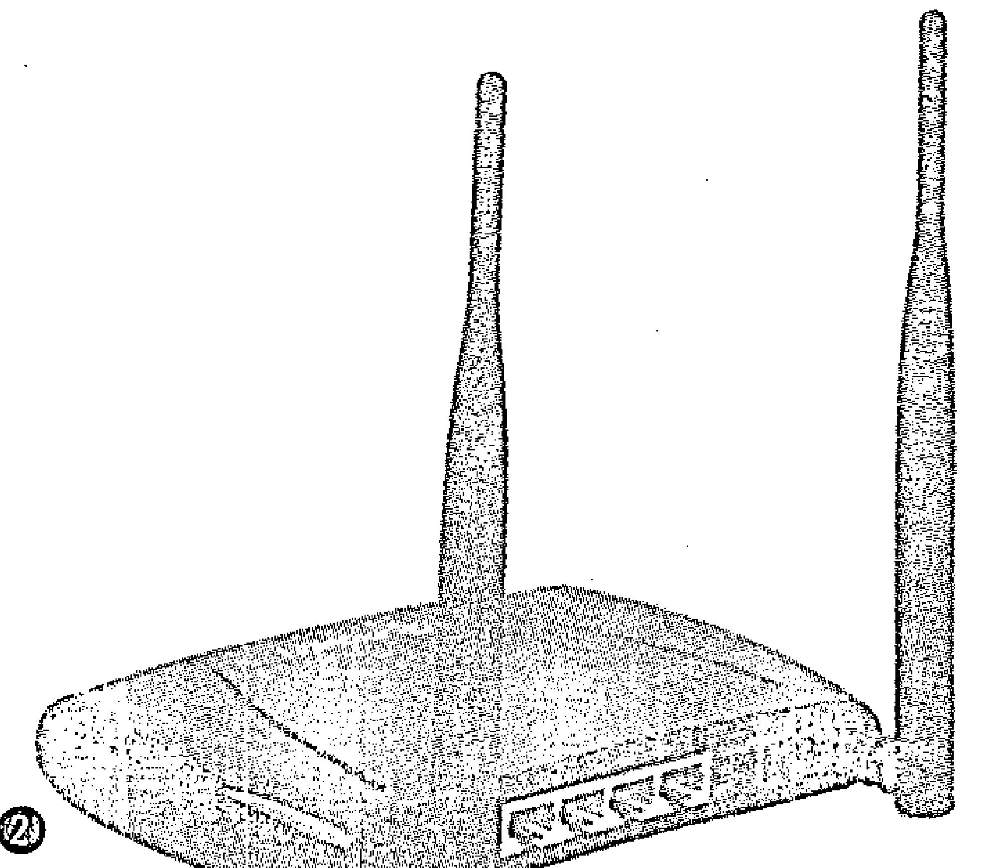

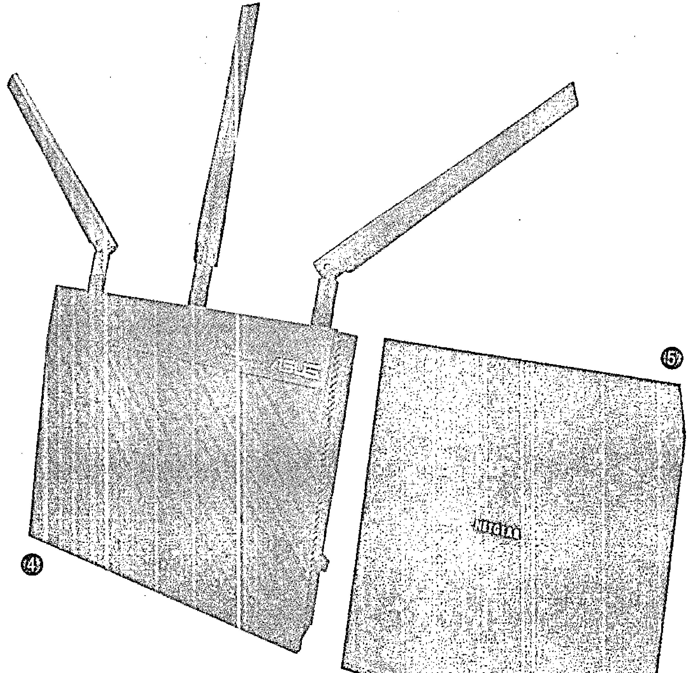

采用内置天线设计的Netgear R6250

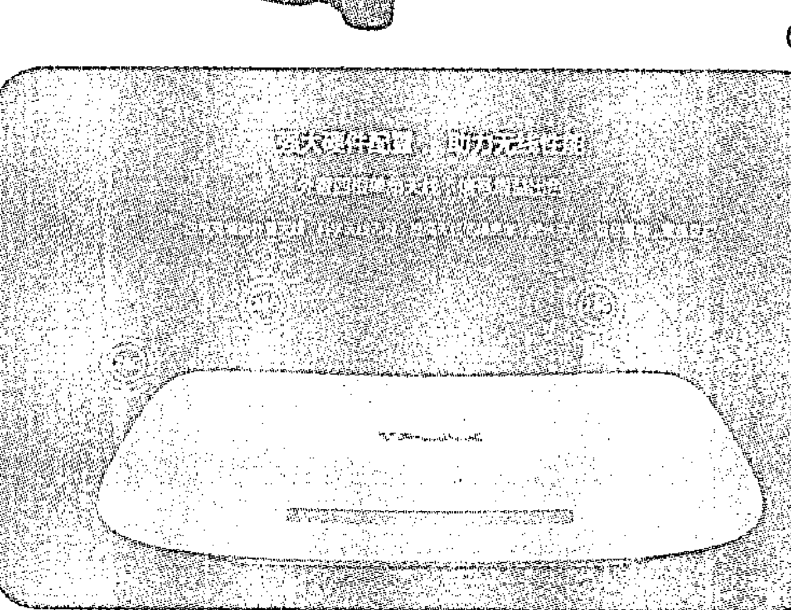

多天线没有那么神奇

首先，无线路由器的理论覆盖范围是根据802.11协议而定，而信号强度和穿墙能力则要受到Wi-Fi信号的发射功率影响（为了降低辐射，工信部规定无线路由器的发射功率不得高于100mW），和天线数量没有半点关系。
理论上，更多的天线有利于减少信号覆盖区域内的盲点，但是根据无数用户和媒体的实际测试反馈来看，这些差异在家庭环境中完全可以忽略不计。此外，还有很多用户认为外置天线的信号要优于隐藏的内置天线，这实际也是一大误区，很多千元级的高端路由仍然热衷于内置天线设计的现象就很能说明问题（图5）。
总之，无线路由器的天线只是用于提升传输速率的硬件手段，而且它的数量和最高速率也有唯一的对应关系（比如1300Mbps就注定是3路11n+2路11ac）。如果数量少了，就意味着最高速率可能存在缩水，数量多了纯属浪费资源，而且也有作为宣传噱头的嫌疑。
问题来了，为什么天线越多速率越快？所谓的x路11n+x路11ac又代表什么？为何路由器厂商要搞出两种不同标准天线的组合呢？

天线数量是这样影响速率的

在802.11n时代，无线通信领域引入了全新“MIMO”（Multiple-Input Multiple-Output，多入多出）技术（图6）。对无线路由器而言，天线就是实现MIMO技术的介质。简单说，MIMO的核心理念就是在发送端（路由器）和接收端（手机、平板、笔记本等）同时安装多根天线，从而实现在同一时间发送/接收更多信息，成倍提高传输信道的容量。在802.11n协议下，MIMO下每链路最大150Mbps，在802.11ac协议中每链路则为433Mbps，而这也就是上文我们用最高速率判断天线数量的依据。

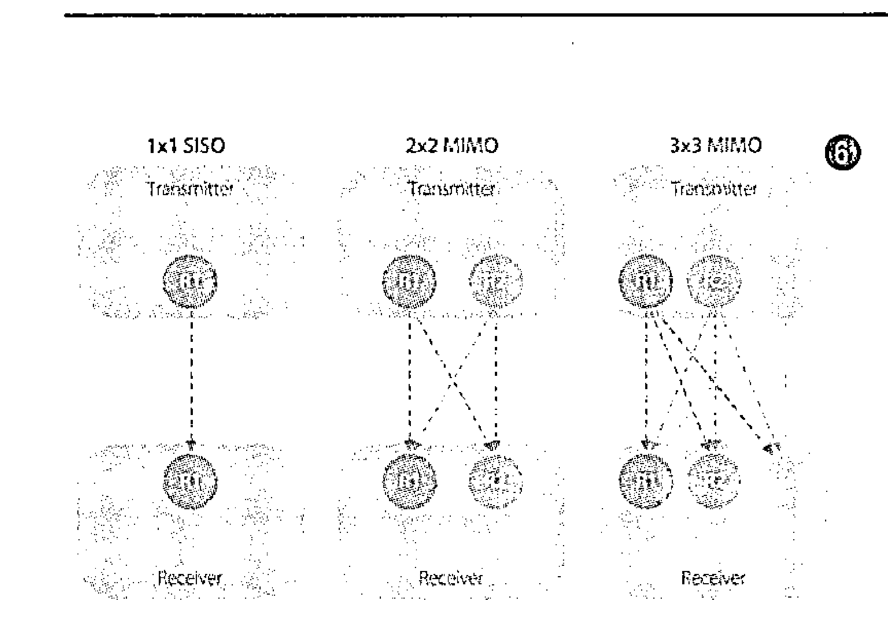

扩展阅读：不要盲目选购高速率路由器

我们可以将MIMO技术理解为高速公路的运营，天线数量就是收费站的窗口数量，发送端是入口方向，接收端是出口方向。150Mbps意味着只有1个收费窗口，车辆（信号数据）只能排队依次通过（图7）；300Mbps意味着2个收费窗口，从而让车辆出入收费站的效率翻倍提升（图8）……如此看来，无线路由器的速率越高越值得选购？答案是否定的。虽然很多新款手机、平板和笔记本都配备了支持802.11ac的无线网卡，但它们内部却仅配有1根天线（不支持MIMO技术），即最多支持433Mbps的传输速率。而更多的老款型号还停留在1根天线的802.11n时代，传输速率更是低至150Mbps，更高速率的路由器根本没有发挥的空间。这就好比高速入口是2车道，收费站窗口也是2个，但高速出口方向却只有1个车道，实际结果还是得排队（图9）。此外，目前国内家庭接入的光线宽带普遍为10M~100M，哪怕是802.11n标准的150Mbps路由也足以胜任。而更高速率路由器的最大意义就是提供更流畅的局域网环境，比如你用手机无线访问笔记本里的超高清视频、进行远程桌面等操作时，高速路由器才有发挥的空间。因此，普通家庭用户购买750Mbps（2路11n+1路11ac）或900Mbps的802.11ac无线路由器就足够用了。

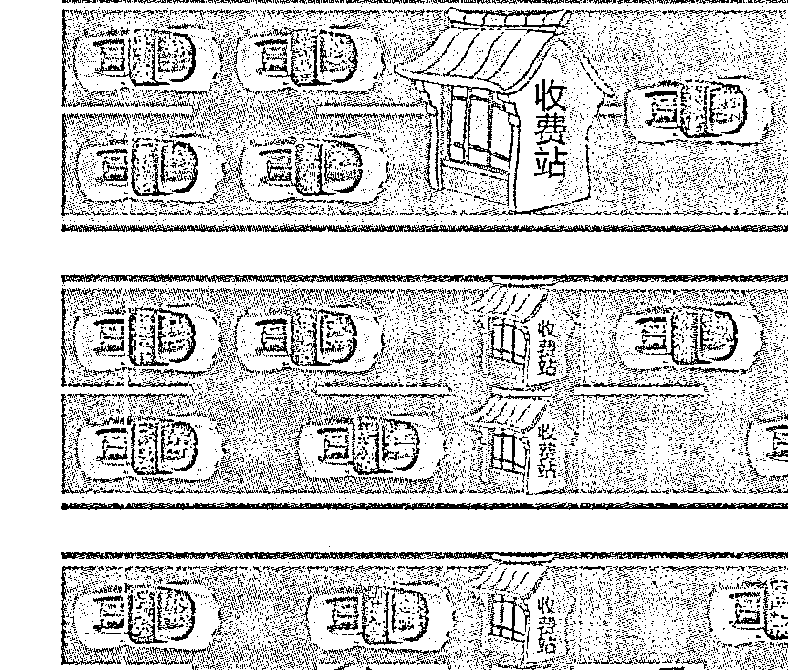

802.11n和更早的无线协议都工作在2.4GHz的频段上，所以我们可以将匹配11n的天线理解为“2.4GHz天线”。2.4GHz虽然理论速度偏低，但却依靠较长的波长获得了极为出色的穿墙能力。可惜，我们熟悉的无线键鼠、无线音箱、无线耳机等外设也在占用2.4GHz频段的通道，与其工作在同一环境下的无线路由器将面临严重的信号干扰隐患。为了提升传输速率并降低干扰，工作在5GHz频段上的802.11ac协议正式登场。遗憾的是，5GHz波长则相对较短，穿墙能力让人汗颜。既然2.4GHz速度慢易被干扰，而5GHz穿墙能力薄弱，如果将它们的优势合二为一自然就是最佳选择（图10）。于是，同时配备2.4GHz天线和5GHz天线的“双频”无线路由器就成为了市场的主流（图11），而前文提到的“x路11n+x路11ac”就是双频路由器的典型特性。

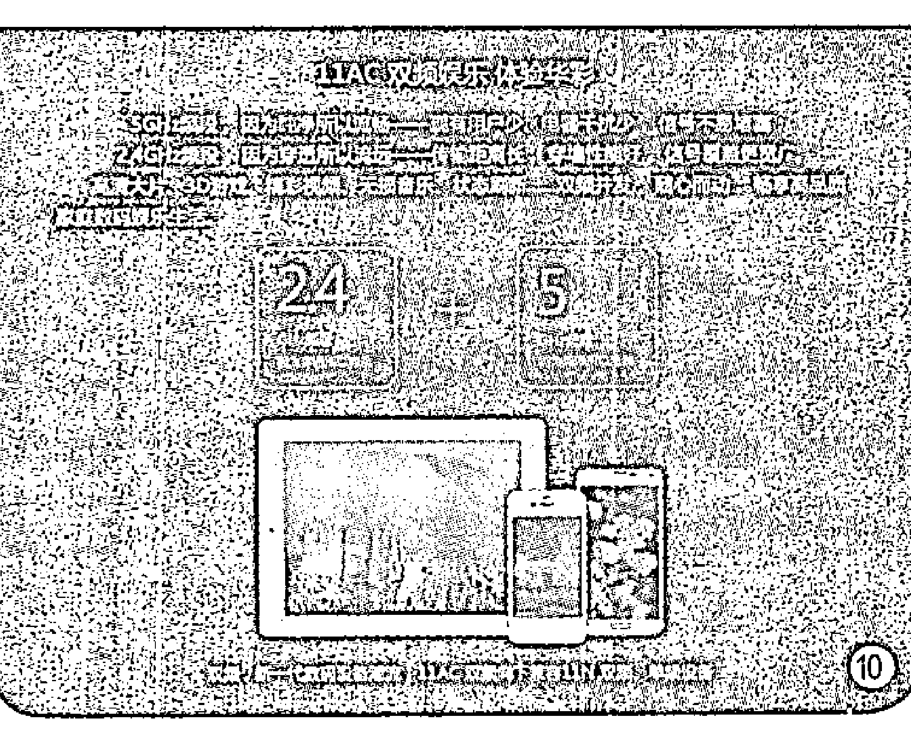

科学天线布局 信号增益出色

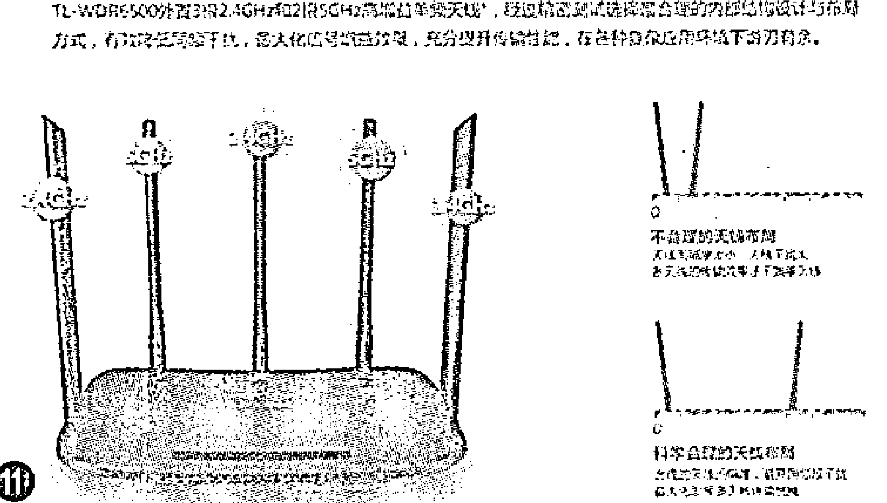

> 小结
看到这里，相信大家已经对无线路由器的天线有了较为直观的认识。作为MIMO的介质，天线只是用来在单位时间内提高传输速率的硬件辅助。传说中天线越多可增强信号覆盖范围、穿墙能力的结论是站不住脚的。总之，只要路由器的天线数量与其标称的最大传输速率相匹配即可，更多的天线就属于用作宣传的噱头了。

##### 投资回报不成正比 PC多卡系统的尴尬

我们常常看到国内外DIY高手在自己的电脑当中组成双卡甚至四卡系统，运行3DMark冲击世界纪录的例子。于是不少用户在新装或者升级当中将SLI或CrossFire当作首选，其实对于绝大多数普通用户来讲PC多卡系统几乎是最不划算的方案。

##### 性能难以发挥

只要不是硬件升级，一律不推荐组建双卡，有此预算不如直接买对应更高级的单显卡效果好。比如很多用户看重GTX 970的性价比打算组建双卡，但其实远不如购买一块GTX 980Ti省心且划算。

PCI-E带宽是多卡系统中最重要的一环，几乎我们常用的所有主流芯片组，原生低延迟的PCI-E通道都只有处理器提供的16条，PCI-E通道只支持整数分拆就是两个PCI-E 3.0 8×（图2），这还是未使用任何独立扩展卡的情况下才能达到的。但比起单卡，多卡系统非常依赖PCI-E带宽，双3.0 ×16和双3.0 ×8的跑分可能没差多少，但是实际帧延迟曲线差别非常大（图3）。

但也不是说使用X99配合Haswell-E这类有多达40条PCI-E通道的平台就可顺心用双卡了，在多显卡系统中SLI/CrossFire提高游戏帧数实际上是“假帧”最终没出现在屏幕上，SLI和CrossFire的延迟达到10ms到15ms之多，这已是任何人肉眼感受得到的延迟。除跑分冲纪录外，只有当使用单卡旗舰依然无法保证游戏达到30帧的情况下用旗舰卡组建多卡才有实际意义。

##### 扩展阅读：笔记本外接显卡

不仅双卡系统并不实用，近期比较流行的一种笔记本电脑外接独立显卡的实用性也非常令人堪忧（图4）。首先笔记本并不能提供台式机显卡所需的足够带宽，台式机显卡运行在外接环境下最多只能发挥原本60%左右的跑分性能，这在我们之前的文章中也有过测试。要注意的是这还仅仅是跑分数据，实际上这种外接技术传输中产生的延迟会完整体现在游戏中真实流畅度中的，独立显卡似乎是提高了每秒帧数，但其实游戏会更卡顿延迟，这是由帧延迟造成的。这比台式机双卡系统更不实用，笔记本外接独立显卡基本成了玩具，毫无意义。

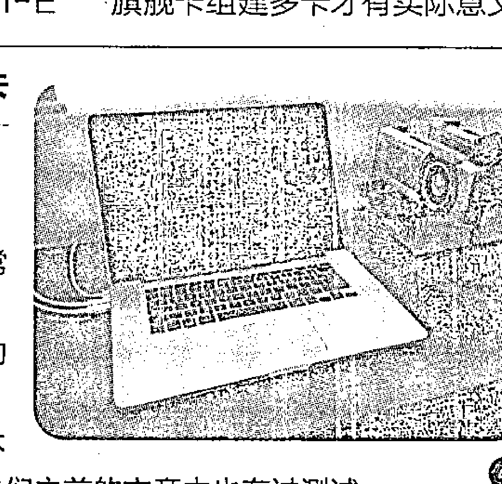

##### 难以打理的多卡系统

组建双卡不像想象中那么简单，不是把两块一样的显卡都插在主板上就能工作。首先用户的电源要过关，大多数人的电源都是400W到500W，这样的电源支持双卡是有很大困难的。不仅PCI-E供电线缆可能不够，长时间超负荷运转也不安全。

除了供电外还有散热问题，由于主板PCI-E插槽布局SLI或者CrossFire系统中的多块显卡距离是非常近的，如果是三卡、四卡甚至会紧贴在一起（图1）。非公版那种较厚的散热器根本无法工作，适合多卡的只有公版散热器，主卡还会面临很大的散热压力，需要机箱风道帮助。


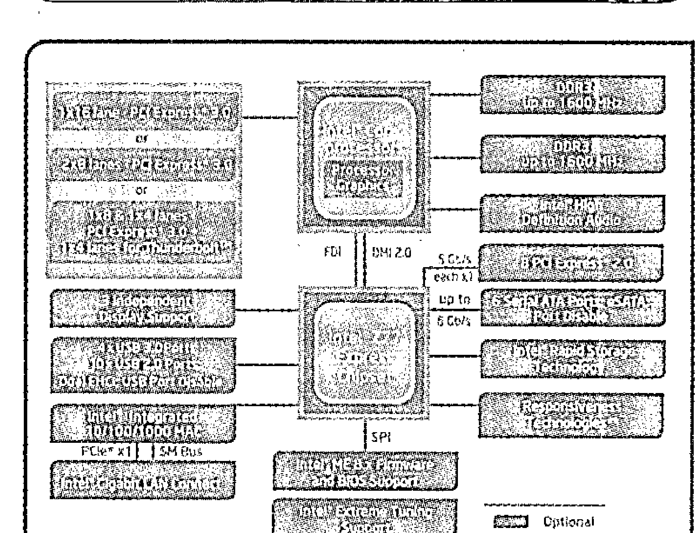

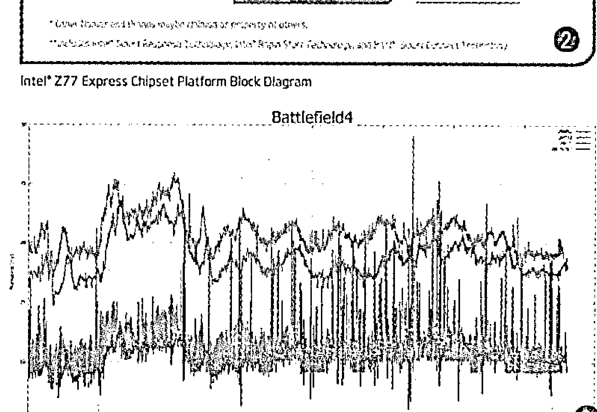

##### 特别话题

##### 没用的花哨设计

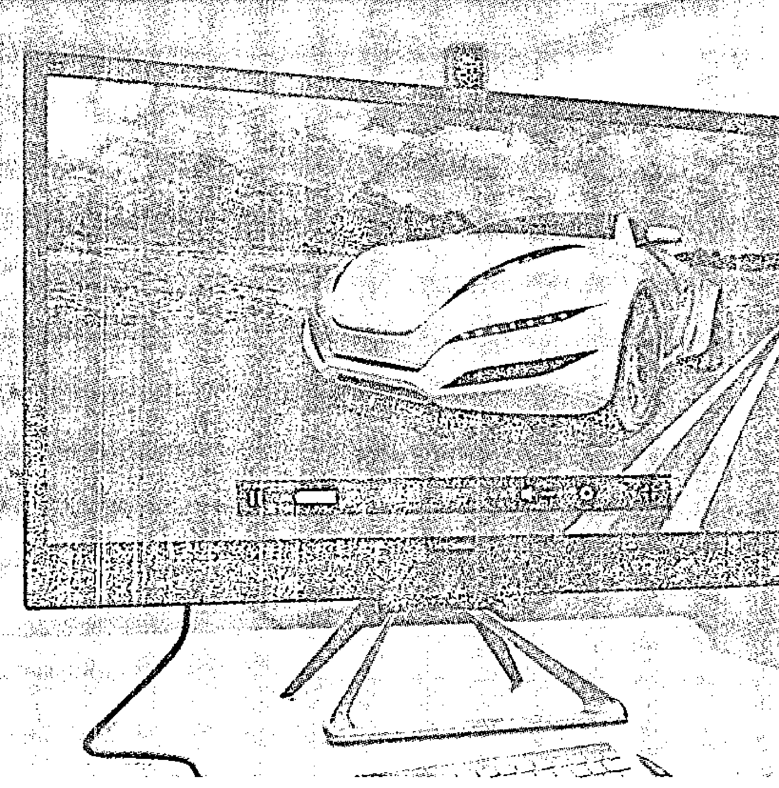

目前PC的硬件产品已经足够人性化，安装和使用时对比以前的产品也已经足够简化了。我们对于硬件产品的关注点应该逐渐过渡到选择上，只有选择合适的产品，对于我们今后顺利使用PC才是最大的帮助。


##### 设计失准的板卡

主板和显卡是整个PC系统当中比较重要的部分，也是PC配件当中品牌最多、型号最混乱的两个设备。绝大多数板卡对于我们用户而言只是性价比高低不同，在设计上都是没有什么问题的，但也有极少部分板卡存在华而不实、看上去很酷实则意义不大的设计。

目前显卡已经超越CPU，成为决定整台PC性能的关键已经成为现实，我们衡量PC性能也更加看重3D图形性能。显卡性能越来越强也带来了更高的发热量，所以根据散热性能在同型号内挑选显卡其实是很合理的方法。但有一些品牌为了突出旗下显卡散热性能强大推出了一些造型夸张的产品，它们是否实用呢？

映众冰龙系列一直主打散热，最新版的冰龙系列延续了以前优秀的三风扇设计，但是在显卡肩部增加了一个小尺寸高转速风扇(图1)。平心而论这个大力神散热器三个主风扇配合散热器性能是非常出色的，但是这个肩部散热设计就略显多余了。首先，目前绝大多数机箱侧板是封闭不进风的，这个位置设计风扇除了会打乱风道并没有太多积极意义(图2)，而且会进一步增加显卡重量，造成显卡和PCI-E插槽的侧弯。七彩虹烈焰战神系列中某些产品甚至在肩部设计了一个可插入式的热管鳍片组名曰Air-Kit套件(图3)，会和很多机箱的硬盘架甚至是侧板产生冲突，有些产品重量的增加非常夸张(图4)，完全是多此一举。

比起五花八门的显卡, 主板相对比较规范, 但是目前也有一些主板上的效果看上去酷炫, 而实际毫无意义。比如最新版华硕玩家国度某些型号主板, 在PCH芯片散热片上增加了华硕ROG标志的呼吸灯效果(图5), 看上去十分酷炫, 但是只要用户使用标准长度显卡插在PCI-E第一槽上就会挡一个结结实实。

这个呼吸灯效果可见, 用户只能将显卡插在PCI-E其他插槽上, 而根据芯片组的不同, 此时显卡可能只能运行在8x甚至更低的通道下而影响性能, 完全是本末倒置。另外, 不少品牌现在开始在主板上增加五颜六色的LED灯光效果, 但是最终都会因为用户的散热器、显卡等等其他设备的存在效果大打折扣。

##### 不达标的显示设备

显示器去年主打4K, 但并不是所有分辨率标4K的显示器都合格。最初一批4K显示器低端的多采用TN面板并使用28英寸以下尺寸(图6), 此时分辨率确实是上去了, 但是显示效果和可视角度都不敢恭维, 其售价在当时比27英寸的2K分辨率IPS面板产品还贵, 实在是得不偿失。后来还有一些4K显示器使用30Hz的标准刷新率, 要知道自从液晶显示器家用化之后屏幕刷新率就没有低过60Hz, 30Hz的产品显示静态画面尚且可以, 几乎任何动态的画面显示效果都会很差(图7)。

除了4K面板领域参差不齐之外, 也有很多品牌在面板上做文章。以IPS为例, 目前IPS面板依旧有高低之分, 不少品牌不标明自家产品使用了何种面板, 将E-IPS面板和AH-IPS面板混淆, 更有甚者将ADS面板当作IPS面板进行宣传(图8)。

与显示器领域相比, 家用液晶电视问题更多。有很多宣传为4K分辨率的产品实际并没有达到物理4K级别, 而且绝大多数产品的刷新率都是30Hz。目前用户如果需要购买4K液晶电视, 最好选择其图形处理芯片可达到60Hz刷新率下的标准3840×2160分辨率, 同时拥有HDMI 2.0以上标准的高清接口(图9), 这样产品才有实际的意义。

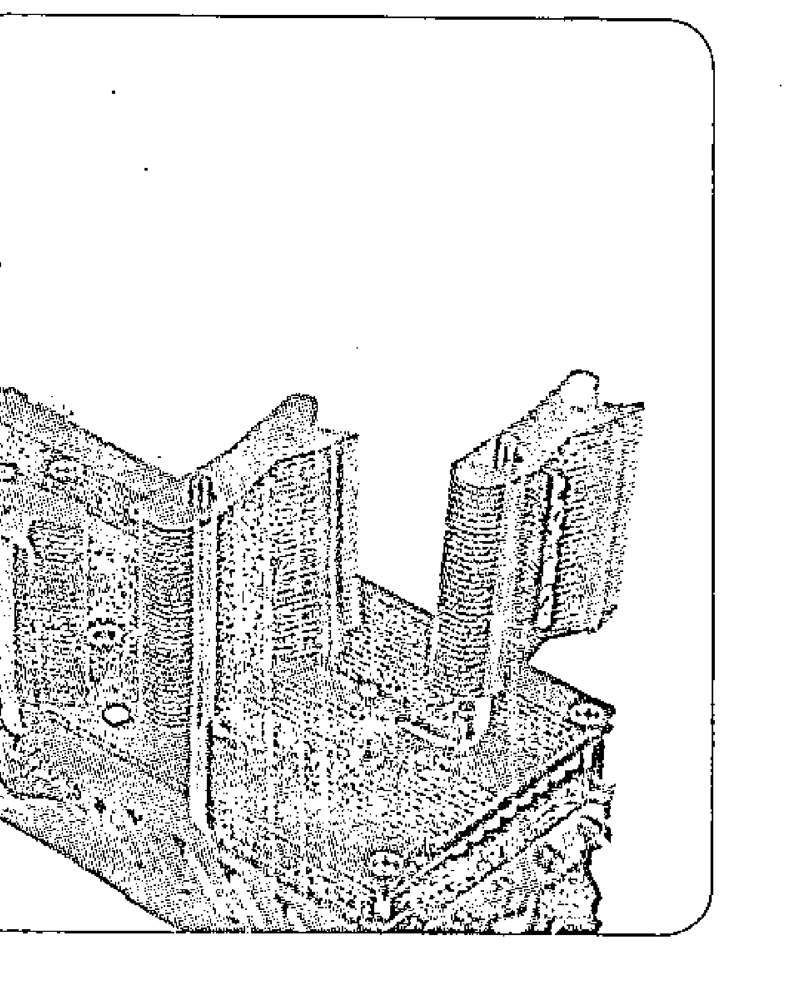

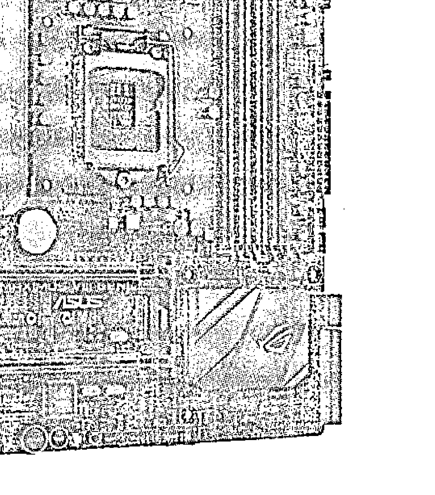

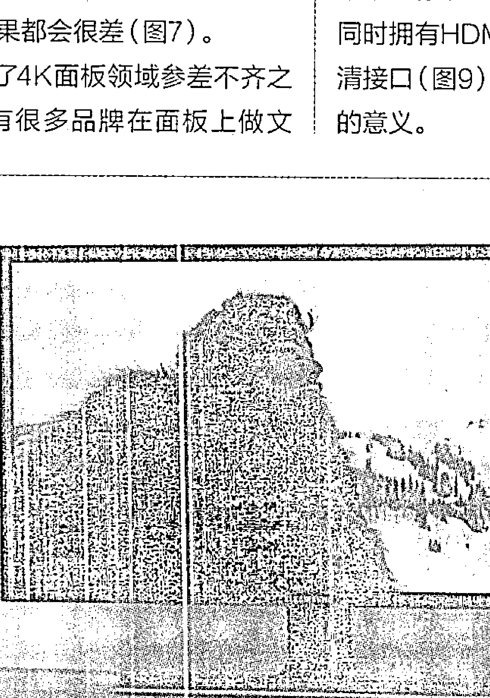

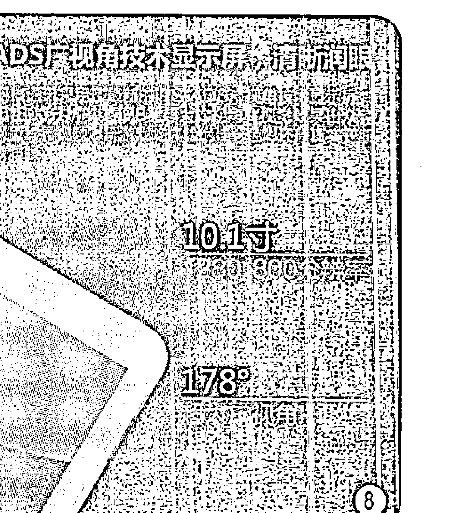

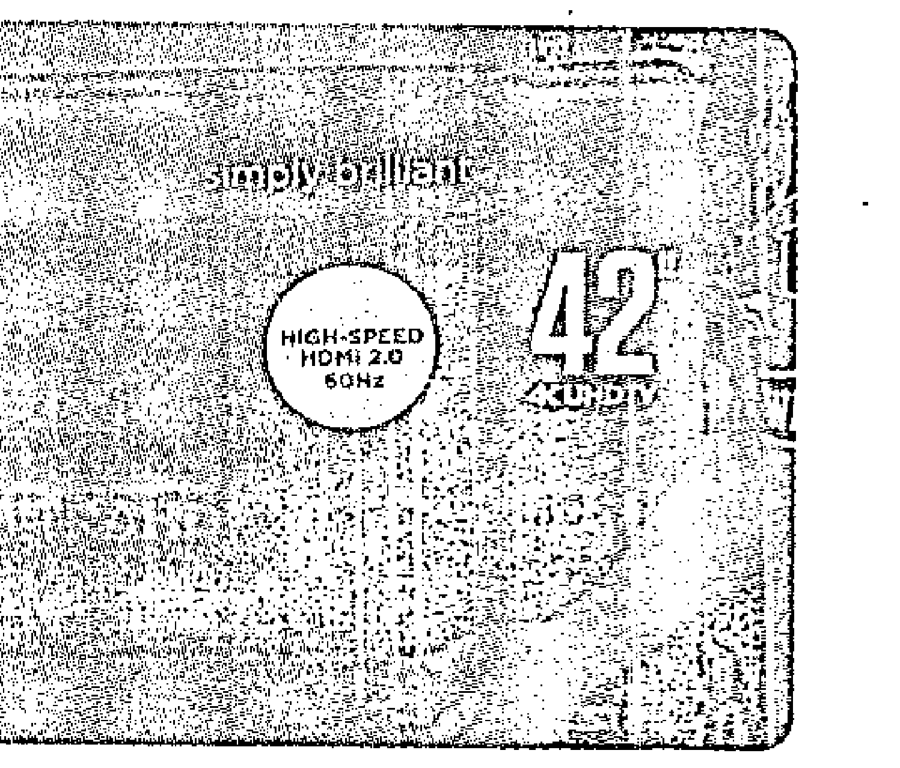

###### 硬盘的性能等级

关于各品牌各种类的SSD测试我们在之前的评测文章中做过不少，虽然价格彼此差异很大，但大体上而言使用SATA 3.0接口的AHCI SSD性能都算接近。特别是用户第一次从HDD更换为SSD时候都可以提供在IOPS方面巨大的提升，这个升级是质变，就算是最低端的SSD一样可以提供。


要注意的是，很多用M.2方式接口却使用SATA通道的M.2 SSD（图10）。它们虽然在接口看上去较前卫，但性能几乎和使用SATA接口的普通固态硬盘性能一致。不少厂家将这类产品特意提高了售价，此时购买是相当没有性价比的。如果用户想通过M.2接口进一步提高固态硬盘的优势，请一定认准PCI-E通道SSD，或者干脆选用PCI-E接口的固态硬盘。

HDD的情况不温不火，不过也有很多浑水摸鱼的产品存在。我们都知道HDD的性能分水岭主要是磁盘转速，家用常用7200rpm和5400rpm两种，而比如西部数据的蓝盘和绿盘也是根据这个性质来划分性能级和普通级的。而近期出现的一种最新版西部数据蓝盘2TB虽然产品外形和之前的蓝盘并无区别，却破天荒开始使用5400rpm转速（图11），性能对比7200rpm转速的蓝盘还是有下降的，用户选购的时候还需要注意一下。

###### 小品牌内存

去年年初内存价格还比较时，电商商城当中出现了很多之前没听过的内存品牌（图12）。它们的特点是售价相对较低，但基本都不由京东商城自营，发货和售后都由第三方商家自理。特别是在DDR4内存上面，由于当时主流品牌售价很高，这类小品牌内存的销量也比较可观。可是与传统大品牌相比，有个别用户在收到此类内存后发现了问题。

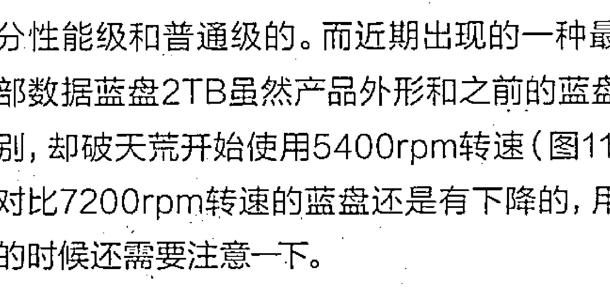

内存一般来讲是整个PC系统中可靠性最高的产品，一般不易损坏，新货到手后出问题的几率就更低了，但是在这些小品牌内存新货中就出现了新品无法使用的问题。比起无法使用更多存在的是兼容性问题，比如插入单根正常但多根一起使用就不兼容的问题。

客观来讲，就算是这些品牌，其内存出问题的几率依旧不是很高，但对比传统内存品牌来讲还是稍高了一些。而且由于其售后更多依靠第三方商家处理，也享受不到很多电商的快速处理服务。这类小品牌内存主要的优势就在于性价比，而进入2016年以后，不仅DDR3内存价格已经降入谷底，DDR4内存的价格也是一路走低。预算稍微宽裕一些的PC用户，其实完全可以不去冒险购买第三方商家的产品。

###### 驱动安装卸载的学问

在DIY兴起之时，曾流传驱动安装顺序应为主板（芯片组）、显卡、声卡、其他外设，全安装一遍之后再去安装配套软件才比较稳妥。硬件设备驱动程序已经日新月异，在Windows 10系统当下是否还有必要按照此方式安装驱动？让我们看一看驱动的学问。

###### Windows 10的自载驱动

其实从Windows 7开始，系统安装过后大多数硬件设备就已经被安装驱动了，到Windows 8之后操作系统内置的驱动就更多，Windows 10我们安装完毕除了一些老旧声卡或者小众读卡器外几乎所有设备驱动都已经被安装好了。熟悉Windows的用户会知道操作系统内置的驱动属于简版驱动，在这些驱动当中哪些可以使用，哪些需要重新安装呢？

如果只是进入Windows后进行文档、网页浏览等简单操作，其实多数情况下Windows 10的自加载驱动已可以放心使用了。简版驱动虽然可驱动硬件，但不同类型的简版驱动都有各自的特点，如果用户想要实现完整的功能和100%的性能，其中有些驱动是一定要重新完整安装的。

###### 显卡驱动

首先就是显卡驱动，Windows 10预加载的驱动是一个非常简单的驱动程序，可保证几乎任何显卡的正常使用，但其3D性能是非常弱的。不论我们是不是游戏用户，其实都应该重新安装显卡驱动，不仅为了性能，还可避免很多潜在问题。

如NVIDIA显卡只要用户的电脑联网，系统更新会自动提示你更新到一个新版本的驱动。但如果根据Windows 10推送的提示去下载和显卡驱动，下载下来的驱动依然不是完整版驱动，而且会造成显示故障或者游戏崩溃。当时NVIDIA的建议是关闭Windows 10系统的自动更新驱动功能，右键点击Windows图标选择“系统”中的“高级系统设置”，点击“硬件”选项卡中的设备安装设置，将默认为“是”的选项改为“否”，并选择“从不安装来自Windows的驱动”，确认保存(图1)。

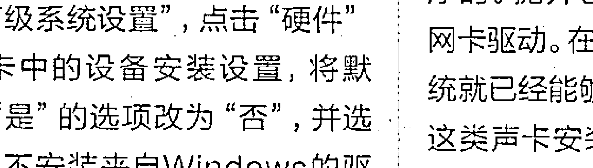

伴随Windows 10出来的微软Surface Pro 4足够吸引眼球(图2)，不过发售之初很多问题都是受到Windows 10版的显示驱动问题影响。比如无法进入深度睡眠状态、睡眠时电池消耗快、VPU重置等问题。其中Surface Pro 4的黑屏是最大问题，这个问题由于广泛存在且如果没有Type Cover键盘盖就几乎难以解决闹得沸沸扬扬，其实最后查明也是出厂版本的Intel核芯显卡驱动程序惹的祸。

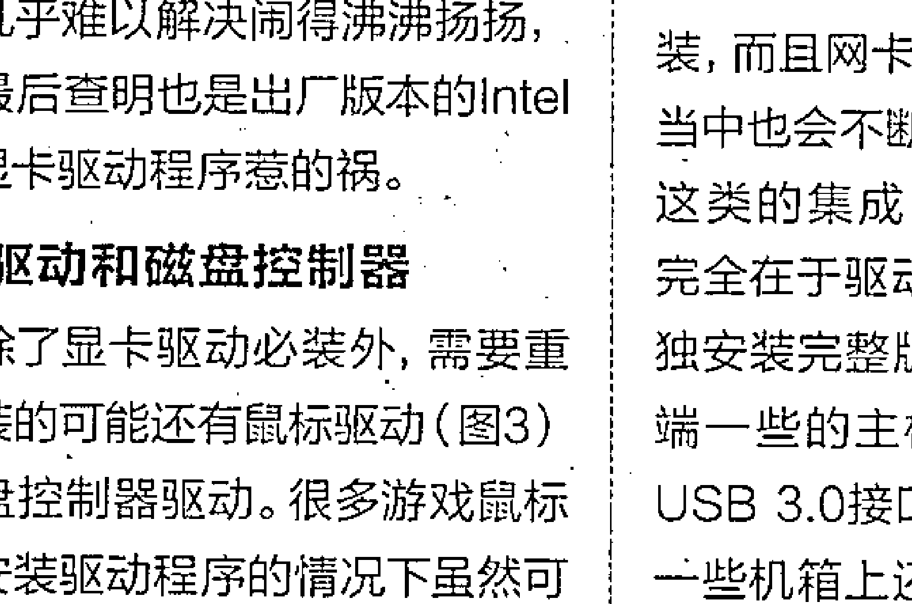

###### 鼠标驱动和磁盘控制器

除了显卡驱动必装外，需要重新安装的可能还有鼠标驱动(图3)和磁盘控制器驱动。很多游戏鼠标在不安装驱动程序的情况下虽然可简单使用，但其DPI调节、灯光调节无法使用，而且侧键最多只能利用最基本的前进、后退两个，其余侧键是无法自定义功能的。如果用户使用的是多侧键多功能游戏鼠标，去安装鼠标厂商官网提供的驱动程序很有必要(图4)。

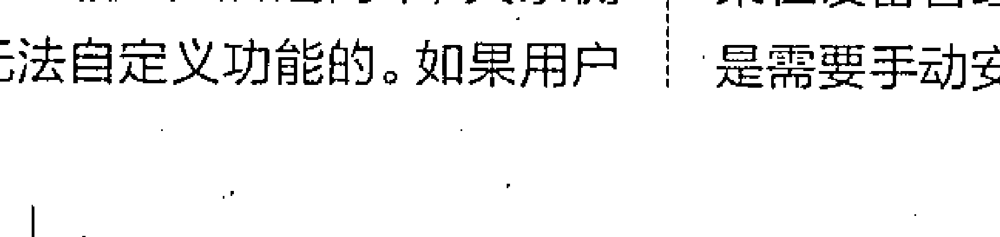

磁盘控制器驱动目前一般集成在芯片组驱动当中，虽然芯片组驱动可装可不装，但是磁盘控制器比如AHCI这类的驱动，微软集成版本和厂商如Intel提供的AHCI控制器在性能上是有一定区别。尤其是SSD用户，如果想实现最高性能，推荐安装厂商完整版本的芯片组驱动(图5)。不必按照以前那种先芯片组的顺序，任何时间重新安装都可以。

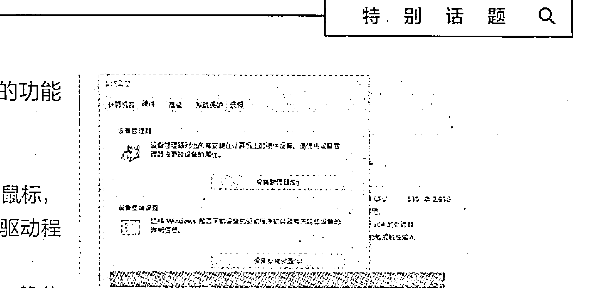

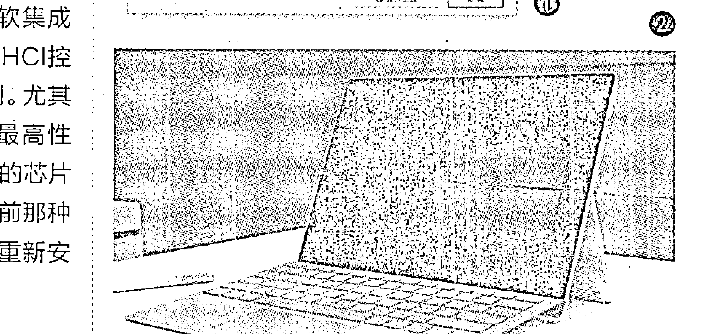

###### 其他驱动

除了显卡驱动外，CPU、内存、硬盘这些硬件都是无需驱动程序的。抛开它们不谈，看看声卡和网卡驱动。在Windows 7时操作系统就已经能够给包括Realtek、VIA这类声卡安装驱动了，其功能对比完整版驱动其实也只是差了一个控制面板(图6)。控制面板能做的是多声道检测和前面板音频设备插入后的策略，如果用户没有这方面的需求，其实完全可以忽略不计。

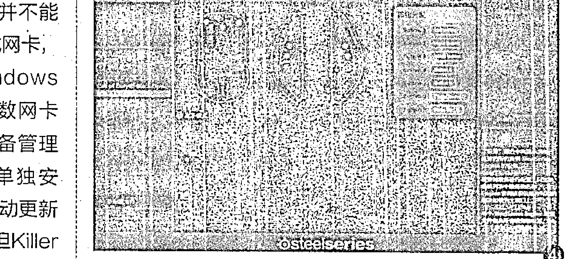

网卡驱动Windows 7并不能认出Realtek、Intel这类集成网卡，所以依然需要安装，但Windows 10已经可以识别出绝大多数网卡并安装简版驱动了。只要设备管理器内硬件情况正常，无需单独安装，而且网卡在Windows自动更新当中也会不断在线升级的。但Killer这类的集成网卡由于其优势发挥完全在于驱动程序(图7)，所以单独安装完整版驱动仍然有意义。

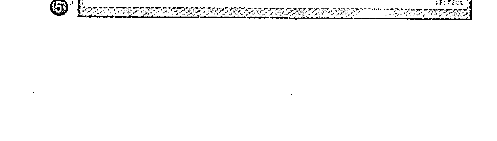

高端一些的主板一般会提供更多的USB 3.0接口甚至USB 3.1接口，一些机箱上还有读卡器等等，这些根据其主控芯片的不同，有些可以被Windows识别，有些则不能，如果在设备管理器当中呈现未知状态是需要手动安装的。

###### 显卡驱动的卸载与重装

用户更换了显卡，有些甚至是从NVIDIA换到了AMD，是否需要彻底卸载驱动程序呢？如何卸载重装驱动程序才能有效清理旧文件呢？根据不同情况我们来分析一下思路。

###### 显卡互换

同品牌显卡互换相对比较简单一些，只要安装的驱动程序同时支持先后两款显卡，换卡的时候我们根本无需卸载驱动，直接关机换卡后点亮系统即可。而在NVIDIA和AMD显卡互换时自然需要重新安装驱动，此时怎么做比较好？

驱动程序在安装及启动时会自动检测PC当中是否拥有可驱动的显卡，如果没有程序在Windows启动后几乎不起任何作用，这在系统托盘图标和上下文菜单中驱动程序项不会出现中可看到。换卡时我们无论是先卸载驱动还是先更换显卡都是可以的，甚至在不卸载NVIDIA驱动程序时去长时间使用AMD显卡也是没有问题的。

在Windows 10之后，DX12 API大大加强了NVIDIA和AMD双卡混交的渲染效率（图8），在很多游戏当中，NVIDIA和AMD显卡混交效率甚至要超过SLI和CrossFire，这也表明了其实两家的驱动程序和对方的显卡完全可以和平相处，互不干扰。

###### 如何卸干净显卡驱动

如果用户想要卸载干净上一版本的显卡驱动也不难。NVIDIA显卡驱动分为驱动、物理引擎驱动、HDMI声音驱动、面板等多个项目（图9），在Windows添加删除程序中需要手动卸载，推荐将显卡驱动本体作为最后一个卸载项目，因为其完全生效需要系统重启。而如果只是要安装新版驱动完全无需这么麻烦，NVIDIA驱动程序安装时提供清洁安装选项（图10），勾选后再装驱动程序会完全清理掉上一版本的驱动程序包括所有组件的设置之后再新装，十分方便。

AMD显卡驱动在催化剂时代其实很难完全卸载干净，在卸载催化剂程序之后，需要借助AMD官网提供的amdcleanuputility.exe程序再次运行（图11），直到这个小程序提示我们清理完成以后重启系统再进行新版本的安装（图12）。去年催化剂完全升级为Radeon-Crimson，终于提供了近似NVIDIA那样的重装体验。但比起NVIDIA至今仍将驱动中不同部分独立分开的做法，AMD驱动只需运行AMD Install Manager就能一步完成卸载（图13）。如果安装的时候勾选了AMD Gaming Evolved，还需要卸载掉Raptr才算卸载干净。

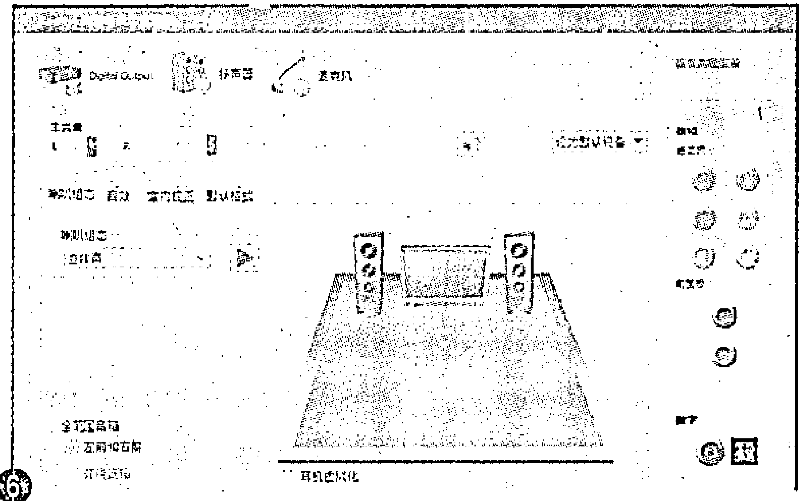


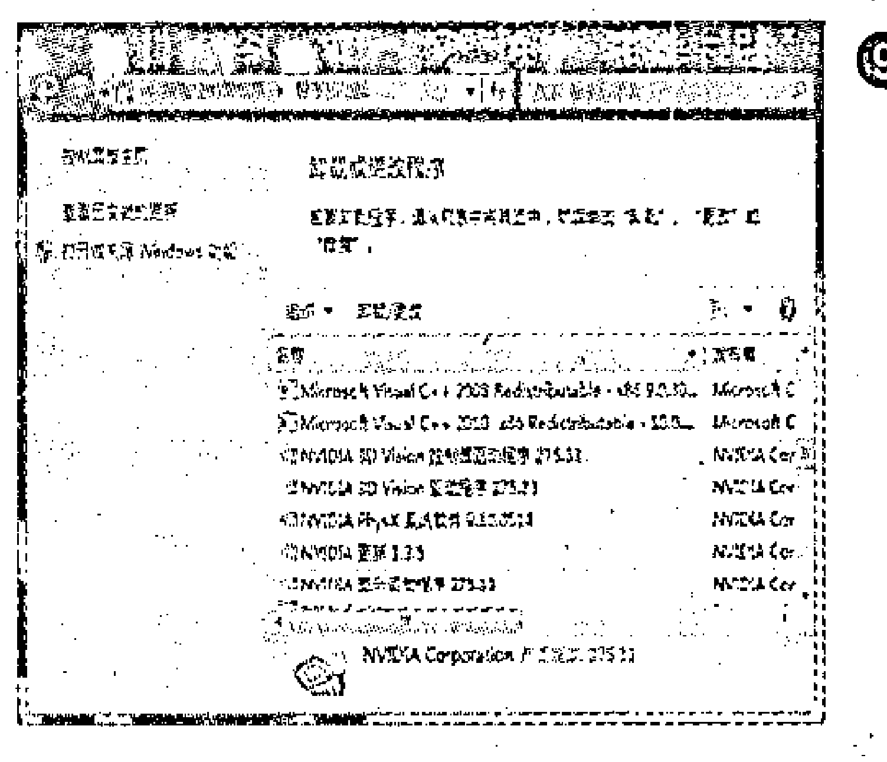


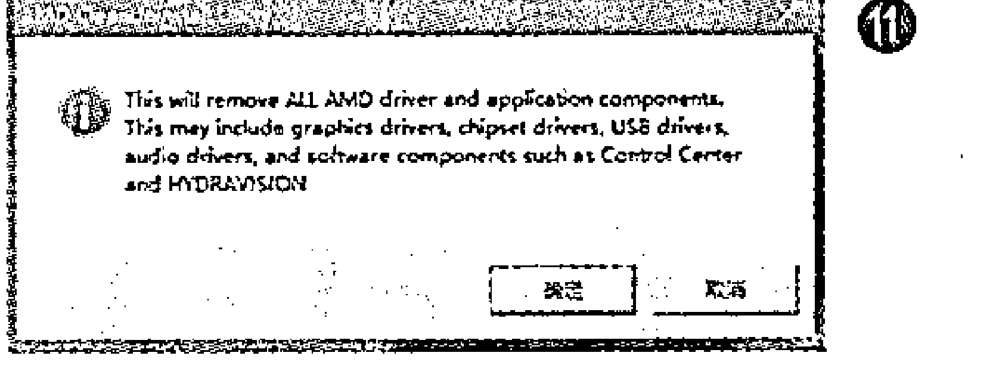

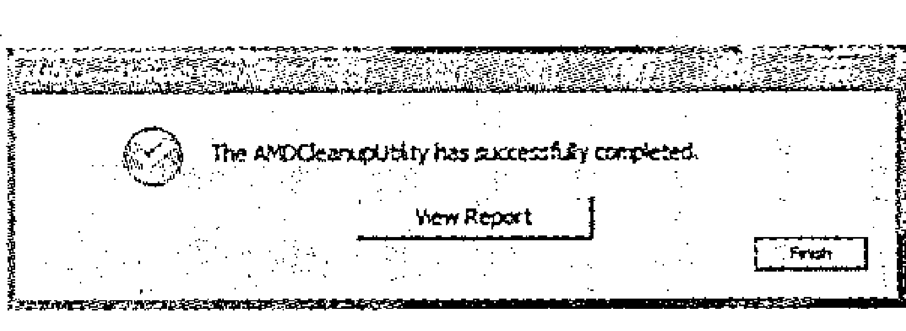

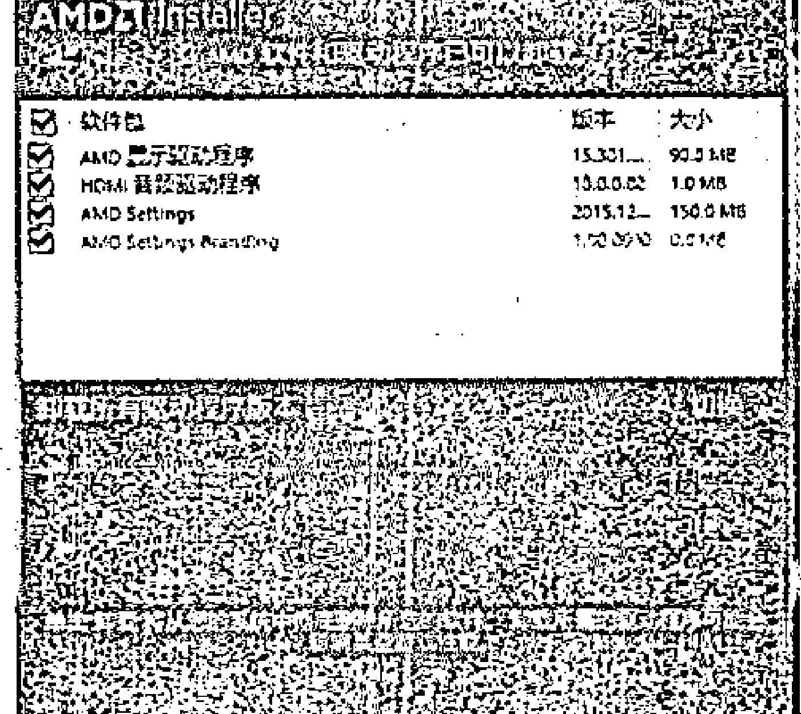

##### 安全还要免费
拒绝免费杀毒软件的诱惑
文|俞木发

当我们一旦打开网络的通道时，形色诱惑便纷至沓来；“君子多欲则贪慕富贵，枉道速祸。”只能说天下绝对没有免费的午餐，面对飞来的“幸运”，就需要我们认真地甄别，并采取相应的行动。

现在许多杀毒软件，都会推出免费版本，然后隔一段时间就会推送一些通知，诱使你升级。典型的做法如Avast，它会显示一张列表，显示出免费的有哪些功能，升级收费之后又会有哪些新的功能，总之，就是说明专业版有更多的安全措施(图1)。

其实，它基本的安全功能已经可以应付一般的安全威胁了，对于收费版的额外安全功能，我们完全可以借助其他的免费方法来实现。

##### 拒绝钓鱼 用好IE保护功能

能否“发现假冒伪劣”（钓鱼）网站是Avast免费版和收费版的一个重要区别。Avast收费版可以提供识别钓鱼网站的功能，实质上这些功能我们只要用好IE即可准确识别，而不需要安装收费版Avast。

从IE8开始微软就在其中内置反钓鱼组件，如IE11用户只要启用“Smartscreen筛选器”即可有效阻止钓鱼网站的威胁。Smartscreen筛选器默认开启，如果被误关闭，你只要点击“设置→Internet选项→高级→安全”，勾选其下的“启用Smartscreen筛选器”即可(图2)。

这样当我们在IE中试图访问一些钓鱼网站如假的银行网站，此时在后台保护的Smartscreen筛选器就会弹出访问网站不安全的提示，有效阻止我们对钓鱼网站的继续访问，它的效果就和收费版Avast的保护一样(图3)。

另外，百度、360安全浏览器等也提供了相应的保护措施。如果要访问一个银行网站，我们可以直接进行搜索，对于真正的银行网站会在其后添加“官网”标示，这样就不容易误入钓鱼网站而遭受损失。

此外，要更好地防止误入钓鱼网站，对于常用的网银、支付宝、财付通等在线支付网站，我们可以在访问真实网址之后将其添加到收藏夹，下次访问的时候直接通过收藏夹打开。另外，对于真正的网银支付网站，大多都是使用“https://”开头的加密网页(并且在首次访问的时候都需要下载安全控件)，在其地址栏中还会有一个小锁标记(认证证书标识)，点击之后可以看到网站的证书，大家还可以通过这些标示对真假支付网站进行甄别。

这样只要结合IE保护组件和掌握一些识别技巧，我们就可以获得比Avast收费版更好的反钓鱼效果了。

##### 阻止垃圾邮件 免费方案更全面

很多朋友都在遭受垃圾邮件的困扰，Avast收费版可以实现“不惜一切代价防止垃圾邮件”，就是Avast的反垃圾邮件功能。不过现在无论是本地客户端还是WEB邮件端都已经有完善的反垃圾邮件功能，我们只要设置好规则就可以轻松实现Avast收费版反垃圾邮件功能。

比如Foxmail用户，启动Foxmail后点击“工具→系统设置→反垃圾”可以进入反垃圾邮件设置。Foxmail自带贝叶斯过滤规则，它可以自主学习过滤，只要切换到“贝叶斯过滤”，点击“学习”，然后选择一个需要学习的邮箱文件夹如“垃圾邮件→垃圾邮件”，点击“开始学习”，这样Foxmail即可利用贝叶斯过滤规则开始学习，学习完成后即可有效阻止垃圾邮件进入我们的邮箱(图4)。

除了学习外，我们还可以自定义拦截黑名单。比如经常收到某个地址发来的垃圾邮件，现在切换到“黑名单”，点击“添加”，将发送人邮箱添加到黑名单，以后我们就不会再受到它的骚扰了(图5)。

对于喜欢使用WEB方式收发邮件的用户，WEB端服务商同样提供强大的反垃圾邮件设置。以QQ邮箱为例，进入自己的QQ邮箱后如果发现总是收到某个地址发来的垃圾邮件，那么可以在收件箱选择邮件，然后点击上方的“拒收”，在弹出的窗口点击“拒收”，这样以后就不会再收到他的邮件了(图6)。

如果要进行更多设置，可点击“设置→邮箱设置→反垃圾”，在这里对黑名单、邮件过滤等进行详细的设置，完成后点击“保存更改”即可生效(图7)。

##### 隐私保护 免费又全面

提供更强的隐私保护, 阻止其他人进入你的电脑是收费版Avast标榜的一个重要保护功能。Avast的这个功能主要就是防火墙的功能, 通过杀毒软件自带的规则阻止非授权的访问。其实要保护电脑的隐私, 阻止他人进入我们的电脑, 只要用好系统自带的防火墙即可。比如需要阻止任何外来的访问, 我们就可以通过设置防火墙的入站规则来实现。

对个人电脑来说, 很多人只是简单访问外部网络, 如果要阻止黑客对我们电脑的访问, 可启用阻止所有入站连接。点击“开始→运行”, 输入“本地安全策略”, 在搜索结果中打开本地安全策略对话框, 依次展开“安全设置→高级安全Windows防火墙”, 选择“属性”, 在打开的属性窗口中依次将域配置文件、专用配置文件、公用设置配置文件作如下设置(图8):

- 防火墙状态: 启用(推荐)
- 入站连接: 阻止所有连接
- 出站连接: 未配置

这样通过上述的设置后, 其他人就无法通过网络访问我们的电脑了。不过要注意这样操作也会阻止局域网、远程桌面等的访问。如果需要开启这类访问, 还可返回本地安全策略设置窗口, 右键点击“入站规则→新建规则”, 为正常的访问新建允许入站规则, 即可很好地保护自己的电脑不被黑客访问(图9)。

##### 更多安全功能免费用

除了上述介绍的功能外, Avast其他收费功能也可借助其他方法实现。如收费版沙盒功能可让我们在虚拟系统进行恶意网站的访问, 这个功能使用360安全浏览器就可轻松实现。当然这里只是以Avast为例, 其他杀毒软件收费功能使用大同小异, 如卡巴斯基并没有免费使用, 如果想要使用其收费功能如“家长控制”(该功能可控制指定账户上网时间), 现在利用系统自带组件即可实现。

首先在开始菜单搜索框输入“事件查看器”, 启动该组件后展开“Windows日志→系统”, 在右侧窗格的审核事件中, 找到事件ID12的记录(即系统开机时间记录)。返回事件查看器窗口, 选中事件ID为12的记录右击选择“将任务附加到此事件”(图10)。

接着在新建任务计划窗口中按提示建立一个计划任务, 启动程序是“c:\windows\system32\netsh.exe”, 参数是: `interface set interface "本地连接" disabled`。这一参数的作用就是禁用网卡。返回事件查看器窗口, 依次展开“系统工具→任务计划程序→事件查看器”, 打开设置窗口, 切换到“触发器”, 选中“发生事件时”, 单击“编辑”, 在打开的窗口中勾选“延迟任务时间”, 将其设置为延迟45分钟运行(图11)。

这样一来, 孩子的账户进入电脑后就会自动触发上述任务计划, 每次使用45分钟后就会自动禁用网卡, 此时电脑就无法上网了(可以设置孩子账户为标准账户, 禁用后无法再启用)。

##### 免费办公用上WPS收费功能
文|平淡

现在很多应用软件与前面所说的杀毒软件一样，也会通过各种各样的手段来诱使用户升级。同样我们也可以拒绝诱惑，并通过各种方法曲线用上那些收费功能。就以大家最常用的WPS办公软件来说，它就针对个人用户的免费版功能作了不少限制，个人版没有二次开发的VBS组件，无法使用WPS+服务等，这些服务需要收费版或者订购才能享受(图1)。

其实上述的很多收费版功能，我们都可以通过其他的方法来实现。很多朋友为了提高办公效率，都喜欢自己制作一些宏或者使用网友制作好的VBA脚本。现在对于WPS个人版用户如果需要使用VBS功能，那么只要到网上下载“VBS For WPS”插件进行安装，成功安装后再打开WPS个人版，切换到“开发工具”，这样就可以直接调用安装的VBS插件进行二次开发了(图2)。

对于原来需要订购的WPS+服务，我们则可以通过其他免费的网盘服务实现同样的功能。比如WPS+服务的核心是云办公，借助云办公，任何用户只要有网络即可实现对办公文档的无缝访问。WPS+服务对于普通用户利用免费的金山快盘服务就很容易实现，安装完快盘客户端并设置好自动同步后，在WPS中点击“WPS文字->选项->文件位置->文档路径”，将默认文档位置定位到“快盘/文档”目录(图3)。

这样以后在WPS中打开和编辑的文档就可以自动保存在“快盘/文档”目录，其中的文档则会被快盘自动同步到快盘，我们可以在任意位置进行访问，轻松实现云办公的效果(图4)。

对于WPS+中的共享、协作同样可以通过快盘的组件实现，当然现在很多的网盘如Windows 10自带的SkyDrive也有类似的功能。不过快盘、SkyDrive默认提供的空间有限，如果要获得类似WPS+商业服务提供的100GB以上的空间，我们还可以借助其他大容量的网盘实现。如百度云盘可以获得1TB的免费空间，大家只要申请一个百云盘并按照官方免费扩容方法即可获得1TB免费空间，然后安装“百度云同步盘”客户端到电脑上使用，即可获得比WPS+商业服务更多的在线办公存储容量了。

##### 自己动手PDF文档免费编辑

免费阅读版和标准版的区别

| 功能描述 | 标准版 | 免费版 |
| :--- | :---: | :---: |
| PDF创建和转换 | ✓ | × |
| PDF编辑功能 | ✓ | × |
| PDF注释功能 | ✓ | ✓ |
| 查找功能，能够对文字内容进行查找和定位设计格式 | ✓ | ✓ |
| 添加、编辑、删除和管理PDF文档中的注释和书签，实现自定义多种、打开文件操作、排版设计等 | ✓ | × |
| 添加、编辑、删除和管理图片和多媒体 | ✓ | × |
| 添加、编辑、删除和管理表单域、检查和认证 | ✓ | × |
| 添加、编辑、删除和管理签名 | ✓ | × |
| 对XFA表单填写、保存、分发、签名、复核和收集各种数据和管理 | ✓ | × |
| 合并文档到其他文件或格式（支持排序、命名、导入、导出、签署、复核和收集数据）以及从扫描仪插入页面 | ✓ | × |
| 对打开的文档进行添加、修改和删除注释和书签 | ✓ | ✓ |
| OCR文字识别，能够识别和转换扫描的文档 | ✓ | × |
| 对加密或签名的图片内容的PDF文档进行转换或编辑文档 | ✓ | × |

PDF是我们经常使用的一种文档，平常我们可以使用免费的福昕阅读器进行浏览，但是这个免费版的阅读器只能浏览PDF文档，如果需要对PDF文档进行编辑就必须购买收费版的福昕阅读器PDF套件标准版(图1)。

现在如果我们需要对PDF文件进行编辑，那么可以自行使用其他方法实现变通。比如现在需要对某个PDF文件进行编辑，首先在福昕阅读器中打开进行浏览，然后使用鼠标选中需要编辑的内容，接着在选中的内容上右击选择“复制到剪贴板”(图2)。

打开Word，将上述复制的内容粘贴到新建的文档中，这样在Word中就可以对文本进行任意的编辑了。不过这只是对PDF块的复制，在Word中可能还要对格式、段落进行一定的编排才能让文档更完美。比如复制后内容如果包含大量的硬回车符号，那么可以在Word中点击“替换”，在查找内容中输入“^l”，替换内容输入“^p”即可快速进行硬回车批量替换。另外，由于在福昕阅读器中无法对图片内容进行复制，此时可以使用截图的方法先进行截取，接着切换到Word，将截取的图片插入到Word中对应的位置即可(图3)。

在Word中完成对文件的编辑后，点击“另存为→XPS或PDF文档”，在打开的另存为窗口中点击“发布”，这样即可保存编辑后的PDF文件了(图4)。以后再使用福昕阅读器打开，我们就能够顺利完成对PDF文件的编辑操作了，其他PDF文档的编辑类似。

不过需要注意的是，在福昕阅读器中只能对文字字样的内容进行复制，图片类字符无法直接复制，比如一些通过扫描形成的PDF文档。对于这些文档如果要进行编辑，我们可以先使用截图的方法截取其中的内容，然后将这些内容粘贴到“画图”中，在画图里打开截取的图片后可以使用其自带的“文字”或者“橡皮擦”工具进行编辑（图5）。

完成图片内容的编辑后再将所有的图片插入Word中，操作同上将文档输出为PDF文件保存即可。对于收费版的福昕阅读器PDF套件标准版的其他功能，如OCR识别，我们则可以借助免费OCR软件如汉王OCR文字识别软件实现，这样对于不方便使用截图的内容，通过OCR扫描识别为文字后导入Word，最后再导出为PDF文件即可。总之，福昕阅读器PDF收费版的很多功能，都可以通过第三方免费工具来实现。

##### 免费享用百度音乐的会员下载
文|愚人

百度音乐盒是很多朋友都在使用的播放工具，虽然软件本身是免费的，但是由于一些限制，很多我们喜欢的歌曲是无法进行下载的，默认只有开通白金会员才能进行下载（图1）。

现在如果需要在百度音乐盒中下载自己喜欢的歌曲，我们就可以使用其他变通的方法实现免费下载。比如某首歌曲，首先在音乐播放盒中播放，等到完全缓冲整首歌曲后暂停播放。接着点击播放面板的“设置→网络设置”，此时可以看到音乐盒的缓存位置，类似“C:\Users\当前用户\AppData\Roaming\baidu\BaiduMusic\cache”，如果要缓存更多的歌曲则将缓存空间设置得更大一些（图2）。

在音乐盒完成文件的缓冲后按提示将上述目录在资源管理器中打开，此时可以看到其中保存了很多类似ddaewwwd.dat的DAT文件，这些其实就是缓冲到本地保存的音乐文件，但是默认无法将其直接复制到其他位置，系统会提示客户端没有所需的特权（图3）。

现在关闭音乐盒的播放，然后将整个文件夹全部复制到其他位置如“K:\”，打开复制的文件夹并按照文件大小排序，其中3MB以上的即为下载到的音乐文件。当然为了更好地播放，我们可以将原来的乱码DAT文件更改为正确的名称。首先使用批量改名的方法将所有.DAT文件更改为.MP3格式。将文件后缀更改为MP3后，点击文件夹菜单栏的“查看→选择详细信息”，然后勾选“标题”一项。这样在文件夹窗口中就可以看到MP3文件的标题信息，同时文件名也会自动更改为歌曲的名称。

信息”，然后勾选其中的“标题”，这样在资源管理器的标题栏就可以显示歌曲的正确名称了，最后根据标题栏的名称将文件更改为对应的歌名即可（图4）。

因为通过音乐盒缓冲文件包含正确的ID3信息，我们也可以无需任何操作即可将其导入音乐盒中播放。同上打开缓冲目录后，在音乐盒中切换到“本地音乐”，然后全选缓冲的DAT音乐并将其拖到本地音乐播放列表（需要使用手动拖动方法导入）。可以看到音乐盒里可以正确显示歌曲的名称，这样通过缓冲方法即可将无法下载的音乐保存到本地硬盘，并导入百度音乐盒中播放（图5）。

##### 分区管理 免费Diskgenius也专业
文|俞木发

| 分类 | 功能 | 注册前（立即下载） | 注册为标准版后（立即购买） | 注册为专业版后（立即购买） |
|---|---|---|---|---|
| 硬盘与分区克隆 | 按文件克隆磁盘 | √ | √ | √ |
| | 按所有扇区克隆磁盘 | 该功能不支持标准版 | √ | √ |
| | 按文件系统结构克隆磁盘 | 该功能不支持标准版 | √ | √ |
| | 按文件克隆分区 | √ | √ | √ |
| | 按所有扇区分区克隆 | 该分区不支持标准版 | √ | √ |
| | 按文件系统结构克隆分区 | 该分区不支持标准版 | √ | √ |
| | 按文件备份分区到镜像文件 | √ | √ | √ |
| | 分区增量备份 | 需注册标准版或专业版 | √ | √ |
| | 从镜像文件还原分区 | √ | √ | √ |
| | 预览分区镜像文件 | √ | √ | √ |

在日常的操作中我们经常使用Diskgenius对分区进行管理，不过免费版的Diskgenius和收费专业版有些功能的差异，比如对于分区的增量备份，免费版只能备份一个时间点，免费版无法彻底删除文件等（图1）。

对于需要使用类似增量备份这样的收费功能，其实已经有很多免费的第三方软件可以实现。这样，对于常规的分区管理我们借助免费的Diskgenius即可完成，而如果确实需要收费版的那些功能，则借助其他免费软件同样可以实现。比如分区的增量备份，用Gimagex就可以。

假设现在需要对M分区进行增量备份，启动Gimagex后切换到“制作镜像”，然后来源选择“M:”，同时为镜像设置一个保存位置和名称，点击“创建新映像”，这样可以完成对M分区的备份。以后需要进行增量备份时，同上再次选择上次备份的映像，点击“增量原映像”，即可完成M分区的增量备份（图2）。

我们还可以使用Gimagex对系统分区进行多次的增量备份，不过由于当前系统文件正在使用，备份操作需要在PE等系统下完成，以后恢复系统时只要选择“应用映像”，然后自行选择需要的映像卷进行还原即可（图3）。

对于Diskgenius其他专业版的收费功能，如免费版彻底删除文件（不仅仅将文件标记为“已删除”，而是会清空文件“索引”及文件数据）是无法“清除文件名与目录结构”的，在免费版中选择彻底删除后，使用恢复软件仍然可以恢复目录结构和看到文件名。现在如果要实现彻底删除文件，那么利用Bootice.exe填充工具即可实现类似功效。比如现在需要将M分区的数据彻底删除，首先将M分区格式化，接着以管理员身份启动Bootice.exe，切换到“实用工具→磁盘填充”，在逻辑磁盘选中M分区，点击“开始填充”，这样被格式化的分区会填充进其他数据而无法恢复。

##### 特别话题

GImageX v2.0.17

| 项目 | 内容 |
|------|------|
| 操作映像 | 应用映像、映像信息、更改信息、装载映像、删除映像、拆分映像、关于 |
| 捕获映像 | |
| 来源 | M:\ |
| 保存位置 | E:\boot.wim |
| 映像卷名 | WIM |
| 映像卷描述 | |
| 压缩比 | Fast (下拉) |
| 系统标识 | (下拉) (如不选择则自动识别) |
| 显示名称 | WIM1 |
| 详细信息 | |
| 选项 | 可启动映像(/boot)、检查(/Check)、显示排除与加载的配置、验证(/Verify)、禁用重分析点标记修正(/Norfix) |
| 配置文件 | 浏览... |
| 临时文件 | 浏览... |
| 底部按钮 | 创建新映像、增量原映像 |

选择映像卷

| 映像名称 | 说明 |
|----------|------|
| Windows 7 STARTER | Windows 7 STARTER |
| Windows 7 HOMEBASIC | Windows 7 HOMEBASIC |
| Windows 7 HOMEPREMIUM | Windows 7 HOMEPREMIUM |
| Windows 7 PROFESSIONAL | Windows 7 PROFESSIONAL |
| Windows 7 ULTIMATE | Windows 7 ULTIMATE |
| 20120301 | N/A |
| 2012/03/02 21:59:34 | N/A |
| WIM1 | 20110307 |
| 20130904 | N/A |
| WIM1 | N/A |
| WIM1 | 20131125 |
| 2014/08/22 17:43:45 | N/A |
| 2014/08/30 10:11:41 | N/A |
| WIM1 | 20141211 |
| 2015/04/01 00:05:14 | N/A |
| WIM1 | 20150801 |
| 2015-11-10 16:55:32 | N/A |

增量备份分区镜像后可以选择任意映像进行还原恢复，实现文件的彻底删除（图4）。使用上述方法完成数据的删除后，现在再使用DiskGenius的“工具→已删除或格式化后文件的恢复”功能进行文件的恢复，通过扫描结果可以看到DiskGenius无法扫描到任何的结果，这也意味着文件已经被彻底删除。Bootice的填充效果和DiskGenius专业版是一样的，同样实现了文件的彻底删除（图5）。

磁盘填充

| 项目 | 内容 |
|------|------|
| 填充对象 | 逻辑磁盘(D:) HD1: ST3500418AS (465 GB) C: D: E: F: G: H: I: J: K: L: M: (M:) 4.1 GB |
| 分区范围 | 起始扇区: 0  填充数据: 以00填充 |
| | 扇区数目: 1  以FF填充 |
| | 结束扇区: 0  十六进制值: FF |
| | 总扇区数: 6573220 |
| 按钮 | 开始填充(F)、取消 |

使用填充方式可以彻底删除数据。

除了上述介绍的免费版和收费版的功能限制外，在日常使用的各种软件中，一些厂商还会通过各种方法对免费使用进行限制。如迅雷通过“会员/非会员”提供不同下载速率，QQ通过收费实现聊天记录漫游等。在实际使用中我们还可以根据不同情况选择更有针对性的方法免费使用其收费功能。比如想免费使用迅雷会员的用户，可以使用“迅雷粉”（http://xlfans.com）提供的免费会员服务，登录上述网站后提取其提供的免费会员和账号，然后在迅雷登录后就可以实现会员的高速下载功能了。

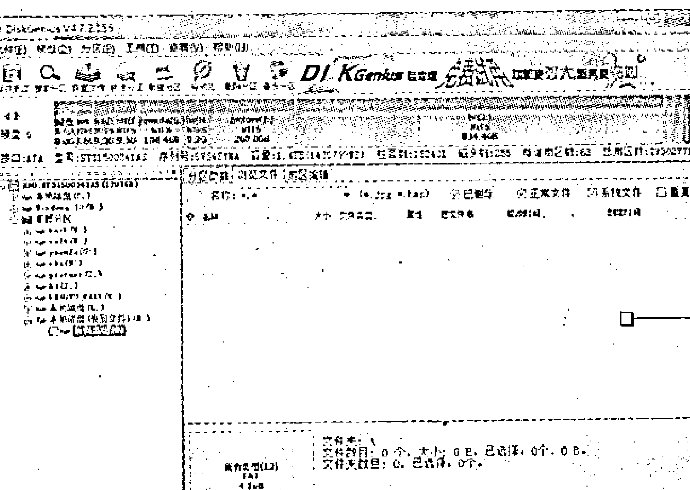

使用免费Bootice.exe填充后无法进行文件的恢复。

当然类似方法还很多，如普通QQ用户则可以将聊天记录保存在快盘、云盘等网络硬盘，从而实现聊天记录的免费漫游。想使用Photoshop处理图片的用户则可以登录http://www.uupoop.com，可以在在线实现很多Photoshop的处理效果等，这里由于篇幅的限制就不展开一一介绍了（图6）。


在线免费实现Photoshop的处理特效。

总之，要实现收费功能免费用，我们一方面可以结合收费功能的特点，然后使用其他免费方法进行替换（如QQ会员漫游利用同步网盘实现），如果无法直接替换则使用第三方免费软件实现（如免费版DiskGenius无法增量备份借助GImageX实现），只要开动脑筋就可以免费用上很多软件的收费功能。


##### 换个角度理性看待Windows 10的诱惑

> 从目前微软的宣传“攻势”来看，似乎有非升级Windows 10不可的迹象。然而看看身边的同事朋友，升级Windows 10后出问题的比比皆是。那么面对“诱惑”或“胁迫”，该如何理性分析和行动？

###### 考量1 当前的版本是否够用且满意

如果当前使用的Windows版本已经够用，没有发现什么不满意的和强烈需要改进的地方，那么，说明对新版本的使用需求来说意义不大。这时可将系统升级作为一个学习和了解的备选项目。安装思路方面，则不建议选择删除老系统而安装Windows 10的更新方式，转而可安装多系统、虚拟系统、移动系统等进行体验或练手。

###### 考量2 当前的工作性质是否允许升级

升级Windows 10还要考虑自身当前的工作性质。如果是企业或社会团体使用的电脑，其中安装有在低版本系统下开发和使用的专用应用软件；那么，升级Windows 10之后很可能出现不兼容；或表面上兼容，但在使用过程中不定时出现种种问题。这种情况下，如果贸然升级到Windows 10系统，则可能给工作带来不便甚至损失。在这种情况下，也不是永远守旧而不能升级系统，而是在继续使用老系统和老应用软件的同时，建议另外准备一台专门的电脑作为试验区（可用闲置旧电脑），安装免费的Windows 10系统和原来使用的应用软件，但其中的数据只用来试验而不作为生产之用。这样，在基本不增加成本的情况下，通过长时间的试验，便可获得是否可以升级的考量数据。

###### 升级不能只瞅Windows 10的看点

不少人在衡量是否升级为Windows 10的时候，总是先打听Windows 10有什么激动人心的功能，或有什么最糟糕的表现，因此，我们才会在各种媒体上看到类似“n个暂时不要升级Windows 10的理由”或“你必须升级Windows 10的n大理由”之类的文章（图1）。这本是很正常的现象，也是人们了解一个新事物所最惯常使用的途径或方法。然而，Windows的发展除了考虑到用户的需求之外，在很大程度上还夹杂着商业的利益、技术的前瞻等因素。如果没有考虑到这些因素，只是冲着求新求变的冲动去升级系统，那么，很可能最后获得的是一个对自己不太实在的“新玩意儿”，到头来不得不卸载并返回到原来的系统。每个人的需求和情况不同，决定是否升级的首要考量应该是从自身需求出发，而不是人云亦云，脑袋一热就来一次升级行动。

- 8个暂时不要升级Windows 10的理由
- 你必须升级Windows 10的十大理由

衡量是否升级Windows 10的传统思维。

###### 考量3 自己常用软件能否兼容运行

游戏发烧友原来在Windows 7下运行一款游戏能够获得很好的体验，但在Windows 10下运行出现无法启动或这样那样的问题。如果用兼容模式运行仍然不能得到解决，则说明当前所用的游戏或软件暂不支持你升级为Windows 10系统（图2）。这时，即便是去问微软专家，最后得到的答复也很可能是“请回退到原来的系统使用”。在这种情况下，就不能考虑以Windows 10来替代原有的系统了。若要体验，多系统或虚拟系统、移动系统将是另一种选择。

###### 考量4 安全顾虑个人资料隐私风险

Windows 10采用网络账号的登录方式，目的是方便在各种平台和设备上同步个人资料，但这同时也向微软开放了系统中的各种隐私项目。如果顾及隐私安全性，可以选择暂不升级为Windows 10。如果出于急迫需求要升级到Windows 10，也可以采取一些必要的方法和手段后，将隐私问题控制在理想的地步，比如关闭网络账户开启本地账户（图3）。

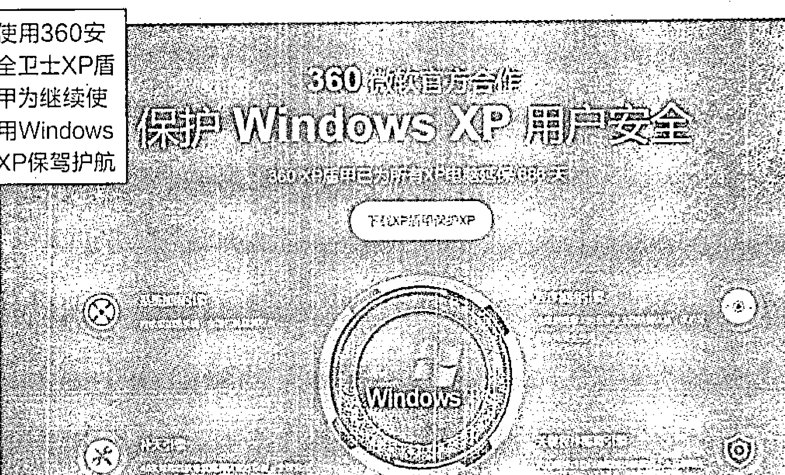

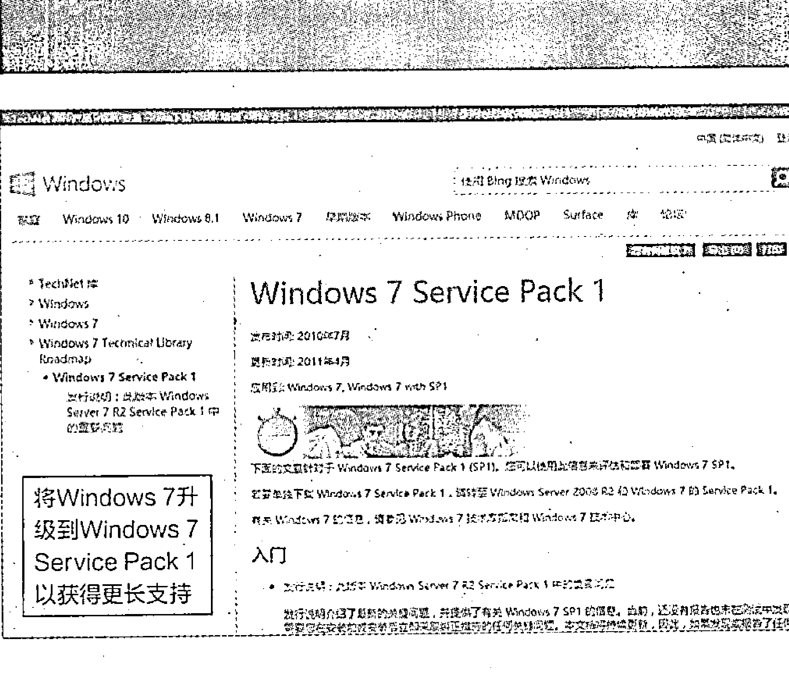

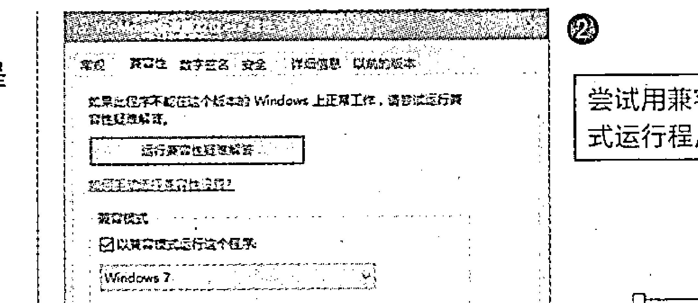

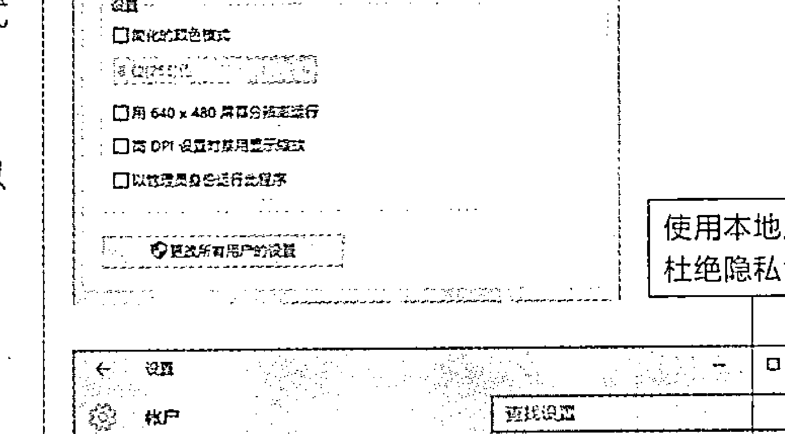

###### 不升级 如何保证安全使用

如果在综合考量了以上因素之后，决定暂时不升级Windows 10，依旧使用自己熟悉的Windows 8.1、Windows 8、Windows 7甚至Windows XP系统，系统安全是首先要考虑的问题。对于最为古老的Windows XP，虽然微软早在2014年4月8日就结束了对它的技术支持，但在各国依然有不少用户在使用这一版本。支持结束后，一些以前未被发现的漏洞可能被黑客陆续发现并利用，这样存在更大的安全隐患。这时，可以通过安装诸如360安全卫士XP盾甲、腾讯电脑管家等，保证在发现攻击时及时拦截（图4）。使用Windows 7的用户应该明白，微软对Windows 7原始正式版的支持早在2013年4月9日就结束了。如果使用的版本仍然是最原始的正式版，一定要立即下载运行Windows 7 Service Pack 1升级包，以获得更长时间的安全支持（图5）。另外要注意，微软对Windows 7最新版的支持分为主流支持和扩展支持两部分，“主流支持”已在2015年1月13日结束，这意味着从此它不会再发布新的补丁包或新的系统功能，而扩展支持期限为2020年1月14日，但如果要继续获得扩展支持，延长热修复程序支持协议，需要购买扩展支持服务。因此对于不想花钱而又不想立即使用Windows 10的用户来说，尽快升级到目前相对比较稳定的Windows 8.1是最为妥帖之选，但需要适应Windows 8.1在操作上的差异（图6）。

而对于目前仍在使用Windows 8系统的用户来说，尽管这个系统离现在还不算太久远，但微软已于2016年1月12日停止对它的技术支持，不会再升级安全补丁，这会影响到系统的安全。Windows 8本来就是Windows 8.1的过渡产品，在操作方式上比Windows 8.1还要“别扭”。因此从安全上考虑，要尽快升级到Windows 8.1系统的最新版。

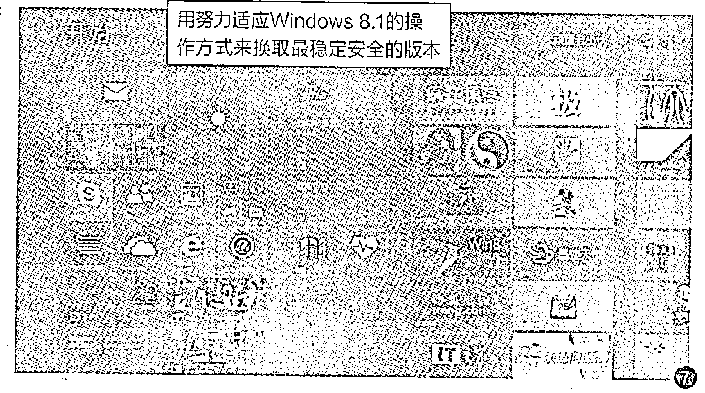

目前为止最稳定的系统是Windows 8.1，由于它在操作上的“弊端”或“不适应”才有了一个不好的名声和差的业绩。可是，你一旦熟悉了它的使用，便会发现，它所带来的麻烦至少要比Windows 10少得多（图7），而它能提供的安全特性，远远要超过继续使用Windows XP或Windows 7。微软对Windows 8.1停止基本服务的时间为2018年1月9日，停止基本服务后，尚有5年的扩展支持，彻底停止服务时间要到2023年1月10日才结束，届时将只有系统安全补丁而没有功能改进服务，但这至少还可以保证系统的安全平稳运行。但我们相信，到那时，Windows 10的版本已经相当稳定（或许那时已不称为Windows 10），升级到Windows 10已经是大多数人的必然之选了。

###### 不得不升级的安全稳定之选

如果由于某种原因，不得不升级为Windows 10，但又需要考虑安全和稳定问题，那么可以考虑采取下述措施。Windows 10的安全问题大多集中在隐私管理方面，为此，可关闭网络账户，使用本地账户，这样可避免个人隐私的泄露。如果在工作过程中，要使用涉及到网络资料同步的功能，可使用百度云、360云、华为云等代替，能够取得同样的效果，且能发挥免费大空间的优势。

###### 更新到 Windows 8.1 ：常见问题解答

- > 我应该如何开始 Windows 8.1？
> Windows 8.1 的价格是多少？
> 我的电脑是否可以运行 Windows 8.1？
> 我需要多少可用空间才能更新？
> 我是否可以保留文件、设置和应用？
> 我的设备是否有应用可与 Windows 8.1 兼容？
> 我的光驱中是否有 Windows Media Center？
> 更新到 Windows 8.1 之后是否可以播放 DVD？
> 更新后是否可以更改我的语言？
> 我是否可以从 32 位版本的 Windows 更新到 64 位？
> 为什么会出现“更新不适用 Windows 8.1”错误？
> 如果我的 Windows 8 添加了功能，而现在无法更新？
> 我能否从 Windows 7 桌面式电脑升级？
> 如何获取帮助？
> 我是否可以回退到我的旧操作系统？

> 小提示
Windows 8.1的安全可以通过系统的各项安全措施如Windows Defender杀毒软件来保证，具体操作方法可参见本刊2014年第1期文章《给盲目的“Windows 8也装杀毒”》。

对于Windows 10的隐私内容，除了用系统提供的设置和优化渠道，还可使用通用的隐私优化工具来堵住个人隐私的外流。然后启用系统自带的一整套安全保护工具和杀毒软件Windows Defender，并保持自动升级，安全可很好地得到保证。由于Windows 10的版本升级频繁，基本上处于全民“大练兵”的开发状态——在研发中测试，在测试中升级，在升级中获得反馈，在反馈中发现问题，如此往复。因此指望不上哪个Windows 10版本最稳定，但这并不是说只能处在一个不稳定的Windows 10环境下，其实还是有办法让自己的Windows维持在相对稳定的状态。

首先请不要开启系统设置窗口中的内测版开关。点击开始按钮并选择“设置”，进入“更新和安全”选项窗口，选择“Windows更新”，点击“高级选项”（图8）。其中“获取Insider Preview版本”下的“开始”按钮是为参与内测的用户准备的，如果点击了这个按钮，开启了内测功能，虽然可第一时间查看Windows的后续更新和改进，但系统随之也增加了不稳定的因素（图9）。这种不稳定的因素是由三个不同的级别档次来决定的，依次为“发布预览”、“慢”、“快”，可通过其中的滑杆来调整。速度越快的选择，说明取得更新包越及时，同时可能暗藏的不稳定因素也越多。

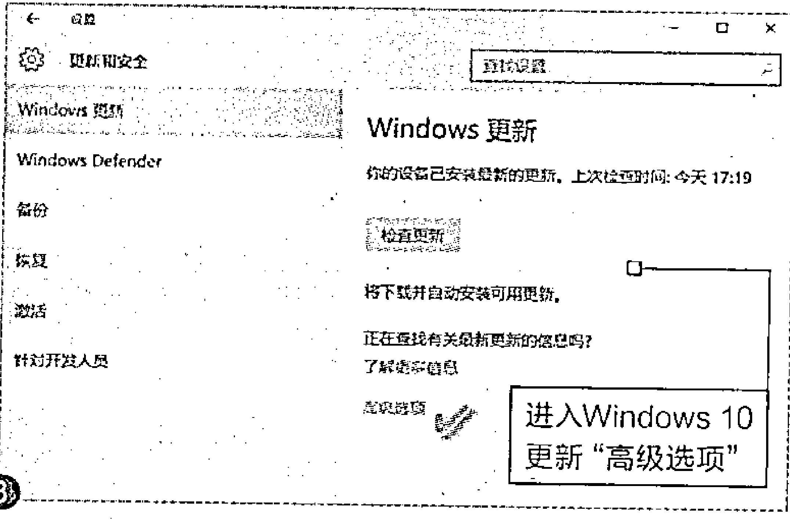

> 不要点击获取 Insider Preview 版本下的“开始按钮”

> 火速传送
控制Windows 10的各项项目，可借助于专用的第三方软件“Windows Spy Disabler”等实现，具体可参见《电脑爱好者》2016年第5期系统栏目文章《情分“卖主”——Windows 10控制台》。

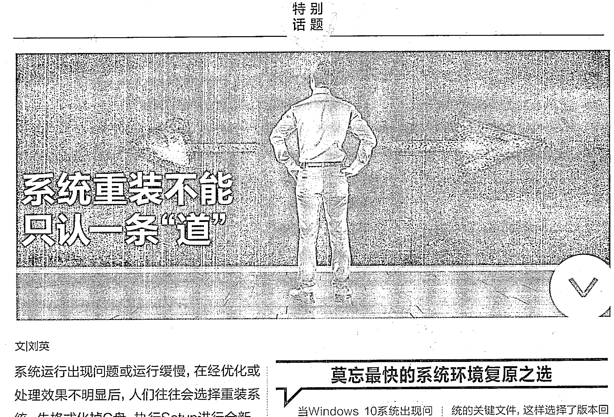

##### 系统重装不能只认一条“道”

文|刘英

系统运行出现问题或运行缓慢，在经优化或处理效果不明显后，人们往往会选择重装系统。先格式化掉C盘，执行Setup进行全新安装。然而重装系统后随之而来的麻烦绝不仅仅是重装一下Windows这么简单，单就恢复各类驱动程序和安装各类应用软件就够折腾人的。其实在出现如上问题后，还可以有更安全的解决办法。即便是到了不得不重装系统的地步，也不是只能选择格掉C盘完全重装一种方案，而且这种方案可能隐藏着让人后悔莫及的隐患。选择在不破坏原系统基础上的重装应该更加安全可靠。

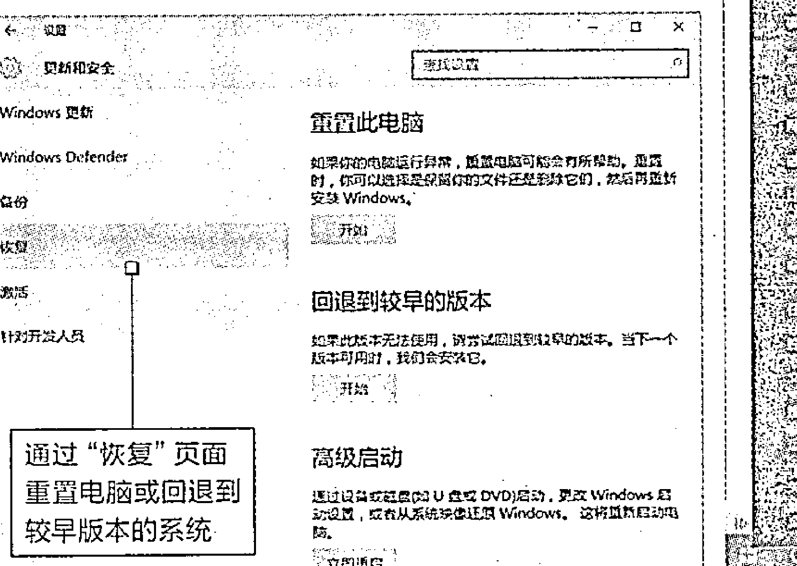

###### 莫忘最快的系统环境复原之选

当Windows 10系统出现问题变得不稳定后，或遇到问题无法解决但尚可进入桌面操作时，我们一定会首先通过系统“设置”程序中的“更新和安全”窗口进入到“恢复”页面，选择“重置此电脑”或“回退到较早的版本”（图1）。但重置电脑依然免不了经历一个重新安装Windows的过程，然后还要重装许多应用程序。而“回退到较早的版本”选项不是在任何时候都管用，有时在升级完系统间隔一个月之后，这个选项会自动消失，或虽然这个选项依然存在，但由于系统优化工具的“误伤”，删除或破坏了用来回退系统的关键文件，这样选择了版本回退的选项后，继续执行会收到无法回退的错误提示，因而恢复系统版本无望。

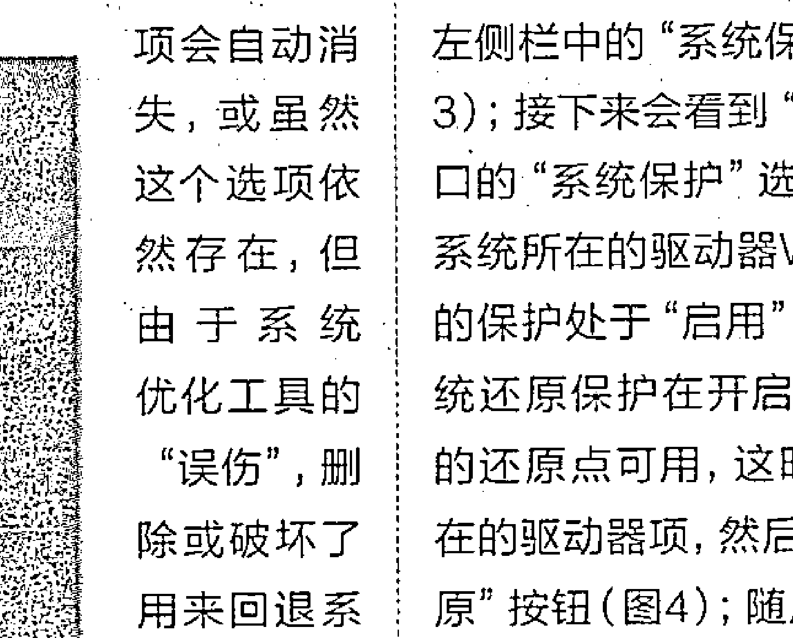

其实在这两种“救命”稻草的选择之前，还有一种环境复原的选择，那就是我们所熟悉的“古老”的“系统还原”。那么，Windows 10的系统还原去哪里了呢？我们可通过如下方法来调取。首先右键单击“开始”按钮，选择弹出菜单中的“系统”项（图2），在弹出的“系统”窗口中选择左侧栏中的“系统保护”选项（图3）；接下来会看到“系统属性”窗口的“系统保护”选项卡下，当前系统所在的驱动器Windows 10的保护处于“启用”状态，说明系统还原保护在开启之中，有正常的还原点可用，这时选中系统所在的驱动器项，然后单击“系统还原”按钮（图4）；随后就会进入系统还原文件和设置窗口，点击“下一步”，选择最新的还原点，继续点击“下一步”，即可将系统还原到上次正常运行的状态（图5）。

如果存在多个还原点，可从最新的还原点开始尝试，若最新的还原点还原系统后问题依然存在，则可以选择向前一步的另一个还原点，如此依次尝试不同的还原点，直到系统可以正常运行为止。注意，选择还原点还原系统后，尽管大多数应用软件不用重装，但在还原点建立之后安装的程序和进行的系统更改都将不再发生作用，还需要重新安装或配置，但这相比于全部重装应用程序和进行系统全盘配置还是要省事得多。

###### 保留原始现场的全新安装方式

如果以前在用低版本的 Windows，而现在不得不使用 Windows 10，那么安全稳定之选也有渠道——在不动用原有 Windows系统和应用软件的前提下，全新安装 Windows 10。这种方案要求系统中有另一个空间足够的分区（不强求空间中的资料被清空）。先找来 Windows 10系统安装程序的 ISO 包，将其中的文件全部解压到某个硬盘分区的根目录下。之后运行一个绿色系统安装工具“NT6 HDD Installer.exe”，点击其中的执行安装命令后，重新启动系统前，就会出现两个用来安装新系统的选项，随便选择这两个选项之一，然后就会自动进入 Windows 10系统安装程序。在接下来的安装过程中，将安装分区选择为用来安装 Windows 10的目标分区，注意不要选择“格式化”选项，否则原有分区中的数据都将会消失。随后系统会自动执行不破坏数据的全新安装方式，安装过程分系统数据拷贝和系统配置两大部分，期间如果需要输入安装密钥，可选择跳过输入继续安装。安装结束并经过驱动匹配和系统配置之后，重新启动便会发现一个含有 Windows 10选项的多重系统菜单。选择 Windows 10进入后，会发现 Windows 10被安装在了原本存在用户数据的分区上，而该分区上的所有数据完好无损（图6）。原来的老系统也依然还在。如果需要，可以通过另一个系统菜单进入到早先的系统使用。

若是原来的系统出现问题，即便是不好使用，留着这个系统也还可以防万一。因为一旦某天我们忽然想起旧系统的桌面或某个软件目录下还有自己需要的有用文件，这时也能很容易地通过 Windows 10的环境访问老系统的文件或数据，取回历史文件。如果因文件系统用户权限拒绝访问旧系统目录，可通过在被禁文件夹上单击右键，然后在“属性”的“安全”选项卡下设置用户权限为对当前使用系统的用户开放，即可取得文件夹的访问权限，从而取出不同系统下自己需要的文件（图7）。

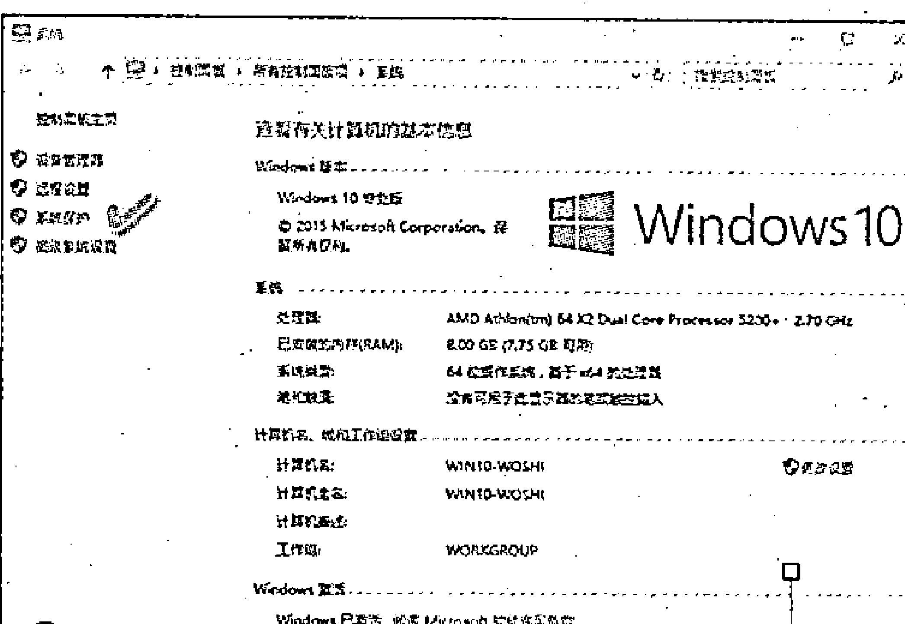

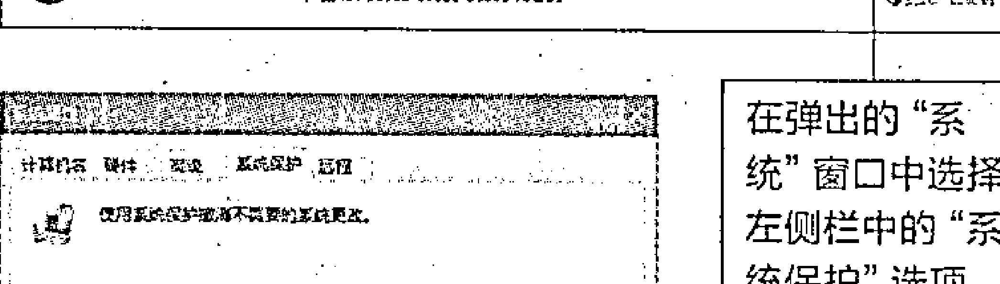

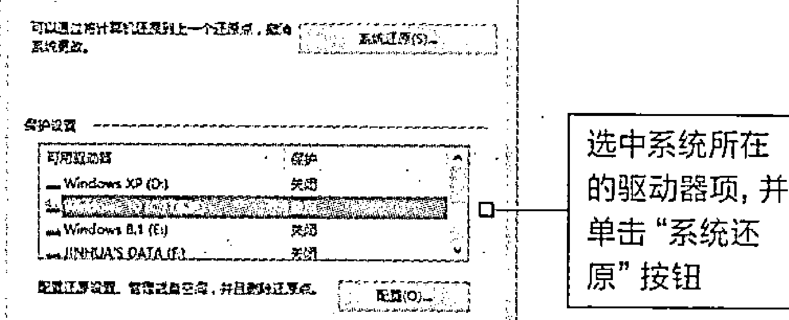

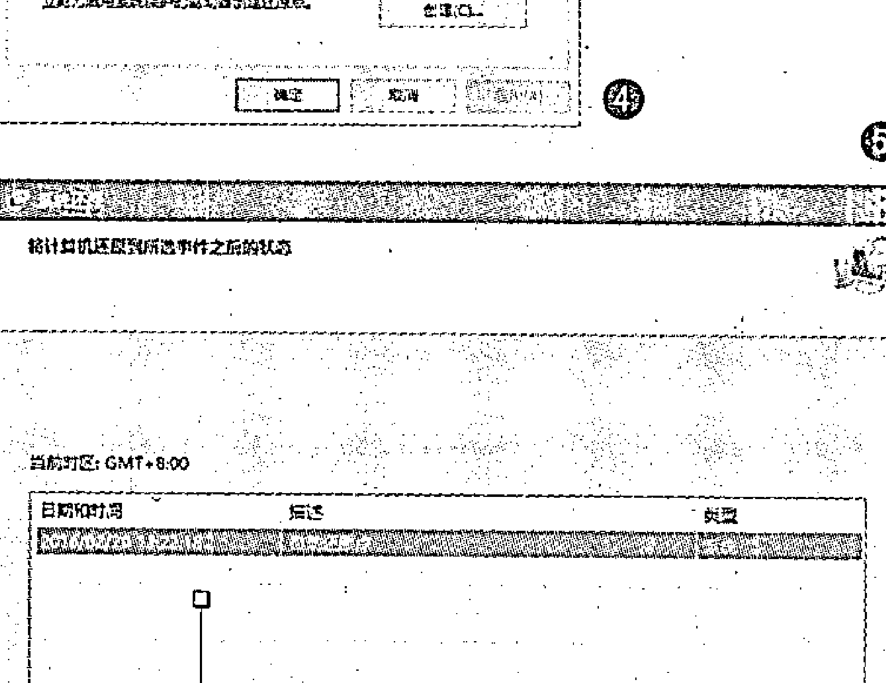

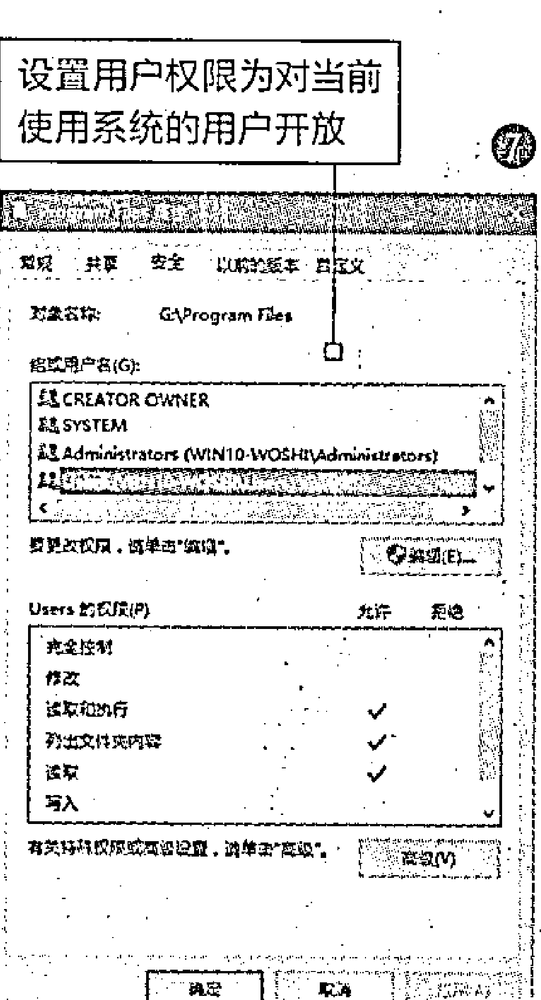

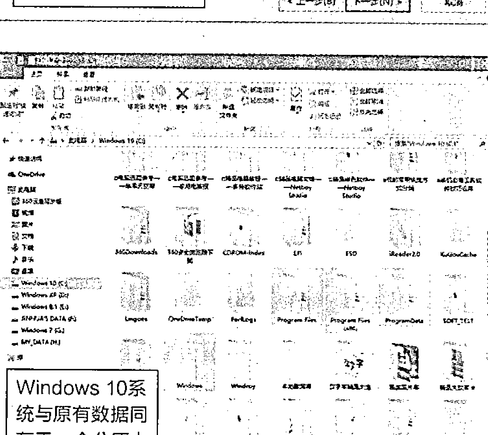

##### 资源搜索与下载使用中的陷阱

###### 搜索有“猫腻”理性来判断

在资料搜索过程中，输入关键词并按下“搜索”按钮后，我们往往总是希望能马上获得最恰当的搜索结果。然而，这其中隐藏着的“陷阱”或“猫腻”，很可能让网民一开始便陷入。其中首要的就是排名网站不正当竞争的陷阱。为商业利益所驱动，花了钱的商家或产品会被排在搜索结果的靠前位置，不知内情的用户会误以为前面的结果就是最好的、最恰当的搜索结果(图1)。

上网搜索资料和下载、使用文件是大家经常要进行的活动，然而在这一过程中，一不小心就会掉进别人设的“陷阱”。那么搜索、下载和使用有哪些“陷阱”？如何识别和防范这些“陷阱”？

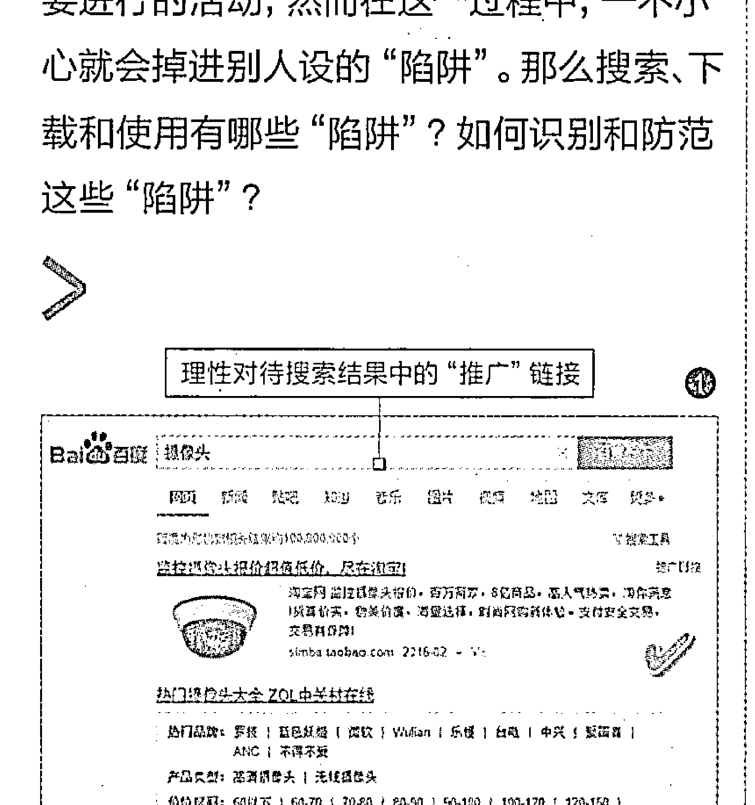

###### 应对技巧

先要从搜索结果中排除带有“推广”链接的结果。当然，不是说“推广”结果就完全不好，在这些推广产品中，也不乏货真价实的优秀产品，只不过排名位置一般并不能与其产品品质相对应而已，容易引起误解。因此，切不可认为排在前三位的搜索结果就是比较好的产品或结果。如果的确认为需要参考“推广”链接的内容，切忌要理性分析对待，不能一味相信其说辞。除了竞价排名的“诱惑”外，利用网页代码优化技术，做了关键词特殊处理的网页也会排在搜索结果比较靠前的位置，这些结果中的网站或资料，虽然排名在前，却也不一定是最好的网站或资料。内容是否可取，仍然不能以结果的先后顺序来判别，需要进入搜索结果，根据自己的需求和搜索结果的实际内容加以综合判断和取舍。当然，一些专业权威的排名机构所产生的品类排名，其可行度更高，更具有参考价值(图2)。

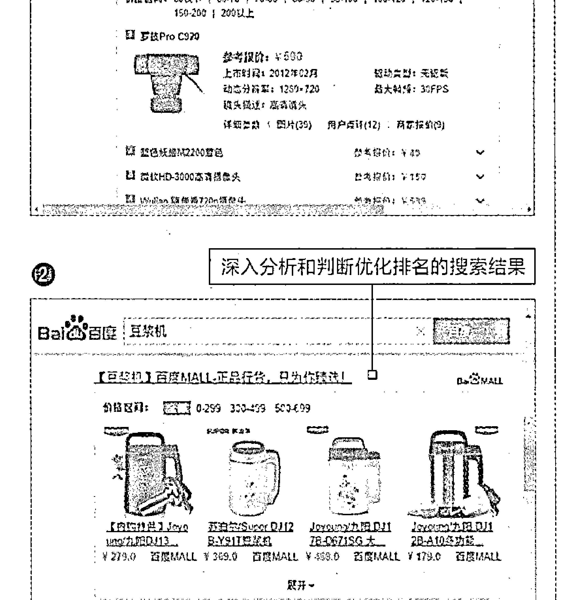

###### 网站搜索排名优化技巧

为能达到排名靠前的目的，许多站主会对网站进行搜索引擎优化处理。首先需要对网站结构进行优化设计，使之有清晰的知识结构。由于搜索引擎不能抓取图片或Flash中的链接，因此，要保证每个网页至少有一个静态文本链接可用。网页文件头中要提供经过充分考虑或扩展的、能够代表本页内容的关键词，要十分重视扩展关键词的作用，有时它会带来比主关键词更有效的搜索效果。注意发挥TITLE标签的作用，TITLE标签是重要的搜索依据之一，内容不仅要包含本站主题、标语，还要尽量概括该页内容。标签中的关键词尽量不要重复。

###### 下载存“陷阱”链接细分析

搜索过程中存在很多“陷阱”，而当找到可能是自己需要的资料之后，下载过程也可能会暗藏着某种“陷阱”。最为常见的就是一些不太正规的软件下载网站，以提供软件注册版或注册机等为名，在给出的网页链接按钮上做手脚，蓄意链接一些广告推广软件甚至恶意有害软件(图3)。在如图所示的软件下载链接中，网页似乎给出了本地下载、立即下载、迅雷下载、电信下载、联通下载等各种各样的下载渠道选择，不知情的用户会误以为网站提供的服务非常人性化，于是就按自己的意愿选择了一个下载方式，但殊不知这这其中的每个链接均是“圈套”，只要点击下载，获得的均是一个推广软件甚至带有木马的假冒软件。

###### 应对技巧

如果进入一个自己不熟悉的资料下载网站，找到需要的资料之后，不要急于点击下载链接，而是通过将鼠标移动到链接之上后查看状态栏链接显示的办法，或者通过右键单击各个链接，然后查看“属性”中所显示的真实链接的性质，判断每种链接所指向的内容。如果多个不同的链接所指向的均是一个大小与所需要资料出入很大的EXE文件，则该目标很可能是一个广告推广软件。或者如果是一个与预期目标相比小得出奇的压缩包，那么该目标很可能是一个含有恶意木马代码的程序。在这种情况下，如果电脑中安装有文件检测类的安全软件，那么只要下载完成之后，软件会自动监测出其中的恶意代码，并自动隔离此类软件(图4)。

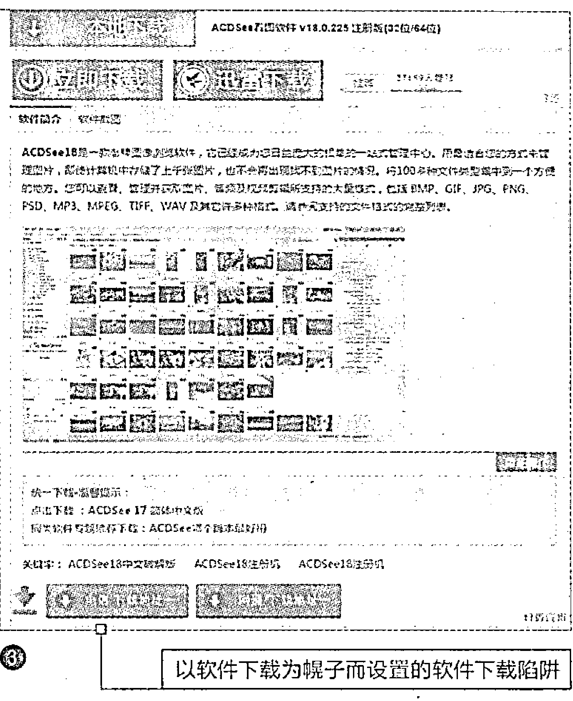

###### 安装与使用 陷阱靠监控

下载的过程中可能存在“陷阱”，而如果下载的是软件类的文件，那么安装过程中可能也会存在“陷阱”。如果在软件下载过程中没有开启安全检测类软件，或者用来安装的文件是来源于USB等外部媒介，那么在安装过程中，存在恶意捆绑的软件可能会借机进入到系统中潜伏起来。由于目前多数恶意软件以偷窥隐私为目的，不再是早期以破坏文件数据为手段，因此用户很难察觉其入侵了自己的系统。尤其是那些对杀毒软件存有芥蒂而宁愿不装杀毒软件，也相信自己能够让系统安然“裸奔”的用户，遭受这种侵害的可能性更大。危害在不知不觉中发生，如果经常安装软件，甚至最后连危害是在安装哪个软件时产生的都弄不清楚。

###### 应对技巧

在系统环境允许的情况下，尽可能开启多个杀毒引擎，让恶意攻击和入侵处于多个引擎的监控下。以使用360杀毒软件为例，进入软件“设置”窗口，点击“多引擎设置”一项，在引擎选择列表中，就可选择云查杀引擎、QVMII人工智能引擎、系统修复引擎、Avira（小红伞）常规查杀引擎、BitDefender常规查杀引擎等多种查杀引擎(图5)。需要注意的是，选择了多引擎之后，可能会不同程度地影响到系统的运行速度。至于是否选择开启，用户可根据系统软硬件配置情况，经过试验后得出选择，最终以开启更多引擎后操作速度能够忍受为宜。若操作速度受到影响，可选择关闭引擎。如果磁盘空间出现紧张的情况，还可选择将占用200MB或600MB磁盘的大容量查杀引擎删除掉。

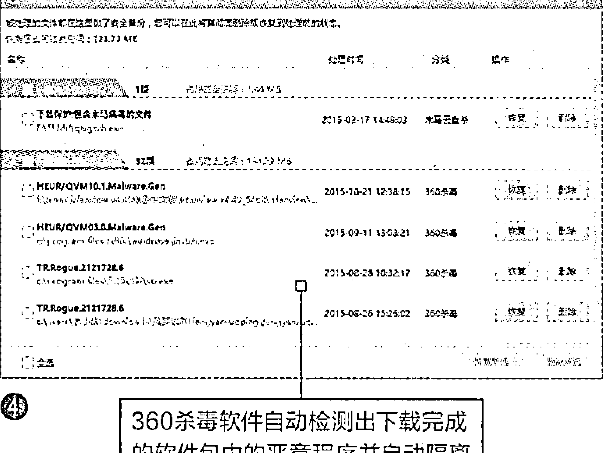

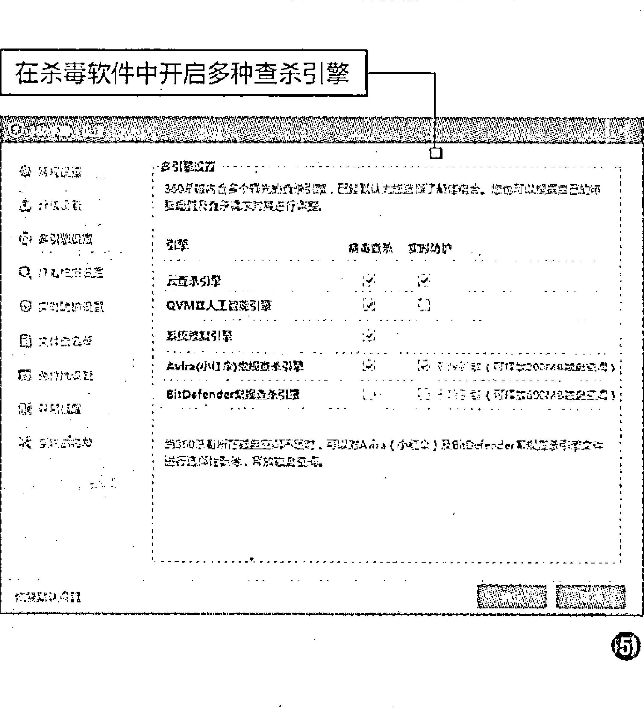

##### 网络交易“陷阱”走出不如远离

文|刘英

如今使用电脑，风险最大的莫过于在上网时随时可能遇到的各种“陷阱”，而危害至深的莫过于网上交易过程中的各类“陷阱”。这其中发生几率最大的则是钓鱼网站的频繁出现和防不胜防。因此，掌握“钓鱼”防范之策，是保证上网免遭“陷阱”之害的必要选择。除网络“钓鱼”外，支付环节的人为骗局也是需要防范的内容。

###### “偷走”的密码？“送走”的密码！

许多时候，当网民们在不幸遇到自己的账号被人控制后，总是纳闷于别人如何“偷走”了自己的账号和密码，将所有问题和过错都归罪于恶意软件或黑身上。但发生这种问题的原因，很大一部分其实是在用户本身，与其说是“偷走的密码”，不如说是“送走的密码”。

黑客和恶意软件再厉害，也只能是在入侵之后才能偷走用户的账户密码和资料。“入侵”一关不过，再厉害的黑客也无计可施。把好“入侵”一关，让黑客和恶意软件无机可乘，别人也就无法“偷走”密码和资料。那么，如何才能不“送”密码给黑客或网站？这其中就涉及到了如何保证所访问的网站或软件不是“钓鱼”网站的经验或技巧。

###### 认清“钓鱼钩”应对有招数

###### “钓鱼”信息的共同规律

“钓鱼”信息的共同规律是利用人们的意识习惯或心理弱点来实现其成功“钓鱼”的目的。关于意识习惯问题，最常见的就是人们一般都相信手机发来的官方服务信息，例如银行的“955**”类的服务短信，声称用户的积分快要到期，或者推出积分换奖品优惠活动，并给出链接，一键点击即可办理有关手续；

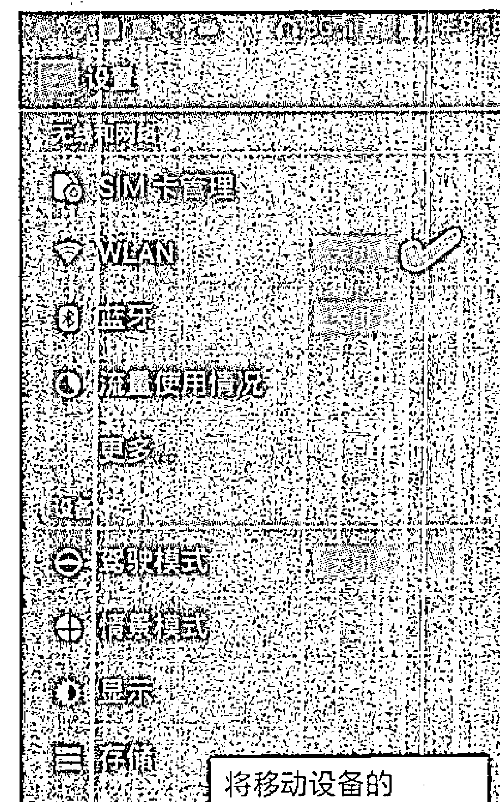

> **小技巧**
> 免费Wi-Fi中混杂着一些以“钓鱼”为目的的虚假Wi-Fi。不少用户习惯于将移动设备的Wi-Fi开关置于打开的自动连接状态，殊不知这存在着很大的风险。当进入一个“钓鱼”Wi-Fi区域之后，如果用户无意中按习惯进行了网购或网银的操作，输入了个人隐私信息，那么，这些信息就很可能被“钓鱼”者截获。因此，在外出不使用Wi-Fi的情况下，请将自己的移动设备的Wi-Fi置于关闭状态(图1)，待需要时打开Wi-Fi开关，然后选择安全的热点进行针对性的连接使用。这样，自己对进入了什么样的Wi-Fi就心中有数，避免了无意中“被连接”。万一发现账户可能被劫持，第一时间要做的不是关闭网络，而是先退出账户，然后再关闭网络。

通信商的“10010”、“10086”、“10001”短信，声称充值送优惠或其他诱人的活动。殊不知，这类信息不一定是银行或通信服务商发来的。由于目前黑客或恶意不法之徒可以用“伪基站”技术，冒充“100**”或“955**”之类的服务号码，给用户发送携带钓鱼链接的信息，这非常容易让善良的用户上当而轻易点击链接，输入自己的账号和密码。

其次就是心理弱点问题。这个问题的关键是人们的贪便宜心理。为何有人会因点击了非“100**”或非“955**”之类的陌生信息而上当受骗被“钓鱼”？原因就是贪图便宜。很常见的就是冒充某某电视台或网站的抽奖中奖信息、某某证券商的高利息产品业务等，如果被突如其来的、远远高于通常预期的诱惑而吸引，并不加分析地点点击了对方给出的链接并付出行动，那么同样也可能立即落入恶意者布设的“钓鱼”圈套。

###### 反制“钓鱼”的有效措施

针对如上常见的“钓鱼”手段或伎俩，我们只要把持基本的行为准则，利用一些必要的软件或操作技巧，即可防止“钓鱼”阴谋的得逞(图2)。

> 扩展阅读
> 由于https (安全超文本传输协议)能够有效地防止密码在登录页面被窃取，可有效地帮助人们在电子商务和网上银行中安全地使用银行账号，谷歌公司对实现https加密访问网站技术表现出非常积极的态度，甚至将站点是否部署SSL证书实现https加密访问纳入到了搜索排名算法当中。在最新版的Chrome浏览器中，如果用户试图打开没有使用https加密传输的链接，浏览器将向用户发出明确的警告信息，与此同时，在地址栏的左侧，会显示标有红色的“X”号。采用绿色挂锁图标的提示，则意味着网页是安全的。而对于未加密网页，则不会有任何标记。

###### 弥补网购“钓鱼”的意外损失

也许我们会怀疑类似360安全卫士和安全浏览器对于安全交易100%把握的真实性。其实即便360之类的安全商本身也不会强调能100%靠软件来杜绝恶意入侵，为了弥补意外情况给用户带来的损失，主流的网络安全商一般都上大额保险，并承诺有“网购先赔”类的服务。只要用户按照正规的步骤去使用它们的安全产品，同时保留交易时的页面截图，并使用注册用户来使用安全产品，那么即便是遇到网购被“黑”的意外，也可向所使用的安全厂商索赔，将损失降到最低(图3)。

> 应对策略
> 面对“100**”或“955**”之类的信息，如果涉及到的是积分兑换或其他特殊业务的办理，不妨多一个心眼，先不要理会手机端的信息，转而使用另一种方式去了解或验证信息来源的真实性。比如，到官方网站的“网上营业厅”，查看是否有这方面的优惠或活动。即使是不懂电脑，不知该如何操作网上营业厅的老者，也总可以拨打“100**”或“955**”官方客服热线，验证收到信息的真实性，之后再操作也不迟。

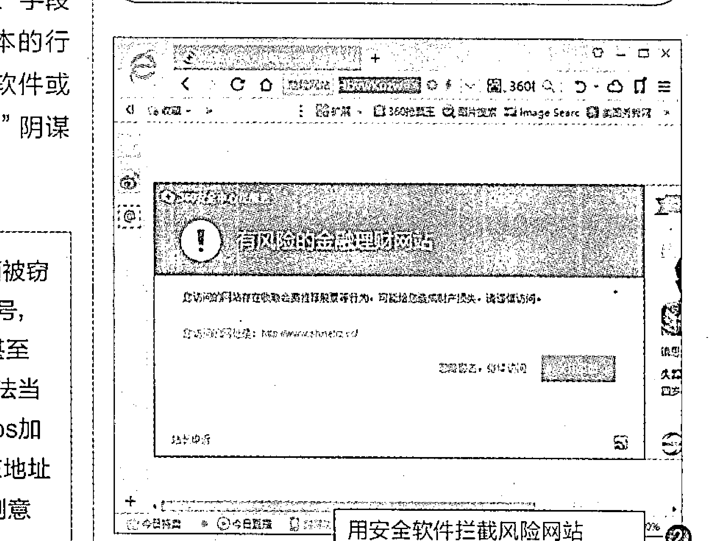

###### 支付有陷阱 担保最重要

上网交易蒙受损失，除了黑客“钓鱼”事件而引起外，人为的诈骗也占相当一部分比例。其中的损失主要发生在付款的中间环节上。而许多受骗的案例均是发生在一些不正规的网站上交易，或者没有按正规的交易流程进行付款，而是绕过网站的付款流程，直接通过银行或快递先行付款给对方，然后希望能收到货物，最后却落得被“人为钓鱼”。这类案例的主要问题是，缺乏中间的付款担保环节，因而也就无法被监管，出了问题查找也比较困难。

> 应对策略
> 一定要使用带有中间担保的交易网站和使用合法的交易流程，例如，通过京东的网上支付流程付款，或通过淘宝的支付宝平台付款，收到货物后再行付款确认。这样就可以避免落入付款环节的“陷阱”中。

##### Windows 10桌面图标“长记性”

文/江一冰

升级Windows 10之后，偶尔会出现启动或更改屏幕分辨率之后桌面图标不能记忆原设定的位置、图标总是被系统重新排列的问题，此时应该如何解决呢？

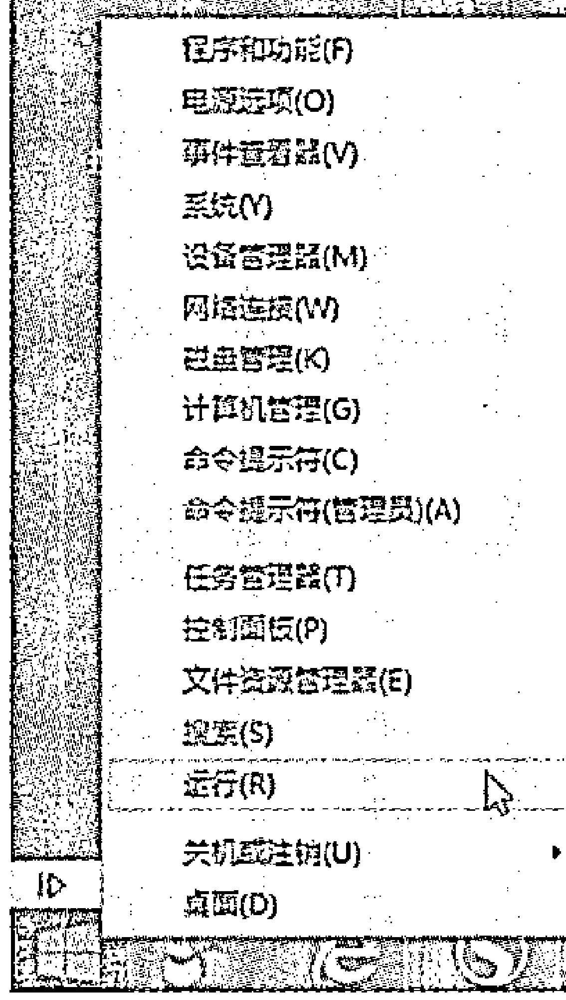

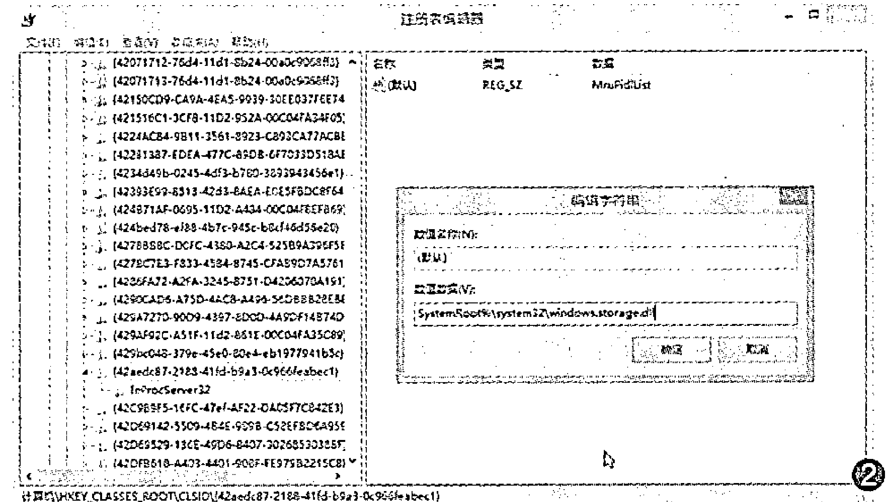

###### 修改注册表以恢复“记忆”

右键单击Windows 10“开始”按钮，选择“运行”项（图1）。在随后弹出的运行窗口中输入regedit并点击“确定”，启动注册表编辑器。如果使用的是32位的Windows 10，则依次定位到“HKEY_CLASSES_ROOT\CLSID\{42aedc87-2188-41fd-b9a3-0c966feabec1}\InProcServer32”，在右侧窗口中双击名为“（默认）”的键，将其值由原来的“MruPidlList”修改为“%SystemRoot%\system32\windows.storage.dll”，然后退出注册表编辑器并重启系统即可（图2）。

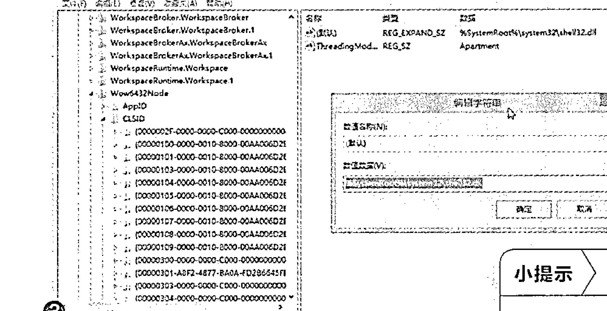

如果使用的Windows 10系统是64位的，则需要修改“HKEY_CLASSES_ROOT\Wow6432Node\CLSID\{42aedc87-2188-41fd-b9a3-0c966feabec1}\InProcServer32”下的“（默认）”键值为“%SystemRoot%\system32\windows.storage.dll”（图3）。

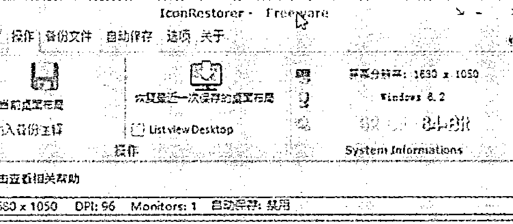

> **小提示**
> 为便于图标的保存备份和恢复，请在软件的“选项”窗口中，选中“随系统启动”复选框。这样，就可以方便地通过系统托盘的小蓝色箭头图标，调用备份与恢复功能了。

###### 用专用软件“记忆”并恢复

如果觉得修改注册表比较麻烦，也可以通过一款专用图标记忆和恢复软件IconRestorer来实现。IconRestorer为自由软件，运行后只需点击“保存当前桌面布局”按钮，即可自动将当前桌面图标布局保存到软件数据库当中。下次启动系统后，如果发现桌面图标乱套，则只需点击该软件中部的“恢复最近一次保存的桌面布局”按钮，即可自动恢复上次保存前的图标布局（图4）。

##### 挖掘Windows 10看图便道

文|姜山

Windows 10默认取消了系统自带的右键照片查看器预览图片功能，转而关联了“照片”应用。虽说“照片”应用的功能也强大，然而不少人还是习惯于传统右键照片查看方法。那么，能否找回原有的功能？Windows 10看图还有什么“便道”可循？

###### 开启系统照片预览

在Windows 8.1或Windows 10环境下，系统本身就包含图片预览功能。在默认的情况下，预览窗口没有打开，开启这个窗口后，常见图片或文档内容就可以自动在预览窗口中出现了。在资源管理器窗口中选中一张图片，切换到“查看”选项卡，点击工具栏的“窗格”组，选择“导航窗口→预览窗格”，这时在资源窗口的右侧会出现一个临时窗口，这就是预览窗口。可以看到，在其中就显示出了此前选中的图片的内容（图1）。

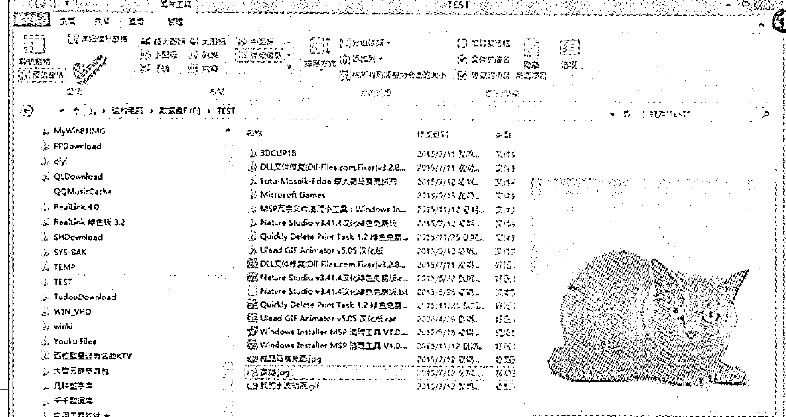

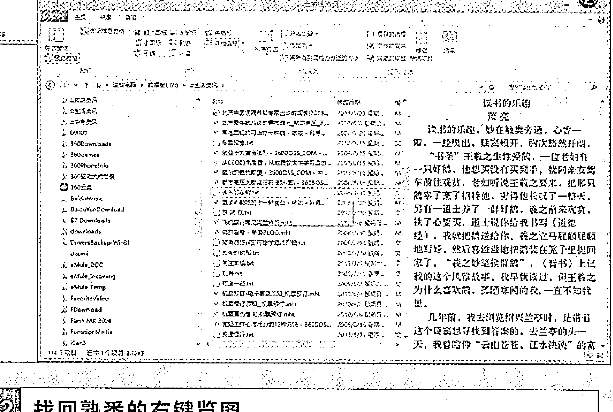

预览窗口同样也支持文本和程序源码内容的预览。从资源管理器中选择一个TXT文件，在预览窗格中同样也会看到该文本文档的内容预览（图2）。预览文档的内容是直接调用系统默认与该文档关联的程序而实现的。本例中由于我们在记事本中设置了大宋体，因此在右侧预览窗口中显示的也是大宋体。此外，预览窗口同样也支持诸如.ini配置文件等程序源码文件的预览。

###### 找回熟悉的右键览图

以往在Windows 7或Windows 8/8.1中，查看图片内容可通过右键菜单中的“预览”或“打开方式→Windows 照片查看器”命令（图3）。这很方便，但Windows 10取消了这条方便的看图途径。为了能在Windows 10下继续沿用这种看图模式，可用记事本建立一个注册表文件，扩展名为reg，内容如下：

```
Windows Registry Editor Version 5.00

; Change Extension's File Type
[HKEY_CURRENT_USER\Software\Classes\.jpg]
@="PhotoViewer.FileAssoc.Tiff"

; Change Extension's File Type
[HKEY_CURRENT_USER\Software\Classes\.jpeg]
@="PhotoViewer.FileAssoc.Tiff"

; Change Extension's File Type
[HKEY_CURRENT_USER\Software\Classes\.gif]
@="PhotoViewer.FileAssoc.Tiff"

; Change Extension's File Type
[HKEY_CURRENT_USER\Software\Classes\.png]
@="PhotoViewer.FileAssoc.Tiff"

; Change Extension's File Type
[HKEY_CURRENT_USER\Software\Classes\.bmp]
@="PhotoViewer.FileAssoc.Tiff"

; Change Extension's File Type
[HKEY_CURRENT_USER\Software\Classes\.tiff]
@="PhotoViewer.FileAssoc.Tiff"

; Change Extension's File Type
[HKEY_CURRENT_USER\Software\Classes\.ico]
@="PhotoViewer.FileAssoc.Tiff"
```

这其中定义了常见的6种格式图片文件的右键快捷预览功能关联。如果需要关联更多的图片格式，可按此文件的命令格式对reg文件内容进行扩展。

文件建好之后，双击运行该文件，将键值导入到注册表中即可。之后，就可以在相应图片的右键菜单中，看到“打开方式→Windows 照片查看器”命令了。

除了恢复系统自带的预览图片功能外，还可以借用国产看图插件2345看图王。与压缩软件好压配套使用，用来查看压缩包中图片的2345看图王软件，是Windows 10看图的一个不错搭档。可以在安装好压软件后启用其压缩包看图功能，安装2345看图软件，也可以单独下载安装2345看图插件。


小提示
Windows 10进行比较大的系统更新后，也许这个功能又不存在了。在升级Windows 10之后，只需再运行一次该reg文件即可。

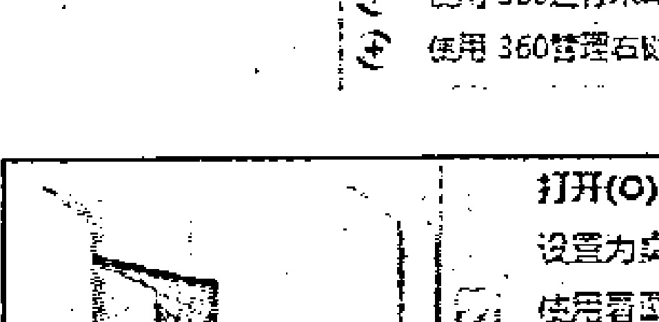


###### 3 用好“照片”来看图

人们留恋旧版本Windows的图片预览功能，更多是因为习惯问题。而Windows 10新系统默认关联的“照片”应用，其实在预览图片方面有它的独到之处（图5）。较之老版本Windows照片查看器，“照片”应用可以使用鼠标滚轮来控制图片的切换，操作流畅自然。此外还有图片两侧的左右箭头切换功能也很方便。最为方便的要数在对图片不满意时，能一键切换到编辑模式，对图片进行编辑修改和渲染等操作。

在“照片”应用中查看图片，还可以将图片设置为屏幕背景、锁屏壁纸或照片磁贴。由此可见，微软丢弃照片查看器，是因为有更强的替代品“照片”来接班，并非不注重用户的感受。用户一旦知道了“照片”应用的强大，一定会舍弃老旧的照片浏览器。

小提示
安装2345看图软件之后，从右键点击图片的菜单中选择“打开方式→2345看图王”，即可查看图片了（图4）。

##### 用好Windows 10的自动机制
文|梁冬

Windows 10系统包含了许多自动机制，例如颜色自动适应、设备自动识别、容量自动监测、自动搜索等。这些自动机制都为Windows的智能化增色不少。但是，使用中有时它们也会给你带来麻烦。我们只有熟练驾驭这些自动机制，才能灵活自如地用好Windows 10。

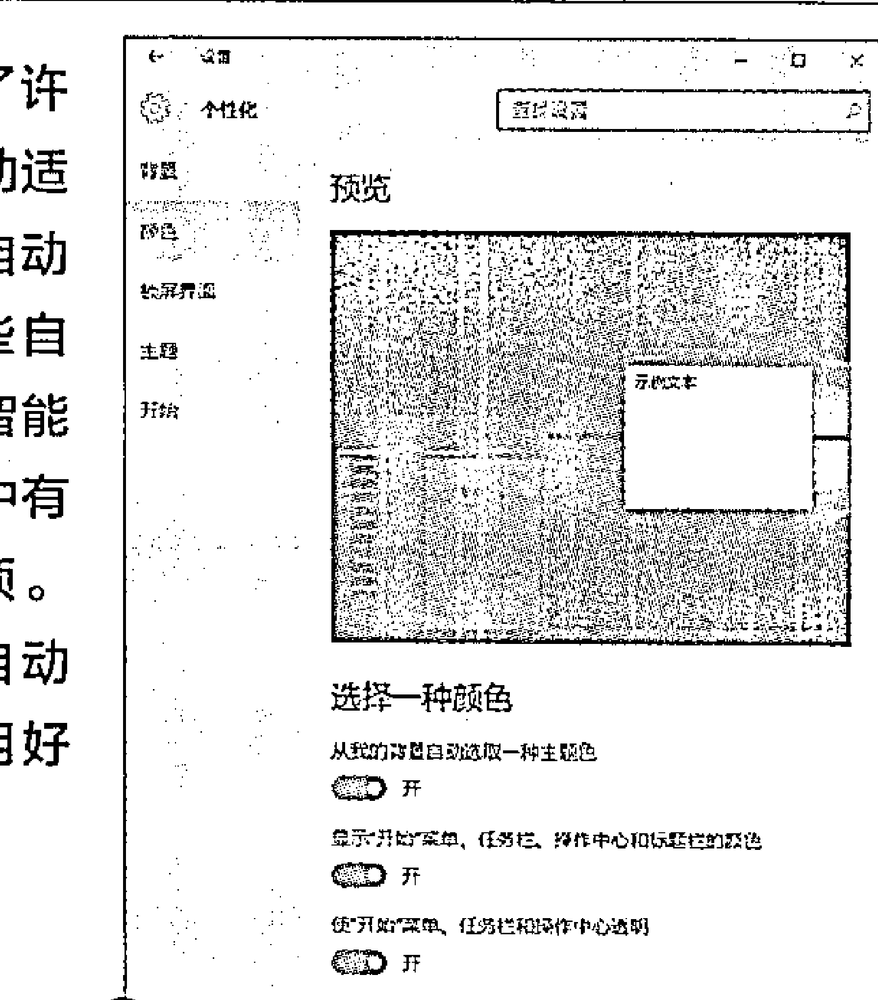

> 虽然新版Windows 10的当前窗口可通过上述方法脱离“苍白”显示，但对于同时开启的桌面非活动窗口，却仍然显示“苍白”一片。我们可以通过修改注册表给后置窗口上色。按下Win+R并运行regedit启动注册表编辑器，依次定位到“HKEY_CURRENT_USER\SOFTWARE\Microsoft\Windows\DWM”，可以看到已存在一个AccentColor项，双击该项，看到它的值即为当前系统主题颜色值，复制这个值。在右侧窗口新建一个名为AccentColorInactive的32位DWORD值，修改其值为上述系统主题颜色值（图2）。最后返回到系统颜色设置窗口，将当前值略微调到深色。这样一来，主副窗口的颜色看起来就显得比较协调了。

##### 颜色自动协调机制

在默认的设置条件下，开启Windows 10后我们会看到所有窗口都呈现无边框白色效果，整体效果非常清淡，连标题栏也是一片苍白。这样的窗口很难显示出个性，尤其是在打印时更是如此。这是Windows 10的颜色自动协调机制发生作用的结果。善用它可很好地解决窗口颜色千篇一律的“死白”问题。

首先进入系统设置的“个性化”窗口。打开“从我的背景自动选取一种主题色”开关，同时开启“显示开始菜单、任务栏、操作中心和标题栏的颜色”选项开关(图1)。经过这样的设置之后，开始菜单、任务栏、操作中心和标题栏的颜色将通过当前桌面背景显示的图片中自动提取。如果桌面背景是一幅照片，那么以上四种组件的颜色可能是这张照片中某处的颜色；如果桌面背景为纯色，那么以上四种组件的颜色取与纯色背景相同的颜色。

制造透明效果的开始菜单、任务栏、操作中心或标题栏，会营造梦幻般良好的视觉效果。但是，此类效果的截图在出版黑白刊物或小册子时，打印出来显得很难看。在这种情况下，关闭“使开始菜单、任务栏和操作中心透明”，避免因透明而造成的印刷效果不清晰，转而使用上述纯色非透明的设置效果会更好。如果不采用系统自动协调颜色机制，则关掉系统自动取色开关，手动选择一种颜色作为以上部件的背景颜色更好。

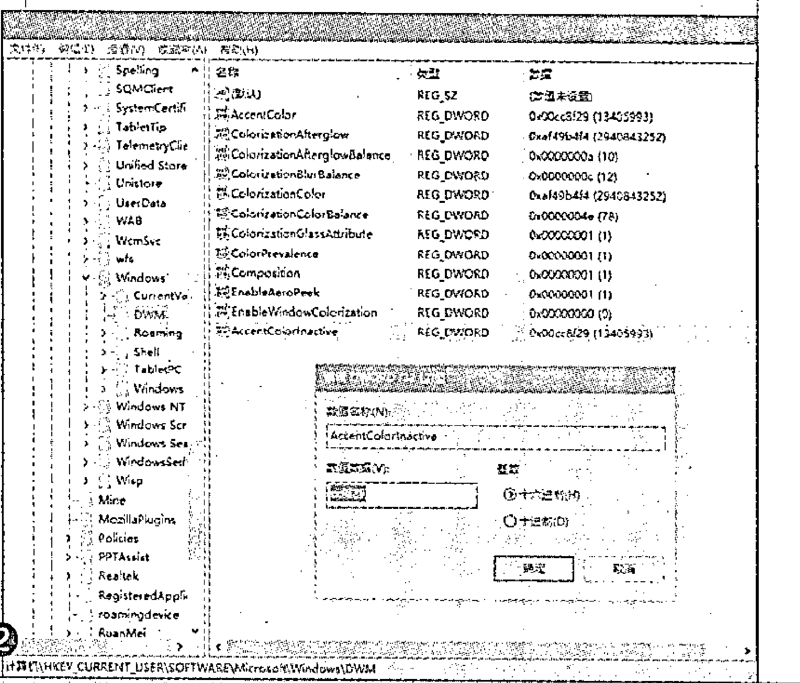

##### 设备自动识别机制

Windows 10的设备自动识别机制可以智能地识别用户所用的设备是移动设备还是PC电脑，但是，此功能也不总是体贴人的。因为有时我们需要在PC上使用平板模式，而有的时候却要在平板上使用PC模式。在这种情况下，我们就需要关掉自动识别机制，灵活地进行人为设置。

进入Windows 10设置的“系统”设置窗口。如果将“平板电脑模式”开关置于“开”的位置，这样会使Windows更兼容触摸功能。这时，无论使用平板电脑还是PC机，窗口均以全屏模式出现，不会出现最大化、最小化和缩放功能按钮。若你的PC机的窗口小按钮出现问题，就从这里找原因吧！此外，登录Windows时进入平板模式还是PC模式，也可以人为进行设置。既可设为一开机就进入平板模式，也可以一开机就进入PC模式，还可以沿用上一次使用过的显示模式（图3）。这是系统在自动识别之外的人性化接口开关，你要利用好哦。

要查看每个文件夹占用的空间大小，仍然需要借助于一些工具软件来显示，资源管理器自身的功能不包含显示文件夹容量的功能。可借助于Glary Utilities Pro系统工具的文件夹统计功能来实现，也可以安装FolderSize资源管理器插件来实现文件夹大小自动显示。

##### 容量自动监测机制

在Windows 10时期，系统中安装的各驱动器或各类文件的容量再不是一个谜。因为系统会自动检测出各驱动器所占空间的大小（图4），还会统计出各类文件所占的空间，并进一步明确地显示出每类文件分配给不同文件夹的情况（图5）。这样，我们不用再去通过右键属性窗口逐项查看驱动器的容量，或者用统计软件来统计各类资源所占的容量了。经过优化的Windows 10自动搜索功能非常强大，但有时可能会遇到在搜索框中输入关键词后搜不到结果的情况。这时，可通过Win+R打开运行窗口，然后执行如下命令：

```
%LocalAppData%\Packages\windows.immersivecontrolpanel_cw5n1h2txyewy\LocalState
```

在随后打开的资源管理器窗口中，右击Indexed文件夹，选择“属性→高级”，在高级属性窗口中去掉“除了文件属性外，还允许索引此文件夹中文件的内容”的勾选，然后重新勾选（图6）。这时系统会重新建立索引，片刻建好后，系统的自动搜索功能就恢复正常了。

##### 恢复失灵的Windows 10自动功能
文|南国咖

Windows 10的先进在某种程度上体现在它的自动化功能上。但由于诞生时间较短，加上用户的设备环境千差万别，因此某些自动化功能失灵的情况也时有发生。了解恢复自动化功能失灵的办法，对顺利使用Windows 10大有裨益。

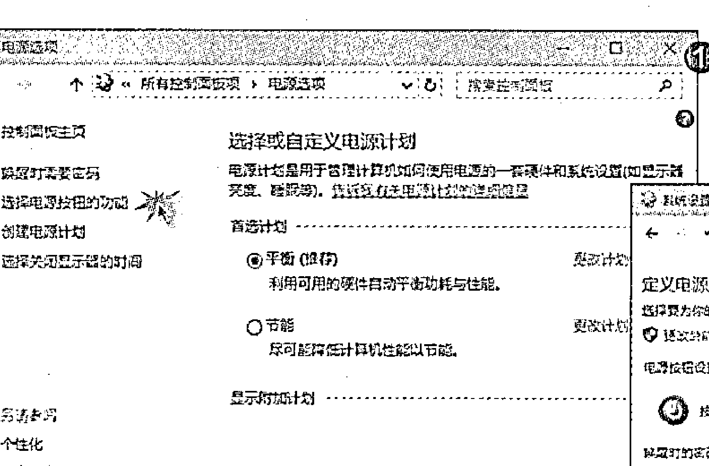

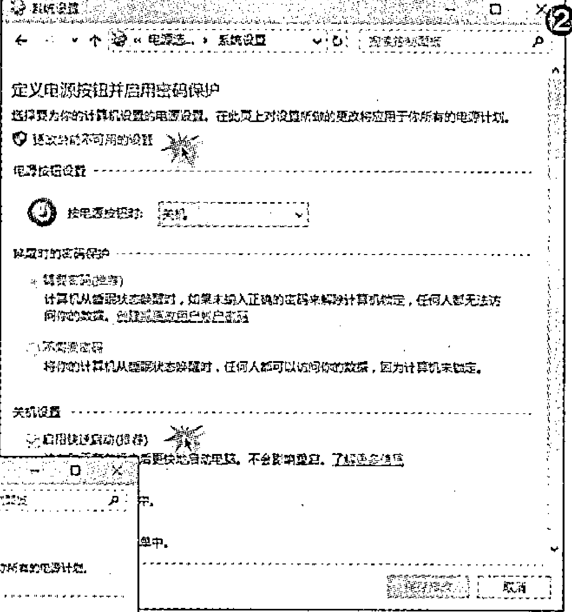

###### 1 自动待机等节能功能失效

有人遇到升级Windows 10之后，系统无法实现自动休眠、自动待机和自动关屏等节能功能。根据微软给出的解释，这主要是由于系统中的某些设备驱动不兼容，同时又与Windows系统的“快速启动”有所冲突所致。关闭Windows 10系统的“快速启动”功能，即可避开冲突。

用Win+X组合键开启系统控制菜单并选择“电源选项”，在左侧栏内点击“选择电源按钮的功能”项(图1)。但这时看到“启用快速启动”选项处于灰色不可选失效状态，因而也无法取消这项功能。点击该窗口上部的“更改当前不可用的设置”蓝色文字链接(图2)。接下来会看到，窗口下方的“启用快速启动”选项已经变得可选了。将该项选择取消，点击“保存修改”按钮(图3)。

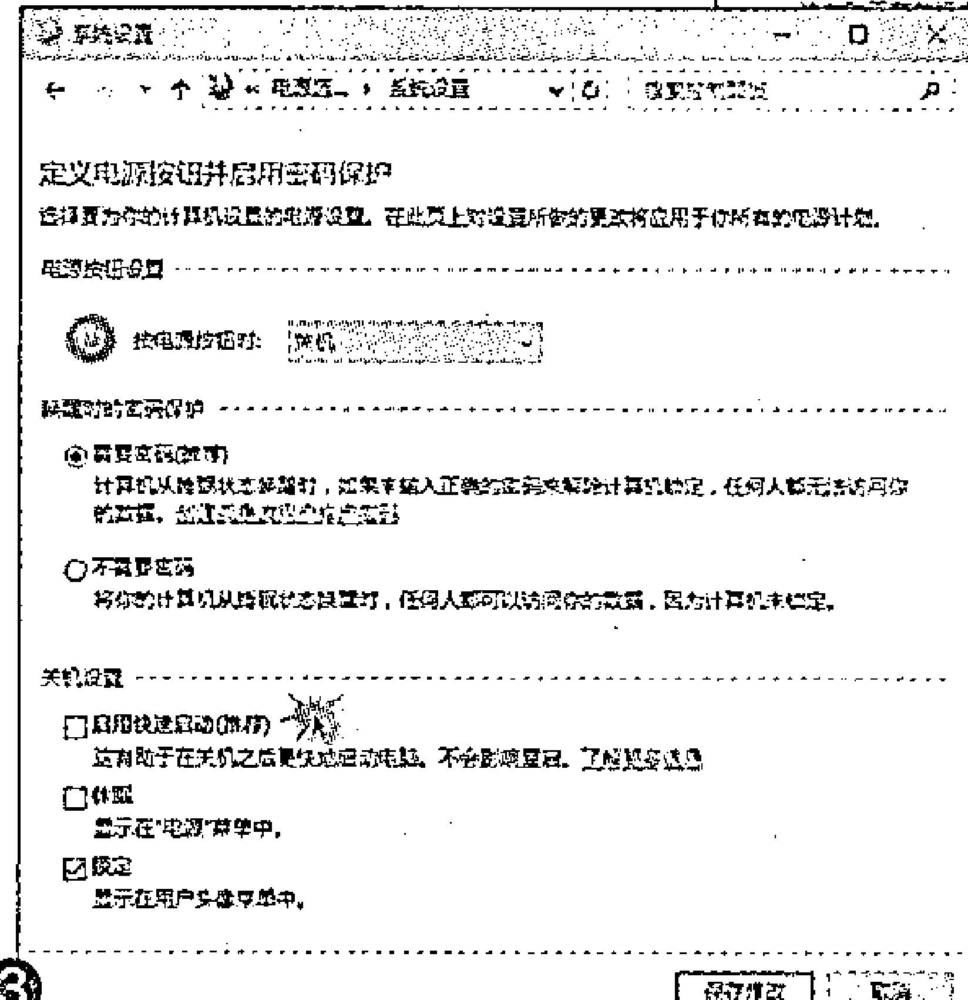

> **小提示**
> 如上方法虽然解决了开启节能功能的问题，但同时也失去了系统“快速启动”功能的优势。随着Windows 10本身的不断完善和设备商家对驱动的升级，如果驱动冲突问题得到解决，以后还可以用上述方法开启系统的“快速启动”功能。

###### 2 网络状态自动报告监视失效

Windows 10系统本身会自动监测网络的状态。如果网络物理连接正常但网络链接不可用，会在系统右下角的托盘上显示黄色惊叹号图标(图4)。但是，有时我们使用了特殊代理服务器上网或设置了连接过滤，这时，即便是网络处于正常情况，也会出现惊叹号图标，且这个图标无法靠点击关闭。这时只能借助于修改注册表来消除此图标。

用Win+R打开运行窗口，运行REGEDIT命令开启注册表编辑器。依次定位到“HKEY_LOCAL_MACHINE\SOFTWARE\Policies\Microsoft\Windows\Network Connections”，在右侧窗格中新建名为NC_DoNotShowLocalOnlyIcon的DWORD项，双击该项将其值修改为1即可(图5)。关闭注册表编辑器，在任务管理器中重启资源管理器，看任务栏网络图标是否已经消失，若修改后图标依然没有消失，请重启系统尝试。

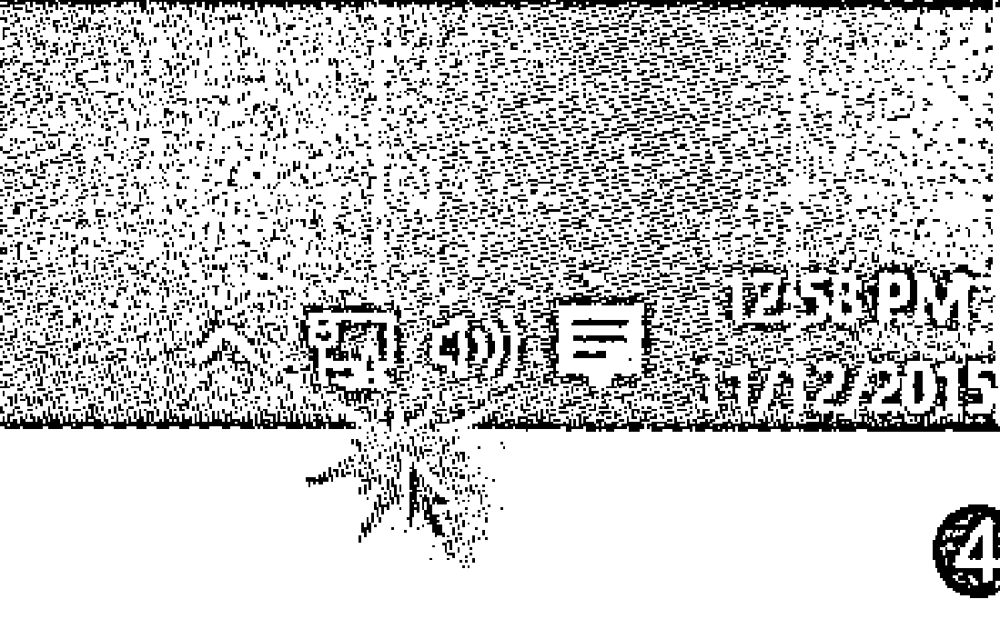

###### 3 自动更新强行中断后失效

Windows 10 TH2是继Windows 10 10240正式版之后的一次底层大更新。该版本的系统有很多种安装方式，但由于不少用户此前已经在使用10240正式版了，因此多数采用在正式版基础上升级的方式进行安装。升级过程中，由于断电或死机等特殊情况，可能会造成加电重启之后无法接续进行升级进程，系统只能停留在原10240版本上。遇到这种情况，可采用清理更新缓存后重新开启升级更新来解决。

首先定位到系统“Windows\SoftwareDistribution\Download”文件夹，删除其中的所有文件。然后用Win+R组合键开启“运行”窗口，执行“WUAUCTL /updatenow”命令（注意输入斜杠前的半角空格）（图6）。重新开启Windows更新程序进行升级即可。

> 小提示
> 如果要回归此前Windows 10的默认通知显示方式，只需用同样的方法将EnableLegacyBalloonNotifications的值改为0即可。

计算机\HKEY_LOCAL_MACHINE\SOFTWARE\Policies\Microsoft\Win...

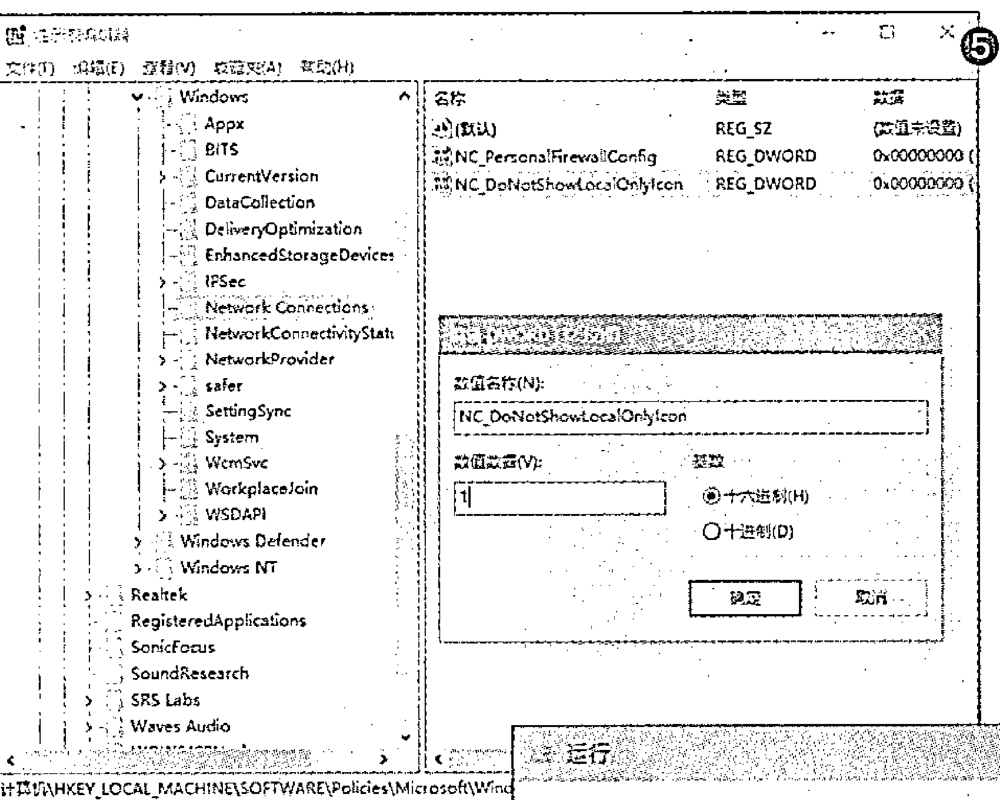

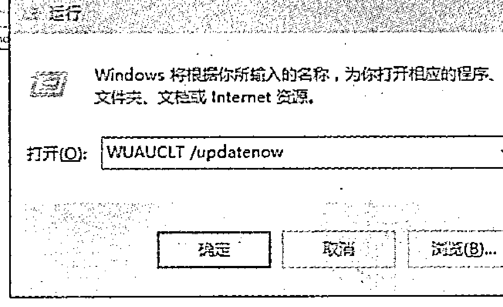

###### 4 通知自动提示时间太短

Windows 10的通知栏自动通知浮出信息不再采用Windows 7的气球模式，且通知浮出的时间非常短，有时看不完显示内容就消失了。实际上，Windows 10采用了新的通知栏区域面板，含有比早期系统的操作中心更加丰富的通知信息，只需点击右下角的通知栏图标，即可进入查看先前没看清的通知内容了（图7）。但若喜欢老式气泡通知样式，也有办法找回，且可以让停留时间更长一些。

启动注册表编辑器，依次定位到“HKEY_CURRENT_USER\SOFTWARE\Policies\Microsoft\Windows\Explorer”，新建一个DWORD（32位）类型的项，将新建的项命名为EnableLegacyBalloonNotifications，并将其值设为1。退出注册表编辑器，重启资源管理器（或重启电脑）（图8）。这样，以后Windows 10的通知栏浮出信息模式将变为气泡式，且显示的时间也变长了。

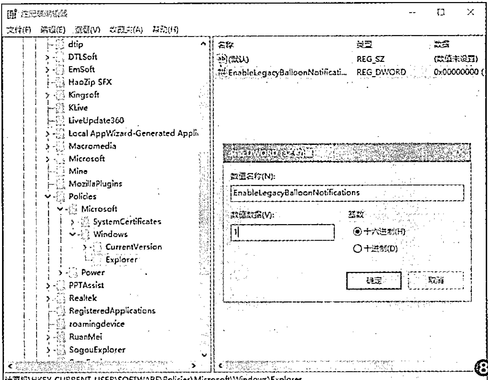

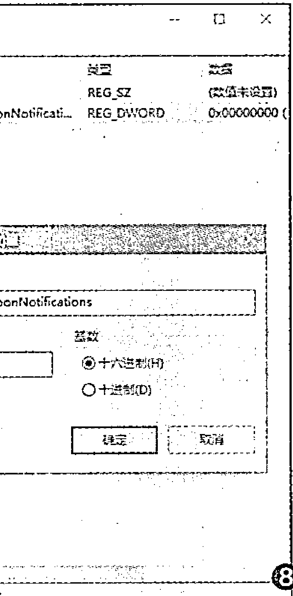

##### 磁盘分区不再重要 让“库”回归Windows10
文|牛市钢

在多分区下使用Windows 7，有不少用户对“库”爱不释手。究其原因，是因为“库”能让人忘掉分区的概念，将文件按类别形式进行划分，将无论数量多少的分区作为一个整体来看待。但到了Windows 10时期，微软取消了这种便利的用法，回归了最早期的传统式文件管理方式。那么，Windows 10文件管理是否可以回归“库”的方式，给予用户选择的权力？

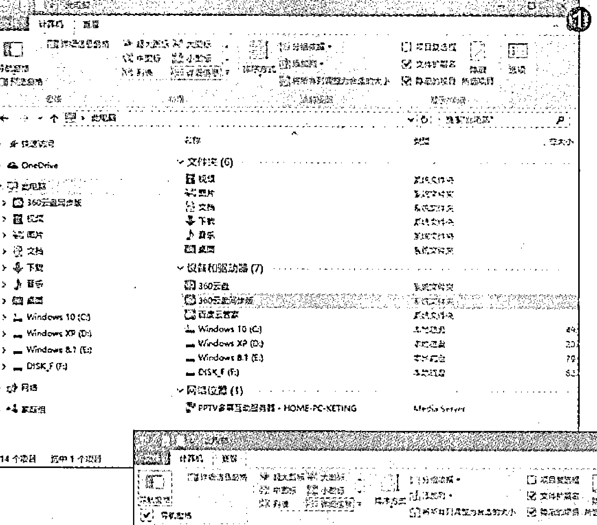

> > 关于启动资源管理器自动打开“此电脑”的具体设置方法，请参见本刊2015年第24期系统栏目文章《让Windows 10资源访问更快些》。

###### 让“库”现身于资源管理器中

大家可以看到，Windows 10最新版的文件资源管理器组织结构呈现如图所示的样子（图1）。注意左侧目录树，主要划分为快速访问、OneDrive云盘、此电脑下管辖的磁盘和系统分类媒体文件夹、网络、家庭组等。根本没有“库”的引子。这大大不同于Windows 7或Windows 8.1。但事实上，在Windows 10中微软只是藏起了受人诟病的“库”项目。用户如果需要，可以通过切换到“查看”选项卡，然后点击“导航窗格”，选择“显示库”，开启对库的显示（图2）。选择开始库显示之后，在左侧的资源目录树中，就又出现了我们熟悉的“库”结构分支了。

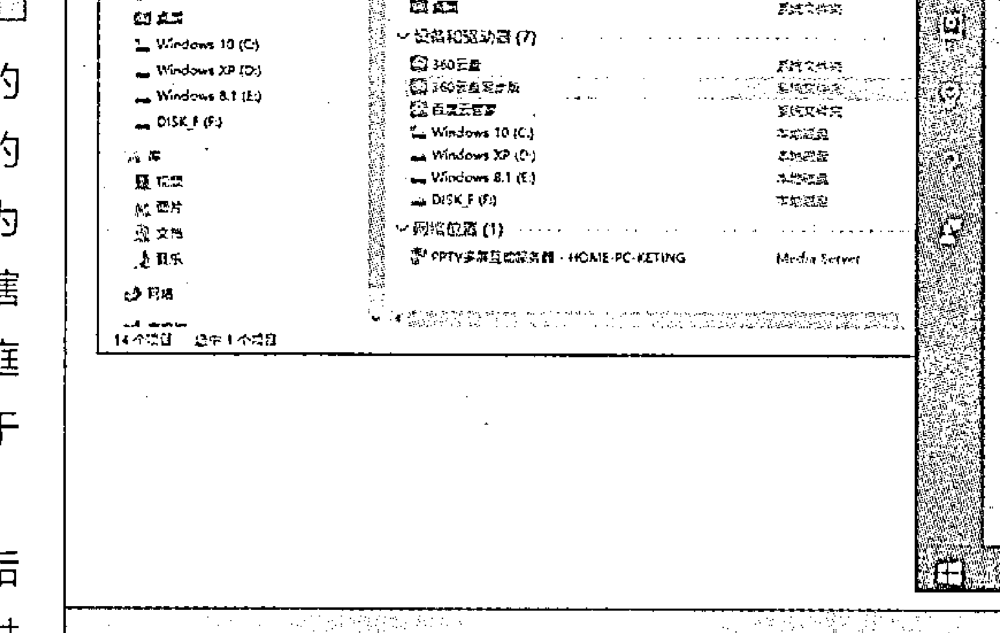

> > 小提示：若要再度隐藏“库”，只需按同样方法在“导航窗格”菜单下，取消对“显示库”的选择即可。

###### 打开资源管理器自动定位到库

在Windows 10资源管理的默认设置中，开启资源管理器后首先看到的是“快速访问”，包含用户经常访问的文件和文件夹的快捷方式。此前本刊曾讲过将此设置更改为开启资源管理器后自动打开“此电脑”的技巧，那么，能否设置为在开启资源管理器后，让资源管理器自动定位到“库”分支呢？让Windows 10资源管理器启动后自动显示“库”项目，不像上述手动显示那样简单设置就能完成，而需要通过修改注册表来完成。先通过小娜对话框输入“regedit”，点击自动搜索结果中的注册表编辑器运行命令regedit（图3）。

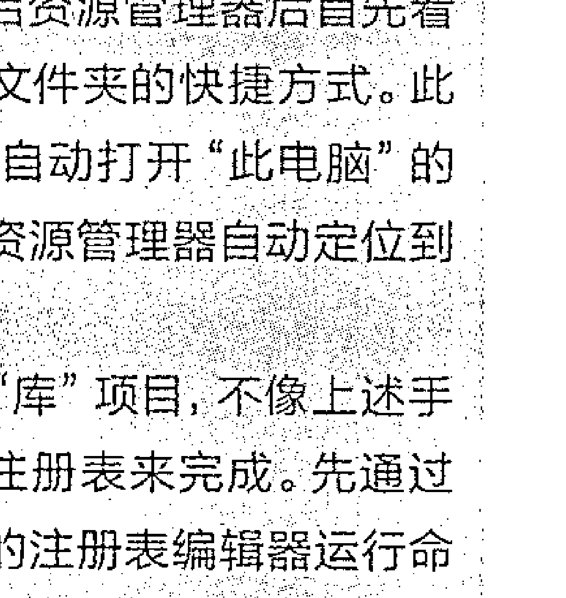

如果使用的是32位的Windows 10系统，依次定位到“HKEY_LOCAL_MACHINE\SOFTWARE\Microsoft\Windows\CurrentVersion\Explorer\HomeFolderDesktop\NameSpace\DelegateFolders”，新建一个名为“{031E4825-7B94-4dc3-B131-E946B44C8DD5}”的项（图4）。如果使用64位的Windows 10，则定位到“HKEY_LOCAL_MACHINE\SOFTWARE\Wow64Node\Microsoft\Windows\CurrentVersion\Explorer\HomeFolderDesktop\NameSpace\DelegateFolders”，新建“{031E4825-7B94-4dc3-B131-E946B44C8DD5}”项（图5）。项目建好后，关闭注册表编辑器，点击任务栏上的文件资源管理器图标，重新开启文件资源管理器。此时就可以看到，自动开启的文件资源管理器窗口右侧的“文件夹”下便出现所有的6个“库”项目（图6）。

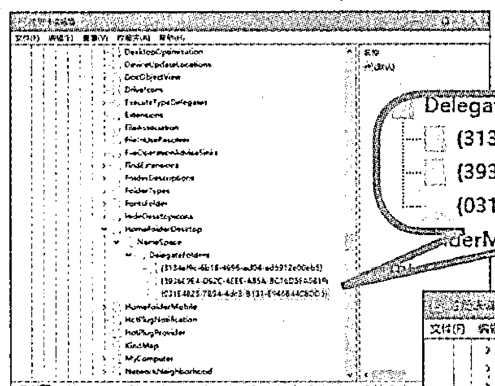

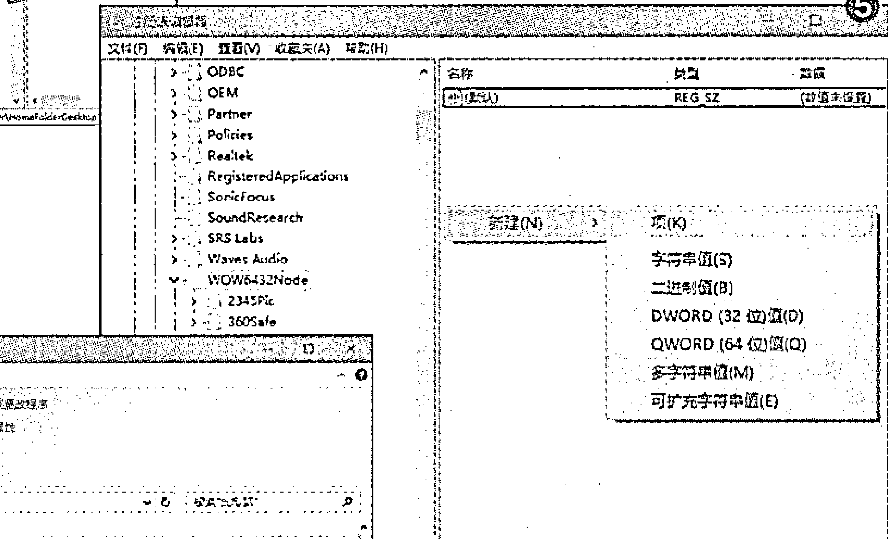

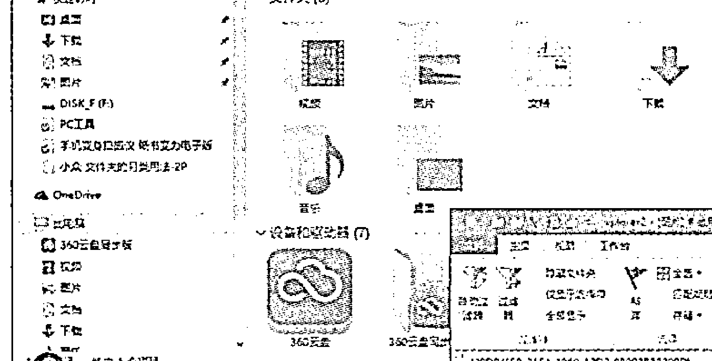

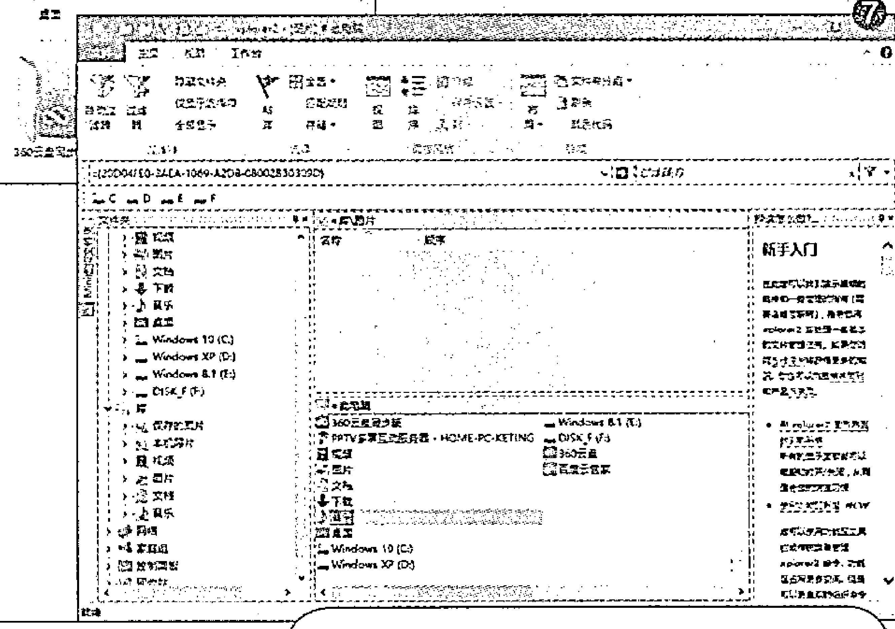

**小提示** 若要去除“库”的自动开启功能，只需在注册表编辑器中将上述建立的项目删除即可。

###### 3 借助第三方软件整合文件资源

除了用Windows自身的“库”功能来整合不同分区的文件外，我们也可以不动用系统自身的设置，借助第三方软件来调用库，整合文件资源，实现“库”文件的管理。我们可以用xplorer2资源管理软件来完成这项任务。启动xplorer2软件，可以看到，即便是系统资源管理器的“库”功能没有开启，在xplorer2软件的资源目录树中，也会自动显示“库”的所有分支和内容，这样我们就可以用该资源管理器来使用我们习惯的“库”了（图7）。

###### 扩展阅读 搜索软件变相代法

还可以用搜索软件Everything来实现类似于“库”的文件管理功能。Everything软件可以一次性搜索出位于不同文件夹、驱动器甚至是局域网的不同电脑中的文件。这样就可让来自不同地点的同类文件出现在同一个Everything窗口中。搜索结束后，通过右键菜单命令，可对这些来自不同地点的文件组成的搜索结果进行统一处理，如统一归集到一个文件夹下，或作一次性清理等。这实际上等同于发挥了“库”的集中处理作用。

##### Windows 10升级全面“防范”
文|楚南

用户的保守和微软的激进，造成Windows 10升级与否之争。微软想尽办法让更多用户升级，而那些守旧的和有特殊心思的用户将微软的升级图标和升级推送看作是眼中钉、肉中刺，恨不得连根拔，对付的花样也是不断翻新。

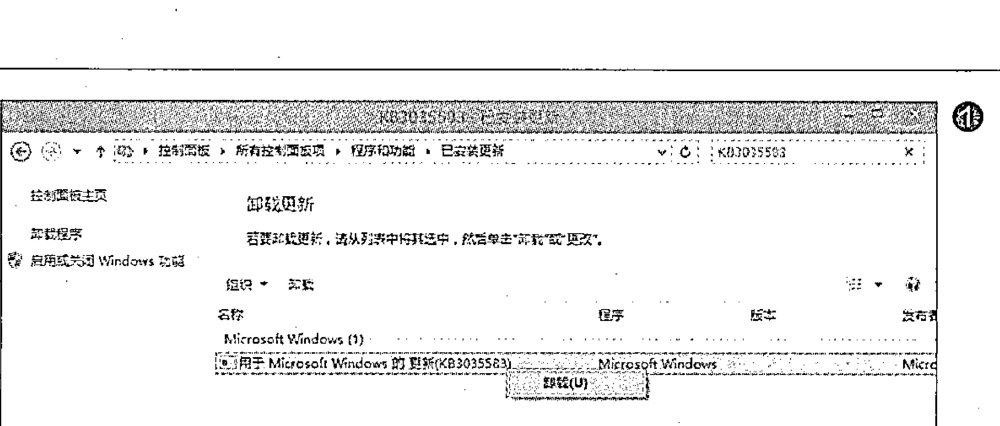

###### 阻止低版本升级Windows 10

不升级Windows 10有诸多麻烦: 没完没了的升级提醒; 自动下载升级文件占用网络带宽和磁盘空间; 后续不可预测的自动安装和推送。因此，仍在使用低版本的用户，看着任务栏上除不掉的升级图标，心里总觉得不踏实, 生怕一不小心点错按钮，激活了升级进程。

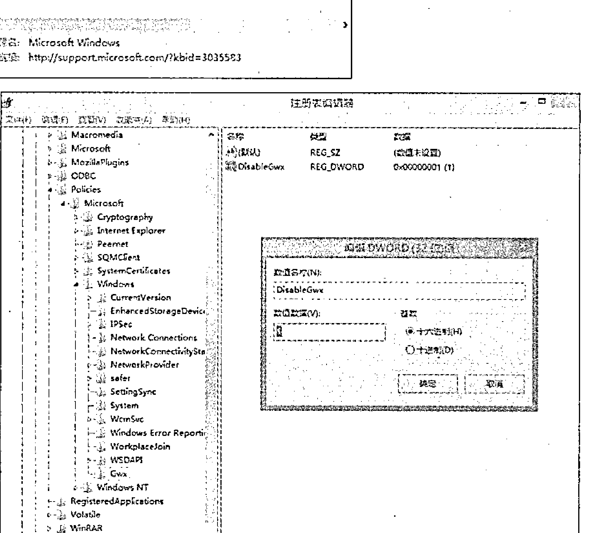

####### 卸载补丁以阻止升级

老系统中的升级提示来源于一个KB3035583的升级补丁的安装。因此，希望寄托在通过卸载这个补丁来阻止升级。

以使用Windows 8.1为例，依次进入“控制面板→系统和安全→Windows更新→检查更新历史记录”，点击“查看已安装的更新”。在右上角搜索框中输入“KB3035583”搜索，右击并选择卸载该补丁即可(图1)。

但是，这种办法有弊端: 卸载该更新后若开启自动更新功能，系统还会反复检测和推送该更新，导致屏蔽失败。因此，若要用这种方法，需开启手动更新选择，以后若Windows再提示安装KB3035583更新，可忽略不安装。

####### 修改注册表屏蔽通知

上述方法操作比较繁琐，而通过修改注册表的方法，屏蔽获取升级通知提示，反而要简单一些。

打开注册表编辑器，定位至“HKEY_LOCAL_MACHINE\SOFTWARE\Policies\Microsoft\Windows\Gwx”。若没有看到Gwx项，只需右击鼠标创建，在右侧窗口中新建一个名为DisableGwx的DWORD (32位)项，并将其值数据设置为1 (图2)。经过如上操作，可彻底屏蔽“获取Windows10”升级通知。

###### 更为简易的Removal Tool

修改注册表还显复杂，且不少用户对注册表心怀恐惧。为了安全方便起见，可借助于一款“Get Windows10” Removal Tool小工具来一键解决。运行该软件后，只需点击一个Remove "Get Windows10" Icon按钮，即可彻底移除任务栏右下角的升级图标。

##### 阻止Windows 10自主升级

即便是已经升级为Windows 10的用户，由于系统频繁升级和补丁的不成熟，也可能在使用中遭受蓝屏的厄运。为了避免自动升级带来的系统不稳定，可根据需要阻止Windows 10自动更新。

用组策略修改法更为简单。打开Windows 10本地组策略编辑器，依次定位到“计算机配置→管理模板→Windows组件→Windows更新”，在右侧窗口中找到“配置自动更新”，双击该项打开“配置自动更新”窗口（图3）。选中“已启用”选择框，然后在下面的配置自动更新选项中选择“2 - 通知下载并通知安装”（图4）。

> 小提示
该方法适用于Windows 10专业版、企业版、教育版。

##### 小技巧：停用“Windows更新”服务

如果将此策略的状态设置为“已禁用”，则必须下载并手动安装Windows更新中的任何可用更新。在这种情况下，可使用系统搜索功能搜索和获取Windows更新。

对于Windows 10家庭版用户来讲，由于没有组策略设置，因此无法使用以上方法。这时，可采用停止服务的办法来解决问题。通过任务管理器打开服务管理窗口，找到Windows Update服务并右键点击，选择“停止”（图5）。停止该服务后，系统不会主动下载和安装更新。若遇到有重要更新，需要手动开启该服务并转到Windows更新窗口下载和安装。只有这样，才能保证系统不会存在大的漏洞。

> 小提示
微软在应用商店为Windows 10家庭版增加了“自动更新应用”的开关应用，弥补了Windows 10家庭版在自动更新控制权限上的不足。

对于喜欢使用第三方工具的用户，还可以使用Windows Update MiniTool这款软件，手动控制Windows 10的自动更新。在该软件中勾选右下角的“离线模式”，即可关闭系统的更新服务。此外，通过在软件窗口左侧选择补丁操作类型，从右侧窗口中方便地控制补丁的下载安装、更新、卸载等操作（图6）。此外，还可使用另一款工具Win Updates Disabler。在Disable选项卡中，软件默认勾选了Disable Windows updates选项（禁止系统更新）。选中之后，点击Apply Now按钮，重启系统即可（图7）。在需要重新启用系统更新时，切换到Enable选项卡，勾选Enable Windows updates并点击Apply Now按钮即可。

##### 闯过Windows 10 “分水岭”

Windows 10系统，开始菜单“回归”。然而这不是一次简单的回归，它还为普通操作和高级控制划定了一条“分水岭”——使用左键，操作简单方便；右键操作，控制直观高效。闯过这道“分水岭”，足以让一个普通的Windows用户成为系统操控的能手。

##### 简便向左 左键操作也强劲

对一般的Windows用户而言，利用左键操作Windows 10开始菜单，在获得更加易用的体验之外，也能获得诸多强劲的实用功能。

###### 左键开始输入直接搜索

大家知道，Windows 10开始按钮旁默认有个很人性化且功能十足的搜索工具Cortana，可以圆形按钮或长条搜索框的形式存在，但也可以被隐藏。如果该工具被隐藏之后，还能进行程序搜索吗？
其实，即便是不开启Cortana图标，在开始按钮上单击鼠标左键，然后直接输入所需程序或功能，也可激活搜索界面，获得想要的程序或功能。例如，要调用控制面板，只需左键单击开始按钮，然后输入“控制面板”，即可获得搜索结果（图1）。

###### 左键三击直接锁定屏幕

通常我们离开时锁定屏幕都是在使用Win+L组合键，或者先按下Ctrl+Alt+Dell组合键，然后选择“锁定”。其实在Windows 10的开始菜单中，用左键单击开始按钮，然后单击用户图标下的“锁定”即可（图2）。

###### 左键三击保存工作现场

当前的工作没有完成，但已经开启好多网页，打开多种应用软件相互参照，如果直接关机待下次开机后继续工作，那么恢复现场也是一件麻烦事。这时，可以用在开始菜单上3次点击左键来保存现场：点击开始按钮，接着点击“电源→休眠”即可（图3）。

###### 左键四击获取系统版本

想知道现在使用的Windows 10版本信息吗？只需从开始按钮开始，连续点击4次鼠标左键即可。具体路径：“开始→设置→系统→关于”，看到详细的系统版本信息了吧（图4）？

##### 资深向右 右键控制更高效

而Windows的高级用户，通过在开始按钮上右击，可以完成几乎所有的系统控制操作。

##### 找回右键命令提示符

此前的系统进入命令提示窗口十分麻烦，而现在Windows 10只需在开始按钮上单击鼠标右键即可选择进入两种命令提示符（图5）。但有时会发现这个右键菜单中没有了命令提示符，变成了Windows PowerShell。这时，只需在任务栏空白处单击右键，选择“属性”，点击“导航”选项卡，将唯一的复选框选择去掉即可（图6）。

##### 找回传统的控制面板

众所周知，Windows 10的控制面板已经被“设置”所代替。但其实传统的控制面板并没有消失，反而调用更加方便了。在开始菜单上点击右键，就知道传统控制面板在哪儿了。

##### 创建VHD型虚拟硬盘

Windows 10支持在自身环境下创建VHD虚拟硬盘，在其中安装另一个系统，且可以挂接为双系统启动。VHD虚拟硬盘创建也可以通过在开始按钮上单击右键进入来实现。右键单击开始按钮，选择菜单中的“磁盘管理”，然后在磁盘管理窗口中选择“操作→创建VHD”，按照提示操作就可以创建虚拟硬盘了（图7）。很简单吧！

##### 右键初始化新的硬盘

新购置了一块硬盘，或者从别的旧电脑上拆下来一块硬盘需要初始化。如何在Windows 10中操作？首先将硬盘挂接到主板上，或用硬盘盒、硬盘底座等外设将硬盘通过USB接口连接到主机上。然后在开始菜单上单击鼠标右键，选择“磁盘管理”，在磁盘管理窗口中，将识别出的新硬盘用右键菜单命令进行分区创建和格式化操作。或者用右键菜单将旧硬盘的分区删除，然后重新分区和格式化即可。

##### 设置虚拟的内存页面

要改变Windows 10系统中使用的虚拟内存页面文件，同样也可以直接使用开始按钮右键操作。右键单击开始按钮，选择“系统”。在弹出的“系统”窗口中依次选择“高级系统设置→高级→性能设置”，在接下来的窗口中选择“高级→虚拟内存→更改”，即可进入虚拟内存设置页面，按所需项目进行设置（图8）。

##### 省却麻烦——一键修改注册表

文|南风

许多Windows功能定制要通过修改注册表才能完成，但常规的注册表修改方法太复杂，仅就开启注册表后寻找目标项所花费的时间就够让人心烦，弄不好还可能危及系统安全。因此，寻求可以自动开启注册表并自动定位的方法，以及自动修改注册表的方法，就显得很有必要。

##### 复制一句代码 注册表自动定位

为了避免逐级定位注册表分支的麻烦操作，下面介绍一种可一键自动到达注册表的目标项目的方法。用记事本创建一个新文件，输入如图所示的代码（为提高效率可直接下载复制代码: http://pan.baidu.com/s/1nt2vjXf），保存时选择保存类型为“所有文件”，将文件名命名为regedit.vbs（图1）。文件建好之后，在实际操作中，如果要定位到注册表的某个项目，例如要定位到“HKEY_LOCAL_MACHINE\SOFTWARE\Microsoft\Windows\CurrentVersion\Explorer\MyComputer”，只需先复制这个完整路径，然后双击此前建立好的regedit.vbs文件，通过Windows账户控制验证后，注册表编辑器就会自动打开，并自动定位到上述复制的路径（图2）。如此一来，再长的路径定位，全都变成了复制路径和双击脚本文件的两个简单操作，既省时，又通用，你赶快一试吧！

> 小提示：也可以先保存为TXT文件，然后从Windows资源管理器中开启扩展名显示，并将扩展名更改为vbs。将该regedit.vbs放置在桌面上或收藏备用。

##### 运行代码脚本 自动导入注册表项

修改注册表还有一种自动化的方法，那就是直接运行编制好的reg注册表脚本代码。将代码直接写入BAT批处理文件中，然后直接运行BAT批处理文件，即可导入键值到注册表中。BAT批处理代码格式如下：

```
reg add "HKEY_LOCAL_MACHINE\SOFTWARE\MICROSOFT\MSSQLSERVER" /v LoginMode /t reg_dword /d 00000002 /f /*增加键值*/
reg delete "HKEY_LOCAL_MACHINE\SOFTWARE\MICROSOFT\MSSQLSERVER" /v LoginMode /*删除键*/
```

+   参数说明：
| 参数 | 描述 |
| --- | --- |
| /v | 所选项下要添加的键值名 |
| /t | RegKey 数据类型，如reg_dword、reg_sz |
| /d | 给添加的注册表键值的数据 |
| /f | 不提示而强行改写现有注册表项 |

##### 超长名称顽固文件巧删除

文|牛莉

在清理旧的系统文件时，可能会遇到这种情况：由于出现一些超长文件，无法用正常的删除操作将其删除。这时可巧妙借好压或系统命令提示符的命令来删除。

如在清理系统升级后留下的一块老硬盘时，在“用户”目录下发现有大量的文件名超长的文件无法删除（图1）。系统提示建议缩短文件名后重试，然而文件太多，手动更名也无法操作。

首先可以尝试借用压缩软件的文件自动删除功能来解决。右击包含长文件名的文件夹，然后选择用好压来压缩。在选择压缩参数的同时，选中“压缩后删除源文件”选项，这样，原来的文件夹被压缩为一个文件，与此同时，原来的顽固文件就可以被删除掉（图2）。

如果上述方法不能删除，可尝试打开长文件名所在的文件夹，然后通过Windows 8.1或Windows 10资源管理器的“文件”菜单，进入管理员级命令提示符窗口，执行“DEL *.* /S”命令（图3）。

之后我们就可以看到，文件夹变空，这些顽固文件都被删除了。

除了文件名过长无法删除文件外，还有一种情况就是操作过程中发生意外错误，造成文件无法正常删除（图4）。若遇到这种情况，也可以尝试用如上两种方法删除。此外，文件无法删除在很多情况下是由于文件被锁定而造成的，这时，还可以借助于一些专门的文件解锁工具先行解锁文件，然后再进行删除。

**小提示**
若文件带有特殊属性，如只读、系统或隐藏，可在命令中添加/A属性参数（如/AR表示只读、/AS表示系统、/AH表示隐藏），即可自动删除这些文件。

##### Windows 10用户名自由控制

文|文欣

Windows 10真正的登录用户名和显示的用户名不一定是100%相同。那么，对于Windows 10登录用户名和显示用户名，该如何区分？如果需要修改，又从哪里下手？为防止登录时用户名泄露登录者的信息，能否将其隐藏起来？

###### 1 登录名显示名随意修改

Windows 10在登录系统时或登录系统后看到的用户名称，不一定是系统真正的登录用户名。反映在用户目录名称上，就是系统分区中对应的“用户”文件夹下的某个用户文件夹的名称与注册账户不一致。例如，用本地账户“老顽童”和网络账户“cfanpe@126.com”两种账户注册并登录Windows 10，在屏幕上显示的账户名称为“老顽童”和“Tong An (cfanpe@126.com)”(图1)，而在“用户”文件夹下显示的两个文件夹，则分别为“老顽童”和“cfanp”(图2)。

系统识别不同用户身份时所用的名称为真正的登录名，而不是显示的名称，尤其是在以域管理的系统中，区别不同用户的依据就是登录名。登录名根据注册时使用的是本地账号还是网络账号的不同而有所区别。在安装Windows 10的过程中，如果直接使用微软账户登录，系统会自动截取注册邮箱前5位字符作为用户文件夹的名称；而如果使用本地账号登录，就不存在此问题，个人文件夹名称将显示为注册用户时的名称。因此就有我们上面看到的情况：本来是用“cfanpe@126.com”账户名注册的系统，但系统“用户”文件夹下生成的却是“cfanp”的文件夹。这样的用户文件夹看起来怪怪的，总想修改。而登录时所起的昵称“Tong An”可能也希望再改个别的。

修改Windows 10账户的登录名称：右键单击开始按钮并选择“计算机管理”，进入计算机管理窗口后，通过左侧导航栏依次进入“计算机管理(本地)→系统工具→本地用户和组→用户”，在右侧窗格中就会看到系统中当前所有的用户列表。选中要修改的用户，右键单击并选择“重命名”，即可修改登录的用户文件夹的名称(图3)。

修改Windows账户显示的昵称：在“计算机管理”窗口的“用户”窗格中显示有项目“全名”的用户名上单击右键并选择“属性”，然后在属性窗口中修改“全名”文本框的内容即可(图4)。这样修改之后，在登录Windows 10时看到的昵称就是修改后的名称了。

##### 系统应用

> > 小提示
>
> 修改登录所用的微软网络账户昵称，还可以通过登录微软账户网站进行设置。通过“开始菜单→设置→账户”，进入“你的电子邮件和账户”，点击右侧窗格的“管理我的Microsoft账户”链接（图5）。然后在进入的微软账户管理页面中，点击头像下方的“编辑名字”文字链接，就可以修改登录名称了（图6）。

###### 2 别让用户泄露隐私

对于多人使用的电脑，在Windows 10登录界面的用户名输入框列表上，总会显示上次登录的用户名。如果你不愿意让自己的信息出现在这个框中，也可以通过设置将自己的用户名隐藏起来，在下次有人登录时，让登录用户名显示空白输入框。

如果你在使用Windows 10企业版、专业版或教育版，可通过修改组策略的方法来实现。先按下Win+R组合键启动“运行”窗口，执行“SECPOL.MSC”命令启动本地安全策略。依次展开“安全设置→本地策略→安全选项”，在右侧窗格中找到“交互式登录: 不显示最后的用户名”一项，双击该项后选择“已启用”即可（图7）。

如果你使用的是家庭版，由于该版本无法直接调用组策略，因此只能借助于直接修改注册表来解决问题。通过Win+R运行REGEDIT，启动注册表编辑器，依次定位到“HKEY_LOCAL_MACHINE\SOFTWARE\Microsoft\Windows\CurrentVersion\Policies\System”分支，在右侧窗格中找到“dontdisplaylastusername”值，将其数值数据设为1即可（图8）。

> > 小提示
>
> 修改注册表对企业版、专业版、教育版同样管用，但通过组策略修改更加简单易行。家庭版动用注册表修改是不得已而为之。

##### 请个“杀手” Windows 10控制易

文|文昌

Windows 10大量搜集用户数据，依此来获得更多的用户使用状态和改进体验的建议等。尽管微软承诺不泄露用户数据，但个人数据的广泛搜集，总是让用户有些不放心。而Windows 10本身对系统隐私关闭的控制操作又不够明显，且比较分散。因此，如果要轻松控制这些隐私项目，借助于专用的第三方软件会更加方便。在众多系统控制软件中，一款被称为“Windows 10间谍杀手”的工具“Win10 Spy Disabler”值得试用。

##### 一键完成系统隐私项目调整

通过Win10 Spy Disabler的“Privacy Teaks（隐私调整）”选项卡进行操作，可控制Windows 10的各项隐私。点击该选项卡，选中需要禁用或设置的项目，最后点击“Apply Now（立即应用）”按钮即可完成隐私设置（图1）。

隐私设置列表几乎包括了Windows 10中所常用的各种隐私项目：历史记录、系统搜索、Wi-Fi共享、位置服务、广告ID、Defender数据报告、间谍服务、间谍计划任务、遥测与数据搜集、遥测主服务、手写数据共享、DRM互联网访问、系统反馈请求、Edge/IE请勿跟踪等一应俱全。

> > 小提示
设置要因人而异，也不能一味采用软件默认给出的设置选项。因为有的选项可能是你运行软件所必须开启的选项，所以请看清项目后再按下应用按钮。

##### 2 轻松进行系统特殊调整设置

要调整系统的设置，如文件隐藏和显示、扩展名隐藏和显示、短文件名是否生效、是否生成系统错误报告、关机是否清除页面文件、是否允许远程访问等，通常需要在不同的位置进行查找。
若利用Win10 Spy Disabler，就可免去这一麻烦。只需点击软件的“System Tweaks（系统调整）”选项卡，选择系统调整项目，之后点击“Apply Now”按钮即可完成设置（图2）。

##### 3 解决系统小工具分散调用问题

调用一些系统常用的小工具，我们平常要到Windows设置窗口或控制面板的各个分支中去定位。例如任务管理、系统升级、防火墙、注册表编辑器、系统服务、系统配置、系统恢复、系统信息、磁盘清理等，这些信息都无法在一个窗口中找到。现在利用Win10 Spy Disabler软件，只需点一下“System Utilities（系统实用程序）”选项卡，即可方便地找到这些小工具的启动入口，变分散式服务为一站式管理（图3）。

###### 手动查安全 掀出“不明身份”者

文|南海君

微软的文件数字签名验证大家一定听说过，微软为系统的关键文件引入数字签名的机制，是为了维护系统的完整性。因为操作系统的关键文件的完整性非常重要，只有保证了它们的完整和不被篡改，才能保证系统的安全和平稳运行。Windows 10系统就内置了文件签名验证的工具，可以很方便地检查系统文件的完整性和安全性。同时，对于外来安装的程序和驱动，也可以检查。通过它可以找出系统中“不明身份”的文件。

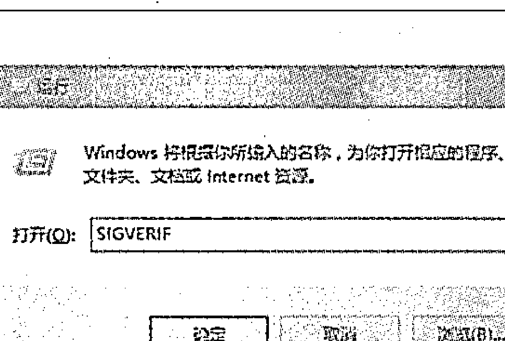

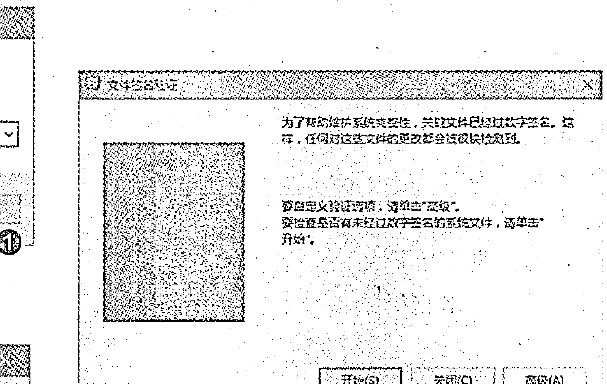

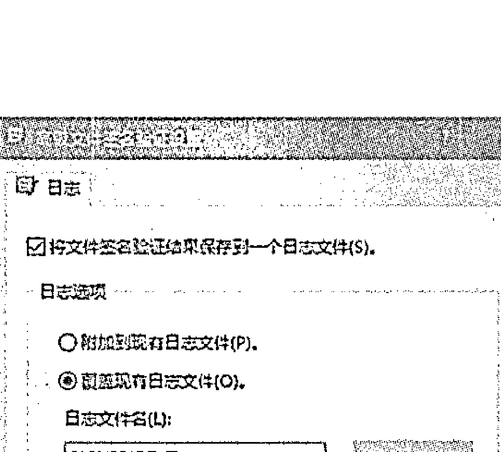

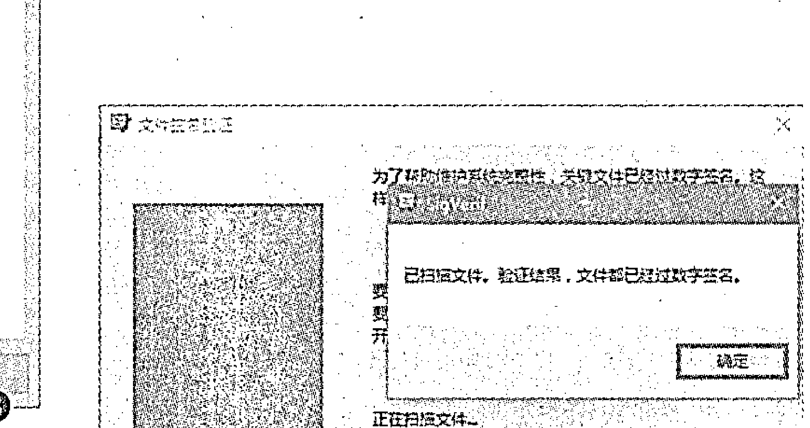

> ### 小提示
>
> 如果点击“高级”按钮，还可以设置和自定义文件签名日志文件。生成的日志文件，可用“查看日志”按钮进行查看（图3）。

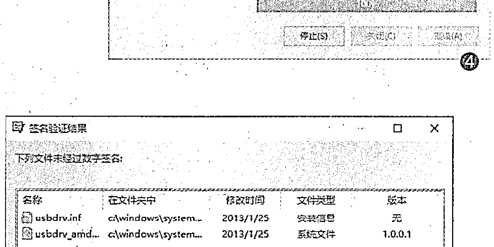

首先需要知道调用这一工具的方法。按下Win+R组合键调出“运行”窗口，输入“SIGVERIF”命令并运行（图1）。在文件签名验证窗口中，点击界面下方的“开始”按钮，即可开始扫描系统中重要文件的数字签名情况（图2）。扫描的项目包括系统设备驱动程序、系统文件等。

扫描结束后，如果显示文件均通过数字签名，说明系统一切正常，所有文件均符合微软Windows的签名标准（图4）。但如果扫描的结果中出现数字签名未通过的项目，就需要认真对待和仔细核查了。一般来说，如果是设备驱动程序未经过签名验证，很可能是商家的设备未经过微软数字签名验证，但设备仍然可以正常使用，这属正常现象。如图5所示的扫描结果中出现的未经验证的USB设备驱动程序。但是，如果是一个来路不明的系统文件未通过签名验证，那么就需要检查其具体来源，必要时可上网搜索相关情况。如果可能是威胁系统安全的文件，则要果断删除和卸载。

###### 给Windows 10右键菜单做“手术”

文|南海君

Windows 10默认的右键菜单不一定适合所有的用户环境。PC上合适的，移动设备上不一定合适；此用户合适了，彼用户不一定合适。若要满足自己的需求，还需要给右键菜单做做“手术”。

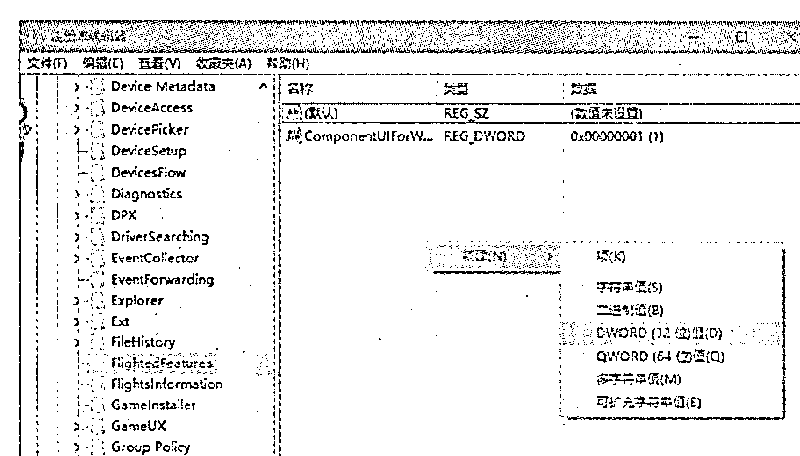

> > **小提示**
>
> 注册表修改具有一定的风险，因此建议在修改前先备份注册表。在注册表编辑器中选择“计算机”分支，点击“文件→导出”命令，命名注册表备份文件（如“我的注册表备份”），导出范围选择“全部”，最后点击“保存”即可。若遇到问题需要恢复，只需执行“导入”命令即可。

###### 让右键菜单收紧

Windows 10是一个设计为能够适应多种设备的通用操作系统。其中，为了方便小尺寸移动触摸设备的操作，在右键菜单设计方面进行了必要的改进，明显感觉到的变化就是菜单项目的间隔更大，视觉上也更为宽松。这样做的好处是触摸时不会因间隔太小而按错项目。但是，若将这样的设置搬到键鼠操控的PC或其他大屏显示设备上，反而显得不便于操作或浪费空间。因此，给Windows 10右键菜单“缩身”的想法便变得很自然。但是，Windows 10本身的图形界面没有提供这样的设置方法，只能通过修改注册表来完成“瘦身”。

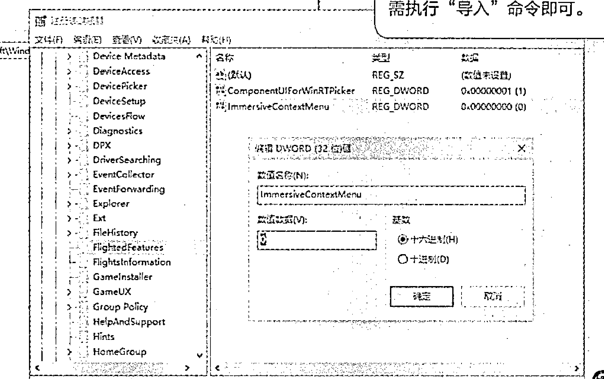

点击系统任务栏左侧的小娜图标（或搜索框），输入regedit字串，这时列表上部会自动出现regedit运行命令链接，点击该链接启动注册表编辑器。

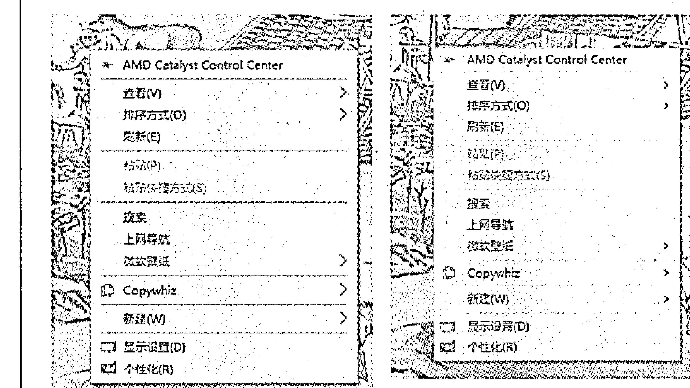

依次定位到“HKEY_LOCAL_MACHINE\SOFTWARE\Microsoft\Windows\CurrentVersion\FlightedFeatures”项，在右侧窗格新建DWORD (32位) 值（图1）；然后将其命名为ImmersiveContextMenu，数值数据保持默认的“0”，点击“确定”（图2）。

退出注册表编辑器，重启文件资源管理器，从中查看右键菜单，或到桌面上右键查看，会发现右键菜单比原来紧凑了（图3，右侧为修改后的效果）。由于给右键菜单“瘦身”后，同样的屏幕区域可以容纳更多的项目，这对于那些安装了很多右键功能的用户来说，操作上就变得方便多了。因为原来的右键菜单过长，可能需要通过上下滚动才能看清隐藏在屏幕下部或上部的项目，现在“减肥”之后就可以免去上下滚动的时间浪费和难以把控的尴尬。

###### 让右键菜单变短

以上提到由于右键菜单项目过多而造成操作时需要滚动才能定位的情况，这种情况通过以上的“缩身”法来解决空间有限。我们转而可以采用删除不必要项的方法，让右键菜单的长度变短，这可借用360安全卫士系统工具中的“右键管理”工具来完成。

启动360安全卫士领航版，点击主界面右下角的“更多”文字链接，在弹出窗口中“全部工具”列表的“系统工具”下，找到“右键管理”项点击添加（图4）。启动该工具后点击“开始扫描”按钮，软件会自动扫描当前可用的文件右键菜单、“发送到”右键菜单、IE浏览器右键菜单等项目。点击选择其中不再需要的项目，然后点击窗口右下角的“删除”按钮，即可达到让右键菜单变短的目的（图5）。

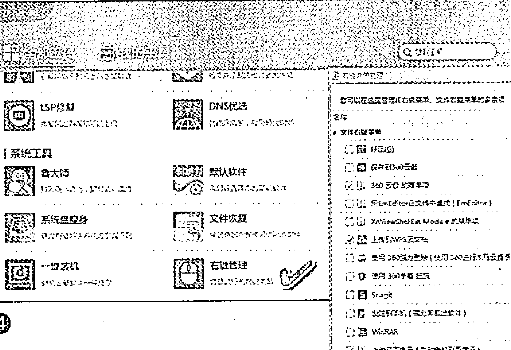

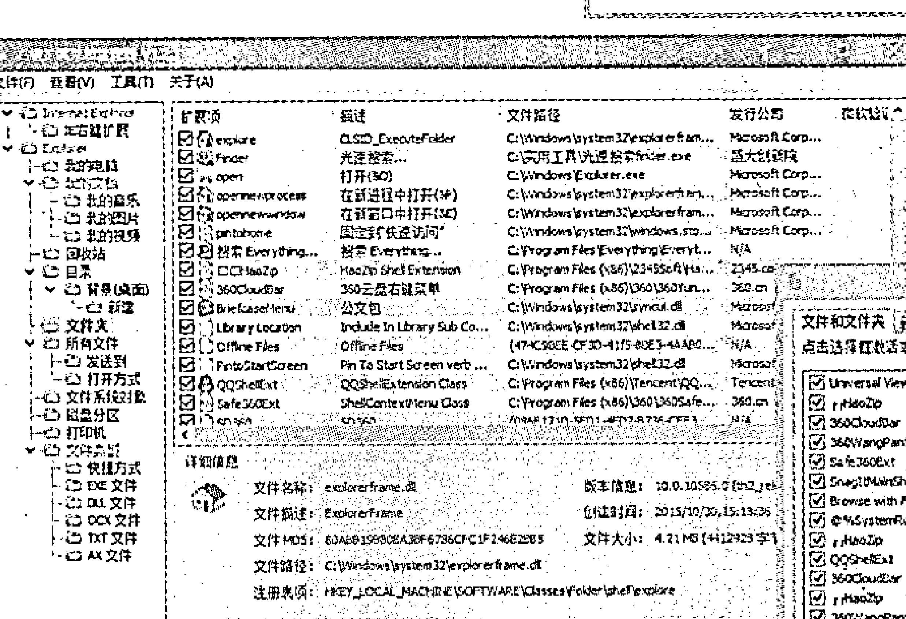

> > 扩展阅读
>
> 由于右键菜单在不同位置的项目均有所不同，而又不局限于如上介绍的3个位置，因此如果要修改其他部位的右键菜单项目，还可以借助于一款专用的右键菜单定制软件RightMenuMgr来实现。在该软件窗口中，给出了更多类别的右键菜单项目，只需选择相应的项目执行去留优化即可（图6）。

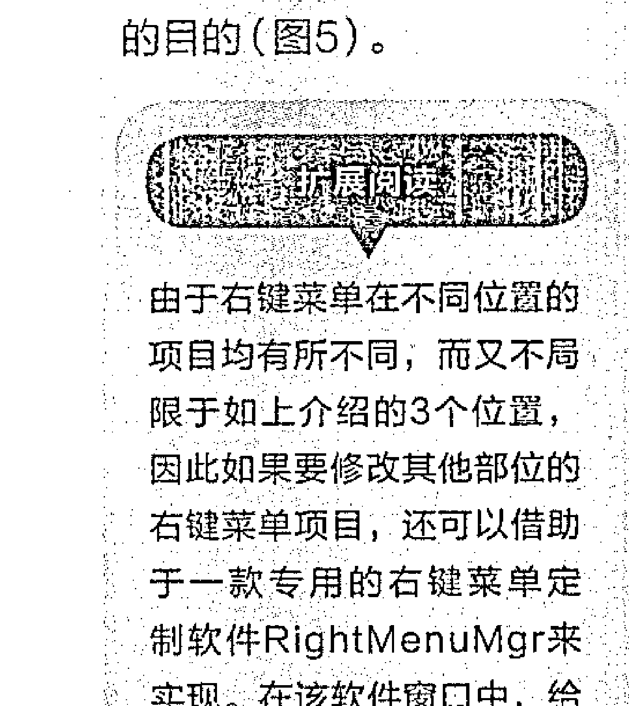

###### 深度控制右键菜单

有时我们对右键菜单的某些项目的优化具有不确定性，去掉的也许还会有用到的时候，若需要更加灵活和深入地控制右键菜单项目，可使用专用系统工具Glary Utilities来解决。在Glary Utilities主界面中点击“高级工具”选项卡，单击“系统控制”分组下的“右键菜单”项（图7），启动右键菜单管理器。在“文件和文件夹”标签页下，右边一列为右键菜单项所在的类别，对照此列按需取消对左侧项目的复选框的选择，即可取消相应项目在右键菜单中的显示，达到为右键菜单“减负”的目的（图8）。如果要为“新建”或“发送到”右键菜单减负，分别选择这两个选项卡，然后用同样的方法操作即可。

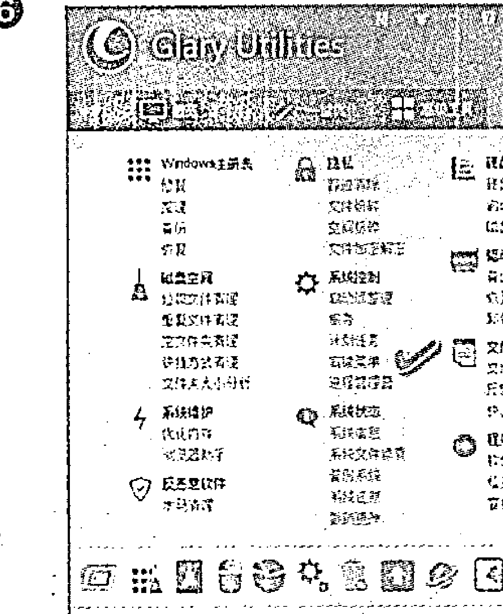

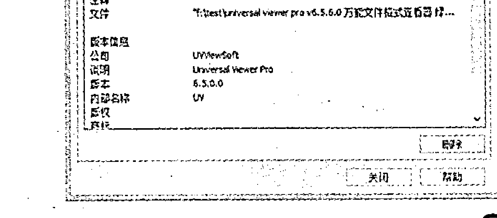

> > 小提示
>
> 如果仅仅是屏蔽右键菜单项目，则只需将项目前的复选框选择取消即可，要用时还可恢复。若需要将该项目从注册表中彻底删除，则选中该项目后点击设置窗口右下角的“删除”按钮即可。

###### 系统升级之后USB失灵了怎么办

文|文昌

同样一块移动硬盘，在Windows 7系统上使用没有问题，但系统在升级至Windows 10之后，竟然无法识别了。而之前好好的USB声卡在系统升级之后也出现了时有声时无声的问题，Windows 10的兼容性就只有这种程度吗？

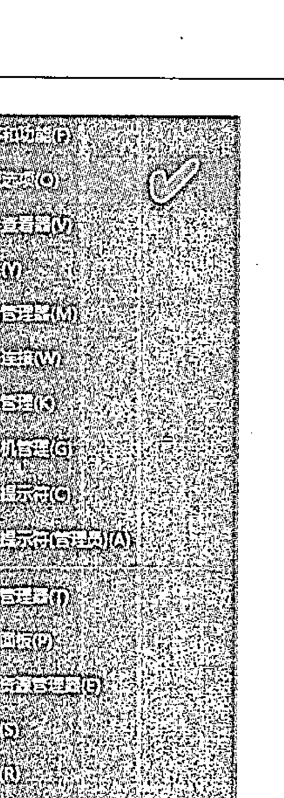

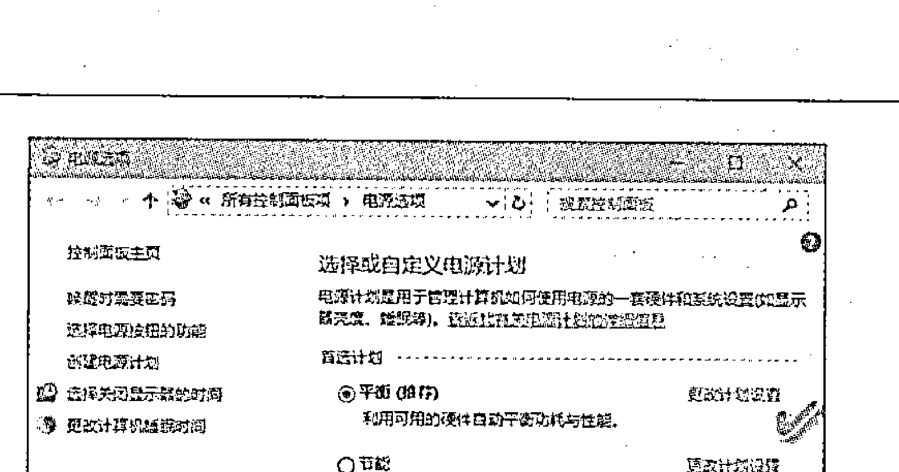

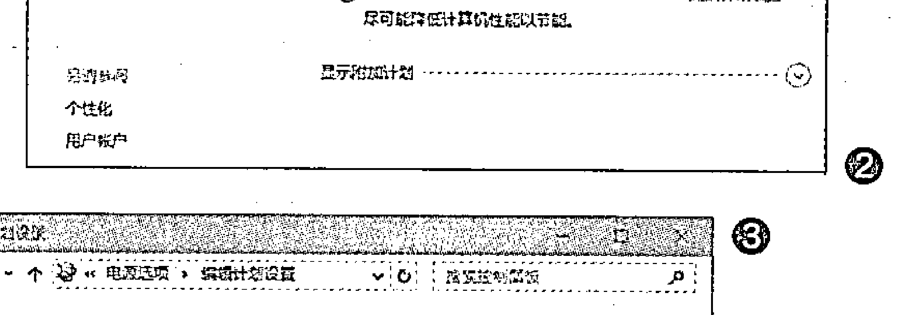

> 小提示
>
> 如果在Windows 10环境下插入USB设备后，系统提示“无法识别的USB设备。跟这台计算机连接的一个USB设备运行不正常，Windows无法识别。”信息，遇到这种情况后，可先关闭正在进行的任务，重新启动系统，然后重新插入移动存储设备，或换个接口尝试。若依然不能解决，可按下述步骤逐一尝试。

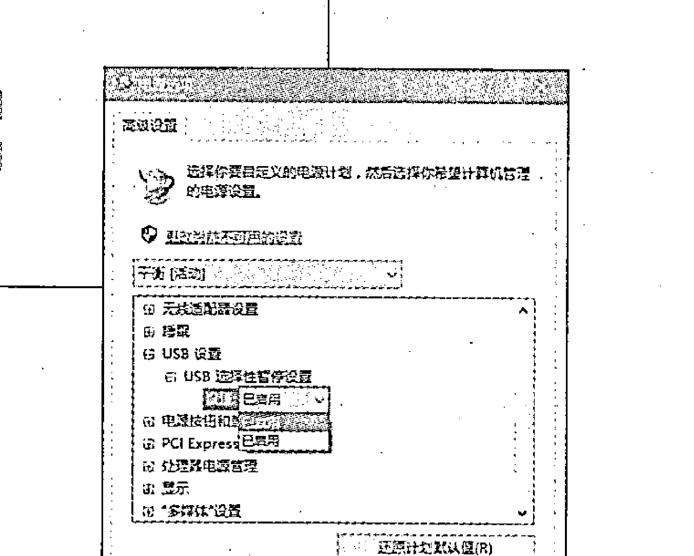

###### 来自电源选项的USB因素

USB设备不能被识别，有可能与USB电源设置相关项目有关。右键单击开始按钮并选择“电源选项”，进入电源选项设置窗口（图1）。在当前所选的电源方案的右侧，单击“更改计划设置”链接，进入“编辑计划设置”窗口（图2）。接下来点击“更改高级电源设置”（图3），然后在高级设置窗口中选择“USB设置→USB选择性暂停设置→设置”，将该项设置选择为“已禁用”（图4）。

###### 驱动或设备控制原因所致

USB设备无法被识别，还可能是设备加载错误或驱动程序出现问题。这时需要卸载设备，然后重新刷新驱动程序。具体方法是，右键单击开始菜单并选择“设备管理器”项，打开设备管理器。找到“磁盘驱动器”下的移动设备，右键单击并选择“卸载”命令（图5）。然后拔出移动设备，重新插上后系统会自动重新加载设备的驱动程序。如果依然不行，可尝试单击右键菜单中的“更新驱动程序软件”选项，让系统自动执行驱动程序的更新。之后回到资源管理器中，看是否识别出了移动设备。

如果更新设备和驱动后问题依然没有得到解决，那么下一步可进而通过卸载USB设备控制器入手来尝试。在设备管理器中找到“通用串行总线控制器”，右键单击下面的各个项目并逐个选择执行“卸载”操作（图6）。当所有项目卸载完毕之后，重新启动Windows，这时再到资源管理器中查看移动设备是否被有效识别。

###### 3 USB驱动与系统不兼容

在通过低版本Windows (如Windows 7)升级到Windows 10的过程中，还有部分用户遇到USB音频设备不能正常工作的情况 (如显示器自带的USB音箱)。这方面的问题一般可能是由于Windows 7的声卡驱动与Windows 10系统不兼容导致的，可到对应设备的官方网站下载对应于新系统的驱动程序安装更新。

由于通过升级方式安装的系统，此前系统内部的软件和程序可能会直接被Windows 10识别并利用，但是又不能和Windows 10兼容，因此就会出现看似没错误提示，但使用起来又出现问题的情况。此外，升级过程中又可能会导致与驱动程序相关的系统文件损坏，也不会很好地发挥驱动程序的正常作用。在这种情况下，可重置系统或还原系统，以便让系统文件恢复正常状态。重置系统需要在系统设置窗口的“更新和安全”窗口下选择“恢复”进入 (图7)。而系统还原要通过在“此电脑”上右击，选择“属性”并点击“系统保护”进入 (图8)。若系统已经激活，还可将Windows 10全新安装一遍，安装之后系统会自动激活。其后，再看USB设备是否能够正常运行。

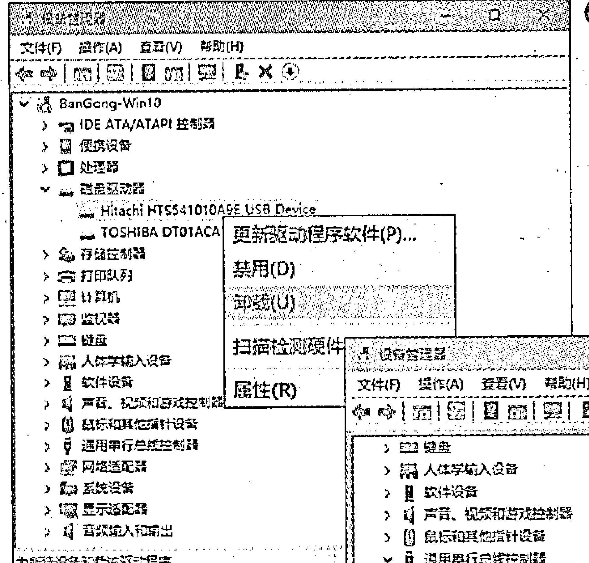

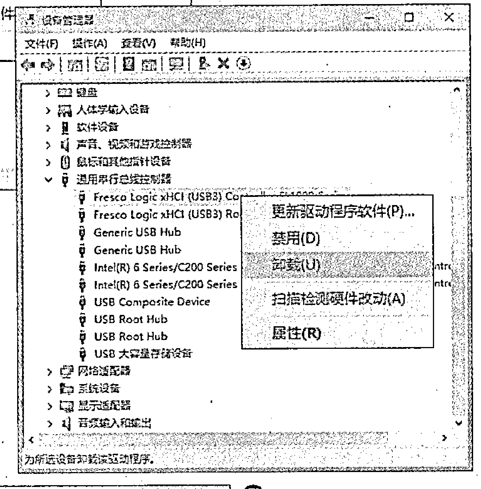

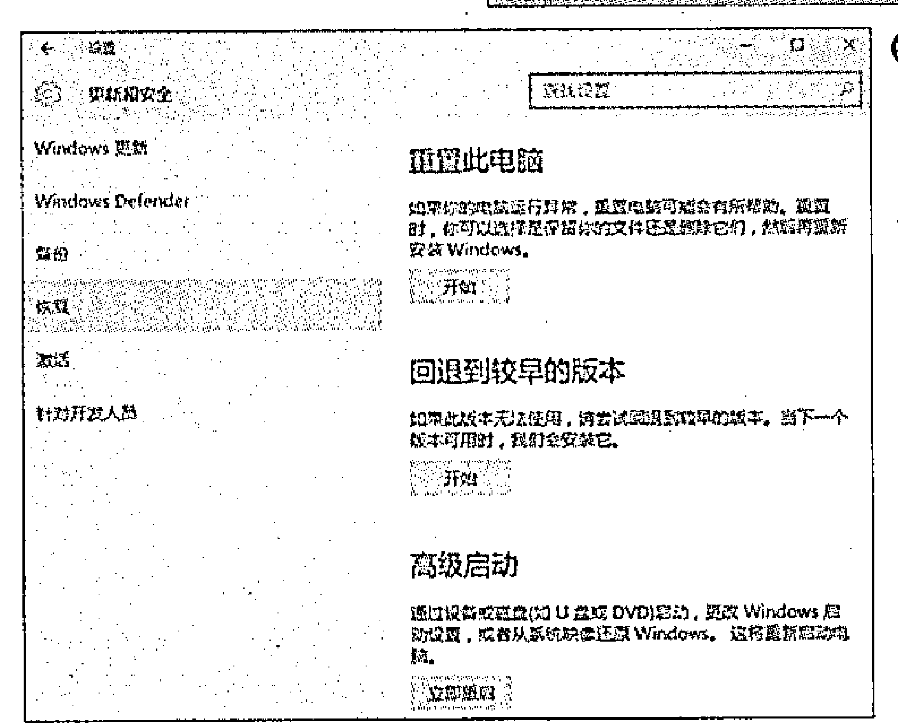

> > **扩展阅读**
>
> 由于目前许多驱动尚无法100%兼容Windows 10，时常可以见到有音频、视频或其他设备出现问题的情况。据微软基础社区和高级社区用户询问和微软技术反馈的情况，在无法用上述方法解决设备兼容问题时，官方一般先建议用户安装设备的官方最新驱动程序，并按上述方法逐条尝试，若仍然无法解决，官方也只能暂时给出“回退到旧版本”的建议，以等待设备驱动的更新或系统的统一更新解决。而对于一些非常老旧的USB设备来说，也许厂商认为没有技术更新的必要，微软也不会将其考虑在升级支持的范围之内，这种过时的不兼容设备，就只能将就着在低版本的系统中使用了。

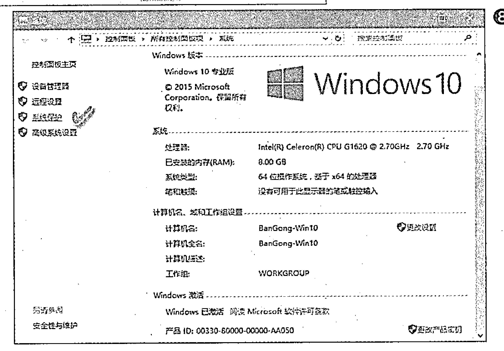

###### 文档阅读 正统之外出路多

文|孟云

通常我们阅读办公文档或看图，总是需要先安装正统的办公软件或专业看图软件，这些软件一般来说“体型”较大。其实，如果我们只是要阅读一下内容而不进行处理的话，完全可以寻求“正统”之外的软件或方法。

###### 1. 增强右键菜单阅读

除了直接在Windows窗口中打开文档外，如果能够直接在文档上单击鼠标右键显示文档内容，是再方便不过的。以右键看图为例，可以用多种方法实现。

给资源管理器安装一个XnShell的看图插件（可按照所用的系统选择安装32位或64位的版本）。安装之后，当右键单击一张图片后，在菜单“XnShell”项下，就会直接看到该张图片的预览信息（图1）。

此外，如果安装了多款与图片格式相关联的应用程序，

> **小提示**
>
> 在不安装办公软件或专用看图软件的情况下，通过资源管理器插件、网络在线服务、邮箱、云盘、万能格式预览工具等，均可实现办公文档或图片文档的阅读。

也可以通过右键菜单的“打开方式”命令，从中选择打开该图片的应用程序，从而快速打开图片文档（图2）。

> 如果预览信息没有出现，可能是在软件设置中未打开预览选项。需要在Options选项窗口中选中“显示菜单项→缩略图（图像）”选项（图3）。

###### 2. “万能”小工具全能读

通过万能文档格式浏览工具Universal Viewer Pro，可以实现用一个软件来预览包括超过170种多媒体视频，以及Word、Excel等办公文件，常见的40多种图片格式，还有其他一些类型文档的预览。这样，我们不用安装那么多软件，就可以在一个浏览器窗口中随意选择查看不同类型的文档内容了。

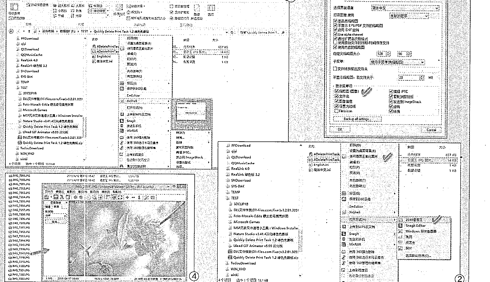

使用时，只需开启这个小软件的窗口，然后从资源管理器中将要预览的文档或图片文件拖动到这个窗口，即可出现预览效果了（图4）。

> 小技巧1
>
> 按F9进入软件的配置窗口，然后选中“资源管理器上下文菜单项目”（图5）。这样，就可以在资源管理器中，通过在文档上点击右键，在右键菜单中选择Universal Viewer，直接调用该软件预览文档了。使用右键菜单预览文档，会比先开窗口再拖动预览更为方便（图6）。

###### 3. “丢”入云盘直接阅读

主流云盘本身具有阅读TXT、PDF等常见文档和图片以及播放视频的功能。如果将文档直接存入云盘的本地同步文件夹中，在需要预览时，登录自己的云盘账号，点击文件就可以直接预览了。

> 小提示
>
> 如果觉得普通的云盘对查看格式的支持种类有限，那么也可以使用专用格式查看类的云盘，例如“易度云”。该云盘不光支持的文件格式多，还支持文档格式的转换。

###### 4. 在线服务在线阅读

通过网络在线服务查看文档，也是一种不用安装软件就能阅读文档的办法。以I Doc View网站为例 (http://www.idocv.com)，当我们需要阅读本地文档时，只需点击该网站的“选择一个文档”按钮，上传文档，即可获得该文档的在线预览地址。访问该地址，网页内即可显示该文档中的内容。如果要预览网上某个文档的内容，只需填写该文档的网络地址，点击“预览”按钮，即可在浏览器内看到该网络文档的内容（图7）。

> 小提示
>
> I Doc View文档在线预览网站支持的文件格式为常用的doc、docx、xls、xlsx、ppt、pptx、pdf、txt办公文档，jpg、gif、png、bmp、tif图片文档，mp3、m4a、midi、wma音频文档。甚至还支持专业图形设计文档dwg、dxf、dwf，就连zip、rar、tar、7z压缩包里的文档也可以预览呢！

在网易126邮箱附件中保存的文档，可通过右键菜单调出“预览”按钮，点击即可直接查看文档内容（图8）。其他邮箱也越来越多加入了文档预览功能。

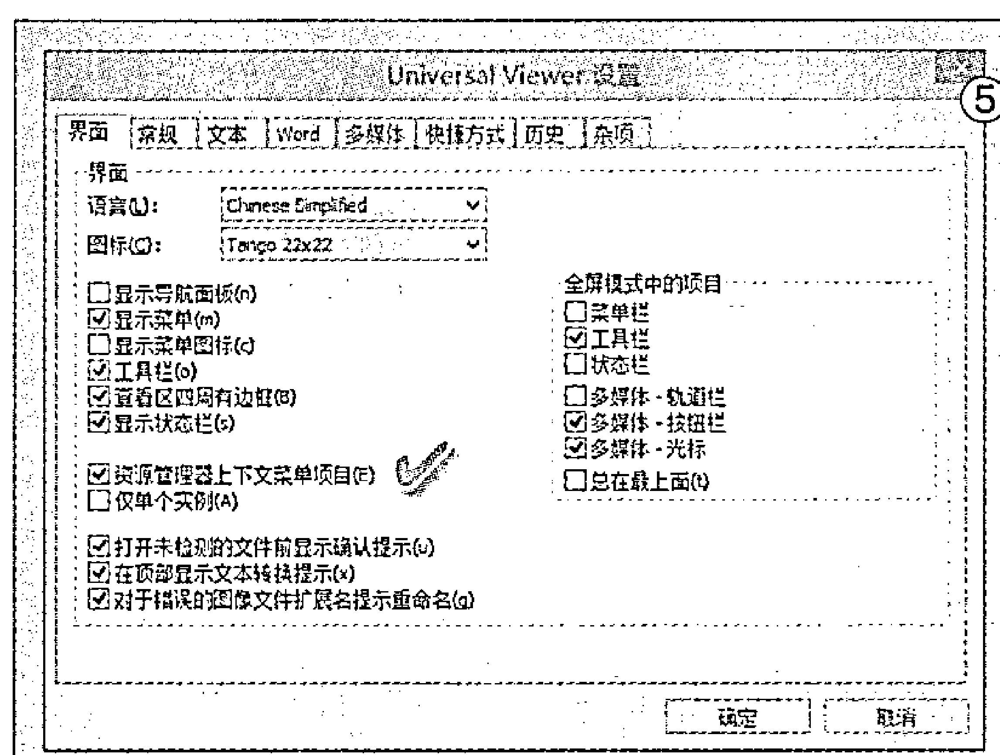

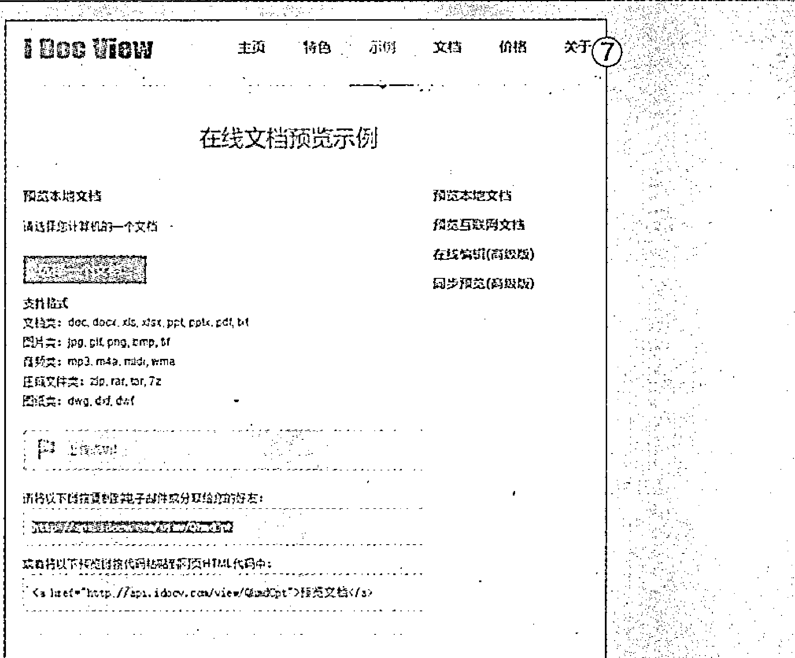

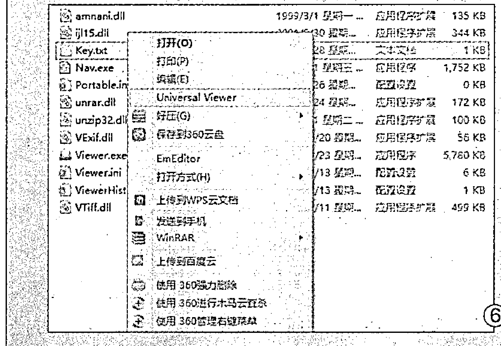

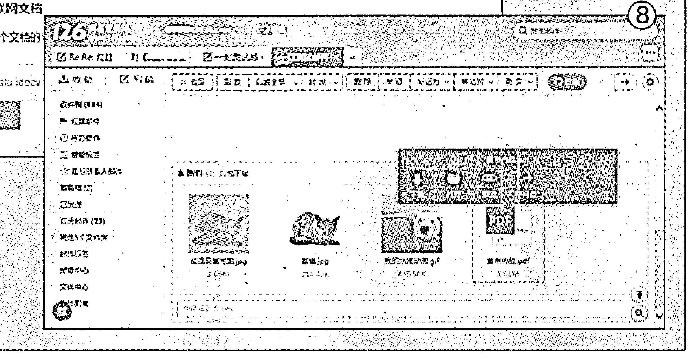

###### 文件夹快速创建另类法则

文|黄金山

创建文件夹的方法，最常用的是系统菜单命令或右键菜单中的新建文件夹命令。其实，这些都是循规蹈矩的笨办法。为了提高效率，我们还可以采取一些另类的创建文件夹的方法。

###### 1. 智能拖动创建文件夹

使用过苹果或Android智能手机的人都知道，目前的智能手机桌面有一个很人性化的文件夹创建功能，当你拖放一个图标到另外一个图标上时，系统会自动创建一个文件夹，并将这两个图标自动置入其中。现在，我们可以借助于一款Smart Folders For Windows软件，让Windows环境下也拥有这种功能。安装了这款软件之后，只需将一个或多个文件拖动到另外一个文件上，即可自动创建一个文件夹，而这些文件都会被自动移动到新建的文件夹中。这时，只需给新建的文件夹起一个合适的名字，就完成了文件的归类工作。

运行软件安装程序后在主界面中点击Install按钮，之后屏幕显示Installed提示（图1），功能添加完成后，即可在桌面拖动图标建立文件夹。拖动两个相同类型的文件图标到一起，这时屏幕提示输入新文件夹名称，输入的名称将自动替代默认生成的Folder 1文件夹（图2）。

需要注意的是，将图标拖动到另外的一个图标上时显示出“移动”文字提示，该功能才有效。

如果要卸载该功能，请再次运行安装程序，在弹出的窗口中点击Uninstall按钮，随后显示Uninstalled，表示功能卸载完成（图3）。

若拖动一个文档到一个应用程序，需要用后者打开前者怎么办？岂不是一样会把两个文件合成文件夹了？这样不就不能用A程序来打开B文档了么？比如，此前把一个Word文档拖到“写字板”图标上就能强制用写字板打开Word文档，而不是用默认的Word打开。这个功能现在不就失效了吗？其实并非如此。

经过试验表明，如果要用该软件实现程序与文档混合归类，请将程序拖到文档图标，而不要将文档拖到程序图标。该软件发生作用后，系统自带的文档拖到程序图标打开文档的功能仍然管用，而程序拖动到文档图标时，则会自动建立归类文件夹。

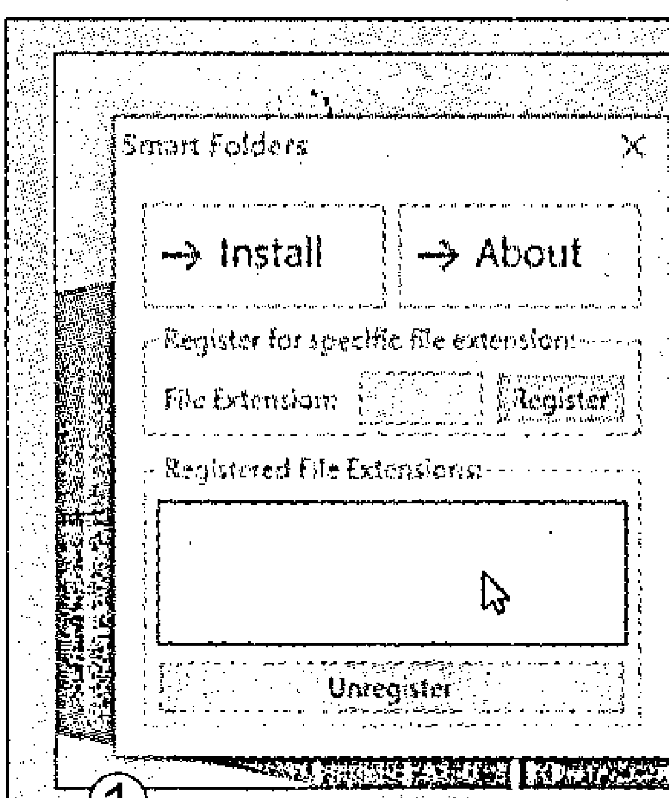

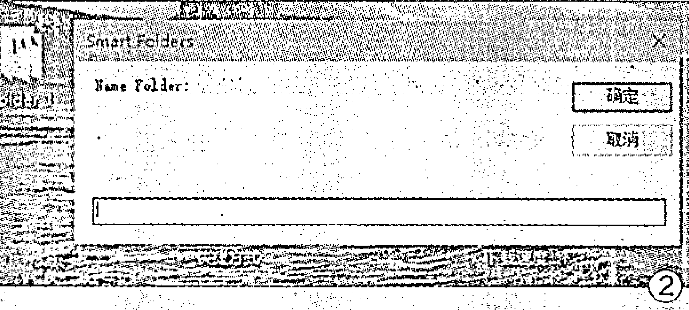

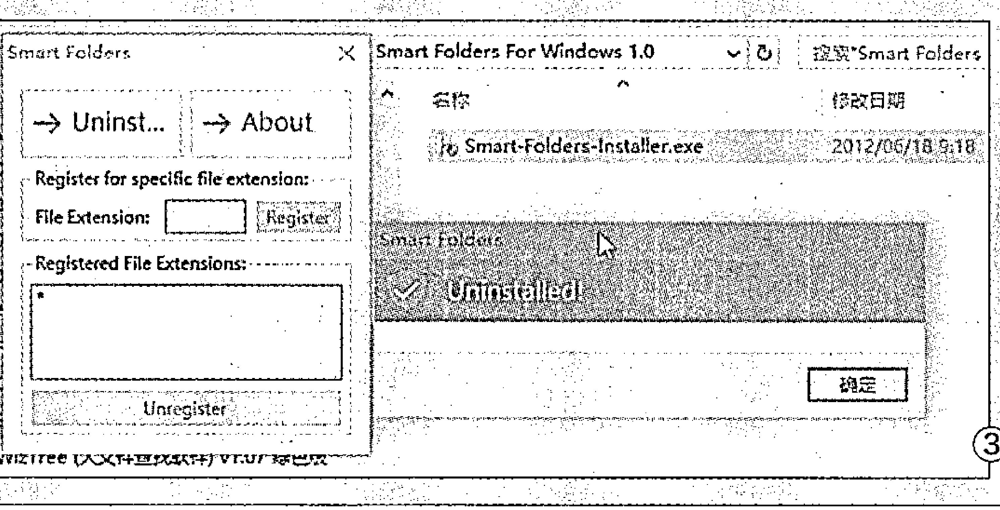另外借助一款Files2Folder软件，可以用右键实现上述功能。安装该软件后，如果选择一个文件并在右键菜单中选择Files 2 Folder命令，将会自动创建一个与该文件同名的文件夹，并将该文件移动到文件夹内。若选择的是多个文件，创建文件夹时会要求用户输入文件夹名称。该软件还支持嵌套文件夹操作，也就是将文件夹归入新建的文件夹中。

##### 2. 自定快捷键创建文件夹

使用低版本的Windows系统创建文件夹，总是需要点击菜单或通过右键菜单选择新建。而现在使用Windows 8.1或Windows 10操作系统，我们只需点击“主页”选项卡下工具栏上的“新建文件夹”按钮，就可以创建一个文件夹了。若用键盘操作，还可用Ctrl+Shift+N组合键来创建文件夹。

但是，这并不表示低版本的Windows中就没有办法。如果你还在使用低版本Windows，希望用其他快捷键来建立新文件夹，可以试一试mdAxelerator这款小软件。该软件运行后退缩为一个任务栏图标，通过它可以任意设置热键，用作创建文件夹的快捷方式(图4)。

##### 3. 两种方法批量创建文件夹

有时我们需要一次性建立一大批文件夹，这时如果手动建立，该是个高强度的“体力”活儿。如果借助于New Folder Wizard这款小软件来建立，效率就会大大提高。New Folder Wizard创建文件夹的方式有5种，分别是使用前缀、后缀、注释、序号和调用文本创建。

启动New Folder Wizard软件，确定要创建的系列文件夹存放的目标文件夹，定义新文件夹的前缀、后缀或数字步进增量参数，点击“预览”按钮查看创建效果，满意后点击“创建”按钮完成创建。

该软件还支持在TXT格式列表的基础上创建成批文件夹。使用时，只需建立一个空白的TXT文件，在其中分行输入文件夹名，从New Folder Wizard中选择“从文本里获取目录名”选项，调用该TXT文件，点击“创建”，即可建立成批文件夹(图5)，但它的缺点是不支持建立多级文件夹。

此外，我们可以用系统自带的内部命令，创建自动批处理来建立成批文件夹。用批处理的方法可以解决多层文件夹的建立问题。

- 使用前缀
- 使用后缀
- 注释
- 序号
- 调用文本创建

首先在任意目录下建一个文本文件“批量文件夹名列表.txt”，内容为要新建文件夹的名称列表，一个文件夹名占一行。如果是多级文件夹就在一行内直接写到最后一个文件夹，例如“ABC\DEF\GHI”。在同一目录下建一个文件“批量新建文件夹.bat”，内容为：

```
batch
echo 请在“批量文件夹名列表.txt”中输入文件夹名(一行一个)后按回车执行
pause
for /f %%a in (批量文件夹名列表.txt) do (md %%a)
echo 批量新建文件夹完成
pause
```

双击运行“批量新建文件夹.bat”文件，批量文件夹就自动建好了。

##### 多管齐下加密文件护隐私
文|阿立

如今的网络安全状况日益严重，不只是存储在网络中的文件可能会被黑客窃取，即使是存储在本地硬盘中，同样也面临被窃取的风险。所以，对重要的文件进行加密保护就显得格外重要。下面我们以使用者不同的环境给出一些解决方案，供大家根据实际需求参考选择。

##### 压缩软件暂解燃眉之急

说到文件加密，很多人第一反应就会想到各种各样的专业加密软件。其实对于普通用户而言，最常见的加密软件也就是我们每天必然要用到的压缩软件（如WinRAR）。当我们通过鼠标选中某个文件或文件夹的时候，点击鼠标右键选择菜单中的“添加到压缩文件”命令。在弹出的对话框里面点击“设置密码”按钮，在新的对话框里面输入文件的加密密码，接着再输入一次密码进行确认操作。为了保护文件的相关信息，我们还可以选择“加密文件名”项，最后连续两次点击“确定”按钮就可以完成加密操作了（图1）。

当用户需要对文件进行加密时，只需要启动Encrypto（下载地址：http://macpaw.com/），接下来通过鼠标将文件或文件夹拖拽到软件的窗口中就可以了，很方便吧。当加密文件添加完成后，软件会提示用户设定一组密码。如果用户记性不太好的话，还可以设置一个密码提示。所有的设置完成后，点选“Encrypt”按钮就可以开始进行加密操作了（图2）。由于软件使用的是AES-256加密算法，因此加密文件的体积越大，加密时间就越长。

##### 专业加密也能“多快好省”

通过压缩软件进行加密操作，只能算是权宜之计。如果需要长期对文件进行加密操作，还是使用专业的加密软件比较稳妥。提起专业的加密软件，很多人都会联想到复杂的操作，其实类似Encrypto这样的加密软件，不但操作简单且免费。

文件加密处理完成后，会在软件窗口的左上角出现一个提示。点击窗口中的“Save as”按钮，就会生成一个Crypto后缀名的文件（图3）。当然由于Crypto后缀名的文件非常特殊，因此在进行解密的时候仍然需要Encrypto软件。操作方法和加密文件的时候类似，只需要把要解密的文件拖拽到软件窗口释放，输入相应的加密密码后就可以进行解密了。

解密成功后也必须再次点击保存命令，才可以将解密的文件保存到指定的目录里面。

##### 批量加密——创建磁盘加密分区

Encrypt这款软件虽然非常专业，但是如果用户有很多文件，一个个进行加密自然是非常繁琐。创建一个磁盘加密分区，然后将需要加密的文件移动到此也是个不错的选择。

> 小提示：磁盘加密软件以前人们常用TrueCrypt，但是在去年‘TrueCrypt带有后门’的新闻出现后，TrueCrypt的作者已经停止了这款软件的开发。不过最近有报道声称，经过安全人员的分析研究后发现，这款软件‘比人们想象的更加安全’。

磁盘加密软件TrueCrypt已经停止开发，不过我们还是可以使用它的衍生版本VeraCrypt，而且这款软件支持最新的Windows 10系统。

首先下载安装VeraCrypt的最新版本(https://veracrypt.codeplex.com)，点击操作界面‘Settings’菜单中的‘Language’按钮。在弹出的对话框列表里面选择‘简体中文’项，接着点击‘OK’按钮就可以切换到简体中文的界面了（图4）。现在点击软件主界面中的‘创建加密卷’按钮，这时软件会弹出一个创建加密分区的向导窗口。对于进行磁盘文件的加密操作，这里选择‘创建文件型加密卷’项。点击‘下一步’按钮后选择‘标准VeraCrypt加密卷’，再点击‘下一步’按钮选择‘选择文件’按钮（图5）。在弹出的对话框中设置一个文件名后，点击‘保存’按钮就可以创建一个加密分区的镜像文件了。

接下来再点击‘下一步’按钮，用户可以根据自己的需要设置文件加密所使用的算法（图6）。继续点击‘下一步’按钮，在‘加密卷大小’选项中设置加密分区的大小（图7），这里特别需要提醒大家的是，设置大小的时候一定要看清楚单位（比如是MB还是GB等）。然后再点击‘下一步’按钮，设置访问加密分区所使用的密码信息（图8）。如果用户设置的密码过于简单或简短，软件会要求用户重新对密码进行设置的。最后对加密分区进行格式化，从列表中选择文件系统的格式，点击‘格式化’按钮就可以了。经过一段时间的处理操作以后，软件会弹出一个提示窗口，关闭该窗口返回到VeraCrypt的主界面。

以后当用户需要进行文件加密处理的时候，首先在VeraCrypt主界面的磁盘列表里面选择一个盘符，点击窗口中的‘选择文件’按钮来选择上面创建的加密分区的镜像文件。点击‘载入’按钮就可以对文件进行加载，这时会弹出一个对话框要求输入密码。只有在正确输入访问密码后，在系统的磁盘列表中才可以看到加密分区的盘符，接下来将需要加密的文件复制或剪切到这个加密分区里面就可以了。

当我们离开电脑的时候，点击VeraCrypt主界面中的‘卸载’按钮。加密分区就处于一个关闭的状态，这样无论是用户还是软件都看不到其中的文件内容了。

##### 不装软件 云端玩转PDF
文|倚楼

PDF是一种很常见的文件格式，同时也是一种非常特殊的文件格式。正是由于它的特殊性，因此对它的编辑、转换等操作，都需要借助于某些特殊的软件。可是我们除安装常用的PDF阅读器外，很少会安装这类特殊的软件工具。所以一旦要对PDF文件进行编辑操作就会很棘手。那么如何才可以快速玩转PDF的各项操作呢？其实不用装软件，通过云端服务就可以解决。

##### 文件格式的转换

对于PDF这种文件格式而言，除了最常见的阅读以外，文件格式的转换就是很多人遇到的问题。其实无论是微软的Office还是WPS Office的最新版本，它们都可以直接将Office文件转换为PDF文件。而如果用户使用的是最新的Windows 10系统，那么在打印机列表中可以看到“Print as a PDF”项，通过它可以把文件“打印”成为PDF文件(实际就是转换)。那么在没有这些条件的情况下，如何利用云端实现转换操作呢？

首先通过浏览器登录到云端服务ilovepdf(http://www.ilovepdf.com/)的首页，云端服务会通过对系统语言进行自动分析。很快在左下角弹出一个“中文(简体)”的提示框，点击该提示框以后就会跳转到简体中文的操作界面。如果没有自动进行跳转的话，用户就需要点击右上角的“Menu”按钮，接着在弹出的菜单里面选择“Language”中的“中文(简体)”命令即可。这时我们在网页里面就可以看到包括“Word转换为PDF文件”等项目(图1)，点击该命令后在弹出的操作页面点击“选择Word文件”按钮，接着从弹出的对话框中选择需要转换的文件。

当文件被成功添加到操作页面后，首先需要用户对其进行预览操作，避免错误的选择造成时间浪费。如果发现错误地选择了文件，那么将鼠标移动到文件图标的右上角，在悬浮框里面点击“删除这个文件”命令即可(图2)。当所有的准备都完成后，点击“转换为PDF文件”按钮后就开始上传和转换。文件转换成功，网页将自动弹出文件保存的对话框，这样就可以将转换的文件保存到本地系统中了。与此同时，云端服务还会生成一个分享链接，这样就可以非常方便地发送给其他用户，不过这个分享链接只有一个小时的有效性(图3)。

> 小提示：也可以直接在磁盘列表里面选择文件，接着拖拽到操作页面里面释放进行上传。但是支持这项操作的前提是，使用的浏览器支持最新的HTML5技术才行。

##### 分割提取PDF片段

很多用户从网上下载PDF文件其实并不是整个文件都

需要，而只是需要其中的一篇文章或者一部分内容，此时就涉及到文件的分割操作。那么利用云端服务如何实现PDF文件的分割操作呢？

首先点击ilovepdf首页中的“拆分PDF文件”命令，在弹出的页面中按照刚刚的方式来上传文件。对于没有进行注册的用户来说，系统只允许上传体积不超过80MB的文件。成功添加文件以后，在页面中可以看到“按范围拆分”和“提取所有页面”两项。并且在“拆分范围”里面会显示出文件的所有页码信息。而我们只需要在“拆分范围”里面输入需要的页码范围即可，当我们在其中输入一个页码后，就会自动显示出这个页码的缩略图，从而帮助用户确认是否为自己需要的页码（图4）。

如果用户需要从PDF文件里面提取多个部分的内容，那么就点击下面的“添加范围”按钮，然后输入其他需要拆分的页码信息。设置完成后点击“拆分PDF文件”按钮，这样就开始进行文件的上传和分割操作。由于PDF文件的体积都比较大，因此上传需要比较长的时间，用户可以利用这段时间干些其他的事情。当PDF文件上传分割完毕，后面的事就是下载分享分割好的PDF文件了，非常简单。

> 小提示：在前面进行PDF文件分割的时候，如果想把分割的部分直接进行合并，那么就选中“合并范围中的所有文件为一个PDF文件”选项即可。

##### 合并多个PDF文件

我们常说“分久必合合久必分”，这种事在PDF文件的处理上也会遇到。当我们拥有众多的PDF文件“小碎片”后，为了管理起来更加方便，自然会把一些内容相似的“小碎片”合成一个整体。

首先点击ilovepdf首页中的“合并PDF文件”命令，根据提示分别选择要合并的文件。对于没有进行注册的用户来说，系统最多只允许上传15个文件，不过对于普通用户来说应该足够了。成功添加的文件可以在页面中显示出预览图，这样我们就可以大致了解到文件的内容。既然要进行文件的合并，因此文件排序就非常重要。点击页面右上角的“更改为列表视图模式”命令，这样在PDF文件的缩略图的右下方就可以看到一个按钮，点击这个按钮就可以进行文件顺序的调整（图5）。所有的操作完成后，点击“合并PDF文件”按钮，即可开始文件的上传和合并，完成后就可以下载或分享合并好的PDF文件了。

##### 给PDF电子书添加页码

如果是重新合并或编辑的PDF文件，由于它们使用的还是以前的页码，这样看的时候就会有些莫名其妙。所以为了方便用户的阅读，插入新的页码信息就非常重要。

在ilovepdf首页点击“页码”命令，并在弹出的页面中上传需要标注页码的文件。成功添加文件后，根据提示分别设置相应的选项。比如常见的PDF文件并不是像图书一样对开的，所以在“页面模式”里面就应该选择“单页”。如果是重新合并的PDF文件，它的首页肯定不会是封面，所以在“第一页是封面”里面选择“否”（图6）。接下来根据需要设置页码的字体大小和颜色等，最后点击“添加页码”按钮，就开始将文件上传到云端并进行处理啦，最后下载保存即可。

##### 经典重现 软件还是老版好

软件开发商为了吸引用户，不断在软件中加入各种各样的功能，但是许多所谓的功能，用户并不见得需要，有时反而显得非常累赘，白白占用了大量的系统资源。于是有不少人开始怀念旧有的版本，只是却无从寻觅了。下面我就教大家几个寻找软件经典版本的途径。

##### 专业网站寻寻觅觅

有些软件，如最新版本的uTorrent，居然捆绑了一个比特币挖矿机软件。作为一款下载软件，只要可以顺利地下载文件，并不一定非要时常更新版本的。好在国外有一些专业的老版本下载网站，我们可以试着去这些网站寻找软件的老版本。

首先在浏览器中登录www.oldversion.com，点击右上角的“English”，在弹出的菜单中点击“中国的”，将网站切换到中文界面。网站的首页中有很多的软件分类，而每一个软件分类里面包括大量常见的软件程序，比如Utilities这个分类里面就包括WinRAR、WinZip、FlashGet等（图1）。也可以直接通过网站的搜索功能进行寻找，在搜索框输入uTorrent，点击“Find it”按钮或者直接回车就可以了。

在搜索结果中可以看到和uTorrent相关的一些软件，找到uTorrent后点击软件名称的链接，在弹出的页面中就可以看到相关的软件介绍，以及该网站推荐的几个经典的老版本（图2）。我们滚动网页到下方后即可看到软件的版本列表，从中找到自己需要的老版本后，点击版本号的链接，再在打开的新网页中点击“Download Now”按钮就可以进行下载了。

##### 从下载链接中寻找

虽然OldVersion.com是一个国外的网站，但是也可以找到一些国内的软件，比如FlashGet、BitComet、Maxthon、Foxit PDF Reader等。但是这些软件必须是多语言版本，或者纯粹的英文版本才可以。如果是QQ、WPS、输入法等纯中文软件就找不到了，这时可以试试其他的办法。

很多软件升级后，老版本并没有从官方的服务器中删除。我们只要找到软件统一的下载链接，将其中的关键地方进行替换就可以了。假设我们想下载一个QQ拼音纯净版的老版本，首先进入到QQ拼音纯净版的官方主页。点击网页中的“查看更新日志”链接，就可以看到纯净版以往的版本号，从中复制出自己需要的版本号信息（图3）。

通过对当前版本的下载链接进行分析，就可以知道QQ拼音纯净版下载地址的固定格式为“http://dl_dir.qq.com/invc/qqpinyin/QQPinyin_Setup_版本号.400.exe”，所以我们将需要的版本号填入到链接里面就可以了。如果想要下载1.1.1228这个版本，就将下载链接修改为http://dl_dir.qq.com/invc/qqpinyin/QQPinyin_Setup_1.1.1228.400.exe，然后复制到下载软件里面进行下载即可（图4）。

##### 更安全 照片存放私有云
文|倚楼

很多人家都有一些比较老旧的电脑，如果直接卖掉也值不了多少钱，所以还不如干脆用它作为一个数据备份机。通常情况下想要备份数据，不是通过闪存盘等移动设备就是通过网络进行操作。当通过网络进行备份，一般需要经过公共的云端服务器进行中转，不过让数据在网络上多停留一会就多了一份风险。本文的方法，则可以让你在将移动终端接入家中局域网的时候，不需要经过公共网络就能自动将手机相册中的内容同步到家中的备份电脑上。

##### 安装数据备份服务端

既然想把家中的某台电脑作为备份机，首先就需要在其上安装一款同步软件。笔者使用的同步软件是Daemon Sync，它最大的特点就是不需要服务器进行中转，直接就可以实现点对点的数据同步操作。首先从官方网站下载Daemon Sync的电脑版，安装完成后软件会自动弹出一个网页窗口，这其中就会显示出一个随机的验证码，这样移动终端的应用通过它就可以和服务端进行配对（图1）。如果用户还想要对服务端进行进一步的配置，可以点击网页上方的“Settings”按钮。在“Server name”选项后面设置服务端的名称，这样可以更好地对不同的服务端进行区分（图2）。接着点击“Storage”选项后的按钮，在弹出的列表对话框中可以指定同步文件的保存路径，以后所有上传的文件都将保存在该文件夹下。

##### 移动终端匹配服务端

接下来在自己的手机上面，通过豌豆荚等应用商城，安装Daemon Sync的移动应用。现在保证服务端和移动终端处于同一个局域网里面，然后启动移动应用就开始自动扫描局域网中的所有服务端了（图3）。当服务端扫描完成后，用户从列表中选择一个要同步的服务端，这时移动应用就会要求用户填入刚才电脑上显示的4位验证码（图4）。如果用户需要更换服务端的话，首先点击右上角的设置按钮，在弹出的菜单里面选择“更改服务器”命令后，就会重新进行扫描并让用户选择服务端。

##### 同步设置及相关操作

在第一次配对成功后，移动应用会弹出一个配置窗口，要求用户进行简单的配置。我们主要点击“要同步什么”这个选项，应用默认已经选择了照片、视频和截图等选项（图5）。如果用户还想要同步其他信息的话，点击列表中的“自定义资料夹”命令，在弹出的窗口中点击右下角的“添加”按钮，再从弹出的列表窗口选择要同步的文件夹目录即可。设置完成后，手机上的设定文件将自动上传到电脑上用户刚才指定的文件夹中去。

当用户在电脑中进入到设定的存储文件夹后，会发现不同的移动终端文件会以各自的设备名称，存储在不同的文件夹里面进行区分。以后当移动终端接入到同一个局域网后，移动应用就会自动将文件同步到电脑里面，从此以后再也不需要验证码进行配对了。除此之外，移动终端会定时扫描同步目录，一旦发现新的文件就会进行同步备份。当然用户点击应用主界面的“同步”按钮，也可以手动进行同步操作。

##### 资源定位切换 要更快更准
文|李峰

日常操作电脑总要涉及到各种文件夹，由于对文件夹操作的频率很高，因此若能快速定位目标文件夹，会提高整体操作效率。例如快速定位快捷方式所在的文件夹，快速跳转到常用的一些文件夹，这些都有技巧。通过专用的小工具或适当修改注册表，可实现这种快速访问。

###### 1. 快速定位目标文件夹

要快速定位并打开快捷方式所指向的文件夹，在Windows Server平台或目前使用的Windows 8.1、Windows 10环境下，可在快捷方式图标上点击鼠标右键，选择“打开文件所在的位置”来方便地定位（图1）。但有时该功能会无故地消失，此外使用低版本Windows的人发现，系统下本来也没有这个选项，要定位到快捷方式所在的文件夹，只能右击鼠标选择“属性”，然后在文件属性对话框的“快捷方式”页点击“查找目标”来定位。其实遇到以上情况，可通过修改注册表，添加右键菜单的“打开文件所在位置”选项。

运行REGEDIT命令打开注册表编辑器，依次定位到如下分支“HKEY_CLASSES_ROOT\lnkfile\shellex\ContextMenuHandlers”，右键单击ContextMenuHandlers，新建一个项，命名该项为OpenContainingFolderMenu，将其值设为{37ea3a21-7493-4208-a011-7f9ea79ce9f5}（图2）。关闭注册表编辑器后重启电脑，在快捷方式的右键菜单中就会出现直接访问所在文件夹的项目了。

###### 2. 快速到达常用文件夹

将资源管理器图标固定在任务栏上访问，虽然方便了一些，但要定位到其中的程序、文件夹或文档等，还得从目录树、驱动器或文件夹中挑挑拣拣。而如果将自己常用的资源建立快捷方式放在桌面上，又显得比较乱。借助于一款Folder Menu软件，可以实现资源访问入口的灵活定制和快速访问。

安装Folder Menu后它会以一个图标方式退缩到任务栏系统托盘上，在图标上单击左键可以弹出快捷访问资源的多级菜单（图3）。
资源快捷访问菜单的项目并非一成不变，我们可以随时将自己常用的项目添加到这个菜单中。右键单击系统托盘图标，选择“编辑”可以打开配置窗口，添加或删除菜单项（图4）。

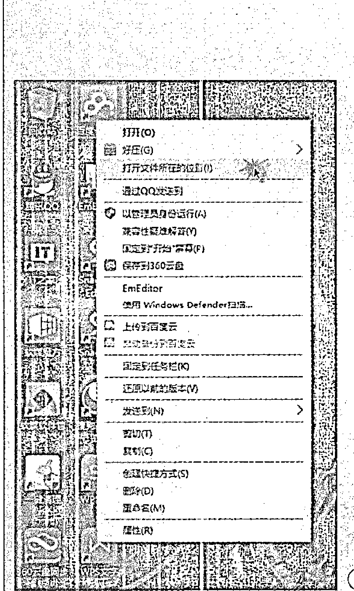

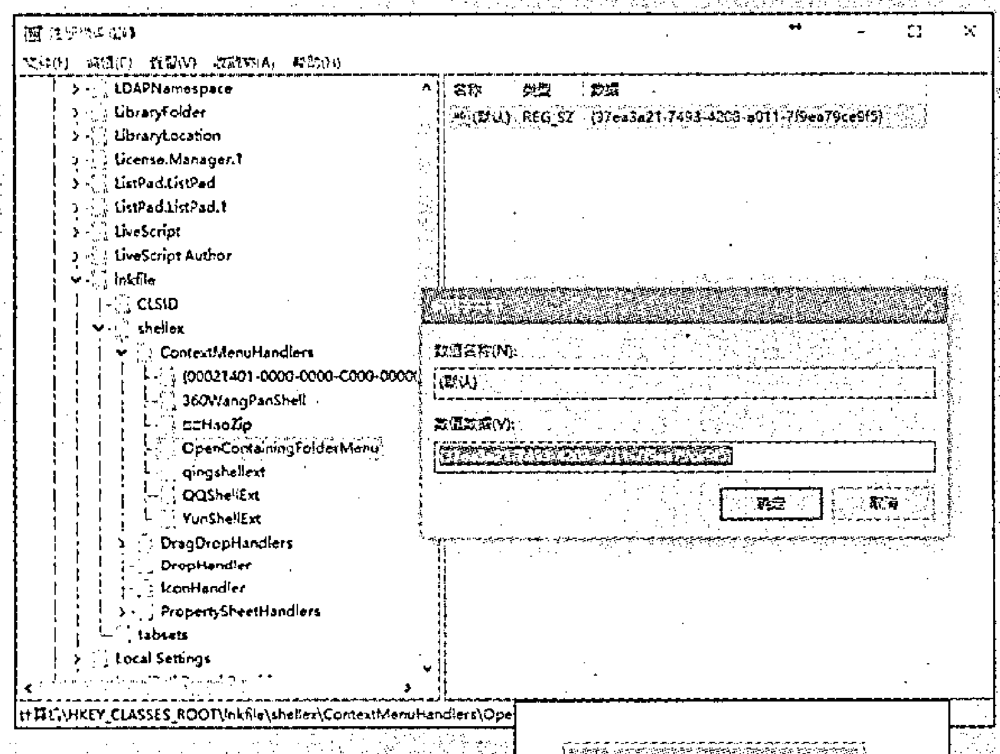

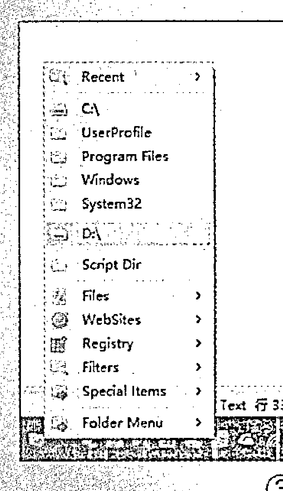

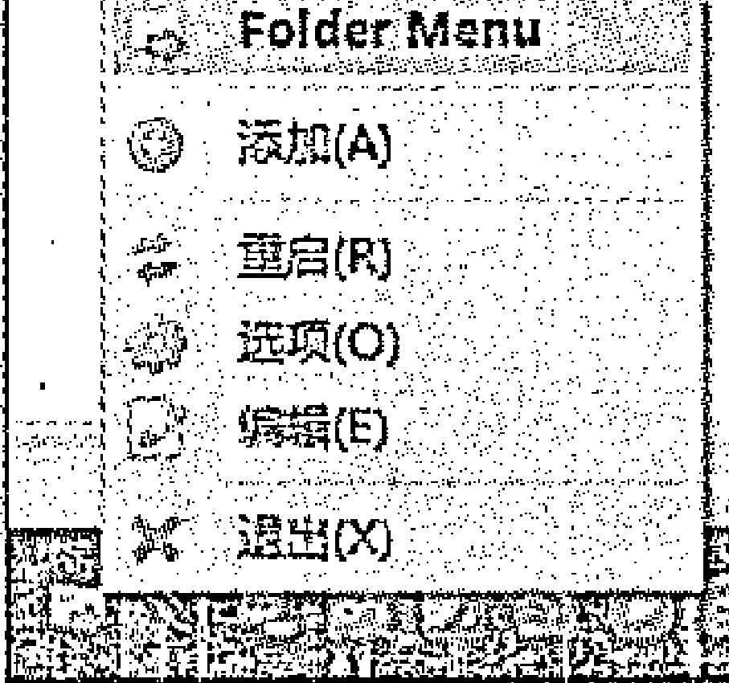

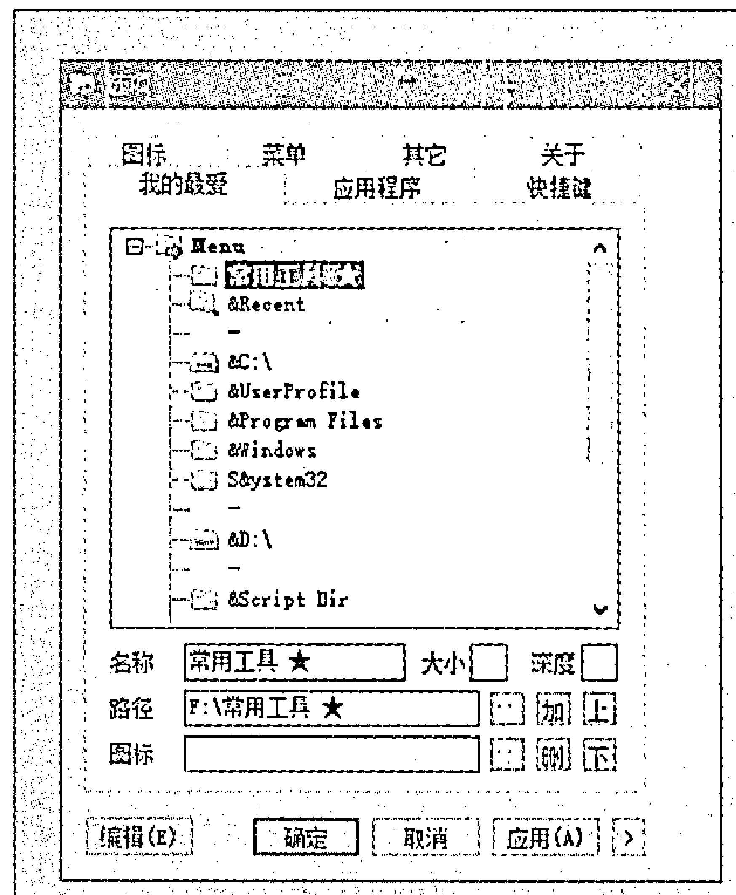

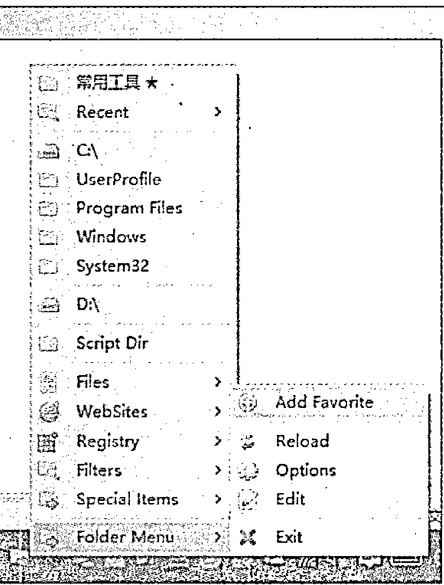

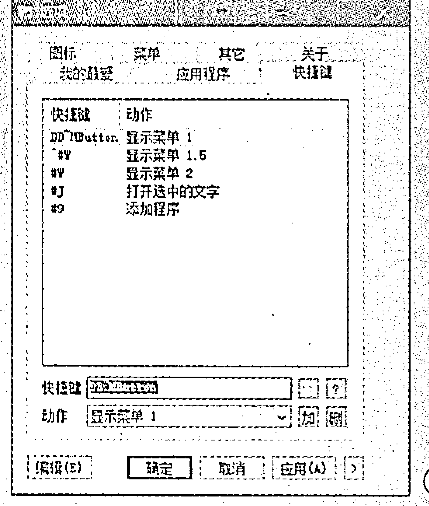

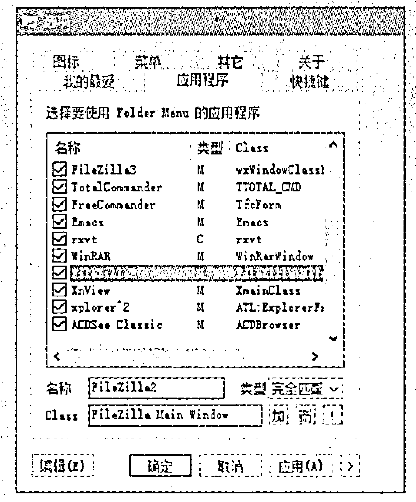

盘的Folder Menu软件图标，弹出软件设置菜单（图4）。选择“选项→我的最爱”，在自定义设置界面中，把自己常用的文件夹或程序拖进去即可。这时在窗口下方的“名称”和“路径”将会自动显示出来。当然，也可以手动输入名称和路径，添加自己想要的项目（图5）。

> 打开Folder Menu快捷菜单后，按住Ctrl在目标文件夹上点击，Folder Menu会以菜单形式列出目标文件夹下的文件夹和文件。如果大写开关已开启，则不用按住Ctrl键。

如果当前正在使用一个文件夹或文件，而希望将这个文件夹或文件添加到Folder Menu的快捷菜单中，还可以点击系统托盘Folder Menu图标，选择“Folder Menu→Add Favorite”，然后拖动文件夹到弹出的窗口（图6）。

> 我们可以定义一个更为便捷的调用资源快捷菜单的方式——将鼠标滚轮的双击动作定义为调用资源快捷键。具体方法：在Folder Menu设置窗口的快捷键定义中，在鼠标滚轮定义参数前加上“DB”，定义为“DB-MButton”（图7）。这样就可以在桌面或资源管理器中随时双击鼠标滚轮启动资源调用快捷菜单了。

###### 让更多的应用程序支持快捷调用

默认的情况，Folder Menu已经能够支持在文件资源管理器、命令提示符窗口、打开或保存对话框、WinRAR、7-Zip、TC、XnView、xplorer2、Free Commander、ACDSee等常用软件中，用上述鼠标滚轮点击法来调用资源快捷菜单。如果希望能够有更多的程序支持这一功能，可通过软件的选项窗口点击“应用程序”选项卡，然后拖动应用程序主程序文件到该窗口，或者手动填写“名称”和“Class”项目，尝试在该软件中用鼠标滚轮开启快捷菜单（图8）。如果兼容，就能在该软件中使用文件资源快速调用功能了。

##### 文件同步不那么简单

文|何涛

要将大象装冰箱分三步：打开冰箱，放入大象，关上冰箱。这是一个小品笑话，但也反映了人的基本简单化思维。而要将两批文件进行同步，也许有人会说和大象装冰箱一样简单。其实细究起来，文件同步不是想像中那么简单。根据需求和环境的不同，文件同步有不同的讲究。

###### 1. 本地两批文件的同步

如果要将本地的两个文件夹进行内容同步，可采用两种基本方法。一是用好Windows的自动覆盖功能，二是借助同步软件来完成。

假设有两个文件夹TEST1和TEST2，里边有数量和内容不同的文件，我们的目的是要求两个文件夹中都有一样的文件，且保证文件的版本处于最新。以Windows 10系统为例，如果使用系统自带的功能，可执行如下操作。

复制TEST1下的所有文件，然后切换到TEST2文件夹下，执行粘贴。这时，如果TEST1中有的文件TEST2中没有，则会不提示自动拷贝到TEST2；如果TEST1中有的文件TEST2中也有，文件名相同但内容不同，则会弹出如图所示的操作提示（图1）。这时，可以通过窗口中列出的两个同名文件的修改日期来判断文件的版本新旧。如果TEST2中的文件更新，则选择“不要复制”；如果TEST1中的文件更新，则可选择“复制和替换”。之后，可用同样的方法从TEST2中复制文件，对TEST1文件夹进行反方向操作。这样就能保证两个文件夹中的文件相统一。

以上用手动同步两个文件夹，操作比较繁琐且容易出错，弄不好就会将有用的文件或内容覆盖掉。为避免这种情况的发生，可借助于同步软件Beyond Compare来完成两个文件夹的同步。

启动软件后显示会话选择窗口，在其中选择“同步文件夹”一项（图2）。然后进入文件夹同步窗口，在左右两侧分别加载要同步的文件夹，下方窗格会立即自动显示两个文件夹中文件的不同之处，单击窗口中部的“立即同步”按钮，即可快速实现两个文件夹的内容同步（图3）。

> 还有一种特殊情况，就是自己也不确定这两个日期不同的文件是否都有保留的必要。这时为保险起见，可保留两个版本的文件，选择“复制，但保留这两个文件”。这样，它会自动将同名文件中的后一个命名为加序号(2)后缀的文件。

###### 2. 网上两批文件的同步

如今的文件不单单是保存在本地磁盘，许多人会将文件保存到网络空间中，而且为了安全起见，还会在不同的存储空间中保存2个甚至更多备份。这样，就需要保证网上两批文件也能保持内容相同。存放在网络云空间中的资源同步分为同类云盘的资源同步和不同类云盘的资源同步。

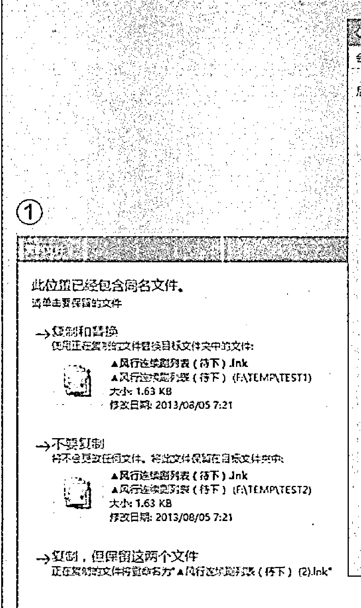

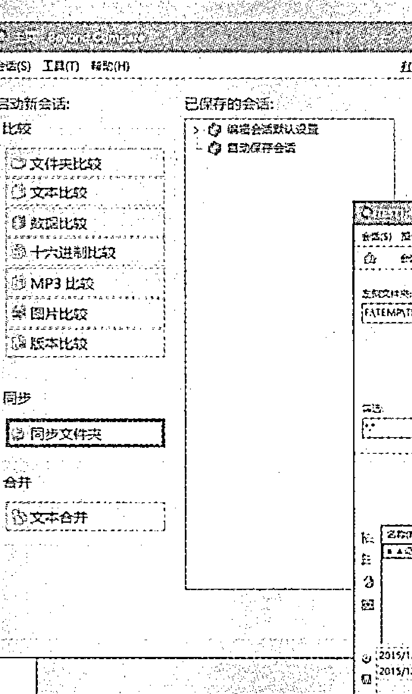

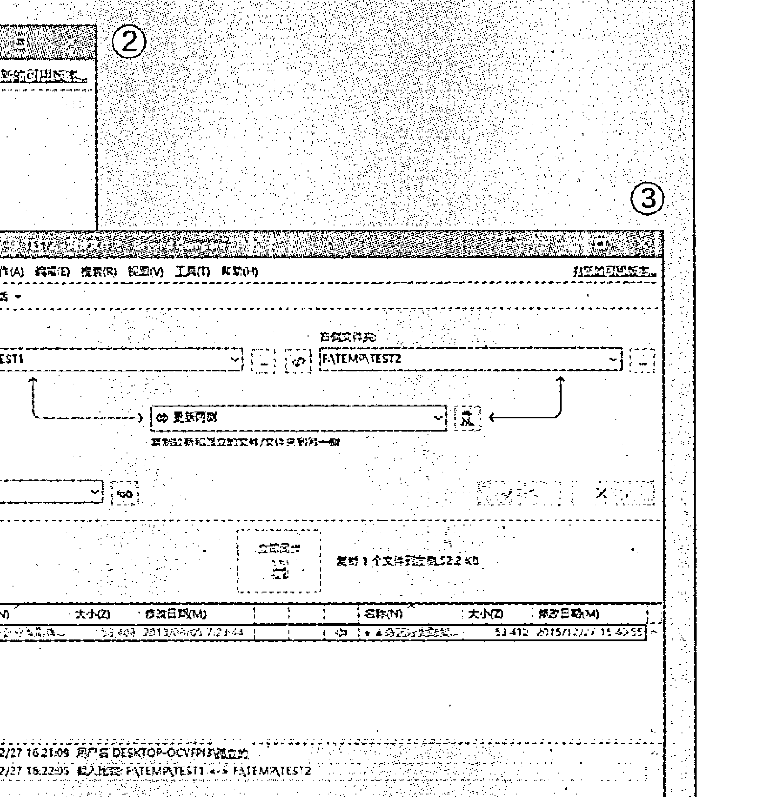

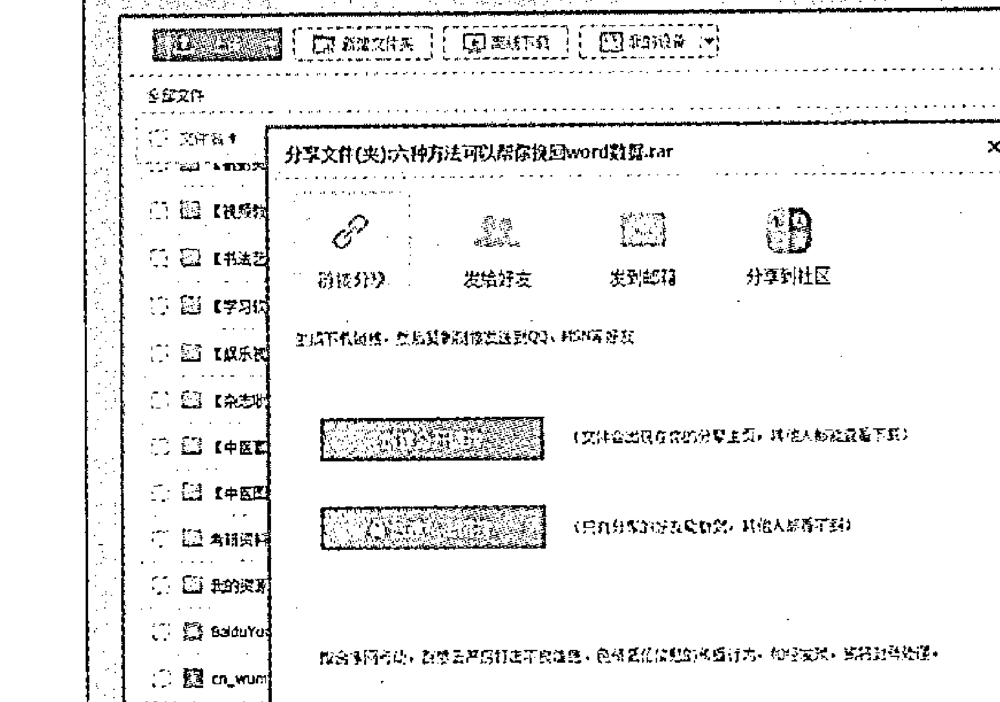

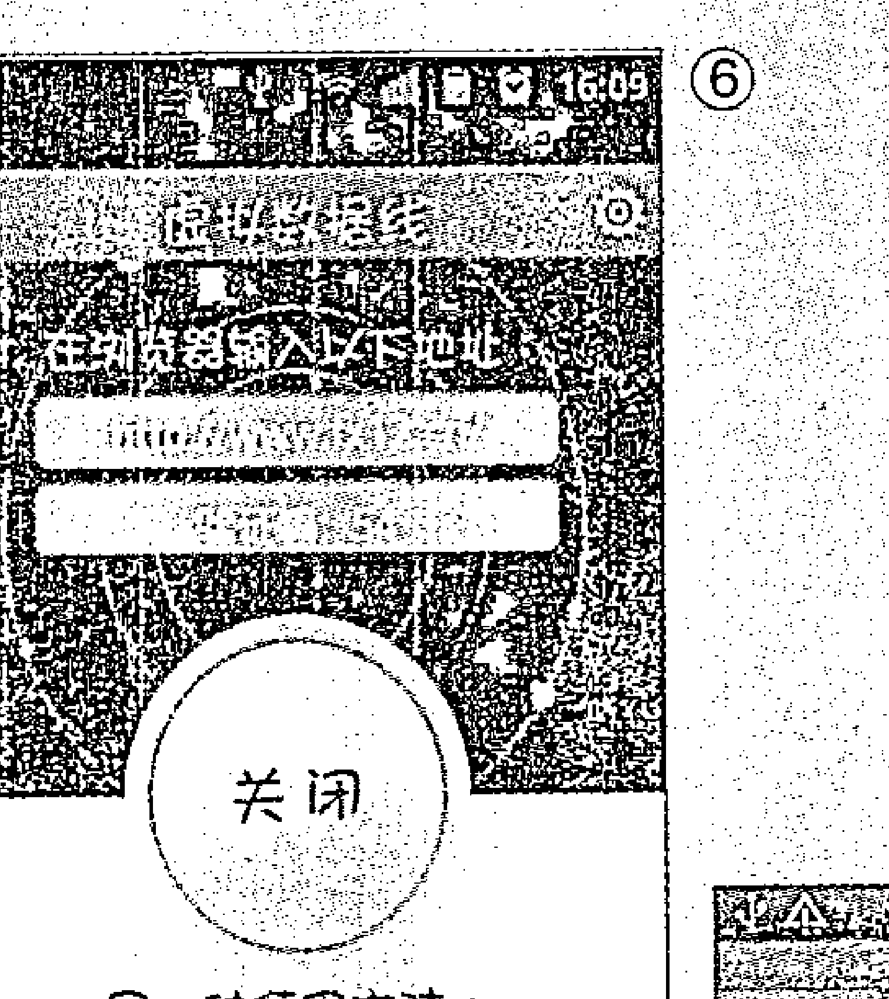

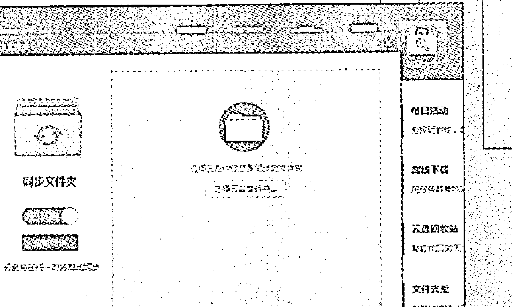

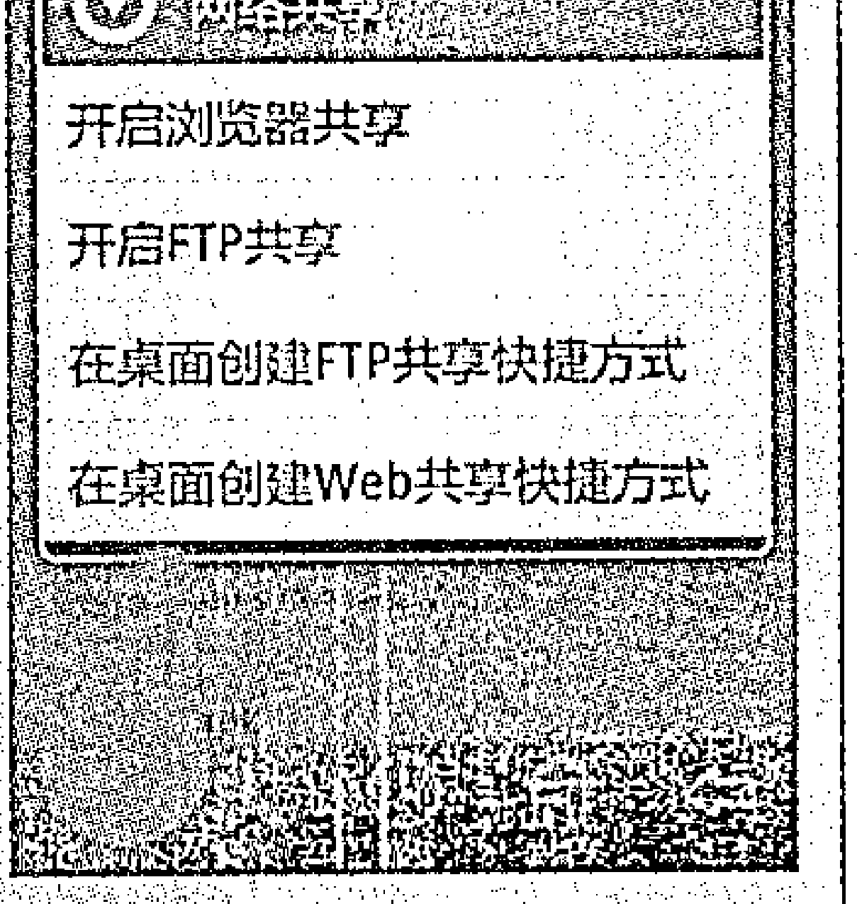

对于同类云盘的两个不同账号，如果要保持其内容同步，可先将一个云盘中的文件夹生成加密共享链接（图4），然后在另一个云盘中访问这个资源链接，将链接所指向的文件夹保存到同名的网络文件夹中。这样一来，若存在同名的文件，云盘会自动生成一个带序号的备份文件或给出处理提示。之后进入云盘，按照日期对重名文件进行取舍即可。

对于不同种的云盘资源，可借助于共享云盘本地同步文件夹的方法，实现两种云盘资源的互通。共享本地文件夹之后，遇到版本相冲突的文件，云盘会在自己的文件夹下建立

###### 3. 本地与网络文件同步

本地资源与网络空间中文件的同步，可借助于云盘的文件夹同步功能来完成。以360云盘为例，在“功能大全”窗口下选择“同步文件夹”，然后指定要同步的本地文件夹和云盘中的同步文件夹，两端的文件夹下的文件就会自动保持同步（图5）。

###### 4. 跨越不同设备的同步

在目前多平台共存、移动为王的时代，跨越不同设备、不同种类系统之间的文件同步具有普遍意义。在不同设备之间，除了利用蓝牙、远程控制资源同步外，还可使用一些专门的软件如“虚拟数据线”、“文件大师”等软件来实现文件的共享和同步。

以“虚拟数据线”为例，在Android设备上安装此软件，启动该软件后，软件会给出一个含有地址和端口号的FTP服务地址，另有一个含有http网址和验证码的服务地址；在PC资源管理器内输入FTP地址，或在PC网络浏览器内输入http地址，即可在Windows窗口中出现一个Android设备的资源窗口。这时，就可以在PC文件窗口和Android文件窗口之间进行文件交换操作，从而实现跨越设备和平台的文件同步（图6）。

如果在苹果iOS设备与其他设备之间同步文件，可安装“文件大师”APP。“文件大师”APP有Android和iOS不同类别的版本，在相应的设备上安装此软件对应版本的APP，也会出现类似于上述虚拟数据线的浏览器或FTP文件共享类的文件管理窗口，在其中就可以进行跨平台的数据交换和文件同步了（图7）。

##### 简单设置优化音乐品质
文|阿立

随着带宽的增强，人们对网上所下载的音乐的品质要求越来越高。而无论是哪种格式的音乐文件，它们的好坏主要取决于音质和音效两个方面。不过由于音质在音乐文件压缩的时候已经决定了，所以我们只能通过改变音乐文件的音效来进行提升。下面就来了解一些方法，快速提升声音的效果。

###### 激活自带的特效功能

很多人为了提高音乐的音效，可以说是绞尽脑汁想尽办法。可是他们往往不知道的是，其实很多软件就自带有相关的功能，用户只需要激活这些功能就可以体验到不一样的感觉。比如Windows系统自带的Windows Media Player播放软件，自身就带有一系列的特效功能。首先打开Windows Media Player播放软件，在操作界面点击鼠标右键，选择菜单里面的“增强功能”命令。在打开的子菜单里面，就可以看到诸如“SRS WOW效果”、“安静模式”、“图形均衡器”等音效选项。这里以“SRS WOW效果”为例，点击它之后，在弹出的设置窗口中单击“启用”按钮，这样SRS音效就成功启用了。该音效默认使用的是标准扬声器效果，用户可以根据自身的情况切换为较大扬声器和耳机效果。而且TruBass低音效果和WOW 3D效果，用户也可以手动调节滑杆来进行调整（图1）。

###### 借用插件增强效果

当然并不是所有的播放软件都自带有特效功能，但是好在很多软件都开放了相关的接口，这样就可以调用第三方的音效插件来改善音乐的效果。Foobar 2000就是一款非常不错的播放软件，虽然它自身的效果就已经非常不错了，但是如果再加上适当的插件更能让效果锦上添花。

由于Foobar 2000插件的安装比较麻烦，所以建议大家直接下载经过汉化的版本Foobar 2000，并在安装的时候选择“完整安装”项。这样一些比较常见的插件，就可以一次性安装到系统里面了。运行之后，首先点击“文件”菜单中的“参数选项”按钮，在弹出的配置窗口里面点击左侧列表“播放”中的“DSP管理器”选项，在右侧窗口里面就可以根据需要添加需要的插件了。

如我们需要添加重采样器（PPHS）这个插件的话，只需要找到这个插件并进行双击操作，就可以激活对应的插件文件（图2）。接下来选中这款插件，点击“配置所选”按钮，在弹出的对话框中将“目标采样率”设置为最大值即可（图3）。接下来点击左侧列表“播放”中的“输出”选项，在右侧窗口的“设备”列表里面选择“WASAPI（推送）”项（图4）。所有的设置完成后，点击“确定”按钮确认即可。

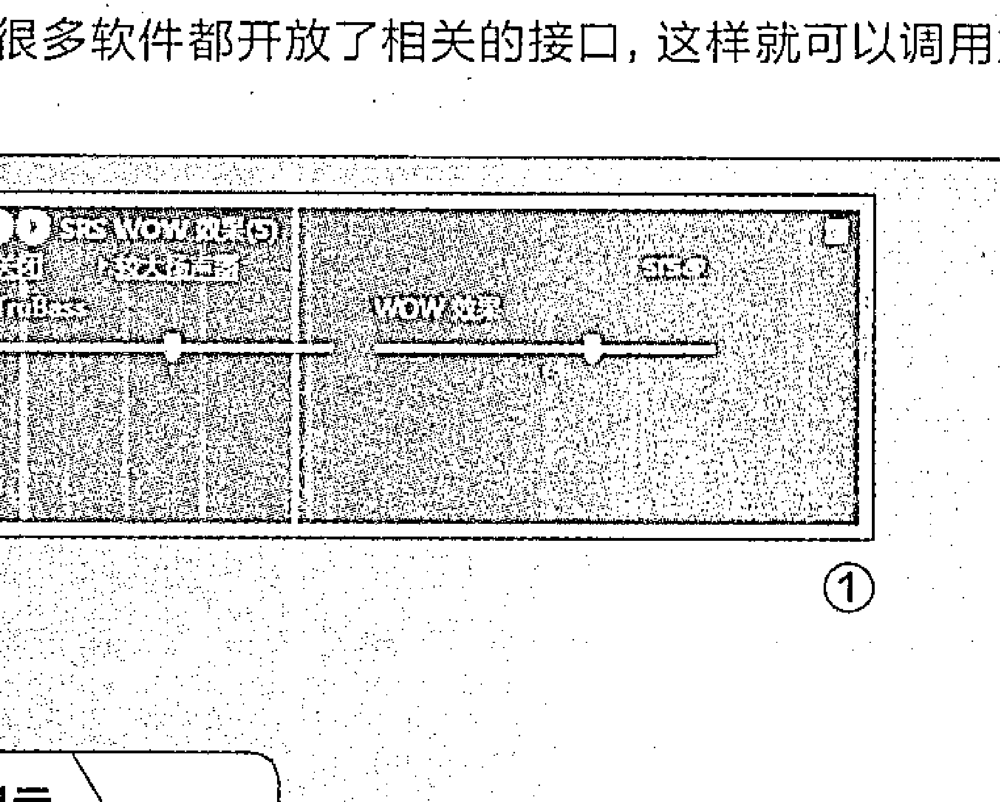

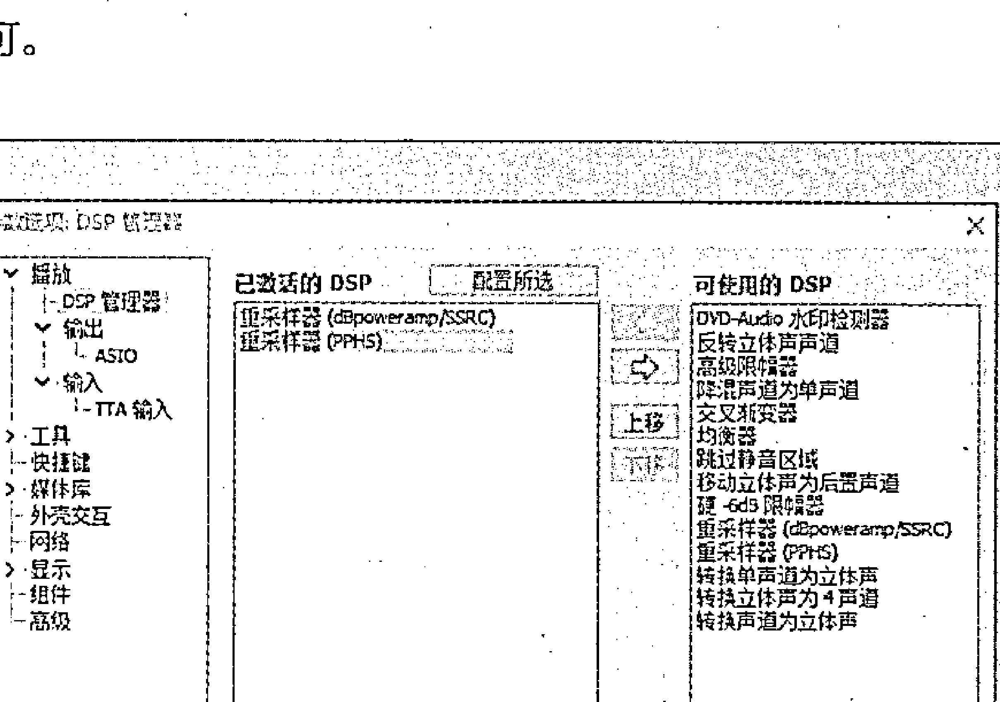

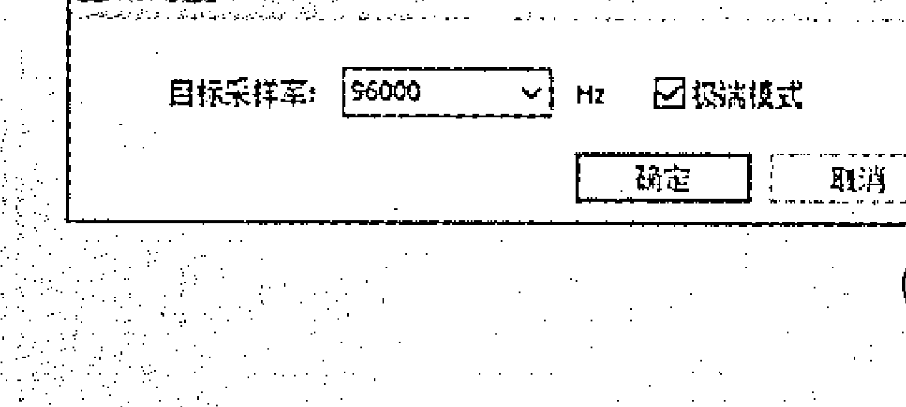

> 小提示
点击特效设置窗口左上角的两个按钮，就可以在不同的特性设置窗口进行切换。

★ 其他播放软件在“输出”里面选择“WASAPI（推送）”项，也可以大大提升音乐文件的效果。
★ 虽然Foobar 2000汉化版自带有一款名为ASIO的插件，网上也有不少的网友推荐使用这款插件，但是这款插件的使用需要相应的驱动程序的配合，且只有在专业的声卡上才可以体现出来。所以对于普通的集成声卡不推荐使用这款插件。

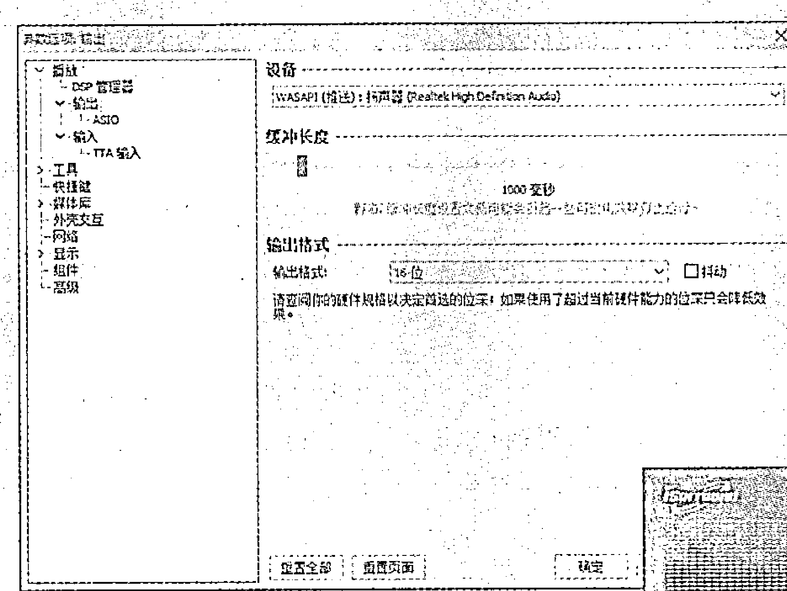

###### 虚拟声卡搞定所有播放器

当然并不是所有的播放软件都自带有音效增强的功能，或者可以通过第三方插件来解决的。对于这类播放软件，我们就需要另外想办法。而iSurround就是一款免费的音效增强软件，它和其他软件最大的不同之处在于，普通的播放软件是将音乐文件解码后直接送给声卡输出。而安装了iSurround软件后，软件会在这些声音信号进入到物理声卡前，将这些声音信号添加上各种效果，然后再把这些带有特殊效果的声音信号送给物理声卡。这就相当于把播放软件常见的均衡器功能，直接添加到了系统的声卡上面，这样所有从声卡输出的声音就可以直接进行处理。

首先从官方网站下载iSurround的安装包（www.casonics.com），解压以后会发现针对不同的Windows版本，有不同的安装程序可以选择使用。如果用户使用的是Windows 10系统的话，那么使用针对Windows 8系统的安装包即可。需要提醒大家的是，软件的安装使用需要微软NET framework 4.0架构的支持。iSurround软件的安装步骤和其他软件一模一样，不过由于这款软件自带有一个虚拟声卡，所以在安装的过程中会弹出一个安全提示框（图5）。点击提示框中的“安装”按钮，就可以进行最主要的虚拟声卡的安装，安装完成以后就可以开始使用了。

> 由于虚拟声卡是以驱动的形式存在的，所以在安装虚拟声卡的时候，有的安全软件也会弹出提示框。这时一定要允许驱动的安装，不然的话软件将无法正常使用。

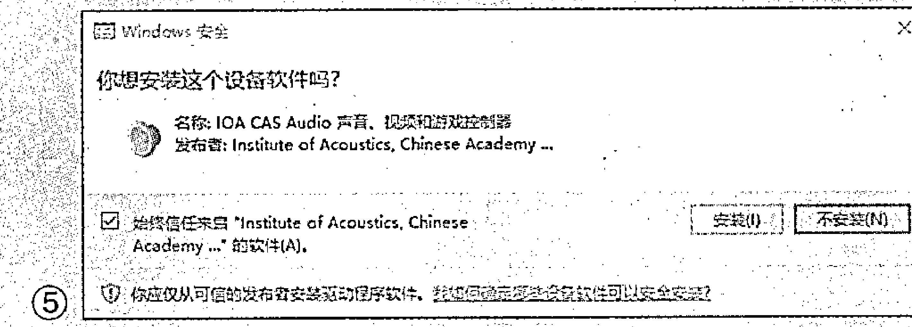

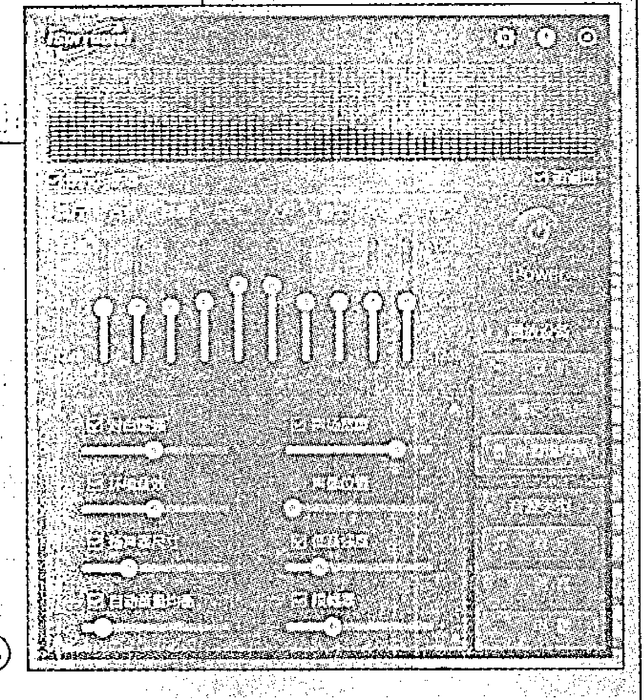

iSurround软件的使用非常傻瓜化，看上去就好像一个放大版的均衡器。首先在“播放设备”里面选择设备的类型，其中就包括耳机、笔记本电脑、外置扬声器等。接着在“音源类型”里面选择声音的来源，其中包括音乐、语言、电影等。由于iSurround软件已经针对不同的环境，进行了大量有针对性的优化设置，所以用户只需要根据自身情况进行选择即可（图6）。比如用户在进行电影播放的时候，软件预设的均衡器配置就会自动加强“环境音效”、“低音强度”等效果。
如果用户对预设的均衡器配置不满意的话，也可以进行自定义的配置操作。比如取消某个特效的勾选，就可以关闭这个效果。而滑动某个特效的滑杆，就可以增大或者减少某个效果。当所有的配置完成后，点击右上角的“Power”按钮就可以激活软件的相关配置，从而体验到一个与众不同的声音环境。而且使用iSurround软件还有一个好处，就是不需要对播放软件进行一个一个的配置，一个软件就可以解决所有播放软件的配置操作。

##### 随你所愿调理Windows Defender
文/倚楼

作为Windows系统里面自带的杀毒软件，Windows Defender一直以来处于比较尴尬的地位。喜欢它的用户觉得它操作方便兼容性好，但是多少还有一些不够人性化的地方。不喜欢它的用户则觉得它碍手碍脚的，恨不得将它从系统里面彻底进行删除。面对这样冰火两重天的情况，如何才可以满足不同用户的需求，让大家各取所需地进行操作呢？

###### 系统托盘显示软件图标

虽然Windows Defender已经被定义为杀毒软件，可是在很多人眼里好像并不是那么回事。因为一款杀毒软件居然连一个系统托盘图标都没有，这样在启动杀毒软件的时候非常不方便。那么如何才可以为其添加一个系统托盘的图标呢？

进入到Windows 10的系统盘，在Program Files目录里面打开Windows Defender文件夹，从里面找到一个名为MSASCui的文件。双击运行这个文件以后，就可以在系统托盘看到软件图标了。以后只需要双击运行这个图标，就可以激活杀毒软件进行操作。不过每次这么激活运行杀毒软件非常繁琐，那么有什么方法可以让其自动运行呢？首先在系统桌面上创建MSASCui文件的快捷方式，接着进入到Windows 10系统的安装磁盘，点击窗口的“查看”标签后将“隐藏的项目”选项选中。接着在地址栏输入X:\ProgramData\Microsoft\Windows\Start Menu\Programs\StartUp（X为你的系统盘符）后按下回车键，

然后把刚刚创建的快捷方式移动到这个启动目录里面。在移动的过程中会弹出一个提示对话框，点击对话框中的“继续”按钮，就可以完成移动快捷方式图标的操作，以后系统在启动的时候就会自动运行这个程序啦（图1）。

###### 启用广告软件拦截功能

流氓软件可以说是让用户深恶痛绝，而国外则往往将这类软件划分到“广告软件”或者“间谍软件”的大类中，因此它们并不属于我们通常理解的电脑病毒范畴。通常情况下要想解决这类问题，只能通过安全卫士这类软件。不过现在利用Windows Defender，就可以启用其自带的广告软件拦截功能了。

首先通过快捷键Win+R打开系统的“运行”对话框，在其中输入“regedit”命令后按下回车键，打开注册表编辑器后，接下来依次展开左侧列表到HKEY_LOCAL_MACHINE\Software\Policies\Microsoft\Windows Defender，在这个项目上点击鼠标右键，选择“新建”菜

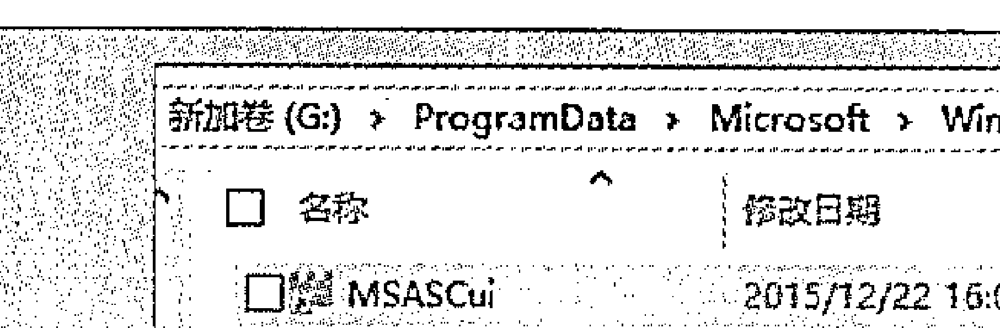

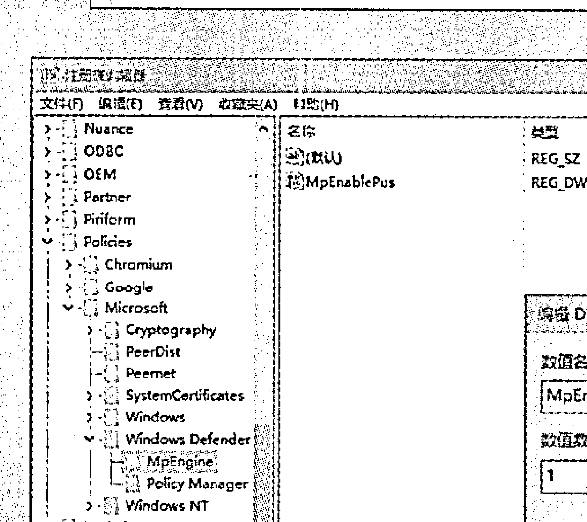

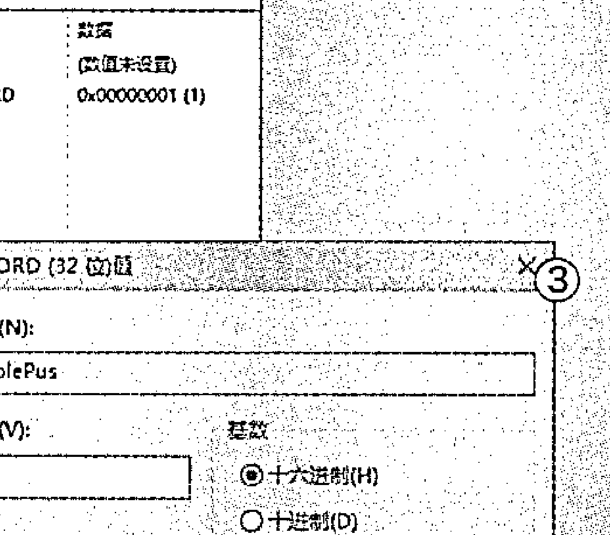

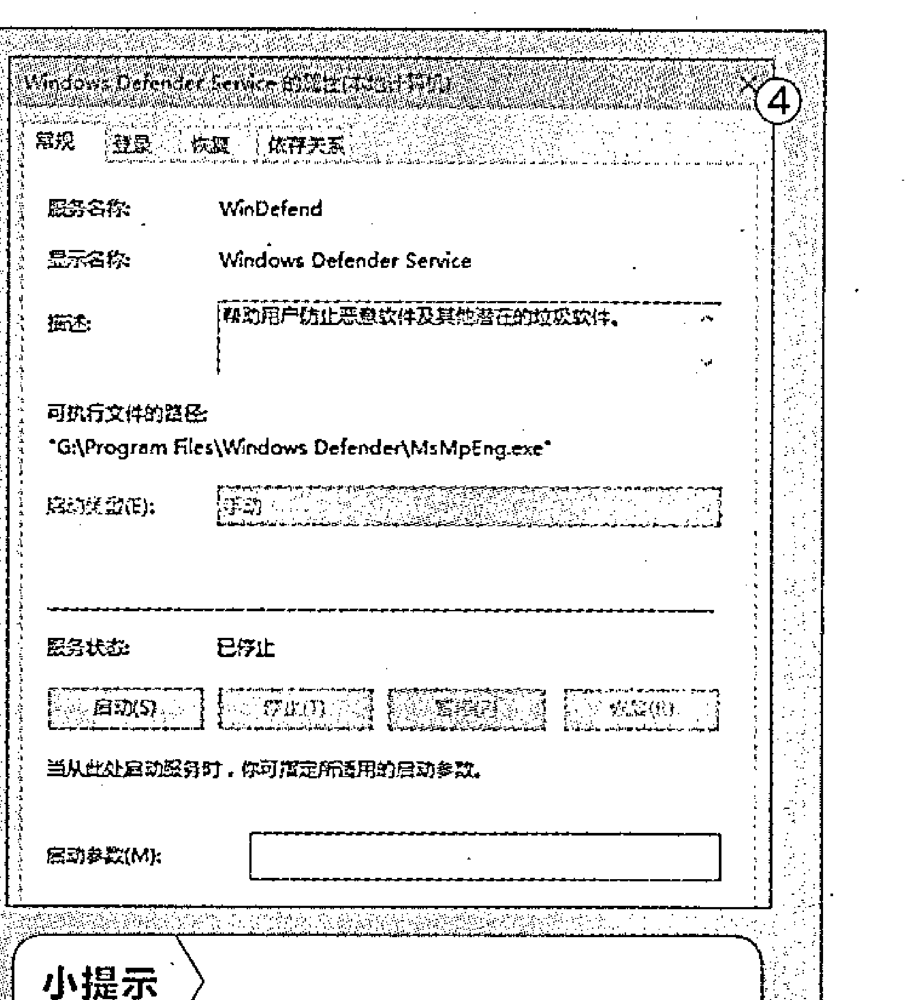

> > 小提示
如果禁止以后Windows Defender还是在随机启动，那么利用CCleaner等软件将启动项里面和杀毒软件相关的内容禁止即可。

单中的“新建项”命令，接着新建一个名为MpEngine的项目（图2）。然后在这个项目的右侧窗口里面，点击鼠标右键并选择菜单“新建”中的“DWORD（32位）值”命令，将其键值名称重新命名为“MpEnablePush”。现在双击“MpEnablePush”项，在弹出的对话框中将“数值数据”修改为1即可（图3）。最后点击“确定”按钮并重新启动操作系统，其自带的广告软件拦截功能就可以成功开启了。

##### 禁止杀毒软件自动运行

Windows Defender之所以让有的用户讨厌，就是其必须要随系统自动运行，而且软件自身并没有关闭自动运行的功能。即使是用户打开系统的服务管理器，也会发现它的启动服务无法进行相关的设置（图4）。所以这个时候要想禁止其自动运行，就必须要借用系统的组策略功能才可以搞定。

首先按快捷键Win+R打开“运行”框，输入“gpedit.msc”后按回车键启动组策略编辑器。通过鼠标展开左侧列表里面“计算机配置”中的“管理模板”，接着在右侧窗口依次选择“Windows组件”中的“Windows Defender”子项，这样就可以看到一个“关闭Windows Defender”的命令（图5）。直接双击该选项打开它的配置窗口，在里面选择“已启用”项即可（图6）。最后点击“确定”按钮关闭配置窗口，重新启动操作系统就可以禁止Windows Defender的自动运行了。

##### 删除鼠标右键扫描功能

当很多用户升级到Windows 10 TH2以后，发现在文件右键菜单中加入了“使用Windows Defender扫描”的选项。可是对于不使用这款杀毒软件的用户来说，这个功能看上去非常多余，那么如何才可以去除Windows Defender的右键命令？

首先运行“右键扩展菜单管理器”这款工具，运行以后点击左侧列表中的“目录”项。在右侧窗口里面找到EPP项后，点击鼠标右键选择菜单中的“删除扩展菜单”命令，就可以将这个命令从系统里面删除掉。接下来分别点击左侧列表中的“所有文件”和“磁盘分区”这两项，按照同样的方法删除对应的右键菜单项就可以了。

不过笔者建议大家对以上项目先不要进行删除，而是尝试只是把EPP项前面的勾选去除，这样就可以隐藏掉相关的命令而不是删除（图7）。以后需要用的时候，还可以轻松找回。

> **小提示**
> 如果不想使用第三方工具，那么只需要在注册表编辑器里面依次展开到如下的位置：HKEY_CLASSES_ROOT\shellex\ContextMenuHandlers\EPP，接着点击鼠标右键选择删除就可以了（图8）。接下来按照同样的方法，删除HKEY_CLASSES_ROOT\Directory\shellex\ContextMenuHandlers\EPP即可。

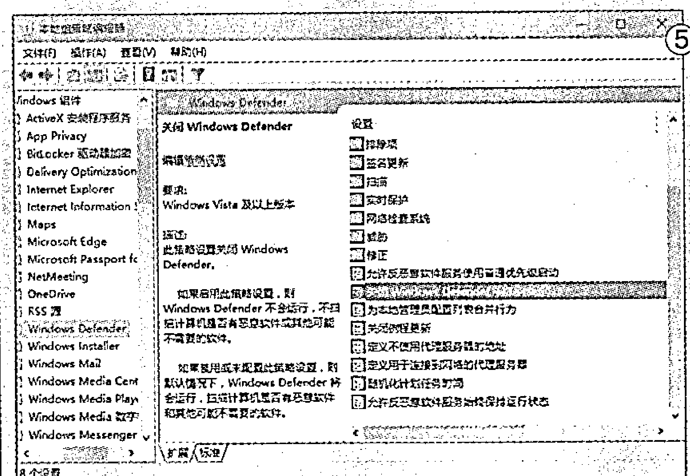


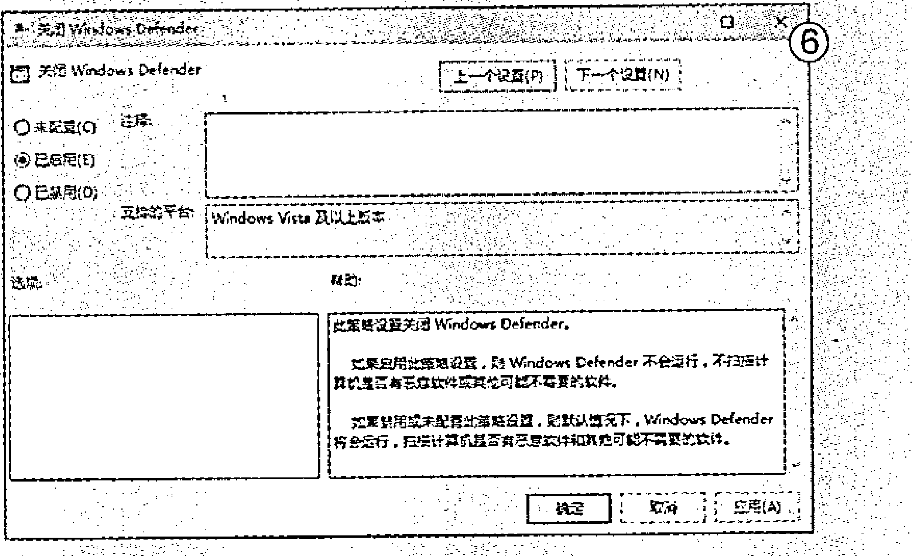

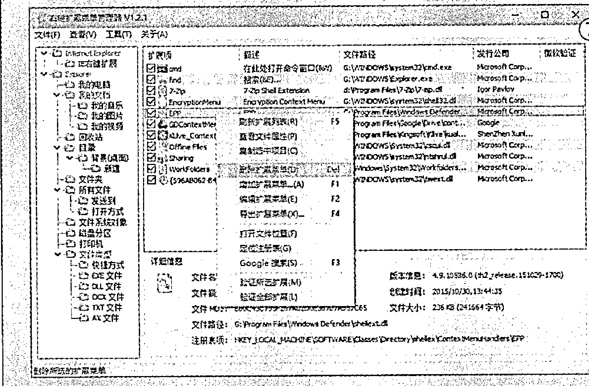

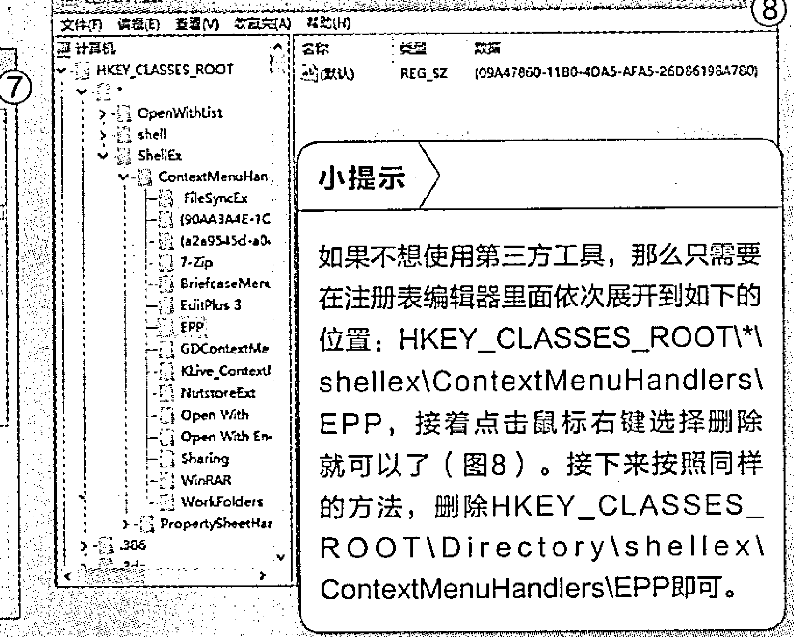

##### 优中选优 辨识图片中的字体

文|王艳阳

如果看到一幅图片中有自己中意的精美字体，但又不知道用的是什么字体，这时多数人可能会向设计师请教或到网上提问。但是，若下次再遇到另类的字体应该怎么办？俗话说，授人以鱼不如授人以渔。借助于专门的字体识别网络服务，可以自助解决图中字体的识别问题。

###### 1. 在线识别图片中的字体

目前，互联网的“字客网”、“求字体”、“MyFonts”、“WhatFontIs”等网站提供图片字体识别服务，各家网站在识别准确率方面各有千秋。我们不妨在这些网站中寻找适合于自己的识别渠道。

各家网站的使用流程基本相似，下面以“字客网”为例，介绍如何快速识别图片中的字体。先准备好一张用特殊字体制作的图片（如上面写有“电脑爱好者”几个字的图片）。

在浏览器地址栏中访问http://www.fontke.com/，点击右上方的“字体识别”按钮（或者直接访问识字体网址http://www.fontke.com/likefont/），点击“本机图片”，选择电脑中的图片，点击“打开”按钮上传图片（图1）。

在“文字设置”下方会显示文字拆分结果（图2）。在有的拆分结果中，可能会出现一个文字被拆分成多个部件的情况，这时拖动图片到目标图片框中，就可以把这些部件组合成一个完整的文字。接着在每个文字下方输入准确的文字，点击“开始识别”按钮。

稍等片刻，字客网会搜索到匹配的字体，拖动原图到适合位置再进行辨认（图3）。找到准确的字体后，点击字体的链接即可进行字体下载试用或购买字体商业授权。搜索结果中的字体的预览文字是“文字设置”所输入的文字，当然你随时可以修改预览文本、调整字号、设置前景色或背景色。

> 小提示
> 文字拆分缺字怎么办
> 字客网的识字体服务可以支持复杂颜色的图片，并会对“阈值”进行自动处理。如果出现个别淡色或深色的文字或部件缺失，可以调整“阈值”数值进度条，直至图片框中的文字正常显示。如果图片框显示白字黑底，点击“反相”按钮对图片进行反白处理。

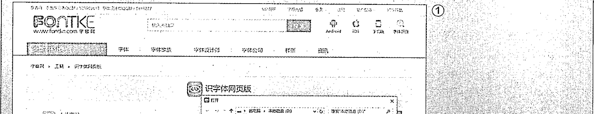

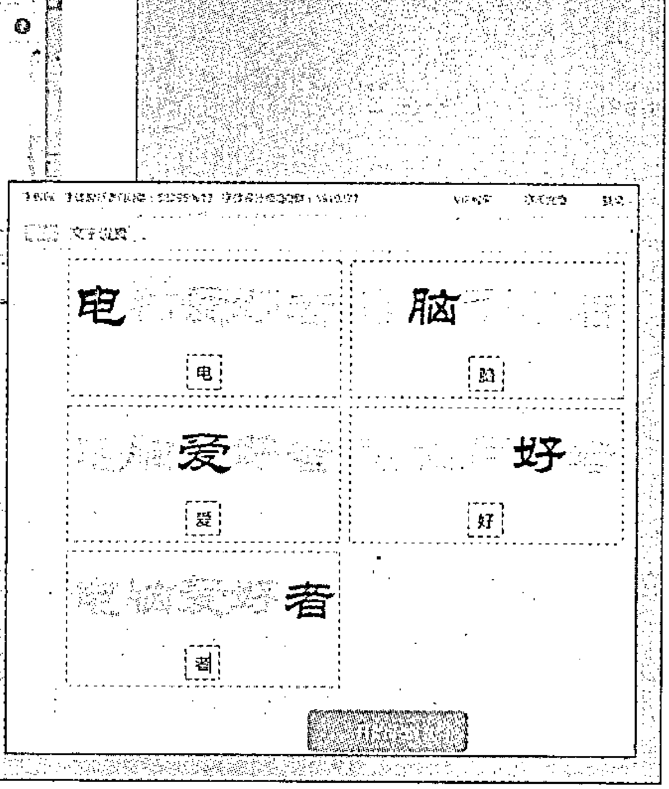

> 小技巧
> 提高复杂图片识别准确率
> 如果上传的图片的文字出现粘连的情况，要对图片进行预处理。“文字设置”只输入具有与其他字体明显区别的文字，这样可以大大提高识别准确率，因为很多字体可能会存在部分文字与其他文字基本接近的现象。


###### 2. 识字体网站对比选择

我们通过不同类型的图片案例（常见英文、特殊英文、常见中文、特殊中文、复杂中文），用4个不同的网站分别进行识别，识别结果列于表中。大家可以参考此表格的结果，根据自己所识别的字体类型，选择更合适的图片字体识别网站平台。

从测试结果来看，“字客网”和“求字体”支持英文、中文、日文、韩文等字体；MyFonts和WhatFontIs仅支持英文字体。从测试准确率来看，“字客网”对几种测试图片均可以准确地识别出来；“求字体”对大部分测试图片也能识别出来，少数测试图片识别出近似的字体；MyFonts主要支持英文商业字体，免费英文字体反而不能准确识别；WhatFontIs可以准确识别出英文字体，但是在排序方面不能把最准确的优先排在前面。从支持的图片复杂程序来看，“字客网”能支持较为复杂构图的图片；“求字体”、MyFonts、WhatFontIs均能支持较为简单构图的图片。在提供的功能方面，“字客网”支持反相、阈值等图片后期处理功能，搜索结果的字体预览功能的用户体验非常好；“求字体”支持计算机自动拼字功能，但网站广告过多，严重影响用户体验；MyFonts支持图片OCR功能，但对一些非常规的文字OCR不太准确；WhatFontIs在识别结果当中不支持原始图片的拉动，影响用户对比的体验。

| 图片类型 | 字体示例 | 识别结果 |
| --- | --- | --- |
| | | 字客网 | 求字体 | MyFonts | WhatFontIs |
| 常见英文 | Roboto Black（见图4） | 完全准确 | 基本准确 | 不准确 | 完全准确 |
| 特殊英文 | Dreamland（见图5） | 完全准确 | 完全准确 | 不准确 | 完全准确 |
| 常见中文 | 华文隶书（见图6） | 完全准确 | 完全准确 | 不支持 | 不支持 |
| 特殊中文 | hakuyoxingshu7000（见图7） | 完全准确 | 完全准确 | 不支持 | 不支持 |
| 复杂中文 | hakuyoxingshu7000（见图8） | 完全准确 | 不支持 | 不支持 | 不支持 |

经过以上多种字体的对比测试后，笔者总体的感觉是，使用“字客网”的图片识别字体服务，流程更简单，支持的语种更广泛，同时识别准确率也相对更高。其他3种网站的服务也有其所长，可根据实际情况定夺选择。

##### 浏览器突破限制下载

文|老万

文件下载是每个上网者最常见的操作，但是出于不同的原因，很多网站对文件下载都进行了限制，要么只能使用特定的下载工具，或者只能使用浏览器自带的下载功能等。我们知道，浏览器自带的下载功能一般都比较弱，那么如何才能增强浏览器的下载功能，从而突破网站的下载限制呢？

###### 使用脚本增强下载

当我们平时在火狐浏览器里面点击下载链接后，就会自动弹出文件的下载提示窗口，而这个窗口通常只有“保存文件”和“取消”两个按钮。我们借用一个UC脚本，就可以大大增强下载窗口里面的操作功能，在操作上进行提速（图1）。

要做到这一切，需要为火狐浏览器安装一款名为“userChromeJS Mix”的扩展。首先打开链接http://tinyurl.com/cf060304，点击“镜像”里面的“直接下载地址”进行下载。接着将这个文件拖拽到火狐浏览器窗口释放，根据提示就可以完成这个扩展的安装操作了。

接下来再通过火狐浏览器访问http://tinyurl.com/cf060306，点击页面下方的安装按钮，这时就可以看到显示出脚本代码的显示窗口。点击提示框中的“安装脚本”按钮，在弹出的询问框里面点击“确定”，这样就可以为火狐浏览器安装上一个名为newDownloadPlus.uc的UC脚本了。重新启动浏览器后，点击“工具”菜单中的“DownloadPlus配置”命令，在弹出的对话框中可以根据个人需要进行设置。这里建议大家将“下载弹出窗口双击链接复制完整链接”选项选中。另外，最好不要选择“从磁盘中删除”选项，避免误操作将刚刚下载的文件删除掉（图2）。

配置完成后，当我们点击一个下载链接时，newDownloadPlus.uc脚本控制的下载提示窗口，就会显示出比以往更多的下载功能（图3）。比如选择其中的“打开”选项并点击“浏览”按钮，这样在文件下载完成后就可以通过设置的这款软件，直接加载并运行刚刚下载的文件。

如果下载网站有意隐藏文件真实的下载链接，那么现在在“来源”选项里面就可以显示出这个文件真实的下载链接了。双击这个下载链接即可将它复制到系统的剪贴板上，然后就可以通过下载软件来进行下载操作，从而突破某些网站的下载限制。

###### 功能扩展营造下载“错觉”

通常我们进行文件下载时，都是在下载链接上点击鼠标右键，从而调用下载软件进行操作。但是这样操作的话很容易被网站检测到，从而对下载操作进行屏蔽或者限速等一系列操作。其实火狐浏览器除了可以使用脚本以外，扩展也是浏览器增加功能的重要途径。

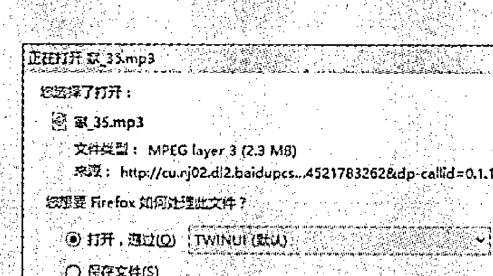

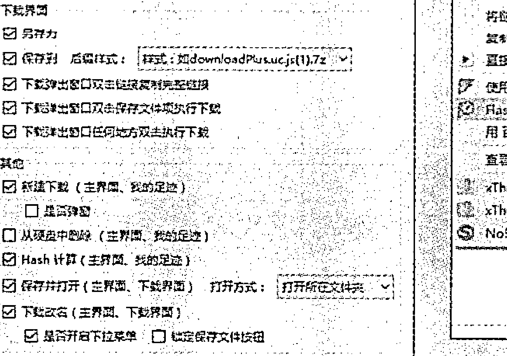

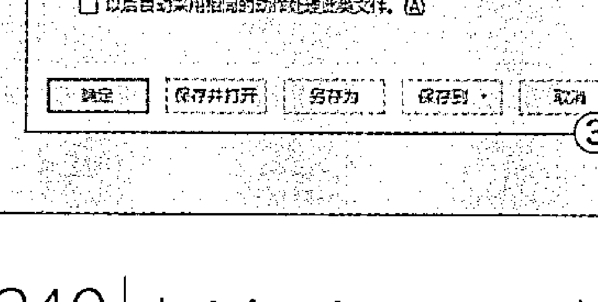

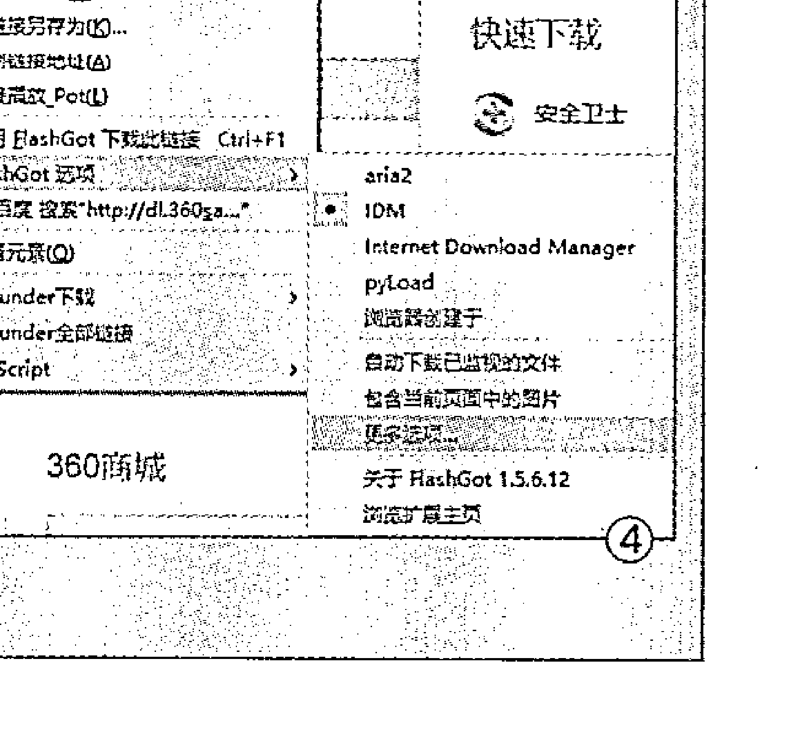

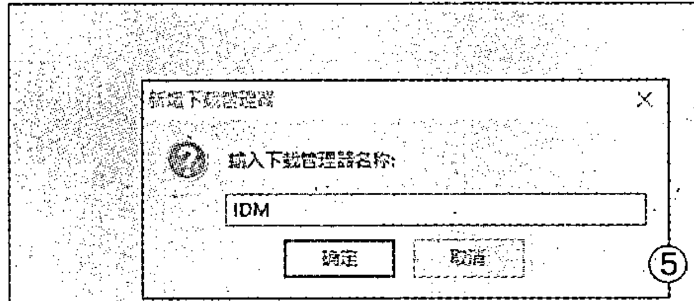

> 小提示
> xThunder扩展的操作和FlashGot类似，也是首先需要到选项窗口里面选择要使用的下载软件（图7）。而且这款扩展还有一个特色功能，就是可以对迅雷、快车、QQ旋风等专用链接进行破解，这样可以方便用户进行下载操作。

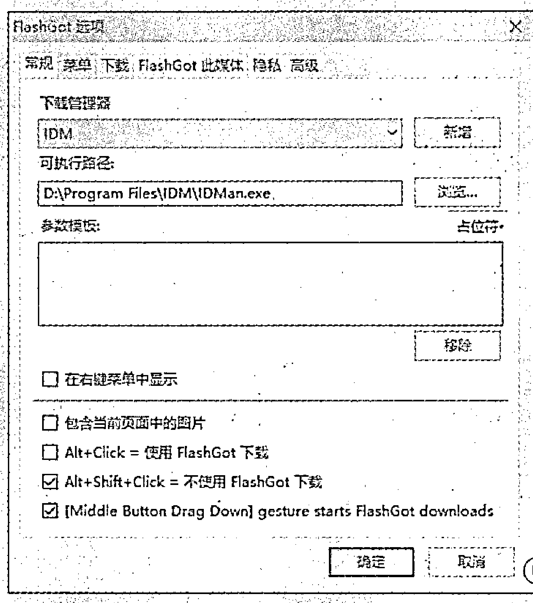

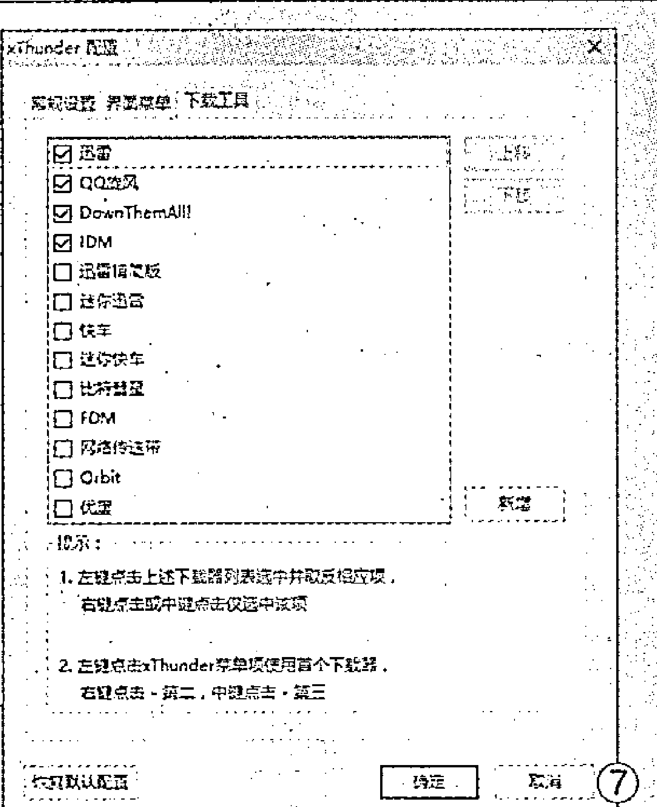

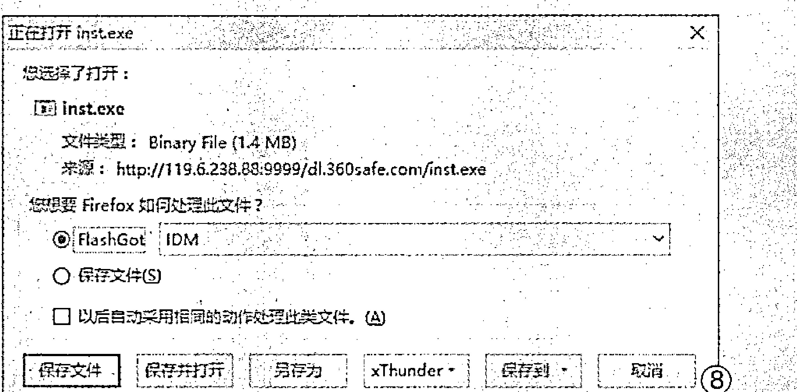

最知名的扩展就是FlashGot和xThunder。其实这两款扩展并不是一个下载器，它的作用是在浏览器和下载软件之间充当一个“桥梁”。从而可以方便地将火狐下载入口同下载软件连接起来，给下载网站一个浏览器在进行下载的错觉。

这里利用FlashGot扩展进行演示，来看看它是如何突破网站下载限制的。首先点击右上角的“打开菜单”按钮，在弹出的菜单里面点击“附加组件”命令。接着在弹出的窗口中选择左侧列表中的“扩展”项目，再在窗口的右上角输入关键词“FlashGot”来搜索。搜索到后点击该扩展名称后的“安装”按钮进行安装，安装完毕根据提示重新启动浏览器即可。现在在火狐浏览器的页面点击鼠标右键，选择菜单里面的“FlashGot选项”命令，接着在子菜单里面选择“更多选项”命令（图4）。首先点击窗口中的“常规”标签，接下来在“下载管理器”列表中，选择自己常用的下载软件名称，这样扩展和下载软件就匹配成功了。

但是这种方法只适用于正常安装的下载软件，如果用户使用的是绿色版或者破解版的下载软件，那么就需要用户对下载软件自定义设置。现在点击“下载管理器”列表后的“新增”按钮，在弹出的对话框里面任意设置一个名称。不过名称不要使用诸如迅雷、旋风这类中文名称，而是使用英文或者数字等组合的名称就可以了，比如我们这里设置的就是IDM（图5）。设置完成后会自动弹出一个对话框，从中我们选择下载软件的主程序文件即可。设置完成以后自动返回FlashGot选项窗口，点击“确定”按钮就可以完成配置操作了（图6）。接下来按照同样的方法，添加设置其他的下载软件即可。

###### 配合脚本更加方便多样

以后当用户需要下载的时候，首先点击鼠标右键中的“FlashGot选项”命令，接着在子菜单里面选择需要使用的下载软件。接下来在文件下载链接上点击鼠标右键，选择“使用FlashGot下载此链接”命令，扩展就会将获取的下载链接传送给下载软件，这样通过下载软件就可以突破网站的相关限制了。

其实FlashGot和xThunder扩展，都可以非常好的和newDownLoadPlus.uc脚本进行配合。当我们点击文件的下载链接后，点击“保存文件”按钮就是利用浏览器的功能进行下载。如果是选择FlashGot选项后，在列表中选择一个下载软件的话，那么自然就是利用这款软件进行操作（图8）。这样不仅用户的操作更加多样，而且突破下载限制的途径也变得更多了。

##### 自动计算的云笔记

大家都知道云笔记可以帮助我们随时随地记录一些信息。不过在进行笔记记录过程中，有时候我们可能会进行一些计算操作，如果这个时候再去调用系统的计算器，一边记录笔记一边计算的话将非常麻烦。其实“近水楼台先得月”，云笔记本身就有强大的计算功能。

###### 一边记录一边计算

正所谓有需求就有市场，有一款名为“Notepad Calculator”的云笔记网站，在用户输入相关的计算公式后就会自动给出结果。首先通过一款支持HTML5的浏览器打开该云笔记的网站（http://notepadcalculator.com），该网站不需要进行任何的注册就可以直接使用了。通过网页页面上的一些范例我们就可以了解到，网页左侧是进行笔记的地方，而右侧就是实现自动计算显示答案的地方。这个云笔记网站提供两种使用方法。第一种是比较传统的方法，就是在输入内容后输入计算公式。比如我们这里输入“这月购买《电脑爱好者》的费用”这个项目名称，接下来输入该项目的支付情况“10*2”，马上就可以显示出这笔费用的计算结果。在计算过程中不但可以使用简单的加减乘除符号（+、-、×、/）进行操作，还可以利用“^”这样的符号进行平方计算。除此之外，我们还可以在前面结果的基础上进行累加操作，比如换行后输入“*12”，就可以计算出全年购买《电脑爱好者》的费用（图1）。

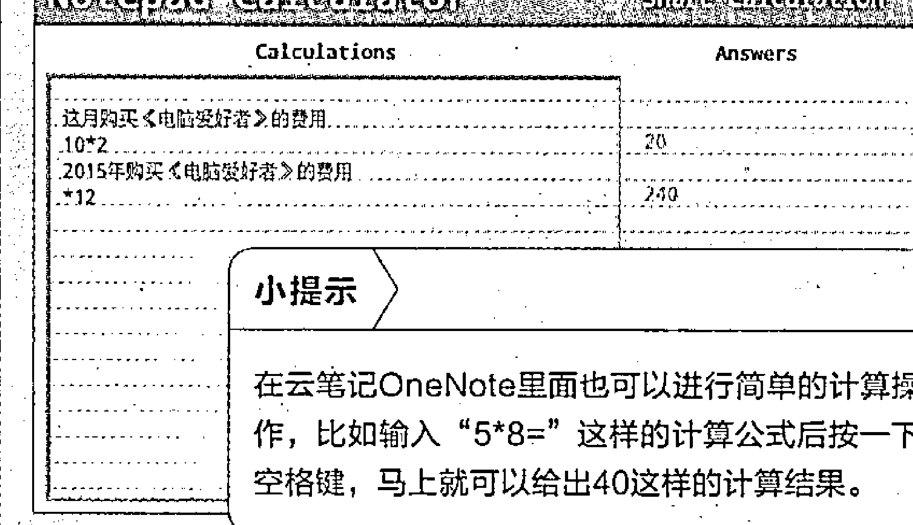

> 在云笔记OneNote里面也可以进行简单的计算操作，比如输入“5*8=”这样的计算公式后按一下空格键，马上就可以给出40这样的计算结果。

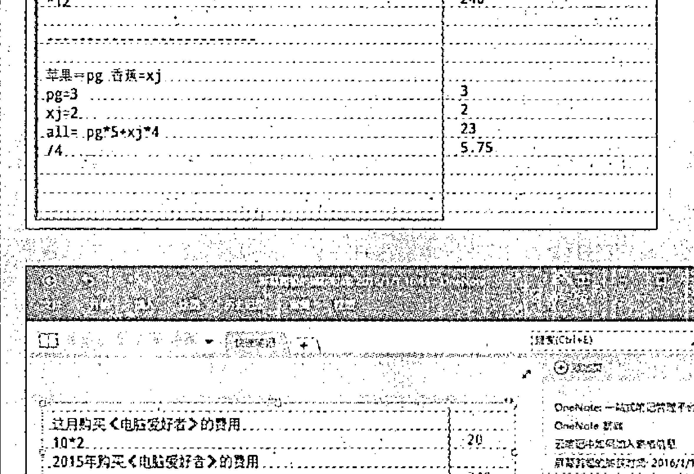

###### 不足之处的另类解决

虽然Notepad Calculator云笔记不需要注册就可以使用，但是它可以通过浏览器的Cookies信息来定位用户，所以用户在下一次登录后仍然可以看到之前的笔记内容。但是Cookies信息往往都有有效性，所以不能像其他的云笔记那样对记录信息进行长时间的保存。为此我们这里可以使用一个变通的方式，通过其他云笔记的网页剪切功能，对Notepad Calculator的页面进行剪切保存即可（图3）。另外，当我们需要开始新的笔记的时候，可以用“-----”这样的符号在Notepad Calculator里面分割出不同的笔记空间，从而也方便开始新的计算内容。

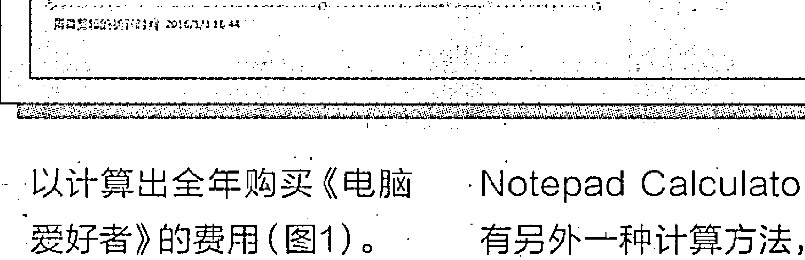

###### 内容计算合二为一

除了传统的利用计算公式进行操作以外，Notepad Calculator还有另外一种计算方法，就是让用户自定义设置计算公式的变量。虽然这个云端服务的变量也可以支持中文，但是使用后发现非常的不稳定，所以建议大家使用英文来设置变量。比如苹果一斤的购买价格为3元，我们这里就设定变量为“pg=3”。香蕉一斤的购买价格为2元，我们这里就设定变量为“xj=2”。接下来利用计算公式“all=pg*5+xj*4”，这样就可以给出一个水果的总价格。如果是几个人合买的水果，就可以使用“每个人支付价格=水果总价/人数”，来计算出人均需要支出的价格（图2）。

##### 微博图片批量下载

文|倚楼

新浪微博是一个巨大的社交平台，每天都有无数的用户在里面晒心情、发照片。浏览这些微博的时候，会发现其中有不少用户发的图片，如果下载下来作为自己的系统桌面还是很不错的。不过，微博上的美图实在太多了，一张张下载太过繁琐，其实借助一些工具和方法，我们可以简单快捷地批量下载指定用户的微博相册。

###### 扩展下载灵活方便

如果我们使用的是谷歌浏览器的话，那么借助于一款功能扩展就可以方便地完成。首先进入浏览器的应用商店，输入关键词“小乐图客极客版”来搜索。搜索到以后点击该扩展名称后的“添加至Chrome”按钮进行安装，安装完成即可在工具栏中看到小乐图客极客版扩展的图标。

接下来建议重新启动一下谷歌浏览器，然后登录到新浪微博，进入到需要下载图片的那个用户的微博首页，点击左侧列表中的“相册”链接后，可以看到该用户发布的所有图片信息。

现在点击工具栏中的小乐图客极客版扩展图标，在弹出的对话框中点击左侧工具栏中的“取图”按钮，接着点击“GO”按钮开始进行分析操作（图1）。当扩展分析出网页里面的所有图片信息后，就会在弹出的网页里面以平铺的方式进行显示。接着通过调整工具栏“显示”选项的滑杆，可以对预览页面中的图片大小进行调整，从而更加方便用户对图片进行预览。然后用户就可以根据需要，在网页里面勾选需要下载的图片名称。该功能扩展默认下载的是JPEG格式的图片，不过点击工具栏中的JPEG按钮后可以切换为PNG格式，这样在下载的时候就可以实现格式的批量转换了（图2）。所有的设置完成后点击“批量下载文件”按钮，这样图片就会被批量下载到浏览器默认的存放目录中了。

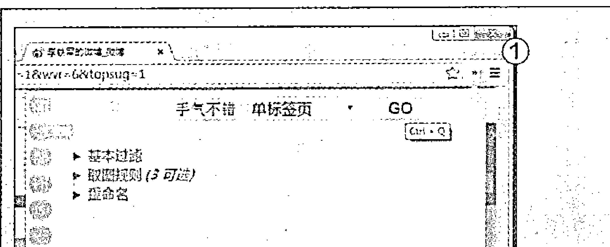

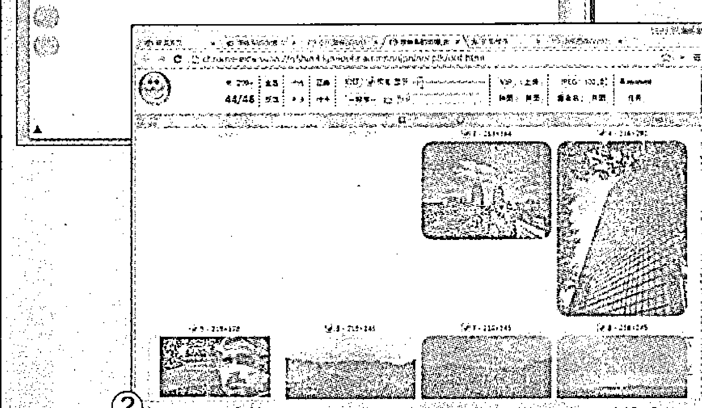

###### 微博相册完整下载

当然并不是所有用户都使用谷歌浏览器，对于使用其他浏览器的用户来说，则可以通过“微博相册下载助手”来解决这个问题。启动“微博相册下载助手”后，该工具默认会自动打开新浪微博的首页，输入自己的账号密码进行登录。这时该工具会自动检测出当前页面的好友ID，并且将这些好友的ID显示在右上方的ID列表框中。从列表中选择要下载的好友名称后，点击列表后的“添加”按钮，就会自动切换到“查看像册”操作界面。

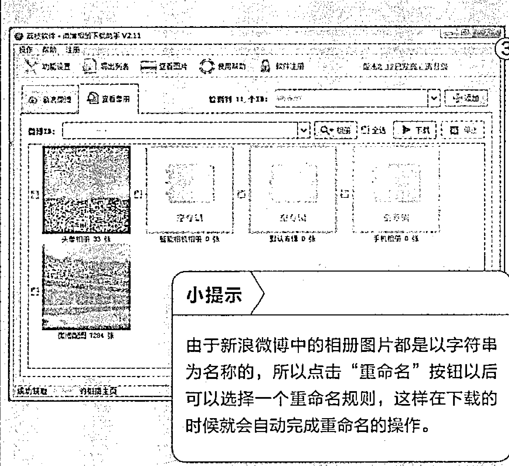

> **小提示**
> 由于新浪微博中的相册图片都是以字符串为名称的，所以点击“重命名”按钮以后可以选择一个重命名规则，这样在下载的时候就会自动完成重命名的操作。

如果在页面中没有检测到好友的ID，也可以在“查看像册”操作界面的“微博ID”里面直接输入好友名称，这样就可以借用微博自身的搜索功能进行查找。查找到以后点击好友的名称链接，再点击操作界面后的“相册”按钮，就可以查看到这个好友所有的相册信息了。从中勾选需要下载的相册后，点击“下载”按钮即可将整个相册下载下来（图3）。

提取信息直接“黑箱”操作

文|阿立

在这个信息化的时代，对于上班族来说，可能每天都要从事大量的信息处理工作。在信息处理中，我们经常需要从某个文件中提取出某部分特定的内容，或者将想要的信息保存为指定的文件。这一类的操作虽然说非常简单，但如果内容很多的话，工作量也是相当繁重的。当我们有着这样的工作需求时，不妨借助一些小工具化繁就简，减轻我们的工作负荷。

不打开文件也能复制内容

通常情况下，要想复制一个文件中的内容，首先需要用户双击打开这个文件，接着再通过命令或快捷键复制其中的内容。而通过一款名为“Copy Contents”的Windows系统辅助工具，则可以在不打开文件本身的情况下，快速复制文本文件以及图片文件中的内容到系统的剪贴板中。

首先可以从http://tinyurl.com/cf060302下载Copy Contents安装包，安装后并不会出现任何的操作界面，只会在系统右键菜单中添加一个新的命令。以后当我们需要复制文本文件中的内容时，只需要通过鼠标选中这个文本文件并点击鼠标右键，接着选择右键菜单里面的“Copy Contents”命令就可以了（图1）。当文件内容复制完成后，在屏幕左上角会出现一个提示。接下来就可以将内容复制到其他软件中（如Word）作进一步的处理了，从而大大提高了办事效率。

如果用户复制的是图片文件中的内容，那么就可以直接粘贴到Photoshop等图片编辑软件中进行处理。

复制内容直接存文件

一般情况下，我们如果想把复制的内容保存到一个特定的文件中，往往需要首先打开一个空白文件，然后再进行粘贴及保存操作。其实通过剪贴板增强工具“FastFRecord”，我们可以省去多个中间步骤，直接即可将复制的信息保存为一个新文件。

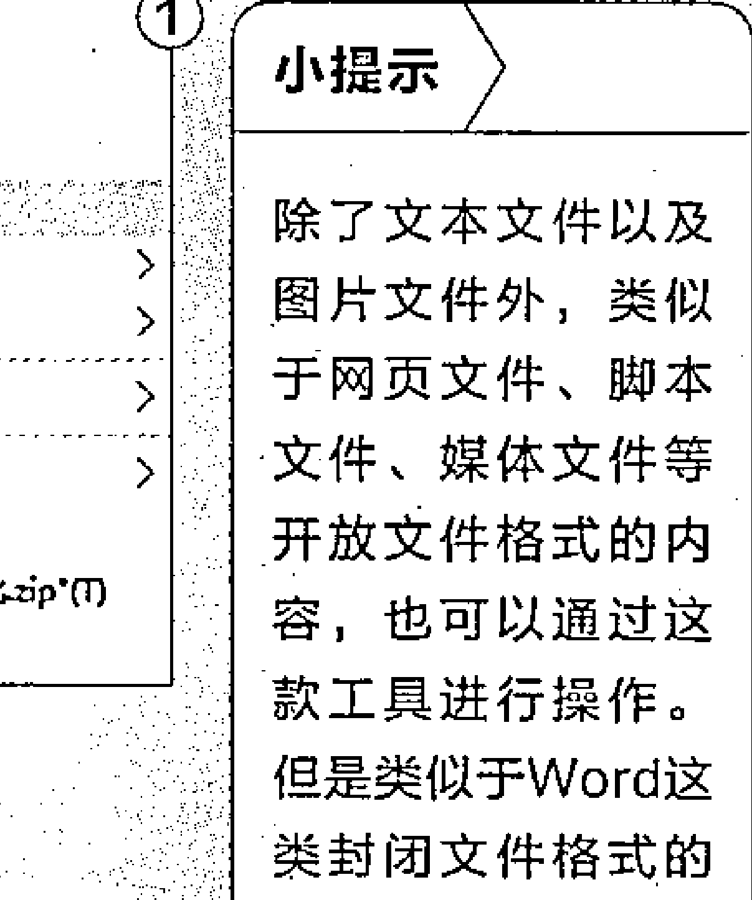

> 除了文本文件以及图片文件外，类似于网页文件、脚本文件、媒体文件等开放文件格式的内容，也可以通过这款工具进行操作。但是类似于Word这类封闭文件格式的内容，则无法完成相应的复制操作。

从http://tinyurl.com/cf060303下载FastFRecord文件包，解压后运行，将会在系统桌面看到一个剪贴板的图标，在图标上点击鼠标右键选择“返回”按钮打开该工具的配置界面。为了更好地对保存的文件进行管理，用户可以创建不同的保存文件夹。

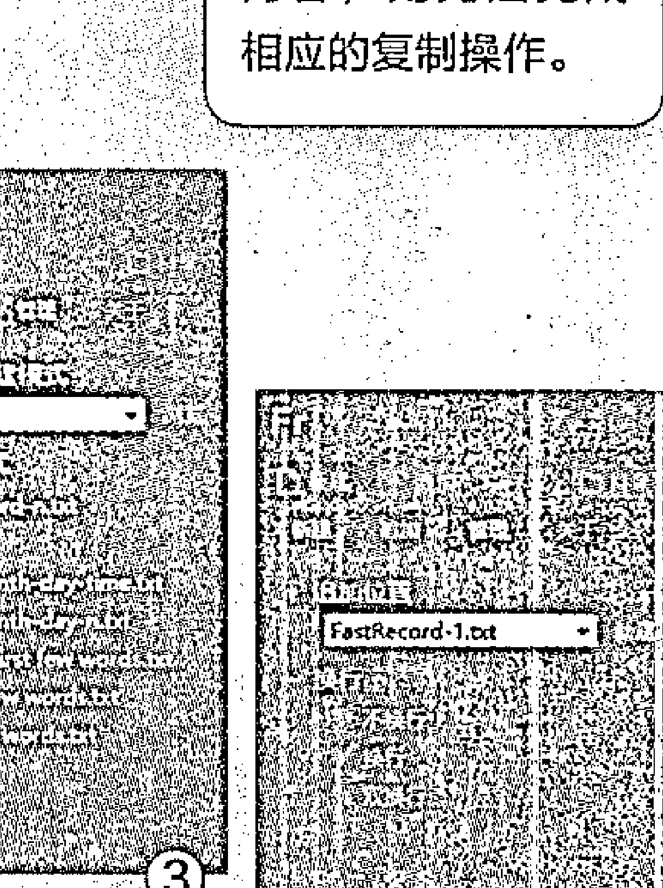

首先点击界面中的“管理”标签，点击“新建”按钮后设置一个名称，再点击“确认”按钮就完成了创建（图2）。接下来点击界面中的“新建”标签，再在“存储位置 - 新建模式”列表中选择一个存储的文件夹。然后在“自动名称格式”下面选择一个文件的命名方式（图3）。

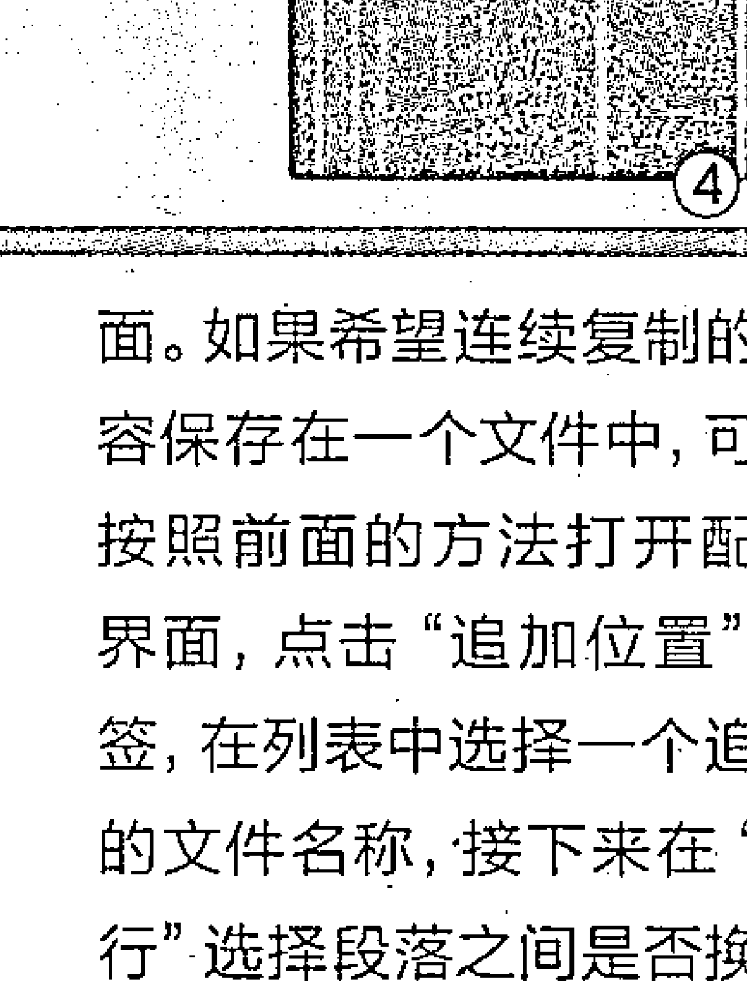

设置完成后点击最小化按钮，以后当我们复制一段信息内容后，点击FastFRecord软件的桌面图标，就可以将复制的信息保存为文件了。

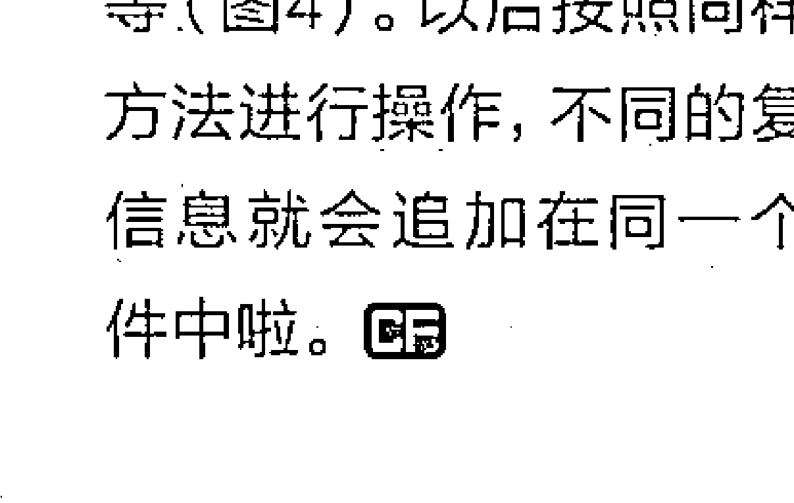

当然有时我们在进行书摘的时候，会连续复制不同的段落信息，如果按照前面的方法，就会将不同的段落保存到不同的文件里面。如果希望连续复制的内容保存在一个文件中，可以按照前面的方法打开配置界面，点击“追加位置”标签，在列表中选择一个追加的文件名称，接下来在“换行”选择段落之间是否换行等（图4）。以后按照同样的方法进行操作，不同的复制信息就会追加在同一个文件中啦。

不只是打情骂俏 Cortana帮助提效率

文|老万

Windows 10的语音助理工具Cortana，受到了不少电脑用户的喜爱。但是很多用户只是将其作为娱乐工具，时不时地对它进行一番打情骂俏。其实Cortana可以做的事还有很多，用户如果能充分地使用Cortana的话，可以更好地安排自己的生活和工作，从而提高自己的工作效率。

快速打开应用

微软从Windows 8开始，将很多常见的功能以磁贴的形式进行展示，Windows 10延续了这一特征。如果平时要调用这些应用的话，就需要在开始菜单里面进行查找。如果安装的软件比较多的话，查找起来既费时又费力。不过现在借助于Cortana，通过语音就可以快速打开需要的应用。比如我们要想打开计算器应用的话，将鼠标移动到桌面左下角的搜索框，点击旁边的麦克风按钮。当弹出的对话框出现“我能为你做点什么”的提示后，说出“打开计算器”的语音指令，稍等片刻就可以自动打开计算器应用（图1）。通过同样的方法，还可以打开常见的系统功能，比如控制面板、注册表编辑器等。

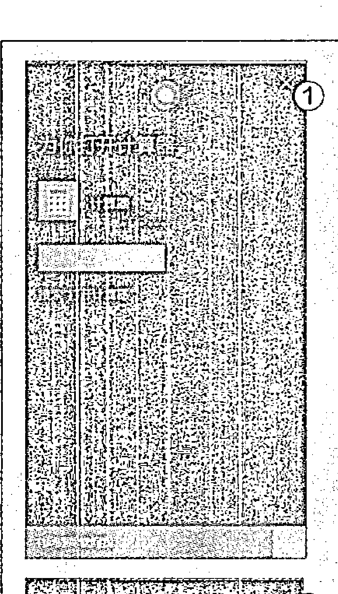

启用闹钟提醒

现在很多人每天的工作都非常复杂，所以经常会忘记一些事情的办理。为了避免出现这样的状况，我们可以为自己设置提醒闹钟，这样到点以后它就会提醒我们。用户借助于Cortana可以有多种方式快速建立闹钟，比如“25分钟后提醒我一下”或者“设置一个25分钟的倒计时”。这个时候Cortana会弹出一个提示框，询问用户提醒的内容信息，说出提醒内容后要求用户确认（图2）。这时用户需要对提醒的时间以及内容进行检查，经过检查后给出新的语音指令。比如用户没有发现问题的话就进行“确认”，如果发现问题就说“不准确”。然后Cortana会询问用户哪里有误，说出需要修改的内容就可以了。当然刚刚设置的闹钟都是一次性的，用户还可以说“每周星期六中午十二点提醒我给父母打电话”。同样经过检查编辑后，这样一个简单且重复性的提醒就设置好了。

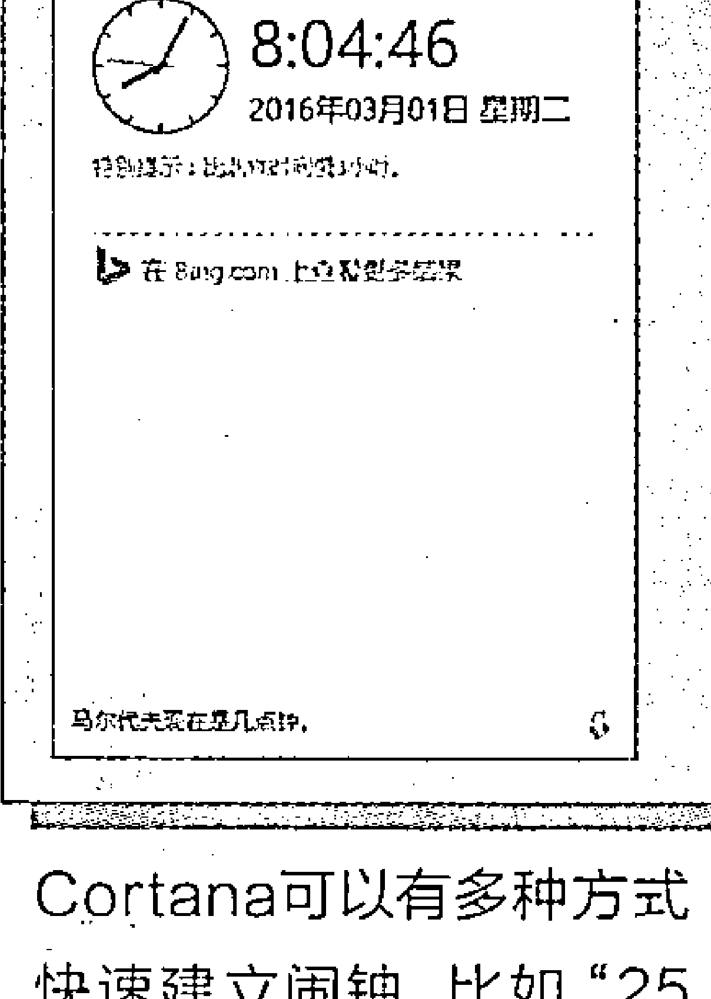

借用时间助手

同事去马尔代夫度假，我有事需要打电话给他，但因为是不同的时区，所以打电话之前，我首先要考虑马尔代夫当前是几点钟。现在我只需要向Cortana提出“马尔代夫现在是几点”的语音指令，很快就可以得到相关的答案（图3）。当然和时间相关的问题还有很多，比如“XX节假日放几天假”或者“今天是农历几月几号”等，很快都能得到满意的答案。

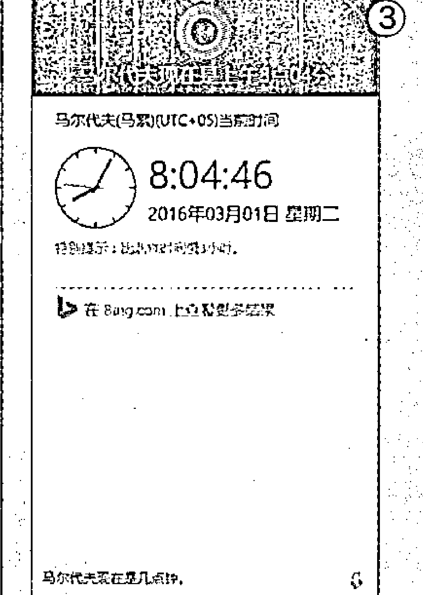

单位快速转换

现在很多人喜欢在海淘，这里就涉及到一个单位换算的问题。比如在国外黄金往往用盎司为单位，而国内往往是用克为单位的。除此以外，当然还包括人民币和常见外币的换算等等。所以我们直接通过Cortana提出“1盎司等于多少克”，或者“6.99美元等于多少人民币”之类的问题，稍等片刻Cortana就可以给出相应的换算结果了（图4）。

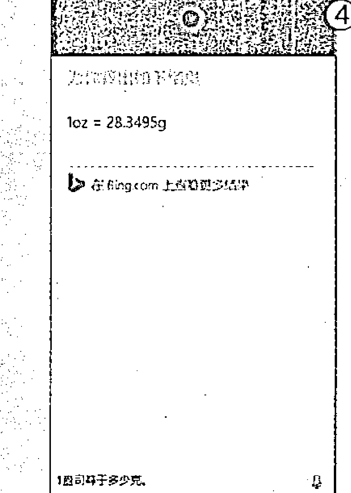

文件夹的“变身”用法

文|西风梦月

文件夹在常规使用之外，还有许多有趣而实用的“变身”用法。例如：快速改变文件夹的图标；将文件夹快速变成一个“磁盘”；将含有任意软件或资料的文件夹快速变身一个ISO映像文件等。

###### 1. 文件夹图标快速变

在Windows 10系统中，右键单击文件夹并开启“属性”窗口，切换到“自定义”选项卡，单击“更改图标”按钮，通过选择系统文件shell32.dll中包含的图标，可以改变系统默认的金黄色文件夹外观(图1)。

若觉得用上述方法图标数量有限，操作不够灵活，那么，还可以借助于一款专门的文件夹图标替换软件Mohande-B Folder iChanger，实现更为灵活的文件夹图标替换。首先通过Import or choose icon选项导入或选择图标，可选来源有程序文件图标、专用图标文件、可执行文件中的图标、系统文件图标等；然后点击Add folder or directory添加要改变图标的文件夹；最后选择Change icon for selected items，对选中的项目进行图标更换即可。该软件支持一次性批量修改文件夹图标。此外，也可以将硬盘或闪存盘看作一个文件夹，同样用该软件来修改其图标(图2)。

> 小提示
Mohande-B Folder iChanger需要Microsoft . Net Framework 4.0的支持，如果系统中已经安装了该组件，可直接下载5.4MB的安装包；若尚未安装，则可下载含有该系统组件的75MB版本。官方下载地址：http://t.cn/R4N7qPn

> 小技巧
软件安装后，右键菜单会驻留一个Change Icon with Folder iChanger选项。通过在文件夹右键菜单上直接选择该选项，可以快速执行文件夹图标的替换。

Windows 10文件夹图标默认可以显示文件夹内容的预览，文件夹内容有所变化时，也会表现在文件夹图标的外观变化上。但如果用以上方法更换了文件夹图标后，文件夹内容的变化将不再能体现在文件夹图标的外观上。

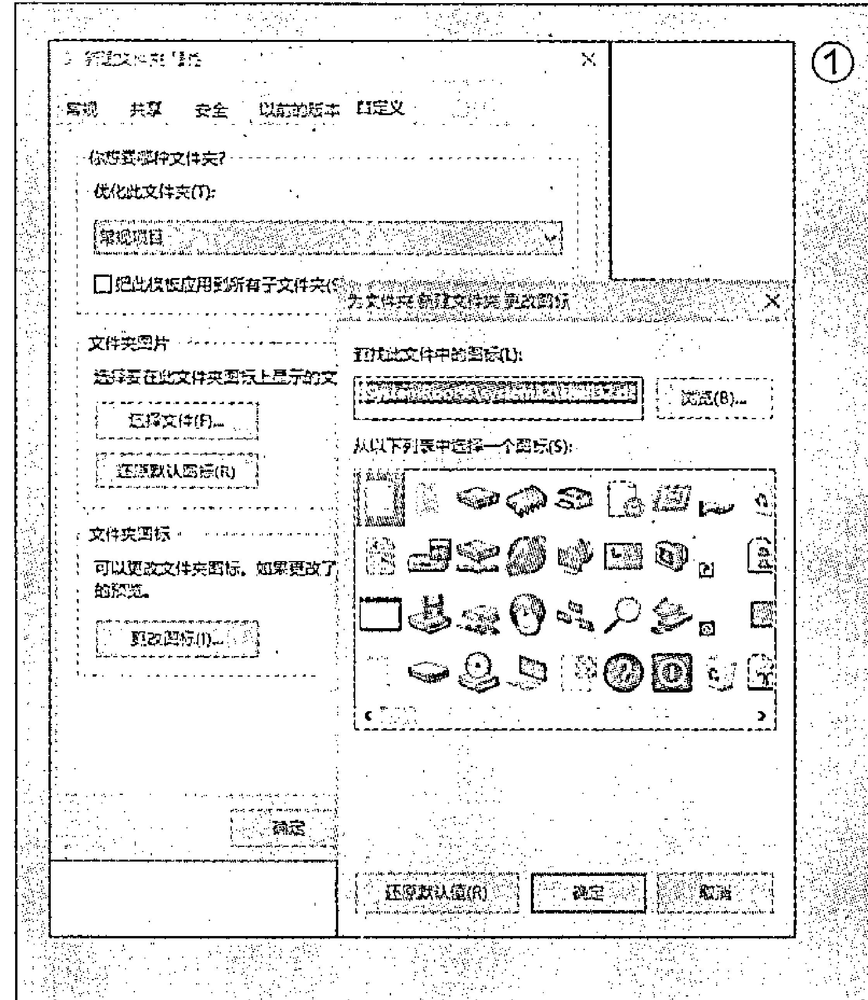

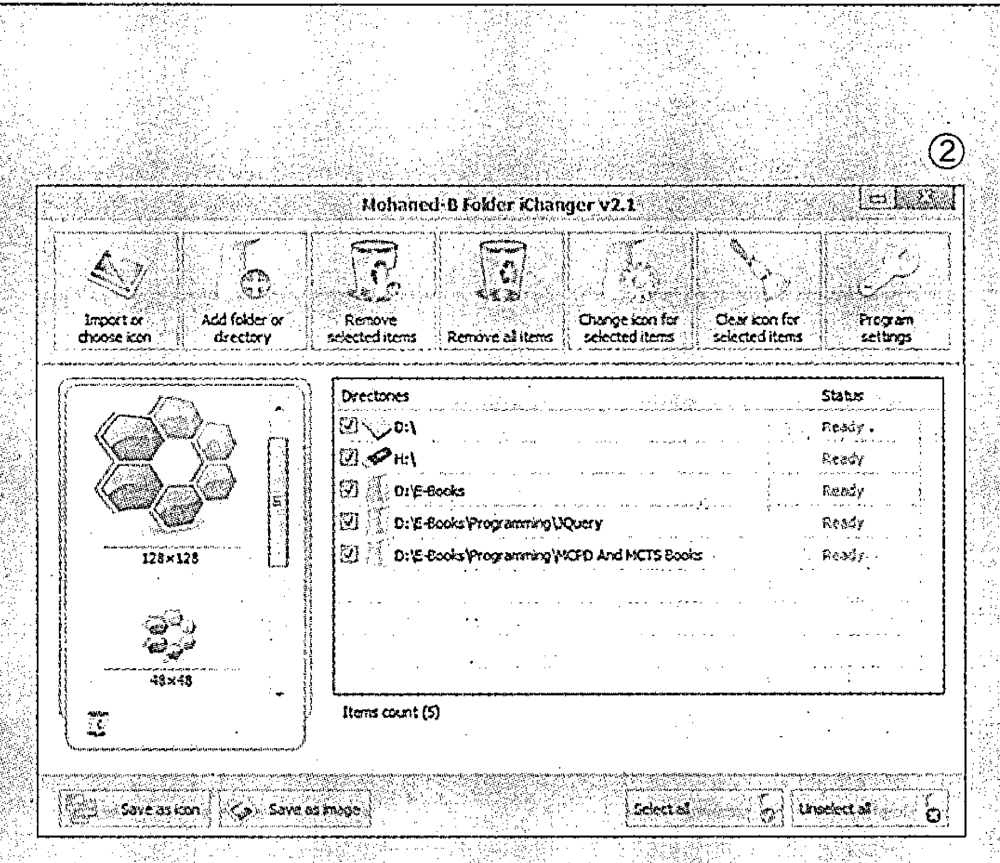

###### 2. 任意文件夹变“磁盘”

对于经常访问的文件夹，尤其是路径比较深的文件夹，除了建立桌面快捷方式外，还可以将其虚拟为一个系统盘符。另外，有的软件在设计时，要求必须直接调用某光盘根目录的数据，而不支持文件夹的数据。这时，将文件夹虚拟为光盘盘符可拓宽软件的使用范围。

要将文件夹虚拟为一个盘符，用系统自带的命令SUBST即可解决。比如要将文件夹 “F:\TEMP\TEST” 虚拟为M盘，只需打开命令提示符窗口，执行 “SUBST M: F:\TEMP\TEST” 命令即可。之后，即可看到在资源管理器中多了一个盘符为M的分区（图3）。

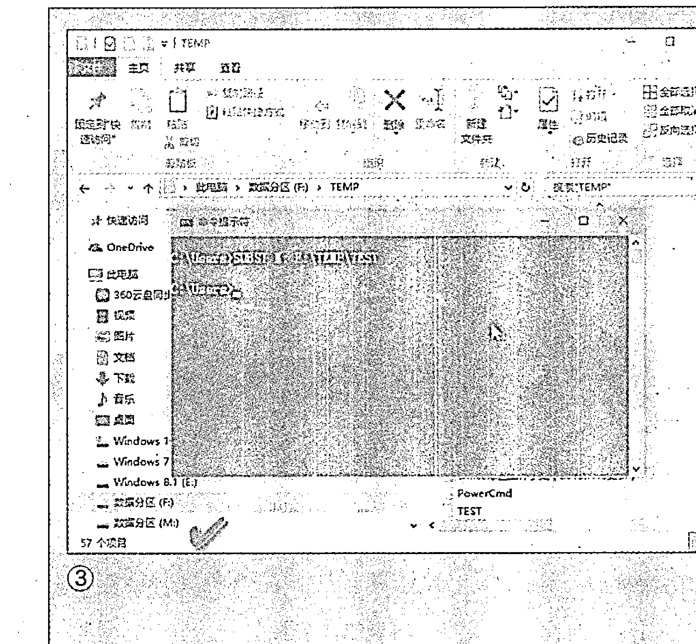

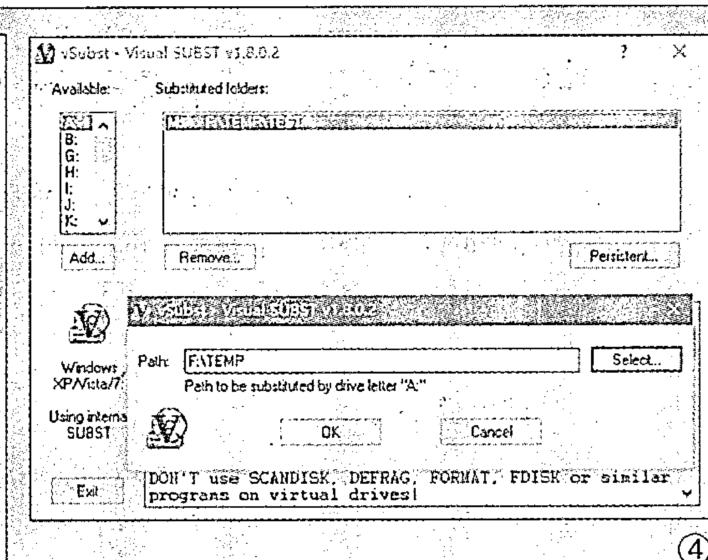

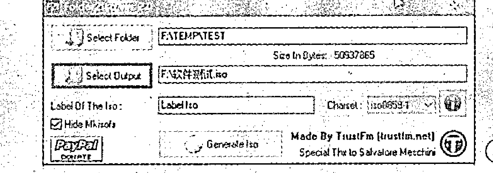

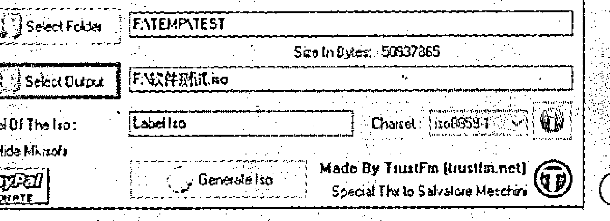

> 如果自己不擅长或不喜欢使用命令提示符的操作方式，那么，还可以使用一个替代品软件vSubst来完成该项任务。启动该软件后，先从左上角的尚可使用的有效驱动器列表中选择一个虚拟盘符（如M:），点击下方的Add按钮添加需要映射的文件夹（如F:\TEMP\TEST），这样新的虚拟盘符M:就生成了（图4）。

> 小提示
与使用命令提示符手动操作相比，该软件还支持永久映射盘符，也就是说不像上面介绍的系统命令那样关机重启后盘符消失。只需点击软件窗口中部的Persistent按钮，软件会将其自身拷贝到系统的System32文件夹下，这样即实现了每次自动启动软件后的盘符自动映射。

> 小技巧
如果要列出当前系统中共建立了多少个虚拟盘符，以及它们所对应的路径，只需执行不带任何参数的SUBST命令即可。若希望删除之前建立的虚拟盘符，执行 “SUBST M: /D” 命令即可。其中M:为盘符，/D表示执行删除操作。另外，若是重启了系统，即便不执行删除命令，上次建立的虚拟盘符也将失效。不过请放心，由于虚拟盘中的文件实际上是存放在映射目录中的，因此重启系统也不会丢失虚拟盘中的文件，只需到对应的映射文件夹中寻找即可。

###### 3. 文件夹快速变为ISO

对于一个含有多个文件的绿色软件，或者自己收藏的一类资料，如果将每个软件或每类资料做成一个ISO来管理，可以有效地防止文件的丢失。那么，一个文件夹、一张光盘如何才能变成一个ISO文件呢？我们可以借助于一款小小的绿色软件Folder2Iso来完成任务。

软件使用非常简单，启动后，点击Select Folder按钮加载要处理的文件夹，使用Select Output按钮定义输出的ISO路径和文件名，命名ISO文件标签，最后点击Generate ISO按钮即可生成ISO映像文件了（图5）。

如果要将一张光盘的内容创建为一个ISO文件，除了用上述方法添加根目录创建ISO外，用WinISO、软碟通等更专业的工具会更合适。尤其是含有启动信息的光盘，更需要用专用工具来制作。

> 扩展阅读
也许你会说，将文件夹制作成ISO保存起来方便了，但使用起来又不方便了。其实不是这样，借助于反向虚拟软件，将ISO在不解包的情况下虚拟为一个盘符（甚至直接右键单击即可虚拟），就可以方便地使用镜像中的软件或资料了。目前Windows 8.1或Windows 10的资源管理器可直接不解包打开ISO文件。如果使用更低版本的Windows系统，也可安装WinMount软件实现右键一键虚拟。此外，如果要解压ISO，也可以使用常用的压缩软件WinRAR或7-Zip等。

读读ePub格式电子书

文|南海居

网上下载的电子图书经常可以见到ePub这种格式。ePub是一种基于XHTML的电子书格式，可根据屏幕和字体大小重排文本，为移动设备阅读提供实现最佳体验的可能。在一些国外的专用移动电纸书阅读设备上，一般都会默认支持这种格式。但是，也许在你的PC、手机或Kindle上运行此类图书，会出现格式不支持等现象。

###### 1. 让电脑上也能阅读ePub

91熊猫看书是一款手机上很著名的电子书阅读软件，其实它还有相应的PC版本，我们可以在电脑上安装该版本来阅读ePub电子书。首次安装91看书，需要设置个人文件夹的位置，阅读过程中的图书个人设置和新下载的图书都要存放在该文件中(图1)。

软件启动后，通过“文件→打开单个文件”，载入需要阅读的ePub电子书(图2)。本地添加的图书会自动出现在“本地书刊”书架上，这样以后也可以方便地从书架上挑选阅读。91看书具有很优秀的重排特性，可根据显示器尺寸和个人喜好的栏宽，设定阅读窗口的宽和高，之后软件会自动适应版面并进行重排，营造出最为舒适的阅读环境。此外，用窗口右上角的“注释”和“书签”按钮，可方便地为正在阅读的图书添加批注和书签。

> > **小提示**
> 注释批注功能需要登录用户账户之后才能使用。91看书不仅支持ePub电子书，还支持txt、umd、html、umd、ndb、ndz等常见电子书、漫画等文档格式，以及以png、jpg、bmp、gif等图片形式存在的电子书格式。拥有一款这样的软件，即可免去安装多款阅读软件的麻烦。

除了以上软件外，我们还可以用一款IBookReader软件来阅读epub电子书。IBookReader软件在视觉上好像是一个平板电脑(图3)，通过“设置”按钮可以定义阅读背景颜色、字体、天气预报等。点击“打开文本”按钮，加载epub电子书进行阅读。该软件的最大特点就是能以模拟实景的方式阅读，无论是纸质的感觉，还是翻书的动态效果，都能与传统阅读的感觉非常相像(图4)。无论是自动翻页功能和键盘方向键翻页，还是自动保存已读位置的记忆阅读，或者是电子书拖拽阅读，以及单页模式与双页模式选择、音乐朗读等功能，都显示了该软件更接近传统阅读的人性化体验。

> > **小提示**
> IBookReader支持epub、umd、txt三种文件格式，目前“我的书架”只支持epub格式文件。如果想在iPad上阅读，也可下载苹果版的IBookReader。

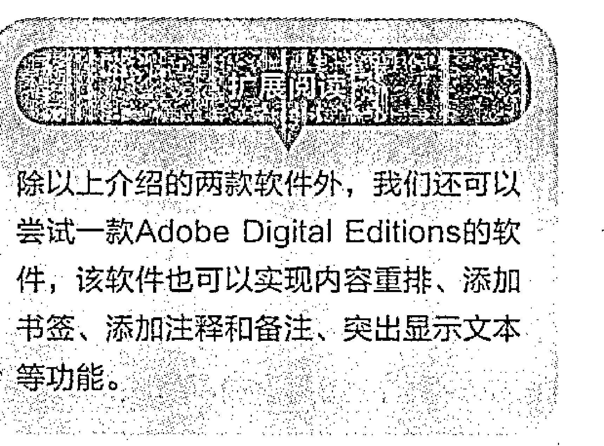

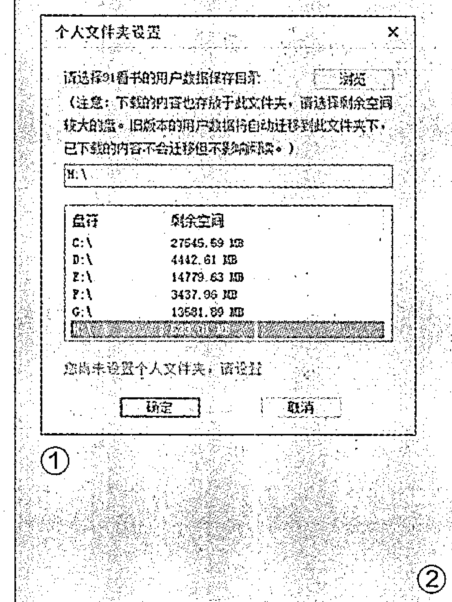

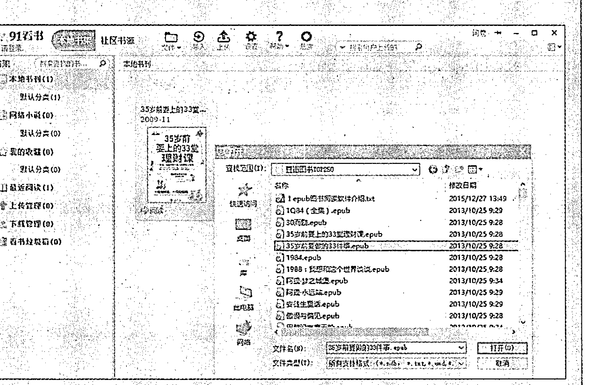

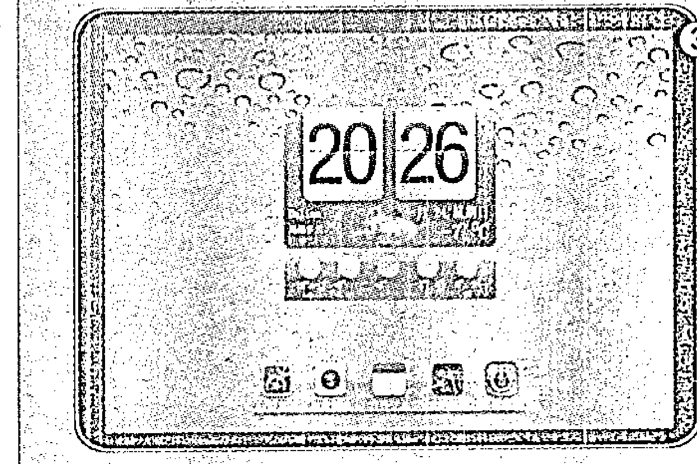

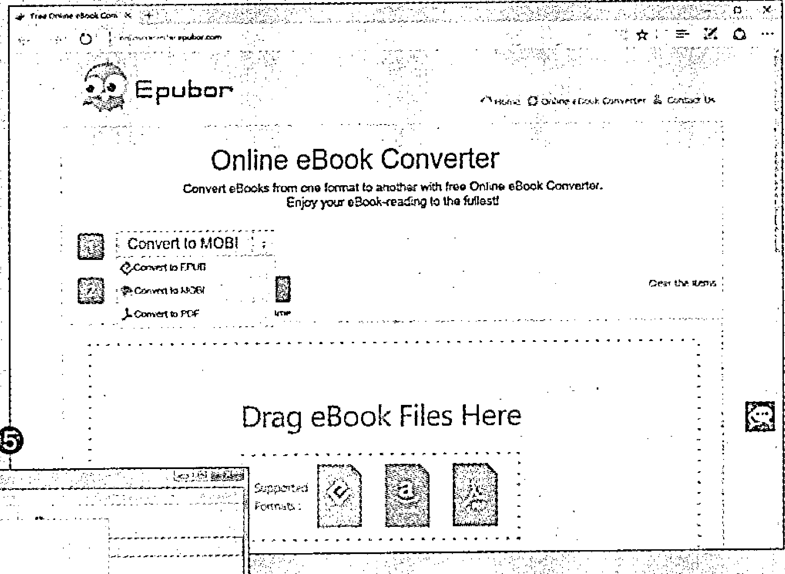


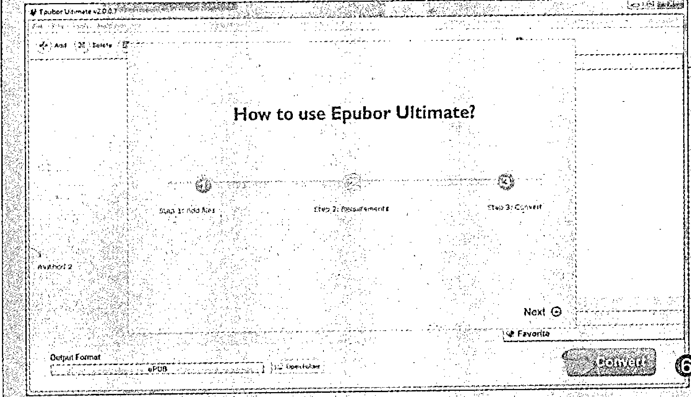

###### 2. Android手机读好ePub电子书

早期的Android手机阅读ePub电子书，可选择的软件有限，而目前支持阅读ePub电子书的Android应用已经有许多。但是软件鱼龙混杂，有的使用体验极差。这里推介其中比较好用的几款：FBReader、Mantano Reader、QQ阅读、淘宝阅读、掌阅iReader、静读天下、EBookDroid等，这些应用都可以直接调用本地存储的ePub电子书，使用非常方便。

按照表中软件扫描软件二维码，安装相应的软件到Android手机上，就可以阅读epub电子书了。以支持格式非常丰富的“QQ阅读”应用为例，在文件资源管理窗口中点击要阅读的epub电子书，选择用“QQ阅读”打开即可。

###### 3. 让Kindle也能支持ePub电子书

ePub作为Google、苹果和许多电子图书馆普遍支持的电子书格式，使用非常广泛，但是，电子书“老大哥”Amazon的Kindle却不支持这种格式。如果要在Kindle上阅读ePub电子书，需要“曲线救国”，将其转换成Kindle支持的mobi格式。

要将ePub转换为Kindle的mobi格式，可以用在线格式转换工具Free Online eBook Converter（网址：http://onlineconverter.epubor.com/）。进入转换服务网页，选择转换方式为Convert to MOBI。接下来点击Browse Files按钮加载要转换的epub电子书（或拖动epub电子书到网页文件拖动框）（图5）。上传完成之后，网页上会显示Completed提示，点击旁边的Download按钮，即可下载获得转换后的mobi格式电子书。

此外，还可用Amazon官方提供的转换工具kindlegen，然后利用其个人文档服务将转换后的文档推送到Kindle设备上。也可以用Calibre格式转换软件进行转换和推送。另外，一款电子书格式转换器Epubor Ultimate Portable也是不错的选择。Ultimate Converter可实现ePub、PDF、mobi电子书格式之间的转换。首次启动软件，根据向导提示，只需3步即可完成电子书格式的转换（图6）。

Android手机epub阅读器推介列表
| FBReader | Mantano Reader | 淘宝阅读 |
|---|---|---|
| QQ阅读 | iReader | 静读天下 |## 让压缩解压更合你意

文|楚南

在平时处理压缩包时，一般只需简单地双击压缩包或在压缩包上用右键解压命令即可完成文件的提取或压缩，但是期间往往还会出现一些细节上的问题影响效率或心情。例如解压后不再需要的源文件以及压缩包中的垃圾文件还需手动删除、解压文件时出现多余的路径、压缩包中的文件因压缩包损坏或无法提取、解压方法不当造成文件丢失等。所有这些问题都包含着进一步用好压缩软件所必须知道的技术。

###### 1. 解决好压解压的小麻烦

###### 自动清理压缩包源文件

网上下载的软件多数都被压缩为Zip或RAR文件，每次安装需要解开压缩包才能执行其中的安装包。如果希望今后使用方便，就需将软件解压后保存。这样，原始的压缩包也就属多余。若下载的软件包多，解压后再去删除这些压缩包，就多了一道环节。如果在解压时顺手添加一个参数项，即可免去手动清理压缩包源文件。

右击压缩包并选择“好压→解压到…”命令项，在解压参数设置窗口中点击“高级”选项卡，将“删除压缩文件”分组下的选项选择为“总是删除”，然后点击“确定”按钮（图1）。这样，解压结束后，无论有多少源文件包，都会被压缩软件自动清理掉。

###### 分类解压资料有头绪

下载的压缩包，每个包中的文件数和文件夹层数可能是不确定的。如果成批解压多个压缩包到当前文件夹，参差不齐的解压结果会造成资料的混乱，不便于管理。这时，如果以原始压缩包文件名各自建立一个文件夹，将资料分别归入对应的目录下，管理起来就清晰多了。

同时选中要解压的一批压缩包，单击右键并选择“好压→解压每个压缩文件到单独的文件夹”，即可获得以压缩包名为文件夹名而单独存放的解压文件（图2）。

> 小提示
> 如果右键菜单中没有出现上述命令，可以通过“好压→其他压缩命令→配置右键菜单”（图3），进入右键菜单配置窗口后，选中列表中的“解压每个压缩文件到单独的文件夹”，点击“确定”即可（图4）。

###### 2. WinRAR“排除”解压有诀窍

###### 免除手动清除多余路径

在提取压缩文件后，如果文件夹下出现多层没有必要的文件夹，这些文件夹只是徒增进入步骤。那么，只需在解压过程中将这些烦人的路径排除掉即可，用不着解压后将文件移出再删除各级文件夹。

首先选中要解压的压缩包，右键单击并选择“WinRAR→解压文件…”（图5）。在随后弹出的“解压路径和选项”窗口中，点击“高级”选项卡，在“文件路径”分组下，我们看到默认选择为“提取完整路径”，也正是这个默认选项才造成了解压出现烦人的多层文件夹，这时只需选中“不要提取路径”，点击“确定”按钮，即可完成自动去除路径（图6）。

> 小提示
> 使用这种方法，要在“常规”选项卡下定义好目标文件夹，若遇到多个压缩包中存在同名文件，软件会默认作出提示。为避免同名文件被覆盖，可在“常规”选项卡中选择覆盖方式为“自动重命名”。

> 小提示
> 换一种思维方式。如果只希望解压出某类文件（如MKV文件），而其他所有类型文件都不予理会，那么只设置“被解压的文件列表”类型为“*.MKV”即可。

###### 从坏压缩包中提出好文件

如果在解压一批资料压缩包的过程中，软件提示压缩包损坏，确认后压缩窗口关闭，先前解压出的文件也自动被删除，什么也得不到。在这种情况下，为了最大限度地获得可用文件，可充分利用压缩软件提供的包内文件保护功能，将可用的文件保留下来。

选择受损的压缩包，右击并选择“解压文件…”。在“解压路径和选项”窗口的“常规”选项卡下，选择“其他”分组项目下的“保留损坏的文件”复选框，最后点击“确定”按钮执行解压（图7）。这样，即便是中途出现解压错误，已经解出的文件都会保留，而不会被自动删除。如此就可以在解压文件夹下收获尽可能多的可用文件了。

###### 自动排除包中的无用文件

在一批视频压缩包中，每个里面都含有JPG格式的广告图片，而我们只需要其中的视频文件，根本不需要这些广告。这时，选中所有要解压的压缩包，右击并选择“WinRAR→解压文件…”命令，在文件解压设置窗口中切换到“高级”选项卡，选中“要排除的文件列表”复选框，并在下边输入要排除的文件类型，如本例输入“*.JPG”，表示不解压所有的JPG文件（图8）。点击“确定”，解压后的文件夹中再不会出现图片广告了。

###### 别让百度的“小毛病”再碍手碍脚

文|阿立

百度提供了搜索引擎、云存储、在线播放等一系列的产品，但是对于普通用户来说，百度的一些产品在使用过程中或多或少有些限制。其实通过脚本增强浏览器的功能，可以让百度的这些产品用起来更加简捷、方便。

###### 搜索引擎直接跳转

无论是百度还是其他的搜索引擎，用户在点击搜索结果中的某个链接后，均会自动跳转到相应的网站页面。可是有的时候会出现跳转错误，或者整个跳转过程非常缓慢的情况，这是因为百度在进入搜索结果的过程中间，实际上做了一个中转。所以为了避免这种情况的发生，我们可以通过一个脚本屏蔽掉这个中转行为，直接跳转到真正的结果页面。

现在很多浏览器都支持脚本扩展功能，这里我们就以谷歌浏览器进行演示。首先进入到浏览器的“Chrome网上应用店”，通过应用商场左上角的搜索框，搜索查找“Tampermonkey”这个扩展。找到这款扩展后，根据提示进行安装操作。安装成功后，我们即可进行脚本的添加了。

接下来在浏览器的地址栏里面输入https://greasyfork.org，回车后就可以登录到一个专业的脚本发布网站。在网站的搜索框里面输入“remove the jump link in BAIDU”关键字，查找到以后在脚本的介绍窗口点击“安装此脚本”按钮（图1）。接下来会弹出一个是否安装脚本的提示框，点击“安装”（图2）。以后当用户在百度搜索结果里面点击某个链接后，就可以直接打开这个网站的页面，不会再因为百度中转而导致链接打不开或缓慢的问题。

###### 解决不存在的分享页面

对于百度网盘比较熟悉的用户都知道，百度网盘以前的分享链接采用的是长地址，而后来为了简洁又改用短地址。可是如果找到的分享链接仍然是长地址的话，那么在访问的时候就会提示用户该分享页面不存在。其实如果这个分享文件还存在的话，那么只要找到分享用户的首页就可以下载到需要的文件。

在脚本网站的搜索框里面输入“自动转到分享页”关键字，查找到以后按照前面的方法进行安装操作。以后当用户通过浏览器访问长地址的百度网盘分享链接的时候，脚本就会从长地址中提取出分享用户的百度ID，然后再自动跳转到这个ID对应的百度网盘的分享首页，这样用户就可以从中找到需要的文件，点击它以后进行下载就可以了（图3）。

###### 网盘文件直接在线搜索

上面介绍的方法，实现的前提就是分享的文件没有被删除。如果该文件已被删除，那就只能寻找其他的方法了。最简单的方法当然就是通过对百度网盘的分享链接进行搜索，从而找到自己需要的文件信息。

首先在脚本网站里面搜索“百度网盘插件”并进行安装，

> 小提示
> 如果用户使用的是其他浏览器的话，就需要安装对应的扩展才可以，比如火狐浏览器则安装Greasemonkey这个扩展。

接下来登录到自己的百度网盘，就会在网页的上方和左侧分别看到一个搜索框。在上面的搜索框输入关键字后按下回车，就可以在自己的百度网盘中进行搜索。而在左侧的搜索框输入关键字后按下回车，就可以在整个百度网盘的分享链接中进行搜索查找（图4）。由于这个脚本是在百度网盘的WAP版本中搜索的，因此打开的链接也是WAP形式的（图5）。这个方法还有一个好处，就是它可以突破下载大文件的限制，无需百度云管家也能进行下载。

###### 自动识别验证码来下载

当一个文件访问量比较大的时候，百度网盘就会通过输入验证码的方式，对系统的下载压力进行减缓。虽然输入验证码并不是什么复杂的事情，但总是输入不正确的话也非常让人恼怒。好在现在利用一个脚本就可以自动完成验证码的输入，这样下载文件的时候就简单方便多了。

###### 绕过大文件下载的限制

当用户进入到百度网盘进行下载的时候，如果下载的文件体积比较大的话，那么网站就会要求用户通过百度云管家客户端程序进行下载。如果用户没有其他办法的话，也只能按照网站的提示进行操作。其实利用脚本可以屏蔽这个提示框，这样直接利用浏览器或者下载软件，也可以进行大文件的下载操作了。 这次在脚本网站的搜索框里面输入“绕过百度网盘大文件下载限制”关键字进行安装，安装完成以后在进入到分享文件的下载页面后，从列表中选择需要进行下载的文件。接着点击窗口里面的“下载”按钮，这时就会直接调用浏览器的下载功能，从而对这个大文件进行下载操作了。

###### 删除百度音乐盒的广告

现在百度音乐里面收录了很多的音乐文件，如果用户需要试听的话都会添加到百度音乐盒。但是不知道从什么时候开始，百度音乐盒在每首音乐的播放间隔中会插入一段声音广告，而通过常见的广告过滤软件又无法屏蔽它。如何才可以删除这个讨厌的广告信息呢？在脚本网站的搜索框里面输入“killBaiduMusicBox_Ad”关键字搜索安装，以后用户再打开百度音乐盒进行播放的时候，这款脚本就会自动删除这个插入的声音广告，从而可以帮助用户一首接一首的顺利播放下去，让普通用户也享受到VIP用户的待遇。

###### 无需第三方 网页亦可P2P

文|倚楼

互联网目前也有很多的共享方法，但是每一种方法都有它的不足之处，如有的公司限制用户使用即时通信软件，自然这种方法是不能进行选择的。而通过电子邮件或者网盘进行共享，又需要首先将文件上传到服务器里面，费时费力。那么有没有什么方法，可以不受限制地进行快速共享呢？

###### 浏览器充当P2P软件

作为一个可以上网的电脑，浏览器自然是一款标配的软件，所以如果利用浏览器直接进行文件传输，就可以省去安装使用其他第三方软件的麻烦了。

首先我们通过浏览器登录Reep.io网站(https://reep.io)，这个网站不需要用户进行任何的注册就可以操作。现在点击网页中的“Add or drop files”按钮，在弹出的对话框中选择需要进行发送的文件即可(图1)。当然还有一个更简单的方法，就是选中文件以后拖拽到网页中释放。稍等片刻，网页中即会出现一个文件的分享链接(图2)。

现在将这个分享链接复制到剪贴板中，再通过电子邮件等方式发送给需要的好友即可。当好友接收到电子邮件(或其他形式)并打开分享链接后，网站就会在你和对方好友之间建立一条点对点的P2P通道。这个时候好友只需按下“Download”按钮，即可直接从你的电脑系统中下载文件了。需要提醒大家的是，由于这个时候浏览器起的作用是P2P软件，所以在文件的传输过程中双方必须同时开着网页，不然的话P2P通道一旦关闭文件传输就会马上停止。由于这种传输方式并没有经过服务器中转，所以用户自然而然就省去了文件上传的时间。

如果用户同时将分享链接发给了多个用户，那么通过分享页面还可以看到下载用户的相关信息，包括他们的下载速度以及进度。只要对方下载完成后就可以关闭浏览器，其余并不需要用户做任何的操作。用户如果觉得单独的链接不安全的话，那么还可以在选择文件的时候点击“No Password”按钮。接下来在弹出的对话框中设置一个密码，这样对方只有成功输入密码后才可以进行文件的传输操作。

###### 移动终端也能玩P2P

我们平时要想在电脑和手机之间传输文件，最常见的方法不是使用网盘就是使用即时通信软件，但是无论使用哪一种方法，电脑里面都需要安装客户端软件。现在只要利用Snapdrop这个云端服务，就可以既不需要用户安装专门的APP应用，也不需要用户安装任何的客户端程序。只要通过电脑和手机系统中的浏览器，就可以互相进行文件的传输，而且没有系统以及文件大小的限制。

这里通过电脑中的火狐浏览器访问Snapdrop云端服务的页面(https://snapdrop.net)，页面看上去和苹果的AirDrop服务非常相似。接着打开手机中的浏览器，访问同一个云端服务的页面。

如果两台设备在同一个局域网的情况下，很快浏览器页面就会侦测出另一个设备的存在，并且在浏览器里面显示出该设备的系统以及浏览器信息(图3)。比如我们要从手机传送文件到电脑里面，只需要点击手机浏览器中的“Windows Firefox”按钮，这个时候会弹出一个选择菜单(图4)。这里我们选择菜单中的“文档”命令，再在弹出的对话框窗口中选择相应的文件就可以了。当手机浏览器里面选择好文件后，电脑浏览器就会马上弹出一个文件下载提示窗口(图5)。点击其中的“Download”按钮，就会在电脑和手机之间创建一个临时的P2P通道，这样文件就会很快地下载到用户的电脑里面了。如果想要从电脑传输文件到手机里面，只需要在电脑浏览器里面点击“Android Chrome”按钮，选择相关的文件进行传输就可以了。

> 如果在使用手机浏览器点击按钮后，没有弹出相关的选择菜单的话，那么建议关闭浏览器的广告过滤功能，或者直接使用系统自带的浏览器应用。

###### 跨网之间的P2P传播

虽然Snapdrop这个云端服务还不错，但是如果要想将自己手机的文件传输给外网的朋友自然就不行了。这个时候只能通过Snapdrop服务，首先将文件传输到自己的电脑里面，再通过Reep.io网站传送给其他用户。这样的操作肯定是比较麻烦的，所以这个时候可以试试“Send Anywhere”这个更加方便的传输服务。

不过要想使用这项服务的话，必须在手机里面安装一个“名为Send Anywhere”的应用。好在自己的手机自己做主，并不会出现任何的限制，而且该应用支持iOS、Android、Windows Phone等主流的手机系统。第一次运行“Send Anywhere”这款应用，它会要求用户设置一个名称。默认使用的是移动设备的型号，设置完成后点击“好”按钮即可。接着进入到应用的主界面，点击界面中的“发送”按钮(图6)。然后选择要传送的照片、文字、音乐或其他文件格式，选择完成以后点击右下角的“传送”按钮就可以了(图7)。

> 产生的每组密码仅可使用一次，而且有效期只有十分钟的时间。

很快“Send Anywhere”服务会产生一组六位数的密码，将该密码通过微信、电子邮件等方式提供给好友。当对方接收到这组密码以后，通过浏览器访问“Send Anywhere”服务的官方网站(https://send-anywhere.com)，将页面向上滚动就可以看到一个“KEY”的输入框。现在将收到的六位数密码输入其中，然后点击后面的“Receive”按钮进行确认(图8)。当密码匹配成功以后，浏览器就可以通过P2P技术连接到手机应用上面，然后开始自动接收刚刚手机选择的文件了。

###### 软件搞定另类屏幕截图

文/沧浪

特殊需求的屏幕截图有时会让人大伤脑筋——打开的菜单一按截屏按钮就跑掉了，怎么办？截图边缘的渐变过渡效果如何制作？截图太小能否直接放大？不希望别人看到的部分模糊处理，程度如何控制？如何聚焦突出显示需要强调的部分？要精确量取屏幕尺寸该怎么办？日常鼠标操作能否借用抓图软件的十字丝？所有这些，不需要在截图后找专门的图像软件来处理，一款另类的截图软件FastStone Capture即可快速解决。

###### 1. 多级菜单不会跑掉

软件启动后，桌面上会出现浮动工具条；与此同时，一个红绿交叉的斜三角图标驻留于系统托盘之上。抓图和处理依托于这两样组件来完成，此外还有另一样“暗器”——快捷键组合。

平常抓取固定的窗口还好说，当要抓取多级菜单的某一级时，没等按下抓图按钮，画面却跑掉了。如果使用FastStone Capture软件，由于它默认定义了捕获窗口对象的快捷键“Shift+PrintScreen”，当展开到屏幕菜单某一级并需要抓取时，鼠标停留到该级菜单，然后按下上述快捷键，即可框选和抓取该级菜单（图1）。

> 小提示：若需要连同各级菜单及其周边环境一同截取，只需在按动组合键后，移动鼠标光标，即可改变需要抓取的区域。而这时各级菜单也会固定不动，不会因为鼠标的移动而跑掉。

###### 2. 过渡效果一气呵成

我们常常可以在一些网文或艺术配图中看到图片边缘渐变模糊或撕裂的效果，也许多人以为需要抓取后用图片软件来处理，其实大可不必。只需点击FastStone Capture工具栏的“输出→边缘/水印”选项，然后选中“捕捉完成时自动应用边缘/水印效果”复选项，选择“淡入边缘”输出效果并进行配置。这样就可在抓图结束后，自动获得边缘颜色逐渐淡化的效果了（图2）。

> 小提示：在“边缘/水印”设置窗口中，选择“边缘阴影”“撕裂边缘”“边框”“水印图像”等选项，可获得不同类型的边缘效果，或能给图片加水印。

###### 3. 截图太小直接放大

如果觉得截取的图片太小看不清，希望作放大处理，可将截取输出选项设定为输出到编辑器，这样抓图后图片会自动在自带的编辑器中打开。

随后在图片编辑器窗口中点击“调整大小”按钮（或右键单击图片并选择“调整大小”），以像素或百分比的形式自由定制图片的缩放比例（图3）。

> 小技巧：为了保持放大后的图片不变形，请选择以“百分比”方式缩放。同时选中“保持外观比例”和“启用消除锯齿”复选框，这样可使得抓取的图片不变形、不带毛边。

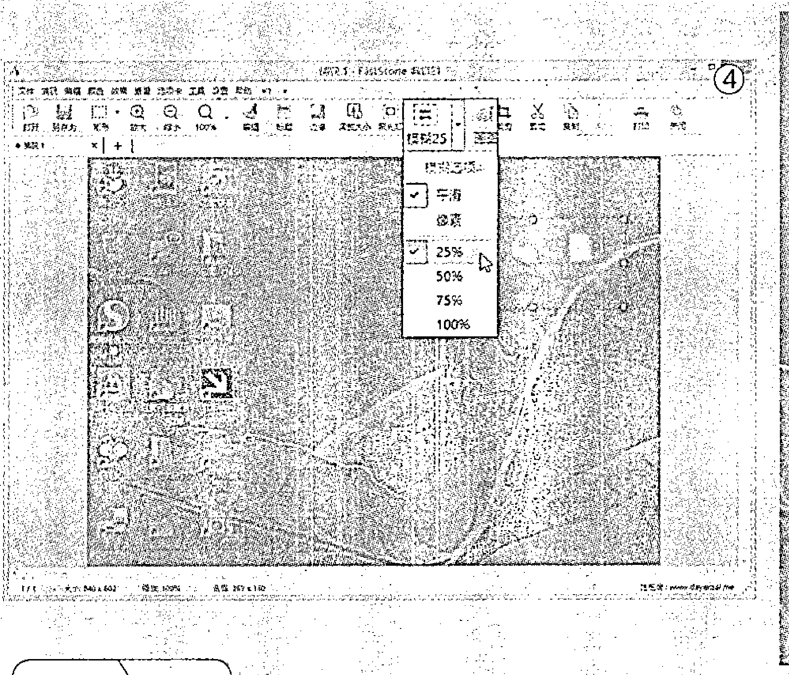

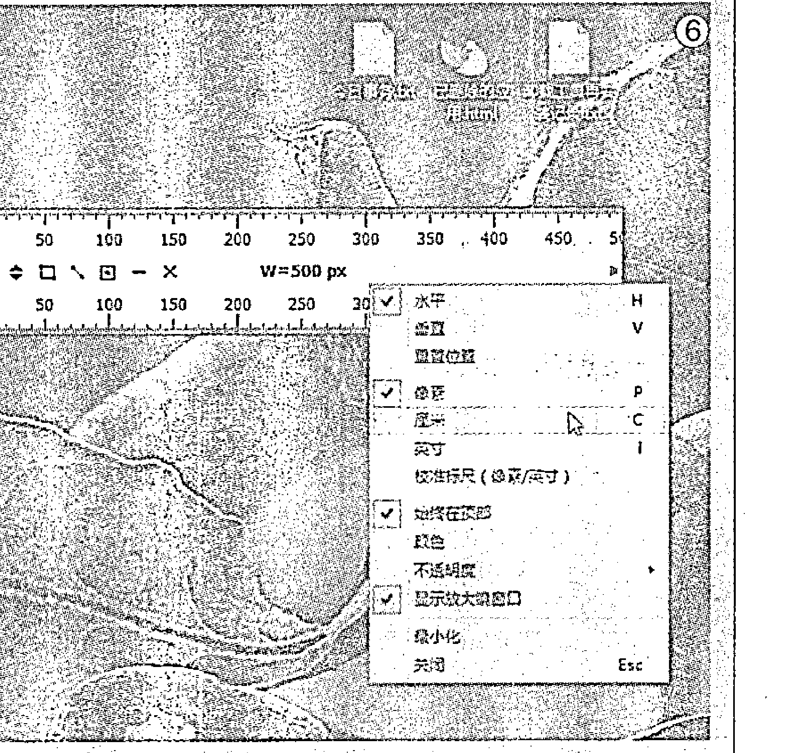

> **小提示**
尺子的单位可以通过尺子的右键菜单选择，包括像素、厘米、英寸等。
此外还可以调整尺子的水平或垂直方向。若不再需要，可用Esc键退出。

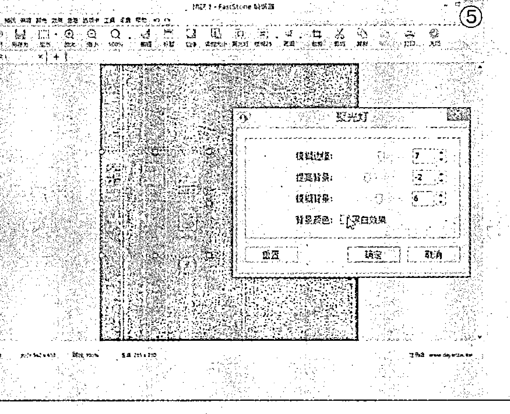

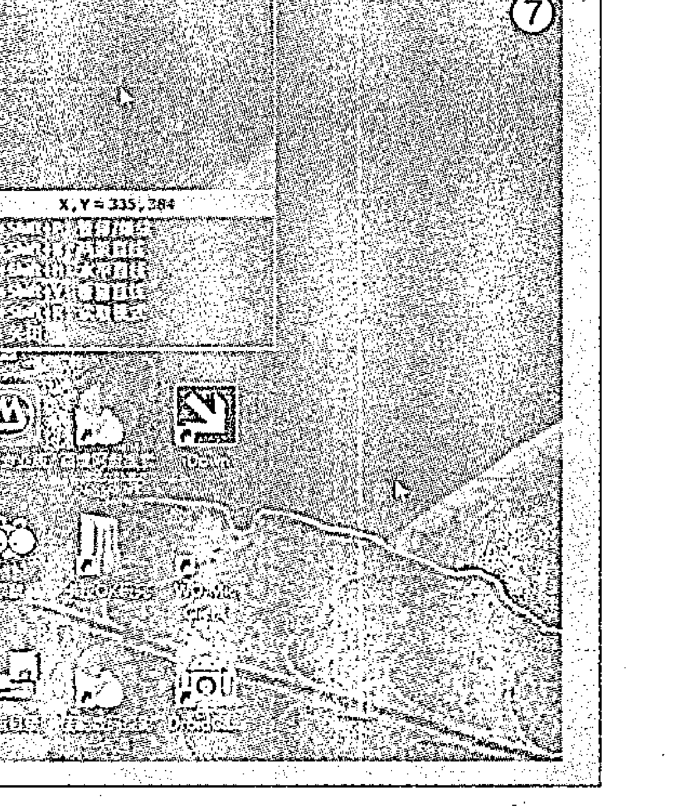

##### 4. 模糊处理任你控制

若希望对截图的某些部分作模糊处理（例如一些敏感隐私数据或图标等），这时，可在抓取结束后，在自动开启的图片编辑器中先框选要模糊的部分，然后点击“模糊”下拉按钮，选择模糊的级别参数。这样，选中的部分就以设定的模糊程度被处理了（图4）。

##### 5. 聚光效果突出强调

为了突出强调某一部分，美术人员常常要对图片中需要强调的部分进行光线突出处理，而淡化处理其余的部分。在FastStone Capture软件中，只需在抓图后选中需要突出的一块，然后点击“聚光灯”按钮，通过滑块调整模糊边缘、提亮背景、模糊背景等参数，即可获得用聚光强调的突出效果（图5）。

##### 6. 屏幕尺寸精确量取

如果对屏幕截图的尺寸要求比较严格，配备一把“尺子”很有必要。在FastStone Capture系统托盘图标上单击右键，然后选择“屏幕标尺”，随后在屏幕上就会出现一把能够任意拖动位置的“尺子”。这样就可以在抓取部件时，有个丈量的尺度了（图6）。

> **扩展阅读**
通常，电脑的鼠标光标都是一个斜箭头图标。大家会发现在使用截图软件时，屏幕指针会变成一个非常细的十字丝，类似于精密光学仪器或狙击枪的十字光标，看起来很酷，定位也很容易精准把握。如果喜欢这种样式，也可以借来作为日常之用。右键单击FastStone Capture托盘图标，选择“屏幕十字线”。这时屏幕上的光标变成十字丝样式，同时还有放大的导航窗格，可及时确定屏幕的像素坐标。根据导航格内的快捷键提示，还可以控制只显示一条直线或两条线全显示（图7）。

##### 明察秋毫 解决病毒及后遗症

文|重剑

木马、病毒等的横行，催生了许多安全工具，这类工具的功能虽然主要是针对安全威胁的，但合理利用，在解决系统故障方面同样能大展手脚。

##### 解决无法运行的软件

有不少人遇到过某款软件总是无法运行的故障，即便重装软件也无法解决。观察硬盘指示灯，明明看到在读取数据，打开任务管理器也能看到软件进程。出现这种奇怪的情况，很有可能是Windows的映像劫持功能“IFEO”（Image File Execution Options）在作祟。

想要解决这一问题，这里推荐使用PowerTool。PowerTool成功运行后，就会对当前系统的安全性进行分析扫描，一旦发现有问题的内容后就会用红色进行显示（图1）。比如我们这里已经显示出映像劫持有问题，那么点击软件窗口中的“应用层”标签，接下来再点击下面的“映像劫持”子标签。这样就可以在列表中显示出所有的映像劫持内容，选中这些项后，右击，选择右键菜单中的“修复”按钮（图2）。当重新启动系统后，被劫持的软件即可正常运行了。

##### 查找危险的进程

要想了解Windows系统当前的运行状况，查看当前的进程是非常重要的途径。但是通过任务管理器进行查看的话，并不能了解到所有进程的实际情况。因为有的进程被电脑病毒等进行了隐藏，而有的则是利用了线程插入技术，借用其它的进程完成操作。如何才可以更好地查看和管理这些进程信息呢？

点击PowerTool窗口中的“进程管理”标签，就可以对系统中的进程进行分析判断。为了方便普通用户的查看，软件通过不同的颜色来区分不同的进程信息。比如黑色代表Windows系统自身的进程，而蓝色则代表第三方软件的进程。除此以外，通过进程列表中的“进程类型”选项，就可以进一步显示出进程的相关介绍。如果这里没有任何显示的话，那么自然就是重点关注的项目。当我们选择一个进程以后，点击鼠标右键选择菜单中的命令，就可以对其进行管理操作。如果用户对某个进程有怀疑的话，点击“上传到Virustotal进行病毒扫描”命令，就可以对进程对应文件的安全性进行分析（图4）。如果发现该进程的确是有问题，那么点击“结束进程”命令可关闭该进程。

红色则是被进行线程插入的进程，也是需要用户重点关注的进程信息。当用户用左键选择一个进程后，在窗口下方的“模块”列表中，就可以显示出所有的模块信息。同样点击鼠标右键可以对模块文件进行管理，比如

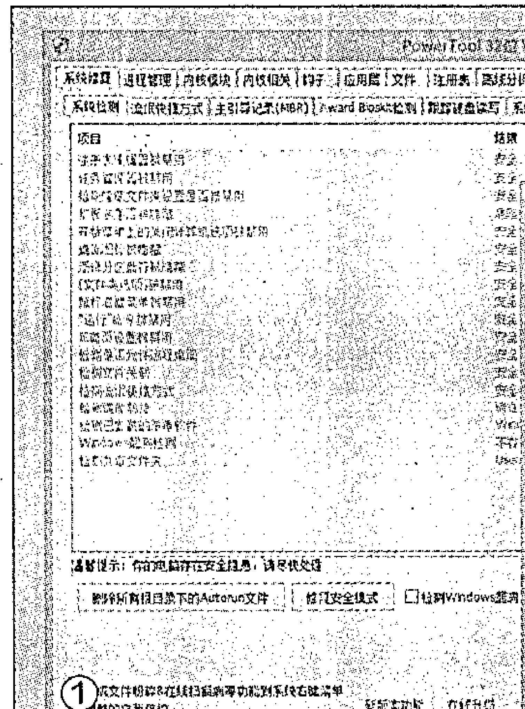

> 小提示
* 由于PowerTool这类的软件需要渗透到系统的底层，所以在运行的时候会加载一些驱动文件，因此建议大家不要将文件解压到含有中文信息的文件夹中运行。另外在运行该软件之前，最好重新启动一次系统，这样可以更好地使用该软件的功能（图3）。还有需要注意的是，一定要选择和系统对应的版本，比如32位的系统就运行32位的版本。如果不注意以上几点的话，那么在软件运行后很可能出现蓝屏的情况。
* 很多病毒在进行映像劫持后，被劫持的软件进程会自动跳转到病毒文件。而我们通过右键菜单中的“修复以及删除关联文件”命令，就可以在操作的同时将病毒文件也删除掉。

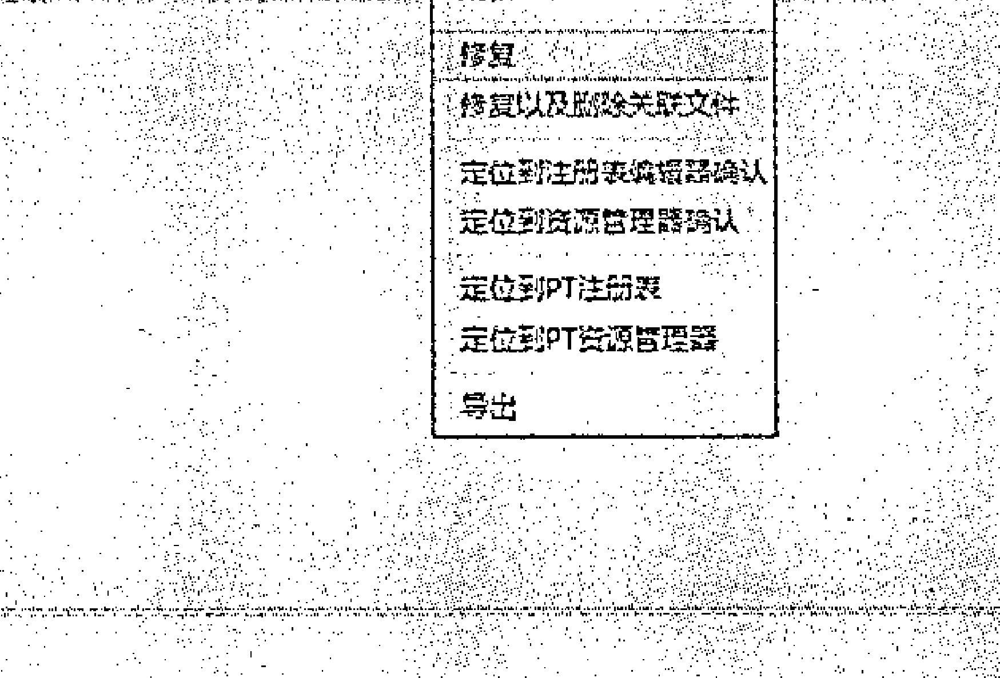

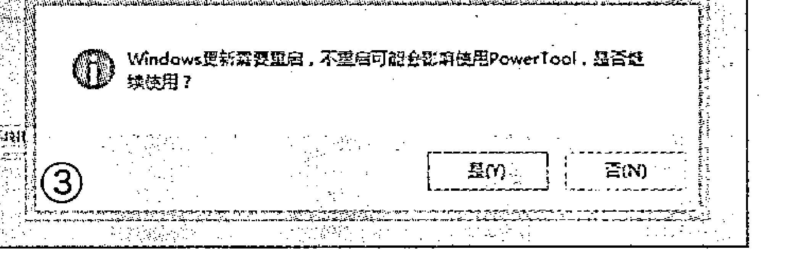

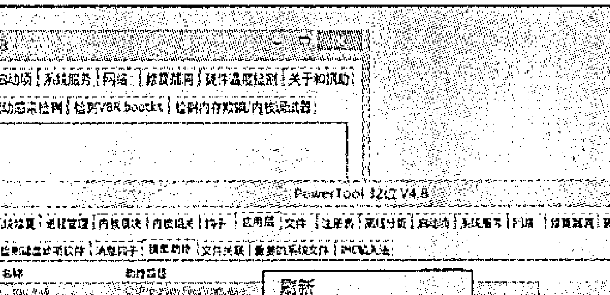

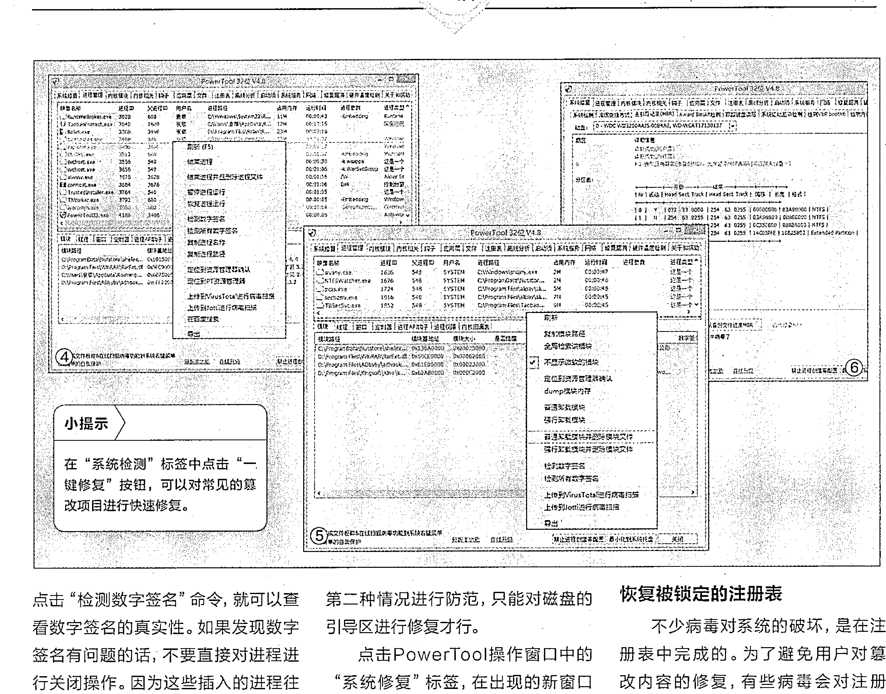

> 小提示
在“系统检测”标签中点击“一键修复”按钮，可以对常见的篡改项目进行快速修复。

点击“检测数字签名”命令，就可以查看数字签名的真实性。如果发现数字签名有问题的话，不要直接对进程进行关闭操作。因为这些插入的进程往往是系统进程，如果直接结束进程的话，就会出现系统蓝屏的情况。我们可以在选择模块文件后，单击右键菜单选择“普通卸载模块并删除模块文件”命令，就可以在解除模块和进程的关联后删除相关的模块文件(图5)。

##### 修复引导区

当系统出现问题后，许多人可能会选择重装系统。但是让人疑惑的是，不少刚刚安装的操作系统就有病毒，再次重装还是如此。出现这一现象可能由两种情况导致，首先就是系统里面的程序文件被感染，当用户再次运行被感染的程序后，操作系统被重新感染。其次就是病毒的源头并不在系统中，而是在磁盘的引导区中。这样在电脑启动的时候，隐藏在引导区中的病毒就会再次感染系统。要想对第二种情况进行防范，只能对磁盘的引导区进行修复才行。点击PowerTool操作窗口中的“系统修复”标签，在出现的新窗口里面选择“主引导记录(MBR)”子标签。如果用户只安装了一块硬盘的话，那么直接点击窗口下方的“检测”按钮，软件开始对磁盘的引导区进行分析处理。如果用户使用的是双硬盘的话，那么首先在磁盘列表中选择引导区所在的硬盘，然后再点击“检测”按钮对引导区进行检查。

当引导区检测完成后，PowerTool会给出一个详细的报告，并且用不同的颜色表示出安全状况(图6)。比如引导区已经被病毒进行破坏，那么就会用红色显示出“检测到恶意代码(MBR Rootkit)”这样的提示。接着点击窗口下方的“自动修复MBR”按钮，这时软件会弹出一个提示窗口，点击“是”按钮就开始进行引导区的恢复，同时也就是进行引导区病毒的清除了。

##### 恢复被锁定的注册表

不少病毒对系统的破坏，是在注册表中完成的。为了避免用户对篡改内容的修复，有些病毒会对注册表进行锁定，造成我们无法编辑注册表。

大部分所谓的对注册表的锁定，就是禁止用户使用Regedit编辑器。不过网上有很多第三方的注册表编辑器，其实PowerTool中也有类似的编辑器功能。

在PowerTool中切换到“注册表”标签，在“重要的注册表项”里面输入HKEY_CURRENT_USER\Software\Microsoft\Windows\CurrentVersion\Policies\System，再点击“快速跳转”按钮就可以找到锁定注册表的位置。

然后在右侧窗口里面找到DisableRegistryTools项，点击鼠标右键选择“删除”命令后重新启动系统。这样就可以重新使用系统的Regedit编辑器进行操作了。

##### 过滤加密页面中的广告

文|倚楼

传统的网站都是通过HTTP协议来传递数据的，但是这种方式非常不安全，所以越来越多的网站开始使用HTTPS协议传输数据。不过新的问题也随之而来，由于传输的数据都进行了加密处理，这样常见的广告过滤软件也就失去了作用。今天要为大家介绍的是如何对加密传输的广告内容进行过滤，从而让页面保持一个干净整洁的状态。

###### 简单实用的过滤扩展

广告过滤扩展有很多，这里我们来试一试uBlock Origin。首先打开谷歌应用商店，搜索查找uBlock，会发现有两个相关的功能扩展。推荐大家安装uBlock Origin这个版本，因为此版本是由原作者进行开发维护的。安装完成后，在谷歌浏览器的工具栏找到该扩展的图标，点击选择“选项”，即可对其进行配置。首先点击“第三方规则列表”项。稍等片刻，在页面中就可以显示出可以订阅的广告过滤。这里我们将功能扩展默认订阅的规则都去除，接着在“地区语言”里面可以看到两个CHN开头的规则，勾选上这两条规则就可以了（图1）。

可以较好地阻止网站的用户跟踪脚本。设置完成后点击“立即更新”按钮，就可以下载订阅的规则进行使用了。以后当我们访问使用HTTPS协议传输的网站时，uBlock Origin即可轻松地对广告信息进行拦截。

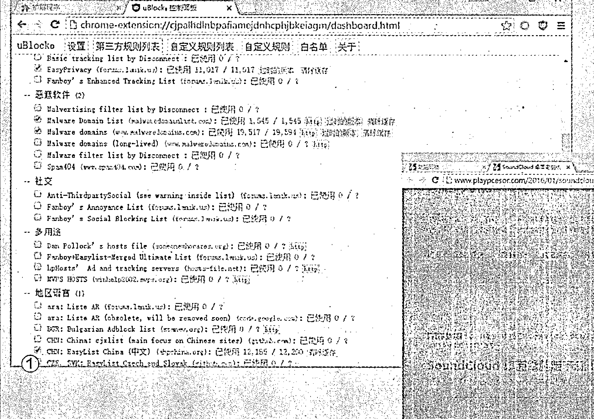

###### 手动设置过滤规则

和我们常见的杀毒软件一样，广告过滤也会出现“误杀”，或者过滤不彻底的状况。这个时候用户就需要自己动手，对广告过滤规则以及扩展设置进行调整。

对于那些被“误杀”的页面信息，很多都是对网站进行修饰操作的内容。所以我们只需要左键点击工具栏中的uBlock Origin图标，在弹出的对话框中点击“不对此网站应用修饰规则”按钮，接着刷新一下当前的页面信息，就可以看到被“误杀”的信息又显示出来了。对于过滤不彻底的信息，可以手动添加过滤规则。左键点击uBlock Origin图标，在弹出的对话框中点击“进入元素选择器模式”按钮。点击该命令以后网页会整体呈现褐色，当光标移动到某个元素上方的时候，该元素就会呈现出红色高亮的状态。

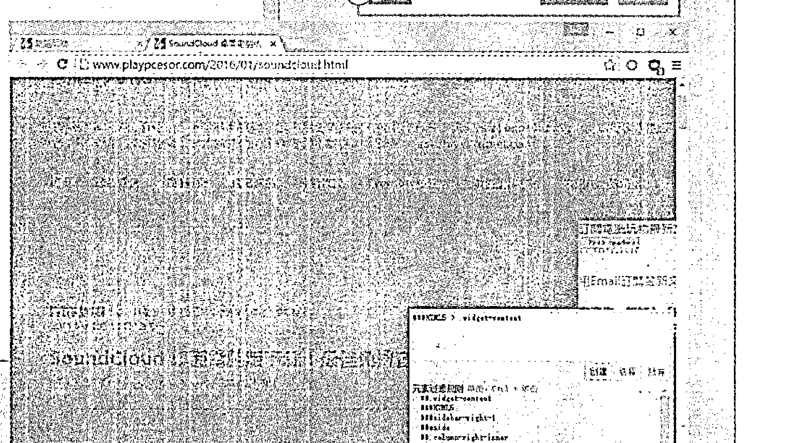

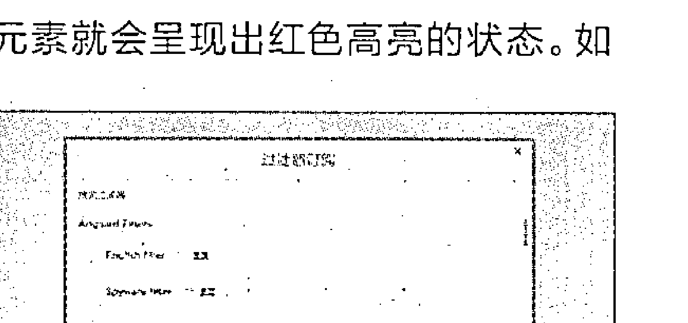

如果要过滤某些元素，只需要在高亮状态下点击左键，在弹出的对话框中点击“创建”按钮就可以新建一条过滤规则了（图2）。

##### 不用功能扩展也能过滤

通过功能扩展虽然很方便，但是并不是所有的浏览器都支持这一功能，对于像IE这样的浏览器就无法解决了。这种情况下只能借助于专业的广告过滤软件才行。不过前面已经提到常见的广告过滤软件并不能过滤HTTPS中的广告信息，所以这里我们可以试试Adguard这个全新的广告过滤软件。

首先下载安装最新版本的Adguard，安装完成后会在系统托盘中显示出软件图标。在图标上点击鼠标右键，选择菜单中的“选项”命令，就可以开始进行软件的配置操作。现在点击左侧列表中的“广告拦截器”项，在“过滤器订阅”选项下面点击“添加过滤器”按钮。接下来在弹出的列表里面，勾选自己需要的广告过滤规则，点击“添加已选择项”按钮就可以了（图3）。如果列表中没有需要的广告过滤规则，可以点击“通过URL添加订阅”按钮，将规则的下载链接粘贴到弹出的对话框中即可。

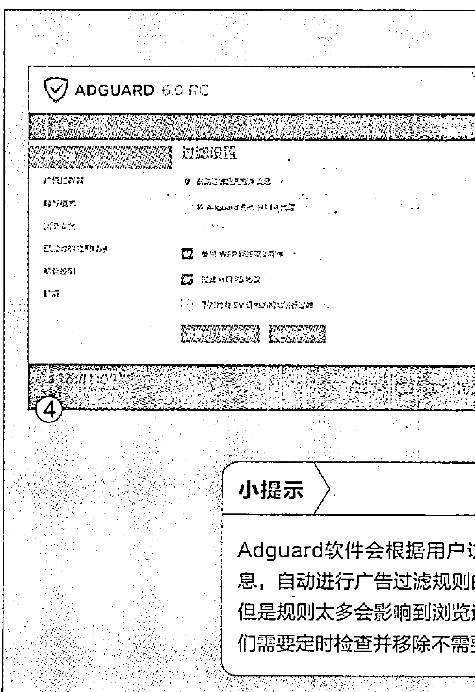

> 小提示
Adguard软件会根据用户访问的页面信息，自动进行广告过滤规则的订阅操作。但是规则太多会影响到浏览速度，所以我们需要定时检查并移除不需要的规则。

##### 给Adguard认证

经过上述设置，当我们兴冲冲打开HTTPS协议的网页时，可能会惊奇地发现这个页面居然无法访问。这是因为广告过滤软件在网站页面和用户浏览器之间起了一个“中间人”的作用，所有两者之间的数据通信都会经过广告过滤软件。对于传统的HTTP协议这不是问题，但是对于HTTPS协议的使用就会出问题。这个时候唯一的解决方法，就是安装软件对应的数字证书，从而告知通信双方自己的身份。

通常情况下，Adguard软件在安装的时候，就会自动安装数字证书文件。如果没有正确进行安装的话，按照前面的方法打开选项窗口，接着点击左侧列表中的“常规设置”选项，在“过滤设置”选项下面点击“重新安装证书”按钮即可（图4）。然后按快捷键Win+R打开“运行”框，输入“certmgr.msc”命令后回车打开Windows的证书管理器。接着在左侧列表中找到“受信任的根证书颁发机构”项，展开它后选择其中的子项目“证书”。接着在右侧的窗口列表中查看是否有Adguard的证书，如果有的话就表示安装成功了（图5）。

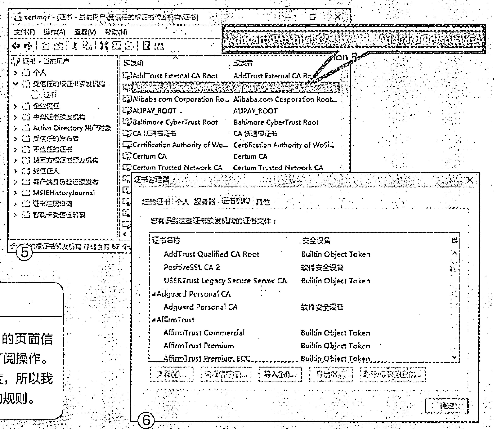

“certmgr.msc”命令后回车打开Windows的证书管理器。接着在左侧列表中找到“受信任的根证书颁发机构”项，展开它后选择其中的子项目“证书”。接着在右侧的窗口列表中查看是否有Adguard的证书，如果有的话就表示安装成功了（图5）。

当然并不是所有的浏览器都是使用系统的证书体系，包括火狐浏览器在内的一些浏览器自带了一套证书体系。所以首先在Adguard的证书上点击鼠标右键，选择“所有任务”中的“导入”命令，从而将系统里面的这个证书文件导出来。接着点击火狐浏览器右上角的“打开菜单”命令，在弹出的菜单中选择“选项”命令，在弹出的对话框里面选择“高级”按钮。接着再点击其中的“证书”标签页，然后点击下面的“查看证书”按钮。接下来在弹出的证书对话框中，切换到“证书机构”标签页，然后点击下面的“导入”按钮，选择刚刚导出的证书文件即可（图6）。

现在就可以正常浏览HTTPS的页面，并且不受广告的干扰啦。

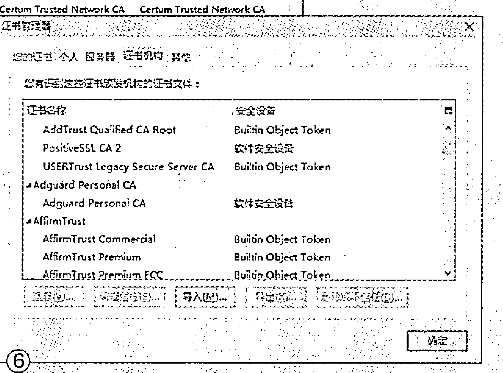


##### 特殊需求就用另类复制

文|南楚

在执行复制操作时，我们可能会有一些特殊的复制需求，例如复制因介质损坏而难以成功复制出的信息、因界面复制限制而无法直接复制出的信息、复制中滤掉不需要的格式、希望改变拖放复制方式的结果等。这些靠传统的复制方法和工具无法完成，需要借助于专门的软件来解决。

##### 1. 从损坏的文件中抢救信息

不少人会珍藏一些比较老的资料，这些资料可能是存放在光盘、闪存盘或移动硬盘中。由于存储时间或环境等影响，有些介质可能读取困难，这时，AnyReader软件能帮你的忙(图1)。

> 小提示
该软件对复制文档比较有效，此类文件若有部分损坏，其余部分的信息还可能被有效读取。但如果读取EXE等程序类文件，一旦其中一小部分受损，可能整个程序就无法运行。因此本软件最适合于文本或程序代码类的内容抢救。

如果文件所在的驱动器或磁盘有坏道，文件拷贝困难，可选择“Copy files from a damaged drive”选项。接下来选择文件所在的驱动器、文件夹或直接选取要拷贝的文件，然后选择目标文件夹，同时设定文件的拷贝选项(如重试坏扇区的次数、重试时间间隔等)(图2)。之后，软件就会按设定的参数进行尝试拷贝。拷贝结束后，会给出拷贝结果报告，单击“Open report”查看报告，单击“Explore copied files”打开资源管理器查看拷贝出的文件(图3)。

AnyReader还可以从不稳定的网络中拷贝文件。使用“Copy files across an unstable network”选项，可实现网络远程复制的断点续传，尤其对于使用不稳定的Wi-Fi来说效率更高。如果网络不稳定，拷贝的文件很可能会因中途断网而前功尽弃。除了可拷贝磁盘或光盘中的文件外，

若是拷贝存在问题的光盘中的文件，只需选择主界面中的第二个选项“Read data of damaged CD/DVD/Blu-ray/HD DVD”，按类似于上面的向导操作即可。

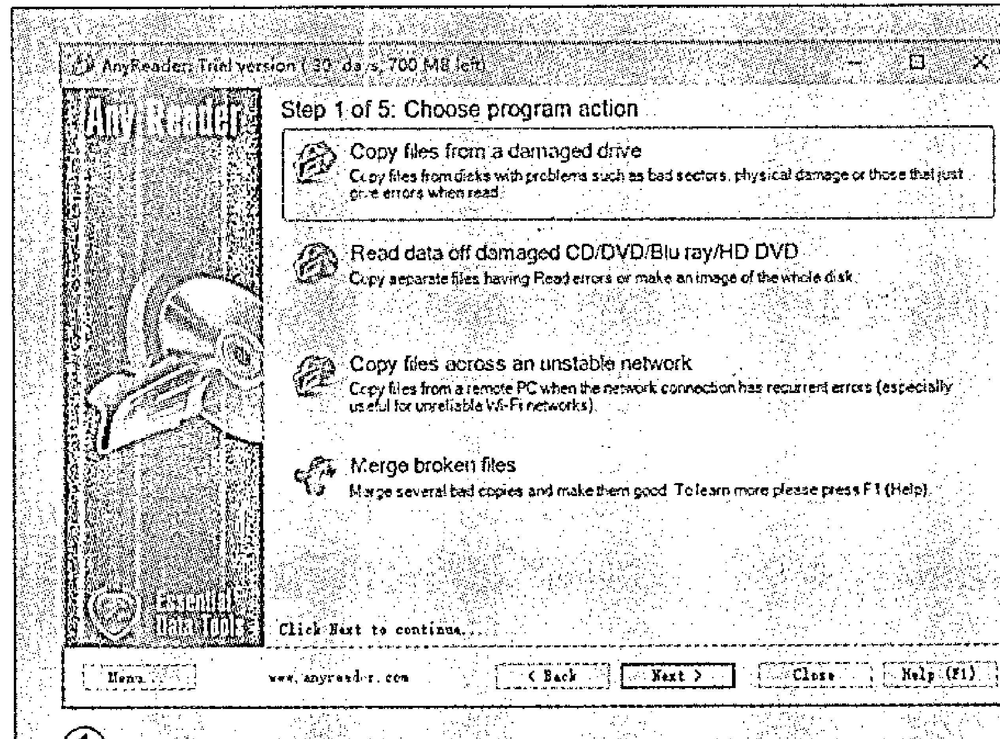

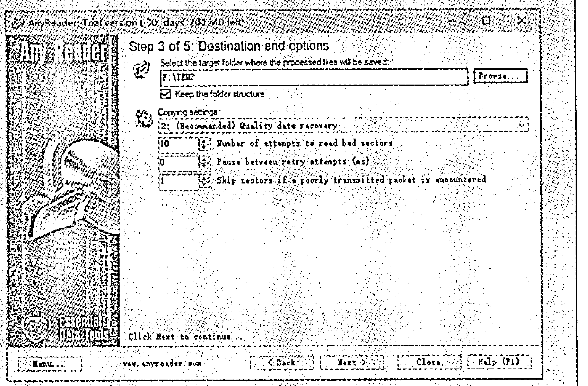

##### 2. 复制无法用常规方法复制的信息

界面中的内容有时候无法用常规方法复制，例如要复制注册表状态栏上的注册表详细路径，或一些信息提示窗口中显示的内容，这些内容无法被选中并用Ctrl+C复制。在这种情况下，可借助于Windows Text Copyer软件来完成复制。

Windows Text Copyer运行后显示一个简单界面，其中有一个“查找工具”按钮，只需按住这个工具按钮并将其

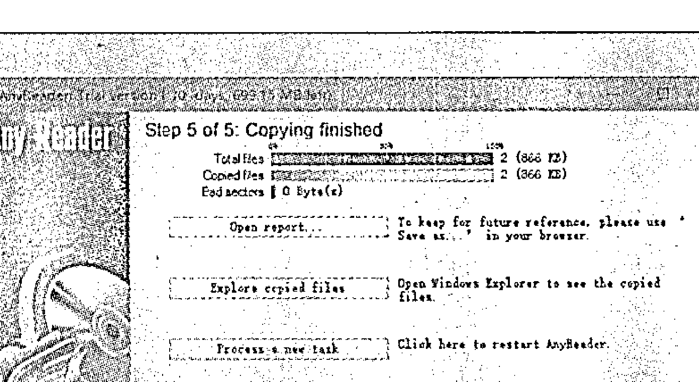

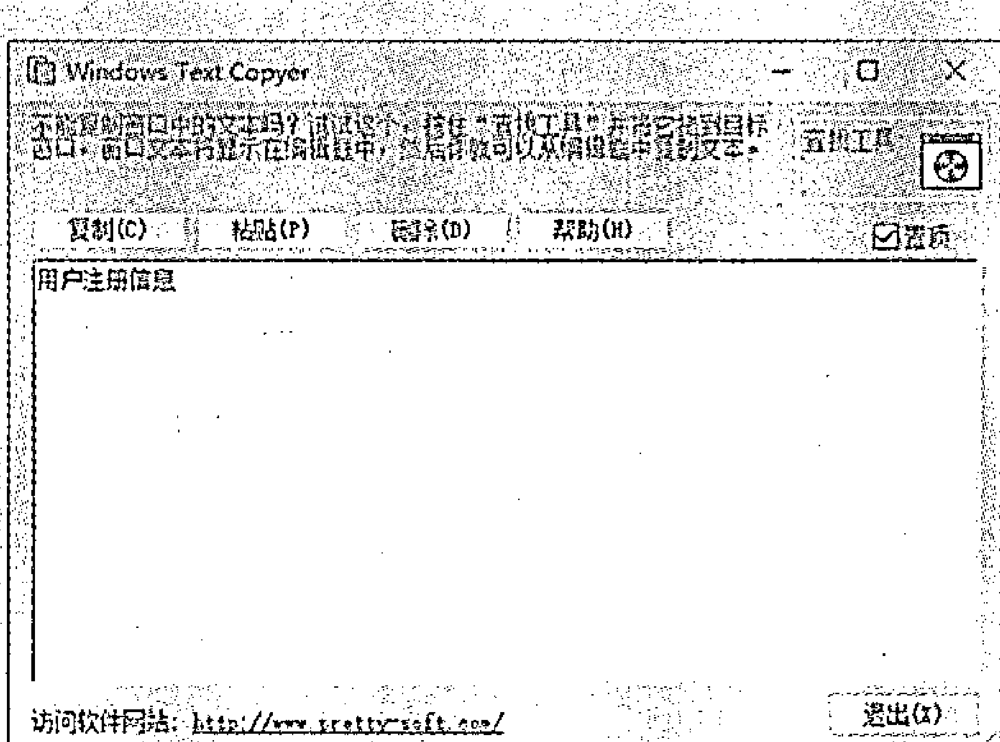

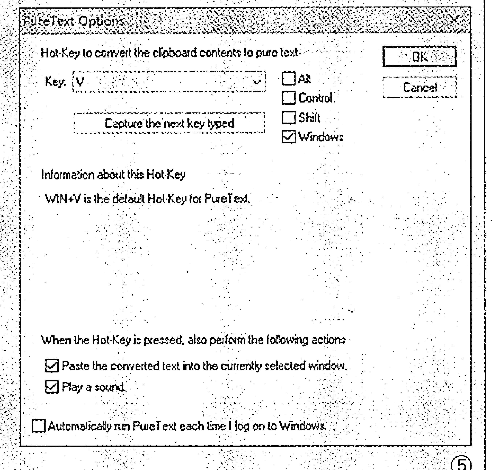

##### 3. 在复制过程中自动过滤格式

大家知道，如果要在Office软件中取得不带格式的数据，需要使用选择性粘贴。其实，不通过选择性粘贴，可直接将过滤掉格式的文本内容复制到目标位置。借助于一款PureText小软件即可完成。PureText有32位和64位两种版本，请根据系统版本进行选择。

软件运行后以一个带P字母的小图标常驻任务栏托盘，右击托盘图标并选择Options项，进入软件选项设置窗口，可设置使用剪贴板内容的热键（默认为Win+V）（图5）。设置之后，如果在网页或某个软件中有Ctrl+C复制了带格式的内容，那么在目标环境下，只需按下Win+V组合键，即可获得不带格式的内容。

> 小提示 如果取消勾选设置窗口中的“Paste the converted text into the currently selected window”复选框，那么软件不会进行内容自动粘贴操作，只作为转换器使用。需点击托盘菜单中的命令执行转换。这时若需粘贴内容，依然需要使用Ctrl+V操作。

##### 4. 改变文件拖放的执行行为

通常用鼠标拖放文件的操作都有固定的含义，如按下后拖动表示移动文件或复制文件。同一驱动器间拖动为移动文件，不同驱动器间拖动为复制文件。但有时候我们希望拖动操作只执行移动文件（或复制文件），而不管其目标在哪里。在这种情况下，可通过Drag'n'Drop Editor软件来实现拖放行为的自定义，无论如何拖动，其结果都是需要的那种结果。

运行Drag'n'Drop Editor软件，点击“复制项目”之后，在Windows文件资源管理器中拖动项目到另一个磁盘或文件夹，其结果都是执行复制操作；如果点击“移动项目”，则执行结果都是移动项目的操作。

> 小提示 如果不再需要这一功能时，可点击“卸载Explorer调整”按钮，解除该功能对资源管理器的整合。

##### 云笔记中快速加表格

文|阿立

云笔记可以随时随地记录我们的想法，一般情况下用户只是记录一些文字或者图片信息，但是对于商务人士来说，表格尤为重要。平时的计划安排、突发的创意灵感、涉及商务的内容，往往需要通过表格才能更好地表现。下面针对几款主流的云笔记，介绍一些表格添加的方法。

##### OneNote创建表格有技巧

我们知道OneNote是Office办公软件里面的一款云笔记软件，现在用户可以单独下载这个软件模块来进行使用，而且在最新的Windows 10系统里面也带有OneNote的应用程序。那么如何在OneNote应用里面创建一个相应的表格信息呢？

在Windows 10“开始”的搜索框中输入“OneNote”，搜索到后点击启动OneNote应用。如果是第一次使用，首先会有提示框，点击“开始使用OneNote”即可。以后这一步将会跳过，直接进入OneNote主界面。简单点击一下OneNote主界面左侧列表中的“页面”按钮，就可以快速新建一个笔记编辑窗口。接着切换到“插入”标签，单击其上的“表格”按钮即可插入表格了。

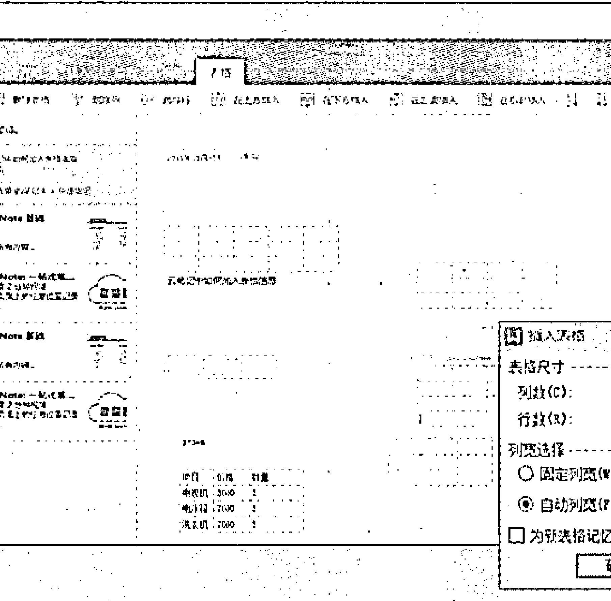

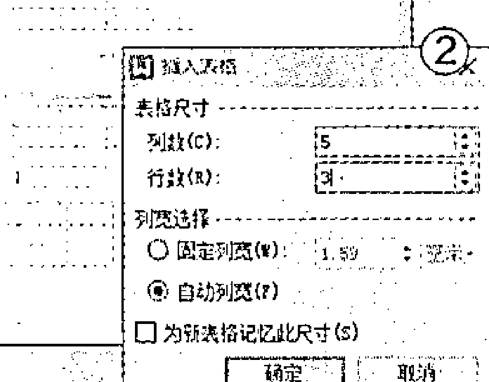

OneNote应用只能自动绘制两个单元格，并不能像办公软件那样随意设置行数和列数。不过当我们选中刚刚创建的两个单元格的时候，就会自动出现一个“表格”标签，利用其中的命令即可添加新的行数和列数，直到满足用户的需要为止（图1）。

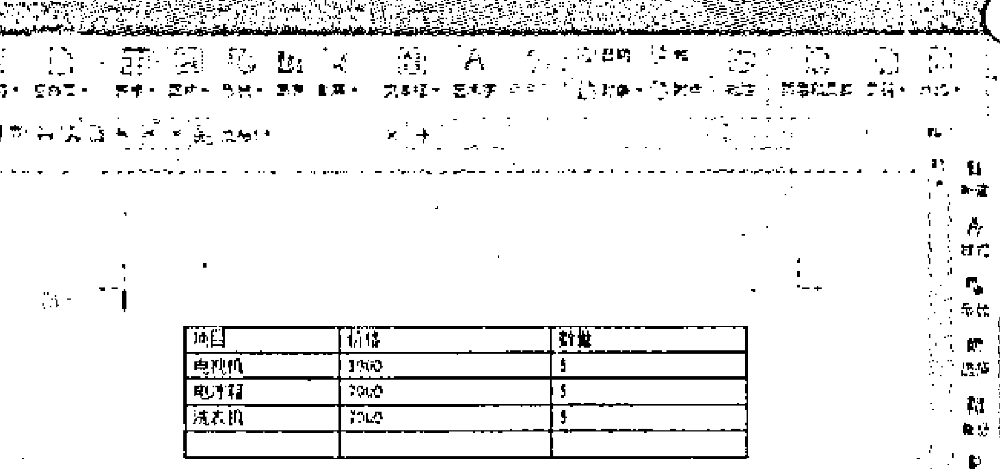

接下来就是往表格里面输入内容，最后再进行一些相应的调整就可以了。

其实我们还可以通过快捷键快速绘制表格：直接按一下Tab键可以快速新建一列；如果将光标置入最后一列，此时按下回车键，则可以快速新建一行；按Del键可以快速删除单元格。

##### 借用软件创建表格

目前除了OneNote云笔记软件以外，其他诸如印象笔记、有道云笔记等，自身都没有相关的表格插入功能。对于这类情况我们又该如何解决？其实最简单的方法就是借助于办公软件这个“外援”。我们首先在这些办公软件里面创建和编辑完成表格信息后，再复制粘贴到相应的云笔记里面就可以了。

这里以WPS为例，启动WPS文字办公模块后，点击“插入”标签中的“表格”按钮，在弹出的菜单里面选择“插入表格”命令。接着在弹出的对话框里面设置表格的行数和列数，然后在“列表选择”里面选择“自动列宽”项，这样可以方便用户对列表进行调整（图2）。设置完成后点击“确定”按钮，将列表插入到文本编辑窗口里面，然后根据需要输入相应的信息内容就可以了（图3）。

表格内容编辑完成后，点击左上角的十字图标，即可将整个表格及其内容选中。接下来点击“开始”标签中的“复制”命令，然后切换到云笔记的窗口里面。点击工具栏中的“新建笔记”按钮，在出现的笔记编辑窗口里面，点击鼠标右键选择“粘贴”命令，即可将表格插入到云笔记中了（图4）。

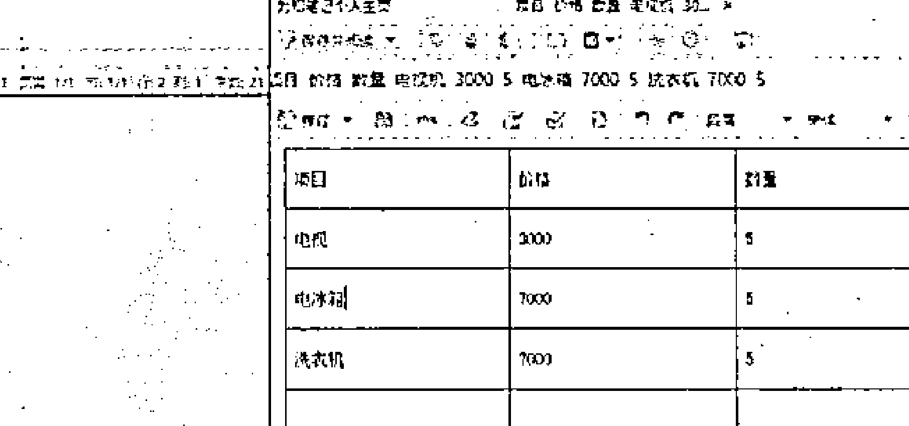

由于不同云笔记的相关限制，有的可以对表格大小进行调整，有的则不行，不过其中的内容一般都是可以进行编辑和修改的。

##### 文本“变身”有声读物

文|老万

现在网上有很多的有声读物，用户可以将其下载到手机等移动设备里面，这样便能轻松打发上下班中的无聊时光。但是并不是所有的内容都能够找到有声信息，遇到这样的情况我们自然不可能自己朗读一遍，最好的方法就是借助于一些阅读软件，将文本信息转换为音频文件来解决我们的烦恼。

###### 杂乱网页快速变简单文本

由于网页中的内容是按照一定的格式进行排版的，而我们进行文本转换只需要纯文本文件，所以首先需要对网页信息进行一下整理。首先打开“排版助手”这款工具，将复制的内容粘贴到工具窗口里面。如果复制的信息以前是图文混排的话，那么现在将图片的标注信息进行删除，同时也需要将不要的段落删除掉。而且现在有的网页内容会在词组之间存在空格，为了避免阅读转换的时候出现卡顿，所以接着在工具窗口下方的“将”选项中键入一个空格键，然后在“替换为”选项里面留空即可。最后点击“全部替换”按钮，就可以完成空格的批量替换操作了。

现在点击工具栏中的“选项”按钮，在“段落”选项中首先选择“删除空段落”选项，接着根据需要选择段落之间是否空行。如果复制的信息内容包括繁体中文的话，那么就在“繁简转换”选项里面选中“转换到简体字”项，设置完成后点击“确定”按钮关闭窗口（图1）。接下来点击工具栏中的“排版”按钮，这样网页信息就会转换成需要的文本文件样式了（图2）。最后点击工具栏中的“保存”按钮，将信息保存为一个纯文本文件即可。

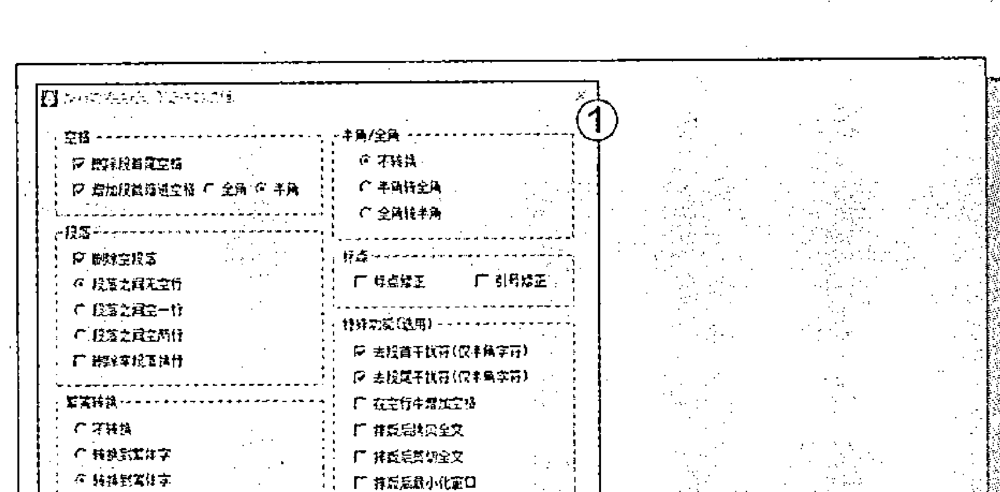

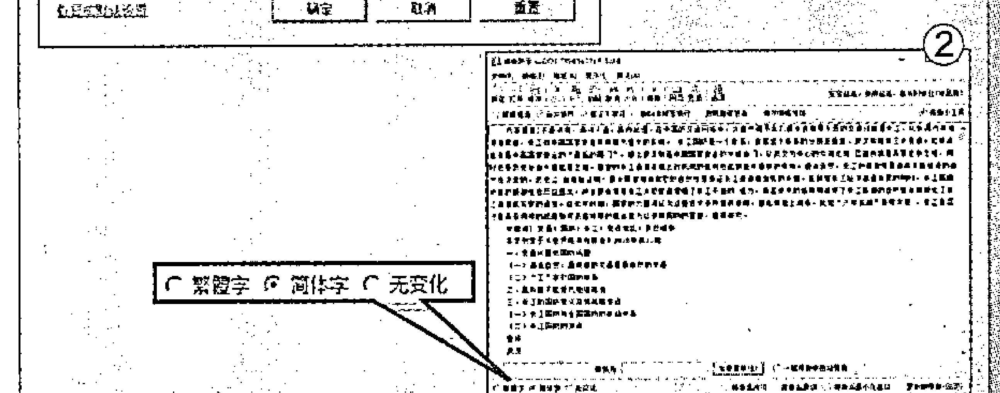

###### 轻松转换音频文件

接下来我们就可以将文本文件通过阅读软件转换为音频文件了。首先下载安装最新版本的“朗读女”软件，点击窗口右侧下方的“添加”按钮，在弹出的对话框中选择刚刚整理好的文本文件。最新版本的“朗读女”既可以选择在线语音合成，也可以选择离线语音合成。如果用户在操作的时候是连接到互联网的，那么点击“选择网络发音人”按钮，从弹出的菜单里面选择发音人的要求。在线语音合成的最大好处就是，不仅可以选择常见的普通话，还可以选择四川话、河南话、粤语等地方方言（图3）。如果用户不能进行在线操作，那么只能利用微软的TTS语音合成引擎进行。

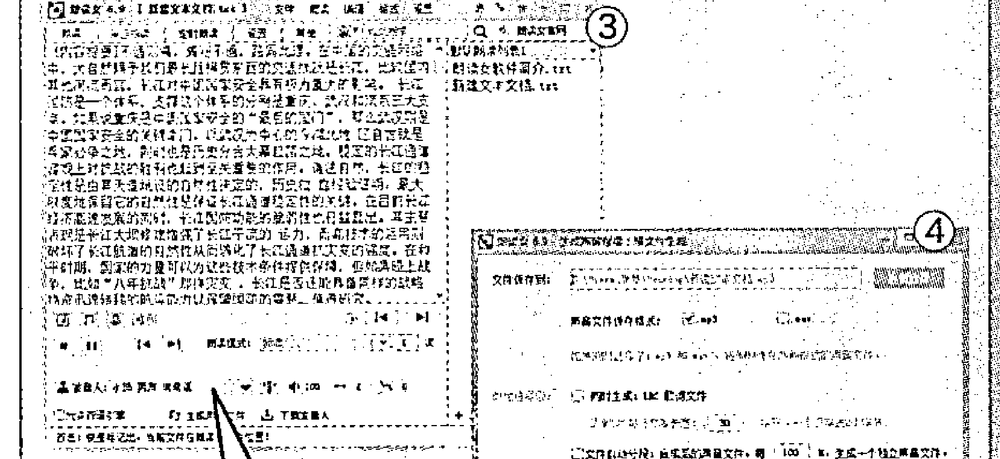

发音人选择完成以后点击“开始朗读”按钮，来看看软件的阅读效果是否满足个人需求。如果不满意的话，还可以分别点击“语速”和“语调”按钮，在弹出的对话框中拖拽滑杆来进行调整，直到自己认为比较满意为止。接下来点击“生成声音文件”按钮，在弹出的菜单里面选择“将当前内容转成音频文件”命令。然后在弹出对话框的“保存类型”列表中选择“MP3声音文件”，再点击“保存”按钮，将会弹出一个对话框，其中可以选择是否生成LRC歌词文件等选项（图4）。根据自己的需要进行设置，最后点击“开始生成”按钮，就可以开始音频文件的转换操作了。

##### 另类复制 还有特殊法

文|涛子

上期的文章《特殊需求下的特殊复制法》介绍了一些满足特殊需求的复制方法和软件。其实，特殊复制远不止这些，还有不少另类的复制方法可帮我们解决相应的问题。

###### 1. 双向复制 目录文件同步

我们有时会分别在两个不同的文件夹下做同一类工作，这样就会造成两个文件夹下的文件的不同。在这种情况下，如果要取得两个文件夹下文件的一致性结果，我们可以使用Beyond Compare这款软件来执行双向拷贝同步。进入Beyond Compare同步文件夹界面，分别在左右两侧加载两个工作文件夹，之后窗口下方会自动显示两个文件夹中的文件，有差别的都会用蓝色显示。点击窗口中间的“立即同步”按钮，即可实现两个文件夹之间存在差异文件的互相拷贝，从而达到使两侧文件相同的目的（图1）。

> **小提示**
> 如果文件名相同，可根据文件日期、文件大小等的不同，判断该留哪侧的文件。默认的同步方式是复制较新的文件到另一侧，也可以通过软件设置改变这种规则。

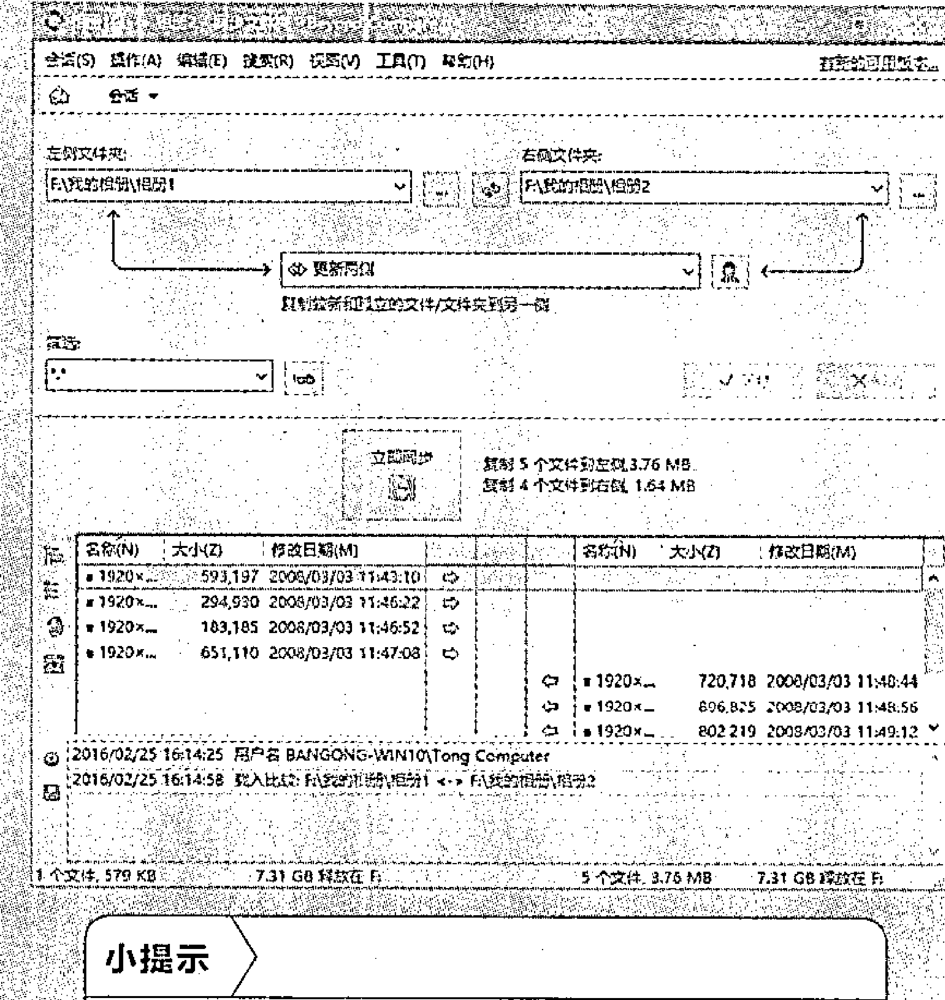

###### 2. 挑拣复制 文件篮子工程

如果一项工作中涉及到不同位置的不同文件，而且会重复使用，这样反复去不同的文件夹下调用会比较繁琐。如果能换种思路，先将所有要用到的文件像捡苹果那样一一捡到篮子里，然后在使用时方便地从篮子里去拿，这样就方便多了。一款名为Copywhiz的软件就可解决以上问题。软件安装后会集成到系统文件管理器右键菜单中。如果要挑选拷贝文件，只需陆续在要挑选的文件上单击右键并选择“Copywhiz→Copy”命令（图2），即可将这些文件加载到Copywhiz的管理窗口中。当需要重复使用这些文件时，只需从Copywhiz窗口点选需要的文件，然后单击Paste Now按钮即可（图3）。

###### 3. 模糊复制 支持过滤与重试

有时我们要从一大堆杂乱无章的文件中挑选出某些类别的文件，还有的时候需要从一张信号减弱的老光盘中读取某些文件，借助于一款专门的拷贝工具ExtremeCopy，要比直接用系统自带的复制功能方便得多。

启动ExtremeCopy软件后，点击“更多”按钮展开该软件的功能加强面板。先点击“源文件和文件夹”后的三点按钮加载要复制的文件或目录，然后通过“目标文件夹”后的三点按钮指定目标文件夹（或可将目标文件夹直接拖到目标窗格内）（图6）。单击“复制”按钮即可执行文件复制操作。如果要移动文件，改用单击“移动”按钮即可。

如果要复制特定关键词的文件，点击“过滤”按钮，会弹出文件过滤设置对话框（图7），在其中可以用通配符来输入过滤内容，比如只复制PDF电子书，则输入“*.PDF”；只复制工作总结文档，则输入“*工作总结*.*”即可。

> **小技巧**
> 如果要复制因信息减弱而难以读取的老光盘中的文件，可在软件参数设置窗口中选择“如果遇到错误，那么”→“重试”选项，并同时设置“最大重试次”为若干次，还可以选择最大重试次数不成功后的提示信息。如此设置之后，复制时就会按设定的次数多次尝试读取弱区数据，提高了读取成功的可能性。

软件推荐：扩展阅读

若需要从一大堆数码照片中挑选像样的作品，上面的方法是一个好选择。此外还有一款专门为图片复制而设计的软件Pic Copyer。

先通过该软件的“文件”菜单打开数码照片的原始文件夹，接着通过下方的“保存路径”确定挑选照片的保存位置。然后就可以通过菜单栏的“上一张”或“下一张”按钮翻阅照片了。当看到自己中意的照片后，点击“保存当前图片”，即可将照片保存到设定的目标文件夹中（图5）。此外，还可以通过鼠标的3个键来快速操作，左右键分别为切换图片，而按下滚轮为保存图片。

点击软件右侧窗框上的小三角，展开选项面板，还可以设定最多4个分类目标文件夹，这样就可以在选中图片后直接点击相应分类下的“保存到”按钮将图片分类收藏了。


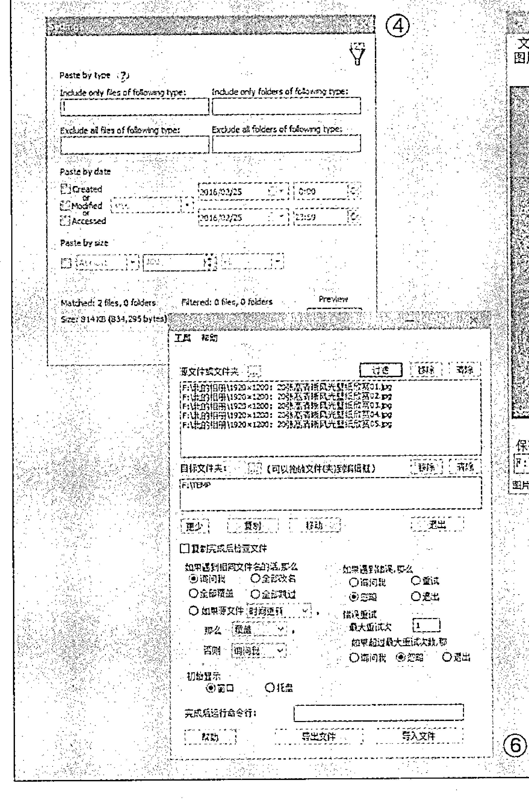


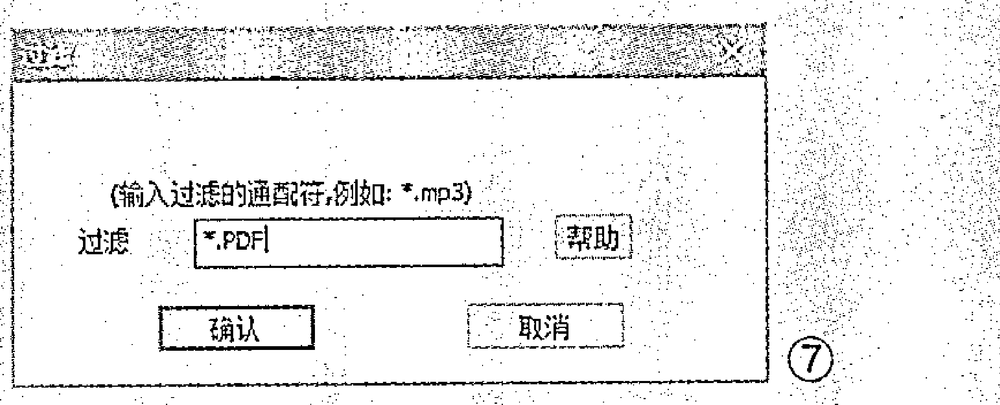

小技巧

如果在粘贴时对复制的文件项目有条件要求，可通过Setting按钮，设定按文件或文件夹类型、日期、时间等进行筛选（图4）。执行粘贴的结果也可以通过Paste下拉列表选择改变，分为：粘贴、粘贴后删除源文件、粘贴为Zip包等三种。如果文件来源于不同的子目录，而我们希望将这些文件粘贴到同一个文件夹中，则可以选中“Paste all files to a single folder ( do not create sub-folders )”复选框，然后再执行粘贴命令。这对于从不同的目标搜集一类文件到单个目录十分有用。

##### 系统文件程序全面保护

文|阳春和

处于网络时代，使用电脑信息安全至关重要。系统、程序被修改、文件被删除，这些都是我们不愿遇到的事。借助于相应的软件，可实现从系统自动恢复防修改、程序防修改，到文件防删除等全面保护，从而避免这些情况的发生。

###### 1. 系统保护 不再怕恶意修改

最容易被恶意软件感染的是系统分区。面对各种病毒、木马和恶意软件的威胁，我们常常借病毒防护类安全管理软件来应对。但是，这些软件也不万能，况且有的用户又喜欢系统“裸奔”，这更给了恶意软件以可乘之机。其实，只要用一款Wondershare Time Freeze小软件来创建系统分区的影子分区，在影子分区中进行工作，这样即便系统被修改，下次启动后，上次虚拟的分区会消失，原来的分区会被自动还原，就不用担心恶意软件修改自己的系统了。

Wondershare Time Freeze的系统分区保护功能默认处于关闭状态。要实现系统分区的保护，需先打开该功能。启动Wondershare Time Freeze软件后，首先会在开启的System Protection选项卡下自动列出当前系统分区的相关信息，同时系统保护（System protection）一项后显示红色的OFF，下面用文字提示系统处于未保护状态。这时，只需将窗口右下角的滑块置于ON，即可开启系统分区保护（图1）。

当系统分区保护功能开启后，位于任务栏右下角的系统托盘程序图标会闪动起来。这表示当前系统分区已经处于被保护状态。这时可尽情进行各种操作，所有对系统的改动，都将在下次启动系统后被“遗忘”。

> **小提示**
> 在安装完Wondershare Time Freeze软件后，需要重启系统，才能完成对系统分区还原的合理配置。选择重启系统选项后点击Finish按钮，系统会自动重新启动。

###### 2. 保护文件夹 禁止访问与改写

除了对系统分区的保护外，有时我们还需要对某些个人文件夹进行保护，一些重要的文件资料，需要放在固定的文件夹中，以防被访问或修改。文件夹保护也可用以上软件来实现。

首先将软件主界面选项卡切换为Folders Protection，点击Add按钮添加需要保护的文件夹，然后选中要保护的文件夹，将窗口右下角的滑块从OFF位置滑动到ON位置，即开启了对该文件夹的保护（图2）。如果想解除对某文件夹的保护，只需从文件夹列表中选中需要解除保护的文件夹，然后单击Remove按钮即可。

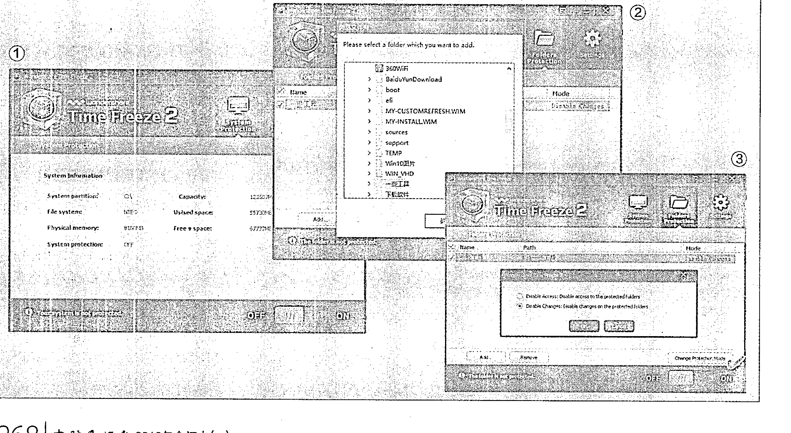

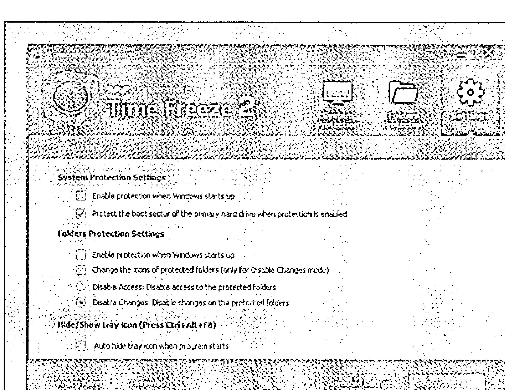

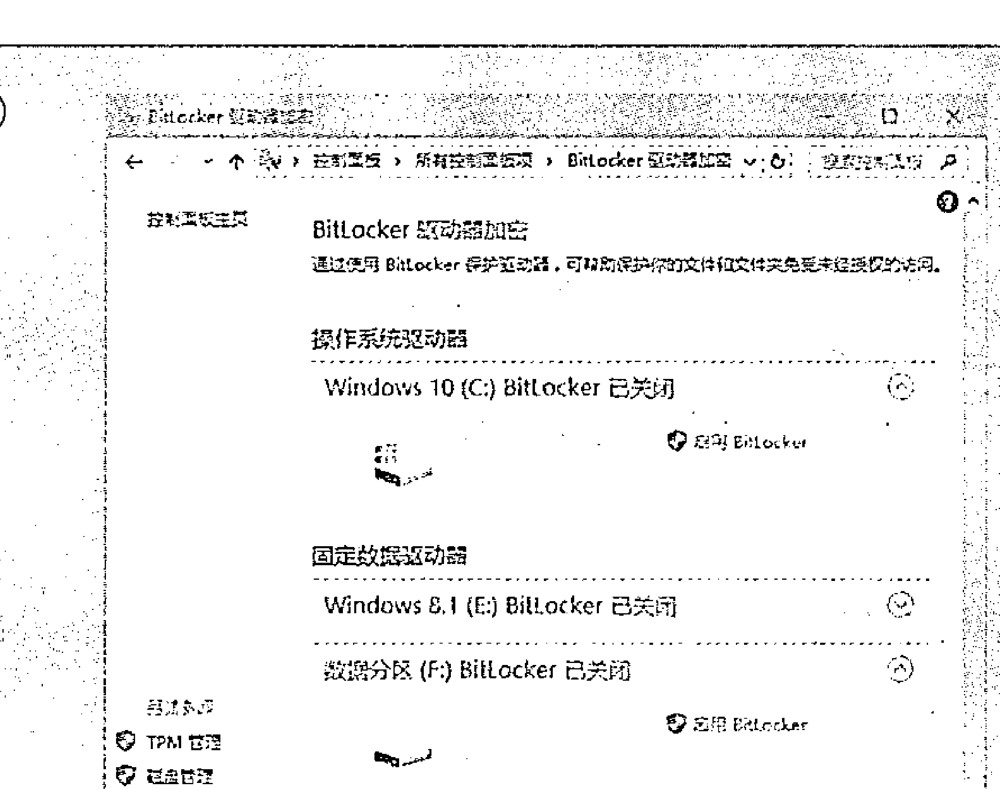

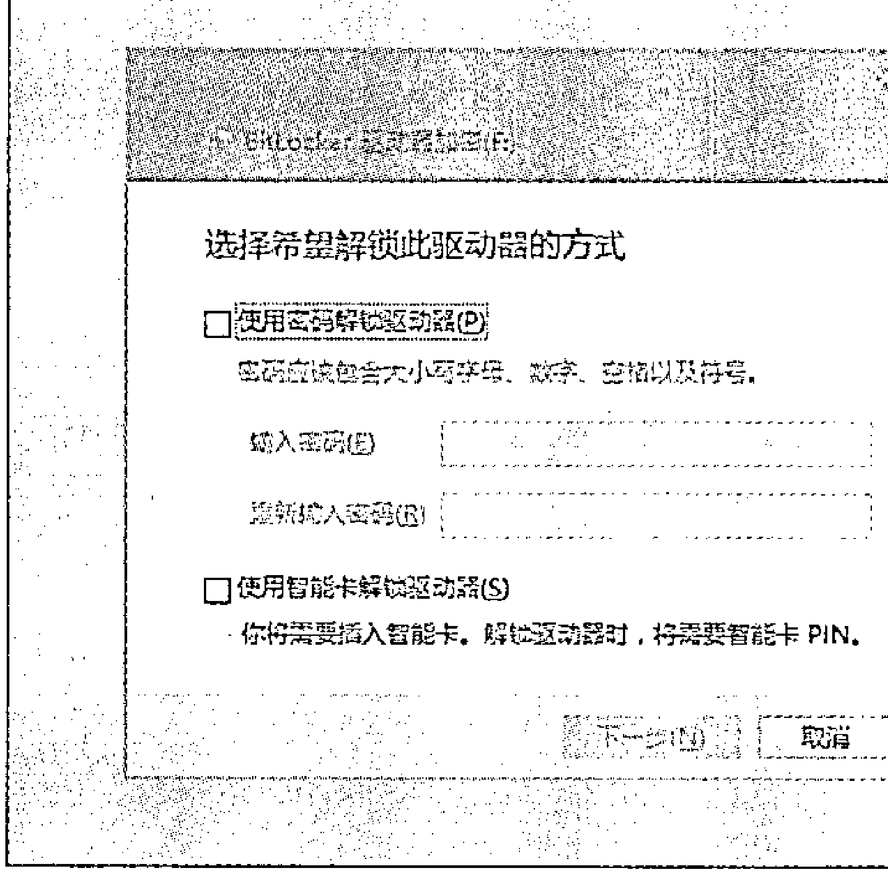

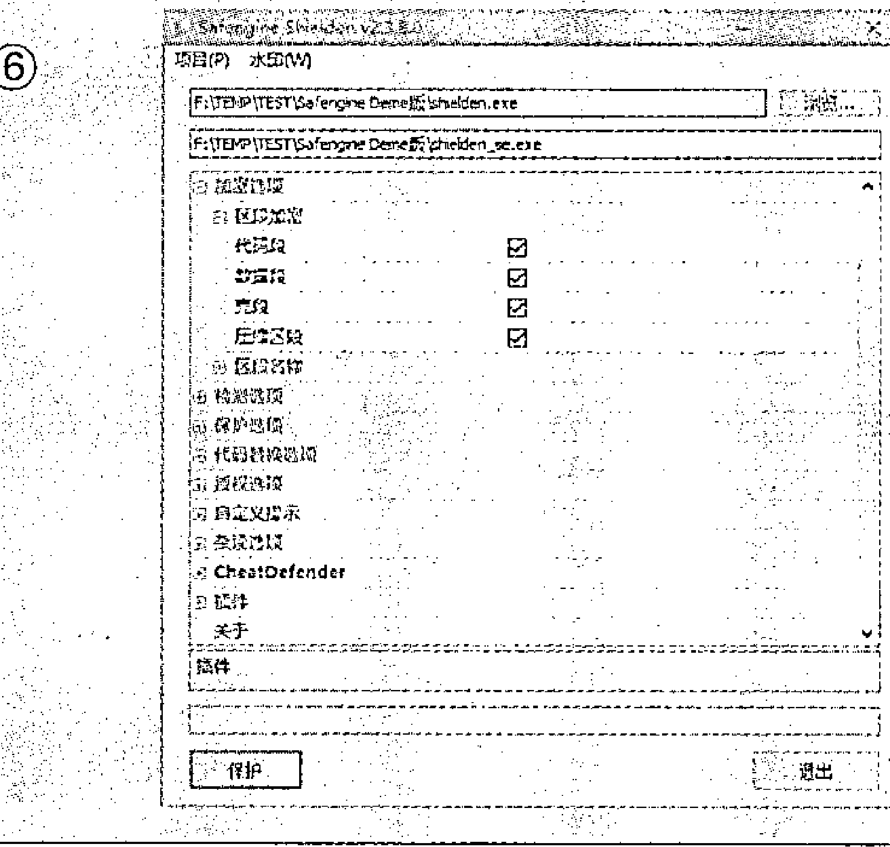

> **小提示**
> 软件提供了两种保护模式，一种为禁止更改受保护的文件夹（Disable Change），另一种为禁止访问受保护的文件夹（Disable Access）。要更改文件夹的保护模式，只需在勾选了要进行保护的文件夹后，点击软件右下角的更改保护模式功能按钮（Change Protection Mode），在弹出的窗口中选择保护模式即可（图3）。

> **小技巧**
> 为了防止别人操控该软件解密保护项目，可通过Setting按钮进入设置窗口，单击Password设置软件保护口令。此外，还可以选择Auto hide tray icon when program starts选项，自动隐藏任务栏程序图标。该图标还可通过Ctrl+Alt+F8开启或隐藏（图4）。

###### 3. 文件加把锁 防治移动和删除

有些文件我们可能不希望被别人看到、移动或删除，这时可借助于系统的BitLocker驱动器加密来实现文件保护。

可为准备加密的文件另辟一个专门的数据分区，然后通过Windows控制面板进入“BitLocker 驱动器加密”窗口，点击要加密的数据分区（如F盘），单击“启动BitLocker”按钮（图5）。接下来选择使用密码解锁驱动器，设定密码后，就只有通过密码才能访问该驱动器了，从而实现了对分区中文件的保护（图6）。

###### 4. 软件加保护 拒绝被轻易破解

对于自己设计软件的人来说，辛辛苦苦设计出来的软件，如果被别人轻易破解，是不能心甘情愿的。这时候，不妨使用Safengine Shielden这款软件，对自己的软件进行必要的保护处理。

启动该软件，通过“浏览”调用自己的软件主程序，从列表窗口中选择要保护的程序项目，然后点击“保护”按钮，即可实现对软件有关项目的保护（图7）。

Safengine提供反调试、反附加、动态自校验等功能，同时提供了代码的变形、乱序和虚拟化等功能的应用程序保护壳，它改变软件执行流程以达到阻碍自动分析，消耗破解时间和精力的目的。


##### pCloud带你另类玩转云存储

文|阿立

随着云计算这个概念逐步地深入人心，这几年各式各样的云存储也相继推出。但是经过一段时间的大浪淘沙以后，包括酷盘等在内的云存储都已经被拍死在沙滩上，剩下的云存储也出现了很多同质化的现象。不过好在又有全新的云存储相继推出，这其中就包括国外的pCloud。

###### 曲线下载国外文件

可能很多用户都和我一样有种感觉，即使是自己的网络带宽非常大了，在下载一些国外文件的时候也非常慢。其实造成这个问题的原因有很多，但是解决的方法却非常统一，就是利用离线下载这样的功能进行曲线下载。由于pCloud是国外的云存储，所以在地利上拥有得天独厚的优势。

首先登录pCloud云存储的网站页面，接着点击右上角的齿轮设置按钮。在弹出的“Language”子菜单里面选择中文，将操作界面变成中文界面以方便我们后面的操作。现在点击界面左侧的“上传”按钮，在弹出的管理窗口点击下面的“远程下载”标签。在输入框里面设置国外文件的下载链接，点击“上传”按钮就可以进行离线下载了。通过管理器窗口可以看到文件下载的进度，下载完成以后文件被自动存放到根目录中（图1）。接下来勾选上这个文件，点击文件名称后的齿轮按钮。在弹出的菜单里面点击“下载”命令，这样文件就会被曲线下载到我们的电脑中。

###### 文件夹共享更方便

既然下载到好的内容，那么一定要分享给自己的朋友，正所谓独乐乐不如众乐乐。和其他的云存储服务一样，pCloud也可以进行文件的分享。但是一个文件一个文件进行分享的话，操作起来肯定是非常麻烦的。不如我们创建一个专用的文件夹目录，将所有需要共享的文件移动到这个文件夹里面。这样只需要共享这个文件夹，就可以分享所有的文件信息了。

首先点击网页右上角的“新建资料夹”按钮，在弹出的对话框中设置共享文件夹的名称，设置完成以后点击“建立”按钮即可。接下来从列表中选择要分享的文件，点击工具栏中的“移动”按钮，在弹出的对话框中选择刚刚新建的文件夹目录。再点击文件夹名称后的“共享”按钮，在弹出的菜单里面选择“共享下载链接”命令，然后在弹出的对话框中就可以看到系统生成的共享链接了（图2）。不过由于这个共享链接比较长，建议大家点击“获取短链接”按钮。在弹出的对话框中点击“产生链接”按钮，就可以创建一个短的共享链接（图3）。最后点击后面的“复制到剪切板”按钮，将其分享给自己的朋友就可以了。以后只需要继续将要共享的文件复制到该文件夹里面，在不改变共享链接的情况下就可以进行访问下载了。

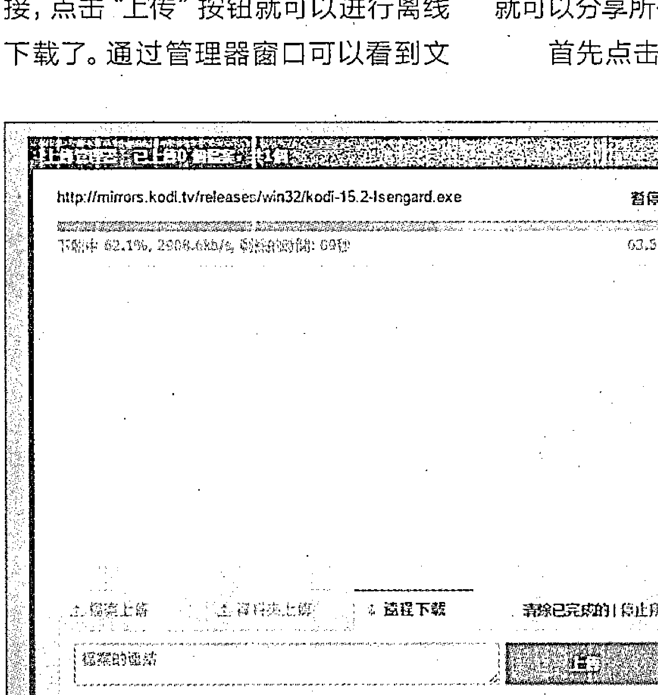

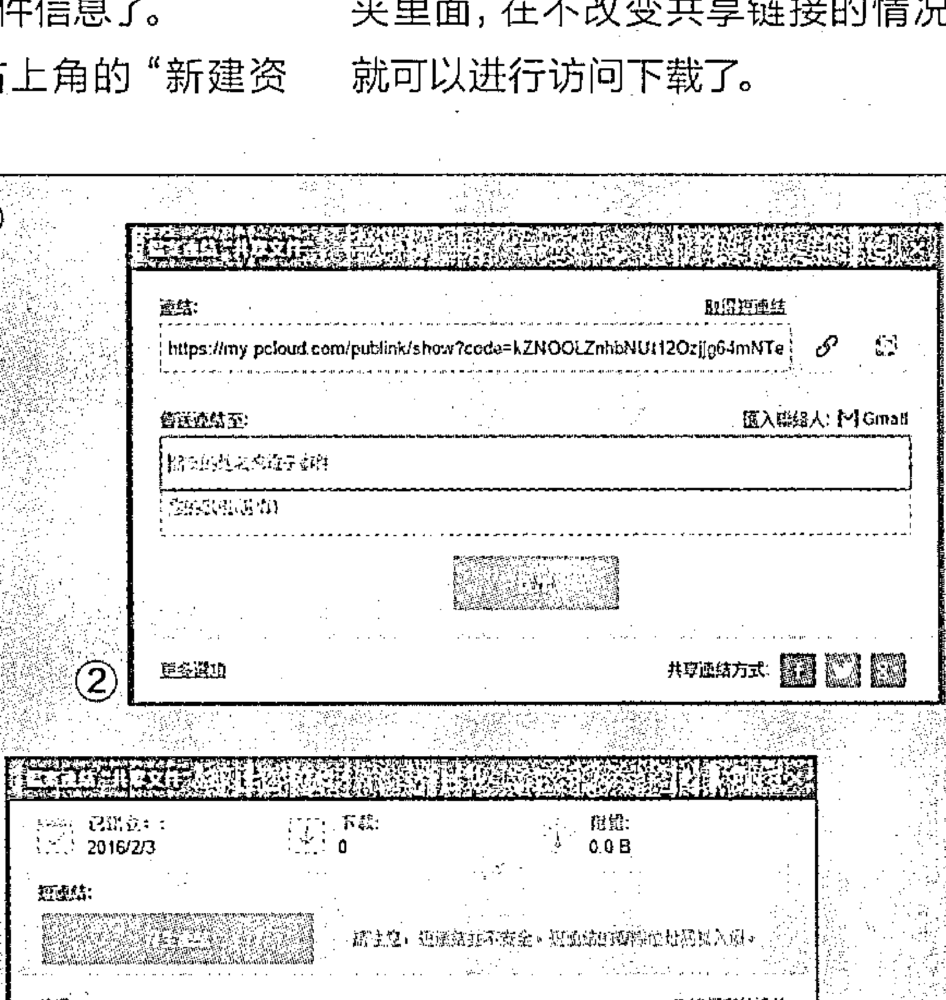

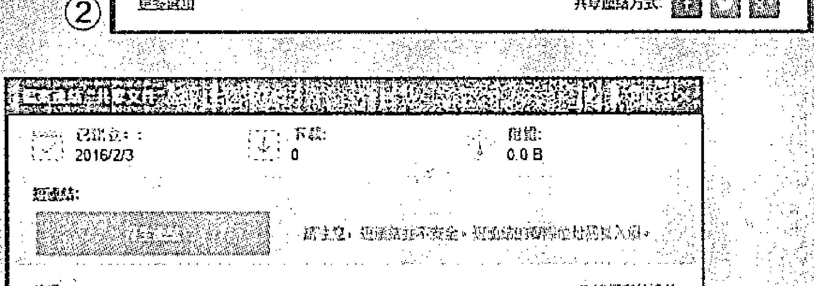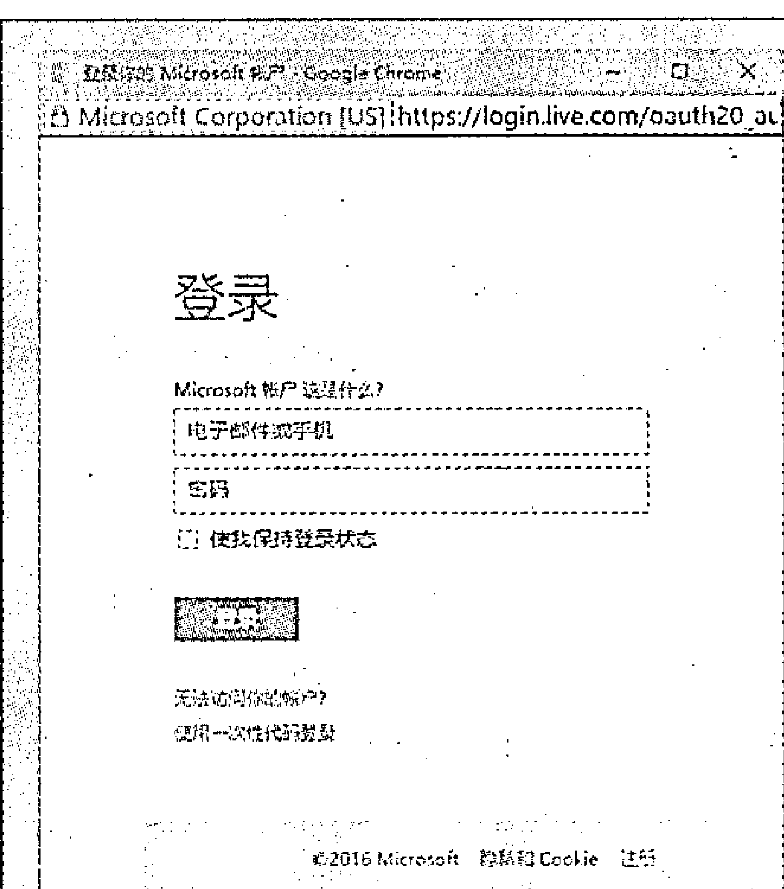


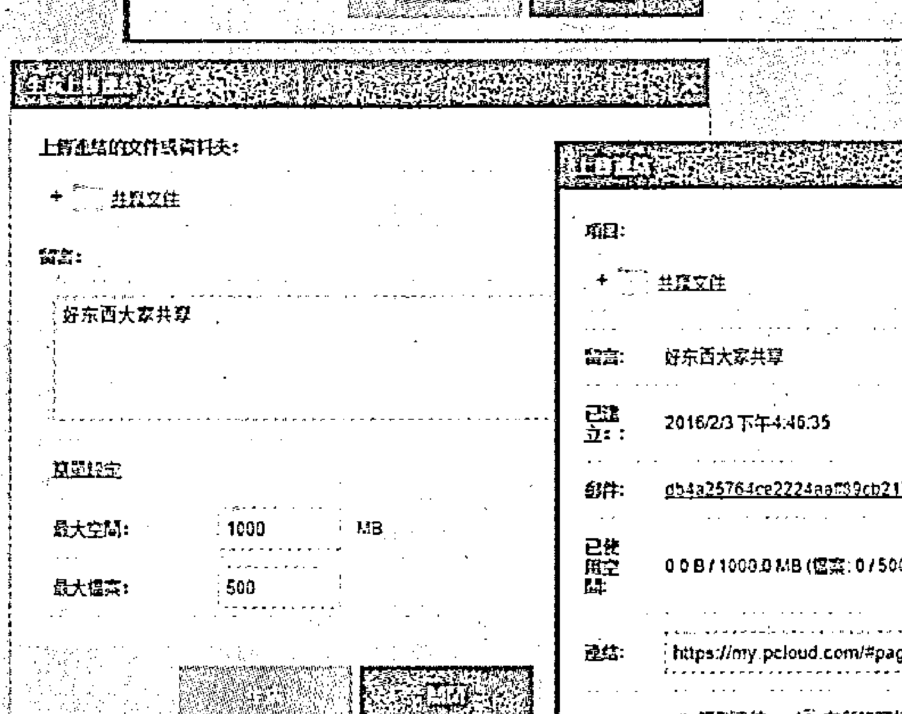

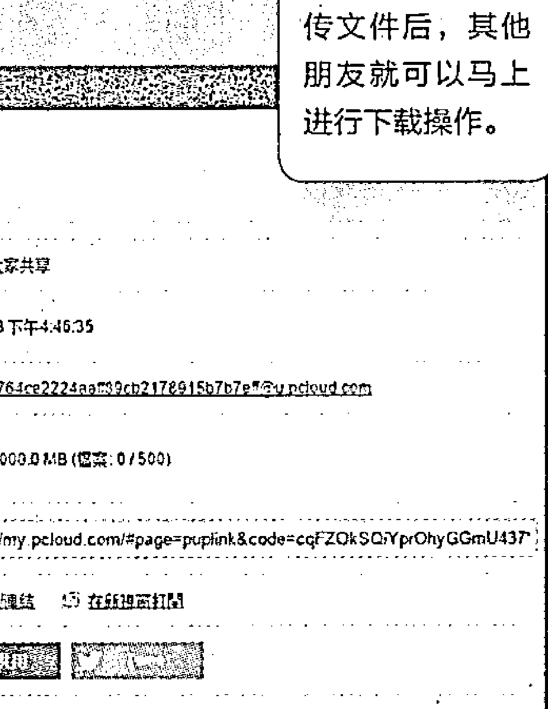

> # 小提示
如果把一个文件夹同时开放上传和下载权限，这样一个朋友在上传文件后，其他朋友就可以马上进行下载操作。

> # 小提示
如果用户不希望pCloud继续备份文件，需要返回到“备份”页面，点选指定云存储后面的“停止”来关闭自动备份功能。

##### 云存储数据的备份

云存储的使用虽然很方便，但是也难免出现数据丢失的情况，所以对云存储的数据进行备份非常重要。按照传统的方法进行操作，首先需要将文件下载到本地电脑中，再上传到新的云存储空间里面。可见这种方法既费时又麻烦，所以最好的方法还是直接在云端进行备份。那么利用pCloud如何进行数据的备份操作呢？

同样首先点击网页右上角的齿轮按钮，在弹出的菜单里面点击“设置”按钮。在弹出的设置页面选择其中的“已连接的账户”标签，在这里就可以看到包括OneDrive、Dropbox等在内的知名云存储。用户如果要想进行数据备份，现在就要进行相关的授权操作。比如点击OneDrive后面的连接按钮，这时会弹出一个授权操作窗口。在窗口里面分别输入OneDrive的账户和密码，点击“登录”按钮连接到微软的服务器，再点击“允许”按钮完成相关的授权操作即可（图4）。

接下来点击网页左侧的“备份”命令，从列表中找到需要备份的云存储名称，接着点击后面的“开始”按钮。然后网页会弹出一个提示窗口，点击下面的“设定备份”绿色按钮继续（图5）。这样pCloud就会开始从指定的云存储服务器获取文件并开始进行备份操作了。如果文件很多或体积很大，可能短时间内不会结束操作，这时用户可以将浏览器关闭忙其他事情，这样并不会影响到数据的备份操作。过一会再打开网页界面，看到“已结束”的提示时说明备份已经完成。而且以后当用户上传文件到这些云存储后，pCloud会继续备份新加入的文件信息。

##### 上传文件更好共享

一般情况下通过云存储共享文件比较方便，但是要想接收他人共享的文件却比较麻烦，因为云存储通常会限制文件上传到他人的空间。而且要想接收他人的文件，还需要自己在线的时候才可以。而现在只需要开放一个文件夹的上传权限，其他用户就可以随时随地上传文件到我们的空间中，这样就可以直接共享给其他的朋友。

首先创建一个新的文件夹目录，点击文件夹名称后的“共享”按钮，在弹出的菜单里面选择“共享上传链接”命令。接着在弹出的对话框设置一个留言信息，以方便朋友们了解这个文件夹的用途（图6）。设置完成以后点击“生成”按钮，在弹出的对话框可以看到上传邮箱地址和上传链接两种方式，然后将两种方式的链接发给自己的朋友（图7）。

以后当朋友打开这个分享链接后，点击其中的“浏览档案”按钮，在弹出的对话框中选择要上传的文件，我们就可以接收到朋友传递的文件了。除此以外，也可以在电子邮件里面输入上传邮箱的地址，把要上传的文件添加到邮件附件的位置。当电子邮件发送出去以后，附件中的文件就会上传到我们的云存储空间里面了。

##### 随心设置 在线压缩也灵活

图片压缩是很多人很常见的一个操作，而常用的方法就包括在本地计算机利用软件进行压缩，以及利用现成的云端服务进行在线压缩等操作。其中软件压缩的优势在于可以对压缩参数进行自定义设置，而云端在线压缩的优势就是操作简便快捷。其实这两样好处我们都可以要，关键是要有适当的工具和方法进行整合。

###### 压缩方式任意选择

要想解决用户的上述需求并不难，只需要使用可以自定义设置的图片在线压缩服务即可。其实说到图片在线压缩服务，最有名的就应该是TinyPNG与JPEGmini。但是今天我们要使用的Compressor.io在线压缩服务，却比它们都要厉害得多，因为它号称最多可以压缩90%的图像文件体积。那么这款服务到底如何进行操作呢？

首先通过浏览器登录到Compressor.io在线压缩服务的网站(https://compressor.io)，当网页加载完成以后可以看到该压缩服务提供了两种形式，分别为“Lossy”与“Lossless”(图1)。其中“Lossy”的压缩效果比较好，但是画面会有稍微的失真出现。如果用户只是放到网站上看的话，一般人其实是看不太出来差异的。而“Lossless”则和“Lossy”相对应，属于人们常说的无损压缩模式，这样适合于朋友之间进行图片的传递操作。当然用户通过在演示图上面进行滑动操作，就可以看到两种模式之间的区别。

现在点击网站下面的“TRY IT!”按钮，在弹出的操作窗口的上方可以看到“Lossy”与“Lossless”两种压缩模式，这里用户根据需要选择相应的压缩模式即可。接着点击页面下面的“SELECT FILE”按钮，在弹出的浏览窗口选择要压缩的图片文件，或者直接用鼠标选择图片文件拖拽到浏览器窗口进行释放(图2)。目前Compressor.io在线压缩服务支持JPEG、PNG、GIF、SVG等四种格式的图片文件，但是该服务仅能支持一次一张图片文件的压缩操作，而且文件的最大体积不能超过10MB。

文件选择完成后即可自动上传，通过网页里面的进度条可以看到上传速度，当成功进行上传后网站后台服务即开始自动进行压缩。图片文件压缩完成后，可以看到图片文件压缩前后的体积对比，以及压缩比例等数据。如果没有问题的话，就点击“DOWNLOAD YOUR FILE”按钮，就可以将图片文件下载到本地的系统硬盘里面(图3)。如果用户使用了国外网盘的话，也可以直接点击网盘的名称，然后根据提示直接保存到网盘里面。当然用户还想要压缩其他图片文件的话，点击“Compress another picture”按钮后重复前面的操作就可以了。

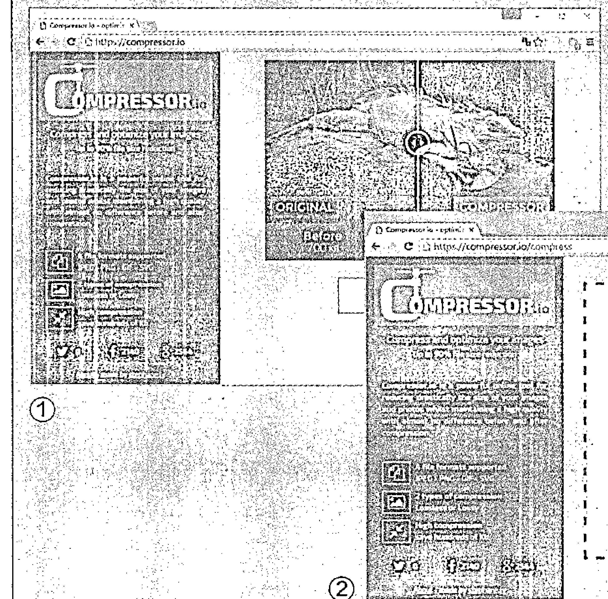

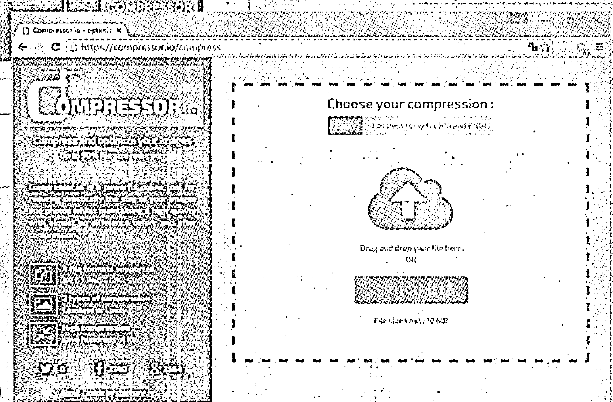

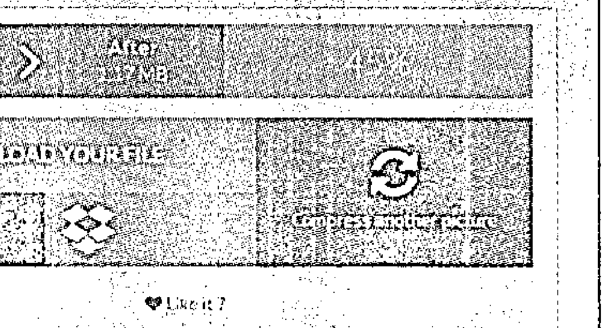

**小提示**
如果在上传的过程中出现问题，建议用户将浏览器的广告过滤扩展暂时关闭。

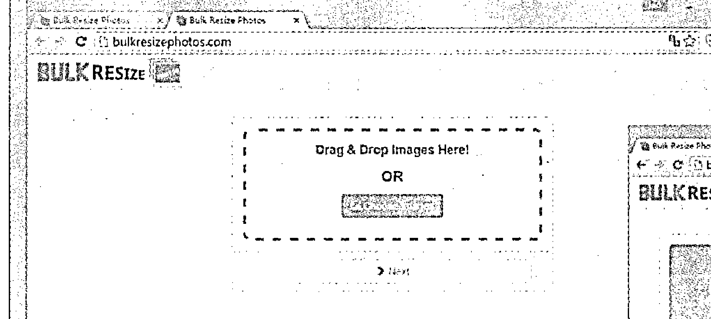

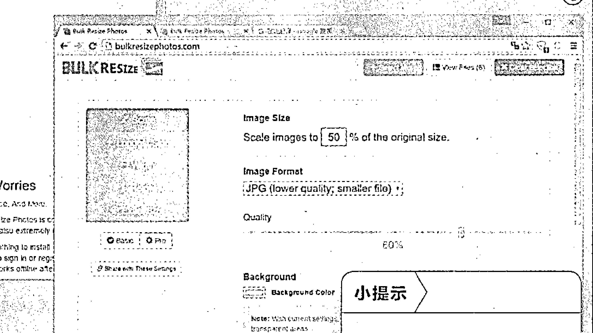

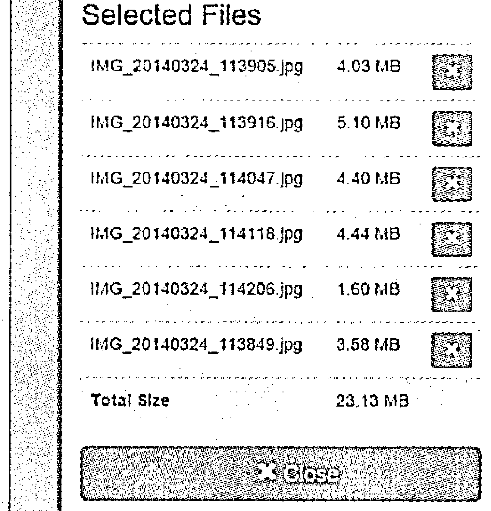

| 文件名                | 大小   |
|-----------------------|--------|
| IMG_20140324_113905.jpg | 4.03 MB |
| IMG_20140324_113916.jpg | 5.10 MB |
| IMG_20140324_114047.jpg | 4.40 MB |
| IMG_20140324_114116.jpg | 4.44 MB |
| IMG_20140324_114206.jpg | 1.60 MB |
| IMG_20140324_113849.jpg | 3.58 MB |
| Total Size            | 23.13 MB |

> 其实“Bulk Resize Photos”在处理的过程中，还可以进行图片的格式转换操作。首先点击左侧下方的“PRO”按钮，在右侧窗口里面就可以看到多出一个名为“Image Format”的选项，在列表里面选择需要转换的文件格式后，在进行图片压缩的同时就可以进行转换操作了。如果用户选择的是JPG格式的话，通过“Quality”滑杆还可以设置图片文件的质量等信息。

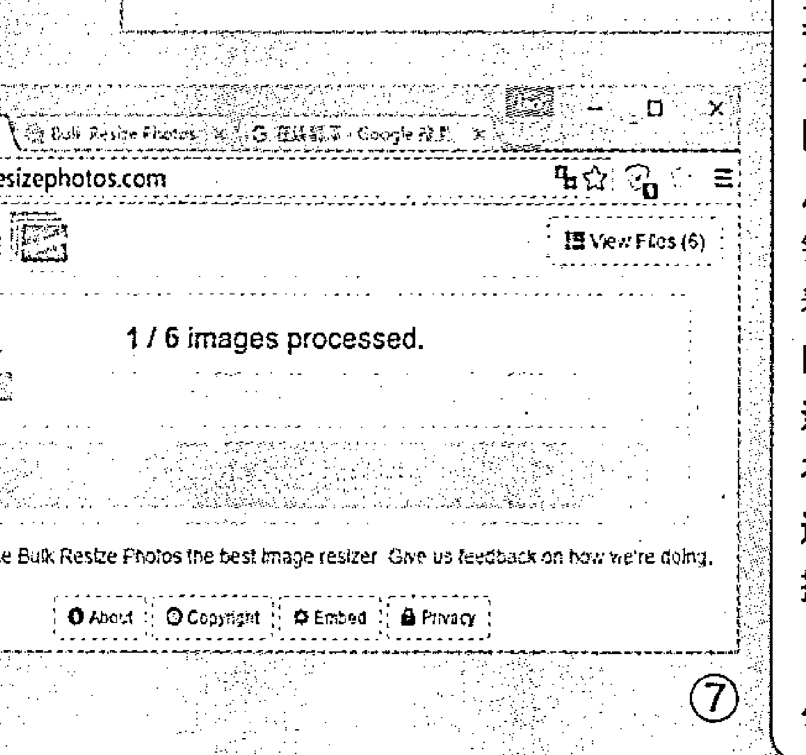

###### 调整大小压缩图片

进行图片压缩的方法多种多样，比如通过调整图片文件的分辨率大小或者尺寸大小也可以做到。这样在保证图片清晰度的同时，也对图片文件的体积进行了缩小。但是无论是TinyPNG还是Compressor.io，都使用的是传统的图片在线压缩技术，并没有图片大小的调整设置参数。那么如何在线进行图片文件的调整操作呢？

通过浏览器打开“Bulk Resize Photos”网站（http://bulkresizephotos.com/），点击网页正中的绿色按钮后，在弹出的对话框中选择要处理的图片文件（图4）。相对于Compressor.io来说，“Bulk Resize Photos”既没有上传文件数量的限制，也没有文件体积大小的限制，甚至没有图片文件格式的限制。当用户选择图片文件后，网站页面立即跳转到该服务的操作界面，速度之快让人感觉并没有进行图片文件的上传。其实的确如此，“Bulk Resize Photos”的所有操作都是在本地电脑磁盘里面完成的。

点击操作界面最上方的“View Files”按钮，在弹出的对话框中可以看到刚刚选择的图片文件。如果用户不想对某个文件进行处理了，只需要点击图片名称后的红色按钮即可（图5）。如果还想要继续添加新的图片文件，点击操作界面中的“Select More”按钮，就可以返回到刚才的选择窗口。

选择文件后，点击“Next”按钮进入到操作窗口里面。这时可以看到该服务提供了五种不同的图片压缩方式，其中包括可以设定图片的压缩比例、固定单边的长度以及宽度尺寸，或设置修改后的图片分辨率等。

我们这里点击左侧的“Scale”按钮，在右侧窗口输入图片压缩的比例后，点击下面的“Start Resizing”按钮就可以了（图6）。这时会弹出一个全新的页面窗口，从中可以看到图片文件的处理进度（图7）。稍等片刻当图片文件处理完成后，系统会显示出文件被缩成的大小，以及花费了多少时间等等。接下来会自动弹出一个文件的下载窗口，点击“保存”按钮后就可以下载到本地系统中了。

#### 高效办公

##### 办公图片内容“消化” 文|马震安

编辑办公文档或幻灯片经常要进行图片处理。若没有更高的特殊要求，图片处理不一定都要用Photoshop类的专业软件。巧用Word 2013或PPT 2013自带的图片处理功能，也能很好地解决日常图片处理需求。

##### 1. 效果设计任我行

在编辑幻灯片时，我们总希望在原图的基础上，设计出具有特殊颜色、样式、艺术效果的图片。对于图片特殊效果的设置，PPT2013完全能够胜任。

选定图片，通过点击“格式”选项卡中的颜色、艺术效果、图片样式、图片效果中的相应按钮，可以设计出各式各样的漂亮图片艺术效果（图1）。

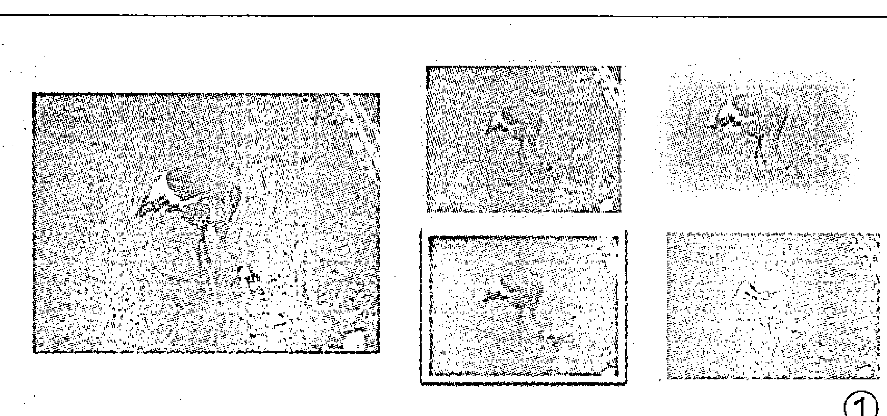

##### 2. 边框裁剪随心变

异形边框的图片往往能带来意想不到的艺术效果。在Word 2013或PPT 2013中，利用“格式”选项卡“裁剪”按钮中的“裁剪为形状”按钮，再加上纵横比的调整，可将图片边框裁剪出各种艺术效果（图2）。

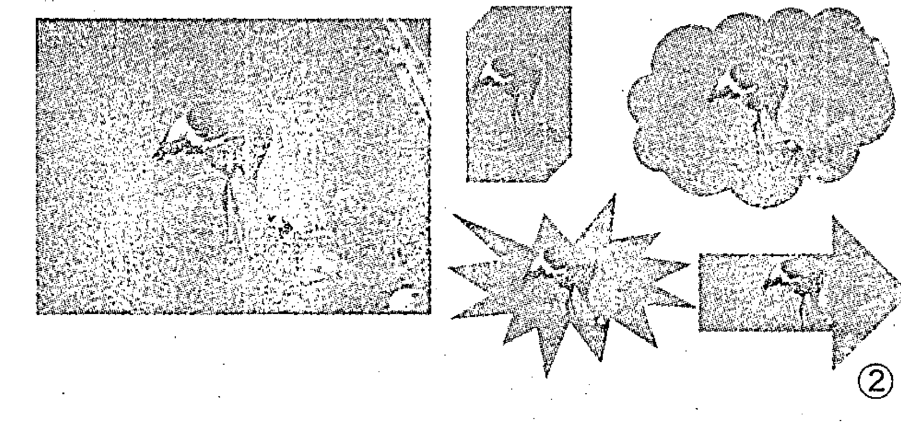

图片的形状还可根据自己的意愿随心所欲地编辑。首先插入一个形状，右击并选择“设置形状格式”，在右侧窗口填充处选择“图片或纹理填充”，选择所需的图片文件进行填充；然后右击这个形状，选择“编辑顶点”，任意拖动已经存在的控制点调整边框形状。当然，也可以在需要添加控制点的地方右击，添加新的控制点（图3）。

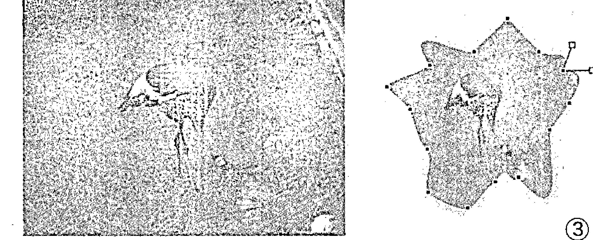

##### 3. 图片背景巧去除

要在PPT 2013中删除图片背景，选定相应的图片后，点击“格式”选项卡中的“删除背景”按钮，然后在图片上拖动矩形方框中的控制点进行调整。如果还没有达到理想效果，再利用“标记要保留的区域”或“标记要删除的区域”这两个按钮进行标记，直到满意为止（图4）。

> 小技巧
可以在控制点上右击，通过菜单对控制点进行设置，如将其设置为直线点、平滑顶点等。

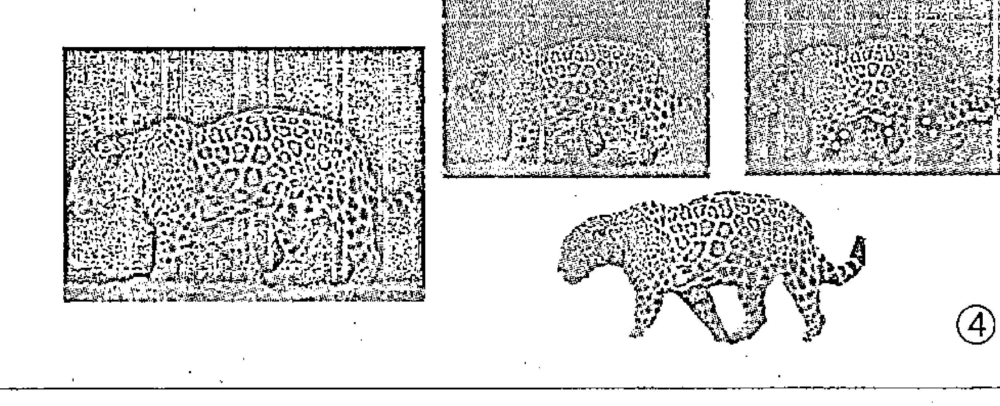

> 火速链接
有关使用PPT抠图细致的方法步骤，请参看本刊2014年第7期《PPT2013精细抠图妙用》一文。

##### 巧取汉字打头的字符串内容

文|王志军

处理表格数据时遇到问题：从网页表格中复制来的数据，地址一列中出现类似于“4AWZCX万载老林业局2”的无用字符前缀。现在希望提取第一个汉字及其之后的所有内容（图1），寻求高效分离中英文及数字的实操方法。

##### 1. 借助自动填充

如果使用Excel 2016，可以借助自动填充功能实现。打开“Excel选项”对话框，切换到“高级”面板（图2），在右侧窗格检查勾选“为单元格值启用记忆式键入”和“自动快速填充”复选框；接下来在B2单元格手工输入“万载老林业局2”，在B3单元格手工输入“永”，此时即可看到自动匹配提示，直接按下回车键即可（图3）。

> 小提示
如果使用更低版本的Excel，可使用下面两种方法。

##### 2. 利用数组公式

在编辑栏输入公式“=MID(A2,MATCH(1=1,LENB(MID(A2,ROW($1:$25),1))=2,),25)”，按下Ctrl+Shift+Enter组合键转换为数组公式，执行之后即可从A2单元格提取第一个汉字和之后的所有内容。向下拖拽或双击填充柄，即可看到图1所示的效果。

##### 3. 使用VBA代码

按下Alt+F11组合键，打开Microsoft Visual Basic for Applications编辑器窗口，依次选择“插入→模块”，在右侧窗格插入一个空白模块，在这里输入或粘贴如图所示代码（图4）。（下载地址：http://pan.baidu.com/s/1kU0wsaN 密码：ixzz）上述代码名称“CommandButton1_Click”可根据喜好任意设置，检查无误后依次选择“文件→关闭并返回到Microsoft Excel”命令，返回Excel主界面，按下Alt+F8组合键，打开“宏”对话框，选择并运行宏，稍等片刻就可以完成提取任务。

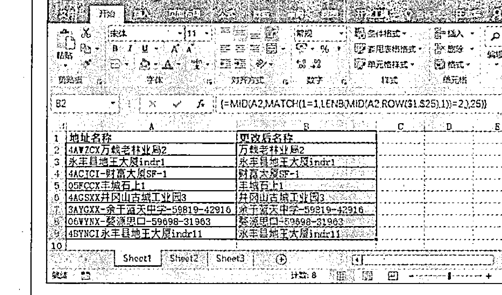

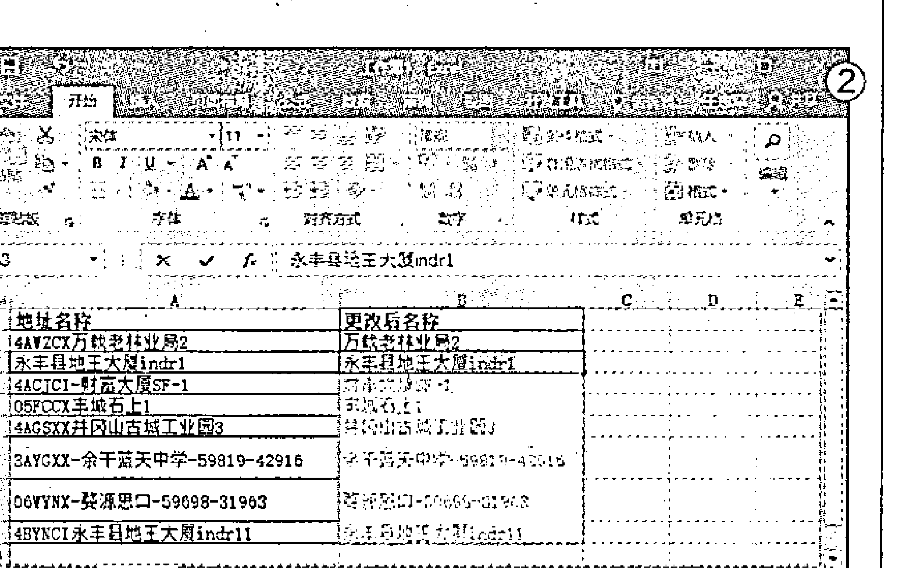

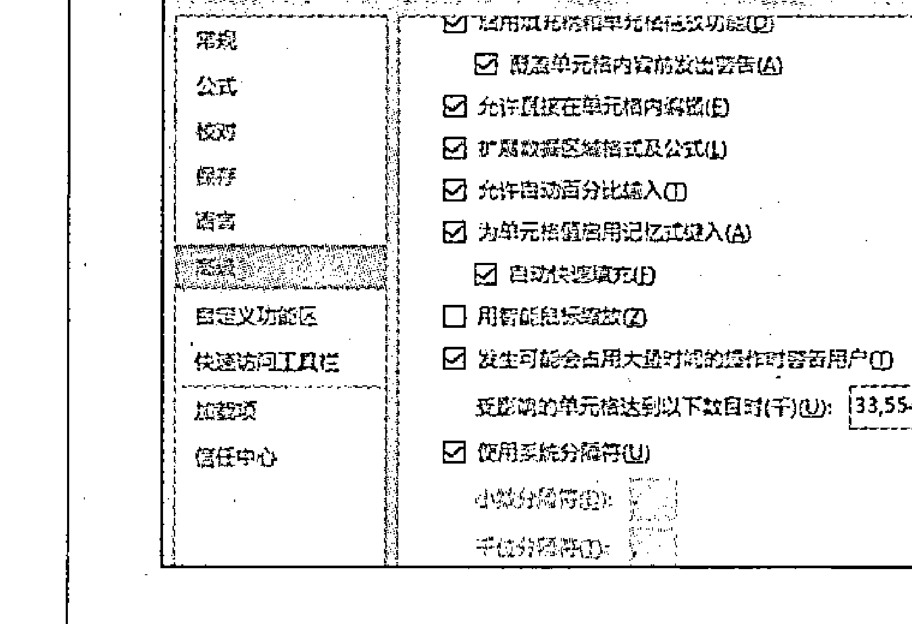

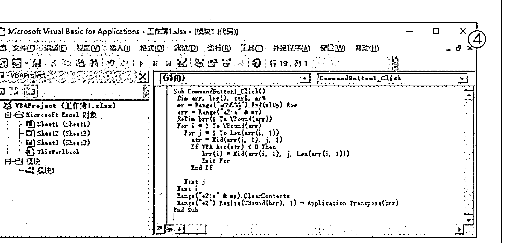

```

Sub CommandButton1_Click()
    Dim arr, brr(), i%, j%, n%
    arr = Range("a2:a" & Range("a65536").End(xlUp).Row)
    ReDim brr(1 To UBound(arr))
    For i = 1 To UBound(arr)
        For j = 1 To Len(arr(i, 1))
            If Asc(Mid(arr(i, 1), j, 1)) < 0 Then
                brr(i) = Mid(arr(i, 1), j, Len(arr(i, 1)) - j + 1)
                Exit For
            End If
        Next j
    Next i
    Range("b2").Resize(UBound(brr)) = Application.Transpose(brr)
End Sub

```

##### 巧用大纲视图 快速重排版面

文/王志军

对于由于内容顺序混乱而造成的目录顺序不当的文章，通常我们一定会想到先对文档内容进行手工排序，然后重新提取目录。但这样操作显然麻烦，而且也容易出错。对于从正文内容自动提取出来的目录，由于按住Ctrl键单击目录中的某条，可以直接跳转到正文的相应内容，目录条目与正文段落之间有必然的关联，因此我们可以考虑通过“大纲视图”完成内容的重新排序（图1）。

##### 1. 切换视图模式

切换到“视图”选项卡，选择“大纲视图”，进入大纲视图模式，此时可以大纲形式查看文档，内容将显示为项目符号。默认是显示所有级别，点击“显示级别”右侧的三角按钮，从下拉列表框手工调整为只显示“1级”（图2）。

##### 2. 调整内容顺序

接下来的操作就简单多了。我们并不需要手工拖拽各段内容的位置，只要调整各条大纲的顺序即可，对于移动整个段落相当方便。鼠标移到带圈“+”符号的上面，待光标变成十字形状之后，手工拖拽需要调整位置的大纲至相应的位置，很快就可以看到重新排列的效果（图3）。

##### 3. 再次更新目录

将显示级别重新设置为“所有级别”，此时可以看到已经完成重新排序的内容。关闭大纲视图，我们会发现虽然文档的内容已经完成重新排序，但目录的排序仍然没有改变。

这时并不需要从文档重新提取目录。选择目录，右击选择“更新域”，选择“更新整个目录”（图4），确认之后即可获得与内容吻合的最新目录（图5）。

> 小提示
Word提供了自动提取目录的方法，前提是文档中的目录已经使用标题1、标题2……的样式。切换到“引用”选项卡，在“目录”功能组依次选择“目录→自定义目录”，选择显示级别，确认之后即可自动生成目录。

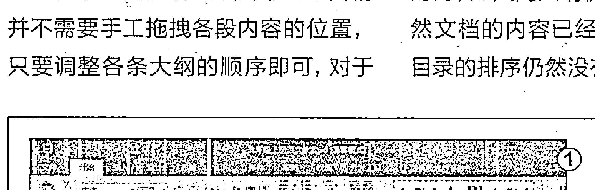

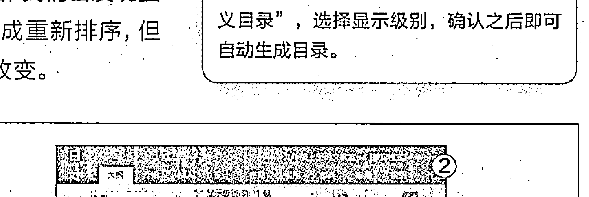

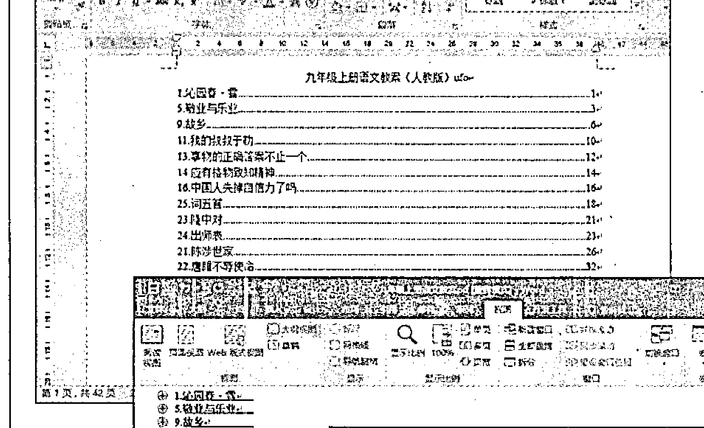

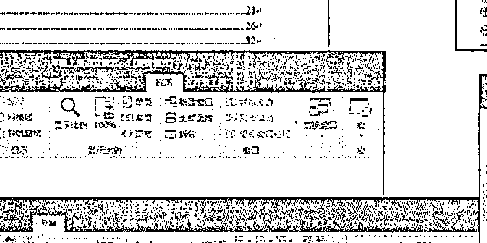

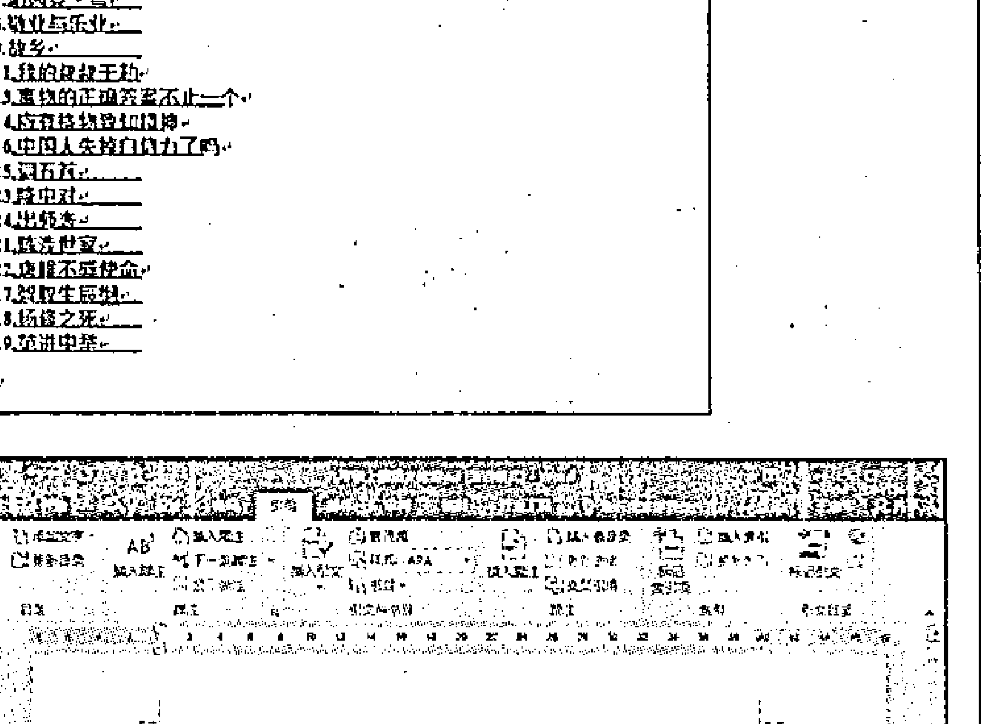

##### 折线图分组巧实现 文|马震安

如果将公司各季度的产品销售情况按地区分组，以折线图的形式呈现在Excel图表中（图1），这样将各组数据放在一起对比查看，效果会更加明显。但是，一般情况下折线图都是连续的，如何将分好组的数据用各自的折线图表示出来呢？

##### 1. 数据分组与分隔处理

制作图表当然离不开基础数据，但要制作折线图的分组效果，需要先对数据进行分组处理。在以地区为分组数据的每个地区下插入空行，这样做是为了使各地区的数据有一个间隔，以出现如图1中显示的分隔效果。

##### 2. 制作数据标记的折线图

数据处理完成后，就该制作图表了。选择所有数据区域，通过“插入”选项卡点击图表区中的“插入面积图→二维面积图→面积图”，然后选择“销量”这列的数据进行复制，点击绘图区中的图表进行粘贴。点击桔色图表，在“设计”选项卡中点击“更改图表类型”，在弹出窗口的组合图表中，将“系列2”的图表类型更改为“带数据标记的折线图”（图2）。

##### 3. 用渐变填充效果美化图表

图表设计完成后，需要对图表进行必要的美化。此处我们希望实现渐变填充效果。双击图表中的柱形，在右侧的“设置数据系列格式”中填充设置为“渐变填充”，类型、方向、角度等都可以根据需要进行设置。双击折线图，在填充选项卡处点击“标记”选项卡，在数据标记选项处可设置标记类型及大小。在填充处设置为“渐变填充”，类型为“路径”，调整好渐变光圈等参数（图4）。经过上述操作，一组分组显示的折线图就制作完成了。

> 小提示 复制粘贴后图表会改变颜色
右击图表，选择“选择数据”，在弹出的窗口点击“隐藏的单元格和空单元格”，设置空单元格显示为“空距”。这样，就实现了折线图的基本分组显示（图3）。

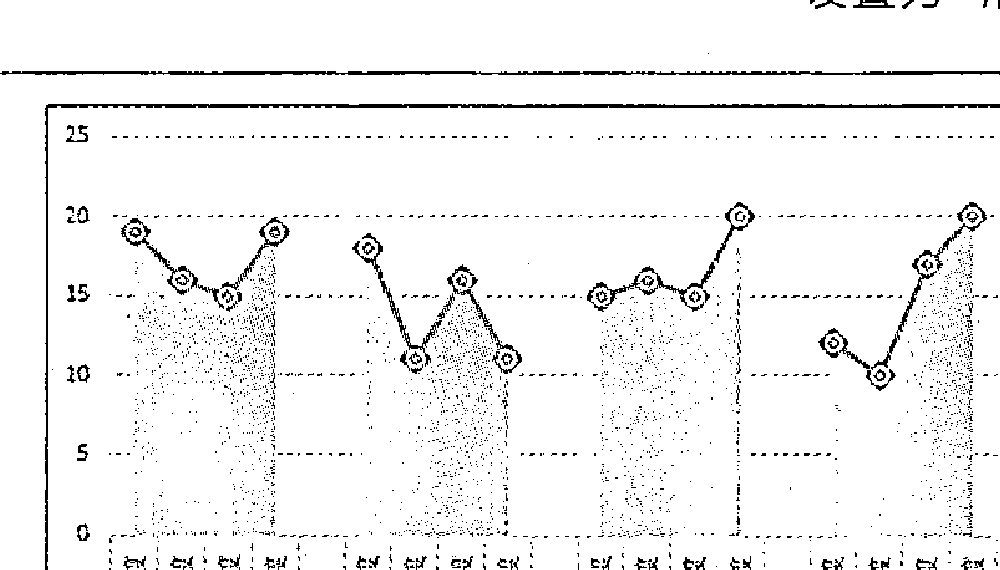

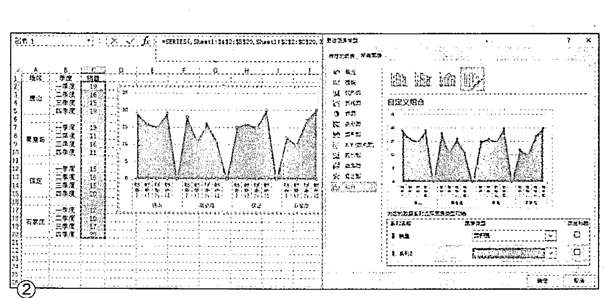

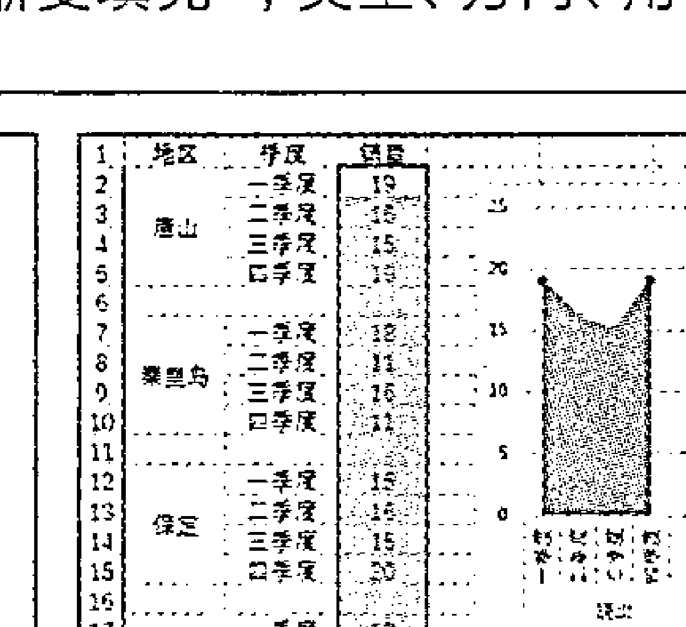

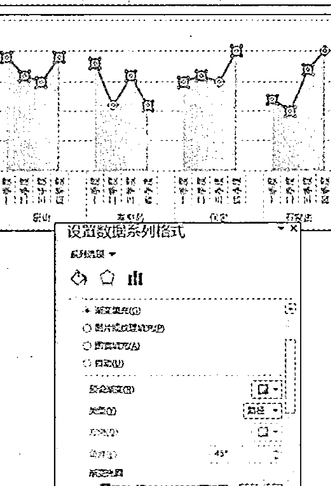## “非”字型对比图表轻松做

文|马震安

用Excel制作某品牌商品在各城市男、女人群之间销售热度的对比图表，由于这个图表要将图例标签放置在左、右条形图中间，图表的形状就像汉字“非”的模样，因此我们称其为“非”字型图表（图1）。这样的图表如果按照常规的手段制作，实现起来有些困难。但如果在原有数据的基础上添加一个辅助列，就会轻松解决制作难题。

为了在生成的左、右条形图对比图表中间添加图例标签，我们首先需要对数据源进行必要的处理。复制数据源，并将“男”数据的值设置为负的，在数据源右侧插入3个辅助列，在这列的单元格中输入10（可根据图例标签内容设置）。并将“女”列的数据设置为负值。

数据源准备好后，就该插入图表了。选择A2:A8，并按住Ctrl键选中F2:H8；依次点击“插入”选项卡图表区中的“二维条形图→堆积条形图”；右击图表，选择“选择数据”，在弹出的窗口左侧图例项处选中“中空”系列；点击“上移”按钮，将“中空”系列移动到“男”、“女”系列之间；双击纵坐标轴，在右侧的坐标轴选项处勾选“逆序类别”；双击横坐标，在坐标轴选项的边界处设置最大值为100，最小值为-90，单位的主要处为10（图2）。

选中灰色中空的条形图，将其填充色设置为“无”；双击图例中的“中空”，将其删除掉（图3）。

参数设置好后，删除横、纵坐标及网格线。右击灰色的中空标签，选择“添加数据标签”，双击添加的数据标签，在右侧的“设置数据标签格式”处选择“标签选项”卡，不勾选“值”，勾选“类别名称”；选中灰色中空的条形图，将其填充色设置为“无”；双击图例中的“中空”，将其删除掉（图3）。
选中左边的条形图添加数据标签，双击添加的数据标签，在右侧的设置数据标签格式处选择“标签选项”卡，勾选“值”，在数字下面的类别处选择“自定义”。同样道理，右侧的条形图数据标签的添加也是如此。

最后，对条形图进行必要的美化，调整好图例的位置，设置标题。这样，一个“非”字型的对比图表就轻松制作完成了。■

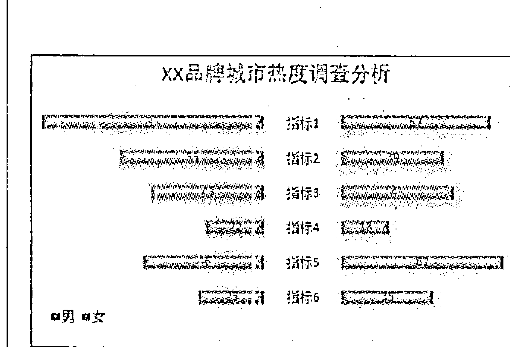

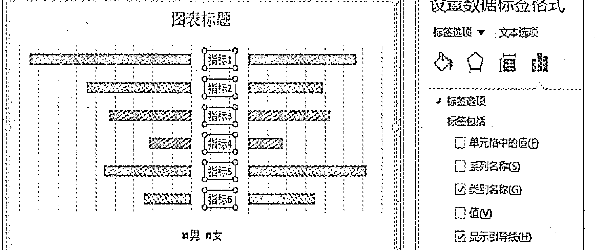

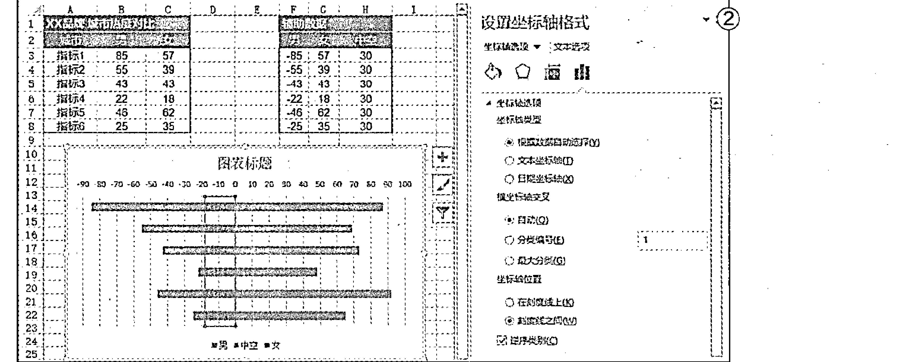

##### 图表也能下拉菜单排序

文|马震安

看到题目，你也许会感到很诧异。平时的表格排序，我们总是针对表格中的数据进行排序，难道图表也能进行排序？实际上，为了更好地用图表展示数据，我们也可以在柱形图上添加下拉菜单，通过下拉菜单实现对图表的排序（图1）。以下操作在Excel 2016中完成。

首先根据需要插入柱形图并添加好标题，双击图表对其进行必要的美化。然后在E6、E7、E8单元格分别输入“正常”、“升序”、“降序”，选择“开发工具”选项卡中的“插入→表单控件→组合框”，在图表的合适位置画出组合框并调整好大小。

右击组合框，选择“设置控件格式”，在弹出窗口的“控制”选项卡中，“数据源区域”选择E6:E8，“单元格链接”选择E9。设置完成后，可点击组合框进行选择，看是否达到预期效果（图2）。

接下来设置交互效果。实际上，对于图表的排序，就是对其数据源根据下拉列表的选择进行排序。因此，需要对图表的数据源进行重新设置。

首先，点击公式选项卡中的“名称管理器”，在弹出的窗口中新建6个名称，如表所示。

| 新建名称 | 引用位置 |
| :--- | :--- |
| jxxl | =LARGE(OFFSET(Sheet1!$B$2,,COUNTA(Sheet1!$B:$B)-1,1),ROW(Sheet1!$1:$4)) |
| jxyf | =T(OFFSET(Sheet1!$A$1,MATCH(jxxl,Sheet1!$B$2:$B$5),)) |
| sxxl | =SMALL(OFFSET(Sheet1!$B$2,,COUNTA(Sheet1!$B:$B)-1,1),ROW(Sheet1!$1:$4)) |
| sxyf | =T(OFFSET(Sheet1!$A$1,MATCH(sxxl,Sheet1!$B$2:$B$5),)) |
| xl | =IF(Sheet1!$E$9=2,sxxl,IF(Sheet1!$E$9=3,jxxl,Sheet1!$B$2:$B$5)) |
| yf | =IF(Sheet1!$E$9=2,sxyf,IF(Sheet1!$E$9=3,jxyf,Sheet1!$A$2:$A$5)) |

右击图表，选择“选择数据”，在左侧的图例项处点击“编辑”，在弹出窗口的系列值处输入“=Sheet1!xl”，在右侧的水平轴标签处点“编辑”，轴标签区域处输入“=Sheet1!yf”（图3）。

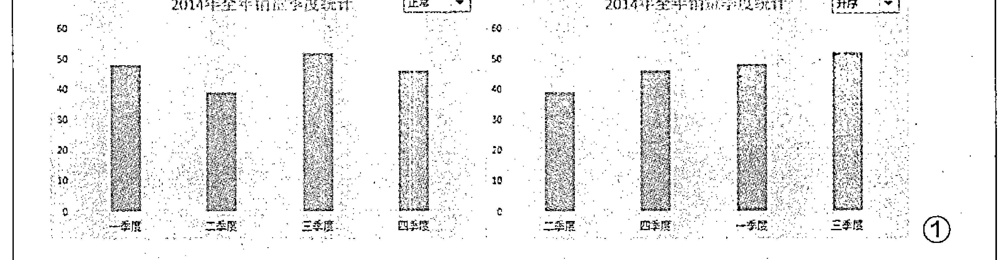

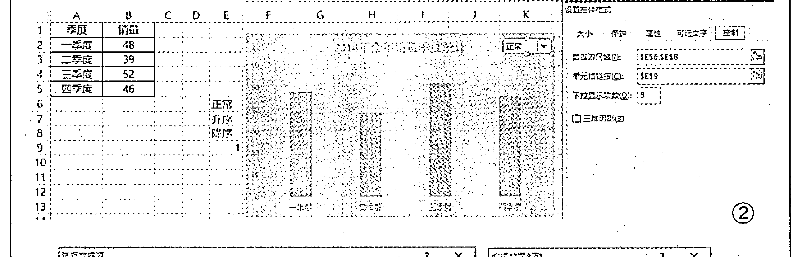

> 小提示
其中LARGE函数的作用是返回数组中的第n个最大值，SMALL函数是返回数组中第n个最小值。T函数是检测OFFSET函数的返回值是不是文本，如果是就原样返回。实际上，jxxl的作用是返回销量的从大到小的排序，jxyf是根据jxxl返回值生成相应的月份。同理，sxxl的作用是返回销量的从小到大的排序，sxyf是根据sxxl返回值生成相应的月份。

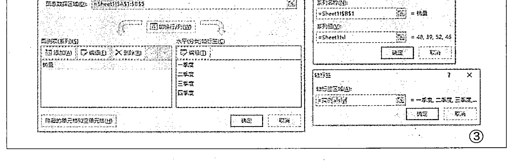

最后，将图表及下拉列表都选定并进行组合，拖动组合后的对象，让其遮挡住E6:E9单元格。经过这样设置之后，图表就可以排序了。

##### 玩转Excel 2016的“快速填充” 文/王志军

从2013版本开始，Excel提供了“快速填充”的功能，可以基于示例填充数据。这个功能并非“自动填充”的升级，它强大到足以让用户抛弃分列功能和文本函数。2016版本的Excel“快速填充”功能更为强大。下面就让我们一同感受“快速填充”的高效和智能。

##### 1. 提取数字和字符串

很多时候，我们需要提取字符串中的数字或字符串，但源数据往往缺乏规律，例如“规格：10号，长度24232米，数量1件”中的数据，我们需要分别提取规格、长度、数量等变化的数字，很显然这里无法直接使用LEFT、RIGHT、MID、FIND等文本函数提取，需要使用一些比较复杂的公式，这对于初级用户来说难度比较大。使用“快速填充”功能则相对简单了很多。

> 小提示
借助这一方法还可以完成代码与姓名、姓名与职位的合并。

如果按常规的方法，手工输入“10”，然后选中需要填充的目标单元格，接下来在“编辑”功能组依次选择“填充→快速填充”，将无法在后续单元格得到正确的提取结果，只会按照起始字符显示相应结果。正确的方法是在前面两个单元格连续手工提取2个数字，接下来再在第三个单元格手工输入起始数字（图1），此时会自动显示填充建议，我们只要按下回车键就可以了。提取长度、数量的方法完全相同。

##### 2. 提取合并一步实现

“快速填充”功能不仅可以实现批量提取的效果，而且在提取的同时还可以将两列单元格的不同内容合并起来。例如B3单元格是“0001-刘一”，C3单元格是“副总经理”，现在希望得到“刘副总经理”的结果，同样可以利用“快速填充”解决这一问题。

在D3单元格手工输入“刘副总经理”，接下来在D4单元格手工输入“陈”，此时就可以看到如图所示的效果（图2），直接按下回车键即可完成提取和合并的操作。

> 小提示
在D3单元格手工输入“刘副总经理”，接下来在D4单元格手工输入“陈”，此时就可以看到如图所示的效果（图2），直接按下回车键即可完成提取和合并的操作。

##### 3. 调整字符串的顺序

有些时候，我们需要调整字符

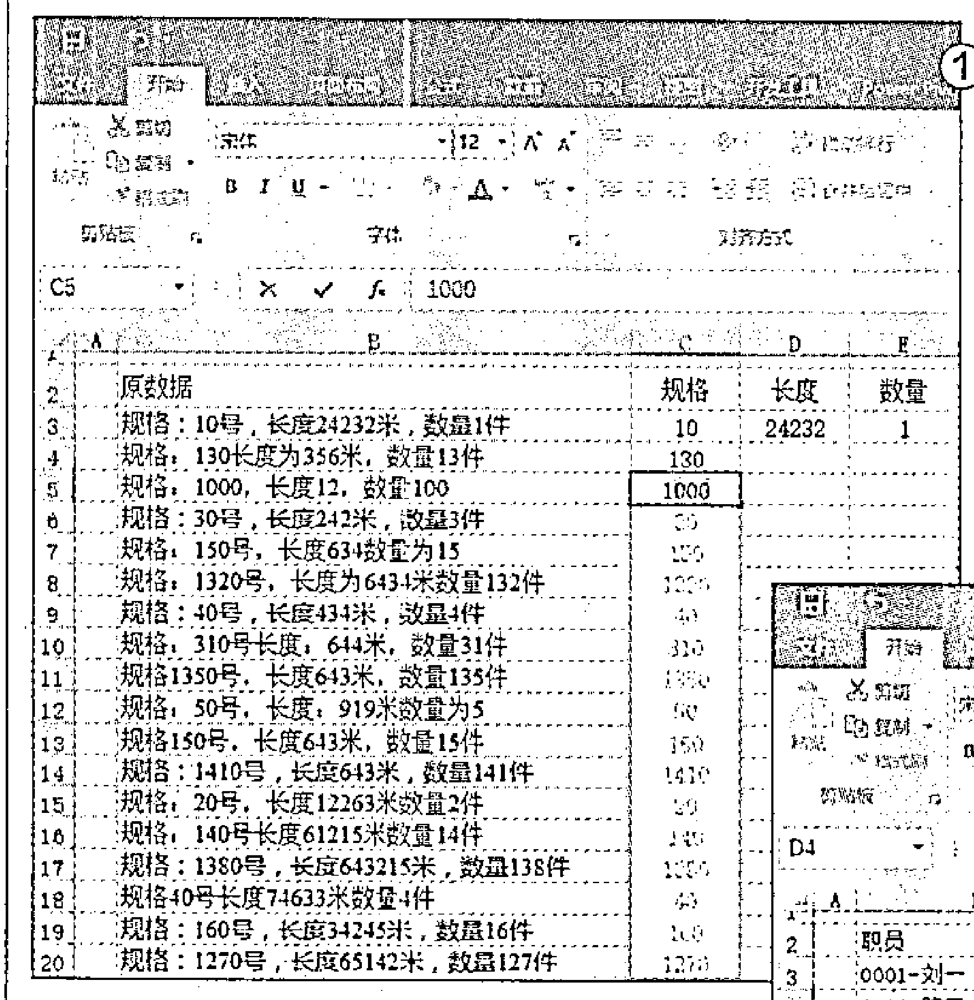

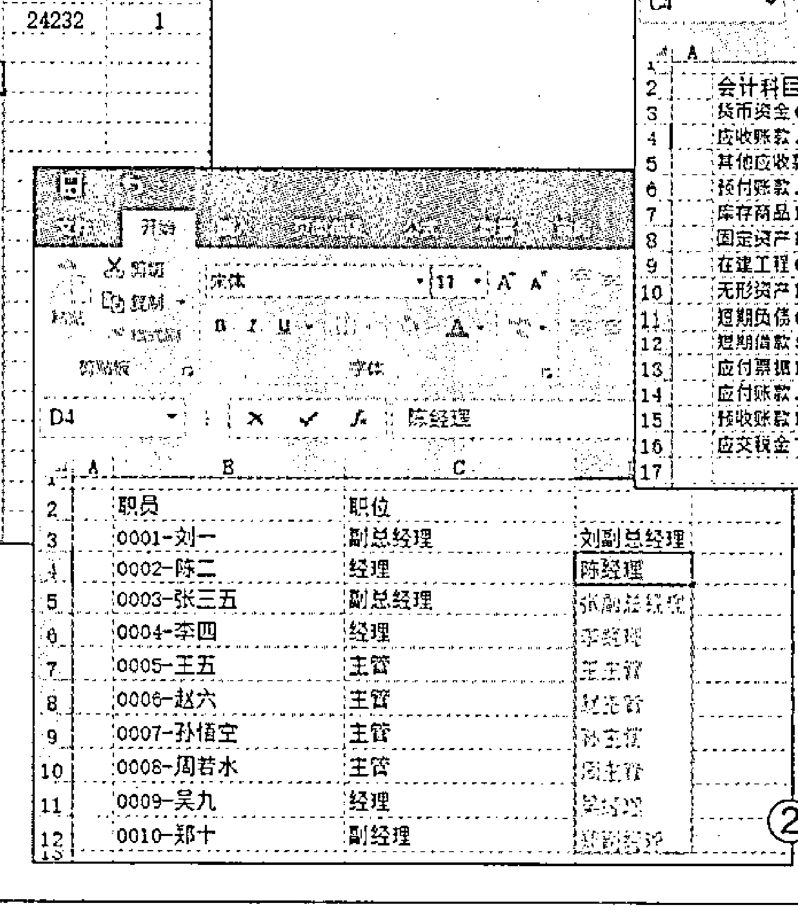

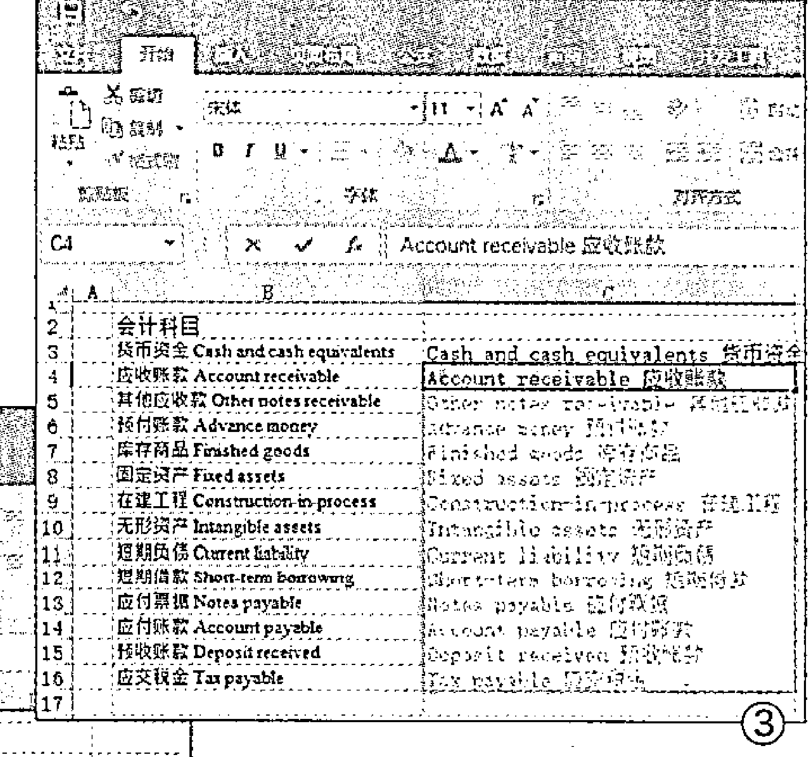

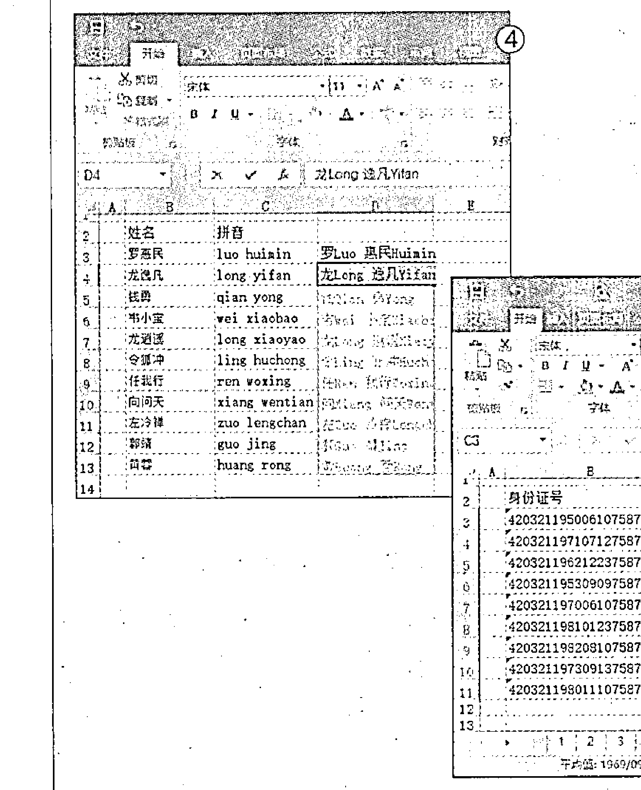

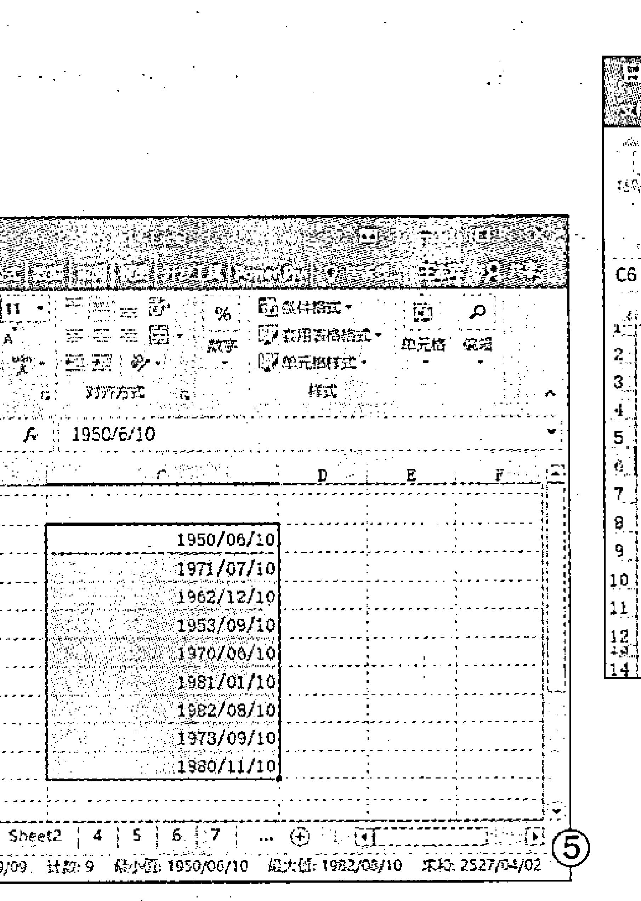

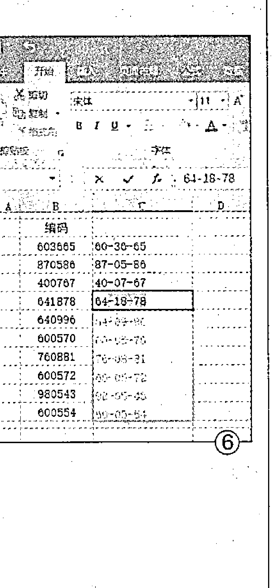

##### 4. 大小写的转换和重组

如果需要将姓名拼音的首字母转换为大写，例如将“罗惠民”和“luo huimin”转换为“罗Luo 惠民 Huimin”的效果，这里不仅涉及到大小写转换的问题，而且还涉及姓、名拆分与拼音的组合，手工转换显然是相当麻烦，而且也容易出错。利用“快速填充”可以完成大小写的转换和重组。

在目标单元格手工输入“Cash and cash equivalents 货币资金”，接下来继续在下一单元格输入，很快就可以看到如图所示的填充建议效果（图3），直接按下回车键即可完成填充。

##### 5. 从身份证提取出生日期

我们知道，身份证信息包含了出生日期，在以往的Excel版本中需要使用函数或公式来提取。使用Excel 2016，利用“快速填充”可以直接提取这些信息。不过在填充之前请首先对目标列的格式进行设置。

打开“设置单元格格式”对话框，切换到“数字”选项卡，选择“自定义”分类，在右侧的“类型”选择“yyyy/mm/dd”，确认之后关闭对话框。

在目标单元格手工输入身份证号中的出生日期，选定需要快速填充的单元格区域，按下“Ctrl+E”组合键就可以看到如图所示的效果（图5）。

##### 6. 自动添加字符串分隔符

还有的时候，我们需要用间隔号来分隔一些字符串。例如需要将“603665”修改为“60-36-65”的效果，这里不仅涉及到数据的提取，还需要添加分隔符“-”，以往我们都是通过公式和“&”实现数据的连接。现在，我们同样可以利用“快速填充”轻松实现。

手工输入“60-36-65”，随后再连接三次输入类似的数据，很快就可以看到如图所示的填充建议（图6），直接按下回车键就可以了。需要提醒的是，这里需要至少输入三个示例，才可以得到快速填充的正确结果。

> 以上仅仅列举了几个最常见的快速填充案例。实际上，在表格填写实践中，可以用到快速填充的地方远远不止这些。只要能给出前3个案例的共同填充规律，软件便会智能地“猜出”后续的填充结果。注意灵活应用，丢掉老方法，工作效率会更高。

##### Word另类需求巧实现

文|王志军

Word是办公用户使用频率极高的软件，但是我们会发现，有些不是很常用的功能在真正需要时却很难下手，比如输入循环小数上的小黑点、获知公文的页平均字数等。这里以Word 2016为操作环境，介绍几则这方面的实用技巧。

##### 1. 输入循环小数上的小黑点

小学数学老师出试卷时经常要输入循环小数。在Word文档中，输入循环小数上面的小黑点成了难题。遇到这种情况，可借助Word“拼音指南”功能来实现。

首先输入相应的循环小数，如“0.44”，选定最后一位数字“4”。切换到“开始”选项卡，在“字体”功能组中单击“拼音指南”按钮，随后会打开“拼音指南”对话框。在“拼音文字”下面的文本框输入小黑点，可借助中文输入法的“软键盘”实现（图1）。在“特殊符号”面板找到“●”或“·”，对齐方式可以设置为“1-2-1”，字号根据实际情况调整，不要过于夸张，最终效果如图所示（图2）。

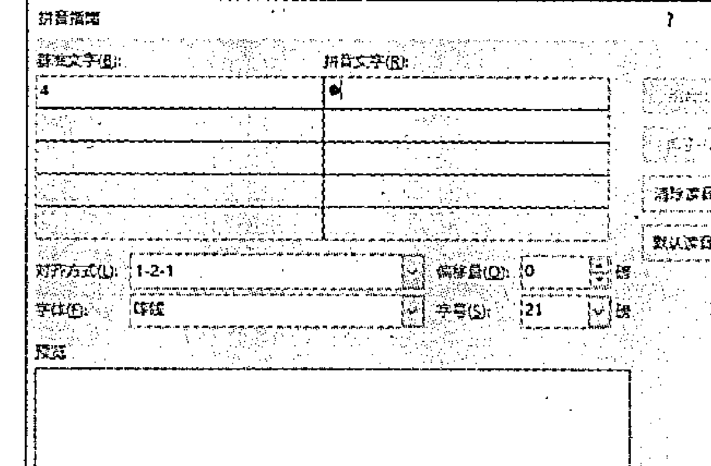

##### 2. 轻松获知公文的页均字数

用Word处理公文或稿件，有时需要知道页均字数。Word自带的字数统计功能可以显示页数、文档的总字数、段落数、行数，但不能直接显示平均到每页的字数。若要知道页均字数，还得另行计算。如果利用“域”功能，可自动显示出页均字数。

在相应位置输入“每页平均字数：字”，将光标定位在“数：”和“字”之间，按Ctrl+F9打开域编辑器；在大括号里面输入“=/”，将光标置于“=”和“/”之间，按下Ctrl+F9再次插入一对大括号；在“/”的后面再次按下Ctrl+F9插入一对大括号（图3）；在第一个括号里输入numwords（表示文档的总字数），在第二个大括号内输入numpages（表示文档的页数）。将光标移动到代码的最后，右击并选择“更新域代码”，即可获得如图所示的效果（图4）。

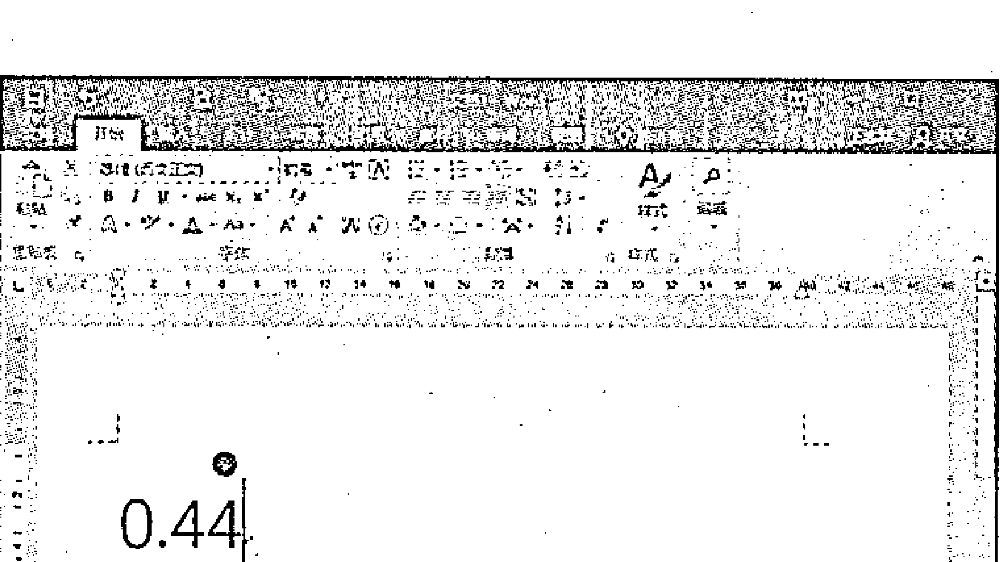

小提示：如果出现错误，可以右击选择“编辑域”，修改相应的域代码。

##### 3. 快速清除网页文章格式

我们会从网页中复制一些有用的内容到Word文档中，但这些内容往往会带有一些我们并不需要的格式。如果通过记事本进行中转，则其中的表格或图片将不能保留下来。其实，只要在“字体”功能组中点击“清除所有格式”按钮，即可清除所选内容的所有格式。如果清除格式之后需要还原，可以按下Ctrl+Z组合键进行。

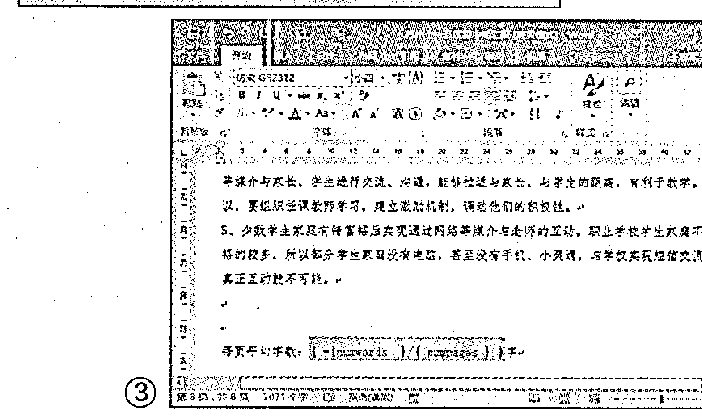

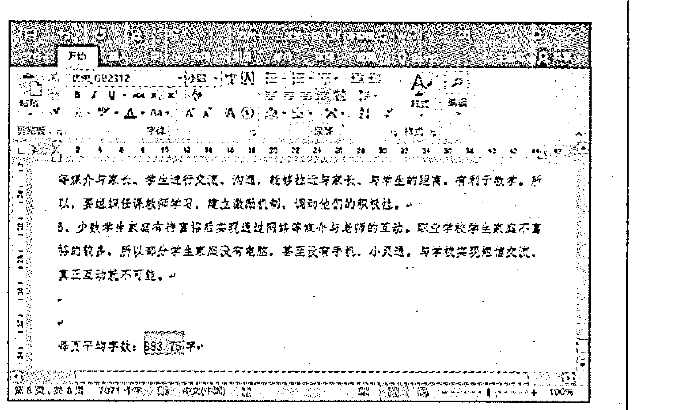

##### 幻灯片动态片头易制作

文|马震安

人们在制作幻灯片时，总是用尽各种技术手段，希望自己的幻灯片在片头就能够吸引更多人的眼球。显然，用PPT自带的动画效果也能制作出绚丽的片头，但这种做法往往非常费时。用Flash制作倒是个好主意，但如果没有学过Flash，临阵磨枪也不现实。其实，借助于第三方工具Aleo Flash Intro Banner Maker，即便是不懂Flash软件，也能轻松制作出绚丽的Flash动画效果。下面就通过制作一个课件片头的实例（图1），看看动态片头是如何轻松制作出来的。

首先设置片头尺寸、声音。打开Aleo Flash Intro Banner Maker软件，在出现的主窗口中选择“尺寸声音”选项卡，设置片头的大小、帧速、形状、边框、背景音乐等基本信息。这里可以根据幻灯片的大小进行设置。勾选“添加声音控制器”并选择Slider模式，这样不仅能够控制背景音乐的播放和停止，而且还能调整声音的大小。设置好控制器的位置（图2）。


> 小提示：如果在更改参数时电脑太卡，需要将“自动加载实时预览”的勾选去掉。

随后再设置片头背景。选择“背景设置”选项卡，设置好背景颜色，将课件的主题图片（或系统提供的剪辑）添加到背景中。其中，图片可以添加多张，并可通过自定义来调整图片的位置及角度。

接下来设置动态效果。选择“选择效果”选项卡，根据需要选择动态效果，并在右边的参数对话框中对效果进行微调，需要设置的项目有透明度、数量、移动速度、颜色等。

> 小提示：有的动态效果有透明度、颜色等设置，有的则没有。可按需随机应变。

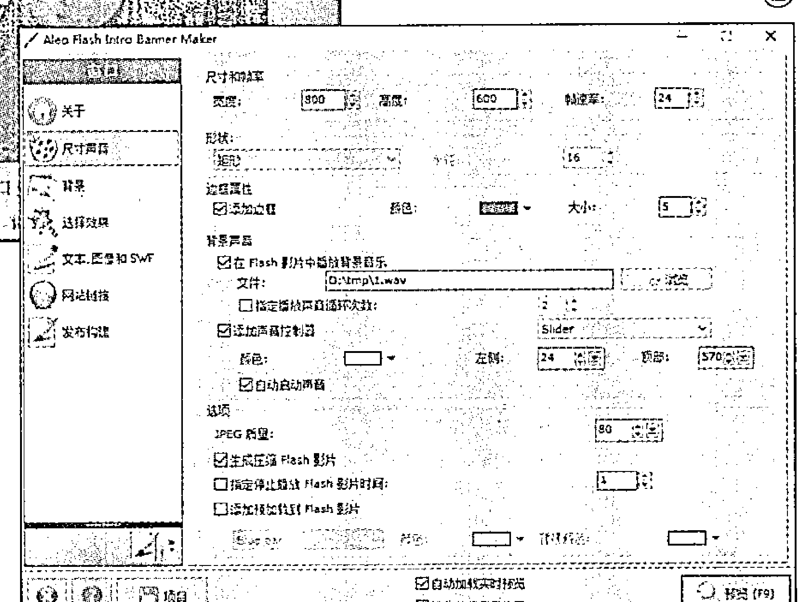

还需要设置片头主题。选择“文字图像”选项卡，通过“添加文本”按钮在弹出的窗口中输入片头主题及主讲人等。选中主题文本，点击“编辑字体样式”中的按钮对字体进行设置。通过“选择效果”选项卡，为主题选择一个动态效果，可通过动态效果的参数来重新设置效果；通过“位置”选项卡设置主题在片头中的位置；通过“定时”选项卡设置控制文字在片头中出现、消失的时间（图3）。

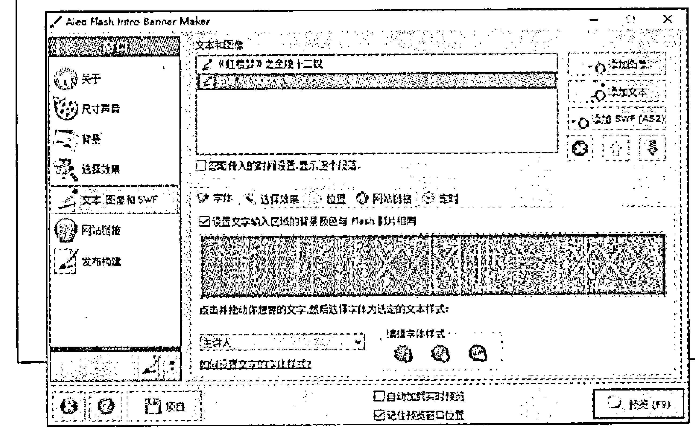

> 小提示：可选择以Flash、GIF、AVI三种格式发布，并可以直接创建HTML代码，供制作网站时直接插入。

最后进行片头发布。发布前需要先保存项目。选择“发布构建”选项卡，点击“发布”按钮，在弹出的窗口中选择“发布为Flash影片”，点击“确定”就可以了。这样，生成的SWF片头文件就可以插入到幻灯片中使用了。

##### 多维组织结构图巧制作

文|马震安

我们平时所看到的组织机构图一般是方框、线条加文字的形式，虽然看起来明了，但不够形象。这样的组织机构图显得单调、乏味，格式抄来仿去，显得也没有创意。如果能将组织机构图制作成由立体实际人像组成的多维图，当点击结构图中某个部门的热区时，就会出现该部门负责人的图片和信息（图1），这样的结构图别出心裁，不但视觉上更加形象，而且还具有交互特性，就会更加引人注目。下面讲述在PPT2016中制作此类组织机构图的技法。

##### 1. 制作空白图底

运行PPT2016后，插入一张空白幻灯片，利用“插入”选项卡中的形状，在幻灯片中绘制出所需要的组织结构图，设置好形状的样式；将所有形状进行组合，调整好角度、大小、位置等（图2）。

##### 2. 插入交互热区

热区的添加是为了当点击相应热区时，会在相应位置出现人物图片及相关介绍。

首先在组织结构图的每个椭圆中添加一个与结构图部件形状一样的椭圆，调整好大小，设置无边框，填充色和背景一致，输入各部门相应文字。为方便管理、选择和使用这些形状，可点击“开始”选项卡，点击“编辑→选择”下的“选择窗格”，在右侧“选择”窗口，双击每个新添加的椭圆进行重命名，如“董事长热区”、“总经理热区”等（图3）。

##### 3. 插入图片及说明

在这张组织结构图中，需要用到人物的无背景图片。对于图片的背景处理，可以采用抠图软件或其他方法进行去除，这里不再赘述。插入所需要的图片，设置图片的阴影效果，再利用“形状”中的直线及文本框插入人事说明，并设置好它们的格式。为了方便管理，同样也需要对这些图片、形状进行重命名，如将“后勤主任1”的图片、连线、文本框分别命名为“后勤主任1”、“后勤主任1连接线”、“后勤主任1文本框”。其他的设置也都类似（图4）。

##### 4. 设计动画效果

基本的界面设计完成后，就该进行图片、连线、说明等对象出现时的动画效果设计了。这里以“董事长”的

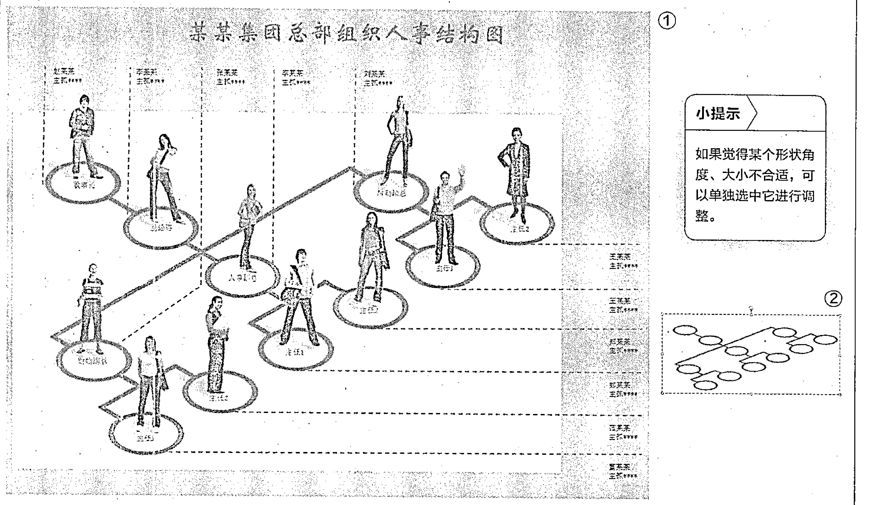

> 小提示
如果觉得某个形状角度、大小不合适，可以单独选中它进行调整。


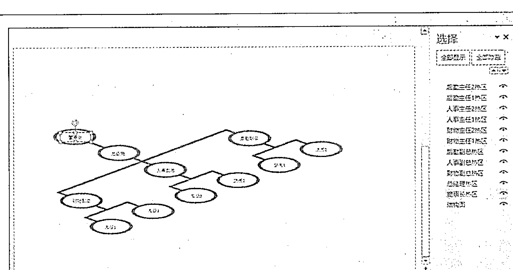

> 小提示
在操作的过程中，如果有些图形、形状影响对其他对象的操作，可在“选择”窗口通过眼睛状开关按钮先将其隐藏。

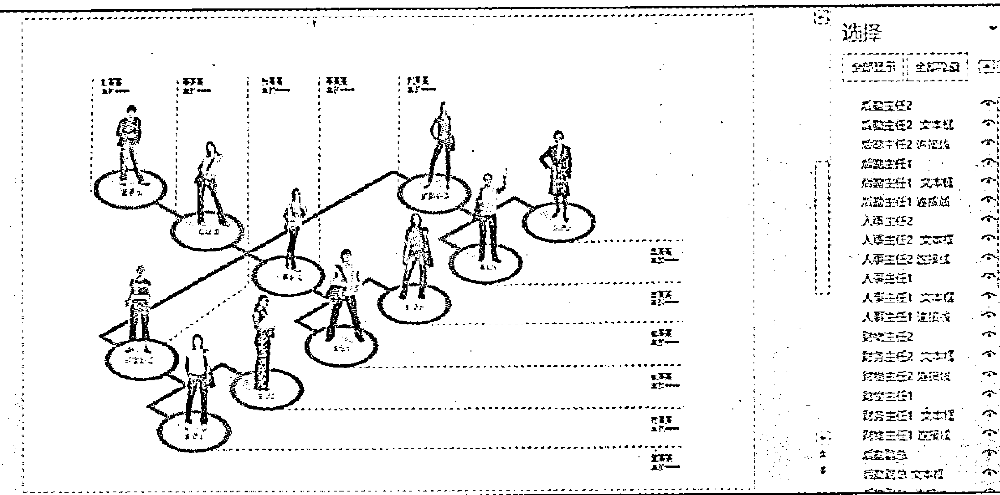

> 小提示
如果动画效果类似，可以先设置好一个后，用动画刷来复制类似的动画效果，最后再做一些小的更改。

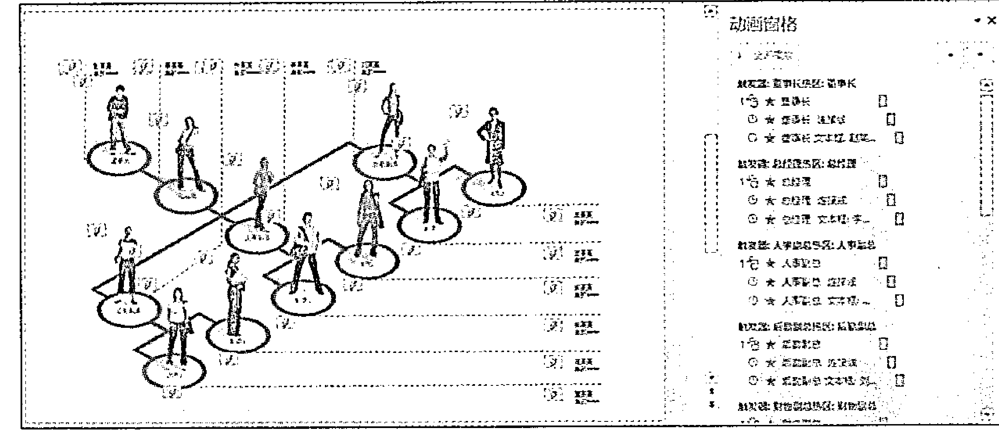

图片、连线、文本为例来进行设置。选择“董事长”的图片，利用“动画”选项卡添加动画效果为“擦除”，效果选项设置为“自底部”，触发设置为单击“董事长热区”；选择“董事长连接线”，其动画效果也设置为“擦除”，效果选项设置为“自底部”，开始处设置为“上一动画之后”；选择“董事长 文本框”，其动画效果设置为“擦除”，效果选项设置为“自左侧”，开始处设置为“上一动画之后”。点击“动画窗格”按钮，在出现的动画窗格窗口，将连线和文本框的动画效果都拖动到“董事长”这个图片的动画效果下面。其他图片、连线、文本框出现时动画效果的设置也与之类似（图5）。最后，在幻灯片上添加好标题，可以适当进行装饰，如设置背景等。播放看看，是不是这样的设计与众不同？

> 拓展阅读
为了使这个组织结构图得到更加广泛的应用，可将其转换成Flash格式的文件。在电脑上安装iSpring Suite 7软件，用PPT打开这个组织结构图，这时PPT的选项卡就多出了iSpring Suite 7选项卡，切换到该选项卡，点击Publish按钮进行发布，选择Web，根据需要在窗口中进行设置，如输入标题、选择输出文件夹等；根据需要在Player设置好播放器类型（如简约型、带播放控制按钮的通用型）。一切都设置好后，点击Publish按钮，就能生成SWF类型的Flash文件了。生成的SWF文件的播放效果和PPT中的播放效果是完全一样的，它可以嵌套在公司的网站中对外展示，这比传统的组织结构图会显得更加新颖。

##### 分离视帧 制作演示幻灯片
文|马震安

我们通常看到的视频大多只能播放而缺乏互动性，如果要在一段已有的演示视频的基础上加入可交互的互动内容，该如何实现呢？

案例描述：在豆浆机网店宣传页上要加一个豆浆制作的视频使用说明幻灯片，演示过程中要实现这样的效果：在视频中插入若干个提示点，当视频播放到关键步骤时会出现提示点，如果不点击提示点，视频继续播放；如果点击提示点，视频暂停播放，并在视频旁边的空白处出现该关键步骤的注意事项内容；点击“继续”按钮，视频继续播放(图1)。按照惯常的思维来分析，如果这个效果用PPT来制作的话，一定是非常费事的，甚至不得不要用到VBA代码；如果利用Flash来实现，对于没有学过Flash的人来说也不是能一蹴而就的。但如果利用Articulate Storyline工具，不但能很好地实现上述效果，而且操作就像我们平时使用PPT那样简单轻松，还不需要使用任何代码。

##### 1. 插入视频及提示点
在幻灯片编辑窗口，选择“插入”选项卡，利用“形状”按钮中的矩形来添加装饰性的幻灯片边框。选中矩形，利用“格式”选项卡来设置它们的样式，并将它们进行组合。这些操作同PPT中的操作一样简单。再利用“视频”按钮插入所需视频。在时间线上，将时间指针拖动到需要出现提示点的时间点，利用“标记”按钮中的“数字”在视频上插入标记。在时间线上选中标记的时间线，利用鼠标在选中时间线的左、右两边分别进行拖动，以调整标记出现和消失的时间；选中插入的标记，在“格式”选项卡选择好标记样式，在标记选项处勾选“仅音频”；右击插入的标记，选择“按钮集→按钮集1”，将标记作为点击按钮。同理，利用“文本框”为每个数字提示点添加中文说明，并在时间线上调整其出现和消失的时间与对应的标记相同(图2)。

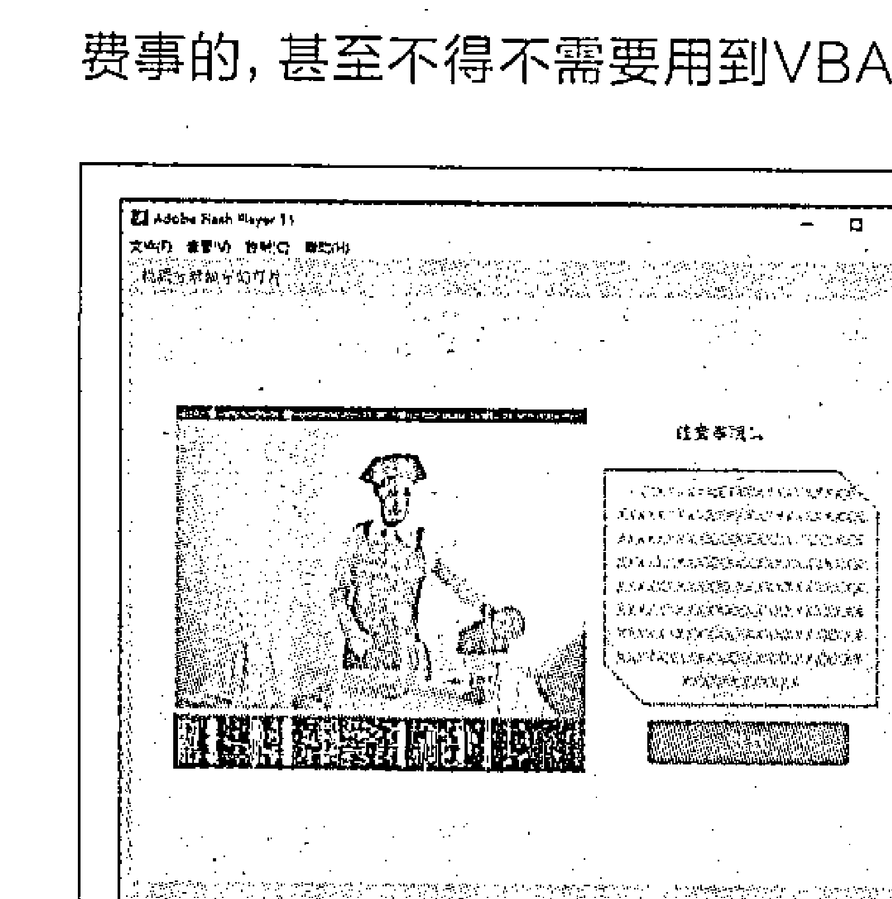

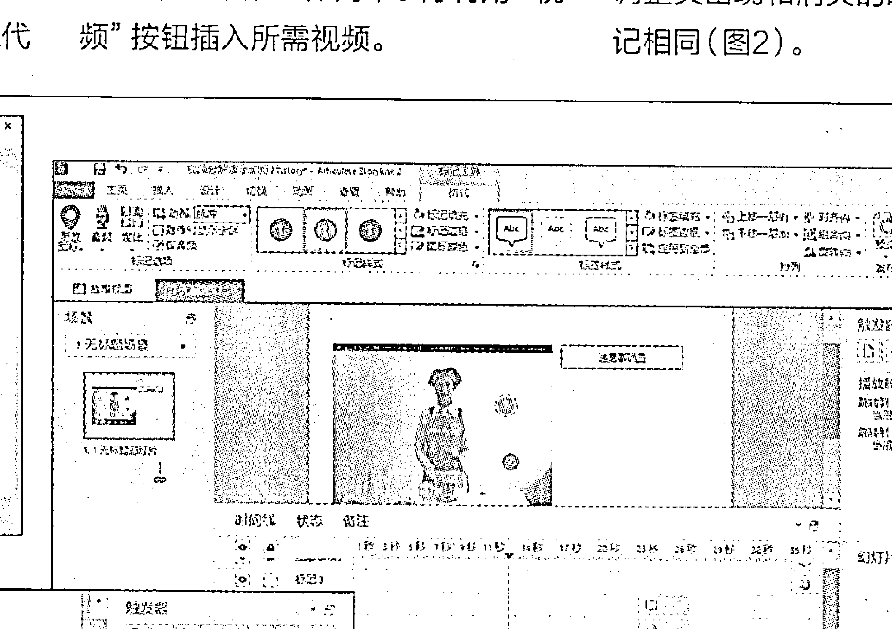

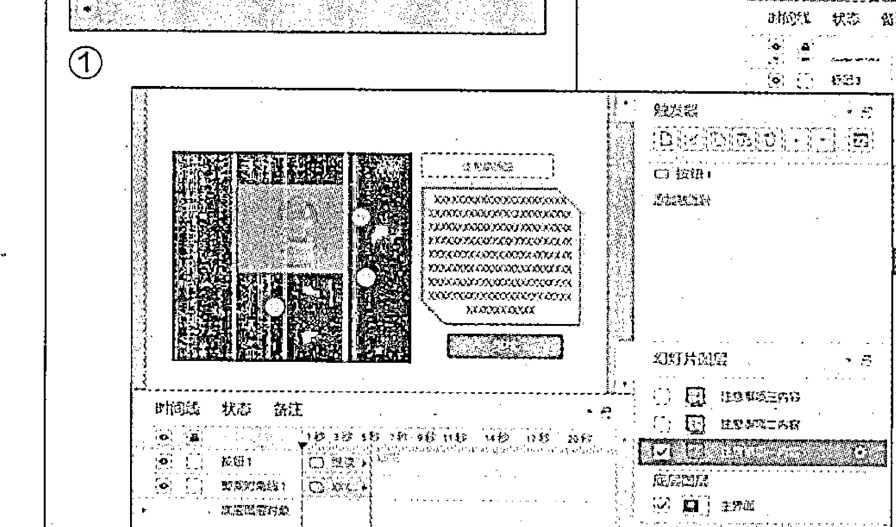

##### 2. 插入注意事项内容
视频使用说明的主界面设计完成后，接着添加注意事项的具体内容。在编辑窗口右侧，双击底层图层标签，更改为“主界面”；点击“新建图层”按钮，新建一个名称为“注意事项一内容”的图层，在这个图层上利用文本框或形状在主幻灯片视频右侧添加注意事项一的具体内容，并设置好它的格式及出现的动画效果；利用“控件”中的按钮在具体内容下添加1个矩形按钮，其标签为“继续”。同理，其他注意事项的内容添加与之类似（图3）。

##### 3. 设置视频交互效果
选中“主界面”底层图层，在右侧触发器处，点击“管理项目变量”按钮，在弹出的窗口中添加名字为“jx”、类型为“文本”、默认值为“1”的变量。新增触发器，设其操作为“暂停时间线”，时间线为“此幻灯片”，时间为“变量更改”，变量为“jx”。点击“显示条件”，再添加触发条件窗口，列表为“变量”，如果为“jx”，运算符为“==等于”，类型为“值”，值为“0”（图4）。接着新增触发器，操作为“恢复时间线”，时间线为“此幻灯片”，时间为“变量更改”，变量为“jx”，条件为“jx==等于1”。这样，就实现了当变量jx为1时播放主界面的时间线，为0时暂停主界面的时间线。再新增触发器，操作为“显示图层”，图层为“注意事项一内容”，时间为“用户单击”，对象为“标记1”。新增触发器，操作为“调整变量”，变量为“jx”，运算符为“=赋值”，值为“值”、“0”，时间为“用户单击”，对象为“标记1”。这样，就实现了当点击标记1时，显示注意事项一内容，同时将变量jx的值更改为0，此时主界面的时间线就暂停播放了（图5）。同理，其他标记的动作也是这样设置，只不过显示的图层及单击的对象需要更改。选中“注意事项一内容”图层，新增触发器，设定操作为“调整变量”，变量为“jx”，运算符为“=赋值”，值为“值”、“1”，时间为“用户单击”，对象为“按钮1”。再新增触发器，设定操作为“隐藏图层”，图层为“此图层”，时间为“用户单击”，对象为“按钮1”。这样，就实现了当点击“继续”按钮时，变量jx的值更改为1，此时主界面的时间线就继续播放了，同时将注意事项内容隐藏（图6）。同理，其他图层中的“继续”按钮的动作也是这样设置的。最后，为了有一个简洁的操作界面，需要切换到故事视图状态，点击相应的幻灯片，在窗口右侧幻灯片导航处去掉一些不必要的按钮。在播放器功能处选择“自定义选定幻灯片”，去掉一些不必要的按钮。点击“发布”按钮，在弹出的窗口中选择Web选项卡，输入标题，设置好发布文件夹后发布即可。

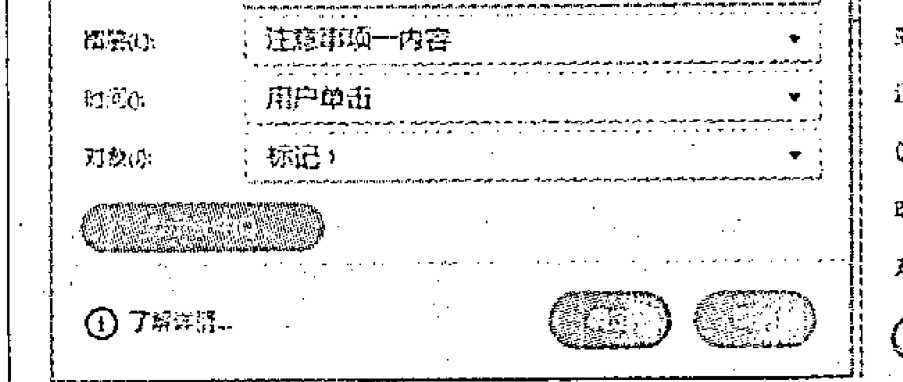


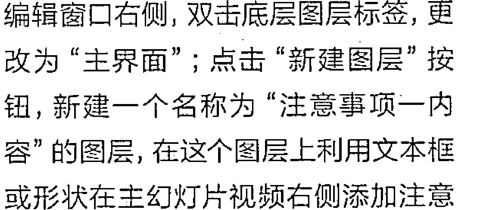

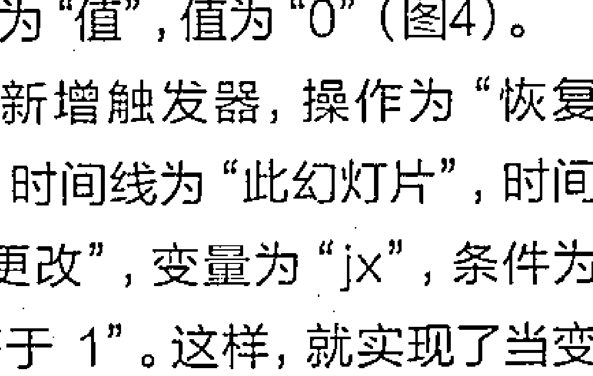

##### 巧用圆角方格展示图片
文|马震安

在利用PPT制作图片展示幻灯片时，虽然PPT软件中已经提供了不少图片展示的形式和效果选择，但有时还不能满足我们的特殊要求。例如，让某个图片以若干圆角方格的排列形式逐个动态展示，这是PPT中所没有的现成效果。但是，我们可以利用PPT中已有的现有动画效果，创造出我们需要的新的图片展示效果（图1）。

##### 1. 制作蒙版圆角方格
打开PPT 2016，新建一张空白幻灯片。利用绘图中的圆角矩形绘制一个圆角矩形，按住Ctrl键选择圆角矩形，横向拖出，复制出3个圆角矩形。同时选中这4个圆角矩形，利用对齐工具实现顶端对齐和横向分布。按住Ctrl键选中上述已调整好的圆角矩形，向下拖出，复制出2组圆角矩形，排列整齐，调整组与组的间距。选中所有圆角矩形进行组合，然后再选中组合后的圆角矩形，复制一份，先拖放到一边备用（图2）。格与格的间距要根据需要进行适当微调。可利用Ctrl键配合方向键进行细微调整。

##### 2. 图片添加到蒙版下
接下来，在排列好的圆角矩形格子上，绘制一个覆盖幻灯片页面的矩形，设置好需要的填充色（页面背景色）及无线条轮廓。右击该矩形置于底层，这时圆角矩形格子就会呈现在此矩形上层。选择矩形上的组合圆角矩形，设置好它的填充图（即所要展示的图片）。这样，按格子样式排列的图就制作好了（图3）。

##### 3. 巧妙设置动画效果
最后，右击放置一边的组合圆角矩形，将其置于顶层，拖至格子排列的图上进行覆盖。调整好后解除顶层圆角矩形的组合，然后依序设置圆角矩形格的动画效果为退出效果中的“擦除”，方向为“自左侧”，第1个圆角矩形的动画效果的开始为“单击时”，其余的则为“上一动画之后”（图4）。

> 小提示
设置好第2个圆角矩形的动画后，可利用“动画刷”对其他圆角矩形进行动画效果复制设置。当然，也可利用“动画窗格”来调整相应的动画顺序。

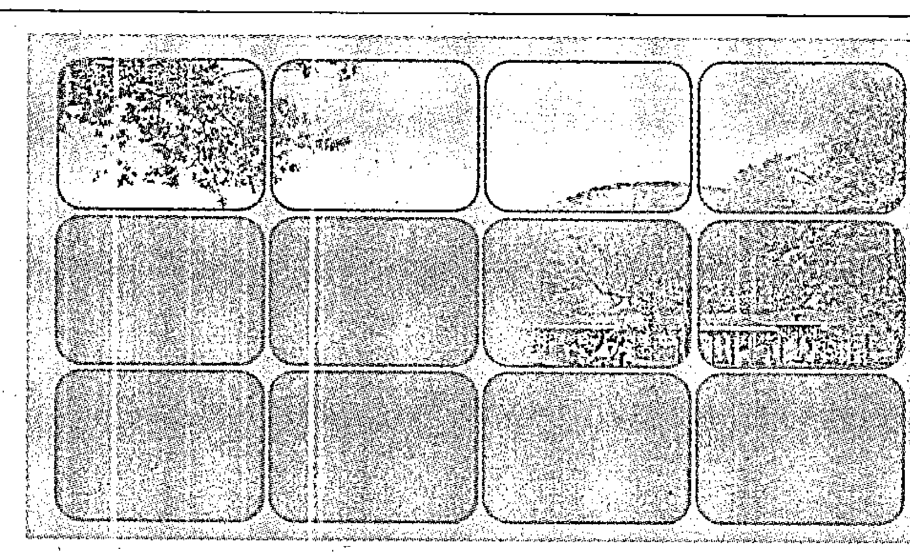

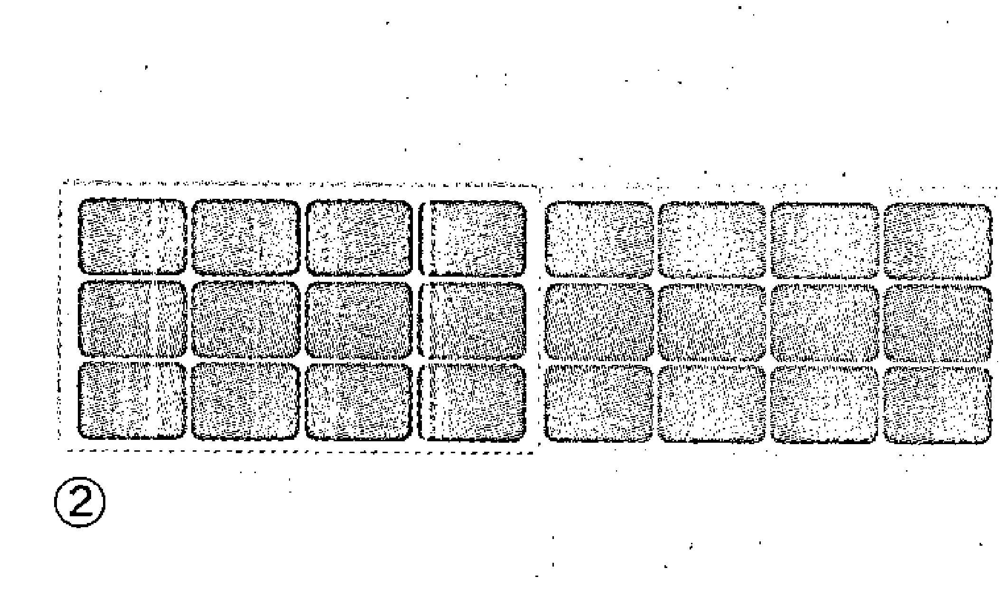

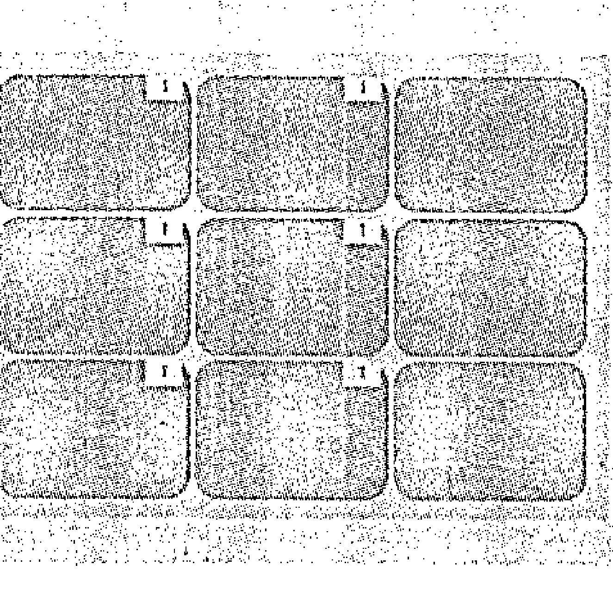

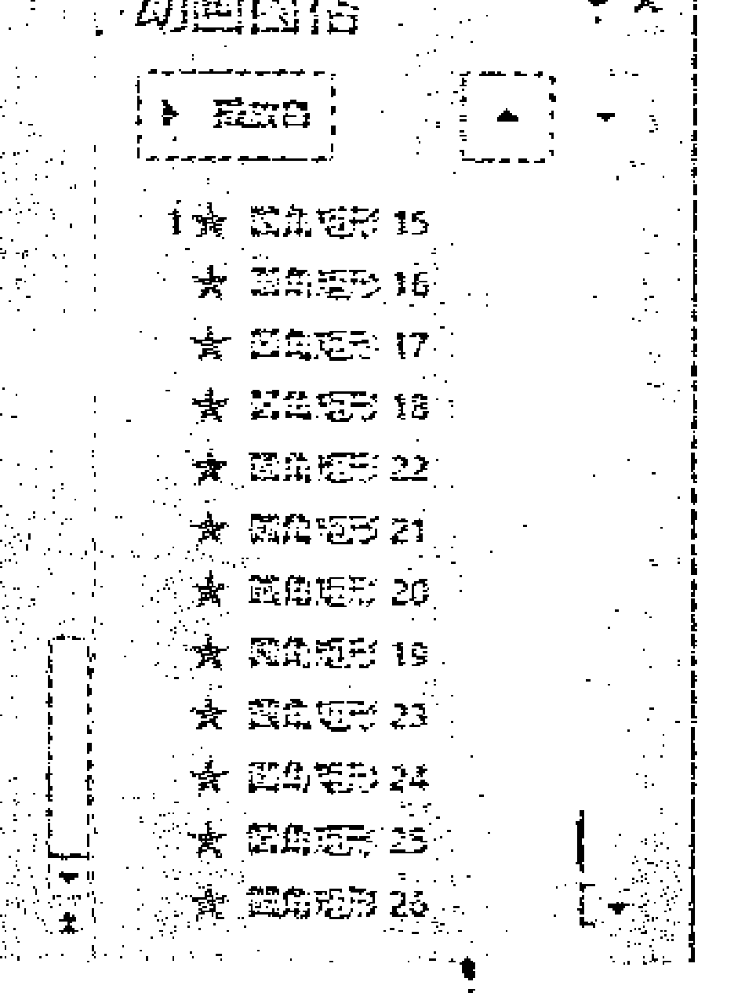

##### 多种方法提取列表数字
文|王志军

如果数字混杂在表格字段中，这样的字段无法直接按字数排序。若要取得正确的排序结果，就得先提取数据然后再排序。这里介绍3种提取列表数字的方法。

在如图所示的工作表A列中，班级数字都夹杂在字段中，如果按这样的数据执行排序，无法得到以班级排列的列表。若将数据提出为另一列，排序就轻而易举了（图1）。现在的关键任务是寻求提取数据的方法。

这种方法简单易行，但缺点是需要两个步骤的操作，而且原数据也被破坏，除非事先复制出一个辅助列。

> 如果使用适用于单字节字符集的MID函数，那么可以使⽤公式 “=--LOOKUP(1,--MID(A1,ROW($1:$9),2*LEN(A1)-LENB(A1)))”，执行效果完全相同。

##### 1. 用Excel自带的功能分列
切换到“数据”选项卡，点击“数据工具”功能组的“分列”按钮，此时会弹出“文本分本向导”对话框，选择“固定宽度”，点击“下一步”按钮，建立如图所示的分列线，即可得到“21班、2班……”这样的数据（图2）。

打开“替换”对话框，替换“班”为空就可以了，最终效果如图所示（图3）。

##### 2. 构造公式实现数据提取
如果对Excel公式有初步概念，使用公式从列表提取数字更为方便。

选择B1单元格，在编辑栏输入公式“=--MIDB(A1,9,2)”。这里的MIDB函数可以根据用户指定的字节数，返回文本字符串中从指定位置开始的特定数目的字符，适用于使用双字节字符集的语言。本例表示从A1单元格的第9个字符开始返回2个字节的字符。执行之后拖拽或双击填充柄，很快就可以看到如图所示的内容（图4）。

##### 3. 用高版本Excel快速填充
如果使用的是Excel 2013或Excel 2016版本，那么也可以使用快速填充的方法：在B1单元格手工输入21，在B2单元格手工输入2，选择B列，切换到“开始”选项卡，在“编辑”功能组依次单击“填充→快速填充”，很快就可以得到我们所需要的结果。

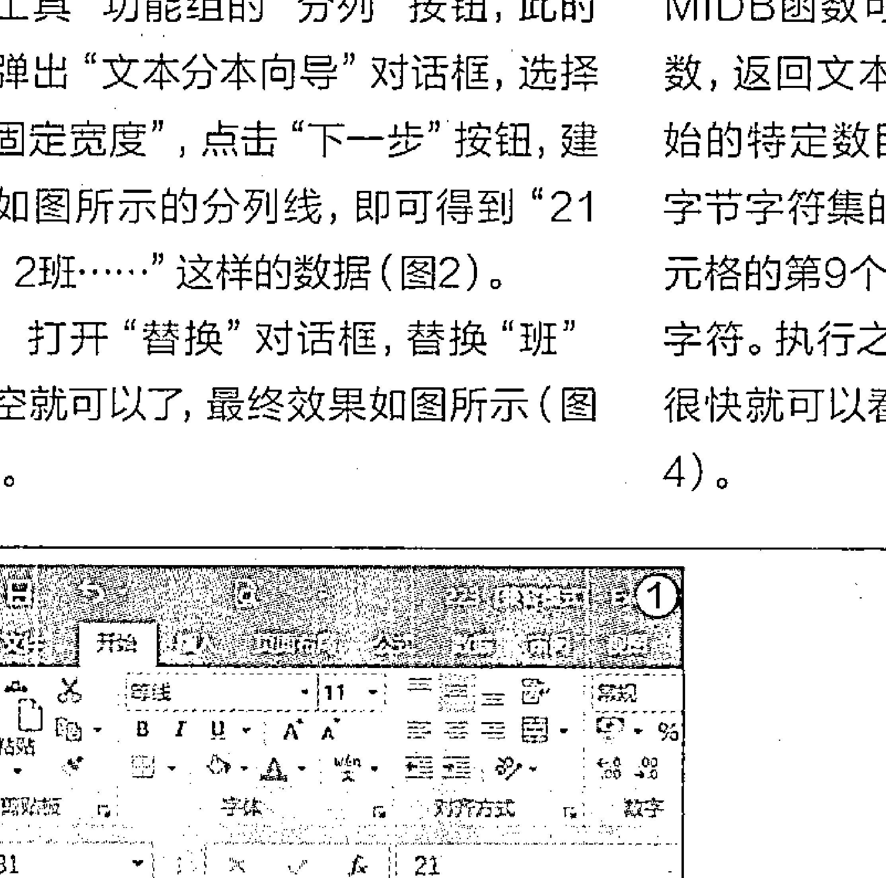

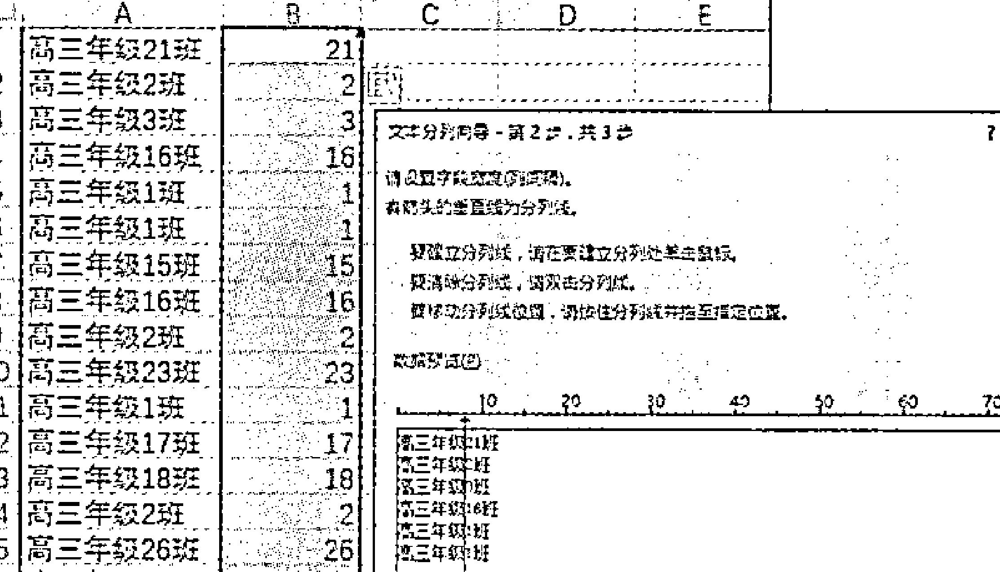

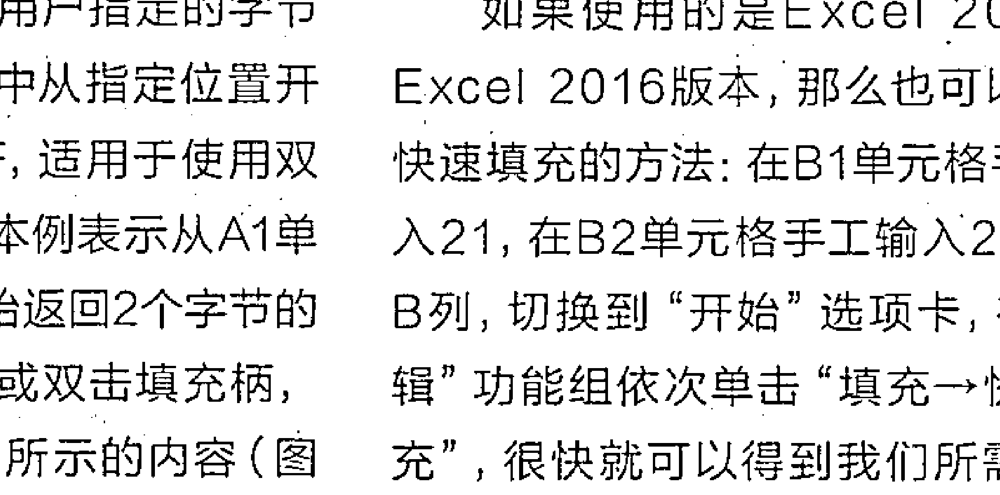

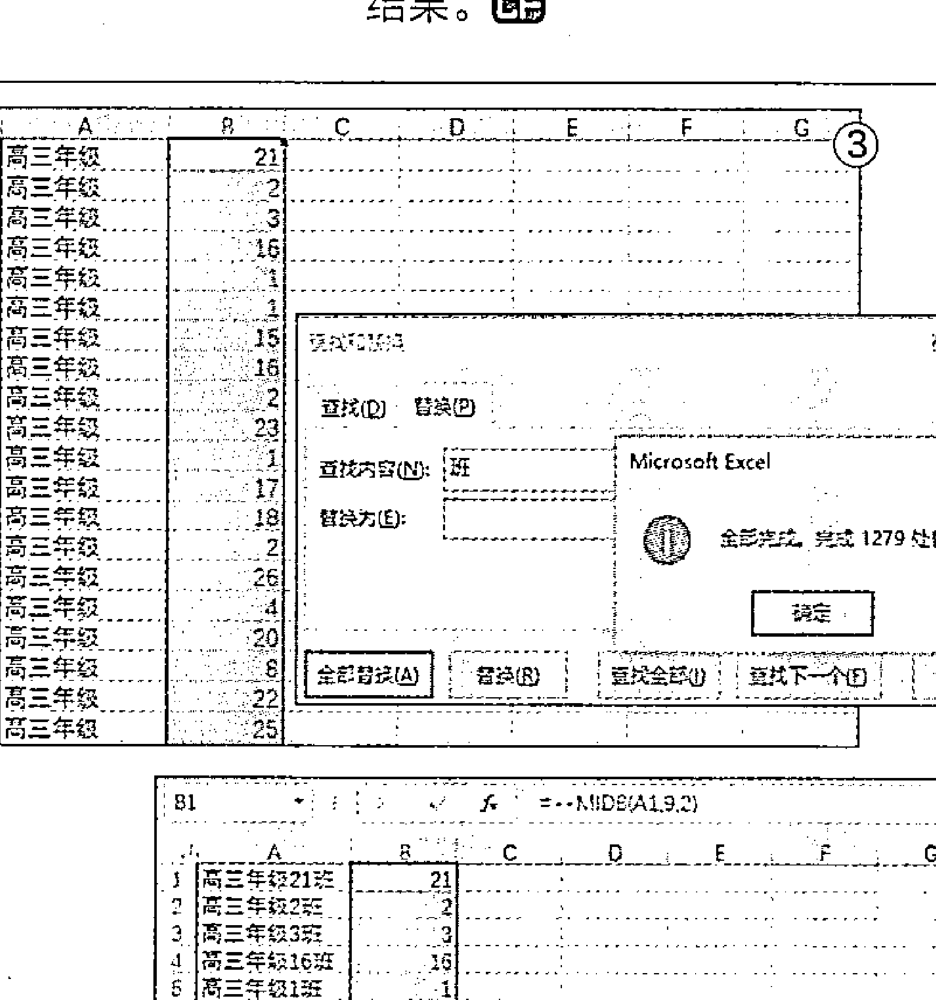

##### 借助Power Query快速转换数据
文|王志军

在管理学生成绩的实践当中，成绩原始数据往往按学生条目记录（图1）。若需要转换为以学号、姓名、学科、成绩、等第进行分列的表式效果，数据量大，逐一复制、粘贴操作显然相当繁琐。利用Excel的Microsoft Power Query加载项可实现快速转换（Excel 2016已经包含Microsoft Power Query组件，可以在“数据”选项卡直接调用，其他版本需在微软官方http://dwz.cn/2J93Jh下载安装）。

##### 1. 数据转换为表
打开数据表，切换到“数据”选项卡，在“获取和转换”功能组单击“从表格”按钮，在随后弹出的对话框中根据提示选择数据源，Excel会自动将选定区域转换为表，并打开查询编辑器界面。

##### 2. 提取学科数据
在“表1-查询编辑器”窗口选择学号、姓名两列的列标，切换到“转换”选项卡，在“任意列”功能组依次选择“逆透视列→逆透视其他列”，执行后可以将当前选定列转换为“属性/值”对，并与每行中的剩余值相结合，显示效果如图所示（图2）。

可以看到“属性”列包含了语文、数学、英语等多门学科的名称，我们首先需要将这些学科的名称从“属性”列提取出来。选择“属性”列的列表，右击选择“拆分列→按分隔符”，此时会打开“按分隔符拆分列”对话框，在“选择或输入分隔符”列表框选择“自定义”，输入“|”进行分隔，这里不需要更改其他选项，执行之后的效果如图所示（图3）。可以看到原来的“属性”列已经被分隔为属性1、属性2两列，“属性1”是各门学科的名称，“属性2”则是成绩、等第。

由于“属性2”列仍然混合了成绩、等第这两个内容，因此还需要将这些内容区分开来。选择“属性2”列，切换到“转换”选项卡，在“任意列”功能组单击“透视列”按钮，这一操作是为了使用当前所选列中的名称创建新列，此时会弹出“透视列”对话框，在“值列”下拉列表框选择“值”，点击“高级选项”前面的按钮，在下拉列表框选择“不要聚合”，最终设置如图所示（图4）。

完成上述设置之后，原有的“属性2”列已经被转换为成绩、等第两个新的列。如果觉得默认的“属性1”不太合适，可以右击重命名为“学科”。关闭查询编辑器，此时会提示是否保留更改（图5），确认之后会返回Excel主界面，此时就可看到最终效果（图6）。接下来可以根据对各个项目进行适当的筛选，感兴趣的朋友可以一试。

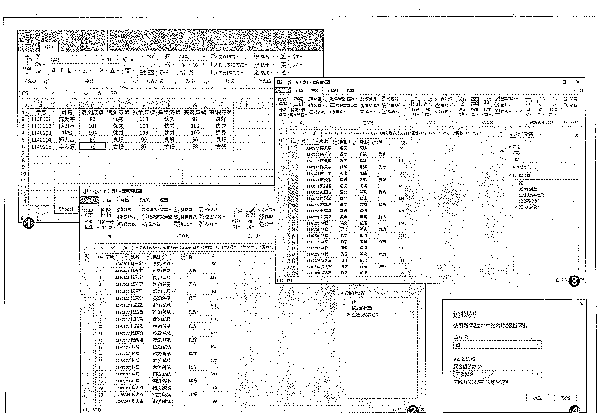

#### 高效办公

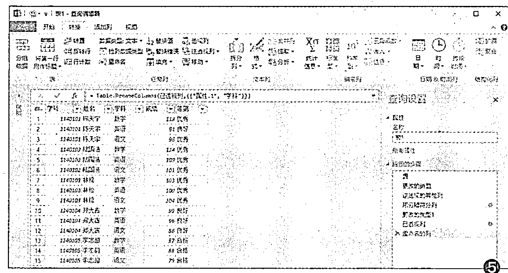

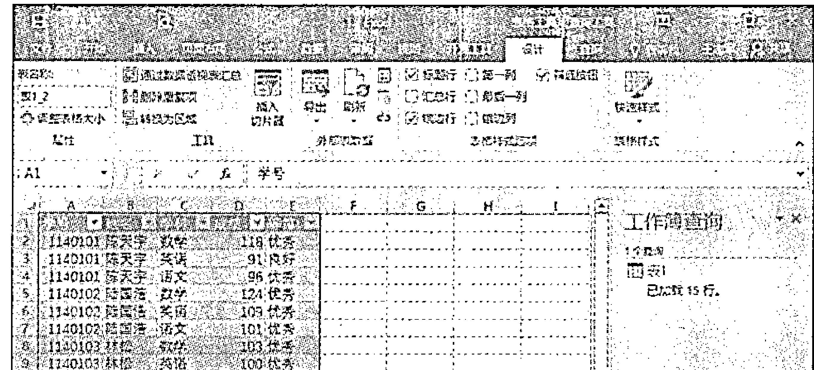

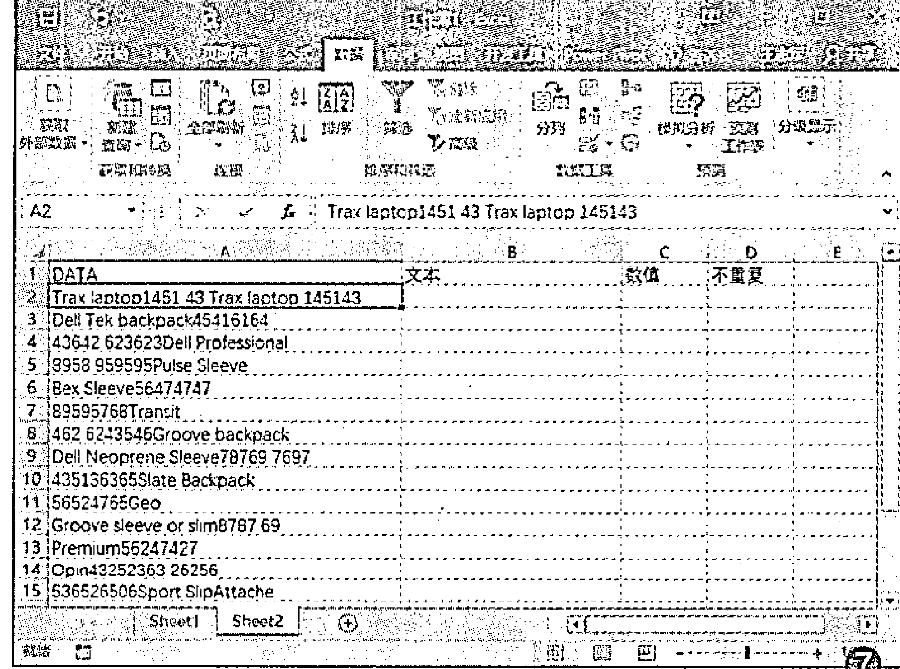

##### 扩展阅读 利用Power Query快速分离混合文本
如图所示的“DATA”列都是字母、数字的混合文本（图7），现在要求依次提取纯文本、纯数值、不重复数值。手工提取显然是相当麻烦，而且也容易出错，利用Power Query内置的函数可以轻松实现。

在源数据选择“DATA”列的数据区域，切换到“数据”选项卡，在“获取和转换”功能组单击“从表格”按钮，此时会打开查询编辑器，切换到“添加列”选项卡，单击“常规”功能组的“添加自定义列”按钮，此时会弹出“添加自定义列”对话框，首先将默认的列名“Custom”修改为“纯文本”，接下来在下面的“自定义列公式”窗格输入“= Text.Trim(Text.Remove([DATA],{"0".."9"})," ")”，检查无误之后单击“确定”按钮，很快就可以在新添加的自定义列显示从“DATA”列提取出来的纯文本内容，按照同样的方法继续添加“纯数值”、“不重复数值”两个自定义列，公式分别为“=Text.Remove(Text.Trim(Text.Remove([DATA],{"A".."z"})," ")," ")”和“=Text.Combine(List.Distinct(Text.ToList([纯数值])))”，请注意后一个公式的“纯数值”必须与上一个自定义列的名称保持一致，否则会提示“Error”。

关闭查询编辑器，在提示是否保留更改时，请选择“保留”，返回Excel主界面之后，就可以看到分离效果（图8）。

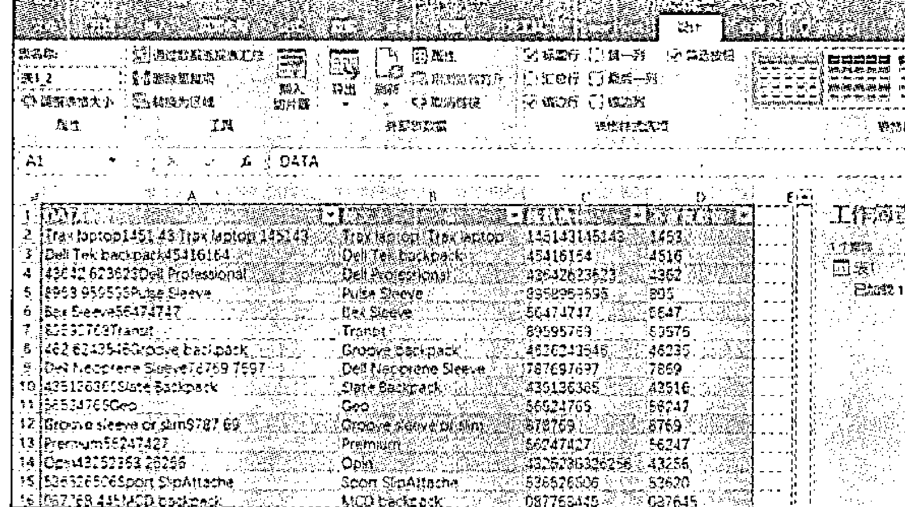


##### 制作仿Flash变色PPT按钮
文|马震安

为了让自己的幻灯片更加充满活力，更能吸引人的注意力，大家总是用尽各种技术手段，设法制作一些更有动感的幻灯片。按钮是幻灯片中常用的元素，使用普通的按钮显得死气沉沉、毫无活力，但如果幻灯片中的按钮能够像Flash中的按钮那样，当鼠标悬停于其上时，颜色发生改变，当鼠标离开时，颜色还原，相信这样的动感按钮定会为幻灯片锦上添花。那么，在PPT中这样的动感按钮如何制作？就让我们在最新版的PPT2016中体验它的实现过程。

##### 1. 基本的按钮绘制
打开PPT幻灯片编辑页面，利用“插入”选项卡下“形状”中的圆角矩形绘制出一个按钮。利用“格式”选项卡下的形状样式，设置其形状效果为任一种“发光”效果；再绘制出一个比这个按钮大一些的矩形，并将这个矩形置于底层，将其形状轮廓设置为“无轮廓”，形状填充设置为“无颜色填充”。为了以后设置方便，点击“选择窗格”按钮，在右侧“选择”窗口双击这个矩形，将其命名为“变色触发”（图1）。

##### 2. 按钮的动作实现
按钮绘制完成后，接下来为其设置动作。选择圆角矩形，利用“动画”选项卡为其添加“填充颜色”动画。颜色的效果选项为“黑色”，触发处选择“单击”、“圆角矩形1”，持续时间为“0.01”；再为其添加“填充颜色”动画，颜色的效果选项为“绿色”，触发处选择“单击”、“变色触发”，持续时间为“0.01”（图2）。

这样的设置只能是单击时实现变色，并不能实现悬停时变色。要想实现悬停变色，还需要几行非常简单的VBA代码。点击“开发工具”选项卡中的“Visual Basic”按钮，进入VBA编辑窗口，点击“插入→模块”菜单，在代码编辑区输入图中所示的代码（图3）。

回到幻灯片编辑窗口，选择圆角矩形，点击“插入”选项卡中的“动作”按钮，在操作设置窗口选择“鼠标悬停”选项卡，选择“运行宏”，选取“bh1”；同样，选择名称为“变色触发”的矩形，设置其悬停动作为“运行宏”，选取“bh2”。这样设置完成后，就实现了按钮的鼠标悬停变色效果。

> > 小提示
>
> 如果想让此按钮链接到一张幻灯片，还需要绘制一个无边框、无填充色、大小与此按钮一样的圆角矩形与此按钮重合，并将其置于顶层，设置这个圆角矩形的单击动作为链接到的幻灯片就可以了。

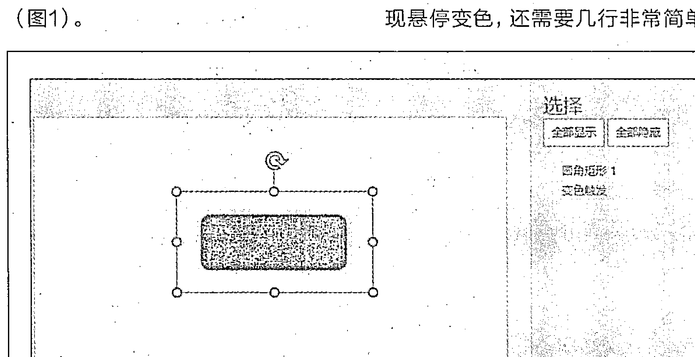

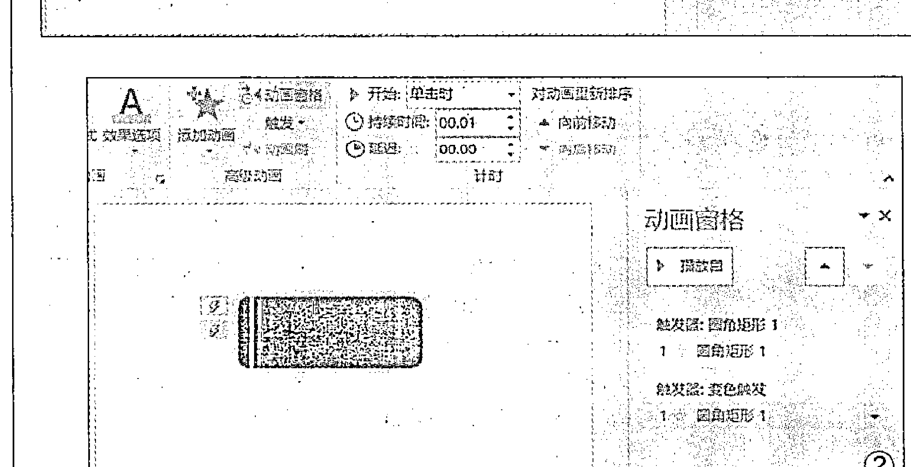

```
Sub bh1()
    SendKeys "{TAB}"
    SendKeys "{ENTER}"
End Sub

Sub bh2()
    SendKeys "{TAB}"
    SendKeys "{TAB}"
    SendKeys "{ENTER}"
End Sub
```

##### 图表变花样 表现有活力
文|马震安

在Excel中，通过柱形图实现数据的展示是一个很不错的想法。但是，普通的柱形图总是让人感到乏味或平淡无奇。如果将普通的柱形图进行一些有趣的样式更改，就会使图表更有活力（图1）。

首先制作锥形图。打开Excel工作表，选择“插入”选项卡，点击“直角三角形”，画出一个直角三角形。选中这个直角三角形后将其复制，将复制出的直角三角形水平翻转，将它的颜色设置得稍浅些，再将两个三角形的边框设置为“无轮廓”。将两个直角三角形进行对接、对齐。再画一个笑脸。将这三个图形选中并进行组合（图2）。

接下来根据上面的数据生成锥形图表。锥形图表的“制作”要诀，是要在柱形图表的基础上替换而来。关于柱形图的制作，不必多说，相信大家能够完成。关键是如何将柱形图替换成已经制作好的锥形图，还用一个个地画吗？当然不用。只需将画出的锥形图进行复制，然后在柱形图上任意点击选中一个柱形，然后点击“粘贴”按钮就完成了图形的替换。

> 其实我们还可以制作出更多的有趣效果来。重点是图形的制作。如微立体形状的图表，它的图形效果就是用形状中的普通图形组合而成的。再比如，利用形状中“圆柱体”，画出圆柱体后可以设置它的纹理、三维效果，像阴影、发光等，再用同样的方法，将设置好的图形替换到柱形图表中就可以了。这样，一样的图表，就可以用不同的效果来表现了（图3）。此外其他一些类型的图表也可以进行再构造，利用自选图形与原图表进行再组合，这样就可以生成与众不同的图表效果了。如普通的饼图，可将原图表与三角形、圆形进行恰当的组合，也会生成意想不到的效果。还有就是可以导入一些外部的图片，用图片处理软件去除图片背景后再用来替换图表中的数据图形（图4）。

> 去除图片背景可以使用http://www.2gei.com/bgremover这个网站的服务，进行在线处理后另存到本地电脑中。

| 项目 | 分数 | ... |
|------|------|-----|
| 1    | 分数 | 581 |
| 2    | 期中 | 578 |
| 3    | ...  | ... |
| 4    | 期末 | 594 |

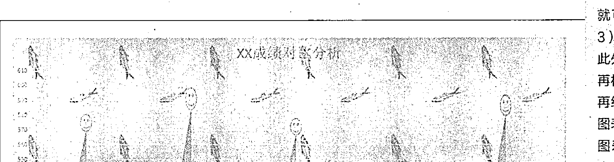

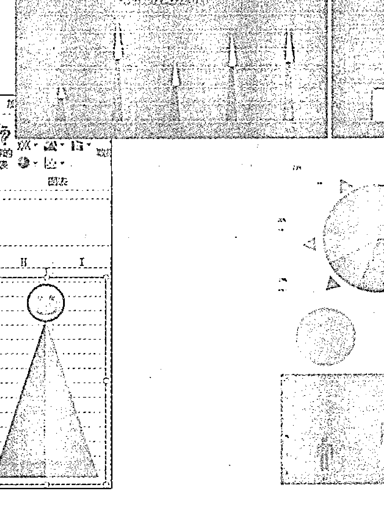

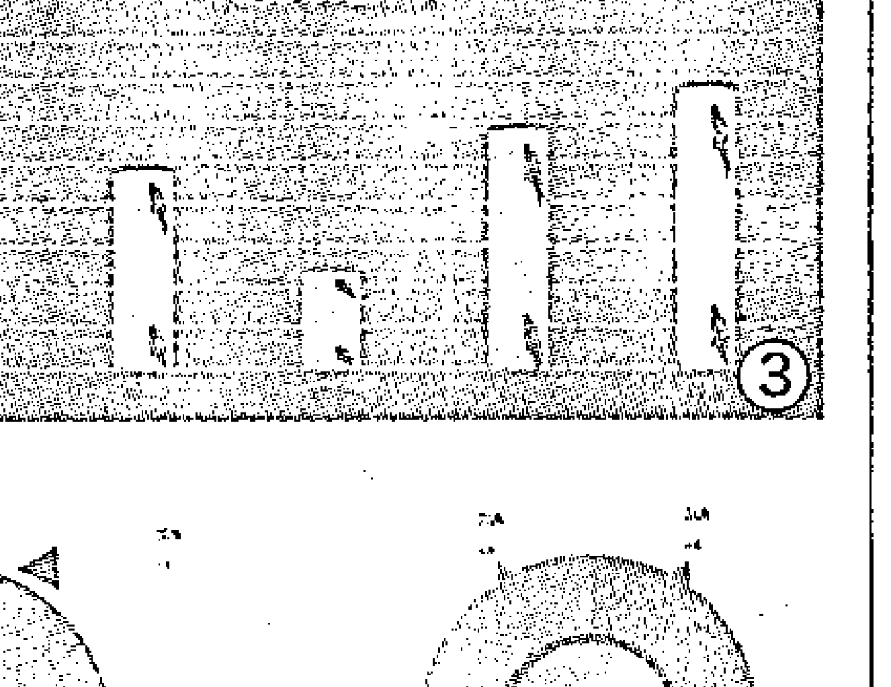

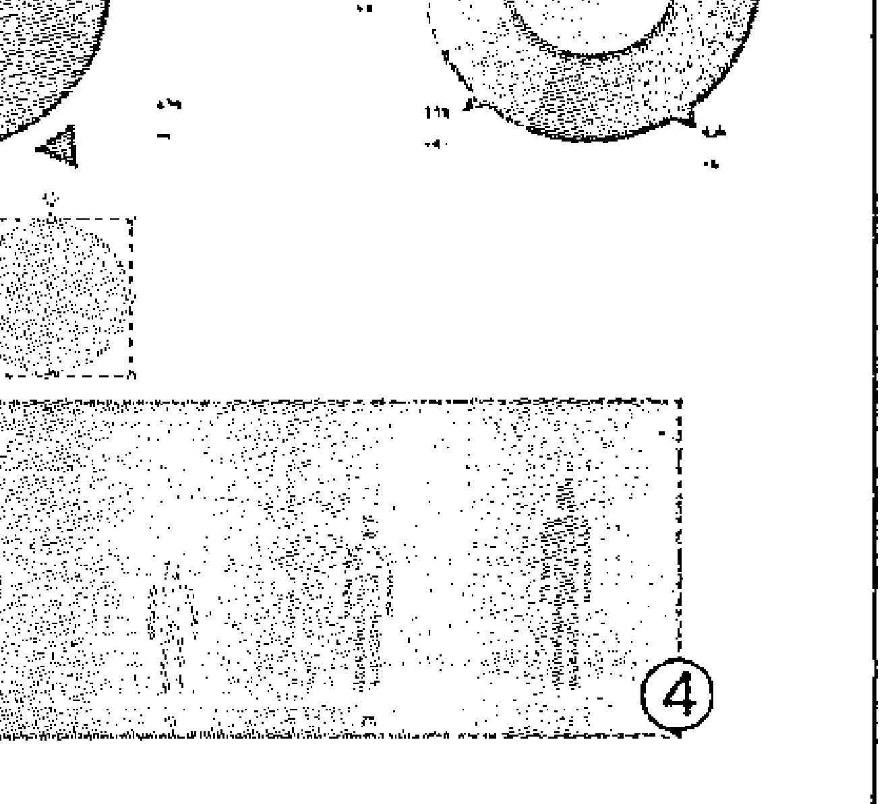## “锅状”对比图表巧制作
文|马震安

为了展示数据间的对比效果，我们常常要使用图表来进行表达，例如大家经常可以在各种场合见到的柱形图。虽然柱形图表现数据对比效果也较为明了，但形式过于普通，缺乏创意。如果制作一种“锅状”图表样式，区别于普通的柱形对比图，看起来还会更加直观明了（图1）。为了让大家都易于理解，我们选择在Excel 2016环境下，制作产品需求计划与生产销售对比图，以此为例来说明具体方法，其他各领域的用法与此类似。

##### 1. 数据整理
图表制作，数据先行。要想制作出上述样式的图表，需要提前对工作表中的数据进行相应的处理。首先构造完成率，比如计划生产的完成率=计划生产/市场需求，实际生产的完成率=实际生产/计划生产，依此类推。构造3个辅助列，第1个辅助列用于构造一组不可见的条形数据，这列的数据是每行的销量减去市场需求后再除以2，如D3列的公式为“=($B$2-B3)/2”；
再构造两列用于模拟一组居于条形中放置数据标签的散点图数据，X列的值均为销量中最大的值除以2，即390，Y列输入序号从大到小即可（图2）。

##### 2. 构造图表
数据处理完成后，按住Ctrl键选择A1:B6及D1:D6数据区域，切换到“插入”选项卡，插入二维条形图中的“堆积条形图”，右击图表中的条形，选择“选择数据”，在窗口左侧“图例项”处将“辅助列”调整到“销量”的上面（图3）。
右击纵坐标，选择“设置坐标轴格式”，在右侧的坐标轴选项中勾选“逆序类别”。同样，右击横坐标，选择“设置坐标轴格式”，在右侧的坐标轴选项边界的最大值处，输入100（即销量列中的最大值）。完成后，将横、纵坐标删除（图4）。
选中图表中辅助列所代表的的条形

```
=($B$2-B3)/2
```

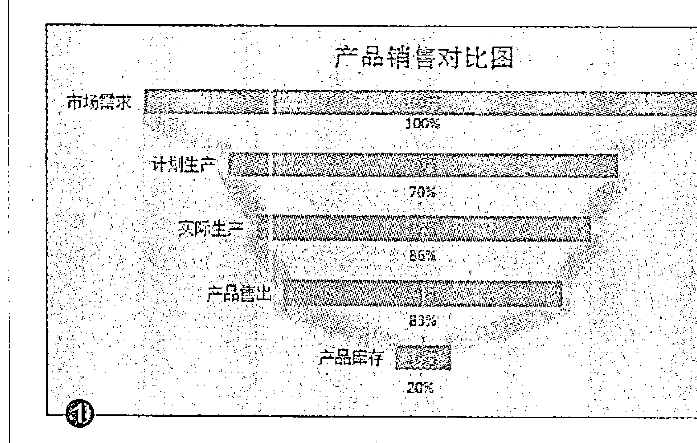

| 项目 | 销量 | 完成率 | 辅助列 | X | Y |
|---|---|---|---|---|---|
| 市场需求 | 100 | 100% | 0 | 50 | 5 |
| 计划生产 | 70 | 70% | 15 | 50 | 4 |
| 实际生产 | 60 | 86% | 20 | 50 | 3 |
| 产品售出 | 50 | 83% | 25 | 50 | 2 |
| 产品库存 | 10 | 20% | 45 | 50 | 1 |

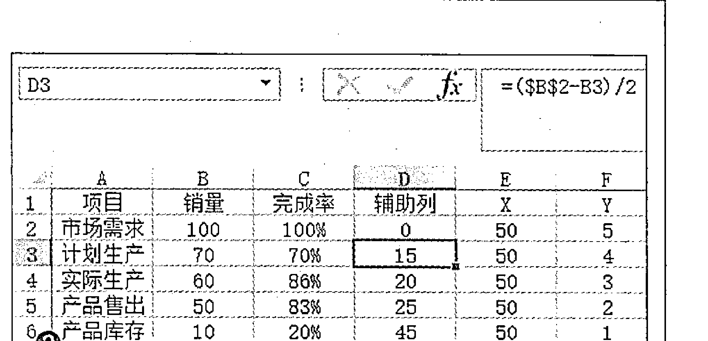

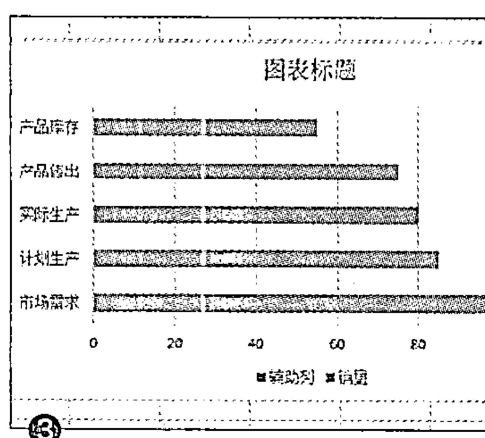

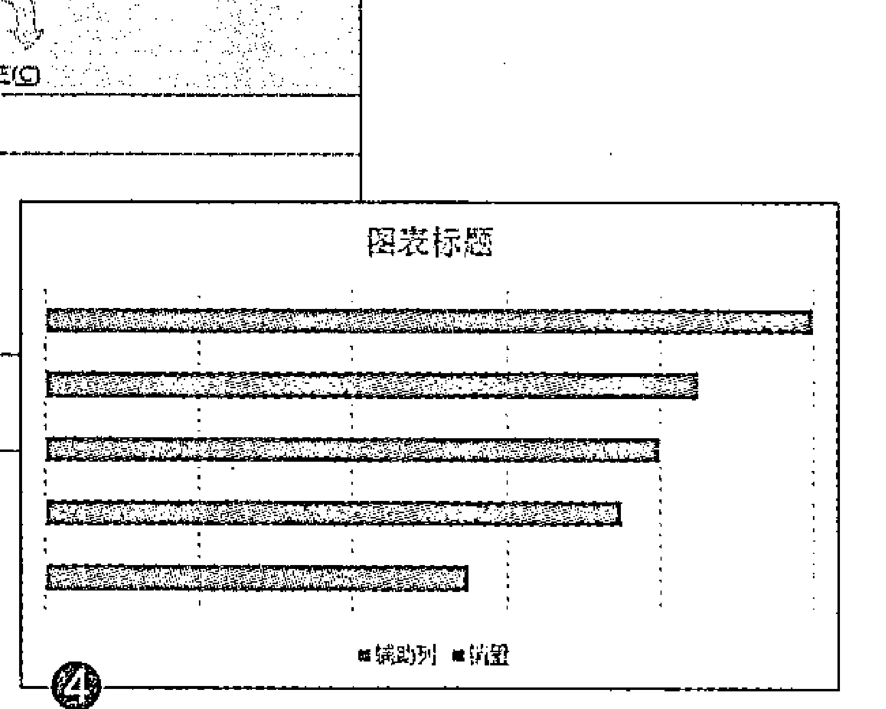

##### 3. 添加标签
“锅状”图表的轮廓基本上是完成了，接下来就是添加未完成率及销售标签了。选中X、Y两列数据并复制，再选中图表中的条形，点击粘贴中的“选择性粘贴”，在弹出的窗口中，“添加单元格为”处选择“新建系列”，“数据（Y）轴在”处选择“列”，勾选“首行为系列名称”、“首列中的类别（X标签）”；选中新添加的数据点（即绿色条形图），右击选择“更改系列图表类型”，将其改为散点图（图6）。右击散点图，选择“添加数据标签”，选中添加的数字标签，在右侧点击“标签选项”，将“Y值”的勾选去掉，勾选“单元格中的值”，选中C2:C6单元格（即完成率）；选中散点图（即绿色圆点），设置它的填充为“无填充”，边框为“无线条”；再次选中完成率数据标签，在标签选项卡上设置标签的位置为“居中”，并手动调整好单个完成率标签的上、下位置，删除右边的Y轴标签及图例；右击图表中的条形图，选择“添加数据标签”，手动为每个数字标签添加上“万”字（图7）。

##### 4. 添加系列线
选中条形图，在“设计”选项卡中点击“添加图表元素→线条→系列线”，选中添加好的系列线，在右侧的格式中设置短划线类型为“短划线”，宽度为“1.5磅”；在“效果”标签中设置好它的发光效果（图8）。最后，更改一下图表的标题及背景。这样，一幅与众不同的数据对比图表就制作完成了。

##### 用Excel设计英语单词听写程序
文/江育奇

Excel是一个统计软件，很难想像Excel与英语单词听写会建立关联，但Excel 2016的“朗读单元格”功能足以使人们改变这种想法，利用简易的Excel VBA可以设计出朗读效果良好的英语单词听写程序。

##### 1. “朗读单元格”按钮设计
“朗读单元格”不是“常用命令”，默认情况下在功能区中找不到这个命令。但可以通过“自定义功能区”设置，让这个命令显示在功能区工具栏上。
选择“文件→选项”菜单，进入“选项”设置对话框，点击“自定义功能区”，在右边的“主选项卡”中单击选择“开始”选项卡，再点击下面的“新建组(N)”按钮新建一个自定义组。具体方法如下。
在“从下列位置选择命令(C)”中选择“不在功能区中的命令”，找到“朗读单元格”命令，用鼠标单击选择这个命令，确认上一个步骤在“开始”选项卡新建的“新建组(自定义)”处于选择状态，点击“添加”按钮。这样，“朗读单元格”命令便在“开始”选项卡中显示出来。同样的道理，将“朗读单元格-停止朗读单元格”按钮也显示在这个工具栏上。结果如图1所示。
完成以上两步后，用鼠标选择要朗读的单元格，再点击“朗读单元格”按钮，系统便从上到下按顺序朗读单元格，无论是中文还是英文，都能进行朗读，朗读效果良好；点击“朗读单元格-停止朗读单元格”按钮，系统停止朗读。然而，这一功能缺乏对单元格之间的间隔进行设置的选项，只能按要求不停地读完所有的单元格。但听写需要时间停顿去写，因此，我们必须通过VBA来解决词与词之间的停顿间隔时间的控制问题。

##### 2. VBA解决停顿间隔控制
要利用Excel VBA进行程序设计，先必须在工具栏中显示“开发工具”。“进入“选项”设置对话框，单击左边的“自定义功能区”，在右边窗口中选择“开发工具”前面的复选框，“开发工具”便显示在界面上。
点击“开发工具”选项卡，再点击“Visual Basic”按钮（或按Alt+F11），进入VBA编辑环境，单击“VBAProject (PERSONL.XLSB)”，再选择菜单“插入→用户窗体”，插入一个用户窗体后，修改其名称为tingxie, Caption（即窗体的标题）属性为“听写程序设置”。
在这个用户窗体上，分别添加两个“文字框”控件、两个“标签”控件、两个“命令按钮”控件，这些控件的“名称”都用系统默认的名称。两个“标签”的Caption属性分别是：“单词数量设置”和“听写词间间隔”，这两个标签控件放在两个“文字框”控件的前面，它的作用是为后面两个“文字框”的用途作说明；两个“文字框”的Text属性分别是：20、2，这是这两个“文字框”控件的初始值，程序利用这两个控件让用户输入“单词数量设置”和“听写词间间隔”数值；两个命令按钮的Caption属性分别是：确定、取消。拖动并调整好窗体各控件的大小与相对位置至自己感觉合适时为止。结果如图2所示。

##### 3. 听写程序核心技术实现
听写程序核心技术实现分为三部分进行，具体如下。

###### (1) 赋予命令按钮以灵魂
命令按钮要赋予其可执行代码，才能变成一个“活”的按钮。
双击“确定”按钮，在其中输入如下内容：

```
Private Sub CommandButton1_Click()
n = Val(TextBox1) '获取朗读单词数量
t = Val(TextBox2) '获取朗读词间间隔数量，单位是秒
m = ActiveCell.Row '获取当前活动单元格的行数
c = ActiveCell.Column '获取当前活动单元格的列数
b = m + n - 1 '计算从m开始朗读, 共n个单词, 达到要求时的最后一行的行数
On Error Resume Next
Call speakcontrol '调用朗读控制过程
tingxie.Hide
End Sub
```

双击“取消”按钮，在其中输入如下内容：

```
Private Sub CommandButton2_Click()
tingxie.Hide
End Sub
```

###### (2) 创建朗读控制过程
这个朗读控制过程的作用是确定朗读的单元格，控制朗读过程中的词间间隔，如果完成了所设置的朗读任务，则退出程序。
用鼠标单击“VBAProject(PERSONL.XLSB)”，再选择菜单“插入→模块”，在这里要完成声明公共变量、创建朗读控制过程以及朗读过程的工作。在其中输入如下内容：

```
Public a, b, c, m, n, t As Integer '定义公用变量
Sub speakcontrol()
Dim p, q
q = ActiveSheet.Cells(1, 1).SpecialCells(xlLastCell).Row '获取工作表的最后一行
On Error Resume Next
If t < 10 Then
p = "00:00:0" & t '时间在10秒以内时, 计算p的方法
Else
p = "00:00:" & t '时间在10秒或以上时, 计算p的方法
End If
If m > b Or m > q Then '如果朗读单词达到设置数量的要求或到了最后一行, 则退出程序
Exit Sub
Else
a = Cells(m, c) '获取要朗读的单元格的文字
Application.OnTime Now + TimeValue(p), "wordspeak" '按照设定的时间间隔调用朗读过程
End If
End Sub
```

###### (3) 实施具体朗读任务
以上的朗读控制过程并没有具体实施朗读的工作，朗读的工作由朗读过程完成任务。在以上朗读控制过程的下方，创建一个为wordspeak的朗读过程，内容如下：

```
Sub wordspeak()
On Error Resume Next
Application.Speech.Speak a '朗读设定单元格中的文字
m = m + 1 '计算朗读的单元格的行数
Call speakcontrol '调用朗读控制过程
End Sub
```

> 小提示
这里还补充说明时间间隔p的计算问题。由于时间间隔在60秒以内的这个范围可能是1位数，也可能是2位数，这时p的计算方法不一样，因此，我们要对t的位数作判断后再选择计算p合适的方法。

这个过程具有朗读的功能，并将朗读单元格的行数加1，下移到下一行单元格中，最后返回朗读控制过程，由控制过程确定是否再往下继续朗读单词。

###### (4) 创建启动宏的过程
虽然以上已经有窗体以及相关的控制与朗读的过程，但还缺少一个启动宏的过程。在以上过程的下方创建一个新的过程，命名为“听写”，内容如下：

```
Sub 听写()
tingxie.Show '显示听写设置窗口
End Sub
```

以上各个模块内容如图3所示。
为方便使用，可直接通过云盘下载后复制粘贴（http://pan.baidu.com/s/1qXcTKFq 密码8r2m）。

> 小提示
要运行宏，必须先通过“开发工具”选项卡，点击“宏安全性”按钮，进入到“宏设置”中选择“启用所有宏”（最下面的选项）。

在Excel 2016中调试无误后，即可运行程序。先在要朗读的单词列的最上方单元格单击，点击“开发工具”选项卡中的“宏”按钮，在弹出的“宏”选择对话框中，选择“听写”宏，再点击“运行”按钮，在弹出的“听写程序设置”对话框中输入“单词数量设置”、“听写词间间隔”，确定后便可进行英语听写训练了。

##### Android手机“检阅”微软小娜
文|神鸟易飞

大家已经通过PC上的Windows 10体验到微软“小娜”（Cortana）语音助手软件的体贴服务。语音助手对于广泛使用移动设备的用户似乎更具有实际意义，而Android手机的需求最大。微软经过慎重考虑，已经决定让“小娜”正式登陆Android平台了。现在就让我们拿出自己的Android手机，看看她在Android平台上的表现如何。

##### 1. 获取软件让微软小娜入驻Android
要体验微软小娜Android版的各项功能，可借助于“微软小娜”的微信公众平台，获取软件的最新版下载链接。这也是最为稳妥的获取渠道。打开微信，选择“添加朋友”，点击“公众号”，输入“微软小娜”搜索该公众号。点击添加并进入该公众号，保证“接收消息”选项处于开启之中（图1）。

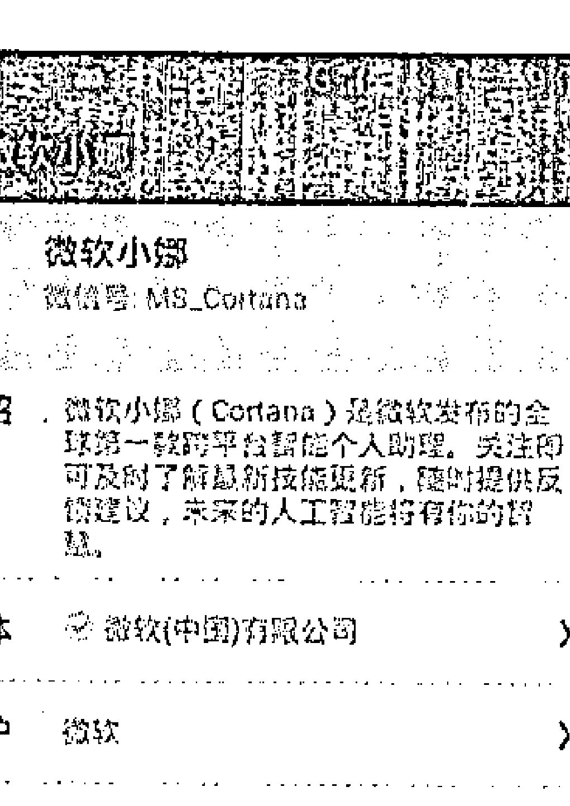

在接下来的“微软小娜”公众号窗口中，点击“资讯·活动→微软小娜初体验”（图2）。随后会出现微软小娜iPhone版、Android版下载攻略链接。

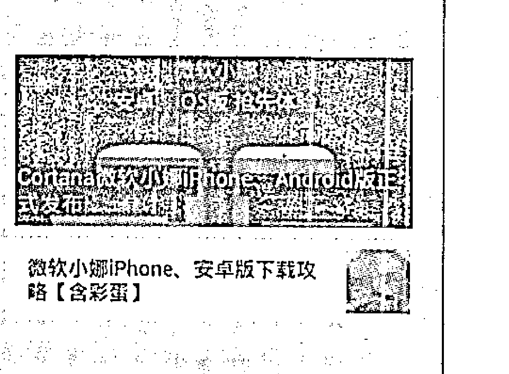

在小娜微信介绍页面中，微软给出的下载地址是http://www.msxiaona.cn/。我们既可以用手机，也可以通过PC访问这个页面。对于微信页面来说，更可以直接点击文末的“阅读原文”按钮，方便地一步进入下载页面（图3）。

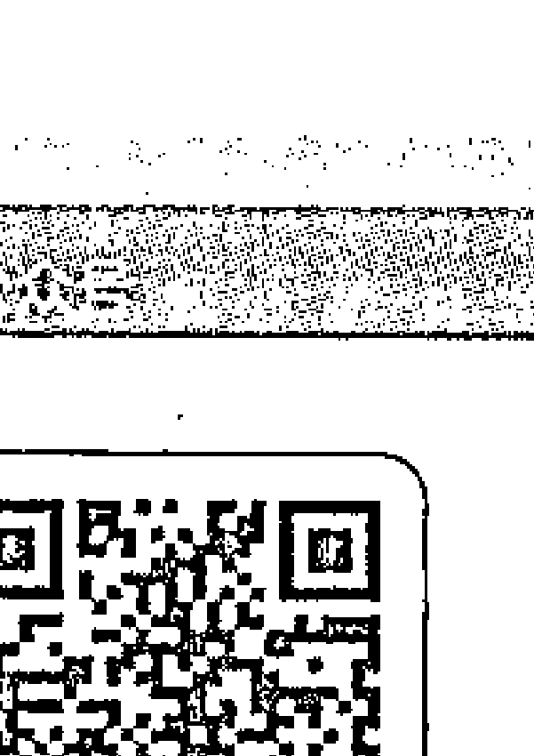

> 需要保证自己所用的Android手机系统为4.2以上版本。如果之前安装过英文版的测试版，需要先卸载英文版，然后再重新安装中文版，才能获得中文支持。

##### 2. 亲自体验领略小娜的超凡魅力
首次运行微软小娜需要完成一些简单的对话。获得小娜的体贴服务有一个前提条件，那就是要将你的许多隐私交给这位“小秘”。其中包括位置、联系人、语音输入、搜索历史等其他必要内容。有了这一前提，小娜掌握了你的足够生活习性之后，才能为你提供更加体贴的服务。随后，小娜要询问她该如何称呼你。输入你的昵称，点击“确认”按钮（图4）。之后如果手机中安装有系统安全监控软件，会提示Cortana尝试读取短信记录、尝试录音、尝试读取已安装软件列表等。由于我们以后会用语音让小娜帮助自动调用短信、软件等，而语音交流的过程又是在录音，因此，这三项功能必须要通过方可。
接下来，需要使用微软账户来登录小娜。如果你此前已经在使用Windows 10了，那么此处直接输入登录Windows 10的账号和密码，即可登录Android版的小娜。若还不曾有过微软账号，可点击“创建一个”，用自己的邮箱新建一个账号来使用（图5）。

登录之后，小娜首先会问“你想让我做什么呢？”（图6）。这时，点击屏幕下方的麦克风按钮，然后可对着话筒说话向小娜提出要求了。例如“打电话给刘敏”、“发短信给张勇我一会儿回去”、“增加日历周末去沙滩”等（图7）。

如果你到了一个陌生的地方肚子饿了，希望找一家就近的餐馆用餐，可按下麦克风图标，对着小娜说：“找附近的餐馆”，小娜马上会告诉你附近的餐馆，并列出餐馆列表供你选择（图8-图10）。

点击小娜软件左上角的图标，进入软件的主菜单，然后点击“设置”可对软件进行一些基本设置（图11）。选中“你好小娜”复选框，以便在打开小娜或者屏幕亮起显示桌面的条件下，能够用“你好小娜”的语音来呼出小娜。如果选择了“未接来电通知”选项，当手机上有未接来电时，小娜会在其他设备上告诉你。这对于将手机忘在家里，而在办公室用PC使用Windows 10的用户来说非常有用，她会让你知道“躺”在家里的手机上有什么未接来电，以便作相应的处理（图12）。
在Android版小娜的诸多功能中，最为实用的两个方面要数笔记和提醒功能。小娜具有非常丰富的笔记本功能，点击“设置→笔记本”，可以看到有十多个可以选择的项目，从个人信息到会议提醒，从衣食住行到吃喝玩乐等一应俱全，只需在每个项目中添加你对该项目的兴趣点关键词，小娜都能记住并识别，并在之后向你推送与之相关的资料（图13）。
秘书软件最实用的另一个功能是提醒。通过小娜“设置”窗口点击“提醒”，然后点击“+”，可进入提醒项目设置。点击“地点”添加常用地址，并保存为工作、住宅、其他别名（图14）。用语音命令“创建一个提醒”，告诉小娜要创建提醒的内容，如告诉小娜“提醒我明天早上七点面试”、“提醒我半小时之后出发”等，让小娜帮你记住要提醒的具体内容、地点或时间，这样小娜就会在满足条件时提醒你，为你提供基于时间、地理位置、人物事件的提醒。

> 根据微软协议里的说法，Android版的小娜助理是为方便用户在Windows 10版本的电脑与Android平台之间切换使用提醒、搜索、建议、任务以及其他方面的服务而准备的。可见，她是一位跨越平台的“小秘书”。

> 小提示
小娜最擅长的是天气预报。想知道某地的天气情况吗？问小娜“我想知道天津的天气情况”，看看小娜怎么回答。绝不是简单的天气预报，她还会告诉你天气的变化趋势以及穿什么衣服合适等，完全替代了天气通等天气类APP的功能。

> > **Q: 小娜为何听不懂我说的话？**
> A. 小娜目前对汉语普通话的支持比较好，支持的方言也很有限。如果你说的话带有特殊方言，可能她就听不懂了。请尽量用普通话，放慢速度和小娜讲话。放慢一点速度，有助于小娜更准确地识别每一句话。此外，换一种措辞试一试，或许她能听懂，毕竟她还只是人设置好的一部机器。

> > **Q: 小娜听不到我的声音或她本身不发声怎么办？**
> A. 如果小娜听不到你说的话，请检查是否在系统设置或安全软件中禁用了麦克风录音功能。要小娜发声，必须用语音和她交流才行。如果键入文字问她问题，她也不会用语音回答你。按下麦克风按钮说话，然后小娜就用语音和你交流了。如果你讲话后小娜没有发声，请检查设备的音量是否设置为静音或音量开得太低。

> **小技巧**
不开心吗？小娜还会给你唱歌。如果对着小娜说：“唱首英文歌曲吧！”她会挑出一首英文歌曲，来个清唱。当然了，作为中文版的小娜，唱中文歌曲也不在话下。

#### 《电脑爱好者》2016年合订本(一)

##### 复制信息跨平台快速分享

文|神鸟易飞

使用手机分享复制的信息，不像PC那么容易。由于软件功能的局限、平台与设备的不同，快速分享复制的信息往往会遇到一些问题，包括如何将信息分享到其他软件中，分享到不同设备、不同平台中使用，还有选择之后马上自动分享到一个目标程序等。通过适当的APP和使用技巧的配合，可以实现上述需求。

##### 1. 跨设备分享剪贴板信息

此前大家可能使用过借助互联网分享剪贴板信息的软件。然而，使用这种方法，如果分享的信息足够大时(如大文件)，若网络不够快会感觉速度很慢。现在我们可以通过一款Pasteasy应用，借助局域网，跨越Mac、Windows、iOS、Android等不同平台的设备，实现剪贴板信息分享。

Pasteasy以局域网为基础分享信息，其优势在于速度快，而这种分享模式的使用环境，一般都是个人在不同设备上分享自己的内容，因此其传输更能发挥高效和保密的优势。且由于没有通过互联网传送个人资料，因此即便是有网络不宜的隐私内容，也不会被互联网过滤掉或截获。如果是在加密的Wi-Fi环境下，则安全性能更好。Pasteasy支持传送的内容不单单包括TXT文本，甚至还包括照片、截图、任意文件等都可以传输。

###### 1. 电脑代替手机发短信

手机发短信的一个劣势就是当需要发送长短信时输入不便。如果能在PC端输入长短信内容，短信文本随即出现在手机端，用手机点击发送即可，那再方便不过了。用Pasteasy正可以实现这一需求。

在电脑上安装PC版的Pasteasy，同时在手机上安装Android版的Pasteasy。启动PC版Pasteasy后，电脑屏幕上出现Pasteasy生成的二维码图片(图1)。这时用手机端的Pasteasy对电脑上的二维码进行扫描：点击手机端Pasteasy界面右下角的“请扫描条形码”后的圆圈加号按钮，开启二维码扫描窗口，扫描电脑上的二维码(图2)。

小提示
一定要保证两个设备处于同一个无线网络中。即便是两个设备处在一个区域环境中，但如果两个设备所处的子网不同，软件会显示网络连接错误(图3)。

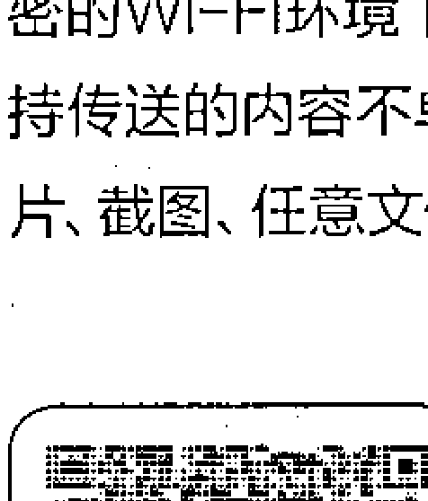

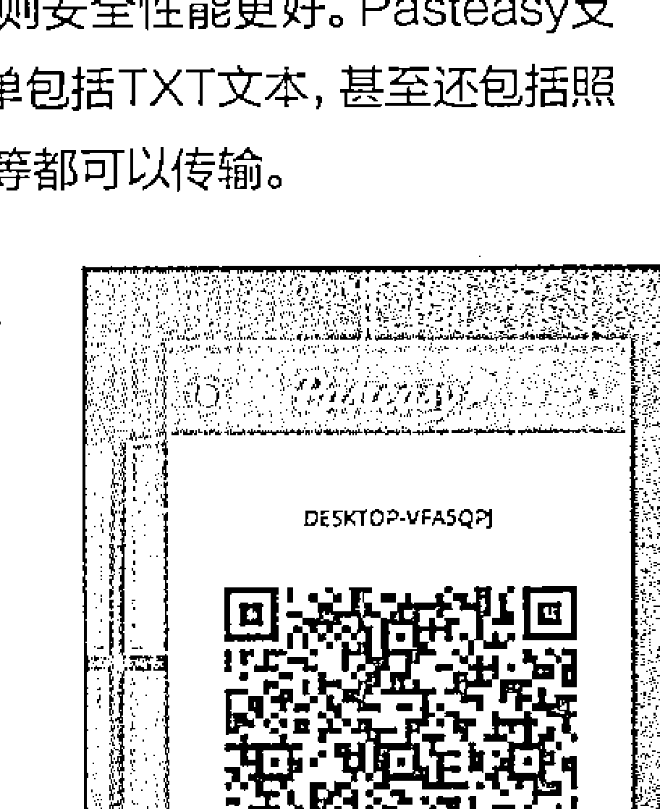

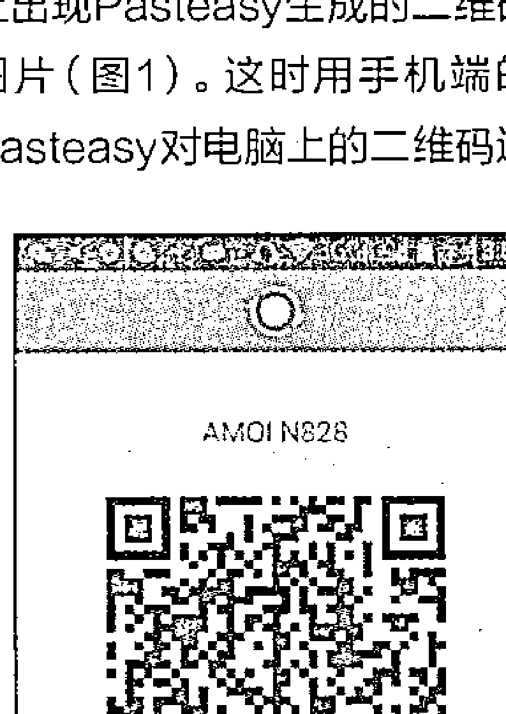

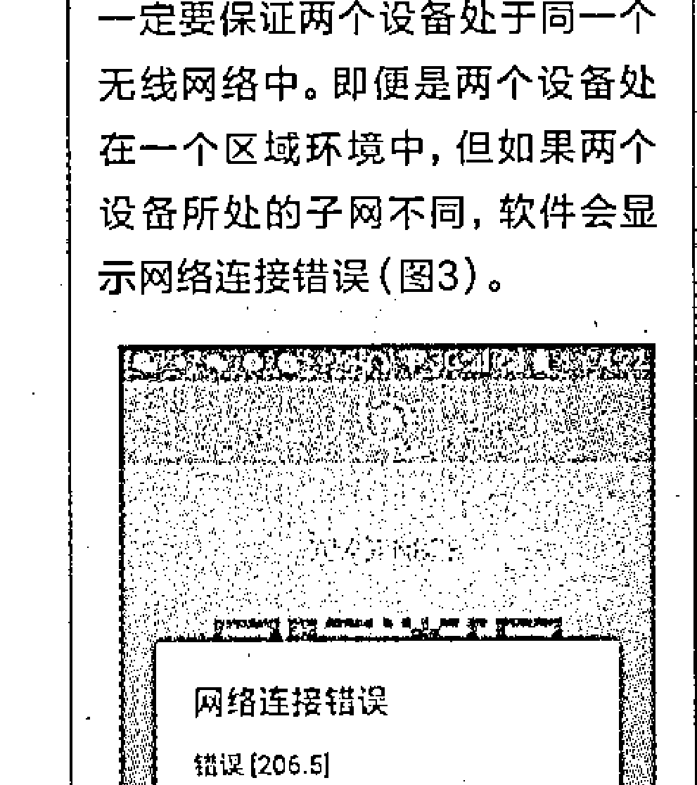

扫描之后，就会建立两个设备之间的连接，连接成功后屏幕显示可以粘贴文本或照片给所链接设备的任何应用程序的提示（图4）。这时在PC上的Pasteasy窗口下端输入短信内容，随后在手机端的Pasteasy窗口中即可看到自动出现了相同的内容，只需点击手机中该条目下的COPY按钮，即可复制到这条信息，将其粘贴到短信发送窗口发送即可。或者点击信息条目下方左侧的分享图标，然后会弹出发送目标程序的列表，直接点击程序图标，即可将信息发送到目标应用（图5）。

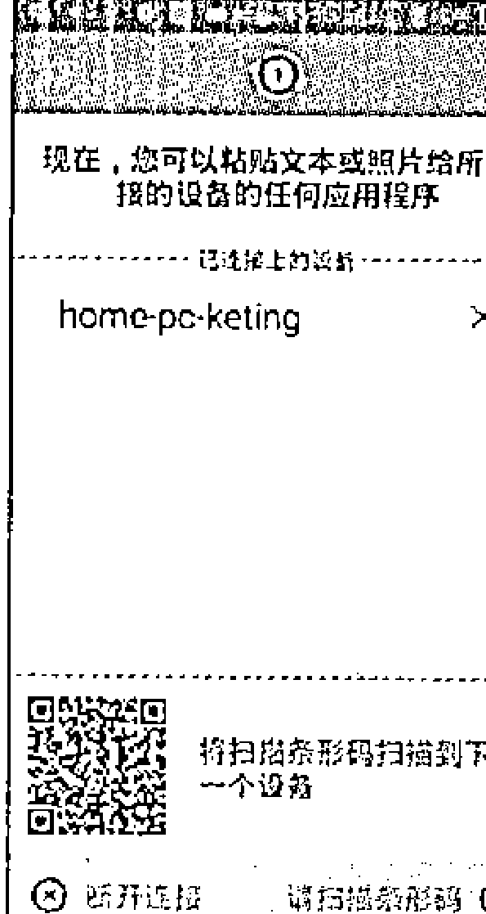

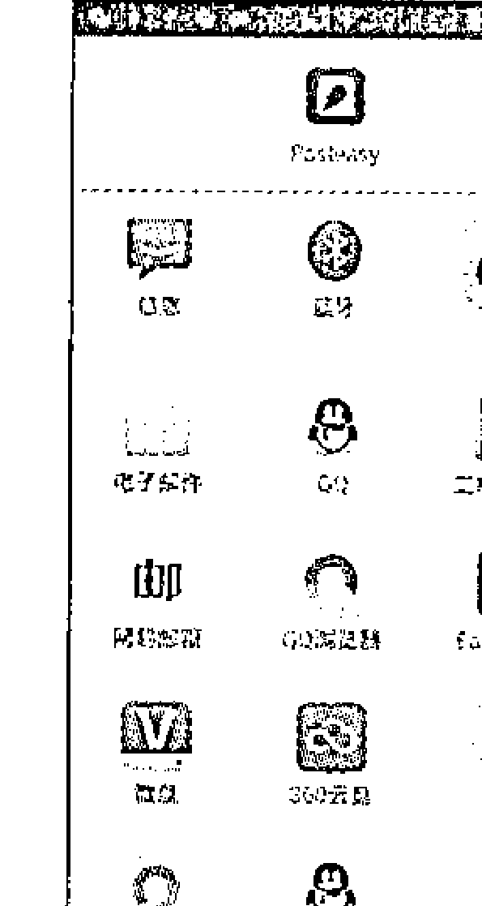

###### 2. 手机截图电脑立马显示

若需要在手机上截取了一幅重要画面在电脑上使用，双端启用Pasteasy，手机截图后电脑马上可以出现截图的结果。这非常适合于在电脑上创作与手机有关的文章时配图使用（图6）。

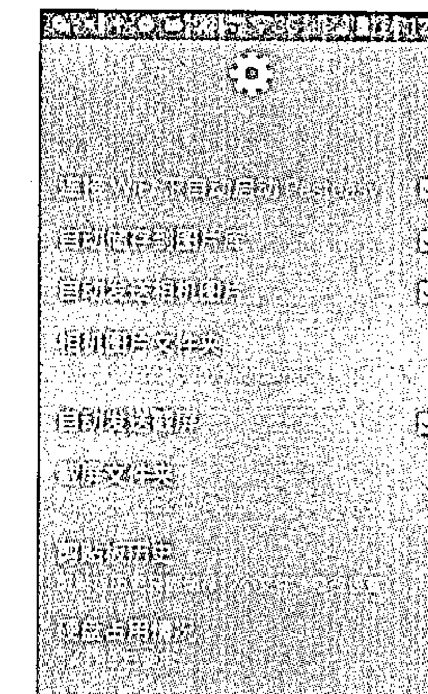

##### 2. 跨软件分享 自动过滤格式

用“今日头条”看新闻，其中不但有时政内容，还穿插有不少电脑和数码摄影方面的实用技巧。有时免不了希望将有用的内容复制下来，收藏到自己的手机中。用“有道云笔记”的自动过滤粘贴功能，可以实现格式自动过滤，免去了格式剔除的麻烦。进入Android手机的“今日头条”页面，打开一篇图文混排的文章，如果对该文的全部或部分内容感兴趣，选中需要收藏的内容，然后点击屏幕上方的复制按钮（图9）。此时可看到，我们复制的文字内容是带有格式的版面。启动有道云笔记APP，点击窗口右下角的绿色加号按钮，建立一篇新笔记（图10）。在空白笔记页面上长按，点击弹出的“粘贴”按钮。随后我们看到，

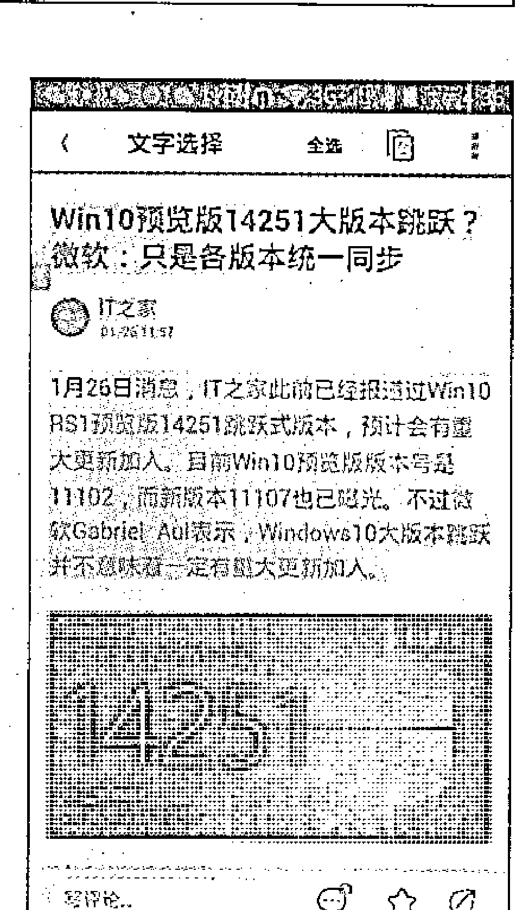

###### 3. 分享网址续读文章

在手机上看到一篇文章，但由于其中的图片或视频在小设备上看着不爽，希望在电脑上观看。这时只需在手机浏览器中复制该网址，然后切换到手机Pasteasy窗口，你会发现已经自动出现该条地址（图7）。与此同时，软件自动将该条网址分享到电脑，在电脑收到消息后，直接点击收到的网址，即可继续阅读这篇网文了。反之亦然。甚至在两部移动设备之间也可以这样做。软件提供的剪贴板历史管理功能非常有用，通过留存的剪贴板内容，可进行信息重新预览和复制、分享或选择性删除。为了避免信息过多，还可以设置剪贴板的历史数量（图8），默认为12个。

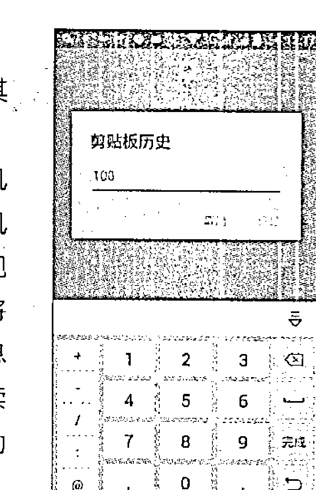

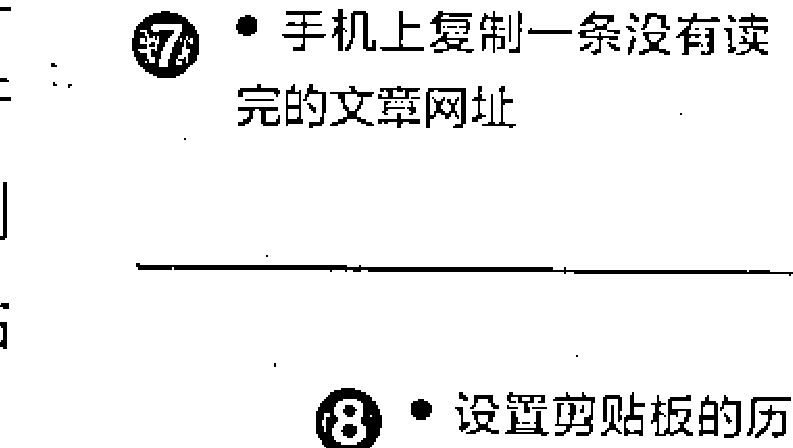

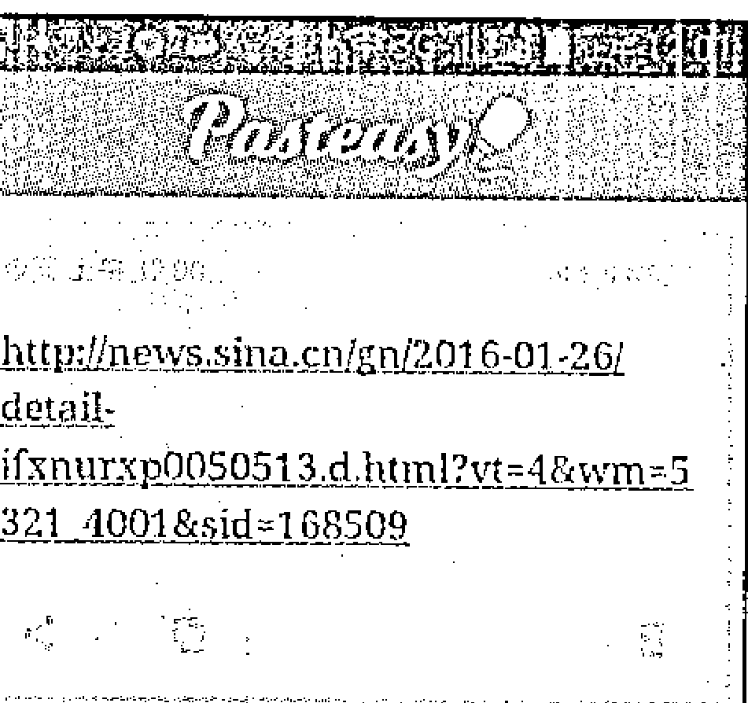

在有道云笔记的窗口中，出现的是不带排版格式的文字内容(图11)。当然，如果需要个性化的格式，比如字体、字号、文字颜色等，可以用有道云笔记自身的排版功能进行格式重新编排。如果需要插入图片，也可以在PC上或手机上复制图片，并直接粘贴图片到有道云笔记的编辑页面中。这样，同步之后，在其他设备里也能看到图文并茂的版面。

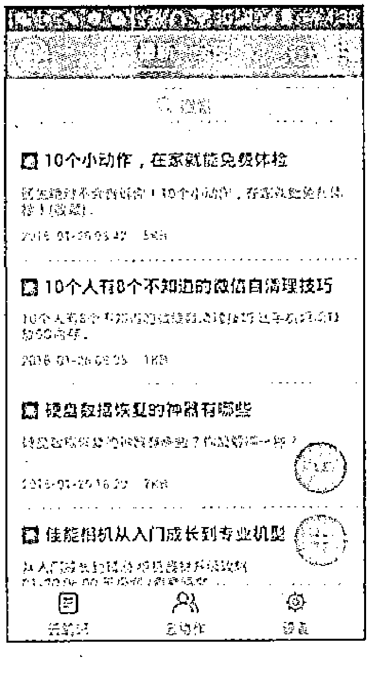

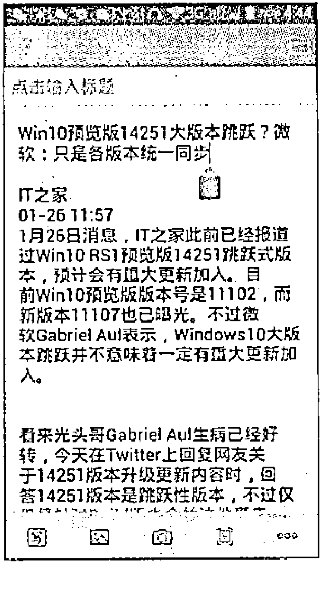

##### 3. 实现自动弹出分享选择

通过上面的例子可以看到，如果要从一个应用中复制信息到另一个应用中，复制信息后还需要手动切换开启另一个应用来粘贴，这显然有点麻烦。如果能在复制信息后让另一个应用自动开启，“就地”将信息发送到另一个应用，岂不更方便？借助于Easy Copy这款应用，就可以解决如上问题。大家知道，我们使用的应用不一定都含有复制信息后及时弹出的分享菜单或按钮。但安装了Easy Copy后，在设定的应用中复制文本后，都可以自动弹出分享界面，这样我们就可以轻松将信息发送到其他应用，与其他应用一同分享这些信息了。


首先需要在软件设置窗口中滑动“激活”开关，激活Easy Copy (图12)。然后可通过“设置”选项，定义“弹出显示设置”、“动作设置”和“黑名单”等3项信息 (图13)。至于哪些软件能够支持弹出分享信息，这完全可以由我们使用者来决定。在“弹出显示设置”中，选择哪些应用中复制信息可自动显示弹出信息。软件已经默认给出一些最常用的应用 (图14)。点击右上角的加号按钮，还可以添加更多自己认为需要添加的应用软件 (图15)。Easy Copy内置了两个分享动作：Google“翻译”和“日历”。这是软件默认的两种常用动作，只需在“动作设置”中进行设定。需要确认在Google服务使用有效的环境下使用 (图16)。此外，对于一些我们不需要弹出共享信息框的应用软件，只需通过“黑名单”设置窗口右上角的加号按钮，添加要排除的应用软件即可。

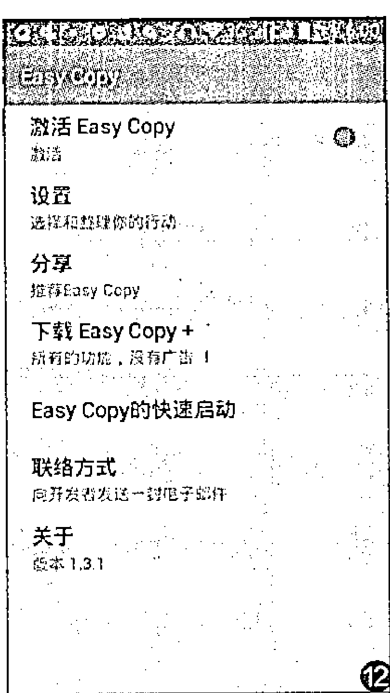

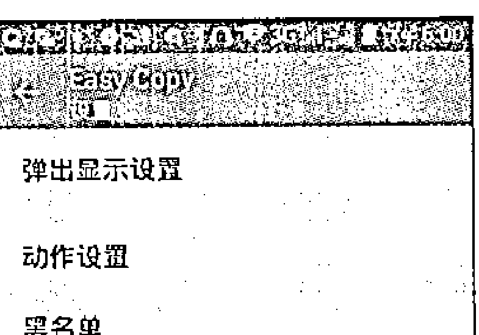

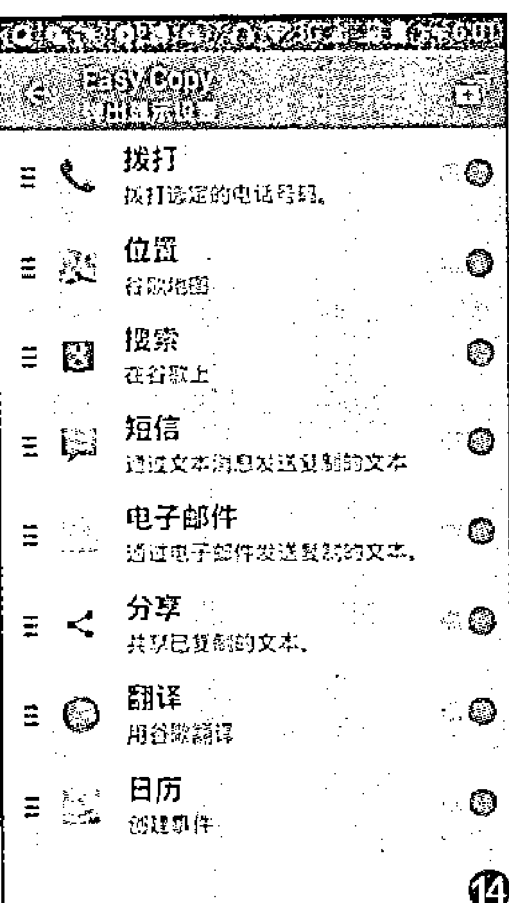

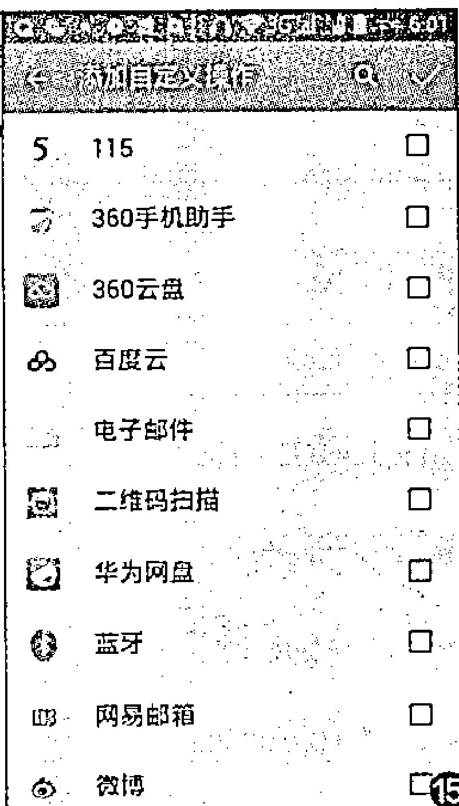

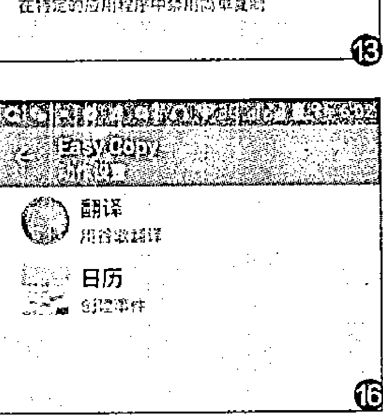

##### 让手机充当电脑的“耳目”

文|神鸟易飞

个人组装的台式机鲜有直接将麦克风和摄像头列入标准配置，但若需要与家人视频联系、友人语音游戏，再去京东、淘宝购买肯定来不及。此时恰巧你身边有一款Android手机，恰巧你也看到了这篇文章，那这些生活中的突发小问题便不再是问题。

##### 1. Android手机变身无线摄像头

忽然接到家人的视频聊天请求，PC上却没有摄像头是一件非常尴尬的事儿。这时完全可以临时借用自己的手机来充当摄像头。只需一组DroidCam工具套件，就能让Android手机充当电脑的无线摄像头。

DroidCam要配套使用，移动端和PC端均需要安装客户端软件。客户端官方下载地址：http://www.dev47apps.com/。官网给出了APP在Google商店的下载链接。如果国内通过Google商店不好连接下载，可通过一些APP下载网站搜索下载。

DroidCam支持Wi-Fi与USB两种连接方式。手机端开启后会给出Wi-Fi地址和端口号（图1）。之后只需在PC端输入与手机端一致的IP地址，点击Start按钮（图2），就能在电脑上看到手机摄像头的实时内容了。在手机端的Settings设置窗口，通过Use Front Camera选项，可选择是否开启前置摄像头（图3）。
经过如上设置，只要是在同一Wi-Fi覆盖范围之内，手机就能充当电脑的摄像头使用了。

> 小提示
该模拟“摄像头”还支持声音配合。如果希望视频连带声音信息，需要勾选下面的Audio选项。如果只勾选Audio项，手机就可变为一支无线录音笔了。

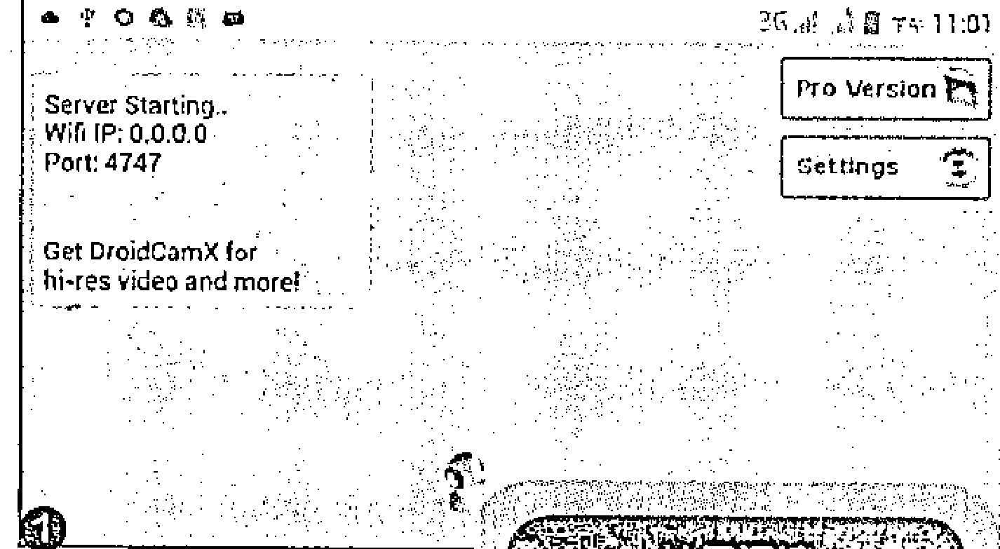

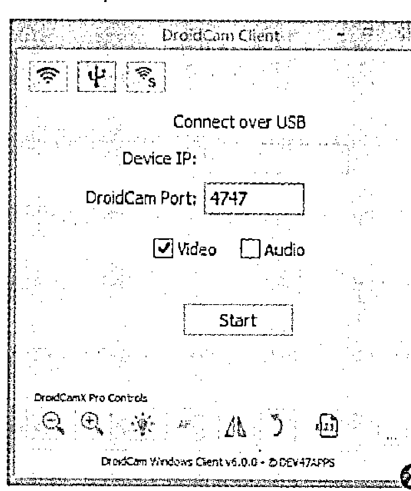

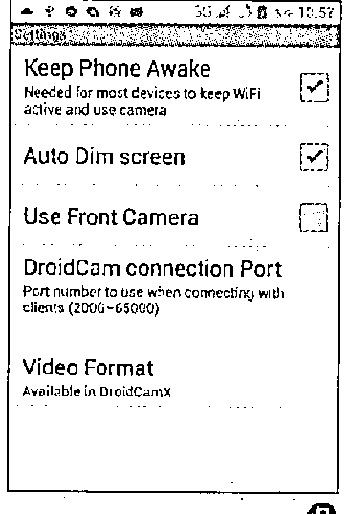

> 除用手机充当QQ视频的摄像头用外，配合VPN还能将其作为远程监控摄像头使用。如果对标准版不满意，可以升级到Pro版获得微调摄像头成像、将图像保存为jpg等功能。


##### 2. Android手机充当无线麦克风

电脑上的麦克坏了，想去修一下又没有时间？或者想买一个无线麦克以便远距离录音或者通过语音控制电脑？完全不需要。只需一组WO Mic（WO麦克风）软件，就可以让你的Android手机变身为电脑的免费麦克。

WO Mic客户端软件有PC端和Mac端，支持两种平台下使用。Windows平台下使用该软件可用Wi-Fi、蓝牙或USB数据线进行通讯，而用手机为电脑提供麦克音源。而在Mac OS X系统下，仅支持Wi-Fi传输。


小提示
PC客户端还需要安装WO麦克风设备驱动程序 (http://dwz.cn/2rlZol)。该设备驱动程序模拟一个物理设备，以便同音频处理程序交互 (图4)。

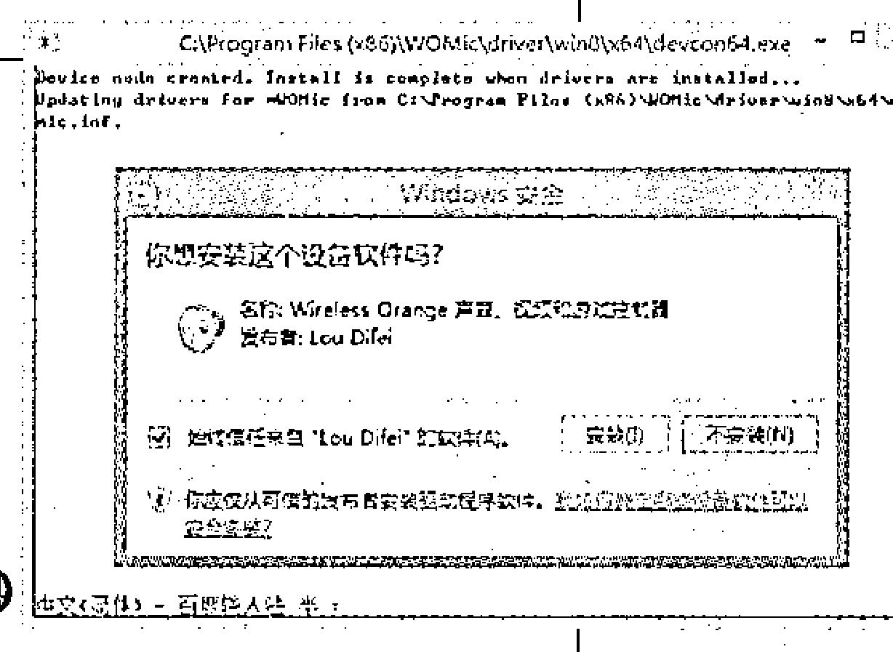

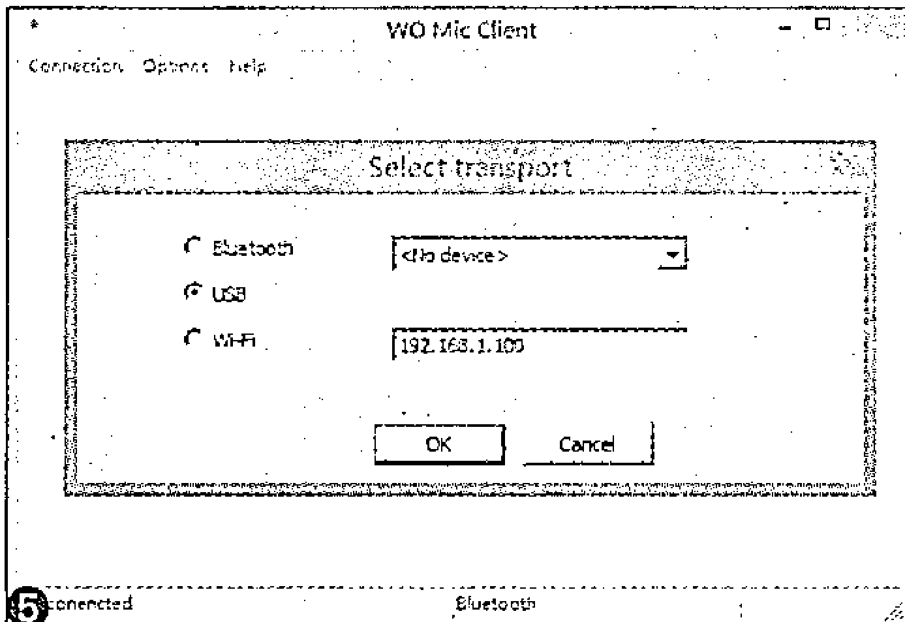

Android客户端WO Mic官方下载地址：http://dwz.cn/2rHDsD
PC客户端WO Mic官方下载地址：http://dwz.cn/2rHE5M
Mac OS X客户端WO Mic官方下载地址：http://dwz.cn/2rHEkl

在PC端安装了客户端软件后，通过“Connection→Connect”选择传输连接方式 (图5)。通过“Options→Ports”改变控制端口和媒体端口的参数 (图6)。端口号要与手机端的端口设置相一致。
启动WO Mic客户端，参数设好之后，点击“开始”即可开启麦克风讲话了 (图7)。若无法通话，可能是参数设置有问题。点击“设置”按钮，在设置窗口可以看到，WO Mic已经将手机默认设置为录音设备Mic，直接使用就可以了。这里也给出了默认的控制端口号和媒体端口号，通过点击端口号可改变为与电脑端一致的设置 (图8)。

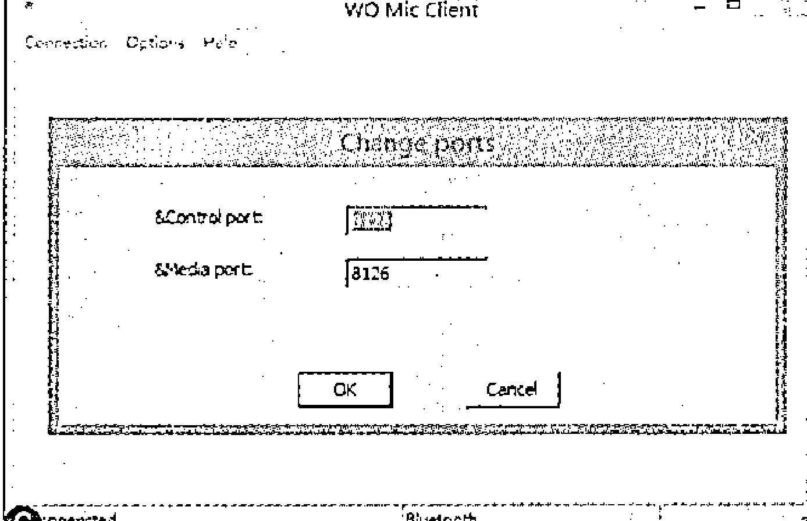

手机充当麦克风比PC麦克风有更多的先天优势，若采用蓝牙和Wi-Fi连接方式，就可以不用守在电脑桌旁随意走动了。如果配合“楼月免费MP3录音软件”，可快速将麦克讲话录制生成MP3文件 (图10)。楼月录音在Windows 7以上新系统上可以仅录制从麦克风输入的声音，也可以选择仅录制从电脑播放的声音 (图11)。

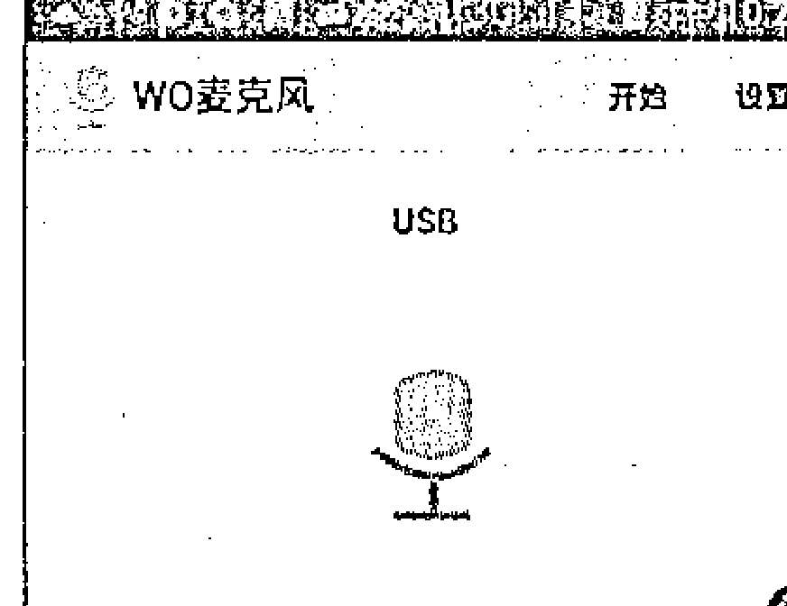

软件会自动检测出当前手机与电脑的连接方式，也可点击设置窗口的“连接方式”一项，可在连接方式选择窗口切换Bluetooth (蓝牙)、USB、Wi-Fi等三种连接方式 (图9)。

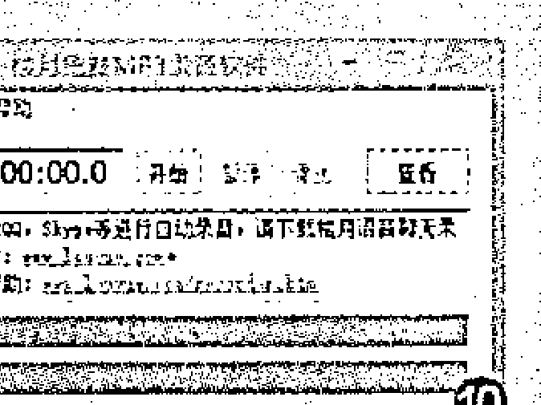

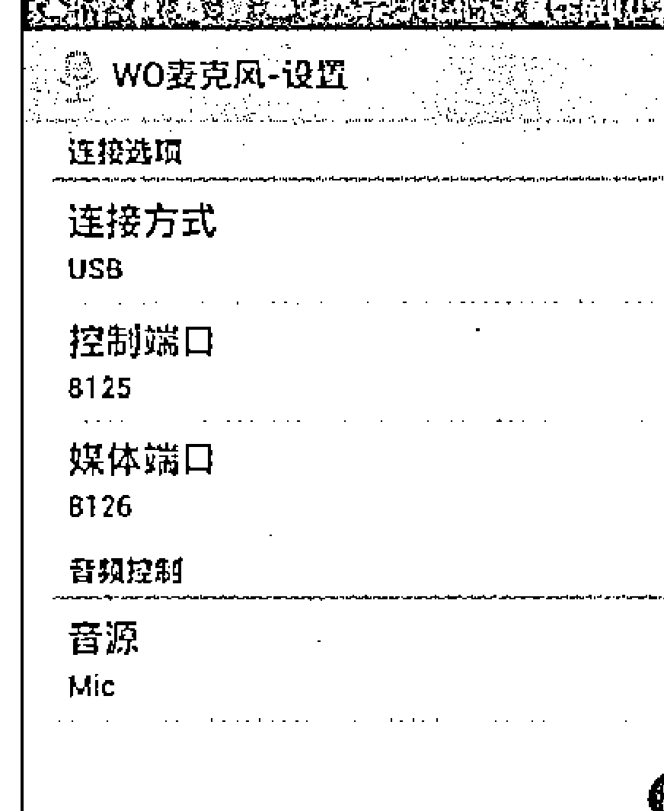

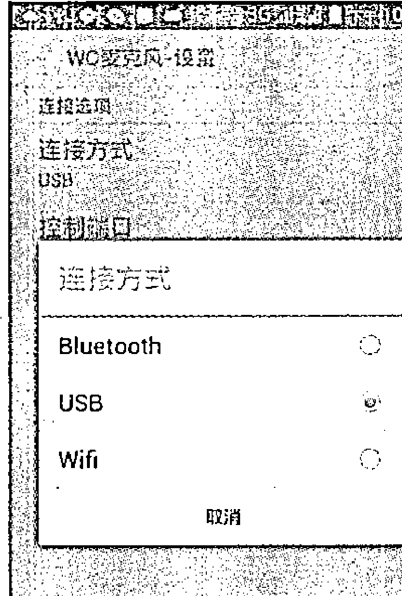

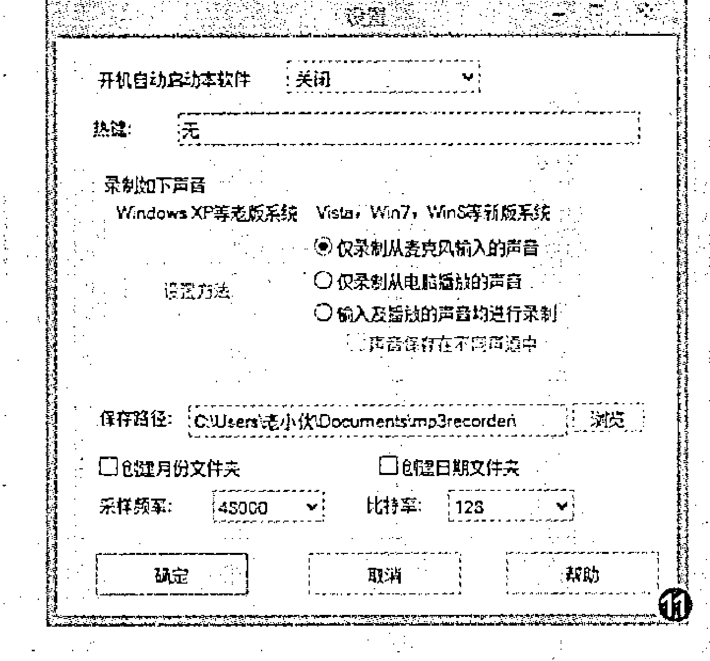

##### 机器冰冷 仍有温情
远程协助玩转Android手机

文|健圣

很多年龄较大的长辈和呆萌的MM们在操作Android手机的过程中总会遭遇“卡壳”问题，比如XX软件不会设置、XX功能无法开启等。那么，身处异地的我们又该如何帮助他们呢？

在PC时代，当老家的父母遇到使用上的问题时，我们可以通过远程控制帮他们搞定一切。在Android手机时代，我们同样“有机会”通过远程控制解决亲友的问题。

##### 亲情关怀APP帮你忙

> 小提示
首次运行亲情关怀可能会弹出权限申请的对话框(图2)，请赋予该APP使用这些权限的能力，否则远程协助时可能会无法显示画面或没有声音。

之所以Android手机只是“有机会”远程协助，是受限于系统的安全机制，以及相关应用匮乏等情况。比如，Android想实现远程控制，需要获取系统和底层硬件的各种权限，因此某一款APP很难做到对所有品牌手机的支持。截至目前，能够通过手机远程控制手机的形式的APP只有华为推出的“亲情关怀”(下载地址：http://qqgh.vmall.com/)，下面我就来看看它的特色之处。

亲情关怀需要使用华为账号登录，支持通过网络拨打电话或发送短信，而其远程协助的功能则体现在“请求帮助”(请求对方远程控制你的手机)和“提供帮助”(请求远程控制对方手机)两个核心选项上(图1)。需要注意的是，亲情关怀虽然可以安装在所有Android手机中，但是只有华为自家品牌的手机才能使用“请求帮助”功能。

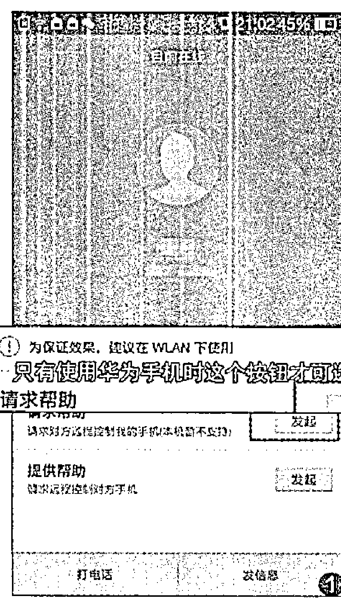

以华为Mate 8和OPPO N1 mini为例，两款手机都打开了亲情关怀APP，并分别登录了华为账号且处于有网络的状态(Wi-Fi或4G均可)。当Mate 8点击“请求帮助”后，N1 mini的屏幕就会弹出“对方发来邀请”的提示(图3)，点击“接受”按钮后，N1 mini的屏幕中就会出现Mate8当前的屏幕画面了(图4)。此时，我们就能通过N1 mini远程操作Mate 8，并通过涂鸦、语音作为辅助，指导使用Mate8的亲友具体的操作步骤(图5)。

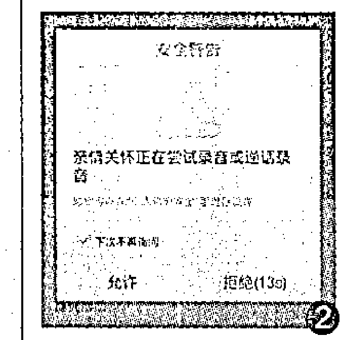

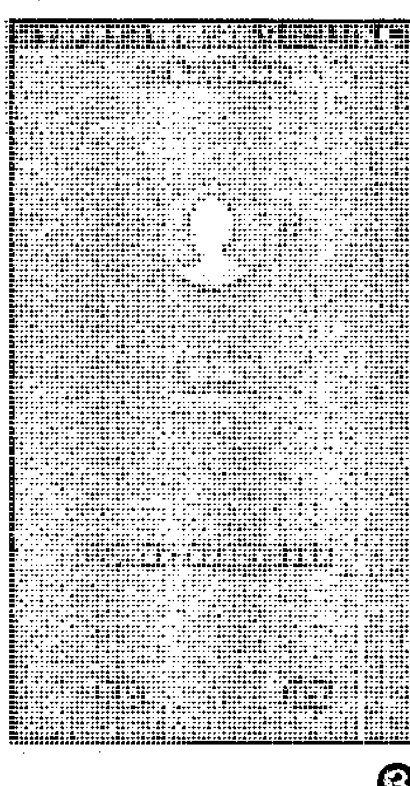

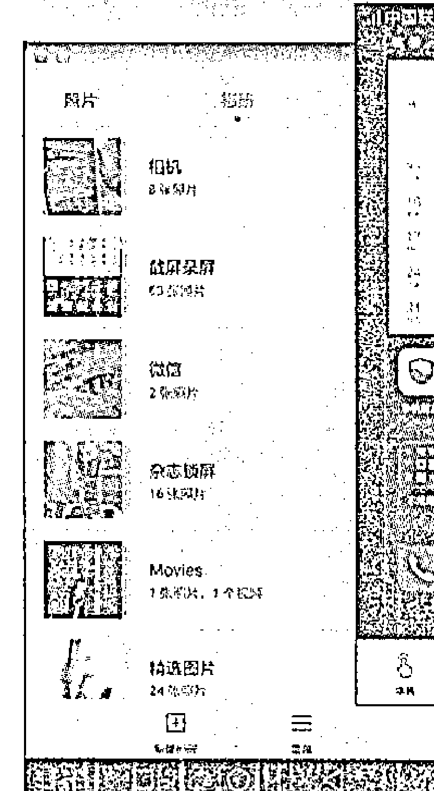

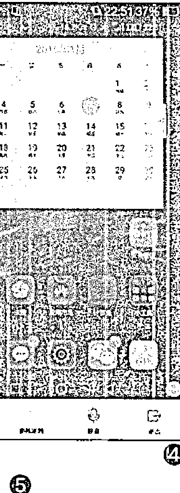

反之，如果Mate 8选择“提供帮助”，而N1 mini选择接受帮助后，Mate 8却无法抓取N1 mini的当前画面，只能以黑屏状态示人。而Mate8的操作也不会反映在N1 mini的屏幕上，只能显示涂鸦的内容(图6)，作为远程指导意义不大。

##### 扩展阅读 用PC远程控制手机

既然手机远程控制手机存在局限性，有需求的用户可以尝试用PC远程控制手机，从而通过PC给对方作出远程的指导。可惜，该方案的难度较高，要在需要帮助的手机上安装‘Webkey’APP，而且需要ROOT权限。简单来说，Webkey经过一番设置后会生成一串地址链接，然后在PC端输入这个地址并输入手机上建立的用户和密码，就能在PC屏幕上显示手机的实时画面，并对其进行远程控制了（图7）。感兴趣的同学可以访问http://dwz.cn/2w0fl2这个地址查看详细教程。

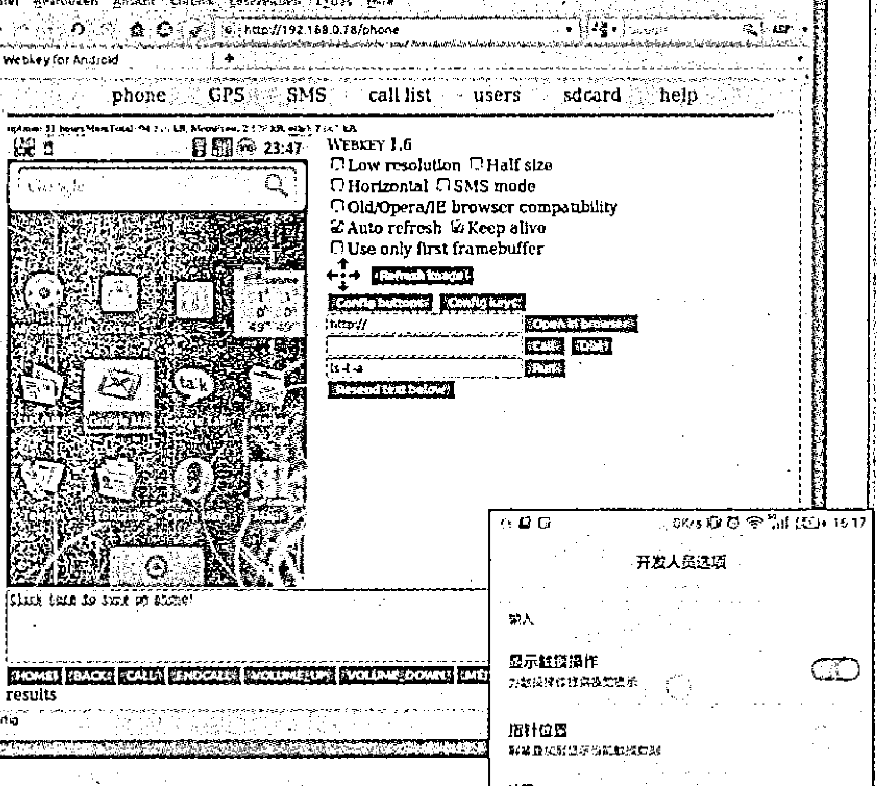

##### 录制屏幕“曲线救国”

总之，亲情关怀的功能虽然强大且操作方便，但局限性太大。只有当父母使用华为手机时，我们才能通过该APP远程对他们提供帮助。

Android手机的操作并不复杂，只是一些功能很难用语言和文字描述，如果给父母看一段具体操作的视频教程，相信他们就能轻松掌握了。如今QQ和微信都能直接传输视频文件，所以难点主要体现在如何录屏。

如今很多手机原生就支持录屏功能，比如华为Mate8只需同时按音量加和电源键即可录制屏幕（图8）。如果你的手机不支持该功能，则可考虑使用类似‘录屏大师’（下载地址：http://www.ifeimo.com/）的APP（图9）。需要注意的是，此类APP运行前需要允许它的悬浮窗口显示、录音等权限（图10），否则将无法正常使用。

此外，为了让亲友可以更清晰地看到你的操作，建议录屏前进入开发者选项，勾选‘输入→显示触摸操作’选项（图11），让视频可以记录你手指到底点了屏幕的哪些具体位置。

-   - 录制前将录制内容，将所有操作及画面都会被录制
-   - 录制过程中如需退出，可到通知栏中手动停止
-   - 录制过程中不要使用其他应用的麦克风功能
-   - 长时间录制可能引起手机发热
-   - 不再提示

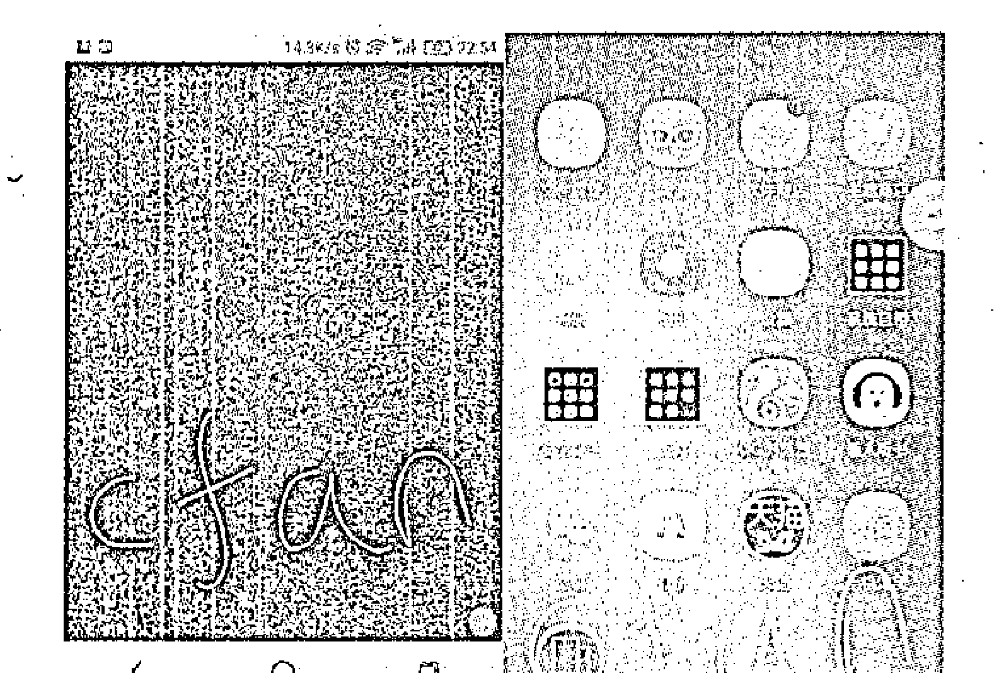

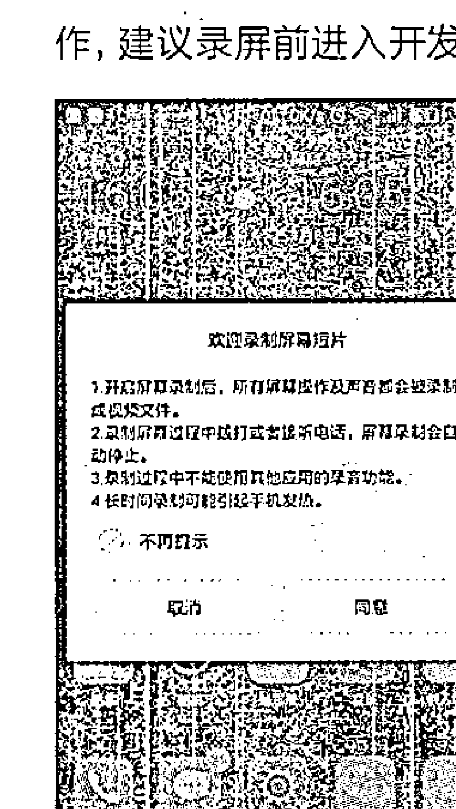

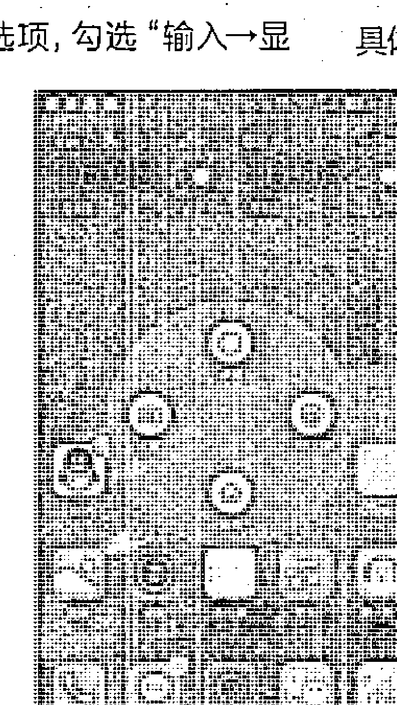

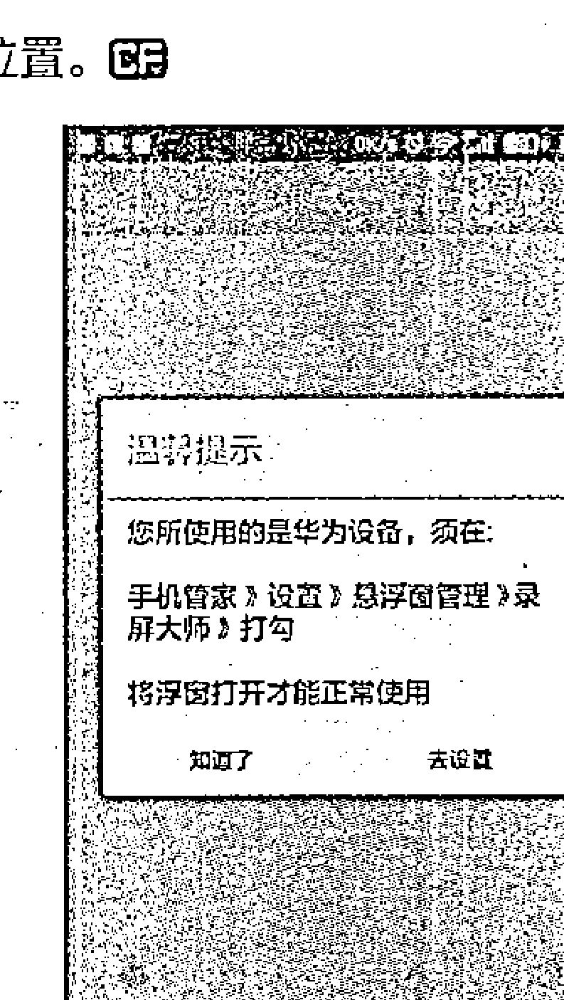

-   - 输入→显示触摸操作
-   - 显示触摸操作
-   - 指针位置
-   - 显示布局边界
-   - 窗口动画缩放
-   - 过渡动画缩放
-   - 动画程序时长缩放

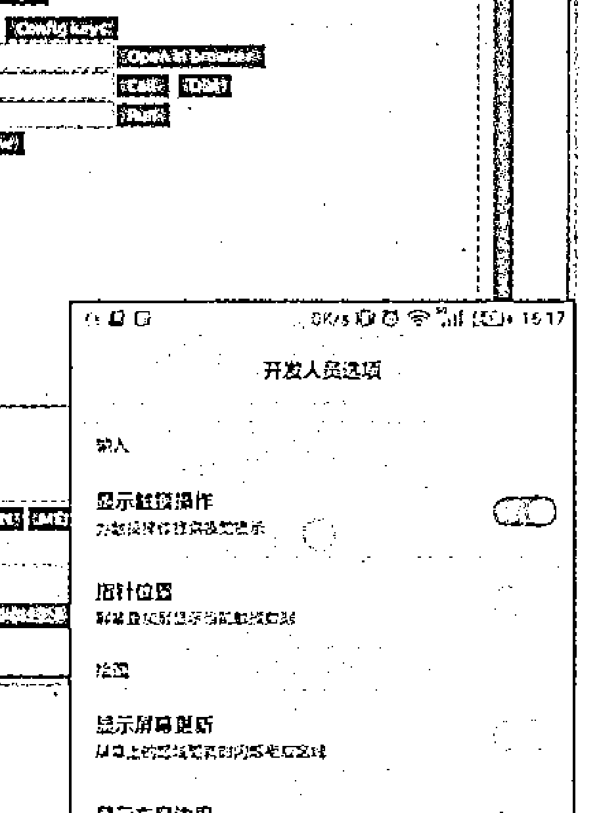

如果你的手机没提供原生的录屏功能，你也不希望安装第三方APP，则可考虑通过PC端的操作进行手机屏幕内容的录制。具体教程请参考本刊2015年23期《自己做主播 如何录制Android屏幕内容》这篇文章。

##### “摇一摇”还能这样玩

文|神鸟易飞

微信中的“摇一摇”很有意思，动动手机就能搜出附近的人。其实，用手机“摇一摇”实现的功能何止这个。配合有趣的APP，Android手机可以摇出更多的实用、乐趣和惊喜。

##### 1 系统管理摇一摇

我们可以通过不同的应用，实现摇一摇运行程序、摇一摇开启或关闭屏幕、摇一摇系统加速、摇一摇锁屏或解锁屏幕、摇一摇截取屏幕等需求。

###### 摇一摇启动程序

如果晃动手机能够运行指定的应用，每个人根据自己的需求和喜好，定制不同的摇一摇功能，这样再人性化不过了。好在一款名为Shake Me的应用可实现上述想法。

Shake Me软件界面极为简单，其中只有4项设定。如果选项切换到Do nothing，那么软件什么也不会做，等于功能暂停（图1）。

选择Launch an app选项，开启Enable Screen On开关。点击Select an application选择一个需要用摇一摇功能来启动的应用（如1号店）（图2）。如此设置之后，摇动手机后屏幕便会亮起，同时1号店应用会自动启动。

通过手机的“菜单”按键选择Settings，调节Shake sensitivity滑动条，可调节摇动的灵敏度。选中Vibrate when shaken复选框，会在摇动后出现振动提示。如果要屏蔽或开启Shake Me，只需控制Enable Shake Me开关即可（图3）。

Shake Me除了可以控制摇一摇启动软件外，还能兼做其他任务。如果切换为Screen On/Off选项，可以控制摇一摇锁屏或解锁屏幕——Enable Screen On开关打开，允许摇一摇解锁屏幕；Enable Screen Off打开，则允许摇一摇锁住屏幕（图4）。此外，如果将选项切换到Camera flash light选项，摇一摇手机后，手机闪光灯会亮起（图5）。

###### 摇一摇系统加速

手机变慢的主要原因是无用的进程占据内存，还有久而久之安装的多余软件侵占存储空间，也会影响系统运行效率。以往我们都是通过系统管理工具或优化软件来“杀掉”无用的进程和清理无用软件的，现在我们可以用“摇一摇加速”这款应用来更为方便地完成这件事。

安装该软件后，通过“设置”按钮设置是否在后台开启该应用。软件开启后会常驻内存，但只占用很小的一部分内存资源（图6）。之后觉得系统运行慢了，只需摇一摇手机，该软件就会自动杀掉多余的进程，腾出更多的内存空间。摇动之后，手机振动一下，然后屏幕会提示杀掉几个进程，并报告当前可用内存空间量。当然，你也可以直接在该软件的界面中点击“开始加速”按钮进行加速，效果和摇一摇达到的效果相同（图7）。

> **小提示**
如果手机中安装有无用的软件，通过点击“应用卸载”按钮，选择要卸载的软件，点击其后的“卸载”按钮即可将软件“请出”手机（图8）。

###### 摇一摇锁定屏幕

每次不用手机要锁屏时按动电源按钮，这多少也是对手机寿命的一种伤害。也许你会说用锁屏软件，点击一下屏幕也可以锁屏，这样增加了对屏幕的磨损不提，单就找锁屏软件图标然后点击也是个麻烦事。其实用一款“摇一摇自动锁屏”应用，锁屏的事摇摇手机就能搞定。

启动软件后，只需滑动“软件启动”开关，置于ON的状态（图9）。之后软件会提醒需要激活设备，选择“激活”即可正常使用（图10）。以后，无论手机处于什么使用界面，只需轻轻摇动手机，即可自动关掉屏幕了。

> **小技巧**
如果要卸载该软件，软件会提醒该程序包是当前使用的设备管理器，无法卸载。这时需点击“管理设备管理器”按钮，进入设备管理设置窗口，取消对“摇一摇自动锁屏”选项的选择。然后点击“取消激活”按钮，就可以正常卸载该应用了。

###### 摇一摇解锁屏幕

摇一摇关闭屏幕省却了电源开关和屏幕的磨损，但开启屏幕同样会对电源按钮和屏幕的磨损。实际上，解锁屏幕同样也有对应的一款小APP“摇一摇解锁”可以实现。

软件使用同样非常简单，只需进入该软件，点击开启“摇一摇解锁”功能，就可以在关屏的情况下，摇一摇自动开启屏幕（图11）。不用该功能时，可关闭“摇一摇解锁”功能按钮。如果手机由于某种原因无法点击开启屏幕，也可尝试使用摇一摇解锁。

> **小提示**
以上两款软件搭配使用，就可以做到关屏和开屏均用摇一摇功能了。不要担心速度问题，对于如今的手机配置来说，这两个极小的软件对系统速度影响极小。

###### 摇一摇屏幕截图

手机截屏怎么截？也许你会给出几种快捷键组合或一些截屏软件。但实际上，一种最省事的办法就是摇一摇手机截屏，只需安装“摇一摇截屏”软件即可解决。

“摇一摇截屏”除了可支持摇动截屏和摇动灵敏度设置外，还支持状态栏点击截屏。此外还可以对截图进行翻转、旋转、反色等操作。图片保存的路径也可以设置，支持JPG和PNG两种格式。

##### 2 生活助手摇一摇

生活中摇一摇也能发挥应有的作用，比如摇一摇开启手电筒，或在拿不定主意又没有硬币可掷的场合，让“摇一摇”帮着作出决定。

###### 摇一摇开启手电筒

黑灯瞎火的场合，将手机变成一只手电筒，那是再好不过的一个功能了。只需给手机安装“摇一摇手电筒”应用。在后台开启手电筒服务，需要时摇一摇手机，手电筒就开启了。

首次使用软件，需选择是否使用闪光灯，软件提供多种型号手机选择，对大多数手机来说，选择“标准闪光灯”即可（图12）。开启闪光灯后，直接点击屏幕上的大按钮可关闭闪光灯。软件还支持选择用屏幕亮起作为手电筒（即屏幕手电筒）、开启SOS信号灯等（图13）。

软件虽小，但含有丰富的功能设置，包括手电筒、闪光灯、后台服务、摇动参数等（图14）。其中，摇动设置中含有灵敏度设置、是否摇动退出、振动、提示音等选项（图15），据此可灵活定义个性化的手电筒功能。

###### 摇一摇帮你作决定

有时我们在决定不了一件事该如何处理或一件物品该如何分配时，常会使用投硬币、翻纸牌、掷骰子等办法来决定。如果手头上没有这些道具，我们就用手机里安装的“摇一摇决定器”吧！

通过摇一摇决定器，可选择包括抛硬币、翻纸牌、掷骰子家务等方式来决定，还配有“赛场”背景音乐呢。

##### 娱乐也能摇一摇

除了作为系统工具使用和生活辅助外，手机摇一摇还可以作为娱乐辅助工具，例如可以摇出乐曲、摇动拍照、摇动修图拼图等。

###### 摇一摇演奏音乐

安装“音乐摇一摇”应用，晃动一下手机即可演奏一段乐曲，可选择不同的乐器演奏。首次启动软件，它会给出详细的使用说明（图16）。点击“开始游戏”（图17），然后选择乐器，想不到一个400多KB的小软件竟然有数十种乐器可选（图18）。选择乐器后，开始摇动，即可听到美妙的音乐，同时还可点击“切换乐器”按钮切换乐器，然后再次摇动（图19）。

> 小提示
需要注意，摇动时屏幕朝向手心上下晃动效果更好。此外还要注意，轻轻晃动和用力摇动所获得的音乐效果是不同的。

###### 摇一摇启动拍照

有时看到的美景可能是稍纵即逝的，当掏出手机，翻动寻找相机软件，然后启动拍照，可惜美景已错过。如果摇一摇手机就能拍照，可能就不会错过重要的场景了。提前给手机安装一款“摇一摇照相机”应用，也许在关键场合能够解决问题。

在摇一摇照相机中，可以根据需要设置照片的质量、是否开启快门的声音、是否自动对焦，还可以设置摇一摇拍照的摇动灵敏度。只需将“摇一摇设置”选项选中，启动后台服务，摇一摇拍照功能就发生作用，摇摇手机便可打开照相机了（图20）。

###### 摇一摇编图拼图

玩过苹果iPhone手机的人可能知道有一款照片摇摇看PhotoShake软件，它是一款著名的照片排版软件，可随意美化照片或定制照片集，将多张照片整合成一张照片。现在该软件也有了它的Android版本，只需通过它摇一摇手机，即可创造出个性化的艺术照片或照片合成图。软件提供了多样化的版型和自定义功能，提供多种照片风格，可以直接进行选择或编辑照片效果（图21、图22）。

##### 随时走秀
你也可以是当红主播

文|俞木发

在日常电视节目中，我们经常可以看到室外主持人在镜头前的各种展示。作为普通人，是不是很羡慕这些主持人的各种秀？随着4G移动宽带的普及以及智能手机硬件的发展，借助一些APP，其实任何人都可以变身主持人，实现随时随地走秀！

###### 实时走秀 手机直播动起来

随着手机的普及，很多朋友都喜欢将身边发生的事情和好友分享，无论是在家做美食，还是出门在外遇到有趣的事。如果要第一时间和好友分享，现在可以使用“趣播”来实现实时走秀，它可以实时向任何网友展示你的直播内容。

在手机上启动趣播后按提示注册并登录（如果只是查看趣播直播则无需注册）。成功登录后点击程序窗口下方的直播按钮，然后点击“设置直播的封面”，为直播内容选择一个合适的图片和标题。这里要注意的是，图片和标题的选择最好和直播的内容一致。因为趣播上分享的直播内容很多，要想在众多直播中获得观众的关注，一个吸引眼球的标题和精致的封面是必不可少的，这样才更方便其他用户在众多的直播中快速找到我们的直播（图1）。

点击“确认，开始直播”，手机屏幕就会出现直播的画面（点击摄像头图标可以切换前后摄像头）。现在你就是一个主持人了，可以充分发挥你的“主持”能力向网友直播他们感兴趣的内容（图2）。

这里注意，如果是直播固定画面（比如向网友直播自己吃美食的画面），可以将手机固定在前方并调整好摄像角度，此时建议配置一个有支架的手机保护壳，这样可以很方便地固定并调整手机摄像角度（图3）。

如果是室外移动直播，还可以借助自拍杆+蓝牙耳麦（建议不要直接使用手机麦克风，因为直播时手机离我们较远，这样语音输入声音很小）。这样无论是在公车上还是大街上，举起自拍杆就可以轻松进行直播（图4）。

- 长时间直播建议使用带支架的手机保护壳

> 小提示
移动走秀实际上就是使用手机视频来向好友或者网友展示身边的一些人和事。根据时间和地点上的差别，既可以是实时走秀（即直播视频），也可以录播走秀（即回播视频）。

> 小提示
视频直播很耗流量，喜欢在家里直播的用户，建议只在Wi-Fi下进行。为了防止趣播使用手机数据流量进行直播，Android用户可以使用LEB安全大师等软件限制趣播使用数据流量。如果是室外直播，强烈建议申请大容量（至少1GB以上）上网流量套餐。

当然走秀的目的是让其他网友可以实时看到我们的直播内容，如果好友已经是趣播用户，只要告诉对方自己的趣播ID号码。用户在他们的手机上开启趣播后点击上方的搜索按钮，然后输入ID号查找即可查看我们的直播（图5）。

在打开的页面中，如果正在直播，那么在下方就可以看到上述设置的直播封面，只要点击即可访问直播画面。当然在直播的同时，主持人和观众还可以点击聊天按钮进行互动，比如主持人可以通过麦克风和文字介绍直播的内容，观众则可以对直播的内容进行提问等互动操作（图6）。

对于非趣播用户，如果要查看自己的直播，可以再使用一个趣播小号（或者交代趣播好友操作），在手机上启动趣播后找到自己的直播，接着点击“分享赚趣点”，在弹出的窗口可以通过QQ、微信、短信等发布直播视频的链接（图7）。

以QQ为例，点击QQ图标后启动手机QQ，选择QQ好友发送即可，好友收到分享消息后点击链接即可通过浏览器进行在线观看（图8）。

这里要注意的是，由于在手机QQ启动的是一个在线播放器，用户无法提取其中的播放地址。如果想让自己的直播有更多的用户知道，我们可以自行提取直播的实际链接地址，让非趣播的用户也可以观看直播。先选择分享到QQ，在弹出的QQ好友列表里选择“我的电脑”，这样会在手机屏幕上直接显示类似http://share.quboing.com/xxx的实际播放地址（图9）。

现在按提示复制上述地址，我们只要将上述地址发送给QQ、微信好友，他们在手机上点击收到的链接就可以打开播放器直接观看，电脑用户也可以直接打开上述网址在电脑上播放。这样无论是手机还是电脑用户都可以在线看到我们的直播（图10）。

在实际生活中可能你的很多好友并没有实时在线，无法实时观看你的直播。如果要保存自己的直播内容，可以申请开通趣播会员服务，登录趣播后点击“我→我的直播”，这里会自动保存直播的内容，其他趣播会员添加关注后可以随时点播已经录制的视频。当然也可以自行提取其分享地址给其他好友观看。

默认情况下趣播并没有提供下载录制视频功能。如果要下载自己录制的视频，首先使用上述方法提取视频播放地址，在电脑上开始播放后，在播放窗口右击选择“视频另存为”，即可将自己录制的直播视频下载到本地保存，视频默认为MP4格式（图11）。

除了直播生活视频外，我们还可以利用手机直播手机其他内容。比如现在很多朋友喜欢玩手游，如果你想向朋友录播你的手游，那么借助“233手游直播”即可直播手机屏幕的内容。

在手机上启动“233手游直播”后点击“直播”，按提示输入直播的标题和游戏的名称，点击“把屏幕投放到浏览器中”，这样在浏览器中就可以直接看到手机屏幕画面（图12）。

在打开的页面点击“开始录制”，此时在手机屏幕上会显示一个录制界面和播放地址，类似192.168.1.112:6778，这个就是电脑浏览器的访问地址（图13）。

在电脑上启动浏览器并输入上述地址即可看到手机的当前画面，现在按下手机主页键将“233手游直播”切换到后台运行，然后继续在手机上启动需要直播的游戏，这样在电脑的浏览器会显示手机直播画面（图14）。

由于这只是内网地址，只限同一局域网的用户可以通过上述地址观看。如果要让其他外网用户观看和浏览，还需要在路由器中添加一条转发规则。以TPLink路由器为例，进入路由器设置后，展开“转发规则→DMZ主机”，单击“启用”，然后在DMZ主机IP地址下输入手机Wi-Fi连接后的内网地址（图15）。

完成上述设置后，以后只要告诉朋友输入http://本机外网IP地址:6778，这样就可以观看手游直播了。

> 小提示：由于DHCP自动分配的IP地址每次都会变化，为了方便使用，可进入手机“设置→无线和网络→WLAN”，选中需要连接的热点，在弹出的窗口勾选“显示高级选项”，然后IP设置选择“静态IP地址”，按提示输入连接IP地址、网关、DNS等信息，这样下次手机IP地址就是固定的了（图16）。

##### 录播走秀 视频回播也精彩

视频直播需要用户实时在线观看，如果你只是想拍下视频后和好友分享，那么利用常用的微信也可以轻松实现。

比如现在出门在外遇到一些新奇、有趣的事情要和好友共享，启动微信后切换到“发现→朋友圈”，点击其中的“摄像”图标选择“小视频→按住拍”，这样可以拍摄30秒的视频(图17)。

完成拍摄后点击撰写视频说明，点击“发送”，这样即可将录制的视频发送到朋友圈，你的好友就可以及时看到你拍摄的小视频了。

微信的小视频只能录制30秒内容，如果你想录制更多的内容和好友分享，那么可以先使用手机的摄像功能进行视频的录制(录制长度只受限于手机存储)，然后再分享到朋友圈即可。完成视频的拍摄后打开文件管理器，找到需要分享的视频，点击“菜单→分享”，选择“发送给朋友”(图18)。

在打开的微信窗口点击“创建新聊天→选择一个群或者好友”，选择需要分享视频的微信群或好友，其他好友只要点击其中的链接即可观看你录制的视频了(图19)。

当然大视频的上传需要耗费很多流量，并且上传的速度也很慢。为了提高传输速度，大家还可以在电脑上操作，接上手机后将需要分享的视频传输到电脑上。接着打开微信网页版并扫描登录，打开需要共享的好友或群对话框，点击“图片和文件”，然后选择拍摄的视频，这样视频会自动发送并同步到手机微信上(图20)。

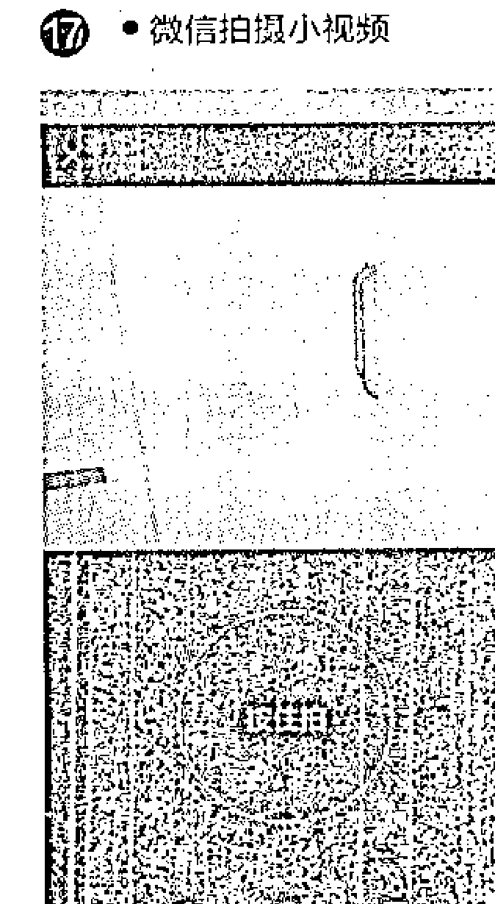


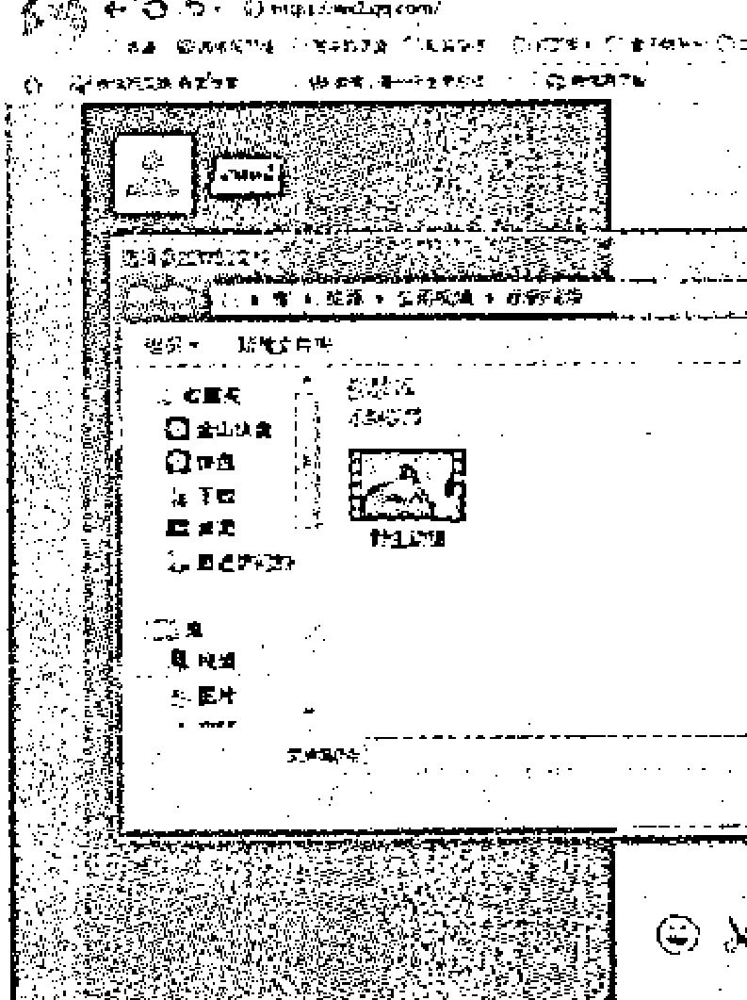

> 小提示
微信只能传输小于25MB的文件，如果要传输更大的文件，可以先将视频传输到优酷，在优酷打开后点击下方的“分享到微信”，按提示扫码后即可将视频链接分享到微信中和好友共享了。

##### 快速调用常用的手机应用

文|老万

Q：我手机系统里面的应用越来越多，应用图标已经铺满了几个屏幕，想要寻找一个来使用非常的麻烦。如何可以快速找到需要的应用并启动它呢？

A：这里推荐安装一款名为Arrow Launcher的应用，它是微软出品的一款Android系统桌面。这款应用安装完成后，首先会自动扫描系统里面已经安装的应用，接着要求用户设置五款自己最常用的应用。设置完成后在“应用”界面的最上方，显示的就是设定的五款应用，另外在“最近”界面中还可以显示出刚刚使用过的应用。

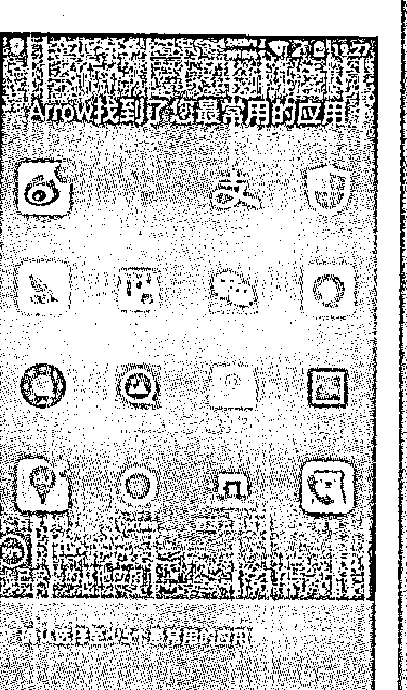

##### ♦ 一键检测Android系统存在的漏洞

Q：现在Android系统的安全问题层出不穷，所以Google几乎每月都要推送安全补丁。但是我们知道国内的手机不能及时更新这些补丁，那么有没有什么方法可以第一时间检测出漏洞呢？

A：首先推荐用户安装一款名为“VTS for Android”的应用，接着开启应用就可以在界面显示出设备的型号、系统版本号等信息。

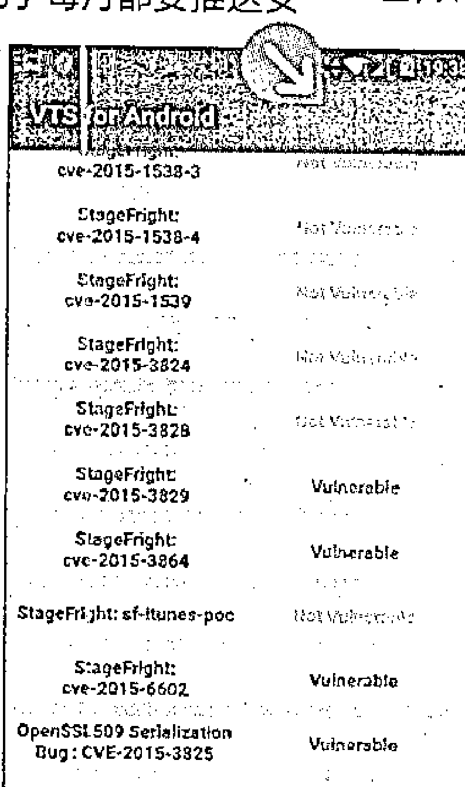

点击右下方查找漏洞的FAB浮动按钮，即可开始寻找Android系统中存在的漏洞，并很快显示出漏洞的详细列表。如果某个漏洞已经被修复，就会显示为绿色，如果没有修复就显示为红色。

##### ♦ 如何输入货币符号

Q：现在网购流行，所以我们经常会在网上进行询价，这时就需要输入一些货币符号，但是我找来找去都没有在iOS系统里面发现。请问是不是需要第三方输入法才可以解决这个问题啊？

A：其实你所说的这个问题根本不需要第三方的输入法，利用系统里面默认的输入法就可以做到。首先点击键盘左下角中的“123”按钮，将键盘切换到数字内容，这时在键盘的第二行可以看到一个“¥”的图标。将手指按在这个键上不放，然后滑动到相应国家的货币符号上面就可以了。

##### ♦ iOS系统如何进行大写锁定

Q：苹果公司要求用户的账号密码，需要有数字和英文的组合，而且还需要有大写字母。但是每次输入大写字母的时候又比较麻烦，有没有什么方法可以进行大写锁定啊？

A：首先在键盘上找到Shift键，接着快速连按它两次，这时你会发现在Shift键的底部出现了一条黑色的水平线，这就表示此时键盘输入已经处于大写锁定的状态了。如果用户快速按Shift键没有效果的话，那么首先打开设置窗口，点击“通用”中的“键盘”选项，找到“启用大写字母锁定键”项启用它就可以了。

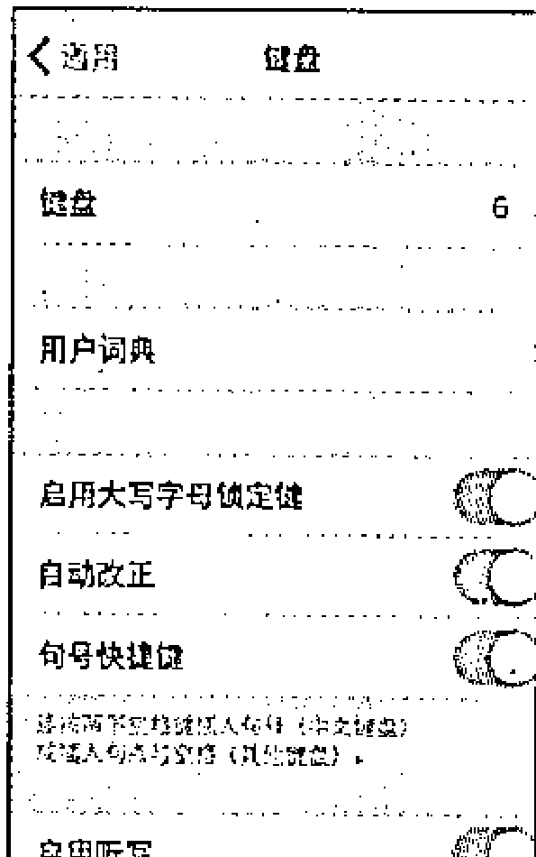

##### ♦ X浏览器怎么过滤广告信息

Q：我现在使用的是X浏览器的Android版，这款浏览器启动运行都非常快速。最近听说这款浏览器有广告过滤的功能，找来找去都没有发现。请问这一功能在哪里？

A：X浏览器最早的广告过滤功能在实验室里面，需要在地址栏里面输入“x:info”后回车，就可以看到广告过滤的开启选项。不过最新的版本只需要点击工具栏中最右侧的按钮，在弹出的对话框中点击“设置”按钮后，在窗口里面点击“开启广告过滤”项即可。

##### Windows 10th2版系统为何关机不断电

Q：我最近将系统更新到Windows 10th2后，按照常规的步骤进行关机操作，结果第二天发现笔记本电池没电了。刚开始以为是关机没有成功，但已经连续好几次了依旧如此。请问这该如何解决？

A：也有其他用户反映过这个情况，怀疑是Windows 10th2系统里面自带的驱动有问题。用户可以在“此电脑”图标上单击右键，选择“属性”命令后在弹出的窗口中点击“设备管理器”命令。接着在弹出的设备列表里面找到“Intel management engine interface”项，单击右键选择菜单里面的“禁用”命令试试。

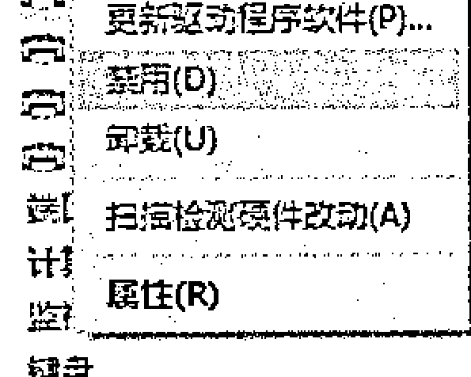

##### 玩WOW的时候电脑无故黑屏

Q：我玩WOW进入副本的时候笔记本突然黑屏，状况和长按电源键关机差不多。本以为是WOW游戏又出问题了，结果晚上玩LOL的时候再次出现这个情况。请问这该如何解决？

A：最大的可能应该是CPU或者主板的温度过高，触发了自动保护功能而断电停机了。建议用户下载安装AIDA64之类的专业软件，实时监控一下CPU等主要部件的温度情况。如果CPU等设备的温度确实非常高，可以请专业人士通过清扫灰尘以及更换风扇和CPU、显卡上的散热硅脂等方法来降温试试。

##### 网上的SSD优化设置靠谱吗

Q：我最近打算购买一个SSD，结果上网一查发现很多相关的技巧，比如使用自动碎片整理、打开预读等等。请问这些技巧是否靠谱？哪些技巧是真正有用的呢？

A：网上流传着很多关于SSD的优化技巧，比如建议进行碎片整理、不建议开启Superfetch服务等。其实这些技巧本质上都是不靠谱的，因为Windows系统会根据磁盘的情况自动进行优化处理的。如果非要说有什么优化技巧的话，可以试试用AS SSD Benchmark软件检查一下SSD是否进行了4K对齐，如果已经完成了4K对齐就没有什么好优化的了。

##### 删除Windows 10自带应用

文|老万

Q：Windows 10里面很多的功能，都是通过自带的应用来完成的。但是里面很多的应用，平时根本就用不到，所以想将其删除。但是我不知道如何删除自带的应用？

A：其实只需要利用一些系统优化软件，就可以非常轻松地卸载这些应用。首先运行CCleaner这款软件，点击左侧工具栏中的“工具”图标，在出现的窗口里面选择“卸载”命令，就可以在列表中看到已经安装的所有程序和应用。从中选择想要卸载的应用名称，再点击旁边的“运行卸载程序”命令就可以了。

> 如果不希望借助于第三方工具进行操作，还可以直接使用系统中的PowerShell工具来进行卸载命令。比如运行 “Remove-AppxPackage Microsoft.People_1.10241.10.0_x64__8wekyb3d8bbwe” 命令就可以卸载“人脉”应用。


##### 闪存盘不能传输大于4GB的文件

Q：我下载了一个高清的视频文件，但是在向闪存盘里面复制的时候，却出现不能操作的情况。请问这是什么原因？又该如何解决呢？

A：这个问题主要是由于闪存盘采用了FAT32的格式，而FAT32格式最大只支持4GB的单个文件。你可以先将闪存盘中的文件备份出去，然后在闪存盘的图标上点击鼠标右键，选择菜单中的“格式化”命令，在弹出的窗口中选择exFAT格式或者NTFS格式，点击“开始”按钮格式化一次就可以了。

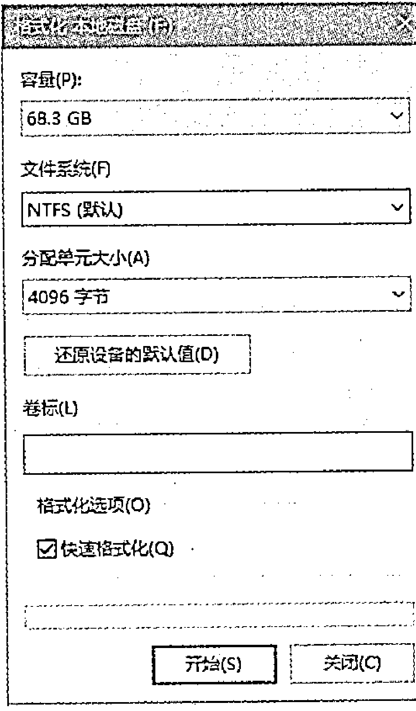

##### 在线视频如何独立窗口播放

文|老万

**Q:** 我平时喜欢看看Ted的优酷在线视频，之前用Chrome的快捷工具就能独立小窗口，但是现在该扩展应用被取消了。有什么办法可以重新找回这一功能呢？

**A:** 其实谷歌浏览器自带的功能不行的话，可以试一试应用商城里面的功能扩展，比如MediaPlus扩展就非常不错。当这个功能扩展安装完成后，我们再遇到页面里面有视频的时候，就点击此扩展图标，接着在弹出的菜单里面点击“开启”命令。稍等片刻就会在视频窗口周围出现一个蓝色边框，点击边框下面工具栏中的十字图标，拖动它就可以将窗口移动到需要的位置了。


> > 其实很多浏览器都可以弹出视频窗口，例如傲游云浏览器就是如此，当用户在傲游浏览器访问视频网页的时候，就会在视频页面的下面出现一个工具条，点击其中的“弹出窗口”命令就可以了。

##### ♦ WordPress还有可用的客户端吗

**Q:** 我有一个WordPress搭建的博客，以前都是通过Windows Live Writer来发送博文的，但是现在这款软件不支持Windows 10系统了。请问还有其他的客户端程序可以推荐吗？

**A:** 如果用户使用的是微软的Office办公软件，那么这个问题也就迎刃而解了。首先在Word里面编写要发布的博文，接着点击左上角的“文件”按钮，然后依次选择“共享”标签中的“发布至博客”按钮。这个时候会弹出一个新建博客账户的对话框，在博客列表里面选择WordPress项后，根据提示输入管理员的账户密码就可以发布了。

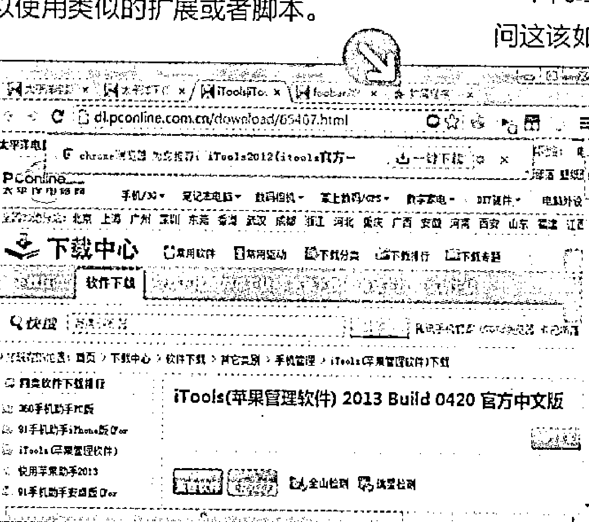

##### ♦ 如何下载网页页面中的文件

**Q:** 有的网站和论坛需要注册才可以下载附件，我想问问能不能通过右键单击选择“查看元素”命令来查找到下载链接呢？如果这种办法不行的话，那么还有其他的办法吗？

**A:** 如果使用的是搜狗浏览器的话，可以安装一款名为“下载一键通”的扩展。通过这款扩展就可以自动分析出网站或论坛里面文件的下载链接，并会在浏览器上方弹出一个提示框，点击提示框中的“一键下载”按钮就可以自动进行下载了。如果使用的是其他的浏览器，也可以使用类似的扩展或者脚本。

##### ♦ ABP的自定义规则怎么加注释

**Q:** 我的浏览器使用的广告过滤扩展是Adblock Plus，有的时候会自定义添加一些规则。为了以后删除的时候方便查找，我想为规则添加上一些注解。请问应该如何进行操作啊？

**A:** 这个操作倒是比较简单的，进入到Adblock Plus扩展的选项窗口，切换到其中的“自定义过滤”标签，然后在输入框里面添加一条过滤规则后，再在输入框里面输入自己的注释即可，不过注释的前面需要加一个英文的惊叹号才行。另外需要特别注意的是，自定义的规则和注释最好进行一下备份，否则更新订阅规则的时候自定义规则就会消失。

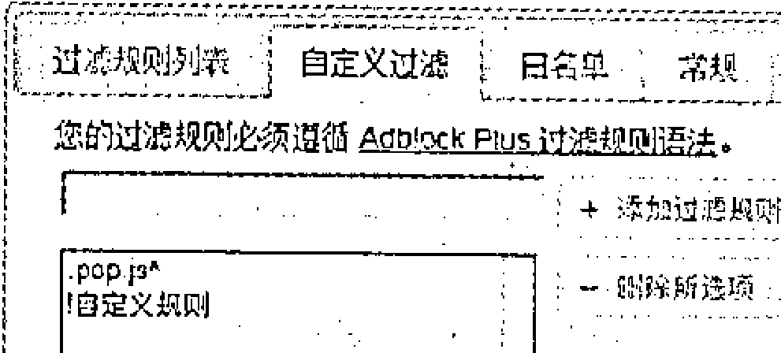

##### ♦ 央视网站CNTV无法正常访问

**Q:** 最近不知道是怎么回事，通过浏览器无法访问央视网站CNTV，通过CNTV的客户端也无法连接，但是通过一个代理进行访问却没有任何问题。请问这该如何解决？

**A:** 根据你的描述，初步怀疑是你系统中的DNS缓存出现问题，可尝试一下以下方法：首先通过管理员权限打开命令提示符窗口，在打开的窗口中输入“ipconfig /flushdns”后按回车键，当窗口显示“已成功刷新DNS解析缓存”的信息后，再打开浏览器进行访问试试。

##### ♦ uTorrent为何一点速度都没有

Q: 近来我用uTorrent下载资料的时候，一点速度都没有，稳定版和beta版本都是如此，但是相同的链接及种子在迅雷里下载就没问题。请问这种情况是怎么回事？

A: 这种情况和两款软件的原理相关，uTorrent是一款典型的BT软件，这样就需要有人“做种”才可以下载。而迅雷除了可以从“做种”的用户那里进行下载以外，还可以从迅雷的加速服务器中进行下载，这样就相当于多了一个下载渠道。另外还有可能就是uTorrent软件使用的端口被占用，这时可以到设置窗口里面修改“传入连接所使用的端口”项试一试。

##### 如何提高照片的像素

Q: 我有一张以前拍摄的照片，它的清晰度不算太高，所以想提高一下它的像素。不知这一目的是否能实现？需要如何操作？

A: 已经拍摄完成的照片，是无法真正提高它的像素值的，不过我们可以通过一些图像处理软件，后期增加照片的分辨率，再通过调整光影的效果以及使用滤镜等方式，让硬性增加像素后的照片效果更自然一些。这类软件，如Retouch Pilot，运行它后，载入需要修复的照片，然后通过右侧工具栏中的相应工具就可以进行修复操作了。


当然还可以尝试到专业照相馆中处理你的照片，在调整的过程中可以把像素，亮度及对比度的一些参数进行调整，从而把照片看上去更清晰。

##### ♦ ExcelTab软件无法正常进行安装

Q: 我在安装ExcelTab插件的时候，系统提示写入文件发生错误，接着就终止该插件的安装操作了。可是我非常急需ExcelTab这款插件，如何才可以成功进行安装？

A: ExcelTab插件在安装的时候，会向系统的Windows目录中写入文件，这个时候就需要用户有操作权限。可能你是直接双击进行安装的，所以就出现了上述的情况。其实你只需要在ExcelTab插件的图标上单击右键，选择菜单中的“以管理员身份运行”命令重新安装就可以了。

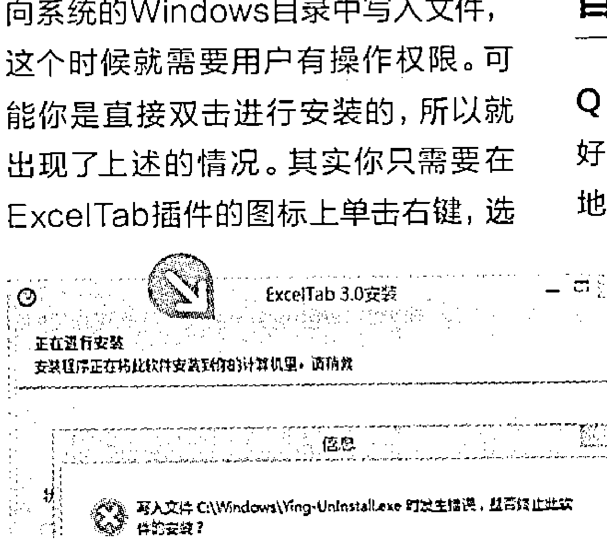

##### ♦ 360安全浏览器怎么禁止自动升级

Q: 我之前的360安全浏览器版本用得好好的，但是最近总是过半个月就偷偷地自动升级，个人特别反感这样的流氓操作行为。不知道有没有办法可以禁止它自动升级？

A: 首先在360安全浏览器的图标上单击右键，选择菜单里面的“打开文件所在的位置”命令，在打开的文件夹里面找到一个名为Installer的子文件夹，进入这个子文件夹并将其的所有文件都删除掉。接着在此文件夹上点击鼠标右键，选择菜单里面的“属性”命令，在弹出的属性窗口中选择“只读”选项，点击“确定”退出设置窗口就可以了。

##### ♦ K-Meleon为什么总是启动错误

Q: 由于谷歌浏览器太占系统资源，所以网友给我推荐了一款K-Meleon浏览器。可是解压后运行浏览器主程序，却总是提示运行错误。这个会是什么问题造成的呢？

A: 有的用户喜欢将软件存放在含有中文信息的文件夹里面，但是很多的英文软件并不能支持中文文件路径的读取，所以运行K-Meleon的时候就出现了你遇到的错误。要想解决这个问题非常简单，将K-Meleon放到英文名称的文件夹中即可。

##### CentBrowser的便携化操作

文|老万

Q：我最近开始使用一款名为CentBrowser的浏览器，由于它是在Chromium的基础上开发的，所以打算通过Greenchrome插件来进行便携化操作。可是不知道为什么没有成功，是这款插件不支持这款浏览器吗？

A：傻博士亲自进行了测试操作，答案是可以支持这款浏览器。出现你所说的问题，可能是Greenchrome插件版本比较老，或者版本和浏览器不兼容造成的。所以建议你首先从官方网站下载浏览器的便携版，接着下载Greenchrome插件的最新版本，然后将32位的插件文件解压到Chrome.exe所在的文件夹目录即可。

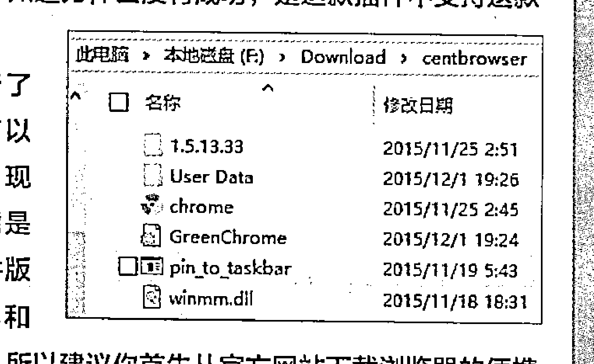


许多人进行便携化操作的目的，只是想把配置文件保存到浏览器所在的目录。如果是这样的话，那么可以创建一个快捷图标，接着在快捷图标的属性窗口中添加启动参数“--user-data-dir=xxx”即可。

##### 如何解决Chrome的Flash过期问题

Q：由于我使用的扩展只支持Chrome 34版，所以一直使用这个版本的浏览器。但是最近它总是弹出Flash因过期被阻止的信息，不管怎么升级Flash甚至禁用它，都解决不了。请问有没有什么好的解决方法？

A：之所以出现这样的问题，主要是这段时间Flash插件连续出现多个高危安全漏洞，所以不升级的话系统就会遭受到黑客的攻击。可以在谷歌浏览器的地址栏中，输入“chrome://plugins”命令并按下回车键，进入到后台插件的管理页面。找到其中的“Adobe Flash Player”这个项目，在下面的“停用”选项中点一下，重新启动浏览器就可以了。

##### 输入法在Edge浏览器中只能输入英文

Q：我用的是必应输入法，在火狐和其他浏览器中使用一切正常，但是在Edge浏览器上却怎么设置都只能打英文字母。请问怎么解决这个问题？

A：因为Edge浏览器并不是正常的应用程序，而是Windows 10中的Modern应用。所以对Modern应用不支持的输入法，不是出现崩溃就是无法正常使用。如果要想正常地进行中文信息输入，建议暂时使用系统自带的输入法。

##### 百度传课网的视频怎么播放

Q：我在百度传课网下载了一些视频，通过几个播放器都无法播放，换了几个解码器同样如此。请问通过什么样的播放器，才可以在硬盘中播放这些视频？

A：出现这样的问题，主要是百度传课网为了更好地保护版权，对视频内容进行了相关的加密操作，这样下载的文件相当于就成了一种专有的文件格式。现在很多视频网站都采取了类似的方法，所以要想播放这些视频信息的话只能使用官方的播放器，除此以外暂时没有其他的方法可以解决。

##### EditPlus的背景色如何修改

Q：我经常通过EditPlus来编辑一些文件，但是由于软件默认是白色背景，所以时间一久就会觉得视觉疲劳。请问怎么样才可以对EditPlus的背景颜色进行修改？

A：首先点击“工具”菜单中的“参数设置”命令，在弹出的对话框里面点击左侧的“颜色”命令，这时就会在右侧窗口出现“背景色”项。现在将“默认”项的勾选去除，接着点击“背景色”项，选择一个自己喜欢的颜色。同时点击“前景色”项，选择一个文字的颜色。这样就可以和背景更好地融合，看起来会更加的舒服。

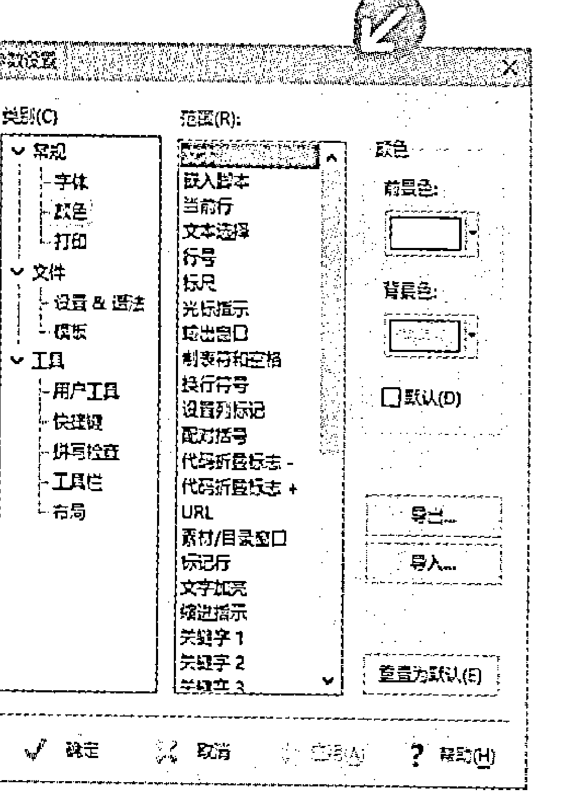

##### 网页如何保存为PDF格式
文|老万

> Q: 有时候我需要将整个网页内容保存为PDF文件，不知道通过什么扩展或脚本，可以实现相关的操作。
A: 其实根本不需要借助于扩展或者脚本，如果用户使用的是Windows 10系统的话，那么点击浏览器中的“打印”功能以后，在打印机列表中可以看到“Print as a PDF”项。选择它以后进行相关的设置，再点击“打印”按钮就可以了。如果使用的是其他的操作系统，只需要安装虚拟打印机软件，同样可以实现。

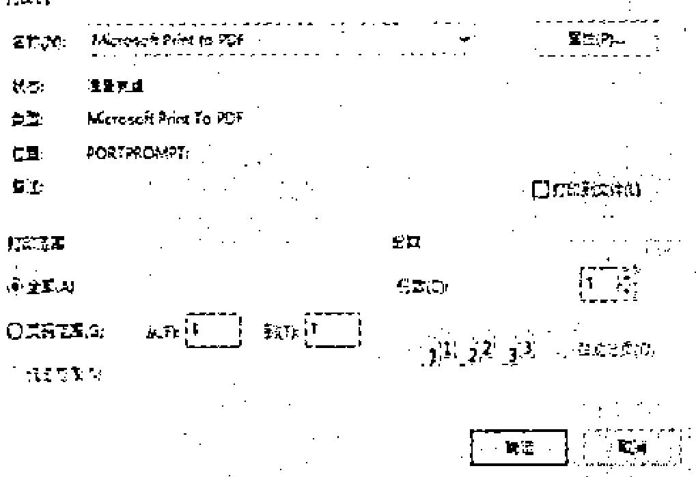

> 如果不想安装其他软件的话，可以访问http://www.html2pdfconverter.com/ (网页转PDF处理) 这个云服务，在“Or enter URL of the file you want to convert to PDF”里面输入网页地址，点击“Convert file”按钮即可。

本，发现以后点击“移除”按钮将其删除就可以了。

口又是浏览器上网浏览的端口，这样安全软件就会以为是某款软件在浏览网页。所以最好还是在软件访问网络的时候，看清防火墙的提示再同意是否联网。

##### 封闭危险端口后是否还会被控制

> Q: 我的电脑好像被黑客控制了，总是过段时间就会鼠标右键失灵，同时任务管理器也打不开。为了防范再次出现这种情况，我打算封堵一下危险的端口。请问仅仅封这些端口管用吗？
A: 封堵一些不常用的端口，对系统的安全肯定是有提升的，但是没有绝对的安全保证。因为现在有一种木马使用了HTTP传输技术，这样木马服务端在连接客户端的时候用的是80端口。而80端

##### 一用鼠标网页视频就停止播放

> Q: 单位组织在网上学习看视频讲座，我打算一边看一边做点其他事情。结果发现只要一用鼠标点击，网页视频就马上停止播放，同时也就停止计时了。请问这个有没有办法解决？
A: 你可以利用Virtual box或者VMware软件，在本地系统里面新建一个虚拟机系统。这样就相当于有了两个操作环境，在真实的电脑系统里面进行操作，在虚拟机里面播放教学视频，两者之间互相不干预。

##### 看优酷总提示没安装Flash

> Q: 我通过火狐浏览器访问优酷，打开一个视频播放页面后，播放窗口提示未安装Flash插件。可是我的浏览器明明安装了Flash插件，而且其他网站的视频播放都没有问题。求解决方法？
A: 由于很多网友对视频播放前面的广告非常讨厌，所以就会想方设法地对广告进行屏蔽，而优酷网站又对屏蔽操作进行了反制，所以就出现了你所说的这个问题。现在点击“工具”菜单中的“附加组件”命令，在弹出的窗口中点击“用户脚本”标签，从中看看有没有类似于“Onens.Clean.Player”这样的脚

##### 如何快速备份新浪微博

> Q: 我已经有一段时间没有写微博了，最近打算重新开始写微博，但是我想把以前的内容全部删除后再写。请问有没有什么方法可以快速备份以前的微博信息，然后我好再清除它？
A: 首先通过浏览器打开“微博档案”(http://sinacn.weibodangan.com)，它不但能备份自己的微博，同样还能备份其他人的微博。在“查找备份”输入框中输入相应的微博账户名，比如这里输入“电脑爱好者”。接着点击“搜索”按钮就可以进入到爱好者的微博中，点击页面左侧的“备份ta的微博”按钮。稍等片刻就可以完成备份，并下载保存到本地电脑系统中了。

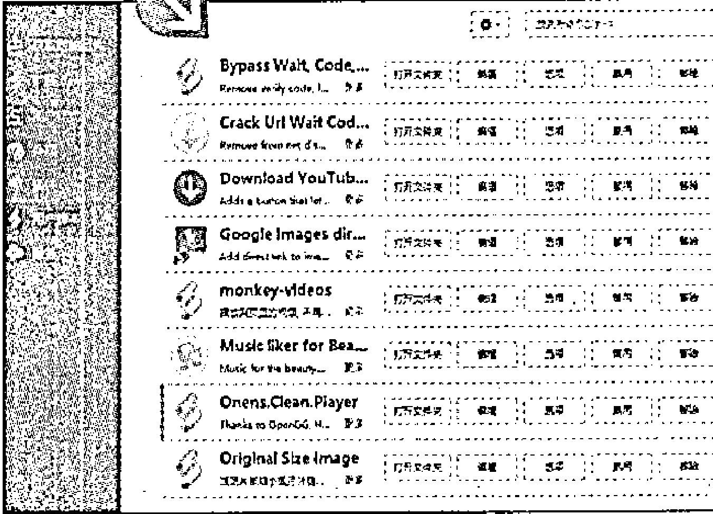

##### 资源管理器不能随机启动
文|老万

> Q: 我的电脑系统在开机后，当出现欢迎界面后就黑屏，主要是资源管理器不能正常启动，但是可以看到输入法的工具条。因此只能手动打开任务管理器，启动资源管理器才能显示桌面。请问如何解决这个问题？
> A: 首先按快捷键Win+R打开“运行”对话框，输入“regedit”命令后按回车键打开注册表编辑器。依次展开注册表左侧项目到如下位置：HKLM\SOFTWARE\Microsoft\Windows NT\CurrentVersion\Winlogon。接着在注册表的右侧窗口中找到Shell键值，将默认值修改为explorer.exe。接下来再找到AutoRestartShell这项，将默认值修改为1就可以了。


##### ◆ 内存卡无法格式化的解决
> Q: 我通过“内存卡+读卡器”的方式，将其插入到电脑主机的USB接口，接着系统自动安装了驱动程序。可是当我进行格式化操作的时候，却提示无法格式化。请问怎么解决这个问题？
> A: 首先在磁盘列表里面找到内存卡的盘符，接着点击鼠标右键选择“属性”命令，在弹出的对话框点击“工具”标签。接下来点击查错中的“检查”按钮，就可以检查内存卡是否存在错误，如果发现错误的话就进行修复。然后运行磁盘管理软件DiskGenius，选择想格式化的那个内存卡的盘符后点击“格式化”命令，在弹出的对话框的“文件系统”中选择FAT32进行格式化即可。

##### ◆ 有什么方法可以增加网络的延迟
> Q: 我在玩的游戏里面有个需要，就是网络延迟必须比较高，换句话说就是越卡越好，但是绝不能被挤下线。请问如何才能增加延迟？
> A: 要增加延迟的方法比较多，比如打开多个视频网站播放视频，或者下载运行“P2P终结者”，点击“软件设置”菜单中的“控制规则设置”命令，在弹出的对话框中选择“全局限速模板”并点击“新建”按钮，再在弹出的对话框中根据向导设置限制的速度就可以了。

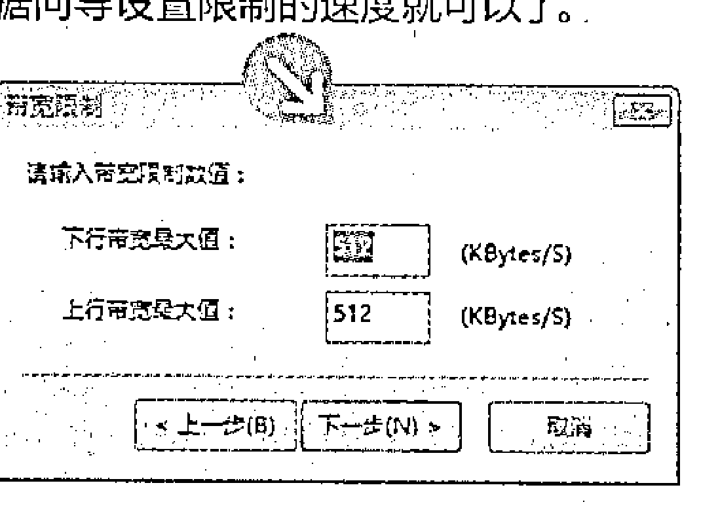

##### ◆ 制作PE启动项时是否要选装DOS
> Q: 为了防范系统出现各种各样的问题，最近我打算制作一个PE以备不时之需。在制作的过程中提示可以选择DOS、MAXDOS。请问制作PE的时候需要选择DOS吗？
> A: 首先需要说明的是，DOS是一个命令行操作的系统，而PE是一个图形化操作的系统。所以是否需要安装DOS，完全在于用户自己是否可以熟练地操作各种DOS命令。如果可以熟练操作各种命令的话，选择安装一个也不是问题。如果不能熟练操作的话，还是安装一个PE就可以了。

##### ◆ 显卡的插槽是PCI还是PCI-E
> Q: 我最近打算对电脑硬件进行一下升级，于是通过“鲁大师”扫描了一下电脑硬件的配置，发现其中主板显示的是“GA-770T-D3L”，但是它并没有说明主板显卡的插槽是PCI还是PCI-E。请问这款主板到底是那种卡槽？
> A: 这款主板的发布时间在2013年，所以按常理来说应该是PCI-E，因为PCI插槽的显卡早就没有了。当然通过百度我们可以看到该主板的参数，其中“1×PCI-E X16显卡插槽”说明了一切。

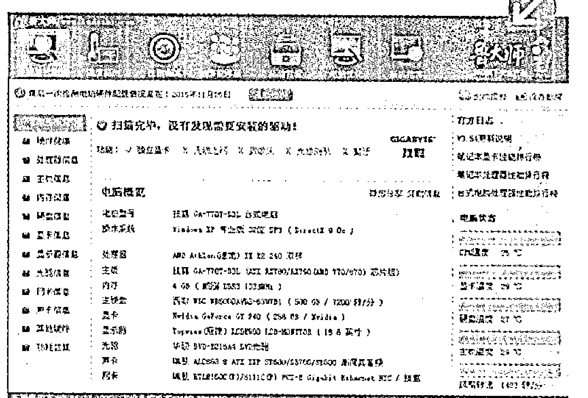

##### 让iOS支持农历的日历
文|老万

##### ◆ 如何启用Emoji表情
> Q: 现在Emoji表情在全球范围内越来越流行，但是我的手机系统在升级到iOS9以后，怎么也找不到Emoji表情的输入途径。我记得iOS系统是自带有Emoji表情的，请问如何才可以启用它？
> A: 首先点击系统桌面的“设置”按钮，点击进入后选择列表中的“通用”选项。在通用列表找到“键盘”项，点击进入后选择“键盘”命令。接着点击列表中的“添加新键盘”选项，将表情符号键盘添加到可用的键盘列表即可。以后在输入状态下，点击键盘中的地球图标，滑动它就可以在菜单里面切换到表情符号输入状态了。

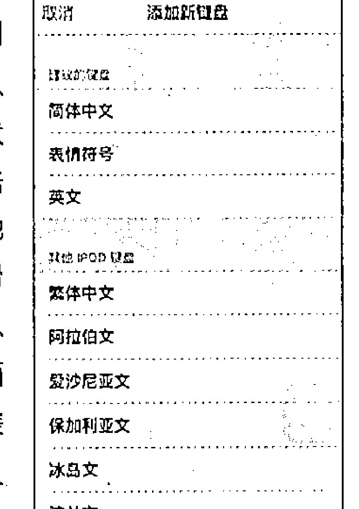

##### ◆ 数字键盘状态下直接输入字母
> Q: 无论是使用iOS自带的输入法还是第三方输入法，在进行文字和数字输入的时候都需要切换，如果不停地切换自然是比较麻烦的。请问有没有什么方法可以不切换就直接输入？
> A: 比如当前的输入法处于字母键盘的状态下，按住键盘左下角的“123”按钮不放，手指滑动到上方需要的数字后松手，就可以立即输入该数字。与此同时你会发现，键盘的输入状态并没有切换过去，用户可以继续在该状态下输入。按照同样的方法，在数字键盘输入状态下操作，就可以快速地输入英文信息了。此技巧在Android第三方输入法中也同样适用。

> Q: 虽然苹果的iOS日历能够显示农历，但是并不能根据农历来设置提醒事件，这样在设置朋友家人的生日提醒时很不方便。请问有什么好的解决方法，或者相关的应用推荐呢？
> A: 其实这个问题利用iOS的通讯录就可以解决，首先添加一个朋友或家人的联系人信息，找到页面中的“添加生日”选项。然后点击“生日”后面的按钮，在弹出的界面中选择“农历日历”项，再设置好相应的日期即可。接下来点击系统桌面的“设置”按钮，在设置列表里面找到“邮件、通讯录、日历”命令并点击，最后在“默认的提醒时间”的生日中进行设置即可。

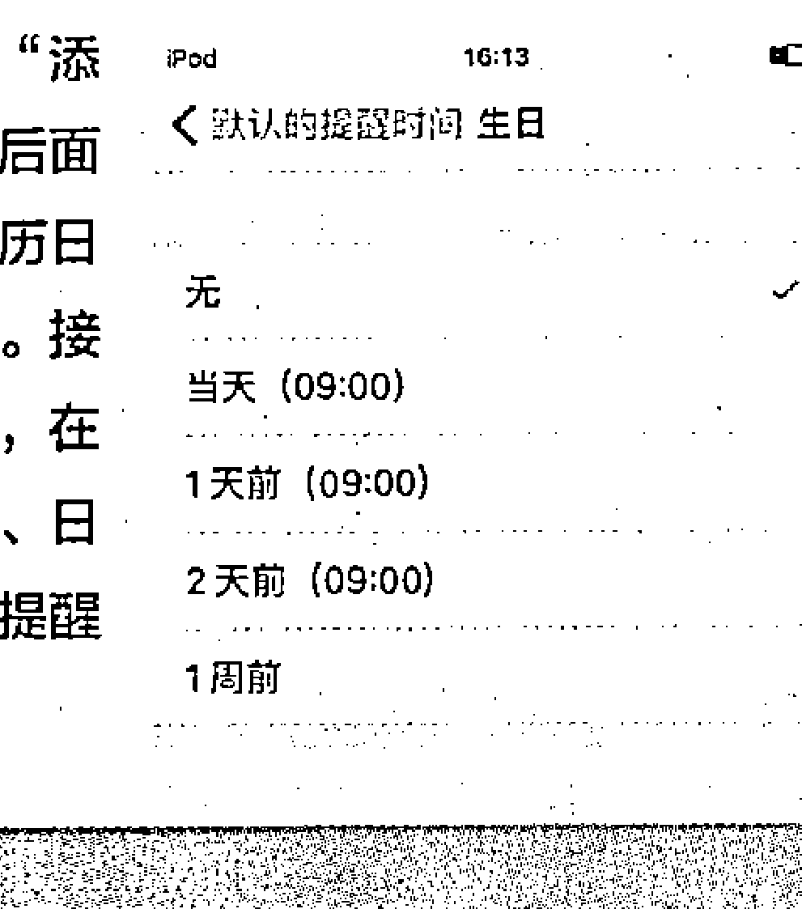


当然使用一些第三方的应用也可以，比如在“正点闹钟”APP里面创建一个任务，然后在创建任务的界面点击“生日/纪念日”项，然后设置好朋友的生日即可，不需要“农历”即问。

##### ◆ 如何判断无线密码是否被人破解
> Q: 今天我发现自己的上网速度时快时慢，所以打开路由器的后台页面进行查看，结果发现除了自己的电脑以外还有一个手机，可是这个手机并不是我的。请问我的无线密码是不是被人破解了？
> A: 如果确认这个手机不是自己的，那么你Wi-Fi密码被破解的可能性很大。不过也还存在着另外一种情况，就是你的手机里安装了“Wi-Fi万能钥匙”之类的应用，这类应用会自动把你的Wi-Fi密码发到服务器上给别人共用。

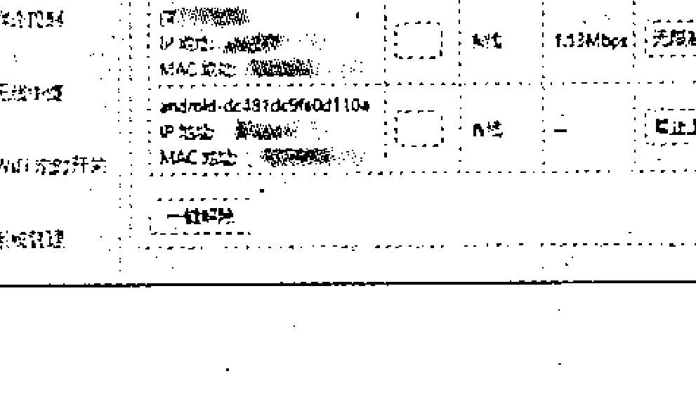

密码发到服务器上给别人共用。这样其他用户在搜索到这个Wi-Fi热点以后，就会自动连接到你的路由器上面。

##### ◆ 网络海淘如何进行比价
> Q: 马上就要过春节了，买年货是不可缺少的。听说不少海淘的东西价廉物美，但是不知道有没有什么方法，可以对海淘的东西进行比价，从而可以选择到更加便宜的东西？
> A: 其实经常网购的朋友肯定知道“惠惠购物助手”这个比价软件，而它推出的比价应用就可以对美国亚马逊、日本亚马逊、6pm三大海外主流网购平台进行比价。不过还是友情提醒一下大家，要考虑到物流的因素，不要春节都过完了还没有收到货。

##### Chrome能否自动清除历史
文|老万

> Q: 谷歌浏览器用起来非常流畅，但是找来找去没有发现自动清除历史记录的功能，而IE浏览器和火狐浏览器却很容易找到。那么有没有什么解决方法呢？
> A: 谷歌浏览器的的确确没有自动清除历史记录的功能，所以用户要想达到这一目的，可以借助于CCleaner这样的第三方软件来实现。运行CCleaner后，点击左侧工具栏中的“选项”按钮，再点击列表中的“监控”选项，将窗口里面的“启用浏览器监控”项选中。最后在“Google Chrome”列表里面，选中“关闭时自动清理”就可以了。

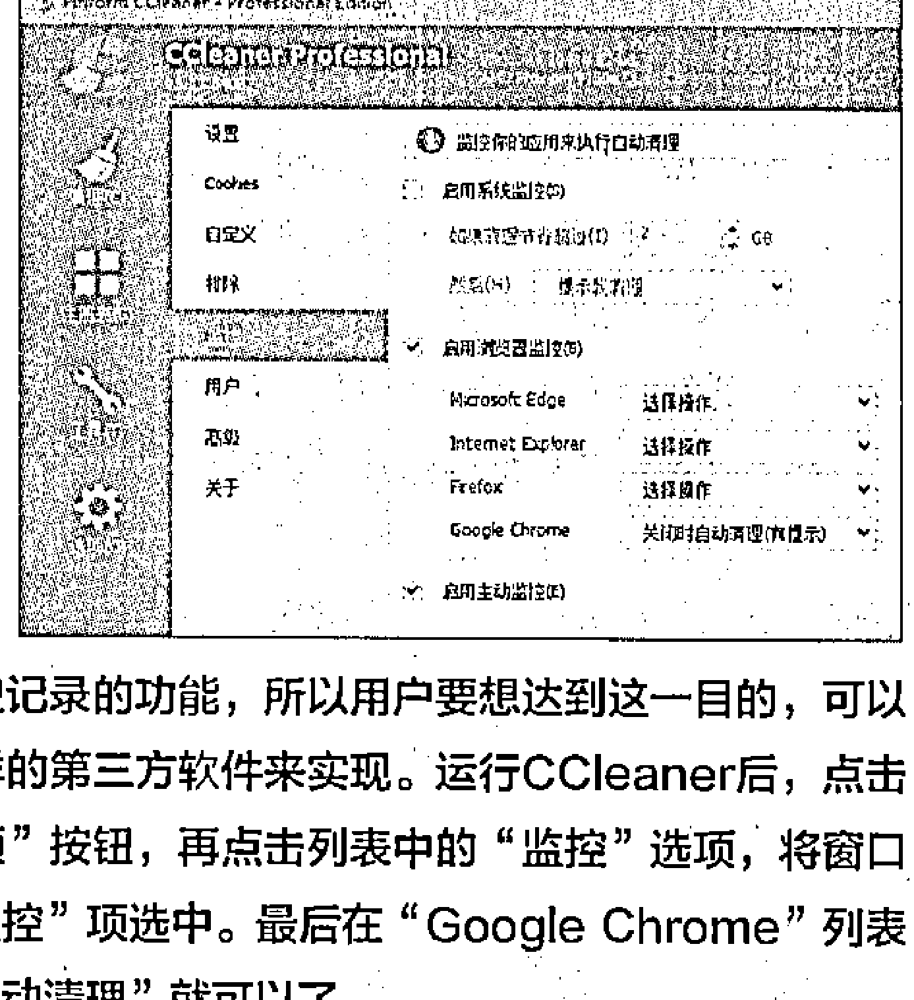

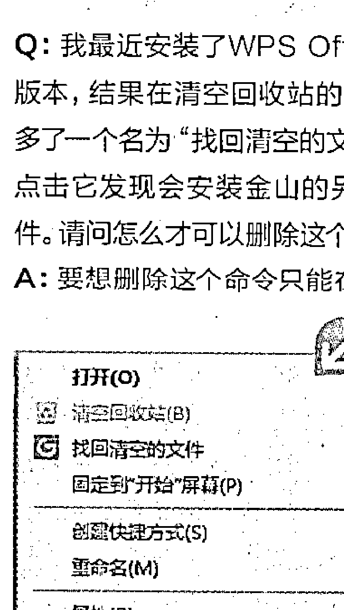

##### 删除WPS在回收站添加的命令
> Q: 我最近安装了WPS Office的最新版本，结果在清空回收站的时候，发现多了一个名为“找回清空的文件”命令，点击它发现会安装金山的另外一款软件。请问怎么才可以删除这个命令啊？
> A: 要想删除这个命令只能在注册表里面操作。首先打开注册表编辑器，依次展开到如下位置：HKEY_CLASSES_ROOT\CLSID\{645FF040-5081-101B-9F08-00AA002F954E}\shellex\ContextMenuHandlers\，在这个项目上点击鼠标右键，选择菜单里面的删除命令就可以了。注意，为了安全起见，编辑注册表之前，请先对注册表进行备份。

##### 什么可以替代TinyJPG
> Q: TinyJPG网站的压缩比例挺高的，图片也基本上辨别不出什么损失，但是免费账户API只有每月500次请求。现在我有大量的图片需要压缩，不知道本地电脑上有没有什么替代方案？
> A: 其实在本地系统进行图片压缩的软件有很多，比如Voralent Antelope，安装运行后，同样选择要压缩的图片将其拖拽到软件窗口里面，这个时候直接点击左上角的“优化”按钮即可。当然用户也可以点击窗口右上角的功能按钮，在弹出的对话框中自定义一些压缩参数，从而可以更好地满足用户自己的压缩需求。

##### 在线看2K视频用什么浏览器
> Q: 我以前用谷歌浏览器看视频还可以，但是换了2K屏的显示器以后，谷歌浏览器却不支持高分屏。后来换了火狐浏览器要好得多，但是在线看视频却非常卡。能否推荐一款比较好的浏览器？
> A: 既然你已经觉得火狐浏览器不错，那么只需要解决它的卡顿问题就可以了。首先通过管理员权限打开命令提示符窗口，接下来输入命令“echo RTMFP2PDisable=1 >> %windir%\system32\Macromed\Flash\mms.cfg”，再输入“echo ProtectedMode=0>> %windir%\system32\Macromed\Flash\mms.cfg”，这样就可以解决Flash插件的卡顿问题了。

##### 有多剪切板软件可以推荐吗
> Q: 系统里面的剪切板一次性只能粘贴一条信息，用起来非常不方便。请问有没有可粘贴多条信息的软件可以推荐？
> A: 网络上可以找到不少剪切板增强工具的软件，比较有代表性的包括Ditto、CLCL、ClipX等。使用这些软件后，用户就可以不停地进行复制操作。当需要进行粘贴的时候，只需要打开软件的操作面板，找到要粘贴的内容进行双击即可。

##### 支付宝提示余额不足的解决
> Q: 现在有很多商家都提供了支付宝支付的功能，但是最近我在进行购物的时候，网站却提示我支付宝余额不足，可是我的余额宝里面明明有钱的。请问为什么会出现这样的提示啊？
> A: 这个可能是用户理解的问题，虽然支付宝和余额宝都是阿里巴巴的，但是它们却是不同的支付系统。比如用户在淘宝购物的时候，就会让用户选择支付宝、余额宝、银行卡等等选项。因此要想在其他网站使用支付宝支付，首先需要把余额宝中的钱转到支付宝的余额里面，这样就可以成功地完成支付操作了。

##### 如何保住OneDrive已有的空间
> Q: 不久以前微软宣称要将OneDrive的空间缩小，引起了国内外众多用户的反感和吐槽，我也一下子觉得OneDrive空间不够用了。请问有没有什么方法，可以保住现在15GB的免费空间啊？
> A: 微软的这个决定推出以后，的的确确受到很多非议，于是他们选择了一个折中的方法。如果用户希望保留自己的15GB空间的话，可以到微软提供的一个网站进行申请 (https://preview.onedrive.com/bonus)。登录这个网站后点击下面的“Keep your free storage”按钮，输入自己的微软账户进行登录确认就可以了。

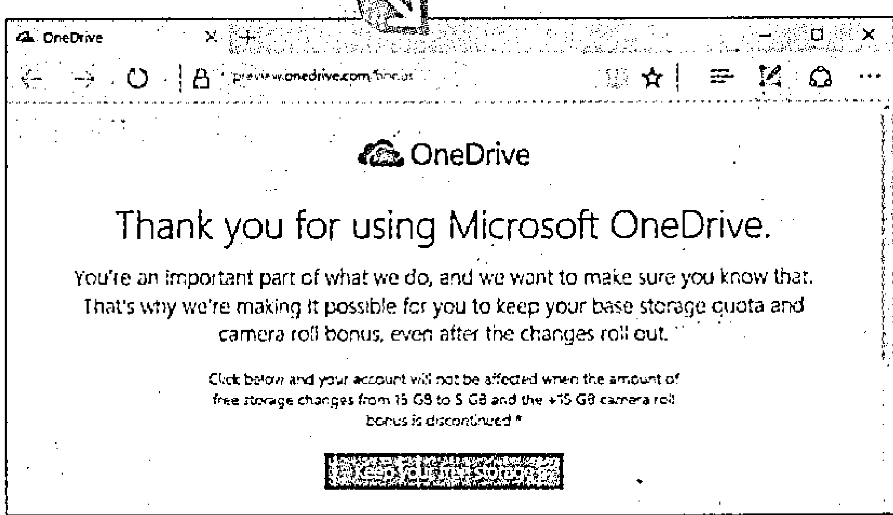

##### 什么浏览器可以全屏看图
文|老万

> Q: 我需要一款这样的网页浏览器，就是能像手机UC浏览器的看图模式一样，网页的图片加载完后能用鼠标进行放大缩小。不知道有没有相关的浏览器或者扩展可以推荐？
> A: 其实“360安全浏览器”就有你所说的这个功能。首先打开浏览器的设置窗口，点击左侧的“实验室”功能后，在右侧窗口可以找到一个“全屏看图设置”的区域。将“在图片右上角显示工具栏（图片大于150×100）”和“网页包含多张大图时，弹出全屏看图提示条”等选项选中，以后就可以像看图软件那样进行图片浏览了。

##### 火狐浏览器在优酷看视频显示盗链
> Q: 我通常使用的是火狐浏览器，安装有ABP和Noscript等扩展。以前看优酷视频都是好好的，最近却突然出现盗链提示。请问这该如何解决？
> A: 如果我没有猜错的话，你一定是使用了VipVideos_skipAd脚本，所以要解决这个问题有两个方法。最简单的方法就是删除掉这个脚本，或者按照脚本作者的提示在广告过滤软件里面，订阅https://raw.githubusercontent.com/xinggsf/Adblock-Plus-Rule/master/ABP-FX.txt这个过滤规则，操作完成后重新运行浏览器就可以解决你的问题。

##### chrome_elf.dll丢失的解决方法
> Q: chrome_elf.dll这个文件和谷歌浏览器是什么关系？为什么我在运行很多网络软件的时候，都提示chrome_elf.dll文件的丢失？
> A: 虽然这个文件和谷歌浏览器名称非常相似，但是它却和谷歌浏览器没有任何关系。用户只需要通过搜索引擎查找chrome_elf.dll这个文件，找到以后，确认其来源及文件是安全的，然后下载它并复制粘贴到System32系统目录里面就可以了。

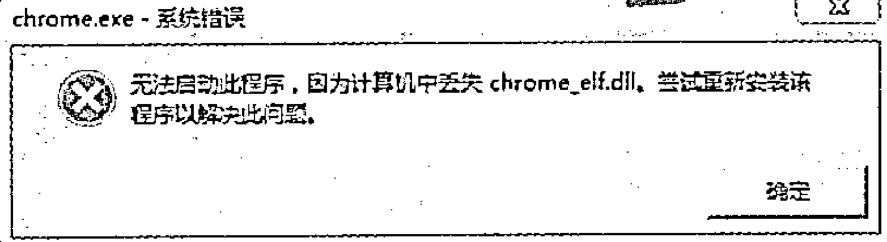

##### 不想被强制升级Windows 10
文|老万

> Q: 我现在使用的是Windows 7系统，但是现在微软开始不停地进行推广，甚至变着法儿地诱惑老用户更新。我对这种方式非常反感，请问有没有什么方法可以彻底屏蔽啊？
> A: 如果用户嫌修改系统设置比较麻烦的话，这里推荐一个名为“Win Updates Disabler”的小工具。运行它以后选择其中的“Disable Windows Updates”选项，再点击“Apply Now”按钮重新启动操作系统，就可以彻底屏蔽Windows的自动更新了。不过一个很大的问题就是，这样一来，系统补丁也不能更新了，这会带来一些安全隐患。

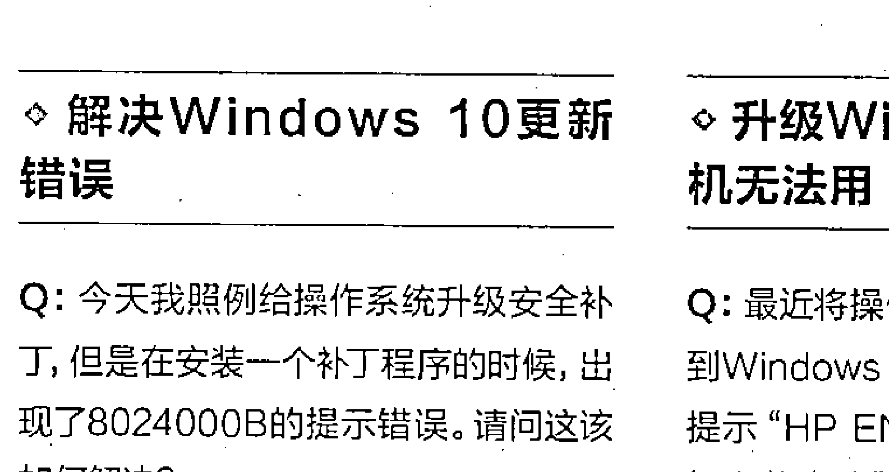

其实也可以直接打开系统服务的管理器，在服务列表中找到“Windows Update”服务后进行双击，在弹出的对话框中将“启动类型”设置为“禁用”就可以了。

##### ◇ 解决Windows 10更新错误
> Q: 今天我照例给操作系统升级安全补丁，但是在安装一个补丁程序的时候，出现了8024000B的提示错误。请问这该如何解决？
> A: 微软官方对造成这个问题的解释为，Windows Update功能不能读取安装所需的文件。所以要解决这个问题，只需要打开“运行”框，输入“Cd /c ren %systemroot%\System32\Spup dsvc.exe Spup dsvc.old”命令，点击“确定”按钮。等运行完毕，重新打开Windows的更新程序进行操作就可以了。

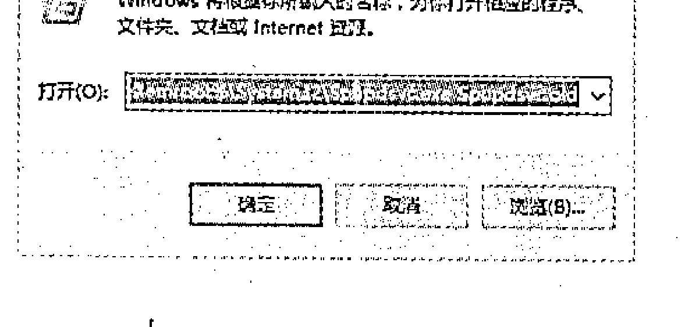

##### ◇ 升级Windows 10后打印机无法用
> Q: 最近将操作系统由Windows 8升级到Windows 10，可是升级完成后系统提示“HP ENVY e-All-in-One打印机安装失败”，测试后发现惠普打印机果然无法使用。求解决方法？
> A: 出现这样的问题主要是在升级到Windows 10后，惠普打印机的相关软件没有迁移成功造成的。所以这个时候可进入到控制面板，打开“程序和功能”项，找到惠普打印机的相关软件进行删除。接下来重新启动操作系统，再重新安装惠普打印机的驱动程序等软件，稍等片刻打印机就可以正常使用了。

##### ◇ 内置Administrator账户打开应用
> Q: 我在安装Windows 10 TH2版本后，习惯性地启用了内置Administrator账户，结果发现Edge、计算器等Metro应用打不开了，电脑显示“无法使用内置管理员打开”。请问如何解决这个问题呢？
> A: 首先打开系统的控制面板，点击列表中的“系统和安全”选项。在弹出的窗口中点击“管理工具”链接，双击运行“本地安全策略”项。接下来在左侧列表里面依次展开“本地策略→安全选项”，将右侧窗口中的“用户账户控制: 用于内置管理员账户的管理员批准模式”改为“已启用”，最后确认并重新启动系统就可以了。

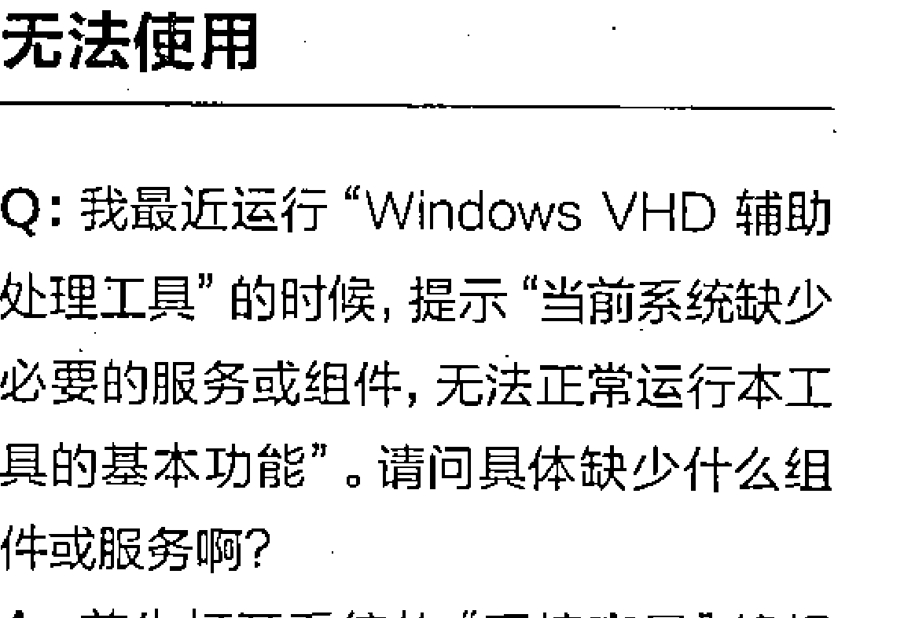

##### ◇ Windows VHD辅助工具无法使用
> Q: 我最近运行“Windows VHD 辅助处理工具”的时候，提示“当前系统缺少必要的服务或组件，无法正常运行本工具的基本功能”。请问具体缺少什么组件或服务啊？
> A: 首先打开系统的“环境变量”编辑窗口，在“系统变量”列表中看看有没有Path这项。如果有的话直接双击Path变量，在弹出的对话框中将变量值修改为“%SystemRoot%\system32”就可以了。如果没有这个变量，点击新建按钮创建一个即可。

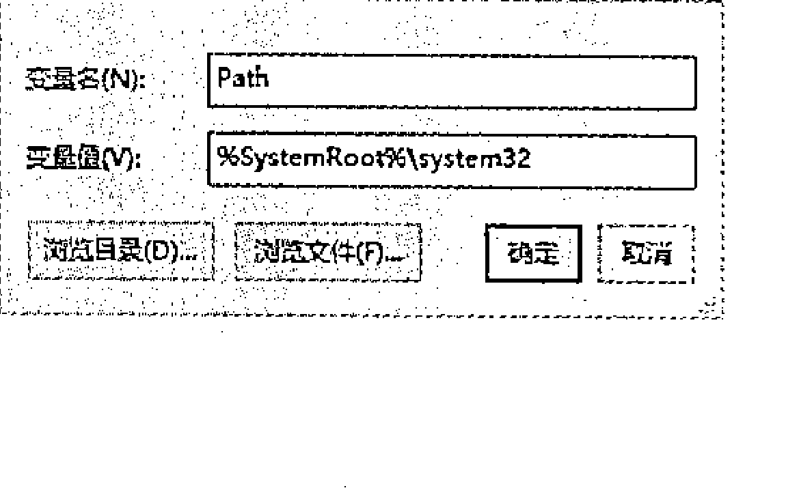

##### 如何直接在网页中传输文件

Q: 我知道通过QQ就可以进行电脑及手机之间的文件传输，但是我的电脑仍然使用的是老版本的TM。请问有没有什么方法，直接在网页中就可以传输文件？

A: 首先通过浏览器打开http://web.xender.com链接，用手机扫描网页里面的二维码图片，从而下载对应的手机客户端。接下来利用客户端重新扫描二维码，就可以让手机和电脑之间建立联系。接下来将文件拖拽到浏览器窗口里面释放，这样就可以通过手机应用接收文件了。当然，最好的方法还是升级到最新版QQ，传送文件比较方便。而且网络上的二维码信息随时可能改变，还是有很大的安全风险的。

##### 告诉你小孩为什么一直在哭

Q: 最近自己的一个小表妹初为人母，既兴奋又紧张，因为小宝宝经常哭，但是又不知道为什么哭。请问有没有什么育儿方面的APP可以推荐？

A: 这里倒是有一款名为“婴语翻译机”的应用可以推荐。当小宝宝哭泣的时候，打开这款应用后点击“录音”按钮。当录音完成后，应用会让你选择这次的哭声是正确或错误，当确认无误后就可以上传到云端服务器进行分析。目前这款应用可以分辨出尿床、饥饿、疼痛或睡觉等几种情况，可以试一试。当然，这个应用给出的提示只能作为辅助参考，自己还要对具体情况作仔细的观察，及咨询专业的医生。

##### iPhone能否直接查看国内股市

Q: iPhone系统里面自带有一个股票的应用，可是好像只能查询境外的股票信息。比如我搜索“万科”，结果提示的都是香港的股票。是不是iPhone不能查国内的股票？

A: iPhone是可以查询国内的股票信息的，无论是上海股票市场还是深圳股票市场都可以，我想应该是你的查询方式出现了问题。iPhone默认的股票查询，包括股票代码和股票名称两种方式。但是无论哪一种方式，都需要输入正确的代码或股票名称，比如你输入“万科A”就可以找到你需要的股票了。

##### 手机中如何使用Gmail服务

文|老万

Q: 由于我公司有一部分是国外的业务，为了工作方便所以使用的是Gmail邮箱，但是该服务在手机里面使用很不稳定。有没有什么方法可以让其稳定地接收邮件啊？

A: 首先点击手机内置“邮件”应用，在弹出的邮件类型列表中选择“其他”，根据向导设置邮箱及其密码信息。点击“下一步”按钮后选用IMAP这种方式，在输入IMAP地址的时候不要使用域名，而是填写相应的IP地址信息，这样就可以减少域名解析出现错误。接下来按照向导配置操作，就可以稳定地使用Gmail服务了。

| 账户 | 主机 | 名称 | 电子邮件 | 描述 | Gmail | 主机名 | 173.194.192.109 | 用户名 | @gmail.com | 密码 |  | SMTP | 173.194.103.108 |
| :--- | :--- | :--- | :--- | :--- | :--- | :--- | :--- | :--- | :--- | :--- | :--- | :--- | :--- |


##### 快速检测手机应用的安全性

Q: 自从去年出现了一个心脏滴血漏洞以来，各种各样的手机应用漏洞也越来越多。请问通过什么方法可以快速地检测出手机应用存在的安全漏洞？

A: 首先在手机里面安装一款名为“AVL Pro”的应用，启动这款应用后，在主界面的下方就可以看到一个名为“系统检测”的命令。点击它以后会首先安装一个插件，通过它就可以对系统以及应用漏洞进行分析。

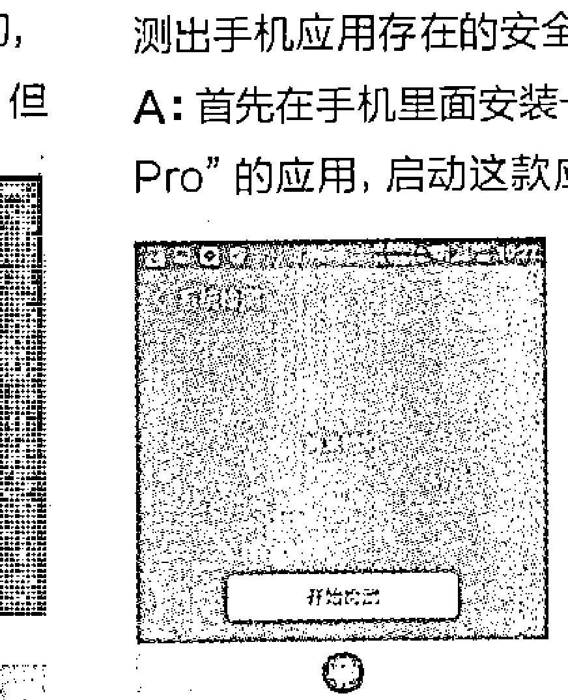

```
q w e r t y u i o p
a s d f g h j k l
z x c v b n m
```

##### 删除百度云管家的盘符图标

文|老万

> Q：我安装百度云管家后，发现它在磁盘列表中添加了一个盘符快捷图标。后来我非正常卸载了百度云管家，但发现它的百度云的盘符图标依然存在。请问如何将其删除？
> A：最简单的方法就是重新进行安装，接着运行百度云管家，点击右上角的“设置”按钮后，在弹出的菜单里面点击“设置”命令。接下来在弹出的设置窗口中可以看到“在我的电脑中显示百度云管家”选项，将这个选项默认的对钩取消就可以了。然后重新启动操作系统，这个快捷图标就彻底消失了。


当然也可以不重装软件，而是在注册表中进行操作。首先在注册表编辑器后，点击“编辑”菜单中的“查找”命令，在查找目标里面输入“百度云管家”，将查找到的结果统统删除就可以了。为了安全起见，编辑修改前最好对注册表先做个备份。

##### CNTV的加载项在IE浏览器不能运行

Q：我使用的Windows 7系统已经升级到了IE11，当我在CNTV中按提示安装了它的直播插件后，IE却总是提示插件加载项不能运行。请问这该如何解决？
A：首先点击IE浏览器右上角的“工具”按钮，在弹出的菜单里面选择“兼容性视图设置”命令。再在弹出对话框的“添加此网站”输入框里面，输入CNTV的网址信息“cntv.cn”，然后点击“添加”按钮。接下来重新启动IE浏览器进行操作，应该就可以进行直播的观看了。如果还是不行的话，建议关闭安全软件后重新进行插件的安装。

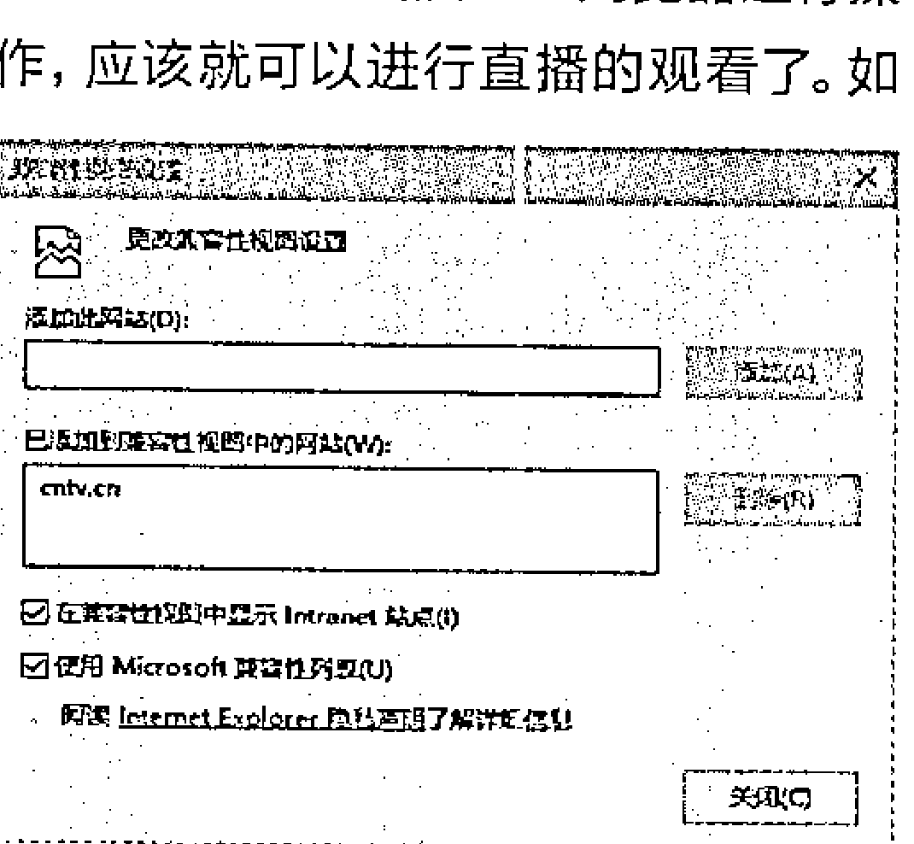

##### 火狐浏览器在任务栏显示双图标

Q：由于我平时使用的是火狐浏览器，因此就将其固定到了任务栏里面。但是在每次运行浏览器后，任务栏都会显示出两个图标。请问这该如何解决？
A：首先在固定的火狐浏览器图标上点击鼠标右键，选择菜单中的“从任务栏取消固定”命令并点击它。接下来以管理员身份重新运行火狐浏览器，再将其固定到任务栏里面。以后再运行火狐浏览器的时候，就不会出现双图标的问题了。

##### 如何手动去除Potplayer带的TV

Q：我看现在很多人在推荐Potplayer这款播放器，下载安装以后发现它带有一个TV的功能。我想问问有没有什么方法可以手动去除这个功能？
A：如果用户是想隐藏这个功能，那么首先点击工具栏中的“打开/隐藏播放列表”按钮，在弹出的播放列表里面点击那个蓝色的小箭头，这样播放列表和直播就会以单独的小窗口独立出来，点击小窗口中的关闭按钮就可以关闭TV功能了。如果用户是想彻底删除这个功能，那么去搜索下载一个精简Potplayer的批处理文件运行即可。

##### 如何关闭IEMonitor.exe这个进程

Q：我最近开始使用IDM这款下载软件，其他方面都没有什么问题，就是软件在关闭后还有一个IEMonitor.exe进程。请问这个进程有什么用？如何才可以将其彻底关闭？
A：IDM默认会启动两个进程，分别是IDMan.exe和IEMonitor.exe。IDMan.exe就是软件的主程序进程，而IEMonitor.exe则是监视IE内核浏览器点击事件的进程。只要点击“下载”菜单中的“选项”按钮，在弹出的对话框里面选择“常规”标签，将其中的“监视基于IE内核的浏览器”选项关闭，最后重新启动一下操作系统就可以了。

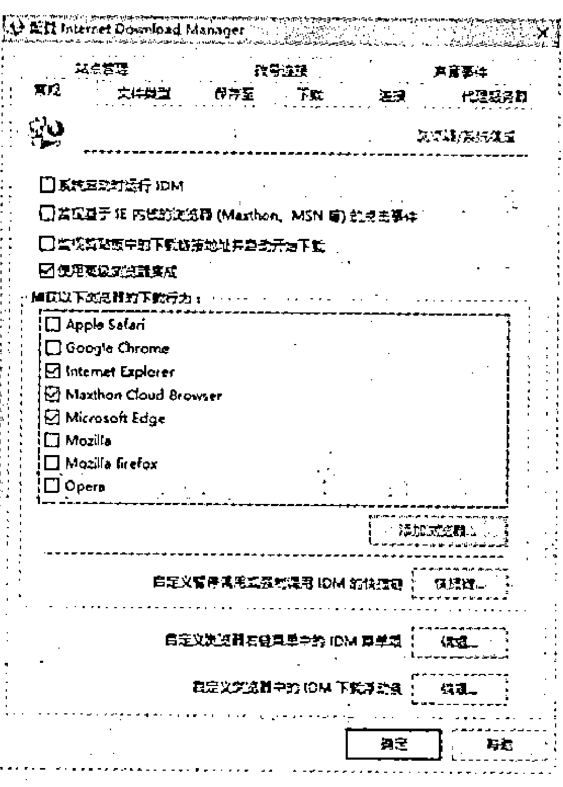

##### 恢复谷歌浏览器对NPAPI的支持

Q: 由于NPAPI插件会造成谷歌浏览器失去响应等问题，所以新版本的谷歌浏览器移除了NPAPI插件。但是在有些网页操作中，必须要使用相关的插件。请问如何才可以继续使用NPAPI插件？
A: 要解决这个棘手的问题，可以使用网友@shuax开发的一款“新版谷歌浏览器恢复NPAPI支持补丁”。补丁程序下载运行后，在弹出的对话框中选择谷歌浏览器的Chrome.dll文件，选择后补丁程序会自动对这个文件进行操作。当提示操作完成后，重新运行谷歌浏览器就可以启用NPAPI插件了。

##### 如何取消迅雷对下载链接的监视

Q: 我刚刚安装了Windows 10和迅雷极速版，结果在迅雷设置里取消监视不管用。在谷歌浏览器里面点击下载链接，还是会启动迅雷进行下载的。请问如何才可以取消迅雷的下载监视呢？
A: 理论上，在下载软件的选项设置窗口里面找到“监视剪贴板”这项进行关闭就可以了。但是可能是你使用的版本存在Bug，所以你可以试一试更换为其他的版本来使用。或者在系统里面找到XLWFP.sys这个文件，将其重命名为XLWFP.sys.XXXX后，重新启动系统就可以解决你所遇到的问题了。

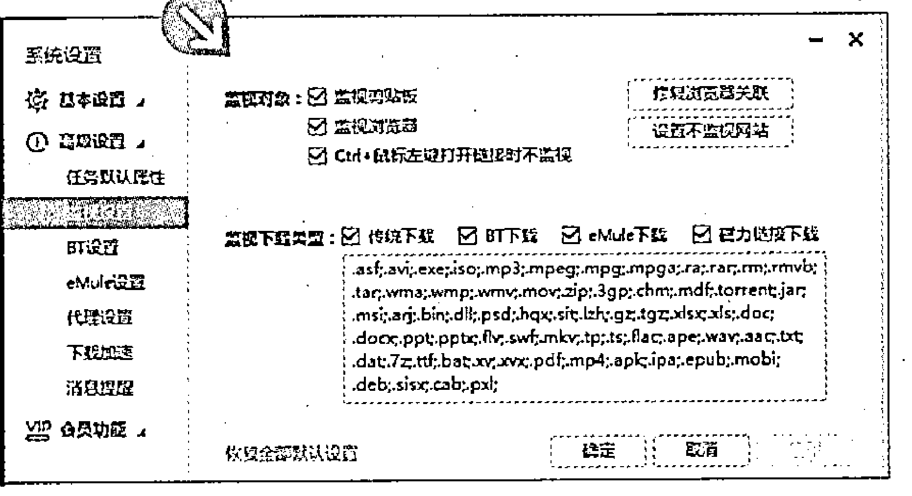

##### Firefox的翻译扩展

文/老万

Q: 我之前用谷歌浏览器的有道翻译扩展，可以进行全文翻译。现在我给火狐浏览器装的也是这个翻译扩展，但它在很多页面中不能使用而且会变灰色。那么Firefox有没有好用的全文翻译扩展？
A: 如果使用的是火狐浏览器，它自身就带有一个不错的翻译功能。首先打开浏览器的设置窗口，接着点击左侧列表中的“内容”选项。接下来在右侧窗口里面选中“翻译网页内容”功能；再点击“选项”按钮并在弹出的对话框中选择“中文/中国”这项就可以了。以后遇到需要翻译的网页，就会在页面的上方出现一个必应翻译条，点击“翻译”按钮就可以完成翻译操作了。

| 搜索: (R) | browser.translation.ui.show |
| :--- | :--- |
| 首选项名称 | browser.translation.ui.show |
| 状态 | 用户设置 |
| 类型 | 布尔 |
| 值 | true |


##### 如何用火狐调用Edge浏览器

自动列出当前机器上已安装的所有浏览器，方便用户进行快速的调用。

Q: 我用火狐浏览器时，其他任何浏览器都能调用，唯独不能调用Edge浏览器，原因是在目录里找到的Edge安装文件使用不了。请问这该如何解决？
A: 在火狐浏览器中调用其他的浏览器，一般都是借助于相关的脚本或扩展，可能是你使用的脚本或扩展不支持Edge浏览器。所以这里推荐使用“Open with”这款扩展，它会

##### 火狐浏览器不能安装扩展程序

Q: 我最近将火狐浏览器升级到最新的43版本，结果在安装一款扩展程序的时候，安装的扩展被强制禁用了。请问如何才可以解决这个问题？
A: 火狐浏览器从43版本开始，会对扩展的数字签名进行检测。如果没有通过检测，这个扩展就无法进行安装。所以要解决这个问题，首先在地址栏里面输入命令“about:config”后按下回车键，接着在设置界面输入“browser.translation.ui.show”参数后按回车键进行搜索。找到这个参数以后双击后面的参数值，当内容变成“false”就可以了。[?]

##### Windows Defender离线版

文|老万

Q: 现在很多杀毒软件都使用了云计算的功能，这样在没有联网的时候功能就受到很大影响。那么有没有什么方法可以将杀毒软件制作成离线版，这样在不联网的时候也可以查杀病毒？

A: Windows Defender是系统自带的杀毒软件，利用它就可以制造出一个离线的版本。首先下载运行离线版制作工具，点击“下一步”按钮选择制作的介质，这里可以是光盘也可以是U盘。比如我们选择插入U盘后，在U盘选择界面确定使用的盘符，然后点击“下一步”开始操作。这时制作工具会下载Windows Defender的相关文件，以后就可以利用U盘启动系统并进行杀毒操作了。


当然我们也可以将ISO写入到U盘，接着再下载 Dr.Web CureIt 等工具。以后在电脑遇到问题的时候，首先通过U盘进行系统的启动，接下来利用 Dr.Web CureIt 等进行杀毒。

##### Windows 10收不到预览版

Q: 相对于微软以前的系统版本来说，Windows 10系统的更新更加频繁，经常都会推出一些全新的预览版本。可我已经加入了Insider计划，为什么始终无法获取到预览版本呢？

A: 出现这样的问题可能和系统的UAC有关，所以首先在Cortana搜索框里面输入Msconfig命令，在弹出的系统配置窗口中选择“工具”标签，这时在列表中找到“更改UAC设置”项。点击窗口下方的“启动”按钮，在弹出的用户账户控制设置窗口，将通知拉到安全级别的第二个即可。

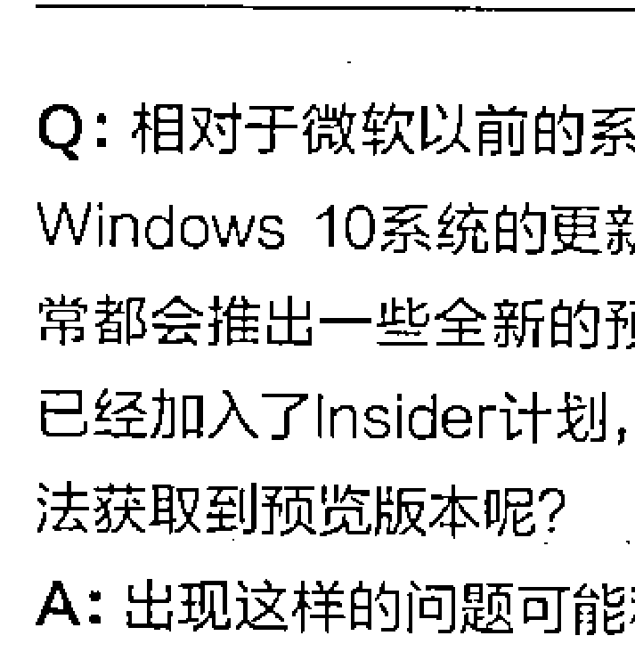

##### Windows 10屏幕亮度无法调节

Q: 我最近发现一个非常奇怪的现象，就是在Windows 10系统安装了独立驱动后，就无法进行屏幕亮度的调整了。如果成功卸载了这个驱动，就又可以进行屏幕亮度的调整。请问这该如何解决？

A: 微软的技术论坛给出了一个解决方法首先按Win+R组合键打开“运行”框，输入“regedit”命令后打开注册表编辑器。依次展开到如下的位置：HKEY_LOCAL_MACHINE\SYSTEM\ControlSet001\Control\Class\{4d36e968-e325-11ce-bfc1-08002be10318}。展开这项后找到0000和0001这两项，在右侧窗口里面将KMD_EnableBrightnessInterface2键值修改为0即可。

##### 如何解决“服务器正在运行中”的提示

Q: 有的时候我在Windows 10系统中打开IE浏览器，会弹出“服务器正在运行中”这样的提示窗口，最终导致浏览器无法正常打开。请问这个问题怎么才可以解决？

A: 首先按Win+R组合键打开“运行”框，输入“services.msc”后回车启动系统服务管理器。接下来在右侧窗口里面找到一个名为Background Intelligent Transfer Service的服务，在服务名称上点击鼠标右键选择菜单中的“停止”命令，再打开IE浏览器就不会出现相关的问题了。由于Background Intelligent Transfer Service是一个重要的系统服务，所以不要禁止它的运行。

##### 禁用Windows 10驱动程序的强制签名

Q: 在Windows 10里面未经签名的驱动程序是不能正常进行使用的，这样就会导致部分硬件出现问题。请问怎样才可以关闭Windows 10的默认驱动验证功能？

A: 要想关闭这个功能非常简单，只需一个命令就可以搞定。首先在“开始”按钮上点击鼠标右键，选择菜单中的“命令提示符(管理员)”命令，在弹出的命令提示符窗口里面，输入“bcdedit.exe /set nointegritychecks on”命令后按下回车键执行即可。

```
C:\WINDOWS\system32>bcdedit.exe /set nointegritychecks on
操作成功完成。
C:\WINDOWS\system32>bcdedit.exe /set nointegritychecks off
操作成功完成。
C:\WINDOWS\system32>_
```

##### 手机浏览器无法分享朋友圈

文|老万

Q: 我的Android手机使用的是Opera浏览器，可是当我像往常一样打开分享功能后，发现其中没有分享到微信朋友圈的功能。请问这是什么问题造成的？怎么解决？

A: 其实不只是手机版本的Opera浏览器，很多的手机浏览器都没有这个功能，所以只有通过其他的方法来解决。首先打开浏览器的分享功能，在弹出的对话框里面选择“复制网址”命令，将网站链接复制到系统剪贴板。接下来打开微信朋友圈后，长按右上角的发布按钮，在弹出的对话框中粘贴复制的链接发送即可。


> 其实并不是所有的手机浏览器都没有这个功能，比如UC浏览器和QQ浏览器里面就有该功能，所以用户也可以根据使用习惯，更换这些浏览器以进行分享操作。

##### 支付宝为何会自动下载小视频

Q: 最近我在通过LBE安全大师清理垃圾的时候，发现有一个非常大的视频文件被扫描出来，而且这个视频居然是支付宝应用下载的。所以请问支付宝应用为什么会下载这些视频?

A: 你说的这个问题, 其他网友也遇到过。根据支付宝方面的解释，主要是用户点击了应用的“生活圈”栏目，该栏目允许用户上传并分享自己拍摄的小视频。与此同时，在Wi-Fi环境下，部分视频就会被自动缓存到用户的手机上，所以就出现了你所说的这个情况。所以用户只能注意不要点击该栏目，或者及时清理这些视频文件。

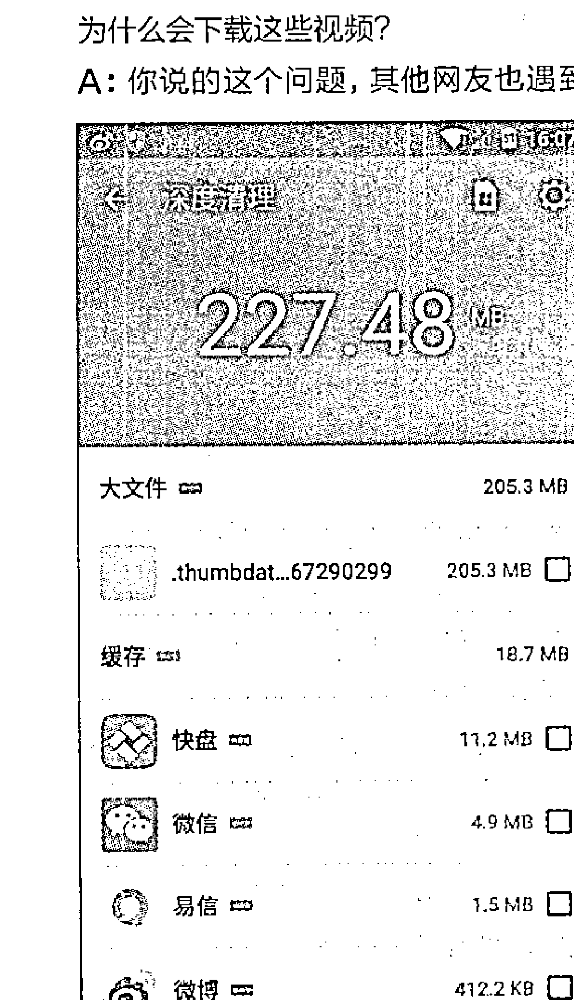

##### UC浏览器信息栏如何关闭

Q: 我一直使用的是UC浏览器, 最近升级到新版本以后, 发现在下拉菜单里面有个信息栏。我不喜欢这样的信息栏, 请问有没有什么方法可以关闭掉?

A: 我们在UC浏览器的设置里面就可以关闭这个信息框。首先点击窗口下方工具栏中间的按钮，在弹出的对话框里面点击设置命令。接着在新的对话框里面选择更多按钮，这时就可以在列表中找到“通知栏工具”命令。点击它以后，在弹出的对话框中将“通知栏工具”选项关闭掉就可以了。

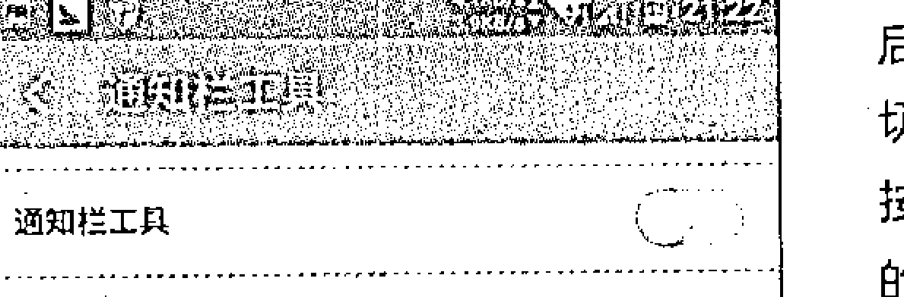

##### 如何快速调用手电筒功能

Q: 最近一段时间以来, 我所在的小区经常停电, 所以打算安装一个手电筒APP, 但是下载了几个都不满意。所以想问问有没有知名的应用里面就自带有手电筒的功能模块?

A: 其实很多桌面启动器应用就含有手电筒的相关功能。比如我们下载运行微软的Arrow Launcher启动器后，将桌面下方的工具栏向上滑动，这时在弹出的对话框中就可以看到手电筒的图标。点击该图标以后就可以利用手机的闪光灯功能，实现用户所需要的手电筒功能了。

##### iPhone能否进行列表符号输入

Q: 有时候我在iPhone里面输入信息, 为了有效地进行内容的区分, 需要输入一些列表符号, 但是在iPhone里面找了半天没有找到。是不是这里面无法输入列表符号?

A: 其实在iPhone里面是可以输入列表符号的, 至少在最新的iOS9里面是可以完成的。首先调出它自带的输入法, 然后点击左下角的数字切换按钮, 将键盘切换到符号键盘。找到键盘中的破折号按键按住手指不放, 然后滑动选择相应的列表符号就可以了。

##### 火狐总提示网站‘不受信任’

文|老万

Q: 最近一段时间不知道怎么回事，当我访问HTTPS加密链接的时候，火狐浏览器总是提示网页“不受信任”，试了很多方法都无法解决。请问这该如何解决？

A: 遇到这样的提示，应该是证书出现了问题，所以只需要导入证书文件即可。不过需要提醒大家的是，火狐浏览器的证书管理是独立的。首先点击火狐右上角的“打开菜单”命令，在弹出的菜单中选择“选项”命令，在对话框里面选择“高级”按钮。接着点击其中的“证书”标签页，然后点击下面的“查看证书”按钮。再点击“导入”按钮，选择证书文件添加即可。

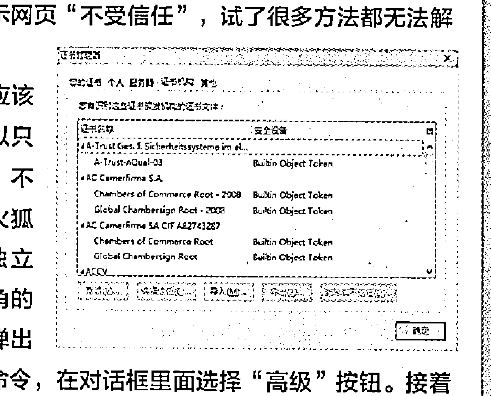

```
当用户也可以在火狐浏览器的配置文件夹找到cert8.db这个文件并进行删除，然后重新运行火狐浏览器访问加密连接，这样就可以自动下载对应的证书文件并进行安装了。
```

##### 如何解除网页的右键限制

Q: 我现在不用火狐浏览器是因为看视频总是提示Flash沙箱出错。请问谷歌浏览器有没有类似于火狐浏览器的Rightclick插件，可以用来解除网页右键限制的？

A: 你可以试试“网页限制解除”这个脚本。首先访问http://tinyurl.com/cf060501这个页面，点击网页里面的“安装此脚本”按钮，根据向导提示进行安装。以后再访问有功能限制的网页时，脚本就会在系统后台自动进行解除操作，这样用户就可以随意使用鼠标右键了。

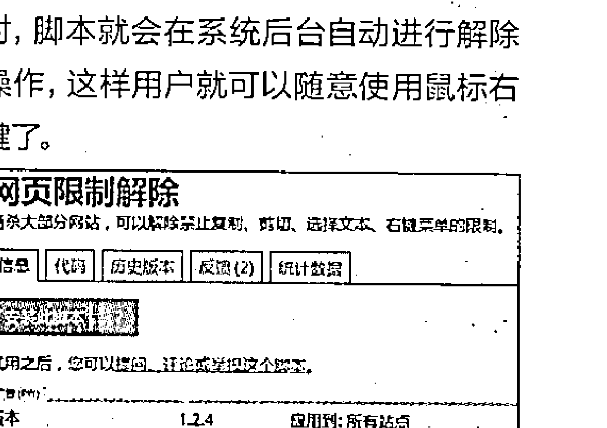

##### 浏览器如何防止网站后台跟踪

Q: 听说现在的网站都会在后台悄悄地跟踪用户在网站上的行为，虽然这样的行为并不会给用户造成麻烦，但是我还是不喜欢隐私被人偷窥。请问哪个浏览器可以防止网站的后台跟踪？

A: 现在的网页浏览器都有一个“请勿跟踪”的选项，开启它后就可以杜绝一部分的跟踪行为了。比如我们运行谷歌浏览器后，接着点击选项窗口中的“显示高级设置”命令，然后在“隐私设置”里面找到“随浏览流量一起发送‘不跟踪’请求”项后勾选上即可。但是要彻底杜绝还是不太可能。

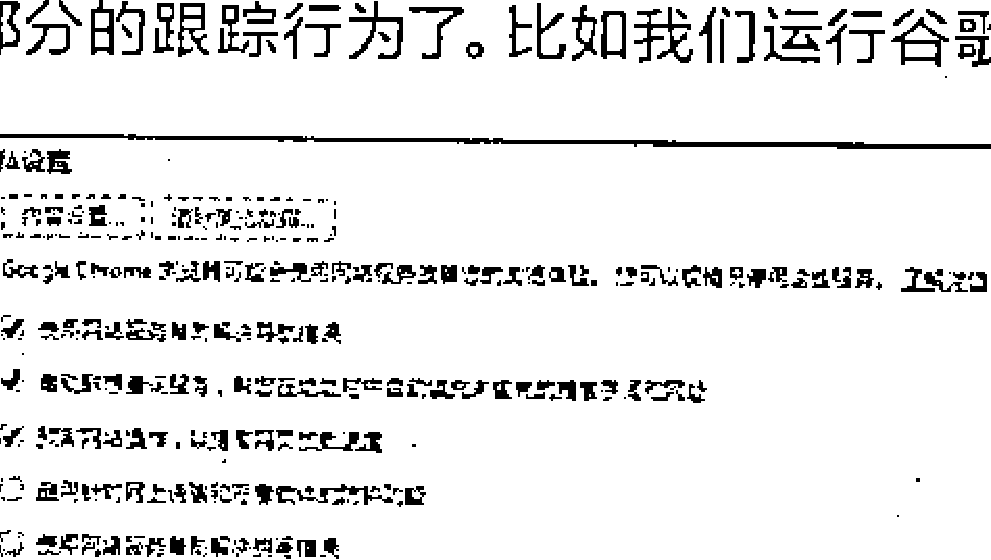

##### 如何调整1920×1080分辨率的网页

Q: 我的显示器分辨率是1920×1080，但是在使用谷歌内核的QQ浏览器和旗鱼浏览器时，发现网页显示的文字小得不能再小，看起来非常费劲。请问这该如何解决？

A: 首先在浏览器的图标上点击鼠标右键，选择菜单里面的“属性”命令。接着在弹出的属性窗口中选择“兼容性”这个标签，选中“高DPI设置时禁用显示缩放”选项。点击“确定”退出后，打开浏览器的设置窗口，在内容选项里面将页面放大到140%左右。这样再打开网站页面，就可以解决你所说的问题了。

##### Tempermonkey脚本不允许运行

Q: 最近写了一个谷歌浏览器的脚本程序，但是加载到Tempermonkey扩展后，发现这个脚本居然无法正常运行。请问这该如何解决？

A: 首先你需要确认自己的脚本程序没有问题，这点你可以考虑换一个浏览器试一试。其次就是刚刚加载的脚本程序的确是不能运行的，需要重新启动一次浏览器才可以运行。你可以根据实际情况，一个一个进行排除。

##### Office 2016部署工具无法工作

Q: 由于不需要安装所有的功能模块，所以我在安装Office 2016的时候，使用的是部署工具进行操作。谁知道这个工具无法工作，而且试过全部安装后卸载还是不行。请问有没有好的解决方法？

A: Office的部署工具可以说是参差不齐，有的是微软官方发布的版本，有的则是网友自己制作的版本。如果正在使用的版本无法正常使用，建议你还是使用微软官方的版本试一试，同时检测一下相关的参数配置是否正确。当然也可以直接使用Office 2016 VOL版，它可以直接选择功能组件以及软件的安装目录。

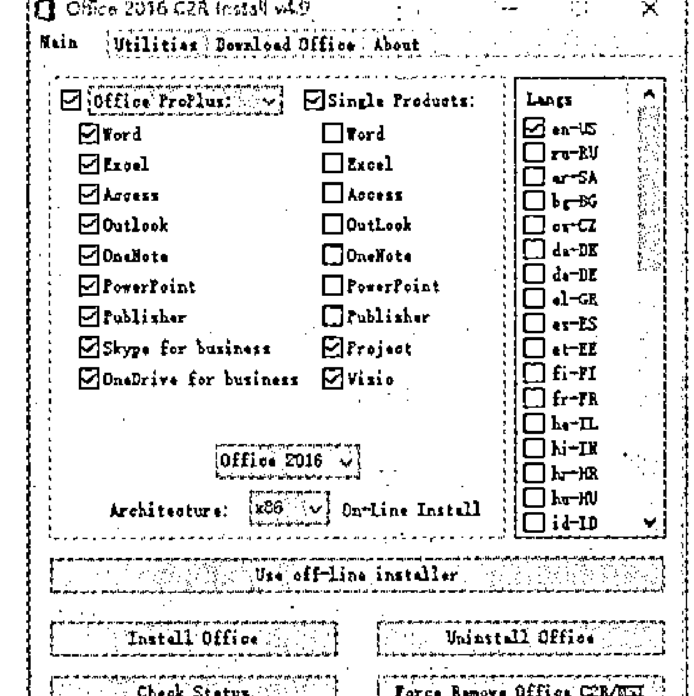

##### Windows 10播放WMV花屏

Q: 我在Windows 10系统里面通过PotPlayer播放WMV文件，总是出现播放窗口花屏的情况。而且换了好几个播放器，都出现这样的情况，但是用别的电脑播放就没有问题。请问这该如何解决？

A: 如果多个播放器都出现这样的情况，说明问题并不是出在播放器上，而是相关的解码器原因。因为播放器在播放WMV文件的时候，默认是调用Windows系统自带的解码器。所以要解决这个问题，建议你首先更新一下显卡的驱动程序，或者在播放器里面调用其他的解码器来看看能不能正常地进行播放。

##### 支持多系统的磁盘加密软件

文|老万

Q: 因为工作需要，我的移动硬盘经常会接到Windows、Redhat、Ubuntu、Mac OS等不同的系统上，甚至通过USB线和NTFS转换工具连接到Android系统上面。请问有没有同时支持多个系统的磁盘加密软件？

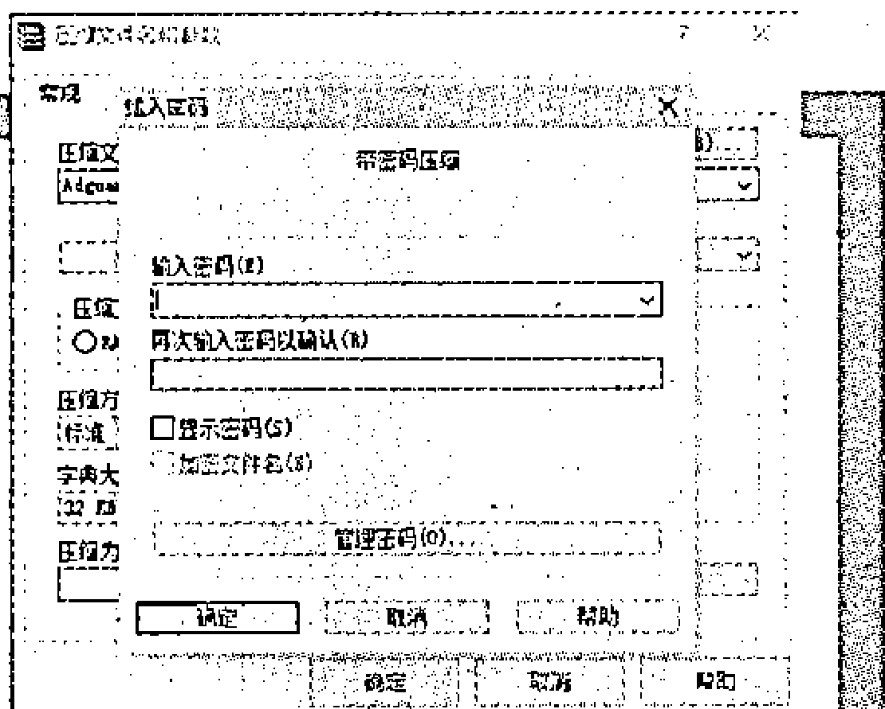

A: 磁盘加密软件TrueCrypt就支持Windows、Mac OS X、Linux等操作系统。用户首先通过该软件在磁盘里面创建一个虚拟磁盘文件，接着选择相应的加密格式对虚拟磁盘文件进行加密处理，最后将个人文件存放到这个虚拟磁盘即可。以后无论在哪个系统里面进行操作，通过TrueCrypt加载这个磁盘文件即可。


##### XMind软件如何进行精简操作

Q: XMind是一款不错的思维导图软件，但是每次打开的时候都需要等半天时间。请问有没有什么方法可以对其进行精简？

A: 通常情况下要对一个软件进行精简，首先就是删除不需要的文件，比如软件自带的其他语言文件等。接下来运行XMind软件，进行一些常用的操作，然后对软件目录中的文件一个一个进行删除。如果不能删除说明正在被调用，那么这个文件就需要保留下来。通过类似的方法，确认软件必需的文件后，将不需要的文件删除，就可以达到精简的目的了。

##### 多显示器管理软件

Q: 我想把笔记本电脑外接一个显示器，但是需要在笔记本和外接显示器上显示出不同的屏幕内容信息。请问有没有好用的多显示器管理软件可以推荐？

A: 首先将外接显示器连接至笔记本电脑，并且切换到扩展模式，使两个屏幕同步显示电脑内容。接着下载UltraMon的汉化版，运行软件后在系统托盘找到软件图标。右键点击软件图标后，在弹出的菜单里面就可以对两个显示器进行不同的设置了。比如选择“壁纸”命令后，在弹出的窗口为两个显示器设置不同的壁纸，这样就可以更好地管理两个显示器。

#### 《电脑爱好者》2016年合订本(一)

##### 外文邮件如何直接进行翻译

文|老万

Q: 现在在网上海淘的时候越来越多，因此也会收到一些厂家的促销邮件，但是由于我的英文比较差，所以需要借助于其他工具进行翻译。那么外文邮件能不能直接进行翻译呢？

A: 其实有的邮箱管理应用就自带有外文的翻译功能。比如我们安装运行“QQ邮箱”应用，在应用里面设置接收邮箱的信息后，就可以用它接收相应的电子邮件信息。当用户打开一封外文的电子邮件的时候，会在下方的工具栏里面弹出一个“翻译邮件”提示框，点击它以后就可以进行邮件的翻译了。如果没有弹出提示框，那么点击右下角的按钮，在弹出的菜单里选择也一样。

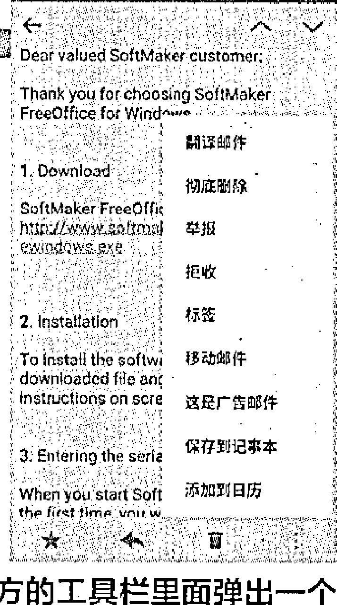

如果用户用的是其他的邮箱管理应用，也可以配合翻译应用进行相关的操作。首先将需要翻译的内容选中，再通过必应之类的翻译功能进行自动翻译就可以了。

##### 语音快速进行文字输入

Q: 我有时候突然收到短信或者微信，不方便丢下手头的工作进行回复。请问有没有什么方法，可以在不影响正常工作的情况下，快速通过iPhone回复信息？

A: 我想最快捷方便的回复方式，应该就是通过语音进行输入了。而且包括iPhone自带输入法在内的很多输入法，都可以进行语音输入操作。比如点击iPhone下方的麦克风按钮，对着话筒说出需要输入的内容即可。不过需要提醒大家的是，一定要注意输入法的状态。比如在英文状态下说中文，出现的将会是汉语拼音。

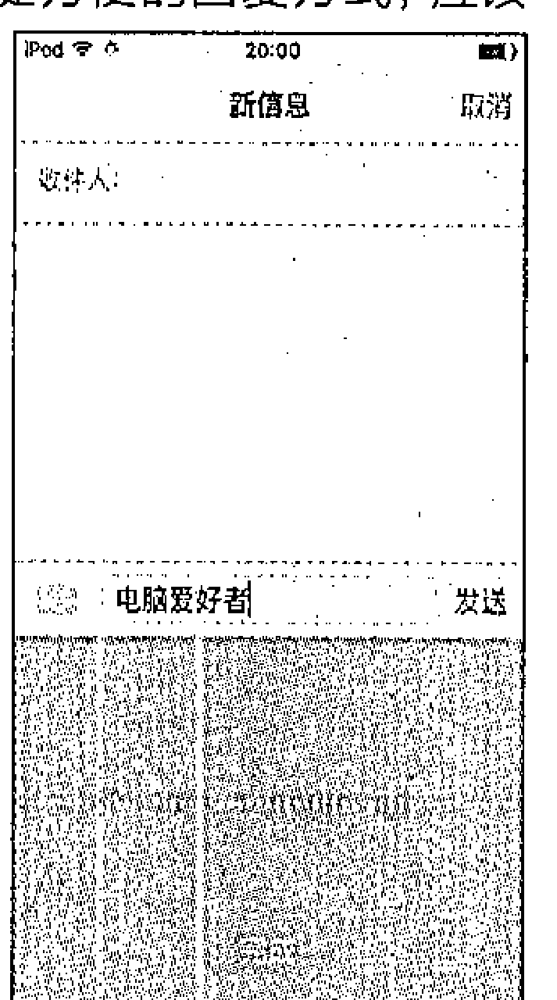

##### 微软桌面启动器自动换壁纸

Q: 微软相继推出了多款针对Android系统的应用，Arrow桌面启动器就是其中的一款。我想问问这款启动器能不能更换壁纸？最好是可以自动更换。

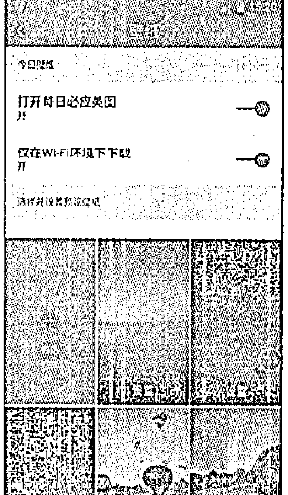

A: 这款桌面启动器因为是微软开发的，所以它和必应搜索引擎进行了捆绑，可以将必应搜索引擎的壁纸下载到手机桌面。首先将工具栏向上滑动，在弹出的对话框里面点击“设置”按钮。接着在弹出的设置窗口里面点击“壁纸”按钮，就可以看到“打开每日必应美图”等两个选项。激活这两个选项以后，就可以自动进行壁纸更换了。

##### 免ROOT能不能进行应用数据备份

Q: 虽然钛备份可以进行应用和游戏数据的备份，但是这款应用需要ROOT才可以进行使用。而我的手机系统ROOT非常困难，有没有不ROOT就能进行备份的应用？

A: 有一款名为“Helium氦备份”的应用可以试一试。首先在电脑和手机系统里面安装对应的客户端，接着打开手机系统中的USB调试的选项，并且用数据线将手机和电脑进行连接。当连接成功以后电脑上会显示“Helium has been enable on your Android”这个提示，然后在APP列表中勾选你想要备份数据的APP并点击“Backup”开始备份即可。

##### Nubia Z7 mini如何合并分区

Q: 我使用的是Nubia Z7 mini这款手机，但是这款手机在出厂的时候，存储空间居然有两个分区，这样多安装几个应用后，系统就提示空间不足。请问如何将两个分区进行合并？

A: 其实Nubia官方已经给出了解决方案。首先利用卡刷的方式将系统刷到V1.82版本，接下来再利用线刷的方式将系统刷到V3.12版本。当你系统安装成功以后，两个分区也就自动完成合并操作了。


##### PIN码登录无法使用的解决

Q: PIN密码是从Windows 8开始新增加的一种登录方式，我一直在使用，但是当我升级到Windows 10系统后，却发现在使用过程中遇到了PIN码不可用的问题。求解决方法，谢谢！

A: 出现这样的问题一般是由于IPsec Policy Agent服务没有正常启动导致，所以我们只需要将该服务重新设置为自动启动即可。首先按快捷键Win+R打开“运行”框，输入“Services.msc”后回车启动系统服务管理器。接下来在右侧窗口里面找到一个名为IPsec Policy Agent的服务，双击打开该服务的属性窗口。将该服务启动类型设置为“自动”，最后点击“确定”按钮重新启动系统即可。

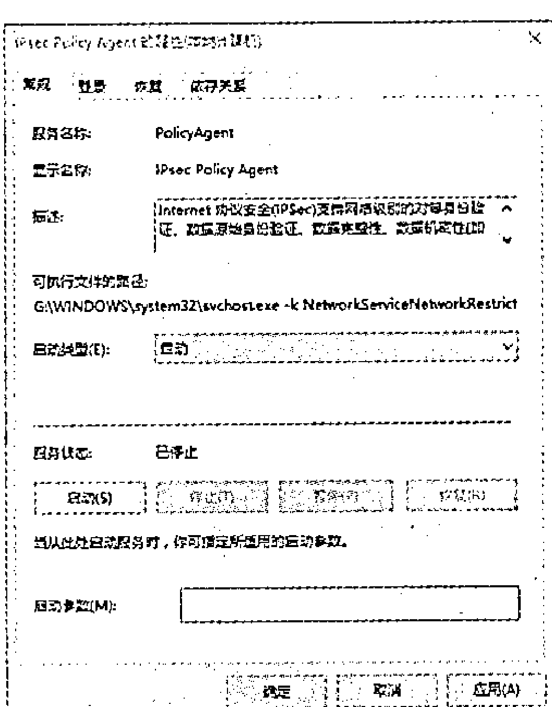

##### 不重装系统开启SATA硬盘AHCI模式

Q: SATA硬盘可以在IDE和AHCI两种模式下工作，不过我听说只有当用户在BIOS中开启AHCI模式后，再安装系统时系统才会安装所需的驱动并启用它。如果安装前没有切换至AHCI，只能重新安装一次操作系统。有没有不重装系统的方法？

A: 首先用户需要检查一下电脑，看是否可以正常地进入安全模式。如果可以的话，那么首先按键盘快捷键进入BIOS设置。接着在BIOS中找到硬盘控制器模式设置选项，将硬盘模式从默认的IDE更改为AHCI模式。保存设置重新启动电脑，这时首先进入到安全模式。成功进入安全模式后重启电脑，再选择正常启动项进入系统就可以了。

##### 如何调整Windows桌面图标的默认间距

Q: 我记得在Windows 7及以前的操作系统里面，通过高级外观设置就可以调整桌面图标的间距，但是这个功能在Windows 8以后就取消了。请问现在还有没有什么方法可以调整图标间距？

A: 首先打开注册表编辑器，依次展开到HKEY_CURRENT_USER\Control Panel\Desktop\WindowMetrics，在右侧窗口里面可以发现一个名为IconSpacing的字符串值，它表示桌面图标之间的水平间距。其中默认值表示水平间距为75像素，用户可以根据需要进行相关操作。用同样的方法修改IconVerticalSpacing值，就可以修改桌面图标之间的垂直间距。

##### 更新Flash补丁后频繁崩溃

文|老万

Q: 最近微软给Windows 10推送了KB3132372补丁，但是安装这个补丁后第三方浏览器的IE模式完全没法使用，经常打开网页就崩溃。请问这个问题怎么解决？

A: 由于Windows 10系统接二连三地出现问题，微软已经推出了一款新的工具，用于隐藏或者阻止某些更新自动安装。下载安装该工具后，点击“下一步”开始扫描。接着选择“隐藏更新”按钮，稍等片刻出现了当前还未安装的更新。勾选后点击“下一步”进行隐藏操作，以后在Windows Update中就不会再出现这些已经被隐藏的更新了。

由于这个问题影响面比较大，所以微软已经准备了新的补丁程序，来修复这个KB3132372补丁引起的问题。所以用户只需要通过Windows Update下载安装新的补丁程序即可。


##### Windows 7电脑总是发出“嘟嘟”声

Q: 我的电脑现在还是使用Windows 7系统，但是不知道怎么回事，总是会发出“嘟嘟”声，而且连接外部音响或耳机都是如此。请问这该如何解决？

A: 首先打开计算机管理窗口，点击左侧的“设备管理”选项，再点击“查看”菜单中的“显示隐藏的设备”，在右侧找到“非即插即用驱动程序”，展开找到“Beep”项并双击打开其属性，切换到“驱动程序”选项卡，将其启动类型设置为“已禁用”即可。

##### SWF如何转换为MP4

文|老万

Q: 最近我在下载儿歌给外甥女听，但是视频文件是SWF格式的，我想将它们转换为MP4，试了很多软件，有的转换了没有声音，有的根本转换不了。请想有没有免费的转换软件，可以将SWF转换成其他的格式呢？

A: 既然用了那么多转换软件都不行，那么可以直接试一试PotPlayer播放器软件。首先通过播放器载入需要转换的文件，接着暂停视频文件的播放操作。然后点击鼠标右键，依次选择“视频→视频录制→录制视频”命令。在弹出的对话框里面首先设置文件保存的目录，接着分别在“文件格式”和“视频编码”里面选择MPEG4项。设置完成后点击“开始”按钮，就可以开始进行文件转换了。

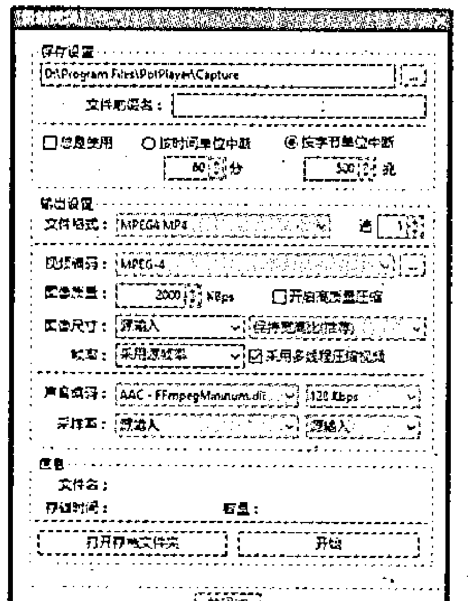

如果用户使用的是迅雷或者QQ旋风进行下载，那么可以直接在线将文件转换为MP4的格式，在转换完成以后再下载到本地系统进行播放。

##### 删除adbyby软件中的驱动文件

Q: 一直以来我都是使用的adbyby这款广告过滤软件，但是最近升级到最新版本后，发现这款软件添加了一个驱动文件。我个人不太喜欢驱动文件，请问有没有什么方法将其删除？

A: adbyby最新版本添加驱动文件，主要是为了过滤Edge浏览器的广告。如果用户不使用这款浏览器的话，那么首先在左下角的“开始”按钮上点击鼠标右键，选择菜单里面的“命令提示符（管理员）”命令。在弹出的对话框里面输入“sc delete ad_driver”命令，按下回车键出现成功的提示后，重新启动系统就可以删除这个驱动文件了。

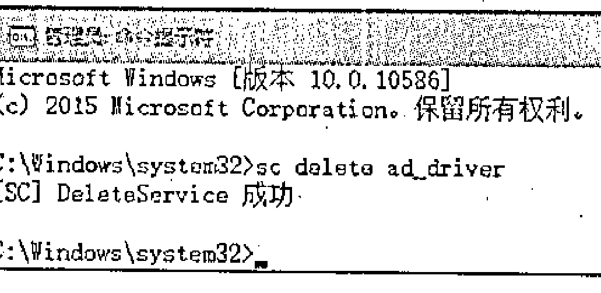

##### 浏览器打不开卡饭论坛

Q: 最近不知道什么原因，我的浏览器中无法打开精睿和卡饭这两个论坛了，而其他的网站都正常。请问这种情况应该如何处理？

A: 精睿和卡饭论坛是国内知名的安全论坛，所以有的病毒作者为了怕用户上网求助，就会通过修改Hosts的方式进行阻止。你可以试试在资源管理器的地址栏中输入C:\Windows\System32\Drivers\etc后回车，找到Hosts这个文件后用文本编辑器打开，然后分别查找kafan和vc52这两个关键词，找到后将那一行的内容全部删除就可以了。

##### Edge能否设置页面为雅黑字体

Q: 我现在将Windows 10自带的Edge浏览器作为首选，但是发现这个浏览器默认的宋体看上去很不舒服。请问有没有什么方法，可以将默认字体修改为微软的雅黑？

A: 通过浏览器默认的设置暂时无法完成你的要求，不过借助于广告过滤软件就可以。首先运行“广告拦截大师”这款软件，在系统托盘找到软件图标后点击鼠标右键，在弹出的菜单里面选择“设置”中的“自定义规则”命令。在弹出的对话框输入以下代码：

```
|http*$s@</body>@<style>*{font-family:Microsoft YaHei!important;}</style></body>
```

保存后刷新浏览器页面，就可以看到你喜欢的雅黑效果了。

##### 画图软件怎样在指定位置添加文字

Q: 我要处理一些图片，主要是添加图片内容的说明，文字必须添加在指定位置和区域。Windows自带的画图软件可以添加文字，但是它不能指定显示区的大小，长方条总是遮挡住需要显示的图片。我希望在指定的区域内显示，应该怎么设置？

A: 用户在点击工具栏中的“A”按钮后，画图软件会弹出一个“文本”标签，在这个标签里面会有一个“透明”选项。点击它以后再在指定区域输入文字，这个时候无论输入框有多大，输入完成后只有文字会遮挡图片。

##### 傻博士有话说

##### 找出迅雷快传的真实地址

文|老万

Q: 用迅雷下载快传的文件实在是太慢了，所以我想找到迅雷快传的真实地址，然后再借用网盘的离线下载功能下载它。不知道这一方法是否可行？

A: 由于迅雷快传并不是使用的迅雷“thunder://”开头的链接，所以网上现有的一些工具无法分析出它的真实地址。其实我们可以点击分享页面中的“普通下载”按钮，在弹出的对话框里面选择“使用浏览器下载”命令，这样就可以通过浏览器进行下载。接下来点击浏览器的下载管理窗口，找到正在下载的文件并点击鼠标右键选择“复制下载链接”命令，就可以分析出这一文件的真实下载地址了。

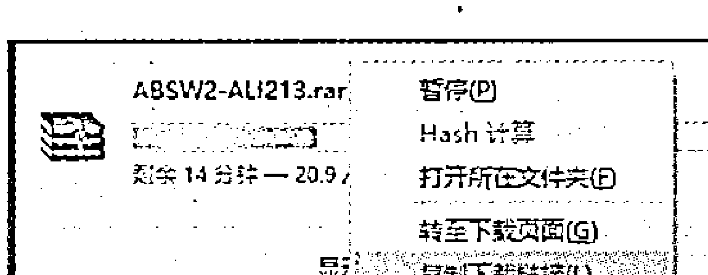


##### xthunder调用绿色版迅雷的参数

Q: 我的Firefox浏览器是通过xthunder扩展来调用对应的下载软件的，但是我使用的是绿色版的迅雷，这款扩展无法进行识别，所以只好进行自定义设置。请问如何设置相关的参数？

A: 首先打开xthunder扩展的配置窗口，点击其中的“下载工具”标签。然后点击旁边的“新建”按钮，在弹出的对话框中设置一个名称。然后点击“程序”后的“浏览”按钮，在弹出的对话框中选择迅雷下载软件的主程序文件。接下来在“参数”里面设置为[URL][REFERER][COOKIE]，设置完毕点击“完成”按钮，重新启动浏览器就可以调用迅雷下载软件了。

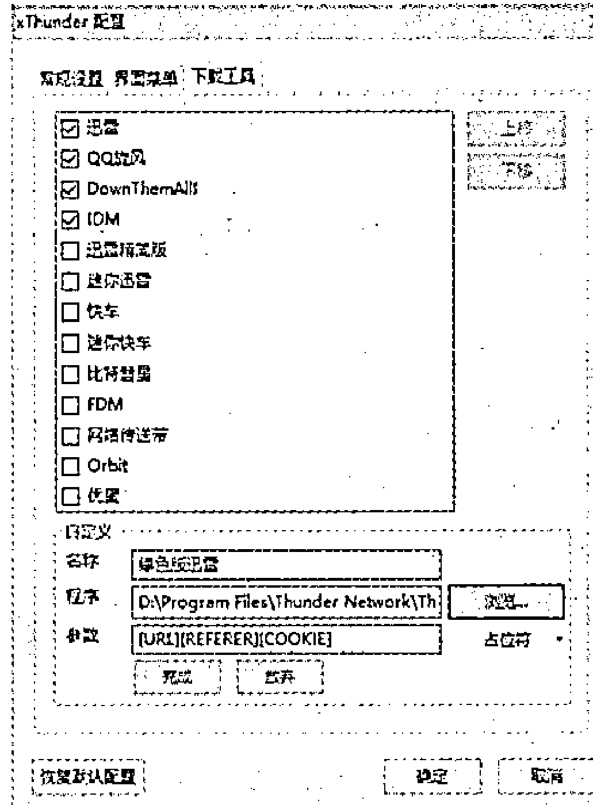

##### 光猫怎么设置下载BT文件

Q: 我的光猫有两个输出口，用uTorrent测试总是显示网络受阻。但是如果另外接上一个路由器，通过路由器上网的话，BT下载就显示通畅了。我不想下载BT还这么麻烦，能不能直接用光猫下载BT呢？

A: 首先通过电脑登录到光猫的后台，在后台里面点击“应用”标签。接着选中“UPNP设置”选项，再选中“启用UPNP”选项。保存设置后重新启动光猫，这样通过BT软件就可以正常进行下载了。

##### CSS样式在Chrome47上失效

Q: 以前我在使用Chrome31时可以正常使用的样式，现在在Firefox上仍然也可以成功显示。这两日试用Chrome47内核的美分和QQ浏览器，这个CSS样式却出现了花屏现象。这个应该如何解决？

A: 通常情况下要想使用CSS样式，就必须给浏览器安装Stylish扩展。但是由于你使用的是最新的Chrome47内核的浏览器，所以可能会存在一些兼容性等问题。因此建议你登录到谷歌的应用商店，下载安装最新版本的Stylish扩展试一试。最好是在卸载老版本以后，进行完整的重新安装，而不是传统的覆盖安装。

##### 如何设置ABP只过滤HTTPS网站

Q: 我的浏览器使用的广告过滤扩展是Adblock Plus，为了过滤其他浏览器的广告又安装了一个过滤软件，但是过滤软件和ABP扩展有冲突。请问在谷歌浏览器中如何设置ABP只过滤HTTPS网站？

A: 其实这个只需要添加一个过滤规则即可。首先在谷歌浏览器的工具栏中找到ABP扩展的图标，点击鼠标右键选择菜单中的“选项”命令，进入到ABP扩展的选项窗口。点击其中的“自定义过滤”标签后，在输入框里面添加一条过滤规则“@@|http://*”，再点击“添加过滤规则”按钮就可以了。关闭谷歌浏览器并重新启动，这样ABP扩展就只会过滤HTTPS网站的广告了。

##### Windows截图配置个性音效

文|老万

Q: 我平时都是通过按键盘上的PrintScreen键来截图的，虽然这个操作方便快捷，但是也存在着一个非常明显的问题，就是截图操作后没有任何的提示信息。请问有没有什么方法增加一个提示音啊？

A: 首先从网上下载注册表和声音文件 (http://tinyurl.com/cf060601)，下载解压后双击其中的“Add screenshot sound.reg”文件进行导入（为了安全起见，导入修改注册表之前，最好先对原先的注册表做一个备份）。接着打开“运行”窗口，输入命令“rundll32.exe shell32.dll,Control_RunDLL mmsys.cpl ,2”。

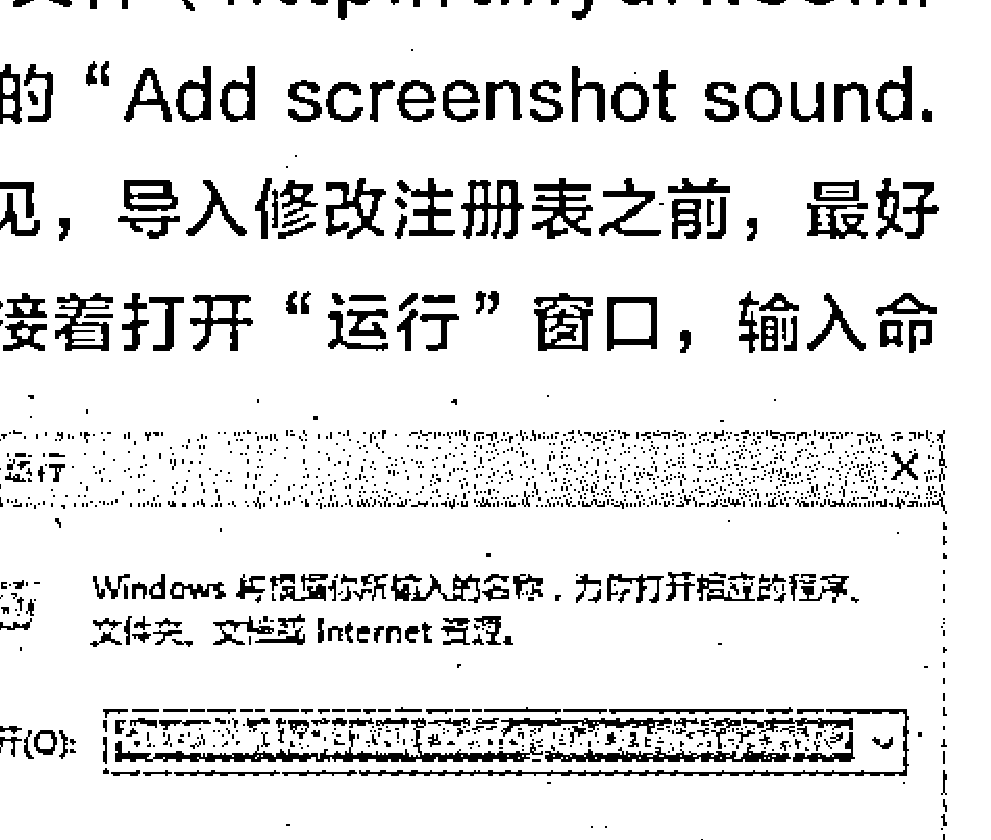

然后在打开的窗口中会看到名为SnapShot的“程序事件”项目，选中该项后点击底部的“浏览”，最后选择压缩包中的声音文件即可。


##### 傻博士有话说

现在很多的第三方软件都提供截图功能，用户只需要将这些软件的截图功能键修改为PrintScreen，这样用户不需要重启系统也可以截图。

##### 禁止Windows 10自动安装游戏和应用

Q: 最近我发现Windows 10系统会在后台自动安装一些游戏和应用，甚至不需要用户打开应用商店。我非常不喜欢这样的流氓操作，请问有没有什么方法可以禁止自动安装？

A: 首先打开注册表编辑器，展开到HKEY_LOCAL_MACHINE\SOFTWARE\Policies\Microsoft\Windows\，在这个项目上点击鼠标右键新建一个名为“CloudContent”的项目。然后在右侧窗口里面点击鼠标右键，选择“新建”中的“DWORD（32位）值”命令。将其键值名称重新命名为“DisableWindowsConsumerFeatures”，最后双击该项目，在弹出的对话框中将“数值数据”修改为“1”即可。

##### 如何突破系统安装的语言限制

Q: 由于我自己工作上的需要，要将操作系统改成英文的。但是默认情况下，微软不允许在不同语言版本系统之间执行安装操作。请问有没有什么方法可以突破这个限制？

A: 首先打开注册表编辑器，展开到HKEY_LOCAL_MACHINE\SYSTEM\CurrentControlSet\Control\Nls\Language。接着在右侧窗口里面找到一个名为“InstallLanguage”的注册表项目，该项目即代表操作系统的显示语言。双击打开这个注册表项目，将默认的值修改为“0409”。保存后重新启动系统，就可以突破语言限制安装系统了。

##### Windows无法识别USB设备

Q: 最近当我将USB移动硬盘插到电脑上时，系统出现“无法识别USB设备”的提示，反复重试多次也无济于事。请问这该如何解决？

A: 首先进入到系统的控制面板中，找到右上角的“查看方式”选择“大图标”项，接下来点击列表中的“设备管理器”命令。然后在弹出窗口的磁盘驱动器列表中找到相应的USB设备，点击鼠标右键选择“卸载”命令。接下来拔下USB数据线并重新连接，此时驱动程序会自动加载，系统就可以自动识别出USB设备了。

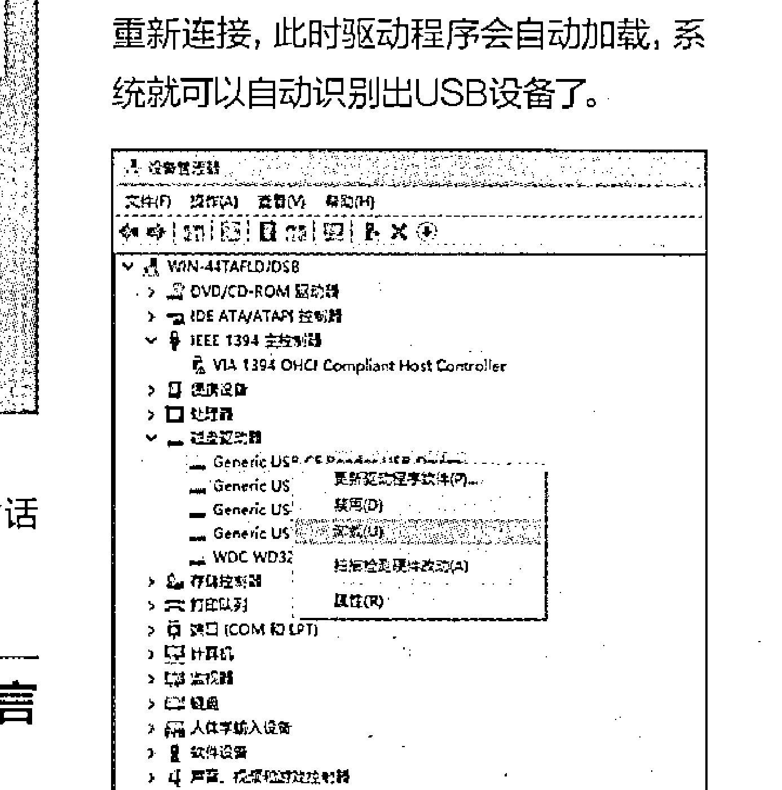

##### 如何卸载打印机驱动程序

Q: 我从HP官网下载安装的原版打印机驱动，但是现在点击“打印”时打印机无反应。请问如何彻底卸载打印机驱动，然后再重新进行安装？

A: 在控制面板中点击“设备和打印机”命令，在弹出的窗口列表里面找到对应的打印机。点击鼠标右键打开属性窗口，就可以进行驱动程序的卸载操作了。

##### ◆ 支付宝为何后台启动相机和录音

Q: 我在使用支付宝应用的时候，安全软件总是提醒我，支付宝在打开相机和录音功能。请问支付宝为什么会这么做？有什么方法可以对此进行拦截？

A: 支付宝应用之所以这么做，主要是因为相关的功能需要这两项功能。比如通过支付宝扫描二维码的时候，自然就会使用到手机的相机功能。而如果要给支付宝好友发送语音信息的话，自然就会使用到手机的录音功能，所以用户需要根据自身的使用进行判断。现也有关于支付宝获取相机功能窃取隐私的一些传闻，但暂无定论，如果确实不需要的话可以利用安全软件，对相关的操作行为进行永久拦截。

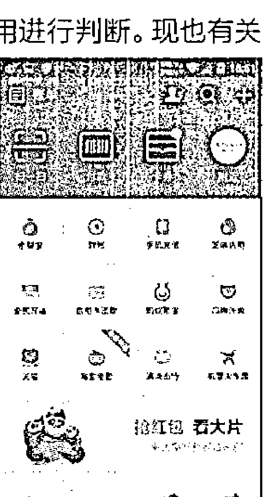

##### SudaMod为何无ROOT选项

文|老万

Q: 我最近将手机系统刷为SudaMod，听说它是在CM的基础上二次开发来的，但是我在开发者选项里面并没有找到ROOT的相关功能。请问这个系统的ROOT选项设置在哪里？

A: 并不是基于CM开发的系统自身就都带有ROOT的功能，不过SudaMod自带有SuperSU软件，利用它也可以很好地进行权限管理操作。首先点击系统中的“设置”按钮，在弹出的菜单列表里面打开“应用”项目。下拉到最下面就可以看到一个名为“权限”的选项，在这里面就可以对应用的使用权限进行设置操作了。

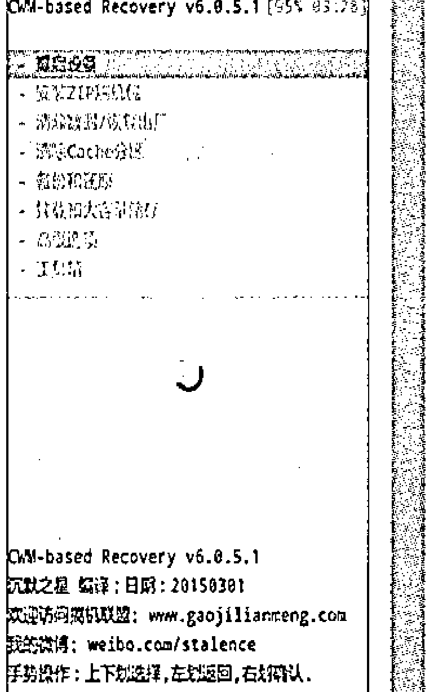


##### ◆ 压缩数据更好地节省流量

Q: 自从老爸老妈喜欢上微信后，已经到了手机不离手的状况，但是随之而来的是，手机流量也大幅度攀升。由于父母对手机操作不太熟悉，所以我想问问有没有什么简单易用的节省流量方法？

A: 要说节省手机流量的话，除了屏蔽图片信息以外，应该就是对数据进行压缩了。Opera的中国分公司就根据这个需求开发了一款名为“流量宝”的应用。启动这款应用后首先会弹出一个提示框，要求用户创建一个VPN连接。当这个连接创建成功后，所有的连接数据都会经过Opera服务器的压缩，从而有效节省手机的流量。

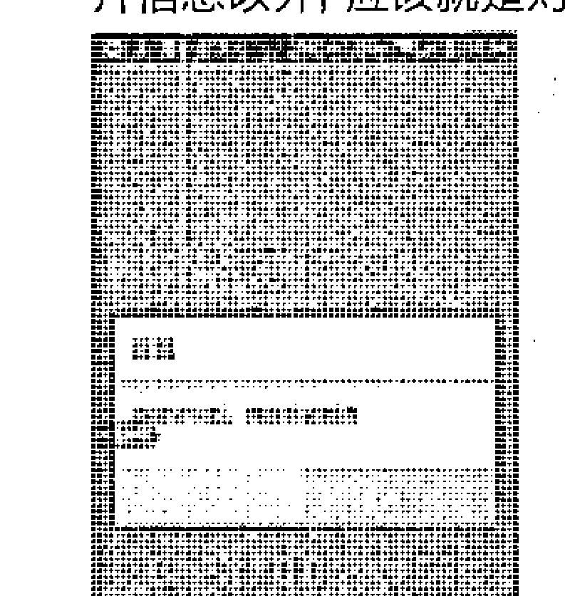

##### ◆ ChromeBook如何进行文字输入

Q: 一个朋友送给我一个ChromeBook，它非常小巧，而相关的功能也非常有限。比如我想进行文本输入，居然找不到一个编辑器。难道它就只能上上网吗？

A: ChromeBook既然被称之为网络笔记本，那么相关的操作都需要和网络进行结合才行。所以用户如果要进行相关的操作，就一定要在云端找到相关的服务才可以。比如你想进行文字输入操作，可以登录到云笔记的云端页面，这样就可以进行文字的输入编辑操作了。

##### ◆ 如何打开Android手机的开发者模式

Q: 最近我想对手机里面的一些数据进行备份，但是手机管理软件提示要打开开发者模式。请问这个模式在哪里？如何才可以开启这个模式？

A: 首先点击手机界面中的“设置”按钮，在弹出的设置窗口中找到最下方的“关于手机”项目。点击它进入新的窗口里面，连续七次点击“版本号”区域，当出现提示信息后，接着返回到上级菜单就可以看到多出一个“开发者选项”命令，点击它进入就可以了。

##### 狙击PM2.5 学会DIY空气净化器

随着雾霾天成为“常态”，我们无时无刻都在面临着PM2.5的骚扰侵袭。遗憾的是，市面上的品牌空气净化器都不便宜，如何才能以更低的成本改善我们身边的空气质量呢？

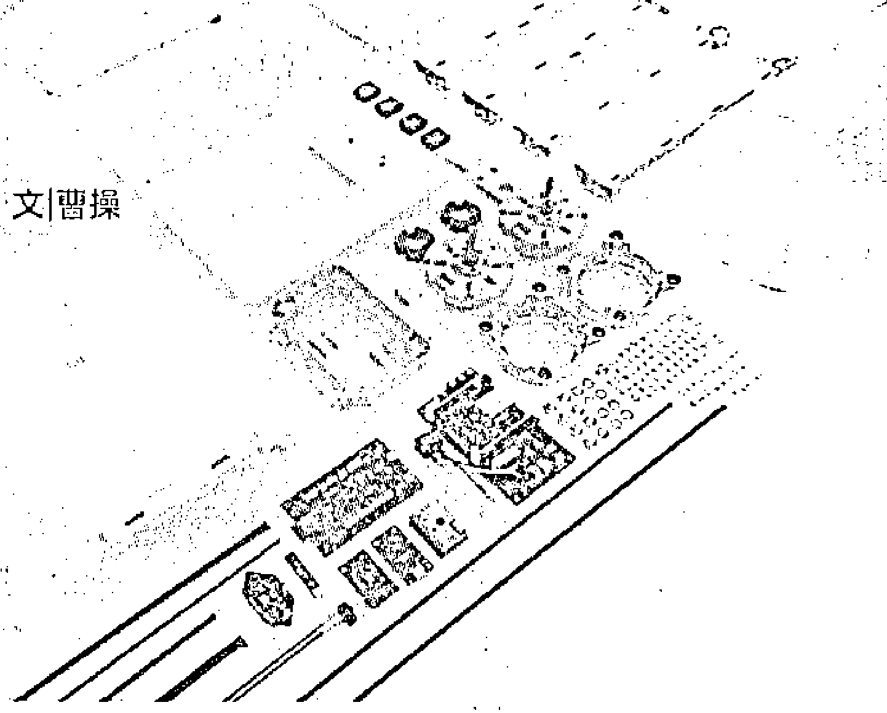

###### 空气净化器的原理

品牌空气净化器的价格从数百元到数千元不等，而此类产品也并非什么太过高大的“科技神器”，其内部结构并不复杂。简单来说，衡量一款空气净化器的好坏，无非是从风量、气密性、滤芯、智能控制等几个角度考察。
其中，风量就是内部风扇的转速，风量越大可净化的空间面积也就越大，但如何缓解转速和噪音的关系就是考察重点；气密性影响着空气净化的效率，如果净化器四处“漏风”，显然就是一款不太合格的产品；滤芯通常是由HEPA滤网、预过滤网和活性炭过滤网三部分组成，其品质好坏将直接影响PM2.5和其他有害物质的“存活率”（图1），能否方便更换滤芯，以及更换新滤芯的成本则是品牌空气净化器的关键竞争点；智能控制即内部电路模块，包括PM实时监测和显示，能否通过手机APP远程控制则代表净化器产品的智能程度。

综上所述，空气净化器最核心的部分其实就是风量、气密性和滤芯（图2），而这些元素我们都能以较低的成本收集整理。只需简单的DIY步骤，即可自制一套空气净化器。不相信？那我们就来看看网络达人们的思路和作品吧。

空气净化器的风量来源。但是，由于滤芯的存在，风扇的风量势必会出现缩水，所以除了大尺寸的电风扇外，我们身边常见的闲置风扇都不足以净化太大的空间。比如一个10cm左右的机箱风扇只够做一个袖珍的桌面式净化器。

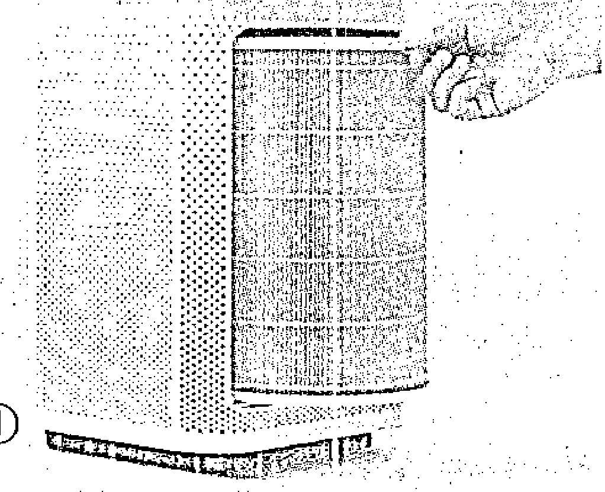

###### 风扇从哪来

理论上，闲置的电风扇、PC机箱风扇、笔记本散热底座内的风扇，只要是靠电力驱动的风扇都可作为DIY空气净化器的风量来源。

###### 滤芯的构成

为了保证净化效果，我们在滤芯的选购上要多加重视。一般来说，最佳的滤芯是预过滤网+活性炭过滤网+HEPA滤网的组合。其中，预过滤网用一般的纤维毡就可代替，每平方分米的价格只要1元~2元钱；活性炭过滤网和预过滤网成本相近（不是必需品，主要用于除味）；HEPA滤网的价格相对贵一些，2.5cm厚的HEPA滤网每平方分米的单价要15元左右。目前淘宝还有2合1或3合1的滤网组合，直接就包含了上述的滤网材质并做好了四边的气密性处理（直接将滤网嵌入到了硬纸壳里）（图3），省去了我们自行搭配的繁琐。

> 七重净化过滤PM2.5、分解甲醛，给你持久好空气

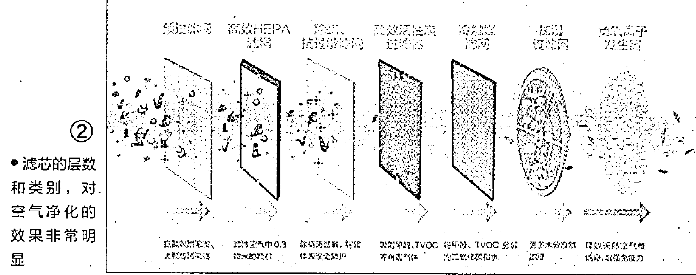

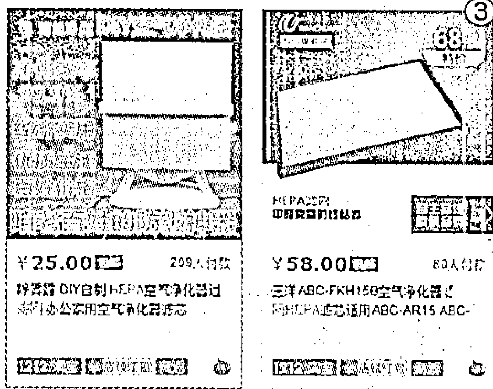

总之，我们要根据风扇的尺寸，购买略大一点的滤芯。需要注意的是，在滤芯的安置方面，最佳的顺序是预过滤网在最外层，接下来是活性炭过滤网，再后面是HEPA滤网，最后是风扇的进风口。当然，将滤网放在风扇的出风口处也不是不可以，只是净化效果会有所折扣。

###### 改造涉及的其他材料

对DIY的空气净化器而言，风扇和滤芯是核心要素，而能将二者联合后的理论净化效果发挥到百分之几，就要看如何将它们紧密结合了。因此，DIY的其他材料就是将风扇和滤芯捆绑、固定、封锁的小物件。比如硬纸壳、透明胶带、剪刀、扎带等等。

###### 基本改造思路

首先看看最基本的改造方法：直接将HEPA滤网和台风扇用扎带捆绑（图4），限于台风扇的物理结构，滤网只能被安置在风扇的出风口。虽然没有经过密封处理，但依旧可以起到一定的空气净化效果。

如果闲置的台风扇前网罩可以拆下，最好将其拆卸之后（图5），再将HEPA滤网固定在风扇之上。为了提高净化效率，最好提前将HEPA滤网嵌入到主板包装盒内（保证四个侧边不漏风）（图6），再用透明胶带将包装盒和风扇前面罩之间的缝隙也给缠紧（图7），确保风扇产生的风量全部都要透过滤网。

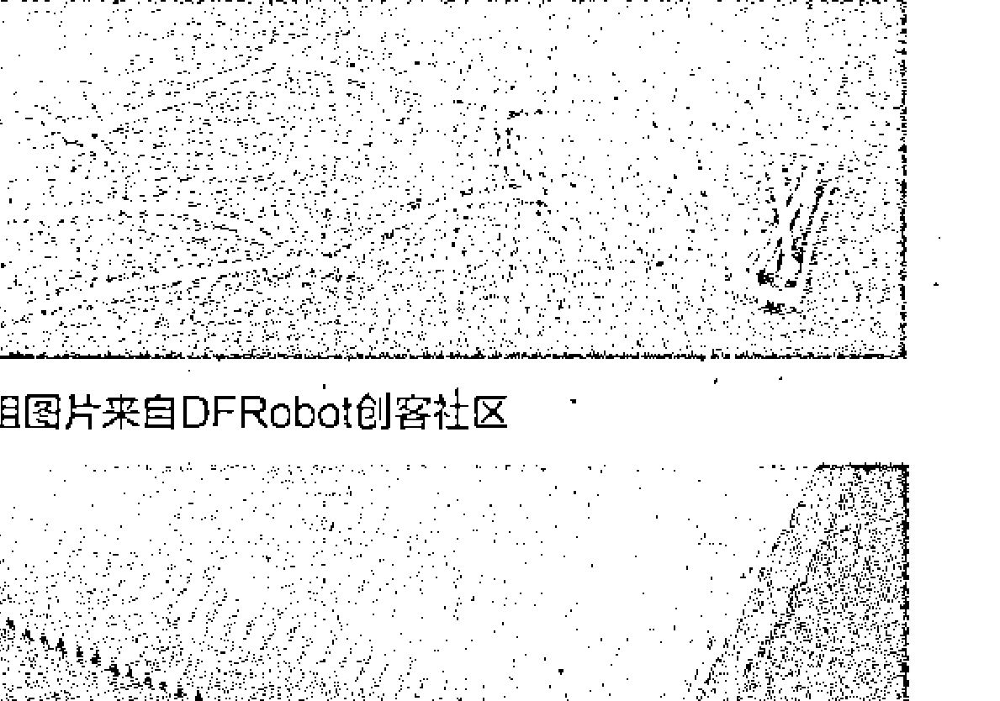

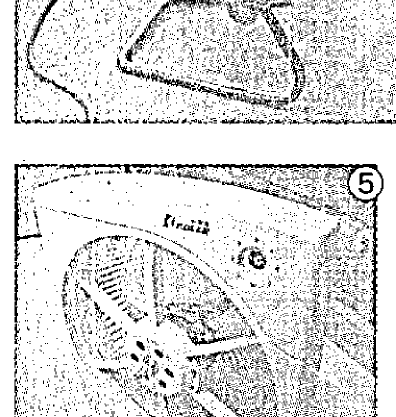

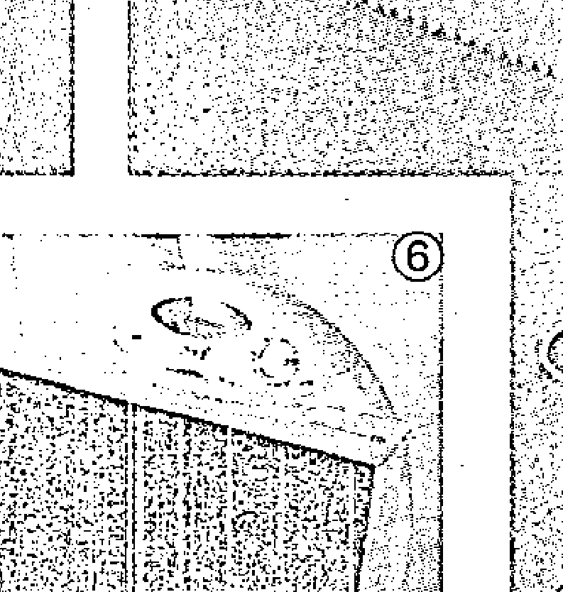

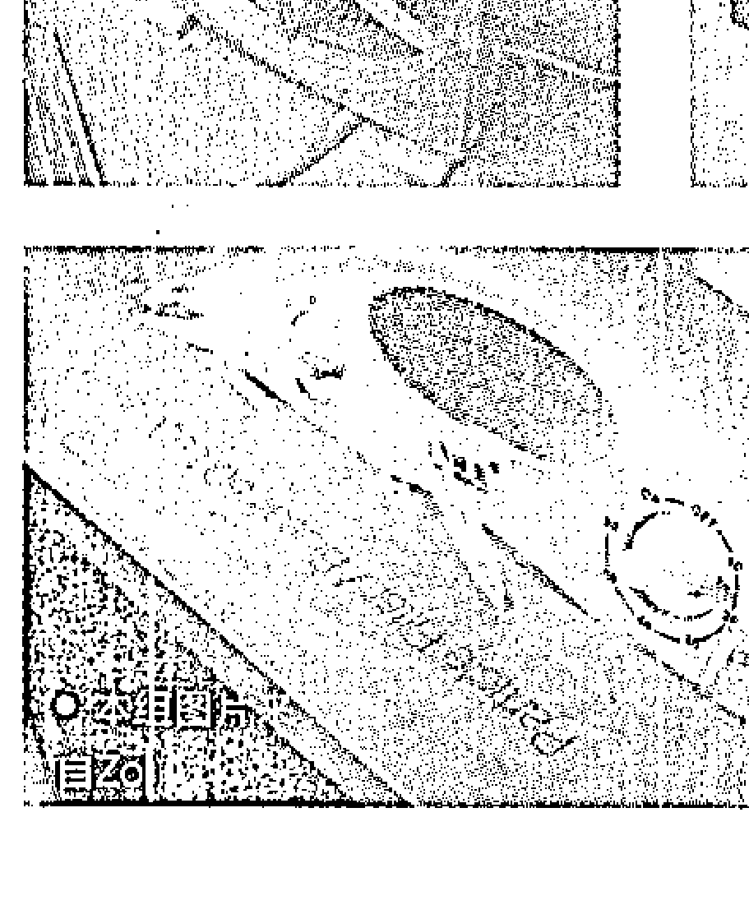

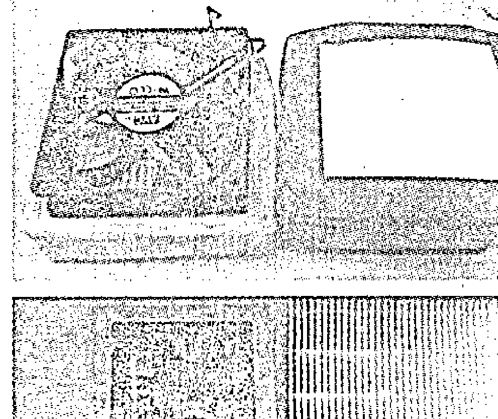

PC风扇也可作为迷你空气净化器的材料，我们可以将滤网剪裁成和风扇面积大小相仿的正方形，并用胶带将其固定在出风口的位置，再通过USB接口给风扇供电即可（图8）。

###### 如何检测效果

在网上可以直接买到PM2.5或空气质量检测的仪器，只是价格多在200元之上。如果你的动手能力较强，可以考虑激光PM2.5转接模块等半成品（图10），通过进一步DIY和编程实现空气质量的检测，成本相对更低。

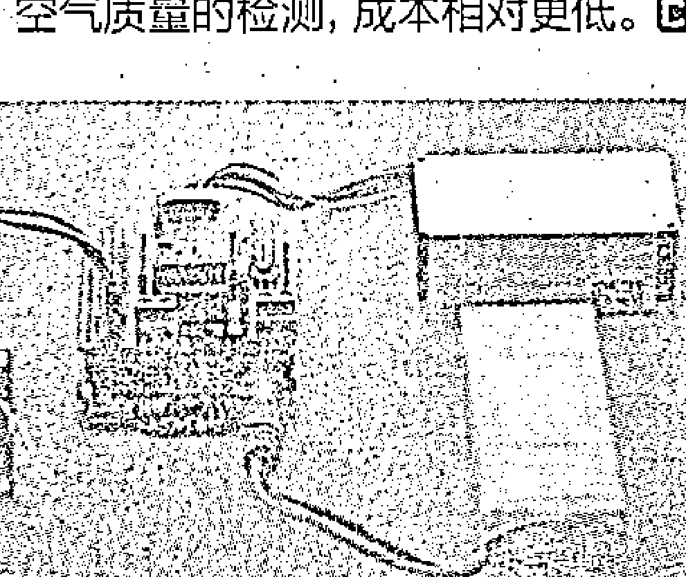

######## 小提示

如果你身处的环境空气质量较差，只要发现净化器滤网变黑就要及时更换新滤网。为了保证净化效率，最好将其放在距离地面1米左右的高度之上。如果你使用的是PC风扇改造的净化器，就要将它放在距离自己越近越好，因为它无法净化太远距离的空气。因此，有条件的玩家可以考虑更高转速的涡轮风扇（图9）。


##### 用Lightberry HD和LED灯条打造壁挂电视流光溢彩技术

文|沈建苗

飞利浦流光溢彩（Ambilight）电视系列提供电视两侧LED照明的效果，相当于氛围灯的效果，受到不少用户喜爱。不掏钱在家实现流光溢彩的技术并不太难，使用Lightberry HD和LED灯条就可以安装一套属于自己的系统。

###### Lightberry HD的优缺点

Lightberry可以通过使用彩色LED改善观赏和游戏体验，类似广受欢迎的飞利浦流光溢彩系统。唯一不同的是，该照明系统可以与任何电视结合使用。从理论上讲这个系统很简单——使用Raspberry Pi作为核心部件，一条HDMI线从HDMI分配器连到Lightberry HD套件，该套件负责分析输出到电视的图像外边缘。然后Lightberry HD再现与之匹配的色彩和亮度，电视边缘周围显示的灯光提供了一种错觉：图像超出电视边缘同时又总体上改善了房间的整体氛围（图1）。


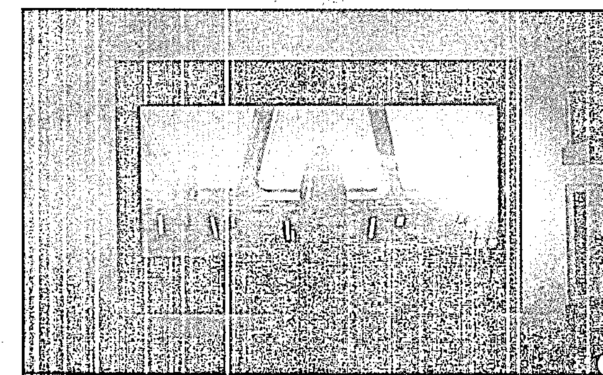


Lightberry HD装好可以根据游戏或者电影内容的一帧来连续呈现效果，比如说我们可以看到屏幕中的内容在屏幕边缘被点亮；屏幕平移时产生的光氛围灯几乎同时跟着移动。电影时它只会在灯光很亮的地方产生光，这可以帮助调节氛围（图2），这让电视和现实之间的界限稍稍模糊了。
使用Lightberry HD也不是没有缺点，首先由于Lightberry HD需要HDMI输入端来分析活动图像，内置的智能电视应用程序不会生成照明效果，但流媒体播放器没有问题（图3）。
其次Lightberry HD偶尔会无法识别屏幕上的醒目颜色，会在不同颜色之间开始明显频闪。这种效果偶尔会只持续5秒至10秒，可是破坏了氛围。
总体上Lightberry HD让电视观赏和游戏体验变得极其令人愉悦，它让你在观赏电影时绝对会发出由衷的赞叹。预览版本的Lightberry HD可以提供简单功能，有兴趣购买Lightberry HD套件的人可以在官网http://dwz.cn/2oWJJJ购买。

###### 前期操作步骤

首先要下载系统映像文件，这是流行的KODI系统针对Raspberry Pi经过修改的版本，旨在与Lightberry HD兼容，以便将Lightberry HD系统安装到MicroSD卡上。Mac用户可以使用ApplePi Baker（http://dwz.cn/2oWNDR），Windows用户可以使用Win32DiskImager（http://dwz.cn/2oWOa7）。
之后将MicroSD卡插入到PC或Mac上，这一步可以通过SD卡插槽来完成，也可以通过USB SD读卡器来完成。在ApplePi Baker中，只要从“Pi Crust”部分选择MicroSD，点击“IMG Recipe”部分中的三点，即可浏览下载的系统映像文件，最后点击“恢复备份”即可安装。Windows用户需要以管理员身份运行Win32DiskImager，为此需要鼠标右击该实用程序，选择“以管理员身份运行”。接下来，浏览之前下载的系统映像文件，然后选择电脑中SD卡的驱动器号，最后点击“写入”（图4）。将MicroSD插入Raspberry Pi。一旦软件完成将系统映像文件安装到MicroSD卡上的过程，弹出该卡将其插入到Raspberry Pi。

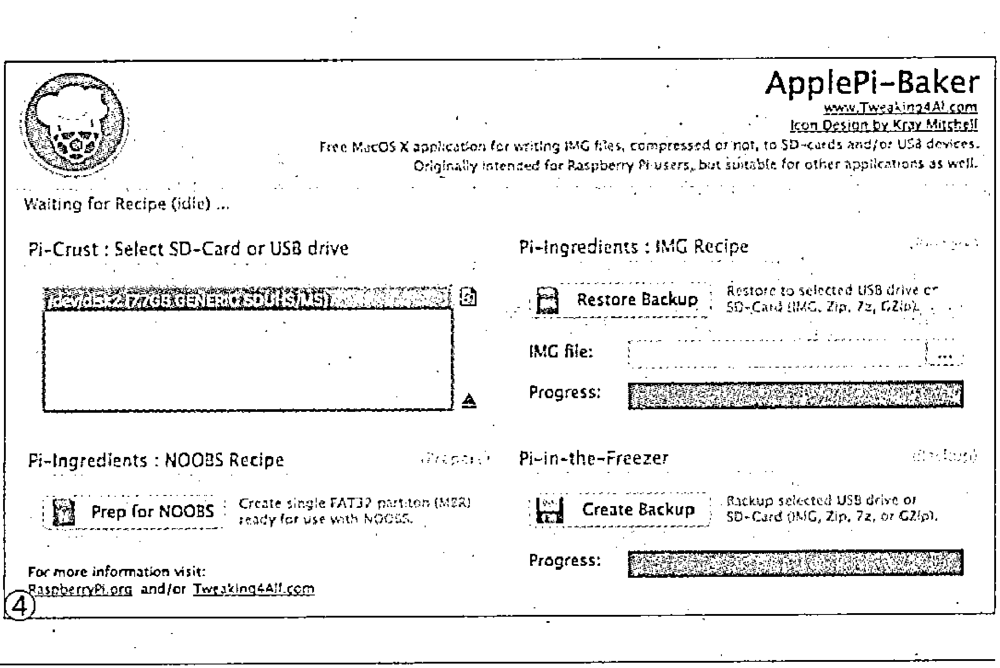

###### 连接LED灯带

首先应该将带有双面贴纸的LED灯带固定在电视背部位置（图5），确保LED灯朝外，如果电视有挂钩也可以不使用贴纸（图6）。电视背面的LED灯带应该对称，比如说如果你的电视顶部一排31只LED灯，就需要确保电视底部一排也有31只LED灯。一旦你对LED灯的位置很满意，可以撕下背面的双面胶固定住。一旦全部对准固定下来，只要剪掉任何多余的LED灯条即可。一定务必确保沿LED灯条虚线边缘剪掉，不然可能会破坏LED灯条发亮，同时还有安全隐患（图7）。


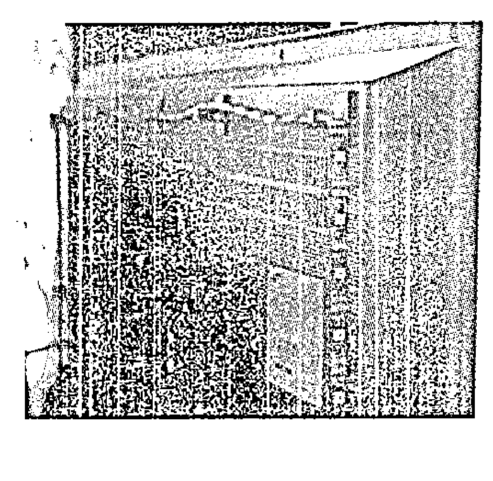

之后将LED灯条插入到Lightberry HD装置，将黑色连线连到随附的方形Lightberry HD接口内。连好后将随附的USB连线从Lightberry HD插入到Raspberry Pi上可用的USB端口。连接HDMI分配器和转换器，将随附的HDMI线插入到HDMI分配器的“输出端1”，并插入到HDMI视频转换器的输入端。HDMI分配器的第二个输出端为电视提供了视频输入，所以你还需要使用另一根HDMI线连接电视。视频转换器这一步，只要将黄色（视频）线插入到转换器的视频输出端，然后将USB线插入到Raspberry Pi装置。

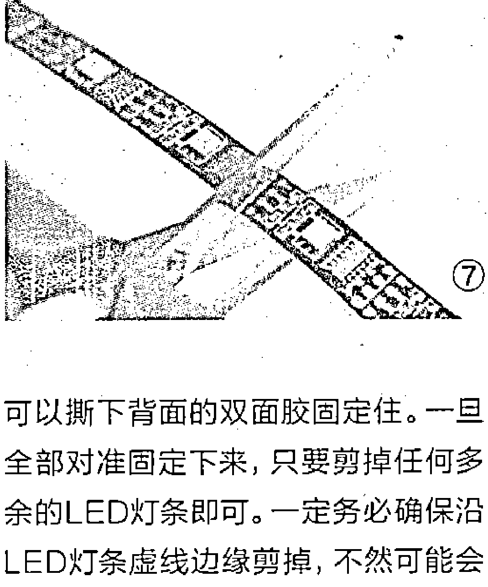

###### 配置Lightberry HD

Lightberry HD的配置，需要运行Hyperion配置。一旦Raspberry Pi连上并打开，浏览到Programs（程序）菜单，然后选择“附件”。在打开的窗口中应该会看到类似“Hyperion配置”，双击它即可运行。在这里输入LED灯的总数量，那样这些灯就能与电视上的画面对齐（图8）。然后装好的系统应该会在屏幕上显示色彩，旨在验证LED灯的位置以及它们是不是匹配。如果所有LED都通电、颜色正确，只要保存设置并退出该应用程序即可。验证完成后只需拔下Raspberry Pi，不再需要将Raspberry Pi连接到电视上，只要LED灯条属于通电状态即可实现流光溢彩的效果。

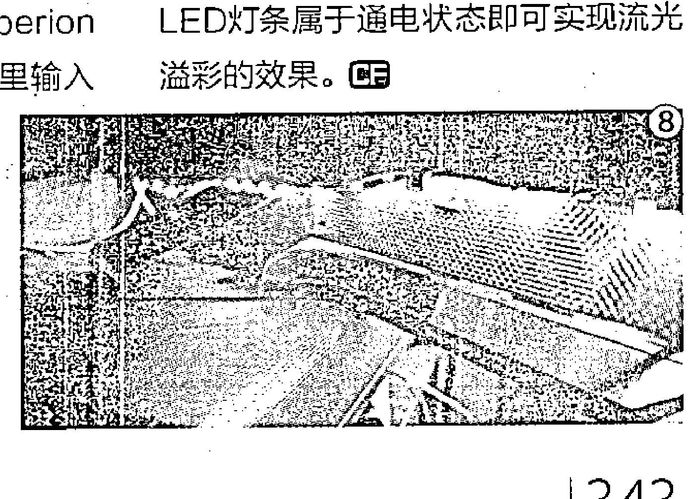

##### 网卡链路聚合 简单设置实现双倍带宽

文|沈建苗

如今所有主板至少自带一个千兆以太网端口，有些高档主板带有两个端口。很多用户都不知道家用环境下双网卡主板如何充分利用两个网口，其实使用链路聚合（Link aggregation）就是一个好思路。

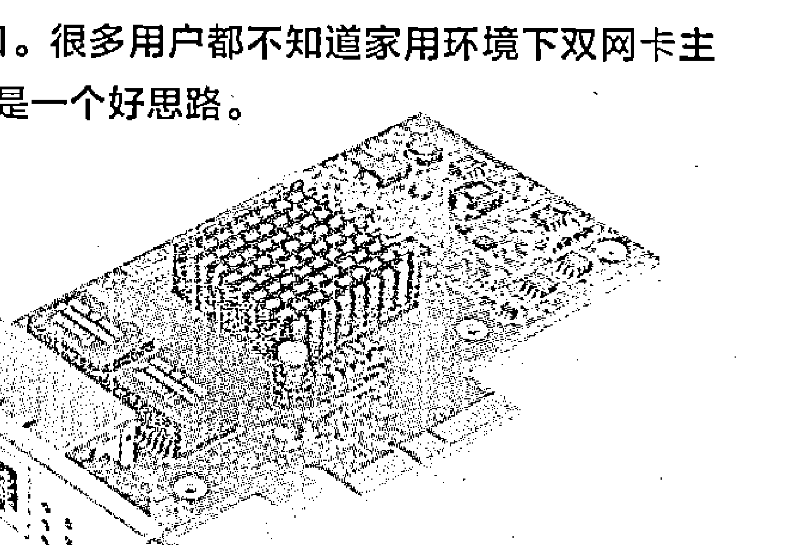

###### 双倍带宽的链路聚合

链路聚合是指将两条或多条物理以太网链路聚合成一条逻辑链路。所以，如果聚合两个1Gb/s端口，就能获得2Gb/s的总聚合带宽(图1)。聚合带宽和物理带宽并不完全相同，它是通过一种负载均衡方式来实现的。在用户需要高性能局域网性能的时候很有帮助，而局域网内如果有NAS则更是如此。比如说我们在原本千兆(1Gb/s)网络下PC和NAS之间的数据传输速度只能达到100MB/s左右，在链路聚合的方式下多任务传输速度可以突破200MB/s，这其实是一个倍增。

链路聚合原本只是一种弹性网络，而不是改变了总的可用吞吐量。比如说如果你通过一条2Gb聚合链路将文件从一台PC传输到另一台PC，就会发现总的传输速率最高为1Gb/s。然而如果开始传输两个文件，会看到聚合带宽带来的好处。简而言之，链路聚合增加了带宽，但并不提升最高速度，但如果你在使用有多个以太网端口的NAS, NAS就能支持链路聚合，速度的提升是显而易见的。

目前家用的局域网环境不论是线缆还是网卡多数都停留在1Gb/s的水平，如果你想要真正的更高吞吐量改用更高的带宽比如10Gb/s网卡，但对于大多数家庭用户万兆网卡是不太可能的。就算我们使用普通单千兆网卡主板，通过安装外接网卡来增添一个网络端口就能实现效果。

###### 链路聚合准备工作

首先你的PC要有两个以太网端口，想要连接的任何设备同样要有至少两个端口。除了双千兆(或一集成一独立)网卡的主板外，还需要一个支持链路聚合(LACP或802.1ad等)的路由器。遗憾的是很多家用路由器不支持链路聚合，选择时要注意路由器的具体参数，或者干脆选择一个支持链路聚合的交换机。

除了硬件方面的要求，还需要一款支持链路聚合的操作系统。我们目前广泛使用的Windows 7并没有内置的链路聚合功能，一般微软要求我们使用Windows Server, 但其实Windows 8.1和Windows 10已经提供支持了。其实如果操作系统不支持，可以考虑使用厂商提供的具有链路聚合功能的驱动程序，比如英特尔PROSet工具。另外，操作系统Linux和OS X都有内置的链路聚合功能。

- 主板 华硕Rampage IV
- 处理器 英特尔酷睿i7-3970X
- 内存 三星DDR3 32GB
- 硬盘 三星850Pro 1TB (RAID 0)
- 交换机 网件ProSAFE XS708E 10GbE
- 网卡 双端口10GBASE-T P2E10G-2-T
- 线缆 CAT7

###### 链路聚合网络配置

首先在测试中我们选用了一块双端口网卡，实际上如果用户的主板拥有双网卡可以省略这一步。由于部分品牌之间的独立网卡和普通主板中的单网卡可能会有一些网络之间的不兼容，如果想避免麻烦，可以直接选用这类双接口网卡。

之后就是设置交换机了, 如果我们拥有一个支持链路聚合的路由器, 直接去设置路由器即可。支持的标志是设备拥有管理功能, 允许我们可以绑定单个端口。网件ProSafe XS708E随带的一个实用工具允许绑定特定端口，## 硬件应用

界面具体取决于使用什么样的路由器或者交换机。比如网件R8500以上级别的路由器自带链路聚合功能，界面采用WEB方式管理，链路汇聚的设置可以说是相当方便（图2、图3）。链路聚合设置时分为静态和动态，分别是Static和LACP，简单解释，静态聚合就是由用户手工配置，不允许系统自动添加或删除汇聚成员中的端口。而动态聚合系统自动创建或删除，成员内端口的添加和删除是协议自动完成的。只要速率和双工属性相同、连接到同一个设备、有相同基本配置的端口，就能被动态汇聚在一起，之前我们说过尽量选用同一种网卡就是为了动态聚合的。

##### Windows设置过程

如果在Windows中设置，要注意家用版本只有从Windows 8.1开始到目前的Windows 10才支持网卡绑定功能，或者服务器版本Windows Server。以Windows 10专业版为例，在搜索中输入PowerShell，右键用管理员权限启动，打开一个DOS界面，使用“Get-NetAdapter”命令找到我们的网卡（图4），用“New-NetLbfoTeam”命令创建网卡组。不使用交换机完整的命令行（图5）是“New-NetLbfoTeam (自填网卡组名称) -teamingMode SwitchIndependent”，而使用有链路聚合功能交换机时后缀要改为“-teamingMode Static”或者“-teamingMode LACP”。确定之后根据系统提示输入两个网口的名称，在网络界面就可以看到创建的网卡组了（图6）。

Windows Server的设置方法完全不同，以Windows Server 2012 R2为例，打开服务器管理器单击上面的本地服务器，会看到一个名为“网卡绑定”NIC Teaming的选项（图7）。点击“禁用”选项你会看到绑定配置器，两个网卡接口都已显示在适配器和接口下面（图8）。现在选择这两个接口，右键选择绑定新接口，在弹出的窗口中你会看到一个字段，为新的逻辑接口命名，单击确定（图9）。为了获得最大的兼容性，选择绑定模式Teaming Mode下面的“与交换机无关”（Switch Independent）。一旦完成这步，在网络界面会看到刚命名的由两个物理接口组成的逻辑接口。如果一切正常，你的两路物理连接都会显示活动状态，你可以在下面看到传输细节。可以说Windows Server版本就是家用Windows中没有的图形窗口界面方式，比起家用版本的操作要直观得多（图10）。

##### OS X设置过程

在OS X中设置链路聚合要简单一点，不需要特殊工具或第三方驱动程序，功能被很好地内置到默认的网络偏好设置中。打开系统偏好设置进入网络选项，点击设置齿轮图标选择管理虚拟接口（Manage Virtual Interfaces）（图11），选择新建链路聚合（New Link Aggregate）（图12）。在弹出的物理接口列表中选择想要绑定的那些接口，勾选后命名并创建（图13）。如果一切顺利，绑定的两个或多个物理接口会从网络接口列表中消失，取而代之的是刚创建的那个逻辑绑定接口，如果指示灯变绿色表明已成功（图14）。想看连接性能如何可以选择那个逻辑接口，单击高级就能看到其状态，还可以配置其他选项，比如IP地址和DNS等（图15）。

##### 在PC上玩PS4

###### Remote Play PC流媒体传输

文|沈建苗

PlayStation 4这款游戏机在下一代游戏玩家当中大受欢迎，不过它缺少Xbox One提供的一项关键特性：通过PC玩游戏机的功能。Windows 10版的Xbox应用程序是一款很出色的应用程序，因为设置它可以让你将游戏从Xbox One流媒体传输到PC，只要PC与游戏机在同一个网络上，几乎没有滞后。但现在，在PS4上这种体验已经成为一种可能。

###### 流媒体与传统方法的差异

传统PC和家用游戏共有的用户，如果想在电脑桌附近打游戏有两种办法。如果游戏机官方支持HDMI输出（图1），而显示器也带有HDMI接口，直接将HDMI视频线连接至显示器即可，需要做的只是切换显示器输入模式。就算是接口不完全匹配，在很多时候也可以通过转接线实现。

这两者有什么不同呢？如果是普通需求的用户完全可以直接连接显示器，让游戏机连接PC主要是可以方便使用PC截图、录制视频画面和网络直播（图4）。同时在一些游戏当中可以一边查阅攻略资料一边游戏，也是比较方便的事情。本文所说的流媒体传输本质上讲与视频采集卡有些类似但又略有不同，比较适合需要将游戏画面传输至PC及其操作系统当中的用户。

而另外一种比较传统的方法就是使用视频采集卡（图2）。视频采集卡与直连显示器有本质上的不同，它是通过物理的扩展或外设卡通过视频采集方式将画面显示在PC的操作系统当中（图3），而直连显示器只是将信号提供给了显示器而并非PC和操作系统。

###### 索尼的Remote Play功能

索尼为PS Vita用户提供了远程游戏（Remote Play）功能，可使用Vita的触摸屏向后控制按钮来取代R2和L2并不好，而且拥有PS Vita的用户并不多（图5）。在Windows 10中通过PC玩Xbox One游戏的功能要归功于Xbox应用程序（图6），索尼官方的Remote Play应用程序可能还有一段时日才会问世，目前没有为PC用户提供任何类似功能。

第三方程序开发商Twisted基于Remote Play推出了Remote PC Play，可以进入其官方网站下载。

目前这个非官方应用程序Remote PC Play就是在不购买视频采集卡的前提下最好的解决方案，让用户可以通过PC用流媒体信号传输的方式玩PS4。

###### Remote PC Play设置

我们在去年曾经介绍过在Windows 10中的Xbox应用程序流式传输Xbox One游戏的设置方法，Remote PC Play设置过程不如Xbox官方程序来得简单，不过整个过程仍很顺利。主要过程包括四个部分：安装激活、注册PS4、连接PS4、通过网络来连接。

####### 安装和激活

先从这里（http://tmacdev.com/forum/files/file/2-remote-play-pc-alpha/）下载和安装Remote PC Play，Windows 10用户首次试图打开Remote PC Play时，可能会遇到“Windows保护你的PC”提醒信息，这是由于该软件是新的，Windows还不识别它（图7）。只要点击忽视提醒，应用程序会正常打开。

然后激活应用程序，可以输入购买程序电子邮件中提供的许可证密钥，或者其他方式激活该应用程序。一旦激活成功，该应用程序应该会显示一条消息证实激活已成功，然后应用程序会关闭。这时我们要做的是重新打开应用程序，重开后应该可以继续这个设置过程，不会看到输入激活码的提示。

####### 注册我们的PS4

进入到Remote Play Connect菜单待机，准备开始注册。注册PS4前需要注意在注册这一步时必须保证PS4和对应的PC在同一个网络环境内。注意这只限于注册，而之后的使用是可以通过远程互联网的。

打开PlayStation 4进入到设置、Remote Play连接设置中选择添加设备，添加设备设置中记下屏幕上显示的数字，这个数字代表着我们的PS4游戏机的身份，PC程序就是通过数字来识别PS4的（图8）。

在Remote PC Play应用程序中，将刚才记下的数字输入到PIN栏，并且还需要输入目前登录到PS4账户的在线ID（图9），也就是玩家们常说的PSN ID。这个ID区分大小写（图10），如果用户没有把握，可以进入到PSN网站，拷贝粘贴Online ID，确保信息输入正确，正确输入并且确认后就可以完成注册了。点击“Register”按钮几秒钟后，应该会显示一条消息告诉你PS4已注册成功，一旦显示该消息，只要点击OK就可以继续下一步了。

####### 局域网连接PS4

如果使用Remote PC Play，有两种方法可以连接到PS4：直接连接（Direct Connect）或搜索和连接（Search and Connect）。如果你对网络和端口转发不太了解，就选择“搜索和连接”方法。如果你知道PS4的公共IP地址，只要将地址输入到顶部字段，点击“直接连接”即可。搞不清楚什么叫公共IP地址的可以通过www.whatismyip.com找到你PS4的地址。请注意不论哪种方法进行时PS4都要完全通电（待机和休眠状态不行），才能通过直接连接使用Remote Play，不过想通过互联网玩PS4就需要这种连接类型。之后就是配置控制器（图11）。Remote PC Play不像使用Xbox的官方Xbox应用程序那么方便，Remote PC Play需要你手动配置控制器，只要配置一次即可，以后都会长时间生效。点击Settings（设置）> Controller（控制器），从下拉菜单中选择控制器类型，然后逐个映射按键（图12）。比较特殊的是这个程序除了游戏控制器之外还支持键盘鼠标，完成后只要关闭窗口，你的设置就会保存起来。前两个步骤都正确设置好后就可以试玩游戏了，玩游戏之前还可以调整分辨率和刷新率（图13），但目前Remote PC Play支持比较好的只有720P下才能实现60fps，如果放大至1080P的话你会发现游戏画面细节会有一定发虚的现象。如果你正确遵照步骤说明，应该会看到在应用程序窗口中央显示的一段视频流。想控制PS4开始玩游戏，只要确保主窗口已选中就可以玩游戏了。

####### 通过互联网来连接

想通过互联网连接到PS4，你先要在主路由器上进行端口转发。如果你不确信如何在路由器上进行端口转发，可以在此（http://t.cn/R4KazoZ）查看具体型号获得相关的操作说明。在路由器设置中，下列端口UDP 987、TCP 9295和UDP 9296需要保持打开状态。确保路由器端口已经打开后就开启PS4，在Remote PC Play应用程序中，输入你PS4的公共IP地址。从PS4浏览器进入到www.whatismyip.com就能找到该地址。点击Direct Connect，要是一切顺利你应该连接到PS4，可以通过互联网玩游戏了。

##### 酷睿何必要买K

###### Z170主板随便超频Skylake

文|曹操

由于AMD近期产品不算给力，没有太多竞争压力的英特尔逐渐收缩了可超频处理器的阵线，唯有昂贵且稀少的K系列黑盒版才具备超频资质。那么，不带K的英特尔处理器真的就无法超频了吗？

###### Z170主板向锁频机制开炮

Z170是英特尔100系列芯片组中的“旗舰”，提供了多达20条PCI-E 3.0总线、6个SATA 6Gbps接口、3个SATA Express和RST PCI-E接口、10个USB3.0，就规格而言简直亮瞎眼。此外，支持超频的特性，也让Z170成为了Skylake K系列黑盒版处理器的御用装备。然而，英特尔Skylake阵营中常规的酷睿i7、i5、i3和奔腾却被英特尔“锁频”，于是Z170也就成为了让普通用户“可远观而不可亵玩焉”的对象。

英特尔的“锁频”策略激起了很多DIY玩家的不满。2015年底，先有超频玩家DHENZJHEN通过硬改主板结构（图1），让H170主板将不带K的酷睿i3-6320超频20%（图2），打破了Skylake非K系列处理器解锁超频（外频、主频）的历史从而引起了DIY领域的震动。随后，在各大厂商、DIY玩家和相关论坛圈子的反复论证和尝试之下，终于让Z170主板无需硬改，只需升级BIOS即可实现对非K系列的i7/i5/i3甚至奔腾处理器进行超频。至此，昂贵的黑盒K系列再也不是爱好超频的玩家首选，哪怕是廉价的酷睿i3，在与Z170和指定BIOS的帮助下也能获得逆袭i5甚至i7的机会，这才是DIY的乐趣，不是吗？

###### 哪里下载Z170的解锁BIOS

虽然Z170能破解非K系列Skylake处理器的超频权限已不是秘密，但这毕竟是有违英特尔的初衷，所以各大主板品牌对此的态度大都三缄其口。在国内，只有极少数厂商敢提供解锁Z170超频机制的BIOS下载。比如映泰虽然在官网开放了GAMING Z170W主板提升非K处理器超频性能的BIOS，但在后面也强调了“仅供测试用”的声明（图3）。如果你购买了华硕、微星、技嘉和华擎等一线品牌的Z170主板，可以登录“overclocking网站”（http://t.cn/RbuDG0F）下载对应主板的解锁BIOS（图4）。

> **小提示**
>
> 由于英特尔官方是不允许解锁Z170超频机制的，所以overclocking网站也经常打不开。所以建议Z170主板用户可以提前下载备份好解锁BIOS，防止被彻底封杀后无处下载的可能。

| 文件 | 说明 | 文件大小 | 上传日期 |
|---|---|---|---|
| Z17CFC18.BUT.rar | 提升非K处理器超频性能，仅供测试用 | 5401.15 KB | 2015-12-18 |
| Z17CFB19.BST.rar | 提升VGA Card开机稳定性 | 5388 KB | 2015-08-19 |
| Z17CFB13.BST.rar | 提升超频稳定性 | 5385.11 KB | 2015-08-13 |
| Z17CF731.BST.rar | 简体BIOS | 5385.78 KB | 2015-07-31 |

###### Z170如何超频非K系处理器

如今的主板大都提供了非常友好的BIOS升级功能，首先要做的自然是将BIOS升级到刚刚下载的解锁版（图5）。下面笔者就以华擎Z170主板和不带K的酷睿i5-6500处理器为例，简单介绍一下超频思路和注意事项。

在超频前，我们需要关闭酷睿i5或i7的睿频加速功能（图6），并建议将CPU风扇的转速调高（图7）。

需要注意的是，非K系列Skylake处理器都被英特尔锁死了倍频，而我们升级破解Z170主板的BIOS，获得的只是对修改外频的权限。换句话说，Z170主板只能通过提升外频的手段对非K系列Skylake处理器进行超频。而外频的提高也会带动内存频率的提升，如果你对自己内存的体质没有信心，在超外频后记得锁定或降低内存频率。每一款处理器的体质都是不同的，所以外频提升的幅度需要自己慢慢摸索。比如本文的酷睿i5-6500就能在1.35V的电压下（图8），稳定将外频提升到139（图9），相当于处理器主频增加了39%，从默认的3.2GHz超频到了4.4GHz（图10），此时的性能足以掀翻K系列的酷睿i7。

Skylake处理器的超频体质都还不错，一般在不加压的情况下都能稳定超频15%~20%。但是，对非K系列的Skylake处理器超频后会带来一些后遗症：

- 1. 任何软件都无法正确读取CPU的核心温度；
- 2. C-States状态失效，CPU可能将始终运行在超频后的状态下；
- 3. 集成的核芯显卡失效，所以只适合使用独显的平台超频。

如果你能接受上述三个缺陷，那就不妨尝试一下Z170主板的免费大餐吧。

##### 电脑故障多

尝试自己解决小问题

PC在长时间使用后可能会出各种各样的问题，尤其是用户自行DIY的组装机。在质保期外时DIY电脑的维修很麻烦，故障中有硬件因素也有软件原因，解决方法五花八门。下面我们挑选了一些相对比较典型的台式机故障，以及可能解决的办法和思路。

###### 存储问题

硬盘、光驱等存储驱动器实际上是DIY电脑之中出故障率很高的一环。很多用户还在使用HDD硬盘，其速度和性能本身就不佳，如果还有故障整个电脑就会变得非常难用。如何解决常见的硬盘等存储驱动器问题？

####### 问题1 硬盘消失

不少人都遇到过硬盘驱动器整体消失的问题。如果驱动器之前可见，第一步我们应查看该驱动器是否还能出现在BIOS中（图1）。要是没出现在BIOS中可以尝试换掉SATA线甚至电源线缆，如果换线或者重新连接后驱动器出现，我们应该对它运行CHKDSK来查错。办法是在我的电脑中右击该驱动器选择属性，然后选择工具选项卡，最后选择开始检查和自动修复文件系统错误（图2）。如果驱动器出现好多错误运行不稳定，但在Windows中可见，应该使用HDTune等软件检查硬盘的SMART信息，如果在健康一项有错误，应立即将所有数据拷贝出来。

要是驱动器始终不可见，可以考虑使用很多用户常见的偏方就是冷冻，将HDD防湿处理后放入冰箱冷藏室一小时，有些时候会让硬盘得以起死回生，提供拷贝出数据的机会。如果驱动器连接后提示对它进行初始化，就要根据数据的重要性考虑是不是求助专业的数据恢复公司了。

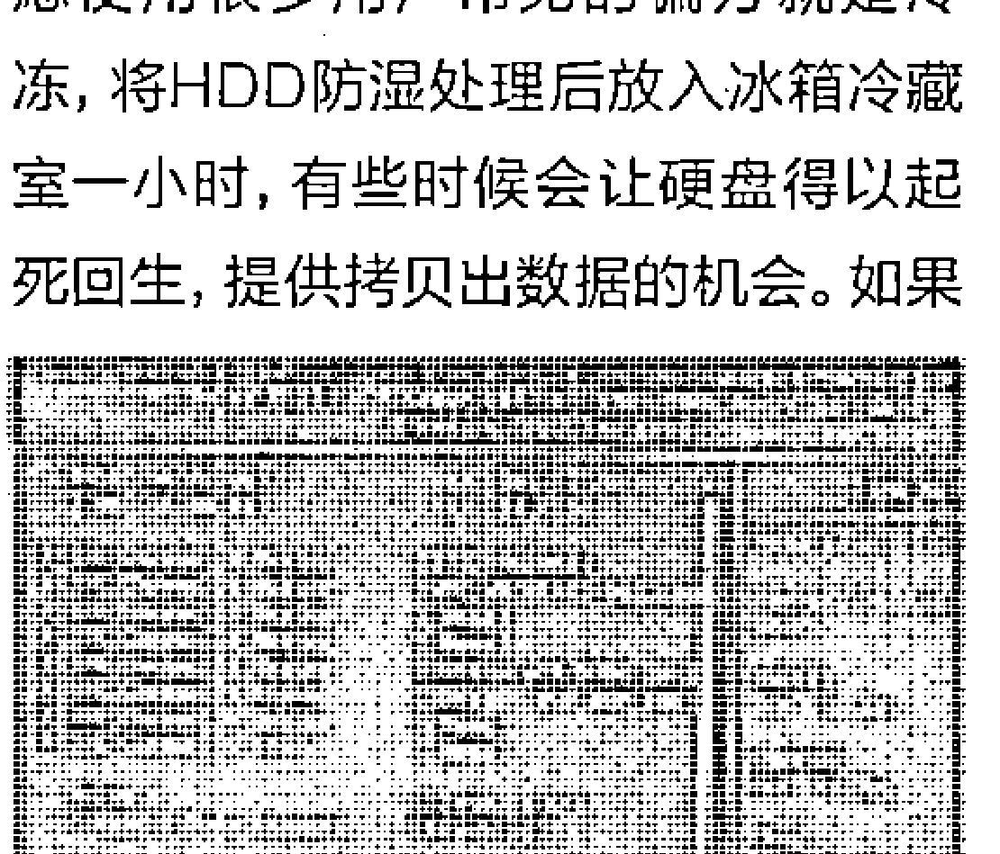

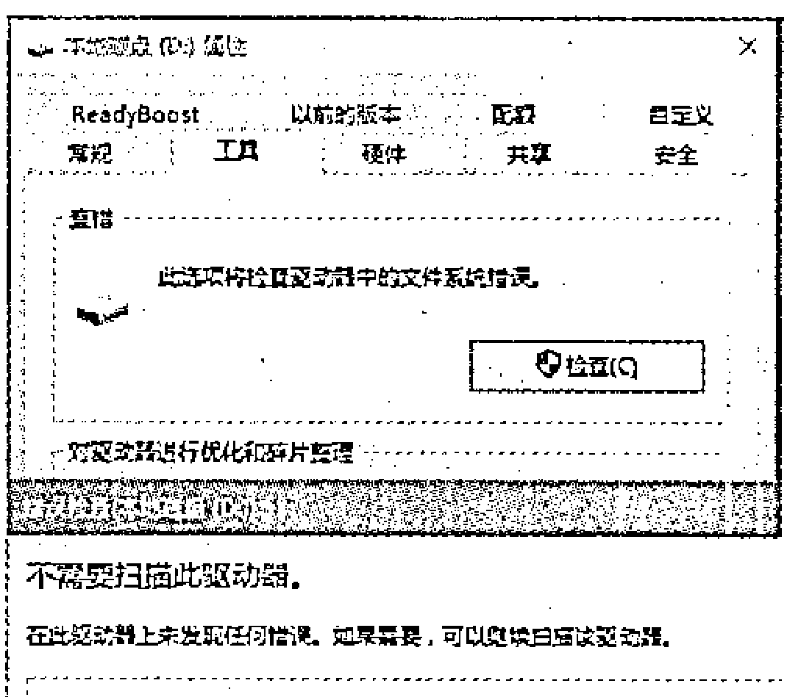

####### 问题2 光驱消失

光驱的问题不光是指驱动器消失，还包括了突然停止运行。在开始菜单的搜索栏输入regedit，然后浏览注册表编辑器到HKEY_LOCAL_MACHINE\SYSTEM\CurrentControlSet\Control\Class\{4D36E965-E325-11CE-BFC1-08002BE10318}（图3）。如果看到名为UpperFilters的条目或者LowerFilters的条目，将其删除。之后退出注册表编辑器重启系统，在大多数情况下光驱会重新出现并开始工作。

| 名称 | 类型 | 数据 |
| :--- | :--- | :--- |
| (默认) | REG_SZ | (数值未设置) |
| Class | REG_SZ | CDROM |
| ClassDesc | REG_SZ | @%SystemRoot%\System32\StorProp.dll,-17001 |
| EnumPropPages32 | REG_SZ | storprop.dll,DvdPropPageProvider |
| IconPath | REG_MULTI_SZ | %SystemRoot%\System32\imageres.dll,-30 |
| NoInstallClass | REG_SZ | 1 |
| SilentInstall | REG_SZ | 1 |

注意这时可能需要重新安装光驱的软件，比如刻录软件，才能重新使用光驱的全部功能。如果这个办法依然不行，还是检查电源、SATA或者IDE线缆。

####### 问题3 未报告全部容量

这个问题通常出现在3TB或4TB的驱动器上，2TB驱动器在Windows 7中不会有问题。而Windows XP用户可能需要从驱动器厂商下载一个实用工具，以支持4K扇区的驱动器。这些3/4TB驱动器不要选择MBR磁盘格式，因MBR磁盘分区大小限制在2TB（实际上是1.8TB左右），如果想要有全部容量就要将磁盘转换成GPT。

在“开始”搜索栏输入cmd，在提示符下输入diskpart列出磁盘，然后选择磁盘转换成GPT（图4）。现在进入到“磁盘管理”，即可创建大容量的单个分区。建议在新的操作系统下所有2TB以上的硬盘都使用GPT格式来初始化，这样对于UEFI启动支持得也更好。

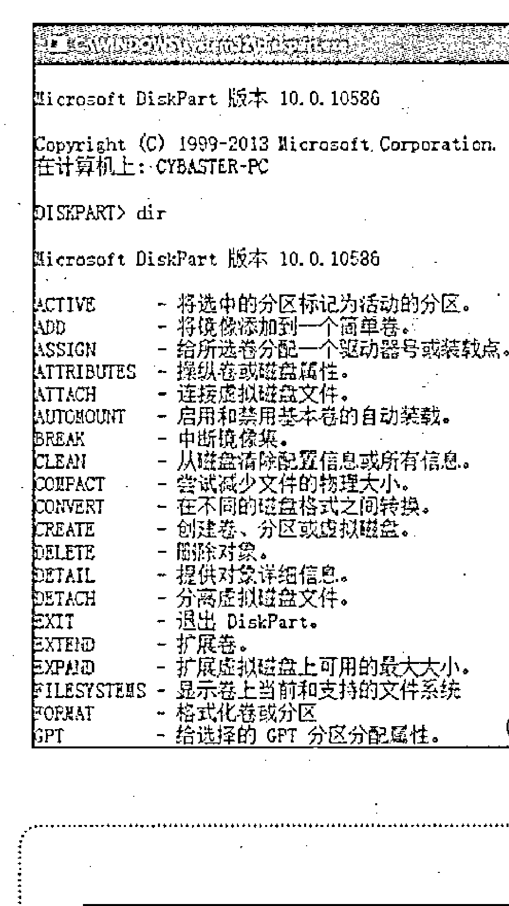

####### 问题4 AHCI/IDE切换蓝屏

有时候人们没有启用AHCI就安装Windows 7，结果想切换性能更好的AHCI导致Windows蓝屏死机。解决这个问题只能编辑注册表，在运行中输入regedit，然后浏览到HKEY_LOCAL_MACHINE\SYSTEM\CurrentControlSet\services\msahci，点击修改Start值，将窗口中的值改为“0”后点击确定（图5）。退出注册表编辑器重启系统，此时才可以在BIOS中将SATA控制器模式从IDE改为AHCI，这样才可以不蓝屏正常启动进入Windows。

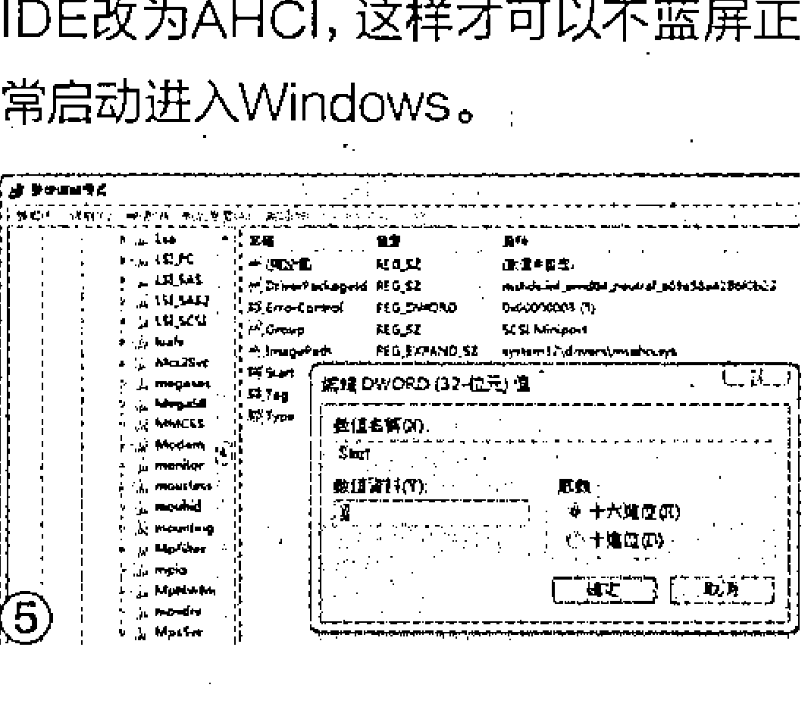

####### 问题5 保证SSD性能

SSD性能已经要比HDD好得多了，我们很多时候直接插上使用，性能就可以比HDD大幅提升。不过还是有一些细节需要注意，首先要确保驱动器连接到主板上的原生SATA 6Gb/s端口。这里推荐不要依靠颜色和经验来判断，建议参考主板说明书。安装系统前一定要先进入到BIOS，确保该驱动器的SATA端口已设为AHCI模式而不是IDE模式，因为这种模式可以带来更好的性能，而且也不会再有后期切换的麻烦。

###### USB接口故障

不得不说台式机的USB接口实在是问题很多，而且不同机箱不同主板的接口情况还不尽相同，时间一长很容易出故障，还不好判断解决。要是我们的老电脑USB接口无法使用该如何是好？

####### 问题1 个别USB端口用不了

有很多因素会导致USB端口用不了。如果是新装机故障，前置端口确保内部线缆连接正确，并已在系统BIOS中启用了必要的USB接口。如果端口在主板上，打开设备管理器，看看有没有USB总线控制器或集线器报告有问题（图6）。如果有问题，更新驱动程序有可能解决问题。老平台的USB接口突然失灵，也有较低的可能是连接器损坏或者保险丝烧断，这种情况下就只好将新的端口重新焊到主板上。有不少主板的USB端口是第三方控制器提供的，此时第三方主控的驱动程序嫌疑会很大，尤其是在Windows更新之后，因为Windows有些时候无法自动识别控制器。

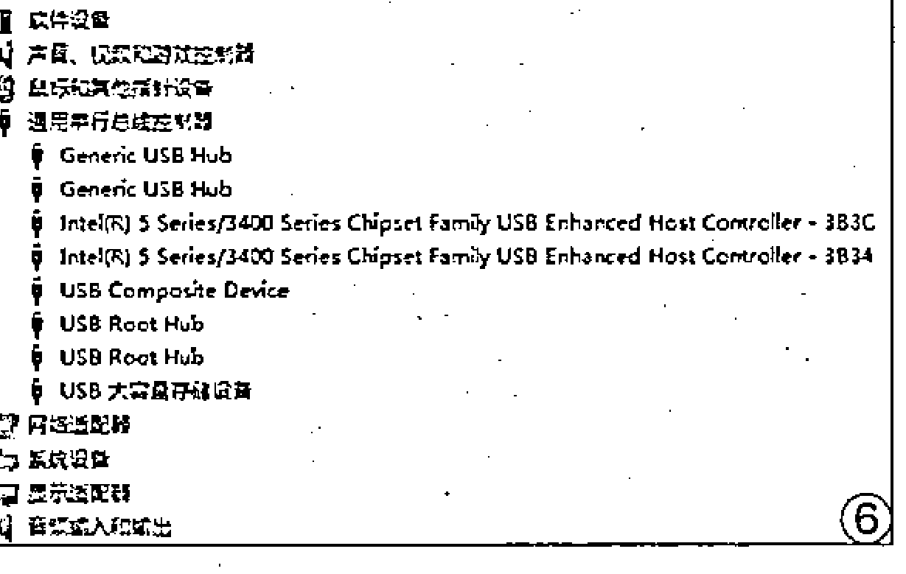

####### 问题2 USB集线器问题

USB HUB时有时无，这个问题和移动硬盘一样几乎总是由供电不足引起的。如果集线器随带AC适配器，一定确保它已插入（图7），如果是不带适配器的集线器，推荐将集线器插入到主板上的后置端口。现代主板后置端口通常可以提供更稳定的电量，这可以解决供电紧张集线器的一些问题。

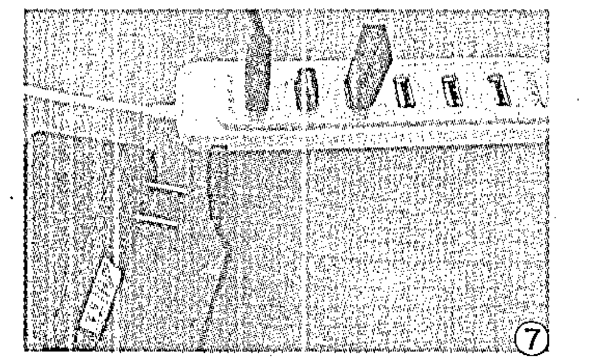

####### 问题3 USB接口性能

相信不少人都有这样的体验，通过PC的USB端口给手机充电非常慢或者一直充不满。连接到根集线器的标准USB 2.0端口要共享500mA的电流，如果你连接了一堆USB设备手机所插的那个端口争夺有限的电量，那么充电时间比平常要长得多。尽量将手机插到USB 3.0端口，或者给手机充电时断开其他USB设备。此外技嘉等一些主板厂商已开始将可供应2.7A电流的高功率USB端口添加到主板上，如果想给连接到系统的设备快速充电，使用这类主板是比较靠谱的（图8）。

Windows 7存在一些已知的USB性能问题，所以首先要做的是运行Windows更新，确保操作系统打上了全面的补丁。此外如果供电总是不足或者传输速度很慢，还可以试着将USB驱动器设为高性能模式。打开设备管理器右键选择USB驱动器，从菜单中选择属性。在随后弹出的窗口中点击策略选项卡，勾选标为更佳性能的选项。请注意这项功能将启用写入缓存，所以你在断开驱动器时要使用安全删除硬件选项而不是直接拔，以防数据丢失。

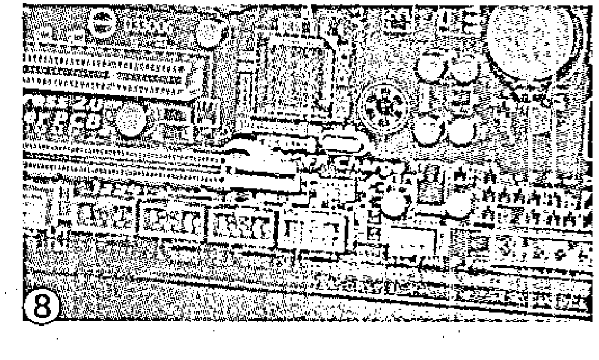

###### 显卡效率和显示器失真

一般不折腾的用户其实显卡出故障的几率并不算很高，但如果用户希望使用多显卡多显示器系统，以及对经常玩游戏的用户来讲还是有可能会遇到显示问题的。

####### 问题1 多显卡系统无法使用

双卡系统问题有诸多原因，让它们被Windows识别是头一个难题。如果CrossFireX/SLI不可见，可以考虑忽视主板的建议将第二块显卡移到不同的PCIe插槽（图9），除此之外NVIDIA的双卡还有可能出现SLI网桥错误（图10）。
而单纯的游戏效率没有提升是另一回事，因为不论是NVIDIA还是AMD驱动程序得包括针对某个游戏、基准测试或应用程序的配置文件才能让两块卡同时工作，所以通常在新游戏发布后要等一段时间才会有双卡完美运行的驱动程序。假设双卡模式在驱动程序中已启用，游戏发布已有一段时间但并没有针对多卡系统优化的驱动，你可以试着通过控制面板强行使用双卡模式（图11），不过这么做的话，是否有效是要具体看游戏的支持程度。

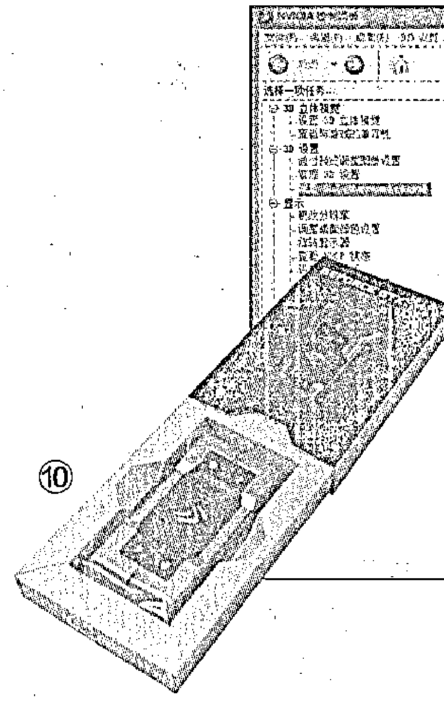

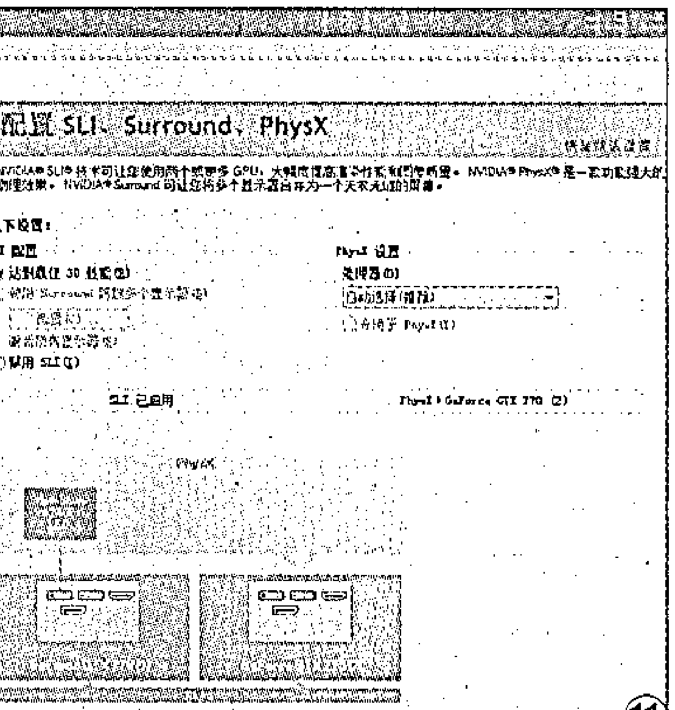

####### 问题2 多显示器无法识别

虽然多显示器问题九成都在驱动程序设置，但也有例外。比如说一些显卡使用了双DVI接口，我们在连接双显示器时其中主DVI没有线缆连接，而使用辅DVI和HDMI等线缆连接显示器就会出现问题。如果用户配置多屏时涉及到DVI接口，建议两个DVI接口都去试一下（图12）。

####### 问题3 屏幕失真和分辨率

屏幕失真其实并不算常见，但很多时候用户甚至感受不到问题的存在。比如说用户用的是2560×1440分辨率，而却使用一根单链路DVI线缆（图13）。此时虽然屏幕也能显示内容，但其实是有失真的，但并不明显。记住在2K分辨率之后必须要一根双链路DVI线缆（图14）或者HDMI线缆，而目前常见的21:9高分屏则必须要HDMI以上，3840×2160就得是DisplayPort以上线缆了。另外一提，常见PC线缆稳定性都比较好，但是只有HDMI线缆是比较容易损坏的，如果问题在线缆，建议直接换一条。

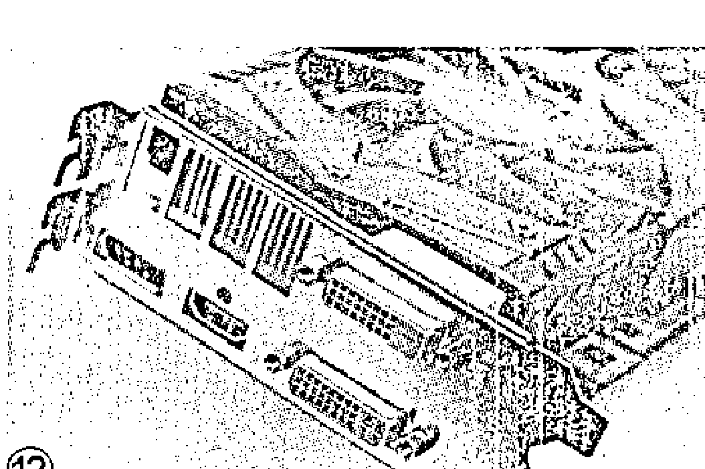

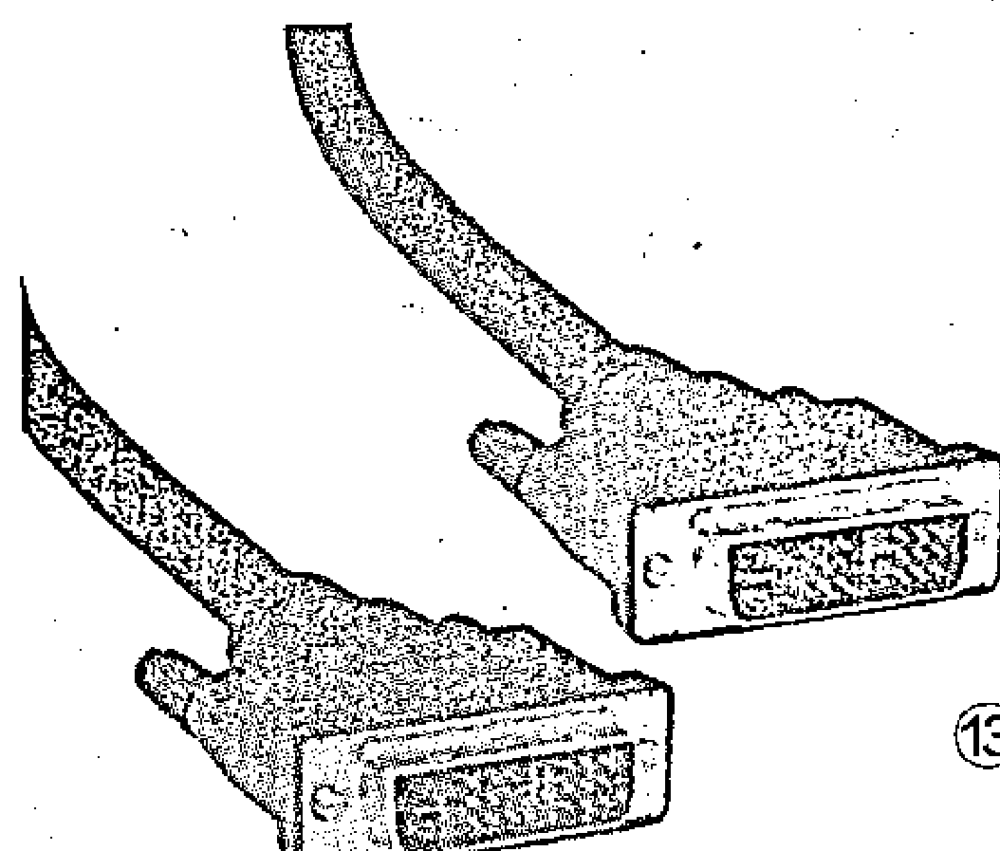

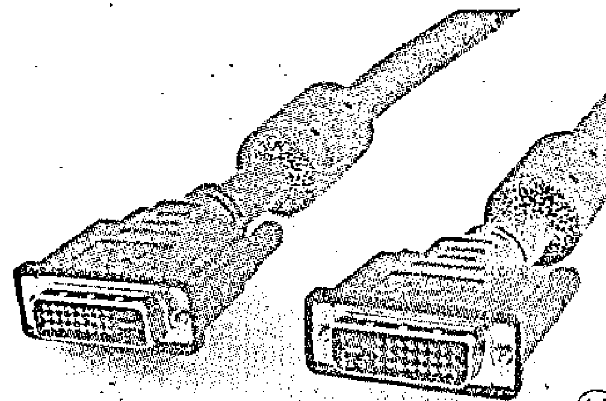

###### CPU问题

CPU很少损坏，它们通常要么能用要么不能用，硬件本身极少出问题。但是在一些经年累月使用的老平台当中也会有问题出现，可以本着先软后硬的原则找出问题并尝试解决。

####### 问题1 CPU温度和负载

CPU不稳定有时体现在电脑自动重启以及蓝屏等等症状上。测试CPU频率可以考虑CPU-Z，而检查CPU温度推荐AIDA64。如果处理器频率正常在默认频率和睿频之间浮动，但处理器温度依然很高，就可以考虑散热器和硅脂问题。判断散热器是否正常工作最简单的办法就是在CPU温度很高时打开机箱侧板去用手测试热管（图15）或者散热鳍片的温度，这是一个最行之有效的导热正常与否的测试，但一定注意轻触以防烫伤。部分硅脂在长时间使用后需要更换，还可以顺便清理一下散热器上的灰尘。

####### 问题2 CPU内存控制器故障

CPU内存控制器故障常常出现在很多老旧电脑上，在单条内存单通道时电脑可以启动，但增加一条内存时就无法开机，特别是在用户彻底除尘后容易出现。如果我们已经清理过内存金手指和内存插槽问题依旧，也可以试试另外一种办法。
首先在单通道下使用Memtest86+（图16）测试每一条内存是否正常，如果不是内存问题就应该考虑交换内存安装的顺序，或者更换插槽来使用。在Intel平台上还有可能出现CPU拆装时弄弯主板针脚导致无法识别双通道（图17），此时可以使用自动铅笔头上的金属小管（图18）或者趁手的工具修复针脚，但一定要非常小心，不要弄弯其他针脚。


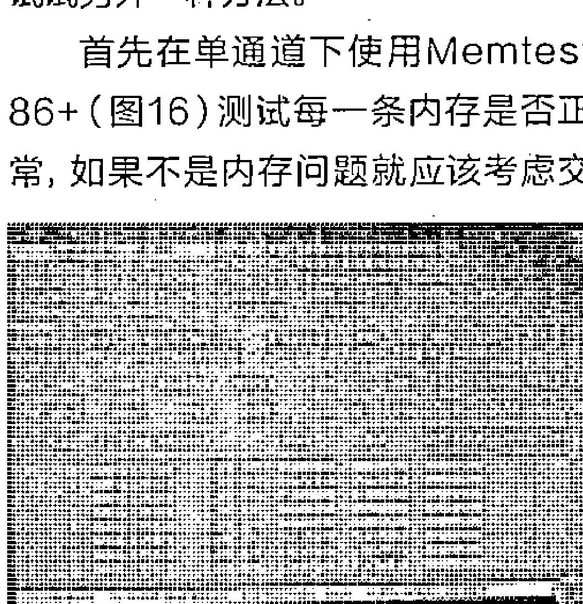

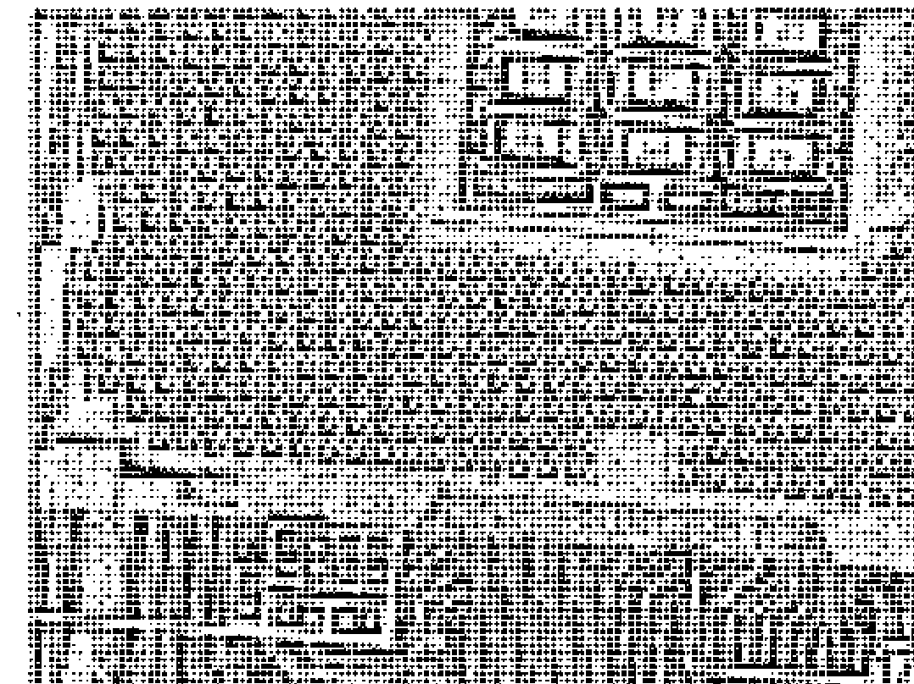


##### 门道真不少

###### 如何DIY桌面级平板电脑

文|王世泽

随着微软Surface Pro 4与苹果iPad Pro的发布，超大平板电脑将挑战传统PC的市场地位。不过，上述产品的价格多不便宜，我们能否自己动手，通过台式机平台DIY一部可触控的平板电脑呢？本文我们就将事关成败的细节问题一一呈现给大家。

####### 挑选及安装各个配件

工欲善其事必先利其器，并非所有的台式机配件都符合DIY平板电脑的条件。下面笔者就向大家推荐符合要求的配件，以及挑选它们的理由。

######## 主板——华硕H81T R2.0

-   选择理由:
    (1) 这是一款标准mini-ITX版型主板(图1)，厚度仅25mm;
    (2) 配备独特的LVDS视频接口，在BIOS中可以对LVDS进行详细的设置，在众多同类型主板中这个设置项为华硕独有(图2);
    (3) 拥有立体声扬声器连接口，一体机小音箱轻松内置;
    (4) 武装全长Mini PCIe接口及半长的Mini PCIe接口，使mSATA硬盘及无线网卡“安身”于主板之上，不占用机箱空间。上述优点，使平板电脑的内胆总高度控制在35mm内(图3)。

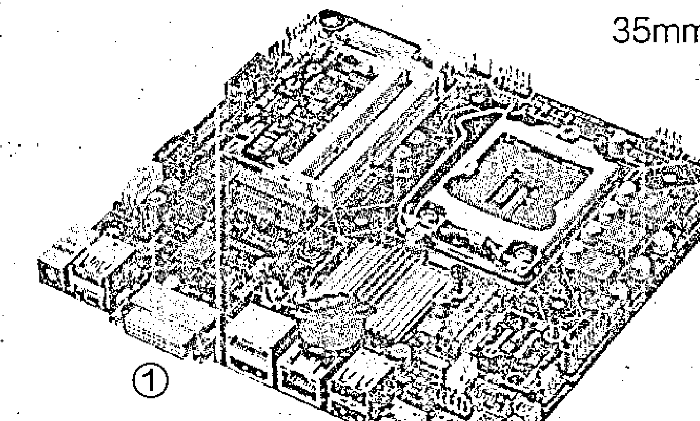

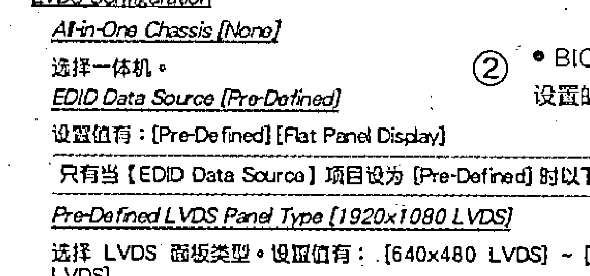

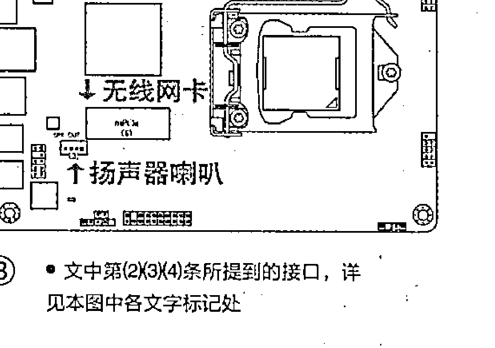

```
LVDS Configuration
All-in-One Chassis [None]
EDID Data Source [Pre-Defined]
Pre-Defined LVDS Panel Type [1920x1080 LVDS]
```

######## 液晶屏——奇美 N14006-L02

-   选择理由:
    (1) 色彩表现能力强: 这款显示屏的显示色域为: 60% NTSC (CIE1931), 对比度为: 650:1。虽然显示色域一般，但因其对比度高，所以增强了色彩的表现能力;
    (2) 外观式样: 厚屏 (PCBA弯折, 厚度≥5.2mm)。可在一定力度下有效防止其变形;
    (3) 可视角度较好: 70/70/60/60 (左/右/上/下)。

安装实战: 用一根LVDS液晶屏线将主板和液晶屏连接在一起，一次点亮。对于想使用其他尺寸液晶屏的爱好者来说，一定要仔细研读相关的设置项及屏线的线序，以保证不烧屏并最终点亮。

> 小提示
> 如果选择同种类型的标配eDP接口的主板，那么可供我们选择的液晶屏会更多。eDP是液晶屏的另一种通信接口，高清屏都采用这种通信接口。其分辨率、显示色域、显示颜色、对比度等诸多方面均优于LVDS接口的液晶屏。

######## 触摸屏——支持USB供电的14英寸16:9电容触摸屏

选择理由: 安装方法简单, 由一根外置USB线供电。

安装实战: 用壁纸刀将USB外置信号线切短剖开, 找到废弃的台式机箱上的USB信号线, 红、白、蓝、黑四条线一一对应焊接后, 插接到主板上与触摸屏距离最近的一个USB口(图4), 通电即可使用。

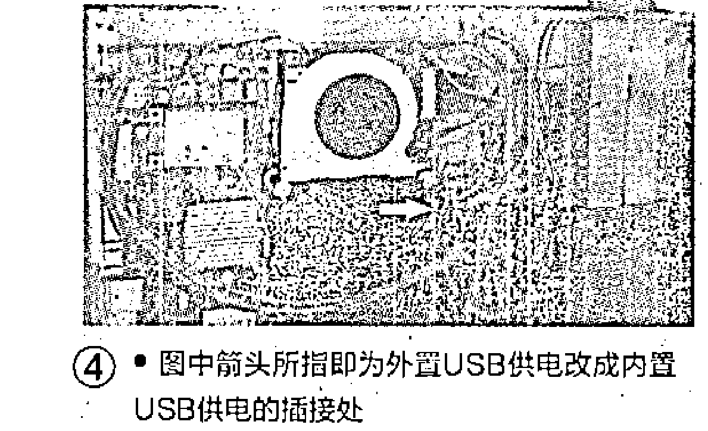

######## 小音箱——一体机小喇叭

选择理由: 华硕H81T R2.0内置立体声喇叭连接插座, 可连接内置低功率喇叭, 为系统提供基本的音频输出, 支持4欧姆、8瓦喇叭(图5)。听音乐、看视频, 声音效果还是不错的。

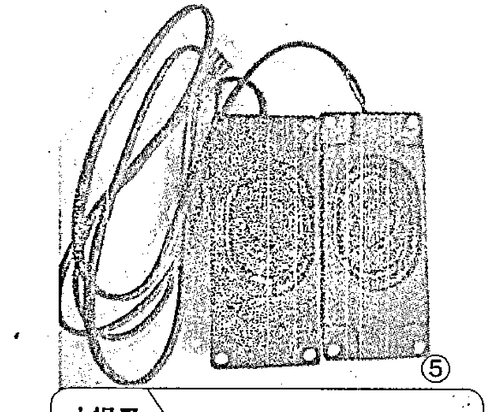

######## 小提示

当我们将一体机小音箱接入平板机箱后, 会发现连接线缆过长, 如果有一定的经济实力, 可将超薄的无线蓝牙音箱塞进平板机箱内(留出充电孔和喇叭孔的位置), 免去了线路的接驳。因为无线网卡大都支持蓝牙, 不用白不用。

######## 内置供电模块——一块充放电电路板，外加4串锂电池

选择理由:

+   1. 从理论上讲: 一节普通锂电池在充满电后电压是4.2V, 四节锂电池串联充满电后是16.8V; 根据Intel白皮书关于这类DC供电主板的说明: DC供电类型的主板输出电压是19V±5%, 4节锂电池串联后通过升压板达到19V的输出电压, 从而保证整个系统工作正常(升压板, 升高电压的一种简易装置, 能将电压升高; 下面提到的充放电电路板上就有升压板)。
+   2. 内置供电模块的工作原理: 当按下开机键以后, 首先充放电电路板上电工作, 1秒后给主板供电电路开启。这时主板带电, 然后开启主板开机按键, 主板开机。当系统被关闭时, 电路板检测到主板处于关闭状态后, 延时3秒自动断电。通过专用程序(电池电量检测程序), 实现锂电池的电压及电量采集的实时显示。当电量不足时, 专用程序会报警提示。
+   3. 平时使用这个平板电脑时, 可边使用边充电, 也可在电量不足时进行充电, 十分方便(这个模块及上面提到的液晶屏线都是网友z******开发、出售的, 为避免打广告嫌疑只好略去网友的名字, 望见谅)。

######## 自制平板机箱

选择理由: 依据此平板电脑中主板、内置供电模块及液晶屏、触摸屏的实际尺寸, 用AutoCAD绘制了工程图, 定制了一款亚克力材质的机箱(图6)。


######## 安装完成后机箱内实物图

从左到右依次为主板、充放电电路板、4串锂电池、电池上所放物品为触摸屏所属的排线及驱动板、小音箱(图7)。小音箱上方为开机开关、外接DC充电接口(图8)。


####### 基本测试及使用体验

将上述准备工作做好并将众多配件组装后点亮开机，便可正常进行系统和驱动的安装了（图9）。配置触摸屏后，大部分操作可以在“屏”上完成，开机时可不用插接键盘鼠标。接下来，我们还需用AIDA64对其进行稳定性测试。

从图10可以看出，在边充电边用这台平板看视频的情况下，CPU等主要硬件的温度可控制在40℃~47℃之间，只是PCH二极管的积热有点高，两小时后达到了53℃，接下来其温度并没有继续升高。测试后，在主板相应位置的机箱下方开孔后再次测试（图11），PCH二极管的积热控制在38℃~50℃之间。

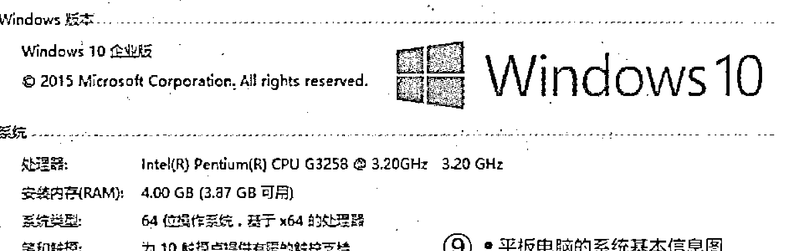


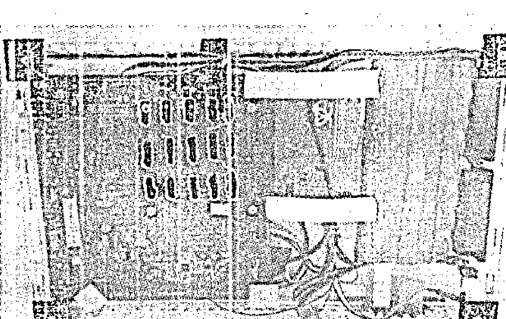

####### 还需解决的问题

-   散热：由于CPU上散热铜块仅高10mm，要是能买到20mm的散热铜块，CPU的温度有望再降4℃~7℃。现在做法是，用醋酸胶布将散热铜块包裹得严严实实，用于创建独立的风道，以保证涡轮风扇将热风直接吹向机箱外。当然，换上后缀带T的CPU，温度也会降下来。
-   噪音：目前使用的涡轮风扇马力强劲，在运行大程序时噪音有点大。尽快找到一款风力大且噪音小的涡轮风扇是当务之急。
-   内置供电模块过重：本平板电脑使用了4串锂电池，有点重。下一步研究一下聚合物电池是否支持智能充放电，以达到“瘦身”减重之目的。
-   机箱外壳过厚：本次使用的亚克力机箱，上盖部分厚8mm，其余部分厚为5mm，所以这个机箱外壳有点厚（图12）。如果使用轻巧、结实的铝合金材质做机箱，这款可DIY的平板电脑从性能上则远胜于市面上的绝大多数平板。

最后我们来算一下这台平板电脑的成本吧（见表）。总之，笔者此次将DIY平板电脑的经验和方法呈现给大家，希望能够起到抛砖引玉的作用，更希望有实力的人士和生产企业参与进来，定制个性化、功能强大的平板电脑将不再是梦。


| 组件 | 型号/描述 | 价格(元) |
| :--- | :--- | :--- |
| CPU | Intel 奔腾 G3258 | ¥450 |
| 主板 | 华硕H81T R2.0 | ¥550 |
| 内存 | 威刚4GB DDR3 1333 (笔记本) | ¥170 |
| 硬盘 | 建兴L9M 128GB | ¥370 |
| 机箱 | 加工亚克力机箱 | ¥100 |
| 底板 | 网友开发 | ¥100 |
| 液晶屏 | 奇美 N14006-L02 | ¥230 |
| 触摸屏 | 14英寸16:9电容触摸屏 | ¥435 |
| 内置电池 | 网友开发 | ¥460 |
| 无线网卡 | 博通BCM4322 | ¥30 |
| 小音箱 | 3070 4欧8瓦一体机小喇叭 | ¥15 |
| 合计 | | ¥2910 |打造完美“视界”
学会为笔记本更换IPS屏幕

如今武装GTX950M或更高级别独显的游戏本越来越多，可惜很多低价位的游戏本为了控制成本还在沿用可视角度糟糕的TN屏幕，最终造成了游戏本性能强悍而“视界”惨淡的无奈。还好，我们可以通过DIY的方式，自行为游戏本更换IPS屏幕，从而帮你找回完美“视界”。

拖后腿的TN屏幕

如今很多游戏本都主打雾面屏（不存在镜面屏反光的问题）和全高清（1920×1080像素），但真正影响视觉体验的参数却是LCD面板的类型。比如，TN屏存在先天性可视角度不佳的缺陷，屏幕角度稍不合适就会出现偏色或泛白的现象，哪怕游戏本配置再高也无法弥补“视界”上的不足。因此，有无配备IPS屏幕，就成了选购游戏本（包括普通笔记本）的关键要素了（图1）。问题是，有些游戏本只有高配型号才配备IPS，而中低配则为TN屏，二者价差也多在千元以上。此时，如果我们能掌握自己更换IPS屏幕的技巧，无疑可以省下更多预算。

换屏成本没想象的高

在淘宝（天猫）上有很多专营笔记本屏幕的商家，可以轻松买到12.5英寸、13.3英寸、14英寸和15.6英寸的IPS屏幕。需要注意的是，商家会根据屏幕的品质划分出“A+”（完美屏幕无坏点）和“A-”（带三个以内小亮点或暗点）两种版本，以15.6英寸1080P的LG IPS屏幕为例，A+屏幕的价格多在400元左右，而A-版本的价格则只要360元（图2）。
此外，这些淘宝商家通常还会回收笔记本屏幕，当你更换IPS屏幕之后还能将闲置的TN屏折价卖给商家（50元~150元），从而帮你分担更换IPS屏幕的资金压力。如此算下来，我们换屏的成本只需250元左右，性价比还是十分不错的。

> 小提示
IPS屏幕的供应商主要以三星、奇美、友达、LG为主，各品牌产品间在色域、色温和可视角度上存在细微的差别。大家可以提前在网上搜索适合自己笔记本的屏幕面板，找到口碑最好的型号再出手。

| 屏幕概述: | 15.6寸 1920×1080分辨率 LED液晶屏 |
| :--- | :--- |
| 尺寸: | 15.6寸 |
| 分辨率: | 1920×1080 |
| 背光: | LED背光 |
| 接口: | 30针 |
| 适用机型: | 适合联想 Y50-70、宏碁V5-573G、神舟K610C、华硕N550J、联想zbook 15、微星GT60、铃木K5、火神V5、未来人类T5、神舟Z911、机械师M510A、机械革命X6、等等笔记本电脑 |
| 保修期: | 3个月 |
| 价格: | 奇美TN屏幕 A+完美屏 299元 A-屏 280元<br>友达 AHVA屏总 A+完美屏 378元 A-屏 360元<br>LG IPS屏幕 A+完美屏 400元 A-屏 360元<br>三星 PLS屏幕 A+完美屏 430元 A-屏 360元 |

屏幕的接口规格是关键

和更换内存硬盘不同，给笔记本换屏存在很多兼容上的要求，比如屏幕尺寸是否一致、屏幕接口针脚是否相同、屏幕排线（又称影像扁平电缆）的信道数量等等。
在第四代酷睿（Haswell，比如酷睿i5-4210M）之前，笔记本屏幕面板的信号传输方式都是以LVDS接口（40针）为主（图3），这个接口存在先天不足，想升级到更高分辨率的屏幕面板，需要相应BIOS的支持才能正常驱动面板电源、输出正确分辨率等等。因此，对早期的笔记本而言，笔者的建议是可以考虑更换LVDS接口且与原TN屏幕相同分辨率的IPS屏幕。

从第四代酷睿开始，笔记本的芯片组就取消了对LVDS接口的支持，将信号传输方式升级到了eDP接口（30针）。我们可以将eDP理解为“LDVS+驱动板”，它对信号传输和超高分辨率的支持有着先天优势，只要显卡支持BIOS就不是问题（图4）。 总之，eDP接口的普及大大增加了笔记本屏幕之间的兼容性，时下淘宝在售的1080P IPS屏幕几乎都是30针的eDP接口标准，而我们也能通过搜索“笔记本型号+IPS屏幕”的关键字检索到匹配的屏幕面板商品（图5），在下单前再与商家确认一下兼容性和注意事项即可。

> > eDP接口的标准针脚数量为30针，可以完美驱动1080P全高清屏幕。但是，随着3D显示和4K屏等更高屏幕标准的出现，30针的eDP已经无法满足信号传输的要求，于是便出现了40针的eDP接口。由于此类产品仅限于万元以上的旗舰产品，本文就不多加讨论了。

别被屏幕排线拖后腿

虽然eDP接口原生支持更高分辨率，但它依旧存在困扰LVDS接口的隐患：容易被屏幕排线拖后腿。在LVDS时代，屏幕排线包含单信道与双信道两种版本，其中单信道LVDS排线最高只支持1366×768像素（图6），只有双信道LVDS排线才能驱动1440×900或更高像素的屏幕面板（图7）。
在eDP时代，屏幕排线同样存在单信道与双信道之分，其中单信道的排线支持最高1600×900像素的屏幕面板，只有双信道排线才能驱动1920×1080或更高像素的屏幕。问题来了，我们能通过笔记本的硬件配置（是否是Haswell或更新平台）判断产品是否采用了eDP接口，那又如何获知连接屏幕与主板的排线到底是单信道还是双信道呢？
简单来说，如果你新买的笔记本标配1080P屏幕，那它的屏幕排线100%就是双信道，你可以踏踏实实购买1080P的IPS屏幕升级。如果你的笔记本标配1366×768像素的屏幕，那就需要咨询厂商或淘宝的商家了。

理论上，如果某款笔记本存在同时配备1366×768像素和1920×1080像素屏幕的低配/高配的子型号，那低配版就有很大的几率也采用了双信道的屏幕排线。当然，我们也不能排除一些极端情况。以ThinkPad T540P为例，这款产品国行低配版就采用了单信道的屏幕排线，而且和中高配版本的屏幕模具也有些许差别，想更换高分IPS屏幕需要连同A壳、B壳、屏线、转轴和摄像头线一起更换，想想就吓人。
因为很多笔记本厂商为了追求利润，青睐采购更低成本的单信道屏幕排线。
还好，本文所讨论的主角是那些采用TN屏幕的游戏本，此类产品的屏幕几乎都是1080P，在eDP一统江湖的今天，我们可以无视屏幕排线，安心地选购色彩表现更好的IPS屏幕面板型号。

不可忽视的“小耳朵”

屏幕面板是通过连体支架的“小耳朵”(螺丝孔)固定在笔记本本身上的(图8)，但有些屏幕面板却不带支架，想固定在笔记本A面需要自配支架或使用双面胶(比如LP125WH2 SPT1这款12.5英寸的IPS屏幕面板)。所以，大家在购买屏幕时除了确定是否为eDP接口外，还需留意它是否配备边框支架，以及支架的固定螺丝位置是否和笔记本原配的屏幕相同。

更换屏幕面板的基本思路

笔记本换屏的思路和方法大致相同，下面笔者就将其中一些需要注意的关键点罗列出来，以供大家参考。

拆下B面边框：换屏的第一个步骤就是拆下笔记本B面的屏幕边框。目前绝大多数笔记本都是通过卡扣和双面胶对边框进行固定(少数产品会在边框的脚垫内暗藏螺丝)，我们只需沿着边框缝隙向外撬即可卸下B面。在这个过程中，要按先两端、再中间的部位着手撬动边框。很多笔记本屏幕边框与屏幕转轴的上半部分是连在一起的(图9)，拆卸时要注意巧劲儿。

拧下固定螺丝：拧下固定屏幕面板的螺丝，不同尺寸和面板型号，固定螺丝通常为4颗~8颗。

拔下屏幕排线：屏幕排线表面通常会贴着一层绝缘胶布或条形码的贴纸，在拔下屏幕排线前需要将这层贴纸揭开(图10)，从两侧下手轻轻拔下原配屏幕的排线。

更换新屏幕：按照反过程，将新买的IPS屏幕面板与排线相连，并拧紧固定螺丝，重新将B面的边框装回去。需要注意的是，在上述过程中要小心屏幕排线不要被螺丝、卡扣压上(图11)，否则一旦压断就会导致屏幕无法点亮。

> > **小提示**
>
> 拆卸屏幕前一定要记得彻底切断笔记本的供电，拔下电源线取下电池。对内置锂电池的笔记本而言，要断开电池与主板之间的连线。

联想Y700 PK 机械师T57

联想小Y一直是较受玩家关注的游戏笔记本家族，只是随着各大笔记本厂商争先进驻游戏本市场后，小Y的领先地位就受到了极大的挑战。此次就让我们看看联想最新Y700与机械师旗下T57的较量吧。

###### 炫酷的一抹红

联想Y700和机械师T57都是拥有15.6英寸大视野的游戏悍将，IPS材质、1080P分辨率以及雾面屏的规格，让它们无视反光、偏色，在任何时刻都能为玩家呈现出最完美的游戏场景。有意思的是，两款游戏本都以炫酷的红色作为点缀，在一些细节的处理上产生了共鸣。

| 参数对比 | 联想Y700 | 机械师T57 |
| :--- | :--- | :--- |
| 屏幕 | 15.6英寸IPS（1920×1080像素） | 15.6英寸IPS（1920×1080像素） |
| 处理器 | 酷睿i5-6300HQ | 酷睿i7-6700HQ |
| 内存/硬盘 | 4GB DDR4/1TB | 8GB DDR3/1TB+128GB SSD |
| 独立显卡 | NVIDIA GTX960M（2GB GDDR5） | NVIDIA GTX960M（2GB GDDR5） |
| 接口 | 读卡器、USB3.0×2、USB2.0×1、HDMI、RJ45 | 读卡器、USB3.0×4、VGA、HDMI、miniDP、RJ45、音频接口 |
| 尺寸 | 387mm×277mm×25.95mm | 385mm×268mm×28.5mm |
| 电池/重量 | 60Wh/2.6kg | 62Wh/2.5kg |
| 参考价格 | 5999元 | 6499元 |

其中，机械师T57的机身以ABS工程复合材料为主，机身线条硬朗，并将身后的双出风口设计为跑车车灯式的造型。为了彰显游戏本的炫酷本色，T57在转轴处添加了一道血红色的腰线，同时键帽上的标识也被渲染成了血红色（图1），当白色的键盘背光亮起后，黑、白、红三色产生碰撞，在昏暗的环境中炫酷十足。

就设计和工艺而言，联想Y700较机械师T57更为用心。它的金属外壳（A面和D面）采用了发丝级交错拉丝工艺处理，两道切割线也使得机身增加了肌肉感，而掌托所在的C面也加入了类肤涂层，触摸手感非常出色。此外，Y700将炫酷的一抹红晕发挥到了更深的层次：扬声器的栅格是红色的，键帽边框和背光是红色的（图2），底部低音炮的栅格是红色的，就连两个USB3.0接口也被涂成了红色。

总的来说，机械师T57主要是依靠一抹红色凸显了游戏本的定位，而联想Y700则是从整体造型到红色的点缀，更加符合游戏玩家对游戏本的美感定义。可惜，Y700为了追求更薄的机身设计浪费了不少空间，最终仅保留了3个USB，并“牺牲”了VGA接口。

硬件规格的比拼

联想Y700的硬件规格算是中规中矩，四核酷睿i5-6300HQ和GTX960M独显的组合足以应对绝大多数3D大作的挑战。而Y700也充分发挥了Skylake平台的优势，使用全新的DDR4内存与其搭配。此外，Y700在机身底部还藏有独立的低音炮单元（图3），在外放音质的表现上非常出众。

就整体性能而言，6499元的机械师T57基本可以吊打5999元的联想Y700（见表），因为Y700所选用的DDR4内存还无法弥补更高处理器和额外SSD所带来的性能增益。

| 测试项目 | i5-6300HQ | i7-6700HQ |
| :--- | :--- | :--- |
| 国际象棋 | 8270 | 12345 |
| CINEBENCH R11.5 CPU | 1.55pts | 1.63pts |
| 电脑管家 | 5.3pts | 7.42pts |
| CINEBENCH R15 CPU | 130cb | 146cb |
| 电脑管家 | 457cb | 670cb |

机械师T57的价格虽然比Y700贵了一些，但却换来了显著的性能提升。酷睿i7-6700HQ不仅拥有四个物理核心，还支持超线程技术，所以就CPU运算性能可秒杀i5-6300HQ。此外，该产品还标配1TB机械硬盘和128GB SSD硬盘的组合，在磁盘空间和速度上实现了兼顾，无论是开关机速度还是程序加载（仅限安装在SSD中的程序）的时间都大幅缩短。可惜，也许是出于成本的考虑，机械师T57仅搭配了DDR3内存，无法100%释放Skylake平台的全部潜力。

> 小提示
Y700旗下还包含搭载AMD FX8800P和R9 M385独显的子型号，但就实际性能而言，AMD平台的Y700不如英特尔和NVIDIA组合的版本，所以在这里就不多加介绍了。

再探升级潜力

很遗憾，英特尔从Skylake开始将不再提供M版的移动处理器，无论是U还是H系列都采用了BGA封装，也就是说未来的笔记本将失去自行更换处理器的可能。这意味着如果你对CPU性能的要求较高，就必须一步到位选择搭载酷睿i7的高配版，而联想Y700的高配版价格要在8000元以上，此时的价格已经不再是普通用户可以承受的了。
因此，在选购六代酷睿处理器平台的游戏本时，可供我们考量的升级潜力就只剩下内存插槽数量/类型（DDR3还是DDR4）、硬盘位数量/类型（M.2是否支持PCIE通道）以及有无光驱了。

就联想Y700和机械师T57两款游戏本而言，它们的升级难度都不大，只需拧下D面螺丝即可拆下底盖。其中，联想Y700提供了2个DDR4内存插槽、1个SATA3.0的硬盘接口（已被标配的1TB硬盘占用）以及1个M.2插槽（图4）。而机械师T57则拥有2个DDR3内存插槽（图5），并在Y700的基础上增加了一个光驱接口（标配硬盘托架）（图6），如果用户有需求可以安装最多3块硬盘。

需要注意的是，联想Y700的M.2插槽支持PCIE3.0标准的SSD，而机械师T57的M.2仅支持SATA3.0标准的SSD。这意味着，等2016年PCIE3.0 SSD便宜后，Y700可以通过其获得超过700MB/s的读取速度，获得更为给力的磁盘性能。

千元神器的争锋

红米Note 3 PK 乐视1S

随着市场竞争的加剧，千元手机终于等到了扬眉吐气的契机。金属机身、3GB内存、指纹识别……当这些昔日高大上的卖点集于一身之后，千元手机终于掐断了与低廉之间的等号。那么，作为近期千元手机的代表，红米Note 3和乐视1S谁更值得我们选择呢？

参数对比

| 参数对比 | 红米Note3 | 乐视1S |
| :--- | :--- | :--- |
| 网络 | 移动联通双4G（双卡双待） | 移动联通双4G（双卡双待） |
| 屏幕 | 5.5英寸IPS（1920×1080像素） | 5.5英寸IPS（1920×1080像素） |
| CPU | 联发科Helio X10 (2.0GHz) | 联发科Helio X10 Turbo (2.2GHz) |
| GPU | PowerVR G6200 (700MHz) | PowerVR G6200 (700MHz) |
| 内存/存储 | 3GB/32GB（不支持存储卡） | 3GB/32GB（不支持存储卡） |
| 摄像头 | 500万/1300万像素 | 500万/1300万像素 |
| 尺寸 | 150mm×76mm×8.65mm | 151.1mm×74.2mm×7.5mm |
| 电池/重量 | 4000mAh/164g | 3000mAh/169g |
| 参考价格 | 1099元 | 1099元 |

先从“芯”看起

红米Note 3和乐视1S在配置上可谓“近亲”，它们都基于联发科2015年最热门的Helio X10处理器平台定制而来。具体的差异是，红米Note 3处理器型号为MT6795M（低配版）和MT6795（高配版），二者最高主频都是2.0GHz，只是MT6795M的GPU频率被降到了550MHz。而乐视1S所搭载的则是超频版的MT6795T，最高主频可达2.2GHz，主频上的优势让乐视1S可以获得更高的跑分成绩。因此，如果你希望能在安兔兔等软件中跑出更抢眼的分数，乐视1S可以更好地满足你的愿望。令人遗憾的是，这两款手机为了缩减成本都不支持存储卡扩充，对存储空间有要求的用户就注定必须一步到位。从这个角度来看，低配版红米Note 3标配的16GB存储空间就显得有些不够用了。而这也就是笔者向大家推荐高配版红米Note 3的原因。

在网络的支持方面，两款手机都支持移动联通双4G网络，而它们的SIM卡卡托也都采用了一拖二的结构。需要注意的是，红米Note 3的两个SIM卡槽都只支持NanoSIM标准的卡（图1），而乐1S则选择了Nano + Micro SIM卡槽的两种标准（图2），对使用老款手机的用户而言算是个好消息。

工艺层面的差距

虽然红米Note 3和乐视1S都号称“重金打造”，但它们在具体的工艺层面还是存在着较大的差距。其中，红米Note 3采用了三段式的金属后盖设计：它的后盖只有中间部分为金属，顶部和底部则换成了塑料。还好，红米Note 3对金属与其他材质接缝的边缘结构进行了特别处理，尽可能地保证了整体感。

就工艺而言，乐视1S要比红米Note 3显得更为高档。该产品采用了窗口式结构的全金属后盖，金属边框内填充了NMT工艺的塑胶粒子，而开窗的部分则以塑料覆盖，整个机身的金属占比率更高。此外，乐视1S的金属后盖的边缘还经过了CNC加工，呈现出两道类似镜面的金属抛光带，整体更显视觉冲击力。

在屏幕与机身的结合方面两款产品依旧不同。红米Note 3在金属边框和屏幕之间还有一层塑料包边（图3），而LCD屏幕则被这层包边包裹其中。而乐视1S则延续了前辈的悬浮式玻璃设计，LCD屏幕是直接覆盖到金属边框之上（图4）。只是乐视1S修改了屏幕与边框的距离，给人的感觉是LCD玻璃被一体化的金属边框包裹了起来，如此可以最大程度地降低磕碰碎屏率。

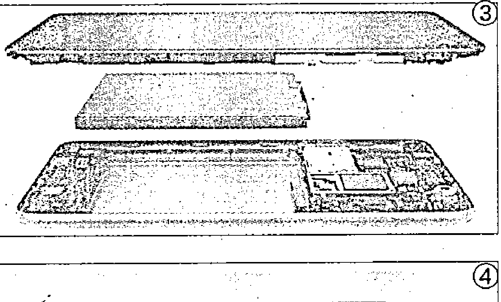

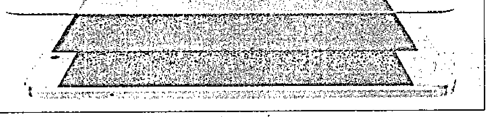

###### 功能和细节的对比

红米Note 3和乐视1S的扬声器分别位于机身背面和机身底部，在正常平放桌面的情况下，红米Note 3的扬声器孔刚好会被桌面挡住，虽然该产品通过1mm的小支点将扬声器位置略微垫高了一点点（图5），但音量依旧存在衰减。乐视1S将扬声器孔设计到了底部USB接口的两侧（实际只有一侧的孔隙出声，另一侧只起到装饰之用）（图6），如何放置都不必担心扬声器孔被遮住。

由于小米和乐视旗下都有智能电视产品线，所以红米Note 3和乐视1S也都在机身顶部集成了红外模块，结合内置的APP可以扮演电器遥控器的角色（图7）。如此一来，你就再也不必担心关键时刻找不到遥控器，或是担心遥控器内的电池没电等问题了。

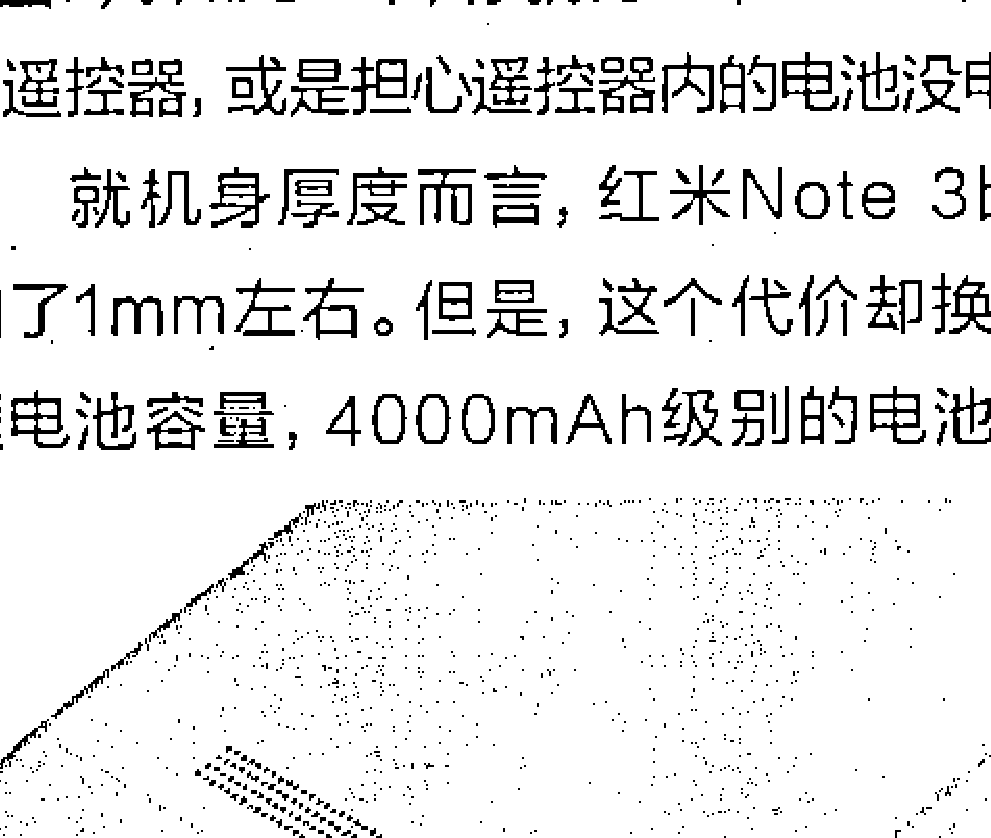

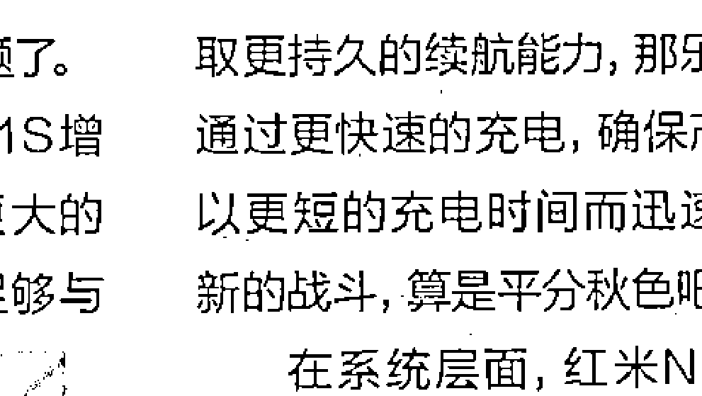

就机身厚度而言，红米Note 3比乐视1S增加了1mm左右。但是，这个代价却换来了更大的锂电池容量，4000mAh级别的电池已经足够与6英寸的华为Mate8看齐了。

在5.5英寸手机领域，能与红米Note 3抗衡的也就剩下金立M5（5000mAh）和ZUK K1（4000mAh）等少数产品了。

相对而言，乐视1S内置的3000mAh电池属于中规中矩。好消息是，乐视却为该产品引入了高通QC2.0快充技术，最高可支持24W的快充规格（图8），充电5分钟即可通话3.5小时。如果说红米Note 3通过更大电池换取更持久的续航能力，那乐视1S则通过更快速的充电，确保产品可以更短的充电时间而迅速投入新的战斗，算是平分秋色吧。

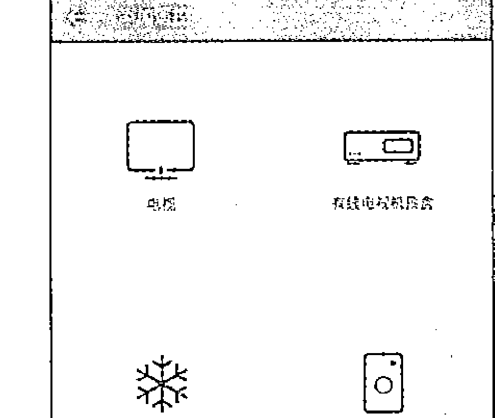

在系统层面，红米Note 3和MIUI成熟度和稳定性更好，而且主题资源也极为丰富。乐视1S的EUI则主打影视资源和聚合，更适合喜欢将手机用于掌上影院的玩家。

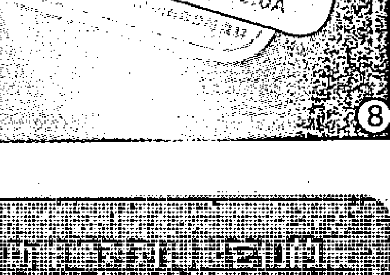

###### 笔记本CPU性能差异有多大

在英特尔最新的第六代酷睿处理器（移动版）中，TDP最低的型号为酷睿M（4.5W），最高的版本为H系列的酷睿家族（45W），二者整整相差10倍有余。那么，它们的性能差异是否也有十倍呢？

###### 重新认识TDP

Skylake移动处理器之间的TDP相差10倍，在探讨倍数与性能关系之前，我们先来正式认识一下什么才是TDP吧。

所谓TDP即“Thermal Design Power”（热设计功耗），它并非CPU的最高功耗，而是描述CPU热量释放的指标，散热器或笔记本厂商会根据这个指标用于散热设计的参考。TDP越高，对用于散热的散热片、热管等模块的要求就越高。

由此就很好理解了，以四代酷睿（Haswell）i7-4710HQ为例，该CPU的标准TDP为47W，但在满负载运行时实际功耗却可轻松突破50W大关，而更高端的i7-4870HQ在3.7GHz下的峰值功耗甚至可达77W！要知道，i7-4870HQ也是一款将TDP标称在47W的CPU。问题来了，既然CPU全速工作时功耗这么高，为何TDP数值却往往出现缩水呢？

答案很简单，能让一颗CPU长时间保持全速工作的环境极少（基本只有理论测试时），这就好像时下汽车理论上都可跑到200公里/小时，但高速公路却依旧限定在最高120公里/小时。此外，出于安全的考虑，英特尔给移动处理器加入了温度阈值的概念，当一颗CPU温度或功耗达到某个阈值后就会自动触发降频机制，从而起到迅速降温并让功耗下降到TDP的标称数值之下。很多笔记本在长时间游戏时会出现突然的卡顿，基本就是因CPU过热触发自动降频引起的。

总之，TDP更多的是反映CPU对散热模块的最低要求，它影响性能却不决定性能。因此，4.5W的CPU性能无疑要落后于15W和45W的CPU，但它们之间的性能差距却绝不仅仅等于TDP的比例关系。以六代酷睿家族中的酷睿M5-6Y54（图1）、酷睿i5-6300U（图2）和酷睿i5-6300HQ（图3）为例，它们的CPU运算性能依次相差2倍和1.5倍左右（见表）。

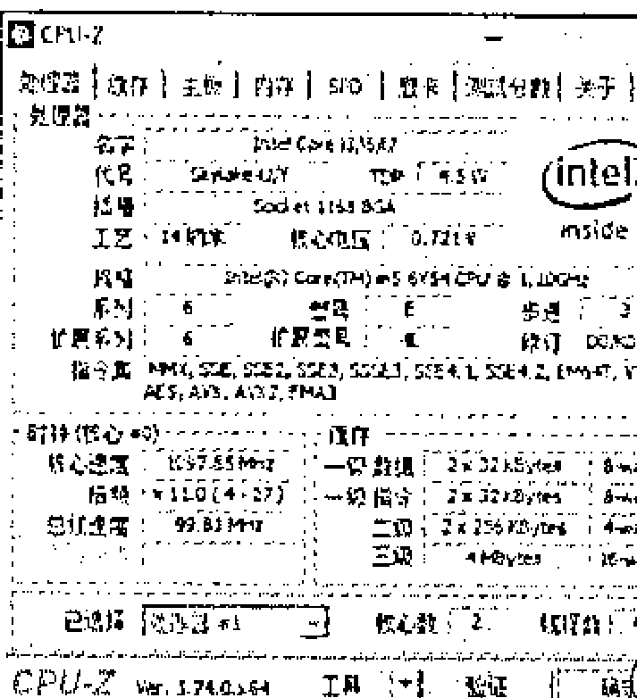

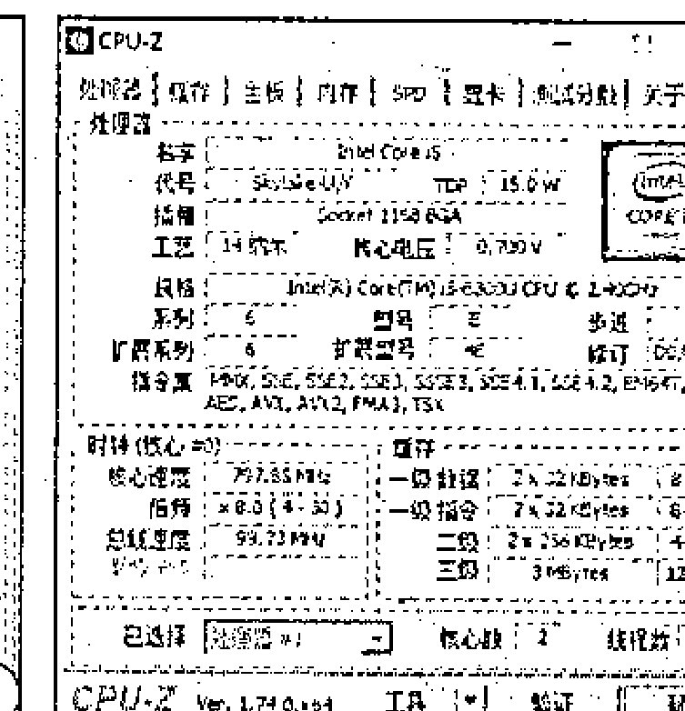

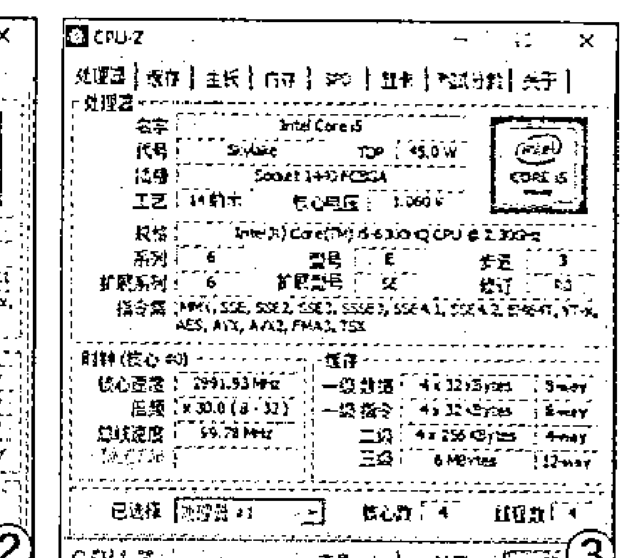

| 对比项目 | 酷睿M5-6Y54 | 酷睿i5-6300U | 酷睿i5-6300HQ |
| :--- | :--- | :--- | :--- |
| TDP | 4.5W | 15W | 45W |
| 核心/线程 | 2/4 | 2/4 | 4/4 |
| 主频范围 | 1.1GHz~2.7GHz | 2.4GHz~3.0GHz | 2.3GHz~3.2GHz |
| 国际象棋 | 3227 | 5808 | 8270 |
| CINEBENCH R11.5 CPU单核 | 1.74pts | 3.4pts | 4.9pts |
| CINEBENCH R11.5 CPU多核 | 152cb | 308cb | 407cb |

###### TDP的散热秀

前文已经说过，TDP决定了CPU对散热模块的需求。因此，我们很容易就能判断出不同TDP六代酷睿处理器的定位和体验差异。

####### 4.5W的酷睿M

4.5W的酷睿M热设计功耗最低，低到了无需使用风扇主动散热。于是，它最适合用于安装进没有风扇的平板二合一，或是极致纤薄的笔记本体内。就散热而言，一根热管再加上金属材质的后盖，基本就能保证酷睿M长时间运行而不降频或少降频（图4）。因此，凡是武装酷睿M的产品都拥有非常性感的身材以及零噪音的优势，用于外出期间的“移动办公助手”再合适不过了。

在本刊2015年23期P16页中，我们介绍过多款搭载Skylake平台酷睿M的设备，感兴趣的读者可以翻阅查看。

####### 15W的U系列

15W的U系列酷睿处理器热设计功耗居中，长时间运行时极易引起热量的堆积，必须要借助散热风扇将温度排出体外（图5）。还好，15W功耗产生的热能，通过一根热管、一组风扇和散热鳍片就可轻松搞定，于是这类CPU最适合用于超薄本领域，或是微软Surface Pro 4这种高端平板二合一产品身上。

为了提升竞争力，如今更多的笔记本厂商会为搭载U系列的笔记本武装额外的独立显卡（GPU）。当然，大家都知道U系列CPU性能谈不上强悍，所以与其搭配的GPU也多是NVIDIA GTX950M以下档次的中低端独立显卡，想在1080P和高画质下流畅体验所有大型3D游戏只是梦想（建议在1366×768像素或720P加高画质下体验游戏）。想同时解决CPU+GPU的散热需求，就需要笔记本配备更多的热管，以及转速更大的散热风扇，更讲究点的产品则会选用双风扇的设计（图6），分别负责CPU和GPU的散热。

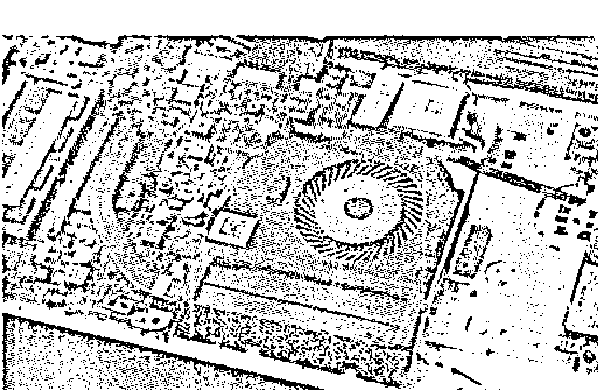

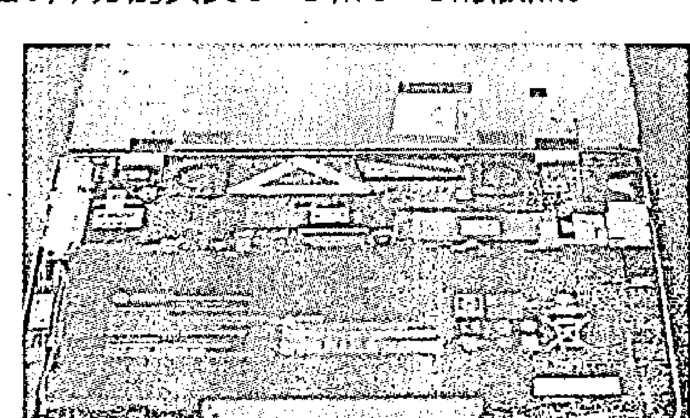

####### 45W的H系列

作为六代酷睿处理器的最强音，除了i3-6100H以外，包括i5-6300HQ在内的更高端型号全部为四核心设计，3倍于U的TDP注定了它们需要更为夸张的散热模块配合。此外，为了缩短与台式机的差距，如今笔记本厂商更青睐让H系列酷睿处理器与GTX960M或更高独显搭配，以“游戏本”的身份杀入市场，争抢更多优质的游戏用户。可惜，此类游戏本注定不会太过轻薄，并通过更多或更粗的热管、2组高速散热风扇和更多散热通风口来缓解产品的散热压力（图7）。好消息是，得益于Skylake领先的14nm工艺优势，游戏本并非注定与轻薄无缘。以戴尔XPS 15为例，这款15.6英寸的游戏本就在17mm厚度和1.78kg体重的基础上，硬是塞进了H系列CPU和GTX960M独显芯片。当然，这款产品对散热模块进行了大量优化，比如通过压缩PCB主板的面积，塞进了两个大功率风扇，并通过两根又粗又长的热管和散热片覆盖芯片之上（图8），从而解决了高端硬件的散热要求。

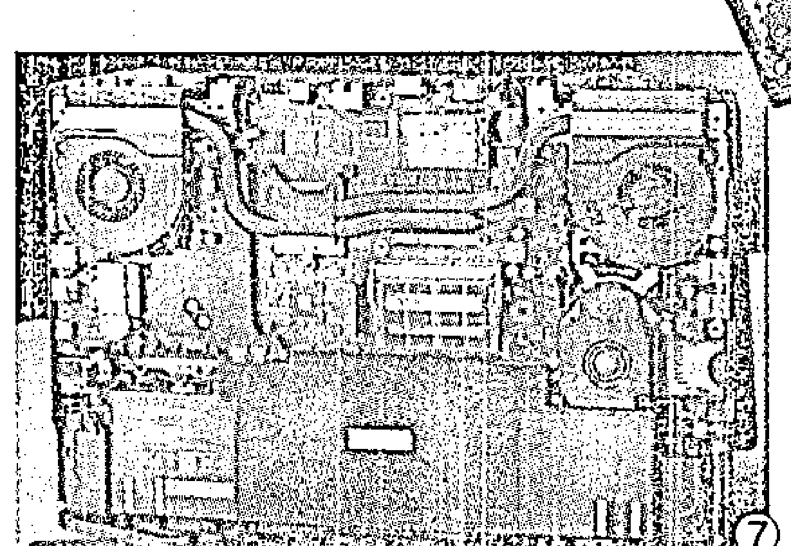

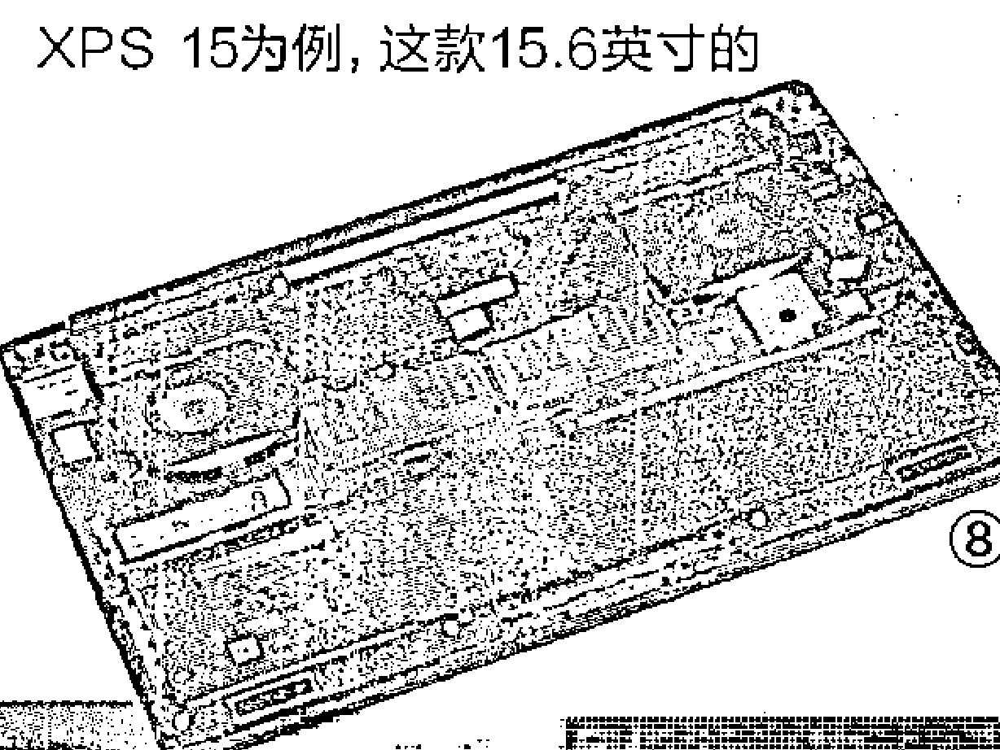

> Skylake平台的U系列还包含集成锐炬显卡的28W产品线，不过此类产品大都被英特尔用在NUC（微型PC），或是极少数的高端纤薄型笔记本体内。这些都属于小众产品，所以本文就不多加介绍了。

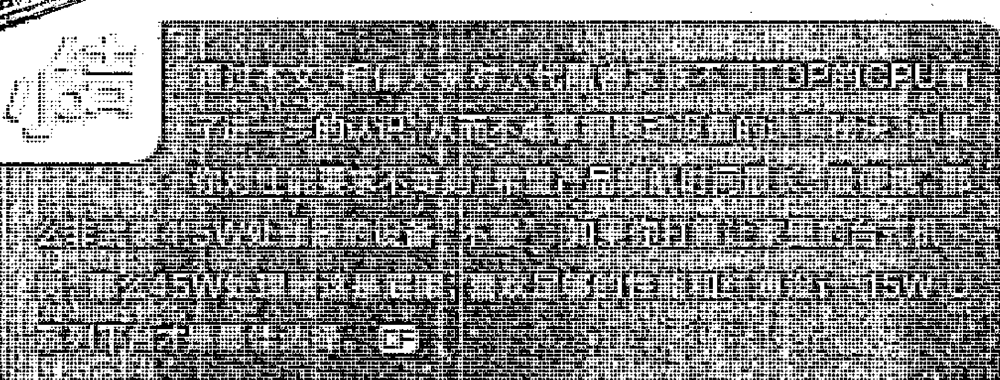

###### 武装AMOLED屏幕的智能手机

文|曹操

众所周知，三星特有的AMOLED屏幕技术可以为移动设备带来更理想的视觉体验。如果你希望手机上的“视界”可以更为艳丽，那就不妨优先考虑武装AMOLED屏幕的产品吧。

###### AMOLED屏幕的优势

和主流的IPS屏幕（LCD）相比，AMOLED屏幕最大的差异就是采用了有源矩阵有机发光二极管的物理结构，通过自发光的模式承担了IPS屏幕“背光灯+滤光片”的使命，单个像素在显示黑色时不工作，显示深色时功耗更低。此外，AMOLED屏幕还具备广色域的优势（通常可达110% NTSC），一些在LCD上无法准确还原的颜色在AMOLED都可以更为完美地呈现出来，而带给眼睛的最直观感受就是色彩更鲜艳，基本不存在漏光问题。

###### AMOLED屏幕的优化

借助AMOLED屏幕低功耗的优势，除了三星自家的手机以外，一些主打纤薄的机型也青睐采用它来弥补无法塞进更大电池的缺陷。而我们则可通过改换深色（最好为纯黑）的主题和壁纸，进一步节省屏幕的耗电从而达到提升续航时间的目的。

据悉，三星正计划在2016年大幅降低中小尺寸AMOLED屏幕的价格，使其与传统LCD面板的价格差缩小到10%以内。可以预见未来会有更多移动设备将AMOLED列为卖点。在AMOLED普及之前，我们先来看看目前市面上的那些超值AMOLED手机吧。

####### 联想笋尖S90t

联想原本对设计风格与iPhone 6非常相似的笋尖S90t抱有很大期望，可惜该产品的硬件规格实在不高，当初1699元的起价（还是低配版）很难激起用户的购买欲望。如今，该产品的价格已经跌到了799元，堪称最实惠的AMOLED屏幕手机，性价比也因此大幅提高。

¥799

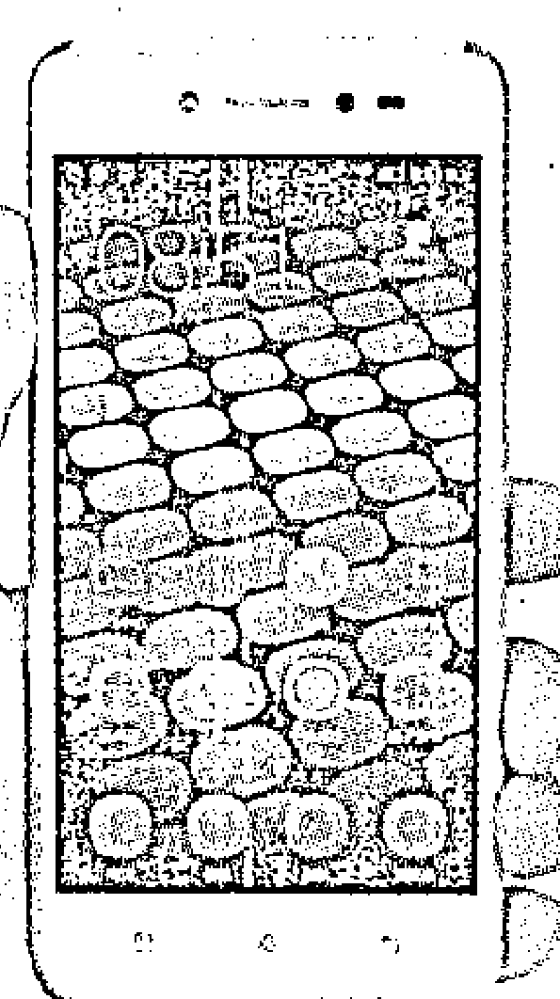


- 网络: 移动4G（双卡双待）
- 屏幕: 5英寸AMOLED（1280×720像素）
- 处理器: 高通骁龙410
- 内存/存储: 2GB/16GB（不支持存储卡）
- 摄像头: 800万/1300万像素
- 体积: 71.7mm×146mm×6.9mm
- 电池/重量: 2300mAh（不可换）/129g

####### 酷派大神X7

大神X7是一款主打轻薄的产品，金属中框和双面玻璃的设计也颇为精湛。经过几次价格调整之后，如今X7的价格也降至千元以内，除了不支持指纹识别功能以外，其综合实力并不逊于红米Note3等新晋的千元神器。

¥899

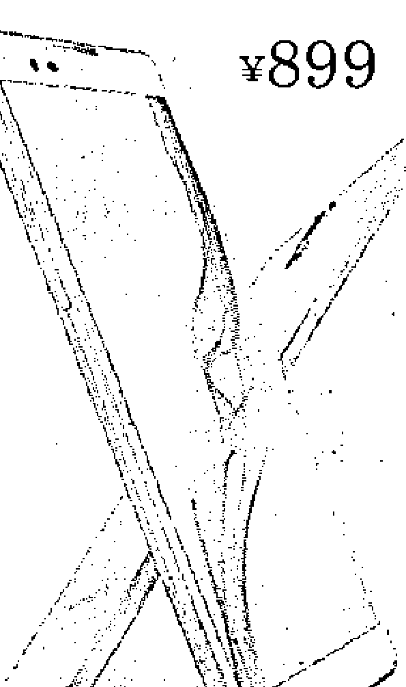

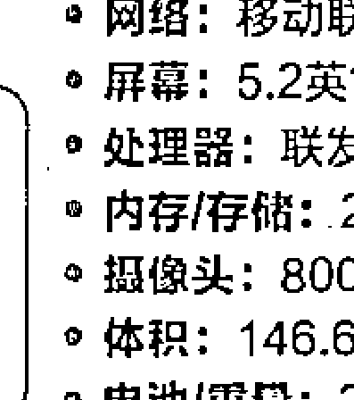

- 网络: 移动联通双4G（双卡双待）
- 屏幕: 5.2英寸AMOLED（1920×1080像素）
- 处理器: 联发科MT6595
- 内存/存储: 2GB/16GB（支持32GB存储卡）
- 摄像头: 800万/1300万像素
- 体积: 146.6mm×73.6mm×6.5mm
- 电池/重量: 2700mAh（不可换）/131g

####### 一加X

作为一加最新推出的千元新品，一加X的优势在于紧凑的机身设计，骁龙801处理器在游戏方面的表现也要优于联发科Helio X10。如果你喜欢单手持握的感觉，这款5英寸的小巧新品还是值得考虑的。

¥1599

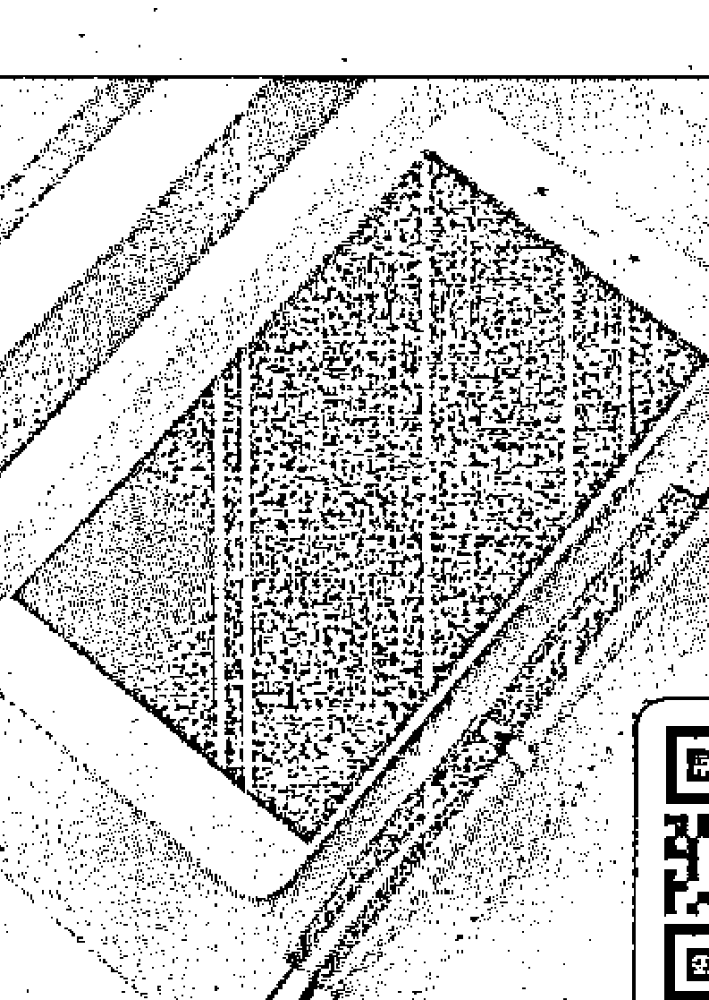


- 网络: 移动联通双4G（双卡双待）
- 屏幕: 5英寸AMOLED（1920×1080像素）
- 处理器: 高通骁龙801
- 内存/存储: 3GB/16GB（支持128GB存储卡）
- 摄像头: 800万/1300万像素
- 体积: 140mm×69mm×6.9mm
- 电池/重量: 2525mAh（不可换）/138g

####### 金立S6

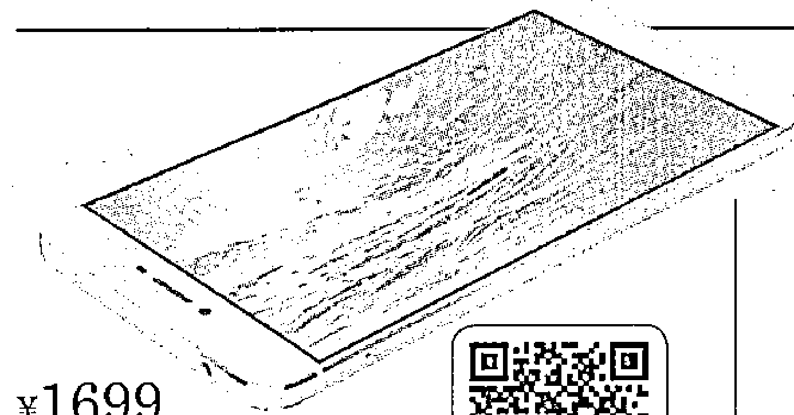

作为金立S系列的最新成员，S6不再苛求极致的纤薄，而是将重点放在了更为精湛的金属CNC机身设计，以及更大的电池容量上，从而确保了手感和续航时间。如果你对手机的工艺要求较高，这款产品不会让你失望。

¥1699

- 网络: 移动联通双4G（双卡双待）
- 屏幕: 5.5英寸AMOLED（1280×720像素）
- 处理器: 联发科MT6753
- 内存/存储: 3GB/32GB（支持128GB存储卡）
- 摄像头: 500万/1300万像素
- 体积: 151.9mm×74.6mm×6.9mm
- 电池/重量: 3150mAh（不可换）/147g


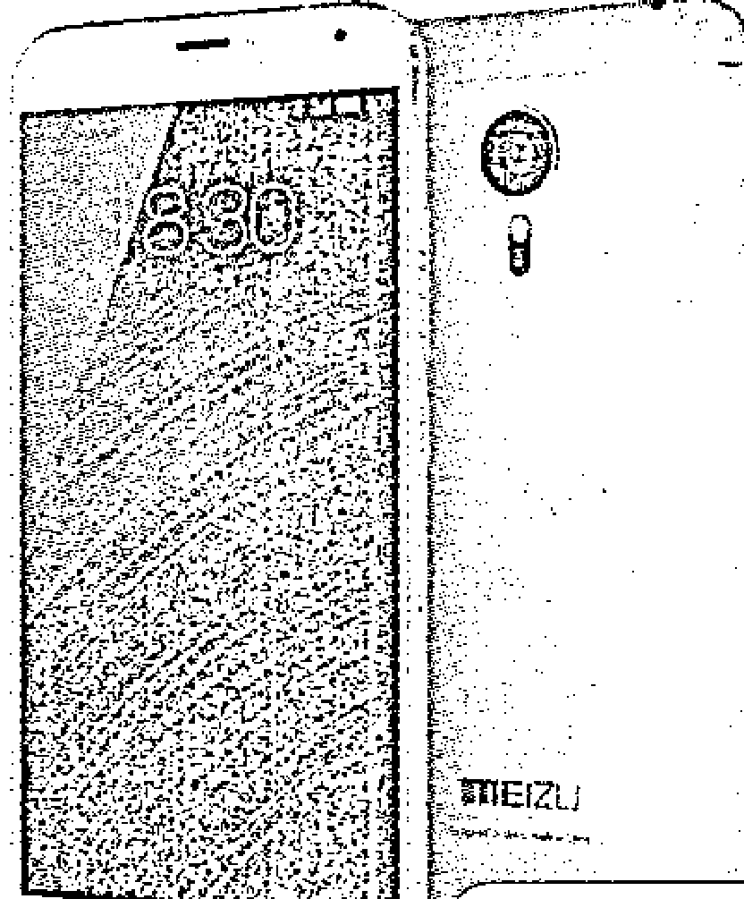

####### 魅族MX5

魅族最新的Pro5其实是目前性能最强的AMOLED手机之一，可惜其2699元的起价不算便宜，所以我们不妨将目光放在它的小弟——MX5身上。MX5无论是性能还是功能都可以算是同价位手机中的佼佼者，适合追求全能的用户考虑。

¥1699

- 网络: 移动联通双4G（双卡双待）
- 屏幕: 5.5英寸AMOLED（1920×1080像素）
- 处理器: 联发科Helio X10 Turbo
- 内存/存储: 3GB/16GB（支持128GB存储卡）
- 摄像头: 500万/2070万像素
- 体积: 149.9mm×74.7mm×7.6mm
- 电池/重量: 3150mAh（不可换）/149g


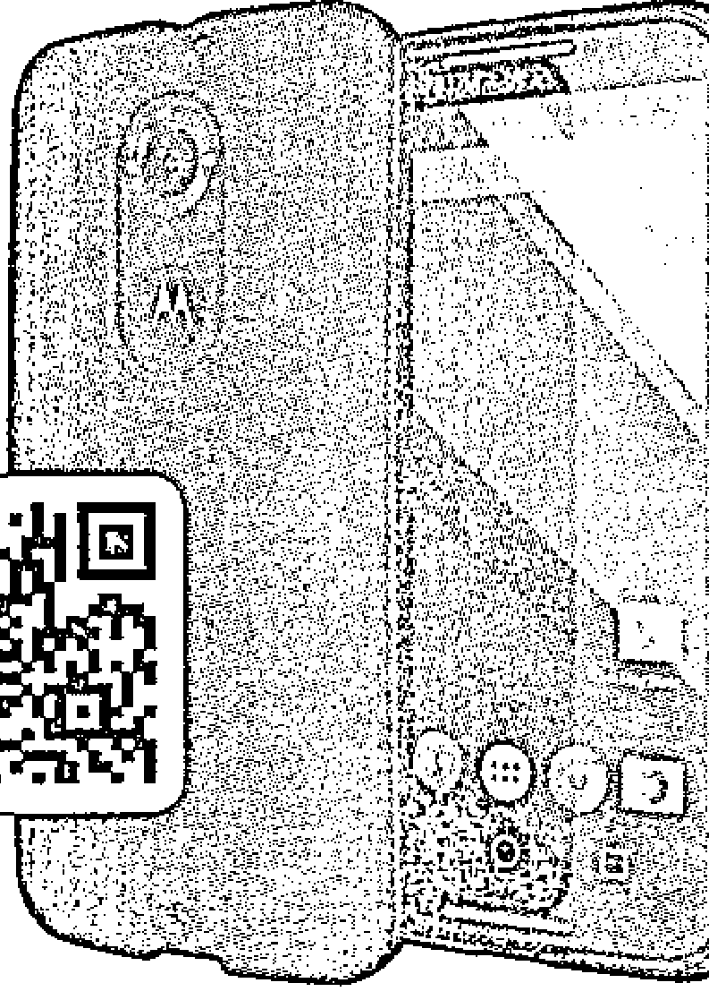

####### 摩托罗拉moto X

作为摩托在2015年初推出的旗舰，moto X在目前看来配置也不算低，骁龙801处理器老当益壮，而最接近原生Android系统的体验也是其最大的杀手锏。如今该产品的价格已经降到了1699元，适合追求相对“干净”系统环境的用户选择。

¥1699

- 网络: 全网通
- 屏幕: 5.2英寸AMOLED（1920×1080像素）
- 处理器: 高通骁龙801
- 内存/存储: 2GB/32GB（不支持存储卡）
- 摄像头: 200万/1300万像素
- 体积: 140.8mm×72.4mm×9.9mm
- 电池/重量: 2300mAh（不可换）/144g


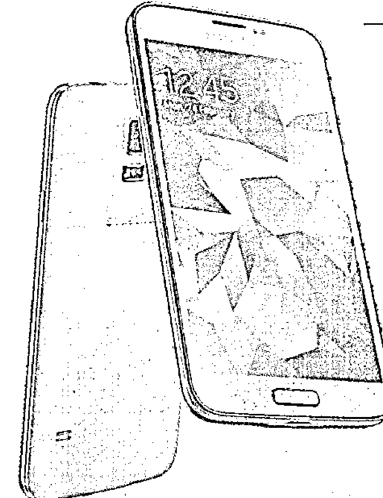

####### 三星Galaxy S5-G9008W

虽然三星先后推出了A7和A8，但就综合实力而言，A系列始终难以达到S系列的高度。而作为三星的上代旗舰，Galaxy S5的配置和功能依旧属于中高端级别，支持防水的能力也不是最新S6可以比拟的。在S5降到2000元以内的今天，非常适合喜欢三星手机的玩家入手。

¥1899

- 网络: 移动4G
- 屏幕: 5.1英寸AMOLED（1920×1080像素）
- 处理器: 高通骁龙801
- 内存/存储: 2GB/16GB（支持128GB存储卡）
- 摄像头: 200万/1600万像素
- 体积: 142mm×72mm×8.1mm
- 电池/重量: 2800mAh（可换）/163g


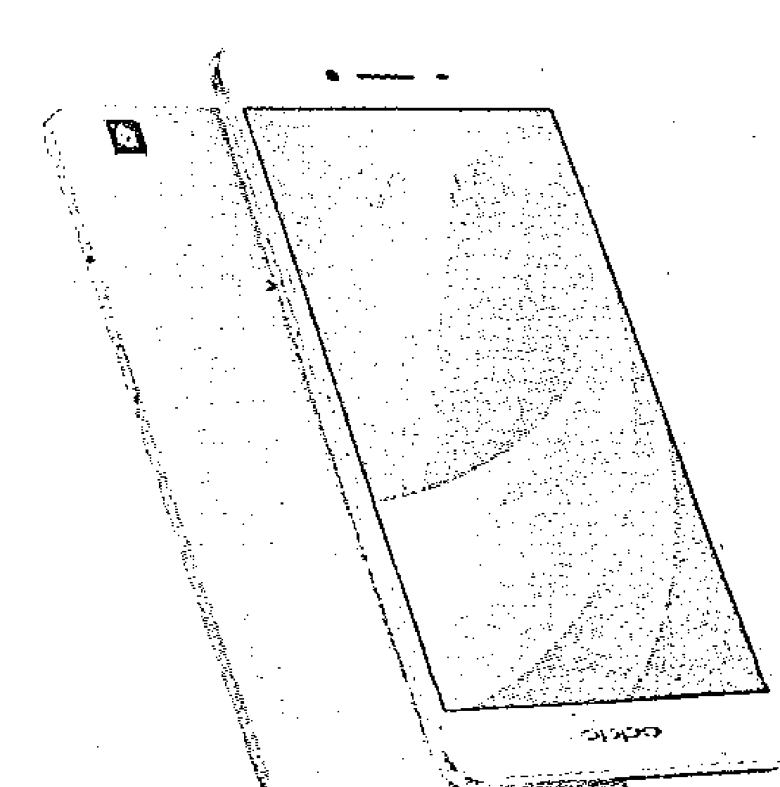

####### OPPO R7s

OPPO R7s采用了金属一体机身和2.5D弧度屏，移动4G版所搭载的联发科MT6752处理器性能也不错，4GB内存堪称海量，而3070mAh容量的电池与VOOC闪充技术的结合，则为其长效续航打下了坚实的基础。

¥2599

- 网络: 移动4G（双卡双待）
- 屏幕: 5.5英寸AMOLED（1920×1080像素）
- 处理器: 联发科MT6752
- 内存/存储: 4GB/32GB（支持128GB存储卡）
- 摄像头: 800万/1300万像素
- 体积: 151.8mm×75.4mm×6.9mm
- 电池/重量: 3070mAh（不可换）/156g


###### 广视角也有超低价

####### ADS显示器导购

文|宁宁

ADS液晶面板据说是国产京东方的专利产品，性能上与IPS十分接近，但价格却更为便宜。尺寸从21.5英寸到31.5英寸应有尽有，满足了消费者对低价广视角显示器的迫切需求。ADS显示器到底怎么样？让我们一起来看一看。

####### ADS究竟是何方神圣

相对于早已名声在外的IPS屏幕来说，源自于国产京东方的ADS屏幕在最近两年才顺利切入到了家用显示器市场。至于ADS的全称则是高级超维场转换技术，是以广视角技术为代表的核心技术的统称。ADS技术是液晶面板领域为解决大尺寸、高清晰度桌面显示器和液晶电视应用而开发的广视角技术，也就是现在俗称的硬屏技术的一种。并且ADS屏幕还克服了常规IPS屏幕在透光效率方面比较低下，所以也就在广视角的前实现更高的透光率。

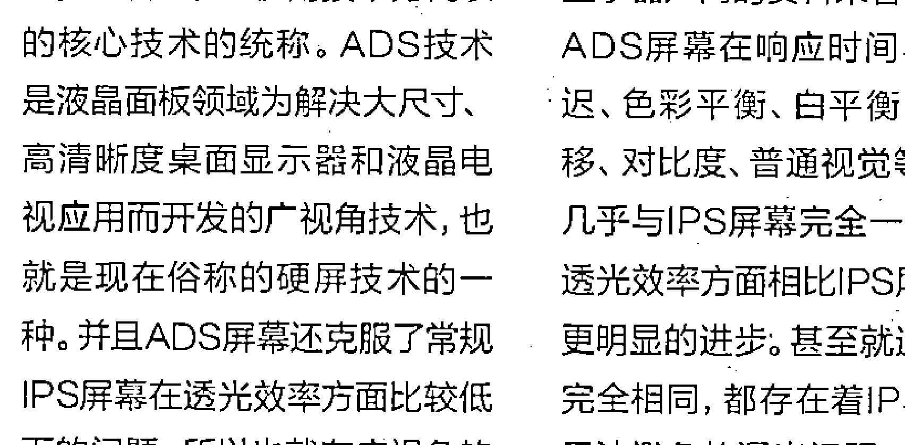

由于在技术上和液晶分子排列方式上十分接近于IPS屏幕（图1），所以ADS在性能上也十分接近于IPS屏幕。其水平、垂直可视角度均可达到178°，与IPS屏幕几乎是完全一致的。而根据显示器厂商的资料来看（图2），ADS屏幕在响应时间、动态延迟、色彩平衡、白平衡、伽马位移、对比度、普通视觉等方面也几乎与IPS屏幕完全一致，唯有透光效率方面相比IPS屏幕有了更明显的进步。甚至就连缺点也完全相同，都存在着IPS屏幕所无法避免的漏光问题。不过IPS屏幕毕竟是一种更成熟的技术，面板厂商与显示器厂商的结合能力也更强。所以不论是从目前用户的体验反馈还是面板的性能来看，ADS屏幕仍然略逊于IPS屏幕，两者的关系应该被定义为“IPS≥ADS”才更加准确。

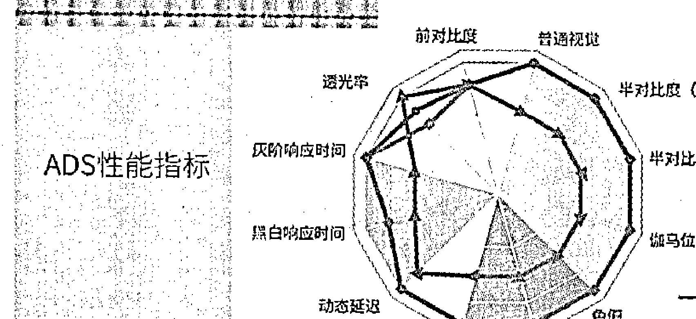

####### 购买ADS主要图便宜

ADS屏幕虽然并非出身名门，并且在性能上也略逊于IPS屏幕，但在面板厂商与显示器厂商的上下游结合能力上却非常不错。市面上不仅有AOC、优派、飞利浦、明基这样的名牌大厂捧场，更有方正、惠科、瀚视奇、SANC等新锐厂商的鼎立相助。虽然在效果上与高端的IPS还不能相比，但如果我们只是购买一台普通的液晶入门显示器，ADS不仅价格低，也有不少选择。

说白了购买ADS显示器主要目的就是图便宜，ADS显示器在市场定位上介于TN屏幕和IPS屏幕之间（表1），所以产品定价也介乎于两者之间并更加接近于TN屏幕。21.5英寸的小屏显示器领域由于一直都是TN屏幕的优势领域，但是目前已经被ADS所攻陷，TN/ADS差价只有非常不明显的10元而已，而到了23英寸、23.6英寸、27英寸这些TN屏幕的弱势领域也同样如此，TN/ADS差价普遍也只有二三十元。至于消费者更为关心的ADS/IPS差价一般在百元左右，到了大屏领域ADS显示器(31.5英寸)则体现出了更高的性价比优势，相比尺寸接近的IPS显示器(32英寸)差价竟然可以高达300元。此外也可以关注电商平台的促销活动，以京东为例就经常推出手机专享价或会员注册送延保的活动(图3)，值得消费者考虑。

| 类型 | TN | ADS | IPS | TN/ADS差价 | ADS/IPS差价 |
| :--- | :--- | :--- | :--- | :--- | :--- |
| 小屏 | 499元 (21.5英寸) | 509元 (21.5英寸) | 599元 (21.5英寸) | 10元 | 90元 |
| 中屏 | 639元 (23英寸) | 669元 (23英寸) | 749元 (23英寸) | 30元 | 80元 |
| 中屏 | 659元 (23.6英寸) | 679元 (23.6英寸) | 799元 (23.8英寸) | 20元 | 120元 |
| 大屏 | 999元 (27英寸) | 999元 (27英寸) | 1099元 (27英寸) | 0元 | 100元 |
| 超大屏 | 无 | 1499元 (31.5英寸) | 1799元 (32英寸) | — | 300元 |

####### 谨防ADS冒充IPS现象

ADS屏幕并不是IPS屏幕，甚至就连上游面板厂商都完全不同。但是由于两者在性能参数上极为相似，也有经销商甚至厂商将ADS冒充IPS显示器。其中最为普遍的，就是将ADS屏幕称之为“IPS-ADS”(图4)。实际上液晶面板的真实身份只是“ADS”面板，干脆就没有“IPS”前缀。此外少数厂商甚至还会隐去ADS字样而采用“IPS技术”的字样来代替，这个时候消费者就需要更加警惕了。

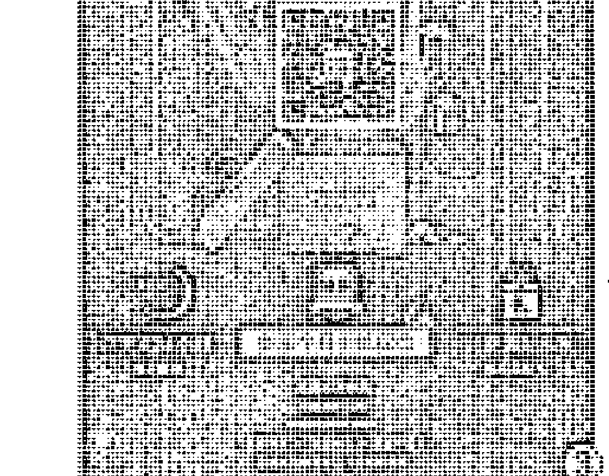


##### 超值产品推荐

######## 惠科M220

**基本参数** ADS面板/21.5英寸/DVI+VGA接口/1920 × 1080分辨率
**推荐理由** 中规中矩的配置，拥有低端产品没有的DVI视频接口。

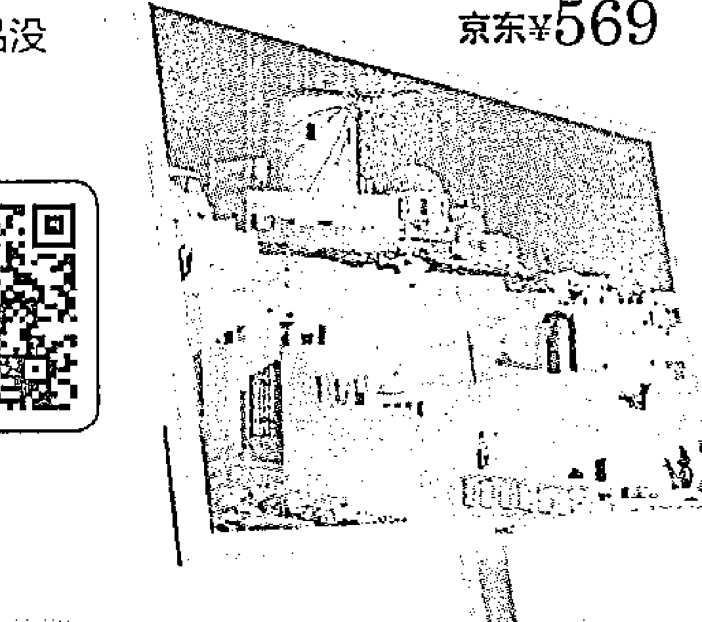


京东¥569

######## 优派VX2756S-W

**基本参数** ADS面板/27英寸/DVI+VGA接口/1920 × 1080分辨率
**推荐理由** 名牌大厂的大屏ADS显示器，采用了非常漂亮的白色外观设计。


京东¥1199

######## AOC I3284VW

**基本参数** ADS面板/31.5英寸/DVI+VGA接口/1920 × 1080分辨率
**推荐理由** 名牌大厂的超大屏ADS显示器，售价仅为1499元，相比同品牌的32英寸IPS显示器整整便宜了300元性价比相当出众。

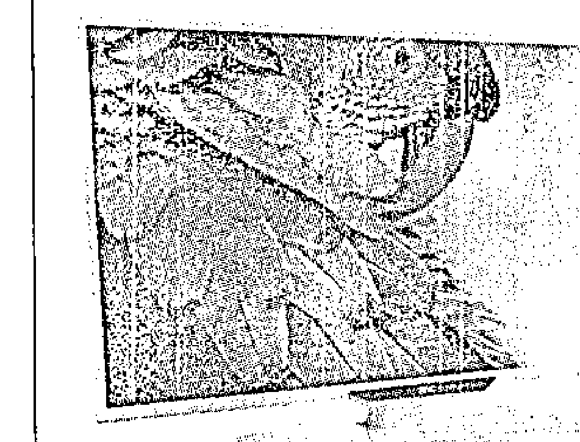


京东¥1499

######## 明基VW32A0

**推荐理由** 同样是名牌大厂的超大屏ADS显示器，售价也与前文AOC相同的1499元。
**基本参数** ADS面板/31.5英寸/DVI+VGA接口/1920 × 1080分辨率


京东¥1499

###### 神U的性价魅力尚剩几何

文/老盖

酷睿i7的性能i5的价格，造成了E3神U的辉煌。现在E3-1220 V5和E3-1230 V5终于如约而至，同时问题也随之出现，由于Intel的封杀，普通的100系主板已不支持该CPU，只有搭载服务器C200芯片组的主板才能使用，使得这款神U在消费级市场几乎失去了用武之地。那么该怎样拥抱该U？被几乎边缘化的E3 V5在Intel的棒杀下还剩多少性价比？

####### 全新一代V5 Xeon

与六代酷睿一样，E3 V5使用了全新的Skylake架构（图1），其中E3-1220 V5默认主频为3GHz，可睿频至3.5GHz。E3-1230 V5默认主频3.4GHz（图2），可睿频至3.8GHz，二者的三级缓存都是8MB。从中我们看出，E3-1230 V5的性能基本介于Core i7-4770K、6790K之间，与i7-6700相当，比E3-1230 V3略有提升。

其实在家用版Skylake架构推出之后，Intel基于Skylake架构的至强处理器家族是非常丰富的（表1），不仅支持DDR4等特性，甚至有不少产品官方支持了HD P530核芯显卡。最初给人的错觉是Intel在这一代会更加支持DIY用户来使用Xeon处理器达成性价比，不过令人遗憾的是，Intel不再允许Z170、B150等主板继续使用E3 V5处理器。

####### 支持E3 V5主板出世

对于喜欢E3平台的朋友来说，E3 V5最大的优势是能够与新平台配套，从而享受到100主板才能支持的DDR4和更新的Skylake处理器架构等优势而得到最大的性能提升。主板厂商正是看到了用户的这种需求及由此可能形成的市场，因而顶风作案通过解锁BIOS推出了一些可迫使E3 V5就范的特殊主板。

和普通100系主板相比，这些主板的最大特征是在集成常规芯片组的同时，提供了专用支持E3 V5的C200芯片组，主要包括C232和C236两个系列，其中C236相当于Z170主板，只是在原规格的基础上增加了两个SATA3.0接口，支持服务专属的ECC内存但不能超频。C232则相当于B150主板，只是不支持核显输出（表2）。

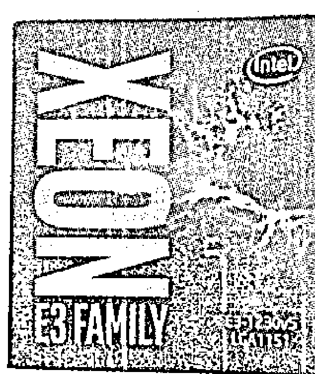

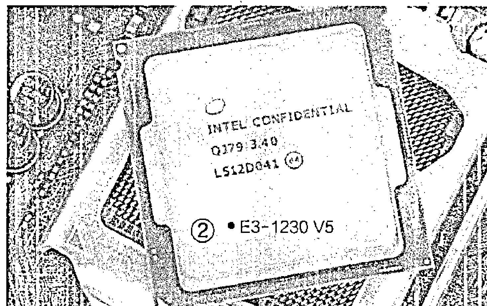

表1：主要Skylake架构Xeon处理器规格

| 型号 | 核心/线程 | 基础/睿频 | L3缓存 | 核芯显卡 | TDP |
| :--- | :--- | :--- | :--- | :--- | :--- |
| Xeon E3-1280 V5 | 4/8 | 3.7/4.0GHz | 8 MB | - | 80W |
| Xeon E3-1270 V5 | 4/8 | 3.6/4.0GHz | 8 MB | - | 80W |
| Xeon E3-1260L V5 | 4/8 | 2.9/3.9GHz | 8 MB | - | 45W |
| Xeon E3-1245 V5 | 4/8 | 3.5/3.9GHz | 8 MB | HD P530 | 80W |
| Xeon E3-1240L V5 | 4/8 | 2.1/3.2GHz | 8 MB | - | 25W |
| Xeon E3-1230L V5 | 4/8 | 3.5/3.9GHz | 8 MB | - | 80W |
| Xeon E3-1225 V5 | 4/4 | 3.3/3.7GHz | 8 MB | HD P530 | 80W |
| Xeon E3-1220L V5 | 4/4 | 3.0/3.5GHz | 8 MB | - | 80W |

表2：C200服务器主板与100系对应主板主要参数对比

| 芯片组 | C232 | B150 | C236 | Z170 |
| :--- | :--- | :--- | :--- | :--- |
| CPU支持 | E3 V5 Core i7/i5/i3/奔腾 | Core i7/i5/i3/奔腾 | E3 V5 Core i7/i5/i3/奔腾 | Core i7/i5/i3/奔腾 |
| 核显输出 | 不支持 | 支持 | 支持 | 支持 |
| 内存类型 | DDR3L 1600/ DDR4-2133 | DDR3L 1600/ DDR4-2133 | DDR3L 1600/ DDR4-2133 | DDR3L 1600/ DDR4-2133 |
| ECC内存 | 支持 | 不支持 | 支持 | 不支持 |
| 超频 | 不支持 | 支持 | 不支持 | 不支持 |
| USB 3.0接口 | 6个 | 6个 | 10个 | 10个 |
| SATA/3.0接口 | 6个 | 6个 | 8个 | 6个 |
| PCI-E 3.0通道 | 8 | 8 | 20 | 20 |

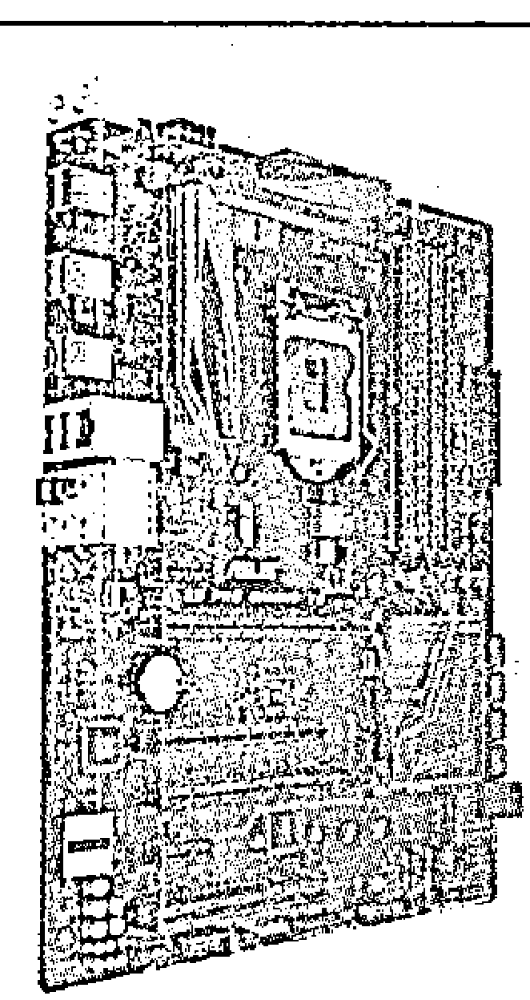

• 虽然是特殊产品，但也继承了华硕Gaming系列特性

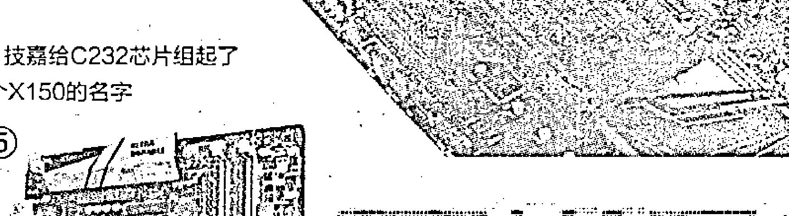

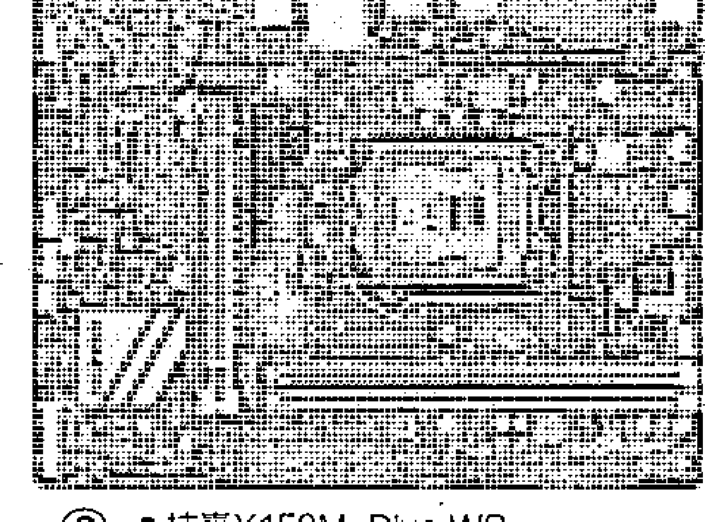

此外在外观和部件方面，为显示出此类主板的“高大上”，主板厂商通常会对其进行一番特殊修整。比如华硕E3 Pro Gaming V5就采用了红黑配色及散热鳍版设计（图3），当中辅以游戏音频模块让人一看就知道是专为游戏而生（图4）。而技嘉X150-Plus WS（图5）和X150M-Plus WS（图6）中黑白和米黄的繁杂搭配，同样给人一种气势不凡的感觉。三款主板搭配的均是C232芯片组，其中华硕E3 Pro Gaming V5和技嘉X150-Plus WS为ATX大板型，X150M-Plus WS为Micro ATX小板型。

####### 性价比不高只剩情怀

以前的E3系列处理器搭配廉价的B系主板组建低成本高性能平台，是E3神U的主要魅力所在。以性能基本与i7-4770K齐平的E3 1231 V3为例，其淘宝散片价格约为1390元，B85主板价格约为400元，最终搭建成 本约为1800元，这一成本基本和i7-4770K售价持平（图7）。

那么进入E3 1230 V5时代，E3神U超高性价比的优势是否能继续保持呢？

目前，E3 1230 V5淘宝散片的价格约为1600元，华硕E3 Pro Gaming V5、技嘉X150-Plus WS和X150M-Plus WS三款主板的京东售价分别为1099元（图8）、999元和799元，这就意味着组建V5平台的整体造价应在2400元~2700元之间。而同样是3.4GHz~3.8GHz主频，性能与之相近的i7 6700搭配B150主板，最终成本也不过是2600元左右（2020元+600元），相比之下E3-1230 V5平台的价格优势可谓丧失殆尽，毫无追求的必要。

造成这种情况的主要原因有两个，一是鉴于当前E3神U被消费级市场日益追捧的现状，为防止其对i5和i7市场造成更大损害，Intel故意提高了E3-1230 V5的价格。另一方面则源于技嘉和华硕等主板厂商，尽管从

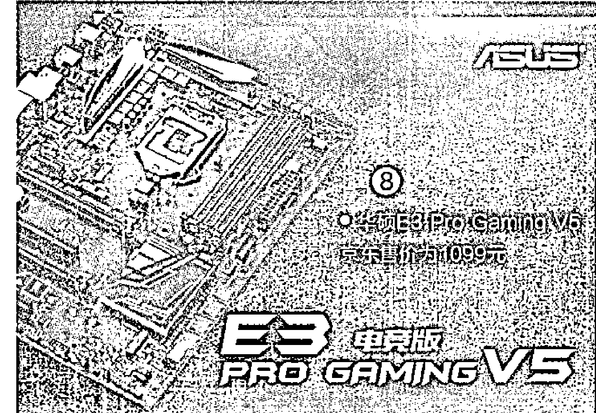

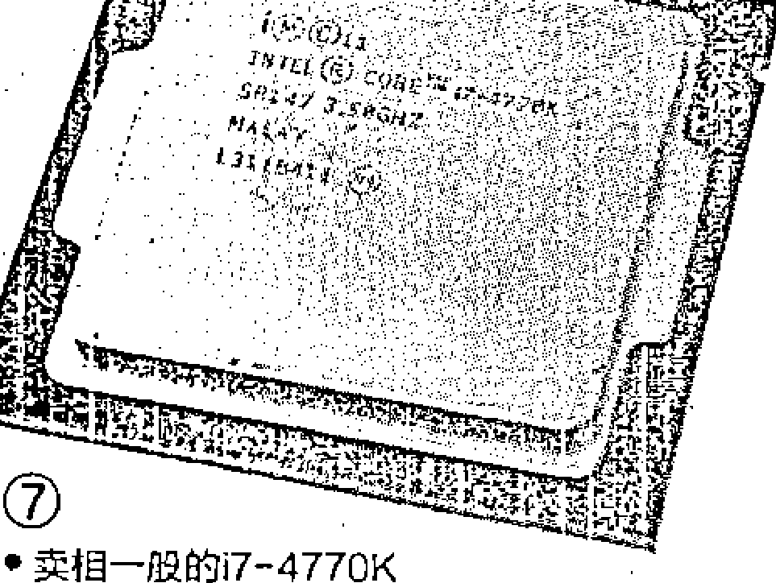

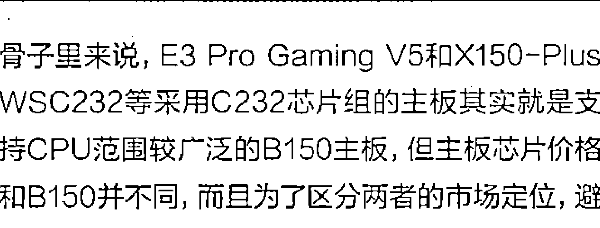

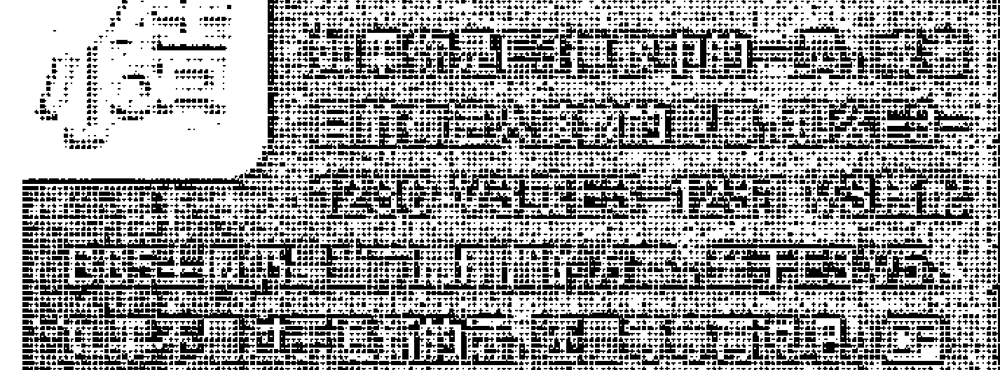

###### 小心买到不划算的硬件

文|老盖

IT卖场的江湖一直水很深，事与愿违暗藏着种种地雷。心血来潮想攒部主机或升级硬件，很容易一不留心就被坑了。那么近期需要绕开的地雷硬件和外设都有哪些呢？

####### 显卡篇

说起显卡最让人头疼的是马甲横行，钱花了，盼望的性能提升却始终没有到来。除此之外，还有一种更让人欲哭无泪的，那就是马甲的性能甚至不如旧产品，其中最具代表性的例子就是Radeon R9 370。

秉承了R9 300系全线是R200系马甲的“优秀”基因，R9是R9 270的马甲并不令人奇怪，令人感到奇怪的是该马甲虽然采用了与R9 270、R9 270X和R9 370X相同的Pitcaim架构，但在内置流处理单元方面却有明显缩水，原本的1280个被缩减为1024个(图1)。

由于有此硬伤，所以尽管该显卡的频率较R9 270有所提升，但整体性能低下，实际表现不如R9 270，对比上代R9 270X的性能差距更大(图2)。虽然是新卡，售价还较高，但却属于典型的“型号更新、性能退步、新不如旧”的坑品。

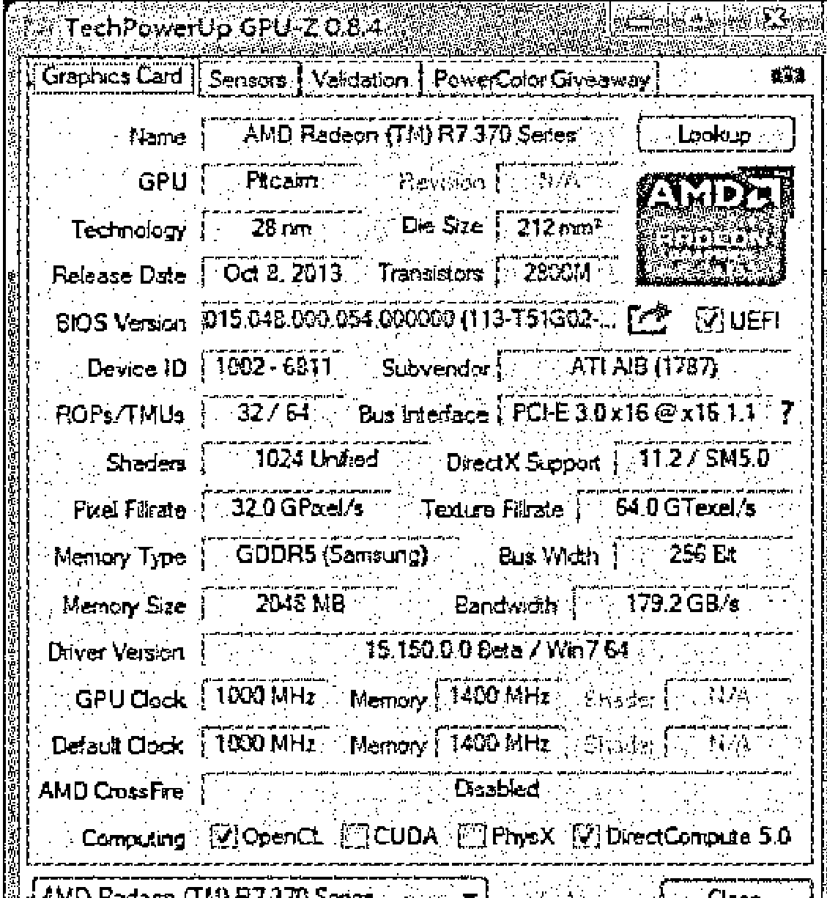

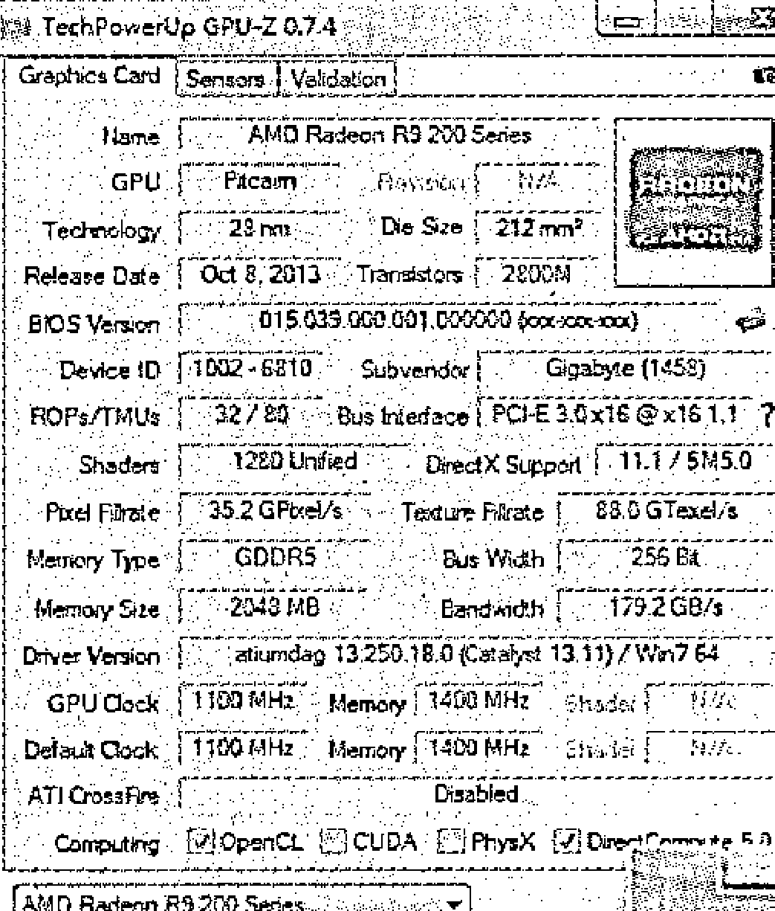

• Radeon R9 370的内置流处理单元仅有1024个
• 对比R9 270X的性能差异已经很大了

####### 主板篇

作为搭载各配件并能保证其发挥正常性能的平台，主板在市场中的表现可以“热头热尾”来表述。对于高端用户来说，价格不菲、接口众多、拓展功能强大同时支持超频的Z系主板是他们最热衷的选择。对于普通用户而言，一款价格低廉的B系主板（如B85）就足以满足需求，因此在各大电商的主板热销榜上，我们往往会发现排名靠前的全是B系主板（图3）。在这种情况下，价格和拓展性介于Z系和B系之间的H系主板（如H97）就成了名副其实的鸡肋产品（图4）。从功能上来说，H97主板比Z97有明显的欠缺，如不支持外频、不支持双卡交火、不支持动态磁盘加速等，而和定位低端的B系主板相比，H97主板的优势也不明显，它支持原生M.2/NGF接口、支持RSID硬盘阵列和智能响应（表1），这些优势只对少数有特殊需要的用户有用，对于大多数消费者而言，这些功能基本上可有可无，吸引力不大。同时H系主板价格较高（往往比B系统主板高出一百元至几百元），也是阻碍其向用户靠近的一个重要因素，花较多的钱买一些并不一定用到的功能，显然对于一个成熟的消费者来说绝对不是一件理智的事。


• 在京东中销量最多的是B系主板，其次是Z系主板

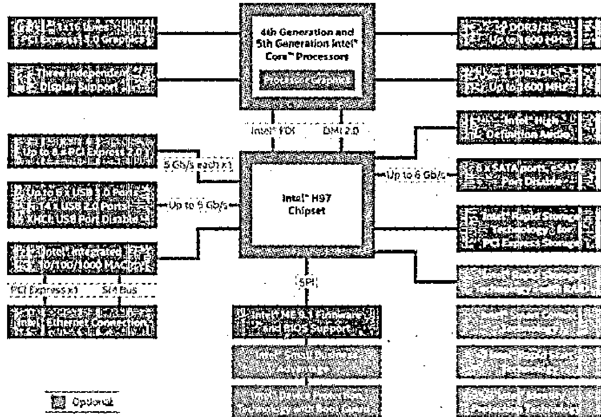

• H97芯片组的性能被夹到一个非常尴尬的境地

表1：从H81到Z97主板详细参数对比

| 主板型号 | H81 | B85 | H87 | Z87 | H97 | Z97 |
| :--- | :--- | :--- | :--- | :--- | :--- | :--- |
| 超频 | 破解支持 | 破解支持 | 破解支持 | 支持 | 破解支持 | 支持 |
| 内存频率上限 | DDR3 1600 | DDR3 1600 | DDR3 1600 | DDR3 2133以上 | DDR3 1600 | DDR3 2133以上 |
| 显卡插槽 | PCI-E 2.0单卡 | PCI-E 3.0单卡 | PCI-E 3.0单卡 | PCI-E 3.0单卡/双卡X8+X8 | PCI-E 3.0单卡 | PCI-E 3.0单卡/双卡X8+X8 |
| 视频输出 | 支持 | 支持 | 支持 | 支持 | 支持 | 支持 |
| SATA 3.0端口 | 3 | 3 | 3 | 3 | 3 | 3 |
| 原生M.2/NGFF接口 | 不支持 | 不支持 | 不支持 | 不支持 | 支持 | 支持 |
| RST智能响应 | 不支持 | 不支持 | 支持 | 支持 | 支持 | 支持 |
| 磁盘加速技术 | 不支持 | 不支持 | 不支持 | 支持 | 不支持 | 支持 |
| 智能响应 | 不支持 | 不支持 | 支持 | 支持 | 支持 | 支持 |
| 快速启动 | 不支持 | 支持 | 支持 | 支持 | 支持 | 支持 |

####### CPU篇

别以为只有显卡才有马甲，实际上CPU阵营中同样有此类奇葩货，比如AMD家族中的A10-6800K，虽然从名称看已经升级到了6系列，但说穿了它其实并不是一款新产品（图5）。该CPU依然基于老旧的32纳米工艺制作，4核4线程设计（双模块），默认频率为4.1GHz-4.4GHz，4MB二级缓存；内置GPU为HD 8670D GPU，基础频率为844MHz；无论是从CPU还是GPU性能来看，该产品都与A10-5800K接近（图6），但二者的售价却相差至少100元。不要小看这100元，因为它对于以价格低廉著称的APU家族来说，至少可以将产品拉开一个档次。

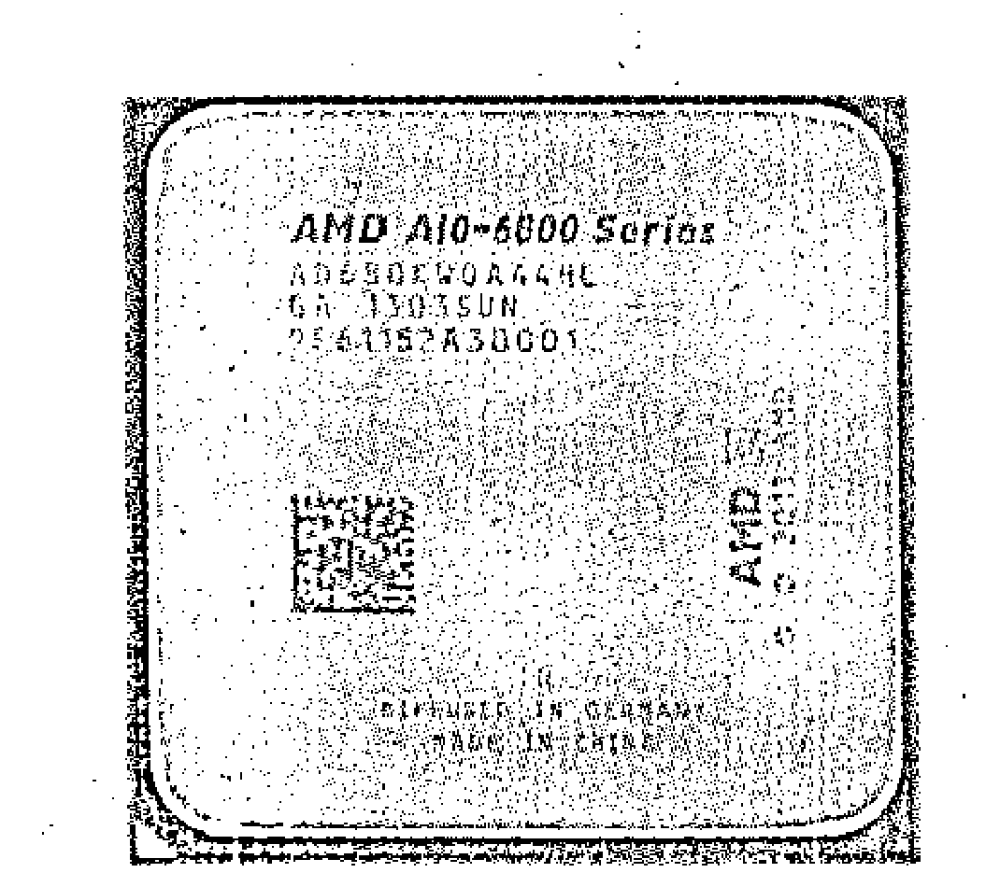

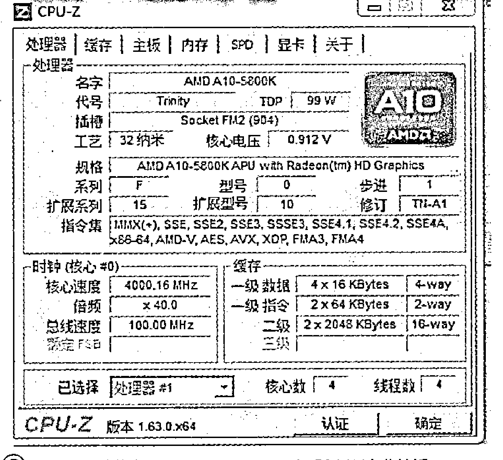

表2：几款APU规格参数对比

| CPU型号 | A10-7850K | A10-7700K | A8-7670K | A8-7650K |
| :--- | :--- | :--- | :--- | :--- |
| 制程 | 28纳米 | 28纳米 | 28纳米 | 28纳米 |
| 接口 | FM2+ | FM2+ | FM2+ | FM2+ |
| 核心线程 | 4/4 | 4/4 | 4/4 | 4/4 |
| 频率(GHz) | 3.7-4.0 | 3.4-3.8 | 3.6-3.9 | 3.3-3.8 |
| 缓存 | L2=4MB | L2=4MB | L2=4MB | L2=4MB |
| 核显型号 | R7系列独显核心 | R7系列独显核心 | R7系列独显核心 | R7系列独显核心 |
| 核显频率 | 720MHz | 720MHz | 720MHz | 720MHz |
| 流处理器 | 512 | 384 | 384 | 384 |
| TDP | 95W | 95W | 95W | 95W |## 无线机械键盘篇

相对于有线键盘来说，无线键盘的最大优势是可摆脱线材的限制，在有效的范围内自由地操纵PC。也正是基于此，目前有些机械键盘厂商也顺应潮流，推出了无线产品，比如Filco、阿米洛和雷柏等（图8）。

不过和薄膜键盘不同，无线机械键盘在诸多方面其实都存在一些明显的问题，比如电池续航能力偏短和无线信号延时等。机械键盘的电路结构十分复杂，每一个轴开关都要切换信号（图9），这一点和薄膜键盘的一体化设计不一样，因此非常耗电。以NEO有线、无线双模87键机械键盘为例，在无线模式且中度使用的情况下，更换电池的频率大约为三周甚至两周（两节7号电池），应该说这一频率是相当烦人的。

此外无线信号固有的延时性，也在另一方面影响着用户的使用体验。使用机械键盘的群体一般都是追求高质量的游戏玩家，在平时的鏖战过程中，对键盘和鼠标的灵敏度要求很高，哪怕只有一点延迟，也会造成血洒疆场的惨剧。因此，无线机械键盘是否值得游戏玩家购买，或许就是个见仁见智的问题了。

###### 新平台计划

####### Skylake低端处理器平台组建方案

文 | 宁宁

近期Skylake核心的新酷睿i3-6100和新奔腾G4400都已经陆续上市了，而本文将介绍这两款处理器的平台组建方案。

######## 新酷睿i3-6100欺压新酷睿i5-6400

作为Skylake核心的中端产品，新酷睿i3-6100仍旧采用了14nm制造工艺的Skylake核心（图1）。但是相比更高端的酷睿i5处理器来说，核心数量却从4个缩减成了2个，三级缓存容量也从6MB砍半成了3MB。不过即便如此，新酷睿i3-6100处理器也并非全无卖点，除了更为低廉的售价之外，最重要的就是高达3.7GHz的高主频，相比新酷睿i5-6400的2.7GHz主频高出了很多。也正是因此，新酷睿i3-6100也就有了欺压新i5-6400的很好资本。在部分测试项目当中，新酷睿i3-6100的性能甚至明显强于新酷睿i5-6400。而价格却只有699元，接近一半，相比1200元的酷睿i5-6400明显更具性价比。有鉴于此，对于那些追求高主频应用又没有太多预算的消费者来说，3.7GHz主频的新酷睿i3-6100显然就是更好的选择。

| 处理器型号 | 制造工艺 | 核心代号 | 核心线程 | 三级缓存 | 主频 | 接口 | 散装报价 |
| :--- | :--- | :--- | :--- | :--- | :--- | :--- | :--- |
| 酷睿 i3-6100 | 14nm | Skylake | 双核四线程 | 3MB | 3.7GHz | LGA1151 | 699元 |
| 酷睿 i5-6400 | 14nm | Skylake | 四核四线程 | 6MB | 2.7GHz | LGA1151 | 1200元 |

######## 新奔腾G4400凌辱旧奔腾G3420

除了新酷睿i3-6100处理器之外，Skylake核心还推出了更低端的新奔腾G4400处理器（图2）。相比上一代的奔腾G3420处理器来说，不仅制造工艺从22nm提高到了14nm，而且主频也从3.2GHz提升到了3.3GHz，至于价格则是不升反降，从390元降价到了更为超值的360元。考虑到Skylake核心的效能已经毫无疑问的明显超越了上一代Haswell核心，所以Intel官方推广新一代处理器的决心昭然若揭，新奔腾G4400凌辱旧奔腾G3420也同样成为定局。

| 处理器型号 | 制造工艺 | 核心代号 | 核心数量 | 三级缓存 | 主频 | 接口 | 散装报价 |
| :--- | :--- | :--- | :--- | :--- | :--- | :--- | :--- |
| 奔腾 G4400 | 14nm | Skylake | 双核双线程 | 3MB | 3.3GHz | LGA1151 | 360元 |
| 奔腾 G3420 | 22nm | Haswell | 双核双线程 | 3MB | 3.2GHz | LGA1150 | 390元 |

######## 盒装散装究竟买谁

目前上市的新酷睿i3-6100和新奔腾G4400处理器都分为盒装和散装两种版本，盒装可以提供Intel最为正规的3年保修服务并附带原厂散热器，散装则仅提供卖家承诺的1年保修服务并且还是没有任何散热器的“裸片”。不过话又说回来，散装的保修服务虽然只有1年但却并不代表品质不行，只要别买到处理器金属顶盖上印有“ES”字样的工程样品，处理器品质上就没有多大的问题。所以从客观角度来说，盒装与散装的最根本区别其实就是是否附带了原厂散热器。而就最新报价来看，新酷睿i3-6100处理器的散装报价只有699元，盒装版本的最低报价却高达789元（图3），两者差价高达90元，显然是购买散装更划算。新奔腾G4400处理器的情况则刚好相反，虽然散装报价已经是非常便宜的360元，但盒装版本的最低报价却也只贵了30元，卖到了390元（图4），显然是购买盒装更划算。

| 处理器型号 | 散装报价 | 盒装报价 | 盒散差价 | 推荐版本 |
| :--- | :--- | :--- | :--- | :--- |
| i3-6100 | 699元 | 789元 | 90元 | 散装 |
| 奔腾G4400 | 360元 | 390元 | 30元 | 盒装 |

######## 主板搭配：首选B150备选H110

针对Skylake核心的新酷睿i3-6100和新奔腾G4400这两款处理器，Intel官方推出了B150和H110这两款低端主板（图5）。其中B150主板相比高端的H170主板缩水并不多，不仅保留了PCI-E 3.0显卡插槽，而且USB3.0接口的数量也只是从8个减少到了6个。更为低端的H110主板虽然缩水得更多，不仅USB3.0接口的数量从6个减少到了4个，但却仍旧保留了PCI-E 3.0显卡插槽。而更为重要的是，H110主板相比上一代的H81主板绝对要厚道很多。上一代的H81主板虽然可以原生支持USB3.0接口和HDMI接口，但是很多厂商为了节省成本都把主板后置的USB3.0接口和HDMI接口砍掉了。而H110主板却并没有此类问题，主板后置的USB3.0接口和HDMI接口可谓一应俱全。

而就市场环境来看，H110主板由于只是最新发布，所以主力厂商只有华擎一家推出了多款超值产品。B150主板则可谓百家争鸣，各大品牌都有还算不错的超值产品推出。

######## Intel® 100 Series I/O SKU Plan

| Feature / Capability | B150 | H110 | H170 | Z170 |
| :--- | :--- | :--- | :--- | :--- |
| Chipset PCI Express* Gen 3 Lanes | 8 | 6 (Gen 2 Only) | Up to 16 | Up to 20 |
| SATA Gen 3 | Up to 6 | 4 | Up to 6 | Up to 6 |
| USB 3.0 | 6 | 4 | Up to 8 | Up to 10 |
| Total USB Ports (USB 2.0 + 3.0) | 12 | 10 | 14 | 14 |
| SATA Express Capable Ports (x2) | Up to 1 | 0 | Up to 2 | Up to 3 |
| Intel® RST for PCIe Storage Ports (x4 M.2 or x2 SATA Express) | 0 | 0 | Up to 2 | Up to 3 |
| Enhanced SPI | ✓ | ✓ | ✓ | ✓ |
| Processor PCI Express* Gen 3 1x16 Port | 1x16 | 1x16 | 1x16 | x4, x8, x16 |

######## 内存搭配：究竟是DDR4还是DDR3

根据Intel的官方定义，6系处理器实际上仅支持DDR4和DDR3L这两种低电压内存，至于默认电压更高的DDR3内存则并没有获得Intel的官方支持，并宣称有可能影响Skylake核心处理器的使用寿命。不过就目前来看，主板厂商对于Intel的官方定义却并不买账，几乎所有厂商都推出了同时支持DDR3/DDR3L内存的主板产品。所以消费者只要看准主板厂商的官方资料，明确了所要购买的主板确实能够同时支持DDR3/DDR3L两种内存（图6），便可以放心购买了。但是考虑到DDR4在性能上几乎完爆DDR3内存，所以笔者只推荐舍不得卖掉旧内存的升级用户购买那些支持DDR3/DDR3L内存的主板产品。至于那些新购机用户，则大力推荐支持DDR4内存的主板。

另外需要注意的是，DDR4内存市场的价格体系与DDR3内存市场完全不同。在DDR3内存市场当中，非主流厂商的内存与主流厂商的内存差价极为微小，最多也就差个二三十元而已。但在DDR4内存市场当中，非主流厂商的内存与主流厂商的内存差价却极为巨大，尤其是光威和酷兽这两个新锐非主流厂商（图7、图8），相比金士顿、威刚、宇瞻的差价竟然高达七八十元，并且已购买用户的评价详情都还算不错。所以究竟为何出现如此大的差价目前笔者也不得而知，追求低价的消费者或许可以考虑尝尝“螃蟹”。

| 内存品牌 | 详细规格及参数 | 京东报价 |
| :--- | :--- | :--- |
| 光威 | 4GB DDR4 2133 | 109元 |
| 酷兽 | 4GB DDR4 2400 | 109元 |
| 宇瞻 | 4GB DDR4 2133 | 179元 |
| 威刚 | 4GB DDR4 2133 | 179元 |
| 金士顿 | 4GB DDR4 2133 | 199元 |

######## 新平台超值主板推荐

######### 华擎H110M-HDV/D3

**硬件规格** H110芯片组/DDR3 or DDR3L 1866内存/ HDMI+DVI+VGA视频接口/2个USB3.0

**推荐理由** 华擎H110M-HDV/D3是市面上最廉价的Skylake新平台主板，采用了面向低端的H110芯片组，但却提供了最为完善的HDMI+DVI+VGA视频接口，并通过超频技术最高支持到DDR3/DDR3L 1866内存。略显寒酸的5相供电则可说是这款主板的最大软肋，但支持供电要求并不高的酷睿i3或奔腾处理器却绝对没有任何问题。

######### 华擎H110M-HDV

**硬件规格** H110芯片组/DDR4 2133内存/ HDMI+DVI+VGA视频接口/2个USB3.0

**推荐理由** H110芯片组由于最新发布所以主力厂商只有华擎一家，华擎H110M-HDV主板相比前面推荐的华擎主板最大的区别就是内存插槽变成了DDR4 2133，并且供电模块部分还加上了一块尺寸不小的金属散热片。至于其它方面两款华擎主板几乎一模一样，同样是HDMI+DVI+VGA视频接口，且同样是5相供电设计。

######### 映泰HI-FI B150S1

**硬件规格** B150芯片组/DDR3 or DDR3L 1866内存/ DVI+VGA视频接口/4个USB3.0

**推荐理由** 映泰HI-FI B150S1属于该品牌当家主打的HI-FI系列主板，提供了智能天籁系统HI-FI技术，在音质上可以实现8声道高清音频输出。并且这款主板还提供了4个USB3.0接口和足工足料的6相供电设计，相比H110主板明显高了一个档次。缺点则是并没有提供HDMI接口，这不能不说是一种遗憾。

######### 七彩虹C.B150M-K

**硬件规格** B150芯片组/DDR4 2133内存/DVI+VGA视频接口/2个USB3.0

**推荐理由** 七彩虹C.B150M-K同样采用了6相供电设计，内存插槽则是与Skylake平台更为契合的DDR4 2133。而且还支持七彩虹旗下包括闪电备份、智能还原在内的多种特色功能，千兆网卡还支持S5唤醒技术。缺点则是主板后端的USB3.0接口只有2个，并同样没有配备早已全面普及的HDMI接口。

###### 联想700S PK 华硕U305CA

还记得苹果MacBook 12吗？这款打破了标准形态笔记本轻薄纪录的产品终于有对手了：联想IdeaPad 700S和华硕Zenbook U305CA同样是薄如蝉翼的新品代表。那么它们之间谁更值得我们期待呢？

####### 酷睿M成就的纤薄

Zenbook U305（国外又称UX350）是华硕在2015年初推出的无风扇型超轻薄笔记本，它机身最厚处只有12.3mm，而重量也轻至1.2kg，虽然不如MacBook 12那般极致，但在同尺寸的Windows笔记本阵营中也算无比轻盈了（图1）。而U305系列之所以可以这般纤薄，凭借的就是和MacBook 12相同的“芯脏”：TDP只有4.5W的酷睿M，一款无需风扇辅助散热的性能级处理器。而本文涉及的U305CA，则是该系列的第二代产品，其最大特色就是将处理器升级到了英特尔第二代酷睿M（Skylake-Y），主打更优秀的能耗比（性能和功耗）表现。1.1kg的体重更是令人印象深刻。而IdeaPad 700S取得如此成绩的秘诀就是放弃了Yoga系列的可360度翻转屏幕的转轴设计，并采用了最新的第二代酷睿M处理器平台。

| 参数对比 | 联想IdeaPad700S | 华硕ZenbookU305CA |
|----------|-----------------|---------------------|
| 屏幕 | 14英寸 (1920×1080像素) | 13.3英寸IPS (1920×1080像素) |
| 处理器 | 酷睿M3-6Y30 | 酷睿M3-6Y30 |
| 内存/硬盘 | 8GB/256GB SSD | 4GB或8GB/128GB~512GB SSD |
| 显卡 | HD515核芯显卡 | HD515核芯显卡 |
| 接口 | 读卡器、USB3.0×1、USB2.0×1、Micro HDMI、音频接口 | 读卡器、USB3.0×3、Micro HDMI、音频接口 |
| 尺寸 | 338mm×232mm×13mm | 324mm×226mm×12.3mm |
| 电池/重量 | 50Wh/1.1kg | 45Wh/1.2kg |
| 参考价格 | 4999元 | 即将上市 |

####### 细节设计存差异

联想IdeaPad 700S和华硕Zenbook U305CA为了保证超纤薄机身的坚韧，在用料上也都是毫不含糊。其中，IdeaPad 700S采用了镁铝合金材质的A面（顶盖）、拉丝金属的C面（掌托）以及蜂窝立体式碳纤维材质的D面（底盖）。Zenbook U305CA的机身是由冲压车床冲压整块铝合金制成，顶盖部分由手工打磨抛光并进行同心圆拉丝工艺处理，整体工艺更显高档。

两款产品在细节设计上有着很多亮点。比如，华硕Zenbook U305CA的转轴可以起到屏幕支架的作用：随着屏幕开合角度的增大转轴可逐渐撑起笔记本，让键盘与桌面之间形成一个倾斜的角度（图3），从而带来更符合人体工程学的输入体验。为了避免转轴被桌面磨损，华硕在转轴外侧为U305CA加入了两个小凸起（类似脚垫），防止转轴表层与桌面直接接触。

联想IdeaPad 700S的亮点是在机身的侧面和前端加入了动感的红色腰带，再结合机身前端的楔形设计带来了更显纤薄的视觉效果（图4）。此外，该产品还将1个USB2.0接口和电源插头合二为一，优点是可让机身侧面看起来更简洁，缺点是在充电时就必然会浪费1个USB接口。令人遗憾的是，IdeaPad 700S仅标配了2个USB接口，充电与扩展功能的冲突无疑更加明显。

####### 具体配置的差异

两款笔记本都搭载了英特尔第二代酷睿M3-6Y30处理器（图5），默认主频为0.9GHz，最高睿频加速可达2.2GHz，并集成第九代（Gen9）HD515核芯显卡，也就是我们熟悉的第一代酷睿M-5Y10c（0.8GHz~2.0GHz，集成Gen8代的HD5300核芯显卡）的接班人。好消息是，虽然它们都采用了板载内存的结构（内存颗粒直接焊在主板上无法升级），但默认都工作在双通道模式（图6），所以都能100%发挥核芯显卡的性能，可以在1080P + 低画质下流畅运行LOL级别的3D游戏。

两款产品在配置上的差异在于，联想IdeaPad 700S屏幕为TN材质，可视角度不如华硕Zenbook U305CA所选用的IPS。所以，如果你对“视界”的要求较高，U305CA的优势还是毋庸置疑的。

两款产品的差异还体现在内部结构上。IdeaPad 700S得益于（相对）大屏幕的优势，塞进了更大的50Wh电池，其散热主要依靠覆盖在CPU芯片上的铜质散热片（图7）。而Zenbook U305CA的电池容量虽然偏低，但在散热设计上的表现却更抢眼：CPU的温度会随热管传递到另一侧的散热鳍片上（图8），散热效率可以预期。

> **火速连接**
>
> 第二代酷睿M（Skylake-Y）与上一代酷睿M（Broadwell-Y）有什么差别？它与同样无需风扇辅助散热的Baytrail-T和CherryTrail平台又有多少性能优势？对第二代酷睿M感兴趣的读者可参考本刊上期《携Skylake之威 第二代酷睿M深度解析》这篇文章。

> **扩展阅读 还有更错的选择：戴尔XPS13**
>
> 如果你觉得本文PK的两款产品还没有轻薄到极致，而且对酷睿M的性能也不满意，则可以考虑戴尔旗下的XPS13。该产品采用了极窄边框设计，在11.6英寸的机身里塞进了13.3英寸的屏幕，同时还武装了英特尔第五代或第六代酷睿i系列处理器（15W TDP），1.18kg的重量也毫不逊色。可惜，XPS13的售价偏高，起始售价就达到了6999元。

###### 中兴Blade A1 PK TCL乐玩2C

电信用户的境遇向来尴尬，很多热门手机仅支持移动或联通网络，唯独将电信拒之门外。在千元指纹机逐渐普及的今天，电信用户终于迎来了两款高性价比新品：中兴Blade A1和TCL乐玩2C。那么，它们之间谁更适合你？

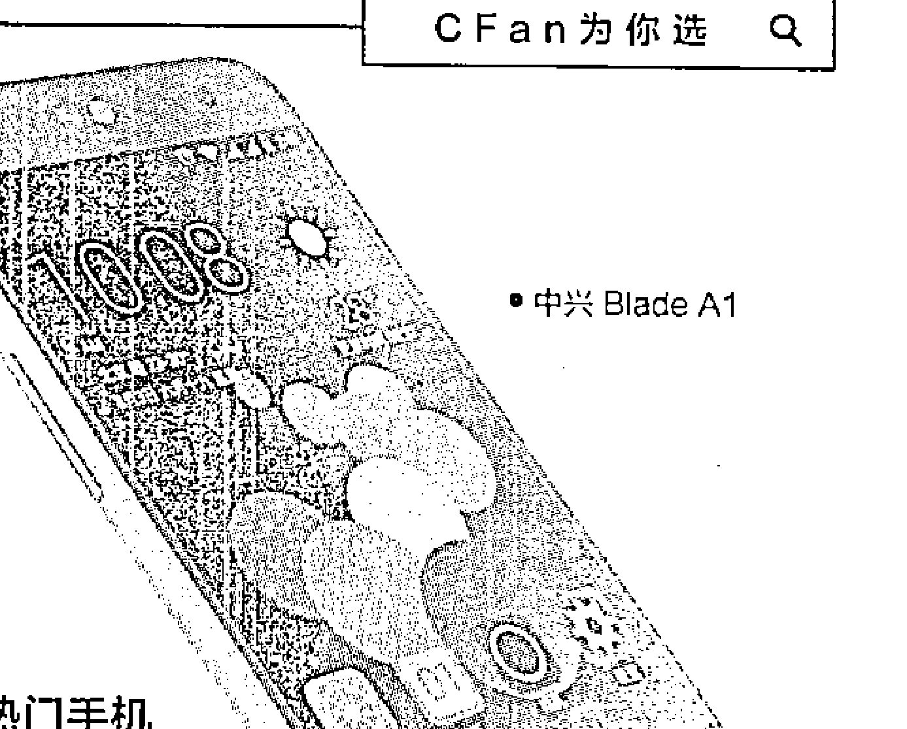


| 参数对比 | 中兴Blade A1 | TCL乐玩2C |
|----------|--------------|-----------|
| 网络 | 全网通(双卡双待)* | 电信4G(双卡双待) |
| 屏幕 | 5英寸(1280×720像素) | 5英寸(1280×720像素) |
| CPU | 联发科MT6735(四核1.3GHz) | 高通骁龙410(四核1.2GHz) |
| GPU | ARM Mali-T720MP2 | Adreno 306 |
| 内存/存储 | 2GB/16GB(支持存储卡) | 2GB/16GB(支持存储卡) |
| 摄像头 | 800万/1300万像素 | 800万/800万像素 |
| 机身 | 142mm×70.2mm×8.9mm | 140.98mm×71.05mm×8.58mm |
| 电池/重量 | 2800mAh(不可换)/137g | 2000mAh(可换)/145g |
| 参考价格 | 699元 | 699元 |

*中兴Blade A1还包含支持移动4G的低配版，599元的售价更为超值

####### 符合资质的网络

TCL乐玩2C是专门为电信网络定制的4G手机，同时还向下兼容移动和联通的2G网络（不影响打电话和发短信）。由于该产品采用了可拆卸后盖的设计，所以分别为SIM卡和TF（MicroSD）准备了3个卡槽（图1），双卡双待和存储卡扩容两不耽误。

中兴Blade A1则是一款更为主流的新品，它支持移动联通电信4G全网通，所以无论你的SIM卡来自哪家运营商，都可通过它体验高速4G网络。可惜，该产品采用的SIM卡槽为一拖二的结构（图2），如果安装了双SIM卡就要放弃存储卡，安装了存储卡就只能使用一张SIM卡，而这也是当下双卡手机最常面对的尴尬。

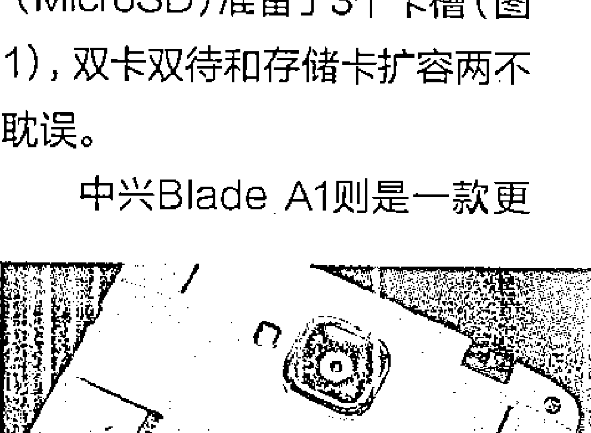

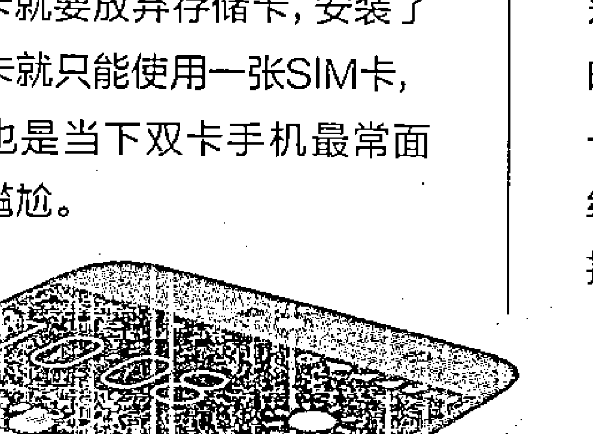

####### 指纹识别悄然普及

别看两款新品的价格只有699元，但它们都支持时下最热门的一项安全技术：指纹识别，并很有“默契”地将指纹识别模块安置到了手机的背面（图3）。值得一提的是，中兴Blade A1和TCL乐玩2C的指纹识别都支持熄屏解锁，只需用食指轻触一下指纹识别区，在零点几秒之内就能点亮屏幕并进入桌面，免去了以往需先按电源键亮屏再输入密码解锁的繁琐。

不过，两款新品在指纹识别的功能挖掘上有所差异。其中，中兴Blade A1可以利用指纹加密建立隐私空间，并主打特色的“鲜键”功能，比如单击指纹锁屏、双击抓拍、长按开启手电筒，而用户也能根据实际需求自定义单击/双击/长按指纹时所触发的功能（图4）。此外，“鲜键”在不同的环境下也被赋予了不同的功能，比如拍照界面按下指纹键就可拍照、来电时接听电话、闹钟时点击就可停止闹钟。

TCL乐玩2C的指纹同样支持隐私加密，并可作为拍照时的快门、来电话时的接听键。只是，TCL为其赋予了更多自定义的可能：用户可以同时记录五组指纹数据，并为每个指纹指定一个触发功能，比如拇指启动微信、食指进入QQ等。此外，当手机下拉菜单被无数APP的推送消息占满时，只需指纹轻触就可瞬间清除桌面通知，非常方便。

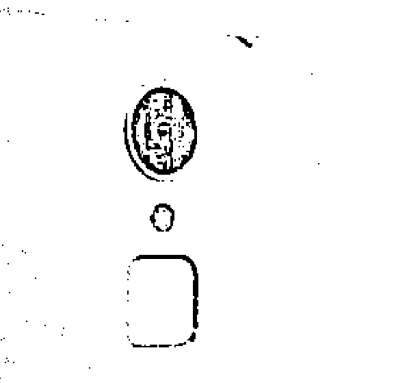

####### 配置都属入门档次

中兴Blade A1和TCL乐玩2C为了降低成本，并没有采用时下流行的金属材质机身，而是选择了更为保守的用料设计，都是通过喷漆工艺弱化塑料感。在硬件规格上，两款手机都采用了相对苗条的5英寸机身，而屏幕分辨率也保持在720P（1280×720像素）级别，2GB内存和16GB的存储空间也都属于当前Android手机的“入门标准”。

两款手机的差异主要体现在处理器平台上，中兴Blade A1搭载了联发科MT6735，TCL乐玩2C则选用了高通骁龙410，它们都属于相对低挡的四核处理器，所集成的ARM Mali-T720MP2和Adreno 306也谈不上强悍，想流畅运行大型3D游戏肯定是不靠谱的。

好消息是，这两款手机在配置都属入门档次的同时，均配备了800万像素前置摄像头，并加入了闪光灯设计，在昏暗环境下自拍时可起到补光作用（图5），再结合实时美颜的软件支持，在自拍潜质方面还是很有看点的。

在特色功能方面，TCL乐玩2C在手机顶部加入了红外模块，通过APP可以扮演家用电器遥控器之用（图6）。此外，乐玩2C在系统层面支持微信QQ双开，对社交达人而言无疑是个好消息。而中兴Blade A1的优势则在于配备了更大的2800mAh电池，在续航时间上要完胜对手。


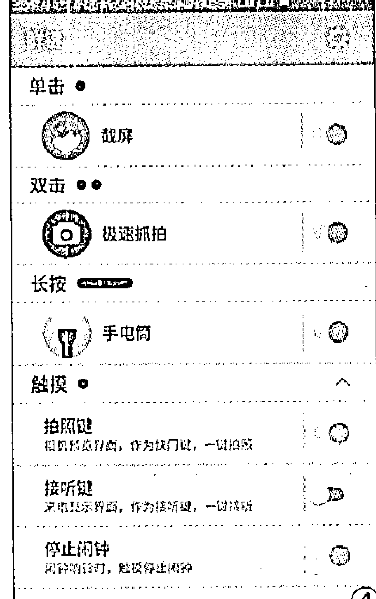

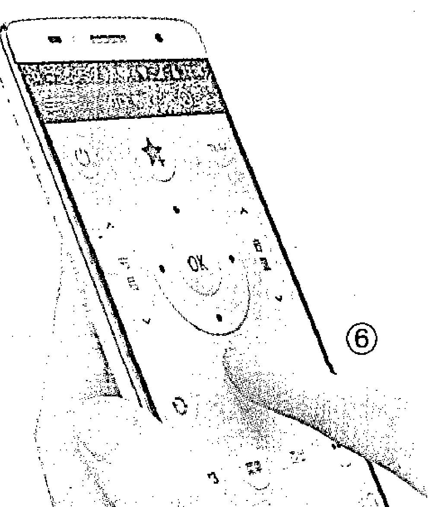

> 作为时下最便宜的指纹手机代表，中兴Blade A1和TCL乐玩2C在用料设计和配置上没有太多亮点，只是通过指纹和多项软性优化提升了卖点。如果你对性能要求较高，899元的红米Note3的表现要更符合预期，而这两款产品的意义就是在更低的价位里提供了同样丰富的功能。对续航时间比较在意、除了电信号以外还有其他运营商SIM卡的用户可以考虑Blade A1，而TCL乐玩2C则适用于更纯粹的电信用户。

如果你预算有限但却追求更精致的做工、性能和体验，那就不妨关注一下青葱metal（图7）。这款799元的青葱metal采用了一体化的金属机身，搭载联发科MT6753处理器，内置3GB内存，同样支持指纹识别功能，无论是做工还是体验都要远超本文介绍的中兴Blade A1和TCL乐玩2C。可惜，该产品仅支持移动联通双4G网络，注定与电信用户绝缘。

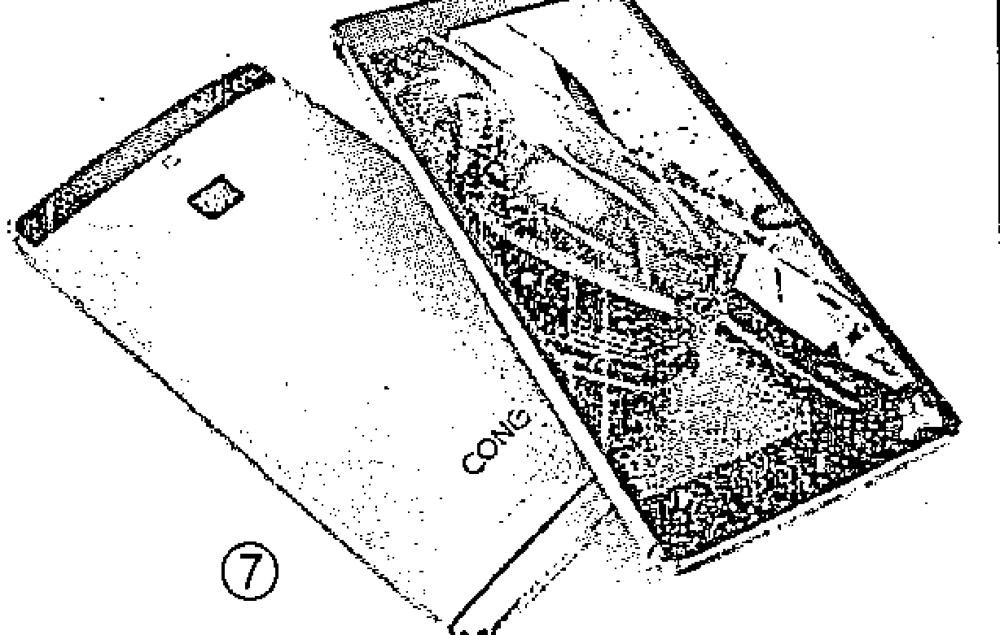

###### 精挑细选才是王道
####### 挑出笔记本的型号误区 文|曹操

和手机不同，一款笔记本会因配置的异同，衍生出无数的子型号。它们之间可能只是名字相差几个字母，但在价格和性能上却有着极大差距。因此，在笔记本的选购过程中，精挑细选才是王道。

笔记本的型号误区由来已久，虽然《电脑爱好者》几乎每年都会针对该问题进行报道，但依旧会有很多用户忽略型号背后的数字陷阱。虽然用“陷阱”一词可能并不妥当，因为笔记本厂商为了满足不同预算和需求的用户，必然会对某款产品的配置进行微调。但是，普通消费者并没有辨别不同硬件之间性能差异的能力，极易被宣传误导而做出错误的判断。接下来，就让我们从两个案例中，看看型号误区所潜在的严重性。

####### 英特尔还是AMD

Y700是联想2015年底推出的游戏旗舰（图1）。作为小Y家族的最新成员，Y700拥有14英寸（Y700-14）和15.6英寸（Y700-15）两大版本，远不如上代产品（Y40和Y50）这般直观。另一方面，这一次15.6英寸的Y700-15还被细分为基于英特尔酷睿平台和AMD APU平台设计的两个小版本。作为区别，AMD版的Y700会在型号后面加上“FX”的后缀，其具体的子型号为Y700-15ACZ。而英特尔版的则被称为Y700-15ISK，旗下还包括标准版（i5-6300HQ+4GB+1TB+GTX960M-2GB）、旗舰版（i7-6700HQ+8GB+1TB+GTX960M-2GB）以及尊享版（i7-6700HQ+16GB+1TB+128GB SSD+GTX960M-4GB）。怎么样，有没有感觉头晕脑胀？

由于Y700-15ISK的三个子型号之间价格相差很大，所以选购起来没什么问题，有钱买高配即可。但是，Y700-15ISK标准版和Y700-15FX的价格却相差无几，由此就极易引起我们的误判。比如图2，这是某商家列出的两款产品参数对比图，从图可见Y700-FX版的内存更大、显卡显存更高、屏幕也突出IPS，感觉可以秒杀英特尔版本的Y700-15啊？先别着急下结论，我们再仔细对比一下这两款产品的详细参数。从表1可见，Y700-15ISK（标准版）虽然内存只有4GB，但却是更先进的DDR4规格。通过网友的反馈来看，这个版本机器的屏幕同样也是IPS材质。最重要的一点是，酷睿i5-6300HQ+GTX960M独显的组合可以轻松秒杀AMD FX-8800P+R9 M385X独显的组合，哪怕后者拥有更大的显存。看到这里，傻子也知道Y700-15ISK（标准版）的性价比更高了吧？

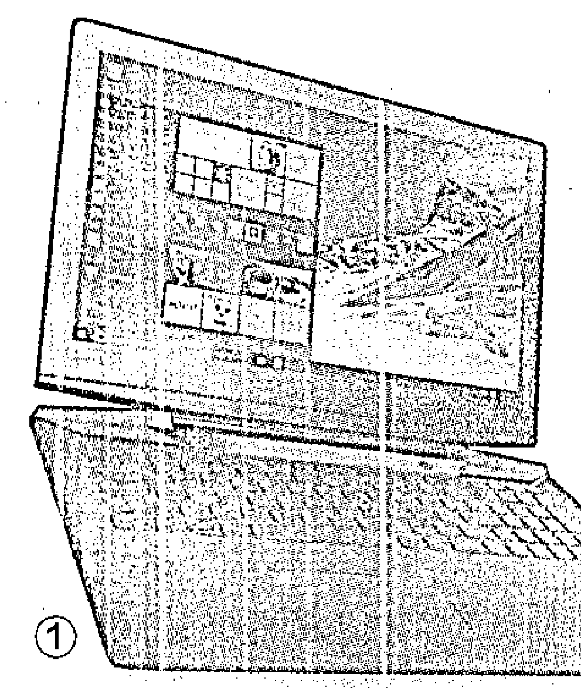

| 对比项 | Y700-15ISK(标准版) | Y700-15FX(ACZ) |
|---|---|---|
| 处理器 | 酷睿i5-6300HQ | AMD FX-8800P |
| 内存 | 4GB DDR4 | 8GB DDR3 |
| 独立显卡/集成显卡 | NVIDIA GTX960M(2GB)<br>HD530核芯显卡 | AMD R9 M385X(4GB)<br>AMD Radeon R7 |
| CINEBENCH R15 | 457cb | 203cb |
| 3DMark 11 | P5321 | P4563 |
| 3DMark Fire Strike | 4021 | 2879 |
| 参考价格 | 5599元 | 5699元 |

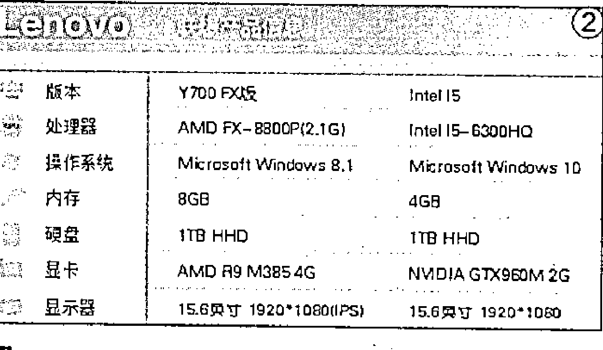

点评：虽然FX-8800P隶属于AMD最新的第六代APU（Carrizo）平台，而R9 M385X也是AMD最新的移动显卡，但它们的性能依旧难以和英特尔Skylake处理器及NVIDIA同级别的移动显卡比肩。所以除非AMD平台组合足够便宜，否则笔者还是建议大家选择NVIDIA和英特尔的组合。

####### 三世同堂之争

如果你觉得联想Y700就够乱的了，那来自惠普ENVY 15的“三世同堂”现象肯定能再吓你一跳。简单来说，同样叫“ENVY 15”的惠普笔记本，现在正上演两套模具三代平台同台竞技的表演。更令人抓狂的是，我们很难通过子型号的后缀对具体的配置进行区分。

表2是目前售价比较接近的四款ENVY 15家族成员。其中，ENVY 15-K301TU和ENVY 15-K221TX采用的是同一套模具，它们都配有内置光驱，身材也略显臃肿（图3）。

ENVY 15-K301TU搭载了英特尔四代酷睿i7-4750HQ处理器，其最大卖点就是集成了不逊于入门级独显的锐炬5200 Pro集显（图4）。

而ENVY 15-K221TX则将处理器换成了功耗更低的五代酷睿i5-5200U处理器，并辅以NVIDIA GTX 850M独显与其搭配，游戏性能要在ENVY 15-K301TU之上，可见高端CPU对游戏的增益效果远不如更高端的GPU来得实在。

ENVY 15-AE120TX和ENVY 15-AE122TX则是一套模具，主打全金属一体化的超薄机身（图5）。它们都基于英特尔六代酷睿i5-6200U设计，差异主要体现在独立显卡的型号上。其中，AE120TX配备的是比入门级高一点的NVIDIA GT940M，而AE122TX则武装了中端级别的GTX950M，游戏性能可轻松秒杀前者。因此，虽然AE120TX表面上看内存更大、价格更便宜，但对喜欢玩游戏的用户而言，价格稍贵的AE122TX却能带来（游戏性能）质的提升。

看到这里，我们就不难对ENVY 15家族提出选购上的意见了。ENVY 15-K301TU虽然处理器堪称顶级，但时下3D游戏对GPU的强弱更敏感，所以除非你经常使用特别耗费CPU资源的程序，否则K301TU是最不值得选择的型号（图6）。

如果你不在意更轻薄和精致的设计，只是希望以最低开销获得最佳性能，那配置稍显落伍的ENVY 15-K221TX显然更适合你，五代酷睿i5-5200U+GTX850M的组合并不逊色于六代酷睿i5-6200U+GTX950M太多，不足5000元的售价要比采用新模具的ENVY 15-AE122TX更超值。

如果你注重设计且追求性能，那就不要图几百元的小便宜，配备GT940M独显的AE120TX可以直接放弃，一步到位选择武装GTX950M的AE122TX才是王道。

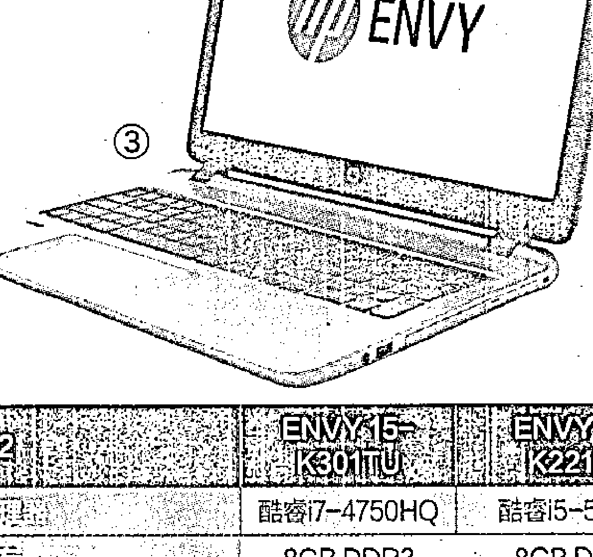

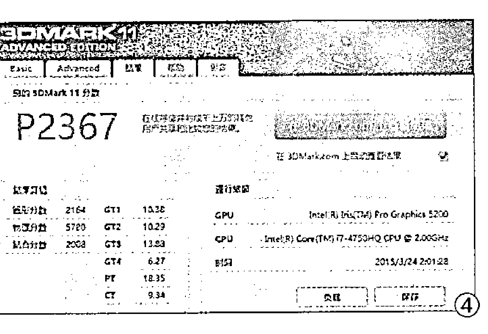

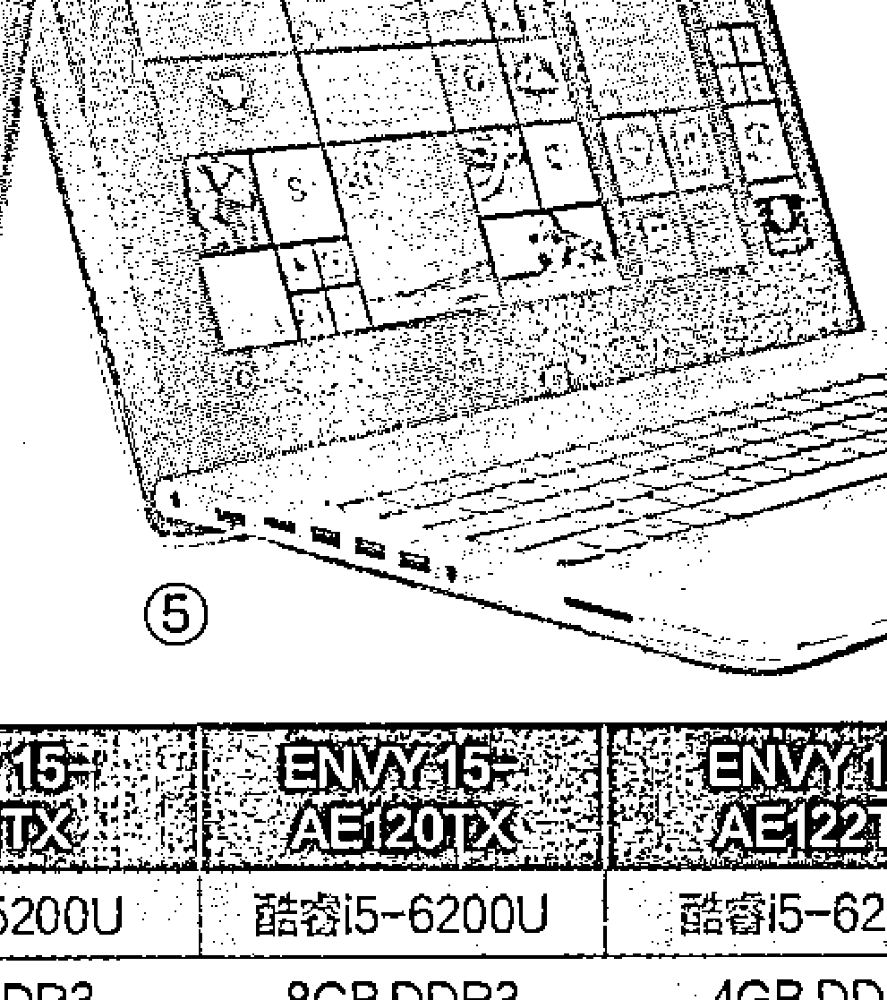

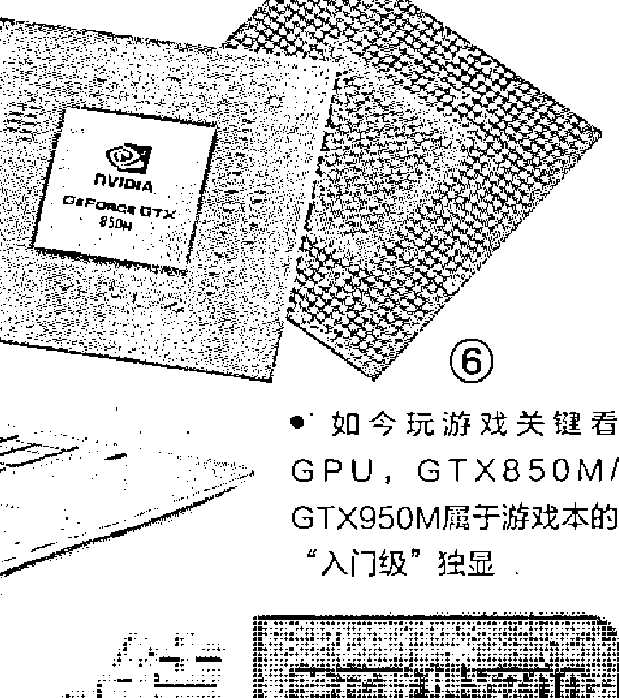

| 型号 | ENVY 15-K301TU | ENVY 15-K221TX | ENVY 15-AE120TX | ENVY 15-AE122TX |
|------|----------------|----------------|-----------------|-----------------|
| 处理器 | 酷睿i7-4750HQ | 酷睿i5-5200U | 酷睿i5-6200U | 酷睿i5-6200U |
| 内存 | 8GB DDR3 | 8GB DDR3 | 8GB DDR3 | 4GB DDR3 |
| 独立显卡 | 无 锐炬5200 Pro | NVIDIA GTX 850M HD5500核芯显卡 | NVIDIA GT940M HD520核芯显卡 | NVIDIA GTX 950M HD520核芯显卡 |
| 厚度/重量 | 26.7mm/2.34kg | 26.5mm/2.49kg | 22.9mm/2.19kg | 22.9mm/2.19kg |
| CINEBENCH R15 | 592cb | 257cb | 267cb | 267cb |
| 3DMark06 | P2367 | P3697 | P2457 | P3818 |
| 3DMark Fire Strike | 1172 | 2512 | 1414 | 2658 |
| 参考价格 | 4999元 | 4999元 | 5399元 | 5799元 |

####### MicroUSB接口也能“盲插”
文|曹操

2012年，苹果携iPhone 5之威推出了全新的Lightning接口，从此iPhone/iPad用户再也不必区分数据/充电线接口的方向，“盲插”概念就此诞生。那么，Android阵营设备就只有“羡慕嫉妒恨”的份了吗？

####### USB Type-C救场

长久以来，Android设备阵营一直以MicroUSB作为标准接口。2015年，USB联盟在USB3.1的基础上，开始倡导全新的USB Type-C标准，而该标准接口的最大特色就是支持盲插（图1），并同时提升了供电能力（选配），还可用于传输视频信号（选配）。以乐视手机、一加手机2、魅族Pro5等为代表的手机都借USB Type-C不再担心弄错数据/充电线接口的方向。

####### 一分为二的曲线救国

以苹果MacBook和微软Surface为代表的很多高端笔记本/平板都采用了磁吸式的电源接口，不但不用区分正反面（图2），当充电插头靠近电源接口就被自动吸入，既酷又好用。如果MicroUSB可以引入磁吸概念，不就可以实现盲插的梦想了吗？

令人遗憾的是，并非所有Android设备厂商都买USB Type-C的账，无论是三星的Note5还是华为Mate8，坚守MicroUSB标准的旗舰手机大有人在。那么，对这种“固执”的新品，或是那些以MicroUSB为主的老款型号手机，难道就只有看着Lightning和USB Type-C流口水的份了吗？答案是否定的，因为只需将MicroUSB接口加以改造，同样可以获得盲插的能力。

深圳绿巨能就在京东众筹平台推出了一款磁吸数据线，这根线最大的特色就是将数据线与MicroUSB插头一分为二，变成了一根两段式的数据线，并在数据线与MicroUSB插头断开的“伤口”部分都进行了磁吸技术的改造。平时只要将数据线靠近MicroUSB插头就会随着“嘣”的一声清脆而自动连接（图3），从而实现充电或传输数据之用。

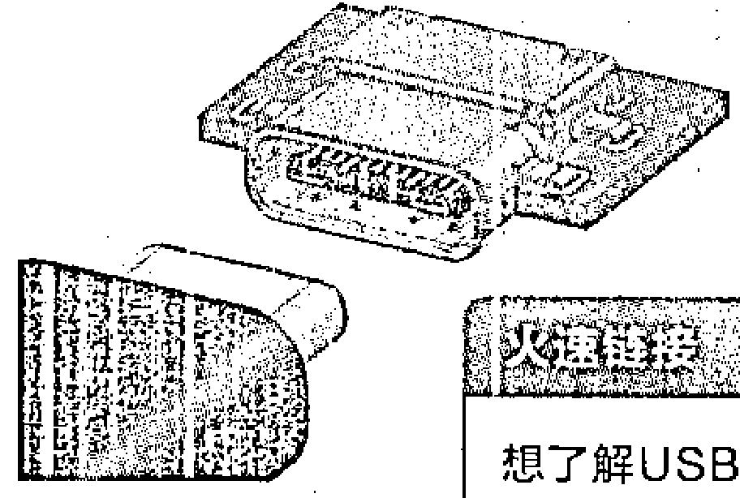

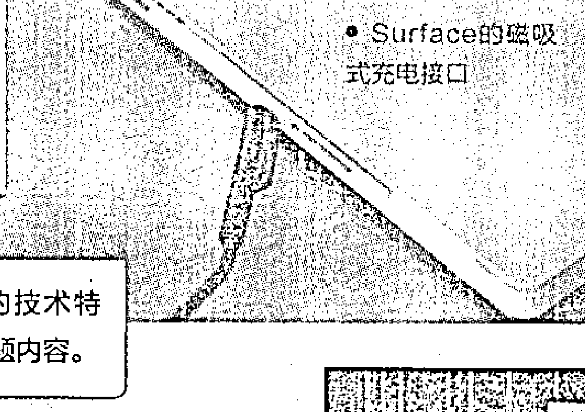

绿巨能磁吸数据线提供了Lightning（适合苹果设备）和MicroUSB（适用于Android设备）两个版本（图4），58元可以得到标准的一套磁吸式数据线和额外的充电接头，让两款设备获得磁吸式充电的机会，只是两款产品都没电时就需要排队充电了（因为只有一根数据线……）。

> > **火速链接**
> 想了解USB Type-C接口的技术特色，请参考本刊上期的特别话题内容。

需要注意的是，绿巨能磁吸数据线的充电头依旧是标准的MicroUSB结构，在插入手机时仍要注意正反面。因此，如果你想一直可以盲插充电就要将MicroUSB插头始终装在手机上。还好，这个MicroUSB插头的体型非常迷你，哪怕平时一直插在手机上也不会显得过于累赘。只是，如果你家Android设备较多，每次使用该数据线充电前，都需要进行一次安装MicroUSB插头的操作，并要小心不把方向搞混。因此，绿巨能磁吸数据线最适合家里只有1~2部Android设备的用户选择。

> 绿巨能磁吸数据线在宣传上提到了更快的充电速度，还有一些数据线品牌甚至会打出“支持高通QC2.0和MTK PEP快充技术”的宣传。实际上，只要不偷工减料，任何一根数据线都可安全承载至少2A的电流输入，而QC2.0和MTK PEP等技术都是以提高电压实现快充，对电流的要求并不苛刻。

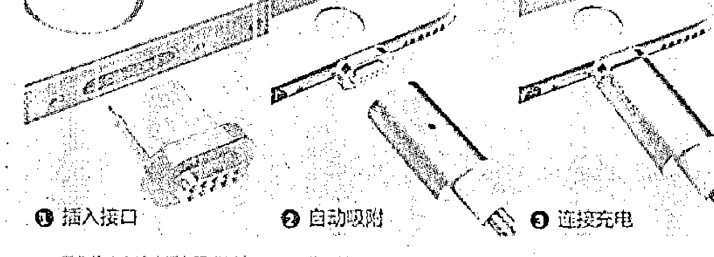

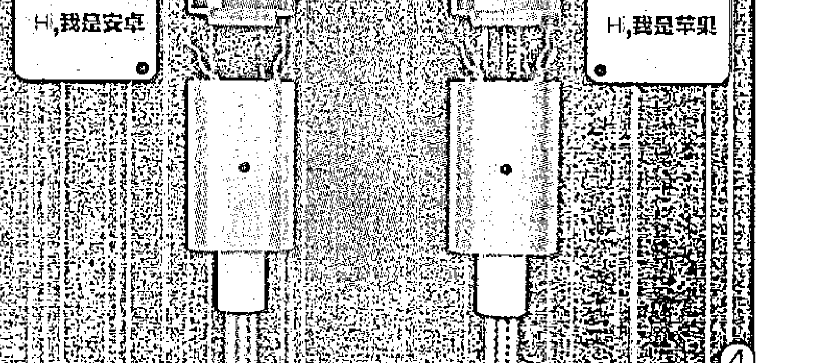

####### 给MicroUSB做盲插手术

Lightning和USB Type-C之所以无视正反面，是因为它们在接口(设备内)和插头(数据线内)的上下两端都预留了针脚(触点)，无论哪一面朝上都不影响电信号的连接和传输。如果可以对数据线的MicroUSB插头做个改造(图5)，是不是也有机会实现盲插呢？

在淘宝上已经有不少“手术”后的MicroUSB数据线在卖了。此类数据线对MicroUSB插头结构进行了改造，将原本梯形的插头“削成”扁平的菱形，而插头内PCB板也改为悬空，并在上下两面都加上了5个针脚(正反面加起来就是10个针脚了)(图6)。菱形的插头可以无视正反，无论哪面都能轻松插进设备的Android手机的接口内，并通过双面针脚结构实现通电和数据的传输。

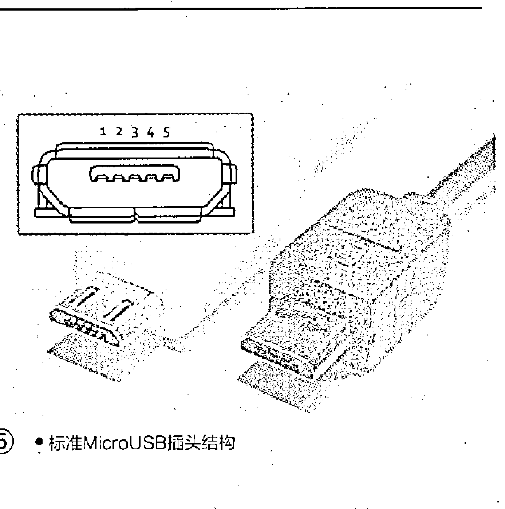

通过这个“手术”，让改造后的MicroUSB数据线兼容现有的MicroUSB设备(包括Android手机、平板、电视盒子、移动音箱、移动电源……)，让原本属于USB Type-C的盲插特色为己所用。

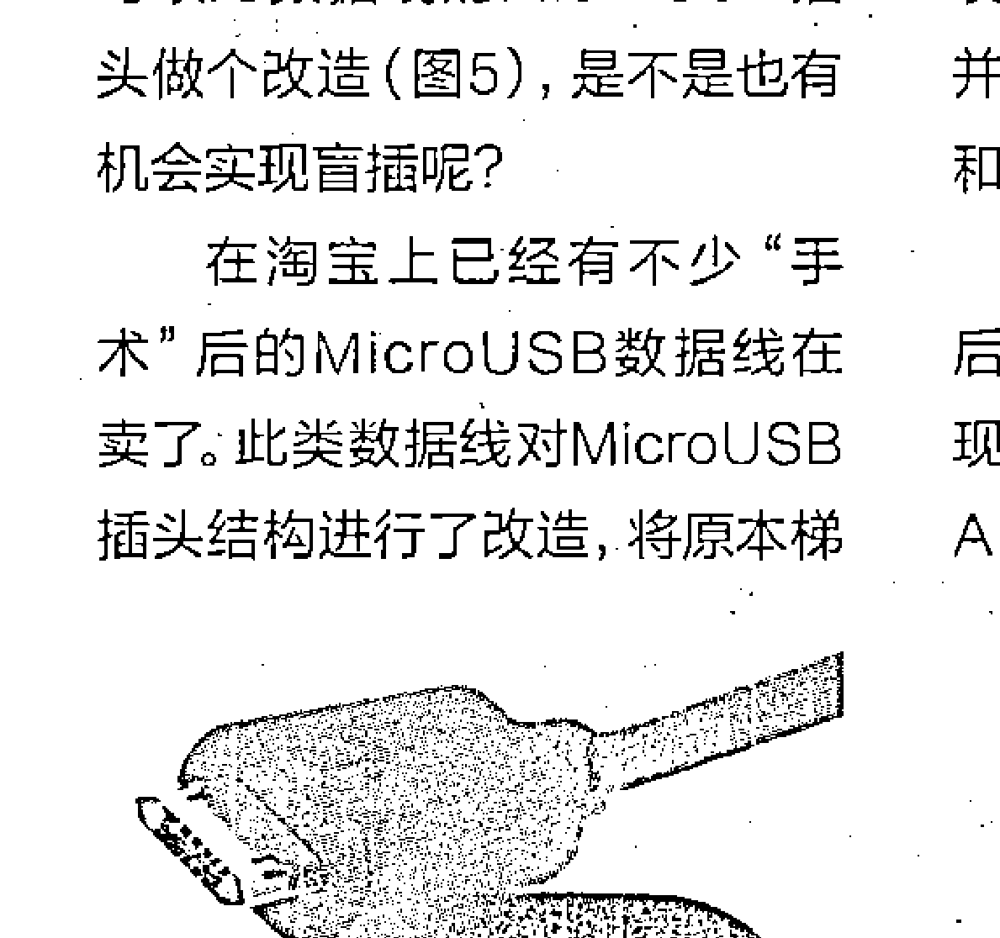

####### 双头、双向正反插，两全其美

为了进一步突出卖点，可盲插的MicroUSB数据线还出现了采用尼龙材质线缆或不怕缠绕的扁平线缆的版本。此外，此类数据线通常还会对另一头的标准USB插头进行改造：通过位于中间的双面金属触点也能实现盲插(图7)，无论是连接PC/充电器还是手机等设备都无需担心插反(图8)。

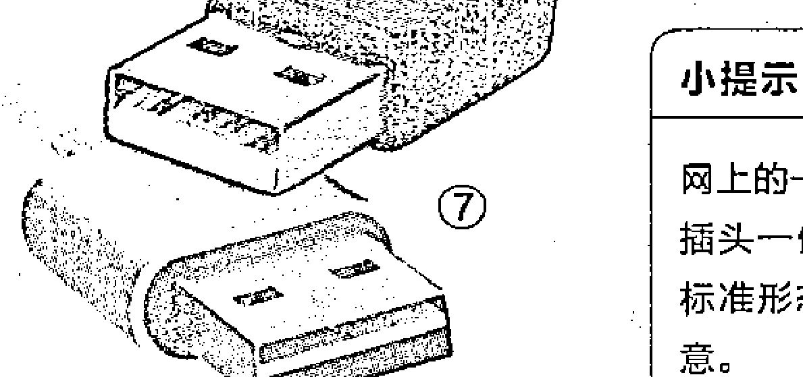

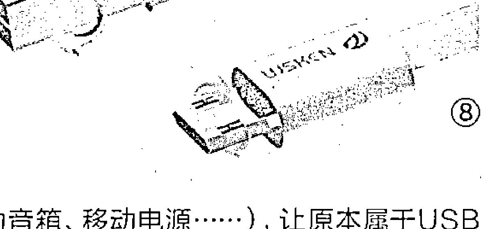

> 网上的一些“双面MicroUSB数据线”仅有标准的USB插头一侧为可盲插设计，而MicroUSB插头一侧还是标准形态(需要区分正反)，大家在选购时需要多加留意。

###### 联想Y700-14 PK 惠普ENVY14

对经常背着本本外出的游戏玩家而言，15.6英寸的机型还是太过臃肿，唯有14英寸的游戏本才能满足便携需求。而联想Y700-14和惠普ENVY14，则是目前最热的两款小巧游戏本。那么，它们之间谁更超值？

####### 两种风格的外在设计

CFan曾在2015年20期的CFan打擂台中介绍过惠普新ENVY 15，而这款ENVY14就是ENVY15的“缩小版”，依旧保持了时下流行的纤薄设计，22.7mm和1.94kg的身材颇为性感。此外，ENVY14同样选用了金属材质的A面和C面，无论是视觉效果还是触感都更显高档。当然，新ENVY家族特色的下沉式转轴也被ENVY14继承，当屏幕打开时转轴底部脚垫将代替脚垫支撑起整个机身(图1)。

本期评测栏目有联想Y700-15ISK的评测，但这里的Y700-14ISK却和老大哥Y700-15ISK有着很大的区别。简单来说，Y700-14ISK的设计风格和Y700-15ISK类似，外壳上两条斜切棱角与红色音箱线条浑然一体。但是，Y700-14ISK采用的却是复合材质的A面和D面(Y700-15ISK为金属材质)(图2)，取消了内置的超重低音炮单元以及数字小键盘区域。还好，红色的背光键盘(图3)、IPS材质屏幕等特色没有被取消。

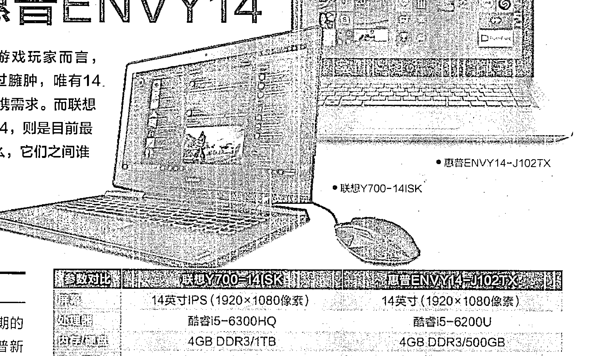

| 参数对比 | 联想Y700-14ISK | 惠普ENVY14-J102TX |
| :--- | :--- | :--- |
| 屏幕 | 14英寸IPS（1920×1080像素） | 14英寸（1920×1080像素） |
| 处理器 | 酷睿i5-6300HQ | 酷睿i5-6200U |
| 内存/硬盘 | 4GB DDR3/1TB | 4GB DDR3/500GB |
| 独立显卡 | AMD R9 M375 (4GB GDDR5) | NVIDIA GTX950M (4GB DDR3) |
| 接口 | 读卡器、USB 3.0×2、USB 2.0×1、HDMI、RJ45、音频接口 | 读卡器、USB 3.0×3、HDMI、RJ45、音频接口 |
| 尺寸 | 423mm×305mm×27.95mm | 345mm×246mm×22.7mm |
| 电池/重量 | 45Wh/2.2kg | 55.5Wh/1.94kg |
| 参考价格 | 5699元 | 5499元 |

####### 迥异的硬件规格

和ENVY14的轻巧纤薄相比，Y700-14ISK的整体感觉就显得有些“厚实”了。但是，厚实的机身却赋予了Y700-14ISK更充裕的内部空间，让它可以踏踏实实地塞进英特尔六代酷睿处理器中TDP高达45W的酷睿i5-6300HQ。别看这是一款i5处理器，但到了Skylake这一代，i5-6300HQ已经正式进阶四核架构，具备更加强悍的运算能力。

惠普ENVY14家族的中低配版均搭载了英特尔六代酷睿处理器中15W(TDP)的i5-6200U，通过削减核心数量和主频换取更低的功耗和发热量。就CPU性能而言，i5-6300HQ和i5-6200U的差距在40%左右。

在GPU（独立显卡）方面，两款笔记本也走上了不同的道路。其中，联想Y700-14ISK武装了AMD旗下的Radeon R9 M375 (Strato Pro构架) 独立显卡，拥有1024个着色单元，并由4GB GDDR5规格的显存与其搭配。惠普ENVY14则与NVIDIA旗下的Geforce GTX950M独显搭配，拥有640个流处理器，显存规格则是4GB DDR3。

小提示
惠普ENVY14系列中的高配版 (ENVY 14-J104TX, 6999元) 改用了45W的六代酷睿i7-6700HQ处理器 (图4)，并依旧保持了和中低配相同的纤薄身材。因此，如果你对CPU和GPU的性能都格外看重，则可以考虑这个版本的机器。

| 性能测试 | Geforce GTX950M | Radeon R9 M375 |
| --- | --- | --- |
| 3DMark06 (GPU) | 4375 | 3570 |
| 3DMark CloudGate (GPU) | 19873 | 8978 |
| 3DMark FireStrike (GPU) | 2969 | 1861 |

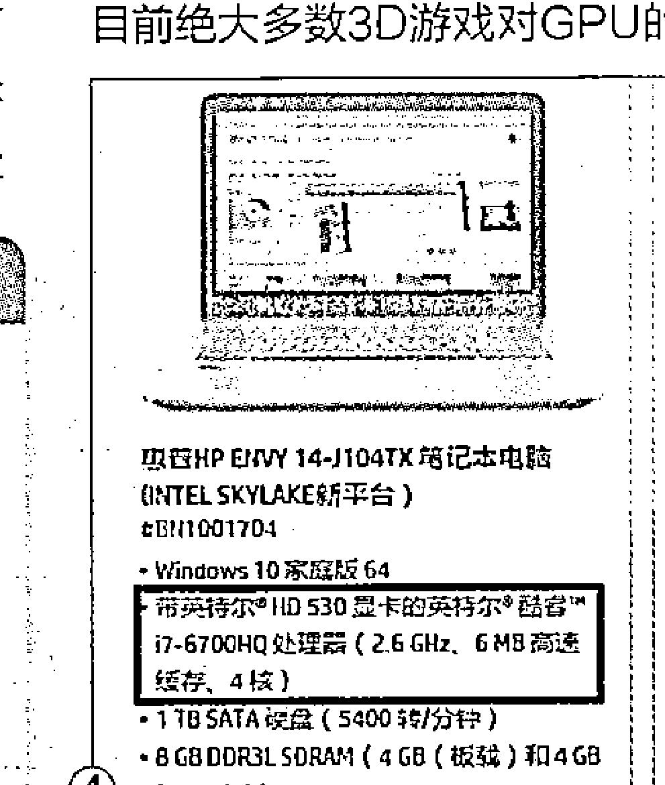

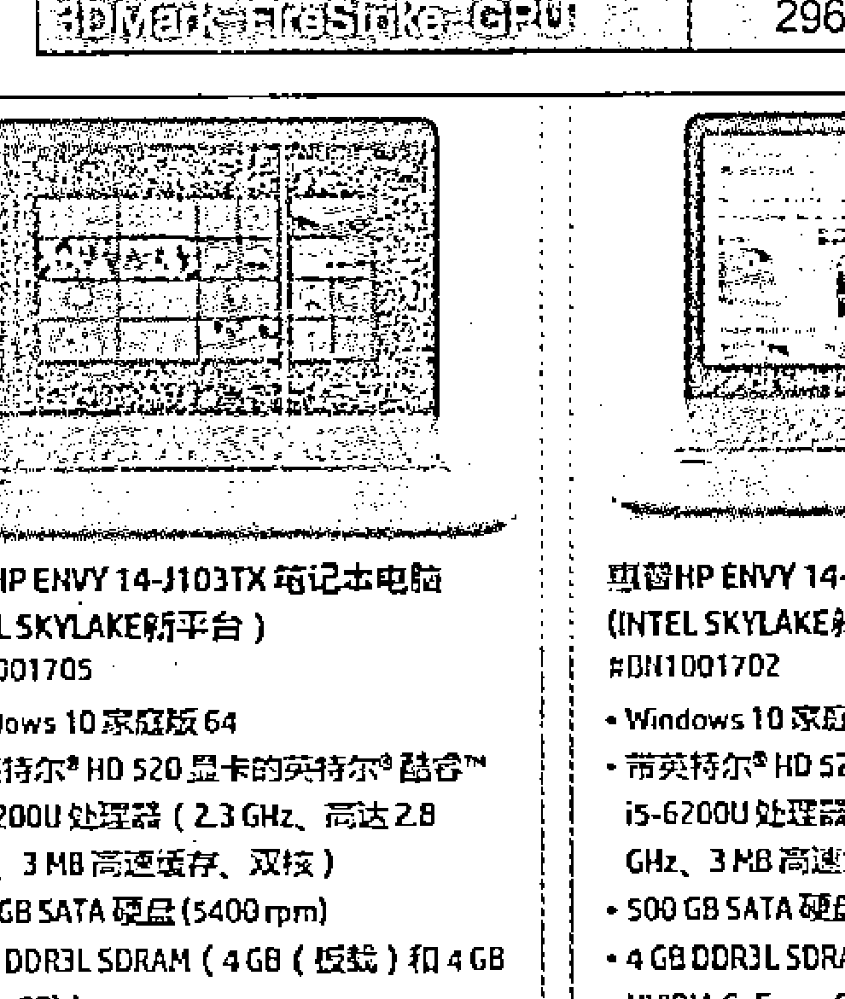

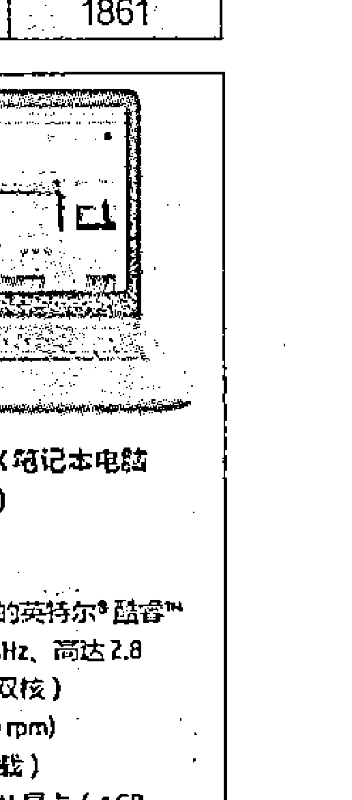

####### 如何判断扩展能力

在本文截稿时，网上还没有关于这两款笔记本的拆机图，而官方或电商的参数中也没有它们是否内置M.2插槽的信息。问题来了，很多玩家都希望升级到SSD+HDD双硬盘，依靠SSD的高速读写实现快速开关机和减少游戏的Loading时间。在这里，笔者向大家提供两种思路，用于辅助判断某款笔记本扩展潜力的方法。

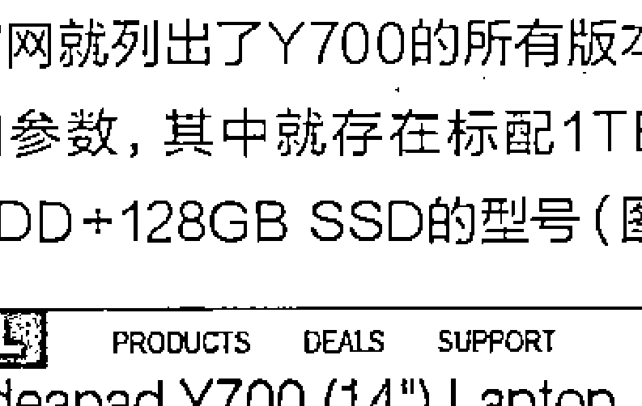

以Y700-14ISK为例，中国联想官网还没有录入它的相关信息 (截稿时)，所以我们可以访问联想在国外的网站获取所需的信息。比如，在联想美国官网就列出了Y700的所有版本和参数，其中就存在标配1TB HDD+128GB SSD的型号 (图5)。考虑到Y700-14没有光驱位，所以它必然提供了SATA3.0和M.2两个插槽。因此，国内销售的Y700-14ISK也应该具备双硬盘的升级潜力。

至于惠普ENVY14，无论是中国惠普还是国外惠普官网都没有出现标配双硬盘的型号，而通过在百度搜索“ENVY14-J102TX+SSD或M.2”，不难找到该产品没有额外SSD接口的答案 (图6)。因此，如果你喜欢ENVY14却又对磁盘性能有较高要求，则可以考虑更换纯256GB SSD (价格已跌破500元)。

扩展阅读
还有更酷的选择
如果你不差钱，可以考虑戴尔最新版的Alienware 13，该系列采用13.3英寸IPS屏幕，搭载六代酷睿处理器 (U系列)，武装GTX960M独显，并配备PCIE通道的SSD硬盘，2kg左右的重量也堪称轻薄。目前京东全球购平台销售的Alienware 13起价10999元，性价比还算不错。

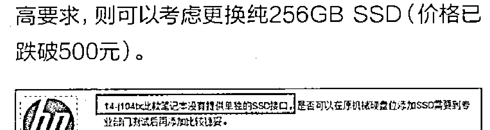

###### 商务旗舰的较量
中兴天机MAX vs 华为Mate8

商务用户最看重手机的哪些功能？面子、安全和续航等要素必不可少，而中兴AXON天机MAX和华为Mate8就是符合上述要求的国产商务旗舰。那么，它们之间谁更适合你？

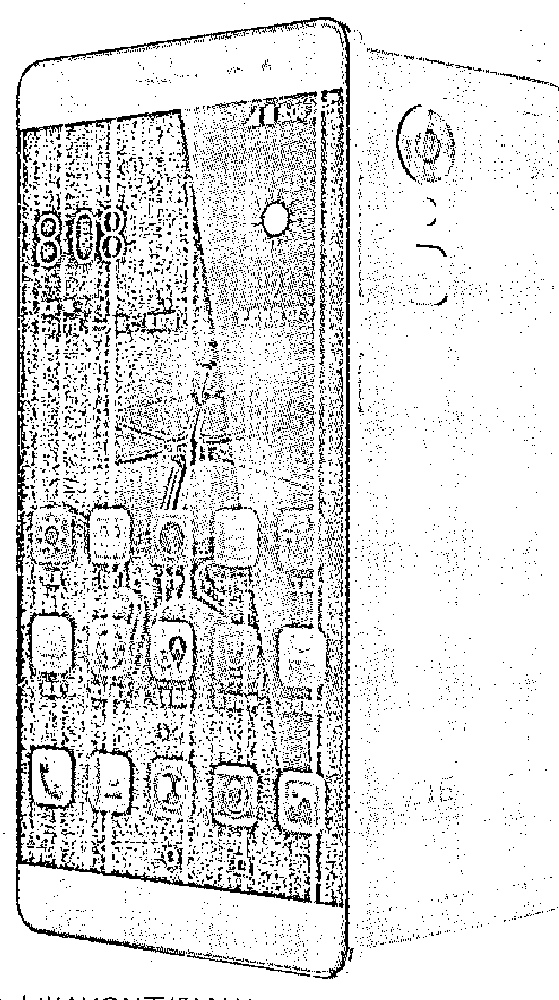

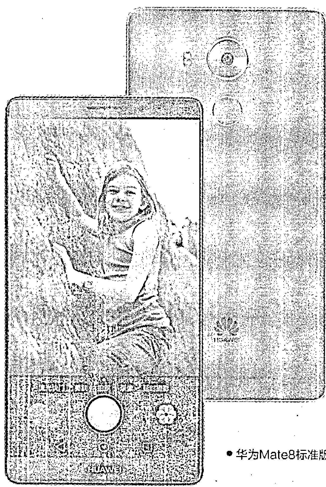

| 参数对比 | 中兴AXON天机MAX | 华为Mate8标准版 |
| :--- | :--- | :--- |
| 网络 | 全网通（双卡双待） | 移动4G或联通4G（双卡双待） |
| 屏幕 | 6英寸AMOLED（1920×1080像素） | 6英寸IPS（1920×1080像素） |
| CPU | 高通骁龙617（八核1.5GHz） | 麒麟950（四核2.3GHz+四核1.8GHz） |
| GPU | Adreno 405 | ARM Mali-T880MP4 |
| 内存/存储 | 3GB/32GB（支持存储卡） | 3GB/32GB（支持存储卡） |
| 摄像头 | 1300万/1600万像素 | 800万/1600万像素 |
| 尺寸 | 160mm×80mm×7.5mm | 157.1mm×80.6mm×7.9mm |
| 电池/重量 | 4140mAh（不可换）/188g | 4000mAh（不可换）/185g |
| 参考价格 | 2799元 | 2999元 |

####### 没有血缘关系的姐妹机

作为中兴和华为在2015年的收官之作，AXON天机MAX和Mate8堪称一对没有血缘关系的“姐妹机”。没错，它们长得实在是太像了。

两款产品都采用了6英寸超大屏幕设计，并拥有极为相近的三维和身材。此外，2.5D屏幕（图1）、超窄边框、摄像头和指纹模块的位置、音量键和电源键的位置、占用屏幕空间的虚拟按键、金属材质的边框和后盖……以上诸多元素都能在两款手机身上找到对方的影子。

当然，它们之间也存在细节上的差异，比如隐藏在屏幕玻璃下的纹理（Mate8为条纹，天机MAX为网格）、后盖上下两端的信号溢出区域（Mate8为注塑工艺，天机MAX则采用了类似皮革材质的装饰）（图2、图3）、扬声器和MIC孔的设计（Mate8将二者设计在USB接口的两侧，天机MAX则放在了后盖底部）、指纹识别模块的形状（Mate8为圆形，天机MAX为方形）。总之，两款产品的整体风格都很符合商务用户的审美，在工艺上也是难分高下，孰优孰劣完全取决于你的审美观。

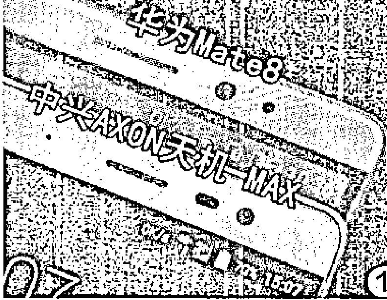

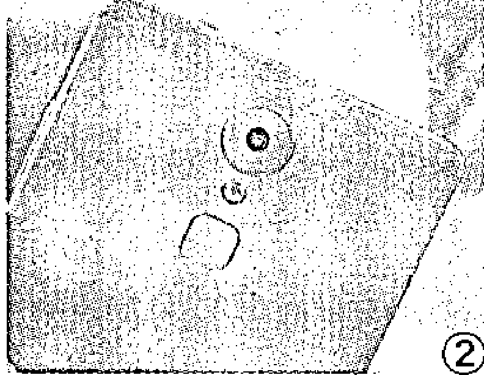


####### 核心硬件的等级差距

AXON天机MAX和Mate8最大的差异主要体现在性能层面。其中，AXON天机MAX搭载了高通骁龙617，与骁龙615/616等前辈相比，骁龙617放弃了4核+4核架构改用了真八核设计，并对基带、DSP和eMMC存储标准等方面进行了升级(表1)。

从安兔兔6.0测试来看，骁龙617的成绩较骁龙615/616提升了不少(骁龙615/616的成绩在45000左右)，勉强达到了中端档次的水平。

Mate8所搭载的麒麟950则是首批量产的Cortex-A72+A53架构八核处理器，并将GPU从麒麟92x/93x系列的Mali-T628MP4升级到了Mali-T880 MP4。就性能而言，麒麟950可轻松秒杀骁龙617(表2、图4)，哪怕是骁龙810和三星Exynos7420等2015年度旗舰级处理器在其面前也讨不到便宜。

| 项目 | 骁龙615 | 骁龙616 | 骁龙617 |
|---|---|---|---|
| CPU规格 | 4×A53 1.7GHz<br>4×A53 1.0GHz | 4×A53 1.7GHz<br>4×A53 1.2GHz | 8×A53 1.7GHz |
| GPU型号 | Adreno 405 | Adreno 405 | Adreno 405 |
| 调制解调器 | Gobi xx | X5 LTE | X8 LTE |
| 快充标准 | Quick Charge 2.0 | Quick Charge 2.0 | Quick Charge 3.0 |
| DSP | Hexagon V56 | Hexagon V56 | Hexagon 546 |
| 内存规格 | LPDDR3 800MHz | LPDDR3 800MHz | LPDDR3 933MHz |
| 存储规格 | eMMC 4.5 | eMMC 4.5 | eMMC 5.1 |

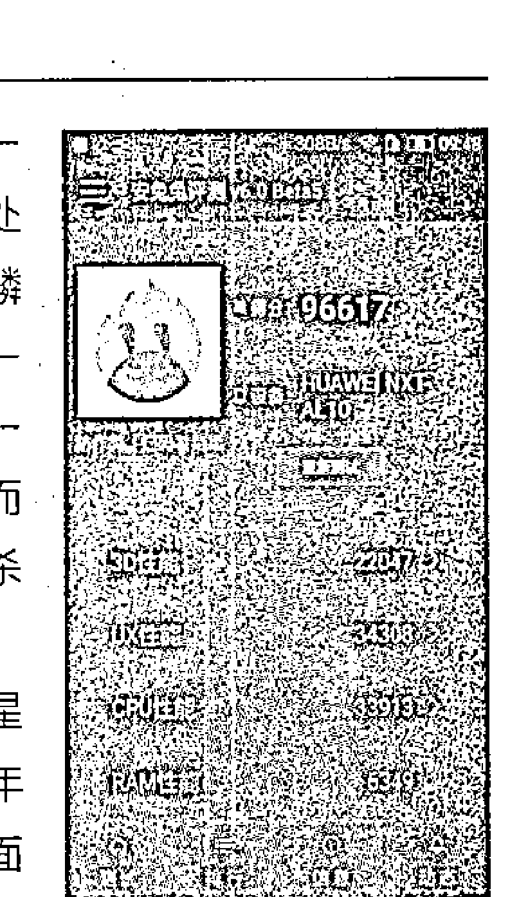

| 项目 | 高通骁龙617 | 海思麒麟950 |
|---|---|---|
| 3DMark Unlimited | 9538 | 18824 |
| 安兔兔V6.0 | 55893 | 96617 |

####### 特色功能层面的对决

由于麒麟950还集成了一颗i5协处理器，所以Mate8在使用计步器等感应器模块时的耗电量可以忽略不计，并在导航时可以更精准地判断垂直方向的变化(在出入高架桥和室内导航环境时效果显著)。通过内置的三MIC，Mate8还能实现全向录音和指向回放功能，而天际通APP也能方便商务用户出国时无需更换SIM即可享受全球上网业务。

AXON天机MAX在语音助手方面挖掘得更深入，除了指纹识别外还引入了眼纹识别技术和声纹加密功能(图5、图6)。此外，该产品还集成了AK4961音频芯片，支持录音播放双高清的音频体验。和Mate8相比，AXON天机MAX抢先一步武装了USB Type-C型接口，可以无视数据线接口方向进行盲插。

两款产品都非常重视待机续航方面的表现，所以它们都武装了4000mAh级别的超大电池。需要注意的是，中兴AXON天机MAX不仅电池容量较Mate8高出140mAh，还选用了更省电的AMOLED材质屏幕，所以在理论续航层面要优于对手。

遗憾的是，骁龙617已经支持高通最新的QC3.0快充协议规范，但中兴依旧仅为天机MAX选择了QC2.0快充技术。而华为Mate8也支持9V/2A规格的快充技术，所以两款手机的充电时间大致相同，难以分出高下。

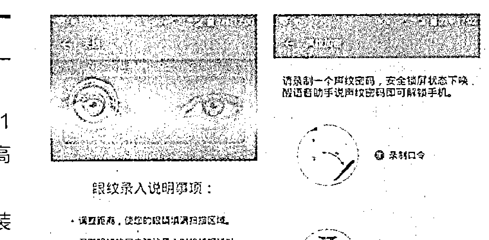


页面底部广告/二维码区域

###### 改善你的生活

####### 智能排插怎么选 文|曹操

随着智能家居由概念变成现实，很多传统的家用电器都开始向智能化转型。然而，智能家电的价格却并不亲民，组建一套智能家居的成本并非所有家庭都可承担。那么，有没有低成本的智能家居布局方案？答案是肯定的，而你所需的只是一款更聪明的排插而已。

####### 智能排插的妙用

笔者习惯每天起床第一时间就喝到热乎乎的茶水，最需要的就是一款支持定时启动的智能电热水壶（图1），并设定在每天早上6:55自动运行，这样我每天7点刚起床就能用滚烫的沸水泡上一壶好茶。问题来了，支持上述功能的电热水壶价格不菲，而此时智能排插就能派上用场了。

让普通电热水壶变智能的思路很简单，我只需每晚睡觉前将它灌满水，然后插在智能排插上。通过APP设定排插在第二天早上6点55才启动通电，7点整再关闭供电。如此一来，每天早上起床就有热水用，而我也不必担心忘了拔下电热水壶的插座而产生不必要的安全隐患了。


实际上，让任何接驳的普通电器（如电暖气、热水器、饮水机、电饭煲、机顶盒、面包机、台灯等）都能获得定时开关机和远程开关的功能（图2、图3），这就是智能排插的最核心功效。好消息是，如今参与智能排插竞争的品牌越来越多，而它们的价格也逐渐跌破心理价位，有渴望尝鲜智能家居体验的用户可以考虑入手了。

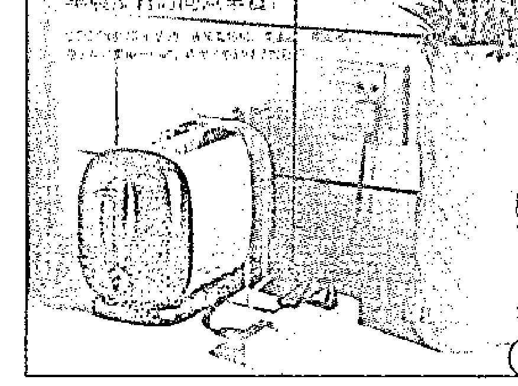

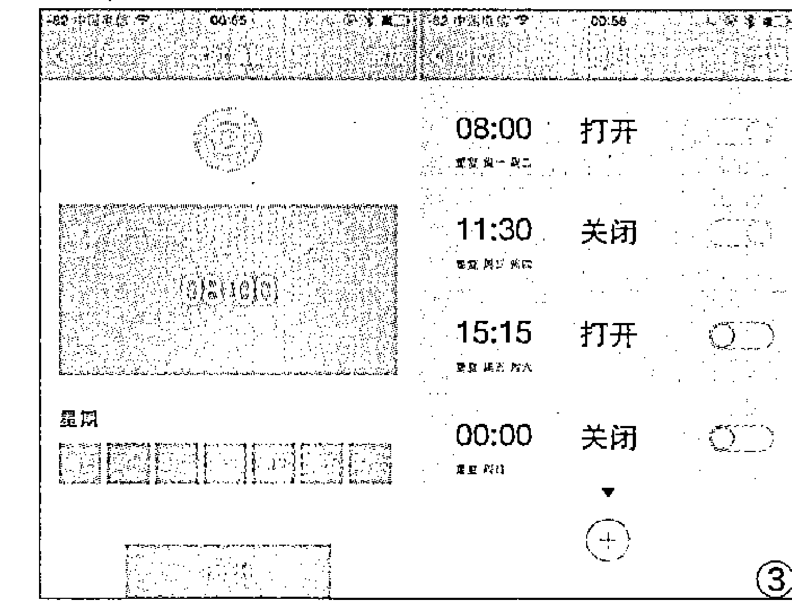

####### 智能排插的尴尬

什么才是智能排插？有些厂商将内置USB接口的排插也归类到智能行列，而此类设备除了方便手机平板充电以外一点都不“聪明”，只是用来忽悠消费者的借口而已。真正可以被冠以“智能”称号的排插，其最基本要求就是必须内置独立的Wi-Fi模块，可以接入家里的无线路由器获得远程管理的能力。

可惜，智能排插要想始终“聪明”，就必须保证Wi-Fi模块处于24小时不间断的供电状态。以鸿雁“小优”智能排插（有4个插座）为例，该产品在接上电源后Wi-Fi模块的功率约0.7W，此时每接通1个插座功率就会增加0.5W，当4个插座都处于待命状态时的总功率可达2.7W（图4）！很遗憾，所有的智能排插都会面临空载功耗过大的问题，而这就是智能的后遗症，那些抱有“让普通家电更省电”幻想的朋友可以洗洗睡了。

总之，智能排插最大的作用就是赋予（已接驳）普通电器远程控制的能力，但要想同时兼顾省电特性，就需要Wi-Fi技术的后续升级，学习蓝牙从V2.x到V4.0进化过程中大幅降低闲时功耗的经验了。

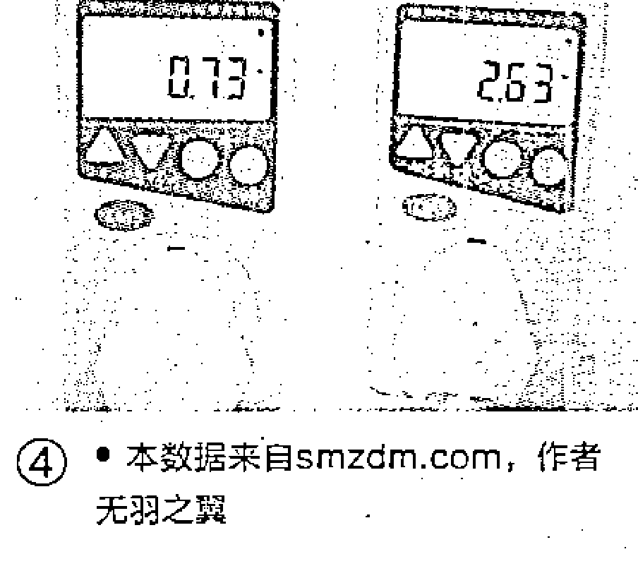

####### 至关重要的APP客户端

智能排插的原理就那么回事，但使用体验的优劣，就要看与其搭配的APP客户端的表现了。简单来说，目前智能排插APP有着2种发展模式：

-   自己开发APP
-   联合智能家庭平台

很多智能排插是由新兴的创业团队设计推出，为了便于用户远程控制，这些团队或公司会自己开发一个配套的APP客户端。

为了提升影响力，或是弥补自身软件开发的短板，更多的智能排插品牌会联手京东微联和阿里小智等智能家庭平台（图5），通过超级APP获得远程管理智能排插的能力。

相对来说，第二种模式更符合智能家居设备的发展趋势。因为未来我们家里的智能硬件只会越来越多，如果每一款设备都需要下载指定的APP简直无法想象。而通过超级APP，则可跨品牌跨类别同时管理不同的智能硬件。

可惜，智能家庭平台正处于战国时期，除了京东微联和阿里小智以外，小米智能家庭、邦讯物联、智家365等也推出了类似的超级APP（图6）。如此就可能引出一个问题：A品牌的智能排插只适用于阿里小智、B品牌的智能音箱仅兼容京东微联……未来我们在构建智能家居时，所有智能设备都需要从某一个智能家庭平台的加盟者中选择。当然，这是后话，现在谈起来还为时尚早。

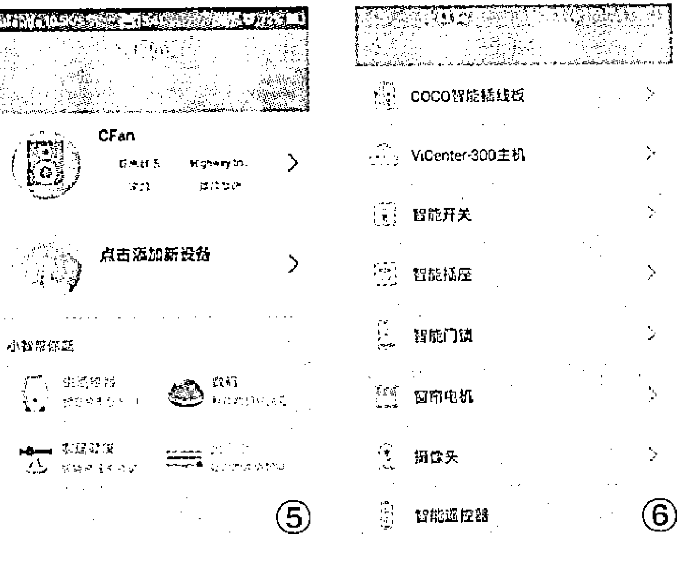

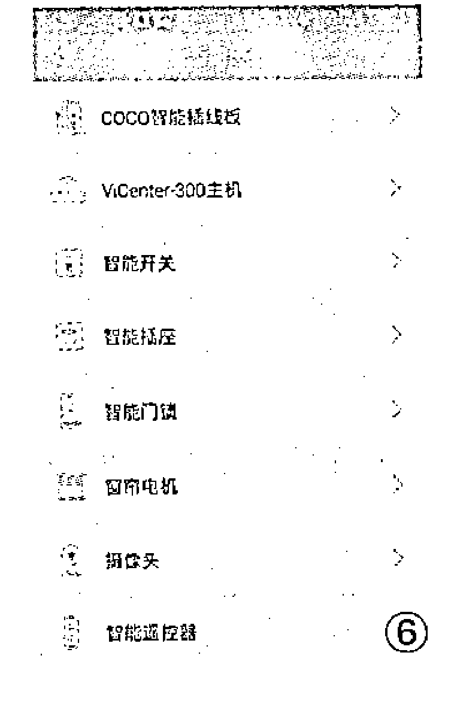

####### 智能排插的细节功能

智能排插的功能和体验不仅限于APP，其自身的硬件和逻辑设计也是非常关键的一环。比如，以航嘉小智为代表的智能排插都是这种逻辑：由一个物理开关控制所有的插座和USB接口，而APP所控制的延时开关和定时开关等功能也是同时对所有接口有效，我们无法用APP指定其中某一个插座的开与关。

以小萌排插为代表的产品则又换了一种逻辑：将排插的插座和USB接口划分成常开插孔和智能插孔两部分（图7），前者不受APP控制，任何时候都可使用。而智能插孔则由独立的开关控制，只有按下开关并接入Wi-Fi才能通电，而APP也只能同时控制所有智能插孔的开与关。

鸿雁小优智能排插的逻辑更倾向于传统排插：在APP客户端可以针对任何一个插座进行定时或延迟的开与关（图8），可以更精准地控制每一个接驳排插的电器。

智能排插与APP的联动可能还要受Wi-Fi网络的限制。如某些排插只有和安装APP的手机处在同一个Wi-Fi环境下才能使用，这意味着我们离家之后就无法再对智能排插进行远程的控制了。针对这一特性，有些品牌还挖掘出了类似“欢迎/再见模式”的功能：当你带手机出门，手机与家里Wi-Fi断开后智能排插会自动关闭插座的供电；当你回家后，插座的供电会随手机连上家里的Wi-Fi而自动恢复。

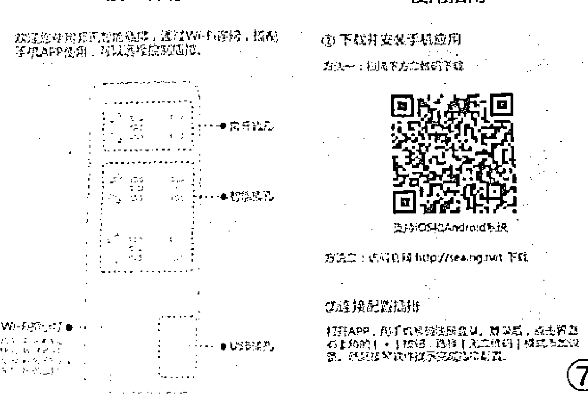

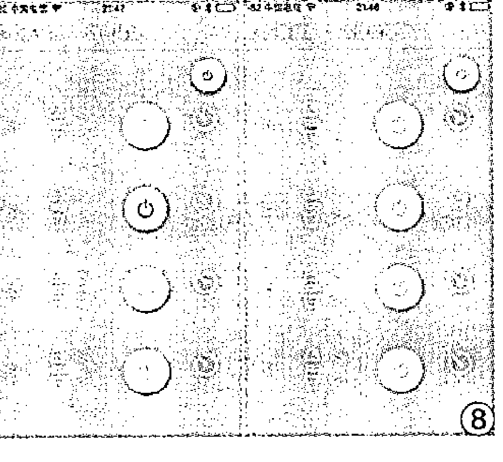

不能忘记排插的本分

排插的智能化固然重要，但它的聪明依旧要建立在足够安全稳定的基础之上。比如，排插用料的耐燃性、插孔的数量和间距是否合理、最大支持的电流和功率、多个USB接口可提供的总功率、是否配置防触电安全门等等(图9)。相对而言，由传统排插品牌向智能排插转型的产品大都具备更可靠的品质，而一些新兴的品牌可能就会存在些许缺陷。还是以小优智能排插为例，虽然它在APP客户端可对插座进行独立控制，使用体验更人性化，但它却缺少过载、浪涌等电路保护，不支持宽幅电压(不能用于110V交流电)，还没有挂墙孔。总之，智能排插看似简单，但选购起来需要注意的门道还真不少。

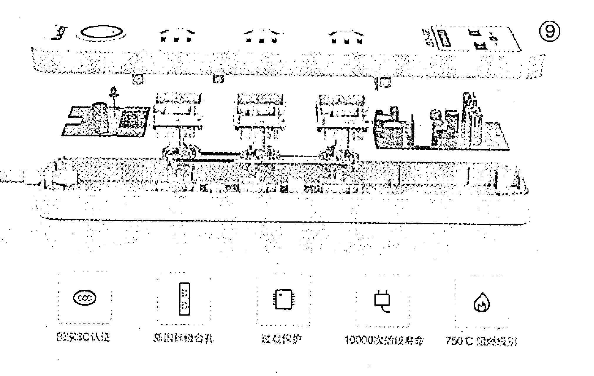

鸿雁IHC8340B
IHC8340B又称“小优”，配备了4个国标插槽，而且插座之间间距很大，可以同时容纳多个大插头。该产品的最大卖点就是插座的独立控制，便于用户管理多个接驳的电器。

航嘉小智插线板

该产品提供了3个国标插座以及2个2.1A的USB充电口，其内部采用同级铜套一体成型技术，插座之间无焊点连接，可恢复式过载保护，超过2500W自动断电。

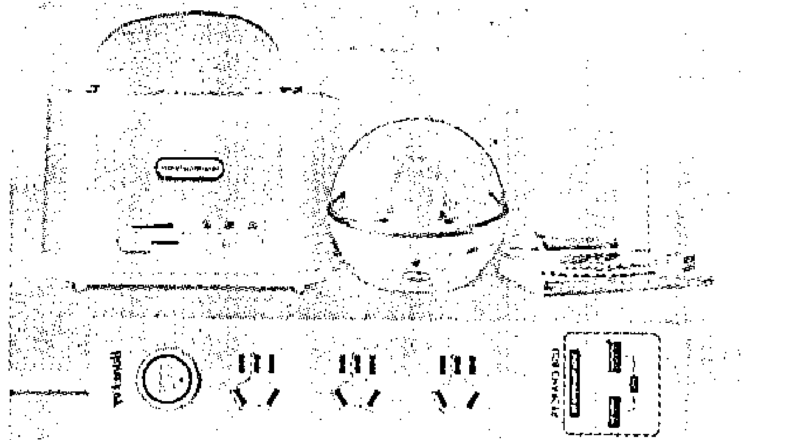

COCO 智能排插

COCO智能排插有3个新国标插孔和2个USB孔位设计，额定功率2000W。不过，这款产品的空间有些浪费之嫌，和修长的机身相比，5孔位的接口显得太过精简了。

小提示
智能排插最喜欢在各种众筹平台首发，感兴趣的用户可以登录京东、苏宁、天猫众筹搜索一下最新发布的产品，它们可能具备更多创新功能，价格可能也会有惊喜哦。

邦讯小萌插排
小萌排插的插座非常丰富，包括6个新国标组合插位，以及3个共享3.1A充电的USB接口。该产品将插座分为了常开插孔和智能插孔两部分，使用起来需要多加注意。

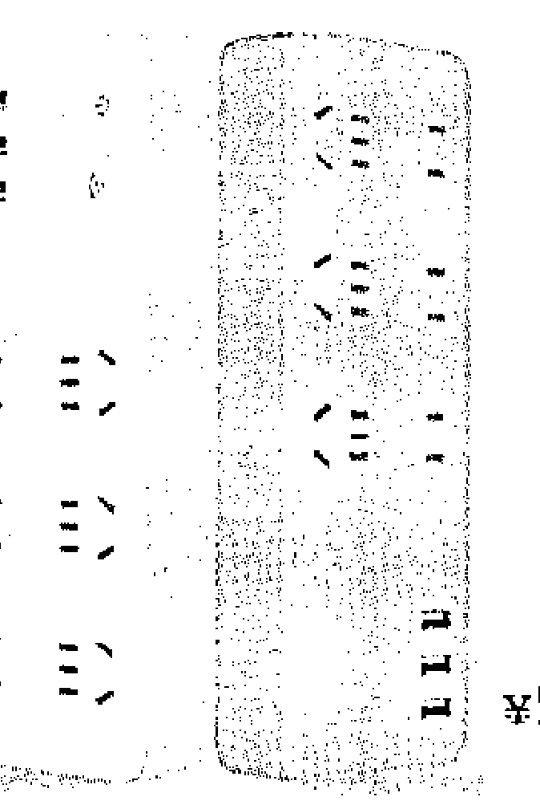

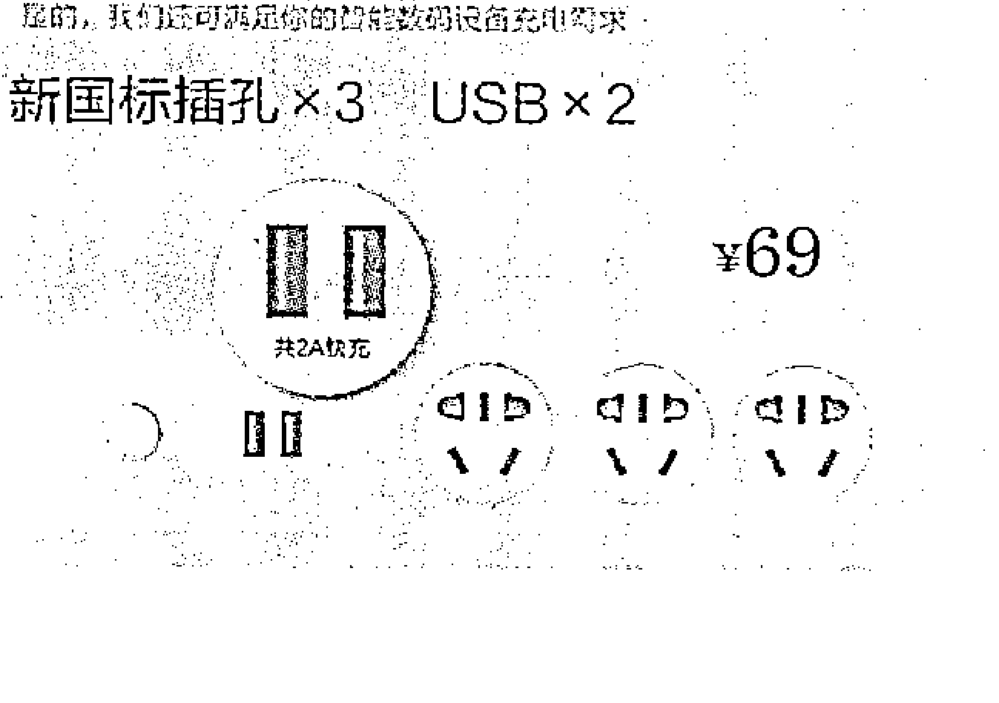

表盘还是圆的好

###### 教你挑选智能“圆表”

文|曹操

智能手表是可穿戴设备中的先行军，也是普及度最高的品类之一。随着智能手表在设计和功能上越加成熟，你的手腕做到迎接它们的准备了吗？当然，在此之前，我们还需进一步了解智能手表的生态现状，如此才能找到最适合自己的那一款产品。

####### 不看硬件看设计

在苹果发布Apple Watch之后，智能手表正式进入了“战国时代”。但是，很多人都感觉昂贵的Apple Watch看着别扭，原因就是它改变了手表的传统形态：并非圆形屏幕/表盘（图1）。实际上，智能手表的形态注定它不是以硬件取胜的设备，感性时尚的外观设计，往往比搭载XX处理器、XX容量内存更具说服力。在智能手表逐渐普及的今天，我们完全有理由优先挑选更像手表的智能“圆表”，至于硬件参数？除了电池容量一项以外，其余的还是趁早忘了吧。

####### 不可或缺的核心功能

智能手表的发展并非一帆风顺。最早智能手表的设计理念就是将手机功能做进手表里，于是我们看到的都是集电话、短信、上网、音乐等功能于一身的产品，而系统也是基于Android系统精简定制而来。最后我们才发现，这些智能手表操作太复杂了（图2），不足1.5英寸的小屏幕根本就无法保证所有功能的体验。


经历几番谁主沉浮的大戏之后，智能手表总算是筛选出了几大核心功能：丰富的表盘主题、社交软件（如微信和QQ）的消息推送、事件提醒、运动健康（记步和心率监测）、语音助手、待机时间。一款智能手表只要能在这几大功能上表现突出，不想大卖都难。那么，如何才能提升智能手表在核心功能方面的体验呢？答案就源于它们的操作系统。

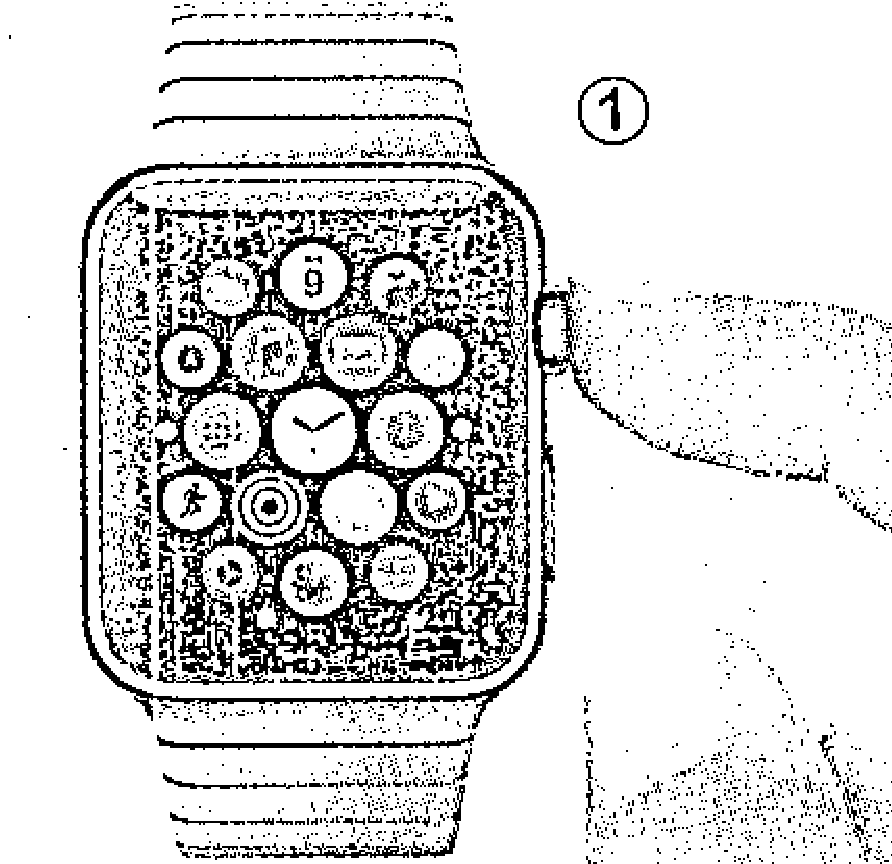

####### 系统好才是真的好

卡片式交互、语音操控，简单的界面逻辑和交互方式才是智能手表的生存之道。为此，谷歌在2014年3月专门针对智能手表这种穿戴式设备推出了Android Wear系统（图3）。遗憾的是，由于谷歌服务在国内受到限制，所以Android Wear直到2015年下半年才随摩托罗拉新Moto 360上市，代价就是用国产语音搜索服务、地图、商店替换了Google Now、Google Map和Google Play。

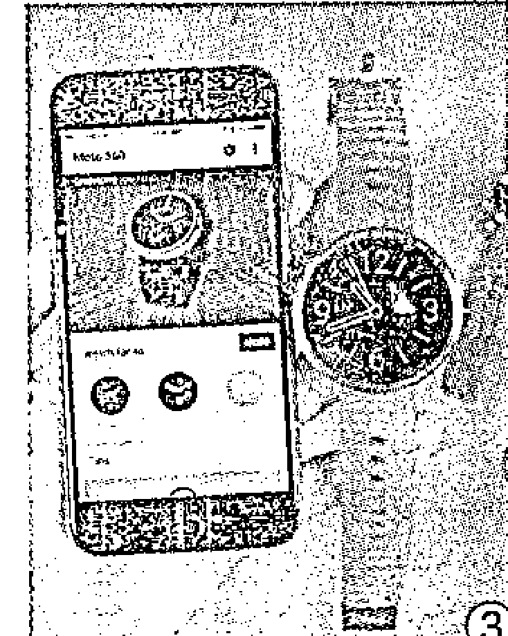

####### 代表产品

######### 华为 HUAWEI WATCH

HUAWEI WATCH采用了42mm接近于传统手表直径的尺寸，并用蓝宝石的玻璃作为触摸屏的盖板。手表配备1.4英寸AMOLED屏幕，并预装Android Wear系统。


¥2388

####### 代表产品

######### 摩托罗拉新Moto 360

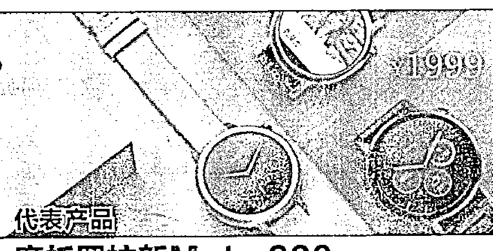

新的Moto 360提供46mm（1.56英寸，360×330像素）和42mm（1.37英寸，360×325像素）大小两种款式，并且号称屏占比是智能手表产品中最高的。

实际上，看好智能手表未来发展前景的并非只有谷歌一家。比如，三星就为智能手表准备了自家的Tizen系统，在体验上也不逊于Android Wear分毫。此外，国内也有很多企业推出了为智能手表量身定制的操作系统，并在不断地蚕食着Android Wear的市场份额。

####### 代表产品

######### 三星 GALAXY GEAR S2

Gear S2采用了42mm圆形表盘设计，还创新性地采用了可转动时表圈设计，用户仅需转动表圈就可实现应用切换以及翻页浏览等操作。

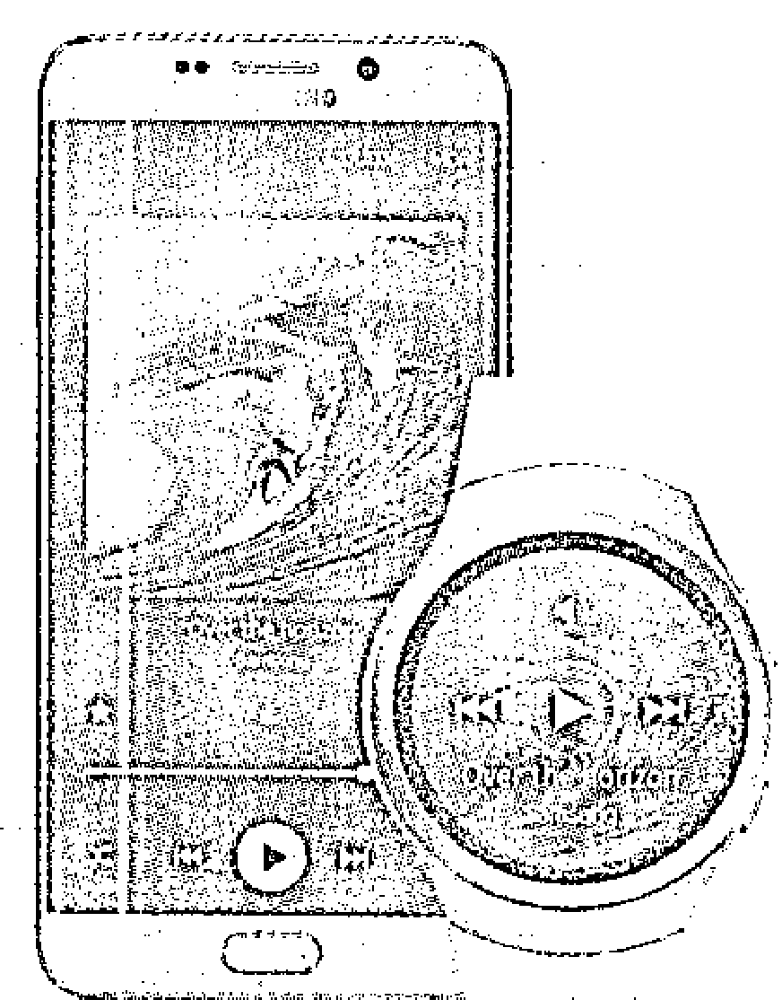

￥2198

######### Ticwear

这是“出门问问”主导的手表系统，最大特色就是全中文的自然语音交互和极高的语音识别度（图4）。同时，Ticwear还与近百家本地移动数据供应商合作，提供了更接地气的本地化服务。由于新Moto 360和HUAWEI WATCH这两款基于Android Wear系统打造的智能手表的语音服务都来自出门问问，因此Ticwear的知名度和影响力也随之水涨船高。

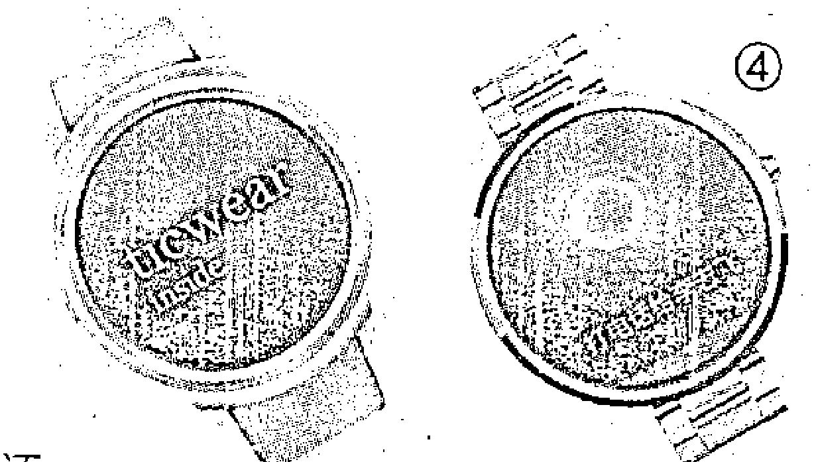

￥999


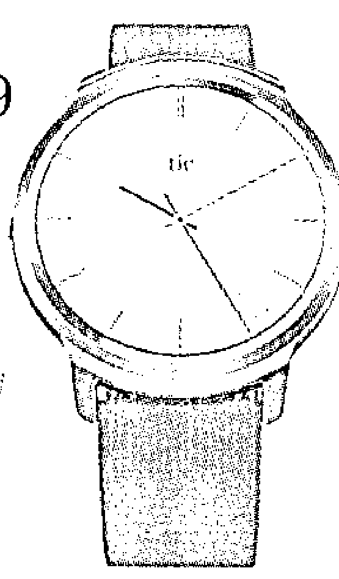

####### 代表产品

######### Ticwatch

产品采用了1.5英寸TFT全圆屏，其内置的Ticwear（Android 5.1）系统已经迭代到V3.X版本，除了自家产品，现也支持Moto 360和LG G Watch R。

######### DuWear

这是百度针对智能手表定制的操作系统，基于Android 5.0定制而来。DuWear采用了自家的百度语音搜索服务，对着手表说“Hi 百度”即可开启。该系统的核心功能还体现在移动支付（百度钱包）和地图服务（百度地图）。

####### 扩展阅读

######### “刷表”时代即将来临

虽然暂时还没有基于DuWear定制的智能手表，但百度却针对DuWear推出了刷机平台。目前，包括LG G Watch /G Watch R、MOTO 360、索尼SmartWatch 3在内的几款产品已经可以同过刷机体验到DuWear系统了（图5）。没错，DuWear就是要将“刷表”进行到底。

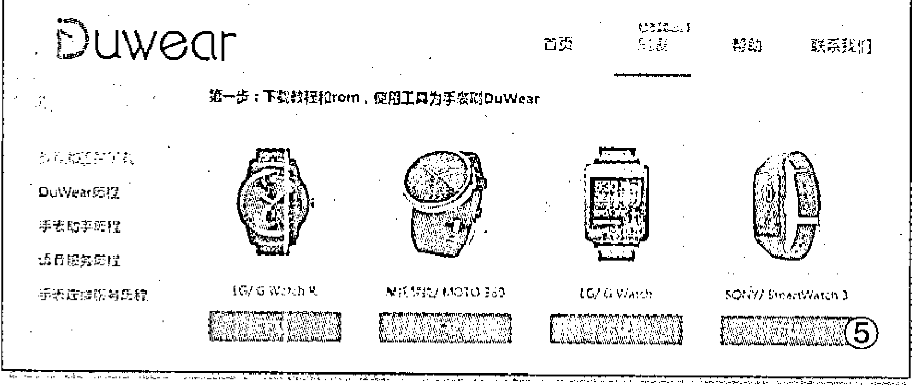

######### TencentOS Watch

这是来自腾讯的智能手表系统解决方案。与其他手表系统相比，TencentOS可以真正实现与QQ、微信等腾讯自家APP完美契合的OS，并将小鲸语音助手作为语音控制的技术伙伴。

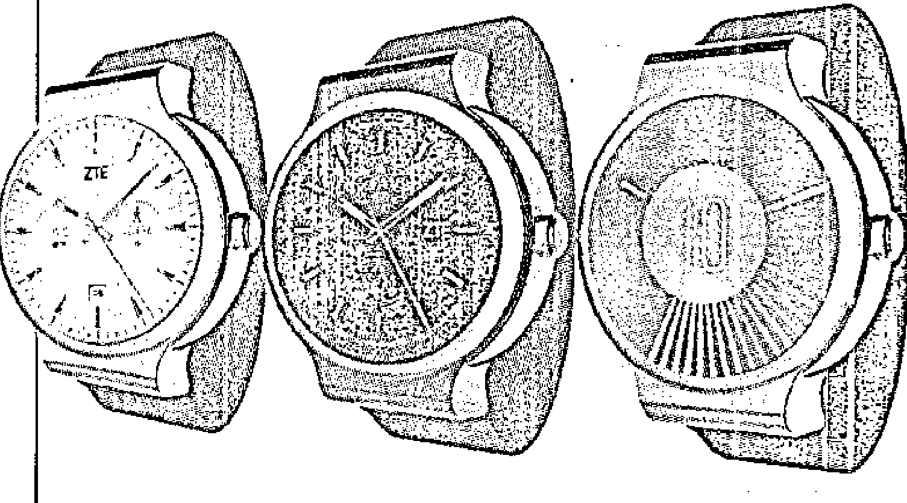

￥1899

####### 代表产品

######### 中兴AXON Watch

中兴AXON Watch的表径为42mm，厚度为11.5mm，和小尺寸的Moto 360 2代尺寸相近，也同样采用了金属机身和真皮表带。

######### TencentOS for Wear

TencentOS是腾讯针对智能可穿戴设备打造的操作系统，可以配合Android和iOS平台的手机使用，能实现运动健康监测、智能提醒、社交应用推送等轻智能功能，并且还能扮演手机的“第二块屏幕”。


代表产品

######### inWatch T

inWatch T采用了一块1.4英寸圆形AMOLED显示屏，通过TencentOS系统可以让inWatch T具备主动提醒、语音控制等功能。同时还整合了QQ和微信，支持语音回复、表情回复和群聊消息等。

¥999

######### YunOS for Wear

继百度和腾讯之后，阿里巴巴也推出了YunOS for Wear智能穿戴操作系统，其特色在于整合了阿里旗下的天猫、支付宝、高德地图等各项服务，能与预装YunOS系统的手机、盒子等产品更紧密地协同合作。

代表产品

######### inWatch Run

inWatch Run采用1.4英寸AMOLED屏，搭载MT6627四合一处理器，支持GSM和3G通话，主打智慧酷跑的概念，对于长跑甚至马拉松爱好者来说堪称神器。

¥1599

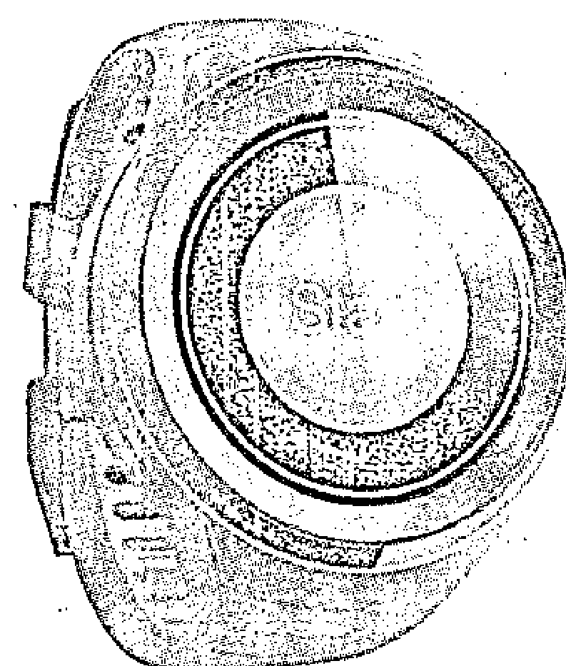

######### Geek Watch OS

这是果壳基于Android 4.3系统定制而来的智能手表系统，有果壳自己搭建的应用商店，可以作为手机的手腕助手使用。可惜，该系统貌似没有植入语音助手服务，功能上的操作都需要滑动手表屏幕或在手机APP端解决。

代表产品

######### 果壳GEAK Watch II Pro

该手表最大特色是采用了创新的TF屏幕，在唤醒屏幕时它就是一面彩色屏幕，但熄屏待机后则会切换至E-Ink（电子墨水）屏幕，前者确保显示效果，后者则带来了超长的待机能力。1月初该手表曾打出了799元的低价，感兴趣的用户可留意近期的促销。

¥2499

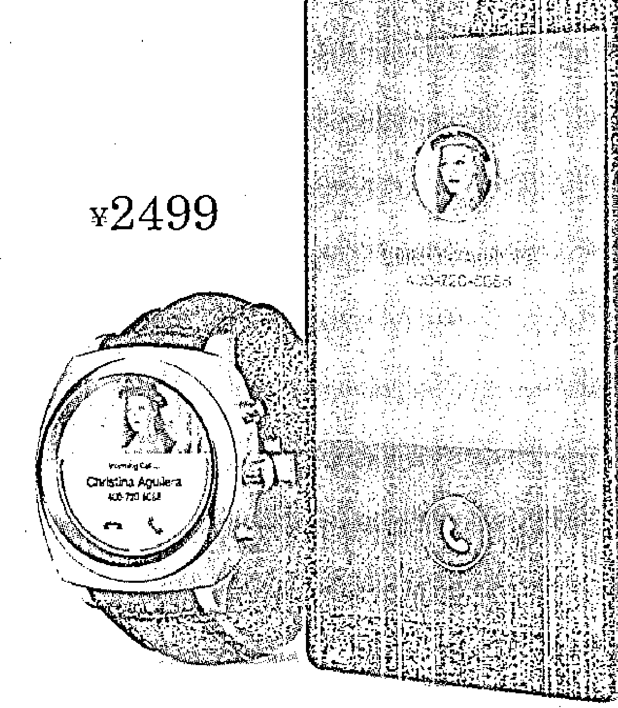

####### 智能手表的三大趋势

通过对上述智能手表OS和相关产品进行分析，我们不难把脉出智能手表未来发展的三大趋势：

######### 1.传统手表 + 简单智能

并非所有用户都喜欢液晶屏幕的手表，但智能化却是未来的发展趋势，于是就有了像inWatch Fusion、Pebble、Withings一类的将传统手表与智能相结合的手表。简单来说，此类产品保留了传统手表的物理结构，没有液晶屏幕，只是在里面集成了一些感应器和无线模块，可以实现记步、健康监测等功能，并通过手机APP进行精准调时。

######### 2.背靠大树好乘凉

将所有精力放在硬件端的研发上，OS则直接选择Android Wear、TencentOS、YunOS for Wear等现有系统，依托于巨头的成熟生态迅速切入市场。而这一方式，也将成为未来智能手表发展的主流形态。

######### 3.亲力亲为的自主化

像出门问问Ticwatch或果壳GEAK Watch II Pro一样，硬件、操作系统、商店都由自己设计研发，并向开发者开放API接口打造自主的生态系统。

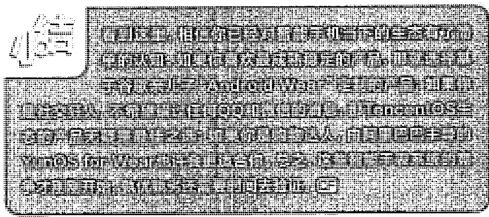

近期划算的游戏级CPU选购

今年英特尔发布了第六代酷睿处理器系列，CPU和主板的芯片架构从此进入了Skylake时代，不过，从目前看，该系列CPU普遍存在着价格虚高、性能方面并不比五代和四代同档次产品高出多少的问题，因此，此时入手六代CPU中的高端产品时机并不合适。本着这样的思路，我们完全可以从一些六代中端产品入手，或直接弃新迎旧，选取一些性能相近的四代、五代产品或AMD产品，来搭建起一个性能强劲，同时价格也相对实惠的游戏平台。

###### i5 6500 PK i5 4590

酷睿i5 4590是目前市场最热销的Intel四代处理器，由于五代i5产品的缺失，使得该CPU的升级产品直接成了六代中的i5 6500。规格方面，i5-4590采用了22纳米工艺制程，原生内置四核心四线程，处理器默认主频为3.3GHz，最高睿频可达3.7GHz，无论是默频还是主频都比i5 6500高了100MHz，从实际性能表现上来说，i5 4590丝毫不比i5 6500逊色（图1）。
二者的差异主要表现在支持架构及核显方面，其中i5 4590使用了Haswell架构，而i5 6500使用的则是最新的Skylake架构。后者支持DDR4内存，前者支持DDR3，同时在核显上，i5 4590使用了性能较低的HD 4600，i5 6500使用了性能稍高的HD530，二者的京东售价相差不足百元。因此从性价比及综合方面来看，i5 6500似乎更值得入手（图2）。

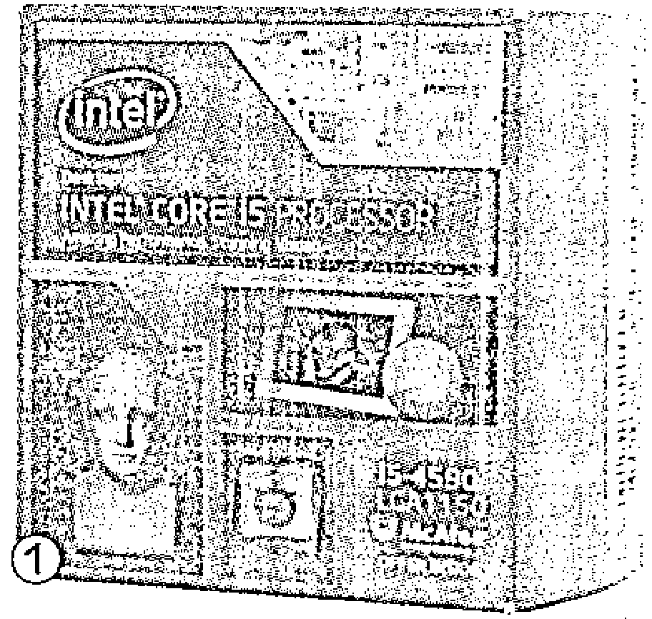

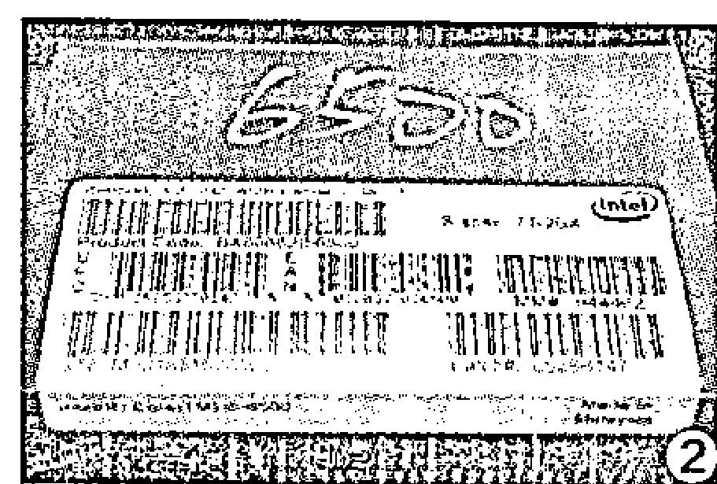

i5 6500京东盒装￥1429
i5 6500淘宝散片￥1179

###### i5 6600K PK i5 4690K

作为六代中的主流级产品，i5 6600K提供了i5 4690K相同的频率，默频3.5GHz，睿频3.9GHz，小超一下可轻松达到4.0GHz。不过得益于更为优异的Skylake架构，该CPU在整体性能方面要比i5 4690K提高了5%~10%（图3），其价格则仅比i5 4690K贵了120元，算是六代产品中较有诚意的产品。此外选择该CPU还有一个较大的优势，那就是可与Skylake架构和DDR4内存接轨，非常适合那些注重追新同时又对价格较敏感的朋友选用。

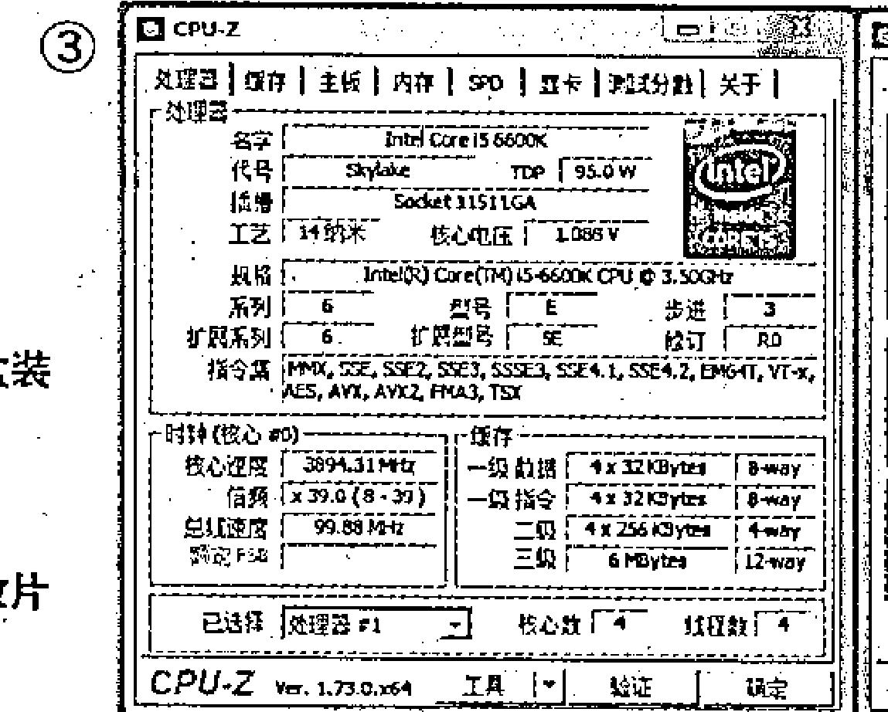

i5 6600K京东盒装￥1679
i5 6600K淘宝散片￥1479

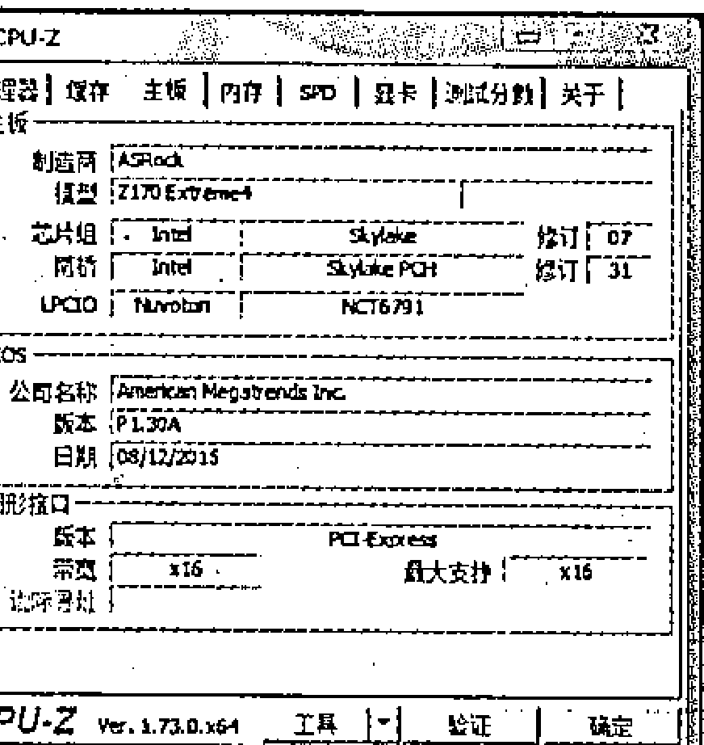

###### i7 6700K PK i7 4790K

在六代CPU中，和I7 4790K对标的的产品为i7 6700K，二者均为Intel CPU中的旗舰级产品。其中i7 4790K主频为4.0GHz~4.4GHz，i7 6700K主频为4.0GHz~4.2GHz，单就频率来看，i7 6700K出现了倒退现象（图4），因此从处理性能上来说，二者差别不大。
和i5 6500一样，i7 6700K引以自豪的地方是集成了HD530核显，而i7 4790K集成为HD4600。不过话说回来，能用得起旗舰版CPU的朋友，有几个会使用核显而不搭载独显？从这个意义上来说，i7 6700K摆明就是一个鸡肋，其优势除使用了Skylake架构外，毫无亮点可述。
最后，也是最重要的一点，i7 6700K价格不菲，目前京东商城售价为3299元，和i7 4790K相比差了将近千元，这千元的差价，足以让我们在独显、SSD和内存等发力，以打造一款性能更加强悍、各方面表现均衡的整机平台了。

i7 4790K京东盒装¥2309
i7 4790K淘宝散片¥2018

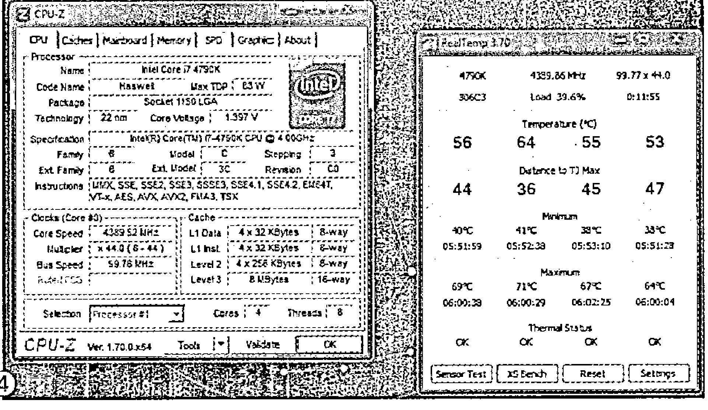

###### E3 1231 v3 PK E3 1230 v3

i5的价格、i7的性能，使得E3系列CPU迅速成了玩家心目中的神U。目前E3家族中最新产品是E3 V5，不过，受限于Intel封杀，搭载C232芯片组的专用主板加E3 V5的成本已接近于i7 6700搭配B150主板（图5），使得E3平台的价格优势丧失殆尽。因此对于E3党来说，目前最理智的搭建E3平台的方法仍然是E3 1230 V3或E3 1231 V3搭配B85主板，其中又以E3 1231 V3最为划算（图6）。
E3-1231 v3和E3-1230 v3的市场价格大约差了100元，基本可忽略不计，但性能方面却比E3-1230 v3提升了约4.6%，默频和睿频分别在E3-1230 v3的基础上提高了100MHz，达到了3.4GHz和3.8GHz，性能上已经非常接近于桌面级的i7-4770K。
同时E3-1231 v3和E3-1230 v3还有一个较大的区别，那就是内置了HD 4600显示核芯。虽然这一甜头对独显党来说意义不大，但它至少可以作为备胎，让我们在独显损坏了之后，仍能不耽误工作和娱乐继续用机。

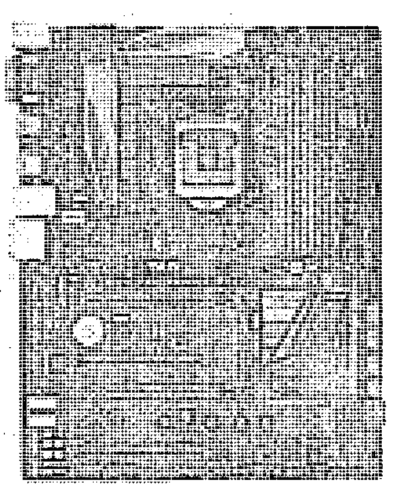

E3 1231 v3京东盒装¥1899
E3 1231 v3淘宝散片¥1413

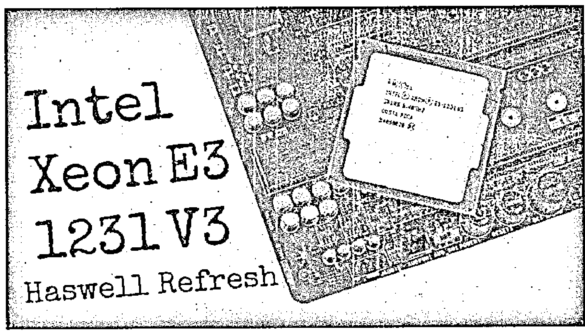

###### FX8350 PK i5 4670K

从2012年10月发布至今，8核处理器FX8350一直扮演着AMD的顶梁柱角色（图7）。其默认主频为4GHz，最高动态超频可达4.2GHz，8MB缓存，性能与i5 4670K相当，但价格却要比后者便宜300元左右。同时，在多任务应用下，FX八核心多线程的处理能力，也是四核心Core i5所无法比拟的。如果你不是Intel的死忠，而是一个讲求实际且经常需要任务多开的人，果断换换口味使用一下AMD平台这款迄今为止性能最为强悍的打桩机产品，也是个不错的主意。不过FX 8350原配的风扇品质一般（图8），如果是对品质有需求的用户还需要另配散热器。

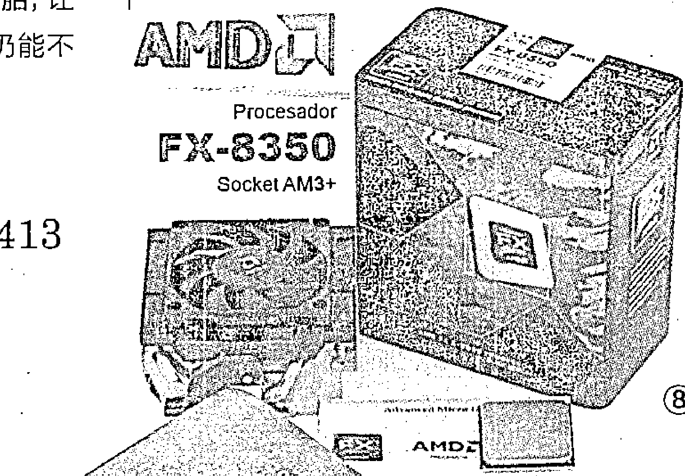

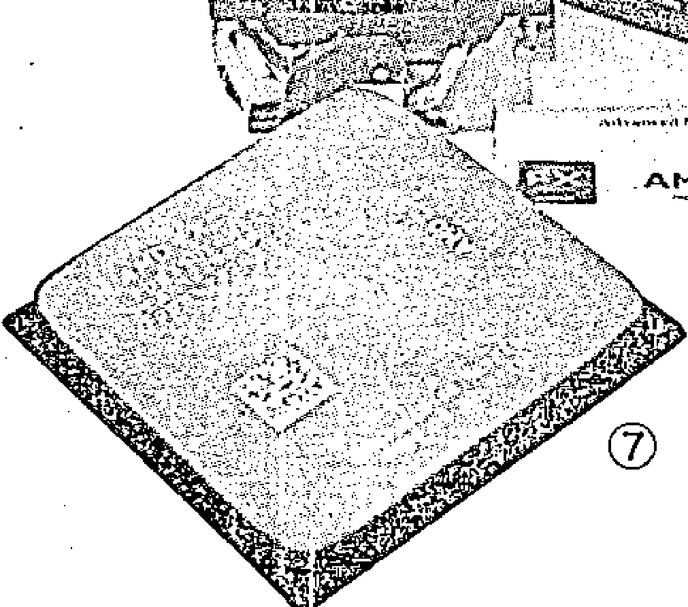

FX8350京东盒装¥1189

##### 无线游戏手柄导购

###### 主机游戏全拿下

文|宁宁

现如今从Xbox One、PS4这些游戏主机移植过来的PC游戏已经越来越多，并且很多游戏都是基于游戏主机开发设计然后再移植到PC平台的。因此考虑到很多基于没有键盘鼠标的主机游戏的游戏体验，不妨考虑游戏手柄。

###### 无线手柄是否靠谱

很多玩家在游戏时都会特别讨厌有线手柄，尤其是那些在玩动作游戏时身体也会跟着闪转腾挪的玩家，更是视有线手柄的连线为累赘。更为重要的是无线手柄的技术已经越来越成熟，早已普及的2.4GHz无线射频技术不仅已经解决了干扰和延迟之类的问题，而且理论上10米传输距离也已经基本达到。有鉴于此，无线手柄自然是游戏时非常好的选择。

###### 两种键位你选谁

目前来看，PC平台上游戏手柄的键位设计灵感主要来自于Xbox One和PS4这两款游戏主机，其最大的区别就是前者的游戏摇杆采用了非对称设计（图1），而后者的游戏摇杆采用了对称设计（图2）。客观来说，这两种游戏手柄键位并没有孰优孰劣，还要看玩家更习惯哪个。如果玩家以前只是PC平台的键盘党，那么就要看所要玩的游戏究竟移植于哪个平台再选择何种键位的游戏手柄。如下文表中所示，2015下半年和2016上半年所发布的18款游戏大作，几乎均可全平台兼容PC/Xbox One/PS4三大平台，唯独卡普空发行的《街头霸王5》放弃了Xbox One平台（图3）。所以对于玩家来说，如果你刚好是《街头霸王5》的忠实玩家，就最好选择PS4键位的游戏手柄了。此外如果玩家已经有了Xbox One或PS4游戏主机，并已经习惯了原厂游戏手柄的操控体验，那么就要跟着自己的习惯走，习惯哪种键位就选择哪种键位。至于各款游戏的手柄出招及操控列表，可以登录游戏网站利用站内的搜索引擎找到对应游戏的专区即可获得完美答案。

| 游戏平台 | PC | Xbox One | PS4 |
| :--- | :---: | :---: | :---: |
| 《辐射4》 | ● | ● | ● |
| 《彩虹六号：围攻》 | ● | ● | ● |
| 《刺客信条：枭雄》 | ● | ● | ● |
| 《使命召唤12：黑色行动3》 | ● | ● | ● |
| 《街头霸王5》 | ● | × | ● |
| 《世界汽车拉力锦标赛5》 | ● | ● | ● |
| 《NBA 2K16》 | ● | ● | ● |
| 《星球大战：前线》 | ● | ● | ● |
| 《合金装备5：幻痛》 | ● | ● | ● |
| 《疯狂的麦克斯》 | ● | ● | ● |
| 《方舟：生存进化》 | ● | ● | ● |
| 《鬼泣4：特别版》 | ● | ● | ● |
| 《赛车计划》 | ● | ● | ● |
| 《巫师3：狂猎》 | ● | ● | ● |
| 《德军总部：旧血脉》 | ● | ● | ● |
| 《侠盗猎车手5》 | ● | ● | ● |
| 《生化危机HD：重制版》 | ● | ● | ● |
| 《消逝的光芒：信徒》 | ● | ● | ● |

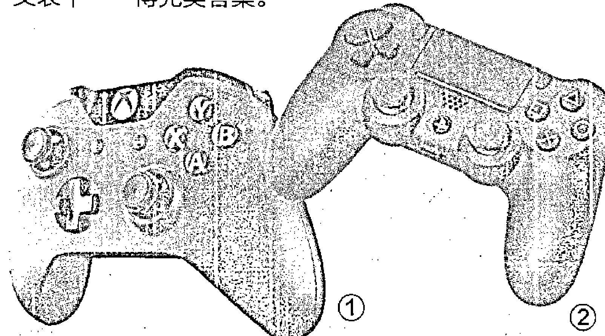

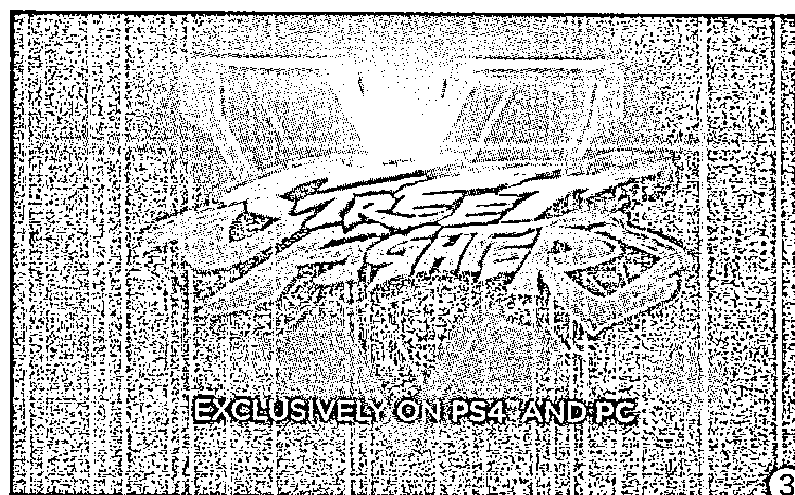## 兼容安卓必须考虑

在智能手机、平板电脑、智能电视、网络机顶盒领域，安卓系统已经实现了非常高的普及程度。尤其是智能电视和网络机顶盒领域，几乎已经成了安卓系统的“天下”。更为重要的是，这两大领域普遍都提供了众多休闲游戏。所以玩家在选购无线游戏手柄时，最好选择完美兼容安卓系统的游戏手柄（图4）。目前国内的智能电视和网络机顶盒主要有原生安卓系统和改版安卓的阿里云系统，玩家可根据游戏手柄厂商提供的兼容列表进行选购。理论上来说，无论是原生安卓系统还是改版安卓的阿里云系统，只要内核是安卓4.0及以上系统就没有任何问题。另外需要特别注意的是，少数无线游戏手柄甚至仅支持安卓系统却不兼容PC平台。所以玩家在选购时还应特别留意多系统手柄（图5），只有看到了兼容PC电脑字样的产品才可放心购买。

##### 超值产品推荐

###### 现代038

性能参数 2.4GHz无线射频/PS4键位/兼容安卓系统

推荐理由 现代038几乎是市面上最廉价的2.4GHz无线游戏手柄，采用了PS4键位设计，并可兼容安卓系统。客观来说，这款游戏手柄并没有太多的惊艳之处，防滑摇杆设计也是仿造PS4原厂手柄，而且还是两节AA电池供电，但优点则是京东手机专享价只卖49元。

京东¥49

###### 北通BTP-BD2A

性能参数 2.4GHz无线射频/PS4键位/兼容安卓系统

推荐理由 北通BTP-BD2A采用了改版型的PS4键位设计，并可实现PC、安卓、PS3三大平台的完美兼容，内置500mAh高效能锂电池并具备双体感震动马达，同时还提供了5分钟无操作自动关机的节能设计，京东手机专享价仅为89元。

京东¥89

###### 莱仕达灵动3 PXN-9603

性能参数 2.4GHz无线射频/Xbox One键位/兼容安卓系统

推荐理由 莱仕达灵动3 PXN-9603绝对是非常超值的一款2.4GHz无线游戏手柄，采用了Xbox One键位设计并内置双震动马达，同时还可以兼容PS3游戏主机的自动识别和即插即用。内置550mAh高效能锂电池并支持自动休眠和唤醒功能，京东手机专享价仅为79元。

###### inmood KC-8236

性能参数 2.4GHz无线射频/Xbox One键位/兼容安卓系统

推荐理由 inmood KC-8236是一款采用了Xbox One键位设计的无线游戏手柄，不仅兼容安卓系统，还可实现PS3游戏主机的即插即用。内置600mAh高效能锂电池，并提供了非对称双马达模拟震动系统，京东报价为99元，并提供黑蓝双色可选。

京东¥99

##### 新出炉的游戏本：联想小新700 vs 微星GL62

2016年伊始，游戏本市场再度出现了无数的新面孔，而来自联想旗下的小新700旗舰版和微星军团的GL62就是其中的两款典型代表：它们都搭载了Skylake处理器并辅以GTX950M独显，拥有较强的游戏动力。那么，谁更值得你的青睐？

###### 相对便携的游戏本

联想小新700和微星GL62（又称“小龙”）都是采用了15.6英寸屏幕的大号游戏本，并武装了一面广视角的IPS屏幕，在游戏的过程中不存在视野上的“死角”（图1）。而有无IPS，也已成为我们选购游戏本的最基本前提条件之一。

| 参数对比 | 联想小新700旗舰版 | 微星GL62 6QD-021XCN |
| :--- | :--- | :--- |
| 屏幕 | 15.6英寸IPS (1920×1080像素) | 15.6英寸IPS (1920×1080像素) |
| 处理器 | 酷睿i7-6700HQ | 酷睿i5-6300HQ |
| 内存/硬盘 | 4GB DDR4/500GB | 8GB DDR4/1TB |
| 显卡 | NVIDIA GTX950M (2GB DDR3) | NVIDIA GTX950M (2GB DDR3) |
| 接口 | 读卡器、USB3.0×2、USB2.0、HDMI、RJ45、音频接口 | 读卡器、USB3.0×2、USB Type-C、USB2.0、HDMI、miniDP、RJ45、音频接口、DVD刻录光驱 |
| 尺寸 | 384mm×265mm×22.7mm | 383mm×260mm×29mm |
| 重量 | 2.3kg | 2.3kg |
| 参考报价 | 5699元 | 5399元 |

好消息是，两款产品都具备一定的便携性，它们的重量仅有2.3kg，较15.6英寸游戏本常见的2.5kg起步要轻盈不少。其中，联想小新700凭借22.7mm的身材更显骨感（图2），而微星GL62 6QD则充分利用了相对厚实的机身，塞进了已渐被笔记本淘汰的DVD刻录光驱。有刻盘需求的用户可以通过它存储数据，无需求的玩家还能借助光驱位安装第二块硬盘，用6mm厚度换取一举两得的光驱，这笔账还是可以接受的。

###### 细节设计上的差异

小新700的设计风格与联想自家的Y50相似，只是没有后置那般刚毅的棱角，机身材质也换成了复合材料，缺少了金属的那股刚毅之感。为了让有线耳机与鼠标的线缆不再缠绕，小新700将USB接口和耳机麦克风改变了惯有的排列位置，屏幕两侧的边框表面加入了条纹设计（图3），在开合屏幕时获得更好的手感。在声音表现层面，小新700采用了特殊斜面设计的扬声器（图4），并通过第四代杜比家庭影音技术提升音效表现。

微星GL62的机身也缺少金属的装饰，而它在设计上的亮点在于SteelSeries键盘和强悍的扩展能力。除了标准的2个USB3.0和1个USB2.0以外，微星GL62还提供了新兴的USB Type-C接口，并配备了HDMI和miniDP两种视频输出接口，可轻松构建三屏环境（笔记本屏幕+2个显示器）。此外，该产品采用了NAHIMIC音效技术（图5），同样可以营造出不错的视听环境。GL62在电源键旁增加了一枚Cooler Boost按钮，按下后系统会将风扇超频到120%的高转速设定，提升5%~10%的散热效率。当然，更高转速也意味着噪音的增加。

###### 性能差距源于处理器

两款笔记本通过武装NVIDIA GTX950M获得了“游戏本”的资质，而它们的差异则源于处理器的规格上。联想小新700旗舰版搭载了英特尔Skylake家族高端的酷睿i7-6700HQ，可谓一步到位（图6）。而微星GL62 6QD-021XCN这款子型号的处理器为酷睿i5-6300HQ，就CPU的运算能力而言较i7-6700HQ落后20%左右。

###### 尴尬的难兄难弟

作为新品，小新700和GL62都存在一些可取之处，但就性价比一项而言，它们却都不如自家的“老将”。比如，联想早前上市的15.6英寸版Y700和拯救者ISK，酷睿i5-6300HQ + GTX960M独显的型号也不过5000元出头，虽然它们处理器稍逊于小新700，但凭借GTX960M却可以轻松在大型3D游戏中将小新700斩于马下。

在其他规格方面，小新700和GL62都支持最新的DDR4内存，只是GL62直接标配8GB，较小新700的4GB容量要厚道一些。在硬盘容量上也是GL62小胜，但上述这些依旧无法弥补二者在处理器性能方面的差距。

就升级潜力而言，小新700和GL62在内部都预留了同时支持SATA和PCIE通道的M.2(NGFF)SSD插槽，有需求的玩家可加装至高性能的PCIE SSD提速（图7）。但正如前文所述，GL62还能通过光驱位置再添加一块硬盘，所以就扩展潜力而言还是GL62更占优势一些。

微星军团的情况也是如此。目前5000元出头的价位上我们可以买到GE62 2QC-264XCN，该产品采用了四代酷睿i5-4210H和GTX960M独显，游戏性能依旧完胜六代酷睿i5-6300HQ和GTX950M的GL62（图8）。

##### 来自中端的逆袭

##### 三星Galaxy Note5 vs A9

在Galaxy家族中，S和Note是当之无愧的旗舰，而A系列则是三星剑指中低端市场的普通货色。然而，随着市场竞争的白热化，在三星几番对A系列进行内外革新之后，这个小兄弟已然具备了撼动老大哥地位的资质。不相信？那我们就来看看A9和Note5的较量吧。

###### 几近相同的做工材质

Galaxy Note5售价5288元，Galaxy A9则仅售3000元出头，理论上Note5应该具备更上档次的用料和设计。然而，两款产品的用料几乎相同，只是在设计语言上产生了差异：Note5和A9都采用了金属边框+双面玻璃的结构，只是Note5更讲究手感，将背盖换成了“3D保护玻璃”，机身背面腰部的弧线可以更好地贴合手掌(图1)，获得更佳的把握手感。A9的平面玻璃背盖虽然没有Note5的“曲线之美”，但却拥有更为纤薄的7.4mm身材，并塞进了比Note5多出33%容量的电池。

###### Note5独享的高科技

虽然Galaxy A9在设计上追赶上了Galaxy Note5的脚步，但旗舰就是旗舰，Note5依旧有着很多独享的高科技。比如，Note5在后置摄像头旁添加了一枚心率传感器，结合内置的健康软件可随时监测身体状况。此外，心率传感器在自拍时还可充当快门键，可玩性同样不俗。而1600万像素的摄像头(图2)，就成像效果而言也不是A9可以比拟的。

| 参数对比 | 三星Galaxy Note5 | 三星Galaxy A9 |
| :--- | :--- | :--- |
| 网络 | 全网通(双卡双待) | 全网通(双卡双待) |
| 屏幕 | 5.7英寸AMOLED (2560×1440像素) | 6英寸AMOLED (1920×1080像素) |
| CPU | 三星Exynos 7420 | 高通骁龙620 |
| GPU | ARM Mali-T760MP8 | Adreno 510 |
| 内存/存储 | 4GB/32GB(不支持存储卡) | 3GB/32GB(支持存储卡) |
| 摄像头 | 500万/1600万像素 | 800万/1300万像素 |
| 尺寸/重量 | 153.2mm×76.1mm×7.6mm | 161.7mm×80.9mm×7.4mm |
| 电池/重量 | 3000mAh/171g | 4000mAh/200g |
| 参考价格 | 5288元 | 3199元 |

S Pen是Note家族的传统，而Galaxy Note5则在前辈的基础上将S Pen升级到了弹出式设计(图3)，用户再也不必担心S Pen存在丢失的风险了。在功能上，Note5的S Pen新增了熄屏快写能力；哪怕在熄屏状态，只要我们拔出S Pen就能自动唤醒设备，并免去打开手机、解锁、查找备忘录等关节，直接在屏幕上记录并一键保存到备忘录中。此外，S Pen还支持滚动截屏、PDF文件备注，对商务用户而言，拥有S Pen的Note5无疑要比Galaxy A9更具效率。

###### Galaxy A9的杀手锏

正所谓“你有张良计，我有过墙梯”，Galaxy A9同样拥有让Galaxy Note5羡慕的资本（图4）。除了电池容量更大，它还保留了可安装存储卡的设计。令人欣喜的是，A9在机身侧面和顶部分别配备了一个卡托，其中侧面卡托可同时安装SIM卡和Micro SD卡，而顶部则为SIM卡专用，这意味着A9可同时实现双卡双待和存储卡扩充（图5）。要知道，如今很多双卡手机都采用了一拖二的卡托设计，其中一个位置要么选择SIM卡，要么选择Micro SD卡。与其相比，Galaxy A9的设计无疑要厚道多了。

###### 核心硬件的对决

Galaxy Note5的硬件规格完美诠释了作为旗舰的底蕴：5.7英寸QHD Super AMOLED屏幕、三星Exynos 7420八核处理器以及4GB内存。其中，Exynos 7420由四核Cortex-A57（2.1GHz）+四核Cortex-A53（1.5GHz）构成，14nm的先进工艺和强悍的ARM Mali-T760MP8，综合性能可轻松将高通同期的旗舰骁龙810踩在脚下。在整个2015年度，唯有华为在年底推出的麒麟950才能勉强胜出（仅限CPU性能，GPU性能麒麟950还是不如Exynos 7420）。

虽然Galaxy A9剑指中端，但它却赶上了高通最新发布的骁龙620（又称骁龙652）（图6），也因此成为业内首款驾驭了这颗由四核Cortex-A72（1.8GHz）+四核Cortex-A53（1.4GHz）构成的“新骁龙”。简单来说，Cortex-A72是Cortex-A57的升级版，拥有更强悍的理论性能。可惜，骁龙620的主频较Exynos 7420低了很多，而Adreno 510的性能也谈不上太过出彩，最终让骁龙620较骁龙810和Exynos 7420等竞争对手在3D图形性能方面存在较大的差距（表1）。

但是，如果和时下主流处理器作个横向对比，骁龙620的表现还是非常抢眼的。比如，麒麟950在GFXbench3-曼哈顿测试中也只能取得17fps左右的成绩，而联发科Helio X10此项成绩更是仅有12fps而已。

| 测试项目 | 高通骁龙620 | 高通骁龙810 | 三星Exynos 7420 |
| :--- | :--- | :--- | :--- |
| 安兔兔v6.0 | 73483 | 79965 | 83944 |
| Geekbench 3单核 | 1423 | 1321 | 1487 |
| Geekbench 3多核 | 4887 | 4873 | 5030 |
| GFXBench3-曼哈顿 | 15fps | 27fps | 26fps |
| GFXBench3-霸王龙 | 34fps | 55fps | 57fps |

##### 献给开学季的特色笔记本 文|曹操

春节长假之后，我们即将迎来新一轮的学习和工作生涯。所谓“工欲善其事，必先利其器”，趁此新旧交接时节更换一部全新的笔记本说不定就能让你事半功倍。那么，近期都有哪些或超值或特色的选择呢？

###### 独立显卡请从940M起步

对喜欢玩游戏的玩家而言，无论是酷睿M还是酷睿i，光凭处理器内部集成的核芯显卡可玩不转大型3D游戏，此时独立显卡就成为了重中之重。但是，并非所有独显才是“好独显”，而“好独显”的定义标准是：必须与集成显卡的性能拉开足够的差距。因此，现阶段唯有NVIDIA 940M或更高档次的独显才能符合这一标准。至于AMD R5 M230或NVIDIA 920M这类入门级独显，作为“免费赠送”还可接受，如果某产品以其为主打卖点，那还是洗洗睡吧。

###### 华硕X450J

华硕X450J是一款配备了NVIDIA 940M的娱乐本，虽然它的硬件平台还停留在四代酷睿处理器的阶段，但47W（TDP）的i5-4200H在性能上还是足以完胜最新的15W酷睿i5-6200U，所以X450J的整体性能还是值得肯定的。当然，如果你喜欢追新，类似价位还可以考虑宏碁K4000，该产品采用了i5-6200U处理器和940M独显的组合，目前售价3799元。

- 屏幕：14英寸（1366×768像素）
- 处理器：酷睿i5-4200H
- 内存/硬盘：4GB DDR3/1TB
- 显卡：NVIDIA GeForce 940M
- 厚度/重量：24.8mm/2.1kg
- 价格：¥3999

###### 联想ideapad 500s-15

在武装NVIDIA 940M独显的时候还能兼顾便携性吗？答案是肯定的，至少联想 Ideapad 500s就做到了。这款产品拥有15.6英寸大屏幕，但却将机身厚度压缩到了20mm以内，而1.9kg的体重比很多14英寸的产品还要轻。如果你喜欢类似Ideapad 500s的轻薄，还希望产品拥有几近无敌的游戏动力，那来自戴尔的XPS15则是你考虑的对象。XPS15延续了XPS13极窄边框设计，在14英寸机身内塞进了15.6英寸屏幕，并武装了45W的酷睿处理器和GTX960M高端独显组合，1.78kg体重更是令人羡慕，只是万元起步的售价与性价比绝缘。

- 屏幕：15.6英寸（1366×768像素）
- 处理器：酷睿i5-6200U
- 内存/硬盘：4GB DDR3/500GB
- 显卡：NVIDIA GeForce 940M
- 厚度/重量：19.8mm/1.9kg
- 价格：¥4999

###### 惠普Star Wars 15

随着《星球大战：原力觉醒》的上映，在全球范围内再次掀起了一轮星战热。如果你是星战爱好者，来自惠普的Star Wars 15主题笔记本不容错过。该产品外观加入了星战主题元素，并内置超过1100张与星战相关的图片（绘制的概念图、花絮照片等），由内而外都彰显了星战的魅力。可惜Star Wars 15的配置实属一般，如果能将显卡换成GTX950M级别就完美了。

- 屏幕：15.6英寸（1920×1080像素）
- 处理器：酷睿i5-6200U
- 内存/硬盘：8GB DDR3/1TB
- 显卡：NVIDIA GeForce 940M
- 厚度/重量：25.2mm/2.1kg
- 价格：¥5499

## CFan 为你选

#### 生产力决定效率

很多人都喜欢Windows平板电脑的轻便，以及独特的“二合一”属性：加上键盘就是笔记本。但是，从“生产力”的角度来看，并非所有Windows平板电脑+键盘都符合作为“笔记本”的标准。

比如，屏幕尺寸小于11.6英寸的平板电脑视野太小，与其搭配的键盘（底座）很难保证手感；基于BayTrail和CherryTrail处理器平台设计的产品节能有余但性能略有不足。因此，如果你心仪平板笔电两相宜的设备，11.6英寸和酷睿M处理器平台应该是最佳组合，前者可提供最佳的视野和便携比，而后者则具备较为强悍的性能，可助你更具效率的工作和娱乐。

##### 戴尔XPS13

酷睿M的强悍只是相对于CherryTrail而言，如果你希望笔记本可以更流畅地运行LOL，或是更具效率地搞定PS等专业软件的渲染工作，酷睿i系列处理器还是必不可少的。好消息是，酷睿i≠臃肿不堪，比如这款XPS13就通过极窄边框和优化内部结构的设计，成功将13.3英寸屏幕塞进了11.6英寸产品的模具里，1.18kg的体重并不逊于平板+键盘的组合。

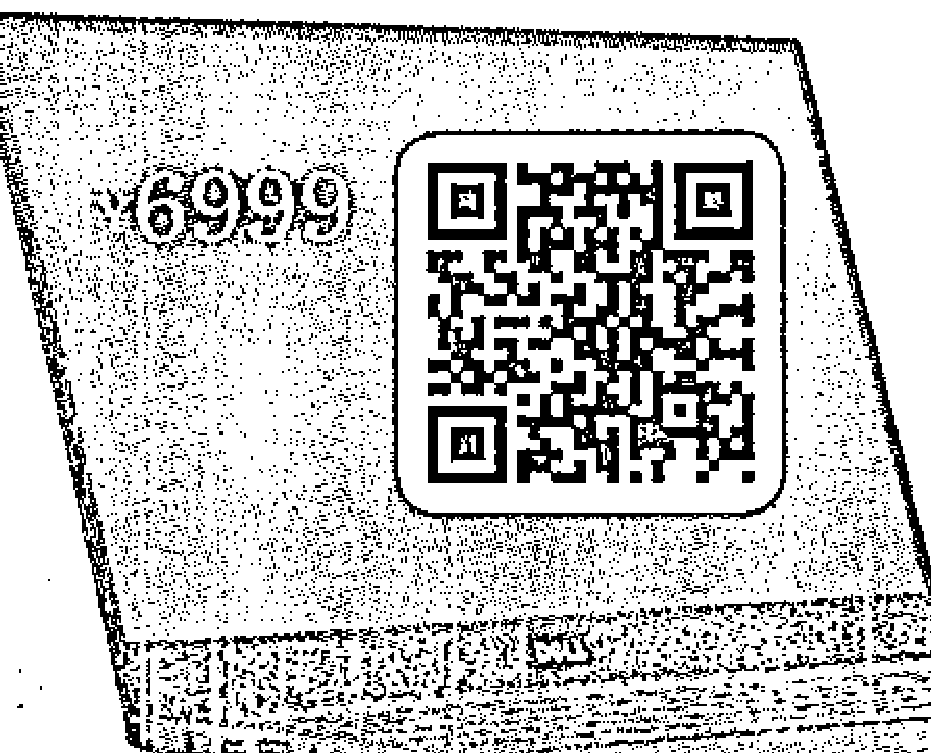

- 屏幕: 13.3英寸IPS (1920×1080像素)
- 处理器: 酷睿i5-6200U
- 内存/硬盘: 4GB DDR3/128GB SSD
- 显卡: 集成HD520核芯显卡
- 厚度/重量: 15mm/1.18kg

##### 昂达V116w CoreM

这是一款11.6英寸的大号Windows 10平板电脑，但10.8mm厚度和790g重量的身材却依旧便携。在酷睿M和128GB SSD硬盘的帮助下，V116w CoreM的性能足以扮演好笔记本的角色，适合喜欢轻装简行、随时让平板变身笔记本的用户选择。除了V116w CoreM之外，台电X2 Pro (2599元)和酷比魔方i7 (2499元)也是酷睿M平板电脑的超值代表，三款产品性能和配置相近，只是外观设计和电池等参数上有所差异，大家可根据喜好选择。

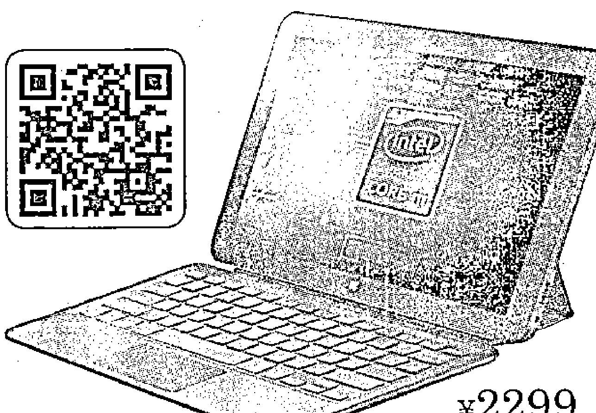

- 屏幕: 11.6英寸IPS触控屏 (1920×1080像素)
- 处理器: 酷睿M-5Y10
- 内存/硬盘: 4GB DDR3/128GB SSD
- 显卡: 集成HD5300核芯显卡
- 厚度/重量: 10.8mm/790g

#### 游戏迷认准GTX960M

对真正的发烧级3D游戏而言，别说NVIDIA 940M了，就连GTX950M都显得有些力不从心。因此，如果你想将笔记本作为家里唯一的游戏平台，有无武装GTX960M或更高级别的独显才是王道。

##### 宏碁VN7-591G-75VL

虽然宏碁VN7-592G (暗影骑士2) 已经上市，但1代暗影骑士却呈现出了更出色的性价比。以VN7-591G-75VL这款产品为例，其搭载的四代酷睿i7-4720HQ可秒杀六代酷睿i5-6300HQ，哪怕与i7-6700HQ相比也是不遑多让。因此，如果你希望CPU和GPU都不存在瓶颈，6000元价位里该产品的表现不会让你失望。

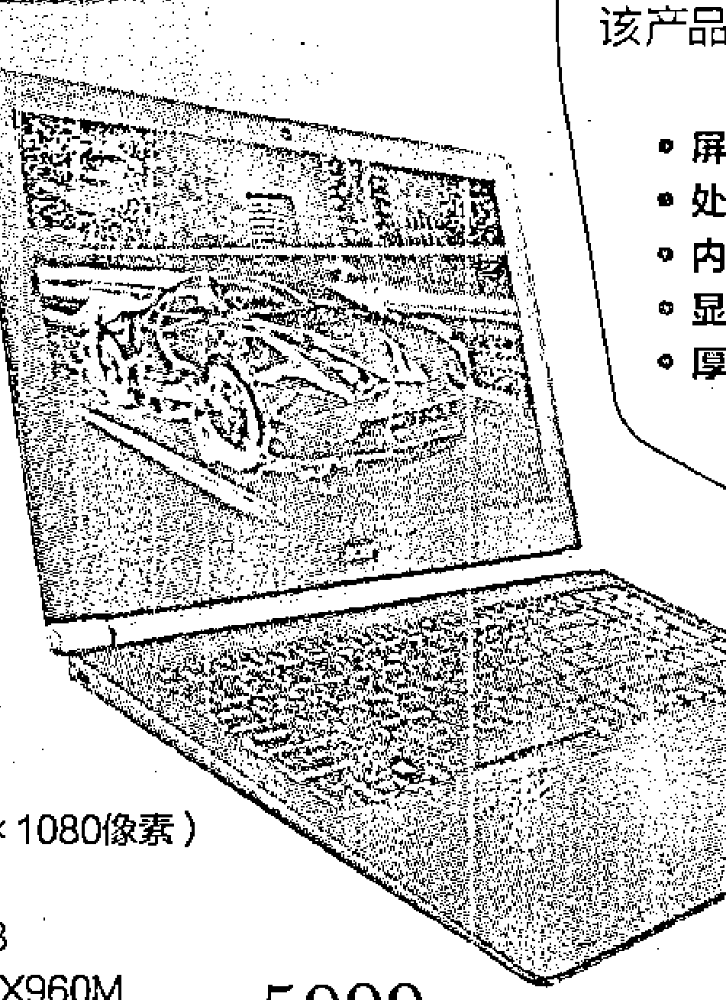

- 屏幕: 15.6英寸IPS (1920×1080像素)
- 处理器: 酷睿i7-4720HQ
- 内存/硬盘: 8GB DDR3/1TB
- 显卡: NVIDIA GeForce GTX960M
- 厚度/重量: 23.9mm/2.4kg

##### 戴尔游匣15P-2548B

游匣15P-2548B应该是时下6000元价位里最标准的游戏本装备：六代酷睿i5和GTX960M独显的组合，并通过双风扇解决散热压力。如果你喜欢“新新组合”，在相似价位里该产品的竞争力还是十分不错的。

- 屏幕: 15.6英寸IPS (1920×1080像素)
- 处理器: 酷睿i5-6300HQ
- 内存/硬盘: 4GB DDR3/1TB
- 显卡: NVIDIA GeForce GTX960M
- 厚度/重量: 25.3mm/2.59kg

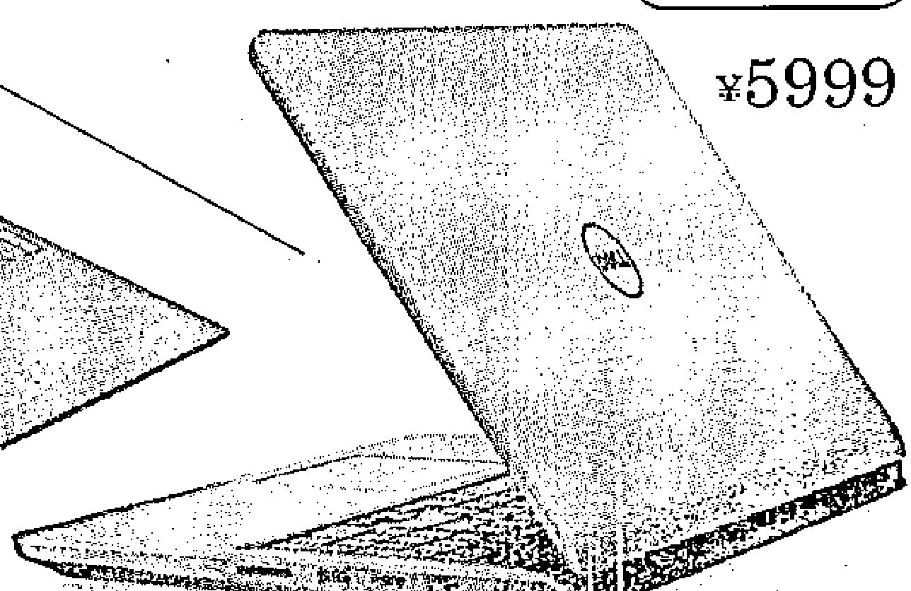

#### GTX950显卡导购

半年前上市的GTX950显卡曾经是最不靠谱的产品，流处理器数量比GTX960整整少了25%，但价格却卖到死贵的1199元，相比GTX960的差价还不到10%。不过GTX950在近期终于改邪归正了，最低跌破了900元，性价比大幅提升。

##### 比GTX750Ti只贵100元

在GTX950显卡的面世初期（图1），曾被市场寄予了非常大的希望。因为GTX950采用了与GTX960完全相同的GM206新核心，唯一明显的区别则是GTX950的核心代码为GM206-250，GTX960的核心代码则为GM206-300。也正是因为核心代码后缀的不同，所以GTX950的流处理器数量从1024个减少到了768个（图2），整整比GTX960少了25%。

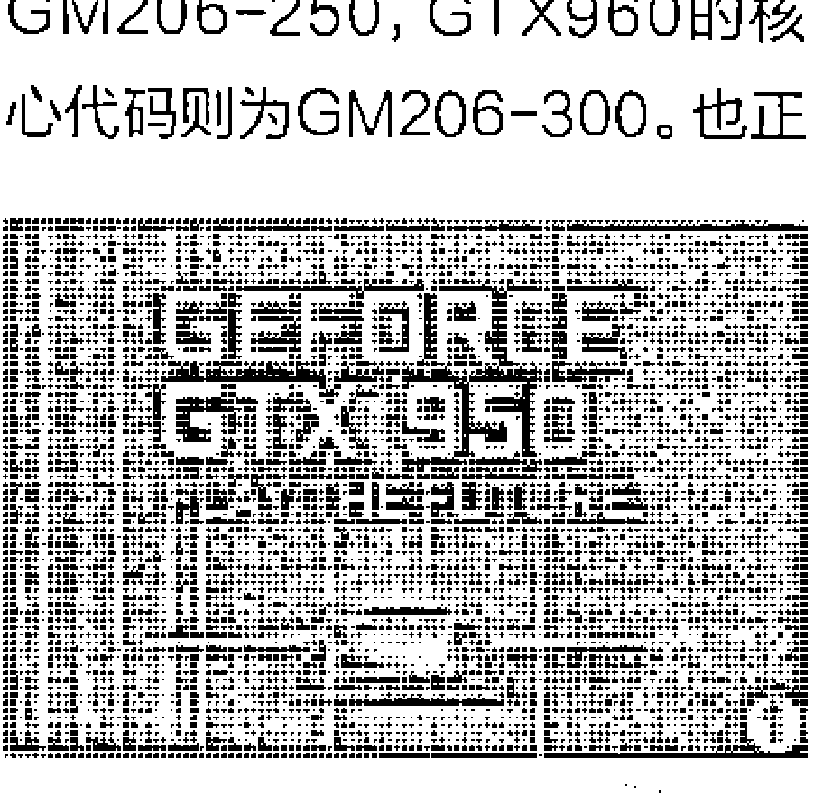

而按照常理来说，既然流处理器数量比GTX960整整少了25%，那么产品售价自然也应该便宜25%才行，也就是在GTX960比较统一的1299元售价基准之上再打个75折，计算结果是974.25元，也就基本等同于显卡市场当中比较常用的999元售价。有鉴于此，在GTX950显卡的面世初期，人们完全有理由相信GTX950的统一售价应该是999元。然而令人意外的是，GTX950在半年前却上演了一番最不靠谱的市场策略。虽然流处理器数量相比GTX960整整少了25%，但价格却卖到死贵的1199元，相比GTX960的差价还不到10%。不过GTX950在近期终于改邪归正了，主流品牌最低已经跌破900元，卖到了899元超低价位，相比GTX960终于有了至少400元的价格优势，因此性价比也大幅提升。更为重要的是，在显存容量均为2GB的前提下，主流品牌的GTX950相比上一代的GTX750Ti也只贵了100元。

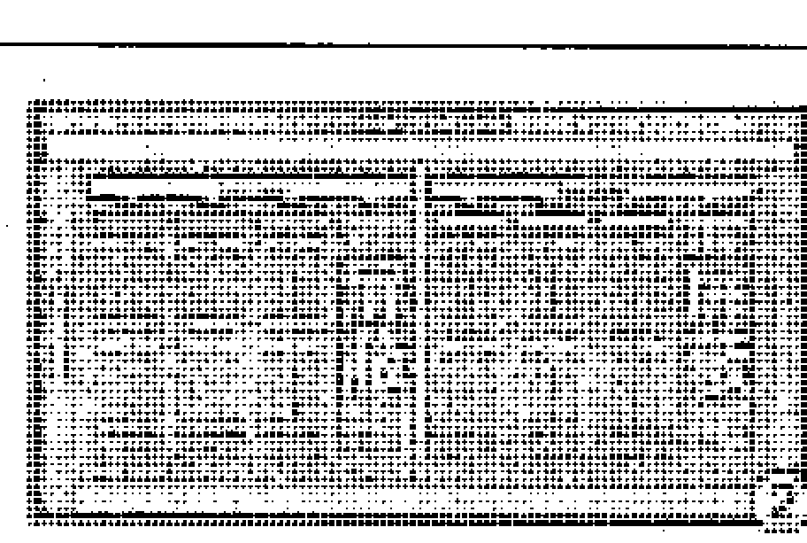

##### 新核心带来更好的性能

在显卡市场当中，新显卡所采用的新核心往往也意味着更强的性能。换成比较容易理解的“普通话”来说，就是新核心的单个流处理器在性能上要比旧核心的单个流处理器明显强了很多。前文已经说过，GTX960和GTX950都采用了核心代码为GM206-300/GM206-250的新核心，至于GTX750Ti采用的则是核心代码为GM107-400的旧核心。在新3DMark Fire Strike的测试当中，同样采用了新核心的GTX960与GTX950在性能差距方面仅为15.1%，采用新旧不同核心的GTX950与GTX750Ti在性能差距方面却高达47.8%。类似的情况在《使命召唤11》和《罗马之子》这样的新款游戏大作当中表现得更为明显（图3），在《剑灵》这样的旧款游戏当中则表现得不太明显。因此，购买GTX950显卡更适合新款游戏大作，毕竟新核心的单个流处理器在新款游戏中的性能也要比旧核心强了很多。

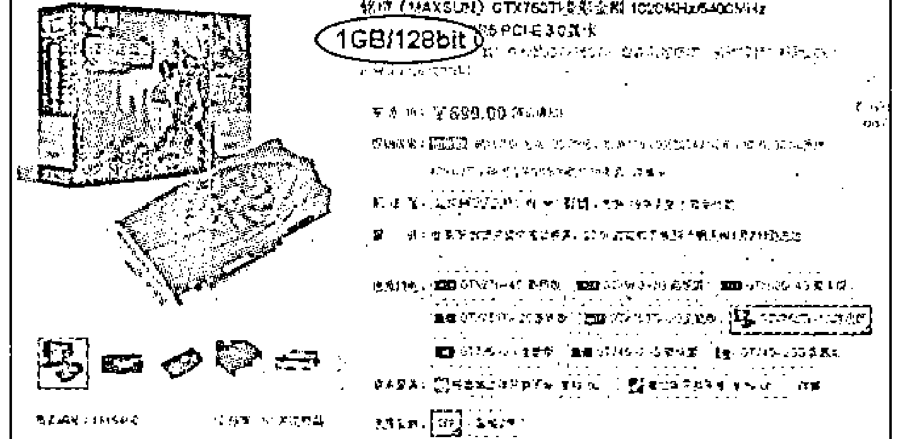

| 显卡名称 | GTX960 (2GB) | GTX950 (2GB) | GTX750Ti (2GB) | GTX960/GTX950 性能差距 | GTX950/GTX750Ti 性能差距 |
| :--- | :---: | :---: | :---: | :---: | :---: |
| 3DMark Fire Strike (Extreme) | 3392 | 2948 | 1995 | 15.1% | 47.8% |
| 罗马之子(高画质) | 43 | 39 | 25 | 10.3% | 56% |
| 使命召唤11(高画质) | 42 | 37 | 29 | 13.5% | 27.6% |
| 古墓丽影10(高画质) | 97 | 92 | 54 | 5.4% | 70.4% |
| 坦克世界(最高画质) | 110 | 96 | 74 | 14.6% | 29.7% |
| 剑灵(最高画质) | 56 | 43 | 39 | 30.2% | 10.3% |
| 市场售价 | 1299元 | 899元 | 799元 | - | - |

##### 缩水产品并不多

目前来看，GTX750Ti显卡已经出现了大量缩水产品，虽然最低售价杀到了更低的699元，但这些缩水显卡的显存容量却只有1GB（图4），相比公版的2GB显存大幅缩水。而更为重要的是，在1920×1080这样的全高清常规分辨率之下，2GB显存才是硬需求，至于1GB显存则会在复杂的游戏场景下突然掉帧，从而遭遇“爆显存”的尴尬。相对来说，GTX950显卡目前则都是2GB未缩水产品，并且核心/显存频率也都是等于或高于公版的1024MHz/6600MHz，所以真实的性能表现相比权威媒体的评测数据相不多，基本都算是比较靠谱的产品。

##### 超值产品推荐

###### 盈通GTX950 2G D5 极速版

**产品规格** 1216MHz核心频率/6610MHz显存频率/DP+HDMI+DVI/8cm双风扇

**推荐理由** 同样是知名品牌的超频版显卡，但核心频率却只有1216MHz这一档，但也明显高于公版显卡的默认频率。这款显卡采用了8cm大尺寸双风扇设计，并同样具备零分贝风扇停转技术。保修方面则提供了更为靠谱的3年保修期，但保修凭证却是贴在显卡上的代表出厂日期的SN条形码标签，所以一定要保证完好才行。


天猫¥919

###### 精影GTX950 2G 终极玩家版

**产品规格** 1024-1188MHz核心频率/6600MHz显存频率/DP+HDMI+双DVI/8cm双风扇

**推荐理由** 市面上最廉价的GTX950显卡，采用了8cm九叶大尺寸双风扇设计，再搭配高效导热罩便可有效提供核心热量的分流功能。并且这款显卡还具备了等同于公版的1024MHz核心频率以及超频状态下的1188MHz核心频率，可以在游戏时提供更为强劲的性能表现，缺点则是保修期只有两年且品牌知名度不高。

###### 铭瑄GTX950 巨无霸2G

**产品规格** 1064-1241MHz核心频率/6612MHz显存频率/DP+HDMI+双DVI/8cm双风扇

**推荐理由** 知名品牌的超值产品，同样采用了8cm大尺寸双风扇设计，并具备零分贝风扇停转技术，在GPU温度低于60摄氏度时风扇自动停转实现零噪音。并且这款显卡还具备了1064MHz/1241MHz的两档核心频率，即便是默认的1064MHz核心频率也远高于公版默认频率。

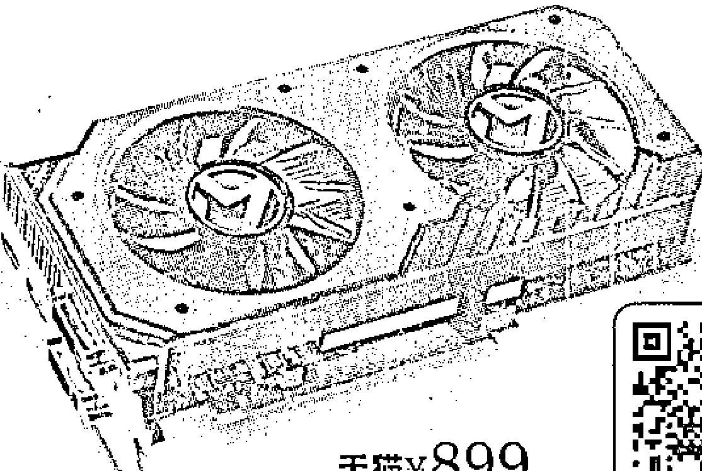

天猫¥899

###### 华硕猛禽STRIX-GTX950-DC2-2GD5

**产品规格** 1026-1190MHz核心频率/6610MHz显存频率/DP+HDMI+DVI/8cm双风扇

**推荐理由** 一线品牌当中最超值的GTX950显卡，相比二三线品牌只贵了百元左右。核心频率分为1026MHz/1190MHz两档，可以给玩家带来更强劲的游戏性能。显卡散热器虽然是常见的8cm大尺寸双风扇，但散热片却内嵌了两根U型热管。

天猫¥969

#### 轻薄新势力

##### 联想500s-14 PK 华硕U303

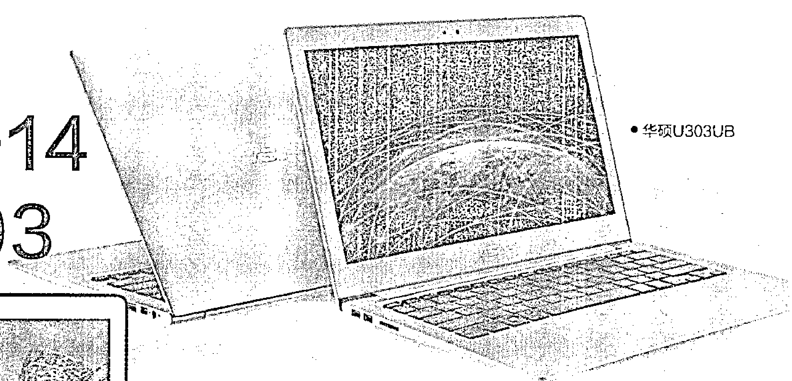

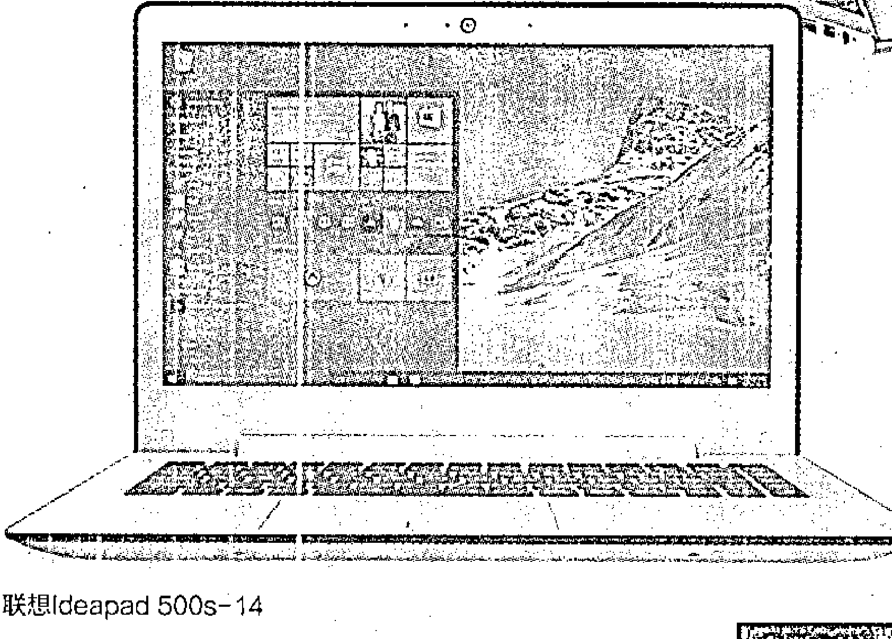

虽然平板二合一设备和变形本具备毋庸置疑的便携性和可玩性，但并非所有用户都能接受这种形态的PC，自带键盘的传统笔记本更符合“大众审美”。只是，时下越来越多的用户开始青睐集轻薄与性能于一身的产品，比如本文的主角：联想Ideapad 500s-14和华硕U303UB。

###### 依靠轻薄夺关注

| 参数对比 | 联想Ideapad 500s-14 | 华硕U303UB |
| :--- | :--- | :--- |
| 屏幕 | 14英寸(1920×1080像素) | 13.3英寸IPS (1920×1080像素) |
| 处理器 | 酷睿i5-6200U | 酷睿i5-6200U |
| 内存/硬盘 | 4GB DDR3/500GB+8GB混合硬盘 | 4GB DDR3/500GB |
| 独立显卡 | NVIDIA 940M (2GB DDR3) | NVIDIA 940M (2GB DDR3) |
| 接口 | 读卡器、USB3.0×2、USB2.0、HDMI、RJ45、音频接口 | 读卡器、USB3.0×3、HDMI、miniDP、音频接口 |
| 机身尺寸 | 340mm×240mm×19.8mm | 323mm×223mm×19.2mm |
| 重量 | 1.7kg | 1.45kg |
| 参考价格 | 4999元 | 5299元 |

一般来说，13.3英寸/14英寸和15.6英寸笔记本的标准重量约为1.8kg/2.0kg/2.3kg，在该标准之下的笔记本就可被归类到轻薄阵营，而在此标准之上的产品则属于“重量超标”。对那些每天都需要背着笔记本上下班，或需要经常外出移动办公的用户而言，拥有更“骨感”身材的轻薄笔记本自然更能刺激消费的欲望，而联想Ideapad 500s-14和华硕U303UB就是以轻薄属性为最大卖点。

其中，华硕U303UB是一款采用了13.3英寸屏幕设计的轻薄产品，它的重量只有1.45kg，已经足以媲美一些11.6英寸的“小兄弟”了。联想Ideapad 500s-14的屏幕尺寸较U303UB更大，因此在便携性上稍逊一筹。但是，19.8mm的厚度和1.7kg左右的重量，让Ideapad 500s-14在众多14英寸的“兄弟姐妹”中也能算是不错的表现了(图1)。

###### 不忘独显提性能

实际上，联想Ideapad 500s家族除了14英寸的500s-14以外，还包含13.3英寸的500s-13和15.6英寸的500s-15。但是，前者在独立显卡的规格上有所缩水(仅配备NVIDIA 920M独显，其性能并没能与六代酷睿处理器所集成的HD520/HD530拉开太大差距)（图2），而后者则因三围的增加而影响了便携性。因此，就性能与便携之间的平衡性而言，采用14英寸屏幕与NVIDIA 940M独显组合的500s-14自然表现得最为完美。

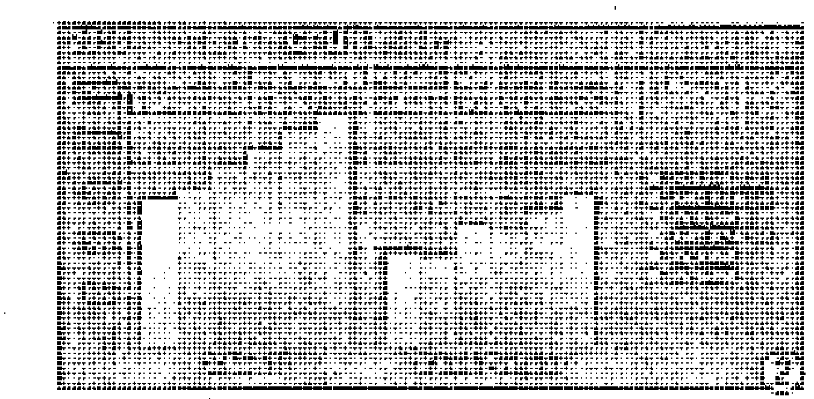

另一方面，联想Ideapad 500s本期PK的对手，华硕U303UB也在盈盈的机身里融入了NVIDIA 940M独显。

总之，比同价位同尺寸竞品更轻薄的身材，就是Ideapad 500s-14和华硕U303UB的立身之本。

显，也因此获得了较强的娱乐动力，比如足够你在1080P+最高画质下以超过50fps的帧数运行《英雄联盟》，在720P+中高画质运行绝大多数单机3D大作。总之，对非发烧级游戏玩家而言，六代酷睿i5-6200U和940M独显的组合绝对够用，而且我们也不必担心它们的组合会对笔记本的散热造成太大压力。

###### 差距在于设计工艺

联想Ideapad 500s-14和华硕U303UB最大的差异，来自二者的设计和工艺。其中，Ideapad 500s-14完全沿用了上代U41-70的模具，A面（顶盖）和C面（掌托）为金属，拥有橙色和白色两种外观颜色可选（图3）。Ideapad 500s-14在设计上的特色在于屏幕可以开合到近180度，并在键盘内融入了白色的背光，整体感觉简约清爽。

华硕U303UB除了轻薄的身材外，奢华的用料也是令人倾心的所在。简单来说，U303UB的整体机身都是由车床冲压整块铝金属制成，其中A面由手工打磨抛光并进行同心圆拉丝工艺处理（图4），而机身前端的最薄处仅有3mm。此外，U303UB同样配备了背光键盘，而且背光亮度还能根据环境光线自动调节，就整体设计和工艺难度而言远超Ideapad 500s-14。

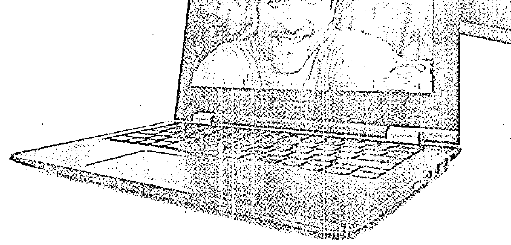

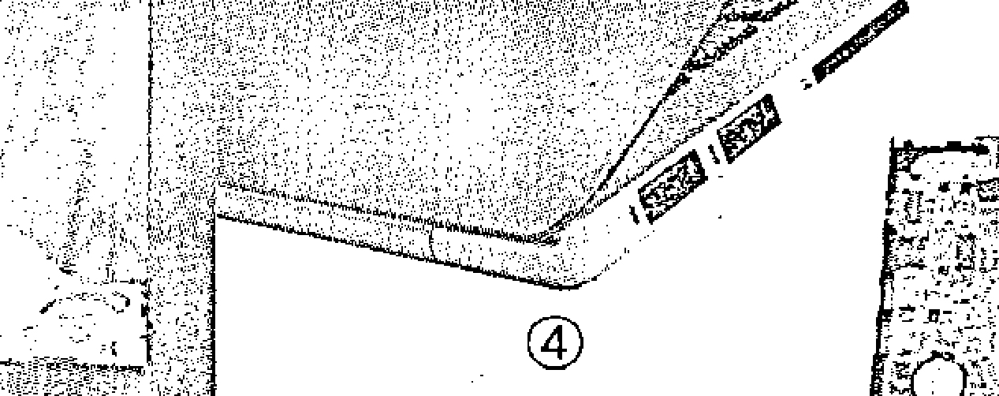

###### 细节配置的对比

联想Ideapad 500s-14在配置上的亮点在于标配一块内置8GB闪存的500GB混合硬盘，在开机和程序加载时间上较标准的机械硬盘要快很多。可惜，该产品的屏幕并非IPS，可视角度不算太理想。而华硕U303UB在配置上的亮点就是IPS屏幕，可提供170度以上的可视角度。

在扩展能力上，两款产品算是半斤八两。比如，它们都仅提供了一个2.5英寸的SATA3.0接口。如果你想升级到纯SSD提速，就需要替换掉原有的老硬盘，没能武装额外的M.2插槽是这两款产品的最大遗憾。在内存方面，联想Ideapad 500s-14和华硕U303UB都标配了4GB内存，但U303UB采用的是板载内存的形式（图5），并额外配备了一个内存插槽，这意味着它可再安装一条8GB内存实现12GB和双通道的内存模式。而Ideapad 500s-14则仅配备了一个内存插槽（图6），想升级到8GB就需要替换原有的4GB内存，也因此注定无法享受双通道内存对集成显卡的性能增益效果。

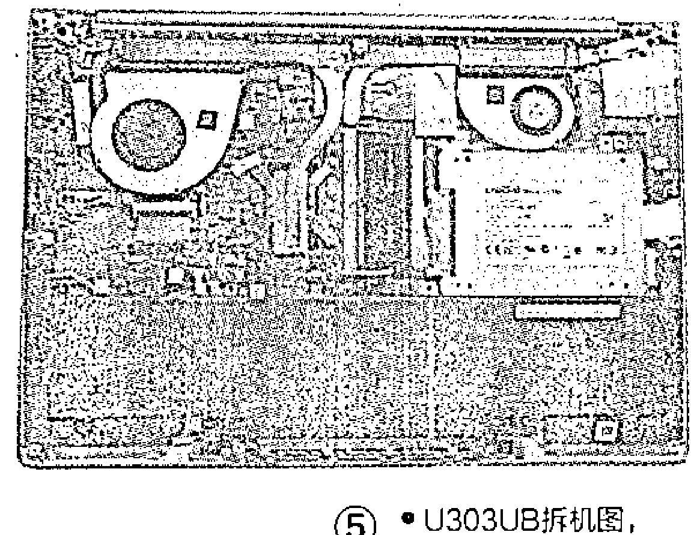

此外，华硕U303UB采用了双风扇双热管的散热模块，就散热效果而言要在联想Ideapad 500s-14的单风扇单热管之上，在长时间满负荷运行的环境下可最大限度避免CPU和GPU因温度过高而触发降频的可能。

## 偏执还是颜值
### 锤子T2
### vs 努比亚布拉格S

并非所有手机用户都追求顶级性能，工业设计和操作体验才是他们考核的重点。于是，就有了傲慢又偏执的锤子T2和主打完美颜值的努比亚布拉格S。两款手机售价相似，又都拥有可单手操作的小巧身材，谁才是你的菜？

###### 金属与玻璃的诱惑

锤子T2和努比亚布拉格S在设计语言上有很多相似之处。比如，它们都采用了相对小巧的屏幕：5英寸和5.2英寸基本就是单手操作的上限(图1)，在5.5英寸起步大屏手机风头正劲的今天，这种紧凑型的苗条手机更容易受到钟情于单手体验的用户欢迎。再比如，锤子T2和努比亚布拉格S都采用了金属边框和双2.5D玻璃设计，集质感与手感于一身。但是，两款手机在细节设计上却出现了“争议”。

| 参数对比 | 锤子T2 | 努比亚布拉格S |
| :--- | :--- | :--- |
| 网络 | 全网通 | 全网通 (双卡双待) |
| 屏幕 | 4.95英寸IPS (1920×1080像素) | 5.2英寸AMOLED (1920×1080像素) |
| CPU | 高通骁龙808 | 高通骁龙615 |
| GPU | Adreno 418 | Adreno 405 |
| 内存/存储 | 3GB/16GB (不支持存储卡) | 3GB/64GB (支持存储卡) |
| 摄像头 | 500万/1300万像素 | 800万/1300万像素 |
| 三围 | 144.55mm×70.84mm×7.53mm | 148.2mm×72.5mm×6.8mm |
| 电池/重量 | 2670mAh/146g | 2200mAh/135g |
| 参考价格 | 2499元 | 2499元 |

###### 锤子T2的偏执

其中，锤子T2在设计上到处都透着偏执：在金属边框上你将看不到独立的电源键 (T2将电源键和HOME键合二为一)，也看不到任何断点的存在 (其他金属边框手机为了实现信号溢出，往往会在边框上预留断点，并利用注塑工艺填充)。此外，T2还延续了将听筒扬声器、光线和距离感应器一体化的设计，并将SIM卡托与右侧的按键集于一身 (图2)，去掉每一个不必要的开孔或疤痕，将简约做到了极致。

此外，屏幕下方那三颗独立的条形物理按键已经成为锤子手机的标志，也因此让其成为了Android世界里的最后一部全实体键手机。对很多不喜欢虚拟按键的用户而言，锤子手机也就成为了唯一之选 (图3)。

###### 布拉格S的颜值

布拉格S在设计上则以颜值安身立命。这款手机以简约靓丽的白色或鲜嫩时尚的粉色为主色调，金属边框采用了CNC弧面加工工艺，并将机身压缩至6.8mm的“骨感身材”，在屏幕较T2大了0.2英寸之余依旧获得了更为轻盈的属性。此外，布拉格S为了彰显努比亚一贯的拍照优势，在机身左侧提供了独立的拍照快捷键(图4)，在自拍时可以获得更好的体验。

布拉格S的侧边框非常窄，边缘弧度与金属边框的切边角度衔接也极为紧密，手机在边缘滑动时恰好就在玻璃与边框的交界处，而努比亚也针对这一特性开发出了特有的FiT技术(图5)，通过单手握持或滑动手机边缘就能完成大量操作需求。

###### 骁龙之间的内斗

锤子T2和努比亚布拉格S为了实现全网通的特性，都采用了高通骁龙系列处理器。可惜，虽然两款手机的价格都不算便宜，但所驾驭的“骁龙”却都谈不上强悍。

锤子T2搭载了高通在2015年度的“次旗舰”骁龙808，这是一颗由2个A57(主频2.0GHz)和4个A53(主频1.5GHz)核心构成的六核处理器，集成Adreno 418 GPU。如果锤子T2能早半年发布，骁龙808还能算是较强的处理器平台。然而，当T2量产之后，它将面对的是一大波武装骁龙820的竞争对手，性能上将再无优势。和锤子T2相比，布拉格S所搭载的骁龙615就更显得小家子气了。这颗八核处理器的性能至多与联发科MT6753持平，可轻松被骁龙808完美虐杀。

###### 其他硬件的差异

高通骁龙处理器的一大特色就是硬件上支持QC2.0/3.0快充技术，而努比亚布拉格S就利用上了这一特色，标配了一个5V(9V)/1.5A的充电器。可惜，布拉格S标配的电池容量太小，2000mAh对一款5.2英寸的手机而言并不解渴，哪怕布拉格S用上了更省电的AMOLED屏幕也难以弥补其在续航时间上的缺陷。此外，虽然该产品支持快充，但最多13.5W的充电功率也谈不上太快(Android手机大都支持5V/2A输入，拥有10W的充电功率)。

锤子T2虽然比布拉格S厚了一些，但却塞进了更大的2670mAh电池，在续航时间的表现上要优于对对手。可惜，该产品并不支持快充，标配的5V/1.5A充电器需要大约2.5小时~3小时才能充满电力。

抛开性能和续航不谈，布拉格S在其他配置方面的表现更为抢眼，比如它不仅标配了64GB存储空间，还能支持最大128GB的存储卡扩充，并支持双卡双待功能(双卡双待和存储卡只能任选其一)(图6)，而800万前置摄像头在自拍潜力上也要优于T2。反观T2，最大的缺陷就是不支持存储卡，对存储空间要求较高的用户就必须选择2599元的32GB版本。

| 项目 | 锤子T2 | 努比亚布拉格S |
| :--- | :--- | :--- |
| 处理器平台 | 高通骁龙808 | 高通骁龙615 |
| 内存/存储 | 3GB/16GB或32GB | 3GB/64GB |
| 屏幕 | 4.95英寸1080P | 5.2英寸1080P AMOLED |
| 后置摄像头 | 1300万像素 | 1300万像素 |
| 前置摄像头 | 500万像素 | 800万像素 |
| 电池 | 2670mAh | 2000mAh |
| 特色功能 | 无实体按键，金属中框 | FiT边缘触控，独立快门键 |
| 参考价格 | 2499元起（3GB+16GB） | 2499元（3GB+64GB） |

##### 忘记BT
##### Windows平板请从“CT”开始

文|曹操

随着Android手机屏幕越来越大，Android平板的地位就变得有些尴尬了。另一方面，Windows 10系统的发布进一步刺激了X86平板市场活性，让用户在方寸之间进行复杂的娱乐和办公操作变成了可能。不过，如果你心仪Windows平板，那就请从“CT”开始把。

##### 何为“BT”和“CT”

在Windows平板电脑领域，英特尔现在提供了BayTrail、CherryTrail和Core M三大平台。其中，BayTrail也就是所谓的“BT”，上市已超2年，性能相对孱弱并即将退出历史舞台；CherryTrail就是“CT”，正值壮年的它用上了英特尔最新的14nm工艺，所以在功耗、散热和性能表现上要优于同档次的“BT”型号；Core M就是我们熟悉的酷睿M，性能无限接近酷睿i3，只是成本较高，不在我们今天的讨论范围里。

##### 选购“CT”平板的注意事项

CherryTrail平台拥有X5-Z8300、X5-Z8500和X7-Z8700三款处理器，它们之间最大的差异就是X5-Z8300不支持双通道内存，哪怕配备了4GB内存也依旧处于单通道状态，所以其3D性能相对最弱。而X5-Z8500和X7-Z8700的差距则主要体现在主频上，在相似的价位里，X5-Z8500够用，X7-Z8700更好。在具体产品的选择上，喜欢游戏的玩家尽量挑选搭载X5-Z8500且存储空间更大的产品；经常进行文字输入的，则推荐可以支持新一代磁吸转轴键盘底座的型号；需要频繁与闪存盘交换数据的，有无配备标准USB3.0接口自然就是最关键的了。需要注意的是，很多CT平板主打原笔迹手写，以及加上键盘就能变身笔记本的特性。但触控笔和键盘底座大都需要单独购买，而且不同品牌间的价格差异还很大（如图）。比如酷比魔方iwork10旗舰版的键盘底座价格就高达399元，此时我们可以考虑购买兼容的蓝牙键盘（不足百元就有不错的选择）。

> 火速连接
如果你想了解更多有关CherryTrail平台的技术和特色，请参考本刊2015年22期《Surface 3的挑战者 5分钟搞懂CherryTrail平板》这篇文章，或是登录http://dwz.cn/2D93aX这个网址查看。

##### 七彩虹i820极速版

i820极速版是最便宜的CherryTrail平板代表，所以它在规格上的最大特点就是“够用”，X5-Z8300和2GB内存组合流畅运行Windows 10不成问题，32GB存储空间再配上一个存储卡也足够我们安装程序和游戏折腾。可惜，该产品标配电池容量较小，续航能力表现一般。

- 屏幕：8英寸 (1280×800像素)
- 处理器：Atom X5-Z8300
- 内存/硬盘：2GB/32GB eMMC
- 接口：读卡器、Micro USB、Micro HDMI
- 厚度/电池/重量：9.4mm/4200mAh/398g

##### 多美能ME1

多美能ME1是参与京东众筹的Windows 10平板，它拥有8英寸和358g的迷你身材，最大特色就是标配一支256级压感的Me Pen触控笔，并对其进行了操作上的优化。比如，你将触控笔点定在屏幕任何位置都能弹出悬窗指令。可惜，该产品的配置实数一般，受限于小巧机身还没有提供单独的AC充电接口。

- 屏幕：8英寸 (1280×800像素)
- 处理器：Atom X5-Z8300
- 内存/硬盘：2GB/32GB eMMC
- 接口：读卡器、Micro USB、Micro HDMI
- 厚度/电池/重量：9.35mm/4500mAh/358g

##### 中柏4s时尚版

中柏4s时尚版采用了10.6英寸屏幕设计，只是因为成本的考虑，分辨率仅有1366×768像素，和主流笔记本持平。此外，该产品标配的2GB内存、32GB存储空间和6600mAh容量的电池只能算是勉强够用。还好，中柏4s时尚版的价格足够实惠，699元的价格也让它成为了最实惠的大屏Windows 10平板之一。

- 屏幕：10.6英寸（1366×768像素）
- 处理器：Atom X5-Z8300
- 内存/硬盘：2GB/32GB eMMC
- 接口：读卡器、USB3.0、Micro USB、Micro HDMI、AC充电
- 厚度/电池/重量：7.5mm/6600mAh/540g

##### 昂达oBook 10

昂达oBook 10的硬件规格和iwork10旗舰版相似，而且同样可选磁吸转轴键盘底座(199元)。不过，该产品的屏幕分辨率只有1280×800像素，而且电池容量也有所减少。还好，oBook 10拥有更为轻薄的机身设计，并配有独立的AC充电接口，在充电时不会影响到OTG扩展。本期第111页有该产品的体验，感兴趣的读者可以翻阅查看。

- 屏幕：10.1英寸（1280×800像素）
- 处理器：Atom X5-Z8300
- 内存/硬盘：4GB/64GB eMMC
- 接口：读卡器、Micro USB、Micro HDMI、AC充电
- 厚度/电池/重量：8mm/6000mAh/575g

##### 台电X16 Pro

台电X16 Pro的屏幕尺寸达到了11.6英寸，在视野面积上更接近传统的笔记本。而该产品的亮点还在于搭载了支持双通道内存的Atom X5-Z8500处理器，整体性能较X5-Z8300有了明显的提升。此外，X16 Pro还具备Windows 10和Android双系统切换的特性，办公和娱乐随时转换。

- 屏幕：11.6英寸（1920×1080像素）
- 处理器：Atom X5-Z8500
- 内存/硬盘：4GB/64GB eMMC
- 接口：读卡器、USB3.0、Micro USB、Micro HDMI、AC充电
- 厚度/电池/重量：9.6mm/8500mAh/879g

##### 酷比魔方iwork10旗舰版

iwork10旗舰版是一款10.1英寸的Windows 10平板，与同类产品相比其最大的特色就是采用了全新的磁吸转轴键盘底座，不仅手感更佳，还能增加一个标准的USB接口。可惜，这个键盘底座需要自行购买(399元)，而iwork10自身上的所有接口都是Micro标准，外接闪存盘和键鼠时需要OTG转接。由于没有独立的DC充电接口，所以它在充电时需占用Micro USB接口。

- 屏幕：10.1英寸（1920×1200像素）
- 处理器：Atom X5-Z8300
- 内存/硬盘：4GB/64GB eMMC
- 接口：读卡器、Micro USB、Micro USB3.0、Micro HDMI
- 厚度/电池/重量：9.3mm/7500mAh/615g

##### 小黑平板电脑（旗舰版）

这款“小黑”的价格着实不便宜，2099元已经足够买到武装酷睿M平台的Windows 10平板了。作为新品牌还敢卖高价的底气，则来源于和Surface 3相近的设计：自带支架的铝合金后盖。此外该产品还标配CherryTrail平台最高端的Atom X7-Z8700处理器和128GB存储空间的组合，并配备了最新的USB Type-C接口。

- 屏幕：10.1英寸（1920×1200像素）
- 处理器：Atom X7-Z8700
- 内存/硬盘：4GB/128GB eMMC
- 接口：USB3.0、USB Type-C、Micro HDMI
- 厚度/电池/重量：9.2mm/7300mAh/617g

#### 寻找“超级续航”手机

和不断翻番的性能相比，智能手机的续航时间却一直没有显著的提升，反而大有不断缩水的趋势。特别是那些喜欢不停刷微博、朋友圈的重度玩机用户，一天一充甚至一天两充已成常态。那么，现在有哪些手机可以让我们告别这种需要反复充电的尴尬历史呢？

##### 大电池是长效保证

提升手机续航能力的方法有很多，比如配备更省电的AMOLED屏幕、搭载更省电的处理器。然而，AMOLED屏幕成本较高，而低功耗的处理器往往又意味着性能孱弱。在这种大环境下，想办法塞进更大的电池，并在系统层面融入更多节能省电机制就是王道。那么，多大的电池才能算是“超级续航”的保证呢？

根据经验，5.5英寸配3000mAh电池、6英寸配4000mAh电池是保证一天一充的下限。从这个角度来看，为5英寸手机准备至少3000mA、5.5英寸提供4000mAh、6英寸武装5000mAh的电池，才能真正摆脱一天一充的“噩梦”。

##### 和充电相关的那些事

更大的电池容量也意味着充电时间的延长，能否为此类手机引入快速充电技术可以考验厂商的诚意。需要注意的是，很多手机都将支持5V/2A充电标准就列入“快充”阵营，而真正意义的快充应该是以OPPO VOOC闪充和高通QC2.0技术为主，能实现18W或更高充电功率为指标。此外，很多大电池手机还能通过OTG反向充电功能（如图），手机自身可以扮演充电宝的角色为其他手机充电，在关键时刻还是非常实用的功能。接下来，就让我们看看市面上都有哪些可被称为超级续航的手机吧。

##### TCL P618L

TCL P618L的配置谈不上强悍，骁龙410+1GB内存的组合只能算是勉强够用，但该产品却依旧有着很多亮点，比如2.5D玻璃、AMOLED屏幕、5000mAh超大电池以及支持存储卡扩充的能力。最关键的是，这款超长续航手机的价格如今已经跌破600元大关，性价比极为强悍。

- 屏幕：5英寸AMOLED（1280×720像素）
- 网络：电信4G（双卡双待）
- 处理器：高通骁龙410
- 内存/存储：1GB/8GB（支持存储卡）
- 摄像头：500万/1300万像素
- 电池/重量：5000mAh（不可换）/162g
- 快速充电：不支持（5V/2A）

##### 华硕电神5000

华硕电神5000并非一款主打配置的手机，所以它仅采用了高通入门级的骁龙410处理器。但是，该产品却极具诚意地配备了5000mAh超大电池，以及激光对焦功能，在享受超长续航的同时还能提高拍照体验。

- 屏幕：5.5英寸IPS（1280×720像素）
- 网络：移动联通双4G（双卡双待）
- 处理器：高通骁龙410
- 内存/存储：2GB/16GB（支持存储卡）
- 摄像头：500万/1300万像素
- 电池/重量：5000mAh（不可换）/202g
- 快速充电：不支持（5V/2A）

##### 红米手机3

红米手机3应该是目前最具性价比的手机，它支持三大运营商的4G网络，并搭载了较为强悍的骁龙616处理器，通过存储卡扩充可弥补其标配存储空间较小的缺陷。而最令人欣喜的是，该手机配备了4100mAh电池，对一款5英寸720P小屏手机而言可谓海量，也为超长待机打下了基础。

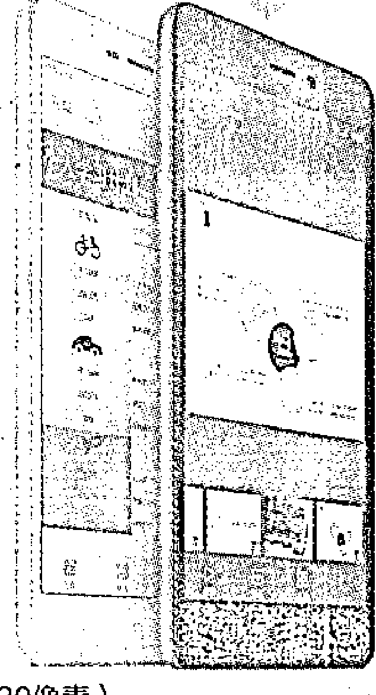

¥699


- 屏幕：5英寸IPS（1280×720像素）
- 网络：全网通（双卡双待）
- 处理器：高通骁龙616
- 内存/存储：2GB/16GB（支持存储卡）
- 摄像头：500万/1300万像素
- 电池/重量：4100mAh（不可换）/144g
- 快速充电：不支持（5V/2A）

##### 联想P1移动版

联想P1的版本比较多，双4G和全网通版的价格都在2000元左右，而移动4G版的价格则仅有1599元，性价比最为突出。这款产品最大的特色是配备了指纹识别和独立的省电开关，拨动一下即可直接进入深度省电模式，在该模式下我们可以添加三款APP到白名单列表（如QQ、微信），而其余APP则都会被系统冻结不再产生耗电。

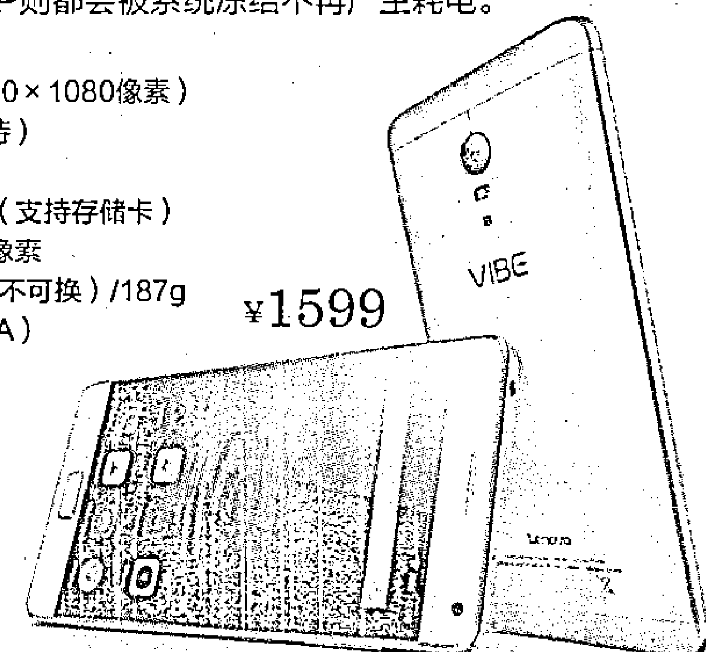

- 屏幕：5.5英寸IPS（1920×1080像素）
- 网络：移动4G（双卡双待）
- 处理器：高通骁龙615
- 内存/存储：3GB/16GB（支持存储卡）
- 摄像头：500万/1300万像素
- 电池/重量：5000mAh（不可换）/187g
- 快速充电：支持（12V/2A）

¥1599


##### ZUK Z1

ZUK Z1采用了高通2014年的旗舰处理器——骁龙801，与3GB内存组合后的性能还是比较均衡的。而该产品最大亮点就是标配64GB存储空间，而且还为集指纹识别于一身的Home键赋予了更多手势功能，比如单击返回桌面、轻触返回上一级、双击进入应用历史等，操作起来颇为便捷。

- 屏幕：5.5英寸IPS（1920×1080像素）
- 网络：全网通（双卡双待）
- 处理器：高通骁龙801
- 内存/存储：3GB/64GB（不支持存储卡）
- 摄像头：800万/1300万像素
- 电池/重量：4100mAh（不可换）/175g
- 快速充电：不支持（5V/2.5A）


¥1699


##### 华为畅享5

华为畅享5是一款全网通手机，并同样采用了5英寸小屏幕和超大4000mAh电池的组合，续航能力毋庸置疑。可惜，该产品的配置并不高，联发科MT6735的性能与高通骁龙410在伯仲之间，并不适合体验大型游戏，但作为日常生活娱乐还是不成问题的。

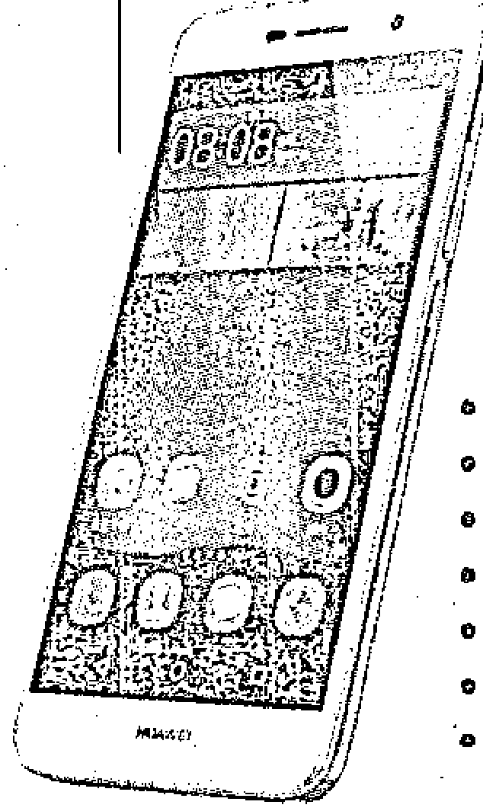


¥999

- 屏幕：5英寸IPS（1280×720像素）
- 网络：全网通（双卡双待）
- 处理器：联发科MT6735
- 内存/存储：2GB/16GB（支持存储卡）
- 摄像头：500万/1300万像素
- 电池/重量：4000mAh（不可换）/160g
- 快速充电：不支持（5V/2A）

##### 金立M5 Plus

金立M5 Plus是一款6英寸的巨屏手机，通过AMOLED材质屏幕缓解了超大屏幕对电力的消耗，并通过内置5020mAh超大电池和软硬层面的省电机制实现了超长待机。M5 Plus配备了前置按压式指纹识别模块，并针对商务用户进行了诸多优化，比如通过金立出国助手软件无需换卡即可用超低资费购买漫游数据包等等。

- 屏幕：6.0英寸AMOLED（1920×1080像素）
- 网络：全网通（双卡双待）
- 处理器：联发科MT6753
- 内存/存储：3GB/64GB（支持存储卡）
- 摄像头：500万/1300万像素
- 电池/重量：5020mAh（不可换）/208g
- 快速充电：支持（9V/2A）

¥2499


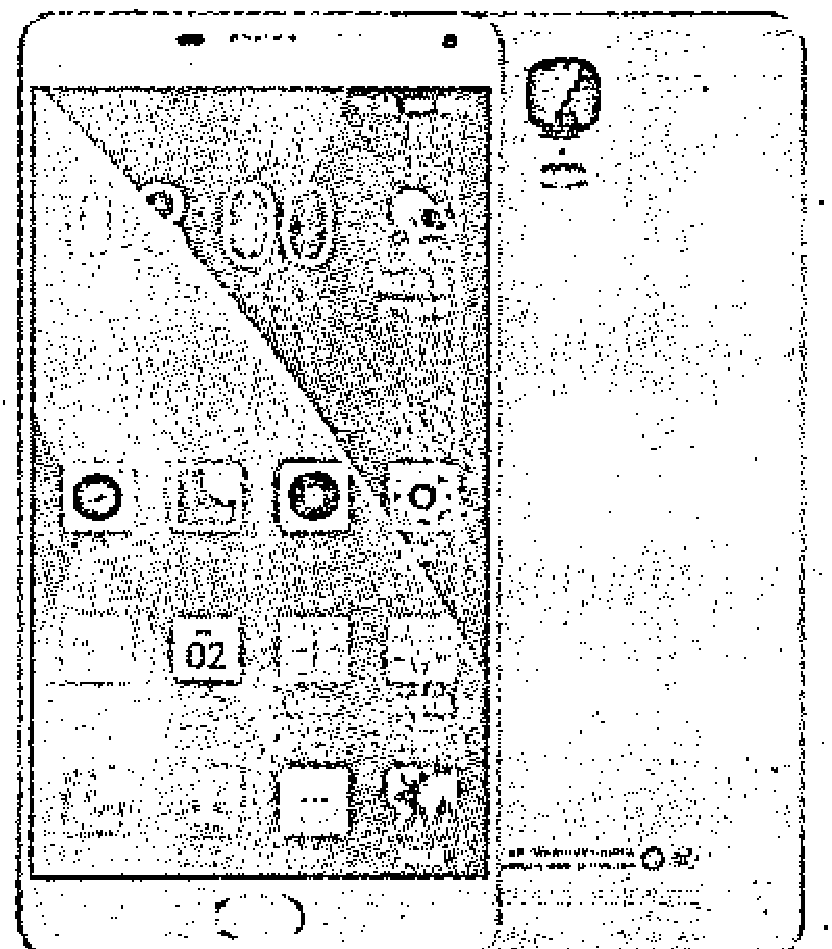

#### M.2+USB3.1主板导购

文|宁宁

自从英特尔的100系主板上市之后M.2+USB3.1这两种接口就开始在主板上普及了，甚至就连低端的B150主板都具备。目前来看，M.2固态硬盘和USB3.1闪存盘的售价仍贵，但是两年左右升级时这些接口都能帮上忙。

##### 32Gbps M.2

M.2插槽其实是最新的SSD固态硬盘接口，最初只能依靠第三方芯片来实现，所以理论数据带宽最高只能达到10Gbps。不过即便如此，相比6Gbps理论带宽的SATA3接口仍然要快了将近一倍，所以仍旧受到众多电脑发烧友的喜爱。至于英特尔旗下最新的100系主板则发生了变革，包括Z170、H170、B150在内的这三款芯片组均支持原生M.2接口，并且还采用了4X PCI-3.0通道。所以理论带宽也就直线飙升到了32Gbps，甚至要比SATA3接口理论带宽的5倍还多（图1），瞬间成为了电脑发烧友的最高目标。

##### USB3.1接口性能

与32Gbps M.2接口一同出现在100系主板之上的还有USB3.1接口，虽然不是原生而是需要第三方芯片来提供支持，但却仍旧受到业界的广泛关注。其最大的优势，就是USB3.1接口相比已经飞快的USB3.0接口再次出现了速度翻倍，理论数据带宽直接从5Gbps提升至10Gbps（图2）。这对于移动存储已经日趋普及的现今来说，绝对是划时代意义的产物。而根据第三方芯片的提供厂商来看，USB3.1芯片则主要分为英特尔芯片和其他厂商芯片两大阵营。消费者在选购时，如果主板官方信息特别说明了是英特尔芯片，那么USB3.1接口的性能就会更好一些，甚至可以达到16Gbps的理论数据带宽（图3）。不过即便是其他厂商的USB3.1芯片在速度上也明显高于常见的USB3.0接口，所以消费者在选购时也无需刻意回避。此外，有些主板厂商为了加以区别还会将USB3.1接口标注为红色（图4），但还有些主板厂商则仍旧把USB3.1接口标注为与USB3.0接口完全相同的蓝色。所以如果都是蓝色的话，就一定要查看主板说明书，这样才能更好地加以区别使用。

##### 配套产品仍未普及

虽然M.2+USB3.1这两种接口已经开始在英特尔的100系主板上普及，但相应的配套产品却仍未普及。先以M.2接口的SSD固态硬盘来说，虽然市面上的产品越来越多，但普遍都是6Gbps SATA3通道的产品。即便是有PCI-E通道的产品，也几乎都是速度偏慢的10Gbps PCI-E通道，至于32Gbps PCI-E通道的产品则十分罕见。并且即便是10Gbps PCI-E通道的产品，相比6Gbps SATA3通道的产品也贵了将近一倍。所以短期来看，购买价值并不是太好。无独有偶，USB3.1接口的U盘也同样未实现普及，虽然读写速度相比USB3.0接口的U盘快了一倍还多，但产品售价同样也贵了一倍还多。有鉴于此，现在购买M.2+USB3.1主板更像是为了将来打基础。待到两年左右升级时，配套产品应该就已经全面普及了，电脑用户也不用更换主板，因为这些接口都能帮上忙。此外，如果是在京东平台购买，经常会遇到手机专享价、超值赠品、好评返京东E卡等活动(图5)，消费者不妨多多参与。

| 品牌型号 | 接口类型 | 读取速度 | 写入速度 | 最新报价 |
|----------|----------|----------|----------|----------|
| 金士顿DTIG3/64GB | USB3.0 | 120MB/s | 45MB/s | 169元 |
| 金士顿HXS/64GB | USB3.1 | 350MB/s | 180MB/s | 369元 |

| 品牌型号 | 接口类型 | 产品容量 | 数据通道 | 读取速度 | 写入速度 | 最新报价 |
|----------|----------|----------|----------|----------|----------|----------|
| 浦科特PX-128M6G | M.2接口 | 128GB | 6Gbps SATA3通道 | 535MB/s | 170MB/s | 399元 |
| 浦科特PX-256M6G | M.2接口 | 256GB | 6Gbps SATA3通道 | 535MB/s | 335MB/s | 699元 |
| 浦科特PX-G128M6e | M.2接口 | 128GB | 10Gbps PCI-E通道 | 770MB/s | 335MB/s | 699元 |
| 浦科特PX-G256M6e | M.2接口 | 256GB | 10Gbps PCI-E通道 | 770MB/s | 580MB/s | 1299元 |

##### 超值主板推荐

###### 微星B150 KRAIT GAMING

**硬件规格** B150芯片组/8相供电/DDR4内存插槽/2个USB3.1前置/2个USB3.1后置/1个32Gbps M.2接口

**推荐理由** 微星B150 KRAIT GAMING几乎是市面上最廉价的M.2+USB3.1主板，京东手机端报价仅为749元，并赠送价值249元的酷冷至尊暴雪T4PLUS双风扇CPU散热器一个，好评还返50元京东E卡，扣除掉赠品和好评E卡相当于仅需450元便可买到。由于专属GAMING系列，所以这款主板采用了用料实惠的8相供电，而且还具备该系列的多种特色技术。

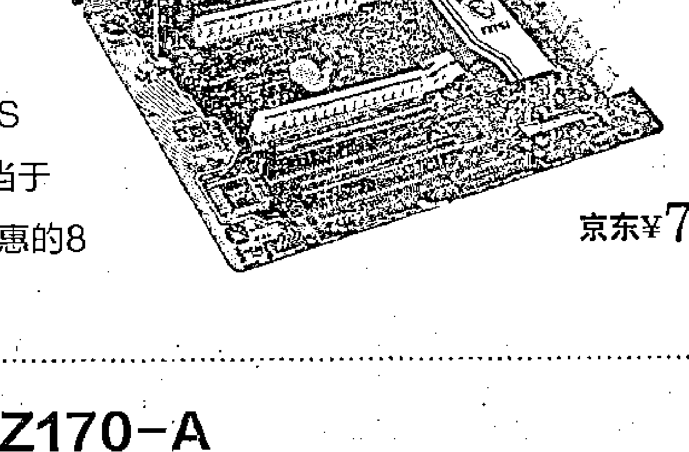


京东¥749

###### 技嘉H170-D3HP

**硬件规格** H170芯片组/7相供电/DDR4内存插槽/2个USB3.1前置/2个USB3.1后置/1个32Gbps M.2接口

**推荐理由** H170芯片组虽然是100系主板当中的“非主流”，但却仍有技嘉H170-D3HP这样的超值产品，相比B150主板在芯片组规格上自然也是提升不少。同时这款主板还采用了图形化双BIOS设计以及英特尔原厂USB3.1芯片，可以最大程度保障电脑发烧友的终极DIY需求。缺点则是这款主板只有7相供电，用料方面略微逊色于前文介绍的微星主板。

京东¥799

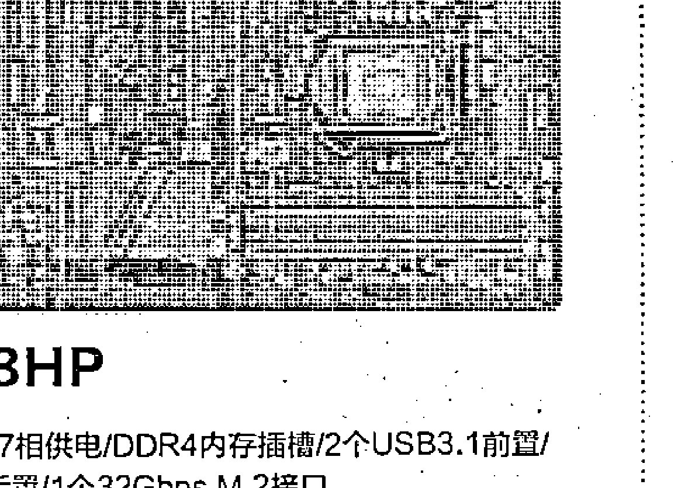


###### 华硕Z170-A

**硬件规格** Z170芯片组/10相供电/DDR4内存插槽/2个USB3.1前置/2个USB3.1后置/1个32Gbps M.2接口

**推荐理由** 华硕Z170-A可以说是该品牌旗下最超值的Z170主板之一，售价仅为1000元出头却配备了用料充足的10相供电设计，京东平台促销还赠送价值139元的九州风神玄冰400金鳞版CPU散热器一个，相当于960元便可买到手。华硕品牌独有的TPU芯片和PRO BCLK两款芯片则具备了强大的超频能力，只需简单设置即可智能加速处理器，实现其他品牌难以企及的AI特性。

京东¥1099

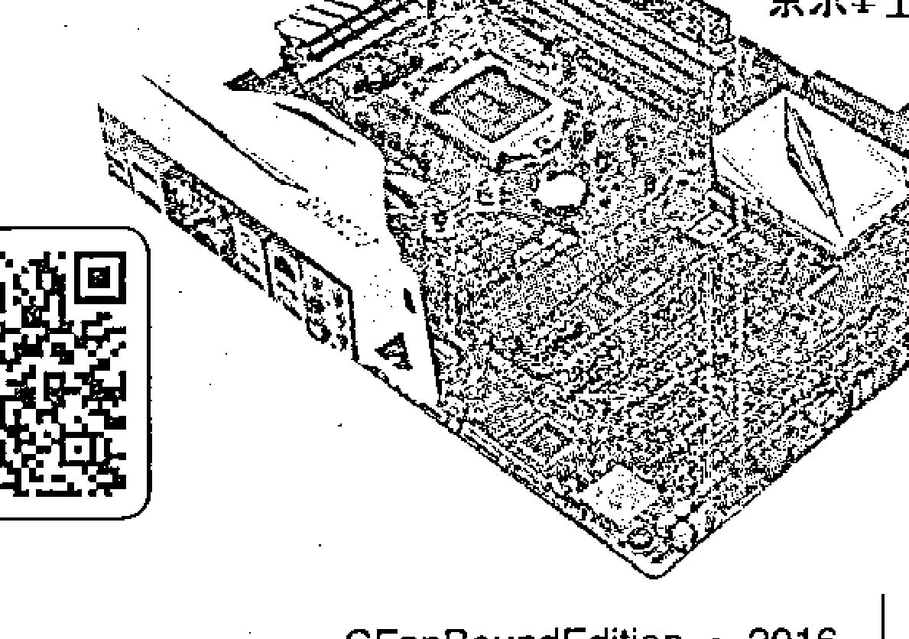


#### R9 370X显卡你选谁

文|宁宁

R9 370X显卡作为A卡阵营千元级别的当家主打，性价比是相当出色的。目前有太多的品牌和型号可供选择，因此本期的PK白刃战将从这些显卡当中找出最超值的产品。

##### 选购平台全覆盖

由于R9 370X显卡涉及了太多的品牌和型号可供选择，所以本期PK白刃战的选购平台将进行全面扩充。不仅覆盖了京东自营平台和京东第三方平台，而且还覆盖了阿里旗下的天猫商城和淘宝集市。这样一来，消费者便有了更充裕的选购空间，选购时也更加容易找到最超值的产品。至于本轮PK白刃战的分组，则根据显存容量的不同分为2GB显卡和4GB显卡两组。

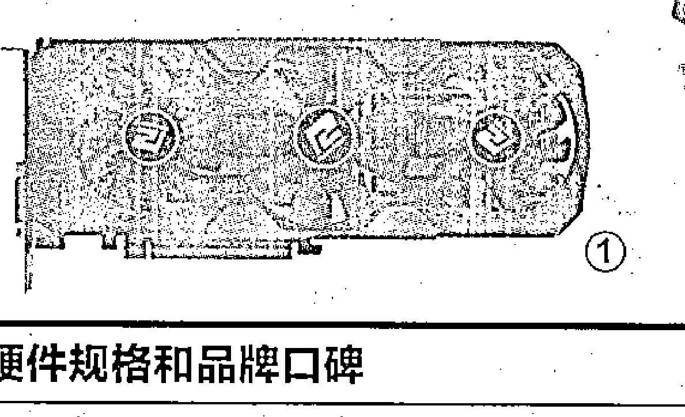

##### 硬件规格和品牌口碑

选购显卡时，最应关注的就是硬件规格。比如说核心频率、显存频率以及散热器的风扇数量和热管数量。理论上来说，在其他条件相同的情况下核心/显存频率越高的显卡性能就会越好，三风扇显卡就要比双风扇和单风扇显卡散热更好（图1），4根热管就要比2根热管散热更好（图2），所以这些条件都是选购时需要特别考虑的。此外显卡的品牌口碑也是值得关注的要点，由于技嘉、微星等传统一线已经基本退出A卡阵营，所以真正的老牌一线就只剩蓝宝石一家。当然这样的选购并非是盲目的迷信品牌，而是一线品牌的故障率确实要略微好于二线品牌，所以品牌在选购时同样值得考虑。

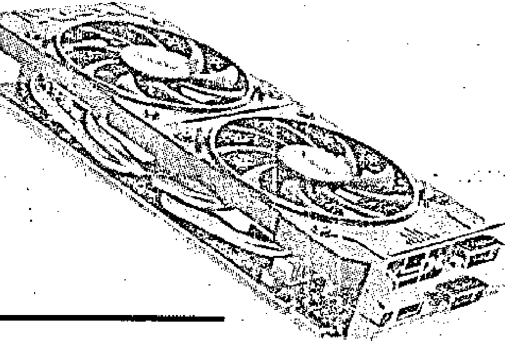

##### 2GB显卡PK白刃战

- 蓝宝石R9 370X 2G D5 白金版 天猫¥899
- 讯景R9 370X 2G 魔尊 天猫¥969
- 迪兰Devil R9 370X 2G 淘宝¥1099


###### 用户分析

购买2GB显卡的消费者，大多只是在1080P分辨率下运行游戏的玩家。对于他们来说，2K/4K分辨率的高分屏显示器显然是太过奢侈的，因此他们在选购显卡时也会更加注重性价比。这些用户之所以购买R9 370X显卡而不是R9 370显卡，最重要的原因还是流处理器数量从1024个提升到了1280个。硬件性能不仅提升了25%，而且价格也仅比R9 370显卡贵了10%而已。

| 品牌型号 | 蓝宝石R9 370X 2G D5 白金版 | 讯景R9 370X 2G 魔尊 | 迪兰Devil R9 370X 2G |
|----------|-----------------------------|---------------------|----------------------|
| 核心频率 | 1050MHz                     | 1070MHz             | 1150MHz/1180MHz      |
| 显存频率 | 5600MHz                     | 5600MHz             | 5600MHz              |
| 风扇数量 | 1个                         | 2个                 | 3个                  |
| 热管数量 | 2根                         | 4根                 | 4根                  |
| 市场价格 | 899元                       | 969元               | 1099元               |

###### 选手介绍

在R9 370X 2GB显卡市场当中，主要有蓝宝石、讯景、迪兰这三个品牌。其中蓝宝石R9 370X 2G D5白金版的天猫报价仅为899元，讯景R9 370X 2G魔尊则略贵一些，天猫报价要卖到969元，最后要说的迪兰Devil R9 370X 2G由于是新品上市，所以目前只在淘宝平台有售，并且因为是超频版所以售价高达1099元。

###### 三强PK

从基本规格来看，蓝宝石显然是最差的，核心频率甚至只有1050MHz，散热器也只是采用了单风扇双热管的普通产品。不过蓝宝石的品牌口碑却是A卡阵营当中的一线，并且根据众多玩家的反馈来看，蓝宝石品牌的故障率也略微低于其他品牌。再加上蓝宝石的售价已经跌破了900元大关卖到了899元的超低价位，几乎卖到了R9 370显卡的价位，并明显低于另外两个品牌，所以对于注重性价比的用户非常合适。讯景在PK当中表现中庸，迪兰这款超频版显卡默认的核心频率高达1150MHz，超频模式下更是达到了1180MHz。不过这样的一款显卡，售价虽高达1099元，但显存却只有2GB，高分辨率高画质下经常会遭遇“爆显存”，既超出了性价比用户的预算又无法满足高端玩家的真实需求，只适合中等特效下运行1080P分辨率游戏的玩家。因此本轮的CFan推荐自然也就授予蓝宝石R9 370X 2G D5白金版这款显卡。

##### 4GB显卡PK白刃战

- 讯景R9 370X 4G 黑狼 天猫¥1029
- 迪兰R9 370X 酷能4G 天猫¥1049
- 蓝宝石R9 370X 4G D5 超白金OC 天猫¥1079

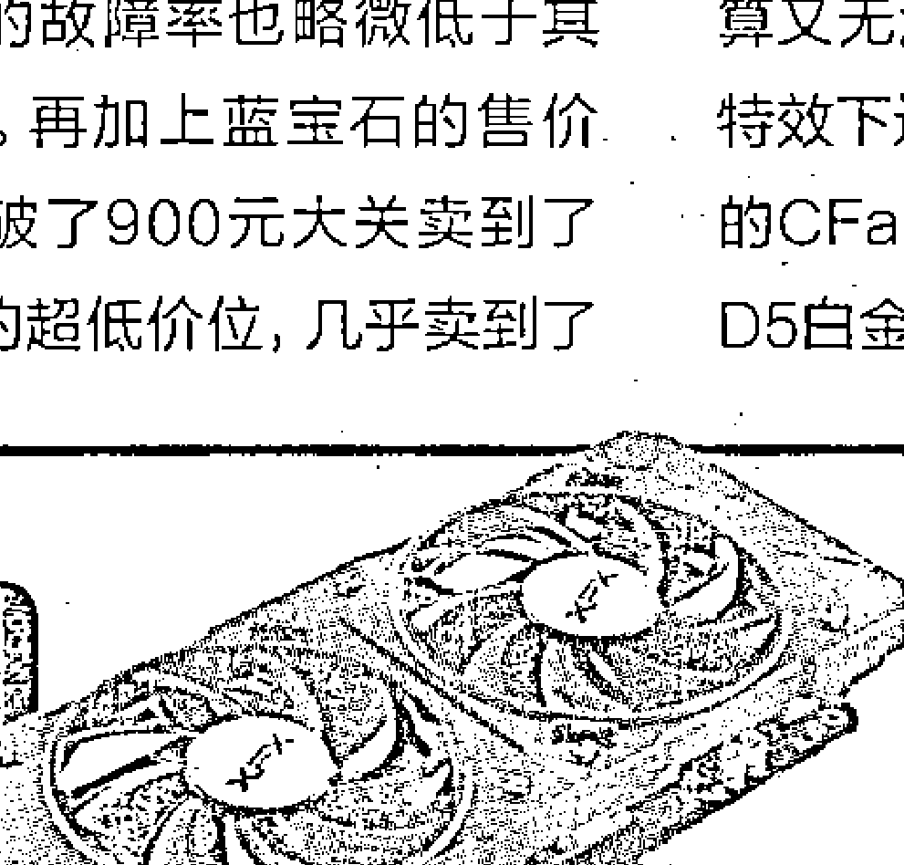

###### 选手介绍

在R9 370X 4GB显卡市场当中，同样只有讯景、迪兰、蓝宝石这三个品牌，并且还都是小幅超频版显卡，市面上并没有大幅超频版显卡。其中讯景R9 370X 4G黑狼的京东白条用户手机端报价1029元、迪兰R9 370X酷能4G的京东白条用户手机端报价1049元、蓝宝石R9 370X 4G D5超白金OC京东白条用户手机端报价1079元。

###### 用户分析

购买4GB显卡的消费者，通常都需要在高画质或高分辨率下运行游戏，所以这些用户最痛恨的就是“爆显存”，毕竟运行游戏时突然掉帧绝对是令人非常郁闷的事情。所以此类用户绝对不会选择2GB显卡，而是会更多的考虑4GB显卡。此外这些用户偶尔还会对超频有一定的需求，所以默认频率更高且散热更好的显卡绝对是他们的首选。

###### 三强PK

从基本规格来看，三款显卡由于价格相近所以相差得并不太多。不过迪兰仍旧凭借微小的频率优势略微胜出，在核心及显存频率方面都明显强于另外两款显卡。至于散热器的热管数量迪兰虽然只有3根，但只是略逊于讯景却明显强于蓝宝石。并且迪兰这款显卡的超频能力也还算不错，所以1049元的售价相当不错。因此本轮的CFan推荐自然也就授予了迪兰R9 370X酷能4G这款显卡。不过迪兰这款显卡目前已经出现了断货问题，很多天猫卖家用这款显卡的图片来销售另外一款迪兰显卡。如果迪兰断货的话，则建议购买讯景R9 370X 4G黑狼作为备选。

| 品牌型号 | 迪兰 | 讯景 | 蓝宝石 |
| --- | --- | --- | --- |
| 核心频率 | 1070MHz | 1080MHz | 1060MHz |
| 显存频率 | 5600MHz | 5700MHz | 5600MHz |
| 风扇数量 | 2个 | 2个 | 2个 |
| 热管数量 | 4根 | 3根 | 2根 |
| 市场售价 | 1029元 | 1049元 | 1079元 |

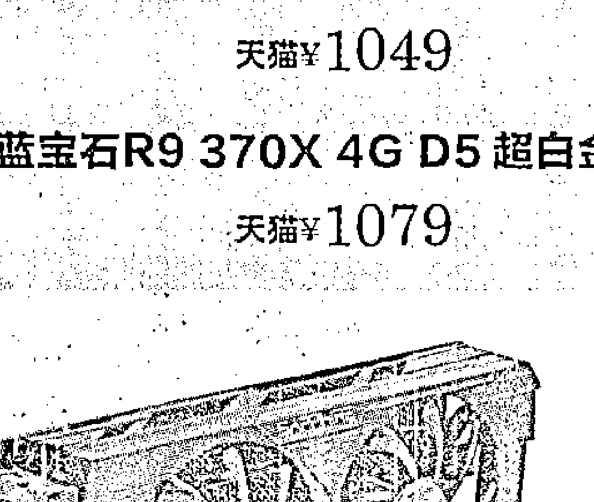

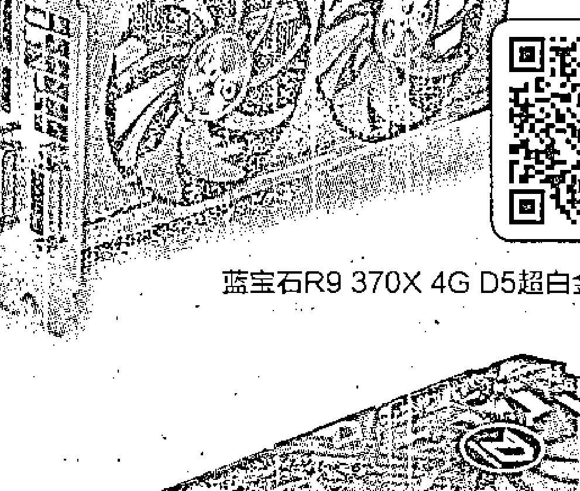

#### 高端路由器选购建议 文|小宇

受覆盖面积需求逐渐变大、家庭宽带带宽逐渐升级到百兆、移动智能终端设备的飞速发展等多种因素影响，路由器用户的需求已经今非昔比。为了满足这些高端用户的需求，传统路由器大厂、路由器新贵以及互联网公司都加入了路由器高端化的大军。在诸多产品当中哪些适合我们？

##### 路由器发展趋势

不同品牌旗下的产品有着不同的基因，DIY品牌和互联网公司的路由器其特点也是截然不同的。以TP-LINK为代表的传统路由器厂商在国内有着大批用户群体，其产品主推性价比，高端产品价格也不贵；而互联网公司注重一些网络APP的功能以及附加功能，产品新功能五花八门；DIY品牌的产品则主推做工用料以及最先进的网络协议，在理论性能上是最强的。

##### 选择高端产品应量力而行

目前基本是最高端的品牌也不可能实现在同一个家用产品当中集所有市售新品的优点于一身，我们在选择高端路由器时应该首先抓准自身的需求，根据需求的不同去选择不同类型的产品。其次应该充分了解路由器品牌的特点，以及具体产品所侧重的卖点。这两者缺一不可，如果搞错就有可能出现花了大价钱购买的路由器却不能完全满足自身需要，或者自己根本用不到这么高端的产品产生浪费现象。

##### 入门最基本条件

由于目前家庭宽带全面百兆化已经是明确的趋势，路由器在有线端口方面一定要达到千兆级别，也就是1000Mbps，折合每秒速度就是125MB/s。千兆有线网络的好处很多，配合千兆光猫和六类以上网线可以无视百兆网络传输的损耗完美发挥互联网速度，而且多设备之间的数据互传也是很有优势的。

另外一个重点就是802.11ac无线网络协议。很多路由器品牌将5GHz信号和802.11ac进行混淆，由于所有802.11ac无线网络实际上都属于5GHz信号，我们在购买的时候只需要认准路由器支持802.11ac Wi-Fi信号即可。目前的主流移动设备均支持802.11ac，这样一来无线设备的速度也可以得到保障。而至于具体的速率实际上无需过多纠结，只要支持802.11ac即可。

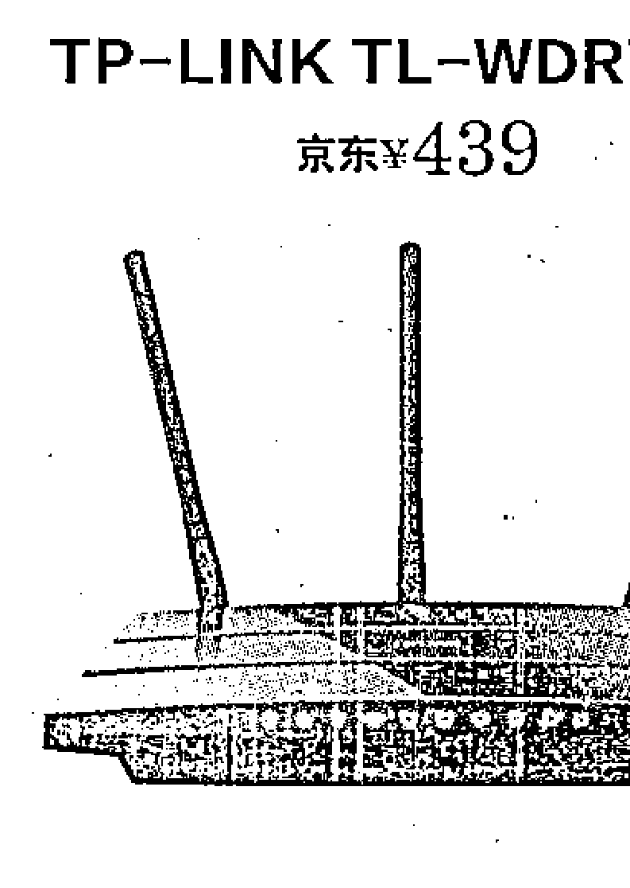

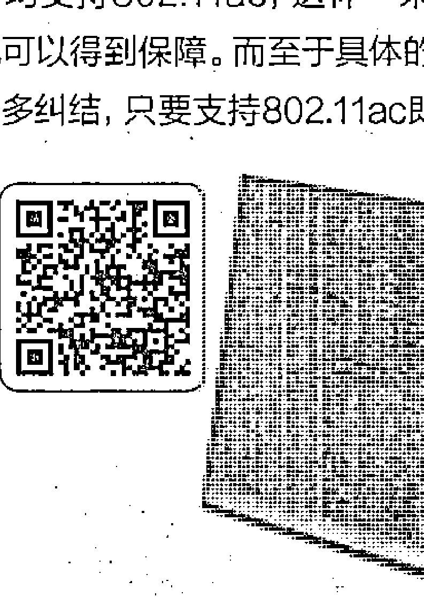

##### 入门产品点评

大家可以发现这一档的代表产品都是传统的路由器大厂，相信家中老路由器属于这三个品牌的用户数量是最多的。他们的产品相对都非常稳定，适合用户长时间运行也无需定时重启，总之就是无需过多照料，十分省心。三款产品的无线信号覆盖都不错，虽然其速率并不是市售产品中的佼佼者，但都拥有802.11ac规格，应对一般的智能手机和平板电脑的ac需求是没有任何问题的。而且都拥有一个WAN四个LAN的完整千兆接口，这也是很多互联网产品所不具备的。如果用户注重性价比，注重稳定性和安全性，购买这几款产品都是不错的选择。

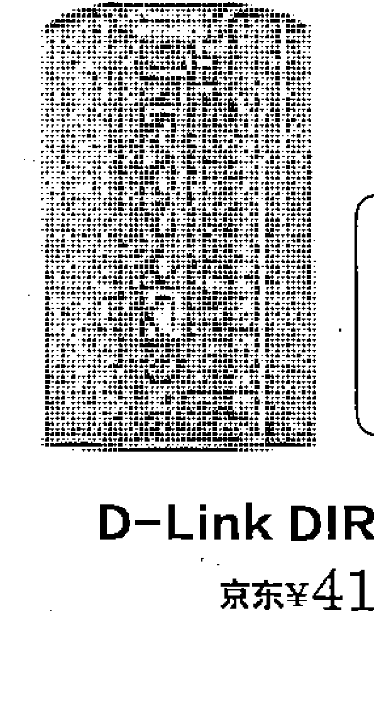

##### 互联网品牌产品

互联网公司旗下的路由器虽然鼓吹性价比，但其实他们的产品最大的卖点是一些独特的功能。比如小米、华为、极路由的很多入门千兆ac产品虽然售价十分便宜，但仔细对比其他路由器你会发现他们在LAN口数量、扩展性方面有一些缺失，而与此同时也拥有不少传统路由器品牌并不具备的优势。

单用配套APP就很能说明问题，互联网品牌产品的APP基本都可以实现远程的网络控制，而传统品牌APP多数只能在同一个网段内实现基本的控制功能，虽然安全性较好但可玩性不大。另外不同品牌的路由器和其自身的移动智能设备共用有更方便的效果，这已经形成了简单的生态圈效果。

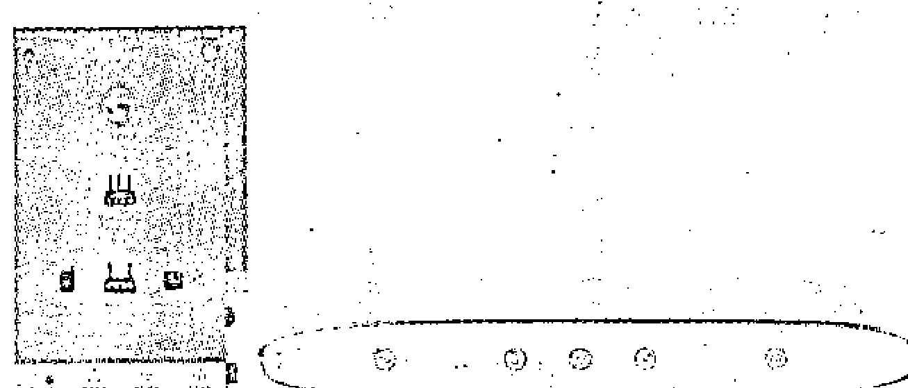


极路由HC5861 京东¥299


小米路由器1T版 京东¥729


华为荣耀路由Pro 京东¥328

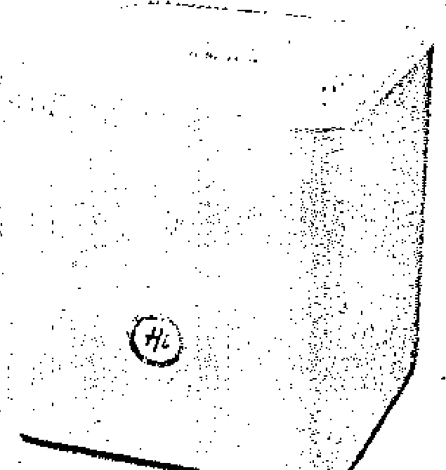


##### 互联网品牌点评

严格来讲华为并不算纯粹的互联网品牌，在智能设备流行前华为就已经在网络传输的很多领域有所建树了。也正因为华为荣耀路由Pro是更像传统路由器的一个产品，拥有完整四个LAN口，但也针对游戏延迟和连接自身产品进行了一些优化。极路由最大的特点就是其扩展APP拥有很多玩法，而小米路由器1T B版本虽然售价较高，但集成了基本的NAS功能。针对自身不同的需求，用户可以自行挑选需要的产品。

##### 高端产品

选择高端产品的用户不仅要注重产品的用料更强、信号覆盖更广泛，还应该注意其具体的规格、接口和扩展性。旗舰产品普遍在性价比方面都不占优势，用户只需要根据自己的预算选择是否需要这一档次的产品即可。

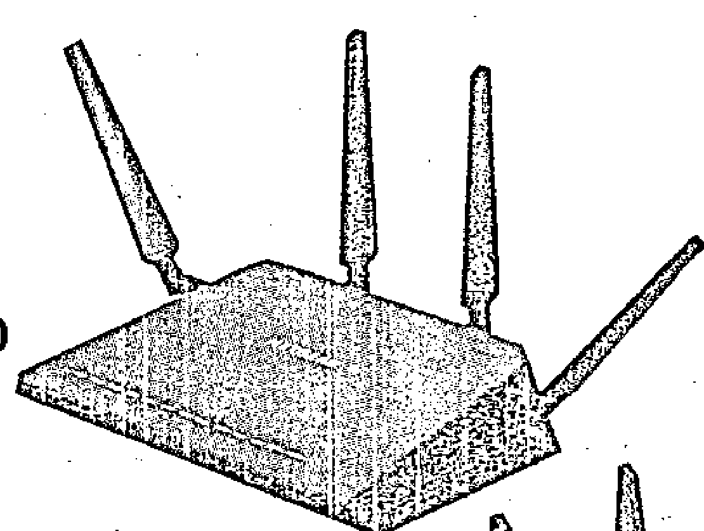


美国网件R7500 京东¥1699

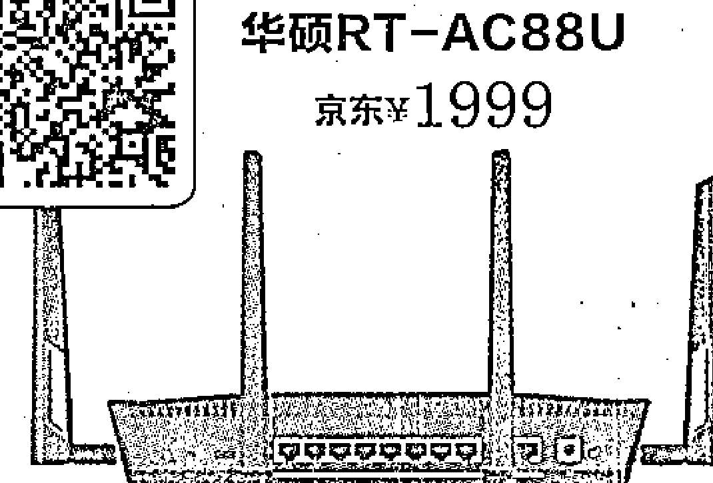


华硕RT-AC88U 京东¥1999

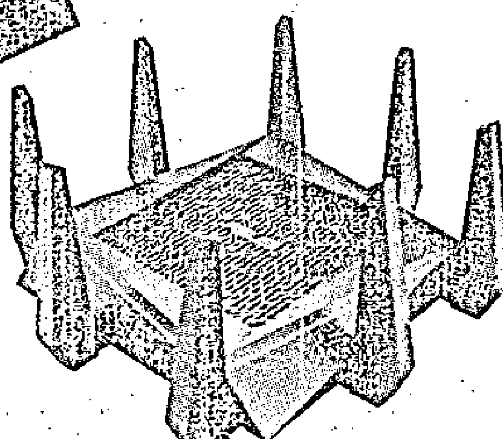


华硕RT-AC5300 京东¥3599

##### 高端产品点评

网件和华硕这两款产品其实并不在同一个档次内，但却是目前市售最强的产品。不仅支持802.11ac，还全部是wave2级别的产品。R7500拥有600Mbps+1.73Gbps的速度和四通道，RT-AC88U拥有八个LAN口，速度1000Mbps+2.16Gbps。使用不断更新的梅林固件，无线覆盖达到别墅级别。另一款RT-AC5300虽然售价超高，但却是目前家用路由器中最强的产品，拥有1000Mbps和两个2.16Gbps带宽，但LAN口反而降为四个。对比RT-AC88U，RT-AC5300似乎是更加照顾众多无线网络设备而生的旗舰路由器，拥有一个2.4GHz和两个满速AC 5GHz信号。如果用户重视LAN，可以选择RT-AC88U，家中无线设备众多则可以考虑RT-AC5300。

#### 宏碁F5-572G PK 惠普Pavilion 15

我们都知道，英特尔第六代酷睿处理器集成了新一代HD520/530核芯显卡，其性能足以媲美NVIDIA 920M这类入门级独显。因此，有没有武装能与核芯显卡拉开差距的独显，就成为了娱乐型笔记本的最低标准。本文，就让我们看看符合中端“标杆”的两款笔记本的较量吧。

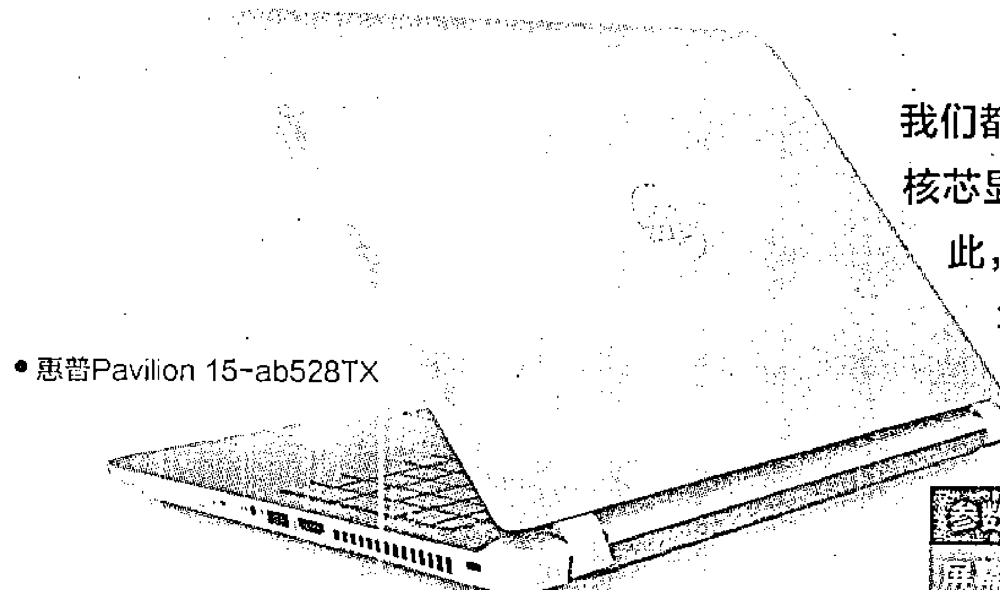

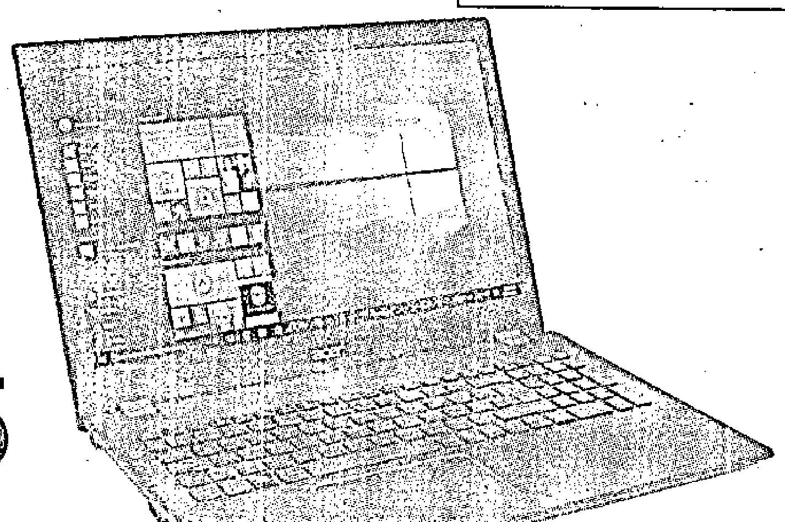

##### 940M独显是最低要求

在3DMark11和3DMark-FireStrike测试中，第六代酷睿i5-6200U所集成的HD520核芯显卡可以取得1400（图1）和900左右的分数（双通道内存状态，取GPU子项分数），这一表现足以让AMD R5-M330和NVIDIA 920M这种独显汗颜。换句话说，如果某款笔记本在采用六代酷睿的同时依旧以AMD R5-M330和NVIDIA 920M独显作为搭档，那就纯属浪费资源了。因此，唯有NVIDIA 940M这种能与HD520核芯显卡拉开了较大差距的独显（图2），才能满足更多3D游戏流畅运行的要求，而六代酷睿+940M独显，也就因此成为了时下中低端娱乐笔记本的标准装备（见表）。

| 参数对比 | 宏碁F5-572G-54ZZ | 惠普Pavilion 15-ab528TX |
| :--- | :--- | :--- |
| 屏幕 | 15.6英寸 (1920×1080像素) | 15.6英寸 (1366×768像素) |
| 处理器 | 酷睿i5-6200U | 酷睿i5-6200U |
| 内存/硬盘 | 4GB DDR3/1TB | 4GB DDR3/500GB |
| 独立显卡 | NVIDIA 940M (2GB DDR3) | NVIDIA 940M (2GB DDR3) |
| 接口 | 读卡器、USB3.0×2、USB2.0、HDMI、RJ45、音频接口 | 读卡器、USB3.0×2、USB2.0、HDMI、RJ45、音频接口、DVD刻录光驱 |
| 尺寸 | 381.6mm×256mm×29.2mm | 384.5mm×261.1mm×25.2mm |
| 电池 | 37Wh/2.15kg | 41Wh/2.2kg |
| 参考价格 | 3999元 | 3999元 |

宏碁F5-572G和惠普Pavilion 15就是符合上述标准的娱乐笔记本，它们的价格都不足4000元，但却都采用了六代酷睿i5-6200U和NVIDIA 940M独显的组合，可以在1366×768像素分辨率和中等画质下流畅运行《古墓丽影9》级别的单机3D游戏（平均30fps），像LOL、Dota2等网络竞技类游戏更是不在话下。

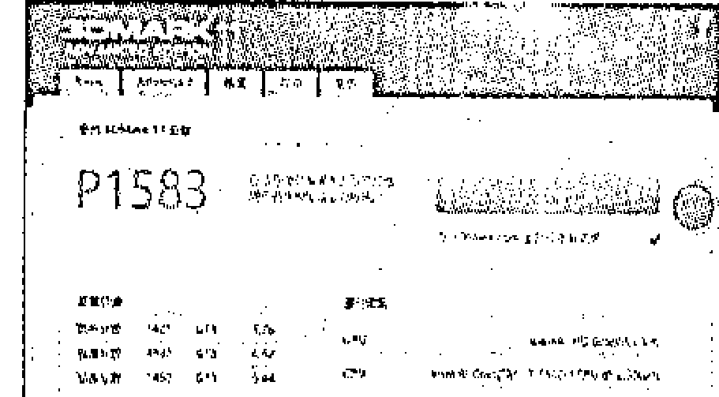

##### 巧以手腕提高“颜值”

在国内，3500元~5000元价位的笔记本市场可谓兵家必争之地，宏碁F5-572G和惠普Pavilion 15能在3999元的基础上提供较强的娱乐动力，势必会作出一些牺牲。比如，它们都没有太过“性感”的轻薄身材、也没能采用高大上的金属材质机身、USB Type-C这种新兴的扩展接口自然也没能在它们身上出现。不过，这两款产品还是通过一些手段，尽可能换来了更为出众的“颜值”。

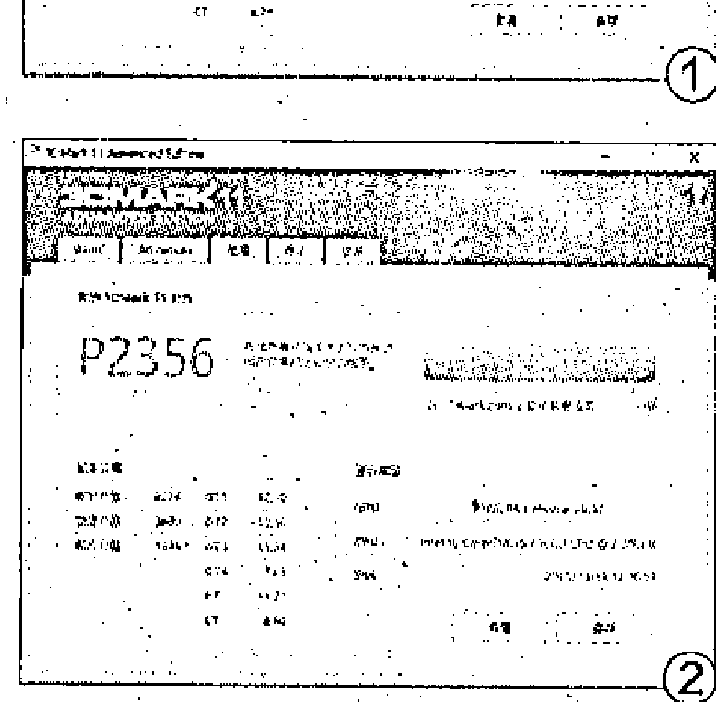

| 显卡型号 | HD520 核芯显卡 | AMD R5-M330 | NV 920M | AMD R7-M360 | NV 930M | NV 940M |
| :--- | :--- | :--- | :--- | :--- | :--- | :--- |
| 3DMark11 | 1421 | 1525 | 1724 | 1899 | 2092 | 2276 |
| 3DMark-FireStrike | 901 | 857 | 1175 | 1102 | 1301 | 1469 |

比如，Pavilion 15全身上下都是复合材质，但惠普却在边缘位置加入了大量的弧线，给15.6英寸的大机身赋予了几分灵韵之感（图3）。此外，Pavilion 15的机身表面经过银色喷砂工艺处理后，同样呈现出了浓烈的金属质感，给人一种由金属材质打造的假象。

宏碁F5-572G的C面是拉丝金属材质打造，但它的A面和D面却是复合材质。还好，宏碁在F5-572G的AD两面加入了独特的3D扫描加镭射雕刻技术，令机身表面呈现出了亚麻织物纹理（图4），无论是视觉效果还是触觉体验都有了极大的提升。总之，两款产品虽然都是以复合材质为主，但却都没有昔日中低端笔记本那种廉价的塑料感，这应该是能让所有消费者喜闻乐见的表现吧。

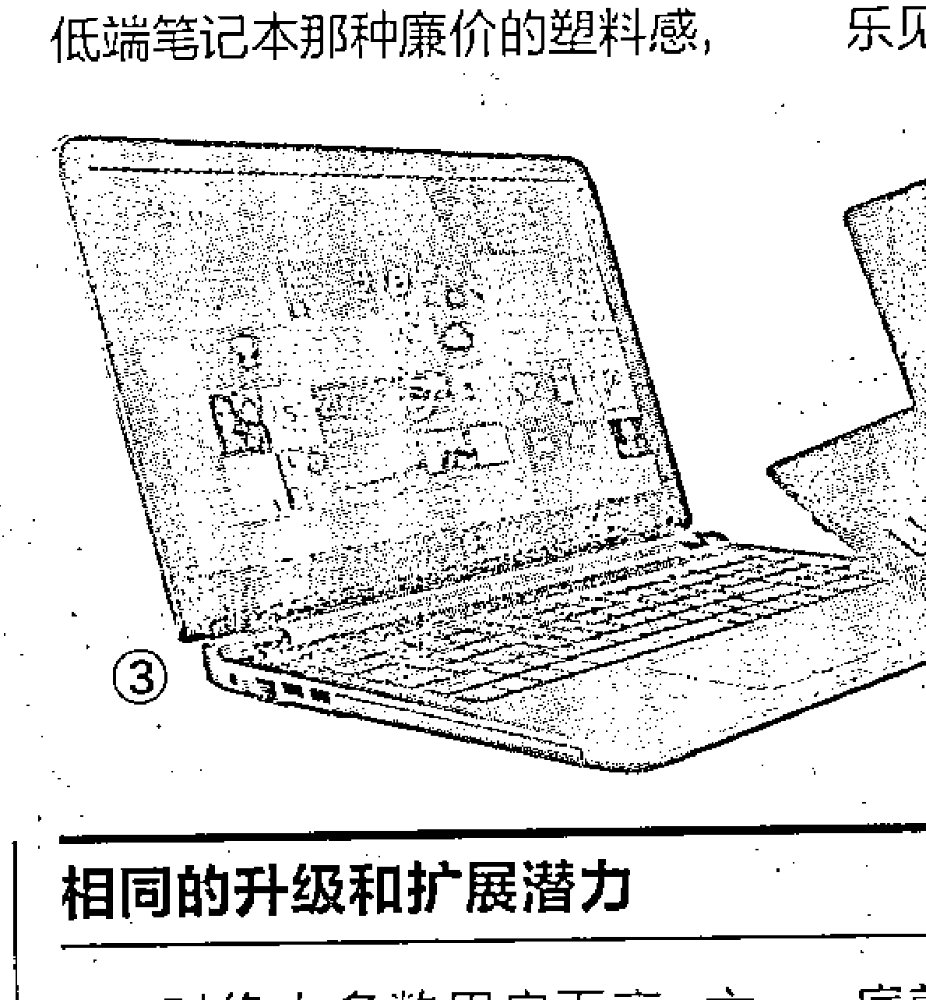

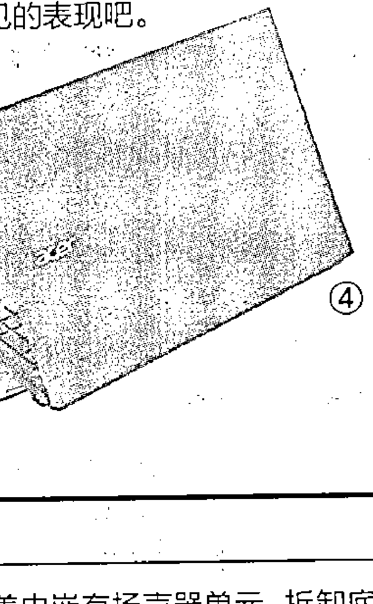

##### 解读硬件配置的差异

##### 相同的升级和扩展潜力

宏碁F5-572G和惠普Pavilion 15都是采用了15.6英寸的大屏笔记本，它们的机身尺寸和重量相似，便携性方面在伯仲之间。需要注意的是，3999元的宏碁F5-572G-54ZZ并没有内置DVD刻录光驱（图5），其光驱位置标配一个减重模块，对刻盘有特殊要求的用户需要购买标配光驱的F5-572G其他子型号，只是价格也将因此突破4000元大关，而重量也会增加50g左右。宏碁F5-572G在配置上的亮点是标配1080P屏幕，较常见的1366×768像素屏幕更细腻，可惜屏幕材质并非IPS，可视角度的表现不太理想。

对绝大多数用户而言，六代酷睿i5-6200U的性能绝对够用，笔者不推荐大家购买Pavilion 15和F5-572G家族中的高配版。如果你对内存和硬盘容量/速度有更高的要求，可以考虑购买后自行升级的方式。

惠普Pavilion 15标配DVD刻录光驱，并拥有较F5-572G更大的41Wh电池，并通过丹麦B&O音效认证的音频系统换来了更出色的声音表现。可惜，3999元的Pavilion 15-ab528TX这款子型号屏幕分辨率只有1366×768像素，虽然Pavilion 15家族也有武装1080P屏幕的高配版，只是价格也将接近5000元，此时性价比会被更高端的惠普ENVY15系列完虐。

好消息是，两款笔记本拆机升级的难度都不高，只要拧下D面的所有螺丝（需要提前取出光驱，因为在光驱位置还隐藏着2颗固定螺丝）就能拆下底盖。需要注意的是，宏碁F5-572G的底盖内嵌有扬声器单元，拆卸底盖时需要断开扬声器与PCB主板间的排线（图6）。

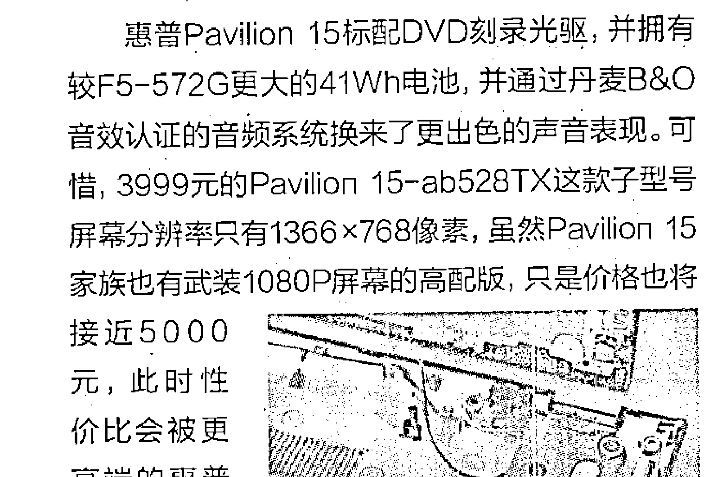

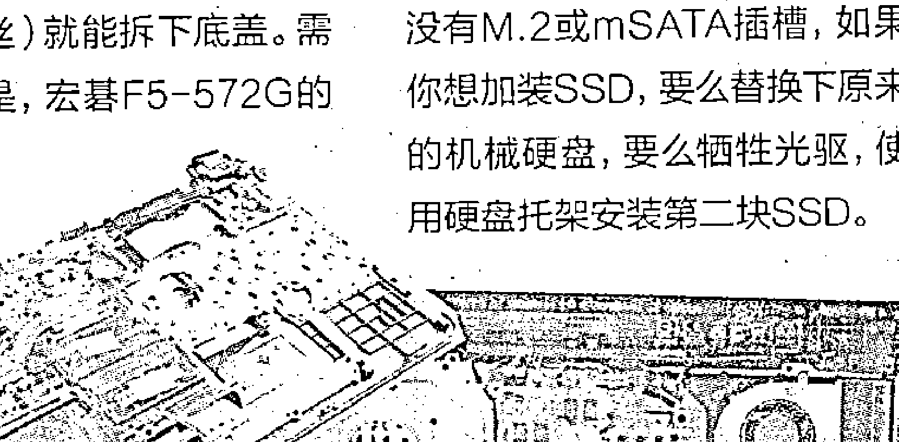

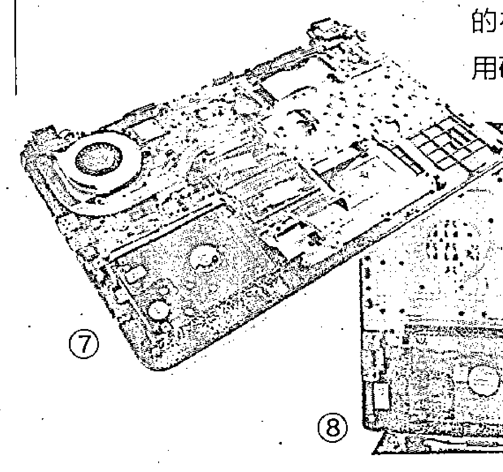

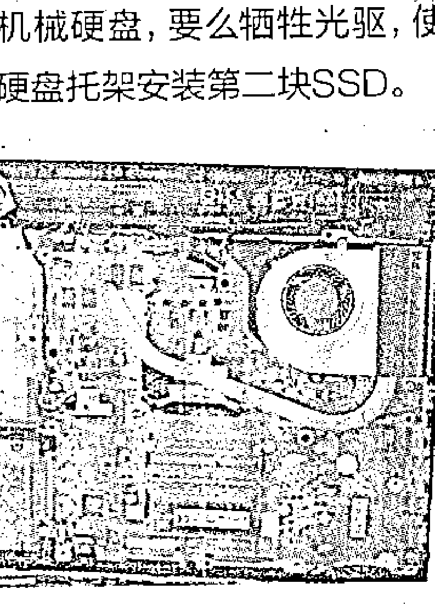

宏碁F5-572G和惠普Pavilion 15都标配1根4GB DDR3L内存，主板上还预留了第2个内存的扩展位，建议大家日后再购买1根内存组建双通道模式以获得更强的内存性能（图7、图8）。这两款产品都只配备了一个2.5英寸的SATA3.0接口，没有M.2或mSATA插槽，如果你想加装SSD，要么替换下原来的机械硬盘，要么牺牲光驱，使用硬盘托架安装第二块SSD。

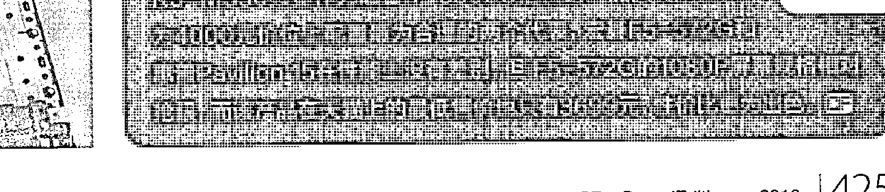

#### 谁是入门机首选

##### 联想乐檬3 PK 红米3

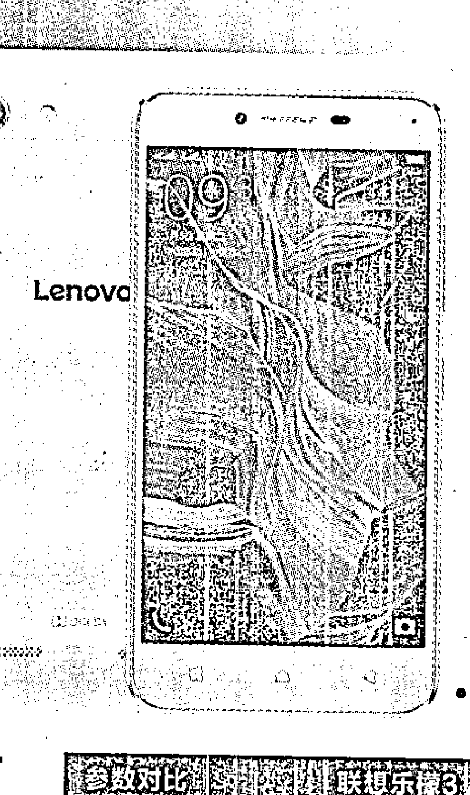

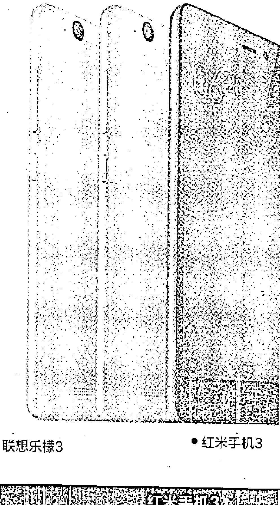

竞争对手机厂商是残酷的，对普通消费者却是兴奋的，哪怕是699元这种入门价位也能买到集出色做工和主流配置的产品。比如联想乐檬3和红米手机3，就是时下入门机的典型代表。

###### 骁龙616性能够不够

别看价格便宜，但联想乐檬3和红米手机3却依旧武装了高通旗下的八核处理器：骁龙616。那么，这款处理器的性能表现是否足够给力呢？

现阶段骁龙616最大的竞争对手就是高通自家的骁龙615和联发科旗下的MT6753。与骁龙615相比，骁龙616最大的改进在于功耗和核心调度的管理。在游戏或一些高负载的应用环境下，骁龙615极易出现关闭大核（高主频的A53），仅以小核（低主频的A53）运行从而严重影响性能发挥。骁龙616在同样的压力测试中会优先采用降低大核频率，与小核一起协同作战。因此，在各种跑分和实际的应用中，骁龙616的表现比骁龙615更为抢眼。

联发科MT6753在功耗和核心调度方面比骁龙616更为出色一些，虽然MT6753集成Mail-T720MP3 GPU的理论性能不如骁龙616集成的Adreno 405 GPU，但在实际游戏的运行流畅度却能略占优势。还好，乐檬3和红米3都隶属于高通阵营，没有给我们带来处理器方面的选购困扰。总之，只要你不是游戏发烧友，配备骁龙616的这两款手机性能足够你去“折腾”了（见表）。

| 参数对比 | 联想乐檬3 | 红米手机3 |
| :--- | :--- | :--- |
| 网络 | 移动4G（双卡双待） | 全网通（双卡双待） |
| 屏幕 | 5英寸IPS（1920×1080像素） | 5英寸IPS（1280×720像素） |
| CPU | 高通骁龙616 | 高通骁龙616 |
| GPU | Adreno 405 | Adreno 405 |
| 内存/存储 | 2GB/16GB（支持存储卡） | 2GB/16GB（支持存储卡） |
| 摄像头 | 500万/1300万像素 | 500万/1300万像素 |
| 尺寸 | 142mm×71mm×7.99mm | 139.3mm×69.6mm×8.5mm |
| 电池/重量 | 2750mAh（可换）/142g | 4100mAh（不可换）/144g |
| 参考价格 | 699元 | 699元 |

###### 低价也能享金属

从2015年开始，哪怕是千元机也能用上昔日代表高大上的金属材质机身，而乐檬3和红米3最令人欣慰的就是在699元的价位上也享用上了“金属大餐”。当然，这两款产品的工艺肯定不能和那些应用了CNC一体成型技术的中高端手机（如乐视1S）相比，它们只是采用了铝金属冲压氧化成型的金属后盖而已。但即便如此，其把握的手感和坚韧性也要比普通的复合塑料材质出色很多。

为了提升卖相，两款手机都在金属后盖上做了进一步的优化。其中，乐檬3加入了防刮防指纹抗脏污喷涂处理（图1），背部的Logo也是由红外线激光雷射雕刻而成，手感出色也不易掉漆。

| 性能对比 | 骁龙615 | 骁龙616 | 联发科MT6753 |
| :--- | :--- | :--- | :--- |
| 核心主频 | 4×A53（1.5GHz）<br>4×A53（1.0GHz） | 4×A53（1.5GHz）<br>4×A53（1.2GHz） | 8×A53（1.3GHz） |
| GeekBench3单核/多核 | 655<br>2788 | 669<br>2885 | 616<br>2658 |
| GFXBench离屏测试曼哈顿/霸王龙 | 5.7fps<br>14fps | 5.6fps<br>14fps | 2.9fps<br>12fps |

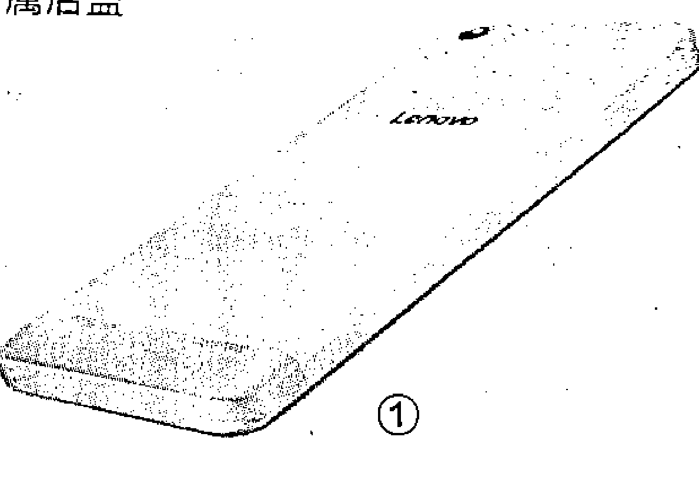

和沾惹指纹。红米3的后盖则采用了镜面抛光和曝光显影工艺打造的棱格纹饰(图2)，同样带来了较强的视觉冲击力。

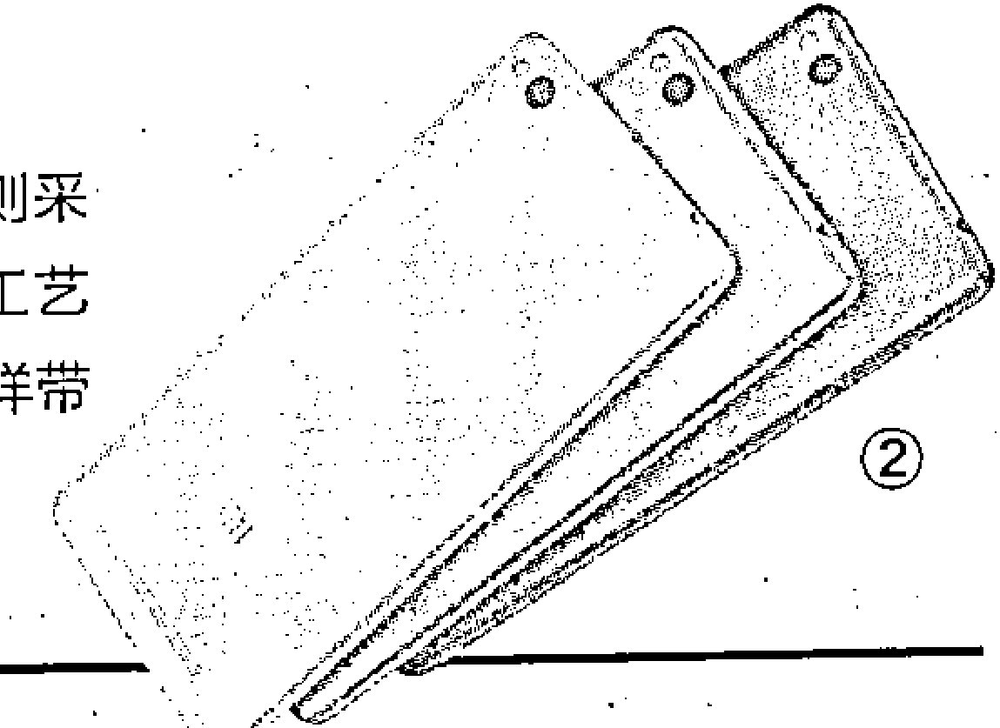

##### 配置上的差异

乐檬3和红米3虽然具备相同的性能和相近的工艺，但在具体的配置上依旧存在着较大的差异。首先就是屏幕，红米3的分辨率只有1280×720像素，而乐檬3则达到了1080P的规格，就显示效果而言完胜对手。在电池容量方面，红米3拥有4100mAh的傲人参数(图3)，就续航能力而言可将乐檬3远远地甩在后面。在网络支持方面，虽然骁龙616理论上支持全网通，但乐檬3为了降低成本，却仅配备了支持移动4G网络的基带，而红米3则可吸引包括电信和联通4G用户的青睐。

在摄像头方面，虽然两款手机都配备了500万/1300万像素的前后摄像头，但红米3的主摄像头却支持相位对焦技术，在对焦速度上较乐檬3传统的反差式对焦要迅速很多。从网友的使用反馈来看，红米3的成像效果也要略胜于乐檬3。

好消息是，乐檬3采用了可卸后盖的设计，拆下金属后盖后我们还能更换电池，从而弥补了电池容量相对偏低的缺陷。此外，乐檬3同时配备了2个MicroSIM卡和1个存储卡插槽(图4)，这意味着可实现双卡双待和存储卡扩充两不误。而红米3则采用了一体式的卡托(图5)，我们只能在安装双SIM卡或单SIM卡和存储卡组合间任选其一。此外，乐檬3采用了双扬声器立体声设计，并在系统底层融入了MaxxAudio音效，在声音的外放方面远非采用单扬声器的红米3可比(图6)。

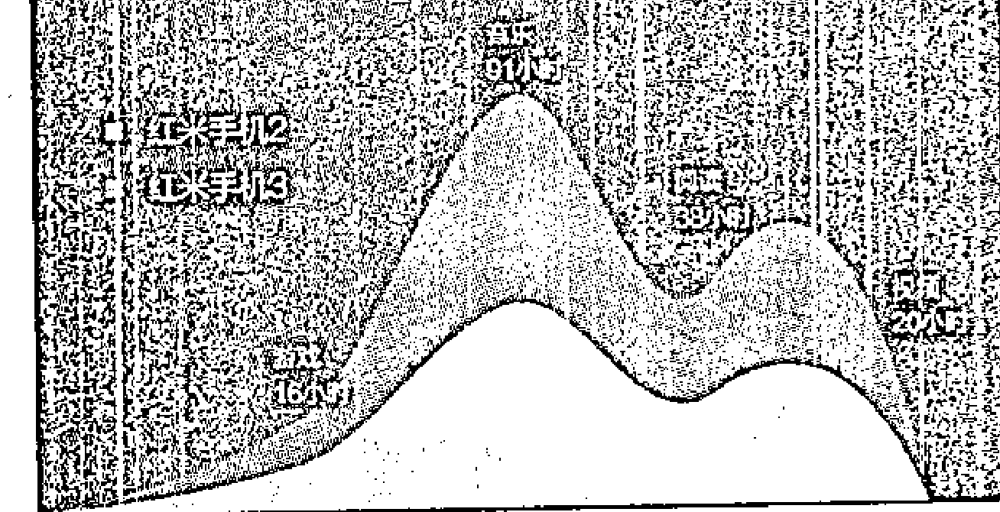

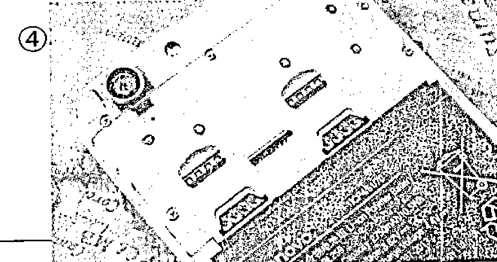

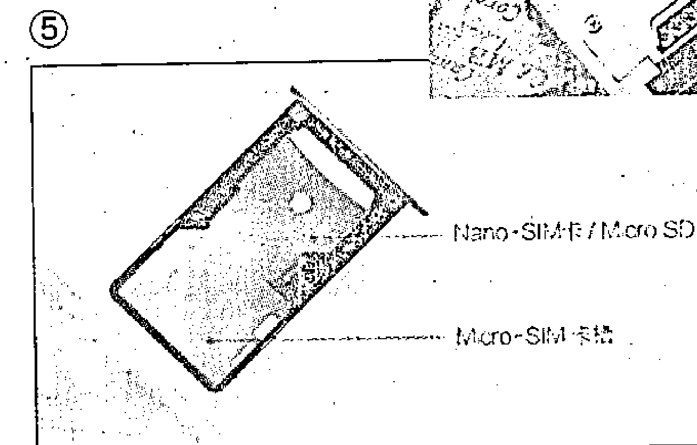

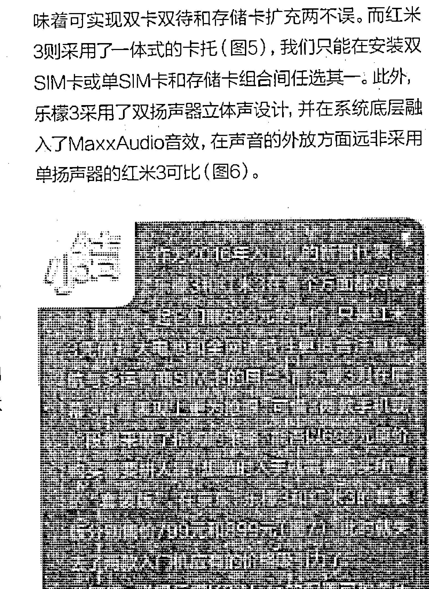

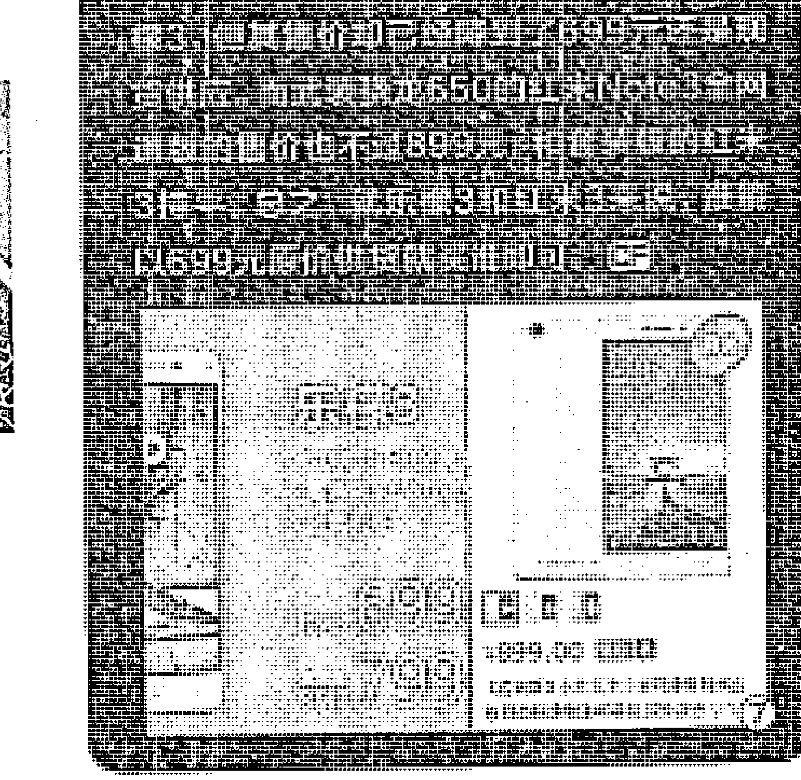

#### 降噪耳机选购建议

文|老盖

昂贵的价格，拔高的宣传，使得降噪耳机在诞生的那天就被打上了高端的烙印。不过当怀着热切的心买回来后，许多朋友发现此类耳机的表现远远低于预期。降噪耳机是什么？它和普通耳机有何区别？它到底适不适合于我们？今天我们就来探讨一下。

##### 降噪和普通耳机的区别

顾名思义，降噪耳机就是可在一定程度上降低环境噪音，从而可为我们提供一个更安静的聆听体验的耳机（图1）。和很多朋友想象中的不同，降噪耳机并非是那种入耳式耳塞，而一般是头戴式有些类似耳麦的大耳机。一般来说，降噪耳机可分为被动降噪和主动降噪两种，其中被动降噪是无需电源，它靠隔离性和密封性良好的海绵、橡胶等材质尽可能地将耳道与外界隔离起来，从而达到降噪目的。被动式降噪等于是将耳机内外的声音彼此隔绝，有些简单粗暴的意味。但不少人佩戴密封性过好的耳机会引起不适，而且完全隔绝的话在户外环境中佩戴也有一定的安全隐患。


- 降噪耳机多为大耳机


- 主动式降噪耳机为有源耳机

主动式耳机需要电源（图2），其降噪原理为通过耳机中内置的麦克风收集周围环境的噪音并对其进行分析，然后通过运算器迅速地生成一段与之反相的声音进行播放，最终达到声音互消而产生静音的效果。和被动式降噪耳机相比，主动式降噪耳机在降噪效果方面有着明显优势。一般来说，我们现在所说的降噪耳机多是指主动式。

##### 局限和适用的人群

不过正像“人无完人”一样，任何技术的使用实际上都有着自身的局限性，降噪耳机也不例外。由于技术复杂，需要对采集到的噪音进行一一分析，目前的有源降噪技术还做不到这一点。所以现在我们看到的主动降噪耳机，在可抵消的噪音方面十分有限，多限于100Hz~1000Hz范围的低频段稳态噪声，比如飞机、汽车发动机的声音等，而对于中、高频声音，如人的说话声、动物的嘶叫声和汽车鸣笛声等效果平平。这也就是为什么有些朋友买了主动降噪耳机以后，却发现其在车站、商场和公交上降噪效果并不好的主要原因。

此外，主动式降噪耳机需要发射与噪音相位相反、振幅相等的声波来抵消噪音的工作方式（图3），也注定了其对耳机的音质会产生一定影响。一般来说，同一品牌同样价位的降噪耳机和普通耳机，前者的音质要稍逊于后者，因此，若不是需要经常乘飞机出差，同时对耳机音质没有太高追求的朋友，主动式降噪耳机的确不适合你。

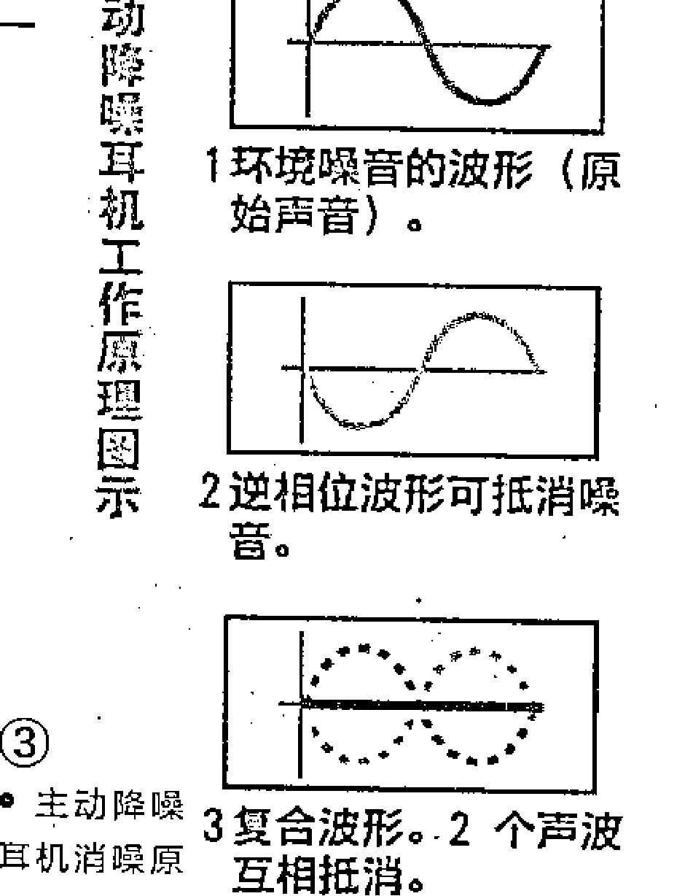

主动降噪耳机工作原理图示

- 1. 环境噪音的波形（原始声音）。
- 2. 逆相位波形可抵消噪音。
- 3. 复合波形。2个声波互相抵消。

- 主动降噪耳机消噪原理

##### 降噪耳机的选购要点

降噪耳机价格不菲，真实的降噪效果与音质只有亲自试听才能体会出来，所以购买时，我们应尽量到实体店选择，而不应选择网购。在选择时，我们应注意查看耳机的降噪带宽范围、平均降噪量和续航时间等参数，这三个参数值越大，表明产品的降噪效果越好、续航时间越长。

目前主动式降噪耳机的种类很多，当中以BOSE产品最为知名，当然价格也小贵。如果你对此类耳机感兴趣，同时不想花太多的钱，不妨考虑以下几款产品。

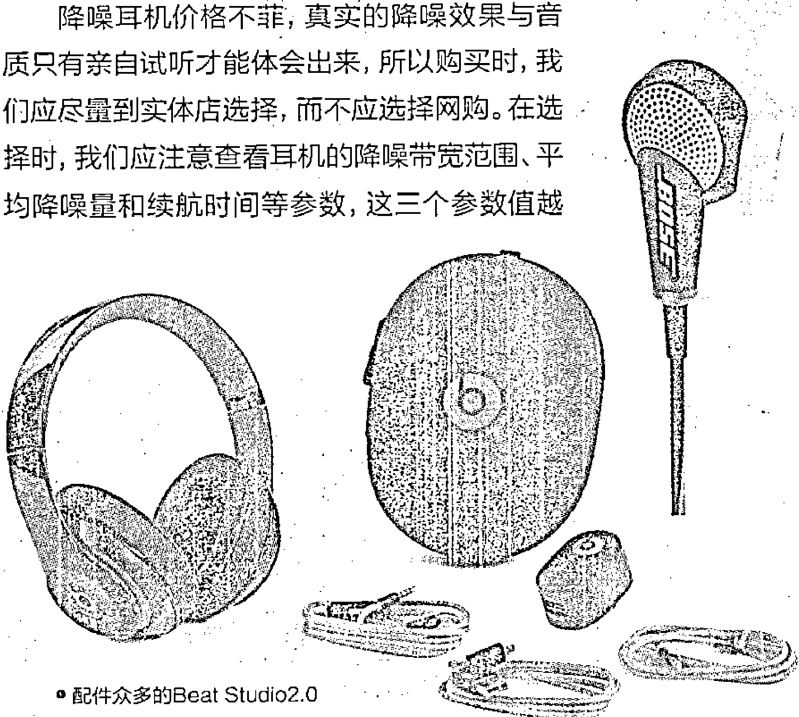

##### 索尼MDR-10RNC

索尼MDR-10RNC在左右耳两个耳机外壳上，都设置了降噪麦克风，配合索尼自家的S-Master放大器对声音进行处理，可以获得更高质量的声音。索尼MDR-10RNC最有趣的地方是它预置了三个降噪模式：机场模式、公交火车模式和办公室模式，能够轻松满足不同场景的需要。


京东¥1499

##### 创新Aurvana Gold

创新Aurvana Gold的头梁和腔体采用了三角形设计，颜色上采用了类似暗金色的设计，显得低调而时尚。这款耳机可通过NFC功能和蓝牙功能便捷配对移动设备。内置双麦克风能有效消除周围的环境噪音，降噪率高达85%。此外，Aurvana Gold采用了一流的40mm Neodymium发声单元并支持高清晰度APT-X技术，能够打造最真实的声学性能。


京东¥1299

##### 华为AM180

华为AM180耳机整体采用了氧化金属材料作为外壳，上面加入了同心圆式的金属纹路，浅灰色的色彩颇显商务气息。此外，该产品的腔体采用了聚碳酸酯材质材料，质感不错。在50Hz~500Hz频段的低频噪音中，华为AM180的降噪幅度可高达15dB~30dB，总体降噪效果良好。不过，需要说明的是，该耳机虽然支持国内外的大部分手机，但却不支持索尼Xperia Z系列，拥有该机型的朋友入手前需慎重。


京东¥349

#### 酷睿M 帮你解决静音性能矛盾

文|曹操

无论是台式机还是传统笔记本，它们都需要风扇辅助散热，并依靠机械硬盘满足用户对存储空间的苛求。然而，风扇和机械硬盘在工作时却会产生扰人的噪音，从而影响用户使用的心情。如果你希望拥有一个安静的工作和娱乐环境，基于酷睿M打造的设备不会让你失望。

##### 为什么要选酷睿M

对PC（笔记本）而言，处理器风扇无疑是最大噪音的来源。没办法，想镇压处理器全速工作时的发热量，散热风扇却是必备的装置（图1）。为了解决这一历史难题，尽可能降低处理器自身的TDP和发热量，从而摆脱对散热风扇的依赖无疑是最佳捷径。可惜，降低TDP必然要以牺牲性能为代价，以市面上常见的BayTrail（如Atom Z3735F）和CherryTrail（如Atom X5-Z8300）架构处理器为例，它们虽然无需风扇辅助散热，但其性能却仅仅是基本够用的级别（图2），勉强应付LOL级别的网络游戏虽不是问题，但在面对PS软件的渲染、大量文件的解/压缩和主流单机游戏面前就显得力不从心了。还好，除了BayTrail和CherryTrail之外，现在还有一个无需风扇的处理器家族，它们就是酷睿M。虽然酷睿M的核心数量只有2个，但凭借更为先进的微架构以及更为强悍的核心显卡，其性能足以秒杀CherryTrail架构的Atom，真正在性能和功耗方面得以兼顾。此外，酷睿M设备支持SATA总线，这意味着它们支持读写速度更快的SSD硬盘（读写速度可超500MB/s）（图3），而不像BayTrail和CherryTrail设备那样只能选择eMMC闪存单元作为存储介质（读写速度在150MB/s左右）。遗憾的是，酷睿M处理器的采购成本较高，这就导致武装它们的设备价格普遍要从2000元起步。

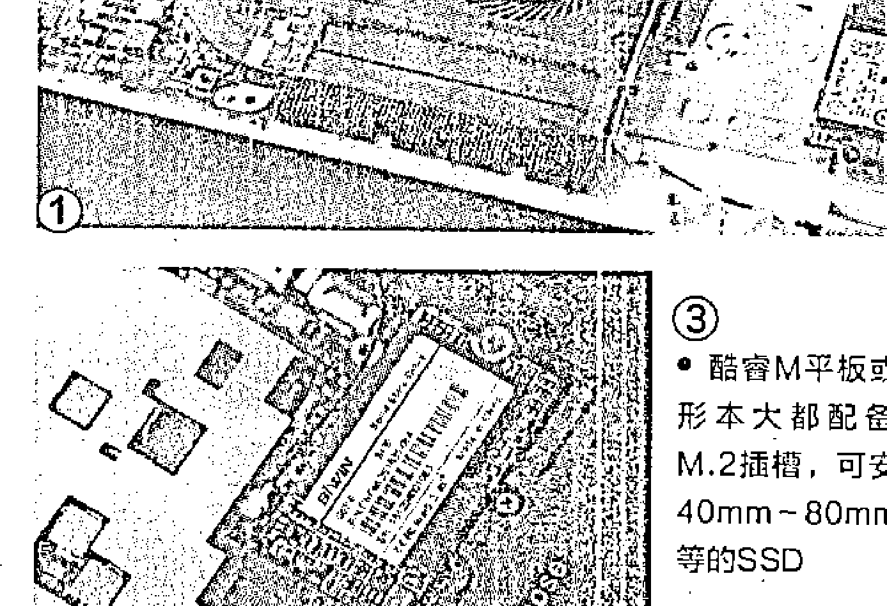

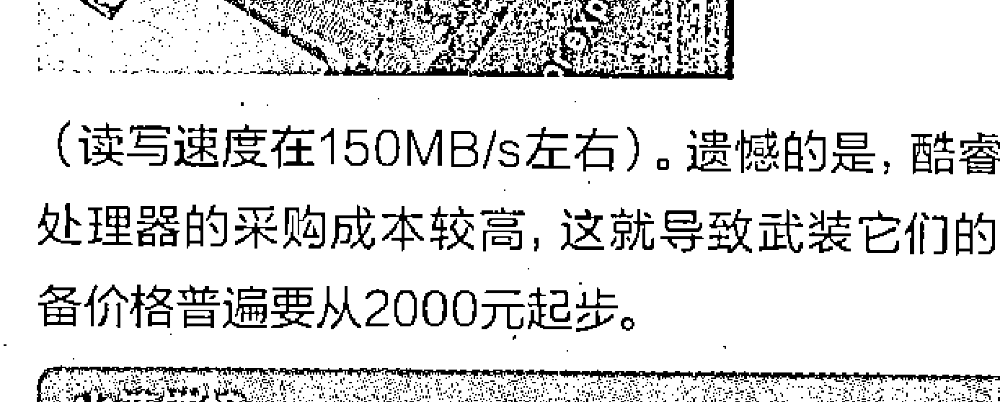

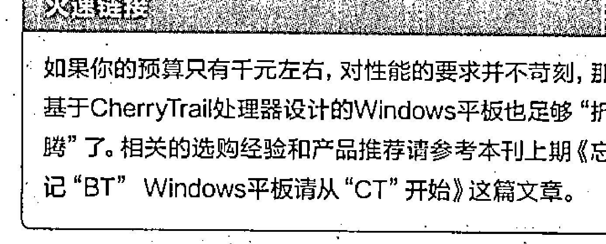

> 火速链接 如果你的预算只有千元左右，对性能的要求并不苛刻，那基于CherryTrail处理器设计的Windows平板也足够“折腾”了。相关的选购经验和产品推荐请参考本刊上期《忘记“BT” Windows平板请从“CT”开始》这篇文章。

##### 两代酷睿M之争

需要注意的是，目前市面上同时存在着两代酷睿M处理器家族成员，它们分别是2014年底上市的Broadwell-Y（属于第五代酷睿处理器的衍生产品，可以理解为第一代酷睿M）（图4）以及2015年底诞生的Skylake-Y（属于第六代酷睿处理器的衍生产品，即第二代酷睿M）（图5）。可惜，第二代酷睿M在性能上并没能领先同档次的第一代酷睿M太多（见表），它最大的改进主要在于相对更低的发热量，不容易引起因处理器过热而触发降频的问题。因此，在价位相似的情况下，我们可以优先挑选武装第二代酷睿M的产品，而一些散热设计比较好的一代酷睿M设备也可列入采购名单。


##### 扩展阅读 寻找静音搭档

当酷睿M与SSD相结合后，就可营造出一个无风扇的PC平台。而符合这一标准的设备既有平板电脑形态的产品，又有可翻转屏幕的变形本，同时也少不了拥有极致便携身材的标准笔记本，这就让我们在选购的过程中有了更多的选择方向。不过，如果你真想获得一个接近零噪音的办公/娱乐环境，还需准备低噪音的外设，比如键盘和鼠标。对于键盘而言，以X剪刀脚结构设计的产品最符合静音要求（图6），如果你喜欢给平板或笔记本外接键盘，那就请优先挑选这类X剪刀脚的静音键盘吧。相对于键盘，鼠标在点击时的“Click”声往往更令人头疼，而这种声响则是鼠标键内金属弹片与触头产生接触时的反馈表现。好消息是，现在已经有很多鼠标不再沿用传统的物理结构，主打静音卖点（图7）。在技术层面，静音鼠标主要包括三个阵营：
红外线感应：利用红外线感应模块替代传统鼠标内部的弹片，当按下鼠标键时红外线会被阻隔，从而让微程序控制器判定有点击操作；
多点触控：在鼠标表面加入多点触控面板，可以通过区域或手势识别鼠标点击、滚轮滑动操作，只是这种操作谈不上手感，不适合游戏和设计等使用环境；
静音微动：通过缩短鼠标微动开关的行程、加入吸音材料、使用贴片开关的方式消除鼠标点击时的噪音，将清脆的“Click”声变成了沉闷的“腾腾”声。

| 对比项目 | 候选方案 | Atom X5-Z8300 | 酷睿M-5Y10 | 酷睿M3-6Y30 |
| :--- | :--- | :--- | :--- | :--- |
| 微架构 | | CherryTrail | Broadwell-Y | Skylake-Y |
| 核心/线程 | | 4/4 | 2/4 | 2/4 |
| 主频 | | 1.44GHz~1.84GHz | 0.8GHz~2.0GHz | 0.9GHz~2.2GHz |
| 核芯显卡 | | HD Graphics | HD5300 | HD515 |
| 鲁大师 | | 2746 | 3167 | 3179 |
| CINEBENCH R10 | | 4156 | 6762 | 6579 |
| CINEBENCH R11.5 | | 1.15pts | 1.44pts | 1.38pts |
| CINEBENCH R15 | | 89cb | 143cb | 141cb |
| 3DMark Vantage | | E4808 | E8247 | E8321 |
| 3DMark06 | | P340 | P674 | P701 |
| 3DMark Cloud Gate | | 1485 | 3120 | 3184 |

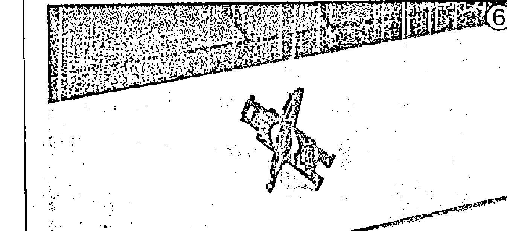

##### 微软Surface Pro 4

Surface Pro 4绝对是酷睿M阵营的标杆之作，做工品质方面无可挑剔，在PCIE接口三星SSD的加持下，该产品获得了平板领域最强的磁盘性能（读取速度可突破1000MB/s大关）。可惜，酷睿M版的Surface Pro 4价格依旧高达6688元（不配键盘），此时它的性能价格比远不如上代酷睿i5版本的Surface Pro 3（5699元，4GB内存/128GB SSD）。因此，笔者并不太推荐大家购买酷睿M版的Surface Pro 4，要么咬咬牙加钱购买i5-6300U版的Surface Pro 4（7388元），要么选择性能更强却更便宜的Surface Pro 3。

- 屏幕：12.3英寸IPS触控屏（2736×1824像素）
- 处理器：酷睿M3-6Y30
- 内存/硬盘：4GB/128GB SSD
- 接口：读卡器、USB3.0、mini DP
- 厚度/电池/重量：8.45mm/38Wh/766g

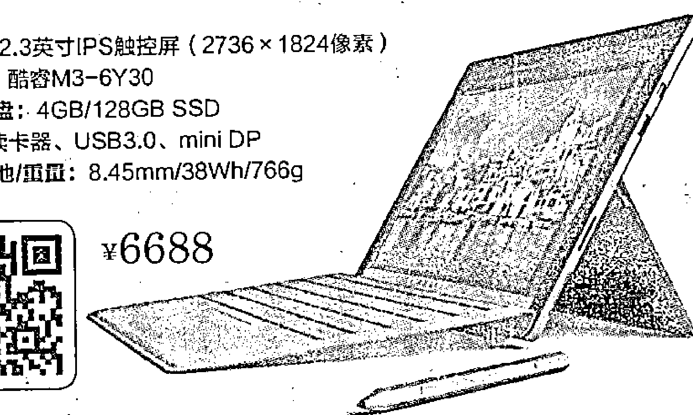


##### 华硕U305CA

华硕U305CA是一款标准形态的13.3英寸笔记本，它不支持触控，也无法变形，敢卖6199元的底气源于精致的做工和超纤薄的身材。简单来说，U305CA的机身都是由金属打造，1.2kg的重量比很多11.6英寸的产品还要轻盈。而该产品的配置也比较均衡，酷睿M3和256GB固态硬盘的组合，无论是性能还是空间都足够用了。

- 屏幕：13.3英寸IPS（1920×1080像素）
- 处理器：酷睿M3-6Y30
- 内存/硬盘：8GB/256GB SSD
- 接口：读卡器、USB3.0×3、mini HDMI
- 厚度/电池/重量：12.3mm/45Wh/1.2kg

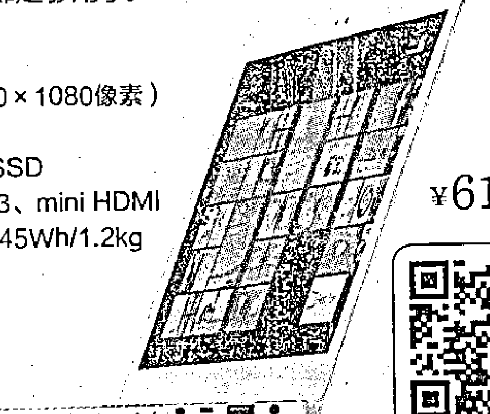

##### 联想Yoga 700-11

作为Yoga3-11的接班人，Yoga700-11沿用了上代产品的模具，只是将处理器从第一代酷睿M升级到了第二代酷睿M，电池容量也有所提升。令人欣慰的是，Yoga700-11仅比配置相似的老款Yoga3-11贵了100元，无限接近“加量不加价”。如果你不喜欢平板电脑形态的产品，这款屏幕可360度旋转的“变形本”相信不会让你失望。

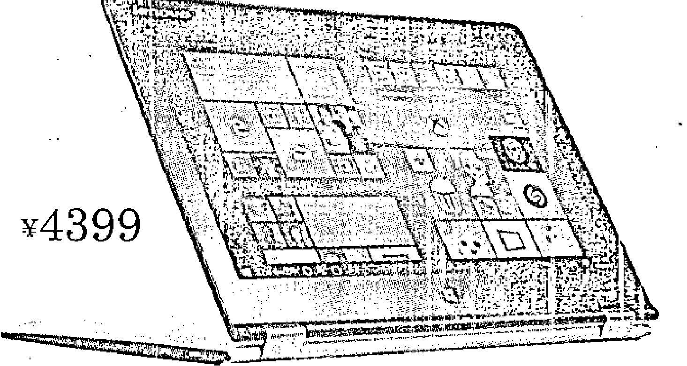


- 屏幕：11.6英寸IPS触控屏（1920×1080像素）
- 处理器：酷睿M3-6Y30
- 内存/硬盘：4GB/128GB SSD
- 接口：读卡器、USB3.0、USB2.0×2、Micro HDMI
- 厚度/电池/重量：15.8mm/40Wh/1.1kg

##### 惠普Pavilion X360 11-k149TU

Pavilion X360 11也是一款可360度翻转屏幕的变形本，只是该产品的模具不够轻薄，22.6mm的厚度和1.46kg的重量没能和普通11.6英寸笔记本拉开差距。Pavilion X360 11的亮点在于武装了最新的二代酷睿M3处理器，扩展接口也较为丰富。可惜它的屏幕分辨率不高，TN材质的可视角度也不太理想，性价比不如联想旗下的Yoga700-11。需要注意的是，该产品标配机械硬盘，想获得全静音环境需要自行更换2.5英寸的SSD。

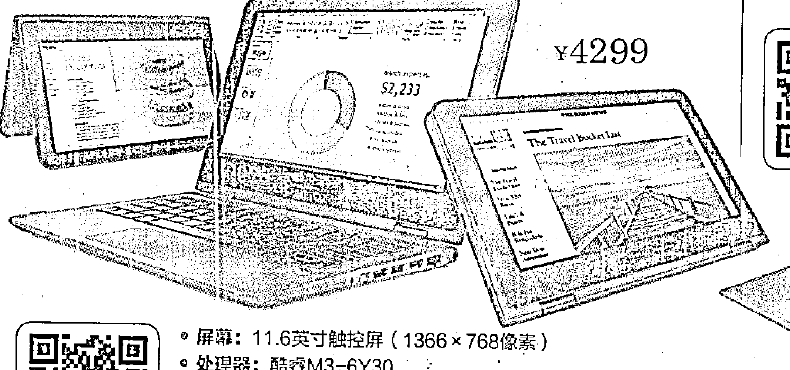


- 屏幕：11.6英寸触控屏（1366×768像素）
- 处理器：酷睿M3-6Y30
- 内存/硬盘：4GB/500GB HDD
- 接口：读卡器、USB3.0×2、USB2.0、HDMI、RJ45
- 厚度/电池/重量：22.5mm/32Wh/1.46kg

##### 酷比魔方i9

酷比魔方i9是第一批武装二代酷睿M的国产平板之一，其最大的特色就是在背盖上加入了类似Surface的连体式支架设计，并配备了USB Type-C接口，可用于传输数据或与显示设备连接。就配置而言，i9的规格无限接近低配版的Surface Pro 4，但售价却不足后者的1/2，性价比还是十分给力的。

- 屏幕：12.2英寸IPS触控屏（1920×1080像素）
- 处理器：酷睿M3-6Y30
- 内存/硬盘：4GB/128GB SSD
- 接口：读卡器、USB3.0、USB Type-C
- 厚度/电池/重量：9.15mm/43.5Wh/970g


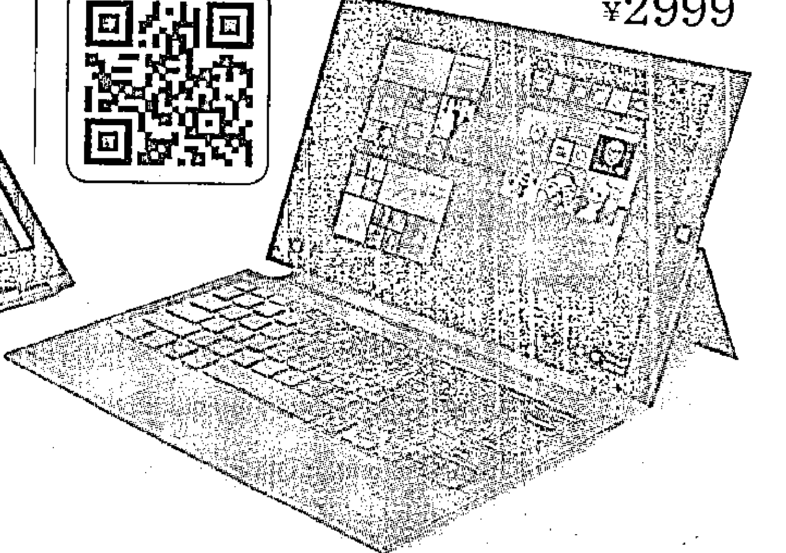

##### 台电X2 Pro

台电X2 Pro是一款11.6英寸的平板电脑，它采用了第一代的酷睿M处理器平台，并提供了2个标准的USB3.0接口，在扩展能力上表现突出。为了增加卖点，台电还为该产品准备了手写笔，能在屏幕上在一定程度上实现原笔迹的书写。此外，X2 Pro还预装Windows 10和Android双系统，方便用户在办公和娱乐环境中随意切换。

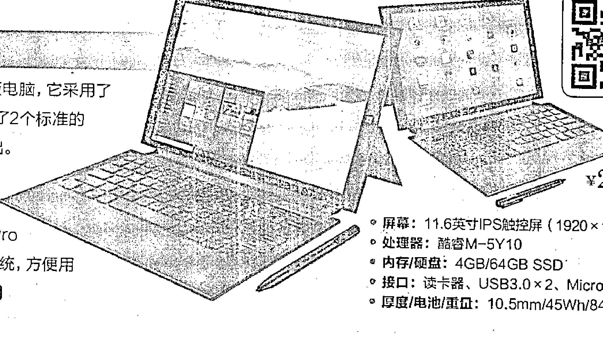

- 屏幕：11.6英寸IPS触控屏（1920×1080像素）
- 处理器：酷睿M-5Y10
- 内存/硬盘：4GB/64GB SSD
- 接口：读卡器、USB3.0×2、Micro HDMI
- 厚度/电池/重量：10.5mm/45Wh/844g

