# 电脑爱好者2016合订本（三）

- **主管**: 中国科学院
- **主办**: 北京《电脑爱好者》杂志社
- **编辑出版**: 《电脑爱好者》杂志编辑部
- **顾问**: 郭传杰

CCW MEDIA

计世传媒 荣誉出品

- **董事长**: 洪京一
- **副董事长**: 熊晓鸽
- **董事**: 万鹏远 许伟明 刘学义
- **社长**: 葛程远
- **出版人**: 许伟明
- **总编辑**: 西浩铭
- **副总编辑**: 张博
- **出版部**: 聂静（主任）

- **作者**: 《电脑爱好者》编辑部
- **发行总代理**: 北京爱好者文化传媒有限公司
- 杨波（发行总监）
- **办公地址**: 北京市海淀区翠微中里14号楼4层
- **通信地址**: 北京123信箱（《电脑爱好者》杂志社）
- **邮编**: 100036
- **网址**: http://www.cfan.com.cn
- **总机**: 010-88230000
- **广告客户部**: 010-88230595
- **读者服务部（发行）**: 手机短信: 13801293315 电话: 010-88230549
- （周一至周五 9:30~11:30 13:30~17:00）
- **零售**: 全国各地邮局（所）
- **国内发行**: 北京报刊发行局
- **邮发代号**: 82-528
- **中国标准连续出版物号**: ISSN1005-0043 CN11-3248/TP
- **印刷**: 北京新华印刷有限公司
- **广告许可证**: 京海工商广字第0055号
- **出版日期**: 2016年9月30日
- **法律顾问**: 周涛律师
- 网站: www.zt148.cn 电话: 13366185341

本书如有印刷或装订质量问题，我们负责调换。
图文版权所有，未经同意不得转载、翻印

定价：29.8元

## CONTENTS

《电脑爱好者》2016年合订本（三）

[邮发代号 82-528]

### 特别话题
- 这不是你们的专利 这也不是我们的专利
- 未雨绸缪 你的IT安全要走在时代之前
- 省资源 节精力 玩IT别做“无用功”
- 入寝室进校园 安全有序的新生活你准备好了吗
- 独立操作还是软件协同 你会怎么选
- 火线救援 电脑故障该怎么办
- 移动设备需警惕 陷阱就在你我身边

#### 系统应用
- Windows 10任务栏异常的恢复
- 常用功能 桌面按需一键“呼”
- Windows 10颜色搭配怎么玩
- 用好Windows 10文件历史记录
- 任务栏的不同寻常用法
- 遇到流氓自启动应用怎么办
- 解决Windows 10颜色管理问题
- 用好Windows 10虚拟桌面
- 一觉醒来 Windows 10改变了什么
- Windows 10电源管理不简单
- Windows 10窗口边框上的秘密
- 任务栏还有另类用法
- 斩断Windows 10后台的秘密操作
- 同步/备份不闹心 用好OneDrive
- Windows 10截图有花样

#### 软网生活
- 云盘关门 巧用微云解困急
- 图片操作 迷你Imagine以小搏大

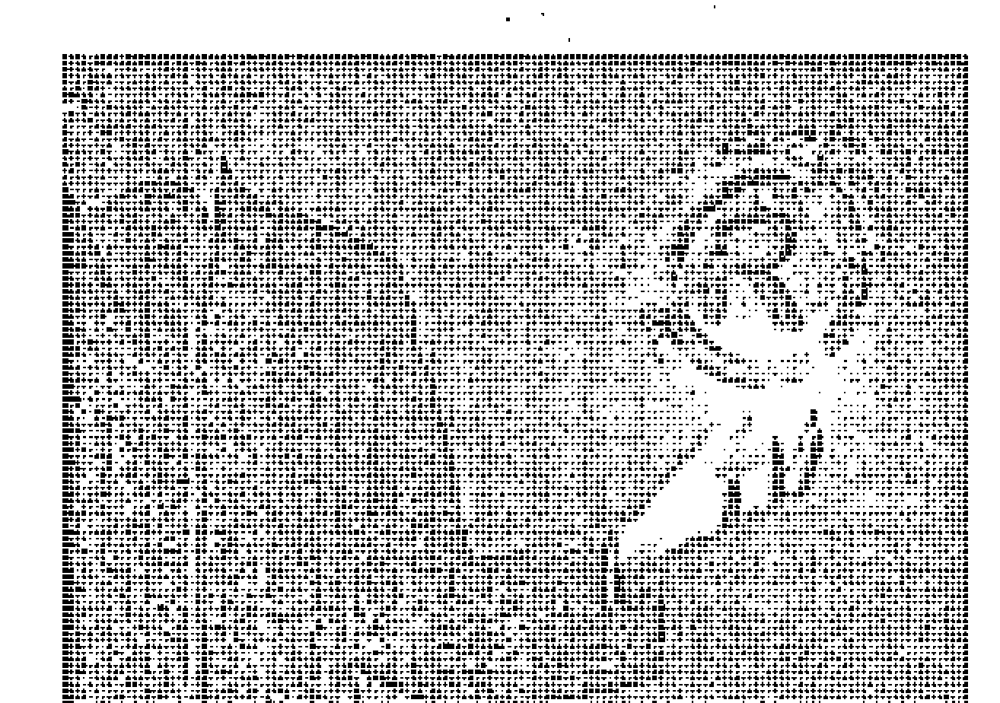

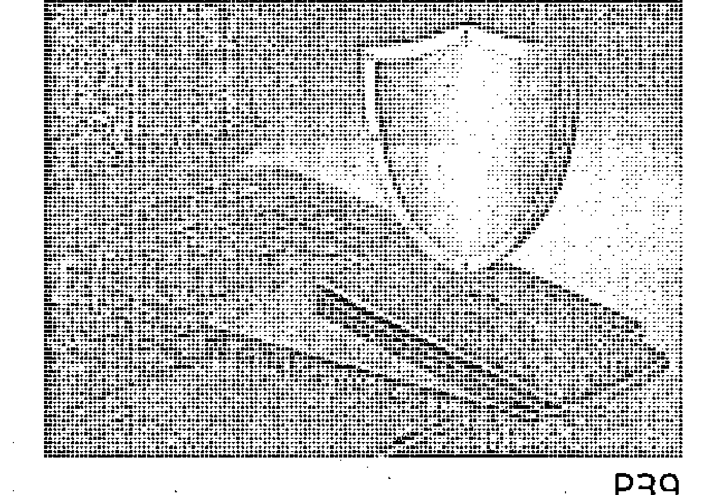

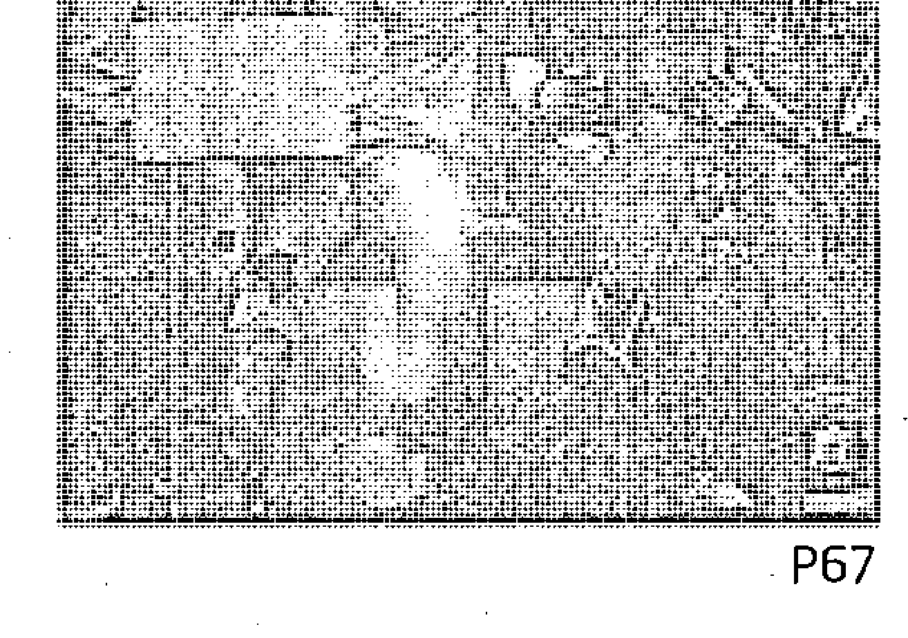


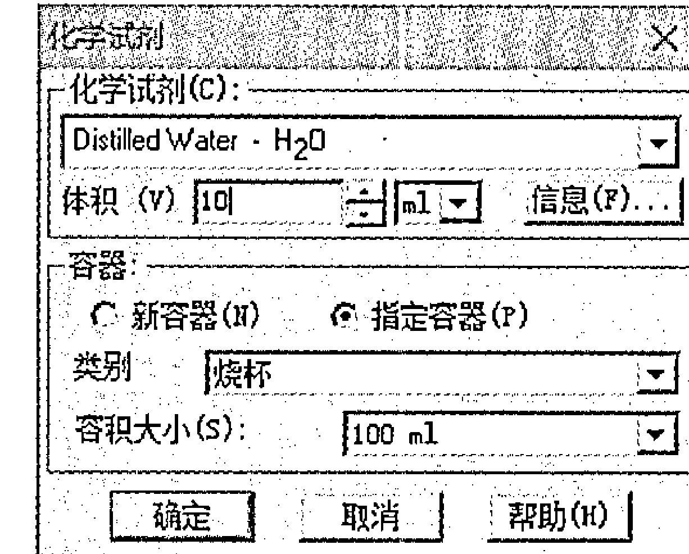

P234

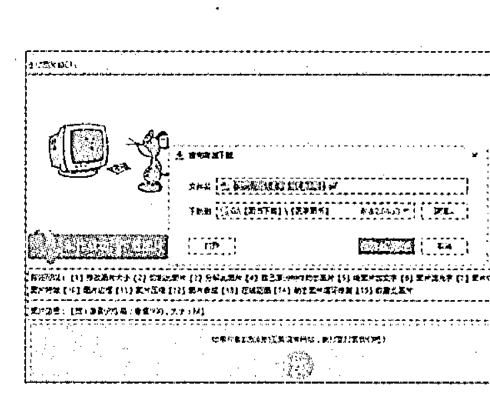

P242

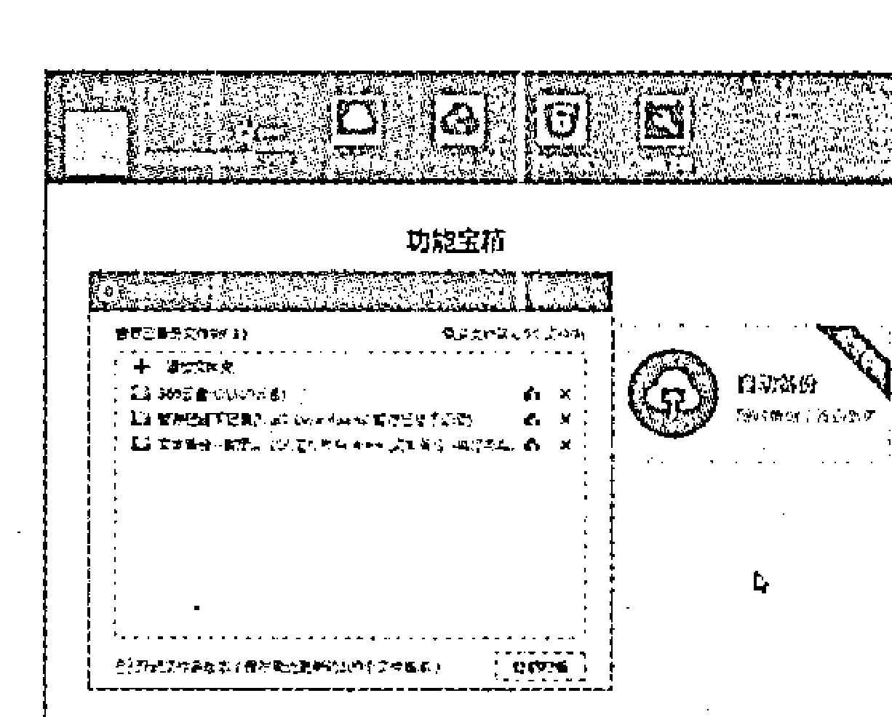

P250

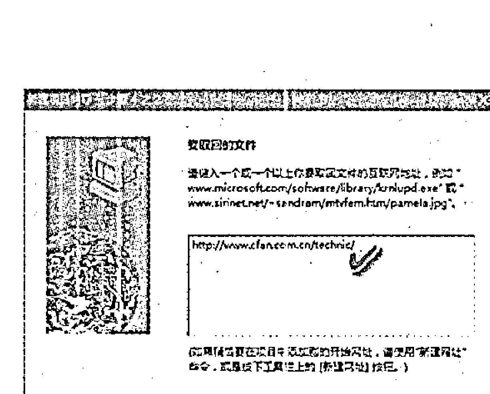

P278

- 浏览器扩展也能备份还原.....................................................230
- 另类下载 在线处理视频.....................................................232
- 画饼充饥 无器材的科学实验.....................................................234
- 反道而行 常用软件差别用.....................................................236
- 改个参数 压缩全能自动化.....................................................238
- 音量控制 不止简单调高低.....................................................240
- 不光变变变 还要小小小.....................................................242
- 恢复被勒索软件感染的数据.....................................................244
- 不走寻常路 另类系统优化.....................................................246
- 聚合搜索 音乐随手可得.....................................................248
- 微软开门 Edge也能用扩展.....................................................249
- 反道而行 再续常用软件差别用.....................................................250
- QQ文件管理 其实也不简单.....................................................252
- WebP图片文件从何而来.....................................................254
- 小巧便捷 更好用的笔记软件.....................................................256
- 病毒检测的新选择.....................................................257
- PDF免费全能处理.....................................................258
- 模拟谍战大戏 和朋友玩玩密码游戏.....................................................260
- UC脚本打造非同一般的浏览器.....................................................262
- 玩转QQ浏览器智能标签页.....................................................264
- 免费Nik Collection 让照片与众不同.....................................................266
- 自架缓存服务让你的网更稳.....................................................268
- 图片外链制作就是这么简单.....................................................270
- 消除Foxmail无法使用163邮箱顽疾.....................................................272
- 巧妙出招 单卡手机用双号.....................................................273
- 安全很重要 伪装有技巧.....................................................274
- 藏起老盘 ADC的新用途.....................................................276
- 如何留住精彩网页.....................................................278
- 火柴棍小人动画轻松制作.....................................................280
- 图片一转身 效果大不同.....................................................281
- 截图玩出更多新花样.....................................................282
- 在线语音快速输入文字.....................................................284
- 亲情呵护更贴心、远程操控盒子.....................................................286

#### 办公世代

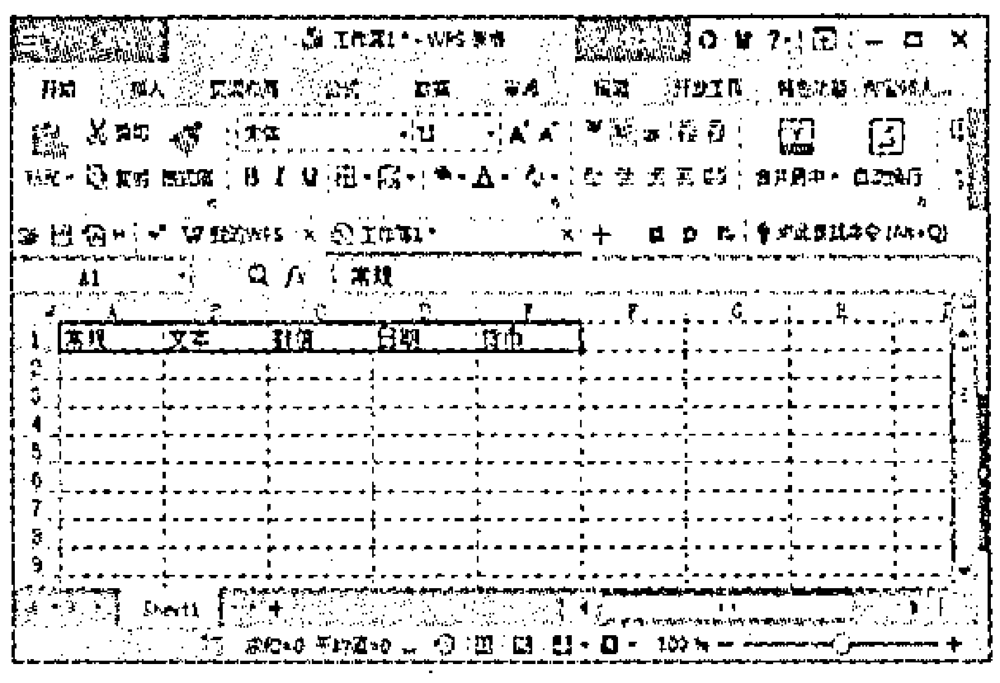

- 免代码免函数搭建万能查询表………………288
- 借用游戏软件 交互课件易做………………290
- 没创意没技术 3D演示照样做………………292
- 幻灯片也能“过关卡”………………294
- 表格数据 Word“自提”有术………………296
- 拖拖拽拽 交互式演示巧制作………………298
- 多表汇总 “合并计算”更轻松………………300
- 让百分比图表“动”起来………………301
- 幻灯片随机抽题不重复………………302
- 轻松制作交互式3D宣传册………………304
- 插件给力 PPT动画制作………………306
- 交互式试题幻灯片巧制作………………308
- PPT动起来 在PowerPoint中用视频………………310
- 如何制作变色折线图表………………312
- 微课片头的制作与合成………………313

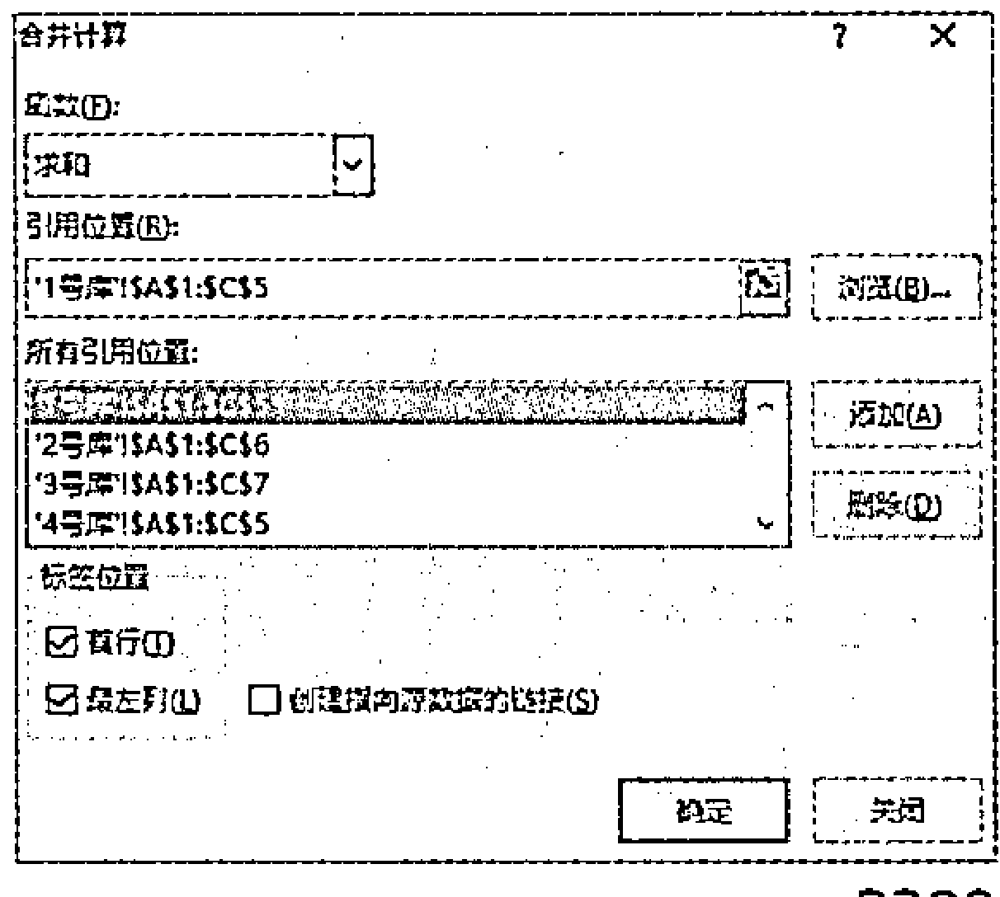

#### 移动新天地

- 手机地图的别样玩法………………314
- 偷看不成 留下你的小样儿………………316
- Windows 10平板瘦身我有招………………318
- 另类伪装 实现特别“野心”………………321
- 神奇的掌上识别术………………324
- 用Windows 10接收手机的推送信息………………327
- 随意调整手机字体的大小………………327

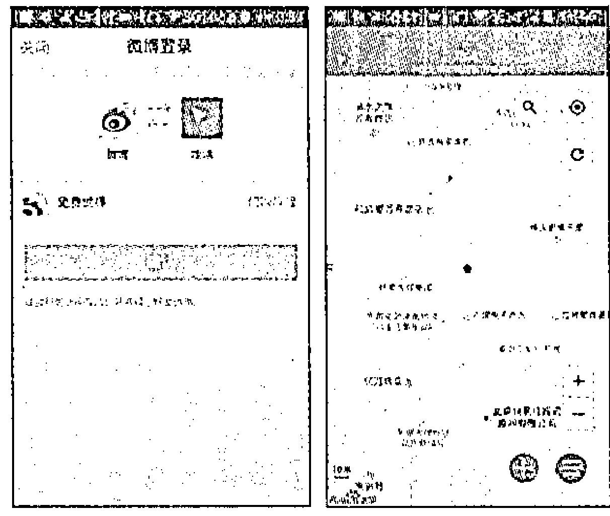

#### 傻博士

- 傻博士有话说………………328

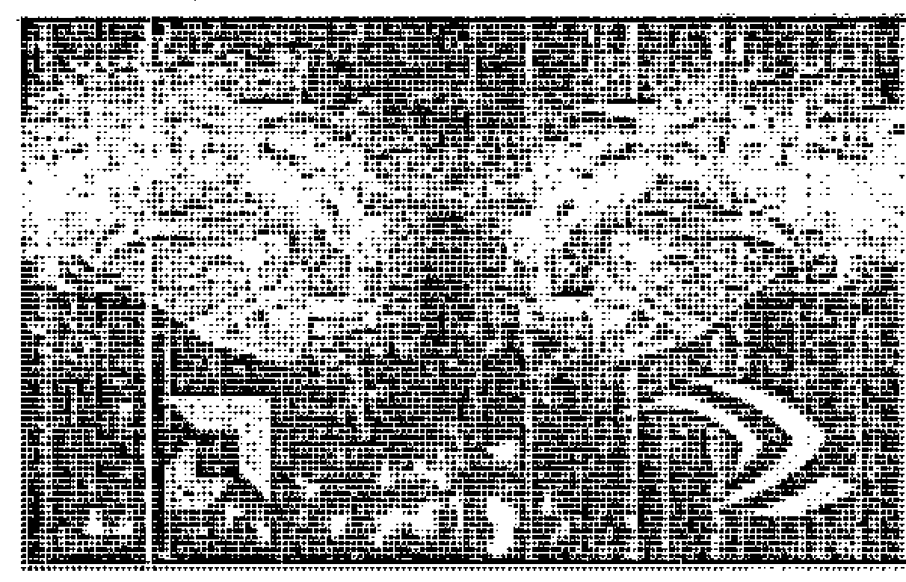

## 硬件应用

- “负优化” NVIDIA显卡有必要安装最新驱动吗………………352
- 编码游戏两不误 同时使用核芯显卡和独立显卡………………354

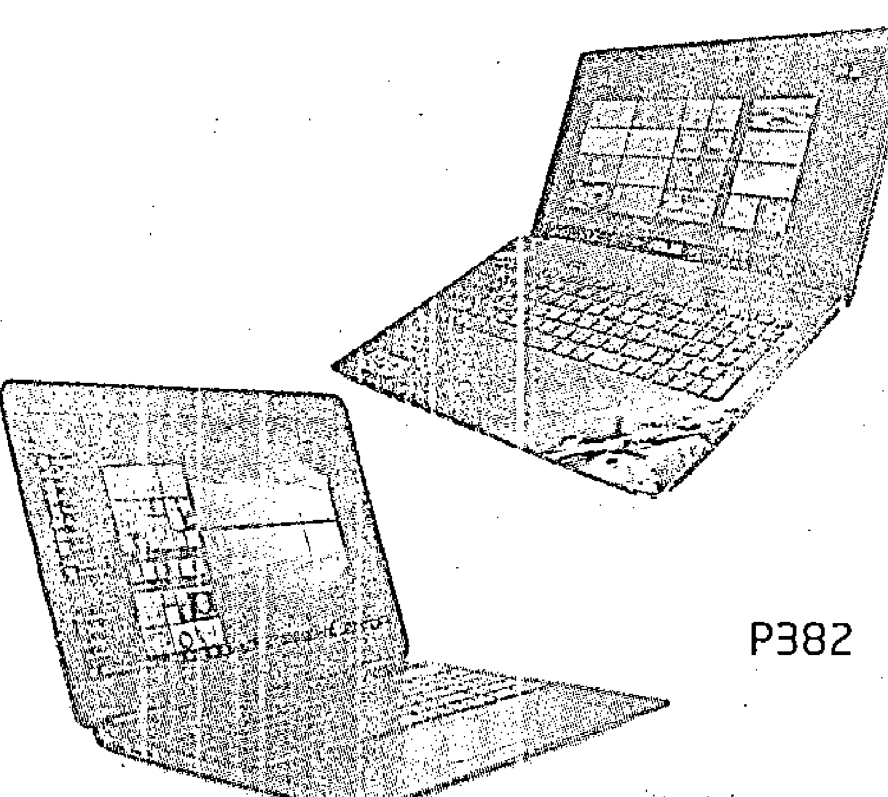

酷暑急需洗刷刷 笔记本除尘清灰攻略.....................................................357

Sapphire Trixx 现阶段最“给力”的AMD显卡超频工具.........................360

让桌面更为个性 机械键盘改造指南.....................................................362

手势替代快捷键 笔记本触控板让Windows 10更好用.........................364

轻拆慢拔 小心硬盘SATA接口断裂.....................................................366

DX12与VR 面向未来的测试...............................................................367

透过玄学曲线 直观Android手机卡不卡.............................................370

#### CFan为你选

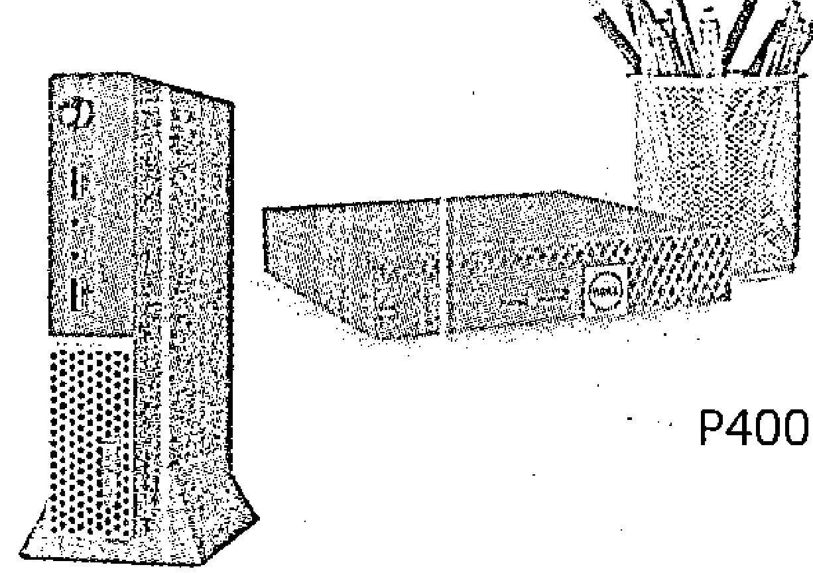

谁更懂用户 联想MIIX 4 PK 华为MateBook..........................................372

十核普及第一战 乐视手机2 PK 奇酷360 N4.........................................374

原厂之外 热门游戏机械键盘之选.......................................................376

超值游戏本的较量 华硕FX-PRO PK 惠普暗影精灵2代......................382

699元谁更超值 红米3S PK 魅蓝3S.......................................................384

酷暑降温小助手 笔记本散热器怎么选...................................................386

夏日小贴心 让手机变身家电遥控器.......................................................388

迎战酷暑 超值一体式水冷散热器导购...................................................390

扬眉吐气 为手机找个“架”...............................................................392

迎接大学新生活 寝室电脑该怎么DIY...................................................394

数码伙伴的旅行居所 选择合适的盛纳包.................................................397

小型化竞赛 联想M6600Q PK 戴尔OptiPlex 7040M...............................400

超值全网通 中兴Blade A2 PK 荣耀畅玩5A.............................................402

该出手时就出手 笔记本内存的升级思路.................................................404

平板手机的输入搭档 折叠键盘应该怎么选.............................................406

中低端高性能风冷散热器选购谈.........................................................409

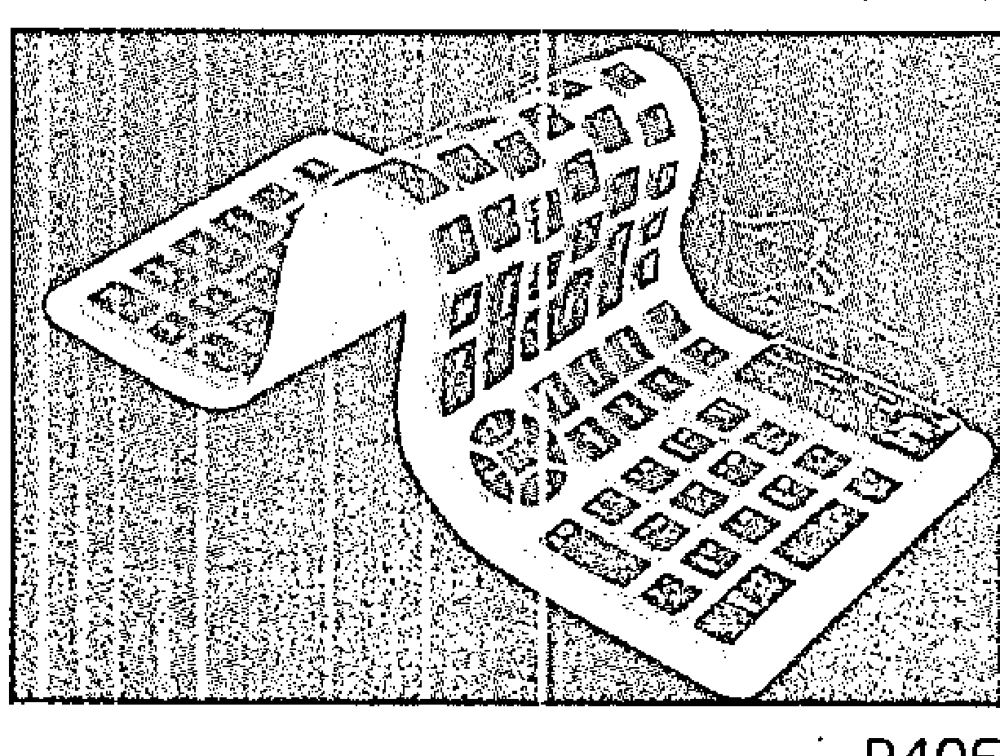

谁是轻薄趋势 联想小新510S PK 惠普Pavilion 14...................................412

骁龙旗舰的对决 一加手机3 PK nubia Z11..............................................414

硬盘盒&易驱线 谁能让闲置SSD高速上岗.............................................416

平台迥异怎么选 惠普HP14 PK 宏碁E5-432G........................................418


性价比之争 红米Pro PK 360手机N4S...................................................420

有容乃大 笔记本如何挑选大容量机械硬盘.............................................422

小便宜吃大亏 别让存储卡成为手机的拖累.............................................424

亦商务亦娱乐 ThinkPad黑将S5 PK 戴尔游匣7000................................426

中端对决 三星Galaxy C7 PK 华为荣耀V8..............................................428

体验与手感至上 手机游戏手柄怎么选...................................................430

话说专利，是一种专有的利益和权利，申请者用来防止竞争对手对自身利益造成威胁的东西。
然而，也有一种观点称专利会在一定程度上阻碍创新，看不见蔓延在世界各处的专利大战正打个不停。
抛开这些利益的纠葛不谈，咱们IT业的发展史就是围绕着专利展开的一部斗争史。
但所谓的专利，在人们的印象中还有另外一层意思：这不是你的专属。
人有千面，事有百态，没有谁可以长时间独享某一项功能或是独霸领域。
很多时候跨界而来的竞争者，才能为我们带来实实在在的实惠和享受。
这正是我们想和你说的，软件实现跨界的功能、硬件实现多能的办法。


扫一扫
更多精彩内容立即解锁

## 这不是你们的专利
## 这也不是我们的专利

策划《电脑爱好者》编辑部## 群雄玩过界

外观专利在智能手机领域碰了壁，千篇一律的面孔让智能手机们都变成了亲戚，这背后究竟是什么原因导致的？面对日益激烈的竞争环境，“过界抢食”就成为了传统DIY企业们发展的必然，只是跨界的过程必然要与他人的“专利”发生冲突，我们又该如何看待这种跨界现象呢？

## 01 为何智能手机都是“亲戚”

在功能机时代，手机的外观设计可谓“百花齐放”，除了山寨机外，知名品牌间鲜有“撞脸”的案例。然而，在智能手机大一统的今天，我们却发现越来越多的手机都变成了“亲戚”，这又是为什么呢？

### 功能机时代“异族”横行

在功能机时代，各大品牌手机的外观设计都极具“辨识度”，我们一眼就能区分某款新机到底属于哪个品牌。如被誉为“刀锋”的摩托罗拉V3系列（图1）、将滑盖玩出花样的诺基亚N9x系列（图2）。究其原因是功能机并不注重“身材保养”，相对硕大的机身里留给了厂商无数的发挥空间。

理论上基于Windows Mobile和塞班系统打造的手机也算是“智能手机”，只是它们在体验上与iOS和Android的差距很大，而且早已退出市场，所以我们在在这里也将其归类到功能机的类别。

### 智能手机也曾“个性过”

实际上，智能手机也曾经“个性过”。在Android刚刚兴起的那段时间中，“侧滑”（图3）、“滑盖”（图4）、“全键盘”（图5）等元素“满天飞”，其中最令人印象深刻的就是索尼Xperia Play，这款手机采用了侧滑设计，但却将常见的QWERTY键盘换成了游戏手柄的按键，再加上官方支持模拟PS游戏，被游戏玩家视为“PSP手机”（图6）。

可惜，随着时间的推移，这些个性设计都已被埋没在历史的尘埃中，如今智能手机领域只剩下两个类别：直板（占统治地位）以及翻盖（定位小众的商务市场）（图7）。

那么，是什么原因导致了智能手机“操守”的大面积“沦落”？又为什么国际品牌手机大都是“远房”，而国内品牌手机却多是“近亲”呢？

### 智能手机的“远房”与“近亲”

细心的读者可能已经发现了，国际品牌（将手机卖到欧美等大部分国家和地区）旗下的手机大都颇具辨识度，无论是边角弧度、摄像头（包括闪光灯）样式和界面图标的差异都很大，一看就是“远房”关系（图8）。

然而，国内智能手机的情况就非常有趣了，很多手机不看品牌Logo，我们还真很难一下子分辨出它到底出自哪家门下。哪怕是早已进军国际市场的华为和中兴，它们旗下也经常出现明显具备“近亲”关系的产品（图9）。

实际上，“近亲”已经成为国内智能手机领域的普遍现象，由此引发的专利纠纷案例也是层出不穷。比如，360 N4手机就因为Home键和呼吸灯设计（红圈小圆点）与努比亚手机太过相似而收到了对方的律师函（图10），360对此的回应则称N4并没有使用努比亚在所谓律师函中所提到的专利，努比亚所谓专利侵权是违背专利法精神、扰乱正常市场竞争秩序的行为。

这种细节设计方面的“模仿”并不少见，就Home键的设计而言，魅族旗下的MX3手机在更早以前就采用了小圆点呼吸灯（只不过是白色背光），如此看来努比亚似乎也有参考借鉴之嫌（图11）。

### 外观专利保护不是万能的

在专利保护法中，有关外观设计方面的纠纷是最不容易定性的。比如，早在2012年，苹果就以三星手机涉嫌侵犯其黑色圆角矩形正面外观设计、圆角矩形正面加边框设计以及16个图符的彩色网格设计之由，与三星打起了专利官司，赔偿金额也从最初的10亿美金逐步降到了5.48亿，至今这个专利官司仍在继续(图12)。

根据最新的消息，三星大体认可了专利侵权问题，但对具体的赔偿金额提出了异议。三星认为，苹果应该就侵犯苹果专利的部件(比如手机正面设计和用户界面上的图符网格设计)进行索赔，而不应该针对整部手机来索求赔偿。如果当前的判决结果维持不变，它将会让设计专利凌驾于其他无数种具有突破性的科技专利之上，导致设计专利获得过高的估值。

简单来说，就是外观侵权不应该比技术侵权的惩罚力度更大吧？如果大家都将资金投入到外观创新上，哪还有钱用于技术创新呢？

虽然没有最终判决，但从苹果和三星的官司中我们也能品味出美国对专利侵权的“高压”态度：赔偿金额高得吓人，还要面临禁售风险!在这种大环境下，手机厂商自然要小心别触及专利雷区，想尽办法搞出外观方面的“差异化”设计。

在国内，外观设计专利是指对产品的形状、图案或者其结合以及色彩与形状、图案的结合所做出的富有美感并适于工业应用的新设计。而被控侵权产品构成侵权须满足两个条件:一是被控侵权产品包含外观设计专利的独创性部分(即创新点);二是被控侵权产品从整体上与外观设计专利产品相同或相近似。

找出漏洞没有?没错,就是“整体”两个字。前文中360回击努比亚的基础就是:专利法明文规定“外观设计专利权的保护范围以表示在图片或者照片中的该产品的外观设计为准,努比亚以局部设计代替整体设计来声称所谓专利侵权是违背专利法精神、扰乱正常市场竞争秩序的行为。”(图13)。

因此,哪怕两款手机很像,但只要它们在材质、位置(摄像头、传感器等)、功能、工艺等方面有所不同,一般都能通过专利申请的审核。哪怕有人找上门打专利官司也有理由避过。在国内,外观专利的纠纷有时更像是一种自我炒作,哪怕官司输了,赔偿金额也不会太高,违法成本(相对)很低。

以上就是国内外销售手机出现“远房近亲”的表面原因。至于“近亲”现象为何愈演愈烈,还需要从更深层面探究一二。

### 声明

- 360手机没有使用互商在诉诸律师函中所提到的专利。
- 《中华人民共和国专利法》明文规定：“外观设计专利权的保护范围以表示在图片或者照片中的该产品的外观设计为准。”因此，以局部设计代替整体设计来声称所谓专利侵权是违背专利法精神、扰乱正常市场竞争秩序的行为。
- 360手机的三大产品系列都有自己独特的设计语言。360手机N4的ID设计运用了大量圆形元素，贯穿于外观整体设计的每个细节，通过外观整体的细级设计为用户带来舒适体验。
- 360手机一直倡导自主创新及知识产权保护，我们愿意和所有同行一道共同构建公平健康的商业环境，共同促进行业的发展。

360手机 2016年05月11日

### ‘模仿秀’的偶然与必然

在功能机时代，手机是机身大屏幕小，留给设计师发挥的空间很大。而智能手机则恰恰相反，硕大的屏幕就已占据了表面的70%以上(图14)，再加上纤薄风的流行，哪里还有太多的可塑空间？

举个例子，时下大屏手机都在追求“屏占比”，对那些动辄80%屏占比的机器而言，只剩下“窄脑门”和“小下巴”，前者的差异化设计无非是扬声器形状和大小、摄像头和感光/距离感应器的位置(图15);后者的差异化设计体现在有无Home键(或其他实体按键)，Home键的形状，最多就是增加不同样式的纹理而已。

时下指纹识别已经成为智能手机的标准功能，但很多大屏产品却为了提升屏占比和瘦身效果而故意将其移到了手机背面。比如，三星A9和华为Mate8都是6英寸窄边框手机，但Mate8的长度却要比A9小了4mm，这部分空间就是取消物理Home键而节省出来的。在以后置指纹手机为主的当下，设计师能选择的只是修改指纹识别模块的位置、形状，它与摄像头、闪光灯的排列顺序(图16)。

至于SIM卡托、电源音量键的位置，通过近些年的总结反馈也已有了最合理的定论：电源键在顶部肯定不如在侧边，最佳排列法则是音量键在上，电源键在下。至于SIM卡托则清一色是‘糖葫芦’式的连体设计，可安装两个SIM卡或将其中之一替换为Micro SD卡。

曾经，一体式金属机身、双面玻璃、陶瓷工艺后盖等设计还能算是创新设计的代表(图17)，但如今上述设计早已普及，智能手机很难在工艺方面保持‘新鲜感’。为了突出‘差异化’设计，大家只能在边角的弧度(方形或倒圆角，上下是否带弧度)(图18)、喷漆或喷砂工艺的处理(影响把握手感)、信号溢出条(类似iPhone的‘白带’)的宽度和位置而已(图19)。

在工艺、传感器、按钮、指纹等元素一定的前提下，手机厂商所做的只是按需搭配而已，而新鲜的设计很容易成为其他品牌竞相模仿的对象。由此可见，智能手机上演‘模仿秀’并非偶然，‘没有太多发挥空间’是手机外观之间容易‘撞车’的必然。只是，国际品牌会更重视规避侵犯外观专利的可能，而国内品牌则缺少专利层面的顾虑，在经历各种参考借鉴之后自然要面临‘在一个模子里面印出来’的现实。

总之，我们需要理性看待智能手机在外观设计层面的‘亲属关系’。合理的借鉴参考可以接受，但完全照抄（或90%以上的相似度）就肯定需要引起我们的鄙视了。此外，为了差异化而差异化的设计也并不可取，比如LG和华硕就曾主打音量键后置，但实际体验却远没有传统侧置来得方便，因此LG和华硕后续新品都取消了以前那种看似个性的设计。而我们也期待手机厂商不要只注重‘表面功夫’，比如像MOTO X极那般在防碎屏设计上的专利创新就是很好的发展方向。

## 02 不让你独美 就要玩跨界

俗话说‘术业有专攻’，但面对日益激烈的市场竞争，死守传统很容易被历史淘汰，而‘跨界经营’则成为了企业发展的必然。不过，跨界并非说说那么简单，成功者可以享受胜利果实，分享抢来的市场蛋糕；而失败者，则将面临更为严峻的竞争环境，再图下一次的跨界突围。

### 大鳄也有过不去的坎儿

作为PC领域的领导者，Wintel联盟（微软和英特尔）拥有毋庸置疑的研发实力，但它们却都在跨界路上历经折翼之苦。由此可见，想迈过跨界的门槛儿没有想象的那么简单。

#### Wintel纷纷折翼

面对iOS和Android以及相关移动设备（如智能手机、平板电脑等）的崛起，Wintel联盟在很早以前就展开了跨界之旅。其中，微软推出了针对ARM架构处理器和移动设备定制的Windows Phone（最新版将被称为Windows 10 Mobile）系统（图1），并通过收购诺基亚提升硬件层面的竞争力。

为了与Android系统‘联姻’，英特尔推出了针对智能手机定制的凌动（Atom）系列处理器（图2），并获得了包括联想和华硕在内的‘铁杆盟友’的支持。与此同时，英特尔还加大了通讯基带领域的研发投入，有消息称iPhone 7就将搭载英特尔XMM 7360基带芯片，最大下载/上传速度为450Mbps/100Mbps。

可惜，在耗费数十亿美元并裁员1.2万名员工之后，一直亏损的凌动芯片业务还是迎来了绝唱，英特尔在前不久透露将停止手机领域的凌动芯片的开发和升级，基本等同于退出了手机市场的争夺战。微软的跨界之战也不顺利，Windows Phone的市场份额在2015年已经跌到了1.7%，其中个别市场的占有率更是趋近于零，至今微软已裁减超过2.6万员工，原本的Windows手机团队和收购诺基亚加入的员工也基本走光。有消息称，微软可能将不再关注消费级智能手机市场，而Windows 10 Mobile也将局限在那些更关注安全、便于管理和协作的企业客户和消费者（小众的商务市场）。

#### 为何没能跨过门槛

简单来说，英特尔的失利源于X86架构在Android系统环境中存在些许兼容性隐患，而搭载凌动处理器的手机定位也多以高端为主，在惨烈的价格战中无力还击。联想首款Intel Inside手机K900发布时曾广受关注（图3），但却因价格高、发热高、兼容性和续航差等原因没能被消费者接受。随后联想还推出了K80手机，但销量和口碑依旧不太理想。

作为英特尔另外一个盟友，华硕在ZenFone Zoom和之前的所有高端产品都以英特尔凌动处理器作为‘心脏’（图4），然而结果却是华硕品牌在国内手机市场总是缺少存在感（市场份额不高），但在更换高通骁龙之芯后，华硕ZenFone 3系列却一下子受到了很多手机玩家的关注与好评。凌动处理器在手机领域的口碑可见一斑。

致使微软失败的因素更多，Windows Phone系统界面虽然简约高效，但同质化的界面和系统体验却阻碍了第三方品牌在系统层面的“创新”（不像Android领域有MIUI等特色UI系统），微软自己做硬件（Lumia品牌手机）也伤害了合作伙伴们的信任，以至于如今Windows Phone市场几乎都是Lumia在“单打独斗”，如何又是iOS和Android的对手？

Windows Phone系统一直秉承着收费策略（需要手机厂商缴纳授权费），而其应用商店APP的数量和功能远逊于iOS和Android，就连最基本的支付功能（如支付宝钱包）都受到限制。此外，在纳德拉担任微软CEO之后，将Windows Phone“最后的杀手锏”Office也开放给了iOS和Android（图5），最终让其未来在办公领域尚可一搏的优势也被过早的放弃了。

由此可见，企业能否跨界成功，资金和技术底蕴并非决定性因素。强悍如Wintel的境遇都如此尴尬，在DIY领域还有哪些跨界案例值得引起我们的关注呢？

### SSD让硬盘市场重新洗牌

在几年之前，硬盘市场还是希捷和西数两家独大，随着SSD固态硬盘的崛起和HDD机械硬盘的没落，这两家昔日的硬盘大鳄也展开了跨界之旅，并将与从其他领域跨入硬盘战场的新秀们碰撞到了一起。

#### 两种跨界思路

面对SSD咄咄逼人的态势，希捷和数据在很早以前就展开了跨界的尝试。比如，两家都提出了“混合硬盘”的概念，在HDD的基础上加入容量不等的NAND闪存和主控芯片，让混合硬盘同时兼容SSD的速度和HDD的容量（图6）。而希捷在企业级SSD领域也颇有建树，在今年还计划推出每秒传输速度可达10Gbps的SSD计划。

### 越加混乱的SSD战场

可惜，混合硬盘并没有取得意想中的成功，企业级SSD距离普通消费者又太过遥远，而这就给了用户一种“希捷新数在SSD领域失声”的错觉。实际上，缺少消费级SSD的支撑，希捷和西数的确已经在SSD的战场中落后。有趣的是，这两个在HDD领域的“寡头”采取了两种手段破局。

其中，原本在SSD跨界中落后的西数，通过收购全球第三大NAND闪存制造商闪迪实现了“曲线救国”，借助闪迪大量的闪存产品知识产权和成熟的消费级业务体系，西数已经为全面向SSD跨界铺平了道路（图7）。反观希捷，在2016年初曾抛出了“机械硬盘还能再战15年~20年”，并专注于机械硬盘业务，尤其是开发更大容量的产品的言论。没错，希捷在尝试企业级SSD之余，计划死守原有阵地。

当然，希捷也是有底气的，比如通过“热辅助磁记录”（HAMR）等诸多全新存储技术，让3.5英寸HDD硬盘的容量在未来几年内可突破15TB大关，在容量和性价比方面始终遥遥领先于SSD。随着西数收购闪迪，不知道是否会影响到希捷未来的发展策略，但就SSD跨界的征途上，西数已经领先希捷一步（图8）。

SSD没有HDD复杂的物理结构和生产工艺，这种由主控、闪存、缓存等芯片构成的硬盘产品的研发门槛大幅降低。因此，除了三星、英特尔、镁光、闪迪和闪迪等传统SSD品牌以外，昔日那些生产闪存盘（U盘）的企业也加入到了SSD战场。比如台电、创见、朗科等等。此外，金士顿、影驰、建兴、光威、海盗船、威刚、联想等传统DIY或PC品牌也来凑热闹，同时还出现了诸如金胜、金速、金胜维等以前根本就没听说过的品牌。总之，如今的SSD领域怎一个乱字了得（图9）。

那么，这些“原生”SSD品牌，以及从DIY或闪存盘或其他领域跨界而来的SSD之间的差异到底体现在哪里？

简单来说，像英特尔、三星、镁光、东芝、闪迪（未来的西数）这些有能力生产NAND闪存芯片品牌旗下的SSD在品质上是最有保证的（图10）；浦科特、威刚和影驰等品牌虽然没有“核心技术”（闪存），但却在主控优化和售后质保等方面有着天然的优势；而像台电、金速和金胜维等品牌虽然价格实惠，但在品控和闪存颗粒的选择上就可能存在隐患了。

| 品牌 |
| :--- |
| 所有品牌 B C D F G H I J K L M N O P Q S T W X Y |
| 三星 (SAMSUNG) |
| 闪迪 (SanDisk) |
| 浦科特 |
| 金士顿 (Kingston) |
| 英特尔 (Intel) |
| LITEON |
| 东芝 (TOSHIBA) |
| 金胜 (Kingshare) |
| 创见 (Transcend) |
| 光威 (Gloway) |
| 台电 (Teclast) |
| 骇客 (OCZ) |
| 忆联 |
| Crucial |
| 忆科 (Netac) |
| 威刚 (ADATA) |
| 泰嘉 (Tigo) |
| 创久 (Reeinno) |
| 联想 (Lenovo) |
| 全典 (KingDian) |
| 金速 (KingFast) |
| 索泰 (ZOTAC) |
| 金百达 |
| 云储 (Shinedisk) |
| 邦存 (BIWIN) |
| 卜辞科技 |
| 士必得 (FASPEED) |
| 麦克赛尔 (Maxell) |
| 美商佰威 (USCOR... |
| 柏悦 (CUSO) |在一些从闪存盘跨界到SSD领域的产品中，存在使用闪存盘主控（导致SSD性能和闪存盘相似），或是采用异步NAND闪存或“白片”闪存的可能性（图11），无论是速度、寿命还是稳定性等方面都难以让人放心。部分品牌的SSD会根据生产批次采用不同的主控和闪存芯片，导致网上评测和消费者实际购买版本性能出现云泥之别。

作为承载宝贵数据的载体，就SSD的选购笔者更推荐大家购买原生或从著名DIY品牌跨界到SSD领域的产品。随着闪存芯片成本的不断降低，这些一二线SSD品牌的价格与不知名SSD品牌产品间的差距也在逐渐缩短（图12），盲目追求低价并不可取。

作为缺少技术含量的SSD，跨界的难度真的不高，但最终能否在市场站稳脚跟，取决的还是企业的良心，而这也是新兴SSD品牌的唯一机会。

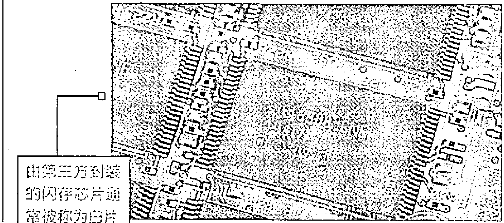

- 闪迪(SanDisk) 加速版 240G 固态硬盘 ¥379.00
- 东芝 (TOSHIBA) Q300系列 240G SATA3 ¥359.00
- 金士顿(Kingston) UV400系列 240G SATA ¥349.00

## 从单一到周边的跨界之旅

俗话说“人挪活，树挪死”，在日益激烈的市场竞争环境下，固守传统肯定已不合时宜。因此，更多的品牌选择了“迈出去”，并逐步从单一外设厂商扩展成为周边外设一应俱全的品牌。只是，在跨界转型之路上却并非所有人都能一帆风顺。

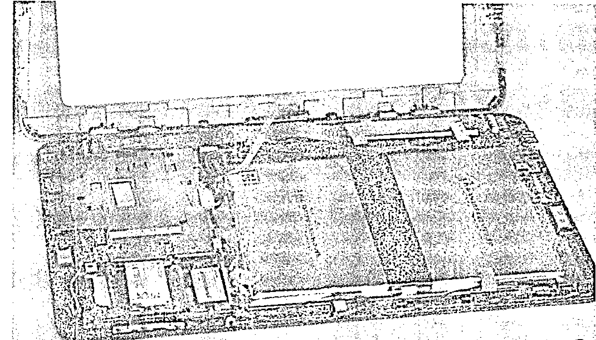

## 盲目跟风的跨界之殇

对中国的企业而言，跨界几乎没有太高的门槛。原因很简单，面对某个新兴的市场，哪怕企业没有相关的研发经验，也可以直接选择ODM方案公司的成熟设计，企业所要做的只是简单地贴牌而已。只是，这种缺乏核心竞争力的跨界方式，极易陷入惨烈价格战的漩涡之中。

以近两年新兴的Windows 8/8.1和Windows 10平板电脑为例，很多品牌都是从昔日做MP3/MP4的品牌转型而来，所发售的产品也多以从亿道数码等ODM公司的方案直接贴牌为主。因此，你会发现市面上众多Windows 8/8.1和Windows 10平板只是在外观上有些许差异，拆开一看内部主板布局和芯片型号完全一致（图13）。

在这种大环境下，价格就成为了唯一的竞争力，在Windows 10平板跌破400元大关之际，想要利润就只能偷工减料，由此也就导致国产低价平板电脑的口碑始终难有起色。

此外，盲目跟风的跨界往往也都是以悲剧收场。回顾当年“上网本”大热的时代，很多DIY企业纷纷跨界跟风，其市场占有率最高时达到了10%左右。部分品牌甚至不惜重金找来明星代言，但最终还是没能挽救上网本的颓势。而上网本的失败，在很大程度上就是因为这是一种没有太多科技含量，又被山寨厂商“玩坏了”的品类。当价格降无可降时，再加上以iPad为代表的平板电脑的崛起，跨界到上网本领域的品牌自然只能惨淡收场。

如今平板电脑正逐渐走进上网本的“老路”上，同质化现象严重，而以性价比为切入点的跨界新秀们还很容易遭遇传统势力的狙击。比如，华为通过MateBook高调挥师二合一设备领域，但联想却通过对MIIX4的降价作为回应（图14），4988元起的MateBook和2999元起的MIIX4谁更值得选择？这个答案显而易见。

一旦传统势力不惜以“掉价”的方式维护尊严时，对跨界者而言就是悲剧的开始。那么，如何才能避免这种跨界的风险呢？

## 从大杂烩到小专精

DIY品牌的跨界大都采取两种策略：“大杂烩”和“小专精”。其中，大杂烩的代表以昂达、七彩虹等品牌为主，它们在坚守板卡市场的基础上，往往还会第一时间跟进新兴的产品品类，比如平板电脑、一体电脑、笔记本等等。而“小专精”的代表则以金士顿和Razer等品牌为代表，以自身擅长的领域为核心，专注于某个更为细分的领域。而真正在跨界之路上取得建树的品牌，几乎都是秉承了“小专精”的策略。

以金士顿为例，在内存业务之外，将产品线逐步扩展到了存储卡、闪存盘和SSD等设备，这种专注于存储领域内的跨界可以将品牌影响力发挥到极致。

要知道，金士顿是没有闪存、主控等上游资源的，但其SSD产品在口碑上却不逊于英特尔和三星等把控上游资源的品牌。此外，金士顿还通过HyperX Cloud耳机跨界到了电竞领域（图15），而无论是内存、SSD还是耳机，都能成为电竞PC生态圈的重要组成部分。

Razer的跨界之旅更能说明问题。Razer原本只是在电竞键鼠外设领域享有盛名的品牌，但它却借助口碑优势跨界到了与电竞息息相关的更多领域：电竞耳机，电竞笔记本。其中，Razer Blade系列是少数能与戴尔外星人比肩的游戏本品牌（图16），这种跨界的模式让Razer在游戏领域有了更强的影响力。盲目的跨界肯定是不可取的，如何结合自身优势选择最佳的跨界方向，则是摆在企业面前最为关键的核心要素。

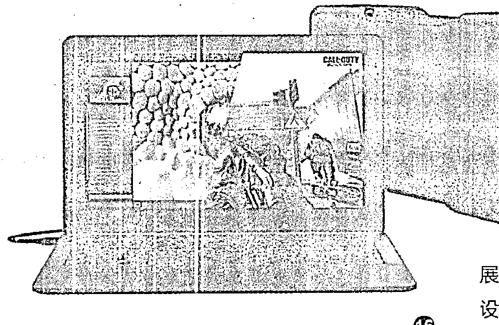

硬件的跨界之旅还在继续，我们也期待有更多品牌可以跨界成功，为消费者带来更具性价比或功能亮点的新品。接下来，就让我们将目光从硬件转移到系统和软件层面，看看这些代表着“软实力”家伙们的跨界秀。

## EXE不再独霸桌面 UWP也许才是方向

当果粉的好处大家应该都知道，需要应用直接去App Store搜索即可，保证下载到的都是正版、无毒的应用，因为有官方的审核机制做保险。相比之下，Windows平台下的EXE应用就复杂得多了，即使是很多大牌厂商的正规产品，其中也会捆绑各种浏览插件，更别说网上随处可下载的小网站，使我们饱受流氓软件、木马、病毒的“骚扰”。为了能够让用户可以获得更好、更安全的应用体验，微软从Windows 8开始也效仿苹果在系统中整合了应用商店，系统更新到Windows 10后，其自带的应用商店(For Windows 10称之为UWP应用)变得更为实用了。

### 01 谁更好用 UWP vs EXE大比拼

UWP和EXE程序从主要功能上比较，大体类似。那么微软为什么要来主推开发UWP应用？UWP应用和传统EXE程序有什么不同呢？下面就让它们来一较高下。

#### 小知识：什么是UWP应用

在Windows集成应用商店之前的版本，我们一般是下载程序进行安装，这些程序一般指的就是后缀为 “.exe” 的文件，英文称之为Program，大多安装在 “C:\Program Files” 下。UWP是Universal Windows Platform的简称，即Windows通用应用平台，可以在Windows 10 Mobile/Surface/PC/Xbox/HoloLens等平台上运行，它并不是为某一个终端而设计，而是可以在所有Windows 10设备上运行的一种全平台应用，一般安装在 “C:\Program Files\windowsapp” 下(用户默认无法访问，需要修改权限设置，图1)。

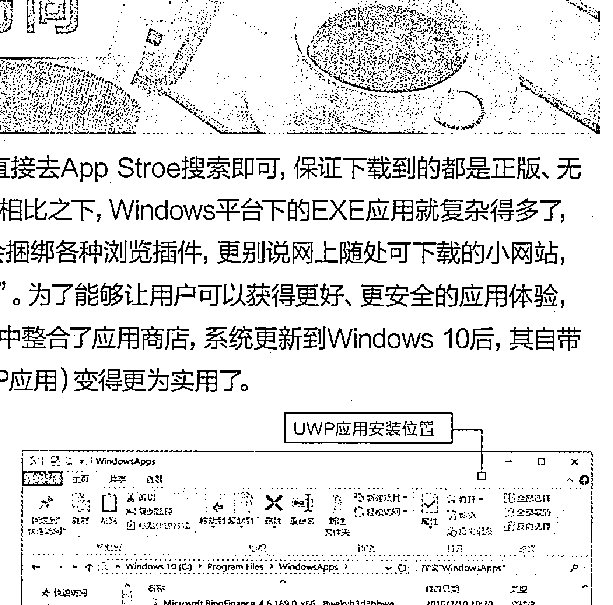

#### 来源及安全性不同

EXE程序可以从任意网站下载，下载后一般只要双击即可进行安装或者使用，因为下载地址没有限制，这样很容易下载到暗含病毒、木马的程序。UWP则一般只能从应用商店下载，Windows 10默认并没有开放UWP离线安装功能(离线安装需要自行打开开发者模式才可以)。而且应用商店里的应用都需要数字签名，并经过微软官方的审核才面向用户下载，因此安全性要比EXE程序高得多！

#### 管理便捷性不同

对于常规EXE程序，卸载默认需要运行反安装程序才能卸载，而且现在很多软件为了不被用户轻易卸载，运行卸载程序时真正的删除按钮隐藏得很深，一不小心无法卸载不说，反而还会新增各种软件。UWP程序则没有EXE那般烦恼，卸载非常简单，只要在开始菜单选中应用，右击选择“卸载”即可，没有残留（图2），效仿智能手机的做法。

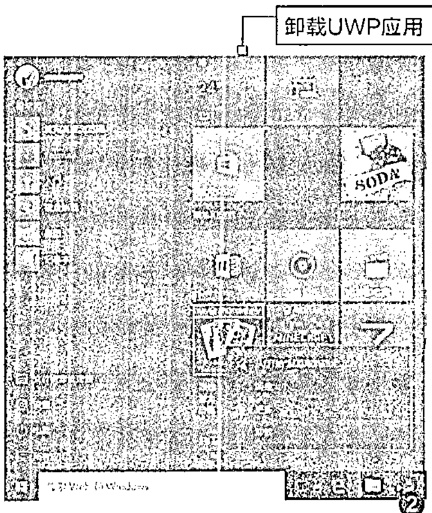

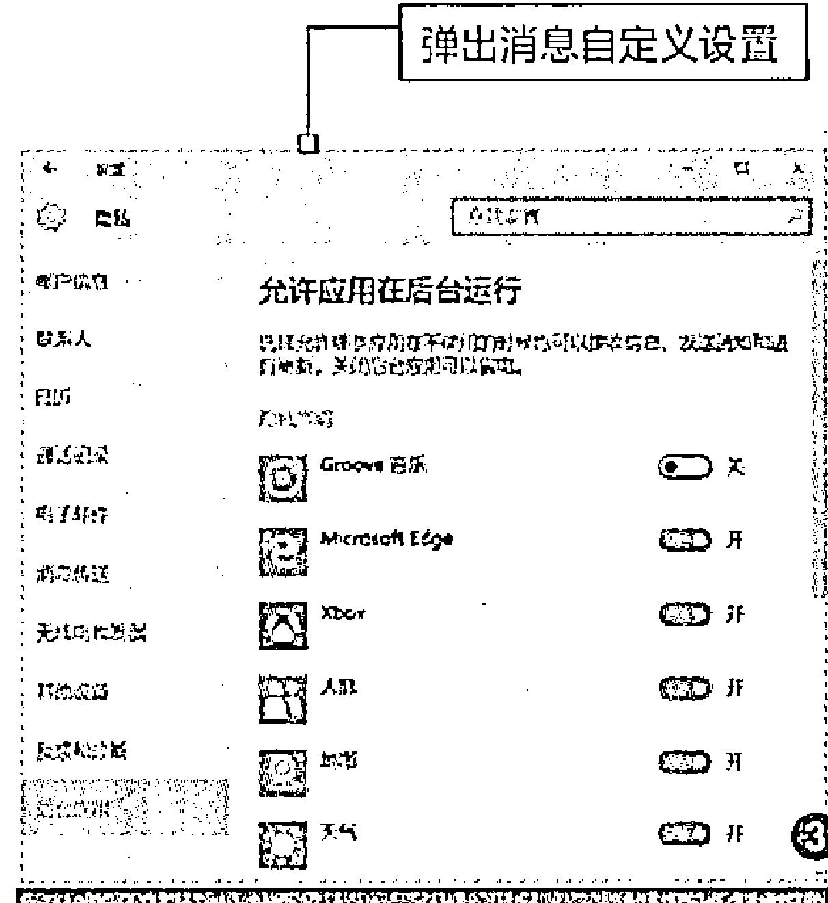

#### 纯净度不同

EXE程序常会捆绑各种插件，而且会自行在后台添加各种系统服务、自启动、弹出各种烦人的通知窗口，一不小心就会带来多个额外软件，并且占用大量的系统资源。UWP应用则纯净多了，绝没有捆绑插件，并且安装后没有任何服务项和自启动。Windows 10对于UWP弹出通知还提供自定义设置，进入“设置→隐私→后台应用”，这里可以对各种弹出消息进行设置（图3）。

#### 资源占用不同

传统EXE程序启动时经常会同时加载多个进程，并且一些进程还互相守护，比较占用系统资源，各个后台进程系统几乎没有任何控制权限。UWP应用则受到系统的完全控制。比如UWP切换到后台运行时，Windows会暂停你不用的UWP来节省资源或者电量，比如打开任务管理器，可以看到后台运行的“应用商店”就几乎不占用系统资源（图4）。

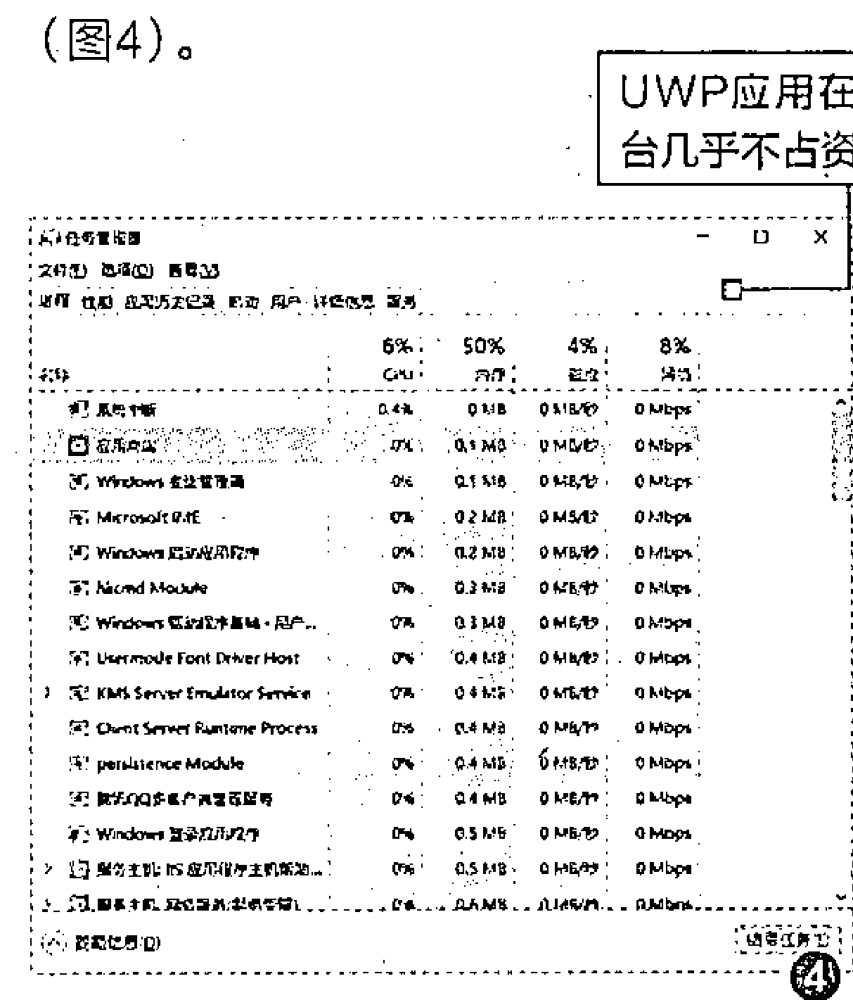

#### EXE和UWP对比表

上面我们主要介绍UWP和EXE文件的区别，为了能够让大家对UWP应用有个更全面的了解，下面我们选取几款常用软件进行两个版本的比较。

| 软件名称 | 界面 | 安装包大小 (MB) | 包含组件 | 资源占用 (MB) | 后台进程 | 优缺点比较 |
| :--- | :--- | :--- | :--- | :--- | :--- | :--- |
| QQ EXE | 界面简洁，功能模块通过图标点击激活，适合鼠标操作 | 54.2 | 聊天、云盘、QQ秀、游戏、应用宝等多个组件，后台注册QQ安全防护进程 | 150~200 | 包含QQ保护、多客户端登录、主程序QQ音乐等多个进程，默认自启动 | 功能丰富，包含各项功能。但是资源占用大，后台进程多 |
| QQ UWP | 界面华丽，主要功能整合在一个界面，适合触摸操作 | 63.7 | 纯粹聊天功能 | 80 | 单一进程 | 程序简洁，非聊天功能较弱，如不能截图等 |
| 暴风影音 EXE | 界面功能丰富，集成功能多 | 37.6 | 包含集成了视频推荐、搜索、播放、下载、转码、上传、专辑管理等。 | 160 | 包含视频加速、新闻弹出、主程序3个进程，默认自启动 | 功能丰富，但占用资源过多 |
| 暴风影音 UWP | 界面简洁，集成常用播放功能 | 30.1 | 视频播放 | 78 | 单一进程 | 视频播放无广告、操作简单、占用资源低，但是目前不支持1080高清播放 |
| 网易云音乐 EXE | 界面略复杂 | 31.93 | 包含歌曲搜索、下载、电台、分享等功能 | 95 | cloudmusic、2个进程 | 功能丰富，但占用资源多 |
| 网易云音乐 UWP | 界面简洁、华丽 | 31.3 | 音乐播放 | 77 | 单一播放 | 操作简单，界面华丽，但是功能略有不足，如歌词不能生成歌手专辑图片、不能分享到朋友圈等 |
| Office EXE | 界面略显复杂，菜单、按钮多 | 1200 | 包含宏、VB等扩展功能 | 200 | 单一办公进程 | 集成功能丰富，支持快捷键操但是占用体积大，占用资源多 |
| Office UWP | 界面简洁、华丽 | 57.4 | 功能单一 | 110 | 单一办公组件 | 纯粹办公功能，触摸优化设计，集成常用办公功能，其他扩展功能较弱 |
| OneDrive EXE | 界面简单 | 8.62 | 包含文件同步、上传、下载、共享等功能 | 120 | 单一系统进程 | 功能丰富，适用平台多，但是资源占用高 |
| OneDrive UWP | 界面简洁，使用类似资源管理器界面，上手容易 | 未知，系统集成 | 在线文件浏览 | 68 | 单一文件管理 | 使用简单，和系统紧密集成，但是扩展功能较弱 |

### 02 装机必备 常用UWP推荐

随着Windows 10用户越来越多，应用商店里常见软件的UWP版也多起来，下面就向大家推荐一些常见的UWP应用。

- 贴吧极速版
推荐理由: 经常泡百度贴吧网友的必备工具。UWP版贴吧和PC版相比没有广告，而且贴吧功能分类简洁，非常方便使用。

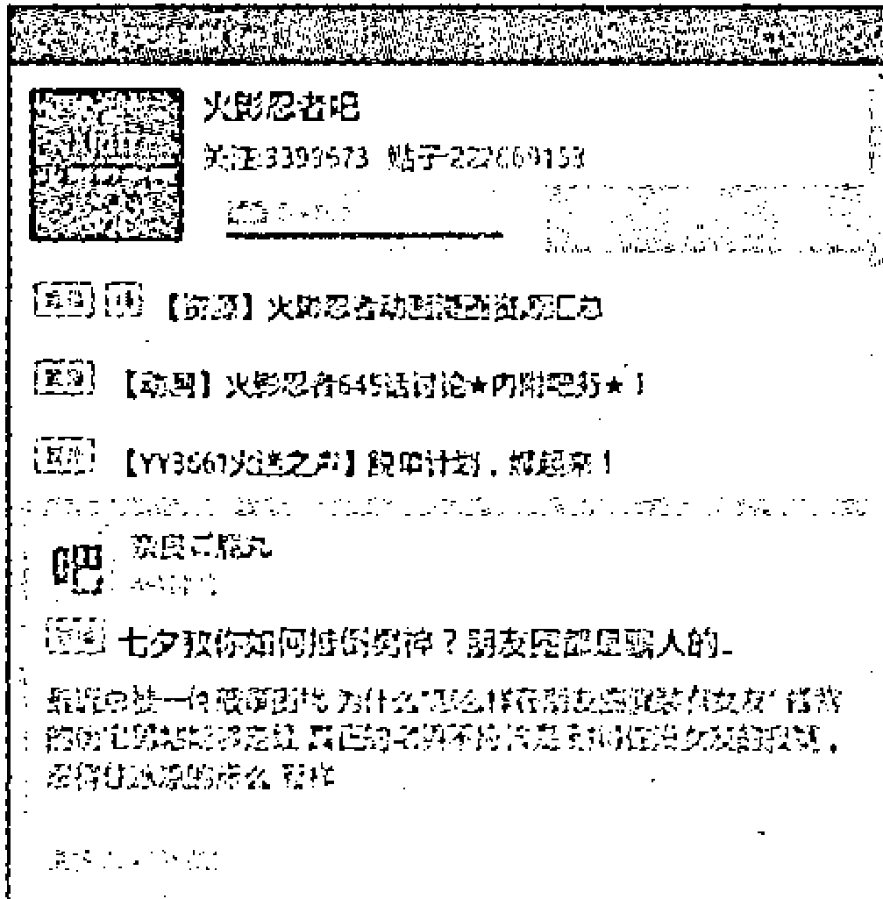

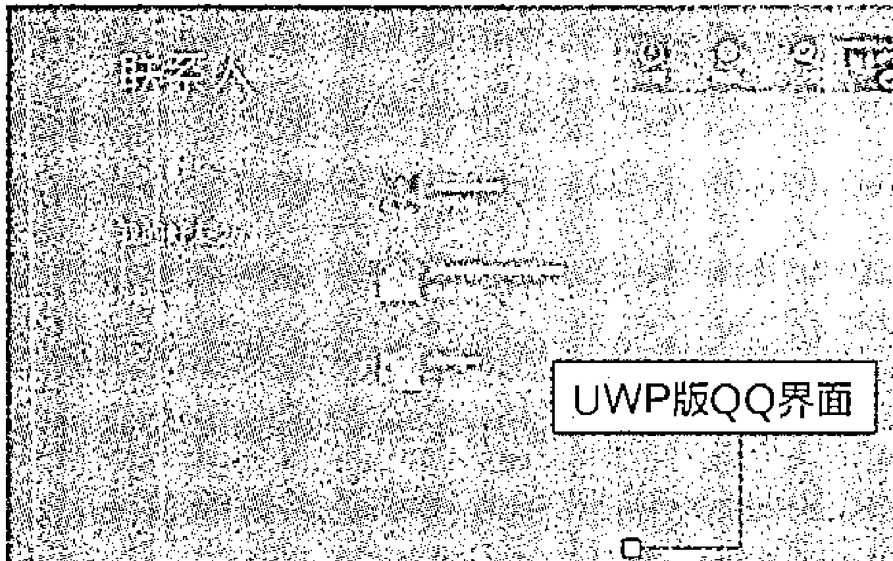

- QQ
推荐理由: 网虫必备聊天软件。UWP版QQ软件界面漂亮，而且运行起来简洁、高效，没有PC版各种烦人组件如弹出广告等，也没有自建任何后台和服务、QQ秀、QQ宠物等累赘。

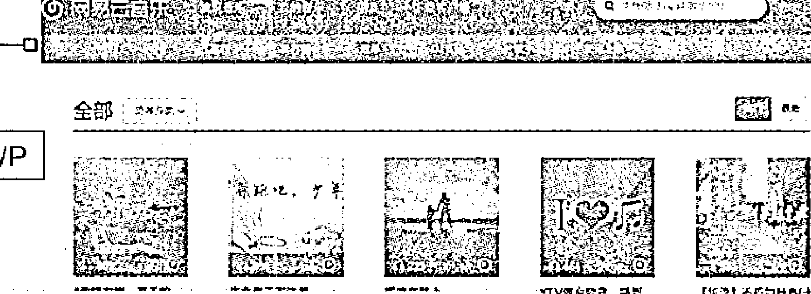

- 网易云音乐UWP
推荐理由: 在线听歌网友的最爱。它和PC版相比体积大大缩小，资源占用也更加优化，运行起来更流畅。而且其对高分辨率屏幕以及触摸屏的支持，比PC版更为优秀。

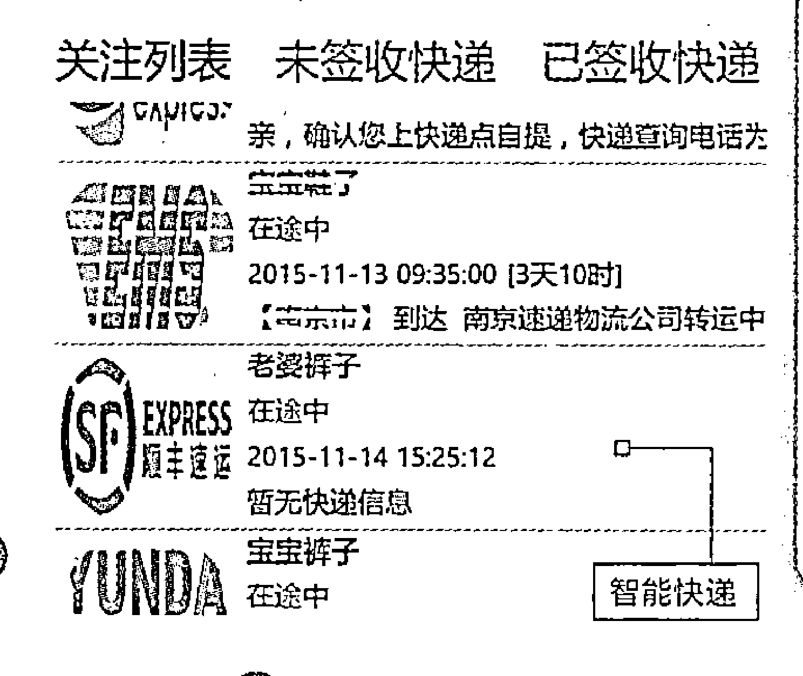

- 智能快递
推荐理由: 网购达人必备。平时网购看物流总得打开淘宝，操作起来实在麻烦。智能快递支持粘贴板自动录入单号、语音输入单号、摄像头录入单号(手机版使用)、图片选取单号等便捷操作，简单操作即可查询。

- 爱奇艺
推荐理由: 视频达人必备看剧神器。UWP版爱奇艺和PC版相比，一个重要特点就是点播前没有广告(PC版高达50~70秒广告)，而且和PC版相比没有开机启动、广告弹窗、捆绑其他软件(如PC版PPS)等乱七八糟的东西。需要注意的是，商店里有多个版本，要下载For Windows 10 UWP版。

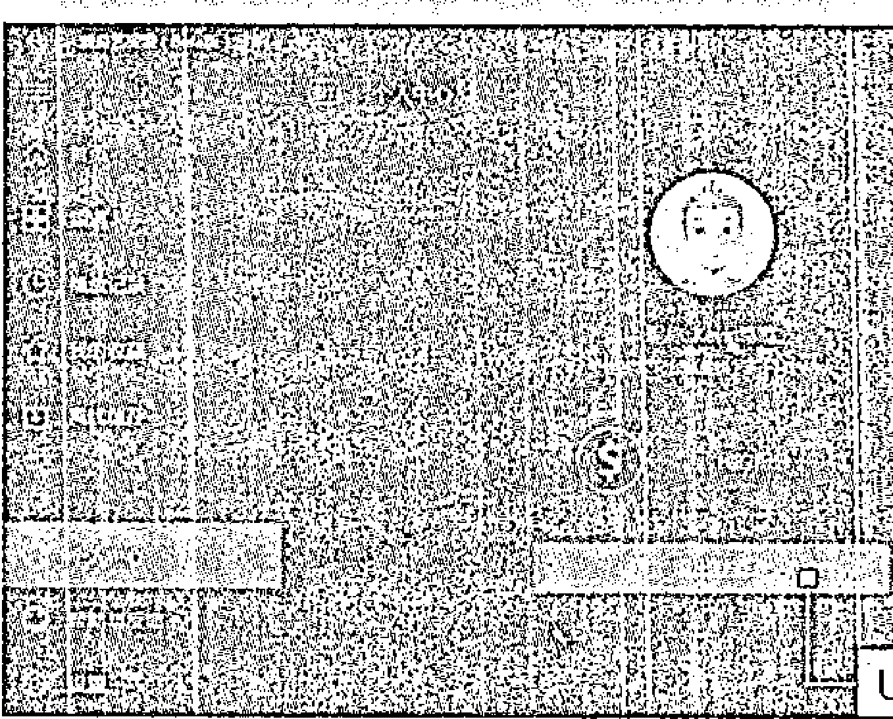

- UWP之家
推荐理由: UWP应用分类齐全，更方便新手查找和下载各类UWP应用，而且还有各类UWP应用的测评，方便大家在下载之前查看。

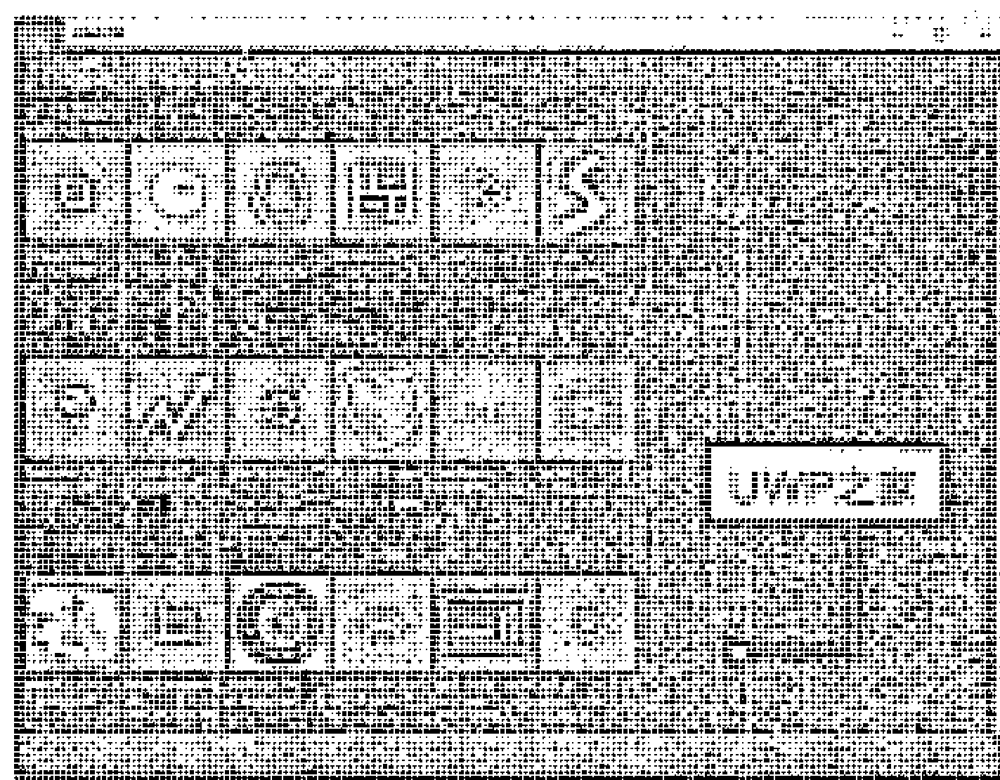

### 03 无中生有 UWP自己制作

由于转换工具需要特定操作环境，因此在运行程序前请检查自己的电脑是否满足下列条件：
Windows 10是否是企业内部预览版（build 10.0.14316.0及更高版本），如果低于该版本请自行将系统升级到最新版本，版本查看可以启动命令提示符，接着输入“VER”即可（图1）。

需要注意的是，因为转换工具是针对开发人员推出的，这里的Windows 10 build 14316是会员预览版（不是正式版）。如果你现在的系统是会员预览版，可以自动更新到新版，当然也可以直接到微软官网下载最新预览版（目前已经升级到10.0.14342）。如果现在的系统是正式版，就要加入会员并将系统转为会员版才能更新。具体方法是进入“设置→全部设置→更新和安全→Windows更新→高级选项”，在打开的窗口点击“获取Inside Preview版本”下的“开始”，然后使用微软账户登录重启后即可自动获取会员预览版升级提示（图2）。

另外要注意CPU是否为64位（x64）处理器，并且支持硬件辅助虚拟化以及第二级地址转换（SLAT）。对于这些信息的查看可以在“运行”对话框中输入“msinfo32”启动系统信息查看器，接着切换到右侧窗格，查看“Hyper-V地二级地址转换扩展”和“Hyper-V-固件中启用的虚拟化”是否均显示为“是”，因为UWP转换实际上是借助Hyper-V虚拟机实现（图3）。

一般来说近三四年配置的电脑都符合上述要求，不过很多主板BIOS关于硬件辅助虚拟化默认是关闭的，如果上述窗口中“Hyper-V-固件中启用的虚拟化”显示为“否”，请重启进入BIOS将其开启。如联想G410进入BIOS界面后依次展开“Configuratio→Intel Virtual Technology”，按下回车键将其设置为“Enabled”并保存退出即可（图4）。

确保自己的电脑符合上述要求后到http://t.cn/Rq5Ji7w（网址已作缩短处理），下载所需的转换工具（DesktopAppConverter.zip和BaseImage-14352.wim）。将DesktopAppConverter.zip解压到L:\DesktopAppConverter备用，BaseImage-14352.wim也复制到同一目录下。接着在搜索框输入“windows powershell”，以管理员身份启动后输入下列命令进行安装（图5）。

```
Cd L:\DesktopAppConverter
Set-ExecutionPolicy bypass（当弹出提示窗口时输入A确认）
.\DesktopAppConverter.ps1 -Setup -BaseImage BaseImage-14352.wim -Verbose
```

代码解释：这里“-BaseImage BaseImage-14352.wim”中的WIM文件名要和下载的一致，并且存放在DesktopAppConverter同一目录下，否则会提示无法找到文件。

执行完上述命令后开始解压BaseImage-14352.wim，按提示重启即可完成安装。DesktopAppConverter对程序的转换是通过命令行完成，假设现在需要将Cpuz.exe转换为UWP应用，启动Powershell后依次输入下列命令完成转换（图6）。

```
Rem 在C:\新建输入和输出目录，接着将Cpuz.exe复制到c:\installer备用
Md c:\installer
Md c:\Output
Cd l:\DesktopAppConverter
.\DesktopAppConverter.ps1 -Installer C:\Installer\cpuz.exe
```

接着在弹出的询问窗格中依次输入“-”参数后面的内容完成转换

- -Destination C:\Output\MyApp
-PackageName "MyApp"
-Publisher "CN=<publisher_name>"
-Version 0.0.0.1

这样就可以在C:\output下生成UWP离线安装包，接下来就可以将其部署到自己的电脑上了。

进入“设置→更新和安全→针对开发人员”，选择右侧窗格的“开发人员模式”（图7）。

打开上述目录，右击其中的“myapp.ps1”选择“powershell运行”，在打开的窗口中按提示完成证书安装即可（图8）。

如果转换后的UWP安装包需要上传到应用商店供其他朋友使用，因为应用商店UWP应用需要签名和审核，因此还需要微软开发账户和Windows 10 SDK安装包。更具体的操作请参考UWP应用开发文档的介绍。

随着Windows 10的逐渐普及，UWP应用也越来越多安装在用户电脑上。不过作为一种新的应用方式，UWP在日常使用中肯定会遇到各种各样的问题，这些问题是怎么产生的？我们该怎么进行解决呢？

**Q:** UWP应用都要从应用商店下载，为什么很多时候网络明明没有问题却无法成功下载？

**A:** 应用商店作为系统新增组件，由于其服务器在国外，因此很多时候会出现无法下载的故障。此时大家可以尝试使用下面的方法进行解决。首先在搜索框输入“wsreset”，然后运行该命令，该命令会对应用商店缓存进行清理，这个可以解决很多原来已在应用商店部分下载但是继续下载后无法完成全部下载的应用。如果该方法无效，还可以尝试使用“疑难解答”进行解答，启动疑难解答组件后点击下方的“使用Windows更新解决问题”，剩下的操作按屏幕提示完成即可。因为应用商店和系统紧密集成，上述方法可以解决碰到的大部分问题（图1）。

**Q:** 为什么UWP叫做通用平台应用，但是很多应用却无法在我的Windows手机上运行？

**A:** 虽然UWP叫Windows通用应用平台，但是能否在全平台运行关键是开发者是否针对所有平台进行了适配。比如手机屏幕较小，如果开发者没有针对小尺寸的屏幕进行优化，那么这些UWP应用是无法在手机上运行的（即使可以运行，屏幕适配性也会让人无法直视）。一般全平台适配的应用，下载后解压在“Dependencies”目录可以看到类似ARM、X86、X64子目录，这就是可以在全平台运行，如果没有ARM则说明开发者没有针对手机进行适配（图2）。

**Q:** 我的Windows 10平板C盘空间本来就不大，安装了多个UWP应用后可用空间就告急了，能不能自定义应用下载位置，不让其保存在C盘？

**A:** UWP应用默认都安装在“C:\Program Files\windowsapp”下，所以安装应用多了以后，C盘空间就容易被占用。如果要自定义这些位置，请首先将系统升级到TH2版本。打开“设置→所有设置→系统→存储”，然后将保存位置下的“新的应用将保存到”选择一个其他分区，应用后即可更改下载保存位置了（图3）。如果是Windows 10 Phone用户，为保留系统分区空间则可以把安装在手机空间里的应用迁移至SD卡上。依次进入“设置→存储感知→手机→应用+游戏→选择一个应用”就可以看到移到SD的按键了。

## 看了UWP的介绍我觉得很不错，可是在应用商店搜索一些软件时经常会搜索到很多版本，怎么确定哪个才是UWP版？

因为UWP是Windows 10平台运行的APP，一些软件为了照顾Windows 8平台的用户（或者之前发过旧版没有撤销），这样在搜索时就会显示多个版本。一般来说软件标注For Windows 10即为UWP版，类似HD版、Win8版则不是。当然更简单的方法是直接进入应用下载页面查看，比如爱奇艺UWP版在软件简介中会有“爱奇艺视频for Windows 10 UWP字样”，这表明就是UWP版了（图4）。

Edge浏览器支持快捷操作

此版本中的新功能

查看UWP版本说明

## UWP为什么不支持传统Windows快捷键？这样对于习惯用快捷键的用户来说很不方便。

这是因为是Windows 10平台运行的APP，开发者并不是仅仅针对PC用户开发应用。比如PC支持快捷键，但是大部分手机是不支持快捷键操作。这样应用代码里如果添加快捷键，在手机上就无法使用，而且运行起来容易出错（对于触摸设备，很多触摸操作已经和快捷键等效，如长按弹出快捷菜单）。因此很多UWP应用并不支持快捷键操作，但是UWP开发文档是支持快捷操作的，比如手机上支持后退导航，就能利用返回按键返回，电脑上感知Backspace键，也能主动返回，EDGE浏览器就可以在PC上使用大部分快捷键（图5）。

## 为什么我的UWP应用里无法输入中文，但是在EXE文件里却没有问题？

这是因为UWP应用比EXE文件使用了更为严格的权限限制，无法输入中文的现象大多是由于用户使用第三方输入法所致。解决方法是使用系统自带的微软拼音（或者自行在设置里添加系统自带的五笔等其他输入法），这些自带的输入法已经有完整的权限，一般可以正常输入中文，不过经测试，搜狗输入法也是没有问题的。

## 想卸载掉一款UWP应用，可是在开始里直接右键点击“卸载”没反应，从设置里也无法卸载，还有什么手工卸载UWP应用的方法？

UWP应用实际上是一个压缩包，它的安装方式和安卓APP类似，安装只是一个解压过程，因此默认卸载方法是将解压文件删除（不像EXE需要再次运行反安装程序才能卸载）。如果无法自动卸载，我们还可以借助最新版Ccleaner（http://t.cn/hrYz0J，网址已作缩短处理）进行卸载。启动Ccleaner后切换到“卸载”，它会将本机所有程序（包括UWP应用）列出，选中需要卸载的应用，点击“运行卸载程序”即可。

## 一直用得好的系统自带UWP应用最近出了一些问题，如UWP OneNote按钮突然显示不完整，怎么解决？

出现这类问题的原因大多是由于应用的某些文件损坏导致，解决方法是以管理员身份运行Windows PowerShell，启动程序后输入命令

```
Get-AppxPackage -AllUsers| Foreach{Add-AppxPackage -DisableDevelopmentMode -Register "$($_.InstallLocation)\AppXManifest.xml"}
```

这样该命令会对系统所有预装的系统应用进行初始化，初始化完成后可以解决故障。

## 你以为Ta只能做本职工作？

无论你是谁，只要使用电脑，就会被文档、表格、幻灯片和邮件弄得天昏地暗？遇到一些复杂的问题更会雪上加霜，还得琢磨去用一些代码或第三方工具来解决。Outlook管邮件，Office三大件管图文表，Photoshop管PS图片，这似乎成了办公生活的全部。但实际并非如此，只要我们用心挖掘，就会发现另类秘笈——Outlook除了收发邮件，还有许多实用之处；而Office商店里的插件，让代码和工具们统统走开。

## 01 Outlook 不仅仅是玩邮件

你是否为把事情安排得井井有条，在电脑上安装许多办公小软件，如日历、事务提醒或问卷系统等？其中有些软件装多了，电脑的运行速度也会相应变慢。现实是不必依靠其他软件，Outlook就能解决许多日常的应用。

### ▷ 定时约会 Outlook自动提醒

在Outlook中点击“日历”，在日历视图中右击，选择“新建约会”（或者选择新建项目中的“新建约会”），在“约会”对话框中输入约会事件的主题、地点、时间及备注等信息，在“选项”处设置好久前发出提醒声音（如1小时）。如果需要，可根据日程安排的类别在“分类”处设置好颜色，“标记”处设置好日程安排的重要性（图1）。

**小提示：** 如果日程安排是一个周期性的事件（如每周五10:00-11:00向上级领导进行工作汇报），可以点击“重复周期”，在“约会周期”窗口，设置好约会时间、定期模式及重复范围等（图2）。

## 简单调查 Outlook也能搞定

有时候我们需要在员工中进行一些民意测验或项目调查, 如果按照传统的思维, 我们首先会想到利用纸质调查, 但纸质调查还得发放到每个人手中, 并且收集后还要手工统计, 这很费时费力。其实, 类似此类的调查, 只要利用Outlook, 就可以轻松搞定。

首先, 点击“新建电子邮件”, 选择好收件人, 把调查的内容如实地写在邮件的正文中; 接下来, 在“选项”选项卡中找到“使用投票按钮”, 通过下拉菜单找到“自定义”的选项(默认的投票按钮只有“赞成; 反对”、“是; 否”、“是; 否; 可能”这三种选择), 在“使用投票按钮”处, 输入按钮标签(中间用英文状态的分号隔开), 勾选所需要的选项, 在“将答案发送给”处填写好收件地址, 设置好调查的过期时间等(图3)。

收件人在“阅读窗格”中, 单击信息栏, 然后单击投票选择, 打开邮件, 在“邮件”选项卡上的“响应”组中, 单击“投票”, 然后单击选择“方案一”、“方案二”或“方案三”就可以了。在“已发送的邮件”文件夹中, 打开发送的带有投票按钮的原始邮件, 在“邮件”选项卡上的“显示”组中, 单击“跟踪”, 同时会显示统计结果汇总(图4)。

## 分享日历 工作快速安排

许多公司在每个星期五都会公布公司下一周的工作安排, 这项任务一般用Outlook中的日历工具也都能完成。将制作好的日历通过邮件分享给员工, 使员工都能一目了然, 这可以大大减轻管理者的日常工作负担。

首先通过Outlook中的日历工具在下一星期的每天中输入工作计划。接下来点击“新建项目→电子邮件”, 在弹出的窗口输入收件人、主题, 再点击添加处的“附加项目→日历”, 在新弹出窗口的日历范围处选择“随后7天”, 详细处选择“完整详细信息”, 勾选“高级”处的所需设置, 电子邮件版式选择“每日计划”(图5)。

设置好后点击“发送”, 接收者收到邮件并打开后, 点击接收到的日历中的相应日期, 就会显示出当天的主题, 再进一步点击, 就会显示出更加详细的当天计划(图6)。

上述以办公环境向大家介绍了Outlook的实用方法。对于广大学生朋友们来说, 虽然暂时不会用到办公室的一些工作项目, 但类似于约会、调查、待办任务安排、协同分享工作等内容, 其使用方法与上述过程大同小异。如果在学校期间, 就能按上述方法使用Outlook软件, 那么当毕业之后进入各类公司, 涉及到具体办公事务, 就更能游刃有余、从容应对了。

## 待办任务 管理井然有序

除了公司事务外, 作为员工本身, 还可以通过Outlook制作个人任务计划, 将任务按重要性通过类别颜色进行标记, 完成情况也随着工作的进展进行标记, 并且还可以为每个任务设置提醒(图7)。

有了Outlook的帮助, 我们的工作变得井然有序, 办公生活就可以游刃有余了。

## 02 Office应用商店 让代码和工具更易用

此前，我们处理办公事务，当遇到Office软件本身直接解决起来比较复杂或难以解决的问题，常常会借助于一些外部工具或编写代码来完成工作。现在，我们可以借另一条方便之“道”来完成我们的目标工作任务，那就是调用Office应用商店中的一些办公插件应用。下面就让我们领略Office商店一些办公插件应用的魅力所在。

## 图片处理 商店应用更方便

在Office 2016的应用商店中，有一些非常实用的图片处理小插件应用，这些应用对我们的办公生活能够起到事半功倍的作用。

## 二维码巧制作

提到办公二维码的使用，很多朋友想在Word或PPT幻灯片中插入公司的二维码，但在制作二维码时不得不安装一些专业的软件，这也稍显麻烦。其实，在Office的应用商店中，就有现成插件可以制作二维码，而且效果很不错，操作也非常方便。

## 手机图片 上传没商量

在编辑有关公司产品的PPT幻灯片时，我们常常需要插入一些手机拍摄的产品实物图片。通常的做法是将手机当成U盘，与电脑相连，再一级一级找到图片所在文件夹，将图片复制到电脑中，插入幻灯片，这样的方法显然有些费事。其实，在PPT的应用商店中有个名字为“手机图片传输”的插件，利用它能够方便快速地将所需要的图片从手机插入到幻灯片中。

新建空白幻灯片，点击应用商店中的“手机图片传输”并信任它。这时在窗口右边就会出现一个二维码图片，用手机中的微信或QQ中的“扫一扫”，对这个二维码进行扫描(图1)。

扫描完后，在手机中选择所需要的图片，进行上传，上传完成后就会在原来的二维码区出现手机中的图片，将图片复制到幻灯片中就可以了(图2)。是不是非常方便呢？

## 手机图片传输

请使用手机扫描二维码 然后按照图片操作

## 幻灯设计 Office应用也轻松

在设计PPT幻灯片时，Office应用商店中还有很多插件让设计者能够省时、省力。例如，老师们常常会用到课上习题幻灯片，每张幻灯片上有一道选择题，当点击相应的备选答案时，幻灯片能够自动判断对错。如果按照常规的做法，需要每道题都制作若干个可能结果的幻灯片，这得多大的工作量呀？其实，如果应用了Office应用商店中的“Multiple Choice Quiz”插件，就不成问题了。

首先，在应用商店中搜索“Multiple Choice Quiz”，找到后信任它。这时，在当前幻灯片中就会出现问题编辑窗口，在“Select font size”处选择好文字大小，输入问题，选择好选项类别(Allow Single Choice Only：只允许一个选择，Allow Multiple Choices：允许多个选择)，设置好备选答案是否打乱(Shuffle Answers)、是否允许重试(Allow Retry)及重试的最多次数(Limit Attempts)，输入备选答案，最后勾选出正确答案，这个试题幻灯片就编辑完成了（图1）。

播放幻灯片：使用者点击相应答案，幻灯片会自动判断对错。是不是非常方便呢？虽然，它不算十全十美，但有了这样的小插件，也能让老师们省事不少（图2）！

其实，像这样省时又省力的插件还不少。例如，在一些单位开展的基本技能知识竞赛上，常常会用到倒计时的幻灯片，

使用很简单，当点击时，幻灯片上就出现倒计时。用起来简单，但设计起来却不像用的那么容易。网上常见的在幻灯片中制作倒计时的方法，不是制作若干张幻灯片按钮顺序播放，就是利用VBA代码，方法都比较费事。借用Office应用商店中的倒计时插件，就可以轻松搞定。在应用商店搜到一个名为“Slice Timer”插件，信任它后，在幻灯片出现的插件设置窗口中，设置好倒计时时间（如30秒），点击Save保存。播放幻灯片时，点击插件，倒计时就开始了（图3）。

## Excel表格 应用辅助效率高

图表功能是Excel的一大特色，但是，Excel也有心有余而力不足的时候，那就是创建特殊形状的图表时。怎么办？正所谓“一个好汉三个帮”，Office应用商店中的插件在关键时刻可以出手帮忙了。

## 三级图表一步到位

以设计一个产品在各市、县区及卖场的销售图表为例，我们首先会想到交互式的下拉列表，就是当选好市后，再选县区，再选卖场，就会出现相应的统计图表。但这样的设计往往不能一目了然。其实，用Excel 2016应用商店中一个名为“Databurst for Excel”的插件就能很好地解决问题。

在应用商店中点击并信任“Databurst for Excel”，接下来，在出现的“Bind to Data”编辑窗口点击设置按钮后，再点击“Bind to existing data”按钮，选择所需的数据区域，确定后就出现一步到位的三级图表了（图4）。

| 市名 | 县区 | 卖场 | 销售 |
| --- | --- | --- | --- |
| 石家庄 | 正定 | A卖场 | 58 |
| 石家庄 | 正定 | B卖场 | 87 |
| 石家庄 | 鹿泉 | C卖场 | 58 |
| 石家庄 | 鹿泉 | E卖场 | 99 |
| 唐山 | 丰润 | A卖场 | 90 |
| 唐山 | 丰润 | B卖场 | 84 |
| 唐山 | 丰润 | C卖场 | 77 |
| 唐山 | 丰南 | D卖场 | 62 |
| 唐山 | 丰南 | F卖场 | 86 |
| 秦皇岛 | 昌黎 | A卖场 | 70 |
| 秦皇岛 | 昌黎 | B卖场 | 61 |
| 秦皇岛 | 抚宁 | C卖场 | 86 |
| 秦皇岛 | 抚宁 | D卖场 | 60 |
| 保定 | 定州 | C卖场 | 93 |
| 保定 | 定州 | D卖场 | 52 |
| 保定 | 安国 | F卖场 | 96 |
| 保定 | 安国 | F卖场 | 97 |
| 承德 | 滦平 | A卖场 | 55 |
| 承德 | 滦平 | B卖场 | 77 |
| 承德 | 滦平 | C卖场 | 61 |
| 承德 | 隆化 | D卖场 | 57 |
| 廊坊 | 香河 | A卖场 | 79 |
| 廊坊 | 香河 | B卖场 | 79 |
| 廊坊 | 香河 | C卖场 | 97 |
| 廊坊 | 霸州 | D卖场 | 53 |
| 廊坊 | 霸州 | E卖场 | 70 |
| 廊坊 | 霸州 | F卖场 | 70 |

| 产品 | 销售 |
| --- | --- |
| A产品 | 37 |
| B产品 | 53 |
| C产品 | 73 |
| D产品 | 21 |
| E产品 | 54 |

## 异型图表轻松制作

看了上面的图表，也许你感到插件的神奇吧？这样的异形图表，如果用Excel自带的图表进行组合设置，是非常费事的。有了这样的插件，你就不用东找西寻地搜索像水晶报表那样的专业软件。其实，Excel的应用商店还有几个制作异型图表的插件，下面向大家介绍两个这样的插件。

制作圆弧式条形图表的插件Radial Bar Chart。信任它后在出现的窗口点设置按钮，点击“Select Data”选择所需数据，设置好标签列、数据列、圆弧颜色及标题，确定即可（图5）。

一个超简单的制作量表式图表的插件Gauge。信任它后在出现的窗口点“Insert Gauges”按钮，选取所需的单元格，再点击设置按钮进行更详细的设置，如绿、黄、红色各区域的最小、最大值及量表的样式等。如果想将其他数据也制作成量表式图表，只需要复制好生成的图表，点击设置按钮后，再点击“Change Data Cells”，重新选择所需要的单元格就可以了（图6）。

## 03 Photoshop 矢量工具可以这么玩

如今Photoshop已成为修图的代名词，不会两手“PS”的你，都不好意思跟妹子们搭话。不过，许多人只知道Photoshop是一个位图处理工具，可以画画、修图，却不知道它除了这些本职工作外，还有一个额外技能——制作矢量图。

### 矢量图和位图的区别

位图，通俗地说，就是由一个个点（像素）组合而成的；矢量图则主要由线条构成，并且这些线条是通过数学公式计算出来的，并不是由点构成。位图和矢量图各有优缺点，位图比较精细，但如果放大的话，图像就会出现严重的马赛克现象，而且位图的文件会比较大；矢量图相对来说抽象一些，没有位图精细，但是它可以无限放大或缩小，而不影响图像的质量，并且文件也很小。

[img/e7cfdc94a0ab890b7a44b06839435695_28_0.png]
位图放大后容易出现马赛克现象

[img/e7cfdc94a0ab890b7a44b06839435695_28_1.png]
快速将文字转换成矢量图

### 灵活多样的矢量工具

Photoshop（本文以CS5版本为准）中提供了多种绘制矢量图形的工具，只是很多人没有注意到。首先，文字工具就可以轻松制作矢量图形。在图像中输入文字之后，切换到图层面板，然后右击文字图层，选择“创建工作路径”，一个矢量图形就完成了。

文字工具上方的钢笔工具，则是用来手绘矢量图的。选中钢笔工具后，在图像中每点击一次就会产生一个锚点，连续点击的两个锚点之间会自动连结成线。当绘制出图形的轮廓，最后再在起始的那个锚点上点击，就会完成一个封闭的矢量图形了。在上方工具栏中，可以选择不同的模式，如果是“形状图层”，就会自动填充前景色，如果是“路径”，则绘制的只是轮廓，可以后期重新填充颜色。在钢笔工具的子工具箱中，还有增删锚点及将直线转换成曲线等工具，可以对自己手绘的矢量图进行调整。

文字工具的下方，是路径选择工具，通过它可以调整路径上的锚点位置，从而改变矢量的形状。路径选择工具下方，则是形状工具，它和上面工具绘制的图形性质是一样的，所不同的是，它可以方便地直接绘制出各种几何形状。

[img/e7cfdc94a0ab890b7a44b06839435695_28_2.png]
用钢笔工具手绘矢量图

《电脑爱好者》2016年合订本(三)

[img/e7cfdc94a0ab890b7a44b06839435695_29_0.png]

首先我们看一下本例最终的效果图，是不是很酷？这张设计图看起来很复杂，实际制作却很简单。

首先选择形状工具中的圆角矩形工具，然后在上方工具选项栏中，选择“形状图层”模式，接着将半径设置为一个非常大的数值，比如800px，这是为了让圆角变成圆形。现在在图像中按下鼠标左键不放并由上往下拖动，即可绘制出一个两头圆的长条形状。

接下来在图层面板中，将刚刚绘制的形状图层拖到下方的新建图层按钮上，放开鼠标键之后即可自动复制这个形状图层。用移动工具拖动新形状到一个合适的位置，然后在图层面板上，双击新形状图层上面的色彩块，打开取色器，重新设置一种颜色。通过在图层面板中调整图层的位置，可以任意调整各图层之间的上下位置。以此类推，重复操作，即可实现上述示例图的效果了。

用上面的方法会产生许多图层，有时操作起来很不方便。其实我们也可以将形状工具的模式改成“路径”模式，这样就可以在同一个图层中复制出所有形状，然后再一一填充色彩。为路径填充颜色，先用路径选择工具选中一个路径图形，然后右击它，选择“填充子路径”，在弹出的对话框中选择要使用的颜色，点击“确定”即可。不过需要注意的是，用这种方法填充颜色时应该由后向前进行，因为它没有分层，后填充的色彩总是会覆盖前面所填充的色彩。

图形绘制完成后，最后就是导出矢量图了。点击菜单命令“文件→导出→路径到Illustrator”，保存为AI格式的文件即可。

[img/e7cfdc94a0ab890b7a44b06839435695_29_1.png]
多重复制形状图形并重新排列位置

[img/e7cfdc94a0ab890b7a44b06839435695_29_2.png]
Photoshop取色器

[img/e7cfdc94a0ab890b7a44b06839435695_29_3.png]
先绘制路径后再一一填充色彩

## DIY配件的趋同与个性

每次新游戏发布的时候看着绚丽特效、宏伟的场面总是感到心里痒痒，恨不得马上买来玩，但是回头想起自己那个用了很久的老爷机顿时心凉了一半。可算赶上假期，有了换新电脑的钱，可是问题又来了：选什么？怎么选？为什么要选？虽然朋友或商家也会给出品牌、型号的建议，但大都会告诉你：“类似的产品也可以”。那么什么叫“类似”的产品呢？这些“类似”的产品真的没有什么区别吗？让我们以几种最常见的配件，来看一看这些似乎已经完全同质化的产品究竟还值不值得仔细“挑选”，抑或只要在网店中选择一个关键词，然后闭眼乱点一款就好了？今天我们就来谈谈电脑里的那些异同，了解相同中的不同，在同质化中选出自己所需。

### 主板篇

不同的厂商不同的花样，主板可以说是最能发挥厂商技术实力和创意的地方。虽然已用价格决定了身价，但如何区别异同也是需要动脑筋的。

#### 处理器接口

如果把一台电脑比作一个公司，那么主板就是公司的办公场所，看起来相同，实际上“玄机”却不少。如果仅仅是为了“能用”，那么我们只要选择处理器接口适合的主板即可。

处理器接口决定了主板可以装什么样的处理器。AMD与Intel两家的处理器接口不通用，AMD处理器接口以AM和FM开头，采用Socket封装技术，看起来就是处理器上充满了针脚，而主板的处理器插槽全是洞；Intel则升级采用更先进的LGA封装技术，看起来与Socket正相反，处理器上是平面触点，而处理器插槽上面都是针脚（图1）。除AMD的AM3+向下兼容AM3接口处理器与FM2+兼容FM2接口处理器外，其余主流主板都是一代插槽只支持一代处理器，也就是说处理器换代主板也必须跟着换掉。

[img/e7cfdc94a0ab890b7a44b06839435695_30_0.png]

#### 芯片组和板载接口

虽然理论上讲只要处理器接口是合适的，随便选什么样的主板都能用，可是除了点亮处理器外，我们总还有点其他的追求，那么就必须关心这些看起来相似的主板到底有什么不同，是否能满足我们的需求了。

主板芯片组是用来帮助电脑各部分零件进行数据交互的核心，它们也都来自AMD和Intel这两家处理器厂商，所以对自家处理器的兼容性是毋庸置疑的，其中不同的型号决定了主板各项支持参数。例如针对最新一代Intel处理器的主流芯片组有Z170、H170、H110、B150。Z系列面对高端玩家，提供最完整的规格（图2），Z170芯片组有20条PCI-E 3.0总线通道、6个SATA 6Gbps接口、3个SATA Express接口、10个原生USB 3.0接口、3个RST PCI-E接口（支持RST英特尔快速存储技术的PCI-E接口）。价格上比较贵，一些土豪级主板也都会采用这一芯片组，相应主板售价在600元~6000元之间。

H系列针对主流用户，其中H170相比Z170芯片组各方面的支持和能力都有削减，但削减不多，例如PCI-E通道缩减为16条，仍然可以很好地使用一块高端显卡。USB 3.0虽然缩减为8个，但基本够用，更增加了USB 2.0的数量。H170不支持超频，不过部分厂商已经破解了超频封锁，通过更新BIOS也可以获得超频能力。H170主板售价较为合理，在500元~1100元之间。而H110芯片组则是面对入门级用户，各项能力削弱较多，主板售价在400元~700元之间。

B系列针对商业用户，除常规参数支持外还支持Intel vPro、中小企业通锐等企业用户需要的技术（需要处理器、操作系统等软硬件支持），售价在400元~1000元之间。从参数上来讲H110芯片组就可以满足大部分玩家所需，但是由于定位较低、利润太薄，所以厂商推出的H110主板较少，更多的将精力集中在H170和Z170上面，更有很多厂商索性将B150芯片组当作家用级来开发。需要注意的是，B150芯片组针对普通消费者的规格并不如H170，大量商用技术的加入使其价格还要高一些，所以没有特殊需求的用户还是把关注点转移回H和Z系列上来比较好（图3）。

AMD主流芯片组有A88X、A78、990FX、990和970。A系列芯片组采用FM2接口处理器，主要是内置较好显示核心的APU，针对普通玩家与家庭、办公用户。900系芯片组采用AM3+接口；主要使用FX多核心处理器，针对中高端用户。参数支持的差异与Intel芯片组差不多，这里就不再过多介绍。

芯片组所支持的技术、扩展接口等虽然不一定都会出现在主板上，但基本能体现出主板的实际承载、连接能力。不过要更好地挑选主板，我们还应该更深入地了解一些主板技术和配置的意义。

[img/e7cfdc94a0ab890b7a44b06839435695_31_0.png]

- 1. 技嘉 (GIGABYTE) B150-HD3主板 (Intel B150芯片组/支持DDR4内存/USB3.0) - ¥819.00 (已有13人评价)
- 2. 技嘉 (GIGABYTE) H170-HD3主板 (Intel H170芯片组/支持DDR4内存/USB3.0) - ¥819.00 (已有0人评价)
- 3. 技嘉 (GIGABYTE) G1.Sniper B7主板 (Intel B150芯片组/支持DDR4内存/USB3.0) - ¥849.00 (已有8人评价)
- 4. 技嘉 (GIGABYTE) H170-HD3 DDR3 (Intel H170芯片组/支持DDR3内存/USB3.0) - ¥849.00 (已有0人评价)
- 5. 技嘉 (GIGABYTE) B150-HD3P主板 (Intel B150芯片组/支持DDR4内存/USB3.0) - ¥849.00 (已有428人评价)
- 6. 技嘉 (GIGABYTE) H170-HD3 DDR3主板 (Intel H170芯片组/支持DDR3内存/USB3.0) - ¥849.00 (已有0人评价)
- 7. 技嘉 (GIGABYTE) H170-HD3主板 (Intel H170芯片组/支持DDR4内存/USB3.0) - ¥869.00 (已有0人评价)
- 8. 技嘉 (GIGABYTE) G1.Sniper B7主板 (Intel B150芯片组/支持DDR4内存/USB3.0) - ¥899.00 (已有11人评价)
- 9. 技嘉 (GIGABYTE) H170-D3HP主板 (Intel H170芯片组/支持DDR4内存/USB3.0) - ¥899.00 (已有0人评价)
- 10. 技嘉 (GIGABYTE) G1.Sniper B7主板 (Intel B150芯片组/支持DDR4内存/USB3.0) - ¥899.00 (已有0人评价)

#### 供电相数

经常能听到别人在介绍主板的说“X相供电”，或者更具体地说“A+B相供电”。“A+B相供电”中A指的是处理器供电线路数，B指的是内存供电线路数，而X相供电通常是将其加在一起，或者特指其中的A。这里的供电指的是一组供电模块，这组供电模块为处理器和内存提供更稳定更干净的直流电，通常由一个电感、一个电容和一对MOS管组成。一般情况下一相供电可以提供25W电力（具体需要看实际参数），4相供电就足够大部分处理器正常使用了。如果用户有超频需求，6+1或者6+2项供电设计会更加保险。考虑到密集的供电模块在一起发热量很大，一些厂商在供电模块上设计了散热鳍片来减少过热带来的寿命与安全问题（图4），有的还采用热管串联在一起增加散热性能。当然，供电并不是说相数越多越好，散热鳍片越夸张越好，对于用户而言只要够用就行，毕竟这钱最后还是要消费者自己来掏腰包。

#### 板载声卡

随着科技的发展，越来越多的芯片被简化、集成，声卡就是这样一个例子。从原先用户不得不买的声霸卡到现在集成在主板上面小小的声卡芯片，这之间也经历了很多。板载声卡虽然方便，但是音效一般都不如独立声卡。相比独立声卡，集成在主板上的声卡缩减了很多芯片，把专业芯片的工作都交给处理器或芯片组来“兼职”处理。另外板载声卡芯片和线路与主板紧密集成，会受到主板其他电路设计的影响，以及较大的电磁干扰。当然这样的音效差距，一般用户使用中端外放器材时体现得并不明显。有一些主板为了满足“金耳朵”用户的需求，对板载声卡进行了一定的加强，例如映泰主板将主板Hi-Fi的概念带入市场中来（图5），首先将音效部分与主板线路隔离，其次在声卡芯片上增加一个金属罩来减少电磁干扰，并且采用专用的液态电容，让电流更加纯净，最后配上专门开发的声效软件，极大地提高了板载声卡的音效，也提高了声音输入的能力。很多厂商也有类似的做法，甚至板载创新（Creative）用独立声卡芯片来提高声音处理能力。如果是对音效有要求但又不太懂音频的用户，可以在选购主板的时候选择音频设计较好的主板，既带来了良好的体验效果，也减少了选择独立声卡带来的种种问题。

[img/e7cfdc94a0ab890b7a44b06839435695_32_1.png]

#### 板载网卡

随着大型网络游戏的流行，板载网卡也逐渐成为了各大主板厂商，特别是游戏主板产品之间竞争的着力点。技嘉的Killer主板（图6）最先采用集成Killer网卡的硬件解决方案来降低网络延迟，这种方案大多采用在旗舰游戏主板上面。Killer网卡在处理网络传输上有一套独特的运算方式，对增强网络稳定性、降低延迟有明显的作用。不过考虑到国内网络带宽的制约因素，玩国内网游时体现得并不明显，在跨服或者跨国游戏时才会有更好的表现。另外还有相当多的主板采用Intel网卡+cFosSpeed软件的解决方案，通过调节网络使用效率和调试任务优先级来减少延迟。

玩家可以根据自己游戏的网络需求来选择主板，如果是国内网游为主推荐Intel方案，如果是高端网游和玩外服的玩家，Killer方案更为合适。

> 技嘉Killer系列是个性十足的纯游戏主板

[img/e7cfdc94a0ab890b7a44b06839435695_33_1.png]

### 其他

主板还有很多相当独特的技术也值得去注意，比如想要尝试超频但是又怕失误的玩家可以选择技嘉主板，它们配有双BIOS，在超频失败导致其中一个损坏或是升级BIOS出现问题的情况下可以切换到另一个BIOS，不耽误正常使用；喜欢极限超频的玩家可以选择华擎的OC方程式系列，采用组合式电容，提供更干净的电流，并配有高密度防潮纤维防止水汽造成的安全隐患；如果是需要质量过硬、可以对付恶劣使用条件的玩家可以选择华硕TUF系列，5年质保加军工设计质量更为放心，其中的SABERTOOTH系列还配有大型散热板（图7），降低整个主板发热量，还能起到整理风道的作用；网络环境特殊的地方还可以选择带有Wi-Fi模块的主板，让台式电脑与笔记本一样脱离网线或者作为无线热点等等。

> 散热片配置到夸张程度的TUF主板

# 02显卡篇

相比主板，显卡似乎更简单，大部分人在挑选时只考虑显卡的核心即GPU，另外可能就是频率和显存容量等规格，所以总感觉不同品牌、型号显卡的可取代性更强。其实显卡也是有很多个性的，例如供电、散热，以及一些独特的技术和配置设计，如果仔细了解一下，可能会对选购有不少的帮助。

[img/e7cfdc94a0ab890b7a44b06839435695_34_0.png]

[img/e7cfdc94a0ab890b7a44b06839435695_34_1.png]

#### 核心差异

选择显卡型号之前首先要先了解自己需要什么性能的显卡。目前显卡处于新老交替之间，新显卡尚未全面铺货，老一代显卡仍为主力，所以这里的说明以NVIDIA的900系列和AMD的Radeon R300系列为主。NV显卡同等级性能更强、功耗更低，可选短卡多，价格也更高一些。AMD显卡同等级性能虽弱，不过几轮价格下调后价格上有了明显的优势，而且DX12游戏支持能力更好。我们可以大致将显卡划分为入门级、游戏级、发烧级几种。GTX750 ti、R7 370及以下为入门级显卡，这些显卡价格在500元~1000元之间，对于大部分网游来说可以保证1080P分辨率中等画质流畅，适合整机预算较低的用户选择。500元以下的显卡性能可能强于Intel处理器内置显示核心，但已经与APU显示核心相差不多，游戏能力更没本质差距，没有必要选购。

GTX950(Ti)/960(Ti)、R9 370 X/380(X)为游戏级显卡，这部分也被称为“甜点级”显卡，价格在1000元~2000元，性能不弱，相比于旗舰级有更好的性价比，可以流畅运行1080P分辨率高画质主流单机游戏，适合预算较为充足的用户。GTX970、R9 390及以上为发烧级显卡，这部分显卡性能强悍，可以流畅运行1080P最高画质全特效单机游戏，或者使用超高分辨率、全屏抗锯齿、VR等。它们价格较为昂贵，普遍在2000元以上，适合游戏发烧友。除核心性能分类外，我们在选购显卡的时候还能看到各种超频/高频版。这些显卡核心频率比一般显卡要高，属于体质较好的核心，在出厂前就进行了超频处理，有更好的超频的潜力。另外显卡的显存容量、类型配置也有一些不同，甚至有些型号因为配置不同的显存而出现较大的性能差异。以上都是我们选购显卡时经常会特别注意的指标，其实显卡们还在很多方面体现着自己的特色。

#### 散热方案

对于不同的显卡来说，散热设计的差异是其外形上最直观的表现。显卡的散热设计方案主要有三种：一般显卡最常用的下压式散热方案；公版高端显卡上常见的蜗轮抽风式散热方案（图8）；以及只在旗舰和定制显卡上出现的水冷式散热方案（图9）。目前中高端显卡的下压式散热方案已经普遍采用散热鳍片+热管配以大风扇/多风扇的设计，有些高端显卡还会拉长显卡长度以容纳更大的散热鳍片和更多的风扇。除这些共通的设计外，一些厂商还会根据需求与研发在细节上进行改良。比如七彩虹九段系列显卡设计了独有的空力散热套件，可在显卡上外接一块带有热管的散热鳍片，利用机箱内风道进行辅助散热；华硕通过增加工艺精度达到热管的直触技术，让热管与核心接触更紧密，散热效果更明显。

除热管设计差别外，风扇的设计也很有讲究。微星显卡自动除尘技术会在开机后回转显卡风扇，把显卡内部的灰尘吹出来，方便显卡清理；EVGA显卡风扇上采用双滚珠轴承，既能增加风扇寿命，也能减少风扇转动时带来的噪音；迪兰的刀锋子母风扇带来更多的进风量，也能控制高负荷下的噪音问题；还有些型号配置的多风扇采用反向转动方式，可以对冲掉一些振动，或者是配置不同的扇叶，对不同部位以更适合的高风压或大风量方式进行散热（图10）。

[img/e7cfdc94a0ab890b7a44b06839435695_34_2.png]供电能力

显卡的供电设计与主板一样有“A+B”相的设计，而且因为GPU和显存已经比CPU和内存更精密，所以用料也比主板更为讲究一些。例如目前市面上的中高端显卡供电部分不仅多采用性能更好的全封闭式电感，更采用了一些独特的高性能电感，比如微星的SFC（超级铁素体）电感、技嘉METAL CHOKE铁素体电感。这两者噪音更低，电气性能更平稳。此外还有华硕的S.A.P超合金供电模块，保证性能可靠的同时也控制住了温度与噪音。少部分高端显卡还会使用昂贵的钽电容（图11）。

固态电容分为内地品牌、台系、日系3种。内地品牌电容价格低，在二线品牌显卡上出现较多；台系电容性能更好，在华硕技嘉板卡上就大量使用台湾钰邦电容；而以吉尼康为代表的日系电容性能、寿命更强被视为高端象征。从电容配置上也能看出厂商对显卡制作的用心程度。

要注意的是，有的二、三线厂商用电解电容（液态电容）包铝皮的方式充当固态电容，如果看到电容上有类似“K”型、“+”型、“三瓣”型或“T”字型这样的印槽基本就可断定是假固态电容了。选购时一定要小心谨慎，不要贪图便宜。

接口设计

对显卡来说还有一个重要的配置就是视频输出接口。主流接口有：VGA、DVI、HDMI和DisplayPort（以下简称DP）四种。VGA接口对旧设备适配能力高，但以模拟转换的方式进行图像传输会造成图像损失；大部分显示器已经不再使用，最新的GT1000系列显卡更是完全不支持VGA接口，所以还在使用VGA接口的朋友们不得不需要考虑升级换代了。

DVI、HDMI、DP这三个接口都是数字信号传输，不像VGA接口那样进行模拟转换，图像损失就少得多。DVI接口较为常见，目前是台式电脑主流接口，但是技术已经比较老旧，接口较大，不易连接，数据带宽较低；HDMI比DVI带宽更高，支持音频传输，适合2K分辨率画面传输，更便于转接电视。DP相比HDMI规格更高，是组建多屏并联或4K分辨率传输的首选。一般显卡都会带有一个DVI接口、一个HDMI接口以及两到三个DP接口。需要注意的是，HDMI和DP接口也有版本差异（图12），对超高分辨率、VR等新技术有要求的用户，应尽量选择新版本接口，如HDMI 1.4虽可支持4K（3840×2160）分辨率，但只能达到30fps的帧速，而HDMI 2.0在4K分辨率下可达到60fps的图像传输速度，而DP 1.4更可传输8K（7680×4320）分辨率的图像。

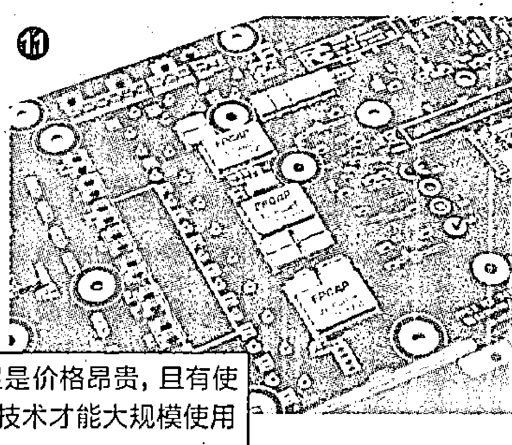

> 钽电容性能优异，但是价格昂贵，且有使用限制，需要过硬的技术才能大规模使用

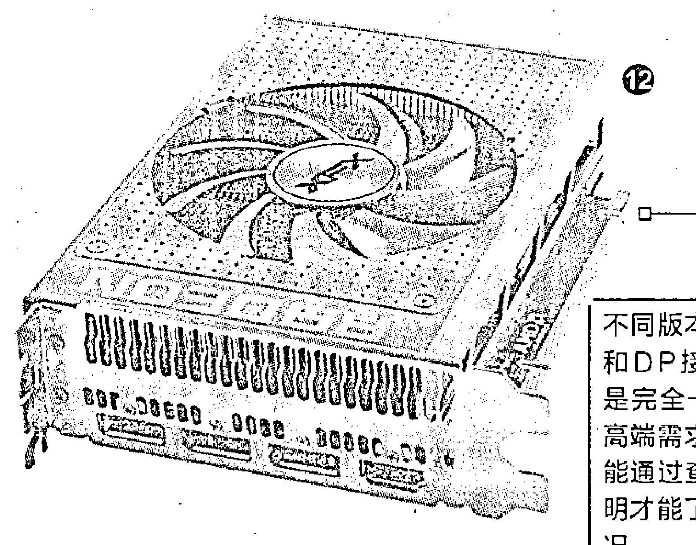

> 不同版本的HDMI和DP接口，外形是完全一样的，有高端需求的用户只能通过查阅产品说明才能了解详细情况

03 机箱篇

或许有人问机箱有什么好选的？随便找个百元左右的机箱就行了。但机箱的设计大为讲究。百元机箱有百元机箱的设计，千元机箱有千元机箱的用途。这里我们就来看一看价格高低不同的机箱到底在哪里有区别。

板材

机箱最大的作用就是保护机箱内部的零件不受损坏，但是很多百元机箱采用ABS塑料来充当机箱板材，这种机箱或许外观看起来不错，但是根本禁不起磕碰。而一些采用钢板的低端机箱存在偷工减料问题，钢板厚度都不到0.5mm，轻轻一碰就会有凹痕出现，如此不靠谱的钢板如何能保护零件安全呢？所以选择机箱的时候最好先做好功课，在网上找到板材厚度合适的机箱。一般钢板厚度在0.6mm-1.2mm之间较为合理，钢板过厚容易在结合处产生较大的裂缝。

其次要选择材质合适的板材，目前机箱用的板材有铝镁合金、冷轧薄钢板(SPCC)、电解镀锌钢板(SECC)、热浸镀锌钢板(SGCC)。除高端机箱采用轻薄方便的铝合金(图13)外，大部分机箱采用价格适中、耐腐蚀效果好的电解镀锌钢板(SECC)钢板。部分厂商还采用活性炭钢，这种钢材带有静电吸附和机箱干燥的效果，适合特殊环境使用。另外做工比较好的机箱会在所有板材的茬口进行磨边或卷边处理，可以防止用户使用时被划伤。

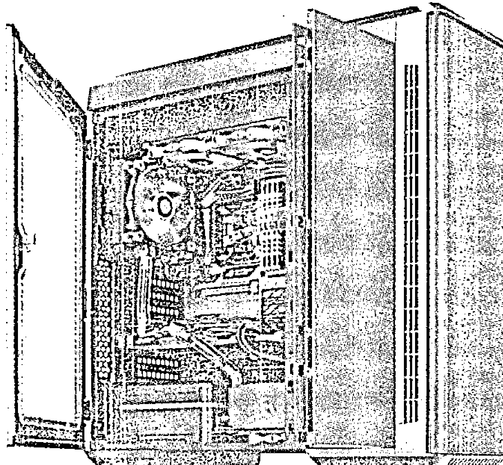

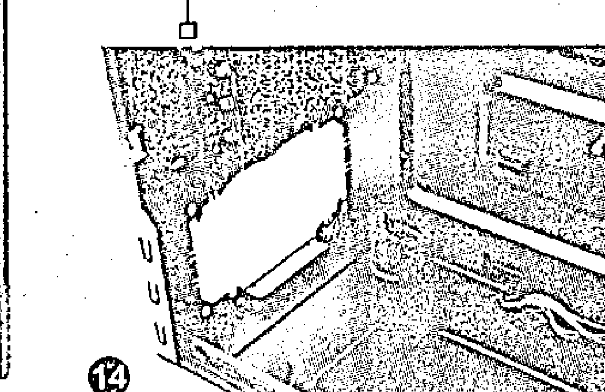

防辐射

除了保护零件安全，机箱还有一个功能就是防止机箱内的电磁辐射，这一点对精密度要求很高，直接反映着不同机箱的做工。机箱的防辐射设计就是让机箱尽可能形成一个密闭空间，减少电磁辐射的传出。除了尽量让几面的板材安装紧密之外，机箱还会在机箱侧板边缘设计很多的EMI弹片触点，它们既能确保接触紧密，一定的力度也会让侧板连接更稳固(图14)。考虑到散热需求，机箱都会设计大量的散热孔。为了减少散热孔带来的闭合问题，好的机箱都会将散热孔设计很小并且设计覆盖金属网来降低电磁泄露，当然这一措施也可以大大减少机箱进灰。有厂商宣称黑化机箱能减少电磁辐射，其实机箱阳极氧化黑化作用更多是在于增强抗腐蚀性与硬度和耐磨性，对防辐射的影响远不如上面提到的设计。

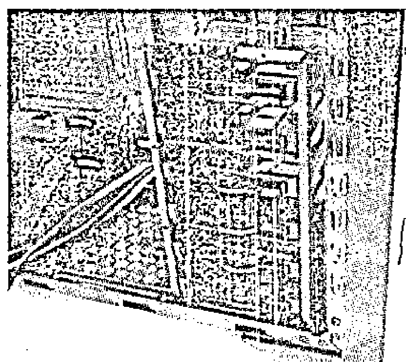

其他功能

一个好的机箱内部设计能减少很多装机和使用过程中的麻烦，好的设计一般满足以下几点：

背板设计：背板设计的出现让主板固定更加牢固，减少机箱碰撞时对主板的直接伤害。另外背板设计也方便了用户走线，让机箱内部不再到处都是连接线，在安装零件和清理机箱时更为方便。

免螺丝设计：很多机箱安装硬盘和显卡时要用螺丝固定，但这样费时又费力。很多厂商采用螺旋式按钮或者是固定卡扣的设计方式免去螺丝固定，方便安装。如果再加上特殊的硬盘位设计，有经验的DIYer甚至可以徒手进行所有配件的拆装。

硬盘位设计：一般机箱的硬盘位就是一个空盒子或者一个固定板，但是好的机箱会有很多特殊设计，例如抽屉式只需将硬盘抽屉抽出，然后把硬盘放入抽屉固定位连好线材直接插入(图15)；贴板式硬盘则需要将两个特殊贴板安装到硬盘两侧直接塞入硬盘架即可。

风道设计：有些机箱为了加大散热量胡乱地增加进风口和风扇位，实际却只能破坏防辐射能力，更糟糕的还会阻碍机箱散热。为了满足整机的散热要求，处理器上方通常会设计进风通道，在硬盘位前面设计进风口，并通过挡板或者导流罩来让机箱内形成一定的风道，让每个零部件都能得到良好的散热。高端机箱还会在背板等位置设计水冷位置或水管进出口。

前置面板：平时大家对前置面板都不太关心，但在实际使用中影响很大。是否有USB3.0和e-SATA接口？数量够不够用？是否有音频接口？都很重要。除了这些接口，一些厂商还会设有读卡器和风扇调节器，方便用户使用。

静音防尘：电脑的静音除选择静音风扇外，部分厂商还会在机箱内设计吸音棉，减少噪音传出，并在硬盘位置和主板螺丝孔以及机箱底部上放置垫片，减少振动产生的噪音(图16)。一些机箱还会设计防尘网，一方面是防止灰尘进入机箱损害零件，另一方面是防止灰尘堆积风扇，阻碍散热，增加风扇转动噪音。

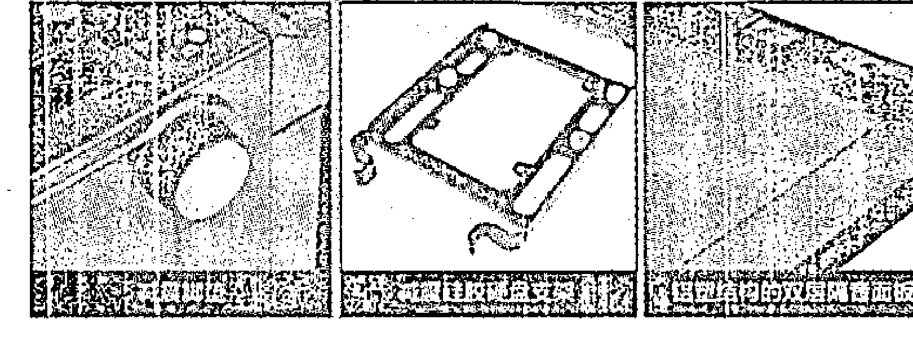

04 电源篇

电源对于保障整机的稳定安全来说非常重要，但是大多数人都只会考虑到电源的总功率，其实电源也有很多讲究，必须挑选最适合自己电脑的配置，才能让系统安装更顺畅，运行更稳定。

认证与输出

经常能看见一些电源标记金牌/银牌/铜牌转换效率，标称为80Plus (图17)，这里的转换效率指的是电源转换成电脑能够使用的电量比，而80Plus指的是转换效率高于80%，比如白牌 (80%转换) 认证的600W电源实际消耗的电量是750W (600W除以80%)。获得的认证越高越省电，获得认证越高也代表做工和用料越好，转换能力高低也成了电源质量的一个直观参考。

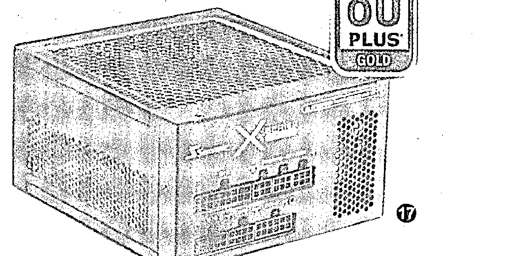

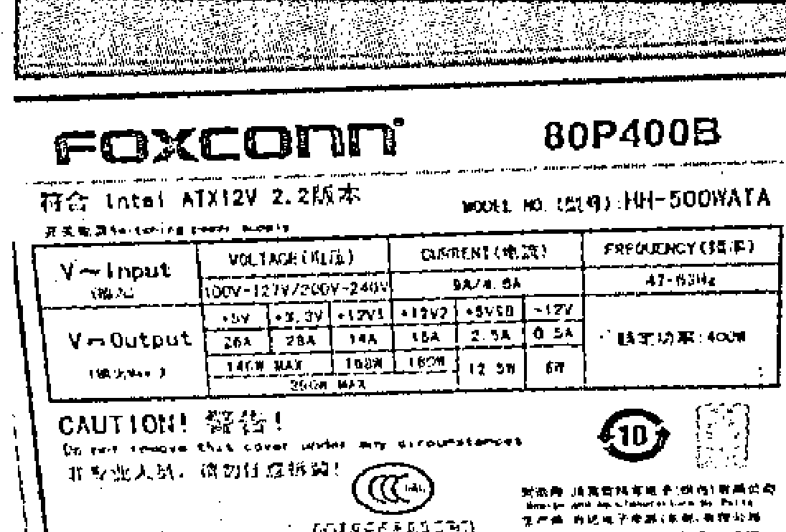

12V输出

除了电源的整体输出功率外，我们还应该看铭牌上标的12V输出。12V输出的电流会提供给处理器和显卡，如果12V输出低于显卡和处理器功耗就会产生蓝屏死机等现象。一般合格的电源12V输出占电源总输出80%以上，有些还有双路输出，以免两个耗电大户互相影响 (图18)。

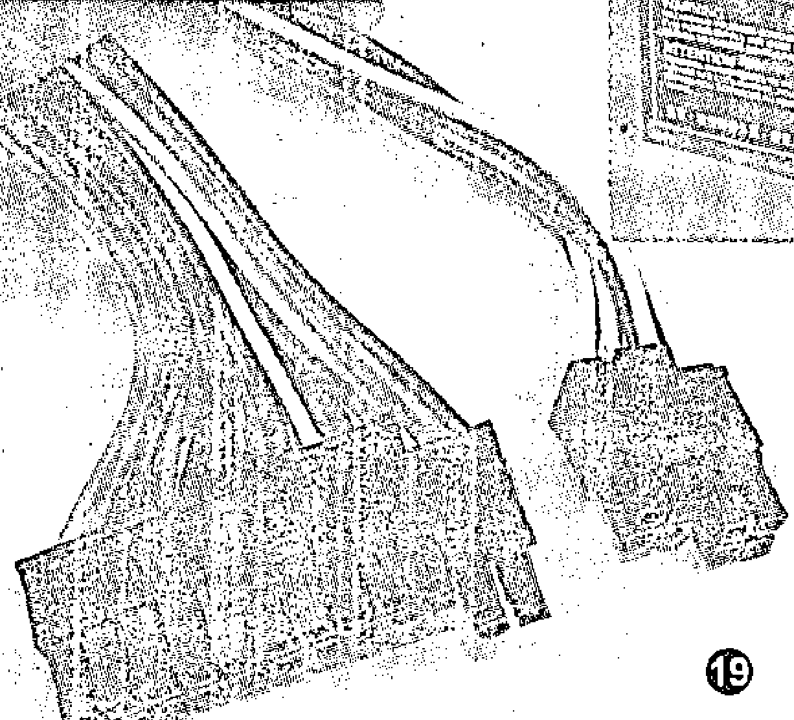

接口

电源的接口决定了电脑能装什么样的零件，而且即使是标准一样的电源，接口的数量和提供方式也常常是不一样的。例如主板供电接口，有些电源采用20Pin+4Pin的主电源接口和一个4Pin+4Pin的处理器供电接口 (图19)，而有些则是不可分拆的24Pin和8Pin接口，前一方使用比较灵活，但可能需要先拼接再安装，有些麻烦。另外显卡供电接口也有双6Pin+双8Pin或者双6Pin+2Pin的方式，还有一些只提供了一个显卡供电接口，如果使用高端显卡或双卡必须自己用转接线进行扩展，就不适于游戏发烧友。另外购买电源时一定要注意SATA供电接口的数量是否够用，准备进行背部走线的用户则要注意连线长度是否足够，最好选择连线较长的产品。而不喜欢机箱中塞着太多线缆的用户，可以选择模块化输出接口电源 (图20)，根据需要在电源上连接输出线缆，减少机箱中的线缆量。

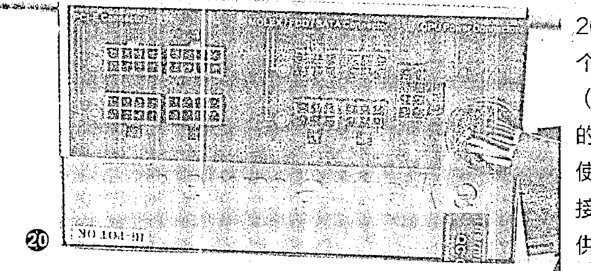

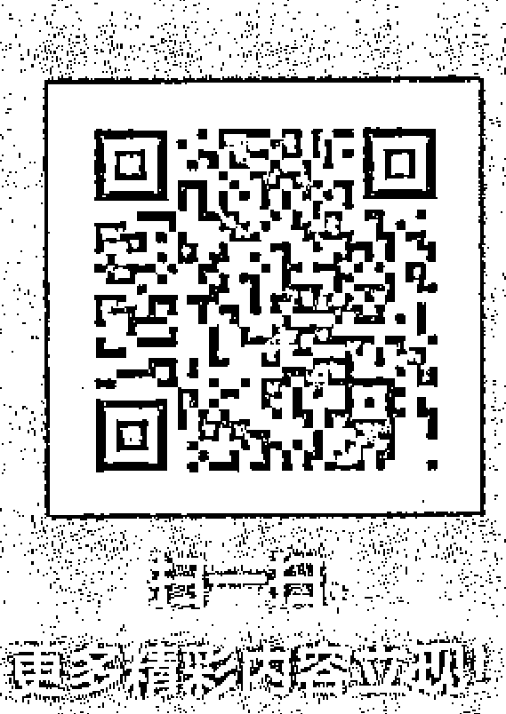

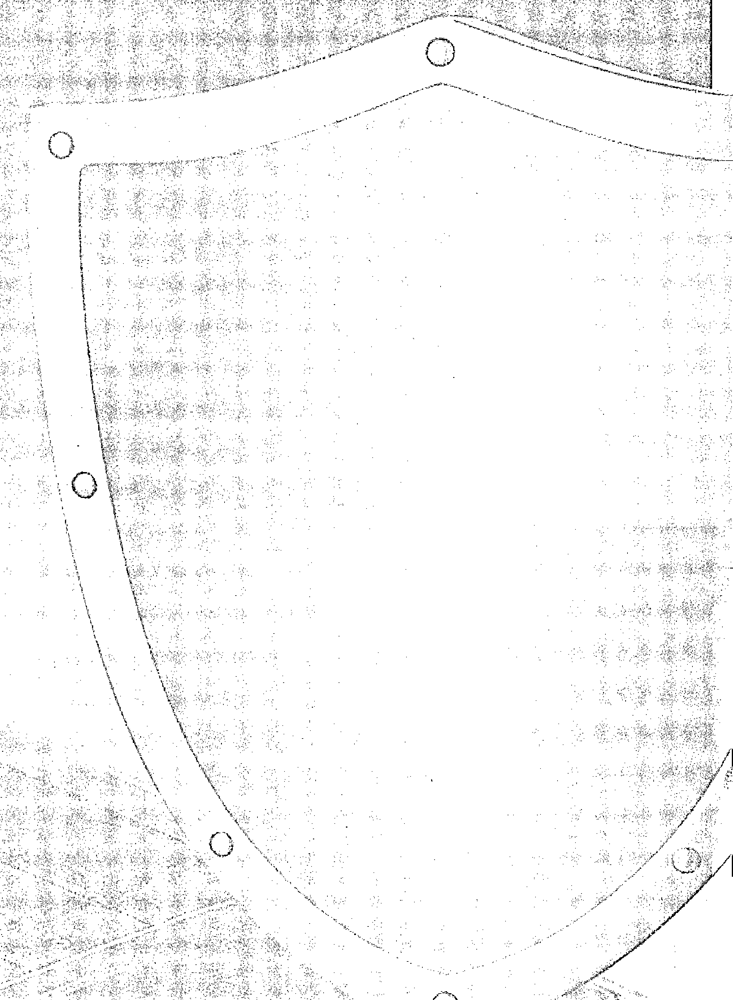

未雨绸缪

你的IT安全要走在时代之前

策划：《电脑爱好者》编辑部

有关IT信息、产品安全的问题几乎天天都会发生。也许你会认为这些事情离着太远，永远不会找上门来。支付宝不会被盗、手机怎么可能爆炸？

但几乎每个使用过互联网的人都会经历过一次QQ密码被盗的风波吧。在源头上的小小失误定会酿成惨重的损失，千里之堤毁于蚁穴就是这么来的。

因此，我们广泛收集了安全问题的缘由，并梳理了各种解决办法，希望此专题能够帮你在未发生问题之前，就做好万全的准备。有了这些，使用智能设备和PC时，就不愁不能“御敌于千里之外”了。

将威胁降到最低 用好你的Android手机

如今智能手机已经取代了PC，成为了我们获取信息、购物支付、休闲娱乐的主要平台。因此，安全防范的重心自然也要从PC转移到移动平台。那么，如何才能让Android手机在使用过程中的危险系数降到最低，御敌于门外呢？

指纹功能已成必选项

出于实用和安全层面的考虑，指纹识别功能已经成为了Android手机选购过程中的必选项目。好消息是，如今指纹识别已经全面普及，哪怕是599元的入门价位手机也能享受到这种高效安全的解锁和加密技术。

指纹模块的位置

Android手机的指纹识别模块大都存在于三个位置：正面（如小米5）、背面（如荣耀V8）和侧面（如nubia Z9 Max）。其中，指纹侧置的手机十分依赖用户的持握习惯（图1），比如指纹位于手机右侧，适合右手持握时用拇指解锁，如果换成左手持握就需要调整手姿再用食指解锁了；指纹后置的手机需要将手机拿起后才能解锁（图2），平放桌面时指纹区域刚好被挡住；相对而言，正面设计的指纹在使用上最为便捷（图3）。

指纹的体验差异

指纹体验的差异主要体现在识别率和交互形式层面。其中，中高端手机的指纹模块识别率极高，个别产品甚至支持湿手解锁。而交互形式则以轻触式和按压式为主，比如魅族Pro 6、ZUK Z2、三星S7和一加手机3等手机都将指纹与Home键结合，但一加手机3却采用了轻触式，而其余手机则选择了按压式，轻触式在指纹解锁时没有了下压时的反馈力道，所以手感相对一般。

指纹能带来的安全与便捷

之所以推荐大家选择配备指纹功能的Android手机，是因为这项功能可实现安全便捷两相宜。安全方面，指纹识别可以代替解锁密码实现一键解锁，对内部的文件夹或文件进行加密/解密（图4）；在便捷方面，很多指纹后置的手机都能借助指纹实现一键拍照（图5），让不同手指的指纹一键启动指定的应用（图6），极大地提升了手机的使用效率。

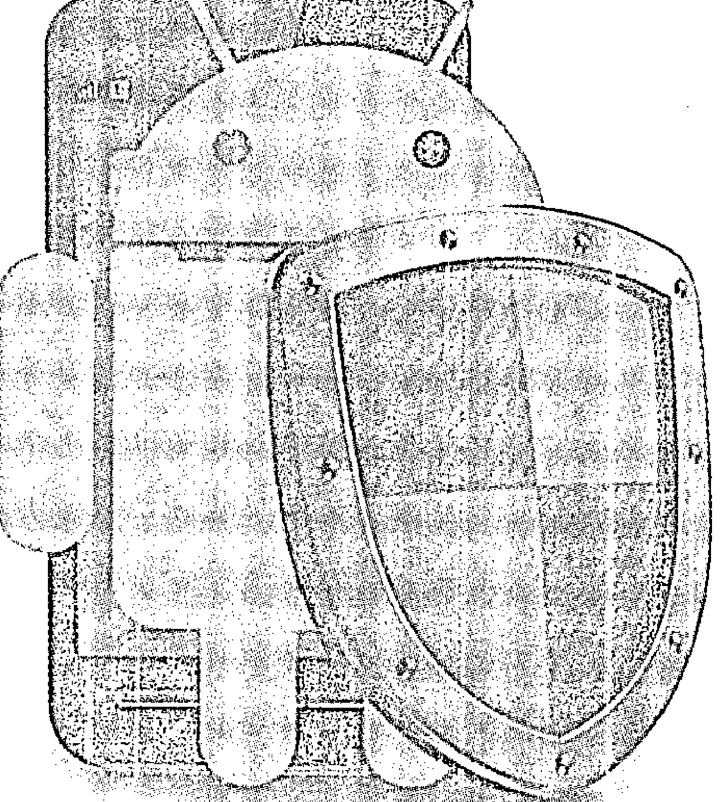

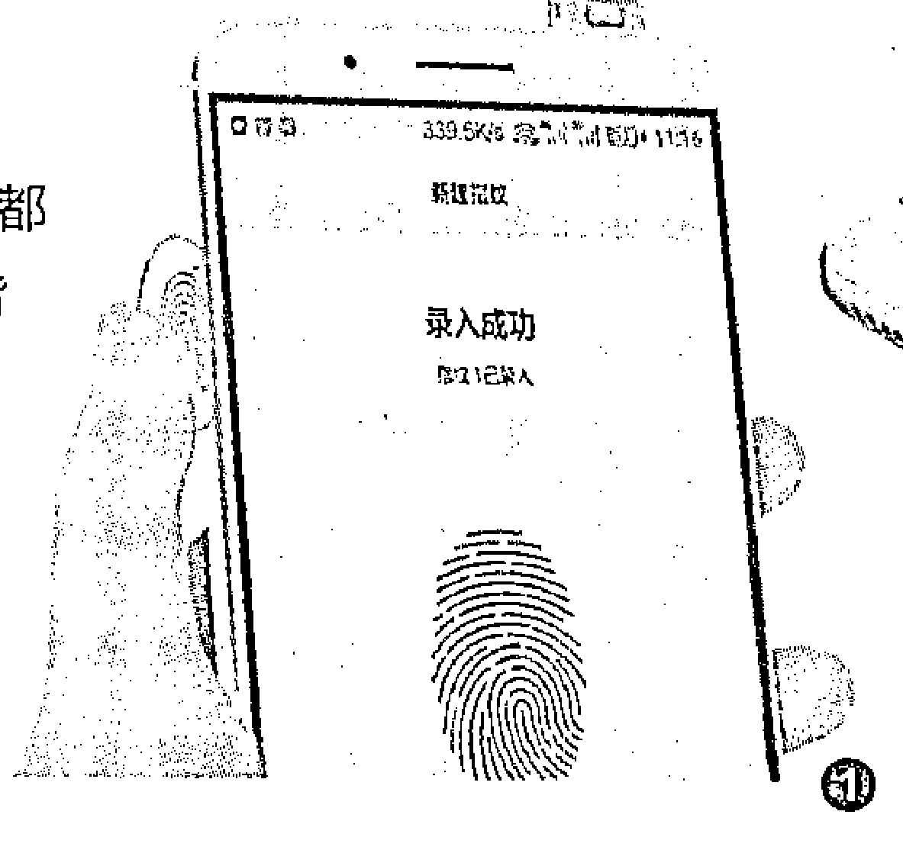

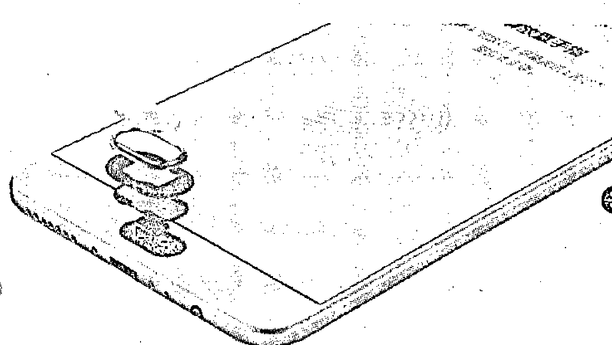

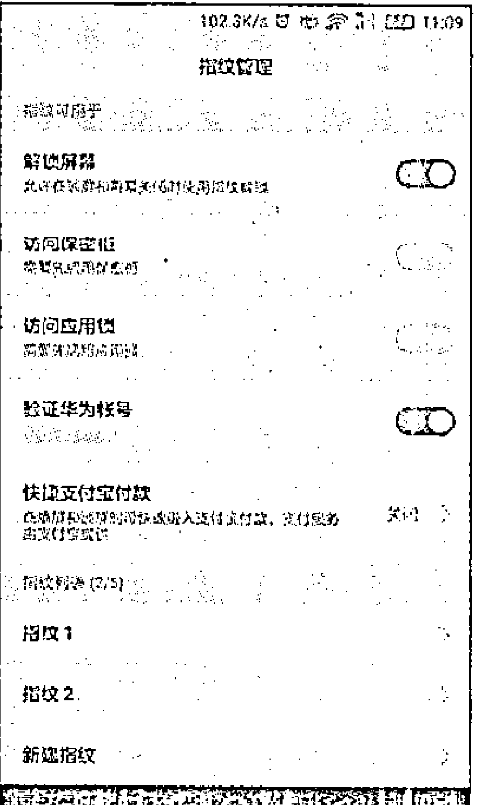

需要注意的是，出于安全的考虑，系统不会将手机指纹模块的使用权限开放给第三方APP（除了支付宝等少数支付类APP）。这意味着，如果你的手机指纹不支持文件加密、让某个指纹开启指定应用等功能，就只能盼望手机厂商后续的系统更新可以加入这些功能。因此，如果你对和指纹相关的某项功能极为看重，必须一步到位挑选支持该功能的产品。

小提示

如果你想开启手机的指纹支付功能，需要进入具体APP进行设置。以支付宝为例，在“我的信息→设置→安全设置→指纹”中即可开启指纹支付（图7）。当手机捆绑了各种支付类APP时，最害怕的就是因手机丢失，而被捡到的人恶意购物或转账。如果你想避免类似隐患，可参考本刊2015年20期《捂住腰包 移动资金安全手册》这篇文章，或者用手机扫描二维码直接查看。


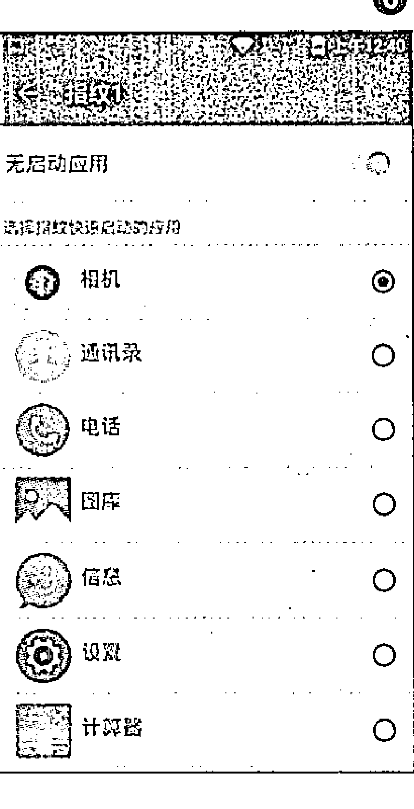

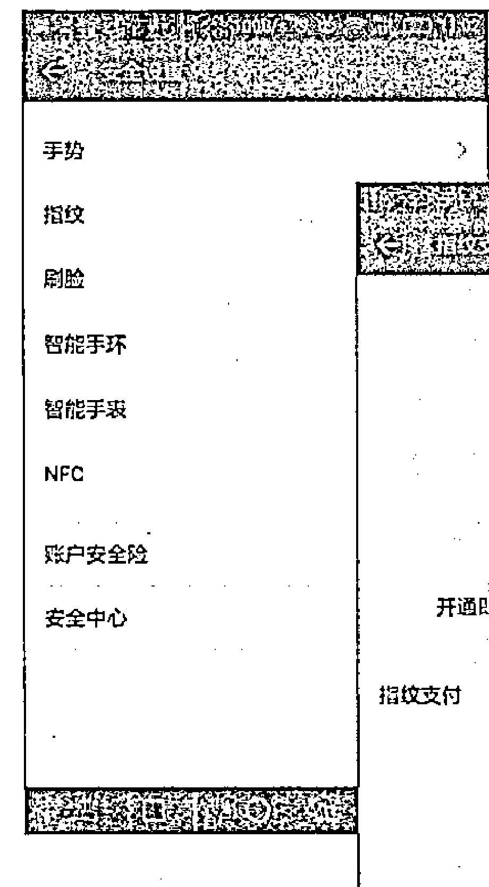

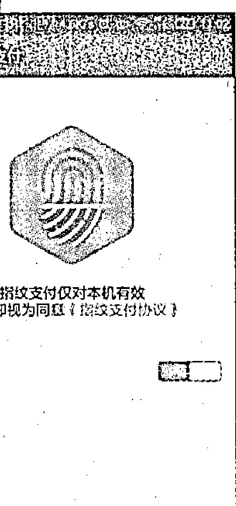

系统UI的高级功能必不可少

MIUI、Flyme、EMUI、EUI、锤子OS、ColorOS、nubia UI……几乎所有知名品牌都有着独家UI系统。如果你想尽可能减少手机使用过程中的危险系数，挑选更适合你的UI就显得尤为重要了。

百花齐放的第三方UI

Android系统最大的特色就是开放性，因此每个手机品牌都能基于Android深度定制出独有的UI系统，并根据自己的理解加入更多功能，或是精简掉无关的服务。在硬件趋于同质化的今天，UI的特色功能就成为了彰显品牌间“软实力”的舞台。

因此，MIUI、Flyme、EMUI、EUI、锤子OS、ColorOS、nubia UI等UI虽然都是Android，但无论是界面图标、下拉菜单风格、系统设置选项和预装特

不可忽视的高级功能

如果你对指定数据备份（比如微信聊天记录、本地游戏的存档记录等）、联网防火墙、多窗口分屏等功能比较看重（图10），那就一定要选择直接集成这些功能的Android手机。为什么？因为上述高级功能虽然使用第三方APP也能实现，但它们却都有同一个前提条件：需要手机已获得ROOT权限（比如屏幕分屏就需要安装Xpoesd框架才能实现，游戏进度备份需借助钛备份，而联网防火墙普遍集成在LBE安全大师等安全类APP中，但上述应用都需ROOT权限才能获得全部功能）。

问题是，如今很多品牌都明确表示对ROOT过的手机不给予保修，像三星Galaxy S7等机器ROOT之后前置摄像头就废了（自拍黑屏）。此外，手机ROOT后如果误删关键APP或系统配置文件，还会导致手机变砖无限重启等问题！对高级玩家而言，ROOT是一种玩机必备的乐趣，但对普通用户而言，ROOT之后反而要承担更多的安全风险。

可见，系统UI同样是影响我们选购手机时的核心要素之一，我们要根据自身对高级功能的需求，选择预装匹配UI的Android手机。如果买后才发现缺少了某项需要使用ROOT权限的功能，在寻找替代方案时就不得不面临“引狼入室”的风险。

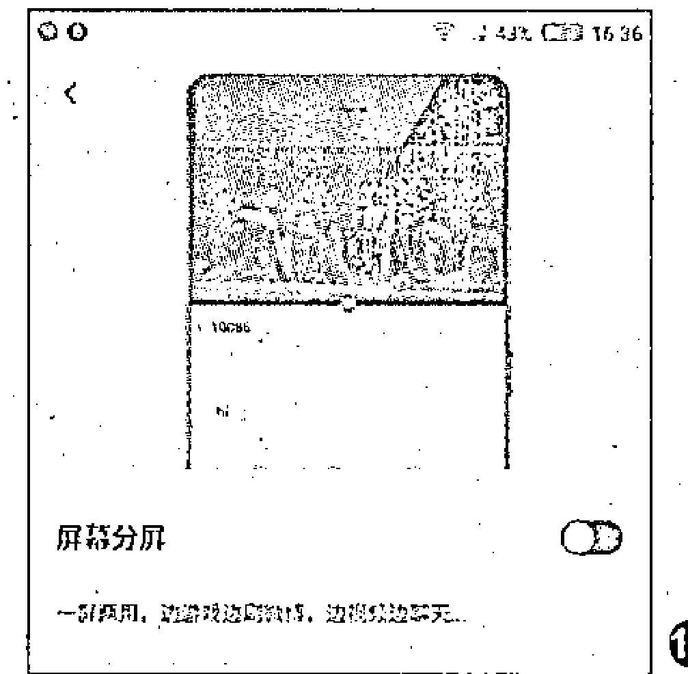

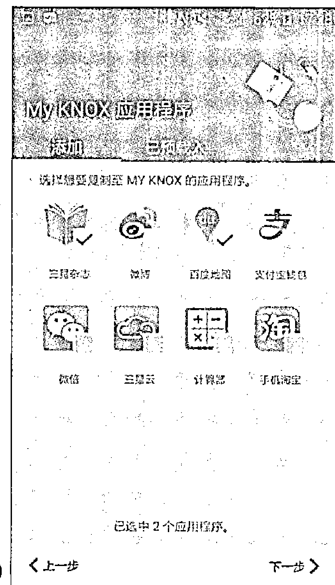

扩展阅读：

不需迷信原生系统

原生Android最大的优势就是纯净（图11），通过集成的Google Play等应用可以享受完整的谷歌服务。问题是，纯净意味着功能的缺失，而想使用谷歌服务还需掌握VPN和翻墙等技巧。这些对普通用户而言都是极不方便的存在。没错，原生Android仅适用于喜欢折腾、不怕麻烦的高级玩家。对绝大多数普通用户而言，原生Android真的没有被国内手机厂商优化后的系统UI好用。比如，“通知栏功能强化”（加入更多快捷开关）和“分屏多任务”是Android 7.0的主打功能之一，而这些功能在国产UI里却早已实现。

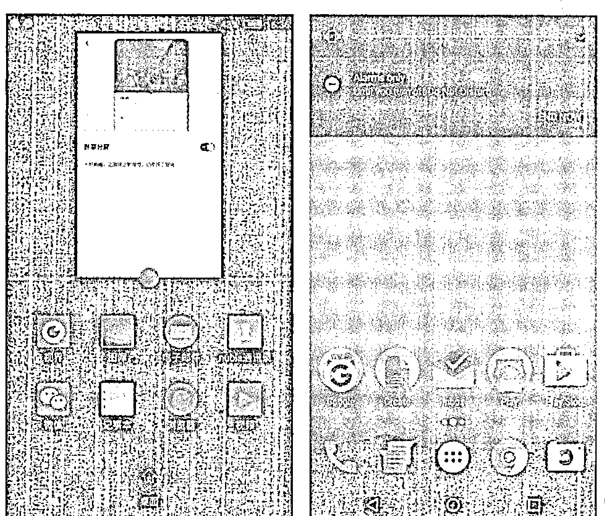

隔绝隐患的安全用机法则

每隔一段时间，工信部或公安机关就会曝光一大批存在窃取用户信息、破坏用户数据、影响移动终端运行、恶意推送广告、捆绑其他应用等突出安全问题的APP。与其每次听到消息后自查，我们更应该从源头就将这些潜在的危险拒之门外。

APP的渠道来源分析

由于iPhone和iPad只能从App Store下载应用，而苹果的审核机制和iOS对APP获取权限的管理也极为严格，因此很少出现“流氓APP”。反观Android，谷歌服务和Google Play在国内用不了，用户只能从其他应用商店或渠道下载APP资源，这就给了流氓APP可乘之机(图1)。如果你不希望被这类APP入侵，首先就要了解Android手机获取和安装APP渠道的隐患。

通过应用商店下载

虽然Google Play无法在国内使用，但Android品牌手机却都会随机预装一个自家的应用商店，比如OPPO的“软件商店”、华为的“应用市场”等等(图2)。相对而言，在这些品牌官方商店中下载APP是最安全的。由于是随机预装，所以这些应用商店拥有系统底层的管理权限，支持自动安装和升级，管理起来非常方便。

笔者不推荐类似第一应用、7pp趣应用、优亿市场等第三方应用商店，网上曝光的那些流氓APP大都是来源于这些渠道。如果你购买的是三星、索尼等品牌的“水货”版本，随机自带的Google Play无法使用，也建议下载“乐商店”等国内知名手机品牌旗下的应用商店APP(图3)，确保从中下载APP的安全。

小提示

如今国产手机品牌的应用商店都会收录常见的软件和游戏，只是对一些英文版的小众APP收录率存在差异。

通过手机浏览器下载

有时我们在用手机上网时经常会突然弹出某些APP的下载选项，如果你不小心点击了安装，那就极易被恶意APP入侵。要知道，网上各种小网站或论坛中的APP资源是流氓软件的“重灾区”。想将它们拒之门外的最简单方法就是进入手机的“设置->安全”，关闭“未知来源”的勾选(图4)，这样一来你的手机就只能通过随机的应用商店下载安装APP了。

通过PC下载传输安装

如果你需要的某款APP在手机应用商店中搜索不到，在条件允许的情况下建议使用PC下载。对一些热门APP，比如“全民超神”这款游戏，可直接搜索该游戏对应的官网(http://moba.qq.com/)，在这里才能下载到绝对“原版”无捆绑的资源，避免使用其他网站的下载链接(图5)。

全民超神官方网站-腾讯第一5V5实时moba电竞手游
全民超神官方网站腾讯第一5V5实时MOBA电竞手游官网-游戏资料、英雄介绍、游戏特色...资料库、赛事活动、活动中心、赛事中心、视频中心...
moba.qq.com/ · 西部135区-1799线...开服

【全民超神】安卓下载_全民超神v1.8.0最新手机版下载-91手游网
2016年5月7日 - 《全民超神》是腾讯第一5v5实时MOBA电竞手游,由腾讯游戏开发。游戏以泽比拉大陆为故事发生的背景,玩家将以控制不同的角色再两个对立阵营进行战斗...进行收...
www.91danji.com/az/346... - 百度快照 - 126条评价小提示 如果你急需使用某款APP但身边没有PC，在使用手机下载时就更要坚持从该APP的官方网站下载了。下载安装前需要开启“未知来源”选项，安装后建议立刻再关闭“未知来源”。

## 无线搞定PC和手机的传输

很多用户的PC里都安装了类似360安全卫士一类的软件，如果通过数据线将手机和PC连接，手机里总会自动安装手机助手等APP。如果你不希望手机被此类APP入侵，选择无线的文件传输方式最为理想。

首先介绍一个最通用且简单的方案：在手机和PC端同时运行QQ，然后通过PC端QQ给“我的设备”传输下载的APP程序（图7），手机QQ接收后就能选择直接安装了。

如果手机或PC一端没有QQ，我们则可借助手机自带的“文件管理”APP实现文件的无线传输。目前国产手机“文件管理”APP大都支持远程管理功能，只是表现形式被分为了两种：

- 第一类是以OPPO为代表的产品，在“文件管理”APP中点击“远程管理”并开启相关服务就会在屏幕上出现一个ftp地址（图8）。只要PC和手机处于同一个Wi-Fi网络，在PC资源管理器中输入这个FTP地址就能远程管理手机内的文件了。
- 第二类是以华为为代表的产品，其“文件管理”APP需要通过网络邻居的方式与PC建立无线连接，设置起来较为繁琐。以Windows 10系统的PC为例，需要将保存有APP的文件夹建立共享（图9），然后就能在手机端将共享的文件夹扫描出来了。此时，需要输入Windows 10对应的用户名和密码才能看到共享文件夹里的内容（图10），选择将其下载到本地进行安装。

总之，使用QQ传输最为快捷，而后面两种方法受制于网络连接速度，存在一定的操作延迟感。

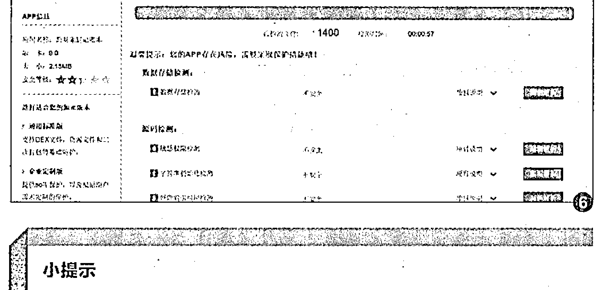


## 扩展阅读：云应用绕过APP

Android手机的威胁主要来自第三方APP，如果可以尽量少用APP，自然也能起到减少隐患的作用。好消息是，如今Android平台的很多浏览器都集成了云应用，常见的生活和工具类的APP都有对应的云端版本（图11），运行时你会发现它们和APP版在体验上没什么不同（图12），如果你的流量充裕（或处在Wi-Fi环境中），那就不妨尝试用云端程序替代传统APP吧。


## 安全中心进行查缺补漏

如今几乎所有品牌的Android手机都会随机预装类似安全中心、安全管家一类的APP，如果你不希望被流氓APP的漏网之鱼恶意扣费或偷跑流量，那就一定要善加挖掘这种APP的潜力。

以三星手机为例，它预装的“智能管理器”就是这类APP，想杜绝流氓APP的威胁，有三项功能需要引起我们的重视。

- 第一，在“设备安全”中可以扫描已装APP中是否存在木马病毒或恶意扣费的情况（其他手机品牌通常将其称为“病毒查杀”）（图13）。
- 第二，在“应用程序权限管理”中找到发送短信对应的权限，如果你担心触发游戏内购、APP偷发短信订购收费服务，就需要关闭指定APP的发送短信权限（图14）。同理，如果你担心某APP读取你的联系人资料等隐私信息，也只要关闭该APP读取相关信息的权限即可。


| 应用程序 | 权限开关 |
| :--- | :--- |
| QQ | ○ |
| S Voice 应用 | ○ |
| S 健康 | ○ |
| S 助手 | ○ |
| 三星应用商店 | ○ |
| 三星账单 | ○ |
| 信息 | ○ |
| 微博 | ○ |
| 电子邮件 | ○ |

| 应用程序 | 正常 | 警告 |
| :--- | :--- | :--- |
| 皇室战争<br>数据:280.94KB WLAN:3.6.. | ☑ | ☑ |
| 炉石传说<br>数据:0B WLAN:52.92KB | ☑ | ☑ |
| 炉石下载器<br>数据:0B WLAN:10.08KB | ☑ | ☑ |
| 录音机<br>数据:0B WLAN:0B | ☐ | ☑ |
| 三星视频<br>数据:0B WLAN:0B | ☐ | ☑ |

- 第三，很多APP存在广告推送或偷跑流量等问题，而不少用户每月的4G数据流量也只有几百兆而已，根本不够流氓APP的折腾。此时，我们就需要借助“流量监控”中的“限制流量应用”功能（其他手机品牌通常将其称为“联网防火墙”），禁止除了微信QQ等常用APP以外的应用使用数据流量（图15）。

总之，对Android手机品牌而言，其安全性和易用性的好坏，在很大程度上就取决于“智能管理器”这种APP。比如，很多手机品牌还会将APP开机自启、省电模式、悬浮窗管理等功能集成在安全中心类的APP里，用户通过对这一款APP的功能进行设置就能搞定所有影响安全、反应速度和耗电相关的功能。而有些品牌则会将上述功能拆分藏于系统设置的更深处，用户寻找和操作起来较为繁琐。

## 赋予手机“保命”能力

如今Android手机的屏幕越来越大，部分产品还会以双面玻璃为卖点，一旦经历不小心的跌落或磕碰时，极易出现碎屏等严重问题。因此，为手机找个“保命”技能势在必行。

### 保护套是最佳防范手段

针对智能手机碎屏隐患，很多手机厂商和电商平台都提供了“碎屏险”（图1），如果手机在规定时间内屏幕碎裂可以免费更换。问题是，官方碎屏险价格不低，第三方碎屏险理赔流程又较为繁琐，即使更换了屏幕，手机边框也会留下磕碰后的痕迹，实在有碍观瞻。因此，给手机配一个保护套，依旧是最最安全靠谱的防碎屏手段。


目前，手机保护套从材质来看主要分为金属、亚克力（又称有机玻璃）、硬塑料、TPU和硅胶等等。但是，真正能有效杜绝碎屏风险的还是要以TPU和硅胶为主。原因很简单，这两种材质最柔软（图2），可更好地承受跌落时的冲击，避免手机边框和屏幕摔坏。大家在选购类似保护套时，可优先挑选四个边角位置加厚、边缘略凸出于屏幕（就是将整部手机包裹）的产品。

金属保护壳虽然手感和档次感更好（图3），但它在跌落时会因较大的冲击力变形从而划伤手机，严重一些的甚至会出现手机被卡在里面拿不出来的问题。亚克力和硬塑料材质太硬，抗冲击力不够，跌落时手机偶尔还会从保护套中“弹出来”……


### 保护贴膜有讲究

在很多用户眼中，如果智能手机没能贴上“钢化膜”就不算贴了膜，而钢化膜防刮和防爆的特性也一直被人津津乐道。实际上，钢化膜防刮是肯定的，而且不易留下指纹，滑动手指的手感也最为接近没贴膜的感觉。但是，说钢化膜防爆就有些言过其实了，贴有钢化膜的手机如果跌落时是四角落地，手机屏幕依旧会吸收全部的冲击力，该碎还得碎。只有手机屏幕正面朝下跌落时，钢化膜才能起到一点点吸收冲击力的功效。因此，大家不要迷信钢化膜，将其视为手感更好的贴膜即可。

如今，市面上还流行一种“蓝光保护膜”，主打造过滤屏幕中的蓝色光从而起到护眼的作用。曾有玩家对此类产品进行过测试，这种贴膜的确可以起到一定程度过滤蓝光的作用。问题是，蓝光保护膜并不是完全透明，贴上之后屏幕画面就会出现“偏黄”现象（这是正常的，也是过滤蓝光的后遗症）（图4）。对屏幕色彩要求较高的用户，长时间盯着这种发黄的屏幕会很不爽。


还好，如今很多新款手机都自带“护眼模式”（图5），其原理同样是过滤蓝光，以偏黄为代价保护用户视力。如果你的手机没能提供类似功能，可以自行下载“护眼宝”一类的APP（图6），同样可以通过软件手段过滤掉显示画面中的蓝光，而且不用花费一分钱。当你需要正常色彩显示时，只需关闭“护眼模式”或退出APP即可。

## 关注手机内部数据的安全

对手机硬件本身而言，它的价值远远没有内部保存的数据重要。比如，我们拍摄的照片、聊天中的重要信息等等。这些保存于手机内部的数据，同样应该引起我们的重视。


## 淘汰手机前的准备工作

如今手机更新换代的节奏越来越快，很多用户都保持着一年一换甚至一年多换的记录。为了降低资金压力，绝大多数用户会将淘汰的手机通过赶集或爱回收等渠道当做二手手机出售。问题是，出售手机前你确定已经完全删除内部数据了吗？

就删除内部数据而言，很多用户都会选择手机自带的“恢复出厂设置”（勾选“格式化存储卡”选项）功能（图7）。然而，这种常规手段根本就不能完全删除数据，PC端有无数工具可以找回被“恢复出厂设置”清空的数据。如果你出售的二手手机里曾经保存过私密照片视频，被有心人恢复后可就悲剧了。

想杜绝内部数据被人恢复，最有效的方法就是格式化存储卡后，再往里面装满无用的数据，然后再格式化，反复1次~2次后初始数据就很难再被恢复了。如果你觉得麻烦，可以在手机上下载安装名为“Nuke My Device核擦除”的APP，运行软件后点击界面上的“NUKE”按钮（图8），再在弹出的窗口中点击“No,Thanks”即可。


## 手机丢失也要让数据无忧

如果手机遗失，不仅意味着手机硬件本身的损失，里面保存着的无数数据，以及捆绑着各种支付功能APP的安全更让我们揪心。之所以前文笔者推荐选购配备指纹识别的手机，就是可以让我们设置异常复杂的手势解锁密码（即使被人捡到也很难尝试破解），并通过自己的指纹随时解锁（不怕忘记）。

需要注意的是，给Android手机设定解锁密码之后，一定要记得关闭系统设置中的“USB调试模式”（图9）！否则，捡到手机的人可以利用PC端的工具清空解锁密码，只有关闭USB调试模式后才能让这些PC端工具失效。


此时，对方如果想获得手机的控制权，就只能重新开机，并通过音量和电源键组合进入Recovery模式选择“双清”（即恢复出厂模式）从而重置解锁密码（图10）。问题来了，“双清”不会格式化存储卡，这意味着对方依旧可以看到手机里保存的照片、视频和各种文档！

如果想100%确保手机遗失后内部数据的安全，在Android领域只有部分手机品牌和型号可以实现。以三星S6为例，我们需要依次进入“设置→锁定屏幕与安全→查找我的手机”，登录三星账号并勾选“远程控制”和“重新激活锁定”两个选项（图11）。其中，“重新激活锁定”是三星有别于其他手机品牌找回手机的功能。

如果手机遗失，我们只要第一时间找个PC打开http://findmymobile.samsung.cn网页并用三星账号登录，选择锁定设备后，捡到手机的人不仅无法解锁手机，就连Recovery模式的双清功能都用不了。没错，无法刷机、无法双清、无法破解，对方捡到的只是一个“砖头”。此外，根据PC端网站服务还能对丢失的手机进行定位，可考虑报警找到对方。如果确定找回手机无望，我们也能通过远程命令清空手机中的全部数据。


| 设置项 | 功能 |
| :--- | :--- |
| 壁纸 |  |
| 主题 |  |
| 节日效果 |  |
| 主屏幕 |  |
| 锁定屏幕与安全 | 在锁定屏幕上显示通知<br>显示全部通知内容 |
| 隐私和安全 |  |
| 简易模式 |  |
| 辅助功能 |  |
| 帐户 |  |
| 备份与重置 |  |
| 查找我的手机 | 使用您的三星账户查找设备 |
| 未知来源 | 允许安装来自未知来源的应用程序 |
| 安全启动 | 保护设备启动，防止未经授权的访问 |
| 加密SD卡 |  |
| 远程控制 | 允许通过三星账户远程控制设备 |
| SIM卡更换警告 | 关 |
| 重新激活锁定 | 保护您的数据，防止未经授权的访问 |

除了三星，魅族在Flyme5或更高版本系统的找回功能中也加入了类似的“挂失模式”（图12），远程激活这个功能后，手机同样无法刷机和清空数据。而其他手机品牌的手机找回功能大都支持手机定位（图13）、通过摄像头抓拍使用者、远程清空数据等，但对方往往却能通过Recovery双清的办法抹除当前登录的账户信息，让手机找回功能失效。

此外，无论是三星还是魅族，手机找回功能激活锁定设备模式都需要网络的支持（发送一则指令）。如果捡到的人第一时间拿出了SIM卡（无法使用数据流量），并在没有无线网络的环境下通过Recovery清空的数据（由于还没接收到锁定设备的指令）远程锁定命令也就没有意义了。

总之，关闭USB调试模式，设定复杂解锁密码，在手机端开启找回手机功能，当手机遗失第一时间激活锁定手机选项，这就是Android手机保护内部数据不因丢失而曝光的基本流程。


## 拒绝失窃 数据保护有高招

现在网络安全形势日益恶化，一不小心自己的数据就容易被窃取。保护自己的数据不外泄是第一要务，在未能具备极为专业的技术前提下，必须借助一些专业的第三方防护软件进行保护。

### 扎好篱笆防盗 主动防护要做足

文/平淡

虽然Windows 10默认已经自带杀毒软件和防火墙，但是这些安全组件的防护能力有限，无法有效保护数据安全。基于现在越来越严峻的安全形势，显然主动安装一些功能强大的第三方防护软件是很有必要的保护措施。火绒安全软件就是一款防护较为全面的防护软件，启动火绒后即会在后台进行自动防护，切换到“反病毒”可以进行常规的全面、快速等查杀操作（图1）。


除了对病毒的防护外，对于系统防护火绒也提供相当全面的保护。切换到“系统防护”，火绒提供文件、注册表、进程、危险动作等防护。比如现在很多病毒、木马都是通过加载启动项实现自启动，切换到“注册表防护”，勾选“初始启动项”和“启动项”保护，这样就可以对注册表启动项目进行保护（图2）。

启用上述保护后，原来自己的启动项（如杀毒软件开机启动的实时监控）就不会被无故终止，同时也不会新增启动项目（如很多木马在注册表中增加的启动项目）。假设现在有木马试图在后台增加启动项目，火绒就会实时进行拦截，同时可以显示具体程序和添加的注册表键值，默认自动进行拦截保护（图3）。


如果你需要更为个性的保护，还可以切换到“自定义防护”，对系统进行更为全面的保护。闪存盘经常是病毒泛滥的主要移动存储，现在可以自定义一条阻止写入文件到闪存盘规则，以避免病毒写入到闪存盘。开启自定义防护后点击“添加规则”，选择资源管理器进程（C:\windows\explorer.exe）作为监控进程（图4）。


继续按向导提示点击“添加规则→文件规则”，需要保护的目录则选择闪存盘根目录，要保护的动作选择“写入”（即阻止写入文件到闪存盘），完成后点击确定（图5）。

完成规则的创建后返回程序界面并开启保护，这样一旦有在资源管理器中写入文件到闪存盘的操作，火绒就会自动进行阻止，有效防止木马、病毒侵入到闪存盘（图6）。

火绒还提供强大的防火墙功能，切换到防火墙后可以看到其提供流量、联网和上网保护。比如很多木马都是通过联网的方式传输窃取到数据，如果我们怀疑某个程序有问题，但是又需要离线使用（如很多本地离线游戏、一些功能性软件等），此时就可以使用联网控制功能限制其联网，只要切换到“联网控制”，选择需要控制的程序并新建一条阻止联网规则即可（图7）。

总之，火绒除了提供强大的默认保护功能外，对于动手能力强的用户还提供自定义规则，提供更为个性的保护。这种主动防御式保护可以更有效地保护我们的数据不外泄！


### 御敌于门外 在线检测保安全

文/俞木发

除了做好主动防御外，现在由于下载带来的威胁也越来越多，很多病毒、木马、后门都是由于下载软件导致的。因此在下载之前对下载网站和软件做个安全检测就很有必要，这样可以将可能暗藏的威胁挡在门外。

#### 下载前网站安全检测

由于现在很多病毒、木马都是暗藏在下载软件或者网页中，因此在将文件下载到本地之前对下载网站进行一番安全检测很有必要。现在大多数安全网站都提供在线多引擎云杀毒云扫描功能，在一些大家认为可能暗藏威胁的网站下载软件时，可以登录 http://www.eesafe.com/index.html，然后在文本框中输入需要检测的网址，点击“进行安全检测”（图1）。

这样网站会对输入网址的页面进行安全检测，如果页面提示发现高危元素那就要注意了，这些网站很可能被黑客注入恶意代码，我们只要不访问或在其上下载软件即可。这样通过在线检测就可以将暗藏危险的网页挡在门外了（图2）。


《电脑爱好者》2016年合订本(三)

#### 下载后软件安全检测

除了网站包含恶意代码外，很多病毒是暗藏在网站提供的下载软件中的。大家知道病毒、木马的检测严重依赖杀毒软件的杀毒引擎和病毒库。而出于兼容性考虑，我们电脑一般只安装一款杀毒软件，这样在进行病毒检测的时候就可能造成漏杀，导致病毒乘虚而入。

如果想要用多款杀毒引擎进行病毒检测和查杀可以借助VirSCAN.org在线检测服务，它通过多种不同厂家（多达29款杀毒）提供的最新版本的病毒检测引擎对上传的可疑文件进行在线扫描，并可以立刻将检测结果显示出来。在浏览器打开http://www.virscan.org/，然后点击“浏览”选择下载到的软件进行上传（图3）。


网站支持压缩文件扫描，因此如果要扫描多个文件，可以先在本地将多个待检测的文件压缩打包上传。完成文件的上传后点击“扫描一下”，网站会调用多个杀毒引擎进行扫描，如果有引擎报毒则要注意了。在扫描引擎列表可以看到有的会报警，有的则显示没有发现病毒。出于安全考虑，只要有引擎报警则不要进行安装，这样可以有效阻止病毒、木马的入侵（图4）。


## 金蝉脱壳 系统保护找替身

操作系统作为各种操作的载体，只有保护好操作系统本身才能为数据提供安全保护。为了让操作系统安全性更高，我们可以借助影子系统进行保护。很多病毒、木马都是由于我们平时在下载安装时带入系统的，因此要让自己的系统“百毒不侵”，我们可以借助带全局保护的“影子卫士”。安装影子系统后具体使用和平时是一样的，如果发现当前系统中毒或者有什么异常，那么只要重启即可删除对当前系统的所有操作。

> 小提示
影子系统只是将当前操作映射到一个虚拟区域，重启（或者关闭保护软件）后即可以自动撤销所有写入操作。但是需要注意的是，在影子系统中测试病毒、木马时，这些病毒的功效还是存在的，如在影子系统中测试QQ盗号木马，那么当前QQ密码仍然会被盗，在没有做好保护措施之前，大家请勿轻易测试这些病毒、木马。

影子卫士的使用很简单，启动软件后切换到“Mode setting”，然后勾选需要进入保护的分区，点击“Enter shadow mode”，启动后保护分区就会进入影子模式（图1）。

开启影子模式保护后在桌面会出现“Shade mode”字样，表明当前系统已经在影子模式保护下了。这样保护分区的所有操作都会被定向到一个虚拟分区，再次重启后即可删除所有写入操作。执行上述操作后默认对保护分区的写入都会重定向到虚拟区域，如果在当前系统发现病毒，那么只要重启系统就可恢复到保护前的状态（图2）。

不过上述保护默认是全盘写入保护，在日常操作中可能偶尔我们在保护的模式下可能要保存一些资料，这可以根据自己的实际需要进行个性化的设置。


## 工作文档保存无忧

影子系统默认全盘保护，重启后无法保存任何数据，而很多工作文档是需要保存的。对于这些需要固定保存的数据，现在可以将其保存目录添加到排除保护列表。不过排除保护可能会导致木马病毒也会写入其中，因此可以预先设置一个专用分区如“E:\”作为排除目录。接着进入磁盘管理界面，右击E分区选择“更改驱动器号和路径”将E盘盘符删除，接着点击“装入以下空白NTFS文件夹中”，将E盘映射到其他分区下的目录中(图3)。现在只需将上述装入分区的目录设置为保护排除目录即可保存文件。在影子主程序列表切换到“File Exclusion list”（文件排除列表），点击“Add folder”，在弹出的窗口中选择上述目录，这样保存在该目录的文档就会自动保存(图4)。


## 有用文件实时保存

排除列表方法适宜保存一直需要保存的数据，在很多操作中我们可能只是需要临时保存一些文件，如在影子系统里下载需要重启后使用的软件等。对于这类临时需要保存的数据，则可以借助影子系统的实时提交来进行保存。在主界面切换到“Commit Now”，点击“Add file”，然后选中需要保存的文件，点击“Apply”提交即可在重启后继续保存该文件(图5)。因为实时提交是用户主动提交数据保存，它和排除保护方式相比有更大的安全性(前者是用户手动提交，后者则是默认自动写入)。因此对于安全要求较高的用户，可以每次使用手动提交文件夹的方法来批量提交需要保存的数据。


当然除了提交数据保存外，一些时候我们还需要提交注册表数据才能保证提交数据可用。比如一些软件安装后会往系统注册表中写入启动键值或配置键值，这样除了需要提交软件安装目录，还需要提交注册表键值。注册表键值提交可以切换到“Registry Exclusion List”完成，具体操作和文件提交操作类似，需要提交键值则可以通过注册表监控软件获取。

> 小提示
通过立即提交都可以绕开影子系统的保护实现文件的写入，当然这样也很容易导致病毒、木马的入侵。因此在设置时一定要注意文件的甄别，建议提交文件前对数据进行压缩，这样提交后的是压缩文件，进入正常系统后对其杀毒扫描确定安全后再解压使用。

## 简洁高效 数据提交自动完成

上述操作都需要用户手动操作才能完成，很多朋友在全盘保护模式下操作，经常会由于忘记提交导致数据丢失。为了避免此类事情的发生，可以使用影子系统的命令行模式自动完成数据提交。

比如对于经常需要保存工作文档的用户进入影子保护系统后，工作文档按照平时习惯保存，假设保存在 "C:\user\mydocument"。首先退出影子保护模式，为了确保每次提交的都是安全文件，可以使用批处理方法进行。建立D:\aa作为提交数据的专用目录，启动记事本后输入下列代码保存为aa.bat，放置在C:\Windows\System32\GroupPolicy\Machine\Scripts\Shutdown备用，代码如下：

```
Rem 以安静模式清空指定目录下所有子目录和文件
Rd /s /q d:\aa
Rem 复制所有.doc工作文档到d:\aa专用提交目录
Copy C:\user\mydocument\*.doc d:\aa
Rem 自动调用命令行提交d:\aa数据保存
"C:\Program Files\Shadow Defender\CmdTool.exe" /commit:"d:\aa" /now
```

完成上述设置后运行上述批处理进行测试，此时RD命令可以确保在提交之前将指定目录下的所有文件全部删除。接着将文档目录下的DOC文档复制到D:\aa保存，同时会将D:\aa数据提交保存（图6）。


批处理测试没有问题后在搜索框输入 "gpedit.msc" 启动组策略编辑器，依次展开 “计算机配置→Windows设置→脚本（启动/关机）”，然后双击右侧窗格的 “关机”，打开关机脚本设置（图7）。

在打开的窗口中单击 “添加”，然后将上述测试成功的批处理添加为关机脚本。这样每次关机的时候，系统都会自动将D:\aa里的DOC文档提交保存（图8）。

这样我们提交的就只是保存的DOC文档，而且每次提交之前都清空专用目录，可以确保提交保存的只是DOC工作文档。这样每次除了我们自己提交的DOC文档保存外，其他所有写入操作（包括正常安装软件、软件携带病毒等）数据都会自动删除。


> 小提示
因为影子系统是将当前写入操作重定向到一个缓存空间（默认为200MB），如果写入的数据较多，可能会导致缓存空间不足。因此对于写入较频繁的用户，可以在主界面切换到 “Administration”，然后为分区扩展更大的空间（图9）。

## 拒绝丢失 数据备份要自动

文|技术宅

在日常学习和工作中，即使我们百般小心，仍然会有各种意外的情况发生，导致数据丢失。比如文档编辑时遭遇停电、宕机，电脑给其他朋友使用时导致的误删除等。因此为了让数据不容易丢失，我们可以借助Filegee使用自动备份的方法来保证数据的安全。对于白领一族，如果要保证工作数据的安全，那么借助Filegee实时备份功能即可实现。

启动Filegee后点击“任务→新建任务”，新建一个“单向同步”的任务。单向同步的意思是在目标目录中自动备份源目录新建、修改的文件，这样我们在源目录里操作的文件都会在目标目录中自动备份（图1）。

继续按照向导提示完成源目录（即需要备份文件的目录，一般选择保存文档的工作目录即可）和目标目录（即备份文件目录）的设置。为了保证数据的安全，目标目录可以选择网络驱动器（仅支持Filegee企业版用户，个人版用户可以选择将数据备份在U盘、移动硬盘等目录上），只要先在服务器上设置一个共享目录，然后获取写入权限。这样备份的文件是保存在局域网服务器上，可以有效保证数据的安全（图2）。

剩余的操作按照屏幕的提示完成，在最后的“设置自动执行方式”选择“实时”，点击“设置延迟时间”，这里可以设置60秒间隔，表示源目录的文件编辑或者新建后，每隔60秒就会实时备份到目标目录（图3）。

完成上述的设置后Filegee每次开机后都会自动启动，并在后台进行自动监控，每隔60秒后就会自动将源目录中变化（新建或者编辑）的文件自动复制到目标目录里保存。文件具体备份情况可以在程序列表任务中看到（图4）。

如果现在遇到误删除文件，那么我们只要随时点击程序界面的“文件恢复”按钮，然后在弹出的窗口设置恢复60秒之前备份的文件即可。这样损失最多也只是60秒内编辑的内容，当然Filegee还支持更多备份方式，大家可以根据自己的实际需要灵活进行选择（图5）。


> 扩展阅读：
如果没有安装Filegee之类的自动备份软件，很多程序默认本身就自带备份功能。比如Word默认10分钟会自动保存数据，如果遇到停电，在重启Word后会自动弹出选择之前未保存文件的功能，这样可找回停电之前10分钟的数据。一些软件则会将数据保存在临时文件夹，比如E里看的视频等数据，默认这些数据会缓存在临时文件中。大家可以根据实际情况自行去找看似丢失的数据。

## 数据易丢失 使用软件须防备

文|刘英

软件使用过程中会生成一些比较重要的数据，但由于我们容易忽视这些数据，当更换了电脑或重装了系统、软件之后，这些重要数据就会发生丢失。为了保证重要数据的延续使用，掌握预防重要数据丢失的办法，或者找到数据“丢失”之后找回的办法势在必行。

- 1. 升级电脑引起激活数据丢失

为了能名正言顺地免费使用与正版功能相当的Windows 10系统，目前有数百万用户选择注册为预览测试用户，安装预览版Windows 10使用。大家知道，预览版Windows 10的激活是使用了数字权利的激活方式，通过对用户电脑参数与服务器记录的激活信息的比对来验证用户权限。当用户的Windows系统坏掉或重新格式化硬盘之后，重装了Windows 10并用相同的网络账号登录，便可自动激活系统。但是，如果电脑机箱中的配件变动较大，例如更换了主板、CPU、内存、硬盘等组件之后，重装Windows 10后即便是用相同的账号登录，也有可能无法自动激活Windows 10。

遇到这种情况，可下载Windows 10一周年更新预览版的14371系统镜像文件全新安装。之后通过系统的“设置→安全和更新→激活”，选择激活疑难解答工具（Activation Troubleshooter），该工具可根据用户系统的微软账户数字授权情况，帮助解决因硬件更改导致的激活出错问题。处理之后，系统会自动联网判断用户权限为合法，完成新装系统的自动激活(图1)。


- 2. 输入法丢失用户效率数据

搜狗输入法或百度拼音输入法均带有一项测定用户输入速度的功能，这一功能不是靠一时一霎的输入过程来完成的，而是经过长期对用户输入文字数量和时间的记录，通过云计算的方式得出的结果，这一数据越能反映用户的实际输入水平(图2)。但有时重装系统之后，我们会发现这一功能丢失；或者虽然功能未曾丢失，但统计出来的数据与自己的输入水平大相径庭。

出现数据丢失的原因是用户在重新安装输入法之后,未通过网络账号登录使用输入法,因而无法获得用户输入速度统计数据。而数据错误的原因,虽然也通过网络账号登录了输入法系统,但由于不小心使用了其他网络账户,造成输入法统计重新开始,缺乏延续性,因此统计出来的数据就自然不够准确了。

防止丢失的办法：尽量保证用在线方式来使用输入法，而不在关闭网络账户的情况下使用。百度输入法中进入输入法设置窗口，点击“高级设置”按钮，进入高级设置窗口，点击“账号”后从右侧窗口用自己的唯一账号登录百度输入法，并选择自动同步用户配置选项（图3）。搜狗输入法安装之后，默认在输入法状态条上显示灰色的小人图标，点击之后用自己的输入法网络账号登录，之后小人点亮，才能自动记录


自己的输入水平情况（图4）。需要查看输入速度水平时，从搜狗输入法工具箱中选择“输入统计”，然后就可看到自己的输入速度统计（图5）。


> ### 小提示
为了便于查看输入速度水平，百度输入法通过输入条最左侧的按钮，启动快捷功能选项，选择“用户中心”图标，还可以将此功能安置在输入状态条上（即小人头像）（图6），这样随时点击该按钮就可以看到输入速度及其曲线了。

- 3. 预防QQ发送文件丢失问题

使用QQ接收文件，有时会遇到这种问题：明明通过手机版QQ看到有人向自己发送了文件，而自己没有点击接收命令，计划留着通过PC下载。但用PC登录QQ之后，发现没有了文件下载链接。

解决办法：通过移动QQ先将文件保存到自己的微云中。保存到微云的过程不会占用自己的带宽和流量，所以不用担心在外使用时流量和费用的消耗问题。之后，在电脑上登录PC版QQ，然后通过QQ附带的微云应用，进入微云空间下载先前保存的离线文件（图7）。或者通过微云Web版或PC客户端访问保存的文件。

- 4. 用PC版微信保存易丢信息

使用手机微信，常常会因清理软件或系统，丢失一些重要的聊天信息或下载的文件。如果换用PC版微信，对保留和备份信息非常有帮助。

首先，PC版微信可以保持长期在线，它不占用收费移动流量，只要PC处于Wi-Fi环境下，让它挂着、开着即可。这样，收到的信息是与移动端同步的，如果要执行保存或备份操作，在PC端点击右键可方便地选取任意的本地目标文件夹。其次，PC微信版的设置窗口中，有专用聊天备份功能，连接手机后可将聊天记录备份到电脑上，可以随时恢复和查看。

- 5. 移动云盘数据丢失的PC找回

主流云盘（腾讯、百度、360）用户数据容易出现的一个最大问题，就是用户无意中通过移动客户端删除了云盘中的文件。这时不少用户以为文件已删就无法找回。但其实通过登录PC版云盘客户端，或通过任何平台下的网络浏览器进入云盘的Web客户端，通过浏览回收站，还可以找到和恢复被删文件（图8）。


## 稳定 三招搞定不败系统

文|刘英

虽然硬件问题对系统稳定性的影响很大，但对于目前的常用品牌机或兼容机来说，还不是影响整个系统稳定性的普遍因素。面对浩瀚的软件“海洋”，软件搭配不当，更容易出现各种兼容性问题，软件兼容问题才是影响系统整体稳定性的主因。一款以前用得好好的电脑，忽然出现的系统死机、重启、蓝屏、不稳定等情况，大多数是由于软件冲突引起的。因此，使系统软件环境变得更加稳定，是预防出现各种不确定问题的关键所在。

### 1. “系统+工具”搭档要考量

首选知名工具软件。同一类软件，网上往往可以找到不同种的具体软件可选择。例如压缩软件是Windows中最常用的工具，虽然Windows 8以上系统已经支持Zip格式文件的直接压缩和解压（图1），但对于网上尚在流传的RAR等压缩格式，系统无法直接打开，因此我们还不得不安装第三方软件来进行解压。考虑到压缩软件对系统和其他应用软件的兼容性能，从系统总体稳定考虑，我们建议选择最为知名的软件为佳。国外的WinRAR、7-Zip等工具（图2），国内的某些压缩工具兼容性都比较好（图3）。至于其他不知名的压缩软件，尽管有不少在宣传上夸大其词，但使用中也屡屡发现问题，所以不选为妙。


测试版风险要考虑。目前各类软件的更新速度异常迅速，哪怕软件只有一个小小的变动，软件商家都会迫不及待地放出测试版本，而这些版本中新增的功能或改进的功能往往带有某种不确定性，从某种程度上来说是将用户当作“小白鼠”来实验（就连微软也不例外了）（图4）。仓促升级有可能会造成软件与操作系统或软件与其他软件的冲突。面对应用软件测试版本，如果不是特别需要使用新增的功能，我们建议不要出于好奇，“无事生非”地去升级，以免造成系统不稳定。


> **小提示**
不得不体验测试版的，请先创建系统还原点，以便出现不稳定时恢复系统。


### 2. “浏览器+插件” 搭配高效能

要完成一个任务，能用网络在线或浏览器插件进行的，其对系统整体的稳定性，往往会优于另外单独安装的应用软件。

遇到一项任务用系统自身功能无法解决时，首先应该考虑在线搜索，看有无可用的在线服务。例如，要将自己的个人信息或商业信息建立二维码打印或贴附在产品上，按照往常的想法是要找一个软件来制作，现在我们只需在搜索引擎中输入“二维码生成 在线”两个关键词，即可获得在线生成二维码的多种服务(图5)，选择一种服务在网页内填写原始信息，即可完成二维码制作。

如果通过在线搜索无法找到相应的可以直接使用的服务，可以考虑寻找可利用的浏览器插件(或轻应用)。例如，在上网时经常需要截图，苦于系统自带的截图功能不能灵活自定义截图热键，这时可进入浏览器的扩展管理窗口(或插件窗口)，搜索可用的截图扩展或插件，找到后点击添加到当前浏览器中(图6)，为其定义一个截图热键，以后在上网时需要截图，点击插件栏上的截图按钮或直接用截图热键截图就可以了。


### 3. 少装软件 附加功能也管用

如果能用一个软件的附加功能完成另一种需求，那么就可以少装一个软件，而少装一个软件就少了很多软件发生冲突的机会和风险。

## 压缩之外 文件功能一管多

通过好压的工具箱，利用其中的MD5校验工具，可以对网上下载的文件实现完整性校验；利用批量文件更名工具，实现任何格式文件的改名；而批量字符替换工具，则可以一次性对多个文件中的内容进行替换；虚拟光驱则可以将压缩包虚拟为一个光盘来使用；而使用集成的看图王工具，可实现压缩包内外图片的预览(图7)。这样，仅用一款看图软件就能实现以往需要安装五六款软件才能完成的任务，减少了软件安装，也避免了软件冲突的风险。

## 实用功能 卫士里边有私藏

360一贯很张扬，但安全卫士变得比以往低调。简单的界面很容易让初手认为它仅仅是一个病毒查杀和垃圾清理的工具。但实际上，点击主界面右下角的那个小得不起眼的箭头按钮，就会看到许多与系统、网络等有关的实用小工具，原来真正实用的小东西全“私藏”在这里啊！隔离沙箱、断网诊断、LSP修复、DNS选优、流量防火墙、右键管理、文件恢复、U盘鉴定、文件粉碎、网游加速器、壁纸管理器、驱动大师等。以往我们为了这些功能，可能都需要去找一个软件安装，现在点一键就可以添加并使用这些功能了(图9)，腾讯安全管家同样提供相应功能，大家可根据个人喜好自由选择。


总之，把握“能少装就少装，但所需功能不能少”。软件少了，冲突发生的几率将降低。

## 网速测量 借用云盘能搞定

如果使用360云盘，测速软件就可以免装。点击云盘“功能大全”，选择“网速测量器”图标，就可以看到当前网络的上传下载的真实网速了(图8)。


## 效率 备份同步还要稳定 文|刘英

要提高效率，除了电脑够快之外，实现跨平台、跨设备之间的信息数据联动也十分重要。GoodSync不仅可以实现单机不同文件夹之间的文件同步，还可以跨网进行不同电脑之间的文件同步；不光能进行P2P云同步，还可以针对应用程序进行同步，是信息稳定调用的不二之选。

### 1. 跨越平台 版本选择好

对于常用的Windows PC来说，GoodSync有三种版本可供选择（图1）。GoodSync for Windows版安装在本地系统硬盘中，而GoodSync2Go for Windows版则可以安装在任何移动设备（如USB闪盘或移动硬盘）。此外还可选择MSI版直接安装。
使用Mac平台的用户可选择GoodSync for Mac或GoodSync2Go for Mac移动版。
而对于Android或iOS移动用户，也有相应的应用GoodSync Server for Android、GoodSync Server for iPhone/iPad/iPod供选择（图2）。
如此丰富的版本选择，为保证跨平台、跨设备的同步或备份任务的顺利进行奠定了基础。


### 2. 提高效率 用好更重要

#### （1）P2P或本地文件夹同步
不同计算机之间的同步有多种方式：通过GoodSync账号、Windows共享、FTP、WebDAV等均可以实现同步，而其中Windows共享只能在同一局域网内实现，其他方式可在任何一种网络环境下实现。

##### 两台计算机之间的文件夹同步

在两台计算机上分别安装GoodSync软件，建立新的GoodSync连接账户。输入计算机标识ID名称、用户ID和密码、用户名和邮件地址。其中的用户ID和密码，是在任何一台其他计算机上登录该GoodSync账号的唯一依据（图3）。

连接并同步到另一个计算机：选择“使用GoodSync连接我的计算机”选项（图4）；接着选择“用已有GoodSync账号连接”，输入用户ID和密码。选择一台远程计算机，按“浏览”选项，点击“GoodSync Connect”标签，输入GoodSync连接账户用户ID和密码，点击“确定”按钮。从同步计算机列表中选择需要同步的目录和文件，点击“分析”可看到将要同步的文件目录列表，点击“同步”执行同步操作。


##### 同一台计算机不同文件夹同步

同一计算机中同步文件夹，也常会用到。通过左侧“浏览”按钮选择一方要同步的文件夹，再通过右侧“浏览”按钮选择另一方同步文件夹；点击“分析”按钮分析两端文件异同；最后点击“同步”按钮执行同步操作(图5)。


> **小提示**

通过“任务→选项”命令设置选择不同的同步方法(图6)。


#### （2）与云盘进行文件同步

GoodSync支持与国际上多种主流的云盘文件同步。以同步微软OneDrive为例。点击左侧文件夹“浏览”按钮，从列表中选择OneDrive选项，在右侧点击“服务器”按钮，输入自己的微软网络账号，在文件列表中就可以看到OneDrive中存储的文件(图7)。然后在右侧文件夹选择列表中选择目标同步文件夹。设置之后，执行“分析”和“同步”操作即可。

> **小提示**

若是第一次使用，需要在开启的网页中进行微软账号授权确认，才能正常访问云盘中的文件列表。


#### （3）应用数据的自动同步

GoodSync还支持Office 365、雷鸟Thunderbird邮件、Outlook邮件等应用同步。以在Windows 7环境下使用雷鸟邮件为例，雷鸟邮件管理器的个人数据和软件设置，包括邮件、用户密码、扩展等，都是保存在一个Profile文件中的，具体位置在“C:\Users\<User Name>\AppData\Roaming\Thunderbird\Profiles”。通过在左侧窗口执行“浏览”按钮，对该文件夹进行备份或同步操作，即可保存或同步雷鸟邮件数据。

> **小提示**

同步时，要注意关闭当前所用的雷鸟软件，不能处于开启状态。

#### （4）跨设备的文件同步

如果要将iOS、Android或Windows Phone等移动设备中的文件同步到电脑中，以Android手机为例，在电脑插入Android手机，启动GoodSync并建立新任务，命名新任务并选择“同步”选项。点击窗口左侧的“浏览”按钮并从列表中选择“Media Devices (MTP)”，然后导航到Android手机的Card文件夹，OK确认(图8)。随后在右侧窗口点击“浏览”按钮，定位要同步到的目标文件夹。最后，依次点击“分析”和“同步”按钮，进行手机与PC之间的文件同步即可。


> **小提示**

GoodSync软件有Free免费版和Pro专业版之分。具体区别是，在免费试用期过后，Free版只能进行3个以内的同步任务，且每个任务的同步文件最多不能超过100个文件。

# # 你应了解的电池安全性

最近一则“偏题”的新闻报道《手机着火脱裤自救 男子既尴尬又气愤》让人们再次体验到了危险就在身边。手机电池这一多年未有实质性突破的品类，有关事故甚至是伤人事件真的并不少见，其中一些严重者甚至造成了死亡。这些事件告诉我们，手机锂电池并不是绝对安全的，其他同样使用锂电池供电的数码产品，包括笔记本电脑、平板电脑等等也存在安全隐患。对于有点神秘的锂电池，你究竟了解多少？我们应该如何避免危险，又该怎样正确使用呢？

## ## 认清事实 锂电池并不危险

手机爆炸、笔记本自燃，一切灾祸的根源似乎都与锂电池有关，加上少数媒体有些夸张的报道更增添了某种恐怖的气息。一时间人们不再信任锂电池了，胆小的家长甚至担心孩子使用手机遇到危险，通电话时常叮嘱快挂断免得被手机炸伤。锂电池真的如此危险吗？当然不是，虽然我们前面提到锂电池并非是绝对安全的，但也绝不能算作是一种危险的物品，它必须具备相当高的可靠性与实用性才有可能像今天这样被广泛地使用。锂电池，特别是现在手机中使用的锂离子电池相对镍氢电池具有更高的能量重量比，单节电压达到3.6V，等同于3只镍氢电池的串联电压，它没有记忆效应，具备充电速度快、使用寿命长、自放电小、绿色环保等优点，相对于其他类型电池的优势明显。

#### 锂电池原理简介
我们无需杞人忧天，但也不能忽视锂电池存在的安全隐患，你需要明白锂电池为什么会爆炸，这就要从了解锂电池内部结构开始说起了。锂电池内部同样有正极、负极，以及之间的隔膜和电解液，早期锂电池的负极材料是单质锂，但金属锂十分活泼，遇水、氮、酸或氧化剂有起火和爆炸危险，尤其到了可充电的二次锂电池时期，反复的充放电使得粉状锂单质越积越多，充电过程中可能形成的锂晶体结成枝状，引起电池内部短路，最终导致起火或爆炸。
放弃锂元素不可能，因为它有着最小的密度和最大的电负性，具有极高的比能量，是目前制作电池的上佳之选。要解决锂的不稳定性，今天我们使用的锂电池中采用了最有效的解决办法——放弃使用锂单质，核心部分采用更稳定的锂离子以及锂嵌合物。如今的锂电池中，正极可以是不同类型的锂化合物，负极主要是层状结构的石墨类物质，用于嵌入带正电的锂离子。在充电时，正极部分的锂离子离开含锂化合物，最终嵌入负极的层状结构里；在放电时，锂离子离开负极，通过并结合在正极的化合物中。正负极间的隔膜即可防止短路，而且在特殊情况下可以关闭离子通道，加上没有锂单质的参与，充放电过程都变得安全多了。在以下的说明中，我们所指的锂电池均为锂离子电池。
在智能手机等小型数码产品中，厂家还会使用更先进的锂聚合物电池。这种锂电池使用高分子材料，目前主要应用在电解质和正极上，由于电解质为固体或胶状，无需使用隔膜，避免了因其失效导致的寿命或安全问题。锂聚合物电池即使出现故障，通常也仅是电池鼓胀、失效，严重时会起火燃烧并放出大量烟雾，但一般不会爆炸。锂聚合物电池还有良好的可塑性，可根据要求制作成各种形状，理论上的最小厚度仅为0.5mm。


锂离子电池（钴酸锂电池）充电（左）和放电（右）结构示意图

#### 设计上的安全措施

只在材料上做出改进不能完全避免危险，譬如电池充电电压高于4.2V后仍坚持继续加压，电池就会被过度充电，此时负极的层状结构无法存储更多锂离子，后续锂离子会堆积在负极材料表面，获得电子后，向正极方形成树枝状结晶，它们会刺透隔膜，使正负极短路，同时电解液因高温而被电解，产生气体，电芯内部压力升高，最终导致起火燃烧甚至爆炸。同样如果过度放电，也会对负极造成不可逆的损伤，影响电池充电量与寿命。除了电压之外，充电电流过大也会令锂离子来不及进入负极层状结构，与过度充电类似，锂离子会大量堆积在负极材料表面，有可能导致短路，电池外壳破裂甚至会爆炸。总结下来，导致锂电池爆炸的直接原因是短路，短路一般又是由于过度充电或电流过大引起的，而且为了保证电池寿命，设计上也必须严防过度放电。于是电池厂家在设计产品时都加入了一些防护措施，包括防止过充过放的保护线路板，它会检测电池电压，当到达临界值时自动关闭充电或放电过程；电池中还有热敏保险、可恢复保险丝等部件，它们是保护线路板失效后的第二道屏障，会根据温度情况自动断开，阻止化学反应的进行；此外，还有用来阻燃的电芯保护壳，电池内部压力上升到一定数值时自动开启的安全阀；一些公司的电池还会在电解液中加入高分子材料，就算电芯被外力破坏，它也会阻止化学反应的进行，阻隔锂离子流动，避免电池过热爆炸。这些屏障理论上可以保证电池的安全性，就算出现故障也不会伤及使用者。制造锂电池时，合格厂家都有严格的工序控制。以锂离子电池为例，“制浆”是用专门溶剂与粘合剂与粉末状的正负极活性物混合，经高速搅拌均匀后制作成浆状的正负极材料；“涂膜”步骤将浆状材料均匀地涂在金属箔表面，烘干后分别制成正负极极片；“装配”过程中将按“正极片、隔膜、负极片、隔膜”的顺序放好，经过卷绕后制作成电芯，最后经过注入电解液等工序，完成电池的装配。听起来简单，但要保证产品的质量，以上所有过程中会涉及成百上千个需要注意的细节，厂家必须使用优质的原料，拥有可靠的设备和工作环境，并依靠工人细致的操作，最终才能让电池具有出色的品质。而任何一步出现问题，产出的电池都将成为废品。另外很重要的一点是，厂家必须有严格的产品检测工序，电池必须通过挤压、冲击、震动、电击、跌落、加热等一系列测试，确定不会出现燃烧、爆炸、漏液等情况方允许出厂。


电池中的保护线路板上装有类似图中的控制芯片，会监控电池的状态，遇危险时自动断电。笔记本电池组中的控制芯片更为重要，它必须监控电池组中每个电芯的状态，即使只有一个出现问题也会危及整个电池组的安全

## ## 哪些原因导致防护措施失效

即使有保护措施的存在，每年依然有一些人被锂电池所伤，移动设备出现电池故障、起火乃至爆炸更是屡见不鲜。对我们普通用户而言，买来一款数码产品，只要老老实实按说明书使用，就不应该出现任何可能伤害性命的问题，到底是什么原因导致保护措施失灵呢？我们再次回忆一下电池起火爆炸的元凶——短路。电池有可能发生短路，更有可能由此引发剧烈的化学反应导致燃烧爆炸，但所有这些问题，不是本该在电池出厂时由厂家排除掉的吗？所以我们正常使用数码产品，出现任何电池引起的故障都应向厂商问责！

深入挖掘那些因电池燃烧、爆炸造成损失的事件，你一定会发现其中大部分都是由于使用了不合格的电池所致。这些电池多由小作坊企业生产，外观假冒品牌电池，经过特殊渠道流入市场。部分人为了追求利益，完全不顾及法律的制裁，明目张胆地在网上销售，导致许多用户遭殃。我们已经知道，制造锂电池并非看起来那么容易，那是一个需要小心谨慎、仔仔细细完成的工作，从选料、装配到质检，任何一步的马虎都有可能酿成灾难。

假冒电池用料差，但最可怕的并非材料上的差异，而是他们对于产品的态度非常不严谨。由于几乎无需为自己的品牌口碑负责，他们的装配过程马马虎虎，甚至有的偷工减料，省去保护电路。部分下游经销商为了追求利润，会使用假冒电池偷偷更换原装电池，等于给用户埋下了一颗炸弹。当然，还有一种情况是许多微型企业技术不过关，缺少经验丰富的工人，产品质量控制不够严格，产品故障率居高不下。

假如工人装入电解液不够，就会导致电池容量降低，而虚焊、电解液锂盐含量低又会导致内阻升高，其他如电压不足、超厚等问题，也都是由于原料或装配上出了毛病，对于我们最关心的短路与爆炸，也有可能是焊缝漏气、隔膜有漏洞、正负极材料没有处理好等许多原因造成。另外，我们知道高活性锂化合物对水相当敏感，接触即会发生激烈的化学反应。为避免空气中的湿度影响产品质量，正规工厂会采用除湿设备，在非常干燥的条件下真空注入电解液，大大降低了电解液和极板的吸水几率，但不合格锂电池厂家对此类问题不太重视。总而言之，防护措施就摆在那里，但厂商是否遵循，以及执行力度上的差异就各有不同了。我们应尽量购买正规厂商的产品，不要贪图便宜购买一些打着“水货、尾货”旗号的假冒产品。在购买数码产品时，最好在正规经销商处购买，常常网购的朋友就更要留个心眼，必须要求卖家配备原装电池，而且我们自己也要学会鉴定假冒电池的小技巧。正确使用品质优秀的锂电池，在重重防护措施的保障下，出现燃烧爆炸的可能性微乎其微，概率低于亿分之一，我们被电池炸伤的可能性，其实比彩票中大奖还要低一些。

> **小提示**
虽然从2014年伊始，智能手机大都已采用锂离子电池内置的设计方式，但时至今日市场中还有许多可更换电池的手机在持续流通着，所以我们在选择备用电池时一定要认准原装或有质量保证的第三方产品。
此外，若你有购买二手手机的需求，要多加留意是否经过拆机并更换过电池，它们不像全新产品有多方保证，不少手机发生爆炸也是来源于此。

> 假货电池外观仿真度极高（左侧为仿冒品，右侧为真品），虽然在印刷工艺、外壳材质上与真品是有区别的，但普通消费者常常难以分辨


### 远离误区 正确使用锂电池

在大家的印象中，锂电池比较娇贵，需要好好保养，很多朋友也着实下了一番功夫，希望电池能够长期健康地为我们服役。为什么往往事与愿违呢？只要购买正规渠道产品，正常使用，电池绝不会辜负我们的期望，更不会一不高兴就“自爆”与我们同归于尽。一般情况下，电池坏掉或电量总不足的问题，多是由于我们的使用、保养习惯存在问题，只需一点点小的改变，你的生活就会更轻松了。

#### 需要改变的坏习惯

从镍镉、镍氢，到如今的锂电池，它们的结构与原理都发生了本质上的变化，之前流传下来的使用习惯与经验难免过时，我们不应该再用之前的方法使用锂电池。下面几个常见的坏习惯中，我们有则改之无则加勉。

#### (1) 电池怕热又怕冷

很多人喜欢把手机放在私家车里任其暴晒，或为手机套上厚厚的“衣服”，这些习惯都会损害手机电池的寿命。锂离子在电解液和电极片中的迁移速率与温度密切相关，温度的上下波动会显著地影响锂电池的技术性能。锂电池的正常使用温度为-20℃～+55℃。当温度降到低于-20℃时，电池中的电解液会凝固，电池的内阻会变得无穷大，电池将无法使用。当温度升高到超过+55℃时，电解液会发生副反应产生大量气体，电极片中的树脂粘接剂也会变质，导致整个电池逐渐老化和衰退，甚至会在短期内失效。

还需要特别注意的是，我们在数码产品中使用的锂电池工作温度一般限制在0℃～40℃，智能手机、数码相机中的锂电池，工作温度最好在5℃～35℃，过高或过低的温度都会使电芯内部无法发挥最佳状态，电量将会不断减少，供电时间不像平时那样长，低温状态下或许还会无法充电。


#### (2) 无需深度充放电

数码产品的说明书上，厂家都会注明锂电池的循环充放电次数，一般是几百次。然而很多人误解了它的含义，认为无论用了多少电量，只要插拔一次充电器就会消耗一次电池寿命，每次都要把电量用尽才肯充电。其实锂电池的一次循环充电，指的是完整一次充放电过程，我们如果仅使用10%电量就去充电，不会有任何不良影响，反而会延迟电池的使用寿命，避免过度放电影响电池寿命。

值得注意的是，循环充放电次数就算到达厂家给定的数值也不意味电池就会损坏，这个数值只是检测电池状态的一个手段，我们没必要纠结于数字。还有人做过实验，将标准的4.2V充电电压改为4.1V，对同一型号电池进行循环充放电测试，最后得到的结果是充放电寿命可以提高60%，换做3.9V进行测试，循环次数可以增加数倍，因此若要延迟使用寿命，正确的做法应该是“缓充”，不是“深充”。

#### (3) 买来就要用

锂电池价格不低，遇到打折时需不需要买上几块备着呢？这显然是不可取的，因为首先锂电池会自动放电，每个月的自放电率约为2%，长时间放置不使用，电池就会因过放而损坏。要是你有很多数码产品，别忘了隔几个月就给它们充一次电，保持40%的电量即可。很容易被人忽略的是，锂电池是一种易产生自我损耗的产品，随着时间的推移，电池的容量会随着时间推移出现不可逆转的物理性衰减，从你买到手的那一天开始，不管是否使用它都在产生损耗，甚至有的产品一年就达到了10%！这也提醒我们，购买电池时一定要看出厂日期，陈年旧货最好不要购买。

40%是常见锂离子电池快速自放电和慢速自放电的一个转折点，因此更适于长时间存放使用


#### (4) 别用奇怪的充电器

鸭蛋形的手机旅行充电器，十几元的座充都很常见，它们使用方便，充电速度要比手机自带充电器更快。但这些充电器没有严谨的电路设计，对所有类型的电池一视同仁。按正规的充电流程，锂电池充电器首先要以恒定电流进行充电，待快充满时转换为恒定电压，电流逐渐减小，持续一段时间后将电池充满。而劣质充电器使用恒定电流方式，锂电池充满后仍然继续尝试充电，如果电池内的保护电路失效，锂电池就有可能鼓胀、漏液，甚至起火爆炸。

电池安全十分重要，我们应选择大品牌的充电器，经过厂商认证授权或口碑出众的产品都十分可靠，在做工或保护电路上都与一般产品有明显不同。


### 我们本应更轻松

杜绝上面提到的有害使用方法，按规则合理使用，可以让锂电池拥有更长的寿命。不过用户间还流传一些不靠谱的“使用技巧”，它们对锂电池寿命没有多少好处，反而会让生活变得更麻烦。下面列举几条，如果你的朋友和家人也有这样的习惯，告诉他们不必再浪费时间啦！

#### (1) 无需“激活”锂电池

购买了新手机，很多人特意要让锂电池的前3次充电过程超过12小时，让电池中的化学物质充分反应、磨合，以达到获取最大电池电量的目的，这个过程被称为“激活”。

这是个流传最广的误区，因为锂电池根本不需要“激活”，锂电池在装配完毕离开生产线后，必须经过一道被称作“化成”的工序。化成二字是从英文单词“Formation”翻译得来，意思是形成保护膜。化成可以提高电池的安全性，因为许多锂电池的负电极成分主要是石墨，导电率很高，即使正负电极间有隔膜绝缘，石墨仍有可能刺透隔膜造成短路。因此产品到达消费者手中前，必须在石墨表面通过化学方法形成一层绝缘保护膜，可以使电池的安全性能大大提高。

化成过程中，工厂还会根据电芯的表现进行挑选，区分出不同等级的产品。经过化成工序，锂电池已完全处于最佳状态，等同于完成了激活，用户拿到电池后直接使用即可，有些厂商的说明书中会建议大家先充电再使用，更多的是考虑到电池中只充了一半的电量（原因见上文），怕用户直接使用，待机时间过短造成困扰。


#### (2) 别迷信“涓流充电”

“涓流充电”是镍镉、镍氢电池时代用户遗留的习惯，是指当充电器显示充满后，继续充电一小时以抵消内阻的干扰，把电池彻底充满。这种方式理论上也适用于锂电池，许多号称能保养电池的软件也会鼓励用户这么做。

可仔细一想，你就会发现对锂电池采用“涓流充电”没什么必要，因为根据充电器控制芯片的不同，检测到电池已充满电后，多数会自动断开停止充电，少部分会进入放电流程。所以在我们额外充电的时间里，其实没做任何有用功，还有可能降低电池的寿命。相反，一旦充电器质量不佳（如低价旅行充电器），电压将会不稳定，容易超过4.2V导致过充。

### 小提示

有很多朋友迷信“涓流充电”导致电池膨胀，我们该怎么办呢？最好的解决方法自然更换新电池，但要是你急着使用，可待电池冷却后，找到电池的间隙，在电池背面靠近充电电极的位置用针戳个小洞，放出里面的空气就行了。但是我们必须要注意，首先一定要在电池冷却后再进行放气，否则会出现危险，甚至可能造成燃烧；其次如果不仅泄出气体，还有其他液体等漏出，那么只能马上放弃这块电池，不要尝试使用；第三漏气后的电池有一定的危险性，寿命也会快速缩减，所以紧急使用一次后必须要更换，不要再次充电和重复使用了。

> 左侧电池就被充得鼓了起来，不放气没法塞回手机


#### (3) 夜里充电更危险？

尽量不夜间给锂电池充电，似乎已是不少玩家的共识，这种观念最早或许来源于基本的防火意识，毕竟深夜我们都在睡觉，电池万一爆炸引起火灾可不是闹着玩的。也有的人认为是因为夜间电压不稳，电池过充所致，但这并非主要原因，因为充电器除了变压作用之外，还会起到稳压作用，就算老城区夜间电压有一定波动，也会被电源适配器缓冲从而得到解决。我们没必要担心因电压引起的充电故障，只要确保使用正规的充电器，不要一边充电一边执行高负载任务即可，尤其玩完游戏应该退出或转入后台，避免由于过热引发故障。

夜间充电不像传说中那样危险，要是你实在担心安全，可以在睡前1～3小时充电，睡觉时拔掉充电器，对一般人来说，此时手机已充的电量其实足够第二天使用了，如夜间没有特殊需求，建议大家更改为“飞行模式”，不进行无线连接的手机和平板电脑耗电量会大大降低。另外因为充电时难免产生一定的热量和升温，所以还是应该养成一些好的习惯，例如别把正在充电的手机放在被子或其他保温材料中，也不要在充电器和手机周围堆放易燃物等。

#### (4) 充电器不能混用？

由于目前家庭中的数码设备已经很多，且充电接口基本统一，但各种不同的充电器充电电流差别也比较大，从500mA到2A都有，有些人甚至一些厂商都会特别强调一定要使用原配充电器，不能随便拿起就用，否则会造成危险，这是真的吗？

同接口不同电流的典型之一是苹果iPhone和iPad，iPhone的充电器规格是5V/1A，iPad的充电器规格是5V/2.1A，电压相同但是电流足足差了一倍多，但实验证明，不同iOS设备的充电器可以混用，绝不会造成过充或损坏充电器的情况。苹果官方网站也写得清楚：“iPad USB电源适配器是一个10W的充电器。虽然此iPad 10W USB电源适配器设计为供iPad使用，但是您仍可通过其对所有iPhone和iPod机型充电。”

苹果在设计产品时，在针脚上进行了分类设计，电源适配器可以获知接入设备的种类，也就能对负载做出调整。iPad充电器的最大输出电流是2.1A，负载需要多大的电流，它就会在力所能及的范围内提供相应的电流，所以接入iPhone时会提供1A电流，接入iPad时就自动变为2.1A，不会有一丁点危险。而用iPhone充电器为iPad充电时，由于充电器最大电流是1A，所以iPad的充电时间就会延长。

尽管Android设备品牌众多，也没有形成统一的充电标准，但正规厂商的手机充电部分和充电器也都内置了不少识别和安全措施，一些快充方案也都有自己的识别模块。例如使用一些最高9V/2A的快速充电器给非原配手机充电时，因为没有检测到相应的充电模块，快速充电器并不会强行以高电压高电流充电，而是以更常见的5V/2A或者1A、500mA标准充电。这一标准其实和PC的USB接口电流一样，当然不会对数码设备产生不良影响和危险，否则这一数码设备连接PC都会有问题，显然是自身设计存在很大的缺陷。


## 总结

尽管我们不断听到各种超级电池、新型电池、新型储能设备的新闻，但在未来很长一段时间里，锂电池都是无可替代的，上游电池厂商会不断追求电池的续航能力与安全性，价格也会随着我国电池行业的发展而更平易近人，锂电池的安全性会是经久不衰的话题。本次我们简单介绍了一些锂电池的原理和注意事项，希望大家能更安全地使用数码产品，不因个别事件而惧怕锂电池。

## 省资源节精力 玩IT别做无用功？

对速度与效率的追求可以说是永无止境。为了能让操作系统、应用程序运行得更快一些，我们总会想尽办法，而由此衍生出无数方式技巧，修改注册表、命令参数……更有甚者对硬件都下了狠手，只为了那不到3%的提升。

但这些改进方案真的有效吗？有的只是给予心理安慰的伪技巧，有些虽然有用但收效甚微。若将精力都放在这些没用的地方，绝对有违我们的初衷。

在本期的特别话题中，让我们一起见识一下，什么才是提升性能和效率的绝招！


### 淡化DIY 笔记本正在变得越来越“不好玩”

在很多人的潜意识里，笔记本电脑依旧是台式机的另一种形态，理应具备PC特有的DIY可玩性。然而，实际的情况却是笔记本正在变得越来越不好玩，如果你固执地想将台式机玩机的经验转移到笔记本领域，一番折腾之后就会发现，这些都是没有意义的无用功。

#### 1 笔记本DIY已成过去时

对搭载第四代酷睿处理器（Haswell）或更早时期的笔记本而言，部分型号仍然具备一定的DIY潜力。如搭载酷睿i5-3210M或i5-4200M的笔记本可以自行升级到酷睿i5-3630QM或i7-4700MQ。

##### 封装改变封堵升级之路

原因很简单，当时英特尔移动处理器中存在PGA封装的产品线（后缀以M作为结尾），处理器芯片可以和主板的CPU基座分离（图1），只要笔记本散热能力允许，用户便能更换同接口的更高 端处理器芯片。


然而，从第五代酷睿（Broadwell）开始，英特尔移动处理器全面普及BGA封装（后缀以H作为结尾），处理器芯片和独立显卡芯片一样都是直接焊死在主板上的（图2），如果用户对CPU性能需求较高就必须一步到位挑选高配型号。


如果你非要在笔记本本身上体验更换处理器的乐趣又该怎么办？

##### 和台式机处理器联姻

你没有看错，虽然笔记本的大趋势是无法再更换移动处理器，但这并不妨碍桌面处理器向笔记本抛来的橄榄枝。从2015年开始，针对顶级游戏本市场，出现了一批搭载桌面K系列可超频处理器的机器，像神舟战神GX8、未来人类X599。它们的共性就是都采用了蓝天P750系列模具，可以搭配i5-4690K、i7-4790K、E3-1230V3这些在台式机领域响当当的处理器型号(图3)。随着蓝天P750DM等新一代模具的出现，再次出现了搭载六代酷睿i7-6700K处理器的游戏本，比如战神GX9、雷神G155P等。虽然这些机器获得了媲美台式机的CPU性能(因为用的就是桌面CPU)，夸张的散热模块也能解决散热的后顾之忧(图4)，但15000元起步的售价却注定它们是有些人的玩具。

思路不错但价格不靠谱，对绝大多数普通用户而言，这就是应用桌面处理器游戏本的现实写照。因此，忘了笔记本的DIY吧，纠结于此反而不如想想如何发挥笔记本已有硬件的全部潜力呢。比如，超频？


#### 2 笔记本超频 想想就好

在台式机领域，只要购买了后缀带K的酷睿处理器，就能体验一把超频的乐趣。那笔记本又能否通过超频去激发处理器的全部潜力呢？

##### 依旧是有钱人的游戏

虽然英特尔在第六代酷睿（Skylake）中带来了支持超频的K系列移动处理器，但看一看搭载它们的都是什么样的存在吧：神舟战神Z8-KL7S2（10999元起）、Alienware 17（15999元起）、微星GT72S（17999元起）、华硕GX700VO（44999元起）（图5）……

此外，即使笔记本配备了可超频的处理器，能否实现超频之梦还要迈过一道门槛。那就是，笔记本BIOS可能不提供超频功能。
以蓝天代工的顶级游戏本为例，P750DM（代表产品雷神G155P）和P650RG（代表产品神舟Z8）虽然分别搭载了i7-6700K（桌面处理器，可升级）和i7-6820HK（移动处理器，无法升级），但在BIOS中却没有提供任何可供超频的设置选项（图6），这就让K系列处理器没有了用武之地。


还好，为了方便DIY玩家，英特尔曾推出过官方的XTU超频工具（Intel Extreme Tuning Utility，下载地址为http://suo.im/2dzst，或扫二维码），可完美兼容于这些可超频的移动处理器，属于软件层面的超频方案。对搭载K系列的笔记本，我们只需提升一下XTU工具中对应的倍频选项就可完成超频（图7），至于电压之类的参数尽量不要修改，因为笔记本散热模块可能禁不起加压后的发热。


##### 体现软实力的所在

搭载i7-6820HK的笔记本很多（图9），之所以Alienware等品牌要更贵一些，除了品牌溢价以外，它们在超频功能的优化方面的确有可取之处。以2015款Alienware 15 R2/17 R3为例，想对i7-6820HK超频只需修改BIOS中的2个设置：

+ 1. 进入 Advanced→Performance option，将 CPU Performance mode 设为 Enabled。
+ 2. 同时，可以根据需求，将 Core over clocking level 设置为 OC LEVEL 1（4核频率3.5GHz）、OC LEVEL 2（4核频率3.8GHz）或 OC LEVEL 3（单核频率4.1GHz，4核频率3.9GHz）。
+ 3. 当然，频率越高发热越大，所以在设定后两者时还需 Fan Performance Mode 设定在 Enabled 状态，即让风扇始终全速运行。

无法修改倍频，调整过的参数会以黄色显示

此外，像华硕GX700VO还能通过随机ROG Gaming Center软件，以图形化的方式进行更丰富的超频操作（CPU和GPU都能超）（图10），易用性更佳。可惜，无论是超频的潜力还是超频的过程，真正能体验到的笔记本属于绝对的小众，作为普通消费者，咱们想想就好。


#### 3 内存超频不如模拟硬盘

> 既然笔记本处理器超频门槛太高，那我们要将超频的方向锁定在其他方向呢？比如，显卡或内存？

##### 显卡超频视散热冗余

笔记本独显超频没有什么门槛，通过MSI AfterBurner等工具（图11），无论是最新的GeForce 900M系列还是早期的显卡型号都能轻松提升核心和显存频率。只要笔记本散热模块给力，可以缓解因超频带来的热量即可。不过，随着NVIDIA对移动显卡规格策略的调整，超频已经不再是“万金油”。曾经GT740M超频之后就可达到GT750M的性能。但是，如今NVIDIA不同档次显卡的核心规格差异越来越大，它们之间的性能已经很难通过超频弥补。就像GT940M再怎么超频也难以匹敌GTX950M，GTX960M超到爆也无法比肩GTX965M。因此，即便预算再有限也不要将希望寄托于显卡的软超频上，咬咬牙直接上更高一个档次的显卡(图12)，才能真正帮你体验更为流畅的游戏世界。


##### 内存超频几近无用

台式机只要在BIOS中开启X.M.P技术就能自动对内存超频，而笔记本却与这个功能绝缘，至今也鲜有产品能在BIOS中提供给内存超频的选项。那么，如果你非要压榨笔记本内存的最后一滴性能又该怎么办？如今有两种解决方案可供参考。

###### 通过工具进行软超

正所谓“硬的不成就来软的”，我们可以通过RwPortable和Thaiphoon这两个软件的组合实现对笔记本内存的超频工作。基本思路是先利用RwPortable提取内存原有的固件，然后用Thaiphoon读取固件并修改内存频率(图13)，翻回头再用RwPortable刷写spd(图14)……总之，整个超频的流程非常复杂，为了不占用宝贵的页码，详细教程请参考http://suo.im/bq5zh这篇文章，或扫即看。


由于软超频难度大、风险高，而超频的幅度和效果又取决于内存的体质，结果和付出往往不成正比。所以，笔者并不建议大家手动对内存超频，避免浪费精力。

如果你对笔记本内存升级感兴趣，可参考本期CFan为你选栏目的《该出手时就出手 笔记本内存的升级思路》这篇文章。


###### 直接购买超频内存

还有一种思路就是直接购买金士顿骇客神条Impact系列超频内存(图15)，包括DDR3L-1866和DDR4-2400两种规格。这种超频内存的好处是无需笔记本BIOS支持，插在笔记本本身上就能自动触发内存的超频机制，以高于笔记本标准DDR3L-1600或DDR4-2133的频率运行。

不过，这种超频内存的价格要比普通内存贵20%左右，所以仅适合预算宽裕的玩家考虑。
总之，无论是哪种超频内存的思路，最终你会发现投入和产出很难对等，除了发烧玩家外意义并不大。那么，对咱们普通消费者而言，又该如何将内存玩出花样，并让投入产出实现正比呢？

##### 建立极速的虚拟盘

如果你的内存容量在8GB以上（如12GB或16GB），那就可以考虑建立“虚拟盘”（内存硬盘），让平时处于闲置状态的内存资源“亢奋”起来。支持类似功能的软件很多，在这里笔者向大家推荐Primo RAMDisk Server Edition系列，将一部分内存空间建立为Direct-IO虚拟盘（图16）。

根据窗口提示，记得勾选自动创建TEMP文件夹。待创建虚拟盘后，我们还需进入“系统属性→高级→环境变量”，将四处和TEMP临时文件目录相关的选项设定到B盘，也就是虚拟盘对应的盘符（图17）。

接下来就不用笔者多说了，像Adobe Lightroom和Adobe Photoshop这类软件的缓存文件目录是最适合设定在缓存盘上的（图18），如此操作后的运行速度要比设定在普通SSD硬盘上快很多。同理，其他容易生成无数碎小文件的软件或游戏，都可以考虑暂时放进缓存盘中运行，只要关机前记得备份文档或数据到其他磁盘即可。


#### 小结

笔记本的可玩性越来越低其实不见得是件坏事。回顾最早的智能手机Windows Mobile，就曾以功能丰富到复杂，可玩性无可复加的地步。然而，随着傻瓜化iOS的问世，将智能手机的发展方向引入到了简单易用的正确发展道路上。笔记本也是如此，在超轻薄和二合一类型新品逐渐崛起的时代，结构越简单、操作越容易的产品才是用户迫切需求的，可玩性与易用性之间注定要以后者为主要发展方向。因此，我们曾经熟悉的技巧和玩法在新品身上就变成了无用功，这也就在情理之中了。


## 免做无用功
### 认识Android手机的局限性

在选购和使用Android手机时最忌讳的就是“想当然”，比如坚信大内存可以带来更大的可用内存空间、轻信厂商对特色功能的稀缺性宣传、将一些功能的实现方法想得太过复杂或简单。想当然的后果，往往就是白费功夫，浪费资源。

#### 1 不必刻意追求大内存

就在iPhone 6S以2GB RAM “大内存”自居时，Android领域高端新品的RAM已经实现了从4GB向6GB的过渡，更为夸张的8GB RAM也箭在弦上。作为普通消费者，我们有必要刻意追求这些超大的内存吗？

##### 大内存为啥没体现

Android系统的内存管理可以分为4个部分，分别为系统占用、当前运行、后台驻留和可用内存。在很多用户的潜意识中，如果配备4GB内存的手机平时恰好将资源平均分配给了这4个部分（即可用内存为1GB），那武装6GB内存的手机平时就会拥有3GB的可用内存？

可惜实际情况并没有这么理想（图1）。在绝大多数情况下，6GB（内存）手机默认情况下可用内存容量可能不足2GB，而且更大内存对手机性能的改善也是微乎其微，日常使用中我们很难感受到内存扩大后的好处。

原因有很多，但最重要的因素主要体现在两个方面：

##### Android的内存管理机制

Android旗下的APP很没有“规矩”，存在较为严重的“全家桶”现象。因此，当我们启动某款APP时，该APP则可能偷偷在后台触发与其关联的其他APP启动（图2）。长此以往，手机的后台驻留内存部分就会挤入大量的这种关联自启的APP，导致内存资源的严重浪费。

另一方面，Android内存的管理机制就是“来者不拒”，很多通过Home键或使用返回键退出的APP并不能彻底关闭，只是从前台转移到了后台驻留，依旧会占用内存资源。这种模式的好处是，当我们需要时可以直接将后台驻留的APP切换到前台，并避免之前的进度丢失。

Android系统会对所有后台驻留的APP进行监控和权重排序，当我们新启动某款占用内存资源较高的APP时，后台会作出判断，关闭权重较低的后台APP以释放内存，确保系统永远都有1GB左右的内存资源可用。因此，只要你的Android手机配备了3GB或更大的内存，就会发现无论是4GB还是6GB内存的手机，在使用一段时间之后可用内存始终会徘徊在1GB~1.5GB（图3），很难再有所提升。

换句话说，更大的内存容量，在当前Android系统的内存管理机制下，最大的受益者只是后台驻留部分的空间，它可以让你随时在更多后台APP间切换而不会丢失数据。如果你没有同时运行多程序，或没有多任务工作娱乐需求的话，3GB内存足矣，4GB和6GB也仅能算是锦上添花。


但需要注意的是，某些品牌厂商为了提升用户体验及续航时间，会在系统中做出将后台APP（超过一定数量时）完全“冻结”的机制。如果你手上的产品对内存占用始终保持在较低的档位，那么就不需要再额外使用其他插件杀进程，限制后台应用程序了，厂商已经帮你做了这些工作。


##### 如何防止APP关联自启

APP相互间的唤醒自启，除了耗费内存资源外，还会消耗宝贵的电力。因此，能否加入禁止APP关联自启功能，就成为衡量Android手机品牌间软实力和态度的战场了。
以魅族为例，在Flyme5或更高版本的系统里，就提供了禁止APP关联唤醒的设置选项（图4）。此外，华为EMUI 4.0版系统也加入了类似功能。如果你的手机自身没有提供，但系统版本为Android 6.0或更高，则可通过安装“绿色守护”实现APP的关联唤醒。如果系统版本为Android 5.x或更早，想运行“绿色守护”就需要破解ROOT权限了。


> 谷歌在Android 6.0中引入了Doze Mode和App Standby机制，旨在解决手机待机耗电和内存占用的问题。可惜，触发Doze Mode的前提是手机静止不动1小时以上，而App Standby的触发前提则是至少24小时内没有运行过某款APP，而且该APP还不能被其他APP间接调用……没错，在国内全家桶和关联启动的大环境下，Android的这两项节能机制形如虚设。

##### 理性看待超大内存

超大内存对Android手机而言是趋势大于意义，在各品牌“军备竞赛”日益激烈的当下，6GB或8GB内存将成为宣传中的一项极为吸引眼球的卖点，用户可以不用，但旗舰手机不能没有。
对普通消费者而言，在预算有限时没有必要刻意追求大内存，比如ZUK Z2 Pro旗舰版（4GB+64GB,2299元）的性价比就远远高于尊享版（6GB+128GB,2699元）。如果你真的为了追求大内存而选择加价购买了更高配的手机，时间久了你就会发现这笔钱做了无用功。

#### 扩展阅读：后台驻留APP可被限制

为了提升Android手机的可用内存容量，避免后台驻留APP的额外耗电问题，一些手机厂商对后台驻留APP的数量进行了限制。以一加手机3为例，其海外版在默认的系统固件中只能保持3个~4个应用正常驻留，多出来的后台APP在二次启动时会重新加载。由于很多玩家认为一加的这种做法浪费了6GB大容量内存的优势，所以一加在后续的固件更新中不得不取消对驻留APP数量的限制。如果你的手机内存较小，或是想提升手机续航能力，免去关联自启问题，可以在开发者选项的“后台进程限制”选项中手动设定0个~4个驻留进程的数量（图5）。


超大内存可以有，但不是必需品。与其类似的还有所谓“特色功能”，如果你是因为针对某项特色功能（软件层面）而盲目挑选一款超出预算或计划之外的Android手机，那就颇有些做无用功之嫌了。

### 寻找特色功能的替代品

在2015年，微信双开可谓是某些Android品牌的“杀手级”功能。如今，任意品牌任意型号只需安装“平行空间”即可实现微信的双开，或更多游戏或软件APP的双开。由此可见，除了与指纹识别功能相关的特色功能外（如vivo微信指纹支付），绝大多数特色功能都能通过第三方APP实现“曲线救国”。
以360 N4/F4等手机主打的“财产隔离系统”为例，该功能可以在一个封闭的空间运行购物支付类APP，可最大限度防止隐私泄露、防止木马病毒的入侵。听起来很神秘，但类似功能在Android领域早已不是什么新鲜事物。

以LBE安全大师的“安全沙箱”功能为例（图6），该功能就能虚拟一个隔离系统，我们可以将选中的APP进行重新隔离安装，在沙箱里运行APP就能免受外界其他程序和病毒木马的困扰（图7），从而实现最大限度的安全。而LBE的这项功能最大特色就是无需ROOT权限即可运行。

#### 善用APP的附属功能

很多Android手机自带的文件管理APP自带ZIP功能，可以直接解压缩网上下载的zip或rar格式的文件。问题来了，如果你的手机没有解压缩功能，难道就必须下载一个专门的解压缩APP吗？
答案是否定的，类似解压缩、文档阅读一类的小功能，笔者并不建议为其专门安装功能单一的APP，而是应该考虑利用常见APP的附属功能。以UC浏览器为例，通过菜单进入它的“文件→下载”功能界面，就能找到并对压缩文件进行解压（图8），而免去了安装额外APP的繁琐。要知道，在Android领域少安装一款APP就意味着免受无数全家桶和关联自启的风险。

#### 手机访问PC无需网络邻居

在CFan上期杂志中，我们介绍了如何用PC无线访问手机空间里数据的方法。反之，如果想在手机上无线访问或下载PC硬盘中的数据，往往就需要借助ES文件管理器一类的APP，还需要在PC端对文件夹或磁盘进行共享的设置，以及手机和PC处于同一个Wi-Fi网络下，好不麻烦。
实际上，很多时候我们都小看了最常用APP的隐藏功能。比如手机QQ，这款APP就隐藏了手机远程访问PC数据的能力。运行手机QQ，在“我的设备→我的电脑”聊天窗口中点击右下角的显示器图标（图9），等待PC端QQ赋予相关权限（图10）。
在PC端运行QQ，在弹出的授权窗口中点击“授权”，手机屏幕上就会出现PC硬盘中所有磁盘和我的文档里面的相关文件夹（图11）。在这里，我们可以直接浏览PC硬盘中的图片，但要想播放音乐、打开文档视频，就需要先将文件下载到手机端才能继续操作。
总之，善加挖掘常见APP的潜在功能，往往可以免去我们费劲寻找替代资源的繁琐，省去了很多的无用功之苦。


### 数据备份 少做无用功

每当我们更换Android手机时，最令人头痛的问题就是个人数据的备份了。由于种种的权限问题，我们需要对Android的备份机制进行深入了解，才能避免数据备份过程中的无用功。


#### 最完美的备份方式

首先我们需要认识到一点，Android手机数据备份要分成三个部分，信息、程序和数据。所谓信息，就是联系人、短信、通话记录等等；所谓程序，就是我们所安装的APP安装包；所谓数据，则是APP运行期间所产生的数据，比如微信QQ的聊天记录、单机游戏的存档记录等等。
如果你想将这三类数据全部完美备份，最佳的选择方案就是手机自带的“备份APP”。以华为手机为例，在备份APP中就能对这三类内容进行完整备份(图12)。可惜，如果你想在新手机上还原这些内容，同样需要华为手机的支持。换句话说，如果你新买的手机是三星、OPPO，那之前备份的数据也就没有任何意义了。


#### 不完美的第三方应用

如果你的手机没有自带备份APP，通过第三方APP也能实现备份功能，只是效果就没有前者那般完美了。
以360换机为例，可以轻松备份信息和程序，并可随时在其他品牌型号的手机上还原(需要将备份数据拷贝到新手机，并在新手机上运行360换机)。但是，当我们想备份数据时，该软件就会提示缺少ROOT权限的提示(图13)。没办法，Android APP的数据默认是保存在根目录的存储空间中，出于安全的角度考虑，是禁止第三方APP访问的。无论是360换机，还是更著名的钛备份，想要备份数据内容就绕不过ROOT权限。
如果你的手机没有自带备份APP(或你要购买其他品牌手机)，而又不希望ROOT手机导致失去质保服务，那则可考虑氦备份，该软件分为手机APP(下载地址: http://t.im/166pu)和PC客户端(下载地址: http://t.im/166pa)。
氦备份最大的特色就是无需ROOT权限，即可备份部分APP以及其数据内容。使用的方法很简单，首先需要打开手机开发者选项中的“USB调试模式”(如果该选项被默认隐藏，只需连续点击设置中关于手机的系统版本一栏即可激活)，然后运行APP。
接下来在PC端运行氦备份的客户端，用数据线将手机与PC相连，等系统自动安装完驱动后客户端图标会出现变化(图14)。之后，我们就能回到手机APP上进行备份工作了(图15)。默认备份路径是手机存储卡中的“carbon目录”，在其他手机上还原需要将该目录文件提前拷贝到新手机。需要注意的是，腾讯、百度、阿里等厂商旗下的APP是无法通过该软件进行备份的(提示缺乏权限)(图16)，所以说氦备份虽然无需ROOT，功能上更强，但无法100%备份所有应用数据是其最大遗憾。
总之，Android手机的全局备份是存在门槛的。如果你特别在意这项功能，选择同一品牌手机新品，并通过随机自带的备份APP才是王道。否则，在没有ROOT权限的情况下，那就不要梦想完美的全局备份了。


## 伪技巧的疯狂 正是绝招正名时

网上充斥着各种电脑操作技巧，不过很多都是人云亦云的伪技巧。系统和软件领域是伪技巧的重灾区。当然对这些伪技巧也要分三六九等，其中假技巧最坑人，不靠谱的思路则次之，事倍功半但确实能实现的排最后。大家要怎么才能识别伪技巧，又该如何正确使用真正的操作技巧呢……


### 正确优化识别系统中的那些伪技巧

说到系统优化，现在百度一下就可以从网上找到数不胜数的各种优化技巧。不过这些网上优化技巧实际使用下来，大家却发现很多都毫无用处。下面就一起来看看那些广为流传的系统优化伪技巧吧。

#### 清空或关闭SuperPrefetch

SuperPrefetch是Vista开始增加的一个系统组件，它的作用是对用户常见操作进行预加载。由于它会在后台不停加载，因此很多网友建议将其定期清空或者关闭，这样可以减少系统资源占用以提供系统运行速度。那么实际情况是怎么样？实际上SuperPrefetch的主要作用是自动记忆用户频繁操作的程序文件，并对数据周期进行记录，这样可以提高用户操作效率。比如用户经常在上班时间使用Word，那么SuperPrefetch会在每天上班开启电脑后自动对Word进行预加载到内存，自动加载你常用的Word字库、样式等内容。这样对于使用常规硬盘的用户，由于内存读写速度要比普通硬盘快得多，SuperPrefetch就可以让启动Word速度更快。显然清空或者关闭SuperPrefetch，对于普通硬盘用户反而会降低操作效率（图1）。

不过随着Windows 10系统和SSD硬盘的普及，Windows 10对SSD硬盘做了很大的优化，而且SSD读写速度要比普通SATA硬盘快得多。这样在Windows 10+SSD硬盘组合系统中，SuperPrefetch的作用就不那么重要，而且由于SuperPrefetch的预加载会导致硬盘读写更为频繁，这样反而会降低SSD硬盘使用寿命，并且频繁读写还会导致开机读盘噪音。因此对于目前主流的Windows 10+SSD用户，则建议关闭SuperPrefetch，这样可以延长SSD寿命，对程序启动速度也不会造成太大影响。SSD用户只要进入系统服务设置，将Superfetch服务设置为“禁用”即可（图2）。因此对于是否关闭SuperPrefetch，大家应该根据硬盘和操作系统的具体使用情况进行优化，普通硬盘建议保留默认设置，Windows 10+SSD的用户则建议直接关闭。


> 预读目录保存用户频繁操作的预读文件


> 小提示
类似对系统组件进行个性化的优化技巧还有许多，如为了提高启动速度，对不必要的组件禁用，保留自己必需的启动项如QQ，这样既可以加快启动速度，又不会对自己的使用带来影响。总之任何优化操作都不应该简单、粗暴地关闭整个服务，而是根据实际情况有针对性地进行优化。

#### 关闭Windows Search

默认情况下，系统搜索服务会在后台建立索引。特别是首次（或者对保存数据众多分区）建立索引的时候，会导致系统资源占用过高，硬盘读写灯狂闪。因此网上很多优化技巧都建议将搜索服务关闭。

实际上搜索功能是我们日常使用极为频繁的一个组件，Windows 10一个重要的改进就是对系统搜索进行了优化，并新增小娜组件和其关联，大大提高日常操作效率（图3）。

搜索效率的高低则直接取决于索引文件，因此关闭Windows Search服务反而会降低系统操作效率。正确的优化方法应该是对其进行自定义优化，如可以自定义索引位置。只要进入“控制面板→索引选项”，在打开的窗口中点击“修改”按钮，然后根据自己的需要添加和删除索引位置（如去除系统分区文件索引，增加个人文档目录）。这样既可以减少索引工作量，又可以加快搜索速度（图4）。

> Windows 10
新增搜索组件

> 禁用Superfetch服务


> 自定义索引位置

#### 关闭系统保护

微软从Windows ME开始引入系统还原组件，但是由于系统备份会占用系统分区空间，因此很多朋友认为系统还原功能十分鸡肋，并且Windows 7以上系统已经集成“系统重置”组件，所以网上的优化技巧经常将其作为系统减肥必选项之一，都是建议将其关闭。

不过在实际操作中，系统还原功能却往往可以很好地保护你的数据。在系统执行很多重要操作如更新驱动、安装系统补丁的时候，系统还原组件会自动激活并创建还原点，一旦这些危险的操作导致出现严重故障（如无法进入桌面），或者系统无法启动，我们就可以使用系统还原精准地将系统还原到备份还原点的状态，这是目前绝大多数备份软件无法做到的。而且Windows 10将系统还原集成到了WinRE恢复组件中，即使当前系统无法进入，进入WinRE系统后仍然可以使用系统还原（图5）。

因此正确的优化是不要关闭系统保护，如果硬盘空间较小则可以自定义系统还原占用的空间。在搜索框输入“系统还原”，进入系统保护组件后选中需要调整的分区，点击“配置”，然后在“最大使用量”后拖动滑块调整到合适的大小即可（图6）。


> Windows 10在WinRE
中也可以使用系统还原


> 自定义调整系统
保护占用空间# 禁用“快速启动”

虽然从Windows 8开始，系统默认开启快速启动，但是很多网友都认为开启快速启动后系统开机速度反而变慢，因此网上很多优化技巧都是建议将其关闭以提高系统的开机速度。那么实际情况是怎样？

实际上Windows 10的快速启动的原理是一种类似休眠的状态，在Windows 10开启快速启动的前提下，我们执行“关机”时，Windows 10会将一些本该关闭的内核对话全部保存到一个名为hiberfil.sys的磁盘文件中，下次开机时直接将这里的内容写回内存，从而提高系统启动速度。不过快速启动和显卡驱动、电源管理驱动密切关联，在Windows 10刚发布的时候，由于这些驱动和快速启动不兼容，导致在开启快速启动后反而降低开机速度。

> 快速启动需要休眠文件的支持，很多朋友会使用命令行提示符运行“powercfg /hibernate off”来禁用休眠并回收此空间，这样将彻底禁用休眠从而影响快速启动。执行过上述优化的朋友请使用“powercfg -h on”重新开启休眠服务。

这也是很多网友建议Windows 10用户关闭快速启动的主要原因。不过随着Windows 10不断更新，现在绝大部分电脑显卡驱动、电源管理驱动已经能够和系统兼容了。因此开启快速启动才能有效提高电脑开机速度，对于快速启动关闭了的用户，依次展开“控制面板→硬件和声音→电源选项→系统设置”，点击“更改当前不可用的设置”，开启快速启动即可（图7）。

对于开启快速启动后开机速度没有提高的用户，则需要打开设备管理器找到显卡驱动，选择自动升级方法，将其升级到最新并经过数字签名的驱动，或者到官网下载经过WHQL认证For Windows 10驱动一般即可解决这类问题（图8）。


### Windows 10系统关闭IPv6协议

Windows 10中默认开启了对IPv6协议的支持，但是很多网友反映其会影响到系统运行速度和磁盘占有率等，因此安装完Windows 10后，关闭IPv6协议以提高系统运行速度成为必做的优化措施之一。

实际上，IPv6协议会影响到系统运行速度和磁盘占有率，其中的原因是网卡驱动和Windows 10不兼容所致。随着Windows 10的普及，网卡驱动已经不成为问题了。IPv6协议作为下一代协议，它有更高的访问速度，而且越来越多的ISP开始支持IPv6协议，支持IPv6协议的网站也越来越多。因此正确的优化方法应该开启IPv6协议的支持，如果系统开启IPv6协议后仍然提示IPv6没有访问权限，首先启动注册表编辑器，展开HKEY_LOCAL_MACHINE\SYSTEM\CurrentControlSet\Services,将其下的“Tcpip6”和“TCPIP6TUNNEL”键值删除（图9）。

接着到https://support.microsoft.com/en-us/kb/929852下载“Re-enable IPv6”和“Re-enable IPv6 on nontunnel interfaces and on IPv6 tunnel interfaces”并运行，这样再次打开网卡属性窗口后就可以看到IPv6连接已经有访问网络的权限了（图10）。


系统优化的更多伪技巧请看：
http://www.cfan.com.cn/2015/0706/120279.shtml

### 2 优化更安全 注册表伪技巧大全

大家知道系统很多设置都是通过修改注册表的相关键值完成的，相应的注册表伪技巧也是Windows伪技巧的重灾区。此外一些技巧虽然谈不上伪技巧，但是优化操作繁琐且危险性大，对于这类技巧我们又有哪些更安全的替换方法？

#### EnablePrefetcher优化开机速度

如前文所述，系统默认开启超级预读设置，系统预读设置默认对应注册表HKEY_LOCAL_MACHINE\SYSTEM\CurrentControlSet\Control\Session Manager\Memory Management\PrefetchParameters,网上技巧说将其右侧窗格“EnableSuperfetch”的数值更改为“0”可以为系统提速。

实际上将“EnableSuperfetch”的数值改为“0”（表示系统将不做预读），它的作用是关闭系统预读。通过上面文章的描述可以知道这对SATA硬盘来说反而会降低运行效率。正确的优化方法则是将其更改为默认数值“3”（代表系统将预读Windows系统文件和应用程序），经过实际测试默认设置才可以让系统开机速度最快，并且操作效率最高（图1）。


> EnableSuperfetch的数值为“3”才是最优设置

#### 去掉快捷方式的箭头

默认情况下在桌面创建的快捷方式的图标上都有一个小箭头，网上介绍的技巧说可以通过删除HKEY_CLASSES_ROOT\lnkfile\IsShortcut和HKEY_CLASSES_ROOT\piffile\IsShortcut键值，并重新启动计算机即可消除小箭头。

经过实际测试，上述方法确实可以删除快捷方式图标上的小箭头。不过这个技巧只能给我们的感官带来一些好感，可是却会给我们的操作带来不便。因为快捷方式的目的是为我们的操作提速，比如在桌面创建其他目录文档的快捷方式，这样在桌面即可快速打开快捷方式指向的文档。上述键值中的“IsShortcut”表明这种文件为快捷方式，这样当Windows在注册表中发现lnkfile、piffile主键下存在IsShortcut键值，便会在原有图标上再合成一个箭头图标来表明这是一个快捷方式图标，当我们人为删除上述键值后，Windows就认为这是一个文件（而不是快捷方式）。这样在使用程序打开对应快捷方式文件如doc文件时，打开的却是“*.lnk”快捷方式文件（而不是其对应的文件），Word会提示无法打开该文件，快捷方式的“快捷”目的自然无法达到，所以该技巧实质上是一个伪技巧（图2）。


> 去除小箭头后无法打开原文件

#### 注册表清除无用DLL文件

由于在日常操作中我们经常会安装、卸载各种软件，因此不可避免会在系统留下一些冗余动态链接文件。网上技巧说只要展开HKEY_LOCAL_MACHINE\SOFTWARE\Microsoft\Windows\CurrentVersion主键，在下面建立“Explorer”子键，再为其新建一个名为“AlwaysUnloadDll”的字符串值并赋值“1”，重启后即可清除内存中不被使用的DLL文件（图3）。

虽然随着系统使用时间的增加，软件的安装、使用、删除，系统注册表不可避免会产生冗余数据。不过Windows运行机制是调用当前程序所需的动态链接库文件，而对于那些冗余数据（包括丢失的文件关联、错误的动态链接库等等）其实不会被系统再次调用和访问。因此上述技巧其实并没有优化效果（因为冗余DLL文件压根就不会被系统调用到内存中）。正确的优化方法则是无需操作，保持系统默认设置即可。

#### 修改注册表加快上网速度

为了加快上网速度，网上流传一个技巧，只要展开HKEY_LOCAL_MACHINE\System\CurrentControlSet\Services\Tcpip\Parameters，然后在右边键值区中，找到或新建一个名为“GlobalmaxTcpWindowSize”的DWORD键值项，将其数据值数据设为“256960”（十进制）即可（图4）。

大家知道网络数据传输大多使用TCP/IP协议，该协议将传输的数据分成大小相同的数据包，数据包越大，冗余数据就会越多。其中数据包的最大容量就是Maxmtu，在Windows中系统默认的Maxmtu值是1500字节，一般宽带实际的传输单元要略小于这个数值。这样在上网的数据传输过程中，数据包中的数据就需要分组重装成宽带适合的数据包大小，这样导致数据传输速度骤减，上网速度就减慢了。上述技巧实际上就是人为将Maxmtu值更改为一个固定字节。不过在实际中，每个运营商的Maxmtu值并不相同，上述统一设置是不科学的。正确的优化方法是根据自己ISP服务商实际情况进行设置，这样才能获得最优的效果。

以管理员身份启动命令提示符输入“ping -f -l 1492 192.168.1.1”（1492为测试值，192.168.1.1为当前网关地址，请根据自己实际情况设置），此时系统会返回数据，如果显示“需要拆分数据包但是设置DF”，则表明当前Maxmtu值太大了，需要重新进行设置（图5）。

此时可以降低数值继续测试，直到系统返回没有上述显示，此时获得的就是当前系统最大Maxmtu值，最后才根据测试到的数据进入注册表进行修改。不过要注意的是，上网速度提升的关键还是取决于当地网络供应商提供的网速，上述优化提速效果并不明显。


```

C:\WINDOWS\system32>ping -f -l 1492 192.168.1.1

正在 Ping 192.168.1.1 具有 1492 字节的数据:
需要拆分数据包但是设置 DF。
需要拆分数据包但是设置 DF。
需要拆分数据包但是设置 DF。
需要拆分数据包但是设置 DF。

192.168.1.1 的 Ping 统计信息:
    数据包: 已发送 = 4，已接收 = 0，丢失 = 4 (100% 丢失)，

C:\WINDOWS\system32>
```


#### 组策略替代注册表

注册表是系统核心数据库，直接控制着系统的启动、硬件驱动程序的装载以及一些应用程序的运行，从而在整个系统中起着核心作用。因此对于普通用户并不建议直接删除或添加注册表键值（因为这样极可能导致系统崩溃）。实际上对于家庭版以上的用户，系统自带的组策略编辑器很多操作和注册表编辑功能类似，因此对于常见的优化，我们大多可以通过图形化组策略编辑器来实现。

主页固定为百度。组策略编辑器则只要展开“用户配置→管理模板→Windows组件→Internet Explorer”，在窗口的右侧我们可以找到“禁用更改主页设置”并设置为“已启用”即可（图6）。

锁定IE主页，注册表需要展开HKEY_CLASSES_ROOT\CLSID\{871C5380-42A0-1069-A2EA-08002B30301D}\shell\OpenHomePage\Command，右击右边的“默认”将其值修改为“"%ProgramFiles%\Internet Explorer\iexplore.exe" www.baidu.com”，即将

锁定注册表编辑器，注册表需要展开HKEY_CURRENT_USER\Software\Microsoft\Windows\CurrentVersion\Policies\System，将其下的DWORD值“DisableRegistryTools”修改为“1”。组策略编辑器则展开“用户配置→管理模板→系统”，将右侧窗格的“阻止访问注册表编辑工具”设置为启用即可。

限制指定程序运行，注册表需要将HKEY_CURRENT_USER\Software\Microsoft\Windows\CurrentVersion\Group Policy Objects\{EFF601E2-FFE3-43BC-BC8B-8E4F44A6EEF1}\User\Software\Microsoft\Windows\CurrentVersion\Policies\Explorer\DisallowRun，DisallowRun的值设置为“1”。组策略编辑器则展开“计算机配置→Windows设置→安全设置→软件限制策略”，然后在软件限制策略上点右键，创建一个阻止程序的策略即可。


很多人迷信Windows系统，其实它的有些组件的操作很不方便，相比之下一些第三方组件却拥有更为优秀的功能。

#### 资源管理器取代者——TC

资源管理器是我们最常用的系统组件，不过系统自带组件使用起来并不方便，如不支持多标签浏览，在多个文件夹之间复制文件的时候就很麻烦，TC作为优秀的文件管理器是其最佳替代者。它的使用很简单，运行后显示的就是左右两个标签窗格，如果要

在不同目录之间复制文件，只要在左右窗口进行复制和粘贴即可。当然TC还支持随意自定义的菜单、工具栏、快捷键，更有文件内容比较、同步文件夹、批量重命名文件、分割合并文件、创建/检查文件校验（MD5/SFV）等实用功能（图1）。

> 小提示
除了对注册表键值进行增减优化外，网上还有许多针对整个注册表进行的优化，如删除冗余数据、历史记录、残留链接等。不可否认，随着使用时间的增加，系统注册表不可避免会产生垃圾数据，但是对于无效的键值，系统不会调用，而且这些数据在注册表中占用的空间也极小，相对于系统存储空间占比更是可以忽略不计。注册表文件是数据库文件，是完整的索引，系统会在每次更改之后更新，清理注册表能节省的空间微乎其微，并且不会对系统启动、运行速度带来任何影响。如果用户使用第三方注册表优化软件进行优化，很容易对注册表完整性造成破坏，从而导致系统出现这样那样的问题。因此对于整个注册表的优化，正确的做法是什么都不要做。


#### 任务管理器替代者——Process Explorer

在查看电脑进程，或者需要终止可疑进程的时候，我们经常需要启动任务管理器来对进程进行管理。不过系统自带的任务管理器功能并不丰富，如看不到进程调用的DLL文件、无法查看进程签名等，这样在判断进程安全时就比较盲目。Process Explorer则能让使用者了解看不到的在后台执行的处理程序，能显示目前已经载入哪些模块，分别正在被哪些程序使用着，以及程序所调用的DLL进程、进行进程签名检查等。

Process Explorer运行后会以左右窗格的形式详细列出当前系统所有进程的详细信息，比如很多木马、病毒会以各种进程名在后台运行。如何判断这些危险进程？在程序窗口点击“选项→验证映像数字签名”，程序会对所有进程进行签名检查，通过签名公司大多可以判断出进程是否安全，如果进程显示“主题中没有签名”则说明这是一个非正常的进程(图2)。

此时双击其中非签名打开进程属性窗口，在这里可以详细查看进程路径、运行命令行、线程等详细信息，通过这些信息可以对进程的安全与否进行进一步的判断(图3)。


#### 运行替代者——Run-Command

在需要快速运行一些系统程序的时候，我们经常调用开始菜单的“运行”直接键入命令启动，不过系统自带的“运行”功能较弱。比如在Windows 10中我们经常要以管理员身份启动命令提示符，但是在“运行”中输入“cmd”后直接启动的则是非管理员身份。

Run-Command则可以增强运行功能，它可以让我们在输入命令时自动选择管理员或非管理员方式，并且可以将常用的命令添加到收藏夹备用。比如需要以管理员身份启动命令提示符，直接输入cmd，点击“#以管理员身份运行”即可(图4)。

对于常用的命令则可以在输入后点击收藏夹添加，比如编辑BCD文件时经常要进入系统、隐藏目录，现在直接在运行框输入“C:\boot”，然后点击“收藏夹→添加”，为其添加一个名称如“编辑BCD”，以后直接在收藏夹展开即可快速访问该目录了(图5)。


#### 字体渲染替代者——MacType

在使用大屏幕显示器的时候，我们一般都要使用系统自带的“调整Cleartype字体”进行字体渲染，以便获得最佳的显示效果。不过系统组件并没有提供多少选择，调整效果也不如人意。MacType则为我们提供了多种选择，包括针对CRT和LCD优化、内置MAC字体效果。

启动MacType后在向导中选择“Mac Tray托盘加载”并勾选“使用管理员权限运行（仅限当前用户）”，接着就可以根据自己的需要选择合适的字体渲染效果了，比如LCD用户可以选择“Xmac.LCD”配置文件(图6)。这样程序会自动将系统字体渲染效果替换为MacType，完成后再打开Word，看看前后对比效果是不是显示更完美了(图7)。


#### 记事本替代者——AkelPad

由于记事本可以保存纯文本模式，我们经常使用它来保存一些代码，或者打开一些纯文本文件。不过系统自带的记事本打开大文本速度慢，不支持多次撤销，而且不支持代码调试。AkelPad则可以解决记事本的不足。

首先其打开大文本文件的速度非常快，经过实际测试使用记事本和AkelPad同时打开一个10MB的文件，后者要比前者快得非常多，而且它支持多次撤销和各种插件来极大地丰富程序功能。比如在浏览网页的时候我们经常需要复制网页内容，此时可以点击“选项→插件”，在打开的窗口勾选“clipboard:capture”（自动监控剪贴板），并为其添加一个快捷键，点击“调用”(图8)。这样当我们在网页复制内容的时候，剪贴板的内容就会自动显示在程序窗口的下方，可以显示多个剪贴板的内容(每个内容用文本符隔开)，这样我们就可以实现多次复制，然后再选择性粘贴即可(图9)。

## 4 简捷高效 命令行重塑Windows

#### 高效执行类

平时我们大多使用图形化工具运行程序或者系统组件来查看系统信息和设置，不过系统自带很多快捷操作的命令行，它不仅可以高效地执行操作，而且可以完成很多图形化工具无法执行的操作。

命令行的主要作用是可以高效执行，它和图形化工具相比，执行的效率高，而且可以借助批处理对很多操作进行批量的操作。比如在执行系统优化的时候，我们经常需要对某些服务状态进行更改，常规的方法是进入系统服务设置，然后在一堆服务列表中费力地找到相应的服务并打开，打开服务属性窗口后才能进行一一设置，费力又费时（图1）。

其实命令行“sc config”就可以快速地对服务状态进行批量高效处理，比如启动记事本新建一个批处理文件，代码如下，运行后即可快速地将服务状态改变（图2）。

```
格式：sc config 服务名称 start=服务状态，一个服务一行即可，如：
rem 将dhcp服务设置为自动
sc config Dhcp start= AUTO
rem 将SharedAccess设置为禁用
sc config SharedAccess start= DISABLED
```

类似的命令还有很多，比如在Windows 10系统中由于权限的设置，我们在访问一些受系统保护的目录如C:\recovery时，默认是无法打开的，系统会提示“位置不可用”（图3）。

这样在图形化操作下，我们首先需要取得该目录的所有权，接着还要将当前账户权限添加到完全控制列表，这样才能打开上述目录，操作起来极为繁琐。现在借助Takeown和icacls命令行则可以一步到位进行解锁。同上以管理员身份运行命令提示符，输入下列命令，这样一条命令即可解决访问难题（图4）。

```
takeown /f c:\recovery |icacls c:\recovery /grant administrators:F
```

命令解释：“takeown /f”指定目录，将指定目录所有权授予当前用户，这样受保护目录所有权就由原来的“TrustedInstaller”变更为当前用户。“icacls”指定目录，“/grant administrators:F”则将当前目录授予管理员组完全控制权限，这样当前用户只要是管理员组就可以直接打开原来受限的目录了，这里使用管道符“|”来同时执行上述两条命令（图5）。

图形化组件需要繁杂操作对服务进行一一设置

使用批处理快速更改服务

受保护目录无法访问

通过命令行快速获得保护目录访问

执行一条命令后可以访问受限目录

#### 无可替代类

命令行除了可以高效执行很多操作外，系统一些特定操作则只能依靠命令行才能完成。比如一些朋友在BIOS中设置访问密码，如果忘记设置的密码就无法进入BIOS设置。但是Windows又没有提供图形化工具进行BIOS密码的重置，此时就可以使用Debug命令进行解锁。对于32位Windows 10的用户，打开命令提示符后直接输入Debug，如果没有该工具，按屏幕提示进行添加即可。启动Debug窗口一次输入下列命令即可（图6）。

```
-o 70 10
-o 71 01
-q
```

当然类似的命令还有不少，比如在怀疑某个程序使用异常端口的时候，同样没有图形化工具可以查看进程正在使用的端口。

此时打开命令提示符后直接输入“netstat -ano”命令查看所有的端口以及对应的进程PID号（图7）。

这样根据进程PID号码，此时再打开任务管理器切换到“详细信息”，然后根据进程对应的PID号码，结合Netstat提供的信息就可以知道进程使用的具体端口号码，从而找出使用危险端口的程序了（图8）。

对于网络设置，其中Ping命令也是具有很多无可替代的作用，比如需要获得某个网址具体的IP地址信息，那么输入“ping www.baidu.com”，即可获得百度的IP地址。这样在DNS服务出现故障的时候，我们还可以通过IP地址直接进行访问，而且Ping命令还可以获得丢包、延迟等图形化工具无法获得的信息（图9）。

> **小提示**
Debug是一个非常危险的命令，对系统及该命令不熟悉的用户，千万不要尝试。上述代码中，“-”为Debug输入提示符，命令直接输入“-”后面的代码即可。


## 5 视窗操作 不见得就最简单

视窗操作一定是最简单化的吗？其实不见得。有的操作在窗口界面下操作比较麻烦，甚至需要足够的技巧才能完成，但若改用命令提示符窗口操作，只要一句简单的命令就能搞定。这也是Windows命令行的神秘之处和优势所在，因而命令提示符得到微软的一直保留，并不断得到强化。可见，有必要学会一些简单的Windows命令并能应用到实际当中。唯有如此，才不会固守着那个窗口中的低效方法一直到老。

### 批量作业 藏起文件防修改

案例：需要一次性将D盘的所有.DOC文件以最快的速度隐藏起来，包括各级子文件夹中的文件都不例外；与此同时，将它们赋以只读属性，防止被修改。

窗口环境下可设定一个文件夹及其子文件夹下的文件属性，但只针对某类文件进行设定要比较复杂些。如果在命令提示符下操作，用一个简单的ATTRIB命令即可实现。ATTRIB是“属性”（英文attribute）的简称，容易记忆。具体命令如下（图1）：

```
ATTRIB +R +H D:\*.DOC /S
```

其中的+R表示加上只读属性，+H表示加上隐含属性，D:\*.DOC表示D盘中的DOC文件，/S参数表示连同子文件夹一同处理。请注意命令中参数之间的空格，少了空格就会出错。空格为半角空格，全角无效，本文后续涉及的命令均是如此，不再说明。

此外，如果去掉命令行中的添加+或去除-属性的开关，可以寻找和显示磁盘中的某类具有隐含、系统、只读属性的文件。例如：ATTRIB D:\*.DOC /S命令可以列出D盘中所有DOC文件所包含的属性。


> 小提示
此前的专题中曾介绍过用ATTRIB处理单一目录文件的用法，本例添加了一个/S参数，即扩展了该命令的作用范围，将范围扩大到了所有文件夹。如果要给文件夹也添加属性，则需要再添加一个/L参数。若要取消文件的某种属性，只需使用-号开关即可。如果希望了解更多关于ATTRIB的开关或参数的意义，请参阅如图所示的说明（图2）。

### 快速合并 分散文件多合一

案例：将散落于F盘不同目录中的零星文本资料，找出来并合并到一个ALL.TXT文件中以备外出时在手机里查看。

我们可以这样做：先在资源管理器中点击F盘符，并在右侧搜索框中输入*.TXT过滤出所有TXT文件，全选这些文件并拷贝到一个新建目录中（图3）；然后进入该目录的命令提示符窗口，执行如下命令：

```
COPY *.TXT /A ALL.TXT
```

该命令中*.TXT表示以上所有文本文件，/A参数表示指定文件为ASCII文本文件，ALL.TXT为合并后的目标文件。

若希望了解更多关于COPY命令的参数用法，请参阅如图说明（图4）。

### 另类复制 错误加密全都行

案例：光盘F中的一些AVI电影文件有错误会拒绝复制，但文件中可能有可播放的部分，这时可用XCOPY来强行复制。

进入命令提示符窗口，执行如下命令即可(图5):

```
XCOPY F:\*.AVI D:\AVI /S /C
```

该命令中F:\*.AVI定义了所有AVI文件，D:\AVI定义了目标位置，/S表示包含所有子目录一同处理，而/C核心参数则表示出错也复制。

案例：要将系统加密EXE文件复制到不支持加密的目标位置F盘，也可以用XCOPY实现。命令如下(图6):

```
XCOPY C:\*.EXE F:\ /S /G
```

这里C:盘为加密文件所在区域，*.EXE表示系统盘中的所有EXE文件，/S表示包含所有子目录中的文件，而F盘为不支持加密的目标盘符。/G参数正是定义复制加密文件到不支持加密的目标。

要了解更多关于XCOPY的附加参数用法，请参阅如图说明(图7)。

| 参数 | 说明 |
|------|------|
| source | 指定要复制的文件 |
| destination | 指定新文件的位置和/或名称 |
| /A | 仅复制有存档属性集的文件，但不更改属性 |
| /M | 仅复制有存档属性集的文件，并关闭存档属性 |
| /D:date | 复制在指定日期或指定日期以后更改的文件。如果没有提供日期，只复制那些源时间比目标时间新的文件。 |
| /EXCLUDE:file1[+file2][+file3]... | 指定含有字符串的文件列表。每个字符串在文件中应位于单独的一行。如果任何字符串与复制文件的绝对路径的任何部分相符，则排除复制该文件。例如，指定如 \obj\ 或 .obj 的字符串会分别排除目录 obj 下面的所有文件或带有 .obj 扩展名的所有文件。 |
| /P | 创建每个目标文件之前提示你。 |
| /S | 复制目录和子目录，不包括空目录。 |
| /E | 复制目录和子目录，包括空目录。与 /S /E 相同。可以用来修改 /T。 |
| /V | 验证每个新文件的大小。 |
| /W | 提示你在复制前按键。 |
| /C | 即使有错误，也继续复制。 |
| /I | 如果目标不存在，且要复制多个文件，则假定目标必须是目录。 |
| /Q | 复制时不显示文件名。 |
| /F | 复制时显示完整的源文件名和目标文件名。 |
| /L | 显示要复制的文件。 |
| /G | 允许将加密文件复制到不支持加密的目标。 |
| /H | 也复制隐藏文件和系统文件。 |
| /R | 覆盖只读文件。 |
| /T | 创建目录结构，但不复制文件。不包括空目录或子目录。/T /E 包括空目录和子目录。 |
| /U | 只复制已经存在于目标中的文件。 |
| /K | 复制属性。一般的 Xcopy 会重置只读属性。 |
| /N | 用生成的短名称复制。 |
| /O | 复制文件所有权和 ACL 信息。 |
| /X | 复制文件审核设置<隐含 /O>。 |
| /Y | 取消提示以确认要覆盖现有目标文件。 |
| /-Y | 要提示以确认要覆盖现有目标文件。 |
| /Z | 在可重新启动模式下复制网络文件。 |
| /B | 复制符号链接本身与链接目标。 |
| /J | 复制时不使用缓冲的 I/O。推荐复制大文件时使用。 |
| 开关 /Y 可以预先在 COPYCMD 环境变量中设置。这可能被命令行上的 /-Y 覆盖。 |

### 不借三方 快速清理文件夹

案例：要清理空文件夹，一般需要借助第三方工具，如果不用第三方工具，我们也可以借助于系统的内置命令来完成。

> 有关在Windows环境下如何用工具来查找和清理空文件夹的方法，请参阅《电脑爱好者》2015年第2期文章《不容忽视的空文件夹》的详细介绍。

一种方法，对于个人资料分区的空文件夹，可先用ROBOCOPY命令，在排除空文件夹的同时复制所有源文件，再使用RD命令删除原来的目录。例如要删除E盘中BOOK文件夹下的所有空文件夹，可在另一个空白分区F:中执行如下命令(图8):

```
ROBOCOPY E:\BOOK\*.* F: /S
RD E:\BOOK /Q /S
```

以上/S参数均表示包含子文件夹，/Q参数表示安静删除不需确认。执行以上命令后，在F:盘中得到的文件夹BOOK，就是不含任何空文件夹的源文件内容。

除上述方法外，还可以通过建立一个批处理文件“批量删除E盘空文件夹.BAT”来清理空文件夹。批处理文件内容如下(图9):

```
DIR E: /AD /B /S |SORT /R >>E:\A.TXT
FOR /F %%I IN (E:\A.TXT) DO RD %%I
DEL D:\A.TXT
```

以上命令第一句的作用是将E盘中的所有空文件夹列表输出到一个A.TXT文本文件中。第二句是依次读取A.TXT中的每个空目录，并用RD命令将其删除。第三句则是在清理完毕之后，自动删除临时文件A.TXT。


### 另类更名 功能更强命令短

此前我们曾介绍过用MOVE命令转移文件的方法，顾名思义，MOVE就是转移的意思，很好懂。其实该命令还具有文件夹更名的功能。在命令提示符窗口中，文件夹改名无法用REN命令完成。MOVE还可以做到在移动文件夹的同时对文件夹进行更名操作。

案例：将E盘中的‘工作资料’文件夹更名为‘工作资料备份’。只需切换到E盘根目录，然后进入命令提示符窗口，执行如下命令即可：

```
MOVE 工作资料 工作资料备份
```

案例：如果要将E盘中的‘工作资料’文件夹转移到F盘并更名为‘工作资料备份’，只需执行如下命令即可：

```
MOVE E:\工作资料 F:\工作资料备份
```

就这么简单。也许你觉得这比起窗口点击操作并没有省多少，但是，如果涉及到许多分散目录的集中移动，只需在一个记事本文件中一次性输入这些任务，然后执行批处理操作，就马上显示出命令提示符窗口的优势所在了。

### 不去隐含属性也更改扩展名

案例：有些文件需要改变其类型，在不去掉文件扩展名隐含属性的情况下，如何才能完成文件扩展名的更改？我们可以用REN指令完成。例如，我们要将系统中自动下载的所有不带有任何扩展名的锁屏壁纸文件（图10），均更名为JPG格式的图片文件，以便可用各种图片浏览器或编辑器调用，只需在锁屏壁纸文件夹所在的命令提示符窗口中执行如下命令即可：

```
REN *. *.JPG
```

这样一来，锁屏壁纸的缩略图也自动展示出来了（图11）。

### 内容比较 两个文件找不同

案例：用记事本写的一篇文章，修改之后保留了副本，如何快速找到两篇文章的不同之处？记事本无法完成，你需要借助于第三方工具。其实，如果借助于FC这个简单的内部指令即可完成。假设要比较的两个文件为A.TXT和A1.TXT，只需执行如下命令即可：

```
FC A.TXT A1.TXT /L /N
```

其中，/L为将文件作为ASCII文字而不是二进制比较，而/N则在ASCII比较上显示行数。比较结果的内容显示形式如图所示（图12）。

### 系统减负 一键压缩几大类

案例：NTFS系统文件压缩功能大家都清楚，然而如果要对盘中的某类文件一次性统一压缩，有啥高效的方法？要知道这些文件可能存在于不同的分支目录下，手动操作不方便一次完成。COMPACT命令可解决以上问题。比如，要对系统Windows目录下的所有DLL类型文件进行压缩，则可以执行如下命令：

```
COMPACT /C /S *.DLL
```

若按照如上格式，将所需压缩的文件类型写入批处理当中，执行批处理即可实现系统中多种类型文件的一键压缩。关于COMPACT命令的更多参数用法说明，参见如图所示（图13）。


> 小提示 文件压缩之后文件名还是原来的名字，不会形成新的名字的文件。命令行中/C参数表示压缩指定的文件，并给目录做标记，以后添加到该目录中的文件也会得到压缩；而/S参数表示在指定的目录和所有下级子目录中的文件都被列入操作范围。

## 6 工具软件命令行并非多此一举

各种实用软件也可能会带有自己的命令系统，它们往往都是为提高效率或解决问题而设置的，并非多此一举或哗众取宠。这些命令操作，最适合于视窗实现起来困难的复杂性批量处理，用之代替视窗操作效率会倍增，必要时，是对软件使用的很好补充。

### 文件自动替换或自动比较

EmEditor是知名的文字编辑软件，巧用它的命令行，可实现文件内容的自动替换或文件内容的比较操作。

**在文件中自动查找或替换内容**
在文本文件中查找和成批替换内容，每个文件所执行的操作大同小异，但输入的内容却不同；而且每次都需要先打开文件，再构造查找或替换表达式，最后执行查找替换操作。其实，我们可为此任务构造一个通用的批处理，这样以后使用只需稍加修改执行即可完成任务。

比如，写成的一部小说存于“小战士历险记.TXT”文件中，最后决定将小说中的“王二小”全部替换成为“李二小”，如不想按部就班地执行上述查找和替换窗口的操作，可用一个命令行来完成（图1）。格式如下：
"C:\Program Files\EmEditor\emeditor.exe" "小战士历险记.TXT" /rc "王二小" /rw "李二小"

参数说明：其中"C:\Program Files\EmEditor\emeditor.exe"为软件EmEditor所在的完整路径；/rc表示在文件中查找及查找的内容；/rw表示替换及替换为的内容。以上命令不需要每次都输入，只要将命令写入一个文件中，需要时复制到命令提示符窗口，将其中的“小战士历险记.TXT”、“王二小”、“李二小”三处内容根据需要进行变更即可。

> 小提示
如果在64位Windows系统中使用32位的EmEditor，软件路径要改为"C:\Program Files (x86)\EmEditor\emeditor.exe"。

```
F:\>"C:\Program Files\EmEditor\emeditor.exe" "小战士历险记.TXT" /rc "王二小" /rw "李二小"
```

**自动比较两个文件的异同**
要比较两个文件的异同，可先制作一个自动比较文件异同的BAT文件，其中写入如下代码（图2）：
"C:\Program Files\EmEditor\emeditor.exe" /cmp "File1" "File2"

在需要比较两个文件的异同时，只需打开这个文件，将Files和File两个地方分别修改为要比较的两个文件的名称，然后将该BAT文件拷贝到两个文件所在的目录下，运行该BAT文件即可。

参数说明：/cmp 表示比较文件。

```
REM,比较两个文本文件的异同!
"c:\program files\EmEditor\emeditor.exe" /cmp "File1" "File2"
PAUSE
```

### Office程序开关的自动化应用

**Word启动命令行防止宏病毒**
大家知道，Word“宏”可以将一连串重复的操作写入一个自动执行的文件中，然后可以自动执行，如此方便的功能为人们带来了工作效率的极大提高。但“宏”也是一把双刃剑，它可以被一些恶意之人利用，用它来编制病毒代码，携带在Word文档中，在用户打开Word文档时，不知不觉中感染系统。

使用/m开关执行启动Word文档的命令，可以有效防止Word自动运行宏，从而预防宏病毒通过Word传播。以使用D:盘中安装的Office 2007为例，具体实现的指令如下（图3）：
"D:\Program Files\Microsoft Office\Office12\WINWORD.EXE" /m "File.docx"

其中，/m为防止运行宏的参数，必须要带

> 小提示
如果在/m后带上宏名，则可以在启动Word时自动运行特定的宏。

```
F:\>"D:\Program Files\Microsoft Office\Office12\WINWORD.EXE" /m "File.docx"
```上，File.docx则是要启动的文件，需要按需更改为自己所用的文件名。若不带文件名则只启动不带宏功能的Word。

#### 启动Excel自动打开只读表格

有时，我们在电脑中打开的表格只提供别人查看，而不希望其中的内容被修改，这时，可采用自动打开只读表格的方式。执行如下格式命令即可（图4）：

```
"D:\Program Files\Microsoft Office\Office12\Excel.exe" /r "F:\My Folder\book1.xlsx"
```

此示例中，/r是只读开关，参数F:\My Folder\book1.xlsx代表用户表格文件。具体使用时，需要修改代码中的Office版本号，还有后面的文件名。

#### 启动Excel自动打开多张表格

若将如上命令放入一个批处理文件当中，后面加上要打开的文件，文件之间用空格隔开，即可用来自动打开多张表格。命令格式：

```
"D:\Program Files\Microsoft Office\Office12\Excel.exe" /r "E:\My Folder\book1.xlsx" "D:\book\book1.xlsx" "F:\book2.xlsx"
```

以上命令同时打开位于E：、D：、F：不同文件夹下的三个表格文件（图5）。

> **小提示**
不同版本Word或Excel的主程序所在的目录有所不同，以上命令是以Office 2007为基准编写的，使用其他版本的Office要修改对应的版本号，具体为：Office 2003→11；Office 2007→12；Office 2010→14；Office 2013→15；Office 2016→16。


### 巧用命令行自动清理系统

著名系统清理工具CCleaner是系统优化的好帮手，殊不知，它还可以更为方便地使用命令行来执行。

如果CCleaner软件安装在了E盘的CCL目录，那么执行如下命令：

```
E:\CCL\CCleaner.exe /AUTO
```

程序载入时自动运行清洁器，并在清理完成后关闭程序。

执行如下命令：

```
E:\CCL\CCleaner.exe /AUTO /SHUTDOWN
```

则在程序载入后运行清理，清理完成之后关闭程序，然后关闭计算机。


### 用命令行打造自动系统克隆

Ghost具有图形界面操作，同时其命令行操作具有非常丰富的选项，然而我们平时使用最多的是一键自动备份系统分区、一键自动恢复系统分区。为完成这些固定的任务，定制一个固定格式的Ghost命令行或批处理，要比每次都启动Ghost界面去选择分区更方便和安全。

具体执行时，可做个启动闪盘或WinPE启动盘，将Ghost自动备份命令和自动恢复命令分别写入一个BAT文件中，之后，只需分别点击这两个文件，即可实现硬盘的一键备份或一键恢复。

一键自动备份的命令（图6）

```
GHOST -SURE -CLONE,MODE=PDUMP,SRC=1:1,DST=SYSTEM.GHO
```

```
GHOST -SURE -RB -CLONE,MODE=PLOAD,SRC=SYSTEM.GHO:1,DST=1:1
```

把第一块硬盘第一分区信息备份到当前文件夹下的SYSTEM.GHO中。
参数说明:
-SURE 自动确认提示或警告信息为YES；-SURE是无人备份与备份核心参数；MODE=指定克隆命令方式，这里PDUMP方式表示分区备份成映像文件；SRC=1:1表示源分区为第一块硬盘的第一个分区；DST=SYSTEM.GHO则表示生成的目标文件为SYSTEM.GHO。

> 小提示
若需要备份其他分区或恢复其他分区，只需对以上命令中的某些参数作适当修改即可。主要需要注意的是SRC=和DST=之后的硬盘和分区号的顺序，这个一定不能弄错，否则就会造成分区中的数据被错误清空和改写的惨剧发生。因此，执行命令前先按照所构造的命令查明所要备份或恢复的分区所在的物理序号和逻辑序号，切不可弄错。


### 一键自动恢复的命令（图7）

```
GHOST -SURE -RB -CLONE,MODE=PLOAD,SRC=SYSTEM.GHO:1,DST=1:1
```

把当前文件夹下的SYSTEM.GHO文件恢复到第一块硬盘的第一个分区上，并且无需确认，在操作完成后自动重新启动计算机。
命令解释:
-RB表示操作结果后自动重启；MODE=PLOAD表示将文件还原到分区；SRC=SYSTEM.GHO:1表示将SYSTEM.GHO文件还原到第一分区；DST=1:1进一步制定要还原的确切位置是第一块硬盘的第一分区。

> 小提示
如果输入`GHOST -SURE -PWD -CLONE,MODE=PDUMP,SRC=1:1,DST=SYSTEM.GHO`，即-PWD后面不带密码，则GHOST在制作GHO文件前会要求用户输入GHO的密码，此时，就必须记牢所设的密码了，因为之后你无法通过代码看到密码；这是与前者方法的不同所在。

### 加密备份克隆的命令

如果系统中有保密内容，怕别人获得后泄露隐私，可加密码克隆。命令格式如下（图8）:

```
GHOST -SURE -PWD,666888 -CLONE,MODE=PDUMP,SRC=1:1,DST=SYSTEM.GHO
```

以上命令中-PWD,666888参数表示设置GHO文件的打开密码为666888，其余同上面的一样。

### IE命令行操作的高效用法

案例：绕过IE，一键单击启动若干网站。
每天要去多个网站，不先进入IE如何一次性启动这些网站？我们可以将启动任务命令写入一个批处理BAT文件中。命令格式如下：

```
"C:\Program Files\Internet Explorer\IEXPLORE" -e www.cfan.com.cn
"C:\Program Files\Internet Explorer\IEXPLORE" -e www.cctv.com
"C:\Program Files\Internet Explorer\IEXPLORE" -e www.baidu.com
"C:\Program Files\Internet Explorer\IEXPLORE" -e www.qq.com/
```

执行以上命令会自动启动“电脑爱好者”网站。
仿照上面的格式克隆若干条，修改后面的网址，然后将修改后的指令追加到BAT文件中（图9）。
以后只需直接双击运行这个文件，即可一次性启动多个网站，根本不需要先启动IE，再进入若干个网站。


## 7 美图只是懒惰的方式 专业还得看PS

现如今，手机上的美图软件真的很火，笔者敢打包票，你的手机里也必有一款美图类软件对吗？修图的时代里人人都讨厌瑕疵，都想追寻一种意境，可是美图后真的十全十美了吗？并不是，因为很多效果是没办法在美图软件中体现出来的。今天我们就来看看那些Photoshop超越美图的功能。


原始图片

我们首先看看原图照片（图1），然后再来看看两张美图软件的效果，清晨干净明亮柔和的光效（图2、图3），最后再比较一下我们将制作的Photoshop最终效果（图4）。

在美颜软件中，这种泛着暗黄光的图片一般叫做唯美或日系，操作方式很简单，拍一张照片，然后选择这两样功能就可以了，你就可以得到一张背景偏暗黄色，好像是清晨微微白露中拍摄出来的图片一样。那么在Photoshop中，我们来看一下相同效果的照片有何不同吧。

制作方法是，打开原图素材，按Ctrl+J把背景图层复制一层，然后点通道面板选择蓝色通道。再点击菜单“图像→应用图像”，图层为背景，混合为正片叠底，不透明度50%，反相打钩。然后回到图层的面板，来创建曲线调整图层，蓝通道的数值为：44，182（图5），红通道的数值为：89，108。接下来新建一个图层，填充黑色，图层混合模式为正片叠底，不透明度为60%，选择椭圆选框工具选区的中间部分，之后按Ctrl+Alt+D羽化，数值调整为70（图6）。

然后按两下Delete再打上文字，就完成了上面所示的最终效果了。怎么样，看着是不是比美颜后的图片更具有层次感了？


唯美特效 美颜软件


日系特效 美颜软件


Photoshop 最终效果


调整色彩通道数值


羽化选区

### 如何拥有特立独行的古铜色

从原图来看，色彩平淡，所以很多人会喜欢用美颜软件修饰（图7）。其实在很多美颜效果中，我们都特别的偏爱黄棕色一流。为什么呢？首先它比较接近我们的自然肤色，不像阿宝色会以蓝调和橘黄来遮盖脸上的瑕疵部分。其次，黄棕色会把人拍得很有精神，这就是很多人选择在夏天把皮肤晒成古铜色的原因，黄中有黑，而棕色又是非常显气质的主打色。但是美颜下来的局限性还是很大，立体感也不是特别的强（图8），此时我们可以求助Photoshop来帮忙，这样的最终效果要个性很多（图9）。


首先打开原图素材，按Ctrl+J把背景图层复制一层，然后按Ctrl+Shift+U去色。格式为滤镜→模糊→高斯模糊，数值选择4（图10）。

再把图层混合模式设为滤色，图层不透明度改为27%。接下来新建一个图层，按Ctrl+Alt+Shift+E盖印图层，图层混合模式为颜色。之后再创建渐变映射调整图层，紫色-橘色，按Alt+Ctrl+G再加上剪贴蒙版（图11）。


### 创建亮度

接下来我们调整一下图片的亮度，用对比度来调整图层，创建智能锐化调整图层，设置为默认值，数量46，半径0.8，然后创建色阶调整图层，可以边调整边看预览，直到效果满意为止。
同样，再创建可选颜色调整图层，比如红色、黄色、白色，按需调整就可以了。
怎么样，现在可以看到前图所示的效果了吧，看着是不是显得有水准多了呢？
其实Photoshop的魅力之处在于，它能够实现很多美颜软件所达不到的效果，虽然一键成型是很方便的事，但如果你对图片稍微讲究一些，不妨把PS技巧学习起来，美化图片便由此更加得心应手了。

- 按Ctrl+J复制图层
- 按Ctrl+Shift+U去色
- 滤镜→模糊→高斯模糊，数值选择4
- 图层混合模式设为滤色，不透明度改为27%
- 按Ctrl+Alt+Shift+E盖印图层，混合模式为颜色
- 创建渐变映射调整图层（紫色-橘色），按Alt+Ctrl+G添加剪贴蒙版


## 把钱花到刀刃上 根据需求定向DIY

最高端处理器、最高端显卡、尽量多的内存、最大容量硬盘……相信很多人在攒机时都在追求着这些目标，即所谓的“一步到位”。对于土豪朋友们，我们认为这当然无可厚非，这台电脑绝对够面子和够劲（图1）。但对绝大多数朋友来说，购机预算都是有一定限制的，这种类似平均分配预算的方式就不太合适了，很容易攒成一台相当中庸、各方面都不出色的电脑，除非这台电脑本来就什么都要做但什么都不需要做得出色，但对大部分用户来说，攒机显然还是有一定的应用目的的，那么就应该在攒机时特别注意向我们特定的应用方向进行倾斜配置，才能在并不充裕的预算下获得突出的使用体验。

目前在电脑上的主要应用需求分为几种典型情况，即办公学习、中高端影音娱乐、专业设计，以及我们在每一期的《装机报价》都会涉及的中高端游戏和读者们可能比较少碰到的科学计算。下面就让我们看一看这些典型应用对电脑哪些方面的能力有较高的需求。

### 办公学习型电脑

办公学习型电脑对性能的要求并不高，其主业就是上网和运行一些办公软件，副业则是简单的影音播放，当然对年轻人来说，还需要一丢丢的游戏能力，可是不要告诉老板或者老师家长哦。

既然办公学习型电脑对性能要求不高，是不是随便选一些主流配件就可以呢？当然不是，笔者认为，大家对办公学习型电脑的需求大都忘记了一些很关键的问题，那就是使用环境：无论是办公室、学校机房，还是宿舍、书房，体积小巧而又安静的台式机显然能够给用户和很可能存在的其他人带来更好的体验。在针对办公学习的攒机中，我们更偏向于集成度高、小巧而“清凉”的配件，对性能方面并没有很高的需求，所以同时拥有足够通用计算能力和中低端独显能力的APU是我们的首选，它不仅完全可满足日常和办公应用的需要，玩一些小型或早期3D游戏、网游也没有问题。另外我们在合理的价格下，还选用了更多USB 3.0接口和内存插槽、易于升级的主板（图2）；个头虽小但功能全面，甚至能装入较大型显卡的机箱（图3）、有相当冗余度的电源等配置。

由于最常用的办公软件如Office，一些常用文件如大型表格、课件等尺寸都不算小，还是需要SSD的辅助，主要用于安装常用软件及存储一些近期文件，所以我们采用了这一方案中最有特色的一款产品——混合硬盘（图4）。混合硬盘结合了机械硬盘和容量较小的固态硬盘，可以根据系统运行情况自动将近期的常用文件和程序装入固态硬盘部分提升速度，无需用户自行选择需要加速的文件。它同时也在机械硬盘部分保存所有拷入固态硬盘的文件，这样类似“备份”的设计也提升了文件的安全性，毕竟实验数据、商业数据、论文、商业文件等一旦出现问题，损失还是很严重的。

### 硬件配置清单

| 配件 | 品牌型号 | 价格(元) |
|------|----------|----------|
| 处理器 | A8-7650K盒装 | 539 |
| 主板 | 微星A88XM-E45 V2主板 | 449 |
| 内存 | 金士顿HyperX DDR3 1866 4GB×2 | 318 |
| 显卡 | 处理器自带 | 0 |
| 电源 | Tt斗龙400P | 219 |
| 硬盘 | 希捷1TB混合固态硬盘 | 469 |
| 散热器 | 自带 | 0 |
| 机箱 | Tt启航者S3 | 139 |
| 总计 |  | 2133 |

如果是首次购机的用户，可根据自己的喜好、需求、桌面空间等需要购买显示器和键鼠。对于一些特殊用户，如需要快速大量输入的用户，在资金允许的情况下，可以考虑节奏感更好且输入切实可靠的机械键盘，但要根据自己的环境（是否能容忍键盘声等），以及自己的指力等情况选择，至于一些需要高端应用的办公学习用户，则可参考我们后面的讲解和配置。


### 中高端影音娱乐

随着电脑能力的发展，它已经明显取代了很多专业的影音设备，成为播放甚至处理影音文件的最常用平台，甚至已经登堂入室，出现在一些爱好者的专用影音欣赏间里。

要DIY此类电脑应更关注输出能力和周边配置，才能将电脑提供的优质影音更好地呈现出来。当然在这一需求中，电脑本身的声音也一定要足够小，而且主机要尽量不显眼，以免影响用户沉浸在影音欣赏之中。例如目前特别流行的各种配件和机箱灯饰、机箱透明侧板等在我们的配置中反而一定要避免，因为它们发出的光线很可能影响用户观看视频。

因为播放软件本身体积不大，影音文件的播放和存储也不需要很高速度，所以在攒机中我们突出了存储容量而不是速度，采用声音较小、容量巨大的机械硬盘。我们仍采用计算和图形性能都足够的APU，可以省去独立显卡的费用和功耗、噪声。APU内置图形核心更接近独立显卡，所以图形稳定性、输出能力等都强于Intel处理器内置图形核心。在这一配置中我们增强了静音配置，为此舍弃了原厂风扇而另配拥有大型散热鳍片组和大直径风扇的第三方处理器散热器（图5），并且在保证供电的前提下选择了拥有大散热风扇但功率较小的静音电源。另外我们选择了在音频线路中进行了特殊设计的映泰主板（图6、图7），可在不增购独立声卡的情况下，尽量提升音频质量，它同时也提供了4K超高清输出能力。


| 配件类别 | 产品型号/品牌 | 参考价格/元 |
| :--- | :--- | :--- |
| 处理器 | A8-7650K盒装 | 539 |
| 主板 | 映泰Hi-Fi A88S3E | 369 |
| 内存 | 金士顿HyperX DDR3 1866 4GB×2 | 318 |
| 显卡 | 处理器自带 | 0 |
| 电源 | 先马破坏神450 | 119 |
| 硬盘 | 西部数据(WD)蓝盘 3TB | 599 |
| 散热器 | 超频三红海MINI | 39.9 |
| 机箱 | 先马天机U2迷你小机箱 | 99 |
| 总计 | | 2082.9 |

我们并没有配置影音输出设备，但将主机价格尽量压低后，用户可以将更多的预算投入到显示器、投影机、音箱等设备中。在预算足够的情况下，还可以考虑一些比较新型的设备，例如曲面显示器、多显示器组等，特别是目前有一些曲面显示器的价格已经降到了相当值得考虑的水平，例如三星27英寸曲面显示器C27F390F（图8）的价格仅有1399元，即使和普通27英寸显示器相比，价格也是相当诱人的。


### 专业设计

专业设计能力是台式机的优势之一，虽然目前已经有一些笔记本宣称自己具有足够的能力来满足专业用户的需求，但这些产品在绝对性能、显示能力、输入体验等方面还是要差一些，早期产品甚至很难说有“便携”能力，只是比较容易“搬运”而已，而在Intel推出移动版至强后虽然出现了轻薄型产品(图9)，但价格却相当昂贵。

专业设计电脑常用的Photoshop、CAD、3Dmax等软件对处理器的需求很高，对显卡的需求也不低，但都和我们平时关注的高端家用处理器和3D游戏显卡能力有一定差别(图10)。专业设计生成的文件尺寸较大，因此必须配置大容量内存及较大容量的硬盘。

| 配件类型 | 推荐品牌型号 | 价格(元) |
| :--- | :--- | :--- |
| 处理器 | 至强E3-1230v5 套装 | 2499 |
| 主板 | 技嘉X150M-PLUSWS主板 | 套装自带 |
| 内存 | 金士顿HyperX Fury DDR4 2133 8GB×2 | 578 |
| 显卡 | 蓝宝石Firepro V5900 2GB | 1320 |
| 电源 | 航嘉磐石600S | 399 |
| 硬盘 | 希捷2TB 7200转 | 469 |
| 散热器 | 酷冷至尊T400i | 99 |
| 机箱 | 先马黑洞中塔式机箱 | 299 |
| 总计 | | 5663 |

需要注意的是，专业设计使用的产品虽然与家用产品有较大区别，但并不一定昂贵，只是在一般的电子市场和网店中不太容易买到，所以可能会被索取较高的价格。目前在一些大型网商中可以找到5000元~6000元(图11)价格并不太高的工作站主机，不过需要注意的是，它们配置的至强处理器和显卡可能是前一代或低端产品，性价比并不如我们推荐的方案。


> 惠普（HP）大黑牛 Z228 M5R34PA工作站级台式电脑 (Xeon E3-1231v3 8GECC AMD W2100 2GB显存 1TB DVDRW)
京东价：¥5599.00(降价通知)

### 中高端游戏

中高端游戏对PC的性能需求比较全面，但攒机还是比较容易的。从我们的评测中可以看出，其实目前的大多数游戏都无法同时应用大量线程，对单线程效率更敏感的游戏反倒很多，而且显卡性能对游戏帧速的影响也远大于处理器，因此在有限的资金分配中，我们建议大家在保证处理器基本能力的状况下，将更多的资金投入显卡。

从目前的硬件发展水平来看，中端处理器和显卡已经能在全高清分辨率和较高画质下很好地运行所谓“硬件杀手”级的游戏，如DOOM、孤岛惊魂系列等，高端处理器与高端显卡的战场是4K分辨率和VR显示，这与我们普通消费者的关系不大。需要注意的是，在目前的第六代智能酷睿的主板中，B150芯片组产品非常多，但它是为商务准备的主流芯片组，裁减了对普通用户意义比较大的USB 3.0数量等配置，增加的则是对普通用户意义不大的加密等功能，所以我们建议非超频用户选择价位接近的H170主板(图12)，这才是真正为普通消费者准备的高性价比芯片组平台。

| 配件类型 | 推荐品牌型号 | 参考价格(元) |
| :--- | :--- | :--- |
| 处理器 | 酷睿i5-6500 | 1479 |
| 主板 | 华擎H170 Pro4S | 799 |
| 内存 | 威刚DDR4 2133 8GB×2 | 558 |
| 显卡 | 盈通R9 380 4G D5游戏高手 | 1399 |
| 电源 | 安钛克VP 450P | 259 |
| 固态硬盘 | 三星750 EVO 250GB | 459 |
| 硬盘 | 希捷2TB 7200转 | 469 |
| 散热器 | 盒装自带 | 0 |
| 机箱 | 爱国者黑暗骑士D8 | 139 |
| 总计 | | 5561 |

我们在配置中增加了一个比较影响整体价位的配件——250GB固态硬盘（图13），也许对很多玩家来说开机速度并不重要，但日益庞大的游戏文件及存档数据使得载入时间越来越长却难以忍受，所以我们选择使用固态硬盘来安装这些游戏，以免我们的游戏开启、存档和载入过程成为催眠的序曲，而动辄20GB甚至达到40GB以上的游戏体积让120GB级别固态硬盘捉襟见肘，则让我们不得不拿出更多的钱来购买更大容量的固态硬盘产品。


### 科学计算

虽然大规模科学计算与普通消费者没有什么关系，是大型服务器甚至超级电脑的任务，但在一些用户的日常工作中却仍然有可能需要进行一些科学计算任务，例如进行科学研究或商务统计等工作的人、一些理工科学生的作业和设计等。

在自身能支持的线程范围内，科学计算程序能够最充分利用处理器甚至显卡的计算能力，所以并行计算能力远比频率等指标更重要，例如理论上讲8线程处理器的计算性能和频率翻倍的4线程处理器一样，所以酷睿i7、至强E3或AMD FX 8000系列处理器显然是很好的选择，至于拥有16或20线程的至尊酷睿处理器，则要考虑我们使用的软件是否能支持到如此多的线程再选用。大量的数据在运算过程中也会需要很大的空间进行数据缓冲，因此高频率大容量内存也是非常必要的，但因为导入与最后生成的数据量很可能并不大，所以对数据存储要求并不高。在对显卡的选择上，同样要考虑到我们使用的软件是否支持处理器与显卡异构运算（图14），如果支持的话，同价位下流处理器数量较多的A卡显然是更好的选择。

| 配件 | 品牌型号 | 价格(元) |
|---|---|---|
| 处理器 | 至强E3-1230v5 套装 | 2499 |
| 主板 | 技嘉X150M-PLUSWS主板 | 套装自带 |
| 内存 | 金士顿HyperX Fury DDR4 2133 8GB×2 | 578 |
| 显卡 | 盈通R9 380 4G D5游戏高手 | 1399 |
| 电源 | 航嘉磐石600S | 399 |
| 硬盘 | 希捷2TB 7200转 | 469 |
| 散热器 | 酷冷至尊T400i | 99 |
| 机箱 | 先马黑洞中塔式机箱 | 299 |
| 总计 | | 5742 |

在这一配置中我们选择的是价格比酷睿i7+H170便宜很多的至强E3+C232主板套装，由于处理器没有内置核芯显卡，所以不得不配置独立显卡，好在这块显卡同时也可以作为异构计算主力使用，当然如果确认计算程序并不支持异构计算的话，选择酷睿i7-6700+H170主板而不配置独立显卡则整体花费略低一些，仅需5000元多一点即可。


## 寝室安全进校园

安全有序的新生活你准备好了吗

策划《电脑爱好者》编辑部

经过中考/高考的磨砺之后，想必许多读者朋友已经准备好走进陌生的寝室生活，开启校园新计划了。

要说现在大家必备的设备，除了日常生活用品外，就是手机和电脑。前者承载着我们与友人沟通、碎片时间的休闲娱乐，而后者则是学习和游戏的重要载体。这些轻巧便携的智能设备虽然能带给我们无尽的快乐，但带着它们参与“蜗居生涯”，也存有各种与安全有关的隐患，你懂的。

所以就要趁现在做好功课，把一切办妥！


扫一扫，更多精彩内容立现！

### 移动设备的习惯养成

在校园生活中，互换手机玩耍是培养同学感情的快捷方式，而根据统计，手机也是校园中最易丢失的物品之一。因此，如何避免因手机“易手”而出现的隐患就需要摆上日程了。此外，看小说玩游戏也是每晚打发睡前时光的最好选择，但你是否想过眼睛所承受的伤害？总之，唯有养成良好的使用习惯，才能将一些隐患扼杀在摇篮之中。

### 重视应用的安全

校园周边应该是移动支付最普及的区域，无论是超市、餐厅，还是街头的小摊小贩，购物时都可以用支付宝或微信支付，极大地方便了我们的生活。但是，在享受这种便利的同时，我们也需要留意背后的风险：当手机丢失，或是别人借用时，如何避免盗刷的问题？

### 移动支付的安全隐患

我们可以回忆一下用支付宝或微信进行移动支付的流程：打开APP，找到并进入二维码付款界面。此时，二者在体验上就已出现了差异。
对支付宝而言，打开APP，直接点击“付款”按钮即可（图1），对2000元以内的消费中间无需二次验证。这种体验的好处是减少了中间步骤，提升了移动支付的使用效率。但随之而来的威胁则是，谁拿着你的手机，都能轻松使用支付宝条码付款。如果手机丢失，财产安全就受到了严重威胁。

虽然支付宝在“我的→设置→安全设置→手势”中可以开启手势密码（图2），但这个密码仅限于进入财富界面，没能起到保护付款界面的作用。同理，关闭“小额免密支付”也只能在网购付款前加上一道输入支付密码的后续，但对条码付款也没能起到保护作用。
微信在这方面的考虑就要周到一些，只要我们开启“我→钱包→支付管理”中的“手势密码”功能（图3），今后


> ### 火速链接
手机遗失到底存在多大的安全隐患？丢失的手机又是如何影响着我们的财产安全？
请参考本刊2015年20期《捂住腰包 移动资金安全手册》这篇文章，或扫码即看。出于未雨绸缪的考虑，我们要如何设置，才能让手机不幸遗失时的风险降到最低呢？请参考本刊14期P13页有关“手机找回”相关的内容。

### 最容易的隐藏方式

如果有不希望被其他人看到或运行支付宝一类的APP，最简单的方法就是将它们的图标隐藏起来。以华为手机的EMUI系统为例，在桌面双指向外捏合屏幕就会弹出隐藏应用的窗口，我们可以将一些涉及到私密或安全的APP添加进来（图5）。被添加到隐藏列表的APP图标将会在桌面上消失，从而起到不让外人看到或运行的作用。


问题来了，对那些没有提供隐藏应用（图标）的手机型号而言，我们又该怎么办呢？
此时，我们可以借助第三方桌面Launcher应用的方式获取类似功能。以魔秀桌面（http://www.moxiu.com/）为例，进入魔秀桌面的主页后，按下手机菜单键进入“桌面设置”，点击“隐藏应用”选项就能实现对APP图标的隐藏了（图6）。对了，Launcher类应用需要我们将其设定为默认桌面，并添加到内存清理的白名单中才能保证始终有效哦。

### 想不到的停用冻结

隐藏应用图标只能算是“表面功夫”，如果对方知道进入隐藏程序列表界面的方法，隐藏也就没有了任何意义。提起隐藏，其实还有一种更为隐秘的解决方案，那就是借用一些原本用于预防流氓APP的方法。

可惜，这种冻结的手段需要ROOT底层权限的支持，所以如果手机没有自带该功能，需要破解ROOT后再通过“冰箱”(Ice Box)或“空调狗”(AirFrozen)等第三方APP才能实现。冻结APP的方式其实最适合用于处理那些系统自带且无法卸载的垃圾APP，防止它们后台自启或关联唤醒而浪费数据流量或宝贵的电力。

比如，金立和联想等品牌手机就在系统层面提供了“冻结”功能(图7、图8)，被冻结的APP图标会被自动隐藏，就和我们从来没有安装过它一样。当我们自己需要运行时，只要进入应用程序列表的“冻结”页，将其恢复就能正常使用。


### 最便利的加密手段

冻结的方法虽然最能出人意料，但却也提高了我们自己使用的难度。考虑到指纹识别已经成为时下Android的主流功能，所以给APP“上锁”就成为了更为便利的加密手段。

Android手机开启指纹应用锁的思路和流程大同小异。以华为手机为例，先进入指纹管理界面，勾选“访问应用锁”选项(图9)。再进入“手机管家”，找到并进入“应用锁”界面，将需要加密的APP添加到应用锁列表中即可(图10)。如果应用锁和前文提到的隐藏APP图标结合起来，安全系数还能再次提升。

如果手机没有指纹模块，系统也没有提供程序加密功能怎么办？此时，我们可以借助“LBE 隐私空间”(http://www.lbesec.com)加以实现。运行该软件点击APP按钮，就能手动将任意APP添加到程序锁列表(图11)，需要输入正确的手势或密码才能运行。


### 给手机内的数据加密

与APP相比，保存在手机中的图片、视频或文档，在隐私安全方面的重要性更为突出。一般来说，凡是配备指纹模块的手机在提供程序锁功能的同时，也可以为图片视频文档进行加密。如果你的手机不支持类似功能，本文提到的“LBE 隐私空间”也能实现对这些文件加密的效果(图12)。


### 无价的视力

在睡觉之前，没有比用手机平板看书和玩游戏更爽的事情了。但是，熄灯后的宿舍光线极暗，此时长时间使用手机对视力的损伤极大。那么，如何才能最大限度保护眼睛呢？

### 亮度是视力杀手

为什么夜晚玩手机/平板最伤眼？没错，就是因为屏幕的亮度与周围环境差异太大，因此容易刺激眼睛导致用眼疲劳，出现眼干、眼涩、眼睛胀痛甚至视力下降（图13）。虽然如今手机/平板都支持自动亮度调节，但几乎所有的设备都存在屏幕的最低亮度不够暗的问题，因此哪怕夜晚在最低亮度观看屏幕还是会刺激到眼睛。

### 夜间模式补漏

好消息是，如今绝大多数浏览器、小说阅读APP都提供了“夜间模式”（图14）。不要小看这类功能哦，它们存在的意义，就是弥补屏幕最低亮度不够暗的缺陷：以深色背景+灰色的文字，进一步减少屏幕上的发光源（图15）。需要提醒的是，很多手机输入法默认的皮肤都是白色的背景，哪怕夜间你在浏览器或阅读APP端开启了夜间模式，但突然弹出一个白色的输入框时依旧是“闪瞎眼”（图16）！因此，建议大家进入手机输入法的设置界面，下载并启用一个深色背景的皮肤，尽可能与夜间模式的色调统一（图17），如此才能避免夜间闪眼的尴尬。

### 小提示

现在很多新款手机都自带“护眼模式”，或是通过第三方APP如“护眼宝”也能起到过滤屏幕蓝光的效果。这种护眼模式和夜间模式结合，在夜间使用可以更大限度保护视力。


### 还是得改改习惯

实际上，系统和软件层面的“护眼”，永远没有养成健康用眼习惯来得重要。只有控制自己夜晚少玩甚至不玩手机才是王道。如果你真的控制不住自己，建议购买一个通过电池供电的暖色系床头灯（图18），将它放在床头，再将手机屏幕亮度设定在自动背光模式，如此才算对得起自己的眼睛。


### 让手机坚持一整天

在校园中非常容易因各种临时事件影响到我们给手机充电的节奏。比如同学找你打球，朋友邀你去吃饭……因此，想让手机拥有坚持一整天的待机能力并不是一件容易的事情。延长手机待机能力的思路很简单：开源节流。在开源（提升电池容量）不可能的今天，节流就是必然的选择了。


### 被遗忘的飞行模式

在上课时大家会如何处理手机？放在宿舍？调至静音？直接关机？这些其实都不是特别好的选择，放在宿舍不方便也不安全，静音时突然来电也会影响到上课，关机再开机时的耗电量也不可小觑。实际上，飞行模式才是最能帮手机省电的状态（图1）。


原因很简单，手机内各种无线电（如手机网络、蓝牙、Wi-Fi等）寻址是十分耗电的，即使不在寻址状态，也会根据环境的信号强弱出现不同大小的能耗，比如信号差的地方耗电量就高。当手机切换到飞行模式，就好比咱们没有安装SIM卡，在确定不影响重要来电消息提醒时（比如上课和晚上休息后），善用这个功能可让电力消耗到最低。

### 省电模式莫错过

如今绝大多数Android手机在系统设置或管家类APP中都会加入省电模式。各家的省电思路大同小异，都是降低CPU主频、关闭后台数据同步、降低屏幕亮度等等（图2）。在没有玩大型游戏时，建议大家将手机设定在省电模式下，最大限度延长待机能力。此外，很多手机还提供了APP冻结、APP自启或关联启动的自定义功能，开启后可以避免有APP在后台偷跑流量或浪费电力。具体思路可参考本刊上期的特别话题内容。


### 息屏省电是关键

对Android手机而言，最有效的节能手段，其实就是降低手机在息屏后的耗电量。前文提到的APP冻结、自启等功能都是以此为目的而生的。问题来了，如果你的手机不具备这类功能，又该怎么办？

此时，建议大家尝试使用“LBE加速大师”，这个APP支持自启和关联唤醒功能（需要ROOT权限）。还好，我们需要的息屏省电功能并不需要ROOT，只需进入“节电优化”界面，勾选“锁屏时省电”即可（图3）。此时，只要我们按下电源键进入待机状态，该APP就会自动清理内存，将后台APP全部关闭，从而起到延长待机时间的作用。


需要注意的是，如果你不希望微信、QQ等软件因息屏省电而被强制关闭，记得进入“LBE加速大师”的“手机加速”界面，将微信、QQ等APP添加到白名单任务列表中即可（图4）。

### 扩展阅读

除了手机自身的优化以外，我们也能借助“外力”改善手机的续航能力。比如，借助快充充电头缩短充电时间（请参考本刊2016年12期《好马配好鞍 快充手机如何选购充电器》），或是利用充电宝为手机随时补充电力（请参考本刊2016年13期《效率至上 双向快充移动电源怎么选》）。

> **小提示**

很多手机还支持“极限省电模式”，在这个模式下可能会限制上网功能，有些系统甚至会屏蔽除了电话和短信之外的所有功能。这个模式适合电量低于15%时的应急之用。

## 延长手机使用寿命
编者按：每一部手机都是有寿命的，但通过正确的使用方法，我们完全可以让它的“退休”时间来得更晚一些。本文将介绍一些保护手机硬件、延长手机使用寿命的小技巧。

## 限制外放喇叭音量

手机的扬声器（免提和外放音乐时的喇叭）其实是很脆弱的，如果长时间工作在最大音量，或是你不小心堵住了扬声器孔，对扬声器寿命的影响很大。如果你的手机在大音量播放歌曲时声音发出刺啦刺啦的底噪，很有可能就是内置扬声器“劈了”。

因此，建议大家在外放音乐时不要将音量调到最大，可最大限度延长扬声器的寿命。如果你总是忘记音量限制，还能通过技术手段降低扬声器的最大音量。

“工具侠”（ToolHero, 下载地址: http://t.im/16kpu）是一款功能非常强大的工具类APP，它可以一键进入高通、联发科、展讯方案手机的工程模式（图5）。以搭载联发科处理器的金立M6为例，通过工具侠的“工程模式→超级工程模式”就能进入手机的调试界面（图6）。

依次进入“Hardware Testing→Audio→Audio Playback”，将第二行的选项切换到“Speaker”就能修改扬声器的音量值了（图7）。金立M6默认的最大音量值为136，我们可以在88~160间调节，比如笔者就将最大音量设定到了99（图8），然后点击界面最下方的Set按钮即可生效。整个过程无需ROOT权限，修改起来非常轻松安全。

## 还有一些救命的习惯

除了扬声器外，手机电池也是最易损的部件之一。想延长电池寿命，就需要养成良好的充电习惯。比如，电池充满后要记得拔下充电器，长时间过度充电反而不好；在充电时就尽量不要玩手机了，特别是避免充电时玩大型游戏等高负载的应用，否则极易因手机过热而出现安全隐患。

此外，如今手机屏幕越来越大，很容易因瞬间的压力而折弯。因此，我们要避免将手机放在裤子后面的口袋中，否则当你下蹲时，再坚固的金属手机也有变弯的风险。特别是在夏天，很多用户喜欢穿紧身裤，裤子侧面的口袋在下蹲或抬腿时也会给里面的手机极大的压力。当我们换新裤子时，要使着劲儿地做一些大动作的压力测试，一旦感觉口袋里的手机受到了明显的阻力，要么换条裤子，要么就随身背个包包，将手机放在里面才安心。

## 不让适配器变杀手

在校园中，笨重的台式机肯定不是轻薄便携笔记本的对手，但当一个宿舍的同学都在使用笔记本的时候，也容易出现一个隐患：如果大家电源适配器的接口相同，能随便拿来一根就用吗？

## 适配器混用有隐患

我们都知道，智能手机的充电器和数据线可以混用，最多也就是影响充电速度。很多笔记本的电源接口外观一致，不同适配器自带的充电线都能完美插入，那么这样使用又是否靠谱呢？

答案是否定的。笔记本是一种比智能手机复杂得多的精密设备，不同配置所需要的供电参数会出现云泥之别。比如，有些搭载酷睿M处理器（4.5W TDP）平台的超薄本适配器参数为12V/2A，即24W输入功率（图1）；有些搭载U系列酷睿处理器（15W TDP）平台的适配器为19.5V/2.31A，即45W输入功率；采用U系列处理器和独立显卡组合的型号则需20V/3.25A约65W；那些中高端的游戏本则会配备90W甚至120W的适配器。

如果你给笔记本使用的电源适配器功率不足，轻则出现电池充不满或无法全速运行（降频）的现象，重则出现适配器因超功率运行而导致温度升高，有烧毁适配器甚至损坏笔记本的风险！

## 如何挑选第三方适配器

问题来了，有很多用户会觉得只有一个适配器用起来不够方便，希望在家里和学校/公司各配一个，但又觉得品牌原装适配器价格太高；还有一种情况，适配器不在身边，笔记本快没电时急需找个兼容适配器补充电力。此时，就不得不面临使用非原装适配器的情况。

如果你需要给笔记本配个第三方适配器，或是不清楚同学的笔记本适配器能否为己所用，只需留意以下几点即可。

首先就是接口类型，即适配器自带的电源线接口是否和笔记本的电源插口相匹配（图2），如果不兼容自然一切免谈。

其次，最理想的情况就是第三方和原装适配器的输出电压电流参数完全一致（图3）。如果做不到这点，那就需要满足现有适配器输出功率大于原有适配器输出功率，且输出电压相差不大的前提条件。

比如，输出电压为19V的第三方适配器兼容20V的原装适配器吗？答案是可以，但前提条件是第三方适配器的输出电流一定要大于原装适配器的输出电流，以确保总功率持平或稍高。

例如，19V/3.75A的第三方适配器就能兼容20V/3.5A的原装适配器，因为前者的总功率足够大。但是，如果原装适配器的输出参数为20V/3.75A，那这个第三方适配器用起来就存在隐患了。

看到这里，相信你已经掌握了安全使用第三方适配器的知识。赶紧看看同学的笔记本适配器背后的铭牌吧！

| 输出 | DC接口 (mm) | 适用笔记本型号 |
|---|---|---|
| 19V-3.42A | 5.5x1.7 | FOR 宏碁 |
| 19V-4.74A | 5.5x2.5 | FOR 宏碁/惠普/华硕/东芝 |
| 18.5V-3.5A | 4.8x1.7 | FOR 惠普/明基 |
| 19V-2.1A | 2.5x0.7 | FOR 华硕 |
| 19.5V-4.62A | 7.4x5.0 | FOR 戴尔 |
| 20V-3.25A | 7.9x5.5 (如图所示) | FOR 联想/IBM |
| 15V-4A | 6.3x3.0 | FOR 东芝/NEC |
| 16V-4A | 6.0x4.4 | FOR 索尼/富士通 |

## 确保锂电池寿命

电池应该是笔记本体内最为“易耗”的部件，往往在使用1~2年后就会出现待机时间的严重缩水问题。为了避免因电池寿命问题而影响笔记本的表现，我们需要提前掌握应对手段。

## 养成良好的用电（池）习惯

对笔记本电池而言，无论是长期一直通电使用，还是长期将电池拆下再通电使用都是不可取的。前者会让笔记本始终进入“刚耗一点点电→充电”的循环之中，容易导致电池总容量的耗损现象。而将电池拆下后长期闲置，对其寿命也是存在些许影响的，而且在没有安装电池的情况下使用笔记本，一旦突然停电或不小心碰断了电源线，突然关机对硬件的危害要远大于电池的耗损！

正确的用电（池）习惯则是，尽可能每一周都对笔记本的电池进行一次完整的充放电，即在电池供电的情况下将电池耗尽直至自动关机，然后在关机的状态下将电池充满。

## 火速链接：笔记本电池养护

以联想、ThinkPad和戴尔为代表的笔记本，随机的电池管理软件都能设定充电阈值（图4），从而起到延长电池寿命的作用。如果你对笔记本电池的养护感兴趣，请参考本刊2016年第9期P9页《善用特色的养护功能》这部分内容。

## 换电池不一定找客服

如果你的笔记本电池已经出现了“寿终正寝”的迹象，为了保证外出时不会因电池突然罢工影响学习工作，为其换块电池就是必然的选择了。不过，如果找官方客服，买新电池再加上服务费，大都需要400元~800元的开销。如果你有一定的DIY经验，那就不妨自己动手为笔记本更换电池以节省成本。

需要注意的是，如今笔记本电池可以分为两类。一种是可以拆卸的，这种电池可以考虑第三方品牌的兼容电池（但电池一定要和自己的笔记本型号对应，确保100%兼容）（图5）。

还有一种则是不可拆卸且隐藏在笔记本体内的锂电池，这种锂电池很少有第三方品牌涉猎，所以选购时就需要通过天猫或其他电商渠道购买“品牌原装电池”。还好，网购渠道购买的品牌原装电池价格通常要比官方客服中心的报价便宜20%甚至更多，而且只要选择口碑好的商家也不会碰到什么风险。

第二种电池类型，在新旧替换时的难度取决于笔记本的拆机难度。大概的替换思路就是拆开笔记本的后盖（图6），拧下电池四周用于固定的螺丝，拔下电池和主板之间的排线（图7），然后将新电池按反流程替换上去即可（图8）。只要你有DIY拆卸台式机处理器风扇的能力，给笔记本更换内置锂电池也就不是问题了。

## 强化运行基础
### 守住操作系统安全

说到稳定与安全，我们每天使用的Windows操作系统无疑是相对重要的一环。若想凸显自己技术大拿的身份，就要有所担当。除了利用第三方安全类软件防护外，我们又有哪些可以让系统更安全的方法呢？

### 日常维护不慌乱
### 制作维护系统

在日常使用中，我们使用的Windows总会出现这样或那样的问题。为了自己使用更安全，同时也保证数据在出现问题时不会丢失，我们很有必要在Windows正常的时候制作一个维护系统，这也是大拿们必须掌握的技能。根据维护环境的不同，我们可以本机和使用移动设备分别制作维护系统。

### 有备无患 在本机添加维护系统

在日常使用时如果自己的系统出现故障无法进入，或者遇到顽固病毒需要查杀，此时就需要进入另外的维护系统进行操作。因此为了能够在系统遇到问题的时候可以更方便地进行维护，我们可以制作一个本地维护系统。

### 小提示
怎么判断自己的Windows 10用的是哪种类型启动

目前电脑启动类型主要有BIOS和UEFI两种。如果要判断当前系统启动类型，只要进入Windows 10，在搜索框直接输入“msinfo32”启动“系统信息”工具，在右侧窗格查看BIOS模式显示即可。“传统”表示使用BIOS模式，“UEFI”则显示为UEFI模式字样（图1）。

### 在支持传统BIOS的电脑上制作

对于只支持BIOS启动的电脑，系统的启动菜单是由C:\boot\bcd文件配置，因此我们只要准备好PE文件，然后将其添加到配置菜单即可实现维护系统的添加。这里需要注意的是PE文件的选择，32位系统要选择对应版本PE，64位PE则可以向下兼容32位，因此建议选择64位PE系统。其次注意系统版本的选择，尽量选择最新版Windows 10内核制作的PE，因为维护Windows 10时需要用到一些命令行。比如使用Dism命令备份/还原系统时，就只能在PE运行同级（或者更新）版本的Dism命令，否则低版本PE会给日常维护带来不必要的麻烦。

PE启动的添加很简单，维护系统可以使用网友制作好的启动文件，一般下载后提取其中“boot.wim”和“boot.sdi”文件到“F:\boot”下备用即可。接着启动注册表编辑器，展开到“HKEY_LOCAL_MACHINE\BCD00000000”，点击“文件→卸载配置单元”，这样即可进行BCD文件编辑（图2）。

### 在支持UEFI的电脑上添加维护系统

由于支持UEFI启动的电脑有个ESP分区，默认无法直接访问这个分区的数据，而且系统启动配置文件是 “EFI\microsoft\boot\bcd”，PE启动文件则是 “\windows\system32\boot\winload.efi”。因此无法直接使用上述批处理进行添加。这里PE文件的选择同样需要注意，对于UEFI启动台式机，Windows 10都是64位系统，PE需要使用支持UEFI启动的64位PE系统。对于Windows 10平板，国产低端平板如台电、酷比魔方则大多为32位系统，这类平板只能使用支持UEFI启动的32位PE系统。要查看自己的系统类型，进入Windows 10后右击桌面“计算机”选择属性，在打开的窗口“系统类型”里即可看到自己的系统类型（图6）。

小提示：上述批处理是设定维护文件名称为boot.wim并且放置在F:\boot下，如果你的参数与之不同，请根据自己的实际情况更改其中的代码。

### 扩展阅读
### 临时救急
使用系统内置WinRE维护系统

Windows 10系统已经内置WinRE维护系统（不过这个系统进入需要输入当前系统管理员账户密码，并且没有图形化操作环境）。因此在进行维护的电脑上如果发现没有自行安装PE维护系统，也可以使用WinRE临时应急。如果还可以进入系统则调出关机菜单，按住Shift键之后点击“重启”，如果无法进入系统，则在开机时按住F8键。进入安全操作界面后依次选择“疑难解答→高级选项→命令提示符”，按提示重启并输入系统管理员账户密码后即可在当前故障电脑上激活命令提示符（图4）。

确定自己的系统类型后就可以开始将PE系统添加到ESP分区中，同上先准备好PE文件 (boot.wim和boot.sdi) 备用。接着启动命令提示符输入下列的命令挂载ESP分区：

```
diskpart
sel disk 0
list volume
```

此时屏幕会将本机的所有分区全部列出，这里记住“标签”为“ESP”的分区号码(图7)。

继续输入下列的命令将ESP分区挂在F盘。

```
sel volume 17 (17为ESP卷号，请根据自己的实际情况选择)
setid=ebd0a0a2-b9e5-4433-87c0-68b6b72699c7
```

(将ESP分区变为普通分区，下面操作完成后输入 setid=c12a7328-f81f-11d2-ba4b-00a0c93ec93b重新改成ESP分区恢复默认设置)

```
assign letter=f (f为分配的盘符)
```

这样打开资源管理器就可以看到一个卷标为ESP的F分区，完成上述操作后就可以使用上述批处理将PE添加到F分区中。只是将上述批处理中的“bcdedit /set {ffffffff-8d96-11de-8e71-ffffffffffffe} path \windows\system32\boot\winload.exe”的后缀改为.efi，重启后就可以使用PE系统了(图8)。

### 移动维护 打造便携维护系统

在本机打造维护系统使用起来虽然方便，但是毕竟操作起来有些繁琐。而且很多时候我们需要维护的电脑可能没有安装本地维护系统，或者本机系统出现严重故障，本机维护系统也无法进入。因此我们还需要使用U盘或者移动硬盘打造一个全能维护系统。

目标：可以在任何类型电脑上启动维护。
考虑到维护电脑启动类型、操作系统类型不同，因此这个维护系统应该有如下特性：

- 1. 支持BIOS和UEFI双重启动，这样可以通吃所有启动类型。
- 2. 集成32位和64位PE，可以完美地在任何类型系统上使用。
- 3. 集成移动Windows XP系统，这样维护盘拥有一个完整系统，方便安装杀毒、文件恢复等常见操作，而且在低配置旧电脑上也可以方便启动。

根据上述目标，我们需要预先准备好文件。同时由于维护操作会对磁盘进行频繁读写，因此建议使用移动硬盘进行打造，同时在移动硬盘划分出一个大约2GB的空间，并将其格式化为FAT32格式，这个作为ESP分区并存放必要的系统维护文件即可。为了方便进行打造，大家可以根据下列文件结构图进行文件准备 (图9)。

首先到http://dwz.cn/3PWFzw下载移动XP系统，下载后将其全部解压到FAT分区根目录下，启动磁盘管理组件，然后选中移动硬盘的FAT32分区，右击选择“将分区标记为活动分区”，这样XP系统就可以从中启动了(图10)。

接着到http://dwz.cn/3PWRnn下载网友制作好的集成X86和X64的维护系统，文件格式是ISO，下载后使用WinRAR将其全部解压到“FAT32分区\PE”下备用。完成上述操作后就可以使用“bootice”来进行BCD的配置。

启动“bootice”后切换到“BCD编辑”，然后点击“浏览”。先选择“M:\pe\boot\bcd”（假设M为移动硬盘FAT分区的盘符），然后点击“添加→添加WinXP/2003启动项”，接着进行如下设置：

启动磁盘：选择当前插入的移动硬盘
启动分区：当前移动硬盘的FAT分区

选中“Windows10 PE x64”菜单，启动磁盘和启动分区设置同上，将设备文件和SDI文件分别更改为“\pe\boot\pe64.wim”和“\pe\boot\boot.sdi”，其他选择默认设置，依次点击“保存当前系统”和“保存全局设置”退出（图11）。

返回程序主菜单，继续点击“浏览”选择“M:\efi\microsoft\boot\bcd”，同样将启动磁盘、启动分区、设备文件和SDI文件做上述的修改，其他保持默认并保存（图12）。

完成上述设置后，以后我们需要维护系统的时候，使用移动硬盘启动电脑，如果是BIOS启动，默认可以在多重启动菜单看到Window XP、Windows10 PE x86、Windows10 PE x64三个菜单，可以按实际需要选择任意菜单进入维护（图13）。

如果选择UEFI启动，一般可以在开机时按F12键调出选择菜单，一般选择“UEFI：移动硬盘型号字样”菜单，这样即可从UEFI启动，启动后可以看到“Win10 PE UEFI x64”、“Win10 PE UEFI x86”，同样可以根据实际情况选择进入维护（图14）。

> 小提示：实际上UEFI启动文件是“EFI\boot\bootia32.efi(对应32位PE启动文件)”和“bootia64.efi”(对应64位PE)，PE主体文件则为“boot.wim”。因此如果自己有PE文件，那么只要将上述PE的EFI目录复制到PE文件主目录下，自己的PE就可以从EFI启动了。

## 安全从头开始 人为制造启动故障


由于每个朋友的电脑配置不同，在日常使用中总会有其他舍友借用我们的电脑。借用电脑就经常要告诉他们登录密码，因此对于宿舍电脑来说再强壮的密码也没有多大保密效果。如何更好地保护自己的电脑，又不伤害彼此感情？大家知道，现在主板大多支持BIOS/UEFI双启动，因此我们可以手动破坏其中的启动方式，人为造成电脑系统损坏，从而“合理”地不让舍友们用我们的电脑。这里以原来的UEFI启动电脑，添加BIOS启动，同时设置UEFI为默认启动为例。

首先同上使用Diskpart命令行加载系统的ESP分区，打开ESP分区后将“\EFI\microsoft\boot”目录复制到“C:\”，“\boot\boot.sdi”复制到“C:\boot”备用。接着启动bootice.exe，同上打开“C:\boot\bcd”，然后将其中启动文件由\windows\system32\boot\winload.efi后缀更改为.exe，重启后选择BIOS启动看看能否成功启动（图1）。


确认可以成功启动后，同上再次进入ESP分区，将其中的“\EFI\boot\bootx64.efi”（有的电脑名称可能是bootmgfw.efi）更改为“bootx65.efi”，这样默认UEFI启动就找不到启动文件了（图2）。


重启进入BIOS设定，在启动项设置里找到启动顺序调整项目，然后将UEFI启动顺序调整为第一启动。为了更有效果，有些电脑主板还可以设置为“仅UEFI启动”（图3）。

这样以后自己的电脑不想给其他朋友使用的时候，只要执行上述操作后自己的电脑就无法启动了，这下拒绝理由就充分了。如果自己需要使用，只要重新进入BIOS，将传统启动设置为第一启动即可。如果要恢复UEFI，则恢复“\EFI\boot\bootx64.efi”原来的名称。

> **小提示**
人为破坏系统启动有很大风险，可能会造成无法启动故障，所以是否尝试这一技巧，请务必慎重衡量。另外，操作之前请确保自己的主板支持BIOS/UEFI，并且测试两种方式都可以成功启动系统后再执行破坏操作。还有就是在尝试之前，一定要对电脑中的数据做好充分的备份工作。

## 共享有道 权限设置保安全

上述方法虽然可以拒绝室友使用我们的电脑，但是很多时候舍友确实是需要用我们的电脑，如果无法拒绝则可以在本机设置一个供他人专用的账户。不过为了自己电脑的安全，我们需要为账户设置好权限，防止电脑在给他人使用时造成泄密。

首先新建一个标准账户，假设名称为cfan。接着启动组策略编辑器，依次展开“计算机配置→Windows设置→安全设置→本地策略→用户权限分配”，根据自己的实际情况设置账户权限。比如默认Users组用户可以通过网络访问计算机，如果不想让这个用户登录电脑时可以通过网络访问计算机，则打开右侧窗格的“从网络访问计算机”，将其中的Everyone和Users组删除即可（图4）。


同时使用权限保护电脑上的敏感资料，比如不让cfan有访问“F:\电影”的权限，则打开上述目录的权限设置窗口后，将cfan账户添加到“组和用户列表”，并勾选其“拒绝”权限即可(图5)。


### 安全为上 重要资料要加“锁”

权限设置只是阻止账户访问目录，对于允许访问的目录，如果要更好地保护文件不被使用电脑的人误删除，我们还可以参照系统设置，将特定目录设置为只有系统内置TrustedInstaller可以访问的目录，这样可以更有效地保护系统安全。

假设需要对“C:\资料”制作保护，打开上述目录权限属性窗口后点击“高级→更改”，在打开的窗口中将目录所有者更改为“NT service\TrustedInstaller”账户(图6)。


接着返回高级属性窗口，除去禁止继承权限，然后依次将Administrators组、Users组用户对该目录读取权限设置为“读取和执行”，TrustedInstaller用户则为“完全控制”(图7)。


这样通过上述设置后，“C:\资料”目录就类似于受系统保护的目录，默认用户无法复制文件到该目录，用户也没有权限删除其中的文件（但是可以读取），可以很好地保护文件的安全(图8)。


当然如果自己需要完全控制该目录，具体操作和系统目录一样，需要先更改目录所有者为当前管理员账户，并赋予完全控制权限才可以删除或者往其中复制文件。

| 类型 | 主体 | 访问 | 继承于 | 应用于 |
|------|------|------|--------|--------|
| 允许 | Administrator (PC-20160401AHDC\Administrator) | 读取和执行 | 否 | 此文件夹、子文件夹和文件 |
| 允许 | TrustedInstaller | 完全控制 | 否 | 此文件夹、子文件夹和文件 |

### 资料要共享 账户巧关联

由于共享是对其他人开放访问目录，这样会带来安全隐患。如果我们不希望他人使用cfan账户登录我们的电脑后还开启共享，那么可以使用批处理实现共享目录和特定账户关联，做到共享更有个性。

假设现在希望cfan账户登录系统后关闭“F:\电影”共享，可以先使用记事本建立二个批处理，批处理1.bat代码如下：

```
Net share 电影 /delete
```

上述批处理代码的作用是删除共享名为“电影”的共享，然后将它保存在“C:\Users\cfan\AppData\Roaming\Microsoft\Windows\Start Menu\Programs\Startup”下，这样cfan账户登录后就会自动删除上述共享(图9)。


继续使用记事本制作批处理2.bat代码如下：

```
net share 电影=f:\电影
```

批处理代码的作用是创建共享名为“电影”的共享，然后将它保存在“C:\Windows\System32\GroupPolicy\Machine\Scripts\Shutdown”，即关机脚本位置。接着启动组策略编辑器，依次展开“计算机配置→Windows设置→脚本(启动/关机)”，双击右侧“关机”，在打开的窗口中点击“浏览”选择上述保存的批处理(图10)。


完成上述设置后，以后只要使用cfan账户登录电脑，进入桌面后就会自动删除“电影”共享，每次用户关机后则会自动开启“F:\电影”共享。这样专用账户登录后不会共享资源，下次开机后使用其他账户登录电脑则可以继续共享。

### 互通有无 安全共享有高招

现在几乎每个舍友都有平板或者电脑，平时总是少不了一些好资源共享。不过共享意味着自己电脑上的资料需要向其他人开放，如何在保证共享的前提下保护自己电脑的安全？

Windows 10默认共享向20位用户开放，而且Everyone用户都有读取权限。因此为了更好地保护数据安全，建议首先在本机设置一个标准用户用于共享，只要启动命令提示符输入“net user cfan 123456 /add”，这样即可在本机建立一个标准用户cfan，密码为“123456”（图1）。

这样以后需要共享资源的时候，我们就可以将cfan作为专用的共享账户，省去舍友访问共享时询问账户和密码。很多朋友没有设置专用账户，而是直接将当前登录的管理员账户和密码告诉对方。假设现在需要共享“F:\电影”（为了安全不建议设置整个分区共享），在该目录上右击选择“共享→高级共享”，在打开的窗口勾选“共享此文件夹”，将同时共享人数设置为“6”（一般根据宿舍人数设置即可），这样即可开启目录共享（图2）。

继续点击“权限”，在打开的窗口将除cfan之外的账户全部删除，同时设置cfan账户只有读取权限（防止其他用户访问共享资源时写入文件到我们的电脑），这样以后只要将cfan账户和密码告诉舍友们即可（图3）。

完成上述设置后，以后舍友们如果和我们的电脑在同一个局域网，只要打开“网络”，在网络计算机列表双击共享计算机名打开后即可看到共享资源，按提示输入共享账户名和密码即可打开访问了（图4）。

上述设置共享默认会自动显示在网络邻居中，为了进一步提高安全性还可以在共享窗口上点击“添加”，然后将共享名设置为“电影$”，这样默认打开后就看不到共享资源。如果要访问共享资源，只要在资源管理器的地址栏直接输入“\计算机名或IP地址\电影$”即可（图5）。


### 小提示
如何快速查询本机已经共享的资源

一些朋友会在本机设置多个目录共享，时间长了以后忘记自己的电脑上有哪些共享资源，只要启动命令提示符输入“net share”即可快速看到本机已经开启共享的资源。如果要关闭共享资源，继续输入“net share 共享名/delete”即可删除共享（图6）。


### 安全无小事 常见系统安全问题QA

Q1 我设置了共享，并且为共享账户设置了强健的复杂密码，可是这样其他用户很难记住，怎么办？
A Windows 10对于网络资源的访问可以记住访问凭据，只要在首次访问共享资源时，输入账户名和密码后勾选下方的“记住我的凭据”。这样只要共享资源的地址没有改变，下次无需输入密码即可正常访问了(图1)。


Q2 我按照上面介绍的方法将移动硬盘打造为多功能维护盘，可是移动硬盘经常要借给舍友们使用，如何隐藏保存维护系统的分区？
A 我们可以通过更改分区ID实现隐藏目的，启动命令提示符依次输入下列命令将其中的FAT分区转换为隐藏分区即可：

```
Diskpart
Sel disk 1
Sel volume 1
Set id=27
```

执行上述命令后重启就看不到隐藏分区了，但是系统启动时可以识别，并不会影响维护系统的使用。如果要恢复，重新输入“set id=07”即可(图2)。


Q3 我的主板支持BIOS/UEFI双启动，听说UEFI启动更安全，可是我的Windows 10目前只支持BIOS启动，有没有办法添加UEFI启动？
A UEFI启动实际上只需FAT分区的支持，因此需要手动添加UEFI启动，只需使用磁盘管理的压缩工具将本机任意一个分区，划分出一个新的分区并格式化为FAT32格式，假设其盘符为D，然后启动命令提示符后输入“bcdboot c:\windows d: /f uefi”，这样该命令会创建“\EFI\Microsoft\Boot”目录，并将所有需要的引导环境文件都复制到此目录中，重启后选择UEFI启动即可(图3)。


Q4 平时使用权限保护目录，如禁止所有用户访问某敏感目录，可是自己要访问时也很麻烦，需要繁琐地进行权限的更改，有没有什么快捷方法？
A Windows 10的权限设置可以借助icacls命令行快速完成，因此如果需要快速进行权限的更改，可以到http://www.windows7en.com/Win7/17517.html下载相应的代码文件导入注册表中。这样以后需要获取权限时，只要在相应的文件(夹)上右击选择“管理员取得所有权”即可(图4)。


#### 软件篇

配好了设备，装好了系统，剩下的大多数工作就是在应用软件上“折腾”了。人常说“用电脑就是用软件”，说的就是这个意思。电脑利用得如何，很大成分在于软件是否用得娴熟，工作、学习、生活中是否让更多的软件发挥更大的效能。对于学生族来说，除了课外玩玩游戏，如何用软件来提高学习效率，才是大家都应该考虑的最大问题。笔记、文档、表格、课件，这些是我们经常要用到的，这方面的功夫应该多练。与此同时，也有必要掌握一些另类的软件或独门绝活儿。

> ### 学业提速
## 练好WPS基本技能

大家知道，目前国内业界两大办公软件是MS Office和WPS Office，而WPS有着与MS Office良好的兼容性，且免费、简易用，用好WPS可以为以后走进办公打下良好的基础。因此，对于年轻学生来说，尽早掌握必要的WPS使用技能很有必要。


### 1. 巧用WPS文字工具整理网络资料

学生族常常需要将自己摘录的笔记、网上摘录的重要文字、老师或专家教案中的文字转存到自己的手机、电纸书或笔记本中阅读，然而资料整理过程中会遇到种种麻烦。WPS提供了系列文字工具，可帮助我们解决这些问题。

#### 解决自然段前的麻烦事

如果自然段段首空格丢失，变成顶头排列，看起来很没有眉目（图1）。这时，可以用两种办法来处理：
点击“视图”功能选项卡，然后选择“标尺”将其显示出来，从标尺的上端点击“首行缩进”滑块，通过向右拖动该滑块到两个汉字距离，实现每段文字的首行缩进。缩进结果如图所示（图2），需要注意的是，如果要依次缩进多个自然段，需要先将这些自然段选中，然后再调整标尺上的首行缩进滑块。


找回自然段首行空格的另一种方法是使用WPS“文字工具”来完成。点击“特色功能”功能标签，在弹出的功能面板中点击“文字工具”，在下拉菜单中选择“段落首行缩进2字符”一项（图3），这样也能完成段首自动缩进，效果与上述方法相同。

#### “空”虽无形 也有麻烦

在如图1所示的版面中，每个自然段连接在一起，看起来密密麻麻，不便于阅读。其实只需给每个自然段之间增加一个空行，看起来就非常分明了。在选中所有段落之后，用WPS文字工具中的“增加空段”命令，一键就可以为所有段落增加空行(图4)。

> 小提示
还可以通过增加每个段落的段前段后距离来解决。还有相反的情况，某些时候我们发现版面中本该连接在一起的段落，却被一些空行间隔开来，这时，用WPS文字工具中的“删除空段”的命令处理一下就可以了。

自然段首留有两个空格看起来很正规，但也不完全是好事。当我们从某处复制了大篇文章，将其灌入某些排版软件中编排，用软件自带的缩进模板来排版，发现本该缩进2字的段落全变成4字缩进了。原来是有“好事者”在输入文字时每段手动添加了两个空格。可通过WPS文字工具“删除段首空格”命令先行处理，将处理后的文字进行灌版处理，问题就解决了(图5)。

#### 自动化的版面重排

有时我们从网络上复制过来的小说或文字，其中的版面问题不是单一的，有空格多余的问题，有空行多少的问题，还有段落分割的问题等。这些问题往往不一定具有统一的规律，若是手动处理，将会非常棘手。这种情况下，可通过WPS工具中的三种段落自动处理命令，完成段落的智能化自动处理。在选中所有待处理的段落之后，选择“文字工具”下的“段落重排”、“智能格式整理”、“转为空段分割风格”等命令进行处理(图6)。


如果在从网络复制的大段文字中出现了无规律的空格现象，可在选中整段文字之后，点击“删除空格”命令，一次性将段落中的空格全部清理掉。如果发现空格为其他不可见字符，则可以通过Ctrl+H启动高级替换窗口，通过高级替换成批替换空格符号为空文字(即替换时替换文本框什么内容也不输入)。


### 2. 在线挖模板 版面设计不愁

班级、学院或社团，经常需要设计一些海报招贴、通知、表格等文档，这些文档往往具有某些共性，如果所有版面都从头设计，既耽误时间，也比较麻烦。其实，在WPS文字的首页中，我们或许就可以找到自己想要的东西。

启动WPS文字或另外两个组件，可以看到第一页显示“我的WPS”标签页，在该页中点击“模板”选项卡，然后在右上角的搜索框中输入希望查找的模板的关键词，例如“学生会”，即可搜索到许多与学生会工作有关的文件模板(图7)。点击其中的模板，该模板就会自动打开，作为当前的一份工作文件，你只需在此基础上作必要的修改，就可以形成自己所需要的文档版式(图8)。


### 3. 精美中国特色表格的制作诀窍

我们常常会见到一些制作比较复杂的项目管理表格或机构嵌套的表格，这些表格中除了有超过一条的斜线表头，表头中套有多行多列表格外，表体中还可能有大表套小表、一行中套有多行、一列中套有多列的情况（图9）。


它们的确能够反映出表格内容之间你中有我、我中有你、你管我、我管它的层叠关系，这似乎与中国的传统文化很对路。制作这样的表格需要使用什么技术呢？我们先来说斜线表头。首先要为斜线表头留出足够的空间。在确定了斜线表头要统管多少行、多少列之后，用鼠标选中表格左上角的相应行列的单元格区域（例如三行、两列），接着选择“表格工具”功能面板中的“合并单元格”按钮（图10），之后我们就可以在这上面画斜线了。点击“绘制表格”按钮，出现画笔，只需在空白单元格中画出需要的斜线即可（图11）。在斜线区域中双击，就可以输入斜线单元格文字了。而表体中一些大的单元格，


或单元格中又出现的小的单元格，都可以通过“合并单元格”和“拆分单元格”命令按钮来实现。我们只需先选中要合并或拆分的单元格区域，然后点击“表格工具”功能面板中的合并或拆分相关命令按钮，就能获得我们需要的复杂表格效果（图12）。

### 4. 学习好助手 善用移动版WPS

WPS办公套件的好处不仅体现在免费和小巧，它更体现在对移动设备的兼容。对于学生族来说，WPS不但可以作为掌上阅读文档、表格和幻灯片的工具，还可以作为通用的PDF电子书的阅读器，手机中安装WPS Office之后，就可以不用再装别的PDF阅读器了。阅读PDF电子书时，打开文件并选择WPS Office关联，选择“设置为默认应用”，这样WPS就成为手机中的电子书阅读器了（图13）。


手机中的WPS应用的功能并不像它看起来的那么弱。它设计中的一个人性化之处，是将许多功能菜单以一个简单的工具条隐藏并折叠起来，默认打开文档的情况下是阅读状态，并不需要那么多功能按钮露出，因此不显示任何菜单或工具。而在需要编辑的时候，点击页面就会出现“编辑”按钮，点击“编辑”即可看到相应可操作的非常丰富的文档、表格或幻灯片编辑工具了（图14）。

这样，在小面积的屏幕上实现非常强大的图、文、表编辑功能，让我们在掌上进行办公或处理个人事务成为可能。习惯之后，它完全可以替代桌面版的Office办公软件。

## 5. 如何让WPS对MS Office更包容

WPS具有博大的“胸怀”，主要体现在它对微软Office的格式“包容”上。不论你以前是否在使用微软的Office，WPS都可以让你轻松适应操作环境。

对于以前使用微软Office的同学来说，现在进入WPS，只需在安装时选择兼容模式选项。或者在安装之后，通过程序组中的“配置工具”，点击“高级”按钮（图15），在其后出现的“WPS Office配置工具”窗口中，对希望兼容的Microsoft Office版本进行选择，能够兼容的版本包括大家熟悉的2003版、2007版、2010版。此外，还有“PDF文档”选项，这是专门为打开PDF格式文档兼容之用。另外，对于以往一直习惯于使用Microsoft Office的同学，WPS还提供3个选项，可分别实现在启动WPS文字、WPS表格、WPS演示之后，自动建立微软特有的DOCX、XLSX、PPTX格式功能（图16）。

对于以前未用过办公软件的同学来说，既可以选择以上微软文件兼容格式，也可以选择WPS系统独有的文件格式。当然，即便是WPS独有的格式，也可以通过文件另存的方式，将其转存为任意一种版本的Microsoft Office文档格式。


## 6. 协作共享 用好WPS网络账号

网络时代是“云”和“云计算”的天下。要提高学习、工作效率，要完成团体成员之间的合作，没有高效的工具和高效的工作方法不行。作为新时代的学生，WPS工具可为我们提供这方面的便利条件。

安装WPS Office套件之后，不知你是否发现，会在屏幕的系统托盘上出现一个蓝白色的立体方块图标，这个图标代表的是WPS网络账号的管理入口（图17）。右键单击可以选择“登录”，进入网络账号；还可以选择“网页端查看”，进入网页操作网络账号。登录WPS网络账号的好处是，在文件制作完成保存时，可选择将文档直接保存到“我的云文档”。

在登录界面中，可以看到WPS提供了丰富的登录入口，其中包括微信扫描登录、普通邮箱或手机号注册登录，此外还有合作的小米、新浪、QQ等大众服务账号的合作登录。只要你有这些账户之一，就可以在授权之后，用这些账号来登录自己的WPS网络账号了（图18）。

文档除了可保存到云端外，还可以保存到“我的团队”协作组分享，这样大家可以共同参与完成一份文档的写作或一项任务（图19）。


## 7. 别忽略你最爱的实用工具

爱看书是学生们的天职和天性，书不能少看，但视力一定要保护。利用WPS视图中为大家提供的“护眼模式”和“夜间模式”，可以调整在WPS版面中的光线环境，为大家的视力健康创设更好的环境。

WPS还有一些对我们学生非常有用的功能。内容的划词翻译功能、朗读功能、文档输出为PDF功能、文字转图片、图片转文字的功能等，这些一定都是大家想要的。由于这些功能使用简单，具体用法不一一列举。但知道有这些功能，并在关键时刻免去再去寻找其他专用软件，对于大家来说是至关重要的。个别功能中的高级功能，可能需要开通会员使用，不过也是价廉物美，大家可根据自身需要选择。

## 演示出色需用好必备辅助工具

### 1. 图片放大不模糊

有时手头上的原始图片不够清晰，或者需要放大后置入幻灯片，但放大后可能会造成模糊，可用BenVista PhotoZoom Pro软件来实现清晰插值放大。

在BenVista PhotoZoom Pro中打开要处理的图片，可以看到原始图像的文件大小和尺寸，右侧窗口中也看到图片大字比较模糊（图1）。

现在要实现图片放大，首先在“新尺寸”一栏下定义图片的放大参数，例如我们放大为原来的120%，这时在右侧的图片预览窗口中可以看到图片文字更加模糊了。要实现放大后不模糊，甚至比原来更加清晰，需要在左侧的优化方式下拉列表中选择优化方式，这里我们选择“S-Spline Max”优化方式，随后可以看到右侧出现一条自上而下的扫描线条在动，随之，右侧窗口中的图片和文字变得比原来更加清晰了（图2），从而达到了图片放大更加清晰的效果。

在预设的优化方案中，软件共提供了12种可选方案，上述“S-Spline Max”优化方式只是其中的一种（图3）。

除此之外，我们还可以通过左侧下方的“钝化遮罩”和锐化、颗粒、不自然感等参数的自定义调整，实现更为灵活的图片质量提升效果。


### 2. 图片水印一键除

课件中经常要用到一些网上的图片，对于一些无法找到原图但上面又有其他无关元素的图片，使用Inpaint软件，可一键快速清除图上的水印或无关成分。

我们以一张风景图片去除水印为例加以说明（图4）。在如图所示的封面图片的左上角，出现了一张被人加上去的不伦不类的绿色茶杯图标，现在我们要去掉这只茶杯图标。

在Inpaint软件中打开这张封面图片，用涂抹工具将茶杯涂抹，使之被全部覆盖，注意涂抹区域不要超出红色底色范围（图5）。这时，我们看到工具栏上的“处理图像”三角形按钮被点亮，点击此按钮之后，经过简短的处理过程进度显示，可见封面图片上的茶杯图片已经被移除了（图6）。移除之后颜色不均匀的地方，可以用魔术笔或其他工具进行适当修补，即可获得比较完美的无水印图片。


### 3. 轻松制作图片墙

大家一定看到过PPT中的图片墙吧，如果要将许多图片做成图片墙，用Collagelt pro软件可以轻松搞定。运行软件之后，首先出现拼贴模板选择窗口，从中选择一个自己喜欢的拼图版式，然后点击“选择”按钮（图7）。在随后出现的窗口中，通过左侧窗口添加要处理的系列图片，然后在右侧窗格中设置图片的布局，包括图片数量、图片间距和边距、图片的旋转角度和疏密度等参数。此外，还可以设置图片墙的背景，以及设置随机布局。设置之后，点击“输出”按钮进行输出（图8）。在设置了图片的输出格式和图片质量之后，点击“输出”按钮正式输出文件（图9）。最后，我们在图片浏览器中可以查看到图片墙的效果（图10）。如果满意，就可以应用到自己的PPT课件中了。

### 4. 让幻灯片缩个身

制作好的Word文档或PPT幻灯片文件太大，怎么办？用PPT Minimizer进行压缩即可。首先在PPT Minimizer中打开要优化的文档或幻灯片，然后在窗口下方的“压缩率设置”下选择压缩率级别，设置优化后的文件存储的路径，最后点击“优化文件”按钮即可完成文件的优化（图11）。如果对软件提供的三个档次的压缩级别不满意，还可以在选中“自定义压缩”复选框之后，点击“设置”按钮，然后设置屏幕的分辨率、图片的压缩质量百分比、文档的质量百分比等，最后点击“确定”（图12），并返回到主界面进行文件优化。

## 5. 图书章节变幻灯

有时我们可能需要将PDF电子书变成幻灯片的一部分来使用，这种情况下，可使用PDF to PowerPoint软件来实现文件从PDF到PPT的转换。

开启PDF to PowerPoint软件，点击Add Files按钮添加要处理的PDF电子书，定义输出路径，然后点击Convert按钮进行转换(图13)。这时可以看到，文件属性最后的Status状态条上显示转换进度。

转换完毕之后，双击转换所得的PPTX文件，随即可以在开启的PPT窗口中看到图书的原样(图14)。也可以通过演示命令来开启幻灯片的自动演示。


## 6. 素材仓库要管好

没有足够的素材储备，在制作幻灯片时就会感觉捉襟见肘。用“PPT素材夹”软件管理好自己的素材，用的时候就会得心应手。

启动“PPT素材夹”软件，首次运行软件需要更新已有的PPT素材(图15)。进入软件主界面之后，可以看到非常人性化的向导指引，使用共分为6个基本步骤。按照向导步骤的指引，即可轻松地完成素材的更新、导入、整理等操作。

在“素材大全”中，软件提供了丰富的在线素材可供选择下载，这为不断丰富自己的幻灯片素材库提供了良好的基础环境。


## 7. 美化页面不求人

快速制作漂亮的幻灯片，是快节奏时代对人的基本要求。用“PPT美化大师”插件，能够实现幻灯片的快速制作和美化(图16)。

“PPT美化大师”插件能优化与提升现有Office软件的功能及体验，丰富的图片、图示、模板等在线资源，可帮助我们快速完成PPT文档的制作与美化，让总结、报告、汇报、方案等更加精美及专业。美化大师目前提供支持Microsoft Office PowerPoint 2003 (仅提供部分功能) /2007/2010/2013等多个版本以及WPS Office抢先版的演示组件(仅提供部分功能)。

安装了PPT美化大师之后，会在Microsoft Office PowerPoint 2003/2007/2010/2013上面的功能区出现“美化”功能区，WPS Office抢先版的演示在“特色功能”功能区有“幻灯片库”“在线图片”“更换模板”“魔法”这四个按钮。通过这些按钮，可方便地调用各种美化功能。


## 8. 素材制作快易通

PPT中经常还需要一些GIF动画、二维码图片、思维导图等，都可以用相应的专门软件来制作。对于GIF动画，可使用我刊此前介绍过的Ulead GIF Animator软件来制作和编辑。而二维码图片的生成，完全可以通过在百度搜索二维码在线生成服务，用在线的方式完成制作，然后下载使用。至于思维导图，有许多工具可供使用，包括PC版或手机版均可轻松制作这样的图片，具体通过搜索引擎搜索“思维导图软件”下载使用即可。

## 彰显个性

### 用好特别小软

电脑要玩出高水平，只凭着一些常用的工具还不够，备几件特别的工具在手头上，更能彰显出自己的个性。ZoomIt演示工具和HFS文件服务器工具就是这样的工具软件。

#### 1. 课件演示的好助手——ZoomIt

在现今这个电子时代，多媒体广泛应用于教室，这无疑为教学带来了许多便利。但在使用课件演示时，你是否会感觉到还会有这样那样的小问题困扰？比如，后排的同学看不清投影的内容，或使用投影时难以强调出想让同学们关注的内容。这里推荐一个绿色小软件ZoomIt（真的很小，只有几百KB），相信仅凭这个软件就能解决你演示时的不少困扰。这款软件应用于投影演示，主要能实现屏幕放大、标注、定时提醒等功能。打开这款绿色软件，会立即弹出功能说明与快捷键设置页面（图1）。下面以投影使用时的现实情景为背景介绍这款软件的用法。

使用投影讲解时，也许后排的同学视力不好，看不清讲解的内容。这时只需按下“放大”的快捷键（默认设置为Ctrl+1）进入放大模式，屏幕内容将放大后显示。你还可以使用鼠标滚轮和键盘上下箭头键进行放大比例的调整，按Esc键或单击鼠标右键退出放大模式。

如果想强调屏幕上某一部分内容，在屏幕上写写画画时，标注功能可以满足你的要求。按下“标注”的快捷键（默认设置为Ctrl+2）或在放大模式中单击鼠标左键进入标注模式，这时拖动鼠标可以在屏幕上进行涂画（图2）。撤销上一笔的涂画内容可以用Ctrl+Z来实现，删除所有涂画内容只需按下键盘上的E键。你还可以改变画笔的颜色和粗细，改变粗细需要按下Ctrl并滚动鼠标滚轮（或按下Ctrl并按上下方向键），按R、G、B、O、Y、P则可依次将画笔变为红、绿、蓝、橙、黄和粉等颜色。按下Shift键并拖动鼠标可画出直线，按下Ctrl键并拖动鼠标画出矩形，按下Tab键并拖动鼠标画出椭圆，Shift与Ctrl同时按下并拖动鼠标则画出箭头。按下W键或K键可分别将屏幕变成白板或黑板。如果想复制放大后的屏幕可以按下Ctrl+C。按Ctrl+S则会直接保存放大后屏幕的图片为png格式。退出标注模式只需单击鼠标右键即可。处于标注模式时，还可以按T键切换到打字模式以在屏幕上打字（遗憾的是好像不支持中文输入），打出字的颜色与此画笔的颜色相同。在打字模式中滚动鼠标滚轮或按上下方向键可以调节字体的大小。按下Esc或单击鼠标左键即可切出打字模式。


许多教室是没有配备表的，这对于考试中的学生很不方便。ZoomIt这款软件还提供了定时提醒的功能。默认按下Ctrl+3进入计时模式，进入倒计时模式后按方向键可以调整倒计时的总时间（图3），也可以类比标志模式按下R、G、B、O、Y、P进行倒计时文字颜色的改变。退出倒计时模式也是按Esc。

#### 2. 用HFS架设个人HTTP文件服务器

虽然现在分享自己的文件的方法已经有很多，即便是不建立文件服务器，也能通过云盘或即时通讯软件的文件分享功能分享文件，但如果建立一个个人的HTTP文件服务系统，也能彰显我们用电脑的个性。

以往我们往往是通过建立FTP文件服务器的办法创建文件服务，但FTP服务器的架设比较复杂。实际上，通过一款HFS软件，就可以很方便地将自己的电脑变成一台HTTP文件服务器系统。

HFS软件不用安装，只需运行其中的hfs.exe主文件，HFS服务图标就会驻留系统托盘。右键单击托盘，可弹出功能强大的设置菜单，设置IP地址等参数（图4）。双击图标即可打开服务器主文件窗口，右键单击左侧窗口并选择“从磁盘添加目录”，或者直接将文件夹拖动到该窗口（图5），然后选择目录类型（真实目录或虚拟目录），其中真实目录更快，适用于大目录；而虚拟目录更容易，适用于小目录。如果不确定使用哪种目录，直接选择适用面更广的真实目录即可（图6）。

添加之后便完成了个人HTTP网络文件服务器的架设。这时直接点击“在浏览器中打开”按钮，就可以在本机的网络浏览器中预览搭建的HTTP服务。将设定的IP地址告诉给他人，别人就可以在任何地方通过HTTP地址访问你电脑中的文件了（图7）。当然，这种访问并不限于微软系统，也不限于桌面环境。


## DIY必备排障基础指南

在DIY的过程中，我们免不了碰上一些电脑的硬件故障甚至是配件损坏，与什么都靠售后的品牌机用户不同，有着DIY自豪感的我们当然不能什么事都求外人。好在既然是DIY产品，所有配件都可以自己拆装而不会受到任何限制，那么自行判断更换，甚至简单维修就是我们拯救爱机的最佳方案了。


**开机无显示**

开机无显示是DIYer最怕碰到但是又经常碰到的一种问题，其中有一些故障只有很简单的报警声提示，而有些甚至在最基本的主板报警声都不会发出，所以判断非常困难。首先我们要知道，几乎所有与主板相连接的板卡（包括主板本身和处理器）出现问题，都有可能引起开机无显示的现象。

### 有报警声的故障

大部分主板都内置了简单的故障报警功能，其中一部分高端产品可能会带有LED提示屏，但大多数产品只有声音报警功能，而且有不少产品在主板上没有集成扬声器，用户必须自己安装相应附件或连线才能听到声音。为了保证未来排障的需要，大家在组装电脑时千万不要省略这一步。

主板报警声与采用的BIOS（Basic Input Output System，基本输入输出系统）厂商有关（图1、图2），但目前主板BIOS基本被Phoenix-Award一家垄断，所以报警声也基本得到了统一，但也要注意一些特殊主板可能会有不同的报警方式。


#### 1. 内存报警声

**（一般为连续短促嘀嘀声）**

内存报警的无显示故障较为常见，其中极少部分是内存条故障，大部分是内存接触不良引起的。例如内存没有插到底或插歪；方向插反被防呆口卡住；内存条金手指或插槽内有污染导致接触不良或短路；内存条做工不良、金手指表面氧化导致接触不良；内存插槽质量低劣、簧片与内存条的金手指接触不实等等。

**处理办法**：打开机箱，用橡皮仔细地把内存条的金手指擦干净，把内存条取下来重新插一下，用热熔胶把内存插槽两边的缝隙填平，防止在使用过程中继续氧化。注意：在拔插内存条时一定要拔掉主机电源线，防止意外烧毁内存。


从BIOS设置画面和主板BIOS芯片上，都可以分辨生产厂商

#### 2. 显卡报警声（一般为一长两短的鸣叫）

此类故障一般是显卡出现问题，有可能是显卡损坏，但同样大部分是类似内存的接口问题，也可能是辅助供电接口松动引起的。由于目前辅助供电对显卡越来越重要，有些显卡自带辅助供电接口状态灯甚至报警声，这点在检查时需要注意。

处理办法：打开机箱，检查显卡接口，以类似内存的处理方式进行处理即可。另外由于在目前主流的立式机箱中，显卡因为自身的高度和重量远比内存大，会对插槽施加较大的力量，因此要注意将其面板用螺丝或免工具压板等更好地固定在机箱上，以减少对插槽和自身金手指部分的压力。另外当然也不要忘了检查辅助供电接口状态。

如果用以上办法处理后还报警，就可能是显卡的芯片坏了，要更换或修理显卡。如果开机后听到“嘀”的一声自检通过，显示器正常但就是没有图像，如果把该显卡插在其他主板上使用也正常，那就是显卡与主板不兼容，应该更换显卡。

### 开机无显示、无报警声

引起此类故障的原因有很多种，主要有以下几种：

#### 1. CPU方面的问题

CPU损坏：可用万用表测试CPU周围的三个（或一个）场管及三个（或一个）整流二极管，检查CPU是否损坏。

CPU或CPU插座有缺针或松动：这类故障表现为点不亮或不定期死机。需要打开CPU插座表面的上盖，仔细用眼睛观察是否有变形的插针，其中AMD处理器主要需要观察CPU的针脚部分（图3），而Intel处理器则要观察主板LGA插座内的针脚情况（图4）。

CPU插座的风扇固定卡子断裂：可考虑使用其他固定方法，一般不要更换CPU插座，因为手工焊接容易留下故障隐患。

CMOS里设置的CPU频率不对：清除CMOS即可解决。清除CMOS的跳线一般在主板的锂电池附近，其默认位置一般为1、2短路，只要将其改跳为2、3短路几秒钟，即可解决问题。对于以前的老主板，如找不到该跳线，只要将电池取下，待开机显示进入CMOS设置后再关机，将电池安装上去也可清除CMOS。

## 《电脑爱好者》2016年合订本(三)

#### 2. 主板扩展槽或扩展卡有问题

检查主板扩展槽或扩展卡是否有问题，例如用蛮力拆装显卡，导致显卡插槽开裂，即可造成此类故障。

#### 3. 内存方面的问题

某些老的主板比较挑剔内存，一旦插上主板无法识别的内存，主板就无法启动，甚至某些主板还没有故障提示(鸣叫)。另外，如果插上不同品牌、类型的内存，有时也会导致此类故障。

有时因为用力过猛或安装方法不当，造成内存槽内的簧片变形断裂，使得该内存插槽报废，当你插入内存时即发生此类故障。注意：在插拔内存条时，应垂直用力，不要左右晃动。在拔插内存条前，一定要拔去主机的电源，防止使用STR功能时内存带电，烧毁内存条。另外，内存也不要安装反了，以免加电后烧毁内存条。不过现在的主板一般有防呆设计，不会插反。

#### 4. 主板BIOS被破坏

主板的BIOS中储存着重要的硬件数据，也是主板中比较脆弱的部分，极易受到破坏，一旦受损就会导致系统无法运行。

如果主板BIOS被CIH病毒破坏，就会出现开机无显示。一般BIOS被病毒破坏后，硬盘里的数据将全部丢失，你可以检测硬盘数据是否完好，以便判断BIOS是否被破坏；在有DEBUG卡的时候，也可以通过卡上的BIOS指示灯是否亮来判断。当BIOS的BOOT块没有被破坏时，启动后显示器不亮，PC喇叭有“嘟嘟”的报警声；如果BOOT被破坏，这时加电后，电源和硬盘灯亮，CPU风扇转，但是不启动，此时只能通过编程器来重写BIOS。

你也可以插上显卡，查看是否有显示（如有提示，可按提示步骤操作即可），倘若没有开机画面，你可以自己做一张自动更新BIOS的软盘，重新刷新BIOS，但有的主板BIOS被破坏后，软驱根本就不工作，此时建议找服务商，用写码器将BIOS更新文件写入BIOS中。

#### 5. CMOS使用的电池有问题

按下电源开关时，硬盘和电源灯亮，CPU风扇转，但是主机不启动。当把电池取下后，就能够正常启动。

#### 6. 主板自动保护锁定

有的主板具有自动侦测保护功能，当电源电压有异常，或者CPU超频、调整电压过高等情况出现时，会自动锁定停止工作，表现为主板不启动。你可以把CMOS放电后，再加电启动。有的主板需要在打开主板电源时，按住RESET键才可以解除锁定。

另外，许多主板都提供了严格的温度监控和保护装置。一般CPU温度过高，或主板上的温度监控系统出现故障，主板就会自动进入保护状态，拒绝加电启动，或报警提示，此时你应该检查主板的温度监控装置是否正常。

#### 7. 主板上的电容损坏

检查主板上的电容是否冒泡或炸裂（图5）。当电容因电压过高或长时间受高温熏烤，会冒泡或淌液，这时电容的容量减小或失容，电容便会失去滤波的功能，使提供负载电流中的交流成份加大，造成CPU、内存、相关板卡工作不稳定，表现为容易死机或系统不稳定，经常出现蓝屏。

容易死机或系统不稳定，经常出现蓝屏。

其他常见故障判断与排除 只要能在屏幕上显示信息，我们对电脑故障的判断就会简单得多。所以有些故障只要根据系统的表现和提示进行处理即可。

### 花屏

花屏是仅次于屏幕不显示的重大问题（图6），由于信息经常显示不完整，它其实也影响了我们对故障的判断。花屏本身已经可以确定是显示系统的问题，其中比较常见的块状花屏一般是显存问题。有些带有明显偏色的显示问题可以考虑是显示器或显示接口、连线的问题，应检查接口是否有断针，连线是否有被压扁、弯折过大等问题。

如接口、连线、显示器检查和整修仍然没有排除故障，则要考虑问题来自显卡软硬件。如果只有进入系统后才出现花屏等问题，我们建议大家首先考虑显卡驱动程序。如果是刚更换的驱动，则卸载新版驱动，使用原来没有问题的旧版驱动进行尝试。

如果软件方面的尝试无法排除故障，或者在开机进入系统前，如BIOS检查和载入界面、BIOS设置界面中就出现花屏问题(图7)，那么基本可确定显卡硬件已经出现了问题，我们需要再次检查显卡插槽是否稳固和洁净、显卡表面是否有积尘、风扇转动是否正常，并进行清理等工作。

如果在进行以上工作后故障现象没有改善，那么说明显卡，特别是显存颗粒或GPU的显存控制部分确实存在问题，需要比较专业的维修。在送修时，如果是显存部分的问题，维修费用不会太高，毕竟现在内存价格已经比较便宜，但如果是GPU部分的问题，且显卡已在保修期外就不建议维修了，费效比并不低，不如购买比较新的显卡。

### 无法载入系统

无法载入系统同样是让很多用户非常挠头的问题，不过因为相关硬件是比较容易拆装、价格较为便宜的硬盘，所以并不会特别让人担心。

在早期的PC中，硬盘采用的并行ATA接口(图8)需要使用跳线(图9)和BIOS设定主从盘，并且安装系统时要对分区激活，PC会载入“主盘”上的“激活分区”内的系统。

在新的PC系统中，软硬件安装正常的硬盘无法载入系统，更多的是因为UEFI (Unified Extensible Firmware Interface统一的可扩展固件接口)的不当使用(图10)。BIOS设置和安装系统时，我们必须确认是否采用UEFI模式，有些BIOS的启动选项中，甚至同一块硬盘也有普通和UEFI两种模式，只有当模式对应正确时，系统才能够正常载入。

### 其他

PC系统还有很多检查、维修以及紧急处理的技巧，例如最常用的替换法等，相关的讲解很多，且比较容易，这里就不再赘述了。在新的PC中最让笔者喜爱的其实还是主流处理器内置的显示单元，当我们使用所谓的最简系统(只保留处理器、主板、内存)进行故障判断和排除时，可以不仅依靠自己的判断和主板报警了，而是可以通过板载显示输出接口输出一些信息，而且在显卡损坏时还能用来应急使用。

## 安全防盗 周边先行

一提到电脑安全，大家想到的常常是病毒、木马、杀毒软件、防火墙一类的东西，其实对很多人来说，电脑的硬件安全也是很重要的。在很多场合如交通工具中、餐馆中、宿舍旅馆里，我们的电脑硬件或其中的配件都是可能被直接盗走的，这时的损失就不止于其中的数据了。针对这些情况，厂商是否为我们考虑到了呢？答案是肯定的。

### 防盗孔

在大家常见的笔记本电脑侧面偏后的位置，总是能见到一个很方正的小孔（图11），有些笔记本电脑的这一小孔上会有个锁头的标示，但有一些什么也不标，这是什么东西呢？去过笔记本电脑卖场的用户如果注意观察，应该会看到这个小孔的作用，它就是笔记本电脑的防盗锁孔。我们只要将防盗锁与其连接（图12），就可以把笔记本电脑牢牢地拴在桌子等牢固物体上，不会被人轻易地顺手牵羊。而且防盗锁这一常常被忽视的笔记本电脑配件，其实相当便宜易用。

#### IT-CEO V715-B/V715A

IT-CEO V715-B（图13）采用4位数字密码锁（图14），可以省去带钥匙的麻烦，它采用合金钢索，绳长1.2m，比较适合用于办公桌、宿舍、展示桌等空间比较小的位置。

IT-CEO V715A（图15）更适合安全环境比较好的位置，比如保安良好的办公室、实验室等，临时起意的人很难直接开锁，但钥匙并不复杂（图16），IT负责人很容易进行管理，其1.8m的线长也允许用户将笔记本在小范围内进行移动使用。

#### 肯辛通（Kensington）K64636

作为专业电脑外设厂商，肯辛通（Kensington）提供了一系列高质量的笔记本电脑锁产品，K64636（图17）采用标准接口和难以仿制的独特钥匙，为电脑提供了极高的安全性，其钢缆长度为1.5m，可满足大部分用户的需求，黑色外皮则让它不会特别显眼。其钥匙带有独立编号，如果丢失可根据编号由厂商重配（图18）。

#### 肯辛通(Kensington)K64995防盗贴片

有些特别轻薄的笔记本电脑、二合一电脑、平板电脑等设备没有布置电脑锁孔，在一些人员混杂的地方怎样防止被盗呢？如果可以忍受对外观小小的改变，那么不妨安装肯辛通(Kensington)K64995防盗贴片（图19、图20），它其实就是牢牢粘在外壳上的一个凸起金属包，带有标准的防盗锁孔，由于采用强力的工业粘合剂，其牢固度和位于笔记本电脑壳体上的锁孔几乎没有差别。

### 台式机防盗

台式机同样需要防盗设置，免工具的机箱只需要徒手就能打开和拆卸各种配件，一旦被小偷光顾很容易被一掠而空。而近期流行的小型机箱体积更是与笔记本电脑相差无几，更是会和笔记本电脑一样被人直接抱走。因此在一些特殊环境中使用的机箱上，可以避免机箱盖被随意打开的机箱锁和小型机箱的电脑锁孔都很重要，千万不要为了美观或方便而选择没有机箱锁的机箱（图21）或主机。

#### 戴尔Optiplex商务微型机

在戴尔最新的商务PC中，我们可以看到对安全性的关注，例如其微型主机的背面就同时具有安全锁孔和机箱锁（图22），前者可避免这台仅有1.41kg的主机被直接盗走，后者则可防止有人开启这款易于拆装维护的机箱，取走其中的硬盘等高价值部件。

#### 大水牛尖刀机箱

尽管价格并不昂贵，大水牛尖刀机箱（图23）配置却相当全面，而且在很多中高端机箱品牌都放弃了尾部机箱锁的今天，仍然保留了这一配置，用户只要用普通的挂锁就能防止其他人轻易开启机箱侧板。

#### 海盗船(Corsair)780T机箱

海盗船780T（图24）是一款高端型产品，其防盗设计也许表现出了高端机箱品牌在防盗设计上的思路，它和前述的品牌机箱一样带有防盗锁孔（图25），可以使用笔记本锁将主机牢牢拴住，防止被偷窃。笔者并不认为这种大型机箱有那么容易被偷走，不过也许是因为机箱本身就很值钱吧。

## 总结

只有足够安全的电脑，才能谈得上出色的应用能力，而硬件安全其实应该是排在软件安全之前考虑，希望大家能对电脑的安全性有新的认识，更好地保护我们的爱机。

## 独立操作还是软件协同 微系统之道

策划|《电脑爱好者》编辑部

在Windows 10年度更新之后，微软这款最新版的操作系统已趋于完美。当然，也有另外一种说法：经过了为期一年的全民测试，微软终于在8月发布了正式版的Windows 10。系统自带功能获得了全面强化，可独当一面，应付大家的日常应用。

但我们IT日常应用只有微软想象中的那么简单吗？能够不借助其他软件，依靠操作系统功能完成固然是好，若有简易的软件组合，将我们的工作做得更为完美，那也是极好的！

在这个特别话题中，我们就聊聊独立操作和软件协同的问题吧！

“好事成双”这个词汇在智能手机领域得到了较为完美的诠释，无论是双闪光灯、双摄像头、双屏幕……凡是成双的硬件或功能，都能带来实际体验上的改善和提升。

## 当闪光灯乘二

如何在昏暗的环境下用手机拍出好照片？和手机摄像头传感器自身的素质相比，闪光灯的辅助作用更为重要。还好，在闪光灯成双之后，它的补光效果已经有了较为明显的提升。

### 由单向双转变的闪光灯

闪光灯应该是最容易被用户忽略的存在，因为闪光灯的使用几率实在太低。但是，当你真正需要用到它的时候，就会知道什么叫做“书到用时方恨少”的意思了。还好，虽然不受重视，但闪光灯在最近几年还是有所建树的。

还记得早期智能手机的闪光灯都是啥样的吗？没错，就是一颗孤零零的LED闪光灯（图1），它的作用就是在拍照的一瞬间将电能转换为光能。可惜，单LED的亮度和范围着实有限，夜晚的补光效果差强人意。于是，双LED闪光灯的设计便出现了。

双LED闪光灯虽然提供了更大的亮度和范围（图2），但由于它们都是由白灯+荧光粉构成，所呈现光谱中的蓝色光能较多，而绿色和红色光能则很少，这就导致通过它们补光之后，拍出来的照片颜色会严重失真。具体表现就是色调偏冷，肤色惨白。

那么，有没有更好的解决方案？答案是肯定的，那就是双色温闪光灯。

### 扩展阅读：更酷的氙气灯

在DC领域，氙气灯是公认的效果最好的闪光灯，它里面存有氙气，以高压电流刺激氙气从而产生光源。由于氙气灯的结构比较复杂，所以它很难被塞进主打轻薄的智能手机中。在手机的历史上，配备氙气灯的手机包括索爱K790、诺基亚N8、Lumia 1020等等（图3），它们的共同特色就是：厚实。

### 闪存灯颜色由单一变双色

其实，双色温闪光灯也属于双LED闪光灯的范畴，只是它将其中的一颗高亮LED白灯换成了一枚琥珀色的LED暖灯，二者呈垂直或上下的紧凑排列（图4）。双色温闪光灯中的暖灯，可提供不同色温的光线，缓解了普通高亮LED闪光灯带来的色彩失真、皮肤惨白等缺陷，使补光后的色彩更加接近被摄物体的实际色彩（图5）。

令人遗憾的是，出于手机厚度、外观美观度、成本等方面的考虑，如今智能手机领域的闪光灯还处于两国（单LED或双色温，双LED已基本淘汰）混战的时期，而且还非常没有规律：采用单LED闪光灯的中高端手机有之（如金立M6、vivo X7 Plus），而不足千元的入门手机中配备双色温闪光灯的型号也不少（如魅蓝3s等）。

因此，如果你确定自己有可能经常遇到夜晚补光拍照的需求，那么在其他配置和价格相似的产品之中，配备双色温闪光灯的型号自然就能增加权重了。当然，如果你更在意拍照的质量，作为辅助的闪光灯只能算是加分项，武装更高品质的摄像头才是必选的核心参数。而双摄像头的加盟，则为拍照手机之间的竞争加入了更多的变数。

抛开那些曾经存在但却已淡出市场的老技术，当前智能手机领域的双摄像头技术主要分为三大类别。

### 真正的“双摄像头”

首先是以LG G5和G5 SE为代表，它们是真正意义上的“双摄像头”（图6）。以LG G5为例，该手机配备了一颗1600万像素的主摄像头，具体型号为索尼IMX234传感器，拥有F1.8的大光圈设计。G5的副摄像头虽然像素只有800万像素，而且光圈只有F2.4，但是它却是一颗135度的广角镜头，适合拍摄风景和多人合照（图7）。没错，LG G5一系的双摄像头可以独立工作，拍照时需要我们选择以主（1600万像素）还是以辅（800万像素广角镜头）进行拍照，照片的品质无法因双摄像头的叠加而提升（因为无法同时成像），想要最佳的拍照质量就必须选择主镜头模式。

当然，LG也在相机APP中加入了可以让两颗摄像头协同工作的模式，比如“多视图”（前置摄像头和两个后置摄像头同时拍照，并将照片拼接为一张）和“凸显”（广角摄像头取外景，主摄像头拍主体，凸显画面正中的图像）（图8），我们可以将其理解为拍照特效，只是增加了趣味性而已，和提升画质没有一点关系。

#### 不同像素的双摄像头

HTC M8是此类双摄像头的鼻祖，而红米Pro的出现，则预示着该技术已经从中高端手机的专利开始向亲民化的转变。

以红米Pro为例，该手机在背部配备了一颗1300万像素的主摄像头，支持PDAF相位对焦技术，拥有F2.0光圈。在它旁边还存在一颗500万像素的景深摄像头，两颗摄像头可以协同工作，而原理则是通过“三角定位”，准确获悉取景框中每一个物体的景深信息，也就相当于为每个景物赋予一个景深值。

这种双摄像头对画质的提升几乎没有任何意义，它们最大的功效就是可以轻松实现“先拍照再对焦”的拍照体验（图9），并可小幅提升对焦速度。但是，想充分发挥此类双摄像头的效果，对相机APP的成像算法优化要求很高，红米Pro被很多媒体和网友吐槽称近距离对焦不稳定，主打的背景虚化效果反而成了减分项。


#### 相同像素的黑白双摄像头

360奇酷旗舰版、华为P9、荣耀8/V8等手机都配备了分辨率相同，但传感器却分别为黑白和彩色的双摄像头模块（图10）。

简单来说，这类双摄像头都是由一颗能识别彩色信息的标准传感器（镜头），以及智能识别黑白信息的定制版传感器构成。其中，彩色传感器负责强化色彩还原，黑白传感器则负责强化画面细节捕捉，最终由图像处理器（ISP）和软件算法对两张彩色和黑白照片进行合成。

和前文提到的两类双摄像头相比，黑白双镜头真正做到了协同作战，黑白传感器会将彩色传感器漏掉的细节通过算法加进去，而且可显著提升暗光和逆光下的表现，对最终的成像起到很好的优化效果（图11）。

#### 扩展阅读：当摄像头比双更多时

你以为手机的小身板塞进两颗（后置）摄像头就是极限了吗？错！联想PHAB2 Pro就在双摄像头的基础上再增加一颗，首次在手机领域实现了三摄像头的梦想。简单来说，PHAB2 Pro内置了三颗摄像头，呈“2+1”的顺序排列（图13），其中独立的一颗为1600万像素的主摄像头，另外两颗分别为鱼眼摄像头和动作捕捉摄像头，当它们与传感器阵列结合后，就能实现运动追踪、区域学习和深度感知等三大核心技术，也就是我们常说的AR（增强现实）。就拍照效果而言，取决于1600万像素主摄像头的素质，而PHAB2 Pro摄像头阵列的最大优势还是体现在“好玩”上（图14）。


##### 火速链接

如果你想了解更多有关双摄像头技术背后的原理，可以参考本刊2016年10期《以华为P9为契机 浅谈双摄像头技术的偶然与必然》，或扫码即看。有消息称iPhone 7 Plus的双摄像头将有别于本文涉及的技术，有望实现光学变焦能力，感兴趣的读者可以关注我们的后续报道。


总之，在iPhone 7 Plus拥抱双摄像头之后，未来会有更多手机加入到双镜头的阵营中来（图12）。以LG G5为代表的可独立工作双摄像头的意义在于给用户更多选择，广角镜头在处理特殊风景时的效果毋庸置疑；而不同像素的双摄像头成本相对最低，但对后期算法的要求极高，如果“软实力”不够硬，很可能成为最终成像的拖累；而黑白双镜头无疑是综合实力最为出色的选择，能实现先拍照后对焦的它，在可玩性上也不逊于另外两类双镜头。

## 双喇叭 方显立体声

外放音量大小、声音清脆无力，是困扰很多智能手机的问题。究其原因，则是它们普遍仅内置了一个扬声器，只能实现所谓的“单声道”。想获得更真实、震撼的立体声效果，扬声器自然也要成双。

### 被忽略的视觉误区

首先我们需要确定一点，如今市面上配备立体声（双）扬声器的手机仅占少数，绝大多数产品都是单扬声器设计。可能有朋友会问了，如果手机底部（或背部）有两组喇叭孔，那是否代表它采用了两个扬声器呢？
答案是否定的，这就是容易让我们陷入“视觉误区”的设计潮流。出于对称、美观和防止被遮挡的考虑，很多手机都会在手机底部的USB接口两侧开孔，但实际上只有一侧的空隙内藏有扬声器，而另外一侧则是用于通话的MIC（图15）。有没有上当的感觉？


### 为什么扬声器以单身为王

原因很简单，时下智能手机都在追求轻薄设计以及屏占比，大幅压缩了屏幕四周边框的宽度。如此一来虽然可以让手机大幅瘦身，让5.5英寸手机获得当年5.2英寸手机的持握感，但不可避免的就是内部空间也被尽情压缩，最终连塞进两个扬声器的最低要求都无法实现。
请注意，单扬声器不仅限于低端机，哪怕是三星S7这类高端旗舰，同样也只内置了一个寒酸的喇叭（图16）。所以说，单扬声器“不分贵贱”，完全取决于产品的定位。


### 扩展阅读：立体声的潜在优势

在音量一定的时候，我们更容易听清立体声（双扬声器）的声音。由于人耳存在“双耳效应”，单扬声器发出的铃声抵达双耳存在时间差，这种一前一后的双扬声器则可最大限度减少这种时间差，间接增强了音量，避免漏接电话。此外，在播放音乐和视频时，立体声再结合杜比环绕等软件优化方案，可以营造出一个更好的视听环境。


### 浅析双扬声器设计

双扬声器有多占用空间？大家可以回忆一下从HTC One开始，HTC后续的几款主打BoomSound扬声器的手机逐渐从“双下巴”变成了“三下巴”甚至“四下巴”（图17），就是拜双扬声器所赐。

简单来说，为了保证声音效果，HTC BoomSound扬声器高度就需要占用两个下巴的空间，并分别塞进了手机的底部（图18）和顶部（图19）。

同理，联想乐檬X3也是一款主打外放环绕立体声声音效的手机，它采用了和HTC类似的设计，屏幕上下两端都配备三磁路扬声器（图20），而且拥有完整的音腔，就外放效果而言在智能手机领域属于绝对的高水准，只是为了容纳这两个扬声器，乐檬X3也属于绝对的宽脑门和宽下巴的类型。

但是，这种大功率完整音腔的双扬声器设计对手机内部的空间要求太高，而且并非所有用户都能接受宽脑门和宽下巴的臃肿。于是，就有了简化版的双扬声器模块，比如以一加手机（1代）为代表的产品，就采用了紧凑型的双扬声器模块（图21），并将其塞进了手机的下边框内。

### 扩展阅读：隐藏式的喇叭孔设计

很多手机虽然在屏幕上下两端都配备了扬声器，但我们却看不到喇叭孔，这是怎么回事呢？出于美观的考虑，设计师会将听筒、扬声器以及麦克风巧妙地隐藏在屏幕与机身交接处，比如HTC Desire 826就让喇叭孔不再像老前辈那般醒目。此外，以索尼Xperia Z2、Z3、Z3+ Dual为代表的手机为了实现防水功能，也对屏幕两端的喇叭孔采用了隐藏设计。

> 火速链接：双MIC降噪
除了双扬声器外，时下很多智能手机还采用了双MIC设计，具体作用是降噪。如果你对这个话题感兴趣，请参考本刊2016年第1期《软硬兼施让耳听为实》这篇文章，或扫码即看。

### 位置对立体声的影响

前文提到了双扬声器（喇叭孔）既有被分别安置在屏幕上下两端的，也有都集中在手机底部的，还有放在脑门和下巴上的（上下边框内）。除此之外，以vivo Xplay系列为代表的很多双扬声器手机会将喇叭孔设计在手机背部。这四种摆放位置，对手机的外放声音表现有什么影响？

首先，音量、音质等方面还是取决于扬声器的功率和品质。其次，扬声器的摆放位置和喇叭孔的位置，会影响到用户的持握习惯。比如，如果将扬声器都放在手机底部，当我们横屏持握手机时刚好会被一只手挡住；而扬声器放在手机背部，当手机放在桌面上的时候声音也会被桌面遮挡，导致音量的衰减。相对而言，还是将扬声器分别塞进脑门和下巴上最为合理，除了不易被遮挡外，还最大程度地增大了左右声道的喇叭间距，增强了音场的宽度和纵深感，能让用户感受到真正的立体声效果（图22）。


## 代表未来的双屏幕

无论是双闪光灯、双摄像头、双喇叭还是双MIC，都只是在原有功能的基础上进行了优化增强；而给手机武装上双屏幕，则应该是未来一段时间最欢乐的进化了。


### 传统的双屏幕设计

在功能机时代，翻盖手机盛行，而翻盖手机的最大特色就是拥有一大一小两面屏幕。步入智能机时代后，直板手机当道，如今仍在坚持翻盖手机产品线的也就剩下三星大器和金立天鉴系列了，此类翻盖智能机配备了两个素质相近的外屏和内屏，对喜欢复古的商务用户极具吸引力。


### 创新的大小双屏设计

直板机上就无法实现双屏了吗？LG给出了否定的答案，2015年LG就推出了一款直板双屏手机：LG V10。这款手机采用了5.7英寸2K屏幕，并在手机顶部摄像头的旁边嵌入了一块分辨率为160×1040像素的2.1英寸副屏，可以用于显示时间、日期、天气、电量等消息，当主屏点亮后，副屏可以显示各类应用的快捷方式，或者音乐播放控制、寻找快速联系人等，提升触控体验（图23）。

其实这个思路很值得借鉴，三星的曲面屏可以让手机屏幕两侧的条状空间能显示状态信息或快捷键，而LG V10的双屏设计也能实现相同功能，理论上成本也会更低。据悉，LG即将推出的V20将延续双屏设计，能否进一步优化并加入更多实用功能，还有待我们持续关注。

### 折叠出来的双屏幕

如果要论最酷，或者说最能改变手机形态和咱们使用习惯的黑科技，那就要数还处于概念阶段的折叠屏幕了。折叠屏幕就是咱们常说的柔性屏幕的进阶版，可以实现180度折叠，整个开合的体验就好似将两块屏幕完美地融合在了一起。前不久OPPO展示了可折叠手机原型（图24），可以提供类似屏幕源的厂商以三星和LG为主。可惜，距离这种黑科技屏幕的量产还有一段时间，咱们只能暂时流流口水了。


## 笔记本在矛盾中前行

手机以苗条的身板，不断依靠成双的硬件提升使用体验，而作为比手机大得多的笔记本，却在这方面有所停滞。那么，为何笔记本对“双体验”不太感冒，又或是什么阻碍了它在成双道路上的前行呢？

## 摄像头玩出新花样

虽然笔记本无法实现手机的双摄像头设计，但它却能借助另外一种摄像头技术，获得更为好玩和炫酷的体验。

### 无缘双摄像头

手机是足以取代DC的拍照利器，而笔记本则完全没有这方面的需求，所谓的拍照质量、超高像素分辨率没有太大意义。于是，已渐渐在手机领域普及的双摄像头，可能永远无缘笔记本。但是，笔记本摄像头依旧有着潜力可挖，而英特尔RealSense 3D实感摄像头就代表了未来的趋势。

### 3D实感摄像头的原理

在很多高端笔记本的屏幕上方，我们可以看到一个长条形的摄像头模组(图1)，它内含传统摄像头、红外摄像头和红外激光镜头，以及实感3D图像处理器等多个芯片(图2)。3D实感摄像头可以通过探测物体反射的红外线计算景深，从而可以准确识别用户的手部、手臂和头部运动甚至面部表情，也就是我们常说的3D扫描和动作捕捉(图3)。


### 3D实感摄像头能干啥


就复杂程度而言，英特尔RealSense 3D实感摄像头可不是手机上的那种双镜头模块可比，虽然它无法拍出更清晰的照片，但在功能上却足以甩掉手机几条街。

#### 实现Windows 10 Hello登录功能

如果笔记本武装了3D实感摄像头，你就会发现Windows 10的账户→登录选项中增加了一项名为“Windows 10 Hello”的功能（图4）。点击它系统就会启动3D实感摄像头扫描并记录用户的面部特征。


今后当笔记本刚开机或从待机状态唤醒后，系统就会通过3D实感摄像头来捕捉并识别你的面部信息，从而实现电脑系统的快速登录。和普通摄像头的面部识别技术相比，如果你拿着一张照片对着3D实感摄像头将完全没有作用，所以它在安全性、可靠性方面的表现更优。

#### 不断完善优化的软件环境

在英特尔RealSense 3D实感官网页面中，我们可以下载很多基于该技术定制的软件和游戏。比如“3Dme”这款应用可以用摄像头进行面部扫描（图5），并将脸部信息投射到内置的人物模型上，进行3D打印或演示。此外，在这里还能找到很多支持体感操作的游戏，体验和微软针对XBOX360开发的Kinect类似，比如双手拇指结合手掌伸开，对着3D实感摄像头模拟鸽子扇动翅膀，就能控制游戏中火龙的飞行（图6）。


虽然3D实感摄像头能让笔记本变得更好玩，但这个模块的成本很高，最终导致它在未来很长一段时间内都是高端笔记本的专利。趣味性和高成本，这就是笔记本针对3D实感摄像头的矛盾点。而我们则期待它能早日成为主流的通用技术，让笔记本的体验再进一步升华。

> > 在PC领域，最能改善性能的“成双硬件”无疑就是双显卡SLI/交火。遗憾的是，在笔记本身上双显卡却逐渐走进了形同陌路的格局之中。

## 双显卡难以携手作战

如今，无论是英特尔还是AMD，它们旗下的移动处理器全都集成了一个性能不错的核芯显卡，因此只要笔记本有额外的独立显卡芯片，那它就可以被列入“双显卡”阵营。

其中，如果笔记本的处理器和独显都是AMD芯片，那我们就能进入显卡控制中心，在“性能”选项卡中启用“AMD Radeon Dual Graphics”就能开启交火技术（图7）。可惜，AMD在中高端笔记本领域几乎“失声”，低端笔记本哪怕开启交火也很难与采用英特尔处理器+NVIDIA独显的竞品抗衡。


问题来了，笔记本领域最主流的英特尔处理器+NVIDIA独显组合的产品，它们的双显卡只能处于非A即B的状态（图8），即同一时间要么集显工作，要么独显运行。如果是台式机，我们可以通过修改BIOS选项，在使用独立显卡的同时依旧能让核芯显卡处理高速视频编码工作（核芯显卡的转码效率比独立显卡更快）。由于笔记本的BIOS缺少相关的设置，所以它的两块显卡就只能处于“老死不相往来”的关系上了。


### 笔记本的SLI想想就好

那么，笔记本就没有更高性能的SLI双显卡了吗？答案是有，但是代价太高。抛开那些逐渐退市的老型号不谈，现在可以塞进两块NVIDIA高端显卡的笔记本也就剩下以蓝天P870DM3-G/DM2-G模具（未来人类、雷神、神舟顶配游戏本的原型机）为代表的稀珍资源了（图9）。此类SLI笔记本的价格普遍20000元起步，虽然可以实现媲美台式机的性能，但却完全和便携性与性价比绝缘了。

虽然时下笔记本的双显卡难以携手作战，但只要我们善加引导，还是可以提升使用体验和效率的。比如，只有运行大型游戏时才让独显工作，日常办公、视频、上网等应用环境仅以集显模式运行，对散热和省电的好处不言而喻。


> 火速链接：
如果你想进一步挖掘AMD双显卡交火之后的潜力，请参考本刊2015年第9期《聚焦显卡控制面板 玩转AMD平台笔记本的双显卡》这篇文章，或扫码即看。
而让台式机身上的集成显卡和独立显卡携手工作的教程，请参考本刊2016年13期《编码游戏两不误 同时使用核芯显卡和独立显卡》这篇文章，或扫码即看。

## 双硬盘怎么就这么难

出于纤薄设计或成本控制的原因，很多非游戏笔记本（包括轻薄本、变形本和传统笔记本）仅内置一个硬盘插槽。这不禁让我们感慨，这年头给笔记本配合双硬盘咋就这么难？

### 尴尬的单硬盘设计

仅支持单硬盘应该是笔记本本身上最尴尬的设计了。如今2.5英寸HDD机械硬盘虽然容量已经突破2TB大关，但它们的速度却大都以5400rpm为主，无论是开机速度还是程序启动时的等待时间都难以让人满意。反观SSD，400元左右只能买到240GB的版本，对游戏和影音爱好者而言空间根本不够用。

如果笔记本支持双硬盘（包括SATA、M.2和mSATA接口），或是配备光驱（可通过光驱位的硬盘托架安装第二块硬盘），我们都能轻松实现HDD+SSD的组合（图10），完美解决容量和速度之间的冲突问题。


如今配备双硬盘的大都是中高端游戏本

### RAID0已成过去式

对支持双硬盘的老款笔记本而言，只要你的芯片组是HM57、HM67、HM77、HM87或更高端芯片，都能在BIOS的“Advanced→SATA Mode”中找到“RAID”选项。按照界面提示就能新建RAID卷，从而将双硬盘建立为RAID0磁盘阵列（图11）。好消息是，笔记本组建RAID0对硬盘的要求不高，哪怕是不同型号和容量的两个硬盘都能随意搭配。但为了保证效率，还是要选择两个SSD或两个HDD搭配，SSD+HDD组RAID0反而会降低速度！

为什么说RAID0已经成为过去式？首先，支持双硬盘的很多老款笔记本已经退市，而配备双硬盘接口的新品，则有不少已经用上了PCIe NVMe x 4的M.2 SSD（图12）。要知道，PCI-E SSD的读取速度已经可以达到1500MB/s，而哪怕是SATA通道的两个SSD组建成RAID0，其读取速度也不过1000MB/s而已。可以说，如今最新SSD（需要接口和SSD本身都符合PCIe NVMe x 4规范）的性能已经超越了昔日的双SSD（RAID0）。因此，哪怕你不懂得如何组RAID0也没关系，这个技术在民用市场迟早会被淘汰。

总之，双硬盘是笔记本解决速度和容量的最完美和最低成本的硬件要求。如果你受不了HDD的龟速，又无法承受699元起步的480GB SSD，那就需要考虑提高支持双硬盘笔记本的优先选购权了。

> 火速链接：
如果你想详细了解笔记本组建RAID0的教程和注意事项，请参考本刊2013年第9期《追求神速 笔记本也能用SSD组RAID0》这篇文章，或扫码即看。

## 细数笔记本单一的坏习惯

### 内存单身隐患颇多

很多轻薄本为了节省空间，大都仅配备了一个内存插槽。问题是，这类轻薄本同样没有空间塞进独立显卡，而处理器集成的核芯显卡必须在双通道模式（安装双内存）才能发挥全部性能，单内存和双内存状态下的性能差距可能在15%甚至更高。

讲究点的轻薄本，为了弥补这个缺陷会额外在主板上集成LPDDR内存颗粒（无法拆卸更换），可以和内存插槽上的内存条组成双通道模式。而不讲究或想解决成本的轻薄本就没有这个待遇了，咱们只能忍受核芯显卡性能缩水的现实。此外，还有些轻薄本会全部采用板载内存设计（图14），连一个内存插槽都没有给咱们留，所以此类产品选购时要一步到位，免得今后会因内存容量低而成为累赘。

### Type-C怎么这么难双

如今USB Type-C无疑是最热的接口技术，但在笔记本领域这个接口只出现在少数新品身上，而且厂商也非常抠门，99.99%都是单Type-C设计（图15）。

实际上，如今笔记本上的Type-C走的都是USB3.0的总线，理论上产品支持多少个USB3.0，那就可以装备多少个Type-C。至于Type-C为什么总是“单身”，则主要体现在如下方面：

1. 为了最大限度压缩笔记本的厚度，比如新MacBook和华为Matebook全身上下就仅配备了一个Type-C，充电、扩展都靠它；
2. 考虑到Type-C普及度不高，很多传统闪存盘和数据线都无法直接接驳使用，需要转接器；
3. 将Type-C作为赢利点，推出专用的Type-C扩展坞（图16）。

此外，Type-C的功能大都已告别了单身。比如，Type-C目前主要具备三大功能：USB、充电和DP（雷电）。其中，后面两个功能需要增加对应的芯片支持，如果仅提供USB则无需任何芯片配合。现在很多笔记本都为Type-C开放了USB和充电功能，少数产品会补全DP功能。如果你对Type-C的功能有特别要求，一定要提前做好功课。

### 单双对比谁有效

有人喜欢单打独斗，有人喜欢团队合作。无论系统还是软件选择何种方式，它们最终的目的都是为了更好地服务于我们的日常应用，对此，我们是应该遵从它们的默认方式还是选择适合自身的习惯呢？

## 移花接木 Windows 10连接妙用

现在很多朋友电脑C盘都比较臃肿，这样无论是备份还是实际使用时都会给我们的操作带来不便。虽然网上有提供很多解决方法，但是这些方法要不是删除垃圾文件和迁移软件到其他分区(实际删除后却经常丢失资料，迁移软件却会给平时的使用带来不便)，就是为C盘扩容(简单扩容无法解决C盘臃肿问题)。其实要解决C盘臃肿问题，又不会造成数据损失和使用不便，现在借用Windows 10内置的连接工具就可以完美解决。

**小知识：什么是连接**

在Windows 10中连接称为 “junction”，它是一种特殊的快捷方式。Windows通过在不同位置为特定目录创建连接，连接会指向被创建连接的源目录，而且会让系统将连接“误认为”是源目录。这样可以将源目录放置在任何位置，而只需在指定位置创建连接即可。比如Windows XP用户，个人文档和配置默认保存在“C:\Documents and Settings”目录，但是Windows 7用户已经取消该目录，个人文档默认保存在“C:\user”目录。Windows 7以上的系统，为了保证对Windows XP用户的兼容，Windows 7以上系统就在C盘创建了“C:\Documents and Settings”连接(该连接实际指向C:\user)，这样针对Windows XP开发的程序，如果数据保存在“C:\Documents and Settings”目录，实际上是保存在了“C:\user”目录(图1)。

因为连接可以实现源目录的灵活指向，因此只要用活连接功能就可以实现C盘的减负。比如有些软件只能安装在C盘根目录下，如ATI显卡管理程序、WinRE修复环境，简单、机械地将这些目录移动到其他分区，这样会造成系统调用文件错误，如将C:\recovery移动到其他分区，系统在启动到WinRE时就会提示找不到指定的文件。如果要实现C:\recovery移动而不会造成启动错误，默认则要进行较为繁琐的设置。现在对于这类无法移动到非C盘的目录，我们可以通过创建连接的方法实现文件的无缝迁移，而不会对被移动的文件造成使用不便（因为创建连接后，系统并不会认为文件已被移动，仍然可以通过原来的设置使用文件）。这里以创建C:\recovery连接到D:\recovery为例。

首先右击“C:\recovery”目录选择属性，接着在打开的窗口切换到“高级”，将该目录的所有者更改为当前登录管理员用户，这样才可以进行权限的更改（图2）。

返回属性设置窗口，点击权限设置下方的“编辑”按钮，在打开的编辑窗口，将当前登录管理员用户对该目录的权限设置为“完全控制”，这样就可以对该目录进行操作了（图3）。

获得上述目录的所有权和完全控制权限，接着将该目录剪切到D:\保存。启动命令提示符后输入“mklink /j C:\recovery d:\recovery”，这样即可为已经移动到D:\recovery的目录在C:\下创建目录连接（图4）。

完成上述的设置后再打开C:\，可以看到在其下新增一个“recovery”快捷方式，但是打开后它的内容和原来是一样的，这样无需对WinRE进行任何配置，系统原来的功能并没有改变（图6）。

不过实际上C:\recovery只是一个占用空间只有几KB的目录连接，所有文件实际上是指向D:\recovery，通过在命令提示符输入“dir /a:h”，可以看到该连接指向到D:\recovery目录（图7）。

可以看到通过创建连接的方法实现C盘文件的转移，并且不会对原来的使用带来任何不便。通过创建连接的方法，原来C:\recovery里的文件已经全部转移到D盘，这样就可以减少C盘文件的占用。通过类似的方法可以将很多原来C盘的大文件（如很多默认安装在C:\Program Files下的游戏文件等）转移到其他分区。我们可以根据自己的实际需要在C盘灵活创建目录连接以方便自己的使用，主要有两类文件可以创建连接。

**小提示:**

除了对目录创建连接外，我们还可以对文件创建链接。比如很多朋友下载的文件默认都是保存在“C:\user\用户\downloads”目录，这样方便管理，现在对于下载的大型文件（如系统安装文件、大型游戏安装程序）同样可以通过创建链接的方法为C盘减负，比如可以将下载的win10.iso文件剪切到“D:\download”，然后输入“mklink C:\Users\Administrator\Downloads\win10.iso d:\download\win10.iso”即可（图5）。

```
C:\Users\Administrator>mklink /?
创建符号链接。
MKLINK [[/D] | [/H] | [/J]] Link Target
    /D      创建目录符号链接。默认为文件符号链接。
    /H      创建硬链接而非符号链接。
    /J      创建目录链接。
    Link    指定新的符号链接名称。
    Target  指定新链接引用的路径（相对或绝对）。
```

```
C:\Windows\system32>mklink C:\Users\Administrator\Downloads\win10.iso d:\download\win10.iso
d:\download\win10.iso <<===>> C:\Users\Administrator\Downloads\win10.iso 创建的符号链接
```

```
C:\Users\Administrator>dir /a:h
 驱动器 C 中的卷没有标签。
 卷的序列号是 XXXX-XXXX

 C:\ 的目录

2016/03/12  15:55    <JUNCTION>     recovery [d:\recovery]
               0 个文件              0 字节
               1 个目录  XXX,XXX,XXX 可用字节
```

一是对于只能安装或者保存在C:\的文件，通过在C盘创建目录连接“迷惑”系统，实际文件则可以保存在C:以外的任何分区。主要出于数据安全考虑，比如还可以将Onedrive同步目录指向到D:\，这样默认同步的文件就不会由于重装系统后需要再次同步，而且可以为C盘腾出不少空间。

二是对于默认安装在C盘的大型文件，比如很多默认只能安装在C盘的应用商店的游戏，可以通过创建连接方法转移到D盘。主要出于C盘减肥目的，这样既可以为C盘腾出空间，又不会造成使用上的不便。

## 安全不落单 Windows 10安全体系

刘永涛

现在大家对安全的意识越来越重视，为此Windows 10也大大增强了系统的安全性，Windows 10使用多个安全组件来保护系统的安全。

### 安全从头开始——UEFI启动

引导型病毒一直是让Windows比较头痛的病毒，因为这类病毒会在系统和杀毒软件加载前启动，这也导致电脑会反复感染并无法对其进行有效的查杀。为了杜绝这类病毒的危害，Windows 10大力推广安全性能更高的UEFI启动。

现在预装Windows 10的电脑几乎全部是UEFI启动，UEFI安全启动(Secure Boot)机制，能够防止病毒在UEFI电脑启动的过程中进驻，有效保证电脑启动安全。

如果你的Windows 10仍然在使用传统BIOS启动，那么可以在进入系统后使用磁盘管理工具划分出一个FAT32分区（当然前提是你的主板需要支持UEFI启动）。假设盘符为F:，启动命令提示符输入“bcdboot c:\windows /s d: /f UEFI”，这样即可开启UEFI启动（图1）。

开启UEFI启动后为了增强启动安全性，还可以进入BIOS设置（请自行根据自己的主板说明操作），然后将Secure Boot选项设置为“Enabled”，并且设置为主板仅UEFI启动，这样即可很好地保护启动安全了（图2）。

### 保护分区 引导更安全

解决了电脑启动安全后，为了进一步保护系统引导安全，在全新硬盘安装的Windows 10都使用了EFI系统分区作为专门的引导分区，里面保存了Windows 10引导文件。默认情况下是无法访问该分区的，系统没有为其分配盘符，在磁盘管理中也无法手动为其分配盘符或者打开访问，这样可以避免病毒或者误操作导致引导文件损坏（图3）。

EFI分区可用很好地保护Windows 10引导安全，如果你的Windows 10仍然在使用传统引导（引导文件在C:\），同样可以自行建立EFI引导分区。

同上先在本机新建一个FAT32分区，假设盘符为D:\，如果是UEFI启动，使用上述介绍的命令添加UEFI启动。如果是传统BIOS启动，则将C:\boot目录、C:\bootmgr文件复制到新建分区，然后使用bootice.exe编辑D:\boot\bcd文件添加Windows 10启动即可。完成启动参数的设置后，启动命令提示符依次输入下列的命令，将新建的D:更改为EFI系统分区即可（图4）：

```
Microsoft Windows [版本 10.0.10586]
(c) 2015 Microsoft Corporation。保留所有权利。
C:\Windows\system32>diskpart
Microsoft DiskPart 版本 10.0.10586
Copyright (C) 1999-2013 Microsoft Corporation.
在计算机上: PC-20160401AHDI
DISKPART> sel disk 0
磁盘 0 现在是所选磁盘。
DISKPART> del vol
没有选择卷。
请选择一个卷，再试一次。
DISKPART> sel vol 2
卷 2 是所选卷。
DISKPART> set id=c12a7328-f81f-11d2-ba4b-00a0c93ec93b
```

```
Diskpart
Sel disk 0
Sel vol 2
set id=c12a7328-f81f-11d2-ba4b-00a0c93ec93b
```

这样重启后你的Windows 10就拥有和预装Windows 10电脑一样的隐藏、无法访问的EFI分区。无论是病毒还是自己误操作都不会删除Windows 10引导文件（因为根本无法访问EFI系统分区），有效地保护了系统引导安全。

### 病毒和间谍软件双重防护——Defender

病毒和间谍软件一直是电脑安全的主要威胁，为了更好地保护系统的安全，在Windows 10中的Defender组件已经整合了病毒和间谍软件防护功能。默认情况下如果你的电脑没有安装第三方杀毒软件，那么Windows 10内置的Defender组件就默认启动并开启实时防护，只要在搜索框输入“defender”即可快速查看Defender的保护状态（图5）。

即使你安装了第三方杀毒软件，Defender同样可以手动开启定期扫描功能，这样可以为你的电脑提供额外的保护功能。启动Defender后点击“设置”，在打开的设置窗口将“有限的定期扫描”选项设置为“开”。这样Windows Defender将利用Windows 10的自动管理理计划，在用户计算机空闲时实施威胁扫描，在当前正在运行的杀毒软件基础上，提供额外的保护（图6）。

当然之前Windows拥有的诸如安全登录、权限保护、bootlocker加密、组策略、防火墙等安全防护组件，Windows 10同样拥有，并且有些功能还得到扩展和提高。比如最近更新的Windows 10周年纪念版，Windows Hello原来支持的指纹和脸部登录，现在Windows 10周年更新中将这项功能集成到了应用程序和网站中。

这样用户在登录网站或者应用程序时，同样无需输入密码，只需要用摄像头扫描一下面部信息即可登录，比如很多应用商店游戏登录，使用脸部登录可以更有效地保护自己游戏账户的安全（图7）。

## Word表格高大上 离了Excel靠边站

办公合作有文章 Word、Excel、PPT是办公最常用的“三驾马车”，平时，我们处理办公事务，都是在这三个软件中独立工作，文图Word编辑，表用Excel制，演示则全看PPT的。然而，世界非孤立的，事物总会显现出联系，如果在使用过程中巧妙地将这三个软件联合起来，往往会事半功倍的效果。

虽然在Word中本身就含有多种插入表格的功能，例如绘制表格、指定行列生成表格、插入快速表格、文本转换成表格等（图1），然而，Word自身的表格功能虽然在排版上有其方便的优势，但其最大的缺陷是计算功能比较薄弱。如果要在Word中真正实现计算方便、功能强大，且排版要漂亮，那么Word与Excel的联合制表，将是一种最好的选择。

火速链接 当然，并非Word原生的表格不能计算，通过内置的函数或VBA功能，Word表格也可以进行自动计算。欲知详情，请参见《电脑爱好者》2014年第14期文章《一键实现Word表格自动填充》。

在Word中与Excel联合制作电子表格的第一种方法，是直接通过“插入”菜单，插入Excel电子表格。这种表格其实是在Word中嵌入了一个Excel表格的特殊对象，表格的操作环境是Word中的Excel，而操作方法完全与Excel中的操作方式相同（图2）。当我们点击表格空白处时，回到了Word原来的环境，完全看不出刚才在Excel中工作过的痕迹，表格也变了模样（图3）。当再次点击表格编辑时，又会回到内嵌的Excel编辑环境，如此往复。

第二种联合制表的方法是先在Excel中做好表格，然后复制要利用的表格内容，最后转到Word环境下按下Ctrl+V组合键粘贴表格。这种联合制表的方法，在表格制作完成之后，Excel就完成了它的使命，Word中的表格就脱离了与Excel的关系，成为一种独立的存在（图4）。其实，Word与Excel的联合制表还有更多的方法可供我们选择。在Office 2013及以上的高版本Office套件环境中，通过在Excel环境下复制表格，然后转到Word中，按下鼠标右键，可以出现一个多项目贴选择工具条（图5）。通过这里，我们既可以选择保留原格式的表格复制，也可以在复制时只保留表格文字而不保留表线，还可以将表格作为一个活的链接插入进来，以便表格内容的动态更新。此外，如果选择复制为图片，那么这张表格就变成一个“死”的不能被修改的内容，这非常适合于插入一个定性内容的表格，例如成果表、成绩表等。而动态链接表则更适合于那些经常性变化的表格，例如数据监测表、销售情况登记表等。

## PPT图表演示 Excel功不可没

与在Word中联合Excel制表类似，有时候我们需要在演示中使用到一些表格内容。这时，同样可以采用在PPT中直接执行“插入→表格→Excel电子表”的方式，在演示页面中嵌入一个Excel表格对象，并且可以随时点击，即可进入Excel表格编辑环境，灵活编辑其数据内容（图6）。这也是PPT与Excel“合体”的最原始方式。

此外，我们也可以先在Excel环境下做好需要的表格，然后转到PPT环境中，点击鼠标右键，通过多功能粘贴工具条，按需选择粘贴方式（图7）。如果PPT演示中需要的表格数据可能会有所变动，那么需要采用链接的嵌入方式，这样，当需要改动表格数据时，只在Excel源表格当中修改即可。反之，如果PPT中引用的是结论性的表格内容，那么采用粘贴为图片的方式或直接用Ctrl+V的方式粘贴就可以了，这样也便于在PPT中灵活布局版面。

PPT中更为直观的数据演示方式是插入各种形状的图表，例如柱形图、折线图、饼图、条形图、面积图、XY散点图、股价图、曲面图、雷达图、组合图等。而这些图表不是凭空产生的，都要以数据为依据。当数据量小的时候，可以用PPT自带的简易图表插入功能来处理数据，生成图表；而当数据量比较大和复杂时，就需要借助于Excel的强大数据处理功能了。实现的具体方法：在PPT中点击“插入”菜单，然后在“插图”分组功能中点击“图表”，在图表类型列表中选择想要插入的图表类型（图8）。随后，我们可以看到有图表以及对应的数据表格出现。这时，如果要编辑更为复杂的数据，可通过点击表格上方的“在Microsoft Excel中编辑数据”按钮，进入Excel数据表格编辑环境，对数据进行更为详尽的增、删、改等编辑工作。编辑的过程中，下方的图表也随之联动改变（图9）。


## 冗长PPT图文好版 要靠Word协助

Word以图文排版见长，PPT则以图片演示配以适当的文字见长。如果遇到文字比较多、版面比较复杂的内容需要演示，一种办法是直接用Word，通过将Word页面发送到投影机演示；另一种办法则是先将版面在Word中做好，然后保存为图片格式，置入到PPT中进行演示。由于直接将Word内容投放到屏幕上演示，无法做到像PPT中那样的灵活控制，因此，优先考虑Word与PPT联合制作演示版面的方案是上策。

Word与PPT联合制作演示版面的优势是，PPT可以做成单独的演示页面，便于添加各种控制按钮、便于播放的跳转控制，也可以根据需要制作成各种各样的页面过渡效果（图10）。

首先在Word中进行图文排版。Word图文排版其实不单单是图片、图形与文字在平面上的位置关系处理，还存在着一个空间层叠关系的处理问题（图11）。用好Word平面设计中的空间层叠关系，对合理布置图文版面，能够起到很好的协调作用。

然后，将Word版面导出为图片格式。Word不支持直接将页面保存为图片格式。将Word页面导出为图片格式，可采用多种另类的方法。如果显示器尺寸足够大，能够清晰显示页面内容，则可以用抓图热键（如QQ的抓图热键Ctrl+Alt+A或抓图软件的区域抓取热键），将页面抓取为图片。如果显示器小，不容易实现清晰页面的显示和抓取，这里有个办法可以实现：先将Word文档保存为包含图片的MHT网页格式，然后用支持网页抓图的网络浏览器（如360安全浏览器、搜狗高速浏览器、QQ浏览器等）打开该MHT文件，将页面抓取为图片（图12）。最后用图片处理软件对抓得的页面进行适当编辑，即可供PPT使用了。

最后，在PPT页面中，插入前面制作好的版面图片，添加各种页面效果和过渡效果，完成PPT的制作（图13）。


## OneNote当‘红娘’平台再多也不惧

当前，人们所使用的办公设备不再单一，也许一个人在不同地点和不同环境下会使用不同的设备和平台进行办公，而这些平台所使用的办公软件可能会有所不同。那么，在不同的平台之下，如果要交换或共享图文、表格等办公信息，该采用什么办法，以便解决文档格式的兼容问题？

我们可以使用一个能够起到“桥梁纽带”作用的常用软件OneNote，以达成跨平台信息交换的目的。在Windows 10系统中，默认已经集成了OneNote应用。此外，在Windows应用商店以及Windows Phone手机系统的环境中，OneNote也有它的相应版本。另外，在我们所熟悉的苹果设备中，既有台式或笔记本电脑能够使用的Mac版OneNote，还有适用于iPad、iPhone等移动设备的移动版OneNote客户端。在使用面最为广泛的Android手机和平板当中，OneNote也可以在应用市场上随处下载安装。其实，即便是所有这些平台上都不安装OneNote的应用客户端，我们也可以直接通过各种平台上安装的主流网络浏览器，直接使用OneNote服务。由此可以看出，OneNote作为连接各种设备和平台进行办公信息传输的“中介”，完全可以胜任这个多面手的“红娘”角色（图14）。在一个平台上的OneNote中编辑文档，编辑完成之后，OneNote会自动同步到云端。需要注意的是，在OneNote的“选项”设置中，要保持“自动同步笔记”和“同步所有文件和图像”选项开关处于开启状态，以保证本地编辑的所有内容能够毫无保留地上传到云端（图15）。这样，当我们在另一种设备、另一种平台上启动OneNote之后，只要我们在该设备上使用OneNote时，使用的登录账号是与前述系统相同的账号，那么，以前编辑的文档或表格，便会自动出现在当前OneNote的文档列表中，我们就可以在不同平台中享用原有的文档和表格格式，并继续在不同的平台中完成已有文档或表格的阅读或再编辑工作。而对于在不同平台的不同软件之间的图文信息的共享，也可以利用OneNote的跨平台属性，实现信息交换。具体方法是，在一个平台上通过该平台的OneNote软件，承接本平台其他软件处理的图文表格信息（即将其他软件处理的图文表信息复制粘贴到OneNote软件中）；然后在另一个平台上登录后获取这些图文表信息，再打开第三方软件环境，将OneNote环境下跨平台继承下来的图文表信息加以复制，并粘贴到第三方软件的编辑环境当中。这样，就实现了跨设备、跨平台，保留图文和表格格式，在不同种类的软件中分享信息了（图16）。


> 小提示：
通过OneNote的“插入”菜单，可以插入表格、图片等内容；还可以通过“照相机”，插入实时拍摄的图片信息；而通过“链接”按钮，可将外部任何网址链接到文档当中，这就建立了Internet与文档的联系；插入“文件”按钮，则可以保证任何类型的文件通过OneNote这个“中介”来过渡使用，这为跨平台文件共享提供了一种可行的渠道（图17）。


## 论软件1+1>2的可行性


单一软件，无论它的功能再怎么丰富多样，也都是围绕着核心（初始基础）功能加以完善，并不能囊括每个人在生活中、工作中可能遇到的问题，所以关键功能的互补技巧就成为了每个人在使用时应灵活掌握的。

### 资源管理器的好搭档

虽然Windows 10的资源管理器操作的便捷性和管理功能均有所增强，但有时我们可能还需要借助于一些外部工具才能实现自己想要的任务。Total Commander（简称TC）是老用户都非常熟悉的第三方文件资源管理器软件，它涵盖了众多文件资源管理助手软件的功能，是Windows资源管理助手的不二之选。在Windows 10打天下的当今，TC依然是Windows 10的好帮手。


### 文件压缩解压功能扩展

在Windows 8或Windows 10资源管理器中，默认只支持ZIP格式的压缩文件。对于ZIP之外的压缩文件的使用，例如RAR、7Z等格式，TC可以弥补Windows资源管理器无法支持解压的缺陷。

先用右键选择要解压的文件，然后点击软件菜单“文件→解压文件”（或在选中文件后，直接按下快捷键组合Alt+F9）（图1）。

确认文件输出路径，点击“确定”解压。如果只想解压其中的某类文件，则可以在下方的文本框中构造表达式，例如“*.JPG”为只解压JPG图片文件，“总结*.DOCX”则表示以“总结”开头的所有Word文件，而“*.*”则表示全部文件都解压。如果希望给解压出的文件分别另立子文件夹，那么选择“将各压缩包分别解压到同名的子文件夹中”即可（图2）。

作为压缩、解压功能的一个必要补充，文件分割与合并也有用武之地。对于非常大的文件，如果要传输或拷贝，需要分割成多个文件才会方便。这一点靠Windows自身的功能也无法完成。而TC正好带有文件切割与合并功能，可以满足这一需求。


首先选择要切割的大文件，然后点击“文件”菜单下的“文件分割”命令，在弹出的分割窗口中，定义分割文件存储的目标位置，然后从单个文件大小下拉菜单中选择单元文件的大小，最后执行切割操作。注意，切割后的文件扩展名是以001、002这样的数字排序的（图3）。

如果是使用刻录机或闪存盘之类的介质存储非常大的文件，一张盘或一个闪存盘可能放不满一个大文件，这时需要动用多张光盘或多个闪存盘。这种情况下，不需要指定光盘文件或闪存盘文件的大小，而是直接在单个文件大小列表中指定“自动检测”，这样，当一张光盘或一个闪存盘存满之后，切割操作会暂停，提示你插入下一张光盘或下一个闪存盘。

此外，还需要注意，如果选择了“删除目标磁盘上的文件”选项，在使用闪存盘前就要确认其中的内容已经备份或不再需要，否则就会丢失其中的所有内容。

> 小提示：合并文件的操作要使用“文件→合并文件”命令来进行。需要注意的是，要先选中切割分体文件中的第一个文件进行合并，也就是扩展名为001的文件，而不能选择多个文件，否则会有错误提示。然后再指定合并目标位置，点击“确定”执行合并（图4）。


### 批量重命名 补Windows的短板

在Windows 10系统中，虽然我们也可以在选中多个文件之后，按下F2键进行批量命名，但这一简单功能仅限于给文件名添加数字序号，若要完成更复杂的批量改名需求，就无能为力了。这时，我们可以借助于TC提供的批量命名利器来完成任务。

首先在窗口中选中要批量更名的文件。这里有个小技巧，除了可以通过Ctrl或Shift配合鼠标左键单击选择多个文件外，TC中可以通过直接点击鼠标右键来选择多个文件或取消对文件的选择，要比Ctrl或Shift与鼠标左键配合方便很多。选中文件之后，点击执行“文件→批量重命名”（或Ctrl+M组合键）命令。在随后弹出的批量重命名窗口中，我们既可以通过计数器来定义文件数字序列，也可以通过查找和替换功能组对文件名中的特征字符串进行批量替换（支持正则表达式模糊查找和替换），更可以通过丰富的插件，对文件名进行灵活的自定义处理（图5）。


### 文件校验 还网上资源本真

从网上下载的ISO包，如何才能知道就是最原始的？此外，如果要将自己制作的资料包上传到网上，别人如何验证文件的原始属性？这些可以通过文件校验码来完成。在Windows中没有原生的文件校验码生成功能，需要依靠第三方工具。而TC附带原生的校验码文件生成或校验工具，可轻松完成这项工作。

在将一个文件包上传到网上之前，先用TC生成它的校验文件。首先选中这个文件，然后执行“文件→创建校验文件”命令（图6），调出创建CRC校验文件对话窗口，选择校验方式（常用的为MD5、SHA1和CRC32校验），然后命名校验文件的名称，点击“确定”生成校验文件。注意，生成的校验文件的主文件名要和原始文件名同名，这样软件才可以在验证时自动识别。


如果是下载的文件需要验证校验，那么，先选中下载的文件及其对应的校验文件，然后通过TC的“文件→校验验证”菜单命令，调出校验验证窗口，经过短暂的校验过程，软件会给出下载资料的真实性验证报告。

## WGestures+触控板让手势操作无处不在

触摸板是笔记本的标准配置，在Windows 10中，很多日常操作借助触摸板却无法实现高效操作。不过借助很多手势操作软件如WGestures，这些软件可以通过用鼠标在屏幕上“画”出一个动作的方式来快速完成某项预设操作，这样结合笔记本触摸板就可以实现事半功倍的效果。

WGestures手势主要分为两种：“通用手势”和“特定软件手势”。通用手势可以作用于系统中的每一款软件，适用于大多数常见操作，用户可以直接使用（也可以自行进行个性修改）。比如在日常操作中我们经常要执行关闭窗口的操作，但是默认使用触摸板需要费力地将鼠标移动到右上角的关闭按钮才能完成操作。现在进入WGestures的设置界面后展开“全局动作”，可以看到软件已经内置很多手势操作，比如退出（关闭当前窗口）是鼠标右键+向下键，通过助记符可以直观看到（图1）。这样以后当我们需要执行关闭窗口的时候，只要在触摸板上使用一只手指按住右键，然后另外一只手指在触摸板上向下滑动，此时在屏幕上会出现对应的下滑手势图样和菜单文字提示，同时会关闭当前窗口（图2）。

当然如果你觉得全局手势不符合你的要求，还可以自行进行编辑。如在手势列表选中上述退出手势，点击“编辑”，在弹出的窗口按照屏幕提示按住触摸板的右键并画出自己需要的手势即可，比如左撇子用户可以画出向左的C字形作为退出手势（图3）。

因为手势绘制是右键完成，左撇子用户可以进入“控制面板→硬件和声音→鼠标→指针选项”，勾选“切换主要和次要的按钮”，将触摸板的左右键互换（图4）。以后左撇子们只要一只手指按住触摸板的左键，另一只手指在触摸板上向左画出C字形状即可退出当前窗口，这样操作是不是更方便、快捷（图5）？

当然全局手势是针对所有应用生效，对于自己常用的程序，WGestures同样支持手动添加手势，我们可以将自定义手势和常用的操作关联起来，这样在任何软件中都可以使用手势操作。比如炒股软件，笔者经常需要使用“多股同列”的功能，其默认的快捷键是Ctrl+M，在笔记本键盘上使用该快捷键并不方便。现在可以先进入炒股软件，然后记住其快捷键（图6）。


返回WGestures界面点击“添加”，然后在打开的窗口点击“选择”，将需要使用自定义手势的炒股程序添加到自定义列表（图7）。


点击“添加手势”，在打开的窗口按照自己的需要使用鼠标右键划出自己需要的手势即可。比如对于这个常用的操作，笔者选择的是斜向上划出手势，完成手势的识别后将其命名为“多股同列”（图8）。

这样以后笔者需要在股票软件里查看多股同列的时候，只要在触摸板上划出上述的手势即可快速切换到多股同列的界面了。

增加手势后返回设置界面，选中上述新建手势，执行的操作选择“执行快捷键”，点击录入快捷键，然后按下Ctrl+M，这样这个手势就和多股同列的快捷操作关联在一起了，这个手势操作只在炒股软件中生效（图9）。

因为手势的设置比较繁琐，为了方便自己设置好的手势和好友共享，或者方便在重装系统后继续使用，可以点击“菜单→导出”，将配置文件导出到网盘保存，这样重装后再次导入即可继续使用手势了（图10）。

> 小提示：
自定义手势需要和对应快捷键或者全局常用操作关联，因此要为特定软件添加自定义操作，需要先找到对应快捷键，一般打开菜单，其后对应的类似F5、Ctrl+M字样的即为快捷键。


首先，我们看看如何通过AutoHotKey这个软件，灵活实现日常的快速操作。AutoHotKey软件的运行要配合其配置文件AutoHotKey.ini进行。AutoHotKey.ini是一个可以由Windows记事本编辑的文本文件，其中承载着AutoHotKey软件的核心内容——脚本代码，通过灵活定义其中的脚本代码，可以实现操作的灵活控制（图1）。下面我们就领略其中的几个精彩应用吧！


### 定义用快捷键快速启动程序

用记事本打开AutoHotKey.ini文件，在其中输入如下两行代码（图2）：

```
autohotkey
#N::RUN NOTEPAD
#J::RUN www.cctv.com
```

保存并关闭AutoHotKey.ini文件，启动AutoHotKey软件。然后尝试按下Win+N组合键，看看是不是自动启动了记事本程序？再按下Win+J组合键，看看是不是自动启动了浏览器并打开了CCTV网站？这就是自定义快速启动程序的魔力所在。

需要解释一下，配置文件中的脚本“#N::RUN”表示定义Win键与键盘键位组合的功能，其中#表示Win键；N表示键盘键位，可以换成别的键位；而RUN表示运行某个东西，其后一定要跟空格。

注意其中的符号均为半角，千万不能是全角符号，否则无法运行。而RUN后面所跟的可以是任何可执行程序，也可以是一个网站地址。

上面的组合键不单单可两两组合，更可以多个组合。例如：我们希望按下组合键“Win+Ctrl+Alt+Shift+D”来启动D盘DISK目录中的DISK.EXE程序，那么，只需在配置文件中定义如下代码行即可（图3）：

```
autohotkey
#^!+D::RUN D:\DISK\DISK.EXE
```


### 通过短语来输入长串常用文本

使用AutoHotkey脚本定义，还可以实现常用短语（地址、邮箱、密码、网址、签名）的缩写输入，具体要用到形如“::cfan::”这样的格式定义。比如要定义输入cfan就能获得“www.cfan.com.cn”这个网址，那么只需将如下代码写入脚本文件：

```
autohotkey
::cfan:: www.cfan.com.cn
```

此后，无论在网络浏览器的地址栏，还是在编辑窗口中，只要输入cfan这个字串，回车之后便可获得www.cfan.com.cn这样的网址了。定义其他专业长名词、邮箱、签名、密码等均可以用这种方法。

### 小提示：

定义Win+字母的组合，要注意避开与系统原有组合键的冲突。目前，Windows 10已经使用的Win组合键有许多，例如Win+X打开控制菜单，Win+P选择演示模式、Win+Q启动小娜搜索等。定义时最好保留这些功能，避开与它们之间的冲突。脚本中除了用#来代替Win键之外，还可以用^代替Ctrl键，用!代替Alt键，用+代替Shift键。

其实，在脚本的作用下，AutoHotkey的潜力是无穷无尽的。你可以通过脚本在Chrome中使用F1-F12来打开常用的网址，快速将剪贴板里的图片和文字保存成文件，用两个普通的按键代替另一个按键，还可以给你希望的键或键的组合增加你希望的任何功能。

以上是系统和文件层面上使用快速操作利器AutoHotkey的应用。下面我们再看文档内容操作层面的提速程序EmEditor的实用技巧。EmEditor是一个纯文字或程序代码编辑工具，使用该工具中提供的功能或其拥有的强大的插件工具，可以大大提高文字处理的效率。


### 记住文档位置 可以再简单些

以往，我们要在一篇文档中记住一个编辑点的位置，往往需要建立书签或记住第几页第几段等信息。现在，我们在EmEditor中，只要安装和开启它的一个标尺与行号工具，开启之后，记住编辑点所在的行号，就可以在下次顺利找到这个位置了。数字的魅力就在于其准确性，所以记住一个行号会定位更准。当我们需要再次去到这个编辑位置的时候，只需打开文档，按下Ctrl+G组合键，在开启的窗口中输入行号甚至列号，点击“确定”就可以快速定位到上次的编辑点了(图4)。


### 执行重复操作 不需要反复选菜单

文章中，常常有人不顾大小写，将Word写成word，将Excel写成excel，虽说也不算错，但却犯了不规范的大忌。如何将这些首字母没有大写的单词改为首字母大写呢？EmEditor的菜单里提供了直接转换的命令（图5）。但是，你已经看到，每转换一个单词，就需要经历一次二级菜单选择，这该有多麻烦呀！而该命令又没有操作快捷键，怎么办？我们可以定义一个“变首字母大写”的宏来实现万能用法。选中一个单词（如word），然后执行“宏→开始录制”命令，接下来执行右键菜单单词变首字母大写的操作命令，最后再执行“宏→定制录制”命令。随后将录制的宏另存为“首字母大写.js”文件。最后，在EmEditor的“宏”菜单底部和“宏”工具栏上，就会看到“首字母大写”的命令或按钮(图6)。这样，以后遇到需要首字母大写的单词，选中这个单词后单击工具栏上的宏按钮，即可实现首字母大写了。


## 风云制作室

### 网页三剑客实战教程

- Firework：制作Logo、按钮、背景透明图片
- Flash：制作网页动画、片头动画、互动广告
- Dreamweaver：制作网页、整合图片和动画、动态网页编程

#### 用Firework美化网页图片

网页的内容如果要丰富，精彩图片是网页必不可少的元素。针对网页常用的图片，用Firework可以轻松进行美化。比如制作网页的时候经常需要制作网站的Logo，现在就可以利用Firework轻松制作。

启动程序后点击“文件→新建”，新建一个文档，“宽度”和“高度”根据实际需要选择，“画布颜色”应选择“透明”(图1)。这样就得到一个透明背景的画布，接下来可以在画布上根据自己的需要选择合适工具直接制作出Logo图片。Firework的使用和PS非常类似，如果要制作组合图片，可以使用抠图方法抠出其他图片中的元素，然后组合在一起即可(图2)。

完成Logo图片的制作后点击“文件→另存为”，将其保存为gif图片(256色)，这样就可以获得一张背景透明的Logo图片了，将其放置在桌面备用(图3)。

当然这里只是简单介绍了Logo的制作。除此之外，还可以借助Firework制作菜单按钮、渐变菜单等网页所需的各种元素。


新建画布
制作Logo


#### 使用Flash制作网页动画

一个动感网站，Flash是必不可少的元素之一。要在网页中嵌入动感元素，我们就需要使用Flash动画。比如很多网站都会在首页展示一个欢迎访问的动画，现在借助Flash可以轻松完成这样的动画制作。

打开软件后新建一个Flash文档，按自己需要设置好文件大小和画布背景颜色等参数。接着点击上方的“时间轴”工具，在图层1上右击选择“插入图层”，插入一个新图层，然后在图层2插入对应文本即可(图4)。

选中上述新建图层2，然后点击左侧工具栏的“文字”工具，拉出文本框后在其中输入“welcome”字样，同时根据自己的需要设置好字号、字体、颜色等参数(图5)。

在时间轴上选中帧1，然后依次按下F5插入帧，重复这个操作插入7帧，每帧对应一个字母。继续在时间轴上选中帧1，然后依次按下F6插入关键帧，添加6个关键帧。返回时间轴，定位到帧1，然后使用左侧工具栏的选择工具，选中“elcome”将其删除，仅保留“W”字母（图6）。
重复上述的操作，第二帧保留We，第三帧保留Wel，依此类推完成所有关键帧的编辑。这样以后在播放这个动画的时候就会依次显示Welcome这个单词（图7）。
完成上述操作后，点击“文件→导出→导出影片”，将动画文件保存为“1.swf”备用。

#### 使用Dreamweaver设计页面

在使用上述两个软件完成网页元素的设计后，接下来就可以使用Dreamweaver设计页面了。启动软件后点击“站点→新建站点”，在打开的窗口按向导提示设置新站点的信息，如名称、保存目录、服务器等参数的设置（图8）。

接下来点击“文件→新建”，按照自己的需要选择软件内置模板或者基本页，按提示构建网站的首页、子栏目、下级网页等内容即可（图9）。

完成网站的基本框架后，接下来就可以将上述软件创建的Logo和动画文件插入到网站的首页中。比如要在首页插入Logo图片，打开网站文件保存目录后，将Logo图片保存在“首页\picture”目录下。返回程序窗口，切换到“设计”，找到需要插入Logo图片的位置，单击“插入→图像”，然后选择上述制作好的图片文件（图10）。

图片保存在“首页\picture”目录下。返回程序窗口，切换到“设计”，找到需要插入Logo图片的位置，单击“插入→图像”，然后选择上述制作好的图片文件（图10）。
这样在网站首页位置就完成了图片的插入，当然大家还可以根据自己的需要插入其他更多的图片进行美化。
Dreamweaver的设计可以实现所见即所得，如果要插入其他元素如上述制作的动画，同上先确定需要插入媒体的位置，点击“插入→媒体→Flash”，然后将上述制作好的swf文件插入到页面中合适位置即可。
这样借助网页三剑客的互相协助，即使是新手也很容易做出专业的网站。

## DIY中的单双魔咒


在DIY领域，选单还是成双更加自由，大部分时候只要自己愿意，购买一个配件安装上去，再经过简单的设置就可以享受到成倍的容量或性能，这些配件包括但不限于内存、硬盘、显卡、处理器。

其实除了这种成双使用的方式之外，还有一些配件扩展对性能是否接近并没有要求，但同样能大幅提升使用体验包括但不限于显示器、音箱等。另外一些高端发烧友还会使用一些特殊的双配件技玩如双电源组合。在这些配件扩展方案中，成对扩展是最常见，也是对性能影响最明显的。在这些方案中，既有简易而相对廉价的内存扩展，也有非常专业化且成本高昂的双处理器方案(图1)。针对我们使用者的实际需求，这里仅介绍内存、硬盘和显卡的扩展方案。

### 双通道内存

在各种配件中，DIY最常做也最简单的应该就是增加内存，构成双通道内存的方案。由于目前内存控制器已经全都集成在处理器内部，AMD和Intel处理器都直接与内存交换数据，对内存速度就很敏感。特别是在使用两者的内置显示单元时，没有内置显存的处理器，更是需要将大量图形数据置于内存之中，对内存的带宽要求很高。所谓的双通道内存，实际就是将内存通道的位宽提升至可同时接受两条内存的数据，虽然在只有一条内存时也可正常工作，但因为只利用到了可用位宽的一半，所以带宽自然也会减半，性能大受影响。


> 双处理器不仅升级花费较大，而且主板及相应的机箱价格都相当高

#### 升级操作

在进行内存扩展时，一般要求使用同频率、同容量，最好是同品牌、同型号的内存，并且按照主板指示的双通道内存安装顺序选择插槽安装（图2）。在安装正确后，电脑的BIOS和操作系统都会自动识别为双通道内存，无需用户手动设置即可使用。需要注意的是，如果内存容量、频率等有差异的话，双通道的总容量是其中低容量内存条的两倍，总带宽则是较低频率内存条的两倍。虽然Intel最新技术已经可将单条或不同容量内存进行智能划分，虚拟双通道内存，但其效果还是不如更好地选择成对的内存构建真正的双通道内存方案。


#### 升级效果

双通道内存究竟会带来怎样的性能提升呢？我们就以一台使用DDR4内存的电脑为例进行测试。仅以内存性能测试（图3、图4）为例，可以看到组成双通道内存后，内存的读、写、拷贝性能几乎有了成倍的增长，为很多大数据交换应用提供了更好的条件。

在另外一个数据交换测试WinRAR中（图5、图6），双通道内存的更高速度也使测试成绩有了明显提升。另外在图形处理，特别是使用处理器内置显示单元的图形处理应用、大数据载入和计算等应用中，双通道内存也有非常明显的优势，不过因为这些应用涉及到显卡性能、硬盘性能等，速度、性能的提升可能没有前述测试那样明显。

需要注意的是，在常见电脑中即使插了3条、4条内存，我们得到的也只是更大的内存容量，内存位宽仍然是双通道的，因此并不能进一步提升内存带宽。在消费级电脑中，确实有三通道、四通道内存架构，可以让内存带宽进一步提升，不过支持这一架构的至尊酷睿处理器及其主板的价格非常昂贵，性价比不高。


### RAID硬盘

目前的主板芯片组都可支持多块硬盘，而其中大部分还可提供磁盘阵列（Redundant Arrays of Independent Disks, RAID）运行模式。可以让两块甚至多块硬盘相互配合，获得容量或/及性能的提升，其中对一般用户比较有意义的，主要是RAID 0、RAID 1和RAID 5及其组合RAID模式，不过其他模式大家也很可能会在某些特殊应用中看到（表1）。RAID 0：没有数据冗余，并不能算是正统的RAID结构。RAID 0连续地以位或字节为单位分割数据并且并行地读/写于多个磁盘上，因此具有很高的数据传输率。但RAID 0在提高性能的同时，并没有提供数据可靠性，如果一个磁盘失效，将影响所有数据，而此时磁盘阵列的不可靠性是单块硬盘不可靠性的N次方（N为RAID 0中的硬盘数）。因此RAID 0不能应用于需要高度数据安全性的场合（图7）。RAID 1：通过磁盘数据镜像实现数据冗余，在成对的分离磁盘上产生互为备份的数据。当原始数据繁忙时，可直接从镜像拷贝中读取数据，因此它可以提高读取性能。在个人用户使用的磁盘阵列类型中，RAID 1是单位容量费用最高的（因为其可用容量等于整个RAID 1系统中最小容量硬盘的容量），但提供了很高的数据安全性和可用性。当一个磁盘失效，系统可以自动地交换到镜像磁盘上读写，而不需要重组失效的数据（图8）。

RAID 2：将数据条块化分布于不同的硬盘上，条块单位为位或字节。使用称为“加重平均纠错码（海明码）”的编码技术来提供错误检查及恢复。这种编码技术需要多个磁盘存放检查及恢复信息，使得RAID 2技术实施更复杂，因此在商业环境中很少使用。

RAID 3：同RAID 2非常类似，都是将数据条块化分布于不同的硬盘上，区别是使用简单的奇偶校验的RAID 3使用单块磁盘存放奇偶校验信息。如果一块磁盘失效，奇偶盘及其他数据盘可以重新产生数据。如果奇偶盘失效，则不影响数据使用。RAID 3对于大量的连续数据可提供很好的传输率，但对于随机数据，奇偶校验盘会成为写操作的瓶颈。

RAID 4：RAID 4、RAID 5也同样将数据条块化并分布于不同的磁盘上，但条块的单位为数据块或记录。RAID 4使用一块磁盘作为奇偶校验盘，每次写操作都需要访问奇偶盘，这时奇偶校验盘会成为写操作的瓶颈。因此RAID 4在商业应用中也很少使用。

操作都需要访问奇偶盘，这时奇偶校验盘会成为写操作的瓶颈。因此RAID 4在商业应用中也很少使用。
RAID 5：RAID 5没有单独指定的奇偶盘，而是交叉地存取数据及奇偶校验信息于所有磁盘上。在RAID5上，读/写指针可同时对阵列设备进行操作，提供了更高的数据流量。RAID 5更适合于小数据块和随机读写的数据。RAID 3与RAID 5相比，重要的区别在于RAID 3每进行一次数据传输，需涉及到所有的阵列盘。而对于RAID 5来说，大部分数据传输只对一块磁盘操作，可进行并行操作。在RAID 5中有“写损失”，即每一次写操作，将产生四个实际的读/写操作，其中两次读旧的数据及奇偶信息，两次写新的数据及奇偶信息。

RAID 6：RAID 6与RAID 5相比，增加了第二个独立的奇偶校验信息块。两个独立的奇偶系统使用不同的算法，数据的可靠性非常高。即使两块磁盘同时失效，也不会影响数据的使用。但需要分配给奇偶校验信息更大的磁盘空间，相对于RAID 5有更大的“写损失”。RAID 6的写性能非常差，较差的性能和复杂的实施使得RAID 6很少使用。

RAID 7：自身带有智能化实时操作系统和用于存储管理的软件工具，可完全独立于主机运行，不占用主机CPU资源。RAID 7可以看作是一种存储计算机（Storage Computer），它与其他


表1：RAID标准及其特色

| RAID标准 | 最小盘数 | 冗余方式 | 校验计算方法 | 校验盘使用(N为阵列中总盘数) | 主要优点 | 主要缺点 |
| :--- | :--- | :--- | :--- | :--- | :--- | :--- |
| 0 | 2 | 无 | 无 | 无 | 读写性能好，结构简单 | 无校验，数据安全性差 |
| 1 | 2 | 磁盘映像 | 无 | N/2 | 数据安全性好，读性能好，结构简单 | 写性能较差 |
| 0+1 | 4 | 磁盘映像 | 无 | N/2 | 读写性能好，数据安全性好 | 磁盘利用率低 |
| 2 | 3 | 校验盘 | 加重平均纠错码（海明码） | 2N | 读取性能好 | 校验和结构都比较复杂 |
| 3 | 3 | 校验盘 | 数据位交错奇偶计算 | 1 | 大量的连续数据传输率高 | 随机数据写性能差 |
| 4 | 3 | 校验盘 | 数据块奇偶计算 | 1 | | 奇偶校验盘是写操作的瓶颈 |
| 5 | 3 | 校验盘 | 数据块奇偶计算 | 校验块分布在数据盘上 | 高数据流量，适合小数据和随机的读写操作 | 有写性能损失 |
| 5+1 | 2 | 采用“条带映像”而非整体数据映像 | 无 | N/2 | 读写性能介于RAID 0和RAID 1之间 | 安全性不如RAID 1 |
| 6 | 4 | 校验盘 | 两种数据块奇偶算法生成两个校验数据块 | 两个校验信息块分布在数据盘上 | 数据可靠性非常高 | 写性能损失较大 |
| 7 | 不详 | 校验盘 | 智能化实时操作系统 | 1 | 可以看作是存储计算机，性能极佳 | 成本很高 |

#### RAID标准有明显区别

除了以上的各种标准外，我们可以如RAID 0+1那样结合多种RAID规范来构筑所需的RAID阵列（图9），例如RAID 5+3（RAID 53）就是一种应用较为广泛的阵列形式。RAID组合模式非常多，一般会按照RAID模式的组成顺序来命名，因此X+Y的顺序常常是不能翻转的，例如RAID 1+0（RAID 10）就和RAID 0+1在特色和性能方面有一定的差别。那些高端的商业用户通常会通过灵活配置磁盘阵列来获得更加符合其要求的磁盘存储系统，常常会有RAID X+Y+Z这样的磁盘阵列。对于个人用户而言，RAID 0+1就是很奢侈的事情了，另外在硬件支持的情况下，还可以考虑RAID 5+1。

RAID 5+1，即所谓RAID 51，也叫做RAID 1.5，它具有RAID 0+1的特性，但只需要2个硬盘就能实现。

从表面上来看，组建RAID 5+1后的磁盘，两个都具有相同的、完全的数据，它也是一种不能完全利用磁盘空间的磁盘阵列模式（可用容量等于一块硬盘的容量），这些都类似RAID 1。RAID 5+1可以让两个磁盘同时以条带的方式记录相同的数据，但需要读取的时候，控制器却可以分辨出需要读取的程序条带，然后分别从不同的硬盘中读取不同的条带，以达到提高性能的RAID 0效果。因此要实现RAID 5+1，磁盘阵列控制芯片要具有较新的高级控制功能（图10）。

在构建RAID时，也需要选用同容量、同速度，最好是同厂商同型号的产品，才能充分发挥能力。例如RAID 0的状况就与双通道内存非常相似，当两块硬盘速度不同、容量不同时，其最终组合的速度只能达到其中低速硬盘的两倍，容量则是其中较小硬盘的两倍。


#### 升级操作

在RAID的组建中，我们仅以普通用户最常使用、对电脑性能提升最明显的RAID 0为例，其他RAID模式的组建方法非常类似，只需要在组建过程中选择不一样的RAID模式即可。

首先我们要将原有硬盘上的数据进行备份，因为组成RAID之后多块硬盘会被虚拟成“一块”硬盘，其中的数据当然也不会存在了，这一点对升级为RAID模式的用户尤其重要。

在安装硬盘时无需考虑接驳顺序，但要考虑到实际用途来选择SATA口，如果准备作为系统盘使用，当然应连接在最靠前的SATA 0、1（有些主板为SATA 1、2）口上。硬件安装完毕后，在首次开机时进入BIOS，开启SATA RAID功能（图11），并且要注意开机顺序是否要调整。

BIOS设置完成以后重启电脑，在硬盘检测和搜索系统进程之间，会增加一个RAID磁盘扫描过程，根据提示按下相应按键（图12）可进入RAID设置。在RAID设置界面选择“Create”创建RAID，选择“Array Mode（阵列模式）”，在选项中选择RAID 0项（图13）。创建RAID 0需要指定作为RAID组成部分的硬盘（图14）和条带的容量（图15），所谓“条带”即RAID 0分割数据的大小，一般来讲使用默认值就可以了，我们选择的是64KB。最后当然就是选择确定（Y），正式创建RAID 0了。

再次重启电脑以后我们就可以在屏幕上看到RAID 0已经存在了。由于RAID对于系统是完全透明的，因此可以完全当成一个磁盘来处理，进行初始化、分区及格式化等。需要注意的是，使用RAID硬盘组时，可能需要在系统安装过程中安装相应的IAA驱动，我们要准备好移动存储介质的安装盘。即使是不用于系统盘，将存储盘组成RAID之后可能系统也无法识别，需要用系统备份恢复甚至需要重装系统。

新的Windows操作系统还提供了软RAID模式，包括镜像卷（RAID 1）和RAID 5卷两种（图16）。不过使用软RAID模式对磁盘模式有要求，必须使用动态磁盘模式。当然和使用硬件组建RAID一样，软RAID也需要多块硬盘配合，使用镜像卷和RAID 5卷至少分别需要2块和3块硬盘。


#### 升级效果

我们使用最常见的RAID 0、RAID 1模式和单磁盘状态进行了对比测试，在RAID 0状态下，磁盘持续读写速度有接近成倍的提升，突发读写速度和读写延迟性能虽然没有成倍提升，但也有一定的提高。不过也可以发现其读写的稳定度并不是很好（图17～图22）。

RAID 0虽然速度出色，也完全不浪费容量，但将所有数据分割后存储在两块或多块硬盘上，一旦其中一块损坏，数据几乎是完全无法复原的。对数据安全性有要求的用户，还是应该慎选。

在RAID 1状态下，仅就磁盘速度而言，几乎与单硬盘没有什么区别，突发读写速度甚至有一定的降低（图23～图26）。不过在传输率的测试中，却可以清楚地看到传输曲线变得比单硬盘稳定得多（图27、图28）。在移走RAID 1中的一块硬盘后，仍连接在系统中的硬盘上，所有的数据都安然无恙，可以正常使用，甚至在连接一块同样的硬盘后，还能自动重组为RAID 1，使我们的数据得到了充分的保护。


### 双/多显卡系统

#### 升级操作

升级双/多显卡系统的操作比较简单，但有一点需要注意，那就是在选择主板时要注意，最好是在最常用的PCI-E × 16插槽外，有一条电气结构相同、拥有PCI-E × 8通道的插槽。有些低端芯片组或低端主板，很可能只有一条PCI-E × 16插槽供显卡使用（图29），没有另一条可供显卡使用的插槽，或者因为PCI-E通道数量的限制，另一个显卡插槽实际上只有PCI-E × 4通道，会严重影响显卡与主板以及显卡间的通信速度。

无论是A卡还是N卡，升级第二块显卡的过程都比较类似，我们需要将第二块显卡插在最靠近原显卡的PCI-E长插槽上，之后用连接器连接靠近两块显卡顶部、靠近输出面板的扩展插槽即可（图30），有些中端显卡甚至不需要安装CrossFire/SLI连接器，而是直接用高带宽的PCI-E 3.0通道传输同步数据。在选择升级显卡时，也最好选择GPU、显存相同，最好同品牌同型号的显卡，目前的多显卡系统虽然允许不同性能的显卡搭配，并根据显卡性能和画面复杂度灵活分配任务，但性能相差太大的话还是会影响性能的提升幅度，甚至出现低性能显卡拖后腿的问题。

硬件安装完成后进入操作系统，可在驱动系统中选择启用SLI或CrossFire（图31）。这一功能的位置在各版本驱动中有所不同，不过对原有驱动熟悉的话，应该会很容易地发现驱动中多出了这一选项。在选择了相应功能后，大部分游戏和测试中应该都会表现出与之前完全不一样的图形处理速度了，但双显卡配置与前述的双通道内存和RAID不同，并非对系统透明，所以也会有一些游戏或测试因为不能利用多显卡配合处理，因而在SLI、CrossFire系统中速度并不会有提升。

在双显卡系统中也有一些比较特殊的方案，首先是最新的DirectX 12直接支持多GPU，理论上讲无需进行设置，只要系统中有多个GPU，游戏就可自行利用其性能。其次在使用较新型号APU的系统中，可以使用AMD的混合交火技术，使用Radeon R7显卡与APU内置“单显”配合，构成多GPU系统。

#### 升级效果

作为第一款新架构的“甜点级”价位显卡，Radeon RX 480的表现最受关注是很自然的，而在其同价位竞争对手不支持双显卡架构的情况下，它当然也就是目前最热的双显卡系统。

从简单的测试结果中可以看出（表2），在组建CrossFire之后，仅售3998元的两块RX 480显卡确实能获得接近GTX 1080单卡的性能，而后者售价在5000元以上。

**总结：从效果上看，上述配件成双成对后对性能的提升，让这些方案成为我们升级系统的很好选择，远比去直接采购更高端配件更划算，这就是电脑升级或配置时的单双魔咒吧。**

针对近期的热点，我们还有两点要提醒大家注意的。第一是关于AMD双Radeon RX 480与NVIDIA旗舰级显卡GTX 1080的对比，虽然两者在一些支持双显卡的游戏和测试中确实性能接近，但有很多应用和游戏对多显卡的支持并不是很好，因此并不能说双RX 480可以和GTX 1080全面对抗，而且双RX 480的功耗更是远超过GTX 1080，对供电等部分的压力要大得多。第二是从很多方面的反馈看，出于种种原因，NVIDIA彻底屏蔽了GTX 1060的SLI功能，不仅驱动不支持，甚至连DirectX 12应用识别出了两块GTX 1060之后，也不能让双显卡协同工作。


表2：RX 480、RX 480 CrossFire与GTX 1080性能对比

| 测试项目 | 设置 | RX 480 | RX 480 CrossFire | GTX 1080 |
|---|---|---|---|---|
| 3DMark FireStrike | Performance | 11893 | 22721 | 21828 |
| 3DMark FireStrike | Extreme | 5708 | 10117 | 10367 |
| 3DMark FireStrike | Ultra | 2856 | 4990 | 4998 |
| 奇点灰烬DX12 Ultra | 1920x1080 | 42 | 69 | 70 |
| 奇点灰烬DX12 Ultra | 2560x1440 | 39 | 59 | 62 |
| 奇点灰烬DX12 Ultra | 3840x2160 | 31 | 43 | 48 |
| 地铁：最后的曙光DX12 Ultra | 1920x1080 | 80 | 131 | 156 |
| 地铁：最后的曙光DX12 Ultra | 2560x1440 | 49 | 89 | 98 |
| 地铁：最后的曙光DX12 Ultra | 3840x2160 | 22 | 43 | 45 |

> 小提示
在本章节开始的介绍中，大家是否对双电源最感兴趣呢？其实双电源的配置非常简单，唯一的难点就在于让双电源同时启动供电。让电源启动供电的信号是一个很简单的电平变化，而这一变化可以通过短接主板供电接口的唯一绿线和其他任意黑线来实现（图32），在一般的电脑中，机箱上的电源键也正是通过一次短暂的短接来让电脑启动的，所以我们只需要将机箱电源连线的两条电线各引出一根延长线，连接第二台电源的绿线和任一黑线接口，就可以用机箱电源键同时控制两台电源了。

短接电源主板供电接口的绿线（图中PS_ON）和任一黑线（图中COM）接口，即可通知电源的开关

## 火眼金睛 电脑故障该怎么办

特别协办《电脑爱好者》编辑部

无论是在工作还是生活中，人们都已经离不开电脑。当它出现故障时，即便是通过从其衍生出的设备，如平板电脑或智能设备，都无法高效地完成原有或特定的任务。如何快速判断问题的原因，确定软硬件故障，掌握各项修复技能，就是每位电脑爱好者需要掌握的基础！


### 判断问题 拯救电脑

文/我们猴子

#### 散热通道堵塞

##### 散热窗/孔堵塞

如果在长时间运行或高负载运行时风扇启动，甚至噪声很大的时候，底部靠近处理器、显卡的位置仍然很热，且散热口的风力很小甚至没有，这很可能就是由于笔记本电脑散热窗/孔（图1）堵塞，散热不良导致的故障。散热窗和散热孔堵塞是最常见的笔记本故障，饲养有宠物的家庭或环境不好的宿舍中使用的电脑更是几乎无一幸免。这种故障的危害并不轻，好在它们都在笔记本底部和侧面外壳上，解决方式比较简单，只需要清理散热窗/孔即可。


##### 键盘对流散热孔堵塞

对于一些注重轻薄的笔记本电脑如超极本，金属板+键盘的对流散热方式是主要的散热方式之一。这些笔记本电脑的键盘底部是一块金属板，与笔记本主板上的散热板相接触，将主板上散热板的热量传递到键盘底部，键盘面及金属板上还密布了气孔（图2），热量从这些孔中散逸，起到有效的降温作用。如果键盘上积尘或油垢太多，就会堵塞这些“透气孔”，对其进行清洁是有效保障很多轻薄本、超极本散热效果的有效手段。


##### 解决方法

虽然笔记本电脑的散热通道堵塞，但重点部分的热量还是能进行分散的，甚至可以引导到笔记本外壳表面，所以早期可通过笔记本电脑散热底座、抽风式散热器等方案来解决这类问题。但增强外部散热的方法治标不治本，只能应急使用，例如本来是轻度的散热孔积尘堵塞问题，如果拖着不去解决，那么随着散热孔积尘日益严重，最终整个出风口都可能被完全堵塞，不仅造成笔记本电脑在夏天或高强度使用时问题频频出现，甚至最终烧毁配件。

对于有强冷风档的电吹风的读者，可以将电吹风开到冷风档强风状态，将电吹风紧贴对着笔记本的出风口向笔记本内部吹风，如此反复几次，然后再将电吹风对着笔记本的进风口吹风数次，可以较有效地将内部积尘吹出。为了清理更彻底，还可在吹风两三次后，拔掉笔记本电源线插头并卸下电池，用细铁丝（如拉直的曲别针）、细竹篾等有一定柔韧性的物体伸进出风口内部掏动，将散热金属栅格（图3）内的大型灰团掏出或打散，如能触碰到散热风扇，可以稍微深探并轻轻拨动，以清理风扇上的积尘，然后用电吹风再次吹风清理，能起到非常好的积尘清理效果。

而对于一些出风口部位堵塞有比较“顽固”的积尘，又不想拆机的读者，还可使用一种名为吹尘机的强力吹风设备（图4）。吹尘机专为清扫灰尘而设计，它不仅可以吹走灰尘，还可以作为吸尘器使用，当然吸尘的时候一定要注意改变进气口集尘袋的位置。它的风量是电吹风的几十上百倍，风压虽然比不上压缩空气的风压，但也非常大了，在清理电脑CPU风扇、电源风扇及机箱、电脑显示器内部灰尘的时候，只需要1~2分钟就可以将整个电脑清理干净，而且不留死角。现在很多网吧都在使用这种工具对网吧电脑做定期清理。是清理笔记本吹风口堵塞的杀手级兵器。

吹尘机的价格不贵，市场价一般在40元~100元左右，可以很好地不拆机就将笔记本内部的积尘清理干净。吹风机还可在出风口加上一个小尖嘴，可使风量更为集中迅猛，用小尖嘴在笔记本的出风口部位瞬间点几下（建议不要超过5秒钟），就能将堵在笔记本出风口上的牢固网状灰尘吹开。


#### 配件故障/失效

##### 散热风扇故障

绝大多数笔记本都使用了风冷散热器作为主要的散热方式（图5），而且大都采用集成型散热系统，将多个配件的热量传导到一起，用一个或多个风扇进行统一散热。如果在长时间或高负载使用时笔记本外壳已经明显升温，但没有听到风扇启动，或者风扇发出尖锐怪声，同时散热口没有排风或排风时有时没有，则要考虑是散热风扇的故障。需要注意的是，配有多个散热风扇的中高端笔记本也会为每个散热风扇安排专用的风路（图6），所以要考察每个排风口的排风情况以确定是否出现了风扇故障以及是哪个风扇出现了故障。


风扇故障的原因很多，例如风扇轴承老化或进尘使摩擦力增大，导致风扇转动阻力过大而不能启动，或转速变慢，也可能是风扇电源虚接或脱落。前两种原因在状况轻微时通常能感觉到风扇部位异响与振动，后一种原因可能会出现风扇时转时不转的情况，且常常是在一些猛烈撞击、冲击后开始出现。

##### 导热硅脂/垫片老化

导热硅脂俗称散热膏（图7），是以有机硅酮为主要原料，添加耐热、导热性能优异的材料制成的导热型有机硅脂状复合物，用于将电子元器件发出的热量传导到散热片、热管等散热系统中。如果笔记本电脑内部的CPU、GPU、主板南北桥芯片上的散热片所涂抹的导热硅脂（或导热垫片、导热胶带）老化（图8），那么这些导热介质就不能有效地填充CPU和散热片、散热器之间的空隙，不能快速传导热量，甚至因为形成了“保温”的空气层而阻碍热传导。同时也就出现散热窗口出风量正常（出风温度应该略有降低，但一般是多个配件中的一个硅脂失效，所以很难直接感觉到出风温度与正常情况下的差异），而某个高发热配件部位温度较高，进而影响到稳定性的情况。


##### 热管失效

热管是最重要的笔记本散热装备，在抽成真空的管路中，可快速蒸发和冷凝的介质在蒸发端（热源）和冷凝端（散热系统）循环传导热量，使其导热速度超过常见金属，重量也相对较轻。热管失效一般有两种情况：一种是热管封装时管内残留的杂质影响，而另一种是热管泄漏造成的介质散失和空气进入。前一种情况一般会使热管能效减低，而后一种情况则造成热管完全失效。通常热管的生产工艺包括酸洗、碱洗、钝化抽真空等工艺，一些小的生产厂家为了节省成本，其中的一些工艺并没有使用，那么这样的热管换热效果就会很差，且寿命不长容易失效，一些低端笔记本如果使用这样的热管就更易出现热管失效的问题。

笔记本使用日久后热管失效的问题虽不常见，但也不算少见。前面已经提到，笔记本电脑大都采用集中散热方式，而将多个高发热配件的热量传导到统一散热鳍片上的，就是热管（图9）。如果热管出现问题，会出现风扇正常启动，排风量也很正常，但排风温度不高的情况，而同时所有高发热配件部位温度提升都很明显。由于热管失效的表现与导热硅脂很相近，所以还需要进行试验以进一步确定故障部位，我们可以用打火机对热管的一端加热，另一端如果在两三秒的时间内明显发热，那么热管就没问题，反之则说明效率过低或已经失效。


##### 解决方法

- 1. 对于不转或运行有异响的风扇，拆卸后可通过清理线圈灰尘、清洁轴承、给轴承加油等办法来解决问题（图10）。如果风扇长时间停转后已经造成电机烧毁，就需要更换整个风扇，要注意现在市面上仿品太多，假货使用的是低劣的电机，这样的电机使用寿命短，用不了多长时间噪音就会很明显。多数正品的风扇保护盖板都由数颗螺丝固定，可拆卸下来，而仿品大多是不可拆卸的，散热片亦是如此。
- 2. 怀疑导热硅脂/垫片有问题的时候，必须拆卸风扇和导热管路，将散热片翻出后检查与芯片之间是否有足够的硅脂、硅脂是否已老化或脏污、垫片是否已经硬化或离位。清理干净老化或脏污的硅脂后，重新把新的散热膏均匀涂在散热接触面上即可。在涂抹硅脂时要薄而均匀，过厚也会影响导热能力，而且还可能溢出弄脏周围甚至造成短路。另外垫片部分不能用硅脂代替，需要将其更牢固地粘贴在原位或更换新的垫片。
- 3. 在笔记本电脑上，热管一般是和包括基板、散热片在内的整个导热、散热系统焊在一起的，所以如果确定热管出现了故障，就需要购买整套导热散热系统进行更换（图11）。各个品牌、型号，甚至不同配置和出厂日期的同型号笔记本由于内部元件位置的不同，导热散热系统的形状都是不同的，所以在更换时需选择同样型号，甚至可能要根据更详细的货品编号来选择。


### 临危不乱
Windows 10系统救援指南

在日常的使用中，我们的系统总会由于各种各样的原因出现问题。如系统无法引导进不了系统，可以进入桌面但是系统某些组件损坏无法使用等。这些问题是怎么出现的？在系统出现这些问题后我们该如何进行救援？

#### 从头救援 引导故障修复

文|技术宅

系统引导是Windows启动最先激活的部分，如果引导出现故障，Windows就无法启动。在日常操作中经常会由于病毒或者误操作导致引导故障的出现。那么系统出现引导故障的时候该怎么进行修复？


##### UEFI模式引导修复

根据引导文件的不同，Windows 10引导主要分为UEFI引导和传统BIOS引导两大类。前者大多在预装Windows 10的品牌机出现，后者则主要在旧的系统如Windows 7升级到Windows 10的电脑。为了让大家更容易了解系统引导，下面先来了解一下这两种引导模式的原理（图1）。

通过上图可以看到，UEFI引导通常是由FAT分区“\EFI\Boot\bootx64.efi”（国产低端Windows 10平板如台电、酷比魔方则是bootia32.efi，但是修复操作都是一样的）引导，配置文件则是“\EFI\Microsoft\Boot\bcd”文件。

因此如果UEFI引导的电脑出现故障，首先检查主板BIOS设置是否有误。比如现在很多主板为了兼容传统BIOS引导，一般主板默认设置都是两种方式都可以引导，但是如果用户人为设置关闭UEFI引导（这样会导致仅UEFI引导的电脑引导错误，因为找不到“\EFI\Boot\bootx64.efi”引导文件），或者仅UEFI启动（这样会导致BIOS引导电脑出错，因为找不到“C:\bootmgr”引导文件。因此出现此类引导故障时，请根据自己的主板说明进入BIOS设置，一般将引导模式设置为“dual boot type”（双引导类型）即可（图2）。

从上图可以看到只要是引导模式选择出错，或者引导文件丢失、启动配置文件出错都会导致引导出现故障。如果系统引导出现故障，我们就可以根据引导类型的不同对症下药进行修复操作。


如果经过上述设置Windows 10仍然无法引导，那么就需要手动进行修复了。可以预先准备一个Windows 10核心PE启动盘（只要将U盘格式化为FAT格式，然后将Windows 10安装文件全部复制到闪存盘即可），使用闪存盘启动到PE系统后启动命令提示符，然后输入“bcdboot C:\windows /s h: /f UEFI”进行EFI引导文件重建，当系统提示“已成功创建启动文件”即可修复（图3）。


不过要注意的是，系统自带的Bcdboot命令只是重建EFI C盘系统分区的引导，对于多系统用户，其他分区系统引导仍然要自行添加，因为多系统引导配置文件是“\EFI\Microsoft\Boot\bcd”决定的。比如C:Windows 10+D:Windows 7用户，使用上述命令重建引导后还需要使用“Bootice.exe”打开“\EFI\Microsoft\Boot\bcd”文件，根据Windows 7实际安装位置添加引导菜单（启动文件一定要选择\windows\system32\winload.efi），这样才能完成多系统引导修复（图4）。


> **小提示**
>
> 这里C:\Windows表示安装Windows 10分区，h则是指保存引导文件的FAT格式本地分区。如果是预装Windows 10的品牌机用户，h是指硬盘头部的EFI系统分区，请自行使用Diskpart命令加载后再使用上述命令。具体操作请参考http://t.cn/RtBdBpG（网址已作缩短处理）的介绍。

##### BIOS模式引导

对于使用传统BIOS引导的Windows 10系统。它的引导文件是C:\bootmgr，启动配置文件则为“C:\boot\bcd”。因此如果这类电脑出现启动故障，同上先检查主板BIOS设置，将电脑启动模式设置为“Legacy boot type”引导。如果仍然无法启动，同样要准备好PE启动盘，然后根据屏幕提示进行手动修复。


这种故障原因是由于病毒或者误操作将C:\bootmgr引导文件删除了，可以先在其他正常的Windows 10电脑上拷贝Bootmgr（注意系统版本要一致，如32位Windows 10的Bootmgr是无法引导64位Windows 10的）到闪存盘备用，启动到PE系统后将U:\bootmgr复制到C:\即可完成修复（图5）。

如果开机后屏幕提示“Bootmgr is missing”（当然前提是主板BIOS已经进行了正确设置），


如果复制启动文件后仍然无法修复，原因则是系统启动配置文件出错，可以使用上述介绍的Bootice进行修复。同上使用Bootice打开“C:\boot\bcd”文件，根据Windows 10实际安装位置添加引导菜单（启动文件要选择\windows\system32\winload.exe），这样即可完成Windows 10引导修复（图6）。

#### 修复WinRE系统

大家知道Windows 10在遇到蓝屏幕或者异常死机的时候，重启常常会自动进入修复系统。但是如果系统组件丢失，此时就无法自动激活自动修复功能了。

WinRE修复系统核心是“C:\recovery”下对应的文件。出现上述故障的原因是由于用户没有进行正确配置所致，或者误删除上述目录（比如有些用户C盘减肥时会误删这个目录）导致的。

如果是系统配置错误，可以在进入系统后启动命令提示符，输入“reagentc /info”查看WinRE启用状态，如果提示Windows RE状态为“Disabled”则表示用户已经关闭WinRE，这自然是无法启动WinRE（图1）。

此时可以在命令提示符下继续输入“reagentc /enable”开启，确保系统应正确开启WinRE，并且WinRE位置是“\?\GLOBALROOT\device\harddisk0\partition1\Recovery\WindowsRE”（图2）。

上述位置即为C:\recovery\windowsre，我们可以手动打开上述位置查看其下是否有“winre.wim”和“boot.sdi”文件，这两个即为WinRE的核心文件（图3）。

如果上述的设置没有错误，但是用户删除了C:\recovery目录（如有些精简系统会删除该目录），那么就需要手动添加WinRE到系统中。同上先到其他正常电脑上复制C:\recovery到本机C:\，接着启动命令提示符输入下列的命令进行修复（图4）。


```
Rem 关闭当前WinRE
Reagentc /Disable
Rem 重新为WinRE指定位置，也可以将其定位到非系统分区
Reagentc /Setreimage /Path c:\Recovery\WindowsRE
Rem 重新开启WinRE
Reagentc /Enable
```


#### 解决系统还原无法使用的故障

在系统出现严重故障的时候，我们可以使用系统还原精确地将系统还原到特定的还原点。但是由于一些误操作，有时候系统还原组件却无法使用，此时该怎么进行修复？

因为系统还原组件和系统多个内置服务相关联，用户在使用一些优化软件优化系统的时候，这些软件经常会将一些必要的服务关闭。这样会导致系统还原无法使用，如提示无法创建还原点，错误代码0x80042306。在碰到这些故障的时候，请进入系统服务设置里，将Background Intelligent Transfer Service、Microsoft Software Shadow Copy Provider、Background Tasks Infrastructure Service、Block Level Backup Engine Service、Windows Backup、Volume Shadow Copy服务全部设置为“自动”（图5）。

> **小提示**
>
> C:\recovery目录为系统、隐藏文件，要查看该目录，请将文件夹查看方式设置为显示所有文件，并取消“隐藏受保护系统文件”前的勾选才能显示该目录。同时需要在文件夹属性中先取得该目录所有权，并将当前用户对该目录的读取权限设置为“完全控制”，这样才能看到该目录下的文件。

如果在选择系统还原的时候只看到1~2个还原点，但是自己或系统却创建过多个还原点，这种故障原因大多是由于系统还原占用空间太小所致。系统默认占用空间是分区容量的10%，此时可以进入系统保护设置，选中C盘点击“配置”，然后在打开的窗口拖动磁盘使用量的滑块进行调整，赋予系统还原更多空间就可以保存更多还原点了（图6）。


此外对于双系统用户，如果分区都默认开启系统还原，由于双系统都会自动创建还原点，因此很容易造成还原点的丢失。要解决这个问题就需要手动进行系统还原设置，如C:Windows 7+D:Windows 10用户，如果要保证各自系统分区还原点的完好，可以进入一个系统将另外的系统分区还原状态关闭。以Windows 10为例，进入Windows 10系统后激活系统保护组件，在保护设置列表选中Windows 7安装分区，单击“配置”，将其设置为“禁用系统保护”，点击“删除”，将默认创建的还原点全部删除（图7）。


同样的进入Windows 7系统后进入系统还原设置，禁用安装Windows 10系统分区还原状态并删除还原点。这样在两个系统中创建还原点，由于各自系统分区互为禁用系统还原，因此都可以自动创建还原点并不会引起冲突了。

#### 添加丢失的系统文件

平时由于病毒破坏，Windows 10系统会丢失一些重要的系统文件，从而给一些程序运行带来不便，如提示缺少XX文件等。在Windows XP时代，我们可以通过SFC命令进行扫描，并通过插入系统安装光盘进行修复。不过在Windows 10系统，系统安装文件全部封装在install.wim文件中，系统无法直接提取。Windows 10系统使用新增的DISM命令进行扫描。

以管理员身份启动命令提示符后输入“DISM.exe /Online /Cleanup-image /Restorehealth”，该命令的作用是把那些不同的系统文件还原成系统官方源文件，这样如果系统中有被病毒、木马恶意替换的伪系统文件，上述命令会自动进行修复。这里使用了/online参数（扫描时需要在联网下操作），这样Windows 10系统会自动从官方镜像下载来恢复受损文件（图8）。

```
DISM.exe /Online /Cleanup-image /Restorehealth
```


除了系统文件外，一些游戏等特殊程序还要一些系统必需的DLL文件。如果运行的时候提示缺少XX.dll文件，我们可以到http://www.zhaodll.com/下载所需的DLL文件，然后复制到C:\windows\system32下即可。如果运行程序后仍然出错，则需要注册DLL文件。比如要让Windows Media Player播放RM文件，下载所需的控件并复制到系统目录后，就需要输入“regsvr32 RealMediaSplitter.ax”进行注册（图9）。

```
regsvr32 RealMediaSplitter.ax
```

> **小提示**
>
> DISM支持更多参数的扫描，比如为了找出木马替换了哪些系统文件，可以输入“DISM.exe /Online /Cleanup-image /Scanhealth”，这样该命令会扫描你全部的系统文件并和官方系统文件对比，找出那些替换了的系统文件，从而找出木马病毒文件。

```
DISM.exe /Online /Cleanup-image /Scanhealth
```


```
regsvr32 /i shdocvw.dll
```

#### 彻底瘫痪 快速让Windows 10重生

文/刘平

系统使用久了以后总会遇到一些严重的故障，这些故障可能上述方法都无法进行修复。对于这类故障，使用重装的方法可以快速地让Windows重生。


电脑数据永远都是最重要的文件，特别是使用了长时间的电脑，如果系统遭遇严重故障需要重装，那么使用覆盖安装的方法可以有效保护数据安全。Windows 10系统已经内置重装组件，搜索框输入“重置”，启动“重置此电脑”组件后点击右侧重置此电脑下的“开始”，这样系统会调用系统内置组件开始恢复系统（图1）。

Windows 10重置组件可以选择保留个人文件还是删除所有内容，两者的区别是，前者可以保存用户个人文件（即保留C:\Users\当前用户目录），然后将所有用户安装的程序和应用全部删除，重置后可以继续使用原来的账户、密码登录Windows 10；后者则会连同个人文件删除，并且重置后需要设置新的账户和密码（图2）。

选择合适的选项后，系统会自动重启并开始重置系统。不过无论选择哪种重置方式，实际上用户个人数据仍然是保存在“C:\windows.old”目录中，其中保存的是原来系统的备份（图3）。


> **小提示**
>
> C:\windows.old目录保存的是原来系统的完整备份，因此重置后如果需要恢复旧的系统。那么可以预先准备一个PE启动盘，启动到PE系统后将C:\下和上述目录的同名文件全部删除，接着再将C:\windows.old下的文件全部剪切到C:\下即可恢复旧系统。

重置完成后如果新的系统使用起来没有问题，那么可以启动系统自带的磁盘清理组件，启动后点击“清理系统文件”，在要删除的文件列表选中“以前Windows安装”进行删除即可，这样可以回收大量的C盘空间（图4）。


上述重置操作中是在系统可以进入的前提下进行的，如果当前系统已经无法进入，那么还可以在开机的时候不停地按F8按键来启动到WinRE（在2分钟内反复强制关机2次，第三次也会自动进入WinRE），接着依次点击“疑难解答→高级选项→重置此电脑”，剩余的操作同上（图5）。

不过系统重置虽然方便，但是在实际使用中也可以看到无论采用哪种方法都会将用户程序删除，这样每次重置后还得安装大量的软件并进行设置。因此对于喜欢使用各种软件的用户，还可以在系统正常的时候自行备份镜像，然后通过系统重置来恢复到自己的备份状态。

进入Windows 10系统后按住Shift+重启，重启后即可进入WinRE系统。接着启动命令提示符，输入“Dism /Capture-Image /ImageFile:j:\Win10\install.wim /CaptureDir:C:\ /Name:Win10 /Description:2016-08-23”，备份当前系统到J:\win10\install.wim镜像文件中（图6）。

```
命令解释：
/Capture-Image - 将驱动器的映像捕获到新的WIM文件中，捕获的目录包含所有子文件夹和数据。注意系统重置备份镜像不能保存在分区根目录下。
/ImageFile - 指定映像文件路径，这里指定为J:\win10目录，请自行更改。
/CaptureDir - 指定捕获目录，这里捕获的是Windows 10安装分区。
/Name - 指定名称。
/Description - 指定描述。描述是为了说明这次备份的具体情况，我们这里用了备份时间，这样以后在选择恢复时可以方便地进行查看。
```

因为Dism可以在一个镜像文件中备份多个映像，因此可以在后续操作中添加增量备份，比如每次升级完系统补丁后，同上进入WinRE并启动命令提示符后输入“Dism /Append-Image /ImageFile:j:\win10\install.wim /CaptureDir:C:\ /Name:Win10 /Description:2016-09-10”。

完成系统备份后重新进入Windows 10系统，以管理员身份启动命令提示符后输入“reagentc /setosimage /path j:\win10 /index 1”。命令的意思是将系统重置镜像指向到J:\win10目录下，并且使用index 1（即映像1）进行恢复（图7）。


```
命令解释：
这里参数“/index序号”表示使用哪个映像来重置电脑，如果执行多个增量备份，这里可以自行指定index的值。要查看J:\win10\install.wim包含的映像则可以输入“Dism /Get-WimInfo /Wimfile:j:\win10\install.wim”，这样可以看到镜像文件中的各个映像信息（图8）。
```


这样当我们再次使用系统的“重置此电脑”组件来恢复系统的时候，Windows 10就会自动调用上述备份的install.wim镜像进行系统重置，重置后就可以恢复到上述自行备份的状态了。

### 有备无患 应用软件日常救援向导

除了需要掌握一定的系统救援常识外，我们平时多数的时间是工作在各类办公或其他应用软件环境中。如果办公软件或文档出错、丢失，网络出现缓慢或不能连接的问题，媒体工具出现播放异常等，这些更需要我们具备足够的应对能力和救援技巧。如何救援？本部分将分类讲述。

#### 办公软件错误救援技巧

文|刘英

在使用办公软件的过程当中，我们常常会遇到的问题是文档发生错误或内容丢失的情况。也有的时候，会出现软件启动故障或工具栏、工具按钮等错乱或丢失的情况。当我们遇到这些情况的时候，如果心里已经熟知解决办法，就省去了“临时抱佛脚”的麻烦，可以随手轻松解决遇到的问题。

##### 1. MS Office文档错误的修复和预防

- 善用Office自带的文档恢复功能

由于编辑过程中偶遇的断电、死机或办公软件进程意外中断所造成的文档未被及时保存，下次启动编辑软件后，软件会自动提醒上次出错的情况，并提示已经恢复和修复的文档信息列表。在“文档恢复”窗格中，首先列出最近未保存的且被软件自动恢复的文件，点击“查看恢复的文件”链接（图1）。

进入文档恢复对话框，如果有多个可恢复文件，该列表中将会显示其文件名清单，点选需要恢复的文件，点击文件右侧的下拉菜单按钮，从中可选择“另存为”保存文件，或者选择“打开”直接打开该文件（图2）。

- 第三方恢复工具应对文档丢失

如果说以上自动恢复信息是针对软件自我保留的文件而言，那么对于因磁盘错误或误删除等操作而造成的办公文档丢失，以上办法就无法解决。这时，我们推荐使用一款优秀共享软件Hetman Office Recovery来恢复文档（图3）。该软件支持Word、Excel、PPT、PDF、TXT、RTF、ODP等常用办公文档恢复。使用时，先选择办公文档原先存放的位置，选定要查找恢复的文档，然后执行快速扫描，扫描结束后，点击扫描结果中要恢复的文件进行恢复即可。

- 预防信息丢失

- 自定义备份时间

通过在办公软件的“选项”窗口中设置自动保存的时间间隔，缩短自动保存时间（如1分钟），尽可能保存最多的文件信息。此外，要选中“如果我没保存就关闭，请保留上次自动保留的版本”复选框（图4）。


##### 2. Word工具栏发生错乱的解决

如果Word工具栏发生错乱，可通过修改注册表来解决。以Office 2013为例，定位到“HKEY_CURRENT_USER\SOFTWARE\Microsoft\Office\15.0\Word\Data”（图5），右击“Data”项目，选择“重命名”，将其改为“Data1”。关闭注册表，重新启动Word，Word工具栏即可恢复正常。


##### 3. 去除文档中非常奇怪的字符

有时我们会发现在文档中出现一些与内容本身无关的奇怪字符，我们总担心这些字符影响我们的打印结果。其实这些字符可能是非打印字符，将其设置为关闭状态，就不会在屏幕上显示了。具体方法是，在“Word选项”窗口中单击左侧“显示”项，将右侧“始终在屏幕上显示这些格式标记”一栏下的所有选择清除掉，确定即可（图6）。


##### 4. Word显示“空白”图片的找回

你是不是遇到过打开别人发来的图文混排文档，却发现里面本该出现图片的位置却都是一片空白的情况？那么，遇到这种情况该如何处理呢？

若遇以上情况，可先通过“Word选项→高级→显示文档内容”一栏，去掉“显示图片框”项的选择（图7）。若调整图片框也无果，可先将Word文档另存为Web页（保存类型选择“网页”），之后在与htm文件同名的.files文件夹下找到图片，新开一个Word文档，置入原文文字，重新插入图片即可。


##### 5. WPS不能正常启动和工具栏异常

偶尔，在使用WPS Office办公套件时，我们会遇到软件不能启动或工具栏异常的情况。这时，需要借助于金山提供的修复工具来进行修复。先从开始菜单的WPS Office程序组中找到“配置工具”（图8），点击启动后，在修复工具窗口单击“开始修复”按钮，即可自动将软件恢复到默认状态（图9）。

如果常规修复工具不能修复WPS软件错误，可点击配置工具中的“高级”按钮，进入分类修复窗口，点击“重置修复”选项卡，然后依次点击“重新注册组件”和“重置工具栏”两个按钮，逐项进行修复即可（图10）。


#### 随时互动 扫平QQ通讯障碍

文|刘英

QQ是我们最常用的电脑通讯工具，然而如果不掌握一些必要的问题解决技能，关键时刻出现软件不能使用或通讯不畅，是件很要命的事。

##### 1. QQ个人文件夹写入出错

安装QQ时，有时会遇到个人文件夹保存位置无效的错误，安装向导会给出无权写入的提示（图1）。

出现这种问题的原因，可能是因为上次卸载QQ时，未将QQ安装目录“C:\Program Files (x86)\Tencent\QQ”下的文件清理干净所致。此外，在用户目录下的“文档→Tencent Files”目录中，还可能存留有保护消息记录等信息的个人数据文件夹，这些文件夹也未被清理干净，同样可能会引起位置无效的提示。

只要先将上述两个文件夹彻底删除，然后再重新安装QQ即可。若出现文件夹无法删除的情况，可用“360强力删除”工具，用右键菜单命令进行删除（图2）。


##### 2. 聊天记录删除的恢复

由于空间紧张等原因，有时我们可能顺手将QQ的聊天记录清空。但删除之后又想起来有重要的信息需找回。遇到这种情况，如果要恢复的聊天记录目标比较明确，比如要找回你和某人的聊天记录，且你们之间关系又比较好，没有其他顾忌，那么，可以让对方将双方的聊天记录从“消息管理器”中，利用导出消息记录功能将聊天记录导出来并发给你（图3）。

但是，有可能对方也将聊天记录删除了，再者不是每个好友你都能这样要求人家，这时可用下面的办法来解决：打开QQ设置窗口，找到“文件管理”选项，点击“打开个人文件夹”按钮，找到个人文件夹的实际位置（一般为“C:\Users\<用户名>\Documents\Tencent Files\<QQ号码>”文件夹）。进入后寻找“Misc.db”、“Msg2.0.db”、“Msg3.0.db”等文件，若未能找到，则通过回收站查找并恢复这些文件，这样QQ消息就能找回来。若回收站文件也被删除了，则可利用360安全卫士的“文件恢复”应用或其他第三方文件恢复工具，恢复用户QQ文件夹下的三个文件，恢复成功则可以找回聊天记录。


##### 3. QQ空间打不开或打开慢

有时我们发现QQ空间无法在网页中打开，进入QQ空间总提示“无法显示该网页”，而别的网页开启一切正常，上网很流畅。遇到这种情况，可先通过IE设置清空IE缓存（或通过系统优化软件来清空）；接下来，通过“Internet选项”的“安全”设置，将自定义安全级别调到“低”档，同时在“自定义级别”设置中找到“Activex控件和插件”，将“对标记为可安全执行脚本的ActiveX控件执行脚本”设置为“启用”（图4）；另外在“安全”下再选择“受信任的站点”绿色对钩图标，确认“受信任的站点”文字变成选中状态，并且“受信任的站点”文字显示在白色选择框下方的灰色提示信息中，点击“站点”按钮，出现“可信任站点”修改页面，在“将该网站添加到区域中”输入框里面输入https://*.qq.com，如果对话框左下角的方框中出现一个小钩，点击这个方框取消它，然后点击“添加”按钮并确认“https://*.qq.com”出现在可信任站点列表中，点“确定”；打开任意一个网页，在“Internet选项”中将隐私设置为“低”；退出杀毒软件、防火墙、上网助手等，取消浏览器屏蔽设置；在“Internet选项”的“高级”设置中选择对浏览器进行“重置”（图5）。之后，重新尝试登录QQ空间，问题一般会得到解决。


##### 4. QQ面板常用功能按钮丢失

在QQ面板的底部安置了一些我们常用的按钮，例如QQ游戏、QQ音乐、腾讯视频、QQ浏览器等。但是，有时我们会发现其中的按钮有丢失的现象，这多半是由于这些应用被卸载而造成的。如果要添加需要的应用，只需单击面板底部的“应用管理器”窗口图标，然后在开启的应用管理器应用选择列表中，点击需要的应用图标，即可将其添加到底部的面板应用列表中（图6）。之后，QQ面板中消失的应用图标按钮又会回来了。


##### 5. 个人信息文件夹如何防丢失

由于QQ所在的磁盘发生错误，或清理系统垃圾，很容易将QQ个人文件夹中的内容丢失掉。为避免QQ个人文件夹中的文件丢失，我们可以进入QQ的“文件管理”设置窗口，点击选择个人文件夹的“自定义”选项，然后通过“浏览”，将个人文件夹设置指向到一个数据分区的特有文件夹（图7）。最后再将该文件夹设置为某云盘（如百度云或360云盘）的自动备份文件夹，进行单向备份。这样，每次QQ个人文件夹中生成的新文件，都会自动上传到云端备份，一旦本地文件消失，还可以通过云端找回。


#### 影音播放顽症快查自诊

文|刘英

##### 1. 音视频播放搭配不正常

在使用爱奇艺网页观看网络或直播视频时，有时会遇到有声音但画面停止，或者是图像正常而又没有声音的现象。解决办法如下：在视频播放器播放画面上单击右键，从右键菜单中选择“设置”；在接下来弹出的界面中，将“启用硬件加速”前面复选框的选择去掉，之后点击“关闭”，完成修改（图1）。再次重新播放，一般会恢复正常。


##### 2. 视频播放出现黑白屏现象

在播放网络视频或在线直播的时候，出现播放画面黑屏或空白的情况。这往往是因为网络原因或网页浏览器所使用的当前Flash Player插件版本过低引起的，可通过如下三步进行解决：首先检查网络连接状况，确认网络连接没有问题；再次刷新播放页面，如果在播放器区域出现Flash官方版本升级或安装的提示，并且包含有下载地址，根据提示下载安装即可；许多网络视频播放器目前还在使用Adobe Flash Player作为视频播放器（例如爱奇艺视频），若没有接收到安装提示，则用户可自己去下载最新版的Flash Player进行安装，安装之后播放一般会恢复正常。

##### 3. 离线下载视频格式问题

一般来说，离线下载的视频文件就有自己特有的格式。例如爱奇艺视频离线下载的视频文件为QSV格式的专用文件，拷贝到别的设备上无法用通用播放器播放，这时可通过QSV转换工具转换为FLV通用格式播放（图2）。对于搜狐视频播放器下载的视频，默认的格式为iFox格式，也无法用通用播放器进行播放；但其实只需将其文件扩展名成批更改为MP4格式，就可以通用播放了（图3）。另外还有一些播放器，如腾讯视频播放器所采用的加密格式下载，由于版权保护问题，目前还没有更好的直接转换方法能够通用，不过对于单个文件来说，也可以通过在IE缓存文件夹或腾讯视频播放器缓存文件夹中，找到当前播放视频的碎片文件，直接改名为MP4后合并，也可以供其他播放器播放。


##### 4. 下载的视频不清晰问题

下载视频不清晰有两个原因，一个是本身片源的清晰度就不够，你设定了高清晰度下载，其实下载的还只有低清晰度的片子。另一个原因则是在播放器中的下载参数部分，没有正确设置下载的清晰度。以PPTV网络电视播放器为例，在软件的“传输”设置窗口中，“每次下载的清晰度”设置有很大的讲究，如果你设为“高清”，其实下载的最多也就是DVD级别的清晰度，这在大电视上播放就显得差劲了些，而如果要在高清数字电脑上清晰地播放，设定“每次下载最清晰的版本”或直接设置为“超清”、“蓝光”或“原画”的参数，那么下载的视频文件的清晰度就会明显有所提高了（图4）。


##### 5. PPTV垃圾能否手动清理

在PPTV软件在线观看节目时，会先缓存到本地，FavoriteVideo是缓存文件夹。其中的文件虽然不会无限制累积，会自动定期清理，但若硬盘空间紧张，它会明显给空间带来紧张。这时，也可以手动进行清理。或者在PPTV设置窗口的“高级”设置中，通过修改“缓存”的大小设置和缓冲文件路径设置，来改变缓冲文件夹所在的位置和大小（图5）。


##### 6. 合体APE歌曲如何单曲播放

如果在播放下载的专辑音乐时，发现一张专辑的多首音乐是放在一个APE文件中的，而此APE又配有歌曲信息文件CUE，利用CUE文件中保存的单曲信息，可分离出单曲的音乐。具体方法是，将CUE文件拖放到千千静听播放器的列表窗口，然后软件会自动分析出每首单曲的列表，在单曲播放列表窗口中，单击鼠标右键然后选择“格式转换”（图6），可以将单曲音乐转换为单个的文件保存下来，供手机或其他轻型播放器进行播放。


##### 7. 珍藏CD如何在手机里播放

有的人家里藏有不少精品CD，但目前还有几个人将CD播放器带在身上播放呢？如何将这些精品CD放到手机里播放也是一种需求。如果你也有这种需求，可找一个支持数字CD的光驱，将CD放入光驱中，然后用微软的Media Player播放器附带的CD转换功能，将CD音乐转换为WMA格式存储，供手机播放。转换过程中，还支持码率高低的选择。此外，若你的系统中未包含Media Player播放器，还可以借助于第三方软件，如“Free CD to MP3 Converter”来转换。这是一个免费的CD2MP3转换器，可从CD中提取音频文件，并将其转换为MP3、WAV、OGG或WMA等格式（图7）。


### 畅通无阻 拥有好网的秘诀

文|刘英

如今，使用电脑多数时间离不开网络。在使用网络的过程中，有时会出现网络显示为连通状态，但某些软件或应用却无法上网的特殊情况。这些现象看似非常另类，其实往往具有其普遍的原因和解决办法。

#### 1. 用好网络基础测试命令

对于网络故障的问题分析和解决，掌握必要的网络测试命令和使用技巧很有必要。网络测试命令的运行环境一般为命令提示符窗口。

- 检测网络的通畅情况

可用Ping命令来测试计算机网络的通常情况。可在“运行”窗口或命令提示符窗口中运行Ping命令，使用格式如“Ping 192.168.0.1 -t”命令就是检测局域网中电脑间的连通状态。如果正常，将有数据包信息返回，如不正常，表明网络不通，这时就可有针对性地检查网线是否连接正确、网卡是否安装好、TCP/IP协议是否正确安装。

此外，用Ping命令来检测Modem和Internet之间是否正常连接也很有效。例如输入“Ping www.cctv.com”，如连通正常，则有该网站的IP地址和数据包信息返回（图1）。


- 检查和重置网络协议配置

要检查和修改网络中的TCP/IP协议配置情况，需要用到Winipcfg和Ipconfig两条命令。其中Winipcfg是在Windows图形环境下使用，而ipconfig一般用在命令提示符环境下。

ipconfig命令通过配合一定的参数来使用。常用的三个参数：/all：显示网络配置完整信息。/renew_all：恢复全部的适配器。/release_all：释放全部的适配器。


- 用命令行查看和配置IP地址

虽然可以在系统自带的“网络和共享中心”修改IP地址，但有时会由于某种原因无法进入相应界面，需要设置静态IP才能够实现正常的网络通讯，此时只有通过系列命令行来解决（图3）。

例如，要查看本机Modem的情况，输入命令“ipconfig /all”，回车后将出现所测结果（图2）。


也可以一次性输入一条复合命令，其间不用换行。例如：netsh interface ip set address "以太网 3" static 192.168.1.108 255.255.255.0 192.168.0.1 1

若需要修改DNS，只要把如上命令中的“address”换成“dns”即可：netsh interface ip set dns "以太网 3" static <DNS 地址>小提示
修改之后系统IP就变为静态。可通过系统自带的网络“疑难解答”进行自动修复，恢复动态IP。也可以通过命令“netsh interface ip set address "连接名称" dhcp”来恢复IP地址。同样，DNS地址也可以通过命令“netsh interface ip set dns "连接名称" dhcp”来恢复。

#### 2. 能连上了网但打不开网页或QQ

一般是DNS域名解析出现了问题，可重启路由器，或关闭防火墙，在TCP/IP属性窗口中，设置“自动获取IP地址”和“自动获得DNS服务器地址”重试（图4）。如果是网络浏览器中设置了代理服务器，则在局域网设置中取消代理服务器设置即可。此外，某些病毒也可能造成上述故障，可更新杀毒软件进行查杀。


#### 3. 手动设置了DNS但网速仍慢

如果是设置了自动DNS地址获取，或手动设置了DNS服务器地址，但出现网速奇慢，可以使用360安全卫士中的DNS优化分析工具“DNS优选”来解决问题。DNS优选工具，会根据当前网络情况，自动选择效果最好的DNS服务器地址并加以应用，并能检测和修复路由器的安全隐患（图5）。


#### 4. Windows 10下使用Wi-Fi失效

首先打开Wi-Fi开关，在命令窗口中输入“ipconfig /flushdns”命令刷新DNS解析缓存。继续输入“netsh winsock reset catalog”命令重置Winsock目录，接下来输入“netsh int ip reset”命令以重设IP。如果上述命令仍无法解决，再通过设备管理器，更新网络适配器驱动程序（图6）。


#### 5. Windows 10下Cortana连不上网

如果在Windows 10环境下其他应用上网都没有问题，只有Cortana等个别应用无法连网，可通过如下办法解决：
右键单击开始菜单，选择“命令提示符（管理员）”，打开命令提示符窗口，输入“netsh winsock reset”命令（图7）。成功重置Winsock目录后，重启电脑。进入网络设置中心，设置TCP/IP4协议属性，选择“自动获取IP地址”，DNS服务器可改为首选DNS服务器4.2.2.1，备用DNS服务器为4.2.2.2测试，一般会取得正常连接。


## # dll缺失问题 了解与修复应用程序接口

文|西红柿牛腩

所谓API，全称为应用编程接口（Application Programming Interface），指的是软件系统的不同组成部分之间的衔接约定。随着近年来软件规模的不断庞大，经常需要将复杂的系统划分成一个个较小的组成部分，衔接这些组成部分的接口就是API。许多我们常见的系统应用程序都是借由API接口来实现，对用户来说，其中最重要的就是程序与驱动程序间的API，像是图形显示、数据库、网络服务，这些能力综合作用就呈现了我们最爱的游戏、视频、音乐、上网等应用。

应用程序接口是由一组数量众多、极其复杂的函数和子程序组成的，这些函数的表现形式，就是我们经常在Windows系统文件夹下所见的各种.dll文件（Dynamic Link Library，动态链接库）。它可让程序员做很多任务，譬如“读取文件”、“显示菜单”以及“显示网页”等等，而整个操作系统的API可用来分配存储器或读取文件。由于API在目前操作系统中的重要性，所以一旦dll文件出现缺失等问题，就会让电脑或部分丧失功能，而这一问题也确实是用户经常遇到的。怎样解决“.DLL文件缺失”呢？我们以常见API相关的dll来进行说明。

## # DirectX

对于游戏玩家来说，这个应用程序接口可能是接触最多的一个了，它的全称是Direct eXtension，缩写为DirectX或者DX。DirectX是由微软公司创建的一系列专为多媒体、游戏开发服务的应用程序接口，包括Direct3D、Direct2D、DirectCompute等等多个不同用途的分支部分，被广泛应用于基于Windows PC、XBOX One甚至PS4游戏的开发。

DirectX在10版本之前相当人性化——所有的版本都支持向下兼容，即新版本兼容旧版本，比如安装了DX9的电脑可以运行DX6编写的代码，这种情况直到DX10才发生了改变。而正是因为这些版本的错综复杂，才导致了我们经常遇到的一些DLL文件缺失情况，比如著名的“缺少d3dx9_43.dll”（d3dx后的数字代表DirectX版本号）就是和DirectX有关的一个案例。所谓的d3dx9_43.dll其实就是DirectX的一个组件，而且还是众多组件中的一个，对于Windows系统来说，缺少任何一个组件都无法正常调用DirectX接口，也就无法进入游戏了。另外我们在运行大型游戏时偶尔遇到的“缺少xinput1_3.dll”，导致无法进入游戏也是DirectX的问题，xinput1_3.dll是DirectX接口控制模块的动态链接库文件，这些文件与前面的d3dx9_43.dll一样都存在于Windows目录下的System32文件夹下，一旦缺少都无法正常调用DX。解决方法仍旧是重装DirectX，而且由于这一文件的位置与版本比较确定，我们也可以直接下载一个xinput1_3.dll文件放置在System32文件夹下。

对经验不足的玩家和DIYer来说，寻找和下载最合适的DirectX或者dll文件比较困难，那么可以尝试安装最新的游戏大作，而且最好是正版完全版，其中一般会提供常见的运行库，当然也就包括比较全面的DirectX文件。

## # Windows API

Windows 95系统推出之后，各种API就成了Windows系统的基石。随着Windows系统的不断进化，相应的API也不断扩展，但按照功能概括起来可以归纳为七大类：基础服务、图形设备接口、图形化用户界面、通用对话框链接库、通用控件链接库、Windows外壳、网络服务。在日常应用中，我们也经常会见到这些API相关dll文件的缺失情况，并因此造成了很多应用问题。

#### 基础服务

基础服务API提供了Windows系统可用的基础资源的访问接口，比如文件系统、外部设备、进程、线程以及注册表、错误处理机制等。这些功能接口位于kernel32.dll和advapi32.dll中，其中与kernel32.dll有关的错误最为常见。kernel32.dll是Windows系统中一个非常重要的32位动态链接库文件，它属于内核文件，控制着系统的内存管理、数据的输入输出操作和中断处理，启动后会占用一定的内存空间，并且进行锁定保护，不允许其他程序访问。当某个程序错误访问kernel32.dll所占用的内存保护区域，或者多个程序访问同一内存区域产生了冲突，内存、访问内存的程序出错等，都会造成kernel32.dll错误。要解决kernel32.dll出错冲突，可通过手动方式修复，例如升级最新版本的显卡驱动程序、降低超频配件的频率等，而且由于这一问题的普遍性，很多安全软件也提供了一键修复功能。如果只是简单的kernel32.dll文件丢失，那么下载一个最新的原文件放置在system32文件夹下是最直接的方法。


在软件方式无法解决后，我们就要考虑内存是否出现了硬件问题。可以用《记事本》打开根目录下的config.sys，并在其中插入命令行：DEVICE=C:\WINDOWS\HIMEM.SYS/TESTMEM:ON，然后在电脑重启时观察屏幕是否会显示“HIMEM has detected unreliable memory at address xxxxxx”（xxxxxx为内存出错地址），如果有相应信息则基本确定内存出了问题。除了更换内存外，还可以通过编辑config.sys或者system.ini文件，设置开机时隔离出错的内存模块，后者需要根据自己的内存配置和检测情况进行编辑，这里不再赘述。

#### 图形设备接口

图形设备接口（GDI）为系统提供了输出图形内容到显示器、打印机以及其他外部设备的功能。这个API的接口位置在Windows下的gdi32.dll。由于GDI是负责图形设备接口的，所以它对于我们的Windows系统至关重要，一旦丢失了这个dll就会出现桌面图标无法删除、游戏无法打开、电脑无故蓝屏甚至桌面无法显示。解决这个dll丢失的方法也很简单，就是下载一个最新的gdi32.dll放在system32文件夹下。

#### 图形化用户界面

图形化用户界面（GUI）负责创建和管理屏幕和大多数基本控件，比如按钮，同时负责接收键盘和鼠标的输入。GUI在32位的Windows系统下是user32.dll负责，而64位的Windows中则是comctl32.dll。需要注意的是，病毒常常会对这一dll文件下手，木马软件也常常通过它来收集用户输入的信息，所以它报错很可能是操作系统受到有害软件侵袭的重要标志，最好不要直接拷贝一个了事，应进行一次全面杀毒。

#### Windows外壳

Windows外壳（Shell）不仅允许应用程序访问Windows外壳提供的功能，还对之有所改进和增强，也是用户界面API之一。它位于Windows下的shell32.dll中，而shell32.dll是很多病毒和木马的目标，一旦出现相应的错误信息，最好在处理之外也进行一次全面的扫毒和杀毒。

## # 死马当活马医 拯救移动存储数据

文|喷香葵花籽

相对于硬件的损失，PC一旦出现了问题，更让人痛心的是数据的损失，例如辛苦收集的资料、自己的作品、亲友的影像记录，甚至是长时间工作的成绩、论文等，都远比最高端的硬件更加珍贵。

### 丢失系统硬盘

硬盘出现问题的最典型表现就是无法被系统识别，特别是系统盘无法识别时出现的 “DISK BOOT FAILURE, INSERT SYSTEM DISK AND PRESS ENTER (磁盘启动失败，插入系统盘并点击Enter键)” 的提示 (图1)，是很多用户最糟糕的记忆之一。在无法识别系统盘时，我们首先应该检查硬盘连接是否存在问题，其后注意BIOS中是否正确识别系统硬盘和启动模式 (图2)，并且注意硬盘在自检时的声音是否正常。如果硬件运行、连接和设置都没有问题，特别是在自检及BIOS中都正确检出了硬盘的话，那么就可能是系统引导文件或硬盘分区遭到病毒或误操作的破坏。

对于简单的系统引导失败，我们只要将硬盘转移到其他电脑上，或者用闪存盘WinPE系统启动 (图3) 等方式，备份C盘上的重要数据，然后重装系统即可。现在的硬件性能已经可以让我们在半小时甚至十几分钟内快速重装系统。但是在有些情况下，我们可能会发现硬盘分区文件遭到了破坏，无法直接识别分区，当然更不可能直接备份文件，而且要重装系统必须重新分区，硬盘文件全部会遭到破坏。此时就不得不进行分区和文件恢复，才能抢救C盘上的重要数据。

在很多系统光盘/闪存盘提供的工具中，有个磁盘分区工具PTDD（分区表医生）（图4），就是用来修复分区表的工具，打开PTDD的分区主菜单，选择“重新测试表面”，弹出...


错误对话框，询问是否要修正错误，单击“是”（图5）。然后，进入“分区”→“重建分区表”，弹出“重建分区表 硬盘1”的对话框，点中“交互”单选框（图6），单击“下一步”操作，所有的磁盘分区都已出来了（图7）。根据以往的经验，到这一步，重启电脑应该可以，然而事与愿违，还是不能启动。

再次使用PTDD工具，单击“操作”→“修复引导”弹出“重建MBR”对话框，单击“确定”，提示系统修复完毕后退出光盘。重启电脑后，硬盘引导错误信息不再出现，取而代之的是Windows系统载入动画，C盘和其他分区文件当然也全部幸存。

由于丢失的硬盘分区很可能是被病毒破坏，而直接恢复分区并保留所有文件的话，病毒仍然隐藏在其中，所以我们需要备份重要文件后，对这些备份文件和操作系统进行一次彻底的杀毒，甚至是重新分区、格式化和重装系统。


### 移动存储数据消失

相对于保护严密、寿命较长的硬盘，个人随身存储设备中出现的数据问题更加严重，而且很多数据拯救工具、数据拯救服务等也偏向于硬盘，对移动存储设备关注不够，常常只能自己想办法进行数据拯救和恢复。

在读取移动存储设备，特别是数据卡和闪存盘等半导体存储式设备时，经常会出现数据消失问题，即系统提示未被格式化，查看属性发现容量变成了0字节，文件格式显示为RAW（图8）。有时候这仅仅是接触不良造成的暂时性问题，只需重新连接或安装即可，但也有的时候是无法简单解决的大问题，此时就必须尽快进行数据的拯救和恢复。

首先要对闪存盘中的数据进行备份。因为闪存盘没办法直接打开，用常规的备份方法和工具肯定不行，所以我们使用磁盘管理工具WinHex。打开WinHex的“工具”主菜单，选择“磁盘工具→磁盘克隆”。在“磁盘克隆”对话框中，选择源盘为“移动存储介质1, Generic Flash Disk”，再选择目标盘，单击“确定”（图9），就可以把闪存盘数据保存在本地磁盘中。


我们以闪存盘为例，为了避免数据恢复操作中的失误，

### 利用格式化恢复


用虚拟光驱工具把刚才做好的镜像文件加载为新的磁盘，查看该磁盘看到在盘符上有个“问号”的标志，接着打开这个新的磁盘，还是提示磁盘未被格式化。我们使用比较常见的数据恢复工具“EasyRecovery”，通过“数据恢复(DataRecovery)”选项下的“高级恢复(AdvancedRecovery)”功能（图10），闪存盘容量被正常识别，但盘符变成了“未确认”。对闪存盘进行数据还原，虽然找到了一些文件，但全被改名所以无法识别。

继续研究“EasyRecovery”工具，看到刚才使用的“高级恢复”功能之下有个“格式化恢复(FormatRecovery)”功能，不妨死马当活马医。我们再次对已经可以辨识的闪存盘数据进行一次Ghost备份，如果失败的话，仔细研究那些改名的文件至少也可以挽回一些损失。

接着对闪存盘进行格式化操作，格式化后，运行“EasyRecovery”程序，使用“FormatRecovery”对闪存盘盘符进行处理。在处理过程中，我们要选择一个比较安全稳定的驱动器和目录作为文件恢复的目的地，“EasyRecovery”会将恢复的文件复制到这一目录中。在完成操作后，在相应目录下可以见到所有恢复的文件，而且文件名也已经完全恢复。

在这个恢复过程中磁盘被格式化了，目的是为了使用“EasyRecovery”中的“格式化恢复”功能。虽然操作有些危险，最终还是把数据给恢复了，而且还可正确识别文件，比有些反删除软件恢复的古怪文件名好得多。当然敢于这样做的最重要原因还是我们拥有备份的磁盘数据，如果这一方法不成功的话也完全可以恢复数据。

### 对付劣质产品

有时Recovery的各种恢复功能都没能奏效，就要考虑存储器是否存在硬件问题。使用“芯片精灵”查看闪存盘主控芯片的容量和类型，来确定闪存盘芯片是否有物理损坏，结果发现闪存盘没有物理损坏，但出厂定容时被做了手脚，实际容量仅有格式化容量的一半，造成其非常不稳定，这是山寨品牌常用的伎俩。

数据恢复过程相对简单，使用EasyRecovery软件，进入“高级恢复”选项。软件查找所有的磁盘分区，发现该闪存盘有4个分区，其中只有一个使用的是正常的FAT32分区，应为实际分区。单击此分区，选择右侧的“高级选项→文件系统扫描”；在“文件系统”中选择闪存盘的分区，这个闪存盘显示FAT32格式，就继续选择FAT32格式，其他的选项不要改动，单击“确定”后提示“数据恢复找到一个FAT32分区，起始于63，结束于4096574”（图11）。单击“确定”后扫描文件系统。大约10分钟，找到所有数据，把所有找到的文件全部选中以便进行恢复。再单击数据保存的位置，进行下一步操作，把所有数据都恢复出来。

由于用户有良好的归档和命名习惯，虽然文件名未能全部正常恢复，但基本可辨认，所以我们不需要使用上文中的格式化恢复方式。

EasyRecovery还可以进行深度恢复(二次恢复)，把闪存盘内上一次保存的数据也可以找到。在“高级恢复”选项中，直接单击“下一步”，系统进行搜索，大约经过一个小时的扫描，就把上一次保存的数据给恢复了。

当然我们的第二个例子比较极端，是一款容量造假的山寨闪存盘，其实相当多质量不佳的半导体移动存储设备，如第一个例子中的闪存盘都会出现这种问题。需要提醒的是，再次格式化后，这款闪存盘显示的仍然是假容量，因此笔者不建议继续存储重要内容。其他出现过类似情况的存储设备也一样，即使舍不得丢掉它们，也只可作为短时间不重要数据的备份或传递之用，


千万千万千万（重要的事情说三遍）不要存储重要资料、数据或作为数码设备扩展卡等用途使用。

## # # 移动设备 随身携带的安全陷阱

陷阱就在你我身边

移动设备的崛起，让我们彻底摆脱了源自PC（台式机）的束缚，无论是购物、游戏、上网、视频、看书还是简单的文字处理都能在小小的手机屏幕上搞定。然而，就在我们享用移动设备便捷大餐的同时，也需要留意随之而来的安全陷阱。毕竟，我们的身家都已与手机绑定，一荣皆荣一损皆损。

### # ## 隐藏在公共设施里的陷阱

出门在外，最尴尬的状况就是手机没电，身边也没有充电宝和充电器。此时，当一个可以免费使用的充电桩摆在你面前时，其诱惑力不言而喻。然而，在享受免费充电的同时，你是否怀疑过它们背后的安全隐患呢？

#### # ### 火车站里的免费福利

最近去过北京西站、天津站、石家庄站等火车站（也包括一些客运站和机场）的朋友可能都见过一项免费的“福利”：在很多醒目的地方都树立着可供很多人免费使用的充电桩（图1）。对于手机电力即将告罄且苦于没有任何补救措施的用户而言，充电桩就意味着救世主。

令人欣喜的是，这些充电桩同时提供了Micro USB和Lightning两种接口（图2），这意味着它可同时兼容Android和iOS两大阵营的智能手机/平板电脑。这种免费的充电服务应该是件好事啊，为何要拿在这里说？

原因就是，免费充电的背后，我们同样付出了一定的代价。

#### # ### 高速充电是有前提条件的

这种充电桩提供了2种充电模式：普通充电和快速充电。前者的充电效率极低，10分钟仅能为一款3000mAh的Android手机充进2%左右的电力。

而选择快速充电后，同样的时间手机则可能补充10%左右的电力。


畅充科技提供的充电桩


面对如此迥异的差距，相信绝大多数用户都会义无反顾地选择快速充电吧？但是，想让手机进入快充模式，就需要严格按照充电桩的说明提示进行操作。简单来说，就是Android手机必须开启USB调试模式，而iPhone则必须点击信任按钮（图3）。

问题来了，当Android手机使用充电桩进行快充时，你会发现手机里被自动安装进几款软件或游戏APP，哪怕你当时并没有打开数据流量，也没有接入Wi-Fi网络。这又是怎么回事呢？

本文涉及的充电桩身上USB线另一头连接的并非电源插座，而是类似安装着手机助手或豌豆荚的PC，当我们按要求开启USB调试模式之后，这个“PC”就会自动将指定APP传输进手机里并自动安装，同时开启充电阀门，以较大的输出电流给手机充电。

> 付费，00元。 您已进入视频监控区域，请注意您的言行举止。


#### 安装推广APP就是免费的代价

在畅充科技的充电桩上有着这么一行信息：“用户在使用高速充电服务的同时，设备将向用户推荐几款时下最热门的手机游戏或应用产品，用户可以自行选择使用或卸载”（图4）。

这很好理解。想通过视频软件（如优酷）免费看视频，就必须忍受一段时长不等的广告。充电桩在手机里安装的APP，就是类似视频软件里推送的广告，是设备提供商的一种盈利手段。有明确的告知，用户随后也能自行卸载，属于“周瑜打黄盖”的范畴，这本身没有什么问题。

问题是，Android手机开启USB调试模式（图5）、iOS设备选择信任之后，随之而来的潜在风险却不容忽视。


#### 开启USB调试的隐患

对Android手机来说，USB调试模式就意味着最高等级的权限。开启该功能并连接PC后，小到应用安装/卸载、文件读写、个人信息（如联系人、通话记录、照片等）的获取以及文件存储位置的更改，大到重启关机、ROOT系统、破解锁屏密码，几乎没有这台PC办不成的事儿。

如果PC端染有专门针对Android系统的病毒木马，开启USB调试模式的Android几乎是一连接就会被感染。此时，除了个人隐私有泄露风险之外，一些恶意的病毒还能判断Android手机里安装的银行和支付类APP，并用假冒的版本替换原本，同时还能拦截用户收到的验证短信，再通过服务器转发的形式窃取用户银行账户中的资金。

充电桩属于公共性质的设备，周边人员流动大（图6），存在一定的监管盲区。一旦有黑客对其进行了入侵破解，植入存在安全隐患的APP，后果可想而知。

为了快速充电而打开了USB调试模式，充电完毕却忘记关闭，一旦手机丢失，你的锁屏密码就形同虚设，和手机绑定的各种支付类APP都会有被盗刷的风险。

因此，越是公共场合，对于那些免费的服务我们就越应该保持足够的警惕。像需要开启USB调试模式才能享受的快充服务，只有100%确认安全的情况下才能使用。对需要经常长途外出的用户而言，随身携带充电宝或充电器才是王道。

### 吃流量不吐骨头的下载陷阱

虽然各大Android品牌手机都会预装自家的应用商店，但遇见一些小众应用或非APP资源时我还是习惯直接通过浏览器下载。但是，如今浏览器下载时，却往往存在着吃流量不吐骨头的下载陷阱。

#### 最不靠谱的下载渠道

在PC上，我们寻找资源时大都直接通过浏览器搜索下载，而这一习惯自然也被很多用户延续到了手机领域。然而，如果你还觉得手机浏览器下载只是简单的“搜索→发现资源→点击下载按钮→完成”这种流程，那也就离掉进陷阱不远了。因为，浏览器下载已经逐渐成为了最不靠谱的下载渠道。

##### 资源站点的陷阱

以安兔兔这款跑分软件为例，很多手机应用商店存在版本更新不及时的问题，所以不少用户就会尝试直接通过浏览器搜索下载（图7）。

但是，第一页的搜索结果往往是推广资源，虽然屏幕上显示的是安兔兔APP的图标，但你要是点击“下载”按钮进入下载页，在这个页面里涉及的下载按钮却都指向了百度手机助手/PP助手等APP（图8）。

换句话说，你本次下载所耗费的6MB~8MB流量就这么被浪费了（图9）。如果当前使用的是Wi-Fi还好说，但要是数据流量可就欲哭无泪了。

因此，浏览器搜索推荐的下载资源是很不靠谱的，对安兔兔这种比较知名的APP，建议大家还是直接搜索安兔兔官网，在官网寻找该APP的下载地址（图10），避免成为搜索引擎推广策略的牺牲品。


##### 浏览器本身的陷阱

问题来了，在APP官网下载就一定靠谱了吗？答案是不一定，因为不同的浏览器都有所谓的“战略合作伙伴”，在用户选择下载时也会有意无意地将目标指向到手机助手类的APP上。以UC浏览器为例，当我们选择下载时会弹出“高速下载”和“立即下载”两个选项（图11），如果你选择了高速下载，那下载的资源都会被换成PP助手；只有点击立即下载，才能下载我们所需要的资源。

##### 火速链接

浏览器下载APP还存在一个风险，那就是被二次编译过（植入恶意代码）的流氓APP，轻则泄露隐私偷跑流量，重则盗取你银行支付宝的财产。如果你想最大限度避免下载到流氓APP，请参考本刊2016年14期《隔绝隐患的安全用机法则》这篇文章，或扫码即看。


##### 浏览器（正规网站）


替换下载资源，最多是浪费我们的时间和流量，对信息财产安全的威胁不大。但是，轻信扫描二维码，我们就将面临极大的安全风险了。


##### 谨慎通过二维码下载

扫某品牌的推广二维码就能赠送纸巾、饮料等礼品，看起来是一件很占便宜的事情，但其背后潜藏的风险，你又是否注意过呢？

二维码的生成没有任何技术含量，我们可以将任意网址制作为二维码供他人扫描登录。因此，很多不法分子就将主意打到了二维码身上，将植入了病毒木马APP的下载地址或恶意网站的链接放在生成平台里，并将这些“含毒”的二维码替换到海报等公共场所的宣传二维码上，一旦有人下载就可截获手机用户的银行卡号、密码等敏感信息，进而盗刷支付宝或银行卡。

因此，我们在扫描二维码时一定要提高风险防范的意识，只有确认二维码是出自正规渠道且100%安全后再扫码（图13）。如果你不懂如何辨别，则可选择快拍二维码、360安全卫士等加入了监测功能的专业扫码工具进行二维码扫描。


### 手机里的链接陷阱

我们经常能收到内含网站链接的短信，这些短信或者打着10086等运营商的旗号，或者属于中奖提醒，反正内容极具诱惑力（让你点击）。然而，这些由字符串组成的网址，往往会让你陷入各种骗局。

#### 暗藏“杀机”的链接


在网上我们经常能看到这类新闻：收到好友婚礼请柬的短信，点击里面的链接后卡里的XXXX钱就不翼而飞了（图14）。实际上，与链接相关的陷阱早已有之。比如几年前用电脑打开QQ好友发来的网址，就极易被引入暗藏病毒木马的网站，一登录就中招（代价大都是账号被盗）。只是步入移动时代后，手机被链接陷阱“坑”的流程出现了较大的变化。简单来说，如果手机访问了某个内含病毒木马的网站，很难被直接感染。但是，在短信、QQ或其他聊天通讯界面中的链接，点击后系统会以默认浏览器打开，而这些链接陷阱对应的大都不是某个网站，而是某款APK文件的下载地址。


因此，当你点击这个链接后就自动激活了浏览器的下载功能（图15）。问题就出在这里，此时下载的APK内藏木马，一旦安装就算完成了中毒和激活木马的过程。那么，黑客又是如何利用这个APK实现盗取我们财产的呢？


APK感染的木马读取用户手机号设备串码发送给黑客→黑客使用用户手机号登录支付宝、微信、银行等APP→黑客选择忘记密码，以手机验证码的形式重置密码→木马拦截本应由用户手机接收的短信验证码，并将其发送给黑客→黑客修改密码成功→黑客重新登录支付宝等APP→重复上面操作重置支付密码→完成转账。


听起来很繁琐，但在专业人士面前，这个流程仅是分分钟的事（图16）。总之无论是前文提到的二维码陷阱，还是本章节的链接陷阱，其原理大都如此。

#### 如何才能跳过陷阱

了解了手机中毒（木马）的原理，我们就能做到有的放矢了。而基本思路则是，不让手机偷偷摸摸地安装未经允许的应用程序（APK文件）。

> 如何辨别APK是否染毒

除了支付宝等少数APP的插件以外，任何APK格式的文件在安装之后都会在桌面生成一个图标。如果我们不小心或貌似安装了一个APK，但却没能在桌面和应用程序列表中找到它的影子，那刚刚安装的APK基本就可确定是染毒的程序，而我们的手机也已经中毒。此时，赶紧进入飞行模式，对用户数据进行备份，然后恢复出厂设置即可。

比如，我们可以进入手机“设置→安全”界面，找到并关闭“未知来源”的选项（图17）。关闭它之后，当手机遇到非应用商店下载的APK文件时，在安装前会弹出禁止安装的提醒，除非你点击了“解除禁止”（图18），通常情况下安装会失败（如果手机已ROOT则可能无法阻止）。

如果你觉得这一道保险还不够用，还能进入手机“设置→应用→默认应用设置”，将默认浏览器替换成UC等第三方浏览器。而选择的标准则是，在浏览器设置中可关闭“自动安装”功能的选项（图19）。这样做的目的是，无论是二维码还是短信里的链接网址，它们都会触发默认浏览器进行下载，当我关闭了浏览器“自动安装”的选项时，这些染毒的APK不会被静默安装，与未知来源配合能起到最大限度的安全防护作用。

### 源自红包的陷阱

如今，几乎所有的社交类APP都推出了抢红包功能，而很多用户每天最大的乐趣，就是和身边的朋友比比看谁抢的红包更多。如果你沉溺于疯狂抢红包的节奏中，那么距离掉进红包陷阱也就不远了。

#### 谨慎使用红包神器

红包热催生了很多所谓的“抢红包神器”，由于这类APP不被官方认可，所以很难找到官方性质的下载渠道。问题是，从论坛、中小下载网站搜到的资源，很多抢红包神器都被植入了恶意代码，轻则读取我们的个人信息，重则直接盗取财产。因此，小编对大家的建议是，此类应用能不用就不用，如果非要使用，一定选择比较权威的下载平台。

#### 红包变成图片陷阱

正常的红包，当我们点击红包图标后应该能直接看到红包的金额（图20），并被自动转存到钱包里。然而，现在却出现了一种“红包图片”，并以此进行盗取用户财产的案例。简单来说，我们收到的并非钱包，而是被包装成收到钱包的图片（图21），当用户点击拆开红包后，弹出来的并非红包金额，而是直接跳转到了一个暗藏病毒木马的网页。它会提示使用QQ账号登录，但等我们登录之后则会弹出“此账户已经领取”的提示，需要换个QQ再尝试（图22）。实际上，当我们输入QQ账户信息的一瞬间，用户名密码等信息就已经被这个网页记录下来了，这也就意味着你的账号已丢。同理，微信中也不乏和红包有关的陷阱，其具体表现也是领取红包时要求输入收款人的信息，比如姓名、手机号、银行卡号等。总之，凡是需要输入个人信息才能领取的红包，都是骗人的！遇到这种红包，第一时间关闭网页基本就能避开风险，如果我们按要求输入了个人信息，或是下载安装了某个APK，那我们能做的就只剩下和黑客抢时间了。介绍完与手机相关的陷阱，接下来我们再来看看与笔记本有关的潜在危险吧。


《电脑爱好者》2016年合订本(三)

## 笔记本的选购猫腻


和手机相比，笔记本算是移动计算平台中的“大家伙”，也是保证“生产力”的最佳平台。虽然潜藏在笔记本身边的陷阱没有手机那么多，但依旧有很多细节需要我们留意。

### 经典的李鬼李逵骗局

手机的价格、配置相对透明，只要懂得区分山寨机和翻新机，基本不会出现什么漏洞。然而，笔记本存在各种子型号，相关的技术术语也更为复杂，这就给了商家偷梁换柱、以次充好的机会。


不久以前北京朝阳百脑汇就发生了这么一起案例。某用户指明要某电商平台19999元配置的戴尔外星人（Alienware）笔记本（图1），然而却被商家忽悠，加价换成了所谓的“外星人高配版”。用户回家后发现该机器无法运行exe文件，而机器竟然是山寨机（实为未来人类旗下的一款机型）（图2）。随后用户找到百脑汇，经过一番扯皮后补差价终于换成了真正的外星人笔记本。回家使用经常出现不稳定的现象，事后通过检测，该机器竟是一部二手笔记本……

### 还有一些误会因素

### 线上线下比价必不可少

实际上，上面这个案例中也存在一些误区。首先，未来人类谈不上“山寨”，它是蓝天电脑（CLEVO）在内地授权贴牌销售的品牌。此外，像机械革命源自清华同方、雷神/机械师/魔法师源于海尔、炫龙/战神出自神舟，这些借势游戏本的新兴品牌背后都有传统PC品牌的影子（图4）。只是未来人类的Logo和外星人有些像，再加上销售人员的忽悠，才致用户上当。

就购买笔记本而言，CFan的建议是直接从笔记本品牌的天猫旗舰店、京东、苏宁等知名电商的自营店网购。如果所住区域物流不畅必须选择线下，那也一定要拿目标产品和电商同配置产品进行比价，上下浮动5%属于正常，差异太大就直接换个商家吧。

看着很熟悉是吗？没错，这种经典案例曾经在中关村和很多电脑城出现，以低价引来顾客，再以各种理由诱导顾客更换不了解的型号，最终实现偷梁换栋、加价销售的目的。

考虑到线下购买笔记本猫腻较多，建议大家提前下载一款绿色版的AIDA64保存在闪存盘，验机时运行这个程序，重点检查一下CPU、显卡、内存和硬盘的规格是否正确。通过存储设备→SMART中的参数（图3），我们还能通过硬盘的通电时间和开关机次数判断机器是否为新。

此外，上面案例还谈到了笔记本无法运行exe文件的问题。这属于用户电脑知识不过硬的范畴。很多笔记本为了节省成本，并没有预装正版的Windows，讲究点的预装个麒麟系统（Linux），不讲究的就装个DOS，自然无法运行我们熟悉的桌面程序，需要重新安装系统之后才能正常使用。

196 | 电脑爱好者 2016年合订本(三)

## 笔记本之间的差距到底有多大

前面提到了，智能手机的版本差异无非是内存大小、存储容量的多少以及网络的支持，不仅容易区分，各版本在体验上的差别也不大。

然而，笔记本厂商为了满足不同预算、需求的用户，往往会将一款机型的潜力挖掘到极致，于是就出现了无数子型号。问题是，子型号很容易将用户绕晕，而不同型号之间的性能也可能存在极大差异。

我们以惠普暗影精灵II代为例，这是一款定位中端的游戏本，主打炫酷外观和较为强悍的性能。需要注意的是，这款游戏本拥有3种显卡可选（图5），围绕着每种显卡还衍生出了标配和高配等诸多型号。

我们都知道，游戏本80%的实力取决于显卡，而暗影精灵II代的GTX960M、GTX965M和RX460的性能差异很大（见表）。简单来说，GTX960M的性能垫底，而RX460的性能则介于GTX960M和GTX965M之间。

| 显卡型号 | GTX960M | GTX965M | RX460 |
| :--- | :--- | :--- | :--- |
| 3DMark11-P | 4888 | 7729 | 7969 |
| 3DMark11-X | 1803 | 2491 | 1644 |
| 3DMark-Firestrike | 4041 | 5253 | 5274 |
| 3DMark-Firestrike EX | 2006 | 2508 | 2350 |

问题就出现在这里。很多用户都是通过广告、媒体评测之后才来关注某款产品，如果我们想当然以为所有暗影精灵II代都配备了GTX965M，而你购买的却是GTX960M的版本，无疑会极为郁闷。总之，型号越多，配置越乱，一些别有用心的商家就越容易浑水摸鱼，让你以高配价格买到低配产品，所以选购此类产品之前一定要提前做好功课。


#### 小结

看到这里，相信你已经开始重视起潜藏在我们身边的各种陷阱了吧？对手机而言，不要相信“天上掉馅饼”，挖掘手机自带安全类APP的各项功能，通常就能将危险拒之门外。而与笔记本相关的陷阱，就需要我们静下心做好功课，在选购时坚持本心（不要轻易被忽悠成别的机型）即可。

## 特色功能低配难享

为了体现“差异化”的竞争策略，很多笔记本会尝鲜一些新技术/功能，比如英特尔3D实感摄像头就成为了ThinkPad旗下E550的主打卖点之一（图6）。然而实际情况却是，只有配备酷睿i5或i7的中配/高配版E550才标配了这种3D摄像头，而基于酷睿i3定制的低配版，则无缘享受3D摄像头“刷脸”解锁的便捷和趣味的实感游戏。


与这种3D摄像头类似的，还有诸如指纹识别、标配PCIE通道的SSD、2K或更高分辨率的屏幕等等。这些唬人的卖点，同样不是所有型号都能受用。如果你是冲着某项功能而来，就需要提前鉴别好笔记本子型号之间的异同了。

## Windows 10任务栏异常的恢复

文|万宁

Windows 10虽然功能强大，但由于其开发与使用并进的模式，因此使用过程当中遭遇各种异常也属常事。就拿任务栏来说，不少用户已经遇到自定义任务栏快捷图标丢失，或系统托盘常用图标异常的情况。因此，掌握必要的任务栏备份和恢复方法非常必要。


## 有备无患 任务栏快捷方式防丢术

为使用方便，大家都定制了自己的个性任务栏，但个性任务栏图标格局有时会因为某种原因被破坏或丢失。通过将已经定制好的Windows 10任务栏快捷图标进行备份，可防止任务栏布局的意外错乱或丢失，万一丢失也可快速恢复。

首先进行图标备份。按下Win+R组合键启动“运行”对话框，输入如下命令并确认（图1）：

```
`%AppData%\Microsoft\Internet Explorer\Quick Launch\User Pinned\TaskBar`
```

这样便可进入存放系统任务栏图标的文件夹。

进入任务栏快捷方式所在的文件夹后，利用压缩软件将所有快捷方式打包压缩备份（图2）。然后保存到安全的地方，或上传到自己的网盘或邮箱中备用。

接下来备份任务栏快捷方式在注册表中的相关项目。通过注册表有关项目的导出，实现系统快捷图标的项目备份。启动注册表编辑器并定位到“HKEY_CURRENT_USER\Software\Microsoft\Windows\CurrentVersion\Explorer\Taskband”分支，右键单击Taskband，选择“导出”命令（图3）。命名导出的注册表文件，保存到与上述备份文件相同的位置，以便于配套使用（图4）。


> 也可直接在文件资源管理器窗口的地址栏中输入以上命令并回车，同样可以到达任务栏快捷方式所在的文件夹。

当遇到问题需要恢复时，执行与上述类似的操作过程。先定位到快捷方式存放的文件夹，然后将备份的快捷方式解压释放到该目录中。注意不能解压到子目录中，可用从压缩包窗口拖放的方法来直接释放（图5）。然后启动注册表编辑器，打开备份的注册表文件，执行“导入”命令（图6）。这样，系统就会按照注册表配置项目和图标实际位置，恢复工具栏上的快捷启动图标了。


| 名称 | 大小 | 修改日期 |
|------|------|----------|
| 文件1 | 100 KB | 2016/01/01 |
| 文件2 | 200 KB | 2016/01/02 |

## 随时召回 系统托盘图标异常恢复

除了任务栏的用户自定义快捷区外，系统托盘区域也很重要，这里排列着非常重要的系统图标和用户常用的程序图标。如果这个区域出现图标异常，也有办法找回。

首先可使用常规的普通设置法尝试恢复图标。在任务栏空白处点击右键并选择“属性”，在弹出的属性设置窗口的“任务栏”标签下，选择设置通知区域“自定义”按钮，点击“选择在任务栏上显示哪些图标”（图7）。然后通过“通知区域始终显示所有图标”开关，或单独控制每个程序图标的隐现，尝试恢复系统托盘的有关图标。

如果上述方法不奏效，可使用注册表编辑的方法恢复。运行REGEDIT启动注册表编辑器，定位到“HKEY_CURRENT_USER\Software\Classes\Local Settings\Software\Microsoft\Windows\CurrentVersion\TrayNotify”分支，删除IconStreams和UserStartTime两个值（图8）。

随后，在任务管理器中找到当前运行的资源管理器进程，右键单击该进程并选择“重新启动”。随后桌面和任务栏会自动刷新，刷新之后系统托盘图标就会重新显示出来。

> 用这种方式备份的图标，除了在系统任务栏快捷方式意外丢失的情况下使用，还可作为重新安装Windows 10之后快速恢复图标之用。这样也可以省去重新安装系统之后设置的麻烦。


## 常用功能 桌面按需一键“呼”

文/穆亦诗

Windows的记事本、画笔、计算器等小工具藏在系统附件中，调用步骤比较繁琐。于是不少人将这些工具在桌面上建立各自的快捷方式。快捷方式虽然方便，但桌面上多了不少图标。访问控制面板、系统配置程序、注册表编辑器、任务管理器、系统服务等工具，也需要使用命令或到藏得较深的位置去调用。由于这些程序或功能安身之所各不相同，因此调用起来很不统一和方便。若通过必要的工具将自己常用的项目按需分组安置在桌面右键菜单中，“一键调用”就方便多了。


### 1 系统办公小工具 桌面一键调用

“画图”“计算器”“记事本”可谓系统生来自带的办公小软件，虽然简单，但也经常会用到。现在我们将它们安置在桌面右键菜单中。

运行Right-Click Extender，点击工具栏上的Desktop（桌面）按钮，在出现的列表选项中选择Calculator（计算器）、Notepad（记事本）、Paint（画图）3个选项，然后点击工具栏右侧的绿色Apply（应用）按钮（图1）。

返回Windows桌面，在桌面空白处单击鼠标右键，可以看到以上三种办公工具出现在右键菜单中（图2）。这样，今后我们临时性的写写画画，一个桌面右键操作就解决问题了。


### 2 开关机锁定操作 统统藏进桌面

对于关机、重启、睡眠、休眠、锁定电脑等常用操作，不同版本的Windows系统有不同的操作方式，尤其是Windows 8的改变曾让我们很纠结。其实，无论是哪种版本的Windows，都可以将这些系统电源控制操作锁定在桌面右键菜单中，这样无论使用哪种系统，统一右击桌面就能控制“电源”了。

在上述软件的Desktop（桌面）选项卡下，同时选中Lock PC（锁定电脑）、Restart（重启）、Shutdown（关机）、Sleep PC（睡眠）、Hibernate PC（休眠）等5个选项，然后点击Apply按钮（图3）。

回到桌面单击右键可以看到，一个PC打头的5项目小组出现了，它们就是便于调用的桌面“电源选项”快捷命令（图4）。这样，以后锁定电脑或休息、关机等操作，右击桌面就能搞定了。

### 3 系统深层次功能 桌面也能管理

涉及到一些高级的Windows控制操作, 如控制面板、计算机管理、设备管理、系统配置程序、注册表编辑器、系统服务管理、系统恢复功能、任务管理器等, 往往藏得比较深或需要用下命令的方式来调用。对于经常进行系统深层控制的人来说, 将这些功能移植到桌面右键菜单中非常必要。

在Right-Click Extender的Desktop选项卡下, 分别选中如下复选框: Computer Management (计算机管理)、Control Panel (控制面板)、Device Manager (设备管理)、MSconfig (系统配置)、Registry Editor (注册表编辑器)、Services (系统服务)、System Restore (系统还原)、Task Manager (任务管理器), 然后点击Apply按钮(图5)。这样, 系统高级控制的8种功能就全在桌面右键菜单中了(图6)。


> 小提示
各组功能还可根据自身需要, 分拆任意组合使用。


### 4 文件与磁盘资源 桌面清理监控

对于系统磁盘资源的监控、磁盘清理、磁盘碎片压缩、回收站清空等磁盘资源管理功能, 也可以将其统统集成到桌面右键菜单中。在Desktop选项卡下分别选择Defrag (磁盘碎片整理)、Disk Cleanup (磁盘清理)、Empty Recycle Bin (清空回收站)、Resource Monitor (资源监控)等选项(图7), 然后点击Apply确认, 即可获得一个专为资源清理、监控而生的桌面右键菜单组(图8)。


> 必答连携
用Right-Click Extender软件还可以将更为丰富的“上帝模式”菜单装入到桌面右键菜单中, 并可实现系统桌面以外的其他位置的右键功能扩展。详情参见《电脑爱好者》2016年第10期文章《让右键功能获得“升华”》中相关内容的介绍。

## Windows 10颜色搭配怎么玩

文|王会所

Windows界面的颜色搭配具有很大的灵活性，它可以根据色板颜色和屏幕图片的颜色，由用户来灵活控制配色方案的设计。简单化只是一个外表的现象。


若对系统提供的色板颜色不满意，还可以自定义更多的颜色。具体方法请参见《电脑爱好者》2015年第20期文章《玩转Windows 10个性化界面》中第2部分的内容。

Windows 10的颜色改变从开始菜单的“设置”项开始，通过“个性化”分组下的“颜色”选项进入（图1）。颜色设置将会影响到Windows 10的窗口、任务栏、菜单、标题栏、操作中心等可见组件。


### 1 自由取色 组件颜色个性化

人们往往喜欢设定可变图片桌面。Windows 10的一项新特性——组件颜色动态显示，正好能巧妙地利用这一环境。Windows 10能够从当前桌面背景图片中自动选取一种颜色，同时还能用这种颜色作为开始菜单、任务栏、操作中心和标题栏的颜色（图2）。这样，随着用户桌面背景图片的不断变化，系统界面组件的颜色也在不断变动，就不再会给人千篇一律的感觉了。


如果对于透明效果还有更加苛刻的特殊要求，可参看《电脑爱好者》2016年第11期文章《用活Windows 10个性定制》中的“透明无度，透明可以随心所欲”一节的内容。

然而，这种变化多端的颜色也不一定是所有用户都希望看到的。由于变化的颜色具有不确定性，因此如果希望系统组件中出现某种心目中的颜色，就不能听任这种方法。这时，用色板取色，配置单一颜色可解决这个问题。首先从“颜色”设置窗口中关掉“从我的背景自动选取一种主题色”开关，随后可以看到在下方会出现一个色板选择列表，从中选择自己中意的颜色（图3）。同时，开启“显示开始菜单、任务栏、操作中心和标题栏的颜色”开关。这样，任务栏、开始菜单等部位所出现的背景色就是你自己定义的颜色了。

也许大家会觉得窗口标题、组件等开启单色显示之后比较单调，其实，还可以通过选择“使开始菜单、任务栏和操作中心透明”选项，让这些组件具备一些梦幻的单色效果。这也是“单色透明”的魅力所在。


在使用Windows 10的庞大队伍当中，还有一个视觉有不同程度障碍的特别人群。针对特殊视觉人群，Windows为其专门设置了“高对比度”颜色体系，只需选择“颜色”设置下方的“高对比度设置”选项，在列表中选择一种方案，然后单击“应用”，就可以专享这一微软福利了（图4）。

### 2 图片取色 颜色照样自由控

既然系统是从背景中取色，那么，假如将系统背景色设为纯色，那么每次取到的颜色不正是用户设定的颜色吗？通过“设置→背景”窗口，选择“背景”为“纯色”，比如黑色(图5)。经过这样设置之后，按理说系统应从背景中取色，但我们发现，任务栏和开始菜单颜色仍然没有任何变化，无法变为黑色。

为达到任务栏和开始菜单色系的联动变换，我们可以制作各种色系的纯色背景图片(注意不是用上述背景自定义的系统设置)，然后将背景图片设置为“幻灯片放映”背景播放模式，这样任务栏和开始菜单的颜色就也可以跟着变换了。要达到黑色效果，只需设置一张黑色背景图片，然后开启背景取色选项，则任务栏和开始菜单也会变成黑色风格了。

通过将桌面背景图片自定义、动态幻灯片背景桌面、屏幕及窗口边角背景取色这三项技巧巧妙地结合起来使用，能营造出多变的视觉效果。如果再加上开启屏幕与窗口的透明效果、用户自定义透明效果，则会体现出更大的灵活性。

有时我们会将屏幕截图通过常用的黑白打印机打印出来。这时，如果将桌面窗口边角或任务栏的颜色设置为浅色透明效果，从打印机上获得的效果可能会是一片灰白，与屏幕上看到的效果相差很大。为了获得更加清晰的打印图片，请将透明效果选项关掉(图6)。

> 小技巧: 找回彩色标题栏
以上设定过程中，如果系统窗口标题栏显示为白色，无法设回彩色，可通过注册表编辑器，逐级定位到 “HKEY_CURRENT_USER\SOFTWARE\Microsoft\Windows\DWM” 分支，在右侧窗口找到ColorPrevalence，双击将其值修改为1，就能看到彩色标题栏了(图7)。


## 用好Windows 10文件历史记录

文|马利克

安全用电脑，做好文件资料的备份工作很重要。备份文件每个人都有自己的方法，有人用移动介质每天拷贝一次，有人用网盘及时上传或自动备份，还有的人在工作完毕之后压缩另存一份或发到自己的邮箱中。但在使用了Windows 10之后，大家往往容易忽略系统提供的一个新式备份方法“文件历史记录”备份。用好这个系统自带的自动备份，对文件系统安全大有裨益。


文件历史记录的访问入口有多种选择，我们可以通过系统“设置→更新和安全”窗口，选择“备份”选项，从右侧窗口中的“使用文件历史记录进行备份”项开启文件历史记录功能(图1)。对于仍使用传统控制面板的用户来说，可右键单击“开始”按钮，选择弹出菜单中的“控制面板”(图2)。在“控制面板”窗口中，切换到“小图标”方式排列功能，选择列表中的“文件历史记录”即可进入(图3)。


# 驱动器选择不要弄错了地方

一般来说，选择与原文件不在同一分区的驱动器作为文件历史记录存放的位置。为了避免因原始文件与文件历史记录在同一块物理硬盘上，但硬盘遭到损坏而无法取出历史记录文件的意外发生，在选择文件历史记录驱动器时，最好选择与原始记录不为同一块物理硬盘，可选择内置的另一块硬盘，或选择存储在移动硬盘上更为安全。选好之后，点击“启用”按钮(图4)。


还可以将文件历史记录备份到网上。通过“选择驱动器→添加网络位置”(图5)，然后选择网上的电脑（如家中或公司的另一台电脑）的共享文件夹，保存文件历史记录(图6)。


### 2 原始文件要放在有效来源处

需要注意的是，Windows 10文件历史记录默认的复制来源为：库、桌面、联系人和收藏夹。因此，需要生成文件历史记录的原始文件，必须要包含在以上4类位置，否则无法形成有效备份。要将自己的任意文件夹包含在“库”中，只需右键单击文件夹并选择“包含到库中”即可。


### 小提示

文件历史记录建立之后，通过右键单击文件并选择“属性→以前的版本”选项卡，即可看到以前建立的历史文件版本。若未建立过历史文件版本，则此处将显示一片空白（图8）。

# 文件历史记录的利弊

文件历史记录功能可以帮助用户更好地保护数据，但该功能也是一把“双刃剑”，并不一定适合每个组织。因为文件历史记录的备份功能，也为数据泄露造成了安全隐患。文件历史记录还可以兼容BitLocker，所以即使用户的PC已经进行了BitLocker加密，仍然可以实现数据备份。因此，对于集体使用的电脑，需要由管理员来评估是否开启文件历史记录功能。若必要，可通过组策略进行禁用。在Windows 8以上的计算机上，通过组策略的“计算机配置→管理模板→Windows组件→文件历史记录”路径对文件历史记录进行限制。

# 3 不必要的文件夹要排除在外

文件历史记录备份要占用不小的磁盘空间，系统会对指定的以上4类位置进行整体备份。为了防止有效空间的无端浪费，对于没有必要备份的文件，可以在历史记录设置窗口中予以排除。点击“文件历史记录”窗口左侧的“排除文件夹”，添加要排除的文件夹即可（图7）。


# 4 备份频度决定着安全的等级

文件历史记录是按照用户设定的备份频度来自动进行备份的。系统默认每隔一个小时进行一次文件副本的备份，而副本保留的周期默认为“永远”。如果用户需要延长或缩短文件备份的频率或有效周期，可通过“控制面板→文件历史记录→高级设置”选项进入设置窗口，选择“保存文件的副本”和“保留保存的版本”两个选项进行设置（图9）。

- 每10分钟保存一次
- 每隔15分钟
- 20分钟
- 30分钟
- 1小时
- 3小时
- 6小时
- 12小时
- 每天一次

- 1个月
- 3个月
- 6个月
- 9个月
- 1年
- 2年
- 永久

此外还有一个特殊的选项“直到需要空间时”，选择了该选项，在空间紧张不够用时，才会删除原有的文件历史记录备份。

## 任务栏的不同寻常用法
文|文道

当Windows系统升级到10版之后，任务栏已经变得更加人性化了。然而，人性化的任务栏也不一定能满足大家的全部需求，因此了解和掌握一些不同寻常的用法，也理所当然。

火速连接
《电脑爱好者》2016年第7期文章《Windows 10炫酷效果随心控》中的“毛玻璃效果控制问题”部分，讲述了用系统本身功能调节Windows 10任务栏透明效果的方法。2016年第11期文章《用活Windows 10个性定制》中的“透明无度 透明可以随心所欲”部分，讲述了用另一个软件StartIsBack实现灵活的透明效果自定义控制的方法。

### 1 也能排版 任务栏图标居中排列

大家知道，任务栏的图标排列一般默认是左对齐的，随着任务的增加，会一直向右添加和延伸。于是，有人就想，既然Word排版可以将标题或图标居中，那么任务栏的图标是否也能排在中央呢？其实这个可以通过设置来实现。
右击任务栏空白处，选择“解锁任务栏”；在桌面上创建一个新文件夹（如“常用工具”），将要放在任务栏的程序图标快捷方式全部保存到该文件夹中；右键单击任务栏空白处并选择“工具栏→新建工具栏”（图1），选择刚才建立的“常用工具”文件夹；右击任务栏上刚才建立的文件夹，取消对“显示文本”和“显示标题”选项的选择（图2）；在任务栏上，拖动新建的文件夹到任务栏的居中部位；再次通过任务栏右键菜单锁定任务栏。之后就可以看到居中排列的任务栏图标效果了（图3）。

### 2 技巧多多 任务栏应用底色透明

有的用户可能会遇到所用Windows的任务栏图标底色看起来不爽的现象，遇到这种情况，可通过修改注册表来调整底色。
启动注册表编辑器并定位到“HKEY_CURRENT_USER\SOFTWARE\Microsoft\Windows\CurrentVersion\Explorer\Advanced”分支，新建DWORD（32位）值，命名为ImmersiveIconBackgroundSize，其数值数据使用0或1均可（图4）。如果要恢复原来的效果，只需再次进入注册表编辑器，删除ImmersiveIconBackgroundSize后重启文件资源管理器即可。
要实现Windows 10任务栏完全透明，还可以使用Classical Shell软件。从该软件程序组中启动Setting for Classical Start Menu，选择Show all Settings复选框，然后从Taskbar标签页下选择Taskbar opacity的参数数值，设0为完全透明，设为大于0则表示不透明度，最大可设置为100（图5）。

**小提示**
该程序不会自启动，如果每次开机之后都要使用该程序，可将程序的快捷方式拷贝到如下文件夹：
C:\Users\Username\AppData\Roaming\Microsoft\Windows\Start Menu\Programs\Startup

### 3 快速遁形 藏起任务栏上打开的程序

有时，任务栏上打开了许多程序，显得很拥挤，如果能够收纳起来，就会腾出很多空间；还有的时候，任务栏上打开的游戏程序容易被老板发现，这时，能迅速藏起来会更好些。
虽然我们使用Windows 10任务栏和开始菜单属性窗口，也可以设置“自动隐藏任务栏”，但这种方法设置的隐藏，是在鼠标掠过任务栏之后才隐藏，离开之后就又显示出来了。但我们需要的是任务栏图标完全隐藏，只有执行再次呼出命令才重现。为此，可使用Hide Taskbar这个软件快速隐藏任务栏。
运行软件后，通过组合键Ctrl+Esc就可以隐藏任务栏，再次按下则为呼出任务栏。如果组合键未发生作用，通过右键单击系统托盘上的该程序图标，然后选择弹出菜单中的Suspend Hotkeys即可（图6）。

### 4 四面出击 给任务栏配三个隐形弟兄

任务栏的长度毕竟有限，无论你将任务栏贴靠在桌面的上下边缘，还是贴靠在左右边框，只能占据一个边框位置，如果图标很多，要排列展示就不可能了。不过，现在我们可以用Coolbarz这款软件，将不可能的事情变成可能。
运行此软件之后，默认会开启桌面上、左、右三个边框的浮动工具栏，当鼠标贴靠在这三个边框之一时，会浮出一个工具栏，我们只需将桌面上的图标拖动到该工具栏，即可实现在附加的“任务栏”中访问程序或文档了。
将所有程序都拖动到窗口的四个任务栏中，这样桌面就会清爽了。要自由定制浮动任务栏，按如图所示项目进行选择即可（图7）。

## 遇到流氓自启动应用怎么办

文|流云

有不少读者反映，安装了爱奇艺客户端，每次开机会自动启动并驻留系统托盘。开机后点击退出，过一会儿它又自动启动了。更为可气的是，当插入手机之后，手机中便自动多出一个占用几十兆空间的爱奇艺客户端。那么，软件自启动中到底藏有多少猫腻？如何才能解除这种麻烦？让我们一探究竟。

### 简单但未必管用 关闭自启动项

先让我们深入这个软件内部，看看它能施什么操控大法。在系统托盘上右键单击爱奇艺客户端图标，从弹出的菜单中选择“设置”项（图1）。在爱奇艺视频设置窗口中，单击“基本设置”，查看“开机自动运行”选项是否被选中（图2）。如果处于选中状态，那么自动运行有可能是这里控制的结果，点击将其设为未选中状态，确定即可。然而，不要高兴得太早。你可能会发现，将这里的选项设置为开机不自启，下次开机仍然会自动出现爱奇艺自启动现象。或者，到如上所述启动选项中查看，压根这里的选项就已经处于未被选中状态了。这又是怎么回事呢？

### 2 关闭系统“启动”组的自启程序

实际上，程序自启动的“机关”不单是一个程序控制项就能涵盖，还有许多地方可暗藏机关。最常用的一处是软件安装时在Windows“启动”组添加的程序项，这也是取消启动复选框后程序仍能自动运行的原因之一。从开始菜单中定位到系统“启动”程序组，如果可以看到“爱奇艺PPS影音”之类的选项，在选项上单击右键，选择“删除”直接将其清除（图3）。如果使用Windows 8/8.1之类的无开始菜单系统，可借助于开始菜单小工具来查找自启动文件，或者直接从文件资源管理器地址栏中运行“C:\ProgramData\Microsoft\Windows\Start Menu\Programs\StartUp”，定位到自启动文件夹，查看其列表中是否有爱奇艺的链接，找到后直接删除即可（图4）。

### 3 堵住手机自动安装爱奇艺之门

至于为何一插上手机，Android手机中就会自动安装爱奇艺客户端，需要再次深入到爱奇艺PC客户端去一探究竟。进入播放器之后，点击右上角的软件菜单按钮，在下拉菜单中选择“传片助手”，随后弹出传片助手窗口。点击传片助手窗口右上角的齿轮状设置按钮，随即可以看到弹出“自动连接安卓设备”选项，而这一选项默认处于被选中状态（图5）。
上述选项正是让Android手机自动安装爱奇艺客户端的原因所在。当PC客户端启动之后，由于这一选项在发挥作用，它会时刻监视着插入电脑的手机的情况，如果检测到手机中未安装爱奇艺客户端，会自动安装之后才可能建立视频播放共享链接。因此，一插上手机就自动安装爱奇艺客户端就不足为奇了。
明白了这个道理，我们只需将PC上的爱奇艺客户端传片助手下的“自动连接安卓设备”选项关闭，即可阻止手机自动安装爱奇艺客户端软件。

### 4 深挖藏身注册表中的自启动选项

其实，能够让程序自动运行的方法远不止上述几种，在注册表中有许多位置可以安置程序自动运行的项目。如果爱奇艺想做，哪天说不定又在这些地方安置自启动程序，对用户来说，就又多了一个自启动的麻烦。不过，只要掌握了这些藏身之所，清理它们也是小菜一碟了。
注册表加载自启动项目的形式一般有加载服务和加载自运行程序两大类，每类中又分为不同的加载位置。具体分类和项目位置详见表中所示。

#### (1) 加载自启动服务

主要是以服务的形式来加载程序进程。其中可以是以系统服务级别加载服务，这一级别具有较高的控制权（图6），是在“HKEY_LOCAL_MACHINE\System\CurrentControlSet\Services”下进行的。此外还有在用户登录前及其他注册表自启动程序加载前加载的服务，主要有RunServices和RunServicesOnce两项，共四处位置。

#### (2) 加载自运行程序

在服务之外，就是直接加载自启动程序。包括先于启动文件夹程序加载的自运行程序；操作系统处理完其他注册表Run子键及自启动文件夹内的程序后，加载的自运行程序（图7）；用户登录后加载的自运行程序等。

| 加载形式 | 自启动项目加载的时机 | 在注册表中的位置 |
| :--- | :--- | :--- |
| **加载自动启动服务** | 以系统服务级别加载服务 | HKEY_LOCAL_MACHINE\System\CurrentControlSet\Services |
| | 用户登录前及其他注册表自启动程序加载前加载服务 | HKEY_CURRENT_USER\Software\Microsoft\Windows\CurrentVersion\RunServices |
| | | HKEY_LOCAL_MACHINE\Software\Microsoft\Windows\CurrentVersion\RunServices |
| | | HKEY_CURRENT_USER\Software\Microsoft\Windows\CurrentVersion\RunServicesOnce |
| | | HKEY_LOCAL_MACHINE\Software\Microsoft\Windows\CurrentVersion\RunServicesOnce |
| **加载自动运行程序** | 先于启动文件夹程序加载 | HKEY_CURRENT_USER\Software\Microsoft\Windows\CurrentVersion\Run |
| | | HKEY_LOCAL_MACHINE\Software\Microsoft\Windows\CurrentVersion\Run |
| | 操作系统处理完其他注册表Run子键及自启动文件夹内的程序后加载 | HKEY_CURRENT_USER\Software\Microsoft\Windows\CurrentVersion\RunOnce |
| | | HKEY_LOCAL_MACHINE\Software\Microsoft\Windows\CurrentVersion\RunOnce |
| | 用户登录后加载的程序 | HKEY_CURRENT_USER\Software\Microsoft\Windows\CurrentVersion\RunOnce\Setup |
| | | HKEY_LOCAL_MACHINE\Software\Microsoft\Windows\CurrentVersion\RunOnce\Setup |

## 解决Windows 10颜色管理问题
文|谢成

Windows处理出来的作品颜色，往往还与显示设备或打印设备有关，由于设备质量或参数设置等问题，用Windows 10处理作品可能会造成颜色偏差。因此，用好Windows 10的颜色管理非常必要。

### 老旧显示器换新颜 校准颜色

1.  用久了的老显示器很可能会出现颜色失真的现象，出现这种情况的时候，我们可以通过Windows的“颜色管理”来校准显示器颜色。
2.  右键单击Windows 10开始菜单，选择快捷菜单中的“控制面板”（图1）。
3.  将控制面板项目显示方式选择为“大图标”显示，然后从列表中选择“颜色管理”（图2）。
4.  在“颜色管理”窗口中点击“高级”选项卡，然后点击“校准显示器”按钮（图3）。
5.  按照向导的提示，进行显示器校准即可（图4）。

> **小提示**
> 不少显示设备中还自带有颜色校准软件，如果你使用的老设备附带有这种软件且还能找到，则请优先使用此种软件来校正显示器颜色。一般来说，使用设备自带的颜色校正软件，在效果上比直接使用Windows的“校准显示器”功能要好。

### Office文档打印不能识别图像色彩

Windows中可以自定义颜色配置文件，然后在屏幕显示效果上可以体现自定义的颜色效果。但是，有时我们会发现，当自定义了一个颜色配置文件，然后用它为基准，编辑Word、Excel、PowerPoint或其他办公文档，打印的时候才发现色彩校正被忽略，无法获得正确的颜色校正效果。
造成如上现象的原因是所用的办公软件在打印或图形绘制时不支持颜色管理配置文件。具体的解决办法是，在Office应用程序中打开文档，然后通过“文件”菜单的“打印”或“输出”命令，将办公文档打印为PDF格式，或另存为PDF格式（图5）。最后使用Edge浏览器、PDF阅读器或支持PDF阅读的照片查看器打开图片，从这些应用里执行打印命令即可（图6）。

### 3 使用错误配置文件造成显示失真

有些用户发现，更新Windows 10后，屏幕显示变黄了。这种问题发生的原因一般是将有缺陷的颜色配置文件安装为显示配置文件所致。这时，必须删除显示器与颜色配置文件之间的关联，才能恢复正常颜色显示。也可以将有缺陷的配置文件替换为正确的配置文件。
Windows照片库查看器遵循颜色配置文件。因此，当使用颜色管理应用程序查看图像时，有缺陷的配置文件将生成不可预知的结果，并且计算机可能会错误地显示图像。一些显示器供应商提供的配置文件存在缺陷，虽然它们符合国际色彩协会颜色配置文件规范，但会导致意外的或不可接受的颜色变化。
要删除显示器与颜色配置文件之间的关联，按下列步骤操作：
在“颜色管理”对话框中，单击“设备”选项卡，然后单击遇到问题的显示器。如单击“显示器：1. ENV LCD1971w-AMD Radeon HD 5450”。确保已选中“使用我对此设备的设置”复选框。在“与这个设备关联的配置文件”列表中，删除列出的所有配置文件。当完成此过程之后，配置文件列表框为空，所有有缺陷的配置文件都已被删除。最后单击“关闭”（图7）。

> **小提示**
> 在删除默认的显示配置文件关联之后，Windows照片库查看器应用程序将不再使用有缺陷的配置文件，并将在显示照片时使用sRGB显示配置文件。

> **小提示**
> ICM选项可能随打印驱动程序的不同而变化。ICM可以映射不同设备（如扫描仪、照相机、监视器和打印机）中颜色的差异。通过打印机制造商渠道，可获得允许复制适当颜色的打印机的配置文件。已知Hewlett-Packard DeskJet 1600C、Canon BubbleJet BJC-4100等型号的打印机出现以上问题，其余型号可类比解决。

### 4 打印颜色与屏幕颜色不一致

应用当中，我们还可能遇到打印文档的颜色与监视器上显示的颜色不一致的情形。如果打印机启用了图像颜色管理（ICM），打印的文件包含颜色模式时，则可能出现此问题。这时，只需禁用打印机的图像颜色管理ICM即可。
通过“控制面板”的“打印机和其他硬件”以及“打印机和传真”，右键单击打印机，然后单击“属性”（图8），单击“打印首选项”，再单击“高级”，然后禁用ICM。

## 用好Windows 10虚拟桌面
文|闫文平

关于虚拟桌面，别的操作系统早已有此功能。而Windows系统从10版本才加入此功能。那么，Windows 10迟迟加入的此项功能，对我们使用电脑到底有啥实际用途？又该如何用好这一功能？让我们一同探讨。

### 1 两种桌面的特长与局限

我们以往在Windows桌面上组织文件或任务，是通过在单一桌面上放置不同的快捷方式或文件图标来进行的。传统Windows的桌面虽然只有一个，但我们可以通过将其分成不同的图标区域，来组织不同类别的文件或任务；如果文件或项目比较多，还可以通过文件夹的方式来组织，这样可以在单一的桌面上容纳超出屏幕限度的图标数量；此外，通过在任务栏上固定桌面文件夹，还可以将桌面延伸到任务栏菜单，扩展出更加广阔的桌面空间（图1）。但这种延伸毕竟有限，过多的元素添加到一个桌面中，总会显得有点杂乱。而虚拟桌面则是通过在桌面上存放不同的窗口来组织信息（图2）。Windows 10多桌面的引入，则摆脱了桌面直接放置图标数量的局限，可让我们根据类别分别开启新桌面组织图标和文件。但是，虚拟多桌面也有其局限性，多个桌面不能分别更换桌面背景，桌面图标及其排列方式也是公用的。

### 2 多桌面的实际应用及技巧

#### 不同程序分组搭配进行操作

例如，要用IE、Word与记事本搭档工作。我们希望从IE中复制有用内容，经过记事本存储过滤排版格式之后，将不带格式的文字复制到Word中重新排版。这时，只需新开启一个虚拟桌面，然后将与这项任务相关的三个程序在该桌面上开启，就可以避免与已经开启的其他程序之间造成混乱。新开桌面并创建工作组的一般方法是，点击任务栏上的“任务视图”按钮，在桌面视图的右下角单击“新建桌面”，然后在新建的桌面中依次开启所需的应用和文档即可（图3）。

> 在Windows 10之前的系统中，将桌面上的多级文件夹，以在任务栏上新建工具栏的方式加以锁定，可无限延伸桌面空间，弥补没有多桌面的缺憾。具体方法请见本刊2014年第6期文章《自建优于开始菜单的多级菜单》。

#### 重新布局混乱的桌面窗口

如果在一个桌面上已经打开了一大堆程序或文档，但这些程序或文档属于不同的任务组，这样就会发现操作起来比较混乱。这些任务本来应该是分成几个组进行的，例如一组为处理网页和文本内容，一组为处理QQ和微信聊天内容，另一组为工作绘图等内容。这时，可以通过新建桌面并按类移动窗口到新桌面的方法，重新布局桌面窗口。

重新分配桌面的方法是，先点击任务视图按钮新建若干新桌面，然后切换到第一个桌面，依次按类在虚拟桌面的各个窗口上，用右键菜单命令“移至→桌面N”，将某组任务所涉及到的窗口移动到第n个桌面（图4）。


> 不升级到Windows 10也玩虚拟桌面

如果你还在使用Windows 10以下版本的操作系统，也不见得就和多桌面无缘。安装简单的多桌面工具Desktops，也可以在Windows中虚拟出4个桌面来。如果想要建立更为灵活自由的多桌面，使用Dexpot吧！它不但能建立多桌面，而且建立的每一个桌面都可以拥有自己的壁纸、屏保、桌面图标，甚至连分辨率都可以与其他桌面不同。


#### 善用组合键操作虚拟桌面

如果要创建一个新桌面，传统的方法需要点击任务栏桌面视图按钮。但是，当这个按钮被隐藏或丢失之后，新建桌面的工作如何进行？其实在任何位置，我们都可以用组合键Win+Ctrl+D，随时创建一个新桌面，而且这种方法非常快速。

如果要从当前工作的桌面切换到另外一个虚拟桌面，可使用Win+Ctrl+左/右箭头，这样可快速切换到前一个或后一个虚拟桌面。

如果想要将当前所在的桌面关闭掉，同时按下Win+Ctrl+F4组合键，此桌面可立马关闭。也许你担心桌面上已经开启的窗口怎么办？别担心，这些开启的窗口会自动地移动到前一个虚拟桌面，不会丢掉任何信息。这也是一种快速合并桌面的方法，比用上述右键移动窗口到另一个桌面的方法要快速得多。

如果要在当前虚拟桌面上开启的窗口之间快速移动，可以用Alt+Tab组合键，按下之后可以看到大缩略图的视图，每按动一次，程序框格会向临近窗口跳动一个（图5）。

而Win+Tab组合键则可以用来打开多桌面任务视图，其作用与直接点击任务栏上的“任务视图”等同。快捷键的优势是，当任务栏上的任务视图按钮被藏起或丢失之后，按下Win+Tab就能解围。

多桌面之间的窗口支持鼠标拖拽操作移动，同一个应用的不同窗口也可移动到不同桌面上（图6）。

## 一觉醒来 Windows 10改变了什么

文|鄢文清

在一年间的不断研发、预览版内测过程中，Windows 10的功能有了很大增强，用户体验也有非常多的变化。如果你不是内测版用户，没有提前体验到Windows 10在一年间的不断变化过程，那么，就请随笔者看看Windows 10一岁之后的重大变化吧！


> > 小提示
> 
> 新版Windows 10的变化还表现在安装过程中更多的中国文化元素、应用商店界面和应用下载功能的增强、平板模式的人性化和流畅度改进、设置控制界面的人性化功能增强等多个方面。与旧版小娜相比，新版小娜将搜索更加细化为‘网页’、‘文档’、‘设置’三类项目，这样服务目标更为精准；提供了更加多样化的设置项目。

### 差异对比的基础版本信息

Windows 10周年更新版的开发代号为Redstone 1（简称RS1），系统版本变为Version 1607，编译版本号为Build 14393.10。

通过系统‘设置’窗口的系统信息‘关于’页面中，我们可以分别看到升级之前的Windows 10版本信息为1511 10586.494版，而升级之后的系统版本变为1607 14393.10，这正是一周年更新版的正式版本号。在以下功能比对中，均以这两个版本的界面为准（图1）。

### 终于明白‘开始’的含义

开始菜单的差异主要体现在目标的明晰程度和资源结构布局的合理性（图2）。

旧的系统所有设置、账户、应用程序列表等混为一列，显得很不明晰。而在周年版新系统中，对基本的排列方式做了更加明晰的改进，控制功能与程序列表变为独立的两列；在新系统中，账户小图标与设置、电源按钮分列于最左侧的控制列中，不再是旧系统中的顶头安排。开始菜单的目标功能倾向于对所有程序的方便访问，在开始菜单中访问程序，不再像旧版本中那样需要点击‘所有应用’才能调出菜单，而是直接滚动鼠标就可变换所有程序列表的内容。

总体来说，明晰化的分类布局，让资源组织更为合理，从而方便了用户的日常访问。


### 任务栏“属性”变“设置”

在任务栏空白处单击鼠标右键，旧版本能够选择“属性”设置菜单项，点击后看到的是“任务栏和开始菜单属性”设置窗口，这和Windows 8.1非常相似(图3)。新版Windows 10中，右击任务栏空白处后可以看到，“属性”已被“设置”所代替，而设置进入的是系统设置窗口，只不过是直接定位到系统“个性化”设置的“任务栏”页面(图4)。功能虽大同小异，但设置界面却风格迥异。


### 操作中心 控制更加精细

在操作中心的控制方面，通知信息变为按分组来管理，每个分组默认显示三项信息，其余信息隐藏起来但会显示其数量。在通知信息上单击右键，不但能关闭通知或转到通知，还能设置此通知的优先级别(图5)。这可以让最紧要的通知类型出现在最显眼的位置，以便不被“埋没”。

### Ink工作区 鼠标也能体验

新版的Windows Ink工作区是专为触笔用户打造的一项贴心功能，但是，这并不意味着没有触笔的设备(甚至是没有触屏的设备)，就不能使用这项功能。事实上，即便是仅有鼠标的PC设备，仍可以使用这一新功能。

右键单击任务栏空白处，在弹出的菜单中选择“显示Windows Ink工作区按钮”选项，系统托盘上会出现Windows Ink工作区图标，点击图标，就可以用鼠标在弹出的菜单中选择使用“便笺”、“草图板”、“屏幕草图”等画写功能了。“便笺”记事，“草图板”画草图，“屏幕草图”将屏幕当作画板。所有这些，都可以让我们用鼠标代替触笔和触摸屏，在屏幕上写写画画(图6)。


### 安全防护 Defender高调出马

安全防护Windows Defender的变化主要体现在外观的变化和杀毒功能的增强。其中外观变化主要是更具防护意味的金盾杀毒图标。而功能增强则是离线杀毒功能的加入，这让用户不再需要闪存盘等移动介质，就能在干净的环境下查杀病毒。

### 扩展杀出 Edge功能无限

与旧版Edge浏览器相比，新版Edge功能的增强主要体现在对扩展的支持上。点击控制菜单中的扩展命令，然后再点击“从应用商店获取扩展”，就可以从Windows应用商店中获取无尽的扩展程序了。这给浏览器功能的扩大和增强添加了无穷的活力，因为从此你也可以成为浏览器新功能的“制造者”。

## Windows 10电源管理不简单

文|李永昌

在Windows 10电源和睡眠的选项中，我们仅能看到“屏幕”和“睡眠”这两个简单的设置项目（图1），这并不是Windows弱化了对PC的电源管理功能，而是将更多复杂的自定义项目隐藏在“其他电源设置”中，让操作系统根据实际情况进行判断，从而达到降低用户使用门槛的目的（图2）。


### **[1] 控制睡眠和休眠**

从不同平台的实际使用需求出发，Windows 10区别对待了“休眠”选项出现的时机。如在PC上看，“休眠”肯定会在电源列表中、而笔记本不一定会有“休眠”，平板电脑只有“睡眠”，“休眠”为灰色不可更改。

想要自定义它们，可点击“其他电源设置”进入电源选项窗口，点击“选择电源按钮的功能”一项，然后在下级窗口点击“更改当前不可用的设置”，之后就会发现有效可选的“睡眠”和“休眠”选项（图3），选择之后，Windows 10开始菜单的“电源”选项中就会出现这两个选项了。

想藏起这两个选项，以反向进行设置即可。


### **[2] 自定义节能降耗**

让电脑减少运行时间、降低运行功耗，往大了说是响应节能减排为绿色地球做贡献，往小了讲就是为了省点电费。

从开始菜单的右键菜单命令“电源选项”进入自定义电源节能计划（图4），将电源计划选择从“平衡”改选为“节能”，然后点击其后的“更改计划设置”链接，按需设定具体的节能计划参数，使电脑功耗降低到最低（图5）。设置此项目的好处是能够大幅度延缓笔记本、平板电脑使用电池时的续航时间，有效避免突然关机的尴尬。

## 3. 游戏提速要性能

若我们在平时使用电脑时，总希望在速度能够满足要求的前提下，尽可能节能降耗，那么在Windows 10下玩大型游戏，追求的可就是不要让系统的电源管理来当绊脚石了。

通过在电源选项窗口中选择“显示附加计划”，可以看到“高性能”选项，点击其后的“更改计划设置”，然后点击“更改高级电源设置”，就可以针对游戏来设置系统各部分使用电源的情况了（图6）。如处理器电源管理、显示电源管理、PCI电源管理等，这些都可能会影响到游戏的整体性能，可分别进行设置。


## 4. 自定义快速启动

Windows 10快速启动可以在关机前将重要的启动进程保存为文件，换来开机前的直接读取，从而加速系统启动。然而有时你会发现快速启动功能消失，希望找回。也有的人觉得SSD启动就够快了，没必要开启这项功能，希望关掉。无论何种情况，你得首先找到控制它的入口。

其实，这项功能的入口同样位于“选择电源按钮的功能”这一项（图7）。进入之后，也许你会发现“启用快速启动”选项为不可选状态，其实这不是系统的问题，只需返回到该页的顶部，点击“更改当前不可用的设置”项，该项将变得可选了（图8）。至于开启还是关闭，就任凭你选择了。

## 5. 密码唤醒自定义

Windows 10从睡眠状态唤醒时，如果未设置密码，任何人都可以摇动鼠标进入系统。这时，就需要系统开启唤醒后密码保护功能。一般情况下，这一功能处于开启状态，但也有的用户因为使用其他软件，可能改变了此项设置，且使得唤醒密码无法重新设置。

如果遇到如上问题，处理方法是首先创建或更改用户账户密码，然后看电源选项中“定义电源按钮并启用密码保护”页中的“唤醒密码保护”选项是否可选，若不可选，同样用上述方法更改当前不可用设置，然后选择“需要密码”，最后保存修改（图9）。这样设置后，别人动了鼠标就需要密码才能进入系统了。

## Windows 10窗口边框上的秘密

文|范文浩

Windows 10的窗口边框看似简单，但其中也包含了一些秘密，我们可以对其进行挖掘利用。窗口多余的东西，我们可以将其干掉；如果觉得缺点什么，我们也可以将其补上。我们更可以在上面安置我们自己想要的东西。


## 占据左上角的黄金之地

与早期的Windows XP和Windows 7资源管理器窗口有所不同，在窗口的左上角，我们看到的不再是简单的窗口控制图标，而是一个由多个按钮组成的工具按钮区域，这个工具栏被称之为“快速访问工具栏”（图1）。工具栏中我们看到的就是系统默认放出的两个工具“属性”和“新建文件夹”，因为这两项工作是我们最常用的。


此外，我们还可以在快速工具栏中放出更多的工具按钮。点击后面的向下小三角按钮，在下拉菜单中选择“重命名”、“删除”、“恢复”、“撤销”等命令，可在快速访问工具栏中添加的这些按钮，以便我们可以在资源管理器边框上一键实现这些功能（图2）。


另外，你可别以为这个快速工具栏上只能安置以上这些功能按钮，其实，我们还可以将更多的功能安置在这个区域。在Windows功能区面板中，还有许许多多我们经常使用的功能按钮或命令，这些按钮或命令的使用往往需要先切换到相应的选项卡，然后选择才能完成操作。如果我们希望操作更简单，那么也可以将这些按钮或命令添加到窗口左上角的边框区域。例如，我们经常需要访问文件夹的“高级安全”属性，按照常规的方法，需要先选中文件夹，然后点击“共享”选项卡，最后再单击“高级安全”按钮。如果要将该按钮安排到窗口左上角，可在该按钮上单击鼠标右键，然后选择“添加到快速访问工具栏”即可（图3）。

## 干掉右上角多出的异类

在使用远程控制软件执行完远程控制操作后，会发现在文件资源管理器窗口以及别的程序窗口的右上角，都多出了一个双向箭头（图4），且有时候这个箭头还遮挡了软件窗口原有的右上角控制按钮，非常不协调和不方便。那么，这个箭头是如何产生的，又如何去除呢？

原来，这是远控软件TeamViewer所为，它是为了方便远程伙伴间程序互动而设的功能，默认安装了TeamViewer之后，便给窗口添加了这一按钮，但因该按钮默认位置固定，某些软件窗口已有的控制按钮位置却不同，因此可能会造成位置冲突。出现此种情况，或你压根就不需要这项功能，可通过TeamViewer软件将其去掉。打开TeamViewer软件并选择“其他→选项”菜单命令，在选项窗口中继续选择“高级→显示高级选项”。接下来在右侧窗格中移动到“计算机与联系人高级设置”一组，并点击QuickConnect按钮后的“配置”按钮（图5）。在接下来的配置窗口中，若取消“显示QuickConnect按钮”复选框选定，则窗口右上角的双箭头就将消失。若只是嫌其安置位置不合适，则只需从下部的滑块拖动更改距离，即可重新设置该按钮在窗口右上角的实际位置（图6）。


### ③ 右上角也能添加控制按钮

窗口左上角空闲边框的空间搞定了，但觉得右上角只安排最大化、最小化和关闭3个按钮显得有点空？那我们还可以利用一款软件eXtra Buttons给右上角空间添加更多按钮。安装该软件之后，可以根据自己的需要，给包括资源管理器在内的许多程序窗口添加如下的控制按钮：置顶、置后、全屏、最小化到桌面盒子、最小化到托盘、最小化到托盘菜单、卷动开关、透明、透明度选择、点击率、移动到扩展显示器、复制窗口、书签等（图7）。

### ④ 底部的文件状态信息哪去了

资源管理器的底部状态栏上的信息，会及时地告诉你当前操作文件的项目数、选定项目数、文件占用总空间等。但有时或许你会遇到这里一片空白的情形，那可能有其他软件关闭的该状态栏的信息显示，或有人无意间关闭了该项信息的显示。该信息显示从哪里找回呢？点击资源管理器“查看”标签，然后点击“选项”按钮，在“文件夹选项”窗口的“查看”标签下，通过“高级设置”列表，找到“显示状态栏”复选项，选中前面的复选框并点击“确定”即可找回底部状态栏（图8）。

## 任务栏还有另类用法

文|苍山

Windows的任务栏为大家调用日常任务提供了极大方便，然而，由于空间狭小、长度有限，有时它也不能满足我们的实际需求。通过扩大其有效使用空间，扩展其功能，我们可以在实际使用中发挥更大的作用。


### 空间有限 任务栏还能扩大化

#### 拓宽——任务栏图标多 放成两排来缓解

通常我们看到的任务栏是一行横向的图标，但实际上，如果图标很多，一行放不下，我们完全可以将任务栏设置为两行甚至多行。具体方法是，首先右键单击任务栏空白处，并取消对“锁定任务栏”项的选择，以解锁任务栏（图1）。接下来，向上拖动任务栏上边缘，并调整图标组的左右边界，合适之后再次锁定任务栏（图2）。


#### 延展——用一个任务栏图标组织一批程序

除了用Windows自身的设置让任务栏变为多行以增加容纳空间外，我们还可以借助于另一个思路组织程序，通过Seven Jump软件增加一个任务栏图标，用这个图标上的程序菜单来进行程序的组织和快速启动。这样所有程序的列表就集中到该软件上。

软件安装之后锁定到任务栏，右键单击软件图标启动设置程序。为每个启动的程序添加快捷项目，先输入Jumplist Title，即程序名称，点击OK添加程序。添加一个后就需要点一次New Item按钮，然后再输入名称，最后点击Create Jumplist按钮创建列表。在任务栏右击Seven Jump锁定到任务栏，退出程序（图3）。

之后仅需在任务栏锁定Seven Jump，右击图标就能看到和调用软件列表了（图4）。


## 功能不足 想方设法来弥补

找回——寻找任务栏上丢失的按钮

任务栏搜索框为Windows 10搜索带来极大的方便，如果搜索框丢失或变为一个按钮，只需右击任务栏空白处，弹出右键菜单，在Cortana菜单下有两个“显示”选项，任选其中一个，即可显示出任务栏搜索图标或搜索框（图5）。

若是Windows 10虚拟桌面按钮丢失，可选择以上右键菜单中的“显示任务视图按钮”一项，之后便可找回任务栏上的虚拟桌面按钮。

任务栏上的资源管理器金黄色图标是系统默认的，如果此按钮丢失，无法通过右键菜单找回。我们可以用Win+E先开启一个资源管理器窗口，然后右键单击任务栏上的文件夹图标，并选择“固定到任务栏”，即可找回该任务栏图标（图6）。

安装Windows 10周年版后，也许你还会奇怪于自己的电脑系统托盘为何没有Ink工作区按钮。其实，这是因为你的电脑没有触屏所致，该项目自动隐藏起来了，并未丢失。只需右键单击任务栏空白处，从菜单中选择“显示Windows Ink工作区按钮”即可找回了，之后可用鼠标模拟触笔（图7）。


| 任务栏程序 | 分组与合并 | 其它任务栏选项 |
|------------|------------|----------------|
| 右键点击 | 分组 | 鼠标悬停 |
| ●跳转列表(默认) | ●按程序分组(默认) | □在按钮程序间跳转 |
| ○标准窗口菜单 | ○不分组 | □跳过最小化窗口 |
| 中键点击 | □不将已锁定程序分组 | 在鼠标悬停时最小化/恢复窗口 |
| ●新建程序副本(默认) | □用鼠标左键在分组之间拖动 | □按住程序 □小窗口预览 |
| ○显示 ○最小化 ○关闭 | 合并 | 当鼠标悬停时控制面板 |
| 拖动至任务栏 | ●使用任务栏设定(默认) | □任务栏 □通知区域 |
| ●锁定(默认) | ○将分组程序合并 | 在空白区域双击鼠标 |
| ○用程序打开 | ○不合并分组程序 | 什么也不做(默认) |
| 鼠标悬停 | 拆分 | 在空白区域按下鼠标中键 |
| ●显示小窗口预览(默认) | □未最小化的分组 | 什么也不做(默认) |
| ○列表 ○提示 ○什么也不做 | □鼠标悬停时 | 其它 |
| 小窗口预览 | □同时显示标签 | □隐藏开始按钮 |
| □拖动排序 | 左键点击合并的程序 | □隐藏显示桌面按钮 |
| □在鼠标点击小窗口预览时对应窗口最小化 | ●打开小窗口预览(默认) | □显示托盘时钟的秒针 |
| 锁定程序 | ○在窗口间循环 | □保留任务栏的空白区域 |
| □移动程序到其他位置 | ○将全部最小化时打开最后后台窗口，否则打开小窗口预览 | |
| □用双击打开 | | |

疏堵——解决任务栏窗口拥挤

当我们打开许多文档之后，任凭你有多宽的显示器，任务栏都会拥挤不堪，这时想快速找到需要的窗口便成了问题。使用SwitchWindow可解决这个问题。安装此软件后，只需在开始按钮或桌面上单击右键，便会出现SwitchWindow菜单，里面列出了当前开启的所有窗口，从这里选择，具体名称就清晰可见了（图8）。

提示——让任务栏显示网速

我们还可以通过软件给任务栏添加显示网速的功能。安装NetSpeedMonitor软件之后，可在任务栏上显示当前网速，包括上传/下载速度，一目了然。

增强——任务栏玩出新花样

如果要对任务栏赋予更多的管理功能，我们可利用7+ Taskbar Tweaker这款资源管理器增强工具来进行设置。该软件可运行于Windows 7至Windows 10平台，多国语言支持含简体中文。它具有丰富的任务栏设置选项，如隐藏开始按钮或桌面显示按钮，显示托盘时钟秒针；调整鼠标悬停、左右键点击等动作；重新定义程序分组与合并；重新定制鼠标右键和中键点击动作；重新定制拖动动作效果等（图9）。

## 剖析Windows 10后台的秘密操作

文 重剑

自从Windows 10系统发布以来，对个人数据的搜集日渐增强。虽然微软公司保证绝不会涉及到个人隐私信息，但是或多或少的仍然有些让人不放心。于是不少用户开始退避三舍，重新开始使用以前的Windows系统。但是毕竟Windows 10系统拥有大量的技术更新，如果用户又想使用它又不想被收集数据的话，那么如何才可以做到“鱼和熊掌也能兼得”呢？


> 小提示
> 虽然已经有了这些配置策略可以使用，还是建议大家完全禁止Cortana与Bing之间的通讯，可以在防火墙中建立规则来阻止SearchUI.exe进程的网络通信。


### 因人而异配置小娜

Windows 10最大的特点之一，就是增加了小娜Cortana的功能。而且要求用户登录Microsoft账户，才可以成功地使用这项功能。可是仍然有用户担心即便禁用之后Cortana仍然会在后台运行，好在通过策略组就可以根据自己的需求进行配置，从而达到自己的需求。

首先按快捷键Win+R打开“运行”框，输入“gpedit.msc”后回车启动组策略编辑器。通过鼠标展开左侧列表里面“计算机配置”中的“管理模板”，接着在右侧窗口依次选择“Windows组件”中的“搜索”子选项，这样就可以在右侧窗口里面看到很多关于Cortana的信息（图1）。比如用户想要完全禁用Cortana功能的话，那么就在列表中找到“允许使用Cortana”这项后直接双击，在打开的配置窗口里面选择“已禁用”选项即可（图2）。如果用户不想让Cortana显示出网页的搜索结果，那么在列表里面双击打开“不允许Web搜索”选项后，在弹出的窗口里面选择“已启用”选项即可（图3）。

### 选择关闭同步设置

如果用户使用了Microsoft账户登录到Windows 10系统的话，那么自己的系统设置默认将被同步到云端系统里面。如果用户觉得自己的配置应该自己做主，那么可以通过不同的方式来进行选择操作。

首先打开Windows 10系统的“设置”窗口，点击列表中的“账户”按钮。在弹出的窗口里面选择左侧的“同步你的设置”命令，在右侧窗口里面就可以关闭同步设置，并且还可以自定义关闭不想同步的项目（图4）。或者通过策略组依次选择“计算机配置→管理模板→Windows组件→同步你的设置”，在右侧窗口里面一个个进行手动开关也可以。

### 关闭样本提交功能

Windows 10自带的Windows Defender杀毒软件，在发现未知的文件后会自动上传到云端进行分析。但是这些文件有的就会涉及到自己的个人隐私，于是用户肯定不允许其进行上传操作，那么如何才可以杜绝微软收集系统中的相关数据呢？

在“设置”窗口点击列表中的“更新和安全”按钮，在弹出的窗口里面选择左侧的“Windows Defender”命令。在右侧窗口里面就可以看到“自动提交示例”这个选项，最后将这个选项进行关闭就可以了（图5）。与此同时通过策略组依次选择“计算机配置→管理模板→Windows组件→Windows Defender→MAPS”，找到“加入Microsoft MAPS”选项后进行禁用就可以了。

### Wi-Fi感知如何禁用

很多用户都使用过“万能钥匙”这款手机应用，这款应用会自动连接到别人的Wi-Fi网络，从而实现一种合法的“蹭网”操作。而现在Windows 10中的“Wi-Fi感知”特性就非常类似于“万能钥匙”，它允许将用户电脑中的Wi-Fi密码共享给其他联系人。那么用户该如何关闭这个特性呢？

在“设置”窗口点击列表中的“网络和Internet”按钮，在弹出的窗口里面选择左侧的“WLAN”命令。在右侧窗口里面就可以看到“管理Wi-Fi设置”这个选项，将其中的两个选项进行禁用即可。

### 第三方工具一键搞定

可能有的用户会觉得一个一个手动设置太麻烦了，这里推荐一款Windows 10间谍杀手 工具——DWS Lite，通过它就可以一键完成相关的配置操作。首先通过官方网站下载工具的最新版本（http://t.cn/Rt1yy60，网址已作缩短处理），下载完成以后不用安装直接运行就可以了。工具会自动检测系统的语言类型，从而自动显示出我们熟悉的简体中文。如果没有显示出中文界面，可以点击操作界面中的“About”标签，然后在语言列表里面选择简体中文即可。

现在我们点击“设置”标签，接着勾选上下面的“开启专业模式”选项，这样根据自己的要求进行勾选即可。其中“删除键盘记录程序和遥测程序”、“添加检视域名到HOSTS文件，并在Windows防火墙中添加阻止规则”、“禁用Windows Defender”等选项可以选择，但是“删除Cortana”等选项是不能选择的（图6）。设置完成后点击“主界面”标签，点击“Destroy Windows 10 Spying”按钮开始禁止操作（图7）。不过这里需要特别强调的是，该工具的操作大多数是不可逆的，甚至通过系统还原也不能回到以前，所以大家在操作以前一定要谨慎。不过删除Windows 10的Metro应用倒是相当有用的，因为这些应用不仅在后台运行占用了大量的系统资源，其中有些还会监视用户的电脑操作。


# 同步/备份不闹心 用好OneDrive

## 文|俞木发

大家知道现在很多网盘都停止了服务，越来越多的朋友在使用Windows 10自带的OneDrive。OneDrive的功能和常见网盘大同小异，不同的是其同步目录默认在C盘。这样同步文件多了以后，网盘文件会占用C盘大量空间，而且给系统备份带来不便（毕竟文件已经同步到服务器了，没有必要再次在本地备份）。如何实现系统备份/网盘同步不闹心，其实只要用好Windows 10自带工具即可。

**小提示**
点击“取消链接OneDrive”，注销当前登录OneDrive的账户并重新登录后可以点击“更改位置”，这样也可以手动为OneDrive指定同步位置。但是这样更改后可能会带来一些不便，因为很多系统组件是使用OneDrive默认位置保存文件，而且系统重装后也是使用默认位置，这样会重复同步文件，使用目录连接的方法则可以避免上述情况的发生。

### 创连接迁移OneDrive目录

Windows 10自带的mklink命令行可以为任意目录在其他分区建立连接，我们只要在其他分区创建OneDrive目录，然后为默认同步目录创建连接，这样即可将原来在C盘的同步目录“转移”到其他分区，而且不会带来使用上的不便。


启动OneDrive后切换到“账户”，点击“取消链接OneDrive”，注销当前登录OneDrive的账户，然后将“C:\Users\当前用户\OneDrive”剪切到D:\保存。启动命令提示符输入“mklink /d C:\Users\Administrator\OneDrive d:\onedrive”创建目录连接(图1)。


现在再次使用微软账户登录OneDrive，这样下次同步文件只要放置在D:\onedrive即可自动同步OneDrive服务器，而文件实际占用的是D盘的空间(图2)。

### 备份自动排除OneDrive目录

上述方法虽然简单，但是一些朋友可能并不想如此设置。对于这类用户，如果想在备份时排除同步目录，那么使用系统自带的Dism命令进行备份即可。

启动记事本新建一个名为“wimscript.ini”的文件，并将其保存在D:\备用，代码如下：

```
[ExclusionList]
C:\Users\Administrator\OneDrive
```

代码解释：上述代码意思是在备份系统的时候排除上述目录。这样以后需要备份系统的时候，只要启动到PE系统然后输入下列的命令即可，通过调用D:\wimscript.ini文件来排除同步目录的备份，可以有效减小备份镜像的大小(图3)：


```
Dism /Capture-Image /ImageFile:d:\install.wim /CaptureDir:c:\ /Name:Drive-c /ConfigFile:d:\wimscript.ini
```

当然大家也可以根据自己的需要添加其他需要排除的目录，比如下载目录(C:\Users\当前用户\Downloads)、用户视频目录等。这样既可以完整备份必需的系统文件，同时又可以有效减小备份文件的大小。

完成上述操作后我们就将OneDrive同步目录搬迁到了D:\onedrive，目录里的文件都自动同步到OneDrive服务器。

## Windows 10截图有花样

文|一顶

不管是为了写稿件，或者是教别人用电脑，甚至为了保留素材或存档，屏幕截图的需求越来越多，这就导致除了系统内置的截图功能外，很多流行软件也植入了截图功能。

### 截图自动存OneDrive

使用系统内置功能是最快的截图方法了。一种方法是按键盘上的PrintScreen键(键盘上经常简写为PrtSc)，即可截取整个屏幕的图像，然后启动“画图”或者其他任何图像编辑软件，甚至Word、QQ等应用软件，按Ctrl+V键粘贴即可。还有一种方法是按Alt+PrtSc键，它的作用是只截取当前窗口图片。

在Windows 10系统下，如果已经开始了OneDrive服务，那么在按下PrtSc键的时候就会弹出提示，询问是否将屏幕截图自动存入OneDrive上。确认后截图将自动保存在“OneDrive\图片\屏幕截图”文件夹中。如果点击了“不，谢谢”，则OneDrive这个窗口就不会再出现。

如果你后悔了，想要找回这个功能，可以右击系统托盘中的OneDrive图标，选择“设置→自动保存”，勾选“自动将我捕获的屏幕截图保存到OneDrive”，确定即可。这样即可免去在其他软件中再进行一次粘贴的操作，可以直接得到截图文件。

### Windows 10自己的截图工具

PrtSc键的操作很方便，但是它的功能过于简单，比如不能选取特定区域进行截图，这时可以使用Windows 10自带的“截图工具”。在“开始”的搜索框中输入“截图工具”，找到后，右击它，选择“固定到任务栏”，这样以后即可快速调用它了。

截图工具的界面非常简单，点击“新建”，可以设置截图类型，如全屏、窗口、矩形、任意形状等，选择后屏幕变白，只有选取出的截图区域清新可见，点击即可确定。对于所截取的图形，可以通过上面的笔、荧光笔、橡皮擦等工具，对图片进行标注说明，最后将编辑好的图片保存即可。

### 截图工具失效了怎么办

如果Windows系统自带的截图工具出现截图之后无法另存图片的情况，这时该怎么办？可试试下面的方法进行修复。注意，本文的测试环境为Windows 10，但在Windows 7/8.1系统中，方法类似。

截图工具默认保存路径为系统库下面的“图片”文件夹，如果修改了该文件夹所在位置，则可能会造成无法另存图片的情况。可以试试按Win+E组合键启动资源管理器，在左侧栏导航窗格中定位到“此电脑→图片”（Windows 7/8.1中为“库→图片”），右击“图片”并选择“属性”，在弹出的图片属性对话框中，切换到“位置”选项卡，在其中点击“还原为默认值”，并依次点击“应用”、“确定”，恢复截图保存默认路径就可以了。


1.  **设置OneDrive截图自动保存**
2.  **将系统截图工具加入任务栏**
3.  **截图后可以进行编辑标注**
4.  **恢复截图保存默认路径**


## 云盘关门 巧用微云解困急

文|郑巧云

网盘不断关停，但网络生活要依旧进行。虽然很难说什么网盘最靠谱，什么不靠谱，但用户数以亿计的QQ仍然还是稳妥之选。用好QQ的网络存储功能，网络存储生活就能继续。在QQ存储空间中，最爽的要数与之关联的微云空间。因此，我们主要着眼于微云空间的巧妙合理利用。

### 1. 平台共享 QQ微信共享微云

作为QQ和微信用户信息存储的网络空间，微云是QQ和微信共同的“家园”。要登录微云空间，不但可以直接使用已有的QQ账号，还能使用微信账号来登录。如果使用手机版的QQ或微信，通过直接扫描二维码，即可登录微云空间（图1）。

> ### 微云文件丢失后的找回
> 如果无意间删除了微云文件，也不要着急，到微云空间的回收站里去瞧瞧吧！找到文件后可选择还原。微云回收站为普通用户保存30天内删除的文件，会员文件则保留90天。回收站不会占用微云网盘空间。

### 2. 多种方法 上传文件藏到微云

如果要将文件保存到自己的微云空间，可以有多种方法来实现。在微云电脑客户端操作，可在进入客户端后，点击“目录”确定上传位置，可用以下方式上传文件：点击左上角的“添加→文件”，然后选择本地文件或文件夹，之后点击“上传”按钮进行上传（图3）；直接拖拽本地电脑的文件或文件夹到微云客户端窗口，或先复制本地的文件或文件夹，然后切换到微云客户端窗口，执行粘贴操作来上传。

如果使用QQ2013以上版本的QQ应用管理器，也可添加微云扩展应用（图4），同样支持文件拖拽上传。

### 3. 跨越平台 共同分享图文笔记

在WEB版的微云窗口或PC客户端微云窗口中，点击


左侧的“笔记”按钮，随时都可以像写Word文章那样写下自己的图文笔记（图5）。这一笔记马上可以同步到自己的微云空间。在另一种设备或另一个平台的微云客户端中，打开自己的微云笔记，就能阅读笔记或继续书写没有完成的笔记。

与此同时，点击“分享”按钮，还可以生成笔记文章的链接地址，复制地址后可通过任意通信工具发送给朋友共享。也可以点击“邮件分享”标签，输入邮件标题和收件人，马上以邮件形式与好友共享文章（图6）。

### 4. 借剪贴板 手机与PC分享内容

如果手机中也安装了微云客户端，可通过PC端的微云“剪贴板”粘贴一段内容，然后点击“发送”即可将内容发送到手机（图7）。

同理，如果在手机中使用微云剪贴板“发送”，那么在PC端微云窗口的“剪贴板→接收”页面下，也能收到手机发送的文字。

### 5. 九九归一 文件统入微云存储

微信文件、QQ文件、QQ邮箱文件、网友共享的文件均可以转到微云收藏，然后还可以打包下载。要将微信文件发送到微云收藏，先在微信中关注“微云”公众号，然后在分享菜单中就可以看到“微云”选项，选中要分享的内容并发送到“微云”即可。

在QQ中打开聊天窗口，点击“传送文件”按钮，选择“发送微云文件”，选择文件发送即可将文件送入微云。

在QQ邮箱中绑定了微云网盘后，在QQ邮箱文件中转站中选择文件，然后点击“转存到微云”按钮，即可发送文件到微云收藏。

> **小提示**
为增加共享资料的安全性，可选择“添加访问密码”，有密码才能访问共享链接。

> **小技巧**
**网络打包 快速下载微云文件**
在微云网盘窗口中，把鼠标移动到需要下载的文件夹或文件上，左上角会出现选择框，逐一勾选要下载的文件或文件夹，然后点击“下载”按钮，微云网盘即可自动打包这些文件，进行一次性下载（图8）。

> **扩展阅读**
**与友联合 共同打造资料库**
利用微云文件分享链接，与好友互换收藏的内容，这样，如果相同兴趣话题参与的人数较多，就能够快速地收集到同类的资料。分享链接存入微云所占用的时间极短，属于相对隐秘的交流，不会“招摇过市”，安全性相对要好，可分享的文件容量只受云盘空间的限制。

## 图片操作 迷你Imagine以小博大

文|阿立

随着数码相机以及智能手机的普及，用户接触图像文件的机会大大增加，但是要想进行图像文件的管理操作，却让很多人犯起了难。因为系统自带的图片查看器功能太单一，而ACDsee虽然功能众多，但是很多功能显得华而不实。下面给大家介绍一款软件，身量虽小，但是功能却丰富而强大，一款软件可解决大部分的需要。

### 利用插件拓展功能

现在迷你的图片管理软件有很多，Imagine就是其中非常优秀的一款。我们首先登录到作者的博客 (http://www.nyam.pe.kr/)，点击右侧栏目中的“Imagine”链接，根据向导下载软件包。解压运行后我们发现，Imagine这款软件的布局以及使用方法，和我们常用的ACDsee可以说是一模一样，所以普通用户根本不存在使用困难的问题(图1)。不过由于Imagine是一款国外的软件，所以要想使用我们熟悉的中文界面，首先点击“Options”菜单中的“Language”命令，接下来在弹出的窗口中选择“Simplified Chinese”项，再点击“确定”按钮就可以切换到简体中文了。

我们知道为了拓展软件的相关功能，包括IrfanView、XnView、ACDsee等软件在内，都可以通过插件的形式来进行操作。在下载Imagine的时候，我们就会发现它也提供了很多的插件。用户可以根据需要选择下载相应的插件，接着将其解压到Imagine软件安装目录中的Plugin文件夹中。然后重新启动Imagine软件，点击“帮助”菜单中的“已安装插件”命令，在弹出的窗口中可以查看到插件名称(图2)。如果看到刚刚添加的插件名称，就说明这个插件已经安装成功了。比如我们这里安装了一个支持压缩文件的插件，这样以后无需对压缩包进行解压，就可以直接对其中的文件进行浏览。

### 右键预览简单方便

对于拥有大量图片的用户来说，每次在上传或者分享图片之前，都需要对文件进行一下预览。虽然Windows系统自身就带有预览功能，但是它支持的文件相当有限，而且很多用户并不喜欢它的预览方式。对于很多用户来说，通过右键菜单进行预览才是最好的方式，而Imagine就支持这样的功能。

不过要想使用这个功能的话，我们还需要进行一番设置。首先点击“选项”菜单中的“右键菜单”命令，在弹出的对话框中勾选上“右键菜单”命令(图3)。接着通过调整

> 小提示
支持右键预览的图片管理软件还有很多，比如ACDsee的PicaView以及XnView的XnView Shell Extension等，但是它们都是以插件的形式存在的。比如用户要想使用XnView Shell Extension，需要单独进行插件的下载和安装操作才可以。但是XnView Shell Extension的优点在于它可以单独进行使用，而Imagine的优点在于它和软件自身融为一体，这样即使是和64位操作系统的兼容性也非常好。

### 连续屏幕截图

屏幕截图现在可以说是非常常见的一个功能，所以包括输入法以及Windows系统在内，或多或少都有相关的功能命令。但是这些软件自带的截图功能非常单一，无法完成类似于连续截图等操作。不过现在不需要借助于专业的截图软件，通过Imagine就可以进行相关的截图操作。

首先点击操作界面“工具”菜单中的“捕捉屏幕”命令，在弹出的窗口中需要选择是对整个屏幕进行全屏捕捉，还是只对当前的活动窗口进行捕捉操作。接着在“执行方式”中选择“自动切换等待”项，同时在后面的输入框里面设置等待的时间，而这个时间也是连续捕捉之间的间隔时间。然后点击“保存到文件”选项，点击“目标文件夹”后的“浏览”按钮，在弹出的窗口中选择用于存放截图文件的文件夹。再点击“类型”列表，选择截图文件的格式（图5）。设置完成后点击“开始”按钮，软件就会自动缩小到任务栏。用户照常对系统进行操作，软件就可以自动进行屏幕捕捉了。

### 快速制作多图动画

现在很多设备都有连续拍摄的功能，但是当我们将连续拍摄的照片发给朋友的时候，压缩打包是不可避免的一个环节。而且如果用户一张张地浏览，可能一下子看不出照片的区别，但是将这些照片制作成动画的话，那么照片的细节就可以很快地呈现出来。首先在Imagine软件的主窗口，选择连续拍摄的照片。不过由于数码照片的分辨率都比较大，所以建议大家使用软件的“调整尺寸”命令，将照片的分辨率调整到适合电脑桌面的大小。接着点击鼠标右键选择菜单中的“动画作坊”命令，在弹出的窗口中通过拖拽窗口下方的滚动条，就可以在不同的动画帧之间进行浏览。通过点击工具栏中的命令可以删除当前帧，也可以插入新的内容。最后点击工具栏中的“播放”按钮，就可以预览到制作成的动画效果（图6）。如果用户感到满意的话，即可将其保存为GIF动画文件了。

小提示 Imagine没有暂停连续截图的命令，所以用户只能通过关闭软件来停止。当然对于使用PicPick、HyperSnap等专业截图软件的用户来说，虽然软件自身也没有连续截图的功能，但是通过变相的方法也可以完成连续截图的操作。在软件的选项里面，设置截图文件的自动保存目录。接下来将截图软件最小化到系统托盘里面，通过不断地点击相关的快捷键，就可以完成连续截图的操作。

## 浏览器扩展也能备份还原

文|倚楼

现在常见的浏览器都可以通过扩展来增加浏览器相关的操作功能，所以很多用户都或多或少安装有扩展。但是用户在重装系统或者更新软件后，有时就需要对浏览器重新进行配置操作，这其中就包括对扩展的安装和配置。可是这样的操作实在是非常的繁琐，其实我们可以将这些扩展进行备份，在需要的时候即可快速还原。

### Chrome扩展的备份还原

谷歌浏览器作为现在非常常见的一款浏览器，在其应用商店里面拥有大量的功能扩展可以选择，所以首先我们就来看看它是如何进行扩展的备份和还原的。

启动运行安装的谷歌浏览器，在地址栏输入“chrome://version/”参数命令后按下回车键，就可以看到当前浏览器的相关信息。在出现的信息窗口中找到“个人资料路径”这个选项，它后面可以看到一个完整的路径信息(图1)。将这个路径信息复制下来，粘贴到资源管理器的地址栏中，按下回车键就可以打开存放浏览器配置信息的文件夹。接着在文件夹里面找到一个名为“Extensions”的目录，打开它以后可以看到多个不同的子目录，这里每一个子目录里面就保存了一个扩展文件的信息。

不过这些子目录的名称看上去就是一串没有规律的字符，那么如何知道每一个子目录里面保存的是哪一个扩展文件的信息呢？首先打开谷歌浏览器的应用商店，任意点击应用商店首页中的一个扩展图标，在弹出的页面就可以看到该扩展文件的详细信息。不过我们需要查看的是网页地址栏中的相关信息，现在将最后一个“/”符号后的信息全部删除掉，再将任意一个子目录的文件名称粘贴到“/”符号后，按下回车键就可以看到一个新的扩展文件介绍页面(图2)。而网页介绍的这个扩展文件，就是这个子目录保存的扩展文件。通过这种方式了解到每一个子目录保存的扩展文件后，接下来选择需要保存的扩展文件子目录，然后对这些子目录进行压缩打包就可以了。最后将生成的压缩文件保存到其他地方，就完成了扩展文件的备份操作。

以后当我们需要进行扩展文件还原的时候，首先在地址栏输入命令“about:flags”并回车，就可以进入到浏览器的实验室里面。接着点击右上角的菜单按钮，在弹出的菜单里面点击“查找”命令。接着在弹出的搜索框里面输入关键词“实验性扩展程序API”，查找到这个选项后点击下面的“启用”按钮进行启动，最后按照提示重新启动浏览器就可以了(图3)。然后再次点击谷歌浏览器右上角的菜单按钮，在弹出的菜单里面依次选择“工具”中的“扩展程序”命令，这样

> 由于国内很多浏览器都是在Chromium的基础上开发而来，所以上面的方法也适用于这些浏览器软件。但是需要注意的是，每款浏览器的控制命令不一样，所以在执行命令的时候不能简单地套用上面的命令。针对每款不同浏览器的具体设置，可参看浏览器的“帮助”信息。

### Firefox扩展的备份还原

就可以看到扩展程序的管理页面。选中管理页面右上方的“开发者模式”复选框，然后点击左上方的“加载已解压的扩展程序”按钮。在弹出的对话窗口选中刚刚解压出来的文件夹，这时会弹出一个提示窗口，点击“添加”按钮，浏览器就可以进行扩展文件的还原安装操作。

除了刚刚提到的谷歌浏览器以外，火狐浏览器也是一款常见的浏览器，而它同样拥有大量的功能扩展供用户选择。那么火狐浏览器的功能扩展，又应该如何进行备份还原操作呢？首先在火狐浏览器的地址栏里面，输入“about:support”命令并按下回车键，进入到浏览器的“故障排除”页面。在其中找到“扩展”这个区域，就可以看到一个已经安装功能扩展的表格，其中清楚地显示出扩展名称和扩展ID的对应关系（图4）。接下来点击页面“应用程序概要”中的“显示文件夹”按钮，在弹出的窗口中打开“Extensions”目录，根据扩展名称对应的ID信息就可以找到对应的扩展文件。然后将需要备份的扩展文件进行压缩打包，这样就完成了火狐浏览器扩展的备份操作。

当用户需要对火狐浏览器的扩展进行还原的时候，首先按照前面的方法打开“Extensions”目录，接着将备份的扩展文件解压到该目录里面。接下来重新启动火狐浏览器，这时浏览器会弹出一个警示窗口，询问用户是否允许这个扩展文件的安装（图5）。如果确实是用户需要安装的扩展文件，点击“继续”按钮就可以进行安装。接下来点击右上角的“打开菜单”按钮，在弹出的菜单里面点击“附加组件”命令。然后在弹出的窗口中选择左侧列表中的“扩展”项目，在列表中找到刚刚安装的扩展文件，点击“启用”按钮并根据提示重新启动浏览器。到此为止，火狐浏览器的功能扩展就还原完成了。

如果用户觉得手动操作比较麻烦的话，也可以考虑试一试其他方法。比如首先在火狐浏览器里面安装一款名为FEBE的扩展，接下来按照刚刚的方法打开浏览器的扩展列表，找到FEBE这项点击后面的“选项”按钮。在弹出对话框的“备份内容”标签里面选择“备份扩展”，接着在“备份位置”标签里面设置一个用于保存扩展的目录（图6）。接下来在“备份时间”标签里面选择一种自己认为合适的备份方式，比如定时备份或者启动时备份等。设置完成后点击“确定”按钮，FEBE扩展就会自动对扩展进行备份。当用户需要进行还原的时候，点击“工具”菜单中的“FEBE”命令，选择子菜单中的“还原扩展”命令即可。

| 扩展名称 | 版本 | 是否启用 | ID |
|----------|------|----------|-----|
| Firefox Hello | 1.2.6 | true | loop@mozilla.org |
| Greasemonkey | 3.8 | true | {e4a3e97b-f2ed-430b-b12d-ee83ba247d1} |
| Multi-process staged rollout | 1.0 | true | e10srollout@mozilla.org |
| Pocket | 1.0 | true | firefox@getpocket.com |
| Stylish | 2.0.6 | true | {46551EC9-4D9D-4e47-9E18-8E5CF530EFB8} |
| userChromeJS | 2.0 | true | userChromeJS@mozdev.org |
| NoScript | 2.9.0.11 | false | {73a6fe31-595d-460b-a920-fcc0f8843232} |

> > 小提示
> FEBE扩展不仅可以对功能扩展进行备份，也可以对书签、密码、首选项等内容进行备份还原操作。

## 另类下载 在线处理视频

文/阿立

我们在线看视频的时候，有些视频可能需要下载下来保存，虽然已经有不少的视频下载软件，但是它们下载视频的功能大多比较单一，而且很多还内置了不少的广告信息。另外，即使是视频下载下来后，还可能涉及到视频转码的情况。

### 云端分析下载视频

既然现在云计算这么发达，那么我们完全可以利用它来进行视频的下载和转换操作。而Video Grabber就是一个基于浏览器网页端的应用，可以直接在网页中进行在线视频的下载、视频格式转换以及屏幕录像等操作。正好最近这段时间老妈开始学习太极拳，所以我首先从优酷上面找到一个关于太极拳的视频，打算将其下载下来供老妈学习和参考。

现在通过浏览器访问Video Grabber服务的网站页面 (http://www.videograbber.net/zh/)，我们可以看到它的操作界面非常干净整洁 (图1)。将视频的网页地址链接粘贴到Video Grabber网页的输入框里面，接着点击“免费下载”按钮就可以了。

以了。如果用户是第一次使用Video Grabber服务的话，网页会弹出一个提示窗口，要求用户下载并安装一个启动器 (图2)。点击“下载启动器”按钮后，根据向导完成启动器的安装。

启动器安装完成后，浏览器会自动检测到它的存在，同时会弹出一个“外部协议请求”的对话框。点击其中的“启动应用”按钮，就开始进行网络视频链接的解析，当链接地址解析成功后就会在弹出的网页中显示出来。接下来点击网页中的“免费下载”按钮，就开始通过浏览器进行下载操作了 (图3)。

需要特别说明的是，有的视频是以多段形式存在的，这个时候需要按照下载列表的顺序一个个地进行下载操作。

### 视频转换在线完成

视频下载完成后，由于常见的平板电脑无法播放FLV这种格式，所以这就涉及到一个格式转换的问题。现在点击Video Grabber网页中的“转换视频”项目，接着点击网页中间的“点击导入文件”按钮，在弹出的对话框选择刚刚下载的视频文件，将会弹出一个格式转换的文件列表，点击视频文件后的“详情”按钮，在弹出的对话框中可以看到诸如视频时长、分辨率、采样率等信息。通过这些信息可以确认是否为需要转换的视频，如果不是的话点击“删除”按钮将其从列表中移除掉，然后再点击“添加文件”按钮重新进行选择。

在确认需要转换的视频文件后，在“格式”列表中选择转换的格式。

由于移动设备对MP4格式兼容性最好，所以这里就选择这种格式（图4）。再点击“设置”按钮，在弹出的窗口中首先选择“视频”项，然后分别设置分辨率、比特率和帧速率等内容。比如我这里是打算上传到平板电脑里面观看的，所以在分辨率列表中选择“iPad mini 2/mini/Air/4/3/2 1920x1080”项。设置完成后点击“确定”按钮，再点击“转换”按钮，选择一个保存目录，就可以在网页里面看到视频的转换进度。当视频文件转换完成后，会弹出一个提示对话框，点击“打开”按钮就可以进行播放操作了。

> 小提示
虽然这个功能名为“转换视频”，但是经过测试发现该功能也可以支持视频转换为音频，以及直接进行音频之间的相互转换。除此以外，如果用户想对自己的视频内容进行保护，那么可以点击视频名称后的“编辑”按钮，在弹出对话框的“添加水印”后面点击“浏览”按钮，接下来设置水印的位置以及效果，这样就可以保护自己的视频信息不被滥用。

### 特殊编码录屏搞定

前面我们已经提到，有些网络视频是以多段的形式出现的，这样下载完成后还需要进行合并。除此以外，包括腾讯视频、网易公开课和亚马逊在内的视频网站，由于它们采用的是特殊的视频编码，因此用户即使是将视频下载下来，也无法进行视频的播放以及转换操作。所以遇到这种棘手的问题，最后的大招就是进行屏幕的录制操作。

首先点击Video Grabber网页中的“录屏”项目，接着点击网页中间的“开始录制”按钮，这时同样会启动那个启动器软件。当启动器启动完成后，会在系统桌面呈现出一个反选的状态（图5）。接下来照常在浏览器里面操作，打开需要进行录制的视频节目。现在首先暂停视频的播放操作，再通过调整选择框的大小，使其完全可以套住播放窗口。然后点击工具栏中的齿轮按钮，在弹出的对话框中选择“通用”标签。再点击“默认输出目录”后的按钮，从而设置一个存放录屏文件的文件夹。接下来再点击“录屏”标签，将“开始录制之前显示倒计时”和“包含鼠标”等选项关闭，同时在“视频格式”列表中选择“MP4”项（图6）。设置完毕，点击“确定”按钮关闭设置窗口。

> 小提示
Video Grabber的录制范围不限于浏览器窗口，关闭或缩小浏览器窗口就可以对屏幕进行录制。如果用户电脑有摄像头的话，还可以对摄像头的信息进行录制。

现在首先点击视频窗口的播放按钮，再点击录制按钮就可以开始录屏操作了。当视频录制完成后，马上点击工具栏中的“暂停”按钮，再点击工具栏中的绿色“确认”按钮。此时会弹出一个预览窗口，对刚刚录制的视频进行播放。如果用户觉得不够完美，那么只能放弃后重新录制。如果用户觉得没有问题的话，那么点击工具栏中的“保存”按钮，在弹出的菜单里面点击“视频文件”项，就可以对录制的文件进行保存了。

## 画饼充饥 无器材的科学实验

文/老万

我们上学的时候有句名言，“学好数理化，走遍天下都不怕”，但是要想学好数理化这些课程，各种各样的实验是必不可少的。不过有些人并没有条件去做，或者现实中不具备进行实验的条件，那么这个时候应该如何应对呢？其实我们就可以借助万能的软件、网络、手机应用来完成各种各样的科学实验，从而给广大学生留下较为深刻的印象和体会。

### 化学实验

ChemLab就是一款交互式化学实验模拟软件，不过由于这是一款国外的软件程序，所以我们从“汉化新世纪”网站来下载它的汉化版进行安装。ChemLab在启动运行的时候，会自动弹出一个对话窗口，里面显示出可以实验的类型（图1），其中包括酸碱中和实验、分馏结晶实验、气压实实验等等，用户可以从中选择需要的实验类型，这里我们就来试试酸碱中和实验。

首先选择对话窗口中的“酸碱滴定”项，再点击“确定”按钮进入到软件的主界面。现在点击“实验仪器”菜单中的“烧杯”，从子菜单里面任意选择一个烧杯即可。这时就会在软件主界面中出现一个烧杯的图案，接着选中这个烧杯并点击鼠标右键，选择菜单里面的“化学试剂”命令。这样就会出现一个添加化学试剂的对话框，在“化学试剂”列表中选择“NaOH”项，也就是我们常见的氢氧化钠溶液。在“体积”中输入添加的数量，这里输入的是10毫升。然后在“容器”里面选择“指定容器”，再在“类型”列表中选择“烧杯”，最后点击“确定”按钮完成添加操作（图2）。

由于氢氧化钠溶液和即将加入的氯化氢溶液都属于透明的溶液，这样学生在感官上不容易发现其中的变化，所以我们接下来需要加入一些指示剂。现在点击“化学试剂”菜单中的“指示剂”命令，在弹出的对话框中选择列表中的“Phenolphthalein（酚酞）”，在滴入的数量里面设置为“2”即可（图3）。当我们点击“确定”按钮关闭设置窗口以后，会发现烧杯里面的溶液颜色变成了红色，这也是酚酞遇到碱性物质显示出的正常颜色。接下来在软件主界面的空白处点击鼠标右键，选择菜单里面的“滴定管”命令来添加一个新的设备。与此同时，软件还弹出了一个“滴定”对话框（图4）。

为了看上去更加的真实，我们通过鼠标将滴定管移动到烧杯的正上方。现在按照刚刚的方法，为滴定管加入10毫升的HCl，也就是氯化氢盐酸溶液。现在在“滴定”对话框的“起始体积”里面输入10毫升，在“终点体积”里面输入0毫升。设置完成后通过鼠标调节“活塞”滑杆，这样滴定管中的氯化氢溶液就会渐渐地进入到烧杯里面。随着氯化氢溶液的不断注入，可以看到烧杯里面温度计的数值在逐渐升高，当温度接近到100摄氏度的时候，烧杯里面的水就开始慢慢沸腾，直到100摄氏度的时候完全达到沸腾并冒烟（图8）。

> **小提示**
> 由于“仿真物理实验室”这款软件拥有多个功能模块，所以在进行不同的实验操作的时候需要使用不同的模块。比如进行电学方面的实验，就需要运行“仿真物理实验室 电学”模块；如果要进行光学方面的实验，就需要运行“仿真物理实验室 光学”模块。不过好在元器件的安装操作一模一样，但是在进行电力实验的时候需要通过导线把这些器件连接起来。连接的时候首先用鼠标左键点击需要连接器件的一个接头，松开鼠标左键后把鼠标滑到另一个需要连接的器件接头处，再点击鼠标左键，一根导线就连接成功了。

### 物理实验

除了化学课程需要进行实验以外，物理课程也是经常需要进行实验的。而且相对于化学实验来说，物理实验更加接近我们的生活，很多物理实验的现象也可以在生活中观察到。如通过温度的变化，可以明白什么是“热胀冷缩”；通过两块磁铁不同磁极的变化，了解到磁力变化的相关现象。那么通过电脑软件如何进行更多的物理实验的操作呢？

下载“仿真物理实验室”后对软件包进行解压操作。在解压后的文件夹里面可以看到不同的功能模块，通过它们可以完成热力学、光学、电子学等方面的相关操作。我们这里运行其中的“仿真物理实验室 初中部分”，在弹出的窗口中开始新建一个加热水的实验项目。首先点击“文件”菜单中的“新建”命令，这时会在窗口左侧弹出一个器件箱的对话框，从中就可以选择要进行实验的元器件。要进行加热水的实验，我们需要用到烧杯、酒精灯、铁架台、温度计等器件。

首先在左侧列表找到铁架台这个器具，用鼠标点击器件箱中铁架台的按钮（图6）。接着松开鼠标再移动到实验区中点击鼠标左键，这个器件就被放置在实验区中了。
接下来通过同样的方法，再把烧杯、酒精灯以及温度计放置在实验区中，并通过鼠标移动到合适的位置。
现在我们需要在烧杯里面放一些水，所以在烧杯上点击鼠标右键后，在弹出的菜单里面选择“属性”命令。现在在弹出对话框的“选择液体”列表中设置为水，液体的体积根据需要进行设置，这里设置为100毫升的数量。另外水的初始温度设置为20摄氏度，最后点击“确定”按钮完成相关设置（图7）。
接下来就可以点燃酒精灯了，为烧杯里面的水进行加热处理。在酒精灯上面点击鼠标右键，在弹出的菜单中选择“点燃酒精灯”命令。这个时候可以看到烧杯里面温度计的数值在逐渐升高，当温度接近到100摄氏度的时候，烧杯里面的水就开始慢慢沸腾，直到100摄氏度的时候完全达到沸腾并冒烟（图8）。

## 反道而行 常用软件差别用法

文|李恒朝

当前，同类工具软件同质化现象严重，因此，不少人认为，对于功能相近的一类软件来说，选择一款就够了，安装多款软件会侵占更多系统资源。这种说法虽然从理论上说没错，也为多数人认同，但也不全是好处。若反其道而行之，也不见得尽是坏处。实际上，善用同类软件的差别用法，往往比只用一种软件的效率更高。下面我们通过常用压缩软件WinRAR和好压，以及输入法软件搜狗输入法与百度输入法的差别用法，说明多种软件同时使用的互补效果。

> 小提示
> 为避免多种软件同时安装给系统内存资源带来的负担，安装多款软件后，请尽量关闭软件的自启动模块或服务，待需要时直接启动软件主程序即可。

### 1. 压缩软件 差别用法能互补

WinRAR与好压这两种最常用的文件压缩软件，虽然在基本功能方面大同小异，但我们可以利用其细微差别实现不同的需求。

在WinRAR窗口点击左下角的钥匙图标，开启密码设置对话框，通过选择“用于所有压缩文件”，可以为今后的所有压缩包设置统一的压缩密码，这样就免去了每次频繁输入密码的麻烦（图1）。

#### 密码设置的差别用法

- 在WinRAR窗口点击左下角的钥匙图标，开启密码设置对话框，通过选择“用于所有压缩文件”，可以为今后的所有压缩包设置统一的压缩密码，这样就免去了每次频繁输入密码的麻烦（图1）。
- 而在好压窗口中，通过点击工具栏上的“密码”按钮，可方便地为当前压缩包进行密码设置、清除原有密码等处理（图2）。

#### 文件安全体系的差别

- WinRAR的文件安全体系，可通过解压时提示选择病毒扫描软件来确保文件的安全（图3）。
- 而好压的文件安全，则是通过软件内置的强力三核云查杀来完成的，但云查杀的优势需要有网络才能完成，没有网络不能发挥作用（图4）。

#### 自定义扩展名的支持

- WinRAR能够自动识别的扩展名除了软件提供的15种外，用户还可以定制自己的压缩文件扩展名，例如.123或.ABC等等，任意定义均可（图5）。
- 好压虽然默认支持的扩展名多达42种，远远超过WinRAR，但不支持用户自定义扩展名。可见支持面较广，但灵活性欠佳（图6）。

#### 分别压缩解压的差别

- WinRAR和好压虽然都支持将不同压缩包一次性分别解压到单独的文件夹，但对于不同文件夹一次性单独生成压缩包，好压能够支持，而WinRAR不能在图形界面下完成（图7）。

### 2. 汉字输入 各自强项也不同

搜狗输入法和百度输入法是两种比较常用的输入法软件，同时安装这两种输入法也有诸多好处，必要时可互补使用。

#### 统管其他输入法权限

安装多款输入法之后，哪款输入法排在最前，就决定了它被优先调出的机会。如果使用百度输入法，只能锁定自己为默认输入法，不能管理其他输入法的出场顺序。但若用搜狗输入法，不但可锁定默认输入法，还可指定其他输入法的出场顺序（图8）。

#### 共享其他输入法编码

- 百度输入法只支持本身词库和txt格式词库的导入，但还可手动批量造词。
- 而搜狗输入法支持导入txt词库、加密词库、Google词库等，但未提供手动造词入口（图9）。

#### 实现外观共享与修复

- 在百度输入法中设置了输入条字体的大小和字型后，如果在异地用相同账号登录，且两端都开启了自动同步用户配置选项，只要当前电脑中安装有相同字体，就可以沿用先前定义的字体与字型（图10）。
- 搜狗输入法不但具有用户配置同步功能，还具备输入法修复器，可解决输入条外观出现的状态栏消失、切换不出、候选词错乱等各种问题（图11）。

CFanBoundEdition · 2016 | 237

## 改个参数 压缩全能自动化

文|何华

日常生活中我们会遇到一些特殊需求的压缩任务，这些任务通过图形界面操作往往比较复杂，而如果改用好压的HaoZipC.EXE命令压缩，则可以事半功倍。

### 1. 走进HaoZipC.EXE压缩命令

好压是大家所熟悉的国产压缩软件。执行HaoZip.exe主程序，能够启动我们平时使用的图形界面。然而，与HaoZip.exe同处一个文件夹的，还有一个可执行文件HaoZipC.exe（图1），它提供的是使用好压软件的另类模式——命令行执行模式。如果要执行一个压缩或解压任务，只需在命令提示符窗口中执行该命令，在命令行中辅以一定的参数或选项，就可以灵活地完成一项压缩解压任务。

#### HaoZipC.EXE的路径调用问题

然而，当我们进入命令提示符窗口，输入HaoZipC命令执行之后，系统出错了，它告诉我们“Can’t load HaoZip.dll”。明明我们的系统中安装有好压软件，且能正常执行压缩解压任务，为何执行HaoZipC出错呢？原来问题出在调用路径上。好压安装时并没有将HaoZipC命令的路径添加到系统PATH参数中，因此在好压安装目录之外的文件夹中，无法找到HaoZipC程序，于是出错。知道了问题产生的原因，只需在命令提示符窗口中执行如下命令，将好压HaoZipC程序的路径添加到系统路径参数PATH中就可以了（图2）。

#### HaoZipC.EXE的基本语法参数

HaoZipC命令的基本语法格式不复杂，主要由HaoZipC后随命令参数、命令开关和目标、原始文件四个部分组成。要获得权威的命令格式和参数列表，只需先在命令提示符窗口中执行上述路径添加命令，然后执行HaoZipC单一命令即可（图3）。

详尽的HaoZipC命令参数与开关作用，参见表格。实际在使用时只需根据需要选择添加合适的命令参数即可。若嫌难以记忆也可不去记，随用随查，或打印出来参考。

| 命令语法格式 | HaoZipC <命令> [<命令开关>...] <压缩包名> [<文件名>...] [<@文件名列表...>] |
| :--- | :--- |
| <命令> | a: 添加文件到压缩包<br>d: 从压缩包删除文件<br>e: 从压缩包解压文件(无目录)<br>l: 列出压缩包内文件<br>t: 验证压缩包内容<br>u: 更新文件到压缩包<br>x: 全路径解压压缩包 |
| <命令开关> | -ai[r[-\|0]]{文件名列表\|!通配符}: 包含压缩包<br>-ax[r[-\|0]]{文件名列表\|!通配符}: 排除压缩包<br>-bd: 禁止百分比进度提示<br>-i[r[-\|0]]{文件名列表\|!通配符}: 包含文件名<br>-m{参数}: 设置压缩方法<br>-o{目录}: 设置解压输出目录<br>-p{口令}: 设置口令<br>-r[-\|0]: 递归搜索子目录<br>-scs{UTF-8 \| WIN \| DOS}: 设置文件列表字符集<br>-sfx[{名称}]: 创建自解压压缩包<br>-si[{名称}]: 从标准输出读取数据<br>-slt: 为列出命令显示技术信息<br>-sn: 禁止文字输出<br>-so: 数据写入标准输出<br>-sv: 数据写入标准输出时显示信息<br>-ssc[-]: 大小写敏感模式<br>-ssw: 压缩已写打开的文件<br>-t{类型}: 设置压缩包类型<br>-v{大小}[b\|k\|m\|g]: 压缩分卷大小<br>-u[-][p#][q#][r#][x#][y#][z#][!新压缩包名称]: 更新模式<br>-w[{目录}]: 指定工作目录，空目录则使用系统临时目录<br>-x[r[-\|0]]{文件列表\|!通配符}: 排除文件名<br>-y: 假设对全部询问都回答是 |

> **小贴士: 快速进入当前文件夹命令提示符窗口**
> 用HaoZipC处理压缩或解压任务，目标并不固定。那么，如何快速进入当前文件夹所在的命令提示符窗口呢？在Windows 8以上系统的资源管理器内，执行“文件→打开命令提示符”菜单命令，即可进入当前文件夹的命令提示符窗口。此外，如果命令提示符窗口已经打开，但路径不是当前文件夹，可先在命令提示符窗口中输入CD半角字符并加一个半角空格，然后将当前文件夹用鼠标拖动到命令提示符窗口中即可。

### 2. 用HaoZipC实现压缩解压任务

对于没有使用过命令提示符解决问题的人来说，看了上面的表格，仍可能是一头雾水，不知从何下手。不急，我们将HaoZipC.EXE压缩命令建立常用的格式模板，保存在一个文本文件中。当需要执行类似任务时，只需切换到文件所在位置，并进入当前位置的命令提示符窗口，粘贴命令模板中的一条对应命令，然后对命令参数作适当修改，回车一键就能完成复杂的压缩或解压任务。

具体来说，建立一个纯文本文件，写入如下四行命令（图4）：

```
HaoZipC a -tzip archive.zip *.doc -r
HaoZipC d archive.zip *.doc
HaoZipC x archive.zip -oc:\soft *.doc
HaoZipC u archive.zip *.doc
```

保存备用。

#### 将某个文件夹中的某类文件添加到压缩包

一个文件夹中存放了成千上万的图片，JPG、PNG、GIF等多种格式相混杂，现希望仅将其中的GIF动画图片压缩为一个ZIP包。

命令：`HaoZipC a -tzip GIF动画备份.zip *.GIF -r`

解释：添加当前目录所有GIF文件到“GIF动画备份.zip”压缩文件，含子目录中的GIF文件。

#### 从压缩包中自动删除某类无用文件

下载了一个archive.zip压缩包，里面有许多文件夹，但发现各文件夹中都有广告HTML文件，如何自动清理这些广告文件？

命令：`HaoZipC d archive.zip *.HTML -r`

解释：从archive.zip压缩文件中删除*.HTML文件，含子目录中的文件。

#### 从压缩包中挑选某类文件进行目标释放

archive.zip压缩包中含有许多类型的电子书，如何实现只提取其中的EXE类型的电子书？

命令：`HaoZipC x archive.zip -oc:\BOOK *.EXE -r`

解释：从压缩文件archive.zip中释放EXE文件到c:\BOOK文件夹，包含子目录中的文件。

#### 自动用新的工作文件替换掉压缩包中的旧文件

“工作备份.ZIP”是一个工作备份文件，但其中的“工作日志.doc”文件每日更新，如何在不解包的情况下自动更新压缩包中的“工作日志”文件？

命令：`HaoZipC u 工作备份.zip 工作日志.doc`

解释：在压缩文件“工作备份.zip”中更新“工作日志.doc”文件。

## 音量控制 不止简单调高低

文|郝声音

说起音视频播放音量控制，初步的印象是没什么学问，无非就是用一个控制旋钮或滑动条调高调低。实际上，涉及到音量调整，我们往往会遇到一些尴尬或不便。借助于必要的软件，可以解决这些问题。

### 1. 护耳有术 杜绝一惊一乍

我们常常从不同来源处收集一些MP3音乐，放在一个目录里戴上耳机或用音箱播放。但这些来源不同的歌曲音高往往有很大差别，也许播放第一首歌时调得正好的音量，到自动播放到第二首时，声音高得刺耳，而播放到另一首时，可能又低得像蚊子叫。这时，就需要将这些音量不齐的歌曲，调为统一的音高。用MP3Gain软件可以非常灵活地解决。

首先添加要处理的音乐到MP3Gain窗口，点击“音轨分析”工具按钮，软件会自动分析出所有音乐文件当前的音量值。分析是基于当前选择的增益方式（音轨增益、专辑增益、恒定增益），根据在对话框中设定的目标标准或最大化音量，得出增益值的（图1）。分析完成之后，点击“更改增益”菜单下的相关命令，应用增益操作，实际修改音乐列表中每个音乐文件的音量。这样，所得到的音乐文件就会达到音量的基本平衡了。

> **小提示**
> 关于三种增益的区别：音轨增益调整出的音量都保持在同一个数值，而专辑增益虽然调整级差相同，但调整出的每首歌之间仍保持原有专辑中歌曲之间的音量级差。恒定增益是针对立体声双声道的音乐调整时用的一个选项，可选择“运用到单声道”。

### 2. 请个睡前音乐“小秘书”

你有没有经历过睡前听歌开着电脑，一觉睡醒，发现音箱自己开着还在唱歌的情况？难得你睡得这么香甜！但睡着了还开着音乐着实也有点浪费电力。现在我们可以通过一款VolumeOut软件，让它带你进入梦乡之后，音乐自动关闭。

软件使用非常简单，启动之后会在系统托盘安置一个黑色小图标，右键点击图标并选择Settings设置音量渐变时间（有效范围是240分钟以下），点击Save保存设置（图2）。使用时，通过托盘图标右键菜单，选择Start CountDown开启计时（图3）。这样随着设定时间的向后推移，播放设备中传出的音量会逐渐减小，直到设定的时间结束时，播放音量变为0，达到静音效果。

### 3. 时辰一到 音量自动调

也许你早晨上班来得早，喜欢用音箱放放音乐，但到9点同事来了，你还在放着歌曲，领导同事听了肯定会不高兴。而你只因专注工作，忘了关音量而已。怎么办？## 小技巧

音量减小了，但电脑和音箱仍在耗电。这时，可用定时软件或定时命令，设定大于或等于音量减小时间的一个关机时间参数，让电脑在音量减小为零之后，自动关机。

### 小提示

如果你使用搜狗浏览器，可通过底部状态栏的小喇叭按钮，控制关闭网页中的广告视频或其他自动播放的声音（图5）。

Volume Concierge软件可以救你，它能够设定不同时段音量的值，你完全可以将9点之后的音量设置为0，然后再将下午5点半之后的音量设置为70%。开着音乐不要管，这样就能实现早晨上班时间自动静音，晚上下班后自动乐呵了（图4）。

### 4. 浏览器静音也有方

用Chrome浏览器观看多个视频时，为了提前缓冲方便看，常常会将多个视频页面同时打开，但每个视频都开始播放，声音会混杂在一起，听起来一团糟。这时，就需要挨个儿地切换到视频网页，将音量关闭到最小或执行静音操作。其实，只需给Chrome安装一个Mute Inactive Tabs扩展即可。该扩展可以控制只有在前台的页面播放出声，其他标签的视频统统静音，这就省去了手动关闭其他页面的音量的麻烦。若是你使用Firefox浏览器，则也可以通过一个Firefox-Muter静音扩展来控制浏览器的声音。

### 5. 音量控制操作人性化

平时我们调音量一般在播放软件界面、系统托盘图标进行，偶尔也有通过软件自设的快捷键来调节音量，但这些方法不统一或操作不够方便。其实还有更为方便、简单和人性化的音量调节方法。

#### 在任务栏上用滚轮调整音量

安装Volume2软件，在将鼠标移动到任务栏之后，通过滚动滚轮就能方便地调整当前播放的音量。还可以设置滚轮与功能键配合，在屏幕任意位置调节音量大小（图6）。

#### 系统托盘调整音量声道均衡

如果观看双语电影，要切换双声道，系统小喇叭不易控制，而各种播放软件方法又不一。如果改用SimpleSndVol软件来控制音量，操作就简单多了。软件安装后，系统托盘出现音量图标，单击该图标出现左右声道音量调控滑块，这样就能实现对左右声道均衡控制了（图7）。

### 小提示

在系统托盘新的音量图标上单击右键，选择‘IconSet’，可以更换不同样式的音量图标。在图标上面按一下鼠标中键即可实现立即静音。通过菜单命令‘Settings’打开快捷键设置窗口，可根据自己的习惯设置各种调音组合键。

## 不光变变变 还要小小小

文|水文

GIF动画图片大家常常会遇到，有时也会自己用软件合成一些这样的图片传到网上去。然而网上有时只允许上传一定大小的GIF文件，超出规定大小的GIF无法上传。面对辛辛苦苦做成的GIF，难道只有干瞪眼不成？对于一个已经做好但大小不合格的文件，如果能像孙悟空的金箍棒那样，不但要“变变变”，还要“小小小”，那该多好啊！这里给大家共享三种GIF瘦身技法。

### 1. 在线变小GIF“身躯”

让GIF变小的最省事办法是不装软件的在线处理法。首先访问“动态图片基地”网页(http://www.asqql.com/gifzip/)，点击右侧窗口的“上传图片”按钮，将已经制作好的GIF图片进行上传。上传之后，在下方的预览窗口中会显示该动画的效果演示。随后，从“压缩质量”下拉列表中选择动画文件的压缩百分比，然后点击开始压缩(图1)。接下来我们可以看到，在下方的窗口中生成了压缩后GIF图片的预览效果。与此同时，在窗口中部以红色字体显示原始图片的大小、压缩后图片的大小，以及图片压缩后为原来大小的百分比的提示(图2)。通过预览效果是否满意，以及上面显示的压缩后文件大小是否能够满足网络对上传文件大小的要求来判断，决定此次压缩是否合格。如果不合格，通过调整压缩质量百分比再次进行压缩，如此往复，直到生成合格的压缩文件为止。

最后点击“制作成功，下载图片”按钮，选定本地文件夹保存(图3)。其后就可以将保存下来的图片顺利上传到网上使用了。

> 这里再介绍一个功能更多的GIF图片压缩在线网站WEBKAKA图片优化(http://pagespeed.webkaka.com/youhua/image/)。该网站提供三种途径的GIF图片压缩服务：一种是通过输入网络地址，压缩网站的所有GIF图片；另一种是输入某个网页GIF图片的链接地址，压缩该GIF图片；还有一种就是上传本地GIF图片，进行在线压缩处理后下载(图4)。

### 2. 软件直接实现压缩

如果网络不好或不能上网，要压缩GIF图片，可使用本地工具GIF Optimizer进行图片优化。运行该软件后打开要优化的GIF文件，软件会先进行一次自动优化，窗口右侧会显示优化先后的效果预览，窗口左侧的文件列表中会显示优化先后的文件大小对比(图5)。

从图中可以看到，靠默认的自动优化进行优化的结果，其压缩量很有限。这时，可以点击窗口左下角的“色彩降低”按钮，进入色彩调整窗口进行调整。由于我们的GIF图片是为满足网页显示的需要，因此将“调色板”选择为“Web调色板”，色数自动变为216，而文件大小较原来大大降低，我们看到优化率已经达到50%，有了很大提高(图6)。

### 小提示

如果原始动画图片都是透明的，通过在软件预览窗口中单击鼠标右键并选择“背景颜色”，可以改变动画背景的颜色显示(图7)。

### 3. 肢解GIF手动压缩

如果通过在线手段或压缩软件无法获得满意的压缩结果，那么还有一种办法，就是用手动的办法“肢解”GIF，然后对分解出的图片进行二次处理，最后再重新合成GIF文件。

用Ulead GIF Animator软件打开要处理的GIF动画文件，先用“优化”选项卡测试优化效果，若模拟压缩后的文件大小能满足网络对文件大小的需求，则可以直接保存压缩结果使用。若无法满足要求，可通过“另存为→图像帧”命令，将动画文件保存为帧图像文件序列(图8)。然后用其他图像处理软件对图像文件进行再压缩处理或编辑修改处理，或者可以考虑减掉一些不太必要的图像帧，达到从总体上减小原始图片文件大小的目的。

最后，再通过“打开图像”命令，导入批量图片文件，经过再优化并保存为GIF文件即可。

## 恢复被勒索软件感染的数据

文|重剑

勒索软件无疑是目前最恐怖的电脑病毒之一，如果不小心中招往往会被诈骗钱财。当然有的时候并不是给钱就能解决问题的，病毒制作者为了避免自己暴露，往往会要求用户支付比特币等虚拟货币。不过随着这类病毒在网络中持续蔓延，已经引起不少安全厂商的高度注意。而且有的厂商已经推出了一些免费的解密工具，这样就给中招用户带来了一线曙光。

### 简单易用的卡巴斯基

对于国内的电脑用户来说，卡巴斯基的大名可以说是如雷贯耳，而它也正是最早推出免费解密工具的安全厂商，所以中招的用户可以试一试这款工具。我们首先从卡巴斯基的官方网站下载最新版本的解密工具RakhniDecryptor (网址: http://t.cn/R5Ayiau)。由于此解密工具是一款绿色软件，直接运行就可以了。现在点击主界面中的扫描按钮，

### 小提示

在使用软件工具进行文件恢复操作之前，为了安全起见，最好先将原先的文件做好备份，以防恢复过程中出现意外损坏了原有的文件。

这时会弹出一个对话窗口，从中选择用户需要恢复的一个文件并点击打开（图1）。设置完成后耐心等待RakhniDecryptor进行文件的恢复操作，这一过程可能需要较长时间。

当然也可以点击 “Change parameters” 链接，来进行解密工具的参数设置。首先选择用户需要扫描的目录，通常情况下只需要选中系统中的硬盘盘符即可。如果用户的电脑系统还接入了移动设备，或者开放式网络共享内容的话，最好将这些选项一起进行勾选。在参数设置窗口里面，还提供了 “Delete crypted files after decryption” 选项（图2）。如果用户选中了这个选项，那么可以在解密文件后，对原来的加密文件进行自动删除。不过我们不建议用户这么操作，因为有时解密工具认为解密成功的文件，实际上并没有真正的解密成功，所以一定要留好原文件。接下来点击OK按钮关闭参数设置窗口，返回到解密工具的主界面里面继续操作即可。

### NOD32命令行下操作

虽然卡巴斯基的解密工具操作起来非常简单，但是这款工具只能针对TeslaCrypt系列的勒索软件，而且也不能百分之百的保证可以解密所有的加密文件，所以我们就需要为卡巴斯基寻找一个替补软件已备不时之需。

作为连续通过VB100测试最多的杀毒软件，NOD32的能力也是不容小觑的，而它也为普通用户推出了一款免费的解密工具，这样就可以和卡巴斯基很好地进行配合。首先从NOD32的官方网站下载解密工具“ESETTeslaCryptDecryptor.exe”的最新版本（网址：http://t.cn/RqsoNDd，注意，此为直接下载链接，已作缩短网址处理）。下载完成后我们发现，它并不是一款图形化的软件，而是一款命令行的软件。所以首先通过管理员权限打开命令提示符功能，接着利用CD命令切换到“ESETTeslaCryptDecryptor.exe”所在的目录。然后输入程序名称以及要扫描的目录，比如“ESETTeslaCryptDecryptor.exe C:”，就可以对系统的C盘进行扫描工作。找到需要解密的文件就会自动处理，用户只需要等待最终的结果就可以了（图3）。如果用户需要扫描其他的磁盘，将命令行中的“C”进行替换就可以了。同上，进行操作之前，最好对原文件进行备份处理。

### 全能的趋势解密工具

虽然卡巴斯基和NOD32都推出了免费的解密工具，但是它们都仅仅是针对TeslaCrypt系列的勒索软件。换句话说，这两款解密工具并不能包打天下，这样在遇到无法解密的文件时只能寻找其他方法。好在现在免费解密工具的选择面也比较广，比如趋势科技最近一下子推出了两款解密工具“Ransomware File Decryptor”及“TaslaCrypt File Decryptor”，它们一共可以对四个类型的勒索软件的加密文件进行解密。同样从官方网站下载最新版本的两款解密工具（http://t.cn/R50bOm8，已作缩短网址处理），由于这两款解密工具针对的勒索软件不一样，所以用户需要有针对性地进行选择操作。比如我们这里运行“Ransomware File Decryptor”

### 小提示

“ESETTeslaCryptDecryptor.exe”解密工具自带有很多的参数，如果用户对命令行操作比较熟悉的话，那么可以配合这些参数进行相关的处理操作。比如“/s”参数就表示在安静模式下进行操作，而“/n”模式则是只扫描文件，不进行解密操作。

这款工具，就可以看到这个工具的简单说明。接着点击“Agree”按钮，就可以看到解密工具的主界面（图4）。现在点击主界面中的“Select”按钮，从中找到需要进行解密的勒索软件类型，其中包括TeslaCrypt (V3, V4)、CryptXXX (V1, V2, V3)、SNSLocker及AutoLocky等（图5）。接下来返回到主界面，点击“Select&Decrypt”按钮选择要解密的文件路径，“Ransomware File Decryptor”开始就用户选择的路径进行扫描（图6）。一旦找到被恶意加密的文件将自动进行解密，最终返回到正常可以使用的状态。

## 不走寻常路 另类系统优化

文|万立夫

系统优化是最常见的一类操作，以至于现在很多安全软件都加入了相关功能。但是这些软件往往都是通过修改注册表参数的方式进行，所以优化以后的效果可以说是大同小异。当然并不是所有的优化软件都是这样的，有的优化软件会采用其他方式优化系统，会体现出不一样的效果来。

### 自动优化系统缓存

我们知道电脑系统运行的快慢有很多原因，而且即使是一台电脑里面的主要硬件，它们之间的速度也是不一样的。其中处理器的速度是非常快的，传统硬盘的速度则相对比较慢，这样就大大降低了系统的整体性能。为了解决这个非常矛盾的问题，操作系统都会通过“缓存”来作为硬件之间的一个中间站，通过它可以在一定程度上提高系统的整体性能。那么如何才可以让“缓存”更好地工作，保持系统各个硬件之间的平衡关系呢？

我们首先下载安装Cacheman这款软件，该软件就是通过对系统缓存进行优化，来提高软件程序的运行速度和性能。当软件安装完成后会在系统托盘显示出目前电脑里面CPU及内存的使用率的信息，双击该提示信息后就可以开始进行相关的优化配置。如果用户是第一次使用这款软件，那么软件会弹出一个“自动优化”的提示框。用户只需要根据自己的要求在“高级配置”里面进行选择，比如Photoshop、AutoCAD的操作用户就选择“图形/CAD工作站”项。接下来点击“优化”按钮，软件会根据自动检测出的系统版本，自动对系统缓存等项目进行优化操作（图1）。自动优化完成后，会跳出重新启动的提示框，按下“立即重新启动”就会重新开机，这样修改过的设定才会生效。

当然用户也可以关闭“自动优化”提示框，来根据需要对相关的选项进行手工优化配置。现在点击主窗口中的“缓存”标签，就可以自定义各种缓存信息，包括图标缓存、DNS缓存、浏览器缓存等，不过在进行修改以前需要选中“Cacheman控制”选项。用户如果不清楚详细设定的最佳数值的话，就不要刻意对这些参数进行修改，避免错误设置反而造成的系统不稳定（图2）。接下来点击主窗口中的“内存管理”标签，可以在列表中看到正在运行的进程信息。从列表中选择个人认为比较重要的软件进程后，在列表中选择为“重要”或者“很重要”。这样当系统内存不足的时候，Cacheman会从其他程序占用的内存中夺取一部分，从而补偿给这些重要的软件进程（图3）。

### 内存碎片不容小觑

其实除了前面提到的系统缓存以外，虚拟内存也是影响系统运行最主要……

要的一个因素。比如Windows 8.1等操作系统出现开机时卡在Windows徽标页面的情况，就需要适当地调整虚拟内存设置来进行解决。但是我们知道虚拟内存会将部分内容暂时存储在电脑硬盘里面，这样时间一久就会在磁盘里面产生碎片文件。所以及时对虚拟内存产生的碎片文件进行整理，也可以大大地提升系统的运行状态。

运行PageDefrag这款工具，它是微软自己推出的虚拟内存碎片自动整理工具。PageDefrag将显示出可以进行碎片整理的每个文件的名称，其中包括页面文件为Pagefile.sys，注册表配置单元对应的各个配置单元的单个文件，以及事件日志也显示为单个文件等。每个文件名称的旁边是相关的碎片信息，根据此数据用户可以确定是否需要对这些文件进行碎片整理。如果打算进行碎片整理的话，有两个不同的方式可以选择。

用户既可以在下次启动时对文件进行碎片整理，也可以在每次启动时对文件进行碎片整理（图4）。除非这些文件要经常使用，否则最好选择“下次启动时执行碎片整理”这个选项。如果选择的是“每次启动时执行碎片整理”选项，那么最好在“碎片整理中止倒计时”里面设置一个倒计时，这样在启动电脑以后有时间取消碎片整理。当在下次重新启动电脑系统的时候，将首先运行常规的Chkdsk命令，然后再运行PageDefrag。当PageDefrag完成其工作后，Windows即可以正常状态进行加载。

### 小提示

在使用PageDefrag的时候，安全软件可能会出现病毒提示，这是因为PageDefrag使用了一些木马常用的技术造成的。任何软件的安全风险，普通用户是无法评估的，所以在安全和效率面前，需要我们自己来权衡。

### 绿色降温有效节能

随着一年之中最为炎热的三伏天的到来，电脑中的硬件也将开始经受严酷的考验。如果电脑的温度控制解决不好的话，那么容易就会造成系统的不稳定，甚至重新启动以至于死机等情况。所以在炎热的夏天里面，一款好的温度控制软件不仅可以保证系统的正常运行，还可以做到减少能源的消耗。

首先下载最新版本的Granola安装版，该软件支持当前所有的Windows系统版本。安装完成后运行该软件，就会弹出软件的操作界面（图5）。现在点击右上角的设置按钮，在弹出的窗口中通过滑动调节杆来选择一种相应的省电模式。其中“Lowest Speed”适用于电脑电源低的时候，“Highest Power”适用于游戏娱乐的时候。接下来将“Open window on start”和“Check for updates”选项关闭，最后点击“Apply”按钮就可以完成软件的配置操作（图6）。

## 聚合搜索 音乐随手可得

文|万立夫

随着音乐正版化的不断演进，如今在网上寻找音乐变得越来越困难。许多音乐被分散到不同的网站上，如“虾米音乐”、“QQ音乐”、“网易云音乐”等。不过有时会遇到这样的情况，就是想听的歌有些在A网站，有些在B网站或者其他网站，这样来回在几个网站搜索肯定非常麻烦。

### 安装聚合音乐搜索工具

其实要想解决上述问题非常简单，利用一款名为“Listen 1”的聚合音乐搜索工具就能解决。这款聚合音乐搜索工具是以浏览器功能扩展的形式存在的，但是在浏览器的应用商店里面又无法找到它的身影，所以我们只能通过手工的方式进行下载和安装。首先通过浏览器访问它的官方网站(https://github.com/listen1)，在出现的网页列表里面点击“listen1_chrome_extension”链接。在新出现的网页里面点击“Releases”链接，就可以看到该功能扩展的下载页面。用户根据自己的浏览器下载对应的版本，比如我这里下载的是针对谷歌浏览器的“listen1_chrome_extension”(图1)。

将下载的“Listen 1”功能扩展压缩包进行解压，然后点击谷歌浏览器右上角的菜单按钮。在弹出的菜单里面依次选择“工具”中的“扩展程序”命令，这样就可以看到扩展程序的管理页面。选中管理页面右上方的“开发者模式”复选框，然后点击左上方的“加载已解压的扩展程序”按钮。在弹出的对话窗口中选中刚刚解压出来的文件夹，这时会弹出一个提示窗口，点击“添加”按钮，浏览器就可以进行扩展文件的安装操作。当“Listen 1”功能扩展安装完成后，在工具栏中就会显示出这个扩展的图标。


### 一次多地搜索需要的音乐

以后当我们需要查找音乐的时候，点击工具栏中的“Listen 1”按钮，就会在浏览器窗口中弹出一个页面。“Listen 1”首先会给用户推荐一些精选的歌曲，如果用户对这些歌曲不感兴趣的话，那么点击页面中的“快速搜索”标签(图2)。在出现的搜索框里面输入歌曲或者歌手的名称，按下回车键就可以在网易、虾米和QQ音乐等几大音乐网站中进行搜索。搜索完成后点击不同的音乐网站名称，将查看到相应的搜索结果了。

当用户在搜索结果里面找到需要的音乐后，点击后面的“添加到歌单”按钮(图3)。在弹出的对话框中点击“新建歌单”按钮，就可以自定义一个全新的歌单，并且将需要播放的音乐分别添加到歌单里面。接下来点击网页里面的“我的歌单”标签，找到刚刚创建的歌单后点击“播放”按钮，这样就可以播放歌单中的音乐了(图4)。即使是这些音乐来自于不同的网站，也可以在不切换的情况下直接进行欣赏，方便吧。


## 微软开门 Edge也能用扩展

文|阿立

Edge浏览器是Windows 10系统里面全新增加的一款浏览器，可是这款浏览器一直以来备受诟病的地方，就是它无法像谷歌浏览器那样安装功能扩展。但是随着Windows 10系统的不断更新，Edge浏览器的功能也在不断地完善，其中可以使用功能扩展就是最大的亮点。下面就让我们把Edge浏览器武装起来吧。

### 应用商店扩展的安装

首先启动最新版本的Edge浏览器，接着点击主界面右上角的菜单按钮，在弹出的菜单里面选择“扩展”命令。接下来在弹出的对话框里面点击“从应用商店获取扩展”命令，这时浏览器会自动跳转到Edge浏览器的应用商店页面。点击其中的“Download extensions”按钮，就可以看到当前应用商店中的所有扩展。比如我们这里为Edge浏览器安装“Adblock Plus”这个扩展，找到这个扩展后点击后面的“Open in store”按钮（图1）。这时会打开Windows 10系统的应用商店，接下来和安装系统其他应用的方法相似。


按钮，在弹出的页面中进行“Adblock Plus”过滤规则的订阅即可，这里就不再细述了。

### 第三方扩展怎么安装

虽然Edge浏览器已经有了自己的应用商店，但是目前为止其中的扩展还非常的少，所以如果需要的话只能安装第三方的扩展。首先从网上下载一个第三方的扩展安装包，下载完成后对安装包进行解压。接下来在地址栏中输入“about:flags”后按下回车键，从而进入到Edge浏览器的开发者模式里面（图3）。现在勾选“开发者设置”中的“启用开发人员扩展功能”项，根据提示重新启动浏览器后点击“扩展”命令。在弹出的对话框里面点击“加载扩展”命令，接着在弹出的浏览窗口选择刚刚解压的扩展安装包，这样第三方的扩展就安装到Edge中了。

当扩展安装完成后，点击“打开”按钮，在Edge浏览器中就可以看到一个提示框，介绍这款扩展的相关功能。这时再点击“扩展”命令就可以看到刚刚安装的扩展了。点击扩展名称后的齿轮按钮不但可以开启扩展的使用，同时还可以点击“显示地址栏旁边的按钮”选项，从而在浏览器里面显示出扩展的图标（图2）。最后点击“选项”


+   - 允许此扩展:
  - 查看你访问的网站
  - 更改、读取和复制浏览历史记录
  - 读取和更改你在所访问网站上的内容
  - 读取和更改你在网站中发送或接收的任何信息
  - 在你的设备上安装任意语言包


刚刚我们打开了Edge浏览器的开发者模式，这里大家可以将“样式”和“JavaScript”类别中的内容全部选中，就可以充分体验到浏览器的相关功能。比如选中“启用实验性JavaScript功能”选项后，可以利用浏览器全新的JavaScript引擎，对网页里面的JavaScript脚本进行解析操作，从而大大加快网页加载的相关速度。至于其他的一些实验功能，用户也可以根据需要进行选择。

## 反道而行 再续常用软件差别用

文|李恒朝

从同质化的软件中寻找不同的用法，前面一期文章作者分享了压缩软件和输入法两类软件的差别用法。笔者也将自己使用云盘以及照片查看器的差别用法经验拿出来与大家分享，见证使用同质化软件的好处所在。

### 1. 主流云盘 强者也不是“万金油”

日前，国产云盘经过洗牌，纷纷关张，但百度云和360云依然位置稳固，二者虽然功能接近，但若能掌握其差别用法，定能在使用中受益。

#### (1) 能否排查盘内冗余文件

随意转存或缺乏管理比较，会造成云盘的文件冗余，自动排查冗余文件很有必要。

若使用360云盘，通过工具栏“功能大全→文件去重”，点击“删除空文件夹”可清空云盘中的所有冗余空文件夹；点击“全盘扫描”查找全盘重复文件并选择删除；若文件太多，一次无法扫描完成，可使用“指定目录扫描”分批处理（图1）。

百度云管家没有文件去重功能，可借用360云盘的去重功能：在360云盘的本地同步文件夹中建立一个专用文件夹，将百度云中的文件下载到360云盘本地同步文件夹中，然后借用360云盘的去重功能去掉重复文件。清空百度云盘文件并全部重新上传。此法对文件数量多但空间占用量不大的情况比较适用，海量大文件且网速奇慢者不宜使用。

百度云文件去重还可以通过“百度云盘去重工具”来完成。但此类工具往往来路不够正规，由于使用时需先通过工具登录百度云账号，因此是否会造成账号泄露，很难保证。若需使用，请在使用后立即更换云盘密码并设好安全验证。

#### (2) 自动备份数量的限制多少

自动备份是云盘中最用的一项重要实用功能。百度云“自动备份”功能对普通用户已失效，仅对收费会员开启，且最多支持5个文件夹的同时自动备份（图2）。如需要自动备份又不希望为此付出会费，可选择360云盘进行自动备份。360云盘的自动备份功能完全免费，且支持自动备份的文件夹个数最大为50个（图3），远超百度云。通过“功能大全→自动备份”进入，点击“定时备份”，还可设定按时自动备份。

#### (3) 自动同步文件夹能否排除

云盘自动同步文件功能有时也会遇到麻烦。在多台电脑上使用自动同步功能，若同步文件夹中的文件容量较大，在平板或小容量的电脑上，同步文件夹会侵占大量的磁盘空间，这会加剧系统空间的紧张局面。这就需要排除性地选择同步文件夹。标准版的360云盘客户端，无法设定某个同步文件夹下的子文件夹不同步；而即便是使用VIP百度云，也仅能同步5个文件夹。这时，改用老版360云盘同步版（目前已停止更新，但仍可完全正常使用），启用“选择性同步”，选择不同步的文件夹或按文件格式来过滤，即可随心所欲控制不同步的文件夹（图4）。


#### (4) 盘内文件安全机制有差异

如果对放入云盘的文件有更强的保密要求，除了设定牢固的云盘登录密码，设定离开锁定之外，盘内“再保险”很有必要。但百度云管家没有云盘内保险箱功能，无法对云盘内的文件实现二次加密。若有重要文件需要放在云盘中，选用360云盘并将文件直接存入云盘保险箱中，设定单独的保险箱密码，可实现文件的双重安全保护（图5）。

### 2. 照片查看 新版来旧版也不能走

Windows 10高版本去除了原系统的照片查看器，转而用照片应用替代默认的照片查看器。然而，老版本不见得全无是处，新版本也不见得完全方便。

#### (1) 灵活打开与属性查看优势

虽然表面上看“照片”应用可直接简单编辑照片，而照片查看器只能查看照片不能编辑，但在照片查看器的窗口中，通过“打开”菜单可方便地选择调用所有可用来编辑的程序（图6）。此外，借助于右键“属性”的“详细信息”，可查看到关于照片的丰富参数。而照片应用虽然可直接编辑照片，但其属性查看功能比较有限，只能查看到数量极其有限的几个文件参数（图7）。若需要查看详细信息，还得跳出来通过文件属性查看。因此不少人还在“怀念”旧版的照片查看器。

#### (2) 找回旧版照片查看器功能

“照片”应用也有短板，找回传统的照片查看功能，新旧功能并举，更能随心所欲。复制如下格式代码，修改其中的图片扩展名行，构造一个.REG注册表文件（图8），保存后运行该REG文件，即可找回右键菜单中的照片查看器。

```
Windows Registry Editor Version 5.00

; Change Extension's File Type
[HKEY_CURRENT_USER\Software\Classes\.jpg]
@="PhotoViewer.FileAssoc.Tiff"
...... .....
```

## QQ文件管理 其实也不简单

文|常晶

在QQ的聊天窗口中收发文件或管理信息，大家用得都比较熟，不少人认为QQ的文件管理功能有限。其实，如果好好挖掘，QQ的文件管理可以发挥出更大的潜力。

### 1. 自动创建表情动画库

许多人有搜集QQ聊天动画表情的习惯，一般是在看到别人发的图片时点击保存，但这种方式效率比较低。如果用自动化的方式搜集，就可以不用去时刻关注别人发了什么图片，等需要时去文件夹中挑选即可。

为了防止图片没转移就被QQ清空缓存，可将动画文件缓存设大点。进入QQ系统设置窗口，点击“文件管理”，将“前去清理”按钮下方的文件夹超限数值设大，具体大小可视用户系统盘的剩余空间决定(图1)。

首先需要确定动画图片所在的位置。点击“前去清理”按钮，在“群/讨论组图片”项目后，点击“查看”进入群组图片文件夹(图2)。

在资源管理器QQ群组文件夹窗口的地址栏中单击右键，选择“复制地址”获取GIF图片的路径(图3)。路径格式如下：

C:\Users\<系统用户名>\Documents\Tencent Files\<QQ号>\Image\Group

之后，在数据分区中创建一个收集GIF图片的文件夹（如“D:\GIF库”），然后在桌面建立“动画图片转移.BAT”文本文件，粘贴路径并作适当修改，构造两行如下形式的代码：

```
COPY "C:\Users\<系统用户名>\Documents\Tencent Files\<QQ号>\Image\Group\*.GIF" D:\GIF库
DEL "C:\Users\<系统用户名>\Documents\Tencent Files\<QQ号>\Image\Group\*.GIF" D:\GIF库
```

在需要搜集动画文件时，随时执行桌面上的“动画图片转移”即可。若不想清空QQ中的动画图片，只需将代码文件中的第二句删除即可。以后想清空之时，可单独执行第二句命令，或用QQ的个人文件清理功能清空。

### 2. 个人隐私随意带走

QQ虽然安装在电脑上，但我们可以将聊天个人隐私都保存在闪盘上，离开时退出QQ并拔掉闪盘，个人隐私资料不保存在电脑中。

在QQ文件管理中，用“更改目录”按钮将接收文件的路径指向闪盘；再将个人文件夹的路径用“自定义”按钮重新设定到闪盘（图4）。这样，QQ聊天过程中保存和接收的文件就都到闪盘里了。注意，如果忘记插入闪盘；QQ启动时或保存数据时会提醒找不到路径。


> 小提示: 实操时，<系统用户名>和<QQ号>要替换为自己的系统用户名和QQ号。

除了将个人资料用移动设备带走，还可以开启云漫游功能，让聊天信息保存在云端服务器中，供不同平台的设备登录QQ后获取。这样可以避免忘带闪盘或发生丢失。

云漫游在“消息管理器”中进行设置，点击QQ面板下方的小喇叭图标，然后点击窗口左上角的下三角图标，选择“云消息设置”。非QQ的VIP用户，至少可有漫游7天的权限，而VIP用户可以漫游30天，SVIP超级用户更拥有2年漫游期限（图5）。

> **聊天记录备份**
>
> 为防止QQ聊天记录在重装系统或发生意外后丢失，还可以备份聊天记录。在“文件管理”窗口中打开个人文件夹，将保存QQ聊天记录的文件Msg3.0.db复制出来。系统装好后或发生意外后马上原位恢复，即可找回聊天记录。还可以给此文件的扩展名添加数字序号，保留不同时段的版本。此外也可从消息管理器中导出和导入全部聊天记录。

> **扩展阅读**
>
> 除了用以上QQ自带功能管理文件外，还可以通过QQ扩展软件“文件夹”来管理文件。它是一个便捷好用的QQ贴心文件管理工具，可通过QQ应用管理器搜索“文件夹”进入。

### 3. 分期分类处理文件

由于QQ打通了它与其他软件之间的共享通道，因此通过QQ接收或发送的文件来源颇多，这样也给管理文件造成困难。这时，借用“文件助手”工具，可对本地文件、网络文件、共享文件进行分期、分类管理。点击QQ面板底部的文件夹图标，启动“文件助手”，可按接收、发送、离线、微云、本人共享、好友共享等类别，或按时段，很快找到所需文件。也可在输入框中输入文件名或来源关键词进行搜索（图6）。

### 4. 巧用收藏分类管理

我们常将不同来源的文件加入QQ“收藏”中，QQ“收藏”的内容用顺序查找比较费事。如果改用类型浏览，则可以更快地定位到来自于空间、网页、邮件、笔记的图片、语音、链接或文件信息。此外，还可以配合必要的关键词检索，或者安装“收藏助手”工具，将网页和Outlook邮件收藏到QQ保存（图7）。

## WebP图片文件从何而来

WebP是谷歌公司开发的一款全新的图片格式，它相对于常见的JPG、PNG等格式来说，不仅压缩比更高，而且图片品质更好。所以现在包括谷歌公司在内的众多网站，都开始将图片批量地替换为WebP格式，从而可以更好地节省网络资源信息。可是WebP格式在电脑系统里面却非常罕见，以至于众多的图片浏览软件都无法识别它。那么如何在电脑系统里面管理WebP格式的图片，并且将其他格式的图片文件转换成WebP格式呢？

### 在线生成WebP文件

电脑里面自然是不会存在WebP格式的图片的，而且即使是Photoshop这类专业的图像编辑软件，也无法直接生成出相应的WebP格式的文件。所以要想使用WebP格式的图片只有一个方法，就是对其他格式的图片文件进行转换操作，从而生成我们需要的WebP格式文件。目前能够转换WebP格式文件的软件非常稀缺，所以最简单的方法就是通过云端来完成操作。

首先我们通过浏览器访问“智图”这个在线图片压缩服务（http://zhitu.isux.us/），接着点击操作页面左上角的“上传图片”按钮。在弹出的对话框中选择需要转换的图片文件，接下来就开始进行图片上传操作。如果用户觉得这样的操作比较麻烦，而且自己使用的浏览器版本是最新的话，那么也可以直接在电脑里面选中要转换的图片，然后将其拖拽到“智图”操作页面释放即可。“智图”允许用户一次性上传多张图片，从而在线进行文件的批量转换操作。

当“智图”对上传的文件处理完成后，在网站上就可以对比原图和经过最佳化处理的新图片。这也可以了解两者的细部有无差异，或者画质是否在自己可以接受的范围。如果没有问题的话，在网页下方找到“智图WebP”项，点击后面的下载按钮就可以下载处理后的文件。如果一次性上传了多张文件的话，那么在预览图的下方还可以进行不同图片的切换，以方便用户对其他图片进行效果的预览。最后点击“批量下载WebP”按钮，就可以以压缩包的形式一次性下载所有的图片（图1）。

### 本地管理WebP文件

由于这种不太常见图片格式的原因，当转换完成以后的图片下载到本地电脑后，如何对其进行管理操作又是一个新的问题。因为无论是系统自带的图片查看器还是知名的看图软件，在默认状态下都无法对其进行正常的浏览操作。不过好在很多知名的看图软件都支持第三方插件，所以在安装好插件


> **小提示**
>
> 通过下方的“选择图片品质（PS）”选项，能够在不同的图片品质之间进行切换。当选择的品质越低时，压缩后得到的文件大小也越小，与此同时相对也会破坏图片文件的画质。

后这些问题也就迎刃而解了。比如我们这里使用的是IrfanView这款看图软件，所以首先从官方网站下载最新的插件包。下载完成以后对插件包进行解压，在文件夹里面找到一个名为WebP.dll的插件。接下来将其复制到软件安装目录中的Plugins文件夹，然后重新运行看图软件并点击“帮助”中的“已安装的插件”命令。在弹出的对话框列表里面看看是否有WebP.dll这个插件，如果有的话就可以继续进行操作(图2)。如果没有则说明下载的插件版本和软件版本不匹配，或者插件的安装存在错误。

接下来再点击“选项”菜单中的“设置”命令，在弹出的设置对话框里面选择左侧列表中的“文件关联”选项。再在右侧窗口列表里面选中WebP这种格式，最后点击“确定”按钮就可以完成这种文件格式的关联操作(图3)。以后直接双击运行WebP文件，就可以通过IrfanView进行文件的浏览。除此以外也可以点击“文件”菜单中的“缩略图”命令，在弹出的窗口列表中选择存放WebP文件的文件夹目录，同样可以直接对WebP文件进行预览操作了(图4)。

小提示：如果用户只是临时性的想对WebP文件进行浏览，又不想要安装专业的看图软件的话，那么就可以试一试谷歌浏览器或在Chromium基础上开发的浏览器。运行浏览器后将图片拖拽到浏览窗口缩放，就可以在窗口对图片文件进行预览操作了。

### 本地转换WebP文件

既然IrfanView看图软件通过插件已经支持WebP格式文件，所以如果用户觉得在线转换不太方便的话，也可以利用IrfanView自身的功能进行转换。首先点击“文件”菜单中的“批量转换→重命名”命令，在弹出的窗口选择“操作”中的“批量转换”命令，在“格式输出”列表中选择“WEBP”项。由于WebP格式文件是一种有损压缩的格式，所以现在点击后面的“选项”按钮，在“Quality”选项里面设置一个图片的质量比，默认的数值是75%(图5)。这个选项和在线转换中的“选择图片品质(PS)”选项是一个意思，选择的数值越大转换后的图片质量就越好。至于其他的文件格式选项，根据个人需要进行设置即可。

现在点击“输入目录”下面的“浏览”按钮，在弹出的窗口列表里面设置一个存放目录。接下来点击右侧窗口中的“查找范围”，从中选择需要进行转换的图片文件(图6)。设置完成以后点击“添加”按钮添加到下面的列表中。如果用户想要调整图片的顺序，既可以通过手动点击“上移”或“下移”按钮来调整，也可以点击“文件排序”按钮，按照名称、日期、大小等来排序(图7)。所有的一切设置完成以后，点击左下角的“开始”按钮，就可以开始进行图片的转换操作。但相对于编码同样质量的JPEG文件，编码WebP文件需要占用更多的系统资源，而且花费的时间也相对更多。

## 小巧便捷 更好用的笔记软件

文|倚楼

说到笔记软件很多人都会想到Evernote和OneNote，这两款软件虽然功能非常的强大，但是很多功能对普通用户来说却用不到，而且它们对系统资源的占用也非常的大。所以不少用户想要一款简单实用的笔记软件，那么除了我们常见的这些笔记软件，还有什么笔记软件可供用户选择呢？

### 创建不同的数据库

其实现在网上有很多的笔记软件可以选择，CintaNotes就是其中非常优秀的一款。首先从CintaNotes的官方网站下载它的最新版本，安装完成以后直接运行就会自动创建一个数据库文件，从而用于存储记录的各种各样的信息内容。如果这款笔记软件打算多个用户同时使用，为了避免不同信息内容之间的干扰，我们还可以手动创建多个其他的数据库文件。

现在点击“文件”菜单中的“新建”命令，在弹出的对话框设置一个新的数据库名称，点击“保存”按钮以后数据库就创建完成了。以后点击“文件”菜单中的“打开”命令，就可以让用户在不同的数据库之间进行切换。如果用户不想让自己的信息内容被他人查阅，还可以点击“文件”菜单中的“密码保护”命令，在弹出的对话框设置密码信息以及使用条件即可（图1）。

### 信息内容开始添加

现在我们就可以开始添加信息了，最简单的方法是点击“编辑”菜单中的“新建笔记”命令，在弹出的对话框设置标题、内容、标签等信息即可。但是这样的方法对于从网页抓取信息非常的麻烦，好在利用一个快捷键就可以解决。首先点击“选项”菜单中的“快捷键”命令，在弹出对话框的“剪辑文本”中设置一个快捷键（图2）。

以后当需要抓取网页信息的时候，首先通过鼠标选中需要保存的段落，再按下刚刚设置的快捷键信息。这样就可以自动创建一篇新的笔记，并且会自动将网页内容的标题设置为笔记的标题，同时在“链接”里面添加上内容来源的链接（图3）。以后当我们需要访问这个链接的时候，只需要在笔记上点击鼠标右键，选择菜单里面的“浏览链接”就可以了。

### 笔记管理多种多样

随着笔记内容的逐渐增多，管理好笔记也是很重要的一件事。而无论是哪款笔记软件，管理内容主要采用的都是标签的形式。添加标签既可以在创建新笔记的时候，也可以后来在笔记上点击鼠标右键，选择菜单里面的“标签”命令，在弹出的对话框添加或者删除标签。如果用户需要一次性添加多个标签，只需要在标签之间用空格进行间隔处理就可以了。

以后当我们需要查看标签的时候，首先点击“查看”菜单中的“标签侧边栏”命令，这样就可以在窗口左侧看到所有的标签信息。CintaNotes默认会自动统计出每个标签拥有的笔记数量，点击该标签以后就可以看到所有的笔记，从而就可以快速地寻找到需要的笔记内容了（图4）。除此之外，通过最上方的搜索条输入关键字，也可以快速查询到需要的笔记信息。

## 病毒检测的新选择

文|倚楼

现在各种各样的恶意程序越来越多，因此一个杀毒软件也不能完全保证安全，所以VirusTotal这样的多引擎杀毒网站也就出现了。但是传统的方法都是通过浏览器来上传文件到VirusTotal进行检测，这样的方法不但操作非常繁琐而且一次只可以检测一个文件。而现在，对于病毒的在线检测我们有了新的选择。

### 磁盘文件的扫描

其实除了使用网页浏览器进行操作以外，最简单的方法就是通过专门的客户端操作。以前有一款名为“VirusTotal Uploader”的客户端很不错，今天我们就来看它全新的升级版本Winja。

首先下载运行最新版本的Winja客户端，可以看到它为用户提供了多种不同的检测途径。比如用户需要对电脑磁盘中的某些文件进行检测，这款工具就为用户提供了两种文件上传方式。用户既可以点击操作界面中的“Browse for file”按钮，在弹出的对话框选择要检测的文件，也可以通过鼠标拖拽文件到操作界面释放来进行文件的上传操作(图1)。

无论用户采用哪一种方式上传，上传完成以后切换到“Running scan tasks”标签，就可以看到文件扫描分析的过程(图2)。当文件分析完成以后，客户端会在桌面的右下角弹出提示框提醒用户。马上点击“Session scan results”标签，即可看到检测的结果内容(图3)。

> 小提示：当用户上传一个文件到服务器后，首先会对文件的哈希函数进行检测，如果发现检测过这个文件就会直接给出检查报告。如果用户想让服务器重新检测一次，只需要在结果列表上点击文件名称后，选择菜单中的“Request file rescan”命令即可。

### 系统信息的分析

当然并不是所有的用户都会在运行之前检查文件，而是在发现系统出现问题的时候才想起检查。可是要想检查系统的问题，需要涉及到进程、启动项等信息，这样检查起来就非常的麻烦。

而现在点击操作界面中的“Open extra tools”按钮，就可以实现系统信息的扫描、检测一起完成。在弹出的“Security tools”窗口中点击“Process viewer”标签，就可以看到当前系统里面所有的进程信息。从中选择自己认为可疑的进程信息后，点击右键菜单中的“Scan with VirusTotal”命令，即可将进程文件上传到服务器进行分析。如果这个进程文件经过分析的确有问题，那么通过右键菜单中的“Kill Selected Process”命令就可以结束它的运行。

| Antivirus Product | Signature Version | Signature Name | Signature Update |
|-------------------|-------------------|----------------|------------------|
| Emsisoft | 3.5.0.658 | | 20160712 |
| Comodo | 2.5427 | | 20160712 |
| F-Secure | 11.0.19100.45 | | 20160712 |
| DrWeb | 7.0.20.7041 | | 20160712 |
| VIPRE | 50780 | | 20160712 |
| TrendMicro | 9.740.0.1012 | | 20160712 |
| McAfee-GW-Edition | v2015 | BehavesLike.Win32.FakeALM.b | 20160712 |
| Sophos | 4.98.0 | | 20160712 |
| F-Prot | 4.7.1.186 | | 20160712 |
| Jiangmin | 16.0.103 | | 20160712 |

## PDF免费全能处理

文|黄文月

PDF是最常见，也是大家最常用的一种电子文档格式，许多公文、产品说明书、电子书等多采用这种格式。阅读PDF比较容易，随便下载安装一个电子书阅读器，甚至用WPS办公软件或看图软件就能阅读PDF文档。但在PDF文档的具体应用当中，还会涉及到一些图文处理和转换问题，这会造成大家到处去找这样那样的PDF处理工具。其实，一款PDF Shaper软件就能满足日常几乎所有的处理需求。

PDF Shaper v6 Free是目前最高的免费版本，我们可以借助该版本完成PDF中内容的提取、修改，PDF与其他文件格式之间的转换，PDF文件的分割与合并，以及搞定PDF文件安全问题。

### 1. 提取PDF文件内容

PDF文件一般为图文混排的内容集合，也可能是纯文字或纯图片的集合，有时还可能是由图片扫描后生成的图片集合。有时，出于使用的需求，我们可能需要PDF文件中的某些文字段落、某几张图片，这时就需要掌握从PDF中提取文字或图片的方法。

要从PDF中提取文本，点击PDF Shaper软件的“提取文本”按钮，打开文本提取窗口，按下Ctrl+O组合键，打开要提取的PDF源文件，经过内容扫描之后，PDF文件的内容就出现在提取文本窗口中（图1）。随后可用“编辑”菜单中的命令，对窗口中的文本进行复制利用。

> **小提示**
某些有扫描生成的PDF文件中，看似包含有文字，但这些显示的文字其实是一幅幅图片，这种情况下，无法通过本软件从PDF中提取出文字，只能提取出一幅幅图片。要从这类文件中提取文字，需要使用支持OCR文字识别的软件，例如紫光或超星的OCR识别软件。

如果要提取的是图片内容，则需要使用“提取图像”模块程序。在图像提取窗口中，先点击Add按钮添加原始PDF文件；之后点击“提取”按钮，指定图片输出文件夹，进行图片提取。为确保提取正确的图片，可在选中PDF文件后，使用“预览”按钮，先预览PDF中是否包含需要的图片（图2），然后再执行提取命令。

### 2. 编辑修改PDF文件

如果下载的PDF电子书中含有多余的广告图片页面，或含有倒过来的页面，抑或是页面边框空白太多，看起来不完美、不舒服，这些均可以通过Modify PDF模块来解决。在Modify PDF中通过Add按钮添加PDF文件，通过Rotate（旋转）标签定义要旋转的页码范围和旋转角度（图3），通过“修剪”标签定义要修剪的页面边距，通过Delete标签定义要删除的多余页面范围（图4），然后点击“处理”按钮进行处理即可。多种编辑可分次完成，也可以一次性完成。若同时选中多种编辑，可在功能标签上看到多重选择框图标。

### 3. PDF文件格式转换

有时，我们需要将一个PDF文件拆分为单页图片文件；还有的时候，我们则需要将一系列数码照片或图片制作成一份PDF文件；更多的时候，我们需要将PDF文件转为Word文档在办公环境下进行编辑再利用。遇到这些需求，我们只需使用PDF Shaper提供的三项转换模块，按需进行转换即可（图5）。在PDF转图片文件时可选择图片文件的格式和分辨率，而图片转PDF文件则可以设定PDF页面的大小，以及图片是否缩放。

### 4. PDF的拆分与合并

将一本厚的PDF图书按需分出某些章节，或者将一些原本分散的PDF文件串成一个整体的文件。要实现这两项需求，可以利用PDF Shaper的分割和合并PDF模块来完成。使用时需要注意，分割PDF如果不指定要分割出的页面范围，则默认会将文件分为单一的页面，因此需要先按需指定分割页面范围（图6）。而合并PDF，则一定要先在窗口文件窗口中用上下箭头按钮，调整好各PDF分散文件的先后顺序，以免出现顺序错乱（图7）。

### 小技巧：让PDF文件更安全

PDF文件的安全主要通过给PDF赋予各种访问密码来实现。通过“PDF安全”模块对PDF文件进行加密，可限制的因素包括打印、访问、更改、完全打印、填充字段、复制、组合、注释等内容（图8）。

## 模拟谍战大戏 和朋友玩玩密码游戏

文|倚楼

这些年国内断断续续推出了很多谍战剧和小说，自己对其中的英雄人物也感到非常的崇敬。后来细细回想电视剧中的内容，发现很多事情也会在现实生活中发生，而且就发生在我们这些普通人的身上。可能有的人觉得我说的是醉话，其实只需要列举几个小小的事例，大家就知道我所说的并非虚言。那么有哪些地方可以让我们感受到间谍游戏呢？

### 创建可靠口令

看过谍战剧的朋友都知道，特工人员在接头的时候，首先需要说出一段暗号，从而确认对方的身份。其实所谓的暗号在现实生活中，就是我们最常使用的密码或口令。而且无论在现实生活中还是网络中，密码或口令都是确认权限的重要依据。那么我们如何创建一个强有力的口令，来防范他人对它的破解操作呢？

首先从网上下载一款名为SingK Password Producer的软件程序，这款软件最大的优势就是随机创建一些安全易记的口令密码。程序的压缩包下载完成以后进行解压，再运行文件夹中的程序文件即可。通过软件界面我们可以知道，该软件为用户提供了“常规”和“根据KEY生成”两种方式，其中的KEY也就是我们常说的软件序列号。不过这里我们就选择“常规”方式，接着再将“批量输出输入KEY到文件”和“滤掉重复的密码(速度慢)”项选中。接下来再点击“输出文件”选项后的按钮，从而设置一个保存密码口令的文件名称(图1)。

然后我们在“密码组成/复杂程度”中，设置口令密码组成的内容信息，其中包括“字母”、“数字”、“下划线”和“区分大小写”等。另外在“自选字符”输入框中，还可以设置一些其他的内容信息，然后分别通过“密码长度”和“生成数量”列表。设置完成以后点击“开始”按钮后，所有生成的口令密码都会发送到刚刚设定的文件中(图2)。同时这些生成的密码口令，也会出现在“您可以从下面已生成的密码中选择”列表中。从列表中选择要使用的口令密码后，软件会自动将其复制到系统的剪贴板里面。

### 加密文本信息

为了让获得的情报不被他人所知，常常需要对情报信息进行加密。而我们在现实生活中，也需要对个人隐私进行加密。那么如何对个人的重要信息，尤其是一些常见的文本信息进行加密呢？其实我们只需要通过文本编辑软件Notepad++的SecurePad插件就可以做到。

首先从网上下载最新版本的Notepad++软件和SecurePad插件的压缩包，下载完成以后将插件压缩包中的DLL文件解压到Notepad++软件安装目录中的Plugins文件夹。重新启动运行Notepad++软件程序，点击“插件”菜单以后，如果看到名为SecurePad的子菜单，说明这个插件已经成功地安装完毕，接下来就可以对个人信息进行加密操作了。现在按照常见的方式输入要进行加密的内容，或者从其他地方复制粘贴要加密的内容。接着点击“插件”菜单中的“SecurePad”命令，从子菜单中可以看到插件提供了两种加密方式，分别是对编辑窗口中的全文进行加密或者对选中的部分进行加密。

### 信息阅后即焚

我们经常在收看谍战剧的时候，都会看到这样的一个情节。一个人在收到一份情报以后，里面会要求他一定要“阅后即焚”。其实我们有些时候给他人留言，也不需要被其他的人看到，所以最好也可以做到信息的“阅后即焚”。而一个名为Privnote的安全便签网站，就可以帮助我们完成这样的安全操作。首先打开任意一个浏览器，在地址栏输入该网站的网址（https://privnote.com）。登录该网站以后，在其中的“New note”输入框里面键入需要留给他人相关的信息（图5）。输入完成以后点击“Create note”按钮，就可以创建一个唯一的网页链接地址。通过即时通信软件或电子邮件等方式，将这个网页链接地址发送出去（图6）。当其他用户点击这个网页链接地址后，网站首先会询问用户是否阅读并销毁这个消息。点击Yes按钮后才可以看到我们留给他的信息内容，与此同时便签内容已经被网站系统进行了销毁。以后当有人再打开这个网页链接地址，网页就会直接跳转到这个网站的首页，所以他们要想偷窥我们的便签信息是门都没有啊。

## UC脚本打造非同一般的浏览器

文|老万

很多浏览器为了拓展自身的功能，都允许用户安装各种扩展文件，同时也可以安装各种功能脚本文件。在很多时候脚本相比于扩展更有优势，但是说到功能脚本很多人都只知道油猴脚本，其实在火狐浏览器里面，还有一种称之为UC的脚本文件。通过它们不但可以增强浏览器已有的功能，还可以增加浏览器本身没有的功能。

### 安装必要的功能扩展

和使用油猴脚本一样，要想成功使用UC脚本，也需要安装一款功能扩展。不过当用户成功安装userChromeJS扩展以后，还需要进行一系列的配置操作才可以运行，所以这里建议用户使用网友修改过的加强版本。首先登录国内知名的卡饭论坛（http://t.cn/Rt40ovR，网址已作缩短处理），从中下载网友制作的“userChromeJS Mix”扩展。下载完成后对压缩包进行解压，将文件夹中的扩展文件拖拽到火狐浏览器窗口释放，稍等片刻就可以看到扩展安装成功并重新启动浏览器的提示。重新启动浏览器后会在工具栏里面显示出扩展图标，这就表示这个“userChromeJS Mix”扩展已经安装成功了。

如果没有发现“userChromeJS Mix”的扩展图标，那么首先在地址栏里面输入命令“about:config”后按下回车键，接着在设置界面输入“xpinstall.signatures.required”参数后按回车键进行搜索。找到这个参数以后双击后面的参数值，当内容变成“false”就可以了（图1）。这是因为火狐浏览器从43版本开始，会对功能扩展的数字签名进行检测，而有的网友制作的功能扩展则没有相应的签名信息。

既然已经安装好功能扩展，那么到哪去寻找需要的脚本呢？首先点击工具栏中的“userChromeJS Mix”扩展图标，在弹出的菜单里面选择“管理UC脚本”命令。接着在弹出的网页里面点击“在线网址”命令，就可以看到很多下载UC脚本的网站链接了。

### 拓展窗口标签功能

现在主流的网页浏览器都采用的是多标签的形式，可是对于多标签的使用每个用户却要求不一样。比如有的用户需要点击某个链接后，在新的网页标签里面进行展示，而有的用户则需要在原有的标签里面进行展示。这个时候就需要根据不同的用户进行设置，而火狐浏览器自带的功能设置非常的弱小，需要借助于FeiRuoTabplus这个脚本来增强功能。

首先访问这个脚本的发布页面(http://dwz.cn/20Mtt)，点击列表中的FeiRuoTabplus.uc.js链接。在弹出的页面点击网页中的“Raw”按钮，将网页代码另存为脚本文件即可(图2)。接着点击工具栏中的“userChromeJS Mix”扩展图标，在弹出的菜单里面选择“打开Chrome文件夹”命令，将刚刚下载的脚本文件复制到该文件夹就完成了脚本的安装。现在在浏览器上方点击鼠标右键，选择菜单中的“菜单栏”命令。在出现的菜单栏里面点击“工具”菜单，这样就可以看到一个FeiRuoTabplus脚本的配置命令，点击它以后就可以进行浏览器标签的配置操作了。

首先点击“新建标签”并根据自己的使用情况，在“在新标签中打开”勾选要在新标签里面打开的项目，比如我这里就勾选了“主页”、“搜索栏”和“地址栏”等(图3)。除此以外为了更加方便操作标签，还可以为标签自定义一些控制命令。现在点击“标签/标签栏事件”标签，点击下面的“添加”按钮，就可以创建相应的操作命令。比如我们需要通过双击标签来关闭当前标签页，那么在“鼠标点击”列表中选择“左键”并勾选“双击”选项，再在“标签事件”列表中选中“关闭当前标签”命令(图4)。最后连续点击“确定”按钮，就可以完成浏览器标签的配置操作了。

### 定义所需的菜单命令

对于任何一款软件程序来说，都会将一些常见的命令集中到右键菜单里面，但是通常右键菜单里面的命令都比较少，有很多自己常用的命令并不存在。所以为了用户更加方便地调用菜单命令，addMenuPlus这个UC脚本也就应运而生了。它可以对火狐浏览器的菜单命令进行随心所欲的定制，通过配置文件可以添加、修改、隐藏菜单命令，并且修改后无需重新启动浏览器即可生效。

首先访问这个脚本的发布页面(http://dwz.cn/t5HrR)，点击列表中的addMenuPlus.uc.js链接，接着按照前面的方法进行脚本的下载安装即可。安装完成后你会发现，浏览器中的菜单命令和以前并没有什么不同。这其实是因为缺少“_addmenu.js”这个配置文件，而这个文件是需要用户自己进行配置的。当然想要让普通用户编写代码肯定是比较困难的，所以我们通过“addMenu脚本配置生成器”(http://t.cn/Rt4KE9Y，网址已作缩短处理)来完成操作。

通常我们在浏览网页的时候会查找一些内容，其中最方便的就是通过鼠标右键进行划词操作，所以我们这里就来自己定义一个右键搜索的命令。

首先在配置生成器的页面选择“菜单类型”中的“页面右键”，接着在“分类”列表中选择“搜索”，然后在“菜单命令”列表中选择“Baidu 搜索所选文本”。设置完成后点击“添加”按钮，就可以将命令添加到代码窗口(图5)。接下来按照同样的方法添加其他的命令，再将代码粘贴到编辑器并另存为“_addmenu.js”，然后将这个文件复制到Chrome文件夹，在右键菜单里面就可以看到一个百度搜索的命令了(图6)。

## 玩转QQ浏览器智能标签页

文|胡顺风

浏览器的标签页为我们灵活使用网页带来了极大的方便。然而，标签页绝不仅是简单的一些选项卡，能否发挥和灵活应用它的效率，还需要我们去挖掘更多的方法和技巧。就让我们以用户群比较大的QQ浏览器来简要介绍吧。

### 1. 启动浏览器 标签随我心

启动浏览器后，我们往往看到的只是浏览器官方所捆绑的一个网址导航。各家浏览器都有自己的网址导航，网址导航虽然方便，但也不是每个人都需要的东西。其实，浏览器启动之后，出现的标签页也可以是非固定官方主页，完全可由用户来根据需要具体定制。

点击QQ浏览器软件控制菜单中的“设置”按钮（图1），定位到“常规设置”标签页下的“启动时打开”分组，可以改变浏览器启动时默认标签的出现样式。

具体包括：显示一个新标签页、只显示一个空白页、显示上次关闭浏览时在看的网页，或者也可以显示自己常看的一个网站甚至是一组网站（图2）。

> 小提示
> 如果要定义启动浏览器后自动开启一组网页，只需点击“自定义网页或一组网页”后的“设置网页”文字链接，然后依次输入各网址，每输入完一个网址回车即可（图3）。

### 2. 新建标签页 听从我安排

阅读的页面内容能提前进行缓存。这就需要在不影响当前阅读的情况下，让点击的页面在后台打开。要做到这一点，提前在“标签设置”页的“新建标签页”中，选中“点击网页链接时，总是在后台打开”复选框（图4）。与此同时，选择后台打开的网页在当前浏览器中的显示位置（在当前标签页右侧、所有标签页右侧、智能选择等选项）。

有时因为网速问题，我们在还没有读完本页内容之时，就希望下面要阅读的页面内容能提前进行缓存。这就需要在不影响当前阅读的情况下，让点击的页面在后台打开。要做到这一点，提前在“标签设置”页的“新建标签页”中，选中“点击网页链接时，总是在后台打开”复选框（图4）。与此同时，选择后台打开的网页在当前浏览器中的显示位置（在当前标签页右侧、所有标签页右侧、智能选择等选项）。

除了点击链接新建标签页外，还可以随时点击标签栏右侧的空白标签页按钮新建标签页。不要以为点击这个按钮只能弹出一个新的导航页，其实通过在“标签设置→新建标签页时显示”栏目下进行选择或设置（图5），可以让他弹出一个空白页或你自己任意指定的某个或某些网页。

### 3. 打开标签页 更显智能化

当点击一个书签开启一个新的网页时，开启的书签显示位置如何，是代替现有开启的网页，还是在现在正阅读的网页之外另开一个标签，以前台方式或后台方式打开。要实现这些方面的个性化选择，需提前通过“标签设置”设置“点击书签时”的动作效果（图6）。

当我们通过地址栏输入一个新网址，开启一个新的网页时，同样存在上述标签显示位置问题。设置“地址栏输入时”的打开动作选项即可。

开启新网页还有一个最方便的方法：在浏览器内拖拽一个链接或选择文字后拖拽，即可开启新网页。但只有保证在标签设置的“超级拖拽”一栏下“关闭拖拽文字搜索功能”选项未被选中，这项智能化的功能才能发挥作用（图7）。此外，拖拽链接或文字之后，新开的网页是在前台打开还是后台打开，也可以在这里设置。

### 4. 切换标签页 智能化感知

在打开许多网页标签时，一般使用点击某个标签的方式来切换标签。其实，我们还可以使用鼠标滚轮转动的方式，方便地切换标签。

此外，还有一项很酷的智能化感知，那就是在鼠标悬停在标签上若干毫秒之时，标签网页自动打开，这需要提前设定智能感知打开网页的鼠标悬停时间间隔（图8）。

> 小提示
> 标签栏放在单独的标签工具栏上，还是放在浏览器窗口的边框上；是否显示书签栏和书签按钮、主页按钮等，均可通过“标签栏布局”组进行指定。

### 5. 关闭标签页 方法多样化

关闭标签页除了直接点击标签页的关闭叉号外，还可以用双击标签页的方法关闭，此外还能自定义为右键关闭标签页（用Shift+右键可打开菜单）。关闭标签页之后，对于剩下的标签页，我们是想看到当前页前面的页面还是后面的页面；此外，若已经打开多个标签页，在执行了关闭浏览器的动作时，是直接关闭这些标签页，还是作出提示。这些都可以提前通过“标签设置→关闭标签页”窗口进行调整（图9）。

## 免费Nik Collection 让照片与众不同

文|倚楼

Photoshop之所以能够成为知名的图像编辑软件，除了自身拥有强大的处理功能以外，更加离不开各种各样的滤镜插件。这其中Nik Collection就是一套业界知名的摄影照片后期处理滤镜插件，现在谷歌公司已经免费提供这套滤镜插件集供用户使用了。用户通过这套滤镜插件，可以完成很多个性化的图像效果，从而与众不同。

### 滤镜插件的安装操作

下载最新版本的Nik Collection滤镜插件包后，接着按照常见的方法双击运行安装包，根据向导就可以像普通的应用程序那样进行安装操作了。在安装过程里面会出现“兼容的宿主应用”这项，点击窗口列表左下角的加号按钮，在弹出的对话框里面选择图像处理软件的插件存放目录（图1）。

如果用户安装有多款不同的图像处理软件，可以在此一次性地添加这些软件的插件目录。需要说明的是，国内很多用户使用的是绿色版或者精简版的图像处理软件，这样在它们的安装文件夹里面就没有存放插件的目录，这个时候就需要用户创建一个名为Plug-ins的文件夹目录才可以。

当然用户也可以直接跳过这一步的设置，点击“安装”按钮就可以完成操作。不过用户要想在图像编辑软件里面使用Nik Collection滤镜的话，还是需要有一定条件的，那就是Photoshop的版本不能低于CS4，Lightroom的版本不能低于3才行。另外，本人在测试以后发现，Nik Collection滤镜完全可以以独立软件的形式进行操作。换句话说，即使用户安装的是低版本甚至没有安装Photoshop等图像编辑软件，也照样可以使用这套免费的滤镜插件对图像文件进行处理操作。但是这种方法只能处理JPG的图片，如果要处理其他格式的文件还是要使用插件的方式（图2）。

### 让照片变“沧桑”

虽然Nik Collection滤镜可以以独立软件的形式来运行，但是在系统的开始菜单里面并没有相关的内容，所以我们要想启动滤镜插件的话，首先要找到滤镜的安装目录。打开以后会发现里面拥有7个子文件夹，它们分别代表这套滤镜插件中的7个滤镜。点击进入每一个滤镜文件夹，就可以在里面看到一个可执行文件，直接运行这个文件就可以启动该滤镜来使用了。

首先我们来看看“Analog Efex Pro”这款滤镜，它的作用是模拟胶片相机的效果，让照片给人一种沧桑悠远的感觉。首先在“Analog Efex Pro”这款滤镜的操作界面上点击“文件”菜单中的“打开图像”命令，在弹出的对话框里面选择要处理的图像文件。当图片文件加载完成以后，在窗口左侧的列表里面就可以看到多种预设的经典相机效果，用户对那个效果满意的话直接点击套用就可以了。

如果用户对默认的设置不满意的话，可以通过窗口右侧的参数进行调整。在“基本参数”里面可以设置亮度、对比度、饱和度等，在“脏污和刮痕”可以设定镜头的刮痕效果，让图像文件呈现出一种老镜头的质感，或是设定旧底片的底片色调（图3）。

最后不要点击右下角的“保存”按钮，点击以后滤镜插件会自动关闭。用户可以点击“文件”菜单中的“保存图像为”命令，就可以对修改后的照片进行保存了。

### 分门别类的图像处理

虽然每一张照片在拍摄的时候都令人非常满意，但是当我们通过电脑仔细查看的时候就会发现，好多照片在细节上或多或少都有一些不足。现在我们来看看“Color Efex Pro”这款滤镜，它的作用就是用于颜色校正、图像修整以及提供创意效果等等。我们按照前面的方法激活这款滤镜，并且载入需要进行处理的图像文件。在界面的左上角可以看到很多的分类，其中包括景观、婚礼、肖像、自然等，每点击一个分类后就可以在左侧列表看到很多的滤镜选项。用户根据需要进行选择后，就可以马上套用这个滤镜效果了。

如果用户想对滤镜多玩一点效果的话，可以在右边的参数调整面板中，发现一个名为“控制点”的效果选项。用户点击这个选项后，把控制点移动到图片中自己想放的位置。接着就可以看到这个控制点上有上下两个滑杆，拖动上面的滑杆表示控制点控制的圆圈范围，拖动下面的滑杆则是控制圆圈范围里面的透明度。通过这种方式来调整滤镜的效果，从而可以达到一种景深的效果（图4）。而且一个图像文件可以设置多个控制点，并且可以像Photoshop图层一样进行添加或删除等操作。

### 自定义创建HDR效果

通常情况下为了实现HDR的效果，我们需要拍摄多张不同曝光度的照片，接着用软件将这些照片合成为一张照片。不过这种传统的方法操作起来非常麻烦，所以接着我们来看看“HDR Efex Pro”这款滤镜，通过滤镜的名称就可以知道它是制作HDR效果的。由于这款滤镜的操作和前面介绍的差不多，我们这里就不再进行介绍了（图5）。

不过“HDR Efex Pro”这款滤镜允许用户进行自定义设置，首先点击左侧列表中的“自定义”按钮，再点击添加按钮后设置一个滤镜效果的名称。接着在右侧的参数调整面板中进行设置即可。有一点需要提醒大家的是，这套滤镜提供了多种预览方式，比如点击工具栏中的“分割预览”按钮，这时就会在图像文件的正中出现一个分隔线。通过鼠标移动这条分隔线，就可以将原图片和处理后的效果进行对比，让用户真切地感受到处理后的效果。

如果用户对设定的效果非常满意的话，那么在自定义列表中找到创建的滤镜，然后点击滤镜缩略图右下角的刷新按钮即可保存（图6）。

## 自制缓存服务让你的网更快

文|重剑

随着网络技术的不断发展，家庭网络的带宽越来越高。可是有的用户仍然会发现，在上网的时候会出现网络不稳定，甚至浏览卡顿的情况。这说明带宽并没有被充分利用。通常对于单位等网络环境来说，为了解决这个问题需要架设缓存服务器。但是对于普通用户来说，这样的成本肯定是非常高昂。其实我们利用相同的原理，也可以在自己的电脑上进行优化，从而完美解决网速慢或者不稳定的问题。

### 本地系统架设缓存服务

首先查找名为HandyCache的软件 (http://handycache.ru), 而它就是一款非常实用的电脑网络缓存加速服务工具。该软件下载完成以后直接进行解压操作，运行文件夹中的可执行文件即可，稍后就可以在系统托盘里面显示出软件的图标。点击这个图标后就可以看到软件的操作界面，不过我们看到的操作界面是俄文的内容。为了方便后面的配置操作，现在点击操作界面中的第二个标签，在出现的界面最下方就可以看到语言选择列表，选择其中的“英语(美国)”这项就可以了(图1)。到此为止，我们的缓存服务器就架设完成了。

有了缓存服务器以后，我们如何连接使用它呢？现在首先运行系统的IE浏览器，点击浏览器界面右上角的“工具”按钮，在下拉菜单中点击“Internet选项”命令。在弹出的设置窗口中选择“连接”标签，首先选择自己使用的网络连接方式。接着点击旁边的“设置”按钮，在弹出的窗口选择“代理服务器”下的“为LAN使用代理服务器(这些设置不用于拨号或VPN连接)”选项。

在地址栏里面输入“127.0.0.1”，在端口栏输入“8080”就可以了，最后点击“确定”按钮就可以完成代理的设置操作(图2)。

从此以后，当用户通过浏览器访问一个网页链接的时候，首先就会调用系统代理连接到HandyCache软件。再经过HandyCache软件将数据包发送到网站服务器里面，当网站服务器返回的信息发送到HandyCache软件后，就会对接收到的数据进行优化处理再返回到浏览器页面。比如我们可以在IE浏览器里面随意打开一个网页链接，再点击系统托盘里面中的HandyCache图标。

在弹出的软件操作界面中点击“Monitor”标签，在列表里面看看是否有访问页面的信息(图3)。如果有的话说明软件已经正常工作了，如果没有的话则需要对软件或浏览器进行配置。

### 添加扩展完成其他操作

既然所有的网络数据都要经过HandyCache进行处理，那么不如我们再给它增加一些其他的功能，这样就可以做到一款软件替代多款。好在HandyCache软件自身也支持扩展功能，所以要实现功能的拓展一点也不困难。我们首先从网上下载Content Master这个扩展（http://handycache.ru/cm/CM2.0.rar），接着进入到软件的安装目录里面，这样就可以看到一个名为Extensions的文件夹。将下载的扩展文件解压后释放到这个文件夹里面，最后重新启动HandyCache软件进行配置就可以了。

> 小提示
> 如果用户使用的不是IE浏览器，那么就需要在设置选项里面选择“使用系统代理设置”，或者点击“手动配置代理”选项来创建一个代理设置。选中“HTTP代理”后，在后面分别输入“127.0.0.1”以及“8080”即可。

现在点击软件主界面的“Options”标签，在弹出窗口的左侧列表中选择“Extensions”选项，这样在右侧窗口里面就可以看到所有安装的扩展文件（图4）。选中刚刚安装的Content Master扩展，接着点击右侧工具栏中的“Extension Options”按钮，这时就会自动弹出系统默认的浏览器并显示出这个扩展的配置页面。可以看到这个扩展里面包括了多个不同的功能模块，其中AdBlockPlus和AdMuncher模块都可以进行广告过滤的操作，我们这里就选择知名的AdBlockPlus来进行广告过滤操作。

首先勾选AdBlockPlus这个功能模块，接着可以根据需要选择“Do not track”等选项（图5）。不过对于任何一个广告过滤软件来说，过滤规则才是最为核心的内容。于是现在点击AdBlockPlus这个功能模块，在右侧可以看到模块已经设置了俄文的过滤规则。但是由于其中并没有中文的过滤规则，这时点击下面的“Add file”按钮。在弹出的编辑框中的“Name:”里面输入easylistchina，在“URL”里面输入https://easylist-downloads.adblockplus.org/easylistchina.txt，最后点击确认按钮就可以了（图6）。

接下来按照同样的操作，我们可以自定义其他的规则。当需要的过滤规则设置完成以后，首先从列表中勾选上刚刚添加的广告过滤规则，接着点击配置页面右上角的“Save”按钮进行确认。接着点击旁边的“Update CM and Filters”按钮，就可以对所有的规则进行一次全面的更新升级。从此以后当我们通过浏览器访问页面的时候，不仅会对接收的内容进行优化处理，还会自动过滤掉网页里面的广告信息内容。

> 小提示
> 如果没有看到配置页面，说明系统的代理没有配置成功。

## 图片外链制作就是这么简单 文|倚楼

现在在网上分享图片已经不是什么新鲜事了，但是有的网站出于安全性的考虑，会对用户上传的图片进行诸多的限制。为了突破各种各样的限制，很多用户都采取了一种折中的方法。即将图片首先上传到图片分享网站，然后再将图片链接分享到其他的网站里面。可是这样操作起来必然非常麻烦，那么能不能在上传图片后更快捷地获取到图片的共享链接呢？

### 手动上传并分享文件

既然我们想要进行图片的分享，自然就要寻找一个图片分享网站，通过浏览器打开Imgur网站（https://imgur.com/），就可以看到其他网友上传的分享图片文件。如果用户想要分享文件的话，点击页面左上角绿色的“New post”按钮。接下来在弹出的页面点击“Browse”按钮，从对话框中选择需要上传的图片文件即可，而且可以一次性地上传多张图片文件（图1）。当图片文件上传完成以后，就会自动跳转到图片的预览窗口。其实也是一个分享页面，将其链接发送给自己的朋友，那么就可以看到自己分享的图片文件（图2）。如果想要删除、旋转、添加文字等操作。

如果想将图片分享到论坛、博客等社交媒体，那么利用前面的那种分享方式肯定是行的。这时需要点击菜单中的“Get share links”命令，就可以看到四种不同的分享方式，从中拷贝一种需要的方式后粘贴到相应的编辑框即可（图3）。点击菜单中的“Delete images”按钮，可以只删除这一张特定的图片。

### 利用工具来快速操作

如果用户不喜欢使用浏览器进行操作的话，其实有一个通行的解决方法，就是利用专门的客户端来操作。而MyImgur就是一款专门的图片分享软件。

### 扩展阅读

如果用户对国外的图片分享服务不满意的话，也可以试一试国内的七牛、又拍等云存储服务。这些云存储服务对普通用户都提供一定的免费空间和流量，因此不少用户都将它们当作免费的图库进行使用。比如我们登录七牛（http://www.qiniu.com/），进入到操作后台，按照提示点击“添加资源”按钮来创建一个存储空间。再在“我的资源”里面选择刚刚创建的空间，然后点击“更多操作”中的“内容管理”命令。在弹出的页面窗口里面点击“上传文件”按钮，选择需要上传的文件就可以上传到空间里面。上传完成以后在列表里面可以看到刚刚上传的文件，点击文件名后面的“显示更多操作”按钮，在弹出的菜单里面选择“复制外链”命令。最后在社交媒体输入该链接，就可以成功地调用这个文件进行显示了。

### 巧妙设置能更加方便

当然刚刚我们只是利用了MyImgur客户端最常见的功能，其实我们完全可以根据自己的使用习惯进行设置，从而更好地完成相关的使用操作。首先点击左侧列表中的“App Settings”按钮，在弹出的对话框选择左侧列表中的“Misc Settings”标签，接着在右侧窗口里面选中“Copy link to clipboard after upload”和“Close app after upload”选项（图5）。这样就可以在图片上传完成以后，自动将图片的分享链接复制到系统的剪贴板里面，与此同时自动关闭MyImgur客户端的主窗口。

如果有的时候我们上传的是数码照片，那么这个时候文件的体积肯定就比较的大。所以用户在上传以前往往会对图片的分辨率进行转换，从而减少上传文件的体积，不过现在利用MyImgur客户端就可以在上传的过程中进行相关的操作。首先点击设置窗口左侧列表中的“Upload Settings”标签，接着在右侧窗口里面选择“Original Size”列表中的选项，就可以设置上传后文件的最大宽度（图6）。然后在下面的列表中可以设置转换的格式，最后在“Lower quality if size”列表中设置一个体积大小，这样在上传的文件体积大于设定数值的时候它就会自动进行转换操作。

> 小提示
> MyImgur客户端也将上传功能集成到了系统的鼠标右键里面，这样用户通过鼠标右键也可以完成图片的上传操作。如果再配合下面的软件设置，这样就可以在不启动客户端的情况下，进行图片上传等一系列操作了。

## 消除Foxmail无法使用163邮箱顽疾 文|钱坤

用手机号申请了163免费邮箱，在网页端或手机网易邮箱客户端可以正常登录，但在电脑Foxmail客户端中，按相同的邮件服务器进行设置，结果却显示密码不正确。难道163邮箱已经不支持PC中的Foxmail客户端了吗？

### 1. 用Web端验证163邮箱的有效性

遇到在Foxmail中无法正常登录的163邮箱，需要首先尝试通过Web端登录163邮件服务器，用之前设定的邮箱密码登录验证是否可以访问。如果在Web端登录没有问题（图1），则证明邮箱所设的密码没有问题，就需要从别的方面去找原因。

### 2. 在Foxmail中验证错误的类别

这时，再回到Foxmail邮件管理器窗口，将先前设置的该邮件账户删除，然后重新建立。再用Web端登录的密码和设置，填写Foxmail邮件服务器参数。之后点击邮件收取或发送命令，如果出现“-ERR UNABLE TO LOG ON 重新输入口令吗？”的错误显示，则说明问题还是发生在登录密码方面（图2）。就需要从登录口令入手，深入挖掘问题的原因。

### 3. Web端开启POP3/SMTP/IMAP

再次进入Web端邮箱管理界面，点击邮箱的“设置”，选择左侧栏的“POP3/SMTP/IMAP”，然后检查右侧窗格中是否开启了对“POP3/SMTP服务”和“IMAP/SMTP服务”的选择（图3）。若没有选中，则选中两项之后，重新尝试Foxmail端的连通情况。

### 4. 启用客户端授权密码进行登录

如果经过上述步骤依然无法在Foxmail中接通邮件服务器，则进一步在163邮箱的Web端管理界面内选择“客户端授权密码”一项，进入授权码设置页面，选择“开启”客户端授权码。需要注意的是，客户端授权密码不能设置为与Web端邮箱密码相同。因此，这也是无法用先前设置的密码登录邮箱的问题所在。最后尝试用新设的授权码在Foxmail中设置访问密码，问题一般会得到解决（图4）。

> 小提示
> 开启客户端授权密码，需要手机验证，输入验证码通过后才能设置客户端授权码。开启授权码服务后，服务器端会自动开启SMTP/POP3/IMAP服务。

## 巧妙出招 单卡手机用双号
**文|俞木发**

现在很多朋友的手机仍然是单卡单待，平时在询问租房、招聘等信息时经常会由于拨打电话而泄露自己的手机号码，这样很容易招来各种理财、投资等的骚扰电话。对于这类用户，如何保护自己的电话号码不外泄，同时又不会给日常使用带来不便？

### 穿个马甲用小号
为了防止骚扰，现在很多运营商都推出一机双号服务。比如阿里通讯就推出阿里小号服务。阿里通讯可以为我们提供一个免费临时号码服务。在手机上下载阿里小号并打开后，按提示使用自己的淘宝账号登录，接着输入自己的手机号码绑定小号（图1）。

接着在打开的窗口根据自己的需要选择小号，可以选择包月或者临时使用。如果临时使用则点击“立即领取”（图2）。

> ### 小提示
> 小号的原理是先使用绑定的手机号码拨打小号，然后小号再接通你需要拨打的电话，相当于使用小号作为中转。小号产生的通讯费用全部由绑定的手机号码进行付费，由于小号先要本机号码拨打小号，因此即使小号没有接通需要拨打的电话，但是同样需要收取本机拨打小号产生的通讯费用。

这样阿里通讯会为你分配一个虚拟小号号码，点击“更多”可以自行选择系统提供的多个小号，建议尽量选择本地号码或者同运营商的号码作为小号使用（图3）。

领取小号后就可以打开拨号面板，现在就可以像平时打电话一样使用小号，通过小号拨打的号码，在对方手机上显示的就是上述设置的小号号码。当然如果遭到骚扰，我们可以通过阿里小号更换号码（图4）。

如果你有多部手机号码，在阿里小号还可以点击“云上小号”，使用一个小号绑定多个手机号码，这样方便自己记忆，而且不会泄露自己的多个电话号码。

### 随时变号 用活网络电话
阿里小号使用虽然简单，但这个并不是免费提供的。如果要长期使用需要付费，而且变换小号也要付费（3元/次）。对于希望免费使用小号的用户，现在还可以借助微微免费网络电话。

在手机上启动微微后使用自己的手机号码注册，成功登录后切换到“拨打设置→去电显号设置”（图5）。

接着在打开的窗口勾选“未知号码（免费）”，这样每次使用微微拨打 电话的时候都会随机显示一个未知号码，可以有效避免骚扰（图6）。

> ### 小提示
> 微微电话是通过网络（包括Wi-Fi和手机流量）实现拨打，因此在没有Wi-Fi的情况下请申请合适流量套餐用于拨打，以免产生不必要的流量费用。微微每天登录都会免费赠送5分钟通话时间（通过邀请好友也可以获得免费通话时长）。因此我们只要每天登录一次微微，这样即可轻松使用了。

## 安全很重要 伪装有技巧
**文|张惠香**

为了软件或文件的安全，有时我们需要借助于一些特殊手段进行必要的伪装。伪装可借助于各种各样的软件来进行，也可以是手动的方法，伪装的手段五花八门。

### 1. 伪装文件夹保护数据

如果在一台多人使用的公司电脑中存放个人文件夹，或者希望自己电脑中的某些文件夹不被别人看到，那么可以使用“伪装文件夹”这款软件，将此类文件夹伪装成回收站模样。

使用时，首先从软件左侧窗格选择要伪装的文件夹，然后通过右侧窗格选择伪装的类型为“回收站”，最后点击“伪装”按钮即可实现伪装。文件夹伪装成回收站之后，该文件夹具备回收站的功能，进入后也只是一个回收站，其实一切东西都隐藏在里面。而对该文件夹的操作，也不会涉及到隐藏的文件，因此文件不会被破坏。如果要还原成原来的文件夹，点击“还原”按钮即可（图1）。

除了使用软件界面进行文件夹的选择和伪装操作外，还可以通过直接右键单击要伪装的文件夹，从右键菜单中选择伪装文件夹命令来实现伪装。

除了可以将文件夹伪装成回收站之外，我们还可以将文件夹伪装成我的电脑、控制面板、打印机或用户自定义的伪装类型，然后再隐藏起来。要实现这一需求可通过用“文件夹伪装精灵”软件来完成（图2）。

文件夹的伪装操作也比较简单。首先选择要伪装的文件夹，如“F:\999”（里面存有许多文件），然后选择伪装类型，这里选择“打印机”，最后点击“伪装”按钮完成伪装（图3）。

之后回到资源管理器中，我们会看到999文件夹图标已经变成一个打印机样式，点击进入，已看不到原来的所有文件，只有打印机相关的图标了（图4）。

如果要还原该文件夹，再次运行“文件夹伪装精灵”，然后选择该文件夹，点击“还原”按钮即可。需要注意，由于该软件未设密保，但该软件为绿色软件，因此只需在U盘中运行后带走U盘即可，不要将该软件存入电脑。

> > **小提示**
> >
> > 为达到限制别人控制“伪装文件夹”软件的目的，通过软件的“密码设置”菜单设置软件访问密码。这样，就只有加密者能控制该文件夹了。

```
echo图片伪装高手
echo.
echo当前时间：%date%，%time%
echo欢迎使用图片伪装助理本程序可以将rar文件伪装到图片里
echo.
echo①请拖入图像文件后回车：
set /p imagefile=
echo②请拖入rar文件后回车：
set /p rarfile=
echo.
copy /b %imagefile%+%rarfile% %rarfile%_new.jpg
echo.
if errorlevel 1 goto errorinfo
echo伪装图%rarfile%_new.jpg已经生成！
echo使用时请将%rarfile%_new.jpg改名为xx.rar即可打开
echo.
goto choice
:errorinfo
```

> 小提示
> 为便于启动该软件，可通过右击软件主程序设置属性，指定启动快捷键，用快捷键就可随时调用该软件。

> 技术解读
> 该批处理程序主要是利用了Windows的一个文件合并命令copy来完成的，该命令使用时添加一个/b参数表示二进制形式合并文件。如图所示（图7），代码中C句即是该程序的核心命令，而A句表示输入和接收图片文件的语句，B句表示输入和接收压缩文件的语句。

### 2. 伪装死机保护系统

办公室总有好事者，在别人离开电脑之后动人家的电脑。为了对付这种人且不留下小气的名声，可以用一个小软件topON将系统伪装成死机的样子，令人无法操作，看到后乖乖离开。
topON软件启动后即变为锁屏状态，无任何界面。此后鼠标变成小圆环后加“正忙”提示的状态，电脑就动弹不得了，看起来犹如死机一般。
而对于机主来说，则自有解开它的办法，且这种办法也比较特别。只需在按下Ctrl的同时按下当前系统时钟分钟数的十位数数字键位（例如18:23就按Ctrl+2，9:03就按Ctrl+0），再按Esc键就退出程序了。若你自己也忘掉了解锁方式，就只能关机了。

除了伪装死机之外，本软件还可以模拟蓝屏、屏幕抖动或闪烁等特效，且特效可以叠加。通过Alt+F4可重置特效。软件功能通过热键设置，热键如图所示（图5）。

### 3. 将压缩包变成图片

电脑中的资料我们常会以压缩文档的形式存放。如果怕别人轻易打开查看，除了给压缩包加密码外，我们还可以采取伪装的办法。借助于另一张图片，将压缩包伪装为这张图片，这样别人打开看到是一张普通图片，也就放弃别的想法了。
上述想法可通过一个小批处理软件“巅峰阁图片伪装高手”来实现。运行该批处理后，先把需要伪装的照片拖进窗口中，按下回车键；接着把需要隐藏的压缩文件拖到窗口中，按下回车键；之后，软件会根据前述两个文件自动生成一个带new后缀的图片文件，该文件在资源管理器中直接显示为一张与原始图片相同的图片（图6）。用看图软件打开也为原始图片，除文件大小增加外，没有任何两样。最后将两个原始文件删除，只留下生成的新文件即可。如果自己想使用该压缩包时，只需把文件的后缀改回文件原本的压缩后缀（如7z、RAR、Zip等）即可。

### 4. 用扩展名伪装的技巧

其实，伪装的技巧也并不一定需要那么复杂，一个简单得不能再简单的扩展名伪装技巧，有时也会将高手蒙混过去。例如：我们可以将自编的DOC文件设置为系统DLL或EXE的扩展名；将压缩包设置为常用的TXT或DOC类的扩展名。这样，获得这个文件的人只要双击文件，一定会出现相应的执行错误或显示混乱，他们就会以为文件出错而放弃了。而当你自己使用时，只需更改一下扩展名即可。

藏起老盘？ADC的新用途
文|尚可

如今，使用光盘的机会越来越少了，然而大家一定还藏有不少宝贵的资料光盘。那么，万一遇到需要这些光盘中的资料时，电脑上没装光驱，即便是借用别人的电脑，也不知资料到底在自己的哪张光盘中，怎么定位？借助ADC的资料整理功能，给你家的光盘（或其他介质老资料）做一次归档。这样，就再也不发愁查找老资料了。

## 1. 老光盘建档归档

首先需要做的工作是将光盘整理编号，光盘最好按类装于不同的光盘盒、光盘册、光盘柜中。首先给光盘容器编号，例如H01表示第01号盒，C01表示第01号册，G01表示第01号柜等。然后给每个容器的光盘也编号（用光盘笔标记），如H01-001表示第01盒中的第001号光盘，G01-004表示第01号柜中的第004张光盘等。这样，每一张光盘就有了它的唯一原始位置。实际取放时，要严格按照这一规则来取放。否则，如果乱放一顿，将来即便是建立了数据库，也难找到光盘的实际位置。

以上是光盘的物理编号，下面接着就要为每一张光盘建立数据库档案了。启动ADC资料管理软件，单击工具栏上的第一个按钮新建数据库。然后将要入库的光盘放入光驱中，点击工具栏上的“新增卷标目录”按钮，选择光盘所在的盘符，点击“确定”，软件开始扫描碟片的所有文件夹和文件，为建立光盘数据库准备一手资料（图1）。

扫描结束后，为此张光盘设定数据库的名称标志（即前述光盘编号）。同时，若有必要，还可以添加文件类别或备注文字信息（图2）。经过上述操作，一张光盘就加入到数据中了。每张光盘扫描之后，记得点击存盘按钮，将数据库文件存盘。ADC数据文件是以.CAT扩展名保存在磁盘中的。如法炮制，将所有光盘都加入到该光盘数据库中。

## 2. 移动媒体也能建档

其实，不单单是光盘能用上述方法建档入库。如果你的一些资料是放在移动硬盘、闪存盘或者是闪存卡中的，也可以用如上办法给这些介质编号，然后用读卡器、硬盘盒等连接电脑，进行建档入库。


小提示
这项工作需要借助于光驱来完成。如果你的电脑中配有光驱尚好，否则，可向别人借一个USB移动光驱接入以便光盘归档，这种方法最方便，不用打开机箱挂接光驱，更适合于不带光驱的笔记本使用。如果要归档的光盘资料很多，花费几十元买一个USB移动光驱也值得。


> 小提示：压缩资料的归档处理
通过ADC“选项”的“一般”选项卡，选择“查找压缩文件”选项，可实现在归档时自动扫描压缩文件包中文件的目的（图4）。压缩文件的类型可通过“Archives”选项卡进行设定。


底座、硬盘盒等接口设备，将这些设备接入到电脑，给每个有独立编号的介质扫描归档，建立数据库记录信息。

## 3. 如何离线查询资料

资料库建成之后，我们就可以将这些光盘或移动介质按先前设计的保存位置归位了。接下来的工作就是在需要的时候，通过ADC数据库进行查询了。这种查询，我们也称之为“离线查询”，因为移动介质已经离开了电脑，实际文件是无法直接访问的，我们看到的只是文件目录。

不同于光盘，对于闪存盘或移动硬盘来说，里面的文件信息可能会由于删除、修改或添加而改变，这时数据库中的信息也应该随之更新才能符合实际。当介质文件数据发生变化后，需要接入介质，选中左侧介质列表中的当前介质，点击工具条上的“更新卷标目录”按钮，对数据库进行更新（图3）。

离线查询时，只需启动ADC软件，打开先前创建的数据库，然后点击ADC工具栏上的“查找目录文件”放大镜搜索按钮进行查询（图5）。

在查找窗口中输入关键词，例如我们要查找“连环画”，点击“查找”按钮后，软件会自动列出库中所包含的满足条件的记录，其中“名称”一列为符合条件的资源名称，“磁盘”一列为介质编号（可据此找到该盘的实际存放位置），后面是文件大小和日期等信息（图6）。

按上述相同的方法，将所有的移动硬盘、闪存盘、闪存卡等介质统统加入到数据库中。数据库可以按介质类型单独建立，也可以只建立一个CAT文件，其中包含各种类型的数据介质。

双击查找结果列表中的某个感兴趣资源，随后会自动跳转到资料管理目录中，并自动展开资源所在的介质目录，你可以进一步看清该资源所在盘的具体存储情况（图7）。

## 4. 资料清单的导出导入管理

对于不同类别或不同地点形成的CAT数据库文件，可通过“文件→导入”命令进行数据库合并，还可以通过“文件→导出”命令将当前数据库中的某些数据导出为列表文件。

如何留住精彩网页
文|小甜新

上网时，我们常常会发现一些有收藏价值的网页资料。对于这些有收藏价值的网页，我们可以分情况，用不同技法将其保留下来。

## 1. 多级网页一次取回

有时候，我们所关注的资料是连接了两级或多级网页的资料集合。这种情况下的网页不是一个页面，也不是一个文件，往往涉及到多个多层页面，每个页面中可能还会有一些表格图片甚至多媒体信息。遇到这样的层级网页，我们可以用一个网页离线工具Teleport Pro，将多层网页下载到本地保存。

首先运行Teleport Pro，点击工具栏上第一个按钮，即新项目向导按钮，添加网页下载新项目，然后从列表中选择“取回某个已知网址一个或一个以上的文件”，点击“下一步”（图1）。

接下来在列表中输入要取回的网页地址，进入下一步进行分析（图2）。之后点击“完成”结束Teleport Pro项目创建工作，同时需要保存TPP项目文件。

最后，回到Teleport Pro工程窗口，点击黑色三角形下载按钮，就会将设置的网址连接的网页保存到本地（图3）。

> 小提示
通过“项目内容”的设定，可限制“取回文件”的大小及是否取回内嵌文件、背景图形等网页文件（图4）。

## 2. 图文混排打包存盘

有时我们要保存的只是一个网页，但网页比较长，且网页内容为图文混排。这样的网页如果以截图保存，比较困难，即便是保存为网页截图，也不便于再次编辑。而如果以MHT类型的单网页文件保存，既可以原样保留图文信息，还可以只保留一个MHT文件。

以使用腾讯QQ浏览器为例，


打开要收藏的网页，然后从浏览器软件控制菜单中选择“网页另存为→文件”。随后，选择文件保存类型为“网页（单个文件）”，这时看到文件名的保存类型变为.mhtml，这就是我们要的单一复合型文件，其中就有该网页的所有图文信息（图5）。

## 3. 微信网页笔记收藏

现在我们读网页不只是在网络浏览器中，多数时间我们还可能泡在微信中，遇到一些公众号中有收藏价值的精彩网页该如何收藏起来呢？

除了直接点击微信的“收藏”按钮收藏一个链接外，我们还可以将文章收藏到自己的云笔记当中，例如转到有道云笔记中收藏。要转存微信文章到有道云笔记，首先需要在微信中关注有道云笔记公众号，并绑定自己的账号。

之后，在遇到好文章需要收藏时，就可以通过微信右上角的共享菜单，将文章发送到自己的有道云笔记收藏了。收藏之后的文章，可在PC端或其他平台的有道云笔记中，随时通过“我的资源→微信收藏”，查看收藏的微信好文章（图6）。

## 4. 利用各类专藏工具

如果在PC上使用各种网络浏览器过程当中遇到了精彩网页需要收藏，我们还有许多好的辅助工具可以选择。

使用360doc个人图书馆附带的“网文摘手”工具，将在电脑、手机、平板中看到的好文章一键收藏到自己的图书馆中（图7）。

利用有道云笔记的附件“网页剪报”，一键摘取精彩网页内容，自动实现多终端同步，永久珍藏，随时随地阅读（图8）。

利用QQ的“我的收藏”功能收藏文章链接，随时通过QQ浏览器打开（图9）。

利用百度云盘中自带的“网页收藏”功能，也可以收藏网络好文章（图10）。

如此种种方法，都可以将网页中的精彩内容收藏起来阅读。你可以根据自己所用的工具，“就近”挑选一种适合于自己的方法。

火柴棍小人动画轻松制作
文|武豪

大家可能见到过一些简单而又有趣的火柴棍小人动画，曾经有个叫小小的，就因这样的Flash动画而出名。但是，用Flash制作这样的动画比较复杂，现在我们找到一款Pivot软件，可以轻松制作出这样的GIF动画。

## 设置动画画幅与背景

首先启动软件，通过“选项”设定动画的幅面大小。

动画制作还需要先规划合适的背景颜色，通过“文件”菜单的“加载背景”或“清除背景”选项，可设置动画背景。软件支持加载背景图片的类型为BMP位图或JPG两种格式（图1、图2）。

## 人物类型的加载与创建

动画制作是在“模板”的基础上进行的。通过“文件→加载人物类型”加载套用现成的人物类型文件，人物类型文件为扩展名为.stk的线条类型文件（图3）。

也可以通过“文件→创建人物类型”，新建自己的人物类型文件。从“选项”中可切换“编辑状态”开关，进入编辑状态后用左侧的工具进行创作。制作好的线条人物部件，既可以通过“文件→保存”或“另存为”将其保存为独立的.stk文件，还可以通过“文件→添加至动画中”加入到当前制作的动画文件中，作为整个动画的一部分使用（图4）。

## 火柴动画的具体制作

具体制作时，先通过调入模板或编辑后的模型做好第一帧，并用左侧面板的工具按钮进行编辑，然后点击“下一帧”克隆前一帧画面，在此基础上再作修改。如此这般制作其余各帧画面（图5）。

调试合格后，通过“文件”菜单将动画保存为软件自有的PIV格式或普遍通用的GIF格式即可。


图片一转身 效果大不同
文|白音知

图片或照片不合适，常常需要借助于软件来处理。在众多的图像处理软件中，大型的专业软件和小型的看图软件往往最为人们所熟知，然而此类软件要么“形体”庞大，要么功能单一。因此，若能寻得轻型且功能完备的小工具，将求之不得。Image Tuner就是这样一款图像处理软件，它兼具图像文件和信息处理，图片尺寸调整、水印处理、格式转换、色彩调整、滤镜等效果处理功能，图片编修本事一应俱全。

启动软件，单击工具栏上的“添加图像”按钮，加载需要处理的图像。在窗口中选中要处理的图像，点击工具栏右侧的十字形“任务”按钮（或下拉列表菜单），弹出功能选择面板，其中以“常规”和“效果”将功能分为两组（图1）。在面板中任选一种功能之后，单击下部的“添加”按钮，即可启动相应功能的设置窗口。

- 本软件支持常见的图片格式（JPEG、BMP、PNG、GIF、TIFF、PCX等）
- 还支持常见的相机RAW文件格式（CRW、CR2、NEF、DCR、X3F、ORF等）

## 成批调整图片的尺寸

选择了“调整”功能后点击“添加”，在弹出的调整设置窗口中设好调整目标图片的百分比或尺寸，点击“设置”标签应用选择一种滤镜，最后点击“确定”就可以完成图片成批尺寸转换的设置（图2）。

## 成批转换图片的格式

选择“转换”功能，然后点击“添加”按钮，随后会弹出“转换”设置窗口，在该窗口中选择输出图片的格式，设定图片质量百分比、平滑程度、压缩方式等，然后确定即可完成图片格式的转换设置（图3）。

## 文件与文件信息处理

在文件与信息处理方面，不但可以批量重命名文件，还能对文件内含的属性信息和数码照片EXIF参数信息进行一次性清除，还可以更新EXIF信息。更多的文件编辑和效果处理功能，可通过功能面板选择。注意用好本软件的几个关键快捷键：F3为图片预览，F4为查看图片属性，F9为开始处理任务。

## 总体处理与效果应用

以上所列的仅是参数设置部分，并未涉及到文件性质的真正改变。要使各类设置生效，最后还需要通过软件主窗口的“开始”按钮执行。前述各种类型的设置，会在窗口右侧窗格中形成一个功能改变列表，软件对图片的处理将严格按操作列表中列出的清单逐个进行（图4）。


截图玩出更多新花样
文|阿立

屏幕截图现在越来越成为一个刚需的操作，几乎每个人都有各种各样的截图需要，所以很多应用软件都增加了截图的模块。比如很多用户平常习惯打开QQ客户端，使用腾讯提供的截图工具来操作。虽然QQ的截图功能比系统自带的要好很多，但是每一次都必须打开一个不算轻量的软件才能使用，的的确确谈不上快捷方便。好在专业小巧的截图工具有很多，而Snipaste就是这类工具的后起之秀。

## 一切都从截图开始

我们首先从Snipaste的官方网站 (http://www.snipaste.com)，下载这款截图新秀的最新版本。虽然Snipaste目前已经支持所有常见的Windows版本，但是如果用户还在使用Windows XP的话，那么需要下载专门的版本才可以正常运行。由于官方网站提供了软件的便携版，因此下载到本地系统后直接解压，然后运行文件夹里面的主程序文件即可。

当Snipaste软件成功运行后，可以在系统托盘看到软件图标。当我们需要进行截图操作的时候，只需要用鼠标点击系统托盘的图标，它会像QQ截图模块一样自动检测窗口的范围，从而可以方便快速地捕捉窗口或者某个区域。相比于其他的截图软件，Snipaste还可以更加精确地检测出窗口里面的其他元素，比如一个按钮、一个输入框甚至是一段文字等等 (图1)。

除了可以自动捕捉窗口信息以外，我们有的时候只想获取屏幕局部的内容。这个时候只需要通过鼠标进行拖拽，就可以自定义选择出需要的范围。但是这种自定义操作肯定没有自动捕捉准确，所以为了提高自定义操作的准确性，当用户拖动外框时会自动出现放大镜，通过它可以观察到局部的细节 (图3)。另外，使用键盘的方向键也可以调整选择框的位置，配合Ctrl或者Shift键可以缩小或扩大选择框。

## 编辑标注一样不少

当成功地完成截图操作以后，它会显示出一个工具条。点击工具条中的“保存到文件”按钮，就可以完成截图文件的保存。但是在有的时候我们都需要对图片进行编辑，或者对图片的局部细节进行下一步的标注。Snipaste和其他的截图软件不一样的是，在截图完成后并不会跳转到编辑窗口里面，而是在出现的工具条里面就提供了全面而强大的标注命令。

工具栏中的标注类型包括方框、箭头、画笔、文本、马赛克等9种工具，比如我们点击“方框”按钮以后就可以直接在截图上进行选择。在我们调用“方框”的时候会出现一个二级的工具条，通过它可以对方框线条的粗细以及颜色进行选择。当然有的时候用户会对选择的项目不满意，按照以前的方法都需要返回重做，现在只需要选择新的项目就可以实现替换操作(图4)。而且点击工具栏中的默认颜色后，在弹出的调色板中可以选择任意颜色，同时还可以调节透明度等一系列参数。

> 小提示
通过快捷键F1也可以开始进行截图操作，而点击鼠标右键就可以结束当前的截图操作。关于快捷键的设置使用，可以到软件的“首选项”里面进行了解 (图2)。


当然很多用户对截图内容进行编辑，往往是害怕截图中的隐私信息被泄露，所以模糊处理就会变得尤为重要。点击工具栏中的“马赛克”按钮，直接通过鼠标在需要涂抹的地方进行操作即可。而且Snipaste软件提供了“马赛克”和“模糊”两种方式，用户可以根据自己的需要进行切换操作，同时还可以对涂抹的粗细进行选择。

## 获取某点的颜色值

以前我们想要查询屏幕里面某一点的颜色信息，需要首先将这个地方进行截图操作，接着将图片载入到Photoshop等里面，再通过吸管工具等方法进行查询。不过现在使用Snipaste就可以更加方便地获取到颜色值。首先点击系统托盘中的软件图标，在鼠标移动到需要查询的像素点上，就可以在下面的提示框里面显示出颜色值。如果用户需要记录下这个颜色值，通过快捷键C就可以成功地复制下颜色值，然后再粘贴到文本编辑器里面进行查看即可(图6)。

## 将图片粘贴到屏幕

当图片截取成功后除了保存到系统里面，有的时候也可以直接粘贴到图像处理软件里面。但是如果用户认真观察的话，就会发现软件的名称是由“Snip+Paste”两个单词组成的。这也从一个侧面告诉用户Snipaste有一个非常有个性的功能，那就是直接将截图文件展现到电脑屏幕的桌面。要想实现这个神奇的功能，只需要在截图成功后点击工具栏中的“贴到屏幕”按钮，或者直接按下快捷键F3就可以了。粘贴到屏幕以后不仅可以正常地进行浏览，在图片文件上点击鼠标右键还可以进行图像保存、编辑、缩放等操作(图5)。如果用户不想再在屏幕上显示图片，点击右键菜单中的“销毁”命令即可。

可能的朋友会觉得，这个功能有什么作用啊？比如很多用户在处理文档的时候，都需要查阅很多的资料信息和内容，这样就需要打开多个浏览器标签，或者打开多个办公软件来显示，而且在编写文章的时候需要不断地切换这些内容。不过现在我们只需要将资料信息粘贴到屏幕上，这样就可以一边查看资料一边编写文章，这种方式是不是比以前的方法更加的快捷有效呢？其实这个功能还可以拓展出另外一个更加方便的功能，比如以前要想将文本、代码等信息转换为图片的话，除了截图以外好像没有其他的方法。不过现在只需要按照常规的方法将文本、代码复制下来，通过按下快捷键F3就可以一键完成图片的转换，最后粘贴到系统桌面上面进行展示即可。

## 在线语音快速输入文字

文|老万

平时我们都是通过敲击键盘的方式来完成文字输入的，但是随着这些年云计算服务的快速发展，语音输入也成为了一种全新的输入方式。通过语音输入可以提高文字的输入速度，从而大大地提高自己的工作效率。但是并不是每一个常见的输入法都包括有语音输入的功能模块，那么这些用户有什么方法可以体验到语音输入的快捷方便呢？

### 在线语音输入Speechnotes

要想摆脱传统输入法的功能束缚，那么只能在云端服务里面进行相关的操作。好在目前互联网里面已经有很多类似的服务，我们今天就选择两个比较强大的服务来操作。其中Speechnotes就是一个功能强大的语音在线记事本，用户无论何时何地只需要利用系统登录这个系统，不需要任何的注册就可以开始语音文字输入的操作了。不过Speechnotes也不是没有任何限制的，要想使用这项服务只能使用Google Chrome浏览器及其衍生版本，如果使用的是其他浏览器就会提示用户升级到谷歌浏览器。

首先登录到Speechnotes的官方网站（https://speechnotes.co），接着拖动浏览器的侧边栏到网页的底部，就可以看到不同地区语言的相关链接。我们直接点击“中国”以后，网页窗口就变成我们熟悉的简体中文页面了。在网页上可以看到一个红色的麦克风图标，在它的左侧会有一个要识别的文字体系列表。

在列表中选择“普通话（中国大陆）”项，与此同时我们还可以选择粤语以及其他的语言（图1）。设置操作完成后点击页面中的麦克风按钮，这时谷歌浏览器会弹出一个警示窗口，表示该网站会调用电脑系统中的麦克风功能。点击“允许”按钮同意使用麦克风后，就可以开始进行语音文字的输入操作了（图2）。当我们对着麦克风说话的时候，网站就会开始识别语音的内容并且在编辑器窗口上面出现。当我们说出的语音内容出现停顿的时候，前面的这段文字就会被加载到编辑器里面。

当语音文字输入完成以后，接下来自然就是对输入的文字进行相应的编辑操作。通过编辑窗口我们也可以看到，网站输入的内容里面并没有相关的标点符号，这个时候我们可以采取两种方法进行解决。首先就是在输入的时候说出相应符号的名称，比如“逗号”或者“句号”等等，这样Speechnotes会自动帮用户加上对应的符号。另外我们可以在窗口的右侧看到一排标点符号的提示，我们只需要点击相应的按钮，就可以快速地插入需要的标点符号了（图3）。当然我们还可以通过语音输入或者键盘输入的方式，对已经存在的文字信息内容进行修改编辑。编辑完成后，在Speechnotes左侧有一排工具列表，点击第二个“新建文件”按钮就可以创建新的笔记。由于每次打开这个服务都会创建一个新的笔记，所以点击第三个“切换文件”按钮就可以在不同的笔记之间进行切换。当然，点击第五个按钮，就可以快速地把编辑器内的文字以文件的形式进行下载。

### 带插件的VoiceNote

与Speechnotes相似，VoiceNote同样提供在线语音输入服务，同样也需要谷歌浏览器的支持，不过VoiceNote还提供插件支持，功能相对要丰富一些。大家可以根据自己的实际情况进行选择使用。在谷歌浏览器中打开这项语音输入服务的官方网站(https://voicenote.in)，根据提示点击网页里面的“Live demo”按钮，就可以进入到这个语音输入服务的操作页面。

当用户第一次使用这项服务的时候，谷歌浏览器会弹出一个提示窗口，询问是否安装一个该语音输入服务的功能应用（图4）。如果同意的话点击“确定”按钮，就会切换到谷歌浏览器的应用商店进行安装操作。安装完成后点击浏览器窗口左上角的“应用”按钮，在弹出的窗口就可以看到这项语音输入服务的图标，点击这个图标后就可以激活该服务进行操作使用了。当然用户也可以不安装这个功能应用，直接在浏览器网页里面进行操作也可以。和前面的Speechnotes语音输入服务一样，我们在使用之前也需要进行简单的设置。首先我们可以在窗口下面的工具栏里面，看到一个类似于地球仪的图标。点击它以后就可以选择输入文字种类和类型，这其中不但包括各种各样的外文类型，还包括普通话以及粤语等等（图5）。设置完成以后点击屏幕右侧的蓝色麦克风按钮，接着对着麦克风说出需要输入的文字信息，很快就会在窗口显示出对应的文字内容。这一点操作和前面介绍的语音输入服务大致相同，这里我们就不再进行介绍了（图6）。文字输入完成后，接下来就需要对文字内容进行编辑操作，点击工具栏中的铅笔图标从而切换到这项服务的编辑状态。

“VoiceNote II”除了可以进行常见的标点符号输入以外，还可以进行撤销、换行、全选等一系列操作，完全可以替代我们常见的文本编辑器功能。当我们点击工具栏中的“保存”按钮以后，应用就会弹出一个提示窗口，在其中输入文件名称后就可以保存到云端（图7）。不过和Speechnotes不同的是，再次打开它的时候，仍然会停留在上一篇笔记上。所以用户只能将已有的内容删除，才可以创建一个新的笔记。

另外想把相关的内容进行下载，那么点击工具栏中的第一个按钮。这时会在应用窗口的左侧出现一个列表，点击其中的“My notes”这项，找到需要下载内容的名称后，点击左下角的按钮就可以通过文本文件的形式进行下载。

## 亲情呵护更贴心 远程操控盒子

很多朋友都喜欢给老爸老妈们买盒子看视频，不过盒子的操作对文化水平不高的老人们来说仍然难度较大。这里我就来教大家如何远程帮助家里的老人更好地使用盒子。

### 远程同步 视频搜索同步看

盒子的一大好处就是可以安装优酷、爱奇艺之类的点播软件看各种在线电影，不过这些软件通常需要自行搜索才能欣赏自己喜欢的视频。由于老人们使用盒子大多是借助遥控器完成操作，视频搜索借助遥控器按键来完成显然对老人们有难度。不过现在大部分点播软件都有会员登录功能，这样借助会员我们可以实现远程同步点播。

这里以“魔力视频TV版”为例，首先在电视盒子上安装魔力视频，在盒子上启动魔力视频后切换到“用户登录”，接着按提示使用微信扫码，使用自己的微信登录魔力视频（图1）。

接着在自己的Android手机上也安装魔力视频。在手机上启动魔力视频后，同上也使用自己的微信扫码登录。这样我们在手机上就可以根据老人的喜爱来进行视频的搜索，搜索到老人喜欢的视频后播放一下即暂停退出（以便保持播放历史），最后在视频介绍界面点击“加入收藏”，将老人喜欢的视频加入收藏栏目中（图2）。

这样以后老人只要在其盒子上启动魔力视频（可以设置魔力视频自动启动），老人只要使用遥控器切换到“用户→我的收藏”，打开后选择我们搜索并收藏的节目，在视频介绍界面直接点击“上次播放”，这样即可开始播放视频了（图3）。

对于使用微信的用户，使用自己的微信登录魔力视频后，会在公众号添加“魔力视频助手”，进入公众号后点击“我的魔力”，可以在此看到我们为老人添加的播放记录、收藏等内容，只要老人有需求，我们就可以随时在手机上为其点播爱看的视频。当然如果使用的是其他视频播放APP，如优酷CIBN高清视频、爱奇艺、腾讯视频等也有类似功能。这样只要老人有需要，我们就可以远程为他们找好喜欢的节目了。

> **小提示**
>
> 由于魔力视频TV版目前只有For Android版本，对于iPhone用户可以使用PC，在PC上安装Android模拟器，并在模拟器中安装魔力视频实现类似的功能。这样我们在电脑上也可以方便地为老人点播视频。

### 远程操控 盒子操作远程掌握

上述操作虽然简单，不过只适于视频点播软件。很多朋友的老人们可能电脑水平不高，即使使用上述方法可能仍然无法帮助老人顺畅地使用盒子。比如要下载安装新的应用，或者卸载应用等操作。对于这类用户，我们可以借助Android平台上的远程控制软件，直接实现远程操控。

首先确保你的盒子已经ROOT（如果没有，请根据自己的品牌到网上找相关教程进行ROOT），接着在盒子上下载Android版TeamViewer Host安装。在盒子上启动TeamViewer Host后切换到注册页面，按提示注册一个用户（图4）。
完成用户的注册后切换到“分配设备”，按提示输入上述注册的用户名和密码登录，点击“分配设备”。成功登录后盒子就可以在线接收远程控制，我们则可以在PC上使用TeamViewer客户端远程连接到盒子上进行远程操控了（图5）。
完成上述操作后在自己的电脑上安装TeamViewer。在电脑启动程序后展开下方的“计算机和联系人”，然后在右侧窗格按提示输入上述注册的用户登录（图6）。
成功登录后在右侧窗格就可以看到已经联机的盒子，展开在线设备点击“远程控制”，此时在盒子上会出现超级用户提权请求，按提示将其设置为“始终允许”，这样下次我们在PC上就可以直接远程控制盒子了（图7）。
成功连接到盒子后在PC屏幕上就可以看到盒子操作界面了，现在按提示进行远程控制即可。比如可以直接远程帮助老人启动魔力视频，并且将其调整到播放界面，省去老人的点击。或者打开浏览器下载当贝市场，这样以后可以直接在盒子上远程安装APP（图8）。

> 小提示
>
> TeamViewer支持常见Windows、Linux、iOS等设备，因此无论是使用哪种设备的用户，只要在盒子上安装好远程控制端，就可以在平板、iPad、iPhone、Android手机上进行远程控制。

## 免代码免函数搭建万能查询表

文|郭建强

说起表格查询，大家可能会想到用VBA或函数公式等构建复杂的查询系统。其实，通过WPS表格中自动筛选、排序、锁定等功能的结合使用，就能打造出一个万能的二维表格查询系统，普通人也能很快上手，且适用面极广。

### 1. 搭建万能表格框架

首先需要搭建一个能够适合于任何场合的二维表格，不能限定表格的具体项目，但要给出各种可能的项目类型，如常规、文本、数值、日期、货币等。为此，先点击WPS表格标签栏的“+”按钮，添加一张空白表，然后为表格添加各类基本项目（图1）。

注意每个不同的项目要设置与其对应的不同的“数字”格式。

### 2. “自动”表头的设计

接下来设计自动表头。自动表头首先要求表头能够固定不动，随着数据条目的增多，向上滚动时表头不能被隐藏。此外，万能查询表格的核心在于构建以表头为入口的自动筛选和查询条件。首先锁定表头。将光标置于表格第二行之前，选中该行；然后点击“视图”功能选项卡，点击“冻结窗口”工具按钮（图4）。随后试着在表格中点击并向下滚动，可以发现表格无限滚动，但表头已被固定。

为了让表格的“万能”表头看起来更显眼，可在选中表头所有项目后，通过“开始”选项卡下的油漆桶和文字颜色工具按钮，为项目表头着色。由于此时我们构建的是一个空白的表格，因此在时的查询构造窗口中还看不到具体可以选择的内容。待实际应用时，就可以看到更加具体的内容了。

构建万能自动查询环境。选中第一行表头中的所有项目，然后点击功能区的“数据”选项卡，单击工具栏中的“自动筛选”按钮，这时在表格每个项目名称的右侧会自动出现一个三角形小按钮，这就是自动筛选和查询功能按钮，点击该按钮就可以进入具体的查询条件选择窗口（图5）。

### 3. 个性字段的替换处理

通过以上两步的设置，已经基本构建了一个可以实现单一或复合条件查询的万能表格。但是，由于这个表格并未针对任何一个行业或领域，因此还比较抽象，但这种抽象会随具体应用的带入而马上变得具体。使用时，我们只需用自己的字段项目名称代替表中的项目名称，根据已有的项目和需求，复制更多的项目或删除不需要的项目，即可获得属于自己的专业表格。

比如，现在要用这个表格实现某省某年大学的录取情况排名查询，这时，可以根据实际情况，将上述表格的表头项目名称更名为实际需要的项目（院校代码、院校名称、计划数、投档分等）。由于原始空白表格提供的项目不一定正好与我们的需要相吻合，因此需要在此基础上，通过复制列来增加需要的项目，通过删除列来减少多余的项目，设计出自己需要的表格框架，而每列单元格属性则沿用原始表格的设置（图6）。
个性表格项目设置完成之后，灌入所有大学的数据，之后就可以进行查询了。

### 4. 实现万能查询和利用

在上述表格的基础上，下面举例说明如何进行自动查询。例如，我们要找出计划招生人数在大于20人但少于100人的学校。这时，单击“计划数”后的小三角图标，在弹出的筛选器中点击右上角的“数字筛选”按钮，并选择“大于”（图7）；随后在出现的“自定义自动筛选方式”对话框中，“计划数-大于”处输入“20”；接下来在下面选择“与”，在下一行选择“小于”并选数值为“100”（图8）。最后点击“确定”，这样符合条件的学校就出现在查询结果窗口中（图9）。

通过同时对多列项目构造条件，可以进行更为复杂的条件查询。比如，要查询计划数大于100人、院校名称中有“理工”、投档分在550分以下的所有学校，就可用上述方法，同时构造3个条件，即可找到符合条件的所有学校。

## 借用游戏软件 交互课件易做

文|马震安

本刊曾介绍过使用Articulate Storyline 2软件制作交互电路课件。这样的交互式课件，除了用上述媒体工具制作外，还可以使用游戏制作软件Scratch2进行制作。由于游戏软件的人机交互性特别强，而这个小游戏软件不用代码，可采用搭积木式操作进行交互设计，因此制作这样的交互式课件更是得心应手。

实例描述：在交互电路实验课件中，当开关闭合时，根据滑动变阻器的滑块位置，电灯达到一定亮度，安培表指针也指到一定数值，且左、右拖动滑动变阻器的滑块时，电灯的亮度及安培表的指针都发生相应变化；当开关打开时，电灯灭掉，安培表指针恢复到0（图1）。

### 角色添加

打开Scratch 2软件，右击角色中的“猫”，删除它。点击新建角色右边的“从本地文件中上传角色”，选取灯泡、开关、滑块、电路图、指针等图片添加到场景中。利用工具栏上的放大、缩小工具对图片的大小进行调整，在场景中根据需要组装成完整的电路图（图2）。

> 小提示
>
> 刀片开关的图形中心点要设成它的最左面。

### 添加变量

制作交互性的东西，变量是必不可少的，所以需要添加几个变量。选择“脚本”选项卡中的“数据”，点击“新建变量”按钮，建立2个变量，分别输入变量名称guan、x1，选择“适用于所有角色”，去掉guan、x1的勾选不进行显示（图3）。

> 小提示
>
> guan用来判断开关是否闭合，x1用来记录滑块的坐标。

### 设置交互效果

选择“刀片”角色（开关），选择“脚本”选项卡中的“事件”，将“当‘小绿旗’被点击”拖放到右侧脚本区，表示当点击小绿旗时运行下面的脚本；选择“数据”选项卡，将“将‘guan’设定为0”拖放到脚本区。点击“控制”选项卡，将“重复执行”拖放到“将‘guan’设定为0”下方，然后从“控制”中将“如果…那么”拖放到“重复执行”中，再从“侦测”中将“按下鼠标？”拖到“如果…那么”的条件中，从“数据”中将“将‘guan’设定为1”拖到“那么”下方。这样，当点击小绿旗时，重复检测是否按下鼠标，如果按下鼠标，则将变量guan设定为1，表示开关闭合（图4）。

> 小提示
>
> 如果脚本提示文字太小，可在按住 Shift键的同时点击窗口中的小地球按钮，选择“set font size”菜单来设置提示文字的大小。

本区，将这两个脚本模块组合在一起。其实，脚本模块的添加就是将相应的脚本模块模型拖放到脚本区，设定好各个脚本模型的值，就像搭积木一样将这些模型组合在一起。如果想调试某个模型组合，可在这个组合上单击，整个组合的周围就会发光，说明当前组合就处于运行状态。如果想结束运行，可再次在模块组上单击。如果组合或选取脚本模块错误，可右击删除或将错误模块拖放到脚本模块区也可删除。

- ① 开关的交互设置（图4）。
- ② 灯泡的交互设置（图5）。
- ③ 滑块的交互设置（图6）。
- ④ 指针的交互设置（图7）。

最后，点击场景左上方的全屏显示按钮，点击小绿旗运行一下，看一看效果如何。如果达到要求，保存这个游戏。

> 小技巧
>
> 如果想将这个课件转换成EXE文件，还需要单独下载安装一个名为“scratch2exe-ch-se”的小软件进行转换；如果想将这个课件转换成SWF格式的文件，可下载ScratchFlash.swf进行转换。

## 没创意没技术 3D演示照样做

文|马震安

办公人员用PPT制作公司产品演示幻灯片，往往因缺乏新颖的创意及展示方式而大伤脑筋。但创意不是说有就有，好的创意也需要技术的支持。这里给大家推介使用 Aurora 3D Presentation 2012 软件，它不但具有PPT中一些常用的功能，而且具有很强的3D效果表现实力，制作起来也并不复杂。

### 1. 设置3D标题和导航菜单

打开 Aurora 3D Presentation 2012 软件，在左侧幻灯片列表的“幻灯片”选项卡中，双击 main 幻灯片的名字，将幻灯片的名字更改为“标题”；利用“文字”按钮中的“3D水平文字”在编辑窗口中双击插入文字，双击“文字”后输入所需标题；选定标题文字，利用其右边的6个工具按钮改变文字的倒角高度、文字深度、文字大小等；利用文字处的各种按钮为文字添加所需要的颜色、纹理及动画效果等；当然，还可以通过调整文字的X轴、Y轴、Z轴的旋转按钮来改变文字的显示角度。切换到“演示”选项卡，利用“背景”下的天空盒、动态、视频等为幻灯片设置3D背景效果（图1）。

> 小提示
> 如果是学习使用，从软件官网下载免费试用版即可（http://suo.im/v95v5）。若是商业制作，建议注册为正式版。

点击“新建”按钮，新建一张空白幻灯片，将其名字更改为“导航菜单”；点击“对象→导航条”，在弹出的“导航节点设置”窗口，列数输入2，行数输入2，间隔设置为默认，在文字处输入菜单项文字，双击图片处选择所需图片，事件处可以等到其他幻灯片制作完成后再设置。点击“增加”，添加其他菜单项。如果对文字效果不太满意，可以通过文字处的按钮设置字体、字号、颜色等（图2）。

> 小提示
> 也可以通过“对象→用户界面→按钮”来设置导航菜单，在这里就不一一赘述了。

### 2. 制作普通幻灯片页面

新建一张空白幻灯片，将其名字更改为“公司概况”；利用“节点”处“文字”中的“3D垂直文字”、“2D水平文字”分别输入当前幻灯片的标题及公司概况的文本内容；利用“对象”中的图片插入所需要的图片；当然，也可以利用“形状”中的按钮向幻灯片中添加所需要的形状；双击形状可向形状中添加文字；对于形状、文字等的美化，都可通过工具栏中形状及文字处的按钮进行设置（图3）。

为了使幻灯片更加的生动，可对幻灯片中的文字、图片等添加动画效果。点击“视图→互动”，调出互动窗口。在幻灯片中选择需要设置动画效果的元素，在右边“动画模板”处选择需要的动画效果，将其拖入上面的“动作”窗口中（当然也可以通过“增加”按钮来实现动画效果的添加）；如果对当前动画效果不太满意，可以在“动作”处双击这个效果，在弹出的动作窗口中可根据自己的需要进行调整（图4）。

同时，对于图片效果的设置，可右击图片，选择“图片滤镜”下的菜单来设置图片显示效果。当然，也可通过鼠标右键调整菜单来进行动画设置。添加其他的动作，比如节点的重置、显示、隐藏，节点的提示动作、超链接动作、退出动作等也都可以设置；右击元素，利用“更多属性”来设置元素的一些属性，如在播放时可以拖动等（图5）。

### 3. 添加产品展示墙和3D数据图表

幻灯片中需要进行一些产品的展示，可以应用“对象→图片墙”菜单。新建一张空白幻灯片，点击这个菜单后，选择所需要的图片，在弹出的窗口中设置显示模式为“圆形水平墙”，设置好图片大小，勾选所需要的选项，设置好图片名称及描述，如果希望图片有单击动作，可在事件中对其进行设置，如点击图片时能够切换到产品的详细说明上等（图6）。

对于产品销售数据的展示，又以图表最为形象。这时，可利用“对象”中的“数据图表”菜单，在弹出的“数据图表节点设置”窗口中，图表模式选择“柱形图”，数据显示选择“标题+值”，线宽选默认即可，双击行、列标签更改所需的行、列标题，输入相应的数据（图7）。

> > 小提示
> > 这里也可设置图表出现时的动画效果，方法同上。

| 项目 | 2014年 | 2015年 | 2016年 |
| --- | --- | --- | --- |
| 品牌合作 | 3.2 | 2.2 | 1.6 |
| 销售合作 | 4.3 | 2.6 | 3.5 |
| 市场合作 | 2.8 | 1.9 | 2.2 |

### 4. 设置导航菜单动作并导出作品

返回到导航菜单幻灯片，双击导航菜单，在弹出的窗口中为每个菜单的事件设置好动作。在每个链接的幻灯片中利用“对象→用户界面→按钮”添加返回按钮，设置这个按钮的超链接动作到导航菜单幻灯片。

切换到“演示”选项卡，设置好背景音乐，利用“播放设置”窗口设置好播放选项；最后，利用“文件→导出为EXE可执行文件”导出作品即可。当然，也可以根据需要导出其他类型的作品文件。

## 幻灯片也能“过关卡”

文|马震安

我们都玩过关卡游戏，此类游戏过了一关才能玩下一关。那么，能不能将幻灯片也设计成这种样式呢？用 Articulate Storyline 软件即可实现以上想法。

实例描述：制作一个游戏关卡式幻灯片课件：在主幻灯片中有若干关卡按钮，每个关卡按钮上有一把锁，当每关的前一关幻灯片浏览完后，此关的若干张幻灯片才能浏览，浏览过的关卡上的锁变成绿色对号（图1）。

### 1. 按钮与锁图标的制作

打开 Articulate Storyline 2，新建一个项目，在“故事视图”状态，双击“无标题场景”标题，将场景标题更改为“1关卡菜单”，双击“1.1无标题幻灯片”，将幻灯片标题更改为“1.1关卡菜单”，双击这个幻灯片进入编辑窗口，右击设置好它的背景；利用“插入”选项卡中的“图片”，插入所需要的按钮图标，并在各自对应的时间线上双击更改时间线名称，如按钮1所对应的时间线名改为“按钮1”，这样相应的按钮1图标的名称也就变成了“按钮1”；再插入一个“锁”图标，与按钮1对齐，并更改对应时间线的名称为“锁1”（图2）。

设置“锁”状态。选定添加的锁图标，选择“状态”选项卡，点击“编辑状态”，再点击“新建状态”按钮，状态名称为“过关”，删除原来的锁图标，插入“插入”选项卡“形状”中的复选标记，右击这个标记，设置它的填充色为“绿色”，最后点击“编辑状态完成”（图3）。

设置变量。点击右侧“触发器”面板中的“管理项目变量”，添加若干个变量（有多少关就添加多少），如变量名称为“guanka1”，类型为“文本”，值为“0”（图5）。

### 2. 添加场景幻灯并设置交互

选择“时间线”选项卡，复制这个锁图标若干个，并与对应按钮对齐，在锁图标对应时间线上更改时间线名称，如锁2图标对应时间线名称为“锁2”；选定第1个锁图标，选择“状态”选项卡，将其状态设置为“隐藏”，而其他的锁图标状态均为“正常”，这样关卡按钮菜单就制作完成了（图4）。

切换到“故事视图”，点击“新建场景”，更改新添加的场景标题名称为“第1关”，将默认的幻灯片标题更改为“幻灯片1-1”；同理，有多少关，就新建多少个场景，并将场景标题进行更改；打开相应场景，可以在其中添加多个幻灯片（图6）。

设置交互效果。选定第1关对应的按钮（按钮1），新增触发器，设置操作为“跳转到场景”，场景选择“第1关”，时间选择“用户单击”，对象选择“按钮1”；选定第2关对应的按钮（按钮2），新增触发器，设置操作为“跳转到场景”，场景选择“第2关”，时间选择“用户单击”，对象选择“按钮2”；点击“显示条件”，新增条件，列表处选择“变量”，如果处选择“guanka1”，运算符处选择“==等于”，类型处选择“值”，值处输入“1”（图7）。

同理，第3关的按钮设置与第2关的类似，不过，在设置条件时，需要是 guanka2=1；其他按钮的条件依次类推。

选择“锁1”图片，新增触发器，设置操作为“更改状态”，在对象上选择“锁1”，目标状态选择“过关”，时间处选择“时间轴开始”，对象处选择“1.1关卡菜单”；同样增加条件为“guanka1==等于1”；再新增触发器，设置操作为“更改状态”，在对象上选择“锁2”，目标状态选择“隐藏”，时间处选择“时间轴开始”，对象处选择“1.1关卡菜单”，同样增加条件为“guanka1==等于1”。其他锁图片状态的改变与之类似，可依次类推。

添加返回按钮。在每个场景的最后一张幻灯片中添加一个“返回按钮”，这里以第1关场景中的返回按钮为例，为其增加触发器，设置操作为“跳转到场景”，场景选择“1关卡菜单”，时间选择“用户单击”，对象选择“返回按钮”；再增加触发器，操作为“调整变量”，变量选择“guanka1”，运行符选择“=赋值”，值处选择“值”，输入“1”，时间处选择“用户单击”，对象处选择“返回按钮”。其他场景中的返回按钮设置与之类似，只不过相应变量需要更改。

最后，点击“播放器”按钮，在弹出窗口的功能选项卡中，将资源、菜单之类的勾选全部去掉。最后，点击“发布”按钮，在弹出的窗口中选择 Web 选项卡，输入标题，设置好发布文件夹，发布即可。

## 表格数据 Word “自提”有术

文|王志军

我们经常会遇到一些表格与文字的混合型文档，其中表格中的数据常常来自于数据库，如图1所示。有时，需要对其中的数据进行还原，也就是将这些表格中的信息还原回数据库形式的表格。由于文档中表格多，表格间含有许多文字，拖拽滚动条很难定位。在不借助其他程序（如 Excel）的前提下，利用 Word 本身的功能，其实也可实现上述数据还原的要求。

### 一、常规的逆序处理法

- 获得纯表格
  按下 Ctrl+H 组合键，打开“查找和替换”对话框，切换到“查找”选项卡，查找“[一一-龥]*^13”，这里的“[一一-龥]”表示所有中文汉字（注：“龥”五笔编码 wglm，拼音 yue），在“阅读突出显示”列表下选择“全部突出显示”，这样就可突出显示所有查找到的内容，关闭查找对话框，按下 Delete 键，执行之后即可删除表格之外的所有内容。此时你会发现每两个表格之间还存在一个多的段落标记，选择任意一个表格间的段落标记，在“编辑”功能组依次选择“选择→选择格式相似的文本”即可选中所有表格间的段落标记，按下 Delete 键删除即可。效果如图2所示，此时看到的就只是一个合并在一起的表格。

- 获得无格式文本
  按下 Ctrl+A 组合键全选所有内容，剪切之后选择“选择性粘贴→无格式文本”，当然也可以打开一个新建文档窗口进行操作。

- 表格与文本的多次转换
  按下 Ctrl+A 组合键全选所有内容，切换到“插入”选项卡，在“表格”功能组依次选择“表格→文本转换成表格”，列数设置为“1”，文字分隔位置选择“制表符”，此时可以获得1列形式的一个表格。切换到“布局”选项卡，在“数据”功能组选择“转换为文本”，文字分隔符选择“段落标记”，执行之后可以得到如图3所示的文本效果。

- 删除奇数行
  很显然，上述文本存在许多重复的内容，需要将其删除。切换到“替换”选项卡，查找“(*)(^13)(*)(^13)”，替换为“\3^p”，表示删除奇数行，保留偶数行。

> > **小提示**
> > 上述的第3步、第4步也可以合并为一个步骤，查找“^t”替换为“^p”即可。

留偶数行。效果如图4所示，这就是我们所需要的内容。完成上述步骤之后，接下来的步骤就简单多了。切换到“插入”选项卡，选择“表格→文本转换成表格”，选择“12”列，这样就可以得到所有的数据。为了保证显示的效果，建议将纸张方向设置为“横向”并作适当调整。当然此时我们得到的是一个没有表头的表格，此时请手工添加表头，最终效果如图5所示。

| 姓名 | 性别 | 出生年月 | 学院 | 数学 | 政治 | 外语 | 宿舍电话 | 传真 |
|---|---|---|---|---|---|---|---|---|
| 李明 | 男 | 1988年10月2日 | 计算机学院 | 88 | 92 | 70 | 66662222 | 8888888 |
| 李勇 | 男 | 1978年10月2日 | 计算机学院 | 88 | 92 | 70 | 66662222 | 1111111 |
| 汤志全 | 男 | 1983年7月2日 | 计算机学院 | 88 | 92 | 70 | 66662222 | 7777777 |
| 张三 | 男 | 1958年10月2日 | 美术学院 | 88 | 82 | 70 | 66662222 | 8888888 |
| 李四 | 男 | 1958年10月2日 | 计算机学院 | 58 | 92 | 70 | 66662222 | 8888888 |
| 王五 | 男 | 1988年10月2日 | 计算机学院 | 88 | 92 | 70 | 66662222 | 8888888 |
| 程六 | 男 | 1988年10月2日 | 计算机学院 | 88 | 92 | 70 | 66662222 | 8888888 |
| 王七 | 男 | 1978年10月2日 | 计算机学院 | 48 | 94 | 70 | 26662222 | 8888888 |

### 二、利用VBA程序处理

如果使用的是 Word 2007 或更高版本，也可以利用简单的 VBA 代码进行处理，这里以 Word 2016 版本为例进行说明。

行说明。按下 Alt+F11 组合键，打开 VBA 编辑器窗口，依次选择“插入→模块”，在右侧窗格插入一个空白模块，粘贴简短代码，如图6所示（相关代码可从 http://pan.baidu.com/s/1jI97J3w 下载）。“test”表示代码名称，可以任意设置。检查无误之后，依次选择“文件→关闭并返回到 Microsoft Word”命令，返回 Word 主界面，按下 Alt+F8 组合键，选择并运行宏，很快就可以将文档中的表格全部选中。打开一个新建文档，选择“选择性粘贴→无格式文本”，此时可以看到如图7所示的效果，接下来的处理步骤与方法一完全相同。

```vba
Sub test()
    Dim tempTable As Table
    ActiveDocument.DeleteAllEditableRanges wdEditorEveryone
    For Each tempTable In ActiveDocument.Tables
        tempTable.Range.Editors.Add wdEditorEveryone
    Next
    ActiveDocument.SelectAllEditableRanges wdEditorEveryone
    ActiveDocument.DeleteAllEditableRanges wdEditorEveryone
    Application.ScreenUpdating = True
End Sub
```

> 小提示
> 如果你仍在使用 Word 2003，可以利用表格的样式功能进行操作：在“格式”菜单下依次选择“格式与样式→所有样式”，在这里选择“网络型6”，其实只要是表格型的样式均可，通过表格样式，可以将这部分的文字所在的表格都同时定义为相同的样式，如果表格外也有查找的关键词，并不会被定义表格样式；选择“使用中的样式”，在这里选择“网络型6”，选择“选择所有65个实例”（这里的数字可能有所不同），这样就可以选中文档中使用同一样式的所有表格了。将选中的表格无格式粘贴到一个新的 Word 文档，接下来的步骤与前述方法完全相同。

## 拖拖拽拽 交互式演示巧制作

文|马震安

在制作演示文稿时，大家最拿手的工具要数微软的PPT了。然而，对于制作有交互效果的演示文稿来说，PPT就显得有些捉襟见肘。其实，如果利用 Mockplus 这个原型制作软件制作交互式的演示文稿，就会显得非常轻松，我们只需要进行拖拖拽拽的操作，交互式的演示文稿就能很快制作出来。怎么，存在疑虑吗？就让我们利用 Mockplus 制作一个产品介绍演示文稿，看看它的操作是多么的简单吧！

### 添加页面元素

在页面设计窗口右侧的“页面样式”处设置所需要的背景颜色，根据需要勾选“应用到所有页面”，点击“应用”按钮。在左侧的组件窗口中，将文字标签、图片等所需要的组件拖拽到窗口界面的合适位置，双击文字标签输入所需文本，在右侧属性面板中设置好它的颜色、大小、字体等；同样，双击图片组件，选择所需要的图片。当然，也可利用其他组件对页面进行适当的修饰，如利用直线添加背景的边框等（图1）。

### 元素动态效果设置

为了使元素出现时有一定的动态效果，可以对其进行必要的设置。这里以设置图片的动态效果进行说明。选中图片组件，在“目标”处点击“+”按钮，在弹出窗口的“怎样触发？”处选择“载入时”，“想要做什么？”处选择“移动”，确定后在参数面板将 X 处设置为-355（具体要根据自己的需要设置），Y 处设置为0，动画处设置为“线性”，执行时长为2000；如果想让图片的动画效果在文字动画效果之后实现，还需要在延迟处设置为2000（图2）。

### 图片轮播效果设置

对于产品的介绍，当然需要更多产品图片进行展示，这时就可以利用图片轮播的效果来实现。在窗口右侧面板点击“+”新建一个页面，双击输入页面名称，如“产品展示”，设置好所需要的背景色；点击手机模型右上角的旋转按钮，将页面设置为横向；在“交互”面板，将“图片轮播”组件拖拽到窗口。

在图片轮播属性面板中，设置指示器类型为“数字”，指示器方向为“底”，指示器颜色为“淡蓝色”，动画效果为“滑入”。当然，这些设置都可以根据自己的需要进行调整（图3）。

### 制作菜单列表

为了使演示文稿播放项目组织得更有条理，一般情况下都会通过菜单进行管理。新建一个页面，更改名称为“播放菜单”，将“扩展”面板中的“列表”组件拖拽到页面中；在它的右侧属性面板，设置好颜色、选中颜色。

> 小提示
项目的链接也可以通过拖动其对应的小圆点按钮，使箭头链接到相应的页面。当然，如果想把图片或文字链接到相应的页面，也可以使用这种拖动的办法。不要忘记在相应的页面还需要设置一个返回的链接（图5）。

### 查看演示文稿

对于演示文稿的查看，可直接点击“演示”按钮进行播放；而如果要在手机上查看演示文稿，需要点击“在手机中演示”按钮，然后扫描生成的二维码，在手机上安装Mockplus手机APP，打开它并扫描当前的二维码，就可以实现在手机上查看演示文稿了（图6）。

可以使用“文件→导出→导出演示播放包”，使项目生成扩展名为EXE的可执行文件。但是这个功能需要付费后才能使用。

## 多表汇总 ‘合并计算’更轻松

文|马震安

小李经营多个网店，每天发货后，每个仓库都有相应的出、入库统计表（图1）。如何将这些表非常方便、快捷地汇总到一个表中呢？小李使用了“合并计算”的方法。

从这些数据表中，不难看出，每个表中的数据排列并没有什么规律，各个表之间也没有什么内在的特别联系。如果想将这些表中的数据汇总到一个表中，最笨的方法，就是将各个表中的数据复制粘贴到一个表中，然后再在这个表中进行分类汇总。显然，这也太费事了。用公式汇总吗？每个表中的数据有相同的也有不同的，要写一个适合的公式，着实不是普通人所能胜任。用VBA代码吗？那就更不会了。其实，利用“合并计算”就能轻松搞定多表汇总。

首先，建立一个名称为“汇总”的工作表，选中A1单元格；然后，点击“数据”选项卡“数据工具”处的“合并计算”按钮，在弹出窗口的“函数”处选择“求和”，在“引用位置”处，选择“1号库”工作表中的数据（即A1:C5），点击“添加”按钮；再次点击“引用位置”处的红色箭头，选择“2号库”工作表中的数据（即A1:C6），点击“添加”按钮；依次类推，将3号库、4号库中的数据全部添加到“所有引用位置”中。在“标签位置”处勾选“首行”、“最左列”（图2）。

所有引用位置添加完成后，确定，这四个工作表中的数据就按“产品名称”汇总到了“汇总”工作表中。汇总后的表格缺少“产品名称”标题，这时，可以自己输入到A1单元格中，并可以根据需要对表格进行美化（图3）。

在上述合并计算中，也许会发现引用位置都是固定的，那如果每个工作表中新添加了数据怎么办？还需要重新再选择引用位置吗？其实，大可不必。只需要在点击“添加”按钮前，在“引用位置”处将选好的单元格位置，删除相应的行标就可以了。这样，即使每个工作表有新的数据添加，只需要选择A1单元格，点击“合并计算”，直接确定就可以了（图4）。

## 让百分比图表“动”起来

文|马震安

在PPT幻灯片中，常用一些图表展示信息图中的占比或完成程度（图1）。一般是在图表制作完成后，利用形状中的横线来显示数据标签。但当数据发生了更改，这种数据标签的横线很难随着占比或完成程度的变化而变化。笨办法是不停地移动横线。如果利用柱形图和散点图相结合使用，就能很巧妙地实现横线随数据的变化而自动移动。

### 制作百分比图表

在空白幻灯片中，利用“插入”选项卡中的“图表”插入一个柱形图，输入所需要的数据，删除不必要的数据。选定垂直坐标，在右侧“设置坐标轴格式”的“坐标轴选项”选项卡中，边界处的最大值设置为100。选定图表中的女性系列柱形图，在右侧“设置数据系列格式”的“系列选项”选项卡中，设置系列选项的系列重叠为100%，分类间距改为100%，并将图表压扁，让数据区域呈正方形（图2）。

选择“设置数据点格式”，在右侧的“填充线条”标签下，选择“图片或纹理填充”，在“插入图片来自”处点击“剪贴板”按钮，将图片填充形式改为层叠；将这个圆角矩形填充色设置为灰色，再次复制它，选定女性系列中的系列1（即蓝色柱形），同样利用剪贴板填充它，填充形式也为层叠。

到这里图表的大致形状已经出来了，但是怎样实现图中的数字及横线效果，让它随着图表的变化而自动变化并移动到相应的位置呢？这就需要利用强大的散点来实现这关键的一步。

选定图表，点击“设计”选项卡中的“选择数据”，在弹出窗口左侧的图例项处点击“添加”，系列名称处输入“=“辅助散点””，系列值处选择C3。选择图表中的女性系列图表，点击“更改图表类型”，在弹出的窗口中选择“组合”，在辅助散点的图表类型处选择“散点图”。选定图表中的散点，点击“设计”选项卡添加图表元素中误差线中的“标准误差线”，再点击“其它误差线选项”，在右侧水平误差线方向处选择“正偏差”，末端样式选“无线端”，误差量选“固定”，值为0.5；利用“填充线条”选项卡设置好误差线的颜色和粗细；再利用“添加图表元素”中的菜单添加数据标签；去除图表标题及网格线，调整好图表的大小为正方形（图3）。

### 图表变形设计

插入一个圆角矩形，并填充颜色为红色，其大小和图表中女性系列的大小一致。复制该形状，选定女性系列中的系列2（即橙色柱形），右击选择“设置数据点格式”，在右侧的“填充线条”标签下，选择“图片或纹理填充”，在“插入图片来自”处点击“剪贴板”按钮，将图片填充形式改为层叠；将这个圆角矩形填充色设置为灰色，再次复制它，选定女性系列中的系列1（即蓝色柱形），同样利用剪贴板填充它，填充形式也为层叠。

到这里图表的大致形状已经出来了，但是怎样实现图中的数字及横线效果，让它随着图表的变化而自动变化并移动到相应的位置呢？这就需要利用强大的散点来实现这关键的一步。

选定图表，点击“设计”选项卡中的“选择数据”，在弹出窗口左侧的图例项处点击“添加”，系列名称处输入“=“辅助散点””，系列值处选择C3。选择图表中的女性系列图表，点击“更改图表类型”，在弹出的窗口中选择“组合”，在辅助散点的图表类型处选择“散点图”。选定图表中的散点，点击“设计”选项卡添加图表元素中误差线中的“标准误差线”，再点击“其它误差线选项”，在右侧水平误差线方向处选择“正偏差”，末端样式选“无线端”，误差量选“固定”，值为0.5；利用“填充线条”选项卡设置好误差线的颜色和粗细；再利用“添加图表元素”中的菜单添加数据标签；去除图表标题及网格线，调整好图表的大小为正方形（图3）。

最后，随意改变一下图表的数据，看一下数据标签的横线是否随着所占比例或完成程度的变化而变化。再找一些Logo图片放置于图表顶层，与图表进行组合。

## 幻灯片随机抽题不重复

文|马震安

制作随机抽题幻灯片，抽题不能重复，在PPT中实现起来比较困难，编程或写代码可不是一般人所能驾驭的。利用Articulate Storyline软件制作，实现起来就相对容易得多。

### 制作游戏开始界面

我们制作一个小猴摘香蕉的抽题游戏：在题库中随机不重复抽题，当孩子每做对一道题，小猴就在树上向上爬一段距离；当做对5道题时，小猴就能够摘到树上的香蕉(图1)。

首先要设计一个好的游戏界面。

打开Articulate Storyline 2新建项目，双击“1.1无标题幻灯片”，将幻灯片标题更改为“1.1开始界面1”，双击这个幻灯片进入编辑窗口，利用“设计”选项卡中的“文章大小设置”将幻灯片的宽度、高度分别设置为338、500；利用“插入”选项卡中的图片、文本框，插入本张幻灯片所需要的图片和文本，并在各自对应的时间线上双击更改时间线名称，如小猴图片所对应的时间线名改为“小猴”；选中各个图片或文本框，利用“动画”选项卡设置各自出现时的动画效果；在各自的时间线上利用鼠标在选中时间线的左、右两边分别进行拖动，以调整图片或文本出现和消失的时间顺序；在幻灯片空白处右击，选择“属性”，在弹出的窗口“幻灯片导航控件”处，去掉“上一页”“下一页”前面的勾选；在右侧的触发器处新建触发器，设操作为“跳转到幻灯片”，幻灯片为“下一张幻灯片”，时间为“时间轴结束”，对象为“1.1开始界面1”(图2)。

在左侧场景的目录幻灯片处，右击这个幻灯片选择“重复”，这样就复制出一个相同的幻灯片，将复制出的幻灯片命名为“1.2开始界面2”；在复制出的幻灯片中，将不需要的图片或文本框删除，再添加新的图片或文本框，同样设置好它们出现时的动画效果并在时间线上调整好它们各自出现的顺序；删除右侧的触发器；勾选这张幻灯片“幻灯片导航控件”处的“下一页”(图3)。

### 设置题库幻灯片

答对题目的数量需要有相应的变量进行计数，所以在右侧触发器处，点击“管理项目变量”，新建两个变量，名称分别为duishu、xudatishu，类型为编号，默认值分别为0、5。

点击“插入”选项卡中的“新建幻灯片”，在弹出的窗口中，选择“测验”中的“从题库抽取”，点击“插入”按钮。于显示还需要答对的题数,也是插入文本框后引用变量xudatishu。

再选中幻灯片中的小猴图片,为它设置4个路径动画,依次伸向树上的香蕉;添加一个小猴摘到香蕉时的图片,将它的初始状态设置为“隐藏”。

新增触发器,操作为“暂停时间线”,时间线为“此幻灯片”,时间为“时间轴开始”,对象为Q1。

新增触发器,操作为“移动”,对象为“小猴”,路径为“直线动作路径1”,时间为“时间轴开始”,对象为Q1,点击“显示条件”,新增条件,列表处选择“变量”,如果处选择duishu,运算符处选择“==等于”,类型处选择“值”,值处输入“1”;其他移动的设置与之类似,只不过路径依次选择直线动作路径2、直线动作路径3、直线动作路径4,条件的值处依次输入2、3、4。

新增触发器,操作为“跳转幻灯片”,幻灯片为“1.4胜利”,时间为“变量更改”,变量为duishu,点击“显示条件”;新增条件,列表处选择“变量”,如果处选择“duishu”,运算符处选择“==等于”,类型处选择“值”,值处输入“5”。

点击幻灯片图层中的“正确”,进入到图层编辑状态。新增触发器,操作为“调整变量”,变量为duishu,运算符为“+加”,值为“值”,输入1,时间为“时间轴开始”,对象为“正确”;再新增触发器,操作为“调整变量”,变量为xudatishu,运算符为“-减”,值为“值”,输入1,时间为“时间轴开始”,对象为“正确”。

重复若干张此幻灯片,只需要更改题目、备选答案、正确答案,就完成了题库的制作了(图6)。

点击“播放器”按钮,在弹出窗口的功能选项卡中,将资源、菜单之类的勾选全部去掉。最后,点击“发布”按钮,在弹出的窗口中选择Web选项卡,输入标题,设置好发布文件夹,最后发布就可以了。□

## 轻松制作交互式3D宣传册

旅行网站要将旅游产品宣传资料制作成电子书格式供用户下载，若使用普通二维电子书格式没什么新意，如果将手册制作成交互式3D格式的电子书，不但能够图、文、声并茂，而且还具有三维立体效果，这样消费者阅读起来既觉得新鲜，又感觉方便了很多。3D PageFlip Professional这一软件在制作交互式3D电子书方面有独到之处，而且操作非常简单，很适合于完成上述任务（图1）。

### 创建项目

运行3D PageFlip Professional，在“创建新的”处选择“3D Demo”，在打开的窗口选择“文件→项目另存为”菜单将项目另存。
打开另存的项目，点击左侧的“Panoramic”按钮，根据需要选择所需要的主题模式（如选择Neat下的Blue），点击“Apply Change”应用更改的主题；点击设置按钮调出工具按钮，再点击“Show Thumbnails”，显示出每页电子书，选定相应页，点击“Edit Pages”按钮就进入了该页的编辑模式（图2）。

> 小提示
主题也不必一开始就进行更改，可以在编辑完成每页后再更改。对于每页的编辑，也可直接点击“Edit Pages”按钮，直接从第1页进行显示和编辑。

### 制作封面

选定第1页进行编辑，在编辑窗口点击左边页面目录窗口上方“Add new page”按钮，在弹出窗口的“InsertType”处选择“Blank”，在“Insert to”处选择“Front of the document”，这样就在第1页前插入一个空白页面；在“Page fill setting”窗口中设置好页面填充颜色；利用工具栏中的添加文字、图片等按钮添加封面所需要的元素；选定插入的文字或图片，在右边的属性窗口对其进行设置；对于文字，还可以利用“Preset Styles”面板对其样式进行设置；在Layers中拖动相应元素可进行层次的更改（图3）。

### 添加目录

旅游攻略中有若干个栏目，这可制作成目录的形式，当点击栏目目录后，就会切换到相应页面。
同样道理，在封面后插入若干张空白页。选择第2页，根据需要插入若干文本目录，再利用工具栏中的“Add link”在每个文本目录上画出适当大小的链接区域；分别选中链接区域，在右侧属性面板设置好当鼠标经过、按下时的颜色；点击“Set action”按钮，在弹出窗口的action type处选择“Go to Page”，在Page number处选择好它所要链接的页面，这样，当点击相应文本时就会切换到相应页面（图4）。

### 制作三维幻灯片

为了增加视觉冲击效果，制作一个三维球形效果的幻灯片也是不错的选择。在一空白页中，插入一个图片（当然其他的元素也可以，如按钮等），选中这个图片，在窗口右侧属性面板中点击“Set action”，在弹出的窗口中选择“3D image sphere”，点击“Add image”按钮添加所需要的图片。这样，在显示这页时就会出现3D球形图片墙，点击其中的图片又会弹出放大的图片窗口（图5）。

### 添加媒体元素

如果想让页面更显得丰富多彩，可以向页面中添加视频、Flash、声音等元素。比如添加视频，只需要选择工具栏上的“Add movie”，在页面中画出视频框，然后在右侧属性面板进行相应的设置就可以了（图6）。

### 发布项目

如果所有的页面都编辑完成了，就可以删除原来模板中不需要的页面。点击“File→Save&Exit”保存并退出，再点击主窗口中的“Apply change”，最后点击“转换到3D书籍”，将项目发布成所需格式的作品。在发布前，如果对项目主题不太满意，还可以点击左侧窗口中的“Scenes”选项卡，双击所需要的场景主题就可以进行更改了（图7）。

> **小提示**
也可点击“Edit select page”按钮将当前页转换成空白页。如果在页面中输入中文，需要在右边属性的“Font Family”中选择合适的字体，如“SimSun”。

## 插件给力 PPT动画制作

文|马震安

在利用PPT进行演示时，免不了要用到一些动画效果。在演示中，要制作一些具有特殊风格的动画效果，用PPT所提供的基础功能完成，但是非常费事的。如果我们请来一些专门的动画插件帮忙，让动画效果通过简简单单的设置就能搞定，岂不是事半功倍。接下来，就让我们一起看看如何利用“口袋动画”PPT插件来制作特定动画效果吧。

- 实例一：将8张人物行走的分步图片连接成人物行走的动画效果。

在PPT中想实现实例一中的动画效果，如果按照常规的做法需要让每张图片显示后再隐藏，又是显示又是隐藏的，设置起来有些繁琐。而用“口袋动画”这个插件，只需要两、三步就可轻松完成。

首先，在幻灯片中利用文本框插入8个下划线；然后，选择安装好的“口袋动画 PA”选项卡，点击“文本动画”下的“设置选项”，在弹出的对话框中，压缩选项的字符间距处设置为“-200”，指定轮廓处根据需要可选择“自定义”，宽为100，高为100（图1）。

点击“文本动画”下的“一键导入”，将所需要的8张行走分步图导入，选定这个文本框，点击“经典动画”，在弹出的窗口选择“闪烁一次”（图2）。

接下来，在动画窗格处，右击动画效果，选择“效果选项”，在“效果”选项卡中，在动画文本处选择“按字母”，值为100%，在“计时”选项卡中，重复处选择“直到幻灯片末尾”。这样，就实现了人物连续行走的动画效果了。

> 小提示
如果不用“一键导入”图片的话，还可以将8个图片都插入到幻灯片中，依次选定它们后，可点击“文本动画”下的“快速填充”，也能将图片填充到文本框中（图3）。

动画扩展：其实利用上述方法，还可以制作出非常多的动画效果来，如粒子动画效果。同样，在幻灯片中插入一个文本框，里面输入20个下划线。再插入一个十字星，设置它的填充色为黄色，无轮廓，发光；选定十字星，利用“文本动画”下的“快速填充”填充到文本框中，并调整好文本框的大小。设置文本框的动画效果为“飞出”，在效果选项中的动画文本处选择“按字母”，值为100%，在“计时”选项卡中，重复处选择“直到幻灯片末尾”。

为50%，在“计时”选项卡中，开始处设置为“与上一动画同时”，重复处选择“直到幻灯片末尾”；复制这个文本框，粘贴出7个，分别更改它们动画效果的方向为7个不同的方向；最后，将这8个文本框全部选中，将它们水平、垂直都居中。这样在播放幻灯片时，就会出现十字星向四面八方扩散的粒子效果了（图4）。

### 实例二：制作拆字动画效果

要想实现上面的动画效果，需要将字拆分，以前需要很麻烦的PS抠图，或者AI编辑，现在使用“口袋动画”插件中的“文字拆分”功能，就可以一键搞定。

> 小提示：为了使效果更加生动，还可以更改每个动画效果的发生方向。

### 实例三：制作一个“十字星”环绕“CFAN”运动的动画效果

有时，我们想在PPT中实现一个图形环绕另一个图形进行运动，如果用PPT中自定义路径的话，需要将路径根据被环绕的图形画出来，这样做会非常麻烦。但如果使用“口袋动画”插件中的“形转路径”功能，就会使操作变得非常简单。首先，在幻灯片中插入一个十字星，设置它的填充色为黄色，无轮廓，发光；再利用文本框插入“CFAN”，设置好它的大小、颜色等样式效果；然后，选中这个文本框，选择“口袋动画PA”选项卡，点击“矢量工具”下的“文字矢量”；再点击“形转路径”下的“路径选项”，路径生成处选择“指定形状为路径”，勾选“路径对齐至形状”，确定；最后，选择十字星，点击“形转路径”，再点击CFAN。这样就实现了十字星围绕CFAN运行的动画效果（图6）。

## 交互式试题幻灯片巧制作

文|马震安

很多老师在利用PPT制作试题幻灯片时，往往都是将试题设置成先展示，然后再设置点击鼠标展示正确答案，这样的交互效果很受限制。但如果利用Lectora Inspire来制作试题幻灯片，不仅能够根据学生的回答自动反馈答案的正确与否，而且所涉及的题型也多种多样，能够非常有效地提高互动节奏。

### 1. 编辑标题幻灯片

运行Lectora Inspire，在左侧的“作品资源管理器”中双击“标题1”，将标题更改为“试题测试”。将第1页的标题更改为“标题”。选择“属性”选项卡，设置好它的背景颜色、背景图片及声音等；利用“插入”选项卡中的“文本块”插入文本标题，设置好它的颜色、大小等；在“属性”选项卡，点击“切入”；为标题文本设置动画效果；选择“插入”选项卡，插入一个文本按钮，设置它的操作为“转到”，目标为“下一页”（图1）。

### 2. 制作试题幻灯片

这个软件提供了多种类型的试题模板，可根据自己的需要进行选择设置。这里，我们先以设置单选题为例进行说明。

#### （1）设置交互效果

选择“测试&调查”选项卡，点击“测试”，在左侧的“作品资源管理器”中，双击“测试1”，将其标签更改为“单选题”，同样，利用“属性”选项卡中的按钮设置好它的背景、对齐方式等；在“行为”选项卡中，在“问题”处，勾选所需要的选项，在“在完成/通过时”和“在取消/失败时”处，分别设置好幻灯片跳转的目标，在“随机化”处可根据需要勾选“随机选择页面”，这样就可以根据设置的测试页面进行随机幻灯片试题的抽取，在“定时”处，根据需要勾选“定时测试”，这样就会在幻灯片中显示出倒计时器（图2）。

在“结果”选项卡中，在“评分”处，根据需要勾选“为测试评分”，并设置好最低通过分数；在“测试结果”处，如果勾选“使用自定义测试结果”，就会在“作品资源管理器”中出现一个“测试结果”幻灯片，选中它，就可以对这个幻灯片进行背景、文字标签等的设置（图3）。

#### （2）插入试题幻灯片

选择“单选题”下的“第1页”幻灯片，点击“添加问题”处问题下的“单选”。

> 小提示
在幻灯片中选定所显示出的定时器，可利用“属性”选项卡设置它的背景颜色、字体大小等，并可根据需要设置好时长，可利用鼠标将其拖动到合适位置。

在弹出的问题创建器窗口，根据需要设置好问题名称、变量名称，勾选好“在会话之间保留值”，设置好分数；在“问题文本”处输入问题的题干，如果题目中有图片，则在“配有问题的图像”处选择所需要的图片；在“选项”处，勾选“随机化选项”，这样备选答案就会随机显示；在“选择要编辑的选项”处输入备选答案，并选择好正确的答案（图4）。

在“反馈”选项卡勾选“启用反馈”，在“选择要编辑的反馈项目”处选择“正确反馈”，系统默认的是“显示消息”，可根据需要更改消息的内容；但也可以自定义，比如让这道试题对应的变量Question_0001变成10等，这都可以根据自己的需要进行设置。

确定后，在“第1页”幻灯片中，可以对插入的题目、图片、备选答案等进行字体大小、颜色、位置以及出现的动画效果等进行进一步的设置（图5）。

如果增加新的一页幻灯片，可点击“作品资源管理器”中的“添加页”按钮，就会新增一页，可在新增页中添加新的试题。当然，如果不怕页面乱的话，也可在同一页面中放置多个选择题。

上面叙述了如何设置单选题，下面再看看如何制作连线题。

在新页面中，如果想制作连线题，只需要在插入问题时题型选择“配对题”，在弹出的“问题创建器”中输入好题干、配对项，设置好连线的线条颜色及宽度，其他设置与上述类似。同样，确定后，在幻灯片中对插入的配对题的文字大小、颜色等进行调整（图6）。

其他类型试题的设置都与上述类似，这里不再一一赘述。

### 3. 添加交互控件

在整个试题幻灯片中，需要添加一个目录结构，当用户不论在哪个页面点击所需页面时，都会立即跳转到该页面。要实现这个效果，需要在“作品资源管理器”中选择“单选题”这个测试（这是为了在每个页面中都显示这个目录结构），选择“插入”选项卡中的“树状视图”，选定插入的树状目录，在它的“属性”选项卡中，根据需要设置它的适用范围，是“对于整个作品”还是“对于此测试/调查”，这样就实现了上述效果。为了增强交互效果，还可以在测试中添加一个进度条，同样选择“单选题”这个测试，选择“插入”选项卡中的“进度条”，选定插入的进度条，在它的“属性”选项卡中，自定义处设置为“目录”，适用范围为“对于此测试/调查”。当然，还可以根据需要设置一下它的外表（图7）。

## PPT动起来 在PowerPoint中用视频

文|技术宅

随着计算机性能的提升，越来越多的人喜欢在PowerPoint中插入相关视频元素。通过视频可以更好地在PPT中表达我们的诉求，那么如何在PPT中使用视频呢？

### 演示更动感 插入FLV视频

默认情况下PowerPoint就可以直接插入AVI、MPEG等常见视频到演示文稿中，但是网上更多的视频素材是以FLV格式存在。其实想要在PowerPoint中插入FLV视频，我们只要加个控件即可。

启动PowerPoint后打开“开发工具”。如果菜单没有显示该菜单，请在控件工具箱中点击“其他控件”，接着在弹出的控件列表中选择“Shockwave Flash Object”控件，将其添加到控件工具箱中（图1）。

返回PowerPoint主界面，使用鼠标在文稿窗口拖动画出一个矩形，这个就是Flash播放界面，按自己的需要调整到合适大小（图2）。

在播放界面右击选择“属性”，在弹出的对话框中，修改其中的movie项。单击movie后面的空白处，输入“vcastr2.swf?vcastr_file=自己准备好的FLV名称”，注意这里FLV文件要和PPT文稿放置在同一目录下（图3）。

完成上述设置后将PPT保存为“启用宏的PPT文档”，这样下次打开这个文档后点击“幻灯片播放”即可在PPT中播放FLV视频了（图4）。

| Properties | ShockwaveFlash1 ShockwaveFlash |
|------------|--------------------------------|
| (Name) | ShockwaveFlash1 |
| AlignMode | 5 |
| AllowFullScreen | false |
| AllowFullScreenInteractive | false |
| AllowNetworking | all |
| AllowScriptAccess | |
| BackgroundColor | -1 |
| Base | |
| BGColor | |
| BrowserZoom | scale |
| DeviceFont | False |
| EmbedMovie | False |
| FlashVars | |
| FrameNum | 0 |
| Height | 294.75 |
| IsDependent | False |
| Left | 110.5 |
| Loop | True |
| Menu | False |
| Movie | vcastr2.swf?vcastr_file=1.flv |
| MovieData | |
| Playing | False |
| Profile | False |

### 演示更丰富 为视频添加字幕

通过上述方法可以在PPT中添加视频元素，不过很多视频里并没有字幕，这样在演示的时候还得添加文字说明或者手工解说。现在借助“STAMP插件”可以为PPT中插入的视频加上解说字幕。

完成上述插件的安装后在PowerPoint中插入视频，此时会自动弹出STAMP字幕编辑界面。

### ⑤ 添加字幕

按提示点击下面的绿色“+”按钮增加一条时间线，在其右侧的“Caption Text”框中添加字幕文字。由于字幕的显示是和时间线的显示一一对应的，因此在添加字幕的时候注意添加的文字要和视频中的画面相符。为了方便操作，可以一边播放视频一边添加相应字幕（添加一个新的字幕后要添加新的时间线对应），直到完成所有字幕的添加（图5）。

完成字幕的添加后再根据字幕和视频情节进行调整，比如字幕第二句和00:00:02对应，则继续添加一条时间线，将新增加的时间线和00:00:02对应字幕对应。重复上述操作完成所有字幕的添加，最后点击“Create”创建即可。完成字幕的编辑后按下F5键进行预览，看看字幕的出现和视频情节是否吻合。如果没有问题即可保存，以后在进行上述PPT的演示后就可以在播放视频的时候同步显示字幕了（图6）。

### ⑥ 预览字幕

### 演示更简单 PPT化身视频

默认情况下PowerPoint保存的是PPT文档，由于PowerPoint版本很多，一些高版本生成的PPT文档无法在低版本PowerPoint上打开。因此为了方便在任何电脑上都可以进行文稿的演示，现在可以将PPT转换为视频。

在PowerPoint中切换到“幻灯片放映”，点击其中的“录制幻灯片演示/从头开始录制”。如果你的PPT已经添加旁白和激光笔，还可以勾选“旁白和激光笔”（图7）。

### ⑧ 开始录制

点击“开始录制”，这样PowerPoint可以开始播放幻灯片，同时在屏幕左上角显示录制按钮，程序会自动将屏幕显示的幻灯片进行录制（图8）。

完成文件的录制后，点击“文件→保存并发送→创建视频”，然后视频保存格式选择WMV格式，这样即可将PPT文件转换为WMV视频。以后在其他电脑上使用系统自带的Windows Media Player进行播放即可演示了（图9）。

### ⑨ 保存视频

## 如何制作变色折线图表

文|马震安

在Excel图表中，平常的折线图没有什么更丰富的表现力，但是如果将渐变填充功能加以很好的利用，使折线图根据走势情况表现出不同的颜色，那么这样的图表的表现力就更丰富，与普通的图表相比，更酷、更炫、更具个性（图1）。

### 实例描述：

制作一个学生的年级名次统计折线图。根据学生平时表现的期望名次（在30-60之间或是更好），高于30时线是渐变绿色，在30-60之间时线是渐变黄色，超过60时线为渐变红色。

### 渐变色填充图表

选定插入的折线图，在右侧的“设置数据系列格式”填充处选择“渐变线”，类型设置为“线性”，角度设置为“90”，添加渐变光圈，使之达到4个，左边的颜色设置为“绿色”，第二、三个颜色设置为“黄色”，第四个颜色设置为“红色”，根据要求拖动光圈到相应位置，使折线图的颜色变化与实例要求相符（图3）。

### 插入折线图

要想实现上述效果，普通折线图的制作是必不可少的。选择好数据区域后，点击“插入”选项卡中的“带数据标记的折线图”。由于实际情况，年级名次越大表示成绩下滑，越小表示成绩上升，所以还需要对折线图进行进一步的设置。选择插入折线图的Y轴，右击选择“设置坐标轴格式”，在坐标轴选项中勾选“逆序刻度值”，这样就表示出了该生的年级名次趋势情况（图2）。

### 小提示

以下操作均在Excel 2016中完成。

### 应用扩展

当然，这种利用渐变光圈进行填充的方法还可以应用到其他图表中。比如在财务分析或经营分析的图表中，为了直观地反映数据处于某个等级，常用堆积柱形图来绘制等级。单纯的堆积柱形图有些不太美观，但我们可以利用渐变光圈对其进行修饰，使其更加丰富多彩。右击绘图区域，选择“设置图表区格式”，填充处选择“渐变线”，类型设置为“线性”角度设置为“90”，添加渐变光圈，使之达到4个，根据需要设置好光圈颜色并将它们拖动到合适位置，这样就能非常清楚地表示出各公司的库存状态。

## 微课片头的制作与合成

文|马震安

学校的老师经常参加一些证书的评比，但很多评比都需要上交一些微课或课堂实录，而有的评比则要求对这些视频的片头加上课题、教材、授课人、单位等信息，这就需要对录好的视频文件的片头加以处理。编辑片头需要学习AE、会声会影这类大型视频编辑软件吗？当然不需要，利用我们最常用的PPT再加上“电影魔方”，就能很好地完成上述任务。

### 利用PPT制作片头

打开PPT2016，建立一个空白的幻灯片，根据需要设置好背景，插入文本框，输入片头所需要的资料文字；选定片头文字，点击“动画”选项卡，给该片头文字添加“进入”所需要的动画效果，设置该动画的开始为“与上一动画同时”，持续时间为5秒。当然，动画效果、持续时间等都可以根据需求设置（图1）。

接下来，最关键的一步就是片头视频的生成。选择“文件”选项卡，点击“导出”，选择“创建视频”，点击“创建视频”按钮，根据需要生成MP4或WMV格式的视频文件（图2）。

### 视频合成处理

片头制作完成后，就该和微课或课堂实录等视频合成在一起了。在合成之前，需要对微课、课堂实录等视频自带的片头进行处理。

打开“电影魔方”软件（MPEG Video Wizard DVD 5.0），在“输入”窗口打开微课或课堂实录视频文件，并将其拖动到“视频轨道”上，利用“+”按钮将时间显示扩展到秒，向右拖动时间针，同时观察输出窗口，直到输出窗口中的原视频片头消失时停止时间针，这时在视频轨道上右击，选择“清除左边”，这样原视频自带的片头就删除了（图3）。

接下来，在“输入”窗口右击打开用PPT2016生成的片头视频文件，并将其拖动到“视频轨道”的开始处，即微课或课堂实录视频文件的前面。为了增加片头与实录视频的切换效果，还可点击“效果”选项卡中的“滤镜”，将所需要的滤镜拖动到片头与实录视频中间（图4）。

最后，保存这个项目文件，点击“工具”中的“输出MP4”，将合成好的视频文件输出即可。

> 小提示
如果不想用“电影魔方”这个软件合成视频的话，使用“狸窝”视频处理软件也能进行视频的合成。同类小软件网上还有很多，可按需选择。

## 手机地图的别样玩法

文|神鸟易飞

我们多用手机地图来定位、导航，其实，除此之外，手机地图还有一些别样的玩法。在去过的景点“写”上“到此一游”，实现真正的实景指路，或寻找身边的动植物生命地图等，这些都是手机地图生活化应用的具体体现。

### 1. “到此一游” 图上过把瘾

旅游之后，随手在建筑物或景物上刻上“到此一游”的标志，这种行为虽然很有“纪念”意义，但却是一种为人所唾弃的不文明行为。虽然我们反对在旅游实地施行这种不文明行为，但是，在虚拟环境下，却可以合法地过一把“到此一游”的瘾——利用手机地图，在去过的地方，随手留下“到此一游”或其他纪念性、评价性、评论性的内容，不但可以给自己留作纪念、备查的档案，还可以共享给世界各地的“驴友”作为参考。我们可用“地涂”软件来实现这一想法。

运行“地涂”，首先需要用自己的微博账号登录。随后可看到新浪微博与“地涂”账户信息互通的显示，点击“确认”即可登录到“地涂”（图1）。

> **小提示**
由于“地涂”软件需要定位，因此需要获取位置权限。若有安全工具拦截了此权限，一定要放行，软件才能正常使用（图2）。

例如，笔者曾亲自到《电脑爱好者》发行部购书，为了留下这个美好回忆，就用“地涂”来标示到过此处的信息。到达目的地后启动软件，软件自动用蓝色圆点定位到所处的位置（图3）。点击右下角的“+”号按钮，输入想要标示的内容（图4）。同时还可以点击右上角的图片按钮，附带上传一张图片，比如到达现场后拍摄的照片。

之后点击“发送”按钮上传即可。软件能精确显示当前位置的经纬度和海拔高度。上传信息之后，返回“地涂”界面，就可以看到用户名以及标示的内容了（图5）。

用“地涂”定位到某旅行地，如果游客也留下了共享信息，我们也可以看到这些信息。如果要浏览自己曾经标注过的“到此一游”信息，点击软件右下角的设置按钮，进入设置菜单，单击“我的收藏”即可看到（图6）。

若地图上留的信息只是想作为自己日后查询的依据，不想让别人知道，选中“只有我能看到这条消息”复选框即可。

### 2. 告别“看着地图不认路”的尴尬

使用普通地图导航，有时我们会遇到“看着地图不认路”的情况，明明已经导航到了附近，却还需要琢磨比划半天才能找到东西南北。如果能实现摄像头指哪，屏幕就显示哪里的实景，且在实景中指出前进方向，这样的步行导航就方便实用多了。用“随便走”APP就能解决这一问题。

先用罗盘显示方位，再点一下就能导航了，比普通地图导航更加明确清晰。通过实景视频，跟着绿色箭头走，傻瓜化导航，就再也不会出现“看着地图不认路”的情况了(图8)。

通过软件“设置”按钮下的“地图”选项，还可以选择软件使用百度地图还是谷歌地图。软件默认采用自动模式来选择当前可用的地图(图7)。


“随便走”还附带旅游小助手、公交导航等常用服务。此外还有一个很有用的“明信片分享”功能，如果出游找不到好友的位置，通过扫描好友共享的明信片上的二维码，可获得好友位置并快速导航找到好友(图9)。


“随便走”基于实景步行导航，软件本身并没有提供地图，而是手机摄像头指到哪里，屏幕就显示哪里的现场画面，每到达一个地方，都会在屏幕右上角显示有一个小雷达标识，指示周边的街景和商家店铺等，点一下就出现“搜索此处”(Search here)按钮(图11)，会给出附近动植物的类别品种等信息，点击进入浏览即可获得详情。


### 3. 寻找身边的生命数图

如果手机中没有安装Google Play Services(谷歌服务框架)，软件会给出提示，需要下载安装后方可使用。

这是一个生命相伴的世界，如果你身边的植物或动物都没有了，想一想会是一种什么境界？每到一个地方，你所处位置的附近有哪些生物(包括植物和动物)，你一定想知道答案吧？让我们通过Map of Life(生命地图)软件，寻找答案。


启动Map of Life软件，首次使用需要注册后登录(图10)。到达一个地方后，软件自动定位到当前位置，点击“搜索此处”(Search here)按钮(图11)，会给出附近动植物的类别品种等信息，点击进入浏览即可获得详情。


## # 偷看不成 留下你的小样儿

文|神鸟易飞

手机中总是有些隐私或涉及安全的内容。日记软件、云笔记软件、云盘客户端，还有支付宝、淘宝、京东等网上交易软件，如果手机未用密码锁定，设定了自动打开和登录，那么个人隐私就很容易泄露。通过必要的APP给自己希望加密的软件加锁，手机安全就多了一道防护。与此同时，如果有人尝试偷看机主的软件，手机还会自动拍下Ta的头像，这让机主了解来者的身份有了“谱”。

### 1. 安全管家程序锁 偷用软件要拍照

防偷用手机软件锁定自拍，使用手机卫士提供的“程序锁”比较方便。打开手机卫士工具箱，选择其中的“程序锁”(图1)。随后，软件让你设定手势密码(图2)，两次输入相同的手势密码图案之后，进入软件设置窗口。

接下来，在程序列表中，软件给出当前手机中安装的所有应用。通过点击软件后面的锁头图标，就可以设定是否给某个软件添加软件锁。列表上部是加锁的程序，锁头呈现绿色；未加锁程序在下部，锁头呈现灰色(图3)。用户可根据自己对软件保密程度的重要性，确定哪些应用需要加锁。

需要注意的是，要实现陌生人闯入后抓拍的功能，需要在设置界面中选择“抓拍闯入者”选项(图4)。点击进入之后，首先需要开启“抓拍闯入者”开关，然后设定解锁失败多少次才执行拍照的动作，选项从1次到5次，完全由用户来选择设定(图5)。

如此设定之后，当外来用户企图打开手机中的某个涉密软件时，如果尝试手势密码次数达到设定限制次数后未成功，则手机会用前置摄像头拍摄使用者的照片。下次主人用这个软件时，一开锁便看到上次拍摄的照片了。温馨提示：如果对方是你的爱人，千万别吵架哦，也许只是个误会！


**小贴士**

为了防止手机落入他人之手后，被解除软件锁及其抓拍设定功能，请在软件锁软件中开启“自我防护”。这样，软件就会拒绝被恶意卸载，没有密码无法卸载，从而保护了每个软件的隐私(图6)。

### 2. 三方应用Third Eye 解锁错误也留念

如果手机中没有安装手机卫士软件，而你又对手机卫士不感兴趣，那么还可以借助于第三方专用程序锁软件Third Eye来实现需求。

Third Eye支持对SIM卡的PIN密码、图案解锁、密码解锁等的监控，只要这些密码输入错误，就执行前置摄像头拍照等操作，并且还会记录下时间。进入软件，开启“GENERAL->Intruder detection”开关，即可实现这一功能(图7)。而企图解锁的次数，可通过“Number of unlock attempts”选项来设置，可选次数同样为1到5次(图8)。


Third Eye
Android下载地址

Third Eye还具有一项特殊的功能，那就是如果用它来激活设备管理器，那么，可以允许Third Eye执行解锁次数过多时，锁定手机并清除其所有数据，同时可以控制屏幕锁定的方式和时间(图9)。


另有一款Automatic Tasks自动化处理应用，能通过不同的条件触发不同的事件，比如每日备份、家中自动打开Wi-Fi、解锁失败拍照留念等。其中解锁失败拍照功能，也正是我们需要的，可供选择。

### 3. 软件自带功能锁 偷窥拍照也方便

以上都是借助于外部软件的功能来实现锁定拍照。其实现在还有的软件自己便有这样的功能，例如百度云客户端，就能实现自身保护和自动拍照。

进入百度云客户端，点击“发现->手机找回”(图10)，随后在手机找回设置窗口中，点击“启用”按钮，启动手机找回功能，在这一组件中，就有一项“开屏幕锁，照小偷锁手机”的功能(图11)。该功能启用后，在电脑的PC客户端进行操作，当手机丢失后，一旦有人开启手机屏幕，手机会自动拍照，并自动上传到机主的百度云中。这样，谁拿到手机，使用就会留下其“尊容”并主动告知机主了。

在百度云客户端中，通过隐私设置项，还可以为应用设置一个4位数的安全密码，开启登录密码之外的第二道安全防线(图12)。


### 多样化的锁定实现

锁屏还有更多的模式。一款来自小红伞的Android智能应用锁AppLock+就让人耳目一新。AppLock+有三种锁定模式：地图锁、计划锁、PIN锁。其中的地图锁可以实现当用户处于指定的地理位置时自动锁定应用；而计划锁则可以设定在特定的时间里锁定应用；PIN锁则是和我们平时见到的PIN码一样，始终锁定应用。此外，它还可以实现分组锁定的功能。

## # Windows 10平板瘦身我有招

文/俞木发

大家知道，现在很多低端的Windows 10平板的内置存储空间大多只有16GB~32GB，这样安装完Windows 10系统后，C盘剩余空间就不是很多了。给C盘瘦身，让系统运行拥有更多的空间就成了拥有这类设备用户的迫切所需。

### 平板怎么瘦身 了解平板瘦身和PC不同

说到C盘瘦身，很多朋友会想到PC瘦身方法，那么平板瘦身和PC有什么不同？首先，平板存储和PC相比要小得多，PC上类似为C盘分区无损扩容的方法，在平板上并不适用(因为几乎没有其他空间可以扩容)。其次，PC上常用的删除HIBERFIL.SYS休眠文件回收空间、关闭或转移虚拟内存到其他分区，这些方法在平板上也没有多大效果。对于删除HIBERFIL.SYS休眠文件，由于平板使用和PC不同，我们用平板经常不需要关机，休眠功能是常用的组件之一，上述方法会破坏平板休眠功能。至于关闭或转移虚拟内存到其他分区也不实用，因为平板内存本来就较小(大多为2GB内存)，关闭虚拟内存并不可取，转移虚拟内存到其他分区也没有足够空间。因此平板瘦身需要使用和PC不同的方法。

#### 1. 从头开始 使用压缩方式精简Windows 10

Windows 10引入一个名为Compact的新功能，它是一种压缩格式安装方法，可以大幅降低系统分区的占用空间，据测试最多可以压缩44%！这样对于原来C盘空间就较小的平板用户，使用Compact的方法重装系统就可以大大节省C盘的空间。为了获得更好的压缩效果，建议平板容量较小的用户直接使用Compact重装系统。

**小提示**
由于平板重装比PC要复杂得多，而且平板触摸、重力感应等驱动安装也较为麻烦。因此重装之前一定要先导出当前系统的驱动(可以使用驱动精灵等工具)，同时制作好相应的启动盘，并准备好外接键盘、鼠标、OTG等重装工具。

Compact部署可以通过Dism++完成，不过由于CompactOS可能会因为某些文件被压缩导致系统无法正常启动，因此在重装之前建议备份好当前系统，可以使用启动盘启动到PE系统，随后启动Dism++，点击“恢复功能→备份系统”，将当前系统备份到移动硬盘等外部存储设备中(图1)。


这样，如果压缩后的系统无法使用，同样启动到PE后使用Dism++进行恢复原系统即可。完成系统备份后将C盘格式化，将准备好的Windows 10安装文件(ISO格式)加载到虚拟光驱，继续点击Dism++菜单栏的“文件→释放映像”，在弹出的窗口选择加载WIM(即安装文件“虚拟光驱\sources\install.wim”，如果安装文件是加密的ESD，可以使用Dism++的ESD解密功能，点击“文件→格式转换→ESD解密”即可)和保存释放映像的文件夹C:\，同时勾选下方的“Compact”选项(图2)。


如此，程序会将所需的镜像文件以压缩的方式释放到指定的目录，上述操作实际上是使用dism命令将install.wim中的映像释放到C:完成安装。完成文件的释放后，点击Dism++菜单栏的“恢复功能→引导修复”，Dism++会将Compact系统引导添加到BCD文件中(图3)。完成上述操作后重启平板，这样就可以进入Compact系统了。进入系统后，启动命令提示符并输入“compact /compactos:query”，查询当前系统是否已经启用压缩，如果系统提示“系统处于压缩状态”，则表明成功启用压缩(图4)。


此时在命令提示符继续输入“compact /compactos:always”开始对当前系统进行压缩，不过由于需要压缩的系统文件较多，请耐心等待，完成压缩后重启，即可使用压缩系统(图8)。

最后再将原来导出的驱动还原到当前系统，现在就可以开始使用这个压缩系统了。打开C盘属性可以看到，重装的系统只占用不到5GB空间，而默认安装则在8GB~10GB左右(图5)。

#### 2. 因地制宜 就地压缩节省空间

上述方法是进行重装，对于不想重装的用户也可以直接对当前系统进行压缩。同上首先启动命令提示符输入“compact /compactos:query”查询当前系统是否已经启用压缩，如果提示“系统不处于压缩状态”则表明未压缩(图7)。

这里需要注意的是，对于没有压缩过的系统，压缩后可能导致系统无法启动。如果遭遇这种状况，请使用PE启动盘启动，接着在命令提示符输入“compact /compactos:never”进行解压缩即可恢复(图9)。

当然，如果要进一步精简系统组件，还可以运行Dism++，切换到APPX管理删除系统自带应用，从“可选功能”中删除Windows自带组件、删除可选功能(如不必要的字体等)进行进一步的精简，以节省C盘空间(图6)。


#### 3. 腾挪大法 使用目录链接转移大型文件

使用Compact压缩操作虽然简单有效，但Compact压缩率毕竟有限。系统一些目录即使压缩后仍然会占用很多的空间，如果压缩后C盘空间仍然比较紧张，还可以使用建立目录链接的方法，将系统原来占用空间较大的目录移动到其他分区。如现在很多平板都支持SD卡扩展，将原来C盘的大目录转移到SD卡上，同样可以实现C盘的瘦身。这里以建立临时目录(%USERPROFILE%\AppData\Local\Temp)链接为例。

需要注意，因为这里移动的是系统重要文件，而且日常读取的频率较高，建议使用高速SD卡，并且在使用中不要随意弹出SD卡，以免造成系统文件的损坏。

由于临时目录很多文件正在被当前系统使用，建立链接操作建议进入PE系统完成。使用启动盘引导平板进入PE系统后打开上述目录，然后使用剪切的方法将整个目录粘贴到SD卡上(假设其盘符为M:)。接着启动命令提示符输入`mklink /d "%USERPROFILE%\AppData\Local\Temp" m:\TEMP"`，屏幕会提示“XXX创建的符号链接”，这样即可成功地为原来的临时目录创建新的链接到M:\temp(图10)。

完成上述操作后使用CD命令进入local目录，通过DIR命令即可看到TEMP目录显示的是<symlinkd>(系统链接)，链接路径指向M:\temp(图11)。

现在重启平板进入系统，进入桌面后再打开M:\temp，可以看到原来的临时文件全部转移到了SD卡上，而且不会对系统使用造成任何影响。这样，通过创建目录链接的方法，就将原来C盘上的大文件转移到了SD卡上，同时不会影响系统运行(图12)。

| 日期 | 时间 | 类型 | 名称 |
|---|---|---|---|
| 2016/03/10 | 19:58 | <DIR> | 115Chrome |
| 2016/03/10 | 19:58 | <DIR> | 2345Chrome |
| 2016/03/10 | 19:58 | <DIR> | 2345Explorer |
| 2016/03/10 | 19:58 | <DIR> | 360Chrome |
| 2016/03/10 | 19:46 | <DIR> | ActiveSync |
| 2014/03/30 | 21:22 | <DIR> | alipay |
| 2016/06/06 | 11:49 | <DIR> | CEP |
| 2016/03/10 | 20:09 | <DIR> | Comms |
| 2016/07/18 | 12:11 | <DIR> | CrashDumps |
| 2016/07/18 | 21:39 |  | 6,144 DCD2A71-70D8-4D4N-EH |
| 2016/03/10 | 15:41 |  | 60,288 GDIPFONTCACHEV1.DAT |
| 2016/03/10 | 19:58 | <DIR> | Google |
| 2016/03/10 | 19:58 | <DIR> | liabao |
| 2016/07/18 | 22:23 | <DIR> | Microsoft |
| 2016/04/22 | 16:34 | <DIR> | MicrosoftEdge |
| 2016/06/06 | 14:29 | <DIR> | Netease |
| 2016/06/07 | 09:46 | <DIR> | Packages |
| 2016/03/18 | 19:57 | <DIR> | PeerDistRepublish |
| 2016/03/18 | 19:45 | <DIR> | Publishers |
| 2016/06/23 | 20:08 | <DIR> | SogouExplorer |
| 2016/07/11 | 06:39 | <DIR> | Tencent |
| 2016/06/12 | 13:25 | <DIR> | Tencent |
| 2016/03/10 | 19:58 | <DIR> | TheWorld6 |
| 2016/03/10 | 19:44 | <DIR> | TileDataLayer |


**小知识**

**目录链接和常见的快捷方式有什么不同**

从实际效果看，目录链接和快捷方式都是将一个位置快捷文件(夹)指向到另一个实体文件(夹)。不过目录链接是系统底层链接，它可以让程序操作“误认为”目录链接就是被链接的目录本身，这样不会给日常使用带来不便。比如在安装程序时很多程序都会将一些文件写入到临时目录中，在程序代码中临时目录都是指向“%USERPROFILE%\AppData\Local\Temp”，如果简单删除临时目录并为临时目录创建快捷方式，这样程序安装时就容易出错(程序会认为该目录已被删除)，目录链接则不存在这个问题。因此我们可以使用创建目录链接的方法转移C盘文件实现瘦身。


## 另类伪装 实现特别“野心”
文|神鸟易飞

现实生活中，被伪装过的东西可以使我们受到蒙蔽或欺骗。但换一种思路来讲，要是我们主动去“伪装”一下，也可以有效地保护自己的隐私和实现其他有趣的目的。

### 1. 短信伪装 消息随心所欲

手机隐私被别人偷看，首当其冲的是短信记录。自己收发了哪些短信，别人一看便知。既如此，何不来个将计就计？用“短信伪装大师”软件，伪装一些别人发给自己的短信，这样，窃密者在“偷着乐”，却可能是偷鸡不成蚀把米。

打开短信伪装大师，可见两个输入框和三个按钮的简单界面（图1）。在“填写来信号码”框中输入发信方号码（或点击“选择号码”，从通讯录中选择手机号）；在屏幕中间的大框中输入短信内容（或点击“选择短信”，从已有短信列表中选择和复制内容）；点击“发送装逼短信”按钮，一条伪装的短信就“收发”完成（图2）。

“发送”短信之后，打开手机短信列表，可见与平时直接从手机中收到的短信并无二致（图3）。有谁会想到，这则别人发给你的短信，原来是你自己“编造”的呢？

如果一个讨厌的人总发短信骚扰你，而你不希望看到这人发送的短信，可以用“变色龙”短信保密伪装软件进行拦截，且让对方发送给你的任何信息变成你爱见的信息。


小提示
点击发送命令之后，手机上会显示短信发送失败，请重试的提示（图4）。这丝毫不会影响短信记录的生成，其实不用重复发送。

首次运行软件后，会提示拦截号码还未设置，按下手机菜单键，点击“新增”添加拦截的号码（图5）。

选择短信拦截方式（拦截并弹出伪造短信、不拦截、仅拦截），依次输入显示的名称、要拦截的手机号码、伪造号码（也就是你将来收到此人发来的短信后在短信列表中见到的号码），输入伪造的短信内容（也就是你将来看到的短信内容）（图6）。

如将对方号码的伪造号码设置为13888888888，将伪造短信内容设置为“发票您要吗？和我联系啊”。这样，无论对方再用什么语言的短信来骚扰你，你收到的都将会是这条短信（图7）。


### 2. 位置伪装 在哪儿我说了算

手机交际软件给我们带来了极大的方便，然而有时也会泄露我们的隐私。例如与他人进行网络聊天，在不得不开启位置显示的情况下，共享的位置信息会泄露真实位置。如果你身在上海，与北京的朋友聊天，而又希望对方认为你也在北京，用“天下游”伪装地理位置应用即可实现上述目的。

启动软件，点击“设置”按钮进入软件设置窗口，点击“添加特别指定位置的程序”，选择微信、QQ等使用共享位置的应用（图11）。


点击每个应用后面的“地图选点”，为不同的程序选定不同的地图位置。在地图上选定点位后，点击带圆圈的+号按钮，即可将该地点设置为该应用的地图选点，同时加入到选点列表收藏夹中（图12）。


软件地图选点的位置可以是当前的真实位置，或者是通过“地图选点”实时选择的伪装位置，还可以是从“收藏选点”列表中挑选的预设地图位置（图13）。

经过如上设置之后，无论你在哪里使用微信、陌陌、QQ等通信工具，好友在这些软件中看到你的位置始终是你设定的地理位置，而不是手机默认给出的实际位置。


### 3. 错误伪装 巧妙拒绝他人用机

有些人总爱玩玩别人的手机，如果你遇到这种朋友，又拉不开面子，这时“错误伪装All II”应用可以让你两全。


运行错误伪装All II应用之后，窗口中出现手机中安装的所有应用的列表，在要保护的应用上点击，弹出保护管理菜单，选择“保护”添加要保护的应用（图14）。


这样设置之后，受保护的软件在运行时会显示“意外停止”的错误信息(图15)，这理所当然让人以为该软件出了严重的BUG而被系统关闭，从而自然地阻止了别人使用该软件。如果自己要用这些受保护的软件，可以通过多种隐蔽的方式轻松解除被锁状态。首先在软件主界面上点击手机菜单按键，在弹出的面板中选择“设置”(图16)。

在程序锁设置列表中点击“解锁模式”项(图17)，然后在弹出的选择菜单中选择六种解锁模式之一(图18)。除了常见的双击模式和密码模式外，比较好玩和让人难以想到的模式有：五连击错误消息模式、翻转手机模式、两次翻转模式、接近模式等。

> 小提示 为保护该软件不被别人进入修改，通过设置密码来保护进入该软件的权限。同时该密码也是密码解锁模式中的密码保护模式所用的密码(图19)。

### 4. 锁屏伪装 制造震撼视觉假象

将屏幕伪装成比较另类的怪异界面(如屏幕碎裂的模样)，这样别人看了有不适之感，就不愿意动你的手机了。安装“屏幕伪装大师”应用，启动软件后随时摇动手机，手机屏幕就会自动锁定，如果有人解锁一碰屏幕，就会出现设定的屏幕破裂的效果画面(图20)。屏幕伪装大师不止实现一种破裂的屏幕效果，软件内置多种效果，可以随意设置。


• 设置屏幕破裂等效果给人造成不适感

### 5. 区域伪装 实现软件跨界安装

由于所处区域的限制，有时我们无法在自己所在的地区Android市场搜索到某些软件，用市场伪装软件Market Enabler可实现跨区域软件搜索。该软件需要获得ROOT权限。Market Enabler能够伪装用户所在的区域，激活不同区域版本的Android Market。运行软件后，将区域选择为软件支持的市场区域，建议设置成“USA T-Mobile”区域，该区域软件数量较多，软件更新的频率也快(图21)。点击后面的飞机按钮确认，下方状态栏的当前市场Local会变为USA Market。如果要恢复为当地区域市场，点击右上角的“设置”，然后点击“重置为默认的Market”即可(图22)。


## 神奇的掌上识别术

人们识别事物大都靠自己的眼睛，但科技的飞速发展，让更多的仪器代替了人们的眼睛。而今，随着智能手机技术的发展和普及使用，手机又可以代替部分仪器，帮助我们识别更多的事物。我们最常见的二维码就是如此，除了它，手机能够识别的东西还有很多。

### 1. 用手机识别各种花草

世间花草千万种，问君识得能几株？遇到不认识的花花草草，用“形色”这款APP，只需对着你跟前的花草拍张照片，软件会立即告诉你它是什么花草。

#### 拍摄花草 立即识别

启动“形色”软件对花草进行拍照，软件会在与数据库比对后，马上给出花草的名称和参考图片（图1）。

#### 附近植物 定位发现

到达一个地方后，如果想要了解这个地方的植物分布情况，可利用“形色”提供的植物地图功能，先定位，软件会自动用一些圆圈显示出当地的植物情况。点击圆圈可了解这种植物（图2）。

#### 不能识别 可求鉴定

当然，和许多鉴定仪一样，该软件也不是万能的。万一遇到不能识别的花草，可用“求鉴定”功能，发动广大网友、专家给出答案（图3）。

#### 记下足迹 随时分享

不光是花草识别和鉴定，“形色”还会记录下你每一次赏花识草的足迹，你可以随时将你的足迹和体验与网友分享，将快乐传播到全世界（图4）。

#### 花语壁纸 美化心情

花草总是预示着美好，给人们带来好心情。点击当地的任何一种花，进入花语壁纸页面。上方的花草图片可点击保存或设为壁纸，让你喜欢的植物开在你的手机屏幕上；下方的文字则提供“一花一语”、“一花一名”、“植物养护”、“植物价值”等条目介绍。点击最下方的4个分享按钮，还可以将花语资料分享给朋友（图5）。

如果你是一位植物爱好者、花卉养护者、园艺工作者、孩子家长、教育者、旅行者、拍照爱好者，这一软件对你最有用。即便你不是这些行当中人，只要热爱生活、喜欢植物，这个软件就可以帮到你。


### 2. 识别翻译图片上的文字

有时候，我们在报刊上或物体上遇到一些印刷的文字，不理解其中的意思，这时，可使用一款ABBYY TextGrabber软件，快速拍照并自动将照片上的文字数字化，该软件可以识别60多种语言的文字识别，并且还能翻译40多种语言文字。


进入软件界面后，点击屏幕中间的照相机图标，可对印刷文字进行拍照；点击照相机下方的双图片按钮，则可进入相册或图库，选择含有文字的照片进行识别（图6）。

点击右下角的EN圆圈图标，可更改识别语言的种类。其中Chinese S为简体中文。点击识别语言后，会下载相应的支持文件到手机中（图7）。

在任何印刷源文字上对感兴趣的文本进行拍照，然后对识别区的文字进行裁剪、旋转等操作，最后点击READ即可识别出所需的文字（图8）。

对于识别所用的原始语言和翻译的目标语言，均可通过手机菜单调出软件Settings界面，进行选择。此外还可以选择是否保存历史记录和是否支持裁剪的选项（图9）。

该软件与Lingvo Dictionaries应用程序集成，访问最新的综合词典，可帮你翻译不熟悉的词语。也可以在应用程序内直接搜索互联网，以查找有关任何不熟悉的字词或条目的附加信息。

识别图片上的文字，除了上面的软件外，还有一款很好玩的软件“涂书笔记”，利用这款软件，只需涂抹掉所拍摄下的图片中的文字部分，就能立即识别出文字的内容。

“涂书笔记”的文字采集工作靠拍照和“涂抹”来完成（涂抹文字）（图10）。

之后可自动识别出涂抹范围内的文字，并可以复制使用和编辑这些文字。识别可选择中文或英文两种语言（图11）。

但其主打功能并非仅仅是文字识别，而是“笔记”功能，它能够将涂抹识别的文字以笔记的形式记录下来，形成文字版笔记（图12）。


涂书笔记 Android下载地址

### 3. 自动识别不好看的照片

你一定用手机拍摄了不少照片吧，而这些照片中张张精品那是不可能的，难免会有一些模糊的、太暗的、质量不佳的、雷同的、无聊的照片等。当然，这些照片也是你所嫌弃的。Gallery Doctor这款Android应用，正可以帮你自动识别上述无用的照片。对于电脑拿不准如何处理的照片，还会自动向你提问呢。

启动软件后会自动识别手机里的照片。统计出照片数量，其中分列不佳照片数量和容量、类似照片数量和容量，给出图库健康指数（图13）。


Gallery Doctor Android下载地址

点击不佳照片一项，会出现不佳照片列表，不佳照片可以是过于模糊、太暗、不清晰，或软件以为你可能会认为无聊的照片。具体是否属实，只需亲自过目，不需要清理的图片上的垃圾桶将其排除，最后点击最下面的黑色垃圾桶按钮，即可将这些照片彻底清除（图14）。

类似照片列表中列出的也是软件认为类似或相同的照片，也需要用户排除选择，然后再彻底删除为好（图15）。

还有一些照片需要用户经过浏览后确认保存还是删除。操作也很方便，向左滑动删除，向右滑动保存。随着时间的推移，Gallery Doctor会智能化地学习你不喜欢的照片特征，并基于被保存或清除的照片使识别变得更加智能化（图16）。

> 小提示
Gallery Doctor的智能化工作过程，是利用MyRoll的Gallery Curation Engine (GCE)和机器学习能力，瞬间识别出不想要的照片。在用户选择清除照片的过程中，Gallery Doctor会了解用户不喜欢的照片类型，从而变得更聪明。当你拍了效果不佳的照片时，Gallery Doctor会持续通知你。因此，仅需轻松点击，便能保持手机存储的清洁，保持手机的有效存储空间并优化手机的操作速度。

按动手机的菜单键之后，弹出软件的设置窗口，从中我们可以选择自动通知出现的类型。包括不佳照片、类似照片、大量照片、周末大扫除、设备存储容量低等提醒（图17）。


### 4. 宠物自动识别技术

给你的猫猫狗狗拍个照，照片用于脸部分析，万一将来走丢了便可轻松地进行识别。国外网站Finding Rover (http://www.findingrover.com/) 就提供这种服务（图18）。

掏出手机，给狗狗拍个照，网站在寻狗启事和认领海报之间建立一个互动地图，若半径5英里之内有狗丢失或待认领，就会发送提醒。为了拍到正面照，内置特制相机在按下某个按键时会发出小狗的叫声，以便吸引狗狗的注意力。

> 扩展阅读
宠物识别功能相机
除了手机之外，有些数码相机也具有猫狗脸识别功能。例如宾得Optio I-10、奥林巴斯SP-600UZ、SP-800UZ、富士FinePix Z700 EXR等相机，就都具备猫、狗脸识别功能（图19）。当用户选择了预先输入的猫或狗的面部（最多3个）之后，相机会自动识别它们并优化对焦和曝光。用户甚至还可以设置相机在宠物面部正对相机镜头时自动进行拍摄，该功能可使得拍摄漂亮的宠物照片更加轻松高效。


## 用Windows 10接收手机的推送信息

当我们正在使用PC时，手机突然收到推送消息，拿起手机查看完再回到PC旁边，好不麻烦。实际上，只要你的PC系统版本是Windows 10（下文简称Win10），并在PC和手机端都安装了Cortana小娜，就能将手机中的推送信息同步到PC上显示，此时查看消息就不用拿起手机了。

要想实现这个目的需要一个条件，即电脑系统是最新的Win10周年新版，并需要在手机端安装运行Cortana应用（下载地址：http://dwz.cn/1yl2q0），登录和Windows10系统相同的微软账号，从而进入到Cortana的主界面。

机中的推送信息同步到PC上显示，此时查看消息就不用拿起手机了。

足等等（图2）。

对于很多用户来说，手机应用的推送消息才是重要的。所以开启最下方的“选择需要同步通知的应用”选项，这时会弹出一个Cortana要求获取通知栏访问权限的请求。

通过Cortana的权限请求后，就可以看到系统已经安装的所有应用，开启需要同步推送信息的应用即可（图3）。从此以后，当手机接收到推送信息后，将在Win10系统通过弹窗的方式通知我们，点击信息中心后就可以在这看到完整的信息内容了。


## 随意调整手机字体的大小

虽然Android手机系统自带调整字体大小的选项，但里面却只能在大、中、小这几个级别里面筛选，很难找到最适合自己的比例。那么，如何才可以根据自己的需要，调整出一个最适合自己的比例，并实现网页和应用的文字的统一修改呢？

不同的字体大小选项（图1）。如果你觉得默认的选项还是不称心的话，可点击工具栏中的“新增字体大小”按钮，在弹出的新窗口里面拖动下面的滑竿，通过预览窗口观察字体大小直到自己满意为止（图2）。

按钮，第一次会弹出一个权限修改对话框。开启对话框中的“修改系统设置”选项，就会跳转到系统设置的相关界面。开启“允许修改系统设置”选项，重新返回到应用主界面套用字体选项，成功以后按照要求重新启动系统，就可以看到自己满意的字体大小了（图3）。

首先下载运行“Big Font”这款手机应用（下载地址：http://dwz.cn/3UXEf0），启动应用后就可以在列表中看到多款

接着点击下面的“新增字体大小选项”按钮，就可以将其添加到主窗口列表中。现在返回到应用窗口的列表中，找到刚刚创建的字体大小选项。


点击下面的“套用”


## 外文应用界面能不能进行翻译

文|老万

Q: 虽然现在应用商城里面的翻译应用非常多，但是只能够对文本信息进行翻译操作。而现在很多应用都是国外的，有没有什么方法可以将这些应用的操作界面翻译成我们常见的中文信息？

A: 目前还真有一款叫做“App Translator”的应用，可以实现你所需要的这些翻译功能。但是要想使用这款应用，首先需要安装Google服务的框架，不然的话这款应用无法正常运行。点击主界面下方的“Add app”按钮，从中选择需要进行翻译的应用程序。然后设定需要翻译的语言信息，这样就可以对指定的应用进行翻译了。

- App Translator需要:
- 监视您的操作 (在您与应用互动时检测其内容)
- 检索窗口内容 (检查您与之互动的窗口的内容)


> 对于一些好用的应用程序，很多都有网友制作的汉化版，用户也可以选择进行安装。

### 如何简化手机翻译的操作步骤

Q: 我平时使用的是“百度翻译”APP, 通过它可以对含有英文信息的内容进行拍摄，然后再对其中的英文信息进行翻译操作。可是整个操作步骤比较繁琐，那么有没有什么方法可以简化操作步骤？

A: 如果你想简化操作步骤，不如换一款翻译应用，比如最新版本的“谷歌翻译”就非常不错。当用户需要翻译报纸等里面含有的英文信息时，只需要点击操作界面的摄像头按钮，然后将摄像头对准英文信息就可以了。接下来翻译后的文本会立刻出现在原文本所在的位置，而且翻译后的文字内容在各个方面与原文本基本保持一致。


### 原生系统不ROOT能不能阻止流氓行为

Q: 我现在的主力机型是Nexus 6P，而且已经ROOT且刷入Xposed，配合一些冻结功能的APP，可以有效阻止某些应用的流氓行为。不过如果原生系统在不ROOT的情况下，能否进行类似的操作？

A: 到目前为止还没有什么比较好的方法，但是有一个比较繁琐的方法可以试一试。首先打开Android系统的设置窗口，点击“应用管理”命令后找到想要管理的应用。接下来在弹出的窗口中点击“强行停止”按钮，这样这款应用就无法要流氓了。


### Notifly为什么无法直接进行回复

Q: 最近我在网上看到一款名为Notifly的应用，通过它不需要打开某些应用，就可以直接对其收到的消息进行回复。但是我在安装它以后，Notifly应用并不能收到应用的消息，自然也就无法进行回复。请问这是什么原因？

A: 要想进行消息的接收以及快速回复的操作，首先需要相关的应用程序提供专业的接口。但是国内的应用程序很少有提供这些接口的，所以Notifly应用自然就无法接收到消息以及快速地回复。

### 苹果手机收到骚扰电话怎么办

Q: 我的苹果手机没有越狱，但是天天收到各种各样的骚扰电话，比如保险、贷款以及各种广告等。请问有没有什么方法可以解决？

A: 通常情况下要想实现拦截操作，首先需要获取来电的信息，再和数据库中的黑名单进行对比。但是由于苹果手机的封闭性，如果不进行越狱的话拦截软件就无法获取到来电信息，这样也就无法对骚扰电话进行拦截。如果实在是不想越狱，可以试一试“搜狗号码通”这款应用，不过效果非常一般。

## 如何删除快速访问中的ftp

文|老万

Q: 我试验从电脑系统访问手机系统，用手机在局域网的地址设置了一个ftp文件夹，然后固定到了左侧的快速访问里面。试验成功后想删除，发现快速访问里的ftp文件夹删不了。请问这个问题怎么解决？

A: 在Windows 10的快捷访问里面，是无法删除ftp的相关信息的。所以只能在资源管理器中点击‘查看’标签中的‘选项’按钮，在弹出的对话框中找到其中的‘隐私’设置，点击‘清除’按钮将已有的信息清除掉就可以了。接下来将‘在“快速访问”中显示最近使用的文件’和‘在“快速访问”中显示常用文件夹’选项的勾选清除掉，这样就可以对快速访问进行重置操作。


我们只需要删除C:\Users\用户名\AppData\Roaming\Microsoft\Windows\Recent\AutomaticDestinations这个目录下的所有文件，即可恢复快速访问到默认状态。


### 同一台电脑不同硬盘竟然不能Ghost

Q: 我安装Windows 10到固态硬盘，然后Ghost备份整个操作系统。但是恢复到机械硬盘上后启动Windows 10时，不断闪屏就像开显示器马上又关显示器那样。为什么同一台电脑上的Ghost备份会出现这样的问题？

A: 如果用户同时在两个硬盘上安装了系统的话，那么这两个硬盘里面由于都有引导信息，所以就会出现你所遇到的这个问题。建议你首先通过PE启动系统，再利用DiskGenius软件访问当前的磁盘列表，在其中找到固态硬盘的盘符后重新格式化就好了。格式化前必须做好数据备份，这可是大前提。

### 删除和修改文件总是提示需要授权

Q: 有时候只要打开文件夹，其他什么操作都不做，再删除这个文件夹就会出现这个提示，等到过一会才能进行删除。应该是自己调整过系统服务后才出现的，但是自己现在记不得调整过哪个选项了。请问这该如何解决？

A: 通过你的描述可以看出，当用户打开这个文件夹的时候，该系统服务会对文件夹中的文件进行读取，这时文件就无法进行删除操作。当文件读取完毕，才可以进行删除操作。而会读取文件的服务应该是‘Windows Defender’或者‘Windows Search’，所以在服务管理器里面将它们停止操作就可以了。


### 如何揪出系统中的超大文件

Q: 最近不知道怎么回事，电脑中的C盘很快就爆满了。可是之前都是占比在50%左右，而且我的系统也不在C盘。我怀疑有一些隐含的超大文件在作怪，怎么才能找出它们呢？

A: 其实在安全卫士这类软件里面，都有类似的功能可以分析出超大文件。如果用户不喜欢使用这类软件的话，可以试一试磁盘搜索软件Everything。该软件自带有很多的搜索参数，比如通过‘size:>1gb’命令就可以找出大于1GB的文件。

### INetCache文件夹下有木马

Q: 我的Windows 10系统里面除了Windows Defender没有别的安全软件，同时自己也没有发现什么中毒迹象。但是Windows Defender总是报INetCache文件夹有木马，基本每天都会报一次。请问这该如何处理？

A: INetCache文件夹应该是系统里面的一个缓存文件夹，所以在杀毒软件进行报毒的时候，用户要考虑刚刚进行了什么操作，比如打开了什么网站或者运行了什么文件。另外再看看病毒文件的后缀名是什么，只要不是exe等可执行文件，用户就不用大惊小怪的了。

## 玩游戏被人查了IP后遭到攻击

文|老万

Q: 我在玩网络游戏的时候，不知道什么原因得罪了人，他想方设法查到我的IP地址后，就对我进行远程的网络攻击，直到网络断线才停止攻击。那么除了重启路由器，还有什么防范方法吗？

A: 因为现在网络攻击的方式有很多，最常见的方法就是发送垃圾数据包，阻塞用户的网络带宽资源，直到用户的网络资源耗尽掉线为止。虽然可以安装专业的网络防火墙，但是实际意义并不是非常大，因为这只是早断线和晚断线的区别。所以重新启动路由器是最简单的方法，因为路由器重新启动一次，就会重新进行一次网络拨号，从而获得一个全新的IP地址。


当然用户也可以安装VPN软件，通过虚拟的局域网来隐藏真实的IP地址。


### Windows系统DNS的设置问题

Q: 目前我的系统主要DNS用的是国内oneDNS的114.215.126.16，虽然有丢包，但是4ms的响应速度实在不忍抛弃。副DNS用的是Verisign的，响应速度在30ms左右。请问自己大量上国外网站的情况下，这两个DNS用不用调换一下主副？

A: DNS的主要作用是进行域名解析，所以除了观察DNS服务器的响应速度外，最重要的还是要查看它的准确性。如果一个DNS服务器响应速度再快，但是解析出的信息是错误的，那么对于用户来说也是毫无价值的。既然oneDNS出现了丢包的现象，那么还是建议你调换一下主副位置。


### 为什么某输入法的官网打不开

Q: 我是长城宽带的用户；最近某输入法的官网试了三四天了都打不开，而我想下载该输入法的最新版本。不过我想到了另一个办法，用百度快照打开这个官网。复制下载链接到地址栏打开，没想到却可以下载。这是怎么一回事？

A: 出现这样的问题有多种原因，比如DNS域名解析的问题，以及官方网站进行维护等等。不过考虑到你是长城宽带的用户，由于很多网站在长城宽带的网络里面服务器有限，因此就会出现无法访问的情况。所以建议清空浏览器的缓存信息再试一试。

### 安装uTorrent后遇到自动弹窗

Q: 最近安装了新版本的uTorrent软件，隐约觉得它捆绑了什么插件，可是用Windows清理助手查杀不出来。但是每天打开浏览器的时候，就会不时地弹出一些广告页面。请问这个问题怎么解决？

A: uTorrent软件这几年不断出现各种各样的问题，首先是它被谷歌浏览器标记为恶意软件，以至于有的版本通过谷歌浏览器无法下载。另外它还被发现安装有比特币挖矿机软件，所以不排除其捆绑有某些广告插件等。那么用户如果非要使用这款软件，建议使用一些比较老的版本，而且最好是官方出的绿色版，从而避免安装的时候被加入广告插件。

### 谷歌浏览器能不能自动清除记录

Q: 我平时使用的是谷歌浏览器，但是它并不像其他浏览器那样，可以在关闭浏览器的时候自动清除访问记录等信息。那么通过什么方法可以解决这个问题？

A: 既然谷歌浏览器自身无法搞定，那么只有借助于功能扩展了。首先通过谷歌应用商店安装一款名为Click&Clean的功能扩展，接着根据自己的需要设定要自动清除的内容。这样以后关闭谷歌浏览器的时候，就可以自动清除相关的内容了。


### 如何在Windows 10上设置默认浏览器

Q: 我的浏览器是绿色版的谷歌浏览器，但是在Windows 10的默认应用里面无法找到它，这样也就无法设置其为默认浏览器了。请问这个问题怎么解决？

A: 如果用户使用的是shuax的Green Chrome制作的绿色版，那么首先可以试一试重命名“User Data”文件夹。接下来重新运行谷歌浏览器，打开设置窗口点击“将Google Chrome设置为默认浏览器”按钮，看看能不能成功地解决这一问题。如果可以的话再还原刚刚“User Data”文件夹中的内容，这样自己的设置信息就还原过去了。

### 7-Zip为什么不能添加文件

Q: 64位Windows 10系统新装没多久，近两天发现7-Zip不能在压缩文件中添加文件，一点击“添加”就提示“不支持当前操作”。试用了15.x版到现在最新的16.00正式版都不行，用管理员身份和兼容模式也不行？

A: 7-Zip工具栏中的“添加”命令，并不是将文件添加到压缩包的意思，而是类似于新建一个压缩文件的意思。所以用户如果想要将文件添加到压缩包里面，只需要先通过7-Zip打开这个压缩文件，接下来通过鼠标拖拽文件到窗口释放，就可以完成文件的添加操作了。


## 升级后UC脚本无法正常使用

文|老万

Q: 为了给火狐浏览器增加一些功能，我使用了很多的UC脚本信息，但是最近我将浏览器更新到46版本后，这些脚本都无法正常使用了。请问这到底是什么问题，应该如何进行解决啊？

A: 根据你的描述，应该是UC脚本和新版火狐浏览器存在兼容性的问题。首先在火狐浏览器的地址栏里面输入命令“about:config”后按下回车键，接着在打开的设置界面中以“userChrome.disable.directory”为关键字进行搜索。找到这个参数后点击鼠标右键，对已有的参数信息进行重置，然后重新启动浏览器再看看。


当然也可以等待UC脚本新版本的升级，从而解决这个兼容性的问题。

### MPC-BE如何进行音轨切换

Q: 我最常使用的播放软件是MPC-BE，最近我下载了一个双音轨的视频，可是在播放的时候没有找到切换音轨的命令。那么这个播放软件有没有这个功能？如果有，要在哪可以找到这个功能？


A: MPC-BE作为目前非常著名的一款播放软件，肯定拥有音轨切换功能。不过这个功能不在软件的功能菜单里面，而是在最常用的工具栏里面。首先通过MPC-BE载入这个电影文件，接着点击工具栏中的“AUO”按钮，在弹出的菜单里面就可以进行音轨的切换了。

### 安装Office软件都发生错误

Q: 我的Windows 10安装Office 2016时，无论是默认还是自定义都安装不了，都是安装到一半就出现错误。当我尝试安装Office 2013，也是同样的问题。请问这个问题如何解决？

A: 出现这样的问题，应该是用户在从老版本系统升级到新版本的时候设置不对称导致的。所以最好的方法就是格式化磁盘后重新安装系统，然后再用系统管理员的权限安装Office就可以了。

## Vivaldi的新标签能否自定义

文|老万

Q: Vivaldi的新标签可不可以自定义成第三方快速拨号，或者自定义相关的网址信息？我现在使用的是fvd的快速拨号，因为它可以跨浏览器进行同步和数据备份。

A: 你所提的这个要求并不特殊，当然可以在Vivaldi里面实现。首先在浏览器的地址栏输入“vivaldi://settings/tabs/”后回车，就可以进入到浏览器的标签设置窗口。在“新建标签页”里面输入自定义的链接信息后，点击“保存”按钮就设置完成了。


通过安装Stylish扩展并加载相关的CSS文件，也可以对浏览器的新标签进行内容修改。

### 装了火绒后CentBrowser打不开网页

Q: 新装系统以后又装了火绒软件，然后发现Cent Browser打开网页特别容易卡死，偶尔打开设置页面也会没有反应。试过Google Chrome等其他浏览器没有问题，而且关闭掉火绒打开网页就没问题了？

A: 出现这样的问题从表面上看是软件之间存在兼容性的问题，但是个人建议还是先将浏览器的硬件加速关闭后试一试。首先打开Cent Browser的设置窗口，点击窗口左侧的“高级设置”按钮后，将右侧窗口的“使用硬件加速模式”选项关闭后试试。


### 桌面设置Chrome使用者快捷方式

Q: Google Chrome可以捆绑使用者的账号，以便用户进行相关信息的同步操作。同时也可以像Windows系统那样，设置多个使用者的账户信息。那么除了常见的账号切换方式外，还有没有更加简单的切换方法？

A: 其实我们可以为不同的Google Chrome使用者，在系统桌面创建不同用户的快捷启动方式，这样就可以完全杜绝切换的繁琐操作。首先打开Google Chrome的设置窗口，找到一个用户的捆绑信息后直接双击它，在弹出的对话框中点击“添加桌面快捷方式”按钮。以后直接运行该快捷方式，就可以使用该用户的配置环境了。

### 浏览图片时自动满屏显示

Q: 我平时使用的看图软件是ACDSee pro 9，在用鼠标滚轮浏览图片的时候，小图总是居中进行显示的。那么怎么设置才可以让图片都能自动满屏显示？

A: 我们首先打开ACDSee pro 9软件的设置窗口，在设置窗口里面点击左侧列表“查看模式”中的“监视器”选项。接着在右侧窗口中分别选择“默认缩放模式”中的“合适图像”，以及“调整大小”中的“缩小或放大”。设置完毕重新启动软件，就可以满足用户的需求了。


### 怎么关闭点击画面拖动窗口的功能

Q: MPC-BE即使设置了LeftDown，也是等左键抬起后才可以进行暂停，在抬起前如果移动了鼠标就转为拖动窗口的行为。怎么才能关闭MPC-BE点击画面后变拖动窗口的功能？

A: MPC-BE的设置窗口里面虽然有一个快捷键的设置列表，但是其中的确确没有关于窗口移动的设置选项，所以用户遇到的这个问题暂时无法得到解决，只能等到该软件升级到新版本后修正BUG了。

傻博士有话说

## 微博全搜索

### 什么浏览器可以缩放网页到80%

Q: 我们常见的浏览器都有页面缩放的功能，但是它们往往在缩放的时候，只能按照一定的幅度进行操作。那么除了百度和火狐浏览器外，还有什么浏览器可以缩放网页到80%?

A: 其实国产的浏览器基本上都可以调节，无论是搜狗浏览器还是360安全浏览器。不过需要提醒用户的是，调整网页大小不一定非要通过控制命令来完成，其实在页面空白处点击鼠标左键，按住Ctrl键后通过滑动鼠标滚轮，就可以随意地进行网页的缩放操作了。

### 非私密连接的解决

文|老万

Q: 最近把谷歌浏览器升级到最新版本，但是打不开https开头的网站页面，浏览器提示“您的连接不是私密连接”。请问这个问题是怎么回事，应该如何解决?


A: 出现这样的问题往往是由于证书出现了问题，用户只需要导入正确的数字证书就可以了。首先打开谷歌浏览器的设置窗口，点击最下方的“显示高级设置”命令，接着点击“管理证书”按钮。在弹出的窗口中选择“受信任的根证书颁发机构”标签，点击“导入”按钮后在磁盘窗口选择新的证书文件，登入后就不会出现这个问题了。


如果还是出现类似的提示，建议将旧的数字证书进行删除。

### 新浪微博为什么不更新最新消息

Q: 我打开新浪微博某个用户的主页，上面最顶层的微博居然还是四月份的。我就想问问为什么不实时更新到最新的微博信息?

A: 出现这样的问题并不在新浪微博官方，而是应该出在用户自己的操作上。首先用户要想观看最新的微博信息，必须登录自己的微博账号才可以，不登录是无法看到最新消息的。如果用户已经成功登录的话，那么点击“他的主页”后再点击“全部”选项，就可以看到最新的微博信息了。

### 宽带猫需要连接路由器吗

Q: 我刚更换了光纤宽带，宽带猫连接上路由器无法上网，不用路由器只接上猫则可以上网。我的手机可以直接连接上猫也可以上网。是不是路由器已经没用了，还有必要连接上路由器吗?

A: 通过你的描述我们可以了解到，你的光猫是自带有路由功能的，既然如此就没有必要再使用路由器了。如果用户还是需要使用路由器的话，那么首先需要按下路由器后面的复位键，从而将原来的配置信息进行清除操作。然后对路由器进行重新配置，避免两个设备的IP地址冲突即可。

### 解决115网盘的限制

Q: 现在国内的网盘越来越少，115就是其中为数不多的一个，但是这个网盘的使用限制非常多，比如需要使用他们的浏览器才可以登录。那么有没有什么方法可以突破这个限制呢?

A: 首先通过谷歌浏览器或者其衍生版本登录115的首页，然后按下键盘中的F12键，在出现页面的console里面输入下面的这段代码：

```
$.getScript('https://coding.net/u/imspace/p/m115p/git/raw/master/ref.js')。
```

接下来浏览器会自动刷新页面，这样就可以看到登录窗口了。


## 《电脑爱好者》2016年合订本(三)

## 如何从微软网站下载最新系统

文|老万

- Q: 自从Windows 10发布以来，微软一直通过各种测试版本来不断地完善系统的功能，可是并不是所有的用户都可以获得Windows 10 Insider Preview这样的版本。如果从网上进行搜索又不太保险，那么如何从官方网站下载最新的版本呢？
- A: 我们首先获取最新版本的“Microsoft Windows and Office ISO Download Tool”工具，在右侧列表里面选择“Windows 10 Insider Preview”项后，工具开始连接到微软的服务器页面。接下来通过页面分别选择需要下载的版本以及系统语言，这样就会显示出32位或者64位系统的下载链接。点击右侧列表中的Copy命令，再粘贴到下载软件中进行下载即可。

如果用户在使用新版本的时候遇到问题，可以在“设置”窗口里面还原到以前的版本。

## Windows截屏动画失效怎么办

- Q: 在Windows系统里面按下Win+PrintScreen后，会把当前屏幕截图自动保存到指定的目录，并且在截图过程中伴随着屏幕变暗的动画特效。但是最近截屏的时候看不到这个动画了，请问有什么方法可以恢复？
- A: 首先打开系统的设置窗口，在弹出的窗口中点击“轻松使用”按钮。然后再在弹出的对话框中点击左侧列表中的“其他选项”项，在右侧窗口里面找到“在Windows中播放动画”项，将这个选项进行激活就可以重新看到动画效果了。

## Windows 10驱动直接备份和还原

- Q: 通常我们进行驱动程序的备份和还原，都是通过第三方软件来完成的。但是我这个人有洁癖，所以我想问问能不能不借助第三方软件，就可以完成驱动程序的备份和还原操作？
- A: 其实在Windows 10中可以直接用命令备份和还原驱动程序。首先用管理员权限打开命令提示符，输入命令“dism /online /export-driver /destination:D:\Drivers”后按下回车键，就可以将驱动程序备份到D:\Drivers下面。如果要恢复驱动程序，执行命令“Dism /online /Add-Driver /Driver:D:\Drivers /Recurse”即可。

```
Microsoft Windows [版本 10.0.10586]
(c) 2015 Microsoft Corporation。保留所有权利。

C:\WINDOWS\system32>dism /online /export-driver /destination:D:\Drivers

部署映像服务和管理工具
版本: 10.0.10586.0

导出驱动程序包列表 : 10.0.10586.0

正在导出第 1 个(共 14 个) - oem0.inf : 已成功导出驱动程序包。
正在导出第 2 个(共 14 个) - oem1.inf : 已成功导出驱动程序包。
正在导出第 3 个(共 14 个) - oem2.inf : 已成功导出驱动程序包。
正在导出第 4 个(共 14 个) - oem3.inf : 已成功导出驱动程序包。
正在导出第 5 个(共 14 个) - oem4.inf : 已成功导出驱动程序包。
正在导出第 6 个(共 14 个) - oem5.inf : 已成功导出驱动程序包。
正在导出第 7 个(共 14 个) - oem6.inf : 已成功导出驱动程序包。
正在导出第 8 个(共 14 个) - oem7.inf : 已成功导出驱动程序包。
正在导出第 9 个(共 14 个) - oem8.inf : 已成功导出驱动程序包。
正在导出第 10 个(共 14 个) - oem9.inf : 已成功导出驱动程序包。
正在导出第 11 个(共 14 个) - oem10.inf : 已成功导出驱动程序包。
正在导出第 12 个(共 14 个) - oem11.inf : 已成功导出驱动程序包。
正在导出第 13 个(共 14 个) - oem12.inf : 已成功导出驱动程序包。
正在导出第 14 个(共 14 个) - oem13.inf : 已成功导出驱动程序包。
操作成功完成。

C:\WINDOWS\system32>
```

## 系统中的输入法不能进行切换

- Q: 我使用的是谷歌拼音，在使用记事本时不能切换中文输入法，使用系统自带的微软拼音2007就都没问题，其他第三方的输入法都是同样的问题。请问这是怎么回事？
- A: 首先检查一下“C:\Windows\System32\ctfmon.exe”是否设置成开机启动项，如果没有的话把ctfmon.exe的快捷方式拖到开始菜单的启动文件夹里面即可，启动文件夹的路径为“C:\Users\当前用户名\AppData\Roaming\Microsoft\Windows\Start Menu\Programs\Startup”。这样设置后应该能够解决问题了。

## 怎样快速批量重命名文件名

- Q: 我们在使用电脑系统的时候，经常会遇到需要批量重命名的情况。如果这个时候文件不多还好办，不然一个个进行重命名是非常麻烦的事。那么简单有没有快捷的批量重命名方法？
- A: 首先通过鼠标选中需要批量重命名的文件，接着在选中状态的一个文件上点击鼠标右键，在弹出的菜单里面选择“重命名”命令。这个时候只需要对其中的一个文件进行重命名操作，然后其他文件将自动依次按照序号进行标记。

## ◆ 讯飞输入法不能进行点划输入

- Q: 很多输入法都有点划输入功能，操作起来非常方便。但是我平时使用的是讯飞语音输入法，却发现这款输入法并没有此功能。请问这是怎么回事？
- A: 其实讯飞输入法也有这个功能，但是为了避免误操作而默认关闭了它。如果用户想要开启这个功能，那么首先点击手机桌面的“讯飞输入法”图标。接下来在弹出的界面中点击“设置”按钮，然后依次选择“输入法设置→键盘设置→布局设置”，最后开启“点划布局”就可以了。

## ◆ 小米日历怎么知道我的信用卡信息

- Q: 我使用的是小米手机，今天打开系统的日历功能，居然发现它提醒我信用卡还款。我想知道小米手机是怎么知道这些信息的，是不是我的个人信息被泄漏出去了呢？
- A: 小米手机出现这样的情况并不是自己的隐私泄漏了，而是它的日历应用对短信内容进行了分析造成的。如果用户不想要这样的情况发生，那么可以点击打开日历应用，点击“更多”按钮后选择“设置”命令。最后将“导入短信事件”中的“信用卡还款”选项关闭即可。

## 朋友圈批量屏蔽指定联系人

文|老万

- Q: 现在每个有手机的用户基本上都安装有微信，可是在发朋友圈的时候，有些内容不想让所有人看到。虽然微信也有屏蔽某些人的功能，但是一个一个进行操作非常麻烦，有没有批量进行操作的方法啊？
- A: 首先进入微信的“通讯录”功能，点击最上方的“标签”功能。接着从通讯录里面选择需要屏蔽的用户，选择完成后点击“确定”按钮，然后进入到标签命名页面设置一个标签。从此以后在发朋友圈的时候，点击“谁可以看”这个选项后，选中下面的“不给谁看”这个选项。然后选择刚刚创建的标签，就可以批量进行屏蔽操作了。

如果需要屏蔽的用户比较多，也可以创建可以查看的用户标签，然后在“谁可以看”里面进行选择即可。

## ◆ 让苹果手机来电时自动打开扩音键

- Q: 平时我在开车的时候都是通过耳机来接听电话的，但是最近耳机坏了，所以我想问问，苹果手机能不能在来电时自动打开扩音键？这样接听电话比较方便。
- A: 首先找到iPhone屏幕上的“设置”图标，点击进入后选择列表中的“通用”选项。在通用列表中找到“辅助功能”选项，点击进入后找到“来电”命令。点击它以后在列表中选择“扬声器”项，操作完成就可以在来电时自动打开免提键进行通话了。

## ◆ 为什么手机系统的字体无法更换

- Q: 我最近发现一个朋友的手机字体非常好看，于是按照他的介绍安装了一款字体应用。之所以选择它是因为该应用宣称不需要ROOT，可是我在实际操作中发现还是需要ROOT。这个问题怎么解决啊？
- A: 由于手机系统中的字体属于系统的核心文件，所以在操作的时候必须要进行ROOT操作。而有的字体应用宣称不需要ROOT，主要是因为该应用和某些手机厂商有合作。这样厂商会给字体应用提供相应的权限，这样不需要ROOT也可以进行操作了，至于其他的手机就必须要ROOT才可以。

## QQ8.3版总自动安装QQ游戏

文|老万

- Q: 我是从官方网站下载的QQ8.3安装包，结果安装完成登录以后发现，过一会就莫名其妙的给我安装好了QQ游戏。以前从没有过这样的事情，那么如何阻止QQ的这种行为？
- A: 其实我们已经介绍过很多对付流氓行为的方法，但是由于这里需要的软件和不需要的软件源于同一家公司，所以建议用户可以首先安装Unchecky这款软件。该软件以系统服务的方式安装运行，在系统后台悄悄地进行监视操作。一旦发现有软件程序在后台运行，就会主动拦截并提示用户捆绑的内容信息，同时自动去除捆绑的第三方软件或插件。

腾讯不仅有QQ国际版，还有TM办公专用，相对来说要干净很多，喜欢简洁的用户可以试试。

## ◆ 资源管理器和TC的右键不一样

- Q: 以前我都是通过资源管理器来管理文件的，现在改用更为强大的Total Commander (TC)进行操作，但是我发现TC的右键菜单命令和资源管理器的右键菜单命令不一样。请问这是怎么回事啊？
- A: 其实TC默认还是调用了系统的右键菜单命令的，但是由于TC软件自身的自定义功能比较强大，所以允许用户对相关的菜单项进行编辑操作。不过软件的菜单编辑都是在配置文件里面进行的，对于普通用户来说比较复杂，所以建议用户使用“Ultra TC Editors”这个系列工具来进行操作。

## ◆ 磁盘碎片整理速度差异

- Q: 使用了Windows系统自带的磁盘碎片整理软件后，再使用其他的第三方磁盘碎片整理软件，我发现它们之间进行整理的速度有很大的差别。我想知道为什么会出现这么大的区别呢？
- A: 这个解释起来比较复杂，我总结一下就是每一款软件的设计思路都是不一样的。即使是软件使用了微软的API接口，也很难保证磁盘碎片整理的速度一样。而且软件在运行的时候还牵扯到系统资源占用等问题，这些因素都会影响到磁盘碎片的整理速度。

## ◆ 如何找到汉化版KeePass

- Q: KeePass功能强大，但是英文的界面用起来很不方便。请问它有没有汉化版？
- A: 对于任何软件来说，当然是官方网站下载最安全，KeePass当然也不例外。首先从官方网站(http://keepass.info)下载安装包，接着点击窗口左侧的“Translations”来下载简体中文的语言包。将简体中文语言包解压到KeePass的安装目录里面，然后运行主程序文件KeePass.exe。依次单击“View→change language→simplified chinese”命令后，即可将软件转为简体中文的操作界面。

## ◆ RAR转JPG如何附带文件名和大小

- Q: 将压缩包文件转换为图片文件，并且可以以正常的图片进行浏览查看。这个功能倒没什么，我主要想问图片里面还带有压缩包名字和文件大小，这个“黑科技”是如何实现的？
- A: 这应该是用户之前预设了几个底图模板，当它们获取到相关的文件信息以后，根据RAR文件信息生成图片再进行合并操作即可。

## ♦ 播放网页视频时出现黑屏

- Q: 我在通过浏览器播放网页视频的时候，经常出现播放页面黑屏的情况，在黑色的播放页面中，还会出现一个白色的提示图标。请问这该如何解决？
- A: 由于用户并没有明确地说明到底使用的是什么浏览器，所以只能简单地判定可能是浏览器的Flash插件崩溃造成的。要解决这个问题有两个方法，首先就是重新启动浏览器再试一试。其次就是将浏览器或其中的Flash插件进行升级，从而避免插件崩溃造成的无法播放的问题。

## ♦ 无线网络下打不开网页

- Q: 我在使用有线上网的时候一切正常，但是使用无线网络连接的时候，QQ可以使用，其他的网页却打不开。IP和DNS设置都是按照同事的电脑设置的，仅IP最后一位不同。这个问题怎么解决？
- A: 出现这样的问题应该还是出在无线网络连接的属性里面，在系统的网络连接里面找到无线网络连接，点击鼠标右键并选择“属性”命令。在弹出的窗口列表中选择“Internet协议版本 4”，点击“属性”按钮后，在弹出窗口的“首选DNS服务器”选项中重新设置一个DNS，并且选中“自动获得IP地址”项。重新启动系统后，应该能解决这个问题了。

## 用F12键下载网页媒体文件

文|老万

- Q: 我想下载今日头条里面的一个视频，但是试了网上介绍的各种方法，没有一个是可行的。请问有没有什么好的方法，可以帮助解决这个问题？
- A: 其实只需要熟练地使用浏览器的F12键，就可以方便地分析出媒体文件的链接。比如我们首先通过IE浏览器打开链接，点击右上角的工具按钮后选择“F12开发人员工具”命令。在弹出的浏览器控制台里面选择“网络”， 选择“内容类型”后勾选“媒体”选项。刷新当前网页，注意查看“内容类型”栏目里的文件格式，然后在“名称/路径”里面就可以看到当前文件的地址。

并不是所有的浏览器F12键都可以起到类似的效果。

## ♦ Chromium的用户数据存放在哪

- Q: 我们知道Chromium相当于绿色软件，下载回来后进行解压缩操作即可使用。但是我把它整个文件夹删掉以后，再下载另一个版本的Chromium，一打开一切书签插件照旧。我想知道，Chromium把用户数据存放在哪里？我怎样才能清除以便“新的开始”？
- A: 启动浏览器后在地址栏输入“chrome://version/”参数命令并按下回车键，就可以看到当前浏览器的相关信息。在出现的信息窗口中找到“个人资料路径”这个选项，在后面可以看到一个完整的路径信息，接下来在资源管理器里面找到这个文件夹进行删除就可以了。

## ♦ 访问公司内部FTP的问题

- Q: 我公司里面的FTP使用的是Serv-U FTP Server，软件并没有设置任何的访问权限。但是其中一台电脑访问的时候，就出现“Windows无法访问指定设备路径或文件，你可能没有合适的权限访问这个项目”这样的错误。应该怎么解决呢？
- A: 出现这样诡异的问题，说明问题并不在服务端，而是在用户的客户端上。所以建议用户换一个FTP软件或者浏览器，来登录这个FTP链接试一试。如果还是不行的话，那么可以试着将系统的Windows防火墙关闭后再试一试。

## 《电脑爱好者》2016年合订本(三)

## 修改Edge浏览器启动背景色

文|老万

- Q: Windows 10内置的全新Edge浏览器，在启动时的背景采用了和图标类似的蓝色，但是我个人觉得这个颜色过于单一，要是能够随意更换岂不是更加完美？
- A: 这个可以实现。打开注册表编辑器展开到：HKEY_CURRENT_USER\SOFTWARE\Classes\Local Settings\Software\Microsoft\Windows\CurrentVersion\AppModel\SystemAppData\Microsoft.MicrosoftEdge_8wekyb3d8bbwe\SplashScreen\Microsoft.MicrosoftEdge_8wekyb3d8bbwe!MicrosoftEdge。接着在右侧窗口里面找到字符串BackgroundColor，双击修改数值就可以改变颜色，比如蓝色的数值就是#0078D7。

如果用户想要改回默认的颜色，重新将BackgroundColor修改为#0078D7即可。

## ◇ 一个命令修复Windows桌面图标缓存

- Q: 我的系统桌面的图标经常出问题，有的人说清空桌面图标的缓存就可以。可是这样的操作往往需要使用第三方工具，但是我觉得为一个操作安装一个软件不值得。请问有没有不使用第三方工具的方法啊？
- A: 其实从Windows 7系统开始，利用自带的一个命令就可以解决问题。首先按Win+R组合键打开“运行”框，输入“ie4uinit -show”命令后按下回车键。用户就会看到桌面图标重建的过程，重建完成以后建议重新启动一下系统。

## ◇ 双系统开启Bitlocker是否有特殊步骤

- Q: 我的电脑使用的是双系统，采用的是Windows 7+Windows 10的配置，引导信息存放在Windows 7上。现在想进入Windows 10后对系统盘进行加密操作，但是怎么都不行。请问这是什么原因？
- A: Bitlocker默认是无法对系统盘进行加密的，不过通过在组策略里面设置后可以试一试。首先展开左侧列表“计算机配置→管理模板→Windows组件→Bitlocker驱动器加密”项。接着在右侧窗口依次选择“操作系统 驱动器”中的“启动时需要附加身份验证”。双击该选项后选择“已启用”选项，同时勾选“没有兼容的TPM时允许Bitlocker（在U盘上需要密码或启动密钥）”选项即可。不过我要说，Windows之所以限制系统盘加密，必然有它安全上的考虑，所以最好还是不要强行加密系统分区，以免带来不必要的麻烦。

## ◇ 开启Windows系统的登录信息显示

- Q: 我平时在使用QQ软件的时候，都可以看到登录信息显示的内容。既然Windows系统也需要登录，那么它有没有类似的功能？如果有的话，请问如何进行操作？
- A: 首先打开注册表编辑器，定位到：HKEY_LOCAL_MACHINE\SOFTWARE\Microsoft\Windows\CurrentVersion\Policies\System。接着在右侧窗口里面点击鼠标右键，选择“新建”中的“DWORD(32位)值”命令。将其重新命名为DisplayLastLogonInfo后，再将“数值数据”修改为1就可以了。

## ◇ 事件查看器的两个奇怪服务

- Q: 我在事件查看器里看见有好几个相关的错误提示，其中一个是Kaozundxi，另外一个是Rinsvnxciu。但是在服务列表里却看不见有这两项，上网查了一下也找不到相关资料。请问这是怎么回事？
- A: 有些恶意软件为了避免被用户发觉，对自身的相关信息都进行了隐藏设置，这样通过常见的方法就查看不到。所以建议用户试一试Autoruns这个专业的启动项查看软件，看看能不能发现这两个可疑的系统服务，如果发现的话，通过右键命令进行删除即可。

## 跑步之前先看看天气如何

Q: 跑步是我们最常见的锻炼方式之一，但是这种户外运动受到天气的影响比较大。虽然目前的天气预报应用非常多，但是提供的信息都需要自己进行判断。那么有没有和跑步等户外运动相关的天气预报啊？

A: 最近知名天气预报应用“The Weather Channel”发布了一个最新版本，里面就新增了一个名为“跑步预报”的相关功能。当该应用程序定位到所在城市以后，将主界面不停地向上滑动，就可以看到一个名为“户外”的区域，其中就可以显示出当天是否适合跑步的提示信息。点击下面的“点击查看详情”按钮，还可以看到未来几天适合跑步的时间段。


## 辅助功能开启后清内存会关闭吗

Q: Android辅助功能中第三方应用启用服务后，清理后台再进入辅助功能中查看发现，这个第三方应用的服务处于关闭状态。那么这里的设置不是永久有效么？还是清理内存后就会自动撤销该服务？

A: 对于原生的Android系统来说，开启了这个功能就会一直开启。但是我们知道国内的手机系统，很多都是在Android系统上进行过修改，这样开启了以后，如果应用在后台被杀掉了就需要重新开启一遍。如果想避免这种情况的发生，可以将这个应用加入到白名单里面。

## 申请两个免费电话账号

文|老万

Q: 我的手机是双卡双待的，所以安装了两个不同的手机卡。但是手机里面只能同时安装一个免费电话的应用，如果想要用另外一个号码再注册一个账号，首先需要将当前账号进行注销。那么有没有什么方法可以同时让两个账号存在呢？

A: 其实这个和同时开启两个微信应用差不多，所以我们这里可以采用APP克隆的方式，对已经安装的免费电话应用进行克隆。比如我们这里运行“分身大师”这款应用，点击“添加”按钮后选择需要克隆的免费电话应用。当克隆成功以后运行该应用程序，就可以全新申请一个免费电话账号，这样不需要退出原来的账号就可以使用了。


## 夏天被流氓APP偷拍的风险大不大

Q: 夏天的天气实在是太热了，再加上房子里面没有安装空调，所以有时干脆不穿外衣。由于国内的APP普遍比较流氓，所以我就想问问被流氓APP偷拍的风险大不大，毕竟所有手机都没有摄像头工作指示灯啊？

A: 如果用户担心这个情况的发生，可以利用安全软件对应用的摄像头权限进行限制，这样摄像头就失去作用啦。如果还是觉得不保险的话，可用胶布等物体进行摄像头覆盖，听说扎克伯格就是这么干的。


## Android升级Xposed会不会失效

Q: 我的手机使用的是一加2，系统用的是自带的氧OS。最近系统有6.0的升级推送，我自己不太敢点，主要是怕升了之后Xposed会失效。那么请问Android升级系统后Xposed会不会失效啊？

A: 这个肯定是会失效的，因为Xposed软件和系统也存在一个兼容性的问题。而且即使是用户想要升级也是不可能的，因为要使用Xposed首先需要进行ROOT操作。未进行ROOT操作的系统，是无法进行OTA升级操作的。

## 《电脑爱好者》2016年合订本 (三)

## 关闭偷跑流量的Service

文 | 老万

Q：我的手机使用的是Android 4.4.2的系统，最近发现很多流氓应用在后台偷偷跑流量，不仅电量用得快不说而且使用还特别的卡。那么除了使用Xposed框架服务外，还有没有其他办法能够限制Service?

A：我们经常在看新闻的时候，都可以听到“打出一套组合拳”的说法。所以要想限制Service服务，我们这里也需要打出一套组合拳。首先运行“绿色守护”应用，将不需要的服务添加到休眠名单里面，这样在不使用的时候就会自动休眠。其次还可以利用“幸运破解器”应用，在系统后台对这些服务的权限进行修改，从而减少它们的流氓行为操作。


> 无论用户使用的是哪个方法，首先都需要对系统进行ROOT操作。


### 如何用微信发送从网上保存的图片

Q：我的手机使用的是HTC One M9，从微信的聊天界面或者朋友圈保存了一张图片，理论上这张图片会被放到内置存储卡里面。可是我在微信中二次发送这张保存的图片就不行了，难道这是微信图片选择器的BUG?

A：由于用户使用的是台板的手机系统，可能和安卓系统的MediaScanner有关，高版本MediaScanner都是APP主动通知系统有新图片增加的。所以你可以打开一个文件管理器，看看该文件是否成功地保存到存储卡里面。如果的的确确有这个文件的话，那么打开这个图片文件后，分享到微信朋友圈或者好友即可。

### 如何规避支付宝20万限额的限制

Q：我是一个做小买卖的，经常通过支付宝来转移货款。听说最近支付宝出现了一个限制，就是每年余额支付不能超过20万。那么有没有什么方法可以规避这个限制?

A：这个规定主要是针对支付宝的余额来设置的，所以你的支付操作只要不通过“余额”即可。比如余额里面有钱的话，可以先将金额提取到银行卡里面，再使用银行卡的快捷支付来进行操作。另外就是关闭余额转入余额宝的功能，否则每次转入都会扣除相应的支付额度。


### x86下为什么不能运行谷歌模拟器

Q：我用的是谷歌官方的模拟器，Intel x86的系统镜像，结果装了几个应用都失败，提示信息是这些应用没适配x86的设备。那么为什么这么多用户量这么大的应用不支持x86呢?

A：使用x86的移动处理器只有英特尔的Atom。由于使用这个处理器的用户实在是太小，因此很多应用开发商都没有对其进行适配。另外因为很多x86的手机安装了ARM兼容库，而谷歌官方的模拟器里面并没有安装兼容库，所以用户可以考虑使用国产的安卓模拟器试一试。

### 手机扫描文件后自动转换为PDF

Q：有时在书上翻到一些资料后，会通过手机将需要的内容照下来，然后再将这些图片制作成PDF文件进行保存。有没有什么APP可以直接将图片处理成PDF?

A：“Tiny Scanner”就是一款手机上的扫描仪应用，通过它拍照完成后应用会自动框选住纸质资料的范围，同时在裁剪的过程中会自动消除拍照过程中出现的阴影。调整完成以后再次点击确认按钮，再设置一个对应的文件名称，这样这页内容就成功地转换成了PDF文件。


340 | 电脑爱好者 2016年合订本 (三)

### 在切换任务时隐藏已打开窗口

Q: 在Windows系统里面按Alt+Tab快捷键，就可以在切换窗口时默认显示已打开的所有窗口。但是这种设定反而让我感到有些杂乱，尤其是在打开窗口较多的情况下。那么有没有什么方法可以隐藏已打开的窗口？
A: 首先打开注册表编辑器，定位到：HKEY_CURRENT_USER\SOFTWARE\Microsoft\Windows\CurrentVersion\Explorer。在Explorer下新建一个名为MultitaskingView的项目，在它下面继续新建一个名为AltTabViewHost的项目。然后在右侧窗口里面新建一个名为wallpaper的DWORD (32位)值，最后再将“数值数据”修改为1就可以了。


### 如何禁用更新补丁后自动重启

Q: Windows 10更新安全补丁之后一般都要求重启，虽然用户不必马上进行操作，但是如果一直不重启系统就会提醒个没完没了，而且正式版甚至还会强制重启。那么能不能禁用这个功能，将其改为手动重启操作？
A: 首先在“开始”按钮上点击鼠标右键，选择弹出菜单中的“计算机管理”命令。在弹出的窗口里面依次选择“系统工具→任务计划程序→任务计划程序库→Microsoft→Windows→Update Orchestrator”项。接着在列表里面找到Reboot这个选项，点击鼠标右键后选择“禁用”命令就可以了。


## 添加 Windows 10 本地账户

文|老万

Q: Windows 10很重视网络账户的登录方式，默认情况下会要求使用微软账户登录。不过有些时候我们可能也因为其他目的而想用普通的本地账户登录，但在Windows 10中似乎不太容易找到建立本地账户的位置。那么如何进行本地账户的添加操作？
A: 首先打开Windows 10系统的设置窗口，点击“账户”后选择“家庭和其他成员”项。接下来在右侧窗口找到“其他人员”项，点击“将其他人添加到这台电脑”按钮。在弹出的对话框左下方选择“我没有这个人的登录信息”，继续在左下方选择“添加一个没有Microsoft账户的用户”，然后根据向导输入本地账户的用户名和密码即可。


> 💡 傻博士有话说
通过管理员权限打开命令提示符窗口，执行“net user 帐户名 密码 /add”命令也可以。

### 是否会有完全隐蔽的摄像头劫持

Q: 有没有可能别人通过网络入侵我的笔记本后，劫持摄像头的同时不让指示灯亮？
A: 这个完全是可以做到的，恶意程序只需要对摄像头驱动进行修改即可。甚至都不用这么麻烦，直接拦截中途发送的“亮灯”数字信号就可以。当然从理论上来说，不同的摄像头可能原理不一样。比如有的摄像头通电就亮灯，这个就不是更改控制程序可以做到的。

### 微软运行库安装时出现问题

Q: 现在很多软件在安装的时候都需要运行库的支持才可以，但是我在安装微软运行库合集时，提示系统找不到wusa这个文件。请问这是怎么回事呢？
A: 运行库的安装也是分为X86和X64这两个版本的，除此以外还包括中文版和英文版等区别。所以首先检查下载的版本是否适合自己的系统，另外最好不要使用类似的运行库合集，而是一个个手动进行下载和安装操作。

## 《电脑爱好者》2016年合订本(三)

## 连接两个网络会优先用哪个

文|老万

Q: 电脑用路由器连接着一条网络，同时电脑安装的无线网卡连接着另外一个Wi-Fi。我想知道这两个网络，哪条会优先使用？怎么确定现在使用的是哪条，如果其中一条网络出现问题，是不是会转而连接另一网络？

A: 首先在系统的网络连接里面，就可以看到你的网卡和无线网卡，在此就可以知道正在使用哪个网络。至于优先使用哪个网络，主要是看这个网络的活跃度。首先打开任意一个网卡的属性窗口，在弹出的窗口列表中选择“Internet 协议版本 4”，点击“属性”按钮后在弹出的窗口中点击“高级”按钮。然后在弹出的对话框中设置“接口跃点数”选项，跃点数越小即优先级越高。

如果两个网卡的跃点数相同，就可以实现两个网络叠加的效果。

## 360浏览器也要调用系统的IE组件吗

Q: 现在国内很多的网页浏览器都是双核的，那么这些浏览器在调用IE浏览器内核的时候，是单独调用自带的IE浏览器核心还是直接调用系统里面的IE浏览器组件的啊？

A: 不同的浏览器在处理这个问题的时候采用的是不同的方法，但是由于不同的Windows系统里面的IE浏览器版本不一样，所以很多浏览器为了更好的兼容性会自带有IE浏览器内核。比如360浏览器和QQ浏览器自身就带有IE浏览器内核，这样在调用IE浏览器内核的时候自然就是调用自带的了。


## 为什么论坛不能正常进行登录

Q: 我不知道从何时开始论坛不能正常登录账号了，不是用户名或者密码有错误，就是输入用户名和密码点击登录无反应，一旦刷新就显示用户名和密码处为空白。请问这是怎么回事？

A: 出现这样的问题，很可能是因为广告过滤软件将论坛登录的验证码过滤了。所以建议用户暂时关闭广告过滤软件的拦截功能，看看能不能出现验证码等内容的提示。如果可以，在正常登录论坛后，再打开广告过滤软件或者将这个论坛加入白名单即可。

## 12306官网的数字证书突然改变

Q: 登录12306购票网站后，一会儿就自动开始会话控制，然后再次访问就出现证书错误，一看数字证书变为颁发给 ssl2.chinanetcenter.com。难道这其中有什么问题吗？

A: chinanetcenter.com其实是12306官方网站的CDN提供商，可能是用户分配到的节点出现了不稳定的状况导致的。所以用户最好多刷新几次页面试一试，或者换一个IE浏览器内核的浏览器登录试一试。

## 不管怎么切割都秒传到网盘的视频

Q: 我有一场体育比赛的视频是mkv格式的，体积大约是700多兆左右。我用hjsplit将其切成了两部分，这样下载的时候不需要安装客户端。可是为什么我随意切割的视频，也可以轻易地完成秒传操作？

A: 国内的网盘运营商为了压缩自己的运营成本，都会在文件上传的时候检测文件的哈希函数。如果发现云端里面有相同的文件，直接从云端拷贝一份过来就可以了，从而实现用户所说的“秒传”操作。但是相对于视频文件来说，运营商还会检测视频内容。所以当云端发现有相同内容的视频后，自然也可以轻松地完成“秒传”操作。


### 为知笔记能不能做成便携版

Q: 我的资料信息都是存放在为知笔记里面，可是单位只有局域网而没有互联网，所以无法利用笔记软件的同步功能。所以我想问问有没有什么方法，可以将为知笔记设置为便携版进行携带？

A: 首先进入到为知笔记的安装目录里面，在目录里面找到一个名为Wiz.ini的文件。通过编辑软件打开这个文件后，在其中找到一个名为Portable的参数，将其参数值修改为1就可以变成便携版了。这样数据将会保存在安装目录下面的My Knowledge文件夹里面，以后将整个Wiz文件夹复制到U盘或其他设备里面就可以了。

### Shadow Defender缓存满了咋办

Q: Shadow Defender是一款非常不错的影子系统，在使用它之前会要求设置一个缓存选项。如果缓存满了，影子系统还会起作用吗？还是把内存缓存转移到硬盘优先使用内存缓存？

A: 当Shadow Defender的内存缓存写满以后，软件仍然会起到相应的保护作用，只不过后来的数据信息会写入到硬盘里面。比如如果设置了1GB的内存缓存，将一个文件大小为2GB的文件拷贝到保护分区，那么一半会写入到内存，一半会写入到硬盘里面。

### 可疑MP3文件如何判别

Q: 我硬盘上有几首MP3，它们的“属性”标签的“摘要”内什么都没有，而且也不能对其进行更改。只要一打开这些MP3文件，Temp临时文件夹内就会自动生成一个类似DF1733.tmp的文件。那么这是被捆绑上木马（或恶意程序）了吗？

A: 首先你不要通过双击运行的方式打开文件，而是首先打开播放器来加载音乐文件，看看执行的结果是什么样的。其次MP3文件捆绑木马是没有先例的，但是在其中插入恶意代码是有可能的。这样在软件存在某些漏洞的时候，就可以通过这些mp3文件进行激活。

## 批量增大SWF视频的音量

文|老万

Q: 我手头上有大量SWF格式的视频教程文件，但是这些文件自带的声音都比较小。不知道有什么软件能成批导入这些文件，然后再增大其中的音量大小呢？需要说明一点的是，我不想改变文件的格式。

A: 无论使用哪种方法进行操作，需要保证SWF文件没有加密才行。如果要想实现这个要求，通过一款软件肯定是不可能的。我们首先需要利用“闪客精灵”等软件导出SWF中的音频信息，再利用其他的音频剪辑软件对音频信息进行音量增大操作，然后再重新将处理过的音频信息和SWF文件进行合并操作。整个过程都需要一个一个进行文件操作，想要批量操作是不太可能的。


此外，可以使用MediaCoder等软件，在转码的时候对音频施加增益操作。

### 更改Foobar2000配置文件的路径

Q: Foobar2000和其他软件一样，都是将配置信息保存到系统盘的。那么有没有什么方法，可以更改Foobar2000的配置文件存放目录呢？

A: 最简单的方法就是把配置文件复制到Foobar的安装目录下。如果还是不行的话就重新安装Foobar2000软件，在安装的时候记得选择便携版这种方式。安装完成后再将配置文件粘贴到安装目录，替换掉全新的配置文件信息就可以了。


## 电脑的谷歌浏览器看不到移动版书签

文|老万

Q: 我使用同一个谷歌账号进行登录，并且保证已经是同步完成过的。但是在移动版的谷歌浏览器里面可以看到电脑版中的书签，而在电脑版中却没有移动设备书签的相关内容？

A: 正常情况下并不会出现用户遇到的这个问题，建议用户修改一下手机的DNS服务试一试。另外可能是由于移动版谷歌浏览器默认把书签添加到Mobile分类里面，而电脑版谷歌浏览器里面并没有Mobile这个分类所造成的。所以建议用户手动将这些书签移动到电脑默认的书签里面，然后再同步一次看看能不能成功地操作。


由于谷歌浏览器支持很多扩展，利用书签扩展也可以实现书签的同步。

## UTSystemConfig等目录是哪家生成的

Q: 貌似现在好多Android APP安装运行之后都会生成一些目录，我想知道SD卡上的.UTSystemConfig和.DataStorage两个目录，是哪家的SDK插件生成的啊？

A: 这些目录都是阿里巴巴的软件应用所生成的，它们的目的是用于标记用户当前设备的ID信息，最终使用这些ID信息来统计某款应用到底有多少的用户。这些目录虽然是可以删除的，但是当用户运行某款应用后又会自动创建。

## 有没有替代手机自带电话系统的软件

Q: 由于手机系统自带的电话系统和短信系统不好用，所以我想问问有没有替代安卓手机自带的这类软件，类似于微信电话本、360免费电话、触宝电话之类的推荐？

A: 以前小米为了那些不方便刷miui的人，开发了一款名为“小米系统”的APP，这其中就包括了小米手机中的电话系统和短信系统。除此以外，谷歌公司也将Android原生的电话系统和短信系统，以应用的形式单独地发布了出来，所以用户也可以下载来试一试。


## YunOS系统手机如何拦截骚扰电话

Q: 移动公司给长辈送了部YunOS系统的手机，但是自带安全中心的骚扰电话和垃圾短信拦截功能形同虚设。在YunOS上安装第三方拦截软件后又没有效果，提示没有权限（已经在安全中心里给予完全信任）。请问这YunOS下有什么解决办法吗？

A: 安全中心授予的权限并不是最高的权限，而很多安全软件都需要ROOT权限，才可以使用所有的软件功能。所以用户首先通过ROOT软件对系统进行ROOT操作，在成功获取到最高的权限以后，就可以成功地使用第三方软件的拦截功能啦。

## 财付通的短信无法进行退订操作

Q: 最近一段时间老是收到“财付通”的短信骚扰，按照短信的提示信息进行退订操作后，仍然会继续收到相关的短信信息。那么对付这样的情况，还有啥招可以使啊？

A: 正常情况下按照短信的提示操作，都可以完成短信的退订操作的。所以怀疑你收到的短信，并不是真正的“财付通”发出的，而很有可能是伪基站所发出的。所以遇到这个问题最好通过手机安全软件，对发送短信的号码进行屏蔽操作就可以了。


## 系统升级更新失败如何解决

Q: 我在进行Windows 10更新或升级的过程中，经常出现不顺利的情况。尤其是反复出现更新失败，提示“无法完成更新，正在撤销更改”。请问能不能针对这个问题，给出一个有效的解决方案？

A: 首先使用Windows 10的安装光盘或U盘进行启动，当出现让用户设置系统语言的时候，按快捷键Shift+F10调出命令提示符的窗口。接着输入以下命令“DISM /image:系统盘符:\ /cleanup-image /revertpendingactions”并回车，稍候片刻当命令执行完毕后，用户遇到的问题应该就能够解决，然后重试之前的更新安装即可。

## 请问PE下如何安全拔出闪存盘

Q: 在PE环境里面按照常见的方法安全删除硬件，结果试了几次好像都没有任何效果，难道只能选择直接拔U盘这种方式吗？

A: 其实无论是在正常的Windows系统，还是在你所说的PE环境里面，只要闪存盘中的数据没有进行读取，就可以直接对其进行插拔操作。如果用户对这种方法还心存忌惮，那么可以在系统的设备管理器里面找到闪存盘这项。通过右键菜单打开它的属性，在弹出的窗口选择“策略”标签，看看是否选择的是“快速删除”这项。

## 一个命令查询快捷方式数目

文|老万

Q: 最近我发现自己Windows 10系统的开始菜单在使用的时候不那么顺畅，我想问问这是什么问题造成的，通过什么方法可以解决？

A: 微软之前曾表示，开始菜单中快捷方式的数目如果大于512，就会导致崩溃等一系列的问题。如果感觉开始菜单有点慢，可能就是里面快捷方式太多造成的。现在通过管理员权限打开PowerShell工具，输入“Get-StartApps | measure”命令后按下回车键，在结果的第一项“Count”中就可以看到具体数量。这个时候可以利用优化软件进行清理操作。

对于不常用的软件或应用，最好是将它们进行删除或卸载。

## 如何可以避免系统垃圾越来越多

Q: 我现在发现重装系统实在是非常的麻烦，而且重装完成以后也无法避免系统垃圾越来越多。那么傻博士能不能给出一个简单易行的解决方法啊？

A: 最简单有效的方法，就是安装类似于Shadow Defender这类的影子系统软件。在使用系统的时候开启它，当系统重新启动以后就会对刚刚写入的数据进行删除，这样用户就可以杜绝常装系统的繁琐了。

## 不支持从资源管理器直接拖入要打开的文件

Q: Windows 10系统里面很多应用程序不支持从资源管理器直接拖入要打开的文件，应用程序也不识别网络文件夹和映射驱动器。请问这个问题应该如何进行解决啊？

A: 你所说的这个问题确实存在。现在最简单的解救方法就是，选中文件后点击鼠标右键，在“打开”命令中选择相应的应用程序。这样就可以通过应用程序对文件进行处理操作了。

## 新版本谷歌打不开工商银行业务

文|老万

Q：我使用最新版本的谷歌浏览器，访问工商银行的官方网站，发现很多网上业务根本无法进行操作。那么除了使用系统自带的IE浏览器以外，还有什么方法可以破解这个难题？

A：据我所知，工商银行的那个登录插件，只兼容到Google Chrome 24这个版本，所以要解决这个问题只能修改浏览器的UA信息。首先安装一款名为“User-Agent Switcher for Google Chrome”的扩展，接着在扩展的设置窗口里面点击“New User-Agent”按钮。然后在弹出的对话框设置一个UA名称，并粘贴一段和Google Chrome 24相关的UA信息就可以了。

当然安装“IE TAB”这个扩展，也可以使用IE浏览器内核来操作。

## BitTorrent Sync能运行正常吗

Q：我最近在使用BitTorrent Sync这款同步软件的时候，软件提示“Can't get the list of trackers”。我觉得非常的奇怪，总不能我所有的节点同时出问题了吧。请问这是什么问题？

A：虽然BitTorrent Sync是一款点对点的P2P软件，但是它在连接的时候首先会获取节点信息，所以你应该是无法准确地获取节点信息。出现这样的情况可能是因为现在很多的运营商都换成内网的IP地址，而数据信息无法穿透内网连接到服务器所造成的，所以建议用户通过代理服务试一试看看。

## 点击百度网盘的下载链接经常没反应

Q：我通过Firefox浏览器点击百度网盘的下载链接后，经常会出现没有反应的情况。如果多点几次后又提示要输入验证码信息，但是仍然还是不会弹出下载框。这到底是为什么啊？

A：现在很多网盘为了推广自己的服务，都会在用户点击下载链接的时候，通过弹框的方式要求用户使用专门的客户端进行下载。但是由于广告过滤软件的原因，弹框往往被过滤掉了，所以就会出现没有反应的情况。建议用户关闭掉广告过滤软件看看，或者安装一个名为“绕过百度网盘大文件下载限制”的脚本看看行不行。

## 登录淘宝时总是提示手机扫码

Q：现在用电脑登录淘宝账户的时候，网页总是提示“手机扫码，安全登录”。但是我还是想通过账号密码来登录。那么有没有脚本之类的工具，可以直接默认显示用“账户登录”啊？

A：据笔者了解，现在真没有类似的脚本可以用。其实要想通过账号密码登录也非常简单，将鼠标移动到“手机扫码，安全登录”提示的右上角，这样就自动切换到账号密码登录的界面了。

## PPAPI版的Flash问题

Q：我看到Adkill and Media Download更新了，于是赶紧下载来试一试效果怎么样。结果发现PPAPI版Flash插件的内存占用涨得特别快。请问如何在看网页视频的时候解决这个问题？

A：NPAPI和PPAPI是当今最流行的插件架构，前者由网景开发并且由Mozilla维护，几乎所有的网页浏览器都支持。而后者是谷歌公司在NPAPI的基础上开发出来的，它最大的特点是将插件全部放到沙盒里运行，因此会占用比较多的系统资源。所以要想占用较低的系统资源，用NPAPI这个版本就可以了。

## 老版Windows如何运行两版QQ

文|老万

Q：我的一台老式笔记本上，仍然使用的是Windows XP系统，在上面安装了QQ国际版，只是有一个QQ号无法在国际版上登录，必须国内版才可以。我要怎么让QQ软件在Windows XP上运行两个版本呢？

A：其实你可以下载安装一个TM或者轻聊版，就可以登录另外一个QQ账号了。如果还是不行的话，直接安装一个沙箱软件Sandboxie，在沙箱里面就可以毫无限制地运行多个QQ客户端软件。不过这里需要特别提醒大家的是，由于沙箱软件的环境和外部进行了隔离，所以无法调用QQ软件需要的各种库文件，因此只能使用网友制作的绿色版才可以加载。

当然也可以在浏览器里面加载Web QQ，对于Windows XP用户是一个非常不错的选择。

## LOL登录提示安全证书的吊销信息不可用

Q：最近打开LOL的时候就弹出提示窗口，说“该站点安全证书的吊销信息不可用”。但是其他软件都是好好的，那么到底是哪里出问题了？有没有根本的解决办法？

A：其实腾讯官方已经给出了相关的解释，以及解决这个问题的方法。首先打开IE浏览器的Internet选项，在弹出的设置窗口中选择“高级”标签。取消列表中的“检查服务器证书是否已吊销”选项，同时勾选上“使用SSL 1.0”、“使用SSL 3.0”等选项，就可以解决证书吊销的相关问题。

## 什么方法能够快速检索所有Office中的内容

Q：我知道Evernote的高级账户可以搜索Office文档里面的内容信息，但是我办公室的电脑是Windows XP，而且工作文档有很多。请问有没有更好的方式解决这个问题？

A：《电脑爱好者》曾经介绍过一款名为FileLocator的软件，它就可以非常轻松地对Office文档中的内容进行检索。首先在“包含文本”中输入关键词，后面的列表中可以选择搜索方式，默认为最简单的“布尔表达式”。点击“查找位置”后的“浏览单个文件夹”按钮，在弹出的列表中选择进行搜索的文件夹目录。设置完毕点击“开始”，就可以在指定目录中进行定向搜索了。

## 求推荐简单易用的临时虚拟桌面

Q：我经常进行屏幕录像录制教程等操作，但是出于个人隐私等方面的考虑，不想要其他用户看到我的桌面信息。所以请教傻博士，有没有简单易用的虚拟桌面可以推荐？

A：其实根本就不需要使用虚拟桌面软件，用户只需要在系统里面新建一个用户名，再切换到这个用户名下面进行操作即可。如果用户非要使用虚拟桌面软件的话，那么Windows 7系统可以使用Desktops这款软件。而Windows 10系统里面自带虚拟桌面的功能，只需要点击左下角的“任务视图”按钮后，再点击添加桌面命令即可。

## 迅雷9有没有办法通过改Hosts屏蔽广告

Q：虽然迅雷9刚刚发布不久，但是里面的广告实在是让人受不了，那些个直播啊游戏啊烦死了。所以有没有办法通过改Hosts这种方式，来屏蔽掉游戏推荐等一系列的内容啊？

A：暂时没有这种屏蔽广告的方法，不过用户可以利用某些广告过滤软件，允许用户自定义添加软件的特性。将迅雷9主程序的文件添加到过滤列表里面，看看通过这种方法能不能实现文件过滤的目的。

## Windows 10一周年版本怎么关闭Cortana

文|老万

Q: Windows 10一周年版本包含了大量功能更新，其中就包括数字助手Cortana的升级。不过我觉得在办公室里面不方便使用这项功能，可是在设置选项里面居然没有找到相关的关闭功能。请问这个功能还能不能关闭啊？

A: 首先在“运行”框输入“regedit”打开注册表编辑器，依次展开到HKEY_LOCAL_MACHINE\SOFTWARE\Policies\Microsoft\Windows\，在该项目上点击鼠标右键新建一个名为Windows Search的项目。接着在右侧窗口中新建一个DWORD（32位）值，将其命名为AllowCortana即可。

手上有PE系统的话，那么用它启动后，利用虚拟光驱加载下载的Windows 7镜像文件进行安装操作即可。

## 有没有完全备份硬盘MBR的软件

Q: 自己喜欢折腾软件经常重装系统，使用备份软件的时候发现一个问题。很多备份软件备份系统的时候都不会原原本本地备份硬盘的MBR，导致还原系统之后开机出现“系统故障，需要放入原安装盘进行修复”之类的提示。有没有完全备份硬盘MBR的软件？

A: 你可以试一试BOOTICE这款软件，运行它以后点击“物理磁盘处理”标签。接着点击下面的“主引导记录”按钮，在弹出的对话框点击“备份MBR”按钮。然后在弹出的窗口里面设置备份文件的保存目录，再点击“保存”按钮就可以了。

> 傻博士有话说：通过Wox等快捷操作软件，可以替代Cortana的相关功能。

## 一个命令让休眠文件瘦身60%

Q: 在Windows系统里面休眠功能很受欢迎，因为它可以保存当前内存中的所有数据至硬盘里面，但是这样自然就会增加系统盘的负担，于是很多时候只能选择关闭该功能。那么有没有什么方法可以对其进行优化呢？

A: 其实微软早就考虑到了这一点，因此推出了休眠文件瘦身机制，只不过这项机制在Windows 10以前的系统中是关闭的。首先以管理员身份运行命令提示符窗口，执行以下命令：powercfg hibernate size XX。其中“XX”代表的是百分比数值，范围是从40至100的整数，输入40以下的数值会让休眠文件的大小保持在系统内存大小的40%。

## 用软碟通刻录系统光盘出现问题

Q: 我是从MSDN上面下载的原版系统镜像文件，可使用UltraSO软碟通刻录出的Windows 7系统光盘有问题。难道需要同时刻录PE系统到光盘里面才可以解决这个问题吗？

A: 其实无论是刻录到光盘还是写入到U盘里面，在加载镜像文件以后只需要点击“启动”菜单下的“写入硬盘映像”命令，根据向导进行设置就可以了。如果手上有PE系统的话，那么用它启动后，利用虚拟光驱加载下载的Windows 7镜像文件进行安装操作即可。

## 360升级Windows 10不能输入中文信息

Q: 我是通过360的Windows 10升级助手升级到Windows 10的，其他一切正常，但经常不能输入中文。有的时候连右下角输入法标志都没有了，只有运行ctfmon后看见输入法标志，才可以进行中文信息的输入。求解救方法？

A: 首先检查一下C:\Windows\System32\ctfmon.exe是否设置成开机启动项，如果没有的话，建议从其他的系统里面导出它的注册表启动项，然后再导入到自己的注册表里面就可以了。

## Excel打印工作簿出现问题的解决

Q: UG编程导出的Excel程式单里面，每一个工作簿包括多个工作表。可是每次通过鼠标选中这些文件，再通过右键打印命令进行操作的时候，怎么只打印里面的第一个工作表啊？

A: 出现这个问题应该是办公软件的设置有问题。首先运行办公软件的表格处理模块，点击工具栏中的“打印”按钮后，在打印内容里面选择“整个工作簿”选项即可。除此以外还有一个方法，就是将工作簿转换为PDF文件，预览发现没问题后再进行打印操作。

## 添加“图片样式”后图片变模糊

Q: 我通过Word添加图片后，选择图片再点击“格式”标签，选择一个预制的图片样式，结果发现图片就会变得有些模糊。请问这是怎么回事啊？通过什么方法能够解决呢？

A: 出现图片模糊这种情况，很大的可能是图片进行了压缩。所以首先通过鼠标选中这张图片，接着点击“格式”标签中的“压缩图片”按钮，然后在弹出的“压缩图片”对话框中，将其中的“仅应用于所选图片”选项去除，最后点击“确定”按钮再看看效果如何。

## 如何去除复制内容中的格式信息

文|老万

Q: 我最常使用的办公软件是WPS Office，平时在网上发现有用的信息都会保存下来。但是我发现复制粘贴的内容都带有格式信息，而我只需要纯文本的内容。那么如何去除复制内容中的格式信息啊？

A: 其实在WPS Office的最新版本里面，有两个不同的粘贴命令，其中就包括“只粘贴文本”命令。如果用户想要所有的粘贴功能都是如此，那么点击工具栏“粘贴”下面的下拉按钮，在弹出的菜单里面点击“设置默认粘贴”命令。在弹出的对话框找到“默认粘贴方式”后，在列表中选择“无格式文件”即可。

> 最简单有效的方法，就是将内容复制到记事本，再粘贴到需要的软件里面即可。

## 将Word最后一页缩到其他页中

Q: 有时我们在制作Word文档的时候，会发现最后一页往往只有几行字，这样不但整个版面不够美观，而且也实在非常的浪费纸张。那么有没有什么方法可以快速地将最后的内容缩到其他页面啊？

A: 首先打开Word软件的“选项”窗口，点击左侧列表中的“快速访问工具栏”命令。接着在右侧窗口的“所有命令”列表中，找到“减少一页”这项双击将其添加至快速工具栏里面。然后打开要进行处理的文档，点击工具栏中的“减少一页”按钮，这时神奇的一幕就发生了。

## 让WPS显示传统的菜单操作界面

Q: 现在的WPS Office也学习微软，采用的是那种全新的操作界面，可是我还是喜欢传统的菜单样式。请问有没有什么方法可以回到这种样式？不过你可千万不要说安装老版本啊！

A: WPS Office自带有一个换肤的功能，通过它就可以顺利地切换到以前的样式。首先点击主界面右上方的“更改界面”命令，在弹出的对话框点击“经典”这项。这样就可以看到唯一一个选项，点击它以后重新启动软件就可以了。

## 不认识的字在电脑里怎么输入

文|老万

Q：俺不会使用五笔输入法，只会使用拼音输入法。所以我这里就想询问一下，如果在输入汉字的时候，遇到一些不认识的字或词组，有什么方法可以最快地输入呢？

A：其实现在很多的输入法都有一个辅助输入的功能，用户通过对文字进行拆分，就可以快速地输入这个汉字，只需要在输入的时候加上“U”即可。比如键入ujiji就可以输入喆，键入ushichu就可以输入届。不过需要提醒大家的是，输入的时候只能使用全拼，而不能使用模糊音或简拼。

## 关闭TC在删除多个文件时的提示

Q：我通过TC来移动多个文件，可是当复制完第一个文件后需要删除的时候，居然弹出一个确认的提示窗口。那么如何关闭这个提示窗口？请傻博士给出一个解救方法。

A：这种问题傻博士也是第一次遇到，因为理论上无论是在资源管理器还是在TC里面，移动文件都不会出现提示窗口的。所以傻博士觉得应该是移动的文件正在使用，或者它们的文件属性是只读等造成的。如果是这个原因的话，可以打开TC的选项窗口，在列表中选择“其他”后在右侧窗口中设置关闭相关提示即可。

## 拼音加加的设置备份无法进行恢复

Q：虽然现在有很多的输入法，但是我使用的还是拼音加加，而且会定时对词库等进行备份。但是最近我将系统升级到Windows 10后，在恢复备份信息的时候提示错误。请问怎么解决这个问题啊？

A：首先需要检查拼音加加的备份信息是否完整，这个通过文件体积就可以很快地判断，因为正常备份的信息都在10MB左右。如果备份信息没有问题的话，那么应该是你的拼音加加软件安装在系统盘，而由于使用权限的原因造成备份信息无法写入。这个时候建议你将拼音加加安装到其他磁盘试一试。

## 《魔兽世界》和Foobar一起运行就会出问题

Q：我单独运行《魔兽世界》或Foobar都没事，但是如果将它们一起运行的话，WOW会时不时出现声音卡顿，同时Foobar过一会就变成单声道，但是在输出选项里换一个输出设备就好了。这是咋回事啊？

A：应该是这些软件采用的都不是系统默认的声音输出方式，造成了系统资源占用加大而出现的卡顿问题。所以在《魔兽世界》的设置窗口里面选择“音效”这项，找到“游戏音效输出”列表后选择其中的“系统预设值”即可。与此同时，在Foobar输出里面设置为“主声音驱动程序”这项即可。

## 如何方便地输入复杂的数学公式

Q：作为数学老师，每次出卷子都是一种折磨，那些复杂的代数每次都要进行如调整字号、上标之类的复杂操作。可有简单的办法输入复杂的代数式？

A：其实从Windows 7之后的操作系统中都自带了数学输入面板，用户只要在系统附件里面都可以找到并打开它。在面板下部的手写区域中用鼠标写出需要输入的公式，面板就可以自动识别为数学公式。随后点击“插入”命令，即可将这一数学公式插入Office文档中。

## QQ邮箱登录安全控件是干什么的

Q: 我使用的是国际版的QQ客户端，可是我每次登录QQ邮箱的时候，都会提示安装一个QQ邮箱登录安全控件。请问这个控件是干什么的？对用户来说有什么作用啊？
A: 我们知道很多木马程序，都可以记录用户的键盘输入信息，从而轻易地窃取用户的账号密码。而这类用于网站登录的安全控件，都是为了保护用户账号密码安全而设置的。如果用户觉得这种方式太麻烦的话，可以在手机里面安装一个QQ邮箱的客户端，通过它扫描二维码也可以快速登录邮箱。

## 经常打开某网站就会弹出一个广告

Q: 我的浏览器安装了广告过滤扩展，但是每次我打开一个特定网站的时候，就会弹出一个相关的网页广告来，而且感觉整个页面有一层广告，必须点开后才能浏览该网站。请问这是什么原因啊？
A: 傻博士个人认为应该是该网站被劫持了，比如在网页内容下载的时候在其中篡改了代码信息，这样整个网页就被一个透明层挡着。出现这样的问题有两种原因，首先就是本地电脑系统里面有恶意软件，这需要用户一个一个地进行排查。也可能是网络运营商捣鬼，这只有找出代码用过滤软件过滤掉。

## AdBlock扩展怎么添加本地规则

Q: 现在的广告过滤扩展都是在线订阅过滤规则的，我想问问怎么添加本地的过滤规则？我使用的是AdBlock这款过滤扩展。另外，怎么寻找到其他的自定义规则文件地址？
A: 在浏览器的AdBlock图标上点击鼠标右键，在弹出的菜单里面选择“设置”命令，这样就会弹出扩展的设置页面。点击其中的“自定义”标签后，在“手动编辑您的过滤规则”输入框里面自定义规则即可。至于在哪可以寻找到过滤规则，可以到浏览器或广告过滤扩展的贴吧看看。

## 打开adbyby的时候上传流量为何增大

文|老万

Q: 我打开adbyby这款软件后发现，它的上传和下载的流量居然差不多，而且其他软件的上传流量几乎没有。那么到底是adbyby这款软件有问题呢，还是360软件的流量监控有问题啊？
A: 这个问题可以通过排除法来解决，即首先关闭退出adbyby这款软件，看看其他软件的流量有没有变化。如果有，说明360软件的流量监控是正常的。那么为什么会出现这样的情况呢？这和adbyby的软件特性有关。因为adbyby只有劫持所有网络里面的流量，才可以对其中的广告信息进行过滤。


这个情况并不是adbyby的特例，所有广告过滤软件都会出现这种情况。

## 百度云盘里面的资源怎么搜索

Q: 百度云网盘里面的资源非常丰富，但是搜索功能只限自己的网盘，如果能够搜索到别人分享的资源那该有多好呀。那么如何搜索到别人网盘里面分享的东西啊？
A: 其实网上有很多这类的网盘搜索服务，我们首先通过搜索引擎查找“网盘搜索”，接下来就可以在搜索结果里面看到多个类似的服务。点击其中一个后在网页搜索框里面输入关键词，再在网盘列表里面选择“百度网盘搜索”这项，最后点击搜索按钮就可以了。


## 硬件应用


### “负优化” NVIDIA显卡有必要安装最新驱动吗

相信很多读者都在网上看到过“负优化”这个词，大意是NVIDIA显卡安装最新驱动时性能不降反升，导致很多玩家都不敢随意升级驱动了。那么，“负优化”真存在吗？老NVIDIA显卡真的必须和新驱动绝缘吗？

#### “负优化”的起源

为了尽可能挖掘GPU的潜力、解决已知Bug、针对新游戏或新系统进行优化，无论是NVIDIA还是AMD都会不定期更新显卡驱动。然而，通过大量的用户反馈却出现了一个非常有趣的现象：

NVIDIA显卡在更新驱动后，受益的往往是最新一代的显卡，至于上代或上上代等早期型号则鲜有提升；AMD显卡每次在更新驱动后，无论是最新一代还是早期显卡都能获得小幅的性能改善，累积几次更新后甚至会出现咸鱼翻身的经典案例。比如AMD RADEON R9 290在刚上市时曾被NVIDIA GeForce GTX970“吊打”，然而如今R9 290在性能上却已经快追平GTX970了（图1）。

AMD老显卡升级驱动总有惊喜，而NVIDIA老显卡升级时却看似毫无变化，再加上偶尔碰到因测试误差而出现跑分成绩或游戏运行帧数降低的现象，“负优化”一说自然就浮出水面了。那么，为什么NVIDIA不能像AMD一般让驱动照顾到所有时期的显卡？

原因很简单，NVIDIA近几年显卡经历了费米、开普勒、麦克斯韦、帕斯卡四种架构的进化，而NVIDIA驱动研发的精力是有限的，再加上为了推广新品的需要，自然在驱动更新上会更照顾正在热销的新品。而AMD近几代的显卡一直在GCN架构的基础上修修改改，大家的“本源”相同，自然可以做到一次更新全员获益了。


#### “负优化”是种误解

近期网站针对NVIDIA显卡的“负优化”误区进行了详尽的测试（具体内容请扫二维码），通过GTX780Ti显卡安装2014年、2015年、2016年不同时期的驱动并在理论和实际游戏中的测试表明，传说中的“负优化”并没有出现，在实际游戏中心驱动反而能取得更高的帧数（图2），而且还是越新的游戏越明显（图3）。


之所以“负优化”一词如此有市场，很大程度还是来自和AMD方面的对比：人家AMD老显卡性能可以（通过升级驱动）越来越强，而NVIDIA老显卡却始终原地踏步，原本同价格同档次的竞争对手，一年之后却被对手远远落下，换作是谁心里都会有个疙瘩。

总之，我们可以说NVIDIA缺少对老显卡的关心，将太多的资源都倾向到了新显卡一边，和AMD相比属于“不进则退”，但“负优化”一说却是站不住脚的。


#### 笔记本如何更新驱动

台式显卡下载驱动的渠道有很多，但笔记本就相对封闭了。一般来说，笔记本厂商官网只会提供最稳定的显卡驱动版本下载，而且采取“万年不更新”的策略。那么，当我们需要新驱动的加持时，又该去哪里下载最新版驱动？

《守望先锋》应该是时下最热的游戏之一，NVIDIA从365.10版驱动起也针对该游戏进行了优化，可提高显卡的运行效率。然而，驱动之家的笔记本显卡下载还停留在2015年12月初的359.06 WHQL版本上，笔记本官网更是指望不上，点击NVIDIA GeForce Experience的检查更新也没反应（图4），竟然提示笔记本正在使用的353.84驱动是最新版本？

如果你也遇到了类似的情况也不要着急，我们可以登录NVIDIA官方网站，在驱动程序下载界面进行手动搜索（图5），选择笔记本当前系统、显卡对应的系列（比如800M还是900M），再点击“开始搜索”就能检索到NVIDIA刚刚发布不久的368.22驱动，将其下载到PC本地就可安装升级了。

需要注意的是，为了避免出现不可预知的Bug，建议大家先完全卸载老驱动，重启电脑之后再安装新版驱动程序。在Windows 10系统中，我们可以在“设置→系统→应用和通知”界面找到并卸载和NVIDIA有关的驱动和软件（图6）。


#### N卡和A卡谁更值得选

在明知NVIDIA对老显卡“不公待遇”的情况下，我们在DIY攒机时又该更倾向NVIDIA还是AMD呢？

NVIDIA显卡的特色在于，在上市伊始就已激活了其90%的性能，在新一代显卡发布之前可以随着驱动更新逐步优化到100%；而AMD显卡在刚上市时可能只能发挥70%的性能，在未来几年内都能随着驱动的更新而慢慢释放。从这个角度来看，NVIDIA显卡属于“见效快”的代表，买来就能获得最佳的游戏体验；而AMD显卡则属于“慢热型”，需要时间的沉淀后才能雄起。

因此，如果你是游戏发烧友，抢先入手满血的NVIDIA显卡无疑是最佳选择。如果你是想给老PC升级，此时就不妨将目标转移到AMD早期的显卡身上，它们的性能可能已经具备了越级挑战稍高一个档次的NVIDIA显卡了（性价比更高）。


## 编码游戏两不误 同时使用核芯显卡和独立显卡

文|亚亚

对很多资金比较充裕的用户来说，Intel酷睿处理器中的显示核心几乎完全是鸡肋，毕竟与中高端独立显卡相比，Intel核芯显卡或锐炬显卡的3D处理、游戏能力都实在不起眼。但核芯显卡还有一些独特的能力，如果完全放弃确实有些可惜，例如它与CPU直接连接带来的高速编码能力（QuickSync高速视频同步），而在移动智能设备流行的今天，很多人都有将MKV、RMVB等格式文件高速转换为标准MP4格式的需求。也许很多人都已经习惯于在笔记本电脑上通过切换显卡来利用Intel核芯显卡的高速视频编码能力，那么有没有可能让台式机也在使用高性能独立显卡的同时使用到核芯显卡的编码能力呢？答案是肯定的，而且还更方便呢。

首先我们当然要在BIOS中让内置图形核心和独立显卡同时工作，这一选项一般在BIOS设置的（主板）内置设备（Integrated Device）页面中，不过也可能是其他页面，例如采用主板的BIOS视频（Video）页面（图1）。可选项则比较类似：内置图形设备（Integrated Graphics Device）设置为一直启动（Always Enable）；首选视频卡（Primary Video Adaptor）可选择自动（Auto）或希望使用的显卡，不过建议选择自动以免在实际使用中出现更繁琐的设置。而内置显示设备的首选视频端口（IGD Primary Video Port）也建议选择Auto，这样可以根据实际需求连接主板上的视频端口而无需重新设置。

在进入系统后，我们就可以同时安装Intel和独立显卡的相应驱动了，如果安装Intel显卡驱动时失败，显示系统显示找不到设备等错误，就需要检查一下BIOS中是否有“安装独立显卡时屏蔽内置显示设备”等选项，将其进行适当的设置。如果安装成功的话，在设备管理器中就可以看到系统中存在的两个显卡（图2）。

同时使用这两个显示设备最简单的办法就是使用双显示器，当双显示器分别连接主板和独立显卡时，Windows 7及之后的操作系统都会直接将其识别为正常的双显示器系统（图3），各种操作和连接在同一个显卡上的双显示器完全一样，可直接拉动调节双显示器的位置、设置主显示器等。我们建议将主显示器设置为连接独立显卡的显示器。至于Windows XP或更早的系统是怎样的情况，笔者并没有去尝试。

如果没有双显示器的话，其实我们也可以使用一种很取巧的方式，那就是利用现在显示器的多接口，使用不同的接口分别连接主板上的显示接口和独立显卡，系统同样会将其识别为两台显示器。这一方式在调节分辨率等操作时，需要在15秒的等待时间内切换输入信号，可能难免会有些手忙脚乱。另外鼠标或窗口在移动到另一个“显示器”的桌面部分时是不能直接看到的，可能会给操作带来一定的混乱。

在平时使用时，程序会默认在连接独立显卡的主显示器上开启，这些程序直接由独立显卡进行处理，所以可以用高性能显卡正常运行游戏等3D应用。如果有多个显示器连接独立显卡，也可以正常使用多显示器模式进行游戏。但需要注意的是，连接主板视频输出接口的显示器并不能和其他显示器一样显示跨平台窗口，虽然大部分2D程序窗口可以通过拖动直接在这一显示器和其他显示器之间移动，但也有一些程序会出现各种问题，例如QQ影音在测试中拖动到不同显示器后就有可能出现画面黑屏仅有声音的问题。

当然连接主板视频接口的显示器上运行的程序，实际上都是由核芯显卡提供图形处理的，所以我们可以直接使用为Intel核芯显卡进行过优化的程序，比如上文中提到的Intel QuickSync（高速视频同步）技术。我们只需要将支持这一技术的视频处理软件如MediaCoder拉到使用核芯显卡的显示器画面中，就可以直接使用Intel这一独特技术进行加速了。在某些系统中，只要允许内置显卡工作，用户使用任意屏幕都能享受到Intel GPU的加速能力，不过这与主板、操作系统、驱动程序、设置等有关。而且我们建议最好还是使用核芯显卡对应的屏幕，在稳定性、速度等方面表现可能会更好一些。

在实际测试中，我们使用同时支持Intel核芯显卡和NVIDIA两种视频转码加速技术的MediaCoder X64 0.8.43.5830版本，使用H.264编码。测试平台采用酷睿i7-4770K处理器，独立显卡为NVIDIA GeForce GTX 760，安装16GB双通道英睿达DDR3 1600内存，使用希捷600 SSD，操作系统为64位Windows 10中文版，安装所有设备最新驱动。

在使用Intel编码器的时候（图4），其编码速度大约为7.5倍（约180fps），处理器总使用率在50%左右。将这段2小时33分钟的视频转换完毕的总耗时约20分钟（含磁盘处理时间为1237秒），压缩比1.54:1。

在使用NVIDIA CUDA进行编码时（图5），编码速度最高曾冲到接近Intel编码器的7.3倍，但因为和处理器、显存之间的通信带宽远不如核芯显卡，受到数据吞吐量等限制，最终稳定在5.6倍速左右（约135fps），而CPU的使用率却始终在70%~80%之间徘徊，系统负担、功耗、噪声等都远大于使用Intel编码器。使用NVIDIA CUDA方案将同样的视频转换完毕的总耗时约27分钟（含磁盘处理时间为1664秒），压缩比也明显更低，为1.4:1。

使用独立显卡的NVENC编码器时（图6），转码速度仅有2.75倍左右，处理整个视频约需55分钟。由于和对比方案差距太大，我们没有进行完整测试。

在使用核芯显卡进行视频处理时，因为不消耗独立显卡的计算资源，且CPU负载较低，所以我们完全可以在进行视频编码的同时玩一些大型3D游戏，这在主要依靠显卡或CPU进行编码的PC平台上是难以想象的。除了高速低负载的视频处理之外，使用内置和独立双显卡方案还有更多很好的应用模式。例如使用大型的2D办公软件或简单的3D程序，甚至是一些对3D性能要求不高的游戏时，都可以将其转到使用核芯显卡的显示器上，这样可以充分利用低功耗的内置显示单元，为独立显卡“减负”。而且新的GPU和显卡在功耗管理方面越来越好，在没有大型2D、3D处理任务时，大都会降低频率、关闭流处理器组、显存，甚至是风扇，可以进一步明显降低功耗和噪声。

## 酷暑急需洗刷刷 笔记本除尘清灰攻略

文|健圣

当我们按下笔记本电脑键的瞬间，其内部的散热风扇就开始了工作。在将笔记本体内热量排出的过程中，散热风扇的扇叶和散热鳍片间的缝隙也就成为了灰尘毛屑的“聚集地”。如果我们平时不注重桌面的清洁，往往数月后就会出现散热异常的现象。在酷暑来临之际，给笔记本“洗刷刷”必须提上日程。


### 保修期内找厂商

如果你的笔记本已经出现了发热异常，而笔记本还没过保，小编建议大家优先选择厂商客服中心的除尘清灰服务。需要注意的是，除了少数游戏本之外，如今绝大多数笔记本客服中心的除尘服务都是收费的（费用在50元～100元不等）。为了避免日后保修时的“扯皮”问题（如笔记本出现质量问题，客服中心可能会因自行拆机而拒绝免费保修），花点钱就花点钱吧。

### 掌握笔记本的拆机思路

如果你的笔记本已经过保，而自己又有一定的动手能力，那就可以选择“自己动手丰衣足食”了。只是，不同品牌型号的笔记本内部结构不尽相同，拆机除尘的思路和难度也大不相同。接下来，就让我们了解一下如今笔记本常用的几种结构。

- 难度: ★ 如果你的笔记本留有单独的扩展仓，那么恭喜你，你的笔记本属于除尘难度最低的类型。此类笔记本大都只需拧下2~3颗螺丝就能拆卸扩展仓盖（图1）。此外，以机械师T47为代表的少数笔记本甚至采用了无螺丝的拆装方式，通过卡扣固定扩展仓盖。

- 难度: ★★ 此类笔记本的拆机也是从底盖入手，但需拧下底部所有螺丝才能卸下底盖，看到包括散热风扇、热管和散热鳍片的完整散热模块（图2）。我们只需再拧下固定风扇和热管的螺丝（图3），就能将它们单独拿下来进行除尘和重新涂抹硅脂（图4）。


- 难度：★★★ 以戴尔游匣7000-15和联想拯救者为代表的游戏本虽然也采用了上面的拆机结构；当我们拆下底盖时只能对风扇下手（图5），清除扇叶和散热鳍片内的灰尘毛屑没啥问题，但如果想重新涂抹硅脂，还需要拆下覆盖在热管上层的用于加强支撑强度的支架板结构（图6），需要我们付出更多的耐心。

- 难度：★★★★ 如果你的笔记本虽然在后盖提供了扩展仓，但拆下底盖却只能看到硬盘和内存等硬件，那么恭喜你，你的笔记本属于最难拆的类型之一。此类笔记本的拆机需要从C面（键盘所在的掌托一面）入手，在拧下底部的所有螺丝后，需要借助工具将掌托一面拆卸下来，过程中要避免伤到卡扣和键盘排线（图7），拆机难度相对较高。

当我们拆下C面之后，绝大多数产品就能直接拆卸风扇对扇叶和散热鳍片进行除尘（图8）。但是，如果你想重新涂抹硅脂，还需要继续进行深度拆机：拧下所有固定PCB主板的螺丝，拔下所有排线，将PCB主板拆下并翻过来才能看到热管和散热片（图9）。

- 难度：★★★★★ 如果你的笔记本属于上面一种情况，但是将C面拆下来之后，却发现风扇被PCB主板挡住无法拆卸的话（图10），那么再次恭喜你，你的笔记本属于最最难拆的“极品”，无论是除尘还是涂抹硅脂都需要进行深度拆机。


### 除尘涂抹硅脂的简单教程

笔记本散热风扇大都是由2~3颗螺丝固定，并通过电源排线与主板相连。拆卸风扇前要小心拔下电源排线，拧下螺丝即可将风扇取下来(图11)。风扇通常有一面的挡板是可以拆卸的，将它拆开有利于我们对扇叶进行深度的清灰除尘操作(图12)，除尘的工具可以选择闲置的牙刷，有条件的用户还能对马达的轴承内上点润滑油。

有些笔记本的风扇是和散热鳍片固定在一起的，所以需要连同热管和散热鳍片一起拆卸(图13)。清理散热鳍片堵塞的灰尘毛屑时可以借用皮吹等工具，将缝隙内清理干净。

笔记本使用时间超过1年，位于散热片和芯片表面之间的硅脂非常容易出现变干变硬的问题，从而严重影响导热效率，让芯片温度无法及时传导到热管之上。因此，重新涂抹硅脂也是拆机除尘时非常关键的环节。

笔记本的热管和散热片同样是由螺丝固定，全部拧下之后就能将其取下(图14)。此时我们可以用眼镜布等柔软的东西将芯片表面和散热片上残存的硅脂擦拭干净，再重新涂上新的硅脂(图15)，并用硅脂刮片等工具将硅脂涂抹均匀(图16)。

接下来，将散热模块重新覆盖在芯片之上。如果固定热管和散热片的螺丝位置标注着阿拉伯数字，请按照顺序依次拧紧螺丝，如果没有按照顺序可能会将芯片压坏!


> **小提示**

有些笔记本显存芯片上也会覆盖散热片，而中间则会使用固态的硅脂片作为填充。此时，我们可以从淘宝购买类似厚度的产品替换(图17)。


给笔记本除尘清灰涂抹规则的大体思路就是如此，对有一定DIY经验的玩家而言难度不高。但是，如果你的笔记本属于四星或五星拆机难度的类型，那么除非你对自己动手能力极有信心，否则还是花点钱去客服中心处理比较安全。除了除尘之外，我们还可借助外力提升笔记本的散热效率，比如购买散热底座等等，至于具体的选购思路和注意事项，请参考CFan为你选的相关内容。

## Sapphire TriXX 现阶段最“给力”的AMD显卡超频工具

面对今年的显卡新品，想必许多“盆友”已经开始心里发痒，将换代提到议事日程上来。但旧显卡一定会在新游戏面前屈服吗？其实不然，只要我们的手段合理，让它们再战个一两年也不是不行，比如超频。BIOS超频复杂且危险，只适合有经验的高端DIYer。幸好，笔者发现一款新发布的AMD显卡超频软件——Sapphire TriXX，它能够突破其他软件对AMD系列显卡的超频限制，所以不要着急更新，继续压榨一下老卡的潜力。


### 一、独有的显卡核心电压调整功能

熟悉显卡的人可能都知道，面向中高端的RADEON HD 6870/6850，以及HD 6790等显示卡采用的是同一核心架构和类似的公版PCB设计，板上有1颗ChiL Semiconductor公司的CHI 8214 PWM供电控制芯片。DIY玩家只要能够调整它的设置，就能够调整图形核心的工作电压，而要保证GPU作大幅超频后的稳定性，适当提高核心电压是最常见的手段。不过，目前各种常见的显卡超频软件（如MSI AfterBumer等），都不支持这些中高端HD 6000系列显卡的核心电压调整功能，使得它们的超频上限受到极大限制。以HD 6870显卡为例，其图形核心与显示内存可供调整的频率上限分别只能达到1000MHz和5000MHz。不过显卡品牌Sapphire（蓝宝石）作为AMD的核心合作伙伴，在第一时间推出HD 6800显卡产品的同时，还发布了一款显卡超频软件Sapphire TriXX V3.0。这款软件早在2005年就推出，但仅仅是昙花一现，之后随着各种超频软件的推出而消失了多年。但此次全新的3.0版本却相当给力，针对上述问题，它支持对HD 6800系列显卡的核心电压调整功能，而且软件超频上限更高。其中HD 6870的核心电压、核心频率及显存频率调整上限，分别达到1.300V、1400MHz及6000MHz，功能远胜于其他软件。


### 二、支持其他品牌显卡

目前，Sapphire TriXX V3.0软件要求用户必须登记为本品牌的SSC会员，而且输入所购买的HD 6800系列显卡产品序列号才能下载使用。但笔者发现，这款超频软件并非仅支持Sapphire显示卡以及关系特殊的迪兰恒进显卡，笔者先后采用多款不同品牌显示卡进行测试，该软件都能成功识别出来，说明兼容性相当不错。

### 三、功能全面

其他功能方面，Sapphire TriXX V3.0也并不比其他超频软件逊色。在软件主操作界面的“info”标签页中，可以查看显卡的详细资料。包括：核心型号、工作频率和显示内存规格等，其详尽程度可媲美知名显卡检测软件GPU-Z。页面下方还有一个“Save BIOS”按钮，用户可点击它将显卡现有的BIOS资料保存收藏。此外，在Sapphire TriXX程序界面的“Fan Control”（风扇控制）标签页中，除了默认的“Automatic”模式，还提供有“Fixed”和“Custom”模式。其中，“Custom”模式可让用户手工修改风扇转速，并采用更为直观的图像化显示方式，让用户在散热与静音之间取得平衡，操作也非常方便。


### 四、实战超频测试

为验证Sapphire TriXX V3.0软件的超频能力究竟如何，笔者专门使用一块公版RADEON HD 6870显卡进行对比测试，结果供大家参考。

#### （一）测试平台

- 处理器: Intel Core i7 965
- 主板: ASUS Rampage III Extreme
- 内存: 3×A-DATA DDR3 1333 2GB (CL值: 9-9-9-24)
- 硬盘: 西数WD6401AALS
- 显卡驱动程序: Catalyst 10.10
- 操作系统: Windows 7 Ultimate 32位
- 分辨率: Gaming Tests (1920×1200)

#### （二）测试结果

| 测试项目 | 超频前 | 超频后 Catalyst Control Centre | 超频后 Sapphire TriXX |
| :--- | :--- | :--- | :--- |
| 核心电压 | 1.175V | 1.175V | 1.299V |
| 核心/显存频率(MHz) | 900/4200 | 980/5000 | 1081/5152 |
| 3Dmark Vantage-Performance | P17098 | P18487 | P19410 |
| 3Dmark Vantage-GPU Score | 15923 | 13222 | 18719 |
| 3Dmark Vantage- GPU Test 01 | 48.28 | 52.92 | 57.08 |
| 3Dmark Vantage- GPU Test 02 | 44.94 | 49.65 | 36.92 |

#### （三）结果分析


笔者在测试公版HD 6870显卡的过程中，借助于Sapphire TriXX软件轻易将显卡的核心电压提高到了1.299V。只需要在程序主界面的“Overclocking”标签页中，拖动“GPU Voltage”滚动条进行修改即可。最终笔者成功地将显卡的核心频率和显存频率分别超频到1078MHz及5152MHz，并通过了稳定性测试，显卡超频能力大幅提升，性能提高接近5%。 我们的超频测试其实比较保守，如果用户能够改进散热条件，或购买到一些“极品”显卡的话，完全可将电压和频率进一步提升，获得更好的性能。 总体说来，Sapphire TriXX超频软件的优点是功能先进、操作简单、兼容性强。受厂商策略的限制，目前它还不支持对NVIDIA显卡进行超频，但无论如何，Sapphire TriXX都算得上是现在最“给力”的AMD显卡超频软件了，特别适合普通玩家和DIYer。

## 让桌面更为个性
### 机械键盘改造指南
文|任九州

随着机械键盘轴的研发与改进，市面上出现了越来越多的机械键盘。这些机械键盘不仅比薄膜键盘有更好的手感，价格也非常实惠。不过一些机械键盘的键盘轴手感并不是很好，外观也很难看，这个时候该怎么办呢？不急，这里我们就来讲讲如何更换机械键盘的键盘轴，加装LED灯，让自己的键盘焕然一新。


#### 机械键盘有什么

在改造之前，我们需要知道一些理论知识。首先我们来了解一下机械键盘的构成。机械键盘的构造其实非常简单，刨除外壳和键帽就剩下电路板和键盘轴了，键盘轴是固定在电路板上面的，部分键盘还会采用钢板固定，将键盘轴固定在钢板上然后再焊接到电路板的做法来增加按键使用的稳定性，让回馈感更为明显（部分键盘手感偏软跟键盘无钢板有很大的关系）。而我们把键盘上的键帽拔下来就能看到机械键盘的核心零件——机械键盘轴。


机械键盘轴一般是由键轴外壳、键轴开关帽、键轴底座、弹簧、触点金属片构成。同一个品牌的同一个轴类的键轴底座是相同的，手感差异主要在于弹簧的匝数和键轴开关帽的细节设计。机械键轴的底部还根据有无定位柱（影响手感）和跳线（影响LED灯）分为四类。目前市面上常见的机械键盘轴为Cherry的MX机械轴以及国产凯华轴。Cherry轴工控更好，细节体验更胜一筹，国产凯华轴更为便宜实惠，可选种类和OEM版本更多。这两者在实际更换中大多数是通用的。想尝试不同轴感的玩家大可去更换轴体，不过要注意键盘是否有特殊卡槽设计，以免发生装不上去的“悲剧”。

#### 初步改造——更换键帽

DIY键盘最简单的方式就是更换键帽了，从淘宝上购买适合自己键盘轴的键帽自行更换即可。可根据LED灯的情况选择透明、半透明与透明键帽来达到不同的效果。

键帽使用不同的材质质感也是不同的。常见的键帽材质从手感和抗油性由低到高分为ABS塑料、POM塑料和PBT材料。最常见的键帽采用的ABS塑料+激光蚀刻工艺，这种组合价格低廉，印制图案方便，不过键帽使用时间一长容易打油，出现“和尚头”的情况。最耐用最舒适的自然是PBT材料+双色成形的方法，但由于成本过高，市场上很难看到，需要定制。

不同品牌的轴体对键帽的支持也不一样，一定要注意。


#### 进阶改造——更换键盘轴

说到改造机械键盘的核心自然就是换轴了。不同的键盘更换键盘轴的方法不尽相同，像狼派这种厂商改造后的机械键盘可以使用换轴器轻松进行更换，难度与更换键帽一样简单。

不过大多数机械键盘的键盘轴是电焊焊在键盘电路板上的，所以在更换的时候需要一些电工知识和道具，这里我们就着重讲一下如何更换电焊焊接的键盘轴。

- **所用工具**
- 螺丝刀一组
- 电烙铁一个
- 电热吸锡器一个
- 焊锡一根
- 拔轴器一个（技术好用镊子也行）
- 拔键器
- 新机械键盘轴一盒
- 按键测试软件Passmark Keyboardtest
- 铁尺子或信用卡（拆外壳用）

**图注：** 电烙铁是必不可少的工具

##### 准备工作

首先我们要摆好工具，确定将身边易燃物品拿走，以免电焊过程中出现意外。焊锡有毒，电烙铁也比较危险，可以适当的戴一些防护用具。别忘了掏出手机对自己的键盘拍照，方便键帽归位和改造对比。没有经验的朋友可以请电工师傅帮忙把关，一定要有耐心，安全第一。


##### 正式开工

1.  我们需要用拔帽器把键盘键帽拔下来，用螺丝刀拧开螺丝将键盘外壳拆下，用铁尺子把外壳撬开。
2.  将键盘电路板上与外壳连接的电线拔下。
3.  将键盘电路板翻过来，找到按键的触点。每个按键都有两个固定用的触点。
4.  掏出电烙铁和吸锡器。用电烙铁对准焊点进行加热，融化后用吸锡器将焊锡迅速吸走，确保固定引脚周围没有焊锡。加热吸锡过程一点一点来，拆除一个轴的焊锡大概需要1分钟。
5.  用硬物或手将键盘轴背部固定脚摁开，正面取下键盘轴。
6.  将新键盘轴按照拆下来的位置固定回去，会听到清脆的“咔嚓”声。
7.  掏出焊锡和电烙铁，把焊锡放在电烙铁前，并把电烙铁对准针脚。让适当量的焊锡融化在针脚上，撤走焊锡，再撤走电烙铁。注意焊点要焊得“饱满”，以免脱落。
8.  将改造好的键盘电路板插入电脑中，用软件测试一下按键是否正常。
9.  连接键盘线路，装壳，装键盘键帽。

还有一种更换键盘轴的方法适用于Cherry MX键盘轴。还记得影响键盘轴手感的主要“因素”么？对，就是弹簧和键轴开关。我们可以用钩子将键盘上的轴和新买的键轴的轴键外壳拆下来，将弹簧和键轴开关互换，再将外壳重新安装上，也可以达到更换键盘轴的目的，而且更为简单方便。

#### 高级改造——跑马灯走起来

个性化的机械键盘没灯怎么能行？就是键盘灯也要与众不同。改灯难度相比换轴来说更复杂一些，尤其是有的键盘电路板较老，需要各种密密麻麻的布线才能满足连接条件。所以在改造LED灯之前要有心理准备。

在更换前首先确定键盘轴是否有预留LED灯孔，没有预留孔还需要换轴或者用电线飞线，后者非常麻烦。这里我们先介绍有LED灯孔的键盘的更换方法。

##### 准备工作

将LED灯两极连接电池两端，测试是否有坏品，长脚为正极，短脚为负极。

##### 正式开工

1.  完成换轴步骤的1-5步。
2.  将LED灯插入轴内，注意正负极摆放顺序。
3.  将键盘轴放回电路板上，剪断过长的针脚，用焊锡固定键盘轴和焊住LED灯，用剪刀处理LED灯脚毛边。建议初学者一个一个来。
4.  键盘连接移动电源测试灯亮情况。
5.  连接键盘线路，装壳，装键盘键帽。


对于不支持LED灯电路板的键盘大家也不要着急，在确保有固定钢板的情况下，只需要一条零线火线分明的导线即可。如果是无固定钢板的键盘不建议进行改造，因为需要相当强的布线和绝缘处理技巧，一般人难以掌握，一不小心键盘可能就毁了。

##### 正式开工

1.  在完成换轴的1-5步骤和LED插入轴内后，将针脚全部下压，向同一个方向(向下)。
2.  将零线和火线上需要与LED针脚连接地方的绝缘皮一块一块的处理掉(推荐剪刀)，不连接处保留绝缘皮。用电焊将LED灯引脚与电线分别焊在一起，焊锡放在电烙铁与引脚之间，将焊锡覆盖到引脚和导线上。电烙铁温度根据LED灯焊接温度设定，焊接时间3-6秒即可。
3.  两根线都焊接后人工重新检查一遍，以免虚焊。用纽扣电池重新检测各LED灯是否在电焊的时候损坏。
4.  对键盘电路板有飞线的地方进行绝缘处理。
5.  检查轴体固定脚方向，将电路板与钢板重新固定在一起。轻触键盘按键确定是否有键位安装问题，有问题及时返工。
6.  完成换轴步骤的6、7两步。
7.  将LED灯线与USB供电接口焊接，注意正负极。USB供电足够，不必担心供电不足。
8.  键盘连接移动电源测试。
9.  将改造好的键盘电路板插入电脑中，用软件测试一下按键是否正常。
10. 连接键盘线路，装壳，装键盘键帽。


- 换轴所需工具一套
- LED灯数个（颜色自选）
- 纽扣电池一个
- 剪刀一把
- 移动电源一个


相信各位玩家在看过本篇之后能对机械键盘的改造有一个初步的认识，希望在将来能看到更多机械键盘的个性作品，将DIY精神继续发扬下去。

## 手势替代快捷键 笔记本触控板让Windows 10更好用
文|镜花水月

Windows系统可以通过类似Alt + Tab、Win + Tab等快捷键的组合实现较为复杂的功能。实际上，Windows 10中还有一种比快捷键组合还要好用的功能，绝大多数笔记本用户都可进行尝试。

### 软硬平台已蓄势待发

从Windows 7开始，微软便在系统层面引入了手势控制概念，而笔记本也配合性地开始配备了支持多点触摸的触控板。如今，Windows 10对手势控制进行了更多优化，而多点触控板更是早已在笔记本领域普及(图1)。因此，通过手势替代快捷键的组合，将能给我们带来更为便携的操作体验。


> **小提示**
从2013年后期开始的笔记本的触控板基本都已支持4点触控，更早期的笔记本则至少支持2点触控。想实现手势控制，还需安装对应的Synaptics TouchPad触控板驱动，不知道笔记本触控板供应商品牌的用户可借助驱动精灵一类的软件自动检索安装。

### 简单认识触控板手势

Windows 10对触控板的手势控制功能已经非常成熟了，而且对手指数、滑动形式也进行了更为人性化的定义。比如，看图时两只手指同时在触控板上滑动可实现切图，浏览网页时双指上下滑则能扮演鼠标滚轮，三只手指放在触控板上同时向左或右划就能模拟Alt+Tab进入快速切换任务的界面(图2)，四指同时单击触控板还能弹出操作中心(图3)。当我们熟悉这些手势操作时，就能感受到什么才算是“事半功倍”了。


| 触控板操作 | 实现功能 |
| :--- | :--- |
| 单击、双击、长按触控板 | 模拟鼠标左键 |
| 双指同时单击触控板 | 模拟鼠标右键 |
| 三指同时单击触控板 | 弹出搜索框 |
| 四指同时单击触控板 | 模拟Win+A(弹出操作中心) |
| 双指放在触控板上同时向左/右划 | 切换上一个/下一个项目(适用于浏览图片) |
| 双指放在触控板上同时向上/下划 | 模拟鼠标滚轮(适合浏览网页或文档) |
| 双指按住触控板同时向外做放大状 | 放大当前浏览的图片或网页 |
| 双指按住触控板同时向内做缩小状 | 缩小当前浏览的图片或网页 |
| 三指放在触控板上同时上划 | 模拟Win+Tab(弹出多任务界面) |
| 三指放在触控板上同时下划 | 显示桌面(所有窗口最小化) |
| 三指放在触控板上同时向左/右划 | 模拟Alt+Tab(快速切换任务) |

### 更为强大的自定义功能

以上只是Windows 10默认的手势控制功能，通过触控板的驱动程序，我们还能对手势进行更为复杂的功能定义。

以联想笔记本为例，在控制面板中进入鼠标属性窗口，切换到最右侧的“ELAN”（不同品牌这个选项的名称可能不一样），在这里就能对触控板的功能进行高级自定义了。

比如，如果你担心玩游戏时不小心碰到触控板引起误操作而影响到比赛成绩，那就可以勾选“插入外置USB指向装置时禁用”（图4）。开启这个选项后，当笔记本插入鼠标，触控板和按键就会被自动禁用。


在触控板设备选项中，我们可以对触控板的手势功能进行修改。比如，我们平时用不上搜索功能，那就可以进入“多指→三指”，让三指同时轻按触控板时进行其他操作（如打开“我的程序”）。此外，三指朝不同方向的滑动，我们也能有选择性地将其禁用或开启，避免功能太多而搞乱了（图5）。同理，四指轻按的功能也能自定义，我们可以根据自身的习惯和需求做出调整。


如果你觉得双指模拟鼠标滚轮时反应太过灵敏容易误操作，可以在“多指→滚动”中调低灵敏度（图6）。如果你不喜欢双指的手势，只要取消垂直滚动或横向滚动前面对应的勾选即可。


### 为笔记本增添2个快捷键

在接驳鼠标的状态下，触控板的手势功能是种辅助操作，但触控板下面的2个左右键就稍显累赘了。通过触控板的驱动程序，我们还能对这2个按键进行功能的自定义（图7）。比如让左键替代开始菜单，右键可以返回桌面，进一步提高笔记本的操作效率。

> 小提示
触控板其实还有很多隐藏的功能，比如双击触控板第二下不松开，然后滑动，就相当于按住鼠标左键移动，这个方法适合用触控板复制多行文字或文件。


### 触控板不支持手势怎么办

虽然Windows 10已经对手势操作做好了准备，但对一些太过古老的笔记本或台式机而言，没有支持多点操作的触控板，难道就只有羡慕嫉妒恨的份了吗？答案是否定的，我们可以通过购买配备多点操作触控板的键盘，实现Windows 10的手势控制功能（图8）。如今此类产品的价格也不算太贵，百元左右即可买到不错的产品。


## 轻拆慢拔 小心硬盘SATA接口断裂
文|幻尘

和古老的IDE相比，硬盘的SATA接口虽然具备更高的传输速率和热插拔的属性，但寿命和质量却差了点意思，一旦接口出现问题，售后质保的隐患也会随之而来。

### SSD的接口更脆弱

很多喜欢折腾的DIY玩家免不了频繁拆装硬盘，而这个工程中最麻烦的事情就是硬盘的SATA接口出现问题（图1），比如电源或数据接口部分的塑料断裂。根据笔者的使用经验，时下新兴SSD的SATA接口似乎要比机械硬盘脆弱，笔者已经遇到3次SSD硬盘电源接口塑料断裂的问题了。


### 断裂不是小事情

SATA接口塑料断裂不是小事。一方面，如果接口塑料断裂比较严重，比如图中的这种完全裂开（图2），意味着它再也不能与数据线（PC）连接，硬盘本身就已处于“残废”的状态。另一方面，哪怕硬盘接口塑料的断裂不影响数据线的连接（图3），但它也带来另一个严重的影响：失去质保。

就这个问题，笔者特意咨询过三个硬盘品牌，其中，金士顿客服回应是不影响保修；另一家国产SSD品牌（特科芯）的答案则是需要支付20元左右的维修费用；而东芝客服的答复则是，直接失去质保！SSD的质保期普遍都在3年~5年，而SSD的运行机制注定它没有机械硬盘那么耐用（指擦写次数方面，SSD在抗震性上还是可以秒杀机械硬盘的），所以一个稳定可靠的质保服务还是非常重要的。如果在质保期间，因SATA接口的物理损坏而失去质保，显然是亏大了，要知道SSD的售后普遍是直接换新哦。


### 养成良好的使用习惯

正是由于SATA接口存在先天的“缺陷”，所以我们在使用的过程中非常有必要养成良好的习惯。比如，尽量避免频繁的插拔，在安装和拔下数据线时需要注意巧劲儿（图4），切忌左右摇动式的暴力手法。此外，很多SSD还会在外壳的螺丝处贴有质保标签（图5），这个标签也千万不要破坏或撕下来，如果碰到需要螺丝固定的硬盘托架，直接跳过贴有质保签的螺丝孔位即可，使用对角线位置的2颗螺丝就足以固定稳硬盘了。


## DX12 与 VR
### 面向未来的测试
文|萝卜叶子

不知不觉间，DirectX 12终于不再是传说（图1），《奇点灰烬》、《古墓丽影：崛起》、《神鬼寓言：传奇》、《全面战争：战锤》、《量子破碎》、《杀手6》等大量支持DirectX 12的游戏推出，在几年前就开始支持DirectX 12的显卡表示自己早已饥渴难耐了。不过在新标准的游戏大潮来到之前，检验一下我们的电脑应对新标准的能力还是很必要的。


在这两年另一个吸引了大量玩家注意的游戏新技术就是VR了，在ChinaJoy上几乎达到了无展台不VR的地步（图2），游戏厂商展示VR游戏，硬件厂商则展示VR速度。相信很多玩家在体验或看别人体验VR之后，一定会口水流一地，也特别希望了解自己的电脑对VR的支持究竟怎样吧。

其实目前针对DirectX 12性能的测试，或者相应游戏中的自带测试工具已经颇有几种，基本可满足用户的需求，甚至能反映出不同品牌和架构的GPU在不同引擎中的表现差异。而VR测试虽然很少有定量精确的测试，但也已经有Steam VR Performance Test和3DMark中的VR测试两种比较标准化的测试程序，两者都能提供VR相对能力的评价。

下面我们就来简单介绍一下这些测试及其使用方法吧。


#### DirectX 12测试

除了3DMark测试软件之外，《奇点灰烬》、《古墓丽影：崛起》、《汤姆克兰西的全境封锁》、《杀手6》等游戏也内置Benchmark功能，不过有些测试人员认为“汤姆克兰西的全境封锁”内置测试速度有问题，所以我们这里就不进行介绍了。

##### 3DMark Time Spy


Time Spy是3DMark新增的一个测试项目，在使用时和其他测试项目的选择方式类似。其内容也比较丰富，包括两个图形测试和一个CPU测试（图3），并且还有可选分辨率等设置。比较有趣的是，Time Spy其实借用了之前版本3Dmark中已经用于VR展示场景（图4），既表现出了与之前版本的承接性，又可减少本次更新的数据量。

在测试完成后给出的测试结果与3DMark其他场景类似（图5），包括总分和各个小项的测试成绩，很显然CPU性能也会影响总分，不过在常见的对比评测中应该都会统一处理器等测试平台，因此大部分情况下进行显卡对比时只会提供总分。


##### 奇点灰烬


《奇点灰烬》是第一款支持DirectX 12的游戏（图6），它自带测试功能，因此最早被拿来进行DirectX 12性能测试，由于它同时也支持DirectX 11，所以也被用来测试显卡在DirectX 11/12下的性能差距和图像质量差别。在测试《奇点灰烬》时首先应选择使用DX11还是DX12模式进入游戏，在启动界面中就可以看到位于OPTIONS（设置）下方的BENCHMARK（测试）选项。在测试界面中可以更改分辨率和画质水平，支持从全高清到4K的多种分辨率，不过调节后基本都需要重新启动游戏（图7）。为了使用更清晰、更易于说明的屏幕截图，我们使用了DX11模式以及中文界面，不过中文界面并不支持DX12模式，反而会出现乱码，所以要测试DX12性能的话，必须采用英文版而不能使用汉化版。

最终会以数分钟的模拟游戏过程来进行测试，在DX11模式下，最终给出的成绩包括各种状态的帧速以及平均帧速（图8）；而在DX12模式下，还会增加CPU性能的得分（图9）。


##### 古墓丽影：崛起

《古墓丽影：崛起》作为一款广受欢迎的动作类游戏（图10），在推出后的补丁中增加了对DirectX 12和效能测试的支持，因此也成为了比较常用的DirectX 12性能测试工具。在进入游戏前或进入游戏后的图形设置中，我们都可以看到启用DX12的选项（图11），因此它也可以用来更直观地进行DirectX 11/12的性能与图像效果对比。


在进入游戏后的主界面中，我们就可以看到在最底下的选项“开始效能测试”（图12）。在效能测试中包括三个地点：山顶、叙利亚和地热山谷（图13），最终的成绩会包括这三个地点各自的平均帧速和最低帧速、最高帧速，以及总体的平均帧速（图14）。


##### 杀手6

《杀手6》同样是一个拥有较长历史的系列游戏的最新作（图15），这款游戏同时支持DirectX 11和DirectX 12，而且自带Benchmark测试功能（图16），在测试启动界面还可以进行图像设定、选择DirectX版本等。

但“杀手6”的测试程序显然只是想让玩家看一看自己的电脑运行此游戏的能力，所以在运行完成后并不显示最终成绩和其他分数，而是直接退出进程。因此如果要记录的话，在测试时必须一直盯着左上角的帧速数据，分别为当前帧速、最低帧速、最高帧速、平均帧速（图17）。


#### VR测试

在新一代GPU的技术中，对VR画面处理的优化是很重要的一个方面，那么这些GPU的VR能力到底如何？我们的电脑是否能满足VR游戏的要求呢？让我们用VR实际测试来说话吧。

##### 3DMark

在新版的3DMark测试中，测试完毕后如果联网查看成绩详情，会看到一个成绩比较列表，其中就包括了基于Oculus Rift需求的VR平台成绩，可以和自己的得分进行比较（图18）。

另外在3DMark中也有VR展示场景，将几个测试场景作为一个个的展柜呈现在一个大厅中（图19），用户可以选择用VR设备或直接在显示器上观看。这一展示场景并不会提供分数，不过用户可以直观地体验VR的流畅程度。


##### SteamVR Performance Test

Steam VR Performance Test是Valve在Steam平台上推出的VR性能测试软件，它通过Valve制作的机器人维修场景来评估用户电脑的VR能力（图20），给出一个比较简单的相对分数，而且会根据得分给出用户电脑的VR性能评价（图21）。目前这一软件已经进行了汉化，内地用户如果下载并测试的话，能看到中文的评价，更直观地了解自己电脑的能力。


当然作为和HTC Vive合作的厂商，这一测试也许更偏向于这套VR系统，这恰好与比较偏向Oculus Rift的3DMark形成了鲜明的对比。


随着新一代游戏和交互技术的普及，针对这些新标准、新技术的测试越来越重要，可以让我们深入地了解自己电脑的能力。而且了解这些最常用的测试工具，应该也有助于大家看懂我们和其他媒体的评测方法。

## 透过玄学曲线直观Android手机卡不卡

对手机而言，细微的卡顿是一种很主观的感觉。为了将手机卡顿与否以一种客观的形式“量化”，网上传出了一种关于“玄学曲线”的传说。那么，这种曲线究竟能否反映出手机的卡顿与否呢？

### 隐藏的开发者模式

每一款Android手机的设置选项中都隐藏了一个功能，它就是“开发者选项”（又称开发者模式）。这个功能的本意，是帮助软件开发者进行功能的调试和优化。但是，该选项里面的很多功能，都能给我们带来惊喜。

比如，很多品牌手机的USB调试模式就被隐藏在了开发者选项里，当需要借助PC ROOT手机，或是PC上的某些客户端软件与手机连接时都需要打开USB调试模式才能实现全部功能。此外，如果你想免费快速提升手机操作的流畅度，将“窗口动画缩放”、“过渡动画缩放”和“动画程序时长缩放”从默认的1x修改为0.5x即可（图1），简单又快捷。

扩展阅读：如何进入开发者模式

想要让开发者模式选项出现在设置菜单中，我们只需进入“设置→关于手机”，然后连续点击当前系统的版本号（不是Android系统版本哦，而是UI版本，比如ZUK手机就需连续点击ZUK版本的一行）（图2），直到出现“您已经处于开发者模式”为止。此时，隐藏的开发者模式选项就会出现在设置菜单里面了。


### 怎么激活玄学曲线

需要注意的是，不同品牌的手机对开启“玄学曲线”的选项名称可能略有区别。“玄学曲线”的英文原名是“Profile GPU Rendering”，而国内手机品牌会将其翻译为“GPU显示配置文件”或“GPU呈现模式分析”。

以ZUK手机为例，想激活“玄学曲线”，就需要找到并点击开发者选项中的“GPU呈现模式分析”，并将其设定在“在屏幕上显示为条形图”（图3）。然后，你就会发现手机屏幕上出现了无数道彩色的线条，由这些线条组成的波形图，就是本文的主题“玄学曲线”了（图4）。当应用程序在运行时，我们会看到屏幕下方出现了一排由红、橙、蓝三色组成的柱状图（由无数道线条组成），从左到右动态地显示。每一道垂直的线条代表一帧的渲染，随着需要渲染的帧数越来越多，我们也就可观察到这段时间帧率的变化了。

在红、橙、蓝三种线条的下面，还存在浅绿、深绿的颜色部分，我们可以无视这些颜色，只以红、橙、蓝作为参考。

### 玄学曲线中的标记线

Android系统默认将每秒60帧设定为满帧，按照1秒÷60帧的公式可以得到16ms（毫秒）时为满帧的界限。在玄学曲线中，有一道横向显示且贯穿整个屏幕的绿色线条，它就代表着16ms的标记线（图5）。理论上讲，只要有一道竖线超过了绿色的标记线，就代表着你看到的动画有丢帧现象产生。

不过，理论和实际总是存在差异的（图6），所以盲目迷信“只要三色玄学曲线越过标记线就卡”显然是有失偏颇的。

### 玄学曲线中的彩色线

在“玄学曲线”中，红色的线条代表执行时间，也就是CPU将所需要绘制的任务交给GPU，再由GPU渲染到屏幕上所用的时间。因此，如果红线超过了绿色标记线并不一定代表卡顿，因为当我们上网时，网页上的图片会根据网速的快慢，刷新（显示）出来的速度也是有快有慢，很多图片都需要等待几秒才能完全显示，你能说手机卡顿了几秒吗？

橙色线部分代表处理时间，也就是CPU告诉GPU渲染已经完成的时间。但有时候当GPU的任务太多时，往往不能第一时间反馈给CPU已经获悉渲染完成的信息。所以，橙色线越过绿色标记线，只能代表GPU当前占用率太高，也不见得出现了卡顿。

蓝色线代表绘制时间，就是GPU完成CPU交给的渲染任务的时间。在玄学曲线中，只有蓝色线超过绿色标记线，才算真正抓到了丢帧卡顿的证据。


看到这里，相信你对玄学曲线已经有了基本的认识，它们存在的初衷是帮助开发者调试，通过对三色线的变化进行有针对性的优化。一套系统、一款应用，只有在运行的绝大多数时间都能保持三色线不越过标记线才算完美。

### 开发者选项的功能有待挖掘

除了本文涉及的提升流畅度、判断流畅度的玄学曲线，Android系统的开发者模式还隐藏了无数有趣的功能。比如，很多视力存在缺陷的色盲、色弱用户，可以通过“模拟颜色空间”，让屏幕的色彩按照自己的实际情况改变色彩的构成（图7），以便更好地看清屏幕上的内容。

# 联想MIIX 4 PK 华为MateBook

在PC平板二合一领域，如果说联想是个“老兵”，那华为就绝对属于“新秀”了。如今，老兵与新秀之间有了冲突，华为以MateBook跨界抢食，联想则凭MIIX 4降价迎战。那么，作为时下最热的PC平板二合一设备，两款产品中谁更适合你？


| 参数 | 联想MIIX 4 | 华为MateBook |
| :--- | :--- | :--- |
| 屏幕 | 12英寸 (2160×1440像素) | 12英寸 (2160×1440像素) |
| 处理器 | 酷睿M3-6Y30 | 酷睿M3-6Y30 |
| 内存/硬盘 | 4GB/128GB SSD | 4GB/128GB SSD |
| 摄像头 | 前后双500万像素 | 前置500万像素 |
| 无线 | 802.11AC+蓝牙V4.0 | 802.11AC+蓝牙V4.1 |
| 接口 | 读卡器、USB3.0、USB2.0 (充电)、Micro HDMI、音频接口 | USB Type-C、音频接口、指纹识别 |
| 尺寸 | 292mm×210mm×9mm | 278.8mm×194.1mm×6.9mm |
| 电池/重量 | 40Wh/750g | 33.7Wh/640g |
| 参考价格 | 3999元 | 4988元 |
| 送礼 | 送键盘和触控笔 | 送键盘和Type-C转接头 |

*MIIX 4还有售价2999元的裸机版本，可惜这个版本需要通过京东以旧换新渠道和抢购的形式才能买到，真正可以随时买到现货的，还要从3999元的精英版开始。

### 设计理念存差异

联想MIIX 4和华为MateBook虽然同属PC平板二合一设备，但当你看到它们的第一眼时就会明显觉察它们的不同。没错，这两款产品在最基本的设计理念上就已出现了差异。

联想MIIX 4在形态上参考了微软Surface的设计理念。它采用了一体式支架设计，合金打造的支架不仅坚固，无极调节的功能则可以让它稳定固定在0至150度以内的任何角度上（图1），用户可以根据当前的使用环境加以调节获得最佳操作角度。

MIIX 4是一款强调“生产力”的设备，因此联想为其准备了两个标准的USB接口，HDMI和读卡器也没有缺席（图2），方便用户随时接驳外设提升使用效率。可惜为了实现上述扩展能力，MIIX 4多少牺牲了一些便携性，比如需要用9mm的厚度换取安置标准USB的空间，屏幕边框的宽度也格外醒目。

华为MateBook在设计上更像是Windows系统的iPad Pro，纤薄简洁。这款产品的屏幕尺寸和MIIX 4一模一样，但身材却明显比MIIX 4“瘦”了一圈，超窄边框和CNC钻石切割工艺的机身，让MateBook摆脱了Windows设备的商务本色，增添了更多的时尚韵味（图3）。


可惜，华为MateBook在追求简约的路上过于“激进”，以至于整个机身仅保留了2个接口：USB Type-C和耳机孔。因此，当MateBook需要连接闪存盘、显示器、存储卡等外设时，必须借助各种转接器才能完成。此外，华为MateBook的键盘保护套将扮演起支架的角色，它可以为MateBook提供两种支撑的角度（图4），在环境的适应能力方面要弱于MIIX 4的无极调节支架。


### 旅行重量难分高下

凭借简约的设计，华为MateBook裸机重量比MIIX 4轻了100g以上，但我们外出时不可能只携带主机，键盘和充电器也是必不可少的。因此，我们有必要比较一下二者的旅行重量。

其中，MIIX 4与原装键盘搭配时的重量约1.1kg，如果再加上充电器（以及充电线缆），整套旅行重量约1.3kg。再来看看华为MateBook，这款产品的键盘很“实在”，因此主机+键盘的重量达到了1.15kg左右，再加上原装充电器，它的旅行重量就与MIIX 4在伯仲之间了，没能将MateBook裸机的便携优势贯彻到底。

### 综合性价比MIIX 4领先

实际上，联想MIIX 4早在2015年底就已发布，当初的上市价格高达5499元，只是因为种种原因耽误了国内上市的进度，很多国内用户都是通过海淘的渠道将其购入。在华为MateBook于国内发布的前夕，联想突然将MIIX 4大幅调价，意图就是维护其在PC领域的优势地位。

目前，3999元的联想MIIX 4标配键盘和触控笔，买来后就是一整套标准的“笔记本”（图5）。而4988元的MateBook只标配键盘，如果你需要原笔迹手写或接驳更多外设，就需要自行另购488元的MatePen触控笔以及588元的MateDock扩展坞（图6），总成本将达到6064元。

如果你觉得MateBook总成本太高，笔者的建议是可以考虑第三方的压感触控笔（价格不足200元），以及兼容苹果MacBook身上Type-C的外设，从不足百元到399元，你可以买到转USB Hub、HDMI、VGA、RJ45等各种接口的扩展坞。


### 功能层面MateBook更有看点

华为Mate 7的指纹设计和息屏解锁功能在当时的手机领域博得了一片好评，而如今华为也将手机领域的成功经验延续到了MateBook身上：在机身侧边框内融入了指纹识别模块（图7），并将其与音量键有机融合在了一起，无论是看起来还是用起来都毫无突兀的感觉，在确保数据安全的前提下简化了Windows系统的登录解锁效率。

此外，华为还为MateBook预装了MateBook助手、MateTrans、SketchBook三款软件。其中，MateBook助手没什么可说的，就是一种集成了售后咨询和驱动更新的APP；而MateTrans却是一款很实用的APP，它能让MateBook和Android手机之间无线传输数据，使用设置非常简单；SketchBook则是一款针对MatePen触控笔定制的专业绘图软件。虽然后两款APP在Windows系统中有无数的替代方案，但MateBook直接预装则免去了我们自行下载尝试的繁琐，多少也算是一个加分项吧。


联想MIIX 4和华为MateBook的硬件规格基本一致，所以讨论它们的性能强弱没有意义，真正左右我们选购决定的还是体现在产品形态和综合成本两个方面。如果你预算有限，或是希望PC平板二合一设备可以随时切入办公状态，与身边外设进行联动，那联想MIIX 4就有着天然的优势。如果你属于颜值控，更喜欢PC二合一设备的平板形态，那有着骨感身材的MateBook则更适合你。

## 十核普及第一战
### 乐视手机2 VS 奇酷360 N4

随着联发科Helio X20处理器的量产，Android手机终于进入了十核时代。令人欣喜的是，此次十核跌入凡间的速度实在有些快，乐视手机2和奇酷360 N4直接将Helio X20打入到了千元价位。作为时下最热的十核新品，它们之间谁更值得选择？


#### 工艺和材质的较量

乐视手机2最大的特色就是做工精良，它采用了金属机身，边缘辅以CNC精铣呈现两条明显的金属亮边，进一步突显了金属的独特质感（图1）。不过，乐视手机2也并非真正意义的“全金属”，它的后盖部分采用了“窗口式”的三段结构，在金属后盖顶部和底部的缺口嵌入塑料实现信号的溢出，并通过NMT纳米注塑工艺实现了金属机身的无缝咬合。

奇酷360 N4受限于成本的制约并没有选择金属，而是以塑料打造，并辅以多彩的外观设计，弥补了塑料的那种廉价感。好消息是，塑料在重量上比金属更轻，所以乐视手机2和360 N4虽然都是5.5英寸屏幕，但后者在体重的控制方面表现更好，140g已经基本感觉不到压手了（图2）。

#### 硬件规格各有胜负

乐视手机2和360 N4虽然都搭载了联发科Helio X20十核处理器（图3），但360 N4选用的是Helio X20家族的“降频版”，具体型号为2.0GHz的MT6797M。而乐视手机2采用的则是Helio X20家族的“标准版”：MT6797，不仅最高主频较MT6797M增加了300MHz，其集成的Mali-T880MP4 GPU频率也有了小幅提升。


| 型号 | 乐2 | 奇酷360 N4 |
| :--- | :--- | :--- |
| 网络 | 全网通 | 全网通 |
| 屏幕 | 5.5英寸 (1920×1080像素) | 5.5英寸 (1920×1080像素) |
| CPU | Helio X20 (2.3GHz) | Helio X20 (2.0GHz) |
| GPU | Mali-T880MP4 (780MHz) | Mali-T880MP4 (700MHz) |
| 内存/存储 | 3GB/32GB (不支持TF) | 4GB/32GB (支持TF) |
| 摄像头 | 800W/1600W | 500W/1300W |
| 电池 | 3000mAh | 3080mAh |
| 厚度 | 7.5mm | 8.3mm |
| 重量 | 153g | 140g |
| 价格 | 1099元 | 999元 |

在其他配置方面，乐视手机2内置3GB运行内存和32GB存储空间，800万前置摄像头和1600万像素后置摄像头。值得一提的是，乐视手机2存储单元为最新的eMMC 5.1，持续读写速度可达250MB/s和125MB/s。


360 N4的价格虽然便宜，但它却一步到位武装了4GB超大内存，直接和更高端的产品看齐。与此同时，该产品标配32GB存储空间，而且还支持最大128GB容量的存储卡扩容，用于满足视频控和游戏控的需求。摄像头规格方面360 N4相对保守，500万和1300万像素的指标属于业内的平均水准。

由于360 N4采用的是eMMC 5.0存储单元，其读写速度约在220MB/s和60MB/s左右，写入速度相对偏低。在实际的测试环节，更大的内存显然没有更高主频的处理器“管用”，因此乐视手机2在所有的测试项目中都要高于360 N4（见表）。令人欣慰的是，二者的性能差距不算明显，在实际的使用过程中也很难发现它们之间的异同，乐视手机2能流畅运行的游戏360 N4肯定也没问题，360 N4玩起来卡顿的游戏乐视手机2也别想流畅。

| 测试软件 | 乐2 | 奇酷360 N4 |
| :--- | :--- | :--- |
| 安兔兔V6.x | 91041 | 83203 |
| GeekBench 3-单核 | 1798 | 1675 |
| GeekBench 3-多核 | 6318 | 5173 |
| GFXBench 曼哈顿离屏 | 17fps | 15fps |
| GFXBench 霸王龙离屏 | 36fps | 35fps |

#### 系统层面的对比

乐视手机2和360 N4都是颇具“软实力”的代表。其中，乐视手机2所预装EUI的最大特色就是和乐视自家的服务深度结合，喜欢用手机看视频、体育直播的用户，无需打开APP，直接就能在乐见桌面和直播平台上预览（图4）。当然，这种捆绑也存在一个小缺陷，就是不小心误开了程序，视频每刷新一次就意味着流量的耗损。所以，对流量不多的用户而言一定要记得这些特色APP通过联网控制关闭移动数据联网权限，只在有Wi-Fi的环境下使用。

360 N4预装的360 OS主打安全。比如该系统特色的“财产隔离系统”可以营造一个相对隔离的系统空间，在这里进行网上银行、支付宝等等操作时可对网络数据进行加密，最大限度保证财产安全。此外，360 OS还支持一卡多号、微信分身、位置穿越等等黑科技（图5），通过冷藏室功能还能冻结平时用不着的APP，防止它们自启动或关联启动浪费内存、电力和流量资源。


#### 其他特色功能的比拼

两款产品的硬件规格和电池容量相近，理论上二者的待机能力也在伯仲之间。因此，谁能更快速地补充电力自然就可更占优势。360 N4支持联发科PEP快速充电技术，随机充电器最高可实现9V/2A即18W快充；乐视手机2支持高通QC3.0快充技术，其标配充电器可实现最高12V/2A即24W快充，所以充电时间较360 N4更为迅捷。

乐视手机2在处理耳机接口方面表现得比较激进，它直接取消了3.5mm耳机孔，无论是充电还是听歌都需要借助唯一的USB Type-C接口（图6），并支持全新的“CDLA”（全程数字无损音频）技术。笔者认为CDLA技术的大优势就是，将原本需要购买HiFi手机+HiFi耳机的两种投资变成了只需购买一款支持CDLA的HiFi耳机即可，整体购买成本大幅下降。


乐视手机2和360 N4应该是目前最实惠的十核手机，前者的优势在于更为精湛的工艺，以及理论性能更强的标准Helio X20处理器。360 N4虽然在工艺和性能层面略有不足，但却有着更大内存和价格优势，系统层面的安全特性也是一大杀手锏。总之，两款产品各具特色，如果你重颜值喜欢用手机看视频，有着乐影视资源的乐视手机2无疑更适合你。如果你的预算确实有限，那笔者更推荐899元的移动版360 N4，性价比较为出色。

## 热门游戏机械键盘之选
文|刘松

嗯，早年间（以下有暴露笔者年纪的内容）在玩家的眼中“鼠标罗技、键盘微软”是电竞选手选择键鼠的潜规则，实则也是如此，罗技鼠标的质量和微软键盘的手感相互辅助，在War3时代第一代国内电竞玩家走向了世界的巅峰。

不过现在一切都已经改变了，微软键鼠几乎退出了玩家的视野，罗技却专门为游戏外设设立了G系列型号。在游戏鼠标方面，雷蛇Razer、赛睿SteelSeries、斗龙Ttesports等专门为玩家甚至电竞设计的鼠标纷纷进入市场；而在键盘方面，更是出现了堪比当年光学鼠标革命的市场变化，那就是机械轴游戏键盘大行其道。

机械键盘是一种采用独立键盘轴和触点的键盘，因此不会出现“按键冲突”问题，可以快速甚至同时按下任意的多个按键而不会发生无法识别的问题，因此成为了高端办公和游戏的利器。在机械键盘的发展中，德国血统的键盘轴生产厂商Cherry也起了很大的作用，它推出的按键轴能给人一种与薄膜键盘完全不同的手感，清脆的声音和明确的回馈感让用户感到非常舒适。

按照一般传统，用户追求“原厂品质”总没有错，Cherry自产的键盘的品质也确实比较出色，不过也许是自身的商务传统过于厚重，它虽然推出了一些可用于游戏的键盘，也赞助了一些战队，但原厂键盘在游戏方面的反响比较一般。相反的，市面上一些原本面向游戏的外设品牌在结合了自身的技术和机械键盘的优势后，其实更符合玩家和电竞选手的需求。特别是近期，很多品牌纷纷推出了自己的游戏机械键盘，让这一市场一下子变得异彩纷呈，更让很多玩家完全挑花了眼。下面我们就来看一看其中的典型产品吧。


### 罗技G810

G810的欧姆龙轴键程较短，声音较小，这些更接近高端薄膜键盘，但拥有按键无冲突的特性和下压1.5mm及响应的能力，应该是高手的即时战略玩家和速记办公用户的最爱，如果已经很习惯高端薄膜键盘的话，也是转用机械键盘时不错的过渡产品。

罗技G810（图1）可以看作是罗技之前最高端机械键盘——G910（图2）的简化版本，它采用比较“传统”的键盘布局，外形方正，没有可编程的“G”键和多模式功能“M”键，更没有显示屏和手机安装位。不过作为机械键盘，G810最重要的配置——键盘轴采用与G910完全一样的欧姆龙轴（图3），独特的设计使其手感与Cherry轴完全不同。欧姆龙轴采用较为低矮的框式支撑，比常见机械轴的体积更大也更复杂（图4）。虽然成本显然更高，但欧姆龙轴也带来了很多优点，例如比一般机械轴的柱式造型更稳定，按键晃动小；底部和侧面较大，便于安装多触点，提高灵敏度和容错率；按键轴中央的空间更适合布置灯光等。


G810虽然没有大量游戏辅助按键，但保留了广受玩家好评的其他设计，例如Windows键锁定功能、关闭背光、音量滚轮、独立的多媒体播放控制键（图5）等。当然作为代号ORION SPECTRUM（猎户座光谱）的产品，它拥有全彩背光功能，用户可以根据自己的实际需求，调节单个按键、区域，甚至是指示灯的颜色（图6），也可选择罗技提供的“效果”模式，包括呼吸、彩色环、彩色波纹和按下灯光（只有按下的键会亮起灯光）等，另外在驱动中也提供了一些游戏的灯光预制方案。


G810底部采用双段式支架，可以根据需求调节倾斜角度（图7），且支架和脚垫都采用防滑橡胶材质，放置很稳固，让我们在使用时没有后顾之忧。G810欧姆龙轴的键程为3mm，回弹力集中在初始阶段，后段阻力较小，几乎是只要能按动就可以轻易按到底。它采用了侧面触点，在按键下沉1.5mm，即回弹力大幅减小的同时便会触发，在逐渐习惯后，根本无需每次都把按键按到底，根据手感可更快地进行输入。


### 罗技G610

G610的长键程、段落感、响应声等都给人一种纯正机械轴键盘的感觉，但茶轴也是回馈力相对较小，更适合游戏玩家的一种选择。对格斗、FPS、冒险等游戏玩家来说，切实的按压感比高速输入更重要，这也是G610的优势所在。当然无论是已经习惯了机械键盘的用户还是新的办公用户，茶轴也是办公打字的不错选择，清楚的回馈力能提供更好的打字节奏感甚至乐趣，而在机械轴中相对较轻的力度也降低了疲劳感。


G610是目前价格最低的罗技机械游戏键盘之一，除了定位和设计都比较特殊的紧凑型产品G310之外，它可以算是进入罗技机械键盘家族的新门槛。当然作为有些偏发烧级的装备而言，G610的价格虽然在国际大厂产品中只是主流偏低，但比起一些内地厂商使用内地机械轴的产品，还是贵上不少的。


#### G610机械键盘

G610的外形与G810非常相似，采用方正的键盘主题和标准按键设置（图8），没有配置专门的“G”键和“M”键，但保留了音量滚轮、多媒体控制键和Windows键锁定功能。其底部也与G810一样采用大型防滑垫+双段防滑支架，加上本体较大的重量，放置和使用时都很稳固。

G610的代号为Orion Brown（棕色猎户座），说明了它的配置选择，那就是Cherry MX的棕色（Brown）轴，即我们通常所称的茶轴（图9）。G610的按键轴和光源设置与G710+标准版类似，但在键帽上没有安装静音垫。G610只有白色灯光，但每个键的亮度都可随意调节，也提供了和G810类似的单键、区域背景灯设置、特殊灯光效果设置，以及游戏预设等。

Cherry的茶轴已经是大家比较熟悉的机械键盘轴了，它在按压前段就会有清脆的声音，而后段则会有明显的阻力上升，其轴距为4mm，虽然只是比G810略长，但与后段增强的回馈力和清脆的敲击声配合，感觉按键动作更确实。相对于使用同类机械轴的罗技G710+，G610虽然去掉了消音垫，但感觉噪声水平并没有明显增加，只是声音变得更尖锐了一些。


### 雷蛇黑寡妇蜘蛛X幻彩版

雷蛇的机械键盘很有特色，最新的产品都直接采用了它自己的机械轴，而其最大的特色就是力度相对较轻，新一代绿轴的寿命更达到了惊人的8000万次，而其他厂商的机械轴一般标称寿命只有5000万~6000万次。当然作为“始于玩家 赋予玩家”的品牌，这款产品也是特别适合游戏的一款产品。

最新的雷蛇黑寡妇蜘蛛X系列不仅取消了侧面游戏键，而且边框更窄，这些设计思路都与罗技新一代游戏机械键盘非常相似（图10），而其中的竞技版产品更是84键的轻巧型产品，设计和面向用户也与罗技之前推出的G310很类似（图11）。黑寡妇蜘蛛X炫彩版（BlackWidow X Chroma）采用16.8M全色背光灯，可自定义单键灯光，并提供了多种灯光特效和游戏预制方案。由于采用的是按键悬于键盘壳体上方的设计，因此其灯光还会从键帽底部透出，更有些“魔幻”的感觉（图12）。如果对灯光不是很感冒的用户也可选择价格几乎只有幻彩版一半的标准版，不过作为“灯厂”的拥趸，怎么能选没有灯光的型号呢？

雷蛇的机械轴（图13）的外形与Cherry轴类似，都采用中央十字柱支撑，黑寡妇蜘蛛X采用的雷蛇绿轴与Cherry青轴有些类似，回馈力均有一定的段落感，且声音比较大，Razer另有一种静音的橙轴（图14）更类似红轴，力度更小且更加安静。雷蛇绿轴力度仅有50g，小于一般Cherry轴的60g，触发点也比较靠上，仅有1.9mm，感觉只要按下就能触发响应，这样还使其触发点离重置点更近（图15），仅有0.4mm，比常见键盘轴（触发点在2.2mm处）的0.7mm小得多，所以可在更小的键距内进行连击输入。


黑寡妇蜘蛛X炫彩版键盘厚重，底部采用5个防滑橡胶脚垫和防滑支架，放置很稳固。另外其底部还带有导线槽，可以根据需要选择让线缆从左、中、右引出（图16），减少桌面线缆长度和避免缠绕问题。


### 海盗船K70 RGB Rapidfire

以K70 RGB RAPIDFIRE（图17）为代表的海盗船新一代机械键盘采用了目前还很少见的Cherry银轴（图18），拥有高速输入能力，触发点和快速输入能力比前文提到的罗技G810和雷蛇黑寡妇蜘蛛X更强，很可能是目前最适合连击的游戏机械键盘。当然它也继承了海盗船这一品牌的贵族传统，那就是特别贵。

海盗船在大部分内地用户心中应该还是一个著名的内存品牌，其实它早已和其他很多DIY品牌一样，推出了自己的电竞产品，更获得了Cherry银轴在一定时间内的独家使用权。海盗船银轴是一系列产品，除了K70 RAPIDFIRE之外，还包括只有红色背光的K70 Rapidfire（图19）和84键设计的K65 RGB Rapidfire（图20）。


海盗船新机械键盘采用的银轴，其实是Cherry发布专为电竞设计的新机械轴——MX Speed Silver，它可以看作是基于红轴的改进，在触发力同样为45g的情况下，触发行程更降低为1.2mm（红轴为2mm），键程降低为3.4mm（红轴为4mm），而且由于达到45g回馈力的触发点更靠前，因此给人的感觉是前段回馈力反而比红轴大，好在红轴本身就是比较小的轴体，所以还是很好适应的。从银轴的主要改变来看，Cherry显然也认为类似罗技G810采用的欧姆龙轴和雷蛇黑寡妇蜘蛛X采用的雷蛇绿轴确实更适合游戏电竞，因此银轴就特色与它们类似，即短行程、快触发、低回馈力。


顾名思义，K70 RGB RAPIDFIRE也是一款支持RGB多彩背光的键盘，它同样支持自定义按键色彩以及多种预设动态灯效。需要注意的是，新的海盗船驱动虽然已经进行了简化，但仍然是比较复杂的，当然它的预设动态灯效也比较多。这款键盘采用标准的104键设计，只是在右上角安装了音量滚轮和静音开关。

K70 RGB RAPIDFIRE的按键整体突出在盘体上方，因此按键底部也有明显的漏光，而除了使用不同色彩的灯光外，海盗船还为玩家提供了几个特殊的游戏键，颜色、表面角度和纹路都与其他按键有明显区别（图21），更加显眼，在紧张的游戏中也很容易辨识甚至盲打。其底盘采用全金属壳体，重量较大，因此安装很稳固。底面的前支架更是采用了比较少见的侧开式，可防止用户在比较紧张的情况下向前推动键盘造成支架收起（图22）。另外用户可以根据安置位置和自己的使用习惯，选择是否打开靠近身体的辅助支架和是否安装大型肤质掌托。


这款产品还提供了USB扩展口（须在PC上连接双USB接口），用户还可以通过拨杆手动设置响应速度（图23）。


### 魔力鸭2108 S2 RGB白色版

魔力鸭(Ducky)是一个中端机械键盘品牌, 产品相当实惠, 在推动机械键盘大众化的过程中有比较大的贡献。2108 S2 RGB白色版(图24)很明显是一款非常少见的白色机械键盘产品, 而且还带有全彩色背光, 这让它在机械键盘市场中特别显眼, 是女性玩家和追求个性与性价比的玩家相当不错的选择。


2108 S2 RGB白色版除了颜色之外, 其实与传统的黑色2108 S2 RGB没有什么区别, 但是因为采用了比较特殊的白色, 所以灯光的色彩表现与常见的黑色、深色键盘有非常大的不同。它不需要安装驱动, 宏定义和灯效调节都是直接通过快捷键或组合进行, 有全亮、呼吸、单点、循环、雨滴和随机单点6种灯光模式。这款键盘采用魔力鸭标准的外形设计: 104键布局、窄边框, 右上角带有计算器和音量快捷键。

2108 S2系列的按键采用的是键谈社(KBtalKing)的松鼠轴, 有黑、青、红、茶轴可选(图25)。总体来说, 松鼠轴与Cherry轴也是非常相似, 各色轴的基本性能几乎一模一样, 这里就不再赘述了。总体来说, 喜欢轻快和低噪声的可以选择最接近薄膜手感的红轴, 而茶轴、青轴和黑轴则一款比一款更偏向于机械轴的独特手感, 例如黑轴的触底压力已经达到了90g, 声音也比较响, 敲击节奏感特别明显, 但一般人长期使用就会感到手指费力了, 周围人可能也会觉着有些吵。

尽管可以算是所谓的“山寨”产品, 但松鼠轴的标称寿命竟然达到了8000万次, 比常见的轴体, 包括Cherry轴寿命都要高。2108 S2系列在大按键上采用了比较下本的“卫星键”模式, 即除了触发键之外, 还配有小按键轴进行平衡(图26), 敲击下压过程更平衡稳定, 这一设计尽管并不鲜见, 但大都出现在更高端产品中, 如上文中的罗技G810/G610(参看图4、图9)。


我们本次只选取了几个典型的新游戏机械键盘产品, 从它们中可以看到, 相对于当年的Cherry轴一统天下, 机械键盘品牌缺乏特色和小心尝试, 2016年的机械键盘市场已经是百花齐放, 键盘轴的选择更丰富, 各品牌的独特设计越来越多, 让我们的选择也更丰富了。由于一些国产轴的逐渐成熟, 目前市场中廉价机械键盘也如雨后春笋般大量出现, 如我们在12期中刚介绍过的雷神机械键盘, 其中有些产品的价格只有199元甚至更低, 但质量良莠不齐, 如果想尝鲜的话, 最好关注一下CFan相关评测体验和电商销售评价。

## 超值游戏本的较量

### 华硕FX-PRO 惠普暗影精灵2代


GTX960M是作为“游戏本”的基本素质，随着市场竞争的加剧，武装GTX960M独显的产品也纷纷跌破5000元大关。作为4999元超值游戏本的代表，华硕FX-PRO和惠普暗影精灵2代谁更适合你？

#### 都拥有响亮“外号”

为了尽可能提升影响力，华硕和惠普都为旗下游戏本起了个响亮的“外号”以博得用户关注。其中华硕FX-PRO被誉为“飞行堡垒旗舰版”，其最大特色就是在顶盖和掌托的位置加入了战争雷霆游戏的装饰元素(图1)，再结合F-22隐形战机的流线外观设计和神秘炫酷的红色背光键盘，让消费者一眼就能识别出FX-PRO定位于游戏本的“本色”。

WASD“暗影精灵”是惠普在去年推出的全新游戏本品牌，如今该品牌已经升级到了第二代。暗影精灵2最大的特色就是采用了更为纤薄的设计，


| 参数对比 | 华硕FX-PRO | 惠普暗影精灵2代 |
|----------|------------|----------------|
| 屏幕 | 15.6英寸 (1920×1080像素) | 15.6英寸IPS (1920×1080像素) |
| 处理器 | 酷睿i5-6300HQ | 酷睿i5-6300HQ |
| 内存/硬盘 | 4GB DDR4/1TB HDD | 4GB DDR4/1TB HDD |
| 显卡 | GTX960M (4GB GDDR5) | GTX960M (2GB GDDR5) |
| 接口 | USB3.0×2、USB2.0、Type-C、HDMI、RJ45、DVD刻录光驱 | 读卡器、USB3.0×2、USB2.0、HDMI、RJ45、音频接口 |
| 厚度 | 384.5mm×256.9mm×32.75mm | 382mm×253mm×24.5mm |
| 电池/重量 | 48Wh/2.6kg | 61.5Wh/2.03kg |
| 参考价格 | 4999元 | 4999元 |

#### 硬件配置难分高下

华硕FX-PRO和惠普暗影精灵2的价格相同，所以它们硬件规格的同质化就显得理所应当了。具体来说，两款游戏本都基于英特尔Skylake平台设计，搭载了酷睿i5-6300HQ四核处理器，内置单条4GB DDR4内存和1TB机械硬盘。

两款产品的最大差异主要表现在显存容量，华硕FX-PRO为GTX960M准备了更大的4GB GDDR5显存。不过，对GTX960M级别的独显而言，2GB GDDR5显存足矣，更大的显存只能算是锦上添花。需要注意的是，惠普暗影精灵2标配IPS屏幕(图3)，可视角度在170度以上。而华硕FX-PRO的IPS屏幕属于选配，有用户反馈称4999元版本的屏幕并非IPS材质，如果你对可视角度要求较高，华硕FX-PRO的表现可能就会令你失望了。

#### 扩展能力FX-PRO占优

由于华硕FX-PRO并没有采用时下流行的纤薄设计，所以它的身材相对臃肿，好处就是在扩展潜力方面的优势更明显。比如，华硕FX-PRO提供了最新的USB Type-C接口，方便接驳最新款的闪存盘。此外，华硕FX-PRO还保留了内置DVD刻录光驱的设计，有需要的玩家可以用硬盘托架将其替换，安装额外的硬盘。作为新一代游戏本，华硕FX-PRO和惠普暗影精灵2都在内部提供了1个M.2插槽，可以自行加装80mm长度的M.2 SSD用于扩容提速。其中，华硕FX-PRO拆机升级的难度极低，我们只需拧下两颗螺丝就能打开扩展仓盖，对内存、硬盘、M.2插槽进行升级(图4)。反观暗影精灵2，想要安装SSD就需要拧下底部所有螺丝，拆掉整个底盖才能进行。不过，惠普暗影精灵2虽然升级难度稍高一点点，但只要拆掉底盖就能对散热风扇进行除尘操作(图5)。而华硕FX-PRO要想对风扇进行清灰，则需要拧下底部所有螺丝，使用工具将键盘所在的C面撬开才能看到风扇(图6)。总之，就升级难度而言，华硕FX-PRO<暗影精灵2，但就除尘难度而言，则是暗影精灵2<华硕FX-PRO。


#### 特色功能的比拼

华硕FX-PRO预装了特色的GameFirst软件，它提供了4个优先级设置模式，具体有最佳化、游戏、流媒体和文件分享。最佳化可以视为自动化设置，另外三个则是根据应用来调整，不同模式下对应的应用将获得更高级的网络优先级。此外，华硕FX-PRO支持SonicMaster美声大师音效技术，提供五种默认音频模式，可依照不同的游戏类型加以选用。惠普暗影精灵2虽然机身纤薄，但它却采用了双热管双风扇的散热模块。此外，该产品还配备了高达61.5Wh的电池容量，在声音方面则选用了丹麦B&O音效技术。如果将两款产品进行比对，华硕FX-PRO主要着力在“软实力”上，而暗影精灵2在底层硬件方面的优势则更为突出。


#### 小结

作为不足5000元的游戏本，华硕FX-PRO和惠普暗影精灵2都有着个性的外观设计、足够强悍的游戏动力以及较为出色的扩展潜力。只是，华硕FX-PRO相对保守的设计让它没能摆脱游戏本笨重的固有印象，而暗影精灵2则凭借纤薄设计在便携性上足以比肩不少14英寸的游戏本。如果你需要经常背着游戏本外出驰骋，那暗影精灵2显然更适合你。如果你对Type-C接口和安装3块硬盘留有执念，那华硕FX-PRO则可满足你的需求。

## 699元谁更超值

### 红米3S PK 魅蓝3S

作为入门级手机中的代表，红米3和魅蓝3同时迎来了升级版：红米3S和魅蓝3S。那么，作为同样售价699元起的超值新品，它们之间谁更值得选择？

#### 入门级的“S”对决

在手机领域，红米和魅蓝就是一对“欢喜冤家”，无论是命名、功能还是售价都在一直“叫着劲儿”。继红米和魅蓝的Note3之争后，两个品牌的战火再度蔓延到了699元的入门级战场。作为红米3和魅蓝3的升级版，红米3S和魅蓝3S再度保持了高度的一致：后缀以S收尾，拥有5英寸小巧机身，支持全网通和指纹识别，都属于“均衡型”手机的代表。


#### “表面功夫”的对比

| 参数对比 | 红米3S | 魅蓝3S |
|---|---|---|
| 网络 | 全网通（双卡双待） | 全网通（双卡双待） |
| 屏幕 | 5英寸（1280×720像素） | 5英寸（1280×720像素） |
| CPU | 高通骁龙430 | 联发科MT6750 |
| GPU | Adreno 505 | Mali-T860MP2 |
| 内存/存储 | 2GB/16GB（支持存储卡） | 2GB/16GB（支持存储卡） |
| 前/后摄像 | 500万/1300万像素 | 500万/1300万像素 |
| 尺寸 | 139.3mm×69.6mm×8.5mm | 141.9mm×69.9mm×8.3mm |
| 电池/重量 | 4100mAh/144g | 3020mAh/138g |
| 参考价格 | 699元 | 699元 |

为了提升卖相，红米3S和魅蓝3S都拥有金属打造的机身。其中，红米3S属于直接继承红米3的模具，无论是身材（尺寸）、接口布局还是把握手感都等同于红米3，只是取消了后盖上繁星点缀的纹理，并添加了全新的指纹识别模块（图1）。

至于魅蓝3S，它与魅蓝3的变化就非常明显了。后盖的材质从一体式聚碳酸酯机身换成了三段式金属机身，保留了醒目的T槽设计，整体感觉就是魅蓝Note3的迷你版（图2）。如果将魅蓝3S和魅蓝3做个对比，会发现它的体积略有增加（0.x个毫米），用于安置相对更大的3020mAh电池（魅蓝3是2870mAh）。之所以说是“相对”，是因为如果将魅蓝3S和红米3S摆在一起，前者的电池容量就变得非常“小气”了。

和前辈相比，魅蓝3S还有一个改进，就是在Home键上引入了mTouch2.1，支持指纹解锁、加密和支付等功能（图3）。至此，定位最低的魅蓝3S终于在功能上向老大哥“魅蓝Note”系列看齐了。

就“表面功夫”来看，红米3S和魅蓝3S属于半斤八两，它们虽然都引入了金属元素，但却都是最普通的三段式结构。如果非要在其中分出高下，那拥有2.5D屏幕设计的魅蓝3S无疑更加讨好用户。


## 硬件配置的较量

作为售价699元的入门级手机，我们不可能指望红米3S和魅蓝3S可以搭载太过强悍的处理器。还好，这两款产品还算很贴心，没有拿入门级的四核处理器应付，而是都选择了更为主流的八核处理器。

其中，红米3S将处理器从红米3的骁龙616换成了骁龙430，乍看起来有些“降级”的感觉。实际上，虽然骁龙430隶属于骁龙400家族，但它的规格却颇为抢眼。简单来说，骁龙430采用了更先进的20nm工艺，GPU换成了Adreno 505，同时支持最新的eMMC 5.1和Quick Charge 3.0快速充电技术。可惜，红米3S并没有采用更先进的eMMC 5.1存储单元，而是沿用了eMMC 5.0。

魅蓝3S的处理器和魅蓝3完全一致，依旧是联发科MT6750，拥有最高1.5GHz主频的八核处理器。和自家兄弟魅蓝Note3所搭载的Helio P10相比，MT6750虽然同样配备了Mali-T860MP2 GPU，但其CPU主频较低，只支持LPDDR3-666MHz的内存，同时最大也仅支持720P的屏幕，因此，它的性能要远远弱于Helio P10。

| 处理器型号 | 骁龙616 | 骁龙430 | 联发科MT6750 |
|-----------|---------|---------|--------------|
| 核心主频 | 四核Cortex-A53 (1.5GHz)<br>四核Cortex-A53 (1.2GHz) | 四核Cortex-A53 (1.4GHz)<br>四核Cortex-A53 (1.1GHz) | 四核Cortex-A53 (1.5GHz)<br>四核Cortex-A53 (1.0GHz) |
| 集成GPU | Adreno 405 | Adreno 505 | ARM Mali-T860MP2 |
| 安兔兔 | 33109 | 42060 | 39128 |

就骁龙430和联发科MT6750而言，二者的实际性能表现处于伯仲之间，一方能玩的游戏另一方运行也没问题，玩起来卡顿的游戏另一方也玩不转。

#### 特色功能的比拼

红米3S和魅蓝3S分别预装了MIUI 7和Flyme 5系统，两个版本的UI有着各自的支持人群，前者主打丰富功能，后者以精简高效为主，在体验上难分伯仲。

在特色功能方面，红米3S延续了顶部的红外模块，可以作为家用电器的万能遥控之用，内置更大的4100mAh电池（图4），还支持QC3.0充电（需要自行购买支持QC快充的充电器）。魅蓝3S的特色在于Wi-Fi支持5GHz标准（红米3S只支持2.4GHz）（图5），2.5D屏幕的手感更好，前置指纹识别的使用更加方便。


#### 供货决定胜负

作为699元起价的新机，红米3S和魅蓝3S在做工、功能和性能上肯定对得起这个价格，单就体验而言它们不会逊色于千元机太多。相对而言，红米3S更适合注重续航时间的玩家选择，4100mAh电池和QC3.0的结合非常给力。而魅蓝3S的优势在于更好的手感，以及类似iPhone的正面指纹体验。

如果你实在不知道自己应该选择哪款手机，那就不妨看看你能通过电商或线下的渠道原价购入哪一款。根据惯例，红米和魅蓝新机刚上市的一段时期都需要预约抢购才能将其收入囊中，更多的消费者将面临加价购买的窘况。所以说，决定两款新机胜负的关键，就是谁能提供更稳定和长期的供货。

## 酷暑降温小助手——笔记本散热器怎么选

温度是影响笔记本体验的最关键因素之一，对使用者而言过高的机身温度会让你用起来很不爽，对处理器和显卡而言，温度过高则会触发降频机制影响性能。因此，在酷暑时节为笔记本找个降温小助手就显得尤为重要了。

### 按需搭配才是王道

如今笔记本散热器可以分为被动式散热器、吹风式散热底座、抽风式散热器和散热冰垫四大类，我们需要根据笔记本自身的情况选择最匹配的版本才能充分发挥出散热器的功效，如果错买成不匹配的版本，反而会让笔记本“热上加热”。

首先，我们需要了解笔记本大概的散热原理：绝大多数笔记本都会在底盖（D面）对应CPU、GPU和散热风扇的位置开孔（图1），用于提升空气流通的效率，再通过散热风扇将积累的热量从散热孔的位置排出体外。其中，散热孔的位置将影响到散热器的兼容和选择。


还有一类笔记本没有内置风扇（比如基于酷睿M或Atom平台设计的超薄本），它们身上甚至连散热孔都没有（图2），大都将金属底盖作为了超大的“散热片”，这类产品在散热器的选择上也需要多加留意。接下来，就让我们看看四类散热器分别适用于哪些笔记本吧。


#### 被动式散热底座

这种散热底座的结构最为简单，它们的最大功效就是将笔记本支撑起来，增大笔记本底盖与桌面的空间（高度）提升空气流通效率，从而改善笔记本的散热环境。这种散热底座适用于所有形态的笔记本，只是散热效果不太明显。从某种意义上来说，被动式散热底座更像是“支架”（图3），用于抬升笔记本屏幕高度，对预防颈椎病倒是有着极大的好处。

#### 吹风式散热底座

这种散热器的原理是在散热底座内配备朝上吹风的风扇（图5），用于增加进入笔记本底盖散热孔内的气流，从而提高笔记本的散热效率。这种产品选购时不必追求风扇的多少，关键是风扇的位置能否“照顾”到笔记本底部散热孔的位置。此外，吹风式散热底座的噪音问题应该

> 小贴士
如果你的笔记本底盖有散热孔，那就不要选择表面为一个硕大的整体结构（没有孔隙）的散热底座（图4），它起不到任何提高空气流通的效果，反而不如直接在笔记本后端垫上一本书来得实在。


引起我们的重视，建议挑选配备1-2个大尺寸风扇的型号（噪音和扇叶大小成反比）。

如果笔记本底部布满了散热孔，那这种吹风式散热底座就能明显起到改善散热的作用。但对于MacBook Pro以及那些底部没有散热孔的轻薄本而言，吹风式散热底座的作用将大打折扣。可能有朋友认为底座内的风扇可以帮笔记本底盖降温，从而加速热传导效率。问题是，散热底座的风扇都是通过USB供电的，风量用于加速笔记本内空气循环流通尚可，但用于给底盖散热就力不从心了。

#### 理性看待USB Hub

由于散热底座的风扇需要额外供电，所以它们往往会占用一个USB接口。作为弥补，有些散热底座会提供USB Hub功能，额外会提供2-4个USB接口扩展（图6）。但是，这些扩展出来的USB接口无论是速度还是供电性能都很差，所以它们仅适合用于接驳键盘和鼠标等USB外设，至于移动硬盘和闪存盘等存储设备，建议还是直接插在笔记本本身的USB接口中。


#### 抽风式散热器

这应该是效果最为显著的笔记本散热手段。此类散热器的原理很简单，我们可以将它们理解为“抽油烟机”，通过一个涡轮风扇，将正对着的笔记本散热孔内的热气流“吸出来”（图7）。目前抽风式散热器的品牌和型号众多，产品之间的差距主要体现在外观设计是否精细、硅胶导风套对笔记本散热孔的兼容性、风扇风量和供电能力，以及能否随笔记本高度而调节的支架。

开在了机身后面两侧的位置（还有一些产品会将散热孔放在屏幕转轴内侧），此类笔记本可能会出现无法固定抽风式散热器的问题（图8）。

#### 散热水垫

如今市面上还有一种“散热冰垫”，它们不仅可以用于给笔记本散热，还能垫在屁股上或当做枕头使用，适用范围很广。但是，如果你想拿它用来给笔记本散热，那仅适用于没有内置风扇或底部没有散热孔的笔记本（图9）。将冰垫里注入冰水之后，它将能迅速降低笔记本作为“散热片”的底盖的温度。

在购买抽风式散热器时，大家最好提前和商家沟通，确定散热器与自己笔记本的兼容性，并优先挑选采用外置供电或双USB供电的型号，只有此类产品才能保证足够的风量用于明显降低笔记本内部的温度。

问题是，如果你的笔记本是传统风扇类型，将它垫在笔记本下面会挡住通风口，导致内部空气流通的不畅，不仅起不到散热效果，反而会导致笔记本温度升高！

需要注意的是，抽风式散热器最适用于散热孔位于机身两侧的笔记本。如今很多游戏本都配备了双风扇，而且散热孔也都


#### 小结

怎么样，小小笔记本散热器里面的门道还真不少吧？在酷暑时节，为本本找个散热搭档可以让你更为安心地驰骋于游戏世界。对了，如果你的笔记本在使用一段时间后出现发热明显增加的情况时，购买散热器之前一定要先记得给内部的风扇和散热鳍片除尘，有条件的再重新涂抹一下硅脂。至于具体的除尘清灰教程，大家可参考本期硬件应用栏目的相关内容。

## 让手机变身家电遥控器

夏日里最尴尬的情况就是睡觉前发现空调遥控器电池没电了，只能默默忍受三伏天的煎熬。此时，如果你的手机可以实现红外遥控的能力，自然就可完美解决上述尴尬。

### 红外并非什么高科技

红外遥控的原理其实很简单，遥控器发送数据时是将二进制数据调制成一系列的脉冲信号，用频率为38kHz的红外载波发送出去。红外接收端在收到38kHz的载波信号时再经过一系列的解调便可以恢复成原始数据信号，从而执行具体的遥控命令。由于任何红外线的信号都是可以由一串二进制编码翻译表达出来，因此这就给了手机扮演“遥控器”角色的机会。

### 红外模块与手机联姻

早在2012年，LG就推出了一款集成红外传感器的智能手机：Optimus Vu II。随后，HTC One和三星Galaxy S4等产品也陆续跟进（图1），可惜此类产品所搭载的遥控APP对国内电器的兼容性很一般，所以直到“遥控精灵”一类万能遥控APP的出现，配备红外模块的手机才真正可以驾驭国内绝大部分家用电器。从荣耀6、小米4等手机开始，很多国内品牌也将红外功能作为了旗下某一系列的“标配”，并一直沿用至今。令人遗憾的是，也有部分品牌曾以红外功能作为卖点，但却在后续产品中取消了这一设计。比如Nubia Z7 Max支持红外，但随后的Z9（Z9标准版除外）、Z11系列中却无缘再见。此外，三星最新的Galaxy S7也取消了红外模块，这也成为了很多用户吐槽S7的最主要诱因之一。


### 手机是如何扮演遥控器的

如今虽然配备红外遥控的手机越来越多，但它们在遥控电器时的体验却有优有劣，而原因就出现在随机预装的遥控APP数据库和红外模块的发射功率上。一般来说，遥控APP运行时的逻辑如下：选择电器类型（图2）→通过电源开关是否兼容进行第一次适配（图3）→通过某项功能是否有效进行第二次适配（图4），直至从APP数据库中找到与当前遥控电器最为匹配的参数信息（图5）。有些APP数据库信息不全，就会出现需要反复多次适配才能成功的现象。有些手机红外模块的有效距离只有5米左右，距离太远就会出现遥控失效或是反映延迟等问题。遇到这种情况，大家可以尝试使用第三方遥控APP，有时候可以获得比官方遥控APP更好的体验。

### 如果手机没有红外怎么办

如果你的手机不具备红外模块，那么也能通过两个方案获得遥控电器的能力。第一种就是自己DIY，所需材料为3.5mm耳机插头（可从闲置或损坏的耳机暴力拆解得到）和2个红外二极管（可从淘汰的遥控器上拆得）（图6）。焊接的思路是将2个红外二极管反向并到一起焊接，再焊到3.5插头的左右声道上即可。将焊接上红外二极管的耳机插头插入耳机，再下载遥控APP就可实现遥控电器的目标了。具体的DIY原理、注意事项大家可以在网上搜索，相关的教程一大堆。


另一种方案是直接购买手机用耳机遥控器成品（图7）。在京东或淘宝等电商平台都能买到，价格从30元到100元不等。此类产品的差异主要体现在几个方面：是否同时兼容iOS和Android系统，是否可以安装通用型的遥控APP（少数低价产品只能用指定遥控APP，可能存在兼容问题）。

总之，通过这些DIY或耳机遥控成品，可以让90%以上的智能手机都获得驾驭家用电器的能力，从而弥补自身不具备红外功能的缺陷。与自带红外功能的手机相比，这些借助“外力”实现红外遥控方案的缺陷就是收纳携带不便，当插着红外遥控成品时突然来电会影响音量效果。如果你能接受这些缺陷，那就不必纠结于是否必须购买带红外的手机了。


### TCL 乐玩2C

这是一款只卖699元的电信专用4G手机，虽然配置不如最新红米3S和魅蓝3S等新品，但好处是随时有货不用抢购。

- 网络：电信4G（双卡双待）
- 屏幕：5英寸720P
- 处理器：高通骁龙410
- 内存/存储：2GB/16GB（支持存储卡）
- 摄像头：双800W像素
- 电池/重量：2000mAh/145g


### 联想乐檬X3

乐檬X3主打Hi-Fi音效，而骁龙808处理器的性能也不逊于联发科Helio X20等最新的处理器，适合喜爱音乐的用户选择，而1299元的售价也是非常超值。

- 网络：移动联通双4G（双卡双待）
- 屏幕：5.5英寸1080P
- 处理器：高通骁龙808
- 内存/存储：3GB/32GB（支持存储卡）
- 摄像头：800万/2100万像素
- 电池/重量：3600mAh/175g


### 乐视手机2

乐视手机是少数将红外功能作为标配的品牌之一，而乐视手机2则是目前性价比最高（1099元）的配备联发科十核处理器的红外遥控手机。

- 网络：全网通（双卡双待）
- 屏幕：5.5英寸1080P
- 处理器：联发科Helio X20
- 内存/存储：3GB/32GB（不支持存储卡）
- 摄像头：800万/1600万像素
- 电池/重量：3000mAh/153g


### 三星Galaxy S6

作为三星去年的旗舰机，Galaxy S6的性能就现在来看也算强劲，历经数次调价后该机的价格也跌破了3000元大关，适合注重品牌和体验的用户选择。

- 网络：移动联通双4G（双卡双待）
- 屏幕：5.1英寸2K
- 处理器：三星Exynos 7420
- 内存/存储：3GB/32GB（不支持存储卡）
- 摄像头：500万/1600万像素
- 电池/重量：2550mAh/140g


### 小米Max

售价1499元起的小米Max主打超大的6.44英寸屏幕，4850mAh电池也能保证其一整天的待机需求，适合喜欢掌上影院体验的用户考虑。

- 网络：全网通（双卡双待）
- 屏幕：6.44英寸1080P
- 处理器：高通骁龙650
- 内存/存储：3GB/32GB（支持存储卡）
- 摄像头：500万/1600万像素
- 电池/重量：4850mAh/203g


## 迎战酷暑

### 超值一体式水冷散热器导购

文|丁丁

随着酷暑的降临，PC在全速工作时又将面临极大的散热压力。如果你想解决CPU夏日里太过“热情”的问题，那就不妨考虑一下超值的一体式水冷散热器，价格不贵，维护也简单。

#### 一体式水冷异军突起

传统水冷散热器对于普通电脑用户来说，绝对是“只可远观而不可亵玩焉”的复杂产品。仅从产品组成结构来看，传统水冷散热器就包括了水冷头、水管、水箱、水泵、冷排、风扇在内的多个复杂部件。并且每个部件的连接紧密度也都有极高要求，尤其是水管与水冷头、水管与冷排这两个关键部位的连接紧密度更是要求甚高。一旦连接紧密度不达标，就极有可能造成漏水问题。

针对上述情况，最近两年在市场上又出现了一体式水冷散热器。包括水冷头、水管、水箱、水泵、冷排、风扇这六大部件在出厂时就全部连接或整合在一起，尤其是水管与水冷头、水管与冷排这两个关键部位，连接紧密度更是十分牢靠。个别网友甚至使用过尖嘴钳子进行暴力拆解（图1），并且还将水管的接头撕坏（图2），才算是把水管成功拆下来。而根据电商平台的用户反馈来看，由于生产工艺相比传统水冷更加优秀，所以一体式水冷散热器也确实很少出现漏水问题。


#### 一体式水冷跌破200元

目前水冷散热器的价格已经走下神坛。以京东平台的ID-COOLING品牌水冷散热器来说，其最低售价已经卖到了169元。九州风神品牌的水冷散热器也跟进降价跌破了200元大关，卖到了199元的超低价位，甚至要比很多纯铜热管散热器还便宜。此外，包括酷冷至尊、Tt、海盗船等知名品牌的水冷散热器也出现了大幅降价，普遍都只有两三百元。

#### 一体式水冷的优势和劣势

很多电脑用户都误以为，水冷散热器由于有着“水冷”这个高贵血统，所以其散热效率可以轻松击败绝大多数风冷散热器。但这种观点其实是完全错误的，尤其是一体式水冷散热器普及之后，由于水管长度进行了明显缩减，所以水循环的降温效果也就出现了明显打折。不过即便如此，同价位的水冷散热器击败风冷散热器却也是可以肯定的。举例来说，199元的水冷散热器击败199元的风冷散热器几乎没有任何问题，但是要想击败299元的风冷散热器就有些困难了。

还有很多电脑用户误以为，水冷散热器的噪音很低。实际上，由于水冷散热器的冷排上有着密度更大、厚度更高的散热鳍片，需要更大的风压才能将散热鳍片“吹透”。所以即便是把完全相同的风扇从风冷散热器移植到水冷散热器之上，风噪声也会有所提高。更为重要的是，水冷散热器还有“水泵”这个额外的噪音源，所以其运行时的噪音就更加明显了。对噪音敏感的电脑用户，建议选择退货比较方便的京东，或者是在天猫下单时同时购买运费险，并在BIOS当中对风扇和水泵都进行详尽设置。完成上述操作之后，也别急着把水冷散热器安装上，否则水冷头上的导热硅脂被破坏后就无法退货了。最好就是让水冷散热器“空转”几次感受一下真实噪音，如果真的无法忍受水冷级别的噪音，就千万不要安装，直接选择退货即可。

#### 一体式水冷的安装使用

一体式水冷散热器在防止漏水方面已经做得相当不错，但却仍然敌不过快递公司的暴力运输和个别商家的以旧充新。因此用户在收件时一定要开箱验货，不仅要检查包装内是否出现了漏水现象，而且还要查看各个部件的完整程度以及新旧程度。一旦发现了可疑问题，就一定要当场拒收才行。

至于一体式水冷散热器的安装则普遍采用了冷排内置式安装方案，所以无需购买那些专门留有水管出入口的水冷机箱，而只需普通机箱即可。至于水冷散热器的冷排则安装在普通机箱的后置风扇安装位，只要留有12cm风扇安装，之后再需几颗螺丝即可轻松搞定（图3）。此外，水冷散热器的水泵插头需要插在主板的3pin供电接口上，风扇插头则需要插在主板的4pin供电接口上（图4）。如果是高端主板还需要在BIOS当中进行详细设置，这样才能更智能地控制风扇及水泵噪音。

最后要说的是，一体式水冷散热器的日常使用其实并没有太大难度，只需定期为风扇和冷排除尘即可。不过除尘的周期不宜太过频繁，除尘时也最好避免水管弯折，以免造成意想不到的漏水问题。


### 超值一体式水冷散热器推荐

#### 九州风神水元素120T 玩家版

性能参数 12cm散热风扇/600-1800RPM风扇转速/18.2-32.4dBA风扇噪音/全平台

推荐理由 作为京东平台最热卖的一体式水冷散热器，九州风神水元素120T玩家版的售价已经跌破200大关卖到了199元超值低价。这款产品最大的特点就是冷排上的散热鳍片相比常规产品有了更大密度，从而实现更好的散热效果。水冷头上的品牌LOGO和风扇则可在运行时发出幽蓝光，实现一种非常酷炫的夜视效果，适合搭配Intel平台150W和AMD平台140W的处理器使用。


#### ID-COOLING Frostflow 120

性能参数 12cm散热风扇/800-2000RPM风扇转速/20-38.2dBA风扇噪音/全平台

推荐理由 ID-COOLING Frostflow 120可以说是京东平台上最廉价的水冷散热器，其风扇最高转速也可达到2000RPM，官方宣称最高可以兼容200W的处理器。不过风扇转速的提高也会带来噪音的明显提升，所以并不推荐高功耗处理器搭配这款水冷产品。此外，这款水冷散热器的风扇和水冷头也没有LED夜视效果，所以并不适合使用了透明侧板机箱的电脑用户购买。


#### Tt Water 3.0 Performer C

性能参数 12cm散热风扇/1000-2000RPM风扇转速/20-27.36dBA风扇噪音/全平台

推荐理由 Tt Water 3.0 Performer C采用了2.7cm厚度的大尺寸塞铜工艺散热排，把塞铜工艺引入到低价位水冷散热器当中也尚属首次。风扇转速则可根据负载在1000-2000RPM之间动态运转，官方提供的平均噪音为20dBA，京东提供的最大噪音则只有27.36dBA。总体来说这款水冷产品在散热及噪音方面还是相当出色的，但缺点则是很多京东用户反馈虽然官方宣称全平台，但却并不兼容LGA1150主板，所以选购时还是应该特别留意。


#### 酷冷至尊海神120V

性能参数 12cm散热风扇/600-2400RPM风扇转速/19-40dBA风扇噪音/全平台

推荐理由 作为一款来自于名牌大厂的一体式水冷散热器，酷冷至尊海神120V的风扇最高转速可达2400RPM，但此时的最高噪音值也达到了40dBA。所以建议玩家在主板BIOS当中进行恰当设置，从而达到有效控制噪音的目的。虽然官方宣称可以支持200W级别的高端处理器，但考虑到噪音问题建议还是更低一些为宜。水管接头处则达到了工业级标准，官方宣称可以承受65kg的拉力，无需担心漏水问题。


#### 海盗船H55

性能参数 12cm散热风扇/1700 ± 10% RPM风扇转速/30-32dBA风扇噪音/全平台

推荐理由 海盗船H55可以说是一线品牌的当家主打产品，399元的售价虽然并不便宜，但却代表了国际品牌的最高工艺。根据官方资料来看，这款水冷散热器的风扇转速是1700±10% RPM，最高噪音值则为30-32dBA，总体来说还算是比较静音的产品。但缺点则与Tt品牌有些相似，那就是很多京东用户都反馈无法完美兼容LGA1150主板，所以选购时仍需特别注意。


## 为手机找个“架”

手机已是我们无法割舍的随身物品，想必现在大家离家时更多的都是检查它是否待在身边，而不再是钱包和钥匙。手机也正以其独特的魅力，快速取代电脑，成为我们生活、娱乐，乃至工作的最佳伙伴，其速度远比PC和互联网普及和取代传统家庭与办公设备的速度更快。


但是正像我们进入电子时代后总要注意看电视的距离和时间，进入PC时代后又要纠正不良坐姿与使用习惯一样，在使用手机时如何更舒适方便的同时，避免对身体的损害，变得越来越重要。而除了长时间看屏幕导致的视力问题外，最近一个有关手机的健康提示成为舆论的热点，那就是低头使用手机对颈椎健康的影响。这一信息在2014年就已经出现，据称在《外科手术技术》中的一篇报告显示，当我们低头到60°观看手机时，脊椎会受到60磅（约合27公斤）的压力，在低头角度达到30°、45°时，脊椎压力也达到了40磅（18公斤）和49磅（22公斤），而正常抬头时，脊椎压力仅有10磅~12磅。很显然在低头使用手机时，脊椎承受的压力相对正常状态是非常大的。当然和很多公众新闻一样，这条消息的来源语焉不详，真实性存疑，例如一些媒体提到的消息来源《外科手术技术》就没有提供具体英文名称和期号等，而类似名称的科技期刊有《Surgical Technology International（国际外科技 术）》等多个可能。但即使从PC时代的经验来看，长期保持这种不自然的姿势对身体显然是有害的。

虽然在路途中我们只能强迫自己寻找一个抬臂和低头的角度，让胳膊和脊椎都相对舒适一些，尽量减少对身体的伤害。虽然我们知道也有一些能让手臂和脊椎都放松的方式，但这些大都“耻度”比较大，那种东瀛风格的巧妙与欠抽风格，国人在公共场合很难驾驭，所以我们这里主要介绍一些能让大家在室内以更好的姿势使用手机的产品，也就是“手机支架”，而其中有不少产品的设计相当精妙，甚至可以说脑洞很大，希望大家，特别是以前对此类产品不感兴趣的用户能找到适合自己的产品。

### 飞利浦DLK35003金属指环扣支架

飞利浦DLK35003是一种便携性、外形、趣味性都很出色的产品，有金、白、粉、蓝四色可选。其圆环支架部分其实仅有指环大小，既可以用作支架将手机放置在平面上，也可以在手持使用时套在手指上防止滑落（特别是睡觉时使用，更能防止砸脸），亦可悬挂使用。

飞利浦DLK35003采用3M无痕黏贴固定在手机背面，可承受最大4kg的重量，用于支撑或悬挂常见的手机和平板电脑都没有问题。根据实际使用情况可将其贴在手机中部、两侧或底端，环形支架/指环可进行360°旋转和180°折叠，可以根据实际使用情况调整以获得舒适的使用角度。飞利浦还为其提供了车载挂钩，在行车时也可以很方便地使用。

3M无痕黏贴不会在手机壳体上留下难以清洁的痕迹，一些污渍只要用清水擦拭就可以清理掉，而长时间使用或多次粘贴后如果粘贴力下降，只要用清水清洗就可以恢复粘性。


### 金属闪钻款


类似产品还有一些较小品牌的产品，功能设计等都比较类似，它们的价格更低，其中有些也很有特色，例如摩斯维（msvii）产品采用可避免边角翘起脱胶的八边形设计，同时提供了更闪的“镶钻”款产品。

我们还可以看到一种更简单但更有趣的类似支架——U型魔力贴。它看起来只是类似创可贴的简单黏性贴，但内置一个形状特殊的金属片，当按下时两侧会弹起形成环状，把两端按下则恢复平顺，除了圆环角度不可调之外，使用方式和前述指环扣支架完全一样。这种魔力贴当然价格极低，喜欢尝新的用户可以考虑一次性购买多个随时换用。


### 赛鲸（XGear）曼陀罗铝时代

“舒服不如倒着”这句俗语反映出了很多现代人在家的状态，大家在经过一天或一周的紧张学习工作后，肯定都和沙发或床特别亲密，躺着看电视是很多人休闲的第一选择，不过固定节目的电视显然不如移动互联网更精彩，所以很多人的状态都是躺着“听”电视而看手机。在这种状态下，拥有丰富可调角度和便于固定的赛鲸曼陀罗铝时代是大家最好的选择。它的底端是一个强力夹，可以夹在床头、沙发扶手、茶几面等位置，长达一米的导管式支架可弯曲和旋转，适合不同的使用角度。


赛鲸曼陀罗铝时代顶端的手机固定夹比较宽，可从顶端和低端夹住手机，底部夹则为分体式，这样避开了大部分手机采用的侧面电源、音量等按键，以免出现误操作，同时让出了底部充电接口和扬声器开口。当然这样的设计也可以从侧面夹住平板电脑，不过平板电脑的重量相对较大，对底端夹子的压力比较大，不太建议使用这一支架。当然除了沙发和床上之外，赛鲸曼陀罗铝时代也完全可以用在桌面上，让大家正常坐着使用，并保持较好的姿态。

类似的产品也比较多，例如同品牌的常青藤型号，以及美逸的导管式支架等。

### 支尔成Suptek系列支架

如果希望改善使用姿态，在桌面使用时我们并不推荐比较矮的折叠式或固定式支架/支脚，与导管式支架有些类似的多节式支架更适合关注健康和舒适的用户。作为电视支架的传统厂商，支尔成Suptek系列iPad支架在多节式设计方面表现得更成熟，用户可根据需要选择吸盘式或夹式底座，甚至是落地式产品。

相对于常见的桌面支架，Suptek系列支架可将手机抬高至比较接近平视的位置，而且通过关节的转动和折叠，在各种使用状态时都可以调整到适合观看的角度。Suptek系列支架的“本职”工作其实是支撑iPad，所以支撑各种大屏手机都没有问题，它也可以从顶端和底端夹住手机，且底端夹留有充电接口，适合大部分手机使用。

当然由于Suptek系列支架的复杂度较高，所以与常见桌面支架相比价格也比较昂贵。


## 迎接大学新生活

### 寝室电脑该怎么DIY

**文|白狼**


说到大学寝室，很多人的反应就是狭窄、拥挤。笔记本电脑放置都成问题，更别说找个合适的地方放台式电脑，但某位伟人曾说过类似的话——寝室里的空间就像海绵里的水，挤一挤总是会有的。实际上，很多大学对学生住宿建设越来越看重，寝室可用的空间越来越多，在寝室里用台式机也不再是奢望。

虽然笔记本电脑已经成为学生电脑的主流，但对需要较高性能电脑的用户来说，中高配合式机的性价比、维护能力、使用体验都要明显高于中高配笔记本电脑，且性能越高，台式机的性价比优势越明显，使用体验也更好。高性能台式机不仅适合喜欢游戏的同学，其实对某些专业的学习也是更好的。在这里我们就给想要在大学里体验台式快感的同学们一些建议。


干净、整洁、安全的大学寝室环境不管是对娱乐生活还是学习来说都很重要

### ## 准备篇

#### ### 1. 清灰防尘

大部分学生宿舍的环境还是比一般家庭差很多的，特别是很少好好拖地和仔细擦家具的话，电器比较敏感的灰尘和细小脏物更是随时威胁着电脑及外部配套设备，所以在购买电脑的时候一定要做好防尘工作，建议选择带有防尘网、易于清理的机箱，以防电脑因灰尘积压而过热死机。如果选用拆箱清理难度较高的小机箱，平时就要注意清理机箱周围的地面或桌面，并且定期清理机箱防尘网。我们也可以增购外置的吸铁石防尘网，方便清理。

#### ### 2. 功率限制

很多大学寝室用电是限制功率的，有些学校考虑到用电安全，在用电方面把控很严。吹风机、电热锅等稍微大一些功率的电器都不让用，而且一些老宿舍的总功率还不高，供电系统也比较老化，容易发生电压波动甚至跳闸断电。断电对笔记本电脑不是问题，使用台式机时是比较致命的，所以在配置电脑的时候一定要控制住整机功耗，最好在500W以下。对准备用于一些重要工作的台式机，最好配置UPS（不间断电源），它们不仅在断电时可进行短暂供电，留出存盘和正常关机的时间，还可以起到稳定输入电压的作用，防止电压过低电脑工作异常或电压过高损伤电脑。

### ## 台式机的选购配置

在注意以上几点之后，我们对电脑配置的一些重点已经呼之欲出，例如尽量使用小型机箱以节约空间；要选用中端甚至更高的处理器、显卡、存储系统以拉开和主流笔记本的性能差距。

另外对电源要格外注意，不需要输出超强，但要适应宽电压、易于清理，而且最好噪声较低，后两点也是我们对机箱和散热系统的要求。

#### ### 1. 全能不缩水——MATX型

很多大学寝室都有上床下桌式的床铺，这也给我们带来了很大的放置空间，让我们可以选择扩展性较好、机箱内部空间较大的MATX型电脑。

| 配件 | 品牌 | 参考价格（元） |
| :--- | :--- | :--- |
| CPU | 酷睿 i5-6500 | 1499 |
| 主板 | 华擎 H110M Combo-G | 549 |
| 内存 | 威刚 DDR4 2133 8GB | 219 |
| 显卡 | 迪兰 R9 370X 酷能 4G Plus | 1199 |
| 电源 | 安钛克 vp450 | 259 |
| 存储 | 闪迪加强版 120GB + WD 蓝盘 1TB | 279 + 309 |
| 机箱 | 先马 天机 | 119 |
| 总计 | | 4432元 |

对于学生党来说，价格低廉、配置够用的电脑才是好电脑。i5-6500价格不高，性能对于主流游戏来说绰绰有余；华擎H110M Combo-G作为一款入门游戏主板，做工和用料都没有缩水，保留了Killer网卡和独立音频区，并配有硕大的散热片保证主板供电区散热良好。迪兰R9 370X显卡的性能不输于GTX960，但是价格更加实惠，4GB显存足够单机大作使用。

| 配件 | 品牌型号 | 参考价格(元) |
|---|---|---|
| CPU | E3-1231v3 (散) | 1380 |
| 主板 | 技嘉B85M-D3H | 499 |
| 内存 | 威刚DDR3 1600 8GB×2 | 219×2 |
| 显卡 | 蓝宝石FireproW4100 | 1100 |
| 电源 | 振华冰山金蝶450W | 339 |
| 存储 | 希捷3TB | 599 |
| 散热器 | ID-COOLING IS-40pro | 99 |
| 机箱 | 先马 碳立方 | 239 |
| 总计 | | 4963 |


低价不意味着缩水与妥协，选择合适的才是最好的

设计专业的同学为何要用笔记本折磨自己呢？换一部台式机来解脱渲染漫长的痛苦吧。先马天机机箱外形讨巧，体积很小，内部空间也够用，可容纳标准电源和265mm长度的显卡。既然是专业设计，那么高效的CPU和专业显卡必不可少，这里选择了E3+FireproW4100的低功耗高性能配置。考虑到设计专业的同学作图不少，对硬盘容量需求很大，所以3TB起步很有必要。450W的振华金蝶电源也能为整机提供保障，并留出富裕的电量为将来升级或装游戏显卡做了准备。

##### 2.无敌小钢炮——ITX型

虽然很多大学都改善了宿舍环境，不过有的学校仍然使用以前老式的上下层双床，空间小，物品不好摆放。不过这不是问题，我们还有更小的ITX型电脑可以选择。


银欣SG05只比9英寸平板稍微大一些，方便摆设与携带

ITX机箱对大多数寝室来说都能放下，而且携带也很方便，甚至可以装在书包里面背着走。当然其较小的空间对配件尺寸也有一定的限制，所以在选择配件的时候尽可能选一些小尺寸配件，一方面方便拆装机跟整理线材，另一方面也方便留出散热风道。银欣珍宝SG05作为一款设计不错的ITX机箱，拥有一个2.5英寸和一个3.5英寸硬盘位并配有一个吸入式光驱位，不过受空间限制，只能使用SFX电源，其自带电源功率为300W，其实也勉强够用，但考虑到稳定性和未来升级、外界设备的供电需求，还是自行选购了功率达到450W的电源。七彩虹960冰封骑士作为一款短卡能很轻松地放入机箱内，并且还能给机箱留有一定空间。微星Z170I GAMING PRO AC做工优良，并预留M.2接口，可以装一块NGFF SSD，主板还自带支持802.11ac标准的Wi-Fi模块，能甩掉网线直接使用无线上网。

| 配件 | 品牌型号 | 参考价格(元) |
|---|---|---|
| CPU | 酷睿i5-6500 | 1499 |
| 主板 | 微星Z170I GAMING PRO AC | 1599 |
| 内存 | 金士顿DDR4 2133 Hyper8GB×2 | 269×2 |
| 显卡 | 七彩虹iGAME 960冰封骑士 | 1350 |
| 电源 | 银欣ST45SF | 479 |
| 存储 | 创见MTS400(128GB)+希捷1TB | 369+319 |
| 机箱 | 银欣SG05 | 260 |
| 总计 | | 6413 |

##### 3.最简方案——DIY一体机

这是一种很特殊的DIY方案，一体机对于很多人来说并不陌生，而且很多网吧用的也是一体机，为什么我们不能去组装一个这样的电脑呢？其实类似的显示器/机箱产品已经出现了。

| 配件 | 品牌型号 | 参考价格(元) |
|---|---|---|
| CPU | E3-1231v3 (散) | 1380 |
| 主板 | 华擎B85M-ITX | 459 |
| 内存 | 威刚万紫千红1600 8GB | 219 |
| 显卡 | 技嘉GV-N75TD5-2GI | 749 |
| 电源 | 航嘉jumper350 | 229 |
| 存储 | 希捷2TB混合硬盘 | 599 |
| 散热器 | 酷冷至尊猎鲨V200 | 68 |
| 机箱 | 优派E241EMG 23.6英寸 | 1100 |
| 总计 | | 4533 |优派E241EMG是一款带有23.6英寸显示器的一体机机箱，外表美观，内部空间也较为富裕，支持全尺寸电源和3.5英寸硬盘。不过跟大多数一体机箱一样，内部设计非常紧凑，显卡和散热器限高限长，所以这里选择技嘉GV-N75TD5这块性能够用功耗不高的750ti短卡，不需要外接供电。处理器也选择了功率较低的E3-1231 v3，整机功耗降到了350W以下。散热器选择猎鲨V200这种下压式散热器中高度较低散热又够用的型号。为了解决硬盘位不足的问题，这里选择了希捷的2TB混合硬盘，既满足了容量需求，又有不错的速度。


一体机给空间较为富裕的寝室留下更多可利用空间

#### UPS推荐

听起来高大上的UPS现在已经不再是专业机房和工作站等高端电脑的专享，一些完全可以满足普通用户需求的UPS价格并不比中端电源高，例如下面推荐的两款。

UPS并不是必需品，但多一层保护，多一层放心。

##### 雷迪司H1000

- 容量：1000VA/600 W（额定550W）
- 输入范围：165V～276V
- 输出电压：220V±10% AC

雷迪司H1000UPS设计做工都比较好，它支持600W功率并配有三个插口，可同时连接主机、路由器与显示器，正面还配有一个LED显示器可以时刻了解UPS状态。其电池容量在断电后能为500W功耗的电脑提供15~20分钟的电量，足够保存文档并关机，能给电脑带来很不错的后备保障，是入门UPS不错的选择。


##### 山特SANTAKE T1100

- 容量：1100VA/600W（额定600W）
- 输入范围：162V～268V
- 输出电压：220V±10% AC

作为老牌UPS厂商山特推出的新型号，ET1100在外观上有了很大的变化，一改以前“土包子”的风格，而做工依然保持出色，防浪涌、防雷击设计一个不少，并配有4个三头输出插孔，断电后可以为600W功耗的电脑提供20~40分钟的续航，给用户更多的时间去工作。

> 小结 移动计算对新时代的课程和学习生活来说也非常重要，配置台式机的同学其实也完全可以再购置一台主流性能和价位的可满足课堂记录、资料查询、课程作业、日常生活管理及影音播放等基本需求的比较轻薄的笔记本电脑随身携带使用，而将专业设计、大型计算、资料数据存储等需要高性能的应用交给台式机，当然其中也包括高端游戏。其实从花费来说，一台性能达到我们台式机水平的高端笔记本价格，其实是超过我们的台式机+一台主流笔记本总价的。而以空间占用来说，有高端需求的同学一般也会选择大屏幕笔记本或额外增购大尺寸的显示器与笔记本配合使用。前者的便携性非常值得怀疑，且两种方案都会占用不少空间，我们选择的均为小型主机，在大尺寸笔记本或显示器面前其实只是个陪衬，并不会额外占用过多空间。 当然我们还是要说一句，虽然台式机拥有更强的游戏娱乐能力，但在校期间还是应该将更多精力放在学习方面，不要过分沉迷于游戏，挥霍了青春的美好时光。

#### 选择合适的盛纳包

文|核电站

笔记本电脑以其出色的便携性和使用的灵活性获得了用户的青睐，已经取代台式机成为PC市场的绝对主流。不过我们必须了解一个事实，那就是消费级笔记本电脑几乎没有为直接手持进行任何针对性的设计，其便携性必须基于合适的携行工具，也就是我们常说的“电脑包”。不知对你来说，当提到这个词的时候，首先想到的是哪一种包呢？是双肩背？硬壳包？挎包？还是内胆包？你是否知道它们有什么不同呢？

##### 殊途不同归

虽然从品牌、外观、设计上看，电脑包的种类非常多，但常见的电脑包可以归入以下几种，即双肩背包、单肩挎包和内胆包。这三种电脑包不仅外形相差较大，而且主要特点、使用体验，甚至主要面对的笔记本类型都有非常大的差别。

- 双肩背包

在笔记本电脑风行之前，我们习惯于将见到的双肩背包称作是“旅行背包”（暴露年龄了，555）。其实在现在常见的双肩背式电脑包完全可以看作是从旅行包简单变形而来，具体做法就是在紧贴人体的最里层增加了一个夹层，并为这一夹层配置较厚的缓冲垫和固定扣，甚至是在厚厚的缓冲层中根据笔记本形状“扣”出合适的安放形状。

由于最好地利用了人体的承载结构，所以双肩背包最大的特色就是负载重量和可用空间都比较大，成年男性使用的中等大小产品就可以装下17.3英寸的大型笔记本电脑，另外还可以轻松容纳相机、鼠标等附件，以及很多办公、游戏、旅行用品。


双肩背包还有一种比较特殊的类型，那就是硬壳包，它将双肩包的最外层设计为硬质外壳，从最外层开始加强防护，对除了笔记本，还在外层袋中携带了单反相机等精密脆弱物品的用户来说，是最好的选择。

虽然优点不少，但双肩背包也有明显的缺陷，首先就是物品取用不便，除了侧面水杯袋之外，用户要取用任何物品都要取下背包才行；其次对都市通勤用户，这种包具因为不在视线之中，很容易无意中刮擦他人，甚至失窃而浑然不觉。


- 电脑单肩挎包

单肩挎包应该是所有人都已经很常见甚至很常用的日常装备，所以不用笔者描述应该就能对其有一定的认识。单肩挎包式的电脑包可以让用户随时取用其中的各种物品，虽然其容积难以和双肩背包相比，一般只能装下最大15.6英寸的笔记本电脑，但通过精心设计，它们也可以容纳不少装备。单肩挎包相对小巧轻薄，外形可以设计得可爱时尚。


特别适合年轻人和女性用户。一般单肩挎包都带有提手，提包携行方式显然也比双肩背更适合商务人士。

在单肩挎包中有一些大容量产品，更适合需要长途旅行或携带较多物品的商务用户，当然这些产品更多的时间还是在行李架、后备箱、副驾座位上，偶尔随身携带时也更多的使用手提方式。一些这样的产品甚至提供了小型的滚轮和拉杆，实际上已经变成了小型拉杆箱。


#### 典型产品推荐

了解不同类型电脑包的特色之后，我们就可以更好地根据自己的需要挑选适合自己的产品了。

##### 内胆包

内胆包基本上就是为轻薄型笔记本电脑甚至最新的二合一笔记本而准备的，它更类似一种“手包”的变形产品，一般只能容纳12英寸或更小尺寸的轻薄笔记本电脑，且只能直接手持或手提携带。由于轻薄型笔记本电脑本身就是面向时尚用户的产品，所以为其服务的内胆包当然也要设计感十足，外形大都相当时尚抢眼，绝对是招摇过市的最佳选择。

##### SWISSGEAR SA9360BL

SWISSGEAR瑞士军刀是IT从业用户比较认可的包具和电脑包品牌，SA9360BL是这一品牌中比较实用的一款。它最大可放置15.6英寸笔记本电脑的黑色双肩背包。其表面带有比较低调的装饰，有一定的防水能力，内部分袋比较科学，空间较大。其贴背面的腰部和肩胛骨部位有较厚的海绵垫，可以提供更舒适的支撑，也留出了一定的散热空间。在背带上带有挂眼镜的扣带和装手机、手电等装备的小口袋。

所谓的内胆包除了直接手持携带外，还有一个用法就是装入更大型的电脑包中，此时它实际上是用来保护特别精致的轻薄型笔记本，即防止它的外壳被粗糙的大电脑包内层磨损，也为强度不足的轻薄笔记本电脑增加两层防护。


内胆包的容积很小，有些产品甚至会为一些热销型号专门订制以紧密贴合产品，那么它显然无法再容纳其他物品，甚至连长途旅行必备的充电器都无法携带，所以或者配合更大型的笔记本包，或者只能用于日常短途通勤携带。


##### 爱华仕4082

爱华仕是设计感不错的廉价电脑包品牌，4082外形比较时尚，而且有红色、紫色、军绿色等比较适合年轻人的色彩。其容量并不大，仅能容纳14英寸笔记本电脑，总容量为21升，最外侧的斜向拉链及相应口袋很独特，背向拉动和取物比水平拉链及口袋更方便。

##### 雷神铠甲包

作为游戏本厂商，雷神推出的铠甲包当然也是游戏本不错的搭档，其容积相当巨大，可以轻松容纳17.3英寸甚至更大尺寸的笔记本电脑，而且后部空间也非常大，甚至可以塞入携带雷神推出的机械键盘。作为硬壳包，它不仅可以很好地保护笔记本电脑，也可以很好地保护装入后部空间的相机等易损设备。


有多种颜色可选，做工相当出色，设计也比较人性化，例如除了常见的耳机线出口外，还在低位配有一个出线口，可以用来连接包内的移动电源等设备。其贴背部位的腰垫比较高，支撑度很好，背带上带有反光条，为夜行的用户提升了安全度。


##### 吉玛仕Macbook Pro/Air 13.3英寸笔记本单肩包

轻薄型的时尚笔记本单肩包，两个型号分别采用适合搭配休闲装的牛仔蓝和适合搭配正装的雅典灰。在卸除背带后它甚至可以当作带有提手的内胆包使用，当然相对于常见的内胆包，其较大的前置袋可以大幅提升使用的灵活性。这款产品的容积并不大，更适合13.3英寸或更小的苹果笔记本电脑，当然现在轻薄不逊于苹果电脑的轻薄型或二合一Windows笔记本电脑也没有问题。这款产品还有适于15.6英寸和11.6英寸笔记本的尺寸可选，价格分别上下浮动10元。


##### 英制(BRINCH) BW-203电脑包

英制品牌的单肩电脑包是比较奇特的产品，其中有大量针对大尺寸笔记本电脑的型号，例如可支持最大17.3英寸笔记本电脑的BW-203。作为容量巨大的产品，它除了容纳笔记本电脑外，当然也可以容纳更多的附件和办公、日常用品，作长途商务旅行之用，而其特殊设计之一就是可以直接挂在拉杆上，让长途旅行更轻松。


##### 卡丽蒂Macbook Air内胆包

这是一款非常典型的内胆包，只适用于13.3英寸或更小尺寸的Macbook Air和超极本、二合一电脑等产品。它外形简洁，采用仿皮材质，有多种色彩可选，口部带有两个较强力的磁性贴进行贴合，防止电脑掉出。当然这种产品有个比较大的问题就是一种尺寸只适用于一种尺寸的电脑（当然也可以购买13.3英寸型号来装更小尺寸的产品如11.6英寸Macbook Air，但手感会明显下降），且无法装入鼠标、充电器等附件。


##### 吉玛仕13.3英寸电脑手提内胆包

设计较为特殊的内胆包，它配有隐藏式提手，更便于携行。另外它还配有一个装电脑附件的小袋，可以分离使用，亦可挂在主袋上，解决了电脑附件的携带问题。这款产品还有适于11.6/12英寸轻薄笔记本的产品，价格略低，为85元。


以上我们只拣选了市场中很少一部分电脑包，不过其设计或独特或具有很轻代表性，虽然不一定是最适合大家的产品，但希望它们的设计思路和我们的分析能为大家的选购提供一些帮助。

## 联想M6600Q PK 戴尔OptiPlex 7040M

如今小型化PC是一大趋势，而自己DIY迷你PC存在选购、安装和调试等问题，有些用户可能懒得折腾，所以品牌迷你PC就有了用武之地。作为仅有1L大小迷你PC的代表，联想M6600Q和戴尔OptiPlex 7040M谁更适合你？

| 参数 | 联想M6600Q | 戴尔OptiPlex 7040M |
| ---- | ---------- | ------------------ |
| 处理器 | 酷睿i5-6500T | 酷睿i5-6500T |
| 内存 | 4GB DDR4 | 8GB DDR4 |
| 硬盘 | 1TB HDD | 1TB |
| 显卡 | HD530核芯显卡 | HD530核芯显卡 |
| 接口 | USB×6、DP×2、VGA、RJ45、音频接口 | USB×6、DP、HDMI、RJ45、音频接口 |
| 体积 | 185mm×180mm×35mm | 182mm×178mm×36mm |
| 参考价格 | 4199元 | 3999元 |

### NUC之外的选择

英特尔NUC应该算是迷你PC领域的风向标，只是对更多企业或注重售后保修的用户而言，还是传统PC品牌旗下的产品更具吸引力。联想M6600Q和戴尔OptiPlex 7040M就是这么两款可媲美NUC的迷你PC，它们都采用了1L大小的机箱（图1），可以轻松藏在显示器背面，或是隐匿于桌面的某个角落，让你在工作和娱乐之余，视野内的环境更为简约整洁。此外，联想和戴尔在全国各地的客服网点也非常丰富，让售后更安心。

### 65W电源就能带动的PC

两款迷你PC之所以能将机身做到1L，外置的电源适配器功不可没。而且，它们的适配器体积同样迷你，仅和主流笔记本的配件相当（图2），极大地提升了便携性。换句话说，只要你不嫌麻烦，整天背着它们（主机+适配器）上下班也不会显得太过累赘。为了将整机功耗控制到65W以内，联想M6600Q和戴尔OptiPlex 7040M都搭载了后缀带“T”的第六代酷睿i5-6500T（2.5GHz~3.1GHz）处理器（图3）。和我们熟悉的酷睿i5-6500（3.2GHz~3.6GHz）相比，虽然i5-6500T的主频偏低，但TDP功耗却从65W直降到了35W，牺牲了一点点性能就换来更低发热和省电的功效，最终让台式机获得了犹如笔记本一般的耗电量。


### 整体设计的差异

联想M6600Q和戴尔OptiPlex 7040M的体型相似，都是四四方方的结构，无论是竖放还是横置都没有问题。两款产品均定位于商务用户，采用了沉稳的黑色外观设计，醒目的Logo和散热栅格颇具辨识度。

在前面板上，两款迷你PC都为用户准备了2个USB3.0，以及耳机和麦克风接口，方便用户平时接驳常用的外设。在主机后面，同样准备了额外的4个USB3.0和RJ-45，足够用户的扩展需求。不过，在视频输出接口方面，联想M6600Q提供了1个VGA和2个DP，从而可实现三屏输出的能力。而戴尔OptiPlex 7040M则配备了1个HDMI和1个DP（图4），如果用户有三屏输出的需求，就需要额外购买USB转VGA的适配器了。

### 可升级潜力对比

迷你PC再怎么小，它也是台式机的分支，因此可升级潜力的强弱也需要引起我们的重视。对于一款1L大小的产品，我们自然不能指望联想M6600Q和戴尔OptiPlex 7040M拥有容纳独立显卡的空间，高集成度的定制主板就是它们得以瘦身的秘诀。

简单来说，两款主机的主板虽然大小和普通的mini-ITX相似，但它们却在主板的两侧都配有USB接口（不是通过转接线哦）（图5），而且内存也采用了笔记本专用的SO-DIMM插槽，所以有计划日后连主板一起升级更换的同学可以洗洗睡了。

就升级潜力而言，联想M6600Q（图6）和戴尔OptiPlex 7040M（图7）属于“半斤对八两”。首先，它们都配备了2个DDR4 SO-DIMM插槽，最大可升级到32GB内存（16GB×2）；其次，两款机器都标配NGFF接口的无线网卡，买来后无需网线就能接入Wi-Fi网络；在硬盘扩容方面，二者都提供了SATA3.0和M.2插槽，支持1个2.5英寸笔记本硬盘，以及额外的2242或2280规格的M.2 SSD固态硬盘，可轻松实现磁盘性能和容量的兼顾。


在升级难度上，两款产品也是大同小异。比如，它们都是通过螺丝固定机箱侧板，如果想加装M.2 SSD，需要提前将2.5英寸硬盘拆下才能看到M.2插槽。


### 实际性价比分析

本文涉及的联想M6600Q和戴尔OptiPlex 7040M分别为各自产品系列中在京东平台销售的中配版。需要注意的是，戴尔电脑在官网和各大电商平台的定价策略和产品配置的差异比较大，所以大家需要以当地能买到的具体型号配置和价格为准。

就文中的两款机器来看，戴尔OptiPlex 7040M在性价比上占有较大的优势，不仅内存容量翻番，价格也便宜了200元。考虑到想充分发挥酷睿i5-6500T集成核芯显卡的性能，双通道内存（安装2条内存）是必需的，而7040M刚好可以利用价差再购买额外的8GB内存组建双通道模式，从而在3D性能上继续领先联想M6600Q一步。

> 如今的PC领域，无论是台式机还是笔记本，都在向着顶级游戏和轻薄瘦身两个发展方向演进。对台式机而言，更加迷你的机身可以进一步释放桌面空间，而更低功耗的计算平台也符合时下绿色环保的节能主张。从这个角度来看，对非游戏爱好者而言，迷你PC的前景一片光明。 就联想M6600Q和戴尔OptiPlex 7040M来看，它们都具备性感的机身，联想和戴尔也为其准备了针对商务用户定制的特色安全和管理软件。如果你的工作需要建立稳定的三屏输出环境，联想M6600Q刚好够用。如果你更注重性价比，那OptiPlex 7040M则可帮你节省更多银子。

## 超值全网通
### 中兴Blade A2 vs 荣耀畅玩5A


如今不支持全网通的手机都不能算是“好手机”，只有它们才能满足我们未来可能更换运营商的需求。好消息是，如今全网通手机的价格已经低到不可思议，而中兴Blade A2和荣耀畅玩5A就是近期最新上市的超值全网通手机新品。

#### 全网通有额外代价

中兴Blade A2和荣耀畅玩5A是6月新品中最具性价比的代表。其中，中兴Blade A2起价599元(双4G版)，全网通版售价则为699元，两个版本的差异只限于网络支持；荣耀畅玩5A移动版起价699元，而双4G和全网通版则达到了799元，三个版本间除了网络支持不同外，移动版/双4G版的处理器为华为自家的麒麟620，在性能上要弱于全网通版配备的高通骁龙617。换句话说，如果你对全网通有着特别的执念，额外的百元开销是跑不了的。

| 参数对比 | 中兴Blade A2 | 荣耀畅玩5A |
| :--- | :--- | :--- |
| 网络 | 全网通（双卡双待） | 全网通（双卡双待） |
| 屏幕 | 5英寸（1280×720像素） | 5.5英寸（1280×720像素） |
| CPU | 联发科MT6750 | 高通骁龙617 |
| GPU | Mali-T860MP2 | Adreno 405 |
| 内存/存储 | 2GB/16GB（支持存储卡） | 2GB/16GB（支持存储卡） |
| 摄像头 | 500万/1300万像素 | 800万/1300万像素 |
| 尺寸 | 143.8mm×70.2mm×7.9mm | 154.3mm×77.1mm×8.45mm |
| 电池/重量 | 2500mAh/135g | 3100mAh/168g |
| 参考价格 | 699元 | 799元 |

#### Blade A2：金属指纹一个都不少

和中兴早期的Blade A1相比，Blade A2抛弃了之前的多彩塑料机身，改用了“三段式”金属机身设计，屏幕也引入了2.5D玻璃，视觉和触觉效果有了一定的提升。此外，Blade A2在屏幕下方配备了独立的触摸式按键，而圆形Home键两侧的任务管理和返回键功能可以互换(图1)，使用起来非常方便。作为一款起价仅599元的手机，Blade A2依旧提供了趋于普及的指纹识别功能（位于手机背部）(图2)，除了常规的指纹解锁外，它还支持“一键直达”功能，即


将某个指纹设定为一键启动某APP的快捷方式(图3)。在安全方面，Blade A2的指纹还能用于私密空间和应用锁，前者可以用于隐藏手机中的私密数据，后者可以防止他人看到或启动指定的APP。

Blade A2在设计上的最大缺陷是将扬声器设计在了手机背面(图4)，如果手机平放在桌面或床面会挡住扬声器孔。此外，A2采用了双SIM和存储卡二选一的卡槽设计，要么选择双卡双待，要么牺牲一个SIM卡位安装存储卡。


#### 畅玩5A：更大视野且后盖可拆

作为新品，荣耀畅玩5A并没能继承荣耀畅玩5X和荣耀畅玩5C的金属机身，而是选择了档次感稍低的塑料。为了弥补塑料带来的廉价感，该产品在后盖表面加入了3D纹路处理(图5)，提升了把握手感，并具备较强的防滑防刮特性。

荣耀畅玩5A采用了更大的5.5英寸屏幕，三个虚拟按键会占用屏幕最下方的一行空间(可以选择隐藏)，扬声器孔被设计在了手机底部MicroUSB接口的两侧，平时使用时不易被遮挡。该产品的后盖可以拆卸(图6)，并采用了独立的双SIM卡槽和存储卡槽，双卡双待和扩充两不耽误。

荣耀畅玩5A最大的遗憾就是缺少2.5D屏幕和指纹识别功能的加盟，因此整体的感觉就稍显传统和平庸了。


#### 性能到底谁更强

别看两款手机价格不贵，但它们的配置却基本等同于2015年1500元左右中端手机的水准。其中，中兴Blade A2搭载了联发科MT6750八核处理器，并集成了Mali-T860MP2 GPU，我们熟悉的魅蓝3S等热门手机同样选用了该款处理器。荣耀畅玩5A全网通版搭载了高通骁龙617八核处理器，集成Adreno 405 GPU。两款手机都配备了2GB的运行内存和16GB的存储空间。

就理论测试性能而言，高通骁龙617要略高于联发科MT6750，这主要表现在多核性能和GPU图形等方面(表)(图7)。不过，骁龙617的性能也只是略高而已，在日常使用中还是很难察觉出二者的差距，至少它们都能玩转《王者荣耀》级别的3D网游，对得起两款手机的价格。


| 测试软件 | 测试说明 | 中兴Blade A2 | 荣耀畅玩5A |
|---|---|---|---|
| GeekBench3 | 单核 | 685 | 745 |
| | 多核 | 2746 | 3056 |
| 安兔兔 | 总成绩 | 40957 | 43688 |
| 3DMark | Unlimited | 8427 | 9732 |

作为比入门级别偏高一点点的手机新品，中兴Blade A2和荣耀畅玩5A在性能上都没有让我们失望，它们都有着驾驭95%以上APP（包括软件和游戏）的能力。在系统层面，无论是中兴的iFavor3.2还是华为的EMUI 4.1都是国产Android UI的佼佼者，操作流畅、集成功能丰富的安全管家、具备人性化的省电机制，提供了适合中老年用户使用的简易模式界面，具备很好的使用体验。

不过，中兴Blade A2拥有更好的用料和指纹功能的加盟，手感和易用性上的表现更为突出，599元起的售价也更具性价比，可惜2500mAh的电池相对偏小。而荣耀畅玩5A则拥有更大的视野，可以同时安装双SIM卡和存储卡，对多卡和对存储空间有特殊需求的用户而言极具诱惑力。

## 该出手时就出手
### 笔记本内存的升级思路 文|曹操

6月底，笔记本内存出现了较大幅度的上涨，再次印证了选购内存需“该出手时就出手”的正确性。那么，如果我们要为笔记本选择内存伙伴，在选购时又需留意哪些问题呢？

#### 升级大内存的必要性

如今笔记本内存的起步容量为4GB，而哪怕是2GB内存运行最新的Windows 10系统都十分流畅，在这种大环境下升级内存的必要性还有多少（图1）？


这个问题就要取决于你实际的需求了，比如游戏就是“吃内存”的大户。早在2013年上市的《使命召唤10》，它就将内存门槛设定到了6GB，低于该标准的PC连游戏主界面都进不去。虽然玩家可以通过补丁的形式将《使命召唤10》内存限制降到4GB，但运行的流畅度却明显不如更大内存。

表1是三款游戏对内存的依赖性测试对比。其中需要大家注意的是三款游戏的“最低帧数”一行，《使命召唤11》和《刺客信条-大革命》（图2）两款游戏在4GB/8GB/16GB内存时的帧数有着云泥之别，哪怕是对《崛起-罗马之子》这种对内存依赖性不大的游戏而言，4GB和16GB也有着10%左右的差距。


换句话说，小内存在运行3D大作时更容易出现卡顿感，从而成为整套系统的瓶颈所在。要知道，这三款游戏还是2014年上市的游戏，如今的3D游戏大作对内存的依赖性更为明显，唯有8GB或更大容量才能避免成为木桶中最短的那根木板。

#### 表1：三款游戏对内存的依赖性测试

| 测试游戏 | 测试说明 | 4GB | 8GB | 16GB |
| :--- | :--- | :--- | :--- | :--- |
| 使命召唤11 | 平均帧数 | 85 | 90 | 111 |
| | 最小帧数 | 27 | 41 | 79 |
| 刺客信条-大革命 | 平均帧数 | 27 | 28 | 33 |
| | 最小帧数 | 1 | 13 | 19 |
| 崛起-罗马之子 | 平均帧数 | 51 | 49 | 57 |
| | 最小帧数 | 37 | 38 | 41 |
| 测试平台 | i7-4710MQ+DDR3L-1600内存+GTX980M独显 | | | |

#### 不是所有笔记本都能升级

需要注意的是，很多笔记本连升级内存的机会都没有。所以，在升级内存之前，我们需要了解笔记本到底符不符合升级的前提条件。时下笔记本根据内部结构，大体可以分为以下四个类型：

- **A: 标配2个内存插槽**
绝大多数传统笔记本都配备了2个内存插槽，方便用户安装2根内存组建双通道模式。双通道内存可以提高集成显卡的性能，对独立显卡的性能发挥没有影响。

- **B: 标配1个内存插槽**
有些轻薄本由于内部空间有限，只预留了1个内存插槽，只能运行在单通道内存模式。如果你想升级更大内存，那原有标配的内存就面临“下岗”，我们可以通过二手渠道将其卖掉回笼资金。

- **C: 板载内存+1个内存插槽**
有些轻薄本考虑到单通道内存会影响集成显卡性能发挥，所以会在配备1个内存插槽的基础上，板载2GB或4GB的内存颗粒，以便与插槽中的内存组成双通道模式。

#### D: 纯板载内存

很多超薄本（或变形本、PC平板二合一）没有空间去安置内存插槽，所以会采用纯板载内存的设计（图3）。这类产品通常会直接板载4GB~16GB的内存颗粒，并以双通道模式运行。这种板载内存又被称为“LPDDR”规格。

因此，对符合A、B、C类型的笔记本，恭喜你，你有机会享受更大内存的诱惑。至于D类型，洗洗睡吧。由此可见，如果你平时所运行的软件对内存的消耗比较大，在挑选戴尔XPS13、联想小新Air等超薄本时就不要贪图便宜了（低配版只有4GB板载内存），一定要选择标配8GB或更大容量的高配版。


#### 内存版本的选购思路

如今笔记本内存可以划分为DDR3（1.5V）、DDR3L（1.35V）和DDR4（1.2V）。其中，2013年或更早的笔记本普遍以DDR3为标准；DDR3L低压内存最早出现在Ivy Bridge（第三代酷睿）时代，只是当时只被少数超极本装备，到了Haswell（第四代酷睿）时DDR3L内存才得以全面普及；而DDR4则是伴随Skylake（第六代酷睿）诞生的最新内存标准，它拥有更高的频率、更低的功耗和更强的性能。可惜，并非所有Skylake笔记本都支持DDR4，很多厂商为了降低成本，依旧选择DDR3L与其搭配。

看起来很乱，不知道该如何选择了？没关系，我们只要记住以下几点，就不用担心买到不兼容的内存了。

首先，对搭载第六代酷睿处理器的Skylake笔记本而言，我们可以用CPU-Z或其他软件检测标配内存的版本（图4），如果是DDR4，那我们就能购买DDR4升级。如果是DDR3L，那就只能选择DDR3L内存升级。

如果你的笔记本标配DDR3内存，可以抛开所有顾虑而直接购买最主流的DDR3L-1600内存。原因很简单，DDR3L内存向上兼容1.5V的DDR3内存（可安装在早期笔记本本身上），而且DDR3L-1333已经退市，一步到位购买DDR3L-1600最为合理。在容量上，建议大家直接购买8GB内存（可以与4GB或2GB等小容量内存搭配），价格多在200元出头。

为了避免可能出现的兼容性问题，大家可以根据笔记本标配内存的品牌，购买对应品牌的新内存。比如，你的联想笔记本标配4GB DDR3-1333三星内存，那就可再购买一根三星品牌的DDR3L-1600内存与其搭配（只是内存会自动降频到1333MHz的频率上）。


> 小提示
除了2010年或更早的笔记本最大只支持8GB内存以外，从第二代酷睿开始的笔记本都支持16GB，所以单条8GB内存是最佳选择方案。有了更大内存，我们还能体验“内存硬盘”等技巧。

> 小知识
超频版内存
现在笔记本内存领域还有一种“超频版”，比如金士顿骇神神条Impact系列和芝奇Ripjaws系列等。以骇神神条Impact为例，哪怕你的笔记本只支持DDR3L-1600，只要插上这根内存，无需修改BIOS和任何设置，该内存也能通过PnP（Plug and Play）技术自动超频到2133MHz的频率上（图5）。目前这种超频内存的价格只比普通DDR3L内存贵了一点，适合对性能要求较高的玩家尝鲜。


## 平板手机的输入搭档
### 折叠键盘应该怎么选

文|曹操

如今基于Android和iOS设备的办公类APP越来越多，只是基于屏幕触控的输入方式限制了它们的办公效率。如果你想在手机平板等移动设备身上获得媲美笔记本的输入效率，一款额外的键盘必不可少。而新兴的折叠键盘，就是移动设备在外出期间的最佳搭档。

### 折叠键盘偶遇蝴蝶

其实折叠键盘并非什么新鲜事物，早在21年前（1995年），ThinkPad经典的“蝴蝶机”（701c/701cs）就引入了折叠键盘概念的雏形：当打开屏幕后，隐藏在内部的可伸缩式键盘就能自动展开合拢，变成比机身更宽、手感更好的“全尺寸键盘”（图1）。


之所以蝴蝶机要采用如此复杂物理结构的键盘，是因为该产品采用了太过迷你的10.4英寸屏幕，机身宽度根本容纳不下全尺寸键盘，与ThinkPad一贯的高质量输入体验不相符。最终，蝴蝶机以折叠键盘解决了敲击手感的问题。

如今移动设备的发展也遇到了类似蝴蝶机时代的尴尬，在小小屏幕上的点触方式并不适合文字的输入，日常聊天还好，遇到大量文字需要输入或修改时就会让我们有种痛不欲生之感。此时，一款外接键盘无疑就能解决上面的尴尬。然而，传统键盘再迷你携带也不方便，只有采用折叠结构设计的新形态键盘，才能实现塞进任意背包中说走就走的“洒脱”（图2）。


### 玩出花样的折叠大法

折叠键盘正处于“百家争鸣”的阶段，折叠的方案让人眼花缭乱。下面，咱们就将常见的折叠键盘做个梳理，让大家做到心里有数。

#### 软硅胶卷曲型

此类键盘最大的特色就是可以卷曲成一团，可以轻松塞进包包里（图3）。由于采用了密封的软硅胶材质，所以这种键盘还具备防水和静音特性，50元~80元的均价也比较超值。不过，软硅胶键盘大都采用了有线的连接形式，如果移动设备没有标准的USB接口，一个OTG转接器还是必不可少的。


#### 单折叠结构键盘

此类键盘身上存在一个折叠结构，通过一次折叠可让键盘缩小50%的表面积，从而便于用户将其随身携带（图4）。此类键盘大都采用了蓝牙无线的连接方式，兼容Windows、iOS和Android等系统平台，通过内置的锂电池供电，易用性非常突出，价格大约100元起。


#### 双折叠结构键盘

为了进一步瘦身，配备两个折叠结构的键盘便出现了，通过两段式折叠，此类键盘的表面积同样可以缩小50%以上（图5），虽然厚度会随之提升，但对便携性还是极有裨益。由于物理结构更为复杂，为了支撑结构的稳定，双折叠键盘普遍还会采用金属底盖，而价格也多在150元以上。


#### 三折叠结构键盘

这种键盘的物理结构更为复杂，配备了三个折叠结构，最多可将表面积缩小75%。需要注意的是，三折叠键盘的折叠方向出现了分支，一类是传统的横向折叠，变成一个看起来偏肥的“胖墩儿”（图6）；另一类则是竖向折叠，变成一个长条形的“砖块”（图7）。从便携的角度来看，后者更利于携带，而且键盘的一部分还能扮演支架的角色，易用性更高。


#### 无极卷曲折叠结构键盘

如今还出现了一种折叠结构的键盘，它的每一行按键都配备了一道折叠结构，最终可以将整个键盘卷曲起来，变成一个圆柱体（图8）。当然，这种复杂的物理结构也带来了显著的溢价，350元以上的售价性价比不高。


### 折叠键盘到底比什么

了解了折叠键盘的几种常见形态，另一个问题就该浮上水面了：它们之间的差异在哪里，我们到底应该选择哪一款？总之，需求决定一切。如果你希望购买一款供出差外出时的临时搭档，用于手机或平板电脑的简单文字录入，那可供选择的产品就太多了。比如，为了尽可能减轻外出时的累赘，小、轻、薄就是折叠键盘的选购指标（图9），根据预算的多少选择符合心理价位的型号即可。


## 《电脑爱好者》2016年合订本(三)

如果你希望购买一款可以长期使用，不局限于外出，在室内环境也要贡献力量的折叠键盘，那首先考虑的就是该产品是否达到了“全尺寸键盘”的标准。简单来说，全尺寸键盘就是键距在19mm~19.5mm以内的产品，最简单的辨别方法就是折叠键盘在完全展开后，键盘区域的长度在28cm以上(图10)，只有符合该标准的键盘才能带来最接近笔记本键盘的输入体验，并有效防止盲打时的误操作(图11)。

如果你对输入效率和敲击手感的要求比较高，折叠键盘在符合全尺寸标准的前提下，还需要键盘采用6行按键结构(数字键和F1~F12功能键分离)(图12)，并选择了剪刀脚结构的产品。目前符合该标准的折叠键盘大都是150元以上的中高端产品，为了获得更舒服的敲字体验，这笔开销还是不能省的。

此外，折叠键盘内置锂电池的大小、蓝牙无线版本和有效识别距离也是值得我们关注的参数。一些高端产品一次充电就能持续使用数月之久，而少数低价产品可能就要面临2周就需充电一次的尴尬，临时外出突然发现键盘没电可就悲剧了(图13)。


迷你键盘和标准笔记本键盘的宽度对比


> 扩展阅读
鼠标也有折叠派
既然折叠键盘的初衷是最大限度减轻外出时包包里的负担，作为另一个最常见的输入装备，鼠标自然也有必要进一步“减肥”。没错，折叠结构不仅限于键盘，如今鼠标也能通过它减轻你的负担。
折叠鼠标的结构大同小异，它们都采用了类似大虾的仿生形态，即下身悬空，可以从腹部中心位置折叠，将“尾巴”弯曲进腹部(图14)。好消息是，折叠鼠标已经被国内品牌卖到了“白菜价”，哪怕你的预算不足50元也能买到手感还不错的产品。此类鼠标的低价和高端产品最大的差距体现在折叠结构的寿命、续航能力以及按键和滚轮的品质，在把握手感上的差距反而不大。
怎么样，有了迷你的移动设备、折叠结构的鼠标和键盘，你的外出之旅是不是更有底气了？哪怕是面对临时的高强度输入工作，也能做到游刃有余了。


无线折叠键盘平时记得切断电源，可延长电池寿命


> 小提示
有些折叠键盘为了方便夜间使用会配备LED背光功能，或是支持有线和蓝牙无线两种连接方式，用户可以根据当前环境的需要任意搭配。

## 中低端高性能风冷散热器选购谈

文|任九州

又到一年夏日时，炎热的天气却让人不想出门。何不呆在家里，打开空调，坐在电脑面前让自己放松一下。但是在享受清爽的凉风的同时又是否想过自己的爱机正顶着高温拼命工作呢？ 为了能让电脑在炎热的夏天里也得到一丝凉爽，今天我们就来讲讲如何选择物美价廉的风冷散热器。

### 为什么是风冷

目前市面上常见的散热器分为风冷和水冷两种。低端的水冷散热器一般都为一体式水冷散热器，散热效果不明显，噪音还高于同级风冷散热器。加上水冷散热器的安装与使用对于没有接触过水冷散热器和没有熟练DIY经验的玩家来说不安全又麻烦，还要做一定的防水处理，所以这里并不推荐。


### 散热底座

当我们把散热器拆下来以后，会发现底面接触处理器的地方有的是白色有的是红色，这又是怎么回事呢？常见的金属中铜的导热性要比铝好得多，其中红铜纯度更高，导热效果更好，当然成本也更高。这也是为什么有的底座是白色（采用铝底座），有的底座是红色（采用红铜底座）的原因了。部分散热器还会采用镀镍工艺，让铜底座看起来跟镜面一样，这样的处理主要是防止铜与空气接触导致氧化而采取的措施，也会让底座跟处理器贴合更好。不过热传导性也会受到影响。


在稍微高端一些的散热器上面都会采用热管直触的方式。有的厂商也会采用纯铜焊接技术，让热管焊接到铜底面上并让处理器与散热器底座相触碰来达到更好的散热效果。但这些技术对做工和材质要求很高。一些低端的热管直触散热器在长时间使用与清理后会出现严重变形，目前只有少部分厂商能有实力把握好这项技术。

### 风冷有什么

处理器的风冷散热器一般是由散热鳍片和风扇两方面构成。根据散热鳍片和风扇的位置、数量还可分为被动散热式散热器、侧吹散热式散热器以及下压散热式散热器。玩家常见的风冷散热器多为侧吹式和下压式散热器，这两者各有优劣。风冷散热器主要利用热传导的三个基本方式：传导、对流和辐射来达到散热的效果。工作原理都是将处理器热量通过散热器底座接触面传递到散热鳍片上，并通过散热风扇吸取冷风将鳍片周围因热辐射而造成的热风带走进行风力对流来实现处理器的散热的。而这些就要涉及到风扇、散热底座和散热鳍片这三个项目。

### 热管与鳍片

对于散热器来说，热管与散热鳍片绝对是重要的一环。热管是由管壳、吸液芯和端盖组成，将管内抽压后充以适量的工作液，使紧贴管内壁的吸液芯毛细多孔材料中充满液体后加以密封。管的一端为蒸发段，另一端为冷凝段。当受热端开始受热的时候，管壁周围的液体就会瞬间汽化，产生蒸气，此时这部分的压力就会变大，蒸气流在压力的牵引下向冷凝端流动。蒸气流到达冷凝端后冷凝成液体，同时也放出大量的热量，最后借助压力回到蒸发受热端完成一次循环。根据工艺不同还可以将热管分为粉末烧结热管、沟槽热管和烧结热管。目前大多数厂商都采用穿FIN技术——让热管穿插在鳍片之间，鳍片包裹热管。这样可以让鳍片与热管的接触面积增大，有效提高了热传导效率。而受限于弯折程度的原因，烧结热管成了最理想的选择。当然并不是说热管越多散热效果越好。考虑到芯片顶盖与热管的接触面积，如果热管受热面积不均匀，或者热管的利用率低，散热效果不会很明显。

《电脑爱好者》2016年合订本（三）

除了热管，还有一个就是散热鳍片。热管在散热鳍片里面回环次数越多理论上散热效果越好。但从受热以及热量分布情况的角度出发，散热鳍片上的热量均匀分布是一件非常困难的事情。目前市面上绝大部分散热器的散热鳍片都采用折页焊接工艺，这种工艺结构简单、工序少，可补偿鳍片与吸热底后续连接产生的界面阻抗，稳定简单且价格低廉，但是也对加工精度提出了很高的要求。加上散热鳍片多采用铝或铝合金来制作，部分厂商做工不佳容易导致进一步的导热不均，无法将热量迅速传递至鳍片边缘，造成散热器局部热量堆积，从而无法有效散热。

或许有的朋友会问为什么不采用铜片来做散热鳍片呢？这是因为铜质散热片只能在更高的风速下才能获得比铝制散热片更好的散热效果，但是很多情况下受限于风扇进风和寿命等问题，散热器的风扇无法长时间提供如此大的风量，因此只有在极少部分的显卡和高端散热鳍片上才会见到铜鳍片。


- 热管的出现让散热器的散热能力提升非常大

### 风扇与设计

说完了散热鳍片与热管，接下来就该讲最直观的风扇了。一个散热器的散热性能除了考虑散热温度以外还需要考虑噪音和寿命。风扇功率、风扇口径、风扇转速、风扇尺寸、叶片设计以及风道方向都对散热效果有很大的影响。其中风扇功率影响风扇最高转速（最大散热效果），而风扇口径和风扇尺寸影响到进风量大小，叶片设计和风扇转速还会影响到风扇的风压值（散热效率）。除此之外，风扇叶片的设计和风扇轴承也影响到散热时的噪音。轴承一般分为含油轴承、液压轴承、滚珠轴承、来福和流体动态轴承、纳米陶瓷轴承、磁浮轴承、气压球形轴承等等，电脑中常用的是滚珠轴承，这种轴承有效提升了风扇轴承的使用寿命，但是在长时间使用后如果不及时保养会带来严重的噪音。

根据散热器的设计，可以分为侧吹散热器和下压散热器。一般来说，侧吹式散热器由于可使用空间更多，风扇数量和散热鳍片数量都远多于下压式散热器，处理器散热效果会更好一些。而下压式散热器对机箱高度要求低，机箱内部风道要求小，可照顾到主板供电模块的散热需求，拆装也更为方便，适合对机箱内散热有特殊需求的用户。

在选购的时候还要注意风扇是否支持转速调控、散热器重量是否会对主板产生负担、机箱是否兼容散热器高度、散热器固定底座是否与主板接口兼容，这样才不会在买了散热器之后出现安装问题。


- 用户可以自行更换散热器风扇，猫头鹰牌风扇非常值得推荐

### 散热器推荐

说了那么多，这里我们就为大家推荐几款性能不错的百元内处理器散热器，让自己的爱机也能清爽一夏。

#### 超频三 青鸟4

超频三青鸟系列作为纯铝无热管的散热器代表，有着不错的散热能力。相比于带铜芯的原装散热器散热效果也一点不弱。青鸟4在之前的基础上增加了调速风扇，底座也进行了抛光处理。对于发热量不高的入门散装处理器来说是一个很好的选择。

- 类型：纯铝 无热管
- 固定底座：全平台
- 散热类型：下压式
- 推荐平台：A6、A4、速龙2、奔腾、赛扬


#### 九州风神 冰凌MINI

看到外形有没有想到前些日子某个非常火的散热器呢？对，冰凌MINI就是玄冰400的缩减型号，不过从散热效果上来看一点也不差，仍然采用了热管直触工艺，并保留了8cm的静音风扇，对于想选择一个低价高质的散热器来说是一个不错的选择。


- 类型：底部直触 双热管
- 固定底座：全平台
- 散热类型：侧吹式
- 推荐平台：A8、速龙2、赛扬、Intel i3

#### 安钛克 战虎A30

老牌机电厂商安钛克在最近也推出了自己的散热器，作为低端主打的战虎A30散热器给笔者留下了很深刻的印象。9cm的大扇叶LED风扇配上大型散热鳍片，并有不错的细节做工。压住主流处理器发热不成问题。在这个价位上战虎A30性价比无出其右。


- 类型：底部直触 双热管
- 固定底座：全平台
- 散热类型：侧吹式
- 推荐平台：A10、速龙2、Intel i3、i5

#### ID-COOLING SE-903

CPU散热器在45元-99元之间一直因为做工和成本原因存在不小的空挡，而主打游戏型主机的ID-COOLING SE-903的出现为我们提供了一个很好的选择。三热管搭配静音风扇能带来更好的散热表现，也更为有效地利用了散热鳍片。


- 类型：底部直触 三热管
- 固定底座：全平台
- 散热类型：侧吹式
- 推荐平台：A10、速龙2、Intel i3、i5

- 类型：底部直触 双热管
- 固定底座：全平台
- 散热类型：下压式
- 推荐平台：A10、速龙2、Intel i3、i5

#### 超频三 七星瓢虫V6

七星瓢虫V6作为一个百元以内的下压式散热器采用了热管回环的工艺，更为有效地利用了热管的散热性能，在下压式散热器中提供了一个很好的散热方案。并配有12cm的大号静音风扇，也能有效地为处理器周边的零件提供散热。


#### 采融B48

到了百元价位上，各大厂商竞争就激烈了起来。这里首推的就是采融B48，全镀镍工艺加上纯铜焊接底座，并配有高进风量可控转速风扇，是百元散热器中标杆性典型代表，其散热性能面对高端处理器的发热也不成问题。扣具相比玄冰400更容易安装，适合个人用户选择。


- 类型：纯铜焊接 三热管
- 固定底座：不支持LGA775老平台
- 散热类型：侧吹式
- 推荐平台：A10、FX4000、FX6000、Intel i5、i7

#### 乔思伯HP400

百元下压式风扇中乔思伯的HP400是一个不错的选择。考虑到下压式的特殊性要求，这里选择增加热管的方式来控制体积，可以轻松地安装到ITX平台上。并采用纯铜焊接和全镀镍工艺来增加散热效果和使用寿命，配上最高3000RPM的可调速静音风扇，是小机箱用户的不二之选。


- 类型：纯铜焊接四热管
- 固定底座：全平台
- 散热类型：下压式
- 推荐平台：A10、FX4000、FX6000、Intel i5、i7

限于篇幅原因，还有很多做工更好、散热效果更强的处理器散热器这里就暂且先不再推荐。相信通过上述的介绍，您也一定能为自己的爱机选择出一款物美价廉的散热器，给这个夏天添加一丝清凉。

## 准是轻薄趋势

### 联想小新510S PK 惠普Pavilion 14


如今中端娱乐笔记本再次迎来了一股轻薄风，不少14英寸娱乐本新品都将体重控制到了1.8kg以内，而联想小新510S和惠普新Pavilion 14则是其中的代表，并采用了两种迥异的发展方向。那么，两款产品谁更适合你？

| 参数/型号 | 联想小新出色版510S | 惠普Pavilion 14-AE027TX |
| :--- | :--- | :--- |
| 屏幕 | 14英寸(1366×768像素) | 14英寸IPS(1920×1080像素) |
| 处理器 | 酷睿i5-6267U (2.9GHz~3.3GHz) | 酷睿i5-6200U (2.3GHz~2.8GHz) |
| 内存/硬盘 | 4GB DDR4/1TB | 4GB DDR4/500GB |
| 显卡 | Intel Iris550核芯显卡 | NVIDIA GeForce GT940M |
| 接口 | 读卡器、USB2.0、USB3.0×2、 HDMI、RJ45 | 读卡器、USB2.0、USB3.0×2、 HDMI、RJ45 |
| 厚度 | 335mm×235mm×19.3mm | 338mm×224mm×19.5mm |
| 电池/重量 | 45Wh/1.7kg | 41Wh/1.7kg |
| 参考价格 | 3899元 | 4199元 |

#### 再度掀起的轻薄风

什么样的14英寸笔记本可以被冠以“轻薄”二字？在1年以前，2.0kg就可被归类器中。如今，轻薄的定义再次被无数新品刷新，很多产品不仅让笔记本减肥跌破了1.8kg大关，而且还具备很强悍的娱乐性能。以联想小新510S和惠普新Pavilion 14为例，两款笔记本的厚度只有19mm左右，重量更是控制到了1.7kg，基本达到了昔日13英寸笔记本的水准（图1）。

这两款产品在设计上有着很多共同之处：为了实现纤薄设计，取消了内置光驱设置，希望可以借由光驱位加装第二块硬盘的用户可以洗洗睡了。此外，联想小新510S和惠普新Pavilion 14的接口数量和重量也完全一致，2个USB3.0、标准的HDMI和RJ45，谈不上丰富但绝对够用（图2）。


#### 配置理念出现差异

作为娱乐笔记本，自然不能因为追求轻薄而牺牲性能，但为了强化娱乐动力，联想小新510S和惠普新Pavilion 14却走在了两条截然不同的配置风格之上。

其中，惠普新Pavilion 14延续了传统的发展思路，在搭载15W（TDP）英特尔第六代U系列酷睿处理器之余，选择了NVIDIA旗下的GeForce GT940M独立显卡与其搭配，通过独立显卡弥补了处理器（集成HD520核芯显卡）娱乐性能不足的缺陷。

而联想小新510S则采用了相对小众的发展思路，它直接放弃了配备独立显卡的计划，而是通过改用28W（TDP）英特尔第六代U系列酷睿处理器的方式（图3），借助处理器自身集成的Iris550核芯显卡之威，取代了原

表1：处理器之间的性能对比

| 测试软件 | 测试项目 | 酷睿i5-6267U | 酷睿i5-6200U |
| :--- | :--- | :--- | :--- |
| Cinebench R11.5 | 单核 | 1.58 | 1.32 |
| | 多核 | 3.71 | 3.2 |
| Cinebench R15 | 单核 | 138 | 115 |
| | 多核 | 339 | 289 |
| wPrime 32 | 时间（越小越好） | 15.4s | 17.32s |

*数据来源www.notebookcheck.net

表2：显卡之间的性能对比

| 测试软件 | 测试项目 | Iris550 | GT940M |
| :--- | :--- | :--- | :--- |
| 3DMark2013 | Fire Strike | 1579 | 1622 |
| | Cloud Gate | 12899 | 8818 |
| 3DMark11 | Performance | 2585 | 2276 |
| GFXBench 3.0 | Manhattan | 91fps | 64fps |
| 孤岛惊魂：原始杀戮 | 中画质（1080P） | 13fps | 12fps |
| 战地4 | 高画质（1366×768） | 30.8fps | 38fps |
| 杀手：Hitman | 中画质（1366×768） | 18fps | 25fps |
| 古墓丽影：崛起 | 中画质（1366×768） | 18.3fps | 19fps |

*测试成绩只取GPU子项分数，数据来源www.notebookcheck.net

本应该由独立显卡承担的娱乐重任。那么，这两种思路之间的性能差别到底大不大？下面我们就来看看两款笔记本所搭载的酷睿i5-6267U和酷睿i5-6200U处理器，以及Iris550核芯显卡和GeForce GT940M独立显卡之间的性能对比。就处理器性能而言（表1），由于酷睿i5-6267U的默认主频和睿频加速频率都要远远高于酷睿i5-6200U，所以它在理论测试中的表现自然占了很大的便宜，其性能甚至已经超过了i7-6500U！在娱乐性能（游戏）方面（表2），Iris550核芯显卡在理论测试软件中的跑分更好看，特别是3DMark2013的Cloud Gate测试项目和GFXBench 3.0的Manhattan测试项目甚至远远胜出。但是，在实际游戏的测试环节，GT940M在绝大多数游戏中的运行帧数却实现了反超。换句话说，GT940M在实际的游戏中可以带来更流畅的体验。综合来看，联想小新510S的发展思路没有让我们失望，酷睿i5-6267U虽然TDP很高，但它却基本实现了抵御i5-6200U+GT940M独显的“进攻”，CPU性能优势明显，GPU游戏表现则要稍逊一点点。

#### 还需留意的其他细节

虽然都是14英寸屏幕设计，但惠普Pavilion 14的屏幕规格更好，不仅分辨率达到了1080P，而且还换上了可视角度更高的IPS材质，可以呈现一个比联想小新510S更加出色的“视界”。而小新510S的优势则在于标配更大的1TB硬盘，除了A面是金属材质外，掌托所在的C面也是金属，金属风更为浓郁一些。在升级难度和扩展潜力方面，两款产品算是半斤八两。它们都是拧下D面所有螺丝就能拆下底盖，看到完整的主板和散热模块，有一定DIY经验的玩家自己就能搞定全部的清灰除尘操作。令人遗憾的是，它们都没有内置M.2插槽，如果想升级SSD的话，就必须替换掉标配的机械硬盘。此外，Pavilion 14配备了2个内存插槽（图4），而小新510S则只有1个（图5）。


> 作为新一代轻薄娱乐的代表，联想小新510S和惠普新Pavilion 14都有着不错的颜值，身材也颇为性感，4000元左右的价格也没有太高的门槛。不过，如果你需要经常与设计、编程一类的软件打交道，拥有更强CPU性能的小新510S自是首选。如果你希望在游戏中可以运行更流畅，多花点钱购买有着GT940M独显加持的Pavilion 14则很有必要。

## 骁龙旗舰的对决

### 一加手机3 PK nubia Z11


如今搭载骁龙820的旗舰手机越来越多，而一加手机3和nubia Z11则是其中两款极具特色的选手，在2499元的价格段上展开了激烈的竞争。那么，两款产品谁更适合你？


#### 工艺设计的差异

作为旗舰级别的手机，一加手机3和nubia Z11自然在设计上都尽显其能。其中，一加手机3的特色在于2.5D屏幕，一体式的金属机身，并在背部两侧进行了弧形处理，以提升用户的握持感。就工艺水准而言，一加手机3属于非常高的水准，只是类似的设计早已被HTC、华为和乐视等品牌采用过，所以看起来多少有些审美疲劳（图1）。

nubia Z11采用了比较大众化的三段式机身，即边框和背盖中间部分为一体成型的金属，而背盖上下两端则嵌入了塑料材质，用于通讯信号的溢出。虽然nubia Z11的背盖设计相对大众，但它的正面却可为用户带来惊艳的视觉享受：“无边框”的设计，让Z11的2.5D屏幕边缘直接与金属边框看齐，在视觉上几乎看不到边框的存在（图2）。

| 参数 | 一加手机3 | nubia Z11 |
| :--- | :--- | :--- |
| 网络 | 全网通(双卡双待) | 全网通(双卡双待) |
| 屏幕 | 5.5英寸AMOLED(1080P) | 5.5英寸IPS(1080P) |
| CPU | 高通骁龙820 | 高通骁龙820 |
| GPU | Adreno 530 | Adreno 530 |
| 内存 | 6GB LPDDR4 | 4GB LPDDR4 |
| 存储 | 64GB UFS2.0(不支持存储卡) | 64GB eMMC5.1(支持存储卡) |
| 摄像头 | 800万/1600万像素 | 800万/1600万像素 |
| 尺寸 | 152.7mm×74.7mm×7.35mm | 151.8mm×72.3mm×7.5mm |
| 电池/重量 | 3000mAh/158g | 3000mAh/162g |
| 参考价格 | 2499元 | 2499元 |

一加手机3和nubia Z11都采用了5.5英寸屏幕，而nubia Z11的机身宽度比一加手机3收窄了2.4mm，这压缩出来的空间就是“无边框”设计的最大好处，让5.5英寸手机的持握感无限接近5.2英寸甚至5英寸的产品。

> 小提示
> 其实nubia Z11还是有着极窄的边框，只是在屏幕边缘引入了aRC 2.0技术（弧面反射传导），利用光学折射的原理，让边框“看起来没有”。

在指纹模块的设计上，一加手机3将指纹与Home合二为一，并采用了非按压的触控形式（图3）。nubia Z11的指纹模块则放在了背部的中心偏上的位置，方便使用食指解锁（图4）。两种设计各有优劣，相关的探讨CFan已经进行了很多次，在这里只能说习惯就好。


表1：两款手机内置存储性能对比

| AndroBench测试 | 一加手机3 | nubia Z11 |
| --- | --- | --- |
| 顺序读取 | 399.23MB/s | 222.15MB/s |
| 顺序写入 | 154.42MB/s | 116.85MB/s |
| 4K读取 | 138.68MB/s | 22.28MB/s |
| 4K写入 | 18.12MB/s | 6.48MB/s |

#### 硬件规格差在细节

在高通骁龙820处理器的加持下，让一加手机3和nubia Z11都可以轻松搞定时下Android平台所有的大型3D游戏，这一点毋庸置疑。不过，两款手机在硬件规格的细节层面，还是出现了较大的差异。

一加手机3标配6GB LPDDR4内存，内置的64GB存储芯片也采用了UFS2.0技术，读写速度代表了Android手机的领先水准。而nubia Z11标配了4GB LPDDR4内存，内置存储虽然也是64GB，但存储芯片却换成了eMMC5.1，读写速度明显要弱于UFS2.0(表1)。好消息是，nubia Z11支持最大200GB容量的存储卡扩充，作为一款主打拍照的手机，理论上264GB的最大空间足够任何用户折腾了。


#### 特色功能的对比

nubia Z11在硬件方面的特色在于手机顶部配备了红外模块，平时可以充当家用电器的遥控器，易用性出众。内置AK4376音频芯片，同时搭载Dolby Atmos杜比全景声技术，在声音的表现力上非常给力。此外，nubia Z11的更多特色还体现在软件层面，比如nubia Z11和一加手机3的主摄像头都是索尼IMX298传感器，但nubia Z11却在拍照APP中提供了丰富的拍照模式(图5)，以及自定义参数强大的手动模式，稍有拍照功底的玩家都能拍摄出超水平的照片。

此外，Z11的nubia UI 4.0系统还最大限度利用了无边框设计，通过边缘手势功能等于增添了无数快捷键(图6)。针对出国用户，nubia Z11可以让用户在指定国家无需更换SIM卡，每天只需15元就能享受无限流量的使用。至于微信、QQ等主流应用的分身功能，以及分屏功能(支持上下分屏或左右分屏)，更是将Z11的易用性发挥到了极致。


一加手机3在硬件上的特色则表现在提供了三段式情景控制开关(图7)，引入了和OPPO VOOC一脉相关的DASH闪充技术，60分钟可以将电池从零充到80%，80分钟即可充满。而nubia Z11所用的QC3.0快充充到80%需要70分钟，但完全充满却需要100分钟以上。


遗憾的是，一加手机3在软件方面的特色不多，氢OS除了接近原生Android的体验以外，几乎没有太多特色功能。比如，缺少了流量控制、云服务、手机找回、分屏等功能。还好，一加官方支持用户自己ROOT系统或刷入第三方ROM，觉得氢OS系统不给力的玩家可以选择刷入其他ROM，或在ROOT后通过第三方APP实现分屏等高级功能。

作为售价相同的骁龙820旗舰，一加手机3和nubia Z11在近期都是“买到就是赚”的性价比代表。但是，如果你更在意性能，对刷机有着特别的爱好，刷机ROOT都不影响保修的一加手机3无疑是最佳之选。如果你在追求高性能之余还希望手机拥有无数易用性的功能，或是懒得通过安装第三方APP折腾，那到手即用（更多功能）的nubia Z11则更适合你。

## 硬盘盒&易驱线

### 谁能让闲置SSD高速上岗

文|曹操

随着大容量SSD价格的不断走低，很多笔记本用户都完成了对自家本本的磁盘升级。问题来了，淘汰下来的HDD机械硬盘或小容量SSD又该如何处置？要想将它们打造成移动硬盘，又有哪些需要注意的事情呢？

### 移动硬盘盒登场

想让淘汰的硬盘重新上岗，最简单的解决方案就是通过硬盘盒将其打造成移动硬盘。硬盘盒的结构大同小异，都是由上下盖板和PCB板组成，盖板承担保护和固定硬盘的作用，PCB板上则嵌有主控芯片、SATA接口（连接里面的硬盘）和USB接口（通过数据线与PC相连），其拆解和安装的过程非常简单（图1），哪怕是普通用户也能轻松搞定。


### 对SSD有“歧视”

如果淘汰下来的硬盘为SSD，那在选购移动硬盘盒时就有讲究了，因为同一款SSD在搭配不同USB3.0硬盘盒时，其读写速度可能会出现云泥之别！虽然时下40元以上的移动硬盘盒大都配备了USB3.0接口，但有些厂商出于节省成本的考虑，采用的是性能低下的主控芯片，根本无法发挥USB3.0应有的带宽速率。对读写本来就偏慢的机械硬盘而言没有什么，但对读写速度普遍在450MB/s和300MB/s以上的SSD而言，低端主控会让SSD的性能大打折扣！

### UASP协议是关键

如果你想尽可能挖掘SSD作为移动硬盘时的潜力，对硬盘盒而言还有一个非常重要的参数，那就是该硬盘盒是否支持“UASP”（USB Attached SCSI Protocol）协议（图3）。这项技术的意义强化USB接口在大容量数据交换的能力，在多命令并发执行及NCQ队列功能方面提升传输速率。简而言之，就是能让USB3.0设备跑出更高的速度。需要注意的是，想开启UASP技术需要驱动的支持。对Windows 8或更高版本的系统而言，可以实现UASP的免驱使用。

### 机械硬盘不挑食

如果你升级淘汰下来的是HDD机械硬盘，在挑选移动硬盘盒时不存在太多门道，除了做工、兼容性（支持2.5英寸或3.5英寸）和稳定性外，几十元和上百元的硬盘盒并没有明显的性能差异。所以说，机械硬盘“不挑食”，只要根据预算随便买一款品牌USB3.0硬盘盒即可（图2）。


-   凡是支持UASP的硬盘盒都会在宣传中将其列为主打功能之一

用，但对Windows 7或更早系统而言，就需要安装指定的驱动程序了（主板上USB3.0主控芯片的驱动，如果USB3.0控制器被集成到了芯片组上，就需要芯片组驱动支持）（图4）。

那么，UASP对SSD的性能又有多影响？什么值得买网站的用户waterloo就针对此进行了测试。测试的SSD硬盘型号为Crucial MX100，分别在直接接驳在PC主板SATA接口、安装进硬盘盒后开启/关闭UASP时用Crystal DiskMark软件进行了跑分（图5）。

通过对结果分析可见，使用硬盘盒时，SSD的性能肯定要比直接接驳PC时有所下降（这个无解，再高端的硬盘盒也是如此，只是性能损失的幅度有多有少而已）。在使用硬盘盒时，开启和关闭UASP技术前后对读取速度的影响不大，但写入速度却有着惊人的差距，特别是4K性能简直是让SSD变回了机械硬盘的龟速。

因此，如果我们想为SSD准备一个硬盘盒安家，在挑选产品时可以拿“硬盘盒+UASP”作为关键词，而支持UASP的硬盘盒大都还能同时支持Trim技术。为了“不委屈”SSD，硬盘盒的选购就不要贪便宜了。

### 易驱线更方便

硬盘盒固然不错，但如果家里有多款闲置的硬盘，每次使用都需要拆开盖板更换硬盘好不麻烦。那么，有没有方便让多款硬盘随时与PC接驳互换数据的方式呢？

我们可以通过两类产加以实现。第一类就是硬盘底座（图6），此类产品大都提供了2个~3个硬盘接口，可同时兼容3.5英寸和2.5英寸硬盘，有些产品还能支持数据对拷，使用起来非常方便。为了让SSD发挥性能，硬盘底座也要选择支持UASP的型号。

第二类则是时下最新流行的“易驱线”。简单来说，易驱线就是没有盖板的硬盘盒，只是直接将PCB板给包裹起来，自带SATA接口和USB接口，方便直接接驳SSD和PC（图7）。同理，易驱线也有优良中差，想释放SSD的性能，UASP技术自然必不可少。

-   磁盘驱动器
    -   Crucial_CT512MX100SSD1 SCSI Disk Device
    -   LITEONIT LMT-256M3M mSATA 256GB
-   存储控制器
    -   Microsoft 存储空间控制器
    -   USB Attached SCSI (UAS) 大容量存储设备

| 测试项目 | 直接SATA | 硬盘盒不开UASP | 硬盘盒开启UASP |
| :--- | :--- | :--- | :--- |
| Seq Read (MB/s) | 511.8 | 381.4 | 400.3 |
| Seq Write (MB/s) | 472.0 | 214.1 | 406.2 |
| 512K Read (MB/s) | 425.1 | 344.6 | 357.2 |
| 512K Write (MB/s) | 450.2 | 190.2 | 390.0 |
| 4K Read (MB/s) | 27.05 | 17.98 | 17.70 |
| 4K Write (MB/s) | 115.4 | 2.214 | 29.46 |
| 4K QD32 Read (MB/s) | 337.5 | 71.00 | 71.03 |
| 4K QD32 Write (MB/s) | 360.2 | 2.487 | 56.58 |

> ## 小提示
有些硬盘盒还提供了外接电源接口，可以避免因USB供电不足而产生的安全隐患。如果你有接驳3.5英寸硬盘或超大容量2.5英寸机械硬盘的需求，外置供电还是很有必要的。反之，如果你只是用来接驳SSD，没有外置供电也没关系。


> ## 扩展阅读
### 避免SATA接口损坏
易驱线固然方便，但如果你有多块硬盘需要轮番变身移动硬盘，就免不了反复的插拔。而SATA接口的插拔存在使用寿命问题，所以大家在安装硬盘时要小心别伤到接口。此外，易驱线还有一种可以和数据线分离的设计（图8），平时易驱线主体可以一直插在SSD上，更加利于外出携带。


## 平台问题怎么选？

### 惠普HP14 PK 宏碁E5-432G


如今笔记本的价格越来越便宜，哪怕是2500元左右的入门级价位，也能看到很多武装独立显卡的型号。不过，为了降低成本，笔记本厂商通常会给该价位的笔记本准备性能稍逊的处理器与独显搭配，这就给我们的选购带来了很多的变数。

#### 低端机的做工较量

作为售价只有2599元的入门笔记本，我们自然不能指望惠普HP14-AF107AX（下文简称HP14）和宏碁E5-432G-C2AH（下文简称E5-432G）能有多么出色的做工和用料。不过，这两款产品还是通过一些取巧的手段实现了“变相”的工艺升级。 比如，HP14虽然采用了塑料材质的外壳，但却加入了银灰色的喷漆工艺处理器，让A面和C面看起来颇有一种金属的感觉。当然，只是看着像金属，摸起来就露馅了。值得一提的是，


HP14在外壳上加入了鱼鳞纹理（图1），整机重量也被控制在了2kg以内，就这个价位的笔记本而言还算轻薄。 E5-432G同样采用了塑料材质外壳，但却在A面通过3D扫描和3D打印技术加入了亚麻织物纹理，带来了更好的手感。这款产品有很多颜色的版本可选（图2），所以可以满足更多品味需求的用户。可惜，E5-432G的重量谈不上轻盈，2.1kg的体重处于14英寸笔记本中的主流水准。


| 项目 | 惠普HP14-AF107AX | 宏碁E5-432G-C2AH |
|------|------------------|------------------|
| 屏幕 | 14英寸(1366×768像素) | 14英寸(1366×768像素) |
| 处理器 | AMD A6-6310 | 英特尔奔腾N3150 |
| 内存/硬盘 | 4GB/500GB | 4GB/500GB |
| 显卡 | AMD Radeon R5 M330 | NVIDIA GeForce 920M |
| 接口 | 读卡器、USB3.0、USB2.0×2、HDMI、VGA、RJ45 | 读卡器、USB3.0×2、USB2.0、HDMI、VGA、RJ45 |
| 尺寸 | 345.4mm×241.5mm×23.9mm | 343mm×245mm×24.9mm |
| 重量 | 1.94kg | 2.1kg |
| 价格 | 2599元 | 2599元 |

#### 细节表现大同小异

两款笔记本的三围相近，接口数量、布局也是极为相似（图3）。只是，E5-432G的USB3.0接口数量要比HP14多了1个，如果你有同时接驳多款高速闪存盘的需求，2个USB3.0还是很有必要的。 HP14和E5-432G的屏幕分辨率都是1366×768像素，屏幕的素质一般（主要是可视角度偏低），内置4GB DDR3内存和500GB 5400rpm机械硬盘。在核心硬件的选择上，两款产品却出现了差异。


#### 核心硬件的比拼

售价2599元的HP14-AF107AX采用了AMD APU平台（HP14中也有采用英特尔处理器平台的型号，只是价格要贵一些），搭载了AMD A6-6310四核处理器，并与AMD自家的Radeon R5 M330独立显卡搭配（图4），用于提升娱乐动力。E5-432G则采用了英特尔旗下的赛扬N3150四核处理器，并武装NVIDIA GeForce 920M独立显卡（图5）。

两款笔记本的处理器都是四核，显卡也都是AMD和NVIDIA门下的“入门级”型号。那么，论及实际性能，这两套方案谁更出色？

首先来看看CPU运算性能的差距。A6-6310是AMD在2014年推出的Beema平台家族成员，CPU架构为Puma+美洲狮，GPU架构则为GCN。这颗处理器的TDP为15W，特色是加入了ARM TrustZone的安全协处理器，可有效保证核心程序的安全运行。

赛扬N3150是英特尔2015年推出的Braswell平台成员，最大特色就是采用了14nm工艺，并将TDP控制到了6W。这颗处理器的主要市场其实是作为ITX主板上板载的CPU，只是被宏碁用在了笔记本身上。

表1

| 测试项目 | 测试说明 | AMD A6-6310 | 英特尔赛扬N3150 | 英特尔酷睿i3-6100U |
| :--- | :--- | :--- | :--- | :--- |
| 工艺/TDP | — | 28nm/15W | 14nm/6W | 14nm/15W |
| 核心/主频 | — | 四核/1.8GHz~2.4GHz | 四核/1.6GHz~2.08GHz | 双核2.3GHz |
| Cinebench R15 | 单核 | 47 | 32 | 97.5 |
|  | 多核 | 157 | 118 | 249 |
| Geekbench 3 | 单核 | 1233 | 850 | 2189 |
|  | 多核 | 3549 | 2824 | 4185 |
| wPrime 2.0x* | 1024M | 836.5s | 945.1s | 656.9s |
| 3DMark11-Performance | Physics | 1825 | 1516 | 3185 |
| 3DMark-Fire Strike | Physics | 2643.5 | 1925 | 3785 |
| 3DMark-Cloud Gate | Physics | 1887.5 | 1311 | 2690 |

*代表数字越小性能越强，测试数据来源于notebookcheck.net

从参数来看，虽然A6-6310上市时间较早，但有着更大TDP的加持，可以运行在更高的主频之上。而赛扬N3150是英特尔专门为无风扇的迷你机平台设计，所以为了将TDP控制在6W大幅降低了主频。


所以，这两款处理器的性能属于一边倒的情况，A6-6310在所有的测试项目中都大幅超越了赛扬N3150（表1）。

再来看看GPU性能的对比。Radeon R5 M330和GeForce 920M都属于入门级独显，它们的性能可以帮你以80fps以上的速度运行LOL级别的网络游戏，但碰到热门单机3D游戏就玩不转了。所以，这类独显最大的意义就是改善普通3D网游的体验，在一些支持GPU加速的软件（如PS）里提高渲染效率。就性能而言，GeForce 920M全面领先Radeon R5 M330（表2），只是领先的幅度不算很大而已。


综合来看，两款笔记本的表现算是半斤八两，HP14的CPU性能领先但GPU性能逊色；E5-432G的表现则是GPU领先而CPU稍逊。

表2

| 测试项目 | 测试说明 | AMD R5 M330 | NVIDIA 920M |
| :--- | :--- | :--- | :--- |
| 3DMark11-Performance | GPU | 1689 | 1718.5 |
| 3DMark-Fire Strike | GPU | 922 | 1161.5 |
| 3DMark-Cloud Gate | GPU | 4897 | 7242 |

作为目前最便宜的独显笔记本代表，HP14和E5-432G足以应对主流的应用场景，办公类、视频类、普通网游类的体验都有所保障。只是，考虑到CPU（较大）和GPU（较小）之间的差异幅度，还是HP14在综合表现上更占优势。需要注意的是，如今3000元左右就能买到采用酷睿i3和入门级独显组合的产品，而i3的性能却足以秒杀本文涉及的A6-6310和赛扬N3150。因此，如果你的预算不是特别紧张，多花一些钱可以买到实际性能更为给力的产品。

## 性价比之争
### 红米Pro PK 360手机N4S

随着千元机市场竞争的日益激烈，厂商们不得不展开一轮又一轮的“军备竞赛”。如今，没有更高档的工艺、更强悍的配置、更丰富的功能，都不敢卖到千元以上。而红米Pro和360手机N4S就是近期千元以上最具性价比的代表，它们之间谁更适合你？

#### 豪华的金属派对

在很长一段时期里，千元机出于成本的考虑，大都青睐三段式的机身结构：即中间金属，两端塑料。红米Pro和360手机N4S既然超越了千元机的范畴，自然也要拿出更多的诚意。

于是，我们便看到了两款全金属一体化机身的产品，背部、两端都采用金属材质，色泽与质感统一，边角也经过了CNC工艺的抛光处理。其中，360手机N4S拥有玫瑰金、流光金和深空灰三种颜色版本，而红米Pro也提供了金、银、黑三种配色，并在表面加入了拉丝纹理，金属质感更为突出。

#### 指纹位置的理念分歧

红米Pro和360手机N4S都支持指纹识别，只是指纹模块的设计理念出现了分歧。红米Pro延续了小米5的正面指纹设计，与Home键融为一体，拇指在唤醒屏幕的瞬间就能完成解锁（图1）。360手机N4S则将指纹模块设计在了背部摄像头的下方（图2），持握时更利于食指解锁。这两种方案谈不上谁更优秀，主要还是在于用户的使用习惯。

| 参数 | 红米Pro标准版 | 360手机N4S尊享版 |
| :--- | :--- | :--- |
| 网络 | 全网通（双卡双待） | 全网通（双卡双待） |
| 屏幕 | 5.5英寸1080P（OLED） | 5.5英寸1080P |
| CPU | 联发科Helio X20（2.1GHz） | 联发科Helio X20（2.0GHz） |
| GPU | Mali-T880MP4（700MHz） | Mali-T880MP4（700MHz） |
| 内存/存储 | 3GB/32GB（支持存储卡） | 4GB/32GB（支持存储卡） |
| 摄像头 | 500万/500万+1300万像素 | 800万/1600万像素 |
| 体积 | 151.5mm×76.2mm×8.15mm | 151.3mm×74.6mm×8.35mm |
| 电池/重量 | 4000mAh/174g | 5000mAh/169g |
| 参考价格 | 1499元 | 1199元 |

#### 屏幕表现有所差异

两款手机都采用了5.5英寸1080P屏幕，但360手机N4S选用的是传统的IPS，对比度1300:1，拥有85%的NTSC色域。而红米Pro则采用了OLED屏幕（屏幕生产商京东方、和辉光电生产的AMOLED屏），拥有60000:1的高对比度以及100% NTSC色域（图3）。在实际的表现上，就是红米Pro屏幕的可视角度更高，色彩艳丽，纯黑色没有漏光现象。如果你对手机显示效果比较看重，OLED屏幕较IPS有着先天的优势。

#### 硬件规格的对比

红米Pro和360手机N4S都搭载了联发科Helio X20十核处理器，只是前者的最高主频为2.1GHz，后者为2.0GHz，红米Pro略微领先。但是，360手机N4S却标配4GB运行内存，而红米Pro只有1999元的尊享版才配备了4GB内存，无论是1499元的标准版还是1699元的高配版都是3GB。和0.1GHz的CPU主频相比，显然还是大内存更有意义。两款产品都标配32GB eMMC 5.1存储单元，并支持最大128GB的Micro SD卡扩展。可惜，它们都采用了二选一的SIM卡托，只能在双卡或单卡+存储卡的组合中任选其一。

#### 摄像头上演一对二

两款手机在主摄像头的配置上也体现了两种思路，360手机N4S主打更大的像素，1600万像素镜头在PDAF相位对焦技术的辅助下，可以拍摄清晰度更高的照片。而红米Pro则引入了较为热门的双摄像头概念，分别为一颗1300万像素镜头和500万像素的景深镜头（图4）。就实际拍照体验而言，红米Pro拥有更多的玩法，比如模拟单反相机调节光圈，拍照前后都可以随意选择对焦点等等。

#### 电池容量差异很大

为了保证续航时间，红米Pro和360手机N4S都采用了大电池设计，其中红米Pro准备了4000mAh，而360手机N4S则武装了更大的5000mAh（图5）。最令人欣喜的是，360手机N4S在塞进更大电池的同时，机身重量还要比红米Pro轻了那么一点点。因此，如果你很在意手机的待机能力，有着1000mAh容量优势的N4S显然更占便宜。

#### 各具特色的系统体验

红米Pro预装了MIUI 8系统，加入了最近比较火热的儿童模式、长截屏、悬浮球和应用双开功能。此外，红米Pro还新添了“手机分身”功能（图6），它采用了双系统的理念，可通过设置不同密码/指纹登录不同桌面，同时分身间的数据也是互相隔离加密存储的，相比访客模式可更进一步保护用户的隐私。

N4S预装360 OS 2.0系统，将财产隔离系统升级到了2.0版本，将金融类APP转移到这里再运行，可最大限度避免出现安全隐患。此外，360 OS 2.0的私隐空间新增了隐私相机、私密文件，并且可以添加第三方的APP，让指定的APP只能在私隐空间中运行（图7）。我们还能将桌面入口隐藏，并通过指纹一键进入，从而保证了私隐空间的私密性。

红米Pro和360手机N4S是两款极具诚意的新品，它们都有着非常出色的工业设计，主流偏上的性能表现，系统层面对安全也下了很大的一番功夫，续航时间更是在同类产品中表现突出。如果你预算不够充裕，或希望手机拥有更持久的待机能力，1199元起且配备5000mAh超大电池的N4S无疑是最佳之选。如果你很看重屏幕效果，或希望体验到类似单反的拍照乐趣，红米Pro则可给你带来更多惊喜。

## 笔记本如何挑选大容量机械硬盘

文|曹操

虽然SSD（固态硬盘）取代HDD（机械硬盘）是大势所趋，但至少几年内SSD的容量和价格比却依旧难以让普通用户接受。对需要超大存储空间的用户而言，HDD依旧是必然的选择。那么，在挑选TB级别的HDD的时候，我们需要注意什么呢？

### HDD的不可替代性

虽然SSD的价格已经经历了几次滑坡，但目前最具性价比的型号仅限240GB的版本（350元~400元）。但是，对绝大多数用户而言，500GB才能满足日常的存储需求，而480GB SSD的价格却多在700元以上。花相同的钱，350元可以买到1TB HDD，700元则可得到2TB HDD。如此一比，HDD的容量价格比优势自然显露无疑。

理论上，笔记本最合理的存储方案就是采用HDD+SSD双硬盘，但能同时提供2个硬盘接口的产品并不普及，更多的笔记本只能依靠一块硬盘打天下（图1）。当我们感觉原有硬盘容量不够用，或是硬盘出现质量问题后，就需要新买一块HDD替换了。

> 小提示
> 笔记本所用的HDD为2.5英寸版本，而台式机则为3.5英寸。除非特别说明，否则本文涉及的HDD都泛指2.5英寸的型号。

### 直接从1TB容量起步

在笔记本专用的HDD领域，目前最便宜的就要数500GB的容量版本了，价格普遍在270元到300元之间。但笔者还是推荐大家跳过这个版本，而是选择直接从1TB容量起步。

原因很简单，如今1TB HDD的价格多在340元到400元之间，价格较500GB的版本相差不足百元，但却换来了双倍的容量。HDD最大的优势是什么？没错，就是容量。在中小网盘陆续关停、大网盘逐渐走上付费服务的趋势下，还是将数据保存在本地最为靠谱。因此，为日后的存储需求留下足够的冗余空间还是很有必要的（图2）。

### 留意厚度这个关键指标

台式机的机箱空间足够大，根本不用考虑3.5英寸HDD的厚度问题。但是，如今很多笔记本都在追求轻薄化设计，内部的硬盘位也仅支持7mm这种超薄标准。因此，如果你确定笔记本无法塞进9.5mm HDD时，就必须要面对一些取舍问题了（图3）。

在500GB HDD领域，少数老型号采用的是双碟片设计（250GB碟片×2），而较新的型号则大都采用了单碟片设计。其中，双碟片的500GB HDD厚度多以9.5mm为主，而能做到7mm厚度的几乎都是单碟片的型号。

1TB HDD也正面临着这个问题，而且更加严重。单碟1TB技术在去年才量产，时下能买到的采用单碟1TB的HDD型号只有希捷ST1000LM035（379元、128MB缓存）和HGST HTS541010A7E630（469元、32MB缓存）。除此之外，无论是希捷ST1000LM024（359元、16MB缓存）、东芝HDWJ110（379元、8MB缓存）、HGST HTS541010A9E680（359元、8MB缓存）还是西数WD10JPVX（349元、8MB缓存）等主流1TB HDD都是9.5mm厚度标准。

> 小提示
> 西数在早期也曾推出过7mm厚度的Slim 1TB蓝盘，它采用了双500GB碟片设计。只是该产品早已停产，所以就不多加讨论了。

换句话说，对那些只支持7mm厚硬盘的笔记本而言（图4），现在的可选范围真的不大，虽然同容量下单碟硬盘的性能要优于双碟版本，但选择面窄、价格稍高却是不争的事实。对了，7mm HDD还有很多优势，比如重量只有90g左右（9.5mm HDD重量普遍在110g），且更加省电。

### 理性看待HDD的缓存

HDD中的缓存是用于为读写操作提供高速的数据缓冲，在频繁修改数据时的效率可以发挥到最大。理论上HDD缓存是越大越好，但由于2.5英寸HDD读取性能普遍不足100MB/s，哪怕是8MB缓存也足够向南/北桥芯片以及内存传输数据。所以在价格等其他规格相近时，更大容量的缓存可以作为加分项，而大缓存则不应该成为盲目的跟风项。

### 笔记本HDD也有性能派

HDD性能偏弱是不争的事实。因此，如果你是游戏爱好者，或是对硬盘的读写速度有较高的要求，HDD的性能自然要比实惠来得重要。
决定HDD性能的最核心参数就是转速，前文我们提到的1TB HDD都是5400rpm的产品，注重性能的用户可以考虑转速为7200rpm的型号。需要注意的是，时下7200rpm的1TB HDD都是9.5mm厚度的版本，所以它们无法在少数仅支持7mm硬盘的超薄本中立足。

7200rpm的硬盘贵吗？答案是看你的需求了。比如，HGST的HTS721010A9E630这款HDD价格只要399元，属于性价比极高的型号。而西数旗下的黑盘WD10JPLX则属于HDD中的“高级货”（图5），虽然价格达到了499元，但在性能和稳定性上的确有着更为出色的读写表现。

> 受制于体型限制，笔记本很难摆脱仅支持1块硬盘的枷锁，而笔记本厂商为了节约成本，标配的HDD不是容量小就是转速低。因此，后续给HDD升级还是有着极大的潜在需求。如果你的笔记本仅支持7mm硬盘，笔者推荐你考虑希捷ST1000LM035，它的价格只比其他1TB产品贵了一点点，但却有着更大的缓存容量和低功耗的优势；如果你的笔记本支持9.5mm硬盘，那么就可以考虑7200rpm的产品，尽可能弥补HDD在读写性能上的缺陷。

## 小便宜吃大亏
### 别让存储卡成为手机的拖累

文|曹操

如今存储卡的容量越来越大，而价格则是越来越便宜，不足百元就能买到64GB的超大容量。不过，如果你是想给智能手机找个存储搭档，如果选错存储卡反而会成为影响性能的“拖油瓶”哦。

### 手机存储性能愈加抢眼

大家有没有发现，如今的Android手机就操作的流畅度、APP程序的启动速度、连续拍照的保存速度上，都较老款手机有了极大的提升。除了更强悍的处理器、运行内存（RAM）和系统层面的优化以外，手机配备的存储芯片（ROM）也是功不可没。

时下哪怕是千元手机，也大都配备了eMMC 5.0或eMMC 5.1存储技术，顺序读/写速度可轻松达到250MB/s和100MB/s以上。而那些动辄2000元的中高端手机，则大都以配备UFS 2.0存储技术为荣，读/写速度更是可以突破400MB/s和250MB/s大关，直逼PC领域的SSD。

问题来了，很多Android手机都还保留了存储卡扩充的功能（图1），而存储卡的读写性能却又远远不如手机内置的存储芯片。换句话说，对那些采用eMMC 5.1或UFS 2.0存储技术的手机而言，插上了存储卡就等于多了个“拖油瓶”。

### 存储卡用速度弥补差距

可惜，很多中低端手机仅标配16GB或32GB存储空间，对游戏或影音爱好者来说，这点空间还真不够折腾的，必须借助存储卡实现扩容。如果你想最大限度降低因存储卡拖累手机表现的缺陷，在选购存储卡时就一定要留意速度这个指标了。

曾经，用来判断存储卡性能的是一种名为“Class等级”的指标，比如：

- Class 2：能播放普通电影，满足数码摄像机拍摄需求（写入速度达到2MB/s）
- Class 4：可流畅播放高清电视，满足数码相机连拍等需求（写入速度达到4MB/s）
- Class 6：满足单反相机连拍和专业设备的使用要求（写入速度达到6MB/s）
- Class 10：能够满足更高速率要求的存储设备需求（写入速度达到10MB/s）

问题是，现在几乎所有的存储卡都是Class 10，重新站在了同一条起跑线上。在这个大环境下，又该如何区分性能的高低呢？没错，存储卡需要一个更快的等级标准。

于是，UHS-I和UHS-II两大标准就浮出了水面（图2）。

| 最低顺序写入速度 | 速度等级 | 超高速速度等级 |
| :--- | :--- | :--- |
| 90 MB/sec | | V90 |
| 60 MB/sec | | V60 |
| 30 MB/sec | U3 | V30 |
| 10 MB/sec | U1 | V10 |
| 6 MB/sec | C | V6 |
| 4 MB/sec | C4 | |
| 2 MB/sec | C2 | |

### 为啥说贪便宜吃大亏

就容量价格比而言，64GB的存储卡（Micro SD）无疑是最佳选择。而时下该容量存储卡的价格却横跨70元～800元的区间，这10倍价差的水分大了去了。

当然，正所谓“一分钱一分货”，我们肯定知道数百元的要比数十元的存储卡性能高。但是，在价格相差不明显的情况下，依旧存在着云泥之别的性能，如果你没能留意到这个细节可就吃亏上当了。

比如，很多不太知名品牌旗下的64GB存储卡售价不足80元（图3），并对读写速度指标讳莫如深，只是模糊地标着“传输速度”为24MB/s。在绝大多数情况下，这个速度代表的其实就是读取速度。

此时如果我们预算再提高一点点呢？100元左右可以买到一线品牌的64GB存储卡（图4），而它们的读取速度则普遍可达48MB/s，是上面80元档位产品的2倍。20元换来2倍的性能提升，你觉得值不值？

如果我们再仔细甄别一下，就会发现100元的价位上还能买到读取速度在70MB/s或更快的产品（图5），相当于速度再次提升了50%。

这就是相似价位存储卡之间的性能差异，有没有吓你一跳？当然，如果你肯再多掏点钱，将预算提升到200元，就可以买到读写速度都在90MB/s左右的存储卡，虽然读取性能相差不大，但就写入性能而言几乎是百元存储卡的无数倍！

那么，为何存储卡之间的性能差异会这么大，我们又该怎么鉴别呢？


### 深入了解UHS标准

前文提到了UHS-I和UHS-II两大标准，其中UHS-I又被细分为UHS Speed Class 1 (U1)和UHS Speed Class 3 (U3)。在存储卡的表面，我们可以根据上面的标识了解它们符合哪种标准（图6）。

UHS-I U1的要求是，最低读写速度必须达到10MB/s，读取104MB/s以内；而UHS-I U3的要求则是，最低读写速度必须达到30MB/s，读取104MB/s以内。从这些指标中我们需要注意两个细节：最低写入性能，而读取标准则是“以内”。

因此，前面举例的80元级别存储卡虽然读取速度只有24MB/s，而且写入速度只能保证高于10MB/s，但它们却都已符合UHS-I U1的最低要求，所以即使打上了UHS-I U1的标识也没什么问题。

100元档位的存储卡虽然读取速度可以达到48MB/s甚至90MB/s，但由于写入速度却无法保证始终在30MB/s以上，所以依旧只能被划分在UHS-I U1标准内。至于那些200元或更高价的产品，则是因为写入性能可以始终介于30MB/s（最低）~90MB/s（最高），所以也就符合更高端的UHS-I U3标准认证了。

而128GB版的写入速度更是可以达到240MB/s，这个性能已经足以媲美手机内置的UFS 2.0存储技术了！

可惜，手机短期内却并不支持UHS-II这个标准，因为UHS-II存储卡增加了金手指的触点数量（图7），只有高端单反和影音设备才能予以支持。如果安装进手机里，它最多只能发挥UHS-I U3的性能。


看到这里可能会有同学会问了，“UHS-II又是什么东东？”简单来说，它是UHS-I的升级版，最大的特色就是速度超快，64GB的UHS-II存储卡读写速度可达260MB/s和150MB/s，


> **小提示**
随着存储卡价格的一路崩盘，一线和二、三线品牌产品间的价差也在逐渐缩小。在为手机选择存储卡搭档时，除了考虑性能差异以外，还需要留意售后（质保时间、售后网点覆盖等），不要在付出同样开销的时候留有遗憾。

## 亦商务亦娱乐
### ThinkPad黑将S5 PK 戴尔游匣7000


如今的笔记本，娱乐和商务的定位已经不再那么泾渭分明，特别是随着90后步入职场，哪怕是商务本也要具备较强的娱乐动力才能博得更多关注。于是，商务游戏派的较量就此展开。

| 参数对比 | 戴尔游匣7000-15 | ThinkPad黑将S5 |
|----------|-----------------|----------------|
| 屏幕 | 15.6英寸IPS（1920×1080像素） | 15.6英寸IPS（1920×1080像素） |
| 处理器 | 酷睿i5-6300HQ | 酷睿i5-6300HQ |
| 内存/硬盘 | 4GB DDR3L/1TB HDD | 4GB DDR4/1TB HDD |
| 显卡 | NVIDIA GTX960M（4GB GDDR5） | NVIDIA GTX960M（2GB GDDR5） |
| 接口 | 读卡器、USB3.0×3、HDMI、RJ45、音频接口 | 读卡器、USB3.0×3、HDMI、RJ45、音频接口 |
| 尺寸 | 383mm×265mm×25.3mm | 378mm×258mm×25.8mm |
| 电池 | 74Wh/2.5kg | 47Wh/2.3kg |

#### 两面派的设计风格

戴尔游匣7000-15（下文简称游匣7000）和ThinkPad黑将S5（下文简称黑将S5）堪称亦商务亦娱乐的典范代表。其中，游匣7000有黑色和红色两种外观版本，红色张扬个性，而黑色则沉稳耐看。

作为ThinkPad家族的最新成员，黑将S5的设计风格和其它的“小黑”一般无二，经典的小红点也被保留了下来（图1）。这款产品拥有银色、黑色和魔兽三个版本可选，黑色自然是永恒的商务主题，而银色则多了一番时尚科技的韵味，至于有着魔兽主题加持的限定版，则更易受到游戏迷的关注。

总而言之，虽然游匣7000最初的定位就是游戏娱乐战场，但黑色版本依旧符合职场商务派的主旋律；黑将S5虽然属于经典商务的小黑家族，但非黑色的版本也能彰显个性。

#### 配置符合游戏本预期

什么样的配置才能在1080P分辨率高画质下玩转90%以上的3D游戏？英特尔第六代Skylake（标准电压）处理器和GTX960M独立显卡自然就是最低的准绳。好消息是，游匣7000和黑将S5都符合游戏本的配置预期。

比如，它们都采用了15.6英寸雾面屏幕，在游戏的过程中不怕因为屏幕反光而影响战场的发挥，IPS材质的可视角度也在170度以上，彻底告别了偏色泛白等显示缺陷。本文涉及的两个型号为各自系列的低配版，酷睿i5-6300HQ有着四个物理核心，性能可以秒杀英特尔上一代酷睿i5-4210H，性能上绝对够用。

在显卡方面，两款产品都武装了GTX960M，适当地降低画质后，它可以驾驭时下所有的3D游戏（图2），性能远非GTX950M或GT940M这种中低端独显可比。需要注意的是，游匣7000为GTX960M准备了4GB GDDR5显存，虽然更大的显存对性能的增益不明显，但也算是锦上添花的存在了。


在接口方面，两款笔记本的表现也非常接近。它们都配备了3个USB3.0接口，其中1个接口支持关机时(给移动设备)充电的功能(图3)，并提供了HDMI和RJ45这类标准接口。可惜的是，作为2016年的销售主力，它们都没能配备USB Type-C(或DP)，在没有内置光驱的前提下便携性都相对一般，要知道时下已经出现了不足2kg的GTX960M游戏本。


#### 值得留意的细节差异

别看游匣7000采用了第六代酷睿处理器，但它却没能赶上DDR4的快车，依旧保持着DDR3L内存的配置。而黑将S5的内存版本则是DDR4，理论内存性能要更为给力一些。

黑将S5还有一个十分炫酷的功能，那就是在屏幕上方嵌入了英特尔RealSense 3D摄像头，不仅可以用于Windows Hello解锁，还能玩一些针对RealSense定制的游戏和软件，可玩性非常高。

当然，游匣7000也有自己的杀手锏，那就是在机身里塞进了一个低音炮单元，在声音的表现力上更为澎湃。此外，游匣7000标配的电池容量达到了74Wh，较黑将S5的电池大了50%左右，考虑到二者硬件规格相近，所以续航时间的差异十分可观。

#### 散热和扩展潜力的较量

两款笔记本的厚度相近，为了驾驭35W的处理器和GTX960M独显的“热情”，它们都采用了双风扇的散热结构。其中，黑将S5配备了2根热管和2个散热通风孔(左右各一个)(图4)，它的特色在于独特的风扇：每个风扇有着高达62个扇叶(图5)，风扇的滚珠轴承也采用了硬盘级别的FDB动压风扇轴承，运行时不仅有着静音的功效，还能带来更大的风量。


游匣7000风扇里的扇叶虽然没有黑将S5多，但它却采用了3根热管的设计，并配备了3个散热通风孔(后面2个，机身左侧1个)(图6)，因此它实际的散热效率也是非常出色。


在扩展潜力方面，两款笔记本都预留了一个M.2插槽。它们的差异在于，黑将S5的M.2同时支持SATA和PCIe x4通道，可以安装读取速度在1500MB/s以上的NVMe M.2 SSD。而游匣7000则貌似只能加装SATA通道的SSD，最高的读取速度也超不过600MB/s大关。

游匣7000和黑将S5都属于6000元价位的精品游戏本，性能上足以满足游戏玩家的基本要求，亦商务亦娱乐的设计风格也没有将受众人群锁死。相对而言，黑将S5的重量稍轻，拥有DDR4内存和PCIe x4通道的M.2插槽加持，综合性能的表现更优。而游匣7000的优势则在于更大的电池和更好的音效，实际售价也要比黑将S5便宜。因此，如果你更注重性价比，游匣7000显然更适合你；如果你想买一款有足够冗余的升级空间，那黑将S5则更符合你的期待。

## 三星Galaxy C7 PK 华为荣耀V8

很多人都喜欢震撼的视野，但又希望手机不显得那么笨重。于是，继5.5英寸之后，5.7英寸逐渐受到了更多玩家的关注。在韩系和国产两大势力的竞争中，Galaxy C7和荣耀V8谁更占优势？


| 参数\机型 | 三星Galaxy C7 | 华为荣耀V8 |
| :--- | :--- | :--- |
| 网络 | 全网通（双卡双待） | 全网通（双卡双待） |
| 屏幕 | 5.7英寸AMOLED (1080P) | 5.7英寸 (1080P) |
| CPU | 高通骁龙625 | 麒麟950 |
| GPU | Adreno 506 | Mail-T880MP4 |
| 内存/存储 | 4GB/32GB（支持存储卡） | 4GB/32GB（支持存储卡） |
| 摄像头 | 800万/1600万像素 | 800万/双1200万像素 |
| 尺寸 | 156.6mm×77.2mm×6.8mm | 157mm×77.60mm×7.75mm |
| 电池/重量 | 3300mAh/169g | 3500mAh/170g |
| 参考价格 | 2499元 | 2499元 |

### 5.7英寸兼顾视野便携

三星Galaxy C7和华为荣耀V8都选用了5.7英寸屏幕，在窄边框的帮助下，它们的机身宽度与2015年主流的5.5英寸手机持平，但其视野面积却又更为接近震撼的6英寸，算是兼顾了视野和便携吧。
需要注意的是，Galaxy C7采用了三星自家的AMOLED屏幕，色彩鲜艳、对比度高，且具备省电的优势。而荣耀V8的屏幕则拥有1080P (1920×1080像素)和2K (2560×1440像素)两个版本，如果你对VR感兴趣，选择2K版的荣耀V8，可以带来更为细腻的视觉体验，只是前提是你需要再额外支付300元的开销。

### 工艺设计难分伯仲

两款手机都采用了一体化的金属机身设计（图1），就工艺和品质而言处于伯仲之间。只是，Galaxy C7延续了三星手机一贯的正面指纹识别设计，左右两侧也配备了返回键和最近程序键，所以5.7英寸屏幕可以100%被利用起来。而荣耀V8则采用了指纹模块后置的结构，虚拟按键会占用屏幕最下方的一行空间，好在不需要时可以将其隐藏。
在接口的设计上，Galaxy C7采用了标准的Micro USB，优点是家里几乎所有数码设备的数据线都能通用。荣耀V8选择了最新的USB Type-C接口（图2），优势是可无视数据线接头方向，正反都能插。


### 都将指纹玩出了花样

在指纹识别功能潜力的挖掘方面，三星Galaxy C7和华为荣耀V8都走在了时下Android手机阵营的前列。其中，Galaxy C7用户可以方便地在锁屏、黑屏、主屏幕三种状态下一指划出绑定的银行卡（支持绝大多数银行的借记卡和信用卡），并在支持NFC的终端POS机上进行交易，还能一键进入Samsung Pay或支付宝付款的界面(图3)，在购物时极大地简化了操作流程。
荣耀V8的指纹模块同样可以一键进入支付宝付款的界面(图4)，在NFC功能的帮助下，也可实现刷公交卡和银行卡的能力。只是，暂时支持的只有中信银行信用卡，更多银行的支付功能需要等待后期的系统更新。


### 软硬环境的改进

和国产手机相比，三星的TouchWiz总感觉缺少了对国人习惯的定制优化，所以在体验上的口碑相对一般。而Galaxy C7则通过基于Android 6.0.1深度定制的新版TouchWiz系统，在很多细节方面都有了明显的改进。
比如，Galaxy C7在音频源方面加入了蜻蜓FM、QQ音乐、咪咕音乐、唱吧以及优酷视频、爱奇艺视频的本地优化，将平时用不上的功能都进行了隐藏，智能管理器所集成的功能也更为丰富和直观(图5)，红包提醒功能更是贴心。

荣耀V8在硬件上的特色更为鲜明。它增加了一颗“智灵键”，通过这颗位于音量和电源下方的按键，我们可以自定义单击、双击和长按时所触发的功能。此外，荣耀8还支持红外遥控，并配备了双1200万像素后置平行镜头(图6)，拥有黑白彩色双传感器、双ISP(图像处理芯片)，带来高达2倍的进光量与感光面积，在暗光和逆光环境下的成像效果更佳。


### 源于核芯硬件的对比

三星Galaxy C7是业内首批搭载高通最新骁龙625处理器的手机，这颗处理器最大的特色是采用了三星14nm LPP工艺制程，并采用了八个Cortex-A53架构的核芯。就性能而言，它的性能介于骁龙617(八核Cortex-A53)和骁龙652(四核Cortex-A72+四核Cortex-A53)之间，属于一款定位中端的处理器。

荣耀V8搭载的是华为自家的麒麟950处理器(高配版为麒麟955)，这颗芯片基于台积电最新的16nm FinFET Plus工艺制造。就性能而言，麒麟950与骁龙652处于一个级别，自然可以完胜Galaxy C7所搭载的骁龙625。

| 测试软件 | 麒麟950 | 骁龙625 |
|----------|---------|---------|
| 安兔兔V6.x | 93142 | 60292 |
| GeekBench 3-单核 | 1663 | 942 |
| GeekBench 3-多核 | 6184 | 5129 |

对三星品牌而言，Galaxy C7无疑是一款颇具诚意的产品，做工优秀、配置均衡，快捷支付的功能也极为方便。而荣耀V8则是一款在拍照方面表现优异的产品，并在性能上有着更为明显的优势。就这两款产品而言，如果你对拍照和性能比较看重，荣耀V8的表现抢眼。如果你平时更喜欢将手机作为电子钱包之用，喜欢更为艳丽的屏幕色彩，三星Galaxy C7则不会让你失望。

### 体验与手感至上
## 手机游戏手柄怎么选

文 | 曹操

《口袋妖怪：GO》的成功进一步坚定了任天堂挥师手游市场的决心。伴随《火焰之纹章》和《动物之森》等大作而来的，还有任天堂专为手机平板打造的实体手柄，让手机用户也能体验到家用游戏机的酣畅手感。不过，任天堂手柄肯定不便宜，那我们有没有可替代的选择？


### 任天堂属于“迟来者”

任天堂计划推出的实体手柄主要是针对自家手游打造，不仅价格继承了任天堂一贯的“不便宜”策略；对非自家出品游戏的兼容性也存在很多的不确定性。实际上，在手机游戏手柄领域，任天堂其实属于绝对的“迟来者”，早在数年前针对手机平板定制优化的手柄就已诞生，不仅价格实惠，如今更是已经将兼容性做到了很高的程度。

那么，我们在挑选手机游戏手柄时，都应该注意哪些问题呢？


### 对手机的固定方式

顾名思义，手机游戏手柄的服务对象就是手机，为了保证良好的视觉和操作体验，手机与手柄之间的固定方式自然就是考查手柄的核心要素之一。如今，手机游戏手柄大体可以分为3种固定风格：

#### 分体式支架

这种结构的手柄长得最像“传统手柄”，体积相对轻巧便于携带。固定手机时，需要额外的支架配合（大都随手柄赠送，少数需要单独购买）。即先将支架固定在手柄上，再将手机固定在支架上（图1）。由于支架和手机自身的分离设计，导致二者结合时容易出现松动的感觉，最终导致手机容易“晃荡”而影响体验（图2）。因此，如果你中意这种结构，一定要着重考量手机、手柄和支架三者结合后的稳定性。


#### 连体式支架

这种结构的手柄通常体积“偏胖”，要为连体式支架收纳时预留出足够的空间。这种手柄的支架大都采用了可伸缩的设计（图3），用于适应3.5英寸~6英寸以上手机的机身宽度。由于手柄和支架连体，所以在稳定性上要优于分体式支架，


在购买时只要留意其支架是否足够固定下自己的手机即可。

#### 横向拉伸式

这种结构的手柄大都可拉伸到25cm以上，这意味着它们可以固定下8英寸左右的平板电脑（图4）。此外，采用支架固定手机的手柄只能将手机“横屏固定”，而拉伸式手柄则可根据需要对手机进行“横向”或“竖屏”的方向固定（图5）。因此，如果你想给平板找个搭档，或是喜欢的游戏中存在必须竖屏显示的，那这类手柄就是必然之选了。


### 多平台的通用性

作为一款游戏手柄，如果只能为手机所用就颇有浪费之嫌。因此，能否兼容PC，以及与PC的连接方式也是我们考察的重点之一。如今做得最好的手机游戏手柄均支持3种连接方式：蓝牙、有线和2.4G无线。其中，蓝牙可以连接手机或支持蓝牙功能的PC，有线则是通过数据线与手柄和PC相连（图6），2.4G无线则是通过无线键鼠的Nano USB适配器，实现手柄与PC的无线连接。我们需要根据PC的实际情况（比如是否支持蓝牙），挑选匹配的产品。需要注意的是，早期和低端手机游戏手柄采用的蓝牙芯片存在兼容性缺陷，具体表现就是对搭载联发科处理器的手机支持不好。所以如果你的手机采用了联发科方案，就一定要避免购买此类手柄。


### 游戏内容的兼容性

手机游戏手柄之所以没能普及，最主要的原因就是缺乏为手柄场景设计的重度游戏。据悉，目前Android平台的游戏中，原生支持手柄的游戏不足10%，而手柄和手机之间的蓝牙驱动兼容、手柄和游戏之间键位的匹配也是技术难题。因此，手机游戏手柄在很长的一段时间里，主要的应用场景还是用于PSP、NDS等模拟器游戏（模拟器APP可设置按键映射）。针对iOS和Android中原生不支持手柄的游戏，早期游戏手柄的解决方案就是激活并进入按键映射模式（图7），将屏幕上虚拟按键对应的位置映射到手柄的物理按键上。问题来了，按键映射功能需要Android手机获得ROOT权限或iOS系统越狱（Android系统如今已经可以通过新游手柄助手等APP实现免ROOT的按键映射，但并不是所有手柄型号都支持此类APP），这就导致绝大多数用户“不敢”尝试，从而限制了游戏手柄的适用范围。好消息是，如今游戏手柄厂商已经提供了一个相对成熟的解决方案：云适配。


#### 云适配解决兼容难题

简单来说，所谓云适配就是由手柄、游戏开发商，在云端提供具体游戏的按键映射配置信息。当通过游戏运行这款游戏时，再从云端下载好配置信息，从而实现用手柄完美操作游戏的目的。不过，想使用这种功能，就需要遵循比较严格的操作流程。以小鸡手柄为例，需要下载自家的小鸡模拟器APP，搜索“云适配”就能找到符合上述方案的Android游戏资源（图8），将其下载并按照游戏说明中的教程运行即可（图9）。比如想通过手柄玩《王者荣耀》，就需要使用微信的扫码登录形式。有些品牌的手柄则可能只支持QQ登录，并在第一次登录时卸载QQ（或安装轻聊版QQ无碍登录），再启动游戏，否则手柄映射会失效。总之，云适配是当前最主流的让游戏手柄兼容更多游戏的解决方案，只是各个手柄品牌、对应的游戏中心在使用该功能时的步骤或设置选项会有所差异（图10），所以碰到手柄无效的游戏，大家可以在相关的产品论坛搜索答案。


不同品牌手柄需要从对应的游戏中心APP下载云适配的游戏资源

#### 这些细节也需要重视

由于手机游戏手柄都采用了蓝牙与手机相连，所以它们都会内置容量不等的锂电池。如果我们不希望玩着玩着游戏就突然没电，电池容量也将成为我们考虑的重点。此外，很多中高端手柄已经开始支持蓝牙V4.0技术，比V2.x要省电很多，而时下手机的蓝牙早已进化到了V4.0，所以出于省电的考虑，手柄蓝牙版本越先进，自然也就越值得选择。手机游戏手柄的按键布局也需要引起我们的关注。比如，你更喜欢PS4的按键布局（图11），还是喜欢XBOX的按键布局（图12）？两类产品的摇杆和方向键位置有着很大的差异。所以，从自身使用习惯出发，选择最易上手的按键布局结构，可以让你在游戏中进一步提高效率。


随着更多Android和iOS游戏加入对手柄的原生支持，以及云适配功能越来越成熟，通过手柄玩手游必将成为游戏发烧友的最爱。毕竟，对70后、80后、90后的玩家而言，对手柄游戏总会存有一种莫名的熟悉之感。此外，很多游戏对操作的精准性的要求也是越来越高，通过手指点触屏幕的形式很难避免误操作，而若有完美映射的手柄帮忙，自然可以让你在游戏中取得更好的成绩。目前，手机游戏手柄的价格多在80元~300元之间，其中100元上下的产品就已经具备了出色的兼容性，各品牌之间的差异主要就在手持握感和按键手感上了。