# 电脑爱好者2016合订本（二）

电脑爱好者杂志社

主管：中国科学院

主办：北京《电脑爱好者》杂志社
中国计算机世界出版服务公司

编辑出版：《电脑爱好者》杂志编辑部

顾问：郭传杰


- 董事长：洪京一
- 副董事长：熊晓鸽
- 董事：万鹏远 许伟明 刘学义
- 社长：葛程远
- 出版人：许伟明
- 总编辑：西浩铭
- 副总编辑：张博
- 出版部：聂静（主任）

作者：《电脑爱好者》编辑部

发行总代理：北京爱好者文化传媒有限公司
杨波（发行总监）

办公地址：北京市海淀区翠微中里14号楼4层

通信地址：北京123信箱（《电脑爱好者》杂志社）

邮编：100036

网址：http://www.cfan.com.cn

总机：010-88230000

广告客户部：010-88230596 010-88230597

读者服务部：手机短信：13801293315 电话：010-88230549

(发行)：(周一至周五 9:30~11:30 13:30~17:00)

零售：全国各地邮局(所)

国内发行：北京报刊发行局

邮发代号：82-528

中国标准连续出版物号：ISSN1005-0043
CN11-324B/TP

印刷：北京新华印刷有限公司

广告许可证：京海工商广字第0055号

出版日期：2016年6月30日

法律顾问：周涛律师
网站：www.zt148.cn 电话：13366185341

本书如有印刷或装订质量问题，我们负责调换。
图文版权所有，未经同意不得转载、翻印
定价：29.8元

## CONTENTS

《电脑爱好者》2016年合订本（二）

[邮发代号 82-528]


### 特别话题

- 旧瓶依然能装新酒 新问题就要用老办法解决 7
- 换个角度玩PC 41
- 一切以“正义”为名 戏看软硬件的解绑与合作 74
- 和你上网有关的那些事儿 104
- 后PC世代 我们应该怎么玩 134
- 为了自由和洒脱 抛开PC谈玩乐 164


### 系统应用

- 形式不再单一 截图系统也自强 194
- Windows 10要“酷”要“速”任我行 196
- 当Windows 10“死”掉之后 198
- Windows 10简单化登录“三剑客” 200
- Defender包揽Windows 10安全 202
- 引进外援 弥补文件管理不足 204
- 深入浅出 全面获知系统版本号 206
- 动动手 Windows 10还能更“强硬” 208
- 用活Windows 10个性定制 210
- Windows五大“电源”模式应该怎么用 212
- 巧用“垃圾桶” 生活有滋味 214


### 软网生活

- 迅速摸清文件夹的“肚量” 216
- 图片去水印的“编外”技法 218
- 巧用“稍后阅读”制作资料库 220
- 见招拆招 破解网页不显示 222
- 调用脚本 给Edge配装备 224
- 云存储的多目录同步 225
- 不同寻常的字体用法 226
- 文件目录树 图形变文本 228
- 灵活多变 临时服务解决大问题 230


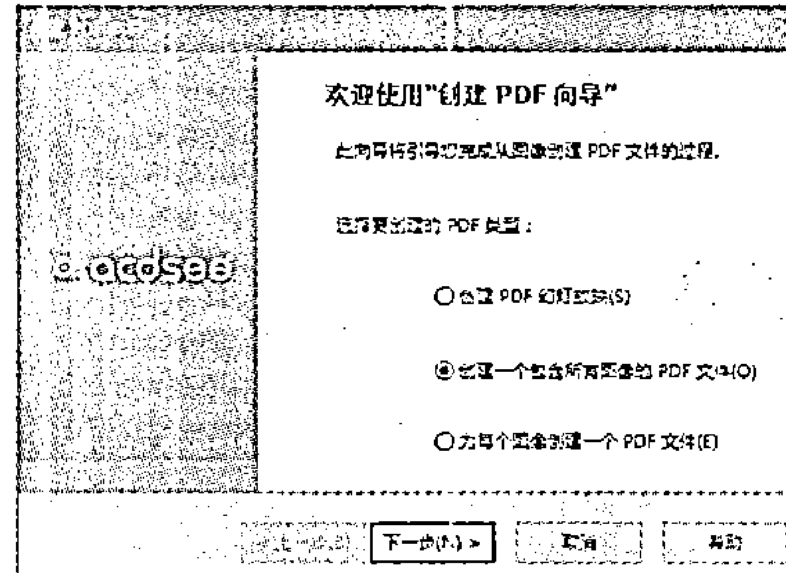

## 优化Chrome五大招

- 一器变六器 ACDSee巧“变身”
- 文件被锁 解锁还须刨根问底
- 用好高清音乐标签
- 制作与管理PAC代理文件
- 解除“绑架” 还回清爽的谷歌浏览器
- 畅享Evernote与OneNote互联互通
- 网盘数据大转移
- 另类需求 考验文件批量更名
- 让右键功能获得“升华”
- 妙用右键 “生产”最适图片

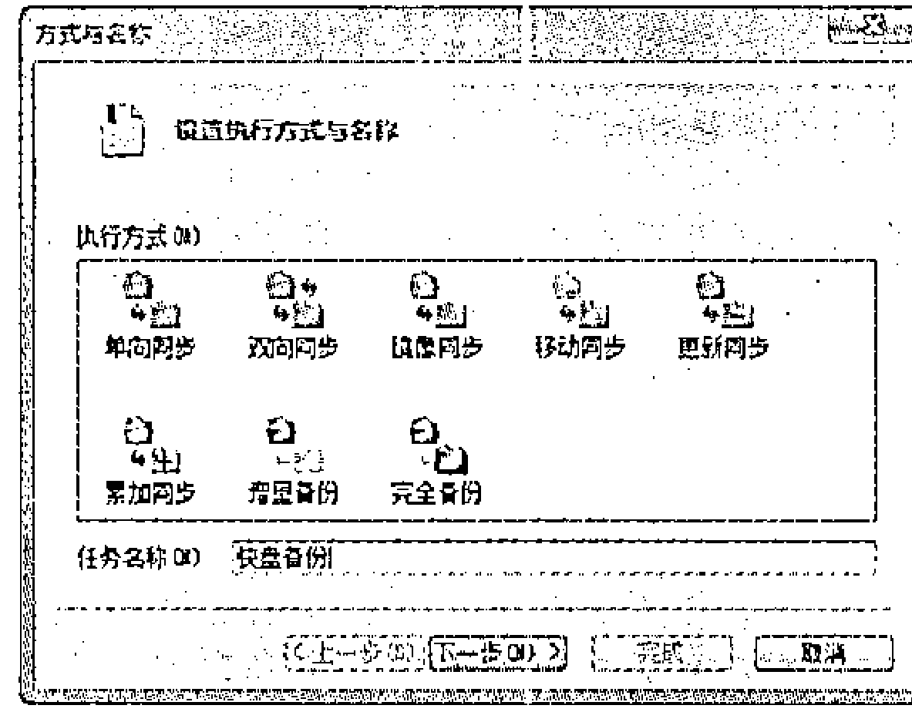

- 悬浮显示指定网页
- 别小看EXIF 你能对它做得更多
- Vivaldi 延续Opera辉煌回归
- 多留一手 盘卡文件恢复易
- 续写右键菜单另类用法
- Windows也可以玩“框计算”
- 保护文案内容 防止创意被窃
- 通通透透 用好ISO文件
- 启动程序 定位要更快更准

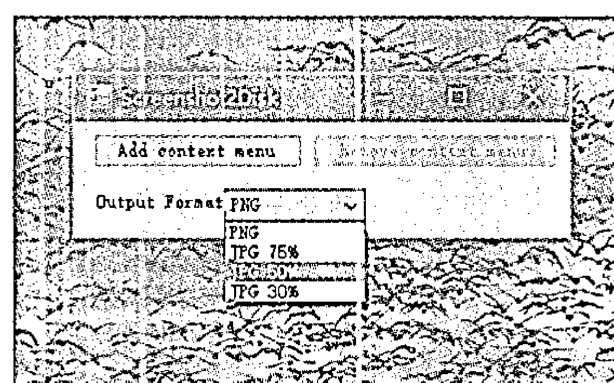

- 旁门左道也能过滤广告
- 手势 让工作更有效
- 云端也能配置火狐浏览器
- 产品广告和情景“合体”

## 高效办公

- 邮件合并 让举办活动更高效
- 轻松创作PPT 3D立体画
- 快速按户汇总人口

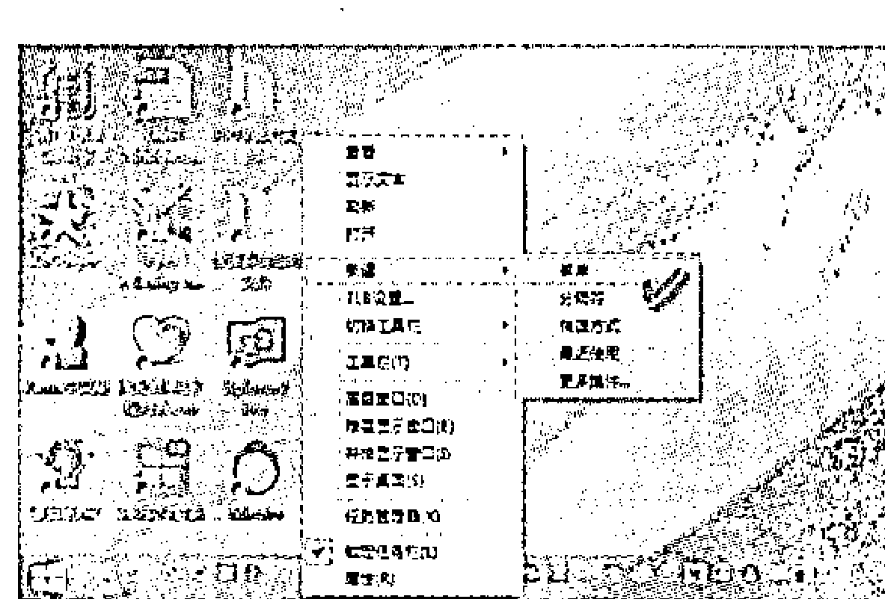

- 不用代码 游戏课件轻松做
- 排版打印 版纸不符巧解决
- 吃金币记单词 游戏课件巧制作
- PPT花样按钮巧制作

常见手机品牌进入Recovery/Fastboot模式的方法

| 品牌 | 进入Recovery模式 | 进入Fastboot模式 |
|------|------------------|------------------|
| 三星 | 音量加+Home键+电源键 | 音量减+电源键 |
| 华为 | 音量加+电源键 | 音量减+电源键 |
| 小米 | 音量加+电源键 | 音量减+电源键 |
| 联想 | 音量加+音量减+电源键 | 音量加+电源键 |
| OPPO | 音量减+电源键 | 音量加+电源键 |
| vivo | 音量加+电源键 | 音量减+电源键 |
| 魅族 | 音量加+电源键 | 音量减+电源键 |
| 中兴 | 音量加+电源键 | 音量减+电源键 |
| HTC | 音量加+电源键 | 音量减+电源键 |

- 制作PPT微立体图表 ................. 284
- 一点鼠标 相关数据全提取 ................. 285
- PPT创意相框巧制作 ................. 286
- 图表设计不走寻常路 ................. 288
- 球星多项数据快速跨表查询 ................. 290
- 一气呵成 数据分类提取统计 ................. 291
- 有“错误”也能正确求和 ................. 292
- 流水表格速转二维表格 ................. 293

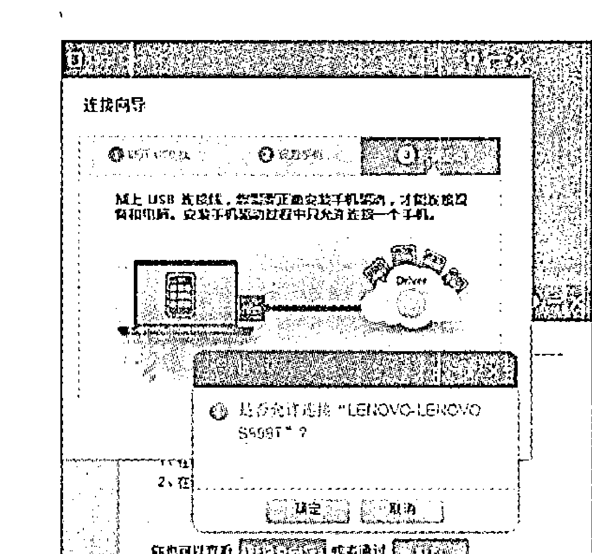

### 移动新天地

- 没有想像的脆弱 Android手机系统攻防战 ................. 294
- 掌上玩视频 与简单玩说No! ................. 297
- 手机“做减法” 勿仅赖一键优化 ................. 300
- 化“烦”为“便” 通知栏为我所用 ................. 303
- 不在家时 旧手机来当“保安” ................. 306

P306

## 傻博士

- 傻博士有话说 ................. 308

### 硬件应用

- 一波三折 一体电脑更换硬盘全攻略 ................. 332
- 显示器超频 提高刷新率改善游戏体验 ................. 335
- 拆换并不难 浅谈笔记本换键盘的思路 ................. 338
- 笔记本顺利用用上免费Wi-Fi ................. 340
- 不怕油污 给笔记本全身贴膜 ................. 341
- 狂飙无极限 让新老主板都能支持NVMe ................. 342
- AMD用户的福音 让笔记本屏幕免费升级一个档次 ................. 346
- 数据随云带 曲线打造“专属网盘” ................. 348

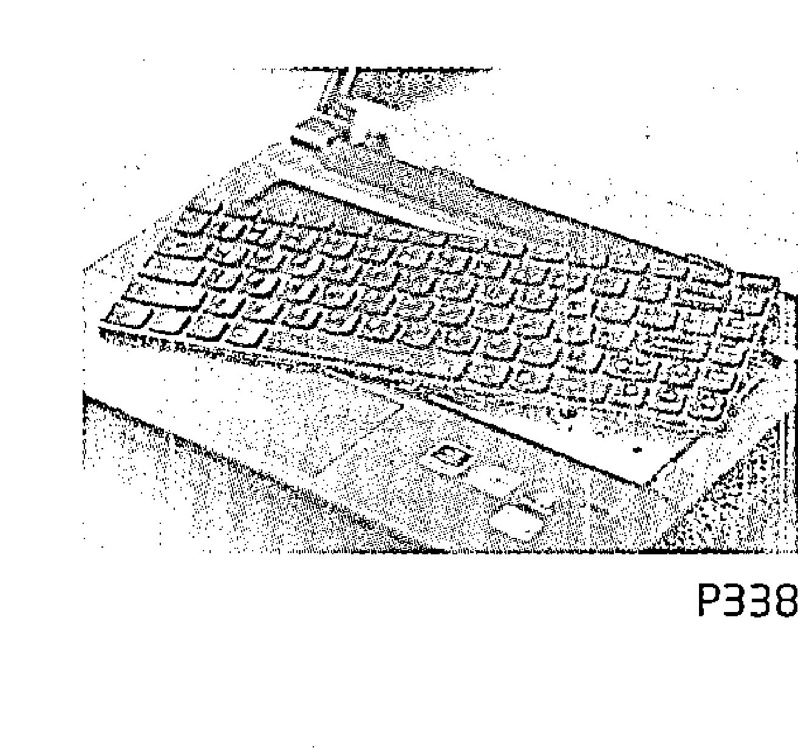

P338

### CFan为你选

- 3倍价格差在哪 昂达oBook11 PK 联想Yoga 700-11 ................. 350
- 一体机的对决 华硕Zen AiO Pro PK 戴尔灵越5459 ................. 352

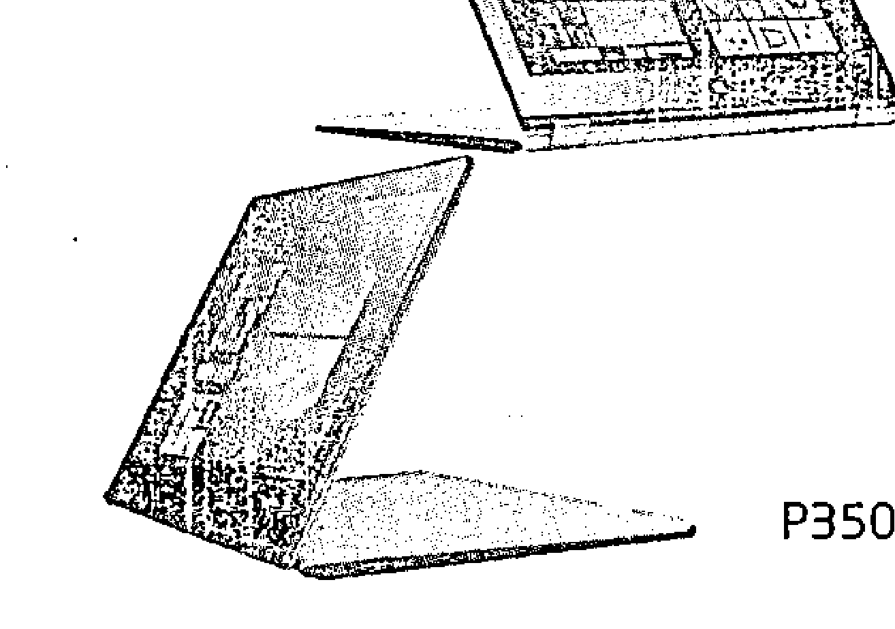

P350

## 《电脑爱好者》2016年合订本(二)


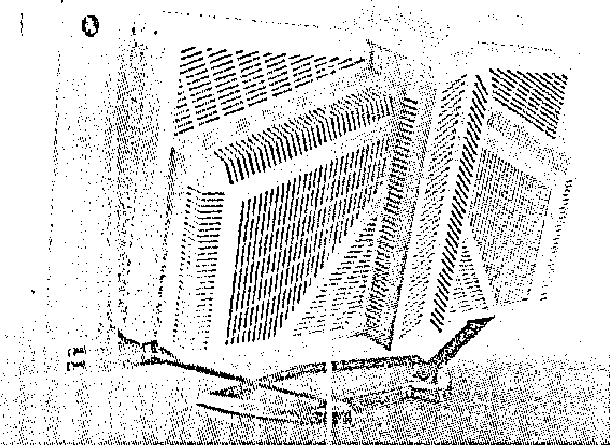

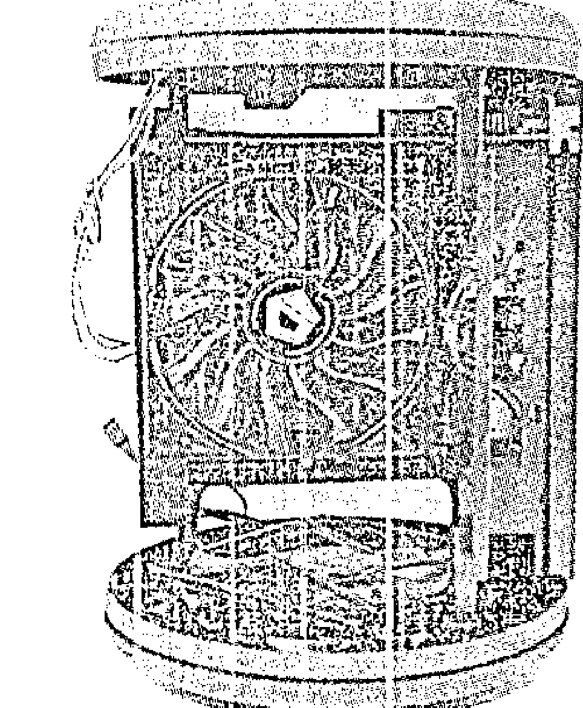


- PC领域的“搅局者” 理性剖析华为MateBook………………354
- 小身材大能量 Alienware X51 R3游戏电脑………………357
- PK白刃战 家庭硬盘和监控硬盘该选谁………………360
- 低价背光键鼠套装导购………………362
- 别因小失大 劣质机箱的三宗罪………………364
- 超值入门机 联想Ideapad 300 PK 华硕VM510L………………366
- 依靠显存提升卖点 理性看待NVIDIA GeForce MX独显………………368
- 妥协的艺术 看笔记本是如何瘦身的………………370
- PIO：空间的艺术 聚焦可以DIY的一体电脑………………373
- 明智选显示器 远离过时和问题产品………………376
- PK白刃战 二代APU如何选………………378
- 容量还是类型 同价位SSD该选哪种闪存………………380
- 高端新宠 全模组电源选购………………382
- 尖峰对决 联想小新Air 13 PK 戴尔XPS13………………384
- 双系统亲民Pad 酷比魔方iwork 10 PK 台电TBook 11………………386
- 快充进化 QC3.0却遇尴尬………………388
- 从GTX950M起步 入门级游戏本的选购误区………………391
- 电商装机时要注意细节………………394
- 千元左右 广视角大屏显示器导购………………396
- 雷声大雨点小 揭开OLED屏的神秘面纱………………398
- PK白刃战 DDR4内存如何选………………400
- 准系统之争 英特尔NUC PK 技嘉Brix………………402
- 一门三剑客 Helio P10同“芯”存差异………………404
- GTX960M游戏本对决 华硕ZX50VW PK 魔法师F5………………406
- Surface Pro 4的替代品 酷比魔方i9 PK 台电X3 Pro………………408
- 和笨重呆板说拜拜 让你的PC换一种形态………………410
- 与GTX960同价 R9 380超值来袭………………412
- 价格相差不大 入手100系平台正当时………………414
- 巴掌大小的PC 微星小魔方 PK 惠普小叮当………………416
- 真正的“准”高端 GTX965M独显游戏本的逆袭………………418
- 速度供电难兼顾 USB Hub没想象的那么简单………………421
- 1080之前的疯狂 高性价比组合导购谈………………424
- 好马配好鞍 快充手机如何选购充电器………………430


## 旧瓶依然 能装新酒

### 新问题就要用老办法解决

新的操作系统、新的硬件配置，我们在追求科技“新”主义的脚步似乎从未停歇过，在尝试的过程中期待它们有着实用、易用、性能等全方位的提升，满足工作、学习与娱乐的需求。但和新鲜的东西打交道，自然会遇到“兼容性”这个常规话题，对此，能否快速解决问题会使知识储备与个人技能立判高下。实际上，许多新问题的解决方案全部都是建立在常规问题上的“微改良”，并不需要我们浪费脑细胞去钻研新的解决思路。不相信？那就一起来看看廉颇老矣依然能饭。

策划|《电脑爱好者》编辑部

### 老调重弹

现在很多人已经用上了Windows 10系统，在平时使用时总会遇到一些问题。其中许多新问题 Windows 10并没提供明确的解决方案。不过对于经常使用Windows系统的朋友来说，这些问题借助之前的经验和技巧就可解决。

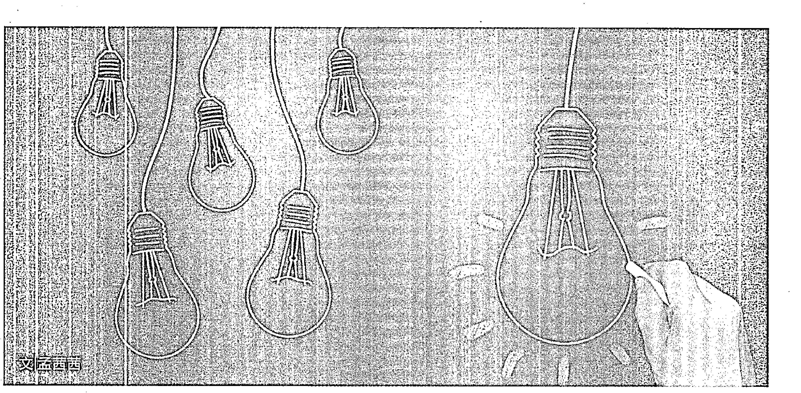

## 巧借外援 家庭版也要比肩专业版

微软升级Windows 10是按照对应版本进行，Windows 7和Windows 8/8.1家庭版的用户只能升级到Windows 10家庭版，而许多品牌厂商（尤其是笔记本电脑）为节约成本，使家庭版的市占率较高。但功能上的缺失如Bitlocker加密组件、组策略，使其在某些场景下的应用中颇为掣肘（图1）。不过Windows 10家庭版缺失的功能也可通过其他软件或系统组件进行“修补”，满足我们的应用需求。

### 模拟Bitlocker加密

每个人的电脑上都有一些不想被别人窥视的隐私文件，Windows 10专业版可以借助系统自带的Bitlocker进行加密保护。对于Windows 10家庭版用户，如果要加密文件，现在有很多第三方加密软件可以实现类似功能。比如VeraCrypt就是一款免费的高强度加密软件（一款基于TrueCrypt项目开发的即时加密软件），它可以像Bitlocker一样保护我们的隐私文件。启动VeraCrypt后在程序界面点击“创建加密卷”，可看到程序支持对文件和文件夹（包括系统分区，对系统分区加密需要硬盘前端保存至少32KB未分配空间）进行加密，默认即可（图2）。

剩下的操作按照加密向导一步步完成加密卷（实际

| 管理功能 | 家庭版 | 专业版 | 企业版 | 教育版 |
| :--- | :---: | :---: | :---: | :---: |
| 加入域 | | √ | √ | √ |
| 组策略编辑器 | | √ | √ | √ |
| Bitlocker 加密 | | √ | √ | √ |
| 企业模式 Internet Explorer 浏览器 (EMIE) | | √ | √ | √ |
| Assigned Access 8.1 (访问分配) | | √ | √ | √ |
| 远程桌面 | | √ | √ | √ |
| Direct Access (直接访问) | | | √ | √ |
| Windows To Go 工作工具 | | | √ | √ |
| AppLocker (应用锁定) | | | √ | √ |
| BranchCache (分支缓存) | | | √ | √ |
| 可通过批量许可证获得的开放式价值 | | | | |
| **企业级功能** | | | | |
| 企业应用分发和配置 | √ | √ | √ | √ |
| 移动设备管理 | √ | √ | √ | √ |
| 可加入 Azure AD，访问商店、公司门户 | √ | √ | √ | √ |
| Win10 企业版 SA | | | √ | |
| 独立 UX 控制 | | | √ | |
| 可升级到专业版的企业版 | | | √ | |
| 可升级到家庭版的教育版 | | | | √ |

为一个加密文件），设置加密文件和容量、访问密码，最后将其格式化即可使用。返回程序界面，点击“选择文件”，选择上述创建的加密文件并加载，输入正确的访问密码后就会打开加密卷（图3）。

这里的加密文件实际上是类似分区的虚拟分区文件（为了保证文件不被删除，建议使用权限设置禁止删除成功加载后在资源管理器中打开，将要加密的文件全部移动到加密虚拟分区就完成文件的加密操作了，如果是加密分区操作类似（图4）。

完成文件的加密后返回程序主窗口，点击“卸载”，将加载的虚拟分区卸载。这样以后需要访问加密文件时，同上运行VeraCrypt并加载文件，输入正确的访问密码后才可以打开虚拟分区进行访问。这里要注意的是，VeraCrypt加密强度非常高，并且可以像Bitlocker一样创建加密系统。使用VeraCrypt加密后一定要记住自己的访问密码，同时应及时创建应急访问盘。

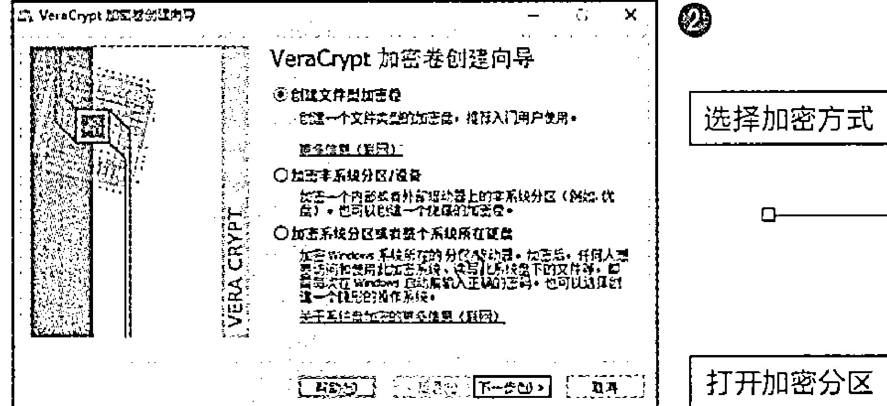

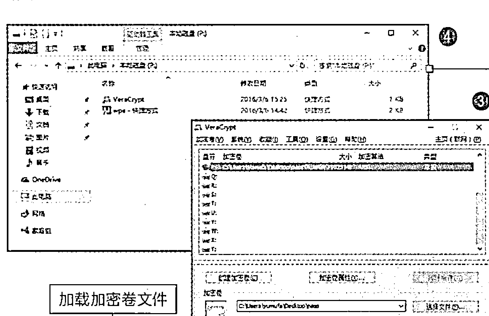

### 模拟组策略

Windows组策略中提供了很多加强组件来保护和优化系统，如果家庭版用户需要使用类似专业版的组策略来保护自己的电脑，我们可以使用其他变通方法实现类似的保护功能。比如专业版的组策略有个“阻止特定程序运行”的策略，如果家庭版用户需要阻止某个程序的运行，那么利用系统自带的权限进行阻止即可。下面以阻止电脑其他用户运行QQ为例。

首先找到QQ安装目录，选中QQ主程序C:\Program Files\Tencent\QQ\Bin\qq.exe，右击该文件选择“属性→安全”，点击“编辑”，在弹出的窗口中选中需要限制运行QQ的账户，然后将其“拒绝”权限全部勾选（图5）。

这样当用户试图运行QQ的时候，系统就会弹出权限不足的提示，阻止特定用户运行QQ。当然为了实现更好的限制效果，还可以对标准用户进行限制，这样即使他们知道是由于权限的限制也无计可施，因为标准用户无法更改权限设置（图6）。

此外，组策略中很多设置其实是通过更改注册表键值实现，在日常上网过程中，IE主页经常会被篡改，通过组策略可以锁定主页。家庭版用户只要运行注册表编辑器，展开[HKEY_CURRENT_USER\Software\Microsoft\Internet Explorer\Main]键值，其右侧窗口当中的“Start Page”值即为主页，因此我们只要将[main]值的权限设置为“只读”即可锁定主页（图7）。

在注册表中右击[main]值选择“权限”，然后点击“高级”，将该键值所有者由SYSTEM更改为当前用户，接着将“继承”权限删除，最后将当前用户的权限设置为“读取”即可（图8）。

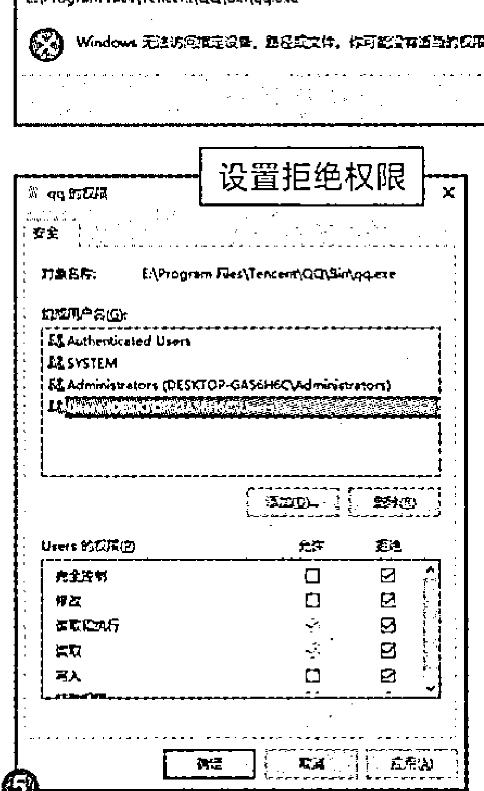


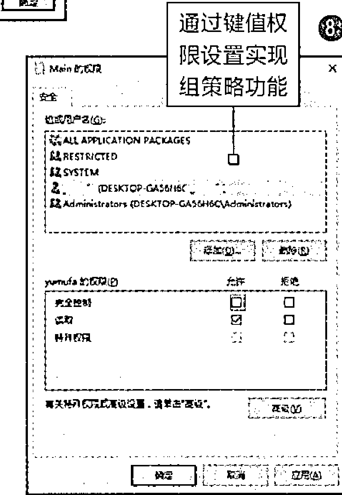

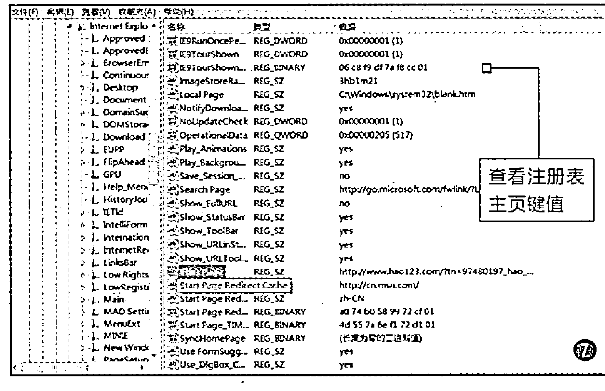

### 模拟远程桌面

Windows 10家庭版默认只能远程连接到其他电脑，其他电脑也无法使用远程桌面功能连接到Windows 10家庭版的电脑上。对于喜欢使用远程桌面功能来远程操作家庭版的用户，现在借助“Anyplace Control”也可以轻松控制家庭版电脑。在家庭版电脑上打开 www.anyplace-control.com 下载软件进行安装（受控端只要安装 Host Module，安装时需要注册控制用户和密码），在控制端电脑上安装 Admin Module 端。这样以后需要控制家庭版电脑时，只要在控制端电脑上启动“Anyplace Control”，使用安装时注册的控制用户和密码登录，成功登录之后就可以看到家庭版电脑了（图9）。

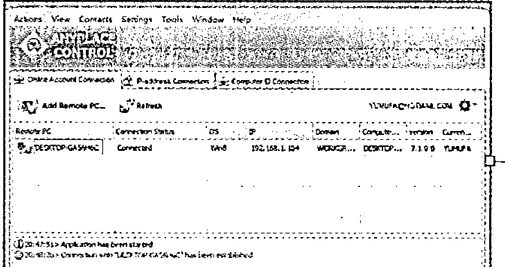

在右图中双击控制电脑，这样即可在打开的窗口看到受控制的家庭版电脑。和系统远程桌面不同的是，它控制用户和当前登录账户都能在同一桌面内操作（图10），是不是更方便了？

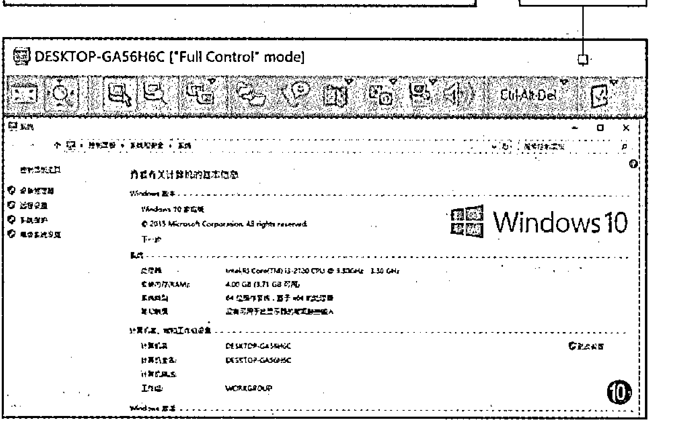


## 老方法解决Windows 10新问题

除了前面介绍的方法外，我们在以前使用旧版Windows的时候，还经常借助注册表编辑器、命令行等工具来解决系统问题，这些工具在Windows 10中同样适用。

### 命令行解决Windows 10难题

大家知道，从Windows XP开始很多朋友就喜欢使用命令行来高效执行很多操作，Windows 10同样内置命令行组件，在新系统中借助高效的命令也可解决很多新问题。以Windows 10系统下集成的OneDrive网盘为例，它默认可以在不同设备间同步文件，但OneDrive同步文件偶尔也会失效。如果该功能失效，我们就可借助系统的命令行对其进行重置。

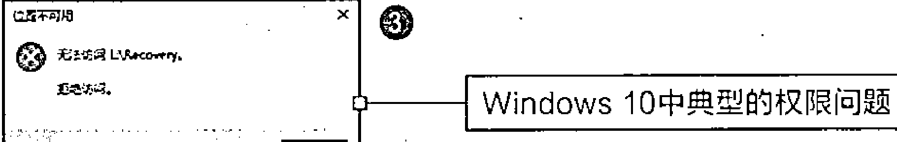

首先以管理员身份启动命令提示符，在其中输入 "C:\Users\当前用户\AppData\Local\Microsoft\OneDrive\OneDrive.exe /reset"，上述命令会结束当前 OneDrive.exe 进程并对其进行初始化（图1）。完成初始化后继续右击“开始徽标→运行”，在运行框输入 "C:\Users\当前用户\AppData\Local\Microsoft\OneDrive\OneDrive.exe" 重新启动 OneDrive 即可修复故障了。

类似的命令行还有许多，比如默认Windows 10安装的一些应用是无法卸载的（如Xbox），但很多人又从来没有使用这些内置应用，现在借助 PowerShell 命令行可快速进行内置应用的卸载。在搜索框输入“PowerShell”查找后以管理员身份运行，接着输入 “Get-AppxPackage” 即可获取内置所有应用安装信息，然后使用 “Get-AppxPackage *应用具体名称* | Remove-AppxPackage” 语句进行删除即可，如输入 “Get-AppxPackage *xbox* | Remove-AppxPackage” 即可将 xbox 卸载了（图2）。

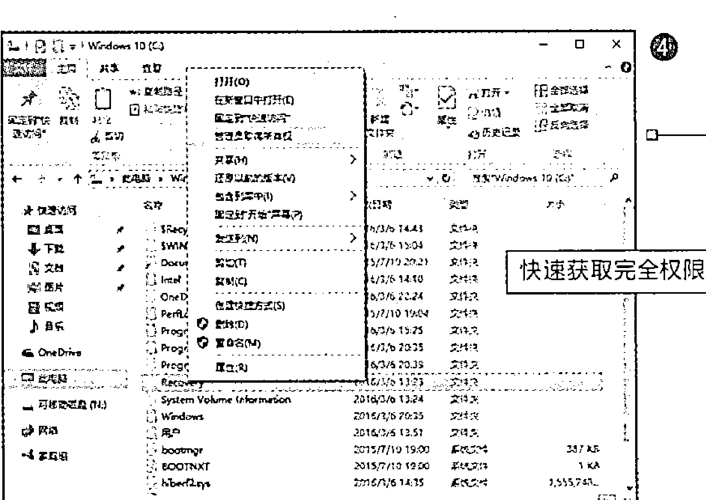

注意，此方法有风险，对Windows系统不熟悉的朋友千万别尝试。

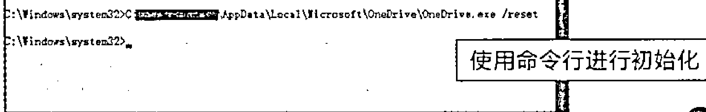

当然为了执行更高效的操作，除了使用单一的命令行外，我们还可以结合批处理实现多命令的运行。比如Windows 10使用了严格的权限设置，对于一些受系统保护的目录（很多软件安装后也会使用类似的保护机制），即使我们以管理员身份登录也很难访问或将其删除，直接双击或删除会提示无法访问，这是Windows 10中典型的权限问题（图3）。

常规操作是在文件（夹）属性设置里先更改文件的所有权，接着再获取完全控制的权限才可以执行操作。现在在借助批处理即可快速获取完全权限。首先到 http://t.cn/RGEk3i2 下载所需的注册表文件（该文件是由多个批处理文件组成的），下载后将其导入系统注册表中。这样在需要更改所有者和权限的目录上右击选择“管理员取得所有权”（图4）。

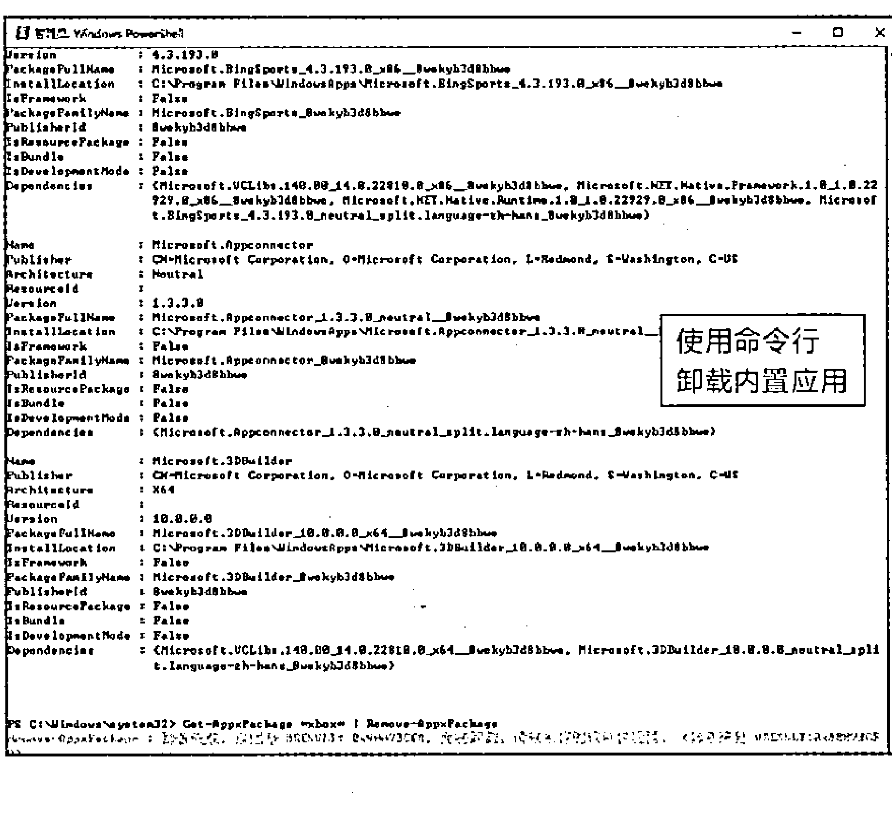

上述右键快捷命令实际上是系统在后台执行原来老系统就内置的 “takeown.exe” 和 “cacls.exe” 两个命令分别更改目录所有权为当前管理员账户，以及赋予当前管理员账户完全控制权限，完成权限更改后就可以正常访问受限的系统保护目录了（图5）。

> 访问 http://t.cn/RlnKBe8，可获取更多常见 Windows 10 内置应用删除命令代码的信息。

### 使用注册表编辑器解决问题

大家知道，系统中很多设置都是由注册表中相应的键值决定的，早在Windows 98时代我们就经常使用修改注册表的方法实现对系统的更改。同样的这种方法在Windows 10中仍然有效。比如Windows 10系统下如果没有设置文件的默认打开方式，那么双击文件的时候就会提示“在商店中查找应用”（图6）。

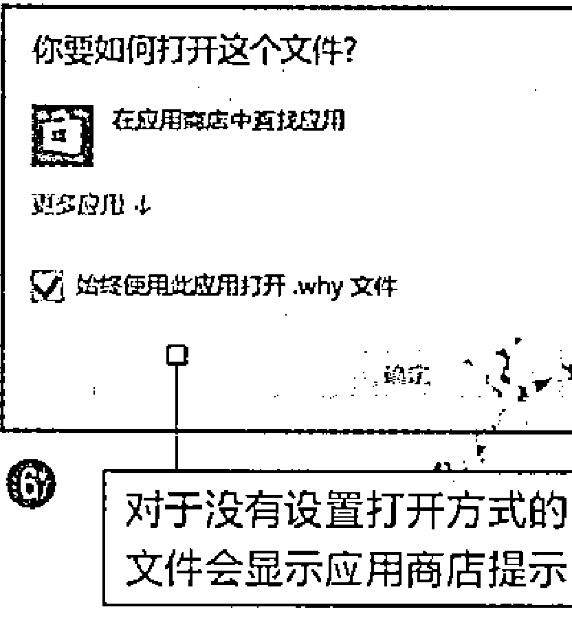

在实际使用中，我们大多是自己手动指定程序，并没有从应用商店下载应用的习惯（而且目前应用商店也缺乏应用），现在可以通过修改注册表的方式去除应用商店的提示以方便我们使用，否则点击后会自动打开应用商店，一般操作还得将商店关闭并返回打开方式窗口重新选择程序。

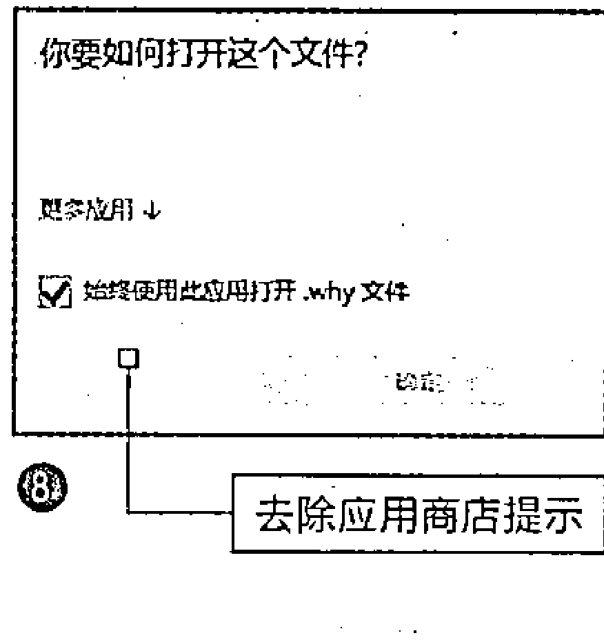

启动注册表编辑器后展开 [HKEY_LOCAL_MACHINE\SOFTWARE\Policies\Microsoft\Windows]，右击 [Windows] 项选择“新建→项”，在其下新建一个名为“Explorer”的新项，然后选中新建项，在右侧窗格新建一个 DWORD（32位）值，名为 “NoUseStoreOpenWith”，并且将其赋值为“1”（图7）。

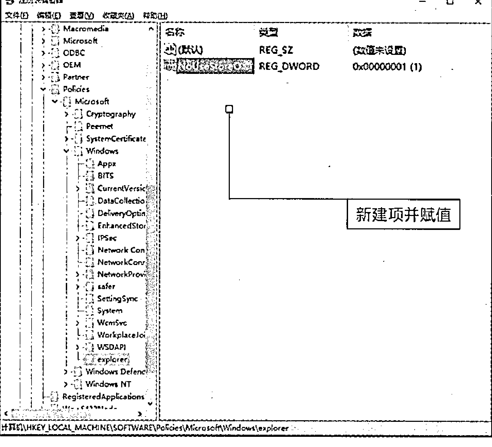

通过上述设置，以后再打开类似文件就不会再弹出应用商店的提示了，我们直接点击“更多应用”即可快速选择打开程序了（图8）。

同样的对于注册表使用，除了直接在注册表编辑器中进行键值的编辑外，我们也可以使用 “reg” 命令快速实现对注册表的编辑。比如Windows 10系统中毒后，一些病毒会通过更改注册表中相应的键值来阻止用户对文件夹查看方式的更改，用户无法勾选显示隐藏文件。此时只要打开命令提示符，然后输入 “reg add "HKLM\Software\Microsoft\Windows\CurrentVersion\explorer\Advanced\Folder\Hidden\SHOWALL" /v Checkedvalue /t reg_dword /d 1 /f”，执行这个命令后即可快速恢复默认注册表键值，当然也可以将其制作为批处理备用（图9）。

```
C:\Windows\system32>reg add "HKLM\Software\Microsoft\Windows\CurrentVersion\explorer\Advanced\Folder\Hidden\SHOWALL" /v Checkedvalue /t reg_dword /d 1 /f
操作成功完成。
C:\Windows\system32>
```

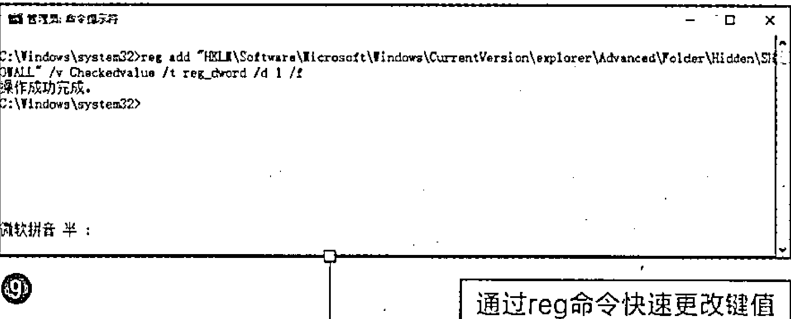


### 如何在Windows 10中玩转硬件管理

文 | 技术宅

作为一个新的系统，在日常使用Windows 10中肯定会遇到各种驱动引发的问题。像一些老硬件可能无法被Windows 10自动正确识别，为了对硬件进行控制（如使用Windows 10组策略来限制闪存盘读取），我们要查看硬件ID。在之前的系统中我们也遇到过不少类似的问题，这些问题可以借助“设备管理器”解决。

### 使用注册表编辑器解决问题

如上所述，一些较老的硬件常常没有开发 For Windows 10 驱动，导致这些硬件无法在Windows 10中自动识别。在Windows XP时代就在使用的手动安装驱动方法解决问题，现在Windows 10中也可使用。比如很多笔记本的无线网卡驱动，如果没有 For Windows 10 驱动，那么就可以尝试使用Windows 7和Windows 8/8.1的驱动进行安装。首先下载好Windows 7/8的驱动，在设备管理器找到没有自动安装驱动的设备，右键单击选择“更新驱动程序→浏览计算机以查找程序→从计算机设备驱动程序列表中选取”（图1）。

在打开的窗口中点击“从磁盘安装”，接着将其定位到Windows 7和Windows 8/8.1的驱动所在的目录，一般该目录都有 *.inf 安装文件，然后选中安装文件点击“打开”，这样即可手动完成驱动的安装了。

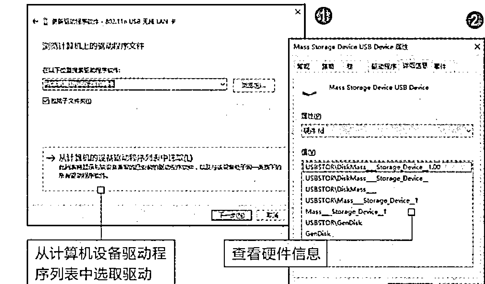

### 查看硬件信息

除了安装驱动，在日常操作中我们经常还要查看硬件信息。在使用组策略控制USB设备时就需要获取硬件ID等信息。对于这些信息的查取，同样可以通过设备管理器完成。打开设备管理器后展开“磁盘管理器→当前使用U盘”，右击选择“属性→详细信息”，在打开的窗口中选择“硬件ID”，其中第一行类似 “USBSTOR\DiskMass______Storage_Device___1.00” 的信息就是组策略中需要用到的硬件信息，现在将其复制后即可粘贴到组策略中使用（图2）。当然除此之外，还可以通过很多老方法查看到其他硬件的信息。我们可以从控制面板中打开“显示属性→设置”窗口查看，这里可以查看显示芯片类型、BIOS版本、系统内存、视频内存、驱动程序版本等信息。通过老旧的 “msinfo32.exe” 命令则可以查看到系统的详细信息，如BIOS版本、内存大小、主板型号等信息（图3）。

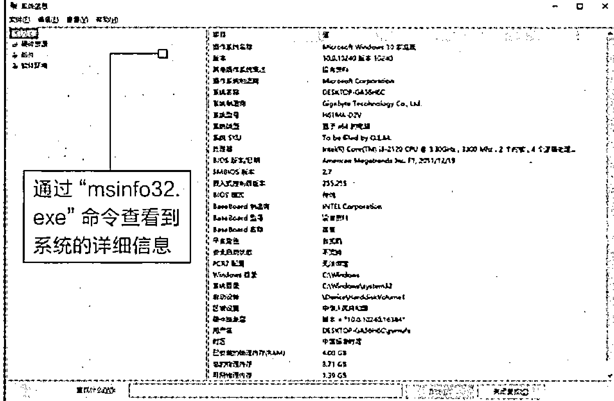

# 《电脑爱好者》2016年合订本（二）

## 沉默无声只为王者归来

### 老软件 新生命

在Windows系统尚未强大到可利用内置组件完成日常任务，或在一软难求的年代，出现过许多脍炙人口的产品，它们不仅有着独特的“生产”理念，其操作复杂度和功能适用度也颇令人惊叹。但在现今讲究“无思考”使用的环境下，它们被遗忘在历史长河中。说起这些一下子能暴露年龄的软件们，并未因为用户的遗忘而逝去，在新理念的淬炼中依旧保持强者的身份。如果你想展示自己在电脑应用领域独到的手段，不妨随我们重温美好的旧梦。


### 老软件 还在发光发热

在我们用过的电脑工具软件中，有不少曾经经历过辉煌人所共知，如ACDSee看图软件、Emacs编辑软件、Thunderbird邮件管理软件等。然而目前这些老软件渐渐淡出人们的视野，甚至有人以为它们已“故去”，因为人们早已用相对简单的产品处理同样的事情。但实际上这些经典的老软件有不少并没有“故去”，而是依然在固守阵地，依旧在发光发热。有的甚至在你不知不觉中更新版本，散发着新生命的气息。

## 看图软件“老树”发新芽

对于老电脑用户来说，说起看图软件，一定会想起一款经典软件ACDSee。目前ACDSee已经在发展中分支出以基本看图和编辑功能为主的个人免费版，以及功能更强大的商业收费版ACDSee 18。此外，为适应飞速发展的数码影像火热事业，还推出了专门真正影像控制的ACDSee Pro 8版本，这个版本专门针对数码照片的预览、管理、冲印、编辑等，是一款功能非常强大的数码照片管理和处理软件。强大而众多的功能，加之简单易用的操作特性，不管是老用户还是新用户，没有理由不会喜欢上它。

### 一键看清照片本质

以往大家查看数码照片拍摄时所用的光圈、快门、感光度、相机型号、镜头焦距等参数，一般都需要借助于专门的软件打开照片文件才能看到。即便是新版的Windows 8.1或Windows 10系统，也需要经过一番“属性”操作，才能看清这些内容。现在我们安装了ACDSee Pro 8之后，软件会在照片右键菜单中自动集成一个ACDSee PicaView的插件菜单项，我们只需在照片上单击鼠标右键，即可马上看到该照片的预览以及关于该照片的各种拍摄参数了（图1）。

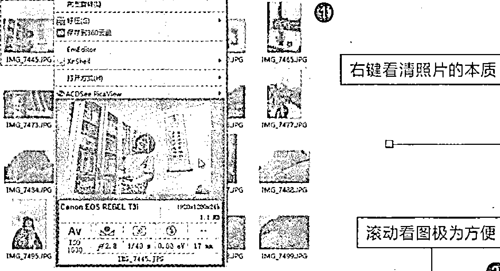

### 滚动看图极为方便

此前在电脑中用图片浏览器看图，如果需要切换照片，需要不停地点击翻页按键、箭头按键，或“上一张”、“下一张”按钮。如果我们用新版的ACDSee Pro览图，除了用这些方式外，直接用鼠标滚轮就可实现照片的滚动预览，而且支持即时放大操作。此外在照片的下方还显示一个影片胶片缩略图样式的照片导览条，可轻松地一步跳跃到需要的照片去浏览。与此同时，右下角同样还提供当前照片的拍摄参数详情（图2）。

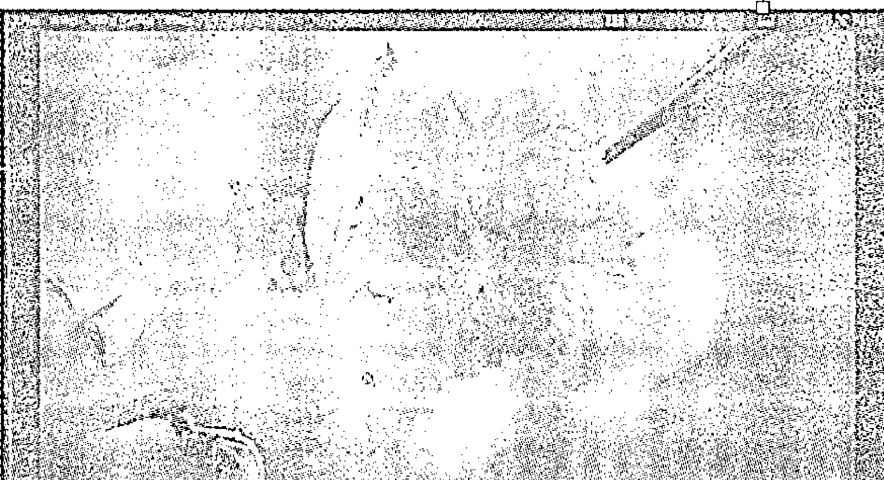

### 专业批量处理照片

每次拍摄完毕后，对本次拍摄不合适的地方，难免需要进行成批修改，或需要做成批修饰或整理。在ACDSee Pro内，当我们选择了批量照片后，右键单击并选择“批量”菜单命令，然后选择下一级子命令，即可对这些照片进行一次性的批量编辑、格式转换、翻转和旋转、大小调整、曝光调整、时间标签调整、名称调整、冲印前调整等操作（图3）。看似普通，但其设置的全面和专业程度，是其他普通图片浏览软件无法相比的。

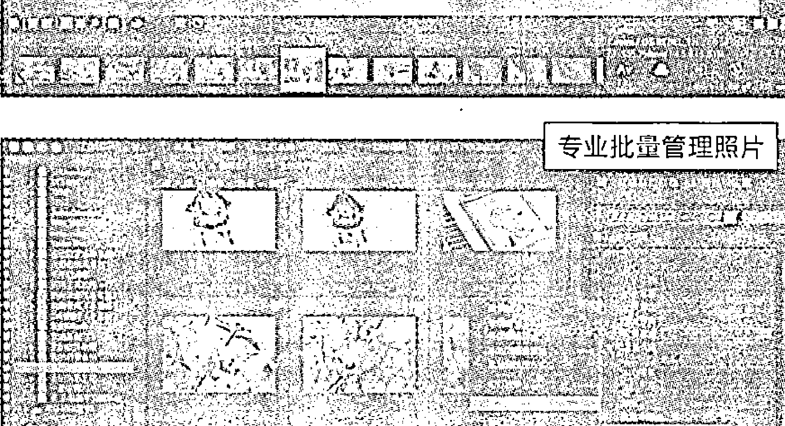

### 照片冲印调整任我行

现在去冲印店冲印照片的越来越少了，但有时为了纪念、送人等特殊需求，这种事情还会发生。冲印时，冲印店的雇员总是先将用户的照片进行一番调整，这种调整有时会偏离用户的初衷，冲印出的照片让用户哭笑不得。如果我们自己能作印前调整，然后告诉冲印店的工作人员原样冲印我们的照片，那么如上情况就不会发生了。

在ACDSee Pro环境下，选择照片并点击“冲印”命令进入冲印设置窗口，就可自行对照片的白平衡、光纤、颜色、色调、软对焦、交叉处理、拆分色调、晕影等进行个性化调整设置了。通过左侧窗格进行调整的效果，会及时出现在右侧的预览窗口中。点击左下角的“原始原始图像”按钮，还可随时将调整后的照片和原始照片加以对比，以便随后作出取舍（图4）。

### 全能全方位编辑照片

冲印调整只是一种简单的照片编辑操作。如果需要对照片进行更加多样化的编辑处理，如裁剪画面、修复瑕疵，添加文本、水印、边框、特殊效果，或者进行曝光和颜色的更加细致的调整，这时只需选择照片并点击“编辑”按钮，进入照片编辑环境执行操作。通过左侧功能导航栏选择功能，设置必要的参数调整值，在右侧窗格就可以看到修改后的效果（图5）。

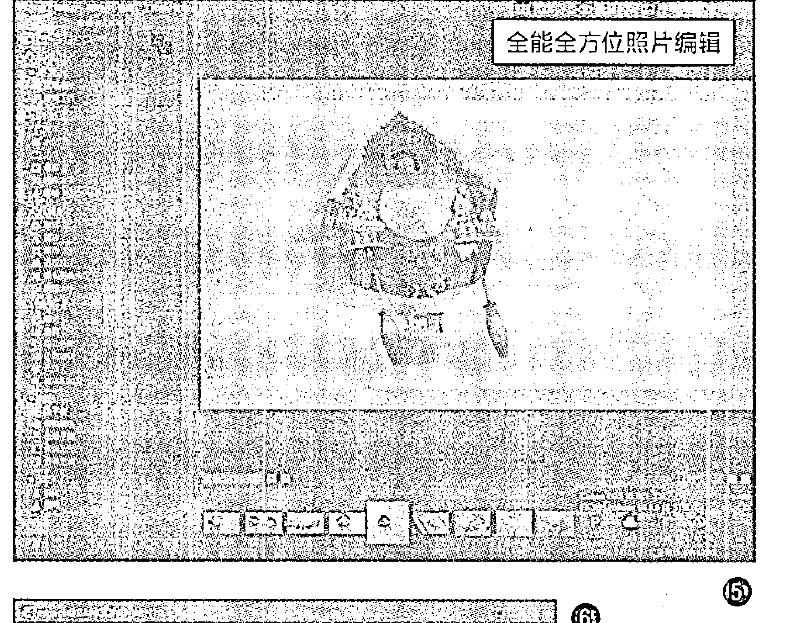

## 编辑软件Emacs“实用”多

编程的用户肯定会不屑于Windows记事本工具，于是Emacs for windows这样的编辑软件就成为许多程序员的最爱。该软件支持对多种编程语言的代码编辑，常用的C/C++、Perl、Python、Lisp等都没有问题。而对于我们普通电脑用户来讲，Emacs的附加功能也会让我们对它倍加珍爱。

### “记事本”内看日历

当我们正在编辑一篇文章或一段代码的时候，如果忽然想起要看看当前的日期，或要将这一日期以某种形式插入到文档或代码当中，这时只需在Emacs软件编辑窗口内选择“Tools→Calendar”命令，即可在窗口下部开启日历小窗并显示当前日期。随后，只需在日期上单击鼠标右键，即可显示可用的关于日期的各种项目，选择需要的项目并将其插入到文档或程序代码中即可（图6）。

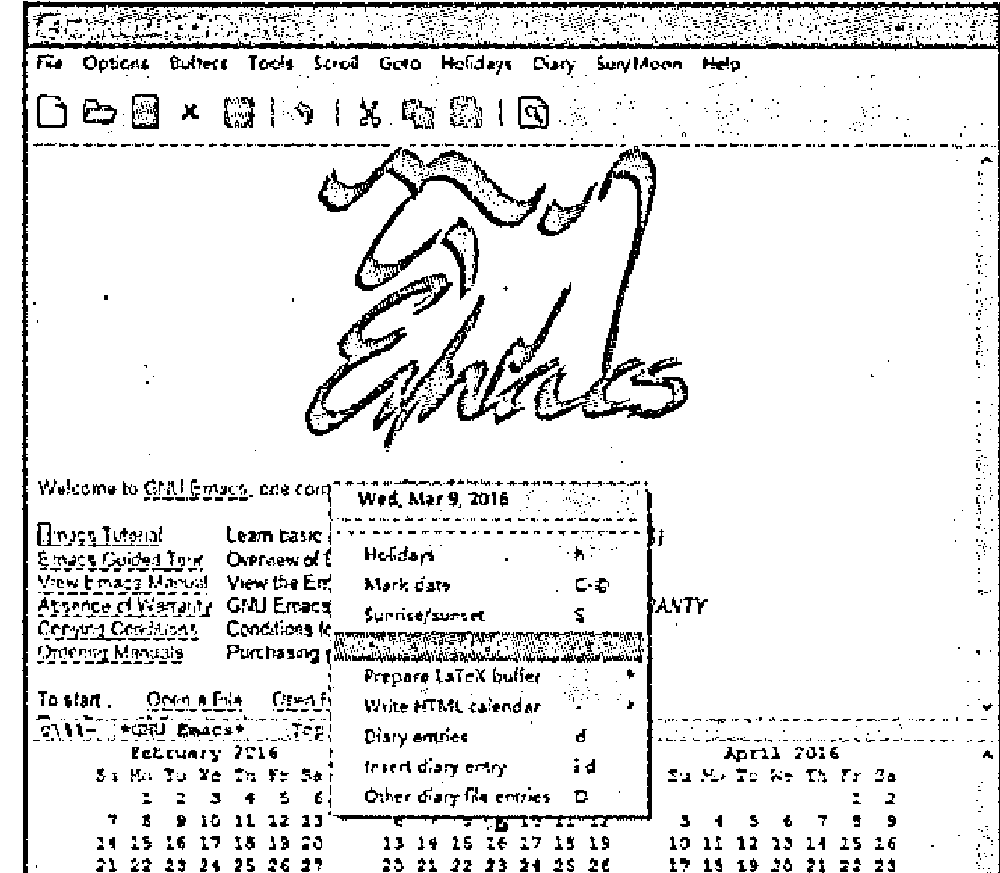

### 玩转轻松小游戏

在编程或写作之余，玩玩小游戏也是一种生活调剂。在Emacs软件中，集成了14款字符式的小游戏，虽然简单，但却趣味无穷。随手点击“Tools→Games”菜单命令，调出某个游戏玩耍一阵，也算是换换脑筋，放松一下吧（图7）。

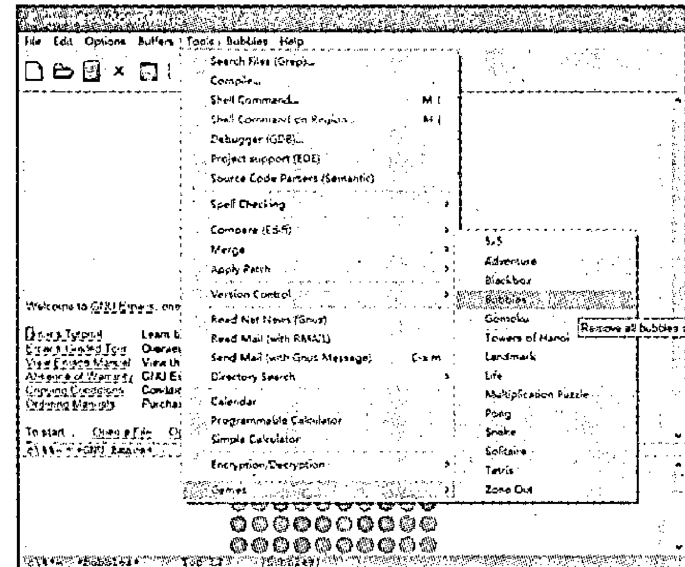

### 两个文件找不同

对于修改过的两个文本或代码的版本，要找出它们之间的不同，该怎么办？使用Emacs的文件比较功能，可以轻松找到两个文档的内容不同。首先点击“Tools→Compare”菜单命令，然后再点击下级命令“Two Files”（图8），随后软件会要求确认第一个文件A的位置和名称，接着确定第二个文件B的位置和名称。最后就会给出自动比较的结果，并显示两个文件的不同之处。该软件不仅能比较两个文件的不同，若选择“Three Files”还可以三个文件一同比较。

### 简单计算内部搞定

如果在写作文章或编写程序代码的过程中，需要进行一些简单的计算，也不需要到外部去启动计算器软件。只需在Emacs软件的编辑窗口内执行“Tools→Simple Calculator”命令，即可调出一个简单的字符计算器窗口，在其中输入算式之后，便可获得计算结果了（图9）。

## 邮件管理“雷鸟”更强劲

虽然现在网页版的邮件管理功能越来越强大，但目前还是有许多人在使用独立安装版的邮件管理器软件。大家也许对Foxmail最为熟悉，其实还有一款“雷鸟”软件（Mozilla Thunderbird），也是许多人曾经喜欢用的邮件管理器软件。因为它不单单是管理邮件这么简单。

### 灵活安排日程任务

Thunderbird邮件管理器让人念念不忘的是它的日程和任务排程功能。在邮件右上角有两个按钮，分别表示切换到日历选项卡和任务选项卡。在日历选项卡窗口中，可按日期安排自己的各种任务计划；而在任务选项卡窗口中，则可新建各种事件或任务，并将其分配个恰当的时间段，并可设置重复和提醒的周期和频度（图10）。

### 自动过滤垃圾邮件

对于邮件收发，我想大家最头痛的莫过于垃圾邮件的侵扰。Thunderbird软件具有垃圾自动过滤功能，我们可以在“账户设置”中对特定账户进行垃圾邮件设置。此外在“安全”选项卡中，还可以选择当手动将邮件标记为垃圾邮件后，软件对邮件的自动处理方式，是直接删除它们还是将它们移动到“垃圾”信箱，这些全由我们用户而定（图11）。

### “反钓鱼”功能有提示

除了垃圾邮件外，大家最担心的是欺诈类邮件。一旦我们错误地点击进入欺诈钓鱼网站，进行了日常登录或交易等操作，可能会带来预想不到的损失。因此邮件管理程序具备反钓鱼功能非常必要。在Thunderbird软件的“安全”设置窗口中，选择“电子邮件欺诈”选项卡下的“告诉我正在阅读的消息是否是欺诈邮件”复选框，这样当收取邮件时，软件就会自动检查邮件中含有的欺诈信息，并通知给我们（图12）。

### Thunderbird管束多重聊天

通常我们聊天都需要另外安装聊天客户端，或者访问相应的聊天网站。如果你在一家外企工作，经常使用Google Talk、Yahoo等聊天工具，不需要网络浏览器或开启专用客户端，只需在Thunderbird邮件管理器内即可完成聊天（图13）。

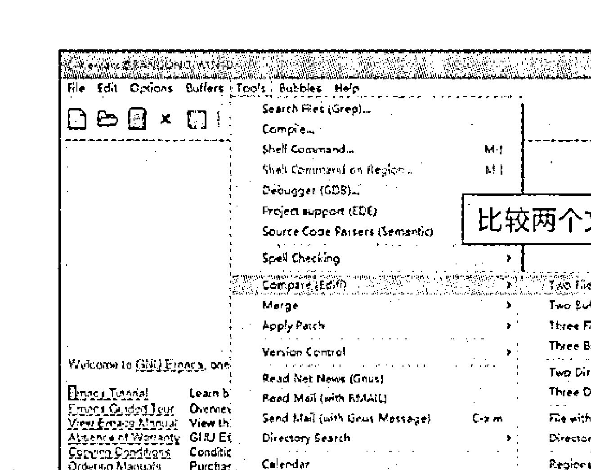

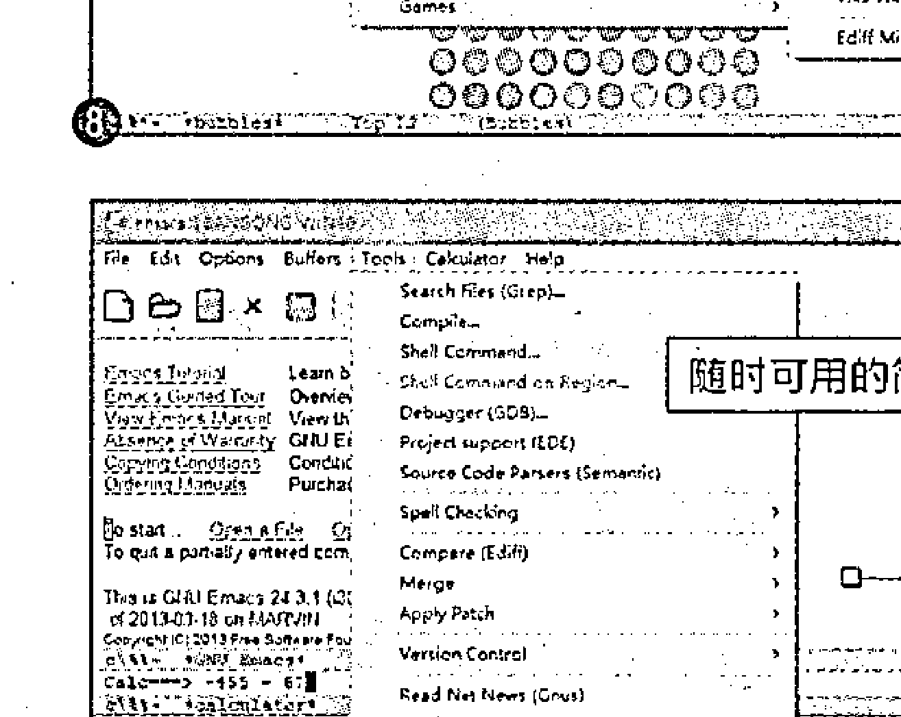

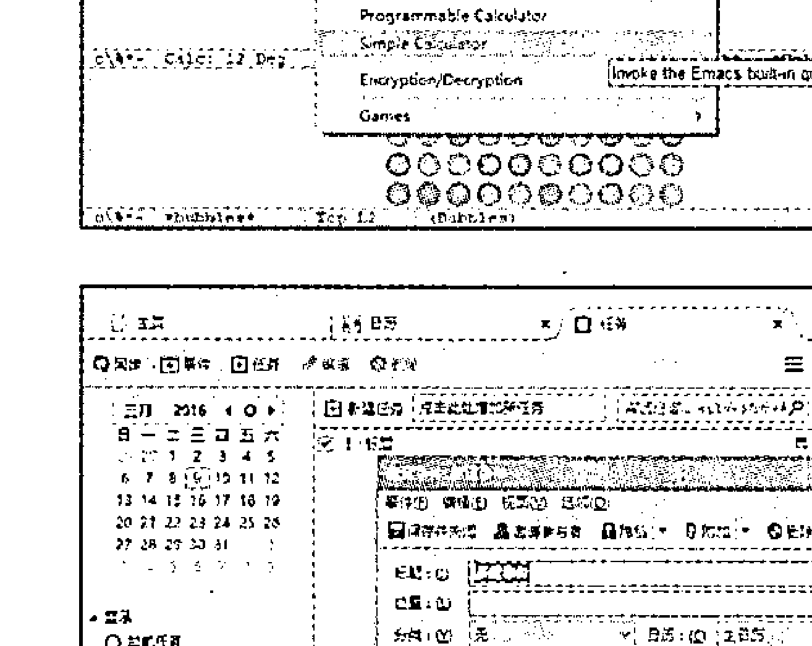

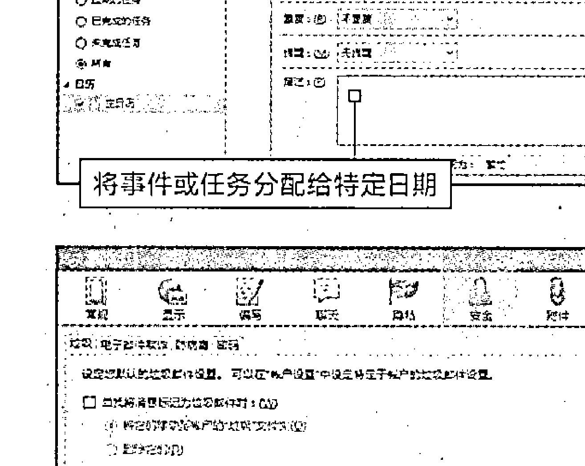

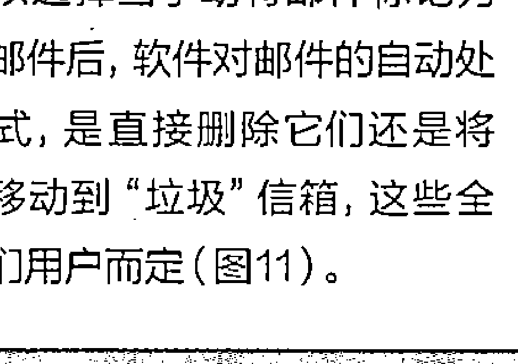

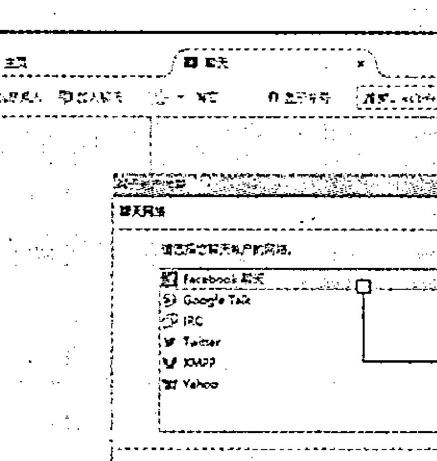

> “安全”选项哪里找
点击Thunderbird软件主页上的“通讯录”按钮，进入窗口后选择“工具→选项”菜单项，即可看到“安全”选项，邮件过滤和反欺诈开关等都在其中。

曾经何时，我们对WinZip、FlashGet、Winamp等软件耳熟能详，而随着岁月的流逝，这些经典软件已经有不少淡出了大众的视线，不过还是有一些经典软件仍然在更新，并且依然拥有自己独特的性能，用好经典老工具同样可以在Windows 10中解决新问题。

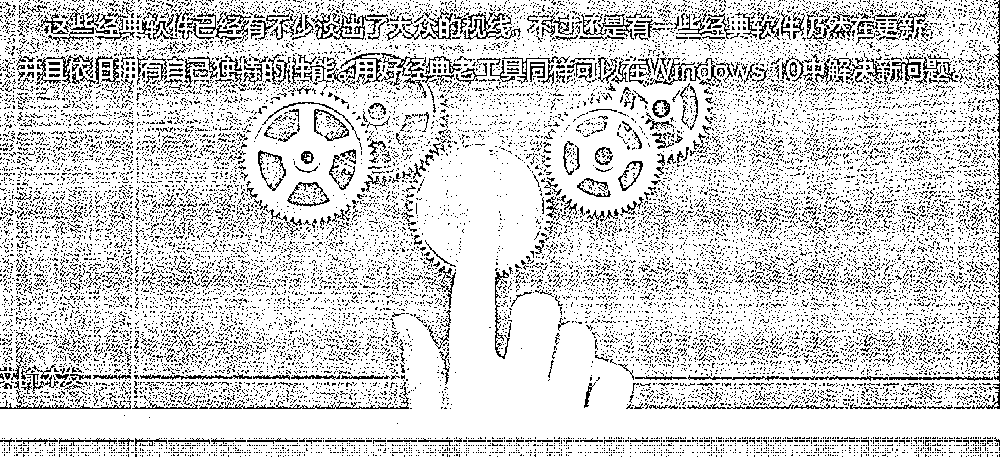

## Windows 10老忘不了的“微软”软件

### 敢向Windows 10叫板的压缩软件 WinZip

自从Windows集成对ZIP文件的解压功能后，老牌压缩软件WinZip就逐渐被人遗忘。不过WinZip并没有“自暴自弃”，直到现在它仍然在不断更新，并且可完美兼容Windows 10，而且在实际使用中具备Windows 10所没有的很多特色功能。

### 批量为图片添加水印

日常操作中为了保护自己的图片不被他人盗用，我们经常要为发布的照片添加版权水印。不过Windows 10本身并没有提供批量添加水印的工具，WinZip即可轻易实现。

启动WinZip后新建一个压缩文件，接着在左侧窗格展开保存图片的目录，切换到“创建→分享”菜单，开启右侧窗格的“水印”，点击“选项→水印设置”。然后在展开的窗口设置水印的位置、水印文本、位置等参数，完成后将其保存。最后将需要添加水印的图片全部拖到新建的压缩文件中（图1）。

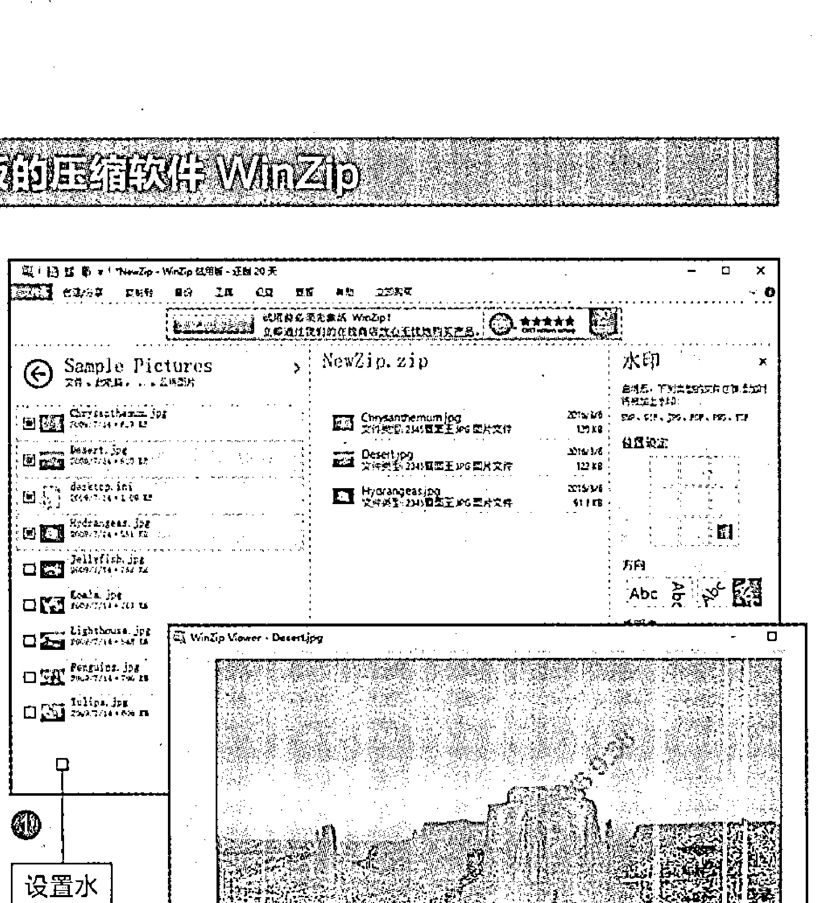

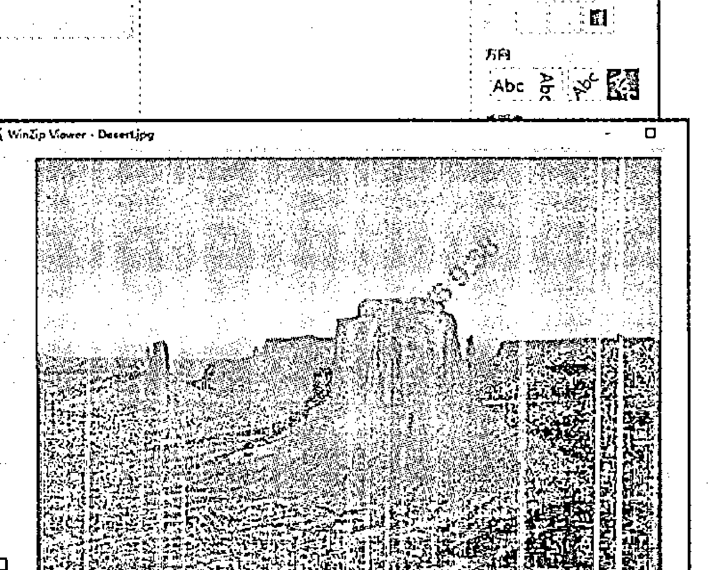

### 变身网盘管家

为了方便文件的共享和访问，现在很多朋友都在使用OneDrive、Dropbox、Box等国外网盘服务。不过默认情况下，每使用一个网盘，我们就得在本机安装一个网盘客户端，如果同时在使用多个网盘就得安装多个网盘客户端。现在WinZip已经集成云服务，这样通过WinZip不仅可将文件以压缩的形式同时保存在多个网盘中，而且可同时管理多个网盘中的文件。

启动WinZip后点击左侧面板的“添加云”，可以看到WinZip支持常见的Box、Dropbox等常见的网盘，在弹出的窗口中按提示选择自己注册的网盘，然后输入相应的账号和密码登录，即可将常用的网盘添加到WinZip中（图3）。成功添加网盘后，在WinZip的左侧面板即可像在资源管理器中那样访问网盘，在此可以将网盘文件直接压缩保存，也可直接右击网盘文件选择“复制→移动到”，在打开的窗口将网盘文件下载或者复制到本地保存，具体的使用就像平时的资源管理器一样。

### 其他更多功能

除了上述介绍的功能外，WinZip还支持加密功能（开启加密后设置密码，将文件拖入压缩包即可加密），批量解压缩（如在日常下载连续剧、多集电子书等压缩资源的时候，选中全部压缩文件即可解压到同一目录），命令行批处理操作（命令行可以到http://www.winzip.com/downcl.htm下载，这样结合批处理即可高效解压/压缩多个文件）。

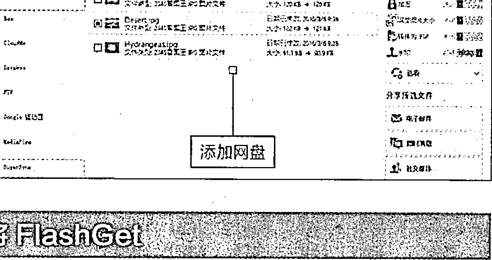

## 宝刀未老的下载老将 FlashGet

大家知道FlashGet是我们以前常用的下载软件，只不过随着宽带提速，以及迅雷、QQ旋风等下载软件的普及，FlashGet才逐渐被大家遗忘。不过现在FlashGet仍然在继续更新，而且同样完美兼容Windows 10。当然作为基本功能，FlashGet下载在Windows 10中仍然十分好用，具体使用和迅雷等大同小异。而最让人推崇的下载文件管理在Windows 10中仍可以大放异彩，在FlashGet中它可以根据文件性质自动将文件归类到不同目录中，这样很方便我们对文件的管理，而在Windows 10中并没有提供类似功能。因此如果需要对Windows 10中的文件进行高效管理，我们就可以利用FlashGet来进行整理。

比如Windows 10用户默认使用IE下载的文件全部保存在“C:\Users\当前用户\Downloads”目录下，而且所有类型的下载文件全部混杂保存在一起，这对后续使用和管理都有诸多的不便。现在我们利用FlashGet下载功能即可进行分类。因为FlashGet只能在浏览器中激活下载才能使用分类功能，因此需要先使用“Webfd个人服务器”制作本地目录服务器。以管理员身份启动“Webfd个人服务器”后切换到“文件管理”，在左侧窗格依次展开需要整理的目录，然后将需要整理的文件依次添加到右侧窗格任意目录中，这里可以选择本机多处目录的文件（图4）。完成文件的添加后，按F9键“生成下载首页索引文件”，这样服务器会自动生成一个类似“http://192.168.1.104:2928/download/”的链接，这个就是本地WEB服务器链接地址，可以直接粘贴到IE中打开（图5）。

启动FlashGet，在左侧窗格右击“完成下载”，选择“新建分类”，按提示建立自己需要整理的分类目录，比如可以新建一个“文档”类专门用于保存工作文档。完成分类的创建后切换到“选项→任务管理→分类规则”，在打开的窗口中选中“文档”，点击“编辑”，在其中添加doc、xls（每个扩展名使用空格断开），这样以后下载的.doc、.xls文件就会自动归类到上述目录中，其他类型文件的归档类似。完成上述设置后，返回IE窗口，在打开的本地WEB页面右击选择“使用FlashGet下载全部链接”，接在打开的窗口按提示勾选需要整理的文件，点击“下载”，这样下载后的文件就会按照文件类型自动整理到对应的目录中了。完成文件的整理后将下载目录复制到其他位置保存即可（图6）。

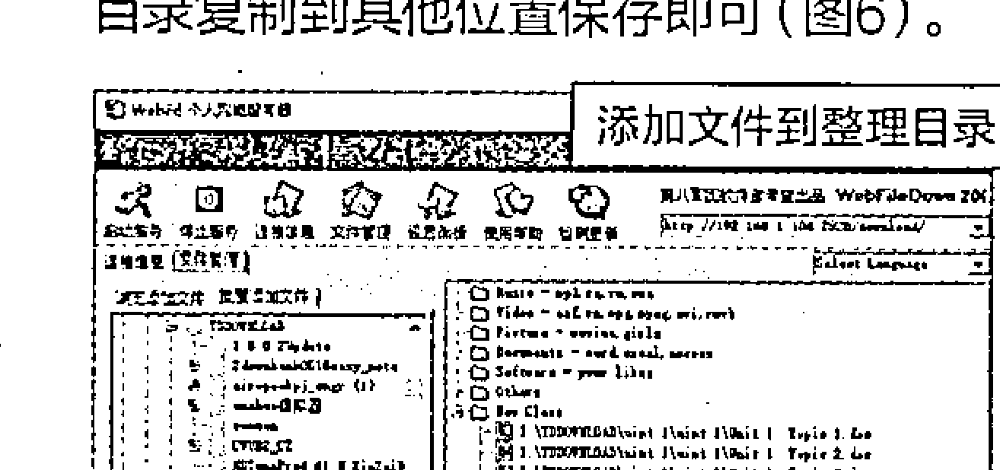

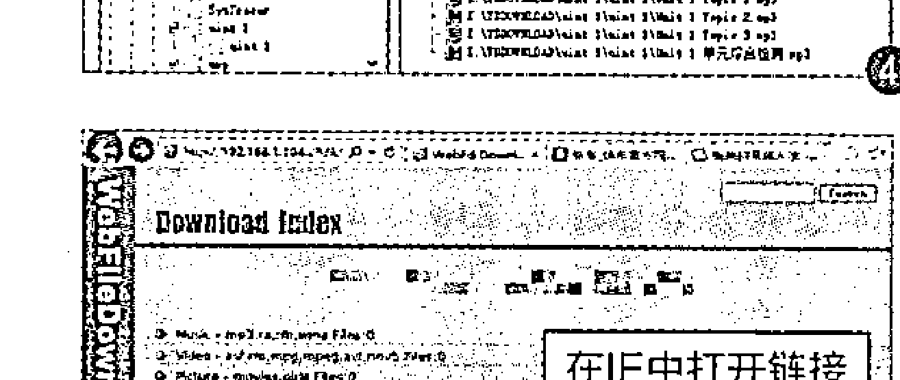

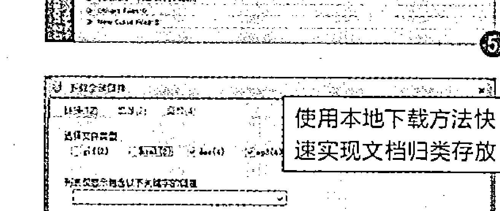

### 形式会“过时”

### 实用的然后永恒

随着软件的发展和网络的普及，新的软件“悄然”出现。由于新产品在兼容老软件功能的同时增加了顺应时代的新功能，而这些功能又是当前生活或工作中最需要的，因此人们会渐渐习惯于它们，而逐步将那些虽然“经典”的软件遗忘。但忘掉的往往是那些随时都可以随手拈来的功能，而对于那些独到的软件或功能，恐怕人们永远也不会忘记。

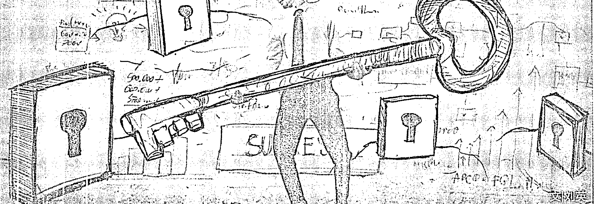

### 音视频播放，太单纯吃不开

使用电脑的老用户，对Winamp这款音频播放软件无人不知无人不晓（图1）。然而如今播放音乐，还有几个人在用这款软件呢？究其原因，在人们已经走进网络音乐时代的当下，该软件对网络音乐的支持方面显得力不从心，而且对高清音乐的支持方面也显得力度不足。

## 因为方便所以难忘

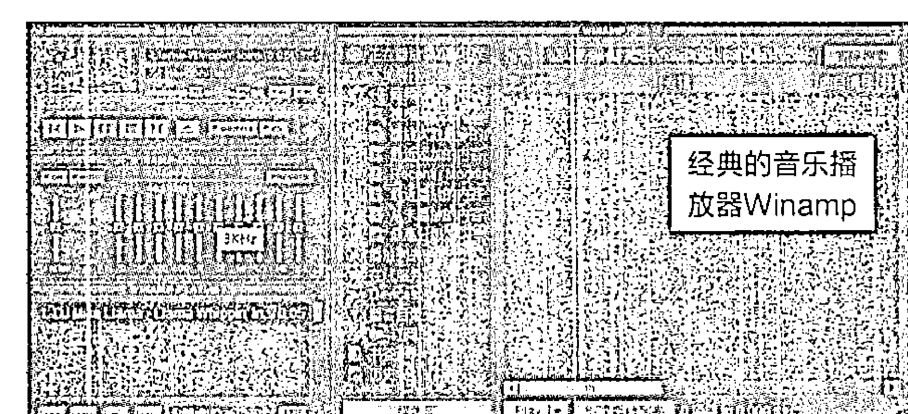

也许你还藏了不少老CD唱片。Winamp在支持音乐CD播放，以及在音乐文件夹右键菜单直接调用播放方面还是有独到之处的。它能为操作本地音乐文件提供极大的方便。在安装软件的过程中，只需选中“Launch Winamp for Audio CDs”选项，就会添加对CD播放功能的支持。如果选中“Show Winamp in the folder context menus in Windows Explorer”选项（图2）；则可以在Windows文件资源管理器的文件夹右键菜单上，添加用Winamp播放的快捷命令项目。

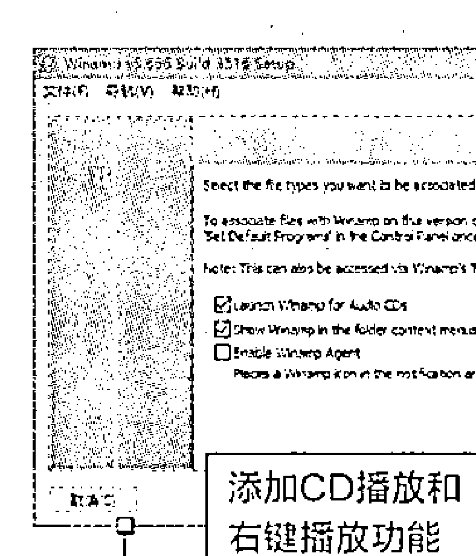

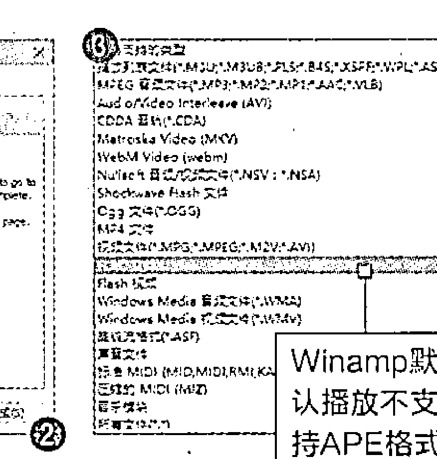

### 弥补高清音乐的短板


虽然当前有这么多的音乐播放器可选，然而对于使用Windows 10的用户来讲，如果只是播放一些大众化的音乐文件格式，完全可以不借助于任何第三方音乐播放器。因为Windows 10自身携带的工具里，就有“乘船”而来的音乐播放器“Groove音乐”应用。点击Windows 10开始按钮，在弹出的磁贴面板中，就可以见到“Groove音乐”播放器的身影（图4）。“Groove音乐”启动后，会按默认的系统音乐文件存放位置，扫描存于本地的所有音乐文件，并将文件添加到“Groove音乐”的列表界面中。列表中的音乐是依照音乐文件中的内置分类信息进行索引的，因此要求音乐文件中包含这些标准信息，否则无法完成自动编类和识别。正常识别的音乐，将可以按照专辑中的歌手、音乐类型、发行年份、添加日期、音乐文件A到Z排序等方式，进行列表显示。

要在Winamp上播放APE高清音乐，在默认的软件播放列表中，是无法找到APE这种格式的（图3），需要安装相应的插件才能完成播放支持。而如今，无论我们使用千千静听还是百度音乐，只需将APE等格式的高清音乐拖入播放列表中，就能马上播放，根本不需要另外安装什么格式支持插件。如果要将这些音乐文件的“体型”压缩，然后拷贝到小容量的移动设备中播放，可以方便地通过右键单击音乐列表，选择格式转换命令进行格式转换。而且在转换格式设置窗口中，可以为目标MP3音乐文件设定不同的码率，在基本不影响收听品质的前提下，达到缩小文件体积和保持音质的平衡。对于某些通过DVD或蓝光大片直接转换而来的多声道高清DTS音乐，用Winamp播放器无法直接播放，其他播放器能很好支持的也不多。遇到这种情况，如果安装使用当前流行的酷狗音乐播放器，该播放器对高清音乐格式的支持比较广泛，可以获得独特的播放支持和体验，播放DTS高清源码音乐不在话下。

### 小技巧

如果音乐文件明明保存在硬盘的某个位置，但“Groove音乐”软件启动后硬是没有找到音乐文件，这时，只需点击“设置”按钮，进入设置界面，点击“选择查找音乐的位置”一项，然后指定具体的音乐存放位置，这样软件就会按照指定的位置来添加音乐文件并建立索引了。如果电脑中的iTunes里有现成的播放列表，还可以通过“导入iTunes播放列表”选项，导入此类列表。此外，软件对音乐内置媒体信息的检索，是通过一个“媒体信息”开关来控制的，我们可以按需关闭或开启这个开关（图5）。


## 视频软件的“新生命力”

不仅音频软件如此，视频软件的发展也存在着同样的趋势。起初，人们几乎都喜欢用超级解霸、暴风影音之类的知名媒体播放器来播放各种影视光盘和影视文件。但是随着网络视频的发展，要播放网上提供的视频，就不得不安装相应的浏览器视频插件，或者安装对应的视频客户端程序。在目前比较流行的视频播放客户端当中，比如爱奇艺、优酷、搜狐影音、风行影音、PPTV等，除了可以直接播放在线视频之外，对本地视频的支持也很到位，几乎以前必须要安装专用播放器才能播放的本地视频，现在也都可以直接用这些在线视频客户端软件来打开播放了（图6）。因此，单一的以本地视频播放器而见长的播放器已经渐渐失去了它们的市场。也正因为如此，为了谋得继续生存和市场的一席之地，以往以本地播放为主的视频播放器，现在也开始打起了网络播放的主意。虽然在网络和本地视频播放方面我们目前已经有很多选择，但这些终归还是需要安装必要的第三方软件才能完成的任务。微软当然能看到这种需求和时机，因此，Windows 10在播放视频方面，也已经开启新的产品。在Windows 10默认安装的磁贴应用中，一款“电影与电视”应用正是为取代传统影视播放软件而设计的（图7）。尽管该软件目前的功能还非常有限，但是，谁能说准今后微软不会发力，让这款视频播放器成为“无敌”的方便之选呢？


> 在“电影与电视”应用窗口的底部播放控制工具栏上，鼠标移动到第一个按钮上，可以看到“强制转换为设备”的提示，这可以让我们将视频选择切换到与当前电脑连接的其他视频播放设备上，例如电视机或其他监视器（图8）。

文|刘英

## 下载变迁 经历四次变革

当在线云计算还没有全面取代传统软件使用方式的当下，下载软件依然是我们仍在广泛采用的电脑使用方式。然而即便是同一个“下载”的概念，这些年的不同时期已经经历了不同的内涵，下载方式发生了多次变迁。

### 最原始的软件下载“鼻祖”

在互联网刚刚开始普及的上世纪90年代末期，人们下载软件一般要到类似华军软件园这样的知名软件门户网站。由于当时的搜索引擎还不够发达和完善，网络上专门介绍软件资源的网站也不多，因此要找到一款软件比较难。而这样的个人门户却以其强烈的爱好、丰富的软件资源和独特的资源管理方式，让人们可以轻易获得自己需要的软件（图1）。


### 各种让人不放心的下载

在之后的一些年中，以软件推介为主题的个人网站纷纷出现。利益驱使下，各类个人软件网站可以说是“无恶不作”——有的在下载链接中隐藏木马，恶意入住用户的电脑并偷取用户信息；有的在下载链接上造假，页面提供的各种下载链接中冒充大家紧缺的软件，却只链接推广软件（图2）；还有的以汉化、破解、提供注册码和注册机为名，在可用的软件中捆绑木马或推广软件。所有这些，让人们对软件下载市场和渠道形成了广泛的不信任和不安之感。于是“安全”成了下载首要考虑的问题。也正因为如此，才造就了类似软件管家以自身安全优势保驾护航的软件下载和管理模式。这种方式结合了安全检测、用户评价、软件升级、软件卸载等功能，使用非常方便。当然我们不是说这样的模式一点问题都没有，但起码相对于那些越来越不靠谱的个人软件网站来说，使用此类软件管理方式来搜索、下载和安装软件，要安全得多、放心得多。


### 最靠谱的软件下载途径

也许我们会担心，即便是用安全厂商提供的安全下载管理器，下载的软件也难免被捆绑其系列软件，在不知不觉中被强行安装。其实，除了安全厂商提供的安全管理软件外，最靠谱的软件下载和安装方式是到软件官网去下载软件。但有一个问题，就是如何才能保证到达的是软件的官方网站，而不落入他人设定的陷阱网站中呢？这里有两个方法。首先，对于已经存在于电脑中的某个软件，如果要获得该软件的更高版本，最直接的方法是启动该软件，然后通过其“帮助”或“关于”菜单或命令，即可直接获取软件的官方链接，点击进入即可到达正宗的软件官网（图3）。如果是第一次安装某款软件，可以通过搜索引擎来搜索这款软件，但搜索时主要关键词的选取非常重要，首先尽可能使用准确的软件名称（包括英文名称），此外不要添加“下载”或“使用”等附加关键词，这样很容易落入一些个人设定的下载网站或使用“指导”网站中，从而获得不正规的下载链接。在搜索结果中，对于比较知名的软件，在一些安全浏览器中，会自动验证并标注“官网”字样，说明这是经过安全验证的官网，可以放心进入（图4）。作为一个正规的软件官网，一般不会掺杂与该软件无关的其他信息，且应该具备软件介绍、下载链接、开发版本历程、平台说明、联系方式等清晰和详尽的信息（图5）。

### 更加省心的软件下载方式

随着移动设备的普及，软件的使用和下载方式也发生了突变。软件商店、应用市场的概念也出现了。不同于以往的软件下载方式，在新型的移动设备中，几乎都提供了至少一款“软件市场”或“软件商店”类的软件。从这种渠道下载软件，就会有效减少各种麻烦（但不是绝对的，因为各家平台的把控严格程度不同）。不仅是在移动市场，即便是在PC设备上，商家也看出了这种发展势头，也在开始极力推广这种软件管理的模式。Windows 8、Windows 10的应用商店，就是PC以及PC与移动合体的产物。目前我们可以通过Windows应用商店，找到能实现我们日常需求的各种应用软件（图6）。随着一体化平台的开发加快，Windows应用商店将会面向一切设备和平台，提供全方位的软件服务。


> Windows 10应用商店下载软件的好处显而易见。首先由于能进入其中的软件会经过微软验证，捆绑广告或恶意成分的软件都将被拒绝，因此不用担心安装的软件藏有恶意或捆绑等猫腻。也许我们会发现，目前Windows商店中的软件质量还参差不齐，品质远比不上苹果商店的软件，但从数量上讲，Windows商店已在发生有目共睹的变化，可选软件越来越多。相信随着一体化平台的开放和开发者踊跃加入，及微软对软件质量的严格管控，将来下载和使用Windows软件也会越来越安全。通过浏览器或网站下载软件的时代会成为“过去时”。


### 自身拥有 无需借助他方

我们在Windows中安装各种软件，是因为Windows本身不具备完成某项任务的功能或功能不够完美，逐渐开始注重用户体验感受的微软，也不再无视这些基本的用户需求，在最新的Windows 10版本中，就可以直接使用系统自带的许多功能或工具，完成以往需要安装第三方工具软件才能完成的任务。

## 文件压缩与解压

Windows 10包含了对Zip格式的文件压缩支持，这不仅仅在于对Zip文件的解压方面，还表现在对Zip文件包内文件列表的直接预览，以及将已有的文件或文件夹压缩为Zip包的支持上。

同访问未压缩的文件一样。同时，在资源管理器的功能面板上出现“解压缩”菜单项，单击该项会看到“解压缩到”和“全部解压缩”两个按钮，可用之来解压文件包或文件包中的文件(图1)。


当我们直接在资源管理器中选择一个Zip格式的文件后，只需简单的点击，文件内包含的各级文件夹和文件会在资源管理器窗口内自动出现，我们可以如同访问一个文件夹那样访问Zip文件中的文件，可以对其中的文件进行复制、删除、打开等操作，就如

如果要压缩一批文件或文件夹，也可以直接用Windows 10的文件压缩管理功能进行。首先要选择要压缩的文件或文件夹，然后点击功能面板上方的“共享”菜单，在弹出的功能面板选项卡中，点击“压缩”按钮，即可生成Zip压缩包(图2)。


### 光盘刻录与擦写


以往我们刻录光盘，总是要借助于Nero等专用刻盘软件来完成。现在Windows 8.1或Windows 10的资源管理器中，本身就集成了读写各种可擦写光盘的功能。只需将光盘介质插入到刻录光驱中，通过资源管理器，选择要写入光盘的文件并进行复制；点击光盘盘符，在随后出现的新增菜单项目“驱动器工具→管理”中，选择刻录命令，即可完成文件写入操作。还可以选择“格式化”命令，对可擦写光盘进行擦写处理(图3)。

### 小技巧

Windows 10默认将PDF文档的打开方式与Edge浏览器进行了关联。如果不想使用这种浏览器来阅读文档，或者在打开文档方面遇到了问题，那么可以通过改变文件关联的方式，指定新的阅读程序。只需找到一个PDF文档，右键单击选择“打开方式”，从中选择要使用的应用，或通过“打开方式→选择其他应用”寻找电脑中安装的其他应用程序确认关联即可。如果电脑中没有更适合于你的程序打开PDF文档，还可以通过选择“搜索应用商店”选项，到应用商店中选择适当的应用进行安装和使用。


### PDF电子书阅读

以往大家阅读PDF电子书要在Windows中安装PDF阅读器，用得最多的软件是Adobe Reader，此外还有福昕阅读器。而进入新Windows时代以后，用Edge浏览器或Windows商店中默认自带的阅读器应用即可直接阅读PDF文档了(图4)。

### 扩展阅读

在不具有PDF阅读功能的低版本Windows中，也有不安装第三方PDF阅读器的阅读方法，那就是上传到云盘中直接通过云盘的Web端或客户端窗口进行阅读。国产云盘百度云或360云盘均支持直接阅读PDF电子书的功能，不需要安装第三方PDF阅读工具。对于在Windows 8.1以下版本的操作系统中阅读PDF文档来讲，如果不想安装第三方的PDF阅读器，这不失为一种很好的补充阅读方案。

## 翻回头看VR

随着HTC Vive、Oculus Rift、PS VR等VR设备以及诸多模仿者的面世，VR虚拟现实即将迎来真正的井喷期。2015年22期上我们曾对VR设备进行了原理和现状分析，在HTC Vive等全新设备的加持下，2016年的VR设备又能给我们带来怎样的新体验呢？


### 移动VR难当大任

从产品的角度来看，VR设备可以分为两个大类别：PC VR和移动VR。简单来说PC VR本身并不具备计算和存储能力，它更像是集成了屏幕、姿态（动作、姿势）监测和空间定位交互功能的头戴式显示器，通过与PC相连获取内容，价格昂贵（图1）。有关PC VR我们会在后文作具体介绍，而接下来我们的主要任务就是进一步了解移动VR。

对国内用户而言，我们所能接触到的绝大多数VR设备都是移动VR，它的本质是由两套放大镜组成的光学设备，并将手机屏幕固定在镜头前方（图2），通过手机端的APP加载内容。移动VR的成本低廉，准入门槛极低。在它的使用过程中，手机是最核心硬件，它将同时扮演屏幕、计算、存储和各种交互功能。比如Google CardBoard、三星Gear、暴风魔镜等都是移动VR的代表。


### 移动VR的体验缺陷

很多接触过移动VR设备的用户都会有种感觉，那就是“眩晕”。究其原因，则是移动VR的计算终端——手机硬件性能的限制。简单来说，移动VR APP会将手机屏幕切割成左右两个多边形畸变的画面（图3），这就导致每一个画面的分辨率仅有手机屏幕标准分辨率的1/2。此外，手机CPU/GPU的计算能力有限，而内置的加速器、陀螺仪、重力感应等传感器的精准度和测频率也较低，于是在体验VR内容时就出现了极为尴尬的问题：


你感觉整个世界都“歪了”，这些不稳定的画面就是强烈眩晕感的元凶。有些用户会问了，为何像三星Gear VR一类的移动VR设备，使用体验和口碑却相对优秀呢？


答案很简单，三星Gear VR售价很高，所以在人机交互方面做了更多的优化（透气性好，佩戴舒适）；Gear VR自身内置运动传感器；能与Gear VR搭配的都是三星Galaxy S和Note系列的高端手机，而这些手机不仅分辨率更高（2K屏幕），内部还集成了高精度的加速传感器（图4）。换句话说，Gear VR是通过牺牲（对其他型号手机）兼容性换来了（相对）良好的使用体验。

### 如何挑选移动VR设备

虽然参与移动VR竞争的企业越来越多，但是各个产品的差异却仅能体现在佩戴的舒适度、光学镜片的材质以及操作手柄设计等基础层面（图5）。可以说，售价399元的产品除了戴着舒服一点，体验上与99元的设备并无二致。因此，在移动VR设备的选购中，大家不要相信“越贵越好”，将有限的资金投入到更高配的手机（GPU性能和传感器精度更好），远比投资到移动VR设备上更易立竿见影。总之，移动VR的体验受限于手机性能的制约，所以只适合体验“轻娱乐”，比如用于欣赏全景照片（如旅游景区的VR赏析）、VR视频、小型VR游戏等等，尝鲜无忧却难当大任。


### 扩展阅读: 移动VR的新思路

LG在MWC2016发布了旗下的首款VR作品: LG 360 VR。该产品最大的特色就是内置屏幕，无需将手机固定在眼镜前方而降低了整体重量，118g的重量佩戴毫无“压力”(图6)。可惜，LG 360 VR的造型更像是眼罩，与用户的脸贴合后存在缝隙进而导致漏光现象。在实际体验过程中用户可以清楚看到屏幕的边缘，失去了VR设备本应具备的“沉浸感”。不过，这种让手机与移动VR分离减轻重量的思路还是值得肯定的。


## 大势所趋的PC VR

如果说移动VR难当大任，那PC VR就是未来的大势所趋，这一点从HTC押宝VR的态度就不难体现出来。那么，PC VR究竟有何神奇之处？

### 第一印象就是贵

HTC Vive、Oculus Rift和索尼PlayStation VR(下文简称PS VR)应该是2016年度最受业内关注的三款VR设备(图1)。在普通用户眼中，这三款产品给人的第一印象就是贵:超过5000元人民币。请注意，这才仅仅是VR设备自身的价格，想进入虚拟现实的视界，你还需要付出更多开销！

比如，HTC Vive和Oculus Rift都对PC平台提出了极为苛刻的要求：酷睿i5-4590和NVIDIA GTX970显卡只是最基本的入门配置(见表)，上不封顶(图2)。这意味着你至少还需花费6000元去DIY一部高端PC与VR设备搭配。而PS VR也好不到哪去，你要购买PS4、PSmove (体感控制器) 和昂贵的游戏，总体开销也极为吓人。考虑到HTC Vive将成为最近一款能在国内销售的PC VR设备，所以下面我们就以它为主做进一步的探讨。

### HTC Vive和Oculus Rift对PC平台的要求

| 配置要求 | HTC Vive | Oculus Rift |
| :--- | :--- | :--- |
| 处理器 | intel i5-4590或AMD FX8350 | intel i5-4590 |
| 内存 | 4GB以上 | 8GB以上 |
| 显卡 | NVIDIA GTX970或AMD R9 290 | NVIDIA GTX970或AMD R9 290 |
| 输出 | HDMI1.4或DP1.2 | HDMI1.3 |
| 输入 | 1个USB2.0 | 3个USB3.0, 1个USB2.0 |
| 系统 | Windows 7 SP1或更高 | Windows 7 SP1或更高 |


> **扩展阅读**
为了让玩家顺利体验VR, Oculus与戴尔、华硕和Alienware携手，推出了符合“Oculus 认证”的PC主机(图3)。这些产品的价格肯定比自己DIY贵，但却有炫酷的外观设计和100%兼容Oculus Rift的机能，适合不喜欢麻烦的玩家考虑。


### 看看到底贵在哪

和通过两组放大镜和托架就能搭建的“小儿科”移动VR相比，PC VR设备的技术含量就堪称“高大上”了(图4)。

以HTC Vive为例(图5)，它的主体结构是名为Vive HMD的头盔，不仅佩戴舒适(图6)，里面还镶嵌了2块1200×1080像素分辨率的OLED屏幕，刷新率更是高达90Hz，而更高的刷新率意味着可让人越来越难以区分虚拟与现实。此外，Vive HMD头盔以及配送的2个手柄里集成了大量的传感器和感应探头(图7)，传感器的精准度要比手机内置的陀螺仪和重力感应器更高。

HTC Vive随机还配备了2个室内探测器(又称空间定位器，它会发射高密度激光，来探测佩戴HTC Vive玩家的位置和动作变化，并将其同步到虚拟空间中)(图8)。将它们安装在天花板对角位置，再结合头盔和手柄传感器上感应探头就可以实现“体感追踪技术”(Lighthouse)和“空间位置追踪技术”(Room-scale)。其中，前者用于对手臂和头部的姿态做实时侦测，而后者则可以检测和识别用户在4.5米×4.5米空间范围内的移动(图9)。

在实际的VR游戏中，我们可以通过现实中的转头改变虚拟游戏中的视野，挥起手臂做出攻击(图10)；想在虚拟游戏中移动时，我们无需按下手柄的方向键，真正做到“移动就得靠走”的体验。为了防止用户在移动中出现磕碰等安全隐患，在用户快撞到墙壁或障碍物时，Vive可通过头盔上的前置摄像头在虚拟世界中同步显示出障碍物的图像，提醒用户注意安全。


## 模仿者差在哪

细心的读者可能注意到了，早在Oculus Rift和HTC Vive，很多国内的企业已推出与PC连接的PC VR设备，比如3glasses D2、星轮ViuLux V1、大朋Deepoon E2等。那么它们与“业内标杆”相比到底差在哪？

这些国产PC VR实际上几乎都是Oculus在2014年推出的Rift DK2的“模仿简化版”。以售价1799元的大朋Deepoon E2为例，它的内部结构就是两套放大镜，一块三星Galaxy Note 3的5.7英寸1080P AMOLED屏幕（图12），以及集成着陀螺仪、USB控制器、HDMI控制器的PCB主板，仅此而已。和Oculus Rift DK2相比，Deepoon E2没有红外摄像头外设，眼镜表面也没有红外接收模块，无法实现位置追踪功能，可玩性和操作性大幅降低。

> HTC Vive和Oculus Rift的差别

两款PC VR硬件规格类似（都是1200×1080分辨率的OLED屏幕），它们最大的差异体现在功能和内容方面。在功能上，Oculus Rift并不支持空间位置追踪技术，主要以坐式VR体验为主，而HTC Vive则因支持空间位置追踪技术，可在4.5m×4.5m空间里进行站立式和移动式的VR体验。在体感追踪技术方面，HTC Vive的探测器需要放在房间的两个对焦位置，而Oculus Rift的探测器只需放在桌面上即可（图11）。在内容方面，HTC Vive与Steam VR合作，而Oculus Rift则支持自家的Oculus VR资源。


可以说，这些国产PC VR与Oculus Rift和HTC Vive根本就不是一个层面的产品，它们只能实现VR显示，但却无法实现VR应有的互动体验。因为只有支持空间定位和手势识别的VR才能算是真正的VR。此外，国产PC VR大都以鼠标键盘和游戏手柄作为输入设备，而Oculus Rift和HTC Vive的体感控制器也是VR体验的一大杀手锏。

在VR游戏中，体感控制器就是玩家在虚拟世界中的投影，没有2个分离的集成诸多感应器且支持动作识别的体感控制器就好像砍掉了玩家的双手（图13），它和传统意义的游戏手柄和鼠标键盘完全是两个概念。

总之，如果你真的想体验较为完美的VR，那就默默等待HTC Vive、Oculus Rift和索尼PlayStation VR上市和成熟。现阶段，购买数千元的国产PC VR，还不如购买移动VR呢，因为移动VR本身就能模拟前文提到的那些国产PC VR。


### 移动VR模拟PC VR

当移动VR与手机结合后，它已具备了国产PC VR的潜质:只要手机屏幕可显示PC端的内容,移动VR就能华丽转型。而Trinus Gyre(下载地址: http://pan.baidu.com/s/1o6Sqptg),就是让梦想照进现实的软件。

Trinus Gyre分为PC端和手机端两个部分,运行PC端的Trinus VR.exe之前需要点击鼠标右键进入它的属性→兼容性,勾选“以管理员身份运行”(如果系统没有安装Microsoft.NET Framework 4.x,首次运行会弹出该插件的下载地址,按照提示安装即可)。

Trinus Gyre支持以Wi-Fi(手机和PC处于同一个局域网)或USB模式将电脑指定的软件游戏内容显示在手机屏幕上,但Wi-Fi无线模式存在严重延迟(眩晕感更严重),所以建议大家使用几乎无延迟的USB有线模式。具体的设置很简单,用数据线将手机与PC相连,进入手机的“设置→移动和网络共享”(图14),开启“USB共享网络功能”后PC会自动加载相关驱动,稍后你会发现在“控制面板\网络和Internet\网络连接”增加了一个含有NDIS字符的本地连接(图15),这就意味着已成功共享手机网络。

USB共享网络功能是将手机网络分享给PC使用,为了避免不必要的流量浪费,建议在启动该功能前断开手机的3G/4G上网功能。

接下来,在手机端安装运行Trinus VR.apk,点击界面上的电源按钮(图16)。稍后,你会发现PC端的Trinus VR界面也会自动切换到USB的连接模式,点击界面上的电源按钮(图17),手机屏幕就会出现一分为二的PC画面(图18)。此时你的移动VR就变成了具备基本功能的PC VR,可以在http://www.vrzhijia.com/上下载PC端的VR专用游戏。当然,像CS一类的传统PC游戏也能通过Trinus Gyre输出到移动VR的手机屏幕上,但只有窗口模式下才能完美显示,那些不支持窗口模式运行的3D游戏就与这个软件无缘了。

值得一提的是,Trinus Gyre可以设置使用鼠标、手柄或手机上的传感器(需要游戏支持)进行操作,对支持传感器的射击类游戏而言,这个功能就是“头瞄”(移动头部切换视野),非常有趣。这个软件的功能比较丰富,可玩性也很高,感兴趣的读者可在网上搜索更详细的教程。

### 小结

PC VR设备的价格极为高昂,但这并不代表普通消费者没有机会体验。据悉,很多网吧和虚拟现实体验馆都将VR设备作为了新的吸引顾客的宣传点,也许用不了多久,我们只需花几十元就能在网吧体验一把PC VR了(图19)。在熟悉的网吧,体验最新的VR技术,这也算是老方法解决新问题的一种表现吧。

## 升级换代设备

> DIY眼光要放长远

虽然整个DIY业界的增速已经大幅放缓，但是每年依然有大批新技术新产品推出，就在今年有很多亮点。CPU和GPU将会迎来近年来最大的更新，而在内存和硬盘等传统存储领域也有重大突破。在这种大环境下我们升级设备要保证传统理性和长远眼光并重，用老装机思路去适应全新的产品和技术。


> 值得期待的2016

在已知的2016年当中，PC系统的CPU、GPU两大核心都有重大升级。与此相对，系统端、引擎端和游戏作品对于PC性能的要求也一路水涨船高，丝毫没有停止前进脚步的意思。如果用户希望PC彻底升级一定要抓准时间点，装机时选新不选旧的理论在绝大多数情况下都是正确的。

### CPU·14nm巅峰对决

AMD的推土机架构及其衍生品已有数年，不论是在性能、功耗和制程工艺上对比竞争对手都没有胜算。在2016年AMD处理器将会推出14nm FinFET工艺的Zen架构处理器（图1），支持SMT超线程，最大可达32核心（在家用产品端可能会是8或者16核心），同时支持8通道DDR4内存控制器。这也是近年来罕见的AMD处理器与Intel正面对抗的好戏，敬请期待这代号称性能提升40%之多的AMD呕心沥血之作（图2）。

而Intel年底能够拿出来的架构是Skylake的改进产品Kaby Lake（图3）。由于Intel对于10nm及其以下制程工艺的谨慎，Kaby Lake只是14nm FinFET工艺处理器，但Skylake更强的单核性能给了我们很深的印象，即便是同代产品性能依旧值得期待。同时其进一步增加了PCI-E 3.0总线的数量，比目前Skylake平台还要多出四条PCI-E 3.0通道（图4），相信也是为了带宽需求越来越大的存储设备所准备的，我们在后文会有提及。


> 处理器一家独大已经持续了数年，而今年在14nm上的巅峰对决对于消费者的选择其实是很有好处的。如果用户今年内有整个PC升级换代的想法，强烈推荐至少等到Zen或Kaby Lake其一上市之后再做考虑。届时新产品的完整性能表现会明朗化，对应的老架构整套产品的价格也会有所降低。

### GPU·DX12最强显卡之争

尽管在DX 11时代AMD显卡被NVIDIA压制得比较惨，不过在新一代显卡方面AMD已经领先了。采用三星14nm LPP工艺的Polaris（北极星）架构目前已经完成，就等今年年中问世了（图5）。除了非常值得期待的高DX 12性能外，新显卡还将支持DisplayPort 1.3接口和目前火爆的VR技术（图6）。

NVIDIA本代的Maxwell架构实在过于成功，以至于下代Pascal（帕斯卡）显卡比对手晚半年也不上心（图7）。其实主要还要看TSMC（台积电）的16nm FinFET工艺良品率，这也是决定Pascal架构成品能够上市时间的关键。目前正值VR技术火爆之时，从四月到六月底这段时间内将会有大批VR成品上市，届时高端用户对于显卡性能的需求将有一个高峰期，错过这个关键的时间点实在不是个聪明的选择。显卡领域一项可称为“黑科技”的就是三星的HBM2显存，SK Hynix的4GB产品也将在今年推出。AMD在Fiji上已经采用了一代HBM显存，其超高的带宽给我们留下了深刻的印象。


宽、更低的延迟以及对于显卡做工散热方面的优势有目共睹(图8)。HBM2显存单个容量分别为2GB、4GB及8GB，4组HBM2显存总带宽可以达到1024GB/s这一TB/s级别。届时高端显卡对于4K分辨率游戏、高分辨率3D游戏和VR虚拟显示都将有完美的支持，GPU核心和显存之间的延迟已经不再是问题。

> 对于DX 12的支持，目前主流的Maxwell和AMD Fuji显卡已经不错了。不过在显卡领域买新不买旧的原则往往都是正确的，尤其是新架构会在驱动程序和实际应用两端获得更多的关照，而不仅仅是跑分软件上面那些数字上的提升。尤其是针对目前火爆的VR技术，全新一代的显卡支持得肯定会更好。

### 存储领域的革命

Intel在2016年最大的重点技术并非小幅更新的Kaby Lake，而是3D XPoint闪存和整个存储生态圈。如果你觉得这个新技术无非又是加快点速度就错了，其速度、延迟和耐用性是目前NAND闪存的一千倍，已经模糊了内存与硬盘之间的概念，将其逐渐融为一体。

### 多通道内存当硬盘用

其实很多老电脑的卡并非是处理器或者显卡性能不足，最为常见的就是经过操作系统和不规范软件常年摧残后硬盘性能跟不上了。SSD的出现很大程度上解决了问题，但目前的SSD设备速度依然不完美。很多年前不少用户就幻想着有一天我们可以用内存那样快的速度去使用硬盘，如今这个梦想即将实现(图1)。

去年的IDF中Intel联合美光发布了革命性的3D XPoint闪存，以及Intel构想中的整个存储圈，而到今年年底对应的产品就很可能可以上市了。其最大的特点是可以做NAND闪存，也能作为DIMM标准插槽的DRAM内存使用(图2)。传统DRAM内存速度快容量小，断电会失去数据；而NAND闪存容量大性能一般，但断电后数据还在。能不能将这两种介质的优势集合于一体呢？Intel的3D XPoint闪存由于非易失性，虽然插在内存槽但断电后数据还在，突破了将内存作为硬盘使用的壁垒。它已经模糊了内存与硬盘之间的界限(图3)，可以说它是2016年PC界最大的科技更新。


### 不同存储的选购建议

不论现在的硬盘多快依旧有大批发烧友不满意，很多用户担心这种全新技术虽然好但是刚上市肯定是天价。不过Intel的DIMM类型的3D XPoint闪存成本只有DDR内存的一半，容量可以达到目前常见内存的四倍，如果属实，对整个存储领域的影响都是颠覆性的（图4）。既然号称性价两全的3D XPoint闪存即将推出，看重存储性能的高端用户不如干脆等其上市后再做决定。至于对应的芯片组用户倒无需过分担心，相信届时Intel主流芯片组上的DIMM插槽理应都会积极支持。


### 2016年存储生态圈

目前的存储领域内存与硬盘严格分开，硬盘方面最高端是PCI-E产品，中端是普通SATA通道SSD，底层是大容量HDD。而今后的存储圈被Intel划分为热、暖、冷三个层次，性能逐级降低，容量逐级升高（图5）。

断电非易失性的3D XPoint闪存在最高层有DIMM及NVMe两种规格，单通道3D XPoint内存带宽就有6GB/s，并且应该支持内存多通道系统。NVMe版本本走处理器或者南桥芯片的PCI-E 3.0 ×4通道，其3.2GB/s速度基本也领先目前所有的PCI-E通道SSD了。最重要的是这两种产品的延迟全部低于10ms，这也是目前的SSD所无法比拟的（图6）。中层暖层其实就代表了目前最顶级的PCI-E 3.0硬盘，而所有使用SATA、PCI-E 2.0接口或者通道的HDD、SSD硬盘全部沦为了最底层。

传统HDD两强希捷和西部数据对于SSD的动作是很慢的，不过目前也已经坐不住了。西部数据重金收购了闪迪，希捷则收购了主控厂商SandForce发展自己的SSD事业。Intel的3D XPoint闪存即将推出，三星的3D XPoint闪存在计划中，为了应对强敌希捷即将推出PCI-E 3.0×16与×8通道的SSD。目前最强的PCI-E接口SSD均使用×4通道，最大带宽理论上只能达到4GB/s，很难再有突破。希捷产品是什么概念？×8通道的SSD速度可以达到每秒钟8GB，而×16通道速度已经可以和显卡比拟了（图7）。


### SSD选购建议

希捷×8以上通道的SSD虽然延迟和内存级别的3D XPoint闪存无法比，但读写性能方面也是很有保障的。不过用户在选择时要格外注意主板芯片组的DMI带宽和PCI-E通道数量是否够用，这在后面的主板选择中将会提及。针对不同的用户群体和需求，改善存储设备性能可以参考表1决定。


表1：近期存储设备类型对比表

| 设备类型 | 界面/通道(界面) | 参考读写速度 | 适合人群 | 备注 |
| :--- | :--- | :--- | :--- | :--- |
| SATA 6Gpbs | SATA 3.0 | 750MB/s(理论值) | 高清存储用户 | 很难再有发展 |
| SATA-E | SATA-Express | 1.25GB/s~2GB/s | 不推荐 | 定位尴尬、无产品可选 |
| M.2(SATA) | SATA 3.0 | 750MB/s(理论值) | 笔记本电脑用户 | 速度较慢 |
| M.2(PCI-E) | PCI-E ×4 | 2GB/s~3.2GB/s | 笔记本电脑用户 | 主流，对DMI总线速度要求高 |
| U.2(SFF-8639) | PCI-E ×4 | 4GB/s | 台式机用户 | 发展中、目前售价较高 |
| PCI-E(HHHL) | PCI-E ×4 | 4GB/s | 台式机用户 | 明日之星、代表产品Intel 750 |
| PCI-E(Seagate) | PCI-E ×8 ×16 | 8GB/s~10GB/s(理论值) | 高端用户 | 对平台PCI-E带宽要求高 |
| 3D XPoint(Intel) | DIMMs(内存接口) | 6×通道数GB/s | 重视高性能低延迟的用户 | 可能成本较低 |

## 老办法装新电脑

以往我们DIY一台新电脑总讲究一个时间段，就是指在新一代产品上市后去选择新品或者上代产品。因为此时新技术已明朗，老产品也低价普及了，今年下半年正是DIY领域核心配件重大的升级换代时期。我们的主旨应是抓准自身的需求选择产品，避免日后反复更换配置造成麻烦和浪费。

### 避免性能迅速落伍

对于重视3D性能的用户，VR虚拟现实非常适合作为参照来衡量我们的电脑性能。VR虚拟现实对于PC的性能需求与大型3D游戏并没有什么两样，目前Valve最主流的Steam平台中提供了一个针对VR性能的测试，名为《Steam VR Performance Test》（图1），其对系统的要求并不比3DMark低。通过一段VR视频演示来测试当两个屏幕同时生成时是否可达到避免眩晕不适的帧数90fps（图2）。最终测试结果分为三个等级，未准备就绪意味着平台性能无法流畅使用VR；可胜任表示勉强符合要求；准备就绪则意味着PC硬件基本满足未来的VR性能需求。与此同时也提供了对应显卡在去年两个3D大作《GTA 5》和《巫师3》在1080P分辨率高特效下的平均帧数表现，用户可参考为以后3D游戏做准备，具体测试成绩参考表2。


表2：未来显卡性能测试表

| 显卡型号 | VR得分 | VR备注 | GTA5(fps) | 巫师3(fps) | 一两年内游戏参考 |
|----------|--------|--------|-----------|------------|------------------|
| AMD R9 380 | 4 | 不及格 | 35 | 25 | 低特效勉强运行 |
| AMD R9 390 | 7 | 及格线 | 44 | 32 | 中特效勉强运行 |
| AMD R9 Nano | 8 | 勉强合格 | 49 | 39 | 中特效 |
| NVIDIA GTX 950 | 1 | 不及格 | 25 | 20 | 适合MOBA/网游 |
| NVIDIA GTX 960 | 3 | 不及格 | 28 | 25 | 低特效勉强运行 |
| NVIDIA GTX 970 | 6 | 及格线 | 46 | 37 | 中特效勉强运行 |
| NVIDIA GTX 980 | 8 | 勉强合格 | 53 | 44 | 中特效 |
| NVIDIA GTX 980 Ti | 10 | 基本合格 | 62 | 52 | 高特效 |

可以看出，目前就算高端显卡GTX 980或R9 Nano也仅是在简单的VR测试环境中勉强及格，而只有使用高频版的ROG玩家国度GTX 980 Ti才能达到测试中的满分水准，而这个测试其实只是简单的VR场景，之后的VR虚拟现实要求则更高。而两个游戏大作中的表现和VR测试类似，勉强和基本合格的显卡只有寥寥几款，这还只是1080P分辨率，对于未来的3D游戏适应性仅供参考。

### 选购建议

要想3D性能不落伍，发烧用户考虑换显卡可等今年年中Polaris（北极星）架构产品上市后再做决定，届时高端显卡会进一步降低售价。显卡领域中端目前售价较低的GTX 970可能是比较好的选择，AMD显卡方面则是R9 390普通版，这两者基本都可满足VR虚拟现实的最低需求，同时在1080P分辨率下可勉强流畅运行大型3D游戏（图3）。而高级别的显卡由于会受到下代Polaris和Pascal架构显卡的强烈挑战，不仅届时售价会大幅下调，还有可能迅速退市，目前并不是一个很好的购买时机。

### 保值的平台选择思路

针对目前DIY的变化，哪些配件最保值？用户不同的需求装配重点不同，什么样的选购思路合理，又有哪些特性不可缺少呢？理性选择产品的同时还要尽量考虑对于未来设备支持的扩展性，才能尽可能避免反复购买的浪费。

重视处理器性能的用户目前可考虑购买本代K系列的高频i5或i7处理器，由于下代Intel只是小规模更新，对比本代Skylake不会有大幅度升级。如果对处理器性能要求不高，E3系列和i5-4590这样的入门产品可满足需求。重视存储性能的用户如果打算选用PCI-E 3.0通道的硬盘，无论M.2、U.2还是PCI-E ×4接口都要选择Intel 100系以上的芯片组，只有Intel DMI 3.0总线提供的双向8GB/s带宽是发挥磁盘性能的关键因素（图4）。因为几乎所有PCI-E、USB、网络和音频的主控芯片都会由于Flexible I/O机制走同一条总线，留给PCI-E通道的带宽实在紧张。

而选择希捷那样的PCI-E 16× SSD的用户目前的Z170主板也很难满足需求了，可考虑等与Kaby Lake配套的拥有多四条PCI-E通道的200系平台上市或者直接选择Haswell-E这样的旗舰平台（图5），其CPU原生的PCI-E通道有28到40条之多。如果想等Intel的3D XPoint内存硬盘一体设备，推荐目前观望。如果购买SATA通道产品，可考虑目前许多eTLC介质但却是企业级闪存的入门大容量SSD（图6），480GB售价已在700元左右，高性能的SATA 6Gbps设备马上要面临淘汰。


## # 提升手机体验的突破口

对于手机而言，处理器和内存容量决定了性能。问题是，处理器型号就那么几款，内存容量也无非是3GB/4GB/6GB的组合，各品牌的高端手机很难在性能上分出高下。此时，能否带来更好的体验，就成为影响我们选购决心的决定性因素了。而屏幕和摄像头这两个“老话题”，则是成就“新体验”的突破口。


三星Galaxy Note Edge 开创了曲屏手机的先河(图1)，随后的Galaxy S6 Edge/Edge+、Galaxy S7 Edge更是进一步将曲屏发扬光大。令人欣喜的是，步入2016年曲屏不再是三星手机的专利，曲屏手机的普及也许要比我们想象的还要快。

## # 越来越近的曲屏时代

### ## vivo Xplay5的曲屏尝鲜

vivo Xplay5是首款用上三星2K（2560×1440像素）Super AMOLED（双）曲面屏的国产手机（图2），如果不出意外，华为、小米等国内厂商也会陆续跟进曲屏手机产品。和2.5D屏幕相比，曲面屏的弧面设计不仅带来更出色的握感，视觉的震撼也是无法比拟的，新奇的感官体验也满足了消费者对差异化的呼唤。于是Xplay5便有被卖出“史上最贵vivo手机”的资格。

### ## 曲屏没有表面那么简单

虽然vivo Xplay5采用了和Galaxy S7 Edge一脉相承的5.5英寸左右的双曲面屏幕，但这并不代表它们拥有相同的体验，而它们之间的差异则体现在软硬两个层面。

硬件层面，vivo Xplay5的屏幕弧面没有Galaxy S7 Edge系列那么大，由此带来了2个变化：Xplay5两侧曲面部分的显示面积没有S7 Edge多（图3），可显示的内容自然也就变少了；S7 Edge两侧曲屏的大弧度设计，令其进一步瘦身，手机宽度较Xplay5窄了4mm左右。

软件层面，vivo Xplay5还没能挖掘出曲屏的潜力，暂时只有解锁和来电时会在曲屏两侧呈现呼吸灯效果，无法像Galaxy S7 Edge系列那样可以在侧屏上显示时间、通知和APP快捷方式的图标等内容(图4)，基本不具备可玩性。当然，这背后可能涉及到三星在曲屏应用方面的专利壁垒，但对消费者而言，如果没有针对曲屏优化定制APP的支持，其实际意义也将大打折扣。


### 曲面更需“研发实力”

三星开放双曲面屏幕等核心技术，对国产手机厂商既是机遇也是挑战。所谓机遇，就是在同质化严重的机海中带来一抹亮色，有利于增加宣传和溢价的资本。而所谓挑战，则需考验曲屏在设计研发方面的实力。

曲面屏幕简单说是由内屏（柔性屏）和外屏（玻璃盖板）组成。其中康宁大猩猩玻璃是外屏的首选材质，在生产过程中需要通过高温3D热压打磨成型。至于内屏，也需要冲压成型工艺去制作，外屏、内屏与金属边框（后盖）的结合工艺难度也非常高。如果拿vivo Xplay5和Galaxy S7 Edge进行对比，后者在整体设计、握持感、玻璃与金属边过渡上都更显功力。而这也或许就是三星放心将曲屏开放给其他品牌的信心所在。

总之，采用曲屏的手机可获得感官体验的提升，但能否在使用体验上有新建树，就需要厂商下一番功夫；至少也要在系统和APP层面利用上曲屏侧边的特性（图5）。


## 玩出花样的摄像头

2016年的手机市场可谓“好事成双”，不仅双曲面屏幕有望普及，双摄像头技术也可能遍地开花。如果你想获得更好的拍照体验，不妨将注意力转移到处理器、内存等核心硬件之外的摄像头方面吧。

### 双摄像头渐成趋势

在智能手机领域，双摄像头最早可以追溯到HTC EVO 3D（又称HTC G17，2011年上市），该机通过两颗500万像素的摄像头可以直接拍摄裸眼3D照片（图6），再结合裸眼3D屏幕，在当时掀起了一阵3D热。2014年，HTC One M8对双摄像头进行了改良，主摄像头负责成像，副摄像头则依靠更宽的景深临时保存画面，最终实现了“先拍照，再对焦”的新玩法。随后，华为荣耀6 Plus、酷派铂顿、奇酷极客版等手机也纷纷武装了双摄像头技术，而在2016年我们还将迎来华为P9、iPhone 7（传言）等新品也会配备双摄像头。


### 背后原理大不同

如果将所有已知双摄像头手机进行归类，那它们大致可以划分为四个类别：成双成对、一大一小、一黑一白、一广一窄。

其中，“成双成对”就是配备两颗规格完全一致的摄像头，比如荣耀6 Plus（图7）。此类手机的两个摄像头采用仿生平行排列，拍照时理论进光量与感光面积是单镜头的2倍。通过后期的软件算法，这一类别的双摄像头可以实现先拍照后对焦、虚拟光圈、图像合成、测距和三维扫描等功能。

“一黑一白”的代表主要以奇酷极客版为主，这款手机由索尼IMX278（1300万像素）和定制版的IMX MONO（1300万像素，其实就是索尼IMX214的定制版）摄像头组成（图9）。其中，IMX278可记录色彩，而IMX MONO只能记录黑白两色。拍照时彩色镜头负责图像色彩收集，而黑白镜头负责亮度、轮廓和细节的收集，最终将两者的信息汇总成像。


“一大一小”的代表包括HTC One M8和中兴AXON等（图8），它们的双摄像头是由主摄像头（像素较高）和副摄像头（像素较低）组成，主摄像头负责成像，而副摄像头负责测量景深数据，可实现辅助合成加强、先拍照后对焦、背景虚化等后期优化。

“一广一窄”暂时还没有具体的产品，其原理是让两颗摄像头以不同的焦段同时拍摄一幅远景和一幅近景（图10），通过软件算法模拟出3X或5X光学变焦的效果，秒杀传统的数码变焦。可以说，“一广一窄”类别的双摄像头技术无需机械式移动组件就可以实现光学变焦，对主打轻薄的智能手机而言堪称绝配。


### 理性看待双镜头

需要注意的是，双摄像头拍照的最终效果非常考验手机相机APP的成像算法，哪怕两款手机采用了一模一样的双镜头类别和传感器型号，实际体验也可能出现较大的差异。此外，在光线较好的环境下，双摄像头对成像的增益效果有限，其最大的意义还是改善低光环境下的亮度、噪点，以及对照片的后期加工处理层面。因此，双摄像头可作为手机新品等“增值卖点”，并不适合作为“必选卖点”而盲目加价购买。

## 换个角度玩PC

高度开阔视野，角度转变观念。面对日新月异的IT时代更需如此，若只用惯性的思维判断、陈旧的眼光审视，只会被慢慢抛离于时代之外。换个角度会让我们重新审视PC的一切，当精确地理解它的内涵（软件）与外延（硬件），才会玩得更开心！策划|《电脑爱好者》编辑部

扫一扫，更多精彩内容立现！

### 不再一枝独秀

### 推开Windows看看窗外的世界

Windows的出现为我们打开了图形化操作PC的“窗户”，但这么多年了，是不是也应该体验一下“窗外”的世界呢？毕竟Linux也许更适合正在学习中的你，就像开放的Android系统充满了探索与开发的乐趣。而与之相对的iOS怎么办？想学习iOS编程我们也能为你办哦。

文|平淡

## 用好预装 玩转Linux

平时都在使用Windows, 也许你对Linux系统并不熟悉。没关系, 随着我们的文章了解Linux系统能满足我们工作和生活的哪些需求, 以及如何驾驭它们。

### 中文输入轻松切换

首次进入Ubuntu Kylin后点击右上角的“输入法图标/配置Fcitx”，在打开的窗口中点击“+”，然后添加自己需要的中文输入法，系统内置了谷歌拼音、五笔、双拼等中文输入法（图1）。
选择相应的输入法后返回设置面板，点击上下方向图标将添加的中文输入排序到首位，这样以后在浏览器、文本输入等程序中调用即可。当然对于在Windows下喜欢使用其他输入法如搜狗输入法的用户，同样可以在Ubuntu Kylin中自行安装。到搜狗官网下载For Linux安装文件后双击完成安装，重启系统后同上再将其添加到输入面板即可使用了（图2）。

### 软件中心轻松装软件

用系统就是用软件，Ubuntu发展到现在已经比较完善。对于常见的应用软件都可以在系统自带的软件中心找到，而且软件大都是.deb形式，下载后只要双击即可完成安装。比如需要在不同系统之间交换文件可以安装“快盘”，启动软件中心后在搜索框输入“快盘”，找到后点击“安装”即可（图3）。
安装快盘后点击“启动”，成功登录后即可在Ubuntu中使用快盘了。这样其他Windows电脑只要将文件同步到快盘，我们在Ubuntu中就可以方便地进行访问（图4）。

### 其他应用的安装和使用

相对Windows来说，Ubuntu下的应用还比较匮乏，但作为开源的系统，网上各路Linux好手已经为我们准备了很多的解决方案。如大家在Windows下经常使用的QQ，虽然腾讯官方最近并没有开发For Linux的版本，但我们仍然可借助Wine实现在Ubuntu下的使用。
首先到http://dwz.cn/2VRisI下载所需的安装包，下载后将其解压到“下载/wine-qqintl”文件夹。接着启动终端，依次输入下列命令进行安装（图5）：
```
cd 下载/wine-qqintl
sudo dpkg -i fonts-wqy-microhei_0.2.0-beta-2_all.deb ttf-wqy-microhei_0.2.0-beta-2_all.deb wine-qqintl_0.1.3-2_i386.deb
```
如果安装过程中提示“依赖错误”，则再输入“sudo apt-get install -f”，最后再执行上述命令重新安装即可。

完成QQ的安装后，点击桌面左上角的搜索按钮，在弹出的搜索窗口中输入“QQ”（可以使用类似方法启动所有安装的程序），然后在“应用程序”下点击“QQ国际版”即可启动。需要注意的是，在输入密码时需要使用QQ的屏幕键盘输入，否则提示密码错误。成功登录QQ后，其具体使用和在Windows下是一样的。

> 小知识
> Wine (Wine Is Not an Emulator) 是能够在多种POSIX-compliant操作系统（如Linux、Mac OSX、BSD等）上运行Windows应用的兼容层。它并不是虚拟机，而是运用API转换技术做出Linux对应到Windows相对应的函数来调用DLL以运行Windows程序的兼容层。对于喜欢在Ubuntu下使用Windows程序的朋友可借助Wine实现很多类似QQ程序的运行。

### 网银使用

网上支付是我们常用的功能，虽然在Ubuntu下很多银行的网银都无法使用，但是在Ubuntu下仍然支持支付宝。在Ubuntu中启动火狐浏览器访问支付宝页面，在登录时点击非密码控件登录，这样即可输入密码登录支付宝了（图6）。

成功登录支付宝后使用和在Windows下是一样的，因此对于需要在Ubuntu下进行网银支付的朋友，只要开通银行卡的快捷支付，然后将其和自己的支付宝绑定，就可以实现网银转账、支付等常见的操作（图7）。不过需要注意的是，因为Linux下没有得到官方的充分支持，比如无法使用密码控件功能，安全性上会大打折扣，这是我们在使用时需要考虑的。

除了上述软件外，对于我们日常在Windows下常用的多媒体播放、图片查看、办公软件、在线电影等，在Ubuntu下都可以找到对应的软件实现。因此对于普通用户来说，预装Ubuntu系统已经足够满足大家的使用，而且Ubuntu下还有大量开源、免费的软件开源使用。对于只能在Windows下运行的软件，大家还可以通过安装Vbox虚拟机，在其中安装虚拟Windows XP、Windows 7实现。

文|技术宅

## 互通有无 Windows和Linux的互转

Linux系统越来越人性化，使用也越来越方便。有些朋友可能想安装Ubuntu+Windows 10双系统。那么对于目前主流的Windows 10系统和Linux如何互转？

### 无惧UEFI 安装Ubuntu+Windows 10双系统

大家知道，现在预装Windows 10系统的电脑大多使用UEFI的方式启动，因此要在此类系统上安装Ubuntu组成双系统，我们就要使用同样支持UEFI启动的Ubuntu系统。64位Ubuntu Kylin系统就支持UEFI启动，它可以轻松和Windows 10组成双系统。

### 划分分区

因为Ubuntu使用Ext4文件格式，所以我们需要预先为Ubuntu划分一个专用分区用于安装（否则在Ubuntu安装时自行选择分区很容易造成数据丢失）。如果你的硬盘上没有多余的分区，那么在Windows 10中启动“磁盘管理”组件，然后选中一个剩余空间较大的分区，右击选择“压缩卷”，划分出一个10GB左右的空间即可，暂时不要建立分区（图1）。

接着使用“MiniTool分区向导免费版”制作Ext4分区，启动程序后在分区列表选中上述划出的空间，点击“新建分区”，卷标设置为“ubuntu”，文件系统选择“EXT4”，然后按提示建立分区并格式化（图2）。同上继续使用“压缩卷”功能，划分出一个2GB左右的空间，然后将其格式化为FAT32格式。将下载到的64位Ubuntu Kylin安装文件全部解压到该分区，这样就完成64位Ubuntu Kylin启动盘的制作了（图3）。

### 以UEFI方式安装系统

由于现在很多预装Windows 10使用安全启动，因此需要预先将其关闭才可以安装Ubuntu。这里以ThinkPad E431为例，重启电脑进入BIOS设定，使用左右方向键将光标移至“Security”菜单，再使用上下方向键将光标移至“Secure boot”选项，将其设置为“Disabled”，退出并保存（图4）。

重启并且按F12键，在弹出的多重启动菜单中选择“UEFI:ST3150000341AS”字样的启动项，这个即为我们上述操作中制作的64位Ubuntu Kylin启动盘对应的UEFI启动菜单（图5）。

此时会自动激活Ubuntu Kylin的安装，在安装菜单选择“Install Ubuntu Kylin”，然后按照屏幕提示安装引导器选择安装在硬盘第一分区，安装系统分区则为卷标为Ubuntu的分区，点击“编辑”，在弹出窗口挂载点选择“/”，将其作为Ubuntu安装系统分区（图6）。

继续按照安装向导进行安装，在弹出是否使用UEFI安装时，点击“Continue in UEFI mode”（强制使用UEFI模式引导），剩余的操作按照屏幕提示完成安装即可（图7）。

完成系统的安装后重启，此时就会在多重启动菜单中看到Ubuntu启动，选择后即可进入Ubuntu Kylin系统了。

### 为Ubuntu和Windows 10分别制作UEFI启动

Ubuntu+Windows 10双系统中，Ubuntu是通过grub.efi启动，Windows 10则是通过bootmgrfw.efi启动。因为UEFI启动是由FAT分区下的*.efi决定，只要有相应的FAT分区和引导文件即可引导系统。所以为了方便进行双系统维护，我们可以为两个系统分别添加各自的UEFI启动，做到启动互不干扰。

重启电脑进入Windows 10系统，以管理员身份启动命令提示符后，依次输入下列的命令（#为注释，无需输入）：
```
Diskpart
#列出系统中拥有的磁盘
list disk
#选择EFI引导分区所在的磁盘，请根据实际情况选择
select disk 0
#列出所选磁盘拥有的分区
list partition
#选择EFI引导分区，卷标为EFI的系统分区就是EFI引导分区，一般为分区1
select partition 1
#为所选分区分盘符如P
assign letter=p
```
这样可以将保存EFI启动的分区映射为P驱动器（默认无法直接访问EFI分区）。打开“P:\efi”可以看到其中“ubuntu”目录就是ubuntu引导文件保存目录，Microsoft目录则为Windows 10引导文件（图8）。
返回资源管理器，然后将上述设置的64位Ubuntu Kylin启动盘里的文件全部删除，假设这个盘符为Q，按提示将P:\boot和P:\microsoft全部复制到Q:\下，这样P分区用于启动Ubuntu，Q分区则用于启动Windows 10。由于默认UEFI菜单都是使用统一名称，为了方便区分，此时我们可以借助Bootice进行编辑。启动Bootice以后切换到“UEFI”，点击“修改UEFI启动序列”，选中P分区菜单，然后再将菜单标题更改为“UEFI:Windows 10”。同样，选中Q分区更改为“UEFI:Ubuntu”。这样重启电脑以后按F12键就可以看到新增加的UEFI启动菜单了，按照提示选择即可分别进入Ubuntu或者Windows 10了（图9）。

### 互不干扰 双系统维护操作

通过上述方法可以成功安装Ubuntu+Windows 10双系统，不过在日常的使用时总会遇到一些双系统启动问题，此时我们可以根据自己的需要进行解决。

### 使用Refind图形化编辑UEFI启动菜单

UEFI启动通过主板BIOS设置进行选择，默认情况下都是字符式的界面，这样并不方便我们的选择。Refind则可以通过图形化的界面直观表示需要启动的系统，它的原理是通过refind_x64.efi来替代系统默认引导程序实现。同上先加载EFI分区到P分区，接着将下载到的Refind文件全部解压到“P:\efi”下。打开“P:\efi\refind”，将其中的“refind.conf-sample”文件重命名为“refind.conf”，同上启动命令提示符后输入“bcdedit /set {bootmgr} path \EFI\refind\refind_x64.efi”，这样再次重启电脑后就会出现图形化启动菜单，我们只要按照图形选择即可轻松引导Ubuntu或者是Windows 10了（图10）。

注意：安装双系统毕竟有一定风险，所以操作前，一定要将电脑中的重要文档先行备份到安全的地方。另外对初次尝试的人来说，最好求助于专业人士帮忙。

## 品苹果味 PC兼容体验iOS

大家知道iOS系统都是封闭的，而且iOS设备也素以“昂贵”而闻名。因此如果要体验或者开发iOS应用，默认情况下我们就不得不购买iOS设备。不过现在可以转变思路，借助我们常用的PC+Windows来兼容体验iOS。

### 模拟体验iPhone

iPhone高昂的售价让很多人望而却步，如果只是想简单体验一下iOS系统，那么可借助Desktop iPhone模拟器实现。模拟器的运行要借助AIR实现，在完成AIR安装后直接运行下载到DesktopiPhone.air即可启动模拟器。启动后的模拟器界面和iPhone 3GS一样，解锁后我们可以直接运行模拟界面的应用。不过大多是在线应用，比如可启动Safari浏览器查看新闻等操作（图1）。

当然DesktopiPhone模拟器的功能非常简单，也无法直接运行iOS原生程序。如果需要更真实地体验iOS，还可以通过安装苹果iPhone开发环境套件Xcode实现。由于Xcode组件只能在Mac OS中运行，因此我们需要先在Windows下安装Mac OS模拟系统，这里建议使用Vmware来安装。关于如何安装Mac OS模拟系统，之前本刊已经做过很多介绍，这里就不赘述了。

> 小知识
> Xcode是一个集成开发环境，是运行在Mac OSX上的集成开发工具。普通用户通过在Windows下安装MAC OS模拟系统，就可以开发OS X和iOS应用。这样对于想学习iOS应用开发又没有MAC设备的朋友，通过MAC OS模拟系统就可以在Windows上进行学习。目前最新版为Xcode 7.3 beta 5，包含最新iOS 9.3 beta的SDK模块。

在Mac OS模拟系统中启动Xcode后，展开 “Xcode→Open Developer Tool→iOS Simulator”，然后选择自己需要使用的iOS模拟器，比如想体验iPhone 6及之后的产品用户则可以选择iPhone 9.2 Simulator模拟器（图2）。

成功加载模拟器后在程序右侧窗格就可以看到一个类似iPhone 6手机的模拟界面，它总共包含三个桌面，和iPhone 6一样，第一个默认是搜索界面（二、三则分别是主桌面和应用程序界面，可以使用鼠标拖住切换），点击其中的Safari图标可以上网，点击主页按钮则返回主桌面，具体的操作和iPhone是一样的（图3）。

当然，如果想体验更多模拟器，我们也可以自行下载模拟器文件（后缀名是simruntime），下载之后解压到“/Library/Developer/CoreSimulator/Profiles/Runtimes/”目录中，这样以后在XCode中点击 “Create a new simulator” 即可选择自己下载的模拟器（图4）。

模拟器其他设置也和iPhone上一样，比如需要在模拟器界面上添加中文输入法，先切换到iOS的第二个界面，依次点击 “Settings→General→Keyboard→International Keyboards→Add New Keyboard→Chinese Simplified→PinYin”，这样就会在当前模拟器上加上拼音输入法，以后在文本输入界面切换到拼音输入即可输入中文了（图5）。

虽然这个模拟器功能和实机一样，不过只能在模拟器中加载应用的源代码运行（而不能像实机那样直接从苹果商店下载应用运行）。因此要在其中测试iOS应用，我们必须获得源代码或者自行编译，比如自己编译的应用打包好应用程序后，在MAC OS中启动终端，输入下列的命令即可将其安装到模拟器上运行了（图6）：
```
adt -installApp -platform ios -platformsdk 模拟器具体路径 -device ios-simulator -package 编译应用名.ipa
```
当然应用的开发并非一件简单事情，对于想在模拟器上运行更多的朋友需要自己去学习Xcode，并掌握相应的编程知识才能更好地玩转模拟器。

Xcode开发资源火速链接：
全球最大苹果开发者中文社区
网址：http://t.cn/RqvKWen
开源中国社区Xcode版块
网址：http://t.cn/RqvKH6u
iOS开发者能用的10个Xcode插件
网址：http://t.cn/RzN16zK

### 在Windows下体验iTunes

除了通过模拟器的方法体验苹果应用外，苹果平台上很多优秀的应用如Mac OS下iTunes、Safari实际上是可以跨平台使用的。因此我们在Windows下也可以体验这些苹果平台下的原生应用。下面以iTunes为例。

### 精彩iOS游戏早知道

喜欢手游的朋友都知道，大部分好玩的游戏都是先基于iOS平台开发的，在苹果商店获得用户好评后才会被移植到安卓平台。但是怎么知道目前iOS流行什么游戏？借助iTunes和苹果商店的紧密集成，我们在Windows下也可以轻松获取这些信息。

启动iTunes后点击菜单栏下的“...”图标切换到“应用”，使用自己的苹果ID（如果没有请注册）登录后点击“APP Store”切换到苹果应用商店，这样可以在iTunes中打开苹果在线商店。切换到“按类别浏览/游戏”，在这里就可看到iOS平台下的各种热门游戏了（图7）。

只要用户反响热烈，这些优秀的游戏一般都会快速移植到Android平台。在iTunes查看清楚后，打开百度以“安卓热门游戏名”为关键字进行搜索即可找到对应的Android版本。虽然Android平台和iOS不同，不过对于从iOS下移植到Android上的游戏，大体操作、界面和攻略一样。因此通过iTunes里的介绍，我们就可大体知道游戏的情况（图8），省去在Android手机上试错、试玩可能出现的风险。

### 音乐播放更有个性

使用iTunes后可能很多朋友会将自己电脑上各种类型的音乐全部添加到iTunes播放列表，这样在随机播放欣赏这些音乐的时候就会出现一些不协调的场景，如可能其中夹杂着英语听力文件。iTunes可以对此进行个性的设置。在音乐库中选中听力文件，右击选择“显示简介”，在打开的窗口切换到“选项”，勾选“随机播放时跳过”即可。此外还可以在此对音乐的音量进行调整（某首音乐的音量较小，则可以将其调整到和前一首大致相同的音量，以免播放时忽高忽低），均衡器也可以进行个性选择（如摇滚音乐则赋予摇滚特效），这样听歌时就更惬意了（图9）。


### iTunes常见问题QA

Q1: 为什么会在安装iTunes的过程中出现安装中断的情况？
A: 这个原因大多是由于系统已经安装过旧版iTunes，但是没有正常卸载所致。解决方法一般只要将以前安装iTunes的目录全部删除就可以解决了（iTunes默认安装位置：C:\Program Files\iTunes）。

Q2: 如何新建智能播放列表？
A: iTunes是一款优秀的智能播放器，它可以通过建立智能播放列表来播放符合自己所需的音乐。比如对于王菲的歌迷，在将本机所有的音乐添加到iTunes的媒体库后，点击Ctrl+S打开侧边栏，点击“+”，在弹出的下拉列表选择“创建智能播放列表”，接着在弹出的窗口勾选“匹配下列规则”，然后建立一条“表演者包含王菲”的规则。这样建立的播放列表就全部是王菲的专辑了。

Q3: 如何更改iTunes媒体库位置？
A: 默认情况下库位置在C:\user\当前用户\音乐\iTunes”下，你重装系统后，这库中的内容就消失了，可在iTunes中点击“编辑/偏好设置/高级”，点击“更改”，将媒体库位置指向到其他分区。继续勾选下面的“保持iTunes media文件夹有序”，这样iTunes就会按演唱者/专辑/歌曲整理文件夹，使音乐条理分明顺序井然。在同样的菜单下勾选“添加资料到媒体库时将文件复制iTunes media文件夹”，这样iTunes在添加资料时会自动复制相应媒体到媒体库文件夹，而原文件删除后不会影响iTunes媒体库资料。

## 软件转个‘身’，用法就会有所不同


### ‘命令提示符’编修‘另眼看’

一般看来，命令提示符窗口只能用来执行命令，殊不知它也可做文档编辑，不仅可以用来编辑代码，还能用来编写普通文章呢。此外对于命令提示符窗口中执行过的命令或显示的结果，如何才能将它们变成一个文本，也可能会是大家关心的问题。

#### 命令的重复使用和再编辑

##### 命令复用不用重新输入

在命令提示符窗口中，有时我们会对某些命令重复使用，且有的命令在附带参数和选项后会很长，每次都重新输入会很麻烦。如果先将命令复制出来粘贴到记事本中，使用时再粘贴回来也不是不可以。但其实我们有更好的选择，其中的奥妙在于F1~F5、F7~F9等功能键。

如果我们前面在命令提示符窗口中曾执行过一些命令，现在需要重复使用其中的某条命令，那么，只需按下F7功能键，在弹出的命令列表中用上下箭头选择需要重复使用的命令，然后回车即可（图1）。

如果要使用一条同刚刚执行过的命令雷同，但后面的参数有所不同的命令，例如上一条是“TREE /?”，而现在要执行“TREE /F”，两条命令只有一个字母之差，那么只需连续按动F1功能键，随后上一条命令会逐字显示出来，直到显示为“TREE /”的时候，再输入一个字母F就可以了（图2）。


> 对应用软件而言，似乎也有着二八定律可循。大部分时候我们只看到甚至只用到了该软件的20%左右的功能，而剩下的80%就需要抛开常规的软件使用方法，转换固定思路使用它，也许能挖掘出更多实用和好玩的功能呢。

若要重复使用上次使用的命令，且使用的字符串为从命令开始到首次出现某个字符的字符串，那么只需直接按下F2功能键即可复制这段字符串。例如，上次执行了“DIR C:\WINDOWS\*.TXT /ON”命令，现在要复用*号之前的命令段，则只需在按下F2功能键后，当看到屏幕弹出显示“输入可复制的字符数量”后，再按下*键即可获得这一命令段（图3）。

如果需要完全复制使用过的上一条命令，则更简单，按下F3功能键，上次使用过的命令就会出现在输入提示符的后面。若要删除长命令中的某一段字符串，可使用F4功能键。在命令提示符窗口中，F4功能键可删除命令行中当前光标直至按下键位之间的字符串。按下该键后有“输入可删除的字符数量”信息提示。随后输入要删除到的那个字符即可。


还有三个功能键F5、F8和F9，其中F5可以追溯此前使用过的命令，每按一次依次向前追溯一条命令，直至最开始的一条命令，调出后回车可执行此条命令，移动光标可编辑命令。F8类似于F5的功能，所不同的是F8可滚动显示历史命令，不会有个“头”，一直在循环显示用过的命令。F9则可以配合F7使用，在前面的介绍中我们看到按下F7后可见带有编号的历史命令，如果记下命令的编号，然后按下F9功能键，输入命令编号，就可以调出指定编号的命令了（图4）。

> 小技巧
使用CLS命令可擦除当前提示符窗口中的所有显示，类似“黑板擦”功能。用Alt+F7可从缓存中清除所有曾用过的历史命令。

#### 小技巧 神奇的目录“调度”

在当前文件夹下也许有许多子文件。如果要对下达命令中某个子文件夹进行操作，必须输入这个文件夹的名称吗？不需要！我们可自动切换需要的子文件夹。如当前位置处于D分区的根目录，要列出“Program Files (x86)”文件夹下的文件信息，只需先输入DIR命令，再反复按动Tab键即可切换出该文件夹，从而自动组合出“DIR "Program Files (x86)"”这样的目录显示命令（图5）。

#### 用过的命令可以再编辑

前面使用过的命令除了可用F5和F7功能键翻动和选择外，还可在当前命令提示符的位置按动键盘上下箭头键进行切换。当切换出需要的历史命令后，可使用左右箭头将光标移动到要修改的字符或参数上执行插入、改写或删除等操作。这样就可实现历史命令的随意编辑了。

#### 命令提示符 文字变文档

那么，命令提示符窗口中显示的信息能否保存为文档呢？这个问题是肯定的，并且方法至少可以有两种。

首先，我们可用命令显示结果重定向的方法来将命令所显示的信息保存在文档中。现在执行一个显示D:盘根目录下文件夹和文件的命令“DIR D:\*.* /ON”，显示结果如图所示（图6）。为了让这些显示结果变成一个文档，我们对以上命令稍作修改，变为“DIR D:\*.* /ON>DLIST.TXT”，执行这个命令后，我们看到屏幕上不再显示以上目录和文件列表，结果变得一片空白。但是，当我们在资源管理器中打开D:盘根目录之后，发现一个新生成的文件DLIST.TXT，双击打开此文件，可见其中已经有与前面命令提示符中所显示的完全相同的文件列表信息了（图7）。


将命令提示符窗口内容转变为文档的另一个方法，是在Windows 10命令提示符窗口中用鼠标拖动选择要复制的文字块，使之反向加亮显示后，按下回车键，这些内容就会自动进入剪贴板中。打开文本编辑器并执行粘贴命令，保存即可获得含有命令提示符窗口信息的文档。


### 代码或文档的直接编写

在命令提示符窗口中，不仅可以对命令进行重复利用和将内容生成文件，我们还可以直接在这里建立文件。具体方法：先执行“copy con myfile.txt”命令，其中前两个关键词是固定的，不能改变，后面的“myfile.txt”是用户定义的文件名，用来承载建立的文件内容。执行完该命令后，在下面输入各段文字内容。注意：每段文字在回车之前是可以用键盘光标移动来编辑的，一旦回车之后，内容就固定了下来，不能再编辑了。但是，如果要在光标处复用之前输入过的段落内容，还可以用上下光标键来翻阅和利用。当所有文字段输入完成之后，按下F6功能键（或者Ctrl+Z组合键，二者的作用是等同的）（图8）。之后，前面输入过的文本内容就会被自动保存在“myfile.txt”文件中。在资源管理器中打开“myfile.txt”文件查看，发现其中的信息与此前在命令提示符窗口中输入过的信息完全一样。

用以上方法编写代码或文章，只能在单行范围内修改，每行确定后不能再修改是个问题。没关系！可以用另一个命令来实现代码或文章的全方位自由修改。在命令提示符窗口中输入“notepad myfile.txt”命令，即可窗口方式打开刚才建立的文档“myfile.txt”，变命令提示符的单行修改模式为记事本的全方位修改模式，这样就可以任意修改建立的文档了。


### 小技巧

有时使用的命令中包括有汉字，例如汉字文件名或文件夹名称。如果要在命令提示符窗口中输入汉字，只需按下Ctrl+Shift组合键切换输入法即可。

### 浏览器“兼职”编程调试

网页编辑要依靠专用的编程工具或者使用DreamWeaver、FrontPage可视化软件。最简单的Word也能编制网页，提供给浏览器阅读。而要分析或调试网页代码，也要用这些工具来完成。在人们的印象中，网络浏览器只是代码翻译和提供阅读界面的角色。如今随着Chrome核心浏览器的推广使用，加之微软新推出的网络浏览器Edge不断开发利用，浏览器已不光只提供阅读这样简单的功能，还具有“元素审查”和代码调试等功能，在网页编程调试方面也越来越发挥着更多作用。


### 不单单是Chrome “审查元素”遍地开花

在Windows 10自带的Edge浏览器页面内单击鼠标右键，在弹出的快捷菜单中，你会发现一个“检查元素”的项目（图1）。这在以前的传统浏览器中是未曾见到的。那么，其他浏览器中是否存在这个选项，它是干什么用的？我们在最新版的搜狗浏览器内的右键菜单中，也发现有一个“审查元素”的项目（图2）。大家知道，搜狗浏览器目前采用的是Chromium+Trident内核，其中也有基于谷歌Chromium的内核。而最新版的360安全浏览器，也采用谷歌的Chromium内核，同样有这个“审查元素”的选项。而作为最正宗的Chromium内核的浏览器，谷歌Chrome网络浏览器中的“检查元素”功能更是原生的，只不过它的名称是“检查”（快捷键为Ctrl+Shift+I）（图3）。

根据专业词条解释，“审查元素”可供开发者获得网页各种元素的加载时间、Javascript函数、Object等信息，可以做到定位网页元素、实时监控网页元素属性变化的功能，可以及时调试、修改、定位、追踪检查、查看嵌套，修改样式和查看JS动态输出信息。可见，它是针对网页构成的后台代码和属性来说的一个概念，虽然对于普通使用网页的用户来说并没有多少实际意义，而对于网页调试和编程的创作者来说，提供这样一个便利性十足的东西就很有必要了。细心挖掘，对普通用户其实也可另有别用。


### “审查元素”的双开关

在Edge浏览器中，如果需要进入程序的调试状态，除了从右键菜单命令中选择“检查元素”外，你还可以直接在浏览器页面内随时按下F12功能键来完成这项工作。以往，我们常常在电脑基础培训班中听老师说，F12功能键没有什么用途，现在它终于派上了合适的用场。


### “审查元素”具体用法

如果对“审查元素”概念中专业术语的描述有点不太理解，那么还可理解为通过“审查元素”来解读一个网页的内涵，观察不同代码对最终视觉效果所产生的变化，此外还可以修改网页的样式。这样对普通用户可能更好理解些。

解读网页：打开“审查元素”代码窗口后，点击工具栏中部的DOM元素突出显示按钮，将鼠标移动到窗格的不同代码段后，发现网页的对应部分会被高亮选中。这说明你当前选择的代码正好对应于网页中被标亮的部分。反过来如果要查明网页中某个部分是如何设计的，那么只需查看代码窗口中光标所在段落的对应代码，仔细研究，就可很快学到此部分网页效果的实现方法（图4）。

### 小技巧

如果觉得审查元素窗口占据浏览器主页面给对比调试带来不便，还可执行分屏放置，将网页和审查代码窗口分立于屏幕的左右两侧。具体方法是点击审查窗口标题栏右上角的“Undock into separate window”按钮，先使网页窗口和代码窗口分离，再拖动两个窗口的标题栏分别“丢”向屏幕两侧，可获得更多的空间进行对比测试（图5）。


### 利用内容：

有时我们发现网页中的某些内容不允许被选中，想要复制却无法完成。这时，我们可以借用“审查元素”窗口，找到网页中要复制内容所对应的内容段落，右键单击之后选择“复制”即可将网页中受限的文本或其他内容，以无需重新设置格式的方式复制下来，供其他编辑器利用（图6）。

### 修改网页：

在代码中，你也可以修改一些内容，修改内容之后，网页效果会在你的电脑中显示出来。但是，如果其他人访问这个网页，却不会显示你修改的内容，也就是说，你修改的内容只在你个人电脑上有效。不过，在Edge浏览器中，有一个网页标注和分享功能，如果你修改了网页，并通过分享功能分享了自己标注或修改的网页，别人也是可以看到的，这又该另当别论了。

### 用“审查元素”保存图片

有的网页屏蔽了图片“另存为”的功能，在使用Chrome内核的网络浏览器的时候，如果遇到这种问题，就可以右键点击图片并选择“审查元素”，找到此图片的源位置另存。将鼠标放在要审查的图片上，点击右键并选择“审查元素”，点击CLASS名称，找到要审查的DIV（图7）。将鼠标指针放在CSS样式文件上，会弹出该CSS文件的路径。要找到图片的路径，只需要将鼠标在图片样式上右键，打开新的窗口，在这里就可以发现图片路径，看到的域名后面就是图片路径了。


常规的Office办公套件和Chrome浏览器用来进行内容编辑和网络浏览。实际上这两类软件均支持插件接口，通过接口无限扩展使用空间，延伸出更多意想不到的用法。例如，给Office安装Pro Word Cloud插件，可以制作出形式各异的“云文字”图片；而在Chrome中安装Gliffy Diagrams之后，则可以创建各种各样的流程图或图表。

## 在Office中制作“云文字”

在制作展示作品的过程中，有时我们需要将一些关键文字制作成形式各异的突出效果显示，以吸引观众的目光。若遇到这种情况，可以通过在Office 2013中安装Pro Word Cloud插件，将已有的文字变成一张“云文字”图片。由于要访问云服务，因此首先需要通过Word编辑窗口右上角的用户登录图标，用自己的微软账户登录。


电脑中安装的Office 2013套件，默认不包含Pro Word Cloud插件，需要联网安装。在Word页面中，单击“插入”功能选项卡，然后通过“应用程序”分组框的“Office应用程序”下拉菜单按钮，选择“查看全部”（图1）。在接下来弹出的窗口中点击“Office应用商店”按钮（图2），随后会跳转到Office应用商店页面。当然，还可以直接在浏览器内访问Office应用商店（http://t.cn/RGsNCAi），搜索“Pro Word Cloud”加载项（图3），在搜索结果中，我们可以看到“Pro Word Cloud”免费插件（图4），点击该插件的项目名称，会显示含有插件效果图的插件添加页面，单击绿底白字的“添加”按钮，将该插件安装在当前系统的Office软件中（图5）。


> Pro Word Cloud插件支持在PowerPoint 2013、Word 2013及更高版本的PowerPoint、Word中使用。


插件添加之后，便可以通过Office应用程序窗口调用了。首先打开Office应用程序（如Word），在程序的右上角单击“登录”，输入自己的Office电子邮件地址和密码。点击“插入→Office应用程序→特色应用程序→Pro Word Cloud”，点击“信任它”（图6），选择Pro Word Cloud加载项启动即可。


之后，在Word编辑窗口右侧，就可以看到Pro Word Cloud加载项的各种参数设置，在其中设置字体、颜色、大小尺寸等。在Word页面中建立一个文本框，在文本框中输入或粘贴需要转变的文字，最后点击Create Word Cloud按钮，即可创建按需设置的“云字体”图片了（图7）。生成的图片会出现在右侧窗口中，在图片上单击鼠标右键并选择相应命令，可将图片复制出来或者另存为图片文件。如果对图片不太满意，还可以通过单击图片下的Re-generate Word Cloud按钮，重新设置参数，并建立新的“云字体”图片。

> 小技巧
通过设置Pro Word Cloud云字体图片的透明度，可让其与背景颜色更协调。由于该软件是根据用户使用的词频来调整生成的图片，因此如果希望某个词出现在正中间，就要在文本框中多次输入该词语。

# 《电脑爱好者》2016年合订本（二）

## 浏览器也能创建流程图表

以往我们绘制流程图，一般要借助于Excel表格、PowerPoint幻灯片组件或专业图表绘制工具软件。但有的人不常处理办公事务，若为了流程图还得弄一套Office办公软件来安装也不值得。其实通过给Chrome安装Gliffy Diagrams插件，可实现直接在浏览器内创建流程图和图表。Gliffy Diagrams插件采用模块组合的工作方式，其中的组件提供标准形状、箭头和图标，可用来创建的图表包括流程图、平面图、机构图、程序框图、网站地图、业务流程模型等，创建图表快速高效。Gliffy Diagrams是采用HTML5来创建各种形状的。

首先从网上下载Gliffy Diagrams插件（扩展名为.ctx）。在Chrome浏览器窗口中，点击软件右上角的主菜单按钮，依次选择“更多工具→扩展程序”，开启Chrome扩展程序管理窗口（图8）。将先前下载的Gliffy Diagrams插件文件拖动到该窗口中，安装后就可以在浏览器中启用插件，并绘制各种流程图了。如果你使用的Chrome版本显示“只有通过Google应用商店添加该程序”，则需要登录Google账号，通过Google商店下载安装此插件，然后才能正常使用。


### 小技巧
Gliffy Diagrams也可以与Chrome云Google Drive紧密结合，让制作的作品同步到云端。只要所处的环境支持Google云的使用，网络备份就不是问题。


### 扩展阅读
除了可在Google浏览器中通过安装插件创建流程图外，还可在任意一种浏览器内直接访问Gliffy Diagrams在线服务网址（https://www.gliffy.com/）来绘制流程图。进入Gliffy Diagrams网站，点击“START DRAWING”按钮（图9），进入绘图界面在线绘制流程图。


## 完美的修图“大管家”

喜欢漫画的人对ComicsViewer软件一定不陌生。它是专门为欣赏电子版漫画而开发的一款看图软件。实际上何止是对漫画图片的处理？ComicsViewer软件在图像文件的管理和处理方便还有许多独到之处，等着我们去挖掘和再利用。

通过选择工具栏上的“文件列表”按钮，ComicsViewer会自动在窗口左侧开启文件资源列表窗口，选择一个图片目录，该目录下的所有子目录中的文件会被软件所遍历，从此可在此方便地选择图片文件来预览和处理，再也不用回到资源管理器中去找图片了（图1）。

许多漫画是用单独的图片文件存放的，此外还有我们通常使用的数码照片，也均是单独的图片文件按文件夹分类存放，这样才便于浏览。然而时间一长，积累的文件太多，管理和访问都不太方便。其实将这些文件夹分别打包为ZIP或RAR压缩格式的单一文件，直接用ComicsViewer就可以观看或处理。

在左侧的文件目录树中选中一个ZIP或RAR格式的图片压缩包，点选之后，在右侧窗口中马上会显示其中包含的第一张图片的影像。此外，在软件的底部状态栏上，还显示有当前压缩包所包含的图片数量、正在查看的图片序号、当前预览图片的分辨率等信息（图2）。不需要解开压缩包，再预览或处理其中的图片等常规操作。


### 重点图片 重点选择与保存

无论浏览漫画还是数码照片，我们都免不了要挑选一些精彩的图片另外保存。这时，利用ComicsViewer提供的“复制到”和“复制到上次目录”功能保存、修改中意的图片文件最为方便。

如果要将当前预览的图片挑选复制到某个文件夹，只需在选中图片后按下Ctrl+E组合键，弹出文件夹选择目录树，从中选择目标文件夹并点击“确定”即可（图3）。

如果一次要挑选好几张照片，且都要放到同一个文件夹中，按上面的方法也显得比较麻烦。这时，可在第一张照片拷贝完之后，选中其他照片，直接按下Ctrl+V组合键，即可将后续的照片保存到上次保存的文件夹中，免去了再次选择目录的麻烦。


### 图像增强 一次搞定多需求

> 启用图像增强功能还有两个快捷键Ctrl+A或Ctrl+P，作用等同。之所以设置两个快捷键，是考虑方便不同操作者而设立的。

当前预览的照片或漫画也许有不合你心意的情况，这时可通过图像增强功能来解决。如果属于光影方面的问题，那么可以通过“选项→图像增强参数”命令，调出图像增强参数设置窗口，对对比度、亮度、Gamma校正、锐化、柔滑、加粗等参数进行设置，每调整一个参数，在调整框的背后就可以看到图片效果的实时变化预览（图4）。如果是属于图像构图方面的问题，那么，可以点击“切边”按钮，调出裁剪对话框，对图片进行裁剪设置和处理（图5）。


### 多人共用 参数记忆有法解

由于ComicsViewer具有参数记忆功能，只要通过“选项→启动时恢复现场”命令，下次启动后会自动恢复上次设定的图片增强参数。但是，如果多个人使用该软件查看不同的漫画，那么后者就会破坏前者设定的参数。其实，由于ComicsViewer软件是按绿色软件设计要求设计，运行时不会向系统和注册表中写入关键数据。因此，如果不同人使用该软件，只需将软件拷贝到各自的目录中一份，然后各用各的软件启动，即可不对别人设定的参数造成破坏了(图6)。软件比较小巧，多拷贝几份也占用不了多少空间。


### 隐私图片 密码管理一次性

对于一些不愿意让别人看到的隐私图片，大家肯定会打包并加上密码。但是，即便是所有的压缩包都使用同一个密码，用通常的方法打开这些压缩包也需要反复输入密码。其实在ComicsViewer中，有一个自动的密码挑选器，我们可以巧借这个密码管理器来输入自己的压缩密码。点击“选项→压缩文件密码管理”软件菜单命令，开启密码管理器，输入自己的密码并点击“存盘”即可(图7)。


ComicsViewer软件还是个多面手，除了管图外，它还有报时和提醒的功能。你一定看到图片窗口左上角的那个时钟了吧！也许你还没注意到它在动，因为秒针没有出现，所以短时间看不出表的变化。如果通过“选项”菜单下执行“时钟/闹钟”命令，在设置窗口中选中“显示秒针”、“显示月亮”复选框，确定后可以看到一个以月亮为背景的秒针可动的钟表了。该钟表还有闹钟和提醒功能，在选项窗口的下方设置好闹钟生效的具体时间，在下面输入提示信息，同时选择“启动闹钟”复选框，保持软件处于开启状态，那么，设定的时间一到，软件就会提醒你了(图8)。

> 小提示
ComicsViewer密码管理器本来是为了方便用户管理不同来源的漫画压缩文件密码用的，现在我们可以将自己的压缩包密码也添加到这个列表中，这样在使用中当需要密码时，从中点击即可解开自己的压缩文件了。不过，在使用结束后，记得要删除压缩密码管理器中自己的压缩密码，否则被别人看到可就无法保密了。


## 电脑环境的转型升级


上期的特别话题中我们简单预测了2016年全新硬件潮流趋势，相信有想法的用户已准备开始更新设备了。假设最新品已经升级完毕，我们整个的PC使用环境是否还会有短板？答案是肯定的，最大的短板就在网络质量上。

### 网络大升级

这两年多方努力下铜退光进网络发展迅速，去年一线城市光纤对应的资费也下降了一个档次。

同时全新的家用100Mbps光纤网络开始流行，有不少用户跃跃欲试准备升级。不过在升级之前，我们有些事情需要搞清楚，也有一些功课要提前做好。

### 100Mbps性价比

去年许多地区家用光纤网络完成了不足10Mbps网络升级到10Mbps、10Mbps升级到20Mbps、20Mbps升级到50Mbps的举措，我们家用的网络已提速了（图1）。这种情况下为什么还要升级到100Mbps呢？不论何种FTTx网络目前都很具性价比（图2），以北京联通沃宽带和北京电信天翼宽带在今年三月份的资费为例。


### 北京联通/电信速率和资费

| ISP       | 产品速率 | 产品年资费 | 备注                     |
|-----------|----------|------------|--------------------------|
| 北京联通  | 4Mbps    | 1480元     | 随智慧沃家降低资费       |
| 北京联通  | 20Mbps   | 1480元     | 同上                     |
| 北京联通  | 50Mbps   | 1780元     | 同上                     |
| 北京联通  | 100Mbps  | 1980元     | 同上                     |
| 北京电信  | 4Mbps    | 1500元     | 两年2700元               |
| 北京电信  | 20Mbps   | 1500元     | 两年2700元               |
| 北京电信  | 50Mbps   | 1510元     | 两年2720元               |
| 北京电信  | 100Mbps  | 1610元     | 两年2920元               |

通过速率和资费的对比，很清楚可以看出两家4Mbps铜线入户和20Mbps光纤入户价格相等，而且越是100Mbps这样的高速率产品的理论性价比就越高。其中北京电信的100Mbps资费比较容易理解，就是说一年期折合每月133元左右，两年期折合每月大概121元(图3)。北京联通100Mbps单看资费是165元一个月，但由于智慧沃家的存在，如果用户拥有联通4G的手机号码，可以将其和宽带捆绑在一起优惠。

### 联通智慧沃家的资费公式

100Mbps一档智慧沃家套餐月资费280元看似较高，但套餐280元月费中包含共享2GB全国4G流量和2000分钟手机通话时间(图4)。我们正常使用4G号码最低一般也需要每月50元左右，如果用户同时在用联通4G手机的话最多可以捆绑三个号码进去，可以变相降低月资费。虽然资费计算上比电信的麻烦一些也不那么灵活，但可以选装免费的联通IPTV是其优势。

| 类型 | 接入方式 | 月费(基础版) | 月费(推荐版) | 流量档       | 超出部分资费                     |
|------|----------|--------------|--------------|--------------|----------------------------------|
| 4M   | ADSL     | 158          | 200          |              | 流量0.3元/MB，语音0.15元/分钟，短信0.15元/条 |
| 20M  | 光纤     | 188          | 230          |              |                                  |
| 50M  | 光纤     | 218          | 250          | 1GB 1000 2GB 2000 |                                  |
| 100M | 光纤     | 238          | 280          |              |                                  |

超套资费 流量0.3元/MB，语音0.15元/分钟，短信0.15元/条
1. 4G流量月租，附送来 2. 套餐内每多一部手机加 收6元/月功能费 3. 升级流量包：3GB/4GB/6GB/8GB/12GB全国流量任选
您还可以 根据实际 需要选择 4. 0元加送宽电视(IPTV，原价每月30元)
5. 短信/彩信包每月：20元400条；30元600条

基础版套餐 至少含1个，最多3个4G号码，从第2个起，每个4G号码入套后加收6元/月功能费；
推荐版套餐 至少含3个，最多5个4G号码，从第4个起，每个4G号码入套后加收6元/月功能费。


### 高带宽新需求

可能有人会想目前100Mbps宽带的资费虽然相对便宜，但毕竟还要考虑到实用性。我们有什么理由去升级到100Mbps速率呢? 其实虽说是百兆宽带，但由于Mbps八倍于MB/s的关系，百兆宽带实际的下载速率不会超过12MB每秒(图5)。此外还有很多新的因素是目前推荐有需求的用户升级网络的原因。


### Mbps和MB/s

新手用户常见的错误就是将Mbps和MB/s之间混淆不清。Mbps是一种速率广泛适用于网络和磁盘速度等方面，而MB/s是每秒钟MB的容量数。计算公式是将Mbps除以8就等于是MB/s，比如100Mbps速率的网络其理论下载速度为12.5MB/s。

举个简单的例子，苹果公司的iPhone 6开始使用802.11ac的IEEE规格，而新版iPhone 6s由于多增加一根Wi-Fi天线实现了2×2的MIMO，理论速率早已经达到了866Mbps。事实上速率超过100Mbps的手机非常多(图6)，百兆光纤看上去很快，实际上都无法满足手机所支持的最大速率。在移动互联网时代我们家中已经不再是一两台电脑的网络环境，而是数个PC数个手机平板共用一个网络，高带宽的光纤是有必要的(图7)。

在云时代我们不仅仅需要下载，还有上传的需求。另外目前国家鼓励eSport和电子竞技，催生了大批以流媒体广播方式将游戏画面直播给其他玩家的职业“播主”(图8)，也有很多用户单纯是为了趣味和交友直播。只要涉及到云以及流媒体传输，目前光纤宽带的一个短板就会变得异常明显，就是上行速率。包括北京在内，我国宽带产品大多采用非对称速率，就是说上传速度和下载速度是不对等的。

### 北京宽带速度参考

| ISP | 宽带产品 | 实际下行 | 实际上行 | 延迟 |
| :--- | :--- | :--- | :--- | :--- |
| 北京联通 | 100兆 | 145Mbps | 10Mbps | 延迟低 |
| 北京电信 | 50兆 | 46Mbps | 4.5Mbps | 延迟低 |
| 北京移动 | 10兆 | 13Mbps | 5.2Mbps | 延迟高 |
| 北京歌华 | 8兆 | 7.7Mbps | 0.7Mbps | 延迟高 |

注：数据来源于ZOL测试，测试工具SpeedTest选取北京节点


面对云时代，我们上行速率5Mbps的话每秒只能上传600KB左右的数据，别说云应用无从谈起，就连给朋友传送文件都要等很久。那么游戏直播等领域又要多少上行速率呢？简单讲，视频的比特率基本就等于直播所需的上行速率。目前直播领域广泛采用1280×720分辨率作为采集样本，部分对画质要求较高的场合则需要上升为1920×1080。普通的视频和游戏30fps帧率即可，但涉及到电子竞技领域的很多游戏只有老老实实按照60fps帧率才能真正流畅。

### 视频流与速率需求

| 分辨率 | 帧率 | 建议比特率和上行速率 |
| :--- | :--- | :--- |
| 1920×1080 | 60fps | 6.8Mbps |
| 1920×1080 | 30fps | 4.5Mbps |
| 1280×720 | 60fps | 3.8Mbps |
| 1280×720 | 30fps | 2.5Mbps |
| 854×480 | 30fps | 1Mbps |
| 640×360 | 30fps | 0.75Mbps |
| 426×240 | 30fps | 0.4Mbps |


之前我们介绍过很多次的NVIDIA的GeForce Experience提供很多流媒体功能（图9），最新版加入了Share相关功能。这种GPU加速的视频捕捉方式降低了直播对于CPU的压力，广受好评，但直播中对上行速率的要求却没有丝毫降低，结合上表我们就会知道，NVIDIA给出的系统要求当中网络的上下行速率都需要满足7Mbps的原因（图10）。所以不论是为了越来越普及的云应用，为了和朋友远程共享数据或者是为了视频直播，选一个高带宽的产品很有必要。

### 升级前后的必要工作

别忙着看百兆宽带的性价比，更换百兆宽带前后有很多必要的工作要做。在网络升级前后有些用户家中的设备是需要优化和更新的，比如光纤猫本身和整个局域网络环境中的路由器、网线和其他不合格的设备。

### 尝试升级光纤猫

首先最重要的一点，很多百兆宽带由于其真实下行带宽会超过100Mbps上限，此时如果再去用百兆的光纤猫实际上是会影响宽带表现的。而且光纤猫WAN口如果是百兆标准，是难以达到100Mbps标称值的，多少都会存在一些衰减。如果是新装用户尽可能要求宽带运营商在安装时选择千兆光纤猫；如果家中光纤猫已是百兆产品的后升级用户，可以尝试联系运营商来更换千兆光纤猫。根据地区和运营商不同有些宽带不予提供更换服务，所以在升级之前首先电话或者柜台咨询运营商非常重要，如果运营商禁止用户自行采购光纤猫设备，...

如果官方不负责换装但也不禁止用户自行升级光纤猫，用户可以考虑自行采购（图11），但有几个点特别需要注意。首先就是EPON和GPON的区别。目前国内光纤到户的接入技术主要有两类，分别是EPON和GPON，两者之间的区别用户可以不去深究，只要记得两者不能互通彼此之间的设备也不能混用即可（图12）。在自行购买光纤猫之前，一定要搞清楚自家光纤网络所用的是EPON还是GPON之后再去购买设备。分辨的办法是查看光纤猫设备外观，一般都会写明是EPON还是GPON，如果不写明，看清设备具体型号去官网也可以查找到相关信息。

- 小提示：网上已有很多成功改造的案例，感兴趣的读者可在网上搜索详细的教程。比如安徽地区的电信支持上门修改，上海地区的电信虽然不负责更换但提供LOID码。读者更换光纤猫首先要确认自己的网络和运营商策略符合本文的前提条件，理论上才有机会成功。

在搞清楚种类后光纤猫也不是即插即用的设备，针对宽带需要提供一个运营商的LOID码，注意这一步至关重要，之前说的事前联系运营商关键就在这一步。这并不是我们宽带的账号和密码，而是一串12到20位左右的数据组成的独特认证号，如果没有这个LOID无法使用后装的光纤猫。比较好的办法是直接联系运营商来安装调试，如果不行联系后运营商提供LOID认证号才可以自行设置。

设置步骤其实并不难，首先将光纤线连接到新的光纤猫，然后使用网线将光纤猫和电脑网口相连（图13）。以TP-LINK产品为例，在浏览器中输入192.168.1.1登录管理界面，点击上网认证后在LOID认证下填写运营商的认证账号，而密码绝大部分运营商都不使用，可以空置（图14）。认证成功后进入VLAN设置，选择VLAN自动检测。将检测到的VLAN值填入下方的手动模式当中，如果检测到多个VLAN值则需要逐一尝试（图15）。如果我们检测不到也不要慌，在VLAN手动设置中将VLAN模式改为透传模式、运营商远程设置或者特殊模式依次尝试即可（图16）。实在不行可以接回原本的光纤猫，查看其中的VLAN数值。

| 序号 | 模式 | VLAN标记 | 状态 |
| :--- | :--- | :--- | :--- |
| 1 | 默认 | N/A | 已启用 |
| 2 | VLAN(0) | 46 | 启用 |

### 其他网络设备升级

与光纤猫类似，在升级百兆网络后，家中局域网内所有百兆设备都要尽可能升级为千兆级别。由于百兆网络环境很难达到标称值，只有加大数据承载量才能尽可能地避免衰减。比如路由器，不论WAN口还是LAN口都要达到1000Mbps标准，如果需高速无线网络就要更换支持802.11ac的无线路由器。

- 火速链接：802.11ac的相关产品，大家可以参考2016年第5期《量力而行高端路由器选购建议》一文。

和光纤猫、路由器的WAN和LAN口对应，PC的网卡接口也需要达到千兆标准，目前几乎所有集成或独立的网卡都是千兆自适应了，在网卡方面倒不用过多担心。很多用户路由器和网卡都是千兆级别产品，但最终的连接速率却只有100Mbps，这是为什么呢？在很多情况下，都是因为忽略了网线的作用导致了连接速率不达标。目前我们常见的工程网线中有五类、超五类和六类线缆这几种，其中超五类和六类网线都可以完美达到1000Mbps级别。但质量较差的普通五类网线速度可能达不到1000Mbps级别，使用此类网线速度会被限制到100Mbps，个别质量差的工程线缆甚至会将速率进一步降低到10Mbps，普通用户推荐直接选择超五类即可。检查家中网线速率是否达标非常简单，如果可见线缆可查看线缆上的C.A.T信息，如不可见也可将网线两头分别连接工作正常的千兆路由器和PC千兆网卡，在Windows当中打开网络和共享中心查看本地连接的状态，如果状态中连接速度为1Gbps则为达标（图17）。

### 网游对网络的真实需求

经常会见到身边的朋友为了能玩好网络游戏去申请一个更高速率的宽带产品。高速率对于网络游戏肯定是没有坏处的，但其实网络游戏的表现在目前并不取决于网速，而是延迟、丢包率以及地址转换等很多不易察觉的隐藏因素。

### 网络的延迟和丢包

延迟就是在网络中点对点的所需时间，一般以毫秒（ms）计算，越低越好。测试中我们可见在speedtest.net网站中的北京节点测试时联通和电信的延迟时间ms都是个位数，而移动歌华宽带则比较高（图1）。注意这仅是用户到机房的时间，不同的用户对应不同的网络游戏其结果也不尽相同。很多游戏选项中都有延迟时间的显示或者测试（图2），一般在100ms以下都算优秀。

丢包（Packet loss）是指一个或多个数据包无法通过网络到达目的地。丢包原因是多方面的，可能影响流媒体或网络游戏的顺畅。虽然一定程度的丢包是可以接受的，但对于FPS、RTS、MMORPG、MOBA这类游戏卡顿是致命的，而瞬间卡顿的元凶大多数都是丢包。具体测试方法可以在CMD中使用“ping 对象网址 -t”之类的命令测试丢失率（图3），

```
C:\Users\cybaster>ping www.baidu.com -t

正在 Ping www.a.shifen.com [61.135.169.121] 具有 32 字节的数据:
来自 61.135.169.121 的回复: 字节=32 时间=1ms TTL=55
来自 61.135.169.121 的回复: 字节=32 时间=1ms TTL=55
来自 61.135.169.121 的回复: 字节=32 时间=1ms TTL=55
来自 61.135.169.121 的回复: 字节=32 时间=1ms TTL=55
来自 61.135.169.121 的回复: 字节=32 时间=1ms TTL=55
61.135.169.121 的 Ping 统计信息:
数据包: 已发送 = 7， 已接收 = 7， 丢失 = 0 (0% 丢失),
往返行程的估计时间(以毫秒为单位):
最短 = 1ms， 最长 = 1ms， 平均 = 1ms
Control-C
```

### NAT类型的问题

去年Steam在中国区正式开展了业务，我们购买的很多游戏实际上都在国际互联网上联机运行。这时很多原本网络流畅的用户出现了卡顿或者搜索不到玩家的问题，要解决这个问题我们可以尝试检测并改动家中NAT类型。NAT全称Network Address Translation，中文称为网络地址转换。常见类型有第一类型NAT1的全锥NAT（Full Cone）；第二类型的限制性锥NAT（Restricted Cone）和端口限制性锥NAT（Port Restricted Cone）均是NAT2；而对称NAT（Symmetric）有时会归为NAT3第三类型（图4）。NAT1和NAT2对于网络游戏和联机都不会有负面影响，但NAT3网络对战很不稳定。

### 检测NAT类型

自己是可以检测NAT类型的，PC检测NAT类型可以尝试使用nattypetester这个小工具。比如编者如果光纤猫直接连接PC网卡的话，小工具会显示FullCone，这就是最佳的NAT1。

如果显示PortRestrictedCone，下面的111.207.187.90即为公网地址，程序中显示Public end。公网地址和whatismyip.com测试一致，但和本地连接中的IPv4地址不同，说明本地网络是经过一层网关转接的（图5）。这是典型NAT2类型的特点：用户拥有公网IP但没有直接暴露，此时进行网络游戏问题不大。

可如果显示UdpBlocked或者Public end显示没有公网地址，此时要不就是路由器设置有问题，或者运营商根本就没有提供公网IP地址。

### 尝试改善NAT类型

NAT类型3的用户可尝试将DMZ打开，是有可能将类型转换为NAT2的。DMZ功能原理是将绑定的主机暴露在公网，数据不经过路由的防火墙。DMZ的设置一般在路由器的“高级设置”或者“转发规则”相关选项之中（图6）。有的DMZ绑定是MAC物理地址绑定，直接输入网卡的MAC物理地址即可（MAC物理地址可在本地网络属性中查看）。也有的DMZ绑定是IP绑定，此时就要为设备手动分配网卡一个特定IP地址而不是自动获取，或关闭路由器的DHCP功能。

网卡有了固定的IP地址后，将这个局域网地址填写进去并点击应用即可（图7）。

最后要说的是运营商决定了NAT类型，虽然部分区域拨打客服可通过索要获得公网IP改善NAT类型，但这是个例并不能完全通用。主打游戏的路由器有穿透功能类似DMZ，比如使用梅林固件的路由器和磊科很多路由器，但打开DMZ后等于是将绑定主机直接暴露在公网中，路由器的防火墙此时是失效的。除非打开DMZ可将NAT类型由3转为2，其余情况一律不推荐用户打开DMZ功能。

## 移动设备学“新招”

### 与时俱进 笔记本的升级思路

随着DDR4内存的普及，笔记本升级也面临新的选择；以极致轻薄为卖点的超薄本崛起后，如何掌握接口之间的角色转换尤为重要；双卡手机的卡托在面临SIM和TF卡只能选其一时，有没有挣脱这种束缚的手段？就让我们看看移动设备要学的新招数吧。

全球PC（包括笔记本）的销量之所以连续下滑，是因为用户对整机进行更新换代的节奏变慢了。
如果你也希望自己家的笔记本能“延缓退休”，后续的升级就是最有效的手段。

### DDR4时代的内存

### 决定集显动力的源泉

内存是笔记本体内最易升级的部件，升级成本也不会很高。那么，什么样的笔记本适合对内存进行升级？如今在升级内存时又需要注意哪些问题呢？

以Windows 10为代表的新一代操作系统对小容量内存进行了诸多优化，2GB就能较为流畅地运行，而4GB内存就能完美驾驭。在90%以上的应用环境中，4GB与8GB/16GB内存的体验几乎毫无差异。另一方面，如今哪怕是1999元的笔记本也清一色都是从4GB内存起步，貌似根本就没有再去升级内存的必要了啊？
实际上，对笔记本而言内存条的数量远比内存容量更重要（图1）。特别是对那些没有配备独立显卡，只能通过CPU内集成显卡运行游戏的超薄本/变形本而言，由2GB×2组成的双（通道）内存所能取得的游戏性能依旧可超越16GB×1的单（通道）内存状态。因此，如果你的笔记本只有集成显卡，但购买时主机内仅配有一根内存条，那你就有100%的理由升级内存。反之，如果你的笔记本配备了独立显卡，而标配内存容量又在4GB以上，那升级内存的效果就远不如更换SSD硬盘那般立竿见影了。

| 代号 | Skylake-Y | Skylake-U | Skylake-H | Skylake-HK |
| :--- | :--- | :--- | :--- | :--- |
| 最大容量 | 16GB | 32GB | 64GB | 64GB |
| 内存类型 | LPDDR3-1866 DDR3L-1600 | DDR4-2133 LPDDR3-1866 DDR3L-1600 | DDR4-2133 LPDDR3-1866 DDR3L-1600 | DDR4-2133 LPDDR3-1866 DDR3L-1600 |
| 最大带宽 | 29.8GB/s | 34.1GB/s | 34.1GB/s | 34.1GB/s |
| 核显型号 | HD515 | HD520 | HD530 | HD530 |

> LPDDR3就是一种低功耗的封装标准

### Skylake的DDR4情结

随着Skylake六代酷睿处理器的普及，笔记本终于迎来了DDR4内存时代。可惜，并非所有六代酷睿笔记本都支持DDR4，而这也就给用户未来的升级之路带来了变数。表1是Skylake六代酷睿处理器平台对内存的支持列表，除了酷睿M以外，我们熟悉的酷睿i3/i5/i7都支持三种类型的内存：DDR4、LPDDR3和DDR3L。
我们可以无视其中的LPDDR3，这是专门为超低功耗的移动设备定制的内存标准（图2），我们可以将它理解为直接焊在主板无法升级的内存颗粒。而DDR4和DDR3L，则是可以买到的采用了笔记本专用SO-DIMM接口的内存条版本。
需要注意的是，DDR4内存条比DDR3内存条稍大一点点，PCB下方的金手指针脚数量更多，缺口位置也更靠近中心点（图3）。没错，物理接口的差异导致DDR3L和DDR4无法相互兼容。考虑到DDR4内存的成本较高，所以笔记本厂商大都青睐为搭载酷睿i5-6300HQ级别处理器和高端独显的游戏本匹配DDR4插槽，而那些搭载酷睿i5-6200U系列处理器的普通笔记本则大都以更主流的DDR3L为主。当然，凡事也都有例外，比如华硕旗下的P453（i3-6100U起）商务本就以搭配DDR4内存作为卖点。
总之，当你拿到本期杂志时，有机会感受DDR4高性能低功耗优势的笔记本依旧是少数派，市面上更多的笔记本还要以DDR3L内存作为升级对象。

### DDR4内存有什么优势

对笔记本而言，DDR4内存和DDR3L相比有着三方面的显著改进（表2）。第一，DDR4工作电压更低，可以改善续航时间；第二，传输速度和内核频率更高，性能有着小幅提升（我们可以将内存的快慢简单理解成双击文件夹的响应速度）；第三，单条内存容量更大，32GB内存的笔记本不再是梦想。

| 内存版本 | DDR3L | DDR4 |
| :--- | :--- | :--- |
| 工作电压 | 1.35V | 1.2V |
| 传输速度 | 800MT/s - 2133MT/s | 160MT/s - 3200MT/s |
| 内核频率 | 1600MHz | 2133MHz |
| 单条容量 | 最大8GB | 最大16GB |

### DDR4不必追求高频率

DDR4内存并没有想象的贵，以金士顿为例，其DDR3L-1600标准的内存仅比同容量的DDR4-2133内存便宜了10元~20元（图4），不会提高升级门槛。细心的玩家可能发现了，金士顿还推出了骇客神条Impact系列的DDR4-2400标准内存，号称可以自动超频运行。那笔记本有必要“享受”这种更高频率的DDR4内存大餐吗？
答案不是必须的。我们都知道，英特尔在很早以前就将内存控制器集成到了CPU中，内存能以多少频率运行取决于CPU所兼容的最大标准。而Skylake六代酷睿处理器默认只支持到DDR4-2133，更高频率的内存没有任何意义。当然，如果你的笔记本搭载了可超频的i7-6820HK级别顶级处理器，在超频后才有机会让内存工作在更高频率上。当然，如果在售价相差无几的时候，选购高频产品总是没错的。

- 小提示：在Haswell之前，也就是早于2013年的笔记本只支持DDR3（1.5V）标准的普通内存，对于这些“古董”级别的产品在升级内存时不要错买成DDR3L的低压规格哦。

### SSD时代的硬盘

- 火速链接：2.5英寸SSD普及正当时
如今标准2.5英寸的SSD已降到普及价位，哪怕是240GB容量的SSD也不足400元。如果你的笔记本只有一个SATA接口，选购2.5英寸SSD时可参考本刊2016年第6期《一分钱一分货？如何看待超低价SSD》这篇文章，掌握低价SSD的选购技巧。

想提升笔记本的响应速度，更大容量的内存只是锦上添花，将HDD换成SSD才能立竿见影。在这里，笔者就和大家分享一下SSD的升级思路。

### 三种“硬盘之家”

笔记本能否升级SSD，取决于其内部所提供的硬盘接口种类和数量。目前，笔记本拥有三种类型的硬盘接口：标准SATA（可安装2.5英寸硬盘）、光驱（需要将光驱替换成硬盘托架）和M.2（早期笔记本为mSATA）。可惜，绝大多数低端产品并不会提供M.2，如果再没有内置光驱设计，那想升级SSD就只有替换原有的HDD硬盘了（图5）。此外，一些新兴的超轻薄笔记本只提供了1个M.2（图6），为了压缩空间取消了标准SATA接口，此类设备升级时也会面临“以旧换新”。对笔记本而言，最合理的方案就是同时提供SATA和M.2，如此可通过HDD+SSD双硬盘实现容量和速度的完美平衡。

### 容量远比速度重要

M.2是未来一段时期迷你SSD的标准接口，在笔记本身上，M.2根据接口定义的不同，又可划分为SATA、PCIe Gen2 x2/4、PCIe Gen3 x4三种传输通道的版本，速度依次更快，但成本也依次更高。对普通用户而言，建议暂时忘却传输通道版本，优先挑选更大容量的SATA通道的M.2 SDD。原因很简单，PCIe通道的M.2向下兼容SATA，而同容量的SATA SSD价格比PCIe通道的M.2 SSD便宜30%~50%。对SSD而言，理论速度在实际应用中的体验差异不明显，而更高的容量才是影响使用的王道。

### 标准长度不容忽视

早期mSATA接口的SSD有半高和全高之分，而半高的SSD可以通过全高转接架安装在全高mSATA接口的固定螺丝位上（图7）。M.2接口的SSD拥有42mm、60mm和80mm三种长度规格，而你的笔记本到底兼容哪个长度的SSD，取决于固定螺丝与M.2接口之间的距离。目前，绝大多数笔记本只兼容唯一长度的M.2 SSD（图8），但少数产品会在M.2接口下方提供多个距离的螺栓，我们可以根据M.2 SSD的长度与螺栓“找齐”，从而获得对三种长度M.2 SSD的全兼容（图9）。

### 还有哪些潜力可提升

除了内存和硬盘，笔记本其实还有潜力可挖。比如通过更换IPS屏幕获得更佳的可视角度、通过无线网卡升级换取更快的网络传输速度。

> 小提示
笔记本无线网卡会连接着2~3根信号天线，捏着天线接头的金属部分往上就能与无线网卡安全分离(图10)。换成新无线网卡后，记得将天线接头重新“按”在无线网卡表面的天线接口上。


### 无线网卡的升级门槛

如今802.11ac无线路由器已经普及，但很多笔记本的无线网卡却还停留在802.11n时代，而我们则可通过自行更换无线网卡的方式，让笔记本享用最新的无线连接技术。为本本更换无线网卡需要注意两个方面: 接口类型和白名单。2014年后期的笔记本普遍采用了NGFF(和M.2一模一样)的接口，而早期的笔记本则以Mini PCI-E为主，买错版本将无法安装。此外，联想、ThinkPad和惠普笔记本更换无线网卡需要在BIOS中刷入“白名单”才能兼容非原装网卡，而其他品牌则没有这个顾虑，更换无线网卡和驱动后就可正常使用。

### 更换屏幕的注意事项

升级笔记本屏幕的关键在于确定屏幕面板的信号传输接口(2013年后期的笔记本都是40针的LVDS接口，早期的笔记本则普遍以30针的eDP为主)，并通过屏幕排线的通道数量判断它是否支持1080P全高清屏幕(图11)。具体的辨别思路和拆机换屏教程，请参考本刊2016年第6期《打造完美“视界” 学会为笔记本更换IPS屏幕》这篇文章。


### 另类升级 可转换角色的接口和设备们

笔记本的潜力不仅限于可在后期升级的内存和硬盘，与我们整天打交道的接口同样大有潜力可挖，当这些接头通过外设进行角色的转换之后，惊喜往往随之而来。

### USB: 全能大拿

毫无疑问，USB是笔记本接口中的“全能冠军”，它几乎可以转换出所有我们熟悉的接口(图1)。比如，通过USB Hub可让一个USB接口实现“一拖多”(图2)，缓解笔记本USB接口数量不多的缺陷。很多极致轻薄的笔记本没有内置读卡器和RJ45网线端口(图3)，通过USB读卡器或USB转RJ45转接器，也能顺利进行有线网络的连接。

而最令USB骄傲的功能，就是所谓的“USB显卡”(又称“USB多显示适配器”)，具体可细分为USB转VGA和USB转HDMI)，即可以将USB转换为VGA或HDMI接口用于传输视频信号(图4、图5)，从而与新老显示设备顺利连接。

需要注意的是，“USB显卡”的核心是隐藏在转换器内的处理芯片(多为DisplayLink品牌)，其原理是用CPU实时将视频信号压缩后传输到USB接口，并由USB显卡的处理芯片进行解压缩再转换成HDMI信号，这个过程说白了就是用CPU替代了GPU，所以会存在一些“后遗症”: 首先，通过USB进行视频信号转换输出时会导致CPU占用率超高，一些低价USB转HDMI的USB显卡在播放高清视频时很容易出现CPU占用率100%的问题(卡顿感明显); 其次，首次使用USB显卡时需要安装驱动(图6)，而其稳定与否受操作系统和驱动影响很大，在使用过程中出现驱动软件崩溃的问题并不鲜见；最后，受USB接口带宽的影响，用USB转HDMI并传输视频信号时，可能导致无法正常使用移动硬盘或闪存盘来拷贝文件，要断开HDMI后才能与存储外设进行互动。


> 图为USB3.0转换器，基本涵盖所有能通过USB转换的接口类型，但若想同时使用多个转换器的接口，则需外置电源弥补USB供电不足的问题


| 接口 | 说明 |
| :--- | :--- |
| 1. VGA | VGA输出接口 |
| 2. HDMI | HDMI输出接口 |
| 3. 3.5mm音频输出接口 | |
| 4. MIC输入接口 | |
| 5. USB | USB输入接口 |
| 6. USB | USB输入接口 |
| 7. USB | USB设备连接接口 |
| 8. LAN | 网络接口 |
| 9. POWER | 电源指示灯 |
| 10. Input | 输入指示灯 |
| 11. ON/OFF | 电源开关 |

总之，USB显卡并不适合用于播放全高清视频和传输大型游戏画面，受限于CPU的高占用率和USB自身带宽的影响，必须要做好偶尔卡顿的准备。而最适合USB显卡工作的场合则是用来扩展外接显示的数目，轻松实现3个~6个显示器的同时输出，在播放PPT、文本显示、股市动态等以静态内容为主的环境时堪称绝配。如果你想摆脱传输视频信号时的卡顿感，那就尽量不要图便宜，挑选口碑较好的USB3.0转HDMI的USB显卡，其体验比USB2.0转HDMI的型号好很多。

插入笔记本上的USB接口，USB显卡未被识别

< 本图来自IT168.com

安装相对应的驱动

Drivers for Windows XP/Vista/7

Drivers for Windows 2000

Drivers for MAC OS X

驱动已经安装好，设备列表里已经识别到USB显卡 (USB Display Adapters)


未来会有更多只提供1~2个USB接口的超薄本


### 视频接口：相互转换


笔记本本身的视频接口无非是VGA、HDMI和DisplayPort (DP)三大类，而它们又可被细分为Mini VGA、Micro/Mini HDMI和Mini DP等小类。其中，VGA可以转HDMI，HDMI可以转接VGA或DP，而DP则能转接HDMI和VGA，相关的转换器价格都不贵。

在上述转换的过程中，需要我们留意的就是和VGA有关的转换了。比如，由于VGA自身无法传输音频信号，所以无论是VGA转HDMI还是HDMI转VGA的转换器身上都会配备一个3.5mm音频接口。其中，VGA转HDMI的音频接口是输入端，音频信号来自于VGA端的电脑，然后再通过HDMI与视频一起输出到显示设备，有些转换器还需外接供电确保稳定运行（图7）。而HDMI转VGA的那个音频接口则是输出端，音频信号来自于HDMI，然后再通过音频线输出到VGA端电脑的音频接口上（图8）。总之，VGA受限于标准较老和低带宽，在转换HDMI时效果会有所折扣，在一些显示设备上无法输出1080P或更高级别的分辨率。


> 小提示
如今几乎所有的数码产品都以HDMI作为最主流的显示接口，如此就会面临一种“僧多粥少”的局面。比如，家里的液晶电视只有1个HDMI，但你的笔记本、平板电脑、PS4游戏机等设备都等着与其相连。此时大家不妨考虑一种名为“HDMI分配器”的外设（图9），它又被细分为“一进多出”或“一出多进”两大品类。其中，“一出多进”可以将多部电子产品的视频信号输入到一款显示设备上，通过分配器快捷切换；而“一进多出”的HDMI分配器则可以将一款设备（如PS4）的游戏画面同时输入到多台显示器上，方便我们进行管理和对HDMI资源的分配。


### Type-C: 变形金刚

Type-C是USB的进阶形态，它充分展示了“你(USB)无我(Type-C)有，你有我优”的霸气。简单来说，Type-C可以转接读卡器、Hub、VGA、HDMI、DP、RJ45（图10），你所能想到的所有接口，Type-C都能配合相关的转接器完美呈现，而且还不存在传统USB带宽不足的缺陷，在转HDMI传输视频信号的同时依旧可以进行存储卡读取、拷贝移动硬盘中数据的操作。

### 让PC变成单反的管家

Windows系统几乎是所有数码类产品的“管家”，CFan杂志曾介绍过用笔记本摄像头充当监视器、将Windows平板电脑打造成电视盒子等等。在这里，我们再来看看PC是如何遥控单反相机的。

单反的屏幕太小，很难在第一时间找出刚刚拍摄照片的瑕疵。此外喜欢玩延时摄影的玩家总习惯使用外置的遥控快门来实现曝光时间间隔控制的功能。如果你想随时掌握照片的细节效果，身边还没有遥控快门等辅助外设，将单反与PC相连并通过客户端遥控拍照，即可轻松利用PC屏幕对照片进行分析，并实现包括曝光时间间隔控制在内的丰富功能。具体来说，尼康Camera Control Pro和佳能EOS Utility就是最具代表性的PC端管理软件，它们的最新版程序已经支持Windows 10系列，这意味着它们可安装在Windows平板电脑身上，从而在户外也能借助平板电脑的屏幕对单反的功能进行微调，实现远程的遥控拍摄。以EOS Utility为例，将佳能相机与PC通过USB线相连，运行EOS Utility软件并选择“相机设置/遥控拍摄”模式（图11），就能在PC屏幕上设定快门、曝光时间等细节，控制镜头进行变焦，点击快门按钮拍摄即可完成拍照（图12）。

总之，随着Windows平板电脑的普及，可以将我们熟悉的只能限定在室内操作的技巧拓展到户外，感兴趣的读者可以自行挖掘尝试。


#### 小提示

> USB Type-C拥有24个针脚，远超USB 3.0的9个~11个和USB 2.0的4个针脚，而它之所以全能，就是借助不同针脚的功能定义。但并非所有移动设备都充分挖掘了Type-C 24个针脚的潜力。比如一加手机2，虽然这款手机配备了Type-C，而其中用于识别高速传输和大电压供电的针脚却被屏蔽了，所以一加手机2并不能通过Type-C获得USB3.0的传输速度，也无法实现MHL将手机画面传输到显示器上。同理，笔记本上有些Type-C兼容雷电3，但更多的产品却不支持，这也是没有开放Type-C关于雷电3针脚定义，以及缺少雷电3解码芯片的支持所限。


### 从二选一到二合一

### 手机SIM卡托也能‘升级’

注：本文图片和改造思路来自机锋网网友hehaibin_lijun

如今支持双卡双待和存储卡扩充的Android手机有很多，但能同时使用这两种功能的型号却屈指可数。究其原因，是因为厂商为了节省空间，通常会对卡托采取“分享”策略，即某个卡槽位置只能在SIM（卡）或TF（卡）之间任选其一。那么，我们就只能束手无策吗？

## 改造的前期构想

大家可以仔细观察一下，如果某款手机采用了“二选一”的卡托，那它在安装SIM或TF时，两种卡的金手指位置要么分开排列，要么就是一个朝上一个朝下。而手机系统，则会根据体内卡槽里的金属触点与SIM或TF金属指的接触对其进行识别（图1）。如果有办法同时将SIM和TF合二为一塞进卡托里，并让他们的金手指同时与手机卡槽里的触点接触，自然就有望实现双卡双待和存储卡扩充两不耽误的梦想。


### 可行性分析

首先，凡是采用“二选一”卡托的Android手机，无论是硬件还是软件层面都是支持同时安装2个SIM和1个TF的，只是受限于卡托的物理结构，无法同时容纳SIM和TF而已。换句话说，只要我们能打破卡托物理结构的制约，“二选一”卡托完全可以变成“二合一”。常见手机卡托见图2。

以华为Mate7为例，这款手机卡槽1为固定SIM卡，卡槽2位置的卡托就是“二选一”代表，它支持Nano SIM或TF存储卡，卡托整体的厚度约1mm（图3）。

再来关注一下SIM和TF（图4）。通过测量，SIM卡芯片与基板整体厚度约0.80mm，拆离SIM卡芯片厚度通常为0.38mm~0.60mm之间。而TF卡视品牌型号的不同差异较大，比如闪迪64G TF卡尾端凸起部分厚0.95mm，三星64G TF卡该位置厚约1mm。不过TF存储芯片位置的厚度都在0.80mm。

曾有网友使用502或双面胶直接将SIM和TF粘在了一起并暴力塞进卡槽里，但即便你真的用力插入且被手机系统正常识别，也将面临一个更为严峻的问题：你再也无法将卡托从手机里取出来了，只能去客服中心拆卸/更换整个卡槽，或者由于厚度挤压卡槽变形，造成手机液晶屏漏光等故障。如果用较为精准的数据表示，就是只有SIM和TF“合体卡”被控制到1.1mm左右时才能轻松无障碍地进行插拔；如果厚度达到了1.2mm左右，在插拔卡托时将较紧；如果厚度增加太多就可能出现插不进入或拔不出来的后遗症等问题了。

SIM厚0.80mm，TF厚1mm，二者结合后的总厚度达1.80mm，想达到1.2mm的最低安全标准，我们需要想办法让总体厚度降低0.6mm左右。而“瘦身”渠道，则需要从SIM和TF两个方面入手：拆下SIM的卡基板，仅保留金手指和芯片结构；给TF“磨背”。


> 小提示
虽然闪迪TF卡原始厚度比三星TF卡薄，但是由于闪迪TF卡的金手指面的存储贴片晶体突出了约0.1mm，所以其打磨时损坏的风险较三星卡大，反而不如原始厚度稍厚的三星TF卡。根据网友hehaibin_lijun的经验，使用三星TF卡对背面打磨的安全系数更高，以上仅为64GB的48M与80M两种规格，这两个品牌的128GB高速卡芯片都偏厚，打磨风险更大。


### 工具与材料选择

主要工具: 要想达到如此精确的尺寸控制DIY改造, 一把游标卡尺是必不可少的, 否则尺寸控制只能靠猜, 风险很大; 热风枪(可用家用电吹风替代);
主要耗材: 热熔胶; 800目、1500目水砂纸; 脱水酒精;
辅助工具: 放大镜、刀片、剪刀、镊子。


### 具体改造流程

首先是对SIM的改造, 我们有三种方案可以快速地将SIM芯片与塑料材质的卡托分离。

1.  使用打火机, 对着SIM背面(有Logo的一面)加热(图5), 大约1秒~2秒就能让芯片与卡托分离。不过, 打火机分离方案太过暴力, 如果加热时间没把握好容易将SIM损坏。
2.  使用PVC芯片溶解液(淘宝价格不足5元), 将SIM泡在里面, 一个小时以后SIM卡托的塑料部分就会直接融化, 从而让SIM芯片自动分离。
3.  使用恒温热风枪(可用带保护的家用电吹风替代), 将温度设定在120℃对着SIM卡吹即可, 等塑料部分烧软后用镊子就可轻松将SIM芯片部分摘离。


推荐采用恒温枪或电吹风法拆离SIM卡。用尖嘴钳或镊子夹住SIM卡, 放在电吹风出风口加热, 如温度不够, 可用透明杯子罩住, 形成热回流旋风(图6)。约加热10秒后, SIM卡基座PVC材料开始卷曲, 此时迅速将SIM卡拆离。需要注意的是, SIM卡内部线路极为微小, 拆芯片切记不能弯折, 否则将会损坏芯片内部线路。

如果你使用的是从移动营业厅免费置换的4G Nano小卡, 那分离之后SIM芯片最厚处不会超过0.54mm。需要注意的是, 将SIM芯片取下来后还需进行剪卡(图7)。原因很简单, SIM芯片的宽度通常会大于卡托的卡槽, 如果SIM的金手指部分与金属卡槽直接接触可能引起短路, 将SIM边缘进行裁剪后既能完美塞进卡托, 也能避免短路隐患。

接下来是对TF进行打磨(图8), TF打磨水砂纸建议采用800目, 尽可能购买品质较好的砂纸, 平整无大小不一的颗粒, 不容易损坏存储卡。粗砂纸在打磨时容易伤到TF的晶元部分造成致命损伤。打磨的方法很简单, 用手指抵住TF金手指的一面, 让印有Logo的一面在砂纸上均匀直线摩擦即可, 等打磨到0.68mm左右即可收手。


最后，就是想办法将SIM和TF进行贴合了（图9）。作为粘贴材质，双面胶最不适合，它不仅会增加厚度，稳定性也是最差的，一旦插拔卡托时遇到阻隔容易将SIM卡在手机里；502也好不到哪去，502属于酸性胶，韧性差且一旦贴合就无法再分离；导热胶或树脂类AB胶稍好一些，粘性稳固，可惜也属于一次性无法分离的粘贴方案；最完美的选择则是采用进口热熔胶贴在TF上，将SIM与其贴合，再用热风枪吹（高温溶解后即可固定）。这个方案的好处是日后可以通过高温加热，随时将SIM和TF分离。具体步骤如下：

1.  将优质热熔胶切割0.5mm厚薄片，切削困难可在刀片上浸泡无水酒精做润滑剂。
2.  将胶片裁切成SIM卡芯片大小的四方块。
3.  用卡尺或其它平整夹具如图示步骤4夹紧，然后用SIM卡拆离方法加热夹具里的卡，待热熔胶逐步融化，可以看到卡尺尺寸逐步缩小到极限后，可停止加热，仔细检查SIM卡和TF卡粘合位置，如不理想还可迅速做出调整。约10秒之后固化。
4.  固化完毕可将SIM卡周围的残胶清除掉，适当休整。
5.  最后用无水酒精进行清洗，将TF卡，SIM卡金手指彻底清洗干净。
6.  测量最终合卡厚度是否合格（图10），合格则大功告成，可以装机使用了（图11）。


### 改造注意事项

不同款手机SIM卡托的结构可能略有区别，不同地区的SIM和不同品牌的TF厚度也可能存在差异。因此，本文只是通过Mate7一款手机的卡托改造进行了思路的展示，并不一定适合所有品牌的手机。不过，根据网上众多网友的改造反馈，任何一款二选一的卡托理论上都支持二合一的改造，感兴趣的玩家可考虑尝试。如果你对动手能力没信心，可选择在淘宝和一些手机维修店进行SIM卡托的改造服务，费用约50元。最后再提醒一下大家，将SIM和TF组合后，记得用脱水酒精好好擦拭一下金手指的部分，避免存在金属碎屑残留引起的短路隐患。

一切以“正义”为名

戏看软硬件的解绑与合作

在《蝙蝠侠大战超人：正义黎明》这部电影中，两位家喻户晓的美式超级英雄：光明的太阳之子与隐藏在黑暗里的义警虽然都在凭借一己之力护卫着人类，但却因实现“正义”的理念不同和小人的刻意挑唆，由互不理解升级到了史诗级的对决。按照好莱坞大片惯例，整部影片依旧没能摆脱“理念分歧→相互对抗→携手合作”的脉络，最后超人复活的彩蛋更是预示着正义联盟的成立。如果我们将视线从影片转回现实，不难发现“分歧→对抗→合作”这一流程在我们熟悉的软硬件领域也在不断上演。下面就让我们审视一下软硬件的那些事儿吧。

## 移动智能篇

依靠电池供电的移动设备能与蝙蝠侠和超人有啥关系？它们是否有机会上演理念分歧、相互对抗和携手合作的篇章呢？

在蝙蝠侠看来，超人的力量过于强悍，如果无法约束就是潜在的危险因素。在笔记本领域同样出现了类似的苗头：在非游戏和视频编辑等满负载的应用环境下，CPU和GPU都处于“性能相对过剩”的状态，适当的约束很有必要。

### 更强与够用的理念分歧

在笔记本的选购过程中，“更强”是第一购买要素。但在笔记本的使用过程中，“更强”往往会成为一种负担，此时“够用”才是王道。举个例子，酷睿i5以上的处理器都支持睿频加速，而独立显卡也已成为入门级笔记本的标配。但如果只是上网、看视频、玩扫雷等小游戏，睿频+独显的组合无疑有种“大炮打蚊子”（浪费资源）的感觉，既浪费电力又徒增发热量。

当然，限制性能也是有一个度的，适当的限制可以在“够用”和省电/降低发热量之间取得平衡。那么对笔记本而言，怎样设置才算是合理的限制性能呢？

### 限制“双刃剑”的睿频

睿频是英特尔酷睿i5/i7处理器特有的自动超频功能（图1），它可瞬间提升CPU性能，但同时也会带来更高的功耗和发热量，是一柄“双刃剑”。在一般负载的应用环境下，我们很难感受到睿频带来的增益效果，但随之而来的功耗和发热的提升，对笔记本散热模块的压力却是不言而喻的。如果我们能随时关闭/开启睿频功能，无疑就能解决上述问题。

对绝大多数笔记本来说，只要拔下了电源适配器（使用电池供电时），无论当前电源计划处于“平衡”还是“高性能”模式，睿频功能都会被自动禁用（图2）。究其原因，是电池无法提供睿频加速时所需的瞬间功率。在接电状态下，“节能”模式睿频失效，而“平衡”和“高性能”则可正常启动。

限制睿频的方法其实很容易，不需要修改BIOS，只需进入“控制面板→硬件和声音→电源选项”，先进入当前电源模式的“更改计划设置”，再点击“更改高级电源设置”。在电源选项的高级设置界面中，找到“处理器电源管理”，将接通电源时“最大处理器状态”从100%调整到98%就能屏蔽睿频功能（图3）。

从实用的角度来看，建议大家只对“平衡”模式进行修改即可（图4），用于日常的娱乐办公环境，避免睿频带来的资源浪费和发热压力。当你想玩大型游戏，或者对CPU性能要求极高的视频渲染等应用环境下切换到“高性能”模式，再让睿频加速帮你提高效率。

**扩展阅读：睿频对实际性能的影响**

开启/关闭睿频对CPU性能的影响有多大？为此笔者对联想拯救者ISK-14进行了测试。该产品搭载了i7-6700HQ处理器（2.6GHz~3.5GHz），关闭睿频会带来25%左右的性能下降。不过，哪怕是被禁用睿频的i7-6700HQ，其性能也要在开启睿频的i5-6300HQ之上。换句话说，关闭睿频的i7依旧优于i5，关闭睿频的i5优于i3。既然绝大多数应用环境i3就能流畅搞定，那我们又何必让睿频随时待命而浪费资源呢？

| 测试软件 | 开启睿频 | 关闭睿频 | 性能差距 |
| :--- | :--- | :--- | :--- |
| 国际象棋 | 12206 | 9713 | 25% |
| CineBench R11.5 | 7.25pts | 5.82pts | 24% |
| CineBench R15 | 660cb | 530cb | 24% |

* 测试分数取多核性能

**扩展阅读：电源计划对核芯显卡的影响**

英特尔核芯显卡在不同的电源计划下性能有多少差异？以集成HD530核芯显卡的酷睿i7-6700HQ为例，平衡模式和最高性能状态之间的性能较为接近，而最长电池寿命状态下的性能耗损则非常明显。不过，哪怕是最长电池寿命状态下的HD530，其性能也足以和酷睿M的集成显卡持平。

| 测试软件 | 最高性能 | 平衡模式 | 最长电池寿命 |
| :--- | :--- | :--- | :--- |
| 3DMark11 | 1381 | 1169 | 465 |
| 3DMark-Cloud Gate | 6530 | 5484 | 2665 |

* 测试分数取GPU子项成绩

实际上，Windows系统的电源选项对性能的影响不仅限于睿频。比如，如果你觉得“节能”模式时性能太差，则可以在电源选项的高级设置界面中将“节能”模式的“系统散热方式”从“被动”改为“主动”，就能够在节能的基础上小幅提升性能了（图5）。有关电源选项的高级功能，CFan会在最近几期杂志中进行深度的挖掘和报道，感兴趣的读者不妨留意一下。

### 如何压制GPU的性能

除了玩游戏、视频剪辑等应用环境，GPU（显卡）性能都是过剩的状态。对内置NVIDIA独显的笔记本而言，我们可以进入“NVIDIA控制面板”，点击左侧的“管理3D设置”按钮，将全局设置的首选图形处理器设定在“集成图形”状态（图6），此时就相当于屏蔽了独立显卡，可以起到省电和降低发热量的作用。

问题来了，在听音乐、上网和观看高清视频时，哪怕是集成显卡的性能也是过剩的。那么，如何进一步限制集成显卡性能，进一步降低资源的消耗呢？对英特尔平台笔记本而言，在桌面点击鼠标右键选择图形属性就能进入“核芯显卡控制面板”，在电源选项界面中，我们可以针对插入电源和使用电池两种状态修改显卡的电源计划（图7），只需将其设定在“最长电池寿命”就能起到“节能减排”的效果。

### 小结

本章节的初衷是希望大家能合理分配笔记本的CPU/GPU资源，通过限制睿频、强制集成显卡运行并降低集成显卡的功耗，在中低负载应用环境下可最大限度地节省电量和散热的压力，希望大家可以根据实际情况进行针对性的调节和优化。

### 相互对抗 本地户不逊于外来者

在《正义黎明》影片中，蝙蝠侠并没有太过依赖第三方势力，而是通过挖掘自身潜力获得了与超人对抗的资本。在笔记本的使用过程中，我们总是依赖于第三方软件（外来户）实现某些功能，却忽视了笔记本预装的特色软件（本地户）。实际上，有时本地户同样可提供不逊于外来户的功能和体验，甚至犹有过之。

### Wi-Fi共享靠自己

很多笔记本用户都会选择360免费Wi-Fi或猎豹Wi-Fi一类的软件，让笔记本变身无线路由器供手机/平板上网，使用上毫无难度，只是需要自行下载安装并耗费额外的系统资源（比如存储、内存、CPU占用等）。好消息是，很多品牌的笔记本都预装特色的管理套件，其中可能就包含了共享Wi-Fi的功能。

以三星笔记本自带的“三星设置中心”为例，在“网络”选项卡的“移动热点”设置界面，打开“将我的设备用作Internet AP（接入点）”的开关，就能自动生成一个SSID（Wi-Fi热点名称）和对应的密码（图1），从而将笔记本网络（通过RJ45连接的有线网）共享给其他移动设备。

同理，联想笔记本也能在“联想设置中心”的“网络和无线”选项卡界面创建移动热点，输入自定义的SSID和密码，再点击“开始共享”按钮即可（图2）。为了防止笔记本进入休眠/睡眠而影响网络的共享，该软件还提供了避免共享网络时笔记本进入睡眠的选项。

由于这类笔记本特色软件大都开机自启动，本身就已占用着系统资源，所以如果它们能提供Wi-Fi共享的功能，显然要比再安装第三方软件来得快捷和安全。

### 善用特色的养护功能

笔记本在使用过程中很难避免灰尘的入侵，定期除尘保养还是很有必要的。但是，很多笔记本拆机难度较高，自行拆机有一定危险系数，但拿到客服中心除尘却要收取80元起步的费用。此时，我们则可在随机特色软件中寻找有没有自动除尘的功能。

以ACER笔记本为例，如今部分中高端机型就自带“ACER DustDefender”软件，点击“立即清洁”按钮就能让风扇高速反转（图3），将刚积累的灰尘吹出笔记本体外。这类自动清灰的软件正逐渐被更多笔记本厂商所采纳（图4），养成定期自动清灰的习惯，就可免去物理形式的拆机除尘。

笔记本电池属于易耗品，为了延长电池寿命，很多用户都喜欢接电时卸下电池，只有外出时才会插上电池。然而，如今很多新款笔记本都采用了内置不可拆卸的锂离子电池，此时又该如何延长电池寿命呢？答案还得从自带软件中寻找。以戴尔商务系列笔记本为例，点击任务栏的电池图标进入电源选项界面可以看到“Dell延长电池使用时间选项”（图5），按照界面提示降低每次充电时的最高电量数值来延长电池寿命（图6）。类似功能在联想、ThinkPad等品牌笔记本中也已经普及（图7），原理都是防止电池充满而增加电池充放电次数。

**扩展阅读：如何修复电池耗损**

笔记本电池的容量会随着充电次数而出现耗损，以笔者的本本为例，设计容量为57Wh的电池，在正常使用4个月左右的时间后，完全充电电量就只变成了53.5Wh（图8），这意味着该电池已经出现了3.5Wh的耗损。好消息是，这种耗损是有一定几率修复的，方法就是对电池进行彻底的充放电。

请放心，修复电池不需要第三方软件，只需要对电源选项进行一番设置即可。我们都知道，当笔记本电池容量低于5%左右时，系统就会自动断电转入深度休眠，日常使用时很难做到将电池消耗到0%，久而久之就产生了电池耗损问题。在电池供电时，我们可以将电源选项切换到高性能模式，将关闭显示器和计算机进入休眠状态都设定在“从不”状态（图9）。接下来进入“更改高级电源设置”，展开“电池”，关闭使用电池时的低电量通知，将保留电池电量调整到0%，低电量操作时设定在“不采取任何操作”上（图10）。此时笔记本会将电池消耗干净后才关机，然后我们再接上电源直至将电池充满（充电过程不要开机）。反复1~2次，耗损的电量就能被找回一些。如果你嫌麻烦，可以在开机时让笔记本进入BIOS然后静等自动关机，在BIOS界面下系统节能设置都将失去作用，同样可以达到将电池电量消耗到0%的目的。

### 小结

如今笔记本的生产门槛并不高，华为、小米等手机品牌纷纷进驻这一市场就很能说明问题。此时，特色软件和功能就是展现品牌“软实力”的舞台。如果你重新安装了系统，也可以在Windows应用商店搜索下载品牌匹配的特色软件（图11），在绝大多数情况下，品牌自家软件远比第三方软件更靠谱。此外，很多配件外设也有与之配套的软件，比如东芝SSD就支持自家的NTI Echo软件，可以提供类似分区大师的系统迁移功能（图12），没有多余功能而且操作起来更容易。

在智能手机的使用过程中，我们经常会遇到各种各样的问题，而它们却很难依靠手机自身的功能设置加以解决。此时，与其他软硬件联手就成为了破局的首选方案。

### SD卡解决存储难题

无论Android手机标配16GB、32GB还是64GB内存，安装APP过多时都有可能出现“内存空间不足”的提示报错。究其原因，是因为Android系统的APP都只能安装在data的分区中，而手机厂商普遍仅为该分区划分了3GB~4GB左右的空间，其余空间则用于内置存储卡（即所谓的sdcard0，可被电脑识别成闪存盘）。如果你的手机支持存储卡，就有两个方法解决内存空间不足的问题。

对Android 5.0或更早系统版的手机而言，在随机自带的安全中心（或者安装360手机卫士等APP）的程序管理选项中都提供了类似“软件搬家”的功能，在这里，可以将绝大多数非系统APP从手机内存“迁移”到存储卡中（图1），从而缓解手机内存的存储压力。

从Android 6.0开始，谷歌加入了名为合并SD卡存储（Adoptable Storage）的功能，可以将外置SD卡在格式化后与机身自带的内置存储融合，从而提高data分区以实现安装更多程序的目的。不过，由于SD卡的读写速度与手机内置存储相差太大，合并之后会拖累手机运行速度使之变慢，不适合以eMMC5.0和UFS2.0作为存储介质的新款手机。因此像三星S7等手机虽然都符合Android 6.0和支持存储卡的条件，但官方却将SD卡合并功能给屏蔽掉了。

目前SD卡合并功能的铁杆拥护者就是HTC，旗下Android 6.0手机只需要进入“设置→存储和USB”，点击SD卡就可以看到“格式化为内存”的选项。点击该选项，按界面提示格式化存储卡（如果SD卡中有数据需要提前备份好）即可（图2）。格式化之后还能够将手机内存中的数据迁移到新SD卡（内置存储+SD卡），之后你就会发现可用的存储空间变得更大了。为了降低SD卡速度对系统流畅度的影响，建议购买UHS-I U3 Class10级别的高速存储卡。

> 小提示
部分用户在合并SD卡后遇到了报错的提示导致SD卡损坏格式化后只剩下了15MB。不要着急，将SD卡通过读卡器与PC相连，按照计算机管理→磁盘管理→选中SD卡→删除卷→格式化操作即可让SD卡恢复正常。如果你有一天不需要SD卡合并功能了，在手机存储界面也能随时对其解绑（图3）。

### 保留被遗忘的信息

在PC上，如果我们误删了图片或其他文件，都能通过回收站找回，从而避免重要信息的遗失。那么，我们如何才能为Android手机也添加个回收站？此外，像微信、QQ一类的社交软件，都支持在一定时间内的“消息撤回”功能，将已发信息回收。不过，有时我们会误将一些重要的聊天记录撤回，或是某一天突然想回顾一下以前撤销的信息，这类被遗忘的撤销消息又能否找回呢？

答案是肯定的，只需与APP携手，就能轻松搞定上述问题。首先是回收站，只需在手机上安装“Dumpster”（下载地址：http://dwz.cn/dumpster）即可实现对错删的图片、视频、应用等文件进行回收。首次运行该软件时，需要进入它的“设置→保护设置”界面，在这里可以选择受保护的文件类型（图4）。今后，如果你想找回误删的文件，只需重新运行Dumpster，在主界面就能看到所有已删除的文件列表（图5），选中想要恢复的文件再点击恢复按钮即可恢复。

想要找回已撤销的消息，则需借助“Notif Log”（下载地址：http://dwz.cn/32VaQH）这款软件。从这款应用的名称里面就可以看出，它的主要作用就是用来记录和管理Android上的各种通知信息的。应用安装完成以后，首先点击应用主界面中的“Notif Log”命令，从而切换到系统中的“通知使用权”列表（图6）。点击“Notif Log Free”选项后的按钮，系统会弹出一个提示框询问用户，点击确定按钮就激活了这个应用（图7）。以后当我们需要查看对方撤回的消息时，只需要打开“Notif Log Free”应用，所有记录的信息内容都会原原本本的在列表中显示（图8）。如果你觉得信息过多，只需点击主界面右下方的黄色按钮就可以将记录的信息一次性清除掉。这样是不是比使用Xposed框架的方法更加的绿色快捷呢，而且还不需要ROOT权限。

> 小提示
无论Dumpster还是Notif Log，想让它们时刻保护被遗忘的信息，首先要做的就是防止它们被内存管理机制自动查杀，方法就是将它们添加到受保护应用的白名单列表。

**扩展阅读：那些经典的合作案例**

很多Android手机用户都觉得音量偏小，或是音量调节的档位太少（无法精准调节，减少一格音量可能声音就偏小了）。对第一个问题，如果是联发科芯片的手机，只需在手机上安装“移动叔叔工具箱”（该软件需要ROOT）进入工程模式界面，然后增加“Hardware Testing→Audio”选项中“Headset Mode”（耳机）和“Loudspeaker Mode”（扬声器）对应的“Max Vol”数值即可。具体教程可访问：http://dwz.cn/34fieG。

想增加音量级数的自定义，需安装“Xposed框架”和对应的“GravityBox”模块，勾选更多音量段数和强制媒体音量控制，重启后即可生效。相关APP下载地址和教程请访问：http://dwz.cn/34flAi。

对那些没有指纹识别模块的手机，如果你想对APP进行加密，也能通过音量键与“Oops! AppLock”软件的配合加以实现。该软件可以通过连续点击音量键的次数对加密应用进行解锁。相关的使用教程请参考：http://dwz.cn/34fieG。

## 操作系统篇

在这个信息时代，我们的工作生活离不开PC的辅助，而将一切工具运行的基础正是早已熟悉的Windows操作系统。微软为了“满足所有人需求”的目标，把Windows打造成为在我们眼中“臃肿”而又“无用”的产品。是微软不理解我们呢？还是我们误解了Windows呢？

文|平淡

### 够用就好 Windows 10自我净化之旅

微软的操作系统一向以讲究大而全著称，在Windows中捆绑了许许多多的组件，由此系统和用户之间的分歧也就来了：对于大多数用户来说需要的是小而精，自己用不上的功能只会成为负担。因此要想让PC没那么多麻烦事儿，我们就很有必要将一些对自己没用的组件卸载掉。

### 冗余应用一键卸载

使用Windows 10的朋友都知道，Windows 10没有经过我们的允许就会在系统自动安装和下载大量的应用，很多并没有实际用处。其实这些无用的应用可以手动卸载，对于自己或Windows 10安装完成后自动安装的应用，只要在开始菜单选中应用，右击选择“卸载”即可。当然自己安装的其他程序如QQ、迅雷等也可使用这种方法快速卸载(图1)。

对于安装Windows 10时自动安装的内置应用如Xboxlive游戏，上述方法无法直接卸载（右键菜单没有“卸载”项），可借助系统自带的命令卸载。以管理员身份启动Powershell输入“Get-AppxPackage *需卸载应用名称* | Remove-AppxPackage”，这样就可将选择的应用卸载了（图2）。之后再打开开始菜单，看看是否清爽多了？当然卸载的应用如果要再次使用，只要打开应用商店重新下载使用即可（图3）。

### 多余服务一键关闭

默认Windows 10设置都是针对大部分用户需求进行初始化设置，且大多以系统服务的形式存在（很难以常规方法关闭）。但具体到个人，很多系统组件却用不上。现在对于多余系统服务可借助“启用或关闭Windows功能”组件进行选择性关闭。打开控制面板，展开“程序→启用或关闭Windows功能”，根据实际情况去除不必要的组件的勾选，比如没有配置打印机的用户打印和文件服务就基本没用，去除前面的勾选，按提示关闭系统服务即可（图4）。

### 借助专业工具快速精简其他组件

除了上述组件外，Windows 10内还有其他需精简的组件，如冗余注册表键值、过期驱动、WinSXS临时文件等，对于这些内容的清理可以借助专业工具如Dism++来完成。启动Dism++后切换到相应的功能组件进行精简即可，如切换到“驱动管理”，在你需要删除的驱动上打钩，再点击移除驱动即可（图5）。

# 《电脑爱好者》2016年合订本（二）

### 更强大的分屏——Aquasnap

现在使用大屏幕的用户越来越多，所以在日常操作中经常要用到分屏功能。虽然Windows 10已经自带该功能，但是系统自带的分屏功能有限且无法进行自定义设置。相比之下，Aquasnap分屏功能就显得更为专业了。比如它可以自定义透明分屏设置，切换到程序“设置→Aquashake→摇晃模式→Aquashake”，拖动透明滑块，这样即可在使用鼠标晃动某个窗口时使其透明（图1）。

这种透明分屏设置可以给我们输入注册码、文本核对等操作时带来极大便利，比如保存注册码的文件可以放置在当前窗口下方，这样晃动当前窗口时就可以直接看到下方的注册码，可以不用切换窗口就直接在当前窗口输入注册码了（图2）。

当然其他类似左右1/2分屏、上下1/2分屏、四角1/4分屏、边缘单向最大化、边缘双向最大化等在Aquashake中也可以轻易实现，而且Aquashake支持快捷键、鼠标等更多的操作。

虽然Windows 10看上去大而全，不过在实际使用中仍有很多人觉得有诸多不便。但是我们无法命令微软专为个人修正或增强哪个功能，那么只能自己去“请求”一些优秀的第三方软件来对其进行改造了，好汉也要三个帮嘛。

### 更好用的音量调整——SimpleSndVol

无论是在电脑上看电影还是听歌，我们都要经常对系统音量进行调节。不过系统自带的音量调整实际使用起来还是不顺手，比如网上一些歌曲左右声道音量不均衡，但是系统自带的均衡调整隐藏很深，需要好几步才能调用；有时候在看电影的时候需要接电话要暂时实现静音，也得先点开音量调整，再点击静音才能完成。SimpleSndVol则可以解决这些烦恼，安装后打开其设置窗口切换到“Seeting”，这里可以自行为常见音量调整设置快捷热键，比如可以设置Win+向上键用于调大音量，Win+Z（相连在一起的两个键）作为静音键等（图3）。

这样，以后当我们需要接听电话的时候，两个手指直接按下Win+Z就可以实现静音了。点击任务托盘程序图标就可以直接弹出音量和均衡调节按钮，然后直接拖动其中的滑块就可以快捷地进行调整了（图4）。

### 类OSX任务切换——Mission Control

当我们在当前系统运行多个程序时，在Windows 10中按下Alt+TAB键或直接点击任务栏的视图按钮，可将当前所有窗口平铺在桌面，方便快速切换。但这只是简单对窗口进行平铺，如果打开的窗口过多（如打开多个Word文档），视图就会显得较凌乱。Mission Control则使用类似OSX的设计，不仅能实现平铺，而且会将同类别窗口自动堆叠在一起，如Word窗口就堆叠在一起，更方便我们进行切换（图5）。

### 更强大的右上角——eXtra Buttons

即使发展到Windows 10，程序窗口的右上角仍然只有“最小化”、“最大化”、“关闭”三个按钮，在日常操作时是不是觉得不够用？eXtra Buttons则可以在窗口的标题栏添加多个功能按钮，而且按钮数量和风格都可以自己设定。eXtra Buttons安装完成后会自动在当前程序窗口右上角添加上“始终在前”、“最小化到任务托盘”和“添加到收藏”三个功能按钮（图6）。

添加上述按钮后就可以在日常操作中灵活运用了，比如一些朋友喜欢在上班时间玩游戏，现在如果发觉Boos要查岗了，那么直接点击游戏窗口的“最小化到任务托盘”按钮，当前程序窗口就会隐身到任务托盘中，而不像之前的最小化窗口还会在任务栏留下“罪证”。至于其他按钮如“始终在前”则可以将一些重要窗口始终保持在最前面，“收藏夹”则可以将常用的窗口如工作文档保存在窗口收藏夹，可以随时点击快速打开（图7）。

### 更好用的发送到——Sendtosendto

在平时的操作中，我们经常会用到右键快捷菜单的“发送到”，这样可进行快速创建文件夹、将文件发送到闪存盘等操作。但系统自带的“发送到”并没有提供用户设置入口，这给我们的操作带来不便。比如为了方便收集资料，我一般是将资料先下载到桌面保存，如果发现有用的资料，再将其复制到“J:\我的资料库”保存。

现在借助Sendtosendto可以非常方便地定制发送到菜单。软件安装后会在“发送到”中添加一个名为“在此添加”的快捷菜单，比如需要完成上述操作，先在桌面创建一个“J:\我的资料库”的快捷方式，接着右击快捷方式选择“发送到→在此添加”，创建一个“我的资料库”的发送到子菜单（图8）。

以后我在需要将桌面下载的资料复制到“J:\我的资料库”保存时，只要在桌面选中需要保存的资料，选择“发送到→我的资料库”，这样文件即可快速复制到上述目录中保存了（图9）。

### 更高效的搜索

相对之前的版本来说，虽然Windows 10搜索功能已经有了很大的改进，但是和之前的版本一样，我们既无法对搜索进行定制，同时系统的搜索结果也很有限，很多时候并不能满足我们的搜索需求。Listary则可以大大提高系统的搜索效率，程序启动后看不到实体图标，此时我们可以在任意打开的资源管理器窗口中直接输入字符即可开始搜索，比如在文档目录输入关键字“Windows 10”，Listary立刻就可以开始搜索，不仅比系统搜索速度更快，而且搜索结果也更为丰富。

而且在搜索窗口按下“→”键还会调出快捷菜单，在此可快速对搜索结果进行诸如打开、复制、复制文件路径等快捷操作。

除此之外，还可以在桌面空白处双击调出快捷菜单，点击“添加”则可以自行添加常用文件或者程序快速打开方式，在“命令”子菜单则可以弹出常用的快捷菜单，比如可以直接显示扩展名、打开命令行窗口等，可以随时供我们调用以提高操作效率（图10）。

借助第三方软件提升Windows 10操作效率虽然很好，但是外来软件会占用系统资源，而且容易带来兼容性故障。对于不喜欢安装第三方软件的用户，我们还可以自己挖掘系统潜力，用一些另类、高效的方法提升系统效率。

### 上帝模式一键开启

日常操作中，我们经常要对Windows 10进行各种设置，但是默认系统设置都是分布在不同地方，比如有的在控制面板中，有的则在某个系统程序中。这样操作起来就极为不便。不过Windows 10已经内置一个上帝模式的隐藏工具，我们只要手动开启即可将所有设置归集在一个设置窗口。

首先在桌面上右击选择“新建文件夹”，然后将该文件夹的名称重命名为“some_name.{ED7BA470-8E54-465E-825C-99712043E01C}”，这样以后只要在桌面打开上述文件夹，可以看到现在系统所有设置已经全部集中在此，大家只要按需选择所需的组件即可（图1）。

类似上述{ED7BA470-8E54-465E-825C-99712043E01C}名称，实际上这个叫做类标识符，文件夹名称添加上这样的标识后就变成系统文件夹，比如“我的电脑”对应{20D04FE0-3AEA-1069-A2D8-08002B30309D}，“我的文档”对应{450D8FBA-AD25-11D0-98A8-0800361B1103}等。善于为普通文件夹增加类标识符可实现一些特殊功能，比如上述上帝模式文件夹还可用来保存私密文件，按住Shift键，右击选中上述目录选择“在新进程中打开”，这样打开的就是一个真正的文件夹，我们可以在其中保存文件，而用户默认双击打开的则是上帝模式（图2）。

### 历史问题一目了然

在系统出现问题的时候，我们经常需要在事后进行问题的查找。对于系统曾经发生的问题，Windows 10已经在后台为我们自动记录下来了。在“开始”菜单搜索框输入“可靠性监视”，在打开的程序窗口中，系统会按照时间顺序记录曾经的历史问题，点击相应的问题后不仅可以看到详细的信息，点击“检查解决方案”还可以自动解决大多数常见的系统问题（图3）。

如果想查询确定错误报告中涉及的问题，我们同样可以使用快捷命令来进入错误报告查询页面，右击“开始”徽标选择“运行”，接着输入“control.exe /name Microsoft.ActionCenter /page pageSignoff”，在打开的窗口中即可看到所有问题的解决方案(图4)。

### 一键锁定电脑

平时需要离开电脑一段时间时，很多朋友都会使用Win+L键或者“开始→用户图标→锁定”的方法锁定电脑。如果觉得上述方法不够快捷，可以在桌面新建一个快捷方式，接着在项目的地址上输入“rundll32.exe user32.dll,LockWorkStation”，即使用快捷命令快速锁定电脑(图5)。

继续点击“下一步”，然后将其名称设置为“锁定电脑”，并且将其图标替换为锁定图标。右击新建快捷方式选择属性，在打开的窗口中为其设置一个快捷键如F2，这样以后只要双击这个图标或者按F2键就可以一键锁定电脑了(图6)。

### 常用程序快捷启动

为了快速启动系统程序，我们经常直接在“开始”菜单的运行框输入程序的对应名称即可启动。其实对于自己安装的其他程序，我们只要稍加变通即可实现类似功效。比如笔者经常需要启动安装在F盘的股票交易软件“tdxw.exe”，首先进入程序安装目录，然后右击程序选择创建快捷方式，并将快捷方式重命名为容易输入的字符如“td”，将这个快捷方式复制到“C:\windows”保存。如果有多个需要启动的程序，则依次建立多个对应快捷方式(图7)。

完成上述操作后，以后如果我们再需要运行安装在F盘的这个程序，只要右击“开始徽标→运行”，接着在运行框直接输入“td”即可快速启动了(图8)。

> **小提示**
> 用同样的方法可为快捷方式设定不同的命令行来实现更多快捷操作，比如将命令行更改为“shutdown /r”，这样可以快速重启电脑，更改为“rundll32.exe shell32.dll,Control_RunDLL appwiz.cpl,,1”可以快速打开“添加/卸载”组件。大家可以根据自己的需要制作更多快捷命令。

> **小提示**
> 使用类似快捷方式的方法同样可以快捷启动很多系统组件，比如系统默认设置是隐藏系统保护文件夹，这样需要查看系统文件夹时我们就需要先进入文件查看设置取消系统文件夹隐藏才能打开这类文件夹。现在可使用同样的方法快速访问，只要先为隐藏系统目录创建快捷方式并命名为“yc”，以后直接输入“yc”即可快速打开指定的隐藏目录了。

## 快速以管理员方式启动程序

为了完成系统设置的更改，对于重要系统组件如cmd.exe、regedit.exe，我们经常需要以管理员身份运行，默认情况下只能在找到指定程序之后右击选择“以管理员身份”运行才能激活。对于经常需要以管理员身份运行的程序如cmd.exe，现在可以自行为其设定运行方式。首先在桌面为cmd.exe建立一个快捷方式，然后右击打开快捷方式以后选择“快捷方式→高级”，勾选“以管理员身份运行”，这样以后启动快捷方式的身份就是系统管理员了（图9）。

对于平时只是以标准用户使用系统的朋友，如果需要为某一程序指定的管理员账户运行，那么还可以通过runas命令进行指定。比如使用regedit.exe编辑系统重要键值的时候，如果需要以管理员身份运行更改，同样首先为上述程序在桌面建立快捷方式，然后在目标位置输入“C:\Windows\System32\runas.exe /savecred /user:cfan regedit.exe”，其中“cfan”是我的本机管理员账户。这样以后只要运行这个快捷方式（首次需要输入管理员账号密码，下次则会自动记住），就会自动以管理员身份启动注册表编辑器了（图10）。

### 无盘符分区 保护访问两相宜

为了保护自己保存资料的分区不被他人随意访问，一些朋友会使用删除驱动器盘符的方式对分区进行保护。但这样自己需要访问无盘符分区时，需要先为该分区分配盘符，访问完成后又得再次删除盘符才能恢复保护，操作起来极为麻烦。现在可以通过将分区映射到特定文件夹的方法实现保护、访问两相宜。

首先在任意NTFS分区下建立一个文件夹，假设为“C:\windows\cfan”，接着进入计算机磁盘管理将需要保护分区的盘符删除，点击“新建→装入以下空白NTFS文件夹中”，点击“浏览”选择上述建立的“C:\windows\cfan”文件夹（图11）。

完成上述操作后启动命令提示符输入“attrib +h +s C:\windows\cfan”，将上述文件夹设置为系统、隐藏属性。这样一般人就无法直接访问上述分区，同时也看不到上述文件夹。以后我们需要访问该分区时，只要按Win+R键，然后在运行框中输入“cfan”即可打开上述无盘符的保护分区了（图12）。

上述方法实际上是为特定分区增加一个目录链接，因此对于其他保护分区也可使用同样的方法实现。比如现在很多UEFI启动的电脑，系统中经常会有一个标示为“EFI”的保护分区，默认情况下我们无法在计算机管理中加载和访问。如果需要对这样的保护分区进行访问，那么使用MKLINK命令就可挂载。以管理员身份打开CMD，运行以下命令（图13）：

> **小提示**
> 使用同样的方法可将FAT32分区装入到NTFS文件夹中，这样原来FAT分区无法使用的权限保护，现在就可以借助NTFS文件夹“曲线实现”，比如可以设置指定账户才能访问上述分区（实际是访问装入的文件夹）。
> 另外请注意，上述删除分区盘符的操作有一定风险，建议最好先将要隐藏分区上的数据在其他地方做好安全备份，然后再尝试。

```
#启动diskpart
Diskpart
#选择当前活动硬盘
Select disk 0
#列出本机所有分区，确定EFI分区序号，标签为ESP即是
List volume
#退出diskpart
Exit
#使用命令为指定EFI分区创建目录链接
MKLINK /J C:\ESP \?\GLOBALROOT\Device\Harddisk0\Partition8
```

上述命令运行成功之后，C:\ESP就是指向ESP的一个符号链接，以后欲访问EFI分区，直接访问C:\ESP即可（图14）。

### 更多提效的快捷方法

- 双击任意窗口的最左上角都能关闭该窗口：平常使用高分Windows 10平板的用户都会对关闭当前程序窗口头痛，因为默认窗口右上角的关闭按钮很小，经常点击半天无法关闭。其实在Windows 10中，我们只要双击任意窗口的最左上角都能关闭该窗口，显然对于平板用户任意双击比精确点击关闭按钮更简单。

- Ctrl+Alt+Del=Ctrl+Shift+Esc：Ctrl+Alt+Del是我们调出任务管理器的常见快捷方式，但是在普通键盘上这三个键分散得比较远，不容易同时按下，实际上这个快捷键和Ctrl+Shift+Esc等效，这样同时按住都排列在键盘左侧的三键是不是更简单？

## 不同寻常的合并与分解

如今软件的“捆绑”已家常便饭，尤其国产软件更是如此。因此围绕软件捆绑、解绑的话题也屡见不鲜。无论捆绑还是解绑，其实质无非是软件或信息的合并与分解。在软件领域有关合并与分解的话题，还有许多我们未用过的另类软件或方法技巧，用好它们你就离电脑“高手”的名头又近了一步。

文|刘英

### 九九归一 合并分散子目录

文件搜集与合并是我们常用的一项操作。在文件搜集与合并中，有时要将分散于子目录中的文件快速合并到一处，还不能覆盖同名但不同内容的文件。实现子文件夹合并存储的任务，可借助专用目录合并软件Suction来完成。此外还可自编合并代码或借助压缩软件来完成。

以一个简单例子来说明，我们下载了一些电子书，这些电子书所在的文件夹如下：

- F:\摄影资料\学习\测光技巧.PDF
- F:\摄影资料\基础\构图.PDF
- F:\摄影资料\摆姿大全.PDF
- F:\摄影资料\测光技巧.PDF
- F:\摄影资料\摄影资料.zip

现在需要将“F:\摄影资料”的所有子文件夹下的电子书都统归到“F:\摄影资料”文件夹下，并且在腾空各级子文件夹之后，将这些空文件夹删除。用Suction软件的具体操作方法：启动Suction以后出现一个提示小窗口，显示“Drag and drop directories here”。接下来只需要按照提示，将要合并的文件夹“F:摄影资料”拖动到该软件的小窗口之上（图1）。随后，我们看到在软件小窗口消失的同时，原来的各级子文件夹都不见了，而其中的所有文件都被统归到了“F:\摄影资料”文件夹中。对于同名的文件“测光技巧.PDF”，加上了后缀序号“-1”来存储（图2）。

还可以用自编代码法来完成子目录文件的合并。先用记事本建立一个名为“移动文件.BAT”的纯文本代码文件，输入如下两行代码（图3）：

```
@echo off
for /r f:\摄影资料 %%i in (*) do move "%%i" f:\摄影资料2
```

文件建好之后，再于F盘根目录建立一个“摄影资料2”的新文件夹，并且将此BAT批处理文件移动到这里。运行该批处理文件，就会自动将原来“摄影资料”文件夹下各级子文件夹中的文件都移动到“摄影资料2”当中。之后再到“摄影资料”文件夹下查看，发现各级子文件夹还存在，但是里面已经都空空如也。全选子文件夹，按下Shift+Del组合键将其彻底删除。

挖掘系统自带的文件管理功能，也可以实现子目录下文件的归并。打开要合并的文件夹“F:摄影资料”，按F3功能键，在右上角出现的查找框中输入“*.*”，可自动查找出各级子目录中的所有文件（图4）；随后利用Shift配合鼠标点击选中所有文件，按下Ctrl+X组合键，剪切这些文件，然后另找一个文件夹，执行粘贴命令即可。最后删除空文件夹。

如果搜索的列表中有不少重名文件，可直接把这些文件全选，然后拖入到拖把更名器窗口中，对重名的文件进行按需更名，然后再转移即可。

### 分割文件指定个数也可行

平时我们分割文件往往是先指定一个文件大小的数值，具体分割成多少个文件，任由软件来计算和决定。若某个项目对分割文件的数量有一定要求，这样还得先算一下每个文件的大小，去分割才能获得要求的文件数目。那么能不能不经过计算，直接给定分割数量，然后由软件来确定大小进行分割呢？只要使用WinMend File Splitter软件来分割，问题就不难解决。

启动WinMend File Splitter后默认出现Split File选项卡的内容，首先点击Source file后的放大镜按钮，调入需要切割的大文件；然后点击Output path后的放大镜按钮确定切割文件的输出路径；接下来，下面有两个自定义数值的二选一选择框，前面一项Specify number of blocks表示定义分割块的数目，后面一项Specify block size则是按块分割的块的大小，我们需要的正是前面的项目。假设我们要将大小为5.82GB的Windows 10安装文件切割成5个压缩包保存，在Specify number of blocks框中填入5，然后再点击下方的Split按钮进行分割即可。最下面的两个进度条，Current progress显示当前分割包的写入进度，Overall显示整体文件分割的写入进度（图1）。

> **小提示**
> WinMend File Splitter也可以将分割的文件合并恢复为原始文件。恢复文件时也必须安装该软件，点击Merge Files选项卡，点击+号按钮添加先前分割出的文件块（扩展名为.WinmendSp0），指定输出路径，然后点击Merge按钮，就可获得原始文件了（图2）。

扩展阅读：分门别类分割大文件夹

以上只涉及到按文件大小或数量来分割文件的情形，但有时候，我们需要将一个文件夹中存放的文件，按照文件的类型、特定的名称特征或分组等进行分割。这种情况下，可借助于Folder Axe软件来完成。启动Folder Axe后，软件提示选择一个分割类型，软件提供By Amount（按数量）、By Size（按大小）、By Name（按名称）、By File Type（按文件类型）、By Files Group（按文件分组）、By Date（按日期）等六种分割方式选择。假设我们需要按文件的日期不同来分割文件，只需选择By Date选项卡，然后定义日期参数，点击Split按钮分割即可（图3）。

在Windows中开启多个任务后只能在桌面上排列这些窗口，实现层叠、堆叠、并排显示窗口的选择（图1），但如果想将这些打开的窗口纳入到另一个窗口中来管理和布排，单靠系统自身的功能无法实现。即便是堪称先进的Windows 10虚拟桌面，也只是一个一个地桌面切换桌面，而非窗口管理。能不能将一次任务中所用的不同程序窗口统一到一个窗口中管理呢？我们可以尝试用TaskSpace软件来实现。

TaskSpace运行之后显示一个简单的窗口，上面有提示‘拖放程序至此’，将已经开启的程序窗口拖放到这个窗口中，拖入的程序窗口便纳入到了TaskSpace的管理范畴（图2）。之后，随着TaskSpace窗口大小的调整，其中管理的窗口也会随之而动。窗口中管理的子窗口大小，可由用户通过拖动边界框来改变，当改变一个子窗口的边界时，其他的窗口边界都会自适应进行调整。

> > 小提示 要解散某个窗口管理群组，点击该TaskSpace管理群组窗口右上角的叉号关闭按钮，该群组窗口自动解散，其中的窗口又回归于Windows桌面来管理了。

管理分组窗口的操作还可以通过快捷键来完成。比如要创建一个新的TaskSpace管理群组窗口，直接按下Ctrl+Shift+Q即可完成。若要在新建一个TaskSpace窗口的同时将当前操作的窗口附着到其中，则按下Ctrl+Shift+W即可。开启这些快捷键功能，可通过Ctrl+Shift+E组合键，调出TaskSpace设置窗口，选择设置完成（图4）。此外还有激活窗口、窗口导航等功能也可以通过快捷键组合来完成。

扩展阅读

除了程序窗口可以合并到一个窗口中管理外，多个文件夹、多个文本文件也可以统归到一个窗口来管理。多文件夹同窗口显示管理，靠Windows的资源管理器本身无法完成，可借助于Xplorer2 Pro、MDIE、Directory Opus等资源管理器替代软件来完成（图5）。而多文本窗口的管理显示，在目前的EmEditor、WPS等编辑软件中均可以完成。

### 照片合并 换种思维出效果

将两张照片合并在一起，我们往往使用最多的是抠图的方式，抠出一个图像附着在另一张上。按照两张图片透明度的不同，自动拼合成一张图片，形成完美的结合，这样的方法你使用过吗？使用Diana Photo这款手机应用就可轻松实现此类图片的合成效果。Diana Photo有iOS和Android两种平台的版本，在通行的智能手机上都可以安装使用。

Diana Photo并不是传统意义上的先抠图再合并，而是自动地通过透明效果将两张照片非常平滑地“组合”在一起，形成一件完整的新作品。启动软件后，软件会随机挑选两张照片进行组合，生成一幅合成图片。更方便的是，还可通过“摇一摇”功能直接改变用来合成的两张原始图片（图1）。尽管图片摇一摇合成功能很神奇，但摇出来的图片不一定是我们需要的，我们更希望将心目中已有的图片进行合成。通过软件界面下方的两组按钮（分别为拍照和选择相册按钮），可以拍摄两张不同的照片，或者通过手机相册挑选照片进行效果合成（图2）。若需要不同的合成效果，Diana Photo有不同的滤镜可以使用，照片合成效果可自动套用软件提供的24种滤镜。点击手机Menu按键，弹出滤镜选择窗口，选择一种滤镜套用，照片的合成效果随即也会发生改变（图3）。此外，通过滑动效果窗口上方的合成图片，也可更换滤镜效果。选择的两张用来合成的照片，哪张作为前景哪张作为背景，可以通过滑动下面窗口的两张图片，更换图片作为背景或者前景图片的顺序（图4）。

小贴士

为了让做出的效果更加明显，在选择前景图片时，最好选择轮廓比较分明的图片，例如人物剪影照或与背景反差比较大的其他照片。

小提示

Diana Photo实现的类似于Photoshop里的蒙版效果，只不过这样的效果现在实现起来更随意，用手机上的简单点击代替PC中的PS复杂操作，动动手就可搞定“高大上”的效果。

### 只听不看 FLV音频速分离

网上有许多视频讲座是FLV格式的，但有时其画面没多大意义，我们需要提取其中的音频内容。使用音频收听讲座，既省眼又省电，走着坐着都可以学习。那么，有什么简单的方法来提取FLV中的音频呢？使用FLV Extract软件，只需进行简单设置，然后将视频文件拖动到该软件界面上，就可很快自动分离出音频内容，生成MP3格式文件。

运行FLV Extract以后出现一个小窗口，窗口中有三个选择框，由于我们只希望分离出音频文件，因此，只需选择最后一项Audio（音频）。之后，将要分离的FLV原始文件拖动到该窗口中，即可生成AAC音频文件（图1）。音频文件的输出路径不需要定义，原来的FLV文件在哪个目录，生成的音频文件也就在同样的路径中。转换结束之后，显示状态报告（图2）。

除了用以上软件提取音频外，还可以使用暴风影音播放器附带的“暴风转码”工具来分离音频。启动暴风影音，点击窗口左下角的工具箱按钮，在弹出的工具选择面板中选择“转码”（图3）。默认的暴风影音播放器不安装此工具，首次使用时，点击该按钮后会上网自动安装此转码器。通过拖动文件或点击“添加文件”按钮，将要解码的FLV文件拖动到解码器窗口中（图4）。之后会自动弹出设备选择窗口，在“输出类型”下拉框中不要选择任何实体设备，改选为“输出音频”，然后在下方的“品牌型号”下选择“流行音乐格式→MP3”，选择之后点击“确定”按钮。之后还可以点击“详细参数”，选择MP3音乐文件的详细码率等参数。设置好之后，点击“开始”进行音频文件的提取。

### 扩展阅读

FLV视频教程可通过网络获取。如果在线播放的FLV视频没有提供下载按钮或下载命令，可拷贝该视频的网址，然后访问FLVCD网站，将上述复制的地址粘贴到FLVCD网页内，点击“开始GO！”按钮即可下载。

### 文本文件 合并分割走另类

有时我们手头上拥有一些分散的文本文件，需要将其合并为一个文件；而还有时需要将一个大文本文件分割为一些独立的小文件。实现文本文件的快速合并与分割，也有许多巧妙而快速的方法。

#### TYPE命令实现多文本快速合并

要将多个TXT文件合并为一个文件，我们往往需要打开这些文件，而后逐个拷贝文件内容到一个固定的文件中，完成文件的合并。这是一种最常规的笨办法。如果利用Windows内部命令TYPE，不经多次拷贝也能快速合并TXT文件。

例如，在“我的资料”文件夹下有5个TXT文件，其中的内容如图所示（图1）。现在我们希望将这5个文件中的内容合并到一个文件ALL.TXT中。

在资源管理器中打开“我的资料”文件夹，依次选择“文件→打开命令提示符→打开命令提示符”。这时命令提示符窗口会启动，且将当前盘符和路径自动定位到“F:\我的资料”。这里下达“TYPE ?.txt >>all.txt”命令并回车执行，之后可见命令提示符窗口中依次显示5个文件名（图2）。

转到文件资源管理窗口，可见增加了一个all.txt文件，打开查看其内容，正是前面5个TXT文件中的内容（图3）。

> **小提示**
> TYPE是显示指定文件内容的命令。由于本例的文件名均只有1位字符，因此采用了“?”通配符，“?.txt”代表所有txt文件，而后面的“>>all.txt”则表示将显示结果连续累计追加到all.txt文件中。若使用“>”则是覆盖性写入，而不是追加写入。

以上是在当前文件夹不使用批处理命令的合并过程。如果经常要进行这种合并工作，可将命令“COPY *.txt >>all.txt”写入一个批处理文件“HEBING.BAT”中，并存放在一个单独的文件夹中。当需合并一批文件时，将这些文件拷贝到该文件夹并执行此批处理文件即可（图4）。

#### 另类“压缩”快速合并TXT

借用压缩软件的特殊“压缩”功能，也可以将多个文本文件合并到一起。以WinRAR为例，首先选中需要合并的TXT文件，右键单击并选择“WinRAR→添加到压缩文件”。在接下来弹出的“压缩文件名和参数”选择窗口中，定义压缩文件名为“ALL.TXT”，将“压缩方式”选择为“存储”，点击“确定”开始压缩（图5）。

最后打开ALL.TXT文件，我们会看到其中有先前的分散文本文件的内容，但在文件内容之间均会有半行乱码间隔（图6）。只需将这些乱码删除，即可获得纯净的文本合并内容。

扩展阅读

如果要将文本文件按固定大小和份数选择分割，可使用“万能TXT文本分割器”，而要按指定行数进行分割，则可用“天乐文本按行分割器”进行即可。

#### 用一拖即合小工具进行合并

除了上面的方法外，还可以借助于第三方专用工具“远方txt文本文件合并工具”来合并文本文件。启动该软件后，将要合并的文本文件选中并拖动到该软件窗口，命名合并文件的文件名，点击“最后一步：合并”按钮，即可获得合并后的ALL.TXT文件（图7）。

#### 可随意调整顺序的合并方法

使用以上文本合并工具无法调整列表顺序，一旦有文件放错顺序或多了少了个文件，合并出来的结果会“阴阳颠倒”。这时，可选择能够调整顺序的TXT文本合并器进行文本合并。点击“添加文本”添加要合并的文件，不合适的用“删除文本”删除或用“更换文本”替换掉，还可以用“前插入”、“后插入”按钮临时插入文本文件。用以上方法调整顺序之后，点击“合并”按钮进行合并（图8）。

#### 巧用WPS实现批量TXT合并

如果善于挖掘和尝试，也许你会发现用WPS也可以合并文本文件。在WPS中打开一个空白页面，然后执行“插入→对象→文件中的文字”（图9）。

之后，在文件对话框中，将文件类型选择为“文本文件(*.txt)”，在列表中将所有需要合并的文本文件选中，然后点击“打开”按钮即可完成合并（图10）。随后WPS窗口中就出现了几个文本文件合并的结果。

## 寻求合理性 硬件领域的灵活拆分与合并

不仅软件有捆绑，整个硬件领域也大量存在捆绑的例子。这种买一赠一是否存在合理性呢？在什么情况下合理与不合理，不合理的话应该如何规避，或者用什么方面解决替换？让我们一起来看一看。

### 处理器原装风扇

#### CPU原装散热器

熟悉CPU的用户对原装散热器再熟悉不过了，是否带有一颗原装散热器是区分盒装处理器和散片最大的不同(图1)，通过判断散热器的品质也可判断处理器是原盒包装还是经过了二次封装的不良品。不过目前DIY配件主要的销售渠道从实体卖场逐渐转为了电商自营，喜欢折腾的用户会直接购买散片，这种假冒风扇的出场机会已经不多了。不过就算风扇是原装的，它能满足我们的散热需求吗？

Intel的原装散热器造型相当有辨识度(图2)，不同时期的产品有厚度和内部材料的分别(图3)。Intel的主流架构酷睿处理器从2009年进化到Nehalem微架构，并使用i7、i5和i3来标明处理器的级别。当时处理器的性能大增，同时超频能力也相当夸张，不论是i7、i5和i3用户在夏天都感觉到自己的原装散热器不够用了。


其中i3处理器使用的是纯铝没有铜芯的下压式散热器，i5和i7虽然使用了铜芯结构，但是在夏天机箱环境不佳时默认频率使用突破70℃并不是什么新鲜事。AMD原装散热器的名气没有Intel产品那么足，但也是相当有特点的。AMD处理器普遍使用方形的下压式散热器，风扇使用带有典型边框的设计而并非Intel那样的半开放结构(图4)。这样的边框设计有利于风向的聚拢，但可能没有Intel风扇那样照顾供电区域散热的特点。


### Intel原装处理器拆装

Intel在酷睿i家族系列的原配风扇搭配这一特点，在至今很多酷睿处理器的原装散热器依然适用。目前很多搭配奔腾和酷睿i3处理器出售的那些超薄纯铝散热器其散热性能非常有限，如果用户注重温度应该去更换一个i5的铜芯版本散热器(图5)。Intel不论是LGA 1156、1155和1150处理器在散热器方面都使用同一孔距，可以找一个替换下来的铜芯散热器，而一些高频i5和i7的用户应自寻散热能力更强的产品为宜。

Intel处理器安装的时候相对较简单，原装散热器的设计理念本来就是易于安装，但注意Intel原装散热器使用四个塑料卡扣来连接主板上的孔位(图6)。如果用户拆卸首先要将主板正面的锁死卡扣转到活动一侧，再拔出塑料的插针。如果用户的主板正面供电区域散热片或其他配件影响了操作，就有可能要将主板从机箱中取出再进行操作。最后特别注意四个插针的强度有限，特别是很多使用了很久的散热器会难以取下，推荐先从主板背面将塑料插针的膨胀端推出孔位再从正面取下(图7)。


### AMD原装处理器拆装

比起Intel原装处理器，AMD处理器原装风扇显得很没有特点。绝大多数都使用传统的纯铝材质和小尺寸风扇，散热能力其实是很一般的。目前AMD处理器不论是FX系列还是APU系列其实功耗都不算低，如果说低频入门的APU处理器使用原装散热器还勉强可以支撑的话，FX处理器实在不应该去使用原装散热器。比起Intel易装难拆的特点，AMD那个使用金属卡扣的散热器相对就中规中矩了。散热器的安装几乎不涉及主板背面的操作是其亮点，不过相对来说安装要比拆卸麻烦一些。用户要将两边的金属卡扣都卡在CPU安装区域内（图8），然后将压杆压实。如果是新手很容易只能准确卡中其中一端，或在还没有放平的情况下就用力，安装时需要格外小心一些。拆卸的时候就比较简单了，只要掀起其中一端的卡扣就基本可以取下了，不太涉及主板背面的操作。


### 更多选择

对于不满意传统原装散热器的用户，其实目前还有一些选择提供。Intel早在Haswell-E处理器就实现了盒装处理器单独出售的策略，因为Intel的原装散热器已经完全不能满足这些处理器的散热需求了。另外在最新版的Skylake的K系列处理器比如i7-6700K之中也是这样的设计（图9），部分至强处理器也采用了单独出售的策略。

之后推出了两种新品原装散热器。其一是尺寸基本不变但小幅度增加了热管的产品，比较明显的特点是红色风扇。另外一种是被称为“幽灵”的全新原装散热器，在热管增强的基础上进一步增加了纯铜的底座接触端（图11）。散热器整体增大了但是散热和静音能力突飞猛进（图12），风扇周围还有可发光的AMD字样Logo（图13），基本可以满足一般处理器的需要了。


Intel在早期曾经推出过一些原装的塔式散热器，虽然效能不能和同时期的顶级风冷散热器媲美，但性能还是要比原装散热器好得多的。机械感十足的设计和出众的造型及两档速度调节（图10），喜欢原装散热器的用户可以考虑淘一款这样的二手产品。

对于一些超高频率的FX处理器，AMD也推出过不带散热器单独出售CPU的盒装产品，比如FX-8300，还有高达5GHz的FX-9590等等。与此同时，AMD还定制了专门的一体式水冷散热器，供原装散热器爱好者们选用（图14）。


AMD处理器在纯铝散热器

### 与机箱捆绑的电源

主流的机箱和电源一般都是单独出售的，我们之前常说机箱和电源总是捆绑出售的。普通ATX机箱都不会做捆绑处理，在选择捆绑电源时要格外关注品质。不过在特殊平台中捆绑电源可能更合适。


### 目前的机电捆绑产品

以京东商城为例，你会发现目前的机箱电源捆绑产品还是很多的，而且都是鑫谷、爱国者、金河田等较靠谱的厂商(图1)。甚至高端品牌也有捆绑产品，比如迎广的一些产品(图2)。推荐用户在主流电商购买机电捆绑产品，其中捆绑的电源品质比较有保障。

仔细查询产品信息可以知道这类产品的特点，普遍机箱捆绑电源的售价都在200元以内，这就是说这类产品的受众是最低端的入门平台用户，并不具备普遍性。由于成本原因，其中搭配的电源多为额定功率200W到250W的产品，基本不适合独立显卡用户选用，某些硬盘少设备少同时使用低端奔腾和APU的用户可能比较适合。而迎广一些售价可达400元以上的捆绑产品全部是ITX平台，也就是面对小平台用户。不过内置的电源基本额定功率都在200W以下，这样的产品只适合搭建高清播放平台。

### 自己捆绑小电源

如果用户希望自己搭建小功率的组合平台，特别是一些ITX平台的用户目前的捆绑产品容量不能满足需求，完全可尝试选择一些支持SFX的机箱和对应的SFX小电源。比起传统ATX大电源来讲尺寸有些缩小(图3)，但又有600W左右的额定功率产品选择，还有很多全模组80Plus产品，电源的线缆可通过第三方卖家定制，灵活性还是可以的。


## 双通道及内存混插

现在内存售价几乎来到了历史新低，周围很多朋友都开始对自己的电脑进行内存升级。不过基于已有内存条的规格，选购时有些老的内存条形同鸡肋。如何灵活选择内存产品呢？

### 内存常见QA

关于新老内存兼容性和内存混插其实有很多问题，针对内存条、内存DRAM颗粒的兼容性、主板、芯片组甚至是CPU的不同不能一概而论。

Q: 电脑已有一条DDR3 1333MHz内存，新买DDR3 1600MHz内存能否兼容？

A: 可以，不过在共用情况下，新买的DDR3 1600MHz内存会被限制在1333MHz这个频率下。是否能够以1600MHz原始频率运行取决于老的1333MHz内存是否可以稳定超频运行在1600MHz频率，同平台两条内存频率一定是要相同的。顺带一提，在内存系统当中提升最大的永远是容量，其次才是内存的频率，之后是CL等各种小参数。在多条混插时可以共用的前提下，如果强行提高到同一频率会造成不稳定，推荐还是降低到频率最低的那一条内存的数值使用。


Q: 我购买的2400MHz内存为何只能运行在1333MHz下？是不是买到了假货？

A: 实际上目前通过正规电商购买的内存假货已经比较少了，目前内存颗粒的产量供大于求，这也是目前内存价格超低的原因。在具体每一个平台之上，决定内存频率有多个方面的原因，并不只是内存种类。一些处理器和主板默认只能支持DDR3 1333MHz(图1)，如果用户想运行到1600MHz需要进入BIOS当中调整总线频率或者内存频率和处理器外频的比值。在一些早期的处理器比如Core 2 Duo或Nehalem当中，想使用高频率内存会要求处理器也必须进行对应幅度的超频才可以。


Q: 我有一条DDR3 1333MHz的4GB单条产品，购买8GB内存还能兼容吗？

A: 可以，就算考虑到双通道问题也无需担心。由于混合双通道机制的存在，就算家中电脑已经有2GB内存，购买4GB内存插在一起还是可以以双通道形式存在的(图2)。实际上就算我们已有两条2GB内存的双通道系统，再插上一根2GB内存依然是弹性双通道模式(Flex Memory Technology)，性能并不会有太多减少(图3)。


Q: 原本家中只有一条内存的时候很稳定，在增加了内存之后频繁出现黑屏死机现象。


A: 此问题相对复杂，涉及到故障逐渐排查的过程。首先在主板上插入不同条数的内存，永远是单条内存稳定性最高，插满稳定性最低，尤其在使用时间较长的主板中。排查此问题可将内存逐条逐槽地试验与主板的兼容性，找出问题所在。另外长时间使用的主板和内存在更新DIMM插槽前清理一下内存的金手指和主板DIMM插槽位置的积灰(图4)，有时也能解决不兼容问题。

### Intel处理器的动态超频

#### offset超频

offset超频时CPU性能随着负载程度动态变化，低负载下低频更节能环保、高负载下又能实现超频后的高频率保证性能。此方式随着负载的不同其核心电压数也不同，类似Intel自带的睿频功能。其实offset就是借用睿频理念的超频方式。如果说传统超频方式长期使用会对处理器造成不良影响，那么这种动态超频方式理论上对处理器的健康使用有积极作用。

处理器厂商推出了很多K系列可以超频的处理器，为的是让DIY玩家可以通过超频获得更好的性能。目前处理器的默认性能已经不低，应对上网、办公和视频已经没有问题，可是确实有一些对于处理器的主频有硬性要求，如果采用传统超频办法会让处理器频率居高不下，功耗太大其温度和耗电都不会太好看。要解决这个问题，Intel用户可以尝试一下动态offset超频法。

#### offset超频操作思路

首先进入主板BIOS中超频部分的功能，将CPU电压(CPU Voltage)处设置为手动模式(Manual Mode)。然后将处理器倍频从Auto调整至期望值，如果是9系以上的芯片组还要将Ring总线倍频一起调整之后保存重启(图1)。重新进入BIOS后查看系统默认分配的电压，然后依次以-0.05v的幅度来寻找一个在传统VID Mode超频模式下比较稳定的电压值。找到后就可将CPU电压从手动模式改为offset Mode，注意如果选择offset Mode，一些处理器的节能选项需要关闭，比如常见的C1、C6、C7项。之后将offset Mode调整至“-”模式，而这个“-”的值根据不同处理器会有所不同，不过普遍都在0.05v到0.005v之间，是非常小的数值（图2）。

这是由于在offset模式下，我们设定的电压是一个最高负载时的电压，但处理器在低负载时电压也会根据这个幅度大幅降低，但设置offset - Mode的话在待机空载时同样也会减少所选数字的电压，在有些时候反倒是处理器低负载时容易导致空载蓝屏。而如果选择“+”模式的话由于和“-”模式是有区别的，处理器会根据功耗和温度让满载电压大幅超过我们所选的值，比较不稳定。为了让“-”模式更稳定，需要同时将主板的防掉压相关选项（VCore Load-Line Calibration）从Auto调整至50%到75%的程度，个别情况下可以开到100%。


### APU与独立显卡交火

近几年AMD主推统一平台，不仅有AMD的处理器、显卡和主板同时存在叫做“3A平台”，甚至还推出了AMD的内存和SSD产品共同组成完整的机箱内部环境。不过在协同工作方面目前内存和硬盘还没有太大建树，还是APU中的集成显卡和AMD独立显卡之间携手比较好。

### 效果和适合的配置

通过将APU中集成显卡和独立显卡交火能够获得一些性能提升，不过需要注意这是有一定前提条件的。AMD在推荐配置中给APU搭配的显卡都是一些R7 250和HD 6570这样的低端独立显卡，所有推荐的独立显卡其性能其实都和APU中的集成显卡类似。而且可以注意到推荐的独立显卡都是使用DDR 3显存的产品，相信也是为了能和同样调用DDR3内存的集成显卡更好地搭配。在这个前提下，APU混合交火确实能够得到可见的提升，但如果我们手头上是一块HD 7970或者R9系列中性能比较强的独立显卡，这种APU混合交火其实意义不大（图1）。

### APU交火设置方法

设置方法较简单，先安装好驱动程序后重启进入BIOS，在选项Advanced\North Bridge Configuration中找到Primary Graphics Adapter，将想作为主卡的独立显卡（PCI-E）或集成显卡（Onboard）作为主选项。再将Dual Graphics/Surround View设置当中的选项从Disabled改为AUTO或Enabled，保存退出即可。别忘记更改后将视频线缆从原本的独立显卡接口上拔下，改插到集成显卡接口上。

进入Windows后，如果是最新版Crimson Edition驱动程序的话，打开设置点击下面的首选项，从视窗中找到Radeon更多设置（图2），通过这里进入到传统附加设置也就是以前的CCC控制面板，如果是老板驱动直接进入控制面板即可。进入后找到性能一项中的AMD双卡（AMD Radeon Dual Graphics）选项启动即可（图3）。

## 和你上网有关的那些事儿

策划《电脑爱好者》编辑部


扫一扫，更多精彩内容立现！

在专题内容之前，首先感谢大家这么多年对《电脑爱好者》的支持，此前限于版面数量和制作周期等因素，我们无法将所有的内容及时呈现给大家，只能适度取舍，尽量满足大家的需求。

不过从现在开始一切将为之改变。

我们诚挚地邀请你一同制作《电脑爱好者》，我们将定期通过官方微信及CFan网站征询大家的意见、建议，同读者、网友一起制作特别话题内容，你感兴趣的就是我们要回答的，这是一个全新的尝试，也是一个新的开始，希望大家踊跃参与，你的留言、你的投票，都将成为制作大话题内容的重要依据，总之一句话，内容你说了算！

本期，我们先聊聊和上网有关的那些事，网络让我们之间的距离变得很近，使生活更加便利，但随之而来的问题却是多种多样的，信息安全、使用故障…… 让网络更顺畅、用得更舒心，本期特别话题将呈现一个完整的答案。


随着智能手机等无线设备的普及及光纤入户等互联网接入方式的改变，路由器也该升级。作为连接外网和内网的桥梁，路由器是整个网络“最后一米”中的设备，其品质和功能至关重要，比起事后出问题修修补补，选对一款路由器更重要。

### 打开路由器世界的大门

### 普及却不受重视的路由器

随着各种小区宽带（运营商）之间的竞争，路由器常以“免费赠品”的形式入住千家万户（比如鹏博士免费赠送的路由器品牌几乎都是磊科）。对普通家庭用户而言，路由器也因此成为了最没有“存在感”的设备：在绝大多数情况下，它只会窝在角落进行7×24小时的高强度工作（图1），除非出现断网等异常现象我们才会“想起”并去检查它的工作状态…… 毫无疑问，路由器已经成为“普及却不重视”的典范，只要首次使用设定完网络接入方式、自定义Wi-Fi热点名称和密码之后（图2），路由器就会被遗忘在角落里。那么，路由器真的应该过着如此“憋屈”的生活吗？


### 被小觑的路由器功能

很多人在遇到网络方面的功能需求时，总会先从PC端尝试解决。以屏蔽广告为例，在Windows系统环境中修改hosts文件、下载浏览器软件中的拦截广告插件是最常使用的技巧（图3）。可惜，这些方法都属于广告已侵入电脑时才进行的拦截，多少有些“亡羊补牢”之嫌。实际上，通过对路由器自身的设置可直接将广告拦截在“窗”（Windows系统）外，无论是效率还是效果都要在“窗”内的拦截之上。好消息是，像广告拦截、防蹭网、限速等高级功能是路由器的“标配”（图4），哪怕你家的路由器是宽带运营商赠送的廉价品。因此，掌握路由器的高级功能，可以最大限度改善你的网络体验。


## 路由器也应与时俱进

虽然路由器已经走进了千家万户，但真正能搞懂路由器相关参数的用户却是凤毛麟角。不要怀疑，使用100元左右的低端路由器，或是从未更换过宽带运营商免费赠送路由器的用户大有人在。问题是，你考虑过路由器会成为网上冲浪时的瓶颈吗？

如今，全国范围内的宽带大提速（如光纤入户）、Wi-Fi标准的革新（802.11b/g/n/ac/ad）、用户对家庭私有云的潜在需求、家庭内部的设备无线共享……低端或早期的路由器可无法胜任这么多全新特性。

举个例子，传统路由器首次设置需要用网线连接电脑，输入192.168.1.1等地址才能进入设定界面。问题是现在很多家庭用户只有笔记本，而很多轻薄笔记本已不再配备RJ45网线接口（图5），就连路由器的首次登录都成了问题！

智能路由器的出现，轻松解决了上面这种尴尬。这类路由器通电之后便会自动生成带有品牌或型号名称的热点，我们只需打开手机的Wi-Fi并接入这个热点，就能直接在手机上选择宽带的接入方式（如输入PPPOE拨号的账户密码）、自定义SSID和加密方式，哪怕家里没有电脑也不是问题（图6）。此外，智能路由器往往还能通过类似下载安装APP插件的方式，对防蹭网、广告屏蔽、VPN、设备共享等高级功能进行更为直观的操作和使用（图7），让菜鸟用户也能轻松上手。

另一方面，我们身边支持Wi-Fi的设备越来越多。大到智能电视（图8），小到手机和智能插座，它们都已具备接入Wi-Fi的能力。问题来了，早期的路由器可能只支持SU-MIMO技术，一款路由器只能给一个设备互通数据，而其他接入设备就只能排队等待数据交换了。相信大家也曾遇到过类似的问题：父母用智能电视追剧时，我们打LOL等网游时的延迟会特别高，还可能错过抢微信红包……这就是无线连接的最大痛点——信道分享。

很多新款手机、笔记本等移动设备实际上都已开始支持MU-MIMO技术，当更换同样支持MU-MIMO技术的路由器时，就能解决这种信道分享的痛点：路由器可同时与多个终端进行通讯，解决因排队问题而导致的延迟（图9），进一步提升上网体验。

作为家庭的网络枢纽，路由器应该秉持“与时俱进”的精神，随着网络接入速率和标准、Wi-Fi设备的数量和性能、用户对家庭局域网的管理需求而不断升级，一款低端或“古董”级别的路由器虽然不会影响正常上网，但你所能得到的网络体验却会因为它的功能、性能瓶颈而大打折扣。

总之，需求与实际使用之间的体验落差，就将转换为我们更换路由器的“刚需”，而因升级而淘汰下来的老款路由器，也能以无线中继的角色而发挥余热，进一步改善我们身边的网络环境。

那么，目前的路由器是以何为依据被划分为三六九等的呢？不同价位路由器之间的差异主要体现在哪里，我们又该如何根据实际需求挑选最适合自己的型号，把每一分钱都花在刀刃上呢？

目前市售的路由器品牌、种类和标准繁多，路由器技术和产品早已今非昔比，可路由器知识相对会比较抽象，对于普通用户来讲，想要完全掌握其中的知识较难。家用路由器如何分类和选择，让我们来首先有一个概念。

### 家用路由器的三六九等

### 以种类协议区分

目前家用路由器类型大体分为有线和无线两种，而针对无线也就是我们常说的Wi-Fi（国内有时写作WLAN）有一个无线网络通信标准，目前又被分为IEEE 802.11a/b/g/n和802.11ac两大类。所选路由器使用了哪一种802.11协议，是我们选择家用路由器首先要关心的第一个点（图1）。关于802.11协议之间的区别，让我们一起来看一下表1。

表1：IEEE 802.11协议规格表

| 技术规格 | 802.11n | 802.11ac | 802.11ad |
| :--- | :--- | :--- | :--- |
| 常用频率 | 2.4GHz、5GHz | 5GHz | 60GHz |
| 常用带宽 | 20MHz、40MHz | 80MHz (160MHz) | 80MHz (160MHz) |
| 单通道速率 | 150Mbps | 433Mbps (80MHz) /867 Mbps (160MHz) | - |
| 常见大速率 | 600Mbps (4×4 40MHz) | 1733Gbps (4×4 80MHz) | 4600Mbps/7000Mbps |
| 室内传输距离 | 约70米 | 约35米 | 约10米 |

802.11n/ac/ad最大不同：速度

在IEEE 802.11中a/b/g有超过十年以上的历史已经不是今日主流（图2），在目前的无线网络通信标准中主要是802.11n、802.11ac这两种，而下一代产品802.11ad还尚未普及，通过上表我们能简单看出它们之间的区别。

### 802.11n

802.11n标准速率较慢，其单通道150Mbps折合成数据传输只有18.75MB/s，也就是18兆左右每秒。就算多通道也鲜有600Mbps的四通道产品，常见的802.11n一般停留在三通道450Mbps这个速率上，相对其他两种标准比较慢（图3）。

### 802.11ac

802.11ac是目前家用路由器中的主流（图4），单通道速度一跃到433Mbps，也就是54MB/s，典型的三天线版本802.11ac路由器其中的ac速率可以达到1300Mbps，也就是162MB/s，这个速度已经接近HDD硬盘的读写速度了。

### 802.11ad

802.11ad目前还属于一种未来的标准，目前只有TP-Link等少数厂家有已经推出的成品（图5）。比起现行标准来讲，在无线传输时增加了一个超高的60GHz频率，所以几乎不会受到任何干扰，同时速度可以轻松超越目前所有ac路由器。

### 编辑点评

结合上表和三种标准的区别，其实针对802.11n、802.11ac、802.11ad来讲，我们对其最好的理解就是速度不同。不过请注意这里谈的速度是路由器端的速度，而实际上我们手上的笔记本电脑、智能手机和平板电脑能否达到这一速率还要看设备端的网卡和天线情况，在下面我们会有讲解。

### 多天线看点：路由器手机天线数量需对应

关于路由器天线其实可以这么理解：品质档次上乘的路由器天线数量一定不会少（一般大于等于三根，内置天线的高档路由器极少），但并非所有天线多的路由器都是高档产品。由于有些产品802.11n、802.11ac、802.11ad甚至多ac网络分别使用不同的天线，所以路由器会像螃蟹一样夸张（图6）。

很多人在购买路由器的时候比较看重天线的数量，并以天线数量来区分路由器的档次。严格来讲这是不对的，路由器也从来没有使用天线数量来区分过档次。结合表1，比如802.11n路由器单天线（通道）在40MHz频宽下的速率为150Mbps，那么双天线就是300Mbps路由器，三天线就是450Mbps（图7），以此类推。细心的读者会发现一个规律，路由器在某一个802.11通信标准的最终速率，其实是由于这个通信标准的典型速率×天线数量达到的，比如802.11n的150Mbps×4天线=600Mbps理论值。

> 对一些ac和n天线数不同的特殊802.11ac路由器而言，天线数量和速率的关系就要参考表2了。比如号称900Mbps的产品需要3路11n+1路11ac的天线组合，即3+1根天线（150Mbps×3 + 433 Mbps×1）。高端路由器会采用11n和11ac双路天线“二合一”设计，即Dual-Band天线。以华硕RT-AC68U为例，它就通过3根Dual-Band天线实现了3路11n+3路11ac的速率。有关路由器天线的详细判断标准可翻阅本刊2016年第6期特别话题，或登录http://www.cfan.com.cn/2016/0425/125877.shtml查看。

| 传输速率 | 54Mbps | 150Mbps | 300Mbps | 450Mbps | 900Mbps | 1300Mbps | 1750Mbps |
| :--- | :--- | :--- | :--- | :--- | :--- | :--- | :--- |
| 天线数量 | 1 | 1 | 2 | 3 | 3+1 | 3+2 | 3+3 |
| 802.11n | ----- | 1路 | 2路 | 3路 | 3路 | 3路 | 3路 |
| 802.11ac | ----- | ----- | ----- | ----- | 1路 | 2路 | 3路 |

但是我们购买了4天线路由器，我们手中的笔记本电脑、智能手机和平板电脑就能以这个速率彼此连接吗？不一定，这还取决于移动设备一端的天线数量。在笔记本电脑、智能手机和平板电脑当中只要是支持Wi-Fi的设备其中必有无线网卡和其对应的天线，通常并不像路由器那样将天线外置，但确实是有着天线数量的不同。常见的笔记本电脑天线数量只有1根-2根（图8），高端一些的产品才自带3天线或者在网卡支持情况下自己加装才有3根天线（图9）。而绝大多数智能手机和平板电脑都还在使用单天线（图10），使用双天线的产品只有iPhone 6s等少之又少的几款（图11）。如果使用这样的设备去连接路由器，速率取决于天线较少的那一端（图12）。

这就是MIMO多输入多输出系统，路由器端的多天线需对应移动设备的多天线（图13），这两者之间如果有一端天线数量不达标就无法达到那个理论的速率最大值。这种局限在实际使用环境中就是：就算我们的路由器有4天线，可手机内部如果只是内置单天线，无线连接速度还是只能以最低的单通道一档进行（图14）。但并不是说我们就算家用要求较高，去买一根或两根天线的路由器也可以，因为所有稍高档的路由器都是至少三根设计，购买路由器这种设备有时候需要稍微超前一些，因为现在移动智能设备发展实在是太快了。

### Wave2和MU-MIMO：让路由器从单线程到多线程

上文说到虽然无线路由器有多天线，但最终决定速度的还得看移动设备端，所以这个MIMO系统虽然设计初衷很好，但对于目前的使用环境并没有多少帮助。可能有用户会想，我们的手机虽然只有一根天线，但同时在一个Wi-Fi内不是有多个人在用手机吗？所以多天线路由器也不算浪费。在一种全新二代802.11ac路由器推出之前这个想法实际上是行不通的，让我们往下看。

MIMO系统虽然提供了多天线与多天线之间的连接，实际上我们的路由器也经常是同时连接了多个无线设备，但是关于MIMO系统有一个知识点你必须注意，那就是传统MIMO系统只是一种单用户多进多出的技术，其虽然可以通过多路同时传输的方式提升路由器与单个设备之间的速率，但在同一时间和同一个频段内路由器只能够与一个设备通信（图15）。

假设路由器是一个Windows系统的话，路由器只能同时进行一个进程，处理完之后才能开始下一个进程。这种设计与现代家庭和办公场所多人同时使用无线网络的实际环境格格不入，在很多网络不佳的真实案例当中其实这种类似单通道的局限，才是我们的移动设备总感觉无线效果不好的症结所在。

近期推出了一种名为802.11ac Wave 2的设备，其中最大的看点就是一种名为多用户多进多出的MU-MIMO技术。这种技术在常规MIMO的基础上添加了多用户同时通信机制，路由器不用像以前那样一个一个去连接用户手中的设备，在运行的时候会根据实际需要同时智能分配每一个设备所需的网络资源，这解决了以往无线网络在复杂环境中最大的问题（图16）。

> 举个生动点的例子，在802.11ac Wave 2之前的路由器全都是一颗只有一个核心的CPU，同时还只能运行一个Windows程序，直到运行完毕再开始下一个程序。不论这颗CPU的单核性能有多强也只适合运行单任务，只要我们有两个以上的无线设备，其网络通信就要排队。如果读者家中的无线设备众多并存在经常同时使用的情况，强烈推荐更换为支持MU-MIMO的802.11ac Wave 2路由器。虽然目前802.11ac Wave 2路由器价格不菲，不过这个MU-MIMO才是在各种方面改善无线体验的技术（图17）。

### 容易混淆的概念

路由器的速率高低相对比较容易理解，而无线信号传输时使用的频率就显得有些难懂。频率从数据看802.11n使用2.4GHz或者5GHz，而802.11ac多采用5GHz，未来的802.11ad甚至使用了60GHz（图18）。它们之间有什么区别？这个频率是否越高越好？

### 2.4、5GHz区别：不是“车速”是“车道”

由于使用5GHz频率的有802.11n、802.11ac两代路由器，在认知上有时会产生一定的混淆，在802.11ac还未普及时有一些802.11n的路由器重点用无线频率5GHz来进行宣传而不提无线802.11协议，也存在一定程度的误导。实际上2.4GHz、5GHz甚至60GHz只是路由器在传播无线信号时所用的工作频率，在理论上来讲这个频率与速度并没有直接关系，决定速度的是802.11协议本身。而实际情况是由于802.11n多使用2.4GHz，而802.11ac多使用5GHz，所以给人5GHz要比2.4GHz快的假象。

在实际使用时，确实有一些用户发现了同样都是802.11n标准，但通过5GHz频率发射的SSID速度快过2.4GHz的无线网络。这是为什么呢？我们身边几乎所有支持无线的设备大多数都是通过2.4GHz的频率来工作的，比如支持Wi-Fi的家电、无线键盘鼠标和一些蓝牙设备都在使用这一频率。而2.4GHz频率内信道又十分有限，在2.412GHz到2.472GHz之间通常只有13条开放。而且每一个信号都需要占用22MHz的频宽，比如说一个设备在信道六，实际上占了4、5、6、7、8五个WLAN信道（图19）。再考虑到一墙之隔的邻居家同样有这样一个2.4GHz频段，彼此之间会有很大的干扰，2.4GHz网络环境混杂不堪（图20）。

5GHz频段的范围比起2.4GHz无疑要宽广得多，覆盖范围实际上是4.9GHz到5.8GHz，信道的划分也更多样化（图21），能够有效减少2.4GHz频段内设备多同时信道少导致的带宽不足问题。

### 信号和穿墙能力: 2.4GHz比5GHz好的原因

仔细看IEEE 802.11协议表中的传输距离，用2.4GHz的802.11n传输距离是70米，而5GHz的802.11ac只有35米，而到了60GHz的802.11ad干脆只有10米，这是为什么呢？在实际使用时，很多用户都会发现2.4GHz信号比5GHz好，或者2.4GHz信号比5GHz穿墙能力强。

越高级的无线网络传输距离越短，这其实是由电磁波的特性决定的。首先电磁波的频率越高波长就越短，因此5GHz的波长显然比2.4GHz要短（图22）。而无线网络电磁波传播方式是直线，在碰到障碍物时无线网络主要是进行穿透，只有小部分的信号会发生反射和衍射。电磁波穿透障碍物时会损失大量的能量，有时候未穿透障碍物能量已经耗尽，结果反倒是少部分反射和衍射的信号到达了设备。

其实真正从底层决定路由器信号的并不是天线数量或者2.4GHz还是5GHz传输，而是路由器的发射功率和天线的增益。虽然在理论上天线发射功率越大无线传输距离越远，覆盖范围和穿透能力就越强，但实际上能够控制发射功率的路由器固件少之又少，中国对于无线路由器发射功率又十分保守。

5GHz电磁波虽然有很强的穿透力，但反射和衍射能力远不如2.4GHz频段。遇到障碍物时5GHz信号几乎全用于穿透，而2.4GHz反倒通过反射衍射绕过了障碍物继续传播，因此在我们看来信号强度更强（图23）。

市面上流传的自行更换高增益天线，这些看上去很唬人的高增益天线不会神奇地创造功率，而只是一味增大路由器天线的增益，要注意有些场景可能造成反效果。高增益天线虽然可以把信号集中于某个方向因此信号指向性更好距离也会更远，但高增益天线也会造成信号方向更狭小，容易产生死角。所以对于大型室内环境来讲，自行更换的高增益天线反而会使覆盖变差。一句话：天线的增益越高，使用的有效角度越小（图24）。

看到这里大家应该可以知道，2.4GHz信号传播距离和“穿墙能力”为什么有时比5GHz信号更好。实际上，高频率的5GHz信号在穿透力上反倒更好一些，只不过很多时候信号仅通过穿透是无法过墙的，这时绕墙过来的2.4GHz信号反而占了上风。至于自行更换增益天线需要准确把握家中无线网络的布局，否则很难实现好效果。


### 智能和普通路由器之分

近几年由于大量互联网品牌加入了路由器领域，在购买路由器时除了区分802.11ac或者802.11n之外，还有智能路由器和普通路由器之分。这两种路由器各有特色，分别适合不同的用户，不过近期两种产品有互相融合同化的趋势。


### 普通路由器：功能多强调稳定

比如我们熟悉的CISCO、LINKSYS、NETGEAR、ASUS、TP-LINK、D-LINK等品牌都可算普通路由器。虽然档次高低不同但总体风格一致，相对传统的设置界面有较完整的WAN和LAN口功能（有些高端产品LAN口有6个~8个），及相对普通的操控方式（图25）。此外很多传统路由器厂商也在推出便携式的路由器，虽然造型上与智能路由器有些相似，但实际上骨子里还属于普通路由器。如果用户家中网络设备多同时预算宽裕，还是推荐尽可能选择那些相对高端一些的产品。

平心而论，如果用户对于家中局域网的要求较高，同时在互联网连接方面有较高的稳定性要求的话，这里还是推荐传统路由器。目前传统路由器已在向智能产品学习，在保持自己一贯的高稳定性基础上逐渐加入多种实用的功能，及逐渐改善设置界面的观赏性和可读性，甚至有一些传统路由器通过固件和对应APP也能实现远程控制功能。

### 智能路由器：功能简单强调易用性

我们之前评测过的极路由、360智能路由器、迅雷路由器都算这一类。比起传统路由器千篇一律的进入方式：浏览器输入192.168.1.1，智能路由器提供了不少新的登录方法（图26）。进入后的界面不再是大量文字，而是提供了很多图形化的风格。与其配套的手机端APP多数都支持远程控制，提高了设备的可玩性，但同时也确实有安全隐患。同时智能路由器的LAN口通常都很难达到标准的4个，多数只有2个~3个，甚至有些产品只有一个。智能路由器主打新奇功能（图27）、捆绑增值及远程APP控制，较适合新潮用户和对网络有简单要求的用户使用。


### 扩展阅读:

### 路由器的芯片和其他部件

和主板、显卡等领域一样，最终决定一款产品售价、性能和档次的不仅是路由器品牌、定位、做工和规格，其中使用什么芯片也是成本和售价中的关键一环。路由器的芯片是由中央处理器、802.11n无线芯片和802.11ac无线芯片三方面组成。中央处理器主流都是单核，也有部分双核的高端产品，主频在1.4GHz以上。而内存分为Flash闪存和RAM内存两种，目前旗舰级别的路由器这两个数值分别为128MB和512MB，其实RAM一般达到256MB就已经算是相当不错的产品了（图28）。除了中央处理器和内存之外，决定路由器品质的还有支持几个USB接口，是否支持USB 3.0接口等等。

现在无线路由器主要有两大品牌提供高端解决方案，分别是Broadcom（博通）和Atheros（已被Qualcomm高通收购）；低端则是由相对廉价的Ralink（雷凌）和Realtek（瑞昱）占领入门市场。除了比较有名的这几家之外还有小部分市场份额，包括定位相对尴尬的Marvell，和只负责路由器中央处理器而并没有无线芯片的Ubicom。

一般市场上常见的路由器品牌当中，Cisco（思科，图29）早期多采用Intel方案，之后换用Broadcom方案；ASUS（华硕）路由器一直走高端路线始终坚持Broadcom方案，其竞争对手NETGEAR（美国网件）则高端选用Broadcom、中端Marvell和Atheros、低端Realtek种类繁多。海外比较有名的品牌中Buffalo（巴法络，图30）早期清一色Broadcom，目前高端多用Atheros，低端用Ralink；Belkin（贝尔金，图31）则是中高端Broadcom、中低端Ralink的方案。我们常见的路由器当中，D-LINK几乎各家的芯片都用；而TP-LINK、水星Mercury等是同一家网络公司，芯片多选用Atheros和目前开始逐渐出现的MTK（联发科）芯片。

至于产品的无线芯片其实普通用户无需费力了解，从路由器的参数中可看出对应的性能。如果是对技术和芯片有兴趣的用户可以去这个Wiki查询各型号路由器芯片和硬件信息：http://wikidevi.com，这里有关于路由器配置的一切（图32）。


### 小结

看完路由器的这些技术点，应该可以明白为何路由器高中低端产品之间的价差特别大，高端产品好在哪里了。用户需要明确需求选择设备，特别是针对自身的无线需求来选购产品。当然如果我们家中已有无线路由器也不是没有提高的可能，让我们来一起看一看下一章节，如何用好路由器。

## 2 了解路由器的内在


也许有许多人认为路由器接上后能提供网络连接即可，不需要进行复杂的设置，即便设置了又能如何？简单点说，那些隐藏在后台中的设置不仅能让你的路由器更为安全，也会使速度、信号得到质的提升。不信？接着看！

### 安全挂帅
路由器必知基本技能

文|刘英

既然路由器已经成为家庭和办公必不可少的一件上网设备，管好和用好它便是我们网民的一项“基本功”了。要用好路由器，就必须先学会管好路由器。要管好路由器，首先需要考虑的就是路由器的安全使用问题。

### 物理连接为先 访问地址必需

要设置管理员账户和密码，首先要建立路由器和PC的物理网络连接，通过网线连接路由器到PC上之后，物理连接建立完成。这时只需按照路由器说明书上给定的默认管理网址（上述TP-LINK路由器的默认地址为192.168.1.1），打开PC上的网络浏览器，输入192.168.1.1，即可到达路由器管理界面（图1）。

要管好路由器，首先要对路由器的两套密码了解清楚。有用户提出疑问，有一个用户名和密码就能访问路由器了，为何还要麻烦地设置两组密码呢？用同样的一组行不行？其实这就是对路由器两组账户和密码的性质认识不清所致。

两组密码中，一组是用来管理路由器的账户和密码。我们要控制路由器，就要设置一个权限，而这一权限就是由一组账户和密码控制，我们称其为“路由器管理账户和密码”。不同品牌型号的路由器都提供了不同的路由器控制方式，一般来说会提供一组默认的控制账户和密码。以一台TP-LINK SR642G路由器为例，只需翻阅说明书，就可以轻松找到其默认的账户和密码（账户名为admin，密码同样为admin）。若是说明书丢失了，按照路由器铭牌上的型号，也可以上网轻松查找对应型号的路由器的管理账户名和密码。

路由器管理用户名和密码可以理解为掌管路由器权限的一套万能“钥匙”，这串“钥匙”不能随意授权给别人。客人到家里访问路由器，我们给客人的是另一套“钥匙”（下面要讲到），而不是这套。如果是公司中使用，路由器管理账户和密码一般是要掌握在网管员的手中。


输入路由器默认的管理账户密码访问管理界面

### 权限在此 别被SSID的洋码吓倒

另一组账户密码则是授权周边的人或周边设备使用该路由器的账户名和密码。我们家里已有的台式机、笔记本，或者手机、平板等移动设备，用无线的方式访问路由器上网，都需要一组用户名和密码，这个大家最熟悉。这组密码是在进入路由器管理员界面之后设定的另一组权限密码——路由器使用账户和密码。在进入路由器管理设置窗口之后，点击“无线参数→基本设置”，就可以看到这三个方面的设置选项（图3）。

路由器使用账户和密码主要涉及到三个方面的内容：一个是SSID号，另一个是无线功能和SSID广播选项，还有一个是密码设置。其中的SSID号，是本无线网络服务用于身份验证的ID号，就是其他设备在访问路由器时所必须使用的“用户名”，此用户名可以按照路由器管理者的个性来设置，按照方便自己、方便他人使用的原则设置即可。

### 默认危险 admin管理密码个性化

刚买回的路由器只按默认的设置登录使用，存在很大的安全风险。因为路由器的品牌、默认账户密码是尽人皆知的事实，蹭网者或黑客首先会尝试用这些默认设置来登录目标路由器。如果因为用户手懒忘记去修改或者因缺乏认知而没有去修改这些参数，那么，这与拿到工资卡之后，一直沿用发卡时下发的888888密码没有什么两样。

要重新修改路由器管理员账户和密码，在路由器管理设置窗口中点击“系统工具→修改登录口令”，然后在右侧的窗格中输入原先的默认用户名admin和密码admin，然后设定新的用户名和密码，最后点击“保存”按钮，将新设的用户名和密码写入路由器的记忆装置中（图2），重启路由器即可。


将路由器管理账户和密码修改为个性化的设置

则，或带有一定的生活色彩 | 无线主机，才可以访问本无线网络。

> 小提示
不是所有路由器都提供默认的管理员账户和密码的，例如TP-Link TL-WR842N无线路由器并未提供默认的管理员密码。在第一次访问路由器管理地址，进入路由器设置页面后，系统要求用户自行设置一个管理员密码（图4）。这样做虽然看似麻烦了一些，但可避免有用户图省事或不修改默认设置，沿用“路人皆知”的路由器默认管理密码而造成的管理上的漏洞。


### 藏起网络 关闭SSID网络广播

使用手机或平板进行无线上网的用户一定遇到过这样的问题：为什么我能搜到小区内的许多无线网络？那么，既然我能搜索到别人家的网络，那是否别人家也同样能看到我家的网络呢？如果可以，我家的网络又是如何被别人家搜到的，如何才能不被别人搜到呢？

这里的决定因素就在于一个是否开启“允许SSID广播”的权限。“允许SSID广播”是无线参数设置中基本设置的一个项目，如果选中该项目，当前路由器将向无线主机广播自己的SSID号（图5）。如果自家的路由器选中了这样的设置，开启后有效范围内的用户就会搜索到你的路由器的账户名。这就是前面提到的之所以我们能搜索到许多邻居无线网络的缘故了。


但如果用用户名和密码这两个因素来衡量账户安全的话，那么，开启SSID广播，就表示你已经将部分安全权限交到了别人的手上，别人只需再能获得你的网络密码，就能够轻易登录你的网络了。因此，就出现了一些利用搜索到的网络名，采取一些手段强力破解路由器密码的方法，如果密码设置得比较简单，很可能会被黑客经过某些计算而轻易攻破，从而获得网络的完全访问权限。

知道了这一原理，就可对症下药，对自己的网络针对SSID广播进行安全设置了一一只需在“无线网络基本设置”窗口中，将“允许SSID广播”的复选框的选择取消，这样别人也就无法搜索到你的网络账户了（图6）。是不是担心在关闭了SSID广播的选项之后，蹭网的人不能轻易搜索到你的无线网络了，但自己或来访者打开手机后也无法搜索到这个网络了？对于我们自己来说，只要通过手动添加新网络的方式，输入无线网络SSID的用户名，再输入密码，保存后即可使用该网络了（图8）。

### 路由安全 安全类型亦为决定因素

在为无线网络设置访问密码时，注意“安全类型”的选项。其中有WEP、WPA/WPA2、WPA-PSK/WPA2-PSK等多种类型可选。其中WEP使用802.11基本的WEP安全模式，而WPA/WPA2则是Radius服务器进行身份验证并得到密钥的WPA或WPA2模式，WPA-PSK/WPA2-PSK则是基于共享密钥的WPA模式。WEP模式中又有“自动选择”、“开放系统”、“共享密钥”等三种选项可供选择。其中“自动选择”是根据主机请求自动选择使用WPA还是WPA2的安全模式。而在密钥格式设置方面，还可以从ASCII码或16进制数形式两种方式来设置WEP密钥。而选择不同的密钥格式所对应的密码长度也有所不同：选择64位密钥，需要输入16进制数字符10个，或者ASCII码字符5个；选择128位密钥，需要输入16进制数字符26个，或者ASCII码字符13个；选择152位密钥需要输入16进制数字符32个，或者ASCII码字符16个（图9）。

### 什么样的加密方式和密码设置最安全

除了关闭路由器SSID网络广播外，加密方式的选择和密码的设置是影响密码破解难度的主要因素。在设置路由器密码时，采用WPA2的加密方式，加密算法选择“TKIP+AES”，这样的加密方式很难被破解。此外要尽量采用字母、数字、符号混搭的方式，位数不能太少，长一点的混合密码可加大密码的破解难度（例如：ABc&*4257#Ww这样的密码）。

### 复位按钮 有些麻烦源于这里

路由器上有个小小的复位按钮或小孔，许多人买了路由器后请别人帮忙进行了个性化设置，路由器的管理账户和密码也改了，但在用户自己不清楚的情况下，如果按动了这个不知名的小按钮，可能就会造成路由器无法登录的疑惑（图10）。

如果用户无意中按动了复位按钮，这一无意的动作会让路由器的管理密码恢复到原来的admin和admin，而起初安装路由器并设置后，自定义的管理员账户和密码就随之失效了。但是，如果用户仍然按照安装者留下的个性化管理员账户名和密码登录路由器，就会出现路由器无法访问的问题。


## 要稳要快 无线信号增强有术

文|刘英

### 修改信道 尝试最稳定的网络信号

在路由器的无线网络设置中，有一个“频段”设置项（有的也称为“信道”设置）。信道或频段设置，用来确定本网络工作的频率范围，其值一般为从1到13的一组数字，通过选择不同的数值，可以获得不同的网络连接效果。有的网络默认设置为6，有的可能会设置为其他数字（图1）。如果我们使用的网络信号不稳定或信号不够强，可以尝试在路由器的无线设置中，换用不同的网络信道频段值，一一测试在不同网络信道选择情况下的网络质量，从而从中选择一个最适于自己使用的网络信道。

### 中继 桥接 增强网络信号覆盖

如果出现无线上网信号较弱的情况，我们还可以考虑借助于另一台无线路由器，与已有路由器之间建立关联，组成中继或者桥接的网络连接方式，增加信号的强度和覆盖范围，这样就可以获得更加满意的网络信号了。采用中继模式，放大之后的无线信号的网络名称和原有无线路由器的网络名称一致（图3），而采用桥接模式上网，放大后的无线信号的网络名称与原有无线路由器的网络名称不一致（图4），这是两种连接方式的主要区别。


> ### 小提示
网络频段或信道的设置与网络模式也有关。不是所有网络模式都提供频段或信道的设置选择，在某些静态（Static）或动态（Dynamic）扩展设置中，系统默认只能使用某种频段进行通信，不允许用户选择其他信道，因此在这种情况下，也就无法自定义选择网络信道了（图2）。

网络频段或信道的设置与网络模式有关


● 火速链接 要了解更多关于路由器连接的方式，请关注《电脑爱好者》官方网站《带你了解路由器AP、路由、中继、桥接模式的区别》一文的详细介绍。


路由器的信号问题解决后，不表示宽带一定能获得最好的体验。以路由器为依托的宽带网络，在速度和稳定性提升方面也有其自身的特点，可根据其自身特点，利用必要的技术，让自己的宽带网络快上加快——添加固定的DNS服务器地址，可获得更加稳定的服务器访问；使用有线网络代替无线访问；此外，在有条件的情况下，还可采用网络叠加的方法，获取带宽更大的网络访问速度。

## 挖掘潜能 宽带也要快上加快

文/刘英

用网络公司提供的上网账号和密码设置路由器上网参数

### 定则能安 添加固定DNS服务器地址

有时候，我们在局域网中使用网络网速达不到要求或不稳定，可能是设置了自动DNS服务器地址所致。这种情况下，可以在每台终端电脑中设置与路由器设置中给出的DNS服务器地址一样的地址，这样便可以增加网络的稳定性，提高网络的访问速度。那么，DNS服务器地址如何取得，又如何设置呢？可以通过路由器，也可以不通过路由器。

### 通过路由器取得DNS服务器地址并设置

除了采用小区局域网直接上网之外，目前的多数居民用户宽带采用PPPoE上网方式，也就是说网络公司分配给用户一个上网账号和上网口令，用户需要通过连接光纤猫或直接通过路由器接入口连接网络，然后通过电脑终端在路由器管理窗口的“WAN口设置”窗格中设定网络拨号连接（图1）。设置好之后，点击“保存”按钮，然后再点击“连接”按钮，如果线路连接没有什么问题，就可以连上网络。


网络连接之后，点击路由器设置窗口左侧的“运行状态”按钮，然后在出现的信息窗口中，在“WAN口状态”一栏下面就可以找到DNS服务器的默认地址（图2）。


获取DNS服务器地址之后，通过当前电脑的网络连接，点击“属性”按钮（图3），进入网络连接设置窗口。再找到“Internet协议版本4（TCP/IPv4）”，选择并点击“属性”（图4），在“Internet协议版本4（TCP/IPv4）属性”窗口的“常规”选项卡下，将默认的“自动获得DNS服务器地址”选项切换为“使用下面的DNS服务器地址”，并在下方的“首选DNS服务器”和“备用DNS服务器”两个项目中，分别填写先前在路由器状态窗口中获得的DNS服务器地址，点击“确定”保存设置（图5）。然后再测试网络的情况，之后便会发现网络不稳定和速度慢的情况会大大改善。

### 通过网络DNS选优工具自动检测DNS地址并设置

除了进入路由器的设置获取DNS服务器地址并设置本机的DNS外，我们也可以借助于网络DNS选优工具来自动检测和设置DNS服务器地址。这在使用者没有权限访问路由器、无法查看DNS服务器地址的情况下非常有用。

具体方法是先启动安全卫士领航版，点击右下角的“更多”按钮（图6）。随后进入实用工具选择窗口，我们可以看到“DNS优选”工具，点击“添加”之后，会在“我的工具”中出现这个工具（图7）。

点击启动“DNS优选”工具，然后点击“开始DNS优选”按钮，之后软件便会自动帮你选择最优的DNS服务器地址并加以利用（图8）。软件自动对网络DNS服务器进行响应时间的检查（图9）。

检测之后，最后软件会给出两个高质量的DNS服务器，这时可点击“立即启用”按钮，自动将选出的DNS服务器地址应用于当前系统的网络设置当中（图10）。


> 如果遇到网页打开慢、网页打不开、网页被劫持、经常弹出广告的情况，很有可能是DNS服务器较差、不稳定或服务器被劫持所导致的。在这种情况下，设置DNS服务器地址或进行DNS自动选优后重新自动设置，就显得非常必要了。


设置之后，如果出现网络异常，还可以在软件的恢复区中进行恢复。或者手动到系统网络连接的TCP/IP设置中，将DNS服务器设置恢复为默认的自动选项，或更改为其他服务器地址（图11）。


### 最为靠谱 采用有线网络接入方式

我们也常常会遇到邻里之间共享宽带上网的情况，或者自家房间面积比较大、路由器信号不好的情况。如果使用邻居家的网信号不好，或自己家因房间布局造成网络信号不好的情况，除了使用上面的一些方法外，其实最简单的方法是考虑改用有线接入的方式。只需一根网线，从路由器的有线端口中接出，引入到终端电脑的网卡接口，采用自动设置或进行高级设置，即可实现最为稳定和快速的上网体验。

最为稳定可靠的局域网有线上网设置方法，是首先在路由器一端设定LAN的IP地址和子网掩码（图12）。然后可以在DHCP服务器的地址池中设置可用的IP范围，例如希望只有9台电脑可以使用这个路由器，且IP地址固定分配给从192.168.1.101~192.168.1.109这9组IP地址，那么，这样设置之后，只有设定了这个范围的IP地址的终端电脑才能正常使用这台路由器的网络（图13）。

设置了以上使用范围之后，在终端用户的电脑网络连接属性设置窗口中，只需分配给以上地址范围内的一个IP地址，即可保证这台电脑能够正常访问这台路由器提供的网络服务了（图14）。

### 网络叠加 双线信号合并提高网速

如果有同时可用的两路网络信号，那么还可以采用网络叠加的方法提高网速。使用网络叠加，必须满足以下条件：一是必须具备双网络，即两条宽带；二是具有两个网卡，无线和无线、有线和有线、无线和有线均可以叠加。

> 利用网络叠加的方法提高网速的具体方法，请参考《电脑爱好者》网站文章《给下载提速——叠加多条宽带》。


> 小提示：终端电脑的默认网关必须设置为在路由器LAN设置中指定的路由器局域网IP地址（例如本例中设置的192.168.1.1，这个值也可以由用户在路由器设置窗口中指定，不一定非要用这个固定的192.168.1.1）。

选优出的DNS服务器地址设置被自动应用，若出现问题可在这里手动恢复为自动获取


扫码即看


终端电脑的IP地址设置为地址池的有效IP

## 用不用修改？路由器中的诸多设置项

路由器中有很多设置选项，如DHCP服务器的分配、MAC物理地址绑定与黑白名单、手动补充DNS服务器提高解析效率，修改或者不广播SSID都是比较常见的选项。除此之外还有一些平时比较不常见的设置，这些设置都是干什么用的？哪些设置项目可以改变我们的网络体验？

### QoS

QoS指的是网络质量，其实就是一个带宽控制器（图1），用来保障多设备同时使用同一个ISP的时候彼此都有一定资源可用。说得通俗点，就是为了解决多人上网的时候导致的卡顿。

多人使用网络卡顿的罪魁祸首一是路由并发连接数很低，也就是转发性能低下。路由器的转发性能一分钱一分货，100Mbps的设备肯定不如1000Mbps，便宜的路由器使用的芯片转发性能也要比贵的差不少。不少昂贵的家用路由器甚至是企业级路由器很贵也是有这方面的原因，路由器采用的硬件规格决定了并发连接数量和质量，个人修改设置是无力回天的。当然还有第二种情况，那就是上传甚至下载带宽被局域网内某一台设备占满，这时就可通过路由器相关的QoS功能来解决。

QoS设置相对比较复杂，而且各家固件对于QoS设置项也各不相同。其实网络共用还是推荐用户之间通过沟通协调解决，或者在使用P2P下载类软件时对软件进行限速设置。QoS其实很难设置完美，总体来讲QoS分为普通和智能两种。

普通QoS主要就是自行添加一个IP来进行短时间的反向限制，也有由用户手动自定义参数在有线及无线连接时正向保证高优先级应用及程序传入和传出的带宽（图2）。智能QoS在各家固件上有两极分化的趋势，有些固件中QoS基本上不用太多设置，可以优先保证游戏和小包优先（图3）。甚至还可设置在高峰时间段加入下载惩罚机制，对于喜欢下载的IP地址路由器降低其网络优先级别（图4）。虽然看上去很美好，但其实际工作起来并没有想象中那么智能。

以Adaptive QoS为例，虽然官方宣称Adaptive QoS可以保证高优先级应用及程序的小包优先（图5），但实际上QoS只能识别出《魔兽世界》、《英雄联盟》等几个常用的国内网络游戏，而且在有些网络环境当中还会造成延迟时间的上升。纯手动使用QoS的带宽管理需要十分复杂的设置（图6），让路由QoS功能拥有流量识别的功能。这也是QoS最重要工作的前提条件，但手动加入识别规则是一件非常麻烦的事情。

### WOL

WOL其实就是网络唤醒，如果我们的设备支持网络唤醒，可以通过路由器和设备终端两端共同设置来让它支持远程唤醒。比如说我们的计算机关机但通着电，可以使用手机远程控制路由器来让计算机自动开机。当然这个功能也需要主板BIOS设置，而几乎所有NAS设备都是支持的。推荐所有需要WOL的设备都在DHCP服务器中手动指定局域网地址，这样在远程唤醒时才不会遇到障碍。

主板在BIOS开启WOL功能很简单，找到WAKE ON LAN之类的选项选择Enabled打开就可以了（图7）。这样在局域网内通过访问路由器WOL就能免按键唤醒电脑，如果路由器支持远程互联网手机连接，用手机唤醒电脑也可以。

### MTU

MTU是路由器中相对比较冷门的一个设置项，其实指的是路由器网络传输时的最大信息包。一般来说路由器的MTU值都是自动设置好的，普通用户也无需自行更改（图8）。但有个别的案例中遇到网络性能问题的路由器就是因为MTU值设置不当。

在Windows中可利用DOS Ping命令测试最佳MTU值，进入系统CMD.exe并以管理员身份运行，在DOS命令提示符中输入命令：

```
ping www.sina.com.cn -f -l xxxx
```

其中前面的完整网址可以自行设置，而xxxx则代表在测试是否符合网络环境的最大信息包。如果命令行提示封包仍需要被分散则表示这个MTU值不合适（图9），直到出现Ping命令的Reply方为第一步骤结束。当封包大小不需要分散时，开始逐渐增加封包大小的值并重新测试，直到得到不需要分散的最大封包为止（图10）。

最后不要忘记在DOS Ping测试中得到最大的封包大小基础上加28才能得到MTU值。加28 byte是因为20 byte是保留给IP标头，8 byte是给ICMP回应要求标头。例如：1440+20+8=1468。Ping测试结果的最大封包大小是1440，加28后得到的1468就是路由器在这个网络环境下的最佳MTU值。

### 第二WAN和链路聚合

在一些高端路由器当中还有关于第二WAN和链路聚合相关的功能。比如说我们同时申请100Mbps的联通和电信双光纤同时连接并拨号，通过链路聚合功能路由器可以均衡每一个ISP的负载，甚至还能实现根据访问内容的不同优化使用对应线路的功能（图11）。

关于第二WAN和链路聚合可以参考2015年第16期杂志中《刷新Merlin固件用路由器尝试光纤双拨》一文和2016年第4期杂志中《网卡链路聚合简单设置实现双倍带宽》一文。

至此，有关路由器的基础设置和相关知识的介绍就告一段落。与这些枯燥的内容相比，相信大家更关心如何解决路由器使用过程中的实际问题吧？别着急，下一页开始就将为你答疑解惑。


如今支持Wi-Fi的无线设备越来越多，而网上各种蹭网的教程和软件也是层出不穷。于是，与蹭网有关的安全问题就必然要提上日程了。

## 蹭网背后的安全隐患

在很多人的印象中，蹭网就是一种“占别人便宜”或者“不占就吃亏”的行为，但这只是蹭网的表面现象。在蹭网的背后，还存在着令人惊叹的安全隐患。


### 蹭网是个“矛盾体”

“蹭网”是一个让人又爱又恨的话题，听起来很矛盾不是吗？可惜，蹭网就是这么一种矛盾的体验：一方面，我们外出时总希望随时都能蹭到别人的网络而免费且高速地上网（图1）；另一方面，却担心家里的网络被别人蹭到而吃亏。如果你也有着这种矛盾的心理，就说明你还未曾真正意识到蹭网可能带来的潜在危险。首先，蹭网的危险是双向的。当你家里的路由器密码被黑客破解，那么所有连接该路由器的无线设备就等于在黑客面前“裸奔”；当你在外面不巧“蹭”到了由黑客设置的钓鱼无线信号，同样会遭遇“裸奔”的命运。那么，在无线设备“裸奔”的情况下，黑客可以做些什么呢？


### 重视蹭网的危害

由于无线网络的开放性和基于明文的网络协议，从最基本的TCP/IP到HTTP都是明文数据，这意味着数据很容易被“监听”，也很容易被“伪造”。其中监听的危害主要体现在隐私的安全，你所有登录过的网站、下载的文件、输入的密码都会暴露在黑客面前（图2），从而轻松劫持你所有登录过的账号……

数据“伪造”的危害更可怕。当你购物的时候，黑客可以通过ARP欺骗或DNS欺骗，将网页跳转到假支付宝或者假银行网站，诱导你下载病毒木马，严重威胁到你的财产安全。

总之，当你家的路由器被别人蹭网时，网速被分摊导致上网变慢只是表面的现象，背后的隐私财产安全同样受到了威胁。同理，当你成功蹭到别人的无线网络不一定是占了便宜，如果对方是本着钓鱼为目的（图3），那你就祈祷没有在蹭网期间使用过支付宝和任何与付款相关的操作吧。


### 路由器防蹭网攻略

对新兴的智能路由器，可以通过手机端的APP直观进行防蹭网相关的设置。那么，对普及度更高的传统路由器而言，如何才能关闭蹭网相关的“安全阀门”呢？

> 小提示：本章节的内容均以入门级的TP-Link路由器为例，在PC端的浏览器中输入192.168.1.1以及路由器的登录用户名和密码，进入路由器后台的管理界面后所进行的操作。


### 隐藏SSID/关闭广播

如果你不希望自家的路由器网络被蹭，而且担心忘记复杂的WPA/WPA2-PSK密码，那么选择隐藏SSID（有些路由器会称其为“关闭广播”）就是最简单有效的解决方案。在“无线设置→基本设置”找到并取消“开启SSID广播”的勾选即可（图4）。此时当无线设备在搜索周围Wi-Fi网络时将再也看不到你家的无线网络，自然也就没有了蹭网的机会。如果家里有新设备需要接入无线网络，只需进入Wi-Fi扫描界面，手动添加无线网络，输入隐藏的SSID名称和密码即可正常上网（图5）。不过，因此SSID同样有被破解的风险，如今网上就已出现了借助Wireshark或CommView等软件进行抓包获取SSID的教程，因此我们还需掌握更进一步的防蹭网手段。

### 绑定指定设备的MAC地址

在“DHCP服务器→客户端列表”中，我们可以看到所有已连接该路由器的无线设备，如果经常出现陌生的客户端名，那就说明已被外人蹭网。如果你想杜绝蹭网问题，MAC地址过滤的功能比隐藏SSID还要可靠。具体设置很简单，将自己和家人无线设备的MAC地址……

### 扩展阅读

### 挖掘路由器的“访客模式”

如今一些中高端路由器都支持“访客模式”。以华硕RT-AC68U为例，在后台管理界面就直接提供了“访客模式”的选项（图7），它基本等同于常见的AP隔离功能，它可设定供访客接入的热点和密码，访客接入后只能通过无线网络来访问Internet而不能访问局域网，从而保证局域网用户的网络安全。


### 堵住路由器的“后门”

自己家的路由器，别人可登录后台管理吗？答案是可以，凡是成功接入Wi-Fi网络的无线设备，只需根据经验输入192.168.1.1这个默认的IP地址（又称局域网IP）和用户名/口令（默认为admin，前文已介绍过修改的方法），都可跳转到TP-Link路由器的后台管理界面。这意味着只要被蹭网，路由器的设置选项就有被恶意改动的风险。如何堵住这个安全后门？

在“网络参数→LAN口设置”中我们可以修改路由器的默认登录IP地址（图8），比如将默认的“192.168.1.1”修改为“192.168.10.1”（必须在10.0.0.0~10.255.255.255、172.16.0.0~172.31.255.255和192.168.0.0~192.168.255.255三个地址范围之间选择，子网掩码无需修改），点击保存重启路由器即可。今后，当我们需要进入路由器管理后台进行功能设置时，必须在浏览器中输入新的局域网IP才能进入。

> 小提示：如果你进行了上述修改之后还不放心，那么可以考虑手动设置静态IP并关闭DHCP。如果需要接入路由器的无线设备较多，可以保留DHCP，按照MAC地址分配IP（图9）。

本章节介绍的防蹭网功能适用于几乎所有传统路由器，只是相关设置的位置和描述名称可能略有不同，但思路和原理是通用的。

### 万能钥匙类APP是柄双刃剑

“Wi-Fi万能钥匙”类APP是各大商店中下载量最大的应用之一，通过它能让手机/平板随时随地蹭到别人的网络，简单粗暴。不过使用它的同时，你也面临着很多安全上的隐患。

### 万能钥匙的工作原理

首先，Wi-Fi万能钥匙APP的工作原理并非“密码库穷举法”，而是依靠用户将已经连接Wi-Fi热点名称、对应的唯一MAC地址信息和密码上传分享到APP后台服务器的数据积累（图10）。

当你在手机上安装并运行该APP后，应用会搜索周边所有的Wi-Fi热点，如果APP从后台服务器中检索到某Wi-Fi热点的信息（曾被用户上传分享过），便会将密码返回给APP供用户选择使用，从而实现蹭网的目的。免费蹭网的诱惑固然吸引人，但背后的安全隐患却应该引起我们的重视。

### 扩展阅读

### APP是如何知道Wi-Fi密码的

以Android手机为例，在/data/misc/wifi/wpa_supplicant.conf这个配置文件中保存着所有已连接过的Wi-Fi热点名称和密码（图11），而万能钥匙类的APP就是通过读取wpa_supplicant.conf配置文件内的信息，从而将所需内容提取并分享到云端服务器的。

```
ctrl_interface=/data/misc/wifi/sockets
disable_scan_offload=1
driver_param=use_p2p_group_interface=1
update_config=1
device_name=X9007
manufacturer=OPPO
model_name=X9007
model_number=X9007
serial_number=992f83c7
device_type=10-0050F204-5
config_methods=physical_display virtual_push_button
p2p_listen_reg_class=81
p2p_listen_channel=1
p2p_oper_reg_class=124
p2p_oper_channel=149
p2p_disabled=1
p2p_no_group_iface=1
network={
ssid="WL0"
psk="199701261"
key_mgmt=WPA-PSK
priority=5
```


### 如何“亡羊补牢”

如果你已经安装了万能钥匙一类的APP，并不小心分享了自己家的Wi-Fi信息，如何“亡羊补牢”？首先，我们需要进入APP的设置界面，找到并关闭“自动分享已连接热点”的选项（图13）。然后，修改家里路由器的SSID和密码，或者采取隐藏SSID、MAC地址绑定的防蹭网手段。如果你经常使用手机的“移动热点”功能（将手机数据流量通过Wi-Fi分享给其他设备上网），建议进入“配置WLAN热点”界面，将“最大连接数”修改为1（避免被其他设备蹭网）（图14）。

总之，通过APP蹭网的方式就是一柄双刃剑，在绝大多数情况下它能帮你免费连接他人的Wi-Fi热点并惬意上网，但又存在着无法忽视的安全隐患。

### 自己家的网络被分享

以“Wi-Fi万能钥匙”为例，首次运行时在欢迎界面下方有个“自动分享已连接热点”的选项，该选项的字体和颜色并不引人注意，而且默认处于已勾选的状态（图12）。如果你运行前没有取消这个勾选，那么你自己家、公司/学校、朋友家，所有连接过的Wi-Fi热点密码就都会被自动上传分享。恐怖吗？虽然你通过APP可轻松蹭到别人家的Wi-Fi，但你家的Wi-Fi也同样开放给了其他用户来蹭。


### 自动蹭网易遇陷阱

前文已提到过，黑客可通过技术手段对处于同一局域网内的无线设备进行数据上的监听和伪造。如果有人恶意使用万能钥匙一类的APP分享存在钓鱼陷阱的Wi-Fi热点，一旦接入你的隐私和财产安全将得不到保证。虽然此类APP大都支持可疑Wi-Fi提醒的功能，但总有承担风险的第一批吃螃蟹者吧？


### 解决防蹭网的“乌龙事件”

当我们为防蹭网进行了诸般努力之后，经常会遇到一些“乌龙事件”从而影响到正常的上网体验。因此，学会解决“乌龙事件”的方法就很有必要了。

### 隐藏SSID后无法自动连接

隐藏路由器的SSID广播虽然方便，但它却可能带来一个意想不到的尴尬：当电脑或手机断开Wi-Fi热点（比如重启、外出）后，再次回到Wi-Fi覆盖范围时无法自动连接，每次都需要重新手动输入SSID和密码，好不麻烦。

下面的解决方法是建立在无线设备已成功接入被隐藏SSID的Wi-Fi热点的前提下。

对Windows 10系统的电脑来说，想自动连接隐藏了SSID广播的Wi-Fi热点，只需进入“控制面板→网络和Internet→网络连接”，双击无线网络图标进入WLAN状态窗口，点击“无线属性”后就能看到“即使网络未广播其名称也连接”的选项（图15），将它勾选后保存退出即可。

智能手机是否支持自动连接被隐藏SSID的Wi-Fi热点视具体型号而定。如果你的手机无法自动连接，可以尝试先连接该Wi-Fi热点一次后将其删除，然后再重新输入SSID和密码看看，如果依旧无法实现自动连接，那就没有办法了。

### 忘记了复杂的密码

当我们修改了路由器默认的登录IP地址、用户名/口令和SSID密码时，最尴尬的就是忘了上面这些内容所对应的字符。一旦出现了这种意外情况我们又该如何解决呢？

下面的解决方法是建立在无线设备已成功接入Wi-Fi热点的前提下。

如果你忘记了SSID对应的Wi-Fi热点密码，在Windows系统的电脑上，可以参考自动连接隐藏了SSID广播的流程，只是在WLAN的无线属性窗口中点击“安全”选项卡，勾选“显示字符”即可看到该Wi-Fi热点所对应的密码（图16），赶紧将它抄下来吧！


如果是Android手机，我们有两种方法可以找回Wi-Fi密码。如果手机已经ROOT，只需安装运行RE文件管理器，打开/data/misc/wifi/wpa_supplicant.conf配置文件即可看到所有已连接的Wi-Fi名称和对应的密码。

如果手机没有ROOT，则可通过手机的备份功能找回密码。以华为P9为例，运行“备份”APP，备份项目只选择“更多”中的“WLAN及密码”，点击确定后会在“HuaweiBackup/backupFiles/备份日期”文件中生成一个名为“wiffConfig.tar”的文件，将该文件的后缀改为“txt”（图17），然后用文本编辑软件就可查看里面的内容。虽然其中可能有些许乱码，但也足够我们认出其中的SSID和对应的密码信息了（图18）。


如果你忘记了路由器默认的登录IP地址或用户名/口令，很遗憾，我们没有办法将它完美找回。此时最简单的方法就是用尖锐的物体捅一下路由器背面的重启按钮，然后路由器的登录方式就会变为默认的192.168.1.1和admin了。

## 路由器还能这么玩

前文我们提到过，通过路由器可以直接屏蔽广告，下面我们就简单看看设置思路。还是以惠普路由器为例，在后台管理的“安全设置→URL过滤”界面就能实现屏蔽广告的目的：过滤模式选择“仅禁止”，让开始IP和结束IP覆盖到所有局域网内可能分配的地址（从1-255），URL字符串就是广告窗口的域名，确认勾选了“启动”再点击确定即可（图19）。

### 路由器玩刷机

通过该方法可以屏蔽10个URL域名，而当前网络环境中的广告页面数不胜数，我们不可能全部手动添加屏蔽。如果你想在路由器端进行进一步的广告屏蔽，就需要刷入DD-WRT固件后再利用其自带的DNSMasq服务屏蔽大多数广告页面。如果你对路由器刷DD-WRT和OPENWRT固件感兴趣，可参考：


### 无线网络的有偿共享

随着网络的普及，越来越多的家庭都装上了无线路由器。我们可以将其打造成一个计费热点，最适合于小型旅馆、饭店、宿舍等人口密集的地方，这样使用者可以通过共享网络在线支付网费并且随时使用该网络。具体设置教程请参考：


### 路由器搞定脱机下载

很多路由器都标配了USB接口，从而有机会实现脱机下载功能。以NETGEAR路由器为例，如何实现BT、FTP/HTTP等多种下载协议的脱机下载呢？具体教程请参考：


此外，一些老款路由器，甚至个别3G路由器都能通过硬件改造和刷机的方式获得脱机下载的能力。具体的操作方法请参考：


## 对症下药 解决路由器常见问题

### 连接类故障

#### Q1: 我的手机为何有时会出现连上Wi-Fi但上不了网的情况?

手机、平板可以连接上Wi-Fi，这只是说明路由器的Wi-Fi设置没有问题，能否上网则是由路由器和外网的连接决定的。出现这类故障的原因是由于外网连接故障导致。可以进入路由器WAN口状态查看，正常连接这里应该显示正确的IP地址、DNS服务器，状态为“断线”(此状态说明外网已经连接，而不是显示“连接”)，如果显示其他状态则应该检查其他设置比如ISP账号设置是否错误或者欠费，网线与路由器连接是否断开等(图1)。


#### Q2: 为什么使用路由器上网时会提示错误691?

路由器是“自动拨号+小型交换机”组合，如果出现类似691错误，原因可能是由于PPPoE拨号错误造成的，比如错误691表示的是ISP账户名称或者密码错误。此时可以进入路由器的WAN口设置，在PPPoE组件下重新输入ISP提供的正确账号和密码连接即可。如果之前账号设置没有更改，那么原因大多是由于用户宽带到期没有续费所致(图2)。


> 网络大讲堂
PPPoE常见拨号错误代码分析及解决办法


#### Q3: 为什么路由器连接可以上QQ却打不开网页?

故障原因大多是由于ISP服务商的DNS服务故障导致，因为QQ联网无需DNS解析，网页打开则需要DNS解析服务。可以启动命令提示符号输入“nslookup”，正常的话则会显示本机的DNS服务器，如果出现异常则会提示“DNS request timed out”错误。此时可以将路由器重启一下，一般即可解决故障。如果自行设定DNS服务器，则进入本地连接设置，将IP地址和DNS都设置为自动获取”即可(图3)。

使用命令行查看DNS服务器

#### Q4: 我的笔记本电脑是Windows 10系统，上一次更改Wi-Fi连接密码，现在发现笔记本一直无法连接到Wi-Fi，怎么办？

A: 对于原来成功连接过的Wi-Fi热点，Windows 10会自动记住连接密码并在下次自动连接，由于原来的密码已更改，但是系统储存数据没有刷新，所以会导致连接失败。可以进入Windows 10的“所有设置→网络和Internet→WLAN→管理Wi-Fi设置”，长按选中更改密码热点，选择“忘记”，这样下次就不会自动连接，并且可以输入正确的密码进行连接，手机设置类似（图4）。

Wi-Fi热点的密码不对怎么办？请检查你的Facebook帐户 在不告知其共享密码的情况下提供和获取Internet访问权限，你将连接到你的联系人共享的Wi-Fi网络，而他们也将连接到你共享的网络。

付费Wi-Fi服务 购买Wi-Fi即时通你就能，启用以后，Windows会自动连接到设有安全措施的热点，查看是否有付费Wi-Fi可用。

管理已知网络


#### Q5: 我买的明明是300Mbps路由器，为什么在无线连接时显示的无线带宽却只有54Mbps呢？

A: 这很可能是因为选择了WEP加密方式造成的，因为在WEP加密的条件下，无线网络的带宽会被限制在54Mbps，所以即使你全部使用11n设备，依然无法体验300M的无线网络。解决的方法是进入路由器设置，将加密方式更改为WPA-PSK或WPA-PSK-AES加密（图5）。此外要注意的是设备的无线网卡也要支持11n，因为早期支持11a、11b的网卡最高速率也只有54Mbps，对于这类设备，即使你使用再高速率的路由器，也只有54Mbps！解决的方法是换用其他无线网卡，如台式机加装USB无线网卡。


### 设置类故障

#### Q1: 我家有手机、平板、笔记本等连接到Wi-Fi，可是在路由器上连接显示的名称都不友好，怎么更改连接名称？

A: 默认情况下连接到路由器的设备是由设备属性名称决定的，因此需要更改连接的名称就需要对属性值进行更改。比如Windows设备，可以进入“系统属性→计算机名→更改”，将计算机名更改为自己容易识别的名称，如“我的笔记本电脑”（图6）。手机设备如Android手机则要获取ROOT权限，使用RE管理器，打开System文件夹，挂载为读写，找到build.prop文件，在最后一行添加如下内容：net.hostname=yourname（名字随便命名，但不能有空格，否则出现问题）重启后即可生效。iPhone手机则进入“设置→通用→关于本机→名称”里进行更改。这样以后在路由器列表中，通过名称就可一目了然知道是否有其他设备蹭网了（图7）。


```
net.hostname=yourname（名字随便命名，但不能有空格，否则出现问题）
```


#### Q2: 我买了个路由器，从邻居家路由器接了宽带带我家，为什么无法上网？

A: 对于多个路由器的级联，首先要确保两个路由器的IP地址不一样，比如邻居家是192.168.1.1，可进入自家路由器的“网络参数→LAN口设置”，将IP设置为192.168.2.1。其次WAN连接类型要设置为“动态IP”，这样才可以正常上网（图8）。


#### Q3: 由于工作需要，我要在外地通过远程桌面连接到家里电脑，可是家里电脑只有内网IP地址，怎么连接？

A: 为了方便外网的访问，现在路由器大多有端口映射功能，可以将内网IP映射到外网。首先在家里电脑进入本地网卡属性设置，手动设置其IP地址，如设定192.168.1.102静态地址为家里电脑连接的IP内网地址。接着进入TP-Link路由器“设置→转发规则”，然后启用DMZ状态，并将家里电脑IP地址添加到列表。这样在使用本机外网地址访问时就会自动转发到上述设置的内网地址中（图9）。

#### Q4: 家里平板、笔记本可以正常连接，手机为什么无法连接到路由器？

A: 这个原因大多是由于路由器DHCP服务无法为手机自动分配IP地址导致，因为手机默认都是使用DHCP自动分配设置。如果出现上述故障，可以将手机IP设置为静态地址。以iPhone为例，进入“设置→Wi-Fi”，选中当前热点后打开设置窗口切换到“静态”，根据路由器实际情况依次设置IP、子网掩码、DNS、网关等参数即可。这些参数可以在电脑上输入“ipconfig”获取（图10）。

#### Q5: 新买了路由器，家里平板、手机都可以顺利连接网络，可是为什么我的老笔记本却死活连接不上？

A: 这是由于老笔记本无线网卡太旧导致，因为很多老笔记本使用的是旧的无线网卡，如Intel PRO/Wireless 2100无线网卡，它仅支持IEEE 802.11b标准（现在手机、平板则大多为11n以上设备），而你的路由器连接方式设置为“only 11n”，这样没有11b连接导致笔记本无法连接Wi-Fi。解决方法是进入路由器的无线网络基本设置，将“模式”设置为“11b/g/n混合模式”即可（图11）。


### Q1: 公司里有不少老笔记本需要连接Wi-Fi，我发现老笔记本一旦接入网络，局域网内传输速度就非常慢，怎么解决？

A: 这是因为现在路由器连接模式默认都为“11b/g/n混合模式”，这样一些老笔记本如果使用的是仅支持802.11b标准的无线网卡，此时路由器为了实现最大的兼容性，无线路由会降速到11b的水平，也就是11Mbps的速度。因此解决的方法是为老笔记本加装支持11n的USB无线网卡（现在USB无线网卡都支持），同时禁用老的无线网卡即可解决问题（图12）。


### Q2: 为防止蹭网，我的Wi-Fi密码设置得比较复杂，这样朋友到家里需要连接时很不方便，有没有更简捷的连接方法？

A: 现在路由器和设备大多支持WPS连接，这样无需输入密码即可快速连接。以安卓手机为例，进入“设置→无线和网络→WLAN→菜单→高级设置→WPS连接”，在首界面出现WPS连接提示时，只要到路由器上按下对应的WPS按钮，这样手机和路由器无需输入密码即可成功连接了（图13）。

### Q3: 路由器设置每次都需要输入密码，怎样让电脑能记住路由器密码而无需每次手动输入？

A: 路由器设置界面其实就是一个本地网页，因此要让其记住密码，我们可以使用表单记忆功能。以搜狗浏览器为例，在浏览器打开设置页面后按提示输入正确的密码，然后点击菜单栏的“工具→智能填表→记住当前表单”即可。这样将设置页面添加到收藏夹，下次打开后就会自动输入正确的登录密码，如果密码更改了，进入表单管理可以自行更改（图14）。


# 《电脑爱好者》2016年合订本(二)

### Q4: 联通限制4台设备上网，有解决办法吗?
A: 这个现象大多发生在光纤宽带用户，因为光猫后面默认只可以接四台电脑成为一级局域网，即一级网络只允许4台电脑同时在线。解决方法是添加二级路由器形成不受限制的二级局域网。首先打客服电话获取光猫的超级密码，进入光猫路由器的高级设置菜单；选择网络宽带设置中的链接名称为“INTERNET_VID”；然后在连接类型中选择“bridge”（网桥）模式，最后把自己的路由器的WAN端和光猫的LAN端网线连接，这样多于4台设备就可以连接到二级路由器突破连接限制（图15）。
对于企业用户则可以通过添加企业路由器的方法实现，准备好网线然后将光猫的LAN口和企业路由器的WAN口连接，企业路由器里连接方式设置为“动态IP”，接着在企业路由器下添加交换机，这样通过交换机就可以连接更多的电脑上网了。

### Q5: 玩网游为何会出现卡的情况，如何进行优化?
A: 网游出现卡顿主要是由于带宽不足导致，默认情况下路由器对所有连接终端没有进行限制。解决方法是首先将连接路由器的设备全部设置为自定义IP地址，假设有4台设备，现在需要限制局域网内IP地址为192.168.1.101到192.168.1.103的三台计算机使用有限的带宽总和为下行带宽。进入路由器的IP带宽设置，勾选“开启IP带宽设置”，点击“添加新条目”，然后在IP起始端填入192.168.1.101到192.168.1.103，并设置好其上行和下行带宽，这样启用带宽限制后这三台电脑就只能使用限制的带宽（限制数值是三台电脑总和），自己玩网游的电脑则没有限制（图16）。

### 维护类故障

#### Q1: 最近天气开始热了，我发现自家路由器总是间歇性断网，该怎么解决这个问题？
A: 由于天气原因导致的断网，原因大多是由于路由器散热不佳导致的。因为现在很多家庭的路由器都是放置在墙壁里的多媒体箱里，里面空间狭窄，极易导致路由器罢工。有条件的用户可以将路由器移到更易散热的地方，动手能力强的用户则可以自行为路由器添加散热器（图17）。

#### Q2: 公司的Wi-Fi原来都是好好的，可是最近新员工多了以后就发现自己的手机很难连接到Wi-Fi，是连接设备太多导致的吗？
A: 为了节约成本，很多小公司的路由器普遍在使用家用无线路由器，一般带机量在10台以内，如果连接设备如手机过多，数据量交换过大，就容易导致路由器假死。对于公司用户建议更换为性能更高的企业路由器，或在路由器使用无线网络的MAC地址过滤功能来允许只有特定设备连接，减少连接用户数量即可解决这类故障（图18）。

#### Q3: 由于亲戚的小孩爱捣乱，最近把我家里路由器的设置弄乱了，可是我又不在家，有没有办法远程设置家里的路由器？
A: 现在很多路由器都有远程管理功能，可以在路由器正常的情况下先申请一个动态域名如花生壳服务，进入路由器的“高级配置→动态域名”，设置好自己的动态域名及该域名的账户密码。接着启用路由器的WEB远程管理和端口，以后即可使用“http://动态域名:端口”的形式远程访问家里的路由器了（图19）。如果之前没有进行过上述的设置，我们就只能通过QQ远程协助等方法远程连接到家里电脑进行设置了。

#### Q4: 为了方便扩展家里的网络，我购买了一块二手网件无线电力路由器接入原来的路由器，原来的设置是销售人员上门弄的，现在我自己怎么进入这个路由器设置页面？
A: 网件无线电力路由器和普通路由器不同，在路由器标签上并没有设置IP信息。如果要进入该路由器，可以进入原来的路由器设置展开“DHCP服务→客户端列表”，在这里查看网件路由器的连接IP，一般标记为“NETGEAR”或者“Unknow”设备即为网件路由器。记住这里的IP地址，在浏览器中打开即可进入设置页面（图20）。

#### Q5: 近日我对路由器进行登录密码和IP地址的更改，过后忘记了密码设置，现在怎么进入路由器？
A: 如果路由器设置是人为调整导致的故障，如更改登录密码或者Wi-Fi密码导致连接故障，但是自己忘记进行了什么样的设置，请参照路由器说明文档对路由器重新进行初始化设置，一般使用牙签等插入Reset孔进行复原即可。重新完成路由器初始化后再次进行正确的设置即可（图21）。

### 写在最后 终极大招解决故障

篇幅所限，路由器常见故障还有许多，在此无法一一列举。为了能够让大家更好地解决问题，我们最后总结一些路由器通用解决方法供大家参考（图22）。

-   如果路由器出现问题无法上网，首先要排除是否是外网问题。一般解决方法是将网线和路由器断开，然后将外网通过网线和电脑直接连接（也就是恢复到之前没有安装路由器的状态），并通过建立拨号连接，看看外网能否顺利连接，要确保在外网连接通畅的前提下再来排除路由器的故障。如果外网无法连接，请参考上述拨号故障进行排查。
-   在外网正常的前提下，如果是首次使用路由器，请参照路由器说明文档进行正确的设置，比如是一级路由器，请确保ISP账号和密码设置正确，如果是级联路由器，请确保WAN口使用“动态IP地址”进行连接。如果是原来使用正常的路由器，请断开路由器的电源然后重新进行连接，一般可以解决大多数遇到的问题。
-   如果上述方法仍然无法解决问题，请尝试使用重置的方法重新初始化路由器，然后重新进行正确的设置即可。

总之，在日常使用中我们会遇到各种故障，在遇到无法解决的情况下，大家不妨参照上述通用方法去解决，相信一般问题都可以得到完美解决。

## 后PC世代

### 我们应该怎么玩

策划 | 《电脑爱好者》编辑部

处理器、主板、显卡，这传统的PC三大件你有多久未升级了？
好像谈起DIY升级，就是加条内存或者添块硬盘那么简单，感觉没什么可聊的了。
没办法，在后PC世代，“性能”已很难激发出我们的购买欲，体验的优良中差才是决定让我们掏钱的途径。
那么，在PC核心部件缺乏升级动力时，应该怎么玩呢？

## USB Type-C 这个“简单”的接口“不简单”

USB Type-C是目前最热的接口标准，其支持“盲插”的特色让我们再也不必担心搞错接口方向。然而，就是这么一个使用起来更“简单”的接口标准，其背后却隐藏着诸多“不简单”。如果你想玩转所有配备USB Type-C接口的设备，首先就要了解它们“背后的故事”。

### 理论现实有差距

### USB Type-C的不简单

在很多人的印象里，USB Type-C是一种“最神奇”的接口，USB3.1、雷电3、USB PD充电等“新鲜”的功能经常伴随它的左右出现，让我们产生了一种USB Type-C=USB3.1=雷电3=USB PD的错觉。

如今新款中高端主板大都会标配USB Type-C和Type-A两类USB3.1接口。

### 不是每个Type-C都是USB3.1

当我们在天猫、京东等电商平台搜索“USB Type-C”这个关键词时，几乎所有与其相关的数据线、转接器都会打出“USB3.1”的标识（图1）；再加上USB Type-C与USB3.1的“暧昧关系”，很容易让人将二者划上等号。

从严格意义上来说，USB Type-C只是一种物理接口，我们熟悉的USB标准接口又称“Type-A”，移动设备身上的Micro USB则属于“Type-B”的分支。而USB2.0（480Mbps）、USB3.0（5Gbps）、USB3.1是一种决定速度的协议规范，它们可以和任意物理接口搭配，比如USB3.1既可以做成USB Type-C接口的样子，也能用于标准的Type-A（图2）。

此外，USB3.1又被细分为USB3.1 Gen 1和USB3.1 Gen 2两个标准，它们的理论传输速率分别为5Gbps和10Gbps。没错，我们可以将USB3.1 Gen 1理解为USB3.0的“马甲”，只是换了一种称呼而已。问题来了，对那些配备USB Type-C的设备而言，我们怎么知道它到底支持USB3.1 Gen 1还是USB3.1 Gen 2呢？

对笔记本而言，所有USB Type-C接口至少拥有USB3.0的速度，比如苹果新MacBook身上那唯一的USB Type-C接口就符合USB3.1 Gen 1协议标准（图3），拥有和USB3.0相当的5Gbps传输速率。如果笔记本USB Type-C支持USB3.1 Gen 2，它就一定会在官方参数中加以突出，比如戴尔新XPS13的USB Type-C就明确注明了支持USB3.1 Gen 2（图4），可以享受到10Gbps的澎湃速率。

对台式机而言，几乎所有的新型主板都会直接为USB Type-C接口赋予USB3.1 Gen 2的传输速率，一些高端型号甚至会标配5个USB3.1 Gen 2接口以彰显身份（图5），足以让笔记本羡慕嫉妒恨。

对智能手机而言，虽然USB Type-C接口已经逐渐普及，但绝大多数型号却依旧停留在USB2.0的速度上，只有魅族Pro6、ZUK旗下等少数产品支持USB3.0（USB3.1 Gen 1），短期内不可能支持USB3.1 Gen 2。之所以手机厂商对USB3.0不感冒，是因为当手机使用USB3.0协议传输数据时会对手机信号造成干扰，导致频繁断网（图6）。

总之，USB3.1 Gen 2已经在台式机（主板）领域普及，笔记本上的USB Type-C接口依旧以USB3.1 Gen 1为主，而手机领域的USB Type-C则还是USB2.0的天下。如果你对传输速度有较高的要求，就需要从新品中加以筛选了。

### 扩展阅读: USB3.1 Gen 2到底有啥用

如果你家里没有，或是短期内没有采购以SSD作为存储介质的移动硬盘，那USB3.1 Gen 1（USB3.0）就已足够。如果你买了SSD移动硬盘，那就一定要选择配备USB3.1 Gen 2接口的主板或笔记本与其搭配，如此才能获得最高700MB/s（需SSD移动硬盘支持UASP协议）的持续读取速率（图7）。

此外，普通数据线和USB3.1 Gen 2不兼容，只有在数据线接口内部嵌入指定管理芯片的数据线才能以10Gbps的速率传输数据，而此类数据线的价格普遍在80元以上，接口部分更长且印有USB 10的标识（图8）。

### 雷电3是Type-C的“奢侈品”

雷电（Thunderbolt）是由英特尔主导的视频传输接口，可惜英特尔只提供技术标准，并没有自主的物理接口，因此雷电1和雷电2均依托于DisplayPort（DP）接口之上，而最新的雷电3则选择了与USB Type-C搭档。因此，雷电3和USB Type-C就长得一模一样了。

和USB3.1 Gen 2一样，USB Type-C要想获得雷电3的能力，同样需要芯片组（或额外控制芯片）的支持，它只是USB Type-C的一个可选功能。换句话说，雷电3一定向下兼容USB Type-C，但USB Type-C却不一定支持雷电3。判断的方法很简单，凡是支持雷电3的USB Type-C接口旁边都会印有一个闪电的标识（图9）。

对USB Type-C来说，雷电3算是一个“奢侈品”，支持它的设备肯定不便宜。不过，即使USB Type-C不支持雷电3，它在功能上也要远远超越传统的USB，通过转接器，它可以扩展出USB Hub、VGA、HDMI和以太网接口，轻松实现“一拖多带”的能力。

火速链接：随着配备USB Type-C接口的设备越来越多，USB Type-C数据线市场也越加火热起来。不过，在挑选USB Type-C数据线时也存在很多讲究呢，具体的选购思路可以参考本刊2016年10期《避免丢人线（现）眼 USB Type-C怎么选“备胎”》这篇文章，扫码即看！

### USB PD让Type-C拥有充电能力

USB Type-C的潜力之所以在传统USB之上，是因为它内部有着更多引脚，可以识别更为复杂的标准协议，承受更大的电流和电压。因此，以苹果新MacBook为代表的笔记本就将它用作了充电接口，可以承载接近30W的充电功率。而新MacBook背后的充电协议，就是全新的USB PD（Power Deliver）技术。

简单来说，USB PD最大支持20V/5A的输入/输出，即100W的供电能力（图10），理论上有望统一笔记本的充电接口标准。请注意，只是“理论”，因为当某个USB Type-C接口想要提供超过5V的电压或超过3A的电流时，需要一颗Type-C接口芯片去实现USB PD协议。因此，我们会发现虽然配备USB Type-C的笔记本有很多，但除了新MacBook等极少数产品，大家的USB Type-C接口只能接驳USB外设，根本无法用于充电。此外，还有少数笔记本配备了2个充电接口（一个是传统充电孔，一个是USB Type-C），但却没有标配USB Type-C充电器（如果用户有需要则自行另配），原因就是USB Type-C充电器成本太高，远没有传统充电器实惠。

> 小提示：手机上的USB Type-C是不可能支持雷电3的，但少数产品却通过第三方芯片获得MHL功能，即通过USB Type-C转接出一个HDMI接口，用于接驳显示器或电视。

Source capabilities organized as profiles
PROFILE 0 Reserved
PROFILE 1 5V @ 2A 10W Default start-up profile
PROFILE 2 5V @ 2A, 12V @ 1.5A 18W
PROFILE 3 5V @ 2A, 12V @ 3A 36W
PROFILE 4 5V @ 2A, 12V, 20V @ 3A 60W Limit for Micro-B/AB connector
PROFILE 5 5V @ 2A, 12V, 20V @ 5A 100W Limit for Standard A/B connector
* Additional capabilities possible as optional extensions to standard profiles

总之，虽然手机、笔记本、台式机（主板）上的USB Type-C接口长得一模一样，但它们在功能和性能上却可能存在着极大的差异。究其原因，则是USB Type-C想要实现USB3.1 Gen 2、雷电3、USB PD等技术需要额外的开销（符合相关协议的芯片）。只有认识到自己设备身上USB Type-C接口的确切能力，才能真正掌控它们的潜力。

### 不让Type-C独美 Micro USB也能“盲插”

支持“盲插”是USB Type-C在体验层面的最大优势。那么，对普及率最高的Micro USB接口而言，难道每次插拔数据线时必须要忍受可能插反的尴尬吗？有没有办法让Micro USB的体验也变得简单起来呢？

### 从Micro USB数据线插头着手

Micro USB的物理接口呈梯形设计，“舌头”（接口内部的金手指）只有一面存在金属触点（图11），存在着“先天不足”。反观USB Type-C，它是一种扁平的对称菱形接口，“舌头”上下两面都配备了金属触点（图12），在盲插方面不存在任何阻力。好消息是，虽然我们不能改变设备上的Micro USB接口，但对Micro USB数据线的插头部分却存在着改造空间，如今已经有了两种方式让Micro USB也能体验到“盲插”的乐趣。

### 两种Micro USB “盲插”实现方式

针对Micro USB，绿巨能（llano）推出了一种磁吸式数据线（79元），它将传统的Micro USB数据线一分为二，插头部分只有防尘盖般大小，平时可以一直插在手机上也不会显得累赘。而Micro USB插头和数据线主体部分则采用了磁吸式固定（图13），从而曲线实现了“盲插”的目的。另一种方案就是直接将Micro USB数据线的插头进行改造，将原本梯形的插头“削成”扁平的棱形，而插头内PCB板也改为悬空，并在上下两面都加上了5个针脚，无论从哪面都能轻松插进手机的Micro USB接口内（图14），并通过双面针脚结构实现通电和数据的传输。

> 此类数据线最便宜的只需10元左右

### 易用与通用的冲突
### Type-C取代耳机接口的利与弊

在3.5mm标准耳机接口“一统（音频接口）江湖”的今天，以乐视手机2为代表的智能手机却对其“痛下杀手”，将声音的传递通道从3.5mm耳机接口转移到了USB。那么，这种方案到底好不好？它有没有可能成为未来的发展趋势呢？

### 扒开CDLA神秘的外衣

对使用传统3.5mm耳机接口的手机而言，声音的传输通道是这样的：数字信号通过手机内置的Codec（解码器，可细分为“DAC”和“运放”两个部分）转换为模拟信号，然后通过耳机接口输出到耳机的喇叭上，整个过程涉及到了数模转换，音频信号会出现一定的衰减，从而丢失一些细节，影响到音质的还原（图2）。

乐视主打CDLA技术的核心是USB Type-C接口，数字信号无需转换就能通过这个接口直接传输到USB Type-C耳机上（图3）。然后，通过USB Type-C耳机插口内集成的DAC芯片对数字信号进行解码并传递到耳机喇叭上。了解了CDLA技术的工作原理，接下来我们就能对其进行深入的剖析了。

### 乐视抢先苹果 “抹煞”耳机接口

早在2015年底，一则“苹果iPhone 7要取消3.5mm耳机接口”的小道消息就在网上流传开来，随后又被一些供应链和所谓的内部人士加以确认。在iPhone 7发布之前，乐视推出的乐2系列手机却抢先苹果一步“干掉了”手机身上的耳机接口，利用全新的USB Type-C接口作为声音的传输通道，并打出了“CDLA”（Continual Digital Lossless Audio，全程数字无损音频）技术概念（图1）。

用乐视官方的话讲，在CDLA技术的帮助下可让手机彻底告别3.5mm耳机的模拟传输信号易被干扰而带来的耳机噪声，声道隔离度差带来的劣质立体声，以及手机与耳机不易匹配导致无法释放出全部音质。那么，CDLA技术真的有这么神奇吗？值得为了它去牺牲熟悉的耳机接口吗？

### USB取代耳机接口自古有之

CDLA技术的关键点有两个，其一是绕过了3.5mm耳机接口，通过全新的、支持“盲插”的USB Type-C用来传输音频信号，听起来很酷不是吗？

实际上，包括USB Type-C在内，Type-A（标准USB接口）和Type-B（Mini USB、Micro USB）类型的USB接口全都支持音频信号的传输。在PC端，使用USB接口的耳机又被称为“USB耳机”，哪怕PC上没有声卡，插上这种USB耳机也能传输品质不俗的音乐。究其原因，是USB耳机内集成了声卡芯片（大都是免驱动安装），可以脱离PC内置声卡而独立使用。

在功能手机时代，使用USB作为声音通道的产品最早可以追溯到十余年前的摩托罗拉L7，使用Mini USB作为耳机接口（图4）；在Windows Mobile称霸的PDA手机时代，HTC Touch Diamond同样是将Mini USB作为耳机接口的代表；在时下主流的Android智能手机阵营中，以OPPO R5为代表的超薄手机也用Micro USB取代了3.5mm耳机接口（图5）。可以说，手机使用USB作为声音通道不存在任何技术门槛，乐视所做的只是将Micro USB换成了USB Type-C而已。

从Android 5.0开始，谷歌便在系统中集成了标准USB Audio驱动库，可以通过USB传输音频信号。因此，以华为P9、LG G5为代表的新款手机也能完美使用乐视自家的USB Type-C CDLA数字耳机就显得“理所应当”了。

### 将DAC从内部转到外部

CDLA技术的第二个关键点，就是在USB Type-C耳机的接口内集成了独立的DAC芯片，将数字信号的解码工作由手机内转到了耳机里（图6）。为了让大家更好地理解CDLA技术的工作流程，下面我们需要进一步认识“Codec”和“DAC”这两个关键词。

首先，时下主流的智能手机处理器（SoC）内不仅集成了CPU、GPU、通讯基带，也会整合一个Codec模块，它具备DAC（Data to Audio Codec）和ADC（Audio to Data Codec）两项功能，用于处理音频信号的数模转换。

而我们通常会将这种处理器内集成的Codec直接称为“Codec”。

对音乐发烧友而言，处理器集成的Codec水平太差，根本无法满足“黄金耳”的要求。因此，一些厂商会在手机里集成额外的Codec芯片，比如vivo Xplay 3S和X6 Plus就分别配备了独立的ESS ES9018K2M/S4398 DAC芯片（图7）和TI OPA2604AU/AD45257运放芯片（图8），二者结合后就能扮演Codec的角色。那些被冠以HiFi称号的音乐手机，清一色都是以独立的DAC单元（或额外的运放芯片）为主打卖点。

这些独立于处理器内集成的Codec则被我们称为“DAC”。

以1099元的乐2手机为例，它的随机配件里没有耳机，只有一个USB Type-C转3.5mm耳机接口的转接器（图9）。当我们使用这个转接器时，乐2在播放音乐、视频等与音频相关的任务时，都是处理器内集成的Codec在工作。换句话说，乐2手机只有在搭配USB Type-C CDLA数字耳机时才符合CDLA技术标准，使用转接器时的原理和效果与其他普通手机相同。

### Type-C和3.5mm耳机接口的战争谁占优

对智能手机来说，3.5mm耳机接口的最大优势就是“通用”，任何一款耳机插在上面都能传输声音。只是，想通过3.5mm耳机接口聆听Hi-Fi音乐，需要一款内置DAC的Hi-Fi手机，以及音质足够好的高端Hi-Fi耳机（图10）。普通手机配Hi-Fi耳机存在“推不动”的问题，而HiFi手机配普通耳机又存在浪费的嫌疑。

乐视CDLA技术的最大优势就是对手机没有额外要求，只要配备USB Type-C接口即可。想获得Hi-Fi音质，只要购买一条USB Type-C数字耳机，简单易用。但是，这种技术又存在几个不容忽视的缺陷：

如果你家里已有3.5mm的Hi-Fi耳机，它将不再适用于乐视手机（即时我们使用3.5mm转接器，但由于手机内没有独立的高端DAC，根本无法发挥Hi-Fi耳机的性能）；

由于充电和耳机都共用一个USB Type-C接口，这意味着音乐和充电不能同时进行。而USB Type-C数字耳机内集成的DAC在工作时又需要耗费更多的电力（图11），会明显缩短手机的续航时间；

CDLA技术将DAC从手机里转移到了耳机的接头内，如何在有限的空间里集成性能更强的DAC和运放芯片（图12），并解决随之而来的耗电和发热问题？这是未来USB Type-C数字耳机需要攻克的技术难题；

目前符合CDLA技术认证的USB Type-C数字耳机少且贵（图13），乐视自家的USB Type-C数字耳机价格为149元，汪峰FIIL耳机的Type-C版还未正式上市，音乐发烧友短期内很难配到音质足够满意的高端Hi-Fi耳机；

USB Type-C接口受制于物理结构，其反复插拔时很难像3.5mm耳机接口那般“长寿”。

### 小结

乐视此次提出的CDLA是一项颇受争议的技术标准，全程数字化无损音频传输在理论上是不存在的，因为想让耳机喇叭出声，最终还是需要模拟信号进行驱动。乐视此举“催生”了USB Type-C数字耳机这一品类，让没有内置DAC的手机通过这种数字耳机也有机会体验所谓Hi-Fi级别的音质。不过，因CDLA而牺牲3.5mm耳机接口算是一种较为“激进”的设计，如果乐视手机在支持CDLA的基础上保留3.5mm耳机接口，相信会得到更多用户的认同。

总之，USB Type-C是智能手机未来发展的趋势，它完全具备取代耳机接口的“资质”，但是在USB Type-C数字耳机普及之前，USB Type-C和3.5mm耳机接口还有广泛的和平共处空间。

### 扩展阅读：

### 耳机接口为何不能取代USB

现在大家都在谈USB要取代耳机接口，为啥耳机接口不能反过来取代USB呢？要知道，早年间的MP3时代就曾有少数产品让耳机接口也能承担起充电的任务。再如果壳推出的第一代GEAK智能手表，也是在一个3.5mm耳机接口上集成了数据传输、充电和接驳耳机的功能（图14），由此可见，耳机接口完全有能力扮演USB的资质啊！可惜，耳机接口传输高品质音频信号没半点问题，但在传输数据和充电的过程中却存在效率问题，比如传输速度低于USB2.0标准、充电功率太小等，反而会严重影响使用体验。

### 最直观的体验 提升PC的输入输出设备

PC的输入输出设备简称为I/O，除了存储这类同时兼任输入/输出的设备外，其他大多数输入输出设备都只负责单向的传输。比如PC显示器及其他显示设备就是最重要的输出设备，而键盘鼠标则是核心输入设备。在很多对PC性能没有极端需求的案例中，这两个不影响性能的周边设备，反而能真正提高整个PC的交互体验。

### 要的就是直观 PC显示设备

显示器是PC配件里最直观的输出设备，毕竟整个PC所输出的绝大多数内容都通过它与我们进行联系。在决定PC性能的半导体领域止步不前的当下，依旧有大批显示厂商在显示设备上不断推新。结合时下外设最新的技术趋势，显示设备能为用户带来哪些体验的提升？

### 提升显示器尺寸

在PC显示设备中提升用户使用体验最为明显的一项，没错就是显示器的物理尺寸（图1）。在液晶显示器刚开始在流行时，显示器大多还是15英寸或者17英寸，后来逐渐升级到19英寸、22英寸最后再到24英寸、27英寸，过程十分缓慢。后来液晶面板生产线逐渐升级，液晶技术也不断升级换代后，大尺寸液晶面板的成本终于回归到比较合理的范围，近几年家用液晶显示器的尺寸也一路飙升。

目前家用液晶显示器的主流尺寸，在16:9比例上有24（含23.x）英寸、27英寸、32英寸（图2）及以上等三个等级；21:9比例主要推荐29英寸和34英寸两种（图3），尺寸太小的超宽屏被戏称为“带鱼屏”，体验上并不很好。这个尺寸和你心目中的显示器主流尺寸对比，是不是显得稍大了一些？

用户对于显示器过大的担忧其实主要有三个：首先是价格会不会太贵、其次画面过大能否看得过来、第三则是尺寸大分辨率小是否会显得不清晰。首先目前大尺寸液晶显示器卖到了一个什么价格呢？以5月份京东商城的价格为例，见表1。

为了公平起见，所选产品皆选择同一品牌AOC销量靠前的显示器，分辨率也都使用1920×1080的产品，以避免高分屏带来的价格差异。可以看到19英寸和21英寸相对比较便宜，而27英寸及32英寸左右的产品确实会稍微贵一些。21英寸及以下尺寸的显示器对于目前的家庭娱乐环境来讲，虽然便宜但确实太小了。如果用户极端追求性价比可以选择24英寸左右的显示器，如果希望选择大屏27英寸或者32英寸左右的产品也并没有贵到离谱，还是可以选择的。

第二个问题是显示器是否过大，目前家用液晶显示器的极限尺寸是43英寸，有DELL（图4）和飞利浦两家推出了43英寸的产品，其中后者的价格相对还比较低。但是40英寸以上的尺寸对于液晶显示器这样使用距离不会超过一米的设备来讲确实太大了，一般对液晶显示器大小接受度比较好的用户推荐使用32英寸的16:9显示器或者34英寸的21:9显示器（图5），这在目前几乎是可以舒服看屏幕的极限尺寸，更大的屏幕一定会涉及到不断转头和显示器四个角不易看清等问题。

第三点关于尺寸大带来的不清晰问题，这个要结合显示器的特性和使用距离一起说。虽然在智能移动设备上由苹果公司和他们的Retina Display显示技术（图6）掀起了一阵分辨率的革命，但在PC显示器上其实并没有完全的可参考性。液晶显示器的使用距离大概是0.5米到1米，而手机等设备使用距离通常只有0.1米到0.5米（图7），两者距离人眼距离完全不同。手机屏幕的分辨率在去年被不断推高甚至到了3840×2160这一夸张的分辨率，但经过市场的检验用户也并不买账，目前手机主流分辨率依旧是1920×1080。在显示器领域如果是27英寸使用1920×1080分辨率是没多大问题的，但如果进一步升级到32英寸才会有肉眼可见的像素点。那么我们又有什么理由升级分辨率呢？一起来往下看。

### 提升分辨率

如果用户的预算十分有限，只能在大屏产品和高分屏产品这两个特性当中二选一的话选择哪个？一定是大屏幕。屏幕大带来的视觉体验的提升，远比分辨率、面板、广色域等环节直观有效得多。如果提高分辨率的话，PC显示器的高分屏带来了哪些优势？高分辨率是否还会有问题？

在液晶显示器上，提升分辨率可以让画面更加细腻，这点和手机是相同的。不过对于Windows操作系统界面和一些PC游戏所用的界面来说，PC显示器分辨率的提升还可以显示更多的内容。形象一点讲，一个3840×2160显示器显示的范围以及显示内容的多少是1920×1080显示器的四倍（图8）。而在很多智能手机上分辨率的提升只带来了清晰度的提升，这是与PC高分屏显示器本质的不同。考虑到不仅能提高细腻度还能提升显示量的多少，PC高分屏液晶显示器远比手机高分屏有意义的说法是没错的，但在选择高分辨率时，我们必须考虑到一些其他的问题。

### 显卡压力

在3D游戏当中，高分辨率确实可以带来更为细腻的游戏画面。2016年起诸多游戏大作在视频设置中增加了一项“渲染分辨率”的选项，其中的数值一般可以在50%到200%之间调节（图9）。如果选择200%，其实就是在一个物理分辨率1920×1080画面下，用显卡强行渲染一个3840×2160的画面。渲染后游戏画面确实非常清晰，但流畅度却一落千丈。不论游戏界面是否会因为高分辨率显示更多的内容，高分辨率游戏画面都会加剧显卡的性能消耗。

截止到2016年5月份最高端的游戏单芯片显卡有三款是GTX TITAN X、GTX 980 Ti和AMD的R9 FURY X，它们在1920×1080分辨率下运行大作《GTA V》可以达到满特效60fps到80fps，可如果分辨率上升到3840×2160这一4K级别，帧数就只有40fps左右了（图10）。

以目前家用的顶级显卡性能来看，在2560×1440分辨率下运行游戏大作保持60fps还是可以期待的，但3840×2160分辨率要想维持60fps可能就要等GTX 1080（图11）和AMD北极星架构的高端显卡普及才行。4K分辨率游戏流畅在2016年之前只能依靠多卡系统，但多卡系统由于对驱动近乎不合理的依赖、散热和供电的压力、成本等多方面原因，恐怕是整个台式PC系统中最没有性价比的配置方式。

对于普通游戏60fps是足够的，超过60fps的每秒帧数没有实际意义。如果用户有3D和VR的特殊需求则不同，3D Vision每秒帧数需要达到120fps（其实是同时生成了两幅60fps的画面在同一个显示器上形成3D），而VR需要同时生成两幅90fps的画面给两个眼镜（图12）。如果在这个基础上进一步要求高分辨率游戏画面，即便是顶级显卡多卡也难以满足需要。

### 接口带宽

高分辨率意味着显卡连接显示器的接口需要更高的带宽。比如我们之前常见的VGA接口应付1920×1080都很勉强，DVI也只有双链路通道的接口类型才能勉强维持2560×1440分辨率。如果上到3840×2160的话，一定是需要HDMI或者DP接口的，而且还不是所有HDMI接口带宽都能满足需要。

目前绝大多数HDMI规范都只是1.4，其实际视频数据传输带宽只有8.16Gbps，达不到4K分辨率60fps下编码传输所需的15Gbps左右带宽。只有显卡和显示器两端同时支持带宽为17.28Gbps的DisplayPort 1.2接口（图13），或者最新的HDMI 2.0接口（带宽18Gbps），才能算真正对4K分辨率提供支持（图14）。关于对应分辨率所需的接口，可以参考表2。

表1：五月份京东商城液晶显示器价格
| 显示器尺寸 | 售价 | 优惠幅度 |
|------------|------|----------|
| 19英寸 | 579元 | 30元 |
| 21英寸 | 669元 | 31元 |
| 23.6英寸 | 849元 | 36元 |
| 27英寸 | 1249元 | 46元 |
| 31.5英寸 | 1549元 | 49元 |

表2：分辨率对应接口
| 分辨率       | 接口               | 显卡级别       |
|--------------|--------------------|----------------|
| 1920×1080    | DVI、HDMI 1.4      | GTX 960级别    |
| 2560×1440    | HDMI 1.4、DL-DVI   | GTX 980级别    |
| 3840×2160    | DP 1.2、HDMI 2.0   | GTX 1080级别   |## 提升面板水平

显示领域除了尺寸和分辨率提升之外，也可以选择购买更高阶一些的液晶面板产品，带来更好的视觉体验。我们常见的家用显示器一般sRGB色域为99%到100%，而象征着更宽广色域的Adobe色域（图15）和NTSC色域通常只有80%左右。市面上确实有一些比较高端的产品使用H-IPS和P-IPS等面板，可以在苛刻的Adobe色域下达到99%，颜色确实更加精准了，但售价也非常高昂，相对来说比较适合专业的设计制图用户和发烧友用户，普通用户不如把预算投入在尺寸和分辨率上更立竿见影。

除了色域之外，还有曲面显示技术也是这两年的亮点。此前我们讲到显示器过大就会造成人眼距离屏幕中间和四周的距离过大，导致“暗角效应”和四周观察困难等问题。曲面显示器在很大程度上减少了这一问题，比较适合大屏用户选用，特别是21:9分辨率下的34英寸以上产品，能有效解决四周不易看清的问题（图16）。不过目前很多24英寸的小尺寸产品也纷纷推出了曲面噱头，此时是否还值得选择就需要具体产品具体分析了。

### 扩展阅读：

### 多屏设置和Windows 10分屏

前面说到增加显示器尺寸和分辨率对于改善使用体验是相对比较明显的，但如果我们不想新买显示器，如何增加我们的显示面积呢？可以考虑多屏幕系统。多屏按照用途一般分为游戏用和非游戏用两种，游戏用的多屏系统最好是三联屏或者六连屏而避免使用双数屏幕，这是由于不能因为显示器的边框影响游戏的中心显示内容。且为了联屏后的效果尽量选用底座高低可调同时边框较窄的同一型号显示器（图17），比如DELL的U系列就是很好的选择，三星和华硕也有官方打造好的多屏系统出售，游戏效果很好（图18）。

工作用的多屏系统没有这么多的限制，只要用户设置好每个屏幕的分工即可。目前的显卡驱动当中对于多屏系统，已经简单到只需鼠标拖动的方式就能完成的傻瓜化设置。如NVIDIA的控制面板中我们在左边找到显示一项进入并点击“设置多个显示器”，系统会首先显示所有连接到PC的显示器并以数字1、2、3等排序，然后用图的方式将三个显示器进行排列。如果我们不满意目前的排序方式，用鼠标按住图标进行拖动，即可使显示器与其物理配置进行匹配（图19）。而Surround功能则可以将多个显示器模拟成一个超宽的显示器，如三台1280×1024显示器合并为一个3840×1024分辨率显示器（图20）。

Windows 10对于高分辨率和大屏幕显示器有独到的优化，不仅体现在丰富的设置当中，很多小细节也十分实用。比如在窗口的拖动当中我们经常会忽略一个被微软称为Snap的分屏功能，当我们把窗口拖动到画面最上方就是全屏化，这个功能很多人都知道。但是如果我们把浏览器、Office等窗口拖到左右任意边缘，Windows 10会自动将整个屏幕一分为二，另一半屏幕会以Aero Snap的方式供选择占据另一半（图21）。两个分屏可以自由调节占比，同时拉动中心线可以将另一半挤走恢复全屏效果。

若在拖动的时候不是向着画面两端，而是向着画面四个边角中任意一个拖动的话，窗口会自动占据屏幕的四分之一。如果依次拖动实现三个角落的分屏之后，最后一个窗口内容依然是依靠Aero Snap的方式供选择，非常方便（图22）。当使用一个大屏3840×2160分辨率显示器，可以不依靠任何软件和硬件外设支持，仅通过Windows 10操作系统就能四分屏，是不是很厉害？

### 改善手感很重要 PC键鼠外设

键盘和鼠标是我们使用电脑非常关键的输入设备，为了手感各大品牌都在不断努力提升用户的体验。而且键盘和鼠标也是在“后PC”时代非常重要的设备，移动智能设备主要的操控通过触摸，而因为键鼠的存在传统PC才能操作更快更方便，同时在操作感方面有独特性。

### 机械键盘

键盘近几年机械轴产品异常火爆，不仅有Cherry传统的黑红青茶四种基础轴（图23），近期还推出了MX Speed/RGB银轴和MX RGB自然白轴等新系列。关于不同颜色轴带来的手感差异用文字难以准确描述，推荐用户搜索体验视频或者去体验实际产品，但在大体上可以给出Cherry传统轴的一个简单对比，见表3。

| 轴色 | 段落（咔嚓声） | 直上直下 | 触发力  | 触发行程 |
|------|----------------|----------|---------|----------|
| 黑   | 无             | 是       | 0.6N    | 2.0mm    |
| 红   | 无             | 是       | 0.45N   | 2.0mm    |
| 青   | 有             | 否       | 0.5N    | 2.2mm    |
| 茶   | 有             | 否       | 0.45N   | 2.0mm    |

结合上表，段落就是指按下后手指会感到需要两段才能按到底，途中的阻碍会有咔嚓声体现，无段落就是直上直下。触发力一般用阻力表示，比如红轴产品就会很轻而黑色则比较重。全新的自然白轴也是直上直下，触发力介于黑色和红色之间的感觉，和黑色、红色一起自然白轴也定位于游戏（图24）。而更新的银轴目前为海盗船机械键盘专享，其触发行程只有1.2mm，要大幅短于以往任何一种轴体，也就是说按下去没多少马上就可以触发按键功能，触发力和红轴类似，被称为2016年全新最适合游戏的轴体（图25）。除了Cherry产品之外，还有很多品牌也加入了机械键盘轴体的行列，比如凯华、冠泰等，其特点是对Cherry来讲售价一般会比较便宜，虽然颜色各异比较难记，但通常只对应部分产品。

Cherry MX轴是最主流的，一般用于Cherry自家产品、海盗船、FILCO、酷冷至尊、罗技等产品上，普遍都走高端路线。而凯华轴其实就是国产轴的代表作品，包括雷柏在内很多国内品牌所用的轴体属于凯华，另外很多雷蛇的绿色和橙色RAZER轴体也是凯华代工（图26）。对比一下，凯华轴一般在按下时普遍要比Cherry轴所需的力大一些，不过也有例外的产品。比起Cherry来说，很多使用国产轴的机械键盘更喜欢在RGB灯光效果上做文章，而且还意外地获得了入门用户的好评。Cherry目前为了适应市场也推出了一些比如MX Board 6.0等带有灯光效果的成品（图27），或者全新的RGB效果的银轴或自然白轴，看来整个机械键盘领域的光污染已成趋势。

### 静电容键盘

你觉得机械键盘都已经毫无“身价”了？可以试试尝鲜另一种产品：静电容键盘。静电容键盘普遍的售价均要比机械键盘高，例如HHKB这类高端品牌随便一个产品都在1500元左右。产品外观非常低调，从外表是很难看出它的价格会如此之高（图28）。

静电容构造与机械键盘完全是两回事，内部有一个电容式开关，通过其变化来判断用户按键与否。很多静电容键盘内部使用无物理触点的方式，所以有效寿命普遍要高于机械键盘（图29）。手感是介于普通薄膜键盘和机械键盘之间的，但总体来讲更接近薄膜键盘，但拥有可以迅速回弹的特点和更强的按键回馈感觉。

静电容键盘目前普遍做工和品质都要优于机械键盘，但其中庸的手感也受到不少机械键盘爱好者的批评，是否值得购入还是希望用户实际用自己的手指感受一下再决定。

### 无线鼠标

无线鼠标之前被普遍认为是办公或家庭轻娱乐产品，比如微软曾经出过的可拉直的无线鼠标Arc Touch，就非常适合作为一款移动办公用鼠标携带出门使用（图30）。很多可以在沙发上抱着用的无线键鼠+触控板等产品也很适合作为客厅电脑或者大屏影音电脑的操作端使用（图31）。这类应对特殊需求的无线设备非常多，让人耳目一新。

与轻薄鼠标对比，用于游戏的鼠标普遍都会做得比较大，同时由于对性能的需求多数采用有线设计。在PC电脑桌前，打理一堆类似鼠标等设备产生的线缆非常麻烦，能否让性能级别的鼠标也脱离线缆的束缚呢？

罗技将自家游戏鼠标全面过渡到G系列之后推出过曾经的游戏鼠标旗舰产品G700，其实就属于一款无线鼠标，但由于其独特的激光引擎耗电量巨大，进行完整充电后续航时间有时甚至只有20小时左右。不过好在使用了无线/有线一体式设计，没电时通过Micro USB线缆进行充电，充满后无线游戏即可。最新推出的G900系列也同样是这样的设计，对游戏品质要求较高的用户推荐选择这类无线/有线双用鼠标（图32）。

除了G700和G900这类使用激光引擎的旗舰产品之外，还可以选择G602这样的普通光学鼠标，虽然性能无法达到10000DPI那么夸张的性能，但对应的续航时间也好看很多，两节五号电池可以续航两个月，对于无线游戏鼠标来讲已经是很好的成绩了（图33）。

## 升级隐患重重 安全体验为先

在软件不发达的年代，谈起“软件升级”，人们可能会很兴奋，但如今，似乎大家已经兴奋不起来了。究其原因，并非软件不能给我们带来功能的增强或更好的体验，而是在升级使用的过程中可能会出现更多的问题或麻烦——无孔不入的捆绑项目、贪得无厌的软件“全家桶赠送”、安装过程中的各种可能对系统造成危害的因素等，这些都足以让用户忧心忡忡。面对这些问题，我们该何去何从？

> 小知识：软件升级的重重隐患
除了大家常见的捆绑、弹窗、“全家桶赠送”外，软件的升级可能会带来功能上的丢失或改变。一个已经熟悉的功能，可能会因为在利益上的考虑而在升级版中取消，这会给用户的使用带来失落和不安。此外，软件升级还常常会带来功能的重新安排、软件操作方式上的改变等，这些也会给用户带来重新学习的时间成本。此外，重新升级安装还可能会造成对原有用户数据，包括软件配置文件和用户文件的损坏或丢失。这种情况虽然相对较少，但带来的麻烦却不小。

### 存下老资料以待恢复

俗话说，有备无患。在软件升级和安全使用这个问题上，“防患于未然”也同样重要。

### 1.备份注册表与系统还原点

升级软件并进行测试后，若发现问题，可先还原系统，将系统与软件状态还原到原有状态。若软件不能运行，可还原注册表。这要做到这两点，就需要提前备份注册表和软件还原点。
对于安全因素不确定的软件升级，升级前最好备份注册表。注意，注册表的备份分为分支导出和全部注册表导出两种形式。在不熟悉注册表结构的情况下，建议选择备份整个注册表。具体方法：在注册表编辑器中定位到“计算机”，然后通过右键菜单命令“导出”，保存全部注册表项目（图1）。

此外要备份系统还原点，以备软件与系统发生冲突时恢复系统之用。右击开始按钮并选择“系统”，点击左侧“系统保护”选项开启“系统属性”窗口，从“系统保护”选项卡下选中当前系统，然后点击“配置”，将处于关闭状态的系统保护功能激活（图2）。随后选择“启用系统保护”选项，并通过下方的滑块设置系统保留的还原所用磁盘容量（图3）。之后返回到系统保护页面，点击“创建”按钮创建新的系统还原点。

### 2.备份固定文件夹

解决软件数据备份最简单的办法是保存好软件相应的文件夹。出现问题后，用旧的文件夹覆盖新安装软件的文件夹，也是恢复用户设置的一种办法。

用户安装的软件及其配置、用户图文声像文档都是保留在相对比较固定的文件夹中。“Program Files (x86)”文件夹保存有旧版本软件的相关内容，系统盘的“文档”文件夹下保存有用户常用的QQ、微信等软件的数据、“音乐”文件夹保存有苹果用户iTunes软件的设置或文件，而“C:\Users\<当前用户名>\AppData\Roaming”下则保存有软件自定义设置及配置（图4）。这些文件夹均可以使用打包备份将其备份下来。

### 3.克隆系统分区（含软件）

软件升级后，使用的过程中发现较原有版本有不稳定的情况，或者由于软件冲突，会危及周边其他软件甚至Windows系统的安全运行。

为此，一个最为省事的办法是在软件升级之前备份系统分区（含所有应用软件）。采用ATI 2015软件一键克隆系统分区，将系统分区打包为一个单一的TIB文件（图5）。在危急时刻，可用此备份文件来还原系统。虽需要安装一个软件，但减少了备份步骤，也是值得的。

> 小技巧
若在备份上述文件夹过程中显示文件夹或文件并锁定而不能进行下去，除使用解锁软件解锁外，还可使用WinPE启动盘启动系统，进入相应的文件夹中进行备份。

### 使用旧版本安全找回

不仅软件在升级过程中有如此多的安全问题，软件升级之后使用时也会表现出众多安全问题。软件升级后使用最大的一个安全隐患，就是升级后才发现软件无法启动，而旧的版本已经被新的版本覆盖，无法回退到原有环境。再加上现在许多软件网站只推新的版本，软件升级后网站上就不再放出旧版本的下载链接，因此，若原先没有备份旧软件的版本，给软件环境的恢复带来了困难。

为了防止新软件升级后不能运行而旧的版本又无法找回的尴尬困境的产生，可选择用软件管家工具来安装软件，安装之前将软件备份选项设置为永久保留（图6），并且保证不要手动清空或用清理工具清空软件的备份目录。这样就可以保存所有软件的已安装旧版本的安装文件，留待危急时刻重新安装之用。

### 借用虚拟机测试软件

还有一种在不触动原有系统和软件环境下的新版本试用方法：建立VHD虚拟系统，在虚拟系统中安装和测试新版本软件，在确定软件使用基本稳定或没有问题后，再将新版软件安装到工作的系统中。建立VHD系统的方法，是通过磁盘管理窗口选择“操作→创建VHD”，装载Windows安装包ISO或WIM并按向导进行配置即可（图7）。

> 火速链接
如果对新安装的版本不满意，一时又找不到旧版本，可参考本刊2016年第1期文章《经典重现 软件还是老版好》的介绍，尝试寻找旧版本的下载途径。

| 备份类型 | 备份内容   | 备份目标   | 备份频率 |
|----------|------------|------------|----------|
| 系统备份 | 系统分区   | 外置硬盘   | 每月     |
| 数据备份 | 用户文档   | 云存储     | 每周     |

## 网络沟通

### 要共享也要安全

平时工作中我们总少不了要进行文件共享，像移动设备和PC资源的互访，之前很多朋友通过网盘进行共享，另外还有通过发送在线资源网址等进行数据资料共享的。不过现在由于网盘的一些限制，我们需要开辟一些新的方法进行共享，并要保证安全性。

### 移动设备访问PC共享资源

由于PC的性能更高，而且存储容量巨大，因此我们很多的资源都是保存在PC上。那么移动设备如何安全又快捷地进行访问？

如果移动设备和PC是在同一局域网，那么在PC上设置一个安全的共享目录就可以很方便地进行互访。比如移动设备需要播放保存在PC上的电影文件，假设保存电影的文件夹是“D:\电影”。首先在PC上右击上述目录选择“属性→共享→共享”，然后选择一个账户用于访问共享的内容，完成目录的共享设置(图1)。

完成上述设置后，现在移动平台使用相应的APP就可以访问其中的共享资源了。Android用户可以使用“文件大师”。在手机上打开文件大师，在主菜单中点击“我的工具→网络邻居”，在手机上打开网络邻居后，点击“Windows网络邻居”。继续点击“搜索已存在的服务器”，此时会自动查找局域网内存在的共享服务器，找到当前PC对应IP的服务器(图2)。

按提示输入PC上共享目录访问账户的用户名和密码，成功登录后就可以在手机上看到共享目录，打开后即可访问其中的文件。比如可以预先在手机上安装Rockplay播放器并关联到电影文件，这样就可以直接在手机上播放PC共享目录里的电影了，其他共享文件的访问类似(图3)。

iPhone用户则可以使用“Ace play”(在苹果商店下载)。在手机上启动应用后点击“媒体播放器”，选择Samba服务器，在媒体浏览器的菜单中，点击“添加Samba服务器”，按提示输入共享PC的IP地址及访问共享的用户名和密码。成功打开共享目录后返回到主界面，点击之前添加的共享服务器访问即可在手机上打开PC上的共享目录进行访问了(图4)。

如果移动设备和当前PC不在一个局域网，比如利用上班时间在公司电脑上下载多个网页地址的手机游戏等应用，为了方便以后手机、平板下载PC上已经下载好的资源，我们可以在PC上先安装一些WEB服务器软件，这样在家里的手机不需要下载PC上的资源，只要在手机上利用UC浏览器等工具直接访问上述地址，在手机上就可以直接下载其中的资源了。

### 用好“伪装”共享更安全

为了保证共享的安全，可以设置一个专门账户访问共享目录，同时使用权限设置只有专门账户才可以访问的共享目录，这样本机其他账户无法访问共享资源。

如果只是PC之间的共享，为了进一步提高安全性，还可以将共享文件夹设置为伪装文件夹，如将共享目录重命名为“我的电脑.{20D04FE0-3AEA-1069-A2D8-08002B30309D}”，这样共享目录默认打开的是“我的电脑”，无法看到其中的共享内容（图5）。


继续以管理员身份启动命令提示符，然后输入“net share gx=D:\我的电脑.{20D04FE0-3AEA-1069-A2D8-08002B30309D}”命令将其设置为共享，共享名为“gx”，这样伪装的目录在平时操作中是无法打开它的共享内容的，可有效保护共享文件的安全（图6）。


在其他电脑上需要访问共享资源时，在电脑上打开“我的电脑→网络→共享目录的电脑”，成功连接到共享电脑后勾选“记住凭据”，接着找到共享目录右击选择“映射网络驱动器”，选择一个合适的盘符后点击完成（图7）。


此时在当前电脑的资源管理器会增加一个新的网络驱动器，打开后即为上述设置共享目录（但是直接打开则为我的电脑），既可以方便进行共享，又可以很好地保护共享资源不被随意访问（图8）。


### 云建家中访问更安全

使用网盘共享虽然简单，但是资源存放在网上毕竟不安全，特别是一些比较隐私的数据。为了可以更安全地进行数据的访问，现在可以在自己家中的电脑建立云，方便其他设备远程访问。

### 1.配置服务器

想要在自己家电脑上创建云，通过软件Seafile（下载地址：www.seafile.com/download）即可实现，它在需要作为服务器端的机器上使用时一定要同时安装Python，并进行相关设置。完成安装后，打开系统的高级设置，点击“环境变量”，在系统变量中，找到“Path”，双击打开，然后在原字符串的末尾加一个半角分号，并输入Python具体安装路径（图9）。


完成上述设置后运行Seafile服务器端，先选择一个本地目录作为服务器共享目录，剩余操作按照向导的提示完成。完成后在任务托盘程序图标中选择“安装为Windows服务”，将其作为系统服务，继续选择“添加管理员账号”，新增一个管理员账号和访问密码（图10）。


继续右击任务托盘程序图标选择“打开Seafile-serve文件夹”，使用“写字板”打开“conf/ccnet.Conf”文件，将其中的“server_url”更改为“服务器IP:8000”形式，这样其他客户端就可以通过这个地址登录共享资源（图11）。


右击Seafile服务器托盘图标，选择“重启Seafile Server”选项以重启Seafile服务器。然后使用浏览器打开“http://127.0.0.1:8000”。在打开的登录窗口中用上述添加的管理员账户和密码登录，如果成功登录，那么说明Seafile服务器初始化成功，至此完成服务器端的设置。现在我们就可以将需要共享的资料放置在服务器上，由于这些资料实际上都是存放在自己的电脑上，因此数据比放在网盘等上更为安全。

### 2.客户端的访问

以后需要共享服务器资料时，我们只要在其他PC或移动设备上使用Seafile客户端即可进行访问。在其他PC上启动客户端后先设置一个用于下载资料的文件夹，这个资料夹可以和服务器数据进行同步共享（图12）。


点击添加一个账号，然后根据上面服务器的设置，依次输入服务器地址及管理员账号、密码等参数，点击“登录”，成功登录后即可从服务器上同步数据到客户端（图13）。


成功登录后可以看到服务器上的数据，右击需要同步的数据选择“同步该资料库”，这样服务器上的数据就会同步到本地电脑上了（图14）。

对于移动设备，Seafile也推出了For Android和iPhone的客户端。这样在相应的移动设备上安装客户端后启动，同上先添加一个访问账户，成功登录后就可以在手机上访问共享目录，具体功能和快盘、云盘等相似，但是这些资料实际上只是保存在本地电脑，安全性更高（图15）。

### 网站安全有鉴定

除了本机共享之外，很多共享资源是通过在线网页进行共享的。在线资源的共享和上述不同，无需在电脑上安装任何软件，只要在线即可实现共享。但是由于现在网页良莠不齐，如何确保共享的在线页面和资源是安全的？

对于直接可以访问的在线页面，现在很多浏览器和搜索引擎都提供安全检测服务。对于使用Windows 10 Edge浏览器的用户，浏览器默认开启Smart Screen智能安全检测服务，在我们对恶意网页或者资源进行访问或者下载时，它都会发出红色警告，对于这类资源敬而远之即可（图16）。

对于常见的包含恶意代码的网页，百度等搜索引擎也会给出醒目的危险提示。如包含恶意代码的网页，百度会提示该页面可能包含恶意代码，建议不要访问等。

当然上述安全措施无法全部覆盖恶意网页资源，对于无法确定是否安全的页面，我们还可以使用在线网页检测服务。比如360就推出http://webscan.360.cn在线检测服务，打开上述网页后，只要将无法确定是否安全的页面输入到文本框，点击“检测一下”，网页安全与否即可快速检测出来，如果网页检测评分较低，这样分享的资源就要注意了（图17）。

> **小知识：HTTP加个“s”保安全**
> 经常使用网银、在线支付、网盘等在线服务的朋友可能会发现，这些网站都是类似“https”开头的网址，它和常规网页的http相比多了个“s”。可别小看这多出来的“s”，它和常规http网址可有着很大的区别。https叫安全的超文本传输协议，使用TCP端口443。它是一种更为安全的通讯协议，在数据传输中使用PKI中的公钥进行加密，这样黑客试图使用抓包工具窃取通讯数据时，由于PKI加密可以保护数据包的内容（解密数据的话就要用到PKI中的私钥），可以大幅提高数据传输的安全性。常规http网址传输则使用80端口，而且传输过程没有使用加密，安全性较低。


### 寻找安全之“路”

网盘关停风波让很多人都开始担心起自己保存在各个云端的重要数据；为了某个重要资源，我们又不得不访问存在安全隐患的网址。那么，如何才能让数据安全在云盘中转移，又能在“险地”安全获取所需的内容呢？

## 云盘已“去” 我的文件快回来

云盘是网民们在网上存储数据的主要渠道之一，然而，继2013年盛大网盘、迅雷随身盘关停，2015年酷盘关停后，最近又有多家主流云盘已经停止或即将停止服务。对于我们普通用户来说，主要关心的是自己在云盘中存储的资料的安全问题，能不能拿出来，用什么方法，以最快的速度，在“大限”来临之前将自己的宝贵资料保存下来，这些才是“王道”。

### 小知识

在2013年到2016年6月底这段时间里，国内主流云盘已经关停或即将关停的有7家之多。具体情况请参见“云盘关停一览表”的介绍。对于已经关停的云盘，我们已经无力挽回其中的资料，因此也就不作具体介绍。下面我们将着重介绍尚未关停的三家主流云盘及其资料找回。

### 附：云盘关停一览表

| 云盘名称 | 停止服务日期 |
| :--- | :--- |
| 盛大网盘 | 2013年3月1日停止服务 |
| 迅雷随身盘 | 2013年9月1日停止服务 |
| 酷盘 | 2015年10月10日停止服务 |
| UC云盘 | 2016年4月15日停止服务 |
| 新浪微盘 | 2016年6月30日停止服务 |
| 迅雷快盘（原金山快盘） | 2016年6月30日停止服务 |
| 华为网盘（原DBank网盘） | 2016年6月30日停止服务 |

### 九九归一 准备工作提前做好

虽然每种云盘各具特色，但在安全转移的网络数据方面有它们的共性。因此，在处理上需要掌握一些通用技巧。

### 1. 东西多网速慢 不能按时“拿下”怎么办

离线“秒传”可让人们只花几刻钟，就能存满一个2TB的云盘。但“大限”来临之时，这种优势就变成了劣势。许多云盘对用户下载速度作了限制（图1），加之所有用户都集中从服务器上下载文件，重重压力之下出口带宽有减无增。网速慢成了问题。

解决办法：首先评估24小时全天下载完所有资料所需要的时间。

假设云盘中有1.5TB有用资源需要下载备份，网络为4Mbps宽带，而所用云盘的最大下载速度被限制为250KB/s，那么，下载所有有用资料所花费的时间为：1.5×1024×1024×1024÷250÷60÷60÷24≈74.57（天）。这显然不现实。这时可寻求以更多的电脑同时登录自己的账号，分别下载不同的文件，用分流合并下载的技巧来下载其中的文件。若以3台电脑来下载的话，平均每台用时25天，同时下载不同的任务，在25天内就可以下完云盘中的资料。

### 2. 资料多占空间 本地文件存不下怎么办

云盘空间动辄数TB，存满云盘又那么容易，下载所需等值硬盘空间也不是小数目。若有几个账号，合起来几十个TB的数据，买硬盘也是一笔不小的开支。那么，除了购买硬盘之外，还有别的解决办法吗？

解决办法：先在本地硬盘分区中辟出一块空白区域，接纳某个即将停止服务的云盘下载的数据。然后开启一个尚未停止服务的云盘账号（如百度云或360云）。将下载目录设置为百度云管家或360云盘客户端的自动备份文件夹（注意是自动备份而不是自动同步）（图2）。接下来，定时检查百度云或360云网络端自动上传的文件，对于完成的部分，随即可手动将本地资料夹中对应的文件删除掉，腾出本地磁盘空间，供前面的云盘继续下载更多的内容。


### 3. 资料杂没分类 下到本地乱糟糟怎么办


许多人网盘中的文件非常丰富，但文件都是按上传时间顺序存储，没有分别按类存放，要在几十页、上百页的共享资料中找到一个文件，翻阅起来都有困难。若一股脑地下载到本地，文件就更难管理和规划了。

解决办法：首先要分出主要文件和次要文件，先建立一个次要文件目录，从云盘文件列表中，复选可以不考虑下载备份的次要文件，将这些文件移动到次要文件目录中（图3）。接下来处理主要的有用文件，可以按照文件的类别在云盘中建立不同名称的文件夹，然后按类转移这些文件到相应的文件夹中。当以上工作完成之后，先行按文件夹下载最重要的文件到本地备份。若有富裕时间再下载次要内容。


### 各个击破 针对云盘抢回资料

### 1. “请回”华为网盘中的文件

除了根据云盘的一些共性特征做好准备工作外，由于每一种云盘一般都会有其个性的特点，我们可以按照每种云盘的特点来寻求资料转存的最有效途径和方法，以便发挥出最大的资料安全转移效率。

华为网盘不但提供了网页版的访问入口，还有移动客户端应用可供我们安装使用。而对于网盘中的文件，如果觉得挑挑拣拣比较麻烦，还可以借助于“爱同步”这样一个客户端，实现文件由云端到本地的自动传输（图4）。


#### Web端手动高速取回文件

首先访问华为网盘的Web端页面，用自己的华为账号登录到网盘云端（图5）。选择需要取回本地的所有文件，然后选择右键菜单中的“高速下载”命令，将文件迅速下载到本地（图6）。


> 小提示
> 华为网盘Web端的高速下载，需要使用IE或火狐浏览器的支持。如果使用其他浏览器，下载时会收到不支持的提示信息。这时，你需要换为IE浏览器，或者为完成这次抢回资料的任务，临时安装一个火狐浏览器也是值得的。

#### 客户端寻求稳定灵活下载

由于Web端操作可能会受到断网、关机或网络不稳定的影响，造成下次接续下载文件选择的麻烦，因此，为了避免问题的产生和提高下载效率，我们可以在电脑上安装华为网盘3.2版客户端软件。在华为网盘客户端软件窗口中，文件的下载支持拖拽操作，我们可以将云端窗口中选中的文件，直接拖动到本地资源管理器中的某个文件夹中，这样就可以方便地实现云端文件到本地的取回了（图7）。使用华为网盘PC客户端的另一个好处，是在专门提供的“传输管理窗口”中可以对传输任务进行灵活自由的控制。如果忽然死机或断网，下次开机开启客户端之后，还可以直接到这个窗口中对未完成的下载任务进行接续下载，而如果使用Web客户端来下载，就没有这么幸运了（图8）。


> 小提示
> 如果你是华为的VIP用户，还可以根据自己的时间，安排定时任务，将云盘中的文件自动下载到本地备份。在华为网盘客户端窗口中点击工具栏上的“网盘助手”按钮，然后点击“智能备份”，在弹出的窗口中选择“定时下载到本地”选项卡（图9），接下来定义需要下载的文件夹和设定自动下载时间即可。


#### 借助“爱同步”自动取回文件

如果你的华为网盘中的文件类目比较多，选择复制比较麻烦，那么可以考虑使用“爱同步”客户端，将云盘中的文件同步到本地。首先在华为网盘Web云端用自己的账号登录，将所有要备份的资料用文件剪切功能，从普通“网盘文件”目录移动到“同步文件”目录中（图10）。然后在电脑中安装“爱同步”软件，设置好本地同步目录（注意剩余空间要足够用），利用相同的账号登录本地“爱同步”客户端。客户端启动之后，数据开始在后台自动同步。当显示所有文件同步完成之后，可先卸载本地“爱同步”客户端，切断其网盘同步的功能。最后登录网盘的Web客户端，清空云盘中同步文件夹下的文件，清空云盘的回收站，就可以放弃这个网盘账号了。


> 小提示
> 除了以上两种方法外，我们还可以借助于自己的Android手机或平板、苹果iOS等移动设备，作为补充或辅助渠道，有选择地取回华为网盘中的文件资料。由于这些设备的移动灵活性特征，因此，可以做到在不同的环境中利用闲暇时间进行有目标的针对性下载。注意：由于下载文件需要大量的带宽流量，所以请选择在有Wi-Fi的环境下使用移动设备下载网盘文件，以免造成不必要的流量和通讯费的浪费。

### 2. 回收快盘中的文件资料

迅雷快盘中个人文件存储的有效期限是2016年6月30日。若是绑定了小米账号的快盘个人账号，数据可延期保留到2016年8月15日。这部分小米用户从6月15日后，可通过小米手机MIUI文件管理器内的文件迁移工具，将快盘文件迁移到小米云中进行存储。对于其他的快盘用户，快盘云端文件的处理，首先需要选择一种获取方式。登录快盘网页版，输入自己的快盘账号与密码（图11），进入文件管理方式选择窗口。

在文件管理方式选择窗口中，快盘提供了更多的资料取回途径。使用PC版的云U盘版、PC同步版可以在电脑上取回快盘云端中存储的文件。对于苹果用户，除了使用iPhone或iPad平台的iOS版外，使用苹果笔记本或一体机的用户，还可以使用快盘Mac版来取回资料。而微软手机或平板用户更可以选择快盘Windows 8版或快盘WP版来取回文件。对于使用Linux系统的用户，也可以选择快盘Linux版取回云端的文件资料（图12）。


> 小提示
> 同步仅支持云U盘主目录的文件夹选择，其他目录中的文件，可先转移到主目录中，然后再进行同步设置。由于每次只支持5个文件夹同步，因此可以分批进行，直至文件全部下载到本地为止。

如果使用快盘云U盘来取回资料，可利用云U盘提供的同步目录功能，一次最多可以将5个云端文件夹同步到本地存储。具体操作：首先通过云U盘的设置菜单选择“设置同步文件夹”，指定一个本地数据分区的文件夹作为同步文件夹（图13）。然后在云U盘的主目录内，右键单击要同步的文件夹，并在快捷菜单中选择“开启同步文件夹”，即可将云端选中的文件夹下的文件自动下载到本地的同步文件夹中（图14）。

### 3. 抢回新浪微盘中的文件

要取回新浪微盘中的资源，也有多种途径可以选择（图15）。虽然可以选择Web版的微盘进行资料转移，但一旦遇到中途断网、关机或网络浏览器死锁等情况，那么传送进度就很难复原或把握了。因此，除了各平台用户都可以通过网页端Web版访问微盘外，对于PC用户来讲，选择桌面Air版客户端，将可以获得稳定的下载和断点续传功能（图16）。此外，如果使用Android或苹果iOS系统的手机、平板等移动设备，可利用相应版本的微盘客户端来下载微盘中存放的个人资料。


## 剑走偏锋
安全不走寻常路

有时可能我们虽然已经知道某个软件或者网站有危险，但是又不得不使用和访问，对于这类操作，就需要使用一些另类的方法进行安全防护。


## 以身试毒 沙盒防护

很多时候明知有些网站或者软件包含病毒，我们还要进行访问。比如对某种病毒、木马进行测试，或者分析某些网站的恶意代码。对于这类“以身试毒”的操作，现在可以借助一些“沙盒”环境进行测试。

不过需要注意的是，下列保护方法虽然可以保证关机后病毒不会在当前硬盘中有残留，但是在测试过程中，病毒的实际功效并不会消失，比如盗号木马仍然会盗号，假设你此时进行游戏登录，还是有可能被窃走游戏账号信息的。所以在测试过程中不要进行比较敏感的操作，以及需要做好相应的保护措施。

- 使用虚拟内存环境测试病毒
如果要在电脑上测试带毒程序，为了避免病毒侵袭当前系统，可以借助微软提供的UWF系统。它类似常见的影子系统，开启保护后当前所有操作都会映射到内存中，重启后即可自动清除所有写入操作。
下载后根据自己的系统类型选择（64位系统选择AMD64文件夹，32位系统选择x86文件夹），然后以管理员身份运行“Install.cmd”即可完成安装。接着同样以管理员身份运行其中的“开启UWF并添加分区保护”，开启本机C盘的保护措施（图1）。
上述操作只是开启对C盘的保护，如果需要进行全盘保护，请自行使用UWF命令行进行保护（uwfmgr.exe volume protect 盘符1，盘符2）。开启上述保护措施后，继续以管理员身份运行其中的“查看状态”脚本即可看到目前受保护的分区（图2）。
完成上述操作后，当前所有操作的写入都会被映射到本地内存中。比如安装的恶意软件看似安装到C:\Program Files，实际上写入的数据都是在内存中。由于内存中的数据无法在断电后保存，这样只要重启后即可删除所有安装的恶意软件，不会对当前系统造成破坏。


- 使用沙盒测试带毒网站
UWF保护操作很简单，但是由于当前写入操作都是定向到当前内存，对内存容量要求较高，比较适合对恶意程序的安装测试。对于小内存用户，如果要测试带毒网站，我们还可以使用Sandboxie沙盒进行保护。沙盒是在当前系统模拟出对应的目录，当前写入操作定向到虚拟目录。


这样恶意代码只是在一个模拟的沙盒环境中加载，退出沙盒后即可恢复正常。
启动程序后点击“沙盘→DefaultBox→沙盘中运行→运行网页浏览器”，这样启动的IE浏览器就可实现在沙盒中运行了（图3）。
启动IE浏览器后可以切换到沙盒，点击“文件→检查窗口是否在沙盒中运行”，在弹出的窗口中将十字图标移动到IE标题栏，此时会显示当前程序正运行在沙盒中，表示当前IE已经在沙盒保护中了（图4）。
比如现在在IE中访问了有恶意代码的网页，下载的木马、恶意代码就会保存在沙盒虚拟目录中。测试完成后可以随时点击“文件→终止所有程序”，这样保存在沙盒里的恶意代码等内容就会全部自动清除。


### 3.专款专用 打造测试专用测试系统

UWF和沙盒保护操作虽然简单，但是也有不少缺点，前者对内存要求较高，后者则和不少程序存在兼容性故障。对于经常需要测试的用户，还可以借助VHD创建差分系统的方法，为当前系统创建一个子系统，这样测试完毕将子系统删除后就可以完全删除病毒。VHD差分系统是一个完整系统，可以有效解决上述两种保护方式的不足。
首先启动VHDX_OneKey，点击“创建VHD→VHDX”，按提示创建一个VHD系统。完成VHD系统的创建后切换到“差分→VHD/VHDX”，并选择“创建差分磁盘，并添加差分磁盘及快速还原到BCD”，按提示创建一个差分系统（图5）。
这样重启后使用VHD系统启动时，在多重启动菜单中会添加一个差分磁盘的启动项，选择其进入差分系统后可以看到，差分子系统和平常系统是一样的，我们可以在这个系统里随意测试安装病毒软件。但是这些软件只是存在差分系统中，测试完毕重启系统，进入原来系统后将上述创建的差分VHD文件删除即可，下次需要使用时可以继续创建差分系统作为测试专用系统（图6）。


### 捆绑病毒 自己剔除

除了使用上述方法进行被动保护外，有时候我们还需要使用主动方法进行安全防护。有时候明知某款软件有毒或者捆绑了自己不需要的插件，但必须安装时，就需要主动进行防护了。

### 斩断下载威胁 限制程序联网

病毒木马要在电脑里作恶，最终都需要通过网络将窃取的信息传输到互联网，另外很多软件通过在程序内部添加下载代码实现其他恶意软件的下载。因此对于实在需要安装的软件，我们可以控制其联网功能，这样在试用软件时避免其将隐私信息传输到网络，或者下载到自己不需要的软件。对于软件的限制联网，可以借助系统防火墙实现。

启动防火墙后点击“高级设置→高级安全→Windows防火墙设置”，在打开的设置向导窗口中点击“新建规则→出站规则→程序”，点击“浏览”选择需要限制联网的危险程序（图7）。


继续选择阻止程序连接，并且选择所有连接方式，剩余的操作按照屏幕提示完成操作。这样被限制的危险程序就无法连接网络，可有效阻止其造成泄密的可能（图8）。

如果选择的是恶意程序的安装程序，这样在安装过程中，由于防火墙的限制它也不会自动联网去下载其他木马、病毒等，防火墙会阻止其联网。测试完毕后将其删除也不会造成过多的损失。


### 多余插件自动解绑

出于推广的目的，一些功能独特的软件常会捆绑一些推广软件，在安装这类软件的时候未经许可就会静默安装到本地硬盘。如果既要使用这类软件，又不想安装其捆绑的软件，那么可以使用“360捆绑软件净化器”自行对捆绑软件进行解绑。启动360捆绑软件净化器（Windows 10用户需要以兼容模式安装和启动）后就会在后台进行拦截，可以阻止捆绑程序的安装，确保只安装我们所需的软件（图9）。

当然，以上只是迫不得已的权宜之计，一旦找到更好更安全的解决方案，则可以将这些危险的因素彻底清除出去。


## 换个角度看 “轻‘硬’重‘软’更舒心”

在我们使用科技类产品时，很多人的潜意识里都有些“重硬轻软”，即关注硬件产品自身的配置和性能，却忽略了它隐藏在背后的“软实力”。在后PC世代，如果你想过上惬意的交互生活，善加引导硬件产品的软实力将会令你事半功倍。

### 挖掘路由器的“软实力”

很多人选购中高端路由器都是看中了其更高的传输速率以及稳定性，却很容易忽视它们的隐藏功能。如凡是配备了USB接口的路由器大都支持离线下载，或是作为家庭的云服务器，实现在局域网或广域网的远程访问。下面，我们就以华硕RT-AC68U为例，简单看看路由器扮演网盘的设置方式。

### 利用路由器 打造专属网盘

很多人都习惯将数据备份在网盘上以供随时随地调用。但是，网盘毕竟是公共资源，存在账号被盗等诸多隐患。好消息是，如今很多中高端路由器都提供了类似私有云的功能，借助它们就能打造出一套自己专用的资料存储盘。


### 网盘是这样炼成的

这款路由器配备了USB3.0接口，建议接驳同样是USB3.0的闪存盘或移动硬盘作为“网盘”的存储空间。如果使用的是USB2.0存储设备，在远程上传/下载文件时的速度会影响到体验。

插入USB存储设备后，我们需要在PC的浏览器输入192.168.1.1进入路由器后台设置界面，将登录账号和密码从默认的admin修改为更为复杂的字符，以后我们远程访问“路由器网盘”时需要这组账号密码才能登录，将其修改是防止被其他人恶意登录。

接下来，我们需要进入“Aicloud 2.0”设置界面，打开其中的“云端硬盘”和“智能访问”两项功能（图1）。接下来，进入“USB相关应用”界面，点击‘AiDisk’图标（图2），根据向导提示设定需要账号密码才能访问的共享方式（图3），开启DDNS服务并设定一个简化的访问地址。比如笔者就将DDNS服务的访问地址修改为‘cfan.asuscomm.com’（图4），点击下一步按钮即可完成设置。此时，基于自家路由器的‘云盘’就已准备就绪。

此时，当我们身处网吧或公司宿舍时，需要从家中路由器身上的USB存储设备调取文件，或是想往里面备份文件时，无论是PC端还是手机端都能轻松实现。

如果使用的是PC，只需在浏览器中输入‘http://cfan.asuscomm.com’（之前设置的DDNS服务访问地址）就会弹出Aicloud的登录界面，输入路由器账号密码后就能进入一个WEB页面，可以看到挂载到路由器上的USB存储设备（图5），并根据需要选择下载或上传功能（图6）。

如果使用的是手机，只需登录路由器官网下载Aicloud APP，运行后进入‘装置’界面，点击右上角的更多图标选择‘手动添加’（图7），根据界面提示输入服务器地址、端口（默认即可）、路由器昵称和账号密码（图8），然后点击启动按钮就能通过移动数据访问到远在家里的‘网盘’，并从中读取或上传文件（图9）。

以上设置的难点在于顺利开启DDNS服务，如果使用手机APP时没有出现上传选项，可以尝试在路由器网盘中新建一个文件夹，进入该文件夹后就能出现上传按钮了。

### 局域网共享更方便

上面的操作适合广域网环境。如果我们身处家里，每次想访问路由器网盘中的内容都需登录就显得太过麻烦了。此时，路由器高级设置中与局域网相关的功能就派上用场了。

在PC端输入192.168.1.1进入路由器后台设置界面，进入‘USB相关应用’界面，点击‘服务器中心’图标，切换到‘网络共享/云端硬盘’选项卡并打开‘启动网上邻居共享’和‘允许访客接入’功能（图10）。

接下来，进入Windows系统的‘计算机’或‘此电脑’界面，右键鼠标选择‘添加一个网络位置’，输入路由器网盘对应的网络位置名称即可（图11）。今后，在资源管理中只需点击网络位置对应的图标就能直接进入网盘，可以直接播放里面的影音文件，非常方便。


小提示
如今的智能路由器，和大多数中高端传统路由器都有类似的云存储功能，具体的设置方法大家可以根据官方提供的教程进行使用。


## 给闪存盘上把“安全锁”

很多用户购买闪存盘后只是用它传输或备份数据，因此各个品牌和型号之间看似只存在价格、速度和容量上的差别。抛开这些冷冰冰的数据不谈，你关注过那些与闪存盘搭配的随机软件吗？在价格和参数差不多的情况下，这些“软实力”才应该引起我们的重视。

### 重新审视“免费蛋糕”

闪存盘因小巧便携的特性，非常适合贴身携带。为了防止闪存盘丢失导致里面的隐私数据泄露，很多用户常会使用第三方加密软件对闪存盘或其内部数据进行加密，好不繁琐。
实际上，很多闪存盘厂商为了提升竞争力，在产品出厂时就会随机安装安全类软件。

以闪迪为例，旗下闪存盘大都会预装一个名为 “SanDisk SecureAccess” 的软件。如果你的闪迪闪存盘首次打开时没有看到它，或是你曾经对其进行过格式化操作，也能登录闪迪官网重新下载，将下载的 SanDisk SecureAccess.exe 拷贝到闪存盘根目录即可（图12）。


小提示
SecureAccess软件只支持闪迪自家的闪存盘、存储卡等移动存储设备。金士顿等品牌也有类似的专属安全类软件，大家可以自行下载尝试。


### 两套文件系统

简单来说，SanDisk SecureAccess 就是一个保险箱软件，首次运行时需要设定访问密码（图13），根据界面提示操作即可完成初始化。如果你不习惯英文界面，初始化后重新运行该程序，在登录界面就能更改语言，选择简体中文即可（图14）。
安装有 SanDisk SecureAccess 的闪存盘就相当于有了两套文件系统：第一，可以像其他普通闪存盘一样，通过资源管理打开闪存盘所在路径，随便拷贝传输文件，在任何电脑上都能访问，适合保存非隐私的普通文件。

第二，运行闪存盘里的SanDisk SecureAccess程序，通过SecureAccess导入的文件（支持文档、音乐、图片和视频等）就会被自动隐藏加密（图15）。哪怕闪存盘丢失，只要对方不知道SecureAccess登录密码，就无法访问这些被加密的文件，保密性非常高。


### 在PC上备份副本

SanDisk SecureAccess支持PC本地的加密数据备份功能，如果你担心哪天闪存盘遗失或损坏，则可以通过该功能将之前备份的数据恢复到一个新的闪存盘里。

具体操作很简单，进入Secure Access软件窗口的“工具→选项”，切换到弹出窗口的“位置”选项卡，设定备份数据的保存路径（图16）：

应用程序数据对应的是C:\Users\LocalUser\Appdata\Local\ENC Security Systems BV\SanDisk SecureAccess\Backup
我的文档对应的是C:\Users\Local User\My Documents\SanDiskSecureAccess\Backup

当我们需要备份闪存盘中的加密数据时，只需点击SecureAccess软件窗口的“工具→备份数据”即可（图17）。请放心，备份的数据同样是经过加密的，哪怕我们进入PC对应的备份文件夹也无法看到文件原本的样子。


恢复的方法也很简单，找一个安装有SanDisk SecureAccess的新闪存盘，并用备份数据的账号密码登录。在SecureAccess软件窗口选择“工具→恢复数据”就能将加密数据还原到新的闪存盘中（图18）。


扩展阅读：显卡驱动也有免费福利
如果你的电脑（包括笔记本）采用了AMD最新的APU平台或AMD独立显卡，台式机配备了NVIDIA GTX级别的显卡，就有机会免费将显示器分辨率提升一个档次，比如将笔记本屏幕1366×768像素提高到1920×1080像素。AMD用户可进入AMD显卡控制面板激活“启动虚拟超级分辨率”；NVIDIA用户可进入显卡控制面板的管理3D设置界面，开启DSR功能就能让屏幕分辨率升级。具体的原理和设置教程大家可参考本刊2016年10期《AMD用户的福音 让笔记本屏幕免费升级一个档次》这篇文章。

后PC时代，可以玩的东西变多了，之前我们只是通过升级CPU显卡等硬件提升性能，简单粗暴，但现在不仅可以玩出许多花样，通过技巧及周边设备进行的交互体验也会让它们变得更好玩也更有用。当期《上网那些事儿》就是对无线路由器进行的深度挖掘。
不信？扫码即看！
如果这些都打动不了你，那你想要玩什么？怎么玩？请随时通过微博、微信和CFan网站告诉我们。《电脑爱好者》期待你的声音，也将与你一同制作好玩的文章。

## 为了自由和洒脱
抛开PC谈玩乐

策划《电脑爱好者》编辑部


不知大家有没有发现，现在人们低头的时候越来越多，而抬头的时间越来越少。
智能手机、平板电脑和笔记本电脑的使用率已将传统PC的使用时间远远甩在了身后（你我都是PC行业不景气的罪人啊）。
它们不仅将我们的日常交流、轻娱乐统统收归麾下，以往必须使用PC的办公、游戏，甚至文件下载、处理也被它们垄断了。
什么？你还不知道？
这次就让大家看看怎么在PC之外完成我们想要做的事情吧！


扫一扫，
更多精彩内容立现！

### 笔记本的逆袭

### 什么样的笔记本才能替代台式机

如今的笔记本已经占据全球PC销量的大半江山，而更多用户也将小巧便携的它作为了家庭PC的首选。不过，在选购笔记本之前，你有没有想过一个问题：如今笔记本的性能和台式机相比到底还有多大的差距？什么样的笔记本才有取代台式机的资质？

### 地球人都知道的真理

台式机拥有宽裕的内部空间，可以容纳夸张的散热器和超长显卡（图1、图2），所以它所能释放的性能动力，绝对不是处于“蜗居”环境下的笔记本可以比拟的。这，是所有地球人都知道的共识。
但是，随着移动处理器和移动显卡技术的不断革新，笔记本和PC之间的差距也在逐年缩减。如果我们可以准确把脉二者之间的性能差异，无疑会对日后的“投资”（选购哪类产品）大有裨益。


巨大的散热模块和更高效率的水冷散热可彻底镇压处理器的发热问题


### TDP：差距的罪魁祸首

身材的不对等导致笔记本不如台式机，这只是表面现象，真正让二者之间存在性能鸿沟的罪魁祸首，则是一个名为TDP的参数。因此，TDP的真实含义就成为了贯穿本章节的最关键线索。在很多人的潜意识里，TDP就等于功耗（功率），它代表芯片运行中所消耗的电能（电流×电压），TDP越高代表越费电。如果你也是这么理解TDP，那就未免显得太过“想当然”了。实际上，TDP是一个非常有技术含量的参数，它远没有“功耗”这么“肤浅”。

> 小提示 考虑到AMD在笔记本领域属于绝对的小众存在，与台式机对比的意义不大，所以下文我们主要以英特尔平台为主，探讨一下笔记本和台式机平台的差异。


### TDP和“功耗”没有关系

TDP的全称是“Thermal Design Power”，翻译过来就是“热功耗设计”，它和传统意义上的功耗没有“半毛钱关系”。无论是处理器还是显卡，它们全速工作时的功耗（耗电量）往往都远低于TDP的标称值（加压超频后则可能达到或超过TDP）。我们都知道，处理器在运行中会因电流热效应以及其他形式产生热能，这部分热量需要借助外界手段吸收，硅晶元才不会因温度过高而损毁。而TDP，就是芯片厂商（如Intel、AMD）提出的一项用于给散热器厂商做参考设计的参数指标（图3），它的数值代表着芯片在最糟糕、最坏的情况下产生的热能（单位为瓦或W），散热解决方案的设计必须足以“镇压”与TDP等量的热能。因此，TDP越高，只是代表了该处理器全速工作时的发热量越大。TDP就是一个参考建议，是为了更加合理地选择匹配的散热方案。如果散热方案不能稳定吸收并消散处理器所产生的热能，此时处理器轻则出现降频问题，重则导致处理器损毁；如果散热方案的散热效率远远超过处理器对应的TDP热能，则意味着资源浪费（图4）。


如果大家细心观察，会发现很多散热器的宣传页面都带有“TDP”的标识，代表该产品可完美驾驭不高于这个TDP数值的处理器。比如，图5中的超频三黄海冷静+支持最大120W TDP的处理器，那就可以放心搭配AMD FX-8300（95W TDP）这个级别的处理器，但却不适合FX-8350（125W TDP）。此外，如果你有对FX-8300超频的需求，这款散热器的冗余空间并不够大，需要搭配最好支持150W TDP的散热器。看到这里，可能有些读者心里已经有些着急了：这篇文章不是要讲笔记本和台式机性能的差距吗？为什么拿出这么大的篇幅讲TDP背后的原理呢？

### 处理器性能的差异

和台式机相比，笔记本散热模块绝对可用“寒酸”来形容：散热片（覆盖在处理器上）+热管+散热鳍片+散热风扇（图6），大家能比的无非是热管直径和数量、散热鳍片材质（铝或铜）、风扇尺寸和转速，好一些的产品会选用双风扇结构（图7）。问题是，这些散热模块通常还得和独立显卡芯片“共享”，真正由处理器控制的散热资源着实有限。


### 降低TDP的后遗症


在台式机领域，Skylake六代酷睿的TDP起步就是51W（i3），i5和i7的TDP为65W，那些后缀带K支持超频的型号更是达到了91W（图8）。如此高的热能，对笔记本寒酸的散热模块而言太过恐怖。因此，英特尔唯有降低笔记本处理器TDP的一条出路可走，而降低TDP的手段也是非常的“简单粗暴”：削减内部晶体管数量、降低频率。

我们都知道，在核芯架构相同的基础上，晶体管数量越多、主频越高就意味着更强性能。为了将Skylake处理器塞进笔记本，英特尔将它们的TDP降低到了35W/45W（H系列）（图9）和15W（U系列）两个档次，其中前者适用于相对厚实的传统笔记本，后者则是超薄本的绝配。


> 小提示
Skylake移动版处理器还包含28W的版本，比如i7-6557U和i5-6267U，它们的CPU性能和15W TDP的U系列处理器持平，最大特色是集成了性能更强的Iris 550核芯显卡，相当于用额外的13W TDP换取了在3D图形方面的提升。这种处理器最适合NUC这种没有空间安装显卡的迷你PC，或是为超薄型笔记本提升游戏动力所用。由于该系列移动处理器比较小众，所以在这里我们就不多加赘述了。

### 处理器间的理论性能对比

通过表1的测试成绩对比可见，在笔记本处理器中，i7-6500U（15W）的性能仅仅和i3-6100H（35W）相当，这也是CFan为什么不推荐游戏本以U系列处理器做中高端独显搭档的原因：孱弱的CPU会拖累显卡性能的发挥。此外，笔记本的i5-6300HQ虽然具备核心数量上的优势，但它的实际性能却只有台式机领域双核i3-6100的水准，而i7-6700HQ则和i5-6400相当。

看到这里，我们不难得出如下结论：笔记本处理器不如台式机是必然的，其中U系列移动处理器根本搬不上台面，H系列移动处理器的i5等同台式i3，移动i7等于台式i5。总之，这个表现可以接受，毕竟时下DIY攒机的主力处理器还是以酷睿i5为主，而搭载i7-6700HQ处理器的笔记本很多只有5000元出头，性价比还是不错的。

### 实际应用差距可能更大

先别美呢，以上只是基于理论测试成绩的分析而来。在实际应用中，笔记本处理器存在很多隐患：当处理器温度过高时，睿频功能会失效，严重时还会触发降频。此外，当笔记本独立显卡温度过高时，也会拖累处理器降频（因为二者通常共用一个散热模组）（图10）。

换句话说，笔记本处理器受制于散热，很难长时间工作在最高主频上。而台式机处理器只要散热风扇选得好，基本不存在降频的可能。上述问题对普通用户而言影响不大，但对那些从事视频编辑、图形设计的用户而言可就很重要了。要知道，某些设计软件渲染一张模型的时间可能就需要几个小时的时间，虽然i7-6700HQ和i5-6400性能接近，但前者在长时间的渲染过程中很难全速运行，而后者却可一直如“打鸡血”般全力以赴，最终的执行效率可能相差惊人。


表1: Skylake酷睿处理器性能对比表

| 型号 | i3-6100U | i5-6200U | i7-6500U | i3-6100H | i5-6300HQ | i7-6700HQ | i3-6100 | i5-6400 | i7-6700 |
| :--- | :---: | :---: | :---: | :---: | :---: | :---: | :---: | :---: | :---: |
| TDP | 15W | 15W | 15W | 35W | 45W | 45W | 51W | 65W | 65W |
| 核心/线程 | 2/4 | 2/4 | 2/4 | 2/4 | 4/4 | 4/8 | 2/4 | 4/4 | 4/8 |
| 默认主频 | 2.3GHz | 2.3GHz | 2.5GHz | 2.7GHz | 2.3GHz | 2.6GHz | 3.7GHz | 2.7GHz | 3.4GHz |
| 睿频加速 | 不支持 | 2.8GHz | 3.1GHz | 不支持 | 3.2GHz | 3.5GHz | 不支持 | 3.3GHz | 4.0GHz |
| 高速缓存 | 3MB | 3MB | 4MB | 3MB | 3MB | 6MB | 3MB | 6MB | 8MB |
| **理论测试成绩** | | | | | | | | | |
| Cinebench R15-单核 | 97 | 112 | 124 | 108 | 129 | 142 | 155 | 147 | 153 |
| Cinebench R15-多核 | 247 | 282 | 310 | 298 | 467 | 672 | 390 | 663 | 782 |
| Geekbench 3-单核 | 2312 | 2686 | 3145 | 3031 | 3432 | 4512 | 3961 | 3921 | 4030 |
| Geekbench 3-多核 | 5024 | 5936 | 6728 | 6382 | 9974 | 12910 | 8533 | 11998 | 15182 |
| wPrime 2.0 (1024M) | 656.9s | 543.3s | 512.3s | 527s | 378.1s | 247.2s | 407s | 359.6s | 209s |

* wPrime 2.0测试结果的单位为秒，数值越少性能越强

### 独立显卡的性能对决

和处理器一样，NVIDIA的笔记本和台式机显卡虽然都属于Maxwell架构（图11），但考虑到笔记本散热设计的局限性，NVIDIA也对笔记本显卡进行了大刀阔斧的精简，最终将TDP全面控制到了100W以内。

为了降低TDP，笔记本显卡无论是流处理器数量、纹理单元、光栅单元还是核心/显存频率都出现了明显的降低，最终导致台式GTX950显卡就能超越GTX965M，而GTX960就足以媲美GTX970M、GTX970优于GTX980M的局面（表2）。

如果说TDP对处理器来说是散热参考设计的标准，在显卡领域，我们则可将TDP理解为一个触发GPU Boost技术的关键“阀值”。

简单来说，NVIDIA Maxwell架构显卡都已支持GPU BOOST 2.0技术，它能根据GPU当前实时的TDP和温度动态调节频率。比如，在某些3D游戏中，当显卡驱动监测到GPU的实际功耗低于TDP阀值，那么GPU频率就会自动提升以便提升游戏性能（图12）。换句话说，显卡温度越低，Maxwell架构显卡越能运行在更高频率上，性能也就越强。


因此，台式显卡由于散热模块更可控（图13），所以更有机 会触发GPU BOOST的超频机制。反观笔记本显卡，如果显卡温度受到了处理器发热的拖累，显 卡频率也会随之降低而影响性能（图14）。因此，在实际的长时间 游戏运行中，笔记本和台式显卡 之间的差距也还会略有增加。


> 笔记本最合理的散热设计，应该是处理器和显卡的散热模块分开，独享各自的热管、风扇和散热鳍片

表2：NVIDIA中高端显卡性能对比

| 型号 | GTX960M | GTX965M | GTX970M | GTX980M | GTX950 | GTX960 | GTX970 | GTX980 |
| :--- | :--- | :--- | :--- | :--- | :--- | :--- | :--- | :--- |
| TDP | 43W | 50W | 80W | 100W | 90W | 120W | 145W | 165W |
| 核心 | GM107 | GM206 | GM204 | GM204 | GM206 | GM206 | GM204 | GM204 |
| 流处理器 | 640 | 1024 | 1280 | 1536 | 768 | 1024 | 1664 | 2048 |
| 纹理单元 | 40 | 64 | 80 | 96 | 48 | 64 | 104 | 128 |
| 光栅单元 | 16 | 32 | 48 | 64 | 32 | 32 | 32 | 64 |
| 显存位宽 | 128bit | 128bit | 192bit | 256bit | 128bit | 128bit | 256bit | 256bit |
| 3DMark11-P | 4888 | 7729 | 9495 | 12879 | 8121 | 10375 | 13988 | 16926 |
| 3DMark11-X | 1803 | 2491 | 3250 | 3936 | 2730 | 2894 | 4264 | 5358 |
| 3DMark-Firestrike | 4041 | 5253 | 7384 | 9686 | 6122 | 6809 | 9942 | 12958 |
| 3DMark-Firestrike EX | 2006 | 2508 | 3262 | 4554 | 2948 | 3392 | 4910 | 6142 |

### 什么样的笔记本最靠谱 ■编辑 张智

随着14nm工艺和Skylake架构的普及，我们惊喜地发现笔记本和台式机处理器之间的性能比以前拉近了很多。这很好理解：台式机处理器的TDP逐年降低，而笔记本领域则一直都保留着45W左右的高端产品线，TDP的差距小了，性能差自然也就近了。此外，NVIDIA从GeForce 900M系列移动显卡开始也缩短了和台式显卡之间的距离（图15），GTX980M至少有了次旗舰GTX970的性能就足以说明问题。

如今的笔记本已经拥有了媲美台式机的资质。但是，这仅限于5000元～6000元这种中端价位的产品。比如，时下DIY一部i5-6400+GTX950的台式机（带显示器）的开销至少需要5000元，而一款配备i7-6700HQ+GTX965M独显的游戏本则不足6000元，两类产品的体验却大致相同（表3）。本期杂志后面的CFan为你选栏目有关于GTX965M笔记本的选购内容，感兴趣的读者可以翻阅查看。

表3：中端价位台式机和笔记本规格对比

| 类别 | 推荐台式机配置 | 报价 | 同配置笔记本配置 |
| :--- | :--- | :--- | :--- |
| 显示器 | 三星S24D360HL | 999元 | 15.6英寸1080P |
| 处理器 | i5-6400 | 1259元 | 酷睿i7-6700HQ |
| 散热器 | 超频三红海至尊 | 119元 | --- |
| 主板 | 华擎Z170 Extreme3 | 899元 | HM170 |
| 内存 | 金士顿8GB DDR4 | 199元 | 8GB DDR4 |
| 硬盘 | 希捷1TB | 319元 | 1TB HDD |
| 显卡 | 索泰GTX950-2GD5 | 999元 | GTX965M |
| 机箱 | 安钛克GX300 | 199元 | --- |
| 电源 | 酷冷至尊战斧二代400W | 219元 | --- |
| 价格 |  | 5211元 | 5499元 |


小提示
如今有不少游戏笔记本开始采用台式机处理器（如i7-6700K）和GTX980M移动显卡的搭配方案，已经抵消了两个平台之间CPU的性能差距，感兴趣的读者可以关注一下。

如果你的预算较少（低于4000元）或是预算较多（7000元之上），DIY出来的台式机与同价位笔记本的性能差距就会比较明显了。比如，7000元以上我们可以选择i7-6700K+GTX970的攒机方案，而同性能的笔记本至少需要12000元以上（图16）；4000元我们可以轻松攒出i3-6100+GTX750Ti的台式机，而笔记本同价位最多的则是i5-6200U+GT940M，二者的性能更是有着云泥之别。

总之，如果你仍然在笔记本或台式机之间犹豫，就需要根据自己的预算和需求选择最具性能价格比的方案了。不想花太多钱又想玩大型3D游戏，DIY攒机才是王道；预算不过万却想体验顶级性能，笔记本依旧无法满足你苛刻的要求。但是，如果你需要笔记本的便携属性，又希望它可以同价位台式机90%以上的性能，不足6000元的开销就能达成你的梦想。如果将时间拨转到两三年前，5000元DIY出来的台式机就能PK掉万元的笔记本，这无疑是个令人欣喜的发展趋势。


很多年前，我们想在PC上进行歌曲的录制，需要借助Cool Edit Pro这类专业软件和耳机耳麦的配合，不仅操作和调试繁琐，还将我们限制在了PC周边的一亩三分地上（图1）。随着手机K歌 APP的普及，这种操作简单、可随时随地扮演录音棚的K歌形式已成为了绝对的主流。


## 你也是歌手
用手机搭建“准专业”录音棚


### K歌APP的纷争

如今手机领域的K歌APP正处于“战国时代”：唱吧、全民K歌、天籁K歌、演唱汇、爱唱、K歌达人、移动练歌房……无数APP让人挑起来眼花缭乱（图2）。实际上，这些APP的基础功能做得都不错，最大差异就是社交和分享功能。考虑到手机K歌最大的乐趣就是与好友分享，所以你可以根据“朋友用啥就用啥”的理念选择APP。如果你属于初来乍到，那就不妨考虑一下腾讯旗下的全民K歌，你会发现很多QQ和微信好友都在里面。


> **小提示**
如今K歌APP最热的新功能就是合唱，包括声音合唱和视频合唱（图3），可以让远在各地的好友共同完成歌曲的录制，找回当年一起在KTV嗨歌的感觉。


K歌APP使用中最核心的功能就是调音和混响部分。具体来说，如果当前录制歌曲的原唱与自己的性别相反，那我们就能按照男生降调女生升调的方式调音（图4）；混响设置方面，如果喷麦比较严重可选择KTV效果，如果你觉得声音太虚则可选择录音棚效果。总之，混响部分的调节因人和具体的曲目而异，大家可以多加调试选择自己感觉最嗨的。

### K歌的辅助设备

一款带有MIC的耳机是手机K歌中的最低要求（图5），为了避免喷麦现象，大家在K歌时要控制好耳机MIC与面部的距离，或是选择让MIC孔侧对自己。此外，K歌过程中耳机的音量要调到适中的位置，保证能够听到自己的声音，避免录歌时出现走调。

由于耳机线又轻又软，使用自带MIC唱歌时非常容易因手抖或耳机晃动而录入噪音。因此，如果你非常在意声音的纯净度，那就需要借助准专业的外设——手机麦克风辅助K歌了。


### 扩展阅读：耳返功能

如果你的手机内置独立的数字环绕处理芯片（如vivo X6Plus等Hi-Fi手机就内置了一颗YAMAHA YSS-205X），在全民K歌、唱吧、天籁K歌等主流K歌平台就能开启“实时混响耳返功能”，让自己随时可以听到自己的声音，以便及时作出声音上的调整，提高录制水准。需要注意的是，iPhone手机基本都标配耳返功能，但Android手机中却仅有少数Hi-Fi手机才能享用这个效果。

### 手机麦克风的选购

K歌APP的风潮带动了手机麦克风品类的蓬勃发展，市面上从几十元到数百元的产品林立，让人目不暇接。那么，为啥手机麦克风价差会这么大？我们又该选择怎样的产品呢？

手机麦克风的差距主要分为外在、内在和功能三个层面。其中，外在就是外壳材质、外观设计、颜色版本等影响颜值和手感的元素，一款金属炫彩的麦克风能让你在朋友面前更有面子。

内在的核心在于“咪头”（也叫音头）的口径尺寸（图6），一些低价麦克风的咪头口径只有6mm，声音录制的效果非常差，而一些中高端产品则会选择14mm或16mm的大咪头设计，从而实现更大的声音接收面积，在灵敏度和稳定性方面表现也更佳。


此外，手机麦克风都会内置声卡，它的输入声音品质会受到电路做工、DSP主控芯片的处理能力、抗干扰能力等诸多方面影响（图7）。同时，手机麦克风还会内置容量不等的电池（多以18650电芯为主），电池品质和续航能力也是内在品质的考核标准。


至于功能层面则属于手机麦克风的附加价值。比如，一些麦克风支持智能降噪技术，可避免录入环境中的细微噪音；在麦克风端就提供了混响或音效的调节按钮（图8），可以获得比在APP端调音更好的效果；针对Android手机硬件不支持耳返的功能，一些麦克风在硬件层面就提供了耳返能力，算是对手机缺失功能的有效补充。


> 小提示
如果你比较在意录音效果，可以考虑采用心型指向设计的手机麦克风产品。所谓的指向设计就是麦克风接收不同角度声音灵敏度的能力，而心型指向对来自于麦克风前方的声音有最好的收音效果，来自其他方向的声音则会被衰减降噪。

总之，时下手机麦克风的选择范围还是很大的，我们可以根据预算和需求选择最具性价比的型号。

如今各种“好声音”性质的综艺节目将全民K歌推向了一个高潮，很多歌手都具备专业级的实力，只是缺少了一个展现自我的舞台。而K歌APP的出现则打破了这一瓶颈，将个人录制歌曲的时间、空间、花销和推广成本降到了最低（图9）。让手机成为你的准专业录音棚，你准备好嗨歌了吗？


## 手机下载 容易被忽略的一些问题

文|刘英

平常使用手机上网的过程，其实也是“下载”的过程。这种“下载”过程可能是用户的主动操作行为（如下载软件、游戏等），也可能是一种自然发生的过程（如看网络视频、听网络音乐、收好友信息等）。这期间可能会遇到诸如手机流量莫名耗费、特殊类型资源无法下载、下载的文件与其他平台或设备共享不方便等问题，这些都需要掌握一定的方法或技巧来解决。

### 暗中强行下载 小心APP偷流量

你一定听说过天价流量费事件，此外还有手机不同程度地偷偷跑流量的事情，也时常可能在你身边或身上发生。那么，这类事件该如何防止或杜绝？

### 用好手机设置 监控流量被“偷”

首先可以开启网速监控。若能在通知栏的显眼位置显示网速，当你没有使用上网服务时，如果这个数字远远大于0，那说明一定有软件在使用网络，在走流量。开启网速监控的方法是，进入手机系统设置窗口，点击“显示”选项卡，然后将“显示网速”后的开关置于打开状态，这之后在屏幕通知栏的最左侧，就会看到网速显示了（图1）。


### WLAN高级设置 防止流量被“偷”

我们不可能时刻盯着手机状态栏看网速，尤其是在手机未被使用的情况下。许多人的手机很可能是在休眠状态下，WLAN网络连接被自动关闭，有的软件在这种情况下偷偷地连上了移动数据网络，在不知不觉中“偷走”了流量。其实，可以通过手机网络的一个高级设置解决问题。进入手机的“设置”菜单，点击“WLAN”选项；在接下来的网络用户选择列表窗口中，点击右下角的“高级”按钮；在WLAN高级设置窗口中，开启“在休眠状态下保持WLAN连接”选项的开关（图2）。这样设置之后，即便是手机处于休眠状态，也会保持着WLAN连接，而不会随便自动切换到移动数据网络，无端地跑掉移动数据流量了。


### 小心安装软件 留意流量相关项目

在安装软件的过程中，有些“不规矩”的软件本不需要使用网络，却非要获取网络的使用权。在这种情况下，就要及时关闭软件使用数据网络的授权。在APP软件安装过程中，可以关闭与移动流量控制相关的项目（图3）。此外，也可以在安装之后，利用手机内置功能或第三方应用管理工具提供的“权限管理”模块，将使用移动网络的软件权限关闭（图4）。


### 难找的资源 如何用手机下载

### 小技巧

在使用一些软件时，若不得不开启移动数据流量，而系统无法控制另一些偷流量的软件的情况下，也可以用这种方法，将与使用移动网络无关的软件的“允许使用移动网络”的权限全部关闭(图5)。这样就可以避免无关软件使用移动网络流量，放心地使用特定软件上网了。


### 移动云盘专搜 小范围内搜索下载

如果一些资源我们无法通过常用的搜索引擎搜到，可以换成专用的专搜工具来搜索。例如搜索百度云盘的资源，可以开启“搜百度盘”专搜引擎 (sobaidupan.com) (图6)，输入搜索关键词进行搜索；然后在找到的资源上点击“百度网盘下载”按钮(图7)，即可进入分享者的云盘共享空间，直接下载其中的资料；若本地空间有限或暂时不方便下载到本地，可直接转存到自己的云盘空间中(图8)。转存时若没有登录自己的账号，需要实时输入账号登录，才能转存。


### 网络大补贴

云盘专搜引擎是不同的组织开发的，其所包含的搜索结果往往会有很大差异。因此，不能指望一个云盘搜索引擎就能囊括你需要的所有内容。若要能够获得满意的搜索结果，可能需要尝试不同的云盘搜索引擎。例如，百度云资源的搜索，可以尝试使用搜百度云(www.sobaidupan.com)、网盘搜(www.wangpansou.cn)、百度云搜啦(www.bdsola.com)、盘搜搜(www.pansoso.com)、特百度(www.tebaidu.com)等专用搜索引擎来搜索。

### 搜索资源种子 利用种子工具下载

网络上还有许多资源仅以种子的形式提供。这些种子资源一般包括BT资源、ED2k网络链接、磁力种子、迅雷链接等，这些资源需要用特定的方法来获得和下载。

利用“种子搜索助手”APP，可实现种子资源搜索(图9)。获得了种子之后，如果文件不大，且手机中安装有种子下载类工具(如手机迅雷)，则可以直接提交给这些工具下载。如果文件比较大，或担心手机下载耗费流量、有发热等问题，则可以将种子分享至电脑，用迅雷下载。

此外，对于一些视频的种子资源，在使用Wi-Fi网络的情况下，还可以直接用“种子播放器”APP实现在线播放(图10)。

而对于文件比较大且不急于使用的资源，可通过手机百度云客户端，点击“发现”，然后选择“离线下载”；在弹出的“免流量离线下载”选择窗口中，选择“新建BT任务”(图11)，然后选择手机中的种子文件，将文件下载到自己的百度云空间中保存。待需要时，在Wi-Fi环境下进行在线播放、阅读，或直接下载到本地使用。


### 手机下载资料 快速跨越传送

手机阅读的内容、下载的文件，我们常常还需要将其传输到自己的PC，或与家里的人共享这些资料或文件。那么，这些文件资料的传输有什么更加高效的方法？不传输能不能直接共享这些文件？

### 网页传输不需分享地址

对于在浏览器中阅读的内容，可用自己的账号登录QQ浏览器)，遇到好内容可直接收藏为书签。待更换了阅读环境之后，使用同一种浏览器(不同平台版本亦可)，用相同账号登录，点击此前收藏的书签，就可以实现内容的同步阅读(图12)。

此外，如果使用云笔记类软件(如有道云笔记)，也可以使用其附带的网页剪报功能，将需要收藏的内容收藏起来，然后在另一个平台上进行继续阅读(图13)。


### 文件传送不用连接USB

而对于文件的传输，我们也不需要麻烦地使用USB数据线来传输。只需在手机中安装一个无线传输小软件“软件数据线”，运行后生成一个文件地址，将这个文件地址输入到PC浏览器中，即可进行文件的共享(图14)。此外，该软件还可以进行手机对手机之间的无线传输(图15)。


### QQ/微信隔空传送更方便

除了用上述软件共享文件外，我们更可以使用最普遍的微信、QQ共享文件。在手机QQ中，有一个传文件的功能，只需在控制菜单中选择“发送到电脑”或“面对面快传”，即可将文件发送到电脑或别人的手机，非常方便(图16)。

如果是使用微信，则可以通过添加“微信文件传输助手”这一微信实用工具，实现移动端与PC端微信的文件发送(图17)。


> 火速链接
微信文件传输助手的添加和具体使用方法，详见本期“新孝道”栏目文章中的有关内容。

### 视频客户端的直推式播放

此外，还可以使用直连而不下载的视频播放方法。在一些视频客户端中(例如爱奇艺、PPTV)，均含有视频跨平台分享选项或插件，只要开启这些选项或插件，即可在播放器内实现视频节目的共享(自动推送或接收)，免去了为共享视频而专门寻找另外的文件传输工具或渠道(图18)。


## 手机管邮件 也强也方便

邮件在当今电脑生活中的作用已经越来越小，然而，在一些特殊领域，尤其是商业和办公领域，邮件仍然扮演着很重要的角色。而QQ邮箱，也为邮件在普通网民中的应用保留了一块坚固的“阵地”。在手机等移动设备大行其道的当今，如何用手机来管好邮件，也很具现实意义。


### 小心别丢掉自己的邮件

在我们以往使用的POP3邮件服务系统中，有的客户端本身设置了定时收取邮件以及收取邮件到本地之后，自动删除服务器邮件的功能。如用户在PC端用经典邮件管理器Foxmail收取邮件，在邮箱账户设置中，如果在“接收邮件”设置项目下，将“在邮件服务器上保留备份”复选框的选择去除（图1），这样设置之后，当在PC上收取邮件之后，如果再用手机、平板等设备或者在其他电脑的网页上登录邮件服务器，就都无法再收取到先前的邮件了。此外，如果虽然选择了“在邮件服务器上保留备份”选项，但同时也在下面选择了“在n天后删除”（例如5天后），那么，当第一次收取邮件的5天之后，使用其他设备或平台也同样无法再收到先前的邮件了（图2）。

此外，某些邮件客户端具有远程管理功能，例如上述Foxmail邮件管理器就具有这样的功能，当用户在远程窗口选中了要处理的邮件，并用Ctrl+T组合键执行收取操作后，邮件被收取到本地存储，但同时也会删除邮件服务器上的邮件。这样，用户同样也不能在其他设备或平台上再收取到同样的邮件（图3）。


> > 小技巧
> 避免本地邮件管理器或客户端删除邮件的最有效方法是，不使用POP类型的服务器设置，改用其他类型。具体原理、方法在后续段落会详细讲述。


### 不同类别邮箱如何管理

初次安装了QQ邮箱客户端之后，由于软件中尚无任何一种可被管理的邮箱，因此，会首先弹出添加邮箱账户的选择列表。这其中有我们最为熟悉和常用的QQ邮箱、Exchange邮箱、163邮箱、Outlook邮箱等（图4）。对于这些类别的常用邮箱账户，由于其服务器配置参数已经是人所共知的事实，因此，软件也很容易将其设置为自动化的内置功能。这样，用户只需直接填上自己的邮箱账号和密码，其他的步骤都可以由软件来代办（图5），不需要像以往那样填写SMTP或POP3等地址。

但是，还有一些特殊邮箱由公司自行配置服务器，则无法被邮件自动识别，需要手动添加服务器地址。在QQ邮箱“添加账户”页面中，单击最后一项“其他邮箱”选项，然后先输入邮箱的账号和密码（图6）；下一步进入收件服务器设置窗口，我们看到邮件服务器的具体设置还分为IMAP和POP两种选择，只需从中任选其一，然后分别填写收件服务器和发件服务器的服务器名、用户名、密码、端口号等信息，确认无误后，点击“完成”即可配置好邮件服务器（图7）。

那么，QQ邮箱设置中提供的IMAP和POP邮件服务器，我们该选择哪一种呢？是不是随便选择任一种都一样？其实，这里边有一定的学问，涉及到了邮件的安全性和一致性的问题。IMAP的全称Internet Mail Access Protocol，意思是交互式邮件存取协议，它与我们熟悉的POP3类似，是一种邮件访问标准协议。但有所不同的是，如果选择了IMAP协议，在邮件客户端收取的邮件会保留在服务器上，同时在客户端上的操作也都会反馈到服务器上。比如对邮件的删除操作、邮件状态标记等，都会直接反映在对服务器的操作上。我们可以这样理解，这种协议对邮件的管理是直接对远程服务器的操作，而不是对本地邮件的操作后再进行同步。无论是从网络浏览器登录邮箱，还是通过邮件客户端登录邮箱，我们最终看到的邮件内容以及邮件状态都是一致的。这样就保证了多平台、多设备管理自己的邮件的一致性，避免了用POP协议收取邮件的弊端，即容易发生多次下载同一个邮件，或者发生邮件丢失等现象。IMAP协议是通过在邮件客户端和网络之间进行双向同步，来实现多平台、多设备邮件内容的一致的。


> **小提示**
大家可能注意到，邮件服务器的设置中有一个SSL选项。SSL（Secure Sockets Layer）是安全套接层，是为网络通信提供安全及数据完整性的一种安全协议。当使用SSL协议时，需要同时修改收发服务器的端口号。POP服务器的SSL协议端口号为995，IMAP服务器的SSL协议端口号为993，SMTP服务器的端口号为465/994。如果关闭了SSL协议开关，需要将端口号改回来，即POP服务器为110，IMAP服务器为143，SMTP服务器为25。此外，在发送邮件的时候，如果勾选了SSL选项，相当于本地邮件服务器直接加密邮件后发送；而如果没有勾选SSL选项，就相当于本地服务器用普通方式发送。


### 打造自动高效的邮件管理器

通过给邮件设置提醒功能，即可实现新邮件提醒DIY，这样就可以给邮件赋予类似短信或微信的“即时提醒”功能。在QQ邮箱设置窗口中选择“新邮件提醒”，进入新邮件提醒设置窗口（图8）。首先开启“新邮件提醒”开关，我们可以选择用声音提醒还是要振动提醒，还可以二者皆备。不但如此，还可以为新邮件设置不同于系统提示声音的特殊音效，更可以为特别的人设置特别的邮件到来提醒音效。更为体贴的是，由于邮件管理系统具有广告识别过滤功能，而对于广告邮件的到来，如果也提醒我们的话，只能是浪费时间，因此提供了“广告邮件不提醒”的选择开关。此外，如果希望不太重要的邮件也不要提醒，那么还可以设定只提醒重要的邮件。而对于夜间休息时段（22点到8点的时段），即便是有重要的事情，也很少有人用邮件这种方式联系，因此，此段时间没有必要开启邮件提醒功能，这时只需将“夜间免打扰”选项开启即可。


对于我们在一个邮箱中管理的邮件来说，管理器本身并未对邮件作出分类。但有时我们希望缩小邮件浏览的范围，如果通过翻页的办法去寻找邮件，效率太低。这时，可以利用QQ邮箱提供的多维度邮件搜索功能，实现有目标的搜索邮件内容。只需在邮件列表窗口上方输入希望搜索的邮件内容关键词，然后再确定要搜索的范围是邮件发件人或收件人，还是主题或全部内容，点击“开始”进行搜索即可马上缩小邮件范围，快速获得自己所需的邮件（图9）。

至于PC端与手机端邮件同步，由于前文建议选择IMAP协议，因此，在这种“同步”协议的支持下，各种邮件终端或客户端上的邮件列表始终都会与服务器端保持一致。

### 邮件附件文件的使用问题

邮件附件在邮件管理和使用中的地位非常重要。尤其是用手机管理邮件，不少用户都为“附件中的文件存到哪里了”、“怎么才能将邮件附件导出到电脑中”这样的问题而困惑。其实，这些问题都可以在手机端直接解决。

首先是手机邮件附件的保存位置问题。进入QQ邮箱的“设置”目录，通过“附件默认下载目录”，可以看到当前邮件存储的位置（图10）。之后，直接通过手机文件管理器进入此目录，即可看到邮件附件文件了。或者直接点击设置目录中的附件默认下载地址，在弹出的窗口中选择打开邮件附件的应用（例如WPS Office）（图11），随后会列出可打开的邮件附件列表，点击某个附件即可打开阅读或者另存。


特别话题

而关于能否将附件保存到自己设置的SD卡目录中的问题，其实解决办法也很简单。安装邮件管理器时，直接将邮件管理器应用安装到SD卡中，则邮件直接会被保留到外置的SD卡中。如果因先前将邮件管理器安装到了手机的内部存储空间，可以使用系统提供的应用搬家功能（或第三方软件管理工具提供的应用搬家功能），将应用搬迁到SD中，这样邮件也会随之被搬迁至此(图12)。


> **小技巧**
如果要将附件中的文档编辑后再次快速上传保存，可先通过本地应用程序直接打开附件编辑，编辑之后保存，然后通过QQ邮箱的“上传文件”功能，选择刚才编辑过的附件文件上传，文件就会被保存在自己的QQ邮箱中转站中(图13)。

邮箱本地的安全管理问题

对于手机等移动设备，由于大多数时间都是机主本人在使用，因此人们往往习惯于将密码的登录设置为自动。这样，每次开启客户端，不用输入账户和密码就能收取各邮箱账户中的邮件，非常方便。但潜在的隐患也是很明显的，一旦你的手机落入别人手里（最有可能的是家人的手里），那么别人也可以轻易地看到你的邮件。若是手机丢失或被盗，那么后果更是不堪设想。

为了预防这种情况的发生，我们可以在上述账户密码的基础上，再为邮箱管理软件设置一层或两层密码。第一层密码是使用QQ邮箱管理器本身提供的手势密码加密本地所有邮箱。具体方法是：在QQ邮箱的主页上点击右上角的竖式三点按钮，然后选择“设置”项(图14)，进入设置窗口后向下滑动找到“手势密码”一项并点击开启(图15)，随后开启“手势密码”选项开关，设置自己的手势图形密码。

如果对邮箱管理器本身提供的手势密码还不够放心，那么还可以利用带有“程序锁”功能的安全软件(如360安全卫士，或其他软件，只要有此功能的都可以)，为QQ邮箱再设定一组不同的手势密码。启动安全管理软件并从功能分组中滑动到“程序锁”(图16)，设置程序锁手势密码，然后再设置密码安全问题(图17)，最后在程序窗口中为需要保护的邮箱管理软件“加锁”。设置了由安全软件保护的手势密码之后，要打开邮件管理软件，首先弹出的是安全管理软件设定的手势密码输入提示，如果同时设定了邮箱管理软件自身的手势密码，随后还会要求输入另一组手势密码，才能进入邮箱。


摆脱PC 畅游虚拟世界

虚拟现实（Virtual Reality，简称为VR）虽然不是什么新技术，但它真正进入实用阶段也才刚刚开始，所以有人称2016年为VR元年。随着谷歌、微软、三星等国外公司，以及腾讯、百度等国内公司，这些巨头开始积极布局VR市场，它的普及已是大势所趋。此前，我们只能在PC进行的娱乐，当它们脱离PC平台进入VR世界后，将会变得更加精彩。

工欲善其事必先利其器 我们应该如何挑选VR眼镜

VR设备发展至今，大致可以划分为移动VR和PC VR两大类，前者以手机作为屏幕和计算单元，价格从几十元到数百元不等；后者则自带屏幕，需要连接PC用于复杂计算，售价多在5000元以上。而本文，我们关注的重点就是更亲民的移动VR。

DIY VR打破科技神话

提起（移动）VR眼镜，相信仍有很多读者认为它是一款非常“高大上”的科技装备。然而，以Google CardBoard为代表的移动VR的技术含量可能会令你大跌眼镜，其主体结构只是一个头戴框架+镜片的结合体，它的成本可能只需——10元人民币。你没有看错，动手能力强的读者只需在 “http://pan.baidu.com/s/1jlI051c” 这个地址链接里就能下载到适用于不同尺寸手机的VR眼镜图纸（图1）。


将下载的图纸打印出来，然后粘贴到硬纸盒（如快递盒或闲置的笔记本包装盒等）上（图2），照图纸样式将图样裁剪出来就能组装成VR眼镜了（图3）。随后，我们只需在淘宝上购买一套VR镜片（不足10元），将其固定在VR眼镜对应的凹槽，再将运行VR资源的手机塞入其中，你就能感受到VR设备特有的沉浸式体验了。在整个DIY的过程中，我们只需用到硬纸板、剪刀、美工刀、胶水、宽胶带和镜片，成本如何相信你心中已然有数。


作为主打VR体验的荣耀V8手机，华为就别出心裁地将它的包装盒打造成了VR眼镜的样式，用户只需按照说明将包装盒折叠，装入镜片就是一款标准的Google CardBoard(图4)。看到这里，你是不是觉得“VR眼镜也不过如此”啊？没错，绝大多数VR眼镜就是利用光学结构造成虚拟距离，拉远并放大手机屏幕上的内容(图5)，属于“纯光学设备”的范畴。

问题来了，既然花10元钱就能DIY一套VR眼镜，那大朋看看、暴风魔镜、荣耀VR、灵境小白、Pico、Gear VR等品牌的VR眼镜凭啥卖那么贵？


表面的差异：

颜值和舒适度


DIY VR眼镜固然成本低廉，但它们却存在一个非常尴尬的问题：颜值太低，如果材质粗糙与脸部接触时会很划脸，使用时需要双手握住两侧将其紧紧地贴在眼前，时间长了对胳膊也是一种负担(图6)。没办法，谁让咱们节俭呢？


而品牌VR眼镜最大的好处就是，它通常会有一个“好卖相”，与眼眶接触的部分会贴有一层柔软的海绵垫，并配备了方便固定在脑袋上的头戴附件(图7)，在使用中可以将双手解放出来。总之，看着顺眼、戴着舒适就是品牌VR眼镜的外在杀手锏。

视界的差异：镜片、瞳距、物距和视场角

品牌VR眼镜多少还是有着一点“技术含量”的，并主要体现在镜片、瞳距、物距(焦距)和视场角这几个层面上(图8)，这几点将决定VR体验时的“视界”是否清晰。

简单来说，镜片的材质会影响画面的清晰度，非球面的意义在于减少畸变；视场角越大，双目看到的范围也就越大，沉浸感也就越强；调节瞳距的意义主要在于减缓视疲劳；而所谓物距调节就是照顾近视带眼镜的用户，摘掉眼镜后也能通过调节物距看到清晰的画面。

通过表格可见，DIY VR眼镜的成本虽低，但对眼睛近视比较厉害的用户而言就没有任何意义了(看不清楚)。而品牌VR眼镜大都支持600°或更高的物距调节，对绝大多数近视用户而言也算够用了。

可惜，品牌VR眼镜调节物距时都是两眼同时变化，而像笔者这种左眼300°、右眼450°的“近视眼”而言就有点小悲剧了。目前支持双目分别调整物距的VR眼镜只


市售几款VR眼镜的参数对比

| 品牌型号 | 镜片 | 瞳距调节 | 物距调节 | 视场角 | 适配手机尺寸 | 参考价格 |
| :--- | :--- | :--- | :--- | :--- | :--- | :--- |
| DIY VR眼镜 | 34mm直径的双凸镜片 | 不支持 | 不支持 | 约80° | 视模板样式 | 10元起步 |
| 暴风魔镜4 | 非球面镜片，防蓝光和紫外线 | 58mm~68mm | 可直接佩戴眼镜 | 96° | 4.7英寸~5.5英寸 | 199元 |
| 乐檬蚁视VR眼镜 | 非球面镜片 | 可调但参数未知 | 可直接佩戴眼镜 | 未知 | 4.7英寸~6英寸 | 199元 |
| 灵境小白1S | 防雾处理的镜片 | 60mm~66mm | 800° | 90° | 5英寸~5.7英寸 | 199元 |
| 大朋看看 | 非球面树脂镜片 | 可调但参数未知 | 600° | 96° | 4.7英寸~6英寸 | 199元 |
| 七鑫易维PlayGlass | K9光学玻璃镜片 | 可调但参数未知 | 600° | 106° | 4英寸~6英寸 | 299元 |
| 小鸟看看Pico 1 | COP专业光学镜头材质 | 54mm~71mm | 800° | 96° | 5英寸~6英寸 | 399元 |
| 三星Gear VR 3 | 未知 | 可调但参数未知 | 可调但参数未知 | 96° | Note 5或S6、S7系列 | 899元（京东全球购） |

体验的差异：交互和APP 四幅图解读

DIY VR眼镜最大的缺陷就是缺少交互功能。比如，我们需要提前用手机运行VR APP，或是进入VR视频的播放界面，再将手机塞进眼镜里观看。当影片结束或当你想进行其他操作（比如突然来了一个电话）时需要取出手机，切换下一个视频，再将手机塞进眼镜……好不麻烦。而品牌VR眼镜自然不存在这个繁琐的操作逻辑，而它们的解决方法就是加入交互功能。因此，交互功能的实现原理，也就成为拉开不同品牌产品间价格的基础。

如今，品牌VR眼镜的交互模式主要分为两大类，其一是以暴风魔镜4、灵境小白1S、大朋看看为代表的产品，内部没有任何电路和电子元件，依旧属于“纯光学设备”。它们的交互方式源于蓝牙手柄和APP（图11），让视觉内容可以根据用户头部运动而作出相应反馈，并提供了实时的操纵方式。如果没有蓝牙手柄，那它们将与DIY VR在体验上没有任何差别，只是一套单纯的“头戴3D播放器”而已。需要注意的是，很多品牌VR眼镜标配是不带蓝牙手柄的，可能还需要用户另购，大家在选购时不要忽视这部分的开销哦。


第二类则是以Pico 1和Gear VR 3为代表的VR眼镜，它们的交互无需借助其他外设，而是在眼镜右侧的机身上配备了触控板、音量键和返回按钮（图12），我们可以通过它们在VR APP里进行操作（需要提前将手机通过蓝牙与Pico 1连接好）。因此，这类VR眼镜内大都会配有锂电池、控制电路等电子元件（图13），声音输出也是通过VR眼镜自带的耳机孔，而价格自然也要比“纯光学设备”贵上一些了。


综合来看，第一类VR眼镜的成本相对更低，使用手柄控制VR游戏时的体验更顺手。而第二类VR眼镜虽然技术含量稍高，但当遇到VR游戏时，往往也需要另配蓝牙手柄才能玩转。

至于VR APP，每款品牌VR眼镜大都有自家的APP搭配，里面包含视频、图片、游戏等诸多资源（图14）。有些APP还能同时兼容其他品牌的VR眼镜（如Pico VR）和蓝牙手柄（图15）。此外，各种VR APP的资源也多是可以下载并互相支持的，所以大家如果觉得某款APP资源少，可以考虑换个APP尝试解决。

需要注意的是，三星Gear VR 3是比较特殊的存在，它仅支持Oculus Store里面的VR内容，而Oculus Store里面的内容都需要网络才能观看。可惜，受国内的网络环境影响，对普通用户而言网络设置是个门槛。

如何进一步提升移动VR体验

如今90%以上的移动VR眼镜在体验上是没有差异的。原因很简单，“纯光学设备”的结构优化已经发展到了极致，能再有所建树的无非是APP软件优化和资源的丰富层面了。

那么，移动VR眼镜的下一站在哪里？答案是从两个方面入手：手机端和眼镜端。

我们都知道，时下移动VR眼镜容易眩晕是因为手机计算能力不足和屏幕刷新率过低，当人转动视角或移动的时候画面呈现的速度跟不上（延迟较高）。因此，如何降低延迟就成为了当下最重点的公关对象，而挖掘手机的潜力就是最低成本的解决方案。

好消息是，如今无论是骁龙820还是联发科Helio X20系列等新款处理器都已经在硬件层面对VR进行了优化（图16），可以达到VR新技术标准的20ms毫秒以内延时、75Hz以上刷新率和1kHz陀螺仪刷新率。如果今后超过90Hz刷新率的屏幕能在手机领域普及，VR眼镜的整体体验就将得到质的飞跃。


眼镜端的解决方面则是建立在Pico 1和Gear VR 3的基础上，嵌入更多传感器并直接塞进高刷新率的屏幕。小鸟看看最新推出的Pico Neo就是这么一款产品（图17）。它在VR眼镜里内置了2块3.81英寸的AMOLED屏，单屏分辨率达1080×1200像素，屏幕刷新率也达到了90Hz。同时，Pico Neo还内置了多组动作传感器，比如高采样率三轴陀螺仪、加速计和地磁计，加上高刷新率屏幕与极低的信号中继损失，从动作到图像的整体延迟可控制在20ms以内，理论上可以最大限度减少眩晕感的出现。

Pico Neo的交互方式是一款独立的有线手柄。之所以不是蓝牙无线，是因为该手柄里搭载了一颗骁龙820处理器，并内置4GB内存和eMMC5.1闪存（图18）。没错，我们可以将Pico Neo理解为直接融合了手机的VR眼镜，只是它将手机的硬件塞进了手柄里，从而减轻了眼镜自身重量，换取了更好的佩戴舒适性。可惜，Pico Neo眼镜+手柄的套餐价格达到了3399元，性价比相对一般。


就这两种解决方案而言，我们自然希望第一种快速普及，毕竟很多用户都是每年换一部新手机的节奏，用针对VR优化的新手机与VR眼镜搭配的成本最低。只是，第二种的体验无疑要比升级手机更为出色，只是前提需要你拥有足够多的预算。


### 扩展阅读: 为啥Gear VR 3这么贵

Pico 1和Gear VR 3的原理差不多，为什么二者的价格却相差数倍呢？除了三星品牌的溢价效果外，Gear VR 3的确还有着更为先进的设计：它内置了独立的IMU（惯性测量单元传感器）用于定位和做位移测量。反观Pico 1，它依旧需要利用手机内置的陀螺仪或重力感应传感器定位，在精准度和反应速度上要落后很多，因此极易出现位移和画面改变量脱节，从而引起强烈的眩晕。Gear VR 3是业内公认的移动VR眼镜中眩晕感最轻的设备，独立的IMU就起到了至关重要的作用。

### 火速链接

如果你想了解HTC Vive和Oculus Rift等PC VR设备的特色和原理，以及它们在体验层面到底和移动VR有多少差距，请参考本刊2016年第7期特别话题中的《翻回头来看VR》这篇文章。

### 小结

相对于移动VR眼镜的乱世而言，PC VR如今已经迈入了成熟期，以HTC Vive为代表的产品在体验上远非移动VR可比，毕竟PC处理器+独立显卡的性能要远远强于智能手机，可供开发者施展的空间更大，VR应用的种类也将更加多样化（图19）。可惜，PC VR不仅自身较贵，还需要用户家里有一套配备酷睿i5+GTX970级别的电脑搭配，而后期安装配套应用和调试也更加繁琐，短期内也只能是发烧级极客们的玩物。 没关系，在最近的1~2年时间里，视频、全景等影音欣赏还是VR设备的主打内容，而移动VR眼镜已经足以应对这些娱乐项目了，百十元的开销就能换来沉浸式的VR体验，这笔投资还是不亏的。


VR电影要这么来看

VR科技的发展，必然对与之相关的其他产业产生深远影响，电影就是其中之一。如今在网络上，可以找到VR电影的视频资源越来越多，那么我们要如何才能享用这些VR大餐呢？

看VR视频用哪种设备好

观看VR视频可以有多种设备，如外接式VR头盔、一体式头盔、手机VR眼镜等。甚至我们只需要在PC或笔记本上安装上VR播放器，同样也能看VR视频。在这几种设备中，外接式头盔和一体式VR头盔的显示质量较高，体验最好，但是成本也非常高，所以国内用户并不怎么感冒。而纯粹在PC上安装软件播放VR视频，虽然不需要再额外付出费用，但它过于简单，缺少VR应有的沉浸感。


在以上两者之间折衷的话，就是智能手机VR眼镜了。现在的手机VR眼镜，一二百块钱就能拿下，并且也能很好地体验VR的虚拟现实感。更便宜的，如果自己购置适当的材料制作的话，十几块钱就能搞定，具体教程可以参考《电脑爱好者》微信公众号文章 “不到10块钱的自制VR眼镜要不要” (http://t.cn/R5wIMWb)。


VR播放器用哪款

不少VR硬件设备厂商，会同时推出自己的VR播放器，比如暴风的暴风魔镜APP，既有Android版也有iOS版。启动暴风魔镜APP后，点击下方的暴风魔镜的LOGO图标，进入设置界面，此时只需要将手机横过来就可以进入播放准备状态了，屏幕中间会显示一条白线，这是用来与眼镜架中间对齐做参考的，如果未对齐中线，播放的VR影像会错位。将手机放入眼镜架中并对齐后，合上眼镜盖即进入虚拟世界。此时屏幕上会有一个红点，转动头部，将红点对准“瞄准此处进入”这几个文字，稍作停留，等状态圈转完一圈就可以进入暴风魔镜的虚拟影院中了。这个虚拟影院本身就是一个VR环境，你可以像在一个真实的野外电影院中一样，上下左右观察影院的环境。


| 选择镜型号 | 魔镜3 Plus B、Plus 纪念版 |
| :--- | :--- |
| 陀螺仪 | 校验成功 |
| 控制方式 | 手柄(蓝牙) |
| 头控 | 可用 |
| 遥控器 | 遥控器未连接 |


暴风魔镜配有手柄，通过蓝牙与手机连接进行控制。不过如果你使用的是其他厂商的VR眼镜，没有手柄，这时借助陀螺仪定位，一样可以控制。将暴风魔镜界面中的红点，对准界面中的相应菜单或按钮稍作停留，同样等状态圈转完一圈，即可进行相应的操作了。暴风魔镜的主界面的上方，可以选择“在线影院”欣赏在线VR视频，如果你事先下载好了VR视频存在手机中，也可以选择进行“本地视频”，找到要看的VR视频，用红点对准它，稍等片刻就可以观赏VR了。

其实VR播放器现在有很多，如UtoVR、橙子VR、Kolor Eyes等等，它们的功能大同小异，操作方法也差不多，不过又有自己的一些特色。最大的一个区别，就是各个VR播放器，一般会有自己对应的网站，提供不同的VR视频，另外是功能上的一些特色。以橙子VR为例，启动它之后，点击右上方的“分屏”按钮，将弹出提示，询问是否开启VR模式，点击“进入”，即可按类型选择要看的视频，支持全景视频（即VR视频）、3D视频等。选择“本地视频”，它会自动搜索出手机中已有的视频，点击即可观看。其它播放器的操作也类似。

有的VR视频，点击播放，将手机安好在VR眼镜架即可。橙子VR支持用手触摸控制，在视频画面中点一下，可以呼出菜单，再点按右下角的“360”按钮，可以弹出子菜单，让我们根据视频的性质自由选择原片、分屏、360、3D上下或左右等模式。

虽然VR播放器功能差不多，不过笔者个人倾向于使用UtoVR，一个最大的原因是它同时提供PC版本，而且它搜索本地视频时，会按文件夹分类显示，很方便。另外即使我们没有VR眼镜，也可以用它观看VR视频。在它里面打开VR视频后，切换到无头盔播放状态（点头盔图标切换），在PC上用鼠标拖动，在手机上则直接用手指触控，就可以模拟VR眼镜的转动效果了。

## VR视频观看的小技巧

### 近视者看VR
如果是100度到300度之间轻度近视的人，一般来说使用VR不会有太大问题。再稍高一点，可能需要更好的设备，如HTC Vive等高分辨率设备，不会有模糊感。
如果近视比较严重，那么就需要选择针对近视用户专门设计的VR了，比如带精细的调整焦距功能眼镜、专门针对近视者的VR镜片等。

### 扩展阅读：
为什么VR视频可以“转”

VR电影的魅力之一，就是让观影者能够上下左右环顾四周，转来转去，从而产生一种身临其境的沉浸感。不过大家可能已经注意到，下载到的VR视频文件，大多数就是MP4文件，并且也可以在普通的播放器中打开。所不同的是，在普通播放器中视频画面是平面的，我们不能像在VR播放器里那样左顾右盼了。
同样格式的文件，为什么会有不同的效果？其实秘密不在于视频本身，而在于VR播放器对视频所进行的解码操作上。
VR视频拍摄完成后，需要经过“缝合”处理，也就是将多个摄像机的图像无缝拼接在一起，最终拼合的效果实际是将一个立体的图形转换成了一张平面图。许多人应该看过平面的世界地图，它实际上就是由立体球形的全球地图展平之后的效果，原理大致如此。
所以我们在普通播放器中打开VR视频文件的时候，看到的将是静态的全景图。因为普通播放器只是简单调用了MP4文件中的视频和声音，并没有做什么特殊处理，所以它是不能转动的。

### 转椅看VR
办公室中可以转动的座椅，非常适合看VR，可以方便地前后左右转动，并且不太容易摔倒。不过，因为VR是比较逼真的环境模拟，一些比较吓人的场景，比如恐怖片、刺激的高空缆车、一些枪战游戏等，很容易导致观看者受到惊吓而有激烈的反应动作，所以一定要注意安全问题，选择空旷一点的房间以防惊吓摔倒而撞伤。或者在观看惊险片之前，有一个人在旁边做保护。总之，安全至上。

而专门的VR播放器，它的解码器会对全景视频做一些处理。比如解决方案之一，就是按人类30度视角的原理，将全景图划分成多个区域，然后再根据手机里的陀螺仪（或者VR头盔中内嵌的陀螺仪）的上下左右的传感控制，实时显示相应区域的影像，这就让我们产生了身临其境可以四周环顾的错觉。

其实VR播放器的解码器还可以做很多事情。比如在暴风魔镜APP中，当检测到用户转动到某个特殊区域时，则显示一些控制菜单或按钮，转动红色指示点在这些控制按钮上停留便可以进行相应操作，如上一步、下一步、确认、返回等。现在的VR电影的互动方式还比较简单，基本上就是这样的热点激活的模式。更加丰富灵活的VR互动，还有待于VR视频解码器的进一步开发。

## 拿来主义+自力更生 VR资源不再愁

文|七月流火

有了硬件设备，也准备好了软件，接下来就该找资源了。巧妇难为无米之炊，设备和软件再好，没有VR资源可用，一切还是白搭。不过因为VR刚刚兴起，相比传统的影视，它的资源就显得很少。所以，一方面我们要在网络上淘各种VR视频，另一方面也可以自己制作。

### VR播放器中的资源
最直接的一个资源，就是各个VR播放器APP，它们大多数都带有资源网页。比如暴风魔镜APP，它的应用主界面就是一个资源网页，每个视频都会标注类型，如“3D”、“360”、“全景视频”等。不过这样找起来比较混杂，其实可以点击下方的“频道”，进入主界面之后，在上方选中“全景”标签，再在其下选中“视频”，然后显示的就都是全景视频了（即VR视频）。选中某个视频后，点击其右下角的“播放”，就可以切换到VR模式播放了。当然，你也可以选择全景直播、全景漫游、全景图片等。因为是在线资源，需要一个下载缓冲的时间，所以开始播放前会有点慢（视网络的好坏）。

### 网上VR何处寻
除了在手机上通过VR眼镜看VR视频外，其实也可以从PC或笔记本上直接在网站观看。UtoVR就同时提供在线看VR的功能，进入他们的主页www.utovr.com，选择一个视频点击打开就可以播放了。与普通视频不同的是，VR视频你可以边看边用鼠标拖动画面，从而对视频场景进行全方位的浏览。

UtoVR的APP页面，因为他们主要只做VR，并没有掺杂传统的影视资源，所以对视频并没有详细标注，上方主要有“精选”、“极限运动”、“美女”、“虚拟现实”、“音乐”、“综艺”等书签，可以向左滑动，以便看到更多的书签。点按相应的视频即可打开观赏，操作方法与上一篇文章所介绍的一样，不过同样的，在线资源需要缓存一段时间才能正常播放。其他的VR播放器的在线资源大同小异，这里不再详述。

与国内网站不同，许多国外VR视频网站，因为网络带宽的问题，在线看会非常慢，这时我们可以将这些VR视频下载后，再存入手机中进行观看。
这里给大家推荐非常好用的免费在线视频转换网站ClipConverter (http://www.clipconverter.cc)，它不仅可以在线转换视频格式，还可以下载视频。这个网站支持Youtube、Vimeo、MySpace等多个国外主流视频网站(通过关键字“360 video”可以快速搜索到VR视频)。
打开某个网站的视频网页后，在浏览器地址栏中复制下该网页的地址，然后进入ClipConverter首页，在其“Video URL to Download”框中粘贴复制的视频网址，并按回车键，ClipConverter在后面进行预处理后，将显示出一系列的选项，主要是支持下载的视频格式。一般来说，现在我们的手机分辨率大多为1080P，所以选择这个分辨率下载最恰当。因为即使你下载的是2K甚至4K的视频，在手机上看也不会更清晰，反而影响处理和下载的速度。而低于1080P的视频，则视频质量会大幅下降。总之，根据自己手机的实际分辨率下载最恰当的格式即可。当然也可以下载更高分辨率的视频，以便以后换手机的时候再看。
接下来选择要转换的格式，建议点选“MP4”，然后点击最下方的“Start”开始，接下来的转换会等待一段时间，你选择的分辨率越高，等待的时间就会越长。转换完成后，点击“Download”下载视频就可以了。将下载的VR视频复制到手机中，就可以慢慢欣赏啦。

ClipConverter提供不同规格的视频

点击“Download”下载，点击“Convert another video”可以继续转换下载其他视频

## 不求人 VR视频自己做

VR视频的制作其实并不神秘，它主要的难度其实就在前期素材的获取上。下面就给大家简单介绍一下它的制作流程。

- 1.VR视频的拍摄
对于傻瓜式的VR摄像机，不需要进行复杂的设置即可使用，比如三星Gear 360，打开电源后，通过菜单键选择好预设的模式，然后按下录制键就可以进行全景拍摄了。如果通过蓝牙将它与三星Galaxy手机连接，还可以在手机屏幕上实时看到Gear 360当前的全景画面，并可以直接在手机屏幕上进行录制、浏览等操作，非常简单。

Gear 360全景视频可以在手机上同步显示

### 全景视频的后期制作

有些VR摄像机则需要先进行一些基本的设置。比如6目的GoPro摄像机，它实际上是由6个独立的GoPro相组合而成的，所以拍摄前需要对6个相机分别进行设置。值得注意的是，这几个相机的设置参数，尤其是帧率大小等一定要相同。另外，一般建议要将GoPro相机的各项自动功能关闭，全部进行手动设置，并且要确保各相机的参数统一。设置好之后手动或通过遥控器同时打开所有的相机，就开始拍摄了。

在用6目GoPro拍摄时，因为它是6个独立相机在工作，所以还要考虑后期这几个相机拍摄视频同步的问题（毕竟6个相机开机很难做到完全同时）。主要有两种解决方法，一种是全部开机后对着摄像机不同的方向响亮地拍几下掌，这样在后期的时候可以通过声音对视频进行同步；还有一种就是快速转动摄像机，这样可以在后期通过画面进行同步。

当Gear 360拍摄完毕，就可以在三星Galaxy手机上即时浏览了，也可以将手机直接放进Gear VR设备中即时预览360度的全景视频效果。这类傻瓜式的解决方案，一般都会实现“无缝”对接，不需用户做太多的处理。

专业级VR摄像机，多个摄像头之间应该是协调工作的“一体机”，一般来说将在硬件层次直接进行缝合，即拍即得，但这类摄像机的价格肯定不菲。所以相对经济实惠的方案可能就是通过多个GoPro相机组合拍摄，对这类组合型的VR摄像机来说，拍摄的素材还需要经过专业的后期软件进行缝合、编辑。以6目GoPro为例，它有6个摄像头，所以每拍摄1条全景视频就会产生6段素材，将这些素材导入Kolor Autopano Video（Kolor软件公司已被GoPro收购）进行缝合编辑，从而形成一个完整的360度的全景视频。

通过GoPro的导入向导，或者直接手工从摄像机的存储卡中将拍摄的视频拷贝到电脑中。所有要缝合的视频必须要放在同一个文件夹之内，文件名最好也保持一致并有规律可寻，比如为Cam1_11.mp4、Cam2_11.mp4……Cam6_11.mp4。

将这几个视频文件直接拖放到Autopano Video软件界面中，即可快速导入这些视频。点击工具栏中的同步按钮（Synchro）打开同步窗格，上面是需要校准的时间段，软件默认为30秒，下方分别是“Use audio to synchronize（通过声音同步）”和“Use motion to synchronize（通过运动同步）”两个按钮。前面拍摄过程中我们介绍过开始时要对不同方位拍几下掌，以及快速转动摄像机，就是为了要用到这里进行同步的。分别点击这两个按钮，可以看到几段视频的开始时间有所改变，这是自动同步后的结果，最后点击下面的Apply（应用）按钮确认即可。

接下来点击上方的Stitch（缝合）按钮，在打开的缝合窗口进行一些设置，再点击其中的“Stitch”按钮，打开缝合相关的工具以及一个预览窗口，可以看到几个视频已被整合到一起，在下面可以进行各种调整。另外，点击预览窗口左下角的“Edit（编辑）”按钮，还可以调用同属Kolor公司的Autopano Giga软件，在这里可以对全景视频进行各种校正编辑，保存后返回到Autopano Video中，即可渲染输出了，一个完整的全景视频至此制作完成。我们可以在VR眼镜之类的设备中欣赏了，或者直接在电脑VR浏览器中预览。
当然，这两款软件中会有更多具体的操作技巧，以及可能需要调用第三方视频编辑软件进行编辑加工（比如擦除脚架等），后续会给大家介绍制作详细教程。

> **小提示**
本例用到的编辑软件Autopano Video Pro，可以从www.kolor.com下载免费试用版，不过有水印限制，以及只能输出30秒的视频。

同步之后各段视频的起始时间有所调整

## VR玩游戏 文|哎哟

根据2016年一项中国VR行业研究报告的分析，游戏和视频是我国VR发展初期最具潜力的两大内容板块。前面的文章介绍过，VR设备有不同的类型，其中外接式和一体式头盔的显示质量较高，体验最好，但是成本也非常高。另外，这两种头盔式设备上的游戏一般是不兼容的，往往一家厂商设备上的游戏，在另一家的VR设备上无法运行。所以对普通消费者来说，可能VR眼镜上的游戏要来得更现实一些。
用VR眼镜玩游戏，往往需要配备一些附加的设备，像暴风魔镜就带有一款手柄。在手机上安装暴风魔镜APP后，打开手机的蓝牙，然后再打开暴风魔镜手柄上的电源键，进行蓝牙配对就可以连接上了。
接下来启动暴风魔镜APP，点按下方的暴风魔镜LOGO进入设置界面。因为游戏对平衡感的要求高于视频，所以一定要先校验一下手机的陀螺仪，要不然玩游戏的时候会非常累，找不到方向。点按“陀螺仪”项，然后将手机水平放置在桌面上保持静止，再点击“开始校准”，校准完毕点击“完成”返回即可。
现在将手机横过来，进入播放准备状态，将手机放入VR眼镜架中，并对齐中间那条白线，合上眼镜盖。现在可以通过手柄进行操作。按手柄上的OK键直接进入暴风魔镜的主界面，通过手柄上的摇杆高亮选中“游戏”框，按OK键进入游戏商店，再通过摇杆选中游戏，按OK键确认，并按提示进行游戏下载。安装完成后，“下载”按钮变成“打开”按钮，选中后按OK键就可以玩了（安装后手机桌面会有一个独立的游戏图标，以后点击可以直接运行）。本例这款游戏的视角是固定的，可以通过摇杆移动，以及按OK键射击等。另外有些VR游戏，通过玩家的身体动作，在游戏世界中穿梭，会更有沉浸感。
不过不得不说，低端VR游戏几乎没什么可玩性，而且很容易眩晕，简直是折磨。真正的VR游戏体验，只怕还得等几年。

> 小提示
暴风魔镜、UtoVR、橙子VR等网站上，都有VR游戏频道，有兴趣的可以去下载体验。

## 随身办公室：摆脱PC限制的生活

六十多年前人们懂憬的电子化信息时代，已经汹涌澎湃地在你我身边展开，就连计算机技术的先驱们，可能也没有预料到这项技术会发展到如此高的程度。无论是办公还是娱乐，无论是在家还是外出，计算机已经深入到了我们生活中的每一个角落，现实生活的高度信息化和网络媒介的快速实体化，已经是当今计算机科学发展的常态。

在这个计算机技术高歌猛进的时代，计算机设备的小型化一直是一个重要的发展方向，高性能计算机一路从体积庞大的电子管计算机，进化为精巧高效的个人桌面电脑，又从可移动化的笔记本电脑、个人掌上电脑，进化为现在大行其道的平板电脑和智能手机。计算机技术的每一次大发展，都给我们的工作和生活带来了巨大的变化。

具体到现在的时间点，我们正处在从桌面PC、传统笔记本电脑，全面向智能移动设备（智能手机/平板电脑）、轻薄/变形笔记本电脑迈进的特殊时刻，去PC化将会是未来五年中可以预见的潮流。摆脱PC限制的生活方式是什么样的，以及如何使用随身数码设备建立生产力，将会成为人们生活中经常讨论的话题。

### 轻办公与云存储

当前，智能手机主要以iOS、Android和Windows Phone三种系统平台为主，无论哪种平台，都以能够满足人们日常生活中的办公和娱乐为主要方向而设计，在系统平台的软件层面，已经为使用智能手机进行办公建立了一种可能性；在硬件方面，得益于半导体和集成电路技术的高度发展，体积小巧的智能手机的性能已经可以与桌面PC比肩，这就在硬件上扫清了使用智能手机进行办公的障碍。以目前智能手机的发展而言，想要以其为核心组建、搭建有效的办公环境，那就需要在手机配件上下一点功夫了。

### 1. 手机支架：彻底解放双手
手机支架的重要功能是要把双手从持握手机中解放出来，去完成更重要的输入工作。目前市面主流的手机支架有卡扣式、桌面式、导管式等几种形式。根据不同的使用场景和审美情趣，可以自行选择需要的类型。如果在办公室使用，推荐使用桌面式手机支架。

#### 微吸技术支架
采用铝合金为主要材料的手机支架，十分符合办公场所的定位。设计简洁大方，支架托盘采用最新的“微吸技术”，使用时将手机贴靠在支架上几秒钟，确保手机已经被吸住，然后就可以调整舒服的角度，进行他的操作了。这种微吸技术的表面很容易清洁，不会在桌面上留下污渍，只要用清水就可以清理掉。但值得注意的是，该微吸技术只能作用于光滑的表面，如果你已经为你的手机套上了手机壳，那就不能使用了。

#### 导管式支架
除了桌面式的手机支架外，导管式手机支架更适合在居家环境中使用。采用优质铝镁合金的导管，可以任意变形，随心控制，调整出最适合你的角度。另外一段采用螺旋夹紧设计，可以固定在桌角、茶几、沙发等任何地方，彻底解放你的空间。可以让你在使用智能手机（平板电脑）的同时，解放出你的双手，更加轻松地看电影、关注股市和阅读小说。

#### 折叠式支架
这是一款非常典型的轻便多用途支架，通过变换前支架的角度，可支持从普通智能手机到10英寸甚至12英寸平板电脑的各种智能设备。相对于平板形式或背后圆环等形式的设计，它可以通过调节前支架来避开侧面按键等部位，并避免这些部位被按在桌面上造成误操作。同时它还能完全折叠起来，便携性出色。

### 2. 蓝牙键盘：解决输入问题
当下主流的智能手机多数已经抛弃了物理键盘的设计，大多采用触摸屏为操作硬件，虽然电容液晶屏的灵敏性和准确度，已经能够达到字符输入和一般操作的要求。但是想要完成大量字符输入的工作，触摸屏就显得力不从心了。这个时候，就可以使用外置式蓝牙键盘进行解决。
现在很多蓝牙键盘可以支持目前所有主流系统平台，无论你是使用Windows/Windows Phone、iOS还是Android系统，都可以获得完美的体验。用户只需使用设备标配的蓝牙接口连接即可，而采用最新的蓝牙3.0/4.0标准的产品，在易用性、可靠性和续航上都能带给用户更好的体验。另外蓝牙键盘通常具有小巧轻薄的机身，有些还能折叠或作为移动设备的外壳使用，随身携带也不觉得累赘。

### 3. 手机投影仪：让PPT随时登场
PPT对于商业公司而言有着不可或缺的重要地位，它不仅仅是公司会议上的提纲材料，更是一个公司面向客户的重要窗口，很多公司中都有专职的PPT设计师，在办公生活中，普通文员接触PPT的机会也越来越多，对于常年出差在外的业务人员而言，PPT更是说服客户的重要武器。这时一款可以放在口袋中，随时与手机配合就能进行演示的投影仪，将会发挥巨大的作用。

#### 罗技K480
罗技K480不仅外形美观，还在键盘上集成了一体化的支架，用来支撑手机或者平板电脑，在使用的时候形成更加合适的阅读角度，省去了购买和携带支架的麻烦。它极低的功耗可以大幅度增加键盘的续航时间，预装的2节AAA电池寿命可以长达两年。

#### 葩葩(papa)微型投影
只有手掌大小的微型投影仪，外观设计简约，最窄10厘米，重量不足200克，无论是办公室使用，还是随身携带，都是一件不可多得的神器。设备采用德州仪器DLP数字光学处理技术，配合专业的色彩控制，无需屏幕就可以清晰投影成像。内置Android系统和8GB存储空间，支持TF卡扩展，可以使用DLNA、AirPlay协议与手机互联，或者使用蓝牙4.0直接与手机传送文件。
这款设备最大的特点就是采用了内置的电池，持续续航一般可以达到1小时~2小时，完全满足一次PPT会议的需要。手机投影仪还内置了高品质的音响，对于PPT插入的影音片段，完全呈现PPT的设计效果。简洁时尚的造型、简捷快速的使用，都将会给你的办公生活带来有效而快捷的帮助。

### 4. OTG转接与扩展：让手机支持传统设备

OTG是On-The-Go的缩写，是近年来随着智能手机发展起来的技术，主要用于各种不同设备与移动设备之间的数据交换。OTG技术可在没有Host的情况下实现设备间的数据传送，例如将数码相机直接与打印机连接就可以打印出照片。通过OTG技术，可以通过USB接口给智能移动设备安装各种配件，丰富智能终端的功能，比如安装外置读卡器，或者安装扩展遥控器配件，把手机、平板变成万能遥控器使用。

多种USB设备，从而达到让智能手机兼容传统USB设备的目的，实现智能手机功能的扩展。当然，这样的设备同样支持接入闪存盘，实现文件的读取和写入的功能。

三星、小米、魅族、华为等带OTG功能的手机能同时连接闪存盘+鼠标、闪存盘+键盘、键盘+鼠标等，一秒钟就让手机化身电脑自由操作。一些三星手机还支持双闪存盘同时使用。

#### SanDisk至尊高速手机闪存盘

同时拥有micro-USB和USB3.0接口的闪存盘，是使用OTG技术的产品中最直接、最实用的工具。SanDisk至尊高速手机闪存盘采用划扣式设计，通过推拉可以展开USB接口和Micro-USB接口，无论是插在手机/平板电脑上还是PC上，都可以实现闪存盘的功能，让智能移动平台与PC实现快捷的数据交换功能，另外它也是手机扩展外部容量的好工具。通过SanDisk的APP，用户还可以更好地管理手机文件，并进行手机文档的备份。

另外一种OTG扩展接口，虽然没有存储的功能，但扩展出的接口可以接驳USB鼠标、键盘、游戏手柄等设备，甚至可以同时接驳

#### 两口OTG功能应用

### 5. 3G路由器与随身WiFi：让手机加强网络功能

虽然手机本身可以内置上网卡，同时也支持建立热点等功能，但因为手机本身如电池容量等硬件的限制和居高不下的移动互联网络费用的制约，在实际的办公环境中，特别是需要传输一些大文件的情况下，智能手机的上网功能就有点捉襟见肘了。选择一款带有多重接口的3G路由器，就可以很好地解决这个问题。

#### 小米随身WiFi

比闪存盘还小的随身WiFi也是日常办公中常用的神器之一，比如小米随身WiFi，将小小的随身WiFi连接到台式电脑上后，通过简单的设置，就可以将电脑连接的网络发射成热点，共享给无线设备使用。除此之外随身WiFi更大的用途，在于可以通过智能手机远程管理PC中的文件。

当智能手机连接上一个随身WiFi的设备后，只需要在手机上安装Android特定的APP，就能通过无线的方式管理电脑中的文件，实现手机与电脑间的文件传输、拷贝、删除等操作，甚至手机中的照片和文档也可以一键备份到电脑之中。

#### TP-LINK TL-MR12U 150M无线便携式3G路由器

外形小巧精致的3G路由器设备，非常适合在简约大气的办公环境中，搭配时尚的数码设备使用。它内置5200mAh大容量内置锂电池，除了可以给自己持续供电外，特殊情况下还可以给手机当作充电宝使用。

TL-MR12U支持全制式3G网络，插入上网卡后，可以给多台手机设备提供上网接口，并可以在多台设备间建立小型局域网，实现设备之间的路由功能。同时它还可以提供传统网线接口，接入宽带光线后，可以作为传统路由器使用。

此外，它还设置了AP功能，这项功能可以说是经常出差住酒店的朋友的福音。切换到AP功能后，连接上酒店的网线，不用设置就可以自动建立热点，供智能手机或平板电脑连接。

### 6. NAS数据中心：本地化的云办公

NAS (Network Attached Storage: 网络附属存储) 按字面简单说就是连接在网络上，具备资料存储功能的装置，因此也称为“网络存储器”。它是一种专用数据存储服务器。它以数据为中心，将存储设备与服务器彻底分离，集中管理数据，从而释放带宽、提高性能、降低总拥有成本、保护投资。其成本远远低于使用服务器存储，而效率却远远高于后者。

大硬盘容量的NAS设备是小型办公场所的最爱，使用NAS设备后可以有效避免多个U盘、移动硬盘资料分散带来的极易丢失的问题；办公室各成员存储的照片、资料不融合、重复遗漏无法归类的问题；以及网络云存储空间有限、重要信息容易泄露的问题。

NAS设备一般还拥有定期存档、备份的功能，可以有效避免公司重要数据的丢失和损坏。当办公室中的公用资料、文档等被统一存储和管理后，有效避免资料丢失和泄密事件。对于个人用户来说，可以支持手中的多个智能设备，智能手机、平板电脑、笔记本电脑的数据可以统一存储和管理，极大地降低了用户管理多平台资料的成本。

### 7. 移动电源与太阳能充电器：为手机提供强劲续航

使用手机办公，当解决上述输入、存储、互联互通等问题之后，随之而来的大问题就是手机电池的续航能力。当下智能手机设计更加时尚、外观轻巧纤薄的同时，也就限制了手机电池容量的大小。一般3000mAh的电池，日常使用起来会比较紧张，重度办公中，智能手机还要承担起一些外接设备的供电，因此供电就成了一个棘手的问题。目前多数智能手机的数据接口和供电接口被设计成了一个，想要一边外接设备一边充电，几乎是不可能的。

市面上可供选择的移动电源设备大同小异，电芯容量大小一般在5000mAh到30000mAh不等。对于经常出差的朋友，可选用大容量的移动电源以备不时之需。此外有一些产品，在移动电源上还添加了一些使用功能，如添加了手电筒功能的移动电源，对于加班回家走夜路的小伙伴有一定的帮助。虽然移动电源不怎么高大上，但是在智能化办公中，没了电力，再厉害的智能手机也就没有用武之地了。

#### 荷兰XD Design贴窗式太阳能充电器

解决智能手机续航问题的另外一个思路是太阳能充电，这款由荷兰设计师设计的太阳能充电器，采用悬挂式安装，贴合在玻璃上就可以将太阳能转换为电能。无论何时，只要有阳光，你就可以为手机充电、续航，操作便捷容易上手。但是值得注意的是，此产品内置了1400mAh的可充电锂电池，想要使用太阳能将1400mAh的电池充满，有可能需要13个小时。虽然不太便利，但能满足应急的需要，推荐户外爱好者备上一块。

### 笔记本电脑随行必备

随着轻薄/变形笔记本性能越发强劲，以前不能够运行的大型游戏、视频剪辑软件、三维设计软件也能够在这些轻巧便携的平台运行了，它们终于从时尚和轻度IT产品，变成了几乎可以满足一切工作和生活需求的实用型电脑。对于经常带着这些笔记本出行的小伙伴，一些周边组件能够给你带来更好的使用体验。

### 1. 信封式笔记本包

不装配件、独立孤傲，信封式笔记本包的保护只专注在笔记本上，简约的设计在视觉上显得十分大气，档案袋式的外观与办公场所的气场完美吻合。这款产品的设计初衷，就是为了有效保护笔记本的AB面，防止日常使用中被刮伤。由于内胆包需要匹配电脑尺寸，所以在购买时需要注意根据自己的产品进行选择。

### 2. USB供电小装置

使用笔记本电脑夜里写稿的小伙伴不止需要背光键盘，有时需要翻阅纸质资料，床头点上一盏小灯，亮度刚好，又不会打扰别人是最好不过的了。如果出差在外，没有这个条件的话，你可以买上一只USB供电的小灯放在行李箱中。

### USB接口LED随身灯

采用USB接口与电脑连接的LED灯，身材小巧，可以在任何场合使用，无论是在书桌、床头，还是旅行外出，都十分的方便。它们采用高品质的LED灯珠，为了最大限度地模拟自然发光，采用LED芯片加荧光粉涂抹覆盖的方式，避免LED直射带来的不舒适感，并且有效保护视力。它们的支架/导管部分一般都可以随意弯曲，适合不同使用场景，拉直后也便于携带。

### 迷你USB风扇

空调不给力或者需要在室外等环境使用的小伙伴，还可以考虑这种同样采用USB供电的小风扇，可以给你带来无限的清凉。风扇采用可拆卸设计，扇叶可以轻松取下，方便携带。风扇采用静音设计，不用担心在文思泉涌的时候被噪音打扰，绝对不会影响你的发挥。

这种风扇在长发MM们使用前置摄像头自拍的时候也有奇效，一般人不告诉他。

### 3. 笔记本底座

长时间使用笔记本，特别是在炎热的夏季，笔记本内部积攒了大量热量，特别是现在很多笔记本采用无风扇设计，一般使用环境下可能没有什么影响；但是极端使用条件下，不能及时散热将会成为很大的隐患，轻则影响笔记本的使用寿命，严重的甚至造成重启、死机，乃至烧毁元件，而且直接置于膝上使用时，因此造成的底面高温也会让人非常不适。

### 笔记本散热底座

选择一款带有散热功能的笔记本底座就可以有效解决这个问题。在选择笔记本底座时，推荐选择风扇尺寸较大的产品，因为小尺寸风扇在运行时，将会产生高频率的噪声，反而是大尺寸风扇更加静音。

另外，应选择多个档位的高度调节功能的笔记本底座，可以根据情况调整适合的角度，让你无论打字或者看电影，都能拥有更舒适的姿势。很多笔记本底座还有USB扩展坞的设计，不仅不会白白占据笔记本上稀缺的USB接口，甚至还能够让它接驳更多的USB设备。

### 全球通转换插座

兼容各国插座标准

### 4. 全球通转换插座

经常出国的小伙伴会面临世界各地的电源插头不匹配的烦恼，携带多个版本的充电头又是一件很繁杂的事情。这个时候，一款全球通转换插座将会解决你的烦恼。

### 加加林(JAJALIN)全球通转换插座

其可以支持中国、美国、日本、欧洲、英国、澳洲，全球所有标准的电源插座接口，而根据产品不同，输出端的复合式两相/三相插座符合中国或多个国家的标准。在产品上还设计了一个或多个USB接口，用来给所有通过USB供电的设备充电。对于出国在外的小伙伴来说，这是个能够帮上大忙的小物件。

## 形式不再单一 截图系统也自强

文|海虹

在微软的Windows 10操作系统中，屏幕区域画面截取的方法不再单一，我们不单可以用附件中的截图工具来截取屏幕画面，更可以根据实际情况调用系统暗含的多种隐秘截图快捷组合，获得更符合自身需求的操作画面，完全不需要第三方软件的辅助哦。

### PrintScreen键截屏

键盘上的PrintScreen大家不会陌生，当我们按下PrintScreen键之后，整个屏幕画面就会以一个图像文件的形式保留下来，图片的保存位置在“OneDrive\图片\Screenshots”，文件名按日期加数字序号的形式保存（图1）。这种方法截取的是整个屏幕，如果需要屏幕的区域画面，还需借助于其他图片处理软件来裁剪。Ctrl+PrintScreen组合键的作用与PrintScreen键效果等同。按下之后，屏幕会有提示“屏幕快照已保存，屏幕快照已添加到你的OneDrive”（图2）。系统的PrintScreen功能可由用户来控制。右键单击系统托盘的OneDrive云图标，然后选择“设置”命令，在弹出的窗口中单击“自动保存”选项卡，取消对“屏幕快照”分组下唯一复选框的选择（图3），就可关闭向OneDrive自动发送屏幕快照的功能。

> 小提示
低版本Windows执行PrintScreen键截图之后，截取的屏幕画面被保存到了剪贴板中。我们需要开启一个图片编辑器或图文编辑器（如系统画笔软件或Word程序），执行粘贴操作，将截获的图片保存为一个图片文件或办公文档，才能获得含有图片信息的文件。

### Alt+PrintScreen键截窗

Alt+PrintScreen组合键与PrintScreen键的区别主要在于截图区域。Alt+PrintScreen组合键只保存当前窗口区域。截图保存位置和图片的命名方式则相同。低版本Windows也支持Alt+PrintScreen组合键截取窗口画面，但图片也只保存在剪贴板中，也需要通过“中介”程序来获得图片文件。

### Win+PrintScreen键截屏

Win+PrintScreen组合键也用来截取当前屏幕区域，但与PrintScreen键相比，截图保存位置和截图文件名都有所不同。Win+PrintScreen截图的保存位置在“此电脑\图片\屏幕截图”下，即便网络没有开启，依然可以保存在本地。其次，截图文件名为“屏幕截图”后加带小括号的数字序号（图4），这点与Win+PrintScreen组合键的日期加序号命令方式有所不同。当按下Win+PrintScreen组合键之后，屏幕会忽然一暗又变亮。看到这个信息，即便不去系统图片文件夹下查看，也可以确认图片已经生成，心里会踏实一些。

### 系统附件任意区域抓图

以上截图的范围都相对固定，不是整个屏幕就是当前开启的窗口，无法做到任意选择。如果要实现任意选择截图，可以用Windows 10附件提供的“截图工具”。使用该软件的截图命令，不但可以实现全屏幕截图和窗口截图，还可以选择任意区域矩形截图、任意格式截图。此外，还可以选择0到5秒的延时截图（图5）。

> 小提示
所谓“任意格式截图”，不是指图片文件格式为任意格式，而是指下达命令后，围绕任意区域手动划线，形成一个闭合环区域截图。图片文件格式是在抓图之后选择“另存为”命令时选择，可选JPG、GIF、PNG、HMT等四种格式。系统截图工具还附带了可选彩色画笔标注和荧光笔底色涂抹以及橡皮擦的基本修图功能（图6）。

### 借用游戏录制软件截图

Windows 10专为游戏视频的截取设置了一个全新的快捷组合Win+G，这可以让我们轻松截取游戏的片段。但是，我们也可以巧妙地借用其游戏截取的特性，来获取普通程序界面区域的截图。按下Win+G组合键，系统首先会询问当前截取的是不是一个游戏。这时即便打开的不是一个游戏窗口，也可给以确认回复。然后就会出现一个截图工具条。其中就有截图按钮，按下该按钮（或Win+Alt+PtrScrenn）即可截取画面了。截图按钮保存的图片为PNG格式，保存位置在“C:\Users\用户\Videos\Captures”下，即资源管理器的“此电脑→视频→捕获”下，文件名为当前应用程序窗口标题后加当前日期时间序列号（图7）。

## Windows 10要“酷”更要“速”任我行

文|悠游

虽然Windows 10的炫酷效果不如Windows 7那样来得夸张，设置也比较隐秘，但我们仍能根据需要，通过一定的设置或修改，实现必要的效果随心控制。

### 获得动感与性能的平衡

通过对Windows 10的视觉个性化定制，结合设备配置情况，可灵活决定特殊显示效果的取舍。如果开启某些选项，可以提升动感视觉效果，而禁用这些项目，则可以获得操作速度的更好体验。右键单击开始菜单并选择“系统”，开启系统设置窗口。点击左侧栏项目列表中的“高级系统设置”项。在系统属性窗口中点击“高级”选项卡，然后点击“性能”分组下的“设置”按钮（图1）。在性能选项窗口中，可选择设置系统性能与外观视觉效果的平衡。默认为“让Windows选择计算机的最佳设置”，这时，列表中的一些项目将被系统根据其自动检测结果开启或关闭，取消选择的项目，将无法获得对应的视觉效果。如果系统配置比较低，运行Windows 10显得很吃力，那么不妨开启“调整为最佳性能”选项，这时所有视觉加强效果选项选择都被取消，系统显示速度也会获得最大提升。反之，则选择“调整为最佳外观”。另外，如果发现系统的开始菜单操作不流畅，有延迟现象，还可通过系统“设置”窗口，选择“轻松使用→其他选项”；将“在Windows中播放动画”这一视觉选项的开关置于“关”的位置（图2）。

### “毛玻璃”效果控制问题

Windows 7的毛玻璃效果令人非常难忘，然而在Windows 10初期却去掉了这样的效果，直到最后的新版本，在用户的强烈要求之下才加入了部分组件的半透明效果。现在，在Windows 10系统的某些部件（如开始菜单、任务栏、操作中心），可以实现类似毛玻璃的半透明效果。然而这一效果的有无针对不同人也是“喜忧”参半，有人喜欢有人讨厌。如果要控制这一效果，可通过系统“设置”面板的“个性化”选项，进入个性化窗口选择“颜色”一项，对“使开始菜单、任务栏和操作中心透明”下的开关进行控制（图3）。

如果无法开启毛玻璃效果，可尝试通过修改注册表键值来解决。具体方法：按下Win+R打开“运行”对话框，输入并执行“regedit”命令，进入注册表编辑器。依次展开并定位到“HKEY_CURRENT_USER\SOFTWARE\Microsoft\Windows\CurrentVersion\Themes\Personalize”，双击右窗格中的“EnableBlurBehind”，将该值修改为“1”（图4）。最后重新启动电脑，点击开始菜单就应该能看到期待中的“毛玻璃”效果。

注册表编辑器中的表格，包含以下键值：

| 名称 | 类型 | 数据 |
| :--- | :--- | :--- |
| (默认) | REG_SZ | (数值未设置) |
| ColorPrevalence | REG_DWORD | 0x00000001 (1) |
| EnableBlurBehind | REG_DWORD | 0x00000001 (1) |
| EnableTransparency | REG_DWORD | 0x00000000 (0) |
| SpecialColor | REG_DWORD | 0x00288ec (2723532) |

### 锁屏动态广告随心控

Windows 10的聚焦锁屏可以根据用户的喜好来随机推送专题性图片。然而，就是这个“人性化”的聚焦锁屏，也为微软打开了“财源”大门（或者说可能）。目前已经有迹象表明，微软在试着用这个聚焦锁屏功能来推送广告图片。虽然这个主动权在微软手里，但作为用户的我们也无可奈何，通过必要的设置定制，可以“拒绝”来自微软的聚焦锁屏图片推送。

单击“开始”按钮，点击“设置”项，在随后开启的“设置”窗口中选择“个性化”，在左侧选择“锁屏界面”，将右侧锁屏方式项选择为“Windows聚焦”之外的两个项目之一（图片方式或幻灯片放映方式）（图5），并关闭“在锁屏界面上获取花絮、提示、技巧等”选项开关，这样Windows的聚焦锁屏广告推送就不会再来烦你了。

注册表编辑器中的表格，包含以下键值：

| 名称 | 类型 | 数据 |
| :--- | :--- | :--- |
| (默认) | REG_SZ | (数值未设置) |
| AnimationsShiftKey | REG_DWORD | 0x00000001 (1) |
| ColorPrevalence | REG_DWORD | 0x00000001 (1) |
| EnableBlurBehind | REG_DWORD | 0x00000001 (1) |
| EnableTransparency | REG_DWORD | 0x00000000 (0) |
| SpecialColor | REG_DWORD | 0x00288ec (2723532) |

### 窗口慢镜头效果控制

在注册表的“HKEY_CURRENT_USER\Software\Microsoft\Windows\DWM”位置新建名为“AnimationsShiftKey”的DWORD（32位）键，并将其值修改为1（图6），保存后注销并重新登录。之后若在关闭、打开或最大化、最小化窗口的同时按住Shift键，即可看到窗口的慢镜头动作效果。

## 当Windows 10“死”掉之后

文|立峰

Windows 10操作系统虽然功能强悍，但由于仍然处于一个不断开发的阶段，面对复杂的用户环境，操作过程中发生假“死”的情况也不稀罕。这其中有的可以当即通过一些方法来“起死回生”，以挽回还没有存盘的数据；有的需要想办法热键重启，以避免强行按下电源开关；如果任何重启手段都不能管用，则需要想办法修复。总之，要找到最恰当的办法，让系统能够继续正常运行才是王道。

### 1 资源管理器锁死的解决办法

有时，正当我们在Windows 10文件资源管理器中挑选文件进行操作时，突然发现点击任何目录或文件都没有反应，就连资源管理器右上角的关闭按钮也失效了。资源管理器陷入“死锁”之中。这时，若重新启动系统，可能尚有文件没有保存，所以只能寻求解锁“资源管理器”的办法。


> “紧急重启”虽然解决了系统重启的问题，但未保存的数据都将丢失。它所规避的仅仅是避免直接强行中断电源可能对磁盘造成的伤害，不能保全用户数据。


按下Ctrl+Alt+Del组合键，出现注销、锁定、切换用户选择界面，其中另有一个选项“任务管理器”，单击可进入任务管理器窗口。这时可看到Windows资源管理器也在任务列表之中，且显示运行终止的提示，右键单击此项并选择“重新启动”（或直接单击右下角的“重新启动”按钮）（图1）。随后屏幕会黑屏一闪，且任务栏图标全部消失。稍候片刻，任务栏会重启，桌面图标和已打开的任务又刷新并重现。接下来，再下达Win+E组合键命令，发现新的资源管理器可以启动，功能一切恢复正常。

### 2 用任务栏右键菜单解除死锁

以上讲述用Ctrl+Alt+Del组合键调用任务管理器并解除资源管理器死锁的方法，但是，有时会遇到Ctrl+Alt+Del组合键也失去作用的情形。这时，可尝试在任务栏上单击鼠标右键，如果还能弹出菜单，在其中选择“任务管理器”（图2）。接下来就可以按上面介绍的方法，结束当前资源管理器进程，重新呼出新的资源管理器，让当前所有的任务重新复活。

### 调出系统暗藏的“紧急重启”

还有一种比较有趣的“死锁”情形：在使用Windows的过程中，由于出现不稳定或软件冲突等情况，需要重启系统，但是，通过开始菜单点击电源按钮中的重启或关机命令，系统均没有任何反应。虽然强行长按电源按钮或直接关掉插座可以重启，但这样可能会对硬盘造成伤害。这时可借助Ctrl+Alt+Del呼出系统暗藏的一个“紧急重启”命令。

按下Ctrl+Alt+Del后，在选择菜单中并没有重启命令（图3）。这时，只需在按下键盘Ctrl按键的同时，点击窗口右下角的“关机”按钮，即可进入紧急启动界面（图4）。点击“确定”之后，电脑就会重启，这样就巧妙实现了在其他热键或电源实体键无效时的热重启。


有关Windows 10启动安装盘的在线制作方法，请参见《电脑爱好者》2015年第17期文章《创建二合一Windows 10系统安装盘》的详细介绍。


### 锁屏界面锁死的解决办法

在使用Windows 10的过程中，我们还在一些电脑上遇到过登录界面“假死”的情况：当我们离开电脑后锁定桌面，回来后移动鼠标弹出登录窗口，这时却发现无论如何点击鼠标或按动键盘按钮，登录输入框中的光标都无法再现，因此也就无法输入密码再度登录系统（图5）。遇到这种情况经过多次尝试不成功后，也许多数用户以为死机，只能断电重启了。其实还有一个解脱的办法，那就是再次按一次或多次Ctrl+Alt+Del组合键，多数情况下登录输入框可以再度复活。

我们无法确认这个问题到底是Windows 10的Bug，还是个别电脑硬件或电源系统的问题，但经过尝试发现，如上技巧的确管用，你若遇到这种情况，如法操作便是。

### 最悲惨的Windows 10“死机”

用多种方法无论如何都能找到一个让资源管理器或系统再度进入正常工作环境的途径，但最为悲惨的情况是，当死机发生之后，无论是按下电源按钮，还是重启拔插电源，Windows 10都无法进入正常的桌面环境，无法操作，任何热键或菜单都无法呼出，遇到这种极端的情况又该怎么办呢？

也许有人会想只能重装系统了。没错，重装系统肯定能解决一切，但这样里面一大堆的软件和资料恢复，还有文件资料可能丢失的风险，谁愿意这样呢？其实，还可以借助于系统内部提供的一根救命稻草——SFC命令来尝试修复系统。用SFC命令来修复一个目前无法启动的系统，有一个前提条件，那就是需要Windows 10启动盘。如果你的系统盘没在手边，可以通过另一台电脑现场制作。

用Windows 10启动盘启动电脑后，当出现安装界面时按下Shift+F10快捷键（有的笔记本电脑可能需要按下Shift+Fn+F10），进入命令提示符窗口，在该窗口通过下达命令的方式来修复系统。修复系统需要确定当前硬盘中的系统盘符，因为不同人的硬盘中安装的系统数量不同，系统盘符也不同，所以需要找到确定的方法。先执行notepad.exe命令打开记事本，然后通过记事本的“文件→打开”命令从对话窗口中看到系统盘所在的盘符。假设我们看到的要修复的Windows系统文件夹的盘符为D:，启动分区的盘符为C:，那么，只需下达如下命令（图6）：

```
sfc /scannow /offbootdir=C:\ /offwindir=D:\Windows
```

执行该命令后，系统提示“开始系统扫描。此过程将需要一些时间”。修复完成之后，重启系统即可恢复正常。

## Windows 10简单化登录“三剑客”

文|岭南人

以前我们登录Windows系统，一般都是采用输入密码的方式，没有密码不安全，密码简单了更不安全。在Windows 10系统中，微软加入了PIN码简单数字登录、画图登录等简单化登录方式，更融入了便捷的Windows Hello功能，让登录方式更加多样化和人性化。


> 小提示
在配有触觉或视觉敏感的设备上使用Windows Hello功能，设置前系统会要求添加PIN码。当正在使用Windows Hello时，如果删除了PIN码，它将停止工作。


### 1 PIN码登录 简单数字却更安全

在传统的思维当中，我们会觉得登录密码设置为字符和数字混杂，且大小写结合的长密码才安全。如果微软告诉你，采用一个6位数的数字密码也安全，可能打死你也不会相信。但微软的登录密码的确可以做到这点——只用一个简单的6位数密码（PIN码）登录，而且会更加安全。

> 使用PIN码比使用密码更安全便捷，我们希望您会喜欢使用它。
为什么简短的PIN码比长密码更安全？

虽然说PIN码在使用触觉或视觉设备的Windows Hello功能时会用到，但是，即便是在没有触觉或视觉识别设备的普通电脑上，我们也可以用更为简单的PIN码来完成Windows 10的登录。

> 因为这确实与PIN的长度无关。
更为重要的是，除了这台设备，您的PIN无法在其他任何设备上使用。


> 我们可以设想有一台ATM：小偷不可能只盗取您的PIN，然后将自己的卡插入自动取款机并取走您的钱。他必须要有您的卡才能执行此操作。同样，您现在创建的PIN对于远程黑客它是无用处—您的PIN只适用于您的设备。

单击“开始”按钮并选择“设置”，在随后弹出的系统设置窗口中选择“账户”选项，然后单击左侧栏内的“登录选项”，在右侧窗格中可见PIN码设置项目，单击PIN下的“添加”按钮进行设置（图1）。
首先系统会验证你的Microsoft账户信息，需要输入登录Windows的网络密码，验证通过之后输入PIN码。之后，在登录Windows的界面选项当中，就会出现一个选项，用户可选择用PIN码来登录系统（图2）。

> 小提示 短密码为何更安全
那么，为何PIN码登录更加安全呢？我们看一下微软在设定PIN码时一张关于简短PIN码为何比长密码更安全的解释图片（图3）。由于PIN码被设定为只与特定设备绑定，离开了这台设备，再使用同样的密码来登录Windows，即便是用户名相同，也无法登录。因此，即便你的密码设成123456，而别人又偷窥了你的这个Windows登录密码，也无法通过同一个账号和密码在其他电脑上登录。因此，对于远程黑客来讲，即便是盗取了你的密码，不来你的电脑上操作，也休想登录你的Windows账户。而使用普通的Windows网络账号就没有这么幸运了，一旦账号密码被别人获知，就可以轻易通过这个邮件地址和密码，在任意一台电脑上登录你的Windows网络账户，窃取你在OneDrive上存放的任何资料和配置。

### 2 画图登录 设置简单却有学问

在如图2所示的登录选项中，我们看到还有一个“图片密码”的登录选项，这个选项是使用类似于手机上图案锁屏密码一样的设置。画图登录既有趣又方便，但却也不是那么随便的，无论是图片选择还是轨迹设计，都有其讲究。Windows 10允许你将自己喜欢的一张图片作为登录所用的素材图片，然后在图片上沿着自己设定的一定轨迹作图，系统记忆你的画图轨迹，然后在登录时识别比对，识别正确后，就可以正确登录。这就是Windows 10简单的“图片密码”功能——用图片游戏与Windows 10说Hello。

图片密码虽主要为方便触摸屏电脑而设置，但在非触摸屏电脑上也可以设置和使用。对于背景图片的选择不能太随便，太复杂的图片会干扰自己记忆密码图形的线路，而太简单的图片又容易被人猜到，因此需要选择有某些特征的图片，例如某个花瓣比较特殊，你就可以在这个花瓣上做文章构造密码图案（图4）。画图时要注意在图片上画出三个手势，可以任意使用圆、直线和点，需要记住手势的大小、位置和方向以及画这些手势时的顺序，这些都将成为图片密码的一部分，忘掉任何一个环节，都将无法用此来进入系统。


### 3 Windows Hello登录需求“高大上”

Windows Hello是一种人性化的登录方式，利用指纹、瞳孔或脸部识别，就能登录到Windows系统中。然而，由于WinTel联盟技术的垄断，目前只有内嵌英特尔RealSense 3D摄像头模块的Windows 10设备，才可以直接调用Windows Hello上的脸部识别功能，而没有这一模块的Windows 10设备就得考虑购买英特尔的RealSense 3D外接摄像头（图5）。

此外，在戴尔、宏碁、联想、华硕、惠普等公司的新款电脑中，越来越多地加入了触觉或视觉敏感设备，直接可支持Windows Hello功能。Synaptics公司也正在加紧与微软合作和研发，将把指纹传感器应用到更多PC的触控板中，以便将微软的Windows Hello技术提供给更多人使用。这无疑对用户来说是个福音。

### 4 设置与故障解决

设置Windows Hello，需进入系统设置“登录选项”窗口，在右侧就会看到有关面部、指纹或虹膜选项。也许你看到的选项中没有关于面部识别、指纹识别或虹膜识别的选项，这是因为在你的电脑中没有配置相应的扫描识别设备或元器件，抑或是虽然配置了这样的设备，但由于系统故障或设备驱动的问题，系统没能正确识别出这些设备。如果是前者，需要购买安装这样的设备；若是后者，则需要重新安装驱动程序，或者将现有设备或驱动卸载之后，刷新并重新下载安装驱动程序。

对于系统中已经有指纹识别器的电脑（比如联想新款ThinkPad），安装Windows 10之后，如果系统还是用其自己的指纹识别软件来管理，那么双方会出现互相争夺接管权的问题。这时就需要删除随机预装的第三方识别软件，改由Windows 10系统来管理，这样就可以正常使用指纹识别功能登录了。

## # Defender包揽Windows 10安全

**文|张惠香**

Windows 10自带安全保护软件Windows Defender。用好这一软件，可免去安装第三方杀毒软件，在保证系统更加流畅的情况下，维护系统安全。


> **小提示**
默认情况下，系统升级程序会自动更新Windows Defender的病毒库。如果电脑设置为未受保护状态，病毒库未进行更新，就不能实现最新保护。这时，可点击“更新→更新定义”按钮，对病毒和间谍软件定义进行手动更新（图2）。

### 手动调用Defender的方法

Windows Defender藏在Windows 10的后台，安全的时候它一般不会出来，只有当发现问题，它才会自动跳出来提醒处理。但若要手动全盘扫描，需要临时调出这个软件，还要到系统“纵深”方向去摸索寻找。

Windows Defender藏得比较深，按照常规办法，点击“开始”菜单的“所有程序”，然后再定位到“Windows系统”分支，在下面才能找到它的影子。此外，在系统设置的“更新和安全”分组窗口中，选择Windows Defender项并将右侧列表移动到最底部，也才能看到打开Windows Defender的文字链接(图1)。


### 建立快捷查杀的启动方式

Windows Defender藏得较深，调用不方便，我们可以为其建立快捷方式，以方便调用。将Windows Defender快捷方式添加到桌面或任务栏，调用起来就方便多了。

搜索系统分区“C:\Program Files\Windows Defender”文件夹，找到MSASCui.exe文件并右击，选择“发送到→桌面快捷方式”，可在桌面上建立启动Windows Defender的快捷方式(图3)。为便于识别，可将快捷方式更名为Windows Defender。

Windows Defender启动后其图标会显示在任务栏托盘，但关闭之后该图标随即会消失。为此，可通过修改注册表让其常驻任务栏。启动注册表编辑器并定位到“HKEY_CURRENT_USER\SOFTWARE\Microsoft\Windows\CurrentVersion\Run”，在右侧窗格右击新建“字符串值”并重命名为“Windows Defender”，双击设置其数值数据为“%ProgramFiles%\Windows Defender\MSASCui.exe”-runkey”(注意是半角引号)(图4)。重启资源管理器之后，安全软件图标就会出现在任务栏上了。


### 离线应急启动Defender

如果Windows系统因病毒造成无法启动，也就失去了靠其自身的功能查杀的能力。此时，可用提前制作好的离线版Defender进行查杀。离线版的制作需要先通过微软网站下载Windows Defender离线版工具，运行并创建启动闪存盘或光盘。用此移动介质启动电脑后，查杀电脑中存在的恶意软件，抢救出有用的数据。


> 小提示

在最新版的Windows 10中，Windows Defender自动在系统资源管理器中添加了右键查杀的项目（图5），这样针对具体的文件夹查杀，就又多了一个快捷入口，不用为了查杀一个文件启动通盘查杀了。


> 小提示

从Windows 10 RedStone预览版14271起，Windows Defender新增内置版“离线杀毒”功能，用户不需要手动制作闪存盘或光盘启动介质，也可以直接进入安全环境来查杀病毒。


### Defender服务无法启动

第三方的杀毒软件接管了系统安全之后，Windows自带的Windows Defender软件服务会随之关闭。之后，如果想要开启Windows Defender服务，可能会遇到服务无法启动的问题（图6）。

遇到这种情况，可执行GPEDIT.MSC启动组策略，依次定位到“计算机配置→管理模板→Windows组件→Windows Defender”，在右侧窗格找到“关闭Windows Defender”（图7），双击该项并在弹出的对话框中点击“已启用”，确定即可。

## 引进外援 弥补文件管理不足

文/冬文

尽管Windows 8.1和Windows 10对文件资源管理器做了很大的改进，操作更加方便和人性化了，然而还有许多常用的文件管理功能无法实现。如果要实现更多功能，需要引进“外援”。一款来自韩国的资源管理器软件NexusFile，正好可弥补Windows文件管理功能的不足。

### 异动 它不能我能


### 让文件粉碎性“骨折”

处理过的绝密资料需要删除，但用普通的删除方式删除文件之后，很可能会被别人通过恢复软件恢复而泄露秘密。NexusFile可粉碎性删除文件让人无法恢复。

选中需处理的文件，然后按下Ctrl+Shift+D组合键，在随后弹出的窗口中点击“是”，即可将文件彻底“粉碎”（图1）。

### 文件高级批量重命名

Windows系统的文件更名功能太简单。若要进行文件名的自定义，或增加、删除、替换其中的特定字符，就得借助于第三方更名工具。现在用NexusFile资源管理器，在选中文件之后，按下Shift+Alt+R组合键，可呼出高级文件重命名窗口，用五种方式进行文件名、扩展名的批量更改和编辑（图2）。设置好参数后，点击“重命名”按钮执行文件的批量更名。


### 文件日期一次性批处理

文件日期更改是Windows窗口操作的弱项，若需要一次更改成批文件的日期信息，更是无能为力。借助于NexusFile，只要在选中所有需要更改日期的文件后，按下Ctrl+Z组合键，在弹出的窗口中设置好新的日期时间，根据情况选择是否包含文件夹和子文件夹，然后点击“全部”按钮，即可完成批量文件日期的更改（图3）。

### 生成 简便而易行

### 零字节文件的用途与创建

零字节的文件空空如也，能有什么作用？实际上，我们常常可以看到一些有意义的零字节文件。比方说，在一些文件夹下，建立一个没有内容但文件名可以反映当前文件夹下内容说明的文件，这样的零字节文件就有价值。在NexusFile窗口中，按下Ctrl+N组合键，输入文件名即可生成一个文件名自定义的零字节说明文件（图4）。

### 文件指纹生成与验证

我们在网站上下载大“块头”的文件时，常常会看到文件附带的MD5、SHA1等验证码，这是反映文件唯一性的指纹验证代码。下载的文件经过检测，如果其指纹代码与原网站提供的相同，说明文件未曾被更改。那么，如何获知一个下载的文件其最终的指纹代码呢？在NexusFile窗口中选中要检测的文件，然后点击“文件→Checksum”菜单命令，接着从下级菜单中选择CRC、MD5、SHA1等三种指纹之一，随后即可获得该文件的相应指纹信息。和网站给出的代码比较，即可查知文件是否有改动（图5）。


> 小提示
若需要在编辑器中使用该指纹信息，只需点击Copy to Clipboard按钮，即可将该指纹代码拷贝到系统剪贴板中。

### 文件夹树的生成和管理

Windows资源管理器窗口能获得逐级展开的文件夹目录树。虽然NexusFile窗口的目录结构不够直观，但只需在当前位置按下F10功能键，经过片刻扫描后，即可获得一份清晰显示的详尽文件夹目录树（图6）。

> 小提示
通过“工具→保存文件/文件夹列表”，可生成列表文件。存盘前还可以在列表窗口中进行列表文件内容的编辑。


### 增益 新鲜或实用

### 工作文件夹的设置和调用

如果经常要在一些固定的文件夹下工作，能够快速到达这些文件夹很有必要。NexusFile可设置5个工作文件夹。按下Ctrl后按动1到5这五个数字键之一，即可设定一个工作文件夹。当需要转到某个文件夹时，只需按下Alt键再按对应的数字键，即可自动切换到设定的工作文件夹。

### 文件的分割合并与压缩解压

如果有大文件需要分割成块存储或上传，可直接在NexusFile窗口中选中要切割的文件，然后点击“工具→分割文件”（快捷键Ctrl+Alt+L），定义文件块的大小，软件会自动预告可分割成的文件数，确定分割即可（图7）。合并的过程与此相反，通过Ctrl+Alt+J组合键即可完成。

NexusFile还支持文件压缩和解压，支持ZIP、RAR、7z、ARJ、ALZ等常用压缩格式，但ZIP之外的格式需要外部程序支持（图8）。

### 深入浅出 全面获知系统版本号

文|昌明

微软在Windows 10的开发过程中采用了Insider计划，因此出现了频繁的版本更迭。即便是正式版，也会随着测试计划的成熟而不断推出具有细微功能变化的分支版本。但是，我们在自己的桌面上不一定能看到这样的标识，系统属性中看到的也是个粗略的数字。那么在应用一些技巧或应用软件时，若是针对某个版本进行的，如何才能快速知晓自己所用的系统版本号呢？


右键单击“这台电脑”（或“此电脑”），从弹出菜单中选择“属性”，在随后出现的“系统”窗口中，我们会看到Windows的版本信息（图1）。但是，这个信息是一个比较粗略的版本号。如图所示为Windows 10专业版的版本号显示，我们只能知道它是Windows 10的专业版，详细的版本号在这里就没有具体显示了。


### 1 显示内部版本编号

同样是Windows 10的专业版，由于升级阶段的不同，还有细微的版本差异。按下Win+R组合键，然后在运行对话框中输入WINVER命令并执行。在随后弹出的“关于Windows”信息窗口中，会给出更加详细的内部版本号（图3）。

此外，在运行窗口中输入CMD命令，启动命令提示符窗口后，我们首先看到的也是Windows的版本号，其中就含有内部版本号（图4）。若在命令提示符窗口中运行“SLMGR/DLV”命令，在弹出的窗口中也可以看到软件授权服务版本号。运行“SYSTEMINFO | FINDSTR BUILD”命令可过滤出Build创建版本号。

如果说CMD方式是“捎带”显示内部版本号的话，那么还有一个更为正式的命令，那就是MSINFO32命令，在运行框中执行该命令后，会弹出系统信息显示窗口，最前面的两条显示的就是Windows的系统版本名称和内部版本号（图5）。

> **小提示**
查看系统粗略版本的入口，还可以通过右键单击“开始”按钮，然后在系统控制菜单中点击“系统”项来进入。此外，还可以通过直接按下Win+X组合键，呼出系统控制菜单（图2）。


> 小提示
借助于记事本软件的帮助系统，也可以查看Windows系统的内部版本号。由于Windows记事本软件是Windows系统的原生编辑器，它是Windows不可或缺的一个默认组成部分，因此在其帮助系统的“关于记事本”信息窗口中，也一并安排了Windows版本的显示信息（图6）。此外，借助于系统诊断命令DXDIAG、系统配置命令MSCONFIG，都可以在有关系统信息显示栏目中获得系统的版本号。真可谓“条条大路通罗马”。


### 2 最靠谱的版本藏身处

在系统升级之后，当前系统所用的系统版本一般会直接与系统核心文件explorer.exe有关。也就是说，系统更新一般会对explorer.exe的属性作出修改。这样，我们通过explorer.exe就可以直接获取最新的系统版本信息。

打开系统的Windows文件夹，定位到explorer.exe文件，右键单击该文件并选择弹出菜单中的“属性”。在随后出现的explorer.exe属性显示窗口中，点击“详细信息”选项卡，就可以看到“关于文件”版本和“产品版本”的信息（图7）。


无论用什么方法查看Windows的版本号，归根结底，Windows的版本号肯定存在于注册表中。因此，我们还可以用查看注册表的方法来获取Windows的版本号。打开注册表编辑器，沿着“HKEY_LOCAL_MACHINE\SOFTWARE\Microsoft\Windows NT\CurrentVersion”的分支路径，定位到CurrentVersion，在右侧窗格中，会看到4个项目，分别是BuildLab、BuildLabEx、CurrentBuild、CurrentBuildNumber，这就是Windows的各种版本号的存放之所了（图8）。


扩展阅读

## 动动手 Windows 10还能更“强硬”

文|陆虎

Windows 10的文件、软件管理你能用习惯吗？如果忘掉上次操作过的文件放在哪里了，如何才能快速定位？如果你崇尚简洁，希望资源管理器环境摒弃更多太杂的、影响阅读的成分，提升文档或图片的欣赏效果，能采取哪些清洁措施？访问系统工具太麻烦，能不能想出更方便的办法……

Windows 10资源管理有不少遗憾需要我们去想法弥补，这样它才能更“强硬”。

> 小技巧
每天的文件操作记录，其实是记录在后台的一个Log文件中，这个文件被保存在软件安装文件夹“TSS\WET\logs\<年月号>”下的“<日>.log”文件中（图3）。即便是不进入软件的界面，通过用记事本打开这个文件，也能查看文件操作的所有“踪迹”。


### 拒绝遗忘 文件位置快回来

有时，我们会将自己在资源管理器中对文件的操作忘掉，过些时日再操作，不仅忘掉将文件放在了哪里，更糟糕的是连文件起了什么名字也忘掉了。那么，如何才能找得出呢？

虽然Windows 10的快速访问可以帮忙，但这个地方的使用“踪迹”会被清空、隐藏或自动替换，也不够靠谱。借助于Windows Explorer Tracker软件进行文件操作轨迹查询，即可找到自己曾经操作过的文件放在了哪里。

运行Windows Explorer Tracker软件后，只需将其最小化，它就会退缩到系统托盘，默默地监视着任何文件的操作动向，并将文件的一切改变记录在当天的Log文件中（包括内在的改变也会反映在属性改变上）。当天的文件行踪可通过点击Today选项在管理窗口中查看，选中一个文件记录后，点击Detail View按钮，即可查看关于这个文件的详细情况，包括路径、动作等（图1）。

由于文件的操作记录主要以日期和时间为索引，因此定制一套适合于自己的日期时间格式非常必要。点击工具栏上的Options按钮，进入定制窗口，可选择设置符合自己习惯的日期和时间格式（图2）。


### 2 资源管理 只要轻型管理器

用资源管理器看图，我们总是更希望在有限的屏幕上腾出最大的使用面积为图所用，而摒弃那些“闲杂”的信息显示。让我们对资源管理器进行一番小改造，就能如愿。

首先可以从资源管理器的界面入手。资源管理器中的功能面板是给不熟悉操作的人用的，熟悉的人通过快捷键就能完成各种操作。因此，当熟悉了操作之后，功能面板反而可能会成为“累赘”。这时，只需通过Ctrl+F1即可关闭功能面板，腾出一大块空间来。

另一个能利用的空间是左侧的导航栏。文件夹打开后，导航栏暂时可以关闭。通过“查看”菜单下的导航窗格菜单，可以解放3种空间：一是导航栏本身占据的左侧空间，此外若左侧空间必须开启，则可以解放文件夹占用的空间或“库”占用的显示空间（图4）。而通过深层的“文件夹选项”设置，还可以进一步挖掘，从资源管理器窗口中“挤压”出更多的空间。首先，在“常规”选项中，将“隐私”选项中的两个痕迹选项去除，可以让最近使用文档项目不再自动记录，因此挪出更多的显示空间。更进一步，还可以用“此电脑”代替“快速访问”的显示空间，让资源管理器打开后腾出所有的顶头空间，为文件显示所用（图5）。

> 小提示
资源管理器中的许多元素的显隐，其实还可以通过“文件夹选项”窗口“查看”选项卡下的“高级设置”列表进行设定。除了上述导航窗格可以这里设置外，是不是始终显示菜单、要不要腾出状态栏空间、要不要在预览窗格中显示预览控件等，都可以通过这里设置（图6）。


### 3 工具菜单 常驻系统托盘旁

注册表、命令提示符、组策略编辑器、系统配置等这些系统工具常常会用到，然而这些工具在系统中都藏得比较深，需要借助一些命令才能快速调用。为此，我们可以在系统托盘旁做个系统工具选择菜单，以方便调用。

分别用记事本建立“命令提示符.BAT”“注册表.BAT”“系统配置.BAT”“组策略编辑器.BAT”“画图.BAT”等文本文件（注意扩展名不能为TXT）。在这些文件中分别输入对应的单行命令（图7）：

-   命令提示符: cmd
-   注册表: regedit
-   系统配置: msconfig
-   组策略编辑器: gpedit.msc
-   画图: mspaint

在桌面上建立一个“系统工具”文件夹，将这几个文件移动到其中。最后右击任务栏空白处并选择“工具栏→新建工具栏”，选择桌面上的“系统工具”文件夹。随后我们会看到，系统托盘左侧会出现自定义的系统工具弹出菜单。

## 用活Windows 10个性定制

文|贺海波

若想与众不同的使用Windows 10，必须要从能够体现个人特色的地方入手，“色彩”无疑是最佳的展示。你的个性是活泼还是沉稳内敛、喜欢温和热闹还是寒冷肃杀，这都是需要花一番功夫才能准确表达的，这正是今天我们想要和你说的。不要误会，可不是Windows 10那些简单的自定义项目，好玩的自由拓展才是本文想要分享的。


### 想换就换 壁纸告别一窗到底

尽管Windows 10的动态聚焦锁屏壁纸可以经常变化，但我们每次离开电脑，回来后点击输入密码时，都要面对一张永远不变的窗口锁屏背景（图1）。这样千篇一律的画面无法显示出个人使用Windows的气质。能够自由地定制登录背景壁纸是当务之急。

安装Windows 10 Login Background Changer软件，利用它来随心所欲地修改锁屏登录壁纸。首次运行软件，会对该系统锁屏壁纸控制文件进行自动备份。界面名称耐人寻味，“Browse for an”按钮表示选择一张自定义图片作为背景，“Choose a”按钮则是选择一种纯色作为背景。选好之后点击“Change Background”执行背景更换操作（图2）。稍候片刻会出现“Done, Lock your computer to see your new background!”提示，这时就可以用Win+L锁定屏幕，动动鼠标，查看替换后的锁屏效果图了。

Windows 10登录画面控制文件是Windows系统路径“C:\Windows\SystemResources\Windows.UI.Logon”下的Windows.UI.Logon.pri文件。以上软件对该系统锁屏壁纸控制文件进行自动备份，备份文件为Windows.UI.Logon.pri.bak（图3）。如果修改登录画面导致部分Windows启动登录画面狂闪或不能进入开机画面，这时可用WinPE盘启动电脑，进入上述系统目录，删除Windows.UI.Logon.pri文件，然后将备份文件Windows.UI.Logon.pri.bak的扩展名.bak去掉，重新启动系统即可恢复正常。

如果没有WinPE启动盘，也可以通过Windows 10的启动维护菜单来处理。具体方法是，打开电脑后，在系统选择界面中单击“更改默认值或选择其他选项”。依次单击“选择其他选项→疑难解答→高级选项→命令提示符”，在系统自动重启后进入命令提示符。在命令提示符后输入以下命令（注意第二行的一个空格和第三行的两个空格符号）：

```
c:
cd c:\windows\systemresources\windows.ui.logon
copy windows.ui.logon.pri.bak windows.ui.logon.pri
```

输入y确定替换，最后关闭命令提示符窗口，重启电脑即可。


### 2 透明无度 透明可以随心所欲

在Windows 10的个性化颜色设置中，关于开始菜单、任务栏和操作中心透明，只有一个选项开关（图4）。如果要设定用户自己心目中的开始菜单和任务栏透明程度，靠系统自身图形界面无法实现。这时，StartIsBack就有用武之地了。

运行StartIsBack配置软件之后，点击配置窗口中左侧的‘外观’选项卡，在右侧窗格的‘自定义外观’一栏下分别选中‘使用自定义开始菜单颜色’和‘使用自定义任务栏颜色’复选框，然后分别对右侧的透明度滑块进行调整，即可设定自定义的开始菜单和任务栏透明度（图5）。

### 3 色彩无尽 突破49种颜色局限

在Windows 10的单色背景设置中，系统只提供了49种固定的颜色可选（图6）。要知道，用户的‘口味’千差万别，微软怎么能这么‘武断’呢？不过，没关系，我们可以依靠外部小工具来解决问题。

Windows 10 Color Control可以控制两种系统颜色，DWM Color用来控制Windows边框的颜色，而Accent Color用来控制任务栏、开始菜单的颜色。分别点击这两个项目后面的‘Pick new color…’，会弹出颜色调制板，类似于画笔中的调色板，颜色组合成千上万，除了从左侧区域选择单色，我们还可以通过右侧区域点击，随心所欲地组合出自己的自定义颜色（图7）。定好颜色之后，点击软件的‘Apply’按钮，将其应用到Windows 10的任务栏、开始菜单或窗口边框。

## Windows五大“电源”模式应该怎么用

文/齐翀

Windows 10的“电源”模式有五大选择：关机、重启、注销、睡眠、休眠。那么，同是重新登录，注销和重启有何区别？同是休息，睡眠与休眠有何不同？系统打完补丁，是选择重启后更新，还是更新后关机？其实这些都不是单纯的技术选项，它们与我们的实际生活密切相关。


> 小提示

### 升级“重启”学问多

关于“重启”，使用最多的就是当系统打完升级补丁后，系统会要求自动重启。但升级后不一定马上需要重启。对于非重大安全问题的补丁，即便是在不重启的情况下，系统仍能够正常使用。如果升级后系统自动设定了重启时间，我们还可以手动设定延迟重启的时间（图2）。


### 1 重新登录 注销重启影响不同

当前用户环境下出现问题，如速度慢、某程序不正常等，只需选择“注销”，然后重新登录该用户账号即可。但如果是多账户正同时使用同一个Windows系统，那么当其中的一个用户不再使用时，为了不影响其他已登录用户继续使用，因此也要选择“注销”选项，这样才不会影响已经开启的其他用户账号，它只是退出了当前账户，而不关闭其他用户的数据（图1）。

### 2 同为休息 睡眠休眠环境有别

如果希望更加节省电能，同时又需要暂时离开（如出去买菜或会客要走一两个小时），而这时正用电脑处理一些比较复杂的任务，处理的数据如果中断，下次开启再加载，衔接十分麻烦，这时选择“睡眠”是最好的。睡眠会保留正在运行的一切数据，包括内存中的数据。“睡眠”的最大特点就是内存不断电，维持其中的数据。同时，另有交换文件存储这些数据，即便是在睡眠过程中意外断电（如检修或被人拔掉插座），重启后还可以自动恢复。回来后按下电源按钮，马上可激活其他设备的电力供应，使其进入离开前的工作状态。由于睡眠期间只有主板内存的微量电力供应消耗，所以整体电力消耗非常小。

如果系统进行了补丁升级更新，需要重启来应用补丁安装，这时一定要选择“重启”命令来重新加载系统各级模块，才能使得安装的补丁生效。这时若多用户登录了Windows系统各自的账户，“重启”会退出所有账户。

如果工作未能完成，需要长时间外出，这时选择“休眠”是最合适的。休眠与关机的不同是，休眠将当前工作环境转换为休眠文件，保存在系统盘的根目录下，下次开机后会自动恢复现场。休眠文件保存之后，机器会彻底关闭。而普通关机不会保留工作现场。由于启用休眠后，要经历一个休眠文件的保存过程，因此，如果使用机械硬盘，关机所用的时间就会明显延长，硬盘灯会持续亮起。使用固态硬盘这一时间会大大缩短。

如果已经开启的用户账户中还有尚未保存的内容，重启可能会让这些内容丢失，因此要谨慎重启。

### 两种“休息”功能的找回

在系统默认安装之后，也许有的电脑的关机菜单中找不到“睡眠”或“休眠”选项。如果你使用的电源支持这两项功能（目前主流的智能电源一般都支持这两项功能），请右击开始菜单并选择“电源选项”，进入“选择电源按钮的功能”选项页，然后点击“更改当前不可用的设置”，随后就可以看到“关机设置”列表中的“睡眠”和“休眠”选项，将其选中并保存即可（图3）。若发现其中没有休眠选项，需要进入命令提示符系统管理员窗口，执行“POWERCFG -H ON”命令，重启即可看到此选项。

> **小提示 不用睡眠和休眠的情况**
系统默认会在支持的设备上开启睡眠或休眠功能，但根据用户使用电脑的习惯，也许有人不需要这些功能。例如，有的人习惯于不用电脑就彻底关闭，甚至连电源插座也关上，这种情况下，睡眠和休眠的启用就是徒增对硬盘空间的占用。在这种情况下，可将上述命令开关置于OFF，并关闭睡眠选项，腾出更多系统空间。


### 补丁过后 关机重启留出机会

如果系统进行了补丁升级，或者软件升级后需要重启系统，这时选择“更新并关机”和选择“更新并重启”有所差异（图4），虽然看起来最后的效果是相同的，但实际生活意义却大有不同。

如果正好遇到在下班前公司的电脑系统进行了补丁安装，而你要赶公司正点的免费班车，那么若选择“更新并重启”，则关机前应用补丁，如果本次补丁较多，会等待很长时间，让你不能正点下班，待重启后，执行关机才能离开。若选择“更新并关机”，这时你只需手动关闭显示器，然后走人，让电脑自己去应用更新，更新完毕后会自动关机。

> **小提示 平衡关机与重启时间**
Windows 10系统可以使用“快速启动”功能来平衡关机与重启时间。尤其是对于使用传统机械硬盘作为系统盘的用户，如果希望系统启动更快，可以通过电源选项管理窗口，开启“快速启动”选项（图5）。这一选项开启之后，直接影响到的就是关机时间，在关机前，系统会将下次启动所必需的过程，转换为数据文件存储起来，待下次启动时，直接通过该文件来调用系统启动过程，从而加快系统启动速度。可见，“快速启动”是以上一次的数据保存时间来换取下一次开机时间的缩短的。


## 巧用“垃圾桶” 生活有滋有味

文|武文元

回收站是Windows的一个标准组件，就像我们家的垃圾桶那样，平凡得没得说。然而，若能将“垃圾桶”用出风格，那才显得居家生活有“味道”。面对“垃圾桶”，我们不能只知道“扔掉”和“清空”，行动起来！


### 位置要弄清 配额可自定

回收站真正的位置在哪里？实际上，每个磁盘分区都拥有自己的回收站，回收站的最终磁盘位置并非在桌面，而是在各自的磁盘分区中。通过“文件夹选项”去掉“隐藏受保护的操作系统文件”选项，进入当前磁盘，可看到隐藏文件夹RECYCLER，这就是回收站之所在。其中有个长字符串文件夹，它拒绝直接访问（图1）。


如果在回收站属性设置窗口中选择了不回收直接删除的复选框（图4），那么只按下Del键也会完全删除文件。


每个回收站的空间也都是可变的，通过回收站的配额分配，可以定制每个分区的回收站空间大小，甚至在必要时，可以为其分配0空间，也就是不使用回收站（图2）。

> ▶ 如果禁用了回收站功能，桌面的回收站也就成了一个空占地的无意义摆设。这时，通过控制面板进入“个性化”设置（以Windows 10为例），选择“更改桌面图标”，将“回收站”前的复选框取消，确定后即可藏起桌面回收站图标（图3）。

### 数据全清空 恢复有可能

就如同扔进垃圾桶的东西能被再捡回来一样，放入回收站的文件还能被恢复，这个好理解。但若回收站也被清空了，文件还能恢复吗？其实，清空回收站只是做了一个文件删除标记，如果没进行复写操作，真正的文件还在相应的磁盘位置上，我们可以用删除恢复软件来恢复。

> 火力延伸
在本刊上期的软网生活栏目文章《多留一手 盘卡文件恢复易》中，介绍了一些恢复软件，这些软件也可以扫描并恢复回收站文件夹中的可用文件。

### 个性“垃圾桶” 回收站巧用

### “架空”回收站直接删文件

- 方法1: 删除文件时直接用Shift+Del，可绕过回收站直接彻底删除文件。
- 方法2: 直接选择Windows 10功能面板区的“删除→永久删除”命令删除文件（图5）。
- 方法3: 在文件管理器顶栏设置直接永久删除按钮。方法是右击“永久删除”命令并选择“添加到快速访问工具栏”（图6）。


### 回收站文件管理增强有术

我们平常处理回收站文件，或者是一键清空，或者是从中挑选文件恢复。如果里边积存的文件太多，管理起来就比较麻烦。RecycleBinEx软件可以解决这个弊端，它能将文件进行分类管理，并进行有条件搜索、有条件删除等。

如果希望回收站内的文件在若干天后能够自动删除，可通过Options选项进行删除日期自定义。此外还可以选择在回收站上添加RecycleBinEx功能的右键菜单项（图7）。

在过滤框中输入过滤条件，可实现回收站内文件的有条件搜索。同时，我们还可以在Select菜单下选择按钮文件被删除的时间段，有条件地搜索显示和处理文件（图8）。

> **手机也有“回收站”**
如同PC回收站一样，我们可以对手机的被删内容进行回收，以备后悔时找回文件。Dumpster这款Android应用支持包括图片、视频、音频、文档、压缩包、源文件等在内的文件回收，此外，被卸载的应用也能保护回收。更新了应用，旧版应用程序也可被保存下来。

### 垃圾桶就该退到边边角角

Windows回收站的作用就像家里的垃圾桶，只是我们喜欢把屋里的垃圾桶放在角落里，而Windows却把它放在了桌面上。使用MiniBin软件就可以将回收站放在系统右下角的托盘区域，再用上述方法藏起桌面的垃圾桶，桌面就能保持整洁。系统托盘回收站不但能打开、清空，还能用自带的主题风格改头换面（图9）。


### 迅速摸清文件夹的“肚量”

文|雅楠

在整理文件夹或查找大文件、空文件夹时，首先需要了解每个文件夹所占空间的大小。但直到Windows 10的文件资源管理器，即便是启用最为详细的“详细信息”布局来查看文件列表，也无法直接看到文件夹的容量大小（图1）。

其实在Windows 10系统中，各类媒体文件早已被系统自动分类统计，但我们需要通过系统设置，点击“开始”菜单进入“设置”窗口，选择“系统→存储”，去查看每个分区及各类文件所占的空间。另外还可以查看系统无法确定媒体特征的文件夹的大小（图2）。

### 1. 撇开资源管理器 容量一览无余

尽管Windows 10具备查看分类媒体容量的功能，但资源管理器中却不能直观地看到每个文件夹所占用的空间是个短板。为此，可以借助于WizTree来解决容量直接显示的问题。运行WizTree软件后，从驱动器列表中选择要显示的分区，然后点击其后的“Scan”按钮，经过短暂的快速扫描后，软件会给出当前分区下每个文件夹所占用的空间大小，默认从大到小排列，且对文件数量、文件夹数量、文件属性等给出详尽的清单（图3）。

> **小知识：WizTree扫描速度为何如此快**
由于WizTree软件支持当前使用最广泛的NTFS文件系统，直接读取硬盘的MFT文件，因此整个扫描和索引建立过程非常迅速。MFT在NTFS卷中扮演着重要的角色，对其性能的影响很大，系统空间分配、读写磁盘时会频繁地访问MFT，因此MFT对NTFS的卷的性能有着至关重要的影响。由于可以持续使用MFT来存取磁盘上所有的其他文件，因此它也会逐渐形成碎片，从而导致磁盘存取时间加长。NTFS文件系统的开发者在MFT附近预留着一个特定区域，用来减少MFT中的碎片。


### 2. 饼图显示 文件夹容量更形象

WizTree软件不仅能找到最占用硬盘的大文件夹，而且还能轻松获得最占硬盘空间的大文件列表。只需单击“Top 1000 Largest Files”按钮，它就会马上给出从大到小排列的磁盘文件（包含隐含文件也能列出）（图4）。如果列表中的某个大文件是垃圾文件，则可以直接选中后按Shift+Del组合键彻底删除。

如果以上字符式显示文件夹或文件所占磁盘比例的方法不够直观，那么我们可以用Glary Utilities Pro解决图形化容量显示，让磁盘占比显示更加直观。在Glary Utilities Pro主界面上依次选择“高级工具→磁盘空间→文件夹大小分析”（图5）。接下来会启动文件文件夹分析器，选择要分析的磁盘分区并确认。在分析结果窗口中，会给出文件和文件夹的空间占比，在百分比的部分不仅有数字显示，还有图形的直观显示，另有饼图显示（图6）。如果要显示大文件，则只需从Files and Folders标题栏下拉列表切换为Show All Files，即可显示文件从大到小排列的列表。此外，还可以通过文件列表标题栏，选择过滤显示视频、音频、图片、压缩文件等类型并进行排序。

> **小知识**
通过Options菜单中的相应命令，还可以为资源管理器添加快速打开WizTree的快捷菜单命令。

### 3. 借助插件 资源管理器长本事

如果觉得使用软件来查看文件夹的容量显得麻烦，那么还可以安装FolderSize的资源管理器插件，它会在启动资源管理器并访问驱动器或文件夹时，自动弹出一个文件夹容量列表窗口，显示当前打开的所有文件夹所占的容量。同时，在系统托盘上会显示该软件的图标，可以此控制文件夹容量的显示与否。或者也可以直接关掉该软件，退出对文件夹容量显示功能的支持（图7）。


## 图片去水印的“编外”技法

文|子童

为了防止自己手机拍摄的图片被人盗用，我们将其使用在微博、微信上时，自然会加上默认的水印，但当你想将此图片在PC端复用时，那为了防止别人盗图的水印就成了给自己增加的枷锁。当然我们也可以选择把图片从手机传输到电脑中，但对于懒得折腾的人来说，傻瓜化去水印的方式也许更贴合实际。


### 专用工具 强力一键去水印

Photoshop去水印虽然可以达到比较完美的效果，然而操作似乎复杂了一些，Inpaint这类的傻瓜化去水印工具貌似更贴合我们的实际需求（图1~图3）。

> **小提示**
不过你也不要大喜过望，该软件去水印也不是绝对的万能和全能。你所看到的我们上面去除水印的过程是那么完美无缺和快速，那是因为水印所在的环境比较单调，因此软件好判别、好计算，结果也自然比较完美。但是，如果水印所在的背景比较复杂，周边环境颜色也比较杂乱，那么识别和去除效果也就可能会打一些折扣了。


### 手动覆盖 任意工具去水印

上述方法除去水印的原理其实都是利用周边环境的颜色，达到用环境颜色智能地替换水印图片颜色的目的。既然如此，我们用任何一款图像处理工具，都可以手动去除水印（图4~图5）。


> **小提示**
如果遇到水印区域背景比较复杂，可以先在周边寻找部分与水印底色相同的区域并复制，粘贴覆盖同色区域，然后反复重复以上过程覆盖同色区域水印，直至水印被完全覆盖为止。

以使用抓图工具Snagit附带的图片编辑器修改水印为例，我们仍然用它来打开上面例子中的水印图片，选择工具面板“样式”组中的矩形选择工具，然后在水印区域空白处选择一个面积比水印略大的相同底色区域，选中之后按下Ctrl+C组合键复制。


随后点击水印区域，并按下Ctrl+V组合键，这时可以看到复制的白色区域覆盖了水印区域，用鼠标拖动白色区域直到完全覆盖水印区域，最后右键单击版面并选择“完全合并”命令，保存图片即可获得没有水印的图片。

### 免装软件 在线服务去水印

搜索美图秀秀网页版，进入美图秀秀网页版页面，选择“打开一张图片”按钮，载入带有水印的图片。


> **重要提示**
在利用去水印技术使用图片时，请遵守国家法律法规，不要将本文介绍的技巧应用在盗版行为上。

点击工具栏上的“消除笔”，涂抹要消除的区域。涂抹过程反应比较缓慢，可能是由于网络速度的问题。随后发现涂抹的区域被消除，未被覆盖的区域依然留存，还需要继续涂抹和消除。因此，最好一次性涂抹覆盖完全，否则还需要多费几番周折，经过多次操作才能完成水印的完全去除。


除了用以上借助于第三方软件的方法外，还可以不装软件，用网络在线水印去除服务来去除图上的水印。网页版美图秀秀就具有这样的功能，可以用“消除笔”来完成任务。但需先加载本地存放的含有水印的图片，加载的过程其实就是图片上传到网站服务器的过程。用消除笔进行涂抹消除，整个过程都通过云计算来完成，速度会慢于本地操作（图6~图7）。

## 巧用 “稍后阅读” 制作资料库

文|老万

我们每天都会从不同的渠道获取到各种信息，普通的新闻属于简单了解一下即可的信息，而需要进行二次处理的内容则被用户添加到资料库中。但是每个人根据习惯创建资料库的方式又不一样，如有的用户使用的是云笔记，而有的用户则直接将信息内容保存到本地硬盘里面。其实利用现在流行的 “稍后阅读” 服务，也可以快速创建一个简洁明了的资料库。

### 多种多样的信息采集

网络中比较知名的稍后阅读服务，目前包括有Pocket、Instapaper、搜狐随身看等，而今天我们就通过Pocket来为大家进行演示。由于我们是想通过稍后阅读服务来制作一个资料库，所以如何采集相应的信息内容就变得关键起来。如果用户使用的是谷歌浏览器或者火狐浏览器，那么首先通过应用商店安装Pocket的功能扩展，当功能扩展安装完成后会在工具栏里面看到扩展图标。点击它，根据提示输入Pocket的账号密码，以后当用户发现需要的资料信息后，点击该扩展图标就可以将这个资料保存到Pocket的云端服务器中了。

由于并不是所有的浏览器都支持功能扩展，所以这里只能采用一个比较原始的方法。我们首先将这个资料信息的链接地址复制下来，接下来进入到Pocket的网页版里面，点击工具栏中的“保存URL”按钮。在弹出的对话框粘贴上复制的链接，这样也可以实现资料信息的采集操作（图1）。不过这里需要提醒大家一下，Pocket允许添加的链接范围比较广，除了我们常见的网页链接外，还可以添加文本、图片、视频等类型的链接，这样即可更方便地获取不同类型的资料。

> **小提示**
在Pocket里面可以看到一个 “推荐” 栏目，这其中包括一些网友推荐的信息。用户如果从其中发现想要的信息，点击 “保存” 按钮就可以保存到自己的资料库里面。

### 借用邮件完成跨平台操作

除了前面提供的采集方式外，Pocket还有一个简单快捷的采集方式，就是通过电子邮件来进行操作。这种方式的优点是不仅适用于电脑上，而且适用于其他的移动终端。不过要想使用这个功能，需要进行简单的设置。首先进入Pocket的网页版，点击右上角的账号名称图标，在弹出的菜单里面点击“选项”按钮。在弹出的设置窗口里面点击“邮箱帐号”链接，在“添加新电子邮件地址”中输入关联邮箱的地址，再点击“添加电子邮箱地址”按钮（图2）。这个时候系统会向这个电子邮箱发送一个验证邮件，当完成验证操作后就可以完成电子邮箱的添加了。

通过前面的方法我们可以关联多个电子邮箱，不过这里建议大家一定要关联上和微信捆绑的那个电子邮箱。这样当用户以后在微信里面发现有用的文章后，点击微信右上角的按钮并在菜单里面点击‘发送邮件’命令，即可进入电子邮件的编写和发送界面了。首先在‘收件人’里面填写Add@getpocket.com，而邮件正文正是这篇资料的网页链接（图3）。接下来将刚刚编辑的邮件发送出去，稍等片刻登录到网页版里面，就会发现自己刚刚通过邮件发送的资料，已经静静地躺在你的Pocket列表中了（图4）。

> **小提示**
- 发送的邮件正文中只允许填写资料的链接，不要把文章的内容粘贴到邮件里面，这样的话Pocket将无法正确地进行识别。而且一封电子邮件只能设置一篇文章的链接，超过两条的网页链接只能识别出第一个链接中的内容。

### 整理资料方便日后查询

当资料信息收集完成后，还需要对其进行必要的整理，这样可以方便以后进行查找。其实Pocket系统会在云端对信息内容进行初步的筛选，将资料信息里面含有视频、图片、文本等内容的信息进行区分，这样点击左侧列表中的‘视频’选项就可以查看到含有视频的资料信息。除此以外，用户也可以根据自身需求进行整理操作。稍后阅读的资料信息的整理，和我们常见的云笔记差不多，增加标签就是最常见的管理方法。

> **小提示**
点击资料列表右上角的‘批量编辑’按钮，就可以对选择的多篇资料进行批量管理操作。利用搜索也可以快速查到需要的资料，用户可以使用标题、内容、标签中的内容作为搜索的关键词。

首先进入到Pocket网页版的资料列表里面，从中找到需要管理的资料信息内容，在它的缩略图下面就可以看到一排命令按钮。点击其中的‘编辑标记’按钮后，在弹出的对话框里面输入标签信息即可。Pocket允许用户一次性地添加多个标签，但是标签和标签之间需要通过英文的逗号进行分割（图5）。设置完成后点击‘保存’按钮即可。以后当用户需要查询某个标签的资料时，首先点击左侧列表中的‘标签’按钮，在弹出的对话框中选择对应的标签即可。从而就可以筛选出需要的资料信息，然后再点击资料的链接进行查看就行了。

> **小提示**
通过类似的方法我们还可以分享到Pocket的‘推荐’栏目，这样不认识的网友也可以共享我们分享出去的信息。

### 资料内容的推荐及共享

共享是互联网里面最主要的一种精神，所以当我们发现有用的信息内容后，可以利用分享功能将其发给自己的同事或朋友。首先选中需要分享的信息内容，接着点击工具栏中的‘分享’按钮，在弹出的菜单里面选择‘发送给朋友’命令。接下来在弹出对话框的‘发送给朋友’中输入朋友的电子邮箱，再点击‘分享’按钮就可以发出一封分享的电子邮件。当朋友收到邮件后，点击邮件中的链接即可看到共享的资料信息了（图6）。


见招拆招 破解网页不显示

文|倚楼

有时我们浏览一个网站，本来可以正常进行访问，但是刷新以后却无法打开。而让人非常疑惑的是，其他的用户却可以正常访问，并没有出现任何异常情况。造成网页不能正常显示的原因有很多，那么到底是什么原因出现这么奇怪的现象，是自己的“RP”有问题还是网页加载出错呢？今天我们就来通过对网页加载步骤的层层分析，一步一步找出问题所在并加以解决。

## DNS解析出现问题

根据Yahoo公司的调查显示，用户在上网的过程中有80%的时间是在下载网页，而另外20%的时间用于域名解析和渲染网页。而通常要想对一个网页进行浏览的话，首先需要对这个链接的地址域名进行解析。可是由于存在各种各样的原因，在域名解析的过程中会出现各种问题，以至于域名解析失败造成无法访问的结果。所以如果遇到这样的情况，需要马上更换一个DNS服务器。

在电脑里安装名为AnalogX FastCache的软件，安装完成以后在系统托盘中找到软件图标，在图标上点击鼠标右键选择“Config”命令，再在弹出的对话框中对软件参数进行一番设置。选中“Auto start”选项，使得软件可以成功地随机启动运行。接下来分别在“Primary DNS IP”和“Secondary DNS IP”选项中，设置两组不同的DNS服务器IP地址。现在包括阿里巴巴、百度、腾讯等在内都推出了公共域名解析服务，因此这里建议大家选择不同服务商的DNS服务（图1）。最后点击窗口中的OK按钮，软件的设置操作就完成了。

由于AnalogX FastCache替代了系统的DNS服务，所以就需要对Windows系统的DNS解析进行修改。首先打开系统的控制面板，接着点击“网络和Internet”下面的“查看网络状态和任务”选项。在弹出的操作窗口中点击左侧的“更改适配器设置”命令，然后就会打开系统的“网络连接”窗口，从中选择自己最常用的网络连接方式。接着点击鼠标右键选择“属性”命令，在弹出的窗口列表中选择“Internet 协议版本 4”项。点击下面的“属性”按钮后，在弹出窗口的“首选DNS服务器”选项中，将其设置为127.0.0.1这个IP地址就可以了（图2）。由于设置了两组DNS服务器，软件会根据服务器的Ping值来自动进行选择。所以当一个服务器解析出现问题的时候，软件会自动切换到另外的服务器地址。


### 加载网页信息时出错

现在的网站在建站的时候，融合了大量不同的元素，这从另一个侧面证明了前面我们已经提到的，花费时间最多的是下载过程。而在整个页面的加载过程中，最容易出错的就是Javascript的下载问题。因为当遇到Javascript的时候，网页会自动停止解析操作，等到Javascript下载完成后再运行，这就是所谓的“JS加载阻塞”。所以遇到这样的情况，我们只能暂时阻止Javascript的加载。

由于火狐浏览器在选项窗口没有关于Javascript的配置信息，所以只能在地址栏里面输入命令“about:config”，按下回车键就会弹出一个设置的提示窗口。直接点击“我保证会小心”的按钮后，进入到火狐浏览器的设置界面。在设置界面的搜索框中，输入参数名称“javascript.enabled”后按回车键进行搜索，找到这个参数以后修改后面的参数值为“false”，就可以关闭浏览器的Javascript功能了（图3）。

但是这样的操作在进行分析的时候未免有些复杂，而且在很多时候脚本对网页的作用还是很大的，所以我们可以通过QuickJava这款扩展来操作。默认状态下QuickJava扩展会对JavaScript、图片、Flash等进行拦截，由此就可以判断出是否是Javascript等内容对网页的影响。如果用户需要某些内容通过的话，点击扩展图标旁边的下拉箭头后在菜单里面进行选择即可（图4）。


> 在QuickJava扩展图标上点击鼠标右键，可以进入其设置窗口进行更多项目的激活，包括Cookies、SilverLight、动画图片、CSS样式等。这样用户可以更好地对网页下载的信息进行控制（图5）。

如果经过前面的一系列分析操作后，网页还是无法成功地进行加载，那么问题应该就出在MTU上面。MTU是Maximum Transmission Unit的缩写，意思是网络上可以进行传送的最大数据包。通常情况下网络设备的MTU都是1500，如果本机的MTU比网关的MTU大，大的数据包就会被拆开进行传送。这样就会产生很多数据包碎片，不但会增加丢包率而且会降低网络速度。首先打开命令提示符窗口，输入“ping -f -l 1472 192.168.1.1”命令进行判断（图6）。其中192.168.1.1是网关IP地址，1472是数据包的长度。如果可以ping通说明数据包不需要拆包，否则表示数据包需要拆开来发送。通过修改命令中的数值，从而找到合适的数据包长度。现在打开注册表编辑器，展开到HKEY_LOCAL_MACHINE\SYSTEM\CurrentControlSet\Services\Tcpip\Parameters\Interfaces这个位置。在Interfaces下有多个子项，每个子项对应一个网卡，从中选择本机用来连接网络的那项。接下来在右侧窗口里面找到“MTU”这个选项，用鼠标双击打开该选项后，在弹出的对话框选择基数中的“十进制”，再将我们认为合适的MTU设置到其中就可以了（图7）。

### 修改本机的MTU内容

调用脚本给Edge配装备

文|阿立

我们在很多文章中看到，通过脚本可以增加浏览器的功能。但是要想使用脚本，浏览器就必须要安装相应的扩展才行。由于IE浏览器和Edge浏览器暂时都无法安装扩展，所以脚本也自然就无法正常使用了。不过先别急，下面就为大家呈现一些方法，以弥补Edge浏览器的不足。

### 添加过滤应用程序

人们常说“外来的和尚会念经”，这里我们就借用第三方软件来帮助执行。下载名为Adguard的广告过滤软件，通过它的扩展功能就可以解决用户遇到的问题。软件安装完成后接着在系统托盘找到Adguard软件的图标，在图标上点击鼠标右键并选择菜单中的“选项”命令。现在在弹出的设置窗口点击左侧列表中的“已过滤的应用程序”选项，从中查看是否有Edge浏览器的名称（图1）。如果没有的话需要单击“添加应用”按钮，这时软件就会扫描系统里面已经安装的应用程序。从中勾选上软件的名称后，点击“添加已选择项”按钮添加即可。

> 小提示
如果用户想让一些小众浏览器也使用脚本，可以点击“添加应用”窗口中的“浏览可执行项”按钮，在弹出的浏览窗口中选择相应浏览器的主程序文件即可。

### 寻找想要的功能脚本

接下来点击左侧列表中的“扩展”选项，首先在右侧窗口选中“启用扩展”项，这也就成功激活了这项功能。接下来再点击下面的“添加扩展程序”按钮，在弹出的对话框中即可进行脚本的安装操作了。Adguard软件为用户提供了两种脚本安装方式，用户既可以将脚本文件下载到本地电脑后进行安装，也可以直接通过网络进行安装操作。这里我们就通过在线安装的方式来进行操作。首先在浏览器的地址栏中输入https://greasyfork.org，回车后就可以登录到一个专业的脚本发布网站。在网站的搜索框里面输入需要的关键词，从而查找到需要的脚本文件。如我们这里就选择了一个有道翻译的脚本，在脚本介绍窗口中的“安装此脚本”按钮上点击鼠标右键，选择菜单中的“复制链接”命令。

### 添加脚本查看效果

接下来切换到Adguard软件的脚本安装窗口，在“输入URL地址或路径”中粘贴上刚刚复制的脚本链接地址（图2）。这时可能会出现地址不准确等提示信息，不用理它，直接点击“安装”按钮，在返回的扩展列表中就可以看到刚刚安装的脚本文件了（图3）。接下来当用户通过Edge浏览器访问拥有英文信息的页面时，首先通过鼠标划词选中需要翻译的信息内容，稍等片刻，在弹出的对话框里面就可以看到翻译出的结果（图4）。由此也从一个侧面证明，脚本文件已经成功地在Edge浏览器里面运行了。


> 小提示
点击“安装扩展程序”窗口里面的“浏览”按钮，在弹出的浏览窗口中也可以选择硬盘中的脚本文件进行安装。


## 云存储的多目录同步

文|倚楼

云存储是现在很多用户常用的一类软件，但是常见的云存储软件只能同步一个目录，这样的限制对于很多用户来说很不方便。于是人们想了很多方法，来进行多目录的同步操作。不过随着用户要求的日益迫切，一些云存储已经添加了多目录同步的功能。那么目前有哪些云存储支持多目录的同步操作？它们又是如何实现同步操作的？

### 坚果云的多目录同步

坚果云是国内为数不多的支持多目录同步操作的云存储。根据向导进行登录时会要求用户设置一个同步目录，这也是云存储软件通常要求设置的同步目录。设置完成后就可以在系统托盘看到坚果云的客户端软件图标，接下来点击该图标，在弹出的主界面窗口就可以进行同步目录的管理操作了（图1）。

首先点击窗口下方的“创建同步文件夹”按钮，在弹出的对话框中就可以添加其他的同步目录。现在在资源管理器窗口选择其他需要同步的文件夹，将其拖拽到对话框里面进行释放（图2）。提交成功的同步文件夹目录，会显示到客户端主界面的列表中，这样就可以同时进行多目录的同步操作了。如果用户在使用一段时间以后，不需要再对某些目录进行同步操作的话，将鼠标移动到任意一个同步目录上，这时就会显示出一个工具栏。点击工具栏中的“管理”按钮，在弹出的对话框选择要管理的同步文件夹，再点击“移动”按钮就可以停止它的同步操作。

> **小提示**
在需要同步的文件夹上点击鼠标右键，选择“坚果云”菜单中的“同步到个人空间”命令，也可以完成其他同步目录的添加操作。

### MEGA的多目录同步

如果用户不喜欢使用国内的云存储，那么可以试一试国外的MEGA空间。同样首先下载安装最新的客户端软件，并且根据向导设置主要的同步目录。设置完成后点击系统托盘中的MEGAsync图标，在弹出的对话框中点击右上角的设置按钮，接着在弹出的菜单里面点击“上传到MEGA”命令（图3）。接下来在弹出的“上传到MEGA”对话框里面选择要上传的其他同步目录，然后点击“Open”按钮就会弹出一个确认窗口。

为了方便以后的管理操作，在弹出的确认对话框中点击“MEGA文件夹”后的按钮，在弹出的列表中设置一个新的同步目录名称（图4）。设置完成以后点击“好”按钮，刚刚设定的目录就可以开始同步操作了。如果用户不想再对某个目录进行同步了，首先打开MEGAsync软件的设置窗口。点击其中的“同步”按钮后，在弹出的列表中选择要删除的目录，最后点击“删除”按钮就可以了（图5）。


> **小提示**
对于通过“上传到MEGA”命令添加的同步目录，只有打开MEGA空间的WEB页面。在列表中找到不需要的目录后，单击右键菜单中的“删除”命令才可以解决。

## 不同寻常的字体用法

文|南越

说起字体，我们平常最多使用的就是安装、显示和打印这三种用法，安装一般直接在Font文件夹下搞定，而显示和打印无非也是按自己的需求选择宋、仿、黑、楷或之外的一些艺术字体罢了。其实，在平常的字体安装排版和打印之外，还有许多另类的字体用法，这能让我们的界面或作品更加丰富多彩，或让我们对字体用得更“溜”。

### 1. “敲”一个字母 出一个地图

一个地图形状，一般需要通过画图才能得到。如果说敲一个字母就能变一种地图形状，且它也可以像普通字体那样在页面上根据需要任意放大和缩小，这种奇特的用法不知你是否听说过。其实我们通过一款EyesAsia字体即可实现这种想法。
下载EyesAsia字体文件（http://pan.baidu.com/s/1qWr4h2W或网络搜索）后，通过字体文件缩略图就能看到其中的地图样式图案，双击字体文件，用Windows 10的字体浏览器打开该字体的预览窗口，可以看到预览窗口中显示的各种地图缩略图形状，点击“安装”按钮将字体安装到当前系统中（图1）。
字体安装之后，排版时就可以使用了。当需要一个地区的地图缩略图时，只需先将字体文件选择为EyesAsia，然后输入一个对应的字母即可。打开一个WPS空白页面，若需要输入内蒙古、浙江、青海湖等区域地图，先从字体列表中选择EyesAsia，然后在目标位置分别输入C、Z和v即可（图2）。注意，字母大小写所代表的区域地图不同。例如大写C代表内蒙古，而小写的c代表重庆，不能混淆。

### 2. 书法大家字体轻松获知

悠久的汉字文化留下了许多名家的笔迹，如果想知道某个汉字在某个书法大家那里写出来是什么样，真草隶篆行各种字体又怎么写，你还需要去找本书法字典查吗？上网？上网又怎么查？其实，依靠“书法字典”APP即可知晓，“书法字典”有iPhone版和Android两种版本可选，可以通过（http://www.shufa.com/app/）下载。

使用时首先需要从软件“设置”中选择你所需要查询的字体类型，本软件可选的字体类型包括：楷书、行书、草书、隶书、篆书、章草、甲骨文、二王、米芾、印章等。接下来返回到软件查询页面，输入要查的文字并搜索，即可查得历朝历代名家对这个字，用指定字体的书写方法了（图3）。

### 3. 字体随用随装 用完即删

以往我们使用字体，总需要先安装到系统中，然后才能从各种编辑软件、阅读软件中调用，若只是临时使用，不需要时还得到系统字体管理窗口中删除字体。如果使用FontLoader软件，可以免去这种麻烦。该软件安装后，使用字体时，只需将要用的字体直接拖动到该软件的桌面图标上，这时会弹出对话框，随后我们就可以在各种软件中使用该字体了。用完之后只需关闭软件对话框，字体会自动消失，不会留在系统中成为垃圾（图4）。

### 4. 不装字体 样式原形立现

Windows 8/8.1和Windows 10等高版本的Windows操作系统，无论在Font文件夹下，还是在任意字体文件夹下，均可以预览字体的样式。但在Windows 8/8.1以下版本安装了字体，不排出来是看不清样式的。这时可用FontViewOK软件，无论字体是否安装或存放到哪里，都可以轻易看清每种字体的实际显示效果，而且可以自定义自己需要显示的文字串（图5）。

> 小提示
用来显示已安装字体的类似软件还有NexusFont，也能自定义预览文字串内容。此外，它还能在管理窗口中直接安装和卸载字体。

> 扩展阅读
手写字体变书法家风格
想让你用手写的字体马上变为书法家风格的样式吗？使用Ougishi软件，可以让你用鼠标“手写”的字，转换成书法家字体。这是一款日系老软件，官方网址：http://www.ne.jp/asahi/o/o/ougishi/。

如果说上面我们做的一切，不管字体多么花样多，但都是静态的字体，那么，能不能来点动的呢？当然可以！使用Ugo Tool软件可以直接在窗口中用鼠标绘制能动的字体，而且写入字之后马上就会动，不用设置参数，写完后直接存为GIF即可（图6）。

## 文件目录树 图形变文本

文|武文清

如果你以分类目录的形式收藏了许许多多好的电子书，当朋友问起你的藏书时，还没有制作好列表的你，如何才能快速将列表发送给朋友呢？别说抓图，三四十本书抓图还好说，若你藏了几百本甚至上千本书，抓图怎能忙得过来？这时，就要祭出文件结构图变身文本的大法了。

我们平时在文件资源管理器中看到的文件夹结构是图形化的结构。无论是资源管理器左侧的目录树，还是右侧的文件列表，都无法一次性复制为文本文件。通过如下多种方法，可获得资源列表文件。

### 1. 两个内部命令 搞定文件“枝杈”

如果我们需要将资源管理器左侧的目录框架变成一个文本文件，可以在命令提示符窗口中使用TREE命令。TREE的本意是“树”的意思，用作生成文件目录树也很形象，也容易记忆。现在我们要生成C分区的目录树文本列表，先在文件资源管理器左侧列表中点击C盘符，接着通过“文件”菜单点击“打开命令提示符→以管理员身份打开命令提示符”（图1）。随后打开的命令提示符窗口的当前位置，正好是C分区的根目录。这时在这里下达TREE命令，在窗口中可以看到滚动显示的目录树（图2）。这样的目录树同样只是处于显示状态，我们可以在TREE命令之后添加一个半角的大于号，紧接着输入一个文件名，构成形如“TREE>CLIST.TXT”的命令，这样就可以在C盘的根目录下获得一个CLIST.TXT的文件，其中便是含有树形结构的C分区的文件目录树了（图3）。

> 之所以不选择“打开命令提示符”，是因为写入权限的级别问题。如果选择“打开命令提示符”，在写入命令时系统会给出“拒绝访问”的错误信息。这种情况下只能将输出命令改道为系统分区之外的分区。

右侧文件列表生成的方法同目录生成方法类似，只需下达“DIR /S /ON /B > CFILES.TXT”命令就可以了。这样就可以获得一个完全以文件名排序的、包含各级子文件夹下文件的纯文件列表文本了（图4）。


### 2. 第三方文件利器 搞定列表输出

使用第三方的资源管理器替代品，可直接生成文件资源列表文件。例如，使用Xplorer2文件浏览器，在选中了要生成列表的所有文件夹之后，单击“编辑→复制名称”命令或“复制列”命令（图5），然后在文本文件中粘贴，就可以获得带有路径或不带路径的文件夹列表（图6）。


### 3. 自编右键命令 一键输出列表

我们还可以自编注册表修改器“Filelister注册表修改器.reg”，包含三行命令（图7）：

```
Windows Registry Editor Version 5.00

[HKEY_CLASSES_ROOT\Folder\shell\生成文件列表\command]
@ = "C:\WINDOWS\system32\cmd.exe /C DIR "%1" /B /ON>"%1".TXT""
```


执行该文件，即可在系统的文件夹右键菜单中生成一个“生成文件列表”快捷命令，以后在文件夹上执行该命令，即可生成文件列表的文本文件了（图8）。


### 4. 借助专用小软 输出网页格式

如果我们希望获得一份网页格式的文件结构列表，可以使用dirhtml软件。这个软件可以将文件夹结构导出为网页格式。指定原始目录，设好文件类型和输出的HTML文件后，点击“创建”即可创建网页格式文件列表（图9）。通过文件类型的自定义，还能生成查看文本文件、图片或其他任何类型的文件列表。软件不会扫描快捷方式和空文件夹。


> 以上仅列举了一个生成图书列表的例子。实际上，所有用电脑管理的文件，只要是文件名具有特征可识别性的，都可以用以上技巧来生成清单列表文档。这样一来，各行各业都能用上这个技巧了。

## 灵活多变 临时服务解决大问题 文阿立

每个人在处理事务的时候，都会有一些默认的解决方案。虽然这些解决方案通常情况下是可行的，但是并不是在所有的情形下都适用，所以有时我们还需要准备一些临时的解决方案。而利用一些临时性的网络服务，可以解决我们常见的一些棘手问题。

### 临时网盘文件即时传送

平时我们要想分享文件的话，都是通过网盘或者即时通信软件来完成的。但是使用这些方法首先都必须要进行登录，如果用户这个时候比较紧急或者在公共电脑不方便登录，此时选择一些临时性的云存储空间就比较稳妥。临时性的云存储空间也有两种，一种存储的时间比较长，一种存储的时候比较短。为了安全起见，我们还是使用时间较短的这种服务。

其中“5 Minute Storage”是一个全新的云存储空间，它和我们常见的云存储空间最大的区别，就是文件上传到空间后只有五分钟的下载时间，五分钟过后上传的文件就会被自动删除。首先通过浏览器打开 http://5minutestorage.com，点击页面中的“Upload”按钮，在弹出的对话框中选择要分享的文件（图1）。不过这个网站一次只能选择一个文件，如果用户想要上传多个文件的话，那么只能通过压缩软件把这些文件压缩在一个压缩包中。当文件上传完成后，“5 Minute Storage”就会自动给出文件的下载链接。

接下来通过邮件、短信等方式将这个链接分享出去，接收信息的用户通过浏览器打开这个分享链接后，点击其中的“Download”按钮就可以进行下载了（图2）。与此同时，页面上面会有一个倒计时的功能，通过它就可以告诉用户该文件多久后会失效。如果用户希望延长文件的保存时间，可以点击计时器后方的“Reset”按钮，这样就可以让时间延长五分钟。可能有的人会有一个疑问，如果我在下载的时候时间到了怎么办？其实不用担心，正在下载的文件会继续，直到这个文件被下载完成为止。

### 临时邮箱杜绝垃圾邮件

现在无论是使用网站还是论坛，首先都需要注册一个账户才行。但是有的网站注册以后，发现对自己的用处并不大，于是就逐渐放弃对它的使用。但是注册用的电子邮箱，却经常收到网站发来的推广信息，实在是让人防不胜防。


> “10 Minute storage”也是类似的一个云存储服务，但是它由于使用了P2P传输技术，所以相比于“5 Minute Storage”在文件的传输上更加灵活。因为对方通过分享链接也可以上传文件，这样我们与对方就可以方便地互传文件了（图3）。

**小提示**

如果是确定需要长期使用的网站或论坛，最好不要使用临时邮箱，因为后续可能会经常要接收来自网站或论坛的信息，以及找回密码之类的操作，使用临时邮箱就会导致无法接收到通知。另外，如果使用临时邮箱注册一个网站后，感觉这个网站很有用想要保留，那么可以利用网站的个人信息修改功能，对注册的电子邮箱进行更改操作。


为了杜绝这种情况的发生，我们可以通过临时邮箱注册一个账户，然后再根据自己的使用情况进行后续操作。

首先通过浏览器打开“10 Minute Mail”网站（http://www.10minutemail.com），这时在网站页面中就可以看到系统自动分配的一个电子邮箱，现在通过这个电子邮箱就可以进行相关的注册操作了。有的网站会对用户的注册邮箱进行确认，这时在邮箱下方的列表里面，就可以看到网站发出的确认邮件（图4）。点击电子邮件的“标题”链接以后，就可以看到这封电子邮件的正文，从而进行身份的确认等一系列操作。

点击电子邮件正文上方的“回复这封邮件”链接，就可以像普通的电子邮箱那样，对邮件内容进行相应的回复操作（图5）。不过需要提醒大家的是，从系统自动分配给用户这个临时邮箱开始，系统就开始进行十分钟的倒计时操作，当十分钟的时间一到，这个临时邮箱就会自动失效。当然可能由于系统延迟等原因，十分钟不够用户完成相关的操作，这个时候可以点击“再给我10分钟！”链接延长邮箱的使用时间。

### 临时相册发布图片信息

每当我们出去旅游以后，都需要把自己拍摄的照片晒出来，这样可以让更多的人看到。通常情况下，我们都是通过网盘进行分享，但是这样的话，不仅分享者的操作非常麻烦，而且朋友们要查看的话，首先还需要进行下载操作。其实我们可以将图片分享到一个网络相册，这样大家在线就可以浏览这些拍摄的照片了。

首先通过浏览器打开“Lifebox”网站（http://lifebox.mobi），点击页面中的“让我们开始吧”按钮，接着在弹出的操作界面点击右上角的“制作一个相簿”按钮来选择要分享的图片。用户可以按住键盘中的Ctrl键或Shift键，一次性选择多张相片进行上传操作。当图片上传完成以后，系统会自动创建一个相册（图6）。点击该相册后，用户不但可以为相册自定义一个名称，而且图片会平铺显示在网页里面。如果用户想要分享更多的图片，可以点击上方的“加入相片”按钮来进行上传（图7）。

那么如何分享Lifebox相册给自己的好友呢？首先点击右上角的“分享相簿”按钮，这时可以看到系统为用户提供了两个选项。如果用户希望对方也有权限可以上传图片至同一本相册里面，就在弹出的对话框里面选择“大家合作的相簿”标签，接下来将其中的分享链接共享出去。这样当朋友打开这个分享链接后，也可以按照前面的方法上传图片进行分享。如果用户共享的是“只要检视相簿”标签中的共享链接，那么你的朋友只能拥有图片的浏览权限，但是点击“下载”按钮可以打包下载相册中的图片。

## 优化Chrome五大招

文|老万

谷歌浏览器目前已经成为很多用户的上网首选，但是随着版本的不断提升，浏览器自身的功能也在不断地调整中。这样就需要用户不断地调整自己的使用习惯，以便让浏览器更好地符合自己的使用要求。那么如何才可以让谷歌浏览器操作起来更加顺手呢？今天我们就给出五招相关的优化技巧，让谷歌浏览器的性能瞬间大增。

### 平滑滚动的关闭设置

Chrome浏览器在49版本发布以后，在其中增加了一个“平滑滚动”的功能。也就是当我们用鼠标中键滚动网页的时候，会一次滚动一整块的区域，感觉起来好像滑顺了不少。其实这功能对很多人来说应该是不错的，但是对于像笔者这样只想一次滚动很少几行的用户来说，还是希望将这个功能关闭掉。

首先在地址栏输入“chrome://flags”并按下回车键，进入谷歌浏览器的后台设置界面。在弹出的页面中点击右上角的菜单按钮，再在弹出的菜单里面点击“查找”命令。接着在弹出的搜索框里面输入关键词“平滑滚动”，查找到这个选项后点击下面的“停用”按钮，然后根据提示重新启动浏览器就可以关闭这个选项（图1）。

### 启用自动舍弃标签页

谷歌浏览器之所以受到不少用户的喜欢，除了拥有大量的功能扩展可以选择外，还因为它的书签信息可以方便地进行同步。但是谷歌浏览器的缺点也是非常明显的，就是其非常占用系统资源，其中系统内存更是如此。虽然官方总是承诺说新版本会改善，但是至今也是“只听楼梯响不见人下来”。其实除了使用功能扩展来解决占资源的问题以外，浏览器自带的“自动舍弃标签页”功能也可以试一试。

首先通过前面的方法打开谷歌浏览器的后台设置界面，通过查找功能搜索关键词“discarding”，这样就可以找到一个名为“自动舍弃标签页”的功能。在设置列表里面选择“已启用”选项，重新启动浏览器后如果遇到系统内存不够用的时候，浏览器就会自动舍弃掉最久没有使用的标签页，从而减少系统资源占用过多的情况（图2）。

如果用户想更具体地看到实际效果，可以在地址栏里面输入“chrome://discards”命令后回车。在弹出的页面窗口里面就可以看到谷歌浏览器实时统计出的当前的系统资源剩余量，以及它决定自动释放哪些标签页。如果用户想要手动释放自己暂时用不到的标签页资源，只需要点击这个标签页后面的“Discard”命令就可以了（图3）。


> **小提示**

其实利用类似的原理，我们也可以自行处理占用资源较大的标签页。首先点击右上角的菜单按钮，在弹出的菜单中选择“更多工具”中的“任务管理器”命令，接着在弹出的对话框里面就可以看到所有标签页以及插件扩展的占用情况。从中选择需要关闭的项目后，点击右下角的“结束进程”按钮，这样就可以释放它的资源占用了（图4）。这样的操作并不会影响到谷歌浏览器的正常使用，当用户下一次启动谷歌浏览器的时候可以恢复使用。


### 让笔记本更加省电

Chrome浏览器非常占用系统资源，由此带来的问题就是电脑耗电比较大。这个问题对于台式机来说影响不大，但是对于笔记本电脑等移动设备就比较麻烦。那么除了减小谷歌浏览器的系统资源占用外，还有没有什么其他的省电方法呢？谷歌官方就给出了一个解决方案。

首先点击右上角的菜单按钮，在弹出的菜单里面点击“设置”命令。接着在弹出的选项窗口里面点击最下方的“显示高级设置”命令，在“隐私设置”里面找到“内容设置”选项，在弹出的对话框里面找到“插件”选项（图5）。将其配置修改为“检测并运行重要插件内容”选项，以后当用户在浏览网页的时候就会发现一些特别的情况。比如一些有动画效果的广告会变成一个播放图标显示在那，改为用户自己手动点击才可以进行播放。由于减少了网页播放Flash、动画、影片等内容，确实可以节省一部分的移动设备用电情况。

### 一键关闭标签页声音

当我们正聚精会神地浏览网页的时候，忽然其他标签页发出了音乐或声音，肯定会让你吓一跳或者感到烦人。虽然通过标签页上的小喇叭可以知道是哪个页面发出的声音，但是有的时候要停止声音播放只能关闭网页。那么还有没有什么更好的声音控制方法呢？

同样首先打开谷歌浏览器的后台设置界面，通过查找功能搜索关键词“界面控件”，这样就可以找到一个名为“可控制标签页声音的界面控件”的功能。在设置列表里面选择“启用”选项，重新启动浏览器后试试打开一个有声音的网页（图6）。当标签页开始播放音乐后，就和之前一样可以看到标签页出现一个小喇叭图标。现在将鼠标移动到这个小喇叭图标上面，就会出现禁止播放的按钮。现在按下这个禁止播放的按钮，网页里的声音就会被暂时关闭了。

### 压缩流量提升上网速度

使用过Opera浏览器的用户都知道，这个浏览器自带有一个流量压缩功能，这样在上网的时候既可以节省流量又可以提升上网速度。但是谷歌浏览器默认并没有类似的功能，不过好在借助于官方开发的一个功能扩展，可以实现类似的流量压缩功能。

首先通过谷歌的应用商店下载安装一款名为“Data Saver”的功能扩展，安装完成以后点击工具栏中的“Data Saver”图标，在弹出的对话框里面勾选上“流量节省程序”选项（图7）。其实这款功能扩展的原理非常简单，谷歌浏览器首先使用谷歌的服务器压缩你准备浏览的网页，然后才下载这些压缩网页让你浏览，从而减少一定的上网流量。用户只要正常上网一段时间，再打开该功能扩展的图标按钮，便可以看到自己节省了多少数据用量了。

## 一图变六器 ACDSee15 “变身”

文|常维理

ACDSee是大家熟知的看图软件，但如果撇开其看家的看图本领，其实它在多媒体创作方面也很有实力。用ACDSee可以生成包括PDF照片电子书、SCR音画屏保、EXE音画电子相册、Flash音画网页、PPT音画幻灯片在内的多种数码照片“副产品”。

制作多媒体电子作品，首先要准备好原材料。先建立一个“我的相册”文件夹作为工作文件夹，在其下建立“照片样例”和“音乐样例”子文件夹，分别存放照片和音乐素材。安装好ACDSee Pro 8软件，开始照片“副产品”的加工之“旅”。

### 1. 变身照片PDF电子书生成器

分散放置的数码照片不易管理，如果做成PDF电子书，双击打开就可以按预定顺序欣赏了。在ACDSee Pro 8主窗口左侧导航栏中点击打开“我的相册”目录下的“照片样例”文件夹，中间窗口出现照片的预览列表。按下Ctrl+A全选该目录下的所有照片，依次选择“工具”菜单下的“创建→PDF”命令（图1）。

接下来选择“创建一个包含所有图像的PDF文件”（图2），点击“下一步”会显示图像编辑列表，在其中可以删除不需要的照片；顺序不合适的，可在选中照片后通过“<<”和“>>”按钮进行调整（图3）。

定义PDF文件的输出路径和文件名之后，最后便可自动生成PDF照片电子书。

### 2. 变身三类音画多媒体生成器

数码照片还可以做成SCR音画屏幕保护程序或EXE电子相册。屏保程序可代替系统屏保在系统闲置时自动展示，而EXE电子相册可以脱离图片浏览器或PDF阅读器，直接在操作系统中双击运行。

制作SCR音画屏保与EXE电子相册，需要通过“工具→创建→幻灯放映文件…”进入。ACDSee是把SCR或EXE多媒体程序作为幻灯片来管理的。如果要创建屏保类的演示，选择“Windows屏幕保护程序（.scr文件格式）”；若是创建EXE文件，则选择“独立的幻灯放映（.exe文件格式）”（图4）。

创建SCR或EXE文件时，前期照片编辑与创建PDF时基本相同。有所不同的是，在SCR或EXE文件中需要设定图片的转场效果，添加音频剪辑，设定演示作品的标题（图5）。点击“转场”文字链接设置转场效果，系统默认提供9种效果，若要实现每次不同的转场效果，要选择“随机”选项。

> 小提示
如果要将照片多媒体作品嵌入到网页中使用，选择“Adobe Flash Player幻灯放映（.swf文件格式）”选项，创建适合于嵌入网页内的SWF文件即可。

在作品集“标题”窗口中，若需要包含照片属性、照片拍摄EXIF参数，点击“插入元数据标记”复选框，然后从6类选项中选择需要插入的元数据（图6）。

由于数码照片在拍摄时可包含音频信息，此外ACDSee软件也可以为数码照片配置语音说明，因此在“音频”设置项中，若有此类照片，可选择“内嵌或关联”选项。若需要为照片另配外部音频解说文件，点击“文件”后的“浏览”按钮，加载音频文件即可。

如果图片太多，一一设置转换、音频、标题等非常费事。这时，用Ctrl+A全选或用Shift配合鼠标单击，选择要批量设置的图片，然后点击选择区中的任一张图片后的文字链接，即可为其他选中的图片一次性设置多媒体参数。


> 如果想提高图片PPT的制作效率，可使用现成的已有设计模板。选中“使用设计模板”选项，选择套用已有的模板即可。

下一步进入幻灯片放映设置窗口，设置播放控制的类型（自动还是手动），添加背景音乐文件及其播放方式（图7），点击“下一步”生成SCR或EXE多媒体作品。

### 3. 变身音画PPT幻灯片生成器

利用ACDSee还可以制作图片PPT幻灯片。执行“创建→PPT”命令，进入PPT演示文稿设置窗口，创建新的演示文稿或在已有文稿中插入照片幻灯片集。在照片幻灯片中，设置每个幻灯片中出现图像的数量（图8）。配置好图片参数后，按向导一路前行即可生成图片PPT文件了。

如果要让生成的PDF图片电子书按全屏幕模式打开图像显示，只需选中“文件选项”窗口中的“按全屏幕模式打开图像”复选框。点击“启动PDF”按钮可预览生成的PDF效果，但若使用Windows 10，会自动启动Edge浏览器显示PDF。如果不习惯Edge浏览器，安装第三方PDF阅读器，并使其接管PDF阅读权限即可。

## 文件被锁 解锁还须刨根问底
文|姜郁葱

我们常常会看到因文件被锁定而不能被删除的情况，但许多时候又不知文件到底被什么程序锁定，因而也无法作出相应的解锁处理措施。虽然见到不少解锁工具，但解锁失败也是家常便饭。利用“锁定猎手”（LockHunter），可快速检查出锁定文件的程序或进程之所在，同时还可作出强力而有效的解锁处理。

### 1. 借助“猎手”“侦破”被锁由来
安装LockHunter之后，会自动添加右键菜单“What is locking this file?”命令。在日常文件操作过程中，发现某个程序或文件无法复制、更名或删除，可在该文件上单击右键并选择“What is locking this file?”命令（图1），在随后弹出的窗口中，就会给出锁定该文件的程序或进程列表（图2）。


### 2. 立即下手 解决文件被锁问题
找到文件被锁的根源之后，即可按需“对症下药”了。在图2所示的窗口下方有两个按钮，如果想立即解锁文件，点击Unlock it按钮；若想解锁并删除此文件，点击Delete it按钮即可。

文件被锁发生在许多背景下，对被锁文件的处理办法也有所不同。点击第三个按钮“Other…”，可见菜单中的5种选择：如果暂时还需要留下被锁文件，但下次开机后不再使用，可选择Delete At Next System Restart选项解锁；如果在重命名文件时发现被锁定，可选择Unlock & Rename，解锁文件后立即重命名；如果在复制文件时被告知文件锁定无法复制，选择Unlock & Copy解锁文件并进行复制。有时，文件是被许多进程锁定的，这时可选择Terminate Locking Processes，终止全部锁住文件的进程，再行处理。如果是恶意程序锁定了你的文件，你一定希望在解锁后将此恶意程序也一并删除，这时选择Delete Locking Processes From Disk，即可从硬盘中删除锁定进程的恶意程序（图3）。


> 扩展阅读
LockHunter在强制重命名、复制或强制删除被锁定文件时用途广泛，不但可对文件解锁，文件夹被锁定也可以使用。如果进程在任务管理器中也无法终止，可用此软件强制终止。除该软件外，文件解锁还可尝试Unlocker、各类系统优化工具自带的解锁工具等，但这些工具解锁失败的几率不小，不如该LockHunter功能强劲有力。


## 用好高清音乐标签
文|吴昊昊

数字音乐加音乐注标签信息，不但可为音乐版权保护创造有利条件，对于使用音乐的用户来说，按需提取标签中的信息在播放器中实时地显示，更具有非常实用的使用价值。此前我们用过的的老式MP3音乐文件标签软件，无法支持当前流行的AAC、FLAC、APE高清音乐，对于此类高清音乐的标签处理，可借助于Mp3Tag来进行。

### 1. 音乐文件 有无标签立现原形
用Mp3Tag软件处理音乐标签，莫过于右键菜单命令更方便。在音乐文件目录中选中需要处理的所有音乐文件，在选取上单击鼠标右键并选择菜单中的“Mp3Tag”（图1）。随后，自动启动Mp3Tag管理窗口，上述音乐文件出现在窗口的右侧。但是，左侧音乐标签项目中全部为空。难道这些音乐文件中均没有写入标签信息吗？其实不一定，这时只需点击其中任一首音乐，在左侧的标签列表中，就会出现相应的标签信息（图2）。


### 扩展阅读
Mp3Tag可批量按照歌手名字/专辑名称自动导入歌曲插图并显示于窗口左下角。Mp3Tag还提供FreeDB数据库接入功能，通过庞大的互联网数据中心获取丰富的专辑资源，从而可以大大节省手动编辑音乐标签的工作量。

### 2. 自作主张 标签还有多种用途
以上只是显示歌曲文件中已有的标签信息。对于不合适的音乐标签，可以通过左侧的文本框进行修改并按下Ctrl+S组合键立即加以保存。如果需要批量修改标签，只需从右侧选择多首音乐文件，然后在左侧窗口中修改或填写标签元素即可。注意，在全选时标签元素中的“标题”、“音轨号”会变成“<保留>”字样，意思是会沿用原来文件中的信息（因为每个专辑的单个文件这两项可能会不同）。此外，音乐标签还有多种用途。如果需要对某些歌曲创建播放列表，在选中这些歌曲之后，按下Ctrl+P组合键，即可生成扩展名为.m3u的列表播放文件（图3）。如果音乐标签信息完整，但文件名不具有代表性，那么可通过Alt+1组合键，将音乐标签作为文件名进行文件改名（图4）；反之，如果音乐文件名能代表标签信息，但实际的标签信息却残缺不全，那么可使用Alt+2组合键，将文件名中的音乐属性字段提取出来，写入音乐标签中。


## 制作与管理PAC代理文件
文|倚楼

由于工作上的需要，有的用户在登录不同的网络时，会使用不同的代理服务。但是在不同的代理间进行切换，操作起来会显得非常的麻烦和低效，于是有人会推荐我们使用PAC文件。虽然PAC文件是纯文本格式，但是实际上它是一个JavaScript的脚本文件。这样对于普通用户来说，制作和管理都非常的困难。那么如何方便地制作和管理PAC文件呢？

### 自定义PAC文件内容
为了解决用户这方面的问题，已经有网友制作出一个简易工具，通过它就可以自定义需要的PAC文件。首先从网上下载最新版本的“Pac Maker”，解压后运行其中的程序文件就可以了。接着在弹出的软件窗口中选择“常规”标签，可以看到软件默认已经添加了两个代理。如果用户不需要这两个代理的话，可以在列表中勾选上不需要的代理，再点击旁边的“删除”按钮就可以了。接下来在窗口右侧的“代理服务器类型”列表中，根据需要选择代理服务器的类型，其中包括常见的HTTP代理以及SOCKS代理等。然后分别在“代理地址”和“端口”选项里面，设置代理服务器的IP地址和端口信息（图1）。设置完成以后点击“添加”按钮，这样可以使得代理服务器就设置完成了。

既然已经有了代理服务器，那么访问哪些网站需要使用代理，就需要创建相应的规则动作，而这也正是PAC文件的作用所在。现在点击软件窗口中的“自定义规则”标签，在这里就可以编写相应的规则信息。如果需要通过代理访问美国的亚马逊（amazon.com），那么就编写一条“||amazon.com”规则即可（图2）。接下来按照相同的方法，添加上其他需要访问的网址就可以了。如果用户觉得一条一条地编写规则太麻烦，也可以使用正则表达式来简化规则。所有的规则编写完成以后，首先点击“Pac Maker”软件中的“保存配置”按钮。接着点击“输出PAC文件”按钮以后，在弹出的窗口里面设置生成的PAC文件的名称。最后就可以自动创建一个PAC文件，创建完成以后“Pac Maker”软件会提示用户。

### 设置并调用PAC文件
有了属于自己的PAC文件以后，那么如何调用使其起作用呢？由于所有的浏览器都可以按照系统默认的配置调用网络设置，所以首先我们就来看看在Windows系统里面是如何调用PAC文件的。


> 小提示
如果是在线形式的PAC文件，直接输入它的文件链接即可。


```
var proxy = "PROXY 123.com:25;";
var domains = {
  "amazon.com": 1,
  "www.haosou.com": 1,
  "360.itzmx.com": 80
};
var direct = "DIRECT";
var hasOwnProperty = Object.hasOwnProperty;
function FindProxyForURL(url, host) {
  var suffix;
  var pos = host.lastIndexOf('.');
  while(1) {
    suffix = host.substring(pos + 1);
    if (suffix == "360.cn" || suffix == "com") {
      return proxy;
    }
    if (hasOwnProperty.call(domains, suffix)) {
      return proxy;
    }
    if (pos <= 0) break;
    pos = host.lastIndexOf('.', pos - 1);
  }
  return direct;
}
```


> 小提示
在谷歌浏览器的‘Switchy Omega’扩展配置窗口，可以创建多个不同的PAC文件环境。当用户需要在不同的PAC文件之间切换的时候，左键点击工具栏中的扩展图标，在弹出的菜单里面选择相应的环境名称就可以了。

我们首先运行系统的IE浏览器，点击浏览器界面右上角的‘工具’按钮，在下拉菜单中点击‘Internet选项’命令。在弹出的设置窗口中选择‘连接’标签，首先选择自己使用的网络连接方式。接着点击旁边的‘设置’按钮，在弹出的窗口中选中‘使用自动配置脚本’这项后，输入Autoproxy.pac文件的实际路径就可以了（图3）。需要特别说明的是，这里不能直接输入PAC文件的地址，而需要在地址前面加上file://的前缀，比如file:///d:/abc.pac。

如果系统默认启用了PAC文件的话，那么很多网络软件都会使用它，这样就会造成代理服务器的滥用。那么如何只让浏览器调用PAC文件呢？比如运行谷歌浏览器，通过应用商城为其安装一款名为‘Switchy Omega’的功能扩展。当扩展安装完成以后会在工具栏里面显示出它的图标，在图标上点击鼠标右键选择菜单中的‘选项’命令。接下来在弹出的配置窗口点击左侧的‘新建情景模式’命令，然后在弹出的对话框里面首先设置一个情景模式的名称，再选择‘PAC情景模式’选项后点击‘创建’按钮。现在用文本编辑器打开前面生成的PAC文件，将其中的内容复制下来并粘贴到‘PAC脚本’里面（图4）。最后点击左侧的‘应用选项’命令，保存刚刚的配置信息就可以了。

### 多PAC文件管理配置
如果用户只使用一个PAC文件的话，那么按照前面的方法操作就可以了。如果用户拥有多个PAC文件，那么每次使用的时候都需要重新进行配置，这样肯定会显得非常的繁琐。这个时候利用‘SquidPAC Tools’这款PAC文件管理工具，就可以大大简化用户的配置操作。首先下载运行这款管理工具，在系统托盘的软件图标上单击鼠标右键，这样就可以弹出这款工具的主界面。

点击软件主界面下的‘编辑服务器’标签，接着点击其中的‘编辑PAC服务器’按钮。在弹出的对话框中点击‘新建’按钮，这时工具会询问用户添加PAC的方式。如果用户添加的是在线的PAC文件链接，那么点击‘是’按钮后在‘地址’选项中输入（图5）。如果用户添加的是本地的PAC文件，那么点击‘否’按钮后，将前面配置生成的PAC文件代码粘贴到弹出的对话框里面就可以了（图6）。

配置完毕点击‘保存’按钮后，再点击‘应用’按钮进行确认。以后当我们需要调用某个PAC文件的时候，同样在系统托盘点击‘SquidPAC Tools’图标，在弹出窗口的PAC文件列表中，选择自己需要调用的PAC文件（图7）。然后点击‘常规’标签中的‘启动代理’按钮，这个PAC文件就会在系统后台被自动激活，这样用户通过浏览器就可以访问指定的网站了。

## 解除“绑架” 还回清爽的谷歌浏览器
文|重剑

人们常说“人怕出名猪怕壮”，现在随着谷歌浏览器及其衍生版本的市场占有率越来越大，它们所受到的黑客和病毒攻击也越来越多。和以前针对IE浏览器一样，黑客会通过修改浏览器首页、篡改搜索引擎结果、网络连接劫持、安装恶意插件等方式进行攻击和破坏。一旦用户遇到上面所述的情况，不妨试用下面的方法修复谷歌浏览器，还它一个干净清爽的状态。

### 专杀工具快速扫描清除
通常我们遇到上述情况，首先就会想到各种各样的清理工具。正是由于收到大量浏览器被绑架以及破坏的反馈，于是谷歌公司开发了一款清理工具，通过它就可以快速解决相关的问题。

Google Software removal tool工具会对谷歌浏览器的情况进行扫描分析，在扫描结束后会告诉用户是否发现绑架浏览器的恶意软件（图1）。如果有的话会主动帮助用户进行清除，并建议用户对浏览器重新进行设置操作，因为用户自定义的首页等信息被该工具给清除掉了。

由于Google Software removal tool这款工具只能针对谷歌原版的浏览器，那么使用衍生版浏览器的用户又应该如何解决呢？对于这类用户，可以试一试专业的清理工具AdwCleaner，它可以针对IE浏览器、Google Chrome、Firefox等常见浏览器的破坏进行修复。首先点击主界面中的“Scan”按钮，搜索系统里面是否有什么可疑的文件（图2）。当扫描完成后点击一下“Logfile”按钮，工具会弹出一个文本格式的扫描报告，里面会记录下哪些可能有问题的插件、服务、扩展等信息内容（图3）。最后点击工具栏中的“Clean”按钮，AdwCleaner就开始自动清理发现的恶意信息了。不过在进行操作以前，一定要对正在处理的文件进行保存。因为当恶意信息清理完成后，工具会自动重新启动操作系统，以便进一步确认刚刚的清理操作。

### 一键重置还原默认状态
虽然通过傻瓜工具可以快速解决浏览器被绑架等问题，但是由于每个用户的操作环境都不一样，所以并不能保证所有人都得到满意的解决。那么有没有什么更有效、更安全而且也很简单的操作方法呢？其实在以前IE浏览器遇到类似问题的时候，有人就会提醒你“实在不行就重置吧”。那么谷歌浏览器有没有类似的功能？又是如何进行操作的呢？


> 小提示
用户打开谷歌浏览器的“高级设置”窗口，选中“隐私设置”中的“保护您和您的设备不受危险网站的侵害”选项，就可以对已知的恶意插件和扩展进行拦截，从而避免其对浏览器自身的破坏。

首先点击右上角的菜单按钮，在弹出的菜单里面点击“设置”命令。接着在弹出的选项窗口里面点击最下方的“显示高级设置”命令，在页面的最下方可以看到“重置设置”的按钮。点击这个按钮后会弹出一个询问窗口，点击“重置”按钮就可以清除绑架的首页以及恶意工具条等（图4）。而你的谷歌浏览器也会被还原到原始干净的状态，这样比全新安装的浏览器更加的干净。

不过在进行重置操作以前，还需要进行数据的备份操作，这样在重置以后可以快速进行恢复。首先在设置窗口点击“登录”按钮，在弹出的对话框里面根据向导设置自己的账号密码，设置完成后就可以完成登录操作。

接下来会主动弹出“高级同步设置”对话框，从中选择需要同步的数据类型，这里建议大家选中全部的选项（图5）。由于谷歌官方会对扩展、插件等内容进行严格的审查，所以恶意的插件、工具条不会被同步到云端服务器，这就相当于对数据进行了一番筛查。这样在重置完成后同步回来的数据，全部都是安全、绿色、高效的信息内容了。

### 主动启用加密传输协议
如果通过前面的一系列操作没有发现问题，说明问题并不是出在浏览器自身，而是用户上网的数据流量被运营商等恶意劫持。之所以出现这样的问题，主要是传统的网络传输使用的是HTTP协议，这种协议并没有对传输的数据包进行加密，这样就给运营商等对数据包的篡改提供了便利。如果要想杜绝这种情况的发生，最好的方法就是强制浏览器使用加密的HTTPS协议进行传输。现在国内包括淘宝、百度等都开始支持HTTPS协议，那么如何让谷歌浏览器使用HTTPS协议的百度搜索呢？

首先按照前面的方法打开谷歌浏览器的设置窗口，在其中找到“搜索”这项后点击下面的“管理搜索引擎”按钮。在弹出的对话框里面可以看到默认的三个搜索引擎，我们就在“其他搜索引擎”的列表中创建一个HTTPS协议的百度搜索。先在“添加新的搜索引擎”中输入引擎名称，比如我们这里就输入“百度加密搜索”。接着在“关键字”中输入“httpsbaidu”，然后在后面的“网址”输入“https://www.baidu.com/s?ie={inputEncoding}&wd=%s”。设置完成后将鼠标移动到刚刚创建的搜索引擎上面，点击“设为默认搜索引擎”按钮并点击“确定”按钮就可以了（图6）。以后当我们在谷歌浏览器的地址栏输入关键字进行搜索的时候，百度搜索就不会跳转到其他莫名其妙的页面了（图7）。

> 小提示
由于AdwCleaner这款工具的清理效果比较好，所以网上出现了一类假冒的AdwCleaner工具。因此提醒用户在下载的时候，一定要去该软件的官方网站或者有安全保障的知名下载网站进行下载。


| 搜索引擎 | 网址 | 其他 |
|----------|------|------|
| Google（默认） | google.com | {google:baseURL}search?q={searchTerms} |
| 百度 | baidu.com | https://www.baidu.com/s?ie={inputEncoding}&wd={searchTerms} |
| 搜狗 | sogou.com | https://www.sogou.com/web?ie={inputEncoding}&q={searchTerms} |


## 畅享Evernote与OneNote互联互通

文|阿立

Evernote和OneNote是两款非常著名的云笔记软件，由于这两款云笔记都拥有自己的鲜明特色，因此受到不少用户的喜爱和追捧。但是相比于OneNote来说，普通用户在使用Evernote的时候，会遇到各种各样的使用限制，于是有些用户就想把Evernote中的数据迁移到OneNote中……

### 数据转移准备工作

### 向导让操作变简单

正是因为有不少网友需要这样的服务，所以以前就有人为之开发过一款转移工具，利用Evernote和OneNote的接口，在云端进行数据的转移操作。但由于Evernote对普通用户的使用流量有限制，所以经常会出现数据导入不完整的情况，并且这种方式也不适用于国内印象笔记的用户。为了杜绝这些情况的发生，微软也开发了一款数据转移工具，同时采用了一种保守但是非常稳妥的方式来完成。

在本地电脑里面安装Evernote的客户端软件，利用客户端的同步功能将笔记数据下载到本地，从而就会产生一个enex后缀的数据库文件。接下来从微软的官方网站（http://www.onenote.com/import-evernote-to-onenote），下载名为StartOneNoteImporter的数据转移工具。下载完成后运行转移工具，它会自动检测Evernote数据库的所在位置。如果没有发现数据库的位置，点击“Choose File”按钮进行手动选择即可（图1）。

当转移工具找到数据库文件后，会自动对文件内容进行分析，同时展现出Evernote的笔记本目录（图2）。从中选择需要转移的笔记本名称，点击下面的“Next”按钮后点击“Sign in with a Microsoft account”命令。在弹出的对话框中输入自己的微软账户信息，登录成功后就可以连接到OneNote的云端服务器了。


> 小提示
由于Evernote和印象笔记的数据库格式相同，因此这个方法也适用于使用印象笔记的用户。


这时会弹出一个新的对话框，点击“Import”按钮即开始将本地数据库中的数据上传到OneNote的云端服务器（图3）。当数据转移完成后，转移工具会弹出一个对话框提示用户。点击对话框中的“View notes in OneNote”按钮，就可以打开浏览器访问自己的OneNote笔记了（图4）。


> 小提示
> - 如果用户使用了OneNote后发现不习惯的话，也可以重新将笔记数据导回Evernote里面。同样首先将OneNote的数据同步到本地电脑，接着运行Evernote客户端并点击“文件”菜单，接着点击“导入”中的“Microsoft OneNote”命令。在弹出的对话框中选择要导入的笔记本名称，最后点击“确定”按钮就可以了（图5）。
> - 如果用户想将自己云存储中的数据导入到另外一个云存储，只需要通过“FileGee个人文件同步备份系统”这款软件，关联上相应的云存储账户就可以同步转移了。


## 网盘数据大迁移

文|阿立

如何快速转移云存储中的文件？通常情况下我们只需要通过客户端，将数据文件同步到本地系统即可。但是对于文件比较多或者暂时不方便同步的情况，又应该如何快速转移云存储中的文件呢？

### 添加新的备份任务

其实我们可以利用云端，将快盘中的数据同步到其他的网盘里面，然后再慢慢地将数据下载到本地系统。在此推荐FileGee，启动后点击工具栏中的“新建任务”按钮，由于是进行不同网盘里面数据的转移，所以在弹出的对话框里面选择“单向同步”或者“完全备份”等方式（图1）。接下来在“任务名称”的输入框里面，随便输入一个任务名称即可，然后点击“下一步”按钮继续设置。


> 小提示
FileGee这款软件也提供了对新浪微盘的支持，利用相同的方法也可以进行其数据的转移操作。

在“源目标”对话框里面点击“云存储”后的按钮，在列表中选择要转移数据的网络空间名称，这里我们当然就选择“迅雷快盘”这项（图2）。接下来点击后面的“详细设置”按钮，如果是第一次使用这个功能，那么需要获得网盘的访问授权才可以。点击设置窗口中的“添加用户”按钮，接着会出现一个“进行授权”的按钮。点击这个按钮以后，这时会自动连接到快盘的授权网页。

### 授权软件使用网盘

在网页中分别输入自己的快盘账号和密码，登录成功以后就可以看到一个授权码。这时软件会自动识别到这个授权码，接着用户只需要点击“绑定用户”按钮就可以看到授权成功的输入框（图3）。接下来从“用户”列表中选择自己的快盘账号名称，然后点击“确定”按钮返回到设置窗口，继续进行相应的设置操作。

接下来点击“下一步”按钮，在“目标目录”里面同样选择“云存储”项，然后在云存储的列表中选择“百度网盘”项。同样还是点击后面的“详细设置”按钮进行授权操作，授权操作和快盘的操作非常类似，唯一不同的是，授权成功以后可以看到一个授权码。这时需要用户将这个授权码粘贴到“添加用户”按钮下的输入框中才行，另外建议大家选择“上传文件启用秒传”选项。
然后点击“网盘目录”后的按钮，选择备份文件存放的百度网盘的目录。设置完成后返回到“目标”对话框，如果用户觉得有必要的话，还可以选择“对文件进行压缩”项。这样所有的备份文件都会被制作成一个压缩包，再被备份到相关的网盘空间里面（图4）。最后点击“完成”按钮进行确认，同时在FileGee软件的任务列表中，就可以看到我们刚刚设置的这个任务。

> 小提示
通过第三方软件进行数据转移，就有可能会存在账号泄露的风险。如果因为自身需要不得不使用，这里有一个建议，就是在转移完数据之后，及时修改涉及到的相关网盘的账户密码。


### 激活任务转移文件

现在选择任务列表中的任务名称，再点击工具栏中的“执行”按钮就可以了。通过窗口下方的信息栏，可以看到文件转移的百分比，以及文件已经上传成功的提示。当所有的文件转移备份完毕以后，软件会在桌面的右下角弹出一个提示窗口。最后我们只需要登录到快盘的空间里面，将所有的文件进行删除就可以了（当然也可以不管它，让快盘自己到时处理）。

## 另类需求 考验文件批量更名

文/晶晶

除了用F2、批量序号、批量替换更名外，日常应用当中，可能还会遇到一些另类的文件更名需求：修改文件日期隐藏对文件访问的蛛丝马迹，提取部分文件内容作为文件名，文件名转码更名等。这些需求要用另类的工具和方法来解决。

### 1. 日期做手脚 文件属性掩人耳目

新建了一个文档，就会在文档属性中留下文件创建的日期时间信息；访问过文档后，又会留下最后访问的日期时间信息；如果对文档进行了修改，会在文档属性中留下最后修改的日期时间信息。因此，人们很容易通过文档的这三种属性来判断某个文档被创建、访问、修改的时间。只需右键单击文件并执行“属性”命令，在属性窗口的“常规”选项卡下，就能看到文件的三项属性了（图1）。

但是，这些内容也不是固定不变，其实也可以“造假”。将所有要设置日期时间的文件拖动到拖把更名器窗口，点击软件工具栏上方的钟表图标，弹出“更改文件日期”对话框。如果要将所有文件的三项日期和时间均更改为当前系统时钟的日期和时间，选择“使用当前的日期和时间”选项后点击“确定”即可。若要对文件的日期或时间指定特定的时点，选择“使用自定义日期和时间”，然后在下面的6个列表框中选择或输入具体数字，“确定”即可（图2）。

### 2. 内容变名称 抽取内容命名文件

在网上成批下载的TXT文本小说，多数情况下均以小说本身的名称命名。但是，有时我们也会下载到一些以编号命名的文件，从文件标题根本看不出文件的内容。而小说TXT文本的首行一般来说就是小说的名称，按照传统的方法，需逐个打开这些文件，复制其中的小说名，然后关闭文件按下F2功能键并粘贴名称，才能完成小说的文件命名。这样文件多了非常费事，而使用自动提取命名法可提高效率。

准备好要更名的系列文本文件，将这些文件拖动到拖把更名器窗口（图3）。如果文件太多或文件不连续，不便于拖动，也可以通过文件菜单下的“添加文件…”命令进行添加。文件添加就绪后，执行Ctrl+L组合键命令，软件会自动提取文本文件的第一行内容，并给出更名预览。确认名称正确无误后，按下Ctrl+E组合键应用更名。这样文件名就全部变成小说名了（图4）。


### 3. 导出再编辑 处理之后导入更名

对于需要成批修改的文件名，如果涉及到更加个性化的操作（例如为每个文件名中的人名添加不同的身份证号码、为每个文件添加不同的人名等），这样的操作靠一般的自动更名软件无法完成。这时，可以借助于列表导出和导入功能，结合编辑软件来完成个性化更名。
首先添加文件到更名器窗口，从工具栏上点击导出文本按钮，命名导出文件的名称，点击“保存”获得文件列表文本（图5）。对导出的文本，直接用记事本打开就能编辑（图6）。如果涉及到复杂的编辑操作，可改用EmEditor或Word、Excel等编辑工具，进行成批操作。编辑之后的文本按原有名字和格式保存。随后执行导入列表命令（图7），所有文本将按新文本中的文件名进行预览，无误后按下Ctrl+E组合键确认。

> 解决繁简体文件名转换不成功问题
实践过程中，可能会发现有时执行了繁简体转换命令却没有反应，这可能是软件某版本的一个Bug。这时，可借用上面提到过的方法，将文件列表先导出为LIST.TXT文本文件，然后用EmEditor打开，并利用EmEditor的繁简体转换插件在编辑器内完成繁简体的转换，然后再用导入编码转换后的TXT列表文件更名，按下Ctrl+E应用更名，就能解决繁简体文件名的转换问题了。

### 4. 简体变繁体 成与不成总有办法

有时我们需要将一批具有简体中文命名的文件名改为繁体中文或日语显示，以便发给港台好友或日本友人。这种情况下，手动更改不但麻烦，还容易出错。如果利用拖把更名器提供的编码互换功能，即可轻松解决。将简体中文文件加入更名窗口列表，然后在“更名”菜单下执行相应的编码转换命令即可完成转码更名（图8）。


## 让右键功能获得“升华”

文/王超品

右键菜单我们再熟悉不过了。无论是复制粘贴还是发送文件，即点即用，非常方便。此外，装几个软件，自动添加右键操作功能也很方便。但方便之上，还有更方便的办法，通过几个小软件，还能让你的右键“升华”。

### 1. 让右键“发送到”定制更方便

系统默认的右键“发送到”菜单只有几个特定的项目，如果要想发送到其他目标，我们可以通过安装一个“发送到”功能的增强软件Sendtosendto，方便地完成右键“发送到”新项目的一键添加定制。

Sendtosendto软件虽然添加发送到命令比较方便，但是该程序只能添加“发送到”项目，却不能删除已经添加的无用项目。这样，如果日后有无用的项目需要删除，会感觉无从着手。其实，借助于系统自身的功能就能解决问题。

> 火速连接
> 要详细了解Sendtosendto软件的安装和使用情况，请参阅《电脑爱好者》杂志2016年第9期第16页文章中“更好用的发送到——Sendtosendto”部分的介绍。

如果要删除“发送到”菜单中的项目，可通过在资源管理器地址栏中访问“%APPDATA%\Microsoft\Windows\SendTo”路径，回车后能够直接定位到“发送到”文件夹（图1）。在这里，如果有不需要的项目，直接删除之后，右键“发送到”菜单就不会再出现该项目。当然，你也可以将一些程序的快捷方式添加到这里，这样以后就可以直接将该程序支持的文档用“发送到”的方式直接打开了。


### 2. 用右键菜单实现“上帝模式”

大家知道，Windows有个隐藏的“上帝模式”，功能非常强大，只需建立一个特殊的文件夹，点击进入之后，它就几乎可以实现所有的Windows系统控制功能（图3）。

如果觉得以上路径显得稍长，那么还有更为简单的访问办法。在文件资源管理器的地址栏窗口中，直接输入“shell:sendto”命令并回车，也可以直接访问“发送到”文件夹，然后执行与上述相同的右键菜单的编辑和管理操作即可（图2）。

如果能够将这个“上帝模式”装入右键菜单中，那就方便多了，也强大了。为实现上述想法，我们可借助于Right-Click Extender这款强大的右键系统控制扩展。运行这一软件后，工具栏上出现Flies/Folder（文件和文件夹）、Desktop（桌面）、Driver（驱动器）、MyCompter（我的计算机）等4个控制按钮。点击Desktop，即可看到详尽的系统控制选项，选择了这些选项之后，点击右上角的Apply（应用）按钮，即可将这些系统控制功能装入桌面右键菜单中（图4）。

以后要使用系统控制，直接在桌面上单击鼠标右键，从弹出的快捷菜单中可选择许多系统控制命令（图5）。点击其中的God Mode命令，即可激活“上帝模式”窗口（图6）。


### 3. 用右键查看“超级”文档

看图或查看文档，用右键菜单很方便，但需要多次点击来完成，且限制在普通的图片或文档格式。借助右键软件SageThumbs可以实现更为方便的看图功能。安装该软件后，将鼠标放在图片上右击，可立即看到图片的大图预览，此外还有颜色、分辨率等信息也一目了然（图7）。如果我们给该软件安装AFPL Ghostscript扩展包（分32bit和64bit）后，还可以右键直接预览包括AI、PS、EPS、PDF等“超级”图片或文档格式在内的文件内容，这在一般软件是无法做到的。

> 扩展阅读
> **实现更为自由的右键功能**
> 如果说以上仅仅是就某项右键菜单的功能进行专门的增强扩展使用，那么，依靠RightMenuMgr这款右键菜单管理工具，则更能全方位地对系统的文件、文件夹、磁盘、我的电脑（计算机、此电脑）的右键菜单进行全方位的自定义控制。借助这款软件，我们可以对系统各处出现的右键菜单进行随意的增、删、改等操作。

## 妙用右键 “生产” 最适图片

文|许昌平

网上使用图片，一般会有文件格式或图片尺寸的限制。上传图片时，总会要求你使用PNG、GIF或JPG之类的常用格式，并非啥格式都能认。此外，对图片文件大小、尺寸的要求一般也有严格要求，尤其是在网上规定的区域显示头像或图片时，更需要尺寸合适。否则，即便能上传，显示出来也会失真。其实，解决这些问题不需要开启图像处理软件，借助XnShell右键扩展即可完成。

### 1. 一键给你需要的格式

软件安装之后，只能在图片文件的右键菜单中发现它的影迹（图1）。如果网页上需要PNG格式的图片，而自己手上的图片为拍摄的JPG照片，那么在选中需要处理的所有照片后，在选取上单击鼠标右键，从弹出菜单中选择“转换为→PNG”，一键便可在同目录下获得同名的PNG系列文件（图2）。


### 2. 一键平衡大小与质量

对于目标格式为PNG、JPG、TIF等常用格式，除了直接转换外，还可以根据自身需要，选择压缩参数，设定压缩质量，从而寻得一种压缩质量和文件大小之间的平衡关系。

要压缩图片，先选中需要压缩的图片（可多选），然后单击右键并选择“XnShell→转换…”命令。在弹出的转换窗口中，不但可以选择数十种目标文件格式，而且通过格式选择窗口后边的“设置”按钮，可以设置每一种格式的压缩参数（图3）。


### 3. 一键统一图片的尺寸

如果你用数码相机拍摄了一大堆照片，但网上对图片的尺寸提出了要求，那么也可以通过右键菜单命令轻松完成照片尺寸的规范化转换。

选中要处理的图片并选择“转换…”菜单命令，在弹出的窗口中，选中“调整大小”复选框，然后在后面的列表框中选择给出的分辨率组合或缩放百分比，点击“转换”即可（图4）。


> **小提示**
> 若列表中没有合适的图片尺寸，选中“定义尺寸”选项之后，在下面的尺寸文本框中输入图片的宽度和高度像素，然后进行转换即可。

## 悬浮显示指定网页

文/老万

虽然现在的网页浏览器都拥有多标签的特色，但是网友在使用的时候往往只能专注于一个标签。如果用户需要同时浏览多个页面，只能运行多个浏览器来进行解决。但是我们知道有的浏览器在打开网络视频的时候，是允许视频窗口从网页里面弹出并悬浮于网页上面的，这样用户就可以一边观看视频一边浏览网页。如果网页也可以这样，阅读时岂不是更加方便。

### 功能扩展的自定义配置

既然常见的浏览器都无法实现这个功能，那么只能借助于第三方的工具来操作。首先运行谷歌浏览器或者其衍生版，接着登录到谷歌浏览器的应用商店，下载并安装一款名为“Panel Tabs”的功能扩展。当这款功能扩展安装完成后，会在工具栏里面显示出一个蓝色的图标。虽然这款功能扩展已经预设有配置内容，但是由于每个用户的使用习惯不太相同，所以最好进行一番自定义的配置。现在点击工具栏中的“Panel Tabs”扩展图标，在弹出的对话框中根据向导就可以开始进行配置操作了。

首先功能扩展会询问用户，是否愿意反馈使用信息。我想很多人和我一样都不愿意，所以点击“No thanks”项即可（图1）。接着点击第二步中的“Open the Flags Page”按钮，这样就可以打开谷歌浏览器的后台配置窗口。在弹出的页面中点击右上角的菜单按钮，在弹出的菜单里面点击“查找”命令。接着在弹出的搜索框里面输入关键词“面板”，查找到这个选项后将默认参数修改为“已启用”（图2）。设置完成以后根据提示，关闭浏览器并重新启动。

### 悬浮窗口随意调整大小

重新启动浏览器以后再次点击扩展的图标，在弹出的对话框里面点击“Test panels”按钮。当出现“Fantastic, All done!”的提示后就表示配置成功了，接下来就可以开始使用这款功能扩展了（图3）。现在通过谷歌浏览器打开需要悬浮显示的网页，点击扩展图标后，在弹出的对话框点击其中的“Pop this tab into a Panel”按钮，接下来就到了见证奇迹的时刻。一个独立于浏览器的窗口显示在浏览器上面，通过对标题栏边框的调整可以设置悬浮窗口的大小。而且即使是用户将浏览器彻底关闭，这个悬浮的窗口仍然可以独立使用，并且会自动维持在系统桌面的最上层（图4）。

有了这一功能，我们现在无论是查看比价行情还是微博信息，都可以摆脱浏览器窗口的束缚了。

> 小提示
Panel Tabs扩展是通过“chrome://flags”命令来打开谷歌浏览器的后台配置窗口的。如果用户使用的是衍生版本，可能打开后台配置窗口的命令会有所不同，所以扩展无法自动打开后台配置窗口。因此我们只能手工在地址栏输入相关的命令，比如Vivaldi浏览器的命令就是“vivaldi://flags”。

## 别小看EXIF 你能对它做得更多

文/倚楼

EXIF是一种非常特殊的图像文件格式，甚至有的时候可以将其看作是一个数据库，因为通过它可以了解数码照片的信息。但是EXIF和其他的信息一样，都具有两面性。如果用户使用好EXIF信息，就可以通过它对数码照片进行更好的管理。如果不小心泄露了EXIF信息的话，也可能造成用户个人隐私的泄露。

### EXIF数据批量删除

想必大家已经通过各种新闻了解到，有的人通过在网上晒照片而被其他网友通过EXIF信息“人肉”出来。所以用户在分享照片的时候，为了安全起见，可以考虑将EXIF信息删除。但是一张张照片手工删除的话非常麻烦，那么如何快速批量删除EXIF的信息呢？

首先下载Jhead这款管理工具，它不但可以修改照片的EXIF信息，删除这些信息自然也是不在话下。将下载的Jhead工具包解压，并且将其复制到照片的存放目录。接下来打开系统的命令提示符窗口，首先切换到工具的存放目录。比如工具存放在D盘的tool文件夹，输入“cd D:\tool”命令就可以了。然后输入命令“jhead -de *.jpg”并按下回车键，很快就可以批量清除所有照片的EXIF信息（图1）。

> 小提示
Jhead的参数特别多，其中和清除EXIF信息相关的参数就有好几个。比如“-de”参数是完全删除所有原始的EXIF信息，而“-du”则是删除Photoshop等编辑软件留下的第三方EXIF信息，“purejpg”参数则是删除照片里面所有不必要的信息。

### EXIF信息在线查看

通常情况下要想查看网上照片的EXIF信息，首先需要将照片文件下载到本地系统，再通过文件里面的属性命令，或者通过专业的看图软件进行查看。但是这样的操作自然是非常的麻烦，其实通过谷歌浏览器的一款功能扩展，那么就可以直接进行在线查看操作了。

首先通过谷歌浏览器的应用商店，下载并安装一款名为EXIF Viewer的功能扩展。安装完成以后当需要查看照片的EXIF信息时，只需要将鼠标移动到图片上面，稍等片刻就可以显示出图片的 EXIF 信息。从图中显示出的EXIF信息可以看到，这张图片很明显是通过Photoshop编辑处理过的（图2）。如果用户觉得EXIF Viewer扩展显示的内容太复杂，那么可以在浏览器的工具栏里面找到扩展图标。在图标上面点击鼠标右键，选择菜单里面的“选项”命令，在弹出的窗口中切换到“General”标签里面。这样就可以看到大量的EXIF信息的参数，从中删除不需要的参数或者添加想要的参数就可以了（图3）。除此以外在“Exclude”标签里面可以设置一些网站链接，这样扩展就不会显示这些链接中图片的EXIF信息。

> 如果用户还在使用IE浏览器的话，那么可以下载安装一款名为EXIFShow的插件。在网页图片上点击鼠标右键，选择“查看EXIF信息”命令后，在弹出的窗口中就会显示所有的EXIF信息，右键点击那些信息还可以进行复制或保存。

### EXIF里面添加GPS信息

智能手机自带有GPS的模块，所以拍摄照片的EXIF信息里面，往往自带有拍摄地的GPS信息。不过有时候通过一些数码相机拍摄的照片，却并没有这些GPS信息，这样时间一久，很容易忘记风景的所在地。其实，我们可以自行为照片添加GPS信息。以前通过GeoSetter这款工具，就可以轻易地添加上GPS信息，但是现在这款工具无法正常使用，所以我们只能选择一个折中的方法，就是在通过数码相机拍摄的同时，利用智能手机也拍摄一张照片，用以记录拍摄地的GPS信息。在回到家后，通过专门的软件把GPS信息添加到照片的EXIF信息中即可。首先下载运行MagicEXIF这款照片元数据查看和编辑软件，接着点击工具栏中的“打开”按钮，在弹出的对话框中选择智能手机拍摄的照片。当照片载入成功以后，点击软件窗口下方的“GPS信息”标签，就可以获取到拍摄地的GPS信息（图4）。将相应的GPS信息记录下来以后，同样点击工具栏中的“打开”按钮，在弹出的对话框中选择数码相机拍摄的照片。接下来点击工具栏中的“添加项”按钮，在弹出的“添加新标签项”窗口里面点击右上角的列表，在列表里面选择“GPS信息（GPS）”项。然后在窗口列表里面勾选上“GPS纬度参考”、“GPS纬度”、“GPS经度参考”和“GPS经度”等四项，选择完成后点击“确认添加”按钮即可（图5）。返回到软件主界面后点击下方的“GPS信息”标签，找到“GPS经度”这项后直接双击，在弹出对话框的“值”里面输入对应的GPS信息就可以啦（图6）。

### 为照片添加时间的印戳

我们知道数码相机都有一个功能，就是在照片上添加时间的印戳。但是并不是所有的人都喜欢这样，有些人更加倾向于在后期制作的时候，根据需要在某些照片上面进行操作。但是这样的操作利用Photoshop之类的大型软件编辑很繁琐，有没有更加简单方便的方法呢？首先下载运行PrintDate这款工具，在弹出操作界面的“选择打印日期”里面，选择“照片拍摄日期（EXIF Date）”这项。接下来根据个人习惯，设置其他选项的内容（图7）。设置完成以后点击“选择照片”按钮，在弹出的对话框选择要处理的照片文件。这样工具就可以通过读取EXIF信息，将其中的日期信息添加到照片的指定位置了。

## Vivaldi 延续Opera辉煌回归

文/阿立

许多网友都知道，有一款名为Opera的浏览器不但非常小巧，而且浏览速度也较IE浏览器等更快。但是随着该浏览器创始人的离开，Opera浏览器的发展也逐渐停滞下来。不过最近该创始人发布了一款名为Vivaldi的浏览器，不仅延续了老版本Opera浏览器的诸多亮点，而且还融入了其他优秀浏览器的特点。那么这款全新的浏览器，到底有何与众不同之处呢？

### 标签操作变化多端

它虽然在安装的时候界面全是英文，但是安装完成以后就是全中文的了。现在根据软件窗口的提示，设置自己喜欢的浏览器样式。接下来点击“下一步”按钮，设置标签栏所在的位置。然后再点击“下一步”按钮，进行起始页背景的设置（图1）。所有设置完成后你会发现，这款浏览器的“颜值”那是相当的高。而且当你通过Vivaldi浏览器打开一个网页后，你会发现浏览器的标签页会根据这个网站favicon文件的颜色，自动进行调整和显示。

当然仅有这些功能肯定是不够的，标签栏还可以进行更好的操作。比如很多用户都喜欢一次性打开多个标签，但是这样的话管理就成为了一个新问题，因为往往不知道哪一个标签对应的是哪个网页。这个时候标签栏预览功能，就可以让用户简单地找到自己要切换的标签页，而用户要做的就是将鼠标移动到标签上即可。如果用户懒得把鼠标放到标签页上预览，还可以将鼠标移动到标签栏的边缘，向下拖动后就可以让标签栏始终以预览图的形式显示（图2）。

> **小提示**
> 打开太多的标签可能会占用过多的内存，这时用户可以在标签上单击右键，选择菜单中的“后台标签休眠”。浏览器将会把这些标签页从内存中移除但不关闭，当用户需要使用的时候就可以重新进行加载。

### 功能扩展直接通用

虽然软件的脸面非常重要，但是最重要的还是它的功能。为了方便后面的操作，我们现在点击左上角的软件图标。在弹出的菜单里面选择“视图”中的“水平式主菜单”命令。现在无论是谷歌浏览器还是火狐浏览器，都可以允许用户通过安装功能扩展来增加功能，Vivaldi浏览器自然也增加了相关的功能。不过Vivaldi浏览器现在还没有自身的应用商店，但是由于它是在Chromium的基础上开发的，所以使用谷歌浏览器的功能扩展就可以了。

当用户需要安装功能扩展的时候，那么可以登录到功能扩展的官方网站，下载对应的扩展文件就可以了。下载完成以后点击“工具”菜单中的“扩展”命令，这样就可以弹出浏览器的扩展管理页面。如果用户下载的扩展文件的后缀名是*.crx，那么直接拖拽该扩展文件到管理页面释放。稍等片刻就会弹出一个对话框，点击“添加扩展程序”按钮就可以进行安装操作了（图3）。

> **小提示**
> 最简单的方法就是登录谷歌的应用商店，找到自己相应的功能扩展后，点击“添加到CHROME”按钮进行安装即可。

> **小技巧**
> Vivaldi浏览器自身并没有带有Flash插件，所以需要用户安装ppapi-flash后才可以访问Flash视频网站。

### 无需扩展用脚本

其实除了使用功能扩展以外，脚本和CSS文件都是现在浏览器拓展功能的元素。但是要想使用脚本和CSS文件，必须要安装对应的功能扩展才可以，比如Tampermonkey和Stylish扩展。但是由于Vivaldi浏览器集成了Opera浏览器的特性，所以现在不需要安装扩展就可以调用这些文件，从而减少了扩展对系统资源的占用。

比如我们通过浏览器访问https://github.com/ywzhaigi这个脚本网址，在列表中选择一个自己需要的脚本文件并点击它，在弹出的网页里面就可以看到这个脚本文件的代码。点击“Raw”按钮后打开一个网页，接着点击鼠标右键选择菜单中的“全选”命令，然后将所有的代码内容都复制下来，将内容另存为super_preloaderplus_one.user.js这个脚本文件即可（图4）。

接下来在系统桌面找到Vivaldi浏览器的图标，在图标上点击鼠标右键选择“打开文件位置”命令，进入到浏览器的安装目录中。将脚本文件复制到其中的“.1.0.435.42\resources\Vivaldi\user_files”目录中，重新启动浏览器并且访问一个网站。然后在状态栏里面点击“页面操作”按钮，并且在弹出的菜单里面勾选上刚刚的脚本，这样就可以调用脚本为浏览器服务了（图5）。

### 侧边栏更加实用

很多人都觉得浏览器的侧边栏非常鸡肋，除了可以调用收藏夹以外别无他用，所以谷歌浏览器直接去掉了侧边栏。不过Vivaldi浏览器的侧边栏却有些与众不同，它除了自带有书签、下载和笔记的功能外，还允许用户在侧边栏中自由添加Web面板。比如我们首先按下F4键打开浏览器的侧边栏，点击“添加Web面板”按钮后，在弹出的对话框中输入网址并添加。

接下来我们就可以看到，Vivaldi浏览器会将侧边栏中的网站，自动转换为适合更细长视图的移动网站视图。个人觉得这个功能非常适合于新浪微博、微信等社交网站，比起其他浏览器中匮乏的侧边栏应用，Vivaldi浏览器的Web面板更具灵活性和多样性，完全可以起到客户端软件的作用（图6）。

## 多留一手 闪卡文件恢复易

文/鲁西北

大家知道，当移动硬盘、闪存盘或SD卡因误操作或其他原因，造成文件被删除或丢失后，用软件的方法可能找回全部或部分文件。但是，并非随便找一款此类软件就一定能找回。许多时候，就需要多掌握几个软件、几套方案，遇到问题后，通过尝试不同的方法来解决。

### 1. 简单操作 六步找回数据

数据丢了，大家心情急迫，一定希望用最快的速度找回。PhotoRescue Pro软件便可迎合用户的这种心理。运行软件后先通过“Menu→Setting”进入设置窗口，点击Recover选项设置恢复文件存放的目标路径（注意这个文件夹一定不能选为出问题的那个驱动器）（图1）。

接下来按照6步向导的要求，选择要恢复的驱动器盘符，进行文件系统自动扫描，在列出的扫描文件结构中选中要恢复的内容并点击Recover按钮进行恢复（图2）。随后进行文件类型的选择和驱动器扇区扫描，最后给出扫描恢复结果，点击Explore recovered files按钮查看被恢复的文件（图3）。

### 2. 更为易用 六步并作三步走

如果觉得上述软件需要注册，且步骤稍多，那么还可以选择FinalData软件来恢复。

以管理员方式运行并打开FinalData，点击工具栏上的第一个按钮，在开启的对话框中选择要恢复的驱动器（图4）。接下来选择恢复文件的保存位置，注意不能选择为丢失文件所在的盘符（图5）。选择要搜索的簇范围，扫描之后从已删除的目录或文件中选择要恢复的内容，然后点上工具栏上的第二个按钮恢复即可（图6）。

FinalData适合于介质文件分配表或根目录被病毒破坏造成文件丢失，物理故障造成文件分配表或介质根目录不可读，以及介质被格式化后文件全部丢失等情况的文件恢复。

> 小提示
恢复文件前的注意事项
在磁盘或存储介质出现问题后，常常会遇到这样的情况：系统提示为RAW或其他文件系统未被格式化，问是否需要格式化。这是因为文件系统出错后不能被当前操作系统识别所致。这时，千万不要随着系统的提示，选择执行格式化操作。不要抱着恢复软件能恢复格式化后的介质的想法，随意再行格式化。若选择了格式化，只能让数据遭到二次破坏。此外，恢复文件要建立在磁盘可以被系统或恢复工具识别的基础上，如果移动设备硬件物理损坏，则盘符无法被识别，软件恢复的方法也就无效了。

> 小提示
FinalData软件的优点是恢复率比较高。但缺点是恢复的文件不在特定的目录结构中，需要自己整理。此外，全盘扫描比较费时，但可以通过指定范围来缩短。

### 3. 优势皆备 有效还要速度快

如果既要操作灵活方便，又要恢复速度快，那么可以选择Recuva，既可以用向导式操作来恢复数据，还可以用窗口方式来恢复数据。若不需要向导窗口，可在首次运行后点击“取消”，还可以选择“启动时不显示此向导”（图7）。

转入窗口操作后，选择要扫描的分区，选择文件扫描方式（还可选择要扫描的文件类别）。从文件扫描方式下还可以选择按文件内容扫描，输入文件内容关键词（图8）。如果要支持更多的介质，可通过“选项→驱动器”列表中选择包括光盘、移动设备、SSD驱动器等。此外，通过“增加→上下文菜单”选项，还可以给资源管理器和回收站添加右键恢复菜单命令，这样通过文件夹或回收站点击右键恢复被删文件将非常方便。另外，通过“动作”选项卡，还可以选择恢复隐藏的系统目录中的文件，以及从重新格式化的磁盘中恢复文件、深度扫描等特殊情况。条件设定好并执行扫描后，点击“恢复”按钮即可。

# 《电脑爱好者》2016年合订本（二）

## 续写右键菜单另类用法

文|毛茂春

此前《让右键功能获得“升华”》一文曾介绍了右键菜单的一些另类“增值”用法。而笔者对使用右键菜单也“情有独钟”，特奉上额外的一些扩展用法，与大家分享。

### 1. 剪贴板图片 右键一击变文件

上网或图文编辑时，看到的画面很容易通过选择复制保留到剪贴板中。但要变成图片文件，一般需要下载、抓图或借用编辑软件另存。若能将剪贴板中的图片一键变成文件，就可免去下载和动用抓图、编辑等软件。

现在我们用Screenshot2Disk软件来解决这个问题。Screenshot2Disk的初始化文件Screenshot2Disk.application只有3KB大小。运行弹出安全验证警告，点击“安装”后会通过网络安装Screenshot2Disk，之后弹出配置窗口(图1)。Add context menu按钮负责在右键菜单中加入图片文件生成命令，Remove context menu按钮则可以移除右键菜单项目，而Output Format选项则是选择输出的图片格式和压缩比的。若不进行压缩，直接选择PNG格式；若要进行质量压缩，可从JPG的三种压缩比(30%、50%或75%)中选择压缩。

> 小技巧：
> 为便于进行右键选项的添加或卸载，可直接进入系统的“C:\Users\<当前用户名>\AppData\Roaming\Microsoft\Windows\Start Menu\Programs\Screenshot2Disk”文件夹，发送Screenshot2Disk文件的快捷方式到桌面（图3）。

点击Add context menu按钮完成配置后，就会在图片的右键菜单中注册一个保存为文件的选项Paste Clipboard-image here（图2）。在网上或版面中复制一张图片，然后用该右键菜单命令验证转换为图片文件的有效性。保存后的图片文件自动以当前系统日期（年-月-日）加时间（时-分）的格式命名。

### 2. 抛弃“开始”改用右键程序菜单

从开始菜单中翻找程序比较麻烦，尤其是藏得较深的程序。如果用软件实施右键“启动”功能的加强，让需要启动的软件直接通过右键来调用，岂不更方便！

Filemenu Tools可胜任以上工作，它分为三组功能区（见图4右侧窗格）：文件菜单命令自定义区（Command of FileMenu Tools）、“发送到”命令自定义区（“Send to…” menu）、其他应用命令自定义区（Commands of other applications）。我们只需通过左侧窗格的Add Command命令，给这三个区域添加更多的命令或程序，右键方式的程序启动就会无处不在。

### 3. 卸载软件 使用右键快捷菜单

卸载苹果iOS或Android手机软件，可在软件图标上点击后选择“卸载”来完成。然而，Windows PC卸载软件却没有这么方便，至少需要到开始菜单或控制面板中去卸载。其实，我们也可为Windows PC软件添加这样的“卸载”功能。

例如，要给发送到菜单添加一个画图程序，切换到“Send to…” menu选项卡组，点击左侧窗格的Add Command选项，右侧窗格自动出现New Command项目；点击左侧窗格下部的属性定义区，定义目标名称为“画图程序”，指定画图程序所在的路径、工作目录、图标、描述等信息（图5）。之后，画图程序就常驻于右键“发送到”菜单了。

安装MenuUninstaller软件，若弹出更改文件关联的提示，需全部选择通过。之后，软件直接为每个程序的右键菜单添加卸载选项“Uninstall”。当需要卸载某个软件时，只需右键单击桌面上的软件快捷方式图标，然后选择“Uninstall”命令即可（图6）。

### 4. 点击右键 上网浏览“踏雪无痕”

> 小提示
> 在众多右键菜单定义程序中，Filemenu Tools少见地支持右键子菜单的定义。定位到需要添加的右键菜单处，然后点击任务窗格左侧的Add SubMenu选项，即可完成子菜单的添加。随后再用上述方法添加新的子菜单命令项。右键菜单中的无用项目，可用Filemenu Tools的Delete选项删除。

Chrome浏览器的上网缓冲和临时用户数据的清理，一般需要到专门的设置界面中进行，或可用第三方系统清理工具来清除。如果在Chrome浏览器的右键菜单中安装一个名为Clear的扩展，这项工作就变得简单了许多。安装后只需在浏览页面中单击鼠标右键，从菜单里选择“Clear”，即可选择清理缓存（Cache）、历史记录（History）、Cookies等选项，直接进行清理（图7）。

## Windows也可以玩“框计算”

几年前“云计算”这个概念刚刚出来的时候，百度也推出了一个名为“框计算”的概念，这样当我们在使用百度搜索的时候，就会在搜索结果的第一个选项中出现一个框，在这个框里面可以进行基本运算、汇率转换、农历查询等操作。但是这一系列操作都需要在浏览器里面才可以实现，有什么方法可以直接在Windows系统中实现类似的框计算呢？

### 本地文件快速查找

其实用户要想实现这个功能，只需要在本地电脑安装一款名为Wox的软件，通过它就可以实现框计算的很多操作。下载安装后启动Wox（www.getwox.com）软件，可能会发现系统里面并没有任何变化，其实要想运行Wox软件还需要按下快捷键“Alt+Space”键。这时会在系统桌面出现一个黑色的输入框，接下来我们就可以在这里面进行相应的“框计算”操作了。

由于Wox在新版本里面集成了著名的本地搜索软件Everything，所以利用它就可以方便地进行磁盘的文件查找。如在输入框里面键入关键字“电脑爱好者”，就可以瞬间搜索到和电脑爱好者相关的文件。这里输入的关键词既可以是单个的也可以是组合式，甚至可以是正则表达式，所以大家可以根据需要随意地进行输入。

另外用户也可以直接输入软件主程序的名称，从而可以非常快速地运行相应的软件程序。比如输入“pot exe”，搜索到以后直接回车就可以运行播放软件PotPlayer（图1）。

> ### 小提示
> 如果用户不想再用Wox并要卸载它的时候，可能会发现它无法进行正常卸载。出现这样的情况主要是因为Wox自带的Everything还在系统后台中工作。所以用户要想完整地卸载该软件，首先需要通过任务管理器结束Everything的进程，再进行卸载操作。

### 网络资源一键搜索

当然Wox除了进行本地搜索以外，网络搜索也可以快速地完成。不过用户要想进行网络搜索的话，需要根据使用习惯来设置搜索引擎。首先在系统托盘中找到Wox的图标，在图标上点击鼠标右键选择菜单中的“Settings”命令。现在在弹出的窗口里面选择“General”标签，再在“Language”列表中选择“中文”（图2）。设置完成后重新启动软件程序，这样操作界面就变成中文的了。

接下来点击“插件”标签，在弹出的列表中找到“网页搜索”这项，然后在右侧窗口里面进行设置即可。比如我们这里需要添加一个百度的网络搜索项目，首先点击窗口下方的“添加”按钮，接着在设置窗口的“标题”里面设置为“百度搜索”。接着在URL里面输入“https://www.baidu.com/s?ie={inputEncoding}&wd=%s”，然后在“触发关键字”里面输入“bd”，最后点击“添加”按钮完成设置（图3）。从此以后，只需要在输入框输入“bd 关键词”后回车，就可以打开默认的浏览器进行网络搜索操作了，这样可比在浏览器里面不停地切换搜索引擎方便多了。

### 系统功能直接用

如果Wox只有搜索功能的话，那么也就没有必要使用这款工具了。其实Wox软件自身带有很多的功能插件，通过它们就可以大大地拓展Wox的功能。软件的功能插件可以分为系统插件和扩展插件，其中利用系统插件就可以快速调用系统功能。比如我们想要进行计算操作，通常都需要打开系统的计算器来操作。现在用户只需要在输入框输入相应的计算公式，比如“3*8-23”等，马上就可以在下面显示出结果（图4）。

若是喜欢使用键盘进行操作，使用快捷键Win+R的频率就会大大增加，而Wox也可以方便地实现Win+R的功能。用户只需要在输入框里面输入符号“>”，然后跟上相关的操作命令就可以了。比如“> dir”或者“> ping”等。不过需要提醒大家的是，使用Wox以后，Win+R的快捷键会被它接管。用户可以按照前面的方法打开软件的配置窗口，找到“命令行”选项后进行恢复操作就可以了（图5）。

> **小提示**
> 由于系统插件的存在，因此通过输入框输入系统功能的名称就可以直接打开该功能，比如输入“cx”就可以快速找到“程序和功能”功能。

### 其他功能插件

除了可以使用系统插件以外，使用扩展插件可以进一步拓展软件的功能。登录Wox软件的官方网站后，点击插件就可以看到所有的插件信息。插件的安装方法特别简单，在输入框输入“wpm install 插件名”就可以了。如我们要想安装一个天气预报的插件，只需要输入“wpm install Weather”，软件就会自动查找该插件。查找到以后直接回车，这时会弹出一个提示框，同意安装就可以了。插件安装完成后需要重新启动软件，以后当我们要想查询天气预报的时候，只需要输入“Weather + 城市名称的全拼”就可以了，要想查询北京的天气预报就输入“weather beijing”即可（图6）。

> **小提示**
> 如果用户对天气预报的触发关键词不习惯，那么也可以自定义设置触发关键词。同样按照前面的方法打开软件的配置窗口，找到“Weather”选项后点击右侧窗口的“触发关键字”，在弹出的对话框中进行修改就可以了（图7）。

## 保护文案内容 防止创意被窃

文|倚楼

人们常说“天下文章一大抄”，现在连好的文案也不能幸免。通常文案只要发到网上后，很快就会被其他人进行模仿甚至抄袭，有的时候甚至连文档的素材都无法幸免。为了杜绝和减少这种情况的发生，我们就需要对自己的文案尽可能地进行保护。

### 禁止复制打印文档内容

说到现在各种各样的文案，可能使用PDF文件的最多；而要想对PDF文件进行保护，最常见的方法当然就是进行加密。虽然现在常见的办公软件都有类似的加密功能，但是这类软件使用的加密强度都比较低，容易被专业的软件所破解。所以我们可以使用更加专业的软件，在内容转换为PDF文件的时候进行高强度的加密操作。

下载安装“Doro PDF Writer”软件，安装完成后不需要任何的设置操作。接下来就可以启动编辑软件，载入需要保护的文档内容信息，点击工具栏中的“打印”按钮。这时在弹出的打印对话框里面，就可以看到一个名为“Doro PDF Writer”的选项，实际上它就是一个虚拟打印机软件（图1）。选中这个项目后点击下面的“打印”按钮，就会立即弹出“Doro PDF Writer”软件的操作界面。

首先点击窗口里面的“一般”标签，在这里设置PDF文件的标题、主题、作者等信息。接下来点击“加密”标签，就可以对文件进行加密设置了。这里的密码分为两种，一种是拥有完整控制权限的，另外一种是拥有部分权限的。而我们主要是不想让用户复制或打印PDF文件中的内容，但是不希望用户在运行PDF文件的时候输入密码。所以这个时候只需要勾选“使用128位加密”选项，然后再设置“完全控制主密码”的内容（图2）。最后点击“创建”按钮，就可以将文档转换为经过保护的PDF文件。当其他用户打开这个文件后，会发现工具栏中的打印按钮是灰色的。

### 添加水印防止他人剽窃

有的用户现在可能已经有创建好的PDF文件，这样再通过上面的方法进行操作肯定不行，这个时候就需要更换另外的一种方法。而通过添加水印则是最常见的保护版权的方法，所以我们就来看看如何为PDF文件添加水印。

虽然通过专业软件可以为PDF添加水印，但是操作起来非常麻烦，所以今天我们通过云端来快速操作。在浏览器中登录到云端服务ilovepdf（www.ilovepdf.com），在其首页中找到“水印”并点击它，在弹出的新窗口中就可以进行操作了。首先在弹出的操作页面点击“选择PDF文件”按钮，接着从弹出的对话框中选择需要添加水印的PDF文件。当文件被成功添加到操作页面后，在“水印类型”里面选择需要的类型，用户可以选择文字或者图片等。
如果用户选择的是“文字”，那么在“写文字”里面就可以输入相关的内容，如作者的名称或者单位的名称（图3）。然后分别设置字体类型、字体大小、透明度等（可惜的是字体类型里面没有中文字体可以选择），最后点击“添加水印”按钮就可以了。当文件水印添加完成后，网页会自动弹出文件保存的对话框，这样就可以将文件保存到本地系统里面（图4）。

> **小提示**
> 如果用户选择的是“图片”项，那么需要上传一张JPG或PNG格式的图片，再通过设置将其加工为相应的水印信息。

### 转换为视频文件来保护

除了常见的PDF文档以外，PPT文档也是很常见的一种用于宣传的文件。但是PPT文档却无法进行添加水印等操作，所以我们只能通过格式转换的方式，将PPT文档转换为常见的视频文件，这样别人也就无法盗用PPT文档中的相关信息了。也许很多人都认为这种文件格式的转换，需要使用专门的转换工具才可以，其实利用PowerPoint软件自身就可以完成相关的操作。

通过PowerPoint 2013打开需要转换的PPT文档，这样在软件窗口就可以看到PPT文档的内容。为了保证PPT文档可以正常地进行转换，所以现在点击“幻灯片放映”菜单。再点击工具栏中的“从头开始”按钮，看看PPT文档是否可以正常进行播放。如果没有任何问题的话，那么接着点击“文件”菜单，在弹出的窗口中点击左侧列表中的“导出”命令。在右侧窗口里面点击“创建视频”命令，再点击右侧的“计算机和HD显示”按钮。然后根据自己的实际情况，选择一个需要输出的分辨率，PowerPoint 2013最大可以设置1920×1080的分辨率（图5）。

通常PPT文档在进行演示操作的时候，每张图片之间都需要有一定的间隔时间。所以在进行转换操作的时候，也要保留这个间隔时间，以便于用户更好地进行观看。所以接下来在“放映每张幻灯片的秒数”中进行设置，PowerPoint 2013默认采用的是五秒钟的间隔时间。所有的设置完成以后点击“创建视频”按钮，就会弹出一个另存为的保存窗口。我们在窗口的“保存类型”列表里面，可以选择将视频另存为MP4或者WMV格式。再设置一个文件名称，点击“保存”按钮就可以开始进行转换操作。文件的转换需要一定的时间，而我们通过PowerPoint 2013的状态栏可以看到文件转换的进度（图6）。等到转换完成，就可以在视频播放器里观看自己制作的PPT了。建议大家选择MP4这种格式，这样无论是电脑平台还是移动终端，都可以正常地进行播放操作。

## 通通透透用好ISO文件

文|王洲

安装过Windows系统的人想必都知道ISO文件，用系统的ISO镜像转制安装介质或直接释放到硬盘中，就能方便地完成系统安装。其实，ISO文件绝不仅仅是为安装系统而生的，生活中还可派上其他用场。

### 1. 收藏“革命”ISO淘汰老光盘

如今光盘已经在渐渐退出历史舞台，然而想必你家里也一定还有不少好内容存在光盘里吧。对于不带光驱的PC、笔记本或平板来说，这些光盘如何再能发挥作用呢？用一台带光驱的电脑，或者花几十元买个外置USB光驱，将家里收藏的光盘一次性转换为ISO，每张光盘一个ISO文件，保存在硬盘数据分区、移动硬盘甚至网盘中，这样就可以脱离光驱使用了。

将老光盘打包为ISO的方法很多，这里推介一种最为简单的方法：使用LCISOCreator软件，操作界面仅有一个Create ISO按钮，将光盘放入光驱之后，该按钮才会亮起，点击Create ISO按钮，随后会提示确定ISO的保存位置，确认后光盘便会“变身”为ISO文件藏起来了（图1）。

如果习惯于使用经典光驱工具软碟通（UltraISO），制作ISO也非常方便。只需将光盘放入光驱，按下F8功能键，选择光驱所在的驱动器号和ISO映像输出的路径、文件名，点击“制作”按钮即可生成光盘的ISO文件（图2）。

> **小提示**
> ISO文件建立之后，可以用WinRAR软件来管理。在安装WinRAR的过程中，软件会提示选择文件关联，默认的关联选项中有一项ISO的选择，但未被选中（图3）。这时，只需选择这一选项，之后在资源管理器中双击ISO文件，便会在WinRAR软件窗口打开ISO文件了。

### 2. 便于储藏文件夹变身ISO

如果要将某个文件夹制作成ISO保存，也可以用软碟通来完成。在UltraISO窗口的上方开启一个新的ISO工程，然后在下方的“本地目录”窗口中找到要制作的文件夹，将其拖动到上方的空白窗口中。之后，按下Ctrl+S按钮，定位ISO存放的目录路径，为ISO文件起名，点击“保存”即可（图4）。

文件夹转ISO，还可以使用一款Folder2ISO的软件来实现。具体使用方法请参见《电脑爱好者》2016年第4期第42页文章《文件夹的“变身”用法》。

### 3. 为我所用 任意映像转ISO

我们收藏的映像文件的格式不止是一种ISO，但ISO是最常用的一种映像格式，许多场合都认这种格式。但别的映像格式通用性就差些，遇到使用环境只认ISO格式的情况时，可以用AnyToISO软件，将手头上的其他映像格式转换为ISO文件。点击“文件提取/转换为ISO”选项卡，可将近30种不同格式的映像文件转换为ISO映像。此外的两个选项卡则可以将光盘或文件夹转换为ISO映像（图6）。

为了方便使用，还可以通过参数选项“添加Windows资源管理器进程”为光驱、文件夹和支持的文件格式添加右键操作菜单（图7）。

此外，有时我们下载的音视频专辑是ISO的格式，遇到此类文件，可直接尝试通过VLC Media Player播放。VLC并不使用虚拟光驱，可以直接加载ISO媒体（图8）。

> 小提示
> 如果有的ISO无法直接播放，可先用Windows 8.1或Windows 10资源管理器打开该ISO，然后用音视频播放器播放新出现的虚拟光盘。VLC播放器的另一个特色，是可以播放残缺的视频文件。

> 小技巧
> 右键将文件夹直接变为ISO
> 通过WinMount软件，还可以实现右键菜单转ISO保存。首选选中要转换的文件夹，单击右键，从菜单中选择“WinMount→压缩到”命令。在接下来的压缩设置选项窗口中，将Archive Format（压缩格式）选项选择为ISO，确定压缩文件的存放路径并输入压缩文件的名称，点击“确定”即可生成需要的ISO文件（图5）。

## 启动程序 定位要更快更准 文|姜彦春

我们以往使用的Windows“快速启动”菜单，虽然方便但也有诸多遗憾，例如不支持分组操作、不支持自定义文件夹颜色等。现在，我们可以借助于软件True Launch Bar来弥补这些遗憾，实现功能更加强大的“快速启动”。

需要注意的是在软件安装之后，我们既不能在桌面找到该软件的快捷方式，也无法通过开始菜单程序组找到该软件的主程序或配置程序入口。程序组菜单中仅能看到一些无关紧要的组件管理、皮肤安装、说明信息链接等快捷方式（图1）。那么，软件设置到底该如何进入呢？在任务栏空白处单击鼠标右键并选择“工具栏”，在下级菜单中就会看到True Launch Bar选项（图2）。选中这一选项后，任务栏上便会出现类似于此前我们常见的Windows的快速启动栏。

### 1. 备好软件图标 服务快速启动

现在我们要在任务栏上创建自己的分组菜单，例如要创建“系统工具”、“办公软件”和“网络工具”3个菜单。为此，我们首先要在系统盘的某个文件夹下创建如上所述名称的3个文件夹，然后将要管理的软件快捷方式分别存入以上文件夹（图3）。

### 2. 生成图标菜单 实现快上加快

在刚才生成的快速启动栏上单击鼠标右键，在右键菜单中选择“新建→菜单”（图4），在创建菜单对话框中输入菜单名称“系统工具”，虚拟文件夹路径选择刚才建立的分类文件夹“系统工具”文件夹。点击“完成”按钮完成“系统工具”菜单项目的制作（图5）。于是，工具栏上出现新建的“系统工具”菜单图标。

### 3. 美化分组菜单 营造个性视觉

通过上面建立的快捷分组菜单，我们可以看出，这些菜单文件夹看上去都是金黄色的普通文件夹，外观平平没有什么特色，文字颜色也是我们司空见惯的黑色文字。我们需要在此基础上，定制出更加个性化的分组程序菜单。

> 小提示: 这些文件夹下还支持子文件夹的创建，以便生成子菜单。

### ▶ 小技巧：拖放操作管理快捷项目

今后如果要想在分类菜单中添加新项目，无需如上复杂的操作。你只需将桌面上的程序图标，用鼠标左键拖动到相应的快捷启动分组菜单图标上，该桌面快捷项目就会被自动移动到该分组菜单中。

> 扩展阅读：虚拟文件夹 组织一切资源
>
> 在快捷启动栏的分组文件夹中，不但可以组织程序图标，我们还可以将自己常用的网站、电子书、文档等，分门别类地组织进去。这是一个虚拟的文件夹区域，所有的内容均存放的是快捷方式而非实体文件。除了用该软件来组织快捷启动栏分组菜单外，我们还可以不借助于第三方工具，在系统托盘的旁边建立自己的分组菜单。

右键单击新建的菜单图标，并选择“外观”项目，可对菜单图标文字标签、文字颜色等进行自定义，以体现自己的特色。选择“外观→文字颜色”，在弹出的色板中挑选基本色，或者通过“更多颜色”选项打开调色板，选择属于自己的个性文字颜色（图7）。选择“外观→文字标签”，可以让文件夹和其名称一同显示出来，以便于辨认其内容。不过，不显示文字标签也无关紧要，因为当鼠标悬停在文件夹上时，也会自动显示出文件夹标签信息。

此外，如果觉得默认的图标样式太单一，还可以选择“外观→更改图标”按钮（或用Ctrl+I组合键），为你的分类程序图标分配一个更具个性化的图标（该图标也可以由你自己来制作）（图8）。

在任务栏个性化项目菜单制作完成后，调整菜单项目在任务栏上的位置和大小，然后重新锁定任务栏，这样才算完成了快速启动程序菜单系统的制作。

> 火速链接
>
> 手动建立系统托盘旁的个性化菜单，具体方法请参见《电脑爱好者》2014年第6期《自建优于开始菜单的多级菜单》一文的详细介绍。这种方法的好处是不需要安装第三方软件，但缺点是无法自定义菜单文件夹的样式外观等。总之，各有利弊。

## 旁门左道也能过滤广告

为了让浏览的网页更加清爽，很多用户都通过广告过滤软件来屏蔽页面中的广告。可是对网站来说广告是它们重要的盈利手段，所以为了针对用户的广告过滤行为，很多网站都想出了不少的应对方法。其中最常见的就是检测是否有广告过滤软件的存在，一旦发现就会自动弹出提示窗口甚至关闭网页。那么除了使用广告过滤软件以外，还有其他哪些可以应对网站广告的方法呢？

### 改变浏览页面样式

在现在常见的网页组成元素里面，有一种名为层叠样式表（CSS）的非常重要。CSS能够对网页排版进行精确的控制，从而轻易地达到网页设计者的要求。正是由于CSS拥有如此鲜明的特性，很多用户通过编写合适的CSS代码，在浏览器访问网页的时候进行加载，从而轻易地改变网页原有的排版状态。由于网页排版进行了改变，所以去除网页里面原有的广告信息也不在话下。

要想让浏览器加载第三方的CSS代码，首先要安装一款名为Stylish的功能扩展。我们这里以常见的谷歌浏览器为例，首先进入浏览器的应用商店，输入关键词“Stylish”来搜索，找到之后点击“添加至Chrome”按钮进行安装即可。接下来在谷歌浏览器的工具栏里面就可以看到Stylish扩展的图标，在该图标上点击鼠标右键选择菜单中的Stylish命令，就可以进入到一个发布CSS文件的专业网站（图1）。

然后在窗口左侧输入要过滤广告网站的关键词，比如我们要过滤新浪微博中的广告就输入“weibo”即可。在搜索结果里面可以看到大量和新浪微博相关的CSS文件，从中选择一个自己喜欢的CSS代码链接后打开它，接着在弹出的网页中点击“Install with Stylish”按钮（图2）。接下来在弹出的“安装用户样式”窗口中点击“安装”按钮，就可以完成这个CSS样式文件的安装。最后重新进入到新浪微博页面，即可看到一个干净清爽的页面了。

> 对于一些比较小众或者个人的网站，通过搜索框可能无法查找到CSS代码。但是由于很多网站是通过Discuz、WordPress等搭建的，所以可以通过搜索网站程序名称的方式，来查找一些比较通用的CSS代码信息。

### 伪装操作系统版本

当然并不是所有网站的CSS代码都可以在这个网站里面找到，所以我们只能另寻其他方法。我们知道User-Agent是HTTP协议中的一部分，当用户通过浏览器访问一个网站的时候，它将向访问网站提供用户所使用的浏览器类型、操作系统及版本、CPU类型等信息的标识。但是由于目前很多用户都是使用微软的Windows系统，所以针对Windows系统投放的广告远远多于其他系统。所以我们可以通过将自己伪装成其他电脑系统的用户，这样网站推送的广告就会自然减少。

同样首先进入到谷歌浏览器的应用商城里面，搜索并安装一款名为“User-Agent Switcher for Google Chrome”的功能扩展。现在我们点击工具栏中的“User-Agent Switcher for Google Chrome”按钮，在弹出对话框的“Select a User-Agent:”列表中，根据需要选择对应的UA字符串信息就可以了（图3）。不过这里需要提醒大家的是，我们修改UA伪装的是系统而不是浏览器的版本，所以在选择的时候不要选择含有Windows的选项。当然也不要选择移动终端的选项，这样会修改浏览页面的布局。另外为了避免下次运行浏览器的时候再进行设置，建议选中对话框中的“Remember last used User-Agent at startup.”选项。

如果用户在默认的选项里面没有找到相关的内容，可以首先通过浏览器访问 http://t.cn/R5ZC20T （已经过缩短网址处理）这个页面，从中找到一个自己需要的UA信息并将其复制下来。接着点击谷歌浏览器右上角的菜单按钮，在弹出的菜单里面依次选择“工具”菜单中的“扩展程序”命令。这样在弹出的窗口里面就可以看到扩展程序的管理页面，找到列表中的“User-Agent Switcher for Google Chrome”应用后点击下面的“选项”命令。在弹出的设置窗口点击“New User-Agent”按钮，在弹出的对话框设置一个UA名称，并粘贴刚刚复制的UA信息进行保存（图4）。最后在“Select a User-Agent:”列表中，选择刚刚自定义的UA信息就可以了。

### 拦截广告联盟脚本

我们知道很多网站的页面里面加入广告联盟的脚本代码，就可以通过展现广告来获取收益。所以我们只需要对广告联盟的脚本代码进行拦截，就可以有效地屏蔽广告信息的展示了。

如果用户使用的是谷歌浏览器，或者由Chromium衍生出的其他浏览器的话，那么可以安装一款名为ScripSafe的扩展。安装完成并不需要进行任何的设置操作，用户只需要打开一个网站进行浏览，就会发现网站里面原有的广告没有了（图5）。不过这个时候用户可能会发现，网页里面的有些功能无法使用了。这是因为ScripSafe扩展将所有的脚本进行了拦截，但是网页里面有的功能又必须使用脚本。

所以这个时候就需要点击工具栏中的ScripSafe扩展，在弹出的对话框点击绿色的“Allow”按钮，就可以允许该网站自身的脚本进行使用，从而使得网站相关的功能也正常使用（图6）。

## 手势让工作更有效 文|老万

现在很多主流的网页浏览器里面都有一个名为“鼠标手势”的功能，它们能让用户利用鼠标在屏幕上划出指定的线条来执行对应的动作，这样操作起来不但非常方便而且提高了不少的工作效率。不过这样的功能只能在浏览器里面使用未免可惜，那么如何让其他的应用软件也能拥有类似的操作功能呢？针对不同的软件，可以有不同的方法来实现。

### 激活浏览器的鼠标手势

虽然现在很多浏览器都带有鼠标手势功能，但是默认状态下并没有进行激活，所以用户要想使用的话首先需要激活它。以大家常用的傲游浏览器为例，点击右上角的“菜单”按钮，在弹出的菜单里面点击“选项”命令。接下来在弹出的设置窗口里面点击左侧列表中的“鼠标手势”命令，并且在右侧窗口里面选中“启用鼠标手势”选项即可（图1）。
通过鼠标手势列表就可以看到傲游浏览器默认设置好的鼠标手势，比如鼠标右键向左滑动就是执行工具栏中的“后退”命令，通过鼠标右键向上再向下滑动，就是执行工具栏中的“刷新”命令等。通过对这一系列鼠标手势的熟悉，就可以快速地对浏览器进行操作。如果用户对默认的鼠标手势不认可的话，那么可以点击一个鼠标手势后，在弹出的对话框中对其赋予新的功能。

### 拓展鼠标手势适用范围

浏览器自带的鼠标手势并不能适用于其他软件。所以要想让其他软件也使用鼠标手势，只能借助于第三方的工具才行。现在很多用户使用的都是搜狗拼音输入法，只是好多人并不知道在它的工具箱里面就自带有一个鼠标手势的功能模块。通过这个功能模块，我们就可以对很多的软件程序执行鼠标手势的控制操作了。
首先点击搜狗拼音输入法工具栏中的“工具箱”按钮，在弹出的对话框里面找到“鼠标手势”按钮，点击它以后进行该模块的安装操作（图2）。安装完成后在“鼠标手势”图标上单击鼠标右键，选择菜单中的“使用”命令，就可以在任务栏里面看到一个“搜狗鼠标手势”的功能图标。在模块图标上单击鼠标右键，选择菜单中的“操作说明”命令，可以看到默认的鼠标手势（图3）。比如通过鼠标右键向上滑动，就可以执行窗口最大化的操作。而且“搜狗鼠标手势”模块可以单独进行操作，同样在模块图标上单击鼠标右键并选择“设置”命令，就可以让该功能模块随系统自动运行。

> **小提示**
> 如果用户使用的是绿色版的搜狗拼音输入法，那么通过“工具箱”是无法进行该功能模块的安装的。用户只能通过官方网站下载该功能模块的安装包，然后再进行相应的安装操作。

### 增加全局鼠标手势控制

“搜狗鼠标手势”作为搜狗拼音输入法的附属功能，在全局性的控制上还是有不足之处的，而且它的全局手势只有六个。另外“搜狗鼠标手势”也和很多浏览器里面自带的鼠标手势有冲突，还有一部分应用程序则对“搜狗鼠标手势”毫无响应。所以这个时候还是只有使用专业的鼠标手势工具，才可以更好地进行全局性的控制操作，WGesture就是一款专业的鼠标手势软件。

首先下载安装最新版本的WGesture软件，不过在安装软件的时候会要求安装一个数字证书，这主要是因为Windows系统要求签名的软件才能具有足够高的权利。直接点击提示窗口中的“是”按钮，就可以完成软件的安装操作了（图4）。安装完成后在系统托盘中找到WGesture软件的图标，在图标上点击鼠标右键选择菜单中的“设置”按钮，在弹出的窗口里面点击“手势”标签。接下来点击左侧列表中的“全局”选项，就可以看到软件默认设置的鼠标手势。比如通过鼠标右键向上滑动，就可以执行文件或信息内容的复制操作等。

> > **小提示**
> > 如果数字证书没有安装成功，可以先关闭安全软件的主动防御功能，然后在数字证书安装完成后再启用主动防御功能。

> > **小提示**
> > 为了避免和全局鼠标手势有冲突，可以去除“继承全局手势”选项。

### 针对特定软件设置手势

WGesture软件除了默认的鼠标手势以外，还可以针对特定的软件程序进行设置。我们知道谷歌浏览器现在的市场份额已经超过IE浏览器了，但是这款浏览器至今为止并没有添加任何的鼠标手势功能。如果用户需要使用鼠标手势的话，只能借助于第三方的功能扩展才可以。不过现在利用WGesture软件，就可以更加方便地实现这个要求。

首先运行谷歌浏览器，接着拖动十字光标到浏览器窗口。捕捉成功以后会自动分析出软件的安装路径和名称，接下来点击“保存”按钮就完成了添加操作（图5）。

现在在列表中选中刚刚添加的谷歌浏览器，接下来在右侧窗口同样点击加号按钮。然后在弹出的对话框中根据提示画出手势，我这里是通过鼠标右键向上滑动的。接着在“手势名称”里面输入一个名称，我这里设置的是“恢复关闭页面”，设置完成以后点击“保存”按钮即可。接下来在手势列表中选中刚刚添加的手势，由于谷歌浏览器恢复关闭页面的快捷键是Ctrl+Shift+T，所以首先在“执行操作”列表里面选择“录入快捷键”这项。再点击“录入快捷键”按钮，通过键盘直接按下Ctrl+Shift+T键即可（图6）。从此以后在谷歌浏览器里面执行鼠标右键向上的动作，就可以恢复刚刚关闭的页面窗口了。

首先按照前面的方法打开WGesture软件的设置窗口，现在点击设置窗口左下角的加号按钮。在弹出的对话框里面可以看到三种不同的添加软件的方式，分别包括目标窗口选择、可执行文件添加以及自定义操作等等。我们这里就选择第一种方式。

## 云端也能配置火狐浏览器

文/倚楼

每个人都有自己不同的软件使用习惯，所以在安装完软件后第一件事，就是对软件进行自定义的配置操作。通常软件的配置操作都是通过设置窗口来完成的，但是对于像火狐浏览器这种配置参数较多的软件，通过参数进行配置对普通用户来说肯定是非常困难的。不过现在利用云端的图形化设置，就可以快速完成对火狐浏览器的优化配置了。

### 在线定制火狐配置文件

我们首先通过浏览器访问 “Firefox Profilemaker” 这个配置网站(https://ffprofile.com)，该网站可以帮助用户快速配置隐私、安全、扩展等一系列参数。进入到该网站以后点击页面中的 “Start” 按钮，接下来进入到 “Firefox Tracking” 标签页，根据自己的需要对其中的选项进行勾选即可（图1）。比如勾选 “Disable health report” 项，就可以禁用浏览器向Mozilla发送软件的相关信息。当然在禁用某些选项前，用户自己需要有一些权衡，比如勾选 “Disable phishing protection” 和 “Disable malware scan” 选项，就可以禁用浏览器的网络钓鱼功能和恶意软件扫描功能，这可能会为浏览器提速，但同样可能会带来网络安全问题，所以要慎重。每一选项的下面，都有一行简单的功能说明，大家选择前可以仔细看看再做决定。

点击下方的 “Save & next” 按钮，将保存当前设置并进入到 “Website Tracking” 标签页。比如用户选择 “Enable Do-not-Track” 选项，就是告诉网站不要对自己的上网行为进行跟踪。

接下来同样点击 “Save & next” 按钮进入到 “Privacy” 标签页。如果用户想要伪装浏览器的Useragent信息，首先点击下面的 “Popular useragent string” 链接，接着在弹出的页面中选择一个需要伪装的Useragent信息。我在这里选择的是 “Firefox 46.0 Linux” 的信息，复制下这个信息后粘贴到 “Fake another Useragent” 里面即可（图2）。然后用户继续按照向导进行配置操作即可，不过需要提醒大家的是，在 “Addons” 标签页会推荐几款功能扩展。如果用户不喜欢的话，可以去除这些功能扩展的勾选。当用户完成所有的配置操作步骤之后，点击页面中的 “Download profile.zip” 按钮，就可以下载一个压缩包格式的配置文件（图3）。


### 替换本地配置信息

下载配置文件后，我们只需要用它替代本机上原有的配置文件即可。首先在地址栏输入 “about:support” 并按下回车，进入到浏览器的 “故障排除信息” 页面。在其中找到 “应用程序概要” 这个区域，接下来点击页面 “配置文件夹” 中的 “显示文件夹” 按钮，弹出的文件夹窗口就是火狐浏览器存放配置信息的文件夹（图4）。接下来首先关闭正在运行的火狐浏览器，接着对刚刚下载的配置文件压缩包进行解压，将解压出来的文件复制到配置文件夹即可。最后重新启动火狐浏览器，就可以利用刚刚的配置文件来操作火狐浏览器了。

## 产品广告和情景“合体”

文/阿立

每天我们都可以看到各式各样的平面广告，有的广告将产品直接显示出来，往往给用户一种唐突的感觉。而另外有些广告，它们将产品融入到特定的情景之中，从而给用户留下不一样的感觉，这样的效果才更好。

### 准备相应的产品图片

要想实现上述产品融入情景的效果，一般会用到Photoshop这类专业的图像编辑软件，这无疑增加了操作的难度。而下面要给大家介绍的Smartmockups这个云端服务，则无需我们有任何专业背景，大部分人都能借助它轻松实现将产品与情景融二为一的效果。

当然，不管使用何种方式进行操作，首先都需要一些产品的高清照片才可以。这里笔者以《电脑爱好者》杂志为例，将它和一张手机或者电脑的情景图进行结合，从而给人造成一种通过电脑或手机阅读《电脑爱好者》的感觉，这就需要一张《电脑爱好者》的封面照片。

通常情况下用户都是通过数码相机进行产品的拍摄，这里我用了一个省事的办法，直接去《电脑爱好者》的淘宝店下载一个杂志封面。打开https://cfanbook.taobao.com，点击进入“订阅杂志”，然后点击页面中杂志的封面预览图，打开大图，将光标移到封面大图的上方，将会出现一个“显示原图”按钮，点击它就可以完全打开杂志的封面图片，右击图片选择“图片另存为”命令，或者直接拖动图片到桌面上即可下载图片了(图1)。


### 选择需要的情景环境

现在在浏览器中打开Smartmockups云端服务的官方网站（http://smartmockups.com），可以看到这项服务不但免费而且不需要注册就可以使用。同时可以在网站首页看到大量的情景图片，其中有很多情境照片来自于大量的“免费图库”网站(图2)。


Smartmockups云端服务将这些图片按照不同的类型进行了分类，包括iOS、Android、Windows Phone、man和Woman等等。用户可以根据需要来选择自己喜欢的类型，而且可以一次性进行多个类型的选择。当筛选结果出来以后，从中点击一张自己认为合适的照片，本例我们就选择了一张和iPad相关的图片(图3)。


### 合成照片后进行下载

接下来在编辑窗口的页面中，点击右侧的“Upload image”按钮，在弹出的浏览窗口中选择刚刚保存的封面图片文件。


稍等片刻，在图片的iPad屏幕中，就会显示出《电脑爱好者》杂志的封面。而且Smartmockups云端服务已经根据iPad的摆放位置，对上传图片的角度进行了相应的调整，从而使得产品照片和情景图片成功地融为一体(图4)。最后点击“Download full image”按钮，这时会弹出一个选择菜单，询问用户需要合成照片的分辨率。点击相应的分辨率命令，稍等片刻经过云端服务的成功处理后，就可以将合成的图片保存到本地硬盘中了。

## 高效办公

### 邮件合并 让举办活动更高效

文/任宏梅

最近学生会准备开展一个纪念“五四”演讲比赛，计划邀请部分老师做评委，先由5位评委分别给演讲稿打分，选取前10名，并发送电子邮件通知参加现场演讲，最后评出一等奖1人、二等奖3人、三等奖6人，现场打印获奖证书并颁奖。用好Office 2016的“邮件合并”功能，可以让各个环节更高效。

### 1. 前期准备工作

用Excel 2016制作一个评分表，和所有演讲稿一起打包发给评委老师，在老师打分后汇总到一个Excel表格中，使用自动求和计算出总分，将其保存成为“汇总表”（图1）。用Word制作一个参赛通知书以备用，其中“参赛者姓名”和“总分”前面留空。打开Outlook 2016，将学生会的电子邮箱设置为默认账户，单击“文件”按钮，单击“添加账户”按钮添加学生会的电子邮箱（图2）。这样在后面可以用学生会的邮箱给参赛学生发送电子邮件。

### 2. 筛选后发邮件

现在需要给演讲稿总分前10名的学生发送参赛通知书。首先用Word打开参赛通知书文档，切换到“邮件”选项，单击“选择收件人”按钮选择“使用现有列表”，选择制作的“汇总表”电子表格。将光标置于“同学”前，单击“插入合并域”选择“参赛选手”（图3），在“（总分500分）”前插入合并域中的“总分”选项。如果为了突出参赛选手和总分两个选项，可重新设置字体和字号。单击“预览结果”按钮，可以查看合并后的效果。由于只需要给前10名的学生发送邮件，所以需要对汇总表中的总分进行排序并筛选，单击“编辑收件人列表”按钮，单击“排序”按钮弹出对话框，在“排序依据”中选择“总分”，并选择“降序”，这样就将总分从高到低进行了排列。单击“筛选”按钮弹出对话框，设置“总分域”大于等于459，

| | 参赛选手 | 任志伟老师 | 仲勇老师 | 吴丽老师 | 王伯根老师 | 周建峰老师 | 总分 | 邮箱 |
|---|---|---|---|---|---|---|---|---|
| 1 | 沈志林 | 88 | 95 | 97 | 100 | 100 | 480 | 153633@qq.com |
| 2 | 陈思凡 | 96 | 90 | 97 | 97 | 94 | 474 | 069358@qq.com |
| 3 | 陈俊国 | 93 | 95 | 92 | 98 | 92 | 470 | 31918@qq.com |
| 4 | 张玲 | 91 | 97 | 92 | 98 | 92 | 470 | 090036@qq.com |
| 5 | 李玉建 | 87 | 88 | 96 | 96 | 98 | 465 | 181410@qq.com |
| 6 | 余敏洁 | 95 | 95 | 94 | 99 | 81 | 464 | 099500@qq.com |
| 7 | 朱宇铭 | 91 | 97 | 84 | 96 | 92 | 460 | 319184@qq.com |
| 8 | 孔祥洲 | 89 | 80 | 97 | 96 | 98 | 460 | 329036@qq.com |
| 9 | 徐子涛 | 92 | 98 | 82 | 92 | 96 | 460 | 350810@qq.com |
| 10 | 蒋慧玲 | 94 | 92 | 80 | 100 | 93 | 459 | 778903@qq.com |


```
{ if { mergefield 总分 } >= { =470 } { 一 } else { if { mergefield 总分 } >= { =460 } { 二 } else { 三 } } 等奖 }
```

因为第10名是459分，单击“确定”后，后面进行数据合并时就只选取前10名(图4)。

单击“预览”按钮可以查看合并后的效果，单击“完成并合并”按钮选择“发送电子邮件”弹出对话框，收件人中选择“邮箱”，主题行中输入通知说明，邮件格式为HTML，最后单击“确定”按钮即会使用Outlook逐个给前10名的选手发送通知书(图5)。

### 3. 现场打印证书

首先我们要准备好证书，测量证书的长度和宽度，然后在Word中制作一个文档(图6)，页面大小设置为证书的长度和宽度，最好能将证书图片进行扫描或拍摄并插入到文档中，将其环绕方式设置为“衬于文字下方”，再在上面输入证书中的文字，其中“同学”和“等奖”留着比赛结束后，通过邮件合并自动添加，最后将证书图片删除。这样打印证书时，文字就能精确打印到指定位置。

在现场比赛后立即计算出总分，确定一、二、三等奖的分数段，如：一等奖≥470，二等奖≥460，其余三等奖。打开证书文档，同样切换到“邮件”选项，“选择收件人”为现场评分表，在“同学”前插入合并域：参赛选手。然后将光标置于“等奖”之前，手动写入代码(图7)。

这里需要说明的是，在输入时，{}大括号不是直接输入的，而是按Ctrl+F9键进行输入，此时会显示为灰色，表示输入的是代码。具体输入顺序如下：按Ctrl+F9键输入大括号，然后输入：if，再按Ctrl+F9键输入大括号，输入：mergefield 总分，将光标移到大括号外，输入：>=，再按Ctrl+F9键输入大括号，输入：=470，将光标移到大括号外，再按Ctrl+F9键输入大括号，输入：一，这样第一个判断完成，大于470分设置为一等奖。二等奖的判断基本相似，最后的三等奖不需要进行判断，因为这里的if是并列关系，不满足前两个条件的就是三等奖。

输入结束后，选中所有代码按Shift+F9键进行更新，切换到“邮件”选项，单击“完成并合并”，选择“编辑单个文档”弹出对话框，选择“全部”会生成一个包含所有奖状的新文档(图8)，此时就可以直接打印获奖证书了。在比赛之前这些工作就可以提前做好，使用时直接获取数据就行。

> 本文中所涉及到的邮件合并技巧，常用于批量发送学生成绩单、工资条等，一次性发送，逐个到达指定邮箱；还可以大批量套印文本，如打印座位牌、请帖、奖状等，凡是涉及到部分改变的批量操作，基本上都可以使用上述方法。所有的模板制作出来后，我们最好妥善保存，这样以后使用时只需要重新选择新收件人（即新的Excel数据表），就可以直接套用，非常方便。

### 轻松创作PPT 3D立体画

文/马震安

大家对3D立体画不会太陌生吧？也许您在展馆中的立体画前摆个造型拍过照，置身于其中，总感觉它们跟真的似的。或许会问是不是制作这样的立体画需要很好的美术功底，或者需要专门的软件？的确，美术功底是创作立体画必不可少的，专门的软件当然更能让创作者如鱼得水。但如果这两种都不具备，还能不能制作3D立体画呢（图1）？

### 1. 画面取景裁剪

在PPT 2016中新建一空白幻灯片，插入所需要的图片。调整图片的大小并复制图片，然后将两个图片并排放置。先要确定好画面的突出部分与重合部分，然后对左边的图片进行裁剪。选定左边的图片后，点击“格式”选项卡中的“裁剪”，利用控制柄对图片进行框选操作，裁剪出图片的主体部分（图2）。

> > 小提示
> 图片的选取最好要选择背景不是太复杂的，图片突出部分的背景要简洁，背景色彩最好与主体清晰可辨。

### 2. 构造画面突出部分

画面的主体部分完成后，就该利用右边的图片构造画面的突出部分了。选择右边的图片，在“格式”选项卡中点击“删除背景”，利用标记工具，调整好删除区域，抠取画面中突出显示的部位（图3）。

### 3. 组合画面并设置效果

3D立体画的主要部分完成后，就需要对它们进行组合。在组合前需要为左边的图片设置边框，选择左边的图片，在“格式”选项卡的图片样式中选择“简单框架，白色”（当然也可以根据需要选择其他样式的边框）。

> > 小提示
> 如果对默认的边框不太满意，也可以右击图片选择“设置图片格式”，自定义边框。

接下来，拖动右边的图片，将之放在左边的图片上使之重合，选择这两个图片进行组合（图4）。最后，选定组合好的图片，设置图片效果，阴影为“外部，向下偏移”，将图片旋转一定的角度，设置好幻灯片的背景颜色。

这样，具有3D立体效果的图片就制作完成了。


### 快速按户汇总人口

文/王志军

在家庭人口统计任务中，有时要求在人口登记表中去除去世、军人、教师等身份的成员，统计每户的总人数（图1）。由于源数据时常处于更新或变动中，手工统计虽然可行，但显然相当麻烦，而且也容易出错。

### 1. 利用公式实现人数统计

选择D2单元格，在编辑栏输入公式“=IF(COUNTIF(A$2:A2,A2)=1,COUNTIF(A:A,A2)-SUM(COUNTIFS(A:A,A2,C:C,"*"&{"军人","教师","去世","死亡"}&"*")),””)”。公式执行之后，向下拖拽或双击填充柄，很快就可以看到统计结果（图2）。可以看到每户排除这些成员之后的总人数被显示在每一户第1位成员的行，其余成员则显示为空。

### 2. 利用数据透视表进行统计

虽然上述公式比较简单，但对于初级用户来说，还是不太容易理解的。如果觉得对公式比较头疼，那么也可以利用数据透视表解决这一问题。
选择A1:C65单元格区域，切换到“插入”选项卡，单击“数据透视表”按钮，打开“数据透视表”对话框，在这里可以查看数据区域是否正确，建议将数据透视表放置在新工作表，当然也可以放在当前工作表的指定位置，确认之后会自动新建一个工作表，并在窗口的右侧打开“数据透视表字段”窗格。
我们需要将“详细备注”字段添加到“筛选器”窗口，将“户编号”字段添加到“行”窗口，将“成员姓名”添加到“值”窗口进行计数；打开“数据透视表选项”对话框，切换到“汇总和筛选”选项卡，在这里取消行总计、列总计的显示。
为了便于用户查看统计效果，还需要对数据透视表进行适当美化。首先对“户编号”进行升序排序，同时将两位数的“10”手工调整至末尾（直接拖拽十字形光标即可）；点击“详细备注”单元格右下角的筛选按钮（图3），选择“(空白)”，事实上这就是排除死亡、去世、教师、军人等身份。上述操作完成后，就可以看到统计的结果（图4）。

> 小提示
如果源数据发生变化，并不需要重新创建数据透视表，只要右击数据透视表的任意位置，从快捷菜单选择“刷新”就可以了。


### 不用代码 游戏课件轻松做

文/马震安

学习九九乘法表，用死记硬背的方法可能会让孩子崩溃，效果也不理想。如果将九九乘法表融入到游戏中，寓教于乐，有助于记忆。只要使用Scratch 2儿童编辑软件，不用代码，搭积木似地就能轻松制作出九九乘法表的小游戏。

游戏要实现的效果：游戏开始，先随机生成两个乘数，并用语音读出谁乘以谁等于；同时3个篮筐中一个显示正确答案，其余两个显示错误答案。然后等待操作者利用摄像头通过手势将屏幕上的篮球拖放到篮筐中。如果拖放到正确篮筐，语音播放“恭喜你回答正确”；相反，则语音播放“回答错误，请继续努力”。连续出10道题，并记录分数（图1）。

### 1. 添加角色

在Scratch 2软件中右击角色中的“猫”，删除它。点击新建角色右边的“从角色库中选取角色”，在弹出的角色库中选取“运动”类中的“basketball”。选取工具栏上的“缩小”工具，点击场景中的篮球，将它缩小到一定的大小。点击“绘制新角色”按钮，在绘图区利用文本工具，新建一个“+ =”造型。新建一个篮筐造型（中间有红点），将这个造型复制出2份，并点击角色左上角相应的信息按钮，将它们的名字分别更改为“篮筐1”、“篮筐2”、“篮筐3”。在场景中调整好各角色的位置（图2）。

### 2. 添加变量

制作交互性的东西，变量是必不可少的，所以需要添加几个变量。选择“脚本”选项卡中的“数据”，点击“新建变量”按钮，建立9个变量，分别输入变量名称a、b、c、hw、jg、js1、js2、sj、得分，选择“适用于所有角色”，勾选变量a、b、c、js1、js2、得分进行显示，并将它们拖放到场景的合适位置，去掉hw、jg、sj的勾选不进行显示（图3）。

> 小提示
> a、b、c这3个变量用于显示正确及错误答案，js1、js2显示随机乘数，hw用于记录循环条件，jg用于存放js1和js2相乘的结果，sj用于答案的随机显示位置。


### 3. 录制数字语音

选择“声音”选项卡，在这里先要录制1-9的声音、“乘以”、“等于”及正确、错误的提示声音。这里以录制声音“乘以”为例进行操作说明。点击中间的“录制新声音”，输入名称“乘以”，点击录制按钮，利用麦克说“乘以”，对于录制的声音进行编辑，选择没用的声波，点击“编辑→删除”进行删除。其他的声音录制与之相似，但需要注意数字声音的名字一定要用数字命名（图4）。

> 小提示
> 一定要先录制数字音频，使音频左上角的序号与数字音频的名字相对应。

### 4. 设置交互效果

选择“basketball”角色，选择“脚本”选项卡中的“事件”，将“当‘小绿旗’被点击”拖放到右侧脚本区，表示当点击小绿旗时运行下面的脚本。其实，脚本模块的添加就是将相应的脚本模块模型拖放到脚本区，设定好各个脚本模型的值，就像搭积木一样将这些模型组合在一起。如果想调试某个模型组合，可在这个组合上单击，整个组合的周围就会发光，说明当前组合就处于运行状态。如果想结束运行，可再次在模块组上单击。如果组合或选取脚本模块错误，可右击删除，或将错误模块拖放到脚本模块区也可删除。

- ①变量初始及语音提示设置（图5）。
- ②答案随机位置显示设置（图6）。
- ③摄像头开启及答案判断设置（图7）。
- ④答题次数设置及模块组合。拖放1个重复执行10次的模块放在脚本区，将语音设置模块、答案随机显示及摄像头开启及答案判断设置等模块进行组合。

> 小提示
> 如果脚本提示文字太小，可在按住Shift键的同时点击窗口中的小地球按钮，选择“set font size”菜单来设置提示文字的大小。

> 小提示
> 利用摄像头拖动篮球，视频侦测的值越小越灵敏。

最后，在场景中分别右击变量js1、js2、a、b、c选择“大屏幕显示”，点击小绿旗运行一下，看看效果如何。保存游戏，其扩展名为.sb2。如果想将这个游戏转换成EXE文件，还需要单独下载安装一个名为scratch2exe-ch-se的小软件进行转换。以上仅用一个极简单的游戏说明此类搭积木游戏的实现方法。要制作其他游戏，只需按游戏所需灵活运用以上方法即可。

### 排版打印 版纸不符巧解决

文/温斌

在办公或日常使用电脑的过程中，打印文档常常会遇到图大版小、版大纸小或图小版大、版小纸大的问题，这样会造成排版困难或打印出来的东西残缺不全或空白太多。尤其是涉及到图片大于版面或表格大于版面的情况，处理起来比较麻烦。解决这些问题要具体问题具体分析。

### 1. 版大图小或纸大版小

当版面中的图片或表格远远小于纸张尺寸时，若任由默认设置来打印，那么打印出来的版面会显得空白较多，看起来很不协调。此时需要根据情况，采取相应的措施来解决。

- 均衡边距，图片置中

如果要打印从网页中截取的一块地图，直接发送到打印机可能会有多余的空白，效果难看，可将这块地图复制后植入到WPS（或Word）空白版面中（图1）。这时发现版面不合适，而拖动图片又无法将其置于正中。这是因为默认图片采用了“嵌入式”的版式，要实现居中，可将图片看作一个“字”来处理，在页面中选中图片，然后在“开始”选项卡中点击段落居中对齐按钮，图片就会排列在横向的正中间。但这时若要将图片纵向居中，只能靠在图片前添加回车来实现。

此外，还可以通过改变嵌入版式为“文字环绕”来解决问题。右键单击图片，选择“其他布局选项”，在弹出的布局窗口中点选“文字环绕”，选择“上下型”并确定（图2）。之后即可通过拖动的方式将图片在版面上任意拖动，实现灵活布局了。

- 放大图片，均衡空间

图片在版面中太小的另一个处理方法是放大图片。放大图片的操作可在上述方法的基础上，通过拖动图片四角的黑色方块句柄来实现。但必须注意，不是所有图片放大到与版心相同大小后都适合于打印，有的图片放大后打印效果会很模糊。为避免这种情况的发生，可通过打印预览的办法，确定图片放大的级别，选择调整到一个最适合的放大级别，然后再行打印（图3）。

- 一版多图，节能利用

有时候我们在版面中插入的小图要原样打印多份，而图片并未被要求一定要用A4或某规格的纸张打印，只要求反映图片的原貌。这时，可尝试一版多图打印。比如，要用彩色打印机打印小尺寸照片，就可以用这种方法。首先插入一份照片，然后用上面介绍的方法，将照片布局设置为“文字环绕→上下型”。之后，通过复制粘贴的方法，在版面中复制出多份照片。


> 还有一个方法：不动图片的设置，而是通过增加页边距的方法，将图片“压迫”到版面的中间。页边距在“页面布局→页边距”列表中选择或设置。


法，将同一照片复制多份，随意排列在版心中。最后通过“图片工具”菜单下的“对齐”下拉列表，选择纵横分别对齐，将照片均匀地分布在版面上（图4）。这样就最大限度地利用了版面有效空间，减少了纸张的浪费。

以上是就图小版大的情况来说的。如果属于版小纸大的情况，例如版面为16K而打印纸为A4，可对版面进行重新设定，设定为与打印纸一致的A4版面，然后对版面用上述方法进行重排或调整，然后再行打印就OK了。

### 2. 图大版小或版大纸小

还有一种相反的情形，那就是要纳入版面中的图片或表格尺寸大于版面尺寸，或者版面的尺寸大于打印纸的尺寸。这种情况如果强行排入或强行打印，可能会造成打印出的只有部分内容，或排入的东西打印出来看不清。为达到正确的打印效果，也需“对症下药”。

- 缩小图片，吻合版面

如果发现插入的图片超出版心（图5），可尝试将图片缩小到与版心基本吻合，然后打印预览。若发现缩小的图片经100%预览尚可清晰显示，则说明缩小对打印效果影响较小。否则，尽管打印信息完整，但若打印出来看不清也是徒劳，需要用下述方法另行排布。

- 重新排布，按纸设计

默认版面为纵向布局，但若插入的图片是横向长条形，且超出版面之外，则可以通过“页面布局→纸张方向”，将纸张布局设置为“横向”，然后再调整图片的大小（图6）。这样就可以实现图片、版面、打印机纸张三者的相互吻合。

- 拆切图片，拼合版面

若发现图片太大，但缩小之后其中的元素在预览或打印时都无法看清（例如在A4纸上打印一幅较大的地图），那么就不能采取上述缩小图片的办法来打印。这时，可对图片进行拆切排版，然后将一幅图片分别打印到两张、四张或更多的纸上。打印完毕后，再将纸张拼糊在一起，形成一幅完整清晰的大图。

具体排版方法：首先设置合理的边距以便拼接。图片裁切不必借助于外部工具，直接在WPS版面内使用复制方法，将复制出的多幅图片分别置于不同的版面中，然后分别对每个版面中的图片进行不同幅面位置的裁切操作。特别要注意每个页面中每幅图片与相邻的图幅之间要留出重叠的部分，以便于在拼接时能够找到吻合的元素。裁剪操作使用点选图片后出现的工具条中的“裁剪”工具按钮即可。

对于版大纸小的情况，可直接通过打印设置中的“缩小打印”选项来尝试打印，如果缩小打印效果无法看清，则只能重新分割排布版面，然后用拼接的办法以获得清晰的作品。当然，有条件的还可以直接在大幅面打印机或绘图仪上进行输出。

### 吃金币记单词 游戏课件巧制作

文/马震安

枯燥地死记硬背英文单词，对于很多孩子来说是一件痛苦的事情。但很多孩子对电脑小游戏都特别感兴趣，何不将背单词的枯燥融入到游戏的乐趣中去呢？我们仍以Scratch 2软件为工具，用“搭积木”的方式，制作另一种形式的游戏课件“吃金币记单词”。

### 1. 游戏角色与交互元素的准备

“吃金币记单词”游戏课件最终要实现以下的“玩法”和效果：游戏开始，屏幕中出现1个中文词和由金币附带显示的若干个英文词。玩家可通过上、下、左、右键操控角色，拾取与中文词相对应的英文词的金币。如果选择正确，则加分并显示下一个中文，直到所有需要记忆的单词显示完毕（图1）。

先在Scratch 2软件中删除“猫”角色。在“角色”面板上点击“绘制新角色”，点击“新建造型”面板中的“导入”，将玩家角色向上、向下、向左、向右行走的分解图片依次导入到绘图区（共12个，每个方向3个），利用“设置造型中心”按钮设置好每个造型图片的中心；再添加一个金币的角色，这个角色可以自己手工进行绘制，设置好图片中心，并点击金币角色左上角的“i”按钮，将它的显示勾选去掉，意思是先不要在场景中显示（图2）。

交互效果以变量为基础，需要先添加必要的变量。选定玩家角色，选择“脚本”选项卡中的“数据”，点击“新建变量”按钮，分别添加名称“computer”、“得分”、“显示中文”、“造型”的变量，它们的类型都设置为“适用于所有角色”；选定金币角色，添加名称为“i”的变量，它的类型设置为“仅适用于当前角色”。点击“新建链表”按钮，添加名称分别为“中文”、“单词”、“已显示中文”的3个链表，在中文链表中添加中文，在单词链表中添加相应英文，中、英文在相应链表中的序号要相互对应。


> **小提示**
> computer这个变量用于存放选取“中文”链表中的中文序号。

### 2. 交互效果的设置与课件生成

- 玩家角色设置

选择玩家角色，在“脚本”选项卡中点击“更多模块”，自己新建并定义一个“切换造型”的功能块，这就相当于自己编写一个自定义的函数，这个功能模块的主要功能就是当按上、下、左、右键时进行角色图片的切换。通过“脚本”选项卡中的其它功能模块添加相应的事件、动作等等交互效果，并将它们按一定的逻辑组合在一起（图4）。

去掉对变量computer、造型、i的勾选不进行显示（图3）。


- 金币角色设置

选择金币角色，同样，自己新建并定义一个“随机移动”的功能块，这个自定义功能模块的主要功能就是将金币随机显示在窗口中。然后添加其他的交互效果（图5）。

在场景中右击“显示中文”变量，选择“大屏幕显示”；切换到“数据”标签，将三个链表前面的勾选去掉。点击小绿旗运行查看运行效果，保存游戏。

如果想将这个小游戏转换成swf格式的文件，可以安装“GateFace门面”软件，运行这个软件，注册登录，


在窗口中点击“启动空间编辑器”，新建一个空间，再新一个页面布局，在工具栏中点击“视频和动画”中的“Scratch SB/SB2”，在页面中按住鼠标画一下，在弹出的窗口中选择编辑好的小游戏，选择“自动开始播放”，确定后预览一下就可以了（图6）。最后，右击桌面上的“GateFace门面”快捷方式，选择“打开文件位置”，找到它的安装文件夹，打开web下的一个编号文件夹下的以空间命名的文件夹，再打开里面的flash文件夹，就可以找到转换成的SWF格式的文件了（图7）。


### PPT花样按钮巧制作

文/马震安

在作展示时，大家一定都想让自己的幻灯片能够引人注目，因而也总是想方设法利用各种技术，修饰、美化自己的幻灯片。按钮是幻灯片中最常用的元素之一，如果制作得与众不同，定能为幻灯片增光添彩。下面就让我们一同来制作两种花样按钮——玻璃质感按钮和金属质感按钮（图1）。

### 1. 制作玻璃质感按钮

#### 发光效果设置

打开PPT2016，新建一张空白幻灯片，插入一个圆，并将它的填充设置为“幻灯片背景填充”（这样无论将圆拖动到哪里，都会以当前位置的背景图片进行自动填充）。接下来，将此圆复制出两个。选定第1个圆，在“形状选项”的“效果”选项卡中，将发光的“预设”设置为任何一种外发光，大小为40磅，透明度为50%，线条设置为“无线条”。选择复制出的圆，也设置成任何一种外发光，大小为9磅，透明度为0%，线条也设置为“无线条”。设置完成后，将两个圆进行叠加组合（图2）。

#### 反光效果制作

右击另一个复制出的圆，将其置于顶层。再绘制出一个椭圆，并将其旋转一定的角度。将圆和椭圆进行一定部分的叠加，先选定圆再按住Shift选择椭圆，然后选择“格式”选项卡合并形状中的“剪除”。设置合并后的形状的填充为“线性渐变填充”，两个渐变光圈都是白色，左边的透明度为84%，右边的透明度为100%，角度为1000，无线条（图3）。

> > **小提示**
> > 在进行发光、光晕等效果设置时，也可以根据背景或幻灯片的需要设置成其他颜色。

#### 光晕效果设置

光晕的添加可利用椭圆进行设置。绘制大小合适的椭圆，设置它的填充为路径填充。三个光圈，最左边的光圈颜色为白色，透明度为0%；中间的光圈为蓝色（当然可根据需要设置），透明度为65%；最右边的光圈颜色为蓝色，透明度为100%，线条设置为无线条。将光晕旋转一定的角度，与反光、发光效果的按钮进行一定位置的组合。光晕效果可以复制多个，并拖放到合适位置（图4）。

最后，添加文字与按钮进行组合，并可更改按钮的大小，如果光晕或反光的位置不合适，可解散组合后进行微调。


> > **小技巧**
> > 画圆时同时按住Shift，可以非常方便地画出一个正圆。


### 2. 制作金属质感按钮

- 制作按钮圆形背景

在幻灯片中画一个正圆（按住Shift绘制），设置它的填充为“渐变填充”，类型为“线性”，方向处选择“线性向下”。两个渐变光圈，左边光圈位置为0%，选择其他颜色，红色、绿色、蓝色均为190；右边光圈位置为100%，选择其他颜色，红色、绿色、蓝色均为125；无线条；设置阴影，预设处选择内部中的“内部上方”，透明度为70%，模糊为8磅，角度为270度，距离为4磅。

再画一个正圆，比上面的圆略小些，它的填充为“渐变填充”，类型为“线性”，方向处选择“线性向下”。两个渐变光圈，左边光圈位置为0%，选择颜色为白色；右边光圈位置为100%，选择颜色为灰色25%-深色50%；无线条。这样，按钮的背景圆形就制作完成了（图5）。

- 制作金属质感效果

在幻灯片中绘制一个正圆，再绘制一个饼圆，将这两个图形叠放在一起后调整好它们的大小相同，同时选中它们，点击“格式”选项卡合并形状中的“剪除”，这样就绘制成四分之一的正圆。

选定这个四分之一的正圆，设其填充为“渐变填充”，类型为“矩形”，方向处选择“从右上角”。两个渐变光圈，左边光圈位置为40%，选择其他颜色，红色、绿色、蓝色均为190；右边光圈位置为100%，选择颜色为白色；无线条。复制出这样的四分之一正圆3份，通过水平、垂直翻转调整好，将这4个四分之一正圆进行拼接，最后进行组合（图6）。

- 制作按钮控制图标

接下来制作按钮的图标，如播放、暂停、停止、快进等。在幻灯片中画一个三角形，调整好大小，将它向右旋转90度，用格式刷将它的样式刷成主背景圆一样的样式。同样，其他图标也是这样绘制。

最后，将这些图形进行组合，这样就制作出了有金属质感的按钮（图7）。

### 制作PPT微立体图表

文|马震安

在用图表展示数据时，总是使用柱形图、条形图之类的图表显得太平淡无奇，不能给人留下更深刻的印象。如果将图表制作成微立体的样式，再加以适当的点缀、装饰，这样的图表会让人有耳目一新之感(图1)。

### 1. 制作大外凸圆角矩形


在PPT2016中开启一个空白幻灯片，插入圆角矩形，通过向右拖动黄色的圆点来调整两端的圆润程度，调整好它的大小。右击图形，选择“设置形状格式”，填充处选择“纯色填充”，颜色处选择“其他颜色”，红色、绿色、蓝色均为245；线条处选择“渐变线”，预设为默认，类型为“线性”，方向为默认，角度为90度，渐变光圈为两个，左边颜色为灰色，右边颜色为白色；添加内阴影(第1个)，透明度为65%，模糊为10磅，角度为270度，距离为3磅。这样大外凸圆角矩形就设置好了。

### 2. 制作小外凸圆角矩形

小外凸圆角矩形的制作与大的制作方法类似。可以复制大外凸圆角矩形，调整好大小，更改它的填充就可以了。填充选择“渐变填充”，类型为“线性”，角度为0度，两个光圈，左边为绿色(当然可根据需要自行设置)，右边为白色。选择左边绿色光圈，位置处输入65%(位置需要根据图表显示的数字标签进行设定)；选择右边白色光圈，位置处输入65%。这样小外凸圆角矩形就制作好了(图2)。

### 3. 制作棱台圆、水晶圆

制作一个正圆(按住Shift画圆)，调整好大小。选定圆，设置为无线条，填充色设置为绿色；添加外阴影，选择预设外部中的第1个，透明度为70%，模糊为15磅，角度为45度，距离为4磅；选择三维格式，在顶部棱台中选择“圆”，宽度为12磅，高度为3磅，材料选择特殊效果中的“柔化边缘”。这样棱台圆就制作好了。


再插入一个正圆，它要比棱台圆大些，填充为线性渐变，45度。4个渐变光圈且颜色都为白色，从左到右，光圈1位置为15%，透明度15%；光圈2位置为25%，透明度60%；光圈3位置为50%，透明度80%；光圈4位置为50%，透明度90%。它的线条为渐变线，45度。5个渐变光圈，透明度都为0，从左到右，光圈1位置为0%，白色；光圈2位置为25%，25%的灰色；光圈3位置为50%，深色10%的25%的灰色；光圈4位置为75%，25%的灰色；光圈5位置为100%，白色。这样水晶圆也制作好了(图3)。


最后，将这4个图形进行组合，利用艺术字添加数字标签。复制这组图形，通过修改小外凸圆角矩形的左侧光圈的颜色、位置及棱台圆填充色，就可以制作出任意多个图表了。再加上装饰性的点缀，一个漂亮的微立体图表就制作完成了。

### 一点鼠标 相关数据全提取

文|马震安

在作品登记表中，对于有学员多次提交作品记录的情况，如何按学员姓名提取其作品与成绩表以供学员核对？本文提供两种解决办法。

### 案例与分析：

在如图1左侧的学生作品登记表中存放了学生在不同日期上交电子作品的记录，许多学生都上交过多次作品。到了学期末，需要将源数据表中的数据按姓名单独提取到另外一个表中进行打印，以供学生核对（如图1中间）。遇到这样的问题，我们一般会想到用自动筛选。但自动筛选出的数据要想在另外的表中按统一格式打印，还得一个个复制，太麻烦。此外还会想到用VLOOKUP函数，但由于源数据表中按姓名提取的话会有多条重复记录，而VLOOKUP函数只能查找第一个符合条件的值，这显然不行。其实，有另外两种方法可以实现，一个是用辅助列法，一个是用公式嵌套法。

#### 1. 辅助列法提取数据

在源数据表的最右侧插入一个辅助列，即本例中的E列，在E3单元格输入函数“=COUNTIF($A$2:A3,Sheet2!$G$1)”，并向下填充到所有记录（图2）。

接着，在提取显示表Sheet2中A3单元格输入公式“=IFERROR(INDEX(Sheet1!A:A,MATCH(ROW(Sheet1!1:1),Sheet1!$E:$E,),""))”，向右向下拖动填充到相应单元格，这时就可以根据G1单元格中输入或选择的值进行数据的筛选提取了（图3）。

> **小提示**
> =COUNTIF($A$2:A3,Sheet2!$G$1)是根据Sheet2!$G$1单元格的值在E列对A列的姓名做统计，从第一行开始截止到目前该姓名出现了几次。=IFERROR(INDEX(Sheet1!A:A,MATCH(ROW(Sheet1!1:1),Sheet1!$E:$E,),""))，首先是MATCH(ROW(1:1), Sheet1!$E:$E,)，由于E列得到的统计全部是数字，而且利用MATCH的特点，只匹配第一次出现的位置，即由ROW生成的1、2、3……第一次出现的位置之后由INDEX分别提取相应的信息，最后是IFERROR屏蔽掉错误值。

#### 2. 公式法提取数据

当然，如果不用辅助列，而用一个嵌套的公式，也能够提取相关数据。

在A3单元格输入：=IFERROR(INDEX(Sheet1!A:A,SMALL(IF(Sheet1!$A$2:$A$30=$G$1,ROW(Sheet1!$A$2:Sheet1!$A$30)),ROW(Sheet1!1:1))),"")，同时按下Ctrl+Shift+Enter组合键，向右向下拖动填充即可。


### PPT创意相框巧制作

文|马震安

很多人都希望自己的PPT能够独具匠心，在展示图片或制作电子相册时，总想让图片有个新颖、独特的相框，这时PPT自带的边框就显得“力不从心”了。如果利用自选图形，再经过边线及内部填充等细致的设置，就能够制作出具有创意效果的相框（图1）。

### 1. 制作微立体相框

在PPT2016中开启一个空白幻灯片，设置背景色为浅灰色。按住Shift键，插入一个“形状”正六边形。右击这个正六边形，选择“设置形状格式”，线条设置为“无线条”；填充设置为“渐变填充”，类型、方向等选默认，角度为45度，2个渐变光圈，光圈1颜色为“白色，背景1，深色15%”，光圈2颜色为“白色，背景1”。复制这个正六边形，将它复制出的正六边形填充角度设置为225度，并右击将它置于底层。选中原正六边形，利用“效果”选项卡中的“柔化边缘”柔化其边缘，设置为3磅。将两个正六边形进行完全重合。选中这两个正六边形进行组合，按住Shift键调整组合体的大小。不断复制这个组合体，进行拼接，组合成自己所需要的相框（图2）。

最后再插入一张所需要的相片，调整它的大小比相框小些，将其置于底层，并与相框进行重叠组合就可以了。

### 2. 水晶相框的制作

先制作水晶边框。开启一个空白幻灯片，设置其背景为“灰色—25%，背景2，深色50%”。插入一个圆角矩形（可拖动其黄色控制点来改变圆角的弧度），设置它的线条为“渐变线”，填充类型为“路径”。其中4个光圈：光圈1颜色为白色，位置为0%；光圈2颜色为“灰色—25%，背景2，深色10%”，位置为8%；光圈3颜色为白色，位置为65%；光圈4颜色与光圈2一样，但位置为100%。线条的宽度设为5磅。圆角矩形的内部填充为“渐变填充”，类型为“路径”，其中2个光圈：光圈1颜色为白色，位置为0%，透明度为100%；光圈2颜色为白色，位置为100%，透明度为90%（图3）。

接下来制作光晕及反光效果。插入一个大小合适的椭圆，设置为无线条，内部填充为“渐变填充”，类型为“路径”。其中2个光圈：光圈1颜色为白色，透明度为0%；光圈2颜色也为白色，透明度为100%。复制它，将复制出的图形旋转90度，这样所需的光晕就制作完成了。


反光的制作，首先复制出一个水晶边框，设置复制出的边框，填充为“纯色填充”，颜色为白色，无线条。接下来，再绘制一个大小适合的椭圆，使之与复制出的那个水晶边框有一定的重叠，将这两个都选中后，点击“格式”选项卡下“合并形状”中的“剪除”。选定剪除后的图形，设置其填充颜色为白色，透明度为80%，这样反光就制作完成了(图4)。

然后制作下方阴影及展台。插入一个大小合适的椭圆，设置为无线条，内部填充为“渐变填充”，类型为“路径”。其中2个光圈：光圈1颜色为“灰色-25%，背景2，深色50%”，位置为0%，透明度为0%；光圈2颜色为“白色”，位置为100%，透明度为100%。柔化边缘，大小为5磅，这样下方的阴影就绘制完成了。再绘制一个立方体，调整好它的大小、高低，设置它的填充类型为“纯色填充”，颜色为“灰色-25%，背景2，深色50%”，无线条。这样展台也绘制完成了(图5)。

最后组合水晶相框。插入需装入水晶相框中的图片(如大眼怪小黄人)，选中它，利用“格式”选项卡中的“删除背景”去掉图片中的背景颜色(可利用去除背景的8个控制点进行适当的调整，如果还去得不完全，可利用“标记要删除的区域”按钮将不需要的区域去掉)，再利用“裁剪”及控制点来调整图片的大小(图6)。将水晶边框、图片、光晕、反光、阴影及展台进行组合。需要注意的是，图片要放在反光的下一层，阴影要放到水晶边框的下一层(图7)。

> **小提示**
> 可选定相应素材，利用“置于底层”反复操作，直达到所需要的效果。另外需要说明的是，上述操作步骤中，凡涉及到滑动条或数字输入框的调整范围，不一定要拘泥于案例中给出的数字，若对制作效果的某些环节不满意，你也可以按需在允许范围内作适度微调。

### 图表设计不走寻常路

文|马震安

在Excel图表的设计过程中，单一柱形图、折线图或饼图虽然看起来比较直观，但在用柱形并列的方式表示差值，或用两种图表分别表示总、分数量等，就有些差强人意，若换一种组合思路，就能大大增强图表的表现张力。

### 1. 换种思路 柱形图重组更形象

在Excel中用图表进行数据差值比对时，一般的柱形图表对于差值的表示，多是做一个从0开始的新柱形，这样表示差值的效果不是特别明显。如果通过堆积柱形图来表现差值，就能够很好地展示出数据的比对效果（图1）。

首先设置柱形图。选择A1:D5单元格，插入堆积柱形图。选中图表中代表“计划吸引外资”的蓝色柱形，右击它，选择“设置数据系列格式”，点击“系列选项”选项卡，在“系列绘制在”处选择“次坐标轴”。右击图表的绘图区，选择“选择数据”，在弹出的窗口点击左侧“图例项（系列）”处的“添加”按钮，系列名称输入“a”，系列值的大括号中将“1”改为“0”。再次点击“添加”按钮，系列名称输入“b”，系列值的大括号中将“1”改为“0”。选中“计划吸引外资”项，利用“下移”按钮将其移动到各项的最下面（图2）。再次选定图表中代表“计划吸引外资”的蓝色柱形，右击并选择“设置数据系列格式”，点击“系列选项”选项卡，在“系列重叠”处设置为“1%”，在分类间距处设置为“0%”。选定代表“差额”的绿色柱形，将它的分类间距设置为“200%”（图3）。最后修饰图表。为了使图表更加美观，一些不需要的元素需要删除。选定右边的次坐标，将之删除；选定图例中的a、b，将它们删除；修改图表标题；选择整个图表，利用“设计”选项卡“添加图表元素”中的“数据标签”，为图表添加“居中”的数字标签（图4）。

### 2. 异类组合 两种图并用更直观

简单的图表往往只能展示部分数据，如果要分别展示两类关联的数据（例如分项与总计），分开显示的图表显得单调。用折线图、饼图相结合的方式，可让分项、总计等所有数据展示在同一图表中（图5）。

首先制作折线图。选择A2:A7及G2:G7作为数据源，插入带数据标记的折线图...（图4）


### 家庭支出费用统计


|  | A | B | C | D | E | F |
|---|---|---|---|---|---|---|
| 1 |  |  |  |  |  |  |
| 2 |  |  |  |  |  | 家庭支出费用统计 |
| 3 | 1月份 | 718 | 789 | 400 | 433 | 307 | 2647 |
| 4 | 2月份 | 428 | 624 | 500 | 478 | 234 | 2314 |
| 5 | 3月份 | 594 | 576 | 400 | 437 | 254 | 2261 |
| 6 | 4月份 | 486 | 722 | 600 | 463 | 315 | 2586 |
| 7 | 5月份 | 474 | 584 | 200 | 470 | 304 | 2032 |
| 8 | 合计 | 2700 | 3295 | 2100 | 2281 | 1404 | 11840 |


接下来制作饼图。选择B3:F3作为数据源（即1月份的数据），插入一个饼图，删除饼图的标题和图例，调整饼图的大小与其画布大小一致。右击整个饼图进行复制，选定折线图中“1月份”所对应的数据点，右击选择“设置数据点格式”，点击系列选项中“填充线条”选项卡中的“标记”标签，将“填充”展开，选择“图片或纹理填充”，点击“剪贴板”按钮，这样1月份所对应的数据点就变成了饼图（图7）。

进行必要的装饰美化。复制G3:G7数据，右击图表并粘贴，生成新的折线图。选择图表中的折线，右击选择“设置数据点格式”，在“线条”选项卡中将线条设置为“绿色”，在“标记”选项卡中将填充设置为“绿色”。选择新的折线图，点击“格式”选项卡，利用“添加图表元素”添加所需要的标题、数据标签等。如果对默认的数据标签位置不太满意，添加完成后可以逐一选定进行适当的调整。图例的创建可用如下方法：选择B2:F3作为数据源创建一个带图例的饼图，删除标题，调整这个饼图的大小，让它只显示出图例。最后，将这个只显示图例的饼图和折线图进行组合即可（图8）。

其他数据点的替换，不用每次都新建一个饼图，只需要把现有饼图中的数据源进行更改，再进行复制、填充即可。

### 家庭支出费用统计

## 球星多项数据快速跨表查询

文|马震安

小李是个NBA球迷，他对NBA球星们很崇拜，每个赛季都用Excel表记录所喜爱球星多项技术的平均数据。但是，表一多起来，想查询相关球星在某个赛季的单项技术数据时，就显得费事了。于是，他想了个巧妙的办法，在一个数据表中只需要选择相应球星、相关赛季及单项技术，就可以很快地知道相关数据（图1），而不需要在各个表中来回折腾了。

首先准备原始数据。将每个赛季各球星的相关技术数据存在相应的表中，每个工作表的命名不要太复杂。虽然命名没什么规则限制，但还是以简单易辨为好，如2013赛季、2014赛季等。

想实现上述查询效果，需要先定义数据名称。每个表中的数据名称不需要一个个地分别定义，只需选定每个数据表的数据区域，点击“公式”选项卡中的“根据所选内容创建”，在弹出的窗口中勾选“首行”、“最左列”后确定就可以了（图2）。最后，点击“名称管理器”就可以看到所有定义的名称了。

接下来设置下拉菜单。首先，选定一个工作表用于数据查询显示，如本文中选定的是“2015赛季”工作表。合并C9:D9单元格，输入“球员”。E9输入“项目”，F9输入“赛季”，G9输入“数据”，这些作为显示表头。接下来，合并C10:D10单元格，选定合并后的单元格，点击“数据”选项卡中的“数据验证”，在弹出的窗口中“设置”选项卡的验证条件，“允许”处选择“序列”，在“来源”处选择A2:A6单元格，这样就制作了球员姓名的下拉菜单。同样，在E10处有关项目的下拉菜单需要选定B1:P1单元格。而有关赛季的下拉菜单则需要输入“2013赛季,2014赛季,2015赛季”，需要注意的是输入的内容要和工作表的名称一致。

下拉菜单设置完成后，可先选择一下内容，看看效果如何，如果没问题的话，就设置相关数据的显示。选定G10单元格，在上方的编辑栏内输入“=INDIRECT(F10&”!”&C10) INDIRECT(F10&”!”&E10)”。这样就实现了在多个工作表间进行多项条件查询的功能（图3）。

本文虽然讲述的是一个球星数据的案例，但核心是在同一表中实现多项数据跨表查询的技法。选取这个通俗的案例只是为了方法的讲述更加直观易懂。其实这一方法也可应用到其他领域，若你在办公事务中有类似的多项数据查询需求，也可仿照此法进行，只需替换为你的领域的各种字段即可。

```
=INDIRECT(F10&"!"&C10) INDIRECT(F10&"!"&E10)
```


> 小提示
每个数据记录表都需要选定数据进行定义名称的操作。

### 一气呵成 数据分类提取统计

文|马震安

透视表大家一定听说过，它可以成倍提高数据统计汇总的效率。如果你没有体验过这一工具的威力，就让我们通过一个简单的产品地域销售表汇总来掌握它的用法吧。

在一个数据汇总表里按地区提取出数据进行统计并生成相应的工作表，一般常用的方法是：在汇总表中按地区排序，再分类筛选，然后是复制、粘贴筛选出的数据到新的工作表中，最后再对每个工作表进行数据统计。这样的方法效率实在太低。如果利用数据透视表的方法，就能比较轻松地解决上述问题（图1）。

### 1. 生成数据透视表

选择数据区域中的任何一个单元格，点击“插入”选项卡中的“数据透视表”，在弹出的“创建数据透视表”窗口，“选择放置数据透视表的位置”处选择“现有工作表”，位置处选择F1单元格。在右侧的“数据透视表字段”中，将“客户区域”拖放到“筛选器”处，将“品牌代表”拖放到“行”处，将“销售额”拖放到“值”处（图2）。

### 2. 设置数据透视表

数据透视表制作完成后，对它进行必要的设置。点击“设计”选项卡中“报表布局”下的“以表格形式显示”（图3）。

接下来，点击“分析”选项卡中“数据透视表”处“选项”下的“显示报表筛选页”，在弹出的窗口中直接确定即可（图4）。

这样，就实现了按“客户区域”提取汇总表中的数据并进行统计的效果了。这种方法是不是特别简单而有效呢？

> 拓展阅读：为了更加形象地说明透视表的具体用法，以上采用了区域销售统计的具体案例来讲述。其实，对于同上述案例有类似结构的其他领域的复杂数据表的统计，均可以考虑采用数据透视表的方法进行筛选。读者只要掌握了这种筛选方法的技巧，就可以很方便地将其套用到自己所熟悉的业务当中。


### 有“错误”也能正确求和

文|王志军

工作表的某些单元格有时会出现类似于“#N/A”的错误信息，如图1所示。若需要忽略这些单元格，对相应的行或列进行求和时，直接使用SUM函数是无法完成包含错误信息所在行或列的求和操作。但实际的数据量较大，手工求和也容易出错。这时就应该这么办了。

### 标准方法1：忽略错误求和法

选择G2单元格，在编辑栏输入“=SUM(IFERROR(A2:F2,0))”，IFERROR表示当表达式是一个错误时，返回value_if_error，否则返回表达式自身的值，相当于忽略了错误信息所在的单元格，按下“Ctrl+Shift+Enter”组合键转换为数组公式。向下拖拽或双击填充柄，很快就可以看到如图2所示的求和结果。
如果是“#DIV/0!”或“#VALUE!”的错误信息，上述公式也可以获得正确的求和结果。

### 标准方法2：设定范围求和法

也可以使用“=SUMIF(B2:B12,"<9E307")”，此处的SUMIF是对满足条件的单元格求和，表示对B2:B12的单元格区域进行求和，这里的9E307表示科学计数法下的9*10^307，在Excel中是能够接受的最大正整数，所以判断条件“<9E307”可以当作是取所有数值，排除所有非数值。公式执行之后向右拖拽填充柄，可以看到如图3所示的求和结果。

### 进阶方法：使用AGGREGATE一次搞定

如果使用Excel 2010或更高版本，可使用AGGREGATE一次搞定，操作更为简单。
这里需要对各行数据忽略错误进行求和：选择G2单元格，在编辑栏输入公式“=AGGREGATE(9,6,B2:F2)”，第一参数为一个介于1-19之间的数字，分别代表指定的函数，此处设置为“9”（此处函数参数选择是根据函数对应的执行命令，与表格中展示的内容无关）；对应SUM函数表示公式用于求和；第二参数为一个介于0-7之间的数字，分别代表忽略的项目，此处设置为“6”表示忽略错误值。公式执行之后向下拖拽或双击填充柄，可以看到如图4所示的求和结果。


> 小提示
AGGREGATE用来返回一个数据列表或数据库的合计，不仅可以实现诸如SUM、AVERAGE、COUNT、LARGE等的功能，而且还可以忽略隐藏行、错误值、空值等。如果区域中包含错误值，SUM等函数将返回错误，而使用AGGREGATE函数则没有这一问题。AGGREGATE还可以忽略隐藏行、嵌套、空值，但不能忽略隐藏列。


### 流水表格速转二维表格

文|王志军

同事拿着一张表前来求助，如图1所示，这里的源数据是按照一维的形式显示课节数和教师姓名的课程表，类似于流水账，考虑到打印和张贴课程表的要求，同事希望将其转换为二维表的形式，也就是按照普通的课程表那样按照周数、节数进行显示。由于实际的数据量比较大，手工转换显然是比较麻烦。类似流水账样式的数据表，如何才能转换为实用的样式表格呢？

在Excel 2016中，切换到“数据”选项卡，在“获取和转换”功能组依次选择“新建查询→从文件→从工作簿”，随后会打开“导入数据”对话框，选择需要转换的工作簿，在这里选择包含数据的一维工作表，本例为Sheet1，选择之后会看到如图2所示的预览效果，点击右下角的“编辑”按钮导入数据。

数据导入之后，我们会看到全新界面的查询编辑器，切换到“转换”选项卡，单击“任意列”功能组的“透视列”按钮，打开“透视列”对话框，将值列更改为“Column3”，也就是教师姓名所在的列，点击“高级选项”前面的三角按钮，将“聚合值函数”由默认的“计数(全部)”更改为“不要聚合”，如图3所示。检查无误之后点击右下角的“确定”按钮关闭对话框。

完成上述操作之后，我们就可以看到如图4所示的二维课程表。切换到“开始”选项卡，删除这里的“null”列和行即可获得最终效果，如图5所示。检查无误后，单击“关闭”功能组的“关闭并上载”按钮，此时会在Excel自动新建一个二维格式的工作表。

> **小提示**
>
> 如果使用的不是Excel 2016版本，可以使用数据透视表的功能实现，但要借助DAX计算字段公式。上述案例讲述的是教师课程表的转换，如果你从事的是其他行业，类似的表格转换思路相同，聪明的你只需替换其中的具体字段套用即可。


## 没有想像的脆弱 Android手机系统攻防战

文|健圣

相信很多手机用户都听说过‘变砖’（无法正常启动的Android手机）这个名词，在升级系统或卸载程序时总会担心自己的手机会不会‘变砖’。实际上，Android系统的安全机制还是很健全的，它并没有想像的那般脆弱。

### 表层的自救：恢复出厂模式

Android手机其实比预装Windows系统的电脑省心的多。品牌电脑（包括PC/笔记本）厂商一般都会提供一键恢复功能，即在硬盘中划分一个隐藏分区用于保存系统出厂镜像（图1），当系统出现不稳定现象时，只需进入一键恢复模式就可‘原地满血复活’。不过，电脑的一键恢复功能耗时普遍要30分钟起步，而且一旦隐藏分区遭到破坏，该功能也会彻底失效。


Android手机也有一键恢复功能，它的优点就是很难被破坏。当你的手机出现频繁卡顿、重启、死机等不稳定现象时，只需进入‘设置→备份和重置→恢复出厂设置’（不同品牌手机恢复出厂设置功能的位置可能不同），选择‘重置手机’即可将系统还原到手机第一次启动时的状态（你的数据以及下载安装的APP都会被清除），整个过程耗时也不过5分钟~10分钟（图2）。如果你‘重置手机’前还勾选了‘格式化存储卡’，那手机内部的存储空间也会被清空（包括你拍摄的照片、下载的音乐等）。


一般来说，恢复出厂模式可以拯救所有因APP安装太多、系统垃圾太多、错误的系统设置等操作引起的系统不稳定现象。

### 深层的自救：Recovery模式

恢复出厂模式不是万能的，而且它也有被‘敌人’攻克的可能性。比如，当你Root了系统并修改了关键配置文件，在进行系统升级的过程中强行重启或关机（电池中途没电）时，都可能导致系统无法开机或刚开机就自动重启等问题，你连进入系统设置选择重置手机的机会都没有。此时，就需要Recovery模式来帮忙了。

Android手机进入Recovery模式的方法很简单，在关机时同时按音量（加或减）与电源键，即可直接进入Recovery模式（见表）。在该模式下执行‘wipe data/factory reset’（清除用户数据并恢复出厂设置）和‘wipe cache partition’（清除系统缓存，或清除Cache分区），就等同于在Android系统的设置中选择了重置系统的操作（图3），让手机恢复到出厂状态。上述操作也就是手机玩家口中的“双清”（或“双Wipe”）。
一般来说，只要你的手机能进入Recovery模式，就能解决绝大多数系统无法正常开机的问题。但是，有一类问题是连“双清”都无法解决的，那就是当你ROOT了系统，误删了关键的系统APP（比如自带的相机APP）（图4），双清之后也无法还原被删除的系统APP。因此，删除系统APP是普通手机用户的大忌！

常见手机品牌进入Recovery/Fastboot模式的方法

| 品牌 | 进入Recovery模式 | 进入Fastboot模式 |
| --- | --- | --- |
| 三星 | 音量加+Home键+电源键 | 音量减+电源键 |
| 华为 | 音量加+电源键 | 音量减+电源键 |
| 小米 | 音量加+电源键 | 音量减+电源键 |
| 魅族 | 音量加+音量减+电源键 | 音量加+电源键 |
| OPPO | 音量减+电源键 | 音量加+电源键 |
| vivo | 音量加+电源键 | 音量减+电源键 |
| 联想 | 音量加+电源键 | 音量减+电源键 |
| 华硕 | 音量加+电源键 | 音量减+电源键 |

*以上组合键都需在关机时操作，或者选择重启手机，在手机黑屏后一直按住指定的音量键也能进入Recovery或Fastboot

### 底层的自救Fastboot模式

在一些极端情况下，Recovery也是很脆弱的。比如，有些手机玩家想刷入非官方的第三方ROM（固件），往往还需要第三方的Recovery配合。但是，在刷入第三方Recovery中途出错（断电或强制重启），或是刷入了错误的Recovery版本，有可能会导致手机连Recovery模式都进不去了，这一阶段的手机就是所谓的“变砖”了。别担心，只要你的手机还能进入Fastboot模式（图5），那一切都还在掌控之中。
Fastboot模式又称“直刷模式”或“量产模式”，该模式需要PC客户端软件的配合，可以用来更换Recovery版本或刷入ROM固件。进入方法请参考上表，不同品牌都有自己的直刷工具和使用教程。以三星为例，无论系统被你“折腾”成什么样子，无论能否正常开机，只要能进入Fastboot界面，用USB线连接PC并安装运行三星手机直刷客户端“Odin”（图6），就能随意刷入任意版本的ROM、Recovery、手机基带（以上资源需提前下载好）等等，让“变砖”的手机恢复正常。

> 小提示
如果你的手机是因为误删系统APP而导致的问题，且进入Recovery双清之后依旧无效，则可在品牌官网下载手机系统的完整ROM包，然后通过Recovery模式的“安装ZIP刷机包”方式“重装Android系统”，从而让问题迎刃而解。

●不同品牌手机的Fastboot模式界面各不相同


### 如何拯救“黑砖”手机

理论上，所有“变砖”的Android手机只要能进入Fastboot模式，那都有99%的几率实现“原地满血复活”。但是，如果你的手机连Fastboot模式都进不去了（比如无法开机），那就变成了最令人揪心的“黑砖”了。那么，我们又该如何拯救“黑砖”呢？
首先，我们需要了解一下在什么情况下会让手机失去进入Fastboot模式的能力。（1）修改了Logo.bin分区；（2）使用擦除式线刷刷机；（3）在Recovery或Fastboot模式下修改了kernel分区或者刷分区。换句话说，绝大多数“黑砖”都是手机NAND闪存空间的分区遭到了修改或破坏。比如，有些玩家觉得16GB手机只有10GB能作为移动存储分区（U盘）用，便想通过技术手段从系统分区里划分出一部分给移动存储分区用（图7），但操作的过程中出了错。
如果你的“黑砖”无法开机，充电时连指示灯都不亮，但只要用USB与电脑相连，同时按进入Fastboot模式的组合键时能听到“嘟”的一声（Windows检测到了新设备），那就有50%的几率可以让“黑砖”洗白。如果无法被Windows检测到，那就只有到客服中心送修这唯一的出路了。

简单来说，能被Windows系统监测出来的设备（图8），手动将其驱动升级为高通芯片驱动（需自行下载，如果是联发科处理器就需要MTK的驱动），待它被设备管理器识别为带“Qualcomm HS-USB QDLoader”字符的设备，就可使用分区工具对其重新分区了。

需要注意的是，不同品牌型号手机的分区格式都有不同，像一加、小米、华为、OPPO等主流品牌的热门手机，都能在网上下载到定制的“救砖工具”（内部包含芯片驱动和一键分区工具）和教程（图9），只要严格按照教程的步骤操作，一般都能救砖成功（图10）。

### 扩展阅读 电源键故障无法开机

如果你的手机因进水或磕碰导致电源键故障而无法开机，可通过Recovery模式实现“曲线”开机。方法很简单，将手机与接电的充电器相连的同时按音量键加或减进入Recovery模式，然后选择重启命令即可。进入系统后，可通过黑屏手机功能（或第三方手势APP）获得无需按电源键的手势唤醒屏幕的能力。


| 序号 | 设备类型 | 通讯状态 | 下载进度 | 上一轮通讯状态 |
|------|----------|----------|----------|----------------|
| 1    | 未连接设备 | 等待设备连接 |          | 等待设备连接   |
| 2    | 未连接设备 | 等待设备连接 |          | 等待设备连接   |
| 3    | 未连接设备 | 等待设备连接 |          | 等待设备连接   |
| 4    | 未连接设备 | 等待设备连接 |          | 等待设备连接   |
| 5    | 未连接设备 | 等待设备连接 |          | 等待设备连接   |
| 6    | 未连接设备 | 等待设备连接 |          | 等待设备连接   |
| 7    | 未连接设备 | 等待设备连接 |          | 等待设备连接   |
| 8    | 未连接设备 | 等待设备连接 |          | 等待设备连接   |
| 9    | 未连接设备 | 等待设备连接 |          | 等待设备连接   |
| 10   | 未连接设备 | 等待设备连接 |          | 等待设备连接   |

### 小结

看到这里，相信你已经对Android自保的本事有了一定的了解，90%以上的系统和软件故障都能通过恢复系统设置、Recovery和Fastboot模式加以解决。而Android手机彻底“崩溃”的前提条件真实地体现了“No zuo no die!”的精髓，只要你不“手欠”删除系统程序、不对分区进行操作，正常的系统升级、刷第三方ROM等都不会影响到Android手机自行修复的能力。
由于版本所限，笔者只能针对Android系统的自救进行介绍，而具体到某一款手机，将视品牌和型号的不同，在实际的操作和资源的寻找中会出现较大的差异。总之，这篇文章的目的就是希望手机出现(非硬件)故障的用户不要着急，结合本文的思路，绝大多数问题都有解决的可能。

## 掌上玩视频 与简单玩法说No！

文|神鸟易飞

将精彩场面拍成视频共享，如今的智能手机很容易做到。然而，如果要将照片、文字、字幕、音乐、声音融入到视频当中，形成集成的、个性化的多元素视频，恐怕许多人会首先想到通过PC的视频编辑软件来完成。其实，当前主流的Android手机，配以必要的APP，完全可以胜任这项工作。

### 1. 视频准备：软件自有独到

首先准备视频原材料。原材料视频可以通过手机自带的拍照软件或视频拍摄软件获得，也可以是通过网络下载或从PC等其他设备中传过来的视频。但如果需要现场制作视频，建议直接用乐秀APP，因为乐秀的视频拍摄有它的独到之处，非常方便和出奇。在乐秀软件界面点击“拍摄录像”按钮（图1），进入视频拍摄页面。首先调节视频的分辨率，点击拍摄器上方的“...”按钮，根据手机的拍摄能力选择合适的视频分辨率。用中间的照相机按钮开关切换前置和后置摄像头。如果环境过于阴暗，还可以点击左侧闪光按钮开启闪光灯照明（图2）。如果是拍摄景物等环境视频，需要配以轻音乐，点击工具栏下方的音符按钮，在配乐列表中选择背景音乐即可。本机音乐不足选择时可直接点击“下载更多音乐”联网下载（图3）。最为独到的是，点击该软件右下角的四色环图标，可选择包括浮雕、素描效果在内的数十种视频特效，这样，不用转换，就能直接拍摄出带有艺术效果的视频（图4）。

### 2. 锦上添花：将照片编入视频中

我们常常会在电视娱乐节目中看到在视频演播过程的必要阶段，飞出一张照片，或出现一个可爱的动画，有一种锦上添花的效果。那么这种效果是如何实现的？我们自己能行吗？点击乐秀主页的“视频编辑”按钮，进入视频片段添加窗口，在这里选择手机中已有的视频，或点击摄像机按钮拍摄视频，选择视频之后，视频文件出现在下方的clips列表中。然后点击“开始制作”按钮（图5），进入视频编辑窗口。在视频编辑窗口中点击“高级编辑”选项卡，然后选择“贴图”按钮，在随后弹出的贴图窗口中，点击下部的“+”号按钮，进入到贴图选择窗口（图6）。在贴图选择窗口上方的工具栏内，可见6个按钮，分别可以实现不同的表情图片定制。默认显示的是按下第2个小按钮后的二级选择界面，下方会出现插入实时拍摄图片、插入图片文件、插入GIF动画和插入手绘涂鸦等4种选择，分别按需点击即可插入这些类型的图片（图7）。如果需要从网上选择一些表情图片，点击第一个按钮（箭头按钮），这时会列出网上可下载的表情类别，点击下载即可。本软件中也自带一些表情图片，分别可通过点击工具栏的第四、第五个按钮呼出选择，这些图片可根据视频现场的实际需要进行选择插入（图8）。

当我们选择了一个表情图片之后，该图片出现在视频画面之上，这时可以通过画面右下角的红色双箭头图标来缩放贴图，还可以通过拖动视频下方的两个滑块来调节图片在视频中出现的时间段。调节后确认，随后在预览画面中，我们就可以看到在设定的时间内，视频中出现了刚才插入的贴图。如果插入的是动画图标，则可以实现“动中有动”的炫酷效果。这也是我们常在电视节目中见到的效果（图9），现在你自己也可以做了！

> 小提示：如果想插入一些个性化的提示信息，可使用涂鸦按钮，进入手写界面，随意选择颜料盒和画笔，画出、写出个性化的内容（图10）。涂鸦内容同样也可设置出现的位置和时机。

### 3. 画外声音：配音尽在后期完成

如果拍摄现场条件复杂，不适合现场配音，也可先拍摄，然后使用手机给视频进行后期配音。调入视频后进入高级编辑窗口。如果只希望给视频配一种背景音乐，则只需点击“配乐”按钮，然后在出现的窗口中选择或下载音乐文件即可。但若是要给视频添加多段音乐，则需要在“高级编辑”选项卡下点击“多段音乐”按钮添加音乐，通过滑块确定音乐段出现的时机（图11）。如果需要解说词，可以先用录音机软件录好，然后用上述方法插入配音即可。如果手动拖动滑块不好控制，可点击“精确时长”按钮，然后通过输入数字的方式来确定音乐出现的时间（图12）。

### 4. 更加明了：添加字幕做补充

如果单靠视频画面和配音还不能满足所有人的要求，那么配以恰当的字幕是很必要的。这仍然不需要在电脑上操作，在手机上就可以搞定视频字幕的配置。

在乐秀编辑窗口中调出已有的视频文件或现场拍摄的视频文件，点击“高级编辑”选项卡，然后再点选“字幕”按钮，在随后出现的页面中，拖动中间的滑块，调节视频位置为要添加字幕的地方，然后点击下方的“+”号按钮（图13）。接下来会弹出字幕输入窗口，在此输入字幕文字，然后确定即可（图14）。

字幕添加之后，在画面下方的时间轴上会出现红色柱状条，两头白色滑块是字幕出现的起始位置。若字幕添加位置不够合适，可点击这两个滑块进行调整。与此同时，在上方的画面上，还会显示字幕的预览。此外，还可以通过点击“字幕设置”，精确设定字幕出现的时间点，字幕所用字体的颜色、字体也可以通过点击相应的设置项进行设置（图15）。

### 5. 梦幻主题：一键套用添气氛

如果将视频融入到动感梦幻主题之中，播出效果将会有味道。选择视频文件后点击“开始制作”，进入视频美化页面，我们可以在“主题”选项卡下默认给出了“淡出”、“夏日”、“优雅”等三种可用的主题效果，任意点击即可套用一个现成效果。若需要更多效果显示，点击后续带有箭头的图标，联网下载即可使用（图16）。梦幻主题的播放效果为两个视频的动态叠加，也就是在正在播放的视频之后，会出现同一个视频的放大版显示，但该视频具有特殊显示效果，二者叠加，便可以营造出一种类似梦幻的显示效果（图17）。

### 6. 剪辑垃圾：拼合精华更出彩

拍摄的视频不一定处处都精彩，难免有穿帮或不合适的地方，这些需要剪辑。而对于支离破碎的片段，又需要进行必要的拼合。这些也能用手机来完成。

在乐秀的主界面选择“快速剪切”，调入要处理的视频文件，进入剪切窗口后用滑块确定要裁剪的视频片断，然后点击右上角的箭头按钮，随后会弹出选项让我们选择：“剪切”表示只留下选中的部分，其余两端均删除；而“删除选中的部分”则表示将选中的片断删除，剩余的两段自动合并为一个文件（图18）。随后点击“保存到相册”即可。

> 小提示：以上所有录制或制作的视频都将出现在“工作室”目录下，对于修改保存的视频会出现在“我的视频”列表中，而未编辑保存的视频都会出现在“草稿箱”中（图19）。

有时，一些讲座视频除了精彩的音频外，画面只是一个教授，没多大意义，这时如果开着手机听，则浪费电力，若关掉屏幕吧，音乐也跟着中断了。在这种情况下，我们可以利用乐秀工具箱中的“视频转MP3”工具，将视频转换为MP3，这样就可以关掉屏幕，闭上眼睛，省电听讲座了。除此之外，我们的手机存储空间总比不上PC那样海量，如果存储的视频太多，则手机空间紧张。这时，可以利用乐秀工具箱中的“视频压缩”功能，将视频压缩为更加小巧的视频文件，让一部手机能存放更多的视频文件（图20）。

## 手机“做减法” 勿仅靠一键优化

文|神鸟易飞

在使用智能手机时，我们总习惯于遇好软件就装、遇好资料就“下”。许多不请自来的软件或资料，也在不知不觉中凑热闹，偷偷地“钻”进我们的手机。这些过程都是在做“加法”。直到某一天，忽然发现手机用起来很“沉重”，才想起来该给手机做“减法”了。但给手机做减法，简单的“一键优化”只对清理垃圾和临时性释放内存比较管用，所起的作用仅仅是“皮毛”。而对于从整体上或长远性的角度考虑，仅依赖一键优化还远远不够。

### 1. 出厂预装的多余软件

出于商业目的，许多手机商家会在其手机系统中捆绑一些应用。例如，有的用户习惯于使用智器阅读器看书，但买到的手机中却被强行捆绑了iReader阅读器（图1）。而有的手机商甚至还会将捆绑的应用设定为与系统组件一样的级别，让用户无法通过普通方法卸载，这无疑对系统资源造成了一定的浪费。

**应对之策**

对于系统已经预装但自己又不需要的软件，可先使用系统自带的“设置”工具，从“应用”列表中尝试卸载。点击Menu键选择“设置→应用”，在应用列表中选择捆绑的应用，点击“卸载”（图2）。

若是厂家将应用级别提高到系统级别，而出现被捆绑的应用无法卸载的情况，先安装“一键ROOT”类应用（PC版的或移动版的均可），取得系统软件卸载权限，然后卸载预装的多余应用（图3）。

### 2. 软件捆绑的各类权限

Android软件安装的过程中，几乎无一例外地默认包含许多项目的授权，如设备类型获取、音视频设备使用、通讯录及电话、短信授权等（图4）。一些与自有功能风马牛不相及的权限也要取得，这对用户资源也是一种无形的浪费。原本一款读书软件，如果默认开启了定位权限，就会时不时开启GPS或Wi-Fi定位获取用户位置，且不论隐私安全，开启这些选项肯定会占用内存资源并耗费电力。

**应对之策**

在5.0以下的不少Android系统无法由用户自定义选择各项授权，只能查看权限的状态而无法更改权限（图5）。因此，对于多余授权的禁止和屏蔽，只能在软件安装结束后进行设定。需要借助于第三方系统优化软件来设定权限，使用国内知名软件商家的手机管家应用即可方便地设定每个软件的各项权限。

> 小提示：高版本的Android系统可通过“设置”程序的“应用程序许可”设置各项权限。通过第三方应用管理工具（如软件宝）或具有权限选择功能的浏览器（如QQ浏览器），也可以在下载和安装应用的同时设定权限。

### 3. 装而不用的软件资料

造成手机沉重负担的“包袱”，莫过于额外安装的各类应用。每个人每天使用的应用仅有那么几款，但多数人的手机中存在多余软件的事实不可否认（图6）。实际上，过多的软件安装在手机中，难免会有这样那样的空间占用发生，影响效率也属必然。

**应对之策**

对于过多的闲余软件，若系统本身不包含批量卸载工具，可借助于第三方手机应用管家工具选择卸载。在软件列表中谨慎选择所有要删除的应用，认真核对后点击“卸载”按钮进行成批卸载（图7）。

> 小知识：也可以使用PC版的“手机助手”工具，通过电脑操作来卸载多余应用，PC版应用助手在实现软件卸载、转移、安装等批量操作时，会更加方便（图8）。

### 4. 软件生成的数据文件

是不是少装一些软件就不会造成手机“爆满”？其实也未必如此。由于软件在运行过程中会不断产生各种数据文件，而对于这些数据文件，如果听之任之不作定期清理的话，就会让软件和系统变得越来越慢，甚至会造成无法安装的情况。

软件数据文件是一个广义的范畴，它具体包括系统程序运行过程中产生的垃圾文件、软件缓存数据垃圾、软件中附带的广告垃圾、安装软件之后留下的安装包、无用的程序卸载后留下来的残余垃圾。此外，对于欣赏音乐视频而留存在手机里的过期音视频文件，也是挤占手机空间的罪魁祸首（图9）。

**应对之策**

清理手机垃圾，虽然可以通过系统的应用设置针对每个软件进行，但这样效率太低，尤其是当软件安装比较多时更是如此。因此，选择系统优化工具进行批量清除，是比较明智的选择。出厂捆绑的优化工具或自行安装的工具均可。如果手机中存储的文件中没有重要数据，则可以放心大胆地使用优化工具提供的“一键清理”来完成（图10）。

但是，一键优化扫描结果也可能存在有用的文件，例如“大文件”一项中，优化工具很可能会将用户下载的有用音视频识别为可清除的垃圾，这时记得在点击该项时，只选择不再需要的音视频文件进行清理（图11）。

在系统的应用设置管理窗口中，我们看到应用数据的清理包括“清除数据”和“清除缓存”两个项目，注意区别使用。“清除缓存”数据只是删除了软件运行的临时文件，不会对登录的账户和密码等造成影响。而“清除数据”则会将保存在手机中的软件账户和密码信息一并清除掉，此外关于软件的个性化配置等信息也会被删除掉，若再次启动软件，还需要重新输入账户，或需要安装必要的数据文件并作必要的配置方可继续使用该软件（图12）。一键优化一般只清除最没有争议的“多余”数据，而为安全起见，软件一般不会涉及其他数据。软件“缓存”垃圾可由一键清理解决，而软件“数据”则只能在其急剧膨胀时由用户手动解决。

### 5. 主存空间的逐渐爆满

许多手机的软件默认安装在主存储空间，专门设置后才会安装在外置SD卡上。因此，久久而久之安装的软件以及产生的数据会占满主存储空间。通过系统的应用管理窗口或第三方优化工具的空间管理，可查看主存储空间的剩余量。如果主存储空间余量不足，安装软件时就会被提醒无法安装（图13）。

**应对之策**

清理主存空间的最有效办法是卸载不用的软件，但若已安装的软件难以割舍，将软件搬移到外置SD卡是最有效的办法，这一过程称为“软件搬家”。软件搬家可通过在系统设置“应用信息”管理的“移至外置存储卡”进行（图14），也可以通过手机管家类应用实现一次性批量搬家（图15）。

### 6. 内存空间的不断占用

系统变慢的最直接原因是运行中的程序对内存空间的占用。在占用内存的程序中，除了用户主动启动并使用过的程序外，还有一些是“不请自来”的程序或服务，它们往往以系统优化、清理或安全为由而“来”，将自己“合理”地置身于系统的后台，却时常也会干一些与其正当功能不相符的事。久而久之，你会发现，在系统的后台绝不止是一两个这样的程序在侵蚀系统资源。如若懒得管它们，最后可能招来的是一大堆的无用进程。

**应对之策**

内存空间占用的解决办法可采取临时性解决或长久性考虑两类。

临时性解决：如果发现手机变慢，可借助于一键优化功能中的“内存加速”，待软件自动扫描当前占用内存的应用后，点击“一键清理”按钮，将占用的内存释放出来（图16）。需要注意的是，这种方式可能会将你正在使用的后台程序也中断掉，因此需要小心使用，若有重要数据未看完或未保存，请先保存数据后再行清理。

长久性考虑：如果发现在这些进程列表中，有些软件你根本没有在用，它们却赫然在列，那么，可通过优化工具中的“自启管家”，关闭这些软件的自启动（图17）。这样，在使用手机期间，它们就不会“偷偷地”自动出现在后台。

> 小贴士：对于允许在后台开启的应用程序，可能会有信息弹出影响使用感受。这时，可通过设置或屏蔽，在消除烦人的应用通知的同时，让软件继续在后台运行。

> 火速链接：有关通知栏信息的管理和消除办法，请参见《电脑爱好者》2015年第19期文章《通知栏问题全搞定》。

## 化“烦”为“便”：通知栏为我所用

文|神鸟易飞

说起手机通知栏，大家往往首先想到的是那些烦人的弹出消息。而商家则看中这块显眼的“兵家必争之地”，大做文章。既然手机通知栏如同Windows系统托盘一样重要，那么，我们用户自己何不充分利用好呢？

### 1. “眼皮”底下记事：通知栏变身备忘录

在通知栏中加入备忘录功能，一点通知栏上的备忘图标，便能查看备忘内容，或直接输入简单内容加以备忘，这比启动备忘录软件来记事要方便得多。这一功能需要借助Notification Reminder应用来实现。

Notification Reminder运行后要保持开机自启动和常驻后台，占用内存很少，不会明显拖慢系统。需要备忘时，在Note Title下输入备忘标题，在Note Content下输入具体内容（图1）。点击备忘标题后面的田字图标，进入选择备忘图标的样式，软件提供了非常丰富的图标可选（图2）。点击Schedule可设置备忘提醒的具体日期和时间（图3）。设置之后，时间一到系统便会自动弹出提醒信息。

若需要查看备忘，直接点击通知栏上的通知图标或下滑通知栏，点击其中的备忘条目查看（图4）。对于备忘项目和内容的修改，可在点击备忘条目后进入修改界面，修改或输入新的内容，然后点击NOTIFY按钮使之生效。在这里，还可以用NEW按钮建立新的条目，或用DELETE按钮删除现有备忘信息（图5）。

### 2. 一眼看网速：通知栏变身网速指示器

想知道你的手机当前所用网络的网速吗？也许你会安装一个查看网速的应用，装个这样的软件当然可以，但启动软件也比较麻烦，不如让通知栏帮你显示网速。当然，这也需要一个小软件Internet Speed Meter Lite来“帮忙”。

### 3. 任意软件 锁屏弹出自定义通知

Notify Me! Android下载地址

大家知道，有的应用有在锁屏状态下弹出某些消息的功能。那么，能不能自定义锁屏状态下弹出哪些应用的消息呢？当然可以！要把“功劳”让给Notify Me!软件。

首先，下载安装Notify Me!应用，注意安装过程中必须通过系统的“辅助功能”开启Notify Me!（图11）。开启过程中，Notify Me!会提示你收集除密码外的所有个人隐私数据，若对隐私敏感，可就此打住（图12）。

通过权限之后，点击Notify Me!“添加应用”按钮，即可添加要自定义的应用（图13）。从列表中选择要添加的应用（图14），例如我们选择QQ应用，然后选择设置弹出的具体项目（图15）。之后，选择的应用便可在锁屏状态下弹出设定的消息了。


### 4. 快速切换应用 从通知栏中搞定

手机中往往会有多个应用被我们经常开启和使用，这些应用同时在后台待命，使用时只需切换即可。在Android系统中切换经常使用的应用，有的系统采用长按Home键，而有的系统采用专门的程序列表键，还有的采用双指滑动切换操作，操作不太统一。如果将切换常用软件的功能置入通知栏，不管是什么型号的手机，都可以统一为一种方便的切换操作，那么就省事了许多。这里需要使用一个小应用Hangar。

安装软件并进入软件设置界面，首先需要开启的是常规选项卡下的“通知栏”和“开机启动”两个选项（图16）。在该选项卡中，还可以设置图标的类型、固定应用程序的排序方式、固定应用程序的排列位置。若程序较多，还可以设置“多页面”显示。

点击“应用程序”选项卡，即可看到当前可以切换使用的所有应用，这些应用的图标也将会出现在通知栏列表中（图17）。

对于出现在通知栏的程序切换列表中的排序方式，软件有它的智能处理方法，这主要是通过“行为”选项卡下的“加权排序”和“智能通知排序”两个选项控制的（图18）。此外，还可以设置信息在通知栏出现的位置，或改为以浮动栏显示应用图标。

如果需要更改应用图标的外观，点击“外观”选项卡，可对应用程序出现的数量、是否显示附加行、状态栏图标的种类、通知图标的颜色等进行选择或设置（图19）。

Hangar在通知栏上平常也表现为一个图标（图20）。下滑通知栏，在列表的第二行就可以看到所有可以选择的应用的图标。在列表中直接点击某个程序，即可马上切换到这个程序并使用。这要比使用其他方法切换应用程序方便得多（图21）。


### 扩展阅读

通过通知栏快速启动程序，如果要添加用户指定的程序，可使用Launchify软件，在高级设置中添加用户程序即可。

此外，如果要在通知栏中添加用户任意自定义的开关和快捷方式，还可以用Notification Shortcuts应用，它能在Android 4.x设备的通知栏中添加开关和快捷方式。


## 不在家时 旧手机来当“保安”

文|王荣桂

如今智能手机更新换代的频率越来越快，如果你不希望淘汰的手机躺在抽屉里“吃灰”，就不妨考虑让它们扮演“监视器”的角色，再度上岗发挥余热。

### 零成本的实时监控

一款闲置的手机、一款名为Total Control的软件（PC端+手机端），这就是我们搭建实时监控平台的必要配备，接近零开销毫无门槛。而实时监控的原理则是：手机连接PC后启动录屏功能，并将手机拍摄的实时画面传输并存储到电脑中。录制的画面可在回来后查看，也可以在外远程控制家里的PC查看。为防止设备意外被盗，可增设云备份功能，在网上保留被盗前的现场画面。

> > 小提示
> Total Control对手机性能要求不高，只需要手机具备1GHz主频、1GB内存，Android 2.3系统。没错，哪怕是几年前的手机也具备远超这个标准的性能。为了保证视频记录的清晰，后置摄像头自然是像素越高越好，在调试时也需要根据环境设定摆放的位置和角度。而相比其他的手机监控APP，Total Control可使用加速模式使画质量更清晰，传输速率可达30帧/秒，播放非常流畅。还可以把现场的声音同步录制下来。这是一般监控系统所做不到的。

### 监控软件环境的设置流程

在安装SRT-Total Control 5.5.1 PC客户端(http://tc.sigma-rt.com.cn/)时，如果电脑上出现未安装JAVA环境的提示，可在界面上所提示的网站上下载并安装JRE环境。为了避免设置过程中报错或无效，请大家严格按照下面的流程操作：开启手机的“USB调试”(图1)，用USB线连接手机和电脑。接下来运行电脑端的Total Control程序会弹出“选择需要的设备”的界面(图2)，单击“新设备向导”后进入“连接向导”窗口。断开USB连接线后，单击“我已断开”按钮，进入“设置手机”环节。单击“我已设置”按钮后，进入“安装驱动”环节。再次将手机与PC连接后，出现“连接确认”对话框后单击“确定”按键开始安装手机驱动(图3)。驱动安装完成后会在手机端弹出“请求ROOT权限”的窗口，单击“允许”后，系统自动把SRT-Total Control APK包推送到手机并自动安装至手机中(图4)。


连接中可能会出现“无法识别的USB设备”的问题，可在“设备管理器”窗口展开“通用串行总线控制器”列表，右击“Unknown Device”并选择“卸载”卸载该驱动程序。接着，单击“安装驱动”窗口下的“没有找到驱动”按钮，在步骤二界面下，单击“安装通用驱动”来解决（图5）。


### 建立连接并实施监控

### 1.先用Wi-Fi连接手机至电脑

打开手机的Wi-Fi功能后，如果手机没有ROOT权限，需先用USB数据线将手机与电脑连接起来，运行Total Control程序，系统会检测出连接到电脑的设备，单击设备后的“连接”按钮连接设备（图6）。然后，断开USB连接线与手机的连接，手机端会自动出现手机的IP地址。单击电脑端的“Wi-Fi连接”按钮，可切换至Wi-Fi连接界面，将手机设备上出现的同一网段下的IP和密码输入文本框，点击“立即连接”即可。

### 2.录制手机视频实施监控

Total Control的手机端与电脑端程序连接成功后，会在电脑桌面上弹出手机和监控的双界面（图7）。接着单击Total Control主程序下的“设置”按钮进入设置界面。单击“修改路径”设置好录屏的保存路径，再单击下方的“配置”按钮，勾选“录制手机视频”，将该菜单添加到手机画面窗口的快捷菜单栏处。打开手机的摄像头后，单击手机画面窗口快捷菜单栏的“录制手机视频”按钮，弹出“音频说明”窗口。根据电脑配置情况选择合适的音频连接方式，完成后即可进行实时录制（图8）。系统自动分段保存录制的文件。


小提示

为远控与续航考虑
录制的手机实时监控画面保存在本地磁盘中，只能回来后观看。若要远程监控则需在移动设备上或异地电脑与本地电脑中同时安装TeamViewer远控软件客户端。此外，为维持手机的电力，外出前请保持插上手机USB线或充电线。


拓展阅读
设备被盗怎么办

为防止出现设备连同电脑一起被盗的意外情况发生，可先行设置云盘备份视频文件，通过网盘同步功能把录制的视频自动上传备份。首先，在本地电脑中下载并安装网盘客户端（以360云盘为例），注册并登录到360云盘后，依次打开“功能大全→同步文件夹”后，开启文件夹同步功能；再打开“选择云盘文件夹”，选择手机视频存在本地电脑的位置即可。

## # 让输入法的中英文切换更快

文|老万

Q: 由于经常需要进行中英文切换，而我现在使用的搜狗输入法的切换速度是0.5秒~1.5秒，自己感觉不够快捷。请问有哪些中英文切换比较快的输入法可以推荐？

A: 其实中英文的切换速度，还是要看自己的使用习惯。如现在很多输入法都是可以进行中英文混输，不需要进行任何的切换操作。通常情况下在输入相应的英文后，按下回车键就可以直接提交英文信息。而且像百度输入法还有英文联想的功能，这样选择对应的候选词按键就可以了。


### 去掉360浏览器已订阅的规则

Q: 在360极速浏览器里面，默认添加了相应的广告过滤功能，而且还订阅了360的广告过滤规则，而我不想使用这个广告过滤规则。请问有没有什么方法可以去除啊？

A: 既然利用浏览器默认的功能无法操作，那么我们可以安装一个第三方的广告过滤扩展，从而替代软件自带的广告过滤功能。首先点击工具栏中的“扩展中心”命令，找到Adblock Plus这个知名的广告过滤扩展后，点击“安装”按钮添加到浏览器里面。接下来按照自己的习惯，订阅相关的广告过滤规则就可以了。

### IDM下载大文件出问题

Q: 我通过IDM下载一个800多MB的压缩包，已经下载成功了，结果弹出对话窗口提示“数据存在冲突，需要重新进行下载”。请问这是什么原因造成的？

A: 很多下载软件在进行文件下载的时候，会将文件自动分成为几块，这样便于利用多个线程同时进行下载，当几块文件下载完成后，再进行合并。你所遇到的问题可能就出在最后的数据合并上。你可以打开IDM的选项窗口，并选择其中的“连接”标签。接下来将“默认最大连接数”选项设置为“1”，这样IDM就不会对文件进行分割了，自然最后就不会遇到合并出错的问题。


### IE浏览器被弹窗劫持

Q: 我平时使用IE浏览器上网，这几天不知道是怎么回事，一打开IE浏览器全是广告，而且过一会浏览器就失去响应。请问这个问题应该如何解决？

A: 首先打开IE浏览器的设置窗口，点击其中的“高级”标签后，点击下面的“重置”按钮就可以了。这样用户的所有配置信息都将被删除掉，而IE浏览器就会被恢复到原始状态。接下来下载运行Dr.Web CureIt!之类的安全工具，对系统的主要目录进行一次安全扫描，这样即可彻底清除相关的流氓软件或者病毒程序。


### 怎么强制结束Cloud.exe进程

Q: 最近下载了一个软件，可能因为不兼容Windows 7，关闭软件后它的Cloud.exe进程却没有退出，使用PCHunter等安全工具都无法结束进程。请问有什么方法可以解决？

A: 如果用户不想再使用这款软件的话，那么可以直接对进程对应的文件进行粉碎操作。比如运行PCHunter这款软件后，在文件管理列表里面找到该进程文件，接着点击鼠标右键选择菜单中的强制删除命令，重新启动系统后这个进程就没有了。

### Chrome48拦截危险网站

文|老万

- 何处下载Firefox旧版扩展文件

Q: 我有多台电脑已经安装了Firefox 23.x，而且全都安装上了Greasemonky扩展，但是最新的Greasemonkey扩展不支持Firefox 23了。那么请问在哪里可以下载到功能扩展的老版本？

A: 我们首先进入到火狐应用商店的Greasemonkey扩展页面，找到页面中的“Version Information”区域后，点击旁边的按钮展开相应的介绍信息。在信息介绍里面点击其中的“See complete version history”链接，就可以看到关于这个扩展以前的版本信息。找到自己需要的版本后，点击后面的按钮就可以进行老版本的下载安装操作了。


- P2PSearcher没有速度

Q: 我通过P2PSearcher搜索到的种子文件，通过迅雷和旋风经典版都不能进行下载。而我的网速是正常的，系统也没有电脑病毒。请问如何才可以将下载速度提升起来？

A: P2PSearcher只是一款基于ED2K电驴网络的P2P搜索工具，通过它搜索到的种子文件以及电驴链接都是通过P2P进行传输的。这就要求种子文件等拥有一定量的上传数据，如果没有上传数据或者上传数据极少，那么就会出现用户遇到的情况。用户可以开通下载软件的VIP功能，利用云端加速来解决这个问题。

> Q: 以前我使用谷歌浏览器，在访问恶意网站或者下载危险文件的时候，都会弹出一个安全方面的提示。但是最近我在下载一个病毒样本文件时，居然没有出现这个提示窗口。请问现在是不是没有这个功能了？
A: 首先点击谷歌浏览器选项窗口中的“显示高级设置”命令，在“隐私设置”里面找到“保护您和您的设备不受危险网站的侵害”选项，看看这个选项是否处于选择状态下。如果选择了还是出现这个状况，那么就说明谷歌浏览器没有成功地连接到云安全的服务器，这个时候就只能等待网络节点畅通以后才会出现提示窗口了。


- 具有独立缓存的小巧浏览器

Q: 现在有没有独立缓存的浏览器推荐？需要不依赖于系统的缓存信息，这样即使是缓存多了也不会导致系统问题。我要用这款浏览器玩网游，所以这款浏览器需要支持Flash和Unity。

A: 只要不是使用IE内核的浏览器，通常都有自己独立的缓存空间。而你说需要玩网页游戏，所以可以从游戏浏览器里面选择。比如点击糖果游戏浏览器左侧栏的绿色图标，在弹出的对话框中点击“添加游戏”按钮。再在弹出的自定义窗口设置游戏名称、网址等选项信息，设置完成后点击“确定”按钮进行登录就可以了。


- GreenChrome 5.0使用后出现100多个进程

Q: 我一直使用的是GreenChrome，来制作绿色便携版的谷歌浏览器。但是使用了GreenChrome的5.0版本后，每次打开浏览器都会出现100多个进程，操作起来卡得要死。请问怎么解决这个问题？

A: GreenChrome插件分为32位和64位两个版本，所以首先需要查看版本选择正确是否。其次可以把GreenChrome的文件，移动到谷歌浏览器里面的版本号那个目录。如果还是不行，建议退回到之前的老版本试一试。CF

## # UAC对话框按钮失效

文|老万

Q: 我在Windows 10系统里面仍然开启了UAC功能，但是最近发现UAC对话框中的“是”按钮是灰色的，这样就无法给信任的程序继续运行的权限。请问怎么可以恢复它的正常使用？

A: 首先在左下角的“开始”按钮上点击鼠标右键，选择菜单里面的“命令提示符（管理员）”命令。在弹出的对话框里面输入“net user administrator /active:yes”命令，按下回车键就可以激活管理员账户Administrator了。接下来利用Administrator进行登录，在命令提示符窗口输入“net localgroup Administrators 原有账户/add”命令，注销后重新登录原有账户即可。


```
Microsoft Windows [版本 10.0.10586]
(c) 2015 Microsoft Corporation。保留所有权利。
C:\WINDOWS\system32>net user administrator /active:yes
命令成功完成。
C:\WINDOWS\system32>
```


前面的修改操作完成后，最好输入“net user administrator /active:no”命令关闭Administrator账户，从而避免被恶意软件或者黑客非法利用。

- Windows 10控制面板打不开

Q: 最近将系统升级到Windows 10以后，我发现控制面板的一些项目打不开了。请问这该如何解决？

A: 首先打开Windows系统的资源管理器，在地址栏中输入“%SystemRoot%\System32”后回车。在弹出的System32文件夹中搜索“*.cpl”，搜索结果中会显示出控制面板中的一些命令的入口。通过文件名称就可以确定cpl文件的具体功能，双击它以后即打开相应的控制面板项目了。

- 右键快速进行文件的加密操作

Q: Windows系统里面虽然有一个加密功能，但是它只能对某个分区进行加密操作，如果想对某个文件进行单独加密则不行。那么还有没有其他快速加密文件的方法？

A: 其实系统还有一个加密文件的功能，利用它就可以对文件进行加密。首先展开注册表到HKEY_CURRENT_USER\Software\Microsoft\Windows\CurrentVersion\Explorer\Advanced，接着在右侧窗口中新建一个名为“EncryptionContextMenu”的32位DWORD值，将其值设置为“1”即可。以后在任意文件或文件夹上面点击鼠标右键，用户就可以看到一个名为“加密”的命令。


- 屏蔽IE11更新提示的官方方法

Q: 不久以前微软停止了IE8、IE9、IE10的安全更新，同时开始不定时地弹出通知窗口，让用户尽快升级到最新的IE11版本。我不想升级到这个版本，请问如何进行屏蔽操作？

A: 首先展开注册表到HKEY_LOCAL_MACHINE\SOFTWARE\Microsoft\Internet Explorer\Main\FeatureControl，接着在这个项目上点击鼠标右键，新建一个名为“FEATURE_DISABLE_IE11_SECURITY_EOL_NOTIFICATION”的项目。然后在右侧窗口里面点击鼠标右键，选择“新建”中的“DWORD（32位）值”命令。将其键值名称重新命名为“iexplore.exe”，最后双击该项目，在弹出的对话框中将“数值数据”修改为“1”即可。


- 资源监视器可以监视GPU使用率吗

Q: Windows系统的资源监视器可以监视CPU、硬盘、网络等信息，那么这个东西可以监视GPU的使用率吗？

A: 资源监视器目前没有这个功能，如果用户想要监视GPU的使用率，只能借助于CPU-Z、鲁大师等第三方软件。

### Android应该如何去除浏览器广告

Q: 手机版的Chrome浏览器能不能安装去广告的扩展？我找了半天也找不到相关的设置。如果没有相关设置的话，有其他的什么解决方法吗？

A: 其实包括Adblock Plus、AdAway等扩展，都有针对Android的版本可以安装使用。虽然这两款扩展使用的原理不一样，但是它们都需要对系统进行ROOT后才可以进行操作。如果用户不喜欢ROOT操作的话，那么可以试一试Adguard这款广告过滤软件，或者使用添加有去广告功能的第三方Chrome浏览器版本。

### Flyme用久了卡顿的快速解决

Q: 我使用的是魅族出品的智能手机，但是不知道为什么时间一长，就会出现比较明显的卡顿。利用手机自带的功能优化过，好像也没有出现什么改善。请问有没有其他的解决方法？

A: 这里有一个网友推荐的方法，用户可以试一试看看效果。首先点击系统桌面的“设置”按钮，在弹出的窗口中点击左侧的“个性化”选项。然后找到右侧窗口的“Flyme风格图标”选项，最后将这个选项关闭即可。


### 小米手机如何导出通讯录信息

Q: 自己的小米手机屏幕碎了，需要把通讯录取出来才行。以前通过小米的云服务备份过，但是用的是已经注销的手机号。现在怎么才可以将通讯录导入到新的手机？

### 无法使用USB存储模式

文|老万

Q: 不久以前我将Android系统升级到5.1.1版本，发现以前常用的USB存储模式被换成了MTP模式。请问怎么恢复到USB存储模式？

A: MTP模式可以在设备之间进行多媒体文件的交换，但是这种方式对于喜欢刷机的用户非常不方便。要解决这个问题，首先需要刷入第三方的Recovery，接着点击菜单中的“挂载分区”命令。然后根据提示选择要挂载的区域，并且将手机通过数据线连接到电脑里面，这样USB存储模式就出来了。需要提醒大家的是，在使用USB存储模式的时候不用退出Recovery，不然的话USB存储模式将马上消失。


A: 要想解决这个问题，只需要利用有同步功能的应用，比如网盘、同步助手等。我们这里运行“QQ同步助手”这款应用，在弹出的操作界面点击“同步”按钮，就可以将通讯录同步到服务器里面。接下来再在另外的手机里面安装该应用，这样就可以把通讯录下载到新的手机中了。

### 如何调整手机屏幕的色温数字

Q: 我自己和很多人一样有一个习惯，就是在睡觉以前要玩一会手机，但是听说手机屏幕会对人的睡眠有影响。请问这种说法是不是真的？如何才可以杜绝这种情况？

A: 因为人有一个自然生理的节律，所以会对光源进行人为的调整，而“薄暮微光”就是根据这一原理开发的一款APP。这款APP的使用也非常简单，首先通过GPS定位用户所在的区域，从而分析出这个地区日出日落的时间。接下来激活这款APP的应用，它就会根据时间自动调整屏幕的色温了。


### 谷歌Chrome密码明文管理

文|老万

**Q:** 我现在使用的是谷歌浏览器，开启了它自带的自动填写表格密码的功能，但是我发现它保存的密码都可以明文查看到。请问有没有什么方法可以解决这个问题？

**A:** 如果遇到这样的问题，主要是用户没有设置系统的登录密码。如果设置了登录密码的话，在查看密码的时候首先需要输入登录密码进行确认。如果用户觉得这个功能不保险的话，还可以试一试LastPass这款老牌的密码管理器扩展。使用这款功能扩展后，你的密码是在本地加完密后再上传，本地缓存也是经过加密的。


### ◆ 迅雷出现配置不正确的提示

**Q:** 我安装了一款绿色版的迅雷下载软件，可是在启动运行时，出现了“应用程序的并行配置不正确”的提示。请问这个问题怎么解决？

**A:** 出现这样的问题应该是系统里面安装的运行库有问题，所以建议你首先下载Visual C++ 2008 SP1的运行库重装试一试。如果还是不行的话，建议你下载由网友制作的常见运行库合辑，对所有常见的运行库进行一次重装。安装完成后重新启动系统，再运行迅雷下载软件应该就没问题了。


### ◆ VLC播放器怎么截取剧情串联图

**Q:** VLC Media Player这款播放器，有没有截取剧情串联图的功能？如果有的话，请问又该如何操作？

**A:** VLC Media Player目前可以进行屏幕的截图操作，用户只需要点击“视频”菜单中的“截图”命令，这样就可以将当前这一帧的画面截取下来。不过目前这款软件还没有视频缩略图的制作功能，所以用户要想实现这个功能的话，只能借助于PotPlayer等其他的播放软件才可以。

### ◆ IDM浏览器扩展卡网速的解决

**Q:** 我在安装了IDM下载软件后，该软件给谷歌浏览器安装了一个扩展，但是我发现这个扩展非常卡网速，关闭扩展之后网页就可以顺利打开。这个问题怎么解决？

**A:** 如果用户不需要通过扩展来传递下载链接，那么就可以将这个扩展进行删除。如果需要通过扩展来传递下载链接，可以试一试“Chrono下载管理器”这样的第三方扩展，来替代IDM下载软件默认的扩展进行操作。

### ◆ 删除右键菜单中多余的项目

**Q:** 我在系统桌面的“计算机”图标上点击鼠标右键，发现右键菜单里面莫名其妙多出两个命令，通过工具又分析不出这两个命令的所在位置。那么应该如何删除它们呢？

**A:** Windows系统将所有的信息都存储在系统的注册表里面，所以首先按Win+R组合键打开“运行”框，输入“regedit”命令后打开注册表编辑器。接着点击注册表编辑器“编辑”菜单中的“查找”命令，在查找目标里面输入要删除的命令信息，接着点击“搜索”进行查找，找到后将搜索到的相关注册表项删除就可以了。注意，编辑修改注册表有一定风险，一是删除前要仔细确认，另外在删改前一定要先对注册表做好备份，以防误操作，便于恢复。


### ◇ 谷歌Chrome浏览器记录的密码消失

Q: 在通过谷歌Chrome浏览器登录网站的时候，往往会选择由浏览器记录下账号密码，可是最近不知道什么原因，存储的账号密码都没有了。请问这是什么原因？

A: 猜测应该是用户在清理浏览器缓存信息的时候，不小心也将记录的账号密码信息给删除了。所以当用户点击谷歌浏览器的菜单按钮，选择“更多工具”中的“清除浏览数据”命令后，可以在弹出的对话框里面将“密码”以及“自动填充表单数据”选项的对钩清除，然后再清除缓存时就不会出现你遇到的这个问题了。


### ◇ WordPress博客如何制作移动页面

Q: 我通过WordPress搭建了一个属于个人的博客，其他方面都非常令人满意，就是通过移动终端访问还是WEB页面。请问有没有什么方法，可以让页面显示为适合移动终端的样式？

A: WordPress是使用量最大的CMS系统，它最大的特点是拥有大量的功能插件，这样可以有效拓展系统的功能。而WPTouch Mobile Plugin就是一款简单快速的WordPress移动版自适应插件，用户首先在WordPress的系统后台安装上这款插件，接着点击左侧功能列表中的WPTouch选项，根据提示设置相关的参数信息，这样就可以快速完成移动版的部署了。

### NotePad.cc的替代方案

文|老万

> Q: 一直以来我都是使用的NotePad.cc服务，感觉特别简洁方便，但是这项服务现在已经关闭了。请问还有什么类似服务可以替代它吗？

A: NotePad.cc是一款在线的云端记事本，由于其简洁实用的特征受到很多用户的喜爱。所以当这项服务关闭以后，很多忠实的用户都唏嘘不已。好在网上已经出现了一个克隆的服务http://notepad.live，通过浏览器访问就可以体验到需要的服务。通过网站下方的相关命令，也可以进行密码设置、获取分享链接等操作。


### ◇ Yandex浏览器怎么设置成中文

Q: 个人比较喜欢俄罗斯出品的软件，于是浏览器就选择的是Yandex，但是这款软件安装完成后是英文界面。请问有什么方法可以将其变成熟悉的中文界面？

A: Yandex浏览器也是一款在Chromium基础上开发的浏览器，所以修改操作界面的语言和谷歌浏览器差不多。首先进入该浏览器的设置窗口，点击“Show advanced Settings”按钮，在弹出的窗口点击“Language Settings”按钮，再在弹出的对话框中点击“Add”按钮并选择简体中文这一项，最后点击“Use this Language in the browser interface”按钮即可。


### ◇ Chrome不能安装扩展怎么办

Q: 我把谷歌浏览器安装到C盘，利用MyChrome来加载运行，可是无论是通过拖拽还是解压，都无法进行功能扩展的安装。请问这个问题怎么解决？

A: 谷歌浏览器里面安装crx需要拖拽到chrome://extensions/这个页面，如果是其他的页面就不能进行安装。除此以外可能还有权限方面的问题，可以试试把浏览器装到D盘再试试。

### Windows开启SSD的TRIM

文|老万

Q: 听说固态硬盘的TRIM功能可以避免它在垃圾回收时将无用的数据当成有用数据进行搬运，从而起到延长SSD寿命的作用。那么怎么确认自己的系统是否启用了这个功能呢？

A: 首先在左下角的“开始”按钮上点击鼠标右键，选择菜单里面的“命令提示符（管理员）”命令。在弹出的对话框里面输入“fsutil behavior query disabledeletenotify”命令，按下回车键后如果返回值为“0”证明该功能已经开启，如果返回值是“1”就说明还没有开启。

```
Microsoft Windows [版本 10.0.11099]
(c) 2016 Microsoft Corporation。保留所有权利。

C:\WINDOWS\system32>fsutil behavior query disabledeletenotify
DisableDeleteNotify = 0

C:\WINDOWS\system32>fsutil behavior set disabledeletenotify 1
DisableDeleteNotify = 1

C:\WINDOWS\system32>fsutil behavior set disabledeletenotify 0
DisableDeleteNotify = 0

C:\WINDOWS\system32>
```

接下来在命令提示符窗口执行“fsutil behavior set disabledeletenotify 0”命令就可以开启了。


如果用户想要关闭TRIM功能的话，在命令提示符窗口执行“fsutil behavior set disabledeletenotify 1”命令，按下回车键就可以成功关闭了。

### Windows磁盘清理功能失效

Q: 通过Windows系统的磁盘清理功能清理系统垃圾，明明已经确定完成了清理工作，却发现刚刚扫描出的垃圾还在。请问，这个功能为什么不起作用？该如何解决？

A: 你说的这个现象，笔者也曾遇到过。之所以出现这样的情况，可能是因为被清理的一些文件正被当前系统调用，只有等到用户重新启动系统之后，Windows系统才会在登录时完成最后的清理操作，这和我们常见的清理软件的操作步骤是不一样的。


### 为什么投影仪颜色经常自动改变

Q: 使用分屏器来进行投影操作，电脑显示器显示明明是好的，结果碰一下接投影仪的VGA数据线，一会儿就变成白色的了。为什么会出现这个情况？不会是VGA线有问题吧？

A: 由于投影仪的显示装置采用的是RBG配色标准，只要有一根线接触不好，就会造成配色失真的现象。所以建议你换根数据线，或者固定一下接口再看看。

### 开启Wi-Fi提示“无法启动承载网络”

Q: 有时我会通过笔记本临时搭建一个无线热点。以前通过Windows 7操作都是好好的，但是最近升级到Windows 10后却提示“无法启动承载网络”。请问这个问题怎么解决？

A: 首先进入系统的控制面板中，找到右上角的“查看方式”选择“大图标”项，点击列表中的“设备管理器”命令。接下来点击“查看”命令，在弹出的菜单里面选择“显示隐藏的设备”命令，然后在网络适配器下方找到Microsoft托管网络虚拟适配器。接下来将该适配器启用，然后再进行虚拟Wi-Fi热点的配置即可。

### Windows 10玩游戏键鼠操作延迟

Q: 由于Windows 10拥有DirectX 12等特色，所以作为玩家的我也安装了一个，可是不知道怎么回事，玩游戏的时候键鼠操作出现延迟。请问这个问题是什么原因造成的？

A: 游戏延迟问题原因可能有很多种，但是在Windows 10中还有另一种可能，就是系统内置Xbox应用中的“游戏DVR”功能也可能会导致延迟。因此遇到这个问题，不妨尝试关闭该功能看是否有效。首先打开系统自带的Xbox应用，点击左侧最下面的设置按钮，在弹出的窗口中选择“游戏DVR”标签，然后关闭“使用游戏DVR截取屏幕截图”选项即可。


### ◆ 如何关闭余额宝的自动导入功能

Q: 不知道现在支付宝的服务是怎么回事，刚刚导入的钱马上就导入到余额宝里面，这样有些利用支付宝进行交易的网站就无法使用。请问有没有什么方法可以关闭自动导入功能？

A: 首先打开支付宝的移动客户端，点击主界面中的“余额宝”按钮。在弹出的界面中点击右上角的齿轮按钮，这样就可以看到一个“余额自动转入”的选项。用户只需要点击这个选项后，在弹出的对话框中将这个功能关闭就可以了。当然用户也可以继续开启这个选项，但是在下面的“保留余额”中设置一个保留的数值就可以了。


### ◆ 为何手机会掉电特别厉害

Q: 最近一段时间不知道怎么回事，我的手机掉电特别厉害。刚刚看还有30%多的电量，但是第二天一大早起床就发现手机已经自动关机了。请问这是什么原因？

A: 如果排除手机中毒等原因以外，最大的可能性就是和某些APP不兼容，尤其是一些第三方的桌面应用。所以这里建议首先退出第三方桌面应用，再关闭Wi-Fi、手机流量等功能，再看看是否存在快速掉电的这种情况。

### 苹果系统的视频广告过滤

文|老万

Q: 随着移动网络市场越来越大，各种各样的广告信息也越来越多。请问在苹果手机里面有没有好一些的广告过滤应用？


A: 随着iOS 9 Safari内容拦截器的引入，一大波广告过滤应用也出现了，比如由QQ手机浏览器团队开发的“广告猎手”。这款应用安装完成后，根据提示在Safari的内容拦截器里面开启该功能，使得“广告猎手”可以正常地进行使用。其次在系统通知里面激活“广告猎手”的通知，可以方便地进行广告过滤规则的更新。设置完成后就可以对Safari浏览器访问的广告进行过滤了。

> > **傻博士有话说**
>
> ADsGate也是一款不错的广告过滤应用，它利用的是全局性代理的方式，从而对所有的数据都可以进行过滤。

### ◆ 利用手机获取周围的实时温度

Q: 一般来说我们都是通过温度计来查看实时温度信息，或者通过搜索引擎实时搜索，这些都不太方便。请问通过手机能不能直接实时检测周围的温度？

A: 由于现在的智能手机都带有很多的传感器，所以只要安装了相应的应用程序，就可以获取到当前周围的温度信息。推荐安装Smart Thermometer这款电子温度计应用，它不仅可以检测温度，还可以显示湿度与气压。如果你的手机中没有温度传感器，Smart Thermometer就会调用网络上的天气数据，从而变成一款普通的天气应用。


### ◆ 手机ROOT后无法搜索到SIM卡

Q: 最近我由于需要使用安全软件，所以对系统进行了ROOT操作。谁知道操作完成以后，系统无法搜索到SIM卡，而且恢复到出厂模式也是一样。请问这个问题怎么解决？

A: 首先通过ROOT软件将系统还原到以前的状态，重新启动后看看能不能识别到SIM卡。如果还是不行的话，可能是手机的基带受到了破坏。所以这个时候建议用户重新刷ROM或者基带，这样就可以解决所遇到的这个问题。当然，刷机有风险，一定要请专业人士协助解决。

### 世界之窗7如何过滤广告

文|老万

> Q: 最近我发现世界之窗浏览器升级到最新版本了，但是我将老版本的数据导入到新版本后，发现以前的广告过滤规则失效了。请问这种情况应该如何处理？
>
A: 由于世界之窗浏览器和360安全浏览器是一个团队开发的，所以我们只需要将360安全浏览器的规则导出，然后再导入到世界之窗浏览器里面即可。首先点击世界之窗浏览器右上角的按钮，在弹出的菜单里面选择“广告过滤”命令。接着在弹出的窗口中点击“自定义过滤规则”下面的“打开规则文件夹”命令，将导出的规则文件放入弹出的文件夹。最后再选择“自定义过滤规则”选项，广告过滤即可即时生效。


> 当然通过专业的广告过滤软件，也可以过滤世界之窗浏览器的广告，以前有过很多介绍，这里就不细说了。


### ◆ Foxmail的软件体积优化

Q: 一直以来我都使用的是Foxmail这款邮件管理器，但是最近我无意间发现这款软件的目录有800MB之多。请问如何对其进行优化？

A: Foxmail软件自身并不会占用过多的磁盘空间，应该是用户的电子邮件比较多造成的。要解决这个问题，首先在Foxmail左侧的邮件账号上，找到“垃圾邮件”和“已删除邮件”这两项，接着通过鼠标右键清空这两项中的内容（注意在清空前一定要确认其中已经没有有用的邮件内容）。接下来进入到软件的安装目录，可以看到一个名为Template的文件夹，这个是软件的缓存目录，将其中的内容清空就可以了。


### ◆ 使用AVAST 8的沙盒导致蓝屏

Q: 我之前安装的AVAST 7版本使用沙盒功能正常，这两天更新到8版本后发现它的沙盒不正常了。期间并没对系统做修改，可是不管是在沙盒中或是直接运行，经常出现系统蓝屏的问题。请问这该怎么解决？

A: 出现这样的问题应该是AVAST软件兼容性方面有问题，要么是和Windows系统兼容的问题，要么是和其他一些软件的兼容性问题。所以首先建议你删除那些常驻系统的安全卫士等软件试试，如果删除后还是出现系统蓝屏，那么说明是和系统存在兼容问题。这个时候只能暂时回到AVAST的老版本，等新版本稳定以后再进行升级了。

### ◆ 快速隐藏Chrome中的无用图标

Q: 这几天将谷歌浏览器升级到最新版本，结果发现工具栏里面多出了很多图标。这些扩展图标平时用不到，请问如何隐藏它们？

A: 以前谷歌浏览器会将一些不用点击的扩展图标隐藏起来，不知道为什么在新版本里面又显示出来了。如果用户想要隐藏这些图标的话，首先按住某个图标进行重新排序，把无用的图标全部排到后面的位置。然后把鼠标移动到工具栏和地址栏的接合处，这时候可以按住并改变工具栏的宽度。这样往右一拉，排在后面的无用图标就全部隐藏起来了。

### ◆ mpc-hc占用的CPU特别高

Q: 最近我看视频感觉电脑很卡，查看发现mpc-hc占用CPU特别的高。我使用的杀毒软件是火绒，别的也没有开什么软件。请问这个怎么解决呢？

A: 理论上说mpc-hc的系统资源占用是比较低的，所以你可以考虑打开软件的硬件加速功能。首先打开软件的选项窗口，接着点击左侧列表中的“内部滤镜”选项。然后将“转换滤镜”中的几个选项都选中，最后重新启动播放器再看看效果如何。

## 如何默认用隐私模式启动

Q: 我平时用的是cent浏览器，打开浏览器的快捷方式默认就是隐私模式。但是平时QQ弹窗或者别的超链接点开之后，都是调用的浏览器普通模式。不知道有没有办法改成都是隐私模式打开呢？

A: 据我们所了解的信息，网页链接都是通过注册表中的设置来调用相关的浏览器软件的，而浏览器要使用隐私模式，又必须要调用相关的参数才可以。所以要想实现你的要求，就必须在注册表里添加上隐身模式的参数才行。但是现在这样的操作比较难实现，据称后续的cent浏览器版本会有类似的功能推出，目前只有等待了。

### 求划词翻译方面的扩展

Q: 我经常看一些英文网站，遇到不懂的词或者短句，就用划词翻译的扩展帮助阅读。但是以前用的那个功能扩展，最近因为服务器瘫痪而无法使用。请问有没有别的推荐呢？

A: 推荐你到谷歌的应用商店去找名称就叫“划词翻译”的扩展，它可以支持谷歌、百度、有道、必应等四大翻译和朗读引擎。这样即使是有一个翻译引擎出错，也可以快速切换到其他引擎。另外就算用户选择的是谷歌翻译，也可以设置为“国内（.cn）”和“国外（.com）”不同的服务器，从而更方便用户的使用。


### 如何用软件播放网页视频

文|老万

> Q: 通过浏览器对网页视频进行播放有很多的局限性，但是通过播放软件来操作就好很多。所以我想请问一下，有没有什么方法可以通过播放软件来对网页里面的视频进行播放操作？

A: 以前有网友试图通过脚本，将网页视频的链接传递给播放软件，但是我们测试后发现没有成功。所以这里提出一个折中的方案，就是通过嗅探的方式将视频链接分析出来。接着运行播放软件，选择命令菜单中的“打开链接”命令，将分析出的链接粘贴进去。这样就可以通过播放软件进行网页视频的播放了，但是操作起来似乎有些麻烦。


> 其实利用浏览器的一些视频扩展，也可以将视频的链接传递给播放软件，但是这类视频扩展对国外的视频网站支持比较好，对国内的视频网站支持还有欠缺。

### 使用ublock遇到奇怪问题

Q: 我的浏览器使用的是ublock这个广告过滤扩展，但是不知道怎么回事，在使用百度搜索的时候页面就会变成空白，只有禁用该扩展后才可以正常使用。但是我用Adblock就没这个问题。请问这是什么情况？

A: 出现这样的问题最大的可能性就在过滤规则上，应该是用户个人订阅的过滤规则过多引起的冲突造成的。所以如果仅仅是过滤广告信息的话，首先将ublock扩展自己订阅的规则都删除掉，然后只勾选上“EasyList China”这一个过滤规则就可以了。

| 地区语言 (1) |
| --- |
| CHN: EasyList China (中文) (adblock.org)：已启用 12,197 / 12,213 管理缓存 |
| DEU: EasyList Germany (forums.lanik.us)：已启用 0 / 0 |
| FRA: EasyList Liste FR (forums.lanik.us)：已启用 0 / 0 |
| GRC: Greek AdBlock Filter (github.com)：已启用 0 / 0 |
| HUN: huFilter (github.com)：已启用 0 / 0 |
| IDN: ABPindo (github.com)：已启用 0 / 0 |
| ... |

### 怎么去除功能扩展添加的右键菜单

Q: 有的谷歌浏览器的功能扩展，会在鼠标右键里面添加菜单命令。我个人不太喜欢这些命令，请问有没有什么方法将它们删除掉，但是又不影响扩展的使用？

A: 首先通过压缩软件对这一扩展的crx文件进行解压操作，接下来在解压文件夹里面找到manifest.json文件。用文本编辑器打开该文件，找到其中的permissions那一行，把contextMenus的代码删掉就行了。

### 如何开机后自动写入注册表

文|老万

Q: 我有一个REG注册表文件，是关于电池阈值的。自从用了Windows 10以后，兼容性很不好，经常导致阈值失效。我想用计划任务或者别的什么做个开机启动项，可是却无法直接运行REG文件。请问这个问题怎么解决？

A: 首先将注册表文件保存到C盘的根目录，并将其重命名为123.reg这个名称。接下来打开任务计划设置窗口，按照之前的操作创建一个新的计划任务。在“启动程序”的“程序或脚本”输入框里面，输入 `regedit /s "c:\123.reg"` 这一命令。这样在电脑启动运行的时候，就会不经过确认自动运行这个注册表文件了。


### 开启窗口动画的慢镜头效果

Q: 从Vista开始微软为Windows中的DWM增加了一些动画效果，其中大部分效果在后来的Windows系统中都得到了延续。我有一个突发奇想，能不能让动画效果慢下来？

A: 可以。首先打开注册表编辑器，展开到HKEY_CURRENT_USER\Software\Microsoft\Windows\DWM。接着在右侧窗口里面点击鼠标右键，选择“新建”中的“DWORD（32位）值”命令。将其键值名称重新命名为AnimationsShiftKey，最后双击该项目并在弹出的对话框中将“数值数据”修改为1即可。重新启动系统以后，在进行窗口操作的同时按住Shift按键，即可看到窗口动画的“慢镜头”效果了。


### Windows 10为什么无法正常使用光驱

Q: 最近我将一张软件光盘放到光驱中后，在Windows 10中双击光驱图标，不但没有打开光盘反而弹出了光盘托盘。重复了很多次都是一样。请问这个问题怎么解决？

A: 首先打开本地组策略编辑器，在主窗口列表里面依次展开“用户配置→管理模板→系统→可移动存储访问”，接下来在右侧窗口里面找到“CD和DVD：拒绝读取权限”及“CD和DVD：拒绝写入权限”这两个选项。分别打开这两个选项窗口，在弹出的属性窗口中选择“未配置”或者“已禁用”项，然后点击“确定”按钮就可以了。


### Windows 10如何进行紧急重新启动

Q: 虽然Windows 10系统有很多新的特性，但是我发现它没有Windows 7稳定，时不时都有卡顿的情况发生。有时候实在等不及了，就想重新启动系统。请问如何进行紧急的重新启动操作？

A: 最常见的系统重新启动方式，就是通过快捷键Ctrl+Alt+Del来完成的。而在Windows 10系统里面这个快捷键仍然有用，当用户按下这个快捷键以后，会出现一个命令操作窗口。现在按住键盘上的Ctrl按键，再点击右下角的电源按钮即可进入紧急启动界面。点击界面中的“确定”按钮后，就会马上进行重新启动操作。注意，这样重启后，没有保存的数据也会随之消失。

### 提示Winlogon.exe出错就自动关机

Q: 我现在还是使用的Windows XP系统，这段时间不知道怎么回事，电脑经常提示Winlogon.exe应用程序出错，然后就自动进行关机。这到底是怎么回事？

A: 出现这样的问题，可能是系统和某些软件兼容性的问题，或者存在电脑病毒的破坏。首先可以用进程管理软件看看Winlogon.exe加载的第三方模块，把这些模块对应的程序逐一卸载看看。或者通过PE盘从其他同版本的XP系统中，复制一个Winlogon.exe文件替换该文件试试。

### 不要用“冰箱”禁用系统进程

Q: 我使用“冰箱”APP的时候，不小心禁用了系统桌面的进程，结果发现点击Home键无法返回桌面了，迫不得已重新启动系统，发现重启后一直卡在系统图标那里。那么现在如何拯救这部手机啊？

A: 其实用户只需要了解“冰箱”APP的工作原理，解决这个问题也就迎刃而解了。“冰箱”APP的进程冻结操作采用的是Android系统的一个固有命令，在adb中输入相应的命令行“`adb shell pm disable +程序包名`”即可。按照同样的道理，用“`adb shell pm enable +程序包名`”命令就可以解冻并重新使用指定的进程了。


### 回滚Android M后开机跳不过认证

Q: 近来我用手里的Nexus 6p体验了一下Android N预览版，结果各种国内的APP应用不能使用而且还有很多奇怪的Bug，没有办法我忍不住回滚到6.0.1版，这时候出现严重问题，没办法通过第一关网络检测了。请问这该怎么办？

A: 首先确保你的环境有Wi-Fi，以及一台处于同一个局域网的电脑。接着在电脑上搭建一个可以访问Google的代理，同时开启代理软件的局域网共享功能，在Nexus 6p连接Wi-Fi的时候勾选高级选项使用代理，这样通过该代理就可以完成相关的认证操作了。

### 微信里面如何复制多条信息

文|老万

Q: 在微信里面转发信息非常常见，但是有多条信息需要转发的话，这样的重复操作就非常繁琐。那么在新版本的微信里面，有没有一次性复制转发多条信息的方法？

A: 其实微信一直就有类似的功能，当用户需要一次性转发多条信息的时候，首先在聊天记录上长按一条聊天信息，接下来在弹出的命令菜单里面选择“更多”，这时就可以在每条信息后面看到一个复选框。通过它勾选上需要转发的信息后，点击工具栏左下角的“转发”命令。在弹出的对话框里面选择“合并转发”，然后选择要转发的用户就可以了。

> 傻博士有话说
我们知道在电脑里面有一类批处理增强工具，其实在手机里面也有类似的软件应用，通过它们也可以完成相关的批处理操作。

### 不ROOT能不能自动安装应用

Q: 现在的应用商店软件中，都提供了自动安装的功能，但是前提是系统进行了ROOT操作。那么有没有在系统不ROOT的情况下，可以对下载的应用进行自动安装的方法啊？

A: 其实现在很多的应用商店软件开始和国内的ROM进行合作，这样用户不需要ROOT就可以进行应用的自动安装。不过要完成这样的操作，需要在手机里面进行一些设置。首先打开系统的设置窗口，找到其中的“辅助功能”选项并打开，这样就可以看到类似于“酷市场免Root省心装”的选项。将这个服务开启以后，就可以完成应用自动安装的操作了。


### 网易云音乐无法调节蓝牙音量

Q: 我用手机连接到蓝牙耳机后打开“网易云音乐”，发现这个应用采用的是最大的音量。于是想进行音量调节，结果发现音量调节失效。请问这该怎么办？

A: 通常情况下蓝牙耳机的音量分为两种，分别为蓝牙通话的音量以及蓝牙媒体的音量。所以用户在开启蓝牙耳机功能以后，首先需要到手机设置的声音选项中，对不同状态下的蓝牙音量进行设置操作。

### 怎么删掉ADSafeSvc服务

文|老万

Q: 我之前装过滤软件ADSafe，后面又改用其他的过滤软件了。现在看服务的时候发现有残留服务ADSafeSvc，在命令提示符下执行 “sc delete ADSafeSvc” 后，虽然提示服务删除成功但是重启后又有了。请问这该如何解决？

A: 出现这样的问题应该是卸载软件的时候没有对软件的模块文件删除干净造成的。这个时候可以运行安全软件PC Hunter，在弹出的软件窗口点击“启动信息”标签，接下来再点击“服务”这个子标签。然后在列表里面找到ADSafeSvc服务后，点击鼠标右键选择菜单里面的“删除（启动信息和文件）”命令，这样就可以将启动服务和对应的模块文件一起删除掉了。


> 还可以从官方网站重新下载最新的安装包，安装到以前的目录里面，然后再通过官方的卸载功能进行删除。

### CCleaner的选项为何无效

Q: 我在CCleaner的清理列表中，选中了“窗口大小位置缓存”这个选项，但是操作完成以后并不能让资源管理器恢复默认的大小。这个功能为什么会没有效果？

A: 出现这样的问题有这么几种可能性。首先有的系统操作需要重新启动后，才可以看到用户需要的效果。其次可能是用户使用的软件版本和Windows系统不匹配，所以建议用户将CCleaner升级到最新的版本。另外还有可能是用户使用的免费版的CCleaner，软件可能对某些功能进行了限制。


### 火狐浏览器标签栏残影

Q: 我最近将火狐浏览器升级到45.0.1版本，在标签栏关闭任意一个标签以后，会发现刚才标签的位置上出现残影。而且看上去还非常的严重。请问这个问题应该如何解决？

A: 首先在火狐浏览器的地址栏里面输入命令“about:config”后按下回车键，接着在设置界面输入“ayers.offmainthreadcomposition.enabled”参数后按回车键进行搜索。找到这个参数以后双击后面的参数值，当内容变成默认的“true”后重新启动浏览器，这个问题应该就解决了。

### 离线加速功能失效

Q: 我使用的是破解版本的QQ旋风，今天使用的时候发现加速功能没有了，取而代之的是转存到云端的命令。请问这该怎么解决？

A: 这种所谓的破解版本，通常都是在本地电脑中破解的。如果软件厂商修改了规则，这个破解版本就会马上失去效果。建议直接使用官方正式版，减少安全上的风险。

### Wise Care如何制作成绿色版

Q: 最近Wise Care这款软件搞活动，推出了一个免费一年的版本，但是这个免费版只有安装版，并没有自己喜欢的绿色版。那么有没有什么方法，将其转换为绿色版？

A: 其实Wise Care这款软件自身就带有相关的功能，点击软件主界面右上角的菜单按钮，在弹出的菜单里面点击“选项”命令。接着在弹出的设置窗口点击左侧的“常规设置”标签，再点击右侧窗口中的“创建便携版”按钮就可以了。


### 如何调用Chrome自带播放器操作

Q: 我通过谷歌Chrome浏览器观看优酷视频的时候，在载入时总是会看到一个好像是Chrome自带的播放器一闪而过，然后才出现优酷网站的播放器。能不能直接使用这个自带的播放器观看呢？

A: 出现这样的现象，主要是Chrome浏览器已经开始推行HTML技术和H264解码器。但是国内的视频网站还是通过Flash技术进行播放的，所以在使用自带的播放技术无法操作的时候就会改用网站的播放器进行播放了。

### 怎么恢复已禁用的消息对话框

Q: 我在访问一个网站的时候弹出一个提示框，为了避免后面的麻烦勾选了下方的禁用选项。但是我发现此网站必须要经过这个提示框才能操作，那么怎么找回这个交互式对话框呢？

A: 首先点击右上角的菜单按钮，在弹出的菜单里面点击“设置”命令。接着在弹出的选项窗口里面点击最下方的“显示高级设置”命令，在“隐私设置”里面找到“内容设置”选项，在弹出的对话框里面找到“弹出式窗口”和“通知”选项。然后根据需要选择其中的“允许”命令，设置完成以后就可以弹出消息对话框了。


### 有自带嗅探功能的浏览器吗

文|老万

Q: 很多网站为了避免资源被其他人盗用，都会对网站的资源信息进行隐藏。所以要想获得资源的链接，必须要通过数据包嗅探才可以。那么有没有自带嗅探功能的浏览器呢？

A: 据了解，现在自带嗅探功能的浏览器好像只有傲游浏览器。当用户打开需要访问的网页时，点击工具栏中的“资源嗅探器”命令。在弹出的对话框中就可以看到嗅探出的资源信息了，该功能还将视频、音频、图片等进行了分类。用户只需要勾选需要下载的内容，再点击“下载所选的文件”按钮，就可以进行下载操作了。


没有嗅探功能的浏览器，通过安装一款名为‘Chrome资源嗅探器’的扩展，也可以获得相同的功能。

> 傻博士有话说
“内容设置”选项，在弹出的对话框里面找到“弹出式窗口”和“通知”选项。然后根据需要选择其中的“允许”命令，设置完成以后就可以弹出消息对话框了。
“搜索引擎设定”列表中，设置这个搜索引擎使用的拖拽动作即可。

### 扩展不支持自定义搜索代码

Q: 我在浏览器中安装了一个‘Yet Another Drag and Go’扩展，通过它可以更好地调用其他的搜索引擎。但是我想对默认的搜索引擎进行修改，结果鼠标放上去是禁用的图标。难道不允许用户自定义搜索引擎？

A: ‘Yet Another Drag and Go’扩展默认的搜索引擎，用户是无法进行相关的修改操作的。如果用户需要自定义搜索引擎，需要首先点击扩展选项窗口中的自定义命令，接着根据提示来设置自己常用的搜索引擎。设置完成以后在“搜索引擎设定”列表中，设置这个搜索引擎使用的拖拽动作即可。

### 为什么只有谷歌浏览器打不开

Q: 最近我需要到知识产权局的网站下载一个相关的文件进行查看，可是利用谷歌浏览器总是无法加载成功，但是试了其他的浏览器却是正常的。请问这个问题怎么解决？

A: 用户可以点击右上角的菜单按钮，在弹出的菜单里面选择“打开新的隐身窗口”命令，在弹出的窗口看看能不能正常地进行访问。如果可以的话，说明是谷歌浏览器安装的插件和网站不兼容造成的，需要通过在地址栏输入“chrome://plugins”命令进行一个一个地排除。

### 如何对付“全家桶”流氓

文|老万

> Q：现在使用国产软件的时候，一不留神各种软件就一起安装上了。由于流氓软件并不是病毒，所以杀毒软件无法进行拦截。那么如何才可以杜绝这种“全家桶”的安装行为呢？

A：如果官方网站提供了绿色版或者便携版的话，那么首先就是考虑使用这样的版本。如果官方没有提供这类版本，可以试试寻找网友制作的绿色版。当然为了安全起见，建议大家可以自己在虚拟机或者沙箱里面先安装，当安装完成以后将软件的安装目录复制出来，这样就相当于自己制作了一个绿色版本。


### 执行“ipconfig -renew”命令时出错

Q：一位同事的戴尔台式电脑上不了网，执行“ipconfig -renew”时提示“在释放接口Loopback Pseudo-Interface 1 时出错：系统找不到指定的文件。操作失败，没有适配器处于允许此操作的状态。”请问这个问题如何解决？

A：解决这个问题的办法就是，修复Winsock以及重置IP设置。首先通过管理员身份打开命令提示符窗口，接着输入命令“netsh winsock reset”后回车，这时会提示需要重新启动系统。这里我们不要管它，再输入命令“netsh int ip reset rest.log”后回车。当提示操作完成以后再重新启动计算机，然后自己重新设置电脑的IP地址，应该就能解决此问题了。


### Windows 8.1系统为何不能访问应用商店

Q：我现在仍然使用的是Windows 8.1系统，最近想打开应用商店下载一个应用，结果发现应用商店无法访问，使用了很多方法都无法解决。请问这该如何解决？

A：首先启动本地的Administrator账户，在“运行”对话框输入“gpedit.msc”命令，打开本地组策略编辑器。接下来在左侧列表里面依次展开“计算机配置→Windows设置→安全设置→本地策略→安全选项”，将右侧窗口中的“用户账户控制：用于内置管理员账户的管理员批准模式”改为“已启用”，最后确认并重新启动系统就可以正常访问应用商店了。


### 让Windows 10锁屏界面回归简单实用

Q：Windows 10的锁屏界面是它的一大亮点，看上去给人一种非常炫酷的感觉。但是我个人非常喜欢简洁实用的风格，那么有没有什么方法回归到以前的锁屏界面样式？

A：首先打开注册表编辑器，依次展开注册表左侧的项目到如下的位置：HKEY_LOCAL_MACHINE\SOFTWARE\Policies\Microsoft\Windows\，在该项目上点击鼠标右键选择菜单中的“新建→项”命令，将新建的项目名称设置为“Personalization”。然后在右侧窗口里面点击鼠标右键，选择“新建”中的“DWORD (32位)值”命令。将其键值名称重新命名为NoLockScreen，最后双击该项，在弹出的对话框中将数值数据修改为1即可。

### 系统盘的剩余容量为什么每天都在变

Q：我把所有软件基本上都安装在C盘，前几天系统提示容量不足。清理后就一直注意C盘的容量变化，发觉这几天每天开机后C盘的剩余容量都不同。请问这是什么原因造成的？

A：在Windows系统里面有一个“虚拟内存”的功能，在每次开机以后会占用一定的磁盘空间。由于虚拟内存的数值是系统自动调节的，所以就出现了你所遇到的这个情况，可以在“性能选项”里面进行手动设置。

### 手机系统如何架设FTP服务

Q： 我想通过在手机里面架设一个FTP服务，来和电脑系统进行文件的传输。但是常见的软件只能访问FTP服务，并不能在手机系统架设FTP服务。请问这个问题有没有方法解决？

A： 其实无论是在手机系统搭建FTP服务，还是通过手机访问其它的FTP服务，通过常见的“ES文件浏览器”都可以做到。首先点击应用左上角的按钮，在打开的更多工具里面选择“远程管理器”。现在点击操作界面中的“打开”按钮，接着就会显示已经接入了Wi-Fi中，同时提示创建了一个FTP地址。接下来通过电脑访问这个地址，就可以进行文件的传输操作了。


### MIUI的内置广告如何去除

文|老万

Q： 我发现MIUI系统里面内置的广告越来越多，实在让人不胜其烦，于是有的用户将其戏称为ADUI系统。那么有没有好的方法，可以去除这些内置的广告内容？

A： 去广告的方法肯定是有的，但是操作起来有点复杂。因为MIUI系统内置的广告属于系统级别，所以首先需要对系统进行ROOT操作，接着安装知名的Xposed框架。然后安装一款基于Xposed框架、名为MiuiAdTools去广告的APP。开启这款APP相应的功能设置后，就可以看到MIUI系统自带的广告遭到了它的屏蔽。


您还可以找一些利用VPN技术的广告过滤应用，它们会对所有进出设备的数据进行分析，一旦发现广告信息就会进行过滤操作。

### 开启苹果“Night Shift”功能

Q： 听说在iOS 9.3系统上新增了一个“Night Shift”的功能，能够非常有效地减少屏幕蓝光对人眼的伤害，但是默认这个功能没有开启，而我找了半天也没有找到。那么如何开启这个功能？

A： 首先进入iOS系统的设置界面，点击列表中的“显示与亮度”命令，这样就可以看到“Night Shift”功能了。点击该命令后首先打开“设定时间”选项，然后根据个人习惯设定启用该功能的时间段，这样时间一到就会切换到夜晚色温调节环境中。

### 手机怎么截图更方便

Q： 我平时使用的是一部荣耀7的手机，Android系统，当我想要截取手机屏幕时，按网上所说的同时按音量键和电源键，但却总是跳出音量调整，无法截图。请问这该如何解决？

A： 和一般的Android系统的手机一样，这款手机同样可以通过音量键加电源键的方式截图，可能你操作的手法有问题，关键是要“同时”按住这两个键不放。需要注意的是，荣耀7手机按音量加键和电源是录制屏幕动画的，按音量减键加电源键才是屏幕截图。

### Dropbox无法检测到文件被修改

Q： 我使用的是Android版本的Dropbox，最近修改了手机中的一个文件后发现Dropbox并没有对其进行同步操作。难道是因为我使用了第三方应用修改，Dropbox就无法检测到吗？

A： 包括Dropbox在内的云存储应用，都没有自动同步修改文件的相关功能。通常情况用户要修改一个文件，首先需要下载到一个缓存目录里面，接着再通过编辑器进行编辑。当编辑完成以后，通过分享功能再将其上传到云端服务器里面即可。

### 还系统一个清净的通知栏

文|老万

Q： 每天我们都会收到不少应用的推送通知，从而让原本空间有限的通知栏变得拥挤不堪。这其中有的对我们非常重要，有的对我们来说就是信息骚扰。那么如何才可以过滤掉无用的信息，还系统一个清净的通知栏呢？

A： 用户只需要安装一款名为“豌豆荚通知清理”的应用，就可以有效拦截不需要的推送信息。首先点击应用界面右上角的“选择自动清理的通知类型”命令，在弹出的窗口中可以看到应用扫描出的通知类型，从中勾选上不需要的通知类型就可以了。以后当这些所选择的通知出现后，应用就会自动对这些推送进行清理，并将清理的通知显示到应用窗口里面。


> 傻博士有话说
有些国产的ROM已经集成了类似的功能，用户只需要在系统里面开启并设置就可以了。

### Nexus 5X相机存在的问题

Q： 今天我自己做了一个相机应用，安装到Nexus 5X后，发现默认参数下相机预览时上下是颠倒的，但是换一部手机结果却正常。请问这是什么原因造成的？

A： 出现这样的问题大致可以分为两种情况。首先可能是Nexus 5X的摄像头因为接线的原因造成的，由于这是硬件方面的问题，所以和你的相机应用没有关系。其次可能是在编写相机应用的时候，使用了旧版的Camera API来操作，所以建议你改成新版本的Camera API再试一试。

### 微信公众号如何进行置顶操作

Q： 我的微信订阅了很多公众号，其中有几个是每天都会浏览的，而其他的则是无所谓的。那么有没有什么方法将常见的置顶，以保证第一时间看到该公众号的新消息？

A： 首先点击微信列表中的“订阅号”选项，在弹出的公众号列表中找到你需要置顶的公众号，点击进入到这个公众号的发布页面。现在点击右上角的设置按钮，进入到设置页面后找到“置顶公众号”选项，然后激活这个选项就可以了。


### 相机360为什么不支持自拍杆

Q： 最近我在淘宝购买了一个自拍杆，根据卖家的提示安装了“相机360”这款应用，但是所有一切都准备好后，居然发现自拍杆无法控制这款应用。这可如何是好？

A： 自拍杆之所以可以控制拍照操作，主要是利用了音量键拍照这个快捷方式。所以首先在不连接自拍杆的情况下，看看通过音量键是否可以进行拍照操作。如果不行的话，说明相机360的设置选项中，音量键拍照这个选项没有打开。如果可以拍照，但是连接上自拍杆后又不行，那么说明相机360应用和系统不兼容，这个时候只能换一个相机应用了。

### 手机如何在使用流量时调用PAC

Q： 我的手机里有一个标准的PAC文件地址链接，在Wi-Fi下原生就可以调用自动代理规则进行使用，但是切换到数据网络时发现就无法使用了。有没有什么方法可以解决这个问题？

A： 首先安装一款名为Smartproxy的代理应用，接着按照这款应用的要求编写一个配置文件，在配置文件里面就可以设置PAC的地址链接。创建完成后点击应用界面中的“配置地址”命令，在弹出的对话框中调用刚刚编写的配置文件，然后点击右上角的开启按钮，就可以实现你的使用要求了。


### 如何优化文件夹缓冲缩略图

文|老万

### Outlook日历应用显示中国农历

Q： Outlook日历是Windows 10系统中默认的应用，但是这个应用有一个明显的缺陷，就是不支持咱们常用的农历。虽然网上也有一些变通的方法，但是我想请问还有没有更加直接的方法啊？

A： 要解决该问题首先需要将Outlook日历升级到最新版本，接着点击左下角的设置按钮并在弹出的设置中选择“日历设置”命令。这时会弹出一个设置界面，将其拉到最底部找到“备用日历”选项。勾选其中的“启用”选项，在列表中选择中文（简体）以及农历选项后，就可以在日历列表中显示出农历信息了。

### 让Windows 10任务栏变得更透明

Q： 微软在Windows 10中提供了让任务栏变透明的设置选项，不过它并不能像Windows 7中的Aero Glass那样，可以随意调节相关的透明度。那么如何才可以让任务栏变得更加透明呢？

A： 首先打开Windows 10系统中的设置窗口，依次选择“个性化”中的“颜色”选项，接着开启“显示开始菜单、任务栏、操作中心和标题栏的颜色”选项。然后打开注册表编辑器，依次展开到HKEY_LOCAL_MACHINE\SOFTWARE\Microsoft\Windows\CurrentVersion\Explorer\Advanced，在其右侧窗口里面新建一个名为“UseOLEDTaskbarTransparency”的DWORD (32位) 值，最后双击该项，在弹出的对话框中将“数值数据”修改为1即可。


Q： 由于我工作上的需要，一些照片文件夹都是以缩略图来显示，可是每次进入这些文件夹，都会重新缓冲缩略图，整个过程速度非常的慢。而且我看了一下，我的文件夹中没有Thumbs.db文件。怎么让我的Thumbs.db文件回来？

A： 首先启动组策略编辑器，通过鼠标展开左侧列表里面“用户配置”中的“管理模板”，接着在右侧窗口依次选择“Windows组件”中的“Windows资源管理器”子选项，可以看到一个“关闭隐藏的Thumbs.db文件中的缩略图缓存”的命令。打开它的配置窗口，选择“已禁用”选项即可。


> 傻博士有话说
对于大量的图片文件，还是使用专门的文件管理器或者图片浏览器管理比较好。

### cbs.log文件是什么软件生成的

Q： 我的系统里面有一个名为cbs.log的文件，它的体积足足有1.4GB那么大，所以我想将这个文件删除掉。那么请问这个文件是什么软件生成的？能不能将它从系统里面删除？

A： 根据微软自己对这个文件的描述，它是修复系统文件时产生的日志，所以你可以放心地进行删除。如果发现文件删除的时候被占用，那么打开系统的服务管理器，在右侧窗口里面找到一个名为“Windows Modules Installer”的服务，在服务名称上点击鼠标右键选择菜单中的“停止”命令再删除即可。

### Windows 10新版本浏览器乱码的解决

Q： 不久以前微软向Insider用户推送了Windows 10一周年的更新预览版，我在下载安装后发现某些应用出现乱码。那么怎么才可以解决这个棘手的问题？

A： 出现这样的情况，主要是浏览器已有的DirectWrite字体渲染缓存和新系统出现了兼容性问题，解决的方法也非常简单，首先打开资源管理器，通过右上方的搜索框查找“ChromeDWriteFontCache”，找到以后将这些缓存文件删除就可以了。

### 如何去除cnbeta的反广告提示

文|老万

Q： 我最近在访问cnbeta看新闻的时候，总是弹出一个对话框，要求用户不要过滤它的广告。可是这个网站的广告实在是太多了，那么如何才可以去除这个提示呢？

A： 通常情况下很多用户使用的都是Adblock Plus这个广告过滤扩展，所以有的网站就针对这个扩展进行了侦测，一旦发现类似的广告过滤扩展就弹出提示窗口。由于网站是通过脚本代码来探测扩展的，所以可以安装一个过滤脚本的扩展，或者找到相关的脚本代码对其进行屏蔽。比如打开Adblock Plus的“自定义过滤”标签后，在输入框添加“cnbeta.com##.mask-layer,.mask-box”这条规则，点击“添加过滤规则”按钮就可以了。

```
cnbeta.com##.mask-layer,.mask-box
```


如果用户不想这么麻烦的话，更换其他小巧的广告过滤软件或扩展即可，例如uBlock Origin、Adguard等等。


### ◇ 只能使用安全模式打开网站页面

Q： 最近使用谷歌浏览器访问页面都打不开，与此同时设置页面也打不开，但是通过安全模式则可以打开。浏览器也重装了很多次，还是出现同样的问题。请问如何才可以恢复正常的使用？

A： 出现这样的问题首先建议你通过杀毒软件，对系统目录以及谷歌浏览器的目录进行扫描，看看有没有恶意软件或病毒的存在。如果还是不行的话，首先在谷歌浏览器的图标上点击鼠标右键并选择其中的“属性”命令，在弹出的属性窗口中找到“目标”项目，在软件默认的信息后面加上“--no-sandbox”这个参数即可。


### ◇ 修改密码后浏览器无法记录

Q： 由于我这个人比较懒，所以都是让Chrome浏览器记住登录密码，以后在登录网站的时候让其自动输入。但是最近修改了一个网站的密码，浏览器却无法记录新的密码。这个问题如何解决？

A： 首先在地址栏输入“chrome://chrome/settings/passwords”后回车，就可以看到其已经记录的密码信息。从中找到这个网站以前记录的密码，点击后面的“删除此项”命令进行删除。接下来点击“更多工具”中的“清除浏览数据”命令，在弹出的对话框中选择“Cookie”项进行清除就可以了。

### ◇ 可以支持淘宝亲淘启动的浏览器

Q： 我经常在淘宝买点东西，需要与卖家进行交流，以前用的Chrome浏览器又快又好，可是更新后就无法启动亲淘客户端，这个时候还得切换到IE浏览器。有没有类似Chrome的浏览器，并且可以支持亲淘启动的浏览器啊？

A： 出现这样的问题，主要是最新的谷歌浏览器屏蔽了常见的NPAPI插件接口，这样就使得很多的插件无法正常使用。但是国内有很多在Chromium的基础上开发的浏览器，它们在界面布局以及操作方式上和谷歌浏览器很相似，完全可以满足你的这个要求。

### ◇ 无法找到服务器DNS address

Q： 我最近安装了Vivaldi浏览器，发现各个方面都非常不错，但是就是在访问某个网站的时候，它总提示“无法找到服务器DNS address”。请问这个问题怎么解决？

A： 由于一个域名带有www前缀和不带有这个前缀的解析方法是不一样的，所以你要查看一下访问的域名是否有www的前缀。如果没有的话，添加上这个前缀再试一试看看。

### VirusTotal无法上传文件

文|老万

Q： 由于我经常从网上下载各种各样的文件，所以特别注意文件的安全，为此我下载了一个VirusTotal Uploader的客户端，通过它来进行文件安全的分析。可是最近这款软件无法上传文件，这可怎么办？

A： VirusTotal Uploader是知名安全网站VirusTotal的客户端，所以在出现文件无法上传的情况时，首先通过浏览器看看官方网站能不能打开。如果可以打开的话，说明客户端软件使用的接口有问题，下载一个最新的版本就可以解决问题了。如果官方网站无法访问的话，说明网站的服务器存在问题，过段时间再看看能不能正常使用。


由于VirusTotal网站开放了接口，所以用户也可以试一试第三方的客户端，如“VT Hash Check”等。

### 怎么关闭“恢复页面”提示

Q： 我最近在使用浏览器后，按照以前的方法直接关闭，可是在以后重新打开浏览器的时候，就会在右上角出现“要恢复页面吗”的提示。有没有什么方法可以关闭这个提示？

A： 最近不少人在使用谷歌Chrome浏览器以及一些衍生浏览器的时候，也遇到了这个莫名其妙的问题。之所以出现这样的情况，是因为在关闭浏览器的时候有多个标签没有关闭。所以只需要一个一个关闭网页标签，然后在关闭掉最后一个标签的时候浏览器也就关闭了，这样就不会出现恢复页面的提示了。


### ADBYBY怎么屏蔽QQ软件广告

Q： 听说ADBYBY这款软件的过滤效果比较好，所以就下载了一个进行安装操作，但是我发现QQ客户端里面的广告依旧。那么通过这款软件如何屏蔽QQ软件的广告？

A： ADBYBY这款软件的效果的确是不错，但是只能过滤掉浏览器中的广告信息，对于客户端软件中的广告则无能为力。如果用户不喜欢QQ软件的广告，可以考虑安装QQ的轻聊版，这个版本默认就不带任何的广告信息。

### 激活Office时提示CScript错误

Q： 以前我在激活Office的时候都没有问题，最近重新激活Office的时候，结果提示无法找到Ospp.vbs脚本引擎，这样就使得激活操作无法完成。这个问题怎么解决？

A： 出现这样的问题应该是Office软件没有安装在系统盘造成的。所以只需要把Office安装目录中的Ospp.vbs文件，复制到C:\Program Files\Microsoft Office\Office15 (以Office 2013为例）里面，然后按照以前的方法重新激活就可以了。


### 闪存盘视频播放不了怎么回事

Q： 我的闪存盘里面有电影和电视剧，可是插上影碟机USB接口时，电视画面显示“智能升级 读碟”，却播放不出影视。请问这是怎么回事？

A： 这个问题应该是你的闪存盘里面存在其他格式的文件（如类似*.bin文件），造成了影碟机误以为是升级文件。你可以按照这个思路检查一下，试试格式化闪存盘或者删除类似*.bin格式的其他文件（操作前先将里面的文件备好份），然后再试试看。

### Android如何对付流氓软件

文|老万

Q： Android手机的应用现在越来越流氓，尤其是国内互联网公司出品的应用，动不动就在后台留下好几个进程。这些进程通过安全软件根本无法解决，那么有没有什么方法可以根治这些应用的流氓行为呢？

A： 正是由于这些流氓行为的出现，让越来越多的用户深恶痛绝，所以就出现了一些针对它们的应用。比如最新的一款名为“边缘”的应用，运行它后就可以看到手机中已经安装的应用程序了。长按某个应用程序的名称后，直到这个应用图标旁边出现像雪花一样的星号，就说明这个应用已经被冻结住了。这样它们的流氓行为就无法施展了，不过要想使用这款应用，首先需要对系统进行ROOT操作。


> 其实这款“边缘”应用是通过Android系统的一个固有命令，即在adb中输入相应的命令行“adb shell pm disable 软件包名”，完成的。

### ◆ 用弹幕的形式来发送通知信息

Q： 通常在Android系统里面，系统通知都是以下拉的形式展现在用户的面前。但是我现在越来越喜欢弹幕这种形式，那么能不能通过弹幕的形式来发送通知呢？

A： 由于这个要求比较小众，所以操作起来也比较繁琐。首先需要用户在系统里面安装Xposed框架，接着下载并安装“弹幕通知”这款Xposed插件，然后在Xposed模块管理器中启用“弹幕通知”插件并重启手机就可以了。


### ◆ adguard怎么使用用户过滤器

Q： 我在手机系统里面安装的是adguard这款过滤软件，我自己想自定义添加一个能随时更新的hosts地址。那么请问是用大的加号，还是三个方块一起的那个加号？

A： adguard的用户过滤器里面有两个添加命令，大的加号是自定义添加过滤规则的，而后面那个三个方块的加号是设置过滤规则下载链接的。所以要想实现你的要求，就需要使用三个方块的加号才可以。而且hosts文件最好是txt格式，不然的话软件无法进行识别。


### ◆ 消除Wi-Fi和移动网络上的感叹号

Q： 我用的是索尼Z3手机，刷机后系统为5.1.1版，但是在Wi-Fi和移动网络边上有个感叹号。网上虽然有解决的方法，但是这些方法都需要ROOT。那么有没有不需要ROOT的方法啊？

A： 出现这个感叹号是因为Android系统引入了一种新的网络评估机制，该机制需要连接到国外的服务器。要想解决这个问题，首先点击手机右上角的“用户”按钮，在弹出的对话框中添加一个新用户。这时手机会提示“要现在设置该用户吗？”点击“立即设置”后进入“正在检查网络连接”的环节。此时强制关机后再开机，最后删除这个用户就好了。

### ◆ 为什么最近手机掉电特别厉害

Q： 我的手机最近掉电特别厉害，晚上睡觉的时候还有40%左右的电量，第二天起来就已经自动关机了。为什么会出现这样的问题啊？

A： 手机的电压识别模式分为两种，分别是软件识别以及硬件识别，而这两种识别模式上是有差异的，通常软件识别的电压比硬件的高。所以建议你在手机自动关机后，不用在开机状态下进行充电操作，而是当电池充满以后再进行开机操作。

### Windows平台有什么好的备份方式

Q: 电脑系统每次出问题后，重装都得重新配置系统环境，再安装各种各样的软件。有没有类似于Android上的“钛备份”应用，每次刷机后点一下就可以还原全部软件？

A: 其实Windows系统里面有很多一键备份还原的工具，比如Ghost、Acronis True Image、易数一键还原等。比如我们运行“易数一键还原”后，点击主界面中的“备份”按钮，就开始进入了备份系统的准备。软件会根据用户的硬盘使用状况，智能选择最优的参数设置，用户直接点击“下一步”进行备份操作即可。如果用户需要还原数据，点击“还原”按钮后再选择一个还原的时间点即可。

### 中英文输入法无法切换怎么办

Q: 我在使用Windows系统的时候，会遇到输入法无法正常切换的问题，此时一般重启或注销就可以解决。但是如果同时打开了多个任务的话，这个办法就有点浪费时间了。那么有没有更加快捷的方法？

A: 首先进入到系统的控制面板中，找到右上角的“查看方式”选择“大图标”项，接下来点击列表中的“管理工具”命令。在弹出的窗口中点击“任务计划程序”命令，在弹出窗口的左侧依次选择“任务计划程序库→Microsoft→Windows”，从中找到TextServicesFramework项。然后在右侧窗口看到名为MsCtfMonitor的任务计划程序，右键单击选择菜单中的“运行”命令即可。

### SSD能否使用磁盘碎片整理

文|老万

Q: 磁盘碎片整理一直都是Windows的系统组件之一，我时不时地通过它对磁盘进行一下优化操作。现在我的电脑升级到SSD硬盘了，但是听说磁盘碎片整理功能不适用于SSD，不知道是否确有其事？

A: 磁盘碎片整理功能的确不适用于SSD，但在Windows 10系统里面该功能进行了升级，名称也变为“碎片整理和优化驱动器”。这其中的优化指的就是针对SSD的优化，所以用户可以在Cortana搜索栏输入“碎片整理”后按回车键进入程序，再点击“优化”按钮就可以进行整理操作了。

> 千万不要使用第三方磁盘管理工具对SSD进行所谓的“碎片整理”，这会导致硬盘性能下降甚至降低SSD寿命

### 在SD卡装Windows 10应用提示错误

Q: 我喜欢把Windows 10应用安装到SD卡上，因为这样可以节省不少的空间。但是我后来发现一个问题，就是这些应用在升级的时候出现错误。请问这个情况是什么原因造成的？

A: 其实有不少的用户都遇到了类似的问题，而造成这个问题的主要原因，就是SD卡的磁盘格式有问题。用户只需要将磁盘格式化为NTFS格式后，再安装应用就可以进行升级操作了。

### 刚刚重装的Windows 10为什么老是蓝屏

Q: 我的系统是Ghost版本的，在安装到驱动安装界面的时候就蓝屏了一次。再次安装直接退出驱动安装过程，进入桌面。在系统更新的时候，下载安装新驱动后提示重启，在启动Windows 10转圈的那个界面再次蓝屏。求解决办法？

A: 出现这样的问题，应该是操作系统和驱动程序不兼容造成的。所以建议首先进入系统的安全模式，卸载已经安装的显卡驱动，然后安装支持Windows 10的驱动程序版本即可。

### 设置一个无效的代理服务器

文|老万

Q: 为了禁止某款软件上网，我想给它设置一个无效的代理服务器，从而让这个程序无法正常连接到网络上。不知道这个想法是否可行？

A: 如果这款软件自带代理设置功能的话，当然是可以这么操作的。比如我们打开淘宝客户端的设置窗口，点击左侧“基本设置”中的“网络”选项。接下来勾选上“启用代理”选项，并且随意设置一个代理类型。然后在“服务器”里面设置为127.0.0.1，其他诸如端口、用户名、密码等信息随便设置即可。

> 通过系统自带的防火墙功能，以及修改系统的Hosts文件，都可以阻止程序的联网操作。

### 网络视频怎么显示为宽屏模式

Q: 通常我们打开一个网络视频的页面，视频播放窗口都是显示在窗口左侧，其他推荐视频的列表显示在窗口右侧。那么能不能让播放窗口显示为影院那种宽屏模式啊？

A: 要想改变网页的布局设置，调用相应的CSS文件就可以了。首先打开http://userstyles.org这个网址，在右上方输入关键字“theater mode”并按下回车键。从搜索结果中选择一个喜欢的样式并点击这个链接，再点击提示窗口中的“Install Stylish”链接，以后访问网络视频的时候就是影院模式了。

### 几百GB的文件分享有什么好方法

Q: 公司的领导在外地，说要寄一个移动硬盘给我，让我把盘中几百GB的图片文件拷贝下来，再把移动硬盘邮寄回去给他。难道没有更好的大文件网上共享方法吗？如果选择网盘的话，上传几百GB的文件推荐哪个？

A: 大概计算了一下，如果按照10M/s的速度传输500GB的文件信息，大概也需要14个多小时的时间。所以你首先需要考虑时间成本，另外也不建议你使用网盘来传输几百GB的文件。在此推荐使用“BitTorrent Sync”这样的同步软件，这样可以一边进行上传一边就进行下载。

### 如何恢复百度云被删除的数据

Q: 我的百度云账号最近被盗，结果发现里面的文件数据都丢失了，可是这些数据对我非常的重要。请问有没有什么办法可以进行恢复？

A: 首先登录百度云的网页管理页面，在界面左侧的功能栏里面，可以看到“回收站”的选项。点击它以后就可以看到丢失的文件，从列表中选择要恢复的文件后，点击工具栏中的“还原”按钮就可以了。如果百度云的回收站也被清空了，那么建议马上联系百度云的客服，让他们帮助你恢复数据。

### 每天必须重启路由器才能连上网

Q: 家里的台式电脑和笔记本都是通过网线直接连接到路由器的。笔记本没有任何问题，随时开机随时都可以上网。但是台式机的问题很多，每天开机都没有网络。不知道这是什么问题？

A: 首先换掉台式电脑的那根网线，最好是和一直没有问题的笔记本的那根接线换过来试一试。其次可以考虑换换路由器的LAN口。如果完成上面的操作还是不行，那么可能是网卡出现了问题，可以找一个好的网卡替换看看，这样通过排除法一步步找出问题。

### 谷歌浏览器有没有阅读模式

Q: 我发现包括火狐、傲游等很多浏览器都自带有一个非常不错的阅读模式，而常见的谷歌浏览器却没有发现该功能。是我自己没有激活类似的功能，还是就没有？

A: 到目前为止谷歌浏览器的确没有类似的功能，所以用户需要的话可以安装一款名为Readability的扩展。接下来进入到相应的网站页面，点击工具栏中的Readability图标，在弹出的菜单里面选择“Read now”命令，就会自动转换进入到阅读模式，广告等元素都统统被剔除掉了。

### 隐私模式下浏览器会缓存到硬盘吗

Q: 如果不考虑交换空间或分页文件，那么那些常见浏览器的隐私模式，是否会有数据缓存到硬盘里面呢？

A: 隐私浏览模式主要是不会在本地电脑中记录任何网页历史、账号密码、地址栏历史等信息，但是肯定是会有一部分网页数据缓存到磁盘里面的；不然的话用户就无法进行浏览操作了。不过当用户关闭或退出隐私模式的时候，浏览器会自动将这些缓存的数据进行删除。

### 压缩文件里的星号是什么意思

Q: 今天我下载了好几个RAR格式的压缩文件，双击打开后发现里面有几个文件都带有星号。我第一次遇到这样的情况，请问这是怎么回事？

A: 压缩文件列表中的文件名称上出现星号，说明这个文件是经过加密处理的，而用户只能通过输入密码才可以成功解压。解压密码往往会出现在相关网站的介绍页面以及压缩文件窗口的右侧，通常网站这么做主要是怕文件被盗用，同时这也是网站进行营销的一种手段。

### ET格式的文件如何打开

文|老万

Q: 最近我在自己的私人电脑里面，发现有一个后缀名为ET的文件，用了很多方法都无法打开运行它。所以我想问问这到底是什么文件，应该用什么软件才可以打开它？

A: ET格式的文件是WPS Office软件里面WPS表格模块专用的一种文件格式，它和微软Excel生成的文件非常相似。所以用户只需要安装WPS Office软件，就可以成功地关联并打开运行它。不过由于ET后缀文件与微软的XLS格式兼容，所以如果先打开Excel，再将ET文件拖放到窗口释放，这时会弹出一个提示窗口，点击其中的“是”按钮以后，也可以进行编辑。

### Vivaldi浏览器为什么不支持老系统

Q: 最近我看杂志介绍了一款名为Vivaldi的浏览器，看上去感觉还不错。但是下载安装后，居然发现浏览器无法运行。请问这款浏览器是不是不支持Windows XP这样的老版本系统？

A: Vivaldi浏览器是在Chromium的基础上开发的，而Chromium从50版本开始就不支持XP以及Vista等老版本了，所以Vivaldi浏览器自然也就不支持了。如果用户需要使用这款浏览器，可以将系统升级到Windows 7及以后的版本，或者安装Vivaldi 1.1之前的版本来使用。

### 一波三折 一体电脑更换硬盘全攻略

文/健圣
当硬盘出现坏道导致无法开机时，如果是台式电脑或笔记本，我们都能轻松地拆机更换新硬盘。那么，对结构更精密的一体电脑而言，我们又应该遵循何种思路解决硬盘故障的问题呢？

### 硬盘引起的故障

笔者父母家里有一部ThinkCenter M7100z一体电脑，最近经常出现突然死机（死机前硬盘会发出明显的“刺啦刺啦”的噪音），强制重启后找不到硬盘而无法再次开机的问题（图1）。哪怕过段时间偶尔能顺利开机时，几分钟内还会重复上述故障。根据经验，这应该是由HDD硬盘坏道引起的，于是便考虑为一体电脑更换新硬盘。没想到，从拆机、换硬盘再到重装系统的过程遇到了很多麻烦和问题。在这里，笔者就将本次所遇问题的解决方法和思路与大家分享，理论上适用于所有联想和Think品牌的一体电脑产品，而其他品牌产品也能参考一二。

### 寻找拆机方法

笔者的动手能力一般，将一体电脑背部的螺丝全部拧下来后也没能掰开后盖，反而因暴力拆机对外壳造成了损伤。还好，随后在网上搜到了ThinkCenter M7100z这款产品的拆机视频（图2），耐心看完后总算掌握了正确的拆机方法。

和绝大多数一体电脑拆机的思路一样，首先需要拆卸下ThinkCenter M7100z的连体式支架（图3），然后再拧下M7100z后盖左右下角的2颗固定螺丝。这款一体电脑的底部隐藏着一个专门用于拆机的凹槽（图4），只需用手指扣住它，向上一掰就可打开后盖底侧的暗扣，然后顺着后盖两侧边缘的暗扣慢慢撬起即可顺利拆下整个后盖，至此M7100z的内部结构就一览无余了（图5）。

+   支架挡板内外共3颗螺丝，全部拧下来向下一拽就能取下支架

### 更换故障硬盘

M7100z的3.5英寸HDD硬盘（SATA接口）被固定在一个硬盘笼内，拧下左侧的1颗螺丝然后按先左后下的方向即可取下硬盘笼（图6）。恰好笔者手头有一块闲置的2.5英寸128GB SSD固态硬盘（SATA接口），理论上可以直接用于替换出现故障的HDD（图7）。

可惜，笔者身边没有2.5英寸转3.5英寸的硬盘架，如果将SSD“悬空”插在一体电脑的SATA数据线上存在接触不良的隐患。还好，硬盘笼表面有很多大小不一的孔隙，刚好有两个孔洞可以用来安装螺丝，将SSD稳定固定其上（图8）。然后，就能把硬盘笼重新固定在一体电脑内，再按照反过程将后盖还原即可。

> 小提示
由于ThinkCenter M7100z是内置电源设计，所以在拆机前一定要确认已经拔下电源线。这款一体电脑的升级潜力还是不错的，除了不能更换显卡外（该机采用集成显卡设计），处理器、内存、硬盘和光驱都可以自由更换。其中，M7100z配备了2个笔记本专用的内存插槽，并不兼容台式机的内存条（图9）。此外，有需求的玩家还能升级同接口的更高端处理器，或是将光驱换成硬盘托架安装第二块硬盘。实际上，除了ThinkCenter M7100z之外，市面上绝大多数一体电脑都有着一定的升级空间，动手能力较强的玩家完全可以选购最便宜的低配版，待日后自行升级以节省成本。至于具体的拆机方法，可以事前通过网络搜索查看。

### 闪存盘引导遇阻

由于身边没有系统光盘，所以笔者打算通过闪存盘引导的方式安装Windows 7系统。但是，将闪存盘插在M7100z的USB接口再开机时，BIOS却无法实现从闪存盘引导。原因很简单，所有预装Windows 8或更高系统版本的品牌机都默认采用了UEFI引导模式，只有将其改回Legacy才能识别出闪存盘。

对包括M7100z在内的联想和Think一体电脑而言，开机时反复按F1键即可进入BIOS。由于M7100z的BIOS已经汉化，所以本文就以翻译过来的设置选项进行说明。首先进入BIOS的“启动”选项卡，先将“兼容模块”设定在“打开”状态（图10），再将“Boot Mode”修改为“Legacy”（图11），保存BIOS退出重启，然后按F12进入启动设备菜单，此时就能看到装有系统的闪存盘选项了。

但新的问题是此时启动设备菜单竟然只有DVD和SSD（图12），并没有识别出闪存盘！只能再次重启后按F1进入BIOS的“启动”选项卡，进入上面的“主要启动顺序”界面查找原因了。闪存盘所在的启动项原来被BIOS归类到了“未包含的启动顺序”（如果是英文版BIOS对应的则是Excluded from boot order）列表中了（图13）。

此时，需要我们将光标移动到闪存盘所在的一行，先按F键锁定，再按X键就能将它转移到能被BIOS正确识别的列表中了（图14）。保存BIOS重启系统，再次按F12进入启动设备菜单，久违的系统闪存盘终于出现了（图15）！选择闪存盘引导，稍后就能进入系统安装界面（图16），相信从这步开始，已经难不倒各位“看官”了吧？

> 扩展阅读 驱动怎么办
笔者父母家没有安装宽带网络，系统驱动光盘也早就找不到了，最关键的是我（在自己家里上网时）还没能在ThinkPad官网找到M7100z的驱动下载。笔者的替代方案是，下载“驱动精灵装机版”（下载地址：http://www.drivergenius.com/zhuangji.asp），这个版本的驱动精灵Windows 7系统下载包为1.64GB（图17），里面已经集成了绝大多数主流硬件的驱动包。笔者就提前将它下载好，在装完系统的M7100z上直接运行，便完美适配其中的所有驱动，简单又便捷。

### 显示器超频 提高刷新率改善游戏体验

文|沈建苗

PC用户可能听说过给处理器、显卡超频，甚至给内存和主板超频，但是有没有想过给显示器超频？超频显示器其实很简单，可以提高屏幕的刷新率，在有些时候可以提供更出色的游戏体验。

### 超频显示器的意义

超频显示器指的是超频显示刷新率，更高的刷新率可以带来更出色的游戏体验，这是因为屏幕撕裂现象的减少。显卡输出的刷新率高于显示器所能支持的刷新率时，就会出现屏幕撕裂现象，比如说玩游戏时显卡可能输出100fps，即刷新率为100Hz；而显示器可能仅限于60Hz（60fps），这40帧丢失有时就会导致“撕裂”显示（图1）。垂直同步（V-Sync）虽然可以锁定显卡的输出，但会增加输入延迟。自适应垂直同步是垂直同步的一个变种，其效果胜过传统的垂直同步，但仍存在输入延迟问题。NVIDIA的G-Sync和AMD的FreeSync拥有更高的刷新率，是专门为流畅的游戏体验设计的。不过购买新的显示器很昂贵，值得尝试给现有的显示器超频。

### 超频原理和潜在风险

常见的电竞显示器都在120Hz以上，在http://goo.gl/kiUiUq可以查看市售所有电竞显示器列表。其实这些产品也是厂家在出厂前对面板和控制IC整体做了超频后的产物，只不过厂家超频后的处理更加稳健一些。一些特定的显示器可通过调整非常特定的显示器计时设置，获得更高的刷新率。不过在这里必须要说的是，给显示器超频可能会根据产品情况不同而无法成功（图2），而且根据厂家保修策略的不同导致显示器保修失效。理论上来讲很多显示器在刷新率上都是留有余量，只要操作正确并且循序渐进，对显示器进行小幅度超频（比如说从60Hz到75Hz）是可行的（图3）。

### 颜色、伽马和调试

不论是何种超频方案，完成超频后有必要对显示器的设置进行微调。给显示器超频后，应该测试它是否实际显示所有帧。如果显示器无法处理超频会出现跳帧，换句话说在玩游戏时由于跳帧可能会看到瞬间黑屏。测试显示器的超频很简单：在浏览器里面启动TestUFO并最大化浏览器，会看到白色方框在黑色背景上闪过，显示器的刷新率显示在底部并附有目标帧率。要是两者同步，你会看到绿色的“有效”信号（图4）。注意这仅仅证实了超频并未证实跳帧，想测试跳帧可以用智能手机或其他相机将ISO设到最低。大多数相机或智能手机已将ISO设为“自动”，你需要把该值设成最低（常常是ISO 100左右），然后白色方框在屏幕中央闪过时拍一下屏幕(图5)。拍好进入到照片库或相机屏幕，看一看白色方框之间有没有黑色方框。要是两个白色方框之间有黑色方框，表明显示器存在跳帧，证明了超频失败，需要调低频率直到没有出现跳帧；如果你实际上看到一排白色的方框，那么表明超频成功。

超频后的下一步就是调整显示器的伽马和颜色。超频尤其是大幅超频会改变显示器的伽马空间，这会导致颜色略微退色，总体画面逊色于显示器在标准刷新率下的画面。可以通过显示器的屏幕菜单(OSD)设置，或者通过软件比如NVIDIA和AMD的控制面板，调整伽马和颜色设置。第三方工具可以考虑yasamoka的Color Sustainer (http://goo.gl/nd0Yc3)，这个工具让你可以装入自定义的颜色配置文件。

### NV显卡超频指南

NVIDIA的控制面板极容易给显示器的刷新率超频，这一切借助官方控制面板即可完成。进入控制面板展开“显示”部分，点击“变更分辨率”选项。这会显示电脑的分辨率和显卡的分辨率功能，我们知道显示器的原始分辨率，以2560×1440为例我们点击“定制”按钮。这会打开一个新窗口，显示“自定义分辨率”(图6)。

可以在这里看到各个随机的自定义分辨率，它们在默认情况下创建，或者是空列表。点击“设置自定义分辨率”(图7)，你会看到另一个窗口，在该窗口中会看到分辨率及刷新率。确保“计时”设为“自动”，然后调整刷新率。默认情况下显示器的刷新率可能是60Hz。上调刷新率点击“测试”，然后屏幕会瞬间关闭，应该会显示另一个弹出窗口问你是否想“应用变更”。这和我们在驱动面板里改变分辨率是一样的。如果由于某种原因即使什么都看不到也别慌张，只要等上15秒Windows会自动检测刷新率不兼容并复原，也有可能看到显示器显示“信号错误”(图8)。

之后可以每次上调或下调5Hz，微调刷新率。在本例中这台QNIX QX2710显示器能够输出96Hz，一个四倍于原始影院24Hz的刷新率，可以支持3D影院中48HFR的双眼同时显示刷新率(图9)。确定了最高刷新率后就可以点击“确定”，“刷新率”下面的下拉菜单中自然可以找到自定义分辨率和刷新率。点击“应用”后就可以使用前面说的办法，来验证超频后的稳定性了。


### AMD显卡超频指南

AMD显卡想开始超频的话需要一款名为Custom Resolution Utility的工具，它由ToastyX开发，可以在此免费下载: http://goo.gl/kMK2O。下载程序运行后，如果你有多显示器可能会看到“活动显示器”以及“非活动显示器”，注意一下删除下拉列表中的所有非活动显示器（图10）。

下一步应该点击“详细分辨率”下面的“添加”，在这个窗口里应该选择“自动-LCD标准”，然后确保分辨率已设成显示器的原始分辨率，比如1920×1080（图11），之后会在底部看到让它隔行扫描的选项和刷新率（图12）。

这里一样应该小幅逐渐超频，点击确定后会在“详细分辨率”部分下面看到新的超频值。然后重复同一个过程为列表添加新值，比如75Hz和80Hz。完成后会在顶部菜单看到多个“详细刷新率”（图13），之后就可以重启电脑，以便验证电脑能够接受这些新的自定义分辨率。

重启电脑后在桌面上右击鼠标，进入到显示设置→高级显示设置→显示器中，在屏幕刷新率下面看到自定义分辨率。逐个选择最接近显示器原始刷新率的那个值，点击应用（图14）。之后屏幕会瞬间关闭，弹出窗口询问是否应用变更（图15）。然后以5Hz或10Hz的幅度逐步上调刷新率，直到出现跳帧现象。应用后需要重新进入到Custom Resolution Utility程序，删除其他所有“详细分辨率”，保留那个可正常使用的分辨率即可（图16）。


### 拆换并不难 浅谈笔记本换键盘的思路 文|健圣

对笔记本而言，键盘无疑是磨损最为严重的“消耗品”，只要你没有给键盘覆盖键盘膜或贴纸，连续使用1个月就会出现油污甚至掉漆等问题。如果你想让键盘“焕发新春”，更换全新的键盘自然就是最佳解决方案了。

### 油污键盘惹人厌

键盘是笔记本上“最脏”的部位，而当它的表面出现油污之后却又极难擦拭，属于不可逆的耗损。问题是，充满油污的键盘不仅不卫生，还极易影响我们打字或游戏时的心情。此时，我们可以选择去厂商客服中心更换键盘，但动辄200元起步的费用却令人望而生畏。好消息是，只要你有一定的动手能力，只需极低的开销就可让笔记本键盘焕发新春。

### 网购键盘最超值

对笔记本键盘而言，我们没有必要去客服中心购买“天价”正品，在淘宝或天猫等电商平台，只需20元~50元即可买到原装键盘。以笔者的联想扬天V480A为例，该笔记本日文原装键盘包邮价格只需25元，而英文原版键盘则不足50元。两类键盘的手感完全一致，只是日文键盘的键位要比英文版的多（很多字符平时用不上），而且空格和回车键的面积较小（图1）。不过，两类键盘的兼容性都是一样的，装进笔记本无需驱动即可正常使用。


> 一般来说，每款笔记本键盘都会兼容同一品牌某一时期的无数款产品。比如联想G470、G475、G490、B470、M490、V470、V480等笔记本的键盘就是一模一样的。但是，一些主打轻薄或个性的笔记本则可能选择了定制版的专属键盘。大家在购买键盘前记得先和商家沟通，确定100%兼容后再下单。

### 由卡扣螺丝固定的键盘

笔记本键盘大都由螺丝和卡扣固定，它们拆卸键盘的思路都是一致的。还是以联想扬天V480A为例，我们可以在机身背面找到3个印有键盘标志的螺丝孔洞（图2），而该笔记本的键盘就是由隐藏在这些孔洞里的3颗螺丝固定（图3）。所以拆卸键盘的第一步，就是找到并拧下这些固定键盘的螺丝。


固定键盘的卡扣通常位于键盘的上下两侧，以前总听说有网友“暴力”拆卸键盘时会折断卡扣，在这里笔者教大家一个小窍门：将螺丝刀伸进固定键盘的螺丝孔内（图4），使劲儿顶一下就能让正面的键盘弹起，此时用手指、公交卡或撬棒等沿着弹起的缝隙向两侧慢慢发力（图5），即可顺利拿下键盘（图6）。


### 脆弱却又关键的排线

拆卸键盘只是第一步，接下来我们要面对的就是脆弱却又关键的键盘排线了。如今笔记本的键盘排线插座大都采用了翻盖下接式结构（图7），最忌讳的就是暴力直拔排线，如果不小心弄断了插座两侧的固定框会影响排线与针脚的接触，需要更换插座（涉及到焊接）或用绝缘胶带辅助才能避免接触不良的问题。正确拆卸排线的顺序应该是掰开覆盖排线上面的黑色翻盖压条，然后再抽出键盘排线。


笔者属于手笨的类型，虽然非常小心了，但拔下键盘排线的时候还是连带着黑色翻盖一起掉了下来。还好，插座本身没有损伤，只需将翻盖重新装回插座即可。翻盖的安装方法是，将翻盖带有字符的一面朝上（图8），然后将翻盖表面的孔隙插入白色底座悬空探出的针脚内（图9）。


在更换新键盘时，我们只需按照反过程操作即可。首先，将笔记本主板排线插座上的黑色翻盖掰开，将键盘排线蓝色加厚条的一面朝上插入排线接口（图10），然后再将黑色翻盖下压，确保固定好排线不会出现松动即可（图11、图12）。


> **小提示**
>
> 键盘排线的接口处通常会覆盖着一层蓝色加厚条，这个设计的初衷是拔出排线时借力，或是在将排线插入插座接口时便于往里面顶。键盘排线的材质很软，这个偏硬的蓝色加厚条扮演了一个受力点的角色。

### 笔记本利用上免费Wi-Fi

文|镜花水月

理论上，如今新款笔记本的无线网卡都支持Wi-Fi共享，即将有线网络通过Wi-Fi信号分享给手机平板等设备上网。但是，以联想拯救者为代表的很多新品在分享Wi-Fi时却经常报错。那么，我们该如何解决这类问题？

### 免费Wi-Fi分享报错

很多用户家里并没有无线路由器，为了让手机平板等移动设备有无线信号可用，可共享Wi-Fi的软硬件方案便出炉了：对标配无线网卡的笔记本而言，可借助360免费Wi-Fi或猎豹免费Wi-Fi等软件手段将Wi-Fi信号共享；对没有无线网卡的台式机而言，则可购买“随身Wi-Fi”一类的硬件实现Wi-Fi的分享。

根据经验，近几年销售笔记本所内置的无线网卡都能通过软件的手段分享Wi-Fi信号，但笔者新买的联想拯救者（预装Windows 10系统）却泼了一盆冷水，安装运行360免费Wi-Fi或猎豹免费Wi-Fi时总会出现“您缺少一块无线网卡”一类的错误（图1）。根据软件提示升级无线网卡的驱动问题依旧，难道是新款无线网卡功能有所倒退，连最基本的Wi-Fi共享都不支持了？


通过几番尝试，笔者终于解决了上述问题，接下来就将解决过程与大家分享。

### 都是驱动惹的祸

拯救者的无线网卡型号是Intel AC3165，100%支持Wi-Fi分享，在升级/更换驱动无果的情况下，自然就要将目标锁定在驱动的设置层面了。

在Windows 10系统中，鼠标右键点击“此电脑”依次进入“属性→设备管理器→网络适配器”，右键点击带有AC3165后缀的无线网卡并选择“更新驱动程序软件”（图2），在弹出来的界面中选择“浏览计算机以查找驱动程序软件”（图3）。


接下来，在浏览计算机上的驱动文件窗口中点击“从计算机的驱动程序列表中选取”（图4），此时窗口会出现3个兼容的硬件类型，选择其中带“双频”的一项点击下一步（图5），按照提示安装即可。

现在再运行一次360免费Wi-Fi，之前的报错提示不见了，取而代之的则是分享Wi-Fi成功且由你自定义热点名称和密码的界面了（图6）。


> 小提示：对笔记本用户而言，完全没有必要购买动辄19.9元的随身Wi-Fi，用自带的无线网卡共享Wi-Fi才是王道。

### 不怕油污 给笔记本全身贴膜

文|镜花水月

无论笔记本采用了何种材质、何种颜色，在长时间使用过后，触控板、键帽和外壳表面都会出现不可逆的油污或掉漆。如果你是“完美主义者”，选择给笔记本做“全身贴膜”无疑就是最佳方案。

### 选购全身贴膜

在京东、淘宝等电商平台，我们都能通过搜索“型号+全身贴膜（贴纸）”找到与自己笔记本型号相匹配的贴膜产品。此类贴膜的价格从几十元到数百元不等，它们的差异在于图案是否丰富和定制、贴膜材质和厚度、用于黏贴的胶水类型等等。对普通用户而言，选择以3M和AVERY为主打卖点的产品即可。

简单来说，3M和AVERY是口碑非常好的不干胶贴纸类型，它们最大的特点就是粘性高，长时间使用后再揭下来时不会留下胶水/胶渍（图1），可确保笔记本表面的整洁干净。由上述材质打造的全身贴膜（图2）——包括A面（外盖）、B面（屏幕边框）、C面（掌托和键帽）套装的价格多在50元~60元之间，还是可以接受的。


### 贴膜过程靠耐心

总体来看，给笔记本做全身贴膜的难度小于给手机屏幕贴膜，只要擦拭干净即可，哪怕机身表面留有尘埃颗粒也不会影响到整体效果。

至于贴膜的流程，建议大家先从A面着手（图3），先揭开贴膜的一个边角，与笔记本对应边角对齐后贴上，顺势慢慢拉开贴膜并用银行卡推平即可（图4）。

在贴B面时，要提前将摄像头、脚垫等位置的贴膜抠下来，再通过边角与摄像头脚垫的空隙确定好贴膜的准确位置（图5），即可完成贴膜过程。


至于C面就完全属于耐心工程了。我们需要将每一个键帽对应的贴膜撕下来，再贴到对应的按键位置上（图6）。需要注意的是，键帽贴膜时要确保100%对齐，否则当手指划过贴膜边缘时会有种割手的感觉，贴膜越厚这种割手的感觉也就越为明显。此外，如果笔记本键盘支持背光，且键帽字母为镂空设计，贴膜会挡住从键帽字母中透出的背光。


最后再分享一个小技巧，在贴B面和C面这种跨度较长且呈L型的贴膜时，可以将整块贴膜揭下来，先贴在已用过的A面贴纸上，并将其对折（图7），从一个方向入手找齐，再慢慢揭开贴纸完成整个贴膜流程。


### 狂飙无极限 让新老主板都能支持NVMe

文|老盖

相对于SATA接口及AHCI标准来说，最新的PCI-E通道和NVMe标准能够让SSD达到更好性能，NVMe SSD受到不少朋友的喜爱（图1）。不过许多朋友在入手此类SSD后，却发现无法往其中安装系统。如何解决这一问题呢？让我们来尝试一番。


### 具体现象和原因分析

实际上造成这一现象的主要原因是芯片组不支持NVMe，具体表现为安装时在默认的可选磁盘列表中找不到SSD盘符。想要解决这一问题，不同的芯片组需要有不同的解决思路。如果你使用的是9系及以上的主板，造成该情况的原因很可能是由于所安装的系统版本较低，没有内置NVMe驱动造成的。目前微软只在Windows 10系统中内置了NVMe驱动，在安装Windows 8、Windows 7等系统时，往往会因为缺少驱动导致系统无法识别NVMe SSD。如果你使用的是8系或更早的主板，造成该情况的原因应该是由于主板BIOS缺少NVMe支持模块所致。了解了NVMe SSD无法安装系统的原因，接下来我们即可对症下药令NVMe SSD乖乖就范。

> 什么是NVMe SSD
>
> NVMe的全称为Non-Volatile Memory Express，意即非易失性存储器标准，它采用了PCI-Express作为数据传输通道的一种规范，目前支持NVMe控制器的SSD主要包括PCI-Express x4、M.2、U.2三种接口（图2），其理论最高传输带宽为8GB/s，相比现有的SATA 6Gbps带宽提升超过10倍，后续随着PCI-Express版本的升级或者增加通道数量其传输带宽还可以成倍提升。不过，目前除了少数主板支持U.2接口外，其他主板要想使用U.2接口必须通过相应的转接卡，将U.2 SSD转接到PCI-Express x4才行。同样的道理，对于9系以下等未提供M.2接口的主板，要想使用M.2或U.2 SSD，也必须通过TO PCI-Express转接卡才行。

### 9系及以上主板调教

实际上无论是Windows 8还是Windows 7，在系统安装的过程中都可通过手动方法加载系统中未提供的驱动。以安装Windows 8时加载三星950 PRO NVMe驱动为例。到三星官网http://dwz.cn/samsungssd下载950 PRO NVMe驱动（图3），解压后将其中的文件复制到FAT32或FAT格式的U盘中，将U盘插入PC。


用闪存盘或光盘安装系统，在安装进行到如图所示的界面时（图4），单击“加载驱动程序”按钮，打开“选择要安装的驱动程序”对话框单击“浏览”按钮。然后在出现的“浏览文件夹”对话框中选择闪存盘中的NVMe驱动文件并确定，系统即会自动加载该驱动。加载完成三星950 PRO即会出现在系统安装位置列表中，用常规方法安装系统即可。


## 让100系主板识别U盘

上述方法同样适用于Windows 7，不过如果我们使用的是100系主板，在安装Windows 7系统并进入安装界面时，我们可能会发现USB设备出现了集体失灵的现象。具体表现为U盘文件无法读取、USB接口键鼠无法操作，最终导致系统安装失败。之所以会出现这种情况，主要是由于Skylake处理器相比早期的规划方案增加了对USB 3.1接口的支持，不再支持原有的eHCI主控，变为支持最新的xHCI主控所致（图5）。由于Windows 7中并未提供对xHCI的原生支持，因此便会出现USB接口因缺少相应驱动而无法识别设备的情况。

对此我们可以采取两种解决方案，一是直接使用光盘和PS/2接口的键鼠安装系统（图6）；二是在Windows 7安装U盘中加入主板厂商提供的Intel100系列芯片组USB驱动程序。其中前一种方法虽然简单，但有可能出现系统安装完毕进入桌面后由于系统会自动接管USB设备接口的控制权，从而导致USB设备再度失灵的情况，给以后的用机带来诸多不便。因此这里重点推荐第二种方法，该方法虽然稍嫌麻烦，但却能一劳永逸地解决Windows 7无法安装和安装后USB设备失灵的问题。


目前为了让用户顺利地使用U盘安装Windows7系统，并在以后的用机过程中可完美地使用USB设备，所有的100系主板厂商，都在自己的官方技术支持页面中提供了可将100系主板USB驱动程序整合进Windows 7安装镜像文件的工具，使用方法相当简单。以技嘉100系主板工具为例，先打造一个Windows 7安装闪存盘并将其插入PC。进入技嘉官方支持页面 http://www.gigabyte.cn/support-downloads ，选择左侧的“工具程序”，在右侧列表的Windows USB Installation Tool(USB安装工具)项下，单击“中国”链接下载相应的工具并解压（图7）。

右击WindowsImageTool.exe文件，在弹出的右键菜单中选择“以管理员身份运行”，打开GIGABYTE Windows USB Installation Tool界面，选择Source Path（路径）项为None-Add USB drivers（无-加载USB驱动），Destination Path（目标路径）项为Windows 7 安装闪存盘所对应的盘符。单击开始按钮（图8），工具即可将程序中自带的驱动程序注入到Windows 7安装U盘中，集成完毕单击Close按钮退出工具。重启系统时按下F12键，选择引导设备为安装闪存盘，然后用常规方法安装系统即可。


> 如果使用了上述方法，仍出现进入安装界面无法识别USB设备的现象，说明该主板已在BIOS中关闭了对USB设备的兼容支持，这时可在开机时进入BIOS将有关选项设置为开启。以华擎Z170主板为例，重启系统按下Delete键进入BIOS界面，切换到Advanced菜单，选择“USB→Configuration→Port 60/64 Emulation”项，回车后在出现的菜单中选择Enabled，按下F10键保存设置并退出BIOS设置界面。重启PC并安装系统，我们会发现USB设备已经复活可以正常使用了。系统及各项驱动安装完毕之后，别忘了再次进入BIOS界面，将USB兼容的相关选项设置为Disabled，否则有可能会影响到高速USB设备的性能发挥。


### 9系以下主板调教大法

尽管Intel官方文档中指明只有Intel 9/100/X99系主板才能支持NVMe SSD，但实际上9系以下主板之所以不支持NVMe SSD，是因为主板BIOS中没有提供支持NVMe的模块，因此我们只要自力更生为BIOS刷入支持模块即可。由于不同主板刷BIOS的方法并不相同，主板官方为了方便用户操作都提供了BIOS升级工具，而且用法比较简单，所以这里我们仅以技嘉B85M-D3V主板为例，说说写入NVMe模块的流程。

### 准备工具下载

进入http://dwz.cn/35lhkf页面，单击打开share nvme文件夹，下载nvme.rar文件，解压后（假设解压目录为：F:\nvme），会看到三个文件：UBU文件夹、MMTool.Exe和NVMeExpressDxE.ffs（图9）。其中UBU中有个名为UBU.bat的文件，其作用是可检测主板厂商并可解包BIOS文件；而MMTool.Exe和NVMeExpressDxE.ffs分别为BIOS修改工具和EFI NVME BIOS模块。


进入技嘉官网切换到“支持”页面，在“档案下载”栏的文本框中输入主板型号，单击搜索按钮下载主板对应的BIOS文件并解压（图10）。假设解压目录为F:\mb_bios_ga-b85m-d3v_f6，然后下载技嘉主板BIOS升级工具：@BIOS（gigabyte.cn/MicroSite/121/tech_a_bios.htm）并安装。

将F:\mb_bios_ga-b85m-d3v_f6\B85MD3V.F6文件复制到F:\nvme\UBU\目录中。右击UBU文件夹中的UBU.BAT文件，在弹出的右键菜单中选择“以管理员身份运行”，UBU会自动检测主板厂商并把BIOS文件解包。检测完成后，按回车键继续（图11）。

UBU会列出BIOS中所有可更新的文件，输入数字2并回车。然后在接下来的命令提示符窗口中，分别输入1、0后回车，完成更新并退出程序。此时程序会询问是将改动保存到B85MD3V.F6文件中还是另存为BIOS.BIN文件，输入1（图12），选择保存到B85MD3V.F6中，保存完毕按回车键退出命令提示符窗口。

这里我们之所以要使用UBU对任意一个可更新的BIOS文件进行升级并保存，其目的并非真的要升级BIOS文件，而是借助UBU在升级完文件并保存时，会自动对BIOS文件进行压缩的特性，尽量减少BIOS文件的大小。否则当我们将NVMe支持模块添加进BIOS文件并刷入时，很可能会出现“文件超出大小限制”的提示导致刷入失败。


### 把NVMe添加进BIOS中

将F:\nvme\UBU\B85MD3V.F6文件复制到F:\nvme\目录中。双击运行MMTool.exe文件，打开MMTool Aptio窗口，单击Load Image（加载映像）按钮，在出现的“打开”对话框中，单击“文件类型”项中的下拉箭头，选择All Files（所有文件）。选择F:\nvme\B85MD3V.F6文件并打开（图13）。


有关BIOS文件中包含的模块及其他信息就会出现在窗口下方的列表中，在FileName（文件名）列中找到CSMCORE项并单击，该项对应的Volume序号就会自动显示在Vol. Index文本框中（此例为02:01-00）。在Insert FFS Options（选择FFS插入项）栏中选择Insert Compress（压缩插入）项，再次确认Vol.Index显示的序号正确，同时For Option ROM only（只读存储器选项）栏中未选择任何项，单击Browse（浏览）按钮（图14）。


选择并打开同目录中的NVMe模块文件NVMeExpressDxe.ffs，单击Insert（插入）按钮，程序会将模块插入到BIOS文件中，期间程序窗口会出现瞬间闪动，表明模块已插入完毕。仔细查看窗口列表Volume（卷）列的02:01-00序号中（一般位于序号的末尾）是否多出了一个名为NVMeExpressDxe的模块（图15）。如果有说明插入正确，否则可重复上述操作再次插入。单击Save Image（保存映像）按钮保存修改，至此一个支持NVMe模块的BIOS文件便告完成。


以管理员身份运行技嘉BIOS升级程序@BIOS，在出现的界面中单击右侧的Update BIOS from File（从文件升级BIOS），打开同名对话框，选择F:\nvme\B85MD3V.F6文件并打开（图16）。在出现的Message（消息）提示框中单击OK按钮，程序即会将相应文件刷入BIOS。刷入完毕重启PC并按上面介绍的方法，将系统安装到NVMe SSD即可。


（13）选择并打开B85MD3V.F6文件
（14）按该图所示进行设置
（15）如果出现NVMeExpressDxe模块说明加入成功
（16）运行@BIOS单击Update BIOS from File按钮

### AMD用户的福音 让笔记本屏幕免费升级一个档次

文|健圣

很多笔记本屏幕的分辨率还停留在1366 × 768像素的档次上，而台式机用户的显示器也普遍以1920 × 1080像素为主。如果笔记本用户羡慕1080P，台式机用户渴望2K或4K，难道就只有更换笔记本/显示器这一条出路了吗？

引言中的答案自然是否定的，无论是AMD还是NVIDIA，都可通过显卡驱动让低分辨率屏幕具有“模拟”高分辨率屏幕的能力。下面，我们就来分别了解一下。

### AMD:

### VSR技术让屏幕免费升级

“VSR视觉超分辨率”是AMD特有的一项显示技术，它能改变显示器原始的物理分辨率，并让它们自动提升一个档次，并通过强大的抗锯齿技术和图像控制，让图像在缩放中几乎没有任何损失。比如，如果你的笔记本原先分辨率只有1366×768像素，开启VSR技术后你就能将分辨率调整到1920×1080像素。如果你的台式机显示器原先分辨率为1920×1080像素，通过VSR就能将其提升到3200×1800甚至3840×2160像素(见表)！

| 原始分辨率 | VSR视觉超分辨率 |
| :--- | :--- |
| 1366×768 | 1600×900、1680×1050、1920×1080 |
| 1600×900 | 1920×1080 |
| 1920×1080 | 2560×1440、3200×1800、3840×2160* |
| 1920×1200 | 2048×1536、2560×1600、3840×2400* |
| 2560×1440 | 3200×1800 |

带*的VSR分辨率需要AMD Radeon R9 285、R9 380和R9 Fury系列独显支持

### VSR技术的前提条件

需要注意的是，并非所有AMD用户都能享受VSR的“免费大餐”。在笔记本领域，只有搭载A4-7210、A6-7310、A8-7410和A10-8700P等第六代APU或AMD最新M300系列独显的产品才符合标准。在台式机领域，则需要Radeon R7 260及更高型号、HD7900、HD7800、HD7790独显，或A6 7400K及更高档次APU的支持。

### 开启VSR毫无难度

如果你想开启VSR技术，只需进入AMD显卡控制面板，在“我的内置显示器→属性(内置显示器)”界面里就能看到VSR技术的说明，勾选“启动虚拟超级分辨率”，并将首选缩放模式设定到“将图像比例调整为整个面板大小”(图1)，保存退出即可。

然后，我们就能进入显示器分辨率的设置界面，你会发现出现了更多的可选分辨率数值(图2、图3)，从而让普通笔记本享受1080P的细腻视野，显示器免费升级到2K甚至4K级别。

需要注意的是，开启VSR技术虽然可以带来显示效果的越级提升，但更高的分辨率对系统资源的消耗也会随之增加。以游戏为例，比如以前你的笔记本在1366×768像素+最高画质玩LOL平均帧数为90fps，开启VSR并将分辨率调整到1080P后，在相同的游戏环境下运行帧数可能就会降到80fps。


### NVIDIA: DSR技术让屏幕进化

如果家里的PC没有采用AMD APU或显卡怎么办？没关系，NVIDIA旗下同样拥有一项类似VSR的技术，名为“DSR”(动态超级分辨率)。实际上，NVIDIA DSR技术的发布时间还要早于AMD VSR技术，同样在NVIDIA控制面板中进行开启或关闭。

### DSR技术的条件

支持DSR技术的NVIDIA显卡有很多，理论上从GTX400开始到最新的GTX900系列显卡，只要安装344.48版本或更新版本的驱动即可。但是，经过笔者实测，笔记本领域的GTX960M在显卡驱动中却屏蔽了这一功能(图4)，也许是考虑DSR对性能消耗太大，所以NVIDIA还是主要将DSR技术应用到了台式机领域，最适合GTX980/970级别的高端显卡。

### 如何开启DSR技术

以GTX980Ti显卡为例，在NVIDIA控制面板的管理3D设置界面中就能找到DSR-Factor(因数)和DSR-Smoothnes(平滑度)选项(图5)。在默认设置中，DSR相关设置均为关闭状态，而且当DSR-Factor未被开启时DSR-Smoothnes是无法选择的。

其中，DSR-Factor可以在1.2倍~4倍之间进行7个档次的调节(以1080P为基准)，分别对应2351×1323~3840×2160像素(图6)。如果你家里台式机显示器的物理分辨率为1080P，只需设定在1.5倍就能将分辨率提升到2560×1440像素。而DSR Smoothnes则是对渲染环节的一个控制量(图7)，百分比越高画面越模糊，但也可以起到降低锯齿的效果。对DSR-Factor进行设置后，在分辨率设置界面就能看到更多可选项了(图8)。需要注意的是，DSR技术同样会带来系统资源的额外消耗，具体来说就是提升画质，游戏帧数下降。


### DSR和VSR的差别

如果将两个技术进行对比，AMD VSR应该属于“亲民”的代表，因为它同时支持台式机和笔记本，哪怕是3000元出头的六代APU都能借助该技术让屏幕分辨率翻番。而NVIDIA的DSR技术的局限性较大，至少笔记本用户就无缘消受。无论如何，DSR和VSR技术的出现，都让我们有了“免费”让显示器分辨率升级的机会，何乐而不为呢？


### 数据随身带 出色打造“专属网盘”

文|健圣

随着UC网盘、新浪微盘和微盘快盘等网盘的陆续关闭，网盘似乎已经不再是一种稳定靠谱的文件存储中心了。那么，在网盘陆续“关门”的现在，我们又该如何实现个人数据在多设备间远程共享和同步呢？

### 通过路由器打造专属网盘

如今很多中高端路由器都配备了USB接口，通过DDNS动态域名服务就能实现类似私有云的功能，从而打造出一套自己专用的网盘，可以在任何地方下载保存在家中路由器闪存盘中的文件。如果你家的路由器支持这个功能，则可参考本刊2016年11期特别话题中的相关内容，或是直接扫描二维码查看。


问题是，很多用户家里的路由器都是最低端的入门型号，无缘享受这种由路由器转化出来的专属网盘。那么，我们还有没其他解决方案？

### 具备网盘潜力的BT Sync

答案是肯定有，而且比很多人想象的还要简单。BitTorrent Sync（下载请扫二维码）就是这么一款有能力取代网盘的自动分享/同步文件软件，它和BT下载一样，都是BitTorrent公司发明的产品，通过P2P协议来进行传输。而这个软件最厉害的地方在于，同步时无需第三方服务器，直接点对点加密传输，所以安全性无敌。此外，BitTorrent Sync在同步时还不需要翻墙，可以随时随地在公网上互相同步！

> 小提示：在PC上运行BitTorrent Sync之前请先将IE升级到最新，否则BitTorrent Sync只会启动网页版而不会启动客户端。

### BT Sync模拟网盘之路

首先，在PC上安装并运行BitTorrent Sync客户端，初次运行时需要设置一个账户名（图1），大家可以根据喜好随意设定。


使用网盘时，我们只需将文件上传到网盘中就算完成了共享。而BitTorrent Sync模拟网盘之路只需要3个步骤：

+   1. 添加文件分享
点击BitTorrent Sync客户端左上角的按钮，就能将PC硬盘内的任意文件夹添加到同步分享列表（图2），理论上没有文件大小的限制。


+   2. 获取分享密钥
添加分享文件后会弹出权限设定和秘钥获取的窗口（图3）。在链接选项卡中可以设定只读或读写权限。其中，只读就是别人只能同步你的文件夹但不能修改文件夹里的内容；而读写就是别人可以改变这个文件夹的内容，比如新建文件夹、删文件、放文件进去共享等。


在密钥选项卡中可以获得只读和读写对应的密钥字符串（图4）。今后我们远程在其他设备下载由BitTorrent Sync分享的文件时，需要输入的密钥就是这些字符。

### 3. 通过密钥接收

我们可以在任意一台安装有BitTorrent Sync的PC上运行客户端，点击客户端右上角的设置图标（图5），选择“手动连接”并将对应的密钥输入进去（图6），然后选择电脑内的另一个文件夹。之后，之前共享的文件夹内容就会开始同步到新选的那个文件夹里，从而实现了类似网盘的“云端”下载。

BitTorrent Sync的特色在于，它属于点对点的分享技术，不经过任何第三方服务器而直接传输数据可以避免很多潜在的风险。对安全性要求较高的用户可以设定密钥的有效时间或选择一次性密钥，只要保证密钥信息不泄露就可确保安全。此外，该软件也没有分享限制，我们可以根据需求建立多个同步文件夹，还能将文件夹分享给多个好友。至于同步时下载的速度，就要取决于分享端PC的性能和网络上传速度了。

### 移动端也能享受专属网盘

如今BitTorrent Sync软件也推出了iOS和Android客户端。以Android客户端为例（下载地址请扫二维码），操作上和PC客户端相似，都是先建立用户名，然后可以选择分享手机内的文件夹获得分享密钥（图7）；或是通过密钥下载别人共享的文件（图8）。如果你的手机流量数据套餐不够多，首次运行时记得取消“使用蜂窝数据进行同步”的勾选（图9），只在Wi-Fi环境下同步。

总之，BitTorrent Sync是一种通用、安全且不会被查封的“另类网盘”，在体验上足以“吊打”传统意义上的网盘。唯一可惜的是，如果想要随时同步文件，需要分享端PC持续开机且一直连接着网络。因此，建议大家使用低功耗PC平台（比如由集成CPU的迷你主板打造的PC）用于分享文件内容。

BitTorrent Sync PC版下载地址

BitTorrent Sync 安卓版下载地址

### 13倍价格差在哪

### 昂达oBook11 PK 联想Yoga 700-11

如今，屏幕可360度旋转的“翻转本”早已不是什么“新鲜货”，而这一形态的产品也覆盖了从千元到万元的整个低中高端市场。那么，就中低端“翻转本”而言，它们之间的差距主要体现在哪里？

### 倍受青睐的11.6英寸产品

“翻转本”不仅价格覆盖面广，屏幕尺寸的版本也非常丰富，从11.6英寸到15.6英寸，常见大小的笔记本领域都能看到它们的身影。不过，既然“翻转本”主打PC平板二合一，便携性自然也就成为了选购中的重要指标。因此，整机重量在1kg左右的11.6英寸“翻转本”就成为了家族中最受用户青睐的产品（图1）。

作为“翻转本”概念的倡导者，联想Yoga系列无疑最具名气。而本文涉及的Yoga 700-11，则是联想上代Yoga 3-11的接班人，它延续了Yoga 3-11的模具（三围、接口完全相同），最大的改进就是将处理器升级到了Skylake架构的酷睿M。
oBook11是昂达在2015年底最新推出的“翻转本”，它在整体结构上完全参考了Yoga家族的理念，通过两段式的转轴让屏幕可以进行360度旋转（图2），

| 参数 | 昂达oBook11 | 联想Yoga 700-11 |
|------|-------------|-----------------|
| 屏幕 | 11.6英寸IPS触控屏 (1920×1080像素) | 11.6英寸IPS触控屏 (1920×1080像素) |
| 处理器 | Atom X5-Z8300 (1.44GHz~1.84GHz) | 酷睿M3-6Y30 (0.9GHz~2.2GHz) |
| 内存/硬盘 | 4GB/64GB eMMC | 4GB/128GB SSD |
| 显卡 | HD Graphics核芯显卡 GPU频率200MHz~500MHz | HD515核芯显卡 GPU频率300MHz~850MHz |
| 接口 | 读卡器、USB3.0、USB2.0、Micro HDMI、音频接口 | 读卡器、USB3.0、USB2.0×2、Micro HDMI、音频接口 |
| 三围 | 288mm×195mm×16mm | 290mm×197mm×15.8mm |
| 电池/重量 | 30Wh/1.19kg | 34Wh/1.1kg |
| 参考报价 | 1599元 | 4399元 |

从而获得了笔记本、平板、帐篷和站立四种使用模式。总之，由于机身结构相似，所以Yoga 700-11和oBook11有着近乎相同的身材，只是oBook11要比Yoga 700-11重了100g左右。

### 细节设计的差异

在细节设计方面，两款产品都将电源键和音量键设计在机身侧面，而且这些按键都经过了内凹处理，按键表面几乎与机身侧边框平行，可最大限度避免误碰引起的误操作。在接口方面，Yoga 700-11和oBook11从表面上看都配备了1个USB3.0、1个USB2.0和1个Micro HDMI接口，但由于Yoga 700-11的充电接口在平时还能充当USB2.0使用（图3），所以就扩展潜力方面Yoga 700-11的表现要更为优秀。

Yoga 700-11和oBook11都采用了巧克力键盘，其中Yoga 700-11的键盘结构和联想传统笔记本一致，键帽表面的弧面更贴合手指，敲击的手感极为出色（图4）。相对而言，oBook11的键盘手感就要稍逊一筹了。

> **火速链接**
如果你需要Yoga 700-11的性能，但购机预算却比较紧张，则可以考虑搭载酷睿M处理器且更便宜的平板电脑，具体选购思路可参考本刊2016年第6期《享受安静的世界 酷睿M帮你解决静音性能矛盾》这篇文章。如果你觉得oBook11的性能就够用，但感觉它还是太贵，则可关注2016年第5期《忘记“BT” Windows平板请从“CT”开始》这篇文章。

### 性能上的差距有多大

作为价差近3倍的两款产品，我们自然不能指望oBook11可以在工艺和性能上超过Yoga 700-11，那它们之间的性能到底差多少？

Yoga 700-11和oBook11的差异主要体现在处理器性能、内存性能和磁盘性能三个方面。首先，昂达oBook11为了降低成本，选用的是英特尔Cherry Trail架构的Atom X5-Z8300，这是一颗主打超低功耗的移动处理器，英特尔给出的建议零售价为21美元。Yoga 700-11所搭载的酷睿M3-6Y30则是一颗超低功耗的性能级处理器，英特尔建议零售价就达281美元，从价格上就能体现出二者定位的差距。

其中，Atom X5-Z8300仅支持单通道内存，最大内存带宽约12.8GB/s；酷睿M3-6Y30支持双通道内存，最大内存带宽为29.8GB/s。另一方面，无论是HD Graphics还是HD515核心显卡，它们都需要将内存作为虚拟显存使用，所以内存性能也将影响到GPU性能的发挥。因此，酷睿M3-6Y30秒杀Atom X5-Z8300的性能表现就在情理之中了（表1）。

此外，Yoga 700-11和oBook11的存储介质分别为SSD和eMMC，二者的读写性能差距在2~3倍。支持SSD，意味着Yoga 700-11的硬盘可以由用户自行升级，更换其他容量的M.2接口固态硬盘（图5）。而配备eMMC的oBook11，其存储芯片会直接焊在主板上（图6），和手机一样只有通过存储卡扩容这一条出路。以上，就是Yoga 700-11能3倍于oBook11价格的“底气”所在。

| **理论性能测试** | **Atom X5-Z8300** | **酷睿M3-6Y30** |
| --- | --- | --- |
| 国际象棋 | 2746 | 3179 |
| CINEBENCH R15 | 89cb | 141cb |
| 3DMark11 | P340 | P701 |
| 3DMark-CLOUD GATE | 1485 | 3184 |

### 实际使用体验对比

作为主打便携的“翻转本”，Yoga 700-11和oBook11肯定不适合作为娱乐用的“主力机”，更适合做方便用户外出携带的“备用机”。在这种使用需求下，oBook11基本够用、Yoga 700-11的表现更好。如果需要具体描述，就是两款产品都能流畅地运行在线视频、网页浏览、图像处理，只是Yoga 700-11出现卡顿的几率更小。像LOL级别的网络游戏，oBook11可保证720P分辨率下的流畅运行，而Yoga 700-11则可满足1080P分辨率和相同画质下的流畅度。

如今“翻转本”已经不再是联想Yoga家族的专利，市面上像oBook11这种千元级的“翻转本”还有很多，只是此类产品大都基于Atom处理器设计，并不适合较高负载的娱乐和办公环境，适合预算有限并青睐传统笔记本形态的用户选择。Yoga 700-11的价格虽贵了一些，但就做工、键盘手感和整体性能而言却不逊于普通的笔记本，适合注重品质和性能的用户考虑。

### 一体机的对决

### 华硕Zen AiO Pro

### 戴尔灵越5459

和DIY攒机市场的萎缩不同，简约时尚的一体电脑逐渐升温，而拥有更大屏幕、较强娱乐动力的机型更是备受关注。今天，我们就来看看6000元价位中的两款热门产品，华硕Zen AiO Pro和戴尔灵越5459之间的较量吧。

### 触控屏只限高配

华硕Zen AiO Pro Z240IC（下文简称Z240IC）和戴尔灵越5459-R1848S（下文简称灵越5459）都采用了23.8英寸IPS屏幕，拥有非常震撼的视野和极佳的可视角度，在很多宣传图片上也突出了它们支持触控操作的特性（图1）。问题是，5999元的两款产品都仅属于低配，没有触控屏幕的加持，想体验一把“指点江山”感觉的用户，就需要考虑7000元起步的高配版了。

| 参数对比 | 华硕Zen AiO Pro Z240IC | 戴尔灵越5459-R1848S |
| --- | --- | --- |
| 屏幕 | 23.8英寸IPS (1920×1080像素) | 23.8英寸IPS (1920×1080像素) |
| 处理器 | 酷睿i3-6100 (双核3.7GHz) | 酷睿i5-6400T (四核2.2GHz-2.8GHz) |
| 内存/硬盘 | 4GB/500GB HDD | 8GB/1TB HDD |
| 显卡 | NVIDIA 940M (2GB DDR3) | NVIDIA 930M (4GB DDR3) |
| 接口 | 读卡器、USB Type-C、USB3.0×4、USB2.0、HDMI输出×2、RJ45、音频接口 | 读卡器、USB3.0×4、USB2.0×2、HDMI输入、HDMI输出、RJ45音频接口、DVD刻录光驱 |
| 尺寸 | 585mm×434mm×190mm | 385.32mm×576.62mm×39.3mm |
| 重量 | 7.3kg | 7.3kg |
| 参考价 | 5999元 | 4399元 |

### 两种风格的外观

戴尔灵越5459的外观设计相对“保守”一些，它保留了内置DVD刻录光驱，将扩展接口平均分布在了主机背部和边框位置。砂铝合金背板（也包含部分塑料材质）和坚固的铸铝底座质感出众，可-5°到30°调节的屏幕支架适合绝大多数使用环境（图2），而支架上的孔隙也可用做集线器，让电源、HDMI、鼠标键盘的线缆显得更整洁。

华硕Z240IC的设计相对“激进”一些，它采用了和iMac类似的由阳极氧化铝铸造而成的一体化机身，与纯金属打造的人字形支架和底座相得益彰，整体感觉比灵越5459高档且养眼。Z240IC的背部采用了较为夸张

### 核心硬件的对比

华硕Z240IC和戴尔灵越5459在核心硬件的选择思路上极为接近，都是桌面处理器+笔记本显卡的组合。其中，华硕Z240IC搭载了英特尔六代酷睿i3-6100双核处理器（51W TDP），显卡方面则选择了NVIDIA中低端档次的Geforce 940M。灵越5459的处理器采用了六代酷睿i5-6400T（35W TDP）和NVIDIA Geforce 930M作为搭档。就CPU性能而言，i3-6100虽然只是双核，但凭着3.7GHz的超高主频，在CineBench R15软件测试中可以得到400cb左右的成绩。而i5-6400T则受限于较低的主频，在CineBench R15的分数约为415cb，并没能和i3-6100之间拉开差距。在GPU性能方面，NVIDIA Geforce 930M/940M都采用了麦克斯韦架构的GM108核心，拥有384个流处理器和64bit的显存位宽，二者的差异主要体现在核心/显存频率上，性能差距在10%左右。由此可见，华硕Z240IC和戴尔灵越5459的综合实力处于伯仲之间，Z240IC的GPU占优，而灵越5459的CPU更强。

### 扩展能力的差异

接口数量和种类是考验一体电脑的关键参数之一，就这方面的表现来看两款产品算是半斤八两。华硕Z240IC的优势在于配备了2个HDMI输出接口，方便特殊领域的用户搭建3屏输出，而全新的USB Type-C接口也算是跟上了时代的脚步。灵越5459虽然没有新鲜的接口，但它却标配DVD刻录光驱，可以方便读取光盘或进行刻录备份。此外，这款产品的两个HDMI分别用于输入和输出（图5），这意味着它不仅可以把画面输出到家里动辄50英寸以上的电视屏幕上（使用HDMI输出接口），还能扮演其他台式机、笔记本、平板电脑等设备的“显示器”（使用HDMI输入接口），做到“一机两用”。

### 其他细节的较量

作为一体电脑，华硕Z240IC和戴尔灵越5459自然都标配无线网卡，而它们的无线网卡都支持802.11ac和蓝牙4.0技术，无线传输性能上差异不大。不过，华硕Z240IC更注重影音性能，它主打100%sRGB色域的屏幕，以及4个2W扬声器、2个4W内置低音炮和SonicMaster美声大师音效构成的音频系统。灵越5459在这方面的表现就稍差一些，它的音频系统为支持Waves MaxxAudio Pro音效技术的立体声音箱。虽然两款产品的低配版表现接近，但它们的高配版之间的差距就非常明显了。华硕Z240IC高配版不仅配备了触控屏幕，显卡也升级到了GTX960M，还支持英特尔最新的3D实感摄像头，具备更强的娱乐动力（图6）。而戴尔灵越5459的高配版只是单纯的处理器、内存/硬盘容量的升级，没有太多值得关注的改进。因此，如果你的预算较为宽裕，高配版的华硕Z240IC更值得购买。

### 丰富接口 一应俱全

华硕的接口配备，在同类的机器中，为传输和扩展带来便利。

### 小结

5999元价位的华硕Z240IC和戴尔灵越5459在规格上比较接近，二者的主要差异就是“颜值”。相对而言，一体金属机身的华硕Z240IC更能吸引用户的关注，适合注重感官体验的家庭用户选择。而戴尔灵越5459的优势在于实用性，它不仅是一部一体电脑，还能作为一台23.8英寸的显示器，帮你的手机、平板“充面子”。

### PC市场的“搅局者”

### 理性剖析华为 MateBook

华为MateBook无疑是MWC2016最受瞩目的新品之一，在PC日落西山的大环境下，MateBook能否在传统PC品牌的围堵下顺利突围？我们又应如何看待华为这个“非专业选手”在PC领域的首秀呢？
文|曹操

### 凛冬出生的婴孩

不出意料，2015年全球PC产业依旧没有走出严冬季节，IDC和Cartner分别给出了同比下降10.6%和8%（全球PC出货量）的数据。在这种大环境下，PC平板二合一设备的市场份额却出现了逆增长，其在2015年度的出货量已占全球笔记本市场份额的20%~25%，在欧美成熟市场更是达到了30%。
这组数据的潜台词是：越来越多的消费者都将这种“一机两用”的新形态产品作为了升级换代的首选。作为华为挥师PC领域的首款产品（图1），MateBook就是一款标准的PC平板二合一设备，并承载着华为“迟早要成为PC行业第一”的野心。那么，MateBook的表现究竟如何，它能否在Surface Pro 4等前辈面前上演“虎口夺食”的大戏呢？

> 拓展阅读
MatePen手写笔（59美元，约合人民币385元）也是华为MateBook的一大卖点（图3），它不仅支持2048级压感，还集成了用于会议演示的激光笔功能。
然而，包括Surface Pro 4和联想MIIX 4 LTE在内的很多PC平板二合一设备都将触控笔作为了标准功能，它们之间的差别仅仅是触控技术的来源和感压级别。比如，Surface Pro 4采用的是N-trig（已被微软收购）的1024级感压手写技术；MateBook、联想MIIX 4 LTE和其他PC平板二合一设备则大都已选用了Wacom的2048级感压手写技术。

### iPad Pro设计+Surface Pro的系统=MateBook

虽然说PC平板二合一是“新形态”设备，但这个“新”也仅是相对于传统形态的PC而言。要知道，早在2012年微软就已经通过Surface确立了该领域的标杆地位，随后无论是联想、惠普、戴尔、宏碁等传统PC企业，还是昂达、酷比魔方、台电等国内数码品牌，都已陆续跟进了这一新兴市场。作为“后来者”，MateBook之所以广受关注；一方面是借华为在2015年手机领域的惊人战绩之势，另一方面则是MateBook确实有很多值得称道的独特之处（图2）。
轻、薄，是MateBook的两个关键字。我们不妨做个对比，微软Surface Pro 4的厚度/重量分别为8.45mm/766g，联想MIIX 4 LTE为9mm/795g，惠普ELITE X2为8mm/840g，仅6.9mm厚和640g重量的MateBook，足以在同尺寸（12英寸）PC平板二合一设备领域笑傲江湖了（表1）。得益于Skylake架构的新一代酷睿M处理器，让MateBook摆脱了散热风扇的束缚（零噪音），由钻石切割以及CNC雕刻工艺打造的一体化

+   * 超窄边框也是MateBook的一大特色，高屏占比有利于瘦身

| 项目 | 华为MateBook | 联想MIIX 4 LTE | 惠普ELITE X2 | 微软Surface Pro 4 | 苹果iPad Pro |
| :--- | :--- | :--- | :--- | :--- | :--- |
| 屏幕 | 12英寸<br>(2160×1440像素) | 12英寸<br>(2160×1440像素) | 12英寸<br>(1920×1080像素) | 12.3英寸<br>(2736×1824像素) | 12.9英寸<br>(2732×2048像素) |
| 处理器 | 酷睿M3/M5/M7 | 酷睿M3/M5 | 酷睿M3/M5 | 酷睿M3或酷睿i5/i7 | Apple A9X |
| 内存 | 4GB/8GB | 4GB/8GB | 4GB/8GB | 4GB/8GB/16GB | 4GB |
| 硬盘 | 128GB/256GB/512GB | 64GB/128GB/256GB | 128GB/256GB | 128GB/256GB/512GB | 32GB/128GB |
| 显卡 | HD515 | HD515 | HD515 | HD515或HD520 | PowerVR 12 |
| 摄像头 | 前置500万像素 | 500万/500万像素 | 200万/500万像素 | 500万/800万像素 | 120万/800万像素 |
| 扩展接口 | USB Type-C、<br>音频接口 | 读卡器、USB3.0、<br>USB 2.0、<br>Micro HDMI、音频接口 | 读卡器、USB3.0、<br>USB Type-C、<br>音频接口 | 读卡器、USB3.0、<br>miniDP、音频接口 | Lightning接口、<br>音频接口 |
| 厚度/电池/重量 | 6.9mm/33.7Wh/640g | 9mm/40Wh/795g | 8mm/40Wh/840g | 8.45mm/38Wh/766g | 6.7mm/38Wh/713g |
| 参考价格 | 699美元起<br>(约4560元人民币) | 5999元起 | 6566元起 | 6688元起 | 5688元起 |

金属机身，则恰好可以分担酷睿M的散热压力，让MateBook可在高负载环境下稳定运行。

令人欣喜的是，华为将荣耀7i手机特色的侧边指纹识别设计引入到了MateBook身上，在MateBook机身的音量键中间添加了指纹模块，并支持已在手机领域普及的“熄屏解锁”功能，在Windows 10系统中还能设置不同指纹分别解锁对应用户账号的功能。只是，这些功能还需要后续驱动更新才能实现。

### 稍显稚嫩的综合表现

MateBook在轻薄的风光背后，也存在着很多妥协的味道。比如，MateBook没有采用类似微软Surface的一体式支架，需要结合键盘底座(129美元，约合人民币840元)才能进入“笔记本模式”，获得52度、67度两种折叠支撑角度(图4)。问题是，哪怕你配备了键盘底座，也很难稳定地固定到膝盖和一些不平整的桌面上，仅两个角度的调节范围也很难满足所有的使用环境(如桌面过高或过低)。

此外，MateBook整个机身只配备了一个USB Type-C接口，需要借助MateDock扩展坞才能使用标准USB、VGA、HDMI等扩展接口。当你需要接驳闪存盘和USB键鼠时，必须要接上MateDock扩展坞这个长长的“尾巴”，虽然MateDock扩展坞做得很精致(图5)，但携带起来也会占用空间，而89美元(580元人民币)的售价也不算便宜。

最令人遗憾的是，MateBook就连存储卡插槽都被精简了。MateBook低配版仅配备128GB SSD，如果你觉得空间不够，就必须多花250美元购买256GB的版本，因为MateBook不能通过存储卡扩容空间。


上述的牺牲换来的仅仅是6.9mm的性感材质而已，最终让MateBook在体验上无限接近iPad Pro。可以说，MateBook是Windows阵营中在设计和工艺上最像iPad Pro的产品。从华为的角度来看，MateBook的轻薄属性可以带来远超竞品的便携性。但从用户的使用角度来看，这些牺牲就有些得不偿失了。


### 它是谁的竞争者

与iPad和Android平板相比，运行Windows系统的PC平板二合一最大优势就是“生产力”。然而，Windows环境中的大型软件和游戏对配置的要求可不低，那华为MateBook的性能实力到底在什么档次？为此，笔者收集汇总了酷睿M3、M5、M7、四代酷睿i5-4300U和六代酷睿i5-6300U的跑分成绩(表2)，通过分析我们不难得出以下结论：

| 参数 | 酷睿M3-6Y30 | 酷睿M5-6Y54 | 酷睿M7-6Y75 | 酷睿i5-4300U | 酷睿i5-6300U |
| :--- | :--- | :--- | :--- | :--- | :--- |
| 架构 | Skylake-Y | Skylake-Y | Skylake-Y | Haswell-U | Skylake-U |
| 主频 | 0.9GHz~2.2GHz | 1.1GHz~2.7GHz | 1.2GHz~3.1GHz | 1.9GHz~2.9GHz | 1.9GHz~2.9GHz |
| 核显(最高频率) | HD515(850MHz) | HD515(900MHz) | HD515(1000MHz) | HD4400 | HD520 |
| 国际象棋 | 3197 | 3227 | 4178 | 5189 | 5808 |
| CINEBENCH R11.5 | 1.38pts | 1.74pts | 2.14pts | 2.40pts | 3.40pts |
| CINEBENCH R15 | 141cb | 152cb | 191cb | 208cb | 308cb |
| 3DMark Vantage | P701 | P782 | P1203 | P842 | P1556 |
| 3DMark Cloud Gate | 3184 | 3268 | 4544 | 3010 | 5953 |
| 代表机型 | 联想ideapad 700S | 联想MIIX4 | 惠普Spectre X2 | 微软Surface Pro 3 | 微软Surface Pro 4 |


- Skylake架构的酷睿M处理器封装尺寸更小，有利于帮设备进一步瘦身，但控制到4.5W功耗依旧会牺牲性能

Skylake架构酷睿M处理器之间的性能差距很大(图6)，酷睿M7-6Y75的性能可以秒杀酷睿M3-6Y30。但是，哪怕是最顶级的酷睿M7-6Y75，受限于4.5W的超低功耗制约，它的综合性能也无法与2014年主流的Haswell架构的酷睿i5-4300U比肩，就更别提最新的六代酷睿i5-6300U级别的处理器了。于是，MateBook的“竞争者们”就非常明朗了：

如果拿MateBook和微软Surface Pro系列相比，它的境遇会很尴尬。我们都知道，Surface Pro 4只有低配版搭载了和MateBook同档次的酷睿M3处理器，而Surface Pro 4的中高配版都配备了酷睿i5/i7处理器，和酷睿M根本就不属于一个档次的存在（图7）。问题是，虽然MateBook低配版的价格更便宜，但目前微软Surface Pro 3的价格也已经跌到5000元出头了（酷睿i5-4300U版），如果你更在意性能，相同价位显然是Surface Pro 3更值得选择。

如果拿MateBook和联想MIIX 4 LTE（图8）、惠普ELITE X2等一线品牌的二合一设备相比，MateBook的优势在于起价更低，并拥有更为轻薄的机身设计。但是，MIIX 4 LTE和ELITE X2等“老派”产品也存在不可小觑的优势，它们都自带支架，提供了更多扩展接口以及更大的电池容量。

如果拿MateBook和国内深圳中小品牌新推的Skylake酷睿M二合一设备相比，MateBook的优势在于精致做工，以及品牌和品质保证。但是，很多国产酷睿M3二合一设备的价格起价只有2999元，并都在主打至少2个USB接口和支持2048级手写笔的功能，对预算有限的用户而言吸引力极大。


- 顶配版的MateBook价格已经足够选购Surface Book了，相信此时青睐Surface Book的用户会更多


- 联想MIIX 4 LTE

> > MateBook的境遇并不算好，面对上有Surface Pro 4/Surface Book、下有Surface Pro 3、里有联想惠普等一线品牌竞品、外有国产深圳系品牌的搅局，留给MateBook的真正空间着实有限。总之，MateBook能否在国内有所建树，还得看它各个版本在国内的具体售价是否实惠。如果你需要经常带着PC外出，而主要工作就是文字编辑、轻量级的图像或视频处理，对便携性的要求极为苛刻，那MateBook的确要比一众竞品更具优势；但如果你允许用更强的性能、扩展能力或更低的价格抵消一部分便携性，那在MateBook之外的选择可能会更多。总之，平板二合一设备将成为未来PC领域的最主流产品形态，而此类产品也将出现两种发展趋势：以Surface Pro 4为代表的专业级“生产力”工具，它能提供不逊于主流笔记本的性能和扩展能力；而华为MateBook的思路则是像iPad Pro一样的“数码产品”，在提供较强生产力的同时以更精美的“颜值”打动消费者。如何选择，取决于你对PC“二合一”的理解和需求。

### 小身材大能量 Alienware X51 R3 游戏电脑

Alienware X51系列是一款轻巧的游戏电脑，它采用了可水平或竖直摆放的双向机箱设计，并通过独特的内部结构，实现了高端硬件和空间占用之间的矛盾。

- 处理器：酷睿i7-6700
- 内存：16GB DDR4 2133MHz
- 硬盘：2TB HDD + 256GB SSD
- 显卡：NVIDIA GTX960 (2GB GDDR5)
- 体积：343mm x 318mm x 95mm
- 重量：5.49kg
- 3DMark：123635.621 (CLOUDGATE/FireStrike)
- PCMark7：7064
- 鲁大师：223707


和Alienware X51 R1/R2相比，X51 R3取消了吸入式光驱设计，保留了前面板的扩展接口、可以根据机箱方向旋转的Alienware logo以及独特的Alien FX灯效（图1），在全面升级到英特尔最新Skylake处理器之余，一如既往地保持着高档炫酷的视觉效果。


虽然X51 R3采用的是Mini-ITX标准的Z170主板，而其机箱的体积也仅与Xbox One相当，但这些并没有影响到其作为高端游戏平台的定位：X51 R3提供8个USB接口（其中包括2个USB3.1）（图2），足以应对日常的扩展需求；在紧凑的空间里塞进了GTX960显卡以及一体化水冷散热模块，在提供强悍性能的同时不需担心散热压力（图3）。而X51 R3之所以可以实现“小机身大能量”的梦想，与其独特的内部设计是分不开的。首先，X51 R3采用了电源外置的设计，为机身内部节省了大量空间；GTX960显卡被固定在1个PCIe的转接架上（图4），而这个转接架上还被加装了1个M.2 PCIe SSD硬盘（图5），最终让主板的一个接口同时承担起显卡和SSD的数据传输。

遗憾的是，如果你想对X51 R3的显卡进行升级，受PCIe转接架尺寸的限制，最高只能更换GTX970或AMD R9 NANO级别的显卡。当然，戴尔也考虑到了发烧级玩家对性能的苛求，为X51 R3提供了显卡增强加速器端口，可通过Alienware外置显卡扩展坞安装GTX980级别的顶级显卡（图6）。

作为Alienware X51系列的最新成员，X51 R3并没有因为机身迷你而在扩展能力和性能上做出妥协，一体化的水冷模块可轻松“镇压”酷睿i7-6700K（顶配版）超频后的“热情”，并通过支持外置显卡的功能弥补了自身标配GTX960显卡在性能上的不足。可以说，除了价格太过高昂外，这款游戏产品对所有游戏玩家都有着莫大的吸引力。

### 打造“另类”Alienware X51

客观来说，Alienware X51并不便宜，12999元价格中品牌溢价的比重很高。如果我们自行DIY一台酷睿i7-6700+GTX960显卡的台式机可能只需其2/3的价格。不过，相信谁也无法否认Alienware X51在设计上的独到之处：外观炫酷、内部结构简洁，升级还方便。那么，如果你青睐Alienware X51的轻巧设计，预算又不够丰富，有没有机会DIY出一部媲美它的机器呢？

### 难点在于机箱

首先我们需要认清一个事实，通过DIY的手段是无法获得与Alienware X51相似的苗条身材。原因很简单，X51的机箱是戴尔为其量身定制的，从而可以通过外置电源获得稳定的供电，并通过PCIe转接架让内部空间的利用率更为合理。而我们在市面上所能买到的mini机箱几乎都是内置电源设计（少数外置电源的mini机箱只有60W功率，带不动高端硬件）。因此，我们只能找到媲美Alienware X51炫酷的mini机箱，至于身材就要比其大上一两圈了。


挑选mini机箱的关键就是2个要素：兼容性、散热性。其中，兼容性就是它所能支持CPU散热风扇的最大体积（主要看高度），以及支持显卡的最大长度。而散热性，则在于机箱内部风道设计是否合理，是否能提高内部空间的散热效率。在这里，笔者向大家推荐乔思伯旗下的mini机箱“RM3”（599元），该产品采用4mm镁铝合金打造，双钢化玻璃的侧窗也方便玩家随意展示“光污染”，获得比肩Alienware X51的炫酷体验。


乔思伯RM3的体积为385mm×336mm×215mm，内部结构非常合理（图7），它提供了2个3.5英寸、3个2.5英寸的硬盘位，支持最高170mm内的散热器、310mm长度内的显卡、165mm内的ATX电源，通过背部走线可以保证内部的整洁清爽。

### 主板集成度要高

Alienware X51采用了Z170主板，所以我们也 将目标锁定在这一芯片组的范围里。技嘉Z170N-WIFI（1199元）应该是目前最超值的Z170主板之一（图8），它标配Intel 8260 Wi-Fi+蓝牙4.2的无线网卡，并提供USB Type-C和M.2 PCIe SSD插槽（在主板背面），综合参数已在Alienware X51之上。

### 其他配件推荐

考虑到乔思伯RM3机箱的兼容性不错，所以我们可以放开手脚去选择其他配件。在GTX960显卡方面，技嘉GV-N960WF2OC-4GD的口碑很不错（1599元），其244mm的长度也在机箱的支持范围内（图9）。电源方面笔者则推荐银欣ST55F-G（679元），这款550W的电源长宽分别为150mm和140mm，同样可以轻松入驻机箱里。至于其他配件请参考表1。

上述配置的总成本只有9000元出头，但整体实力却已超越了12999元的Alienware X51 R3。如果你将其中的主板、风扇、显卡、机箱、电源换成二三线品牌，总成本还能再降低1000元~2500元。若是你注重炫酷，则可再添加几颗自带背光的机箱风扇。

### 表1: 媲美Alienware X51的攒机推荐

| DIY配件 | 品牌型号 | 售价 |
| :--- | :--- | :--- |
| 处理器 | 英特尔酷睿i7-6700K | 2699元 |
| 散热器 | 追风者TC14S | 359元 |
| 主板 | 技嘉Z170N-WIFI | 1199元 |
| 内存 | 8GB金士顿Fury系列×2 | 598元 |
| 硬盘 | 三星256GB PM951+希捷2TB | 899元+449元 |
| 显卡 | 技嘉GV-N960WF2OC-4GD | 1599元 |
| 机箱 | 乔思伯RM3 | 599元 |
| 电源 | 银欣ST55F-G (550W) | 679元 |
| 合计 | | 9080元 |

### 省时省力的组装电脑

虽然DIY可以节省更多银子，但购买配件、自行组装、安装系统和后期调试的流程却极为繁琐。想图省事，则可考虑京东(http://t.cn/RvAyEA5)、天猫(http://t.cn/RGj9llc)等电商平台的DIY组装电脑服务。

请放心，基于电商平台的DIY组装电脑大都会注明所有配件的品牌和型号，所以不必担心出现山寨或假货。只是为了降低成本，DIY组装电脑会在配件的选择上做出妥协：比如使用入门级芯片组主板与高端处理器搭配，同一核心显卡也常选择非公版的便宜型号，电源功率只是基本够用，日后想升级更高端显卡时将面临带不动的问题等等。但是，对那些不喜欢“折腾”而喜欢拿来即用的普通用户而言，此类产品远要比品牌台式机便宜，比自行DIY便捷。下面，笔者就向大家推荐几套电商平台的组装电脑配置方案。


**配置一**
京东¥5499

| CPU | Intel i5-4590 | 1299 |
| :--- | :--- | :--- |
| 显卡 | 技嘉N960IXOC-2GD | 1599 |
| 主板 | 技嘉B85N Phoenix wifi | 729 |
| SSD | Intel 530 120G 简包 | 529 |
| 机箱 | 乔思伯UMX1 PLUS (银、侧透) | 499 |
| 电源 | 银欣ST45SF-G | 599 |
| 总价 | | 5154 |

这套方案的瓶颈在于主板，日后无法升级到支持超频的K系列处理器。由于产品仅标配120GB SSD，自行添加TB级别的HDD硬盘还是非常需要的，大家不要忘记这部分成本。

**配置二**
凭借着GTX970显卡，这套方案的性能要优于Alienware X51 R3，只是B150主板稍显不足，但对没有超频需求的用户而言也完全够用了。

| CPU | Intel 酷睿i7 6700 |
| :--- | :--- |
| 散热器 | 追风者PH-TC14S |
| 主板 | 技嘉B150M Power |
| 内存 | 金士顿DDR4 2400 8GB |
| 硬盘 | 三星EVO 850 120G SSD |
| 显卡 | 影驰GTX970 4GD5名人堂 |
| 机箱 | 乔思伯UMX3银色版 |
| 电源 | 振华 铁骑士RP Plus 550 |
| 无线网卡 | 迈络思FW150UH 150M无线USB网卡 |
| 主机尺寸 | 188mm(W)x358mm(D)x365mm(H) |

**配置三**
天猫¥5999

该方案的弱项是选用了四代酷睿i5，且没有标配内存，需要用户自行购买加装。此外，这套方案同样仅配备了1个SSD，需要另配HDD扩容，优惠之后总价在4588元。

**配置四**
京东¥4588

至强E3-1231 V3的性能不逊于四代酷睿i7-4790K，而标配的GTX970也能帮助玩家挑战更多大型3D游戏。

## 家庭硬盘和监控硬盘该选谁

文|宁宁

目前普通机械硬盘市场上主要有两类需求：一类是普通家庭用户；另一类则是7×24小时用户。本期的PK白刃战，将从这两类主要的硬盘需求进行分析选购。

### 规格同质化严重

由于机械硬盘的技术发展已经十分成熟，所以主流硬盘在硬件规格上的同质化现象十分严重。单碟容量各大品牌几乎都是1TB，组建1TB硬盘就需要1张碟片，速度稳定性都很有保障；外部接口都是清一色的6Gbps SATA 3.0接口。硬盘转速由于万转高速硬盘始终都没普及，所以家庭硬盘仍停留在7200rpm的水平上，监控硬盘则主打低转速，主要有5400rpm、5700rpm、5900rpm这三种。最后是缓存容量，64MB缓存虽然已经成为了硬盘市场的绝对主流，但市面上日立、东芝等厂商却仍有少量32MB缓存的过时产品（图1），所以对延迟时间重视的用户需要在选购时规避小缓存产品。


### HDD系列划分

西数硬盘通过颜色来区分产品系列的做法非常值得称赞，目前共分为“黑蓝红紫黄”五大系列（图2）。首先黑盘系列代表了桌面级的高性能产品，采用了大容量高速缓存，配备最新的磁盘技术但价格昂贵仅适合于高端发烧友。蓝盘系列是以性价比为主要诉求的产品型号，普遍采用了大容量低速缓存和5400rpm~7200rpm设计，比较适中适合于普通用户；黄盘专为企业级用户打造，在此就不多介绍了。红盘系列专为RAID环境而设计，非常适合于网络NAS云存储使用（图3）。紫盘则专为个人或者商务监控系统而设计同时支持多达32个监控（图4）。经过了专门的监控兼容性测试包括CCT认证，能够24×7不间断运行，平均故障间隔时间100万小时，硬盘转速在5400rpm~7200rpm之间动态调节，所以同样节能降耗。


### 性能接近主看保修

由于机械硬盘在硬件规格方面同质化严重，相同市场定位不同品牌的硬盘产品在性能上的差距很小甚至可以忽略不计，产品售价也只是相差了二三十元而已。但在保修方面，西数、希捷、东芝这三大品牌却有着极大差异，其中西数基本所有产品都提供三年保修稍微让人放心（不过部分产品是换良品策略），而希捷则根据产品分为三年和两年保修，至于东芝则几乎都是两年保修。所以在性能有强弱之分时选择性能更好的产品，如果性能价格相差不多的情况下自然是选择三年保修更为稳妥。

### 家庭硬盘三强PK

品牌容量

**西数蓝盘1TB** (京东¥319)

- 硬盘型号: WD10EZEX
- 性能参数: 7200rpm/64MB
- 保修承诺: 3年

**希捷酷鱼1TB** (京东¥304)

- 硬盘型号: ST1000DM003
- 性能参数: 7200rpm/64MB
- 保修承诺: 2年

**东芝DT01ACA 1TB**

- 硬盘型号：DT01ACA100
- 性能参数：7200rpm/32MB
- 保修承诺：2年

### 产品分析

家庭综合环境下硬盘首选7200rpm硬盘，毕竟低转速硬盘会对存储于硬盘上的游戏性能表现产生明显影响。另外磁盘尽可能选用单碟1TB技术，寻道时间短、性能强是最佳选择。7200rpm单碟家庭硬盘主要有西数、希捷、东芝这三大品牌，其产品型号分别为WD10EZEX、ST1000DM003、DT01ACA100。从硬件规格来看东芝显然是最差的，西数和希捷则在硬件规格和性能参数上相差无几，但西数提供了更完善的3年保修，而希捷却只有2年保修。因此本轮的CFan推荐授予西数蓝盘1TB，希捷酷鱼1TB则作为缺货时的备选。在这里需要特别注意的是，上述推荐仅限于1TB领域，如果将目光放在2TB或者3TB硬盘上就需要选择希捷产品了。这是因为西数蓝盘最近推出了5400rpm低转速硬盘，虽然仍属于蓝盘，但性能可比同级别希捷硬盘要差上一些。最主要的标识就是盘体标注了5400rpm的字样（图5），选购时一定要加以规避才行。不过在4TB容量上西数又有采用5400rpm但却使用SSHD技术的混合硬盘（图6），而希捷酷鱼4TB容量硬盘磁盘转速也下降到5900rpm。所以对于1TB以上容量的硬盘，不论是西数还是希捷，在购买前都请务必做足功课。


### 监控硬盘三强PK

**西数紫盘2TB** 京东¥499

- 硬盘型号：WD20PURX
- 性能参数：5400-7200转/64MB
- 保修承诺：3年


**希捷SV7 2TB** 京东¥483

- 硬盘型号：ST2000VX003
- 性能参数：5900转/64MB
- 保修承诺：3年


**东芝DT01ABA 2TB** 京东¥449

- 硬盘型号：DT01ABA200V
- 性能参数：5700转/32MB
- 保修承诺：2年


### 产品分析

监控用户对于硬盘容量的需求很微妙，如果是常规监控系统的话2TB硬盘大概可以存储1年期的监控录像，4TB硬盘的价格要比2TB硬盘贵了一倍还多，所以大多数监控系统都选择2TB硬盘，有大容量需求可以考虑两个2TB硬盘组建RAID磁盘阵列。另外监控硬盘不仅对“低转速+低功耗”有着明确需求，更重要的则是7×24小时连续工作和平均无故障时间（图7）。所以很多低功耗产品盘就被彻底淘汰了，专业需求只有类似西数紫盘那样的监控硬盘才更值得推荐。监控硬盘市场西数、希捷、东芝这三大品牌其产品型号分别为WD20PURX、ST2000VX003、DT01ABA200V。东芝监控硬盘的价格最便宜，相比另外两个品牌大概有50元左右的价格优势，虽然缓存只有32MB，但对性能要求不高的监控用户其实并不在意。西数和希捷则在硬件规格和性能参数上相差无几，并且都是64MB缓存容量和三年保修，但希捷的价格更便宜并独有希捷全新挽救服务特性。因此本轮的CFan推荐授予希捷SV7 2TB，而如果在意价格可以选择价格优势十分明显的东芝DT01ABA 2TB作为备选。


### 低价背光键鼠套装导购

除了单身生活之外，很多用户群体往往因为居室条件的限制而无法在夜间开灯使用电脑。这个时候，背光键鼠套装就成了最好选择。不过虽然背光键鼠更易关灯操作，其背光效果也需要恰到好处才行。

### 背光键盘技术

背光键盘曾经是高端游戏玩家的专属，只有罗技、雷蛇、微软等高端品牌才会推出，至于大众品牌则很少涉及该领域。背光键盘的技术原理并不复杂，无非就是在键盘当中内嵌了一些单色或多色的发光LED元件而已。大众品牌开始在最近两年进入该领域并迅速完成低端普及，目前天猫平台的低价背光键鼠套装已经跌破了40元大关，其入手门槛已经越来越低。比起罗技、雷蛇、微软等高端品牌，大众品牌则更愿意推广键鼠套装，键盘和鼠标在外观上的搭配也更容易吸引消费者的眼球。

### 真假背光键盘

从背光键盘的背光技术来分析还分为真假背光键盘。所谓的“假”背光键盘，其实就是通过键盘上字符的缝隙实现背光的键盘产品。在熄灯情况下这种背光键盘并不容易看清键盘上的字符(图1)，如果背光太亮，操控键盘的时候也更容易造成人眼疲劳。真背光键盘其实就是键盘上的字符采用了透光设计(图2)，键盘的LED便可以通过字符本身实现背光，熄灯情况也能很容易看清字符，操控键盘时也就更加得心应手。


除了比较典型的前两种产品，市面上还出现了一类非常另类的爆裂纹背光键盘(图3)，虽然此类背光键盘因为外观酷炫也有着不错的销量，但其背光透出太多太乱，其实在漆黑环境下对眼睛的压力更大，可以与光污染直接划等号，不过也有可能一些喜欢酷炫的用户可以接受。


### 单色多色哪种好

背光键盘分为单色键盘和RGB键盘两种，单色键盘只能呈现一种背光色彩，这其中包含着可以切换颜色但同时只能呈现其一色彩的可变色产品或者是无法进行颜色切换的单色产品。而RGB多色键盘则是在使用时可以呈现多色背光的键盘，并以七彩背光键盘最为常见(图4)。最大的特点就是外观上更加的丰富多彩，选择单色还是多色还要看消费者自己的喜好。

理论上来说，在七种可见的有色光当中蓝光最容易引起人眼疲劳，但也有很多电脑用户对红光深恶痛绝。在选择背光键盘的时候应该根据自己的视觉喜好进行选购，而且购买时还应尽可能选择那种亮度可调节甚至可以把背光完全关闭的背光键盘，这样才可满足不同环境下对背光的需求，同时最大程度减少人眼疲劳。


### 超值产品推荐

#### 优想V-100 机械战甲有线套装

优想V-100有线套装当中的背光键盘采用了红蓝紫三色切换的单色背光设计，可以通过键盘上的Fn组合键进行单色切换，同时还可使用Fn组合键进行四档调节背光亮度直至关闭。并且这款键盘还提供了10个多媒体按键和21键同按无冲突，在低端键盘当中还是非常优秀的。


天猫¥49


京东¥69


#### 摩豹S69 七彩游戏有线套装

摩豹S69有线套装当中的背光键盘不仅拥有非常漂亮的七彩背光设计，同时还具备了可直接用水冲洗的四级防水技术以及13键同按无冲突。需要注意的是，这款键盘并不能通过组合键关闭背光，而是需要通过键盘指示灯侧面的开关来实现。


京东¥89


#### 翼蛇YS-MK100 炫酷彩虹裂纹有线套装

翼蛇YS-MK100采用了爆裂纹背光，极具视觉冲击力，同时还具备七彩背光设计以及非常适合玩家的19键无冲突设计。需要注意的是，背光键盘不具备手动关闭背光的功能设计，只有在键盘3分钟无操作时才能让键盘进入休眠模式并自动关闭背光。


天猫¥149

#### 狼蛛弑魂八荒有线套装升级版

狼蛛弑魂八荒套装中的键盘采用了比较常规的红蓝紫三色切换单色背光设计，还有一种三色同亮的切换模式非常吸引人，背光调节支持关闭和呼吸灯模式。套装中的鼠标虽然没有透光设计，但却具备了与众不同的7D按键，可实现800DPI/1200DPI/1600DPI/2000DPI四档调节并具备独立免双击游戏火力键这样的特色功能。


京东¥119

#### 德意龙M705 赤焰有线套装

德意龙M705是市面上为数不多的白色字符键的七彩背光键盘，具备四档背光调节及关闭功能，同时还具备九种背光特效，很是独树一帜。套装中鼠标具备爆裂纹透光设计，并可实现800DPI/1200DPI/1600DPI/2000DPI四档自有调节功能，满足了日常应用及游戏的基本需求。


### 别因小失大：劣质机箱的三宗罪

文|老盖

在DIY电脑时，我们最容易忽略的配件之一就是机箱。总是认为它不过是一个配角，只要不是太难看凑合就可以。实际上机箱在电脑中占有相当重要的位置，它往往决定一部电脑能否正常运行，以及是否会给我们 的身体带来损害。如果选购不当，入手了劣质机箱无疑于引狼入室，会给后期的使用带来诸多麻烦。

### 一宗罪：内外板材缩水

作为主机各配件的承载者，机箱的主要作用是放置和固定各个电脑配件，因此机箱板材是否足够坚固、厚实，机箱所用的材料是否足够“良心”直接决定了机箱的品质。目前很多机箱的前面板都是了采用硬度较高的ABS或HIPS工程塑料制成，而高端一些的机箱则采用铝等金属材料打造拉丝质感的面板，更利于散热。机箱内部本身的钢板采用的则是镀锌钢板，此种钢板的优点是抗氧化、不易生锈。从色泽上来看，好的镀锌钢板多呈灰白色、哑光(图1)，这种材质的内部钢板能够提供必要的板材强度。


劣质机箱为降低生产成本，前面板多采用废旧塑料、工程二次料，不仅强度达不到要求，极易风化变脆，而且带有异味，有的甚至会含有一些对人体有害的化学添加剂，长期使用会直接影响我们的身体健康。同时在钢材方面，劣质机箱也很糊弄，多采用次等的镀锌钢板甚至是镀锡钢板，即我们熟知的“马口铁”。此类产品的镀层一般较薄且不均匀(图2)，后期往往会因镀层脱落引起生锈，造成机箱过早夭折。另外特别要注意的是，因为


现在很多机箱内部开始流行黑化处理(图3)，这样虽然机箱内部大幅度美观，但也给了个别劣质机箱偷工减料的机会。由于处理过后的机箱内部我们不再能通过目测判断其板材强度，如果用户准备购买售价超低的内部黑化机箱，推荐尽可能要实地看一下或者多观察用户真实晒单评论。


此外板材厚度也是衡量一款机箱是否优秀的一个重要标准。优质机箱的板材厚度多在0.7mm以上(图4)，有的甚至可达到1mm以上，劣质机箱多在0.6mm甚至0.4mm以下。如此薄的机箱在后期的使用过程中，很容易因无法承载电源、主板、显卡、硬盘的重量而扭曲变形，最后导致主板间接变形或者与主板托架“亲密”接触，最终引起板件烧坏的恶果。同时会因板材过薄，出现共振现象而损坏硬盘。越来越重的显卡的重量也不能仅仅用PCI-E位螺丝去固定，机箱板材的坚固程度会直接影响主板承载显卡的重量(图5)。


### 二宗罪：散热性能欠佳

随着电脑性能的不断提高，硬件的发热量也越来越大，特别是对于高清视频爱好者和游戏玩家来说机箱是否具有良好的散热设计至关重要。优质机箱的散热设计合理，箱体宽大(图6)，风道搭配合理，散热性良好，前面板均有足够多的通风孔，前后都会有充足的风道风扇安装位置，可保证将硬件产生的热量及时带走。

而劣质机箱的散热设计刚好与之相反，不仅机箱空间狭小，硬盘、光驱和主板托架等布局凌乱、拥挤，而且无合理的风道，这样的机箱自然难当散热大任。机箱内的硬件往往会因温度过高而罢工，特别是对于发热量很高的CPU以及显卡来说，热量无法及时发散，很容易引起蓝屏、死机甚至过热无法开机等现象。


### 三宗罪：看不见的电磁辐射

说起PC对人的危害，许多朋友会不约而同地想起电磁辐射。目前，已经证实长时间的电磁辐射对人体存在危害症状，包括脱发、视力下降甚至失明、头痛、注意力不集中及可能对胎儿产生影响等。那么电磁辐射是如何形成的呢？简单地说电磁辐射是由电磁波的衍射现象造成的，电磁波在传播的过程中，如果遇到障碍物或缝隙时传播方向会发生变化，这就是所谓的衍射波(图7)。

目前，为了尽可能地减少电磁辐射对用户身体造成的损害，优质机箱通常会通过添加EMI触点的方式将机箱框架和侧板连接为一体，让电磁波形成一个紧闭的回路从而最大限度减少电磁辐射的产生。同时为保证EMI触点能真正与箱体紧密接触，有的机箱还增加了EMI金属弹片来加强这种接触能力(图8)。而EMI触点涉及的范围除了机箱框架和侧板外，还包括ATX电源与机箱连接处、前面板的驱动器扩展仓、后面板的固定支架等。

降低电磁辐射的方法主要有三种，一是搭建通道尽量减少电磁波在传输过程中可能遇到的障碍物；二是屏蔽密封尽量减少电磁波在传输环境中存在的缝隙；三是在不得不保留孔洞等可能形成电磁波衍射渠道的情况下尽量缩小孔洞直径。由于电磁波衍射程度的强弱主要取决于障碍物和孔洞的大小，当障碍物、孔洞的大小与波长相同或稍小时衍射现象最明显，当孔洞直径明显小于波长时衍射现象会减弱。因此通过缩小孔洞直径的方法，会在很大程度上避免电磁波衍射现象的发生。

此外有的机箱在散热孔的大小和机箱的密闭性方面也相当讲究，通过合理地减少散热网孔径将右侧板和上下侧板用一块钢板冲压而成等方法，最大限度地遏制了电磁波衍射现象的形成，从而有效地降低了电磁辐射的强度。由于上述工艺繁杂，劣质机箱很少提供，因而此类机箱也就不具备任何防电磁辐射的能力。


联想Ideapad 300 与 华硕VM510L

如今笔记本的价格真的已经趋于“白菜价”，哪怕是2000元~3000元价位也能买到具备一定娱乐动力的笔记本。而联想Ideapad 300-15和华硕VM510L，就是这个价位的热门候选。

### 中规中矩的大屏本

在低于3000元价位的低端笔记本领域，指望厂商可以为其选择高端金属材质和纤薄机身设计是不现实的（图1），“中规中矩”就是这个价位笔记本的真实写照。就拿联想Ideapad 300-15和华硕VM510L来说，两款产品都采用了15.6英寸的大屏幕设计，由于保留了内置光驱设计，所以它们在厚度重量方面也没有太多亮点。

两款笔记本的扩展能力几乎完全一致（图2），VGA和HDMI双输出接口可以匹配更多新老显示器，如果将DVD刻录光驱换成光驱位的硬盘托架，还可加装第二块2.5英寸笔记本硬盘，在128GB SSD跌破250元大关的当下，可以轻松搭建起兼顾速度和容量的SSD+HDD磁盘组合方案。需要注意的是，两款笔记本的USB接口数量虽然一致，但华硕VM510L却有2个USB3.0，而Ideapad 300-15却仅有1个USB3.0，当你需要同时接驳多个USB3.0外设时，华硕VM510L无疑更具效率。

| 参数对比 | 联想Ideapad 300-15 | 华硕VM510L5005 |
| --- | --- | --- |
| 屏幕 | 15.6英寸(1366×768像素) | 15.6英寸(1366×768像素) |
| 处理器 | 奔腾N3150 (四核1.6GHz-2.08GHz) | 酷睿i3-5005U (双核2.0GHz) |
| 内存/硬盘 | 4GB DDR3/500GB HDD | 4GB DDR3/500GB HDD |
| 显卡 | NVIDIA 920M(1GB DDR3) | AMD R5 M230(1GB DDR3) |
| 接口 | 读卡器、USB3.0、USB2.0×2、HDMI、VGA、RJ45、音频接口、DVD刻录光驱 | 读卡器、USB3.0×2、USB2.0、HDMI、VGA、RJ45、音频接口、DVD刻录光驱 |
| 尺寸 | 384mm×264mm×23mm | 382mm×256mm×25.8mm |
| 重量 | 2.3kg | 2.4kg |
| 参考价格 | 2689元 | 2799元 |

### 差别在于核心硬件

联想Ideapad 300-15和华硕VM510L的最大差别体现在核心硬件的选择上。其中，Ideapad 300-15采用了“四核处理器”和“1GB独显”（图3），而VM510L则选用了“双核处理器”和“1GB独显”（图4），从字面上来看应该是前者更具竞争力。然而，如果你轻信这种“文字游戏”，那就极易陷入商家的宣传陷阱中。

### 处理器：奔腾VS酷睿

2689元的联想Ideapad 300-15搭载了英特尔奔腾N3150（图5），这是一颗基于14nm Braswell架构设计的四核四线程处理器，默认主频1.6GHz，支持睿频加速到2.08GHz，内置2MB高速缓存且集成拥有12个执行单元的HD Graphics核芯显卡(320MHz~640MHz)。

2799元的华硕VM510L5005搭载了英特尔酷睿i3-5005U，这是一颗基于14nm Broadwell架构设计的双核四线程处理器，默认主频2.0GHz（不支持睿频加速），内置3MB高速缓存并集成拥有24个执行单元的HD5500核芯显卡(300MHz~850MHz)。

奔腾N3150被英特尔归类在超低功耗领域，为了将TDP控制到6W，牺牲了CPU基础频率以及GPU（核芯显卡）的规格与频率。因此，别看它拥有四核心的数量优势，但其性能却依旧远不如双核心的酷睿i3-5005U（表1）。原因很简单，酷睿的定位本来就在奔腾之上，而酷睿i3-5005U还有着15W TDP，所以可以安心运行在更高的CPU/GPU频率上。

考虑到两款笔记本都配备了独立显卡，所以CPU内置核芯显卡之间的差异就可以忽略了，二者游戏性能的较量将主要体现在独立显卡之间的较量上。

**表1：奔腾N3150 vs. 酷睿i3-5005U 性能对比**

| 测试项目 | 奔腾N3150 | 酷睿i3-5005U |
| :--- | :--- | :--- |
| wPrime 2.0-1024M* | 899s | 774s |
| CineBench R15-单核 | 35cb | 82cb |
| CineBench R15-多核 | 129cb | 208cb |

*代表数字越小性能越强

### 显卡：920M VS R5 M230

GeForce 920M是NVIDIA新一代的入门级独立显卡（图6），而R5 M230也好不到哪去（图7），同样是AMD移动显卡中垫底的存在，二者的对比属于“矬子里拔将军”。就实际性能而言，NVIDIA 920M还是远超AMD R5 M230的（表2），在相同画质下运行同一款游戏，前者可以跑出更高的帧数，遭遇卡顿的可能性更低。

**表2：NVIDIA 920M vs. AMD R5 M230 跑分对比**

| 测试项目 | NVIDIA 920M | AMD R5 M230 |
| :--- | :--- | :--- |
| 3DMark11 | 1724 | 1132 |
| 3DMark CloudGate | 7211 | 4503 |

*测试成绩只取GPU子项分数

### 半斤八两的强弱组合

酷睿i3-5005U优于奔腾N3150，NVIDIA 920M胜过AMD R5 M230，可惜联想Ideapad 300-15和华硕VM510L并没能实现“强强联合”的愿景，而是采取了“强弱搭配”的方案。其中，Ideapad 300-15选择了较弱的处理器和更强的独立显卡，而VM510L则选择了较强的处理器和更弱的独立显卡，最终让两款产品获得了褒贬参半的性能结论：VM510L适合经常运行消耗CPU资源的应用环境（如文件压缩、编程、图像渲染），而Ideapad 300-15则适合希望游戏可以运行得相对流畅的用户选择。

如果你可以考虑增加一点预算，则可关注一下来自宏碁旗下的Extensa 2511G-3382这款产品（京东报价2999元），它采用了15.6英寸屏幕，搭载酷睿i3-5005U和NVIDIA 920M独显的组合，具备Ideapad 300-15和VM510L的双重优点。

超低的价格是联想Ideapad 300-15和华硕VM510L的“杀手锏”，对绝大多数普通家庭用户而言，二者的配置已经足够满足日常的娱乐和办公需求了。不过，站在理性消费的角度，笔者更推荐华硕VM510L5005这款产品，因为在实际使用的过程中，酷睿i3-5005U处理器的性能增益效果要在NVIDIA 920M的性能增益之上。

理性看待 NVIDIA GeForce MX 独显

文 | 曹操

还记得微软Surface Book吗？这款PC平板二合一设备之所以火爆就是因为它在键盘底座内藏有一颗NVIDIA定制的GeForce 940M独显（搭配GDDR5显存）。如今，NVIDIA将GDDR5显存开放给了更多入门独显，并将它们归类到了全新的“MX”系列阵营。

### Surface Book尝鲜

我们都知道，GeForce 940M是NVIDIA入门级移动显卡中的“顶配”，仅支持DDR3显存是它的最大特色。然而，微软在2015年底推出的Surface Book却打破了GeForce 940M的这一传统（图1），NVIDIA为Surface Book“开了小灶”，在它的键盘底座中塞进了配备GDDR5显存的GeForce 940M显卡（图2）。也许是看到了Surface Book所取得的成功，又或许是想刺激一下“青黄不接”的移动显卡市场，NVIDIA决定将GDDR5显存应用在所有入门级独显中，于是就有了本文讨论的主角：“全新”的GeForce 900MX（图3）。

> 在NVIDIA GeForce 900M系列移动显卡中，GeForce 940M/930M/920M算是入门级独显、GTX950M/GTX960M属于中端游戏独显，而GeForce GTX970M/GTX980M则可被归类到顶级独显中。

### MX的“X”差在哪

之所以笔者要用引号将“新品”两字突出，是因为GeForce 900MX并非真正意义上的新品。通过NVIDIA官网的资料显示，GeForce 940MX/930MX/920MX和940M/930M/920M都支持GPU Boost 2.0、DirectX 12、OpenGL 4.5等功能特性（图4），它们的GPU核心、CUDA数量、显存位宽等关键参数都与“兄弟姐妹”持平，最大的改变仅仅是在DDR3显存的基础上加入了对GDDR5显存的支持（表1），以及在GPU核心/显存频率上有所差异而已。换句话说，搭配DDR3显存的GeForce 940MX（930MX/920MX）基本等同于搭配DDR3显存的GeForce 940M（930M/920M），二者属于绝对的“马甲”关系，性能完全取决于频率，而且相差很难超过5%。只有更换GDDR5显存的GeForce 940MX（930MX/920MX）才能和GeForce 940M（930M/920M）拉开明显差距（10%~20%），从而可勉强被归类到“新品”的名单中。因此，今后如果哪款笔记本以配备GeForce 940MX（DDR3）为噱头并提价销售，那我们完全有理由去“鄙视”它。

**表1：NVIDIA入门级独显参数表**

| 显卡型号 | GPU架构 | CUDA数量 | 显存类型 | 显存位宽 | 备注 |
|----------|----------|-----------|-----------|-----------|------|
| GeForce 940MX | GM108-Maxwell | 384 | DDR3/GDDR5 | 64bit | 只有GDDR5才勉强算是新品 |
| GeForce 940M* | GM107-Maxwell | 640 | DDR3 | 128bit | 无缘得见，属于传说的存在 |
| GeForce 940M | GM108-Maxwell | 384 | DDR3 | 64bit | 市场主流 |
| GeForce 930MX | GM108-Maxwell | 384 | DDR3/GDDR5 | 64bit | 只有GDDR5才勉强算是新品 |
| GeForce 930M | GM108-Maxwell | 384 | DDR3 | 64bit | 市场主流 |
| GeForce 920MX | GM108-Maxwell | 256 | DDR3/GDDR5 | 64bit | 只有GDDR5才勉强算是新品 |
| GeForce 920M | GK208-Kepler | 384 | DDR3 | 64bit | 市场主流 |
| GeForce 920M* | GF117-Fermi | 384 | DDR3 | 64bit | 已被淘汰 |

表注：在NVIDIA的规划中，GeForce 940M还包含采用GM107核心设计的版本，只是现实中并没有被OEM厂商采纳用过；GeForce 920M早期还有选择GF117核心的版本，但如今已被GK208核心的GeForce 920M所全面取代。

### 量化新旧显卡的性能

为了便于大家直观了解GeForce MX移动显卡的性能，笔者将NVIDIA入门级独显与中端级别的GeForce GTX950M性能进行了量化对比，数据取自VideoCardz网站的3DMark 11 (P)的GPU子项成绩（表2）。

通过分析，在同样搭配DDR3显存时，GeForce 930MX/920MX的性能反而要低于GeForce 930M/920M，而GeForce 940MX也仅仅比GeForce 940M提升了1%。由此恰好可以证明我们前面的观点：没有GDDR5显存的GeForce 900MX都是“马甲”。

在换成GDDR5显存后，GeForce 900MX的性能有了喜人的改进（图5），具体来说就是GeForce 920MX拥有了媲美GeForce 930M的性能，GeForce 930MX有了不逊于GeForce 940M的动力，而GeForce 940MX则比GeForce 940M提升了11%。凭借着GDDR5显存高数据传输带宽的优势，让GeForce 900MX 拉开了与既有产品的性能差距，直逼前代高一阶的产品。

**表2：NVIDIA入门级移动显卡3DMark 11 P档测试GPU成绩对比**

| 显卡型号 | 显存类型 | GPU成绩 | 性能比 |
|----------|----------|----------|--------|
| GeForce GTX950M | GDDR5 | 4488 | 100% |
| GeForce 940MX | GDDR5 | 3000 | 67% |
| GeForce 940MX | DDR3 | 2500 | 56% |
| GeForce 940M | DDR3 | 2485 | 55% |
| GeForce 930MX | GDDR5 | 2400 | 53% |
| GeForce 930MX | DDR3 | 2100 | 47% |
| GeForce 930M | DDR3 | 2227 | 50% |
| GeForce 920MX | GDDR5 | 2200 | 49% |
| GeForce 920MX | DDR3 | 1800 | 40% |
| GeForce 920M | DDR3 | 1822 | 41% |

表注：本数据来源于VideoCardz，GPU成绩是同款显卡成绩的平均值。

### 无法撼动中端独显地位

虽然GDDR5显存帮GeForce 900MX改善了性能，但它们与NVIDIA中端级别的GeForce GTX950M相比还是有着明显的差距，哪怕是GeForce 940MX也无法望其项背，由此就引来了一个非常现实的问题：

随着游戏笔记本市场的崛起，时下5000元以上的娱乐笔记本大都已配备GeForce GTX950M/GTX960M独显，留给GeForce 940M等入门级独显的市场主要以4500元以内的价位空间为主。

也就是说，有着GDDR5显存加持的GeForce 900MX系列独显并没有“底气”和能力撼动那些武装GTX950M级别产品的地位，只能与GeForce 940M/930M/920M这些“小弟”争抢中低端价位市场的蛋糕。

有了前文的铺垫，相信大家已经可以理性地去看待这些所谓的新显卡了。在挑选武装GeForce 900MX显卡的笔记本之前（图6），我们可以先拿它与同品牌配备GeForce 900M显卡的老款机型进行对比，在其他规格相同的条件下，只有GDDR5显存的GeForce 900MX才值得被我们列入加分项，如果二者价差在百元左右还是值得为10%的性能提升而买单，如果价差较大就没有选购价值了。要知道，对GeForce 900MX级别的入门独显而言，10%左右的性能提升只能为大型游戏带来4fps~8fps左右的提升，该明显卡顿的游戏还是会卡顿。

总之，“全新”的GeForce 900MX新卡并不能改变中低端娱乐笔记本的市场格局，对喜欢玩大型3D游戏的玩家而言可以无视这些新品，依旧将目光放在那些配备GTX950M独显起步的游戏本身上。

妥协的艺术——看笔记本是如何瘦身的

文 | 曹操

2015年，苹果推出的12英寸新MacBook摘得了同尺寸最轻薄笔记本的桂冠。随后，其他品牌也在不断刷新着旗下笔记本的轻薄记录，而三星NP900X3L更是凭借840g的重量，获得了让新MacBook羡慕的骨感身材。那么，近两年笔记本为何频频瘦身成功，在“减肥”的同时是否有过妥协的味道呢？

### 笔记本的“减肥药”

限于尺寸的制约，笔记本想要实现瘦身的难度很高。其中最核心的问题就是如何才能缩减笔记本主板的面积，并在有限的空间里解决CPU/GPU的发热？这个问题终于随着英特尔14nm制程工艺的成熟而得以缓解。而苹果之所以能将12英寸MacBook（下文简称MacBook-12）的重量控制到1kg以内（图1），就是因为它“吃”了用14nm工艺制作的“减肥药”（CPU）。

早期的笔记本主板上至少要存在3颗芯片：CPU、南桥和北桥。为了帮笔记本瘦身，英特尔一直在想办法将这3颗芯片彻底融合为单芯片（SoC），从而降低笔记本主板的布局难度（图2）。可惜，受限于工艺的制约，直到14nm的Broadwell-Y（如酷睿M-5Y51）处理器才算彻底成功，并让MacBook-12因此而获益（图3）。

步入Skylake时代后，Skylake-Y（如酷睿M3-6Y30）和Skylake-U（如酷睿i5-6200U）更是进一步挖掘出了SoC的潜力，不仅在单芯片里就融入了CPU、GPU、北桥、南桥，在发热量控制方面也有了长足的进步。其中，Skylake-Y减肥效果最佳，它的TDP只有4.5W，无需散热风扇即可稳定运行，可以帮笔记本体内精简出更多的空间。而Skylake-U的减肥效果次之，其TDP为15W，使用超薄型的风扇即可保持稳定，同样起到了一定的瘦身功效（图4）。

纵观市面上所有超轻薄的笔记本，它们都是这些14nm减肥药的“忠实客户”。只是，在减肥的同时能否顺利解决“后遗症”，就要考量厂商的研发实力了。

### 各显神通来减肥

表1是目前市面上比较热门的超轻薄型的笔记本代表，通过对它们的分析，我们不难把脉出此类产品的设计思路以及发展趋势。其中，基于4.5W酷睿M处理器平台设计的机型有三款：MacBook-12、联想ideapad 700S和华硕U305CA，它们能瘦身成功的因素体现在如下方面：楔型外观模具（减少物料）、无需散热风扇（将空间节省出来）、使用板载内存设计（可进...一步压缩主板面积）。问题来了，三款产品中为啥MacBook-12最为轻薄？答案很简单，MacBook-12屏幕相对较小，而且苹果根本就不曾考虑过后续升级的可能性，它将CPU、内存、SSD、无线网卡等所有芯片都焊(集成)在了巴掌大小的主板上(图5)，超薄的机身只能容纳1个USB Type-C和1个3.5mm音频接口，就连安置读卡器的空间都被精简了，真正将妥协做到了极致。这也就是苹果，换成其他PC厂商旗下的笔记本，如果它所有的扩展功能都需要转接器，那非被用户的口水淹死不可。

联想ideapad 700S的屏幕尺寸比华硕U305CA稍大，它又是凭借什么因素获得了更轻的重量？答案是它采用了碳纤维材质的底盖，具备金属的硬度且更为轻盈。

此外，ideapad 700S为了进一步瘦身也做出了一定程度的妥协，比如它仅提供了2个USB接口，其中1个USB还得承担充电的任务；牺牲了内置存储卡设计；对主板布局进行了优化，通过薄薄的一层铜片辅助CPU的散热(图6)，主板面积比U305CA的主板更小更轻。

华硕U305CA虽然没有ideapad 700S和MacBook-12轻盈，但它的使用体验却是最接近传统笔记本的，3个USB3.0和内置读卡器足够应付日常的扩展所需。为了解决酷睿M处理器容易因过热而降频的隐患，华硕U305CA还采用了由厚实的铜质热管和散热鳍片组成的散热模块(图7)，这些优势反过来拖累了U305CA减肥的效果（图8）。


| 规格 | 联想ideapad 700S | 华硕U305CA | 华硕U305UA | 戴尔XPS13 | 三星900X3L-K02 | MacBook-12 |
|------|------------------|------------|------------|-----------|----------------|------------|
| 屏幕 | 14英寸 (1920×1080像素) | 13.3英寸 (1920×1080像素) | 13.3英寸 (1920×1080像素) | 13.3英寸 (1920×1080像素) | 13.3英寸 (1920×1080像素) | 12英寸 (2304×1440像素) |
| 处理器 | 酷睿M3-6Y30 | 酷睿M3-6Y30 | 酷睿i5-6200U | 酷睿i5-6200U | 酷睿i5-6200U | 酷睿M-5Y51 |
| 内存/硬盘 | 8GB/256GB SSD | 8GB/256GB SSD | 8GB/256GB SSD | 4GB/128GB SSD | 4GB/128GB SSD | 8GB/256GB SSD |
| 显卡 | HD515 | HD515 | HD520 | HD520 | HD520 | HD5300 |
| 接口 | USB3.0、USB2.0、Micro HDMI、音频接口 | 读卡器、USB3.0×3、Micro HDMI、音频接口 | 读卡器、USB3.0×3、Micro HDMI、音频接口 | 读卡器、USB3.0×2、雷电3 (USB Type-C)、音频接口 | 读卡器、USB3.0×2、mini VGA、Micro HDMI、mini以太网、音频接口 | USB Type-C、音频接口 |
| 尺寸 | 338mm×232mm×13mm | 324mm×226mm×12.3mm | 324mm×226mm×16mm | 304mm×200mm×15mm | 313mm×218mm×13.45mm | 289mm×196mm×13.1mm |
| 电池/重量 | 50Wh/1.1kg | 45Wh/1.2kg | 56Wh/1.3kg | 56Wh/1.2kg | 30Wh/840g | 39.7Wh/920g |
| 参考价格 | 4999元 | 6249元 | 6599元 | 6999元 | 7499元 | 9288元 |

### 如何兼顾性能和轻薄

实际上，酷睿M就是英特尔针对极致轻薄设备定制的处理器，它的本质还是以牺牲部分性能换取最大程度的减肥效果。那么，如果想武装性能更强的Skylake-U系列处理器，又该以哪种思路减肥呢？

我们先来看看华硕U305UA，和前文介绍的U305CA相比，U305UA最大特色就是将Skylake-U换成了Skylake-Y，二者的外观、接口布局和接口数量几乎一致。之所以说是“几乎”，是因为它们之间存在肉眼难辨的差异：华硕U305UA的厚度较U305CA增加了3.7mm，重量增加了100g，电池容量提升了11Wh。而这些增量，就是华硕U305UA更换性能更强的Skylake-Y处理器所付出的代价，用于塞进散热风扇和扇叶更多的散热鳍片（图9）。如果你将华硕U305UA翻过来，还能看到底盖边缘部分和转轴内侧还增加了很多散热孔（图10），以增加内部的空气流通效率。

华硕U305UA是因Skylake-U而“增肥”的代表，那有没有在武装Skylake-U的同时依旧减肥成功的案例呢？戴尔XPS13给出了解决方案，那就是将屏幕边框压缩到极致（图11），将13.3英寸屏幕塞进12英寸笔记本的模具里。机身尺寸的缩减意味着更少的物料，自然就起到了减轻重量的目的。那么，戴尔XPS13就是极致了吗？当然不是，联想最新推出的小新Air13（13.3英寸，搭载Skylake-U，拥有2个USB3.0接口和45Wh电池，售价5999元）也借助4.3mm窄边框设计获得了13.9mm厚和1.1kg的身材（图12）。此外，三星NP900X3L更加极致（图13），这款产品以840g的重量打破了13.3英寸且内置风扇的笔记本的轻薄纪录。当然，NP900X3L也为了追求极致轻薄进行了无奈的妥协，那就是缩减了电池容量，并将VGA、HDMI和RJ45都换成了mini标准。


总之，高集成度的14nm单芯片处理器就是最好的“减肥药”，只是以现阶段的技术无法打造出真正极致轻薄且无比完美的产品。比如Skylake-Y瘦身效果最佳但却存在性能（相对）偏弱的缺陷；Skylake-U性能虽强但却需要占用更多内部空间去安置散热模块；如果想将厚度压缩到极致就势必牺牲接口数量和电池容量。因此，超轻薄笔记本较量所反映出来的都是厂商对妥协艺术的发挥和理解。用句熟悉的广告结束本文的讨论，那就是“没有最轻薄，只有更轻薄”。

### 聚焦可以DIY的一体电脑

文|曹操

如今很多网吧都引入简约时尚的一体电脑，令人惊讶的是这些体型（相对）苗条产品的性能竟然比很多笨重传统台式机还要强悍。实际上，这类一体电脑已不再是传统意义上的“AIO”，而是全新概念的“PIO”。

### AIO的性能瓶颈

AIO(All-in-One PC) 就是我们常说的品牌一体电脑，此类产品拥有简约时尚的外观，非常适合融入家居环境。然而，为了获取足够吸引用户的“颜值”，此类设备在硬件上都有所缩水，比如选择桌面CPU+移动GPU或移动CPU+移动GPU的组合，不仅性能孱弱，价格还不菲。以15999元顶配版的华硕Zen AiO Pro 傲世一体机为例（图1），其配置也无非是i7-6700T+GTX960M，可轻松被6000元DIY出来的台式电脑所秒杀。

令人遗憾的是，品牌一体电脑的DIY潜力极为有限，绝大多数产品仅能升级内存和硬盘（图2），如果碰上以移动CPU为核心的产品，连处理器都无法更换。因此，想解决一体电脑在性能上的尴尬，提供全方位的DIY功能必不可少。于是，“PIO”概念就此诞生。


### PIO的DIY潜力

PIO全称“Parts-In-One”，即可自由组装的“准”一体电脑。我们可以将PIO理解为“空心”的AIO，它由尺寸不等的屏幕和各种转接线组成，用户可以根据预算和需求另行购买处理器、主板、内存、显卡、硬盘和电源，并将这些硬件以DIY的形式塞进PIO的体内，从而搭建出一套完整的一体电脑。

和品牌一体电脑相比，PIO的特点是完全采用桌面PC的硬件，那些可以装进迷你电脑里面的ATX主板、ATX电源、动辄2xcm长度的显卡都能被PIO纳入其中（图3）。当然，不同档次PIO的DIY潜力也是有区别的，而这些差异就体现在屏幕（尺寸、分辨率、面板、色域）、支持处理器风扇的高度、支持显卡的长度等参数上。

### PIO的结构分类

PIO并非什么新鲜事物，早在2009年，刚刚收购冠捷科技的长城就借机推出了PIO概念的组装一体电脑。时至今日，PIO在结构设计上已经趋于成熟，兼容绝大多数常见的DIY配件，稍有DIY经验的玩家都能轻松搞定整个装机过程。

从结构上来说，PIO可以分为三个类别：无法安装独显的“集显廉价型”、显卡竖置的“独显传统型”、显卡横置的“独显超薄型”。下面我们就依次看看三类别PIO的特色和优劣。


### 集显廉价型

顾名思义，这个类别的PIO主打实惠，21.5英寸的版本可能都不足1300元。为了降低整体成本，集显廉价型PIO没有预留安装独立显卡的空间，而且只支持Micro ATX/Mini-ITX主板和100W额定功率以内的迷你电源（图4）。因此，最适合集显廉价型PIO的装机方案就是那些已整合(移动)CPU的超高集成度的主板（比如集成赛扬J1800处理器的映泰J1800NH2，京东仅售399元），再加上内存硬盘等其他配件，整体组装成本可控制到2000元左右。


需要注意的是，集显廉价型PIO为了降低成本，其屏幕面板的素质普遍不高，而笔者也不太推荐大家考虑此类产品，因为它已失去了DIY的乐趣。此外，2000元价位也足够我们购买自带VESA标准壁挂支架的显示器和迷你电脑了，将迷你电脑挂在支架上后的整体体验和这种类型的PIO没什么分别。

### 独显传统型

对喜欢PIO的玩家而言，能够安装标准显卡才是其真正吸引人的卖点所在。所谓独显传统型PIO，就是以传统DIY的思路给PIO装机。此类PIO的后盖大都采用了“凸”字形的后盖（图5），后盖凸起的空间用于安置显卡。独显传统型PIO会将内部分出主板区、硬盘区、电源区三大部分，我们可以按照要求将装好CPU、内存和显卡的主板，硬盘和电源固定其中，接好连线罩上后盖即可使用。

### 独显超薄型

独显超薄型PIO是相对独显传统PIO而言的，它最大的特色就是厚度相对纤薄，而且整个后盖是一个水平面，显得更为整洁和美观（图6）。为了将显卡藏在超薄的后盖空间里，此类PIO采取了显卡横置的设计，也因此必须购买PCI-E插槽横置的主板与其搭配（比如技嘉GA-B85M-PIO-SI和微星B150M-ICAFE-AIO等）（图7）。至于其他硬件的装机思路和方法与独显传统型PIO相同，整个装机流程同样非常轻松。

独显传统型PIO的最大缺陷就是不规整的后盖影响了美观，超标的厚度对空间占用的要求更高。但它的优势是对主板的兼容性更高，一些独显传统型PIO甚至支持超长的GTX970显卡，从而获得极为强悍的游戏性能。

可惜的是，目前PCI-E插槽横置的主板种类并不多，而且基本没有高端芯片组主板涉足。还好，相信也没有多少玩家打算拿PIO一体电脑超频，在不超频的前提下，哪怕是入门级的B85主板也足够使用了。


### PIO装机思路演示

为了让大家更好地理解PIO的DIY特色，下面我们就以HKC C320为例，简单了解一下独显超薄型PIO的装机流程。简单来说，HKC C320是一款配备32英寸曲面屏幕的PIO，拧下后盖螺丝就可看到它的内部结构(图8)。

HKC C320的裸机价格为2999元，包含32英寸曲面显示器、定制的技嘉GA-B85M-PIO-SI主板和400W电源。因此，需要我们额外购买LGA 1150接口的处理器、DDR3台式机内存、最高24cm双层结构的显卡(GTX970基本没戏了)和最多2块2.5英寸+3.5英寸硬盘。

安装过程相信不用多说，稍有DIY经验的玩家都能搞定(图9)。

在这里需要强调的是包括HKC C320在内的绝大多数PIO都不支持高塔散热器，只能通过下压式散热器“镇压”CPU的热情。此外，PIO后盖布满了散热孔，但其内部却鲜有配备防尘网的，时间一长内部极易被灰尘入侵，建议大家可以自行购买防尘网并贴在后盖内层的散热孔上。


### 独显PIO推荐

总之，拥有DIY潜力的PIO非常适合网吧或希望让桌面空间变得更为整洁的家庭用户选择。那么，现阶段可以容纳高端显卡的独显PIO都有哪些呢？


### 梅捷I27
- 屏幕：27英寸（1920 × 1080像素）
- 散热器限高：13cm
- 显卡限长：27cm
- 最大主板类型：ATX
- 电源：ATX

梅捷I27的优势就是内部空间宽裕，可以安装ATX标准的大主板，以及27cm长度的高端显卡，而我们也能根据硬件的功率去挑选有着足够冗余空间的ATX电源。

### 优派VD2702G
- 屏幕：27英寸（1920 × 1080像素）
- 散热器限高：6cm
- 显卡限长：27cm
- 最大主板类型：ATX
- 电源：ATX

优派VD2702G的规格与梅捷I27相似，都有着极为出色的兼容性，只是对处理器风扇模组的高度有所要求。


### HKC X320

这款PIO的最大优势就是“面子”，三星VA面板的曲面屏显示效果极为出众。此外，HKC X320还内置负离子发生器，横置的显卡模块也让整机看起来更为瘦身和简洁。


### 明智选显示器
### 远离过时和问题产品

文|老盖

作为人机交互的主要窗口，显示器品质的好坏及是否适用直接影响着我们的用机体验。目前市面上的显示器种类很多，到底有哪些不值得我们掏腰包呢？今天我们就来盘点一下。

### 小尺寸显示器

按照目前的标准，19英寸及其以下尺寸的显示器都属于小尺寸显示器。此类显示器由于出厂时间较久，多为2008年甚至以前的产品，虽然价格便宜但结构老化(图1)，在技术和制作工艺方面往往存在着些许不足。同时小尺寸显示空间有限的局限，也使得玩游戏、看视频和分屏应用体验大打折扣。

此外21.5英寸的产品也应深思而后买，从目前显示器不断攀升的尺寸来看，这一尺寸已经不能算大(图2)，其性价比也不比23英寸或24英寸显示器更高。目前21.5英寸的售价往往只比23和24英寸便宜100多元，为了这区区100多元而舍弃更大屏幕所能带来的畅爽显然不是一件明智的事。


### 27英寸以下的曲面显示器

曲面显示器无疑是当前最火的一种产品。由于人的眼球是凸起有弧度的，曲面屏的弧度可以保证眼睛的距离对等，因而和普通显示器相比曲面显示器能为使用者提供更广的视野及更好的观影效果(图3)。此外在周围大部分朋友尚使用普通显示器的情况下，买台曲面显示器放在家里看上去也会显得高大上。


不过曲面显示器的最终效果取决于屏幕尺寸和所用的曲率，曲率是确定曲面液晶视觉效果和画面覆盖范围的核心指标。它是针对曲线上某个点的切线方向角对弧长的转动率，也就是弯曲屏幕的半径数值，它可以决定曲面显示器的画质、现场感。其中屏幕越大，曲率数值越小，代表屏幕的弯曲程度越大，弯曲弧度越明显(图4)，360度沉浸式体验越好，同时对技术和工艺要求越高，价格也更贵。

目前市场上主流的曲面显示器采用的曲率多为4000R~2000R，一般来说27英寸曲面显示器的曲率起码要达到3000R以内才能体现出曲面效果，而更小尺寸的显示器如24英寸由于尺寸过小，即使采用2000R曲率也不会有理想的曲面效果。因此从整体上来看，此类显示器噱头大于实用，同时由于其价格要比同尺寸的普通显示器高出不少，因此没有入手的必要。


### 高仿显示器

出于很多朋友喜欢苹果显示器的市场需求，目前淘宝网上有不少商家在兜售高仿苹果显示器，由于这些显示器价格优惠，外观也与苹果显示器非常像(图5)，因此吸引了不少用户。实际上由于此类显示器多来自国内小厂，其在细节方面和用料控制方面，都离真正的苹果显示器很远，所以其品控很差做工粗糙，往往令人失望。

此外由于这些小厂并不具备直接由面板厂商供货的优势，不像苹果可轻松从LG等面板厂商手中拿到A+级面板，同时可得到相当全面的调试参数。这些高仿显示器在显示效果上自然无法与苹果显示器媲美，其实际显示效果甚至比不上一般的IPS显示器。

最后也是最为重要的一点，出于成本考虑和技术所限，此类显示器的品质往往较差，亮点、坏点等问题时常出现。而且接口简单，极大地影响了用户的使用体验。高仿显示器的售后维修也是个极大的问题，此类显示器还是少碰为好。


### 不提供高清接口的显示器

和VGA、DVI两种基础接口相比，HDMI接口除了能传输高分辨率及声音外，还有另一个非常重要的作用那就是可驳接更多的设备，如游戏机、播放机、机顶盒以及电视盒子等。同时出于对轻薄的追求，目前有很多笔记本也已不再提供VGA接口，而代之以HDMI接口(图6)。因此可以说，显示器是否提供HDMI接口会在很大程度上决定显示器的扩展性(图7)。

购买显示器时还有一种接口需要注意，那就是DisplayPort接口(简称DP接口)。作为DVI的继任者，DP接口无论是在带宽方面还是定制方面都比DVI接口有了很大进步，它可以像HDMI接口那样，支持音频和视频信号公用一条线缆传输，同时支持多种高质量数字音频。而在最新的1.3标准中，DP接口的传输速度可达到21.6Gb/s，分辨率可直接支持达到4K，这也就是为什么目前市面上的4K显示器大多使用该接口的原因。另外在外观方面，DP接口和其他接口也存在着非常明显的差异(图8)。

和HDMI接口相比，DP的主要劣势是出现较晚，PC以外的设备都不支持该接口，应用面较窄，主要偏向于PC领域。所以购买显示器时，是否要求显示器提供该端口，主要取决于我们的实际要求。 ■


## 二代APU如何选

文|宁宁

由于AM3+接口的推土机系列已经很久没有推出新品了，所以FM2+接口的二代APU依旧是AMD阵营的当家主打。需要注意的是二代APU有很多产品，究竟如何选择还要看性价比和实际需求。

### 选购要点

### 非K不买才是正道

无论是Intel还是AMD，K系列盒装CPU的最大特点就是不锁倍频可以超频。考虑到AMD阵营的二代APU已经全面普及K系列并且性能更强，再加上与二代APU绝配的A88X超频主板也普遍都卖到了299元~399元的超低价位，所以在选购二代APU的时候，即便是不超频用户买K系也不是浪费。

大多数消费者在选购CPU的时候都会特别关注硬件参数和产品售价，实际上盒装CPU还有一个问题就是盒装自带的AMD原厂散热器。由于产品发布的时间顺序跨度很大，所以二代APU所采用的原厂散热器也有着很大差别。举例来说，先期上市的A10-7850K采用十分寒酸的铝质普通散热器，不仅散热鳍片的体积小得可怜，而且连纯铜热管都没有。反观近期上市的A10-7870K则采用了更为彪悍的高级散热器，不仅散热鳍片的体积增大很多，而且还配备了纯铜热管（图1）。

此外新旧包装正在进行替换的Athlon II×4 860K也是值得特别注意的另类角色，旧包装的原厂散热器仍旧是寒酸的铝质普通散热器，新包装的原厂散热器则被替换为名叫S2.0的红色热管散热器（图2），体积虽然略逊于A10-7850K的高级散热器，但静音效果却更为出众。区分新旧包装的方法也非常简单，旧包装的外形窄窄的（图3），新包装由于内置了更好的散热器所以外形更宽（图4）。综上所述，选购二代APU的时候，无论是高级散热器还是S2.0散热器都可以，但却唯独不能要连纯铜热管都没有的铝质普通散热器。


### 无GPU组别

无GPU版的Athlon×4处理器最适合组建独显平台，不仅价格要比有GPU版的A10处理器便宜很多，而且还都保留了纯正的四核四线程特性。这对于预算不多的玩家绝对是一种不可抵挡的吸引，此类用户最重要的目的就是在追求性价比的同时控制预算，这样便可节约更多的资金来购买显卡。

无GPU版的Athlon×4处理器主要有850、860K、870K以及未上市的880K这四款，刨除掉未上市的880K之外其它三款的售价都在500元以内；可以说是市面上最廉价的一批四核四线程处理器。850虽然可以自动超频至3.9GHz，但是3.2GHz的默认主频还是太低了，更何况还没有不锁倍频的K系列特性，所以PK当中直接被淘汰。860K不仅主频不低，而且售价只有400元出头，所以性价比显然是最高的。新包装还升级成了纯铜热管的S2.0散热器，所以选购时只需认准“胖胖”的新包装即可。至于870K由于主频提高不多价格也不低，所以只能作为860K缺货时的备选。最后再说说未上市的880K，虽然只是870K的高频版，但据说还会升级为更好的幽灵散热器，不过对于低端处理器其实并没啥大用，所以期待指数就不是太高了，因此推荐选购Athlon×4 860K（图5）。

### 有GPU组别

打算购买有GPU版的消费者通常都是看上了AMD性能强劲的集成显卡，尤其是A10阵营的R7集成显卡玩玩主流网游基本都没有任何问题。有GPU版的A10处理器主要有7700K、7800、7850K、7860K、7870K以及未上市的7890K处理器，刨除掉未上市的7890K之外其它五款的售价均在900元以内，并且彼此的差价还不到200元，所以选购时的难度还是很大的。

7700K只采用了6个核心数量的GPU所以直接淘汰，7800不带K后缀没法超频所以也直接淘汰，7850K只配备了极为寒酸的铝质普通散热器并且价格也不便宜所以同样直接淘汰。最近上市的A10-7860K处理器在GPU默认频率方面从720MHz提升到了757MHz（图6），显卡性能大约提升5%左右，TDP功耗却从95W直线降到了65W，所以非常适合于在意节能高效的用户购买，而且还配备了S2.0热管散热器。

上市已经有一段时间的A10-7870K处理器则是把GPU默认频率从720MHz提升到了866MHz（图7），显卡性能相比7850K更提升了24%之多，所以非常适合追求游戏性能的用户购买。至于未上市的7890K处理器据说也只是866MHz的GPU默认频率（图8），相比7870K只是主频更好了而已，所以并不是特别的令人期待。因此推荐选择A10-7860K或A10-7870K（图9、图10），用户在购买前只需弄清楚自己更在意节能高效还是更追求游戏性能即可。CF


| 处理器型号 | Athlon X4 850 | Athlon X4 860K | Athlon X4 870K | Athlon X4 880K |
| :--- | :--- | :--- | :--- | :--- |
| CPU主频/超频 | 3.2GHz/3.9GHz | 3.7GHz/4.0GHz | 3.9GHz/4.1GHz | 4.0GHz/4.2GHz |
| CPU核心数量 | 4个 | 4个 | 4个 | 4个 |
| TDP基本功耗 | 65W | 95W | 95W | 95W |
| 原厂散热器 | 普通散热器 | S2.0热管散热器 | S2.0热管散热器 | 不详 |
| 京东报价 | 405元 | 429元 | 499元 | 未上市 |


| 处理器型号 | A10-7700K | A10-7800 | A10-7850K | A10-7860K | A10-7870K | A10-7890K |
| :--- | :--- | :--- | :--- | :--- | :--- | :--- |
| CPU主频/超频 | 3.4GHz/3.8GHz | 3.5GHz/3.9GHz | 3.7GHz/4.0GHz | 3.6GHz/4.0GHz | 3.9GHz/4.1GHz | 3.1GHz/4.3GHz |
| CPU核心数量 | 4个 | 4个 | 4个 | 4个 | 4个 | 4个 |
| GPU核心数量 | 6个 | 8个 | 8个 | 8个 | 8个 | 8个 |
| GPU默认频率 | 720MHz | 720MHz | 720MHz | 757MHz | 866MHz | 866MHz |
| TDP基本功耗 | 95W | 65W | 95W | 65W | 95W | 95W |
| 原厂散热器 | 普通散热器 | 普通散热器 | 普通散热器 | S2.0热管散热器 | 高级热管散热器 | 不详 |
| 京东报价 | 709元 | 739元 | 789元 | 799元 | 899元 | 未上市 |


### 容量还是类型

### 同价位SSD该选哪种闪存

文|老盖

得益于超快的速度和越来越低廉的闪存价格，SSD大有成为PC标配之势。不过受制于先前TLC闪存在使用寿命、读写速度等方面的劣势（图1），使得TLC闪存SSD虽然在价格方面比MLC闪存产品有很大优势，但许多朋友仍在拼命纠结中。如在价格相近的情况下，240GB TLC和120GB MLC这两种SSD究竟该选谁呢？

### 寿命没必要纠结

MLC和TLC这样不同闪存颗粒间存在着寿命差异是众所周知的事（图2），其中MLC的擦写寿命（P/E）约为3000次~10000次，TLC理论上约为500次~1000次，P/E次数仅达到MLC的零头。我们不能只看数据，从整体来看，由于SSD的主控会自动平衡每个扇区的写入次数，即只有当所有颗粒整体写完一次后才会进行下一轮复写，所以SSD的寿命实际上最终取决于硬盘的实际容量和每日的数据写入量（图3）。

以120GB SSD为例，假设TLC的擦写寿命为500次，那么其允许写入的总数据量为120GB×500=60000GB=60TB。就算是重度电脑用户经常使用电脑进行办公、游戏娱乐等，平均每天的数据写入量也很少会超过20GB，那么一年下来其整体写入量约为20GB×360=7200GB=7.2TB。以此可以得出一款128GB TLC SSD的实际使用年限约为8年，如果SSD的容量为240GB则使用年限为17年，足以满足所有用户的需求了。

上面我们只讲了TLC SSD的寿命理论值，实际上近几年随着各大硬盘厂商在TLC闪存颗粒上的不断发力，SSD的主控技术得到很大改进，信号处理、更强的ECC算法、扩大备用区域的容量增加预留空间等技术的广泛应用，都在一定程度上提高了TLC SSD的可靠性和寿命（图4）。目前TLC的寿命已从原先的500次~1000次P/E提高到了1000次~2000次P/E，这就意味着对于普通用户来说其实并无必要纠结TLC和MLC产品谁使用的年限能更长一些。


| 型号 | BX100 | BX200 | MX200 |
| :--- | :--- | :--- | :--- |
| 主控 | Silicone Motion SM2246EN | Silicone Motion SM2256 | Marvell 88SS9189 |
| 闪存 | Micron 16nm 128Gbit MLC | Micron 16nm 128Gbit TLC | Micron 16nm 128Gbit MLC |
| 顺序读取(MB/s) | 535 | 540 | 555 |
| 顺序写入(MB/s) | 450 | 490 | 500 |
| 随机读取(IOPS) | 90K | 66K | 100K |
| 随机写入(IOPS) | 70K | 78K | 87K |

### 性能TLC SSD并不差

尽管单纯的跑分并不能真实、客观地反映出SSD的真实性能，但它至少能给我们一个参考。以使用TLC闪存的英睿达BX200 240GB SSD为例（图5），从AS SSD Benchmark、CrystalDiskMark测试来看该SSD在性能方面的表现，证明其并不比使用MLC闪存的英睿达BX100和MX200逊色多少。

TLC SSD与MLC SSD的唯一差异表现在随机读取方面，和BX100、MX200相比，BX200的随机读取速度相差24K~34K IOPS，虽然从数值上来看这一差异并不算小，但对于普通用户来说，这一差异所能带来的速度体验其实很少。对于大多数普通用户来说，在价格相近的情况下选择240GB的TLC SSD，显然要比选择120GB的MLC产品经济、实用得多。

### 相同价位选购

在240GB容量的SSD中，有不少价格在300元到500元的优秀产品，除了上面提到的京东售价为369元的英睿达BX200外，还有以下几款产品都值得我们购买。在这个价格区间内暂时推荐三款TLC闪存产品，如果用户希望使用MLC闪存产品，推荐不要降低容量标准而是增加一些预算去购买600元左右240GB以上容量的MLC产品。

### OCZ Trion 150 240GB

自被东芝收购后，OCZ的全线产品已全部更换为东芝原厂颗粒，这款OCZ Trion 150定位于入门级市场，而其主控采用了东芝TC58NC1000GBSB-00，缓存是南亚的DDR3L-1600 256MB。闪存是东芝15nm TLC，型号为TC58TEG7THLTA00，单颗容量16GB，双面16颗组成256GB的总容量，实际可用容量240GB。从CrystalDiskMark测试看，OCZ Trion 150读取写入速度分别达到了563MB/s和536MB/s，在入门级SSD中遥遥领先。而在高队列深度下QD64的随机读写速度中，Trion 150的IOPS分别达到了76K和88K，甚至比众多中端和高端顶级产品的速度还要快。

### 威刚SP550 240GB

威刚SP550采用了SMI的SM2256主控，和16nm制造工艺的SK Hynix原厂TLC闪存芯片。SM2256是SMI最新一代主控，传输界面为SATA6Gb/s规格，缓存配备三星DDR3 1333高速缓存。持续读写方面SP550系列的性能大约为500MB/s，而在高队列深度下QD64的随机读写测试中，其IOPS基本可达到72K和78K左右，整体表现可以接受。


### 三星750 EVO 250GB

三星EVO系列产品的特点就是高速的TLC产品，主控采用三星自家MGX控制器，搭配三星自家TLC闪存颗粒，使得EVO系列产品无论是在稳定性方面还是可靠性方面都有不错的表现。读写速度方面，750 EVO 250GB分别可达到540MB/s和520MB/s，高队列深度下QD64随机读写速度则均可达到90K IOPS左右。虽然和上两款产品相比推出时间早了一年多，但全套三星主控闪存的整体表现，三星750 EVO系列依然值得用户选择。


### 全模组电源选购

文|宁宁

如今高端的主流机箱都采用了全侧透设计，整个主机的方方面面都可以通过透明侧板一览无余。要想依靠整齐的布线带来更强的视觉冲击的话，购买全模组电源才是正道。

### 模组电源定义

所谓模组电源其实就是模块化组合的电源产品，其最大的特点就是电源上的供电输出连线并没有固定在电源上，而是留有了很多供电输出接口和供电输出连线，这样一来模组电源的供电输出接口就可以有选择地使用。需要的就插上供电输出连线，不需要的就空缺出来。凭借这样的设计，主机内的供电输出连线便可减少到最优化，不仅可以让主机内的空气流通更顺畅并合理组建散热风道，而且还可让背线方案更加整齐。

### 模组电源分类

相对于传统非模组电源来说（图1），模组电源其实还分为半模组和全模组两大类。所谓半模组电源是把主板的24Pin供电输出连线和处理器的8Pin供电输出连线仍旧采用传统的非模组设计并直接焊在电源内部的PCB板上，其它的可扩展供电输出连线则采用模组化方案设计，使用时可根据需求插上或拔下（图2），至于全模组电源则采用最为彻底的模组化方案设计（图3）。

生产厂商推出半模组电源本来是为了主打性价比的，但是最近两年自从有了先马、超频三、鑫谷等新锐品牌在低端全模组市场的搅局，因此半模组电源产品已经彻底失去了性价比。京东商城最廉价的全模组电源已经卖到了199元超低价（图4），而最廉价的半模组电源却仍然要卖到239元（图5）。在低端新锐品牌市场当中，同品牌同功率的全模组电源仅比半模组电源贵了五六十元，究竟如何选择自然是清晰可见。


| 品牌型号和测试项目 | 鑫谷GP700G黑金全模版 | 拓普X7R650 | 海盗船RM750x | 拓普X7-1000 |
| :--- | :--- | :--- | :--- | :--- |
| 额定功率 | 600W | 650W | 750W | 1000W |
| 散热风扇 | 14cm | 13.5cm | 13.5cm | 12cm |
| 电路设计 | 80PLUS金牌 | 80PLUS金牌 | 80PLUS金牌 | 80PLUS铜牌 |
| 主板20+4Pin连线 | 550mm | 610mm | 610mm | 550mm |
| 处理器4+4Pin连线 | 600mm | 650mm | 650mm | 650mm |
| 显卡6+2Pin连线 | 550mm+150mm | 550mm+100mm | 750mm | 500mm |
| SATA供电连线 | 450mm+150mm+150mm+150mm | 400mm+120mm+120mm+120mm | 520mm+115mm+115mm | 500mm |
| 质保期限 | 3年 | 5年 | 7年 | 3年 |
| 京东报价 | 499元 | 649元 | 849元 | 999元 |

### 连线长度值得关注

相比传统走线方案来说，背线方案由于需要绕到机箱的背面，所以对于电源连线的长度也就有着更为苛刻的要求。在选购全模组电源时不可忽视供电输出连线的长度，好在主流品牌的全模组电源几乎都提供了详细数据（图8），所以消费者即使是在网上购买也可在收货之前做到心中有数。需要注意的是，供电输出连线的柔软程度必须达标才行（可参看相关产品的用户评价），否则就很难绕到边边角角，给背线方案的实施带来不便。

此外全模组电源的所有供电输出连线均可实现纤细化或扁平化设计（图6、图7），这也是半模组电源24Pin+8Pin的供电输出连线至今所无法企及的一大优势。纤细化和扁平化设计的最大优势就是更加利于背线方案，主机内的散热风道也可以更加的畅通无阻。

另外背线方案是否可以完美实现其实还与机箱本身有关，如果是设计蹩脚的机箱产品，即便支持背线方案也会捉襟见肘。所以选购电源前先要买个好机箱，之后再根据机箱购买电源才更为稳妥。顺便一提，全模组电源的质保期限也是很有保障的，少数电源甚至可以提供长达5年的保修承诺（图9）。


### 典型产品推荐


**鑫谷GP700G 黑金全模版**
京东¥499
- 额定功率：600W

推荐理由 官方宣称可稳定支持SLI双显卡GTX 960，额定功率达到600W。SKF锂基脂润滑油则可为14cm风扇带来28dB的超静音运行，德国英飞凌主开关管和2倍铜余量设计则带来更为稳定的电源特性，供电连线也是新潮的扁平化设计。缺点则是电源型号有误导，GP700G的型号是600W额定功率，但在保修方面比较厚道，提供1年包换3年保修的质保承诺。


**海盗船RM750x**
京东¥849
- 额定功率：750W

推荐理由 作为海外市场的知名品牌，海盗船RM750x通过了极为严苛的80PLUS金牌认证，额定功率则达到了750W。比较另类的13.5cm散热风扇可以支持低负载下的零转速模式，非常适合于对噪音敏感的用户购买。质保时间超长，拥有7年免费换新服务，这是同类产品所无法企及的。

**讯景XTR650**
- 额定功率：650W

推荐理由 官方宣称支持SLI及CROSSFIRE多显卡平台，采用了供电连线扁平化设计，额定功率650W。这款电源的散热风扇采用了比较另类的13.5cm尺寸规格，据说具备了讯景独有的FDB特色技术，可在低负载下风扇停转实现零噪音。此外这款电源的供电连线也非常众多，SATA供电除了默认的400mm+120mm+120mm+120mm之外还有另外两种规格。


**航嘉X7-1000**
京东¥999
- 额定功率：1000W

推荐理由 市面上首款降价到千元以内的1000W额定功率高端电源，来自于国内一线品牌航嘉之手。据玩家反馈甚至可以实现4路SLI或CROSSFIRE平台供电，并通过了80PLUS铜牌认证。缺点则是由于这款电源上市较早，所以24Pin和8Pin连线稍硬。

### 尖峰对决

联想小新Air 13 PK 戴尔XPS13


在超轻薄笔记本领域，戴尔XPS13曾以“微边框”概念一枝独秀。然而，随着更多笔记本引入同样的设计概念后，XPS13的地位便受到了严峻的挑战。下面，就让我们看看XPS13与联想小新Air13的“尖峰对决”吧。

| 参数对比 | 联想小新Air 13 | 戴尔XPS13 |
| :--- | :--- | :--- |
| 屏幕 | 13.3英寸IPS (1920×1080像素) | 13.3英寸IPS (1920×1080像素) |
| 处理器 | 酷睿i5-6200U | 酷睿i5-6200U |
| 内存 | 8GB LPDDR3 | 4GB LPDDR3 |
| 硬盘 | 256GB SSD | 128GB SSD |
| 显卡 | HD520核芯显卡 | HD520核芯显卡 |
| 接口 | 读卡器、USB3.0×2、Micro HDMI、音频接口 | 读卡器、USB3.0×2、USB Type-C、音频接口 |
| 尺寸 | 307mm×214mm×13.9mm | 304mm×200mm×15mm |
| 电池/重量 | 45.5Wh/1.1kg | 56Wh/1.2kg |
| 参考价格 | 5999元 | 6699元 |

### 小身材大面子

“微边框”概念的最大优势就是在屏幕大小不变的基础上，尽可能缩减笔记本的尺寸。戴尔XPS13边框的宽度只有5.2mm，最终实现了将13.3英寸屏幕装进12英寸机身里的梦想。而联想小新Air13则更进一步，将屏幕的边框宽度压缩到了4.3mm，比XPS13还要极致。不过，抛开重量不谈，XPS13整体还是要比小新Air13“苗条一些”，而原因则是两款产品在边框的压缩方面采取了两种思路。

小新Air13的微边框相对保守，为了在屏幕上边框内嵌入摄像头，所以它只对屏幕的两侧边框进行了压缩（图1），这就导致小新Air13的整体宽度要比XPS13增加了14mm左右。而戴尔XPS13则比较激进，将屏幕的上、左、右三侧边框都进行了压缩，最终导致连摄像头都被“挤”到了下边框的左下角（图2）。这种设计虽然节省空间，但摄像头由下往上取景的角度总感觉怪怪的。


### 材质用料的差异

为了确保纤薄机身可以承受足够的支撑和压力，材质用料的重要性不言而喻。为此，小新Air13整个机身以金属材质打造，无论是顶盖、掌托还是底盖都能带来金属那冷冰冰的触感。戴尔XPS13的用料比小新Air13要复杂一些，它的顶盖和底盖采用了金属材质，而掌托所在的C面和机身两侧则改用了碳纤维复合材质（图3），并在表面加入了软触漆面，拥有良好的触感，但缺点则是容易留下明显的油污痕迹。


### 其他细节的对比

别看小新Air13和戴尔XPS13机身纤薄，但它们的背光键盘都具备1.3mm键程，保证了良好的敲击手感。在接口方面，XPS13比小新Air13增加了一个USB Type-C接口。不要小看这个小的USB Type-C，它可承担充电、USB3.1(10Gbps)、Thunderbolt 3(40 Gbps双向)、DisplayPort 1.2、VGA、HDMI、以太网等扩展任务。为了让用户随时掌握笔记本的剩余电量，戴尔XPS13在机身左侧还提供了一个物理按钮（图4），按下后就能根据旁边的5颗LED灯显示当前电量。


### 相近的内部结构

小新Air13和戴尔XPS13的内部结构较为相近，它们都采用了精简过的PCB主板，取消了标准的SO-DIMM笔记本插槽，而直接将LPDDR3内存颗粒焊在了主板上（图5），这就意味着它们都无法自行升级内存。小新Air13还好，标配8GB内存肯定够用，而XPS13的低配版仅内置4GB，对内存容量有特别要求的用户就只能挑选更贵的中高配版本了。

两款笔记本都搭载了英特尔第六代酷睿i5-6200U处理器，在运算性能上没有差别。只是，小新Air13为这颗芯片准备了一大一小2个散热风扇（图6），就散热效率而言要比仅有1个散热风扇的戴尔XPS13给力（图7）。


令人欣喜的是，小新Air13和戴尔XPS13内置的M.2插槽都支持PCIe通道，在NVMe标准SSD的帮助下可轻松取得1000MB/s以上的读取速度。需要注意的是，本文涉及的戴尔XPS13为低配版，它所标配的128GB SSD为SATA通道，只有配备256GB或更高容量的高配版才属于PCIe通道。当然，你也可以自行购买PCIe SSD进行升级，只是额外的开销就需要你来买单了。


### 不可忽视的价差

联想小新Air13目前仅有一个型号，就是本文涉及的5999元版本，8GB内存和256GB SSD基本不存在性能上的瓶颈。而戴尔XPS13的版本却比较混乱，市面上既有搭载五代酷睿的老型号，也有选用六代酷睿的新品，其高配版（8999元起）甚至武装了酷睿i7-6560U处理器，它集成的Iris540核芯显卡性能要远远超过i5-6200U/i7-6500U所集成的HD520核芯显卡。

就性价比而言，小新Air13无疑可以秒杀戴尔XPS13，后者不仅起价就比小新Air13贵了700元，在内存和硬盘方面也存在不足。唯一的优势就是电池容量有着10Wh的领先，理论续航时间更为持久。不过，相信为了1小时左右的续航提升而愿意多花费700元的用户并不多见。

小新Air13和戴尔XPS13是未来轻薄笔记本的发展趋势，微边框概念也将成为更多产品的主打卖点。不过就这两款产品而言，小新Air13有着配置和价格上的双重优势，大有后来者居上的势头。相对而言，戴尔XPS13的优势在于相对更小的机身尺寸和更大的电池，但是否值得我们为之买单，就需要看用户的要求是否苛刻，以及钱包是否够鼓了。

### 双系统亲民Pad

### 酷比魔方iwork 10 PK 台电TBook 11


Surface 3是微软旗下最便宜的平板二合一设备，但其2999元的起价依旧令很多普通用户望而生畏。好消息是，很多国产品牌也推出了形似Surface 3的产品，它们的价格也仅有前者的1/3左右。下面，就让我们看看此类产品的两款代表之间的较量吧。

| 参数 | 酷比魔方iwork 10旗舰版 | 台电TBook 11 |
|------|------------------------|--------------|
| 屏幕 | 10.1英寸IPS(1920×1200像素) | 10.6英寸IPS(1920×1080像素) |
| 处理器 | Atom X5-Z8300 | Atom X5-Z8300 |
| 存储空间 | 4GB/64GB eMMC | 4GB/64GB eMMC |
| 前后摄像头 | 前后双200万像素 | 前后双200万像素 |
| 接口 | 读卡器、Docking、Micro USB2.0、Micro USB3.0、Micro HDMI、音频接口 | 读卡器、Docking、Micro USB2.0、Micro HDMI、音频接口 |
| 厚度/电池/重量 | 9.3mm/27.75Wh/615g | 8.2mm/28.5Wh/620g |
| 参考报价 | 999元(主机)+299元(键盘) | 1199元(主机)+159元(键盘) |

源自屏幕的差异
酷比魔方iwork 10旗舰版（下文简称iwork 10）和台电TBook 11都是国产千元级平板二合一设备的代表，它们最大的差异就是“面子”不同。其中，iwork 10采用了16:10比例的10.1英寸屏幕，而TBook 11则选用了16:9的10.6英寸屏幕。因此，虽然TBook 11从参数上看屏幕更大，但借助更为瘦长的机身比例，在便携性上与iwork 10难分伯仲。

软硬平台的统一
iwork 10和TBook 11的软硬平台惊人的一致。它们都搭载了英特尔14nm Cherry Trail架构的Atom X5-Z8300处理器（图1），并内置4GB单通道LPDDR3内存和64GB eMMC存储空间（图2），以及2颗200万像素的前后摄像头。在系统层面，两款产品都预装了Windows 10和Android 5.1双系统，用户可以根据需求随时在易办公（Windows）和轻娱乐（Android）之间随意切换（图3）。


需要注意的是，双系统的代价就是要将存储空间进行“切割”。具体来说，iwork 10和TBook 11将64GB空间分别切割出了16GB和20GB用于安装Android系统，其中可供用户支配的空间约12GB/14GB（图4），而留给Windows 10系统的空间就只剩下42GB/38GB左右了。问题是，Windows 10和Android的存储空间默认不能共享，因此我们在影音文件的保存方面就会出现尴尬：如果将视频和音乐都保存在了Windows 10系统下的文件夹里，在Android系统时你将看不到这些内容，反之亦然。想解决上述尴尬，最简单的方案就是插入存储卡（可分别被Windows 10和Android系统识别），将需要在两个系统下访问的数据资源都保存在存储卡中即可。


### 扩展能力的对决

对平板二合一设备而言，扩展能力在很大程度上会影响到生产力的效率。从这一点的对比来看，iwork 10有着先天的优势。先来看看台电TBook 11，该产品为了追求纤薄设计，只提供了1个Micro USB2.0接口，只有通过OTG转接器才能连接/识别闪存盘、USB鼠标等外设。问题是，这个Micro USB2.0还需要承担充电的重任（TBook 11没有独立的充电孔），这意味着在充电的过程中TBook 11将失去扩展能力！因此，建议大家为TBook 11搭配蓝牙无线外设以缓解扩展能力方面的缺陷。

iwork 10也没独立的充电孔，它也是通过机身上的Micro USB2.0承担充电任务，但该产品额外却还提供了1个Micro USB3.0接口（图5），从而实现OTG和充电两不误。不过，受限于Micro USB2.0的电流/电压限制，两款产品的充电效率都不高，如果你一边打游戏一边充电，有可能出现“充不上电”的尴尬局面（充电速度和消耗速度差不多）。


### 性价比分析

考虑到iwork 10和TBook 11的软硬件平台基本一致，所以我们在选购时不必考虑性能层面的差异。就使用体验而言，拥有额外的Micro USB3.0接口，且支持最新“转轴键盘”的iwork 10，可以随时接驳更多的存储外设或键鼠手柄，获得媲美真正笔记本的扩展潜力。而TBook 11除了机身相对纤薄一些以外，在最关键的扩展能力上却输得一塌糊涂。此外，在不考虑键盘底座成本的情况下，iwork 10的售价更低，不足千元的价格进一步降低了入手门槛。

### 键盘底座的比拼

平板二合一设备的最大特色，就是可以借助键盘底座变身标准形态的笔记本。不过，就键盘底座的体验上，两款产品却出现了较大的差距。


其中，TBook 11采用了比较传统的保护套+键盘的磁吸式“皮套键盘”（图6），最大优势就是轻薄，而且可以让平板电脑的背盖免于磨损，缺点则是翻盖角度无法调节，屏幕只能开合到固定的角度。而iwork 10则采用了刚刚流行的磁吸式“转轴键盘”（图7），缺点是比较厚重且售价更高，但优势却更为明显。


简单来说，这种“转轴键盘”在两侧添加了2个USB2.0接口，与平板电脑结合后可极大地提升扩展能力。此外，这种键盘的转轴不仅可以自由调节角度（图8），还支持正反两个方向连接平板电脑，实现类似联想Yoga这类变形本360度翻转屏幕的体验。


目前国产Cherry Trail平台的平板二合一设备价格普遍在千元左右，本文涉及的iwork 10和TBook 11只是其中的两款代表而已。通过本文的对比，相信大家也掌握了此类产品的选购和对比思路。如果你对游戏性能的要求更高，可以考虑那些配备Atom X5-Z8500处理器的型号，由于X5-Z8500支持双通道内存，可以进一步提升集成显卡的实力。

### QC3.0 却遇尴尬

文|曹操

Quick Charge（下文简称QC）是由高通主导的快速充电技术，如今已经发展到最新的QC3.0版本。虽然QC3.0有着更高的充电效率，但其普及的进程却没有想象中的顺利。

### QC3.0的新特性

和联发科Pump Express Plus（下文简称PEP）、OPPO的VOOC相比，高通QC快速充电技术在智能手机领域的占有率最高。以趋于普及的QC2.0为例，针对智能手机定制的Class A标准支持5V、9V和12V输入电压，在2A输入电流的前提下可实现最高24W的充电功率。
可惜，QC2.0的“固定电压”管理机制太过简单粗暴，在判断手机和充电器端都支持QC2.0后，它会直接将输入电压从5V跳到9V或12V一路冲到总电量的90%（这个标准可由厂商定制），再通过涓流充电补充到100%的电量。由此会引出一个问题：在以9V/12V电压快充时，电池两端的电压与DC/DC转换电路的输入输出电压差值较大，因而功耗比较严重从而带来了手机发热的问题。为此，绝大多数手机厂商都会选择降低输入电流的形式将发热问题控制到一个合理的范围里，比如配备一个支持5V/2A、9V/1.8A、12V/1.5A的QC2.0充电器（图1），从侧面加以缓解。
而QC3.0最大的改进，则是将“固定电压”管理机制替换为“INOV”（最佳电压智能协商，Intelligent Negotiation for Optimum Voltage），允许输入电压从3.6V起步，以0.2V（200mV）为单位，结合实时的电池温度、转换效率、电量等因素进行微调，并在允许的输入电压范围（9V或12V）内逐步提升或降低，而不像QC2.0只能在5V/9V/12V中进行“非一即二”的暴力选择（图2）。
在“INOV”管理机制的帮助下，QC3.0可大大降低DC/DC转换电路的明显损耗，从而有效缓解了快充时的发热问题。按照高通的说法，QC3.0能够比QC2.0效率提升38%，充电速度提升27%，发热降低45%，大约35分钟内就能将一部典型手机从零电量充电至80%（图3）。然而，事实真的有如高通想象的那般美好吗?


### QC 3.0 - 最新的高通快速充电器协议
- 允许200 mV阶跃电压增量，而不是QC 2.0的5/9/12 V阶跃
  - 兼容QC 2.0
- QC 3.0的主要优势是可优化手机内的DC/DC效率
  - 消除了QC 2.0中固有的会在电压切换时造成的手机发热问题
  - QC 3.0通过移除手机DC/DC转换器还可简化无线充电器架构


> **小提示**
Quick Charge 2.0/3.0拥有Class A和Class B两个标准。其中，Class A标准的QC 2.0支持5V/9V/12V三种电压，QC 3.0则支持3.6V~12V的波动电压；Class B标准的QC2.0支持5V/9V/12V/20V四种电压，QC3.0则支持3.6V~20V的波动电压。由于智能手机领域用不上夸张的20V电压，所以其周边的充电器、移动电源的QC2.0/3.0都以Class A标准为主。现阶段已经宣布支持QC 3.0的芯片有骁龙820、骁龙620、骁龙618、骁龙617和骁龙430。

## **理论和实际的差异**

小米5是支持QC3.0快充技术的代表，它内置3000mAh容量的电池。而三星Galaxy S7 Edge由于某些原因仅停留在QC2.0阶段，并内置了更大的3600mAh电池。从表面上看，小米5快充标准高，电池容量小，充电时间应该明显快于Galaxy S7 Edge才对。然而，根据网友的实测反馈，小米5在50分钟左右可将电池容量从1%充到85%，完全充满大约需要82分钟（图4）。而Galaxy S7 Edge将电池容量从1%充到80%和100%的耗时分别约60分钟和95分钟，并没有比小米5慢多少。如果考虑到电池容量基数的差距，Galaxy S7 Edge的充电效率反而更高。再如，支持QC2.0的乐视1S，其40分钟可充到80%，70分钟左右即可充到100%。

类似的问题在QC2.0时代也极为普遍：同样是支持QC2.0且电池容量相同的手机，充电时间却有长有短，而且有些产品之间的耗时差距甚至要在20分钟以上。原因很简单，QC2.0/3.0快充技术的输入电流是一个可自定义的参数，有些厂商为了追求稳定，在提高电压的同时降低电流（比如让9V与1.2A搭配），实际充电功率并不比5V/2A快多少。

总之，无论是QC3.0还是QC2.0，其实际充电速度的快慢主要还是得看充电器和手机所支持的最大充电功率。小米5的充电器最大充电功率为18W，乐视1S为24W（图5），因此，虽然小米5有着QC3.0的先天优势，却依旧难以弥补充电功率之间的差距。

> **小提示**
和QC3.0一样，联发科新一代的PEP2.0快充技术也引入了精确电压管理的概念，允许电压以0.5V(500mV)为单位进行微调。此外，QC3.0和PEP2.0都会向下兼容QC2.0和PEP1.0。

因此，我们需要认清一个事实，QC3.0仅仅是QC2.0的一个优化版本而已，我们可以将其理解为发热量更低的QC2.0，在充电功率相同的前提下很难明显缩减手机的充电时间。于是，我们就很好理解为何至今只有小米5、LG G5、惠普Elite X3、HTC One A9和乐视新一代Max Pro等少数手机应用了QC3.0技术，而包括三星Galaxy S7和索尼Xperia X/Performance在内的Android旗舰却不买QC3.0的账：没必要为不明显的充电速度提升而耗费成本而已。


## **QC3.0崛起需契机**

效率提升38%，充电速度提升27%，发热降低45%，高通对QC3.0的愿景如此诱人，难道这仅仅是宣传上的噱头吗？答案是否定的，想充分挖掘出QC3.0的潜力，还需要新兴的USB Type-C的辅助（图6）。

据悉，QC3.0除了能对电压进行0.2V为单位的精准阶梯管理的同时，还引入了名为“恒功率”的概念。比如，在保持18W充电功率的前提下，允许QC3.0以9V/2A、6V/3A或4.4V/4A的标准进行快速充电。然而，时下主流的Micro USB接口和数据线仅能承载最大2.5A的输入电流，“恒功率”概念没有半点实现的机会。


而新兴的USB Type-C标准，无论是接口还是数据线都可承载更大的电流。比如，随便一根USB Type-C数据线即可稳定支持3A的电流输出/输入（图7），而USB Type-C数据线在理论层面最高允许5A的电流通路（只是相关数据线动辄就要百元以上）。于是，QC3.0和USB Type-C的组合，就是体现“恒功率”优势的完美搭档。
可惜，USB Type-C在手机领域的普及还需要时间，而QC3.0的“恒功率”特性也需要进一步的软硬件优化（如手机和充电器端都需配备更先进的QC3.0电源管理芯片）（图8）。
比如，虽然小米5采用的就是QC3.0和USB Type-C接口，但依旧没能达到高通对QC3.0的宣传标准，USB Type-C的潜力没能充分发挥出来。

### 东边不亮西边亮

虽然手机厂商暂时还不太买QC3.0的面子，但周边外设企业却已经将主意打到了QC3.0的身上。首先就是充电器，在京东上已有支持QC3.0的充电器销售了（图9），比如JDB（75元）、绿巨能（99元）、Anker（129元）、VOIA（139元）等等。需要注意的是，上述产品的最大充电功率只有18W，以Anker的QC3.0充电器为例，它支持3.6V~6.5V/3A、6.5V~9V/2A、9V~12V/1.5A三种输出规格（图10）。

| 参数 | |
|---|---|
| 输入 | 100-240V~0.7A 50-60Hz |
| 输出 | 3.6V-6.5V==3A/6.5V-9V==2A/9V-12V==1.5A |
| 尺寸 | 56*53*28mm |
| 颜色 | 白色 |
| 重量 | 70g |

在QC2.0手机和外设的挤兑下，QC3.0还真不好意思鼓吹实际充电速度比QC2.0快多少。不过，无论QC3.0现在的局面有多尴尬，但它毕竟是未来1~2年内的快充趋势，外设品牌未雨绸缪提前布局QC3.0市场也就在情理之中了。

此外，支持QC3.0的移动电源也已经蓄势待发。以罗马仕Polymos 10X为例，该产品内置10000mAh（37Wh）锂聚合物电芯，支持3.6V~6.5V/3A、6.5V~9V/2A、9V~12V/1.5A规格的输入和输出。
可惜，现阶段无论是QC3.0手机还是充电器、移动电源，都鲜有提供最高24W充电功率的型号。

### 如何对待QC3.0

看到这里，相信你已经对QC3.0的现状有了些许了解。作为高通最新的快充技术版本，现在市售的QC3.0手机在充电速度上都还没能拉开与QC2.0手机的距离。因此，QC3.0只能算是新品手机的“增值功能”而不是“必选功能”。相对于QC3.0手机而言，支持QC3.0的外设（充电器、移动电源）才更值得我们关注，它们既能向下兼容QC2.0，还能适用于未来的新品，在价格合理的情况下可以考虑入手。

### 从GTX950M起步

### 入门级游戏本的选购误区

文|曹操

对爱好游戏的玩家而言，什么样的产品有资格以“游戏本”自居呢？难道只要配备了独立显卡就可参与游戏本的角逐了吗？现在，就让我们谈谈入门级游戏本那点事。

### 误区1：有独显就是游戏本

相信现在还有不少用户仍在以显存容量视为衡量性能的标准，认为一款配备“4GB超大显存”独显的性能一定胜过“2GB显存”的独显。借本文笔者再次强调一点：显卡核心是决定性能的关键，凡是以显存容量大小为卖点的笔记本都在“耍流氓”！只有GTX970M级别的顶级独显才有配备3GB或更高显存容量的必要（为了满足2K或更高分辨率下的渲染需求）（图1），所有中低端独显2GB显存绝对够用，更大显存容量除了增加成本和宣传噱头外没有半点意义！

继续开头的问题，配备了独显的笔记本是否符合“游戏本”的定义呢？答案是否定的，现实的情况是，最新款处理器内所集成的核芯显卡都可媲美入门级独显（图2），你想依靠这种性能孱弱的入门级独显打游戏，无疑会被卡顿感所折磨。

一般来说，“游戏本”的最低要求，是拥有可以在最高画质下流畅运行95%以上大型3D游戏的实力。如果要将标准量化，那就是需要在3DMark11-Performance测试中取得4000分以上的GPU成绩，或是在3DMark-FireStrike测试中取得3000分以上的GPU分数。从这个角度来看，无论是NVIDIA旗下的GeForce 940M还是AMD旗下的Radeon R9 M375都不算够格，唯有GTX950M才勉强够格（表1）。

需要注意的是，GTX950M支持DDR3和GDDR5两种显存版本（图3），而笔记本厂商则会根据需求和预算，在两种显存间任选其一，二者性能差异在5%~15%。因此，在其他配置相近的情况下，为GTX950M准备GDDR5显存的游戏本显然更值得选择。

### 误区2：GTX950M很霸气

既然GTX950M符合“游戏本”的要求，那它算不算是很霸气的独显呢？答案也是否定的。实际上，GTX950M目前的地位很尴尬。

首先，性能领先GTX950M至少20%~30%的GTX960M现在也仅能被归类到中端独显档次，而配备GTX960M的游戏本也大都是从5000元起步，谈不上太过昂贵。其次，以神舟、火影、机械革命、雷神等为代表的互联网品牌更是将GTX960M打入了4000元左右的价格段。不过，笔者并不建议大家选择这些名不见经传的小品牌，无论是配置的合理性还是品质售后方面都存在着隐患。
以京东售价3999元的某款产品为例，该产品虽然主打GTX960M独显，但却选择了英特尔赛扬2950M作为搭档（图4），孱弱的CPU性能会严重拖累GTX960M的性能发挥，属于头重脚轻的典型案例。

总之，在GTX960M的“打压”之下，GTX950M独显并没有资格突破5000元价位的“价格封锁”。换句话说，当你的预算超过5000元时，为何不买那些配备了GTX960M独显的游戏本呢？当然，凡事都有例外，一些主打轻薄或超大屏幕的GTX950M特色游戏本卖得稍贵一些是可以理解的；赶上促销活动时，一二线品牌的GTX960M游戏本跌破5000元大关也是经常出现的。

> **扩展阅读：为何不选AMD独显**
> AMD独显在笔记本领域几乎已被NVIDIA“打残”。以Radeon R9-M375为例，虽然AMD将其归类到中端独显档次，但它不仅可被NVIDIA同档次的GTX950M所秒杀，那些选择Radeon R9-M375独显的笔记本售价也大都在5000元以上，毫无性价比。而Radeon R9-M385X虽然有资格与GTX950M“叫板”了，但现阶段也只有联想Y700（AMD FX-8800P处理器，7999元）一款产品在卖，其性能足以被一款i7-6700HQ+GTX960M独显的游戏本所秒杀。

### 误区3：非六代酷睿不买

如今英特尔Skylake架构的六代酷睿处理器已经普及，为了赶上时代潮流，很多玩家也是非“六代酷睿不娶”。问题是，有些六代酷睿的性能还真没有早期的四代酷睿强呢。
简单来说，英特尔将移动处理器划分为了超低功耗（如酷睿M）、低功耗（U系列）和标准功耗（H系列）等版本。以i5-6200U为代表的U系列处理器虽然隶属于第六代酷睿，但它的性能却依旧远不如上市2年之久的四代酷睿i5-4200H（表2）。这是U系列低功耗的先天缺陷导致的，无解。反之，同属H系列的六代酷睿i5-6300HQ则可秒杀四代酷睿i5-4200H，这就在情理之中了。

### 表2：三个时期酷睿i5处理器的性能对比
| 型号/规格 | i5-6300HQ | i5-6200U | i5-5200U | i5-4200H |
| :--- | :--- | :--- | :--- | :--- |
| 酷睿版本 | 六代酷睿 | 六代酷睿 | 五代酷睿 | 四代酷睿 |
| TDP功耗 | 45W | 15W | 15W | 47W |
| 国际象棋 | 8270 | 5243 | 5042 | 6664 |
| Cinebench R11.5 单核/多核 | 1.55pts / 5.3pts | 1.25pts / 3.03pts | 1.24pts / 2.83pts | 1.54pts / 3.64pts |
| Cinebench R15 单核/多核 | 130cb / 457cb | 109cb / 277cb | 107cb / 257cb | 129cb / 329cb |

目前有些游戏对CPU运算性能的要求还是蛮高的，在这类游戏中i5-6200U+GTX950M的组合显然不如i5-4200H+GTX950M。因此，盲目轻信六代酷睿的性能就一定强的观念是不可取的。

### 误区4：追求7200rpm高速硬盘

我们不可能要求5000元以内的入门级游戏本都能配备SSD，因此很多玩家就将注意力放在产品是否标配7200rpm转速的高速HDD机械硬盘上了。实际上，与其追求高速HDD，反而不如优先挑选那些“潜力股”。所谓“潜力股”，就是有机会实现安装第二块硬盘的游戏本：要么在机器里提供了额外的M.2插槽（图5），要么就是保留了内置光驱设计，我们可以通过光驱位的硬盘托架加装SSD（图6）。对大型游戏而言，如果你能将其安装在读取速度更快的SSD里，Loading时间将明显缩减，对游戏体验的提升极为有用。如今SSD的价格正处于下坡阶段，2.5英寸240/256GB SSD已跌破400元大关，而128GB M.2 SSD价格也多在350元左右，升级成本不高但效果显著。总之，属于“潜力股”的游戏本，日后能给你带来的游戏体验一定要比仅有一个硬盘位的高速HDD产品惬意得多。

### 入门级游戏本推荐

了解误区之后，接下来就是具体的选购环节了。
那么，现阶段值得我们关注的入门级GTX950M游戏本都有哪些呢？

### 联想小新旗舰版 ISK

- 屏幕：15.6英寸IPS（1920×1080像素）
- 处理器：酷睿i5-6300HQ
- 内存/硬盘：4GB DDR4/500GB
- 显卡：GTX950M（2GB DDR3）
- 厚度/重量：22.7mm/2.3kg

这是一款相对纤薄的大屏游戏本，与竞品相比它最大的卖点是配备了双子星风扇+复合S型双铜管散热模块以及同时支持SATA和PCIE通道的M.2插槽，潜力十足。

### 华硕FX50JX4200

- 屏幕：15.6英寸（1920×1080像素）
- 处理器：酷睿i5-4200H
- 内存/硬盘：4GB DDR3/1TB
- 显卡：GTX950M（2GB DDR3）
- 厚度/重量：31.7mm/2.35kg

这款产品有着“飞行堡垒”的别称，只是硬件方面还停留在四代酷睿i5-4200H的阶段，最大优势就是价格相对便宜一些，并可通过光驱位托架安装SSD。

### 微星GL62 6QD-021XCN

- 屏幕：15.6英寸IPS（1920×1080像素）
- 处理器：酷睿i5-6300HQ
- 内存/硬盘：4GB DDR4/1TB
- 显卡：GTX950M（2GB DDR3）
- 厚度/重量：29mm/2.3kg

微星GL62虽然机身偏厚，但通过内置的光驱模块和额外的M.2（同时支持SATA和PCIE通道），最多可加装3块硬盘。而该产品还配备了USB Type-C接口，潜力惊人。

### 宏碁T5000

- 屏幕: 15.6英寸IPS (1920×1080像素)
- 处理器: 酷睿i5-6300HQ
- 内存/硬盘: 4GB DDR4/1TB
- 显卡: GTX950M (2GB DDR3)
- 厚度/重量: 30.3mm/2.4kg

宏碁T5000的最大特色就是采用了铝合金金属上盖，并通过纳米压印技术呈现出了神秘的暗码纹理，视觉效果较为出众。该产品内置1个额外的M.2插槽，可以安装80mm长度的SSD。

### 雷神G150S

- 屏幕: 15.6英寸 (1920×1080像素)
- 处理器: 酷睿i7-4710MQ
- 内存/硬盘: 4GB DDR3/500GB
- 显卡: GTX950M (2GB DDR3)
- 厚度/重量: 29mm/2.5kg

雷神G150S最大的卖点就是搭载了四代酷睿中的高端型号i7-4710MQ，性能可秒杀六代酷睿i5-6300HQ。由于该产品模具内置的SSD插槽为mSATA标准，和光驱位一起可安装3块硬盘。

### 惠普WASD 暗影精灵

- 屏幕: 15.6英寸IPS (1920×1080像素)
- 处理器: 酷睿i5-6300HQ
- 内存/硬盘: 4GB DDR3/500GB
- 显卡: GTX950M (4GB DDR3)
- 厚度/重量: 28.8mm/2.48kg

惠普WASD暗影精灵是一款主打“颜值”的游戏本，它加入了绿色的背光键盘，而且在键帽标识、掌托网纹和脚垫等部分也以绿色为基调。该产品可通过内置的M.2和光驱位安装3块硬盘。

### 电商装机时要注意细节

文|老盖

电商整机具有很大的价格优惠，同时会因为利润驱使在一些地方秉承“暂时够用”就好的原则，在某些硬件上缩水。如此一来入手的组装机虽然暂时看来不会存在多大问题，但从长远看有些地方其实很需要较真，换句话说，对于这些硬件我们宁肯自己掏腰包更换配置也不要采用电商的默认配置。

### 主板

电商整机存在的一个很大问题是主板型号太低，多为B85入门级别（图1），这一现象在2500元~3000元价位的机型中尤其突出。那么这一级别究竟会给我们的后期用机带来哪些困扰呢？

首先，三相供电系统在一些平台中常年使用可能导致CPU运行不稳定。CPU要想稳定工作，除了要有良好的散热条件外还需要充足的供电，供电相数越多，平均分到每相的电流就越少、温度就越低，同时稳定性也越好。一般来说，i3及其以下的CPU三相供电足够，而i5及其以上CPU需要4相供电。目前2500元~3000元价位整机多采用i5 CPU，B85芯片组主板为三相供电，因此如果遇到夏季高温或长时间玩大型游戏等情况，往往会因为供电MOS片温度过高引发CPU降频、PC莫名其妙地重启和死机等现象。

其次，一些B85入门级主板的扩展性通常较差，内存插槽往往只有两条（图2），在使用了4GB×2内存组合的情况下，后期一旦发现内存吃紧想升级，就只能采取舍弃一条或两条全舍弃的方法，容易造成资金浪费。而主流级主板多采用四条内存槽设计，不但升级空间更加充足，而且当其中一条插槽损坏时也有其他的可以备用。

在选购电商整机时，首先要查看一下主板型号，在配置相近的情况下尽量选择全新的100系主板或者主流芯片组。
比如下面这两款整机（图3），虽然在价格上和图1所示和两款主机相近，但使用了支持6代Intel CPU、DDR4内存，且供电相数相对较好的B150M-K和B150M-Pro VD主板，显然比前者更值得入手。

近似的价位全新平台的配置显然更值得入手

### SSD

随着SSD价格的不断跌落及其在速度上的明显优势，SSD几乎成了电商整机的标配。不过如果仔细看一下，我们不难发现在4500元以下的整机中，电商提供的SSD几乎都是120GB~128GB容量。于是问题来了，在240GB~256GB已成主流，两者的价格往往只差100元~150元的情况下（图4），我们为什么还要去选择这些已经过时的小容量SSD？要知道大容量的SSD不仅容量大，对应的读写速度也有提升（图5），尤其是从120GB到240GB这一档提升巨大。

由于组装整机目前竞争激烈，在太多的消费者喜欢一味死盯价格的情况下仅仅100元的差价，足以让只注重CPU和显卡型号的消费者放弃。而且部分商家和SSD厂商有稳定的合作关系，厂商只负责向其提供某种型号的SSD，只要留意一下同一家电商基本上使用的都是同一品牌、型号的SSD就知道了。
一些商家为谋求最大利润使用了某些所谓的特供版SSD，比如三星CM871、闪迪Z400S和金泰克等，这些特供版通常不会大面积上市，而只会在某些整机和少数淘宝店存在。它与零售版最大的不同是性能较弱（图6），同时价格也会便宜不少。

面对上述情况，我们可以通过和电商沟通的方式自己加钱换个240GB~256GB的SSD，因为毕竟和小容量产品相比，大容量SSD无论是在性能方面还是寿命方面都有更好的表现，如果厂商拒绝更换这样的整机，不要也罢。

### OCZ Trion 100 Specifications

| Capacity | 120GB | 240GB | 480GB | 960GB |
| :--- | :--- | :--- | :--- | :--- |
| **Controller** | Toshiba TC58 | | | |
| **NAND** | Toshiba A19nm 128Gbit TLC | | | |
| **Sequential Read** | 550MB/s | 550MB/s | 550MB/s | 550MB/s |
| **Sequential Write** | 450MB/s | 520MB/s | 530MB/s | 530MB/s |
| **4KB Random Read** | 79K IOPS | 90K IOPS | 90K IOPS | 90K IOPS |
| **4KB Random Write** | 25K IOPS | 43K IOPS | 54K IOPS | 64K IOPS |
| **Endurance** | 30TB | 60TB | 120TB | 240TB |
| **DevSleep Power** | 6mW | | | |
| **Idle Power** | 830mW | | | |
| **Max Power** | 4.8W | | | |
| **Encryption** | N/A | | | |
| **Warranty** | Three years | | | |
| **MSRP** | $67 | $88 | $185 | $370 |

● 同样一款SSD不同容量之间性能差异很明显

### 电源

和CPU、显卡、主板等大件相比，电源的存在似乎总是配角身份。许多朋友在选择电商机的时候往往对相应的电源信息一掠而过，从而也就纵容了部分不良的电商喜欢在它身上做手脚。实际上电脑主机中的所有配件供电都是由电源来供应的，稳定、高效率的电源对于核心配件的稳定和使用寿命起到决定性的作用。劣质、不达标的电源，除了会让硬件无法达到标准性能、降低使用寿命外，重则还会让它们直接损毁。
目前整机中存在最多的电源问题是品牌太差，特别是一些不知名电商的整机中，经常会出现冷门或山寨产品。如图中所示的“新前线450电源”就是一款标准的山寨产品（图7），不但事故率高，而且损坏了也找不到售后。使用这样的电源一旦出现质量问题，某些不负责任的商家很容易以“用户家中电压不稳所致”为借口推卸自己的责任。

所以在购买电商整机时，除了要注意主板、SSD是否合理，并及时通过加价的方式更换自己心仪的产品外，对于商家配置清单中的其他硬件信息也应详查，一旦发现有型号没标全或存在山寨硬件的现象，说明该商家毫无诚意，应立即远离。

### 千元价位
广视角大屏显示器导购 文|宁宁

显示器领域在曲面屏和30英寸以上大屏的双重冲击下，27英寸和28英寸显示器大幅降价之后拥有了极高的性价比，最低不到千元的售价已成为此类显示器的最大杀手锏。

### IPS、VA是主力军

虽说是降价促销，本次降价的主力军并不是过时的TN面板显示器，而是采用了IPS、ADS、MVA这三种面板的广视角显示器。其中消费者最为熟悉的就是IPS面板，相比TN面板来说可视角度从170°提升至178°，色彩数量也从16.2M级别提升到了最接近真实的16.7M级别。IPS面板拥有了色彩艳丽特点的同时还有边角漏光这个通病，所以消费者对其可谓又爱又恨。
MVA大体上属于一种VA面板，在技术上完全不同于IPS面板。IPS面板是硬屏，MVA面板是软屏；IPS面板色彩艳丽，MVA面板色彩柔和；IPS面板漏光严重，MVA面板情况要好很多，所以MVA面板同样拥有了忠实于自己的消费群体。而究竟如何选购三种面板，则要看消费者的资金预算和个人喜好（边角漏光和艳丽色彩的取舍），所以最重要的还是选购时认清面板类型并回避那些TN面板的过时产品。


ADS面板来自纯粹国产的京东方，在技术原理上可以说是IPS面板的衍生产品，只是在透光率方面略微有所提高（图1）。不过IPS又在近期推出了普通E-IPS的升级版AH-IPS面板（图2），所以实测体验时ADS面板虽然强于普通IPS面板却略逊于AH-IPS面板，三者的关系应该被定义为“AH-IPS>ADS>E-IPS”才比较准确。并且ADS面板各方面都很像IPS，连缺点也是，同样拥有色彩艳丽和边角漏光这两大优缺点。

### 显示器多少尺寸合适

家用显示器如果只是为了满足上网、打字、修图、游戏这四大应用，那么显示器达到27英寸或者28英寸已经足够了。因为完成这四大应用的前提是人眼距离屏幕只有半米左右，所以显示器再大的话就肉眼根本看不到边角。而如果只是以看片应用为主，人眼距离屏幕就可以拉伸到1米以上，此时可以选择一些32英寸产品。32英寸用来上网游戏也不是不可以，但应该尽量去选择曲面产品来照顾肉眼对显示器边角的观感。

### 屏幕分辨率要认清

从21.5英寸显示器开始，液晶电视机的分辨率就升级到了1080P（1920×1080）。21.5英寸显示器的面板尺寸太小，所以导致了点距过密并且画面过于细腻，甚至就连Windows系统的默认字体大小也小得像蚂蚁。27英寸或28英寸显示器的分辨率也普遍都是1080P，Windows系统的默认字体大小也终于看着不累了。而更重要的是1080P分辨率对于游戏时的显卡需求并不高，玩家即便是运行顶级单机游戏通常也只需要2GB GTX 960显卡就能基本运行，即便开启了全屏抗锯齿和最高画质也仅需4GB GTX 970就够用了。
需要注意的是，27英寸显示器当中也存在着高分辨率的产品，其中京东售价仅为1199元的SANC G7air就是一款非常另类的显示器（图3）。这款显示器提供了2560×1440这样2K级别的分辨率（图4），但价格却仅比1080P显示器贵了二三百元而已，相比同尺寸的2K显示器最少也要便宜500元。同时还采用了比较少见的10bit面板，理论上可以提供10.7亿色彩，相比1080P显示器的8bit面板更进一步（图5）。不过一旦购买了2K显示器，显示器的像素数量就提高到了以前的1.78倍，所

### 2k高分，真实细腻
高清电竞优选

2560×1440对游戏党意味着什么？G7 Air除了拥有2K分辨率的标配外，10bit面板，使之对一些专业显示器也构成了威胁。毕竟现在，无论是照片处理，还是4K视频编辑，2K显示器已经够用，G7 Air实际的显示效果要更加出色，色彩表现力更强。


以玩游戏的显卡档次也必须提高才行，面对主流游戏最差也得是4GB GTX 960才行，普遍都要4GB GTX 970才算勉强够用。

### 10.7亿色彩，色彩绚丽，
美颜电竞优选

G7 Air为了迎合电竞显示器固有的色彩标准，专有色彩模式，采用10bit面板，令色彩在精细还原时，能够显示出更加细腻生动的色彩细节，配合高动态对比度，明暗之间的过渡更为自然，能够让你的电竞显示效果更显逼真。


10bit更胜以往的电竞显示器，
美艳电竞优选

### 超值产品推荐

### 易美逊P2789DI/WH

性能参数 27英寸IPS面板/1920×1080/DVI+VGA

推荐理由 易美逊P2789DI/WH采用了AH-IPS面板，色彩更加艳丽、图像更为清晰。外观配色则采用了非常漂亮的白色外观，窄边框设计仅有2mm宽度。同时这款显示器还具备ECO modes功能，提供了电影、运动、游戏、网络、节能五种预设亮度的情景模式，而缺点则是并未提供HDMI接口。


京东￥899


### 惠科P2772

性能参数 27英寸IPS面板/1920×1080/DVI+VGA

推荐理由 惠科P2772同样采用了最新的AH-IPS面板，并且在外观配色上还提供了苹果绿、樱桃红、水蜜粉、柠檬黄、浆果蓝、椰果白这六种颜色可选，并提供了同款色系的机箱和键鼠可供选配。显示器底座则采用了非常漂亮的曲线设计，不过安装时一定要仔细阅读说明书，否则就会导致显示器的底座重心不稳。


京东￥949

### NEC VE2809XM

性能参数 28英寸MVA面板/1920×1080/DVI+VGA

推荐理由 NEC VE2809XM采用了比较罕见的28英寸MVA面板，据用户反馈色彩艳丽度虽然略差但漏光问题基本没有。配色同样采用了白色外观，并具备了宽屏普屏一键切换功能。至于保修则更加令人惊叹，不仅提供了其他品牌难以企及的5年保修，而且还提供了指定城市3年免费上门服务。


京东￥1029


### 优派VX2756s-W

性能参数 27英寸ADS面板/1920×1080/DVI+VGA

推荐理由 优派VX2756s-W可谓是中西合璧的一款产品，虽然是国际品牌但却采用了国产的ADS面板。显示器的配色也采用了日渐流行的白色外观，同时还具备Color Adjust功能轻松完成色彩调节，此外这款显示器提供了全国联保的一年免费上门服务。


京东￥999

### SANC G7air

京东￥1199

性能参数 27英寸IPS面板/2560×1440/HDMI+DVI+VGA

推荐理由 SANC G7air绝对是市面上最具性价比的2K显示器，相比其他品牌的AH-IPS面板2K显示器最少便宜了500元。配色则采用了非常漂亮的金色下边框及底座，同时具备了才8.8mm的极致边缘厚度。此外，这款显示器还采用了比较少见的10bit面板，理论上可以提供10.7亿色彩，相比1080P显示器的8bit面板更进一步。


### 揭开OLED屏的神秘面纱

文|老盖

CES2016大会上，DELL发布了业内第一款OLED屏电脑显示器UltraSharp 30，算是让我们在听了多年的雷声之后终于看到了OLED屏出现在桌面显示领域的第一滴雨。什么是OLED？它和现有的LED屏相比有什么优势？在宣传了多年以后，OLED屏为什么没有如先前业界所料迅速取代LED成为桌面领域新霸主？

### 什么是OLED

OLED的全称为Organic Light Emitting Display，即有机发光显示器。从名称上看它与LED显示器屏仅有一个字母之差，但实际上二者描述的却是完全不同的事物。OLED由非常薄的有机材料涂层和玻璃基板组成，当有电流通过时这些有机材料就会发光，它不需要背光源（图1）。

LED屏其实是LCD屏的一种，采用的是TN、MVA、IPS或PLS面板，这些面板本身不会发光，需要另外的发光源才能点亮，其中LED使用的发光源是白光二极管，LCD屏采用的是冷阴极灯管CCFL（即荧光灯），OLED与LED的显示方式有着本质的不同，因此二者并非同一类型的事物，LED则属于LCD显示器中的一个分支。

### OLED屏的优势

OLED不需要背光源的特点，决定了此类显示器将拥有远非LCD显示器可比的薄度（图2）。同时它的这一特点也保证了生产者可以轻松地在其中加入触控层、曲面设计，而不会让显示器显得太厚。此外和LCD显示器相比，OLED还具有以下几大亮点。

一是视角广。就像蜡烛的光焰无论从什么角度看颜色都不会改变一样，OLED自发光的特点决定了它的视角相当广，LCD显示器走了十多年才实现的178°广视角技术，对于OLED来说是与生俱来。

二是对比度高、响应速度快。理论上OLED的对比度几乎是无限的，而且不会漏光，因此在观看视频时不会出现色彩走样或者黑不下去的情况（图3）。此外OLED不太会出现LCD显示器那样画面撕裂或拖影的现象，但与此同时很多OLED面板目前的响应速度却很慢。同时由于OLED显示器没有背光不会产生蓝光，因此不会像一些LED显示器那样伤害眼睛。

三是色域非常广，可以达到110% NTSC。一些在LCD上无法准确还原或超出了显示器色域范围的颜色，如鲜艳的黄色在OLED上可以很好地表现出来（图4）。为了解决LCD无法准确


显示黄色的问题，2010年夏普在其高端显示器中首次使用了Quattron技术。该技术通过在红、绿、蓝三种基本颜色外为显示屏幕再增加了黄色的子像素的方法，提升了LED显示器的色彩表现能力。但实际效果一般，远远不如OLED的黄色表现力出色。

四是OLED电视机能够提供更高密度的像素和更清晰的图像，可以完整显示，不会牺牲图像的分辨率。比如一些3D视频应用时会更有身临其境的感觉，而不会像LED一样感觉色彩方面变淡了许多。

### 明显优势外的缺点

OLED既然具有上述优势，那么为什么至今为止它只在手机和电视领域稍露锋芒，在桌面显示器领域除了DELL首次试水外没有跟进？目前的OLED除了明显的优势，也有一些问题。其中比较明显的是OLED屏的蓝色材料寿命问题，其可用时间大约为14000小时，相当于在每天使用8小时的情况下只能使用5年(图5)。


目前有效的解决的办法是在有机材料镀层上多蒸镀一层蓝色材料，不过如此一来另外三个问题就出现了：偏色及由此引起的生产工艺难度和生产成本的大幅度提高。后两个问题反映到产品层面上，就是会极大地拉升OLED显示器的售价。以30英寸分辨率4K OLED显示屏Ultrasharp 30为例(图6)，其售价约合33000人民币，这是一个让人惊讶的价格，足以让绝大部分用户望而却步，同时也会让包括三星、LG Display、友达、奇美在内的大部分上游面板厂商对OLED持谨慎态度。


另外，在LG和国产品牌推出的OLED电视上出现的一些问题也让PC平台高端用户拿不定主意。很多OLED电视在正常使用时会出现或多或少的“烧屏”现象，就是说上一个场景的画面会残留于面板之上一段时间，影响当前画面的显示。此外目前OLED电视的响应速度对比顶级LCD电视是要差的，这也让很多打算花大价钱的用户打了退堂鼓。


随着LED显示器技术的成熟和生产成本的不断降低，用户只需花千元左右就能买到一台显示效果良好的LED显示器。同时用户如果需求较高，完全可以根据需求和喜好在LED家族中选择更对自己胃口的特色化产品，比如曲面显示器等(图7)。目前就算是顶级的LED显示器其价格依然要比OLED产品低不少，多样化以及性价比也在一定程度上淡化了用户对OLED的热情(图8)。


> 除非OLED现存的一些技术壁垒被打破，同时生产成本降到与LED显示器相近的地步，OLED的春天才会真正到来，才会像现在的LED显示器一样，成为桌面显示器领域的新一代霸主。

### PK白刃战
### DDR4内存如何选

文|宁宁

自从Intel推出了Skylake处理器之后，市场上的DDR4内存就开始热卖起来。如何才能选好DDR4内存呢？本期的PK白刃战即将揭晓答案。

### 主流容量不再是4GB

DDR4内存除了技术和频率的大幅提升之外，最大的改变就是主流容量从4GB提升到了8GB。之所以会发生这样的改变，其实是内存生产工艺和内存颗粒容量的改变所导致的。生产4GB内存将很难控制成本，两条4GB内存的价格自然就会明显高于单条8GB内存，所以4GB内存已经不再是DDR4时代最具性价比的产品。以金士顿旗下的DDR4普条内存四月初价格为例，4GB普条内存售价159元（图1），8GB普条内存售价却可低至209元（图2）。消费者仅需多花50元即可将内存的容量翻倍，并且仅有金士顿一家推出了4GB DDR4内存，威刚和宇瞻甚至干脆就放弃了这一容量，可见DDR4时代主流容量真的不再是4GB了。


消费者如果预算不多的话可以购买单条8GB内存，日后有需求再另外购买一条8GB内存组成双通道即可。此外少数一些已经选择4GB内存的消费者，就算想组成双内存完全可以直接购买8GB内存。


### CL值和频率的取舍

在选购内存的时候，CL值同样是需要关注的焦点。在内存频率一定的前提下，CL值越小内存性能就会越好。举例来说，CL值 = 15的DDR4 2133内存和CL值 = 16的DDR4 2400内存在选购价值上其实是基本相同（图3），因为作为前者的内存只需在BIOS当中把CL值降低到16，即可把2133MHz的频率轻松超到2400MHz。同样的道理，作为后者的内存如果想要把CL值提升到15，在多数情况下就只能把DDR4 2400内存降频到DDR4 2133来使用才行（图4）。也就是说厂家出厂时的内存普遍的规律都是频率越高CL延迟也越大，但是相对来说内存性能当中容量是第一位；其二是频率，CL值要排到很靠后的位置，如果高频率和低CL不能兼得，推荐选择频率较高的产品。但也有一些主打性能的DDR4套条会有一些频率和CL都很出众的套装产品，不过对应的售价也会比较高，推荐给一些重视品质的用户。


### 4GB DDR4特殊之选

选购4GB DDR4内存的几乎都是预算吃紧的非主流用户，性价比成为了此类用户的主要诉求，其次需要考虑的则是品牌口碑和售后服务。4GB DDR4内存主要有酷兽、光威、十铨、金士顿这四个品牌，其中酷兽和光威旗下提供了DDR4 2133和DDR4 2400两种选择，十铨和金士顿则仅提供DDR4 2133一种选择。酷兽旗下的两款内存同价，所以直接保留频率更高的DDR4 2400。光威旗下的两款内存分别是CL值 = 15的DDR4 2133内存和CL值 = 16的DDR4 2400，但进行简单超频或降频之后两款内存从本质和性能上完全相同，选择更便宜的DDR4 2133即可。

综上所述，在DDR4 4GB这个比较特殊的低端领域中CL值 = 15的光威4GB DDR4 2133成为了最佳入门选择，同时还附带了其他品牌所并不具备的金属散热片（图5），但属于京东第三方卖家。如果觉得京东自营更让人放心，则推荐十铨4GB DDR4 2133作为备选（图6）。


| 品牌型号 | 默认频率(MHz) | 默认CL值 | 报价(元) |
|---|---|---|---|
| 酷兽4GB DDR4 | 2133 | 16 | 99 |
| 酷兽4GB DDR4 | 2400 | 16 | 99 |
| 光威4GB DDR4 | 2133 | 15 | 105 |
| 光威4GB DDR4 | 2400 | 16 | 115 |
| 十铨4GB DDR4 | 2133 | 15 | 119(自营) |
| 金士顿4GB DDR4 | 2133 | 15 | 159(自营) |

### 8GB主流选择

选购8GB DDR4内存的几乎都是主流用户，此类用户要么就购买单条8GB内存日后再升级，要么就购买双条8GB内存组成双通道实现一步到位。8GB DDR4内存其实也有小众品牌，但是相比金士顿、威刚、宇瞻这三个大众品牌的普条只便宜了10元~20元，所以完全无需考虑小众品牌。

大众品牌方面，威刚和宇瞻主打普条，金士顿则将普条和骇客神条并重推广，骇客神条还分为单条包装和双条套装。金士顿普条与金士顿骇客神条的自家PK当中，后者虽然价格贵了20元（图7），但频率却从2133MHz提升到了2400MHz而且还附带了金属散热片（图8），所以骇客神条轻松胜出。至于金士顿骇客神条的双条套装，虽然售价高，但四月促销赠送一块影驰120GB SSD固态硬盘（图9）。考虑到很多Skylake平台用户刚好都能用上SSD固态硬盘，所以金士顿骇客神条8GB DDR4 2400的单条包装和双条套装都很超值。


| 品牌型号 | 默认频率(MHz) | 默认CL值 | 报价(元) |
|---|---|---|---|
| 威刚普条8GB DDR4 | 2133 | 15 | 199元(自营) |
| 宇瞻普条8GB DDR4 | 2133 | 15 | 199元(自营) |
| 金士顿普条8GB DDR4 | 2133 | 15 | 209元(自营) |
| 骇客神条8GB DDR4 | 2400 | 15 | 229元(自营) |
| 骇客神条8GB DDR4 | 2400 | 15 | 689元(自营) |


### 准系统之争

### 英特尔NUC VS 技嘉Brix

随着Skylake架构的普及，迷你PC领域也全面迎来了第六代酷睿处理器入驻的局面，让产品在方寸之间便可具备足够强悍的性能动力。今天，就让我们来看看3000元价位的准系统之争，英特尔NUC6i5SYH和技嘉Brix BSi5H-6200的较量。

### 一步到位的准系统

对非游戏玩家而言，呆板笨重的台式机简直就是家庭中的累赘，不仅占地儿还是高耗电的代名词。因此，支持ITX或M-ATX板型的迷你机箱越加火热，PC的瘦身之旅就此展开。不过，很多用户以前并未有过DIY经历，自行购买迷你机箱、主板、配件，连接各种线缆和排线经常会遇到各种兼容或接触不良、电源功率可能不够等问题。那么，什么样的设备才能兼顾迷你机箱的小巧精致，又能兼顾毫无难度的拆装升级呢？答案就是品牌迷你PC。

市面上迷你PC品牌有很多，比较知名的产品系列有英特尔NUC、技嘉Brix、惠普Pavilion Mini、华硕VivoPC和微星小魔方等等。其中，仅标配处理器，需要用户自行购买内存硬盘才能使用的版本则可称为“准系统”。

### 两款准系统的外在对比

英特尔NUC6i5SYH和技嘉Brix BSi5H-6200就是两款典型的准系统，它们的主板都集成了BGA封装的处理器（CPU芯片直接焊在主板上无法更换升级）（图1），整个机箱单手即可掌握，通过底部的VESA挂架模块可以直接固定在液晶电视/显示器背后（图2），将主机彻底“隐藏”从而最大限度地节省桌面空间。

| 参数对比 | 英特尔NUC6i5SYH | 技嘉Brix BSi5H-6200 |
| :--- | :--- | :--- |
| 处理器 | 酷睿i5-6260U (1.9GHz~2.9GHz) | 酷睿i5-6200U (2.3GHz~2.8GHz) |
| 内存 | 2个DDR4插槽 | 2个DDR3L插槽 |
| 硬盘 | M.2×1, SATA3.0×1 | M.2×1, SATA3.0×1 |
| 显卡 | 锐炬540核芯显卡 | HD520核芯显卡 |
| 接口 | 读卡器、HDMI、USB3.0×4、miniDP、RJ45、耳机MIC复合接口 | HDMI、USB3.0×4、miniDP、RJ45、耳机接口、MIC接口 |
| 尺寸 | 115mm×111mm×48mm | 112mm×119mm×46.8mm |
| 参考价格 | 2999元 | 3099元 |

在准系统的对比过程中，首先要看的就是体型和扩展接口。NUC6i5SYH和Brix BSi5H-6200的三围在伯仲之间，所以接口种类和数量的差异就值得引起我们的注意了。两款产品都配备了4个USB3.0接口，并被平均分配到了机身的前后两面以便于用户使用，HDMI和miniDP双输出接口也满足了各种显示设备的连接需要。它们的差异在于，NUC6i5SYH前置的一个USB3.0接口支持关机充电（图3），同时标配SD读卡器，不用浪费一个USB和额外的读卡器开销。而Brix BSi5H-6200则采用了音频和MIC孔分离设计（图4），有利于用户同时接驳专业的耳机和麦克风。

### 对硬件的接纳能力

技嘉Brix BSi5H-6200的装机过程极为轻松，拧下底盖的螺丝即可拆下盖板，可通过盖板背部的支架固定7mm或9.5mm的2.5英寸SATA3.0接口的硬盘，而Brix BSi5H-6200的主板上则提供了2个SO-DIMM DDR3L笔记本内存插槽以及1个M.2插槽，后者可以安装80mm长度的M.2 SSD固态硬盘（图5）。好消息是，Brix BSi5H-6200的M.2支持PCI-E通道，预算充裕的话可以考虑购买三星SM951这种级别的高端SSD，体验动辄1500MB/s以上的读取速度。

### 不可忽略的性能差异

技嘉Brix BSi5H-6200的处理器型号我们很熟悉，酷睿i5-6200U也是很多4000元~5000元价位笔记本最热衷搭配的型号，其默认主频为2.3GHz，睿频加速频率为2.8GHz。英特尔NUC6i5SYH的处理器型号比较少见，i5-6260U虽然默认主频较低，但它睿频加速频率却要比i5-6200U还要高出100MHz，并将集成核心显卡的型号从HD520升级到了锐炬540，具备更为强悍的性能（见表）。

通过两款处理器的对比，我们不难发现酷睿i5-6260U的CPU运算性能小幅领先于酷睿i5-6200U，但它的GPU性能则可以用‘秒杀’来形容。在《尘埃3》1080P高画质下，酷睿i5-6260U可以取得45fps以上的平均帧数，而《Dota2》在1080P高画质下游戏时更可达到50fps的平均速度。可见，锐炬540核心显卡已经足以媲美NVIDIA 920M或AMD R5 M320级别的独立显卡了。

| 型号         | 酷睿i5-6200U | 酷睿i5-6260U |
| :--- | :--- | :--- |
| 集成显卡     | HD520核心显卡 | 锐炬540核心显卡 |
| Cinebench R15多核 | 109          | 120          |
| Cinebench R15单核 | 277          | 300          |
| 3DMark Cloud Gate | 5820         | 7516         |
| 3DMark Fire Strike | 943          | 1361         |

在DIY成本方面，英特尔NUC6i5SYH略高于Brix BSi5H-6200。原因很简单，同容量的DDR4内存要比DDR3贵10元~20元。考虑到集成显卡需要双通道内存才能100%释放性能，所以建议大家购买4GB内存×2，成本大约在260元~280元；硬盘方面建议选择128GB SSD +1TB HDD的组合，成本约330元+350元。如此算来，搭建一套完整的迷你PC，我们需要付出的总开销约3900元左右。

英特尔NUC6i5SYH的装机思路和Brix BSi5H-6200类似（图6），只是它的M.2插槽（同样支持PCI-E）可以固定42mm长度的SSD，而内存也支持最新的DDR4笔记本内存。两款准系统的差别在于，

### 一问三剑客

### Helio P10同“芯”存差异

文|曹操

如今搭载Helio P10处理器的手机越来越多，但细心的用户应该发现了，市面上的Helio P10手机既有2.0GHz的又有1.8GHz的。那么，为何会出现这个现象，两款处理器的性能差异有多大，而我们又该如何加以区分对待呢？

### 符合联发科的惯例

早在Helio X10（又称MT6795，28nm HPM工艺Cortex-A53微架构）时代，联发科就将其细分为了MT6795T、MT6795、MT6795M三个版本，其最大差异就是最高主频分别为2.2GHz、2.0GHz和1.8GHz。

到了Helio P10（又称MT6755，28nm HPC+工艺Cortex-A53微架构），联发科再次上演了历史的轮回，同样将根据主频划分为了MT6755M、MT6755和MT6755T三个版本。换句话说，2.0GHz的Helio P10就是标准的MT6755（图1），而1.8GHz的就是降频版的MT6755M（图2）。那么，联发科为何要如此操作呢？

-   **火速链接**
    Helio P10解析
    如果你想了解Helio P10的更多参数、功能和特色细节，请参考本刊2016年第8期《中端新势力 解析联发科Helio P10处理器》这篇文章。

### 同“芯”为何而存差异

实际上，同“芯”存差异并非联发科的“专利”，很多芯片厂商都曾热衷于此类营销手段。究其原因，是因为每一条CPU/GPU生产线下来的芯片都存在良品率的问题，一些存在瑕疵的芯片无法稳定工作在预先设定的主频上。将“瑕疵品”回炉另造肯定不符合芯片厂的利益，所以大家普遍会对这些“瑕疵品”进行技术上的修补：降频或屏蔽其中的部分内核，以低一个或多个档次的“身份”进行销售。

③•当年最热的可破解开核处理器 Athlon II X2

需要注意的是，同“芯”存差异的现象并不能代表所有的低端或降频的芯片都是“瑕疵品”，这里面也存在芯片厂营销和定价策略的需要，选择对芯片进行故意屏蔽。如果我们不把处理器当做一个实际商品，而是将它看成一项服务，不同采购商（手机厂商）都相中了一项服务，那么我们肯定要根据对方所出的价格，在服务水平上加以区别对待，给钱多的就是高频芯片，给钱少的就是低频芯片。如此一来，既不耽误做生意，也让多花钱的客户找到了心理安慰。

早些年PC领域AMD的部分CPU和GPU都可通过“开核”的手段变身更高档次的芯片（图3），其原理就是破解芯片中被屏蔽的核心，能成功且稳定运行的芯片证明它的体质较好，开核失败则证明芯片体质较差。

### 两个版本的Helio P10对比

目前，2.0GHz和1.8GHz的Helio P10都已量产且被手机厂商所接纳，而2.2GHz的Helio P10则只闻其名未见其人。那么，已售的两个版本Helio P10之间的差距到底有多少？

为此，笔者整理了MT6755M和MT6755的理论测试成绩（见表）。从结果来看，这0.2GHz主频所带来的性能差距还是比较可观的，其中CPU性能的差距不足10%，但GPU的差距却超过了20%。

| 测试项目 | MT6755M | MT6755 | 性能差距 |
| :--- | :--- | :--- | :--- |
| 主频 | 1.8GHz | 2.0GHz | ---- |
| 安兔兔V6.0 | 44201（图4） | 51339（图5） | 16% |
| Geekbench 3 单核 | 813 | 875 | 7% |
| Geekbench 3 多核 | 3052 | 3307 | 8% |
| 3DMark (Unlimited) | 9000 | 10967 | 21% |
| GFXBench 3.1 曼哈顿 | 5.4fps | 7.0fps | 22% |
| GFXBench 3.1 霸王龙 | 13fps | 17fps | 30% |
| 测试平台 | 魅蓝Note3 | OPPO R9 | ---- |

虽然MT6755的性能明显比MT6755M拔高了一截，但这依旧不能掩盖它们仍属于同一个档次芯片的事实。用最易理解的话说，MT6755能玩的游戏MT6755M也能玩，而MT6755M运行明显卡顿的游戏MT6755也别想流畅。

### 如何看待实际产品

目前来看，采购MT6755M和MT6755芯片的手机厂商配合的还是非常“默契”的，搭载MT6755M的手机主打千元档次的入门级市场，而武装MT6755的产品则面向2000元起步的中端领域。但随着Helio P10产能和相关产品的增加，总有一天搭载MT6755M和MT6755的手机会在价格上发生冲突。此时，就需要我们从手机的做工、功能和续航等角度进行二次评选了，而主频更高的Helio P10则可列入加分选项。

### 联想乐檬K5 Note

乐檬K5 Note的上市时间早于魅蓝Note3，但市场反响却没有后者大，原因就是K5 Note没能发挥Helio P10的全网通优势，仅支持移动4G网络。虽然K5 Note的价格相对贵一些，但它却能现货供应，而不像魅蓝Note3那般需要抢购。

¥1099

-   网络：移动4G（双卡双待）
-   屏幕：5.5英寸IPS
-   处理器：MT6755M
-   内存/存储：2GB/16GB（支持存储卡）
-   摄像头：800万/1300万像素
-   体积：152mm×75.7mm×8.49mm
-   电池/重量：3500mAh/165g

### 金立S8

金立S8的价格不算便宜，它的优势在于更为精致的做工，以及更省电和绚丽的AMOLED屏幕，1600万像素摄像头还支持相位和激光双对焦技术。

¥2599

-   网络：全网通（双卡双待）
-   屏幕：5.5英寸AMOLED
-   处理器：MT6755
-   内存/存储：4GB/64GB（支持存储卡）
-   摄像头：800万/1600万像素
-   体积：154.3mm×74.9mm×7.0mm
-   电池/重量：3000mAh/152g

### 魅蓝Note3

魅蓝Note3是目前最便宜的Helio P10手机，它的优势在于支持全网通、电池容量大、前置指纹识别模块。如果你追求性价比，魅蓝Note3无疑是最超值的选择。

¥799

-   网络：全网通（双卡双待）
-   屏幕：5.5英寸IPS
-   处理器：MT6755M
-   内存/存储：2GB/16GB（支持存储卡）
-   摄像头：500万/1300万像素
-   体积：153.6mm×75.5mm×8.2mm
-   电池/重量：4100mAh/163g

### OPPO R9

OPPO R9在工艺上和金立S8有一拼，并有着更为纤薄的身材和更窄的屏幕边框，通过前置1600万像素摄像头进一步提升了自拍美颜的实力。

¥2799

-   网络：全网通（双卡双待）
-   屏幕：5.5英寸AMOLED
-   处理器：MT6755
-   内存/存储：4GB/64GB（支持存储卡）
-   摄像头：1600万/1300万像素
-   体积：151.8mm×74.3mm×6.6mm
-   电池/重量：2850mAh/148g

### GTX960M游戏本对决

### 华硕ZX50VW PK 魔法师F5

和智能手机相比，笔记本更新换代的速度显然要慢了许多。还好，最近武装GTX960M独显的游戏本领域终于迎来了新面孔：华硕ZX50VW。下面，我们就来看看ZX50VW以及在各方面都与其相似的魔法师F5之间的对决。

### 华硕旧瓶微改装新酒

还记得华硕旗下拥有ROG（玩家国度）血统的“飞行堡垒”（ZX50JX系列）吗？ZX50JX虽然拥有炫酷的设计，无奈GTX950M独显却有失ROG家族的王霸之气，在游戏性能上与武装GTX960M的竞品们没法比。而本文的主角，华硕ZX50VW就是ZX50JX的升级版，官方也将其外号改换成了“神盾游戏本”，虽然看起来没有“飞行堡垒”霸气，但它却真正做到了由外至内的全面升级。

简单来说，华硕ZX50VW的A面顶盖延续了F-22隐形战机的流线型元素，C面保留了神秘的玛雅纹理，只是将A面的材质由前辈ZX50JX的梯形金属+塑料的复合材质换成了一整块拉丝金属（图1）。为了避免金属对WLAN无线信号的屏蔽，在外壳顶部留下了一条用于信号溢出的塑料区域（和金属材质手机常见的三段式后盖有着异曲同工之处）。此外，ZX50VW将机身左侧的VGA接口换成了最新的Type-C，内置的硬件平台也从四代酷睿+GTX950M升级到了六代酷睿+GTX960M，具备更为出色的扩展潜力和性能表现。

| 参数对比 | 华硕ZX50VW6300 | 魔法师F5-150Z |
| :--- | :--- | :--- |
| 屏幕 | 15.6英寸 (1920×1080像素) | 15.6英寸 (1920×1080像素) |
| 处理器 | 酷睿i5-6300HQ四核处理器 | 酷睿i5-6300HQ四核处理器 |
| 内存/硬盘 | 4GB DDR4/1TB HDD | 8GB DDR3/500GB SSD |
| 显卡 | NVIDIA GeForce GTX960M | NVIDIA GeForce GTX960M |
| 接口 | 读卡器、USB3.0×2、USB2.0、HDMI、USB Type-C、RJ45、音频接口、DVD刻录光驱 | 读卡器、USB3.0×4、HDMI、VGA、miniDP、RJ45、音频接口 |
| 厚度/电池/重量 | 32.4mm/48Wh/2.5kg | 28.5mm/62Wh/2.5kg |
| 参考价格 | 5699元 | 5499元 |

### 引入DIY概念的魔法师

魔法师是个新兴的互联网游戏笔记本品牌，主打可以DIY的准系统营销策略。以F5-150Z系列为例，在京东或魔法师天猫店都提供了没有配备内存和硬盘的“准系统版”（酷睿i5-6300HQ版本售价4599元）（图2），而本文进行PK的版本则是电商平台提供的高配版，已经帮用户安装了8GB内存和500GB SSD硬盘，买回家即可直接使用。

之所以将两款产品拿来做比较，是因为它们的定位、配置基本相似。比如，华硕ZX50VW和魔法师F5-150Z都采用了15.6英寸FHD屏幕，而且都没有追求性感的机身设计，2.5kg体重谈不上轻盈；它们的锂电池都可拆卸，长时间在家使用时可拆掉电池延长电池寿命；两款游戏本都保留了光驱位，只是华硕ZX50VW标配DVD刻录光驱，而魔法师F5-150Z则塞进了减重模块，如果用户有需求，都可以通过这个位置安装硬盘托架。

### 差异表现在哪里

华硕ZX50VW最大的特色就是配备了USB Type-C接口(图3)，我们不仅可以拿它当USB3.0使用，还可转接(需要自行购买适配器)出包括VGA在内的各种接口。魔法师F5-150Z在接口方面的特色就是“多”，直接就提供了4个USB3.0，而且还配备了三种视频接口，可以轻松实现多屏输出功能。


两款游戏本的硬件配置基本一致，都是六代酷睿i5-6300HQ和GTX960M独显的组合，可以在1080P高画质下流畅运行绝大多数3D游戏。它们的差别主要在于华硕ZX50VW采用了最新的DDR4内存，而魔法师F5-150Z则沿用了DDR3标准，在内存性能上略有不足。

在散热效果方面，由于华硕ZX50VW的模具只是上代产品的小改款，所以它依旧保持了单风扇双热管的散热模块(图4)。而魔法师F5-150Z则采用了双风扇四热管的散热结构，所以在长时间游戏的过程中，后者的散热表现相对要“清凉”一些。

此外，华硕ZX50VWX有着足够长时间的“软实力”经验积累，它内置了多款华硕特有的软件。比如内置的GameFirst Ⅲ软件可以设置游戏封包的优先级，分配更多的带宽保证游戏数据的吞吐量，可明显改善在线游戏的延迟问题。内置的SonicMaster美声大师音效技术提供了五种默认音频模式，可依照不同的游戏类型加以选用，对声音敏感的玩家而言颇有诱惑。

反观魔法师F5-150Z，它的系统环境基本处于“裸奔”状态，缺少品牌特色软件的加持。

接下来就是每一个游戏玩家都关心的升级潜力和除尘难度了。华硕ZX50VWX和魔法师F5-150Z都内置了2个SATA3.0接口(硬盘+光驱)，以及1个M.2插槽。这意味着用户可以根据需求加装最多3块硬盘。其中，华硕ZX50VWX为内存和硬盘提供了单独的扩展挡板，升级硬件毫无难度(图5)。魔法师F5-150Z如果想对内存硬盘进行升级，需要拆卸整个底盖，难度上略有提高。

问题来了，魔法师F5-150Z拆掉底盖后就能看到散热风扇，方便玩家对风扇除尘或重新涂抹散热硅脂(图6)。而华硕ZX50VWX虽然升级方便，但日后要想对风扇进行除尘，就需要拆卸C面(图7)，再将PCB主板拆下来翻转后才能进行，难度不是一般的大。


作为6000元以内的中端游戏本，华硕ZX50VW和魔法师F5-150Z在扩展潜力方面有着非常出色的表现，适合作为家中的主力娱乐PC使用。如果你对品牌和特色功能有着较高的要求，华硕ZX50VW值得考虑；如果你追求的是更高的性价比，可由用户自行DIY的魔法师F5-150Z显然更超值。

### Surface Pro 4的替代品

### 酷比魔方i9 PK 台电X3 Pro


虽然Surface Pro 4的价格已经跌破了6000元大关，但5988元的售价依旧令很多普通用户望而却步。还好，与低配版Surface Pro 4同芯的国产二合一设备只有其价格的一半，性价比优势明显。作为Surface Pro 4的廉价替代品，酷比魔方i9和台电X3 Pro谁更值得选择？

### 逐渐普及的Skylake酷睿M

Surface Pro 4家族的低配版搭载了英特尔Skylake架构的酷睿M3-6Y30处理器，最大的特色就是TDP低至4.5W，无需散热风扇即可稳定运行（图1），具备较为强大的性能和省电的特性。可惜，作为PC平板二合一阵营的标杆，Surface Pro 4的价格还是太贵了。在Surface Pro 4上市大半年后，Skylake架构的酷睿M终于迎来了普及的高峰期，被很多国内的平板电脑厂商相中，并武装在各自旗下的新一代PC平板二合一产品身上。

酷比魔方i9和台电X3 Pro就是这批国产新品的代表，它们搭载了和低配版Surface Pro 4相同的酷睿M3-6Y30双核（四线程）处理器，默认主频为0.9GHz，可睿频加速到2.2GHz，并集成850MHz频率的HD515核芯显卡。就性能而言，酷睿M3-6Y30大致相当于四代酷睿时期的i3-4005U，流畅运行Photoshop CC等专业软件或《实况足球2016》级别的单机3D游戏还是没有问题的。

目前国产PC平板二合一设备存在两个硬件平台：Cherry Trail（如Atom X5-Z8300）和Skylake（如酷睿M3-6Y30），前者售价从499元到1999元，后者售价则从2499元起。如果你希望获得类似笔记本的性能体验，Skylake平台才是首选，而Cherry Trail主要还是用于满足上网和视频等常规娱乐项目，在高负载的办公和游戏环境下会显得力不从心。


### 屏幕和支架设计的差异

酷比魔方i9和台电X3 Pro在设计上的差异主要体现在屏幕和支架方面。其中，酷比魔方i9采用了一体式金属机身和更大视野的12.2英寸屏幕，并参考了Surface Pro 4的设计：配备了连体式的支架（图2），打开后便可支撑起屏幕，平稳地放在任何平面之上。这种设计的好处就是官方键盘保护套（299元）不再是“刚需”（图3），用户可以将其和超薄型的蓝牙键盘搭配，在不影响便携性的同时提高键盘的敲击手感并降低成本。台电X3 Pro延续了前辈X2 Pro的外观风格，屏幕尺寸为11.6英寸，后盖材质依旧是金属，体重比酷比魔方i9要轻盈一些。虽然X3 Pro没有配备连体式的支架（图4），但以2999元购买该产品时却可免费获赠键盘保护套，使用时可以扮演屏幕支架的角色，独立的触控板也能替代鼠标进行操作上的定位。


就使用体验而言，笔者更青睐类似Surface Pro 4的屏幕支架设计，平时哪怕是躺在床上，连体的支架也能安然放在被褥或膝盖之上。而台电X3 Pro的键盘保护套的支架承载力不够（图5），如果放置的地方过软或不平整很难固定。

### 扩展能力的对比

作为平时可以替代笔记本使用的平板二合一设备，接口是否丰富是衡量“生产力”的标准之一。台电X3 Pro的接口在同尺寸产品中算是颇为丰富的，它提供了2个标准的USB3.0接口（图6），便于我们随时接驳常见的USB外设。如果有外接显示器扩大视野的需求，Micro HDMI就派上用场了。酷比魔方i9的扩展优势是配备了全新的USB Type-C接口（图7），它不仅可以接驳闪存盘，还能转接出VGA或HDMI视频接口，承担起各种转换的重任。可惜，时下采用USB Type-C接口的外设还不多见，在短期内实用性不如X3 Pro的USB3.0和Micro HDMI接口的组合。得益于酷睿M处理器平台，酷比魔方i9和台电X3 Pro都标配了可以自行更换升级的SSD硬盘（目前缺少拆机资料，两款产品应该都是mSATA插槽，并不是新兴的M.2）。如果你觉得标配的128GB SSD容量不够用，等以后256GB SSD便宜后再自己拆机升级即可。


### 正反更自如 Type-C让数据传输更快速

目前在搭载Skylake酷睿M的平板二合一设备中，第一梯队成员主要以微软Surface Pro 4、联想MIIX 700、戴尔XPS 12和惠普Spectre X2等为主，它们的特色就是品牌名气大、用料做工更精致（比如外壳几乎无缝隙，配备的都是M.2标准的SSD），但代价就是动辄5000元~10000元的售价。本文涉及的酷比魔方i9和台电X3 Pro属于第二梯队成员，虽然它们在工艺上谈不上太高档，但在性价比方面的优势却是不容忽视的，足以满足普通用户对平板二合一设备的需求。就这两款产品而言，台电X3 Pro的性价比相对更为出色一些，它标配了更大的8GB内存，而且还免去了购买键盘底座的开销，适合喜欢一步到位的用户选择。而酷比魔方i9的优势则是更大的视野与连体式的支架设计。

### 让你的 PC 换一种形态

文|曹操

随着以手机为代表的移动设备的崛起，传统PC在家庭中的地位和需求也随之下降。面对不再是“刚需”的PC，我们自然没有理由花大价钱添置新品。那么，如何在保证PC基础功能和体验的前提下，尽可能降低采购成本，并将PC打造成家居环境下的时尚点缀呢？让传统PC换一种形态，也许就是最佳的选择。

### 让Android进驻你的PC

如今PC之所以“失宠”，一方面是手机APP又多又好玩，足以取代PC完成社交、上网、视频和游戏等基础娱乐功能，另一方面就是我们对传统的Windows系统已失去兴趣。现在，如果说有一种零成本的方案能让闲置淘汰的老PC（台式机、笔记本、一体电脑均可）玩出新花样，不知道你有没有兴趣呢？

这个方案就是将适用于X86架构（兼容所有的英特尔和AMD处理器），且对大屏幕和鼠标键盘操作进行了优化的Android系统装进闪存盘（图1），插在老PC上就能变身Android PC。

Remix OS PC版（下载地址：http://cn.jide.com/remixos-for-pc）和凤凰系统X86版（下载地址：http://www.phoenixos.com/download_x86）就是这么一套神奇的系统，它们可以安装在任意一款8GB或更大空间的闪存盘里，我们可以随时揣着这个闪存盘出门，只需将它插在自己家、网吧、朋友家或公司办公室内任意PC的USB接口上，就能让这部PC变身专属的Android PC（图2），让你在PC的屏幕上体验万种Android APP资源（图3）。


### 真正意义上的闪存盘PC

上面介绍的方案有一个局限性，就是必须建立在家中已有PC的基础上。那么，如果我们家里只有电视机、显示器或投影机等显示设备而没有现成的PC，还能打造出这么一套可以塞进口袋里、只有闪存盘大小的随身PC吗？

英特尔“Computer Stick”（电脑棒）就是一种只有闪存盘形态的产品（图4）。它搭载了一颗BayTrail（如Atom Z3735F）或CherryTrail（如Atom X5 Z8300）平台的Atom处理器，并内置2GB/4GB内存、32GB存储空间和无线网卡模块（图5），预装Windows 10系统，机身上还提供了USB接口和MicroSD卡槽。没错，这个只有闪存盘大小的“小家伙”其实就是一套标准的PC，它可以插在任何带有HDMI接口的显示设备上(图6)，从而让任意显示器变成足以流畅运行LOL级别游戏的PC。


英特尔Computer Stick的起价约800元，如果你嫌贵则可以考虑一些“模仿者”。比如MEEGOPAD旗下的“光棍一号”系列就是和Computer Stick一般无二的闪存盘式PC(图7)，BayTrail平台的起价不足500元，配备CherryTrail平台的高配版也只有999元，比Computer Stick便宜30%以上。二者的使用方式和体验类似，适合预算有限的用户考虑。

英特尔Computer Stick系列还有搭载酷睿M3的高端版本，其性能已经非常接近传统笔记本了。可惜，这种高配电脑棒还没能正式在国内上市，在这里我们就不多加讨论了。

### 时尚苹果的“模仿秀”

传统PC给人的印象多以笨重呆板为主，如果有一款“看着更顺眼”的PC摆在我们面前时，说不定就能刺激起消费的欲望。那么，什么样的PC才能看起来更顺眼？没错，就是苹果旗下的Mac mini和Mac Pro系列，前者拥有骨感的苗条身材，后者则散发着独特的异域风情。可惜，苹果家的产品贵就一个字，如果你没有足够的预算，那就不妨寻找一下它们的模仿者。

消费者可以根据需求和预算自行添置G1840、G3260、i3-4170或i5-4590等处理器、DDR3笔记本内存、SATA3.0或mSATA接口的硬盘，就能搭建起一套完整的迷你PC(图9)。如果你懒得自行DIY，也可直接购买商家已攒好的配置版本，售价从1699元到2999元不等。

类似Mac mini的迷你PC准系统有很多，比如英特尔NUC、惠普Mini300、微星小魔方、华硕VivoPC、技嘉Brix等等，在这里笔者向大家推荐昂达旗下的M3准系统(图8)，内置B81/B85主板的型号售价分别为899元和999元，性价比非常高。

如果你青睐类似Mac Pro的圆桶设计风格，则可以考虑“绝尘侠π”这款特殊的个性机箱，含230W电源仅售269元(图10)。这款机箱可以安装ITX主板，支持60mm厚度以内的CPU散热器(图11)，可安装3.5英寸和2.5英寸标准的两块硬盘，整体的扩展能力还是很不错的。同样，市面上也有根据该机箱定制的组装电脑，比如京东商家极途推出的搭配i3-4170+8GB内存+1TB HDD的型号仅售2099元，性价比同样很出色。


# 《电脑爱好者》2016年合订本（二）

### 与GTX960同价 R9 380超值来袭

文|宁宁

曾经，GTX960的主要竞争对手是R9 370X，但随着近期R9 380降价到了与GTX960同价，这两款中端显卡的冲突已不可避免。那么，它们之间谁更超值？

### 与GTX960同价

以5月份各大电商价格为例，很多R9 380产品都和GTX960同价。京东平台的团购频道经常把华硕猛禽STRIX-R9 380-DC2OC-2GD5-GAMING卖到1199元的惊爆低价（图1）。这款显卡以前也曾在大促期间卖到过1199元的超低特价，再加上本文刊发之日刚好是京东商城618店庆的大促期间，所以消费者要多多关注店庆促销。天猫平台的发力促销则更为猛烈，讯景R9 380 2G魔尊版甚至被卖到了1118元的更低价位（图2）。此外一直处于边缘化的易迅平台中盈通R9 380-2G D5游戏高手的易迅抢购价仅为1149元（图3），同样让人为之侧目。


### R9 380的优势游戏

R9 380早先并不是GTX960的对位竞争对手，仅从游戏性能来说R9 380可谓是全面碾压同价位的GTX960显卡。针对《黑暗之魂3》、《极品飞车19》、《杀手6》、《辐射4》等多款游戏大作在1080P分辨率下的评测数据来看（表1），R9 380相对于GTX960的性能优势大概在15%左右。《刺客信条：枭雄》这种血统最为纯正的N卡游戏（图4）R9 380也能微弱领先，而如果是在《辐射4》这种A卡占优的游戏里（图5），R9 380的性能优势则可高达30%以上。


不过无论是R9 380还是GTX960都只能算是1080P级别的游戏显卡，如果到了2560×1440这样的2K级分辨率，两款显卡即便有了4GB显存，在最高画质下均只能提供二三十帧的卡顿游戏速度（表2）。而要想实现四十帧级别的流畅运行速度，412 | 电脑爱好者 2016年合订本（二）

| 参数对比 | 酷比魔方i9 | 台电X3Pro |
| :--- | :--- | :--- |
| 屏幕 | 12.2英寸（1920×1200像素） | 11.6英寸（1920×1080像素） |
| 处理器 | 酷睿M3-6Y30 | 酷睿M3-6Y30 |
| 内存/硬盘 | 4GB/128GB SSD | 8GB/128GB SSD |
| 显卡 | HD515核芯显卡 | HD515核芯显卡 |
| 接口 | 读卡器、USB3.0、USB Type-C、音频、充电孔 | 读卡器、USB3.0×2、Micro HDMI、音频、充电孔 |
| 厚度/电池/重量 | 9.15mm/43.5Wh*/970g | 10.5mm/45Wh/844g |
| 参考售价 | 2999元（仅主机） | 2999元（带键盘） |
| 备注 | *酷比魔方i9官网列出的电池参数为8.7V 5000mAh，折算下来相当于43.5Wh | |

| 游戏名称 | 分辨率 | R9380 2GB | GTX960 2GB |
| :--- | :--- | :--- | :--- |
| 《黑暗之魂3》 | 1920×1080 | 53fps | 50.4fps |
| 《极品飞车19》 | 1920×1080 | 47.7fps | 39.7fps |
| 《杀手6》 | 1920×1080 | 33.8fps | 31.5fps |
| 《全境封锁》 | 1920×1080 | 35.1fps | 28.1fps |
| 《孤岛惊魂：原始杀戮》 | 1920×1080 | 40fps | 36fps |
| 《彩虹六号：围攻》 | 1920×1080 | 45.1fps | 33.7fps |
| 《刺客信条：枭雄》 | 1920×1080 | 22.5fps | 21.6fps |
| 《辐射4》 | 1920×1080 | 42.3fps | 31.4fps |

| 游戏名称 | 分辨率 | R9380 4GB | GTX960 4GB |
| :--- | :--- | :--- | :--- |
| 《黑暗之魂3》 | 2560×1440 | 36.4fps | 31.7fps |
| 《极品飞车19》 | 2560×1440 | 31.9fps | 28.2fps |
| 《杀手6》 | 2560×1440 | 26.7fps | 22.9fps |
| 《全境封锁》 | 2560×1440 | 26fps | 19.9fps |
| 《孤岛惊魂：原始杀戮》 | 2560×1440 | 29fps | 25fps |
| 《彩虹六号：围攻》 | 2560×1440 | 27.6fps | 20.8fps |
| 《刺客信条：枭雄》 | 2560×1440 | 17fps | 16fps |
| 《辐射4》 | 2560×1440 | 29.5fps | 18.7fps |要么就是降低画质，要么就只能选择更高端的GTX970了。此外在2K分辨率下运行游戏大作切记要购买4GB显存而不是2GB显存的显卡产品，否则就会遭遇“爆显存”的尴尬，直观的表现就是游戏突然掉帧到个位数，游戏体验也会因此大打折扣。

### TDP功耗无需在意

R9 380显卡在功耗方面的表现确实不如GTX960显卡，通过功率计算器可知R9 380的TDP功耗高达180W，GTX960的TDP功耗低至140W，两者之间的TDP功耗差距达到了非常明显的40W，这也意味着消费者在电源方面还需更多的投入。好在现在已经进入到了大功率电源的时代，电源额定功率每提升一档50W其实只需多花二三十元而已。以航嘉电源为例，jumper350S（额定350W）的售价为229元，jumper400（额定400W）的售价为249元，jumper450B（额定450W）的售价为269元，三款电源的相邻额定功率均相差50W，三款电源的相邻差价则均为20元（图6）。

| 销量 | 好评率 | 评价数 | 上架时间 |
| --- | --- | --- | --- |
| 30天内 | 98% | 1.5万+ | 2015年06月 |

| 产品 | 描述 | 价格 |
| --- | --- | --- |
| 航嘉(Huntkey) 额定350W jumper350S | 台式机电脑电源 8CM静音风扇 主动式PFC 宽幅电压 | ¥229.00 |
| 航嘉(Huntkey) 额定400W jumper400 | 台式机电脑电源 8CM静音风扇 主动式PFC 宽幅电压 | ¥249.00 |
| 航嘉(Huntkey) 额定450W jumper450B | 台式机电脑电源 12CM静音风扇 主动式PFC 宽幅电压 | ¥269.00 |

### 超值产品推荐

### 讯景R9 380 2G 魔尊版

970MHz核心频率/5500MHz显存频率/2GB显存/256bit位宽/双风扇+四热管/DP+HDMI+双DVI

讯景R9 380 2G魔尊版采用了酷魂静音双风扇散热系统，再配合四根U型热管的快速导热，相比其他风扇可以降温7摄氏度。噪音也从58dB降低到了45dB，从而给玩家提供一个安静的游戏环境。两倍铜PCB板搭配全日系电容和全封闭铁素体电感，则可保证这款显卡的做工相当到位。


### 镭风R9-380 Ustorm-4GD5

970-990MHz核心频率/5700MHz显存频率/4GB显存/256bit位宽/三风扇+五热管/DP+HDMI+双DVI

镭风R9-380 Ustorm-4GD5绝对是难得一见的4GB超频版显卡，不仅提供了三风扇+五热管超强散热配备，而且还可实现一键超频，让核心频率在970MHz和990MHz两档之间自由切换。独创的RGB负载呼吸灯则可在绿色、浅蓝色、深蓝色、紫色、红色动态显示显卡负载，从而让玩家更直观地了解显卡运行情况。


### 迪兰R9 380 酷能4G

980MHz核心频率/5900MHz显存频率/4GB显存/256bit位宽/双风扇+三热管/DP+HDMI+双DVI

迪兰R9 380酷能4G采用了金属外罩+金属背板的外观设计，同时还具备了日渐流行的风扇启停技术。作为一款4GB超频版显卡，虽然980MHz的核心频率并不算高，但5900MHz的显存频率却绝对是出类拔萃。供电方面则采用5+1+1相供电，并具备数字式PWM，让供电控制更为精确。


### 华硕猛禽 STRIX-R9 380-DC2OC-2GD5-GAMING

990MHz核心频率/5500MHz显存频率/2GB显存/256bit位宽/双风扇+四热管/DP+HDMI+双DVI

华硕猛禽STRIX-R9 380-DC2OC-2GD5-GAMING这款显卡的京东团购价仅为1199元，作为一款OC版显卡，核心频率提高到了990MHz，同时还具备风扇停转技术，在65摄氏度以下自动停转以降低噪音。华硕独有的GPU Tweak II以及Gaming Booster技术则可超频显卡并优化系统，这也是其他品牌所并不拥有的软实力。


### 入手100系平台正当时
文|老盖

100系平台诞生之初曾广受冷落，许多朋友宁愿留住或步入老平台阵营中也不愿向新平台挪步。随着DDR 4内存、CPU价格的大幅度跳水，目前100系平台优势渐现，可以说到了该弃旧迎新的时候了。

### 超值B85和强力Z97

由于9系主板抛弃了8系中的B85之类的低端平台直接从H97起步，而无论是从扩展性还是性能来说H97系列都乏善可陈。对于大多数用户来说宁愿多花钱入手功能更为强大、扩展性更好的Z97主板（图1）也不愿向H97系列妥协，最终出现了一个诡异的现象，那就是Z97居然成了9系主板中销量最多的产品。


这里我们以用户最多的B85和Z97平台为例，说说与它们对应的100系主板（B150、Z170）相比是否还具有优势。举例所用的主板分别为技嘉B85M-D3HB、150M-D3H（图2）、华硕Z97-A、Z170-A，CPU为Intel Core i3-4170、i3-6100、i5-4690K和i5-6600K，内存为金士顿骇客神条DDR3-1600 8GB、威刚XPG DDR3-2133 8GB、XPG DDR4-2800 8GB。

### 性价比分析

#### 100系平台能贵多少

上面几种产品分别对应8、9和100系主板平台，而其搭建的平台性能则包括了低端和高端，从京东商城5月份的售价来看，这些硬件的单件和装机后的总价到底是多少呢？由表1和表2可以看出，从装机总价来看8系和9系平台依然保持着200元~400元的价格优势，这一优势的根源主要在于目前100系主板的售价仍然略高。那么这高出的几百元能否物超所值，为平台带来性能上的提升呢？

| 型号 | 售价(元) | 型号 | 售价(元) |
|------|----------|------|----------|
| 技嘉B85M-D3H | 499 | 技嘉B150M-D3H | 699 |
| Intel Core i3-4170(盒装) | 799 | Intel Core i3-6100(盒装) | 849 |
| 金士顿DDR3-1600 8GB | 229 | 金士顿DDR4-2400 8GB | 229 |
| 总计 | 1527 | 总计 | 1777 |

| 型号 | 售价(元) | 型号 | 售价(元) |
|------|----------|------|----------|
| 华硕Z97-A | 899 | 华硕Z170-A | 1199 |
| Intel Core i5-4690K(盒装) | 1599 | Intel Core i5-6600K | 1679 |
| 威刚XPG DDR3-2133 8GB | 249 | 威刚XPG DDR4-2800 8GB | 289 |
| 总计 | 2747 | 总计 | 3167 |

### 单纯分析性能 100系平台能带来多大提升

这里我们将对几款平台的性能进行一个简单的测试，测试所用的工具为新3DMark，测试项目包括CPU性能和GPU性能（图3、图4）。在测试GPU得分项时，考虑到组建i5-4690K和i5-6600K平台的用户通常会为其搭载独立显卡，因此我们并未对这两款CPU的核芯显卡性能进行测试。

尽管从CPU性能上来说Intel Core i3-6100、i5-6600K相比同一档位的i3-4170和i5-4690K提升并不大，约在10%~13%之间，但得益于6代CPU配备的HD 530核显，Intel Core i3-6100在GPU方面的表现要明显优于i3-4170（核显为HD 4400），提升幅度约在25%~30%之间。


HD 530是Intel第九代核显，属于GT2级别，拥有24个执行单元，支持DX12，具备输出4K的能力。显然对于不想为PC配备独立显卡的i3平台用户来说，Intel Core i3-6100的核显性能将能更好地满足欣赏4K视频和玩LOL之类网络游戏的需求。

此外，六代CPU的另一个重大改进是在支持的最大内存方面也有所突破，最大支持64GB内存，同时支持的内存规格有所提升，无论是DDR3L-1600还是DDR4-2800，在六代CPU中都能很好地运行。以DDR3-1600内存为参考基准，DDR4内存至少拥有37%的性能提升（图5）。


### 看其他 哪一代平台更能满足后期需求

100系主板通常会比8系、9系主板贵200元~300元，最终导致100系平台价格略高，但如果从整体上来看，使用100系平台除了可在一定程度上带来CPU、GPU及DDR4内存性能上的优势外（默频情况下，i5-6600K相比于i5-4690K虽只有10%的性能提升，但超频后，i5-6600K在1.25V电压下可稳定上4.8GHz，超频幅度达37%，超频后性能提升非常明显），还能给我们带来以下好处：高速M.2接口和新一代SATA-E接口等，其中M.2接口为M.2 SSD而生（图6）。

M.2原名为NGFF接口，其优势是可以同时支持SATA 3.0及PCI-E通道，支持后者时，最大宽带带宽可达到32Gbps，远远超过目前主流SSD所采用的SATA 3.0接口的6Gbps。当前，随着M.2 SSD的日渐普及和新老平台的价格差距的缩小，本着“买新不买旧”的原则，让自己与时俱进及时跨入100系阵营显然是明智之举。


### 巴掌大小的PC

### 微星小魔方PK惠普小叮当


如果你想将家里客厅的TV“武装”成专供影音娱乐的PC，拥有小巧简约范儿的迷你PC无疑是最佳之选。它们小巧玲珑，还拥有低功耗的省电特性。下面，我们就来看看一线品牌中最具性价比的两款迷你PC的较量。

| 对比项 | 微星小魔方Mini | 惠普Pavilion Mini |
| :--- | :--- | :--- |
| 处理器 | 英特尔赛扬3205U<br>(双核1.5GHz) | 英特尔赛扬2957U<br>(双核1.4GHz) |
| 内存/硬盘 | 4GB/500GB HDD | 4GB/500GB HDD |
| 显卡 | HD Graphics | HD Graphics |
| 无线 | 802.11ac+蓝牙V4.0 | 802.11n+蓝牙V4.0 |
| 外部接口 | USB3.0×4、HDMI、MiniDP、RJ45、音频接口 | 读卡器、USB3.0×4、HDMI、DP、RJ45、音频接口 |
| 尺寸 | 115mm×111mm×35mm | 145.7mm×144.9mm×52.3mm |
| 价格 | 1499元 | 1599元 |

### 久经战阵的老将

在迷你电脑阵营中，微星小魔方Mini和惠普Pavilion Mini（又称小叮当）的上市时间都超过了一年，它们虽然谈不上新品但却都通过了足够长时间的市场考验，无论是用户口碑还是实际性能都值得肯定。此外，随着几轮降价之后，这两款产品的价格都已经跌到了1500元的普及价位上，用一款小米4手机的钱就能买一部完整的PC产品，总体来看绝对不亏。


### 可以托在掌上的PC

既然都被冠以“Mini”之名，微星小魔方和惠普小叮当自然也就少不了超迷你的身材。其中，惠普Pavilion Mini的身材相对偏胖，圆润的机身有着几分“便当盒”的韵味，可将其轻松托在掌心之中（图1）。

微星小魔方Mini的身材更为苗条，它的体积和市面上常见的5英寸手机包装盒一般大小，显得更为轻盈小巧。这款迷你PC在机身底部预留了壁挂孔，有需要的用户可以将其用螺丝固定在电视或显示器的背后（图2），从而让桌面显得更为整洁清爽。而惠普Pavilion Mini则因主打圆润时尚的设计而没有考虑过壁挂问题，如果需要隐藏的话只能摆放在显示设备的后面。

### 接口只差读卡器

微星小魔方Mini和惠普Pavilion Mini属于“麻雀虽小五脏俱全”的代表，它们都合理利用了机身每一分空间，提供了4个USB3.0接口，HDMI和DP两种视频输出接口，支持Wi-Fi无线或有线两种网络接入形式（图3）。

需要注意的是，惠普Pavilion Mini内置的无线网卡支持802.11n标准，同时还支持蓝牙V4.0技术，可以弥补USB接口数量的不足而去连接更多蓝牙外设。微星小魔方Mini在Pavilion Mini的基础上，增加了对802.11ac网络的支持，如果你家的无线路由器同样支持802.11ac，小魔方Mini将会得到更多网络资源方面的倾斜。


两款迷你PC在接口方面就差一个读卡器。也许是因为惠普Pavilion Mini空间更充裕的原因，在机身右侧正中的位置配备了一个三合一读卡器，如果家里有数码相机并经常进行数据交互的话会非常方便。

### 一般无二的内部扩展性

两款迷你PC的内部扩展能力几乎相同。它们都搭载了BGA封装的处理器(CPU芯片焊在主板上无法更换升级)，内置2个笔记本DDR3内存插槽、1个SATA接口和1个mSATA插槽。其中，两款迷你PC标配的4GB内存和500GB HDD机械硬盘已经占用了1个内存插槽和SATA接口(图4、图5)。因此，可供我们后期升级的，就只剩下新添内存组建双通道模式，加装mSATA插槽的SSD扩容提速。当然，有需要的用户也能直接将标配的500GB HDD替换升级。


至于拆机和升级难度，请放心，两款迷你PC的拆装都极为容易。拧下底盖的螺丝就能掀起顶盖，从而方便用户对硬盘和内存等部件下手。唯一需要注意的就是，选择内存时要购买DDR3L标准的笔记本内存，不要错买成台式机内存或1.5V的标压笔记本内存哦。

### 两个时代的处理器

微星小魔方Mini和惠普Pavilion Mini的最显著差异主要体现在处理器的选择上。其中，惠普Pavilion Mini搭载了英特尔Haswell架构的赛扬2957U双核处理器，隶属于第四代酷睿的分支。而微星小魔方Mini则配备了Broadwell架构的赛扬3205U双核处理器，隶属于第五代酷睿平台。因此，就性能而言，有着架构优势和100MHz主频优势的小魔方Mini表现要优于惠普Pavilion Mini。通过用户实测，惠普Pavilion Mini可以在1440×900像素分辨率+中低画质下流畅运行LOL，至于小魔方Mini就更无压力了。

无论赛扬2957U还是赛扬3205U，它们的TDP功耗只有15W，而两款迷你PC也都配备了相对豪华的散热模块（图6、图7），长时间满负载运行时CPU温度也能被控制在55摄氏度以内，可以安心地进行7×24小时全天候的工作。


如今很多家庭购买PC并非主打游戏，而是追求时尚、稳定、省电、静音等更影响实际体验的元素。因此，以“小钢炮”为代表的迷你机箱大行其道，让占用的PC桌面空间变得越来越小。和DIY小钢炮相比，本文介绍的两款迷你PC虽然没有匹配“钢炮”的性能，但贵在拿来即用，而且在身材和省电方面的表现更优，非常适合与闲置显示器或客厅电视搭档，用于日常的休闲游戏、高清视频和网络浏览等基础娱乐场景。就微星小魔方Mini和惠普Pavilion Mini两款产品而言，前者具有更高的性能价格比，后者则在颜值方面更有优势。至于具体的抉择，就得看实际需求了。

### 真正的‘准’高端

### GTX965M 独显游戏本的逆袭
文|曹操

在笔记本领域，GTX950M、GTX960M和GTX970M是知名度最高的中高端独显。实际上，在这些型号之外还有一款名为GTX965M的独显，它才是真正具备登堂入室资质的“潜力股”。


### GTX965M的生存土壤

在笔记本领域，GT940M之流只能算是基础的娱乐独显，唯有GTX950M才算是“游戏笔记本”的最低底线。在GTX950M之上还有一款GTX960M，而GTX950M/GTX960M则构建了国内主流价位（6000元以内）游戏本的中坚力量（图1）。GTX950M和GTX960M属于“近亲”，它们都采用了Maxwell架构的GM107核心，二者的差距主要表现在频率以及显存规格上，落实到具体性能上存在10%~15%的性能差距。对游戏爱好者而言，一款配备GTX960M独显的游戏本才算是勉强的登堂入室，可以在1080P+高画质下流畅运行绝大多数3D游戏。然而，游戏玩家的胃口可是出了名的“难伺候”，面对层出不穷的游戏大作，哪怕是GTX960M也有玩不转的时候。问题来了，NVIDIA旗下GTX970M/GTX980M独显虽然可以搞定未来数年内的3D大作，但武装它们的游戏本价格却普遍在万元之上，根本就不是普通消费者可以承担得起的开销。于是，定位在GTX960M和GTX970M之间就形成了一个潜在的庞大市场，而GTX965M（图2），就是将在此市场大展拳脚的产品。


### 媲美桌面级显卡的规格

GTX965M并非什么新品，早在2015年的这个时候它就已经出现在了少数游戏本上。可惜，GTX965M的宣传素来低调，而很多游戏玩家也会“想当然”地将它归类到GTX960M的“高频版”，因此并没有在游戏本市场掀起太大的波澜。步入2016年之后，随着NVIDIA新一代Pascal“帕斯卡”架构芯片量产的日益临近，以GTX965M为代表的小众芯片也进入了清仓甩货的时间轴内。于是，最近几个月内武装这款游戏本越来越多，而它们的价格也屡创新低，少数产品甚至将其打入了5000元以内，直接与GTX960M争抢市场蛋糕（图3）。在这种大环境下，我们有必要重新审视一下GTX965M，并对其性能表现进行更为精准的评估。首先我们需要确定一点，如果论及血缘关系，GTX965M距离GTX970M更近，它与GTX960M根本就不属于同一个层面的存在。简单来说，GTX965M采用了和GTX970M相同的GM204核心，只是流处理器降到了1024个，纹理单元和光栅单元也有所降低。但即便如此，它的规格也要远远超过了只有640个流处理器

器的GTX960M（表1）。看起来很熟悉不是吗？没错，GTX965M的规格参数与NVIDIA桌面级GTX960一模一样，只是核心/显存频率有所降低而已。因此，我们可以将GTX965M理解为桌面版GTX960的降频版，桌面GTX960能玩的游戏，武装GTX965M独显的笔记本也有机会尝鲜。

### 新旧GTX965M之争

也许是NVIDIA感觉GTX965M的性能还是差了那么一点点，所以在2016年又推出了新版本的GTX965M。与旧版GTX965M相比，新版GTX965M改用了GM206核心，其最大的改进就是基础频率从924MHz提升到了935MHz，加速频率从950MHz提升到1151MHz，增加了大约20%的频率（图4），可进一步缩小它与GTX970M之间的性能差距。此外，新版GTX965M还通过了VR READY标准认证，可以适配Oculus VR头盔感受真实的沉浸式体验（图5）。
可惜，除非用GPU-Z等专业软件检测，我们很难区分某款笔记本到底采用的新版还是旧版GTX965M。而我们也不能排除笔记本厂商因生产批次的不同，在某款笔记本本身上存在同时配备两个版本GTX965M独显的可能。
笔者的建议是，大家不必纠结于GTX965M的版本，一款游戏本的整体配置是否均衡，最终售价是否实惠才是最重要的。在价格和其他配置相似的前提下，新版GTX965M属于锦上添花，但我们却没有必要为了追求新版GTX965M而特意加钱购买。

表1: NVIDIA中高端显卡规格对比

| 参数 | GTX960M | GTX965M(旧版) | GTX965M(新版) | GTX970M |
|------|---------|---------------|---------------|---------|
| 架构 | Maxwell | Maxwell | Maxwell | Maxwell |
| 核心 | GM107 | GM204 | GM206 | GM204 |
| 流处理器 | 640 | 1024 | 1024 | 1280 |
| 纹理单元 | 40 | 64 | 64 | 80 |
| 光栅单元 | 16 | 32 | 32 | 48 |
| 基础频率 | 1097MHz | 924MHz | 935MHz | 924MHz |
| 加速频率 | 1202MHz | 950MHz | 1150MHz | 1038MHz |
| 显存类型 | GDDR5 | GDDR5 | GDDR5 | GDDR5 |
| 显存频率 | 5000MHz | 5000MHz | 5000MHz | 5000MHz |
| 显存位宽 | 128bit | 128bit | 128bit | 192bit |
| 显存带宽 | 80GB/s | 80.2GB/s | 80.2GB/s | 120GB/s |

### GTX965M究竟性能如何

接下来就是大家最关心的环节了，GTX965M比GTX960M强多少，它与GTX970M之间又存在多少差距呢？
通过表2可见，GTX965M的性能的确要比GTX960M强出很多，特别是实际游戏测试环节，GTX960M在《孤岛危机3》和《英雄连2》中频频出现卡顿，而GTX965M则已经可以勉强流畅运行了。笔者没能收集到新版GTX965M的实际游戏测试数据，但通过3Dmark理论测试数据的表现来看，它在实际游戏之中至少也能带来5fps左右的增益效果吧。
总之，GTX965M算是普通游戏本迈向高端游戏本的敲门砖，有了它才真正算是具备挑战顶级3D大作的资质。同时，配备GTX965M独显的游戏本大都被控制到了5000元~8000元之间，普通游戏玩家努把劲儿还是可以将其收入囊中的。随着未来VR设备的崛起，GTX965M也能获得比GTX960M更为流畅的VR体验（图6），堪称万元内最值得选择的高端移动显卡。接下来，就让我们看看市面上那些热门的GTX965M独显游戏本吧。

表2: NVIDIA中高端显卡性能对比

| 测试软件 | GTX960M | GTX965M(旧版) | GTX965M(新版) | GTX970M |
|----------|---------|---------------|---------------|---------|
| 3DMark11-P | 4888 | 7077 | 7729 | 9495 |
| 3DMark11-X | 1803 | 2320 | 2491 | 3250 |
| 3DMark-Firestrike EX | 2006 | 2309 | 2508 | 3262 |
| 3DMark-Firestrike | 4041 | 4711 | 5253 | 6407 |
| GTA5 | 36fps | 44fps | — | 61fps |
| 神偷4 | 25fps | 34fps | — | 47fps |
| 英雄连2 | 23fps | 30fps | — | 37fps |
| 孤岛危机3 | 21fps | 27fps | — | 37fps |
*游戏测试中画质均为1080P+最高画质

### 神舟战神Z7-MD2 远行版

这应该是目前最实惠的GTX965M游戏本之一，六代酷睿i7和GTX965M的组合堪称绝配，唯一可惜的就是没能标配SSD。追求完美的玩家可以自行升级M.2接口的SSD升级，获得更为极致的磁盘性能。

- 屏幕：15.6英寸IPS（1920×1080像素）
- 处理器：酷睿i7-6700HQ
- 内存/硬盘：8GB DDR3/1TB
- 显卡：GTX965M（2GB GDDR5）
- 厚度/重量：28.5mm/2.5kg

### 机械革命X6S-K1

可能有读者会问为何不推荐配备六代酷睿的X6Ti-M（i5-6300HQ，6299元），笔者的答案是，四代酷睿i7-4710MQ可秒杀i5-6300HQ，而且比后者还要便宜，我们为何要舍强取弱？

- 屏幕：15.6英寸IPS（1920×1080像素）
- 处理器：酷睿i7-4710MQ
- 内存/硬盘：8GB DDR3/1TB + 128GB SSD
- 显卡：GTX965M（4GB GDDR5）
- 厚度/重量：31.5mm/2.85kg

### 机械师T57-D6

机械师T57-D6的特色在于选用了性能更强且更省电的DDR4内存，并直接标配240GB SSD，GTX965M也拥有更大的4GB GDDR5显存。虽然1080P分辨率下2GB显存就足够用了，但这年头谁嫌更多呢？

- 屏幕：15.6英寸IPS（1920×1080像素）
- 处理器：酷睿i7-6700HQ
- 内存/硬盘：8GB DDR4/240GB SSD
- 显卡：GTX965M（4GB GDDR5）
- 厚度/重量：28.5mm/2.5kg

### 未来人类T5S

未来人类T5S的亮点在于机身纤薄，并内置2个M.2插槽，用户可以自行组建RAID磁盘阵列。此外，该产品还在触控板下方的鼠标键之间配备了指纹识别模块，安全系数更高。

- 屏幕：15.6英寸IPS（1920×1080像素）
- 处理器：酷睿i7-6700HQ
- 内存/硬盘：8GB DDR4/1TB + 128GB SSD
- 显卡：GTX965M（2GB GDDR5）
- 厚度/重量：25mm/2.5kg

### 雷神小钢炮ST

雷神小钢炮ST最大的优势就是采用了更小巧的14英寸屏幕设计，其配置和性能不逊于任何15.6英寸的竞品，但其重量却只有2kg，非常适合喜欢整天背着游戏本外出打游戏的玩家选择。

- 屏幕：14英寸IPS（1920×1080像素）
- 处理器：酷睿i7-6700HQ
- 内存/硬盘：8GB DDR4/500GB + 128GB SSD
- 显卡：GTX965M（2GB GDDR5）
- 厚度/重量：25mm/2.0kg

### 微星GP62 6QG-1071XCN

微星在游戏本领域的知名度很高，这款GP62 6QG也继承了其特有的杀手网卡、赛睿游戏键盘、Nahimic音效技术等等。

- 屏幕：15.6英寸IPS（1920×1080像素）
- 处理器：酷睿i7-6700HQ
- 内存/硬盘：8GB DDR4/1TB + 128GB SSD
- 显卡：GTX965M（2GB GDDR5）
- 厚度/重量：29mm/2.5kg

### USB Hub没想象的那么简单

随着超轻薄笔记本、PC平板二合一设备的普及，很多用户都会感叹设备上的USB接口数量越来越不够用了。为了获取同时接驳更多USB外设的能力，USB Hub就成为了必然的选择。然而，就是这么一种小小的“一拖多”设备竟然存在诸多隐患。不相信？那咱们就来瞧瞧。

### USB Hub的工作原理

USB Hub又称USB集线器，它使用星型拓扑结构，可扩展出多个USB接口。USB Hub的核心是主控芯片（又称桥接芯片），通过软硬件算法将PC身上的某个USB接口（上游端口）资源分配给USB Hub扩展出来的USB接口（下游端口）使用（图1）。

理论上，USB Hub身上的多个下游端口们会平均分配上游端口的带宽，再加上USB Hub自身信号传输过程中也存在耗损，所以下游端口的总带宽一定小于上游端口分享的带宽。比如USB Hub上游连接的是USB3.0（5Gbps），哪怕USB Hub可以扩展出4个USB3.0，这几个USB3.0也无法同时传输超过5Gbps的数据流。

可能有读者会问了：“我家的USB Hub同时接驳2个USB3.0的闪存盘（图2），速度和直接插在PC上没啥区别啊？”这就是理论和实际的差异表现了。

简单来说，如今USB3.0闪存盘的实际读取速度多在100MB/s左右，折合带宽也不到1Gbps，所以哪怕USB Hub同时接驳了2~3个USB3.0闪存盘，其实际读写速度也不会出现明显的下降。

### USB Hub的4、7、10情怀

细心的读者可能已经注意到了，纵观市面上的USB Hub，它们身上扩展出来的USB接口数量几乎都是4个、7个或者10个。理论上USB Hub的桥接芯片都支持一拖四（别问原因，这是约定俗成的事情），为什么市面上没有配备8个或12个USB接口的Hub呢？

这个原因还得从USB Hub的拓扑结构谈起。前文说了，Hub桥接芯片都是一拖四的，要想扩展更多的USB，就只能同时使用更多桥接芯片共同努力了。以7个接口的USB Hub为例，它的拓扑结构如图3，原理是“桥接芯片2”将“桥接芯片1”旗下的1个USB接口再度拆分为4，总计7个接口。同理，如果是三颗桥接芯片将可扩展出10个USB接口，以此类推。

由此就会引发一个问题：“桥接芯片1”扩展出来的USB 1、USB 2和USB 3将平均分配上游端口3/4的带宽，而“桥接芯片2”旗下的USB 4、USB 5、USB 6、USB 7则共用剩余的1/4带宽。没错，USB接口带宽不一致，就是7口和10口USB Hub所面临的最大问题。

USB3.0和4个USB2.0接口的设计，恰好可以掩饰USB接口带宽不一致的尴尬。而一些USB Hub配备了7个或10个USB3.0接口，但真正能跑出USB3.0速度的却只有其中的3个而已！网上很多用户反映的USB Hub接口速度不一的问题，就是上面的原因引起的。

一定要留意哪些接口是高带宽的（通常靠近数据线一头的接口为高带宽）（图4），在连接闪存盘、移动硬盘等存储设备或给移动设备充电时一定要插在这些接口上。至于那些低带宽的接口，则可用于连接键盘、鼠标等外设。

### USB Hub接口突然拔出为何会卡顿

当键盘和鼠标都连接在USB Hub的接口上时，突然拔下键盘或鼠标会导致系统假死1秒~2秒左右，而这个问题则源于USB Hub的识别协议。简单来说，USB Hub添加或删除设备时采用了枚举方式，而Windows系统中用于USB枚举设备的线程只有一个，因此当Hub上有设备插拔时，该Hub和其所连接USB设备的请求都会被挂起（出现卡顿假死），而挂起的时间由PC性能和Hub主控芯片的性能决定。

因此，如果你购买的是4口以上的USB Hub，

### 选USB3.0还是USB2.0

### 有源无源是个大问题

如今USB Hub根据接口类型可以分为USB2.0、USB3.0或USB2.0+USB3.0三大版本。其中，USB2.0 Hub价格最为实惠（4口普遍不足30元），适用于接驳键盘鼠标等外设，不适合用于闪存盘等设备进行数据交互。

如果你的笔记本只有1个USB3.0接口，而你又有同时读写多款存储设备的需求，那USB3.0 Hub就必不可少了（图5）。此类产品的价格多在60元~100元之间，普通用户选择4口Hub就足够用了。

如果你需要一款4口以上的USB Hub，或是平时需要用Hub连接移动硬盘，那就一定要选择自带外接电源的产品！

如果你是Windows平板电脑用户，机身只有1个USB3.0接口，那就可以考虑7口的USB2.0 + USB3.0 Hub了。其中，USB3.0用于接驳存储设备，USB2.0用于连接键盘鼠标，合理搭配干活不累。

我们都知道，USB2.0和USB3.0所能传输的最大电流值分别为500mA和900mA，而一款移动硬盘（HDD介质）则需要450mA~800mA（视不同型号）的电流才能稳定驱动。换句话说，在USB2.0 Hub上接驳移动硬盘，移动硬盘运行起来会非常勉强；如果USB3.0 Hub在接驳移动电源时还连接着键盘鼠标，那移动硬盘同样面临着供电不足的隐患。问题来了，移动硬盘供电不稳极易引起硬件故障，导致硬盘和内部重要数据受损！

### 扩展阅读：主控对Hub的影响

目前USB3.0 Hub的主控主要以VIA旗下的VL810/VL811/VL812（图6）、创维科技GL3520和瑞昱RTS5401等芯片为主，这些主控平时的性能差别不大，只是在同时接驳多款USB3.0闪存盘并进行同时读写时才能表现出差距。此外，通过高端主控还能赋予Hub更多的功能，比如东芝旗下的一款USB Hub工作站就能在接驳USB设备的同时还能连接HDMI和网线（图7）！

因此，只要你觉得今后有用USB Hub连接移动硬盘的可能性，无论是USB2.0/3.0 Hub，都要选择配备外接电源的型号（图⑧），弥补USB接口自身电力供应不足的缺陷。问题又来了，USB Hub到底要配备多少功率的电源才算合理？

USB2.0接口的标准供电参数为5V/500mA，即具备2.5W的输出功率。如果以2.5W为标准，4口USB Hub的电源功率最好可以达到10W，即配备一个5V/2A的外接电源才算及格。如果是7口USB Hub，只有当电源功率在18W以上才能满足所有接口的供电所需。因此，一些口碑较好的7口USB Hub大都会配备12V/2A或更大功率的外接电源（图⑨）。

### USB Hub选购经验谈

在选购USB Hub时，我们还需注意很多细节，并根据实际需求选择最适合自己的产品。下面，小编就分享一些选购上的经验。

注意USB接口间距：考虑到很多闪存盘“膘肥体胖”，如果Hub上的USB接口太近，很容易出现设备间争抢地盘的现象。一般来说，18mm或更大的间距才靠谱（图⑩）。

根据需求选择Hub形态：如今的USB Hub早已摆脱了传统的“长条棒子”形态，并逐渐衍生出了很多风格。而我们则可根据自己的PC和需求，选择使用体验最佳的Hub。

比如，如果你想给Windows平板配个USB Hub，海备思旗下的一款配备连体旋转USB接口的Hub堪称绝配。这个Hub可以直接“贴合”在平板身上，没有了线缆的束缚，整洁且方便（图⑪）。

如果你的超薄笔记本不仅USB接口少，还没有RJ45网线端口，则可购买自带RJ45接口的USB Hub。由于这类Hub需要借用1个USB桥接以太网，所以它们清一色都采用了3个USB + 1个RJ45接口的结构（图⑫）。

如果你的超薄本没有读卡器，则可购买自带多合一读卡器的Hub。同理，这类产品也会因读卡器功能而失去一个USB，所以结构形态也多为3（USB）+1（读卡器模块）结构（图⑬）。

怎么样，小小USB Hub的讲究不少吧？希望看过本文之后可以解决你选购Hub类产品的后顾之忧。同时，如果你有选购或使用上的更多见解，欢迎给我们发送电子邮件或通过CFan网站、微信、微博留言分享。

### 高性价比组合导购

北京时间2016年5月7日，NVIDIA发布了16nm制程Pascal（帕斯卡）架构的新卡——GeForce GTX 1080。这次新显卡的发布对玩家来说简直是福利满满，GTX 1080单芯片就拥有超过GTX 980双芯片（SLI方式）的性能，针对未来应用的VR性能更强大、更有针对性的优化……那么是否我们就应该等待Pascal的来临，即使条件买不到1080的也要等待之后的1070、1060或者1050呢？我们的答案是——不一定！相对于等待不知何时才能落地的纸面显卡、不知道何时才能出现的未来应用，还不如选择更适合我们需求的产品，及时享乐对玩家来说并不是什么不好的词呢。

### 还无法横扫市场的新架构

其实针对新一轮的显卡军备竞赛，A/N两家已经开始了降价促销活动。不过由于在新卡曝光之前双方刚进行了新一轮政策性价格下调，所以目前只有部分受GTX1080影响较大的旗舰显卡有价格下调的趋势，如980ti整体价格下调100元~300元，其余各等级显卡暂未有大规模降价动作。目前A卡在价格上仍然有一定优势，且新显卡在台北电脑展上才会正式发布，距离上市时间更长，所以会有针对性的价格下调措施。我们预计GT1000系显卡中端型号正式上市后老一代GTX 900系列N卡才会有大规模的价格下调，同样，A卡在新一代显卡中端卡铺货时才会开始大量甩货。但考虑到新一代NVIDIA和AMD GPU都会采用新工艺，产能不足或良品率的问题几乎是必然会出现的，因此将产品线延伸至中端可能需要较长时间，例如原本透露过发布计划的GTX 1060就已经出现了延迟。我们认为NVIDIA 960及以下型号、AMD 380X及以下型号至少在半年的时间内价格仍将较为坚挺，而这些产品恰恰是内地玩家最关注的6000元及以下游戏电脑最常用的显卡配置。

### 保值显卡的选择

前面我们已经提到，最快受到价格压力的显卡应该是最高端的N卡，其次是最顶端的A卡，而另有传言称AMD新架构将首先用于非Fury的旧架构显卡，那么AMD自家直接受冲击的应该是次旗舰级的R9 390/390X，所以要保护自己的显卡投资，最好选择中高端或以下的显卡。目前来看中高端显卡部分N卡因为普遍采用了新架构，中端与低端显卡中，A卡虽然多“马甲”，架构较老，但性能并不弱，且价格更合理。

具体来说，喜欢中高端N卡的用户可选择价格在1200元~1600元的GTX960，或者1000元~1200元的GTX950，两者均为Maxwell架构，功耗性能比较好，而关注A卡的用户则可考虑与960价格和性能基本对位的R9 380以及瞄准960与970之间性能空缺的R9 380X，这些产品应该都不会差。在千元以下市场中，NVIDIA只有较老的GTX 7XX系列N卡，其中除了采用Maxwell“试做版”的GTX 750/750 Ti之外，其他显卡的架构也比较老，所以对于预算不足的用户来说，A卡是更合理的选择。

另外我们还应该注意到，由于市场竞争或自身新产品上线压力等原因，有一些显卡的价格远离大部分产品，这样的产品即使是高端型号，有一些也是值得考虑的，但要注意其特价原因，如果是因为质量或品牌信誉问题，就不要出手了。

在这里笔者就为大家推荐一些配置方案，它们不仅是高性价比的游戏平台，更选择了可以在相当长的一段时间内不会后悔，绝对能保值的显卡。

● Fury的GPU片上缓存HBM等设计仍然比NVIDIA先进，AMD可能不会急于升级

### 游戏平台搭配

### 一、2500元游戏入门PC

谁说钱包不够就得妥协？AMD APU提供了一个非常不错的低价游戏主机的解决方案。A10 7890K内置的高频4核处理器和高性能R7集成显卡面对主流网游都不在话下。考虑到不少玩游戏的朋友需要经常让处理器进入高负载状态，新的7890K盒装处理器配备了新的幽灵散热器，配有两根热管，噪音更低但散热性能更强。当然为了发挥7890K集成显卡的全部性能，高频率大容量的内存也是必不可少的，这里选择了十铨的DDR3 2133内存条。很多人可能对十铨这个名字比较陌生，十铨是台湾的一个服务器内存条品牌商，近些年来才开始涉及普通内存，在质量方面可以放心。

本套配置外形小巧、结构简单，功耗和噪声也非常小，其3DMark Fire Strike得分为1600分以上，可在1280×720分辨率和中等画质下流畅运行较新的3D单机大作，或者在全高清分辨率下玩一些中高端3D网游。我们选择的最高端APU处理器性能也比较强，未来完全可直接添加新架构中端显卡大幅提升游戏性能。

● 仅以晶体管所占面积看，这款APU更多的资源偏向GPU而非CPU

| 配件类型 | 品牌型号 | 价格(元) |
| :--- | :--- | :--- |
| CPU | AMD A10-7890K | 1049 |
| 主板 | 微星A88XM-E45 V | 449 |
| 内存 | 十铨DDR3 2133 4GB | 119x2 |
| 显卡 | 自带Radeon R7 | 0 |
| 硬盘 | 东芝P3000 1TB 7200转 64MB | 306 |
| SSD | 闪迪 加强版120GB SSD | 279 |
| 散热器 | 自带 | 0 |
| 机箱 | SAHARA黑客迷你M1机电套装 | 139 |
| 电源 | 机箱自带 275W | 0 |
| **总计** | | **2460** |

* 左右分别为APU的原盒装散热器和新盒装幽灵散热器

### 二、3000元~3500元独显入门机型

AMD速龙860K继承了A10的高频处理器核心，但不含GPU，因此大幅度降低了核心发热量，也可以带来更好的超频效果，其价格与对手的奔腾处理器接近，但4核心配置使其性能高得多，超频后的性能更是与低端第四代酷睿i3非常接近。R9 370X的性能在GTX 950和960之间，但价格与GTX 950相似，迪兰R9 370X酷能 4G相比公版用料更佳，提高了频率并配上4GB大显存。考虑到部分玩家有超频需求，这里选择了技嘉F2A88XM-D3HP这款主板，这块主板采用了3+2的供电方案，为超频留出了一定空间。

本套配置3DMark Fire Strike得分为5800分以上，已经可以使用全高清1920×1080分辨率和中高画质流畅地玩近期3D游戏大作了。

* 速龙860K处理器是价格便宜量又足的中低端装机典范

| 配件   | 型号                     | 价格 |
|--------|--------------------------|------|
| CPU    | AMD 速龙X4 860K          | 419  |
| 主板   | 技嘉F2A88XM-D3HP         | 499  |
| 内存   | 威刚DDR3 1600 8GB        | 189  |
| 显卡   | 迪兰R9 370X酷能 4G Plus  | 1099 |
| 电源   | 航嘉 多核WD300 (300W)    | 199  |
| 存储   | WD 蓝盘 1TB 7200转 64MB  | 319  |
|        | 东芝 Q300 240GB          | 369  |
| 散热器 | 自带                     | 0    |
| 机箱   | 先马风暴1                | 99   |
| 总计   |                          | 3192 |

| 配件   | 型号                     | 价格 |
|--------|--------------------------|------|
| CPU    | 英特尔酷睿i3-6100       | 839  |
| 主板   | 映泰H110MD PRO           | 399  |
| 内存   | 英睿达DDR3 1600 8GB      | 169  |
| 显卡   | 镭风R9-370悍甲蜥-2GD5    | 899  |
| 电源   | 长城节电王GW-5000 (400W) | 199  |
| 存储   | WD 蓝盘 1TB 7200转 64MB  | 319  |
|        | 闪迪 Z400s 128G          | 249  |
| 散热器 | 自带                     | 0    |
| 机箱   | GAMEMAX 碳60             | 199  |
| 总计   |                          | 3272 |

很多网游对于处理器性能要求更高，针对这个问题，我们在这里选择了Intel的酷睿i3-6100处理器，更高的主频与单核处理性能给网游带来更好的体验。映泰H110M D PRO主板配有独立音频区，并采用吉尼康专业电容，加上映泰的Hi-Fi系统，会给游戏与影音带来更好的体验。GAMEMAX 碳60机箱采用新型钢板，对电脑辐射的防护更好，还有一定的防潮的功效，在潮湿的环境中不会影响电脑硬件的正常使用。R9 370是一款性能介于GTX 750 Ti和GTX 950的产品，面对绝大多数的网游，镭风R9-370在性能上一点不含糊，加上新版4热管散热器，散热静音都能兼顾。这款配置中为了平衡Intel处理器与AMD处理器的巨大差价，选择了低一档的显卡，3DMark Fire Strike得分下降为4700左右，需要适当降低画面设置才能在全高清分辨下流畅地玩近期3D单机大作。如果资金充裕，建议大家考虑上一套配置中的R9 370X显卡，总价为3472元。在这一档次的PC中也可以考虑采用GTX 750 Ti显卡，虽然作为Maxwell的尝试性产品，其性能与9系列有一定差距，但在功耗表现等方面还是比较出色的。699元的铭瑄（MAXSUN）GTX750Ti变形金刚是一款性价比很高的产品，其3DMark Fire Strike得分大约为3900分，实际游戏速度略低于R9 370，要在全高清分辨率下玩3D单机大作最好使用中等画质。

### 三、4000元~4500元进阶型配置

对于很多单机大作游戏来说，一个好的处理器是必不可少的。这里我们采用i5-6400处理器，更强的性能、更低的功耗与发热，对于单机游戏绝不含糊。华擎H110M-DGS主板低价不低质量，并在供电区上添加了散热鳍片，保证了游戏时供电部分不会出现过热情况。R9 380是基本与GTX 960性能对位的产品，不过价格却和GTX 950类似，而蓝宝石R9 380 OC相比公版更大幅度提升了核心频率，性能更强劲，不畏惧单机大作的考验。考虑到将来更换显卡升级的情况，这里选择了航嘉jumper450电源，为给升级留下空间。这套配置已经拥有了挑战最新3D大作的能力，其3DMark Fire Strike得分可达7200以上，能在全高清分辨率下流畅地运行最新3D单机大作，甚至可以考虑开启更多图形优化选项或者使用2K级别显示器、多显示器。希望使用新架构显卡，或者对显存容量比较在意的用户则可以考虑采用4GB显存的R9 380或GTX 960显卡，价格大约会提升200元，达到4362元。不过除了一些极端情况下，系统的游戏性能不会有太大变化。

| 配件 | 品牌型号 | 价格 |
| :--- | :--- | :--- |
| CPU | 英特尔酷睿i5-6400 | 1329 |
| 主板 | 华擎H110M-DGS主板 | 429 |
| 内存 | 威刚DDR4 2133 8GB | 179 |
| 显卡 | 蓝宝石 R9 380 2G D5 超白金 OC | 1299 |
| 电源 | 航嘉 jumper450（450W） | 249 |
| 存储 | 希捷1TB 7200转64MB | 319 |
| | 威刚P550 120GB | 249 |
| 散热器 | 自带 | 0 |
| 机箱 | 先马奇迹3 | 109 |
| 总计 | | 4162 |

| 配件   | 品牌                     | 型号               | 价格  |
|--------|--------------------------|--------------------|-------|
| CPU    | 英特尔酷睿i5-6400        |                    | 1329  |
| 主板   | 华擎B150M-ITX            |                    | 589   |
| 内存   | 威刚DDR4 2133 8GB        |                    | 179   |
| 显卡   | 映众GTX960网神版         |                    | 1499  |
| 电源   | 先马 省电王400(400W)     |                    | 249   |
| 存储   | 希捷ST1000DX001          |                    | 459   |
| 散热器 | 自带                     |                    | 0     |
| 机箱   | 乔思伯U2 ITX             |                    | 299   |
| 总计   |                          |                    | 4603  |

在电脑小型化的今天何不为自己也组装一个“小钢炮”呢？“小钢炮”的外观要对得起名字，我们选择了乔思伯U2 ITX这款机箱，外壳为金属铝拉丝工艺，内部容量也不小，可以装下标准电源和一块短板显卡。考虑到内部空间有限的问题，我们选择了希捷ST1000DX001这块混合硬盘，既能兼顾速度也能兼顾容量，可谓一举两得。ID-COOLING IS-40pro散热器高度不高但是散热性能很好，对于“小钢炮”的处理器散热来说是非常合适的。当然这台小钢炮的3D性能也不能弱，其测试得分与前一配置类似，在游戏中的速度虽然各有胜负，但总体来讲还是很相似的，可以应付绝大多数的最新游戏大作，并且可以考虑使用高分辨率显示器或多显示器来玩游戏。而映众GTX960网神版最吸引人的并非其性能，而是超小的体积，可以让选择小型机箱的人能够享受更强的3D能力，映众甚至还推出了小型的GTX 970显卡，适合ITX结构机箱，可以配置更小、更强大的系统。

小巧的乔思伯U2容量却一点不小，ATX电源足够装进去

### 四、5000元~6000元全能型

对于追求极致的玩家来说，让游戏在最高画质全特效下流畅60帧才算是体验游戏，因此上一块高端独显是很有必要的。这里就推荐盈通GTX970 4G，它价格便宜做工也不差，4GB显存对于全高清甚至更高分辨率下的游戏来说已经绰绰有余。当然，除了画面外，声音也很重要。华擎B150M Combo-G主板采用5+2的高规格供电方案，并配有大型散热片，主板上设计了独立音频区，可以给游戏带来更好的音效体验。考虑到网游用户对游戏延迟有一定的要求，这块主板配有Intel I219V千兆网卡，配合华擎提供的华擎极速网络软件，可以提高网络应用率并有效降低游戏延迟。

配置GTX 970的这套系统3DMark Fire Strike得分已达到10000左右，不仅可以在最高画质下流畅运行最新3D单机大作，而且可以考虑配合4K分辨率显示器或三屏显示器组，其性能也已经超过了Oculus Rift的推荐标准，可以比较流畅地使用VR设备玩未来游戏了。当然我们选择这块显卡的另一个理由就是它的价格已经达到了GTX 1070上市后我们预期的GTX 970应有价格，所以是高端显卡中比较保值的一款。在这套系统的基础上，如果将处理器更换为酷睿i7-6700，再增加一条内存，就成为了6000元价位的高端游戏平台，不过其主板平台承载能力比较有限，而要真正发挥其能力，可以参考我们的7000元最高级游戏平台。

| 配件   | 品牌                     | 型号               | 价格  |
|--------|--------------------------|--------------------|-------|
| CPU    | 英特尔酷睿i5-6400        |                    | 1329  |
| 主板   | 华擎B150M Combo-G        |                    | 499   |
| 内存   | 威刚DDR4 2133 8GB        |                    | 179   |
| 显卡   | 盈通GTX970 4G D5         |                    | 1999  |
| 电源   | 鑫谷GP600G黑金(500W)     |                    | 289   |
| 存储   | 希捷1TB 7200转64MB       |                    | 319   |
|        | 建兴智速系列 120GB       |                    | 249   |
| 散热器 | 自带                     |                    | 0     |
| 机箱   | 游戏悍将狩猎者           |                    | 129   |
| 总计   |                          |                    | 4992  |

### 五、7000元最高级游戏平台

在高端平台的选择上，我们只是增强了内存与处理器配置，并使用了承载能力更好的Z170主板，华硕的Z170-AR采用了豪华的8+2项供电，配有防雷模块组与过载保护模块，稳定性无需置疑，为未来增加其他板卡甚至升级双显卡做好了准备，当然也为以后升级1000系列显卡做好了准备。恩杰H440采用纯钢板材，机箱更牢，加上超大的内部空间与多达7个的风扇位，整机散热毫无问题，豪华的机箱也让这套配置脱离了一般PC的范畴，成为一台让人印象更深刻的电脑。


| 配件 | 品牌型号 | 价格 |
|------|----------|------|
| CPU | 英特尔酷睿i7-6700 | 2299 |
| 主板 | 华硕Z170-AR | 1199 |
| 内存 | 威刚DDR4 2133 8GB | 179×2 |
| 显卡 | 盈通GTX970 4G D5 | 1999 |
| 电源 | 鑫谷GP600G黑金（500W） | 289 |
| 存储 | 希捷1TB 7200转64MB<br>建兴智速系列 120GB | 319<br>249 |
| 散热器 | 自带 | 0 |
| 机箱 | 恩杰H440 | 599 |
| 总计 | | 7301 |

### 六、不再需要“保值”的万元配置

其实还有一种保值方式，那就是直接使用刚推出的1000系列显卡，由于前面提到的制程和良品率等问题，相信1000系列显卡的价格将有相当一段时间的坚挺。如果资金充裕，不妨直接购置目前已经推出的GTX1080显卡，如索泰GTX1080 Founders Edition，享受远超前代显卡的极速3D和VR能力。在这一配置中我们增强了供电能力，采用了更高频的内存，以满足新一代显卡以及未来可能增加的第二块GTX 1080的需求（写不下去了，真·土豪请原谅）。其实本文对保值配置的描述仅仅是一种思路，有兴趣的朋友也无需完全按照我们的表单购买，而是应该根据自己的需求灵活掌握资金的投放。希望本篇能够帮助朋友们购买到最适合自己的游戏平台，我们在守望先锋、坦克世界、战争雷霆、怪物猎人、最终幻想、虎豹骑……中约起来，或者再次投入辐射4、古墓丽影、黑暗之魂、孤岛惊魂……的世界中去吧。

| 配件 | 品牌型号 | 价格 |
|------|----------|------|
| CPU | 英特尔i7-6700 | 2299 |
| 主板 | 华硕Z170-AR | 1199 |
| 内存 | 英睿达LT DDR4 2400 8GB | 199×2 |
| 显卡 | 索泰GTX1080 Founders Edition | 5399 |
| 电源 | 安耐美GX650（650W模组） | 649 |
| 存储 | 东芝P300 2TB 7200转64MB<br>浦科特 M6V 256GB | 459<br>569 |
| 散热器 | 自带 | 0 |
| 机箱 | 恩杰H440 | 599 |
| 总计 | | 11571 |


### 好马配好鞍

如今的中高端智能手机几乎都已支持快速充电技术，可以在90分钟左右充满全部电力，有效解决了续航方面的瓶颈。问题来了，如果我们想给支持快充的手机新配一个充电器作为搭档，需要注意哪些问题呢？

### 快充手机如何选购充电器

文|曹操

### 另配充电器渐成“刚需”

对喜欢朋友圈刷屏或热衷手游的玩家而言，哪怕手机电池再大，也将面临“一天一充”甚至“一天多充”的尴尬。问题是，即使我们的手机支持快速充电技术，但手机包装里却只提供一个充电器，如果你想在家里、公司（学校）都能快速补充电力，要么将充电器随身携带，要么就得新购一个额外的充电器。

此外，很多手机明明支持快充，但标配的充电器却不支持这项技术。以华为P9为例，它明明支持9V/2A（18W）的快充，但随机的充电器却为5V/2A（10W）标准（图1）……以上种种都说明了一个趋势：购买第二个支持快充技术的充电器已然成为了“刚需”。

### 快充技术门派林立

目前，手机领域的快速充电技术大体可以分为两大类别：“低压+大电流”，“高压+低电流”。各个手机品牌的快充技术，都是基于这两个类别衍生而来。

### 普及率占优的高压+低电流

作为充电过程中的载体，USB接口、数据线、充电器在加大电压或电流的同时势必承担更大的压力，甚至需要“回炉另造”。为了尽可能降低成本提高兼容性，“高压+低电流”快充方案就此出炉。

简单来说，USB接口和数据线可以承载更高的电压（图2），但却无法保证长时间安全传输超过2A的电流。因此，“高压+低电流”快充方案只需更换充电器，成本相对最低。

如何提升充电速度？答案就是提高充电功率。根据功率=电压×电流的计算公式，所谓的快充技术，本质上就是增加输入电压或输入电流的行为。


我们熟悉的高通QC（Quick Charge）、联发科PEP（Pump Express Plus）、三星FastCharge和华为FCP（Fast Charger Protocol）都是“高压+低电流”快充方案的代表。此外，摩托罗拉主打的Turbo Charger涡轮快充其实就是高通QC技术的“马甲”，而vivo主打的双引擎闪充和魅族mChange则是联发科PEP的“马甲”。


### 混乱协议带来的采购隐患

既然OPPO以外的其他快充方案都是“高压+低电流”，相似的充电原理是否代表着它们之间的充电器可以相互兼容？很遗憾，答案是否定的。

简单来说，所有支持快充的手机和充电器内都会配有一颗（或在其他芯片里集成一颗）用于识别协议信息和管理电源输入输出的控制芯片（图5）。高通QC、联发科PEP、三星FastCharge和华为FCP等快充技术能否相互兼容，关键就取决于控制芯片能够识别哪些协议标准。

目前，几乎所有搭载高通处理器的手机，它们的充电协议就多以高通QC2.0/3.0为主，随便一款QC充电器就可通用。但是，三星属于例外。以Galaxy S6/S7和Note 4/5为代表的三星手机为例，它们内置的控制芯片可同时识别三星FastCharge和高通QC两种充电协议，所以它们不仅能用三星自家的充电器进行快充，其他品牌的QC标准充电器也能正常使用。然而，以三星Galaxy A9（2016款）为代表的新品的控制芯片却取消了对QC协议的支持，想要进行快充就必须选择三星自家的充电器（图6）。


同理，绝大多数搭载联发科处理器的手机，它们的充电协议就是联发科PEP，比如魅族MX5和金立M5 Plus的充电器就能通用。但是，乐视是个例外。以乐1S为例，这款乐视手机虽然搭载了联发科处理器，但它却采用了独立的支持高通QC充电协议的控制芯片，兼容市面上其他品牌的QC充电器（图7）。

华为FCP快充最为尴尬，它与QC、PEP和FastCharge之间都不兼容，想要实现快充就必须购买华为自家的充电器，别无出路。

### OPPO独享的低压+大电流

OPPO旗下的VOOC闪充是“低压+大电流”的代表（图3）。由于该方案中的电流已经超过了普通数据线所能安全承载的2A“电流红线”，因此VOOC闪充必须加强数据线的材质，并改用增加2个额外引脚的定制版USB接口用于识别快充信息和传输更高电流。总之，VOOC闪充实现的代价实在太大，USB接口、数据线、充电器都需要“回炉另造”，因此至今也只有OPPO一家在用，没有普及的可能。

如果你的手机是OPPO旗下支持VOOC闪充的型号，那就只能购买官方的VOOC闪充充电器。目前OPPO官网提供了2个VOOC充电器型号：AK755（5V/5A，149元）和AK775（5V/4A，129元）（图4）。由于这两款充电器不带数据线，所以你还需单独购买第二根VOOC闪充数据线（29元）。


作为USB Type-C接口进入手机行业的试金石，其快充同样更为重要。乐闪充基于快速充电，内置了3000毫安的充电电池，提供更快的充电技术。乐闪充为Type-C 3A充电线设计，完美匹配并最高支持24W/5A大电流。只需充电15分钟，即可畅玩2小时不掉电。

### 乐闪充 更高效便捷的充电方案

### 如何挑选快充充电器

在挑选快充充电器时最忌讳的就是贪图便宜。我们都知道，充电器在工作时会发热，而温度则会随充电功率的增加而增加，如果你不想碰到烧毁设备等极端问题，那就请购买符合3C认证的品牌充电器，街边小摊的那些山寨品就敬而远之吧。

在具体的筛选过程中，我们需要关注两点：功率和协议。

### 18W功率是底线

为了满足日后设备的充电需求，建议大家将18W（9V/2A或12V/1.5A）作为快充充电器的功率下限，能够实现最大24W（12V/2A）充电功率的充电器则最值得购买。以品胜旗下的一款QC2.0充电器为例，它仅支持9V/1.5A和12V/1A输出（图8），最大充电功率只有13.5W，根本“喂不饱”那些支持快充的手机。

| 品牌 | 品胜 (PISEN) |
| :--- | :--- |
| 型号 | 快速充电器 QC2.0 |
| 颜色 | 白色 |
| 输入电压 | 100-240V 50/60Hz 0.5A |
| 输出电流 | 5V/9V=1.5A;12V=1A |
| 适用型号 | 通用 |
| 类型 | 充电器 |

> 小提示
手机能以多少功率进行充电，主要取决于手机端控制芯片所能通过的最大电压/电流标准。比如，有些手机只能接受9V/1.5A的充电参数，在连接9V/2A充电器时也只能以9V/1.5A的标准进行输入。

### 协议决定兼容性

我们需要根据手机所支持的充电协议选购匹配的快充充电器。如果你不差钱且嫌麻烦，可以直接购买同品牌官方出品的充电器；如果你不想花冤枉钱，则可在其他品牌充电器中挑选兼容自己手机的产品。下面，笔者就向大家推荐几款口碑好、性价比高的型号：

### 紫米HA511

紫米HA511虽然充电功率没能达到24W，但不足40元的售价却令其彰显性价比，适合预算有限的高通方案手机用户选择。

- 充电功率：18W
- 支持协议：高通QC2.0
- 适用范围：所有支持高通QC快充的手机


### 华为原装快速充电器

虽然荣耀7、Mate8和P9等华为手机不支持QC充电，但华为官方的快速充电器却能同时兼容自家的FCP和高通QC2.0充电协议，适合家里既有华为也有小米等高通QC方案手机的用户选择。

- 充电功率：18W
- 支持协议：高通QC2.0、华为FCP
- 适用范围：华为手机或所有支持高通QC快充的手机


### 魅族UP1220

早期的UP1220能同时兼容高通QC2.0和联发科PEP协议，但新出的型号却只能支持PEP，即便如此，最大24W的充电功率和不足70元的售价也极具性价比。

- 充电功率：24W
- 支持协议：联发科PEP2.0
- 适用范围：所有支持联发科快充的手机


### 乐视EQ-24ACN

乐视EQ-24ACN能实现24W的大功率充电，是高通QC方案手机的绝配。和其他支持24W的QC充电器相比，EQ-24ACN最大的杀手锏就是体积小，更利于外出携带。


- 充电功率：24W
- 支持协议：高通QC2.0
- 适用范围：所有支持QC快充的手机


### 乐视EQ-24BCN

EQ-24BCN是乐2、乐2 Pro和乐2 Max的标配充电器，它的电路板内置Dialog iW636与iW1782两颗芯片，从而实现了对QC3.0和PEP2.0协议的兼容。期待它能早日单独上市，并维持EQ-24ACN的性价比优势。


- 充电功率：24W
- 支持协议：高通QC3.0、联发科PEP2.0
- 适用范围：兼容除了华为以外的几乎所有快充手机