# 电脑爱好者2016合订本（四））

电脑爱好者杂志社

主管 中国科学院
主办 北京《电脑爱好者》杂志社
中国计算机世界出版服务公司
编辑出版 《电脑爱好者》杂志编辑部
顾问 郭传杰

计世传媒 荣誉出品
董事长 洪京一
副董事长 熊晓鸽
董事 万鹏远 许伟明 刘学义
社长 葛程远
出版人 许伟明
总编辑 西浩铭
副总编辑 张博
出版部 聂静（主任）

作者 《电脑爱好者》编辑部
发行总代理 北京爱好者文化传媒有限公司
杨波（发行总监）
办公地址 北京市海淀区翠微中里14号楼4层
通信地址 北京123信箱（《电脑爱好者》杂志社）
邮编 100036
网址 http://www.cfan.com.cn
总机 010-88230000
广告客户部 010-88230595
读者服务部 手机短信：13801293315 电话：010-88230549
(发行) (周一至周五 9:30~11:30 13:30~17:00)
零售 全国各地邮局（所）
国内发行 北京报刊发行局
邮发代号 82-528
中国标准连续出版物号 ISSN1005-0043
CN11-3248/TP
印刷 北京新华印刷有限公司
广告许可证 京海工商广字第0055号
出版日期 2016年12月30日
法律顾问 周涛律师
网站：www.ztl48.cn 电话：13366185341

本书如有印刷或装订质量问题，我们负责调换。
图文版权所有，未经同意不得转载、翻印
定价：29.8元

## CONTENTS 目录

# 《电脑爱好者》2016年合订本（四）

[邮发代号82-528]

### 特别话题

- 万能急救包 你的电脑也需要！ …………7
- 从“芯”开始 移动设备将因它们而变 …………26
- 以旧迎新 小技巧让老产品焕发容颜 …………34
- 当我们之间的互动遇上新玩法时 …………44
- 细节悲剧 设计科学与否真的很重要 …………63
- 带你玩不一样的操作系统 …………73
- 今天你撞墙了没有 移动设备的性能为何参差不齐 …………92
- 贴腺还是减负 软硬系统随你定制 …………102
- 深度剖析年末笔记本身上的黑科技 …………115
- 辞旧迎新 年终就得旧貌换新颜 …………126
- 芯·形·技的革新 智能手机的这一年 …………145
- 盘点2016电脑软硬件的那些事儿 …………157

### 系统应用

- Windows 10遭遇断网怎么办 …………174
- 互助更轻松 用好Windows 10快速助手 …………176
- 制作多重系统选择的移动安装盘 …………177
- 影子系统为电脑增一层保护 …………178
- 拒绝龟速 Windows 10平板应用离线下载 …………180
- 处理Windows 10周年更新里的小问题 …………182
- 解决数字型文件名排序混乱 …………184
- 注册表的便捷用法 …………185
- 重设网络 解决Windows 10使用问题 …………186
- 用好Windows 10任务管理器 …………188
- 资源管理功能面板三重控制 …………190
- 快速调用系统功能和目录 …………191
- 更新出错？动手修复Windows 10更新故障 …………192
- 规范Windows 10开始屏幕布局 局域管理更轻松 …………194
- 全面解析Windows 10的“运行” …………196
- 打造相互隔离的双系统 …………198
- 回归流畅 解决Windows 10卡顿难题 …………200
- 对症下药 自己动手重装Windows 10应用 …………202
- 解析Windows 10的内部命令 …………204
- 用好文件“属性” 解决实际问题 …………206
- 升级更省心 自制通用Windows 10安装盘 …………208
- Windows 10文档与软件重安家 …………210
- 文件自动分类路数多 …………211
- 右键控制 窗口功能增强有术 …………212
- 改改习惯 “变”出高效 …………214
- Windows 10功能 如果多余请关闭 (p. 216)
- Windows 10 “开始”菜单巧利用 (p. 218)
- 阻断Windows 10的自动更新 (p. 220)
- 超简单 在Windows 10体验Ubuntu (p. 222)

### 软网生活

- 要快要方便 掌握另类复制 (p. 224)
- 抓住软件的“命门” (p. 226)
- 打造个性化软件管理环境 (p. 228)
- 一软搞定ISO文件 (p. 230)
- 夜景模式 眼睛的福音 (p. 232)
- 井然有序 用好增强版剪切板 (p. 234)
- 两位“大管家”都要自动化 (p. 236)
- Metro回归 系统不回退仍能体验 (p. 238)
- 集成式插件武装谷歌Chrome (p. 240)
- 扩展Chrome标签 浏览更快更省事 (p. 242)
- 不一样的位置 不一样的字体渲染 (p. 244)
- 巧用快搜工具Everything (p. 246)
- 远程控制还能这样用 (p. 248)
- 隐私浏览还可以这样玩 (p. 250)
- 时间到 你该休息一会了 (p. 252)
- 一键创建网页链接的二维码 (p. 253)
- 网络服务账号与好友共享 (p. 254)
- 批量获取QQ群成员的QQ邮箱 (p. 255)
- 拼长图——截图拼接 (p. 256)
- 手机+电脑 快速录文字 (p. 258)
- PDF极速工作三合一 (p. 259)
- 照片美化 “傻瓜”也能高大上 (p. 260)
- 文件丢失 恢复没商量 (p. 262)
- 彻底干净 卸载软件 (p. 264)
- 极简隐藏 藏起私密 (p. 265)
- 充分用好桌面右下角的时间区域 (p. 266)
- 挑战权威 轻量抓图它最能 (p. 267)
- “网页剪报” 遇到问题怎么办 (p. 268)
- 拒绝龟速 让Wi-Fi跑起来 (p. 270)
- 灵活快捷 文件批量重命名 (p. 272)
- 屏幕遮罩让人专心工作 (p. 274)
- 找回被Chrome摒弃的Flash插件 (p. 276)
- 禁止程序联网其实很简单 (p. 278)
- 像Edge一样在网页上直接笔记 (p. 280)
- 一款工具来 软件多“下岗” (p. 282)
- 简单加密 强力安全 (p. 283)
- 视频制作 小软件解决大问题 (p. 284)
- 360网盘文件快速“搬家” (p. 285)
- 护眼有高招 多管齐下保护眼睛 (p. 286)
- 5毛的视频神功特效 (p. 288)
- 百度网盘文件加速下载 (p. 289)
- 操作更便捷 电脑控制手机 (p. 290)
- 软件实验新功能提前“尝” (p. 292)
- 位图高清放大两不误 (p. 294)
- 更为灵活的屏幕操作录制方案 (p. 296)
- 亲手DIY 垃圾清理自动化 (p. 298)
- 线上内容集中收藏有门道 (p. 300)
- 不甘老一套 图标DIY (p. 302)
- 给公共网盘的文件加把锁 (p. 304)
- 系统功能怎么用更好 (p. 306)

### 办公世代

- 整齐划一 用好Office对齐专家 (p. 308)
- 以图言志 制作PPT中的精彩信息图 (p. 310)
- 快速解决文件打印小问题 (p. 312)
- 文字卷页动画效果巧制作 (p. 313)
- Office的多标签浏览模式 (p. 314)
- 快速了解人员更替信息 (p. 315)
- WPS文字随心所欲做表格 (p. 316)
- 单元格合并 数据照用不误 (p. 318)
- WPS文档背景个性化 (p. 320)
- E-mail助记访问过的网址 (p. 321)
- 灵活应用文字样式为文档添彩 (p. 322)
- “分合”有道 数据合并有高招 (p. 324)
- 视频贴图轻松实现 (p. 326)
- 轻松提取文件名中的关键词 (p. 327)
- PPT中轻松实现翻书效果 (p. 328)
- 列巧替换 实现省纸打印 (p. 330)
- 多条件标记不同颜色统计 (p. 331)
- 文章页眉页脚问题轻松解难 (p. 332)
- 应需而变 打造Excel动态图表 (p. 334)
- 5分钟玩转Word智能制图 (p. 336)
- 巧用PPT制作发声图片 (p. 338)
- 多维条形图 NBA球星数据巧对比 (p. 339)
- 带有演示功能的思维导图轻松做 (p. 340)
- 利用高级筛选生成最大值表 (p. 342)
- 解决Office超链使用问题 (p. 343)
- 实现幻灯片的缩放功能 (p. 344)
- 快速制作动感H5多媒体演示 (p. 346)
- 媲美PS 巧用PowerPoint处理图片 (p. 348)
- 手把手教你制作Excel动态表头 (p. 350)
- Word+Excel 理清混乱的信息 (p. 352)
- 制作随鼠标而动的动态图表 (p. 354)
- Word图上叠文 要美观还要稳定 (p. 356)
- 翘图效果幻灯片DIY (p. 357)
- Word表格也能“飞”起来 (p. 358)
- 纯PPT制作超酷折线图表动画 (p. 360)
- 图片动画玩异样 (p. 362)
- 效率至上 Excel图表数据秒同步 (p. 363)
- 纸质文档转成数字文件
- 一个好汉三个帮 PPT辅助神器
- Word计算你所不知道的那些事
- 幻灯片绚丽文字“秀”起来
- 云字体排版 强大且轻松
- 不走寻常路 用活PPT中的表格
- 免费LibreOffice媲美微软办公

### 移动新天地

- 微信隐藏功能帮你鉴别二手机
- 手机也可以使用长截图
- 让手机号代替复杂的QQ号
- 任何手机都能拍摄GIF动图
- 一组代码帮你强加QQ好友
- 将照片作为二维码的背景
- 视频编辑也可以很简单
- 修改两项设置让微信节省一半流量
- 易被忽视的超级省电模式
- 拨个号码查看电池温度
- 巧用QQ无线打印手机文件
- 按需定制 让Android刷机包更好用
- 360网盘内容快速转移
- 手机遥控PPT极简工具
- 无需锤子手机也能实现Big Bang功能
- 挖掘手机系统的截屏功能
- 语音唤醒+行驶模式 让驾车更安全
- 资源共享 让手机输入法更好用
- 利用QQ进行协作办公
- 对传统照片进行数字化处理

## 傻博士

- 傻博士有话说

### 硬件应用

- Windows 10周年更新 平板电脑优化三步走
- 废物利用 闲置TF卡强变SSD硬盘
- 隐藏福利 教你延长戴尔笔记本电池寿命
- 安全支付之源 全面剖析手机的NFC功能
- 非原装的困惑 电源适配器怎么选
- 毫不妥协的性能 教你挑选均衡型的超薄本

## WinPE五花八门 选择该何去何从

文|刘英

经常安装Windows系统或请人装过系统的人，想必知道WinPE这个名字。WinPE实际上是Windows PE的俗称，进一步追究，它的全名应该是Windows Preinstallation Environment，意即Windows预安装环境。这个环境本是为程序开发人员进行系统部署、调试、发布、维护所用的一个简版的Windows，它是一种基于保护模式运行的最简化的Windows内核系统，包含了运行Windows安装程序和脚本、连接网络共享、自动化基本过程以及执行硬件验证等基本功能。由于它的轻便小巧，并可以在硬盘和各种移动介质上灵活安装和运行，以及可以集成任意种类的系统封装包和常用工具软件的特点，因此也越来越被普通装机者所接受和青睐。随着网络上第三方系统集成和开发者的参与，WinPE的功能和种类变得非常丰富，于是它便成了安装系统所必不可少的一个辅助工具。

由于WinPE的可定制性，因此从网络上获得的各类WinPE工具或ISO包的大小差别很大，小的只有几十MB，而大的会有数百MB甚至数GB。WinPE的版本也是随着Windows版本的不断更新而升级。由于它是服务于Windows的一个特殊工具，因此其内核要与所安装或维护的Windows的版本相适应。使用低版本的WinPE 1.0或2.0来安装Windows 8.1或Windows 10，将无法获得支持并不能成功安装。

大家知道，从Windows Vista开始一直到Windows 8.1的安装程序都是沿用Windows NT 6.x的内核（Windows Vista为NT 6.0，Windows 7为NT 6.1，Windows 8为NT 6.2，Windows 8.1为NT 6.3）。而这些安装程序其实也是基于Windows PE内核的。最为典型的就是买回的品牌机不用从头安装系统，只需开机后进行一些必要的系统配置之后，就能进入Windows使用。这其实就是利用了WinPE系统封装的内核技术，先进行了系统文件的预安装，将必要的个性化配置步骤留给用户。而我们今天所用的各种WinPE，也正是这种基本安装功能的进一步延伸和应用。

### WinPE各版本对Windows系统各版本的安装支持

| Windows安装程序的版本 | Windows PE 5.0 (Windows 10) | Windows PE 4.0 (Windows 8) | Windows PE 3.0 (Windows 7) | Windows PE 2.0 (Windows Vista) | Windows PE 1.0 (Windows XP) |
| :--- | :--- | :--- | :--- | :--- | :--- |
| Windows 8.1安装程序 | 是 | 是 | 是 | 否 | 否 |
| Windows 8安装程序 | 否 | 是 | 是 | 是 | 否 |
| Windows 7安装程序 | 否 | 否 | 是 | 是 | 否 |
| Windows Vista安装程序 | 否 | 否 | 否 | 是 | 否 |
| Windows XP安装程序 | 否 | 否 | 否 | 否 | 是 |

WinPE启动引导后主要是在一个虚拟机环境下工作的，你会看到电脑中出现了C盘或D盘等驱动器，但实际上这些盘并不一定是你电脑中的实体物理硬盘。启动之后，不但可以使用基本的网络配置上网，还可以进行磁盘管理，并借助于丰富的内置工具来进行操作，因而为系统安装和软件使用维护奠定了坚实基础（图3）。WinPE支持几乎所有的Windows命令行操作，而命令行是系统安装和维护的最得力武器，因此，拥有了WinPE也便让程序员或系统维护者拥有了广阔的用武天地。

早期的Windows安装盘往往是采用MS-DOS内核的启动方式，在这种启动方式下，大家比较熟悉的有Ghost程序系统克隆和恢复。WinPE 1.0则是随着Windows XP的出现而产生的，它支持Windows XP的安装。Windows Vista的出现，让系统对软硬件环境有了更高的要求，微软顺应这个环境开发出基于Vista的WinPE 2.0版本，它支持Vista的驱动程序并能使用Vista的先进功能，之后这一版本可以一直支持到Windows 7、Windows 8的安装。随着Windows 8.1的产生，WinPE 2.0对该版本系统的安装变得无能为力，这时WinPE 3.0便应运而生，它可以支持从Windows 7到Windows 8.1的安装。之后的两次升级则是服务于Windows 8.1或更高系统的升级，WinPE 4.0支持Windows 8和Windows 8.1的安装，而WinPE 5.0则仅支持Windows 8.1以上系统的安装（见表）。

从理论上来说，WinPE 3.0开始，WinPE的升级越来越倾向于对高版本系统的安装支持。但更高版本的WinPE对低版本的Windows不能全面支持，由于目前使用Windows 7、Windows 8.1、Windows 10的用户都不在少数，对各种系统的安装需求在一定时期都将存在。因此，从广泛适用的角度来考虑，使用WinPE 3.0版本的维护盘或预安装系统，适应面更广，它可以同时支持从Windows 7到Windows 10的安装。但若仅从Windows 8.1或Windows 10的安装角度考虑，那么使用WinPE 4.0或5.0内核的优秀维护工具软件将是首选。

由于采用WinPE 3.0或更高版本内核的WinPE安装包五花八门，其集成的功能也各不相同，用户在选择时，以能够满足支持安装系统版本为前提，根据集成的功能是否适合自己的需求来选择。就现在最热门的Windows安装来说，我们向大家推介一些适合于Windows 8.1或Windows 10安装启动盘的制作工具，比如大番薯U盘启动盘制作工具（图4）。使用这个工具，可一键制作WinPE启动闪存盘。有两种版本可供下载，其中标准版支持Windows平板的系统安装，但不支持UEFI启动模式。而高级版可支持UEFI启动模式，但不支持平板Windows的安装。两种版本均支持兼容旧电脑的普通安装模式安装Windows（图5）。

此外，类似功能的WinPE启动工具箱还有：U深度PE工具箱、大白菜U盘启动工具、微PE工具箱等。这些工具的最新版一般均支持Windows 8.1或Windows 10的安装，且都有传统模式和UEFI两种版本可选，主要功能基本相近，但附加功能有所不同。读者朋友们也可以按需选用。

#### 海纳百川 WinPE和多镜像的整合

WinPE作为Windows急救的标配系统，每个朋友几乎都是人手一份。不过大家知道WinPE版本很多，每个版本的适用环境也不同。比如基于Windows XP核心的WinPE系统体积小巧，适用于低配置电脑的维护；基于Windows 10核心的WinPE系统则功能强大，自带系统组件版本最新，可以用于新电脑的维护。因此我们需要根据自己的实际需要制作适合自己使用的救急WinPE系统。（为方便阅读理解，避免内容混淆，故部分章节将闪存盘标注为U盘）

#### 够用就好 文/俞木发

制作单一镜像WinPE

很多朋友制作WinPE维护系统只是用来维护自己的电脑，对于这类用户只要制作一个单一镜像的WinPE系统即可。这种WinPE维护系统只要针对自己目前使用的系统准备一个WinPE镜像，这样维护系统体积较小，适用性强，而且WinPE系统自身维护操作也较为简便。这里我们以Windows 10最新周年更新版为例，介绍如何制作单一镜像的WinPE系统。

首先确定自己当前Windows 10系统的启动类型，进入系统在搜索框输入“系统信息”，启动该组件后查看右侧窗格的BIOS模式进行判断即可：传统对应BIOS，UEFI对应EFI启动模式。接着右击桌面选择“计算机→属性”，在“系统类型”查看自己当前系统版本是32位还是64位（图1）。

确定上述参数后就可以开始制作适合自己的WinPE系统了。现在大部分人的Windows 10是“UEFI启动+64位Windows 10”，下面就以这种类型的系统进行介绍，使用的介质是U盘。

因为WinPE是向下兼容的，所以为了让自己维护系统有更好的兼容性，我们最好使用最新版的Windows 10核心作为维护系统。现在Windows 10已经升级到了最新Ver1607版，因此大家可以到http://msdn.itellyou.cn/下载相应的版本，打开上述网页后根据自己的系统类型选择最新镜像下载即可（图2）。

下载到的是一个ISO文件，完成后按提示在资源管理器中进行加载，然后打开“虚拟光驱 \sources”，其中的boot.wim即为WinPE系统核心文件，install.wim为Windows 10安装核心文件，接下来我们只要将这些文件复制到U盘即可制作WinPE维护系统。

现在准备一个4GB以上的U盘（如果你的U盘容量较小，则可以不要复制install.wim文件，但这样维护盘不能用来重装系统），然后将其格式化为FAT32格式。接着将虚拟光驱下加载的所有文件全部复制到U盘，这样就完成了WinPE文件的制作。因为Windows 10安装文件中已经包含“EFI”目录，因此这样制作的WinPE系统是支持BIOS和UEFI双重启动的。

重新启动电脑进入BIOS设置，将U盘UEFI启动设置为第一启动，这样即可从U盘启动到WinPE系统了。这样制作的是最为纯净的Windows 10核心WinPE系统，在出现安装界面时按下Shift+F10调出命令提示符界面，启动命令提示符后即可以进行常规的维护操作了。比如可以在其中启动记事本，选择“文件→打开”，使用这里的GUI界面进行文件复制、提取等操作，可以使用Dism命令进行系统重装或者恢复等。

#### 自用维护两相宜 制作多镜像WinPE 文|刘平

前面介绍的是制作单一镜像的WinPE维护系统，这种系统制作和维护都很简单。比如要替换新版WinPE，那么只要重新到http://msdn.itellyou.cn/下载最新版本的安装文件，然后将其中的“sources\boot.wim”复制出来替换U盘中的同名文件即可完成WinPE系统的升级。不过这个WinPE系统功能单一，对于经常需要帮助其他朋友维护电脑的同学，显然单一WinPE系统无法适应各种电脑。因此对于这类用户，需要制作支持多种启动、多镜像WinPE维护系统，该系统功能:

- 支持UEFI+BIOS双启动
- 集成32和64位WinPE核心（方便不同类型系统使用）、集成Windows XP核心WinPE（方便低配置电脑使用）。

#### 提取集成Windows XP核心WinPE

集成Windows XP核心WinPE是PE1.0版本，它的特点是核心文件小，硬件要求配置低，非常适合用于低配置电脑的维护。由于该版本推出时间长，网上已经有许多成熟版本，我们可以直接下载使用，这里以“老毛桃PE系统”为例。

到http://www.laomaotaope.pw/lmtwinpe/zt/下载“老毛桃2003PE工具箱”（兼容Windows XP系统）。接着在本机上启动“老毛桃2003PE工具箱”自带的U盘制作工具，在“选择安装位置:”处切换到“电脑本地系统盘”，点击“开始制作”完成老毛桃PE在本地电脑的安装（图1）。

完成安装后打开C:\，可以看到在此新增了ILMT目录（老毛桃PE核心文件）、lmthd（老毛桃PE引导文件，类似Windows XP的ntldr）和lmthd.mbr（老毛桃PE引导记录文件），这些就是老毛桃PE全部文件，按提示将其复制并粘贴到U盘根目录下备用（图2）。

> 小提示
> 不要选择安装到移动磁盘，否则安装程序会格式化U盘，并且老毛桃PE会安装到U盘的隐藏分区，这种启动U盘无法制作多镜像WinPE系统。

方法同上，先制作一个支持BIOS和UEFI启动的64位WinPE系统，接着再按下列方法依次添加其他WinPE系统镜像到U盘中即可。

#### 提取32位WinPE系统文件

操作同上，到http://msdn.itellyou.cn/下载最新版本的32位Windows 10安装文件，在资源管理器加载并打开后，按提示将“sources\boot.32.wim”复制到桌面，并将其改名为“boot32.wim”，然后也复制到“U盘\sources”下备用。

由于Windows 10安装文件里没有包含简体中文启动语言配置文件，因此还要到任意一部安装Windows 10电脑上提取语言文件，只要打开“C:\boot”，然后将其下的“zh-cn”目录复制到“U:\boot”下（图3）。

> 小提示
> 由于32位bootmgr无法加载64位系统的winload.exe（反之64位bootmgr则可以兼容32位系统），因此对于多镜像的维护系统一定要使用64位系统的bootmgr来引导多系统菜单。此外一些国产低端Windows 10平板使用的是“32位Windows 10+UEFI”启动模式，如果要维护这类系统，还要将32位Windows 10安装文件下的“efi\boot\ bootia32.efi”复制到“U:\efi\boot\”下，这样才可以在这类平板上启动。

#### 配置多镜像WinPE启动

通过上述的操作后就完成多镜像PE主体文件的提取工作，接下来使用“bootice.exe”进行各WinPE系统配置即可。

首先对UEFI启动进行配置，启动“bootice.exe”后切换到“BCD编辑”，点击“其他BCD文件”，然后打开“U盘\efi\microsoft\boot\bcd”文件。点击“智能编辑”模式后，在打开的配置窗口点击“添加→新建WIM启动”，然后按照下列参数添加32位WinPE系统的启动（图4）。

- 设备文件: \sources\boot32.wim
- 菜单标题: 32位WinPE维护系统（同时将原来64位更改为“64位WinPPE维护系统”）
- 启动文件: \windows\system32\boot\winload.efi
- 系统语言和启动界面语言均为: zh-CN
- 勾选:显示菜单(displayMenu)
- 其他保持默认设置，依次点击“保存当前系统设置”和“保存全局设置”完成设置退出。

继续进行传统BIOS启动配置，同上打开“U盘\boot\bcd”文件，进入智能编辑模式后点击“添加→新建实模式启动”，然后按照下列参数添加老毛桃WinPE系统的启动（图5）。

- 启动磁盘: 当前插入U盘
- 启动分区: 当前插入U盘主分区
- 菜单标题: 老毛桃WinPE维护系统
- 启动文件: \lmthd.mbr
- 其他设置保持默认设置，保存后即可在当前维护U盘上添加老毛桃PE启动菜单。

操作同上，继续添加32位WinPE维护系统，和UEFI启动相比这里只要将启动文件更改为“\windows\system32\boot\winload.exe”即可。这样通过上述设置，我们的维护系统就具备“UEFI+BIOS”双启动，同时包含老毛桃PE、基于Windows 10的32位和64位WinPE系统，它的启动结构如图所示，以后我们就可以根据不同的电脑灵活使用这个维护系统了（图6）。

这样以后当我们需要维护系统的时候，只要插入上述整合多个镜像的U盘，我们就可以方便进行维护操作了。比如对于只支持UEFI启动的电脑，只要在开机时选择U盘UEFI启动菜单（类似UEFI:USB DISK），即可进入UEFI启动的WinPE系统。接着在出现的多重启动菜单选择32位（如低端Windows 10平板适用）还是64位维护系统进行维护即可。

对于传统BIOS电脑，则可以在启动时选择老毛桃、32位还是64位维护系统，对于低配置电脑使用老毛桃PE（当然也可以用于Windows 10电脑）启动后可以看到，这个PE系统内置丰富的维护组件。

比如可以双击桌面网络组件，在PE里直接上网下载各种维护软件，或者直接展开开始菜单使用各种维护工具（图7）。

### 了解WinPE的安身之处

从外部驱动器启动系统现在只是我们救急的方式，但在最早期的PC上，由于内置存储器——硬盘价格的昂贵，其实反而是一种最正常、最主流的系统启动方式，而它们采用的软盘（Floppy）启动模式，当然就是最早的外部启动模式（图1）。目前软盘驱动器，包括其终极衍生型ZIP和LS-120（图2），在主流PC中已经被完全淘汰，而且因为容量等问题，也不太可能成为WinPE的栖身之所。

#### 光驱/光盘

尽管软驱已被淘汰，但紧接着它出现的多种外部存储驱动器目前仍然可以获得很多主板的支持，其中最常见的当然就是光驱/光盘。进入普及期的最基本光盘CD-ROM就已经能提供650MB容量，已经可以容纳WinPE版本，还能附带存储一些维护工具。当然目前还在使用的光驱/光盘基本都已经是DVD驱动器（图3），最基本的单面单层DVD数据盘也可容纳4.5GB以上的数据，不仅能容纳WinPE及一些维护工具，还能直接内置Windows系统的安装版或备份映像。

其实最先进的光驱应该是蓝光光驱（图4），但由于成本较高、版权保护以及半导体存储的迅速兴起，并没有得到普及，只有部分影视发烧友或高端品牌机有所配置。最基本的单面单层蓝光数据盘容量也可达到23GB以上，当然也可以做成WinPE系统启动盘，同时可搭载大量维护工具以及多个版本的操作系统安装版或备份镜像。需要注意的是，也许正是蓝光光驱的普及度较低，在BIOS中的光驱启动选项一般只标为“CD/DVD”（图5），其实大家不用担心，直接选择系统的蓝光光驱即可。

#### 闪存盘

闪存盘因为比较合适的容量、容易携带和使用、较高的速度和较强的结构安全性，成为系统拯救、备份的最好选择（图6）。一般来讲，4GB的闪存盘就已经可以容纳目前常用的Windows 7操作系统以及一些维护工具和必要的驱动，但难以容纳WinPE和更多的深度维护工具，基本只能作为系统重装盘使用。

我们更建议使用8GB和16GB的闪存盘来作为系统维护设备，前者可以很容易地容纳功能较全的WinPE系统，以及大量的维护工具，同时容纳一到两款不同版本的Windows操作系统，8GB同时也是目前很多品牌机进行系统备份的最低需求。而16GB闪存盘在容量使用方面更加灵活，可以在8GB闪存盘的规划基础上，再加上一个版本的Windows/Linux等操作系统，并带上常用平台的所有驱动、常用装机软件等。

#### 其他

其实目前的主板还支持一些其他的启动方式，例如USB硬盘、USB-CDROM等（图7），不过它们大都有一定的局限性，例如USB软驱（USB-FDD）的缺陷我们在上面就已经谈到。另外因为安装WinPE或者存储系统备份时经常需要格式化整个存储设备，所以使用容量为百GB级别的移动硬盘显然有些浪费。如果不想浪费容量，而将其同时也作为日常数据存储/交换设备，经常在不同电脑上拷贝数据的话，又难以保证安全性，很容易被病毒感染、破坏，或者因为误操作而丢失一些必要文件。另外移动硬盘的机械结构也不够安全，很容易因为磕碰而造成硬件上的损伤。所以作为要应急使用的系统恢复设备，移动硬盘并不是一个好的选择。

内置SD读卡器同样是很多品牌台式机的标准配置且与已经成为标准的光驱不兼容，所以没有被市场广泛接受。在实际使用中，移动MO驱动器同样可以通过USB设备启动，但内置MO驱动器笔者并没有见过，不清楚其启动方式，应该是会被识别为CD/DVD驱动器。

除了闪存盘之外，目前比较靠谱的系统维护设备还有SD卡，使用SD卡作为移动存储设备在一些国家，特别是日本，已经非常流行。如果使用的设备全部为内置读卡器的品牌机（图9），特别是笔记本电脑的话，SD卡不仅易于使用，而且速度、容量都可满足要求，更具有远超常见闪存盘的便携性甚至隐秘性，作为SD卡标配的写入锁定拨杆甚至可以使其数据安全性比常见闪存盘更高，不易在使用中被病毒侵入。当然从硬件易损性上来讲，SD卡还是不如闪存盘，特别是一些加固型闪存盘，所以在保存和携带时最好为它准备一些额外的保护措施，例如SD卡保护盒（图10），或者选择带有专用口袋的钱夹（图11）等。

《电脑爱好者》2016年合订本(四)

实战选择

在选择系统维护/备份设备时，我们还要考虑到目前硬件平台的设计和自己的实际使用方式，例如在选择我们主要推荐的维护/备份设备——闪存盘时，考虑到PC的接口分布、BIOS设计、操作系统能力等，我们就建议选择使用USB 3.0标准，但可以很好地支持USB 2.0标准，同时盘体不能过于庞大的产品。其中接口标准是因为在进入操作系统前，常见BIOS实际上最多能使用到USB 2.0规范，但在操作系统中进行制作时，USB 3.0的传输速度优势还是很明显的；而对盘体外形的要求，则主要是因为目前轻薄型笔记本和台式机背部接口(图12)都没有留下太多的空间，如果使用体型较大的闪存盘很可能会影响旁边的接口和连线，甚至可能因为盘体超过超薄笔记本的底面而影响正常放置。

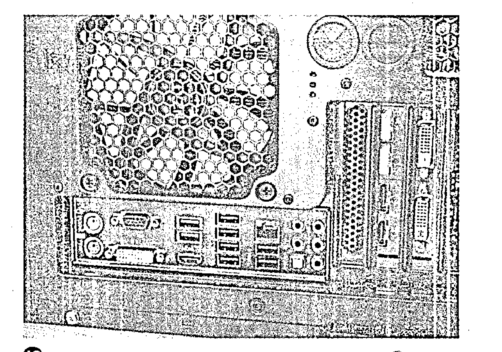

### LaCie Rugged 闪存盘
参考价：239元 (16GB)

这是一种高防护型的闪存盘，它采用牢固金属外壳，并配有橡胶保护套(图13)，可支持100米抗摔，IP54防尘防水等级，以及极端温度条件下的使用。它采用USB 3.0标准接口，最高传输速度可达150MB/s。和很多体型较大的高防护型闪存盘不同，它在实际使用时会脱掉外部的保护套，本体的体型并不大，所以安装比较方便(图14)。

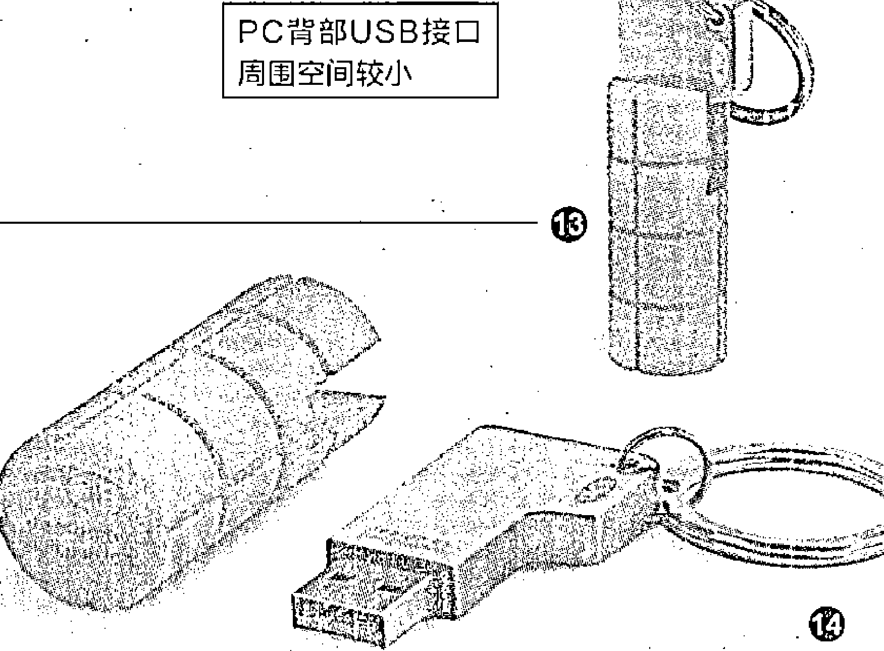

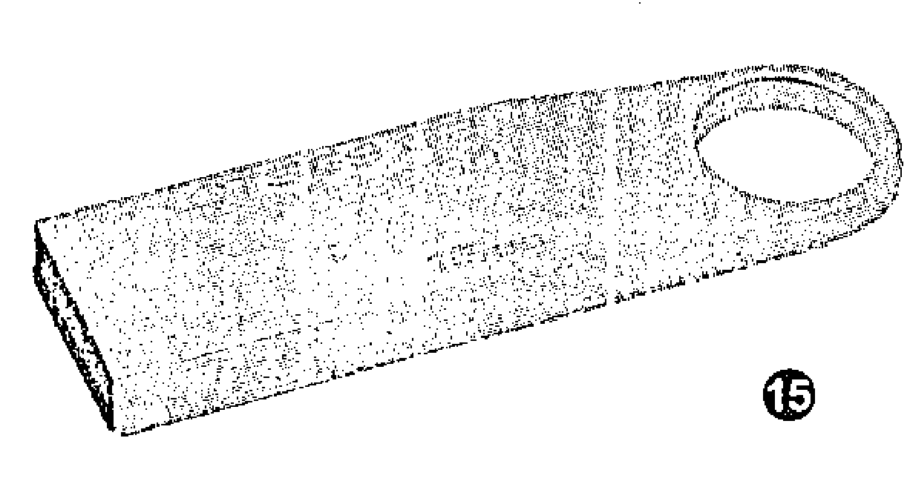

### 三星Bar
参考价：69.9元 (32GB)

三星Bar的设计与金士顿DTSE9G2很相似(图16)，当然应用特色和我们的推荐理由也比较相似，即牢固、易于使用和携带。三星还宣称它有较好的防水、防震、防磁、防X射线以及耐高低温能力，不过我们并不确定其相关防护性是否比其他金属外壳产品明显更强。由于这一产品的16GB版本性价比不佳(50元以上)，所以我们更建议用户采购32GB型号，它采用USB 3.0接口时的最高传输速度为130MB/s。

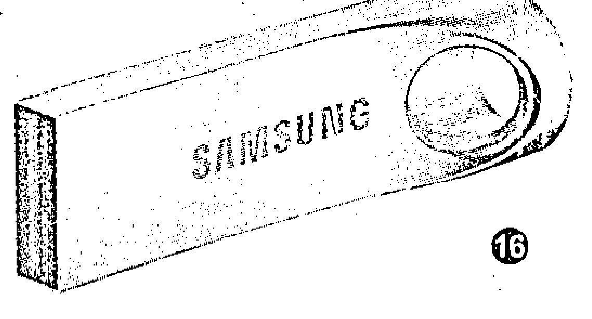

### 金士顿DTSE9G2
参考价：45.9元 (16GB)

从基本设计看，这款闪存盘与摘下橡胶保护壳的LaCie Rugged闪存盘有些类似，金属壳体使它同样相当牢固耐用(图15)，当然防护能力，特别是防水能力还是远不如专门设计的高防护型闪存盘。它带有尾部孔，可以方便地连接到钥匙串上随身携带，而且其较长的体型、逐渐收敛的后部设计与大型孔的配合，也让它插拔更方便省力，在台式机背部插满其他连线时也能轻松使用。它同样采用USB 3.0接口，最大传输速度为100MB/s。

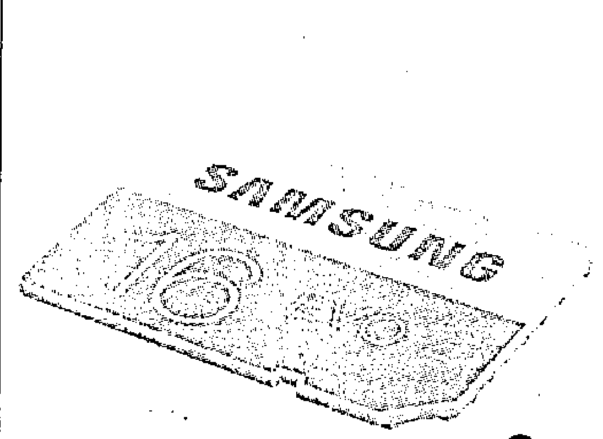

### 三星UHS-1 Class10 SD卡
参考价：31.5元 (16GB)

三星存储卡不仅有较好的稳定性和出色的性能，而且还有一个比较高的防护能力。三星SD卡提供了防水(海水浸泡72小时)、防X光、防磁(15000高斯)，以及-25℃~85℃的温度适应能力。我们推荐的三星SD卡采用UHS-1(Class10)(图17)的传输速度标准，传输速度可达48MB/s，已经可以满足系统维护与备份的要求。虽然三星还有更高速度的SD卡产品，但价格要昂贵得多，而且与闪存盘不同，SD卡能否达到最高传输速度除了要考虑连接USB口的标准，还与读卡器的性能有关，更高速的SD卡也需要使用高端读卡器才能达到极速。

### 三款闪存盘规格对比

| 产品 | 参考价 | 容量 | 接口 | 速度 | 特色 |
| :--- | :--- | :--- | :--- | :--- | :--- |
| LaCie Rugged | 239元 | 16GB | USB 3.0 | 150MB/s | 高防护，带橡胶套 |
| 三星Bar | 69.9元 | 32GB | USB 3.0 | 130MB/s | 金属外壳，防护性好 |
| 金士顿DTSE9G2 | 45.9元 | 16GB | USB 3.0 | 100MB/s | 金属外壳，带尾孔 |

私人订制 制作自己的万能工具整合

前面我们介绍的主要是纯净WinPE系统的制作，这种PE系统较为纯净，但是功能也较为薄弱。因此要更好地使用维护系统，我们就需要进行一些有针对性的私人订制，让WinPE系统的功能更为强大。

硬件使用无障碍 WinPE整合必备驱动 文|平淡

由于每个人的电脑硬件不同，常见的WinPE只是整合通用驱动，在日常维护时就有些不便。比如有些朋友的笔记本无线网卡在WinPE中无法识别，这样需要在WinPE中去下载其他维护工具的时候就无法上网。因此对于制作好的WinPE系统，我们还需要根据自己电脑的情况添加合适的驱动到其中，这里以添加无线网卡驱动为例。

到 https://www.chuyu.me/ 下载 “Dism++”工具，接着在桌面新建一个“WLAN”目录保存驱动。启动 “Dism++”后切换到“驱动管理”，然后展开本机驱动，选中需要导出的无线网卡驱动，点击“导出驱动”，将驱动导出到桌面WLAN目录下保存(图1)。

打开资源管理器，在C盘新建一个名为“winpe”的目录作为挂载目录，返回 “Dism++”窗口点击“文件→挂载镜像”，在打开的窗口选择WinPE的镜像文件boot.wim，映像选择 “2:Microsoft Windows Setup (x86)”，加载目录选择 “C:\winpe”，这样可以挂载PE镜像 (图2)。 加载完成后点击“打开对话”，然后切换到“驱动管理”，点击“添加驱动”，然后定位到“桌面\WLAN”目录，这样网卡的驱动可以自动集成到PE镜像中了，此时展开驱动列表即可看到自行添加的网卡驱动。其他驱动的添加操作类似 (图3)。 完成所有驱动的添加后点击“文件→另存镜像”，按自己的需要依次设置映像名称、说明等参数，然后将镜像以“boot1.wim”保存在桌面备用 (图4)。 最后再将boot1.wim复制到“U盘\sources”保存，再使用上述介绍的bootice.exe打开 “U:\boot\bcd”文件编辑，将设备文件更改为 “\sources\boot1.wim”。完成上述操作后开机测试，如果可以识别到新加的设备即可，否则重复上述操作重新添加驱动即可。

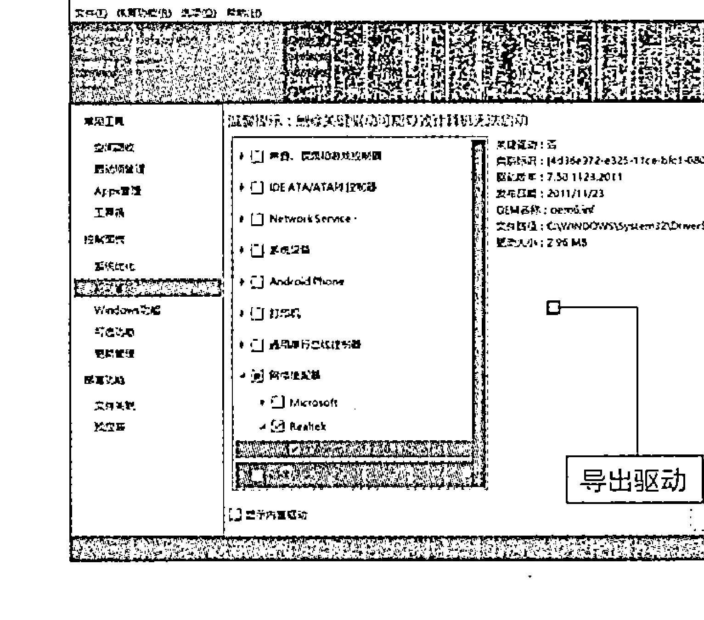

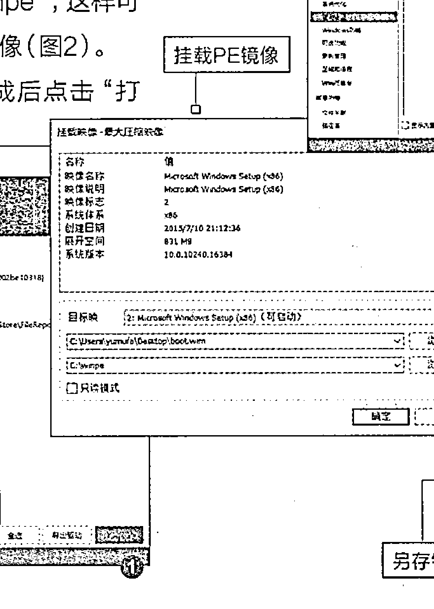

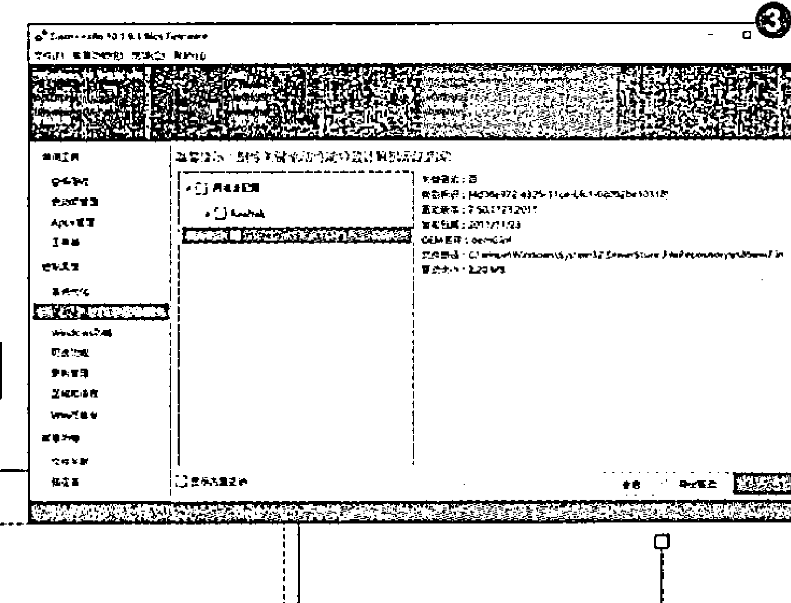

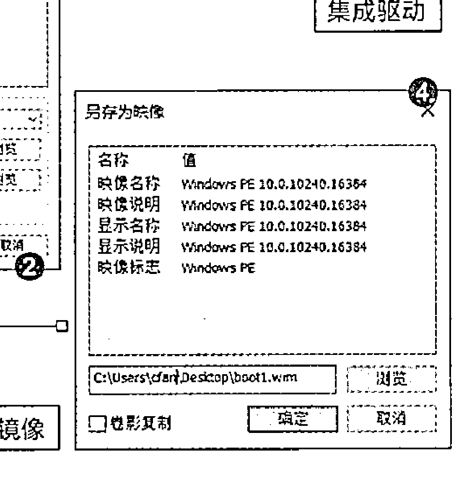

添砖加瓦

### 整合常用工具到WinPE

文|阿木

上述方法只是添加驱动到WinPE系统中，作为维护系统，WinPE本身自带的维护工具还是很少。为了让WinPE系统功能更为丰富，我们还可以将一些常用的维护工具添加到WinPE系统中。

一种是直接将绿色软件封装到WinPE中，比如上述自己制作的WinPE系统，默认启动是安装系统界面（没有桌面、开始菜单、资源管理器等），这样使用起来很不方便。现在可以将第三方桌面BsExplorer添加到PE中。

以管理员身份启动命令提示符，输入下列命令，将WinPE的boot.wim文件加载到C:\winpe目录下（图1）。

```
dism /mount-wim /wimfile:U:\souces\boot.wim /index:2 /mountdir:c:\winpe
```

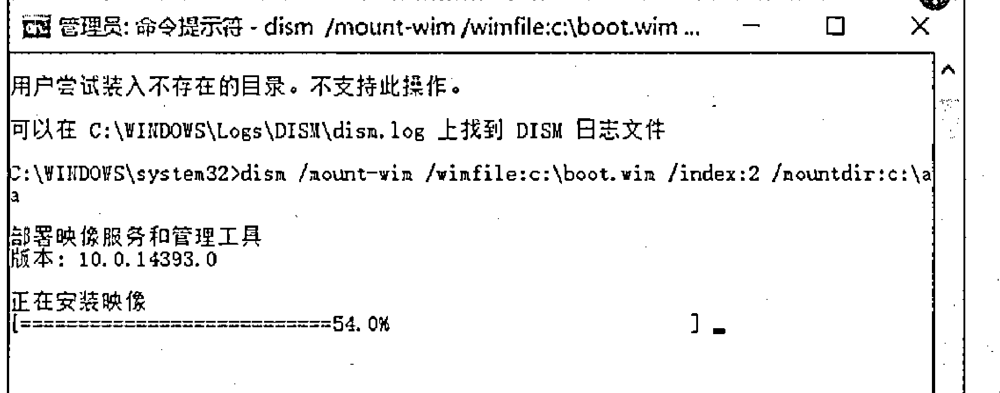

加载完成后打开C:\winpe，在其下新建一个名为“tools”目录，然后在其下将继续建立程序子目录，并将准备好的绿色文件添加到对应的子目录下。比如新建“tools\BsExplorer”子目录，将下载到的BsExplorer复制到上述子目录，新建“tools\a43”子目录，将下载到的A43资源管理器复制到该目录，目录结构如图所示（图2）。

BsExplorer桌面结构是由其配置文件来设置的，如bs_desktop.ini（配置桌面图标如大小、位置、快捷方式）、bs_qlaunch.ini（快速启动图标）、bs_shell.ini（桌面外观如颜色、提示文件等）和bs_start.ini（开始菜单，每个程序一行代码）文件决定（图3）。

因此我们只要对其进行配置即可使用。下面以配置开始菜单为例（其他配置文件请参考官网帮助），比如可以将自行准备的资源管理器A43添加到开始菜单。使用记事本打开“C:\winpe\tools\BSEXplorer\bs_start.ini”文件，在其中添加如下代码：

```
<-ItemBegin->
ShowInAutorun=YES
EnableInAutorun=YES
ParentItem=Programs
Caption=资源管理器
ExeName=%SystemDrive%Tools\A43\A43.exe
```

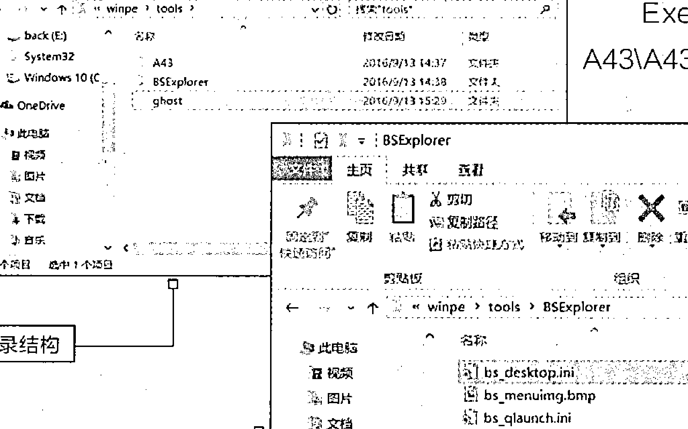

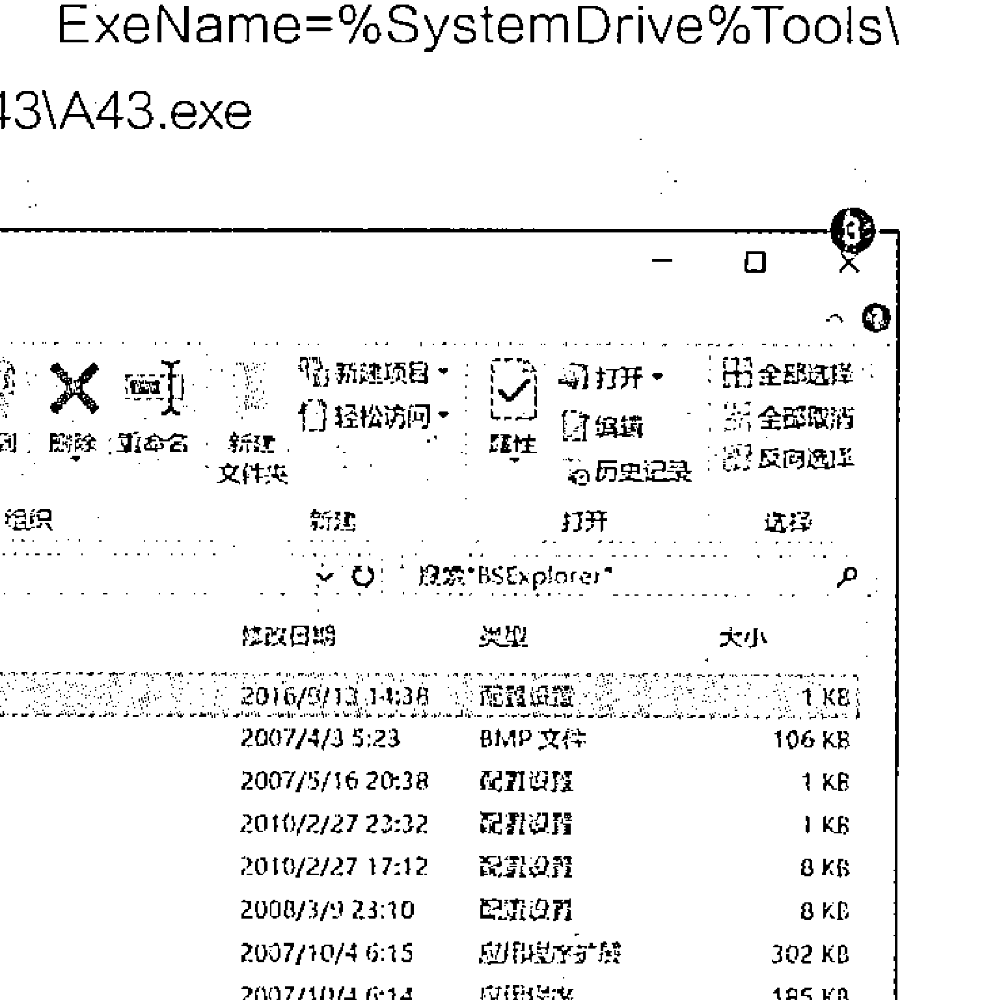

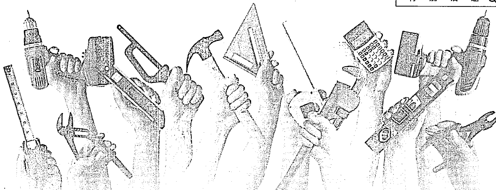

```
IconName=%SystemDrive%Tools\A43\A43.exe
ExeDir=%SystemDrive%Tools\A43
ShowState=NORMAL
<-ItemEnd->
```

其中: Caption表示开始菜单显示名称 (支持中文显示), ExeName和IconName则是指定程序名称和使用图标, ExeDir指定程序运行路径, 这下参数根据实际程序进行指定, 其他参数使用默认设置。通过上述方法可以自行添加其他程序 (要注意可以在PE下运行的绿色程序) 和系统程序 (如记事本、注册表编辑器等)。

启动记事本输入下列代码, 将文件保存为winpeshl.ini文件, 保存在C:\winpe\windows\system32下, 代码如下:

```
[LaunchApp]
AppPath=%systemdrive%\Tools\BsExplorer\Explorer.exe
```

> **小提示**
winpeshl.ini配置文件是加载PE核心文件后的自启动程序, 上述代码的意思是开机后运行X:\Tools\BsExplorer\Explorer.exe桌面程序。大家也可以参照代码自行更改为其他程序。比如可以将其改为免费绿色杀毒软件ClamWin Portable (下载地址: http://portableapps.com/apps/security/clamwin_portable)主程序, 这样开机后就可以自动运行杀毒软件进行杀毒。

完成上述操作后返回命令提示符窗口, 继续输入 "Dism /Unmount-WIM /MountDir:c:\winpe /Commit" 卸载镜像并保存。这样上述添加的软件就可以集成到WinPE系统中。再次使用U盘启动电脑, 此时进入PE后加载的就是BsExplorer桌面, 点击“开始→程序→资源管理器”, 即可启动A43文件管理器进行文件管理 (图4)。

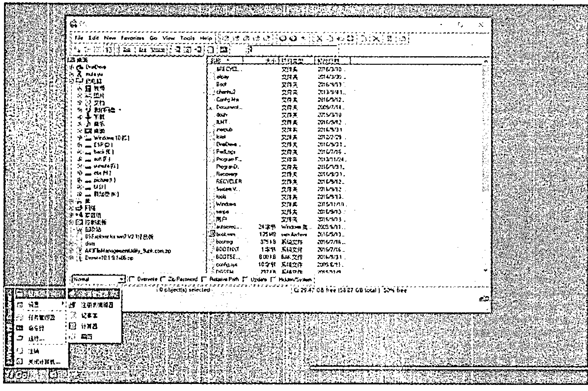

> **网络大补贴**
上述方法只能添加绿色软件到WinPE系统中, 对于其他常用的软件可以到http://www.portablesoft.org/下载; 对于其他常用的不是绿色的软件, 大家可以参考http://www.iplaysoft.com/cameyo.html的介绍进行转换。

制作内置于硬盘的WinPE系统

文|刘英

在大家的印象中，WinPE似乎总是装在光盘或U盘里的一个系统启动维护工具。但实际上，WinPE不但能做成U盘或光盘启动，我们也可以把它装在当前含有Windows系统的硬盘中，做成双系统或多系统启动，让它作为多系统的一个分支，当遇到故障后，不用U盘或光盘启动，也能快速进入到WinPE环境进行系统修复。

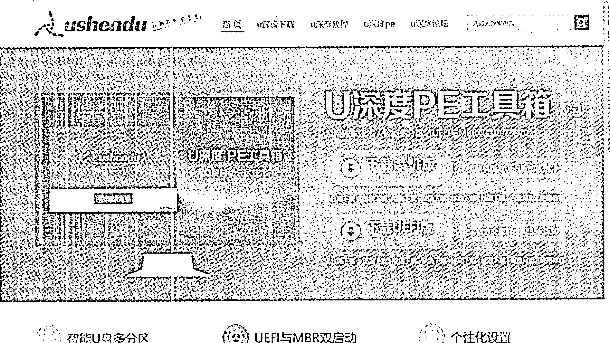

- 智能U盘多分区
- UEFI与MBR双启动
- 个性化设置

制作硬盘版WinPE的方法非常多，有手动的添加和设置方法，也有自动化程度比较高的方法。手动添加和设置法要求用户掌握系统启动和多系统创建的必要技能，能够熟练添加和编辑系统自动启动配置文件和多系统菜单，实现起来操作比较繁琐也容易出现问题，弄不好可能会破坏原有系统的正常启动。而自动化的添加方法多借助于一些启动盘制作工具来完成。这里，我们以U深度PE工具箱为例，介绍用该工具制作内置于Windows系统硬盘的WinPE的方法。

首先通过U深度官网（http://www.ushendu.pw/pe/）下载U深度PE工具箱（图1）。具体版本可根据自身所有电脑的主板和硬盘容量类型来确定。双击安装文件点击“立即安装”，等待安装完成，即可点击“立即体验”打开启动盘制作工具了（图2）。

之后，就可以随时运行安装在硬盘中的U深度启动盘制作工具，进行启动盘的制作了。在制作模式中，我们会注意到软件提供了3种模式，其中“智能模式”是制作启动U盘之用，只要将U盘插入电脑，从“选择设备”菜单下选择该U盘，点击“开始制作”即可完成制作；而ISO模式则是将WinPE启动盘制作成一个ISO镜像文件，供光盘刻录之用，刻录成的光盘即为WinPE启动维护光盘；而最后的一项“本地模式”，正是我们这里要用到的制作硬盘版WinPE所用的选项（图3）。

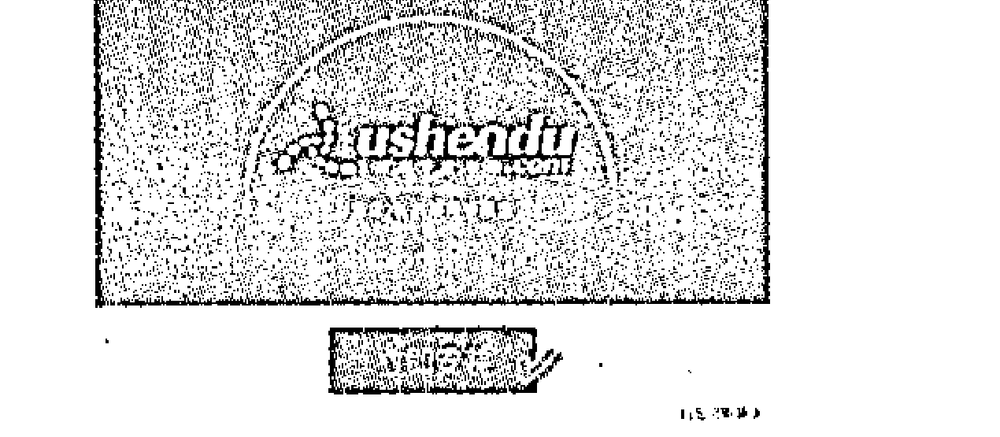

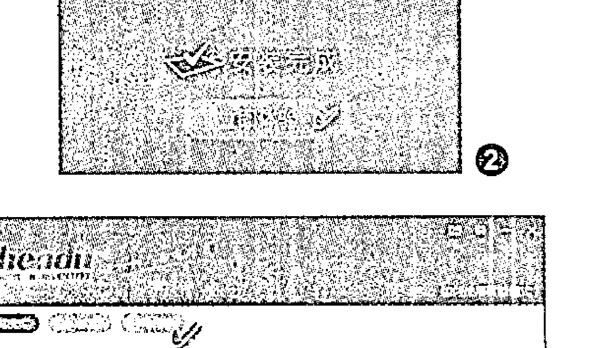

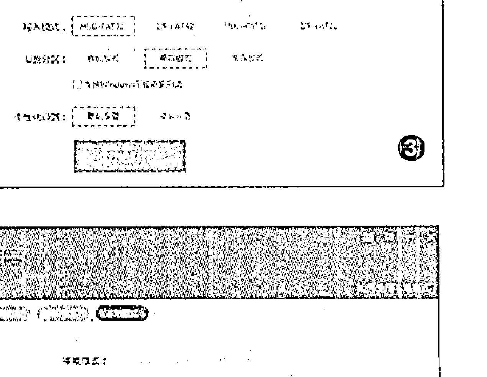

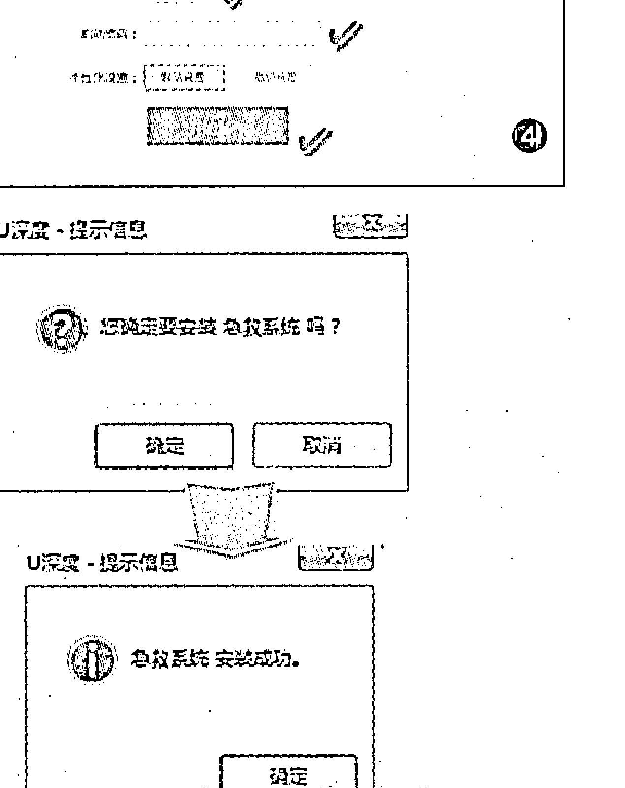

### 多启动菜单丢失的找回

如果开机后看不到有多重启动菜单而是直接进入了原有系统，那可能是因为暂停显示时间设置不合理、菜单被隐藏的缘故。可按如下方法设置并找回多重启动菜单：在“此电脑”（或“我的电脑”、“计算机”）上右键单击并选择“属性”，然后选择高级系统设置项，进入系统属性窗口，点击“启动和故障恢复”分组下的“设置”按钮（图8），在接下来弹出的默认操作系统选择框中，会看到本机系统和“U深度急救系统”列表，选择下面的“显示操作系统列表的时间”复选框，并将时间设置为5秒或更长的时间，确定即可（图9）。

选择“本地模式”之后，设定启动等待时间和启动密码，之后点击“开始制作”（图4）。接下来会弹出是否安装急救系统的提示，点击“确定”继续。然后耐心等到完成后弹出“急救系统安装成功”的提示，硬盘版的WinPE就制作成功了（图5）。

安装了本地模式的深度系统辅助工具之后，如果以后电脑系统遇到故障无法解决甚至无法启动系统，那么就可以通过U深度本地模式安装的急救系统进行维护了。这样就省去了到处找U盘版启动维护盘的麻烦。平时你可以对它“视而不见”，但关键时刻可以顺手拈来，非常方便。

安装了U深度本地模式之后，启动系统时首先会看到多重启动菜单，从中选择“U深度急救系统”一项（图6）；选择这一项目之后，进入到U深度急救系统WinPE启动环境选择菜单，看到如图所示菜单，说明硬盘本地模式的WinPE管理系统安装成功，从中选择相应的功能使用即可。

若是用来管理和维护Windows 8或Windows 10，选择【02】项WIN8 PE标准版；若是之前的低版本系统，则选用【03】或【04】项启动相应的WinPE系统环境即可（图7）。关于更多的工具集成和使用。在U深度WinPE系统工具箱菜单中，已经集成了不少系统维护工具。例如功能非常强大的硬盘分区和维护工具DiskGenius、传统经典硬盘备份工具Ghost、MaxDos系统工具箱、硬盘和内存检测工具、Windows密码找回工具、自定义映像恢复工具等。当然，我们还可以加入更多的实用工具。由于进入WinPE环境之后，我们可以像平时使用Windows那样运行应用程序，因此，硬盘版的WinPE也没有必要集成更多的工具，那样反而会成为一个累赘。我们可根据自己的喜好和习惯，将自己常用的程序保存在硬盘数据分区的个人工具目录中，然后根据需要在具体的WinPE环境下运行所需的工具即可。

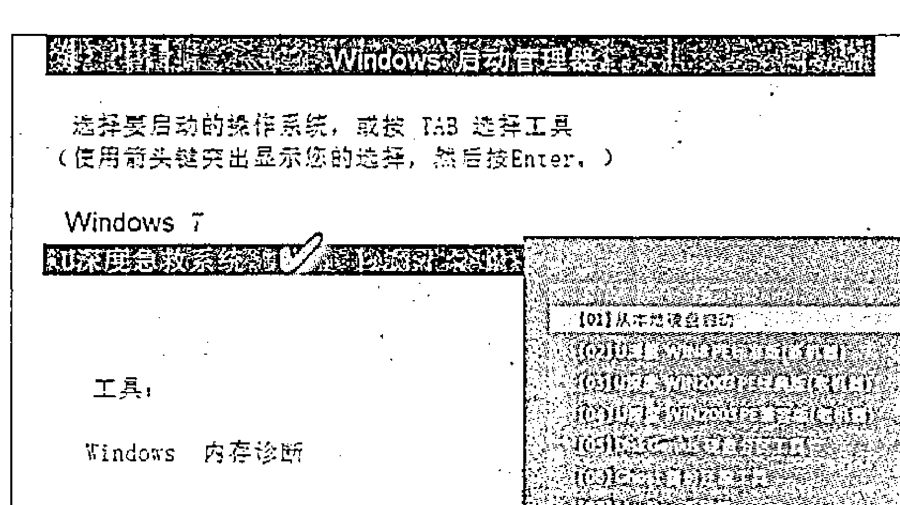

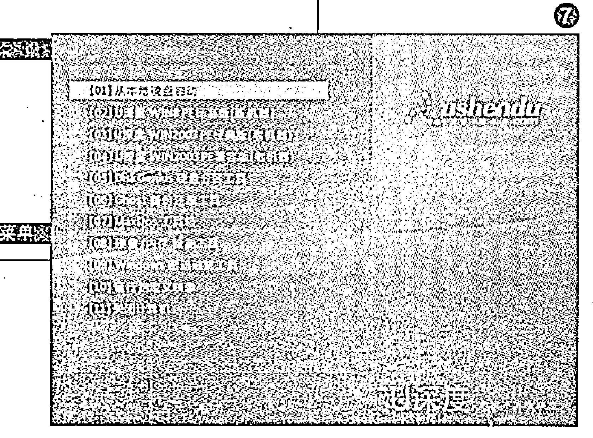

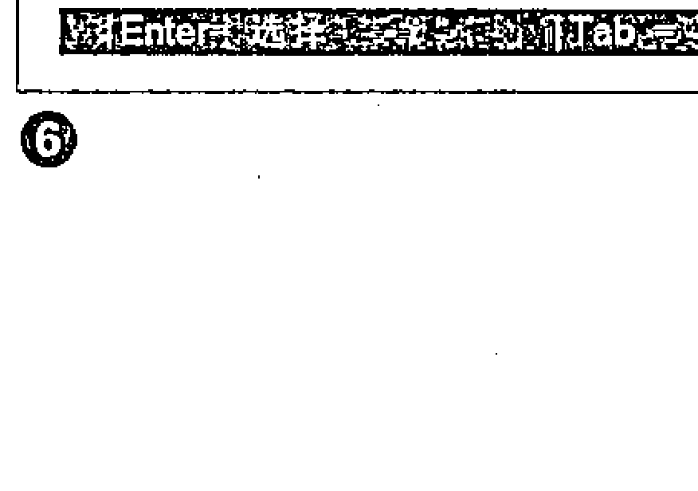

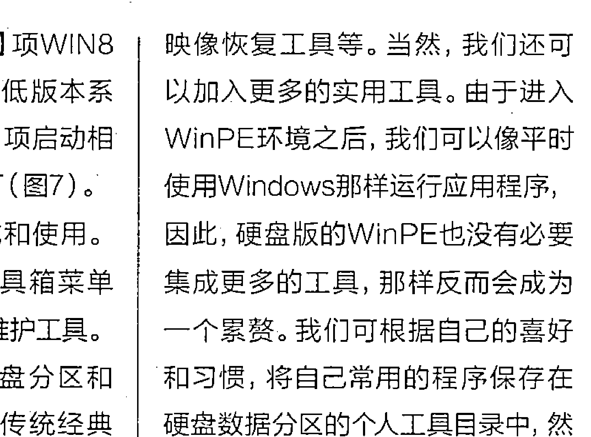

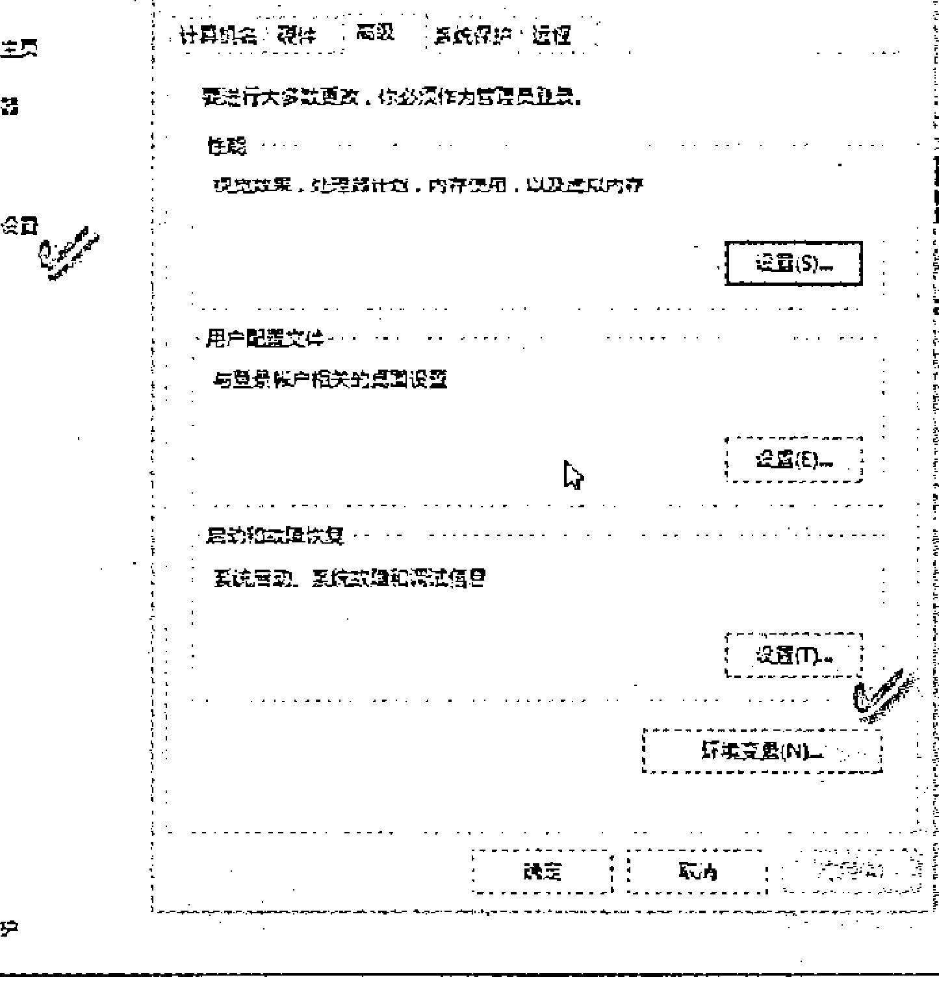

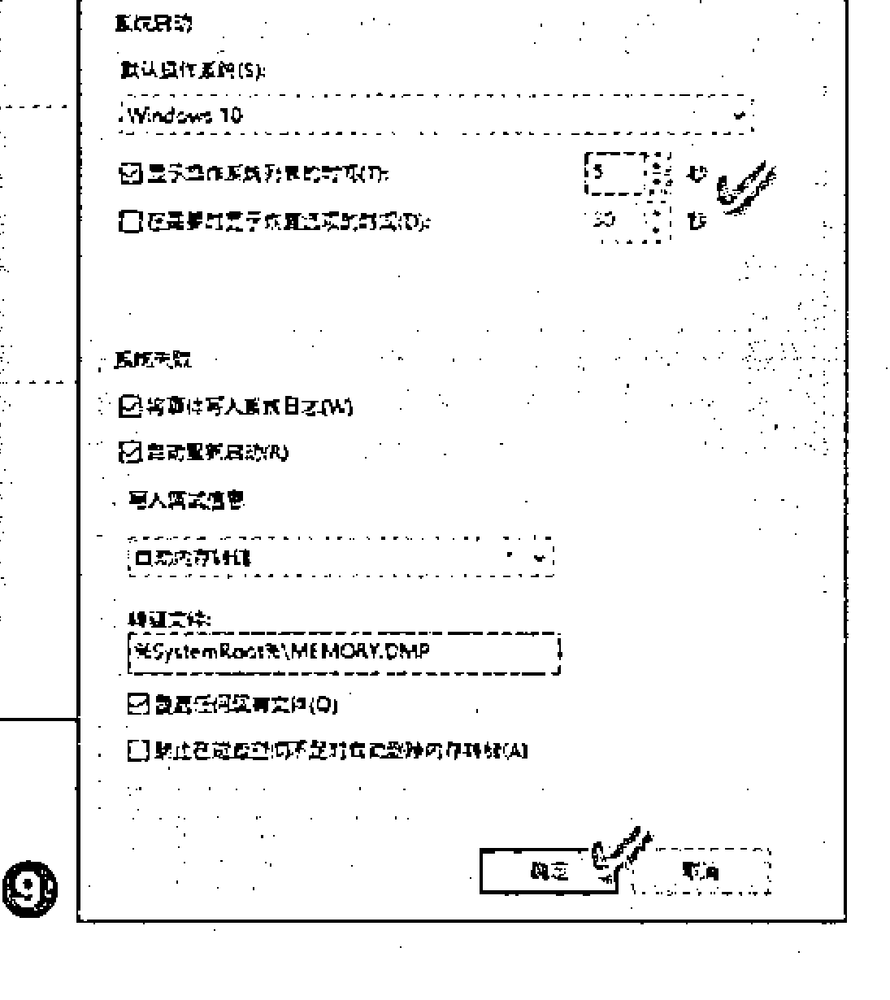

WinPE另类用法——解除系统密码

除了解决系统问题之外，WinPE作为一种拥有Windows基本功能的启动方式，还可以进行一些比较高级的操作，基于这一能力，我们可以开发出很多应用，例如很多用户都曾经遇到过的忘记系统密码问题。

我们解决系统密码的方式实际上就是建立一个新的账号，而建立账号的方式则是用功能强大的CMD.exe替换登录界面上可用的程序narrator.exe。其中cmd.exe是微软Windows系统的命令行程序，类似于微软的DOS操作系统。虽然作为Windows系统的一部分，它与DOS时代的命令行方式并不一样，不过它仍具有数量庞大的内建命令。narrator.exe就是“讲述人”功能的可执行文件，在未登录进系统时就可以启动。

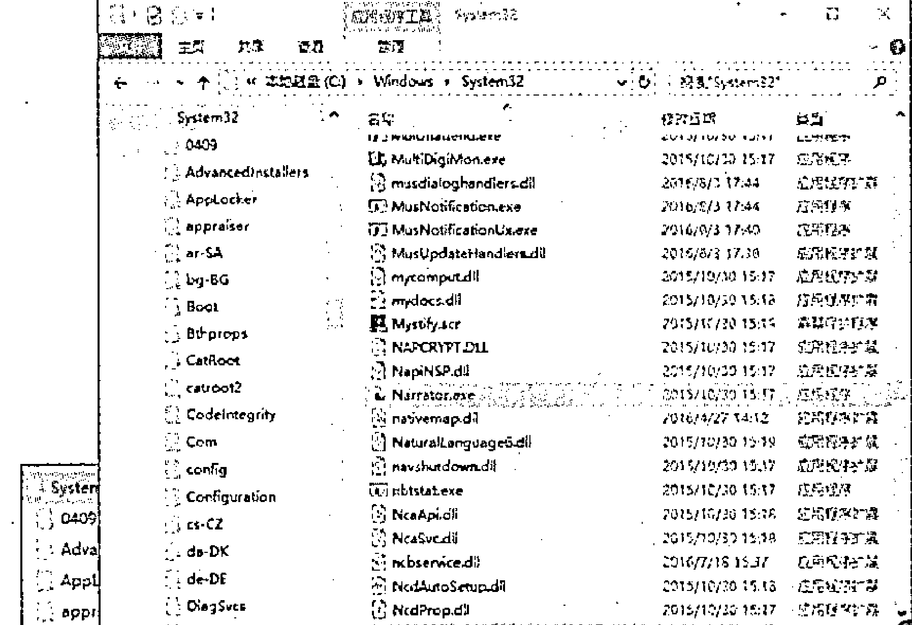

首先我们要使用WinPE启动电脑，在原系统的windows/system32目录下找到Narrator.exe文件（图1），右键点击Narrator.exe选择“属性”（图2），在打开的界面中选择“安全”标签，选择“组或用户名”为administrators，然后点击“编辑”（图3）。设置administrator权限成“完全控制”，并选择“应用”。找到同在windows/system32目录下的cmd.exe，重复以上步骤。

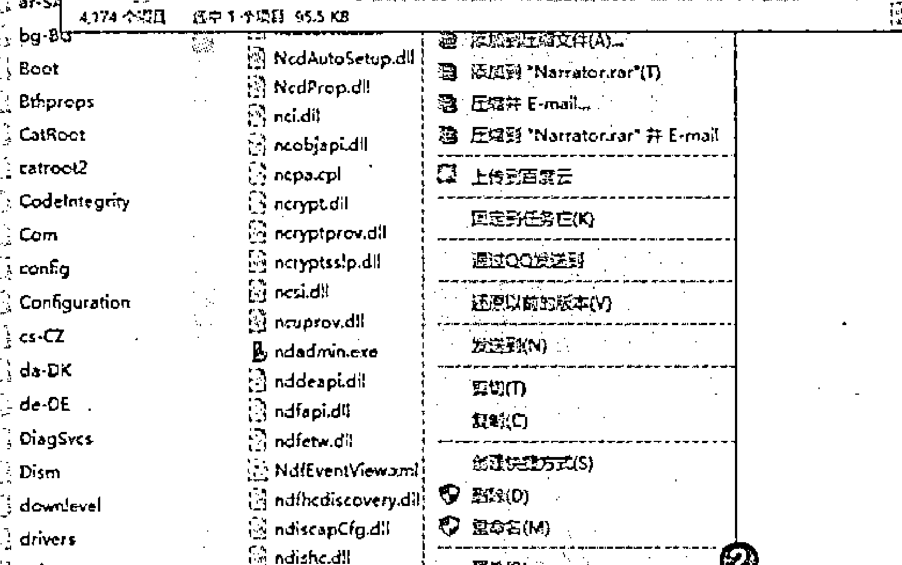

将Narrator.exe重命名为Narrator-1.exe或其他名称，注意自己一定要能够记住文件名，以备未来恢复，将cmd.exe或者复制一份重命名为Narrator.exe。其后取出WinPE启动盘并重启电脑，用硬盘上的系统启动。

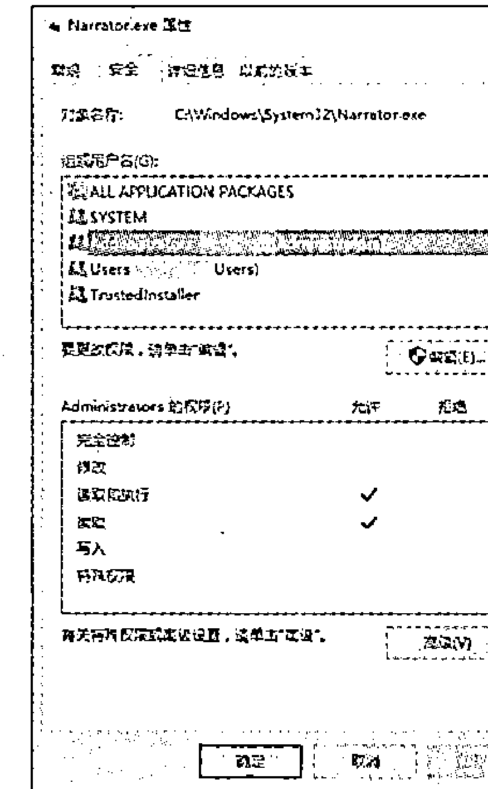

系统启动后，在登录界面选择屏幕左下角“轻松访问中心”（图4），此时选择“讲述人”（图5），会发现自己进入了cmd的命令行窗口（图6）。在cmd窗口中键入命令NET USER cfan /add，设置一个无密码、名称为cfan的用户；再键入ET localgroup administrators rock /add，为cfan增加administrator（管理员）权限。

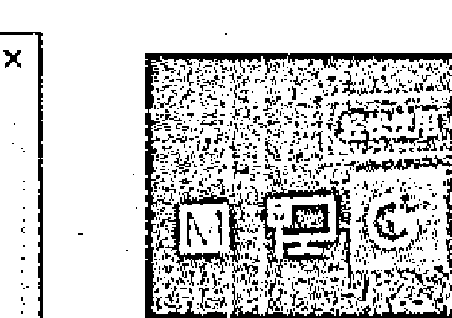

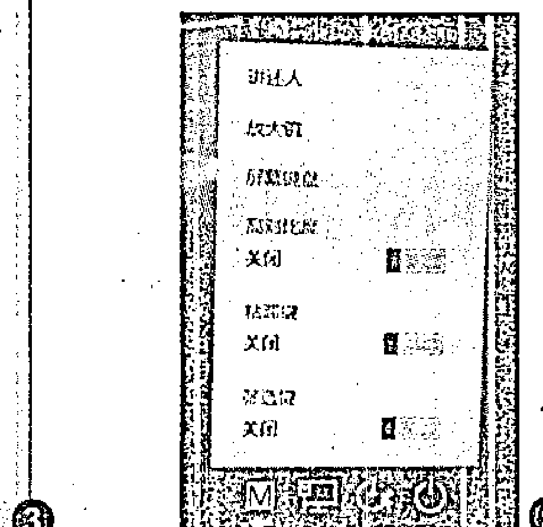

再次重启电脑后，在登录界面可以切换到rock账户，无需密码就能登录了，而且拥有了管理员权限。进入系统后进入“控制面板”，在“用户账户”中选择“删除用户账户”（图7），将忘记了密码的账户删除。之后别忘了将narrator.exe和cmd.exe恢复原样哦。

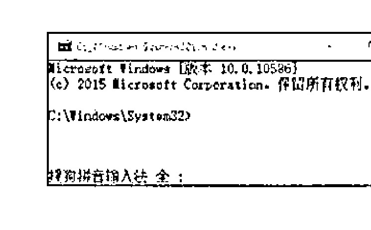

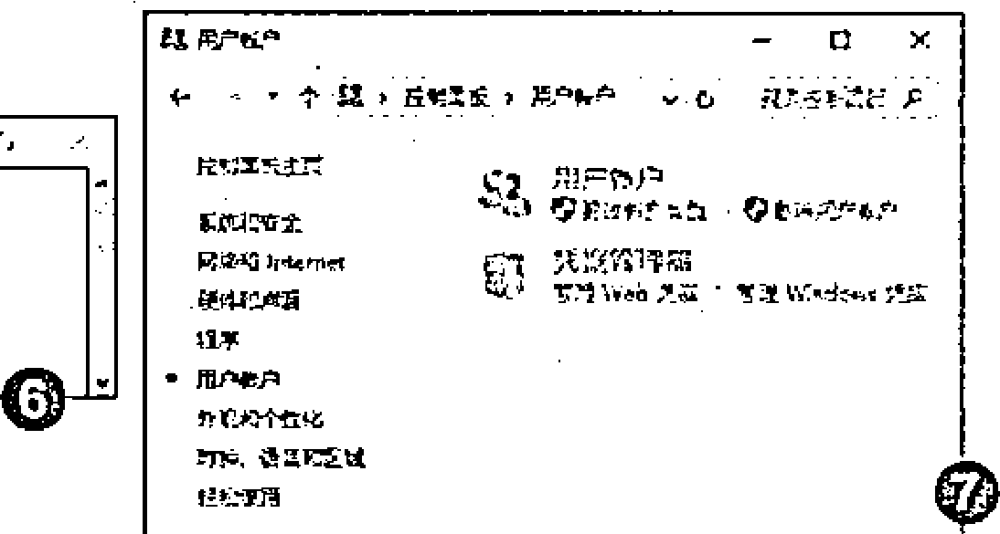

再次重启电脑后就可以重新设置账号和密码了，此时也别忘了处理无密码的cfan账户，不要为其他人留下一个无密码的登录方式哦。

### WinPE疑难解答 文|黑猫

在使用WinPE的过程中难免遇到这样那样的问题，我们收集了其中一些典型“症状”及其解决方式，希望能对大家的使用有所帮助。

#### WinPE下找不到硬盘

一般来讲，应该是PC打开了AHCI模式，现在很多版本的WinPE是不支持AHCI的，启动会找不到硬盘或者无法进入。进BIOS把SATA硬盘模式改成IDE或者兼容模式（Compatible）就行了。如果要安装的是Windows XP操作系统，那么必须使用IDE模式，否则转为硬盘启动模式后，也会不识别硬盘而造成引导失败。

如果希望使用较低版本的WinPE处理更高端SATA模式的硬盘，就必须具备SATA驱动或者版本较新的WinPE系统。一般来讲我们不能用XP内核的PE安装6.x系统的Windows（Vista/7），如果需要安装较新的系统，最好采用PE2.0或者PE3.0，也就是6.x内核的PE。

#### WinPE下生成的X盘

在使用WinPE时会发现系统中多出了一个数百MB的分区X盘，而使用硬盘启动后，在硬盘上却看不到这个分区，有些人会怀疑WinPE占用并隐藏了硬盘空间。其实这一分区是为了安放WinPE系统文件和一些功能，而在内存中虚拟出来的存储空间，系统重启后就会从内存中释放，并不会占用硬盘空间。


#### WinPE下找不到USB存储设备

使用WinPE时有时需要连接其他的USB存储设备，但插上闪存盘，在资源管理器中却可能看不到闪存盘盘符，而在桌面的右下角却可能有USB设备的图标，这有可能是WinPE的即插即用能力不足造成的问题，解决方法也很多。

-   在WinPE系统的桌面上，鼠标右击“我的电脑”，依次选择“管理”→“磁盘管理”，可以看到右侧窗口出现了磁盘1，这表明WinPE其实已经识别到了USB存储设备，只是没有给它分配盘符而已。那么给它分配盘符即可，在磁盘1的分区上鼠标右击“更改驱动器名和路径”，选择“添加”→“确定”，给它分配一个盘符。接着按下键盘上的Ctrl+Alt+Del，打开Windows任务管理器，在“进程”里选中EXPLORER.EXE，接下来点“结束进程”，闪存盘会自动重新启动，并且在“我的电脑”中也出现新的存储盘符。
-   在WinPE系统中打开WinPM工具软件，同样可以看到WinPE系统已经认出了USB存储设备（磁盘1），只是没有给它分配盘符而已。在移动硬盘分区上鼠标右击选择“装载”→“确定”→“关闭”，就给它分配了一个盘符。这样在“我的电脑”或“资源管理器”里面都出现了闪存盘盘符。
-   如果用方法1在磁盘管理中给移动硬盘分配好盘符后，在磁盘管理中无法打开，而是弹出分区不存在的警告，一般只要重做一次就行了。
-   遇到方法3的问题，也可以直接在IE浏览器的地址栏输入你刚才分配的盘符如E:，并且回车，就会发现进入了这块硬盘的界面，可以正常使用其中的数据。
-   如果遇到方法3的问题，也可以使用WinPE中经常附赠的强力的文件管理工具Total Commander，用Total Commander一般都能正常访问和使用其中的数据。

#### UEFI引导问题

在使用WinPE安装Windows 7系统时，可能会发现efi part有个红叉造成无法安装，这很可能是在BIOS中使用的UEFI模式硬盘引导的问题，这在一些新的设备中已经是默认的硬盘引导方式了。我们可以将其改成MBR，或者使用安装的系统盘重新分区，就能进行安装了。

### 硬盘分区知识

在使用WinPE进行系统维护的时候，会频繁接触到新的硬盘分区和引导问题，UEFI、MBR、GPT是其中最重要的概念。

UEFI，全称（Unified Extensible Firmware Interface，统一的可扩展固件接口），是一种用于电脑的标准固件接口，旨在代替BIOS（基本输入/输出系统），旨在提高软件互操作性和解决BIOS的局限性，前面提到的EFI其实就是UEFI的早期/简化版本。UEFI拥有BIOS所不具备的诸多功能，比如图形化界面、多种多样的操作方式、允许植入硬件驱动等等。这些特性让UEFI相比于传统BIOS更加易用、更加多功能、更加方便。UEFI抛去了传统BIOS需要长时间自检的问题，让硬件初始化以及引导系统变得简洁快速。换种方式说，UEFI已经把电脑的BIOS变得不像是BIOS，而是一个小型固化在主板上的操作系统一样，加上UEFI本身的开发语言已经从汇编转变成C语言，高级语言的加入让厂商深度开发UEFI变为可能。

Windows 8开始全面支持UEFI，促使主板厂商纷纷开始支持UEFI，使其逐渐成为主板的标准配置。UEFI带来的一个变化就是GPT（Globally Unique Identifier Partition Table Format，全局唯一标识分区列表）分区方式开始引入Windows系统，在Windows 8及更新的操作系统中设置新磁盘时，系统会询问想要使用MBR（Master Boot Record，主引导记录）还是GPT分区。

MBR和GPT是在磁盘上存储分区信息的两种不同方式。这些分区信息包含了分区从哪里开始的信息，这样操作系统才知道哪个扇区是属于哪个分区的，以及哪个分区是可以启动的。MBR曾经作为Windows系统的分区标准，它最早是1983年在IBM PC DOS 2.0中提出，一直使用到了最近版本的Windows，所以拥有最好的兼容性，已经成为磁盘分区和启动的工业标准。MBR支持最大2TB磁盘，它无法处理大于2TB容量的磁盘。MBR还只支持最多4个主分区，如果需要更多分区，就要创建所谓的“扩展分区”，并在其中创建逻辑分区。

GPT和UEFI是相辅相成的两个技术标准，它会为每个分配置一个全球唯一的标识符（Globally Unique Identifier，简称GUID）——这是一个随机生成的字符串。它支持最大128PB（1PB=1024TB）硬盘，可划分几乎无限个分区数量，却无需创建扩展分区，其分区数量限制只在于操作系统，因为Windows只支持最多128个GPT分区。

MBR磁盘将分区和启动信息保存在一起，如果这部分数据被覆盖或破坏，将造成灾难性的后果。而GPT在整个磁盘上保存多个这部分信息的副本，因此它更为“健壮”，一旦有副本遭到破坏可以恢复信息。


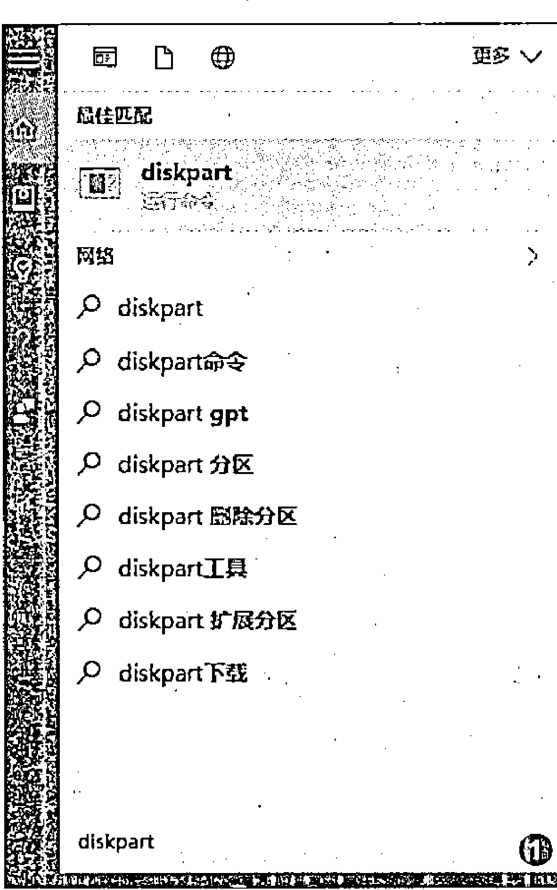

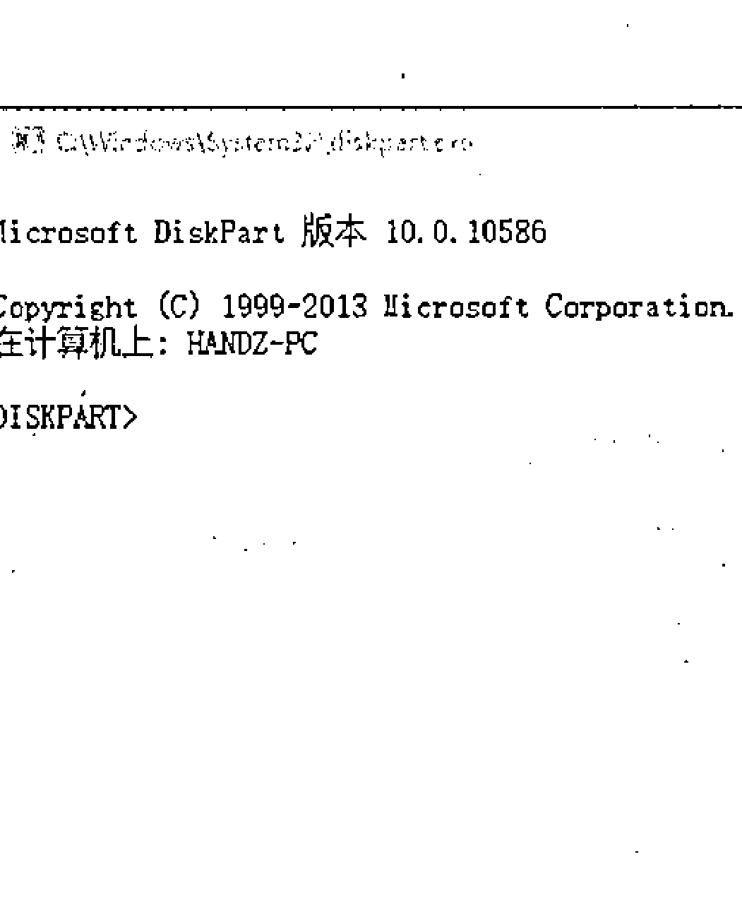

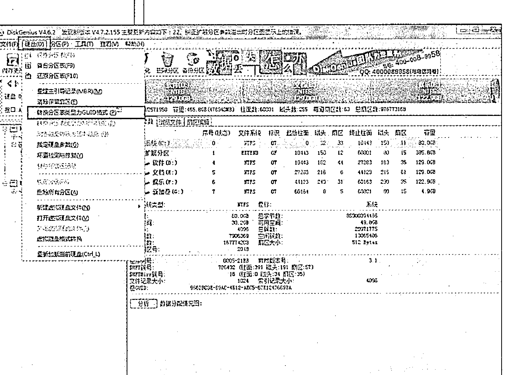

GPT还为这些信息保存了循环冗余校验码（CRC）以保证其完整和正确，所以GPT可以主动发现数据被破坏，并从磁盘上的其他地方进行恢复。使用GPT的驱动器会包含一个“保护性MBR”信息，以MBR标准识别时会认为GPT驱动器有一个占据了整个磁盘的分区，这样可以避免老式的MBR磁盘工具把GPT磁盘当作空白磁盘，进行误操作。在基于UEFI的计算机系统上，64位版本的Windows Vista、Windows 7、Windows 8/8.1和Windows 10，以及其对应的服务器版本，都只能从GPT分区启动，而且包括32位版本的所有Windows Vista及以上操作系统都可以读取和使用GPT分区，理论上讲基于这些版本的WinPE也可使用GPT分区标准。它并非Windows操作系统专享的标准，Linux和苹果公司基于Intel芯片的操作系统公司Mac电脑也支持这一分区标准。

在有些情况下，我们可能会需要转换硬盘的分区标准，最基本的方式当然是使用微软自己的命令提示方式，使用过DOS操作系统的资深用户可能会感到这一过程非常眼熟。

-   打开Windows的命令提示模式，其实就是使用我们上文提到的CMD.exe，输入diskpart进入diskpart界面。Windows 10/7/Vista用户直接在开始菜单的搜索框中输入diskpart回车（图1），也可打开diskpart界面（图2）。
-   在diskpart的提示符下输入list volume列出所有分区（卷），使用select volume将焦点移动到硬盘上对应的分区，如select volume f即可选择f分区，然后执行delete volume即可将当前选中的分区删除。重复选择分区与删除分区的操作，直至删除需转换硬盘上的所有分区（一定注意不要误删分区，特别是主硬盘和主分区）。
-   需转换的硬盘上所有分区都删除之后，使用list disk列出计算机中的所有磁盘，然后使用select disk命令选中硬盘，最后执行convert gpt或convert MBR即可。
-   在转换过程结束后，用exit命令退出DiskPart。

另外，我们也可以使用硬盘分区工具例如DiskGenius进行转换，相对于命令行模式，转换工具更加直观便捷。例如在DiskGenius中，我们只要选择“硬盘” → “转换分区表类型为GUID格式”（图3）或“转换分区表类型为MBR格式”即可实现分区格式的互转。需要注意的是，在针对硬盘分区的各种操作中，即使使用宣称可以保全数据的第三方工具，也一定要对重要数据做好备份、做好备份、做好备份！重要的事情说三遍。

### 比WinPE更及时的系统维护方案 文|刘英

从系统和用户数据安全的角度考虑，除了使用WinPE，还有更为方便、及时、实用的维护方案。利用更加专业的备份软件ATI2015，按需定制各种手动或自动的系统备份维护方案，无论系统出现多大问题（包括硬盘物理损坏），都可在最短时间内得到恢复。这一方法的优势是除保护系统环境之外，连用户的数据都能完整保存下来，免去重装系统和应用的麻烦，也免去了数据丢失的烦恼。

#### 后台自动创建系统与用户备份文件

设想一下，如果我们在前台工作，系统后台能够根据我们设定好的时间，将包括当前系统文件和用户数据在内的全部硬盘、分区等信息备份到一个指定的数据分区、移动硬盘或网络当中，这样的安全系统维护方式是不是很省事、很贴心呢？不离开Windows系统环境就能备份系统，这是WinPE所无法做到的。

实际上，用ATI2015这一设想很容易实现。比方说，我们的Windows系统（包括Windows 7、Windows 8或Windows 10均可）安装在硬盘的C分区当中，用户文件也放在本盘的用户文件夹或桌面上，那么所有涉及安全问题的系统文件和用户文件都命系C盘。这时，只需给C分区定制一个定时自动备份的任务，就能实现系统和用户数据的安全保护了。具体方法如下。

启动ATI2015，从左侧切换到“备份”页面，点击右侧窗格的“磁盘与分区”，依次点击“添加备份→创建新备份”命令。接下来点击“选择来源”和“选择目标”，将来源选择为“磁盘与分区”类型（图1），然后选择要备份的C分区。对于目标位置的选择，如果是将备份文件放置在本地硬盘的数据分区，则通过“浏览”按钮定位数据分区；若使用移动硬盘或高速U盘，则选择“您的外部驱动器”；如果是申请了大空间的Acronis Cloud云空间，则选择Acronis Cloud目标（图2）。

接下来是关键的备份设置。先设置自动备份的日期排程。从“磁盘备份选项”中设定“排程”，选择需要自动备份的具体日期和时间，例如每天的几点几分开始备份，或者星期几的几点几分开始备份（图3）。

紧接着设置备份所用的方案。通常我们主要使用单一版本方案和增量方案两种。其中单一版本方案每次都生成一个独立的TIB备份文件，文件包含所有系统文件和用户文件，因为文件比较大，所以备份需要较长的时间，一般根据系统和用户数据量的大小，需要十多分钟甚至几十分钟；增量方案则是在上次备份基础上的，只备份最近更改的数据，因此备份写盘数据量明显减小，但会在原有备份文件的基础上形成新的文件（图4）。

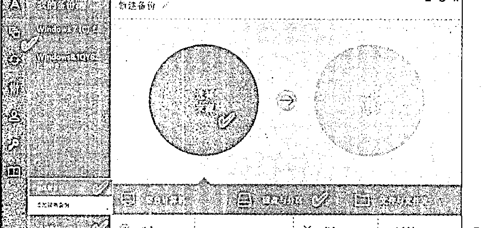

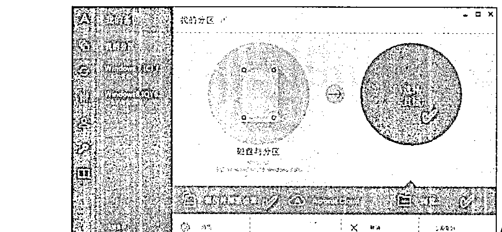

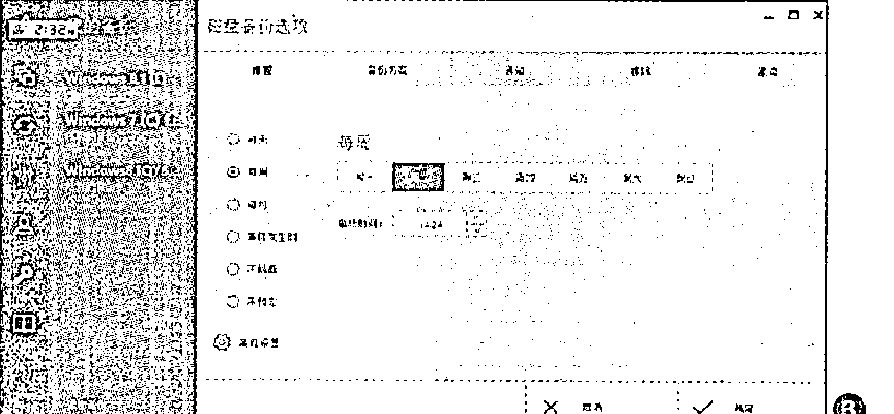

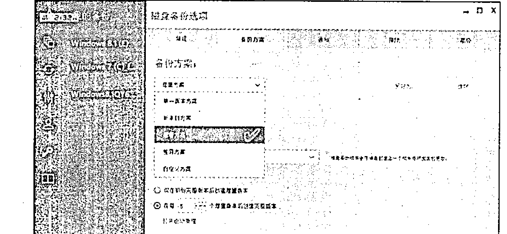

参数设置好之后，点击“确定”就可以开始备份系统。若是设置的自动排程计划，则在到时才自动执行。注意要保证ATI自动备份服务处于开启之中，软件安装后一般自动开启，请不要手动关闭。

#### 极速将30GB系统备份为10GB

一个系统动辄几十个GB，加上用户文件将更为庞大。庞大的系统数据会形成庞大的备份文件，因此让备份文件变得更小很有必要。

有两项影响压缩效率的设置非常重要——“高级”选项中的“压缩级别”和“操作优先级”（图5）。其中，“压缩级别”决定着备份文件的大小，但也关系着备份过程的速度，如果选择更大的压缩级别，那么将会获得更小的压缩备份文件。例如一个本有30多GB的系统分区，若选择“最大”压缩，则生成的压缩备份包仅有不足10GB大小。而“操作优先级”则是设置压缩过程中是否影响电脑操作的速度，如果在后台压缩时你正在工作，那么就将操作优先级设得高一点，以便让出更多的资源给电脑操作，不影响操作流畅度；但如果在备份时人离开电脑不再操作，例如吃午饭时或开会时，那么就将操作优先级设为“低”，这样便可腾出更多的资源给备份进程使用，提高备份速度。

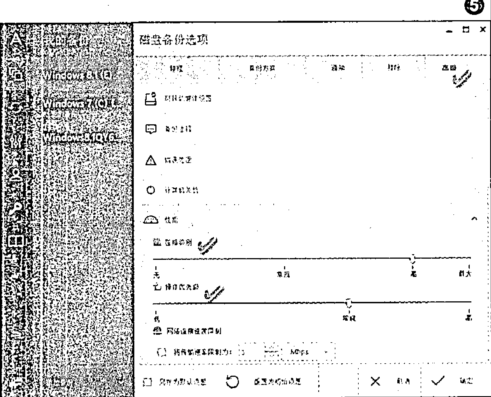

#### USB3.0快速备份和恢复硬盘分区

系统备份数据放置在离开系统的位置更为安全。为此，如果将系统数据直接设置在移动硬盘或U盘中，离机存储是安全之首选，这样即便是硬盘物理损坏，也无关紧要。但是，由于系统备份文件一般都较为庞大，而USB 2.0的传输速度相对很慢，几十个GB的系统数据若用USB 2.0备份，需要数小时才能完成，这时优先考虑用USB 3.0进行备份，一般在数十分钟内可完成整个分区的备份任务，速度将大大提高。注意，存储介质和所用接口都必须为USB 3.0才能发挥作用。目前一般的新式PC或笔记本多带有USB 3.0接口，即便是旧的台式设备，购买一块USB 3.0接口卡，也仅需要三四十元；而32GB或64GB的USB 3.0的U盘价格也降到了几十元，因此USB 3.0备份设备也变得唾手可得。

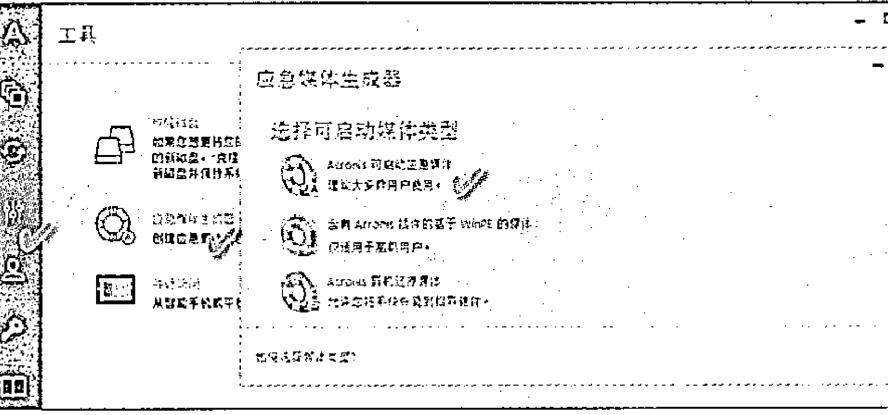

#### 系统彻底挂掉 如何快速取回文件

也许你会提出疑问：如果系统挂掉了，无法进入Windows了，那么先前备份的数据如何才能找回来呢？这个问题有两种解决办法。

第一种取回数据的方法是：用创建ATI应急启动盘的办法启动系统后恢复。这就需要提前创建一个ATI应急启动光盘或U盘。ATI应急启动盘的创建方法是，在硬盘版的ATI窗口中点击左侧的“工具”按钮，然后选择“应急媒体生成器”，再选择“Acronis可启动应急媒体”，根据提示插入介质创建即可（图6）。应急媒体创建之后，如果系统崩溃，用该介质启动系统后进入ATI界面，选择备份文件恢复到原来的分区，即可找回上一次的全新系统环境。例如，昨天中午执行的自动备份，那么找回的就是昨天中午之前的系统文件和用户数据，丢失的仅仅是昨天中午之后的内容。这比其他一些系统恢复方法所带来的损失和麻烦要小得多。

第二种取回数据的方法是，直接在另一台安装有ATI的电脑中点击备份的TIB文件，即可在资源管理器中层层打开这个TIB文件，从中拷贝出备份的任意系统文件或用户数据。

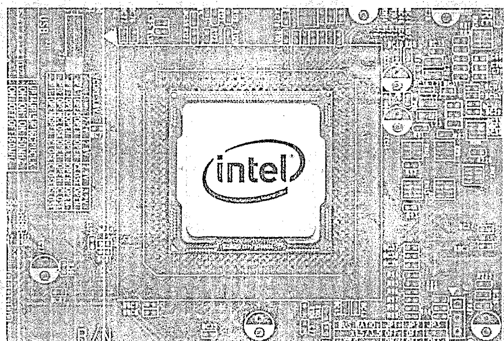

英特尔刚刚发布了新一代酷睿平台：Kaby Lake，而联发科P20、骁龙821、麒麟960等移动处理器也即将出炉。可以预见，2016年下半年移动设备将会因它们而变得格外热闹。

## 从“芯”开始 移动设备将因它们而变

### Kaby Lake来袭
#### 英特尔第七代酷睿处理器解析

当你拿到本期杂志时，第一批搭载英特尔第七代酷睿Kaby Lake处理器的笔记本就已全面上市。作为六代酷睿Skylake的接班人，Kaby Lake能否为我们带来惊喜？下面，就让我们一同走进Kaby Lake的世界。

### Tick-Tock走进死胡同

关注英特尔每年产品更新的读者肯定对“Tick-Tock”战略无比熟悉。简单来说，Tick-Tock指的是制程→架构交替更新的演进方案（图1）。它直译过来就是时钟“嘀嗒”的意思，每一个嘀嗒代表着两年一次的工艺制程进步。其中，“Tick”代表工艺的提升，而“Tock”则是在维持相同工艺的前提下进行微架构的革新（图2）。

表1: 英特尔“Tick-Tock”战略历代产品对应表

| Tick年（制程升级） | 年份 | Tock年（架构革新） | 年份 |
| :--- | :--- | :--- | :--- |
| 45nm Penryn | 2007年 | 45nm Nehalem | 2008年 |
| 32nm Westmere | 2010年 | 32nm Sandy Bridge | 2011年 |
| 22nm Ivy Bridge | 2012年 | 22nm Haswell | 2013年 |
| 14nm Broadwell | 2014年 | 14nm Skylake | 2015年 |

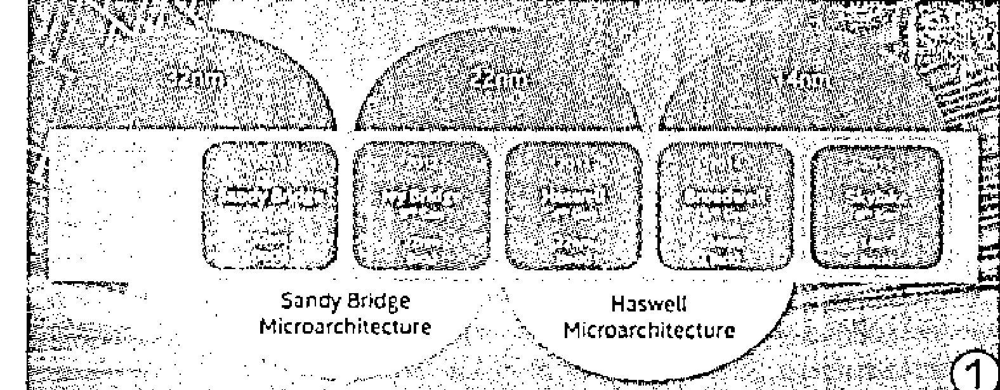


比如，英特尔在2014年推出的第五代酷睿（Broadwell）就属于Tick年，而2015年上马的第六代酷睿（Skylake）则是Tock年（表1）。如果按照这个定律，本应在今年上市的第七代酷睿（Kaby Lake）也应该回到Tick年的老路上，抢先竞争对手一步用上最新的10nm制程工艺啊？

很遗憾，英特尔在10nm研发和商业化量产的道路上遇到了麻烦，很难按原计划应用在Kaby Lake架构处理器身上。即便这一次不计代价强行让10nm“早产”，未来的接班人7nm也注定陷入难以为继的漩涡之中。没错，受限于物理学本身的障碍，Tick-Tock已经钻进了死胡同。

### PAO战略顺位接班

为了顺利推广Kaby Lake，英特尔不得不在Tick-Tock后面强行塞进了一个优化的环节。于是，我们熟悉的Tick-Tock战略也就变成了陌生的“PAO”（Process-Architecture-Optimization），即制程→架构→优化“三步走”（图3）。

在“PAO”战略的指导下，备受期待的10nm制程工艺要等到明年这个时候才能与我们见面，随后它也将经历10nm+这个优化版本（图4），这意味着它的继承人7nm工艺最快也要2020年才能与我们见面（图5）。与其对应的，则是ARM和台积电的合作布局，其10nm FinFET工艺将会与英特尔同期推出，而7nm FinFET甚至有望在英特尔7nm之前上马。曾一度以领先工艺为傲的英特尔，终于算是感受到竞争的压力了。

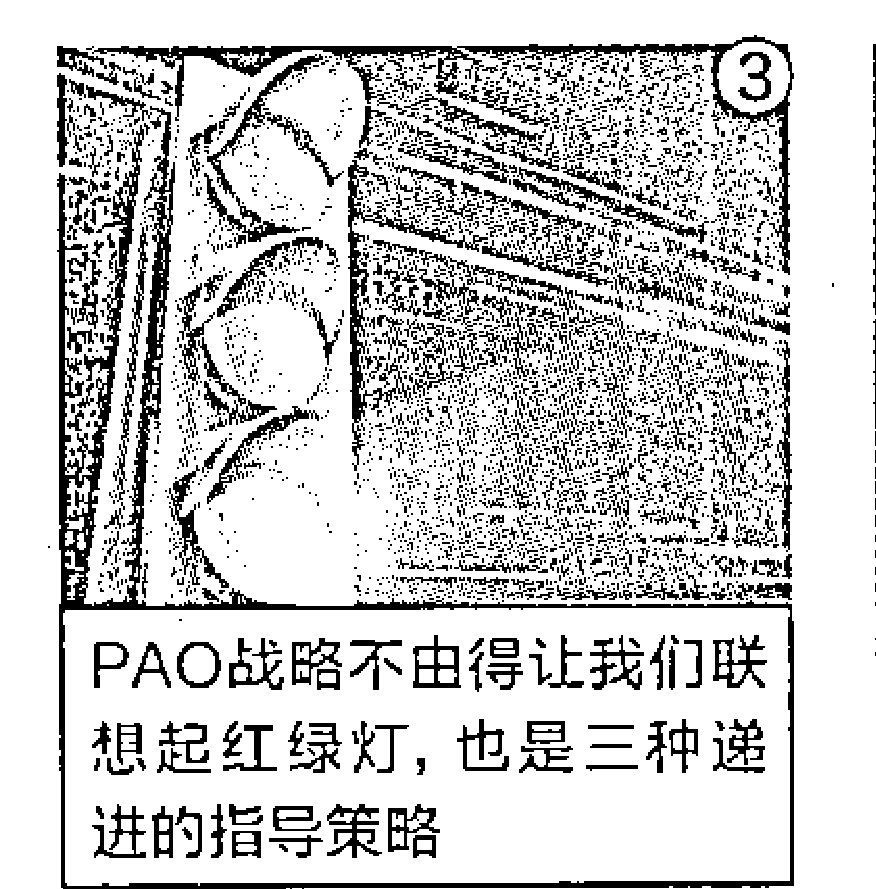

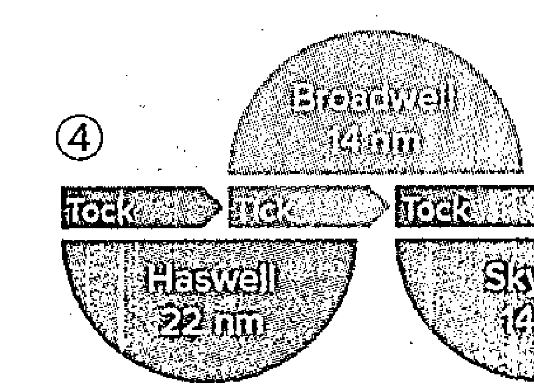

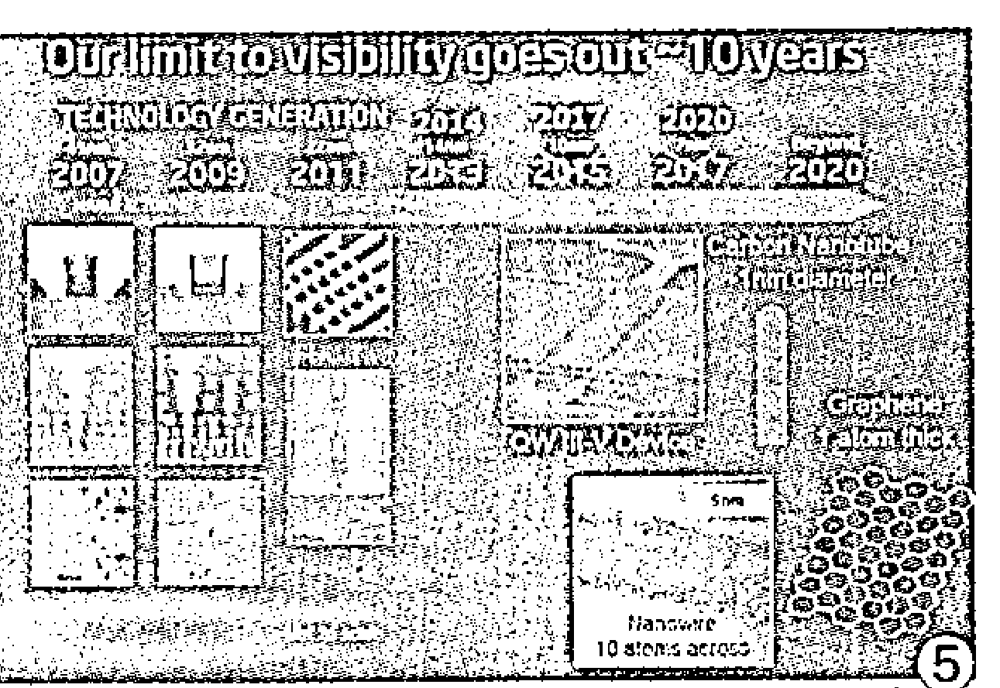

### 优化体现在了哪里

作为“PAO”三步走中的优化一环，Kaby Lake和前辈Skylake相比都在哪里进行了优化和改进呢？从表面上看，就是Kaby Lake与同档次的Skylake处理器相比频率更高，而更深层次的变化就体现在以下几个方面了。

#### 工艺上的优化

虽然Kaby Lake还是14nm，但英特尔却将其称为了“14nm+”，在原有制程工艺的基础上加强了鳍片和晶体管通道应变，不仅降低了驱动电流，困扰Skylake的漏电和功耗问题在Kaby Lake上也能得到改善。

按照官方说法，在14nm+的帮助下，Kaby Lake可带来12%的工艺性能提升，而这也是新产品大幅提升频率的同时保持功耗不变的关键（图6）。

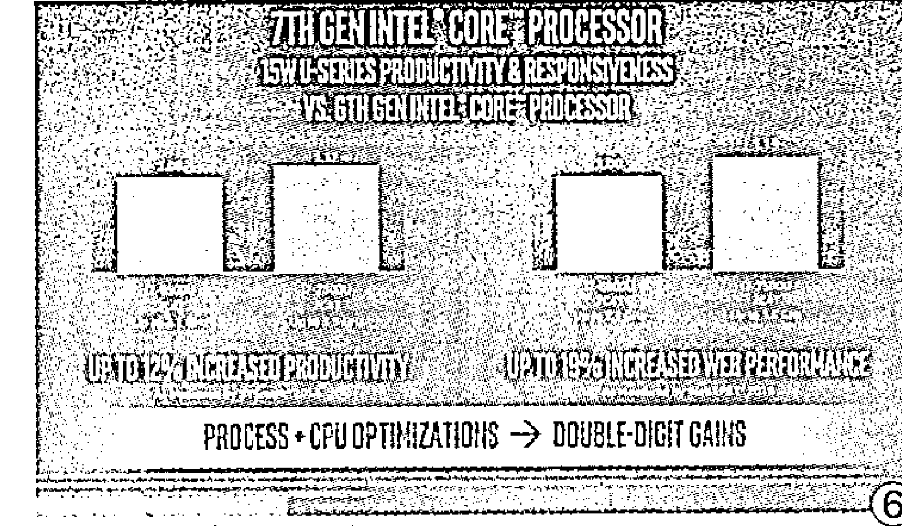

#### 瞬间超频的改进

为了平衡功耗和性能，英特尔酷睿处理器都具备动态加速功能，比如我们熟悉的睿频和Speed Shift技术。在Kaby Lake身上，英特尔将Speed Shift提升到了v2版本，将处理器从待机频率切换到全速状态的时间从原来的30毫秒缩短到了10毫秒~15毫秒，进一步增强了睿频的灵活性。

不要小看这个小小的改善哦，比如当我们玩游戏时突然出现了一大批敌人，这个时候就需要处理器瞬间提升频率加以应对，Speed Shift V2能让处理器瞬间加速变得更为顺畅自然，毫不突兀。

### 视频回放消耗更少资源

虽然Kaby Lake集成的HD620和HD615与Skylake集成的HD520和HD515隶属同宗（都是英特尔第九代核芯显卡家族的GT2，架构没有变化，都是24个执行单元），但Kaby Lake的核芯显卡却对视频回放功能进行了大幅优化，具备了更为强悍的硬件级编解码能力（图7）。

简单来说，无论是HEVC Main/Main10，还是谷歌力推的VP9 8-bit/10-bit解码，Kaby Lake都可以100%交给GPU进行硬解码，这就让4K级别的视频的播放和录制变得无比轻松。反观Skylake，碰到HEVC Main10和VP9 8-bit时就必须让CPU和GPU一起工作，不仅CPU占用率高，整体功耗也将居高不下（表2）。

如果需要用数字量化，那就是在配备66Wh电池的笔记本本身上，在其他配置相同的情况下，新一代Kaby Lake笔记本能比Skylake笔记本多看整两部4K蓝光电影！

表2：Kaby Lake和旧平台核芯显卡的编解码能力对比表

| 硬件平台 | KabyLake | Skylake | Broadwell |
|----------|----------|---------|-----------|
| H.264解码 | GPU硬解码 | GPU硬解码 | GPU硬解码 |
| HEVC Main解码 | GPU硬解码 | GPU硬解码 | CPU/GPU混合解码 |
| HEVC Main10解码 | GPU硬解码 | CPU/GPU混合解码 | 不支持 |
| VP9 8-bit解码 | GPU硬解码 | CPU/GPU混合解码 | CPU/GPU混合解码 |
| VP9 10-bit解码 | GPU硬解码 | 不支持 | 不支持 |
| H.264编码 | FF&PG-Mode | FF&PG-Mode | PG-Mode |
| HEVC Main编码 | FF&PG | PG-Mode | 不支持 |
| HEVC Main10编码 | FF&PG | 不支持 | 不支持 |
| VP9 8-bit编码 | FF&PG | 不支持 | 不支持 |
| VP9 10-bit编码 | 不支持 | 不支持 | 不支持 |

#### 扩展阅读

#### 除了优化还有退化

为了挽救全球PC销量持续下滑的颓势，英特尔、AMD和微软似乎达成了统一意见，于是就出现了一个让老系统们“很伤心”的条款：无论是英特尔Kaby Lake处理器，还是AMD即将发布的Zen处理器，它们都仅能支持Windows 10系统（图9）。当然，你也可以强制它们运行在Windows XP或Windows 7等操作系统中，只是没有了官方驱动的支持，很多新功能特性都无法正常工作，这是逼着消费者拥抱Windows 10的节奏。

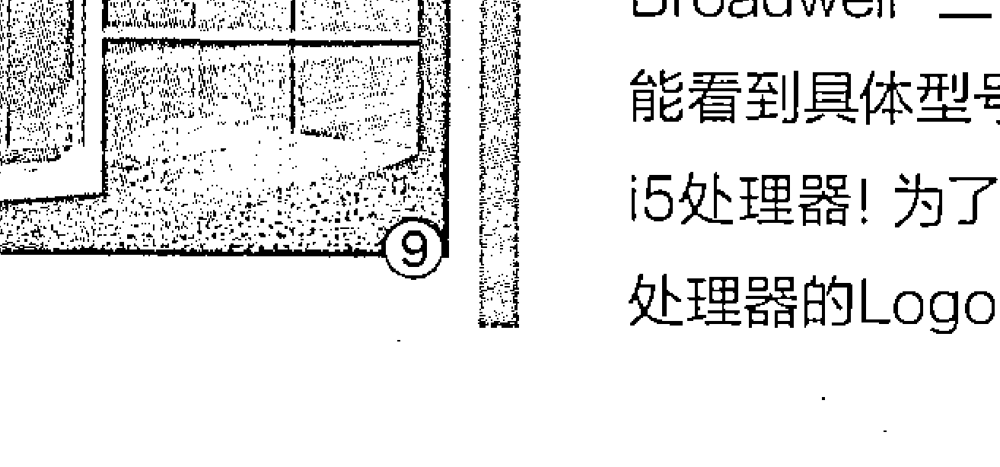

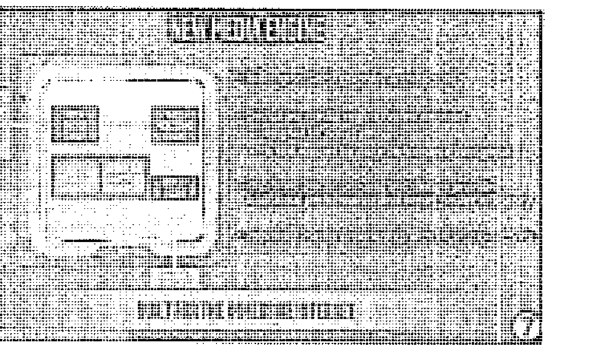

### 针对NVMe SSD优化

很多高端笔记本用户都遇到过这种问题，安装三星950 Pro这种高端NVMe SSD，总无法发挥此类SSD的全部性能。究其原因，则是因为Skylake内部的OPI总线虽然理论支持PCI-E 3.0×4，但英特尔为了追求稳定而将其限制到了PCI-E 2.0×4。而Kaby Lake则升级到了OPI 3.0总线，可以完美地让NVMe SSD运行在PCI-E 3.0×4模式下（图8），从而可以充分释放高端SSD的性能潜力。

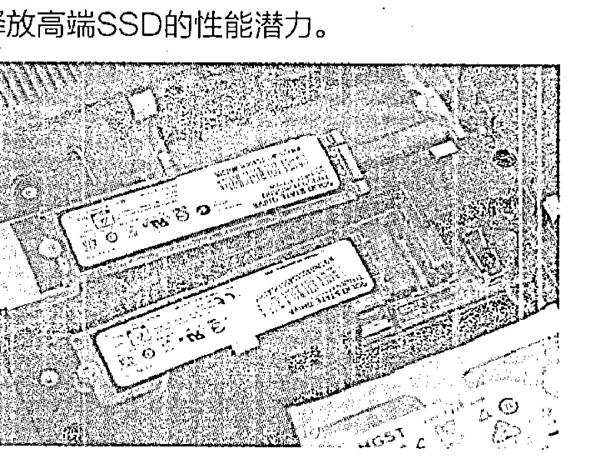

### 移动设备先尝鲜

根据惯例，每次英特尔新处理器平台总是移动设备（笔记本、平板二合一等）先尝鲜，这一次Kaby Lake首发的也是以Y和U系列为代表的移动处理器。

### 标签更好理解

考虑到Kaby Lake上市后，它将面临与Skylake和Broadwell“三世同堂”的局面。没错，就是同样的笔记本，你将可能看到具体型号为i5-5200U、i5-6200U和i5-7200U三种酷睿i5处理器！为了减轻混淆，英特尔对Kaby Lake这种第七代酷睿处理器的Logo标签进行了优化，取消了以前的“inside”标识，并直接注明 “7th Gen” 的字样（图10），也就是告诉所有消费者：看到没，有7th Gen的就是酷睿家族的“七代目”！

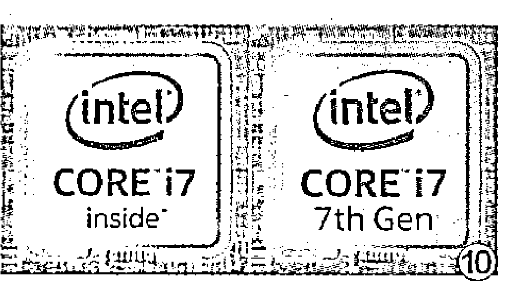

#### 命名出现混乱

虽然Logo标签看起来更醒目了，但英特尔却对Kaby Lake-Y系列处理器的命名增加了辨识上的难度。具体来说，就是七代酷睿M5和酷睿M7，被英特尔归类到了i5和i7的门下，酷睿M家族只保留了最低端的酷睿M3-7Y30（图11）。

对此英特尔的解释是：如今的酷睿M已经取得了显著的性能提升，搭载它的设备在形态（如传统笔记本形态、平板形态、变形本形态等）上也与搭载15W酷睿i5/i7的设备没啥区别了。问题来了，酷睿M常被塞进那些无风扇的超轻薄平板/笔记本混合设备上（图12），经常因温度过高而出现降频问题，其性能与带风扇的设备相比仍有较大的差距。

此次英特尔将酷睿M5/M7归类到i5/i7，虽然提升了新酷睿M的“卖相”，但对于普通消费者的识别却提升了难度。反正，如果你需要真正的15W TDP酷睿i5或酷睿i7的性能，那就请绕过i7-7Y75和i5-7Y54这两个具体型号吧，它们只是披着i5/i7马甲的酷睿M。

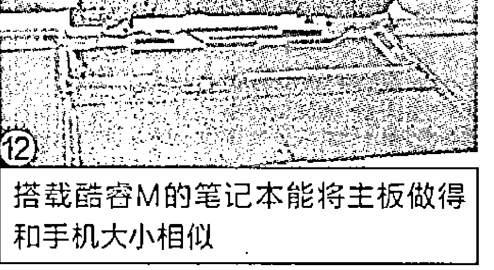

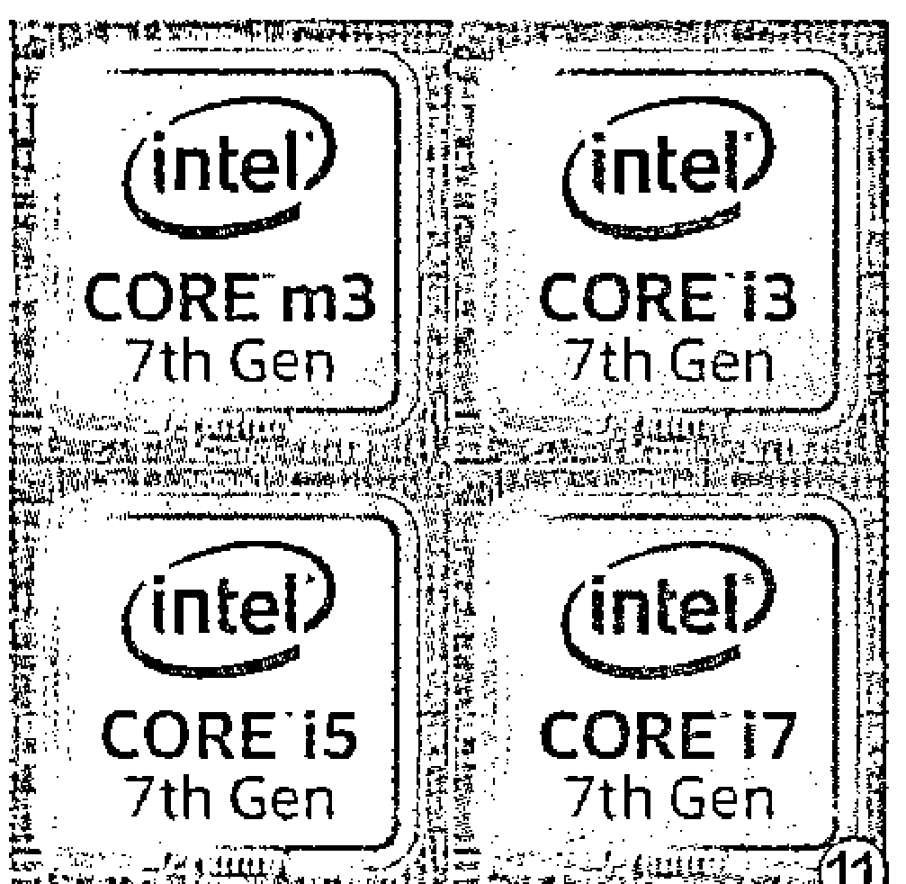

表3：两代Y系列酷睿处理器参数对比表

| 处理器型号 | i7-7Y75 | i5-7Y54 | M3-7Y30 | M7-6Y75 | M5-6Y54 | M3-6Y30 |
| :--- | :--- | :--- | :--- | :--- | :--- | :--- |
| 核心/线程 | 2/4 | 2/4 | 2/4 | 2/4 | 2/4 | 2/4 |
| TDP功耗 | 4.5W | 4.5W | 4.5W | 4.5W | 4.5W | 4.5W |
| 高速缓存 | 4MB | 4MB | 4MB | 4MB | 4MB | 4MB |
| 基础频率 | 1.3GHz | 1.2GHz | 1.0GHz | 1.2GHz | 1.1GHz | 0.9GHz |
| 睿频加速（单核） | 3.6GHz | 3.2GHz | 2.6GHz | 3.1GHz | 2.7GHz | 2.2GHz |
| 睿频加速（多核） | 3.4GHz | 2.8GHz | 2.4GHz | 2.9GHz | 2.4GHz | 2.0GHz |
| 核芯显卡 | HD615 | HD615 | HD615 | HD515 | HD515 | HD515 |
| 显卡基础频率 | 300MHz | 300MHz | 300MHz | 300MHz | 300MHz | 300MHz |
| 显卡加速频率 | 1.05GHz | 950MHz | 900MHz | 1.0GHz | 900MHz | 850MHz |
| 支持内存 | LPDDR3-1866、DDR3L-1600 | | | | | |

#### 首发“六剑客”

为了留给OEM合作伙伴足够清理库存的空间，Kaby Lake首发型号并没有涉及性能级的H系列，只是Y和U系列各三款。

其中，第七代Y系列酷睿处理器分别为i7-7Y75、i5-7Y54和M3-7Y30，它们分别是第六代Y系列酷睿处理器中M7-6Y75、M5-6Y54和M3-6Y30的替代者。两代Y系列处理器之间的核心/线程数、TDP功耗和高速缓存完全一致，只是在频率上出现了较大的差异（表3）。

值得一提的是，新一代Y系列酷睿处理器的“cTDP”（允许厂商针对产品特点定制功耗）范围更大，它可以在3.5W~7W之间进行自定义（图13），可谓“能屈能伸”。这意味着，如果厂商对某款产品的散热没有信心，或是想尽可能延长续航时间，将处理器的cTDP降到3.5W即可。如果能给i7-7Y75或i5-7Y54配备一个额外的散热风扇，那就可以将cTDP调到最大的7W让它们火力全开，此时的性能就能进一步接近15W的U系列i5/i7了。

第七代和第六代U系列酷睿处理器的差异请参考表4，它们在型号名称上的唯一差别就是“-”后面的第一位数字从6改成了7，代表着第七代酷睿。和Y系列相同，两代U系列处理器在参数上的差异也仅仅体现在主频方面。

| 处理器编号 | M3-7Y30 |
| :--- | :--- |
| 状态 | Launched |
| 发行日期 | Q3'16 |
| 光刻 | 14 nm |
| 建议的客户价格 | N/A |
| 性能 | |
| 内核数 | 2 |
| 线程数 | 4 |
| 处理器基本频率 | 1 GHz |
| 最大睿频频率 | 2.6 GHz |
| 缓存 | 4 MB SmartCache |
| TDP | 4.5 W |
| 可配置的 TDP-up 频率 | 1.6 GHz |
| 可配置的 TDP-up | 7 W |
| 可配置的 TDP-down 频率 | 600 MHz |
| 可配置的 TDP-down | 3.5 W |

表4：两代U系列酷睿处理器参数对比表

| 平台 | 第七代U系列酷睿处理器 | | | 第六代U系列酷睿处理器 | | |
| :--- | :--- | :--- | :--- | :--- | :--- | :--- |
| 处理器型号 | i7-7500U | i5-7200U | i3-7100U | i7-6500U | i5-6200U | i3-6100U |
| 核心/线程 | 2/4 | 2/4 | 2/4 | 2/4 | 2/4 | 2/4 |
| TDP功耗 | 15W | 15W | 15W | 15W | 15W | 15W |
| 高速缓存 | 4MB | 3MB | 3MB | 4MB | 3MB | 3MB |
| 基础频率 | 2.7GHz | 2.5GHz | 2.4GHz | 2.5GHz | 2.3GHz | 2.3GHz |
| 睿频加速(单核) | 3.5GHz | 3.1GHz | 不支持 | 3.1GHz | 2.8GHz | 不支持 |
| 睿频加速(多核) | 3.5GHz | 3.1GHz | 不支持 | 2.6GHz | 2.4GHz | 不支持 |
| 核芯显卡 | HD620 | HD620 | HD620 | HD520 | HD520 | HD520 |
| 显卡基础频率 | 300MHz | 300MHz | 300MHz | 300MHz | 300MHz | 300MHz |
| 显卡加速频率 | 1.05GHz | 1GHz | 1GHz | 1.05GHz | 1GHz | 1GHz |
| 支持内存 | | | DDR4-2133、LPDDR3-1866、DDR3L-1600 | | |

微架构没有变（意味着性能很难提升），但它却通过改进的14nm+工艺，硬是将和六代酷睿中同级别处理器的核心频率提升了300MHz~400MHz。其中，i5-7200U和i7-7500U的多核睿频加速频率竟然和单核加速的频率一致！最终，让七代酷睿i5-7200U除了高速缓存略逊一筹以外，在其他参数上等于甚至超过了（多核睿频加速）六代酷睿i7-6500U，所以它能实现性能反超也就合情合理了（图14）。

#### 性能提升源于频率增益

下面就到了最激动人心的时刻了，那就是第七代酷睿处理器与同档次的上代产品相比，性能能有多少提升？

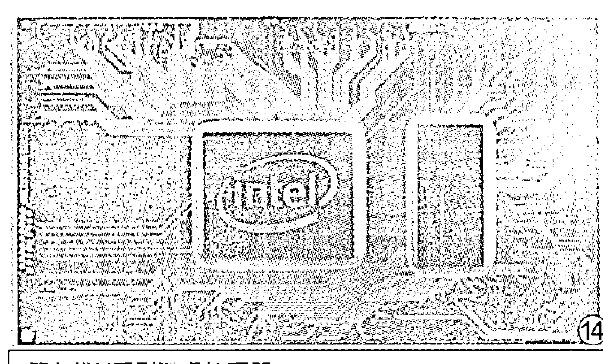

通过表5可见，第七代酷睿中的i7-7500U性能可谓一骑绝尘，遥遥领先于其他竞争对手。而i5-7200U的性能同样可圈可点，它在全部的测试项目中都超过了六代酷睿中的i7-6500U。要知道，这可是i5和i7的对决！

其实这个结果也在情理之中。前文我们已经提到了，虽然Kaby Lake七代酷睿的微架构没有变，但它通过改进的14nm+工艺提升了核心频率。

至于大家更关心的GPU（核芯显卡）性能方面，笔者可以很负责地告诉你，七代酷睿除了播放4K等高清视频更流畅和省电以外，玩游戏和跑分数据基本和六代酷睿一致。

表5：两代U系列酷睿处理器理论性能对比

| 测试软件 | 测试项目 | i7-7500U | i5-7200U | i7-6500U | i5-6200U |
| :--- | :--- | :--- | :--- | :--- | :--- |
| Cinebench 11.5 | 单核 | 1.74 | 1.53 | 1.5 | 1.35 |
| | 多核 | 3.67 | 3.53 | 3.32 | 3.19 |
| Cinebench R15 | 单核 | 153 | 135 | 132 | 119 |
| | 多核 | 334 | 322 | 302 | 290 |
| Geekbench 3 | 单核 | 3817 | 3362 | 3286 | 2949 |
| | 多核 | 7149 | 6830 | 6474 | 6169 |
| PassMark | CPU Mark | 4809 | 4538 | 4355 | 4098 |

*测试数据来源于http://www.cpu-monkey.com网站

#### 总结

虽然英特尔将“Tick-Tock”换成了“PAO”，最终让Kaby Lake与计划中的10nm工艺失之交臂，但英特尔还是通过较大幅度的提升主频加以弥补。可见，14nm+工艺并没有想象的那么简单，至少让第七代酷睿处理器在相同功耗的前提下实现了更强的性能，即便这种性能提升仅仅是主频提升带来的增益效果，理所应当。

可惜，英特尔首发的第七代酷睿处理器中不含45W的四核型号，U系列和Y系列新品虽然性能有所提升，但要与NVIDIA GTX级别独立显卡搭配时，CPU性能依旧会成为整机性能的“拖油瓶”。因此，如果你喜欢的是轻薄本或二合一类的超便携设备，在价位相近时自然酷睿“七代目”更值得选。如果你想购入一款游戏本，那就不妨捂好钱包，等着45W“七代目”上市后再做决定。

## 强化&优化 手机处理器的必修课

和笔记本领域由英特尔一家独秀不同，手机领域的“芯片之争”就要热闹许多了。只是，未来一段时间里，手机处理器会将更多精力投入到强化和优化的进程中，更大的革新只有等到来年再看了。

### 别再提多核无用论了

iPhone一直是“多核无用论”的坚实拥护者，但iPhone 7却开始反对这种论调了，至少在核心数量上总算迈出了一大步。

#### 从领跑者到落后者

自2011年的iPhone 4s武装双核A5以来（图1），随后的iPhone 5/5s和iPhone 6/6s系列都延续了双核传统。与之对应的，则是Android领域永不间断的“核战争”，从2012年首款四核手机（LG Optimus 4X HD）问世以来，六核、八核、十核处理器竞相出炉。可惜，Android阵营的绝大多数多核处理器依旧会被iPhone家族的双核处理器干翻在地，而这一现象也就成为了业内盛传“多核无用论”的最佳素材。

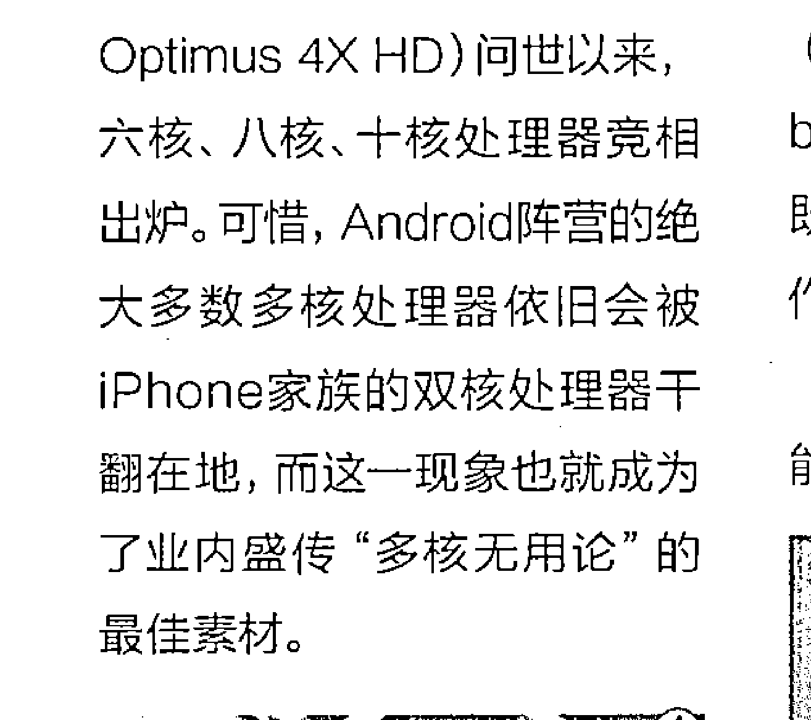

#### iPhone 7迎来四核时代

如今，iPhone 7终于正式步入了四核时代，在核心数量上已经追平了Android阵营中那些搭载高通骁龙820的旗舰们。iPhone 7搭载的A10 Fusion四核处理器拥有2个高性能核心和2个高能效核心（图2），它们采用了和ARM big.LITTLE类似的运作机制，既可以单独工作，也可以协同作战。

考虑到iPhone一直是智能手机领域的软硬件标杆，此次iPhone 7跨入四核门槛，说明苹果也已经认为多核技术已经足够成熟。这里指的成熟主要表现在3个方面：

1.  为了追求更强的性能，双核架构已经没有优化的空间，四核架构已经成为了必然的选择（图3）；
2.  多核处理器通过类big.LITTLE技术的合理调配（图4），可轻松在高性能和低功耗的模式间切换，更多核心今后只意味更高效率而不是更高功耗；
3.  iOS的APP开发者已经做好了针对多核优化的准备，未来的APP只有在更多核心处理器上才能取得最佳的运行效率。iOS如此，Android的APP自然也不能落后了。因此，“多核无用论”已经不再适用于当前手机处理器的发展潮流了。或者说，今后将不存在“没有用的x核”，只有“没有优化到位的x核”。这不，就连高通都计划让下一代旗舰骁龙830重回八核阵营，这年头还有谁能阻止更多核心处理器在手机领域的渗透呢？

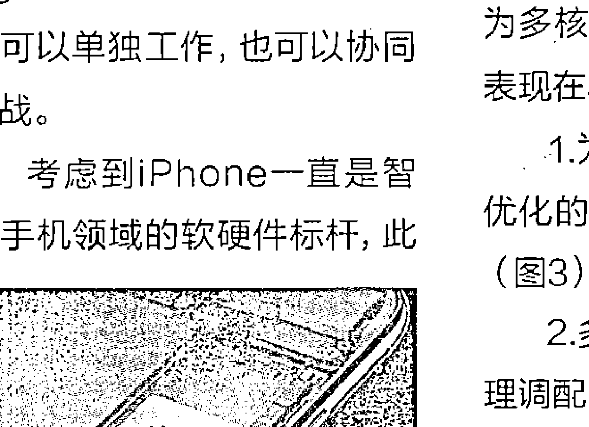

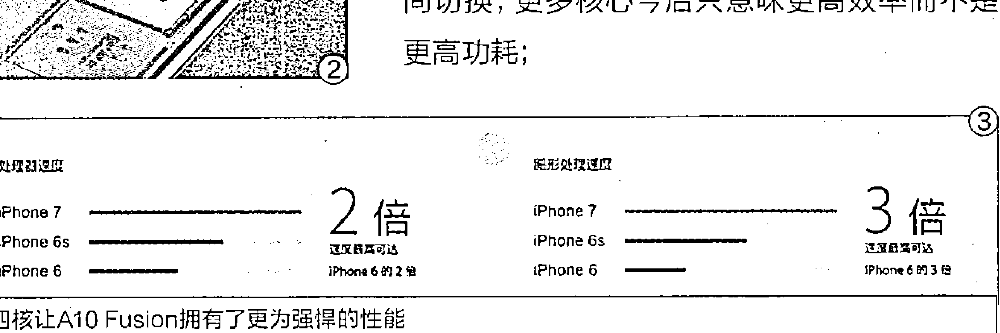

### 没有协处理器好尴尬

实际上，无论手机处理器采用的是四核、六核、八核还是十核，哪怕当前的应用环境真的无需所有核心火力全开，但仍有一种额外的核心总是不嫌多余，它就是协处理器。

#### 协处理器虽小尤荣

协处理器最早就是苹果“发明”出来的，并被应用到了iPhone 5s身上。虽然协处理器无法帮助手机提升性能，但它的存在与否却对续航时间有着极大的影响（图5）。

iPhone 7的协处理器已经从M7升级到了M10，其功效依旧是用于对加速感应器、陀螺仪、指南针和全新气压计等传感器进行7×24小时不间断的检测、统计、再加工，可让你安心进行计步、开启GPS定位等功能而不必担心耗费电力。

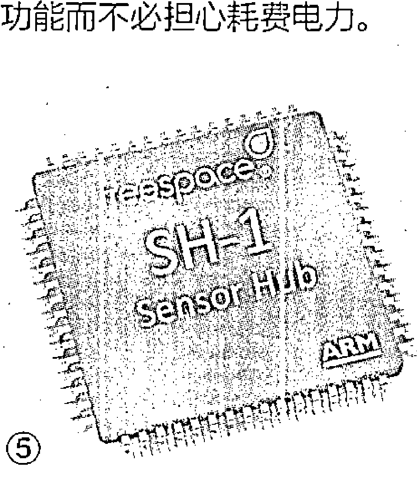

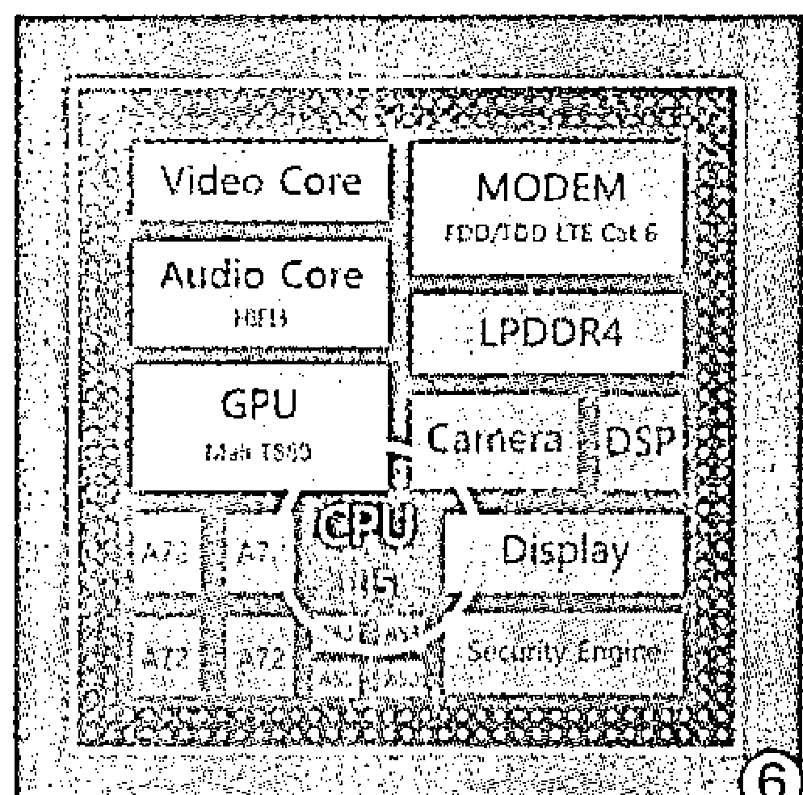

需要注意的是，每个处理器厂商对协处理器的叫法略有不同。比如，联发科称Helio X20/X25身上整合了ARM Cortex-M4架构的协处理器芯片；华为将麒麟950/960/650中集成的Cortex-M7架构协处理器取名为i5（图6）；高通骁龙处理器将协处理器称为Hexagon DSP或Sensor Hub（图7）。只是无论它们的称呼如何，功能和作用都是一致的：为了省电而贡献力量。

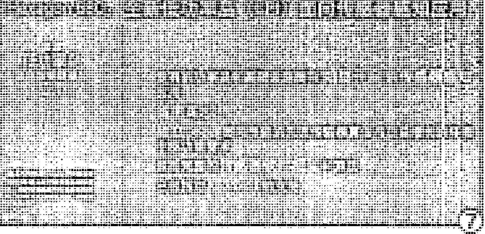

#### 协处理器即将普及

曾经，协处理器可以帮助我们判断某款处理器是否符合“旗舰身份”。比如，高通骁龙820有协处理器而骁龙652没有，所以后者就只能屈居主流定位了。如今，协处理器已经不再是顶级处理器的标配，它正逐渐为更多主流级别的处理器所接纳。

比如，高通最新推出的骁龙625，它的性能虽然比不过骁龙650/652这些老大哥，但它却凭借Sensor Hub协处理器，在实际体验上的表现更为理想。比如，华为在麒麟650中也整合了i5协处理器。

总之，今后如果遇到两款处理器性能相近、其他配置规格基本一致的手机时，在处理器中集成了协处理器的型号将更值得选择。

### GPU成为重中之重

由于操作系统和软件环境不同，所以iPhone和Android手机在性能上没有太多的可比性。而就Android阵营的产品而言，进一步挖掘GPU性能潜力，就是下半年众多新品的发展策略了。

#### CPU性能取决于架构

在Android领域，如今公认的第一梯队处理器主要以高通骁龙820、三星Exynos 8890、华为麒麟955、联发科Helio X25为主。有意思的是，虽然骁龙820口碑最好（其实Exynos 8890的综合性能在骁龙820之上，但这颗芯片暂时没能进入国内市场，所以没有太多的讨论价值），但它却在GeekBench 3这类跑分软件的多核测试项中表现不佳。

## 项中性能垫底（见表）。
原因很简单，手机处理器的CPU运算性能取决于核心架构、核心数量和主频。骁龙820的Kryo架构和其他对手选用的Cortex A72架构处于同一个档次，所以跑分受核心数量偏少的拖累就在情理之中了。

问题来了，联发科Helio X25凭借着最多的十核心优势，在CPU跑分中的性能领先，但它的综合性能却在上述处理器中属于垫底的存在。最终，别人都能把（搭载它们的）机器卖到2000元甚至更高，但基于联发科Helio X25定制的手机，却抢先跌破了千元大关。

| 跑分软件 | 麒麟955 | Helio X25 | Exynos 8890 | 骁龙820 |
|----------|---------|-----------|-------------|---------|
| 安兔兔V6.x | 98909   | 99648     | 130116      | 133910  |
| GeekBench 3-单核 | 1868    | 1873      | 2021        | 2320    |
| GeekBench 3-多核 | 6682    | 6519      | 6316        | 5460    |
| GFXBench ES3.1 曼哈顿离屏 | 10fps   | 11fps     | 26fps       | 29fps   |
| GFXBench ES3.0 曼哈顿离屏 | 18fps   | 18fps     | 38fps       | 45fps   |
| GFXBench 霸王龙离屏 | 41fps   | 36fps     | 86fps       | 92fps   |

#### GPU性能决定地位

没错，如今手机处理器的综合地位，主要还是要看GPU性能的表现是否给力（图8）。骁龙820之所以在安兔兔等综合跑分软件中遥遥领先，就是源于它集成的Adreno 530 GPU性能够强。联发科Helio X25和麒麟955的GPU性能较差，则是因为它们仅仅选用了Mali-T880MP4，与三星Exynos 8890集成的Mali-T880MP12相比太过保守（图9）。

在下半年即将与我们见面的新款手机处理器，都将把提升GPU性能作为了发展方向。比如，高通骁龙821虽然依旧集成了Adreno 530 GPU，但却将GPU频率提升到了653MHz，依靠“超频”获得更好的性能表现；

定位主流市场的联发科Helio P20，则将GPU从Helio P10集成的Mali-T860MP2升级到了Mali-T880MP2，并将频率拉升到了900MHz。虽然谈不上太强，但依靠“换芯”终究是拉近了与高通骁龙625等竞品的距离；

华为即将推出的麒麟960，则计划从麒麟950/955集成的Mali-T880MP4升级到Mali-T880MP8，性能同样值得期待。

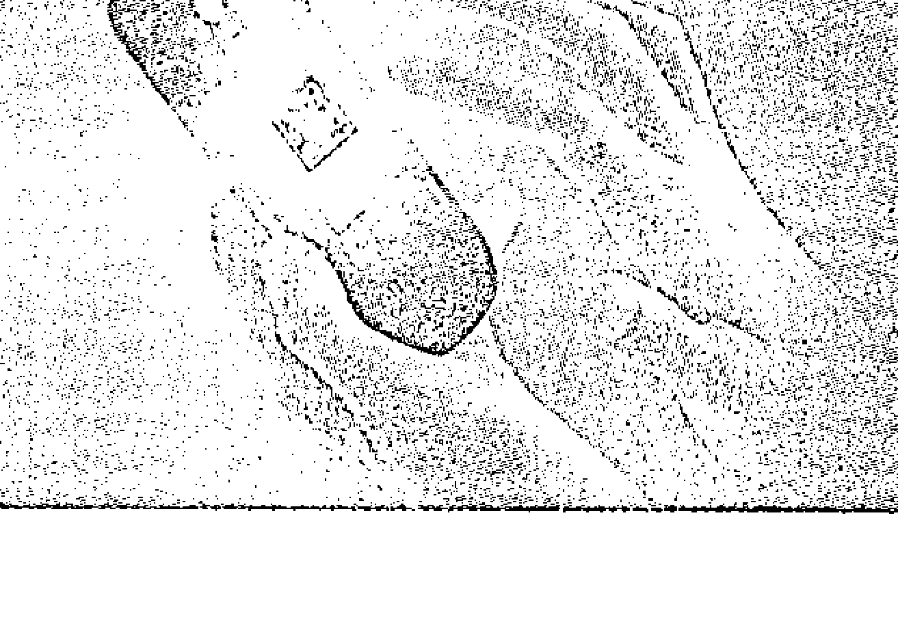

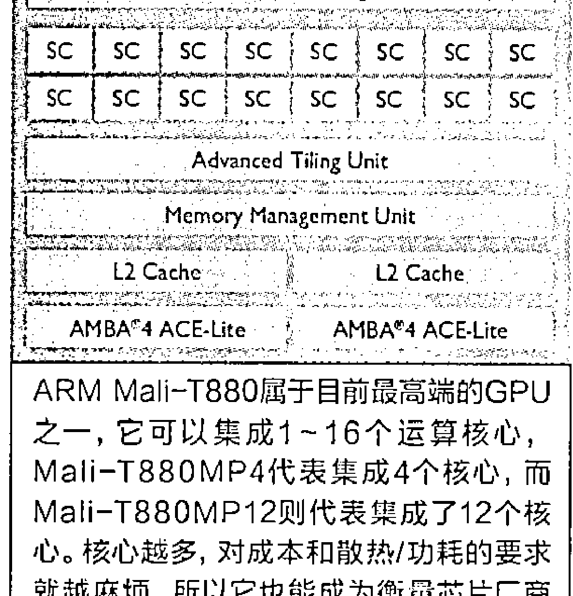

### 火速链接

有关第一梯队手机处理器具体的性能差异，请参考本刊2016年11期《曦力是否够“犀利”联发科Helio X20/X25解析》这篇文章，或扫码即看。

ARM Mali-T880属于目前最高端的GPU之一，它可以集成1~16个运算核心，Mali-T880MP4代表集成4个核心，而Mali-T880MP12则代表集成了12个核心。核心越多，对成本和散热/功耗的要求就越麻烦，所以它也能成为衡量芯片厂商研发实力和产品最终定位的分水岭。

#### 总结

在制程工艺和核心架构没有新的突破之前，今年下半年的手机处理器很难出现“质变”。因此，通过在细节方面的修修补补就成为了它们吸引眼球的关键。正如上文所说，再怎么折腾CPU的性能也就这样了，GPU性能提升的幅度，就将成为考量芯片厂商诚意的所在了。

## 以旧迎新
小技巧让老产品焕发容颜

策划《电脑爱好者》编辑部

### 智能手机篇

#### 换电池找回续航自信

随着微信和视频类APP使用率的提高，几乎所有的手机用户都变成了“重度玩家”（泛指每天使用手机的频率和强度很高），一天一充已变成了常态。在这种大环境下，无论手机厂商采用了多么优秀的电池，使用1.5年~2年后都将面临续航时间明显缩水的问题。于是，一天N充就成为了很多坚守旧手机用户心中的梦魇。因此，帮旧手机恢复应有的持续作战能力，理应成为优化之路的第一步。

#### 查询官方服务成本

很遗憾，如今80%以上的智能手机都放弃了可换电池的设计，买块便宜的兼容电池轻松装回手机里的好日子已经成为历史。此时，我们又该如何处理呢？首先建议大家查询一下在官方客服中心更换电池的成本。好消息是，现在很多手机厂商都在微信官方公众号里提供了在线查询的服务。以OPPO为例，依次点击公众号底部按钮“服务站→零配件价格”就能进入到查询界面（图1）。在这里输入想要更换电池的手机型号就能看到所需支付的费用。以笔者的OPPO N3为例，这款2年前上市的手机，电池组件的价格为228元（比OPPO R9等新机还要贵……）（图2）。还好，这个价格已经包含了人工费用。如果你决定在官方客服中心更换电池，可以通过官方公众号进行在线预约，选择离你最近的客服点即可。


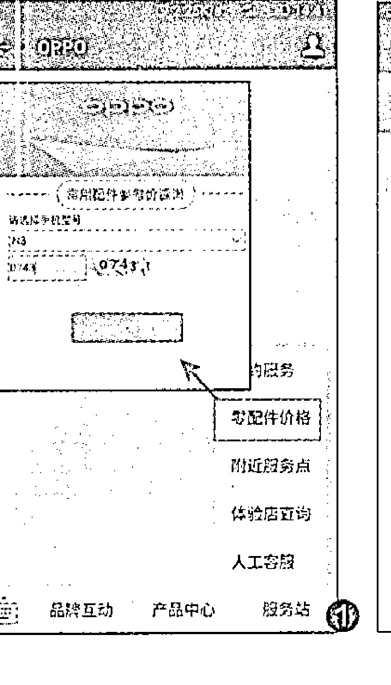

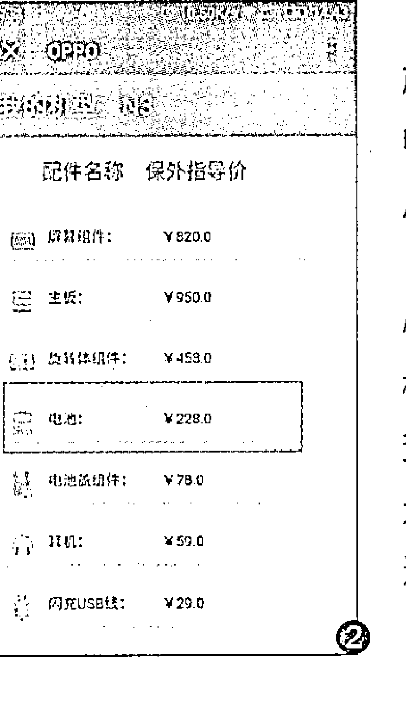


| 配件名称 | 保外指导价 |
| --- | --- |
| 主板 | ¥990.0 |
| 电池 | ¥220.0 |
| 电池盖 | ¥78.0 |
| 耳机 | ¥50.0 |
| 闪充USB线 | ¥29.0 |

随着使用时间的延长，很多老旧手机、笔记本等移动设备不仅性能会被新款设备远远落下，就流畅度而言，也会变得越来越慢（相对于刚买的时候）。如果你不想花钱换新，如何才能通过技巧提升旧设备的速度呢？

#### 自行更换的可能性

如果你觉得官方换电池的费用太高，则可关注一下自行更换的可行性。这里面有三点问题需要引起我们的关注：

- **拆机的难度**：智能手机的拆机方法和难度不一，大家可以以“手机型号+拆机”为关键字查询网上的拆机评测或教程（图3、图4）。如果感觉自己有足够的能力和把握将手机拆开，那么恭喜你，你有机会花更少的钱实现更换新电池的目的。
- **查询电池价格**：只要是热门的手机，在淘宝或天猫上都能搜索到单独销售的可换电池。还是以OPPO N3为例，天猫上销售的原装电池售价190元，而第三方的兼容电池则多在40元~80元之间（图5）。其中，原装电池价格只比客服换新便宜了40元，算上自行拆机更换的风险，显然性价比不高。那么，便宜的兼容电池值得选吗？
- **权衡功能的损失**：如今中高端智能手机都支持快速充电技术，而像OPPO手机特有的VOOC闪充，需要充电器、数据线（定制接口）和电池三方的配合（图6）。OPPO N3能用兼容电池吗？答案是可以，但更换之后特色的闪充功能就会失效，意味着只能使用标准的5V/2A或更低的充电标准。

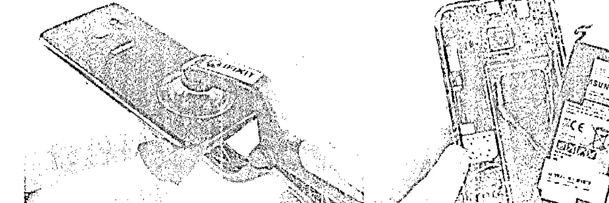

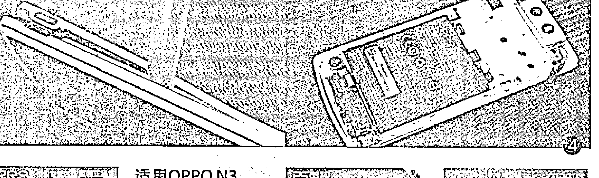

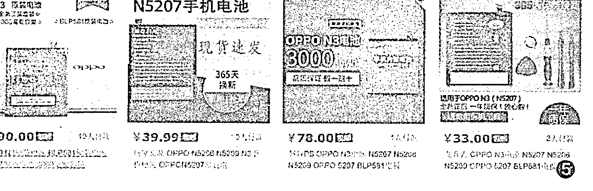

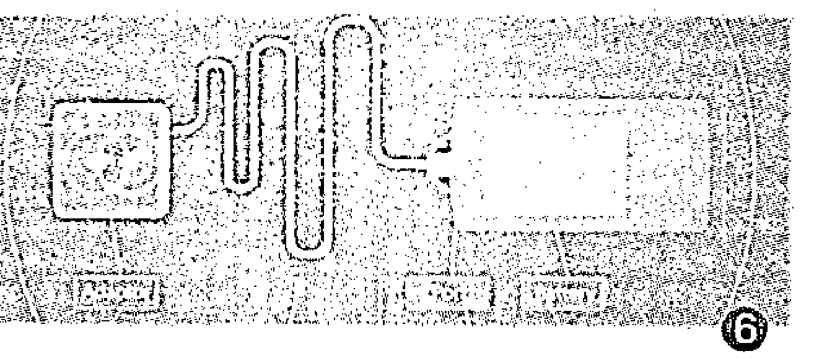

#### 不可忽视的安全隐患

最近闹得沸沸扬扬的三星Galaxy Note 7爆炸燃烧事件，让我们不得不重视起电池的安全问题。理论上，品牌兼容电池（如飞毛腿、品胜等）质量不差，可以放心使用。问题是，网上销售的品牌兼容电池中也不乏造假的存在。因此，如果你真的打算选择兼容电池，一定要在信誉高的店铺购买，一味地贪图便宜绝不可取。

此外，高通QC和联发科PEP快充技术，理论上对电池没有特别的要求，只要手机和充电器支持，更换兼容电池后应该也能激活9V或12V的快充功能。但是，手机在快充模式时电池温度会明显提升（图7），对兼容电池的品质要求更高。如果电池品质不过关，很有可能在快充过程中出现危险。因此，出于安全的角度考虑，如果你为手机更换了兼容电池，可以考虑使用不支持快充的充电头给其充电（比如原装充电头支持9V/2A，那就换成只支持5V/2A的充电头）。

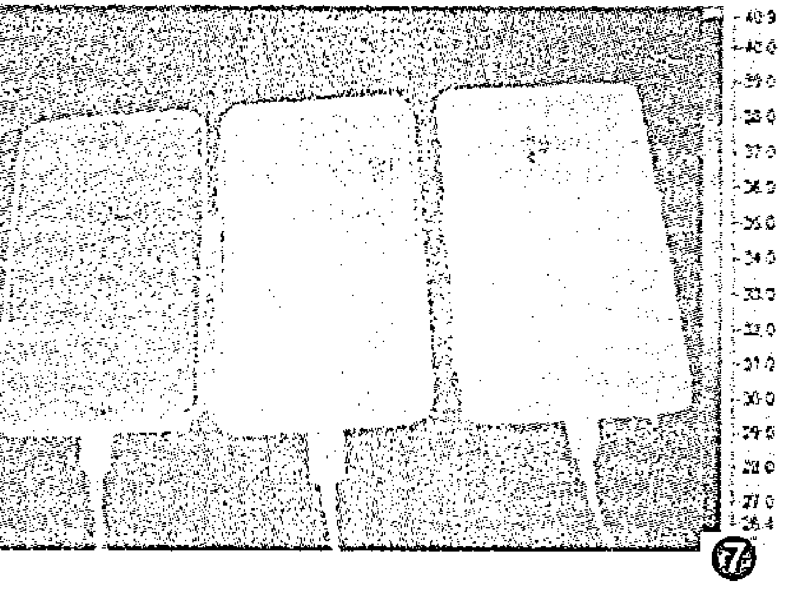

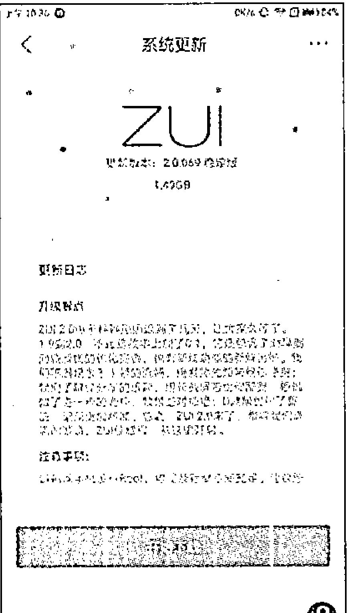

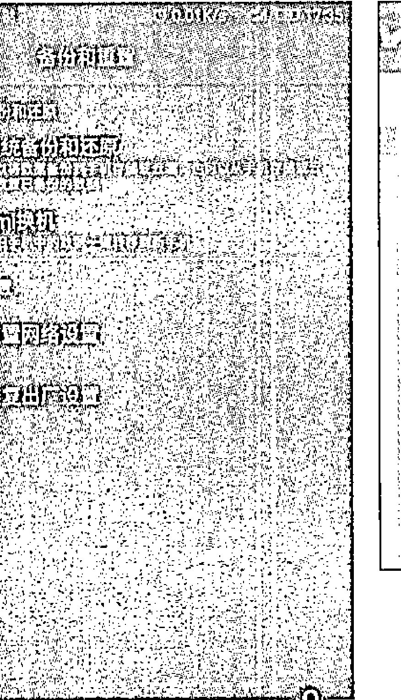

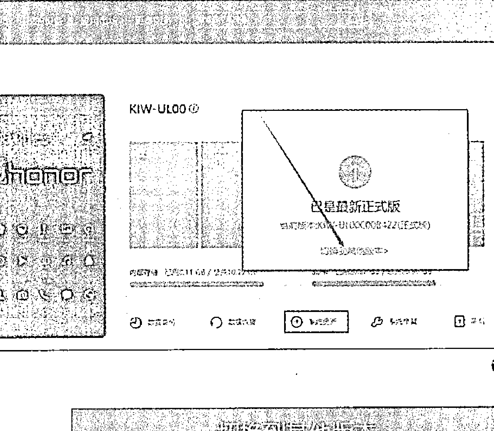

#### 摆脱新版系统的拖累

iPhone用户都深有体会，新买时手机速度刚刚的，2年后升到最新版系统却卡到不行，给你一种必须更换新机的冲动。实际上，Android手机同样存在类似的问题，新系统对老机型优化不周，所以容易拖累运行速度。

系统更新之后突然发现速度慢了、反应卡了（就是没有刚买的时候流畅），可以先将重要数据进行备份，然后选择“恢复出厂设置”（图9）。这是刷机后解决莫名问题的通用方法。

#### 系统升级的后遗症

理论上，及时更新手机的系统可以获得更多功能（图8），修复已知Bug是一件非常Happy的事情。然而，手机厂商的精力是有限的，在遇到大版本的系统更新时（比如从Android 5.0升级到Android 6.0，或是从MIUI7升级到MIUI8），往往只有新款手机才能获得最完美的体验。至于老款机型却可能存在速度不升反降，或是出现莫名问题的隐患。

如果你的手机在几次系统更新之后突然发现速度慢了、反应卡了（就是没有刚买的时候流畅），可以先将重要数据进行备份，然后选择“恢复出厂设置”（图9）。这是刷机后解决莫名问题的通用方法。

#### 几种降级思路

需要注意的是，不同品牌和型号的手机，它们降级的方法和难度也有所不同。其中，以华为为代表的手机品牌属于比较方便的：通过电脑端的“华为手机助手”软件就能随时将手机降级。

以荣耀畅玩5X从EMUI4.0退回到EMUI3.1为例，将手机与电脑连接后运行华为手机助手，然后点击“系统更新”，在弹出的界面选择“切换到其他版本”（图10）。在这里，我们就能看到较早版本的系统更新包了（图11），按界面提示操作就能实现降级操作。

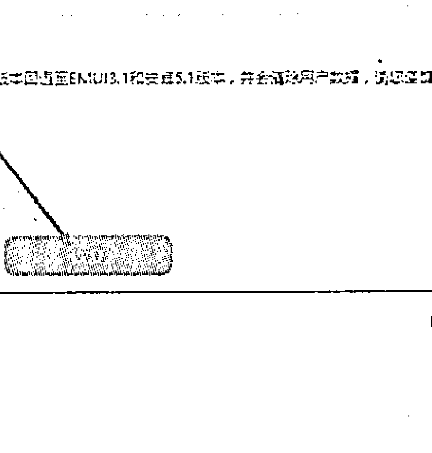

在弹出的界面选择“切换到其他版本”（图10）。在这里，我们就能看到较早版本的系统更新包了（图11），按界面提示操作就能实现降级操作。

如果你的手机品牌没有专用的刷机工具，则可选择通用的降级手段：线刷完整的ROM包。

其中，“完整ROM包”类似于Windows的Ghost镜像文件，一些因误删系统文件而变砖头的手机，可以通过强刷“完整ROM包”满血复活。而“线刷”的意思是将完整ROM包下载到PC本地，然后让手机进入刷机模式，连接电脑运行线刷软件，从而强制用旧版本的完整ROM包替换手机已有的系统。

以小米手机为例，在官方论坛可以下载到几乎所有历史版本的完整ROM包以及Miflash线刷软件。将手机关机，然后长按“电源键+音量减键”，进入FastBoot模式（也称兔子模式、Bootloader模式）（图12）。在电脑上运行Miflash软件，然后将手机与电脑相连，按一下键盘的F5系统会自动安装驱动。等Miflash正确识别手机之后，点击浏览按钮选择之前下载的完整ROM包，然后点击刷机按钮（图13），耐心等待5分钟～10分钟，直至手机自动重启即可。在刷机的过程中，千万不要断开数据线，而且一定要保证手机电量足够（最好在50%以上电量的状态下刷机）！


> 小提示：每个Android手机厂商都有自己专用的线刷工具，可以让手机刷入任何一个匹配的系统，无视系统版本。此外，如果你的手机已经ROOT，则可通过刷入第三方的Recovery，然后就能通过卡刷的形式（将ROM包提前拷贝到手机里，然后进入第三方Recovery进行强制刷机），刷入任何版本的完整ROM包。而官方Recovery只能向上升级（刷入增量包）而无法向下升级。

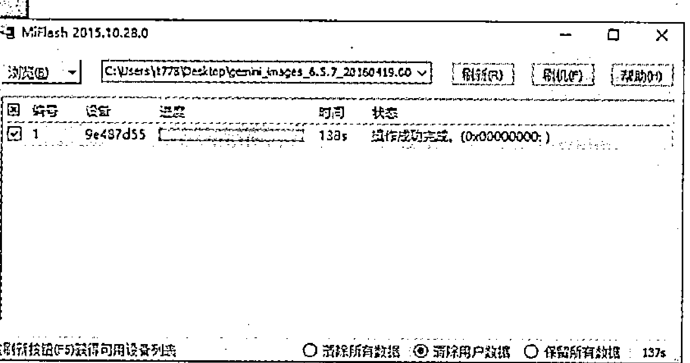

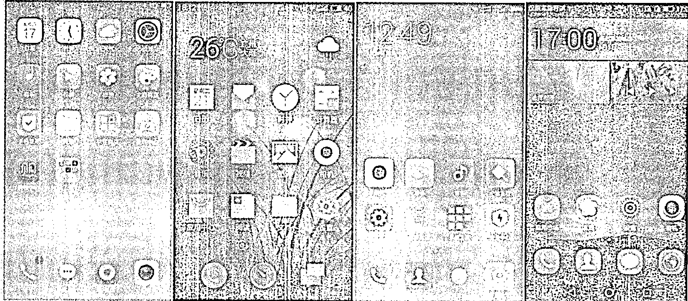


#### 尝试第三方启动器

硬件配置相似的两款Android手机，为何在流畅度上存在差别？这个问题的答案就是启动器（Launcher）优化是否给力。旧手机之所以越用越慢，往往就是源于系统更新赋予了启动器更多占用资源的功能，而旧手机的硬件配置又无法完美驾驭，所以成为了体验上的拖累。

#### 官方启动器之殇

小米MIUI、华为EMUI、魅族Flyme、OPPO ColorOS……每个手机厂商都有基于原生Android深度定制而来的特色UI系统（图14）。而MIUI、EMUI等系统的本质，就是启动器+定制系统的优化。其中，启动器（也可称为桌面）位于表层，也就是我们看到的桌面，涉及图标风格、插件样式、切换时的过渡动画、主题字体的自定义等。而定制系统则位于底层，涉及下拉菜单的功能、设置界面的选项、系统层面的功能等。换句话说，手机操作的流畅性取决于启动器，而功能则视定制系统。

出于种种考虑，很多手机官方的启动器会集成很多联网获取资讯的功能、加入很多炫酷特效，虽然看起来功能丰富、视效出众，但却消耗了更多的系统资源。特别是当老手机升级到新系统（启动器也会随之升级），流畅度很容易大打折扣。

#### 启动器是可以替换的

如果你感觉手机流畅度不足，通过更换启动器往往可以起到立竿见影的效果。请放心，更换启动器无需ROOT也不用刷机，它可以通过APK安装包的形式进驻我们的Android手机。为了提升影响力，很多手机厂商都会开放自家的启动器下载。如小米桌面（图15）、锤子桌面（图16），让任何手机在安装之后都能扮装成小米或锤子手机。相对而言，由于小米桌面捆绑了很多软件和广告资源，而锤子桌面则相对干净，所以这两款启动器中，锤子桌面的流畅性要更出色一些。

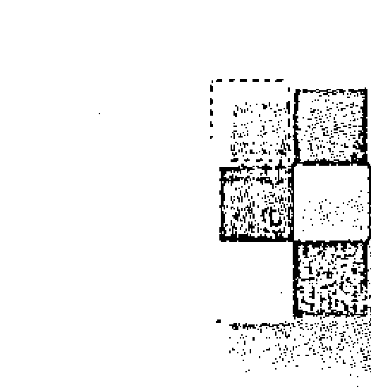

除了手机厂商会开放启动器以外，现在还有很多第三方启动器更值得我们选择。比如禅桌面、GO桌面、CM桌面、Apus桌面和Hola桌面等。其中，笔者向大家推荐Hola，这个桌面的软件体积仅有几MB，主打的就是操作流畅和功能精简（图17）。

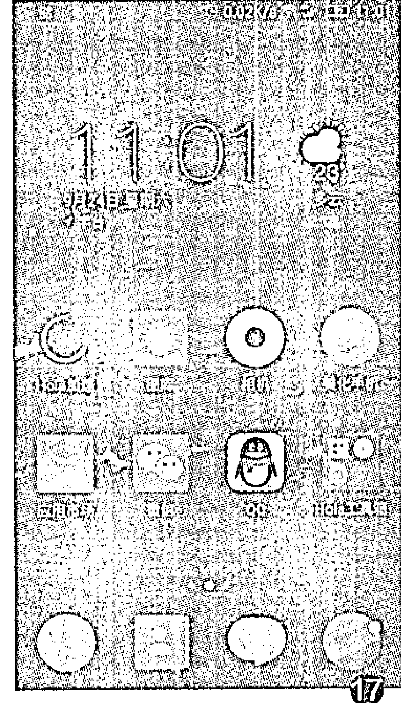

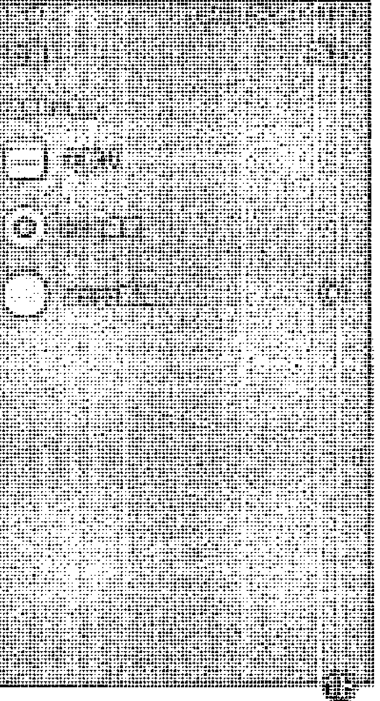

> 小提示
包括Hola在内，几乎所有的桌面类APP都会捆绑一些推广软件（默认以图标形式存在，点击之后会自动下载该软件）。我们在安装第三方桌面之后，第一件事就可以将这些推广的软件删除，然后进入系统设置找到默认桌面的选项，将第三方桌面替换官方桌面为默认启动（图18）。

#### 小通知大杀手

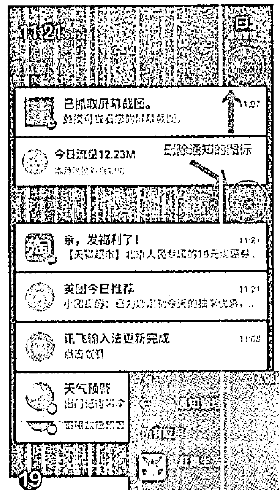

我们收到短信或微信消息时会收到通知，新闻APP会有最新资讯通知，淘宝会有促销活动通知，应用商店会提示你有软件需要更新的通知……稍不留意，手机的下拉菜单就会被无数的通知填满，而此时就是手机卡到最严重的时刻。

在第一条通知的顶部都有一键清空当前通知的按钮（图19），没事就点一下，避免通知积少成多影响速度。

#### 极占系统资源的通知

消息通知虽然方便，但它对系统资源的消耗也是不可小觑的，特别是当积攒到数十条通知后，哪怕是最新款手机也会感到“亚历山大”，出现较为明显的卡顿感。而作为一些内存偏小的老款手机，甚至会因通知太多而出现“假死”状态。因此，建议大家要养成及时删除通知的习惯，

#### 选择性地屏蔽通知

通知真的有用吗？对短信、微信和QQ一类的应用而言，通知可以避免咱们错过好友消息，所以这类APP的通知是有必要的。但是，对经常推送促销、广告、活动和无关紧要通知消息的APP，如果将它们的通知功能屏蔽，无疑可以最大限度节省系统资源。

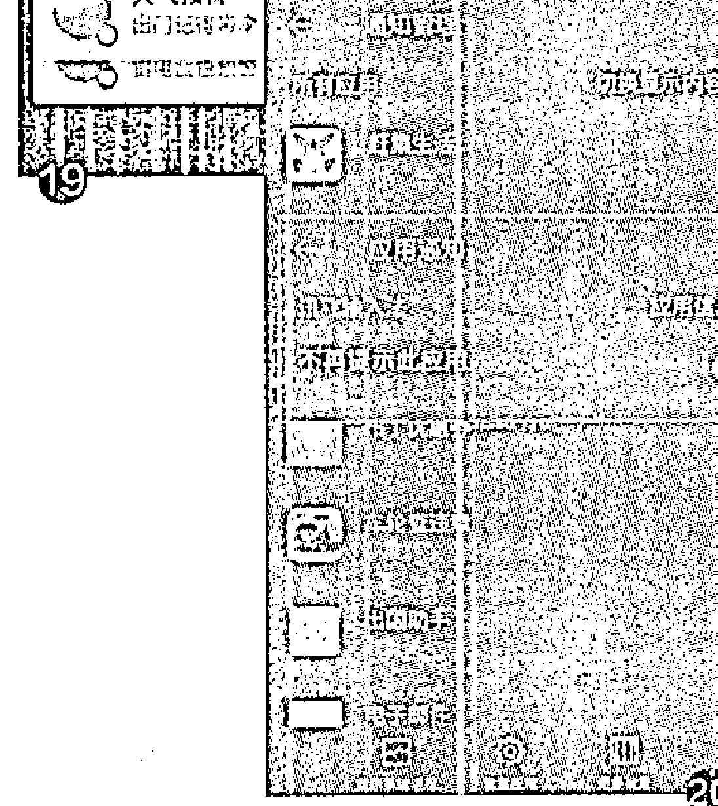

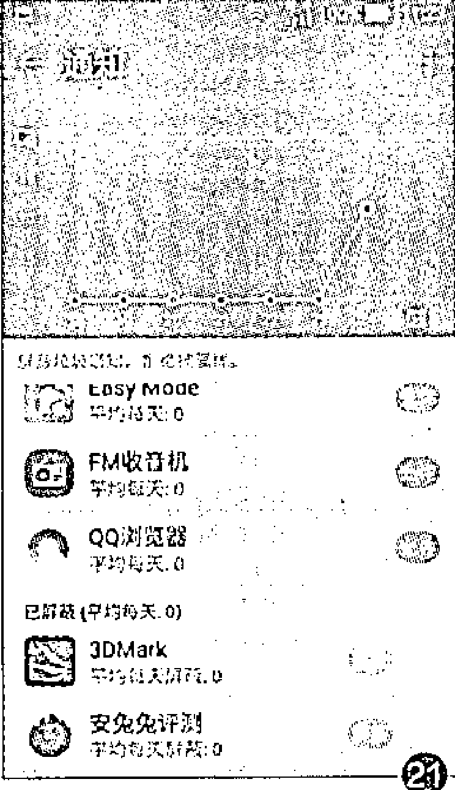

> 小提示
关闭应用通知不会影响到它的正常运行，这一点请大家放心。至于淘宝或京东等购物类应用有没有必要关闭通知，需要视我们的习惯而定。如果你经常网络购物，对发货通知和快递员派送的进度信息非常看重，就不要屏蔽它们的通知。反之，如果你不是特别在意，则建议屏蔽它们的通知，避免收到无用的促销和活动的推送消息。

#### 将系统资源用到刀刃上

手机速度越来越慢，还有可能是因为安装了太多的APP，由于相互唤醒而不断蚕食有限的系统和网络资源，最终导致系统变卡、流量偷跑以及内存消耗过大等问题。因此，如何才能将有限的系统资源用在刀刃上，就需要成为我们的首要目标了。

##### 善用管家助手类APP

Android手机大都会随机预装安全管家、安全助手或安全中心一类的APP，集成了包括流量防火墙、应用自启和权限管理等功能。有关此类APP的用法，CFan此前也做过许多技巧。在这里笔者想提醒大家的是，对那些平时不常用的APP（包括第三方和系统APP），除了禁止它们使用3G/4G上网之外，也要禁止它们在Wi-Fi环境下的联网权限。

原因很简单，很多APP当检测到手机已连接Wi-Fi后会直接后台自启（很多APP哪怕你在自启管理中将它们关闭，依旧偶尔会因联网而自动激活），自动联网更新推送各种消息。对内存有限的老款手机而言，非常容易被这种联网自启的APP压榨干。

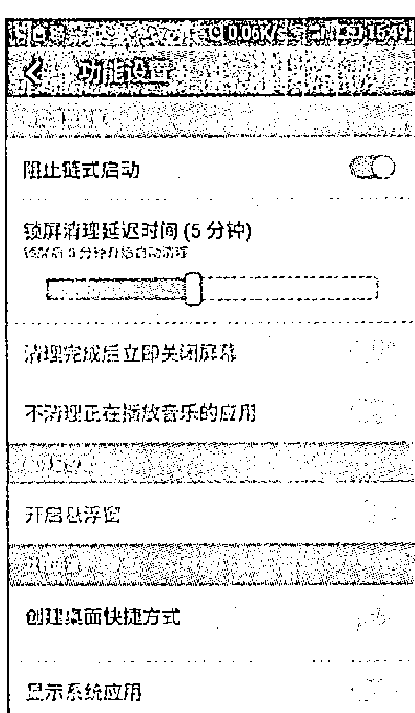

##### 免ROOT的优化方案

对那些没有自带安全类APP的手机而言，卸载垃圾软件、防止APP偷跑流量就显得有点力不从心了。因为控制APP自启、开/关联网权限都需要ROOT之后，再通过第三方的安全类APP才能实现。问题来了，手机ROOT之后存在很多安全风险，如何才能免ROOT实现对旧手机的提速呢？

首先，我们需要激活或进入手机的开发者模式，将“窗口动画缩放”全都设定在0.5x上，并将“后台限制进程”设定在不超过4个进程。如此设置可提高手机操作的流畅度，在手机亮屏状态最多只能同时存在4个进程，多余的进程会被自动清出内存，节省内存、电池和流量的消耗。

> 需要在辅助功能中激活耗电终结者的服务才能正常使用

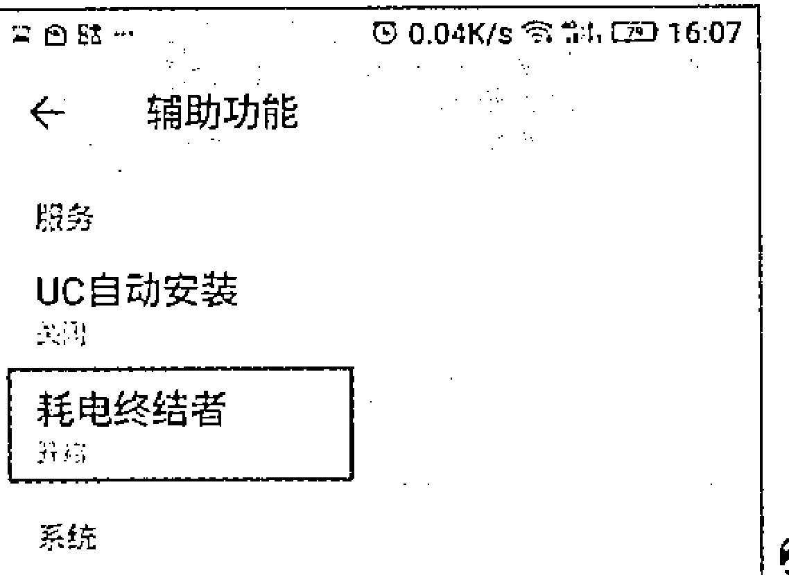

#### 扩展阅读

##### 尝试优化软件的免ROOT模式

像UU安全、LBE和净化大师一类的优化类APP在部分老款手机身上可以激活免ROOT模式，无需ROOT就能禁止应用自启和联网权限，或是卸载系统自带的垃圾APP。但免ROOT模式成功激活的几率视具体机型而定，通用性不高。

接下来，我们可以再使用“耗电终结者”（下载地址：http://dwz.cn/4dC2n6）。和需要ROOT权限的绿色守护类应用相比，它的原理是默认将所有程序都写入黑名单，当手机熄屏进入待机状态后会自动清理所有后台进程，并切断APP间的关联自启（图23），唯有在白名单下的程序才不受影响（图24）。

这两个方法，一个可以限制黑屏待机后的资源消耗，一个可以保证亮屏使用中的资源占用，非常适合老款手机尝试。但是，如果你的手机自带安全类APP，那就无需安装第三方的类似应用了。

此外，现在还有一种方法，可以实现免ROOT冻结系统应用。该方法需要开启手机的USB调试功能，并在电脑上安装一款名为“Debloater”的软件，将手机与电脑相连，通过Debloater窗口选择手机中APP的冻结或恢复功能（图25）。有关该软件的具体用法请登录http://dwz.cn/3NJYpy这个网址查看，或扫码即看。

### 笔记本篇

#### 越古老的笔记本升级潜力越强？

和旧手机相比，笔记本“翻盘”的潜力更大，因为绝大多数笔记本都具备一定的升级潜力，通过后续的升级，可以获得性能和体验上的提升。那么，我们如何才能花最少的钱为笔记本换来最明显的性能改善呢？

你没有看错，如今的笔记本在升级潜力方面的确是呈下降趋势。从第五代酷睿Broadwell开始（四代酷睿Haswell中的Y、U和H系列也是BGA封装），英特尔针对笔记本定制的移动处理器就全都换成了BGA封装，和手机所用的处理器一样，都被直接焊死在了主板上，用户无法自行替换升级。所以，从2014年底开始的笔记本，就都已经失去了升级处理器的机会。

另一方面，如今轻薄本和PC平板二合一类型的设备大热，像小米Air系列、联想小新Air系列、华硕灵耀3等超薄本都直接采用了板载内存颗粒的形式，连升级内存的机会都没有了（图1）。如果你因预算有限购买的产品内存偏低，日后感觉内存不够用时连后悔的机会都没有。

还好，除了苹果MacBook 12这种极个别的型号（图2），如今的笔记本至少还保留了硬盘升级的机会，只是主流笔记本（偏厚廉价型）大都配备的是标准2.5英寸SATA插槽；游戏本则普遍提供SATA+M.2双插槽，可安装双硬盘；轻薄本和二合一设备则普遍以M.2插槽为主（图3），高端型号的M.2会支持高速型的NVMe SSD硬盘。如果你最近新买的笔记本有升级需求，一定要留意M.2插槽是否支持PCI-E通道哦。

##### 老款笔记本的升级优先级

###### 内存是第一优先级

如果你的笔记本内存容量小于4GB（比如只有1GB或2GB），那就别犹豫了，先将内存升级到4GB，绝对可以获得较为明显的性能改善（图4）。如果笔记本内存等于或大于4GB，在预算有限时就不必考虑升级内存了。

如果你的笔记本芯片组为PM45（对应处理器为酷睿2双核P8600等，如ThinkPad T400）或更早，那只支持DDR2内存，而且单条容量不要超过2GB，否则会出现点不亮的问题。如果你的笔记本为HM55（对应处理器为i3-370M等，如联想Y460）或更新的芯片组，请购买DDR3内存升级。

至于升级内存的来源，大家可以优先考虑二手渠道，最好能和笔记本标配内存条对应的容量和频率一致。如果淘不到合适的二手货，则可考虑时下主流的DDR3L-1600，也就是最新的低压版DDR3内存。请放心，1.35V的DDR3L理论上是可以向下兼容1.5V的DDR3-800等老款标压内存条的，只是频率会自动降到芯片组所支持的最高频率上。

此外，我们还需考虑笔记本内存插槽所支持的最大（单条）内存量。在这里分享一个通用的查询方法，在Windows系统中按“Win键+R”，运行“CMD”进入命令提示符界面。然后输入“wmic memphysical get maxcapacity”（不含引号），按下回车键后稍等片刻就会返给我们一组数字（图5）。用这组数字除以2个1024，所得的数值就是笔记本所支持的最大内存。比如小编电脑返回的数值为16777216，做完除法后的结果是16GB。由于笔记本有2个内存插槽，所以可知它最大支持单条8GB的内存。

对最近两年新买的笔记本而言，最大的变化主要体现在M.2插槽的标准上（图8）。如果是M Key（又称Socket 3）标准，那它就有机会支持PCI-E 3.0x2或PCI-E 3.0x4通道的M.2 SSD（图9）。反之，如果是B Key（又称Socket 2）标准，那它就仅支持SATA 3.0通道的M.2 SSD。至于具体的判断方法，请参考本刊19期的《NVMe来了 笔记本用上更高速的SSD》这篇文章。

###### 硬盘是第二优先级

当内存容量达到4GB时，哪怕你升级到8GB甚至16GB，除了极少数应用环境以外，你在绝大多数的时间里是感受不到更大内存的好处的。所以，此时提升磁盘性能，就是最佳的升级方案。

在这里有一个误区，有些用户的笔记本采用的是HM55或更早的芯片组，原生仅支持SATA 2.0硬盘，所以担心升级SSD没用。实际上，哪怕SSD被安装在SATA 2.0接口上，哪怕它的读写速度被限制到200MB/s上下，但它依旧有着远远超越机械硬盘的随机读写速度。在开关机、打开程序和文档等操作时的速度还是可以秒掉机械硬盘的（图6）。

考虑到现在240GB SSD的价格已经跌破了400元大关，给老笔记本更换一块也没有太大的资金压力。

笔记本距离现在越近，对内存的兼容性也就越强。比如7系芯片组（如HM76，对应第三代酷睿处理器）就能完美支持DDR3L内存，而网上有些网友反馈6系和5系芯片组的笔记本安装DDR3L内存出现兼容问题，有些是因为单条容量超标，有些是因为不支持双面内存颗粒。所以，笔记本越老，在购买内存升级前最好先和商家沟通，确认好自己的笔记本对内存的兼容性。

令人欣慰的是，很多老款笔记本都配有光驱，我们可以通过光驱位的硬盘托架（图7），再安装一块2.5英寸的硬盘升级。但是，在8系芯片组（第四代酷睿Haswell）之前，笔记本光驱的SATA接口普遍以2.0标准为主。所以，如果你选择升级SSD，一定要将SSD安装在原硬盘所用的SATA 3.0接口上，而原来的机械硬盘则可装进光驱的位置上作为存储盘使用。

##### 处理器是可选升级

如果你的笔记本搭载了四代酷睿Haswell或更早的处理器平台，而且还是后缀带M的型号，那么恭喜你，你的笔记本有机会升级到同期更高端的处理器。

这类笔记本只要拆下覆盖在处理器上的散热片，然后用硬币或一字改锥转动一下螺丝，就可以取下处理器插槽上的CPU（图10）。理论上讲，5系列芯片组支持所有的第一代酷睿处理器，6系列芯片支持所有的第二代酷睿处理器，以此类推。

但是，支持并不一定代表可以完美驾驭。一些定位中低端的笔记本散热模块用料和设计可能偏差（图11），应付酷睿i3没啥问题，如果强行升级到酷睿i7，后者更高的发热量可能会超过散热模块所能承受的上限，轻则出现频繁降频的问题，重则因CPU过热而出现自动重启或死机等问题。

> 由于笔记本处理器都是走OEM渠道，所以市面上并没有所谓的正版。要么是从OEM渠道偷偷流出，要么是回收的拆机处理器，再要么就是QS（正式版前的最后一个版本，类似操作系统的RTM版）或ES（纯粹的测试版本）版。其中，ES最不值得选，QS稍好一点。

笔者的建议是，大家可以参考自己的笔记本当初高配版所能配备的最高端处理器而定。比如原本搭载第二代酷睿处理器i3-2330M的ACER 4750G，它的顶配版搭载的是i7-2630QM，这意味着它的散热模块最高可以支持这个级别的CPU。因此，我们就可以通过淘宝等渠道购买散装的i7-2630QM处理器替换升级。此时，如果你盲目地为ACER 4750G找主频更高的i7-2675QM升级，那就要面临过热的隐患了（图12）。

##### 其他想想就好了

笔记本还有可以升级的地方吗？答案是有，比如无线网卡，比如屏幕。但是，很多笔记本的无线网卡存在白名单限制，需要刷BIOS或屏蔽无线网卡的指定金手指才能正常识别和使用。至于屏幕，早先笔记本硬件不支持1080P，而如今IPS屏幕则普遍以1080P为主，面临无屏可升的尴尬境遇。此外，对特别旧的笔记本而言，与其花钱升级屏幕，还不如直接买一台更大的IPS显示器，毕竟笔记本迟早要下岗，届时新品也能用上这个新买的显示器了。

## 生活10之四互动 还上新玩法!

策划执行|《电脑爱好者》编辑部

说起互动，这可是《电脑爱好者》最擅长的事情了。

我们每期都在为大家介绍与电脑、与智能手机交互的技巧。CFan网站、爱好者官方微信微博，甚至传统的书信都是我们和大家互动的桥梁。

便捷的互动方式离不开科技的支撑，举个简单的例子：

地图，在之前只是用来记录及查看的一种图形工具，但在移动互联网下，则被赋予了更多的功能，如借助于定位的LBS（Location Based Services）位置服务，赋予了地图与使用者之间的深层互动：你在哪里（空间信息）、你和谁在一起（社会信息）、附近有什么资源（信息查询），让我们的出行更为明确和有效率。

而全新的Windows 10形色各异的交互工具、办公应用和学习软件，无不吸引着人们去探索、发现、使用和掌握……

就让我们走进“新互动”的大门，一睹互动给我们的生活带来的精彩吧！

### 就地取材 玩转Windows 10地图

文|俞木发

大家知道默认情况下，Windows 10就已经自带“地图”应用，而且该组件的功能也较为丰富，因此对于日常的地图使用该组件即可，不必受限于网络等其他因素。

地图的基本功能就是定位和导航。地图的定位功能需要先在“设置→定位”开启当前位置的定位功能，这样打开地图后即可自动切换到当前城市。不过如果要实现当前位置的准确定位，还需要到应用商店下载“Windows地图中国地图导航”（图1）。

完成导航组件的安装后，点击地图右侧的“定位”图标，这样地图应用就可以进行当前位置的定位了。不过要注意的是，Windows 10定位是通过GPS（针对Windows 10 Mobile手机）、Wi-Fi（针对手机和平板、笔记本）和IP地址来进行定位的。对于有线连接网络的Windows 10桌面PC用户来说，定位主要是通过用户当前网络的IP地址定位的，由于网络运营商（特别是铁通）IP地址比较混乱，因此这类用户定位并不准确。如果定位偏差过大，点击“定位”后我们可以手动指定一个自己当前的默认位置以方便导航使用（图2）。

因此要提高Windows 10的定位精度，Windows 10用户就尽量使用Wi-Fi连接（当然Windows 10 Mobile手机用户则可以开启GPS），比如Windows 10平板、笔记本（PC用户则需要使用USB无线网卡）用户在使用Wi-Fi连接后，在地图应用点击“定位”后可以比较准确地进行定位，误差在50米~100米左右（图3）。

#### 小知识

**Wi-Fi是怎么定位的**

因为每一个无线AP都有一个全球唯一的MAC地址，并且一般来说无线AP在一段时间内是不会移动的。这样设备在开启Wi-Fi的情况下即可扫描并收集周围的AP信号，无论是否加密，是否已连接，甚至信号强度不足以显示在无线信号列表中，都可以获取到AP广播出来的MAC地址。当我们在手机、平板这类设备通过Wi-Fi连接到无线AP并开启定位功能后，Windows 10地图服务器就能够接收到这些无线AP数据，接着服务器检索出每一个AP的地理位置，并结合每个信号的强弱程度，计算出设备的地理位置并返回到用户设备上。这样当我们的平板或者PC使用Wi-Fi方式连接到服务器以及手机数据的无线AP后，地图服务器就能够识别到当前设备位置。

在地图上显示导航路线了。为了方便自己查看，还可以点击旋转图标（图4）。

默认情况下地图使用的是在线数据，由于地图数据较大，我们在用Windows 10手机或者平板使用地图时，如果要节约数据流量，还可以离线下载自己所需的地图数据。点击地图右下角的“更多→设置→离线地图→选择地图”，在打开的窗口点击“下载地图→亚洲地图→中国”，选择自己需要的省市地图，这样即可将地图数据离线下载到本地保存，以后就可以离线使用这些地图数据了（图5）。

不过Windows 10地图默认使用的是平面地图数据，这样我们需要查找一个精确地点的时候还是有些麻烦。此时可以点击地图的视图图标切换到“鸟瞰图”，这样使用的是卫星地图模式（图6）。

切换到卫星地图模式后，对于需要查找的确切地点，通过搜索找到地点后双击地图放大，这样通过实景卫星视图可以很容易地找到具体地点（图7）。

当然为了更方便地对地图进行查看，点击地图上的“倾斜以看到3D影像”，点击后可以变换视图角度，让我们更直观地看到具体地址的走法。同时还可以使用Windows 10自带的Windows link工具，选择其中的触摸编写工具，直接在地图上对所要查找的位置做出标记（需要切换到“道路视图”模式），这样方便在地图上一目了然地看到所要查找的位置（图8）。

对于找到的位置经常需要和好友共享（比如聚餐地点），Windows 10地图提供邮件、QQ、Onenote等工具共享。如点击“共享→邮件”后会自动激活Windows 10的邮件应用，当前地图会被自动以附件的形式插入，输入收件人地址将标记位置发送给好友共享即可（图9）。

### 导航新宠AR地图

文|平淡

现在AR概念极为火热，作为使用人数众多的地图应用，各大互联网厂商们自然也将AR和地图结合起来，推出了很多基于AR的地图应用。那么AR地图有什么新的特性？它又会给我们带来什么样的影响？

#### AR地图究竟是什么

大家知道，地图传统导航大多是借助GPS定位完成的，GPS借助卫星系统（如我国的北斗、欧盟的“伽利略”、俄罗斯的“格洛纳斯”等卫星定位系统）实现定位。当我们的手机开启GPS组件后，它能够捕获到天上至少三颗卫星的运行，并在手机上调出卫星轨道参数等数据，根据数学上三条线确定一个点的原理实现用户当前位置的定位（图1）。

显然单纯的GPS定位只是单向的地图数据展示，为了让用户能够有更直观的地图体验，地图厂商们结合街景、卫星地图、3D实景等实现更为真实的地图场景。不过这些地图始终没有实现和用户更佳的交互体验，随着AR技术的发展，“AR+地图”则实现了这个目标。AR即Augmented Reality（增强现实技术），它是一种可以实时地计算摄影机影像的位置及角度并加上相应的图像、视频、3D模型的技术，它和传统数字地图结合就可以给我们带来更加真实的虚拟导航效果。现在各大地图厂商也纷纷推出了自己的AR地图产品，如“随便走”AR地图，该APP使用了“关键字标签+摄像头传感器+直观箭头指引”的AR导航模式，用户手机只要开启摄像头对准前方，随便走APP就会将实时捕捉到的路况信息和内置地图数据结合起来，给用户一个更为直观的导航。

#### 实景再现 AR地图背后的秘密

如上所述，AR地图和传统地图的一个明显区别就是交互性更强，那么AR地图是怎么实现这种真实的交互效果？这里我们以高德AR地图为例。

AR地图中的AR是LBS based AR，即基于地理位置信息的AR。高德AR地图需要使用手机摄像头，在手机开启高德地图后，手机的摄像头会实时捕捉到行驶前方的实际路况信息，如前方红绿灯、转弯路口、路牌等实时信息。高德地图系统通过手机内置的陀螺仪判断行进方向，利用GPS信息计算速度以及规划路线进行导航。

使用高德地图导航，高德地图服务器就会获知我们当前的位置信息，这样可以在手机地图上显示位置信息，同时AR地图会将摄像头捕捉到的实时路况信息和地图上的路况通过一定的算法实现无缝结合。比如高德AR地图在屏幕左侧窗格显示的是高德地图数据信息，右侧窗格显示的则是摄像头捕捉的实时路况，实时地图和高德地图显示的是一致的。这样用户在使用AR地图导航的时候就像是在实际路线上行走，它可以让一般的地图或者声音导航完全实现真实场景的实时再现，通过它你能看到道路前方真实场景的路况，可以获得更为真实的导航信息（图2）。

而我们在手机上开启GPS。

AR地图和传统地图相比，核心就是AR实景和地图数据的结合算法，这样才可以让用户有真实感觉。高德AR地图是使用“摄像头捕捉实景+地图”并列显示的方式，处处走走APP则使用“摄像头捕捉实景+特有的AR实景算法”。该APP会结合手机GPS、陀螺仪传感器及手机摄像头计算出用户当前位置与目的地经纬度的差值，在手机屏幕显示的实景环境里给出直观的箭头指引导航（图3）。

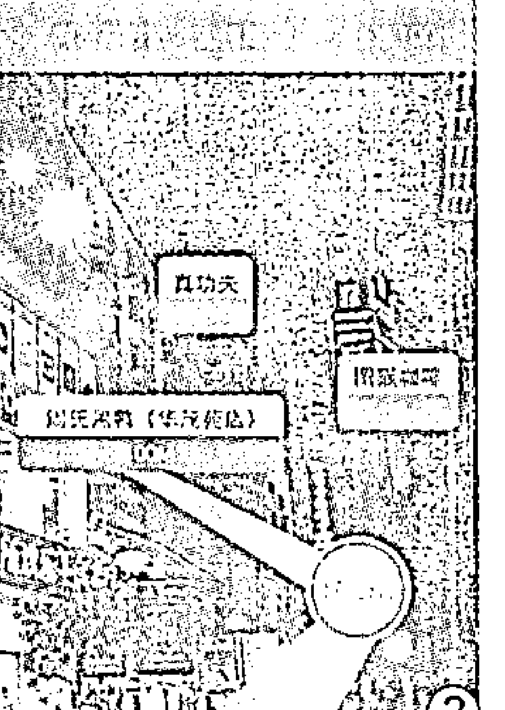

对于PC用户，因为用户并没有移动，各大地图厂商则借助街景、3D等技术实现类似的AR导航。比如百度地图用户在搜索一个精确地点后，在地图上切换到“全景”，此时在地图上会出现一个摄像头图标，点击后即进入实景街图模式（这里使用街景拍摄替代摄像头），我们可以按照图示快速找到实际地点（图4）。

从上面的描述我们可以看到，AR地图并不是一个全新的导航方式，它是在GPS导航的基础上结合AR捕捉到实际路况，让我们拥有更真实的导航效果。因此谈不上淘汰GPS导航（其仍然是AR地图的基础），只是AR地图可以让GPS导航效果更佳。

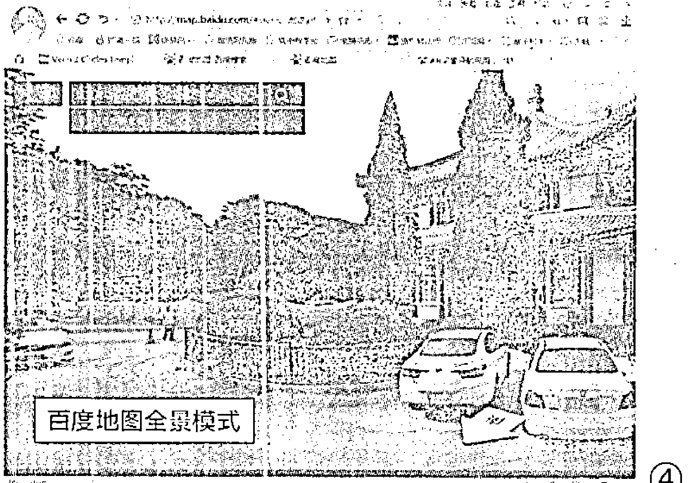

### 不仅仅是导航 AR地图的更多用处

显然我们使用地图并不仅仅是出门开车导航，因此AR地图在我们的实际生活中还有更多的应用。

#### 解决最后一公里的查找难题

比如对于“吃货们”来说，他们经常要在城市里的大街小巷寻找美食店的具体位置，美食店的大体位置借助地图可以轻松找到，不过很容易找到。当然结合手机摄像头，使用类似“随便走”这类APP也很容易找到各种美食店（图5）。

当然作为地图厂商和商家，AR地图也蕴藏着巨大商机。不同于传统地图，商家再次展示的不仅是简单店名，而是可以将店铺招牌、周边环境等展现在地图上。

#### 方便一些特殊场合远程展示

对于很多特殊场景，如远方城市的楼盘销售、旅游景点推介，由于时空隔离，作为消费者无法亲临其地进行感受。现在只要使用3D街景地图模式，可以将楼盘、旅游地的实景和地图结合起来，这样任何网友只要使用AR地图就可以身临其境般获得真实感受（图6）。

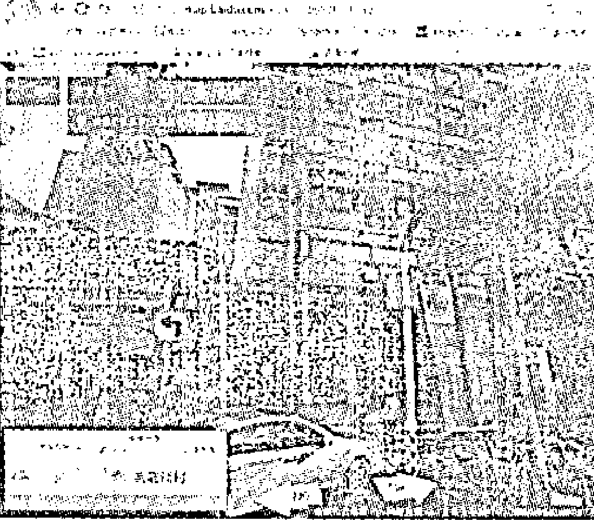


### 欲知身在何处 不仅只有GPS 文/小黑

电子地图的普及和使用，基于一个技术的普及，这一技术并非是手机，而是卫星定位，只有了解自己的位置，电子地图的交互性才能实现，否则再精密准确的电子地图与纸质地图的差别也只是显示方式的不同而已。一说到卫星定位，大家第一印象就是所谓的GPS（Global Positioning System，全球定位系统），而我们使用的GPS定位能力其实是来自美国军方开放的民用信号。虽然GPS的卫星覆盖范围广、系统成熟，但因为其军用性质等原因，我们得到的信号精度、强度、覆盖区域等其实是有较大限制的。

#### 北斗——中国人的卫星定位系统

北斗（BeiDou或COMPASS）卫星导航系统是中国正在实施的自主发展、独立运行的全球卫星导航系统。系统建设目标是：建成独立自主、开放兼容、技术先进、稳定可靠的覆盖全球的北斗卫星导航系统，促进卫星导航产业链形成，形成完善的国家卫星导航应用产业支撑、推广和保障体系，推动卫星导航在国民经济社会各行业的广泛应用。由于在建设之初就考虑到了北斗的民用能力，所以它在性能和功能等方面都有针对性的设计，这与原本只准备美国GPS和俄国GLONASS这样用于军事目的的导航系统有一些不同。

北斗卫星导航系统目前仍在建设中，导航覆盖只有中国及周边地区。它由空间段、地面段和用户段三部分组成，空间段在建设完成后将包括27颗地球轨道卫星、3颗倾斜同步轨道卫星，以及5颗地球同步轨道卫星。目前在轨的卫星（包括备份星）已有20颗以上；地面段包括主控站、注入站和监测站等若干个地面站；用户段包括北斗用户终端以及其他卫星导航系统兼容的终端（图1）。

北斗卫星导航系统将秉持开放性、自主性、兼容性、渐进性的原则进行服务和建设发展，未来会向全球用户提供高质量的定位、导航和授时服务，包括开放服务和授权服务两种方式。开放服务是向全球免费提供定位、测速和授时服务，定位精度10米，测速精度0.2米/秒，授时精度10纳秒。授权服务是为有高精度、高可靠卫星导航需求的用户提供定位、测速、授时和通信服务以及系统完好性信息。

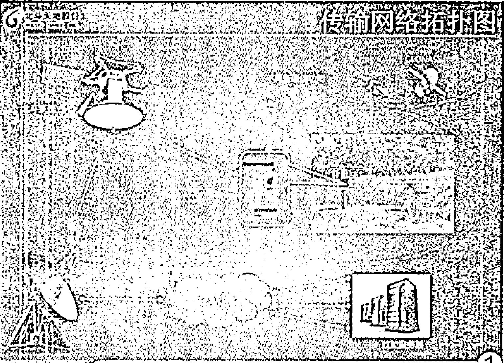

当然作为中国自己的卫星定位系统，北斗卫星导航系统会为国人优先提供更全面的服务。例如前面提到的系统构成中，5颗比较独特的地球同步轨道卫星，就是为了实现北斗独特的卫星通信而设置的。北斗用户，特别是手持有源接收器的用户在野外其实是与北斗卫星进行双向通信的，如果没有手机信号的偏远地区遇险或有什么特殊需求，可以通过北斗系统发送信息。而即使用户没有主动发送信息，双向信号的应答也让北斗可以一直掌握用户位置，无论是对于监控车辆还是意外事件的搜索都有很大帮助。相对来讲，GPS等卫星导航只提供授时信息，用户也只能被动接收相应信息，这一点的局限性在意外事件发生时表现得尤为明显（图2）。

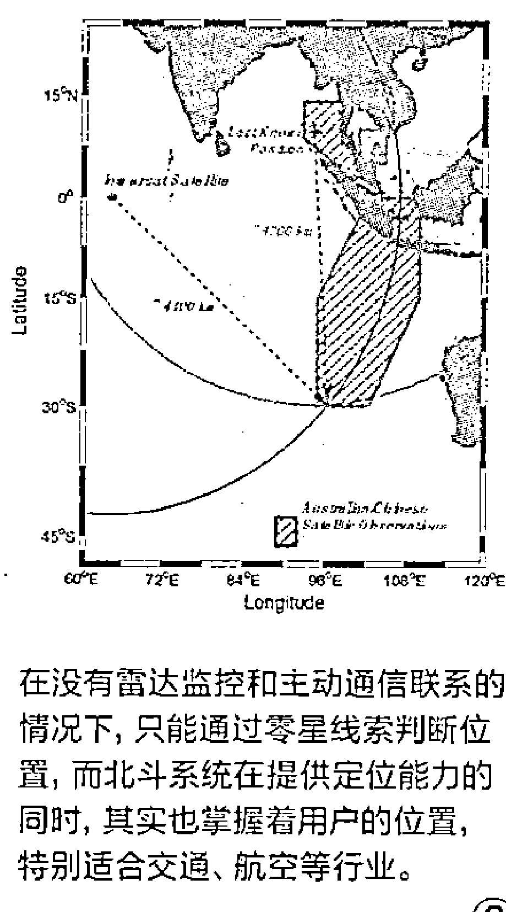

另外，虽然笔者没有查到相关报道，但北斗导航卫星的高轨道、较多卫星数量，以及同步轨道卫星等设计，很可能是考虑到我国多山地、城市多高楼的特殊情况，高轨道较密集的卫星，以及可能“固定”悬于天顶的卫星，可以在比较小的“天顶”范围内提供足够的卫星数量，以获得定位能力。原本为美国和欧洲“战场”设计的GPS，在这样的环境中表现就一直为人诟病。日本由于和我国情况类似，就发展了自己的准天顶卫星系统（Quasi-Zenith Satellite System，简称QZSS），它通过几颗高轨道和能长时间定位在天顶的卫星，在城市和山区提供GPS信号补充，获得更好的定位能力（图3、图4）。


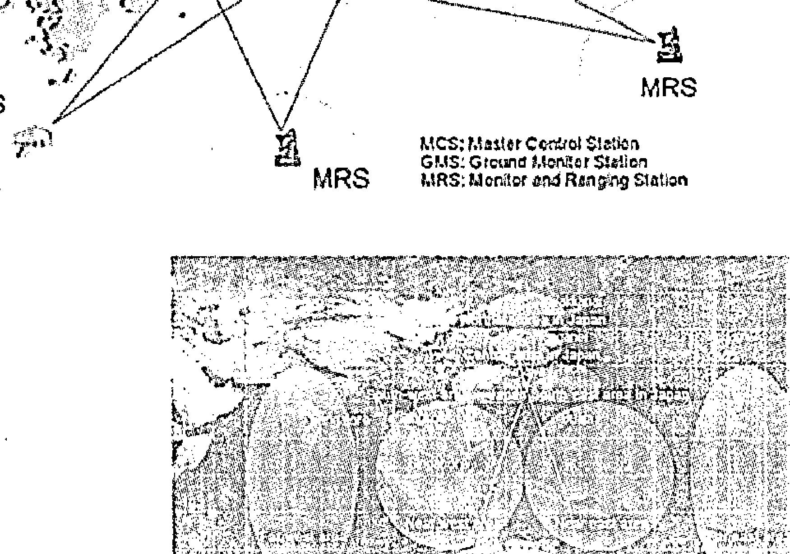

#### 通信网络——卫星定位的补充

当我们在移动设备上开启定位功能时，会发现开启移动网络和Wi-Fi网络定位的选项，而更早期的移动设备，前者曾经也被叫做A-GPS，即辅助GPS功能。

其实使用移动网络定位的原理与卫星定位非常类似，不过将一颗颗的卫星换成了一个个的通信信号塔而已。只要在手机与信号塔的信号连接中，同样加上时间信息（授时）和信号塔的位置信息，用户就可以根据每个信号塔授时的延迟来确定与其的距离。理论上讲，只要同时接收到三个授时信息，就能确定自己所处的位置。在户外，这一功能通常与卫星定位信号结合使用，可以减少对信号源数量的要求，并且加快定位速度，这也是为何将其称作辅助GPS的原因（图5）。

Wi-Fi网络定位与移动网络略有不同，因为绝大多数无线发射端没有授时和报告位置的功能，所以Wi-Fi定位实际上只能根据MAC地址识别无线发射端，再通过信号的大小推断距离。因为AP和路由器的位置变动远比移动网络发射塔更多、更频繁，位置可能不太正确，而影响Wi-Fi信号大小的因素又很多，距离也不一定准确，所以这一方式向用户报告的位置很粗略。这也造成Wi-Fi定位的一个问题，那就是发射端的位置一旦有变动，可能需要较长时间才能重新确定定位。例如用户搬家但没有更换路由器，自家连接Wi-Fi的笔记本或移动设备，以及附近使用这一功能的设备，很可能会定位在旧地址。经过一段时间后，服务商通过各个设备报告的信息整合并更新位置信息，才能为用户提供正确的位置。

与移动网络发射塔不同，路由器和AP等Wi-Fi信号发射端的位置信息是第三方提供的，所以还涉及到一个很敏感的话题，那就是隐私。苹果、Google、Skyhook等提供Wi-Fi定位服务的厂商，实际上需要不断地主动采集（如通过采集车不断巡逻）无线发射源的位置及MAC地址，或手机用户移动设备的信息来进行更新位置信息，但对不希望透露这些信息的用户，无论是设备，还是服务提供商，都没有提供很好的保护措施。当然“出卖”自家路由器位置信息对用户也有一定的好处，除了让自己的移动设备能快速提供粗略位置外，连接在同一个路由器上的台式机也能获得相应的位置信息，让台式机可以更方便地使用电子地图进行路线规划等应用。

#### 北斗设备选择

既然北斗在国内已经实用化，而且有很多好处，那么相应的设备是否已经上市，是否值得选择呢？答案当然是肯定的，下面我们就来看一看其中性价比较高的几款。其实随着北斗系统的成熟，目前许多品牌的手机已经开始普遍支持北斗卫星导航系统。

##### 中兴红牛V5 Max

中兴红牛是一款普及性高性价比手机，V5 Max（图6）是其中相对高配的型号。它采用5.5英寸1280×720屏幕，内置高通骁龙64位处理器，带有2GB内存和16GB存储空间，配有1300万+500万摄像头，支持移动、联通双4G双卡双待。它同时支持GPS、GLONASS、北斗三大卫星导航系统，有更强大的空间定位能力。

##### 三星Galaxy S5

除了内地厂商，很多三星手机的内地/亚太版产品也支持北斗卫星导航系统，例如它最新的Galaxy S7，不过考虑到价格，我们认为三星Galaxy S5（图7）更值得考虑。虽然已经推出了一段时间，不过三星Galaxy S5的处理器、内存、摄像头等配置与今天的主流产品没有太大差别，性能完全值得信任。另外Galaxy S5较高的三防能力，也与北斗出色的偏远地域定位优势很配。

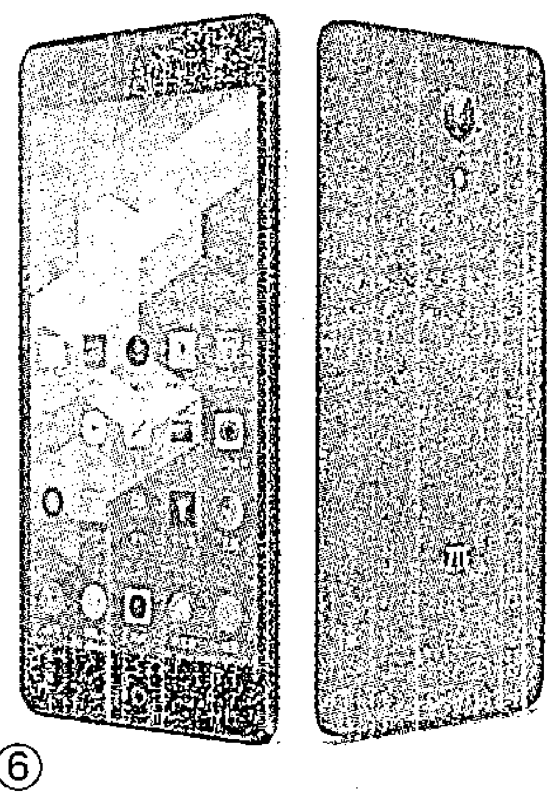

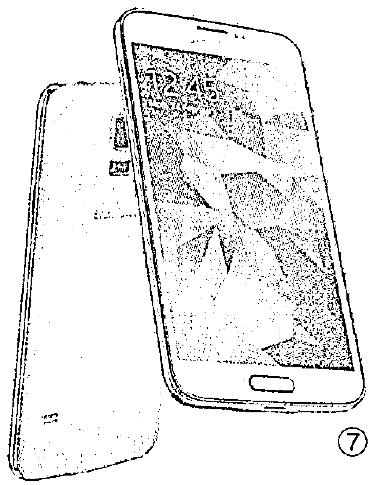

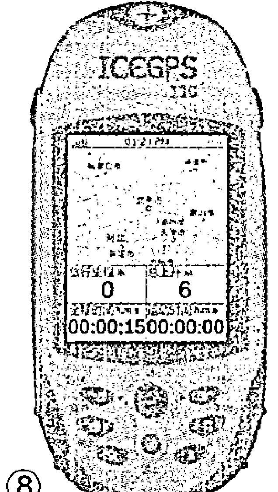

##### 冰河110手持导航仪

对专业、半专业用户来说，专用的手持式GPS远比手机更加实用，冰河110就是一款支持北斗卫星导航系统的手持式GPS导航仪（图8）。这款产品采用2.2英寸320×240分辨率半透视屏幕，在阳光下显示更清晰；3节AA电池或锂电池可使其连续工作20小时以上；可支持最大32GB的TF卡，内置高品质陶瓷天线。

作为专用手持导航仪，它的定位导航能力比手机要强大得多，例如支持近百种国内外坐标系，支持三参数推算，支持IMG矢量地图、光栅扫描地图等多种地图格式，支持3000个航点、最高10000点的航迹、最高1000点的航线，可提供日月升落时间及月亮形状，可测量直线、曲线长度和面积。

比较遗憾的是，北斗卫星导航系统的短信通信功能目前只开放给一些更专业的用户和设备，普通用户还无法体验到这一功能提供的便利。

### Excel巧做三维餐饮点地图

文|马震安

分享美食地图是现代年轻人的快乐和骄傲，如果能将当地一些有特色的餐饮商家的基础信息存放在Excel工作表中，并制成三维数据地图，分享给自己的朋友，相比一些数据列表来说，阅读效果将更加直观。接下来，我们就讲述如何在Excel 2016中制作三维餐饮店地图（图1）。

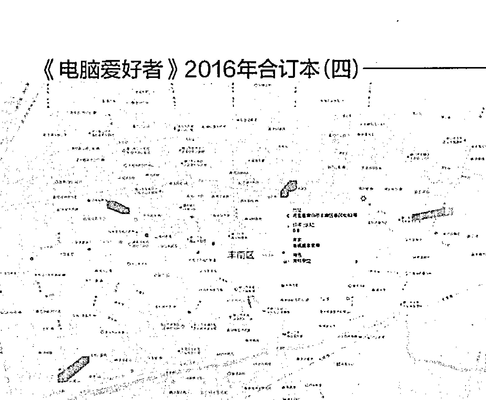

#### 地图数据巧收集

要想使用Excel自带的三维数字地图定位到某个餐饮单位，就需要有它的具体的地址。那么这个具体的地址怎么找呢？我们可以使用“百度地图”找到相应的餐饮单位，右击它选择“添加新地点”，在出现的“用户反馈”窗口中复制“地址信息”中的内容到Excel工作表中就可以了（图2）。

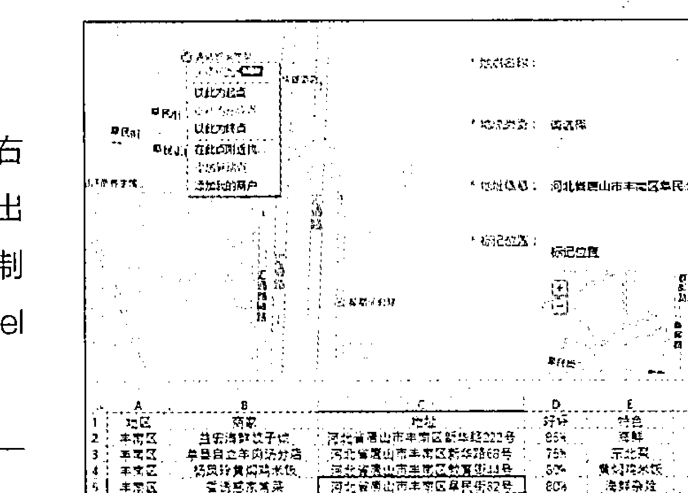

#### 三维地图巧设置

选定数据区域中的某个单元格，点击“插入”选项卡演示区域中的“三维地图→打开三维地图”。在地图编辑窗口右侧点击图层1处的第2个按钮，对图层进行重命名；在位置处点“添加字段”，选择区域下的“地址”，点“地址”右侧的向下箭头，选“街道”；在高度处点“添加字段”，选择区域下的“好评”，点“好评”右侧的向下箭头，选“无聚合”；在类别处点“添加字段”，选择区域下的“商家”（图3）。

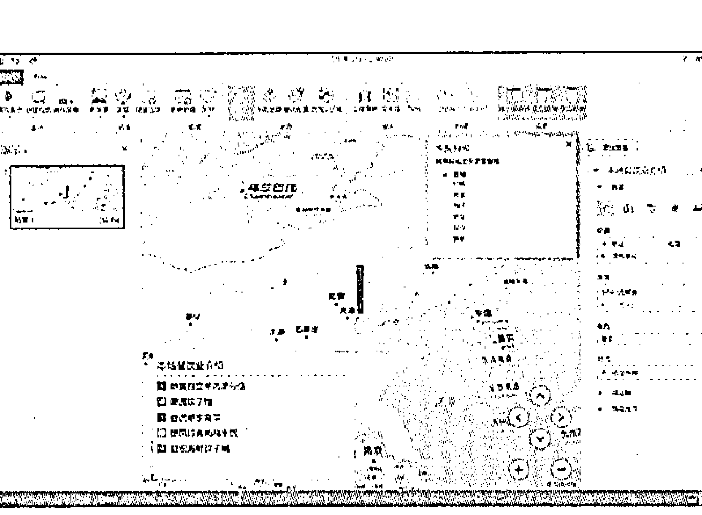

接下来，利用控制地球的按钮来调整数据地球的显示角度。这时，我们发现柱形太高、太粗，查看非常不方便。为了解决这个问题，可以展开“图层选项”，通过调整高度和厚度来设置柱形的大小（图4）。

同时，为了让鼠标放在柱形图上显示更多信息时，可点击“自定义”按钮，在弹出的窗口中点击“添加域”，在区域下选择要添加的字段名（图5）。所有场景添加完成后，点击“播放演示”，看一下最终效果。当然，也可以将最终的效果输出为视频文件。

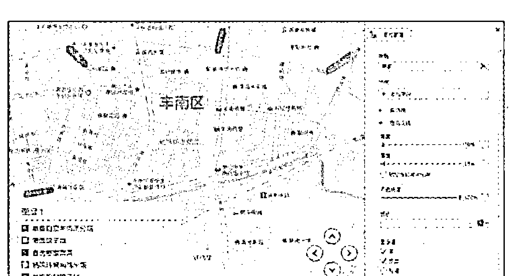

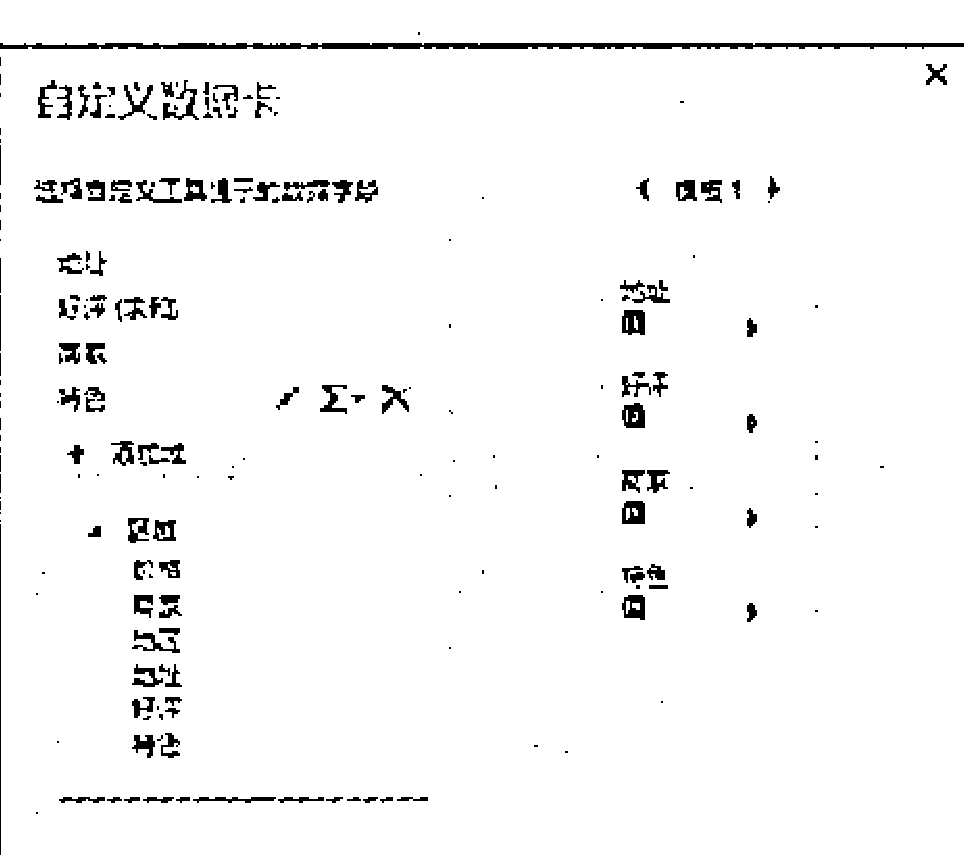

#### 巧用地图汇自动生成三维地图

文|刘英

除了用Excel图表制作三维数据地图外，我们还可以利用更为方便的在线服务或移动APP制作。

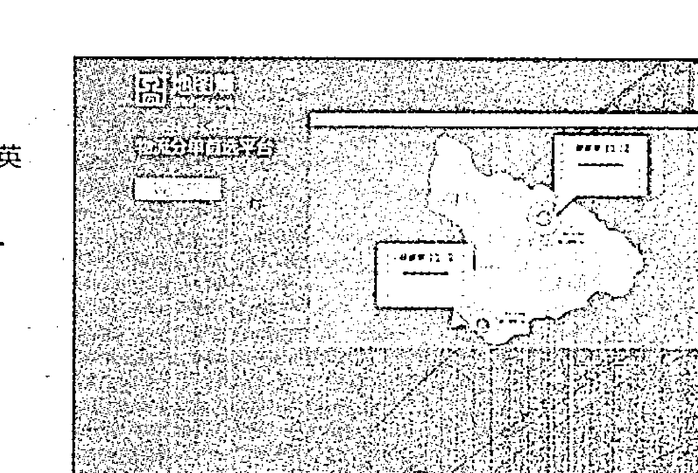

##### 接入数据地图网络服务

首先登录“地图慧”网站（http://www.dituhui.com/），在地图慧提供的三大块服务中（包括“大众制图”、“企业服务”和“商业分析”），“大众制图”模块也就是早期版本的“地图汇”。对于个人用户来说，可用这一模块来制作属于自己的数据地图（图1）。

##### 选择制作所需地图模板

移动鼠标到“大众制图”，然后在浮出的菜单中点击“制图”按钮进入直接环节。接下来选择地图模板，这里我们选择一个“柱状统计地图”模板（图2）。

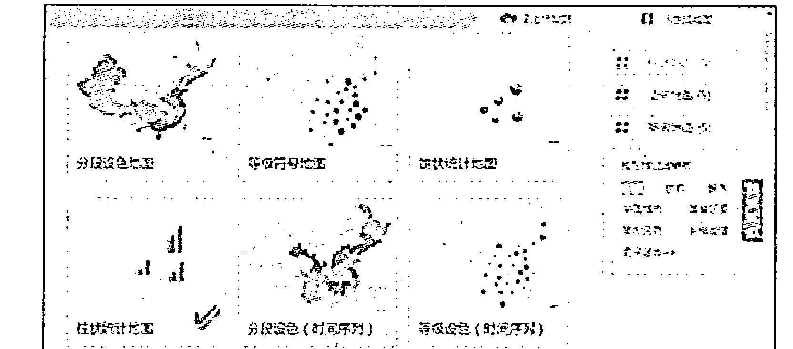

##### 准备地图所需表格数据

制作数据地图首先要准备好数据表格。所需表格格式要制作成形如网页提示的表格格式，通过任何版本的Excel软件制作均可，支持Excel默认的表格格式和CSV文件格式。这里我们制作一个山西省各大区肯德基和麦当劳分布的地图（说明：数据为虚拟，不代表企业利益），Excel表格数据如图所示（图3）。

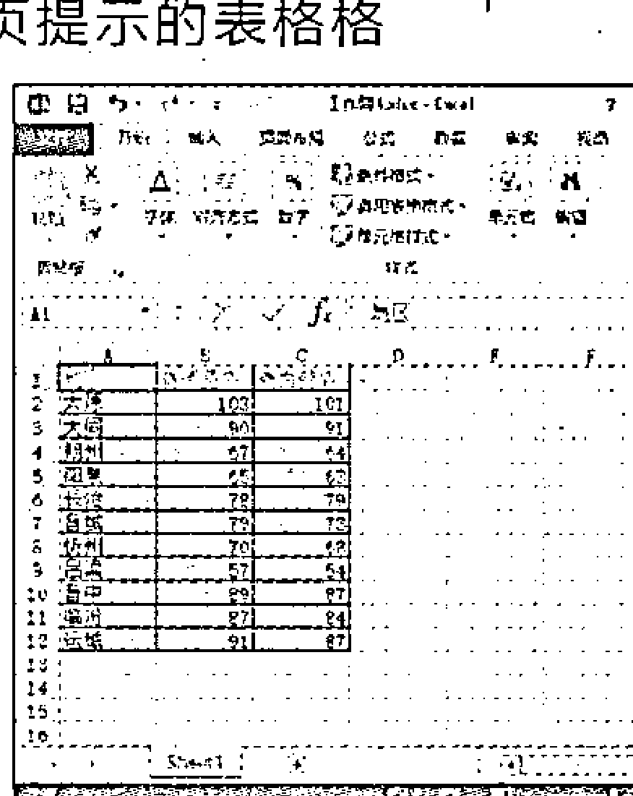

##### 上传数据生成三维地图

接下来上传上述数据，自动生成三维数据地图。Excel数据准备好之后，点击“上传数据”按钮上传数据（图4）。之后，根据系统提示设置地图标题、介绍、标签等文字，点击“保存”按钮保存数据。系统就会根据所提供的数据自动生成三维图表（图5）。

小提示

制作过程中可能用到的数据资源，有的需要自己准备，但还有一些公众数据可充分利用网络上的大数据资源。切换到“地图慧”的“数据”频道，从左侧点击需要获取的数据类别，从地图上方选择需要获取的城市或直接点击区域位置，可钻取至下一级地区，在地图上移动鼠标到相应的地区，显示获取大数据。

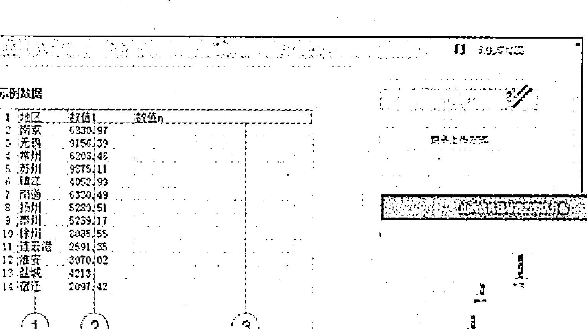


#### 扩展阅读：

我们还可以用自己的手机下载“地图慧”APP，随时随地用“看图”功能搜索自己需要的地图，用“制图”功能标记属于自己的地图，用“聊图”功能将自己制作的地图与大家分享。此外，还可用“地图慧小管家”在线制作地图、离线下载地图，离线下载的地图仍可嵌入到PPT、Word、Web等环境中。

### Windows 10应用实现多样互动 文|刘英

对于互动的应用，其实在Windows 10环境下就有许多成熟的资源可选。就像用来人际互动的系统自带应用Skype软件，以及在应用商店中可以很方便地获得的、用来进行好友位置互动的奥维互动地图，我们可以充分利用它们来完成好友之间的信息互动。

#### 人际互动——使用Skype在线视频通话

不需要第三方通信工具，使用Windows 10自带的互动应用Skype，可实现好友之间的在线视频通话互动。

可直接使用Windows 10的网络账号登录Skype，只需在Windows 10网络账户中启用Skype，启动Skype即可登录（图1）。

首次使用Skype会要求你输入电话号码，这样做的好处是别人可以通过你的电话号码找到并添加你为好友。当然，电话号码的输入也不是强制的，如果你不愿意这样做，可以点击“稍后再验证”链接，跳过验证（图2）。

Skype软件视频通话需要摄像头的支持，设备正常连接后会实时显示你的头像。如果没有检测到摄像头设备，系统会提示没有找到摄像头，需要检查硬件连接或软件设置的摄像头部分进行通过（图3）。

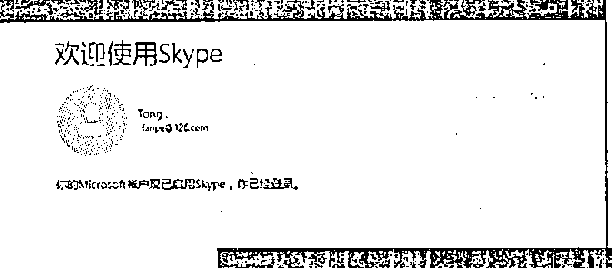

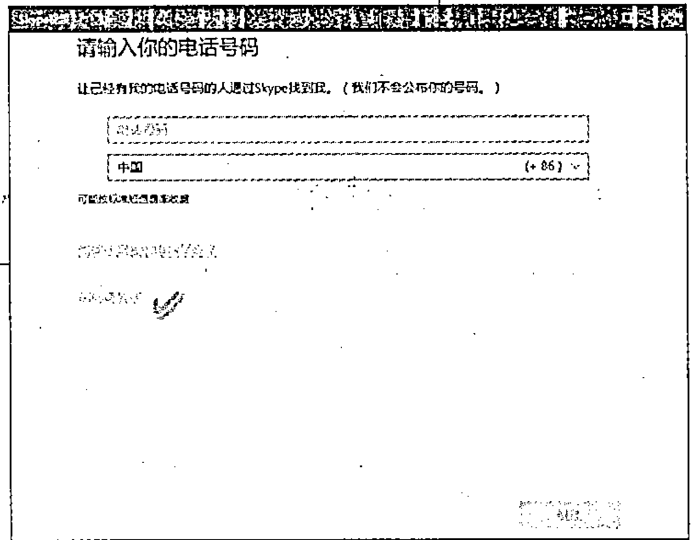

使用Skype进行联系需要先添加联系人，可直接通过Windows 10的通讯录进行联系人的添加。与此同时，通过Skype软件设置窗口，还可以选择联系人在Skype上找到你的号码，选择来电或消息到来时的通过开关。如果要添加不在Windows通讯录中的联系人，则可以通过用户的全名、Skype用户名或用户的电子邮件来搜索添加（图4）。

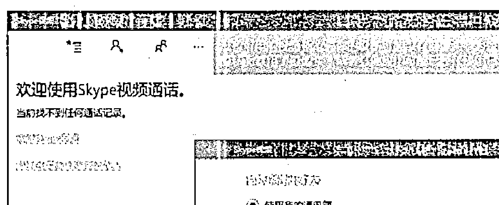

如果你的朋友还没有使用Skype，你还可以通过邮件来邀请他。

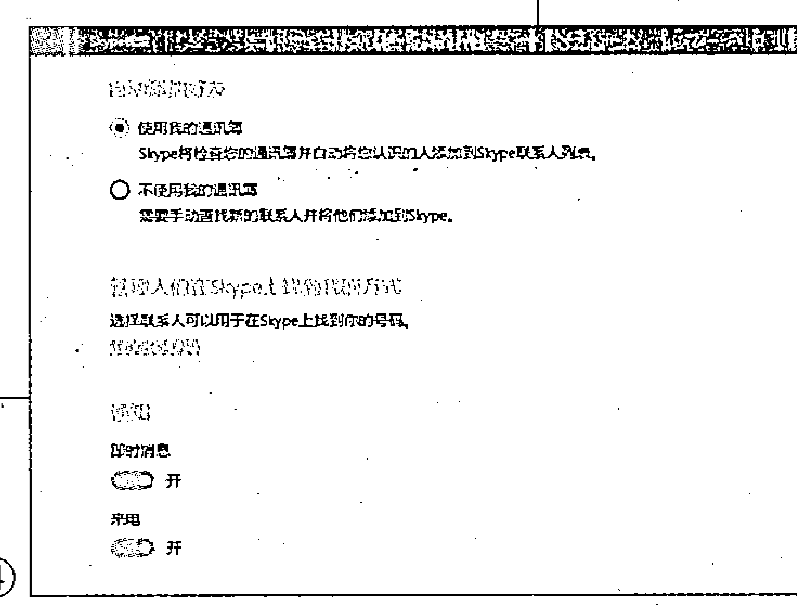

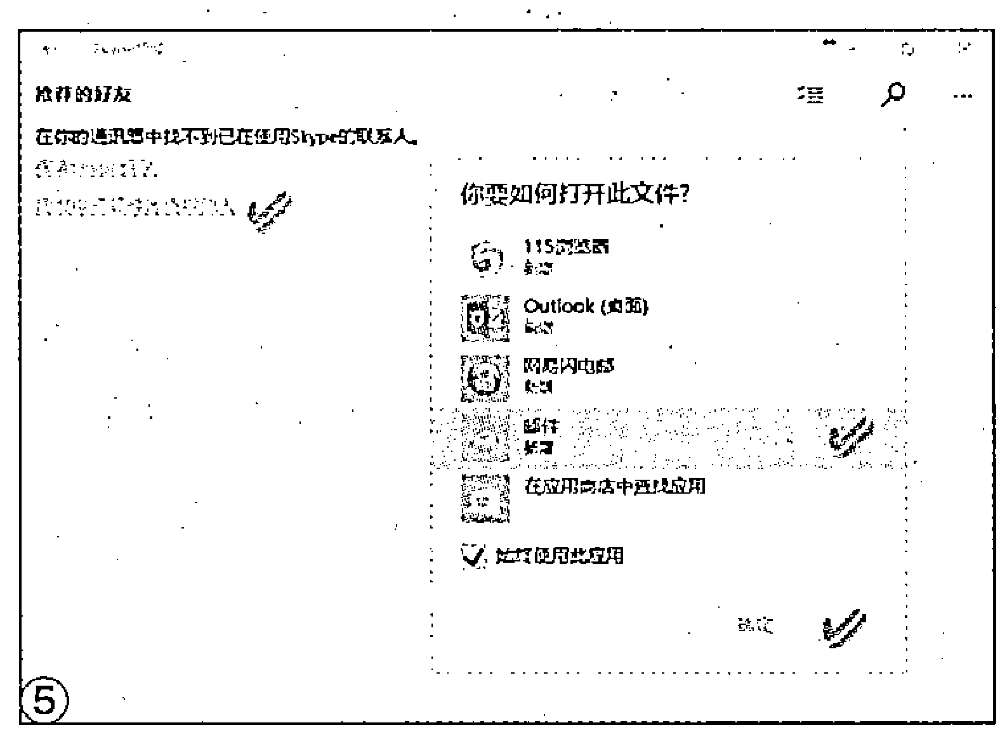

邀请其加入到Skype视频聊天中。点击邀请链接，选择用来发送邀请邮件的客户端，确认发出邀请。对方收到后，像你一样加入到Skype中，就可以相互进行视频聊天了（图5）。

通过系统自带的“人脉”应用，你也可以搜索到你需要联系的好友，并添加到Skype聊天联系人列表当中（图6）。

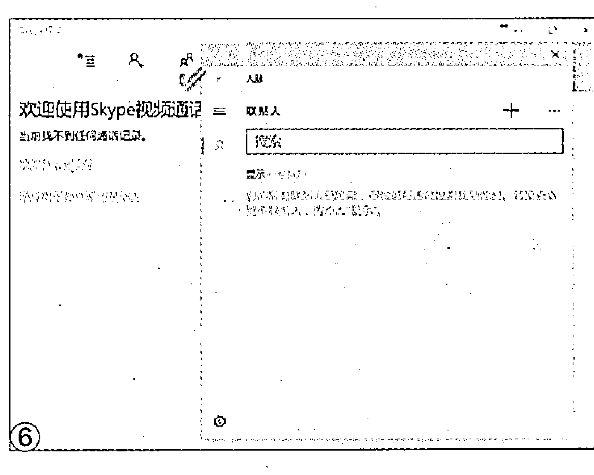

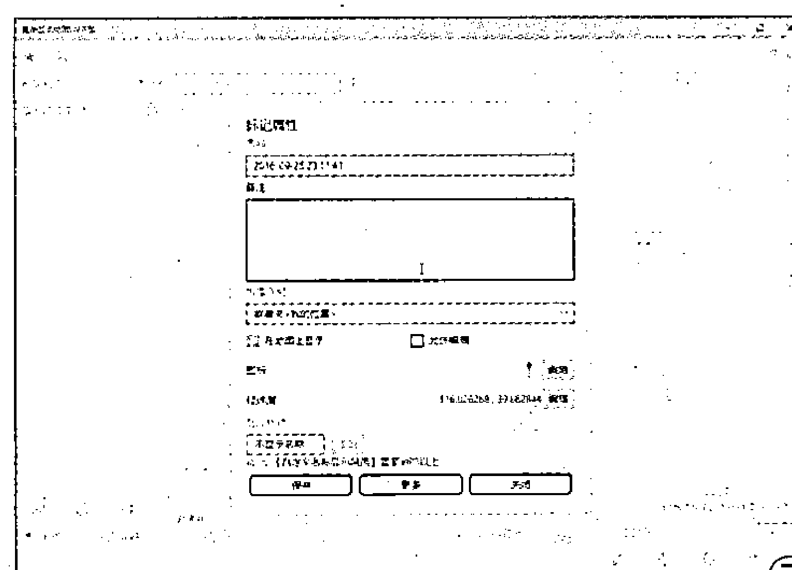

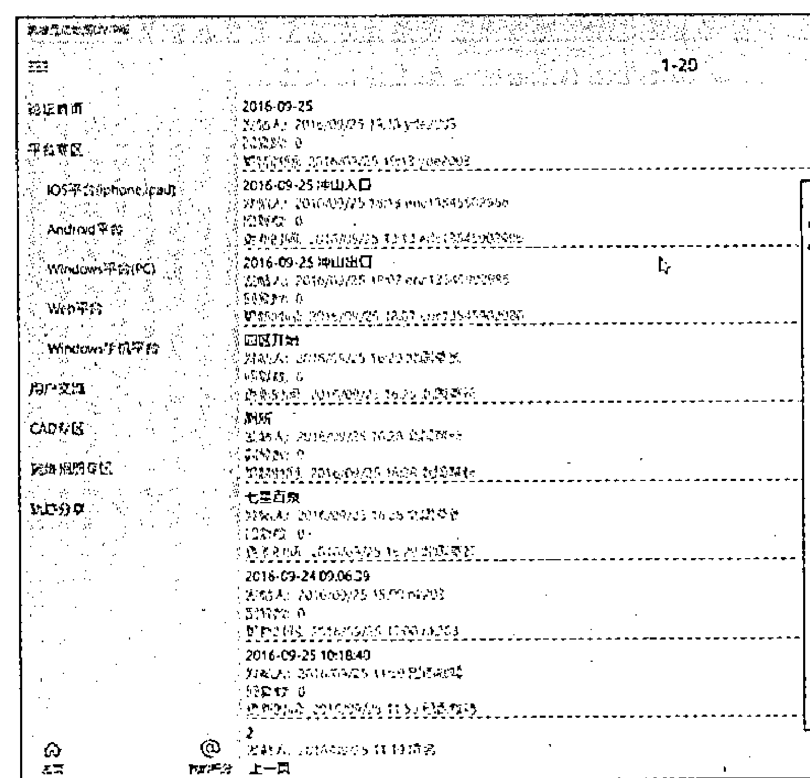

#### 地图互动——奥维互动地图实现透明分享

除了用语音视频进行在线互动和信息共享外，我们也可以用地图互动的方式来进行好友位置的显示。利用奥维互动地图这款Windows UWP版应用，就可以实现这一想法。

首先需要在Windows应用商店中搜索和安装这一应用。

奥维互动地图集成了Google地图、卫星图、Bing卫星图、百度地图、搜狗地图，支持全球地图离线下载、全球语音导航，能够进行好友位置的分享，记录行走轨迹和提供实时路况。软件还具有指南针功能，是驴友出行、出国旅游的辅助好“秘书”。

#### 与好友间的位置互动分享

在你外出的时候，如果希望家人或好友获知自己所在的位置，可通过该地图将瞬即某一时刻的位置分享给家人或好友。这可以让他们非常直观地了解到你在地图上的位置。位置的分享可以是向指定人的分享，可以是有限的小范围分享（图7）。

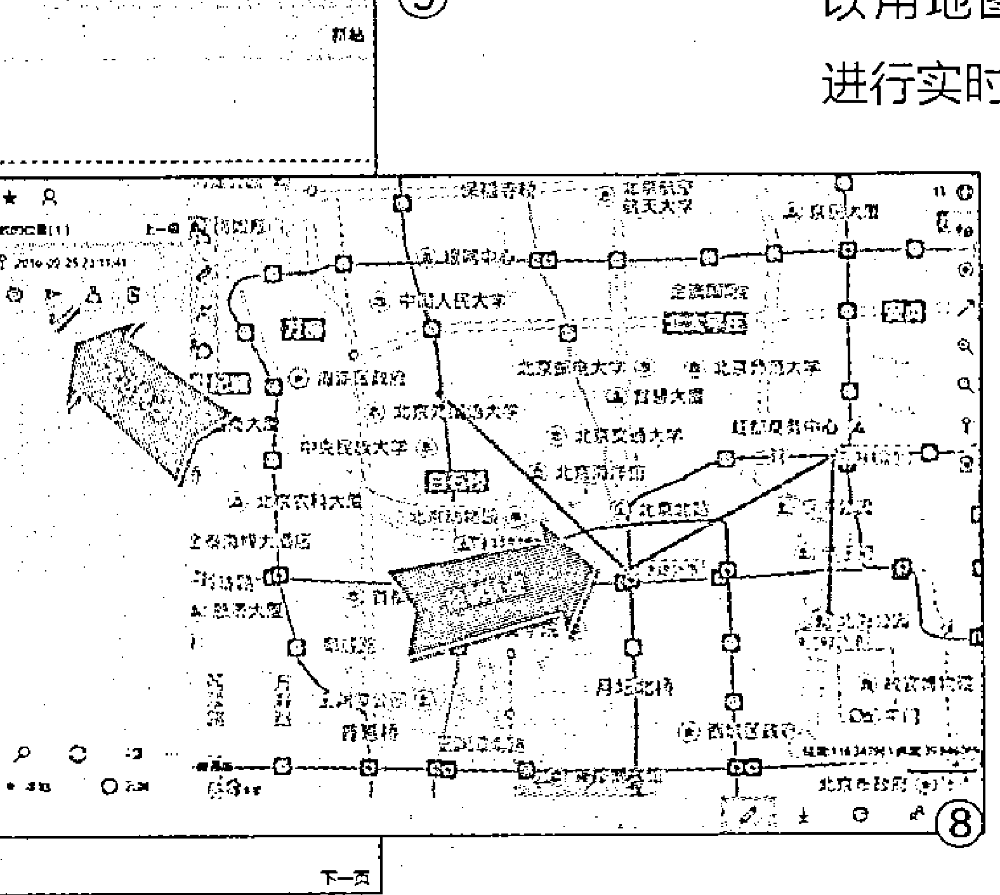

#### 地图内实时聊天与信息分享

类似于使用QQ或Skype聊天，你还可以在奥维互动地图上与好友实时聊天。在聊天的同时，还可以插入当前位置的标志、出行方案、自动绘制的地图等。好友收到信息之后，一点击信息就可以显示在他的地图上。

此外，如果好友要到某个地方而找不到如何走，你可以在地图上轻松绘制一条线路，发送给好友，好友可以非常直观地按地图线路的指示行动，从而快速到达目的地（图8）。

#### 用内嵌论坛与Web平台互动

利用奥维互动地图不但可以用地图位置和聊天的方式进行实时位置和线路的互动分享，此外，软件还内嵌了互动论坛，通过论坛提供的高速引擎和数据浏览，与用户进行交流，或用户也可以分享自己的活动轨迹供其他人下载使用（图9）。

# 《电脑爱好者》2016年合订本(四)

## 办公学习 寻求软件的高效互动 文|刘英

无论是学生学习，还是员工工作，用好互动软件能够极大地提高学习或工作效率。因此，在学习或工作过程中，善用互动类软件是聪明之举。

### 互动分享 作业再无忧

身边有中小学生的朋友，或自己不久前就曾经是中小学生的朋友，一定对繁重的“中国式”作业负担并不陌生。的确，孩子作业负担太重，半夜12点之后做不完作业是常事，以至于不少有条件的家长为了逃离繁重的作业而不惜重金让孩子出国上学。那么，出不了国的同学就只能忍受着繁重的课业了吗？也不见得，寻求一些方法还是能有所缓解的。例如，可以借助于得心应手的作业工具，这样对提高作业的质量和速度也大有裨益。

为此，可以使用“互动作业”这款应用，为提高作业效率服务。“互动作业”可以分享学生作业的标准答案和解题思路、不同的解题方法，覆盖从小学到高中的各科教材、练习册。学生朋友们再也不用为一道难题答不上来，熬夜到半夜12点之后了(图1)。

### 英语口语 请来好“教练”

学习英语，培养良好的口语能力非常重要。而口语的培养要从小做起，如果等养成了不良的口语习惯之后再行改正就比较难了。因此，从小学或更早阶段进行口语练习比较好。一款人教版的小学英语口语听说训练互动软件“人教口语教练”，非常适合于从头练习英语口语。该软件虽然主要针对小学生，但对于从头培养英语口语的人来说，不分年龄和层次，都非常适合(图2)。

口语教练采用ARIVOC智能语音分析技术，将根据用户发音的情况进行评价，并帮助用户纠正错误发音，快速提高口语水平，做到了“口语教练”和“一对一”学习，帮助学生走出哑巴英语的学习困境。

将移动应用安装在手机平板等移动设备，点击“START”键即可开始练习。练习时如果感觉达标比较难，可以对通过分数进行设置，找到适合自己练习的水平。具体操作方法是在主页上点击“系统设置”，选择适合的“单句过关分数”即可。练习时，如果有的句子看不懂，可以将需要练习的句子的中文翻译在练习时显示。具体操作方式是在主页上点击“系统设置”，将屏幕最下方的“显示翻译”功能打开即可。如果想跳过已经熟练掌握了的句子，不跟着原来的顺序练习而仅练习自己想练的句子，点击练习页右上角的小图标，可随意在“老师指导模式”和“单句选择模式”间切换。如果仅想练习其中的部分句子，将“单句选择模式”开启即可。

### 师兄帮我游戏学英语

英语学习软件千篇一律的人机对话模式，很容易让人感觉到枯燥乏味，为此，更有乐趣的人机交互学习方式，将更有助于提高学习兴趣和效率。这里推介一款有道词典情景互动游戏“师兄帮我学英语”，这是一款游戏互动式的英语学习检测软件。使用这款软件，可以让你在与几位漂亮师妹的互动中，快快乐乐地掌握英语知识。

进入后，点击“立刻帮助师妹”按钮开始学习吧（图3）。

接下来选择你想要帮助的师妹，首次使用只能选择第一位，后面的两位都加锁不能选择，等通过前面的之后才能顺序进行（图4）。

题目将以选择的方式呈现，直接点击选项即可（图5）。如果对选项中的单词或项目的含义存在疑问，可将鼠标浮动到选项上显示释义，或者直接点击右下角的“点击求助有道词典”来寻求解释（图6）。

该软件在网络浏览器中在线运行，访问 http://sx.youdao.com/

### 用好工具 实现跨越式互动

信息的互动不但包括人与人之间、人与机器之间的互动，软件与软件之间的互动更加不能忽视。充分利用当今网络软件的便利，我们不但要用好每一网络软件的互动功能，更要能打通软件之间的信息互动。例如，用有道云笔记结合微云、微信、OneNote等实现信息互动。

首先在微信中关注有道云笔记、微云、微软云笔记等公众号，关注之后当我们在微信公众号中看到好文章时，或看到有用的图片需要收藏时，只需点击右上角的分享菜单，从中选择将信息分享到有道云笔记、微云、微软云笔记等软件环境中（图7）。

随后，我们无论从哪种平台的哪种系统中，进入到有道云笔记、腾讯微云、微软OneNote等环境下，均可以看到我们先前收藏的精彩文章（图8）。这就是软件之间进行跨越式互动的魅力所在。

## 不仅是地图 更多人机联动奇门技巧 文/技术宅

现在地图功能越来越强大，交互性也越来越强。其实除了地图外，还有很多软件可以实现类似地图数据那样的人机交互。下面我们就一起来盘点一下那些人机联动奇门技巧。

### Windows 10里的GPS

#### 使用事件查看器查看系统活动

很多时候我们经常要查看系统活动，比如为了监控孩子使用电脑的时间，我们要看看电脑是什么时候开机、关机；为了看看用户有没有运行网络游戏，我们需要查看用户是否访问了游戏目录。其实这些系统活动就像是我们日常的出行，GPS可以记录我们的运行轨迹，Windows 10自带的事件查看器同样会在后台记录系统的活动。

如上所述，为了监控孩子使用电脑的时间，我们经常要看看电脑是什么时候开机、关机，以找到他们深夜还在使用电脑的证据。对于系统这类活动，进入Windows 10后在搜索框输入“事件查看器”，启动该组件后展开“Windows日志→系统”，在右侧日志窗格点击“筛选当前日志”，在打开的窗口事件级别勾选“信息”，事件来源选择“Winlogon”，其他选择默认设置（图1）。

点击确定后返回事件查看器窗口，这里可以看到很多“Winlogon”事件，其中ID为7001表示系统登录（即开机），7002则为注销事件（关机），这样根据事件ID记录的时间就很容易知道用户开、关机时间了（图2）。

如果要查看用户对某个目录的访问，则可以先进入组策略编辑器，展开“计算机配置→Windows设置→审核策略→审核对象访问”，将其设置为开启成功和失败的审核（图3）。

打开资源管理器，找到需要审核的目录，右击选择“属性→高级→审核”，在打开的窗口点击“添加→选择主体”，然后选择当前登录账户，审核类型选择“全部”，这样用户访问该目录的时候就会激发审核事件（图4）。

完成上述的操作后，只要当前登录账户访问上述指定的目录，系统的事件查看器就会自动记录。同上启动事件查看器后展开“Windows日志→安全”，在右侧找到任务类别为“文件系统”，其中审核成功的事件就表示用户成功访问了该目录，这样通过事件记录就可以知道用户是否访问了该目录（图5）。

> **小提示**
>
> 系统里还有很多记录的事件可以让我们查看运行轨迹，比如出现非正常关机或其他磁盘错误时，Windows 10重启后磁盘扫描过程只会显示一个正在扫描和修复驱动器的提示，以及扫描的进度百分比，而不再显示详细的磁盘扫描结果。此时就可以通过事件查看器查看ID号26226的事件，即可看到详细的扫描结果。其他ID事件的说明请查看系统帮助文档。

### 第三方系统GPS

#### 使用ManicTime定制系统活动

使用系统自带的事件查看器虽然可以方便地查看系统活动，但是毕竟系统活动有很多，事件查看器无法那么全面地进行记录。比如现在大家花在电脑上的时间越来越多，不过一天下来很多朋友却发现想要做的工作并没有完成。那么我们在电脑上到底做了些什么？时间到底消耗在什么地方？现在借助ManicTime就可以准确记录你在电脑上的所有活动。

启动软件后它就会在后台自动对当前系统的所有活动进行记录，为了更直观地看到你花在电脑上的时间分配，建议让程序运行一段时间后再进行查看。可以看到ManicTime会记录包括你使用程序（如Word、Excel）、上网浏览（包含网页标题）、邮件程序等的起始时间，而且会以柱状图方式直观地标示出来（图6）。

如果要查看花在某个程序上的具体时间，只要在右侧窗格勾选程序名称，这样在时间轴上会显示什么时间段在使用哪个程序，每次使用的时间等等信息。当然很多朋友会在电脑上执行很多操作，如上网浏览、聊QQ、微信、收发邮件、玩网游等，这样图示内容就较多。如果需要精确查看某一项目所花的时间，则可以使用过滤功能。比如现在需要查看电脑上操作持续时间超过5分钟的事件，那么只要在过滤器输入“duration>5m”即可，这样浪费时间的程序可以很快查找出来（图7）。

当然ManicTime还支持更多自定义操作对电脑时间进行查看。比如我们要统计一下花在淘宝网上浏览的时间，只要在时间栏的程序上右击选择“创建自动标签”，在打开的窗口按下列的提示设置标签参数（图8）。

这样返回程序窗口后，只要程序标题包含“淘宝”字样的时间就会被ManicTime自动统计，我们可以随时在时间线上切换到“自动标签”，这样即可在程序主界面上看到ManicTime为我们统计的在所有淘宝网上花费的时间了（图9）。

完成时间统计后我们可以在程序主界面随时切换到“统计”，设置好开始和结束的日期，这样在报表中则可以详细查看到当天花在各个程序上的时间。当然也可以按周、月统计，然后根据报表统计，在下一个时间段更好地安排自己的时间（图10）。

## LBS玩法无极限 文|南城司

除了我们常见的LBS服务外，其实通过一些简单的软硬件扩展和使用技巧，我们还可以获得很多属于自己的乐趣。例如通过增加GPS模块，可让内容创作能力更强的笔记本/二合一电脑或者单反相机等设备也拥有定位能力；而在最常见的一些地图服务中，也隐藏着很多实用却鲜为人知的小秘密（图1）。

### 为笔记本增添位置服务

虽然数码移动产品的功能、性能都已经相当强大，成为了我们须臾不能离身的伙伴，接管了从生活娱乐到工作办公的各种事务。但至少到目前为止，它们在内容创建方面的表现，仍然难以和PC相比，所以很多用户在长途旅行时，还是习惯性地带上一台笔记本电脑。

在旅途中使用笔记本电脑处理一些事务时，已经在移动平台上习惯了使用位置信息的我们，可能经常会感到很不方便。例如通过电脑的大屏幕，我们希望通过卫星图更直观地观察周围场景，或者更方便地规划一条复杂路线时，却发现并不能准确定位目前的位置。其实笔记本电脑拥有通用性出色的USB接口，为其扩展定位能力并不是什么困难的事情，只需要购买一个USB接口的卫星导航模块即可。

#### UB172 Windows专用USB GPS模块

这是一款小巧易用的USB卫星导航模块（图2），外形和安装方法都很像一个小型U盘（图3），当然用户还需要为其安装驱动程序才能正常使用。从其标示就可以看出，它同时支持GPS与GLONASS卫星导航系统，在其中一个系统出现问题的时候，或者信号覆盖不足的地方，可以互为备份。

在厂商的说明中特别提示大家，它的驱动程序可能会和某些USB 3.0控制器冲突，但与USB 2.0的兼容性没有问题，而且只有USB 3.0接口时，厂商建议可以连接USB集线器使用。笔者建议，如果是使用较新的笔记本、二合一电脑或超极本的用户，购买前最好首先了解一下自己的电脑是否有USB 2.0接口，并且购买后抓紧测试一下，如有问题及时退换。

它还有一个价格、配置、功能、使用方法等几乎完全一样，但提供了2米USB连线的版本（图4）。如果用户是在室内或者车内使用笔记本电脑的话，可将USB接收模块放在窗口或车窗以获得更好的信号。当然它也同样有着直插型产品的问题，因此使用USB 3.0接口需要注意。另外如果在车上使用的话，应注意让接收模块远离车载电脑等干扰源。

#### USB、蓝牙两用GPS模块

除了笔记本电脑外，有些人应该也希望自己的iPad等平板设备也能有更好的定位能力，那么这款USB、蓝牙两用GPS模块（图5）应该是最好的选择之一。它可以通过USB连接笔记本电脑、二合一电脑等设备，同时也可以通过蓝牙协议连接iPad、iTouch（iOS系统需越狱）或没有GPS定位能力的Android平板电脑，而且可以通过这两种方式同时为两个设备提供定位信号。
这款产品使用USB供电方式，没有内置电池使其外形可以保持小巧，但即使采用蓝牙连接方式时也必须连接USB口才能使用。

好在它对供电能力的要求不高，设备USB口、车载点烟器USB供电、移动电源供电都可以支持正常使用。

#### 360行车记录仪GPS模块

从名称就可以看出，这是一款专用型GPS功能扩展模块（图6），只能与第二代360行车记录仪搭配使用，可以为其增加定位相应功能，例如电子狗探测等。其实类似的定位模块还有很多种接口，例如串口等，可适应各种不同的设备。

### 摆脱手机更轻松 穿戴式GPS设备

与需要创作内容的用户携带相对笨重的笔记本电脑以便进行野外工作不同，还有一些人身上的设备越少越好，最好连手机都可以不用随身携带，但同时也希望能有定位服务，比如出外锻炼的用户等，那么支持GPS的穿戴设备应该是最好的选择。

#### AMAZFIT华米运动手表

AMAZFIT华米对很多人来说可能是个不太熟悉的品牌，其实它就是小米手环的出品厂商，相信有很多人都在使用着华米的产品。华米运动手表是这一品牌向高端探索的产物，但仍然保持了圆润可爱的外形（图7）、易用方便的设计，以及高性价比的市场定位。

华米运动手表自带GPS，可脱离手机记录GPS实时轨迹、里程、海拔等数据，并进行心率和运动数据测试，生成配速等数据（图8），其数据除了使用专用APP查看外，还能转入小米运动APP。它采用1.34英寸320×300分辨率触控屏，由于采用反射式+自动背光调节屏幕，所以可以采用常亮模式，而且在阳光下的效果更好，在夜间也不会过于刺眼。它的防护等级达到IP67，在大雨中或淋浴时都能正常佩戴使用，只是游泳时需要考虑深潜谨慎使用。其手表状态续航时间可达11天，GPS+心率测试的运动模式续航时间为35小时。

作为一款智能穿戴产品，华米运动手表还支持通知提醒、消息推送、来电拒接/接听、支付宝二维码等功能。另外它还提供了2.4GB左右的内置空余容量，可存储歌曲，通过蓝牙耳机播放，在不携带手机时也能有音乐陪伴进行运动。

#### 小天才电话手表Y02

面向儿童的智能手表在功能设计上与我们常见的智能穿戴设备有很大的不同，例如它的配置和性能实在乏善可陈，但却和手机一样可以同时使用卫星、基站和Wi-Fi信号，可以快速定位用户。我们比较推荐的是支持防水能力的Y02型号（图9），尽管其价格稍贵，但功能更全面，较高的防水能力更是特别适合孩子的实际生活状态。

### 活用网页版地图

在大家都已经习惯了使用移动智能设备之后，APP似乎成为了我们任何需求的载体，电子地图也不例外。其实如果我们打开电子地图的网页版，会发现很多APP中没有提供但相当有趣且实用的功能。当然，这些功能除了可以在PC端使用外，用移动设备浏览器打开网页大都可以实现。

#### 地铁图

目前我国的大城市中，交通拥堵几乎已经成为常态，所以地铁不仅吸引着大量的使用者，而且也是各大城市发展的热点，快速发展的地铁路网在缓解地面交通的同时，却常常让游客甚至是常客和本地居民感到迷惑和不适应。在百度和高德地图的网页版中，都有专门的“地铁”页面，这一页面不仅展示出了城市目前营运的地铁线路图，而且点击线路、换乘站等还有运营时间、换乘方式等信息(图10)。

#### 路程打印

虽然无论是网页还是APP版，都可通过多种即时通讯和社交网络方式分享路线，但包括短信模式在内，大都是给对方发送了一个可以点击的网址，对方必须拥有网络才能查看。其实在腾讯地图、搜狗地图等服务商的网页中，我们在搜索到路线后，可以看到路线列表的最底部有“打印”选项(图11)，可将路线打印出来，即使在没有流量的外省市甚至国外地区，也可以凭借打印的“路书”导航。当然如果有副驾的话，还可以让副驾作为“导航员”，体验一把拉力赛的感觉。在旧版的百度地图网页中，本来也是提供打印功能的，不过最近已经完全取消，无论是旧版还是新版界面，都不再有这一选项。

#### 测距

测距是很多网页版地图中的独特功能(图12)，可能是因为这一功能对实际出行意义并不大吧。其实在对地图的解读、教学等应用中，了解直线距离还是有一定意义的。

#### 总结

其实在基于位置的服务中，隐藏着很多不常见的功能和用法，如供相机使用的GPS，可以为该机拍摄的照片加上位置信息，增加图片的信息量，提升相机的生命力，为专业用户提供更好的体验。只要发挥DIY和深入钻研的精神，一定能找到更多有趣实用的玩法。

## 细节是把刷子

### 设计科学与否真的很重要

无论是手机还是笔记本，我们在挑选它们的时候往往只关注性价比却忽略了产品细节设计。殊不知，细节在体验中的影响也是非常巨大的。不相信？那咱们就一起来看看。

### 手机的“科学”设计

如今手机的硬件规格趋于同质化，为了在竞品中突围，厂商往往会以差异化的设计为突破口。其中，好的设计固然可以起到提升颜值和使用体验的功效，但一些缺乏考虑的设计，则很容易在日常使用中起到反效果，需要适当地规避。

#### 指纹的设计有讲究

有关指纹识别模块的位置之争已经持续很久了，在最常见的正面、后背和侧面三种设计中，究竟哪一种才最为合理呢？此外，相同位置的指纹设计，为何在使用体验上又会出现差异呢？

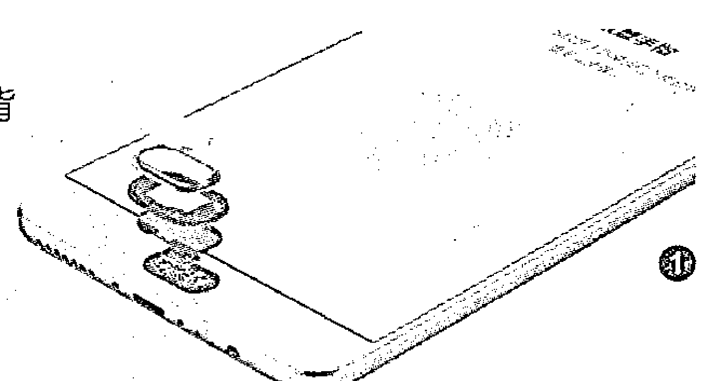

##### 指纹的位置之争

以苹果和三星为代表的手机厂商是指纹正面设计的坚定拥护者，即将指纹模块与Home键合二为一，而以魅族、OPPO R9系列（图1）、小米5、金立M5/M6系列为代表的国产新机，也陆续加入到了这一阵营之中。

华为、乐视、360等国产品牌则是指纹背部设计的狂热粉丝，而这种设计也代表了Android领域的最主流的声音（图2）。至于指纹侧置，则是最为小众的设计风格，迄今也只有索尼Z5、华为荣耀7i和nubia Z9 Max等少数产品有所涉猎（图3）。

就设计而言，正面指纹的形式最为正统；背面指纹的优势是可压缩手机下边框的宽度，提升屏占比（图4）；侧面指纹的好处是能让手机正反面玻璃保持一个整体，显得更为简洁利落。从这个角度来看，指纹的位置似乎放在哪里都有理。那么，就实际的使用体验而言，又是哪个位置为最佳呢？

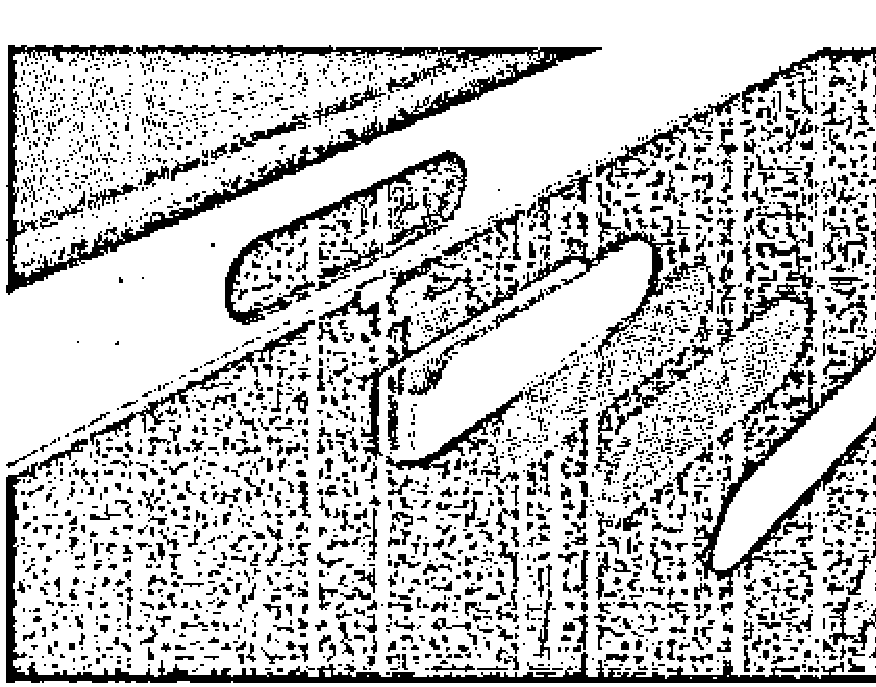

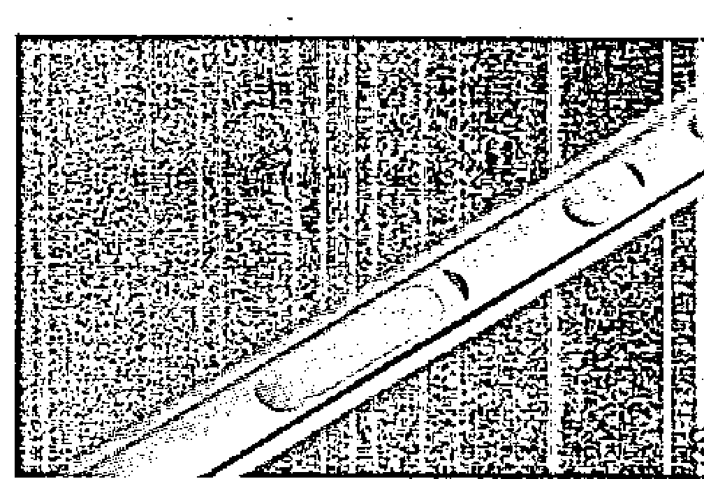

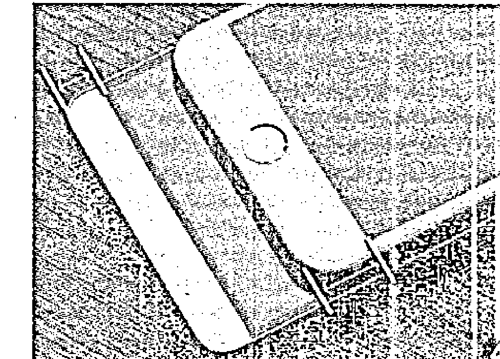

##### 位置没有想象的重要

业内流传这么一种说法：指纹的最佳位置为手机前面板，原因是当手机放在桌面上时，我们只需将手指放在手机上就可以解锁使用。而如果将指纹设计在了手机背面或者两侧，你还得先拿起手机才能操作。

事实果真如此吗？我们不妨来做个试验。

一般来说，正面指纹的手机，用户一定会将双手的拇指录入其中代替解锁或支付用的密码，但却很少有人会将食指或中指也录入指纹吧？于是问题就来了，当手机平放在桌面时，在不拿起手机的情况下用拇指解锁会非常别扭（图5），这个时候反而是食指或中指解锁才相对顺手一点点（图6）。因此，要想获得最佳的解锁手感，我们还是得先将手机拿起来，在这个过程中使用拇指完成解锁操作。

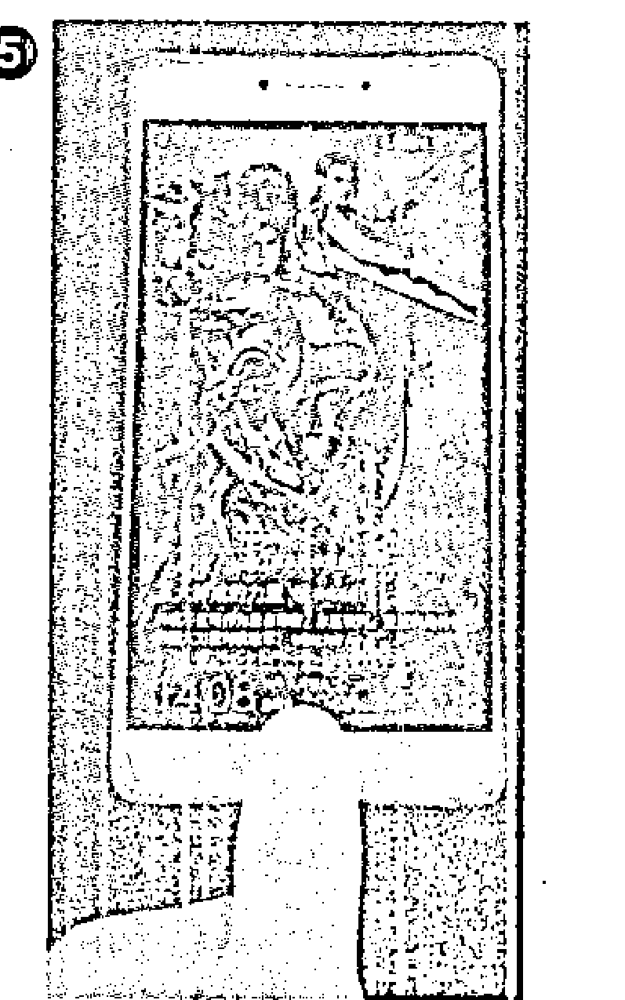

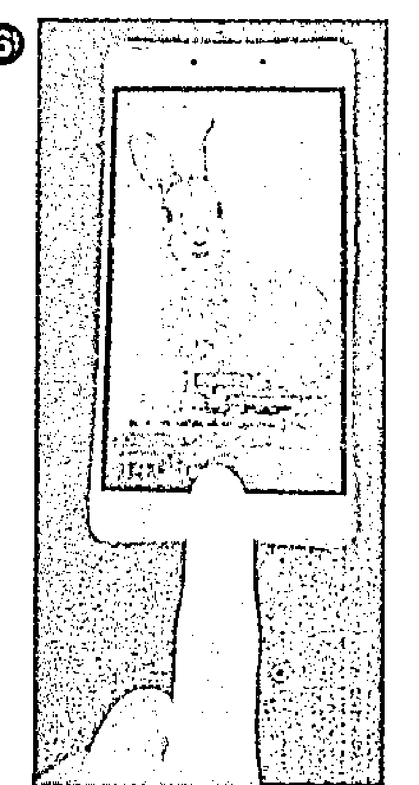

此外，现在很多厂商都赋予了指纹更多功能，如在息屏状态下让某个指纹启动指定APP，或是利用某个指纹直达支付宝条码付款界面（图7）。这个时候，在单手操作时有几个手指能随时轻松摸到指纹识别区域，才是值得引起我们关注的地方。而此时，指纹位置就体现出较大的差距了。

其中，正面指纹只有1个拇指能在单手操作时轻松与指纹模块接触；侧面指纹只有拇指或者另一只手（持握时）的食指可以轻松接触到指纹模块；背面指纹在同一时间则可与食指和中指轻松接触（图8）。算一下单手操作时可用的手指数里是1:1:2，也就是说背后的设计最便于实现指纹自定义功能。

实际上，过于较真指纹的位置是没有任何意义的，因为指纹位置的好用与否，完全取决于我们的使用习惯。当你习惯了背后指纹，接触其他方式就会感觉很别扭；习惯了正面指纹，就会吐槽另外两种方式。换句话说，指纹识别的位置不应该成为我们为某款手机“判死刑”的依据，从手机的用料设计、性能和价格等综合因素考虑才是王道。与其在意指纹位置，还不如多关注它在湿手情况下的识别率与功能集成呢。

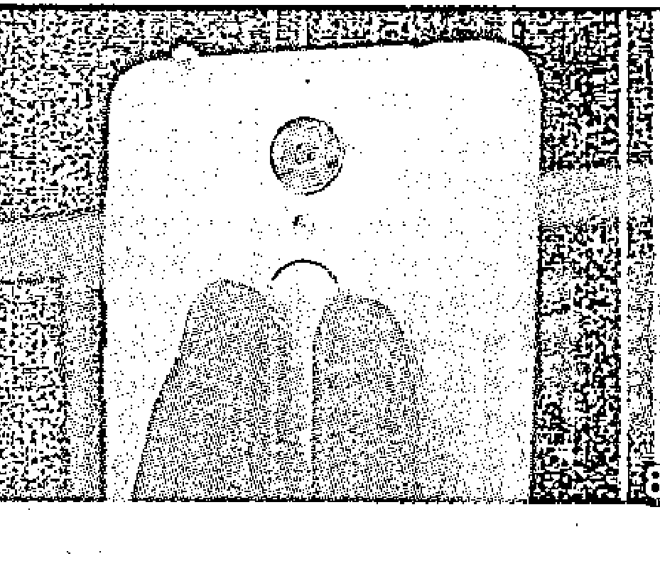

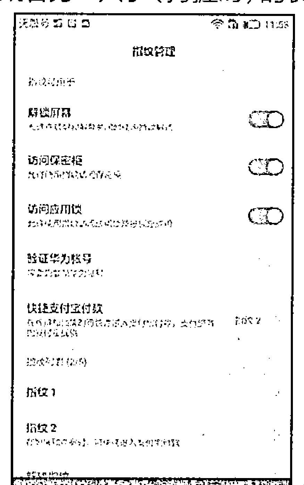

##### 被忽略的解锁逻辑

配备指纹模块的手机存在一个很关键的功能：息屏解锁。凡是支持该功能的手机，在手机黑屏待机的状态下，只需手指轻触一下指纹识别区域就能自动亮屏解锁进入桌面；而不支持该功能的手机，则需要先按一下电源键点亮屏幕，然后再用手指轻触指纹识别区域解锁。

虽然如今几乎所有配备指纹模块的Android都号称支持息屏解锁，但在该功能的解锁逻辑上却存在差异。比如，以魅族为代表的手机，其正面指纹的解锁逻辑是，当我们按下Home键时先亮屏，然后再解锁，这期间有一个明显的间隙。而联想ZUK Z2等手机，甚至都无需按下Home键，手指轻触一下Home键的表面就能同步实现亮屏和解锁。此外，ZUK还有一个更为人性化的设计，就是用户可以手动选择息屏解锁时用不用按下Home键（图9）。

怎么样，没有想到一个的指纹识别模块还能出现如此之多的体验差异吧？除了它们的位置和解锁逻辑外，还有很多厂商会赋予它们更多的能力，比如LG V10将指纹识别和电源按钮功能合二为一，荣耀8将指纹和智灵键结为一体，大体思路就是将指纹模块作为一个独立的快捷键使用。

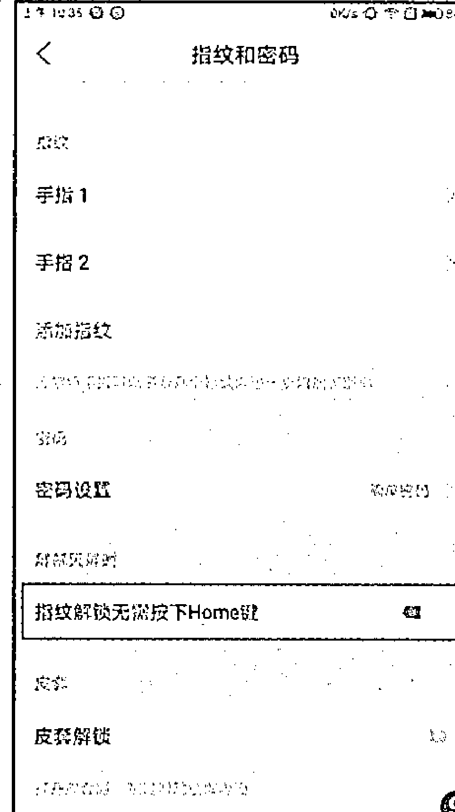

### 手机快捷键的影响

为了便于操作，Android手机都拥有3个快捷按钮，它们或者以物理按键的形式存在于屏幕下方的边框内，或者以虚拟按键的形式出现在屏幕的最下方（图10）。至于功能，3个快捷按钮则为返回、Home和最近程序或菜单的组合。你有没有想过这些快捷键带来的体验差异？

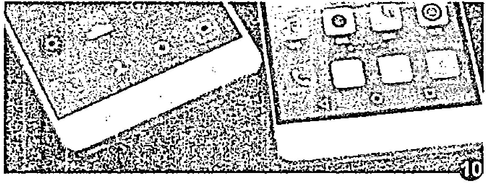

#### 物理和虚拟之争

手机快捷键到底应该采用虚拟还是物理设计，始终存在争议。物理按键的好处是，屏幕资源可以被100%利用上，缺点是增加设计难度和成本（对厂商而言）。而虚拟按键之所以饱受争议，就是因为它会占用屏幕下方至少100个像素高度的空间，造成了有限的屏幕资源的浪费。

从体验而言，物理按键无疑是要优于虚拟按键的，但这不代表虚拟按键没有扳回一局的机会，那就是提供可随时隐藏/激活虚拟按键行的功能。

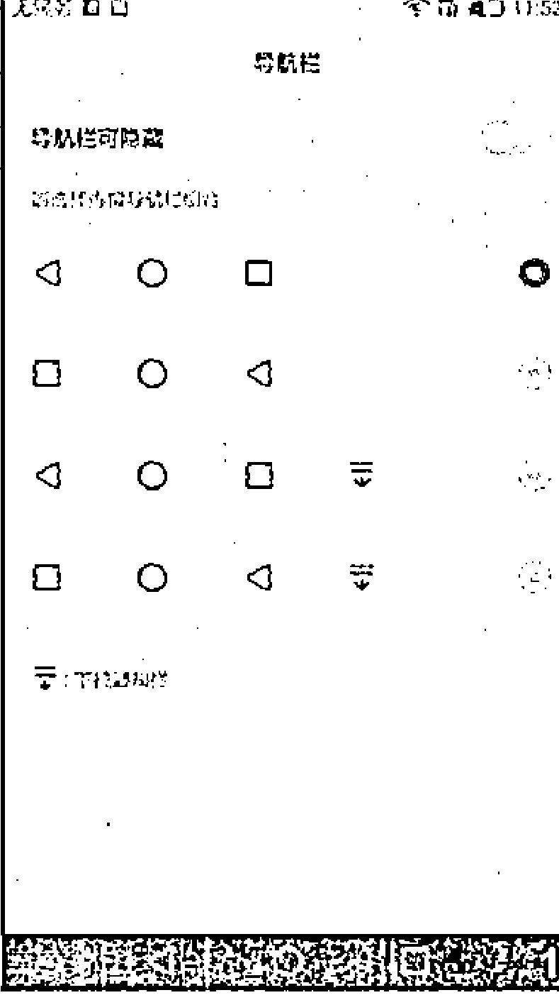

比如华为手机就在EMUI系统设置中加入了隐藏导航栏的选项，开启后通过按钮或手势就能将导航栏隐藏，需要时再随时调出（图11）。而同样主打虚拟按键的索尼手机在这方面就缺乏考虑，如果用户想将导航栏隐藏，往往需要ROOT系统，再以修改或替换配置文件的方法加以实现。在这里，笔者向大家提供一种无需ROOT和解锁的思路。

打开索尼手机的USB调试功能，在PC上安装运行刷机精灵再与手机相连，然后依次点击“实用工具→Adb命令行”，接下来执行以下指令：

```
adb shell pm grant com.phoenixstudios.aiogestures android.permission.WRITE_SECURE_SETTINGS; pm grant com.phoenixstudios.aiogestures android.permission.SET_ANIMATION_SCALE
```

其他品牌也有类似的解决方法，只是这种手动隐藏导航栏的方式，会出现当我们需要使用快捷键时找不到它们的尴尬。所以当隐藏导航栏之后，还需结合全能手势或虚拟按键助手一类的APP，通过手势或屏幕上的悬浮球加以替代（图12）。

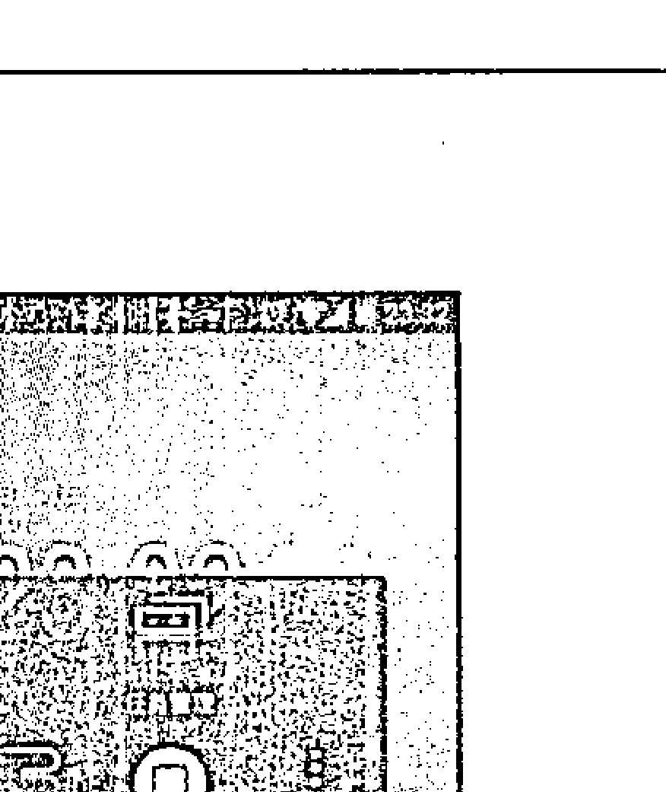

#### 按钮功能的差异

讨论完快捷键的位置，咱们再来谈谈它们的组合差异。如今Android手机主要有2种组合逻辑：

- 返回键+Home键+菜单键：这种组合最为合理，因为此类组合的手机通常可以长按Home键弹出最近程序列表，方便切换程序或清理内存。
- 返回键+Home键+最近程序键：在碰到某些需要使用菜单键功能的场景下会抓瞎，相对不合理。

细心的同学可能发现了，笔者用了“相对”二字，这是因为很多厂商已经注意到这个问题，并通过系统设置的方式加以解决。比如，乐视手机虽然采用了第二种组合，但系统设置里可自定义长按这三颗按键时触发功能的选项，还能调整返回键和最近程序键的位置（图13）；华硕手机也能自定义长按最近程序按钮时的功能（图14），不仅解决了缺少菜单键的尴尬，还赋予了它们更多功能。

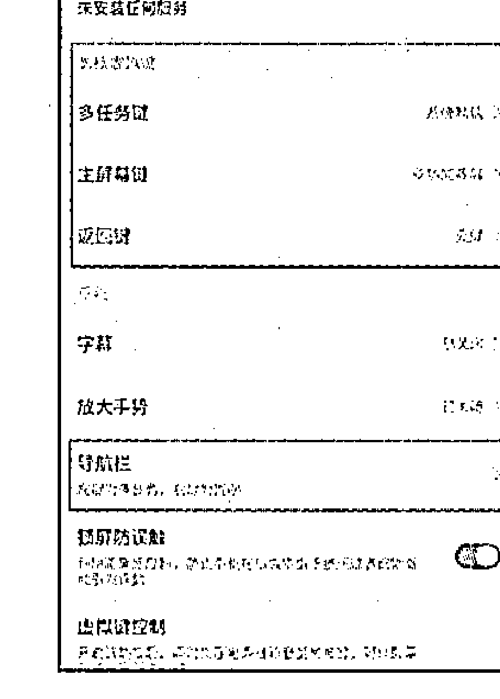

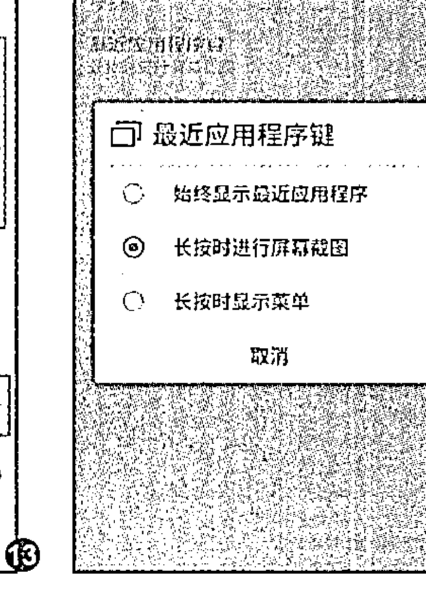

问题来了，如果你的手机采用了第二种按键结构，又没有提供任何可自定义的选项，怎么办？在手机获得ROOT权限后，你可以通过修改配置文件的方式，调整三个按键的位置，或是修改它们原有的功能。

以OPPO高通方案的手机为例，用RE文件管理器找到/system/usr/keylayout目录，找到并用文本编辑器的方式分别打开generic.kl和qwerty.kl这两个配置文件。如果想互换菜单键和返回键的位置，只需将其中“key 139”和“key 158”默认的键值互换即可（图15）。

```
key 139   MENU
key 158   BACK
```

需要注意的是，如果是联发科方案的手机，对应的配置文件名称则是generic.kl和mtk-kpd.kl。而这两个文件里还包括长按时的定义值，感兴趣的同学可以在网上搜一下短按和长按指定按键对应的键值，就能实现功能的自定义了。

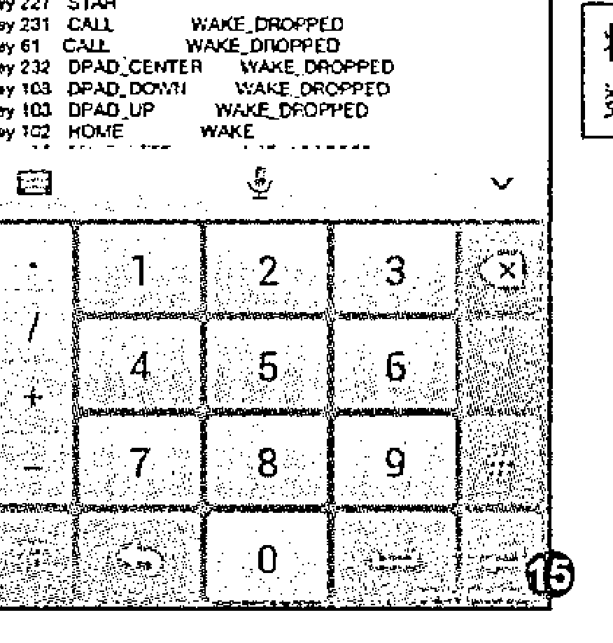

> **小提示**
> 修改配置文件存在一定的风险，所以修改前要先进行备份（包括个人数据和这两个配置文件的源文件）。

### 电源音量键的位置很重要

每一款Android手机都会配备电源键和音量键，而它们的位置也会给我们的日常使用带来或惬意或尴尬的体验。

#### 电源键置顶的尴尬

在iPhone 5s（包含）之前，苹果手机始终遵循着电源键置顶的设计，但在iPhone 6之后却将其改为了侧置，你有没有想过其中的道理？

没错，对4英寸或更小尺寸的手机而言，单手持握手机时也能轻松按到位于顶部的电源按钮。但当屏幕尺寸超过4.5英寸以后，你就会发现顶部的电源键会随屏幕的增大而越来越难“够着了”（图16）。因此，电源键置顶的大屏手机，而且还没能提供类似双击屏幕亮屏或指纹的息屏解锁功能，实在是有些“反人类”之嫌。

> **小提示**
> 手机领域还有不少将电源键和音量键设计在手机背部的，这种设计谈不上好与坏，主要就是需要我们花时间适应。这种结构操作还算方便，只是习惯就好。

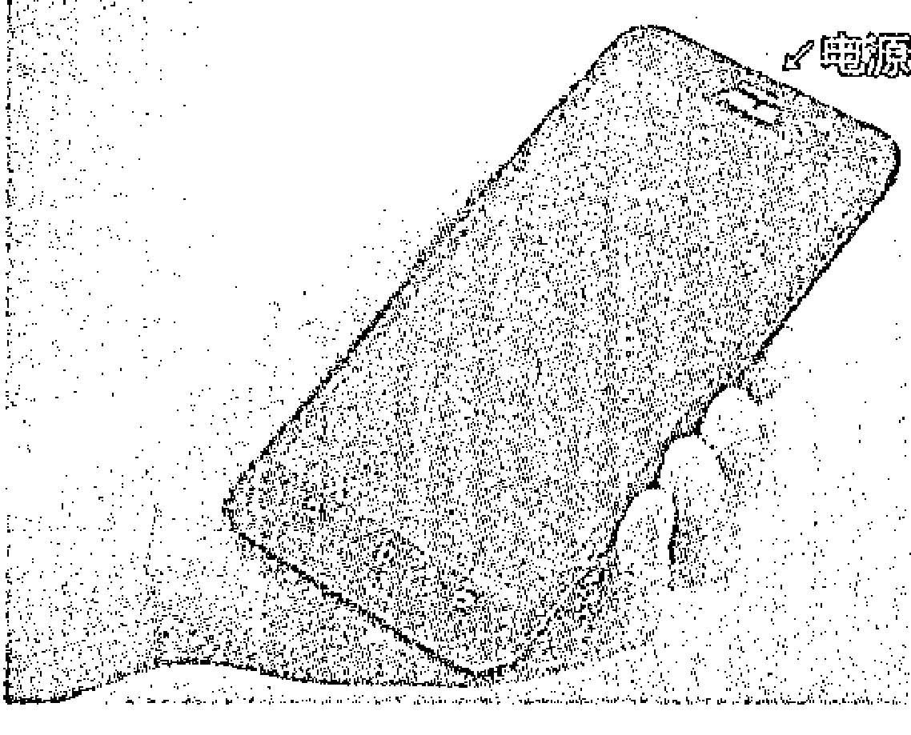

#### 电源键位置还有讲究

如果将电源键侧置，那它依旧会出现位置上的分歧：要么和音量键分别置于手机两侧，要么和音量键位处一侧。这两种设计谈不上谁好谁坏，习惯后操作起来都很便捷，只是考虑到Android系统通常多以“电源+音量减”作为截屏的组合键，所以如果电源和音量键分列置于两侧更利于截屏操作（图17）。如果两个按键都在机身左侧，那只有右手持握时才便于食指和中指同时按下截屏，此时若是左手持握，一个大拇指是很难覆盖两个按键的。

需要注意的是，你以为所有将电源键和音量键放在一起的手机，在体验上都是一样的吗？答案是否定的！

虽然如今智能手机普遍采用音量键在上、电源键在下的排列顺序，但电源键相对机身的位置却有着极大的差别。

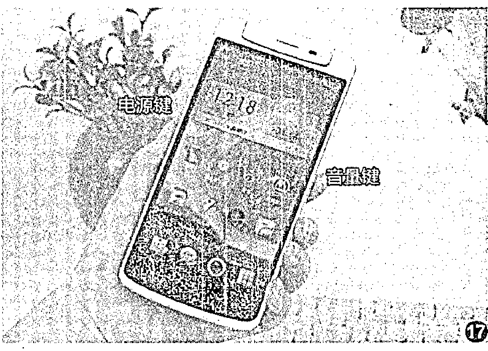

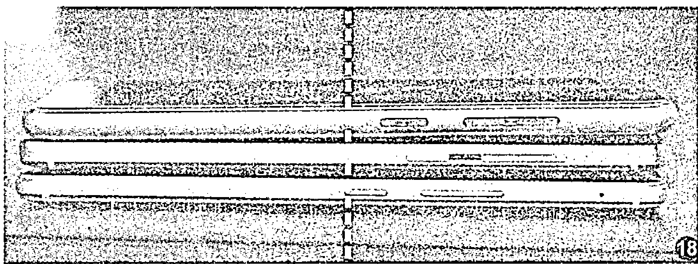

比如三款同样是5.5英寸的Android手机，有些电源键偏上，有些却居中（图18）。不要小看这些细节差异哦，假设电源键位于机身右侧，电源键距离中心点越近，当我们用右手持握手机时就越容易误碰到这个按键！当我们正玩着游戏时因误碰电源键而息屏待机，此间的苦闷你懂得。

### 更多因位置引起的尴尬纠纷

不要小看智能手机身上的任何一个小孔和接口，因为它们的布局在某些操作环境下都会为我们带来小尴尬。除了上文提到的三个家伙以外，我们再来看看其他设计细节所带来的影响。

#### 光感和喇叭孔

每一款智能手机都会在屏幕上方的听筒附近留有一个小孔用于安装光线/距离感应器，它的作用是根据环境光线调节屏幕亮度，检测屏幕贴近脸部（如打电话）时自动息屏。此外，绝大多数智能手机底部，也就是USB接口两侧的开孔中，只有一侧的开孔内隐藏了喇叭（又称扬声器，少数高端产品会配备双喇叭实现立体声效果）。

以金立M6为例，该产品的光线感应器位于右侧，而喇叭孔则设计在了左侧（图19）。当我们以横屏方式玩游戏时，无论如何调整方向，总会挡住其中一个，要么亮度忽亮忽暗，要么声音变小（图20）。在这种情况下，大家可以牺牲光线感应器，临时选择手动调节亮度的方式。

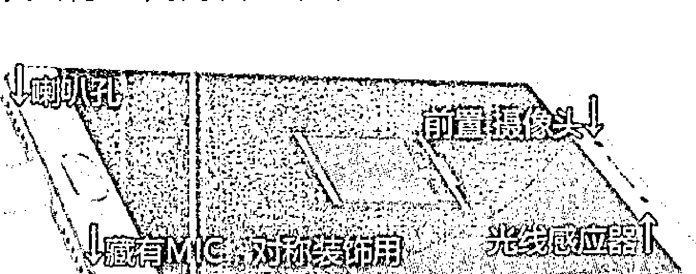

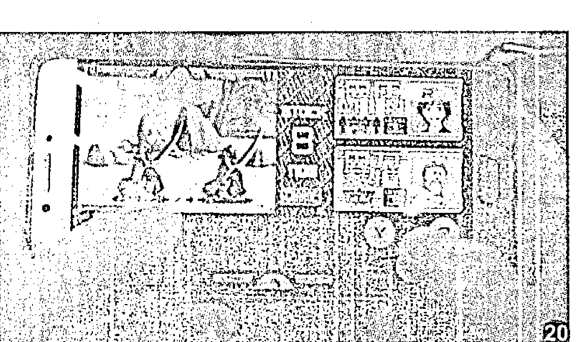

有些手机的光线感应器和喇叭会靠近一侧（比如都位于机身偏右），此时只需让机身右侧朝上，双手持握时就不用担心挡住它们了。怎么样，你是不是忽略过这个问题？

#### 耳机和USB的位置

作为手机上最常见的接口，它们的位置还有讲究？如果你在外出时，没有一边听歌一边使用移动电源充电的需求，那问题的确不大。但是，如果你有边充电边听音乐的需求，而且还习惯将手机塞进口袋里，那你就将面临以下三种情况了：

1.  耳机和USB位于机身的一侧，它们同时接驳耳机/充电线也互不影响（图21），哪怕此时将它放进口袋也压力不大（前提是口袋还足够塞进移动电源）。
2.  耳机和USB分别位于机身顶部和底部，那它们同时工作时就尴尬了（图22），此时如果将它塞进口袋，总有一边的接头会处于折弯状态，不仅感觉别扭，长此以往对接头寿命也有着极大影响。
3.  耳机或USB有一个接口位于机身侧面（图23），那么“恭喜”你，这种设计现在来看是最不人性化的设计。好在类似设计已经趋于淘汰，所以大家只要了解就好。

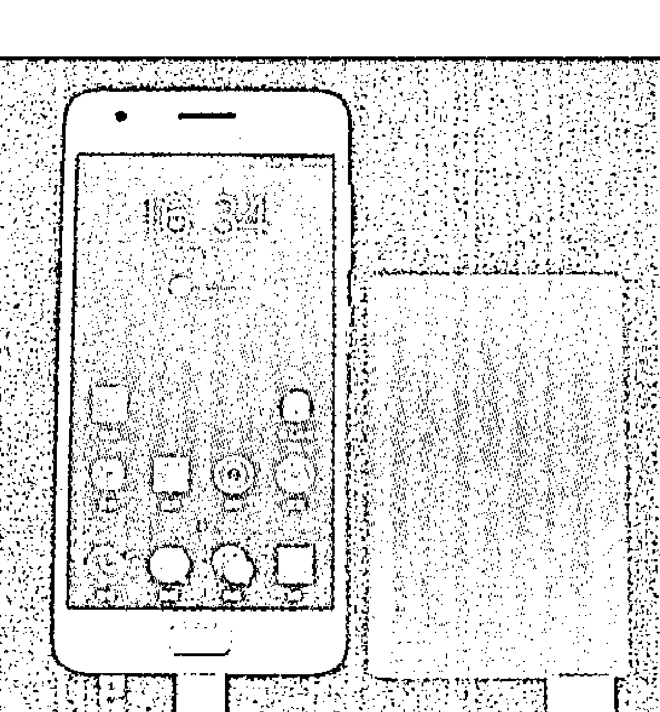

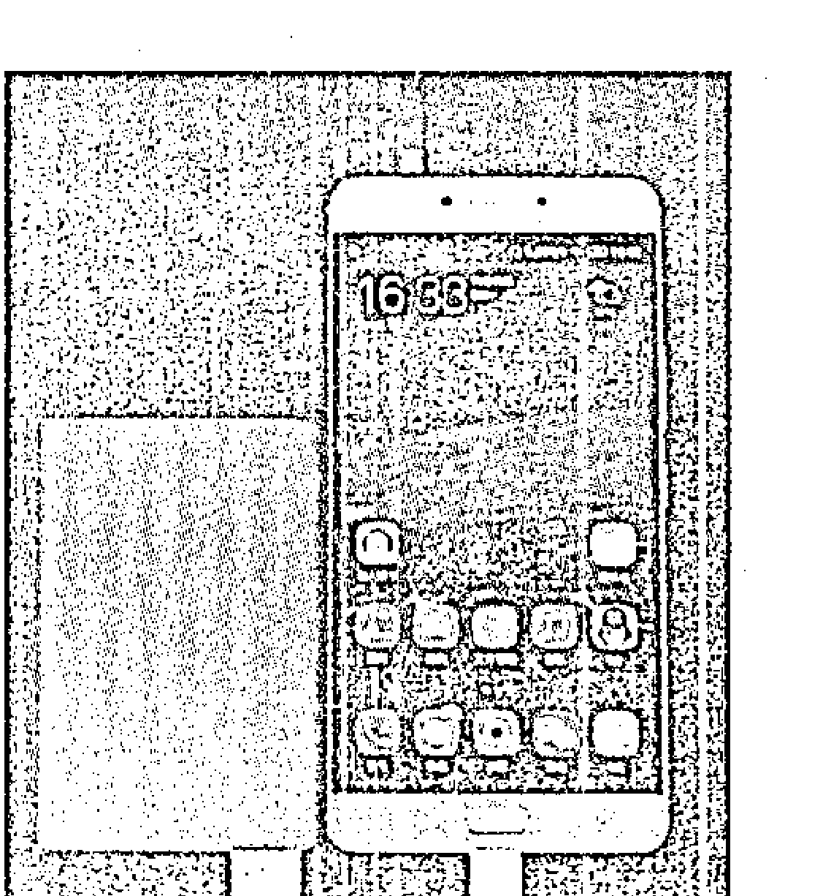

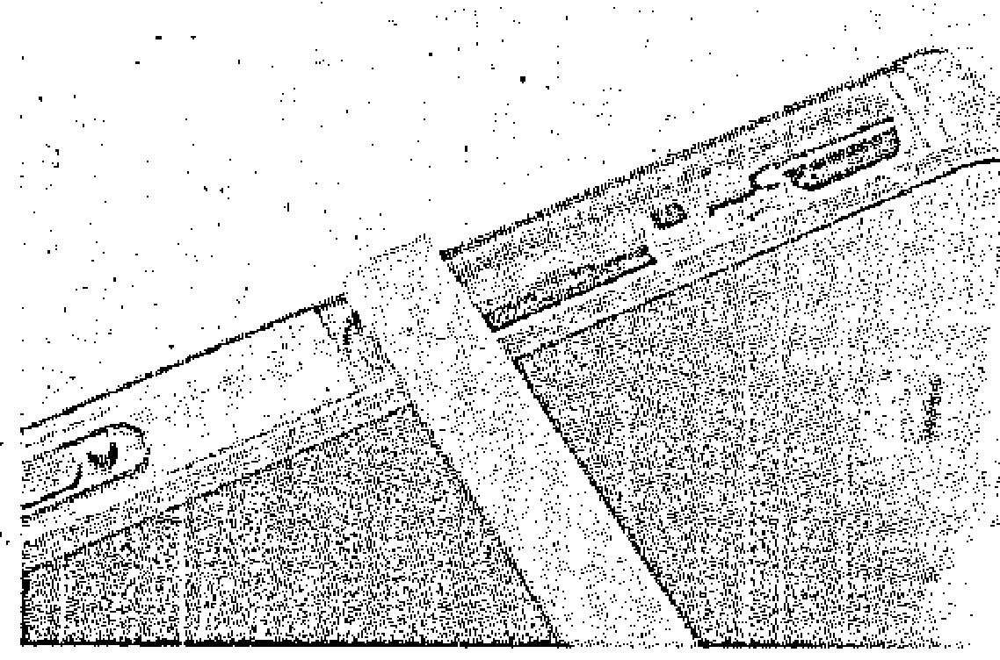


#### 摄像头位置你有考虑吗

不知道大家有没有关注过手机摄像头，它一般会在两个地方安家：手机背部的左上角，或是手机背部中间偏上。

之所以很少有产品会将摄像头放在右上角，或是手机背部正中位置，是因为绝大多数用户都习惯用右手点击屏幕上的快门键，而相机APP中的快门位于屏幕下方，当手机横过来的时候恰好是左手持握手机，位于左上角的摄像头绝对不会被中指遮挡（图24）。

之所以摄像头很少居于背部正中心或偏下，是因为这个部位全都用于安置电池了，塞不进摄像头模块，它只能位于靠近PCB主板的中心偏上位置（图25）。

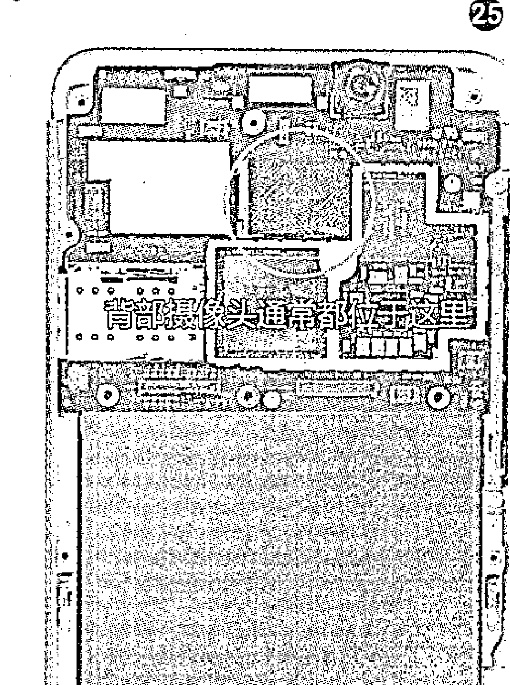

两种设计谈不上孰优孰劣，至少对拍照效果没有任何影响。只是，摄像头居中的设计可以将覆盖镜头的保护玻璃做得更大（显得更唬人），

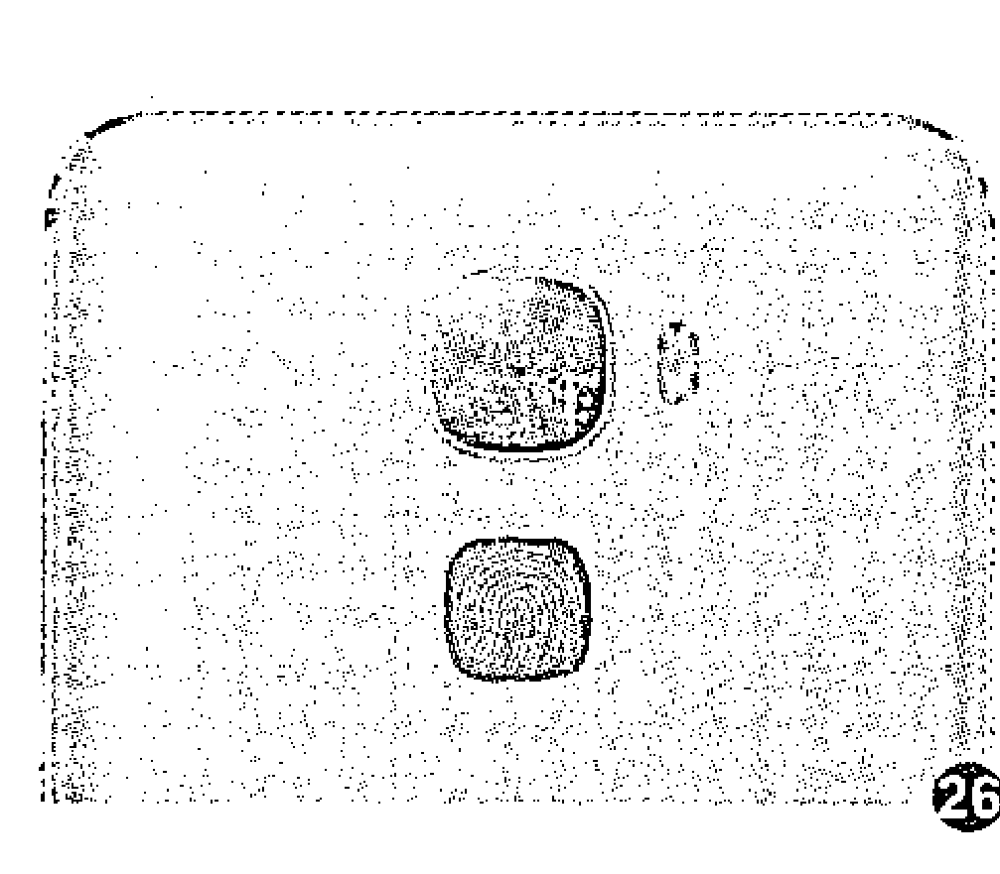

而且哪怕摄像头模组偏厚，略微突出机身表面也问题不大（图26）。而右上角的布局对摄像头模组厚度就有较高的要求了，设计难度上相对要更高一些。

> **小提示**
> 手机摄像头位置不用咱们操心，而摄像头内置的传感器型号、光圈大小；是否支持相位、激光和双核对焦技术等参数才是应该引起重视的所在。一款手机拍照效果的好坏，和像素值与手机后盖上镜头玻璃面积的大小没有太大关系，如果你想了解手机如何拍出好照片，或手机对焦技术那些事，请扫码即看。
> 
> 《读懂手机对焦技术》 《谁在影响拍照》

#### 扩展阅读：SIM卡托设计

除了iPhone，国内销售的智能手机几乎都已将双卡双待功能作为了标配，但是出于种种方面的考虑，绝大多数产品都采用了二选一的SIM卡托：要么选择安装两张SIM卡，要么选择一张SIM卡+一张存储卡。实际上，通过对SIM卡和存储卡的改造，很多手机都有机会将这两种卡塞进一个卡托的位置里（图27），具体的改造思路和流程请扫码即看。

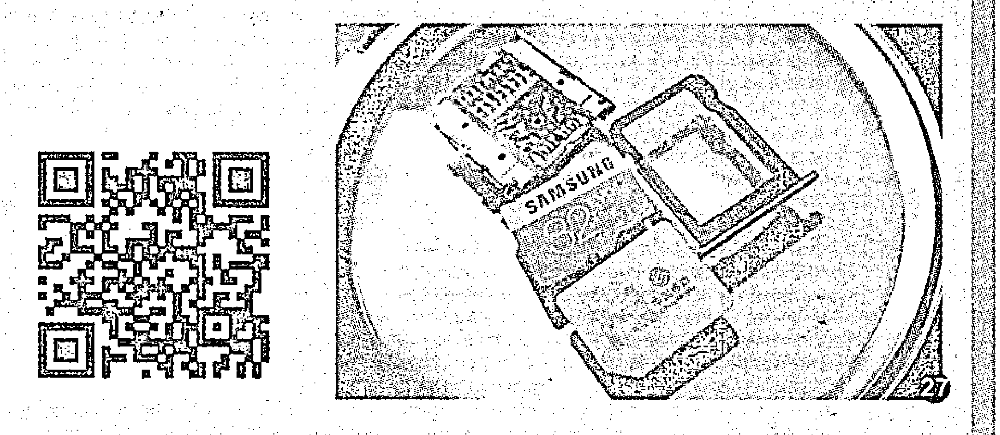

### 指出笔记本设计的那些不合理

#### 让FPS玩家头疼的Fn键

和台式键盘相比，笔记本键盘最大的特色就是增加了一个Fn键。可惜，不同品牌对这个按键的安置态度不一，于是就容易闹出小尴尬了。

##### Fn和Ctrl抢地盘

大家可以仔细留意一下身边的笔记本，其中有些产品会将Fn放在键盘左下角，而Ctrl键则位于Fn的右侧（图1）。于是问题就来了，绝大多数FPS游戏都是通过按Ctrl键下蹲，碰到Fn位于键盘最左侧的情况，非常容易出现误操作。因此，如今无论是新款笔记本还是超薄键盘，几乎都放弃了这种设计，改为以Ctrl在左、Fn在右的布局（图2），最大限度避免了误操作的可能。

问题来了，如果你的笔记本恰好属于Fn在左的情况，怎么办？


##### 将Fn和Ctrl位置互换

遇到上面的问题时，我们可以进入笔记本的BIOS界面，找一找有没有一项名为“Fn and Ctrl Key Swap”的选项（图3）。如果有那就恭喜你，将它从默认值设定为另一个选项后保存重启，你就会发现笔记本的Fn和Ctrl键功能被互换了，以后按Fn是Ctrl，按Ctrl才是Fn。


如果BIOS没有类似选项，那就不好意思了，只能说笔记本厂商在设计上考虑不周。此时我们要么选择外接键盘，要么在游戏设置中将下蹲快捷键改为Shift或Alt。虽然现在有很多可自定义按键功能的键盘映射软件，但笔记本键盘上的Fn键却不支持映射功能。

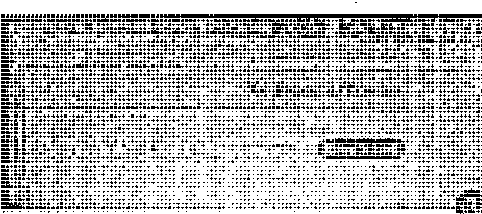

#### F1~F12的默认功能

为了提升笔记本操作的便利性，很多笔记本厂商都赋予了F1~F12键（下文简称Fx键）更多功能，比如调节音量、关闭屏幕、调节亮度等（图4）。只是，如何切换Fx键原本的功能和多媒体功能，就让厂商产生了两种设定思路。

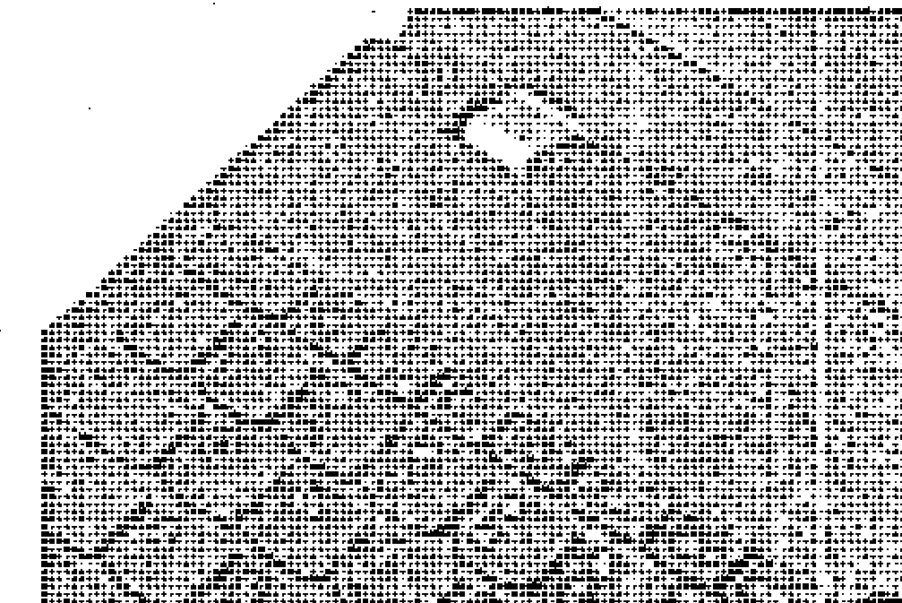

##### Fx好心办坏事

也许是考虑到通过Fn+Fx实现多媒体功能太过麻烦，所以有些笔记本的操作逻辑是，Fx键默认为多媒体功能，只有同时按Fn+Fx才能实现其原本的功能。

于是问题就来了，比如在魔兽争霸3里，按F1~F3可以在三个英雄间切换。如果碰到上面这种情况，在紧张的比赛里按F2想切换到第二个英雄，屏幕一下就黑了（很多笔记本F2键默认为关闭显示器），想按下F1回到第一个英雄，更是直接进进入休眠模式了（笔者触发的真实事件）……从人性化的角度来看，其实还是通过Fn+Fx实现多媒体功能最为合理，可最大限度避免误操作。

笔记本为例，在“联想设置中心”软件的“键盘→功能键”选项下（图6），就能随时切换Fx键的默认功能。

#### 切换Fx键默认功能

好消息是，绝大多数采取上面这种操作逻辑的笔记本，都在BIOS中提供了Fx键默认功能的切换选项，它们对应的名称多以“Change to “F1-F12 keys”或“Fn key Lock”为主（图5），将其设定为另外一个模式后就能还原Fx的默认功能了。

> 小提示
如果你的笔记本在开机时按官方指定的按键（如F2）无法进入BIOS，那就可以尝试开机时同时按下Fn+F2，此时应该就能顺利进入BIOS了。按照本章节的方法修改BIOS中Fx键的默认功能后，以后按F2才能直接进入BIOS。

#### 接口布局的不合理

对笔记本而言，接口数量和种类自然是越丰富越好，但如果不能合理安排它们之间的布局，同样会在使用中给我们造成不少麻烦。

#### 位置带来的尴尬

很多用户在选择笔记本时只顾考虑散热通风口的位置，如果自己是右撇子，只要通风口不在笔记本右侧就万事大吉了。果真如此吗？

就耳机孔和RJ45（网线）接口而言，最适合它的位置，其实是笔记本机身偏后的位置。如果有笔记本将它们放在了侧面前端靠近用户的位置，而且还是笔记本右侧，那尴尬就来了。因为右手使用鼠标的话，当我们连接耳机（音箱）和网线时，线缆会和咱们的手腕发生冲突（图7）。如果你的笔记本恰好处于这种结构，那就尽量选择接驳蓝牙音箱和Wi-Fi网络吧（图8）。

#### 距离引起的悲剧

位置之后就是距离。很多商务用户因工作需要都渴望拥有一台可以同时接驳两台显示器，实现三屏输出的笔记本，要求笔记本必须具备VGA和HDMI或更多视频输出接口。符合条件的笔记本有很多（图9），但有些产品在研发伊始就没考虑过多屏输出的问题，让VGA和HDMI接口距离过近（图10），此时咱们多屏输出的梦想也就破灭了。

#### 散热孔影响笔记本心情

实际上，笔记本不怕VGA和HDMI紧挨着，只要给它们之间再增加一点点距离，同时接驳就没有任何问题了（图11）。

同理，很多笔记本还存在USB接口距离过近的问题，如果碰到身材“较胖”的闪存盘，就极有可能挡住其他的USB接口（图12）。因此，如果你有同时接驳多外设的需求，笔记本本身上接口的位置和距离，都应该成为重点考察的对象。

我们都知道，笔记本在玩游戏时因为“太激动”（就是CPU和GPU使用率高）就会太过“热情”（发热量猛增），此时就需要散热模块进行降温帮它“冷静”下来。然而，哪怕笔记本采用了再豪华的散热模块，如果散热通风口的位置不合理，依旧会影响笔记本心情，让散热效率大打折扣。

##### 散热孔的“皇帝位”

##### 皇帝也有不开心

考虑到用户既可能是左撇子，也可能是右撇子，所以无论将散热通风口设计在机身的左侧还是右侧都谈不上完美。但在右撇子偏多的大环境下，将通风口放在机身左侧肯定能照顾到更多的用户群。此时，只有将通风口后置（图13），才能彻底杜绝热浪与用户手掌的接触。

随着传统笔记本逐渐演化成游戏本和超薄本这两大分类，你会发现通风口后置的新品会越来越多。究其原因是，游戏本为了驾驭高端CPU和GPU的发热，需要借助双风扇降温，此时难道要在机身左右各安置一个通风口？

而超薄本为了压缩厚度，机身两侧的空间全都用来摆放USB等接口，也唯有机身后部的空间可用来安置通风口了。可以说，笔记本后部，就是散热孔的“皇帝位”。

将散热通风口放在笔记本后面就完了吗？显然不是。

很多主打轻薄的超薄本和游戏本会采用下沉式转轴设计，这就导致当翻开屏幕时，屏幕下边框会和通风口形成一个“V”型的夹角（图14），从中排出的热浪会有一部分被屏幕阻挡，从而导致散热效率的下降，并让散热孔对应的键盘区域温度明显升高（图15）。想弥补这种散热结构带来的影响，就需要笔记本厂商在散热模块的用料（如风扇扇叶数量、转速和散热管的厚度数量等）和温控上多下功夫了。

C面温度突破50℃大关可以感到明显的烫手。

#### 扩展阅读

其实笔记本还有一个隐藏要素非常值得咱们关注，那就是拆机和清灰的难度。难度低的产品使用一段时间后，当出现散热异常时可以自己动手拆机除尘，而拆机难度高的型号就只能去客服中心花钱处理了。有关笔记本拆机难度的判断方法，大家可以扫码即看。

## 带你玩不一样的操作系统
策划 |《电脑爱好者》编辑部

作为人机交互界面的操作系统，只因承载了太多用户的不同需求，从Windows 95到现在的Windows 10，越发显得臃肿，也使我们的电脑为满足它们的运行需求进行硬件升级、软件优化，甚至对系统本身进行“手术”，只求老硬件能够跑起来。

在之前的特别话题中，我们为大家介绍了系统优化、维护等相关的知识与技巧，这次想和大家聊聊怎么玩不一样的操作系统。

文|平淡

### 让老电脑系统飞起来
打造极简资源操作系统

- 对于很多旧电脑来说，运行Windows XP速度尚可，用Windows 7可就差点意思了。
- 为其大幅升级等于换新，弃之不理又觉得可惜。
- 那么该怎么办？
- 如何在不花钱或少花钱的情况下提高系统运行速度，增强电脑功能？

#### RAM OS 是什么

RAM OS，直译过来就是内存操作系统，意思是运行在内存里的操作系统。大家知道内存的读取速度远远要比硬盘快得多，因此如果操作系统能够运行在内存里，那么就可以大幅提高系统的运行速度。

不过大家知道内存在断电后并不能保存数据，因此我们无法将系统安装在其中，RAM OS的原理是将操作系统封装在本地硬盘的一个文件中，然后在启动的时候将其释放到内存中，从而实现在内存中运行的目的。可见RAM OS并非什么新型系统，其实大家之前经常使用的WinPE维护系统就是一种RAM OS，使用WinPE启动盘启动电脑后会把所有文件加载到内存运行，这就是一个典型的精简Windows内核RAM OS（图1）。

不过由于WinPE只是精简内核系统，在实际使用时仍然会有各种限制。因此现在很多朋友将精简的Windows 7也移植到了内存中运行，这也是本文要介绍的RAM OS。那么这样的RAM OS有什么好处？

- 1. 大幅提高系统运行速度。因为内存读写速度非常快，因此操作系统加载到内存中运行后，系统的读写速度就可以提高一个档次，可以让老机上运行的系统运行得更快；
- 2. 安全性更高。内存的特性是断电后数据自动删除，因此RAM OS可以实现断电后自动删除写入的数据。对于电脑来说，运行RAM OS可以有效避免病毒的侵入，同时不会自动安装上各种流氓软件，始终保持高速、小巧的特性。
- 3. 维护简单。因为RAM OS核心系统都是封装在一个文件中，整个系统核心就是一个文件，因此日常维护起来也很简单，如要备份系统，那么只要将封装文件复制一份，卸载则是直接删除文件（图2）。

那么在安装RAM OS之前，我们应该做什么准备工作？

- 1. 请确认自己的内存符合要求，因为一般Windows 7加载到内存后也会占用2GB~3GB左右的空间，因此建议内存至少4GB及以上的用户安装，否则小内存用户会由于可用空间不足而导致RAM OS无法成功安装或启动。2GB内存的用户则只建议安装Windows XP的内存系统。
- 2. 请预先备份好本机驱动。由于RAM OS大多使用精简系统，精简系统并没有包含那么多的驱动文件，而且成功运行RAM OS后不容易添加驱动。因此需要预先将本机驱动（特别是准备好电脑网卡驱动）导出以方便在安装RAM OS的时候集成到系统当中。
- 3. 注意做好数据保存工作。因为有的安装RAM OS的方法是先将精简系统安装到本机C盘后再进行封装，因此安装的时候会格式化C盘，操作之前请备份好电脑硬盘数据。

文|阿木

### 自己动手打造RAM OS系统

通过上面的描述我们知道RAM OS的很多优点，那么在自己的老电脑上该怎么安装RAM OS？下面我们以安装精简Windows 7系统为例。由于RAM OS制作有些复杂，这里我们制作一张流程图供大家参考（图1）。

#### 制作VHD系统

首先准备好Windows 7精简系统安装文件（需要专业版以上版本），将其加载到资源管理器虚拟光驱中备用。这里要注意精简版本的选择，过于精简的版本会缺少很多组件，给日常使用带来不便，如无法安装QQ；精简不足的版本则体积过大，无法直接装入内存。建议安装后系统体积一般大于1GB，不要超过2GB。可以在安装好的VHD系统中试用满意后再将其制作为RAMOS。

接着启动“VHD_OneKey”，点击“创建VHD”，设置好放置VHD文件的位置，大小建议设置为2.5GB（4GB内存的用户），格式选择为“固定大小”，装入VHD的WIM位置选择虚拟光驱中的“install.wim”，映像号选择“专业版以上版本”，其他参数默认，点击“确定”即可将系统安装文件释放到VHD磁盘（图2）。

完成文件的释放后，返回程序主界面切换到“挂载/卸载VHD”，将上述安装完系统的VHD文件加载，点击“向BCD中添加VHD项目”，这样即可在BCD中添加“Windows [WIN7_V.VHD]”启动菜单（图3）。

由于RAMOS启动是通过虚拟磁盘的BOOTMGR加载，还要将必需的启动文件复制到VHD磁盘中。打开装载Windows 7精简系统的安装文件窗口，将其中的“bootmgr”文件和“boot”目录复制到VHD磁盘根目录下备用。

> 小提示
Dism++清理可能会造成VHD系统无法启动，因此在执行优化操作前建议备份一份VHD文件，如果优化后出现问题，使用备份VHD替换错误文件即可恢复。

#### VHD系统设置

重启选择“Windows [WIN7_V.VHD]”，按屏幕提示完成VHD系统的安装。进入VHD系统，在VHD系统安装好本机驱动、平时使用的软件（建议均安装绿色精简软件，这样占用的空间不会过大）。完成上述操作后根据自己的需要进行优化，建议关闭虚拟内存、休眠、系统还原等占用空间等功能。如果经过上述优化后体积仍然过大，还可以借助Dism++进行进一步优化。启动程序后切换到“常用工具→空间回收”，勾选右侧窗格的所有项目（特别是CompactOS，压缩后可以大幅减少系统体积），点击“扫描”后再清理即可（图4）。

- 常用工具→空间回收

下载“Primo Ramdisk Server Edition”后，启动程序后单击主窗口左下角的“设置”图标，在打开的窗口勾选“支持系统未识别内存休眠”，这样可以充分利用32位系统无法识别的内存（图5）。

返回程序主窗口点击“+”，新建一个虚拟磁盘，在弹出的向导提示中选择“使用全新设置创建虚拟磁盘”，硬盘大小设置为“2700MB”，类别选择“SCSI硬盘”，盘符为R，剩余操作按照屏幕提示完成操作即可。这里要注意的是，虚拟硬盘大小要根据自己的内存容量设置，最大可设置数是在当前VHD新特性下的可用内存。如4GB的用户（开启支持系统未识别内存休眠后总可用容量为3.75GB），因此建议设置为2700MB，这样进入RAMOS还可以使用900MB左右的内存。因此要设置更大的内存盘，当前系统就必须尽可能占用少的内存，如果当前VHD系统内存占用过大，可以进入占用内存更小的WinPE系统里设置（图6）。

### 转换为RAM OS

完成上述操作后关闭VHD系统进入老电脑原来的系统，到http://grub4dos.chenall.net/下载Grub引导文件，下载后将其中的grldr和grldr.mbr复制到C:\备用。

启动Diskgenius，点击“硬盘→打开虚拟磁盘文件”，然后依次打开上述制作的VHD磁盘、Ramos.vdf（加载vdf文件时需要选择“全部文件类型”才可以选中），将两个虚拟磁盘全部加载（图8）。

点击“工具→克隆分区”，源分区选择上述加载的VHD分区，目标分区选择加载的VDI虚拟磁盘，点击“开始”，将VHD系统克隆到VDI分区中（图9）。

返回程序主界面，选中加载VDI分区切换到“浏览文件”，依次展开“windows\system32\config”，选中“system”，右击选择“复制到桌面”，将其复制到桌面备用。同上，展开“boot”，将其中的“BCD”文件也复制到桌面备用。

返回程序主窗口，点击“保存硬盘内容”，然后将当前创建的虚拟磁盘保存到D:\ramos.vdf，这个就是用来加载RAMOS的载体。这个操作会将在当前虚拟磁盘的操作保存，因此以后进入RAMOS后如果要保存其中的操作（如新装的驱动、软件等），同上进行保存即可在重启后继续进入RAMOS中使用（图7）。

启动注册表编辑器，定位到[HKEY_LOCAL_MACHINE]，点击“文件→加载配置单元”，加载上述提取到桌面的“system”文件，为配置单元设置名称为“Cfan”。展开[HKEY_LOCAL_MACHINE\cfan\ControlSet001\Control\PnP]，将其右侧PollBootPartitionTimeout的值更改为十进制的“30000”，否则启动后会蓝屏（图10）。

继续展开[HKEY_LOCAL_MACHINE\cfan\MountedDevices]，选中右侧窗格的“\DosDevices\C:”，将其重命名为“\DosDevices\R:”。同上将“\DosDevices\R:”更改为“\DosDevices\C:”，即互换C:和R:的盘符，使得启动RAMOS后虚拟磁盘分区为C:。最后点击“文件→卸载配置单元”，并将修改过的数据保存。

启动bootice.exe，切换到BCD编辑，点击“添加→新建实模式启动项”，设备类为“partition”，启动磁盘和分区选择当前硬盘和C:，启动文件选择“\grldr”，菜单名称为“启动RAM OS系统”，勾选“禁用数字签名”，其他设置默认，然后依次点击“保存当前设置”和“保存全局设置”（图11）。

同上，打开上述导出到桌面上的BCD（即RAM OS的BCD配置文件），删除默认启动项，点击“添加→Win7/8/8.1启动项”，设备类为“partition”，启动磁盘为“boot(wim)和locate(vhd)”，其他选择默认，最后保存。

返回Diskginus的VDI磁盘文件浏览窗口，展开“windows\system32\config”，右击选择“复制文件到当前分区”，将修改过的“system”文件复制并替换同名文件，同上将修改过的“BCD”也复制到“boot”下替换同名文件。

启动记事本新建一个menu.lst文件，代码如下：

```
text
color blue/green yellow/red white/magenta white/magenta

timeout 30

default /default

title RAMOS

find --set-root /ramos.vdf

map (hd0) (hd1)

map --read-only /ramos.vdf (hd0)

map --hook

chainloader (hd0,0)/BOOTMGR
```

完成后点击“文件→保存”，保存类型选择“所有文件”，编码选择“Unicode”，保存在C:\即可（图12）。

完成上述操作后重启系统，以后在多重启动菜单选择“启动RAM OS”即可进入内存操作系统了。如果要对RAM OS进行更改，同上在“Primo Ramdisk Server Edition”执行“保存硬盘”操作即可，否则重启后会自动删除所有在RAM OS中的读写操作。

## 另辟蹊径 老电脑安装Linux系统

面临淘汰的电脑配置普遍较低，Windows系统硬件资源消耗高是人所共知的事情。因此要让老电脑运行起来更流畅，为其安装低资源占用的Linux系统也是一个不错的选择。现在基于Linux核心的系统有很多，而使用AOSP协议的桌面Android系统是其中的佼佼者，它不仅和我们使用Android平板、手机非常类似（可以兼容大多数Android应用），并且硬件要求极低，因此我们可以在旧电脑上安装这类系统使之重新焕发活力。

对于桌面Android系统，目前最具代表性的是原世界之窗团队打造的Phoenix OS，另一个则是前Google工程师开发的Remix OS for PC。两款系统设计理念其实是类似的，都是在Google Android移动系统的基础上进行深度改造定制，继续兼容所有Android应用、游戏的同时，增加大量适合桌面操作的功能特性、软件应用，可以让我们在旧电脑上极速体验Android系统（图1）。

Phoenix OS和Remix OS的安装都比较简单，官方网站均提供安装程序，只要在Windows上运行，然后选择制作闪存盘版或者安装在硬盘上即可，由于闪存盘读写速度较慢（而且操作系统频繁读写极易损坏闪存盘），因此电脑用户建议都安装到本地硬盘使用。

在安装时需要注意的是，Phoenix OS X86版只建议安装在英特尔X86系列CPU设备上（Remix OS则支持英特尔和AMD），要查看自己的CPU型号，只要在Windows中打开“设备管理器”，展开“处理器”即可（图2）。

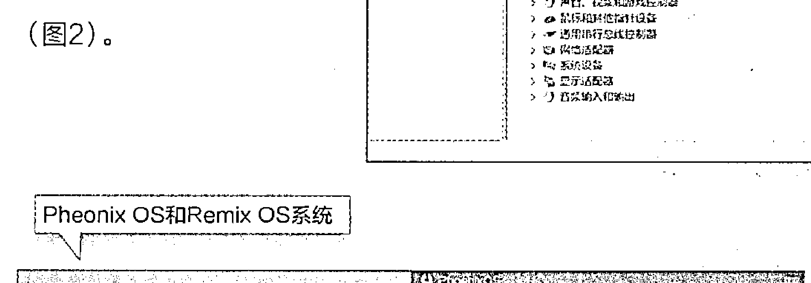

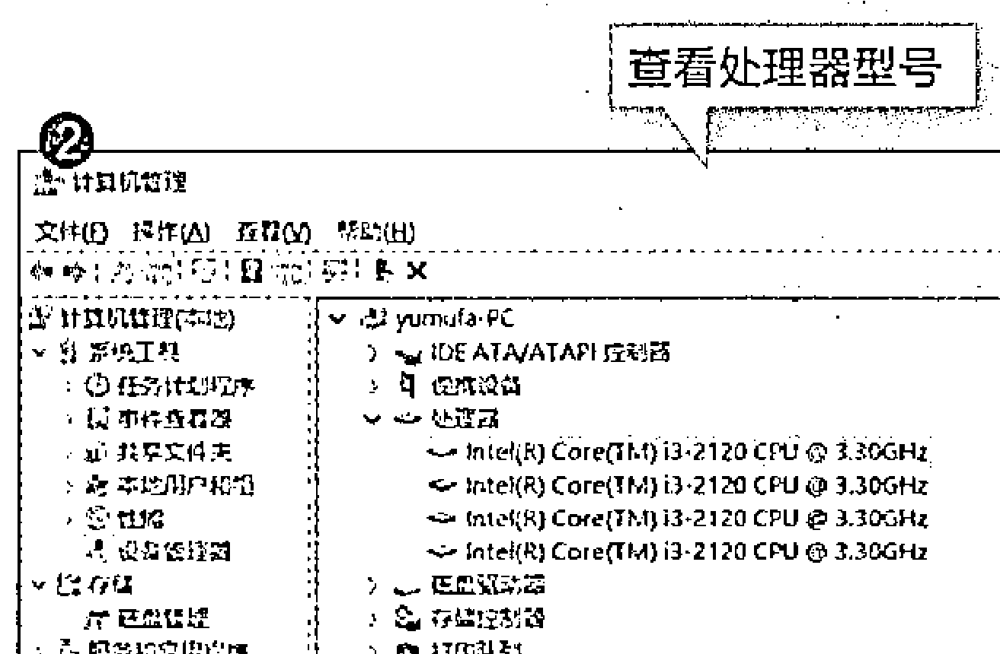

Remix OS在UEFI启动机型上安装时要先进入BIOS中关闭Secure Boot（安全启动），一般只要开机时按Del键进入设置，找到类似Secure Boot的选项，将其设置为“Disabled”即可（图3）。

Phoenix OS和Remix OS系统的功能和使用大同小异（图4、图5），针对电脑的使用各有不同的优缺点。为了方便大家选择，这里对两个系统做个横向比较表供大家参考（表1）。


**火速链接**
本刊曾在2016年第5期的特别话题中对Remix OS PC和凤凰系统X86版的常规安装、使用和技巧进行过详尽的报道，感兴趣的读者可以自行翻阅。

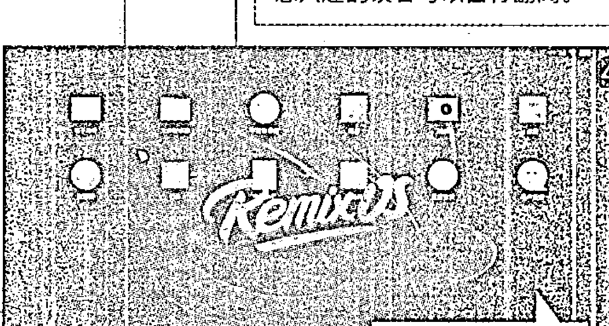

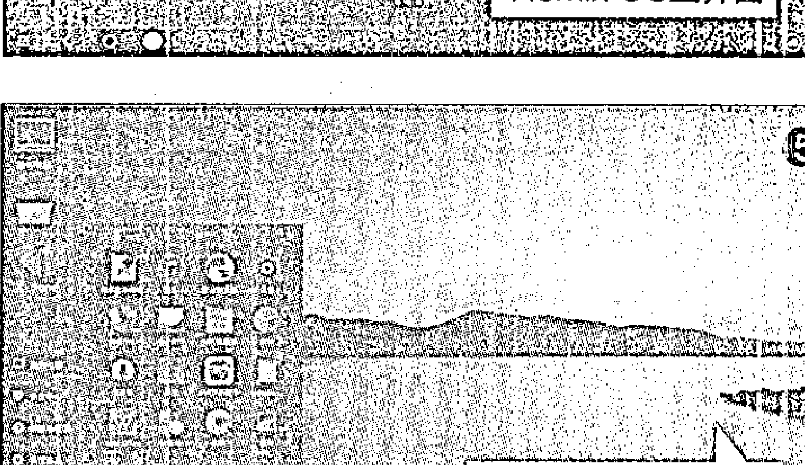

| 性能指标 | Phoenix OS | Remix OS |
| :--- | :--- | :--- |
| 跑分性能<br>(同一电脑) | 297012 | 337925 |
| 操作界面 | 友好，整合类似Windows开始菜单、消息中心等组件，所有APP应用都可以像Windows一样「窗口化」运行，可以最小化最大化，也支持多任务切换、开始菜单等 | 一般，界面类似Android平板 |
| 兼容性 | 一般，AMD的电脑经常无法成功安装 | 好，兼容大多是英特尔和AMD电脑，可以识别大部分硬件 |
| 支持启动盘制作 | 支持，但是制作工具会将闪存盘重新分区，其中会有Linux的文件系统，所以启动盘在Windows系统中只有一个分区被识别 | 支持，只要一个分区，不会改变你的闪存盘分区和格式 |
| NTFS文件系统的支持 | 完美支持，自动挂载，方便和原来的系统交换资料 | 支持，需要手动挂载 |

除了上述流行的Android桌面系统外，市面上还有许多优秀的Linux系统，这些系统的特点是特色突出、体积小巧、占用资源低，非常适合在老旧电脑上安装和使用，大家可以根据自己的需要选择性地进行安装。

### 1. 影音娱乐型

推荐系统: GeeXboX，一个专门用来播放多媒体数据的Linux发行版本，系统占用资源低，支持大多数常见的多媒体视频播放，可以将电脑和大屏液晶电视连接，打造自己的家庭影院(图6)。

官网下载: http://www.geexbox.org/

### 2. 学习型

推荐系统: StartOS，一款使用类Windows界面的系统，使用的是GNOME桌面环境，并且根据用户习惯对GNOME进行一系列的改进，提供一套美观的桌面主题、图标主题。使用界面和常见的Windows非常类似，包含开始菜单、快捷键等，当然也可以使用其终端环境熟悉Linux基本命令，即使是新手也可以快速上手(图7)。

官网下载: www.startos.org/

### 3. 游戏迷

推荐系统: linux-gamers，一款专门用来玩游戏的Linux系统，里面包含一套流行的3D游戏，如BzFlag、Enemy Territory、Glest、Nexuiz等18种游戏，启动到桌面后只要点击相应的游戏图标即可开始玩耍(图8)。

官网下载: http://live.linux-gamers.net/

### 4. 空间紧张型

推荐系统: Tiny Core Linux，一款体积最小的精简Linux操作系统发行版，体积仅仅17MB，包含了BusyBox和FLTK图形界面，它采用了“将系统内核完全装载在内存中运行”的方式，因此即便是老爷机，无论启动还是运行速度都较为顺畅(图9)！

官网下载: http://www.tinycorelinux.net/

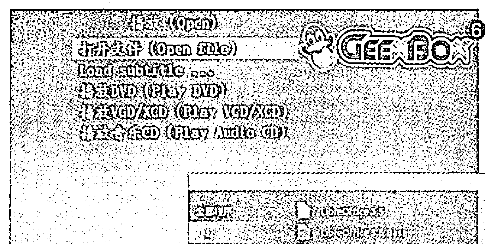

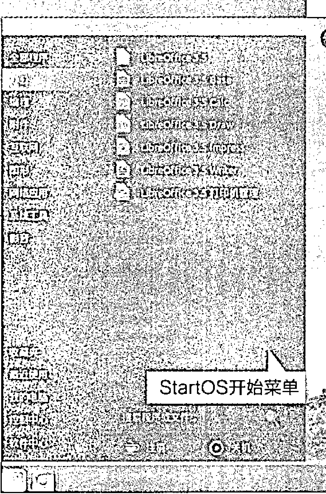

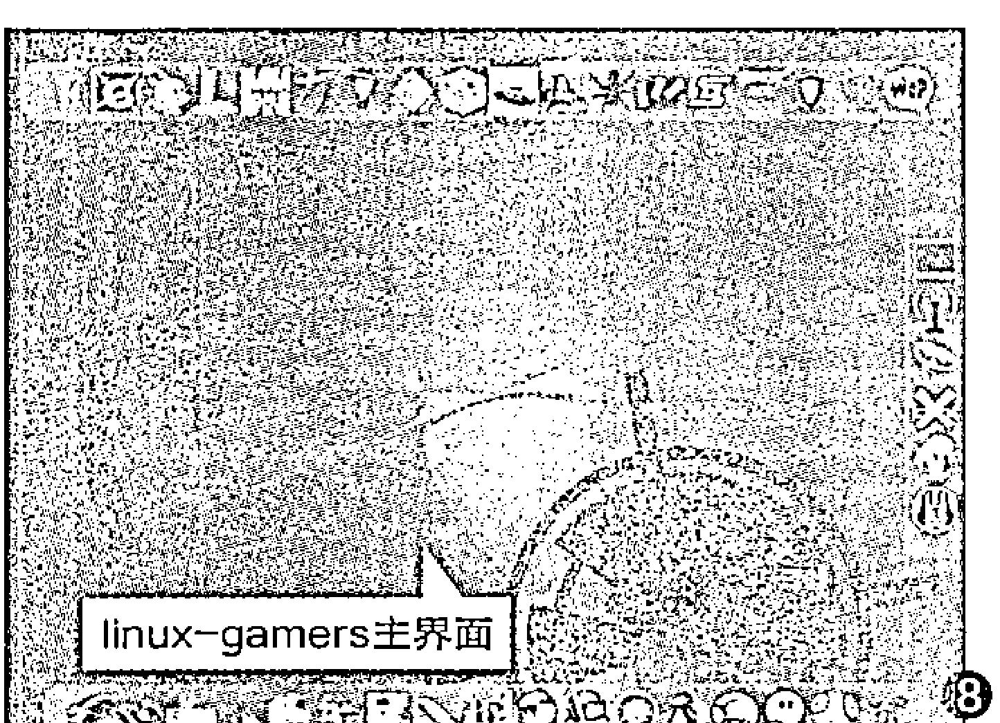

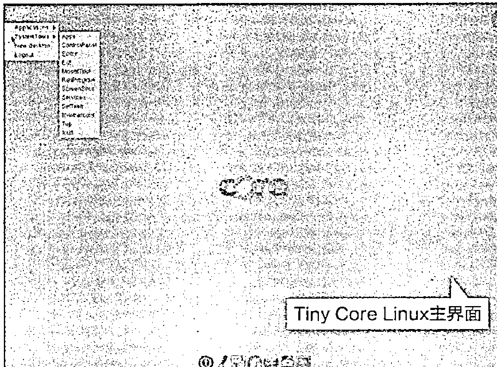

## 先天不足，该如何小幅度升级

文|宫保虾球

如果用户希望运行一些新的应用，但电脑又实在不给力的话，是否能够用最小的代价获得比较明显的性能提升，甚至使其接近新一代主流电脑的性能呢？答案是肯定的，不过需要对电脑的短板进行分析，并且需要使用一些小技巧。

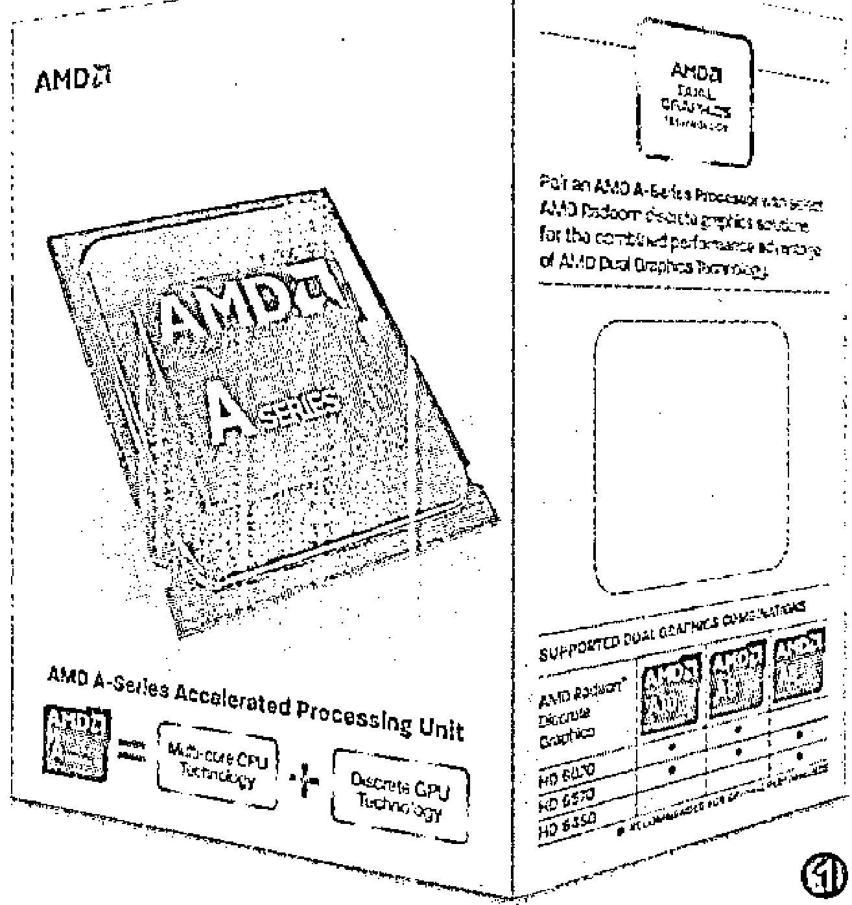

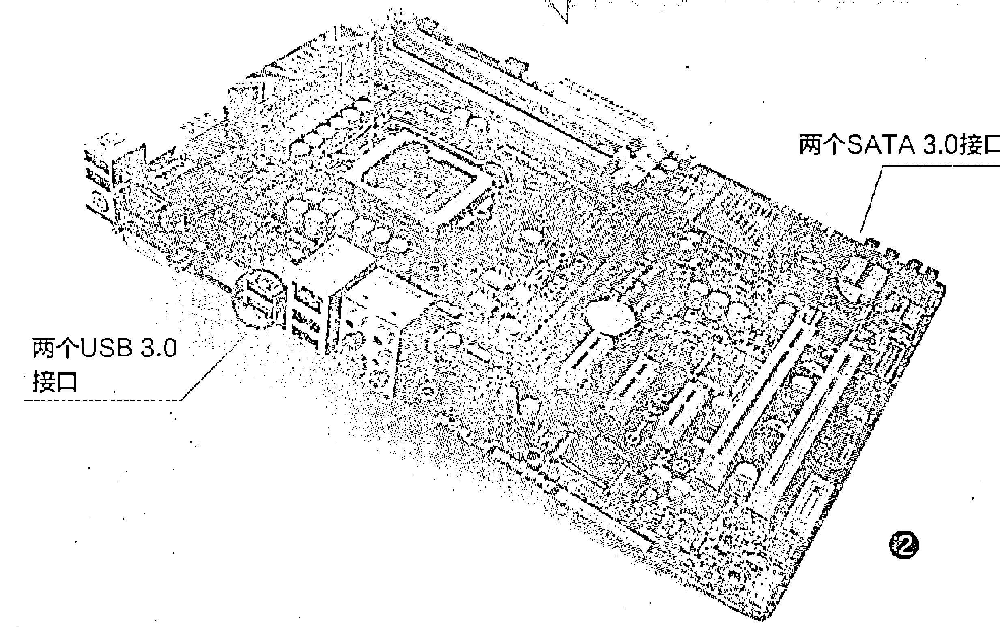

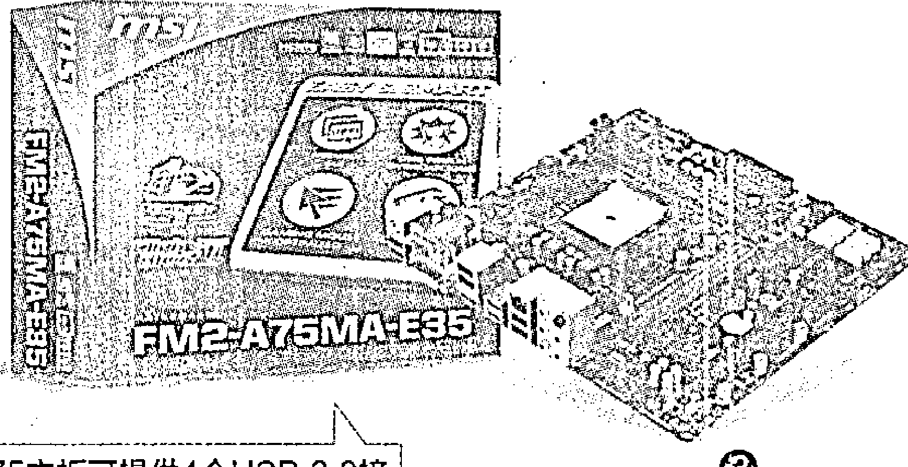

影响电脑性能的最大因素主要是处理器/主板、显卡、硬盘和内存，这一顺序也不一定是对用户体验影响最大的因素，而是升级费用的排序。不同配件对使用体验的影响，则与用户PC的主要用途、使用习惯和用户对不同方面表现的敏感度有关。由于我们本期的专题更偏向于对老旧电脑的充分利用，不考虑游戏等高端应用，所以不会考虑进行处理器/主板的整体更换和升级中高端显卡。

### ○较新平台

处理器应该算是目前性能比较过剩的产品，我们如果拥有的是第二代智能酷睿i7（i7-2XXX）或者第三代智能酷睿i5（i5-3XXX）或更新、更高端的型号，以及AMD A10/A8-6XXX系列APU（图1）、FX-6XXX/8XXX系列处理器的用户，完全不需要对其进行升级，它们完全能应对目前各种主流操作系统、中高端应用，甚至可以用于搭配中高端显卡玩最新的大型3D游戏。

### ○接口

虽然2013年甚至早到2011年推出的这些处理器的性能仍然不算过时，但其搭配的主板却缺乏一些新功能，可能导致使用体验低下。例如第二代智能酷睿i7搭配的6系列芯片组都没有提供目前广泛使用的USB 3.0接口，虽然大部分主板厂商都使用第三方芯片提供了这一接口，但数量、使用便利性、稳定性、速度等都不能令人满意。

另外，Z68/P67/H67芯片提供的原生SATA 3.0高速接口的数量都只有两个（图2），低端的H61干脆就只有SATA 2.0接口。虽然SATA 2.0接口3Gbps的传输率（实际最高传输率约为300MB/s），对当时主流的机械硬盘来说已经足够，但对目前的主流SSD（读写速度500MB/s以上），甚至是高端机械硬盘（持续读写速度可达250MB/s以上，突发传输速度400MB/s以上）来说都已经成为了瓶颈。

芯片组使用的PCI-E 2.0接口版本虽然也已经落后于目前的时代，不过由于独立显卡的运算甚至运行方式都越来越“独立”，它们与处理器和内存的数据交换量使用PCI-E 2.0接口也完全可以满足，所需电量也更多来自外接电源而非主板接口，所以并不需要升级。

AMD芯片组虽然在接口标准等方面的规划比较前卫，例如A10-6XXX搭配的A85，甚至是更早的A75芯片组，就已经提供了原生的USB 3.0，但从目前的实际使用情况看，其4个USB 3.0接口也同样有些不足，好在它们提供的6个～8个SATA 3.0接口（图3）即使在今天看来也足够使用了。

很显然，对这些产品来说，无论是作为文件服务器还是继续作为PC使用，我们都应该优先解决高速接口不足的问题，而且这并不需要大费周章且耗资巨大地更换主板，并且被迫同步更换相应的CPU，完全可以通过PCI-E转接卡解决，其价格通常在30元～60元之间，远比更换主板要便宜得多。由于相对于USB 3.0甚至USB 3.1标准，以及SATA 3.0接口来说，PCI-E通道的带宽足够大，所以USB 3.0/3.1转接卡只需要使用1个通道（PCI-E x1）（图4），最多4个通道（PCI-E x4）接口（图5）足矣，SATA 3.0转接卡更可用一个通道就提供4个甚至8个SATA 3.0接口（图6）。我们甚至还能找到同时提供USB 3.0与SATA 3.0的单一扩展卡产品（图7），可节省用户的主板接口资源，非常贴心。另外需要注意的是，PCI-E接口不仅速度快，而且设计比较特殊，PCI-E x1/x4接口板卡不仅可以直接使用对应接口，而且可以插进更多通道数的PCI-E x4/x8/x16接口正常使用。

### ③ 内存

如果仍然希望将老旧系统作为普通PC使用的话，早期系统另外一个需要升级的就是内存容量，如果改作家庭服务器等使用则无需升级。由于这些系统采用的DDR3内存仍然是目前的主流产品，内存在4GB以下的Windows 7用户，或者内存少于8GB的Windows 10用户，购买全新或二手内存升级均可。但在购买内存之前必须注意，目前市场中的新DDR3内存基本都是1.35V低电压的产品（DDR3-L），在升级时应注意主板是否支持这一电压，或者相应内存是否支持更高电压使用，以免在安装后造成损伤。

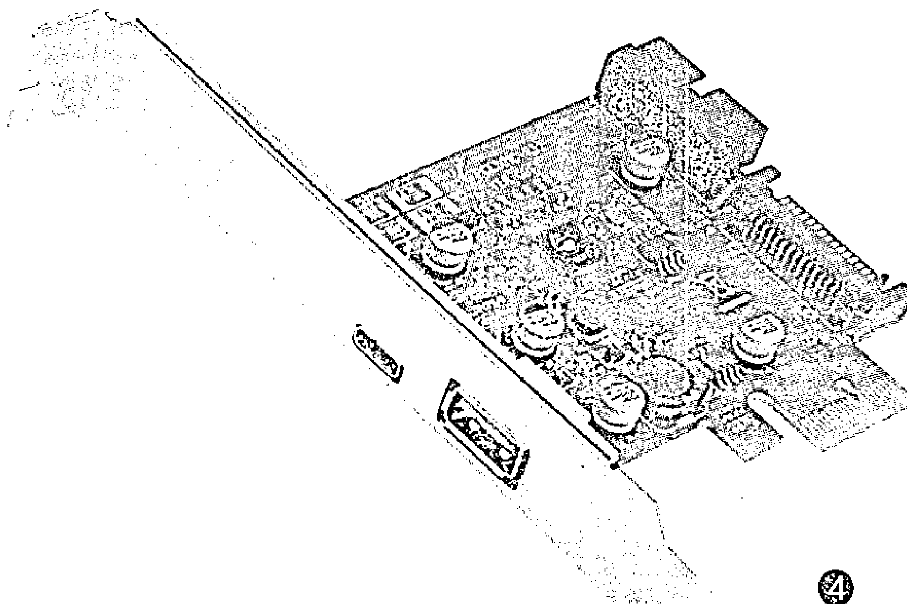

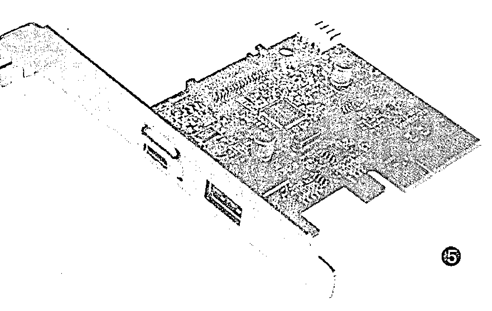

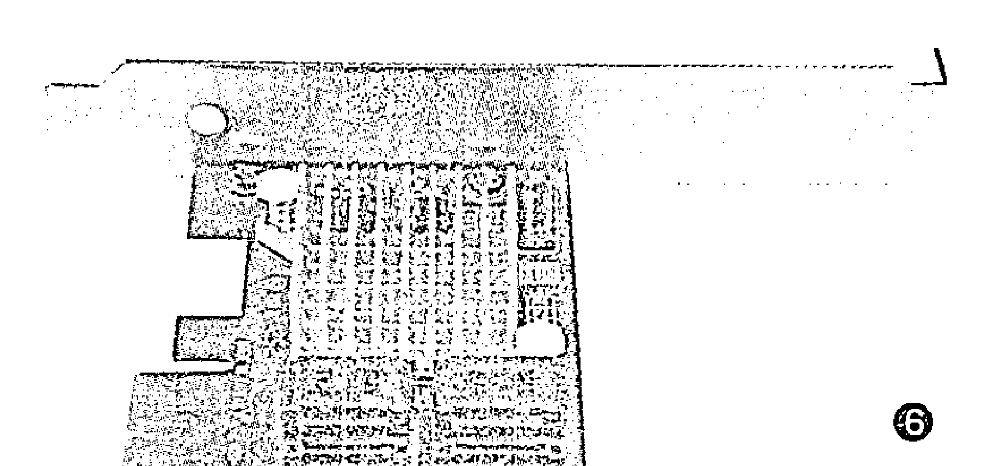

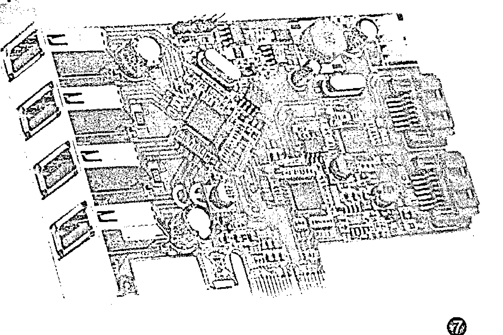

对仍有成对空闲内存插槽的用户，可以直接购买成对内存进行升级，但需要注意的是，若要保留原有内存，则全部内存的实际可用频率与其中较低的产品相同，所以新购内存无需追求高频率，与原有内存同频即可。

如果主板已经插满了4条内存，或者只有两个内存插槽仅剩一个空闲插槽的话，我们可以考虑完全更新内存，此时可以购买主板能支持的高频率内存，并且安装后在BIOS将其设定为高频率，为处理器和周边设备提供更大的内存带宽，提升性能，高频内存对AMD平台的性能提升尤其明显。当然前者也可以只淘汰一对内存，安装更高容量的成对新内存，注意事项如前文所述。而后者如果希望直接增加内存的话，最好选择与原内存同频同容量的产品，构成双通道大容量内存。

### 硬盘

近期硬盘（包括SSD）的容量价格比和性能提升都比较明显，如果作为文件服务器使用，用户可以考虑购买近期的大容量硬盘，目前容量价格比较高的主要是2TB/3TB产品，但除非对功耗特别敏感，否则不要选择低转速产品如西数蓝盘、东芝监控盘等，它们的价格其实与普通的7200rpm转速硬盘相差并不多，但速度要差不少。

如果准备作为PC使用，则应该增加一块当年可能因为价格较高而放弃的120GB~256GB SSD作为系统盘和常用软件/文件存储盘，高速开机和应用载入会明显提升使用体验。需要注意的是，购置的新硬盘/SSD一定要连接在SATA 3.0接口上，如果主板接口不足的话，可以参考前文选购一块PCI-E接口的SATA 3.0扩展卡。

### 早期产品

对于使用2010年甚至更早系统的用户来说，我们已经不建议将其作为主力电脑使用，但作为家庭服务器使用还是不错的。当然即使是改变用途，可能也需要进行一些升级才能更好地使用。

由于早期的产品完全没有配置SATA 3.0和USB 3.0这样目前来看非常重要的接口，所以我们首先要和前文说的一样，选购一块基于这些接口的扩展卡，以便使用目前的主流产品进行升级，以满足家庭服务器的基本需求。

为了更好地使用下载软件、播放软件，我们建议用户将用作文件、媒体、下载服务的早期系统更新至Windows 7，因此内存最好也能达到4GB。如果系统支持DDR3内存，那么可以参考前文进行升级，但升级DDR2内存时，我们会发现相应的内存甚至比DDR3内存更贵。除了通过二手市场购买更合算的内存外，用户如果有使用DDR2内存的老旧笔记本电脑，还可以考虑将两套电脑的内存融合，使用市价25元左右的笔记本内存转接器（图8）后，我们就可以近乎“0”成本地扩展DDR2内存了。

较早期的电脑如果用作服务器，特别是影音服务器的话，还有一个比较明显的缺陷，那就是不支持新的多媒体视频输出接口。要想在目前主流的电视、投影机等设备上进行操控，或者输出播放的视频，必须使用多媒体视频接口，即HDMI或DisplayPort。因此我们可以考虑为其配备一块最简单的显卡，如仅售130元~150元的GT210、R5 230显卡（图9），当然我们购买的第一需求就是它们提供的HDMI接口，千万不要买那些仅提供了VGA或DVI接口的型号。

### ○其他配置

相信对于绝大部分读者来说，“家庭服务器”还是比较新的概念，更不要说使用经验了。我们前面提到的下载、存储、播放等服务粗看起来并不复杂，其实要作为“专业”的服务器，这台老电脑的使用方式和功能还更多，我们仅举几个简单的例子。

#### ●无线键鼠

将PC作为家庭服务器使用时，特别是置于客厅、连接电视，作为影音服务器使用时，如果使用无线键鼠进行操控无疑会让使用体验和“逼格”都提升一个档次。其实在常见的无线键盘+无线鼠标之外，我们还可以见到一种集成了触控板与键盘的产品，如199元的罗技K400 Plus（图10），能让操控更方便。

然而139元的Rii（锐爱）i8+则是更出色的2.4G无线键鼠产品（图11），它的外形和大小都更像是一个手柄，但集成了键盘主按键区、触控板、鼠标按键、方向键、多媒体键等大量功能。这款产品还提供了多种色彩供用户选择，是一款既炫酷又方便的服务器操控设备。

#### ●网络打印机

现在很多家庭已经同时拥有多台电脑，一些外设如打印机的使用就成了一个问题，每次使用时都要插拔甚至移动，一定让很多人感到烦躁。其实只要将打印机接入网络服务器，并将其设置为共享，多个用户就可以随时进行打印了。

#### ●其他配件

另外我们还可以为服务器安装内置或USB无线网卡，让它的安装位置更自由，例如隐藏在大屏电视后方。家庭服务器作为新兴的概念和产品，其实还可以带给我们很多新的应用模式，特别是这些基于淘汰PC的低成本服务器，大家完全可以大开脑洞，将它们的价值完全“榨干”。

## 新旧电脑多用途
制作个人文件服务器

## 变废为宝 零成本变身家庭服务器

文/技术宅

大家知道电脑更新换代速度都很快，现在几乎家家都有淘汰的旧电脑。如何充分发挥旧电脑的余热？下面一起来看看如何变废为宝，将旧电脑变为实用的家庭服务器NAS。

### 准备工作:

-   1. 一个1GB以上容量的闪存盘并将其格式化，这个作为群晖NAS系统安装引导盘。
-   2. 必需的软件下载地址：http://suo.im/3oazb，下载后将其保存在桌面备用。

### 简单点击 搭建NAS系统

插入闪存盘后启动UltraISO，点击“文件→打开”，打开下载到的“XPEnoboot_DS3615xs_5.2-5644.5.img”文件，继续点击“启动→写入硬盘镜像”，硬盘驱动器选择插入闪存盘，写入方式选择自己主板支持的USB启动方式（一般选择USB-HDD+有最佳的兼容性），点击“写入”完成启动闪存盘的创建。这里要注意的是，写入操作会将原来闪存盘的数据全部删除，注意操作之前做好闪存盘的数据备份（图1）。

启动旧电脑，进入BIOS将第一启动设置为USB设备启动。使用闪存盘启动电脑后在启动界面多重菜单选择“Install/Upgrade”，接着会引导到XPEnoboot环境，群晖NAS系统需要在该系统中完成安装（图2）。

```
XPEnoboot
Link encap:Local Loopback
inet addr:127.0.0.1 Mask:255.0.0.0
UP LOOPBACK RUNNING MTU:65536 Metric:1
RX packets:0 errors:0 dropped:0 overruns:0 frame:0
TX packets:0 errors:0 dropped:0 overruns:0 carrier:0
collisions:0 txqueuelen:0
RX bytes:0 (0.0 B) TX bytes:0 (0.0 B)

Starting syslogd
Starting services in background
Starting findhostd in flash_rd...
Starting services in flash_rd...
running /usr/syno/etc/rc.d/J01httpd.sh...
Starting httpd:80 in flash_rd...
Starting httpd:5000 in flash_rd...
running /usr/syno/etc/rc.d/J03ssdpd.sh...
/usr/syno/sbin/minissdpd -i eth0
15): upnp:rootdevice
51): uuid:upnp_SynologyNAS-000027da5ca3::upnp:rootdevice
52): Synology/synology_bromolow_3615xs-5.2-5644-10.0.2.15
42): http://10.0.2.15:5000/description-eth0.xml
connected.
one.
/usr/syno/bin/reg_ssdp_service 10.0.2.15 000027da5ca3 5.2-5644 synology_bromolow_3615xs eth0
running /usr/syno/etc/rc.d/J04synoagentregisted.sh...
starting synoagentregisted...
running /usr/syno/etc/rc.d/J30DisableHCQ.sh...
running /usr/syno/etc/rc.d/J80FanControl.sh...
running /usr/syno/etc/rc.d/J90nbnsd.sh...
starting nbnsd...
running /usr/syno/etc/rc.d/J99cupsd.sh...
starting Avahi mDNS/DNS-SD Daemon
: Loading module usb-storage [ OK ]
: Loading module hid [ OK ]
: Loading module usbhid [ OK ]
Xcution Error
Date =============
e Oct 11 21:43:01 UTC 2016
ue Oct 11 21:43:02 2016
liskStation Login:
```

启动到XPEnoboot

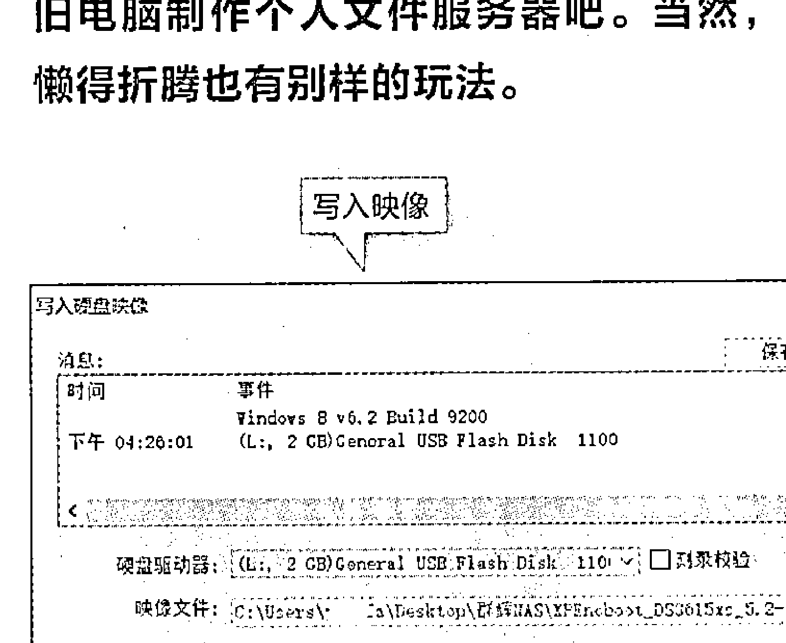

> **小知识 什么是NAS**
> NAS(Network Attached Storage：网络附属存储)是一种将分布、独立的数据整合为大型、集中化管理的数据中心。从字面上看NAS的概念似乎高大上，其实简单的理解就是一个网络存储器。借助家家必备的宽带，我们利用“群晖NAS系统”就可以让旧电脑变身为家庭NAS，方便我们随时随地进行数据访问。

> **小提示**
> 此版本的XPEnoboot需要X64位处理器的支持，如果你的老机只支持32位处理器，请自行到网上下载适合32位处理器运行的XPEnoboot。

#### 选择群晖NAS系统安装文件

在另外一部电脑上（注意：两台电脑要连接在同一局域网，旧电脑可以通过有线或Wi-Fi接入）安装下载到的“SynologyAssistant”，启动程序后点击“搜索”，这样它会自动搜索到上述启动到XPEnoboot的旧电脑，在找到的电脑上右击选择“安装”（图3）。

在弹出的窗口选择上述下载到的群晖NAS系统“DSM_DS3615xs_5644.pat”文件，这里一定要注意的是，安装群晖NAS系统时会自动删除所有它发现的硬盘数据并重新格式化为Linux格式，所以如果旧电脑有多块硬盘，一定要提前断开其他硬盘的数据和电源，操作之前请做好数据备份工作（图4）。

剩下的操作按照屏幕提示设置管理员账号和密码（这里一定要记住管理员账号和密码，下面的操作需要使用这里设置的账号和密码登录进行管理），自动取得网络设置（DHCP）即可完成系统的安装工作（图5）。

完成群晖NAS系统的安装后旧电脑会自动重启，再次使用闪存盘启动，在多重启动菜单选择第一项“XPEnology DSM 5.2-5644”，进入XPEnoboot环境，成功加载后就完成群晖NAS系统的启动，现在可以拔下闪存盘和断开显示器，群晖NAS系统使用独立主机即可运行（图6）。

#### 安装群晖NAS系统

#### 进入XPEnoboot环境

#### 群晖NAS系统主界面

返回另外一台电脑的“SynologyAssistant”窗口，双击其中找到的旧电脑，打开群晖NAS系统的WEB管理界面，按提示输入上述设置的管理员账号和密码登录，成功登录后就可以看到群晖NAS系统主界面（图7）。

- 1. 应用网络设置
- 2. 格式化系统分区
- 3. 格式化数据区
- 4. 安装DSM
- 5. 写入配置文件

> 在这个步骤如果程序提示无法格式化数据区，请自行使用WinPE引导旧电脑，然后在WinPE中使用磁盘管理组件将硬盘所有分区删除，再重复上述步骤即可。

#### 各取所需 设置群晖NAS系统

通过上述操作我们就完成了群晖NAS系统的搭建，接下来就可以根据自己的需要设置群晖NAS系统，让这个系统为我所用。比如喜欢看电影的用户可以把旧电脑作为家庭的点播服务器，以后在家里通过电脑、平板、手机都可以进行点播。

在群晖NAS系统主界面点击“套件中心”，然后在打开的套件中心下载其中的“多媒体→Video Station”套件，安装该套件后会自动在群晖NAS系统中添加一个名为“video”的共享目录。当然大家可以根据自己的需要安装其他更多的套件（图8）。

返回另外一台安装“SynologyAssistant”的电脑，打开“资源管理器→网络→DISKSTATION”（DISKSTATION即安装群晖NAS系统的旧电脑服务器名称），按提示输入安装群晖NAS系统时设置的管理员账号和密码，打开后就可以看到其中共享的“video”目录（图9）。

现在就可以将下载好的视频放置到上述目录，或者直接将下载电影的目录设置到该目录。比如可以在自己的新电脑上安装迅雷，启动迅雷后点击“工具→下载配置中心→常用目录”，将下载保存目录设置为“\\192.168.1.118\video”，即群晖NAS系统上的视频共享目录，这样迅雷下载到的影片就可以直接保存在群晖NAS系统中（图10）。

这样以后需要在电脑上播放共享目录中的影片时，同上打开上述共享目录直接进行点播即可。远程访问的方式有两种：

一种是直接通过浏览器在线打开，比如可以在家里的其他电脑上打开浏览器访问http://192.168.1.118:5000/webman/index.cgi，使用上述设置的群晖NAS系统账户和密码登录，然后启动安装的“Video Station”套件，按提示先将影片添加到“电影”库，以后直接在库中选择播放即可（图11）。

另一种是使用客户端进行访问，Android和iPhone用户都可以下载客户端DS Video，在手机上启动应用后使用上述设置的群晖NAS系统账户和密码登录，在主界面打开其中的video目录，然后选择其中的视频进行播放即可（图12）。

我们还可以安装其他套件实现更多的功能，比如现在很多朋友的手机上都会保存大量的照片，现在可以安装“Photo Station”套件，将手机上的照片上传到NAS服务器上保存。首先登录https://www.synology.com/zh-cn/注册一个群晖用户，接着在套件中心安装上述套件，启动套件后使用注册的用户登录（图13）。

在手机上下载DS Photo应用，启动应用后会自动找到当前NAS服务器，按提示登录后点击“菜单→创建新相册”，按提示创建一个“手机相册”。打开新建相册，点击“菜单→上传”，然后将手机上的照片全部上传（图14）。

在手机上返回应用主界面，点击“菜单→照片备份→启用照片备份”，备份相册选择默认相册。这样应用会自动对手机上的照片进行增量备份。以后手机上拍摄或者新增的照片都会被自动备份到NAS服务器（图15）。

在电脑上返回NAS服务器WEB页面，在“Photo Station”套件页面可以看到新建的“手机相册”，按提示打开相册即可在电脑上浏览手机拍摄的照片了。对于新增的备份照片，则只要按F5刷新即可看到自动备份的照片（图16）。

对于备份到NAS服务器上的照片，同样的我们也可以在手机上使用DS Photo，启动应用后打开相应的相册即可。这样我们在任何手机、电脑上都可以非常方便地访问其中的照片（图17）。

当然了，我们还可以结合DS Cloud和Cloud Station套件。这样不管你身在何处，通过这些软件，你可以随时随地同步你的最新版文件。当你在家中用PC处理好一个文件，它会立即同步到Cloud Station；当你在外面办公时，可以用手机上的DS Cloud同步这份文件；当你用手机编辑好这个文件，又会再同步回Cloud Station，打造你自己的个人云端系统。大家可以根据自己的需要去打造更多的功能。

从上可以看到群晖NAS系统功能十分强大，而且它是基于Linux（XPEnoboot）系统运行，占用的资源很少，并且在旧电脑上运行时没有交互界面，可以不要连接显示器，只要主机运行即可（不像Windows那样运行时一整套系统组件，容易下载到病毒，或者由于用户操作导致系统崩溃），运行十分稳定，非常适合在旧电脑上运行。

## 《电脑爱好者》2016年合订本 (四)

## 懒得折腾能怎么玩

文|桐油

在了解了怎样充分利用老旧电脑后，手头没有旧电脑的朋友会不会感到有一点点不满呢？好像有个老电脑就增加了无数的乐趣，我们这样没有保留旧电脑习惯的用户倒只能捧着最新电脑发呆，有些无聊了。大家放心，我们不可能忽视各位大户的需求，所以本章宁可离题也要解决诸位的问题，那就是怎样选择或组装一台全新不差钱……不对，是省钱办大事的全新家庭服务器。

### ○家庭服务器

基于文件服务的服务器品牌相当复杂，从硬盘厂商到网络设备厂商，以及专门的服务器厂商，都根据自己的理解和特长推出了家庭服务器产品，这些产品从设计到功能当然也就带有厂商的深刻烙印。

### ◎智能路由器扩展

参考价: 同移动硬盘价格

如果目前家庭中使用的路由器是比较高端或较新的智能路由器，那么我们通常会在路由器上找到一到两个USB接口。连接USB移动硬盘后，同样可以提供一些基本的家庭文件服务功能，甚至有些路由器还支持BT下载（图1），可以进行脱机下载。

由于路由器的软硬件设计不同，为它们扩展容量后能提供的服务也并不相同，但其使用便捷性很难与专门设计的家庭网络服务器相比，即使是内置硬盘的路由器（图2）也是如此，所以我们更建议有一定经验的用户使用这种方式。

### ◎西部数据My Cloud 3T

参考价格: 1069元

这是一款外形简洁漂亮的网络存储设备（图3），已经内置了3TB硬盘，另外还有4TB/6TB/8TB型号可选。它采用有线网络连接方式，设置简单，可提供移动设备文件同步和分享、电脑数据自动备份、远程数据访问、无线连接智能电视和机顶盒等功能。另外它还带有高速的USB 3.0接口，可连接USB存储设备，扩展容量。

| 全选 | 序号 | 文件名 | 文件大小(M) | 优先 | 下载速度(KB/S) | 下载(%) | 状态 |
| :---: | :---: | :--- | :---: | :---: | :---: | :---: | :--- |
| [] | 1 | LAN_a11OS_11.15.95_PV.zip | 100.58 MB | 正常 | 14 | 37 | 正在下载 |
| [] | 2 | AUD_Vista_Win7_6.0.1.6562_PV.zip | 96.06 MB | 正常 | 8 | 39 | 正在下载 |
| [] | 3 | GFX_WinVista7_15.26.8.64.2806.zip | 151.47 MB | 正常 | 9 | 23 | 正在下载 |
| [] | 4 | MBD_1.5M_8.0.1.1389_PV.zip | 101.15 MB | 正常 | 15 | 34 | 正在下载 |
| [] | 5 | Intel_WIDI_PV_3.0.13.0.zip | 133.01 MB | 正常 | 10 | 9 | 正在下载 |
| [] | 6 | WID_Widget_1.2.zip | - | 正常 | 0 | 0 | 正在下载 |
| [] | 7 | THWFW0708G.zip | - | 正常 | 0 | 0 | 正在下载 |
| [] | 8 | CLR_Win7_22.2011.128_PV.zip | - | 正常 | 0 | 0 | 正在下载 |
| [] | 9 | Wireless_a11OS_3.1.4.0_PV.zip | - | 正常 | 0 | 0 | 正在下载 |
| [] | 10 | Bluetooth_a11OS_3.0.2285_PV.zip | - | 正常 | 0 | 0 | 正在下载 |

#### 希捷Personal Cloud 3TB

参考价:1299元 同为存储业界的顶级厂商，希捷推出的网络存储设备虽然外形迥异(图4)，但在名称、功能等方面与西数产品都非常相似。不过这款产品增加了对USB接口打印机等外设的支持，更适合喜欢低调外形、有办公需求的用户。

#### 友讯 (D-Link) DNS-327L

参考价:959元 作为网络设备的提供商，友讯这款产品虽然外形与西数服务器很相似(图5)，但在功能设计方面有着很大的不同，除了常见的文件服务功能外，还可连接自家的网络摄像机进行实时监控，可添加应用软件更好地执行下载、管理等任务。其双盘位扩展和热插拔能力更让人真正有了“服务器”的感觉，内置较高性能的处理器和512MB内存不仅在常见应用中性能表现更好，而且可以扩展更多的应用能力，如自有Blog功能、硬盘解码等。

更高端的专业家庭服务器主要是提供了更多的硬盘容量和硬盘阵列，近期产品更逐渐转向智能化，通过内置更高性能的处理器和大内存、开放式软件平台等，为其提供一些额外的功能。例如威联通(QNAP)的产品(图6)，就可对存储的视频文件进行转码操作。另外一些中高端产品则提供了HDMI等视频接口，可以直接输出视频信号，无需使用DLNA占用网络带宽传输视频。

#### 组装服务器

尽管专业家庭服务器厂商在软硬件上的不断开发，已经让服务器具有了越来越强的能力，但作为开放式操作系统的产物，PC借助更通用的硬件和操作系统，以及超级庞大的可用软件群，也可以提供大部分家庭服务器的功能，在很多方面还可以胜出。当然，全面的能力带来的一个问题就是成本的提升，因此低端单/双盘位服务器地位难以撼动，我们的组装服务器面对的主要是2000元~4000元价位的双/四盘位服务器。

在组装服务器时，我们所需的性能和能力都与常见PC有一定的区别，我们建议用户只购置处理器/主板(含视频输出接口)、内存、电源、机箱即可，硬盘可根据实际使用需求选择容量和产品，而显卡提供的能力则根本不需要。

#### 处理器/主板

由于目前的主流APU和智能酷睿、奔腾处理器的内置显示单元，都已经可以满足全高清甚至超高清视频输出和视频转码等图像处理的需求，为了简化结构，我们比较倾向于采用内置显示单元的处理器，并选择拥有足够扩展能力和视频输出能力的主板。

- 1. 赛扬G3900+昂达H110S主板

参考价：239元+329元

赛扬G3900为双核双线程处理器，基于最新的14nm制程Skylake核心，接口也是最新的LGA1151（图7）。它的主频为2.8GHz，拥有2MB三级缓存，内置Intel HD Graphics 510处理器，可支持DDR3/DDR4内存。尽管其性能对于我们常见的智能酷睿系列处理器来说并不算出色，但作为服务器的核心已经足够，而且其相对较低的功耗不仅更适合长时间持续运行，散热和供电需求也较低，更降低了由此带来的噪声。

H110芯片组是Intel面向低端应用和处理器推出的产品，它仅提供了4个SATA 3.0接口和4个USB 3.0接口，更省去了高速硬盘接口SATA Express和M.2，但这也带来了极低的价格。考虑到实际需求，我们认为4块硬盘和4个外设已经是家庭服务器的极限，且更倾向于长时间运行而非快速启动的服务器，对高速SSD也没有什么需求，所以这一芯片组主板是我们的首选。需要注意的是，作为面向最低端市场的产品，有很多H110芯片组主板仅提供了VGA或VGA+DVI的视频输出组合，这些产品显然不能满足我们的需求，在挑选时必须注意。至于主板提供的是DDR3还是DDR4内存，我们认为并不重要，这两种内存的4GB/8GB主流容量目前的价格很接近，在服务器上的应用能力也没有什么差别。

- 2. A6-6400K+映泰Hi-Fi K1-A

参考价格：218元+349元

AMD的A6-6400K作为中低端APU中的一员，同样是双核双线程处理器，定位与Intel的奔腾、赛扬处理器很类似。A6-6400K采用32nm制造工艺，使用FM2接口（可使用FM2+插座主板），它支持高频DDR3内存，内置“单显”的性能优于同时代的Intel产品，与更新的Intel处理器不相上下。

在选择相应主板时，同样要注意其提供的视频接口，HDMI接口是必须有的配置，另外SATA 3.0和USB 3.0接口的数量也应该足够。映泰这款产品（图8）还特别强调其音频部分的设计，突出音质表现，用户还可以考虑将其连接较好的放音设备。

- 内存

金士顿DDR3 1600 4GB/宇瞻黑豹DDR3 1866 8GB

参考价：179元/289元

基于主板选择，我们仍然使用DDR3内存，不过是采用4GB还是8GB内存，要看最终决定使用Windows 7还是Windows 10操作系统。当然如果准备在服务器上运行一些中高端应用，如大量转码等操作，建议大家使用8GB内存，或以两条4GB内存构成双通道，特别是双通道高频率内存，更有助于APU能力的发挥。

- 机箱

我们选择的都是小尺寸主板，很适合与小尺寸机箱配合，让服务器可以更方便地进行布置甚至是隐藏。机箱是服务器的“脸面”，我们更建议用户根据自己的实际使用环境进行搭配。例如更偏向于隐藏使用的，可以采用139元的先马（SAMA）天机黑色机箱，足够低调；而比较希望炫耀的用户，则可以考虑159元的乔思伯（JONSBO）C2全铝机箱（图9）。

### ○其他注意事项

- 端口映射

其实目前基于家庭局域网的文件、影音服务已经成为标准，获得了常见PC与移动操作系统的支持，例如苹果MacOS就可以很容易地与Windows共用一个局域网文件服务器进行备份，而且这一服务器自身几乎无需进行任何设置。但外部网络要想访问局域网内部设备和文件则比较困难，我们前面提到的一些服务器厂商可能会提供一些相应的功能，但如果自行组装服务器的话，就必须考虑路由器的端口映射（UPnP）能力了。虽然目前主流路由器大都已经支持这一功能，但在实际购买和搭配时仍然需要考虑。

- 电源

我们并没有选择需要特殊电源的机箱，所以只要使用标准ATX电源即可，它们相对于小型电源，在供电能力、接口数量、线缆长度等方面也有一定的优势。除了4块硬盘和处理器外，我们应该考虑到可能使用多个USB 3.0设备的取电需求，所以350W功率的电源应该是比较保险的。由于我们比较强调静音性，所以建议选择使用独立大直径风扇的产品，例如219元的安钛克VP 350P（图10），或者同样是219元的长城HOPE-4500DS。

- 网络上行速率

让网络服务器提供面向外网的文件服务时，一定要注意一个很容易被忽视的问题，那就是一般家用宽带的上行与下行速率并不对等，下行速率就是我们所用宽带的标称值，但上行速率一般不会告知用户。从各地的反映来看，宽带和光纤入户的上行速率一般在512kbps~1024kbps之间，远低于宽带下行速率。当然有足够资金的用户也可以申请一些商务网络以得到更高的上行速度。

较低的上行速率不仅会造成从外部访问网络服务器时速度较低，而且因为正常的上网活动需要一定的上行信号，所以在上行速率被占满时，会造成家庭内正常上网出现问题。因此在进行外部网络共享如假设FPS等服务器时，一定要进行限速才能保证家庭内部正常使用网络。当然也正是因为家用网络乃至中端商用网络的实际能力，我们认为即使非常热衷于分享的用户，也完全无需采购SSD或超高转速机械硬盘，普通机械硬盘提供的数据传输率、寻址能力等已经足够。

- 硬盘

硬盘采购的注意事项，我们已经在前文的升级相关部分进行了详细分析，这里就不再赘述。

- PC辅助设备

当使用PC作为网络服务器时，可以考虑使用一些设备提升其使用体验和应用能力，相应产品我们在前文的升级部分已经有所提及，大家参考前文即可。

- 总成本

如果不考虑硬盘，我们的家庭服务器实际采购成本仅有1300元甚至更低，加上线缆等一些必要的周边搭配，价格也仅有1500元左右，仅相当于中端双盘服务器，比常见的四盘服务器要便宜得多，而其功能基本与后者相当。

## 今天你撞墙了没有

### 移动设备的性能为何参差不齐

策划|《电脑爱好者》编辑部

如今很多笔记本或手机都采用了相同的CPU或GPU，但不同产品的跑分成绩和实际表现却有着明显差异。比如一些配备酷睿i的笔记本性能反而不如酷睿M；两款都是骁龙820的手机跑分相差20%。这是怎么回事？

## <笔记本>撞墙的重灾区

和智能手机相比，笔记本（包括Windows系统的平板电脑）是芯片相同但性能不同的“重灾区”。所以，在这里我们就先从它们入手，探讨一下导致这一结果的根源所在。

## 性能表现的怪现象

Windows下有很多测试软件，比如鼎鼎大名的3DMark、PCMark、CineBench R15等等，很多玩家都习惯通过跑分成绩的对比，判断某款产品的强弱。然而，一个奇怪的问题出现了。

同一型号的处理器，A款笔记本在CineBench R15测试中成绩为200，B款笔记本却只有160，难道后者敢“以次充好”？

### 跑分异常 谁在说谎

同一个型号的笔记本，厂商给出的3DMark成绩是6000，为何用户买回家实测成绩却仅有5000？难道他们敢虚假宣传？

还有更尴尬的，作为Broadwell架构（第五代酷睿处理器）成员，酷睿M-5Y71主频为1.2GHz~2.9GHz，而酷睿M-5Y30的主频则为0.9GHz~2.4GHz，显然是酷睿M-5Y71秒杀后者的节奏。然而，搭载酷睿M-5Y71的一款设备（售价5000元起）的3DMark11成绩仅有P674（图1），而搭载酷睿M-5Y30的产品（售价3000元起）却能获得P1006的分数（图2）。

使用电池供电时都无法全速运行（原因下文会详细分析）；电源计划中的模式也至关重要（如果你设定在省电模式，自然性能就要差很多）（图3）；此外，测试的环境温度（比如夏日屋里有无开空调）、运行测试软件的顺序都会对最终结果造成影响。

怎么样，很奇怪吧？价格高、处理器档次更高的产品，竟然打不过配置低且便宜的竞品。不是我不明白，而是这个世界变化快！

## 排除测试环境影响

造成以上尴尬的因素有很多，有一些责任在于厂商，而还有一些责任就得由用户“背锅”了。比如，无论是笔记本还是平板电脑，在

然而，如果排除上述人为影响后，相同型号的处理器和显卡还是出现了明显的性能差异，那我们就可以得出一个结论：它们“撞墙”了。

## 温度&功耗 两者看不见的墙

台式机拥有庞大的身材，可以轻松塞进夸张的散热器，电源的额定功率也动辄400W起步。可以说，台式机体内的CPU（处理器）和GPU（显卡）可以无视任何压力，始终“满血”运行（图4）。但是，笔记本受限于身材和便携属性，不可能配备太过豪华的散热模块以及大功率适配器。为了兼顾性能、散热和续航时间，就不得不面对“两堵墙”——“温度墙”和“功耗墙”的限制了。

## 温度墙：谁也躲不掉

我们都知道，CPU和GPU的发热量取决于它们的负载情况，看视频时肯定没有玩游戏的时候高。另一方面，越高端、性能越强的芯片，它们在满负载运行时的温度也就越高。为了避免CPU或GPU芯片因温度过高而导致系统死机甚至烧毁芯片的情况发生，每一款笔记本的处理器和显卡都会预设一个具体的温度阈值，而这个阈值，就是所谓的“温度墙”。

## 温度墙是这样玩的

以英特尔处理器为例，每一款处理器都存在一个Tjunction参数（图5），我们可以将它理解为核心温度（代表核心和核心所在PCB板之间所容许的最大温度），如果CPU核心温度突破了这个数值就有烧毁的危险。“温度墙”，则是可供OEM厂商自由发挥的一种控温手段，它的数值要低于Tjunction且可上下浮动，玩法更多。

比如，OEM厂商可以对某CPU设定如下的温度墙：

- 当温度≤60℃：不进行任何限制；
- 当温度>60℃：加大风扇供电让其全速运行(噪音增加)；
- 当温度>70℃：强制处理器降频，这个数值就是广泛意义上的温度墙；
- 当瞬间温度>80℃：强制重启系统；
- 当瞬间温度>85℃：强制关机。

于是，我们就可以解释前文涉及的一些怪现象了。同一款芯片（泛指CPU或GPU），如果笔记本A的温度墙设定在60℃就开始降频，而笔记本B则是70℃才开始降频，此时显然是B可以跑出更好看的成绩，因为它能更长时间运行在较高的频率上。

但是，凡事都有例外。在散热模块设计的影响下，笔记本B也有机会反超笔记本A。

## 散热设计引发无限可能

我们都知道，笔记本的散热模块是由热管、散热风扇和散热鳍片组成。其中，热管粗细和数量、风扇扇叶多少和转速、散热鳍片材质都会影响一款散热模块的降温效率。在CPU和GPU芯片型号一致的情况下，双风扇双热管的设计肯定不如双风扇四热管（图6、图7）。

因此，如果笔记本散热模块设计足够优秀，哪怕它的温度阈值设定偏低，也能减少芯片温度超过温度墙的几率和次数；如果笔记本散热模块用料缩水，温度阈值设定再高也有撞墙风险，而且很可能直接跳过降频的阈值，一步到位因温度过高而触发重启或关机。想一想吧，正当LOL面临关键的团战瞬间，你的笔记本突然重启了……

## 翻越温度墙的探讨

温度墙是一种对芯片的保护机制，它不可或缺。但是，也不排除一些OEM厂商太过谨小慎微，散热模块明明可以承受75℃的考验，但却将降频阈值设定在了65℃。这就好像你正坐在行驶在高速公路上的一辆宝马轿车中，道路空旷，明明轻踩油门就能达到120km/h（散热设计优秀），但司机就只开到80km/h（厂商设定的温度墙），作为乘客的你说郁闷不郁闷。

很遗憾，温度墙的设定取决于BIOS定义，而厂商又没有开放BIOS中有关温度设定的选项。所以如果你想翻越温度墙的限制，就只能从如下几个方面入手了。

**升级BIOS：** 一些热门的游戏本，在网上可以下载到由网友修改过的提升了温度墙阈值的BIOS，将它们下载后按照升级BIOS的教程一步步操作，就能突破温度墙的封锁。

**屏蔽睿频：** 很多笔记本之所以撞上温度墙，是受到了睿频加速的“拖累”（图8）。如酷睿i5-6200U默认主频为2.3GHz，遇到高负载环境时会睿频加速到2.8GHz。但是，如果笔记本散热不利，很容易因睿频而突破温度墙的阈值，最终导致CPU降到了1.3GHz。在这种情况下，睿频不就是拖累吗？

电源选项高级设置
选择你要自定义的电源计划，然后选择你希望计算机管理的电源设置。
- 平衡(活动)
  - [Intel(R) Graphics Settings]
  - [PCI Express]
    - 处理器电源管理
      - 最小处理器状态
      - 系统散热方式
      - 最大处理器状态
  - 显示
  - 多媒体设置

| 属性 | 值 |
| :--- | :--- |
| GPU | GeForce GTX 970M |
| Device ID | 10DE - 13D8 |
| SubVendor | Schenker (1558) |
| BIOS | 84.04.1F.00.20 |
| Shaders | 1280 Unified |
| Memory Type | GDDR5 |
| Bus Width | 192 Bit (120.2 GB/s) |
| Memory Size | 3072 MB |
| Interface | PCI-E 3.0 x16 @ x16 |
| Driver Version | GeForce 344.60 WHQL - [r346_00] |
| Temperature | 43 °C |
| GPU Load | 7 % |
| Current Clock | 135 MHz |
| Memory Clock | 324 MHz |
| Default Clock | 924 MHz |

此时，屏蔽睿频，让处理器始终稳定运行在2.3GHz，显然要比动不动就降频更具效率。而屏蔽睿频的方法很简单，依次进入“控制面板→电源选项→编辑计划设置→更改高级电源设置”，将“最大处理器状态”从100%改为98%即可（图9）。

如果你的动手能力足够强，就可以考虑进阶方案：对笔记本散热模块进行优化和改造。比如，在笔记本原有散热模块的基础上，增加更多散热片或热管，增加散热材料的面积。但是，热管的选购与焊接有很多讲究，并非越多越好，需要考虑到内部冷凝液回流的问题（图12）。具体的改造思路请扫码即看。

少数传统（偏厚）的笔记本有DIY水冷散热的潜质，合理借助内部结构进行定制改造，可以在不影响保修的前提下加入水冷单元（图13）。具体改造思路请扫码即看。

提升散热效率：不想笔记本撞墙，提升笔记本的散热效率则是最佳选择。其中，最简单的方法就是定期给笔记本除尘，重新涂抹硅脂，避免因散热风扇和散热鳍片被堵而影响散热效率。此外，通过购买散热底座或固定在散热孔位置的抽风式散热器（图11），同样可以明显起到提高散热效率的作用。

提升显卡阈值：想提升显卡的温度墙，可以借助“NVIDIA inspector”这款超频软件，将其中对应温度的一项拉高即可（图10）。但是，如果你对笔记本的散热没有信心，就请谨慎调整增温的幅度。

## 功耗墙：隐藏的性能杀手

笔记本因过热而降频很好理解，但这依旧解释不了笔记本在玩游戏等高负载程序中途性能骤降，或是跑分成绩明显偏低的所有问题。原因很简单，在表层的温度墙的背后，还隐藏着一个性能杀手，它就是“功耗墙”（图14）。

需要注意的是，功耗墙和温度墙相辅相成。功耗墙越高，意味着芯片发热量越高，也就距离温度墙越近。无论先撞上哪一堵墙，都逃脱不了降频的宿命。

## 一些现象的反思

### TDP的另一层意思

还记得TDP吗？这个名为“热设计功耗”的参数，原本是用于辅助散热模块设计的参考标准。实际上，TDP还有一层意思。

以英特尔处理器为例，其对TDP的定义就是：以瓦特为单位，表示所有活动内核在英特尔定义的高复杂性工作负载下，以“基本频率”运行时消耗的平均功率。请注意“基本频率”（又称默认主频）这个关键词哦（图15）。

每一款英特尔处理器的TDP都是可配置的。以最新的七代酷睿i5-7200U为例，它的标准TDP为15W，可配置的TDP-up为25W，而可配置的TDP-down则为7.5W（图16）。这意味着，笔记本厂商可以根据实际需要（主要体现在散热模块的设计，以及针对续航时间的预期），对酷睿i5-7200U在7.5W~25W之间指定一个数值作为功耗上限，而这个数值，就是所谓的“功耗墙”了。

如果笔记本厂商将功耗墙设定在最高的25W，那么恭喜这颗i5-7200U，它的性能已经超越了更高端的酷睿i7-7500U（功耗墙为默认的15W时）。只是，此时需要给i5-7200U准备用料更扎实的散热模块，否则会因CPU过热而直接撞上“温度墙”而降频。

如果笔记本厂商将功耗墙设定在最低的7.5W，那么也恭喜你，你“免费”得到了一款更低端的酷睿M3-7Y30，此时i5-7200U的性能也不会超过真正的酷睿M3-7Y30太多。

这就是功耗墙的妙用。更高的功耗墙，可以提升CPU的基础频率，并可更长时间地运行在睿频加速的最高频率上，以增加功耗（和耗电量）换取犹如打了鸡血般的性能；更低的功耗墙，则是以降低基础频率、牺牲睿频加速功能为代价，换取更低的发热量，有利于笔记本瘦身并延长续航时间。

英特尔酷睿i5-7200U处理器规格表（图16）

### 用事实做个例证

为了让大家可以更清醒地认识到功耗墙的威力，我们不妨看看notebookcheck.net网站对联想MIIX4（酷睿M5-6Y54）和微软Surface Pro 4低配版（酷睿M3-6Y30）的对比评测。从理论上看，MIIX4的处理器秒杀Surface Pro 4，但实际的跑分情况却是，两款产品的CPU性能几乎一样，但GPU性能反而是Surface Pro 4遥遥领先（图17）。

究其原因，则是因为联想MIIX4给酷睿M5-6Y54设定的功耗墙为默认的4.5W，而微软Surface Pro 4低配版则给酷睿M3-6Y30设定在了夸张的9W（甚至超过了酷睿M的TDP-up最大值）。这就好像两部跑车，虽然联想的跑车规格更高，但它却只能跑在国道上，微软的跑车规格虽低但却可以上高速，二者在单位时间里跑出去的里程，自然是高速上的车辆为尊了。

那么，为啥联想不能为MIIX4设定更高的功耗墙呢？除了出于续航时间的考虑，再有就是MIIX4内部的散热设计“太简陋”，完全依靠石墨贴纸将CPU表面温度传递到金属后盖散热（图18）。而微软Surface Pro 4之所以可以突破酷睿M的TDP极限，则是它内置2根加粗加长的热管，再结合金属后盖，散热效率自然更佳（图19）。

### 功耗墙的现状

以游戏本为代表的产品（图20），它们对续航时间不太敏感，所以大都采用以温度墙为主、功耗墙为辅的定义，所以当它们出现骤然降频时，普遍是因为散热不佳引起。此外，由于游戏本处理器多为45W TDP的H系列，而显卡也多是GTX960M或更高级别，全速运行时的功耗极高，以至于超过了内置锂电池所能提供的上限。所以，在使用电池供电时，哪怕你将电源选项设定在“高性能”模式，无论是CPU还是GPU也都无法发挥全力，所以性能肯定不如外接电源时的表现。

以平板二合一为代表的超轻薄设备（图21），则普遍采用以功耗墙为主、温度墙为辅的定义。因为它们所用的超薄风扇所能提供的散热效率有限，而且选择此类产品的用户也大都重续航而轻性能。所以通过降低功耗墙改善发热和续航，就成为了市场的主流。

## 如何翻越功耗墙

和温度墙相比，翻越功耗墙的方法和可行性都有了明显的提升。下面我们就从NVIDIA独显和英特尔处理器两个层面，简单介绍一下“翻墙”的方法。

请注意，以下方法存在一定的危险系数，修改与功耗墙相关的参数时一定要遵守循序渐进的原则，切忌大幅调整电压等参数！由于版面有限，本文只提供了大致的思路，更具体的方法大家可以在网上搜索更详细的相关教程。

### NVIDIA独显翻墙

首先我们需要用NVFlash软件提取出显卡的VBIOS文件，然后再通过VBIOS编辑工具对其进行修改。如果你的笔记本显卡是开普勒架构，就请下载Kepler BIOS Tweaker；如果是麦克斯韦架构，就下载Maxwell BIOS Tweaker。

以GTX960M独显（GM107）为例，用编辑工具打开VBIOS文件，切换到PowerTable选项卡，其中第一项对应的就是GTX960M的核心TDP（其余两项对应桌面显卡，这里可以无视）。在修改时我们只需修改Def对应的数值即可，比如GTX960M默认的TDP为43500mW（45W），适当拉大TDP就等于提升了功耗墙的阈值（图22）。修改完VBIOS保存，最后再用NVFlash将修改的VBIOS刷回去即可。

需要注意的是，提高笔记本显卡的功耗墙并不能明显提升显卡的性能。它的意义在于给显卡加压超频后提供足够高的功耗冗余量。如果你发现给显卡超频后性能提升不明显甚至不升反降，此时再增加功耗墙的阈值也许就能取得意想不到的功效。

### 英特尔处理器翻墙

英特尔近几年开放了旗下移动处理器的“自主权”，用户可以借助官方提供的Intel Extreme Tuning Utility（下文简称XTU）工具，对第四代酷睿Haswell或更新的处理器进行参数微调。好消息是，功耗墙恰好就在可以自定义的范围内。

和功耗墙有关的设定在“Advanced Tuning”选项卡内（图23），其中“Turbo Boost Power Max”对应的是默认TDP，“Turbo Boost Short Power Max”的意思是短时间内可将TDP提升到的最大值（越高代表睿频加速的幅度越高），“Turbo Boost Power Time Window”代表能以最大TDP运行几秒（越高代表持续睿频加速的时间越长）。

比如图中的酷睿M就不太给力，默认和最大TDP都是4.5W，哪怕它有32秒的“鸡血”时间，依旧翻不起什么风浪。考虑到调高功耗墙会对散热产生更大压力，所以我们建议大家只需修改“Turbo Boost Short Power Max”一项即可，其中酷睿M不要超过7W，U系列处理器不要超过28W，H系列不要超过57W，让CPU能自动超频到更高频率运行。

> 调高TDP时，可能还需要增加Core Voltage Offset（加压）的参数才能成功。但给CPU加压存在一定的风险，大家要多加注意。

### 功耗墙的妙用

提起功耗墙，可能很多玩家的第一感觉就是应该“打破它”、“翻过它”。实际上，合理利用功耗墙，可以最大限度实现绿色环保的梦想。假设酷睿i5-7200U对应的默认TDP、最高TDP和持续时间分别为15W、15W、28s（图24），我们只需将它们改为15W、28W、64s（图25），那它就是能在64秒内扮演酷睿i7-7500U，好似鸡血模式；如果将它们改为4.5W、4.5W、1s（图26），那它就是一颗酷睿M3-7Y30，耗电量立刻减少50%，好似省电模式。此时，玩游戏时选择鸡血模式，上网看视频时选择省电模式，这种方式绝对要比直接修改电源选项效果更好。

### 小结

温度墙，是对笔记本芯片的一种保护手段；功耗墙，则是对笔记本资源调度的一种分配态度。它们是否合理，从表面来看取决于厂商的态度，而从深度探究，则受限于笔记本散热模块的用料和效果。如果散热一流，合理的温度墙和功耗墙可以让笔记本性能领先其他配置类似的竞品；如果散热不佳，就只能通过降低这两堵墙的阈值，以牺牲性能为代价弥补。当然，后面这种情况也能以最大限度延长续航时间为借口解释，只是你愿意看到这种情况吗？

## 智能手机最易因散热撞墙

和笔记本一样，智能手机也存在看不见的墙，影响着实际产品的性能发挥。只是，有些情况纯属人为，有些情况就源于手机的设计水平了。

> 手机用户有着强烈的“不服跑个分”情结

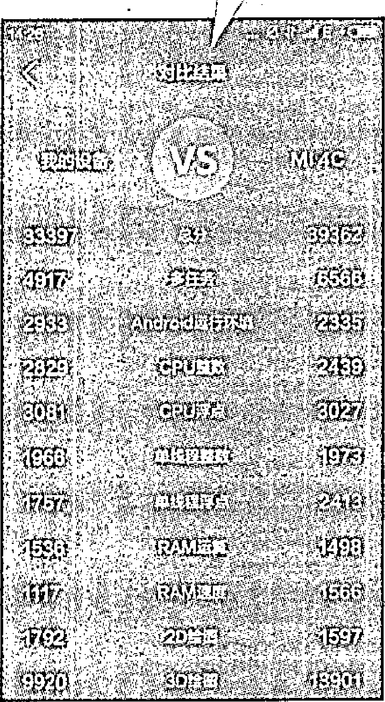

### 一堵人为的代码墙

笔记本的各种测试软件相对公正，但Android手机的测试软件可人为操作的空间就比较大了（图1）。

### 代码引发的迥异结局

早前网上曾曝出很多手机品牌跑分作弊的新闻，厂商只需在系统配置文件中植入一些代码和白名单列表（图2），只要检测到当前运行的程序在白名单之中，就触发临时性的超频操作，从而获得更高的跑分成绩。

有趣的是，也有手机厂商不属于作弊，甚至针对跑分软件进行了负优化。其中最具代表性的就是锤子手机，搭载骁龙808处理器的Smartisan T2在安兔兔V6测试中只能取得11000左右的分数（图3），而这颗处理器的平均性能至少要在45000以上。至于是如何实现的，可以参考上面的作弊内容，只是锤子改为了检测当前程序为跑分类APP时就自动降频运行而已。

### 以提醒之名

虽然如今的手机厂商不敢公然作弊，但这并不妨碍大家就提升跑分成绩而进行一些人性化的提示。比如当我们运行某跑分APP时，系统会弹出提示，提醒你以性能模式运行当前的APP（图4），以便获得更好的性能。

如果抛开这种人为设定的代码墙的影响，还有哪些墙在制约着手机性能的发挥呢？

```
.access$600..accessFlags..acquire..addExtraOption..append..arr$..boo leanValue..boostIntent..canWrite..close..com.antutu.ABenchMark.(com. aurorasoftworks.quadrant.ui.advanced..com.aurorasoftworks.quadrant.u i.professional..(com.aurorasoftworks.quadrant.ui.standard..com.greene computing.linpack..com.sec.android.app.twdvfs.5com.sec.android.inten t.action.OVFS_FG_PROCESS_CHANGED,*com.sec.android.intent.action.SSRM _REQUEST..com\.antutu\.ABenchMark\:.*..context..createDvfsFile..crea teNewFile..delete..deleteDvfsFile..dir..dir_path..doBoostAll..doBoos tForAdonis..doBoostForAdonis::..doBoostForFusion3..doBoostForFusion3 ::...doReleaseAll..e..enable..eng..equals..equalsIgnoreCase..exists..
```

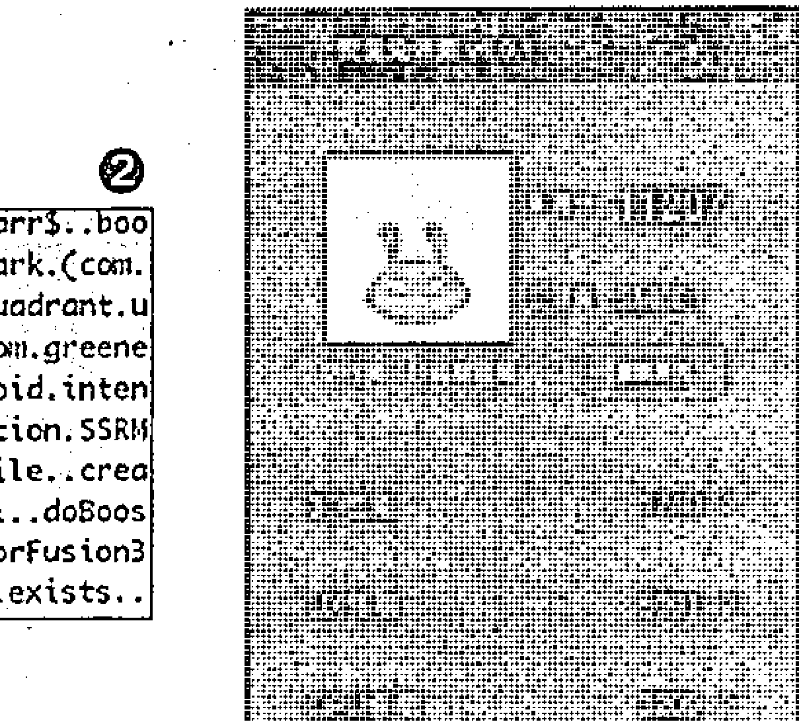

### 源自芯片厂的频率墙

我们都知道，像CPU这种半导体芯片，从生产线下来时每一颗芯片的体质和品质都是存在细微差异的。在PC领域，英特尔和AMD会将最好体质的CPU设定在高频率，并将其归类到至尊版高价销售；体质不好的CPU则会通过屏蔽部分晶体管，以更低端的型号示人。如果你的运气够好，可以通过开核或超频的方式，让体质好的低端CPU咸鱼翻身。

实际上，手机领域的CPU也是一样，只是它们没有开核超频进而翻身的机会。

### 同芯不同频的现象

小米5s以搭载高通骁龙821为主打卖点，但它的性能却比不上同样配备骁龙821的乐3 Pro和小米自家的小米5s Plus。原因很简单，小米5s的骁龙821最高主频只有2.15GHz（图5），而这颗处理器的标准参数应该为2.35GHz（图6），200MHz的频率差，就是导致小米5s“性能缩水”的关键。

同样，很多国产手机都搭载了联发科Helio P10处理器（图7），有些型号的主频为2.0GHz，有些型号的主频却仅有1.8GHz。于是，两类手机之间的性能同样出现了差距。和高通不同的是，联发科给不同主频的Helio P10都起了一个对应的名字，2.0GHz版叫MT6755，而1.8GHz版本则为MT6755M。只是，有些手机厂商会故意淡化MT6755M，只以它的家族名称Helio P10加以宣传，所以才会出现频率上的纠纷。

| 3GB内存+64GB闪存 | 4GB内存+128GB闪存 |
| :--- | :--- |
| 骁龙821 最高主频2.15GHz | 骁龙821 最高主频2.15GHz |
| Adreno 530 图形处理器 624MHz | Adreno 530 图形处理器 624MHz |
| 3GB LPDDR4 1866MHz 双通道 | 4GB LPDDR4 1866MHz 双通道 |
| 64GB 机身存储 UFS2.0 | 128GB 机身存储 UFS2.0 |


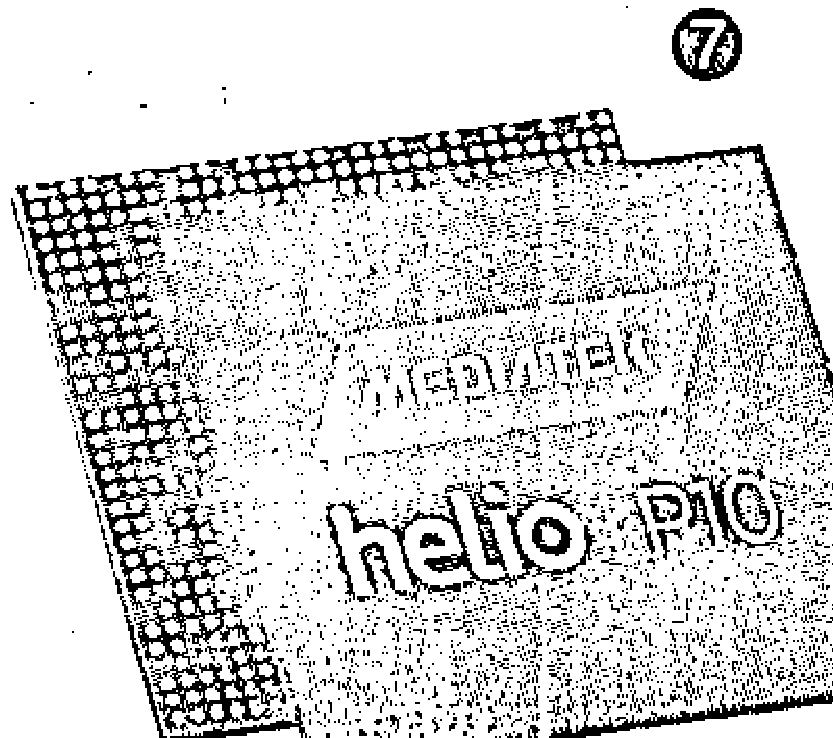

### 成本策略都有理

从成本的角度来看，低频版的骁龙821和MT6755的采购价格肯定要低于标准频率的版本。但不可否认的是，这些降频后的CPU的确拥有（相对）更低的功耗和发热量，有利于延长续航时间。

好消息是，这道源于芯片厂的频率墙是摆在明面上的，我们可以通过手机官网或包装说明上的处理器参数，明确获知该CPU的实际频率（图8）。问题是，哪怕就是两颗同芯同频的处理器，当安装在两款不同型号的手机上时，为何还会出现性能差异？

#### 基本信息
| | 产品A | 产品B |
| :--- | :--- | :--- |
| 【上市时间】 | 2016年8月 | 2016年8月 |
| 【操作系统】 | amigo OS3.5（基于Android 6.0） | amigo OS3.5（基于Android 6.0） |
| 【处理器】 | 联发科 MT6755 八核 2.0GHz | 联发科 MT6755M 八核 1.8GHz |

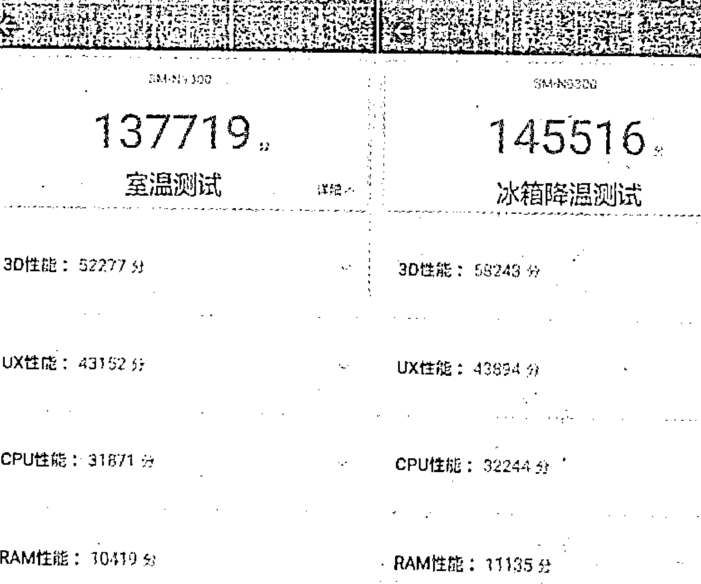

和笔记本一样，智能手机的处理器同样存在一堵看不见的“温度墙”。一旦系统检测到CPU温度超过了设定的温度墙阈值，就会触发降频、重启甚至关机的机制。

## 冰箱成为跑分利器

不知道大家有没有留意到一个现象，将手机放进冰箱运行跑分软件，其测试结果大都能高于室温环境。比如机锋网友@囧帝就拿三星Note 7进行了测试，在室温和经过冰箱降温后的Note 7安兔兔测试成绩相差7797分（图9）！

但是，并非所有手机在冰箱的帮助下都能明显提升成绩，有些手机的提升幅度可能微乎其微，有些甚至会出现负增长。这又是为什么呢？

## 散热设计决定撞墙几率

和台式机相比，笔记本的散热模块是无比寒酸的。但如果拿笔记本和智能手机相比，后者的散热结构就更搬不上台面了。但是，我们也不能因此而小瞧手机的散热设计，一些细微的差异，就会增加处理器因高温而撞上温度墙的几率。

那么，手机的散热方式有几种？哪种效果最好？

### 智能手机的散热方式

受限于轻薄的机身，想在智能手机里面塞进散热风扇肯定是不现实的。从机身材质的导热性而言，在内部散热结构相同的情况下，采用全金属机身设计的手机，其散热效果一定优于玻璃材质或塑料材质。而下面的内容，则是抛开手机材质，从内部设计加以探究。

#### 石墨贴片辅助散热

石墨是一种良好的导热材料，它的导热性甚至超过了钢、铁、铅等多种金属材料。拆开手机，我们会看到很多手机都在CPU对应的位置贴有一层薄薄的黑色贴纸，而这张贴纸，就是石墨贴片。我们可以将它理解为散热片，CPU发出的热量传递至大面积石墨贴片的各个位置进行扩散，从而间接起到了散热作用。石墨贴片的面积越大，导热/散热性能越好。

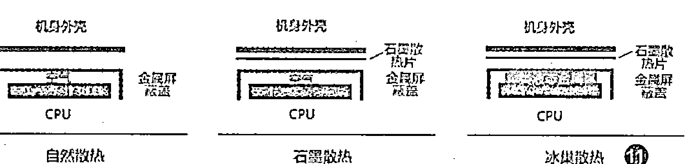

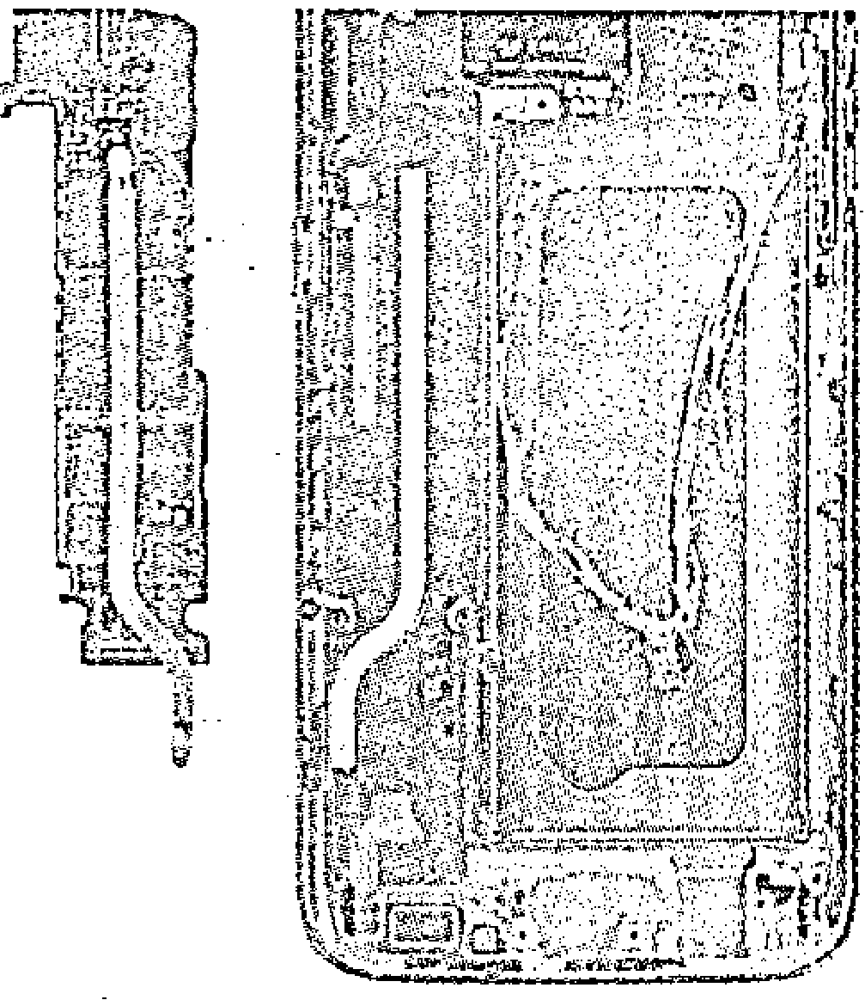

#### 金属背板辅助散热

在手机还是以塑料为主要材质的年代，有些产品会在石墨贴片的基础上，加入一层嵌入到手机后盖内侧的金属背板（图10），CPU发出的热量会通过石墨贴片传递到金属背板上，进一步增加散热面积。如今，采用金属材质的手机，我们可以将它的整个机身都理解为金属背板。

#### 热管辅助散热

为了镇压骁龙810这类公认的“火炉”，逼得智能手机不得不引入笔记本领域盛行的热管技术：将内部充满液体的导热铜管顶点覆盖在CPU表面，热管另一端则与石墨贴片或金属后盖相连。CPU产生的温度会让热管内的液体气化，这些气体会移动到热管另一端的散热区域降温凝结，冷凝后变成液体再次回到CPU部分，周而复始进行散热（图12）。

#### 填充材料辅助散热

为了保护CPU芯片，智能手机通常会在CPU表面加上一层金属的屏蔽罩，而石墨贴纸则位于屏蔽罩的上层。为了提高导热效率，在CPU和金属屏蔽罩的夹层中加入填充材料的方法便出现了（图11）。至于填充材料，则以导热凝胶和类液态金属的相变材料为主。

看到了吧？手机领域的散热方案也有不少讲究。搭载同款处理器的手机，在不同散热方案的影响下，全速运行时的CPU温度增幅和最高温度是存在差异的。散热效果不好的产品自然更容易撞上温度墙而触发降频机制；散热好的手机则可让CPU一直满血运行。如此一来，你还能指望两款手机都能跑出最好的成绩吗？

### 小结

随着金属材质成为手机设计的主流趋势，手机的散热压力已降低了很多。此外，受骁龙810失败案例的影响，无论是高通自身，还是联发科、麒麟等芯片厂都开始注重能耗比，再加上最新16nm/14nm工艺的引入，手机处理器犹如火炉的时代也将一去不返。


## 电脑操作系统减减肥

### 软件定制版也玩个人定制

策划《电脑爱好者》编辑部

祖国大江南北皆已入冬，想必大家早已贴完秋膘，准备对应不友好的寒冷了。
既然有增，就会有减。也会有“童鞋”不想只为过冬就改变了体型，拼命锻炼中。
就像有的用户非专业版操作系统、软件不用，而有人觉得功能太多不仅拖慢性能，还会让电脑臃肿无比。
我们给大家做足了准备，想要大而全的有弥补的办法，小而精的则有瘦身的手段。

扫一扫，更多精彩内容立现！

### 功能不缺失

找回Windows家庭的组策略 文|平淡

大家知道现在很多品牌机预装的系统大多为Windows 10家庭版，但是日常许多涉及优化的技巧都需要“组策略”这个专业版必有的功能。那么如何在Windows 10家庭版也用上组策略？

虽然Windows 10分为家庭版、专业版、企业版等不同版本，实际上它们的安装文件基本上都是相同的，每个版本功能不同是微软在系统内部进行了限制。比如在家庭版中移除了组策略组件，导致Windows 10家庭版无法使用组策略。因此我们可以通过特定的命令手动找回组策略。

启动记事本新建一个文本，然后输入下列的代码，在保存为窗口中，文件名为“aa.cmd”，保存类型选择为“所有文件(*.*)”，保存在桌面备用(图1)。

```
@echo off
pushd "%~dp0"
dir /b C:\Windows\servicing\Packages\Microsoft-Windows-GroupPolicy-ClientExtensions-Package~3*.mum >List.txt
dir /b C:\Windows\servicing\Packages\Microsoft-Windows-GroupPolicy-ClientTools-Package~3*.mum >>List.txt
for /f %%i in ('findstr /i . List.txt 2^>nul') do dism /online /norestart /add-package:"C:\Windows\servicing\Packages\%%i"
pause
```

返回桌面，右击上述新建的“aa.cmd”，选择“以管理员身份运行”，这样该命令会调用Windows 10自带的DISM命令，将缺失的组策略相应的组建包提取出来并添加到当前系统(图2)。

完成上述操作后在搜索框输入“gpedit.msc”就可以启动组策略编辑器。上述方法是在已经安装好的Windows 10家庭版上移植组策略，如果要离线给Windows 10家庭版移植组策略。准备好Windows 10家庭版安装文件并将其中的“sources\install.wim”提取到E:\备用，同上启动命令提示符后输入“Dism /Mount-Image /ImageFile:d:\install.wim /index:2 /MountDir:d:\Win10”（假设家庭版映像号为2），将家庭版安装镜像装载到D:\win10，同上启动记事本新建bb.cmd，将上述代码中的C:\windows更改为D:\win10\windows，dism /online更改为dism /image:d:\win10运行即可。

完成组件包的集成后继续输入“Dism /Unmount-Image /MountDir:d:\win10 /commit”，卸载镜像并提交保存，以后重装Windows 10家庭版后即可使用组策略。

图1：保存代码

图2：提取组件包

#### 扩展阅读：
- 限制USB设备加载——大势至禁用U盘工具：可以像组策略设置那样完全禁止USB接口的使用，使得本机无法使用USB设备。
- 限制程序运行——Process Blocker：一款阻止程序运行的工具，它可以像组策略里的软件限制策略，很好地阻止用户指定的程序运行。

## 一个好汉三个帮 标准版Office媲美专业版

大家知道Office有标准版和专业版，前者功能较少，后者则拥有比标准版更强大的功能，如Excel专业版拥有比标准版更多的函数。不过大家知道Office支持各种强大的插件，因此标准版用户如果觉得自己的版本功能较弱，那么借助插件即可扩展标准版Office的功能。

### 公式录入更简单——Excel工具箱

Excel一个强大的功能就是可以插入各种函数实现高效操作，不过对于新手来说，要完全理解每个函数并熟悉其用法并不是一件简单的事情。Excel工具箱这个插件则可将常用函数转换为简单的工具按钮，使用函数时我们只要简单点击即可。比如在使用Excel制作工资表的时候，我们经常要计算含税工资，现在利用上述插件提供的含税工资函数即可快速统计。默认情况下安装完插件后会在菜单栏增加‘工具箱’新菜单项，如果没有出现，Excel 2016用户启动Excel后点击‘文件→选项→加载项’，在打开的窗口选中‘Excel必备工具箱VSTO’，点击‘转到’，然后在弹出的窗口勾选该插件即可。现在在A2输入税后工资，在B2点击‘工具箱→添加函数’，输入‘=hsgz(A2, 3500)’，这样即可自动统计出含税工资。当然，Excel工具箱还提供其他丰富功能（图1）。

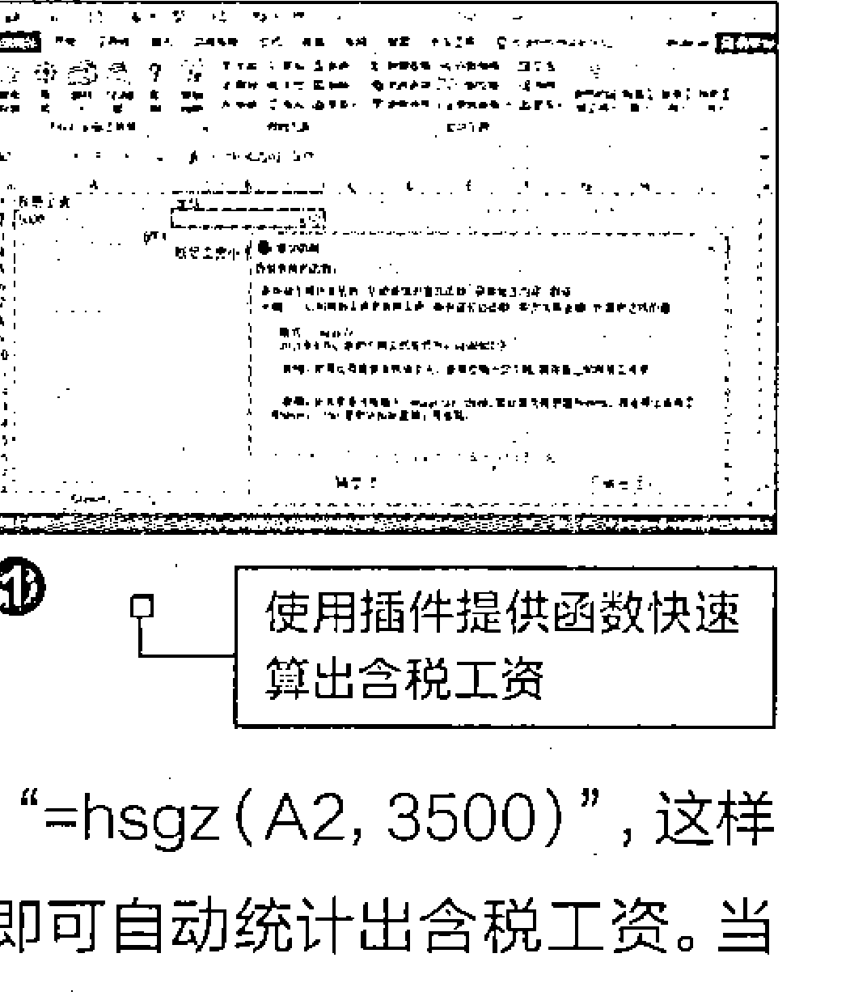

### 插入动画更简单——PPT动画大师

在日常PPT文档制作时我们经常要插入动画文件，不过该文件的插入可不简单，需要使用开发工具栏的VB控件，而且还要设置一些参数才能完成。不过现在借助‘动画大师’插件，即使是新手也可以轻松在PPT中插入动画文件。将下载到的插件保存在‘C:\Users\电脑用户名字\AppData\Roaming\Microsoft\AddIns’，接着启动PPT2016直接打开下载到的PPT动画大师@V1_1.ppa，然后选择‘启用宏’，这样在菜单栏可以看到新增的‘加载项’菜单。在PPT中直接拖入动画文件，选中动画文件后点击‘加载项→PPT动画大师’，在打开的窗口中就可以对动画参数进行设置了（图2）。

小提示：由于很多第三方插件是基于Visual Studio 2010 Tools for Office Runtime编写的，因此大家系统中如果没有安装该运行库，请自行到http://suo.im/n9nm9下载安装。

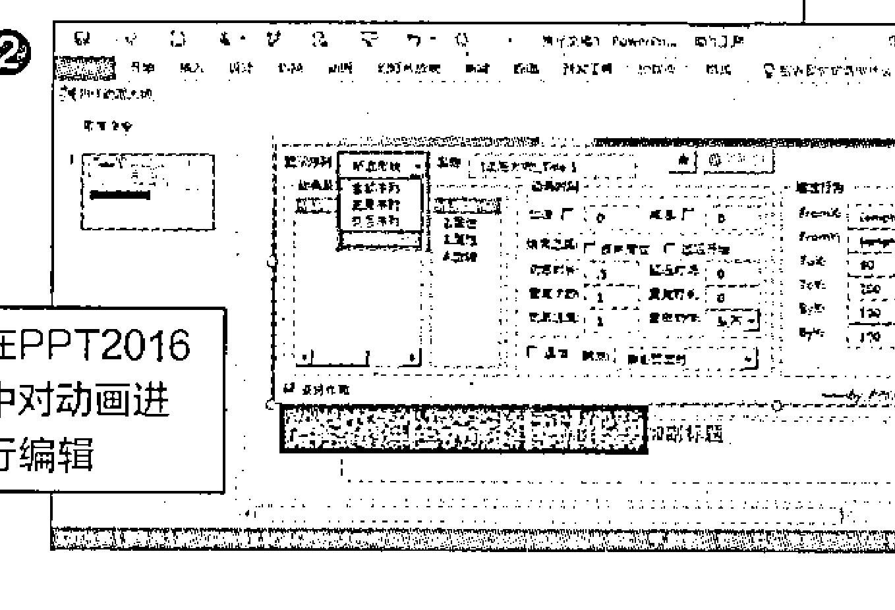

### Word操作更高效——Word万能工具箱

在日常的工作中，我们经常要在Word中对一些文档进行替换。比如笔者所在部门由原来‘销售部’更改为‘市场营销部’，这样原来统计文档中的‘销售部’都要改为新的名称。需要替换的文档很多，常规的操作是在Word中使用VB脚本实现批量替换，不过这需要一定的编程知识。现在万能工具箱就提供很多实用工具来帮助我们高效执行这类操作。插件安装完成后会在Word 2016新增‘万能工具箱’菜单，如果现在要执行上述操作，点击‘万能工具箱→文档批量查找替换’，在打开的窗口选择文档路径，然后输入需要查找和替换的内容，点击‘批量替换’即可。当然该工具箱还提供很多高效工具（图3）。

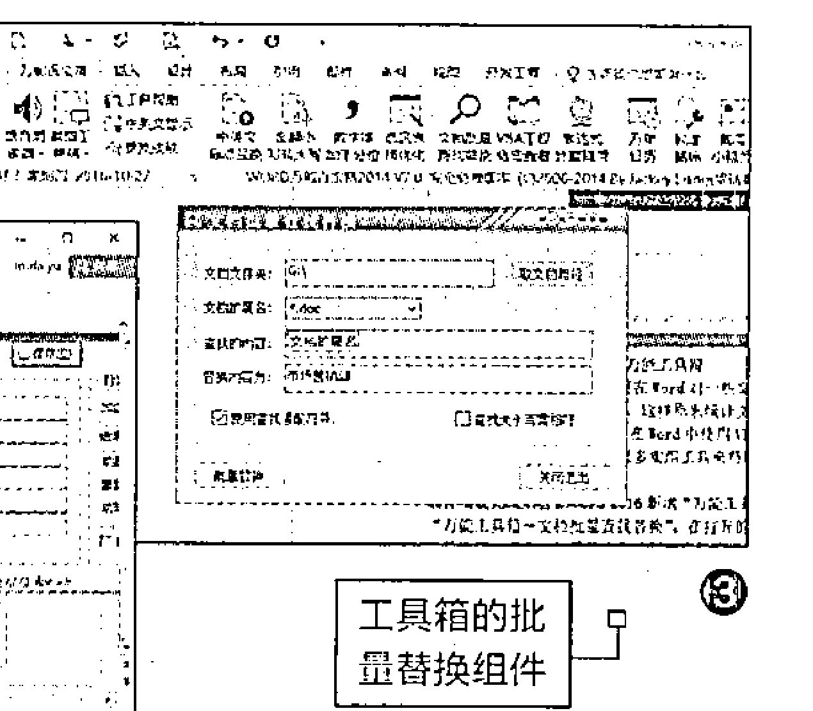

### 按需定制

## Windows 10功能大瘦身

文|俞木发

大家知道Windows历来是大而全的操作系统，Windows 10自然也不例外。系统中很多组件可能是我们不需要的，一些个人需要的组件却没集成。因此我们可以根据自己需要对Windows 10进行功能定制。

### 功能定制 增删有度

在实际使用中，Windows 10默认安装是不大人性化的，比如对于普通PC用户，Windows 10内置的很多应用对很多朋友来说基本没用，但是Windows 10是强制安装的。一些特殊组件如.NET Framework 3.5套件却是日常很多软件必需的，可是Windows 10却自作聪明认为新系统已经安装.NET Framework 4.6而没有集成.NET Framework 3.5。因此我们可以根据自己的实际需要对Windows 10功能进行合理的增删。

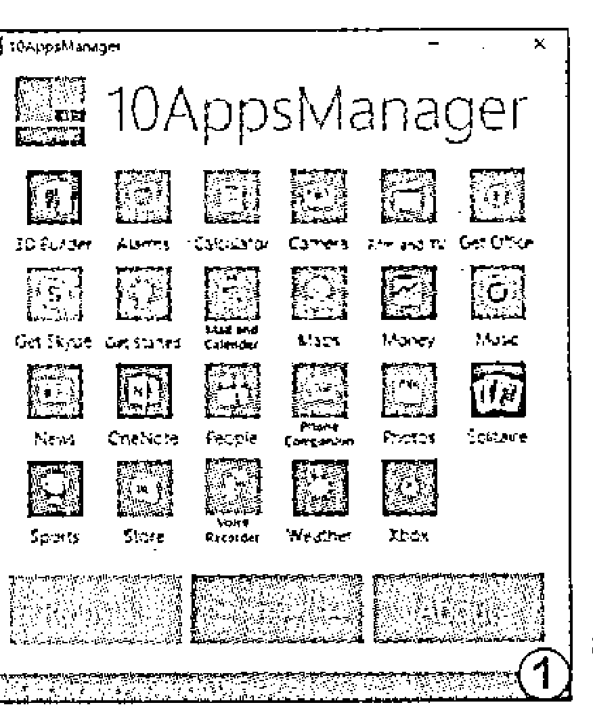

①

卸载内置应用

对于不常用的组件如Windows 10内置的应用，使用系统自带的PowerShell命令进行卸载即可。不过命令行的操作比较繁琐，新手们还可以借助“Win10预装程序卸载工具”，启动软件后它会自动读取Windows 10所有内置的应用，点击需要卸载的应用，在弹出的窗口点击“是”即可卸载了(图1)。

Windows 10内置的应用如果误删除，可以进入应用商店重新下载。对于其他不需要的Windows组件的删除/添加，则可以利用系统自带的“Windows功能”进行操作。在搜索框输入“Windows功能”，启动该组件后按自己的实际需要选择或者取消特定组件进行增删即可。比如要使用Hyper-V虚拟机的用户，勾选该组件后点击“确定”即可安装(图2)。

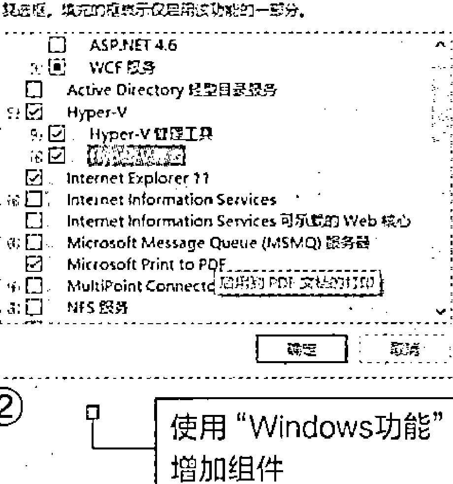

②

使用“Windows功能”增加组件

上述组件大多包含在本地系统文件中，对于没有的文件会自动连接到微软服务器在线下载安装。当然如果在线下载速度较慢，也可以手动进行安装。如.NET Framework 3.5组件，该组件已经内置在Windows 10安装文件中，将Windows 10安装文件加载到虚拟光驱后，以管理员身份启动命令提示符后输入“dism.exe /online /enable-feature /featurename:NetFX3 /Source:L:\sources\sxs”(假设虚拟光驱盘符为L:)，这样即可手动进行.NET Framework 3.5组件的安装(图3)。

```
dism.exe /online /enable-feature /featurename:NetFX3 /Source:L:\sources\sxs
```

不过使用“Windows功能”关闭的组件，Windows 10只是将其禁用(并没有在系统中将其删除，可以再次启用)。对于确定无需再次使用的组件，我们可以使用DISM命令彻底删除以节省空间。比如对于个人用户，内置的传真服务(FaxServices ClientPackage)基本是没用处的，如果要彻底删除该服务，同上以管理员身份启动命令提示符后输入“DISM /Online /Disable-Feature /Featurename:FaxServicesClientPackage /Remove”(即在/Featurename:后添加需要彻底删除的组件名称)，这样即可彻底删除该组件(图4)。

```
DISM /Online /Disable-Feature /Featurename:FaxServicesClientPackage /Remove
```

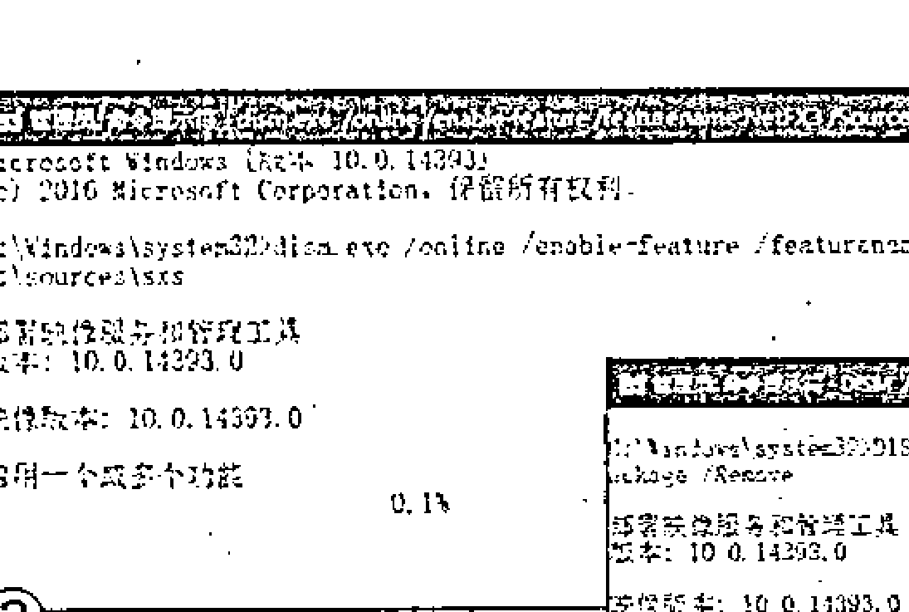

③

本地安装.NET Framework 3.5组件

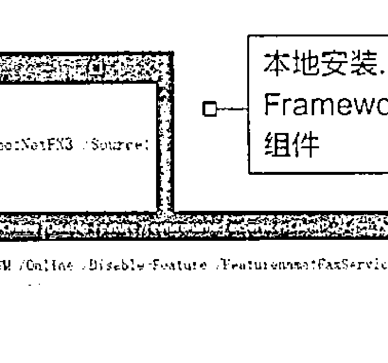

④

使用DISM彻底移除组件| 组件名称 | 状态 |
| --- | --- |
| TelnetClient | 已禁用 |
| TFTP | 已禁用 |
| Xps-Foundation-Xps-Viewer | 已禁用 |
| Win-Folders-Client | 已禁用 |
| SMBv1Protocol | 已禁用 |
| Microsoft-Hyper-V-All | 已禁用 |
| Microsoft-Hyper-V-Tools-All | 已禁用 |
| Microsoft-Hyper-V-Management-Clients | 已禁用 |
| Microsoft-Hyper-V-Management-PowerShell | 已禁用 |
| Microsoft-Hyper-V | 已禁用 |
| Microsoft-Hyper-V-Hypervisor | 已禁用 |
| Microsoft-Hyper-V-Services | 已禁用 |
| Printing-Foundation-Features | 已禁用 |
| Printing-Foundation-LPRPortMonitor | 已禁用 |
| Printing-Foundation-LPDPrintService | 已禁用 |
| Printing-Foundation-InternetPrinting-Client | 已禁用 |
| FaxServicesClientPackage | 禁用已删除的负载 |
| （其他可见组件） | （对应状态） |

```
dism /online /format:table /Get-Features
```

> 小提示
对于系统自带的组件彻底删除后如果要恢复，只要在上述的“Windows功能”中勾选启用，Windows 10仍然会自动连接到微软服务器在线下载安装。

### 不留死角增减Windows 10其他组件

除了上述组件的增删外，Windows 10中还有许多不常用的功能，比如失效的电脑外接设备，系统内置字体、主题、屏保等不常用功能。对于这类组件的增删，我们可以根据具体组件使用不同的方法进行优化。

对于失效的电脑外接设备，启动设备管理器后点击“查看→显示隐藏的设备”，这样电脑中所有曾经连接过的设备都会显示出来。如曾经连接的蓝牙适配器，如果现在已经不再使用，只要展开“蓝牙”，然后选择“卸载”即可。类似的还有虚拟光驱、虚拟磁盘等虚拟设备，这些软件如果没有完全卸载都会在设备管理器中留下隐藏设备（图6）。

> 小提示
如何快速找到“隐藏的设备”？只要使用系统自带的截图工具，在勾选“显示隐藏的设备”前后进行截图，然后打开前后图片进行对比即可。

对于系统内置字体、主题、屏保等不常用组件的删除，则可以自行进入相应的目录选择性地删除。比如不需要的字体文件，打开C:\Windows\Fonts，这里可以看到本机已经安装的所有字体文件。如一般简体中文用户只要保留中文、繁体中文和英文字体，其他语种字体文件则可以全部删除。选中要删除的字体后，在下方的“设计用于”可以看到其对应的语种（图7）。

Windows 10屏保文件在C:\Windows\System32，只要将文件夹查看方式设置为“列表”，分组依据设置为“类型”，这样可以轻松找到所有的屏保文件。壁纸默认目录为C:\Windows\Web\Wallpaper。总之，对于这类文件的删除是找到具体目录，然后删除其中的文件即可（图8）。

### Windows 10运行更高效

#### 整理磁盘空间 文|愚人

大家都知道Windows 10在运行过程中会产生大量的垃圾文件，这些垃圾文件不仅占据硬盘宝贵的空间，而且会降低Windows 10的运行效率。那么该如何高效又安全地整理磁盘空间？

#### Windows 10自带清理工具

要安全地对系统内的垃圾文件进行清理，Windows 10已经自带很多优化工具。一方面我们可以使用“磁盘清理”快速而且安全地删除垃圾文件。启动磁盘清理组件后点击“确定”进行扫描，在扫描窗口继续点击“清理系统文件”，这样本机几乎所有不需要的垃圾文件都可以扫描出来，按提示勾选全部选项即可删除（图1）。
另一方面，我们还可以通过对磁盘进行压缩以提高磁盘的使用空间。以管理员身份启动命令提示符后输入“compact /compactos:query”查询当前系统是否已经启用压缩，如果提示“系统不处于压缩状态”则表明未压缩，此时在命令提示符继续输入“compact /compactos:always”开始对当前系统进行压缩，这样可以大幅减小磁盘占用空间（图2）。
此外，Windows 10中很多目录里还会保存很多无用的垃圾文件，我们可以根据自己的需要进行选择性删除。为了方便大家进行删除，这里将Windows 10下可直接删除的文件夹及用途做个列表供大家参考。

```
compact /compactos:query
compact /compactos:always
```

| 目录名称 | 用途 | 是否可以全部删除 |
| :--- | :--- | :--- |
| C:\WINDOWS\Temp\ | 系统临时文件 | 是 |
| C:\WINDOWS\ServicePackFiles | 系统升级的备份文件 | 如果升级后没有问题可以删除 |
| C:\Windows\System32\DriverStore\zh-CN | 驱动程序的备份文件 | 否，按自己实际需要选择性删除 |
| C:\WINDOWS\SoftwareDistribution\download | Windows 10更新下载的补丁文件 | 是，如果更新后没有问题可以删除 |
| C:\WINDOWS\Prefetch | 系统预读文件 | 是 |
| C:\windows文件夹中以$开头和结尾的隐藏文件 | 安装系统补丁后的临时文件，以KB开头的.log文件如KB873339.log | 是 |
| C:\Windows.old文件夹 | 升级后整个旧系统的文件 | 是，建议使用磁盘清理工具删除 |
| C:\Windows\system32\config\*.evt | 系统日志文件 | 是 |
| C:\WINDOWS\Installer下的文件 | 使用Windows Installer技术制作的安装程序会在Installer目录里面添加一个备份的安装文件用于今后的配置、补丁安装等操作，经常安装程序就会遗留大量垃圾文件 | 是 |

#### 第三方高效处理垃圾文件

Windows 10自带的清理工具使用虽然简单，但是操作效率却不高。如果要快速为系统腾出更多的使用空间，我们还可以借助一些专业的第三方优化软件来协助。
**一眼看透占用空间的大文件：**
**Windirstat**
WinDirStat是一款免费的硬盘容量统计软件，它能够以全彩的方式来呈现不同的文件在硬盘中占去的空间大小，这样我们通过颜色就可以直观地知道哪种类型的文件占用磁盘空间。启动程序后选择扫描本地磁盘，在扫描结果中它会将不同的文件类型以不同的颜色显示，某种类型文件占用磁盘的空间通过图示就可以很直观地分辨出来(图3)。

这样我们可以根据图示来删除不必要的垃圾文件。比如笔者的电脑中，TD文件(迅雷未下载完成)占用不少空间，点击图示文件后选择“彻底删除”按钮即可将这些垃圾文件删除。

#### 命令行高效扫描大文件: SpaceSniffer

SpaceSniffer和WinDirStat功能类似，扫描后它也会以图表的形式直观反映各种文件占用的空间，只要在其中右击选择删除，即可将占用空间的大文件清除(图4)。

SpaceSniffer还支持使用命令行扫描，这样可以更高效地实现定向扫描。比如可以先将SpaceSniffer主文件复制到C:\windows\system32下。假设现在需要分析F盘里所有ISO文件和D盘、G盘里的大于500MB的文件，则在命令提示符窗口输入“SpaceSniffer.exe scan f:\ filter *.iso scan d:\;g:\ filter >500mb”，这样程序会自动对这三个分区指定文件进行搜索，在扫描结果中按提示删除找到的文件即可(图5)。

##### 其他更多优化软件:

找出多余重复文件: Anti Twin (www.anti-twin.com), 它可以逐个字节地比较文件，这样可以轻松找出重复文件，只要删除多余文件即可减少磁盘占用。

检测重复的图片: VisiPics (www.visipics.info)，它可以通过内容分析，找到不同分辨率但是主题相似的图片。对于喜欢在电脑上保存图片的用户，可以删除大量相同的图片以节省空间。

找出相同的歌曲: Similarity (www.similarityapp.com)，它可以扫描所有音频文件并分析歌曲内容，从而快速找出本机保存的重复音频文件。

#### 用好自动工具 垃圾清理更高效

上面的方法虽然好用，不过这些垃圾文件系统使用一段时间又会再次产生。因此要让自己的磁盘空间始终保持更多的可用空间，我们就可以使用一些自动化工具实现垃圾文件的清理。比如微软每月都会发布新的补丁，我们只要结合系统任务计划实现更新垃圾文件的自动删除即可。

因为清除更新垃圾实际上主要就是删除C:\Windows\SoftwareDistribution\Download\下的所有文件，因此可以启动记事本输入下列的代码并保存为clean.bat放置在桌面:

```
Del /q /f "C:\Windows\SoftwareDistribution\Download\*.*"
DISM /Online /Cleanup-Image /StartComponentCleanup /ResetBase
```

启动任务计划程序，点击“创建任务”，按提示创建一个“清除更新垃圾”的任务，触发器是每月第一天运行，运行的命令是上述创建的批处理，这样到了每个月的1号，系统就会自动将更新垃圾文件删除(图6)。

#### 丰俭由人 硬件也定制

文|多罗罗

大家已经习惯于软件的定制化，不过随着市场的发展，其实在硬件领域，我们也完全可以做到更随心所欲，根据自己的资金和需求进行灵活配置。例如在资金分批到位的情况下直接获得可用的系统，并且逐步提升性能；抑或根据环境的不同灵活配置散热系统；甚至可以根据需求的不同使用不同配置的外设……

#### 玩家最爱——多显卡系统

目前最重要的两个显卡芯片厂商——AMD和NVIDIA，都有多显卡并行处理3D图像的技术，以及CrossFire和SLI（Scalable Link Interface，可升级连接界面）。虽然在大多数情况下，多显卡系统都被当作一种组建最高端电脑的方式（图1），但实际上，这两项技术并非顶级显卡所独占，而是存在于几乎所有的独立显卡，甚至是内置显示单元中。

多显卡并行技术让中端用户可以在初期资金不足的情况下，先购买一块性能足够的中端显卡，在游戏需求提升、资金也更充裕之后，通过增加一块显卡来实现3D性能倍增，获得与顶级显卡类似的性能。这种方式不仅无需一次性承受巨额资金的付出，而且总成本还可能低于直接购买一块顶级显卡（图2），或者在类似金额下获得明显更强的性能（图3），它的价格比NVIDIA GeForce GTX 1080虽然略高一些，但性能强大得多），只是最终系统相对于一块顶级显卡的总功耗可能会略高一些。另外尽管现在的多显卡在驱动甚至系统（DirectX）层面已经完全融合，对绝大多数游戏来说和一块高性能显卡没有什么区别，但也有少量游戏或应用因为对驱动的支持不好或者对底层运算有特殊需求，所以不支持多显卡并行或并行处理的效率不高。

由于负载调整更复杂等原因，其性能损失比同款显示芯片搭配要大一些。

在简单了解了一下多显卡系统后，我们来看一看如何更好地使用这种技术吧。

AMD的CrossFire技术还有一种更有趣的应用，那就是让其自家的独立显卡芯片和同样自家的APU内置显示单元（融合单显）搭配使用。虽然这种情况下两块显示芯片的性能难以做到完全匹配，但通过动态调整负载，还是能让3D处理能力有明显的提升，当然

##### 新购用户：还有AMD Radeon RX 470/470D

对于新装机或准备升级显卡的用户来说，新架构显卡应该是最好的选择，而如果未来准备使用我们介绍的双显卡系统扩展，那么除了我们前面提到的基于AMD Radeon RX 480和NVIDIA GeForce GTX 1070的显卡外，还可以考虑更便宜一些的AMD Radeon RX 470/RX 470D。从目前的测试可以看到，双Radeon RX 470的CrossFire性能远强于Radeon RX 480和GeForce GTX 1060，显卡高负载的情况下或DirectX 12应用中，甚至接近GeForce GTX 1070显卡(图4)。当然两块Radeon RX 470的总价也和一块GeForce GTX 1070显卡类似，所以性价比方面并没有明显优势，只是可以缓解用户的资金压力。近期AMD针对国内市场推出的Radeon RX 470D性能达到470的90%以上，而价格为1300元，单卡和双卡的性价比类似，还略高于Radeon RX 470。

在目前已有的新架构中端显卡产品中，AMD Radeon RX 460显卡的性能无论是单卡还是双卡都略显不足，即使采用双卡并行模式，其性能也仅接近Radeon RX 470或GeForce GTX 970，显然不足以应对未来的需求。而NVIDIA在新架构产品中做得更“绝”一些，为了防止对自身更高高端显卡造成威胁，其针对2000元以下的GeForce GTX 1060/1050系列产品均不支持多卡并联模式。

需要注意的是，如果有未来使用双显卡模式进行升级的计划，那么在实际选购时也要为将来留下余地。例如不要选择散热器过厚的产品，以免未来无法在相邻插槽安装第二块显卡；不要选择超频幅度过大和小批量产品如各种纪念版、特别版(图5)等，否则后期很难找到频率匹配的显卡。而超频幅度较小的产品，我们在后期购置显卡时更自由，无需选择同品牌型号的产品，通过软件少量超频或降频就可使两块显卡频率一致，运行时负载更平衡，获得最好的性能提升效果。

##### APU用户：体验交火的最后机会

APU用户一般是对处理器和3D游戏性能要求都不太高的用户，由于目前处理器性能的过剩，中高端APU的通用处理能力还是完全够用的，不过随着游戏对3D性能的需求越来越高，内置融合单显可能已经有些力不从心。如果用户仍然对高端大型3D游戏没有太大兴趣，那么选择一款合适的独立显卡组成CrossFire系统是不错的选择(图6)。而且由于新架构产品正在迅速成为中低端市场的主力，最适合搭配的R7系列(图7)可能即将消失，所以除非做好买二手货的准备，否则有这想法的要赶紧出手了。

#### 高分大屏变形记 多显示器系统

尽管高分辨率显示器已经不再是贵族产品，但在使用高分辨率显示的方式上，其实还有一种特殊的方式，不仅能提供高分辨率画面，而且可以根据需要变化不同的分辨率或者画面规格，那就是使用多显示器。

相对于高分辨率大屏显示器，多显示器系统在某些情况下的性价比也要高得多。例如4台目前性价比较好的24英寸~27英寸全高清或2K分辨率显示器的组合，可以获得4K甚至5K分辨率画面，而显示尺寸更相当于同比例的48英寸~54英寸显示器（图8），但价格显然比这种少见的巨屏显示器要便宜得多。

多显示器系统的组合方式非常多样，使用双显示器、三显示器（图9）也是不错的选择；另外还可以根据需要使用不同的摆放方式，例如超宽显示（图10）、超宽屏加控制屏（图11）等；如果采用能够平面旋转的显示屏，如戴尔的大部分产品，还能获得一些更特殊的组合模式。

在采用多显示器系统时，最好选用边框相对较窄的产品，而且对PC的视频输出能力有一定要求，需要具备多个接口或高带宽接口如DisplayPort（图12），其mini形态目前几乎已成为中高端笔记本电脑的标准配置（图13、图14）。如果分批采购的话，则最好选择规格类似的产品，特别是应用于影音娱乐或游戏的话，还需要显示器的性能如响应速度、亮度等指标比较接近，或者可以调节至比较接近的程度，否则高速动态画面中更容易感觉出画面亮度不同、刷新率错位等问题。另外在使用多显示器系统时，搭配一些专用支架使用体验更好（图15）。

#### 最简单的机箱改造 自装风扇

高手对机箱的改造，甚至是自己制造的机箱MOD我们已经见过很多，其实我们自己也能根据需要对机箱进行简单的改造，其中增减风扇是最常见，实际效果也最明显的一种。

常见的机箱，包括已经提供了一些机箱风扇的产品，大都留有数个可扩展的机箱风扇位(图16)，其尺寸主要是8英寸和12英寸两种。根据实际需要和机箱内容安排拆装机箱风扇，应该算是DIYer的最基本技能，特别是对我们前面提到的构建多显卡系统等工作来说，搭配安装机箱风扇是很不错的选择，可以缓解两块显卡紧密排列造成的散热问题。

#### 游戏办公两不误 分离式键盘

对玩家来说，键盘的架构越简单越好，最好只有游戏本身需要的按键，这样既减少了误操作的可能性，也更便于放置或者携带，其极致产品当然就是手柄摇杆等设备，但对大部分PC游戏来说，键盘+鼠标仍然是最好的操控设备。那么有什么办法解决这一问题呢？也许84键键盘(图17)是一种不错的解决方式。84键键盘可以满足绝大多数PC游戏甚至是日常使用的需求，同时身材比标准键盘要小巧得多，所以成为了很多用户特别是玩家的选择。84键布局键盘宽度明显缩减，在键盘安放位置的右侧留出了额外空间，让鼠标使用区域更大。目前最火的机械键盘产品中，也有不少84键布局的产品，对手感追求手感的玩家来说，更是很不错的选择。

当然大多数人仍然对办公等应用有一定需求，此时数字小键盘可能会变成必不可少的设备。在一些工作，如需要大量数字输入的数据统计、表格处理中，数字小键盘甚至会成为输入的主角，如果能脱离主键区使用也更加方便。对这样的应用，我们不仅可以购买独立的数字小键盘，还可以考虑一些本身就采用分离设计的产品(图18)。

随着机械键盘的普及，键盘DIY的深度可以进一步提升，例如更换键帽。很多机械键盘直接提供了拔键器(图20)，便于用户维护甚至更换键帽。而Cherry等拥有多种轴体的厂商，常常采用标准化的固定夹等设计，让用户可以直接更换轴体。用户可以根据自己的习惯进行规划，例如将常用游戏动作按键更换为段落感更强的轴体，而将办公更常用的按键更换为声音较小、力度较小的轴体等。

另外我们还可以看到一些有针对性设计的键盘，确实能达到我们前面提到的最精简设计(图19)，不过这些产品缺乏扩展性，很难做到游戏办公两不误，只适合高端发烧级玩家。

#### 指掌之间 鼠标也能DIY

输入设备的个性化设计早已不是新鲜事，鼠标也和键盘一样，是其中的重点产品。对大部分用户来说，可能更关注的是鼠标外形、材质、背光等部分，其实鼠标可自定义的按键能让使用乐趣获得更大的提升，甚至提高用户的游戏水平或办公效率，也是最早最普遍的鼠标自定义模式。

鼠标按键的自定义有两种，第一种是基于驱动的按键自定义，或者叫编程（图21），这一功能对大部分用户来说并不陌生，也很容易使用。第二种则是真正意义上的更换按键，例如我们之前介绍过的罗技G900鼠标，就可以根据需要在两侧装卸按键（图22），形成0~4个不同的侧面按键配置。

MAD CATZ的多种鼠标也提供了硬件层面的DIY能力，用户可以更换的部件包括掌托、指托及部分按键，而最高端型号MAD CATZ R.A.T.PRO X（图23、图24）甚至可以更换底部的光学组件（图25）。MAD CATZ R.A.T.PRO X鼠标这种几乎完全可更换的模式，特别是核心可选的方式，已经和PC的DIY方式非常类似。

#### 数码与PC之间 二合一电脑

相对于各种通过定制来增强性能或提升体验的配件来说，二合一电脑，或者其他名称的类似产品，其实就是在宏观上进行应用方式甚至产品定位的定制。虽然在早期的产品中，二合一电脑有多种模式，其中最常见的是很标准的笔记本电脑，通过各种方式让屏幕旋转为A面(图26、图27)，即可使用类似平板电脑的使用方式。旋转屏幕的方式虽然让设备可以在标准笔记本电脑和平板电脑模式之间方便地切换，但平板模式过重，难以手持使用，因此难以和平板电脑竞争。而其原本作为优势的一些设计其实也并不靠谱，例如联想Yoga将键盘面朝下时可作为支架，让屏幕可在不同角度下使用(图28)。但将键盘面朝下放在各种粗糙甚至肮脏的平面上，真的“大丈夫”？更何况真的点击按压屏幕操作时，通过活动轴连接的“支架”显然并不能保证屏幕的稳固。

也许正是由于这些问题的存在，最近比较火热的二合一电脑如微软Surface系列、华为MateBook，以及戴尔、华硕、惠普等厂商的二合一电脑，几乎清一色的采用了屏幕+按键的模式（图29）。

这些产品的主体基本就是一个非常标准的平板电脑，追求轻薄易用，而通过可以快速连接的自家或第三方键盘，又能迅速转换为更适合办公应用的笔记本电脑形态。需要注意的是，这一形态不仅被我们熟悉的Windows PC阵营所接受，而且也成为了苹果iPad Pro比较典型的使用模式（图30）。

#### 还有哪些没有说

其实看似普通，但却拥有定制能力的消费级数码IT产品、配件还有不少，例如模组电源让用户可以根据需要连接输出线(图31)，在内部设备较少的时候减少内部线缆数量，更容易布线，而不是像一般电源那样把大量无用的线缆留在机箱内部；还有一些主板会选择更多地在主板上预留USB、IEEE1394等扩展接口的针脚，让用户选择使用前面板还是后置挡板引出接口等；

另外我们在上一期的老旧电脑改造中也提到，PCI-E总线及相应插槽也是一种可以很方便地定制的标准，我们可以通过板卡将其转换为USB、SATA等多种接口。

## 深度解析 年末笔记本上的黑科技

时至年末，PC领域终于随微软和苹果的新品迎来了一番革新，为陷入泥潭的PC市场树立了全新的风向标。无论是新Surface Book、Surface Studio还是MacBook Pro，在这些新品身上都涌现出了无数“黑科技”。想把脉未来PC的发展趋势，仔细品味这些黑科技的环节必不可少。

### 苹果MacBook Pro带来的革新

如何挽救衰落的PC？Windows PC阵营的答案是从形态出发，无论是屏幕可分离的Surface，还是屏幕可翻转的YOGA都是如此。而苹果新MacBook Pro的答案则是：从功能和细节出发（图1）。

#### 苹果Touch Bar: 熟悉的感觉

Multi-Touch Bar(下文简称Touch Bar)是苹果新MacBook Pro主打的特色功能之一。它能根据当前运行的应用程序，通过OLED屏幕呈现高可动态调整的触控按钮，可极大提升操作效率。但是，你以为这种“一触即发”的设计就是苹果的专利？

#### 自适应硬件的首秀

Touch Bar可以用“自适应硬件”诠释，它能结合当前应用展现不同的状态（图2）。然而，这种“自适应硬件”的概念，早在1999年就已经被微软提出了。十年后（2009年），这种“自适应键盘”（Adaptive Keyboard）正式亮相于UIST学生创新大赛，这款键盘最大的特点就是在传统键盘上方新增了一个支持触控操作的LCD屏（图3）。

> “像鼠标、键盘这样的高效输入设备不应该是 一成不变的，其功能和作用应该根据用户内容而改变，就像PC屏幕上的用户界面一样。”

眼熟吗？这种设计理念和苹果Touch Bar有着异曲同工之妙。只是，微软的Adaptive Keyboard项目最终并没有付诸实施，而苹果却将Touch Bar变成了现实。

有意思的是，在2014年还有一款产品也提出了“自适应键盘”概念，它就是ThinkPad New X1 Carbon。这款产品取消了原本的物理Fn键设计，将传统的六排按键键盘缩减为五排，取消了最顶部的F键。所有的功能按键都换成了触控式，点击一下触控条最左侧的按键，横条中的功能按键就会变换成另外一组新的按键（图4）。

同时，ThinkPad也提供了专用的配置软件，在里面可以设定自动触发触控条变化的程序（图5）。比如，运行IE时触控条就以网络按钮为主；打开Word就变成了传统的F1~F12。然而，New X1 Carbon的触控条功能缺乏自定义功能，而且触发条件不够灵活（第三方程序无法调用），所以很快就被联想放弃，ThinkPad的后续产品也就取消了这一设计。

#### 第二块屏幕的尝试

如果将Touch Bar视为新MacBook Pro的“第二块屏幕”，那这种双屏幕的概念则也能追溯到2007年，华硕在当年推出的W5Fe笔记本，就曾在A面外壳嵌入附属显示器为主打卖点（图6）。

实际上，W5Fe是一款为了迎合微软当年Windows Vista系统中SideShow辅助显示技术而生的概念产品，而且技术含量和成本更高。

简单来说，W5Fe的附属显示器是一个独立的计算平台，它采用了320×240像素分辨率的屏幕，搭载PP5024微控制器，内置1GB闪存，它能直接读取Windows Vista中的邮件、会议计划、欣赏照片、查看笔记本剩余电量，甚至直接播放MP3。它就像是一个独立的MP4（可惜不能直接播放视频），无论笔记本是否处于开机、待机睡眠状态都不会影响它的功能和操作（图7）。由于它和笔记本共用电池，所以如果拿它听音乐或看图片，续航时间可达数天之久。

可惜，W5Fe的附属显示器仅支持Vista系统，没有提供第三方程序接口，缺乏自适应能力。其新鲜性远远大于实用性，所以SideShow技术并没有掀起太大的波澜，而该技术从Windows 8.1开始便被放弃，很快便被用户所遗忘。

#### 比Touch Bar还酷的Switchblade

如果说华硕W5Fe的第二块屏幕仅仅是浅尝辄止，那Razer（雷蛇）就是将第二块屏幕发扬光大的代表了。

简单来说，Razer Blade灵刃系列笔记本都取消了数字小键盘设计，并在对应的位置配备了一面4.05英寸、分辨率为800×480像素的LCD多点触控屏幕，并将其命名为“Razer Switchblade”用户界面（图8）。这个界面可以由Razer Synapse软件进行定制，可提供10个自适应可触式按键，并允许用户无限配置任意游戏的按键绑定、宏命令、技能和咒语。

此外，Razer还和很多游戏厂商进行了合作，如针对腾讯旗下的《英雄联盟》就进行了Switchblade界面定制，可通过Switchblade快捷键一键启动LOL游戏，并迅速切换到英雄选择模式。选择英雄之后，10个快捷按键可自动变成该英雄的QWER技能快捷键、123道具快捷键，以及DF召唤师技能和B回城按钮，而且这些按钮图标也和游戏中的图标保持一致（图9）。如果你觉得触控按钮缺乏实体按键的手感也没关系，Switchblade界面还支持《英雄联盟》的游戏计时器功能。点击“Jungle Time”图标就能显示4个Buff以及大小龙的图标按钮，点击它们下面的屏幕就能显示重新生成的时间了（图10）。无需外挂，无需心里默念计时，就是这么简单。

#### 触控界面的差异在哪里

看起来Razer Switchblade和苹果的Touch Bar最为相像，那它们的差异到底在哪里？

这两项技术在功能上的差别不大，苹果将Touch Bar开放给了第三方APP的开发者，为日后的APP提供了一个新的动态空间；Razer Switchblade同样为第三方开发者提供了平台接口，而用户则可通过应用程序管理器下载。

它们最大的差异主要体现在系统支持和实际体验上。苹果Touch Bar仅支持macOS，哪怕你用Boot Camp的方式安装了Windows之后，Touch Bar也只能显示F1～F12等功能键，系统层面的快捷键和APP对应的快捷键将会失效。但是，在macOS上，Touch Bar可以针对你运行的APP自动切换相应的功能图标，真正实现了“自适应”能力（图11）。

Razer Switchblade的优势是支持Windows Vista或更高级系统，通过Razer DeathStalker噬魂金蝎终极版游戏键盘，可以让其他品牌的台式机或笔记本也能享用到独特的Switchblade界面，只是1999元的开销比较高昂。Switchblade的优势在于支持自定义的宏命令，缺点则是需要手动开启，且支持这一功能的第三发软件/游戏并不多（图12），Razer的小众定位注定它的号召力和前景不如苹果。

#### Touch Bar: 参考容易 发展艰难

虽然苹果Touch Bar的操作方式并非首创，但借助闭环的macOS，它的未来却是无限可能。对Windows阵营而言，无论是曾经还是以后，为产品增加一个类似Touch Bar的触控条很容易，但制约其发展的则是没有规范的平台接口。Razer的Switchblade只是一个小众的“圈子”，想在Windows里实现类似Touch Bar的自适应能力，还是需要由微软来牵头，设定统一的软硬件规范平台，再在应用商店里提供针对这一平台的APP下载，建立一套完整的生态系统。

#### 雷电3一统江湖

有关雷电3和USB Type-C接口（图13），CFan在以前曾作过多次介绍。在这里，大家只要知道雷电3一定采用了USB Type-C形态的接口，并普遍向下兼容USB3.1 Gen2（10Gbps）、DisplayPort以及Power Delivery协议充电技术，但USB Type-C接口却不一定支持上述任何一种功能！

实际上，在Windows PC阵营中，也有不少新品都配备了雷电3接口，比如戴尔新XPS13和雷蛇Razer Blade Stealth灵刃潜行版等。

只是，这些产品最大的特色是将雷电3“当成了宝”，也就是仅配备了1个雷电3接口。而新MacBook Pro则一步到位，用雷电3替换了机身上的所有接口，13英寸和15英寸的版本分别配备了2个和4个雷电3，而且还是“全功能”的雷电3接口（图14）。

#### 麻烦随之而来

我们当然希望笔记本本身上能用上更多的雷电3，但将它作为唯一接口，现阶段却会造成很多使用上的尴尬。别的都不说，看看iPhone 7跟它连接起来的困难程度，你就瞬间明白了。

苹果的目的很明确，通过与雷电3有关的各种转换器（图15），赚取更大利润。比如，雷电3至雷电2转换器228元人民币、USB Type-C至标准USB转换器68元、USB Type-C至Lightning连接线138元……还有一个更无语的问题，那就是新MacBook Pro不兼容一些老款的雷电3设备，这是逼着大家选购新品的节奏。

#### 促进雷电3普及进程

虽然纯一色的雷电3会给新MacBook Pro带来一些麻烦，但对整个PC产业还是有着积极意义的，至少它明确告诉了我们：支持雷电3的USB Type-C接口是未来大一统的趋势！

为了赶上新MacBook Pro的首班车，支持雷电3的各种外设新品也在这个时期不断涌现。比如LG就顺势推出了采用雷电3接口的UltraFine 4K、5K显示器，贝尔金和闪迪也推出了转换器和读卡器，迪兰恒进则推出了旗下首款“Devil Box”（魔盒）外置显卡（图16），支持最新的RX 400系列和GTX 10系列显卡，并兼容任何配备雷电3接口的笔记本、一体机、迷你机等。

#### 总结

就新MacBook Pro而言，它在工业设计和硬件配置（性能）方面的提升属于作为新品的必然“惯性”，这并没什么可说的。然而，可带来无限可能的Touch Bar和雷电3的“接口统一计划”却令我们侧目不已。我们期待Windows PC阵营可以见招拆招，毕竟自适应硬件谁都喜欢，更多雷电3接口也是喜闻乐见。

## 微软Surface如何引领PC突围

PC全球销量已经连续几年出现了下滑，但就在这种大环境下，以Surface、MacBook Air为代表的移动计算平台设备（Ultrabook premium）却实现了逆袭。如何让这股逆袭之风刮得再猛烈些？我们不妨透过微软新Surface Book和Surface Studio一体机寻找答案。

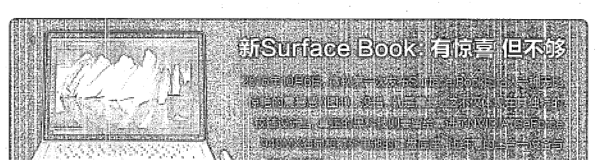

### 更强独显的诱惑

微软在新一代Surface Book的后面加上了“with Performance Base”的后缀，代表了它隶属于新品队列（图2）。作为新品，Surface Book with Performance Base（下文简称新Surface Book）在外观设计上没有任何变化，但却对内部进行了深度优化，从而换来了30%的电池续航能力，以及一倍的图形性能提升。

就续航能力的改善没什么可说的，只要塞进更大容量的电池，再在TDP控制和系统层面进行些许优化即可。而新Surface Book在图形性能上的变化，则是值得引起我们关注的所在。因为，新Surface Book在厚度不变的基础上，将主流级的NVIDIA GeForce 940MX换成了性能级的GeForce GTX965M（图3）！如果说以前的Surface Book在940MX独显下只能在720P+中高画质下玩大型3D游戏，有了GTX965M的加持，新Surface Book足以在1080P+高画质下驾驭更多大型游戏。

在传统游戏本领域，能配备上GTX965M独显的产品也算是高端之作了，而且它们大都拥有厚实的身材，以及较为夸张的散热模块来缓解GTX965M在全速工作时的“热情”（图4）。那么，新Surface Book又是如何在“小身板”（键盘底座）里塞进如此强悍的独显芯片？

答案很简单，对散热设计进行优化：新Surface Book将原本的单风扇单热管的散热模块（图5），换成了双风扇以及加长加粗的热管，同时散热通风孔也变成了2组（图6）。如此优化之后，GTX965M的热情也就得以缓解了，而且如此“加料”之后也仅换来了68g的重量提升，对便携性毫无影响。

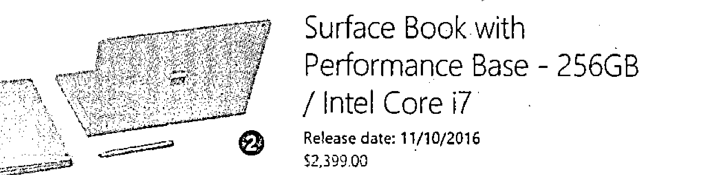

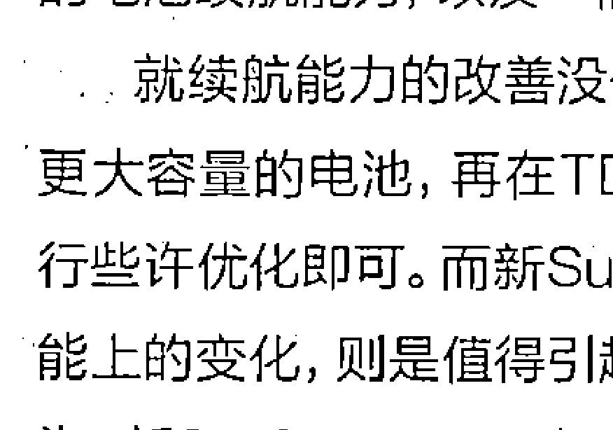

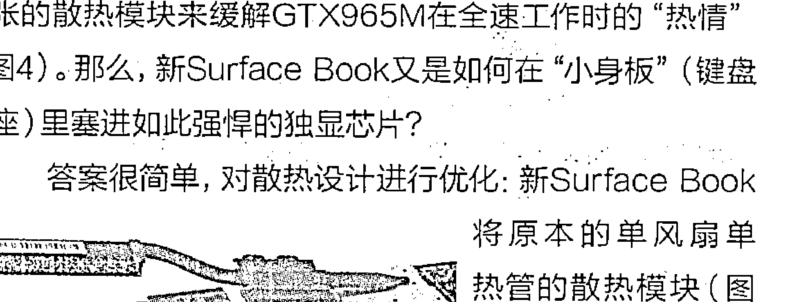

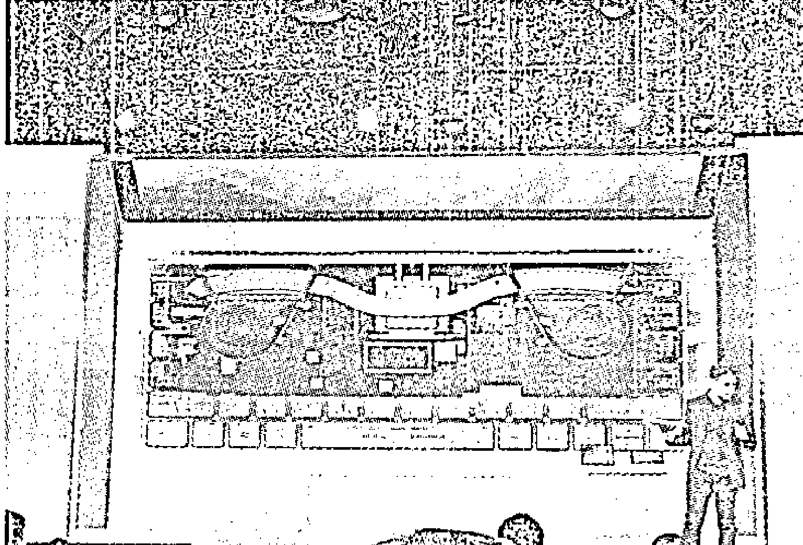

#### 没有变动的处理器平台

Surface Book原本有着2项傲人资本：在轻薄的屏幕部分里塞进了15W TDP的酷睿i系列处理器，同时还在轻薄的键盘底座内容纳了独立显卡。新Surface Book在处理器方面没有升级，只是对显卡进行了革新。而这，也就给了OEM厂商迎头赶上的机会。

作为新品，没能武装英特尔最新Kaby Lake七代酷睿处理器是新Surface Book的最大遗憾（图7）。要知道，七代酷睿中的i5-7200U就能超越六代酷睿中的i7-6500U，如果新Surface Book能用上七代酷睿i7-7500U，那它的性能自然更值得期待。

作为PC平板二合一设备中的另一个代表，联想最新款Miix5 Pro便已武装上了七代酷睿，其中搭载i5-7200U的版本售价不足7000元。虽然这款产品的键盘底座里没有独立显卡，但就便携性和CPU运算性能而言已经足以挑战新Surface Book了。

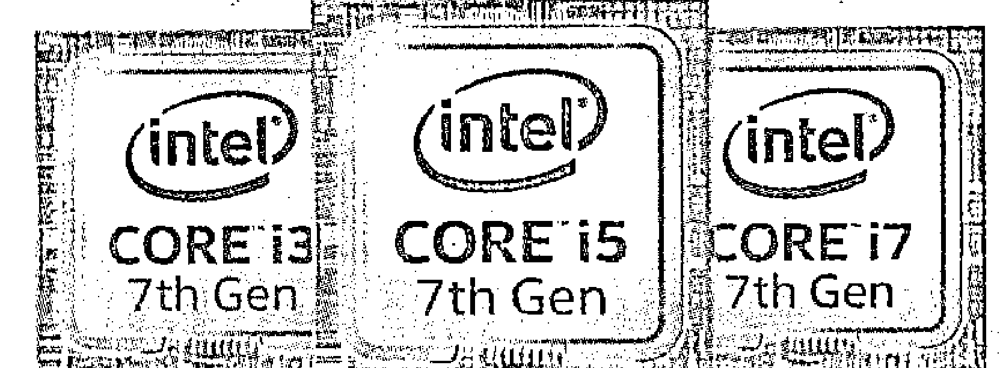

前文提到过，雷电3接口拥有超高的传输速率，而这也就让其成为了与外置显卡联姻的不二选择。以华硕灵焕3 Pro为例，它也是一款PC平板二合一设备，虽然处理器平台和新Surface Book一样也是六代酷睿，但该产品却配备了雷电3接口，可以完美兼容华硕自家的ROG XG Station 2外置显示卡扩展坞。

如果说新Surface Book的优势是能用上笔记本领域的GTX965M独显，那通过外置显示卡扩展坞，灵焕3 Pro则能用上最顶级的GTX1080桌面显卡。

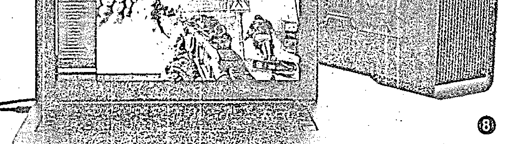

#### 被“稀释”的卖点

颜值更高的设计、可获得独显增益的Surface Book系列备受高端用户青睐，而随着时间的推移，Surface Book独有的特色卖点也将不再是卖点。

英特尔处理器的能耗比处于不断的优化之中，这意味着将它们塞进超轻薄的PC平板二合一设备中的设计难度也将逐渐降低。而全金属一体化机身和CNC工艺、超窄边框等元素的加盟，也会让产品变得越来越性感。最关键的是，作为外置显卡的官方接口——雷电3也会逐渐出现在更多二合一设备身上。Surface Book的独显键盘底座固然轻便，但仅能“独享”注定小众；而雷电3接口则能大幅提升外置显卡的通用性和兼容性，让任何PC平板二合一设备都能获得远超新Surface Book的游戏性能。

当然，基于雷电3的通用型外置显卡的缺陷也非常明显，那就是极为厚重，只能老老实实躺在家里，无法随着屏幕部分一起外出携带（图8）。所以，我们同时也期待出现键盘底座的通用独显解决方案，至少让平板电脑与键盘结合后获得不逊于笔记本的游戏性能，只是这个梦想很难实现罢了。

### Surface Studio：重新定制一体机

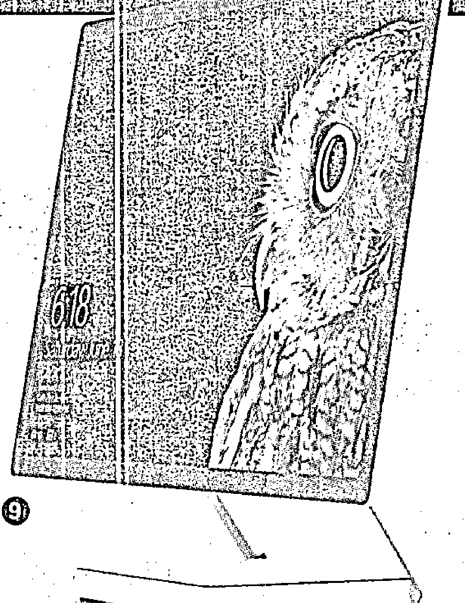

#### 继承再优化

很多人都觉得Surface Studio的设计非常高大上（图9），感觉像是重新定义了一体电脑。实际上，就Surface Studio的工业设计而言，仅仅是建立在“前辈”优良传统基础上的再优化而已。

如Surface Studio的28英寸触控屏幕可以直接推倒在桌面上，实现最低20度倾斜，期间可以无级调整（图10）。而类似的转轴设计在一体电脑领域早已不是什么新鲜设计，戴尔灵越7000系列一体机的屏幕甚至可以实现“绝对平躺”（图11）。

此外，Surface Studio为了实现最大限度的瘦身，采用了主机底座+屏幕的组合方式。顾名思义，它将处理器、内存、硬盘和显卡等部件全部塞进了底座里，而屏幕部分仅仅是触控式的LCD而已。没错，这种设计在一体电脑领域也属于非常成熟的理念了。除了戴尔灵越7000以外，像联想AIO 910也采用了类似的设计（图12），将“电脑”塞进了与支架连体的底座内。


虽然Surface Studio在产品形态上没能呈现更加创新的形态，但它却将前辈的优点发挥到了近乎极致。首先，就是Surface Studio屏幕部分的厚度只有12.5mm，创造了一体电脑的最薄纪录。其次，Surface Studio在纤薄的底座内还塞进了GeForce GTX 965M（约20000元）或GTX 980M（约28450元）独立显卡。

在Surface Studio之前，惠普Envy 34算是一体电脑领域的机皇了（图13），这款34英寸的对角曲面一体机也仅配备了NVIDIA GeForce GTX 960A而已，和Surface Studio搭配的GTX 980M不可同日而语。如果非要给Surface Studio的配置挑刺儿，那就是它没能武装上NVIDIA最新的Pascal架构GPU，也就是GTX10系列独显。要知道，哪怕是Pascal架构中的GTX1060，也要比GTX980M性能更高且更省电。

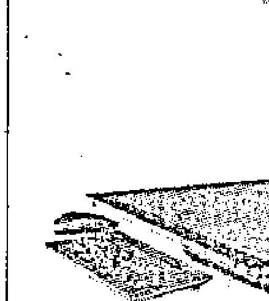

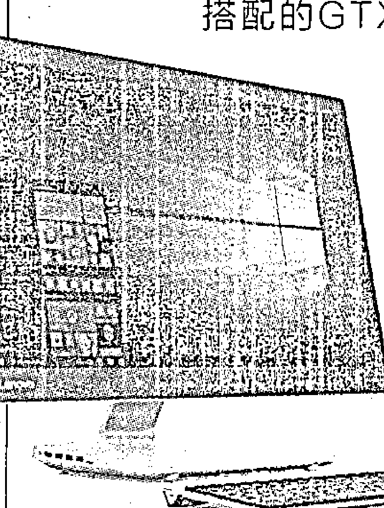

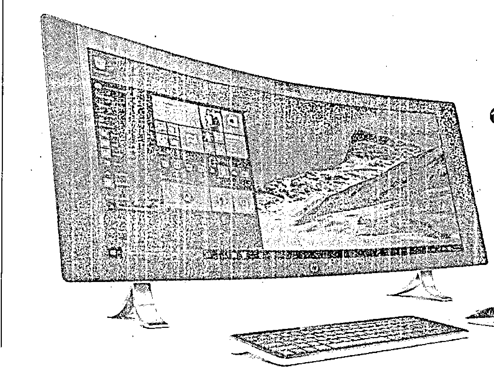

#### 隐藏在屏幕下的秘密

Surface Studio并不是一款单纯的一体电脑，它的售价比OEM合作伙伴旗下的产品贵上许多，游戏性能也远远比不上同价位的台式机。然而，如果我们将Surface Studio理解为一款超大的数绘板和PC，此时它的价格也就不贵了，至少对专业设计师而言就是如此。

由于Surface Studio的屏幕可以推平，所以用户可以几乎趴在它那巨大的屏幕上进行工作（图14）。该产品屏幕分辨率高达4500×3000，像素比同尺寸4K电视还要高63%，192PPI的像素密度在处理高清图像时每个细节都经得起放大，可以进行非常细节的编辑。

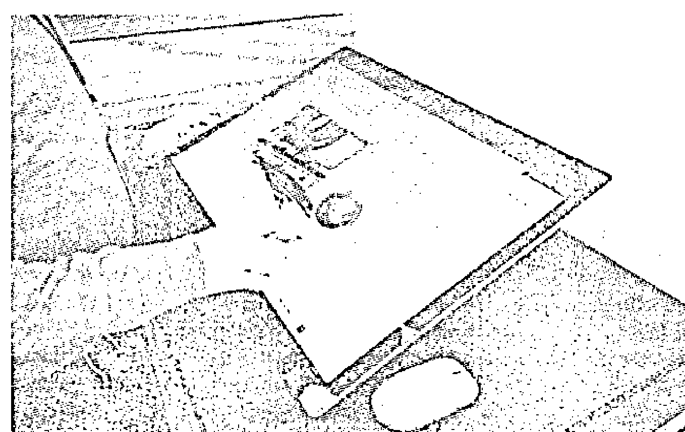

#### Surface Dial让创造更有趣

和Surface Studio自身的设计与配置相比，一个名为“Surface Dial”的配件才是真正的“黑科技”。这款模样和音量调节旋钮相似的小家伙（图15），是一款可通过软件进行定制化、提升创作效率的多功能实体工具。

简单来说，Surface Dial可以左右旋转、按压，能把软件中的工具栏、调色板等功能硬件实体化，通过左右旋动选择和按下确认，不需要再用手、鼠标或者笔去点选菜单。比如，用户在绘画时Surface Dial可以扮演调色盘，左右旋转就能快速改变颜色，极大提高上色和色彩微调时的效率（图16）。再比如，虽然通过双指捏合、旋转也能实现图像的放大缩小和旋转，但凭借手指操作的精准度不够，而通过旋转Surface Dial进行图像的缩放或旋转，则可实现毫米级别的精准度。

需要注意的是，Surface Dial通过蓝牙无线与Surface Studio相连，虽然它也支持Surface Book和Surface Pro 4，但只有在Surface Studio的屏幕上才能实现触屏定位功能。此外，Surface Dial的价格也谈不上便宜，需要678元人民币的开销。

> 扩展阅读：
> **Surface Dial和鼠标滚轮的差别**
> Surface Dial在很多人的眼中只是扮演了鼠标滚轮的角色，是一种可有可无的外设。实际上，二者并没有可比性。鼠标滚轮是二维的，而且它需要远离屏幕的手指才能滑动操作，前后滚动的频率和定位完全靠感觉。Surface Dial虽然也是二维，但它却将竖立着的滚轮从鼠标里拿了出来，平放在屏幕上再进行左右旋转定位，操作体验有着云泥之别。

除了分辨率超高以外，Surface Studio的屏幕还支持10点触控，并采用了TrueScale和TrueColor显示技术：前者能让屏幕上的一厘米和现实中的一厘米完全等同，后者则属于色彩调校，能让它的屏幕颜色显示得更为真实自然。

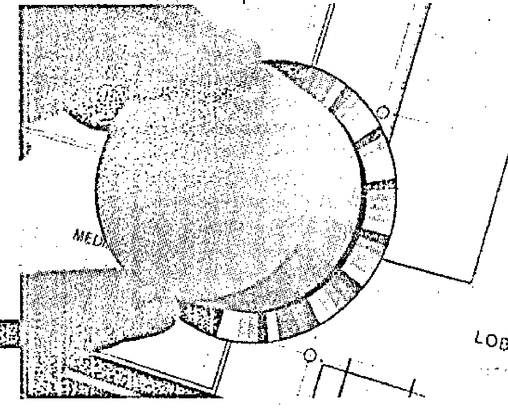

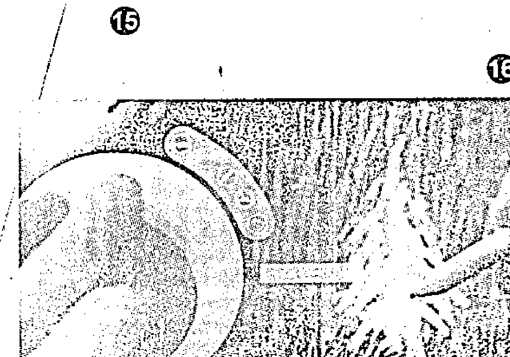

#### 总结

为了挽救PC的颓势，微软自认为有必要给OEM合作伙伴提供未来发展的方向。4年前的Surface如此，今天的Surface Studio也是如此。令微软欣慰的是，自己从软（研发软件）变硬（生产硬件），OEM伙伴的态度也从担心微软和自己“抢生意”，逐渐转变成了“学习与共勉”。相信随着新Surface Book和Surface Studio的推出，其他品牌性能级的PC平板二合一设备与专业级一体电脑也将竞相出炉。

> 火速链接
> 通过语言很难描述Surface Dial的神奇，感兴趣的读者可以扫二维码查看Surface Dial使用时的动态图。


### 透过新品看未来

看完了来自苹果和微软的年度新品之后，接下来就是探究它们背后的秘密了。

> > 为何硬件都谈不上完美
>
> 无论是苹果的新MacBook Pro还是微软的新Surface，它们在硬件配置上都谈不上完美，这是为什么呢？

#### 无缘七代酷睿的原因

关于这一点，英特尔是要负主要原因的。按照早前的计划，第七代酷睿处理器Kaby Lake是应该能享用最新10nm工艺大餐的。然而，英特尔10nm制程量产遇阻，不得不让14nm工艺再战一年，并将Tick-Tock两步走战略改成了PAO三步走的节奏（图1）。

这还不是最关键的。针对笔记本定义的移动版七代酷睿处理器首发型号仅限于15W TDP的U系列，以及4.5W TDP的Y系列（酷睿M），至于性能级的H和S系列要等到2017年才能量产上市（图2）。

问题就出在这里。苹果MacBook Pro系列素来对CPU和集成显卡的性能要求极高，而英特尔现在所能提供的6款七代酷睿处理器都不足以胜任。因此，你会发现新MacBook Pro只能退而求其次，不支持Touch Bar的13英寸版MacBook Pro搭载了i5-6360U或i7-6660U（15W，集成Iris 540核芯显卡），支持Touch Bar的13英寸版搭载的则是i5-6267U、i5-6287U或i7-6567U（28W，集成Iris 550核芯显卡），图形性能已经接近了940M级别的独立显卡（图3）。

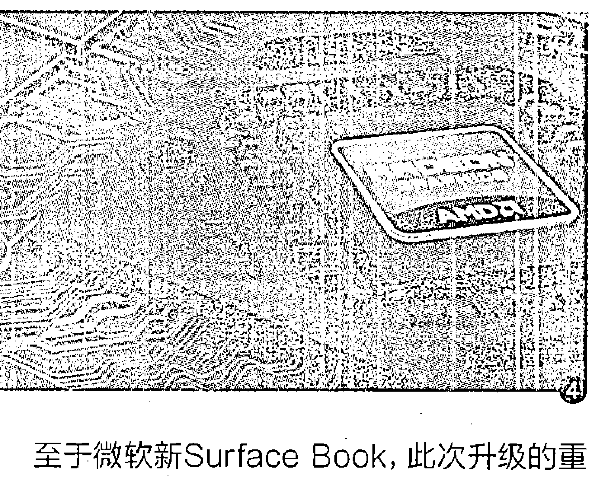

至于微软新Surface Book，此次升级的重点在于键盘里的显卡，所以处理器没能升级也就在情理之中了。

#### 为何显卡没能一步到位

细心的读者可能发现了，苹果2015款MacBook Pro（15英寸版）处理器集成的显卡型号为Iris Pro，其性能可以媲美940MX级别的独立显卡。而新MacBook Pro处理器却集成HD530核芯显卡，二者性能明显差了一个档次。究其原因，则是新MacBook Pro额外配备了Radeon Pro 400系列独显（图4），所以图形性能要强很多。

问题来了，就图形性能而言，AMD近几代显卡都不远不如NVIDIA，苹果为何舍强求次呢？原因很简单，新MacBook压根就不是追求顶级性能的，苹果的理念是要权衡性能、功耗以及成本等一系列的问题。AMD Radeon Pro 400系列独显固然不如同档次的NVIDIA型号，但它的TDP功耗却只有35W（NVIDIA同档次型号要70W），而且AMD还能给苹果提供定制化的驱动程序，成本更低，所以……

> > 火速链接
>
> 如果你想了解英特尔第七代酷睿处理器的参数、性能以及选购建议，扫码即看。

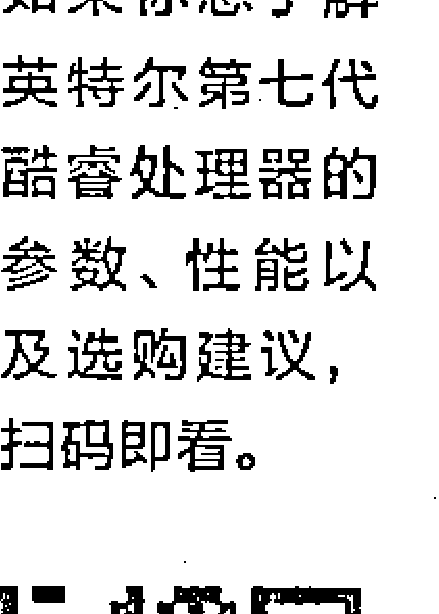

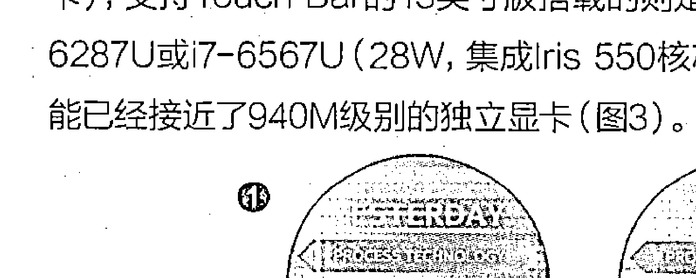

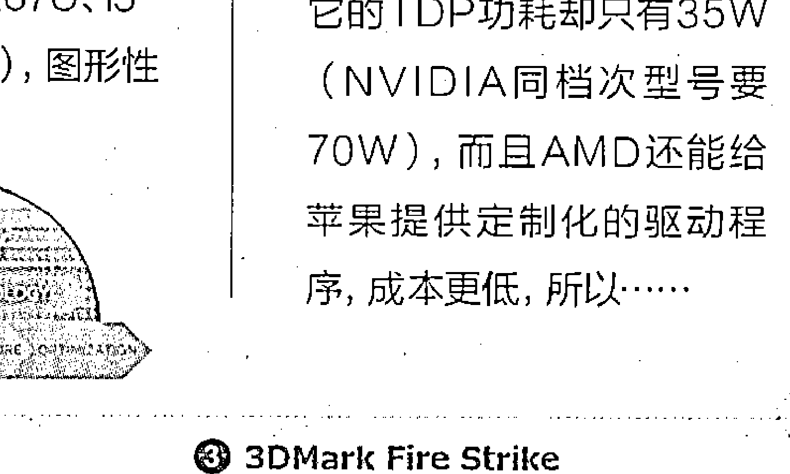

新Surface没能用上Pascal显卡的原因，只能说是微软为了赶时间，Surface Book没能等上GTX1050的量产，而Surface Studio在定项之初也没来得及针对GTX1060等新品作出反应。

#### 创新是为了挣脱价格泥沼

无论是本期杂志涉及的微软和苹果年度新品，还是与它们形态或功能类似的其他品牌产品都有一个共性：价格并不便宜。


#### PC市场已近饱和

PC市场经历2010年以前的爆炸性增长，很多家庭里已经不止拥有一部PC（泛指台式机和笔记本）。如今，随着手机端APP和手游的兴起，我们也更习惯通过手机屏幕解决各种休闲娱乐所需（图5）。除了工作必需和大型游戏，PC的存在感越来越低。在这种大环境下，如果你家里的PC性能还够用，你还会选择新购PC吗？相信更多用户的答案是换部手机吧？

#### 三足鼎立之势渐成

抛开台式机不谈，就笔记本领域已经逐渐分化成三足鼎立之势。其中包括以低价抢市场的入门级笔记本（4000元以内），是厂商们用来巩固市场占有率的，单机利润少得可怜；第二种是所谓的“游戏本”（图6），借助电子竞技的兴起，游戏本的日子可谓风生水起，单季利润较为可观；第三种就是PC平板二合一设备和超薄本了（图7），这种产品凭借创新的产品形态和极致便携的特性，正受到越来越多追求品质生活的用户青睐。

实际上，无论是苹果发布的新MacBook Pro还是微软新Surface Book，都是最后一种产品的代表。新MacBook Pro是赋予了超薄本更酷的功能，而新Surface Book则是让二合一设备的游戏性能出现了蜕变，让原本就（相对PC整体市场）呈现逆势增长的移动计算平台设备有了更强的竞争力，改善陷入滞销和低价泥沼的现状。

#### 未来心动等于行动

在PC市场已经饱和、家里电脑性能尚可且未坏的前提下，“我好像应该换台PC了”，这种需求将很难再成为刺激消费者买单的动力。未来，“这款PC太酷了！”“这才是我想要的！”一类的心动感觉（图8），才是促使我们为新款PC消费的动力之源。

而如何让用户心动？新MacBook Pro身上的Touch Bar、雷电3接口带来的外置显卡愿景、新Surface Book换上的GTX965M独显、和Surface Studio配套的Surface Dial，这些创新的要素不就是最完美的答案吗？

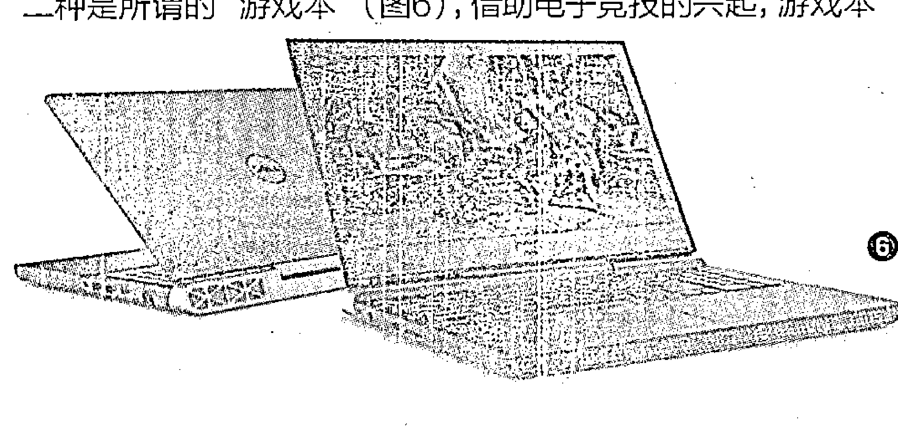

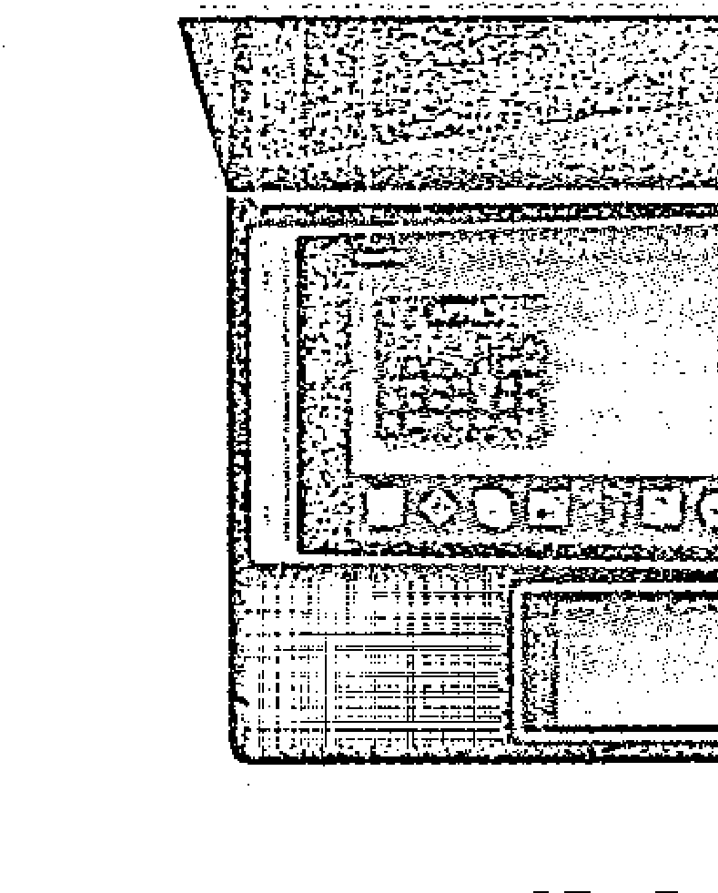

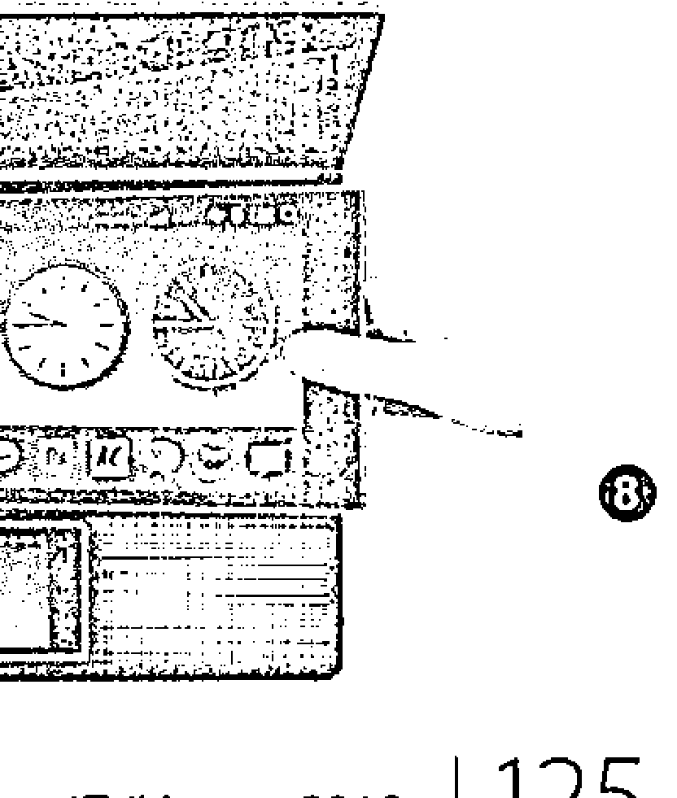

## 辞旧迎新

### 年终就得旧貌换新颜

策划 | 《电脑爱好者》编辑部


扫一扫，更多精彩内容立现！

当你看到本期《电脑爱好者》时，距2017年仅剩下30天的时间了。这一年365天好像在眨眼之间便已悄然逝去。2016年大家有多少计划未能完成？对2017又有何全新的展望？在大家总结过去、遐想未来的间歇，让我们先从身边的“生产力”工具辞旧迎新，旧貌换新颜吧！

### 系统 | 推陈与守旧

你的电脑为你工作了一整年，难免在某些时候要些小脾气，再加上忙碌或懒惰的你是否细心地照料它也是个问号。另外，虽然Windows 10已经周岁了，许多人无论是自愿还是被迫升级，总是心有不甘，留恋陪伴多年的老朋友Windows 7，新颜换旧貌我们一样办得到。

#### 不重装 使用命令行启动修复系统

文|俞木发

当Windows 10系统遇到假死、崩溃或者无法进入桌面时，此时许多人能够选择的就是重装系统或用Windows 10重置进行系统修复。不过重装需要再进行大量的初始化操作，Windows 10重置则要花费大量的时间。Windows 10虽然是新系统，不过之前我们在Windows 7下的很多修复技巧仍然可以使用。下面就来盘点一下那些简单、有效的“老”方法。

#### 有备无患 为Windows 10安装一扇“后门”

大家知道，Windows Vista后的Windows在其登录界面有个“轻松使用”菜单，点击后可以在不进入桌面的情况下运行屏幕键盘、讲述人等组件（图1）。因此我们如果将命令提示符、注册表编辑器等组件用来替换“轻松使用”菜单组件，这样就可以在无法进入桌面时（如公司电脑，员工离职后没有交代登录密码）启动命令提示符来更改密码，从而省去重装Windows 10的麻烦。

首先在Windows 10可以正常使用的时候（如果Windows 10已经无法进入，则使用WinPE启动盘进入WinPE系统里更改）打开资源管理器，找到“C:\windows\system32\osk.exe”（对应轻松使用菜单里的屏幕键盘程序），右击选择“属性→高级设置→更改所有者”，将其所有者更改为当前登录管理员账户（图2）。

返回权限编辑窗口，点击“编辑”，选中当前登录管理员账户，将其对osk.exe读取权限设置为“完全控制”（图3）。

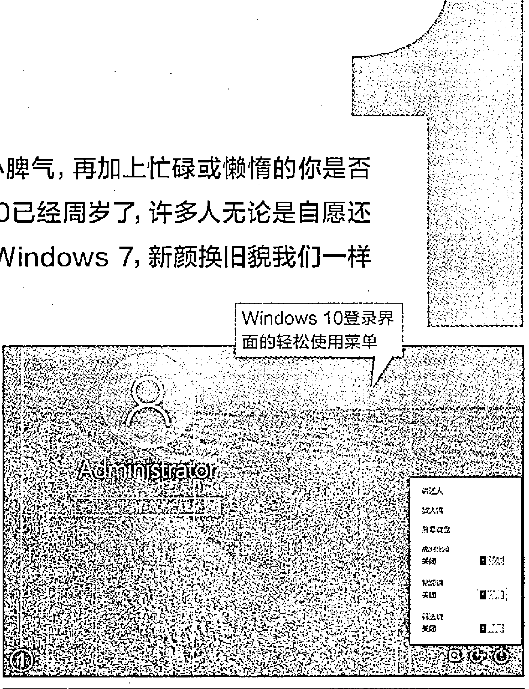

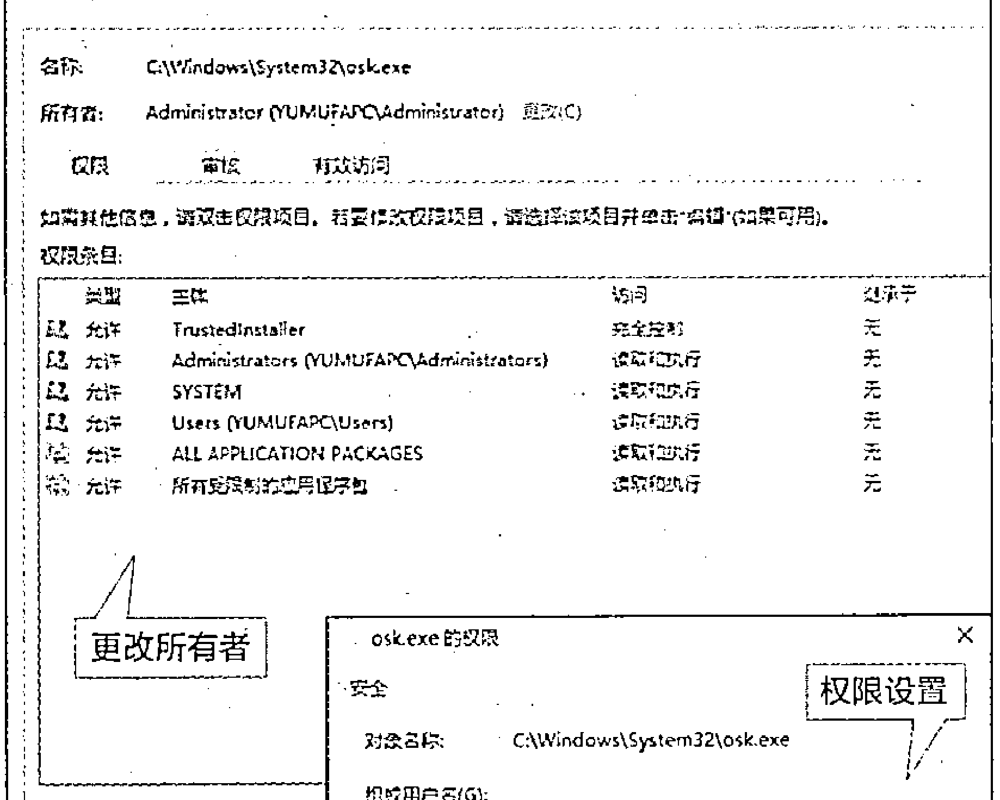

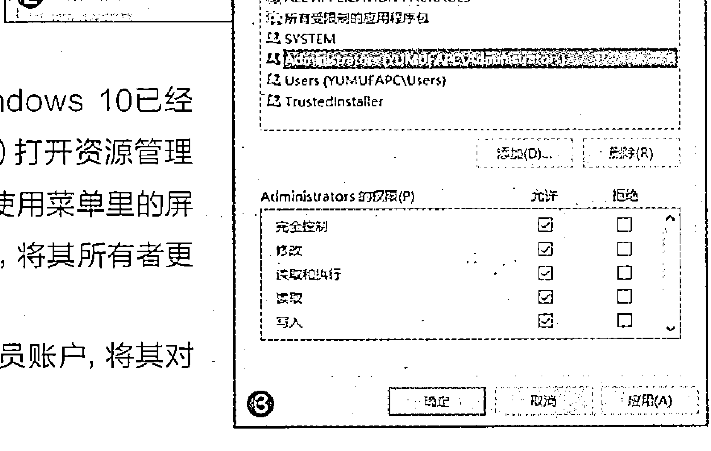

返回资源管理器窗口，右击“C:\windows\system32\osk.exe”选择“重命名”，将其重命名为“osk1.exe”，复制“C:\windows\system32\cmd.exe”一份并命名为“osk.exe”，这样就完成了命令提示符对屏幕键盘的替换（图4）。

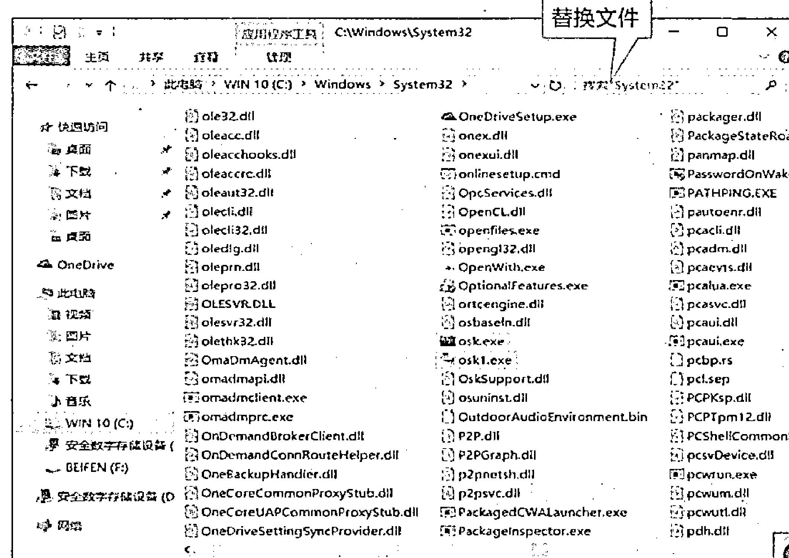

##### 在登录界面启动命令提示符

完成上述的设置后，以后如果Windows 10遇到无法进入桌面、忘记登录密码等故障需要进行修复，只要重启电脑，在登录界面点击“轻松使用→屏幕键盘”，这样在登录界面就可以启动命令提示符，接下来根据实际需要进行修复操作即可（图5）。

##### 命令提示符更改账户密码

比如现在需要更改离职员工账户的登录密码，在登录界面确认员工登录账户名如本例为Administrator，在上述命令提示符窗口输入“net user administrator 123456”（格式：net user 用户名 密码），这样即可将Administrator账户密码更改为“123456”（图6）。

##### 在登录界面启动资源管理器

返回登录界面，使用密码“123456”即可登录进入系统了。这样通过一条简单的命令即可重置账户密码，省却重装系统的各种麻烦。在登录界面，Windows 10是以SYSTEM账户身份登录，如果要使用图形界面进行操作（如提取故障电脑文件、查看文档），只要在命令提示符窗口输入“explorer.exe”启动桌面，成功进入SYSTEM账户桌面后按下“微软键+R”打开运行框，点击其中的“浏览”，在打开的图形化窗口即可进行文件查找、浏览等操作（图7）。

##### 在登录界面启动IE浏览器

同样可以在上述窗口启动程序，比如可以启动Windows 10的IE浏览器上网查找其他更多的修复工具。总之只要在Windows 10预留这个可以进入系统的后门，以后在Windows 10遇到无法进入桌面故障时就可以使用上述介绍的方法进行各种修复操作（图8）。

#### 另辟蹊径 离线修复Windows 10

上述方法虽然简单有效，不过因为其在登录界面预留后门，系统的安全性并没有保障，而且很多电脑平时也可能没有预留。对于一般没有预留后门的Windows 10电脑，如果系统故障是由于注册表修改导致，我们可以借助在Windows 7下就经常使用的第三方系统进行离线修复。比如一些朋友的电脑在执行Windows 10系统补丁的更新时，重启后会出现“C:\WINDOWS\system32\config\systemprofile\Desktop不可用”的错误提示（即桌面的路径配置出现错误），导致Windows 10在登录界面一直无法进入。这时就可以使用离线修复注册表的方法进行修复。

可以对当前故障电脑断电重启，在看见开机画面后长按电源键关机，短时间内重复三次左右Windows 10会自动进入WinRE (Windows 恢复环境)，继续点击“疑难解答→高级选项→命令提示符”，按提示输入账户密码登录即可启动命令提示符（图9）。

因为Windows 10内置的WinRE需要当前系统管理员密码才可以进入，因此对于忘记当前账户密码或者WinRE修复环境损坏无法进入的用户，还可以使用Windows 10安装启动盘来启动系统，进入到安装界面后按下Shift+F10即可调出命令提示符界面（图10）。

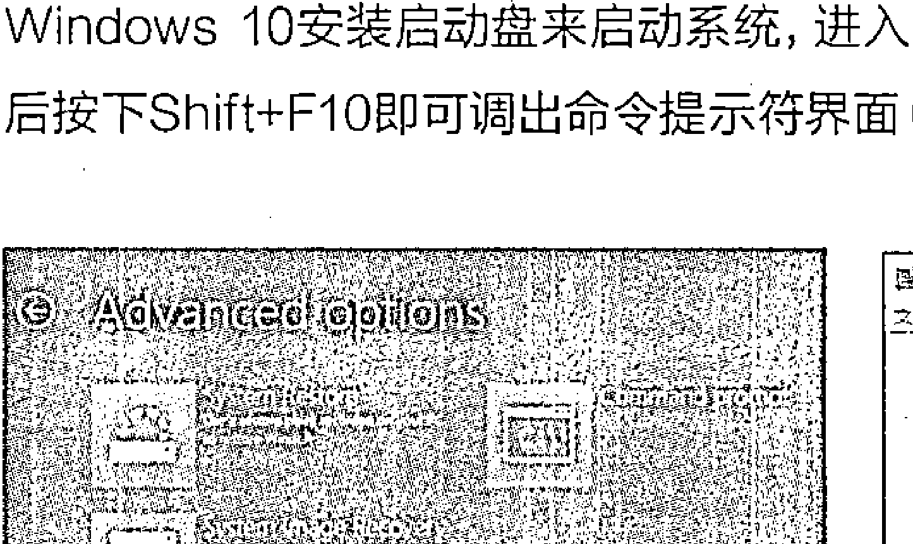

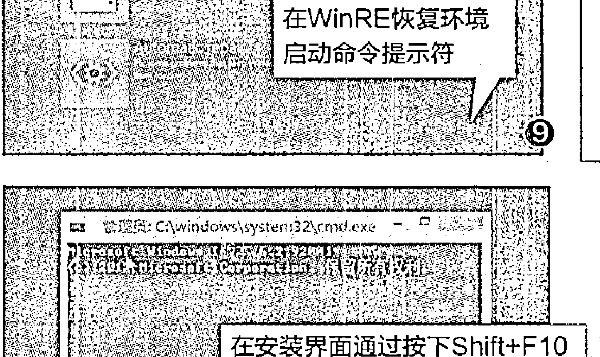

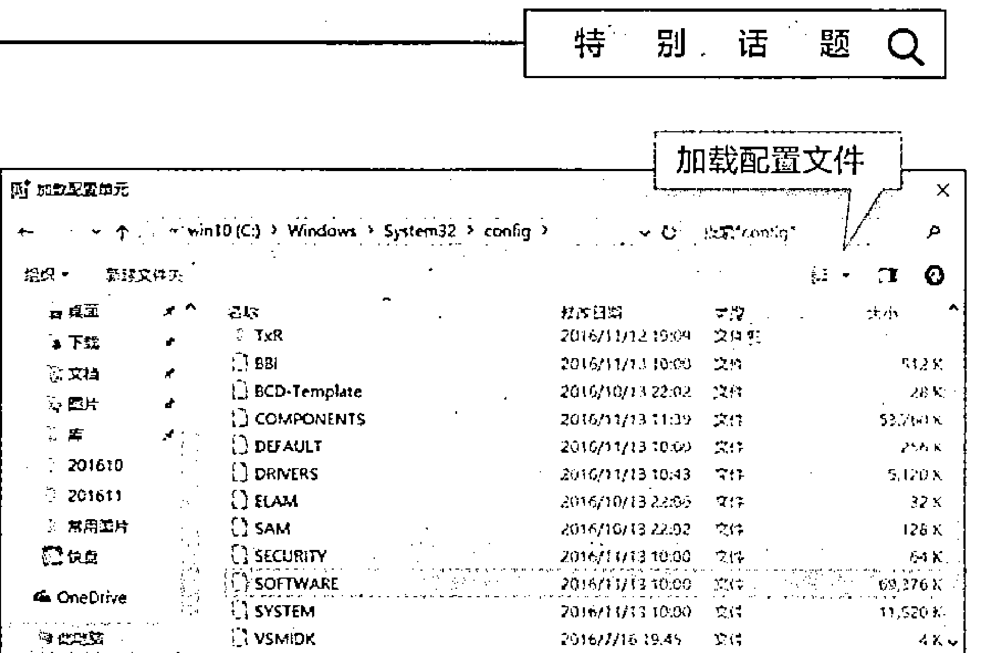

在命令提示符界面输入“regedit.exe”启动组策略编辑器，定位到[HKEY_LOCAL_MACHINE]，点击菜单栏“文件→加载配置单元”，然后定位到“C:\Windows\System32\config\software”，将这个文件加载到注册表（图11）。

点击“打开”进行加载，然后为加载项目设置一个名称如“cfan”，这样在[HKEY_LOCAL_MACHINE]就会新增一个“cfan”项，按提示展开[HKEY_LOCAL_MACHINE\cfan\Microsoft\Windows\CurrentVersion\Explorer\Shell Folders]，然后在右边找到“desktop”，右键点击修改，将里面的键值复制出来，比如本例是C:\Users\Administrator\Desktop（图12）。

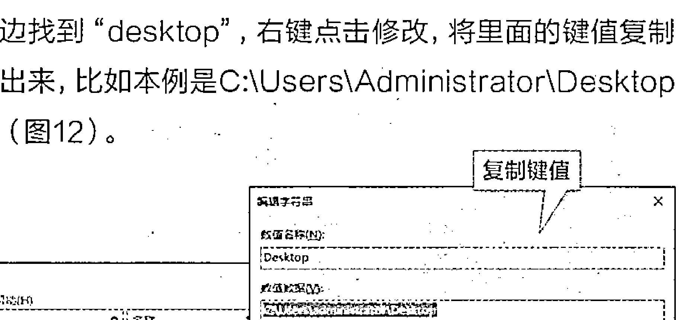

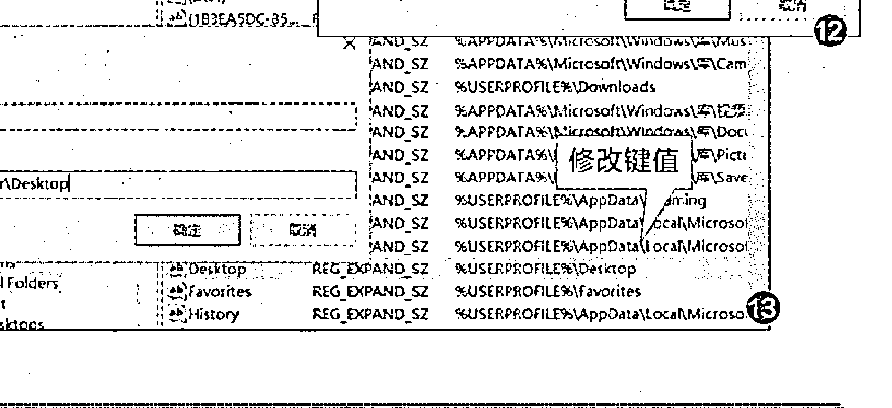

> 小提示：在离线修复注册表时，如果无法确定哪个是当前系统的配置文件，可以查看文件创建日期，一般来说当前系统的配置文件创建日期就是最近的，或者通过文件大小来判断，比如SAM文件的大小通常较大。

复制后，再找到[HKEY_LOCAL_MACHINE\cfan\Microsoft\Windows\CurrentVersion\Explorer\User Shell Folders]，找到右侧的“desktop”，右击选择“修改”，将它的键值改成C:\Users\Administrator\Desktop（图13）。

继续在左边栏选中上述加载的[HKEY_LOCAL_MACHINE\cfan]，然后点击“文件→卸载配置单元”，在弹出的对话框选择“是”，保存更改后的键值，完成上述的设置后重启电脑即可修复上述故障（图14）。

实际上很多系统故障都是由于注册表某些键值损坏造成的，如果系统发生故障后无法进入系统启动注册表编辑器对注册表进行修改，使用上述离线加载的方法可以解决这类故障。对于双系统用户，可以进入另外一个系统加载故障系统的配置文件进行修复。

# 《电脑爱好者》2016年合订本（四）

#### 其他更多修复Windows 10的方法

上述介绍的方法主要是针对Windows 10没有完全崩溃的情况进行修复，在日常使用中可能还会遇到Windows 10完全无法启动的故障。比如Windows 10启动配置文件出错，导致系统在启动时就无法正常加载，对于这类故障则需要借助WinPE启动盘进行修复。Windows 10已经自带自动修复功能，如果可以自动激活Windows 10的WinRE修复环境（否则请使用WinPE启动盘进入修复系统），则只要在高级选项界面点击“自动修复”即可（图16）。

如果上述方法仍然无法修复系统，则可以尝试使用第三方修复工具进行修复。比如对于系统故障可以使用“nt6启动菜单自动修复工具 绿色中文版”，在WinPE系统启动上述软件后按照提示按任意键即可自动进行修复（图17）。

对于BCD等配置文件损坏的修复则可以借助“bootice”，在WinPE系统启动软件后切换到BCD编辑，然后加载本机（C:\boot\bcd）配置文件进行正确的配置即可（图18）。

| 名称 | 类型 | 数据 |
| --- | --- | --- |
| 默认 | REG_SZ | （数值未设置） |
| Cache | REG_EXPAND_SZ | %USERPROFILE%\AppData\Local\Microsoft\Windows\INetCache |
| Cookies | REG_EXPAND_SZ | %USERPROFILE%\AppData\Local\Microsoft\Windows\INetCookies |
| Desktop | REG_EXPAND_SZ | %USERPROFILE%\Desktop |
| Favorites | REG_EXPAND_SZ | %USERPROFILE%\Favorites |
| History | REG_EXPAND_SZ | %USERPROFILE%\AppData\Local\Microsoft\Windows\History |
| Local AppData | REG_EXPAND_SZ | %USERPROFILE%\AppData\Local |
| My Music | REG_EXPAND_SZ | %USERPROFILE%\Music |

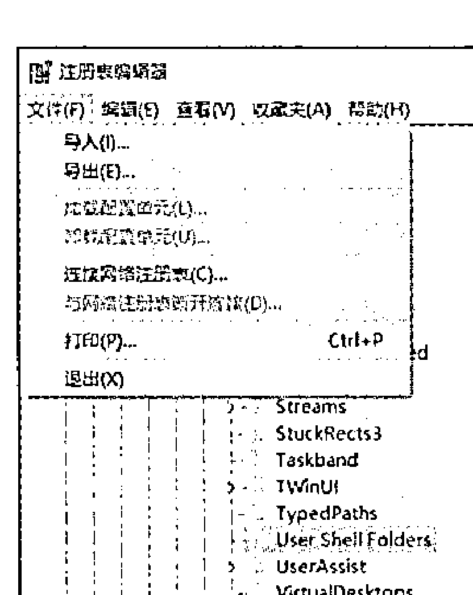

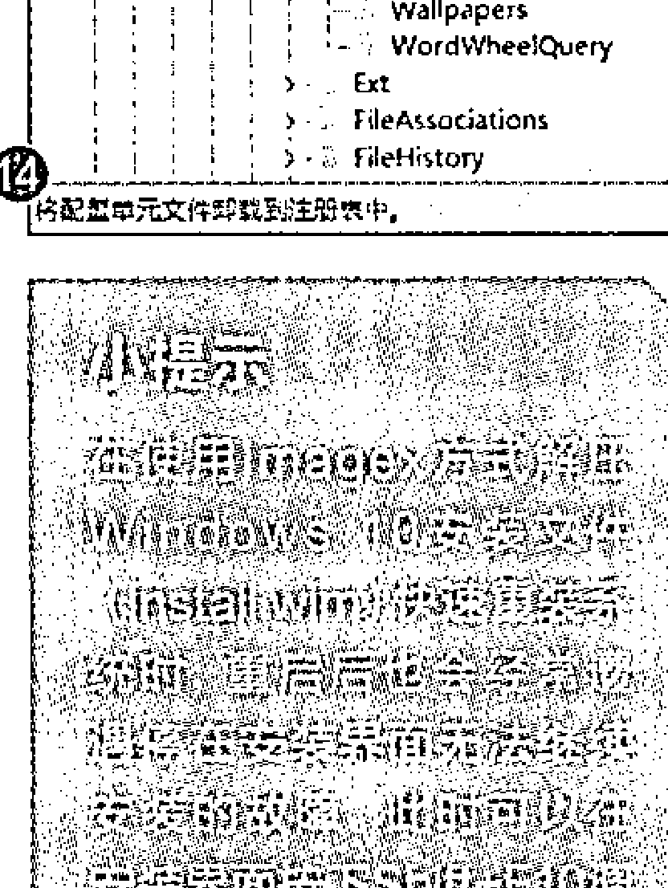

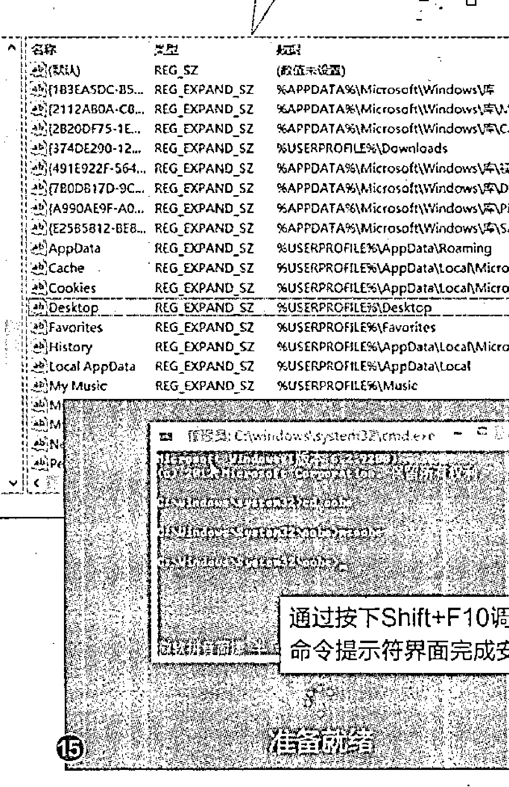

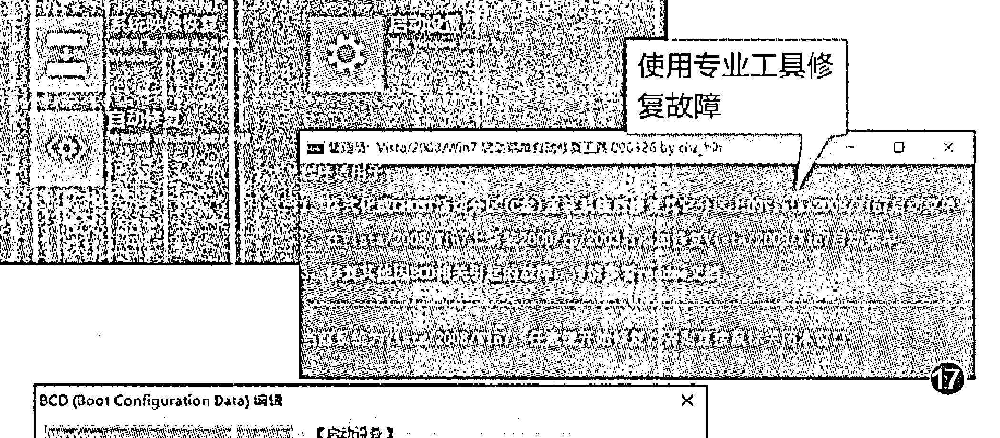

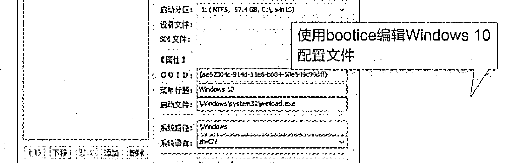


#### 新颜旧貌! Windows 7的脸+Windows 10的心

不可否认，Windows 7作为一款经典操作系统得到许多朋友的喜爱。很多被强制升级到Windows 10的朋友都很怀念Windows 7，对于这类用户现在可以借助一些第三方软件将Windows 10界面“还原”为Windows 7系统。

##### 找回经典开始菜单

Windows 10引入了“字符式+磁贴式”混合的开始菜单，虽然磁贴式设计让开始菜单更为美观，但是对很多台式机和小屏笔记本用户，磁贴式的花哨设计并没有多大用处，反而凭空占用屏幕空间。因此如果你还在怀念Windows 7经典、实用的开始菜单，那么借助“Classic Shell”即可轻松实现。

安装完Classic Shell后点击“开始”徽标即可启动Classic Shell的设置，Classic Shell提供了对整个开始菜单各个元素的个性化

- 比如要使用Windows 7开始菜单样式的朋友则切换到“样式”，然后选择“Windows 7样式”，接着再对开始菜单按钮进行设置即可（图1）。

- 除了开始菜单外，Classic Shell还支持对IE、资源管理器的外观进行还原，只要在开始菜单展开Classic Shell进行设置即可。

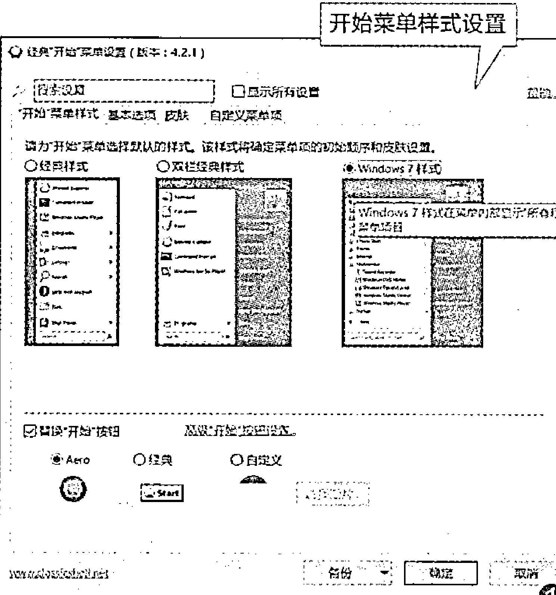

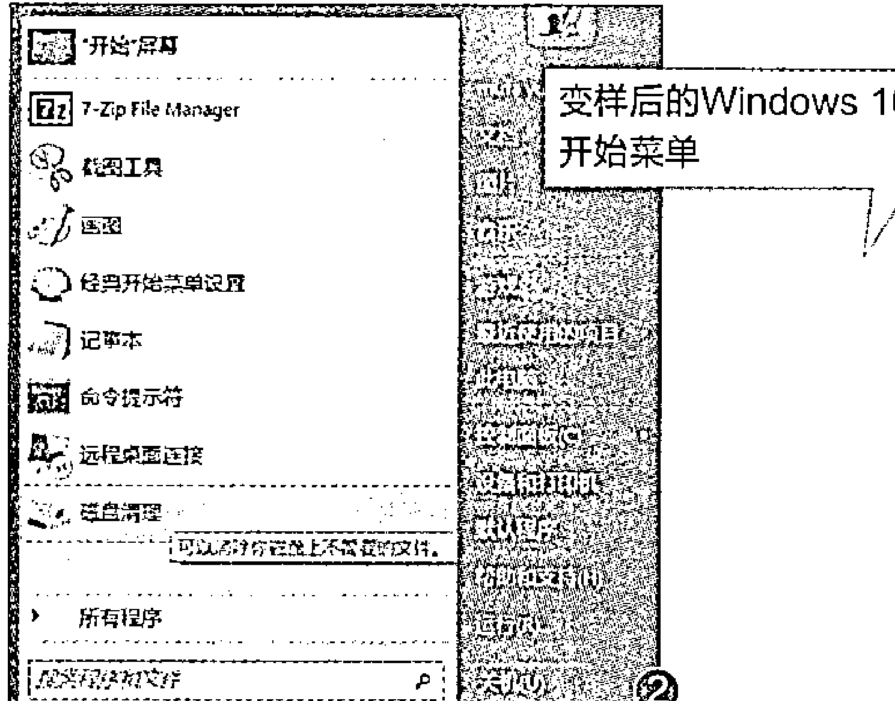

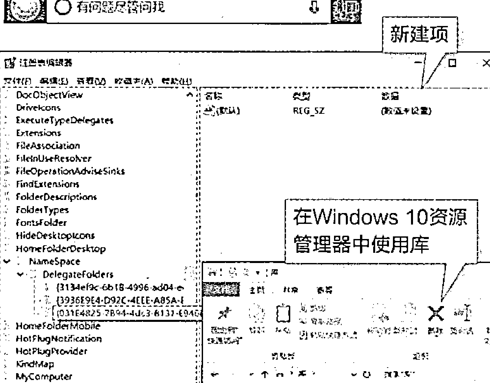

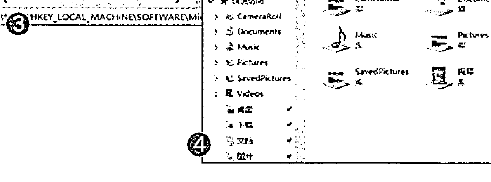

```
[HKEY_LOCAL_MACHINE\SOFTWARE\Microsoft\Windows\CurrentVersion\Explorer\HomeFolderDesktop\NameSpace\DelegateFolders]
```

```
[HKEY_LOCAL_MACHINE\SOFTWARE\Wow64Node\Microsoft\Windows\CurrentVersion\Explorer\HomeFolderDesktop\NameSpace\DelegateFolders]
```

##### 找回Windows 7的库

Windows 7用户都喜欢在资源管理器中使用“库”管理文件，但是Windows 10取消了这个组件。对于喜欢使用“库”的朋友可以手动进行找回。

启动注册表编辑器，展开[HKEY_LOCAL_MACHINE\SOFTWARE\Microsoft\Windows\CurrentVersion\Explorer\HomeFolderDesktop\NameSpace\DelegateFolders]，在该项下新建名为{031E4825-7B94-4dc3-B131-E946B44C8DD5}的项（图3）。

如果是64位用户继续展开[HKEY_LOCAL_MACHINE\SOFTWARE\Wow64Node\Microsoft\Windows\CurrentVersion\Explorer\HomeFolderDesktop\NameSpace\DelegateFolders]，新建上述的项。这样再次打开资源管理器，使用“向上”按钮返回到桌面，此时就可以看到增加了“库”（可以将其添加到右侧快速访问栏），点击后就可以像在Windows 7中那样继续使用“库”组件了（图4）。

##### 更改文件默认打开方式

Windows 10引入了“应用”概念，为了推广应用，默认情况下常用的文件如视频、音乐、图片都会被默认设置为Windows 10自带的“电影和电视”、“照片”来打开，对于喜欢在Windows 7下使用原来的照片查看器、Windows Media Play来打开这些文件的朋友，可以通过自定义设置的方法进行更改。

点击“设置→所有设置→系统→默认应用”，然后在右侧窗格进行设置即可。比如点击“照片查看器→照片”，然后在打开的应用列表选中“Windows照片查看器”，这样即可将Windows 10原来默认的“照片”更改为“Windows照片查看器”（图5）。

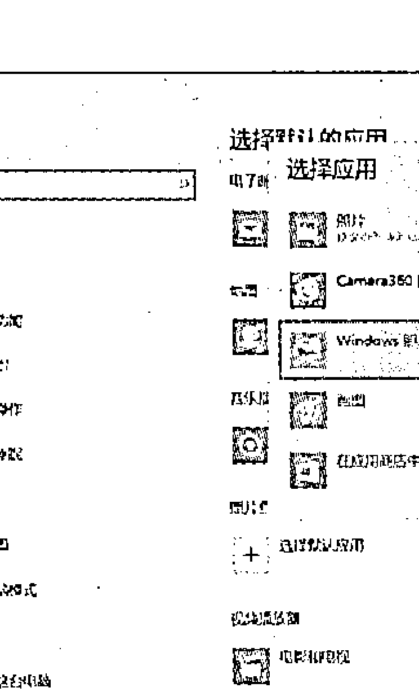

完成上述的设置后，以后再次打开图片时就会自动调用“Windows照片查看器”来查看常见的JPG、PNG图片了（图6）。

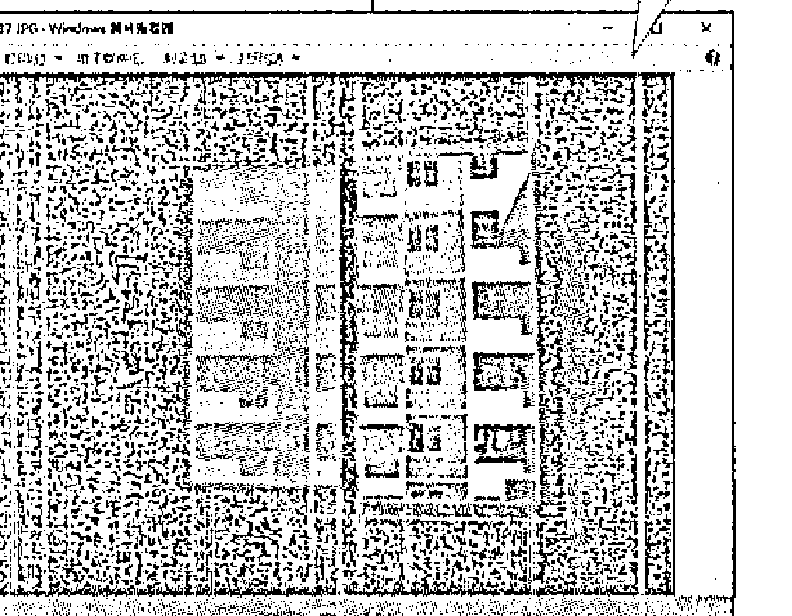

对于默认没有进行关联应用的文件，可以在资源管理器中右击选择“打开方式→选择其他应用”，在打开的窗口按照使用Windows 7时选择自己常用的程序，同时勾选下方的“始终选择xx应用打开.png文件”即可（图7）。

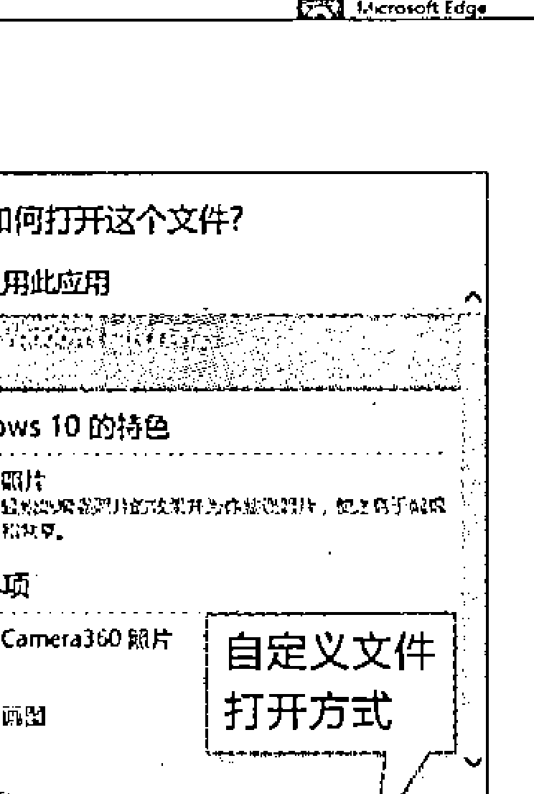

##### 解除Administrator账户限制

大家知道，在Windows 7中系统内置的Administrator账户拥有很高的权限，很多朋友也喜欢在Windows 7下启用该账户来进行很多操作。不过出于安全考虑，在Windows 10下该账户却无法运行Windows 10的应用，这给习惯使用Administrator账户的朋友带来了不便（图8）。如果要让Administrator账户也能像在Windows 7中那样没有限制地运行，我们可以通过修改本地策略限制实现。

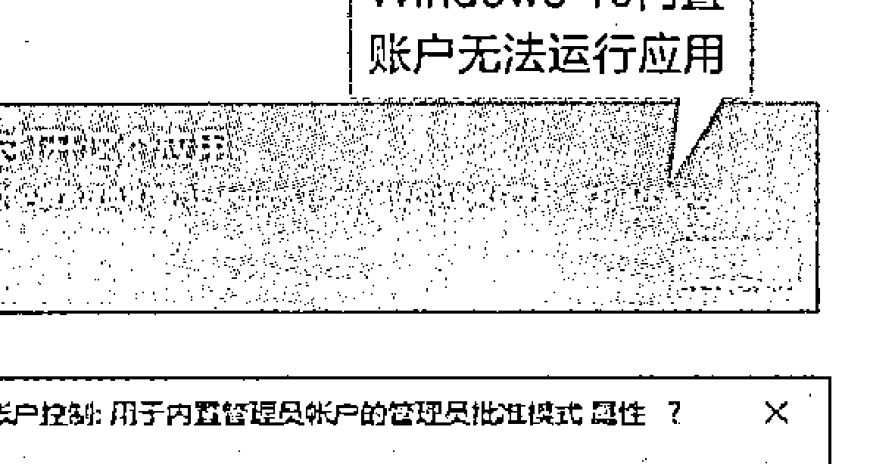

首先进入“计算机管理→本地用户和组→用户→Administrator”，启用该内置账户。接着在搜索框输入“secpol.msc”启动本地安全策略，依次展开“安全设置→本地策略→安全选项”，然后将右侧窗格的“用户帐户控制: 用于内置管理员帐户的管理审批模式”设置为“已启用”（图9）。

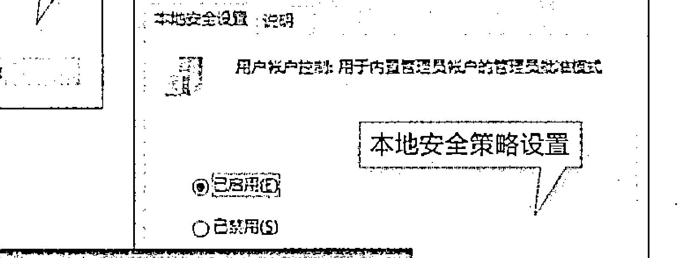

这样重启后再次运行应用，Windows 10下的Administrator账户就可以解除限制运行各种应用了（图10）。


##### 其他更多“还原”方法

对于类似屏保、桌面壁纸、主题这类个性化设置，Windows 10中的设置方法和Windows 7类似，只要预先准备好Windows 7中原来使用的壁纸、屏保、主题，然后将其复制到相应的位置，再打开对应的设置进行选择即可。

### 总结+展望 | Office三件再提效

岁末年终，该总结的总结，该展望的展望。无论是报表、规划，都离不开Office传统三大件Word、Excel和PPT。此时如果你还在用一成不变的方式用它们，怎么能体现出辞旧迎新的决心和态度呢？

文|樱子

年终岁尾，用Word写总结、做计划是必不可少的项目。在总结汇报文稿中，常常会遇到需要插入简单的表格的情况。但Word表格不像Excel那样擅长于表格计算，以至于不少人以为Word表格只能填写无法计算，因而在需要表格计算的时候，总是先在Excel中做好，然后导入或选择性粘贴过来。但实际上，Word也天生具有计算的本领。下面就以一个总结中用到的简单实例加以说明。

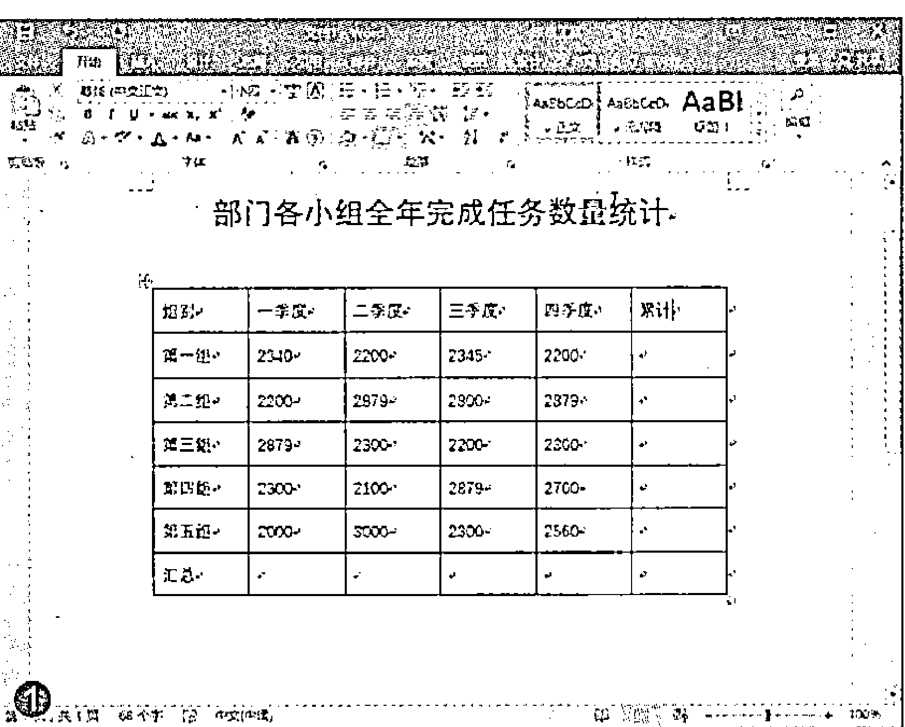

在公司的年终总结当中，部门领导要在报告中插入一张本部门各小组全年4个季度完成任务数量统计的简单表格（图1）。表格中每个小组所在的一行最后一个单元格，要计算出该小组全年4个季度的任务量小计；表格最下面的前4列要计算出本部门每个季度的任务量汇总；而最后一个单元格（也就是右下角的单元格），要计算出本部门全年完成的任务量。

首先我们计算第一组的全年任务量。将光标打到第一组的最后空白单元格内，然后依次选择“表格工具”菜单下的“布局 → 数据 → 公式”项（图2）。在接下来弹出的公式窗口中，可采用默认的公式“=SUM(LEFT)”，表示统计左端（LEFT）的数据之和。此外也可以输入公式“=SUM(B2:E2)”指明单元格位置范围的方式来代替。公式输入之后按“确定”按钮（图3），之后我们会看到，在“累计”一格中，已经自动计算出了第一组4个季度的任务量之和。随后，我们用相

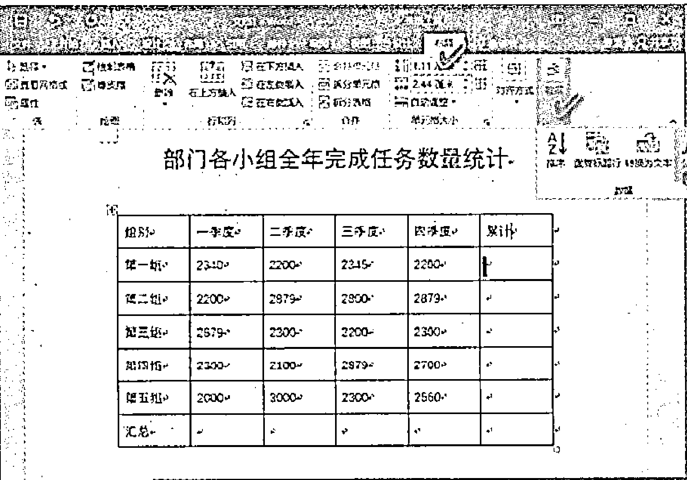

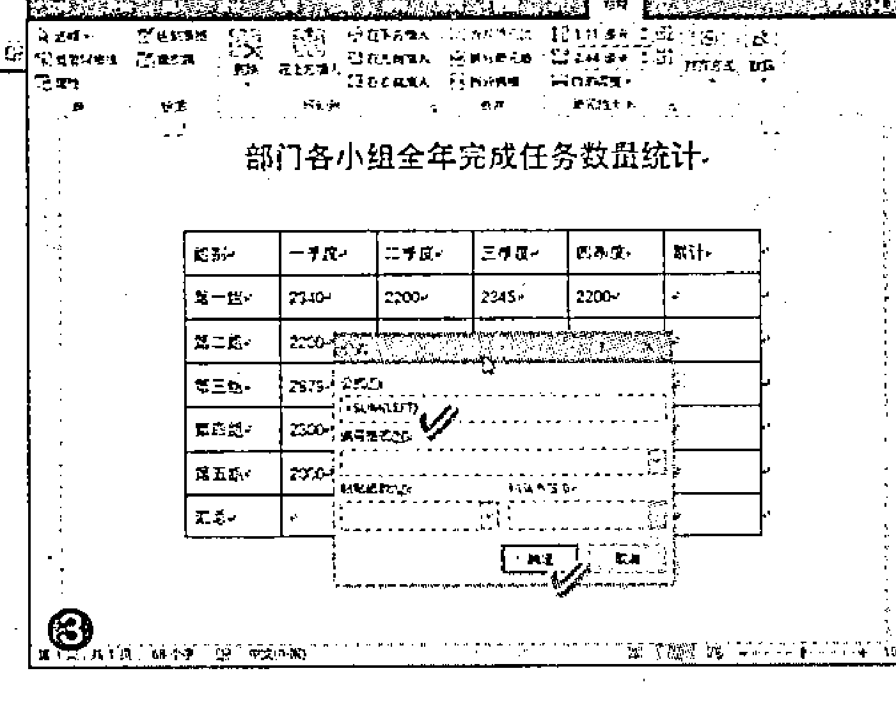同样的方法，可以计算出其他4个组的全年任务之和（图4）。

接下来，需要计算第一季度5个组的完成任务总量。先将光标点击到“汇总”一行的第一个空白单元格中，同样依次选择“表格工具”菜单下的“布局→数据→公式”项，这次在公式窗口中，要采用公式“=SUM(ABOVE)”，表示统计上方（ABOVE）的数据之和。点击“确定”按钮进行统计（图5）。随后上面5个单元格中的数据之和便出现在了汇总单元格中。同样的，对后三个季度的部门工作任务进行统计，获得如图所示的汇总结果（图6）。

接下来，要对本部门全年的任务量进行汇总。我们首先可以利用先前计算出的各季度的汇总数进行二次汇总，也就是说在右下角单元格中对左侧的4个数据进行SUM(LEFT)汇总，获得一个全年的汇总数据。为了验证汇总的正确性，我们还可以利用右下角的单元格对上面单元格中的5个数进行SUM(ABOVE)汇总。如果两次计算出的结果完全吻合，那么说明整个表格的汇总总是正确的。我们将这种利用双向验证的方法计算的过程称之为“围账”，也就是数据能“自圆其说”，左右上下得到印证了，就说明计算正确了（图7）。这样，最终就获得了一张可以在报告中正确利用的简要数据汇总表。

#### 两个特殊“减法”搞定报表处理难题

文|樱子

在年终处理总结性报表时，我们常要对表格中的数据进行修改，一张表格在经不同人编辑后，如果没作批注就很难一下子判断出哪些做过修改，因此需要找到给表格快速“找不同”的方法。另外，还可能会遇到一些看似无规律可循的事项统计，一般方法也难完成。为此，我们介绍两种特殊“减法”来解决上述问题。

##### 1. 巧用减法粘贴 表格快速找不同

这里有一张部门内员工全年4个季度完成订单的统计表（图1），分别发给了公司的两位负责人。但是，由于人员间任务的相互调整，其中一位领导对某些数据在最后进行了修改，这样就造成了两位领导手中的表格数据的不一致。他们需要核对其中哪些数据进行了修改，并进行交流以达成一致意见。但因修改一方对修改的单元格未做标记，因此一时也不能准确列出修改了的单元格。

这时，用下面的方法可以快速找到修改过的单元格。
首先我们将第二张表格复制出一个副本保留。选中第一张表格的有效数据区域，执行复制命令Ctrl+C；然后切换到第二张表格并将光标移动到左上角单元格，右键单击并依次选择“选择性粘贴→选择性粘贴”（图2）。
在随后弹出的“选择性粘贴”对话窗口中，选择“运算”符号为“减”，然后点击“确定”按钮（图3）。之后我们会看到，表格二变成一张由0和非零数值填充的新表，这其中非0填充的单元格就是经过改动的单元格（图4）。
用这张表格与原始表格和第二张表格的副本进行对照，就可以具体看到那些修改了的单元格的数据变动情况了。

##### 2. 妙用“倒减法” 自动汇总随机数

公司决定，对于完成订单数连续三天都超过3笔的员工，每符合条件一天，就奖励100元。因此，我们只需在表格中找到连续满足条件的天数并记录下来，最后将这些天数汇总再乘以100，就得到了员工可获得的奖金(图5)。

但是，我们可以看到，在员工订单日程流水表中，每位员工的订单完成数根本无规律可言，因此在C列中进行自动统计，选用函数就成了难点。常用的函数COUNTIF虽然善于计数，但对于无规律的数据也无能为力；而LOOKUP函数虽然够强大，但靠它来完成任务恐怕也得费尽周折。因而，单靠这些函数无法找到一个合适的统计方法。在这种情况下，我们可以通过IF、COUNTIF和SUM等常见的基本函数，构造一个智能化的公式，用“倒减法”来完成统计任务。

首先在进行统计的C列的第一个数据单元格C2中输入如下公式：

```
=IF(OR(B2<=3,B3>3),"",COUNTIF(B$2:B2,">3")-SUM(C$1:C1))
```

输入公式之后，点击C2单元格右下角的黑色填充柄小方块，向下拖动到该列的最后一个数据单元格，完成数据的自动填充和智能统计，统计结果如图所示(图6)。

上述公式用了三个简单的函数，下面对其中的函数作简要的分段说明:
IF(OR(B2<=3,B3>3),""段: 如果B列当前行<=3或下一行大于3，则公式返回空，C列当前单元格什么也不填写。
COUNTIF(B$2:B2,">3")-SUM(C$1:C1)段: 利用COUNTIF函数统计B列中当前行以前共出现过多少个大于3的数（即COUNTIF(B$2:B2,">3")段的作用），然后减去C列的已有结果（即SUM(C$1:C1)段的作用），这样就可以得出最近一段中符合条件的天数。这里一定要注意，所引用的区域的引用方式，要使用$符号。

#### 巧用SmartArt样式 妙趣横生展示

文|樱子

年终岁尾的报告会，免不了使用PPT幻灯片。在制作PPT演示文档的过程中，“框架”结构是非常重要的组成部分。PPT中文字的框架一般由标题或列表来统领，而知识或材料的组织结构往往通过框架图来组织，此外涉及到一些图片的展示，则会以图片墙的形式来展示。以上所述三个方面，如果通过SmartArt样式来实现，无论是操作的方便性还是制作效果，都可以做到令人满意。

##### 1. 文字列表 变身SmartArt图形更美观

在PPT幻灯片中展示系列文字内容，普通的文字版式，再怎么设置效果也显得比较平淡。如果将文字列表转换为SmartArt图形来展示，就可以演绎出更好的视觉效果，让版面更加丰富多彩。

如图所示的幻灯片页面只有几行简单的文字（图1），如果采用纯文字排版，很难表现出版面的活力。这时，我们可以单击幻灯片上已有的三行文字所在的列表文本框，在上方功能区的“段落”选项组中，单击“转换为SmartArt图形”按钮，从下拉清单中挑选一种SmartArt模板图形套用，将纯文本列表转换为SmartArt图形（图2）。

之后，我们可以通过在版面中点击组成图形列表的各种元素，对各处的文本进行字体、颜色等具体设置。此外，还可以点击小图片按钮，给文本列表添加图形引导按钮或图片缩略图，这样版面就会显得更加活泼多姿（图3）。

##### 2. 多图版式 采用SmartArt样式更生动

如果要在一个演示页面中布置一个图片墙，也可以采用SmartArt样式来完成。首先在PPT版面中通过“插入→图片”命令插入多幅不要排布的图片，然后用Ctrl+A组合键将这些图片全部选中（图4）。

从“图片工具→格式→图片版式”菜单下选择一种结构模板，这样就可以快速生成SmartArt样式的图片拼图（图5）。

同样，我们可以通过对图形框中的各种图片和文本元素进行编辑，实现SmartArt样式图形的个性化目标。例如，我们可以将图中的圆形通过拖动和缩放改为从大逐渐变小的样式，可以将其中的文字说明针对图片的内容进行修改（图6）。

##### 3. 结构框架 套用SmartArt样式更高效

要在幻灯片中演示流程、层次结构、关系等图表，大可不必去寻求外部结构图制作软件，在PPT内部利用SmartArt样式套用即可搞定。首先，在需要插入结构框架的文档中，执行“插入→插图→SmartArt”命令启动SmartArt图形选择窗口，然后根据需要按类在左侧列表中选择“流程”、“层次结构”或“关系”等类别。这里我们假设要在报告中插入一个层次结构图，点击选择“层次结构”，然后从中间选择一种层次结构模板，右侧会有效果图预览出现，点击“确定”按钮插入文档中（图9）。通过“设计”菜单下的“添加形状”、“更改颜色”等按钮，可对结构图的部件进行编辑修改，或者用右键菜单操作也非常方便。

### 改变将至 | 2017年的电脑

文 | 沙茶面

尽管2016年下半年，沉寂的电脑市场终于迎来了不少新产品，但总给人一种意犹未尽的感觉，在硬件方面，比较重要的几款产品如显示芯片、处理器受发布时间比较分散、供货长期不足等问题，造成主机更新缓慢，或者不得不推出“半代”升级产品，进而造成整体能力提升不足、用户缺乏升级欲望。

但笔者认为，除了硬件不够吸引人之外，能够推动硬件需求的应用不足才是2016年PC产品吸引力不足的最重要原因。由于硬件性能的相对过剩，传统的应用，包括操作系统的升级，甚至连最新的游戏都无法发挥出相应主流硬件的全部能力，当然也就不足以促使这些用户升级PC。笔者认识的大部分近期升级硬件和PC的用户，是因为硬件已经比较老旧，最急迫解决的甚至不是性能不足，而是老旧硬件的稳定性问题，而且即使是

这样的用户也有不少采用了最简易的升级方式，只更换显卡、增加一块SSD等，就可以“再战五百年”了。

不过在2016年的年底，我们却看到未来的一年，我们的PC很可能酝酿着一次大规模的能力提升甚至重大改变。在2017年，PC改变的最大推手应该就是VR技术，特别是VR游戏（图1），它在2016年甚至更早的时候已经出现，我们等待的实际上是它的成熟，其中最重要的就是更适合VR的应用方式和优秀内容，这也是很多厂商非常积极推动VR软件内容开发、各种VR大赛层出不穷的原因。

另外在2017年，外有物联网与人工智能的发展，内有半导体新制程带来的性能和功耗变化，加上用户对电脑形态的需求、喜好变化等，都在促使电脑的各部分乃至整体进行变化或者说进化。

新

虽然不一定能特别针对性地解决应用方面的需求，但在2017年，有一些新的技术、标准可能会更加成熟，进入主流消费市场，它们或多或少会对电脑的性能和使用体验有所提升，应该也会在一定程度上应对2017年乃至未来的应用需求。

缓起

#### 存储系统：M.2接口和NVMe标准

M.2接口（图2）是Intel主推的一种替代SATA（mSATA）的存储接口，原名为NGFF（Next Generation Form Factor）。这一接口比SATA或mSATA更小，可以同时支持SATA及PCI-E通道，而使用PCI-E总线时的速度更

是远超SATA/mSATA，是当时Intel正在大力推广的超极本（Ultrabook）与MacBook Air（使用PCI-E总线接口SSD）（图3）竞争的一大利器。

最初的M.2接口使用的是PCI-E 2.0 x2通道，理论带宽10Gbps，比SATA 3.0接口6Gbps的理论传输速率高，现在M.2接口更全面转向PCI-E 3.0 x4通道，理论带宽达到了32Gbps。另外M.2接口固态硬盘还可以支持新的NVMe标准，将进一步解放SSD的能力。

NVMe是一种替代AHCI的逻辑设备接口标准，全称为Non-Volatile Memory Express（非易失性存储器标准）。它的设计目的就是为最新和未来各种PC设备、应用等进行更充分的优化，特别考虑到了充分利用PCI-E SSD的低延时以及并行性能力，所以与现在的AHCI标准相比，NVMe标准可以带来多方面的性能提升，特别是新型SSD的能力。

目前M.2接口已经获得近期主板芯片的全面支持，最新的主板芯片也提供了对NVMe标准的支持，Windows、Linux、Solaris、Unix、VMware、UEFI等均已能够支持NVMe SSD。目前M.2接口和NVMe标准SSD的价格仍然较高，后者更是主要面向商用市场（图4），目前消费级产品还相当少见，其原因除了新技术的成本高昂之外，还有高速SSD的稳定性问题，例如在MacBook Air的早期型号中，就屡屡出现PCI-E接口SSD过热、不稳定的情况，与Intel共享技术和芯片厂的半导体存储厂商镁光因为这一原因曾迟迟不肯推出高速的PCI-E或M.2接口SSD。而在2017年，更精细的制造工艺以及一些新技术的引入，将大大增加新标准SSD进入主流市场的可能性。

Intel和镁光联合研发的3D XPoint技术（图5、图6）在经过较长时间的准备和小规模生产后，在2017年将开始更大规模的量产，其速度与耐用度将达到目前闪存芯片的1000倍，容量密度则是目前芯片的10倍，可在M.2接口SSD的较小面积上容纳更大的容量。Intel与镁光分别推出了基于3D XPoint芯片的Optane和QuantX系列产品，其中Optane Memory 8000p的部分规格已经曝光，容量为16GB/32GB，M.2规格，持续读写可达1600MB/s、500MB/s。从容量和速度上来看，这款产品的实验性质似乎更强一些，我们仍然需要期待2017年相应技术能推出更成熟的产品。

#### 按部就班：CPU与GPU

另外在2017年，我们还会看到一些硬件产品的“成熟”，例如Intel的新制程处理器、AMD的新架构APU、CPU、高端GPU，以及NVIDIA的Pascal改进版GPU等。

尽管在2016年Intel推出了所谓的第七代智能酷睿处理器，但作为第六代智能酷睿处理器的轻度改进版，目前它只有针对笔记本电脑的低功耗版本（图7）。从目前的情况看，第七代智能酷睿处理器很可能和之前的第五代智能酷睿处理器一样，即使推出桌面版型号，也并不会成为市场中的主流产品，更不可能有面向低端市场的奔腾、赛扬等型号。在2017年，Intel应该可以解决制程问题，推出……

虽然主流处理器的发展比较平稳，甚至略微放慢了脚步，但在我们想不到的方面却出现了比较大的变化——Windows 10正在成为新处理器的推荐甚至唯一选择。例如Intel就宣布，其第八代酷睿处理器将仅支持Windows 10平台，AMD的新一代APU也将为Windows 10进行更多优化。

在2017年初，我们应该会看到大量DirectX 12以及VR游戏和应用的涌现，因此新架构的AMD与NVIDIA GPU将成为新攒机和升级的最好选择。在新的一年中，AMD基于织女星（Vega）核心的新GPU可能是最先到来的重磅产品，它将搭载4096个流处理器，单浮点精度12TFLOPs，有对抗NVIDIA TITAN X的能力。考虑到北极星（Polaris）系列比较好的表现，特别是它们在DirectX 12方面的表现，AMD的高端GPU系列还是比较值得期待的（图10）。

出使用10nm制造工艺的Cannon Lake核心处理器，并且应该会包括酷睿、奔腾、赛扬等比较全面的型号，虽然它很可能在架构上不会有太大变化，但更先进的制程会使其频率、功耗等有一定的进步。

Intel还非常低调地推出了一种用于平板、二合一设备以及超小PC的处理器——Apollo Lake（图8），它采用14nm工艺制造，有双核与四核产品。Apollo Lake将替代之前ATOM的市场地位，所以在型号上也与ATOM有些类似，如首款产品即被命名为奔腾N4200。其主频只有1.1GHz，采用四核心设计，热设计功耗仅为6W，其核显的进步比较明显，达到Skylake的档次，支持H.265/VP9 4K视频编码硬件加速，另外可支持Thunderbolt（雷电）3 Type-C接口。

虽然NVIDIA的Pascal核心在能耗比和绝对性能方面的表现都比较好，不过据称它并不会像Maxwell核心一样长时间占据市场，而是很快会迎来继任者。笔者认为从Pascal的表现来看，其唯一的短板在它没有表现出DirectX 12的高效率，在基于DirectX 12的游戏和应用中，速度常常比DirectX 11模式要低一些，并且常常输给同价位的AMD GPU。所以如果NVIDIA推出改进版核心，很可能会在这方面进行优化。

在AMD的产品序列中，新一代商用级APU（Bristol Ridge）已经发布（图9）并出现在市场上，虽然这些Pro系列的APU产品和一般消费者关系不大，但已经展现出了新一代APU的一些基本“素质”，例如使用新一代FM4接口、支持DDR4内存、内置更高频率的内置独显、支持或扩展了新的接口、总线等。据称新一代消费级APU——基于全新Zen架构的处理器Summit Ridge将在2017年上市，成为AMD在主流消费级市场的主力产品。

#### ◎ 外设大更新：USB Type-C的崛起

在前文中我们已经提到了雷电3 Type-C接口，其实我们在新的一年中更多见到的应该是USB Type-C接口，但其能力远不止如此，而且极有可能成为2017年接口更新的典型代表。

Type-C最初是USB接口的一种连接接口，不分正反，两面均可插入(图11)，主要用于取代数码设备上的Micro USB/Mini USB接口，也可用于轻薄型笔记本电脑，不过与苹果Lightning接口不同，Type-C相对于它取代的接口，在尺寸上并没有什么优势(图12)。

Type-C原本是与USB 3.1标准配套推出的一种接口标准，可兼容更早标准的USB接口，支持USB标准的充电、数据传输、显示输出等功能，而且如前文所说，它的兼容性其实已经超越了USB的范畴，而且几乎能替代所有的外部连线，如充电、音视频输出，以及连接Thunderbolt(雷电)设备，所以最新的苹果MacBook Pro索性只提供了Type-C一种接口，用于连接所有外设、输出视频，甚至进行充电(图13)。

USB 3.1标准Type-C接口的理论传输速度能够达到10Gbps，而Thunderbolt 3标准的Type-C接口速度更达到了40Gbps，其最高电流强度更达到了5A(需安装E-Mark芯片)，这些性能也高于其竞争对手——苹果Lightning接口。尽管高端Type-C线缆中也需要安装一块E-Mark芯片(图14)以保证安全，但成本比安装MFI认证芯片的Lightning连线要低得多，而且它将易折的接触片置于主机接口内的方式，也比Lightning更不易损坏。

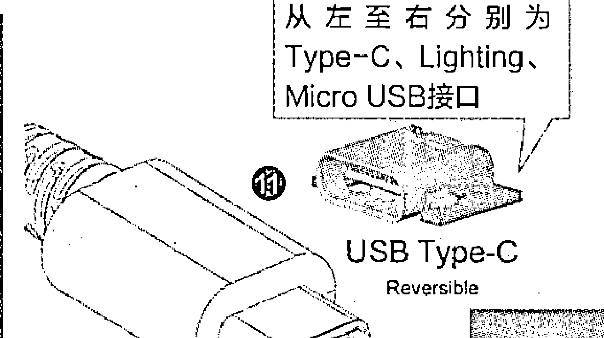

最新的MacBook Pro接口设置，其实耳机也可采用Type-C，所以仍保留了耳机插孔的这款产品还不能算最激进

##### 充电和外设扩展

- 两个 Thunderbolt 3 (USB-C) 端口，均可支持：
  - 充电
  - DisplayPort
  - Thunderbolt (速率最高可达 40 Gbps)
  - USB 3.1 第二代 (速率最高可达 10 Gbps)

- 四个 Thunderbolt 3 (USB-C) 端口，均可支持：
  - 充电
  - DisplayPort
  - Thunderbolt (速率最高可达 40 Gbps)
  - USB 3.1 第二代 (速率最高可达 10 Gbps)

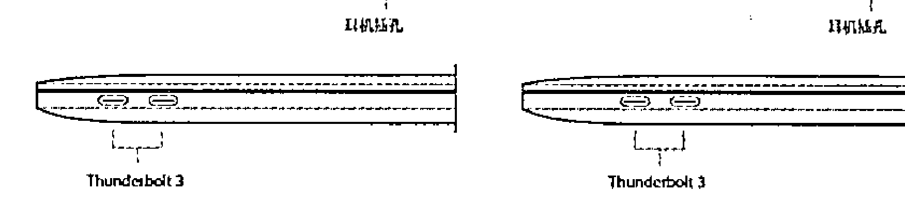

接口后方的E-Mark芯片可以自动探测设备是否可承受5A电流

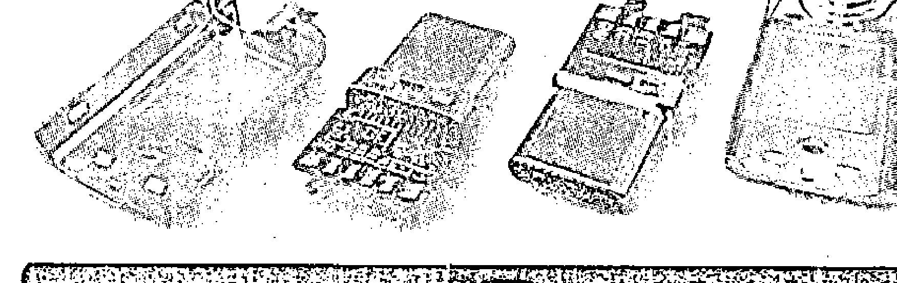

不同用户对PC能力的需求和对价格的承受能力差别相当大，2017年的电脑市场也不例外，我们不妨从不同需求来看一看2017年的电脑市场会带给我们怎样的不同产品和方案吧。需要注意的是，由于2017年的实际产品发布情况可能受到技术、市场等原因而产生变化，我们并不能特别确定其实际性能、价格、发布日期甚至是否真的会发布，所以其中涉及的产品仅供参考。

#### ◎ 学习与办公

对于学习和办公用户来说，电脑只需提供较高的数据处理能力即可，当然最基本的影音娱乐能力也是需要的，毕竟目前影音内容已经充斥在各种资料、网站和相关服务中，而且偶尔看看电影、听听音乐放松一下也无可厚非，甚至可以提升效率，好在厂商对此也心知肚明，所以用户并不需要特别关注这一点。

> 目前DDR4内存价格已经与DDR3内存相同甚至更低，是DDR3内存升级最后的机会

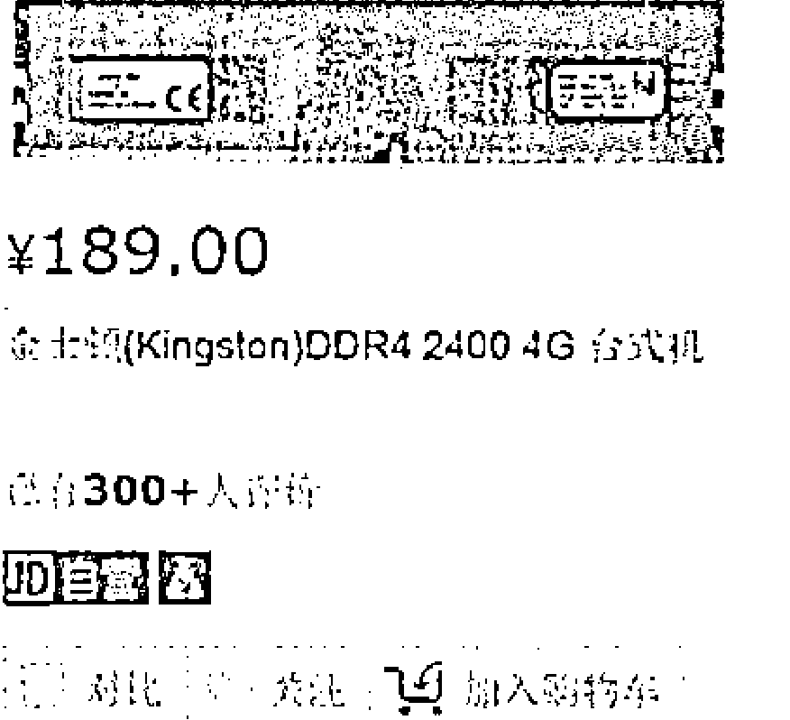

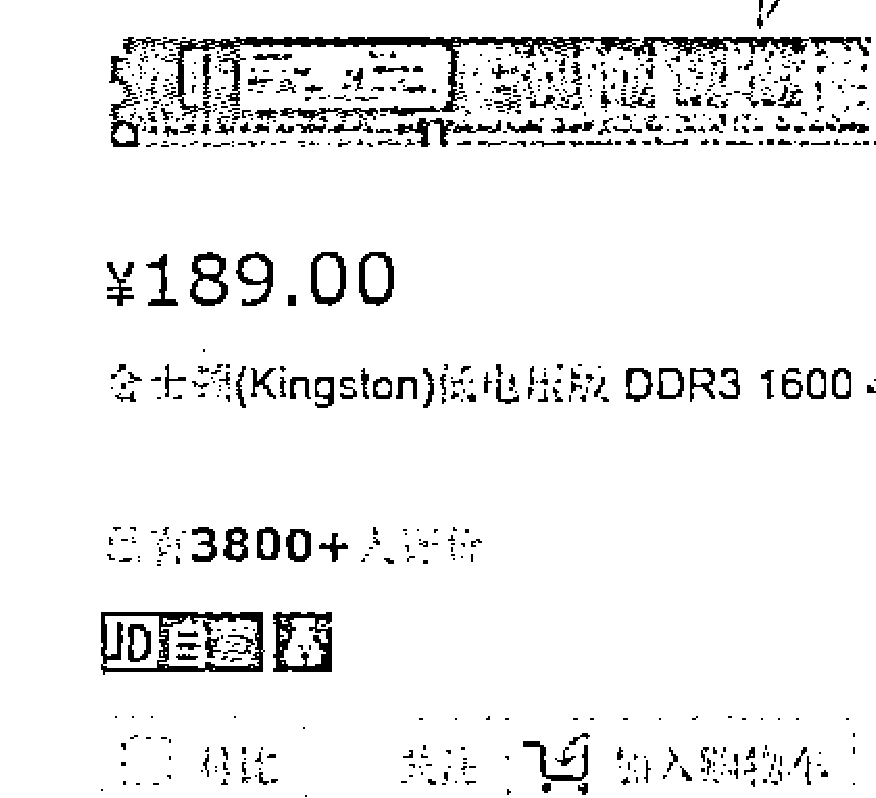

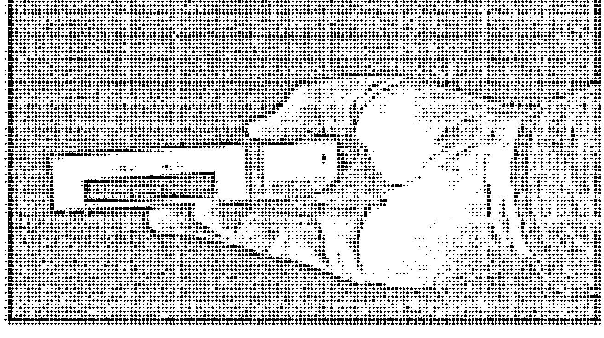

由于目前操作系统和日常应用程序如办公软件、网络应用软件等对系统性能的要求并不高，中低端处理器及其内置显示单元，搭配主流内存和硬盘等配置，就足以应对。在2017年，虽然3D XPoint技术可能将冲击高端内存和SSD市场，但在主流市场上应该也只能表现为产品价格的调整，所以主流的内存仍将是DDR4标准，固态和机械硬盘的主流容量应该也不会有太大变化，所以我们关注的主要是新一代处理器。

在2017年，准备升级或购置学习、办公电脑的用户，可以考虑使用Intel的新架构奔腾、赛扬处理器，以及AMD的A6、A8系列APU。在周边配件方面，对操作系统和主流应用软件的需求来说，8GB DDR4内存和128GB SSD已经足够使用，且性价比不错，另外可以考虑搭配1TB~2TB机械硬盘扩充存储容量；如果资金充裕的话也可适当提升至16GB内存（图15），在处理一些大型复杂文档或其他任务、运行游戏等影像应用时会有一些帮助；而如果对存储容量要求不多的话，直接采用256GB SSD也是不错的选择，总价与128GB SSD+机械硬盘类似。

大部分轻薄便携和长续航笔记本电脑主要的目标也是对性能要求并不算特别高的学习、办公用户，其实我们前面提到的已经在2016年推出的低功耗版本第六代智能酷睿，对一些无法等待更新一代处理器的用户来说也是不错的选择。

如果仅需要文本处理、上网等基本应用，那么可以选择二合一电脑或超轻薄电脑，甚至使用Windows系统的平板电脑搭配蓝牙键盘等外设，获得更自由的使用体验，而这些产品可能就会是采用Apollo Lake处理器或M系列处理器的产品，其性能已经足以满足办公上网等需求。

在2017年，另一种Intel所主导的超小型PC——NUC (The Next Unit of Computing, 下一代计算平台) 在我们上文提到的多款超低功耗处理器的推动下，很可能会成为下一个台式机消费热点（图16）。相对于轻薄笔记本电脑，它没有屏幕、键盘、电池等配置，用户可以根据需要自行购置这些设备，可以形成更有针对性和个性化的计算平台。另外虽然它只能在配有外设的地方使用，便捷性似乎不如笔记本电脑，不过其体量重量仅相当于一块大容量移动硬盘，对有固定使用位置的用户，如办公用户，只要准备好外设，移动和部署NUC甚至比笔记本电脑更轻松方便。

##### ● 全能PC平台

内地用户最喜爱的还是“全能”型的PC，对办公、游戏、娱乐等能力都有一定的要求。对全能型PC平台来说，要在有限的资金下获得比较全面的性能，满足多方面的性能需求，比“够用”就好的学习办公用机要复杂一些。

从目前来看，2017年的主流游戏和应用并没有对系统的绝对性能提出特别高的要求，但在一些标准方面有一定的变化，而主流硬件则因为技术的进步而在性能、价位方面有一定的变化，我们可以将注意力主要放在这些方面。

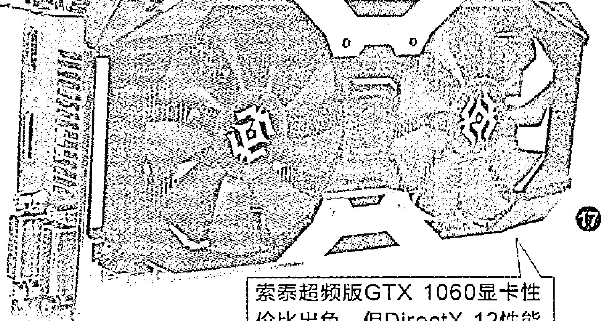

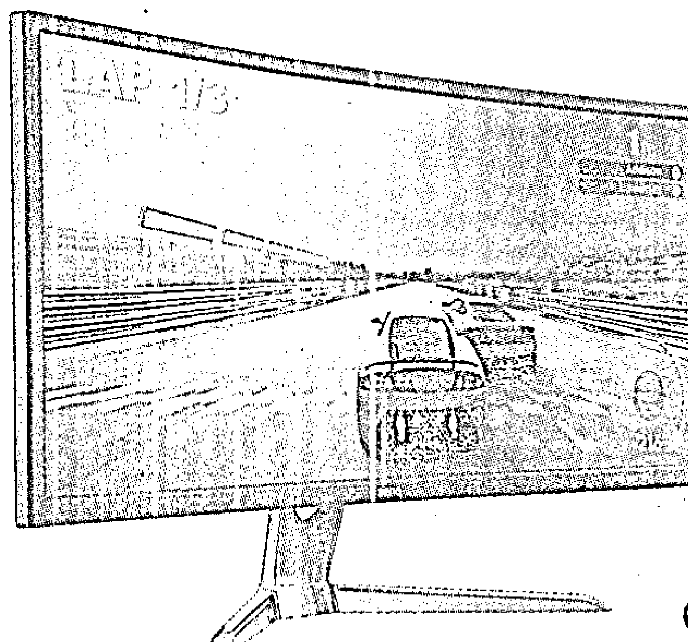

对一般游戏用户来说，在升级或新购显卡时，应该考虑AMD或NVIDIA的新架构GPU产品，它们不仅性能比前一代的同价位显卡更强，而且在使用更精细的新制程后，功耗也大幅降低，更重要的是这些显卡对2017年大批出现的DirectX 12游戏支持更好。对主流单机和高端网游来说，目前1500元~2000元级别的显卡已经可以获得很不错的效果，而随着2017年新显卡的推出，这一级别显卡的价格很可能会降至1000元~1500元区间。

我们比较推荐的产品包括AMD Radeon RX 470D/470/480和NVIDIA GeForce GTX 1050 Ti/1060（图17），在同价位下，AMD GPU的DirectX 11性能相对稍弱一些，功耗也稍高，但DirectX 12性能更强，而且均支持双显卡模式，未来扩展能力更强一些。

由于AMD和NVIDIA的近几代显卡已经可以支持DirectX 12，而且DirectX 12游戏也大都提供了效果差别并不明显的DirectX 11模式，所以已经在使用AMD Radeon R9 380、NVIDIA GeForce GTX 960或更高端显卡的用户，如果对游戏性能没有更高的要求，我们并不建议升级显卡。

我们前文已经提到，2017年预计推出的处理器及其平台并没有太吸引人的性能和功能，如果已经拥有了第四代智能酷睿或更新产品的话，我们并不建议升级，而新购机或升级更老式电脑的话，我们建议选择新一代酷睿i5处理器，在价格比较合理的前提下，可为我们前面提到的主流显卡提供足够的支持。另外最好将内存升级至16GB，存储方面的建议则与前面提到的学习办公型电脑类似。

对主流全能平台用户，我们建议更多地考虑一下外设产品，一些以前价格高高在上的外设产品，正在快速进入主流价位，例如本期提到的炫光电竞键鼠，以及18期提到的2K分辨率显示器、27英寸甚至更大尺寸的显示器、画面更精细的4K分辨率显示器、人体工程学更出色的曲面屏显示器（图18）等产品。这些外设产品虽然无法直接提升PC的性能，但都是与我们接触更紧密的设备，能够大大提升实际使用体验。

##### ● 高端游戏/应用平台

VR技术在2017年仍然将是非常火的话题，不过无论是VR眼镜还是相匹配的PC平台，价格仍然会高高在上。尽管VR技术、应用、设备仍然有不少问题，但不可否认的是，VR将很快成为高端游戏/应用平台的标准配置（图19），也许在不久的未来，如果没有VR处理/显示能力的话，恐怕都不敢跟人说自己是高端PC了。

围绕着VR应用，我们最需要关注的主要是显卡性能，虽然目前2000元级别的显卡如AMD Radeon RX 480和GeForce GTX 1060已经可以应对目前基于Oculus Rift和HTC VIVE的VR应用，但为了保证对未来游戏应用和更高分辨率VR硬件设备的支持能力，我们最好选择更高一些的型号，如GeForce GTX 1070及更高型号，或者AMD的Fury系列产品和即将到来的织女星核心显卡。

当然如果要更好地支持高端显卡，高端的处理器必不可少，还要辅以16GB内存及更高性能的存储系统以减小应用中的延迟。特别是在2017年，M.2接口进一步普及和SSD新的制造工艺走向成熟，也许会让M.2接口，甚至是NVMe标准的大容量产品价格更加合理，成为高端标配。

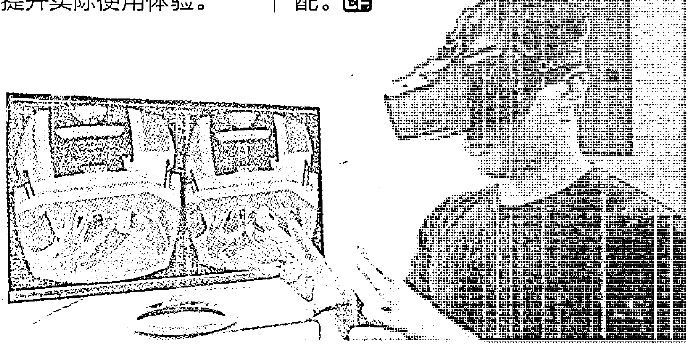

## # 芯·形·技的革新
### 智能手机的这一年

策划|《电脑爱好者》编辑部

2016年，智能手机领域的主要亮点体现在了三个方面：新工艺和新架构（芯），让CPU/GPU性能进一步增强；以曲面屏和概念类的设计成为了外观同质化下的一缕新风（形）；以双摄像头和光学变焦为代表的新技术（技），让智能手机变得更具乐趣。下面，就让我们从这三个方面，回顾一下2016年智能手机的革新吧。


扫一扫，更多精彩内容立现！

> ×速链接

有关2016年笔记本领域的变化和趋势，请翻阅本刊2016年23期的特别话题报道。

## # 智能手机的“芯”变化
### 从工艺看2016年的处理器

智能手机新品如何才能博得眼球？没错，就是武装最新款处理器，从而获得更强或更省电的特性。在2016年中，无数新品其实都是围绕着有数的几款移动处理器展开的布局。

追求纤薄设计的手机，注定无法承受发热量太高或功耗太大的处理器。然而，用户对性能的无止境需求，又迫使芯片厂商不断提升处理器性能。那么，如何才能让新款处理器在提升性能的同时保持较低的功耗和发热呢？制程工艺（图1），就是最为核心要素。

## # 不匹配工艺引发的血案

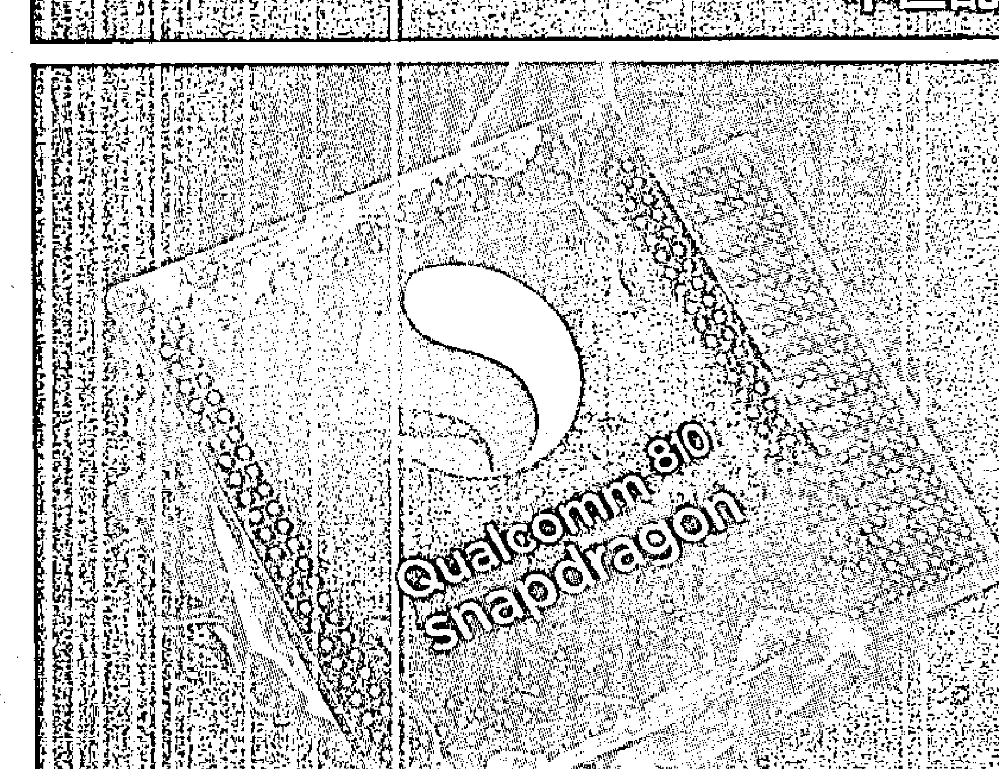

2015年，高通的年度旗舰骁龙810成为了很多手机厂商和用户心中的噩梦（图2），因为它“太热情”了，因过热而引发的频繁降频，已经严重影响到了用户的使用体验。也就是从这颗处理器开始，才让所有人开始认识到工艺的重要性。2015年，手机处理器刚好处于全面过渡到64位Cortex-A5x架构Big.LITTLE（大小核）组合的节点。高通在这一年“偷了个懒”，让骁龙810采用了公版四核Cortex-A57+四核Cortex-A53（图3），并采用台积电的20nm HPM工艺进行生产。问题来了，这个档次的工艺还不足以缓解高主频四核Cortex-A57的发热性，于是就造成了骁龙810“因热生戾”的悲剧。

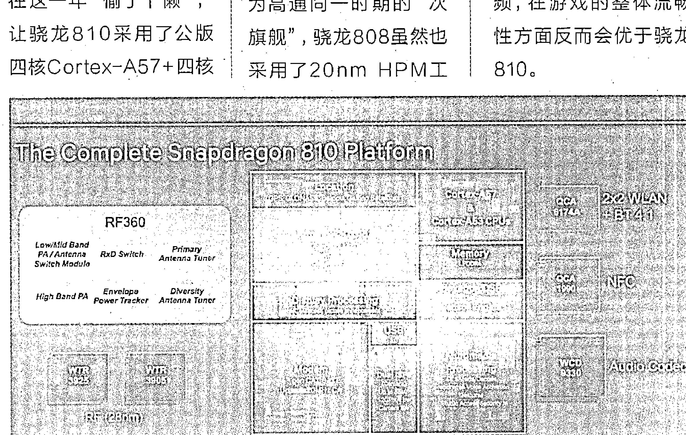

需要注意的是，作为高通同一时期的“次旗舰”，骁龙808虽然也采用了20nm HPM工艺，但由于它采用的是双核Cortex-A57+四核Cortex-A53，作为大核的Cortex-A57核心数量减半，而且主频也有所降低，所以它的温控表现就要好很多。在运行大型3D游戏时，由于骁龙808不容易因过热而触发降频，在游戏的整体流畅性方面反而会优于骁龙810。

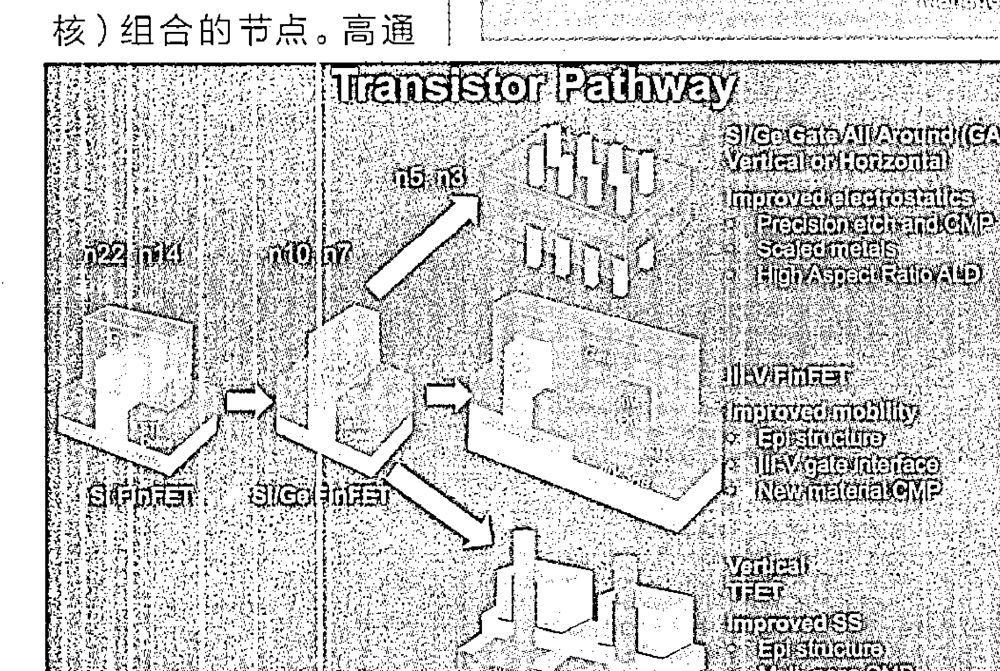

随着晶体管尺寸的不断缩小，HKMG（high-k绝缘层+金属栅极）技术成为了45nm以下级别制程的必备技术。以台积电为例，针对不同市场定位会在同一时期的制程工艺（如28nm）中衍生出HP（高性能）、HPL（高性能低功耗）、HPM（高性能移动运算）、HPC（高性能精简型）等子分类，它们都采用了HKMG栅极和后栅极工艺。此外，台积电旗下工艺还有LP（低功耗）这个分类，改用了poly/SiON栅极和前栅极工艺。性能方面HPM>HP>HPL>LP，漏电方面HPL<HPM<LP<HP。而到了16nm/14nm/10nm时代，HKMG已经无法满足设计需求，而FinFET（即3D晶体管，又称三栅极晶体管）技术将一统江湖（图4）。

## # 新架构弥补工艺不足

20nm工艺真的无法满足高性能处理器的设计需求吗？答案是否定的，联发科在2016年推出的全球首款十核处理器Helio X20/X25（图5），同样是基于台积电20nm HKMG工艺生产的，而Helio X20/X25的散热表现虽然谈不上优秀，但至少没有前辈骁龙810那么糟糕。究其原因，则是Helio X20/X25赶上了Cortex-A57向Cortex-A72架构的过渡。简单来说，Cortex-A72是Cortex-A57的接班人，同样定位于Big.LITTLE中的大核（主打高性能），在能耗比方面较Cortex-A57有所改进（同等性能下A72核心的功耗比A57更低）。

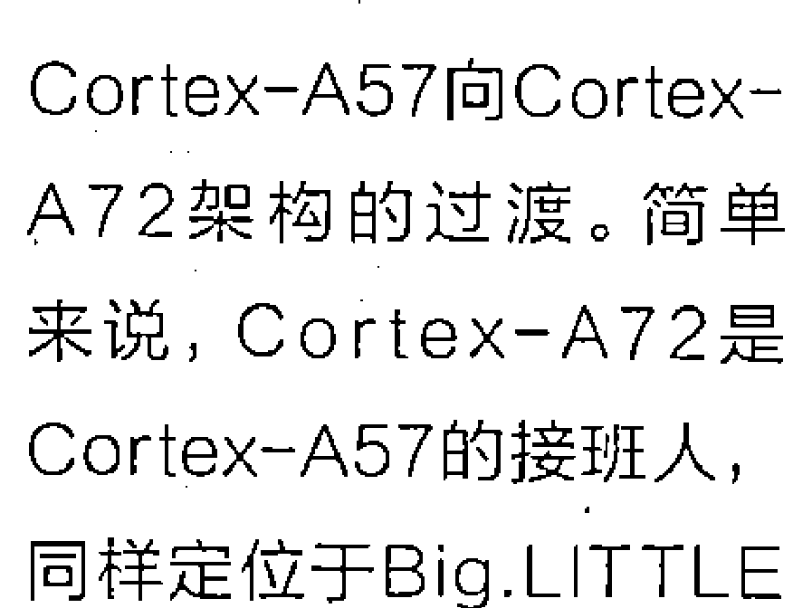

此外，Helio X20/X25采用了少见的“三丛集”架构，即双核Cortex-A72（大核）+四核高主频Cortex-A53（中核）+四核低主频Cortex-A53（小核）（图6）。再加上联发科为其准备了全新的CorePilot 3.0调度技术，可根据当前系统的负载情况而选择不同的核芯搭配，让Helio X20/X25可以更精准地控制Cortex-A72核心的开/关与运行时长，将温度限制到了一个可控的状态。

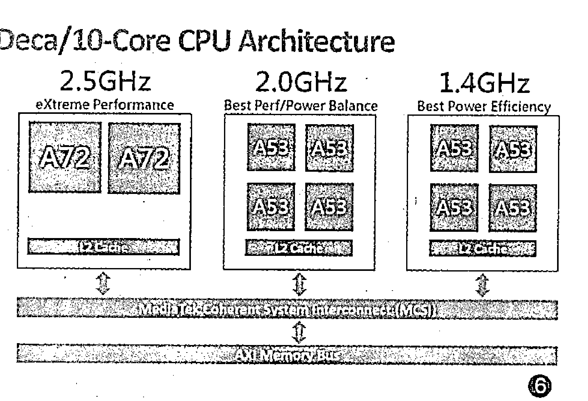

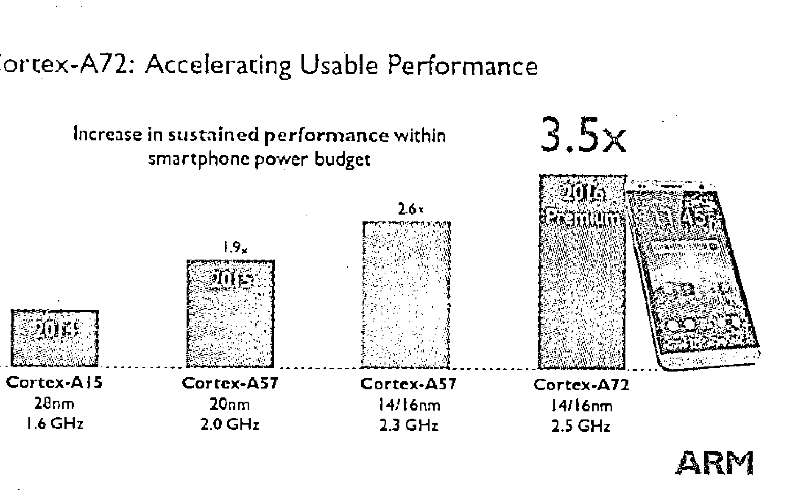

## # 源自28nm的绝唱

虽然早在2015年底，三星的14nm FinFET和台积电的16nm FinFET Plus工艺就已量产，但这并没能阻止旧工艺在2016年的逆袭。比如，除了年度旗舰骁龙820以外，高通在2016年还发布了两款性能级处理器：骁龙652（四核Cortex-A72+四核Cortex-A53）和骁龙650（双核Cortex-A72+双核Cortex-A53），而它们的生产工艺却还停留在台积电的28nm HPM档次上（图8）。还好，正如前文所述，Cortex-A72的功耗低于Cortex-A57，再加上这两颗处理器的最高主频只有1.8GHz，所以28nm HPM还是可以“勉强”驾驭它们的发热。但是请注意，笔者用的是勉强二字，因为市面上很多搭载骁龙652的手机都存在发热较高而且长时间游戏时降频的现象，只是没有当年骁龙810那么严重而已。

除了高通，联发科在2016年也推出了一款28nm HPC+处理器：Helio P10。需要说明的是，28nm HPC+是台积电在2016年才量产的“新工艺”，它在省电的同时性能也已经无限接近HPM，最终让Helio P10在性能和省电之间取得了较好的平衡。最近一年来包括OPPO R9等很多“爆款”（图9），就都是Helio P10的“客户”。

好消息是，28nm HPC+应该算是台积电乃至所有芯片厂在>20nm工艺时代的绝唱。到了2017年，无论是定位性能的旗舰级处理器，还是面向主流和节能领域的处理器，都将用上16nm或14nm乃至10nm工艺，让强者更强，弱者增强的同时更加省电。

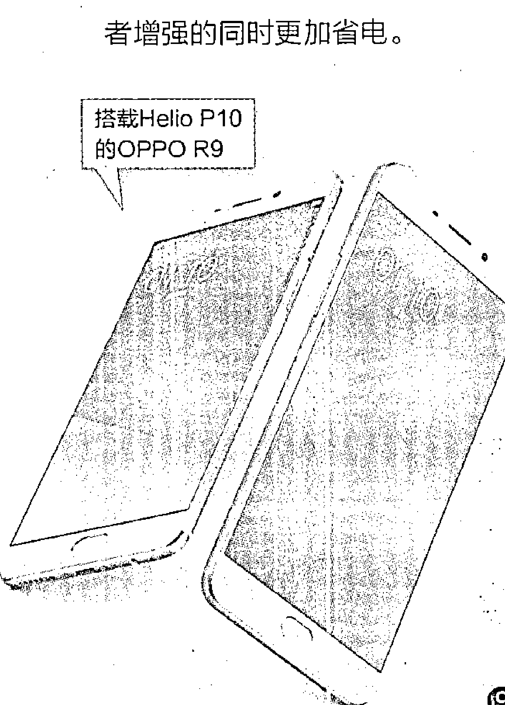

## # 16nm成就麒麟之名

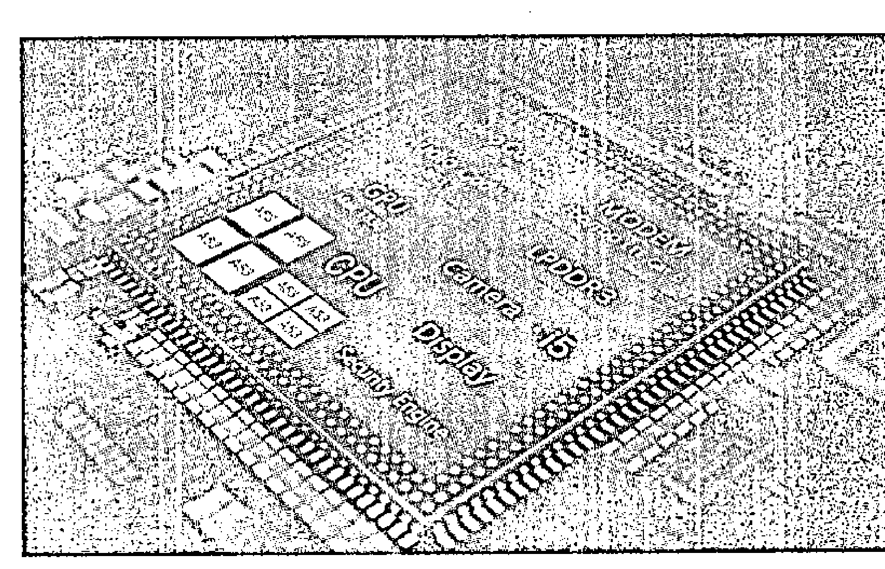

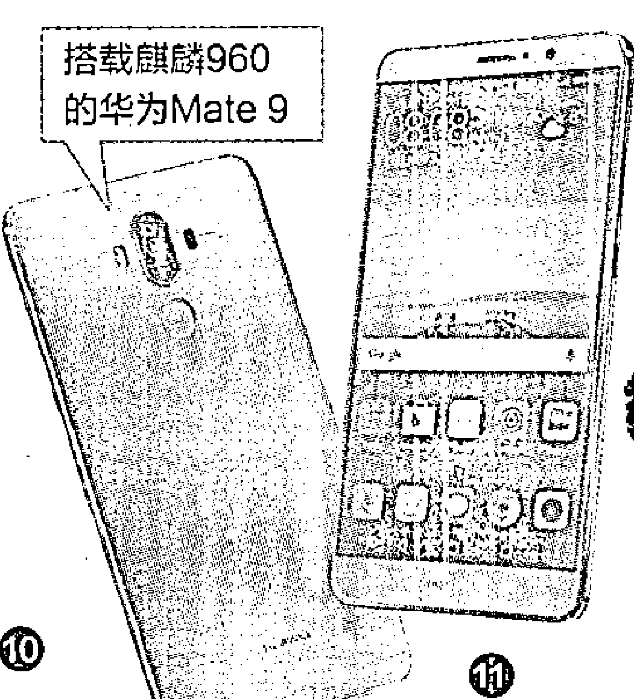

2015年底，华为发布了麒麟950（Mate 8首发），并成为了继苹果A9之后，第二批用上台积电最新16nm FinFET Plus（16nm FF+）工艺的移动处理器。看到这里，可能有同学会产生一个疑问：联发科Helio X20的上市时间晚于麒麟950数月，为什么它却没能用上16nm FF+工艺呢？按理说应该是发布越晚越有机会用上新技术才对。

答案很简单，一方面是联发科Helio X20立项时间较早，没来得及用上最新工艺；另一方面，则是华为很早就和台积电就工艺问题进行了合作，所以才能优先得到台积电16nm FF+的产能。

得益于16nm FF+这一工艺，让麒麟950在骁龙820上市之前过了一把“谁与争锋”的瘾，随后而来的麒麟955（华为P9首发）在提升主频后也获得了更多的竞争力。2016年4月底，定位主流市场的麒麟650（荣耀畅玩5C首发）亮相（图10），其综合性能优于同期的骁龙617和Helio P10，也算是中端领域的一颗新星。

2016年11月，海思再次祭出了麒麟960（Mate 9首发）（图11），它采用了ARM最新的Cortex-A73架构和Mali-G71MP8 GPU，再一次让麒麟家族体验了一把位列顶级的体验。可惜，由于Mali-G71MP8的发热量和功耗较高，已经接近了16nm FF+工艺所能承载的极限，所以麒麟960存在满载时降频、GPU无法满血运行的尴尬。最终，让麒麟960获得了在CPU运算性能上傲视群雄，但GPU性能却略逊一筹（相对于骁龙820）的真实表现（表1）。

表1：2016年高端处理器性能对比表
| 项目                          | 麒麟950 | 麒麟955 | 麒麟960 | Helio X25 | 骁龙820 | 骁龙821 |
|-------------------------------|---------|---------|---------|-----------|---------|---------|
| GeekBench 3-单核              | 1663    | 1868    | 2176    | 1873      | 2320    | 2534    |
| GeekBench 3-多核              | 6184    | 6682    | 6690    | 6519      | 5460    | 5984    |
| GeekBench 4-单核              | ——      | 1822    | 1925    | 1756      | 1731    | 1862    |
| GeekBench 4-多核              | ——      | 5393    | 5860    | 4505      | 4198    | 4356    |
| GFXBench ES3.1 曼哈顿离屏     | 10fps   | 10fps   | 24fps   | 11fps     | 29fps   | 33fps   |
| GFXBench ES3.0 曼哈顿离屏     | 18fps   | 18fps   | 31fps   | 18fps     | 45fps   | 49fps   |
| GFXBench ES2.0 霸王龙离屏     | 41fps   | 41fps   | 71fps   | 36fps     | 92fps   | 95fps   |## 特别话题 Q

### 16nm不止单一的FF+

台积电的16nm工艺并非只有FF+，随后还将推出名为16nm FinFET Plus Compact (FFC)的全新工艺。简单来说，FFC可以和FF+共用一条生产线，它更适合主流及低功耗芯片，比如IoT物联网平台，而联发科Helio P20 (魅蓝X首发)则是台积电16nm FFC工艺的首批代表(图12)。

Helio P20是P10的升级版，同样主打优秀的能耗比。得益于16nm FFC工艺，Helio P20虽然延续了八核Cortex-A53架构，但却将主频一下子提升到了2.3GHz，同时还将GPU升级到了Mali-T880MP2，足以终结现有Helio P10被麒麟650和骁龙625“欺负”的局面。

据悉，海思即将推出的麒麟660也将采用台积电16nm FFC工艺，有望采用双核Cortex-A73+四核Cortex-A53的组合。

### 14nm帮高通找回面子

经历骁龙810的失败之后，为了挽回面子，高通决定从2个角度对骁龙820进行优化：第一是不再套用ARM的公版设计，而是基于ARM指令集进行自主架构的研发，最终推出了现有的Kryo架构；第二是和三星合作，用最新的14nm FinFET (LPP)工艺对骁龙820进行生产。

功夫不负苦心人，新工艺+自主架构的组合，让骁龙820以区区四核之身就足以位居顶级处理器行列(图13)，特别是GPU性能更是Android手机处理器领域的最强音。

为了增强在主流市场的竞争力，高通还在2016年推出了全新的骁龙625处理器(图14)。同样基于三星14nm FinFET工艺设计的骁龙625有着极为出色的能耗比，通过实测骁龙625在很多游戏的运行过程中比定位更高的骁龙652还要流畅。原因很简单，长时间游戏骁龙652可能因过热降频，而骁龙625则可始终保持满血运行。

> **小提示**
>
> 高通在2016年底推出了骁龙626、骁龙653和骁龙427等处理器新品，它们的工艺和主要规格与骁龙625/652/425相同，只是加入了对QC3.0快充的支持，并配备了更先进的基带芯片。总体来说，这些仅是尾数变化的处理器，性能基本不变，只是功能层面有所升级。

### 10nm已经向我们走来

随着Cortex-A73架构和新一代GPU的出现，哪怕是16nm/14nm工艺都禁不起它们的“折腾”了。因此，2017年的旗舰级处理器都将引入更新的10nm工艺，从而解决性能与发热和功耗之间的矛盾。

比如，骁龙835就与三星10nm FinFET工艺搭配，采用高通自主架构Kryo 200，并改用四大四小的八核设计，同时将GPU升级到了Adreno 540（图15）。

此外，有消息称联发科P35也会采用台积电10nm FinFET Plus工艺，而且同样是十核处理器（双核A73+四核高频A53+四核低频A53），和X30的差别是P35的GPU换成了Mali-G71 MP3。

再比如，联发科将与台积电10nm FinFET Plus工艺组合，推出Helio X30十核处理器（图16），将大核升级到Cortex-A73，GPU也换成了Imagination旗下的PowerVR 7XTP-MT4。考虑到苹果A系列处理器就一直采用Imagination GPU，所以此次Helio X30的表现也值得期待。

### 隐藏在工艺数字背后的秘密

看到这里，可能又有同学会问了：台积电的16nm和三星14nm之间谁更出色？不是说英特尔一直领跑半导体工艺吗，为何这次却被三星和台积电超越了？

先来看看第一个问题。14nm和16nm属于同代工艺，所以理论上它们具备相同的性能，纠结于它们之间的强弱关系没有太多意义。毕竟在工艺相近时，处理器的性能还是取决于芯片采用的具体Cortex架构、主频、GPU和软硬件优化。

再来看看第二个问题。包括台积电、三星与格罗方德等晶圆厂对自身工艺数字都经过了不同程度的“美化”。曾有业内人士透露，台积电的16nm等于英特尔的20nm，10nm等于英特尔的12nm，尚未量产的7nm与英特尔的10nm工艺属于同一个技术世代。

没错，英特尔的制程工艺是不含任何“水分”的，考虑到英特尔10nm工艺将于2017年量产，它在制程领域的优势仍将继续（图17）。

为了让大家更直观地了解2016年亮相或即将亮相的处理器与工艺制程之间的关系，我们特意制作了一个表格（表2），大家可以作为参考。

### 表2：常见手机处理器与工艺对应关系表

| 制程 | 工艺 | 处理器品牌 | 处理器型号 |
| :--- | :--- | :--- | :--- |
| 10nm | 三星FinFET (LPE/LPP) | 三星 | Exynos 9系列* |
| 10nm | 三星FinFET (LPE/LPP) | 苹果 | A11* |
| 10nm | 三星FinFET (LPE/LPP) | 高通 | 骁龙835* |
| 10nm | 台积电FinFET Plus (FF+) | 联发科 | Helio X30/P35* |
| 10nm | 台积电FinFET Plus (FF+) | 海思 | 麒麟970* |
| 14nm | 三星FinFET (LPP) | 三星 | Exynos 8890/8895 |
| 14nm | 三星FinFET (LPP) | 高通 | 骁龙821/820/625/626 |
| 14nm | 三星FinFET (LPP) | 高通 | 骁龙660* |
| 16nm | 台积电FinFET Plus (FF+) | 苹果 | A10 |
| 16nm | 台积电FinFET Plus (FF+) | 海思 | 麒麟960/955/950/650 |
| 16nm | 台积电FinFET Compact (FFC) | 联发科 | Helio P20 |
| 16nm | 台积电FinFET Compact (FFC) | 海思 | 麒麟660* |
| 20nm | 台积电HKMG | 联发科 | Helio X20/X25 |
| 28nm | 台积电HKMG (HPM) | 高通 | 骁龙425/427/652/653/650 |
| 28nm | 台积电HKMG (HPC+) | 联发科 | Helio P10 |
| 表注：*代表还未上市 |

### 小结

2016年智能手机的发展史，其实就是围绕着工艺革新和处理器升级的迭代史。这一年里表现最好的手机，一定是搭载了与工艺最为匹配的处理器。总之，希望经过本文的梳理，能让大家更好地掌握手机处理器的发展方向，毕竟手机的跑分高低、所支持的功能多少，都是建立在处理器的基础之上。地基不牢固何谈后续？

## 不止于芯变化 智能手机设计与功能革新

2016年智能手机的变化不仅限于“芯”的升级，毕竟单纯的硬件和性能革新属于“理所应当”。作为消费者，我们更关心手机在设计和功能层面的变化。

### 玻璃与金属的较量

在2015年，全金属一体化是定义中高端手机的标签。步入2016年后，金属材质已经在各个价位的手机领域普及，就连千元机也逐渐被全金属+CNC工艺占领。就在我们感受金属的冷峻触感之余，一道来自玻璃的炫光，也成为了中高端手机的发展趋势。

而这道源于玻璃的炫光，也成为了时下双面玻璃新品所追求的设计方向。

### 金属与信号的线与点

玻璃除了手感好以及光线折射的炫酷特效以外，对信号的屏蔽性也很小。而以金属为主要材质的手机，就需要在信号的溢出方式上多费一番心思了。

如何解决金属后盖对信号的隔绝问题？2015年绝大多数Android手机的答案是采用三段式的金属后盖设计，上下两端嵌入塑料实现信号溢出。而今年更多的产品则将工艺升级到了纳米注塑，并在纳米注塑条的粗细和位置上做起了文章。

比如，OPPO R9s就主打微缝天线，将原本很粗的纳米注塑条改为了三条纳米注塑线。再比如，魅族Pro6、iPhone 7和vivo X9则采用了全新的穹顶式U型天线，保证了金属后盖的整体性。此外，华硕通过ZenFone 3尊爵还引入了“无痕天线”的概念，将原本用于信号溢出的纳米注塑“条”改为了“点”，并将这几个点隐藏在了手机正面金属边框的CNC抛光带上，真正实现了视觉上的“全金属”。

### 双玻璃手机的复起

iPhone 4应该是最经典的金属中框+双面玻璃智能手机，可惜从iPhone 5开始，全金属的iPhone又引领了另外一种设计潮流。步入2016年后，类似iPhone 4的双面玻璃设计再次在Android手机领域普及开来。

在Android手机领域，三星Galaxy S6/S7系列是金属中框+双面玻璃的坚定拥护者(图1)，并以3D曲面玻璃背板为主打设计，结合2.5D屏幕玻璃(如S7)或曲面玻璃(如S7 Edge)，大幅提升握持手感。而其他品牌的新品，则大都在玻璃的基础上，利用其反光特性加入了诸多优化。以荣耀8为例，它的玻璃后盖经由15层工艺处理之后，在光线的照射下可呈现出缤纷的光线和色彩。

### 曲面屏幕渐入佳境

在2016年以前，提起曲面屏幕似乎只有三星一家（图5）。如今，曲面屏幕却呈现出“四面开花”的态势，vivo、小米、华为等国产品牌也都先后推出了配备曲面屏幕的新品。只是，都是曲面屏，但在使用体验上却依旧存在着很多不同。

### OLED专属的曲面“视界”

在手机屏幕领域，LCD（IPS）和OLED（AMOLED）是显示屏的主要材质，但其中却只有OLED才能做成曲面屏幕。原因很简单，LCD屏幕由于液晶材料的特殊性是不可弯曲的，而OLED则因内部都是固体机构可随意弯曲。

目前能提供OLED屏幕的供应商有三星（vivo Xplay6、华为Mate 9 Pro）、LG（小米Note 2）、京东方和辉光电（红米Pro）。其中，京东方和辉光电的OLED屏幕在色准以及综合素质方面的表现一般，且只能供应普通的非曲面屏幕。而三星和LG则是曲面屏幕供应商，其中又以三星曲面屏幕的素质最高，LG次之。

LCD屏幕内的像素点都是标准的RGB排列，而OLED则以Pentile排列为主，如果OLED屏幕像素密度（PPI）过低时显示文字边缘有明显的锯齿感。因此，如果OLED屏幕的分辨率没有达到2K，在显示效果上会有所折扣。

### 谁在影响着曲屏的体验

曲面屏幕有一个很关键的数据：曲面弧度。将现有曲屏手机，如三星Note 7（已退市）、S7 Edge、vivo Xplay5、Xplay6、小米Note 2（图6）和华为Mate 9 Pro（图7）摆在一起，你会发现三星Note 7曲屏的弧度最大，S7 Edge和Xplay6次之，然后是小米Note 2，而华为Mate 9 Pro和Xplay5曲屏的弧度则最小。

曲面屏幕的弧度越大，意味着可以将边框压缩得越窄，同时手机从边缘划过时的手感最佳。此外，如何利用曲面屏幕的有效空间实现更多功能，也是考验厂商软硬实力的一环。在这方面还是三星保持着领先优势，曲面侧屏不仅可以显示时间和信息，还能作为呼出快捷应用的窗口（图8），还能被一些APP合理利用（图9）。在其他几款国产曲屏手机中，vivo Xplay6可以利用侧屏呼出快捷应用，小米Note 2通过特殊主题可以发挥出一些侧屏的优势，而华为Mate 9 Pro和Xplay5则只是曲屏而已，还没能挖掘这种特殊屏幕的潜在能力。

可以预见，未来曲面屏幕将成为国产高端手机的发展趋势之一，只是谁的屏幕可以更弯一些，能挖掘出侧屏潜力的系统功能和APP，谁的竞争优势就会更大一些。

### 向更高端再迈一步

为了争抢利润蛋糕，今年很多国产品牌都开始了向更高端领域进军。只是，与往年单纯的提价相比，2016年的这些更高端国产手机则有了再进一步的底气。

### 当手机遇见保时捷

华为Mate 9 Porsche Design是一款由保时捷设计师亲自操刀的产品，屏幕上方的“Porsche Design”Logo流露出一种尊贵气息（图10），国内8999元的售价使其一跃成为华为史上最贵的手机。可惜，这款保时捷版的Mate 9在配置上和Mate 9 Pro差别不大，是否为其买单，就得看Porsche Design在你心中的分量了。

除了华为与跑车品牌联手，三星在这一年也与华纳兄弟携手推出了Galaxy S7 Edge蝙蝠侠限定版，售价比普通版贵了600元。S7 Edge蝙蝠侠版只是在全黑配色加上金色点缀，背面刻印了金色蝙蝠侠Logo（图11），Home键、背部摄像头、闪光区进行了镶金处理，预装定制UI并赠送蝙蝠侠保护套。此外，作为奥运赞助商，三星还推出了Galaxy S7 Edge奥运限量版。

### 让概念不再是概念

与华为Mate 9 Porsche Design和S7 Edge蝙蝠侠和奥运限定版这种取巧的设计相比，小米MIX则是一款更具诚意的概念新品。

作为设计大师Philippe Starck操刀的产品，小米MIX将无边框概念进行到底，基本消除了顶部和左右两侧边框，屏占比高达91.3%（图12）。虽然这种设计风格的手机却并非小米MIX首创，夏普Crysta才是这种概念的先行者。不过，小米MIX还是在夏普Crysta的基础上有所突破和创新，比如将下边框压缩得更厉害（屏占比更高），用上了全陶瓷工艺，隐藏了话筒以及传感器。

MIX有两项黑科技值得引起我们的关注。其一是通过悬臂梁式压电陶瓷声学系统替代了听筒，当电话接通时驱动单元将电信号直接转换为机械能，通过微震点击的方式带动整机的中框共振，将声音传递至耳朵；其二是用超声波探测系统替代了被广泛使用的红外线距离感应器，当用户使用手机时可通过距离控制屏幕状态，防止误触发生。

小米MIX售价3499元起。虽然MIX的价格谈不上便宜，但就几近无敌的屏占比、全陶瓷机身、满血的骁龙821处理器、4400mAh超大电池，再加上将6.4英寸屏幕压缩到5.7英寸大小机身里的特性（图13），也足够对得起它的售价了。

有了小米MIX牵头，2017年会有很多相似的追求极致屏占比的概念新品，而它们或者在价格上有所惊喜，或者能在设计上解决易碎屏的安全隐患，以上种种不都是我们所期待的吗？

### 无限期待的防水能力

智能手机最怕什么？磕碰与跌落虽然存在碎屏风险，但毕竟碎屏后还有维修的可能。智能手机一旦遇水，则有可能彻底报废。因此，赋予智能手机防水能力，无疑是更多用户的心声。

### 索尼不再是独家

在智能手机的历史上，索尼Xperia Z系列无疑是防水手机中的标杆。如今，包括三星Galaxy S7和苹果iPhone 7系列在内的智能手机，却分别具备了IP68和IP67级别的防水能力（图14）。因此，Xperia Z销量的下滑也就在情理之中了。

### 防水不等于高价

支持防水的手机价格就一定很高吗？360手机N4就给出了否定的答案。这款不足千元的手机通过一项名为“纳米防水”的技术获得了IPX7级别的防水能力（图15），可在一米深的水中浸泡30分钟。

实际上，纳米防水技术原理并不复杂，它的原理是使用密度大于水的纳米涂层来为手机以及内部的电路镀上一层让水分子无法通过的“膜”，让水无法直接接触到电路板等物件，出水后手机可以迅速将内部的水分疏导出来。

实际上，纳米防水技术早在2013年就已经较为成熟了，只是一直都属于面向普通用户的付费服务（图16），鲜有厂商将其引入到生产环节。希望未来纳米防水技术能成为智能手机的标配吧，我们其实并不苛求手机必须达到多少级的防水，只是希望手机不幸落水时不会那么容易就因短路“致死”而已。

### 让人眼前一亮的新功能

这一年智能手机领域涌现出了很多新技术，它们或者让手机变得更好玩，或者让操作变得更加便捷。

### 惊鸿一瞥的虹膜识别

三星Note 7虽然已经退市，但它带来的一项名为“虹膜识别”的技术却给我们留下了深刻的印象。该技术的原理是，在手机听筒左右分别配备了一颗红外线IR LED以及一颗虹膜摄像头（图17）。启动虹膜识别的功能之后，IR LED和虹膜摄像头会协同工作，将虹膜信息进行数据编码并保存在手机的数据库中。

今后，用户靠眼睛就能解放双手，利用虹膜信息取代指纹解锁、密码解锁和图案解锁，不会再遇到手湿而无法解锁手机的尴尬（图18）。而虹膜识别还可对安全文件夹进行加密，或是用来验证三星账号、登录应用商店等等。

可惜，虹膜识别的操作还是有些繁琐，至少需要点亮屏幕、滑动屏幕解锁、对准眼球取景框进行虹膜识别和解锁这三个步骤，在效率方面远没有指纹识别来得快捷。因此，继Note 7之后，未来是否还会有产品引入这个技术还不好说。

#### 声波式指纹识别

为了保证手机屏幕玻璃的整体性，很多手机厂商会将指纹识别设计在后盖。难道指纹识别就不能直接隐藏在屏幕玻璃之下吗？小米5S就通过“无孔式超声波指纹识别”技术解决了这一尴尬（图19）。

简单来说，这个技术是利用超声波具有穿透材料的能力，哪怕手机表面没有开孔，也能利用皮肤与空气对于声波阻抗的差异来区分指纹嵴与峪所在的位置，从而完成指纹的识别和解锁的操作。

作。有消息称苹果iPhone 8也将采用类似的声波式指纹识别技术，可以预见未来它会在更多智能手机身上发扬光大。

#### 玩出花样的双摄像头

在智能手机领域双摄像头并非什么新鲜技术，而这一年的智能手机却在黑白+彩色、景深+普通双摄像头技术的基础上实现了光学变焦的能力。其中最具代表性的产品就是iPhone 7 Plus和华为Mate 9。

iPhone 7 Plus的光学变焦原理是依靠一个长焦镜头实现的（图20），因此它在进行2X拍照时谈不上“变”字，只是从广角镜头切换到长焦镜头而已，而且一旦环境光线不好，长焦镜头还会被屏蔽。而华为Mate 9的原理是利用2000万像素的黑白摄像头拍摄的信息，进行1200万像素的裁切，从而获得1200万像素级别的光学变焦能力（图21）。从本质来讲，这两款手机都谈不上“2倍光学变焦”，而更像是“2倍无损变焦”。

在2017年，会有越来越多的智能手机加入到双摄像头的行列中来，而我们也期待它们能实现更多有趣且实用的特殊拍照特效或功能，真正将双摄像头的潜力发掘出来。

Results AndroBench
| 项目 | 结果 |
|------|------|
| Sequential Read | 167.45 MB/s |
| Sequential Write | 149.03 MB/s |
| Random Read | 55.13 MB/s; 2440.29 IOPS (4KB) |
| Random Write | 7.64 MB/s; 1952.75 IOPS (4KB) |
| SQLite Insert | 434.88 IPS; 4.73 sec |
| SQLite Update | 438.10 IPS; 5.11 sec |
| SQLite Delete | 438.10 IPS; 5.14 sec |

#### 更快的存储性能

iPhone 7之所以运行流畅，除了iOS系统环境的特殊性以外，独特的PCIe + NVMe协议组合的存储单元也是功不可没。好消息是，到了2016年底，在Android领域终于出现了足以和PCIe+NVMe抗衡的存储技术，它就是UFS2.1，顺序读取速度可以接近600MB/s(图22)，已经超过了PC领域的SSD！

好消息是，除了麒麟960，即将上市的骁龙835、骁龙660和联发科Helio X30也都将支持UFS2.1存储技术。此外，包括上述处理器和联发科Helio P20在内的更多处理器新品，还将加入对LPDDR4X内存的支持(图23)，它属于LPDDR5之前的过渡技术，理论带宽可从LPDDR4的3733Mbps提高到4266Mbps，工作电压也从LPDDR4的1.1V降到0.6V，在提供更出色性能的同时还更省电。

##### Lower power solution, LP4X

-   LP4X : 4266Mbps, VDDQ/VDD = 0.6V/1.1V
- IO power reduction with 0.6V VDDQ, Good example of small change but big gain

#### 即将消失的设计与功能

2016年，智能手机在设计和功能方面不仅只做了“加法”，同时也出现了一些褒贬参半的“减法”。比如将USB和耳机孔合二为一，让双卡双待“双通”功能退出历史舞台。

#### 消失的3.5mm耳机接口

如今，以乐视、苹果和MOTO为代表的智能手机新品都取消了传统的3.5mm耳机孔，而这一趋势，也将逐渐蔓延到整个智能手机领域。想听歌？要么选择无线的蓝牙耳机，要么选择USB Type-C接口的耳机，要么通过Type-C转3.5mm转换器(图24)，再连接普通的耳机。

细心的用户可能发现了，在Android领域大家都是选择用Type-C取代耳机孔，原因是Type-C拥有更大的潜力，各大巨头都很看好，就连英特尔都针对它重新定制了USB Type-C Digital Audio数字音频技术。考虑到USB Type-C不仅限于手机，它也即将一统PC(台式机主板)、笔记本、平板电脑和其他智能设备，未来的哪一天USB Type-C真的将耳机孔取代也并非不可能。

#### 双通即将退出历史舞台

如今智能手机虽然大都支持双卡双待，但真正支持“双通”功能的产品却凤毛麟角(图25)。比如华为旗下的Mate 8、P9和荣耀V8就是支持双通的代表。遗憾的是，从Mate 9开始，华为手机将不再支持双通，而未来双通功能，也将彻底告别智能手机领域。

究其原因，除了双通功能的设计难度和成本更高以外，未来2G(GSM)退网是大势所趋，未来的网络环境注定双卡手机的副卡必须要支持3G网络才行，否则副卡将来会无法收到信号。因此，基带厂商(包括高通、华为、联发科)都顺应潮流增加了对4G数据+WCDMA语音通话双卡的支持。如果再要硬做双通的话，根本就没办法在手机上增加能支持这么多频段的副卡天线，而且副卡频段增加后，也无法解决主副卡同频干扰的问题。

## 起点
## 2016
### 电脑软硬件的那些事儿

被称为电脑行业又一个“寒冬”之年即将过去。

先不说2016是否真的有那么“冷”，但电脑的衰败却是不争的事实。

PC持续萎靡，移动互联的泡沫被不断吹破，甚至被普遍认为科技发展趋势的VR也退烧降温。

加上层出不穷的安全事件，软硬件系统不温不火的缓慢提升，

都让人觉得今年缺乏前进的能量。

历史永远是最好的镜子，抬头向前的时候，我们也要回顾一下这不安稳的2016。

### 加密与解密的隐私之战

2016年，令人印象尤为深刻的就是美国FBI与苹果就手机加密解密之间引发的争议。其实现在日常中，我们也会遇到各种各样的问题，涉及密码、加密和解密等问题，在此对事件可以不讨论，而这些技巧可不能不学。

### 后悔药
#### 自己解锁Windows 10本地账户密码

文|平淡

虽然Windows 10推荐大家使用微软账户登录系统，但是由于这个在线账户会自动同步很多用户设置，很多朋友仍然喜欢使用本地账户登录Windows 10使用。不过总是有很多人会忘记本地账户登录密码，此时就会被Windows 10挡在“窗”外。如果忘记本地账户登录密码，我们该怎么进行解锁？

安装过Windows 10的朋友都知道，在复制完系统文件重启后可以在安装界面通过按下Shift+F10调出命令提示符界面，此时就可以通过命令行执行很多的操作。比如“net user”命令就可以完成对账户密码的重置，因此我们可以借助Windows 10安装盘来完成对本地账户密码的重置操作。

首先准备一个4GB以上容量的闪存盘，将其格式化为FAT32格式（因为UEFI启动只支持FAT格式），然后将Windows 10（因为系统文件的统一性，所以需要解锁的系统体系必须与Windows安装盘一致：32位使用32位安装盘，64位使用64位安装盘）安装文件全部复制到闪存盘。接着插入闪存盘，根据自己电脑的启动模式（传统BIOS还是UEFI）选择启动方式，启动到全新系统安装界面之前，按下Shift+F10组合键调出“命令提示符”（图2）。

输入“regedit.exe”启动注册表编辑器，展开[HKEY_LOCAL_MACHINE]，点击菜单栏的“文件→加载配置单元”，在随后弹出的菜单中，查找安装盘路径下\Windows\System32\config\SYSTEM文件，这里是通过加载安装盘的SYSTEM注册表文件来进行修改，注意不要选择原Windows 10系统下的SYSTEM文件（图3）。

> 小提示

为了以备不时之需，在系统正常的时候在小娜搜索框输入“创建密码重设盘”，启动该组件后按提示插入创建密码的闪存盘，这样下次在登录界面忘记账户登录密码时插入此时创建的密码重设盘就可以重置密码。对于使用微软账户登录的朋友，忘记密码时则可以在任意一部联机电脑上登录account.live.com，然后使用自己的手机、电子邮箱等来找回微软账户的密码(图1)。

接着点击“打开”进行加载，并且为加载项设置一个好记的名称如“CFAN”，这样以后就可以通过展开该项进行注册表键值的修改（图4）。

展开[HKEY_LOCAL_MACHINE\CFAN\Setup]，在右侧窗格找到“cmdline”，双击后将其数值更改为 “cmd.exe”，继续在右边找到 “SetupType”，将数值数据改成 “2” (图5、图6)。

选中上述加载的[HKEY_LOCAL_MACHINE\CFAN]，点击菜单栏的“文件→卸载配置单元”，在弹出的对话框选择“是”保存更改后的数值(图7)。

关闭命令提示符窗口重启电脑，再次使用闪存盘启动电脑后就会弹出命令提示符的窗口，此时输入“net user”会列出电脑中所有本地账户名称，查看需要解锁的用户名，然后输入“net user 忘记密码用户名 新密码”，这样即可重置所选择账户的密码，重启后就可以使用新密码登录系统了(图8)。

> 警告：重置用户密码对于系统来说就相当于新建用户，如果在原账户下使用过EFS加密文件，但是又没有导出密钥，那么重置密码后你将会无法访问曾经加密的那些文件，并且几乎没有破解找回的可能，所以一定要慎重再慎重。

> 小提示
每个人的账户里都有默认Administrator账户（但是出于安全考虑，在Windows 10里默认是禁用），我们也可以使用“net user administrator /active:yes”方法将其启用，然后再为其设置密码，这样重启后也可以使用Administrator账户登录Windows 10。

#### 更多重置密码的方法

1.  使用第三方软件如ntpwedit，可以到任意一部联机电脑上下载并保存到闪存盘，这样在使用闪存盘启动到命令提示符后启动该软件，点击“浏览”选择原来“系统盘\WINDOWS\SYSTEM32\CONFIG\SAM”文件，点击“打开”后选择需要更改密码的账户，点击“修改密码”即可重置(图9)。
2.  使用自己预留后门方法。使用闪存盘启动到PE后将“C:\windows\system32\cmd.exe”改为cmd1.exe，再将“C:\windows\system32\osk.exe”改为cmd.exe，这样重启Windows 10后在登录界面点击“辅助工具→屏幕键盘”也可以启动命令提示符，操作同上，使用“net user”即可重置账户密码。

#### 就地取材 玩转磁盘加密

每个人电脑里总有一些不想让人知道的隐私文件，把这些隐私文件加密隐藏起来当然是个保存隐私的好方法，不过第三方加密软件暗藏木马不说，而且很多加密效果还不好。其实对于Windows 10用户，我们只要用好系统工具就可以很好地隐藏隐私文件。

#### 我的盘符你别猜 隐藏隐私文件的盘符

首先我们需要将自己的隐私文件全部保存在一个分区，假设为D盘。接着启动记事本输入下列的代码，将其保存为“aa.reg”放置在C:\备用：

```
Windows Registry Editor Version 5.00
[HKEY_CURRENT_USER\SOFTWARE\Microsoft\Windows\CurrentVersion\Policies\Explorer]
"NoDrives"=hex:08,00,00,00
```

注意：“hex”后面的值是你要隐藏的盘符二进制代码，系统中每个分区对应不同的代码，如果要隐藏其他盘符，请自行更改代码(图1)。

各分区对应的代码：
| 盘符 | A | B | C | D | E |
|------|---|---|---|---|---|
| 数值 | 01000000 | 02000000 | 04000000 | 08000000 | 10000000 |
| 盘符 | F | G | H | I | J |
| 数值 | 20000000 | 40000000 | 80000000 | 00010000 | 00020000 |
| 盘符 | K | L | M | N | O |
| 数值 | 00040000 | 00080000 | 00100000 | 00200000 | 00400000 |
| 盘符 | P | Q | R | S | T |
| 数值 | 00800000 | 00000100 | 00000200 | 00000400 | 00000800 |
| 盘符 | U | V | W | X | Y |
| 数值 | 00001000 | 00002000 | 00004000 | 00008000 | 00000001 |
| 盘符 | Z |   |   |   |   |
| 数值 | 00000002 |   |   |   |   |

这样下次如果我们需要隐藏D盘，只要双击上述注册表文件，重启后再次打开资源管理器就不会再看到D盘，它的盘符已经被隐藏。如果需要再次显示盘符，把上述代码中的“"NoDrives"=hex:08,00,00,00”这行改成“"NoDrives"=hex:00,00,00,00”，然后再次双击导入注册表即可恢复(图2)。

上述方法虽然简单，不过它只是在资源管理器中简单隐藏，对付菜鸟们还是管用。我们如果要访问D盘内容，只要打开资源管理器，在地址栏输入“D:\”，回车后即可打开隐藏盘符了(图3)。

显然对于安全性要求较高的用户，上述简单隐藏并不能满足他们的需求，对于这类用户还可以通过更改盘符的ID来实现更有强度的加密。首先以管理员身份启动命令提示符，依次输入下列的命令(图4)：

```
diskpart
list disk
select disk 0
list partition
select partition 3
SET ID=12 OVERRIDE
```

完成上述操作后重启，这样再打开资源管理器也看不到D盘，它和注册表隐藏不同的是：此时打开磁盘管理后发现D盘已经变成OEM分区，右击弹出的则是“帮助”菜单，一般人根本无法访问该分区（图5）。

当然如果要恢复D盘的显示，同上启动diskpart后如果想要显示隐藏的分区，只需要将“set id=12”更改为“set id=7”，设置为“7”后将会显示出隐藏的分区。

#### 终极隐藏 彻底让磁盘消失

上述介绍的方法是隐藏磁盘的某个分区，一些朋友可能使用的是两块磁盘，自己的隐私资料是保存在另外一块硬盘上。如果要隐藏整块磁盘的内容，我们同样可以通过diskpart命令来实现。

同上启动diskpart命令后选择需要隐藏的磁盘，接着输入“offline disk”，该命令会将当前磁盘脱机，也就是不在当前系统下加载磁盘（图6）。

此时再次打开资源管理器，我们就不会再看到脱机磁盘的任何分区，其他人自然也无法访问其中的内容了（图7）。

如果自己需要访问磁盘内容，可以打开磁盘管理组件，选中当前显示为脱机的磁盘，右击选择“联机”，这样被隐藏的磁盘又可以再次显示出来了（图8）。

当然，通过隐藏磁盘所有分区盘符的方法也可以实现对整个磁盘的隐藏。比如可以先启动记事本新建一个文件cfan.txt，内容如下：

```
select disk 1
select partition 1
set id=12 override
select partition 2
set id=12 override
select partition 3
set id=12 override
```

这里假设磁盘有3个分区，如果有更多的分区，请自行参考上述代码进行添加。这样以后需要隐藏磁盘的时候，只要运行上述批处理即可快速将所选择的分区全部变为无法访问的OEM分区，效果等同于隐藏整个磁盘（图9）。

不过最后要提醒大家，无论哪个方法，对存有系统的分区/磁盘是不能用这两个方法操作的。另外需要注意的是，磁盘修改总是具有风险，所以在操作之前，务必先将重要数据备份到其他安全的地方，然后再进行以上的尝试。

《电脑爱好者》2016年合订本（四）

## 安全不落单 闪存盘也要玩加密　文|俞木发

上述我们介绍的是对本地磁盘的加密保护，那么对于我们常用的闪存盘又该如何进行有效的保护？

#### 就地取材 使用BitLocker加密闪存盘

对于需要加密闪存盘的用户，Windows 10已经自带功能强大的BitLocker加密组件。插上闪存盘后，在小娜搜索框输入“管理BitLocker加密”，启动该组件后在磁盘列表选中需要加密的闪存盘，点击“启用Bitlocker”（图1）。

启用BitLocker加密后，系统会自动在后台为闪存盘启用加密，然后勾选“使用密码解锁驱动器”，并且设置好访问密码（图2）。

剩余的操作按照屏幕提示完成加密（为了便于闪存盘在其他版本电脑上也可以访问，注意选择兼容加密模式，并且保存好用于解密的文件）。完成闪存盘的加密后，以后当我们在电脑上再次插入闪存盘时，BitLocker会提示该磁盘已经锁定，点击“解锁磁盘”，此时系统就会要求我们输入上述设置的密码，否则任何人都无法打开访问（图3）。

> **注意：** BitLocker是Windows 10自带的高强度加密组件，在加密之前一定要保存好解密文件（建议保存在自己的网盘）。这样一旦忘记BitLocker加密的访问密码，可以点击“更多选项→输入恢复密钥”（恢复密钥保存在解密文件中，里面有一组用于解密的48位密钥），这样才能完成解密，否则任何人都无法访问其中的文件。

#### 自己动手制作闪存盘锁

BitLocker加密强度过大，对于不想使用该组件的朋友可以使用命令提示符自己为闪存盘上锁。首先以管理员身份启动命令提示符，输入“net user cfan 123456 /add”，在本机建立一个专门用于访问闪存盘的账户cfan，然后使用该账户登录一下系统后注销（图4）。接着将闪存盘格式化为NTFS格式，在资源管理器选中闪存盘，右击选择“属性→安全→编辑”，在“组和用户列表”将所有账户全部删除，接着点击“添加”，将上述创建的cfan账户添加到列表中，并将其对闪存盘的权限设置为完全控制（图5）。

通过上述的设置后，除了cfan账户可以访问闪存盘外，其他账户试图访问闪存盘时都会遭到系统的拒绝，提示权限不足（图6）。

启动记事本输入下列的代码，保存为“unlock.bat”，并放置在桌面备用：

```
Runas /user:cfan notepad
```

这个批处理的作用是以cfan账户身份启动记事本，由于cfan拥有对闪存盘的完全控制权限，这样自己需要访问闪存盘的时候，借助记事本的“打开”菜单，就可以访问其中的内容了。由于Runas命令运行需要输入cfan账户的密码，这样每次访问闪存盘就需要输入账户的密码才能启动记事本（图7）。

在输入正确的密码后启动记事本，此时由于启动记事本的身份是cfan，点击记事本菜单栏的“文件→打开”，在弹出的打开窗口中将打开文件类型选择为“所有文件”，这样在这个打开窗口就可以直接访问闪存盘了。通过这种方式可以间接为闪存盘访问添加密码（图8）。

要注意的是，经过上述设置的闪存盘插入其他电脑时也会无法打开，解决的方法是先将当前登录账户取得闪存盘所有权，然后再将当前账户添加到列表中并将权限设置为“完全控制”即可。

#### 聘请外援 使用第三方工具加密闪存盘

系统自带的BitLocker加密虽然用起来很简单，但是其加密的强度太大，而且BitLocker加密在Windows XP的电脑上只能使用FAT32格式，并且只是只读。因此希望使用更简单加密的朋友可以借助一些第三方加密软件如“lockdir”为闪存盘加密。

首先将下载到的“lockdir”放置在闪存盘保存，接着运行“lockdir”，按提示输入加密的密码进行加密保护，这样加密后闪存盘目录下就只会显示一个“lockdir.exe”文件。如果自己要查看加密文件，双击“lockdir.exe”后输入解密密码即可看到原来的文件（图9）。

> 永远补不完的漏洞
世上没有不透风的墙，自然就没有绝对安全的操作系统，哪怕是微软自诩为最安全的Windows 10，各种Bug、各种补丁，让人有着不如7的感觉。Windows 7经过了多年的沉淀才会有现在的口碑，我们也不再因为Windows 10小小的毛病就简单弃用，看看CFan为大家准备的Windows 10安全大补剂吧。

### 扫清Windows 10典型疑惑 文|平淡

相信很多朋友都已经用上了Windows 10（无论是主动安装还是被动升级）。转眼又到了年末，在这一年来使用Windows 10的过程中是不是碰到不少问题？下面我们就总结一些Windows 10的经典问题和应用技巧供大家参考，让大家在新的一年里可以把Windows 10用得更好！

#### 应该选择什么版本

大家知道，Windows 10（桌面版）按照功能可以分为Home家庭版（功能相对最少，但也最便宜）、Pro专业版（面向高端消费者，功能强大）、Enterprise企业版（大客户使用，仅提供批量授权）、Education教育版（适合学校师生，按惯例会有特殊优惠），又有X86（32位）和X64位之分。这么多眼花缭乱的版本，我们该怎么进行选择？

总的原则是“按需选择、适用为准”。比如Windows 10多个功能版本，对于已经预装正版家庭版的品牌机用户，大家并不要追求使用最高功能的Enterprise企业版，因为最低的Home家庭版已经足够满足大家的日常需求。如果以后真的有升级的需求，可以到微软商城有偿升级到更高版本，当然对于自行装机的用户则建议安装Pro专业版。对于X86和X64版本的选择则要根据自己的硬件情况进行选择，对于内存在4GB以下的用户，建议选择32位版本，4GB及以上的用户则应该使用X64（因为只有X64可以完全识别4GB以上内存），但是要先确保自己的CPU支持64位系统，可以借助CPU-Z查看，如果在“Instructions”里有EM64T的就表示支持64位（图1）。

#### 安装时该选择什么引导方式

目前主板引导方式主要有传统BIOS引导和UEFI引导两种，前者引导技术成熟，维护方便，后者则安全性高，但是维护比较不便。因此对于新手在安装时建议使用BIOS引导，如果主板默认引导为UEFI，需要进入BIOS设置为“Legacy only”（仅传统BIOS启动），接着使用传统方式进行引导安装即可。

如果对系统安全性要求较高的用户则可以使用UEFI方式引导，同上需要在BIOS中开启UEFI引导，接着使用支持UEFI引导的闪存盘（只要将闪存盘格式化为FAT32格式，然后将官方Windows 10启动文件全部拷贝到闪存盘即可），在开机启动时选择支持UEFI启动的闪存盘，这样引导后安装的Windows 10就是使用UEFI启动（图2）。

#### 使用Imagex方式解压Install.wim快速安装Windows 10时重启无法继续安装怎么办

为了快速安装Windows 10，很多朋友都会使用快速解压Install.wim镜像方式安装。这种安装方式在重启后常会出现一直显示请稍后及“Windows安装程序无法将Windows配置为此计算机”的问题，此时可以在安装界面按Shift+F10，出现命令窗口后依次输入以下代码：

```
cd oobe
msoobe
```

然后按照屏幕提示完成安装即可(图3)。

#### 如何了解自己目前的版本可以升级到Windows 10的什么版本

目前Windows 10支持从Windows 7/8/8.1直接升级到对应的版本(如Windows 7家庭高级版升级到Windows 10家庭版)，低版本(Windows 10以下版本)系统升级到对应的Windows 10后可以再升级到更高功能的版本。不过要注意的是只能逐级升级，如“家庭版→专业版→企业版”，而不能直接从家庭版升级到企业版。比如Windows 10专业版用户可以通过企业版的正版密钥升级到企业版，点击“设置→更新和安全→激活”，点击“更改产品密钥”，然后输入相应的密钥即可完成升级(图4)。

#### 为什么升级Windows 10后Windows Defender无法启动

Windows Defender是Windows 10内置的杀毒软件，如果该组件无法启动，首先请检查系统下是否安装有其他的杀毒防毒软件，这些软件有些会自动将Windows Defender禁用掉，请卸载其他杀软后再启用。此外如果升级前存在Microsoft Security Essencials(比如从Windows 7升级的用户)，这也会造成Windows Defender无法正常启动。此时可以打开文件资源管理器，定位到C:\Program Files\Microsoft Security Client\，右击其中的“setup.exe”选择以Windows 7兼容模式启动，接着在命令提示符下输入“C:\Program Files\Microsoft Security Client\setup.exe /x /disableoslimit”执行卸载，重启即可。其次，请检查服务列表里的Windows Defender启动类型是否为“自动”，否则可以在命令提示符下输入“sc config WinDefend start= auto”和“sc start WinDefend”，重新启动Windows Defender即可(图5)。

```
sc config WinDefend start= auto
sc start WinDefend
```

#### 为什么升级到Windows 10后内置应用无法打开

一些用户从Windows 7/8升级到Windows 10后发现无法打开系统内置的如天气、计算器等应用，这个原因是由于这些用户在原来系统中使用内置管理员账户（Administrator），使用升级方式安装Windows 10后仍然是默认使用Administrator账户登录系统所致。解决方法是在Windows 10下点击“设置→账户→电子邮件和登录账户”，点击右侧窗格的“添加Microsoft账户”，新建一个管理员账户并重新登录即可（图6）。

#### Windows 10安装系统补丁后出现蓝屏无法正常进入系统怎么办

由于系统补丁会对系统重要文件进行更新，一旦文件出错或者损坏极易导致系统蓝屏无法进入。请尝试重启进入WinRE模式，依次点击“疑难解答→高级选项→命令提示符”，启动命令提示符后执行“dism /image:C:\ /get-packages”，此时会列出本机所有安装的更新，我们可以根据安装时间找到最近安装的更新。继续输入“dism /image:C:\ /remove-package /PackageName:<package name>”，其中<package name>为更新包的标识符，类似“Package_for_RollupFix~31bf3856ad364e35~amd64~~14393.447.1.5”，卸载安装更新包后重启即可解决问题（图7）。

#### 如何手动安装更新

很多时候在Windows 10自动更新的时候总是会提示无法下载或者安装更新，对于系统重要更新此时可以使用手动方式进行安装。首先登录微软官方升级站点http://www.catalog.update.microsoft.com/home.aspx，然后输入无法安装的更新名称如KB3184831，搜索到适合自己系统的更新后手动下载安装即可（图8）。

#### Windows 10更新失败后如何处理

由于Windows 10更新和系统服务、网络连接、应用权限等方面关联，如果在更新的时候遇到无法下载、安装更新等问题，此时可以尝试使用Windows 10自带的疑难解答来自动修复。打开“控制面板→所有控制面板项→疑难解答”，点击“系统和安全性”下的“使用Windows更新解决问题”，然后按照屏幕提示一步步进行修复即可解决大多数常见的更新问题（图9）。

### 爱好者综合性解决方案 文|俞木发

我的Windows 10只有两个分区，现在C盘可用空间越来越少，怎么将C盘大文件移动到D盘，又不影响日常使用？

当Windows 10出现C盘空间不足时，主要是因为在C盘保存了大量大文件造成的，我们只要使用“创建连接”方案即可实现大文件迁移，《移花接木 Windows 10连接妙用》（2016年17期）已为大家准备好了。

最近由于安装一些第三方主题可能替换了系统文件，导致Windows 10运行不稳定，有什么方法可以恢复Windows 10原来的系统文件？

当Windows 10出现运行不稳定，很多原因是因为用户替换重要系统文件，我们只要使用DISM命令进行扫描的方法即可解决这类问题。请参看《补缺补漏修复Windows 10组件》（2016年18期P10）的介绍，或扫码即看。

我经常使用Windows 10自带的WinRE来维护系统，可是该系统功能过于简陋，有没有方法可以集成其他工具到这个系统里？

对于*.wim文件的编辑，使用系统自带的DISM工具就可以进行编辑了。详细操作方式及步骤在《添加常用工具到WinPE》（2016年19期P14）一文中有详细介绍。

最近将Windows 10升级到周年更新版，可是在这个版本遇到不少小问题，请问该怎么解决？

当Windows 10周年更新版出现一些问题时，主要是因为Windows 10中一些设置出错所致，可以使用系统自带注册表进行修复。在《处理Windows 10周年更新小问题》（2016年19期P40）中还有其他问题的解决方案。

平时使用Windows 10总会遇到一些问题，如系统无故关机等，可是时间一久就忘记了故障表现，想找寻帮助时怎么在系统里查找曾经的故障？

当Windows 10出现系统或者软件问题时，“事件查看器”会在后台详细进行记录，因此可通过该组件查看。至于用法，在《Windows 10里的GPS 使用事件查看器查看系统活动》（2016年20期P32）中。

为了方便用户操作，作为网管，我将公司常用的应用和程序附加到了开始菜单，可是一些同事总会将附加程序删除，请问怎么固定开始菜单程序？

默认情况下，任何用户都可以任意调整开始菜单，如果要固定开始菜单的内容，可以参照《规范Windows 10开始菜单屏幕布局 局域管理更轻松》（2016年20期P46）中介绍组策略的部分进行设置。

### 勒索软件风头正盛

勒索软件近年来持续活跃，有关勒索软件的新闻已经超过APT攻击，成为2016年的主要话题。根据卡巴斯基实验室的恶意软件报告表明，01季度监测到2900种最新的勒索软件变种，较上一季度增加了14%。现在，卡巴斯基实验室的数据库包含约15000种勒索软件变种，而且这一数量还在不断增加。面对这种现象，我们该如何防范呢？

#### 拒绝勒索 电脑中毒玩自救

文|技术宅

正如上述新闻所说的，勒索软件近年来非常活跃。作为PC用户，很多朋友就遭受过勒索软件的“欺凌”，比如前段时间流行的CTB-Locker敲诈者病毒，中招后病毒会使用高强度的加密算法，加密用户系统中的文档、图片、数据库等重要资料。加密完成后采用弹出窗体和修改桌面背景等方式，提示用户支付赎金方式才能解密（图1）。

的安全软件。比如360安全卫士的“木马查杀”组件就可以查杀很多勒索软件木马。如果怀疑自己的电脑中招，可以用它来进行全盘查杀（图2）。

当然在很多时候如果文件已经被木马加密，杀毒软件也无法解决。此时我们就可以根据自己中的实际木马名称，通过杀软扫描结果获知，也可以根据勒索页面特征简单判断是何种勒索软件。我们可以尝试自行到网上下载相应的解密工具，比如现在很多勒索软件市面上都有免费的破解工具，可以先到http://adlab.tongfudun.com/tools/anti-ransomware/anti-ransomware.xlsx查看勒索病毒及解密工具对应表，再

对应的勒索工具解密软件对文件进行解密即可（图3）。

当然，如果上述方法仍然无法解决，基本上结果就是付钱赎文件，或者全格硬盘重装系统了。因此防范勒索木马最好的方法是文件备份。

#### 写在最后 防范比查杀木马更重要

因为勒索木马会通过加密方法使我们无法打开重要文件，因此平时做好重要数据的定期备份是防范此类病毒的最好方法，平时我们可以使用Windows 10自带的OneDrive、腾讯微云等网络硬盘同步保存重要文件，再借助移动硬盘定期保存重要文件。这样即使中招损失也不会太大，只要重装系统后再恢复文件即可。

此外，建议大家要及时安装更新补丁，避免一些勒索软件利用漏洞感染计算机，对于经常访问的网站通过收藏夹方式打开，对于非可信来源的邮件保持警惕，避免打开附件或点击邮件中的链接等，同时还可以加入一些安全赔付推广活动中。比如360搜索推广赔付计划，在360搜索推广网站中因遭遇欺诈、钓鱼、假冒网站并造成经济损失，在符合《360搜索推广赔付协议》赔付条件时可向360申请赔付。

### 拒绝全家桶 浏览器保护有高招

浏览器是我们上网常用的组件，现在网上针对浏览器的攻击也非常多，轻则造成主页被广告页面锁定，重则被劫持，并且强制安装上我们不需要的各种流氓插件。那么该怎么更好地保护自己的浏览器？

#### 拒绝广告 固定IE主页

默认情况下可以将任何页面设置为IE主页，如果IE主页被劫持，这样上网的时候一打开IE就会显示广告页面，要让自己的主页不被篡改，我们可以将其固定为自己所需的页面。对于Windows 10专业版用户，启动组策略编辑器后依次展开“用户配置→管理模板→Windows组件→Internet Explorer”，在窗口的右侧我们可以找到“禁用更改主页设置”这一项，打开将其设置为“已启用”并设置好自己所需的主页即可（图1）。

没有组策略的家庭版用户则可以启动注册表编辑器，展开HKEY_CLASSES_ROOT\CLSID\{871C5380-42A0-1069-A2EA-08002B30301D}\shell\OpenHomePage\Command，右键点击右边的“默认”选择“修改”，弹出“修改字符串”界面，在“数值数据”的后面加上你想要设置的主页的地址，如 "%ProgramFiles%\Internet Explorer\iexplore.exe" www.baidu.com。这样IE主页就被固定为百度（图2）。

#### 外来插件一律不要

除了更改主页外，在访问一些流氓网站的时候，一不小心点击允许还会被安装上各种乱七八糟的插件。现在我们可以对IE进行设置，阻止这些插件的安装。不过要注意的是，因为网银、购物网站如淘宝等也使用同样类型的插件，因此可以先在IE中安装好这些所需的插件。接着点击“设置→Internet选项→安全”，选中Internet，点击“自定义级别”，然后将所有与ActiveX控件相关的选项全部设置为“禁用”即可（图3）。

对于已经在本机安装的控件，则可以点击“设置→管理加载项”，然后将非微软发布和非网银使用的插件全部停用，这样可以更有效地保证IE的安全（图4）。

### 娱乐 身临其境有新解

身临其境是娱乐产品追求的终极目标之一，无论是越来越强大的游戏3D特效，还是越来越宽阔的电视与电影屏幕，都是为了让用户能够更加沉浸于娱乐作品内。而在2016年，这一成语被一种新的技术和产品赋予了新的含义——虚拟现实（Virtual Reality），也就是我们现在已经听得耳朵起了老茧的“VR”。

从2016年1月的CES到7月的ChinaJoy展会，从最廉价的纸质手机VR盒子到成本数万的商用VR交互平台，不同价位档次的VR设备随处可见（图1），甚至在工业、教育等领域也成为了最大的热点之一（图2、图3）。从种种表现来看，2016年被称为“VR元年”应该是实至名归了。

在VR的浪潮之下，我们还是应该清醒地认识到，我们距离真正的虚拟现实还是有较大差距的。全面的虚拟现实技术应该包括周边环境和用户感知，以及场景互动等多方面的内容，目前真正进入消费市场的其实只是模拟环境中的模拟视觉图像部分和部分场景互动能力，即将计算机生成的实时动态的三维立体逼真图像，与头部转动和身体姿态、运动结合，实际上可以叫做“虚拟视觉”。目前消费级的VR解决方案不仅不包括嗅觉、味觉、触觉等环境模拟，也无法由人体动作直接进行交互操控，大都需要借助专用的摇杆手柄（图4、图5）等设备。虽然目前在很多实验室中，或者工业、商用级平台上，虚拟现实的能力已经远超过消费市场，但也仍然没有达到科幻小说和电影如《黑客帝国》中的水平。

尽管消费级VR设备正在快速成熟并进入主流市场，国产VR设备市场更是一片繁荣，但说句不客气的话：所有廉价国产VR设备，都是不折不扣的伪货。而考虑到实际应用能力和未来的软件、资源，这一结论甚至可以延伸至大部分更高端的千元甚至数千元级别的VR设备。其实这一结论并不仅针对国产设备，海外的类似设备也是如此，只不过在我国庞大的生产能力面前，它们的数量和种类都显得非常不起眼而已。

当然价格低廉且可用的VR解决方案也是存在的，Google在2016年的I/O大会上宣布的“Daydream”虽然成本比Cardboard方案略高，但仍然相当廉价，且无论成熟度还是可用性都比之前的Cardboard方案好得多（图6），所以它是目前最值得我们期待的廉价VR软硬件解决方案。不过支持Daydream的手机在近期才逐渐开始露面，我们要等到2017年才能实际体验到它的能力。需要注意的是，Daydream的改进绝大部分都是针对Cardboard及Cardboard Like的缺陷，如果想详细了解我们为什么嫌弃这种廉价VR方案的话，只要了解一下Daydream方案的改进即可。

从产品成熟度、软件支持能力等多方面来讲，PC用户要想真正领略前沿而全面的VR娱乐，Oculus、HTC以及索尼的VR设备应该是2016年唯三的选择。在这三款比较主流的VR设备中，HTC VIVE是HTC与Valve合作的产物，而目前最流行的游戏网络分发销售平台Steam是Valve旗下的产品，所以HTC VIVE对游戏的兼容性还是比较值得信任的；Oculus Rift则得到了微软的支持，兼容性应该也比较有保障，而且近期已经可以通过串流使用XBox One游戏；索尼的PS VR（图7）虽然主要为PS4设计，但由于新一代游戏主机与PC的架构、硬件、软件的接近，据称也有支持PC系统的潜质。从目前的实际情况看，Oculus在内地的销售仍存在问题，索尼产品虽然宣称可以支持PC，但却迟迟没有推出相应的方案，所以内地PC用户最佳的选择就是HTC VIVE了。

HTC VIVE系统中除了我们熟悉的头显式VR眼镜之外，还包括一对手柄以及用于探测用户位置的探测器（图8）。VIVE的空间探测器虽然安装比较麻烦，但可以让用户更好地与虚拟环境进行互动，也可以探测以及划定比较安全的活动范围，甚至可以同时容纳两个用户，让VR游戏的互动性更强（图9）。HTC VIVE的软件获取也比较容易，用户只要申请一个Steam账号，就能很容易地获取支持VR的游戏和应用，而且其中还包括一些免费或相当廉价，但可玩性相当不错的软件，可以能更好地引领用户进入VR世界。

尽管在2016年，国内厂商对VR设备的尝试绝大多数都不能算成功，但正如我们前面提到的，中国强大的资本、工业能力和市场容纳力等，还是毫无意外地推动了VR设备的成长。在2016年底，一些比较靠谱的国产VR设备逐渐露出了面貌，其中大部分更偏向于实验性和商用化，例如游极公司的VR平台（图10）、索泰等公司的背负式VR主机（图11），以及拥有与三大VR设备“杠正面”能力的雷神幻影VR。

从基本的能力看，雷神幻影VR与三大主流VR设备很类似，采用双1440×1440分辨率屏幕，视角为110°，支持最高600° 近视矫正等。而其让人感兴趣的，应该就是采用集成在头显上的Intel的实感（RealSense）技术摄像头替代外置探测器来进行空间探测（图12）。由于实感摄像头通过双镜头可以直接实现3D成像，进行位置和距离等感知，所以雷神幻影VR无需麻烦的外置探测器，而且也就没有相应的安装限制，理论上可以适应更多不同的空间，并且可以让更多用户同时使用。

**幻影VR头显的Logo下方带有实感技术双摄像头**

尽管在“VR元年”，国产VR设备的大量探索并没有为消费市场带来出色的产品，但是很好地完成了追踪最前沿技术的任务。也许在新的一年，更成熟的国产VR设备将带给我们真正的惊喜。

### 智能无处不在——人工智能与物联网

文|扁豆焖面

尽管曾煊赫一时的移动互联网经济大潮，因为充分甚至过度的发展，逐渐归于平淡，2016年中只有共享单车等小小的波澜能引起大家的注意，但互联互通与智能化，仍然是浩浩汤汤无法阻挡的潮流。其中人工智能与物联网，从数年前的概念、雏形，逐渐成熟起来，甚至替代移动互联网，开始成为消费者和厂商最关注的热点。

2016年上半年的一则新闻可能已经逐渐被人淡忘，但却意味着一个新时代的开启，那就是Google的人工智能AlphaGo在公认最难计算棋类比赛——围棋中，战胜了顶级职业选手（图13）。其实在这一新闻的背后，却是人工智能一次巨大的跨越，那就是人工智能逐渐转向了机器学习，例如AlphaGo对围棋的了解，除了大量棋谱等传统数据外，就有之前模拟李世石棋路进行的对抗模拟及相应学习，而且其对阵中的学习能力，对手李世石和一些场外的讲解员以及关注比赛的职业棋手也有所感受，甚至有人认为AlphaGo失败的一局棋，就是李世石利用了AlphaGo对自己棋路的学习和适应，引诱其走出败招。

其实在机器学习方面的顶尖厂商中，有一些是我们很熟悉的名字，例如NVIDIA和Intel，而在未来，机器学习能力也会很快地反馈到我们熟悉的各种应用中，至少可以让Siri等智能助手更好地适应我们的需求和环境，进行更好的交互，并且提供更准确的信息。

除了人工智能外，在2016年，原先可以看作是互联网或移动互联网衍生产品的物联网也愈加成熟，逐渐成为消费数码领域新的热点，并开始进入普通消费者的视野，智能家居、智慧城市、智慧交通等名词更是不再陌生。物联网的爆发式增长，除了借助更强大的网络和人工智能等技术之外，还有硬件及软件的进步，例如Intel的Edison套件（图14）及其开发程序，已经成为大学生软件大赛的平台，其最新版本的图形界面让开发难度大幅降低，仅需简单的培训，就可以掌握和使用。

作为智慧型物联网的另一个重要配置——传感器方面，更新的产品、更低的价格也带动了物联网消费级产品，从智能穿戴设备到智能家居，甚至智能汽车的普及。根据预测，到2020年，半导体传感器的使用量将达到3000亿个，而产值会达到105亿美元。这既说明了传感器未来使用的广泛性，也说明了未来传感器将成为非常廉价的元件，其平均价格仅有0.35美元（约合2.4元人民币）。

仅以我们最常见的手机来说，随着一些新型传感器的成熟，我们的手机可以集成准确的生物感应器和光谱传感器，摄像头则将具有准确的色彩辨识能力。另外还有一些传感能力则会使用更好的新技术实现，让我们的新一代手机成为更智能的随身数据传感中心，成为智能物联网中的重要一环（图15）。

另外物联网的硬件发展，也在2016年促成了家用机器人的大规模爆发。随着原先成本高昂的处理和传感功能越来越廉价，数千元甚至更低的价格，就可以获得一台拥有比较全面的陪伴、学习、交流甚至是保安等能力的家用机器人（图16）。

### Windows 10遭遇断网怎么办

文|贺朝品

Windows 10网络连接设置与之前系统的设置方法有所不同，不少人安装新系统后遇到连接问题。例如周围的同事使用之前的系统上网一切正常，而自己的Windows 10无法连接网络。从下面的几条共性当中，基本可以寻找到Windows 10网络不通的解决方案。

#### 1 巧用内置答疑 向导修复网络

网络连接出现问题，首先可以通过Windows 10本身寻求答案。在任务栏的小娜搜索框中输入“网络疑难解答”，随后在智能匹配搜索结果列表中，会出现一项“识别并修复网络问题”（图1）。点击该选项，系统会自动检测网络问题，如果发现问题，会以向导式一步一步帮你解决（图2）。如果向导未能解决网络问题，你希望向微软技术人员寻求帮助，那么可以进一步点击“对此疑难解答提供反馈”，将问题提交给微软技术部门（图3）。

#### 2 无线Wi-Fi畅通 因素逐个排查

如果使用笔记本网，且电脑上有Wi-Fi物理开关，请确保这一开关处于打开状态，开关开启后指示灯通常会亮起。此外，要确保网络和Internet设置中的“无线设备”软开关也处于“开”的状态，“飞行模式”开关处于“关”的状态（图4）。

使用无线Wi-Fi上网，还要确保Wi-Fi已经打开。依次选择“开始→设置→网络和Internet→WLAN”。如果想要连接的网络已经出现在网络列表中，选择该网络并点击“连接”（图5）。

如果这些操作都不起作用，请移动电脑设备或路由器，使它们靠得近一点，再行测试，以确定是否是因电脑与路由器的距离超限所致。此外还有一招，请重新启动你的Wi-Fi路由器尝试，许多时候这是很管用的一招呢。

> 小提示
如果以上方法未能解决，而你使用的是有线连接，或许可能只是一个简单的线路连接问题所致。这时，请检查一下网线两端插头与电脑和路由器的连接，可拔出线缆重新插入再试。

#### 3 路由器Wi-Fi造成的网络问题

使用手机网络只是一个暂时的应急方案，如果是所用路由器连接的问题，长久之计还在于解决路由器的Wi-Fi网络问题。首先确保所用路由器已经设置了网络名称并开启广播。这就要使用以太网电缆将电脑连接到路由器，通过IP地址检查连通情况，检查路由器SSID广播功能和无线SSID广播开启情况。

打开网络浏览器并键入无线路由器的IP地址，例如192.168.1.1或172.16.0.0（具体是什么地址，可以通过查看路由器随机附带的说明书或说明文档），这是默认的路由器访问管理IP地址。使用默认的用户名和密码登录（图7）。

进入路由器设置之后，要确保标记为“开启无线功能”的选项被选中，只有这样才能使得路由器的无线路由功能发挥作用。与此同时，还要保证“启用SSID广播”、“无线SSID广播”或具有类似标记的选项已打开或被选择，只有这样才能在无线网络列表中直接看到路由器所设的无线网络的名称。此设置通常位于路由器设置页面的“无线参数”或“无线设置”页面上（图8）。

> 小提示

如果是有重要事情要急于上网处理，还可以临时接入手机网络让电脑上网。如果手机创建了共享网络，点击电脑的“开始”按钮，依次选择“设置→网络和Internet”，然后查看“手机网络”是否出现在设置列表中（图6）。

> 小技巧

如果所用路由器的SSID网络广播选项被关闭，虽然会造成无法在网络列表中直接查看到网络名称，无法直接点击添加网络，但是这并不意味着此网络就不可使用。事实上，只要知道网络具体的Wi-Fi网络名称（注意名称是大小写敏感的，网络名称中的大小写不能写错；此外若有连字符也要注意不能写成相近的符号），通过“隐藏的网络”进行高级网络自定义添加，手动给出网络名称、加密方法和密码，同样也可以利用此网络（图9）。

### 互帮更轻松 用好Windows 10快速助手

文|俞木发

平时在系统遇到问题的时候，我们经常要通过远程协助的方法来帮助（或者请求远方朋友帮助）解决问题。很多朋友大多借助第三方远程控制软件来完成，但是这些软件设置复杂，而且有一定的安全隐患。近日Windows 10更新到Build 10.1.14393后，微软在系统中新增了“快速助手”，它可以让我们更方便地实现远程协助，在搜索框输入“快速助手”即可启动应用（图1）。

① 快速助手主界面

因为快速助手是通过安全代码实现连接的，对于提供远程帮助的朋友点击“提供协助”，在弹出的窗口会出现一个6位数的安全代码。现在记住这个代码，然后通过邮件、QQ等方法传送给需要远程协助的朋友。注意这个代码只在10分钟内有效（图2）。

② 提供协助的安全代码

③ 输入安全代码

这样需要协助的朋友同样在他们的Windows 10上启动“快速助手”，点击“获取协助”，然后在打开的窗口中输入上述获取到的安全代码，点击“提交”，这样通过服务器的验证后就可以与被协助者连接了（图3）。

④ 允许共享

当协助者输入安全代码提交后，此时服务器会自动将提供协助者和受助者的电脑连接起来。成功连接后受助者的电脑会出现是否需要共享屏幕的提示，按提示点击“允许”，这样就可以让提供协助者连接到我们的电脑上（图4）。

⑤ 远程桌面操作

对于提供协助者，在收到受助者的允许共享屏幕后就可以在当前电脑的屏幕上看到对方电脑的桌面。成功连接后就可以远程操作受助者的电脑了，具体的使用和常见的远程桌面连接是一样的。不过“快速助手”还提供了批注功能用来进行操作的注释，比如对于一些复杂的操作，可以通过添加的文字注释让受助者看得更为清楚（图5）。

通过上述操作可以看到，对于Windows 10 Build 10.1.14393及以上的用户，现在借助“快速助手”就可以非常方便地进行连接。快速助手的连接是通过“安全代码+微软服务器”实现连接，因此安全性要比第三方软件更高。其连接方式是通过本机特定端口（443）连接到微软服务器进行中转，因此连接双方无需考虑网络问题，无论是内网还是外网用户，只要可以连接到微软服务器即可实现彼此的连接，使用起来极为便利。

### 制作多重系统选择的移动安装盘

文|阿立

随着光驱在电脑整机中变得越来越少，使用闪存盘等移动设备来安装系统就越来越多。虽然现在制作USB安装盘的工具不少，但是这些工具往往只能制作一个系统的安装盘，即使你的闪存盘再大，最终也只能造成空间的浪费。那么有什么方法可以在一个闪存盘里面存放多个系统安装盘，然后用户根据需要来选择安装哪个系统文件呢？

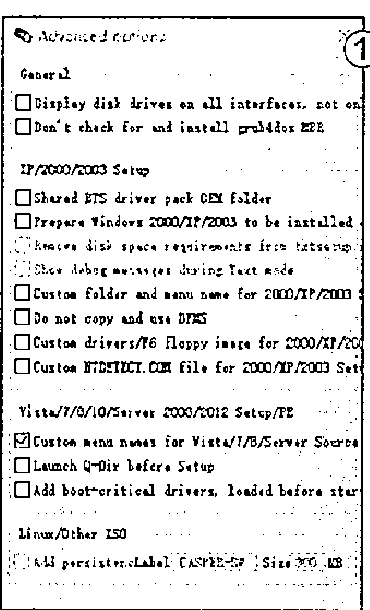

> 注意
因为以上过程涉及到格式化磁盘等操作，所以在操作之前，一定要对相关数据文档做好保护或备份，以免误操作导致数据丢失。

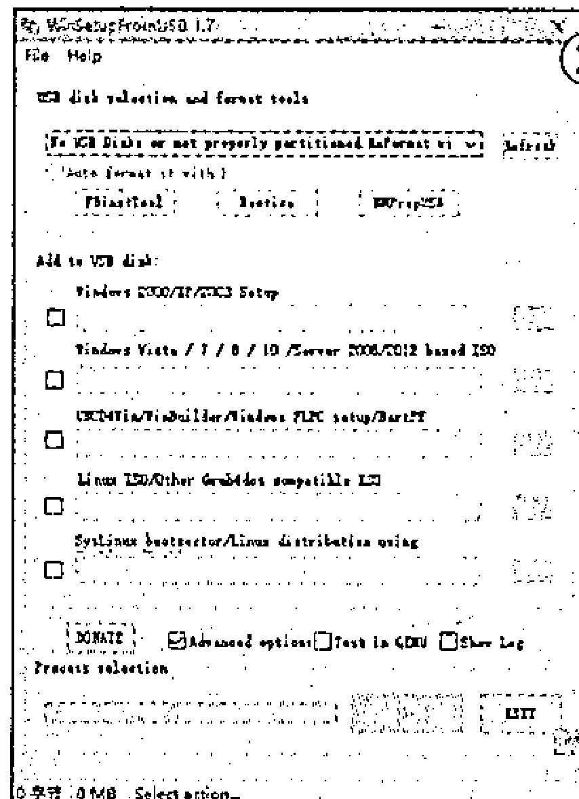

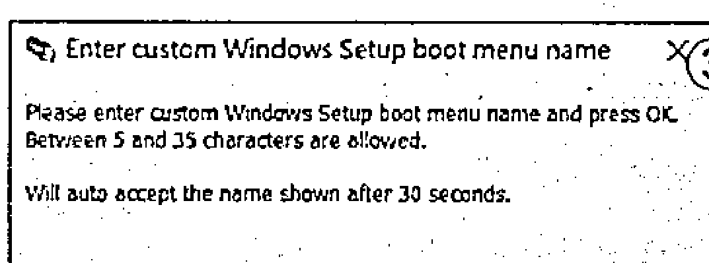

#### 闪存盘的格式化操作

首先我们下载一款名为“WinSetupFromUSB”的工具（下载地址：http://www.winsetupfromusb.com/），通过它就可以完成制作多重启动盘的目的。下载完成以后对其进行解压，可以在文件夹里面看到两个可执行文件，即分别是X86和X64的版本。这里用户选择自己的系统版本，通过系统管理员身份来执行。现在把闪存盘插入到系统的USB接口，点击“Refresh”按钮后就可以识别出闪存盘信息。

点击主界面下方的“Advanced option”按钮，在弹出的对话框里面勾选上“Custom menu name for Vista/7/8/Server source”命令后关闭（图1）。然后勾选主界面中的“Auto format it with FBinst”选项，通过它主要是对闪存盘进行格式化并加入启动信息。不过UEFI这种启动方式只能识别FAT32格式，如果不是使用UEFI方式进行启动，那么就可以选择其他的格式化选项。

#### 2 添加第一个启动项

接下来在“Add to USB disk”的区域里面，选择需要进行安装的系统版本。比如我这里就选择的是“Windows Vista/7/8/10/Server 2008/2012 based ISO”项，点击选项后面的按钮后，在弹出的对话框中选择Windows 10的ISO文件（图2）。设置完成以后点击“GO”按钮，这时会弹出一个询问窗口，告知用户闪存盘里面的数据会全部被删除。点击“是”按钮后会弹出一个输入框，要求输入安装系统的存放目录名称。我们这里就输入“Win10”，不设置的话30秒后会以预设的名称建立目录。然后设置启动菜单的选项说明，同样输入“Win10”进行确认即可（图3）。最后就可以开始闪存盘启动盘的制作操作，通过“Process selection”可以了解到制作的进度。

#### 3 添加第二个启动项

当第一个系统安装盘制作成功以后，我们就开始制作第二个系统安装盘。首先将“Auto format it with FBinst”选项去除，不然的话我们刚刚的操作将付之东流。接着同样还需要勾选上“Custom menu name for Vista/7/8/Server source”命令，因为每次产生一个系统安装菜单以后，这个选项将会自动进行关闭。然后点击“Windows Vista/7/8/10/Server 2008/2012 based ISO”后的按钮，这次我们选择一个Windows 7的ISO文件，再点击“GO”按钮，按照前面的步骤就可以完成制作操作了。

### 影子系统为电脑增一层保护

文|重剑

本人是一个软件的版本控，经常喜欢下载一些各式各样的软件进行试用，这其中当然也有很多的破解版。其实破解版对用户来说和正常版本并没有区别，但是就怕有人捆绑恶意插件甚至电脑病毒。所以这个时候就需要在一个相对安全的环境中测试，而“影子系统”对于普通用户来说就是最好的选择。那么我们有哪些影子系统软件可以选择呢？

其实国内外都有很多影子系统类的软件，比如国内以前就有一款安全软件叫做“影子系统”，但是这款软件已经很长一段时间没有更新了。所以今天我们将目光瞄向我们的近邻新加坡，看看他们开发的影子系统怎么样。首先登录Toolwiz的官方网站(www.toolwiz.com)，下载一款名为“Toolwiz Time Freeze”的影子系统软件。运行安装包后在语言列表里面选择中文，然后根据向导一步步进行操作即可。

> **小提示**
如果软件出现安装错误，那么可能是系统盘的空间不够，清理一下没用的信息就可以了。

#### 影子系统安装配置

不过在安装的时候有几个选项需要设置，比如首先在“使用文件缓冲区”选项中，设置一个用于软件测试的缓冲区大小，一般按照软件默认的推荐值即可(图1)。接下来还有三个其他的选项需要设置，比如选择“安全模式下自动停止保护”选项，就可以让软件在安全模式下失效。选中“使用密码来保护程序”选项，可以设置一个软件的保护密码(图2)。在退出影子系统的时候，要求用户输入一个密码进行确认，避免被恶意软件所破坏。所有的项目设置完成以后，根据提示重新启动系统即可。

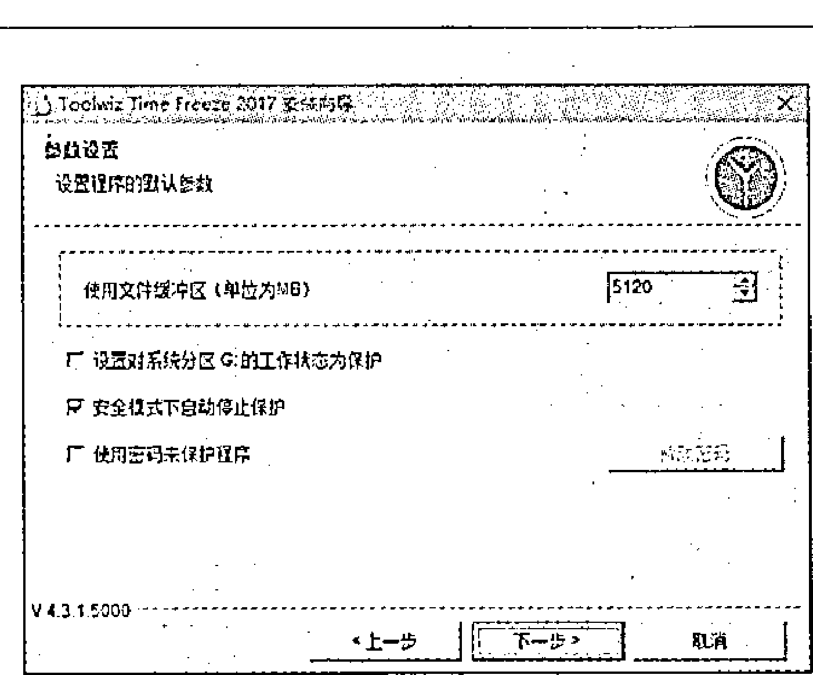


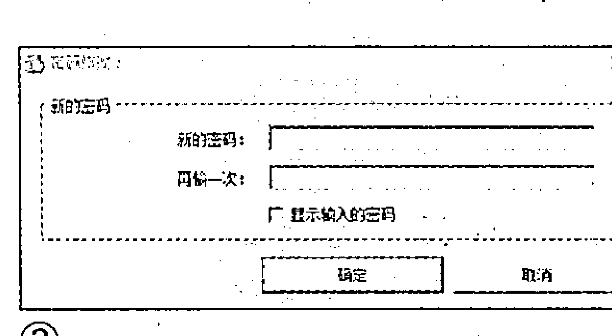

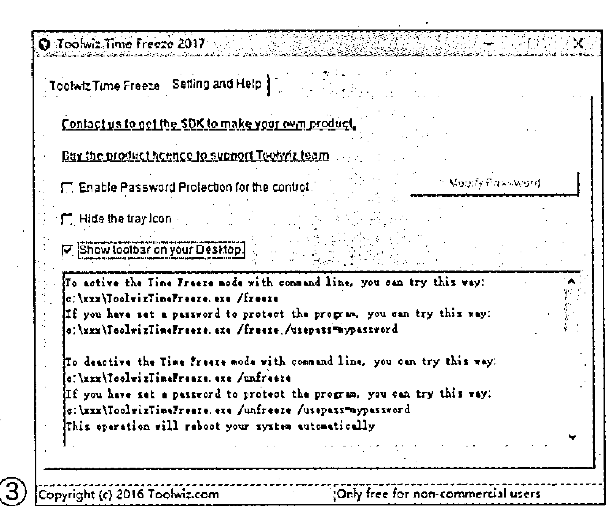

#### 影子系统保护系统

重新启动系统后就可以在系统托盘里面看到“Toolwiz Time Freeze”的软件图标，在图标上直接进行双击操作，就可以看到软件的操作界面。在弹出的主窗口选择“Setting and help”标签后，再选择“Show toolbar on your desktop”选项(图3)，就可以在系统桌面的上方看到一个工具条，通过它就可以快速地启动或退出“Toolwiz Time Freeze”。以后当我们需要进行软件测试的时候，在这个工具条上单击右键并选择菜单中的“Start Time Freeze”命令，系统就在影子系统的保护下了(图4)。接下来我们只需要和平常一样，进行任意的电脑操作就可以了。如果我们测试的过程中发现软件有不尽如人意的地方，那么接下来就需要将系统恢复到以前的状态。

#### 系统快照快速创建

Toolwiz Time Freeze 虽然是影子系统，但是只能进行单点的还原操作。换句话说，只可以还原到使用影子系统之前的状态。如果用户对这类软件的要求比较高，那么可以试一试 “ToolWiz Time Machine” 这款软件 (http://www.toolwiz.com/zh/toolwiz-time-machine/)。它最大的特色就是允许用户设置不超过24个快照还原点，可以随时把系统恢复到某个之前的状态。同样首先下载安装这款工具，操作过程和 “Toolwiz Time Freeze” 类似，这里就不再叙述了。

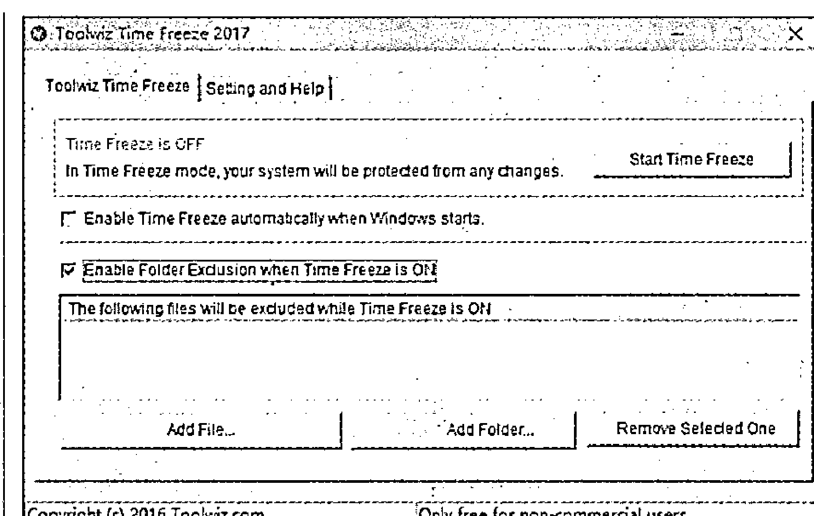

接下来同样在系统托盘找到该软件的图标，双击它就可以打开软件的操作界面。由于我们是第一次使用这款影子系统，所以首先需要自己来创建一个快照印象。点击窗口下方的 “Create New snapshots” 按钮，在弹出对话框的 “Please input the name” 和 “Please input the remarks” 选项中，分别为这个快照设置一个名称以及相应的说明信息（图6）。然后点击 “OK” 按钮这个快照就创建完成了，这样系统就处于它的保护之下了。如果用户想要恢复到启用影子系统之前的状态，只需要点击操作界面中的 “Revert my system to selected” 按钮，接下来的事交给 “ToolWiz Time Machine” 进行处理就可以了（图7）。

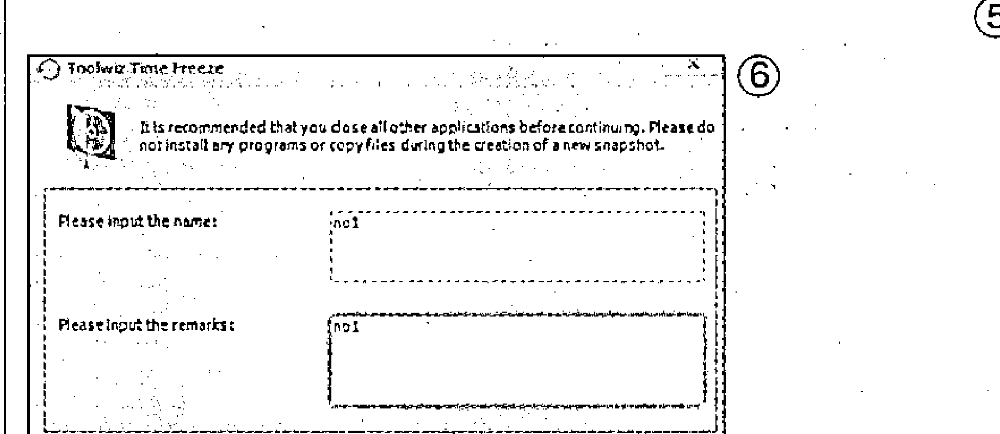

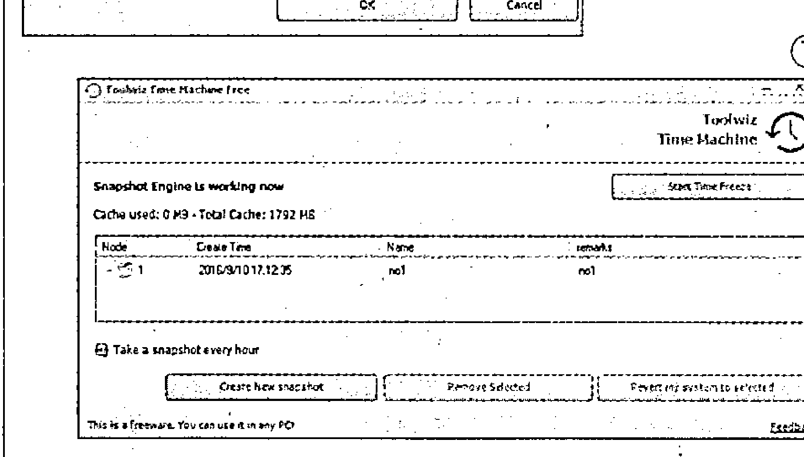

#### 多点还原如何创建

首先还是打开软件的操作界面，选择 “Toolwiz Time Freeze” 标签以后，点击其中的 “Stop Time Freeze” 按钮。这时影子系统会马上重新启动系统，重新启动完成以后就会将刚刚测试的信息从操作系统中全部干净地删除掉。如果用户在使用影子系统的时候不愿意某些数据在重启后被删除，那么需要选中 “Enable Folder Exclusion when Time Freeze is on” 选项，然后点击 “Add File” 命令选择相关的文件或者文件夹就可以了（图5）。

如果用户想要创建另外一个新的快照，点击 “Create New snapshots” 按钮即可。当这个快照创建完成以后，先前的快照就会停止工作，而由现在这个新的快照接手。当用户在系统前台操作电脑的时候，“ToolWiz Time Machine” 就在系统后台快速地进行备份，平均每几秒钟就可以把系统备份一次。不过为了节省缓存的空间，该软件采取的是增量备份的方式，也就是说只对发生了改变的系统操作进行备份。而点击 “Remove Selected” 按钮，就可以将不需要的快照删除掉。其实这款软件也带有影子系统的功能，只需要点击 “Start Time Freeze” 按钮，就会暂停快照的记录工作。从这开始以后的所有系统操作，将随着系统重新启动而自动消失。其实这款软件和系统的还原功能非常相似，但是系统的还原功能是在系统里面真实操作的，而 “ToolWiz Time Machine” 则是在缓存里面操作的，这就是它们之间最大的区别。

### 拒绝龟速 Windows 10 平板应用离线下载

文|阿木

现在有不少人买了Windows 10平板，应用都是从应用商店下载，不过有时家里的网络连接商店太慢，而且经常连接不上，这时不少人就会怀念起传统Windows操作系统中软件先下载后安装的模式，其实在Windows 10下同样可以实现。

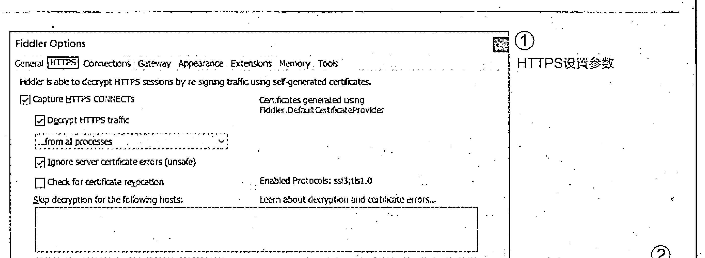

大家知道Windows 10应用商店并没有提供外链地址，但是当我们在应用商店安装应用的时候，电脑实际上仍然是从应用商店的服务器上将应用下载到本地，同时在完成下载后开始安装。因此解决问题的思路，一是通过专门软件嗅探到实际下载地址，然后调用外部下载工具如迅雷等进行下载；二则是将离线下载的应用部署到本机，这样就可以实现应用的下载和部署了。

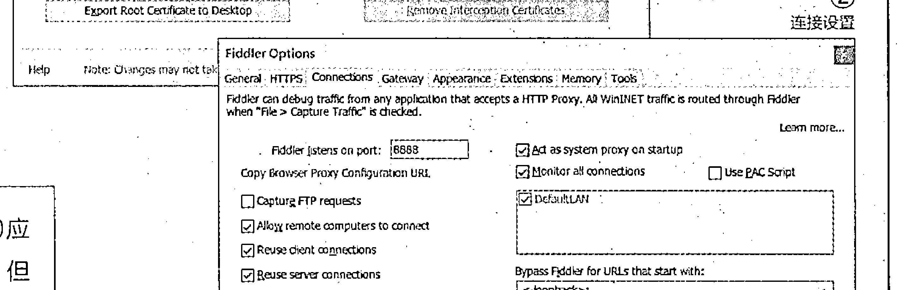

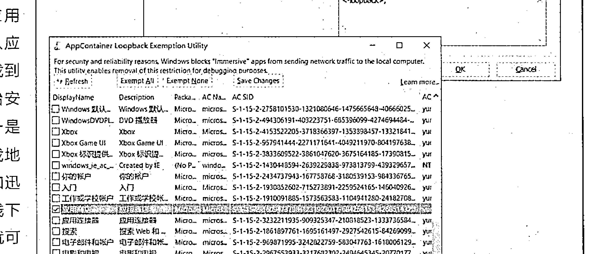

首先我们要嗅探应用的实际下载地址；这里借助“fiddler4”进行应用的嗅探。启动软件后点击“Tool→Fiddler Options”，在打开的设置窗口中切换到“HTTPS”，勾选其中的“Decrypt https traffic”和“Ignore server certificate errors”，程序提示安装证书时点击“是”进行安装(图1)。

切换到“Connections”，勾选“Allow remote computers to connect”，表示允许捕捉远程电脑的连接，以此来嗅探应用商店服务器的连接信息(图2)。
其他设置保持默认，确认保存后返回程序主界面，点击“Winconfig”，在弹出的界面中将应用列表中的“应用商店”勾选，并点击“Save change”保存退出(图3)。
完成上述的设置后就可以开始抓包，现在先将程序关闭，然后启动应用商店开始下载应用。这里以网易云音乐为例，在应用商店找到应用并开始下载后暂停。接着立刻启动fiddler4，此时在程序窗口会对网卡数据进行嗅探，其中网址为“tlu.dl.delivery.microsoft.com”字样的地址即为应用商店的服务器，其后URL即为应用的实际下载地址（图4）。
在上述地址右击选择“Copy→Just url”将当前应用地址复制，启动迅雷后新建任务，并将上述地址复制，这样在迅雷中就可以离线下载商店的应用了。注意这里要复制类型为“Application/octet-stream”的地址，在实际下载时大家可以查看文件大小，一般应用都是以MB计算，如果只有几十KB，那下载到的可能就是图片或者文本文件了。需要注意的是，应用商店链接都是临时链，超过一定时间就会失效，如果失效请重复上述步骤再次进行嗅探（图5）。

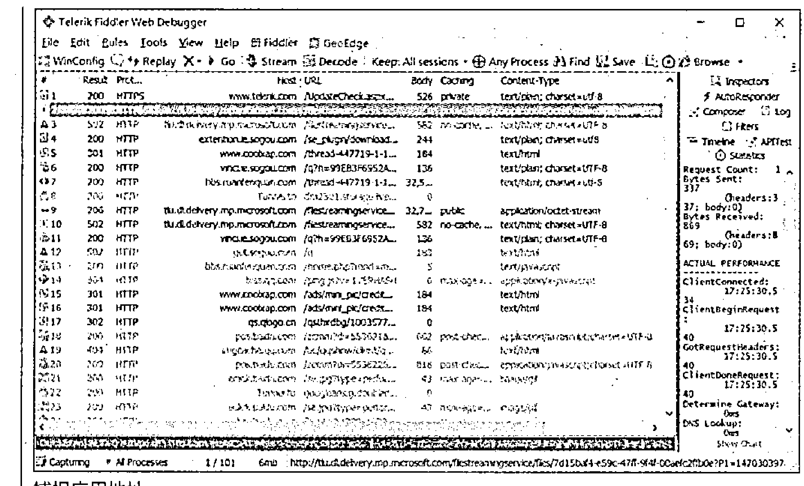

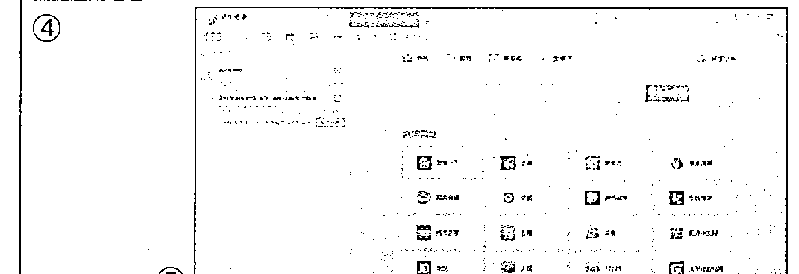


完成应用的下载后就可以离线部署到本地机器了，打开下载目录，将其中类似“1F8B0F94.122165AE053F_1.2.3.0_neutral_~_j2p0p5q0044a6.AppxBundle”的文件改名为“my.appx”，同时放置在C:\下以方便部署。在搜索框输入“powershell”，以管理员身份启动powershell后输入“add-appxpackage C:\my.appx”，开始离线部署应用，这样应用会在本机解包并自动完成安装（图6）。

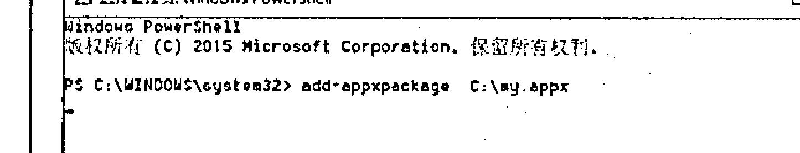


现在打开“开始”菜单，在这里就可以看到我们离线部署的“网易云音乐”了，点击看看是不是可以正常启动了（图7）？

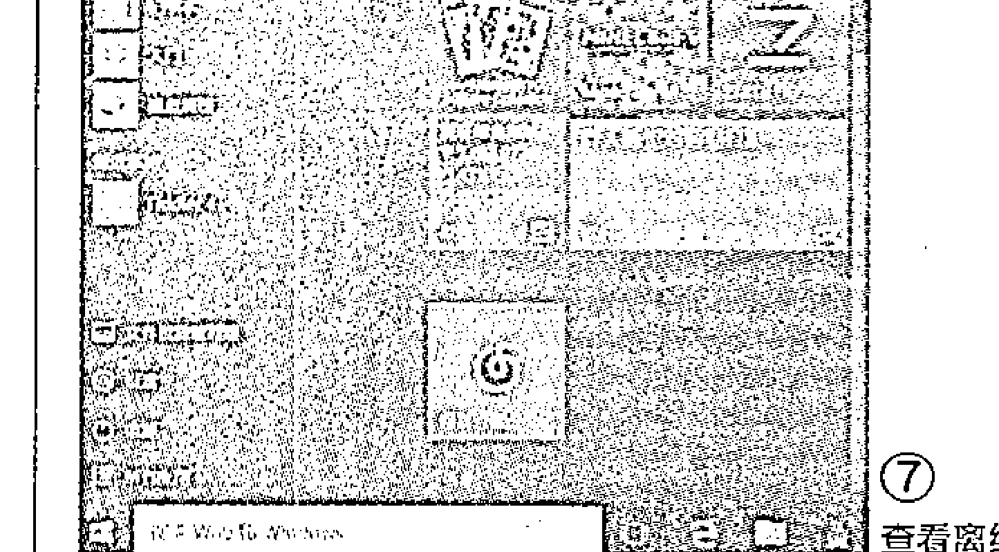

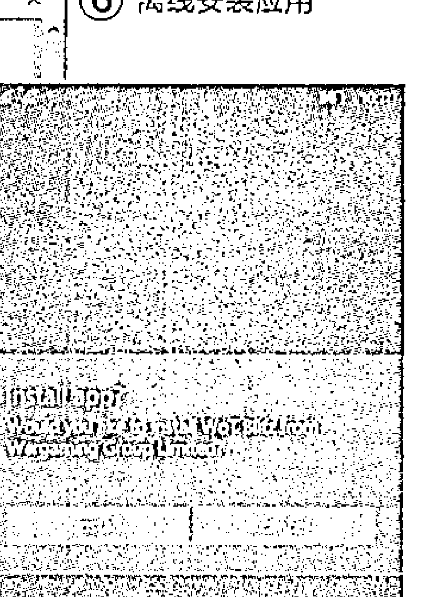

这样通过“fiddler4”抓包、迅雷下载，我们就可以快速将商店的应用高速下载到本地使用。这里要注意的是，应用商店的应用是和微软账户关联的，如果在其他电脑上下载应用，请使用同一微软账户登录应用商店下载，这样才可以在同一微软账户登录的Windows 10电脑上安装和使用。当然了，我们同样可以使用上述方法将自己常用的APP下载到本地备用，这样系统重装时就无需再忍受应用商店的龟速下载。

对于专为Windows 10开发的UWP应用，大部分应用可以在Windows Phone手机和PC上使用，可以下载后使用7ZIP直接打开APPX文件，看看其中是否包含ARM文件夹。如果有，则表明应用已经针对手机进行适配。

这样对于那些大型应用如一些游戏，大小动辄几GB，如果手机上的下载速度很慢，我们同样可以在PC上高速下载到本地，然后将其复制到手机上。在手机上启动资源管理器后打开APPX文件，在弹出的窗口点击“install”进行安装，即可在手机上使用了（图8）。


### 处理Windows 10周年更新里的小问题

文|重剑

微软刚刚推送的Windows 10一周年更新正式版，很多用户使用以后发现这款系统的运行还是非常稳定的，但是仍然存在一些莫名其妙的小问题。可是我们不能因为遇到这些小问题，就又退回到以前的Windows系统版本下面。那么通过什么方法可以解决系统遇到的这些小问题，从而让用户更好地体会到Windows 10系统的新特性呢？

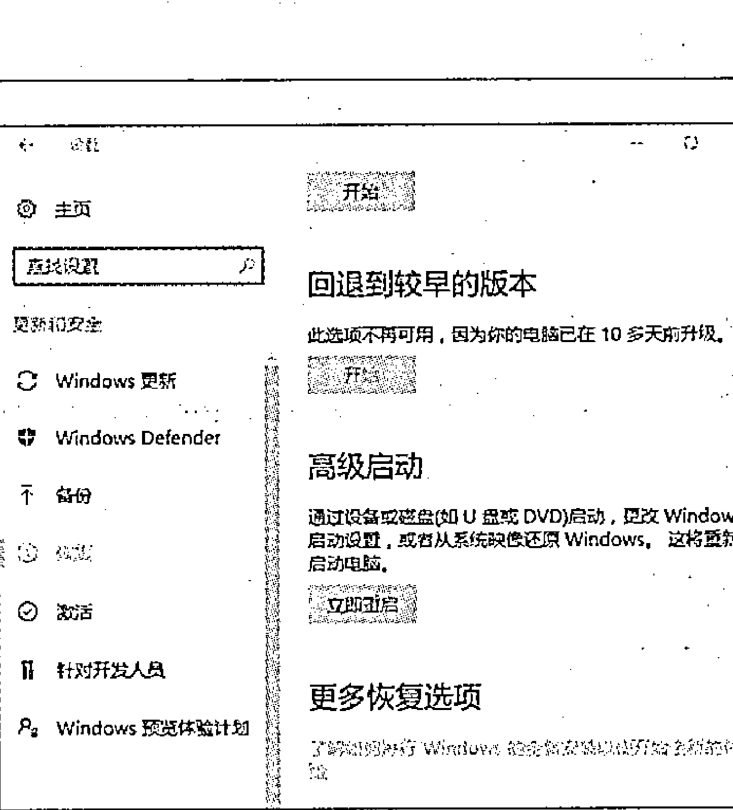

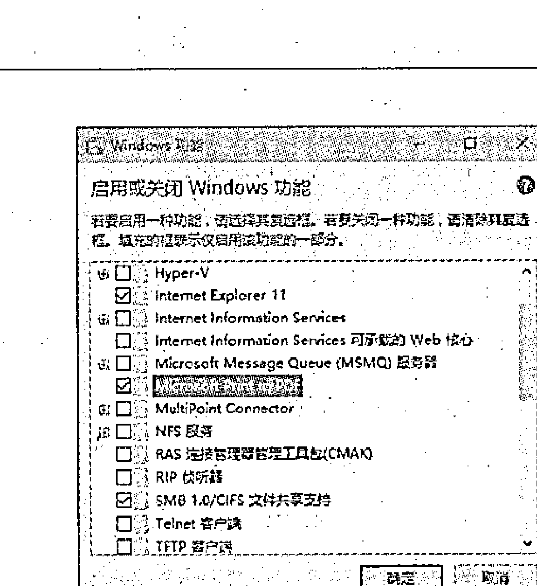

#### 系统冻结应该怎么解决

有些用户在升级到一周年版本后，都遭遇了系统冻结或冻屏的问题。具体表现为鼠标移动操作无反应、通知窗口弹出后不消失、开始屏幕或任务栏还可能变黑等。那么遇到这样的问题我们应该如何解决呢？

微软声称该问题一般出现在系统安装在SSD固态硬盘、应用和数据存放在其他单独硬盘上的情况下，不过在安全模式下启动Windows 10系统则不会出现问题。也就是说，我们在安全模式下将自己的软件安装和数据转移到操作系统盘即可。不过很多用户的系统盘相对较小，那么还可以通过另外一种方法临时解决这个问题。首先进入Windows 10的设置窗口，点击“更新和安全”按钮后选择左侧的“恢复”命令，再选择右侧窗口“高级启动”下的“立即重启”进入高级选项（图1）。

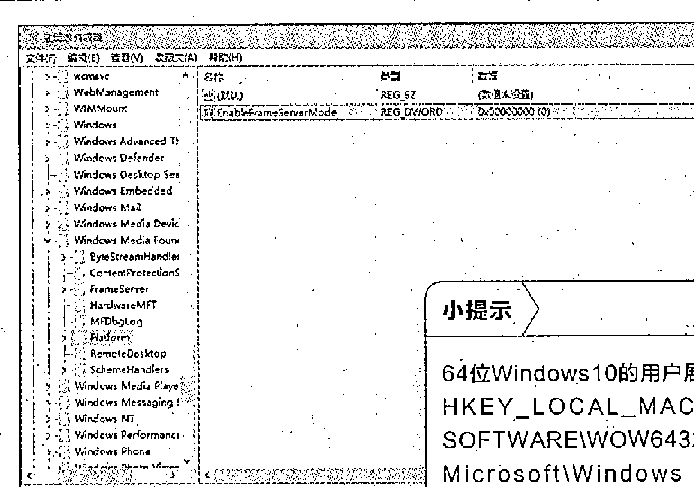

> 小提示：64位Windows10的用户展开到：HKEY_LOCAL_MACHINE\SOFTWARE\WOW6432Node\Microsoft\Windows Media Foundation\Platform。

接下来当系统重新启动以后选择“疑难解答”，继续选择“高级选项”中的“启动设置”命令，然后点击“重启”按钮进入“启动设置”界面。这时候我们可以看见选项4、5、6分别为不同的安全模式，这时我们选择“4 启用安全模式”进入到安全模式里面。接下来打开注册表编辑器，将内容定位于左侧的HKLM\SOFTWARE\Microsoft\Windows\CurrentVersion\AppModel\StateChange\PackageList，这下面有一个名为Microsoft.Windows.ShellExperienceHost_xxxxxxxxxxxxxx的项目。在这个项目上点击鼠标右键后，选择菜单中的“删除”命令将其删除并正常启动系统即可。

#### 2 找回消失的虚拟打印机

很多办公用户肯定已经知道，在Windows 10里面有一个名为“Microsoft Print to PDF”的功能，通过它可以将各种文档信息转换成PDF格式的文件。可是这项功能有的时候会莫名其妙地消失，那么如何找回消失的虚拟打印机功能呢？

其实和Windows系统里面的其他功能模块一样，出现这样的情况最简单的解决方法，就是重新将这个功能模块安装到系统里面即可。同样首先打开“运行”框，在弹出的运行对话框里面输入optionalfeatures后回车，这样就会弹出Windows功能对话窗口。现在在列表中找到“Microsoft Print to PDF”这项并勾选上它，点击“确定”按钮就可以进行该功能模块的重新安装操作，安装完成以后重新启动系统就可以看到该虚拟打印机了（图2）。

不过有的时候我们会惊奇地发现，这个选项默认是选择好的。这个时候我们先取消这个选项的选择，按“确定”按钮后再重新勾选一次就可以完成虚拟打印机的重装操作了。

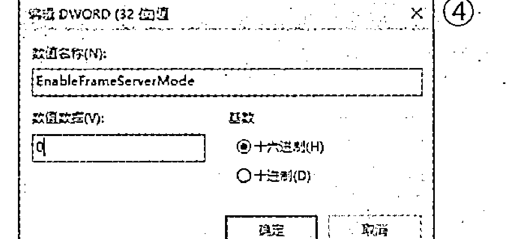

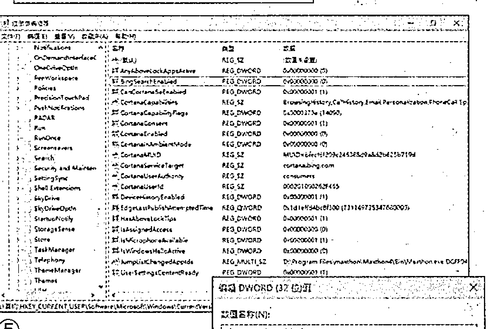

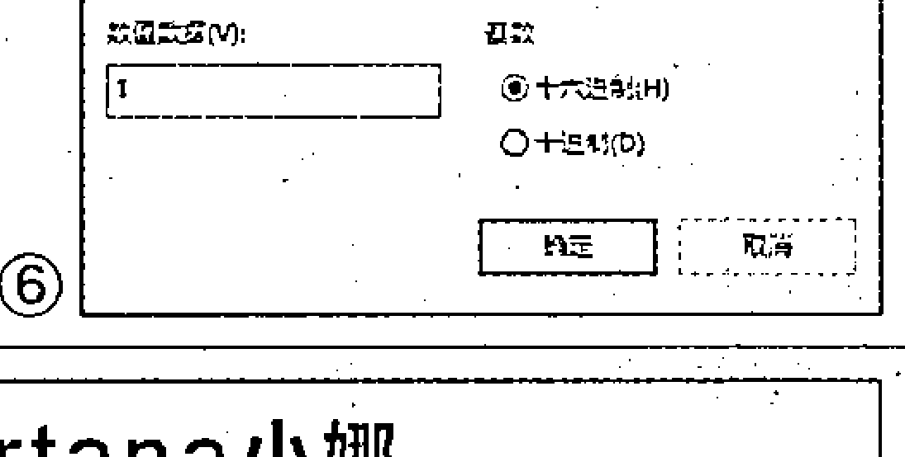

#### 3 摄像头失效问题的解决

现在很多用户为了和亲戚朋友远程视频，电脑里面都配置了一个USB的网络摄像头。可是当用户更新一周年版本后，很多用户发现自己电脑的摄像头不起作用了，这样好好的摄像头就成为了一个摆设。如果要等待微软公司来解决这个问题，不知道要等到猴年马月，那么用户自己如何解决该问题呢？

之所以会出现这样“荒唐”的问题，主要是一周年版本在网络摄像头的支持方面有一个重要改动，即微软不再允许摄像头使用MJPEG和H264基本码流，而仅仅允许使用YUV2码流。好在微软公司并没有把事做绝，我们通过修改注册表就可以解决该问题。首先按快捷键“Win+R”打开“运行”框，输入“regedit”打开注册表编辑器，接着展开到HKEY_LOCAL_MACHINE\SOFTWARE\Microsoft\Windows Media Foundation\Platform（图3）。然后在右侧窗口里面新建一个名为EnableFrameServerMode的DWORD（32位）值，最后再将“数值数据”修改为0并重新启动系统就可以了（图4）。

#### 4 消失的Cortana小娜

Cortana小娜是Windows 10系统里面一个非常重要的功能，可是有的用户在更新一周年版本后，发现Cortana小娜这个功能居然莫名其妙地消失了。这样一个非常智能的搜索功能，一下子就变成了一个普普通通的搜索栏，那么如何才可以找回这个消失的Cortana小娜功能呢？

首先同样打开系统中的注册表编辑器，将内容定位于左侧的HKEY_CURRENT_USER\SOFTWARE\Microsoft\Windows\CurrentVersion\Search，在右侧窗口里面查找一个名为BingSearchEnabled的DWORD（32位）值（图5）。接着双击鼠标左键打开这个项目，在弹出对话框的“数值数据”里面修改为1就可以了（图6）。如果用户没有寻找到这个项目，那么在右侧窗口里面点击鼠标右键，选择“新建”中的“DWORD（32位）值”命令，手动新建一个名为BingSearchEnabled的项目即可。然后还需要查看一下其他相关的值，比如CanCortanaBeEnabled、CortanaConsent等，将这些项目的数值数据也修改为1才行。

### 解决数字型文件名排序混乱

文|贺潮品

如果Windows 10文件资源管理器中某文件夹下的文件均是以数字开头，那么数字的排序能够按照什么方式进行呢？以上问题不知你是否留意过。不过无论如何，我们也不难猜测，答案无非是按数字本身的值从大到小，或者是以字串从1到9这样的字位顺序依次排列。但是，如果系统给出的排序顺序与我们想要的不符时，就必须找到解决办法。

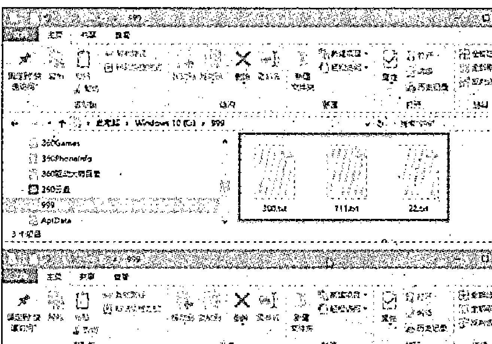

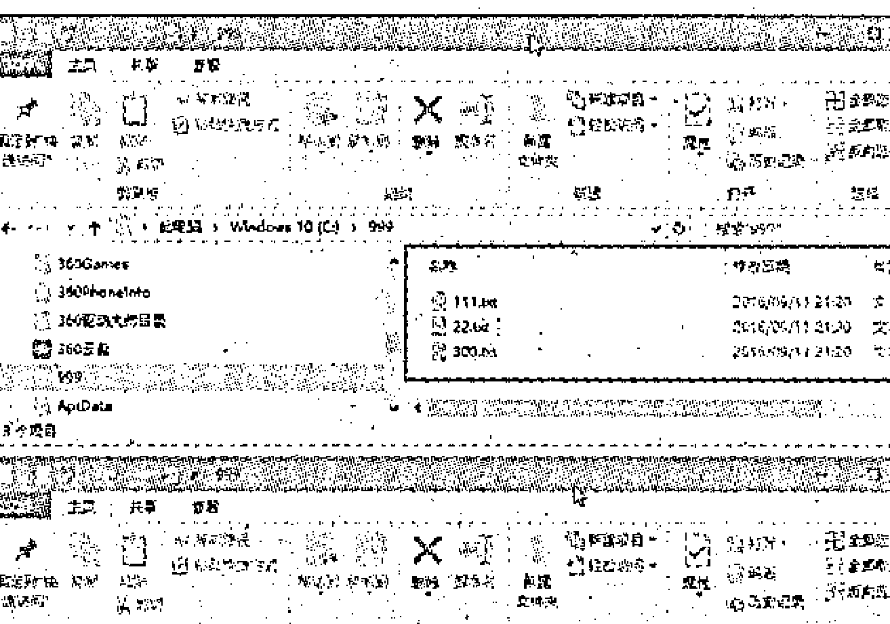

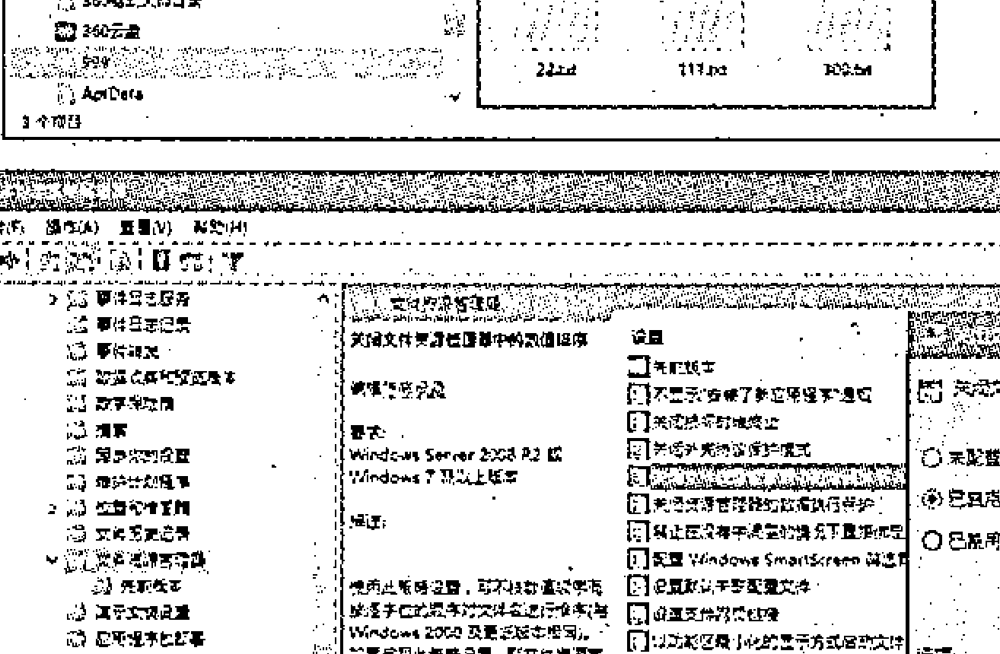

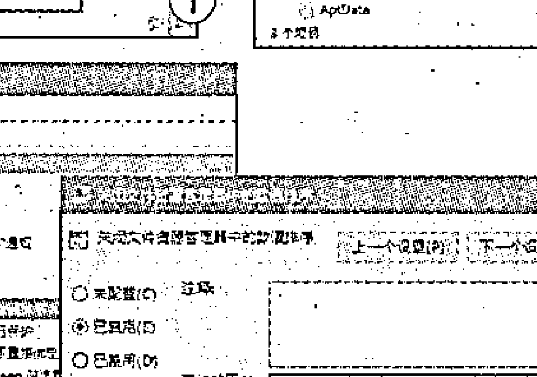

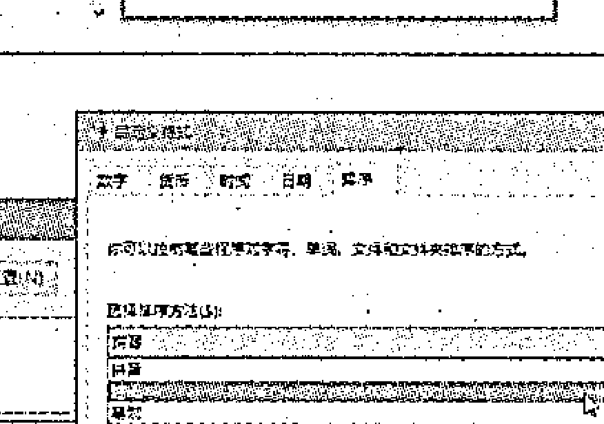

#### 具体案例

通常，以数字开头的文件，在资源管理器排序，本来应该是按数字大小从小到大如22、111、300这样的顺序，或者是300、111、22这样的由大到小的顺序（图1）；但有时我们会发现，却只能按照111、22、300或300、22、111这样的顺序排列（图2），这种排序方式很不利于工作中按从小到大的顺序处理文件，因为它们不符合数字排序的习惯。我们用修改组策略的方法可以解决这一问题。

#### 解决方案

> 数字如此，那么汉字文件名如何呢？默认情况下，资源管理器中汉字文件名按照首字拼音序列排序。如果要将汉字文件名按照汉字笔划数或姓氏排序，需要通过系统语言区域设置窗口，在“其他设置”的自定义“排序”设置窗口中选择排序方式（图5）。

右击Windows 10的“开始”按钮，在快捷菜单中选择执行“运行”命令，然后在运行窗口中输入并执行GPEDIT.MSC，以启动组策略编辑器。随后，顺着“本地组策略编辑器→计算机配置→管理模板→Windows组件→文件资源管理器”的路径，找到“关闭文件资源管理器中的数值排序”选项（图3）。使用此策略设置，可不按数值顺序而按逐字位的顺序对文件名进行排序。双击该项进入设置窗口（图4）。若选择“已启用”此策略设置，则文件资源管理器将按文件名中的每个数字位对文件名排序，例如本例中的111<22<300。如果禁用或未配置此策略设置，则文件资源管理器将按照数值升序对文件名排序，正如本例结果为300<22<111。

### 注册表的九重用法

文|金剑南

注册表的概念和作用大家应该已经知晓，然而，由于注册表的构成和使用比较复杂，因此寻求注册表最安全、最方便的使用方法就显得非常必要。

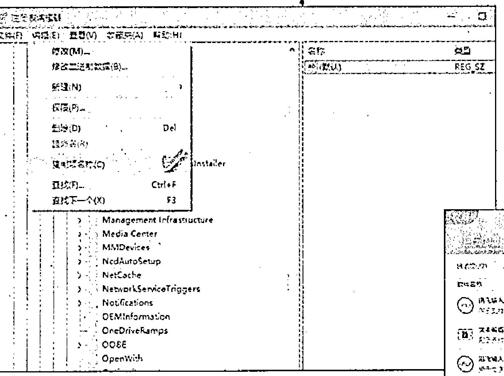

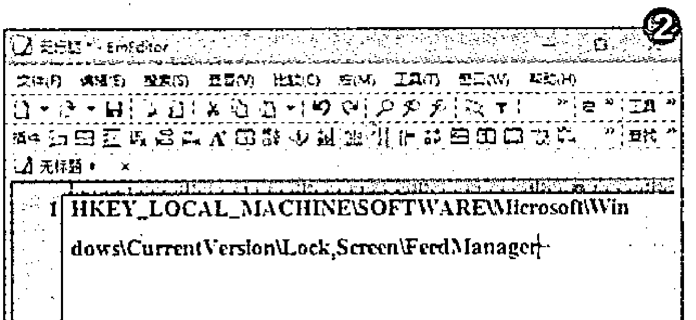

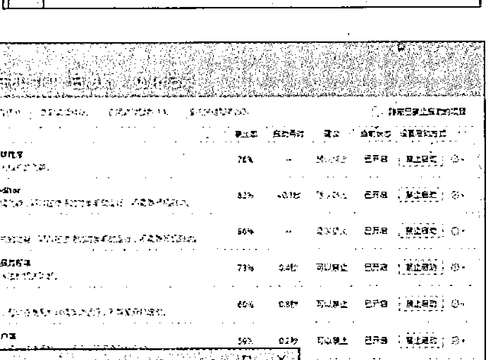

#### 快速获取注册表准确路径

因注册表的路径没有复制功能，所以当我们需要引用某个具体的注册表路径时，可用一个简单而又准确的方法：首先定位到需要获取的注册表项位置，接下来，通过注册表编辑器菜单在“编辑”菜单下选择“复制项名称”（图1）。最后，切换到任意编辑环境或信息对话框，执行粘贴命令，就可以完整准确地将注册表项的路径表达出来了（图2）。

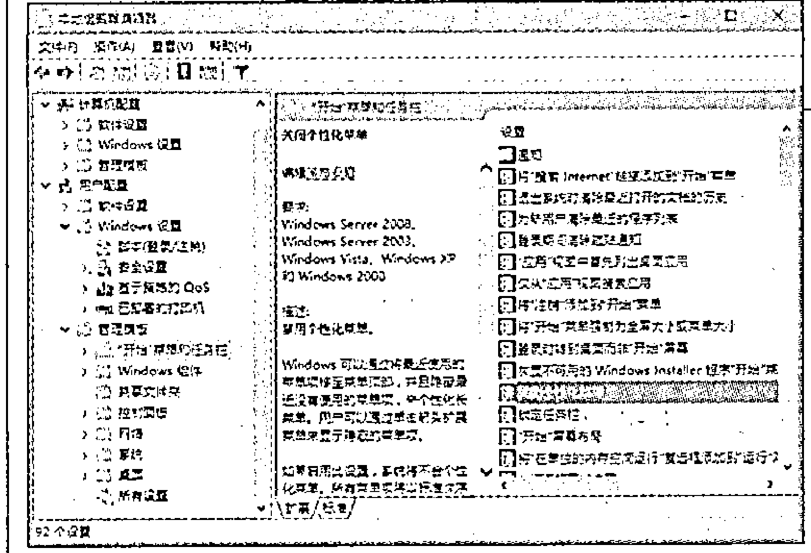

#### 直达注册表路径的最快方法

如果将上述需求反过来，那就是在知道某个注册表路径之后，如何一步一步进入最终需要的注册表选项。这一需求往往出现在我们按照网上注册表修改案例的指引去修改注册表时的定位操作，按照传统方法也需要一层一层地进入。实际上，我们可以通过一个VBScript脚本文件，一键打开目标注册表路径。

> 火速链接
一键打开目标注册表路径的具体方法，请参见本刊2016年第4期《省却麻烦 一键修改注册表》一文的介绍。

#### 寻求注册表修改优先替代方案

系统优化设置、维护，软件的设置变更等，均可以通过修改注册表来完成。但是，并非事事都需要亲手去修改注册表。
家庭版的Windows用户由于不能使用组策略，可优先考虑替代注册表编辑的傻瓜工具，比如360安全卫士或软媒魔方工具箱中提供的选项，其实都对应着后台对注册表的修改，只是我们将原先麻烦的手动注册表修改转变为一键操作了（图3）。如上工具的实质是将专业的注册表修改工作转变为大众化的基本电脑操作，因而才能受到人们的欢迎。
在专业版的Windows系统中，只需运行GPEDIT.MSC命令启动组策略编辑器，就可以在其中看到许多系统设置优化命令，这些其实都对应着注册表的修改，也是对注册表修改工作的傻瓜化包装（图4）。

### 重设网络 解决Windows 10使用问题

文|阳国林

Windows 10使用过程中会遇到一些与网络设置相关的问题，通过巧妙更改网络使用的方式，可以使这些问题得到解决。

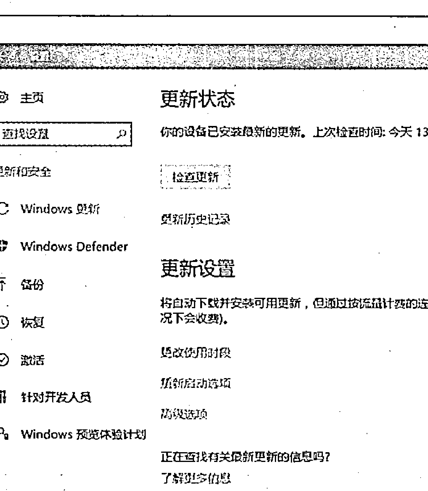

> > **小提示** 为安全而做的还原点备份
>
> 为安全起见，先创建一个系统还原点，以便注册表修改出现问题后恢复。右键单击开始按钮并选择“系统”，在随后弹出的窗口中选择“系统保护”项，在打开的“系统属性”窗口中，点击“创建”按钮，为系统立即创建一个还原点。若该按钮不能用，则需要使用“配置”按钮为系统盘启动系统还原功能（图2）。

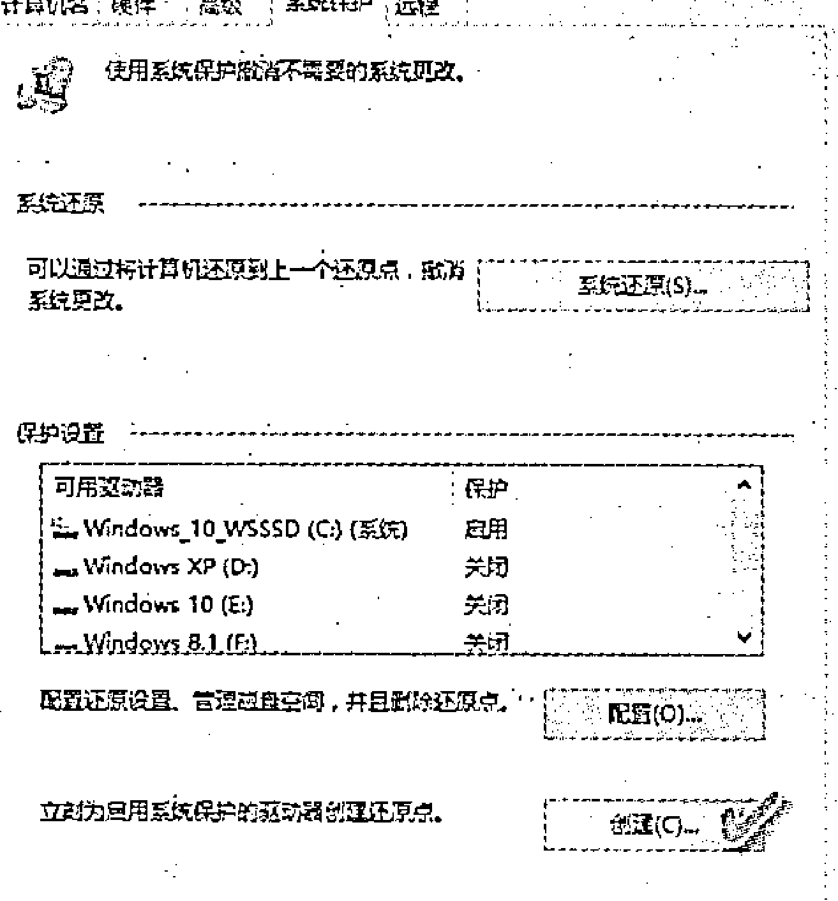

#### 重设网络类型 暂停Windows 10自动更新

Windows 10系统的自动更新行为是在它自动检测到处于Wi-Fi连接的环境才进行升级包的下载和安装的。如果系统检测到正在使用计费网络，那么它不会主动去进行系统升级，以便可以为用户节省费用（图1）。

利用Windows 10的这一特点，如果我们不希望系统自动在后台下载一些更新数据，例如商店应用的更新文件等，那么假设能将当前所用的本地免费网络类型修改为计费网络，Windows 10判断为计费网络并不会对此网络执行更新，但其实此时我们依然还是使用的免费网络。这样就规避了自动更新，瞒天过海，实现了Windows自动更新的暂停。

上述想法可以通过修改注册表的方式来实现。

按下Win+R组合键打开运行窗口，输入REGEDIT并回车运行进入注册表编辑器窗口。依次打开如下路径

```
HKEY_LOCAL_MACHINE\SOFTWARE\Microsoft\Windows NT\CurrentVersion\NetworkList\DefaultMediaCost
```

，双击右侧窗格中的Ethernet（该项即为本地以太网连接），将其值修改为2（图3）。修改完毕之后，重启电脑，即可将本地连接设置为按流量计费网络。

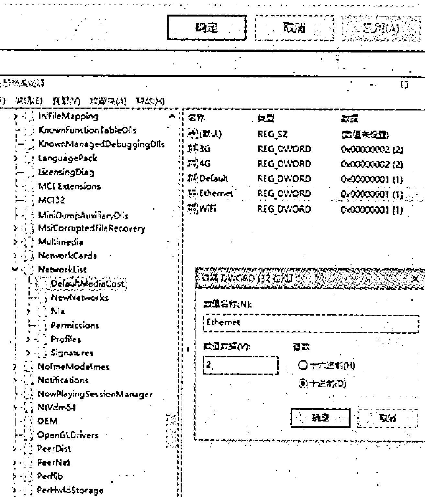

#### 重设DNS 解决补丁升级失败问题

对于一些特殊的网络（如校园网等），常常会遇到Windows 10更新补丁不能安装成功的情况。出现这种问题的原因往往是DNS被劫持或者DNS服务器限制。由于DNS的作用是将网站域名解析为服务器IP地址，因此，DNS有问题会直接导致地址解析错误，从而导致无法连接到正确的升级服务器。在遇到由于这种原因而造成的补丁升级失败后，可通过修改DNS为微软专属服务器得到解决。

右击系统托盘上的网络图标并选择“打开网络和共享中心”，在打开的窗口左侧点击“更改适配器设置”，选择当前正在使用的网络适配器并右键单击，选择快捷菜单中的“属性”命令（图4）。双击网络属性项目列表中的“Internet协议版本4（TCP/IPv4）”，将DNS服务器地址设置为4.2.2.1和4.2.2.2，点击“确定”即可（图5）。

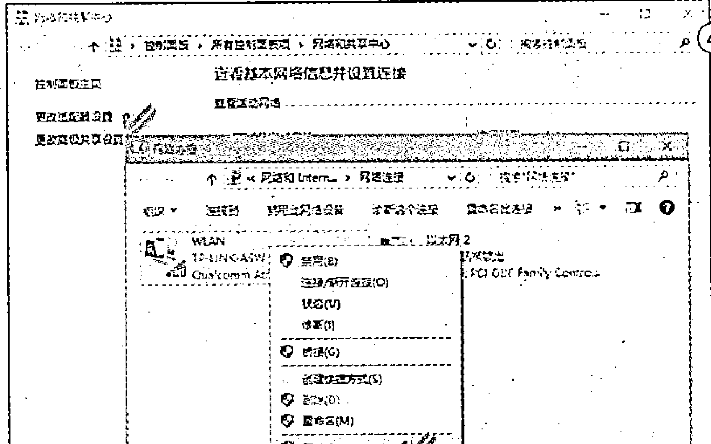

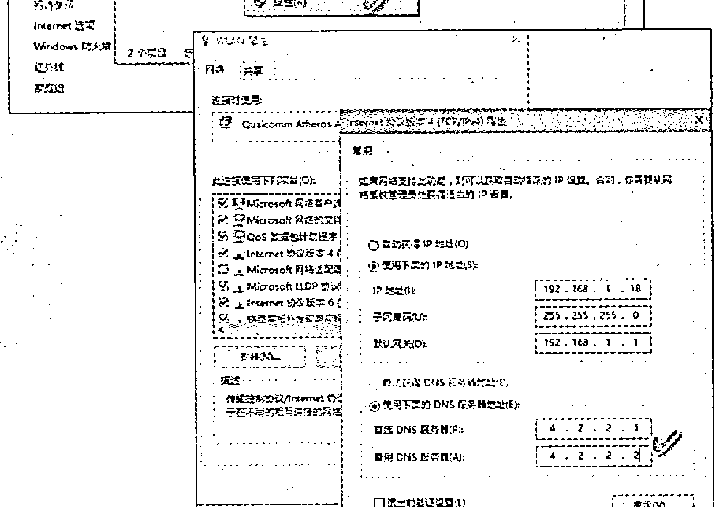

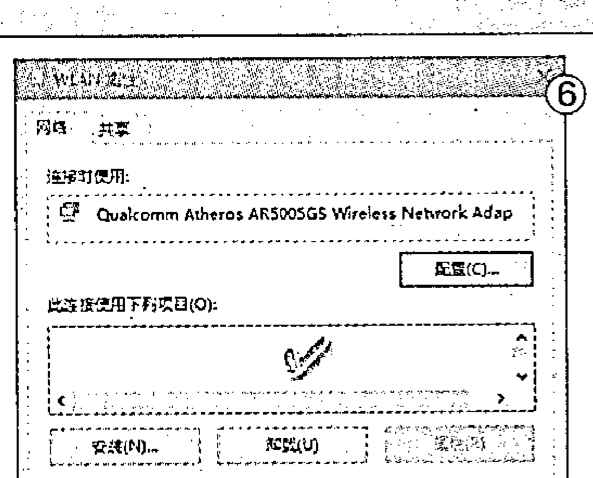

#### 重设网络服务 找回“网络”选项列表

Windows 10的本地连接适配器被称为以太网，我们平时对网络IP或DNS地址的修改，要通过以太网属性窗口的“网络”选项卡列表（如上述2中的例子）的项目来设置。但是，有时我们会发现这个列表中显示的项目为空白，因而无法对网络进行相应的设置（图6）。

实际上，以上现象往往是由于系统相关服务未能正常启动而引起的，通过对系统网络服务的设置，就可以重新找回显示为空缺的“网络”选项卡内容列表。

在任务栏空白处单击鼠标右键，选择“任务管理器”，切换到“服务”选项卡，找到名为Network Setup Service的服务项，右击并选择“打开服务”（图7）。在打开的服务窗口中选中该服务并右键单击，选择打开“属性”，然后将其启动类型更改为“手动”或“自动”（图8）。最后再右键单击Network Setup Service服务，点击“启动”。

之后重新打开以太网属性，就会发现列表已恢复正常。

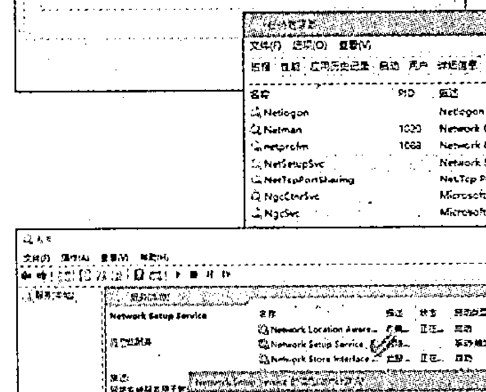

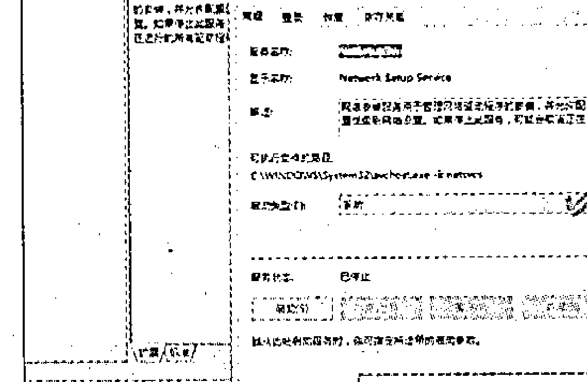

### 用好Windows 10任务管理器

Windows 10任务管理器较之前的版本功能有所增强，它不但能够提供进程、服务等项目的查看，在关键时刻，还能够起到更多非常重要的作用。

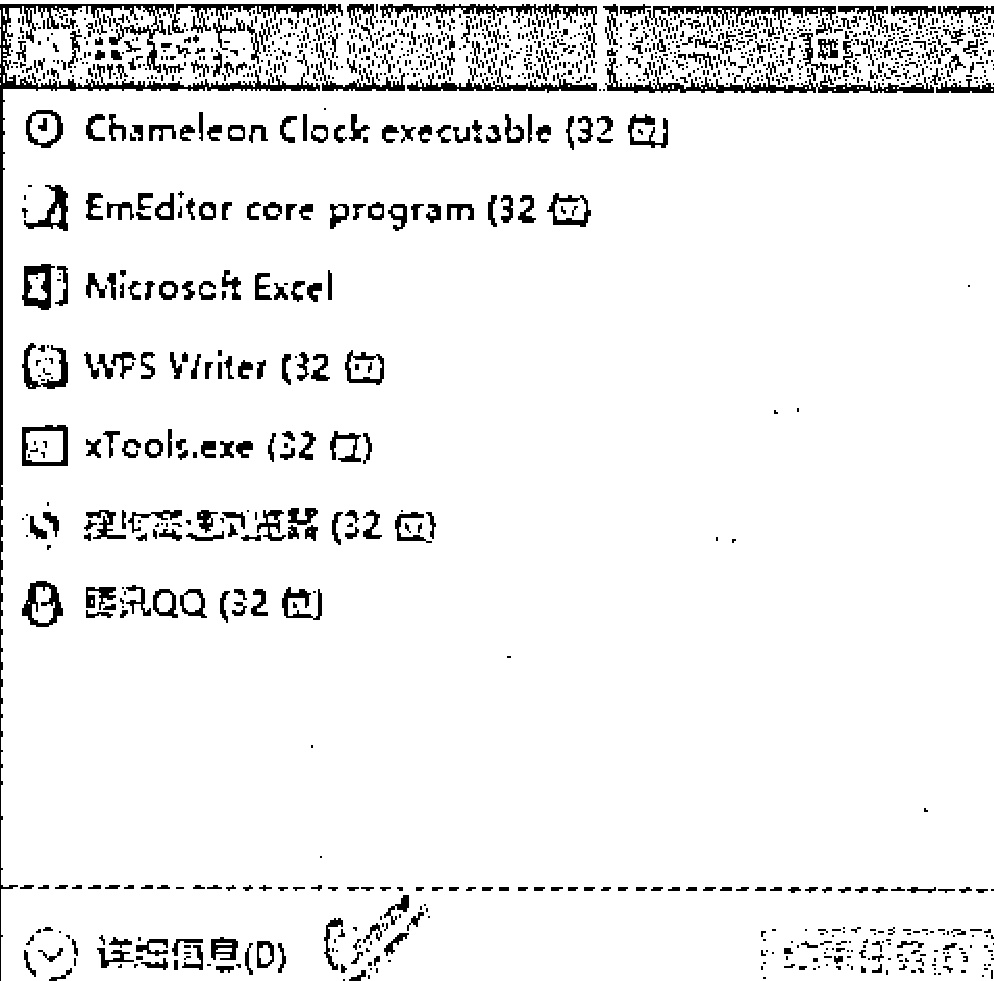

#### 特殊方法开启命令提示符窗口

命令提示符窗口是我们进行系统维护或运行特殊程序的常用界面。但是，在一些关键时刻，系统出现问题后有时可能无法通过常规渠道进入命令提示符窗口。如果遇到这种特殊情况，我们可以巧借任务管理器进入命令提示符窗口。

按下Ctrl+Alt+Del组合键切换出蓝色系统控制窗口列表，点击其中的“任务管理器”，启动到“任务管理器”，点击“详细信息”切换到完整版的任务管理器界面（图1）。

点击完整版任务管理器上方菜单栏的“文件”菜单，此时按住一个Ctrl键，再点击“运行新任务”命令，即可打开“命令提示符”窗口。这个时候，我们看到的“命令提示符”窗口为管理员模式，对运行一些权限要求较高的程序会更为合适，因此最适合系统维护之用（图2）。

#### 任务管理器无法关闭进程的解决

PowerShell是新版Windows取代命令提示符窗口的高级工具。在使用过程中，偶尔可能会发现PowerShell程序启动后不响应，如果在任务管理器中也无法关闭此进程，可以借助于注册表编辑器修改来解决。

首先我们在Cortana搜索栏输入REGEDIT并运行，启动到注册表编辑器界面。定位到“HKEY_CURRENT_USER\Console”分支，在右边找到ForceV2项（图3），双击ForceV2项之后，将数值数据改为0（图4），点击“确定”完成修改。之后重启电脑，则PowerShell应该会恢复正常使用。

#### 用任务管理器解决桌面或任务栏假死

在使用Windows 10的过程中，有时因为开启了不合适的任务或软件冲突等原因，会造成任务栏或桌面出现凝滞、无法操作的情况，但一些快捷键可能还能使用，比如用Ctrl+Alt+Del还可以切换出任务管理器。这时，我们不妨借助任务管理器的一个特殊管理功能——“进程重启”来完成桌面和任务栏的刷新。

首先进入任务管理器完整版窗口，在“应用”列表中找到“Windows资源管理器”，右键单击该项并在其中选择“重新启动”（图5）。之后，我们会看到桌面和任务栏慢慢消失，紧接着便是刷新的操作，过一会儿，任务栏和桌面就会恢复正常了。

#### 寻求开启任务管理器的另类方式

虽然启动任务管理器对你来说可能不成问题，但有时开启任务管理器的方法可能会不灵，如果你掌握了多种方式，那么这时可换另一个方式尝试。这里提供4种方法：

快捷键：即上面介绍的Ctrl+Alt+Del组合键。
搜索法：在小娜搜索框中输入“任务管理器”搜索，搜到的第一个结果便是它（图6），点击即可启动任务管理器。
命令法：通过Win+R组合键运行TASKMGR命令，可快速启动任务管理器。
右键法：右键单击任务栏无图标的空白处，选择“任务管理器”也可以启动。

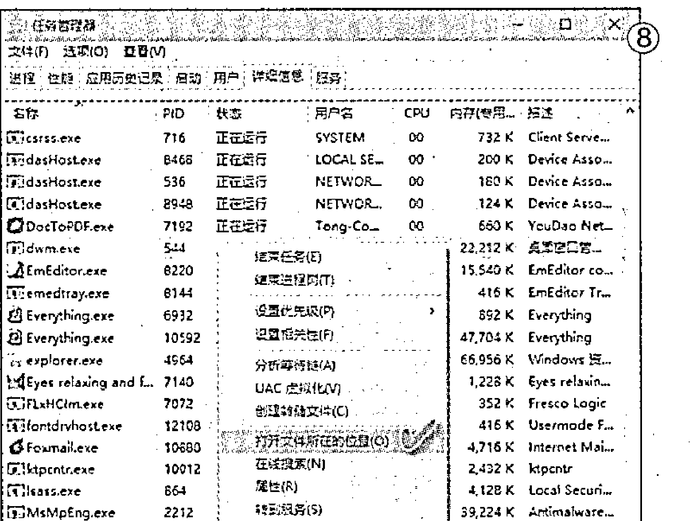

#### 系统提效如何管理自启动程序

在Windows 7中，管理自启动程序需要借助于第三方工具。而Windows 10环境下，我们可以轻松管理自启动程序，不用寻求第三方软件的帮助了。

启动任务管理器，切换到“启动”选项卡，在该窗口中，列出了当前系统中所有被列入启动项的程序列表。通过“状态”一列的显示情况，我们看到当前列表中的程序有哪些处于运行状态当中，哪些处于暂停状态（图7）。此前，我们不希望某程序自动运行，若该软件没有设置自动运行的开关，则我们只能将该软件卸载或求助于第三方工具（如360卫士或其他优化工具）。现在，我们只需在Windows 10的该列表中，右键单击希望暂停的程序，然后从中选择“禁用”即可。需要启用时，同样从这里启用。

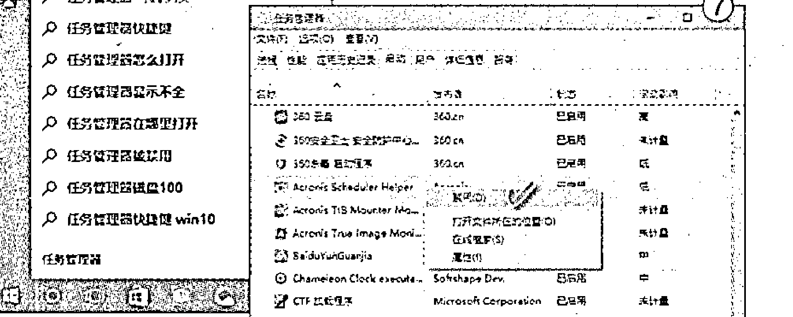

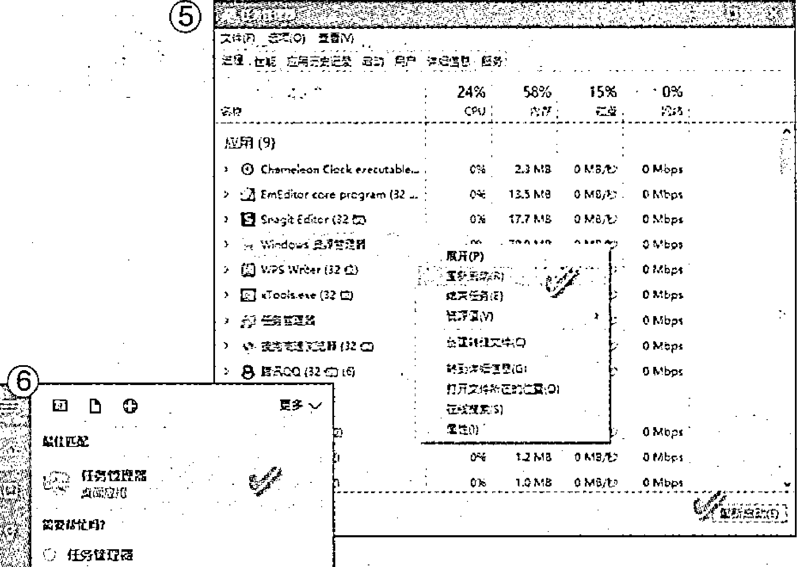

#### 定位目标进程或程序的具体位置

如果系统中有可疑的进程，通过任务管理器的“详细信息”，右键单击进程并选择“打开文件所在的位置”，可以定义进程或程序的具体所在，从而便于做出查杀或删除处理（图8）。

### 资源管理器功能面板三重控制

文|刘秀

Windows 10资源管理器功能面板对于方便文件的管理和操作非常有用，尤其是对于文件初级用户更是如此。然而，当熟悉了文件操作的快捷控制之后，也许这一面板就会成为占用有效空间和操作效率的累赘。此外，电脑高手或使用小尺寸屏幕的用户更希望在平时将其关闭。因此，灵活有效地控制功能面板就显得很有必要。

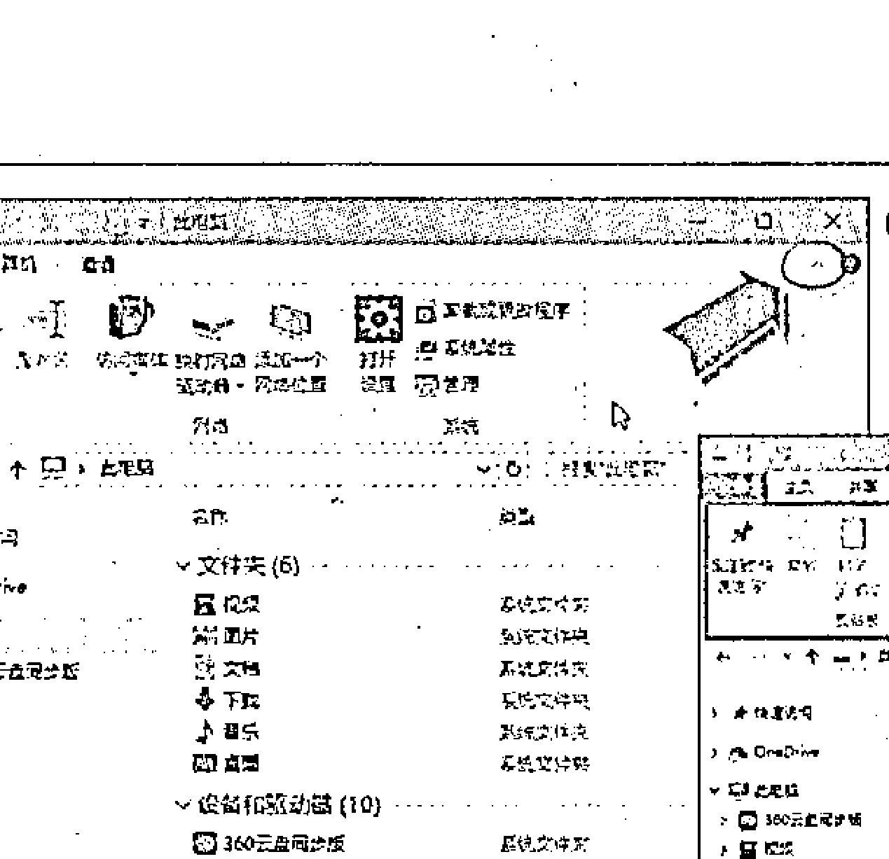

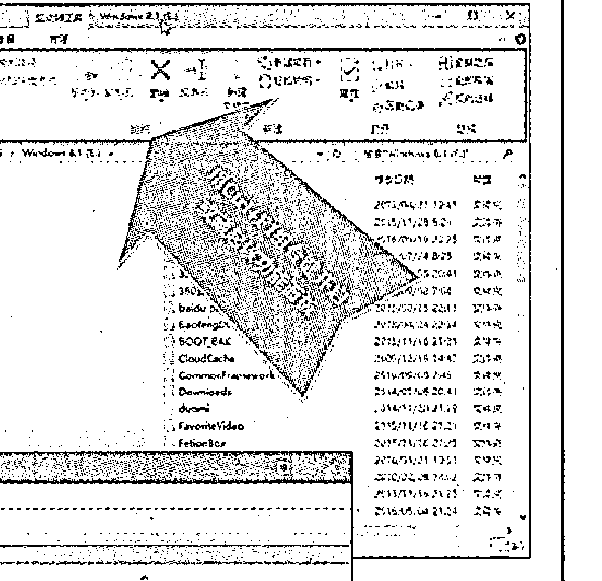

#### 键鼠并用的快速控制

右手操作鼠标点击控制
如果上述选项禁用或未配置此策略设置，我们可以选择打开新窗口时功能区的显示方式，随时在资源管理器内通过鼠标开启或折叠功能区面板。只需点击资源管理器窗口右上角小问号左侧的向上箭头图标，即可在开启和关闭功能区之间进行切换（图1）。

左手键盘快捷方式控制
除了使用鼠标控制功能面板的隐现之外，还可以通过键盘快捷键组合的方式来隐藏或开启功能面板区域。功能区开关的键盘组合键为Ctrl+F1（图2）。这一组合键在键盘左手操作或鼠标失去作用时会派上用场。

#### 固定习惯的自动控制

无论是用鼠标操作还是键盘，系统均会自动记录并沿用用户最后使用的界面。如果需要将用户的使用习惯固化为一种模式，借助于组策略编辑器，可以实现Windows 10资源管理器功能面板的自动控制。

首先按下Win+R组合键，开启“运行”窗口，输入GPEDIT.MSC并执行，启动组策略编辑器。依次通过“本地组策略编辑器→计算机配置→管理模板→Windows组件→文件资源管理器”路径，找到“以功能区最小化的显示方式启动文件资源管理器”选项（图3）。使用此策略设置，可以指定在打开新的文件资源管理器窗口时功能区最小化还是完整显示。若将此策略设置为“启用”，可以设置用户第一次打开文件资源管理器以及每次打开新窗口时功能区的显示方式。总共有2组共4个选项可选。双击以上选项，进入功能区最小化显示设置窗口，在选择设置列表中，我们可以看到上述4种选项。根据需要选择一种我们希望的功能面板开启方式并确定。

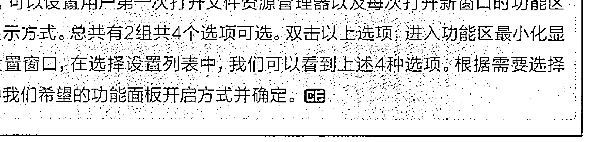

### 快速调用系统功能和目录

文|万立夫

在Windows系统里面有很多专门的目录，比如存放字体文件或者存放配置信息的目录。另外系统里面还有很多固定的命令，比如运行框、控制面板、注册表编辑器等等。通常情况下我们无论是打开这些目录，还是运行这些命令都是按部就班地完成。那么通过什么方法可以快速地调用这些系统功能，以及跳转到这些专门的目录里面呢？

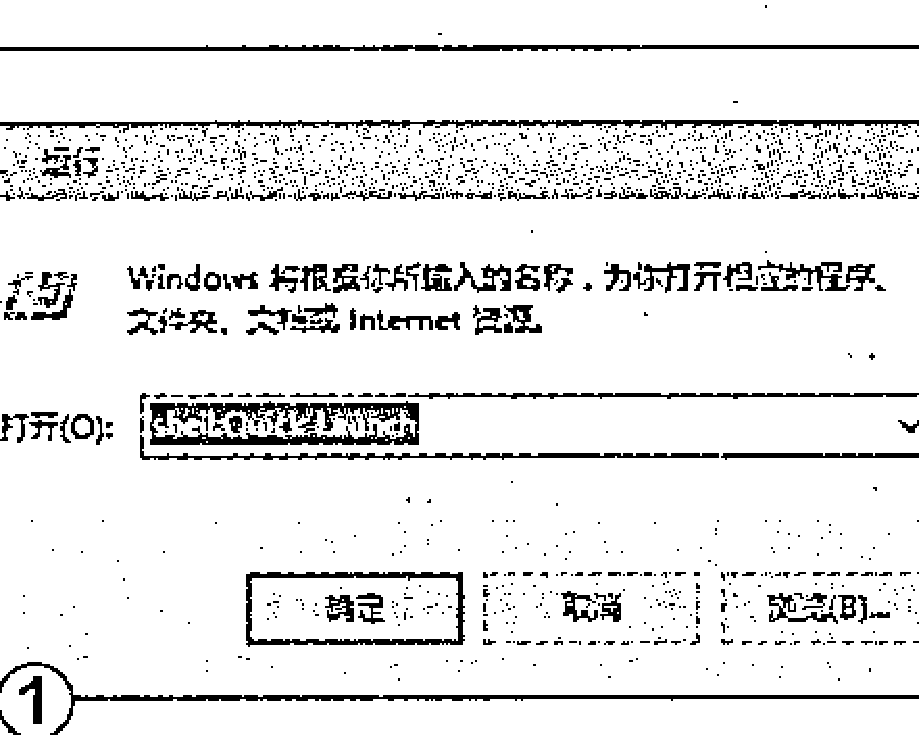

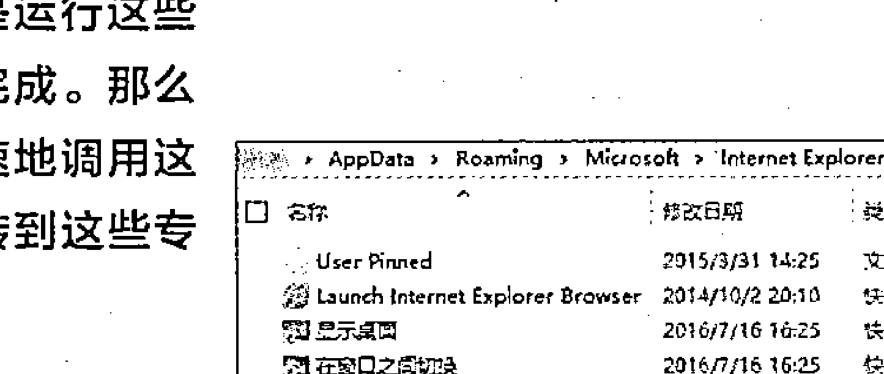

| 名称 | 修改日期 | 类型 | 大小 |
|------|----------|------|------|
| User Pinned | 2015/3/31 14:25 | 文件夹 |  |
| Launch Internet Explorer Browser | 2014/10/2 20:10 | 快捷方式 | 2 KB |
| 显示桌面 | 2016/7/16 16:25 | 快捷方式 | 1 KB |
| 在窗口之间切换 | 2016/7/16 16:25 | 快捷方式 | 1 KB |

#### Shell命令一键调用

由于这些专门的文件夹目录都有一个快捷路径，所以用户只需要使用系统中的Shell命令，就可以快速地一键跳转到想到的地方。比如我们想要进入到系统的“快速启动”目录，只需要在开始按钮上点击鼠标右键，选择菜单里面的“运行”命令(图1)。在弹出的运行对话框里面输入“shell:Quick Launch”后回车，即可快速打开Windows系统的启动目录(图2)。当然用户除了在运行框里面运行操作以外，还可以在资源管理器的路径栏、命令提示符窗口，甚至浏览器的地址栏中直接执行并打开这些系统里面的特殊文件夹目录。

除了特殊的文件夹目录以外，Windows系统里面还有很多系统功能，其实利用Shell命令也可以快速地打开。不过这个时候利用的不是快捷路径命令，而是系统中的GUID信息。比如我们想要打开Windows 10系统的防火墙功能，只需要在输入框里面输入“shell:::{4026492F-2F69-46B8-B9BF-5654FC07E423}”后回车，就可以快速地打开“Windows防火墙”配置管理功能。如果需要打开Windows Defender，那么执行“shell:::{D8559EB9-20C0-410E-BEDA-7ED416AECC2A}”命令即可。

当然了，GUID信息太过复杂，不容易记忆，其实我们可以将上面的命令保存到批处理文件中，放在桌面，需要的时候双击运行，就可以一键打开特殊目录了。

#### 如何查找相关信息

无论是快捷路径还是GUID信息，在每一个Windows版本里面都有所不同，那么用户如何查询这些信息呢？首先打开系统的注册表编辑器，接着展开到HKLM\Software\Microsoft\Windows\CurrentVersion\Explorer\FolderDescriptions\，这样在下面就可以看到很多的GUID信息。点击每一个GUID信息后，就可以在右侧窗口里面看到一个Name项目，而它对应的信息内容就是相应的快捷路径(图3)。

可能有的用户会觉得，这些快捷路径和GUID信息我也记不住啊，那么这个时候应该如何解决啊？首先在系统桌面点击鼠标右键，选择“新建”菜单中的“快捷方式”命令。接着在弹出的对话框里面输入相关的命令，比如“shell:::{D8559EB9-20C0-410E-BEDA-7ED416AECC2A}”。点击下一步命令后为快捷方式设置一个名称，这样以后通过快捷方式就可以快速启动相应的命令了(图4)。

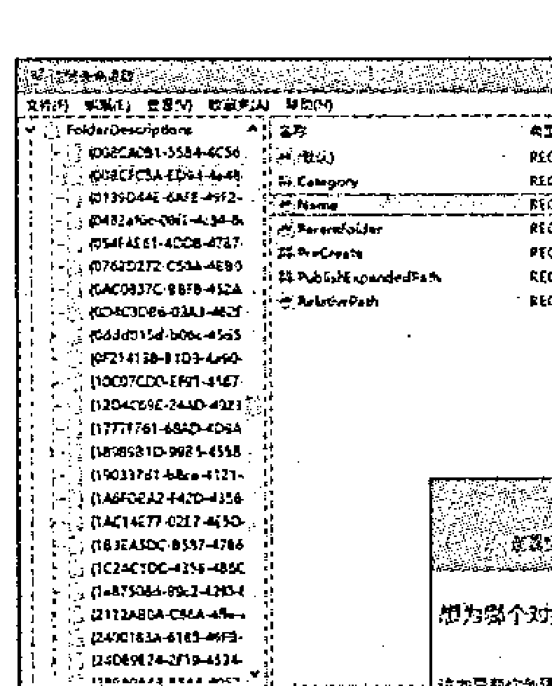

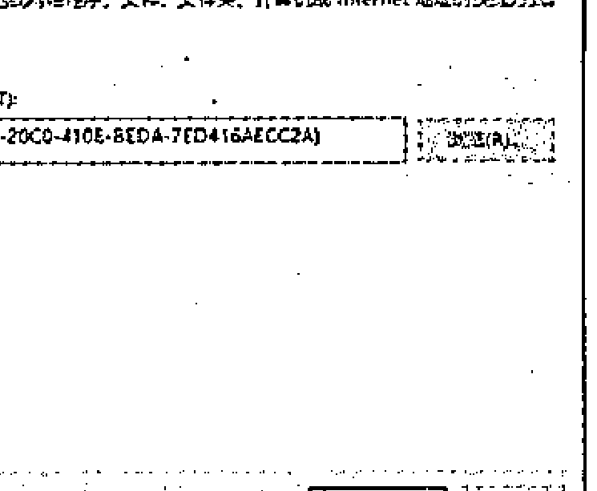更新出错？动手修复Windows 10更新故障

文|平淡

大家知道，为了强制用户更新系统补丁，Windows 10已经关闭用户手动停止更新选项。这样在微软发布系统更新后，Windows 10就会自动在后台安装更新，但是在安装某些更新的时候可能会出现无法成功安装的提示。那么在出现更新错误的时候我们该怎么进行修复？

### 1 下载方式设置有误

为了提高用户下载更新速度，Windows 10允许以P2P的方式，同时从微软网站和别的已经下载相关更新的用户那里，往我们的计算机上下载更新。这种下载方式类似迅雷、快车等采取的模式，但是也会由于其他用户的网络问题或者其下载的更新文件出错，导致本地计算机无法下载到完整的更新文件。比如最近很多Windows 10用户在下载编号为KB3081448的累积更新时就会出现无法完全下载，其中的原因就是由于Windows 10默认开启P2P下载模式(图1)。

> 小提示：系统更新除了使用P2P特性外，在Windows 10中硬件驱动升级也作为系统更新的一部分，因为驱动安装需要管理员权限。如果在安装驱动更新时提示错误，原因大多是由于用户账户控制在作怪。可以尝试在搜索框输入“UAC”，打开用户账户控制设置，将安全级别设置为“从不通知”即可(图3)。

既然更新故障是由于下载模式导致，因此解决的方法是关闭更新的P2P下载模式。依次点击任务托盘的“设置→所有设置→更新和安全→Windows更新”，接着点击更新设置下的“高级选项”，在打开的窗口点击“选择如何提供更新”，继续在打开的窗口将“更新来自多个位置”下的开关设置为“关”，然后重启继续更新即可(图2)。

### 2 更新缓存文件出错导致

由于一些Windows 10的更新文件较大，在长时间下载更新过程中可能会导致下载的更新文件出错，这样下载到的更新文件就无法正确安装，从而导致系统更新无法正确安装，解决方法是删除更新缓存文件。

默认情况下，Windows 10更新缓存文件保存在“C:\Windows\SoftwareDistribution”，因此只要删除其下的文件即可。

但是这些文件会被系统更新组件使用，因此需要先进入组策略编辑器，依次展开“计算机配置→管理模板→Windows组件→Windows更新”，将配置自动更新设置为“禁用”（图4）。

接着就可以打开“C:\Windows\SoftwareDistribution”，将其中“datastore”和“download”目录里的文件全部删除，接着再进入组策略将配置自动更新设置为“未配置”，这样重启后就可以继续安装系统更新了（图5）。

> 小提示
由于Windows 10更新组件本身也会自动升级，对于最新周年版（10.0.14393）及以上用户，在尝试上述文件时，系统可能还会提示某些文件正被系统使用无法删除。此时可以先启动命令提示符，依次输入“net stop bits”、“net stop wuauserv”、“net stop appidsvc”、“net stop cryptsvc”，停止这几个和系统更新相关的服务，然后再进入C:\ProgramData\Application Data\Microsoft\Network\Downloader、C:\Windows\System32\catroot2，删除其下全部文件，重启后再次更新系统即可（图6）。

### 系统文件出错导致

由于系统更新是和系统密切相关的，在日常使用中某些系统文件如果出现损坏，同样会导致系统更新无法成功安装。如果在使用Windows 10时可以成功下载更新，但是安装的时候出错，此时就需要对系统文件进行检查。

首先以管理员身份启动命令提示符，接着输入“Dism /Online /Cleanup-Image /ScanHealth”，该命令会检查系统文件是否存在错误。如果提示错误则继续输入“Dism /Online /Cleanup-Image /CheckHealth”，该命令会自动检查准备用来修复的安装源是否存在错误。如果屏幕返回结果提示可以修复，那么继续输入“DISM /Online /Cleanup-Image /RestoreHealth”，该命令是通过DISM修复受损的Windows文件（图7）。

最后输入“SFC /scannow”，该命令会对系统文件进行全面扫描，扫描所有保护的系统文件的完整性，并使用正确的微软版本替换不正确的版本。完成上述操作后再次安装系统更新即可解决更新安装故障（图8）。

```
管理员: 命令提示符 - DISM /Online /Cleanup-Image /Restore...

C:\WINDOWS\system32>Dism /Online /Cleanup-Image /CheckHealth

部署映像服务和管理工具
版本: 10.0.14393.0

映像版本: 10.0.14393.0
未检测到组件存储损坏。
操作成功完成。

C:\WINDOWS\system32>DISM /Online /Cleanup-Image /RestoreHealth

部署映像服务和管理工具
版本: 10.0.14393.0

映像版本: 10.0.14393.0
[==========================18.9%==========================]
```

```
管理员: 命令提示符 - SFC /scannow

C:\WINDOWS\system32>SFC /scannow

开始系统扫描。此过程将需要一些时间。
```

> 小提示
由于系统更新和系统紧密相连，如果使用上述方法后仍然无法解决问题，还可以尝试到微软官网下载“故障诊断程序”，启动程序后选择Windows更新，这个组件会对系统更新进行自动修复（图9）。

### 规范Windows 10开始屏幕布局 局域网管理更轻松

文|周太彪

大家知道，Windows 10的开始菜单使用了“磁贴+文字”的组合形式，我们可以非常方便地将常用的程序固定到开始菜单。对于企业用户来说，公司常用的应用统一放置到开始菜单更便于员工的使用和管理，但是公司每台电脑都手动设置显然工作量太大了。对于Windows 10（1511版本以上）的用户来说，该版本已经支持开始屏幕布局，这样通过系统组件我们就可以方便地对所有电脑的开始菜单进行自定义设置。

#### 就地取材 快速导入布局文件

对于已经安装好Windows 10的电脑，我们可以在局域网内任意一部电脑上进行开始菜单布局的设置，然后将设置导出后再导入到其他电脑上。比如将公司必用的应用固定到开始菜单，并且将其调整为合适大小，如果要添加分组菜单，则在开始菜单点击鼠标左键，把要分组的磁贴不放，拖动到开始菜单的空白区域（即没有磁贴的位置），此时在磁贴图标上方会显示一个新增的“命名组”的新分组。按提示对新分组进行命名，如“办公软件”，同时根据分组的性质将办公程序都添加到该分组即可（图1）。当然为了标准化管理，这里还可以将不必要的程序从开始菜单取消固定，对开始菜单的颜色、主题进行设定。完成上述的设置后打开资源管理器，选择本机一个目录作为共享目录，添加Everyone用户读取该目录权限，该目录用于存放导出的开始菜单布局配置文件（图2）。

```
管理员: Windows PowerShell
Windows PowerShell
版权所有 (C) 2016 Microsoft Corporation。保留所有权利。
PS C:\WINDOWS\system32> Export-startlayout -path \\cfan-PC\start\start.xml
PS C:\WINDOWS\system32>
```

```
管理员: Windows PowerShell
PS C:\WINDOWS\system32> cd\
PS C:\> Import-startlayout -layoutpath \\cfan-PC\start\start.xml -defaultpath C:\
PS C:\>
```

完成共享设置后记住共享名称，类似“\\计算机名\共享名称”格式，接着在搜索框输入“powershell”，然后以管理员身份启动Windows powershell，在其中输入下列的命令，将当前电脑开始菜单的布局文件输出到共享目录保存（图3）。

```
Export-startlayout -path \\cfan-PC\start\start.xml
```

**命令解释:**

*   Export-startlayout: 输出当前开始菜单配置文件。
*   -path 共享目录: 将配置文件输出到共享目录保存，配置文件名称为start.xml。

这样要将该配置文件导入局域网内的其他电脑上时，同上以管理员身份启动Windows powershell，在其中输入下列的命令，将共享目录中的开始菜单的布局文件导入到当前电脑，这样重启后即可自动应用上述设置的开始菜单的布局（图4）。

```
Rem 导入共享目录里的配置文件到当前系统
import-startlayout -layoutpath \\cfan-pc\start\start.xml -mountpath C:
```

**命令解释：**

*   import-startlayout: 导入配置文件。
*   -layoutpath \\cfan-PC\start\start.xml: 加载共享目录中的配置文件，注意当前用户需要有共享目录的读取权限。
*   -mountpath C: 加载路径为当前系统安装分区，这里默认是C，请根据自身系统情况进行修改。

> 小提示
如果我们在布局文件中添加第三方应用，比如添加Excel的磁贴，那么需要在镜像中集成该软件，同时将该软件的快捷方式放置在“%ALLUSERSPROFILE%\Microsoft\Windows\Start Menu\Programs”下，这样才会在开始菜单屏中显示。

操作同上，在其他电脑上运行上述命令后即可实现公司电脑的开始菜单布局都一致。不过这样用户仍然可以自行添加或者更改，为了保证部署后的布局不被更改，还可以启动组策略编辑器，依次展开“计算机配置→管理模板→开始菜单”，点击右侧窗格的“开始菜单屏幕布局”，将其设置为“启用”，在开始屏幕布局文件下输入配置文件的实际位置，这样重启后可以自动读取该配置文件，并且锁定该布局文件（图5）。

这样电脑重启后再次打开开始菜单，此时右击开始菜单的任一项目，原来的“从开始菜单屏幕取消固定”子菜单已经消失，用户既无法自行将项目添加到开始菜单，也无法删除开始菜单上的磁贴项目，可以有效保护开始菜单布局的稳定性（图6）。

#### 开始菜单布局一劳永逸

上述方法需要在每台电脑上执行，对于企业的电脑经常要重装系统，如果要让每次重装好的电脑都可以直接使用上述设置好的布局文件，我们还可以将布局文件添加到自动应答文件中，这样系统安装好后就可以直接使用。

首先在Windows 10中启动命令提示符，输入“Dism /Mount-Image /ImageFile:e:\install.wim /index:1 /MountDir:C:\mount”，加载安装文件install.wim映像1到本机目录C:\mount（图7）。

接着将上述导出的布局文件重命名为“LayoutModification.xml”，然后将其放置在“C:\mount\Users\Default\AppData\Local\Microsoft\Windows\Shell”下，这样下次使用这个镜像安装后的开始菜单就可使用自己的布局文件了（图8）。

### 全面解析Windows 10的“运行”

我们往往通过开始菜单、桌面、任务栏快捷图标等方式启动程序或应用，但实际上，Windows 10还有一个更加高级的启动程序的万能入口——“运行”窗口。“运行”窗口看似简单，但它却是一个从初学者到高手都适用的、博大精深的Windows功能“入口”。

#### 多种方式开始“运行”

*   方法1: 在“开始”按钮的右键菜单中，直接点击“运行”项，进入到“运行”对话框（图1）。
*   方法2: 按下键盘上的Win+R组合键，“运行”窗口便会出现（图2）。
*   方法3: 在开始按钮盘的小娜搜索框中输入“运行”，搜索“运行”程序链接，点击进入“运行”环境（图3）。

> 小提示： “开始”菜单右键呼出“运行”是Windows 10和Windows 8的专属特性，但Windows 7的开始菜单中其实也可以添加“运行”命令。右击任务栏空白处，依次选择“属性→开始菜单→自定义”，勾选“运行命令”复选框，开始菜单左侧即可出现“运行”命令。

> 小知识：内部命令和外部命令 操作系统命令通常分为内部命令和外部命令。我们常见到的磁盘可执行EXE文件即为外部命令，若删掉它们将无法执行外部命令，如NOTEPAD.EXE、REGEDIT.EXE等。而系统常驻的命令为内部命令，只要系统处于运行状态中，就可以随时执行这些命令，就像DIR、TREE等，你无法轻易删掉它们使其失效。

#### 弄清可“运行”的类别

不光在“运行”对话框中输入命令来执行程序，“运行”对话框还可以通过“浏览”按钮加载程序。此外，还可以运行“浏览”按钮无法找到的系统内部命令。 通过运行的“浏览”对话窗口，我们可以看到可选的程序类别有*.exe、*.pif、*.com、*.bat、*.cmd等多个选择（图4）。其中.com和.exe是可执行程序，而.com类型的程序优于.exe程序执行。而.bat和.cmd均为批处理程序，但.bat在基于16位的DOS时期就存在，而.cmd则在32位Windows环境下运行。.pif是程序信息文件，是一种指向DOS程序的快捷方式，内含执行DOS程序的一些设置信息，比如路径、窗口和字体等。

其实，能够直接运行的尚不止这些。我们还可以在这里输入GPEDIT.MSC启动组策略管理器，输入APPWIZ.CPL启动程序和功能窗口(图5)。

#### 3 “运行”的主要应用

由于“运行”主要使用一些命令串来操作，对于普通用户来说有一定的难度，因此，它的作用主要是在于系统的调试和维护。此外，对于一些埋藏较深的系统程序，如果通过逐级菜单调用有所不便，也可以通过运行命令的方式快速调用。

##### 系统调试和维护

“运行”框是系统信息查看、调试和维护的方便入口，要查看系统软硬件配置信息，只需运行MSINFO32命令即可(图6)。命令提示符窗口在有的Windows版本中埋藏较深，可用所有版本通用的命令CMD来打开命令提示符窗口。

如果要清理磁盘，运行一个CLEANMGR命令就可以打开磁盘清理工具，选择清理磁盘。而调用控制面板和电源管理窗口，也可以分别通过运行CONTROL和POWERCFG.CPL命令来实现。

> > 小提示：对于用户安装的其他程序，其实也都可以通过“运行”对话框来启动，只是需要先将主程序添加到系统的路径变量PATH中。例如要调用好压的后台控制程序，只需在命令提示符窗口中执行如下命令即可(图7)：
> `PATH %PATH%;C:\Program Files(x86)\2345Soft\HaoZip`

##### 快速启动应用程序

除了系统维护外，我们日常所要使用的系统小工具，也因为埋藏较深不易调用，它们也可以通过“运行”窗口来方便地随时启动。调用记事本只需运行NOTEPAD，调用画图则运行MSPAINT，而调用计算器运行CALC即可。

### 打造相互隔离的双系统

文|钟熠霄

人们往往通过安装双系统来满足工作环境、个人使用习惯等方面对不同版本操作系统的差异化需求，但安装双系统后，一系统感染了病毒，另一系统也很难幸免。如果登录一系统，另一系统所在的分区能够自动隐藏，则可解决这一问题。下面以Windows 8、Windows 10双系统为例，安装完全隔绝的双系统。

> 小提示
安装Windows 10前，将所在盘转换为主分区且设置成活动以及安装原版Windows 10（GHO格式的系统镜像兼容性差），这两步必不可少。否则，安装的系统往往无法正常运行。

#### 1 硬盘重新分区

单个系统的系统盘20GB基本够用。通常安装的单系统已调整好C盘容量，因此只需将D盘调整为20GB即可。当然，考虑到系统升级、软件安装、系统还原、虚拟内存等均会占用较大的空间，可按个人所需在此基础上适当调高。

先备份D盘中的数据，然后运行DiskGenius并右击D盘，选择“删除当前分区”；再右击这个已删除的分区，选择“建立新分区”；最后将“新分区大小”参数修改为20并单击“确定”（图1）。
单击工具栏中的“保存更改”按钮，以使对D盘的分区操作生效；接着右击工具栏D盘柱形图，选择“格式化当前分区”，这时右边就会出现一个名为“空闲”的柱形图（D盘重新分区后余下的部分）（图2）；最后仿照对D盘进行分区的操作，对剩下的硬盘空间执行分区操作。

#### 2 安装Windows 8及Windows 10

使用Ghost恢复工具（图3），将事先做好的GHO格式Windows 8镜像恢复到C盘，完成Windows 8的安装。
隐藏、设置和显示主分区。在WinPE环境中，运行WinPM（图4），右击图中的C盘分区，在右键菜单中分别选择“隐藏”、“设置非活动”；再右击图中的D盘分区，选择“修改→设置主分区”；然后关闭WinPM并在弹出的包含“是否应用更改”信息的对话框中单击按钮“是”以完成对硬盘的修改操作。再运行WinPM并右击D盘，在右键菜单中分别选择“显现”、“设置活动”以显示并激活D盘所在的分区；最后保存对硬盘所做的修改。

将闪存盘插入USB接口并运行UltraISO，打开ISO格式的原版Windows 10镜像文件，然后单击菜单“启动→写入硬盘映像”；接着选中闪存盘盘符（如J盘），再单击“写入”按钮，制作一个闪存盘版的Windows 10安装盘（图5）。完成上述操作后，用闪存盘启动系统，按照提示将Windows 10安装到D盘。

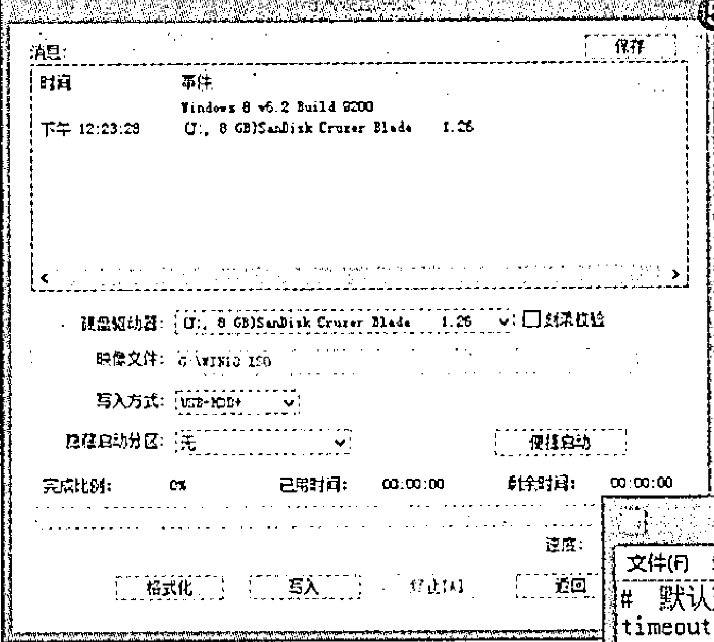

小提示：用记事本打开menu.lst（图6），当选择“启动Windows 8”时，关键语句“unhide (hd0,0)”的作用是取消隐藏C盘，“hide (hd0,1)”的作用是隐藏D盘，然后启动C盘中的Windows 8。同样的道理，选择“启动Windows 10”时，“unhide (hd0,1)”、“hide (hd0,0)”则是取消隐藏D盘并隐藏C盘，再启动Windows 10。

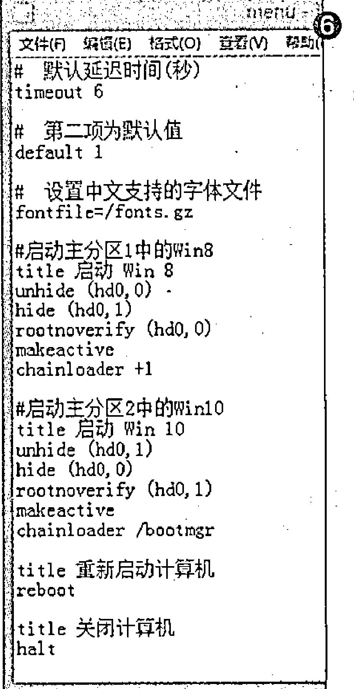

#### 3 Grub4Dos的安装及启动配置

在WinPE中，隐藏Windows 10所在的D盘并显示Windows 8所在的C盘，然后打开C盘根目录下的boot文件夹（显示具有隐藏属性的文件夹才能看到，如果没有可新建一个），进入该文件夹后再建立一个grub文件夹；最后打开解压得到的Grub4dos文件夹，将该文件夹下的menu.lst文件复制到“C:\boot\grub”目录下、将Grub4dos文件夹里边除menu.lst文件以外的其他四个文件复制到C盘根目录下。

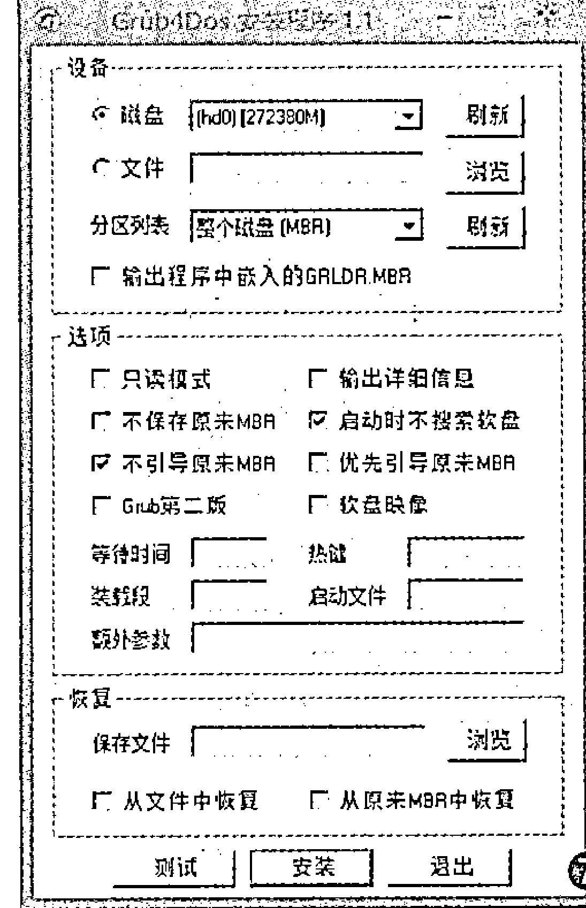

```
GRUB4DOS 0.4.4 2009-01-11, Memory: 639K / 1999M, MenuEnd: 0x49118
启动 Win 8
启动 Win 10
重新启动计算机
关闭计算机
```

在WinPE中以管理员权限运行grubinst_gui（图7），先勾选“磁盘”单选框并单击右边的“刷新”，再单击右边的下拉箭头，选择“(hd0)[272380M]”（272380M表示电脑中第一块硬盘总容量的大小，不同的电脑该数值会有差异）；然后单击“分区列表”右侧的“刷新”按钮，并选择“整个磁盘(MBR)”选项。

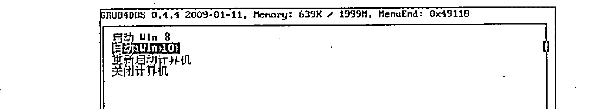

完成上述操作后，勾选“启动时不搜索软盘”和“不引导原来MBR”复选框，最后单击“安装”按钮，完成启动Grub4Dos所必需的硬盘主引导记录的修改。

#### 4 效果预览

退出WinPE并重启就可以看到双启动菜单了（图8）。默认是启动Windows 10系统，选中“启动Win 8”并回车，则可以进入Windows 8系统。无论是进入哪个系统，未启动的系统是自动隐藏状态的。

### 回归流畅 解决Windows 10卡顿难题

文|阙永强

很多使用SSD硬盘的用户在升级到了Windows 10系统后会发现出现卡顿、系统停止响应的问题。那么是什么问题导致的这些故障，我们又该怎么去解决这些问题？

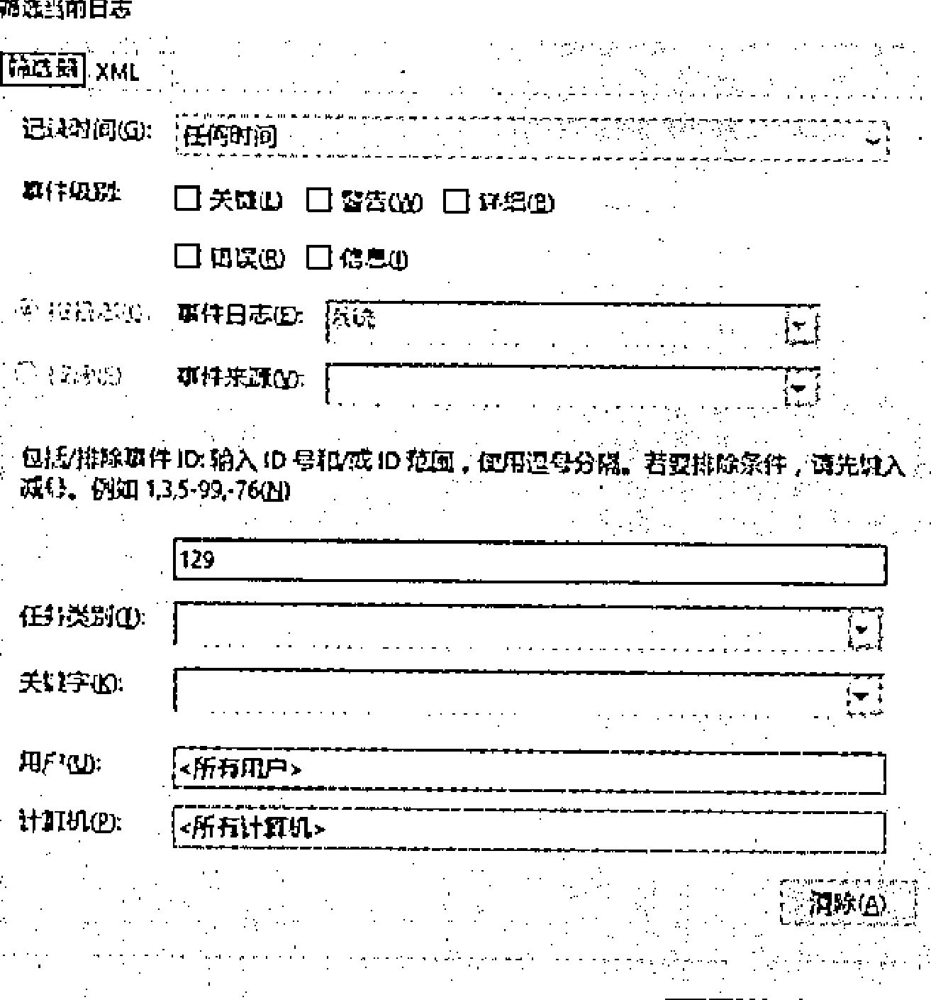

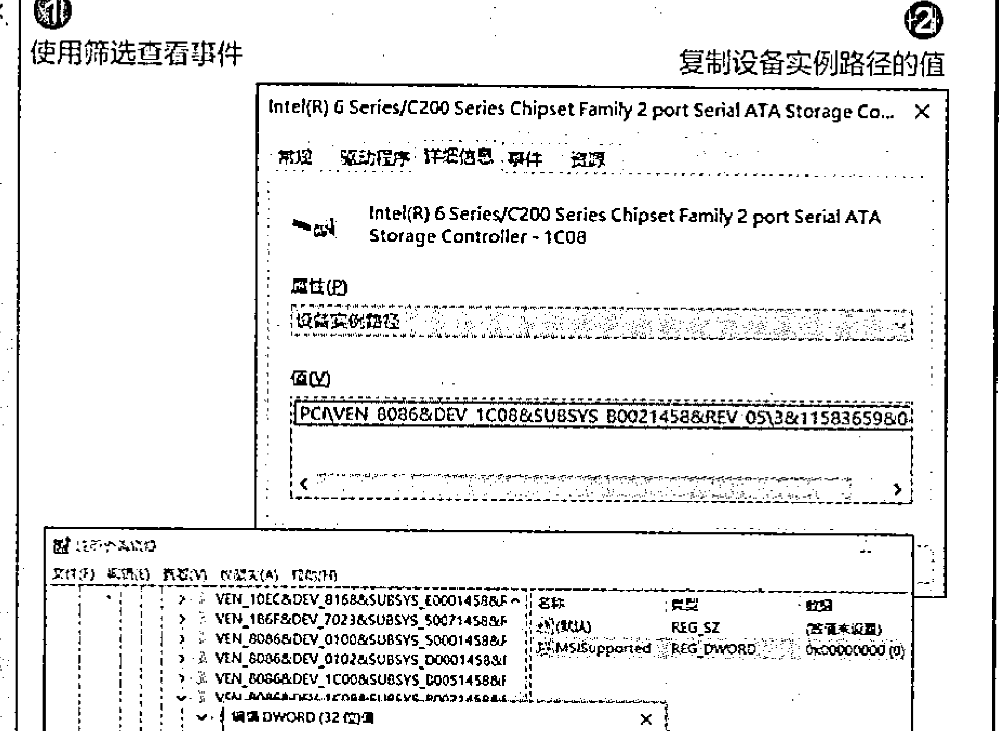

#### Windows 10和磁盘驱动不兼容导致

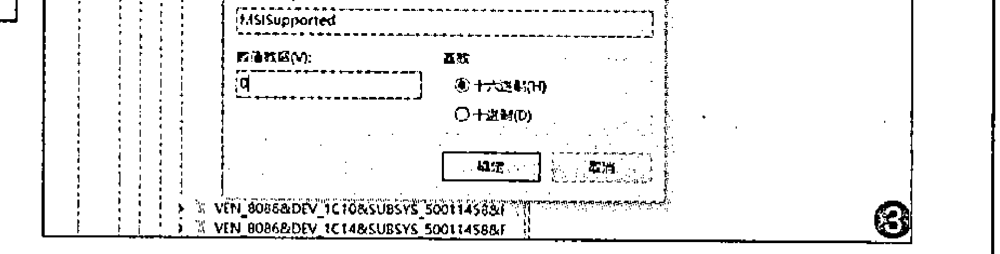

这种故障的主要表现是Windows 10每隔一段时间就会卡顿一次（时间随机并没有规律），此时硬盘读写灯会一直亮起，如果提前打开任务管理器，则会发现此时的磁盘占用100%（或者停止在某个读数不会更新），但是一段时间后会自动消失，过后又会不定时出现。

因为故障主要表现是磁盘读写灯常亮、磁盘占用异常，因此在排除SSD本身硬件故障因素后，其中故障原因最有可能是和SSD硬盘不兼容。由于目前SSD大多使用的是SATA接口，SSD硬盘读写是通过StorAHCI.sys驱动程序控制的，但是在Windows 10中当某些主板的高级主机控制器接口PCI Express（AHCI PCIe）和StorAHCI.sys驱动程序一起运行时，由于SSD固件驱动和系统不兼容，导致SSD硬盘无法完成输入/输出信号中断（MSI模式）。此时Windows 10会尝试将设备重置，使用一段时间来等待没有响应的读取或写入，这段等待时间就是系统卡顿时间。因此故障的元凶就是其中的MSI模式，解决的方案则是在系统中将MSI模式关闭。

动记录该事件。因此如果你的系统有上述故障表现，请在系统搜索框输入“事件查看器”，启动事件查看器后展开“Windows日志→系统”，点击右侧窗格的“筛选查看器”，进行事件ID的搜索，看看自己的系统是否存在ID为129的事件，如果有，基本可以确定故障的原因就是MSI模式导致（图1）。

确定本机存在ID为129的事件后打开设备管理器，展开“IDE ATA/ATAPI控制器→标准SATA AHCI控制器”，右击选择“属性”切换到“详细信息”标签，展开“属性”栏下拉列表选择“设备实例路径”，在下方的“值”下右击选择“复制”，复制其中的路径数值备用（图2）。

打开注册表编辑器，依次展开[HKEY_LOCAL_MACHINE\System\CurrentControlSet\Enum\PCI\xxxxx\Device Parameters\Interrupt Management\MessageSignaledInterruptProperties]（其中XXXXX是在上述设备管理器中查看到的设备实例路径值），点击右侧窗格的“MSISupported”键值，将其值由1改为0，重启后即可解决故障问题（图3）。

#### 2 芯片组驱动导致故障

这种故障的表现是SSD硬盘安装Windows 10后系统会假死、不定时卡顿甚至蓝屏死机。有经验的朋友都知道，这种故障大多是由于严重的驱动兼容性故障引起的。那么在排除磁盘驱动兼容性后还会有什么驱动容易导致系统假死甚至蓝屏死机？

大家知道，为了提高SSD硬盘读写速度，目前的主流主板基本都是默认开启AHCI选项，但是很多主板的AHCI模式却和Windows不兼容（在Windows 7时代就有许多主板开启AHCI后蓝屏）。由于现在AHCI模式已经成为主板标配，因此在Windows 10中已经集成标准AHCI驱动，一般用户安装完Windows 10系统后都会自动安装AHCI驱动（无论是英特尔还是AMD芯片组）。故障的原因正是出在这个标准AHCI驱动上，一些主板（特别是AMD芯片组）由于其自身设计问题，Windows 10自带标准AHCI驱动在使用SSD硬盘的情况下极易发生问题。

因此解决问题是重新为芯片组安装官方自行推出的AHCI驱动，这里以AMD芯片组驱动安装为例。首先确定自己是否使用的是Windows 10 标准AHCI驱动，打开设备管理器后展开“IDE ATA/ATAPI控制器”，可以看到目前本机安装的是“STORAHCI SATA Controller”驱动，打开其属性窗口看到其驱动提供商为微软，因此目前安装的就是Windows 10标准AHCI驱动（图4）。

由于AMD芯片的AHCI控制器集成在南桥，因此可以使用硬件检测工具确定自己主板的南桥芯片，接着就可以登录AMD官网去下载AHCI驱动，打开http://support.amd.com/zh-cn/download，选择“芯片组”驱动，然后下载其中的“南桥驱动”并安装即可（图5）。

完成安装后再次打开设备管理器，展开“IDE ATA/ATAPI控制器”，可以看到安装的驱动已经被识别为“AMD SATA Controller”驱动，表示你已经成功安装AMD提供的AHCI驱动，重启后看看问题是不是解决了（图6）。

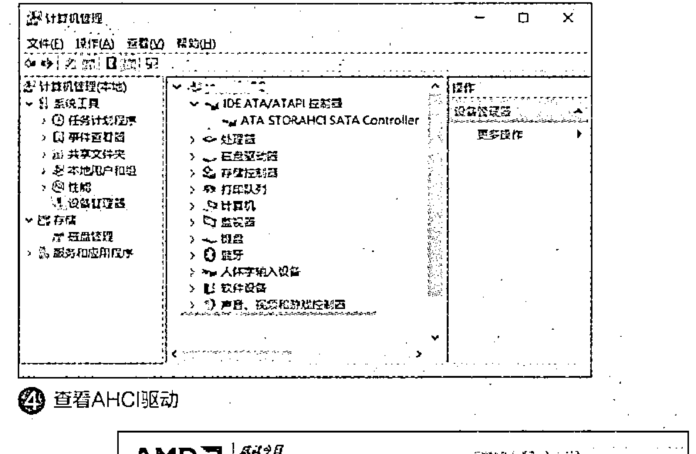

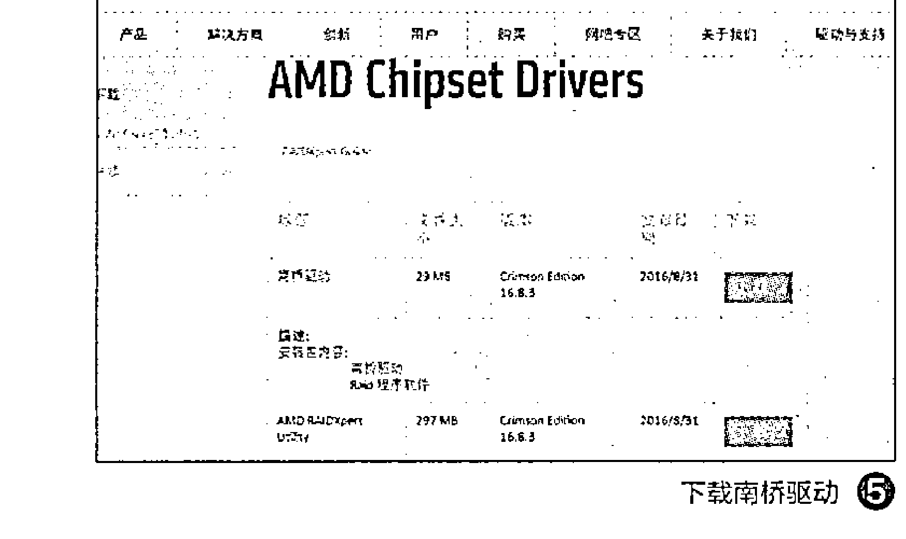

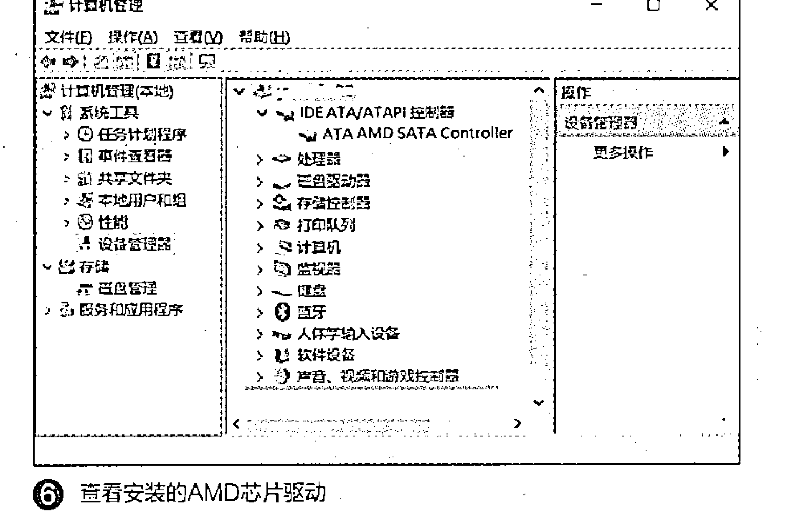

#### 3 其他设置问题导致故障

除了硬件驱动导致的故障外，由于SSD硬盘仍然是一种较为新型的存储设备。在具体的使用中一些朋友会由于不了解SSD硬盘的一些新特性，没有针对SSD硬盘进行优化，从而会在日常使用中出现一些问题。比如没有进行4K对齐，导致SSD硬盘读写功能降低，在进行大数据频繁读写的时候导致卡顿出现，只要重新进行4K对齐即可。如果是没有在主板开启AHCI，导致SSD性能下降，则参考自己的主板说明书进行开启即可。

### 对症下药 自己动手重装Windows 10应用

文|俞木发

因为Windows 10应用商店的应用纯净且安全，因此越来越多Windows 10系统的朋友在使用应用商店里的应用。不过在日常的使用中，在Windows 10中若想下载安装应用必须使用应用商店这个组件，可是这个组件经常工作不正常，如闪退、无法打开或者一直停在初始界面（图1）。如果以后再遇到这种问题，我们就可以通过下面的方法尝试对应用商店进行修复。

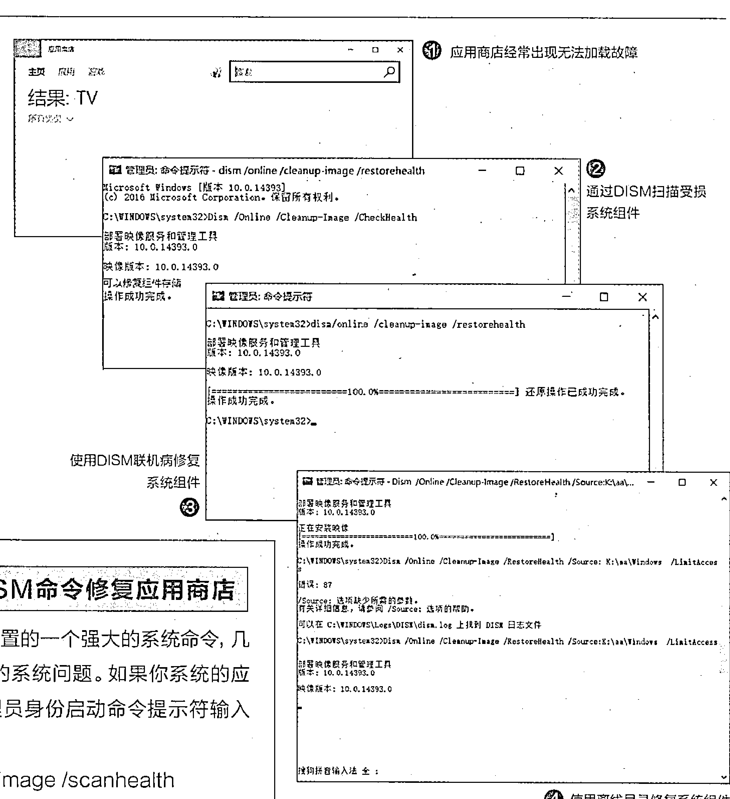

#### 就地取材 使用DISM命令修复应用商店

DISM是Windows 10内置的一个强大的系统命令，几乎可以用来解决我们常遇到的系统问题。如果你系统的应用商店出现上述问题，以管理员身份启动命令提示符输入下列的命令：

```
dism/online /cleanup-image /scanhealth
```

执行上述命令后，DISM会对Windows 10所有组件进行扫描（包含且不限于应用商店等系统组件无法使用的情况），如果出现“可以修复组件存储”的提示，则表明有些系统组件已经受损出现问题（图2）。

继续在命令提示符下输入“DISM /Online /Cleanup-image /RestoreHealth”，这样DISM会自动联机到微软官方服务器，将受损的组件和官方原版镜像里的组件进行对比。可以将那些不同的系统文件（或者受损的系统文件，自然包括出现故障的应用商店组件）还原成官方系统源文件，但是其他的第三方软件和用户设置完全保留。这样通过DISM命令的扫描和修复后一般就可以解决应用商店无法正常运行的故障（图3）。

因为DISM需要联机到微软服务器进行系统文件比对和验证，如果你的网速较慢，可以自行先准备好和当前Windows 10对应的的安装文件，然后将其中的“install.wim”提取到E:\备用，在命令提示符下输入“dism /mount-wim /wimfile:e:\install.wim /index:1 /mountdir:k:\aa”，将镜像加载到k:\aa（需要预先建立该目录），继续输入“Dism /Online /Cleanup-Image /RestoreHealth /Source:K:\aa\Windows /LimitAccess”进行手动修复也可以（图4）。

#### ② 釜底抽薪 使用Powershell命令重装应用商店

如果系统的应用商店组件严重受损就无法使用上述方法进行修复，不过大家知道应用商店实际上仍然是一个Windows 10系统的内置应用，因此如果无法通过上述方法进行修复，我们还可以使用Windows 10内置的Powershell命令进行重装。

在搜索框输入“powershell”，以管理员身份启动系统自带的Windows Powershell组件，接着输入“Get-AppxPackage -allusers | Select Name, PackageFullName”，通过该命令获取当前系统安装的所有应用（图5）。

在应用列表中找到名称为“Microsoft.WindowsStore”（即应用商店）应用，然后复制右侧对应的包名称，类似“Microsoft.WindowsStore_11608.1001.49.0_x86__8wekyb3d8bbwe”，这是应用商店安装包名称。继续输入下列命令进行应用商店的重装:

```
Add-AppxPackage -register "C:\Program Files\WindowsApps\Microsoft.WindowsStore_11608.1001.49.0_x86__8wekyb3d8bbwe\appxmanifest.xml" -DisableDevelopmentMode
```

同样可以使用上述方法对Windows 10系统里内置的其他应用进行重装。比如地图应用（在列表中对应“Microsoft.WindowsMaps”），包含很多地图数据，如果重装还要重新下载数据，因此如果地图应用出现问题，可以输入“Add-AppxPackage -register “C:\Program Files\WindowsApps\Microsoft.WindowsMaps_5.1609.2651.0_x86__8wekyb3d8bbwe\appxmanifest.xml” -DisableDevelopmentMode”(格式: Add-AppxPackage -register “C:\Program Files\WindowsApps\应用安装包名称\appxmanifest.xml” -DisableDevelopmentMode)进行地图应用的重装（图6）。

⑤ 查看系统当前安装的应用

```
PS C:\WINDOWS\system32> Get-AppxPackage | Select Name, PackageFullName
Name                                          PackageFullName
----                                          ----------------
Microsoft.AAD.BrokerPlugin                    Microsoft.AAD.BrokerPlugin_1000.14393.0.0_neutral_neutral_cw5n1h2txyewy
Microsoft.BioEnrollment                       Microsoft.BioEnrollment_10.0.14393.0_neutral__cw5n1h2txyewy
Microsoft.LockApp                             Microsoft.LockApp_10.0.14393.0_neutral__cw5n1h2txyewy
Microsoft.MicrosoftEdge                       Microsoft.MicrosoftEdge_38.14393.0.0_neutral__8wekyb3d8bbwe
Microsoft.PPIProjection                       Microsoft.PPIProjection_10.0.14393.0_neutral_neutral_cw5n1h2txyewy
Microsoft.Windows.Apprep.ChxApp               Microsoft.Windows.Apprep.ChxApp_1000.14393.0.0_neutral_neutral_cw5n1h2txyewy
Microsoft.Windows.AssignedAccessLockApp       Microsoft.Windows.AssignedAccessLockApp_1000.14393.0.0_neutral_neutral_cw5n...
Microsoft.Windows.CloudExperienceHost         Microsoft.Windows.CloudExperienceHost_10.0.14393.0_neutral_neutral_cw5n1h...
Microsoft.Windows.ContentDeliveryManager      Microsoft.Windows.ContentDeliveryManager_10.0.14393.0_neutral_neutral_cw5n...
Microsoft.Windows.Cortana                    Microsoft.Windows.Cortana_1.7.0.14393_neutral_neutral_cw5n1h2txyewy
Microsoft.Windows.ParentalControls           Microsoft.Windows.ParentalControls_1000.14393.0.0_neutral_neutral_cw5n1h2t...
Microsoft.Windows.SecondaryTileExperience    Microsoft.Windows.SecondaryTileExperience_10.0.0.0_neutral_neutral_cw5n1h2t...
Microsoft.Windows.SecureAssessmentBrowser    Microsoft.Windows.SecureAssessmentBrowser_10.0.14393.0_neutral_neutral_cw5n...
Microsoft.XboxGameCallableUI                 Microsoft.XboxGameCallableUI_1000.14393.0.0_neutral_neutral_cw5n1h2txyewy
Windows.ContactSupport                       Windows.ContactSupport_10.0.14393.0_neutral_neutral_cw5n1h2txyewy
Windows.immersivecontrolpanel                Windows.immersivecontrolpanel_6.2.0.0_neu...
Windows.PrintDialog                          Windows.PrintDialog_6.2.0.0_neutral_neutral_cw5n1h2txyewy
Microsoft.NET.Native.Runtime.1.3             Microsoft.NET.Native.Runtime.1.3_1.3.24201.0_x86__8wekyb3d8bbwe
Microsoft.NET.Native.Framework.1.3           Microsoft.NET.Native.Framework.1.3_1.3.24201.0_x86__8wekyb3d8bbwe
Microsoft.VCLibs.140.00                      Microsoft.VCLibs.140.00_14.0.23829.0_x86__8wekyb3d8bbwe
Microsoft.Messaging                           Microsoft.Messaging_3.19.1001.0_x64__8wekyb3d8bbwe
Microsoft.People                              Microsoft.People_10.0.11902.0_x64__8wekyb3d8bbwe
Microsoft.3DBuilder                          Microsoft.3DBuilder_11.1.9.0_x86__8wekyb3d8bbwe
Microsoft.Appconnector                       Microsoft.Appconnector_1.3.3.0_x86__8wekyb3d8bbwe
Microsoft.BingFinance                        Microsoft.BingFinance_4.13.47.0_x64__8wekyb3d8bbwe
Microsoft.BingNews                           Microsoft.BingNews_4.13.47.0_x86__8wekyb3d8bbwe
Microsoft.BingSports                         Microsoft.BingSports_4.13.47.0_x64__8wekyb3d8bbwe
Microsoft.BingWeather                        Microsoft.BingWeather_4.13.47.0_x64__8wekyb3d8bbwe
Microsoft.CommsPhone                         Microsoft.CommsPhone_1.10.15000.0_x64__8wekyb3d8bbwe
Microsoft.ConnectivityStore                  Microsoft.ConnectivityStore_1.1604.4.0_x86__8wekyb3d8bbwe
Microsoft.Getstarted                         Microsoft.Getstarted_4.0.12.0_x86__8wekyb3d8bbwe
Microsoft.NET.Native.Framework.1.0           Microsoft.NET.Native.Framework.1.0_1.0.22929.0_x86__8wekyb3d8bbwe
Microsoft.NET.Native.Framework.1.1           Microsoft.NET.Native.Framework.1.1_1.1.23115.0_x86__8wekyb3d8bbwe
Microsoft.NET.Native.Runtime.1.0             Microsoft.NET.Native.Runtime.1.0_1.0.22929.0_x86__8wekyb3d8bbwe
Microsoft.NET.Native.Runtime.1.1             Microsoft.NET.Native.Runtime.1.1_1.1.23406.0_x86__8wekyb3d8bbwe
Microsoft.NET.Native.Runtime.1.4             Microsoft.NET.Native.Runtime.1.4_1.4.24201.0_x86__8wekyb3d8bbwe
Microsoft.Office.Sway                        Microsoft.Office.Sway_17.6216.20251.0_x86__8wekyb3d8bbwe
Microsoft.VCLibs.120.00                      Microsoft.VCLibs.120.00_12.0.21005.1_x86__8wekyb3d8bbwe
Microsoft.VCLibs.140.00                      Microsoft.VCLibs.140.00_14.0.24123.0_x86__8wekyb3d8bbwe
```

⑥ 重装应用商店

```
PS C:\WINDOWS\system32> Add-AppxPackage -register "C:\Program Files\WindowsApps\Microsoft.WindowsStore_11608.1001.49.0_x86__8wekyb3d8bbwe\appxmanifest.xml" -DisableDevelopmentMode
PS C:\WINDOWS\system32> Add-AppxPackage -register "C:\Program Files\WindowsApps\Microsoft.WindowsStore_11608.1001.49.0_x86__8wekyb3d8bbwe\appxmanifest.xml" -DisableDevelopmentMode
```

⑦ 卸载内置应用

> 小提示
除了将应用重装外，对于一些受损无法在开始菜单卸载的应用，同样可以使用Powershell命令行卸载。比如要卸载手机伴侣，同上获取到应用的名称后输入“Get-AppxPackage *phone* | Remove-AppxPackage”，这样卸载后在应用商店重新下载安装即可（图7）。

```
命令执行输出（无法识别具体文本）
```

### 解析Windows 10的内部命令

文/昌明

内部命令是Windows中运行权限较高的一种可执行命令。那么，Windows 10的内部命令到底有哪些？在实际使用电脑的过程中，它们能对我们的工作有哪些帮助呢？让我们进一步接触内部命令及其用法。

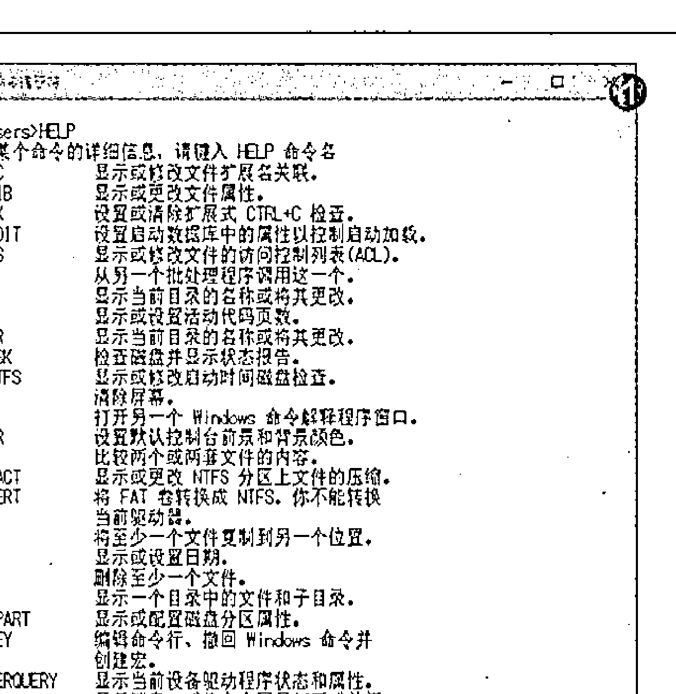

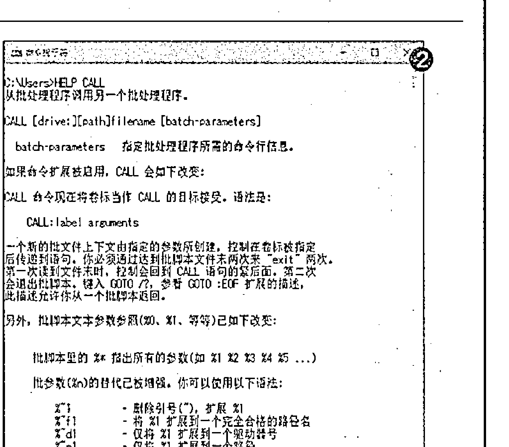

#### 小知识：内部命令的优先级别

如果磁盘里有一个自己写的或别人写的DIR.EXE或DIR.COM程序，你兴冲冲地执行它们，但你获得的结果是系统自己的列目录功能，这是因为系统内部命令的优先级别高于COM和EXE程序。如果进一步用两个程序DIR.COM和DIR.COM更名后来实验，可以发现DIR.COM程序又优先于DIR.EXE程序运行。

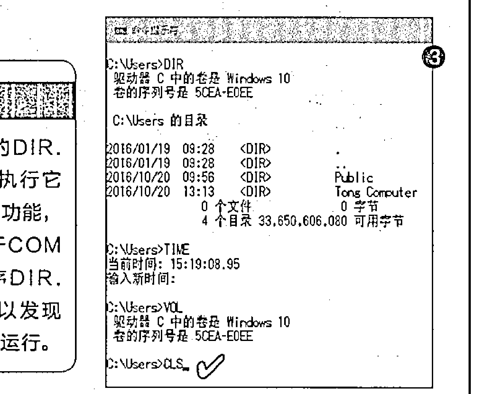

#### 深入认识内部命令

之前的文章中我们已经解释过“内部命令”的含义。内部命令既能在“运行”窗口中运行，也能在命令提示符窗口中运行。那么，在Windows 10系统中，有哪些内部命令可供我们使用呢？让我们进入命令提示符窗口，输入一个HELP命令并回车，这时可以看到包含有基本内部命令的列表（图1）。注意图中仅显示了部分内容，实际使用时可用鼠标滚动查看更多命令。

如果要详细了解某个命令的基本语法，使用“HELP+空格+命令名称”的形式下达另一条命令，就可以获得某个内部命令的详细用法了。例如，要了解CALL这条命令的用法，只需输入“HELP CALL”命令运行即可（图2）。

#### 2 实例玩转内部命令

在众多内部命令中，许多命令的运行效率都高于同等功能的窗口界面鼠标点选方式。只是因为面对无数不懂电脑语言和命令的用户，视窗界面才更加简单易用，但这丝毫不能抹杀命令方式运行的高效性。此前本刊曾介绍过的用DIR配合参数来灵活筛选文件，用RD命令来彻底快速删除文件目录，用MD命令一次性建立多个多层文件夹等案例，无不是这种高效性的体现。

#### 给命令提示符窗口擦黑板

命令提示符窗口中的信息是滚动显示的，虽然前面发送和执行过的命令能用滚动的方式进行回溯和预览，但这种方便有时也会带来干扰。例如，你要抓取命令提示符中某条命令的说明窗口界面，但偏偏上一条命令干扰了你的视线。这时，如果借助于“擦黑板”式的CLS命令，先清除此命令（图3），然后再执行新命令，窗口内容就为这条新命令独有了（图4）。

#### 魔力命令 藐视一切命令或程序

前面我们已经介绍过内部命令较COM程序运行级别优先的事实。但实际上，内部命令也不一定就是“老大”，我们还可以用另一种方法让内部命令失效——使用另一个内部命令DOSKEY创建“宏”命令。

例如，RD命令是用来删除目录的内部命令，我们对它不放心，希望让其失去作用，这时可以在命令提示符窗口中用“DOSKEY RD=ECHO 命令已经失效”这条命令，创建一个名为RD的“宏”，之后在命令提示符窗口中无论运行RD还是RD 123这样的删除目录命令，都会显示“命令已经失效”的提示(图5)。

```
DOSKEY RD=ECHO 命令已经失效
```

由此可以看出，在命令提示符窗口中，“宏”的运行级别要优先于内部命令。


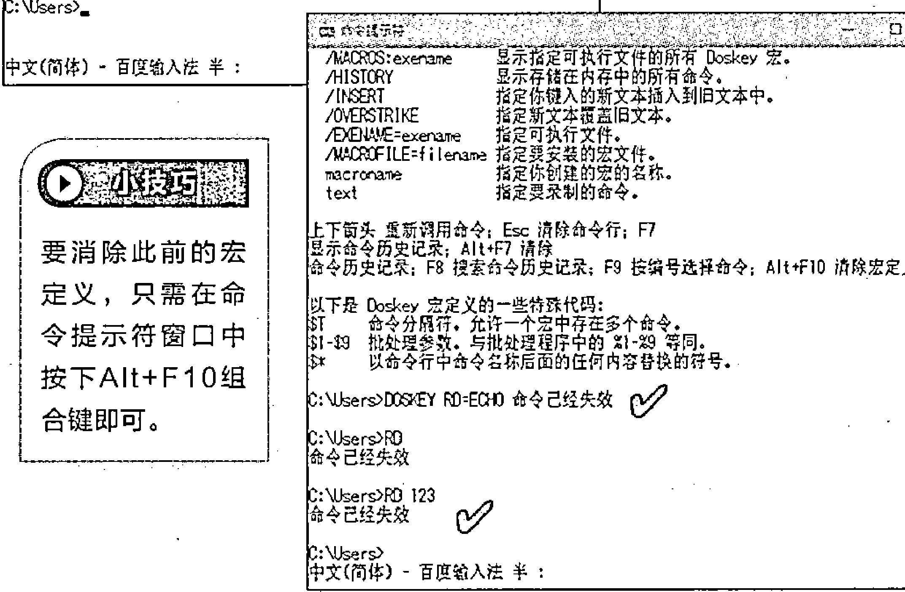

##### 小技巧

要消除此前的宏定义，只需在命令提示符窗口中按下Alt+F10组合键即可。

#### 不用鼠标开关新的命令提示窗

如果要在一个命令提示符窗口中操作，发现需要启用另一个命令提示符窗口来执行另外的命令，以便用两个窗口进行对比，这时，如何来启动另一个命令提示符窗口？你肯定会说，从开始菜单或文件管理器文件菜单中选择开启。其实，还有一个更为简单的方法，那就是在当前的命令提示符窗口中执行START这条命令。有趣的是，新开启的窗口保持原汁原味的样式，它不会沿用你此前对窗口进行过的颜色、文字等设置，保留系统默认的设置而开启窗口(图6)。

如果你要关闭任何一个当前所在的命令提示符窗口，手指也不用离开键盘去抓鼠标点击，直接输入EXIT命令并回车，当前窗口就关闭掉了。

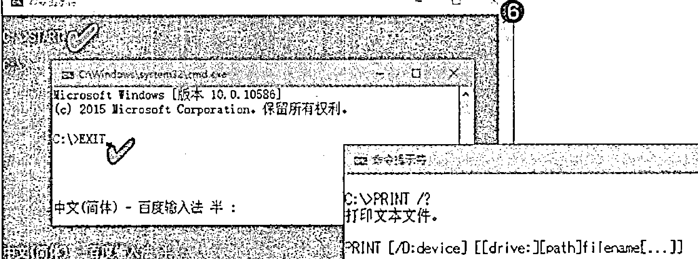

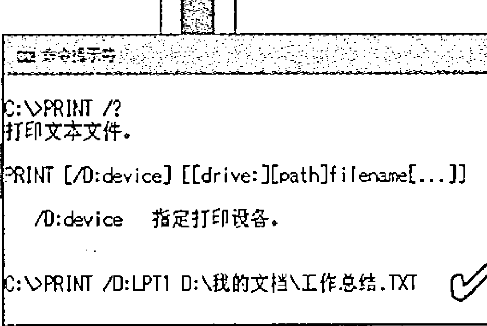

#### 不用编辑器如何打印文本

有时候我们在命令提示符窗口中调试，需要将一个TXT文本文件的内容打印出来，这时，常规的想法肯定是要找个记事本程序或别的编辑器先打开文件，然后再找文件菜单下的打印命令来执行打印操作。

但实际上，不离开命令提示符窗口，就可以用一个PRINT命令实现TXT文档的打印。具体方法：在PRINT命令后以空格间隔，紧跟一个“/D:打印端口号”参数，然后再加空格并紧跟文件路径和文件名，例如(图7)：

```
PRINT /D:LPT1 D:\我的文档\工作总结.TXT
```

这样，回车之后，就可以将文件送往打印机打印了。

内部命令还有很多，它们都能够在实际的电脑维护或程序调试中起到很大的作用。限于篇幅，这里仅介绍上面几个，更多的其他命令实用法，将穿插在相关文章中介绍。\[CF\]

### 用好文件“属性”解决实际问题

我们常利用文件的“属性”显示窗口来查看文件的状态信息，例如创建、修改或访问文件的时间，文件的位置、大小或占用空间的数量，以及文件的真实路径等。其实，除了查看这些基本信息外，文件属性还可以帮我们解决软件或文件使用中遇到的不少实际问题。

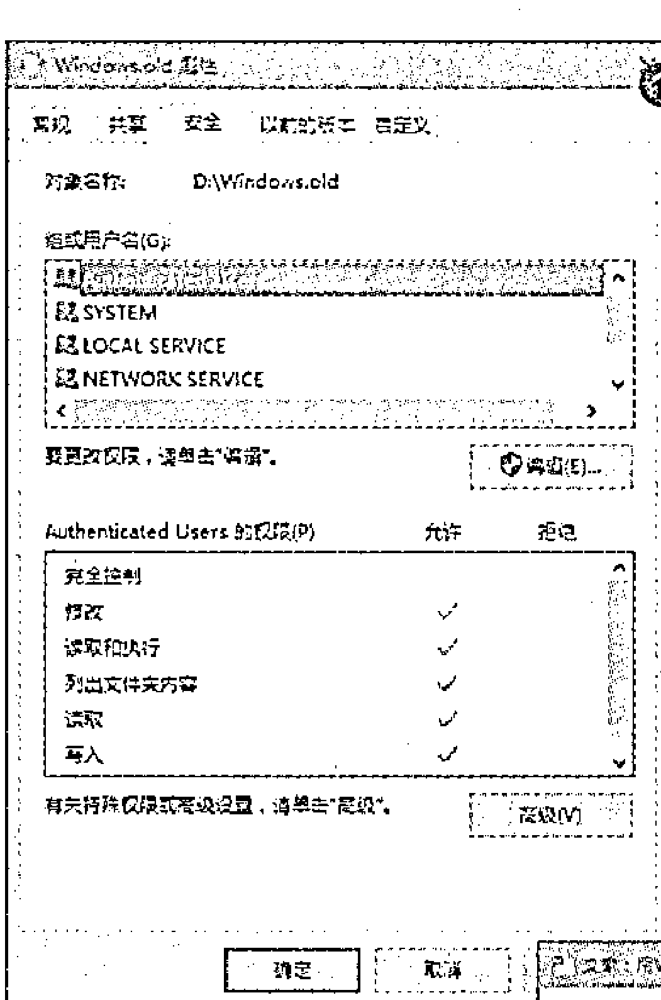

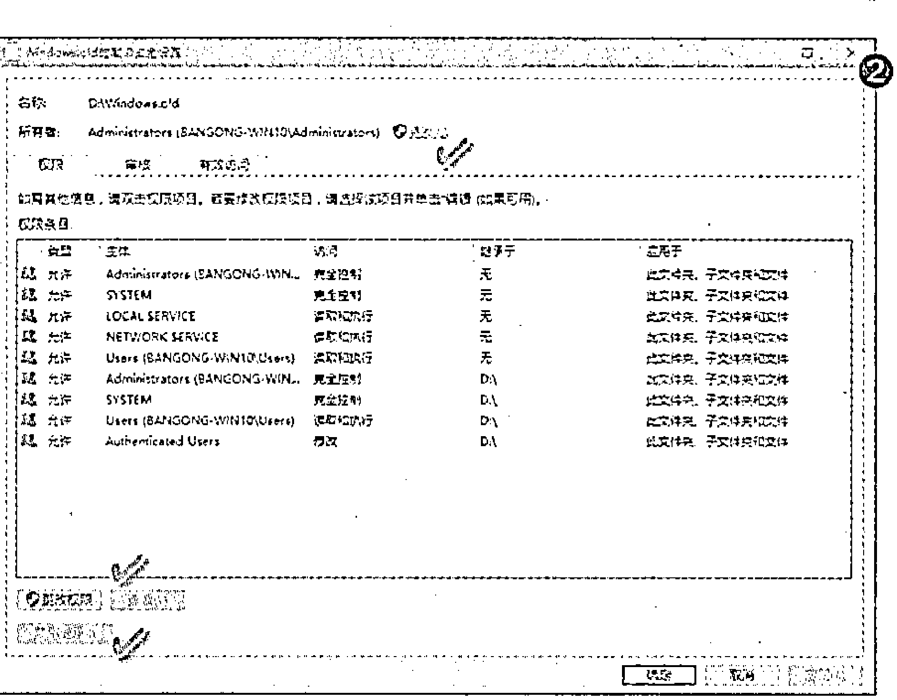

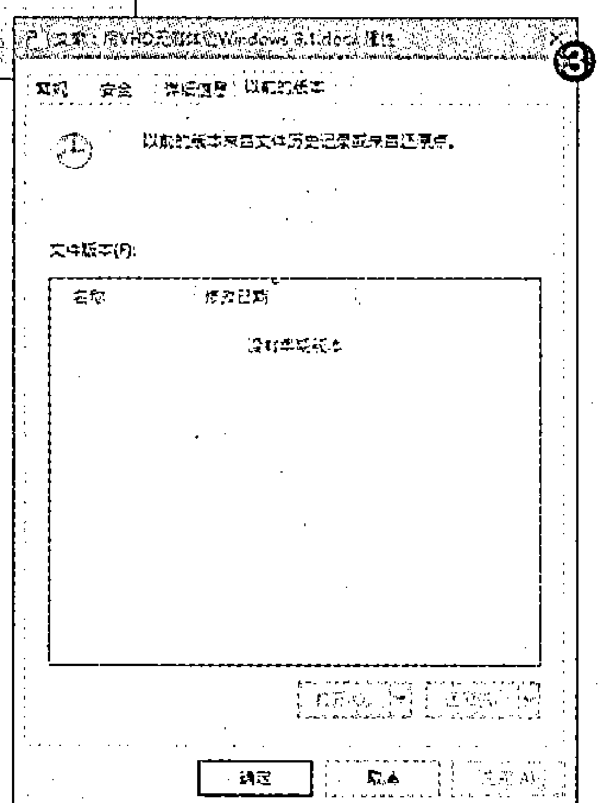

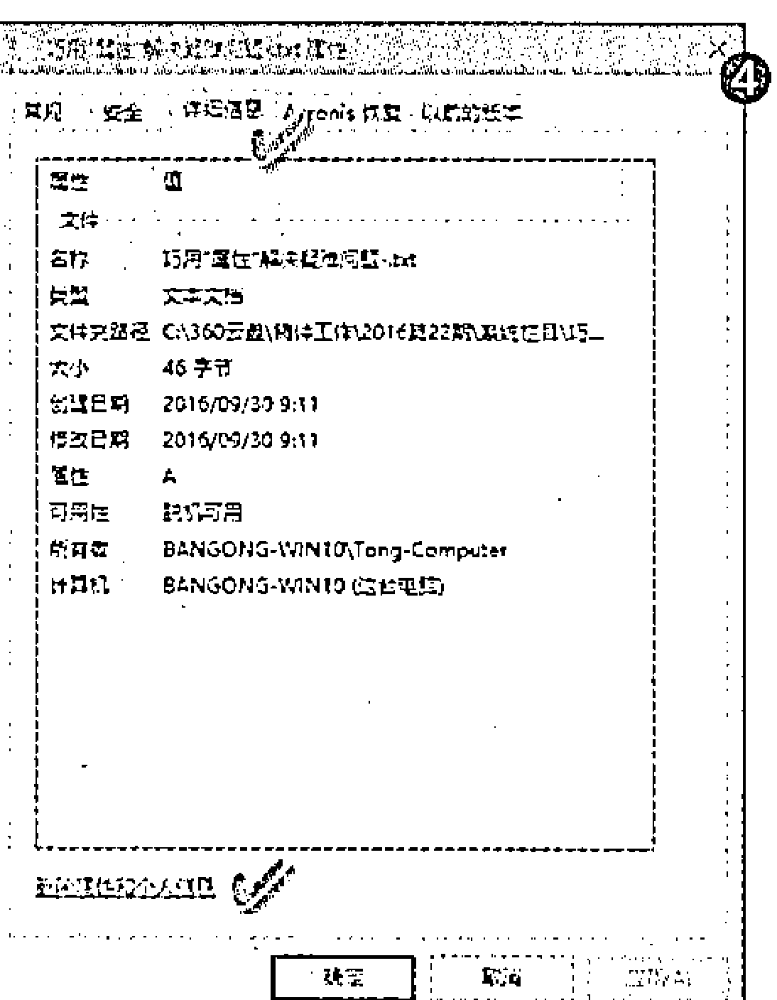

#### 顽固文件难删 改改属性搞定

在文件或文件夹的删除过程中，我们有时会遇到无法删除的情况，尤其在删除一些系统升级或重装留下的文件时，更会出现权限不够而无法删除文件的情况。
遇到这种情况，只需在文件夹的右键属性窗口中，通过“安全”选项卡下的“高级”按钮（图1），将所有者更改为当前登录的用户，然后更改文件删除权限，同时启用继承选项，这样就可以顺利删除顽固文件了（图2）。

火速链接
如何开启文件的历史记录功能？详细方法请参阅本刊2016年第14期文章《用好Windows 10文件历史记录》。

#### 文档意外丢失 属性帮你恢复

如果处理一篇文档（比如Word文档），中途因为某种原因造成文档内容出错或丢失，按照常规的办法是寻求编辑器自身的自动恢复或留存的备份，但当这些都无果后，我们还可以寻得另一根救命稻草，那就是“文件历史版本”。
在一个Word文档上单击右键并选择属性窗口中的“以前的版本”选项卡，可以看到其中显示没有早期的版本（图3）。这是因为你没有开启文件历史记录功能所致，如果开启了文件历史记录功能，那么在历史记录的备份盘中就会留下文件的历史记录版本。与此同时，在文件属性的“以前的版本”列表中，就会出现相应的恢复记录，点击下方的“打开”或“还原”按钮就可以使用了。

#### 3 删除相关属性 清理个人隐私

除了在文档内容或文档名中标注创建者或使用者的信息外，在文件属性中，某些文档不经意间也会留下用户的一些个人信息记录，关键时刻也会泄露隐私。我们可以通过文件属性的“详细信息”窗口下方的“删除属性和个人信息”文字链接，删除某些信息记录（图4）。

在“删除属性”窗口中，选择“从此文件中删除以下属性”，然后选择删除其中的某些个人信息，例如“所有者”、“计算机名”等描述，将其删除即可（图5）。

#### 4 磁盘容量不足 属性也能帮忙

由于规划不足或安装的软件太多等原因，有时我们会发现系统盘的剩余空间不足了。这时，除了清理垃圾、卸载软件、转移用户文件或者给分区扩容外，其实还有另一种选择，那就是压缩该分区中已有的系统文件。

右键单击要压缩的系统文件夹，从菜单中选择“属性”，然后单击“常规”选项卡下的“高级”按钮，在高级属性对话框中，选中“压缩内容以便节省磁盘空间”（图6），确定压缩即可获得更多剩余空间。

#### 5 软件跨版移植 属性设置兼容

Windows XP或Windows 7时期开发的游戏不乏经典，因而不少人还在玩。但有些游戏或程序在跨越版本到Windows 10上运行，会出现无法运行的情况。这个问题也可以通过改变游戏软件主程序属性的办法来解决。

右击软件的EXE主程序，通过属性窗口的“兼容性”选项卡，设定相应级别的兼容性选项，选择原游戏运行最稳定的系统版本，设置原游戏使用的颜色和显示模式，测试其在不同兼容性设置情况下的运行情况，以取得能够正常运行的效果（图7）。

执行压缩操作之后，如果要判定哪些文件是经过压缩的，只需在“文件夹选项”窗口的“查看→高级设置”列表中，将“用颜色显示加密或压缩的NTFS文件”复选框选中，之后资源管理器中的压缩文件就呈蓝色显示了。

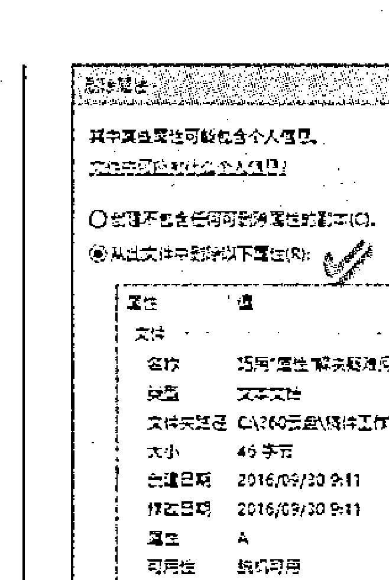

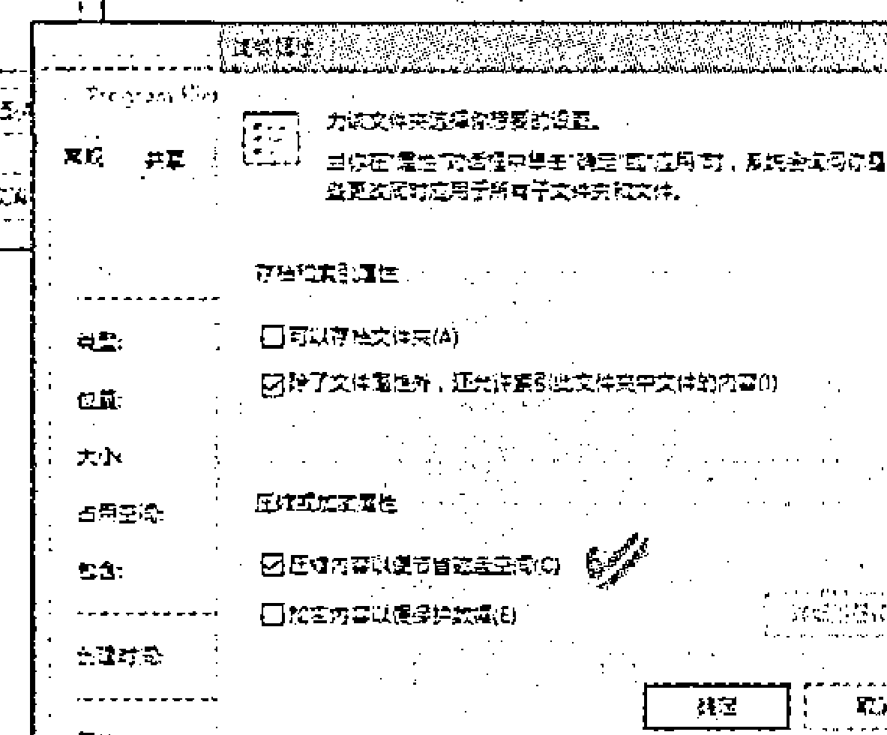

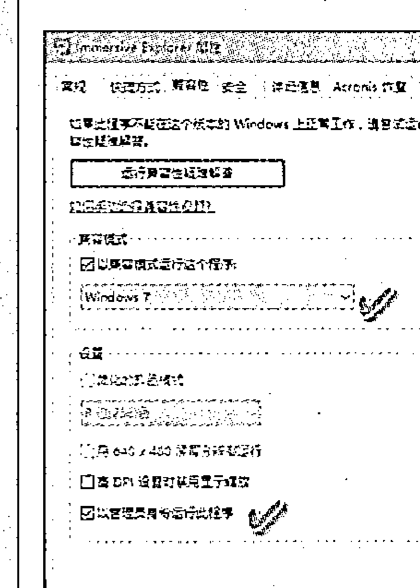

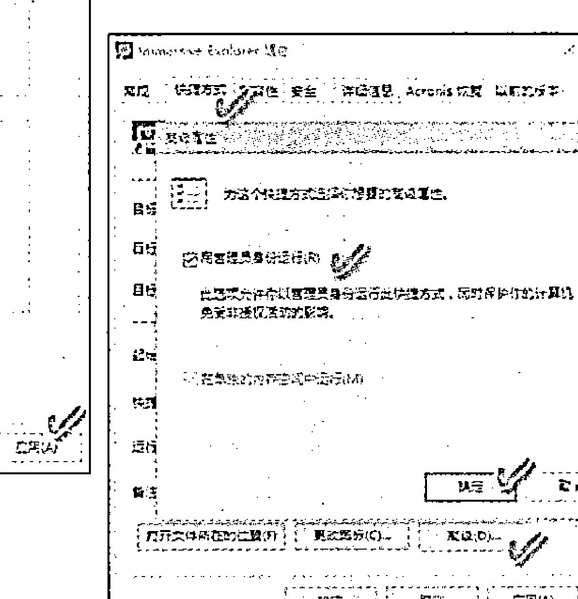

#### 6 属性设定权限 限制程序运行

太低的程序运行级别会影响系统安全。为此，可将程序设定为管理员身份运行，这样，低于管理员级别的程序启动行为，就无法运行该程序。

为此，只需右击程序启动的快捷方式，从右键菜单“属性”窗口中点击“快捷方式”选项卡，然后点击“高级”按钮，在接下来弹出的高级属性设置窗口中，选中“用管理员身份运行”，然后确定即可（图8）。

### 升级更省心 自制通用Windows 10安装盘

文/俞木发

大家知道Windows 10（指桌面PC版）分为家庭版（Core）、专业版（Professional）、企业版（Enterprise）、教育版（Education）等，但是我们从网上下载的一般都只包含其中一个或二个版本。不过在日常维护中，我们却要为安装不同版本的电脑进行重装等操作，因此很有必要制作一个包含全版本的安装文件。此外由于系统补丁一直更新，因此还要在其中集成最新的补丁。下面我们就介绍如何打造一个集成补丁的通用安装盘。

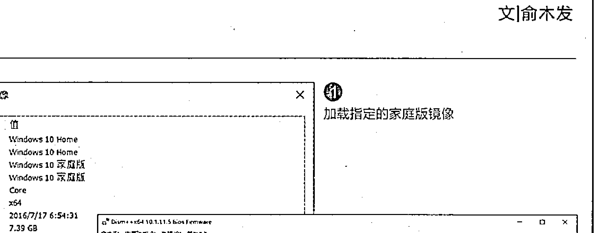

因为在Windows 10所有版本中，家庭版是最低版本，因此我们要以该版本为蓝本，然后在这个版本的基础上升级到其他版本即可。首先到http://www.itellyou.cn/下载Windows 10家庭版的安装文件到本地硬盘备用（专业版也包含家庭版，已经有该版安装文件的用户可以直接使用）。为了减少集成补丁的工作量，这里建议下载最新版本（目前Windows 10是version_1607）。版本升级借助系统自带的DISM命令即可完成，为了方便操作这里建议使用Dism++来协助集成补丁等操作。

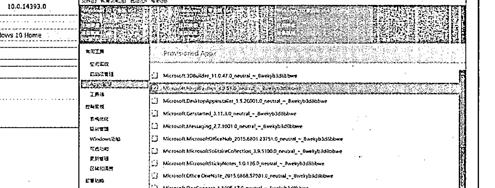

在资源管理器中打开下载到的家庭版（版本名称对应为“windows_10_iot_core”）安装文件，右击选择“打开方式→资源管理器”，将其加载到虚拟光驱（假设盘符为L:），启动Dism++后点击“文件→加载镜像”，在弹出的窗口中镜像文件选择“L:\sources\install.wim”，目标镜像则选择其中的“家庭版”，将其加载到D:\win10目录中（需要预先在D:\新建该目录），点击“确定“加载”（图1）。

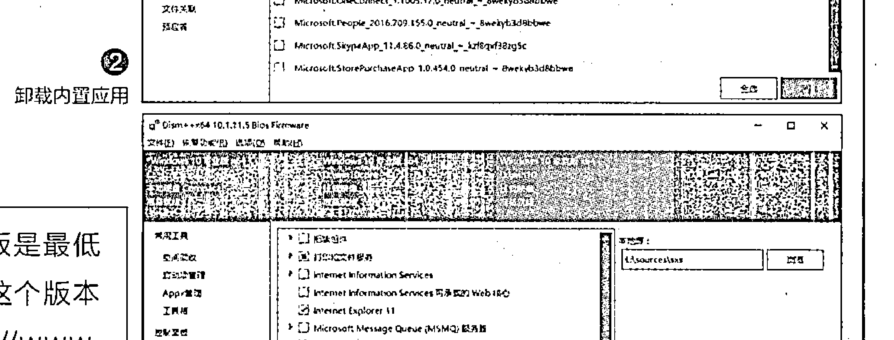

成功加载镜像后在DISM++主窗口点击“打开对话”，切换到“APPX管理”，这里可以根据自己的实际需要对Windows 10内置的应用进行删除。比如“microsoft.bing.weather”对应“天气”应用，如果不要该应用，勾选后点击“删除”即可进行卸载（图2）。切换到“Windows功能”，在右侧功能列表找到“.NET Framework 3.5（包括.net 2.0和3.0）”选项将其勾选，在右侧本地源定位到“L:\souces\sxs”，即加载的虚拟光驱，默认安装文件已经内置.NET Framework 3.5组件，只是没有在Windows 10中默认安装。如果你使用的是精简版安装文件，请自行到http://www.itellyou.cn/下载.NET Framework 3.5组件，并在此定位到下载目录。点击“应用”，将很多软件需要用到的.NET Framework 3.5组件集成到安装系统中（图3）。

切换到“更新管理”，点击“扫描”，DISM++会自动联机到微软升级服务器进行扫描，勾选扫描到的所有补丁文件进行更新即可，这样可以在安装文件中集成最新的系统补丁文件（图4）。

这样通过上述的操作，我们就在家庭版映像中卸载不必要的内置应用，集成.NET Framework 3.5组件和最新的补丁文件。在Dism++窗口选中加载的镜像，点击“文件→另存为镜像”，然后将其保存为“core.wim”并卸载原来加载的镜像文件。同上，在Dism++中再将上述处理过的“core.wim”加载到“D:\win10”，启动命令提示符输入“DISM /Image:d:\win10 /Get-TargetEditions”，查看当前镜像可以升级到什么版本（图6）。

可以看到当前家庭版的镜像可以升级到专业版、企业版和教育版，继续输入“DISM /Image:d:\win10 /Set-Edition:Professional”，这个命令会将当前版本升级到专业版（图7）。

继续输入“DISM /Commit-Image /MountDir:d:\win10 /Append”，将升级的专业版映像添加到“core.wim”镜像文件中，这样在这个镜像文件中就包含“家庭版”和“专业版”两个安装映像文件。

操作同上，继续输入DISM/Image:d:\win10/Set-Edition:Enterprise升级到企业版、输入DISM /Image:d:\win10 /Set-Edition:Education升级到教育版。这样加载的镜像文件中就包含Windows 10所有版本。继续输入“DISM /Unmount-Image /MountDir:d:\win10 /Discard”提交保存。

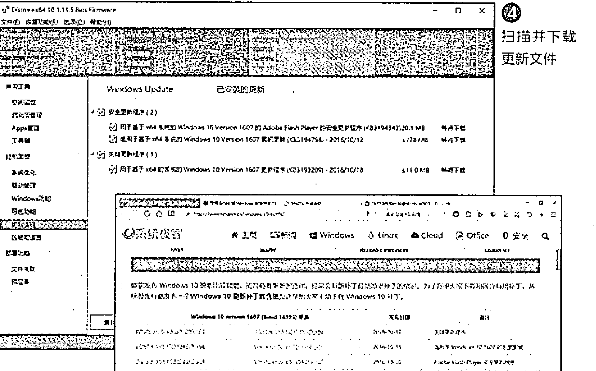

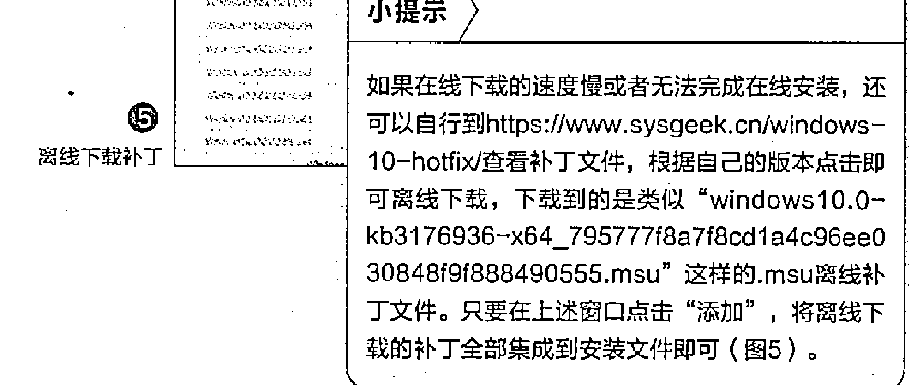

小提示
如果在线下载的速度慢或者无法完成在线安装，还可以自行到https://www.sysgeek.cn/windows-10-hotfix/查看补丁文件，根据自己的版本点击即可离线下载，下载到的是类似“windows10.0-kb3176936-x64_795777f8a7f8cd1a4c96ee030848f9f888490555.msu”这样的.msu离线补丁文件。只要在上述窗口点击“添加”，将离线下 载的补丁全部集成到安装文件即可（图5）。

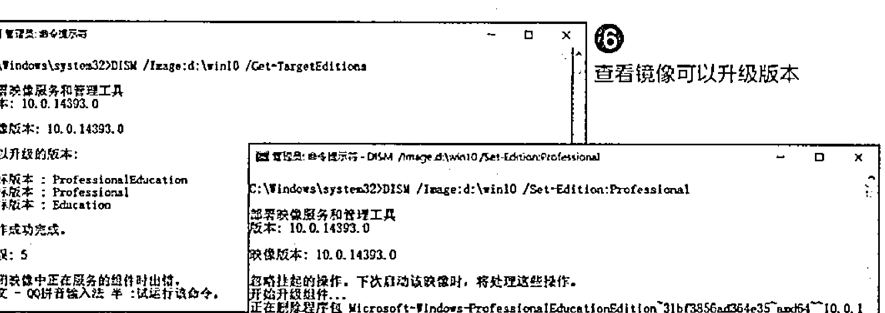

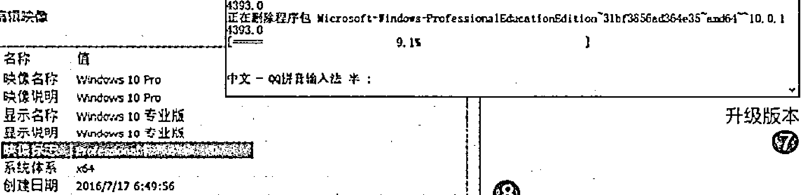

```
C:\Windows\system32>DISM /Image:d:\win10 /Set-Edition:Professional
```

```
DISM /Commit-Image /MountDir:d:\win10 /Append
```

```
DISM /Image:d:\win10 /Set-Edition:Enterprise
```

```
DISM /Image:d:\win10 /Set-Edition:Education
```


因为后续添加的映像文件没有添加名称与标志，同上在Dism++中再次加载“core.wim”，然后按照各自的版本提示进行修改即可（图8）。

最后将“core.wim”更改为“install.wim”，将其替换原来安装文件中的同名文件，以后需要重装系统的时候，只要按当前电脑版本选择对应的映像文件进行安装即可，安装好的系统就自动集成.NET Framework 3.5组件和最新的补丁文件。这样使用起来是不是方便多了呢？

### Windows 10文档与软件重安家

文/小超

升级Windows 10后如出现系统盘空间紧张，可采用向其他分区借用空间的办法给系统盘扩容。但这种方法具有较大的安全风险，对于普通用户来讲，重定向转移用户文件，重定向应用软件安装位置，来得更简单易行和行之有效。

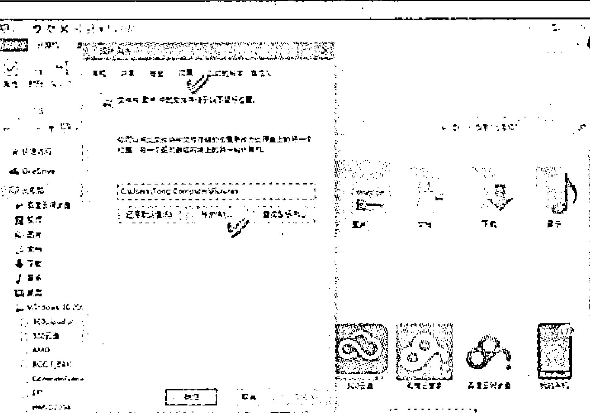

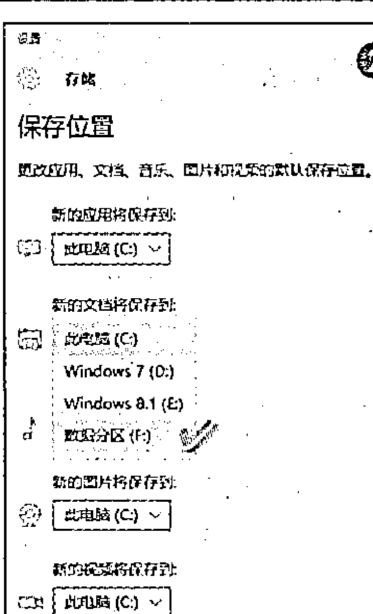

#### 1 用户文档位置重定向

资源管理器「此电脑」右侧窗口中，列出了视频、图片、文档、下载、音乐、桌面等分类。逐一单击右键并选择「属性→位置」选项卡，点击「移动」按钮（图1）；接下来，在C盘之外的其他数据分区选择目标文件夹位置，点击「选择文件夹」，即可完成系统用户分类文件夹的转移。

改变用户文件夹位置，还可以通过系统设置窗口完成。在开始菜单中点击「设置」按钮，进入系统设置窗口后依次选择「系统→存储」选项；在接下来弹出的「保存位置」窗口中，通过选择C盘之外的分区，可重新设置新的图片、视频、音乐、文档的保存位置（图2）。

##### 小技巧

若选择应用新的位置时显示为灰色不可选状态，启动注册表编辑器，依次定位到「HKEY_LOCAL_MACHINE\SOFTWARE\Microsoft\Windows\CurrentVersion」，双击右侧窗格中的「CommonFilesDir」和「CommonFilesDir (x86)」项，编辑修改应用的路径（图3）。

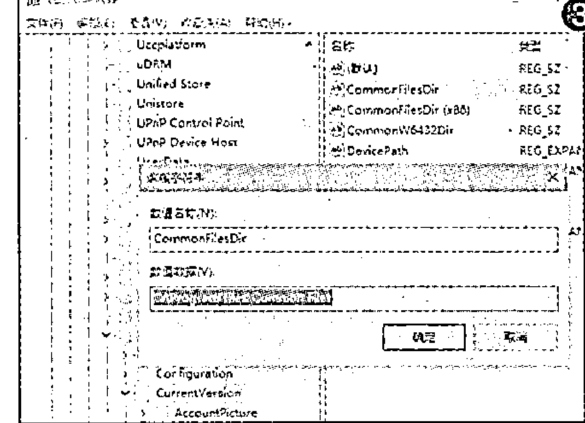

#### 2 应用安装位置自定义

应用的安装位置可改造为系统盘之外。在系统「设置」窗口的「保存位置→新的应用将保存到」选择列表中，将应用的保存位置选择为系统分区之外的分区（如F:盘）。这样系统盘的应用负担都传递给F:盘，从而解放了部分空间。

已安装的各类传统软件，若需要搬家到其他分区，可使用腾讯电脑管家工具，在工具箱中找到「软件搬家」工具，按操作向导选择软件搬移到新的位置即可。

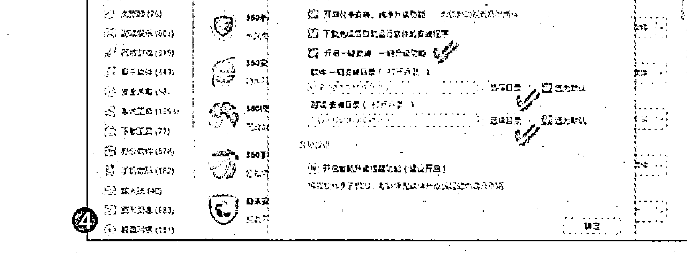

#### 3 借助工具重定向软件安装

还可以借助于系统优化工具定制一键重定向软件安装目录。以使用360软件管家为例，在软件设置窗口的「安装升级」选项卡窗口下，首先选中「开启一键安装、一键升级功能」选项，然后在下方修改软件一键安装的目录为系统盘之外的分区目录（图4）。之后在软件管理器中安装软件，点击「一键安装」就可以安装软件到之前设置好的目录中。

### 文件自动分类路数多
文|张楚华

有读者问：下载了不同种类的许多文档，是否可以自主新建文件夹，并将这些文档放入修改名称后的新建文件夹内。若希望能新建批处理程序，实现快速建立文件夹且自动分类保存文件，如何实现？读者的这个问题，其实是文件的自动分类问题，无论是下载还是平时管理文件，可以有多种解决办法。

#### 就地取材 使用系统筛选来归类
如果已在使用Windows 10，它的资源管理器本身就有文件分类筛选功能。先将各类文件混杂存放在某个文件夹中（甚至包含子文件夹），在资源管理器搜索框中输入某类文件的扩展名，可自动过滤出这类文件，然后剪切出来即可。依此类推，过滤出其他文件（图1）。

> 小提示 下载软件 自动分类选择DIY
具有分类功能的下载软件很多，我们常用的迅雷以及专业下载插件工具Internet Download Manager等都具有管理分类下载任务的功能，且也可以自定义下载分类任务。

#### 亲自动手 编制自动分类批处理
除了用下载软件分类外，我们还可以先将各种文件统统保存到一个文件夹中，然后自编批处理文件对这些文件进行自动分类处理。

例如，下载资料的文件夹为F:\Download。在此文件夹下建立一个“自动分类.BAT”的纯文本文件，其中包含如图格式的简单命令（图2）。

将这个文件发送一个快捷方式到桌面，这样需要分类时，双击这个文件就会自动将各类文件归入到相应的分类目录中。当然，对于一些打包的ZIP或RAR文件，可以先使用解压软件将其一次性解压到F:\Download文件夹，然后再用上法进行处理。上述命令可根据原始文件类别的情况进行增删修改。

#### 专软专用 巧借自动分类小工具
如果觉得自己编写批处理软件稍显麻烦，那么还可以借助于给文件自动分类的软件DropIt来自动分类。具体使用方法：首先在DropIt软件图标上右键单击并选择“协议”，在管理协议窗口中点击+号按钮，添加新的协议，随后在协议配置窗口中点击筛选器按钮添加筛选规则，“操作”处选择“移动”，并指定目标文件夹位置（图3）。如法炮制，添加多条管理规则，对应不同类别的文件。

之后在DropIt软件的“选项”设置窗口的“杂项”选项卡下，选择文件处理的分组和排序方式，例如希望软件自动按文件扩展名进行分类，则选择“文件扩展名”（图4）。

最后，将要处理的文件夹拖动到DropIt软件的图标上，软件就会自动按照文件类别将不同文件转移到相应的文件夹中。若遇到原始文件夹中有新的未指定规则的文件类型，软件会弹出提示，可临时指定一个新的规则来处理。

### 右键控制 窗口功能增强有术
Windows窗口标题栏右键控制菜单中的功能实在有限，如果能给这个菜单扩扩容，增加一些我们平常需要的窗口控制功能，将大大提高操作效率。

我们平时所看到的窗口标题栏右键菜单，简单得让人不屑一顾（图1）。然而对窗口操作的需求何止最大化、最小化等几个？为了发送、复制、移动、排列窗口，我们往往需要进行比较麻烦的鼠标操作。若能在窗口原有控制菜单的基础上添加丰富的控制功能，将会非常方便。本刊曾介绍过给Windows窗口添加功能按钮的eXtra Buttons，其实，该软件还可以实现窗口控制的右键增强，比按钮更有空间优势。

安装eXtra Buttons后，运行软件看不到任何程序窗口，也许你会以为软件安装出错了。其实，它只是退缩在托盘中的一个小图标而已，点击这个图标才能弹出程序设置窗口。软件为全英文界面，可通过设置窗口“Common Options→Chinese→Apply”路径进行汉化。

#### 如何添加系统控制菜单
双击图标进入软件设置窗口，在左侧参数选择“窗口菜单”，在右侧窗格的左列中选择分隔条之外的其他所有选项，然后点击中部的“增加”按钮，右侧方框内会出现这些项目，之后点击Apply或“确定”按钮使得设置生效（图2）。

设置功能扩展之后，开启一个新的Windows窗口或文件夹，右击窗口标题条，可以看到窗口右键控制菜单在原有功能的基础上又增加了10项控制功能，通过它们，我们就可以灵活控制窗口的位置、形态、数量了（图3）。

#### 窗口位置控制任我行
一般说来，窗口最小化之后缩在任务栏的中部。如果想给经常使用的窗口提高“待遇”，希望能在最小化后居于系统托盘中，只需右键单击窗口上边框，然后选择“发送到托盘”命令就可以了。托盘图标将显示为一个蓝色电脑图标。如果要处理的窗口太多，托盘拥挤也是个问题，因此我们可以选择另一个选项“发送到托盘菜单”，实现托盘最小化图标的立体扩展。之后，要使用这些最小化在托盘中的窗口，只需通过一个按钮菜单即可实现灵活调用（图4）。这是将用户窗口安置在托盘中的一个好方法。

打开的窗口不仅可以以图标或图标菜单的形式进驻系统托盘，还可以以图标的方式排列在桌面上，这种图标我们称之为“桌面盒子”。要将打开的窗口变成桌面盒子，右键单击窗口标题栏并选择“发送到桌面盒子”，这时就可以看到桌面上出现的盒子图标了（图5）。桌面盒子就如同文件图标一样可以移动位置和重组，但是当双击它之后，它便从桌面消失，转而变为一个被还原了的窗口。

至于将常用窗口前置在屏幕前方、使用双屏显示器时窗口瞬移等功能，只要在标题栏上点击鼠标右键，选择对应的选项即可。

#### 窗口形态玩出新花样
Windows窗口的缩小是有限度的，试着打开一个Windows 10窗口，向上拖动下边框，最小只能缩到如图所示的高度（图6）。如果有多个窗口需要上下并列，充其量一个桌面也排不了几个窗口。这时，在窗口标题栏上选择“卷动/取消卷动”命令，那么这个窗口就可以像卷帘窗那样卷起，被卷起的窗口只有一个标题条的大小。

如果对Windows窗口的透明度不满意，而系统设置又不能解决问题的时候，可通过窗口标题栏右键菜单中的“透明”或“调节透明度”选择，随心所欲地控制窗口透明度（图7）。

#### 窗口数控制易如反掌
若一个资源管理器或文件窗口不够使用，还需要开启另一个的时候，往往得求救于任务栏的金黄色图标或Win+E组合键。其实，现在只在当前窗口的标题条上右击，选择“复制窗口”就够了，要几个新窗口点几次命令，非常方便。

> 小贴士：窗口的扩展功能可以选择性安装。如果哪个程序窗口中不想要这样的扩展控制菜单项，可通过软件设置的“例外程序”选项窗口，添加该程序以排除功能添加（图8）。

### 改改习惯 “变”出高效
文|方文

网上有人将如下5种使用电脑的习惯称之为“坏习惯”：经常点击“加速球”为系统加速、图方便顺手将文件存在桌面上、懒得去清理系统垃圾、只将硬盘分为一个分区、装一个以上杀毒软件。且不论将这些习惯界定为“坏习惯”是否妥当，但的确不少人始终这么做。实际上，若将这些习惯稍加演变改进，或许就会换来另一种不一样的高效体验。

> 小提示：上述方法保存文件的好处是，文件的物理位置其实是指向其他磁盘分区的文件夹。因此，就算是删除桌面文件夹或系统崩溃，这些保存的用户数据依旧安全。

#### 狂点“加速球” 不如管理好服务
与其狂点“加速球”，不如研究一下加速球的原理并采取针对性的应变措施。其实，“加速球”所中止的是在系统后台自动运行的程序或进程，通过关闭这些暂时不用的进程就可避免其启动或弹出，免去对系统资源的占用（图1）。

**解决办法：**
右击任务栏空白处，选择“任务管理器”，然后通过“服务”列表用右键菜单，禁用此前在加速球中曾经提示的占用资源的相关服务（图2）。具体服务可通过“名称”和“描述”列判断。如果无法判断，可通过右键“联机搜索”命令获取帮助。

#### 桌面文件多 不改习惯也高效
为便于访问，不少人习惯性地将文件存到桌面上，但久而久之，桌面成了杂货铺，有时找个文件也得一阵子。其实，只需在桌面文件夹上做一点小功课，就可在不改变操作习惯的基础上，让文件保存得更加有序和安全。

**解决办法：**
先在系统之外的数据分区创建自己的分类文件夹，如“下载目录”、“办公文档”等，然后发送这些文件夹的快捷方式到桌面上（图3）。以后当需要保存文档或下载资料时，在习惯性地选择到桌面之后，多一步选择“下载目录”或“办公文档”的操作就可以了（图4）。

#### 长期不清理 系统运行仍顺畅
长期不清理系统致使垃圾文件积聚，肯定会影响系统效率。试想，如果垃圾文件产生之初就被存放在内存虚拟盘中，开机存入，断电消失，那样还会有垃圾积聚吗？

**解决办法：**
划出多余的内存空间创建一个虚拟盘（假设虚拟盘符为F:，具体方法本刊曾多次介绍过），右击开始菜单并选择“系统”，然后在弹出的窗口左侧列表中选择“高级系统设置”，在系统属性“高级”选项卡下分别点击“性能→设置”和“环境变量”两个按钮，设置虚拟页面文件和临时文件的路径（图5）。页面文件重设位于“性能选项”窗口的“高级”选项卡下，点击“更改”按钮将新的虚拟页面文件保存路径指向F盘。而系统临时目录TEMP和TMP在“环境变量”窗口中进行，选中后点击“编辑”按钮修改为F盘即可（图6）。若其他应用软件也有自己的临时文件目录（例如各类视频客户端的临时缓存），也可将其指向F盘。

> 有关“库”与搜索相关知识的文章，请参阅本刊2013年第18期文章《库之外的搜索与保存》。

#### 软件装C盘 谁说需要多分区
磁盘多分区虽然能够有效保证存储数据的安全，但这种较为传统的惯性思维却只适合于Windows 7之前的操作系统。当微软全面引入“库”概念后，就为单一磁盘单一分区奠定了系统基础。因此，就目前的主流系统而言，仅划分一个分区，完全可以获得安全高效的使用效果。

**解决办法：**
做好备份工作，如用ATI专业备份软件，按照时间段在后台自动备份数据，重要数据在线备份到网上或移动盘。如果是因考虑到文件管理和搜索效率才分为多分区的，那么应该明白，实际上，在“库”和新式Windows多功能集成搜索的帮助下，一个分区的文件管理和搜索效率，比多分区会更高（微软官方曾有专家论述）。因此说，硬盘不分多个区，照样好用。

#### 杀软装多个 和平共处不冲突
不少人认为装两款甚至多款杀毒软件会发生冲突，其实，若对数据安全比较敏感，需要用多款杀毒软件来查杀验证，那么装多个杀毒软件也未尝不可，只是需要解决好多个杀软的和平共处问题。

**解决办法：**
先安装一款杀毒软件，然后关闭软件的自启动功能，接下来通过服务窗口停止该软件相关的服务（图7）。有关常用杀毒软件的进程，参见附表。重新启动系统后再去安装另一个杀毒软件，若装多款均是如此设置。具体使用时，只保留一款杀毒软件处于自启动状态和服务开启状态，其余杀毒软件均处于关闭自启动和停止所有服务状态即可。

| 安全软件名称 | 进程列表 |
| --- | --- |
| 360杀毒 | 360sd.exe<br>360tray.exe<br>360Safe.exe<br>safeboxTray<br>360safebox.exe |
| 金山杀毒 | ksafe.exe<br>KSafeSvc.exe<br>KSafeTray.exe<br>KAVStart.exe<br>KWatch.exe<br>KMailMon.exe |
| QQ管家 | QQPCRTP.EXE<br>QQPCTray.exe |
| 百度杀毒 | Baiduansvx.exe<br>BaiduSdSvc.exe<br>BaiduSdTray.exe<br>BaiduSd.exe<br>bddownloader.exe |
| 小红伞 | avfwsvc.exe<br>avgnt.exe<br>avguard.exe<br>avmailc.exe<br>avshadow.exe<br>avwebgrd.exe<br>sched.exe |

### Windows 10功能 如果多余请关闭
文|楠楠

Windows 10中的附带功能包罗万象，然而某些功能对你来说可能是徒占资源，甚至还会增加某些隐患，不如按需将其选择关闭。

> 想要关闭系统自带组件，只需在“控制面板→程序和功能”中，按上图所示操作即可。

#### 没有触屏 关闭Windows Ink
Windows 10周年更新版默认没有提供关闭Windows Ink选项的入口，可通过注册表编辑器来屏蔽这项功能。进入注册表编辑器，依次定位到“HKEY_LOCAL_MACHINE\SOFTWARE\Policies\Microsoft\”，新建一个项WindowsInkWorkspace，然后在该项下新建DWORD (32位) 值，命名为AllowWindowsInkWorkspace，不必修改数值数据（图1）。之后可以在任务栏右键菜单中看到，Windows Ink菜单项已经变成不可选的灰色状态，说明该功能已经被屏蔽掉了（图2、图3）。

#### 抛掉烦心 阻止不必要的打扰
操作中心提供的一些无关紧要的提示有时会给我们带来干扰，如果觉得烦，关掉也不是不可以。打开注册表编辑器，逐层定位到“HKEY_CURRENT_USER\SOFTWARE\Policies\Microsoft\Windows\Explorer”，若没有Explorer分支，右击Windows分支新建一个。在Explorer中新建DWORD (32位) 值，重命名为DisableNotificationCenter。双击DisableNotificationCenter，将数值数据改为1，点击“确定”（图4）。最后在任务管理器中重启资源管理器即可。

Windows 10的轻松使用功能是为特殊生理人群准备的，但普通用户在操作时有时会因误操作而激发这些功能，不如将其关闭。只需进入系统设置窗口，选择“轻松使用”，然后针对要关闭的项目设置相应的开关即可，例如将粘滞键、筛选键等快捷方式关掉（图5）。

#### 屏蔽低能 关闭索引服务功能
若你觉得某些第三方的文件索引服务比Windows本身还要高效，只需右击开始按钮并选择“控制面板”，以小图标方式浏览并找到“索引选项”进入索引选项设置窗口，点击“高级”按钮，随后点击“重建”按钮删除和重建索引（图6）。最后进入Windows服务窗口，找到Windows Search服务双击并设置为“禁用”即可。

#### 关闭遥测 防止用户隐私泄露
Windows 10的遥测功能也是隐私泄露的渠道之一，若不需要也可以将其关闭。搜索“组策略”并以之启动组策略编辑器，沿着“计算机配置→管理模板→Windows组件→数据收集和预览版本”，找到右方的“允许遥测”并双击，随后选择“已启用”选项，并在安全级别列表中选择可用的最高安全级别0或1（图7）。

最高“安全”级别“0”只提供给企业、教育、物联网设备和服务器设备，其他版本用户即使选择了该项目，也按照“等级1”执行。

#### 省去锁屏 直达用户登录界面
Windows 10增加了漂亮的锁屏图片，但要登录系统还需先按任意键跳过图片才能进行登录选项等操作。想减少这一步操作，只要依次展开注册表“HKEY_LOCAL_MACHINE\SOFTWARE\Policies\Microsoft\Windows”，新建Personalization项，然后在该项下新建DWORD（32位）值并命名为NoLockScreen，将其数值数据修改为1，确定并重启资源管理器即可（图8）。此操作并没有屏蔽锁屏密码，仅减少用户登录系统时的步骤，可放心更改。

### Windows 10 “开始”菜单巧利用
文/馨居士

Windows 10开始菜单比较有意思的地方就是将程序按着字母与拼音首字母的顺序进行排列，虽然检索起来比较方便，但对于经常使用Office组件的用户来说，功能组件“被”分散之后，用起来着实不便。不过对于有着改造精神的我们，让它们“集中”起来也不是难事。

> 小提示
办公菜单建立之后，可以随时将新安装的办公相关软件，例如WPS或PDF编辑器、阅读器等，均加入到桌面办公文件夹中。

#### 抽取并重组 办公菜单大挪移
安装Office 2016之后，我们发现各组件分散在各自的字母序列群组当中，不像以前那样统一安放在MS Office程序组中。要从开始菜单中寻找Word、Excel和PPT等组件，需要前往多处目标，不够集中。如果将它们集中在一处“办公图文”下，启动时直接从中选取就更有针对性了。

首先从开始菜单中找到其中一个快捷方式（如Word 2016），右键单击确定快捷方式所在的实际文件夹位置。可以看到这些分散的快捷方式原来存在于系统的“C:\ProgramData\Microsoft\Windows\Start Menu\Programs”文件夹下（图1）。据此可复制和重新组织程序，然后制作自己的个性程序文件夹。

复制其中有关Office 2016的所有程序快捷方式，在桌面上建立“办公图文”文件夹并将这些文件复制到其中（图2）。右键单击系统托盘左侧的任务栏空白处，依次选择“工具栏→新建工具栏”命令（图3），然后从桌面文件夹中选择此前创建的“办公图文”文件夹，单击“选择文件夹”按钮（图4）。

之后在托盘区域的左侧，出现一个“办公图文”的折叠菜单按钮，单击该按钮右侧的小双箭头，随即弹出包含所有办公软件的菜单。这样从此处就可以随时方便地启动办公软件了（图5）。

#### 系统工具项集中迁到任务栏

对于一些与系统设置、系统管理有关的项目，由于个人常用到的项目各不相同，这些项目又在开始菜单中四处分散，因此从开始菜单访问十分不便。为此，可以按照上述方法给自己定制个性“系统工具”菜单。先建立一个桌面“系统工具”文件夹，然后从“C:\ProgramData\Microsoft\Windows\Start Menu\Programs\”文件夹下的“Windows 管理工具”、“Windows 系统”、“Windows 附件”和“Windows 轻松使用”等子文件夹，分别挑选自己常用的系统程序快捷方式，复制到“系统工具”文件夹，同样固定到系统托盘旁即可调用。

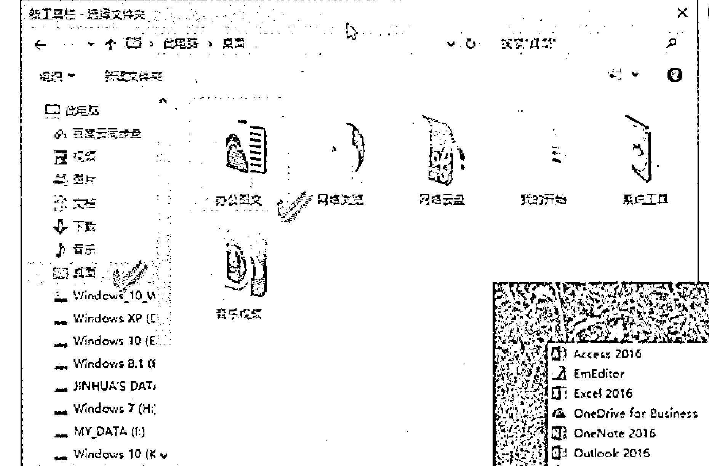

> 小技巧
系统“设置”按钮也可以固定到任务栏该系统组中，通过在“C:\ProgramData\Microsoft\Windows\Start Menu\Programs\”文件夹下直接拷贝即可。

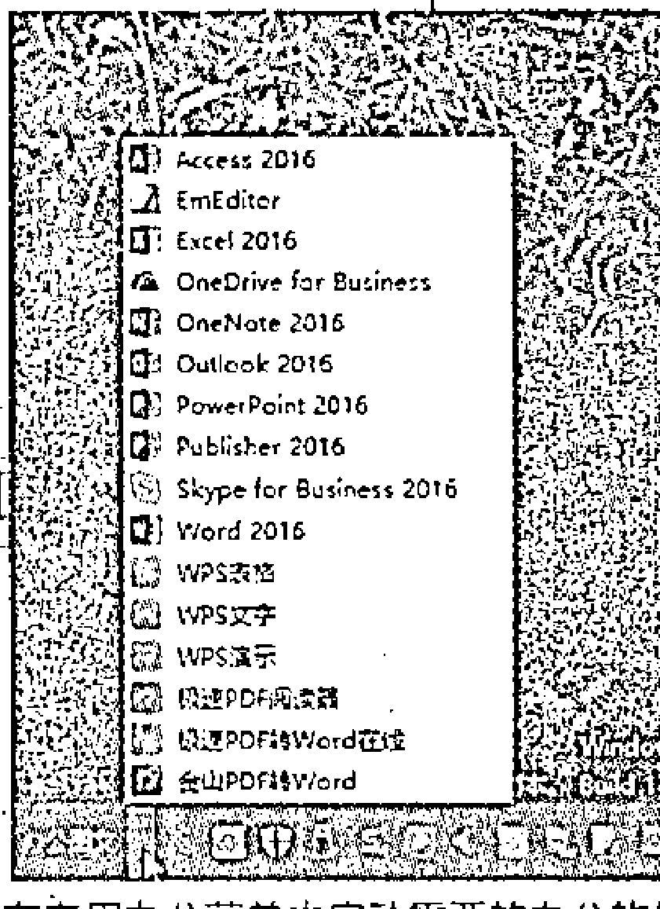

在专用办公菜单中启动需要的办公软件

#### 打铁要趁热 安装之后就固定

当刚刚安装完软件后，程序的快捷方式会首先出现在“最近添加”列表中，但随着后续使用程序的添加，这些程序会被顶出列表。因此，对于日后可能常用的程序，要把握刚安装的机会，及时用右键菜单命令将其固定在更为方便的位置——开始菜单或任务栏上（图6）。

若一次安装所涉程序较多，如MS Office和WPS Office安装后就会添加3个以上组件，这时可通过最近添加菜单下方的“展开”按钮将菜单展开，用右键固定更多需要固定的程序到开始屏幕或任务栏（图7）。

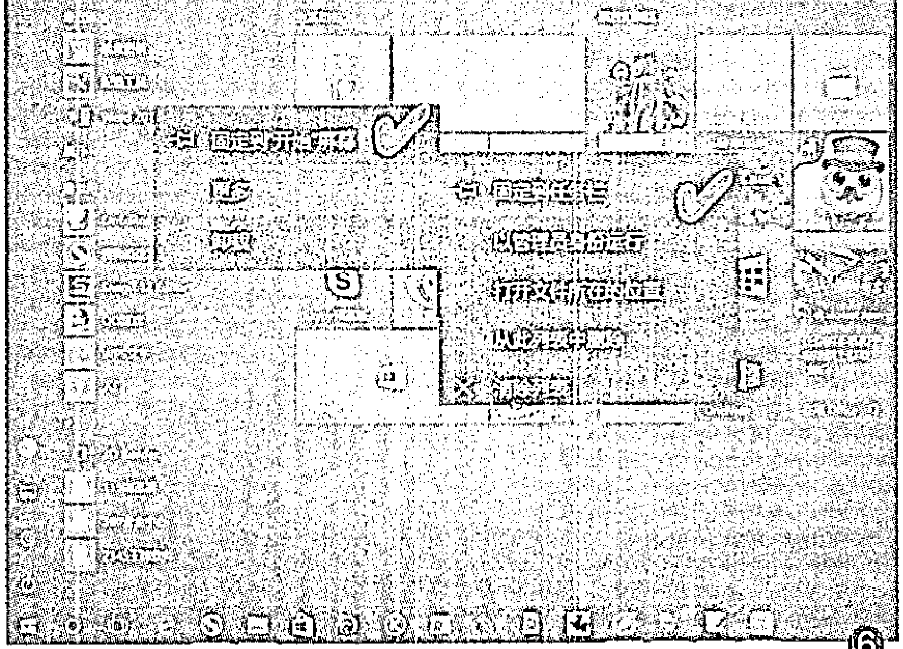

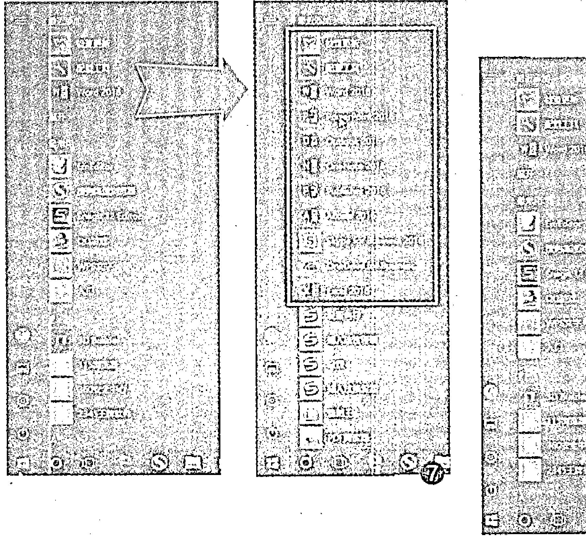

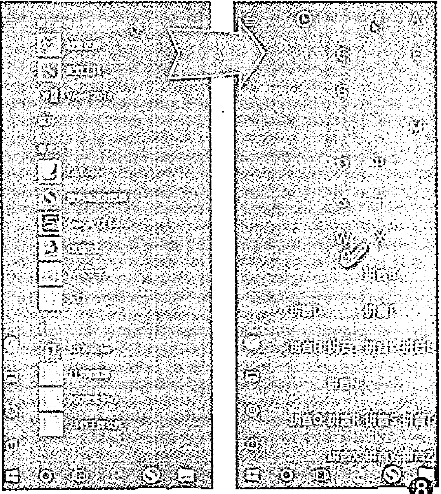

> 小技巧
如果安装软件后没来得及固定或忘记执行固定操作，以后想快速找到，但程序已被顶出“最近添加”菜单，这时也不要失望，“最近添加”菜单仍能帮上忙——在“最近添加”菜单栏的空白处用鼠标点击，会看到出现一个字母拼图的面板（图8），只需从这个字母面板中点击程序所属的字母，即可跳转到该程序所在的字母组，省去了在长列表中上下拖动找程序的麻烦。

### 阻断Windows 10的自动更新

文|俞木发

为了强制用户升级系统，Windows 10用户已经无法手动关闭Windows 10的自动更新。不过系统自动更新也有烦人之处，有时更新速度巨慢，而且总是出错；有时则完成更新后自动重启，自己的工作文档还来不及保存就被重启。那么该如何将Windows 10的自动更新关闭，同时又不会给Windows 10带来安全隐患？

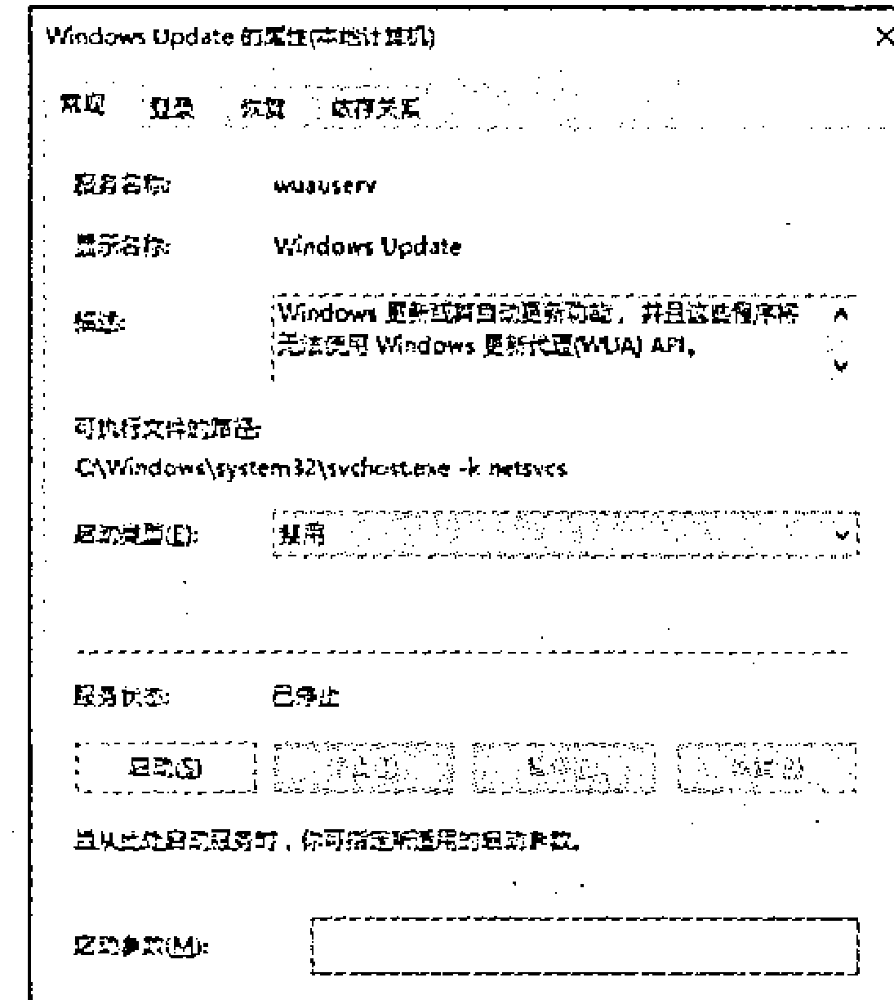

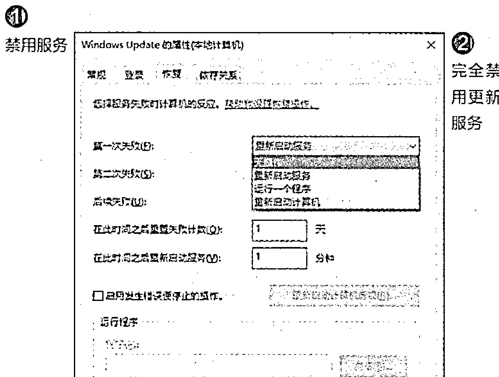

> 小提示：对于使用Windows 10自动更新的用户，如果不想让Windows 10在安装某些重要更新的时候自动重启，也可以手动进行关闭。因为重启是借助系统的任务计划实现，在小娜搜索框输入“任务计划”，启动任务计划后展开“任务计划程序库→Microsoft→Windows→UpdateOrchestrator”，在右侧窗格找到“Reboot”任务，右击选择“禁用”，将这个任务禁用后就不会再自动重启了（图3）。

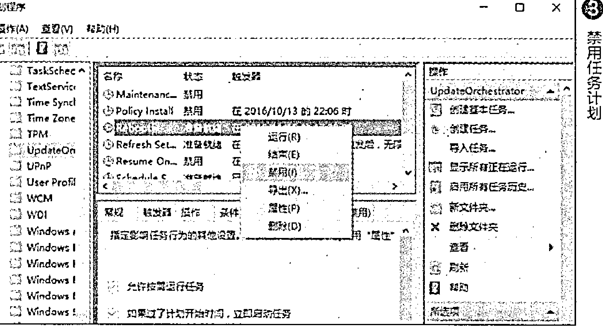

大家知道Windows 10系统更新是通过系统内置的“Windows Update”服务来完成的，因此如果要彻底关闭系统自动更新，我们只需将这个内置服务停止即可。在小娜搜索框输入“服务”，打开服务管理窗口后，在服务列表找到“Windows Update”服务并双击打开，然后将其启动类型设置为“禁用”（图1）。

在上图中切换到“恢复”标签，然后将第一次失败后的操作设置为“无操作”（默认是重新启动服务），这样就可以完全禁用“Windows Update”服务，自然Windows 10就不会再自动更新系统了（图2）。

上述方法可以完全禁止Windows 10的自动更新，不过大家也知道系统补丁是保证系统安全的重要保障，如果单纯地完全禁止系统自动更新而不安装更新显然会给Windows 10带来极大的安全隐患。Windows 10更新一般一个月发布一次，因此我们只要定期（如每月1号）进行手动更新即可。

一种方法是借助第三方软件进行手动安装，比如关闭系统自动更新后，系统更新的下载可以借助Dism++来手动扫描和下载更新。可以每个月定期启动Dism++，启动后切换到“更新管理”，点击“扫描”，这样程序会自动连接到微软更新服务器扫描更新，只要根据扫描结果勾选需要下载的更新进行安装即可（图4）。

另一种方法则是使用手动下载安装。对于不想使用Dism++的用户，还可以定期访问https://www.sysgeek.cn/windows-10-hotfix/，这里会自动将最新的Windows 10更新以列表的形式发布（补丁下载均链接到微软官网），我们可以使用迅雷等下载工具进行补丁的手动下载，下载后进行手动安装更新即可（图5）。

如果有多个更新需要安装在不同的电脑上，比如办公室电脑都禁用Windows 10自动更新。为了保护这些电脑的安全，我们还可以使用Dism制作批处理的方法实现批量自动安装。假设已经将Windows 10所有更新文件下载保存在D:\win10，启动记事本输入下列代码，然后将其保存在桌面备用：

```
dism /online /add-package /packagepath:D:\win10
```

这样下次需要安装更新的时候只要手动运行上述批处理即可快速安装。如果是其他局域网电脑要手动更新，则可以将D:\win10共享，将命令更改为“dism /online /add-package /packagepath:\\Desktop-d8qacik\d\win10”（其中Desktop-d8qacik为共享计算机名，请自行更改），这样只要在一台电脑上下载好补丁文件，其他电脑执行批处理即可快速实现补丁的手动安装了（图6）。

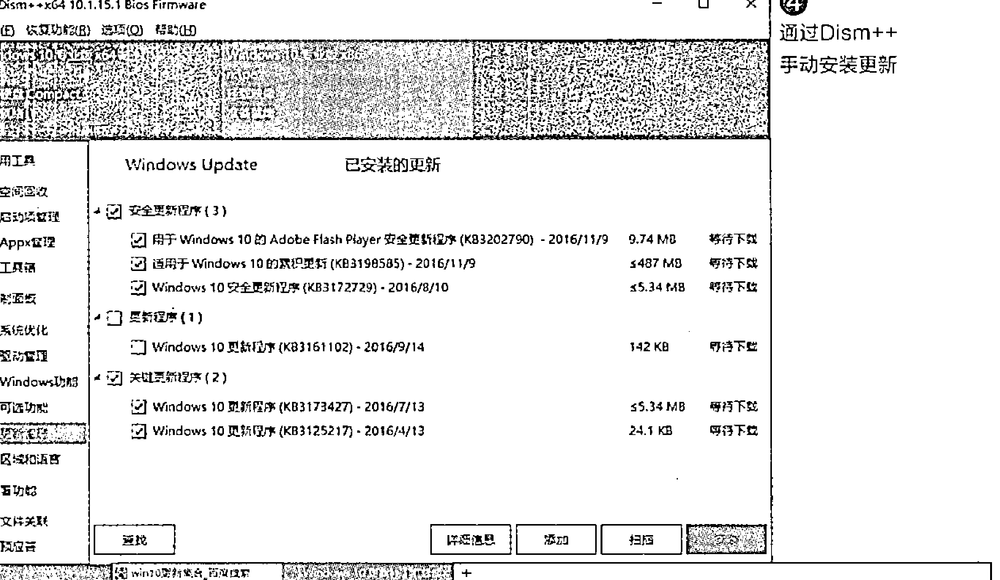

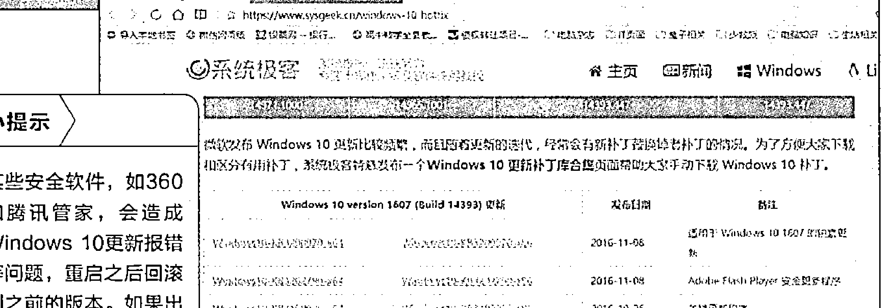

> 某些安全软件，如360和腾讯管家，会造成Windows 10更新报错等问题，重启之后回滚到之前的版本。如果出现这种情况，请在安装更新时暂时关闭这些安全软件的实时监控。

| Windows 10 version 1607 (Build 14393) 更新 | 发布日期 | 备注 |
|--------------------------------------------|----------|------|
| 适用于Windows 10 1607 的更新               | 2016-11-08 | Adobe Flash Player 安全更新程序 |
| ...                                        | ...      | ... |
| Windows 10 version 1511 (Build 10586) 更新 | 发布日期 | 备注 |
| 适用于Windows 10 1511 的更新               | 2016-11-08 | Adobe Flash Player 安全更新程序 |
| ...                                        | ...      | ... |

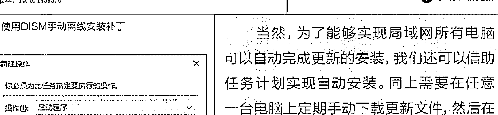

图6 使用DISM手动离线安装补丁

当然，为了能够实现局域网所有电脑可以自动完成更新的安装，我们还可以借助任务计划实现自动安装。同上需要在任意一台电脑上定期手动下载更新文件，然后在需要安装更新的电脑上启动任务计划，新建一个每周五下班前执行的任务（图7）。执行的操作是启动程序，启动C:\Windows\System32\Dism.exe，参数是“/online /add-package /packagepath:D:\win10”。这样只要用户在共享目录里下载新的更新文件，其他电脑每周五都会检查并进行安装（图8）。

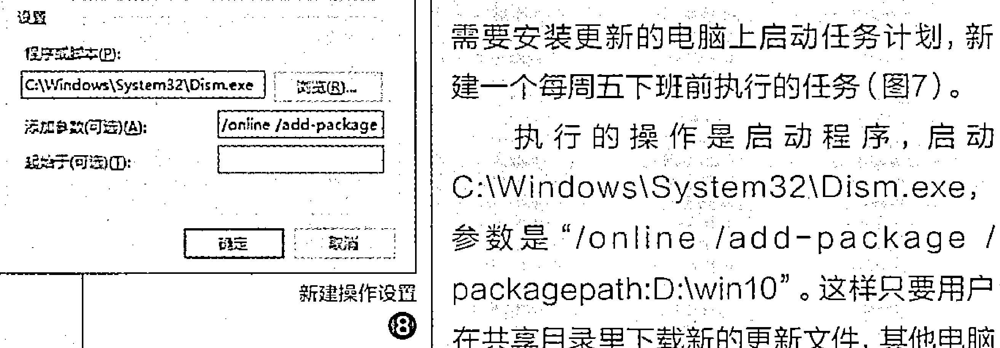

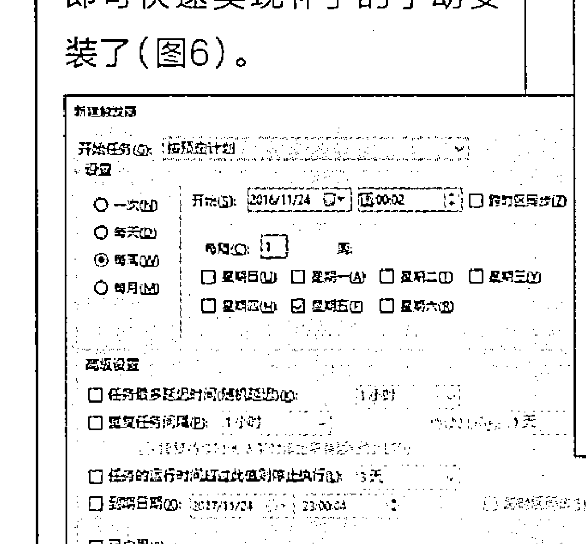

图7 新建任务

图8 新建操作设置

### 超简单 在Windows 10体验Ubuntu

文/阿木

大家知道Ubuntu是最为优秀的Linux系统，很多想学习Linux系统的朋友都会选择安装Ubuntu系统，但是常规的安装方法要么借助虚拟机，要么是将Ubuntu和当前系统组成双系统，这两种方法操作起来都比较不便。其实对于Windows 10用户，系统已经内嵌Ubuntu子系统，正式原生支持运行Linux程序。下面就一起来看看怎么在Windows 10下体验Ubuntu。

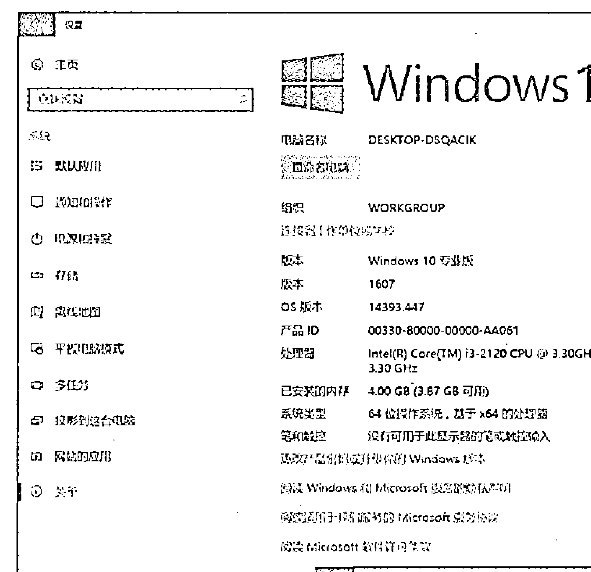

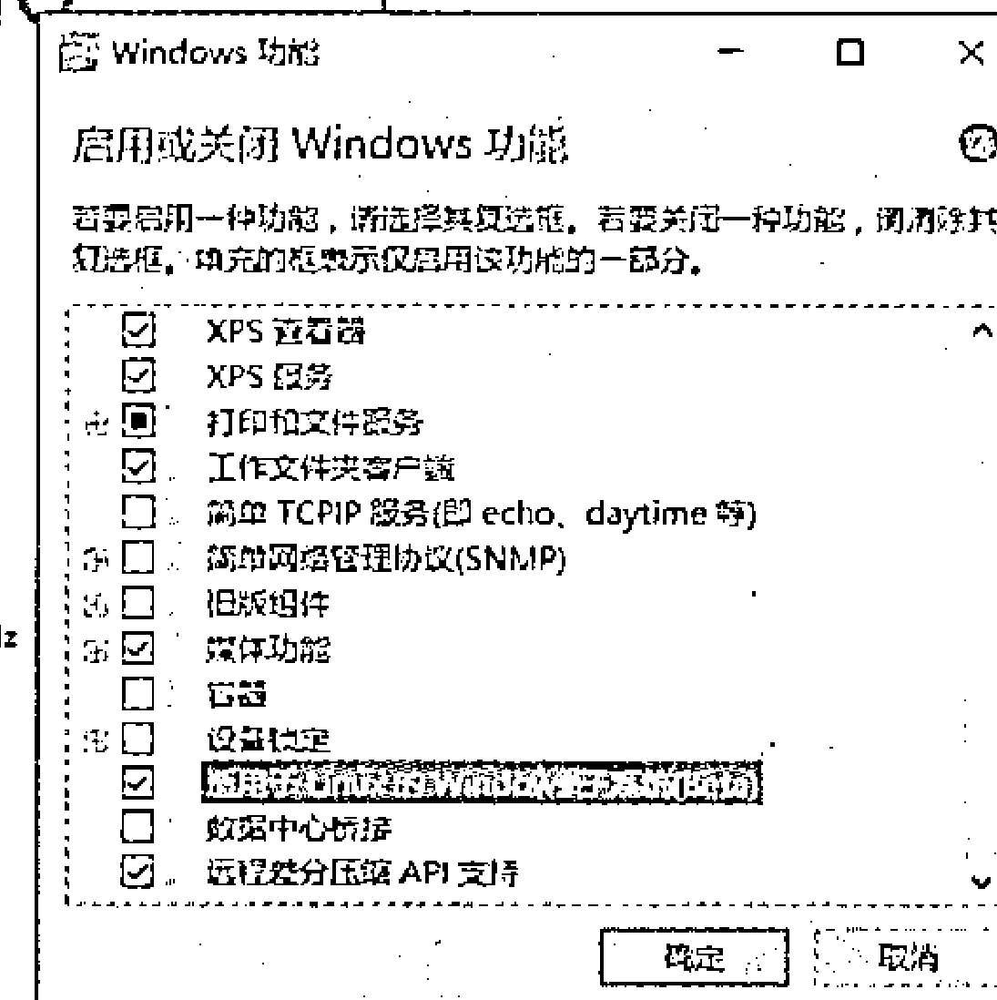

首先确保你的Windows 10符合要求，只有版本在14393以上，并且x64位系统才支持在Windows 10下安装Ubuntu。可以依次点击“设置→系统→关于”，查看自己的系统是否符合要求，否则请自行将系统升级到最新版本（图1）。

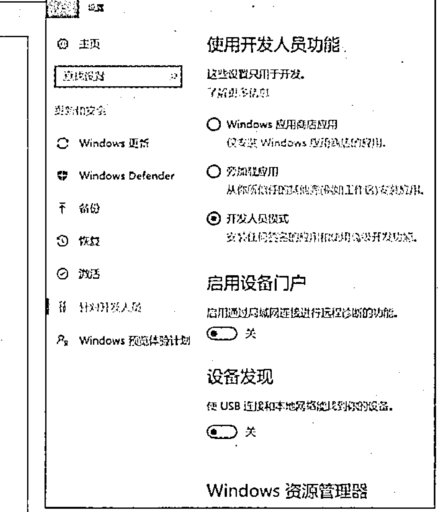

> 小提示
不少用户是使用微软账户登录Windows 10，如果账号昵称是中文名字，则用户配置文件夹路径中包含中文，会导致Ubuntu on Windows的用户模式映像文件无法解压缩。这种情况用户请自行建立一个英文账户。

确定自己的系统符合要求后，在搜索框输入“启用或关闭Windows功能”，启动该组件，在功能列表中找到并勾选“适用于Linux的Windows子系统（Beta）”，按提示启用该组件（图2）。

打开“设置→更新和安全→针对开发人员”，单选右侧窗格的“开发人员模式”，这样才可以在Windows 10下安装Ubuntu程序（图3）。

接着在搜索框输入“powershell”，然后以管理员模式运行Powershell，在其中输入“Enable-WindowsOptionalFeature -Online -FeatureName Microsoft-Windows-Subsystem-Linux”，按屏幕提示完成重启。重启后以管理员模式运行命令提示符，输入“bash”，按Y确认，这样Windows 10会自动从应用商店下载Ubuntu镜像并完成安装，这里Ubuntu已经作为一个Windows 10的应用存在（图4）。

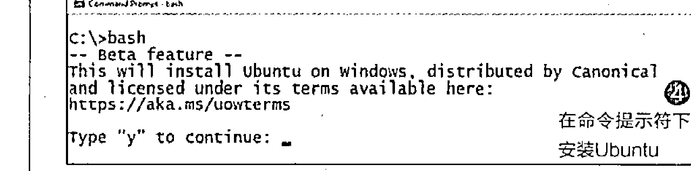

成功安装Ubuntu后，首先按提示设置一个Ubuntu账户和密码（这里要记住密码，Ubuntu下很多Sudo提权操作都需要使用这个密码）并登录。这样以后需要启动Ubuntu时只要同上以管理员模式运行命令提示符，输入“bash”即可启动Ubuntu了，可以看到此时提示符已经变为类似“yumufa@DESKTOP-D8QACIK:/mnt/c/Windows/System32$” 的形式，这是Ubuntu的命令行模式。现在我们就可以在这里开始学习各种Linux命令，比如输入“LS”就可以列出所有目录，输入“lsb_release -a”命令查看子系统版本，可以发现这里子系统是ubuntu14.04.5 LTS版本（图5）。

```
yumufa@DESKTOP-D8QACIK:/mnt/c/Windows/System32$ lsb_release -a
Usage: lsb_release [options]

lsb_release: error: no such option: -a
yumufa@DESKTOP-D8QACIK:/mnt/c/Windows/System32$ lsb_release -a
No LSB modules are available.
Distributor ID: Ubuntu
Description:    Ubuntu 14.04.5 LTS
Release:        14.04
Codename:       trusty
yumufa@DESKTOP-D8QACIK:/mnt/c/Windows/System32$
```

不过很多朋友会发现这里Ubuntu子系统只是命令提示符界面，对于习惯使用图形化程序的朋友肯定不习惯。要使用图形化Ubuntu，可以搜索下载“Xming X Server for Windows”（http://suo.im/3T1EwA），安装后运行其中的“Xlaunch”，单选“Multiple Windows”，Display Number设置为“1”，然后一直点击“下一步”完成设置（图6）。

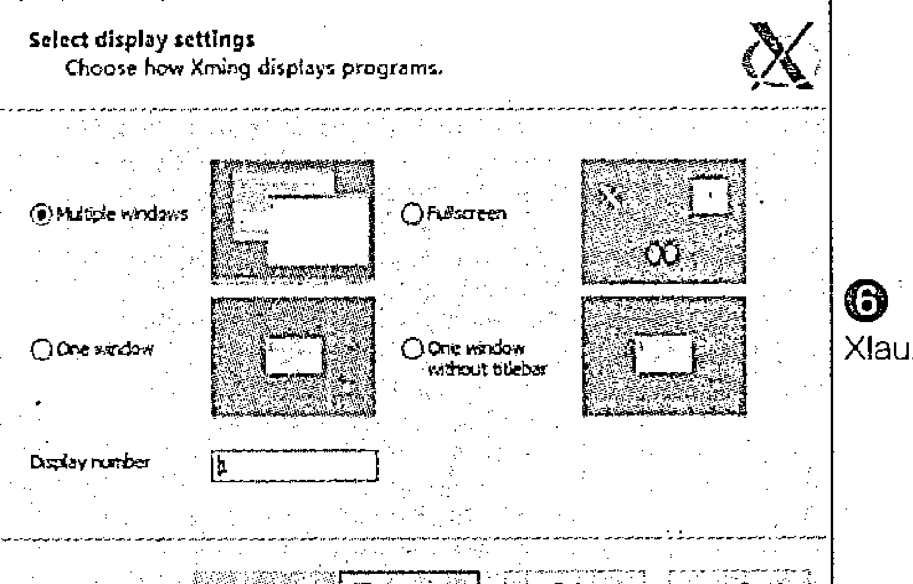

返回Ubuntu子系统窗口，依次输入下列命令，这样会自动连接并下载安装xfce4-terminal图形客户端（图7）。

```
echo "export DISPLAY=:1.0" >> ~/.bashrc
sudo apt-get update && sudo apt-get install xfce4-terminal
```

完成xfce4-terminal的安装后继续输入“xfce4-terminal”，此时会启动一个图形终端，接下来就可以在这个终端运行各种图形化程序了（图8）。

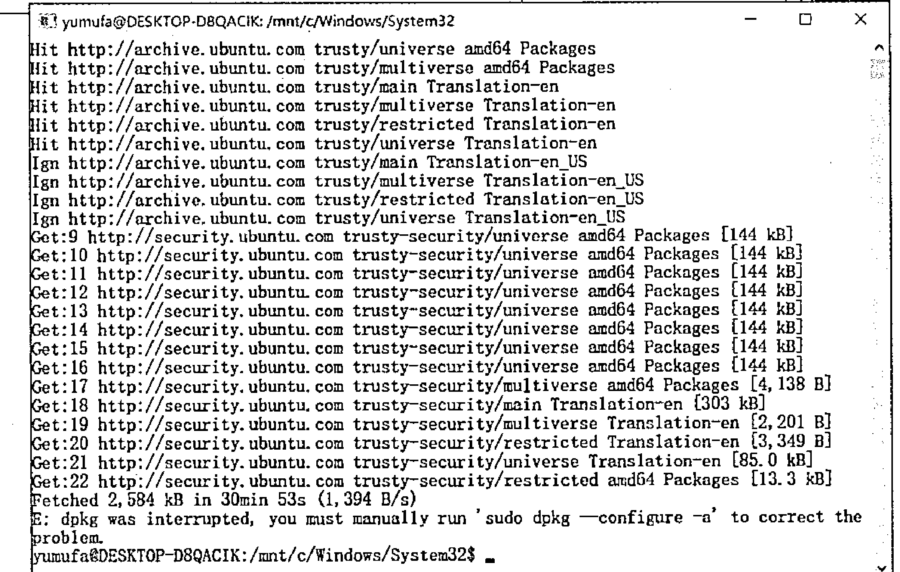

比如Ubuntu用户经常使用“新立得”来管理应用程序，在上述窗口输入“sudo apt-get update && sudo apt-get install synaptic”（下载并安装最新版的新立得），完成程序的安装后输入“sudo synaptic”，这样就可以启动图形化程序新立得了。接着就可以在其中安装或者下载新的Ubuntu程序，具体使用和在Ubuntu中是一样的（图9）。

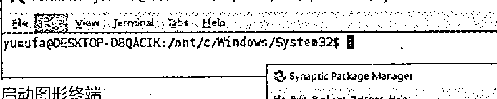

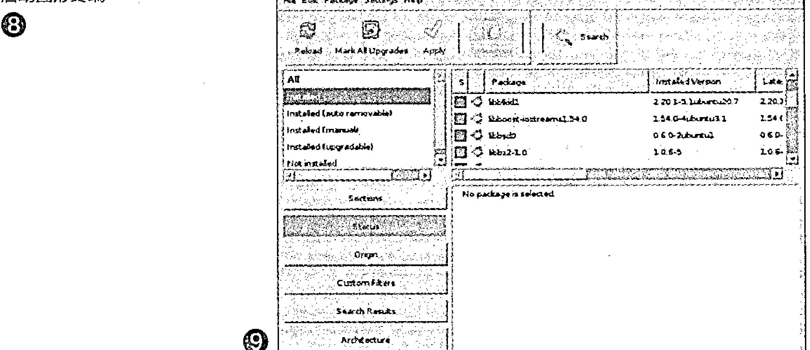

### 要快要方便 掌握另类复制

文|楚南

复制文件、复制信息，使用复制菜单命令、右键菜单或Ctrl+C快捷组合键，这些都是大家常用的方法，人人都会。然而，除却这些常用方法，还有更多另类的复制方法、技巧或软件可供我们选择，这些软件或技法对我们日常操作电脑的帮助也很大，灵活运用可扩宽我们使用电脑的门路和视野。

#### 1. 系统原生的另类复制

在Windows系统中，我们可以充分利用鼠标来复制文件或信息。鼠标复制文件信息，除了使用菜单命令外，最方便的方法莫过于拖动法。而拖动法又可以分为左键拖动和右键拖动。平时我们最常用的是左键拖动法，将一个文件或图标按下左键拖动到另一个地方，这自不在话下。然而同样的左键拖动文件，效果会不同，这个需要明白。

例如，将一个文件从C盘的一个文件夹左键拖动到C盘的另一个文件夹，则拖动的效果是移动文件。然而，如果将一个文件从C盘拖动到D盘，你会发现拖动之后，C盘中的这个文件依然还存在，而D盘中多出了一个同样的文件。这说明此次拖动并非是将文件进行了移动，而是起到了复制的效果。可见，同样的左键拖动，目标不同，其实际对文件操作的效果不同，同一分区下的左键拖动为移动文件，而不同分区下的左键拖动为复制文件。

如果给左键拖动文件操作配以键盘控制符，效果也不同。例如，在同一位置按下Ctrl后左键拖动一个文件，会复制出一个文件副本（图1）；而如果按下Alt键后左键拖动，则可以创建该文件的快捷方式；按下Shift键后左键拖动文件，则可以将该文件移动到目标位置。

如果你觉得左键拖动复制文件有点琢磨不定和不好记忆，那么使用右键拖动复制，效果就比较明确了。例如，我们在选中了几个文件夹后，按下右键将其拖动到另一个文件夹上，这时，系统就会弹出一个快捷菜单，其中有三个基本文件复制选项，包括“复制到当前位置”、“移动到当前位置”和“在当前位置创建快捷方式”等（图2）。这样，我们选择起来就一目了然了。实际上，右键拖动的这3种方式，分别对应于左键与Ctrl、Shift、Alt组合拖动的效果，作用一样。

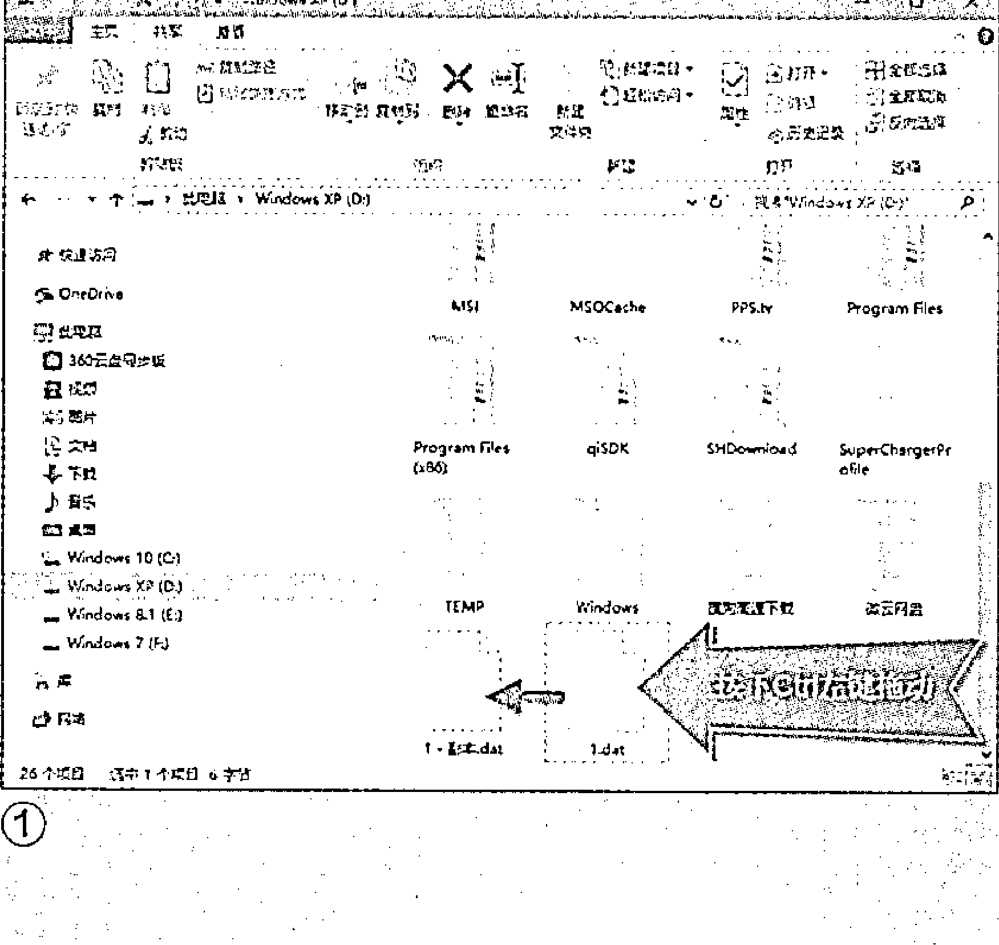

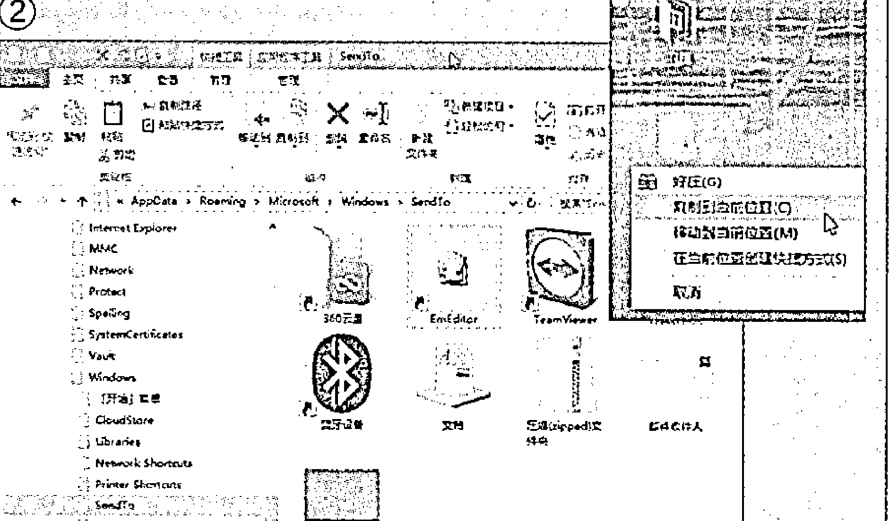

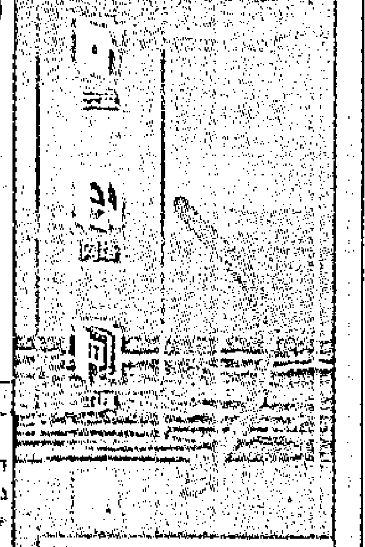

除了可以使用上述另类的系统内置拖动复制法外，我们还可以自定义任意的文件发送。那就是在系统的Sendto文件中，放置目标文件夹或设备（如移动硬盘或网络盘符）的快捷方式（图3）。之后，就可以在任何时刻通过资源管理器的“发送到”菜单命令，将任意文件发送到自定义的目标位置。

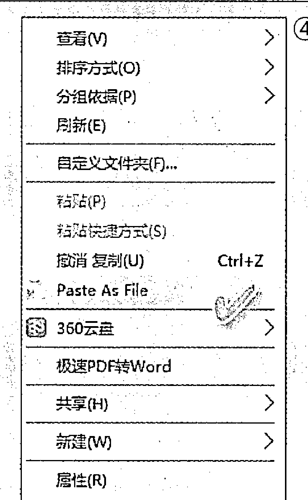

#### 2. 借助工具的另类复制

我们经常上网或在其他文档中遇到自己有用的信息，需要将这些信息保存为一个单独的文档。这些信息当中有的可能是一段文字，有的是一张图片，有的则可能是一段程序代码。这样，我们需要保存成的目标文件的类别就有所不同，或图片文件，或文本文件，或BAT批处理程序。以往我们总需要先手动创建一个这样类别的文件，然后才能打开文件后将这些复制来的信息复制到文件当中。

现在，我们可以利用PasteAsFile这款小软件来协助我们简化操作流程。安装PasteAsFile之后，我们可以尽管复制自己需要的文本、图片或代码信息，然后在资源管理器中切换到目标文件的位置。这时只需单击鼠标右键，在快捷菜单中就会看到有“Paste As File”一项命令（图4），点击这一命令项，在随后出现的对话框中输入要保存的文件名和扩展名，点击OK按钮即可保存文件（图5）。默认认为已有文件名和扩展名，若不需要个性化名称，可直接使用。文件名为类似于Clipboard_20160911这样的格式，扩展名则沿用上次的设置。该软件支持复制和保存的文件格式有JPG、PCX、PNG、BMP、TGA、GIF、TIF等图片格式，以及各种纯文本的TXT、CSS、BAT等格式。

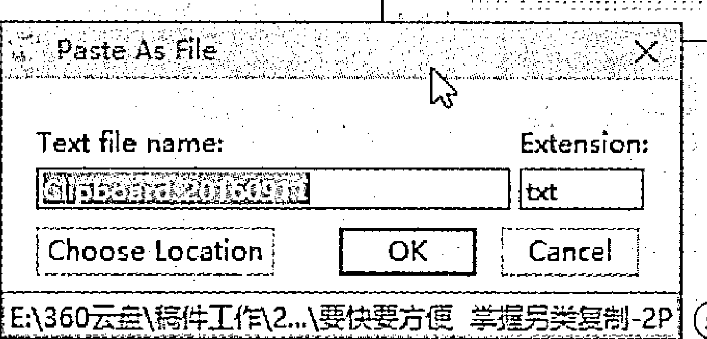

#### 3. 效率翻番的复制方法

依靠系统自身的复制功能进行文件复制，虽然可以解决大多数问题，但在文件复制效率方面，却不能令人满意。我们可以借助于大家所熟悉的一款文件复制效率工具FastCopy，实现文件操作效率的提升。

##### 巧用复制工具FastCopy快速删除文件

说起删除文件，大家肯定会认为这太简单了。然而，当你要清除一个非常庞大的旧系统文件夹时，或一个含有数十万个小文件的文件夹时，才会发现原来这么费时。这时，如果借助于FastCopy软件的特别功能，就能高速删除这些文件。具体方法为，用“源目录”（Source）指定要删除的文件夹位置，在操作方法选择列表中选择“全部删除”（Delete all），最后点击“执行”（Execute）按钮，即可快速清除这些文件（图6）。

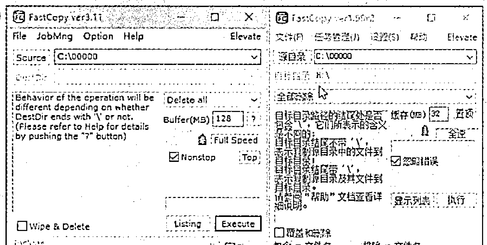

##### WinPE配合FastCopy快速更换硬盘

涉及到快速文件操作的例子，再如将一块硬盘中的大量文件复制或移动到另一块硬盘中。这时，我们可以将两块硬盘挂接到系统中，用WinPE启动系统，然后在其中运行绿色版的FastCopy软件，选择源盘和目标盘并执行复制或移动操作即可。

## 抓住软件的“命门”

文|马江

软件有那么多，每个软件各具面孔，如何才能快速掌握软件的使用呢？其实，虽然“千软千面”，但它们都有共同的东西，无论是安装还是设置使用，都有一套约定俗成的规矩，只要掌握了软件的一些共同设置方法和使用技巧，就不难快速掌握软件了。

### 1. 图标丢了也不怕——软件安装的秘密

通常情况下，软件安装之后会自动在开始菜单中建立程序组，并在其中放置主程序、帮助文件、相关配置、网站链接等相关文件的快捷方式；此外不少软件还会在桌面上建立主程序及其相关链接的快捷方式。但是，不是所有软件都会这样做，有时是因为没有必要，有时是因为用户安装时一时疏忽去掉了创建程序组的选项，还有的时候是因为安装之后因为某种原因丢失了程序组选项。那么，万一在程序组中或桌面上找不到某软件的快捷方式了，该怎么办呢？

实际上，我们可以用如下两种办法找到这些快捷方式的源头所在。其中一种方法是通过控制面板的“程序和功能”管理组来寻找。以Windows 10系统为例，右键单击开始按钮，在快捷菜单的顶部选择“程序和功能”(图1)。随后在弹出的卸载和更改应用程序列表中，一般可以找到需要的程序项目。之后，右键单击该项目，在弹出的菜单中选择“修复”(图2)，如果该程序的安装修复文件仍在系统中，则安装程序会自动修复安装，同时在程序组中建立丢失的程序组菜单和项目；若修复文件缺失，软件也会给出提示，这时只需按照程序名称和版本提示，上网下载相应的版本并重新安装，一般也可以找回程序菜单的快捷项目。

软件安装的实际物理位置一般为系统分区的“Program Files”或“Program Files (x86)”文件夹，若两种文件夹同时出现，说明系统为64位版本，且32位程序一般将被安装在后面带x86的目录中(图3)。我们也可以直接通过这两个目录，查找软件安装的位置，其中会包含软件的主程序，也可能会包含卸载程序。找到主程序后，向桌面发送该程序的快捷方式，即可找回软件的启动快捷图标。

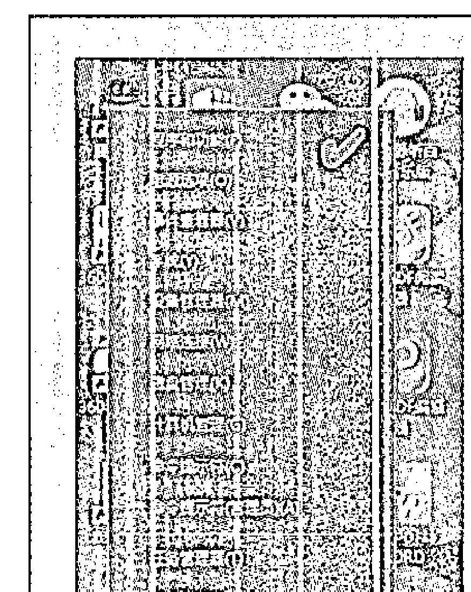

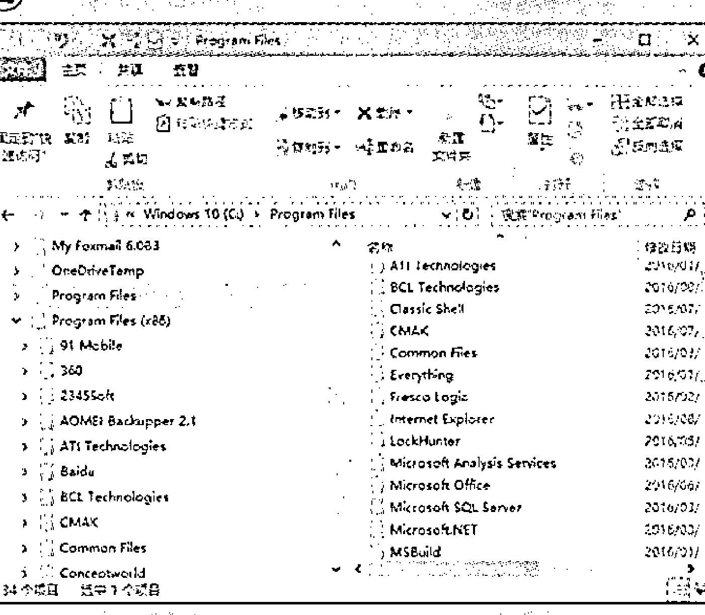

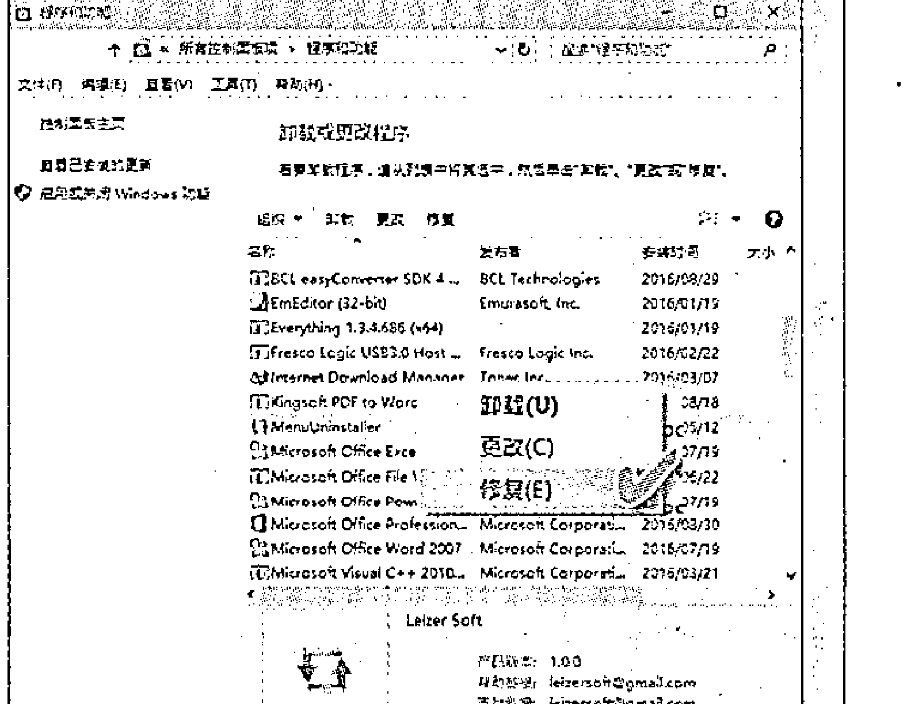

> **小提示** 小心软件控制中心暗藏的“猫腻”
>
> 软件设置窗口中既有值得我们挖掘的“宝石”——例如功能增强的选项，同时也有不少让我们讨厌的“猫腻”——例如商家牟利的一些弹出捆绑或宣传等。

#### 小技巧：控制面板中也找不到有关项目怎么办

如果安装过一个软件，但在控制面板中也未找到有关项目，且桌面或开始菜单也不见程序的踪影，那么，该软件要么已经被卸载，要么可能是一款绿色软件。如果是绿色软件，其安装的位置有可能在以上所述的几个安装目录中，逐一浏览几个目录一般可查找到软件的踪迹。或者，你将绿色软件放在了某个文件夹下，给桌面发送了快捷方式，而快捷方式丢失，其实程序仍在那里。这时找到程序中的文件，重新发送到桌面快捷方式即可。若软件仍在运行之中，则找到该软件的方法是，在任务管理器的程序进程列表中或启动列表中找到该程序的进程，右键单击并选择“打开文件位置”即可确定软件所在的位置和主程序（图4）。

### 2. 一切尽在掌控中——软件控制的密道

有时我们对软件提供的某项功能不满意，但又不知如何改变。其实软件都有其功能控制的“密道”。最普通的软件控制方法是，通过控制菜单进行设置。以QQ浏览器为例，其主要的功能改变是通过系统菜单的“设置”项来改变的（图5）。而还有一些软件是通过在系统托盘的驻留程序右键菜单控制的，例如360云盘的同步版（图6）。此外还有一些办公软件，例如Word或WPS等，要修改该软件的设置，需通过左上角的菜单选择“选项”命令进入设置（图7）。

### 3. 奥秘藏在这里面——与注册表的关系

如果软件卸载菜单或卸载程序丢失，如何才能彻底干净地卸载软件呢？有人选择干脆将软件目录一删了之。殊不知，由于软件安装时不光是写入目录文件，同时也在系统注册表内写入信息，有的甚至会在系统文件夹中写入动态链接库或插件程序。若这样卸载软件，势必会增加系统垃圾。

正确的做法是通过系统软件管理模块卸载软件，若找不到卸载入口，宁愿重新安装此软件，然后通过卸载链接进行完全卸载，切不可直接删除目录而自欺欺人。

需要说明的是，软件安装的目录不限于上述系统默认目录，Windows应用的安装目录位于“C:\Program Files\WindowsApps\”文件夹。不仅可以在安装时由用户自定义，还可以用软件管家工具或修改注册表“HKEY_LOCAL_MACHINE\Software\Microsoft\Windows\CurrentVersion”下的ProgramFilesDir项，将安装目录修改为一个位于其他分区的其他文件夹中。

任务管理器 - 进程

| 名称 | PID | CPU | 内存 | 磁盘 | 网络 |
|---|---|---|---|---|---|
| CTFMON (32 位) | 0 | 0% | 0.1 MB | 0 MB/秒 | 0 Mbps |
| Device Association Framewo... | 0 | 0% | 0.3 MB | 0 MB/秒 | 0 Mbps |
| EmEditor Tray Icon program... | 0 | 0% | 0.8 MB | 0 MB/秒 | 0 Mbps |
| Everything | 0 | 0% | 43.6 MB | 0 MB/秒 | 0 Mbps |
| Everything | 0 | 0% | 0.2 MB | 0 MB/秒 | 0 Mbps |
| Eyes relaxing and focus | 0 | 0% | 0.1 MB | 0 MB/秒 | 0 Mbps |
| Fresco Logic | 0 | 0% | 0.1 MB | 0 MB/秒 | 0 Mbps |
| Host Process for Setti... | 0 | 0% | 0.5 MB | 0 MB/秒 | 0 Mbps |
| Internet Mail Client ( ... | 0 | 0% | 0.1 MB | 0 MB/秒 | 0 Mbps |
| kxpectr (32 位) | 0 | 0% | 0.1 MB | 0 MB/秒 | 0 Mbps |
| Microsoft IME | 0 | 0% | 0.1 MB | 0 MB/秒 | 0 Mbps |
| Microsoft IME | 0 | 0% | 0.1 MB | 0 MB/秒 | 0 Mbps |
| Microsoft IME | 0 | 0% | 0.1 MB | 0 MB/秒 | 0 Mbps |
| Microsoft Malware Protectio... | 0 | 0% | 0.1 MB | 0 MB/秒 | 0 Mbps |

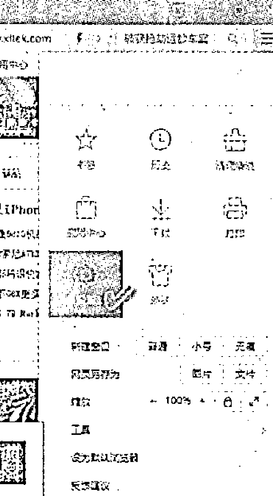

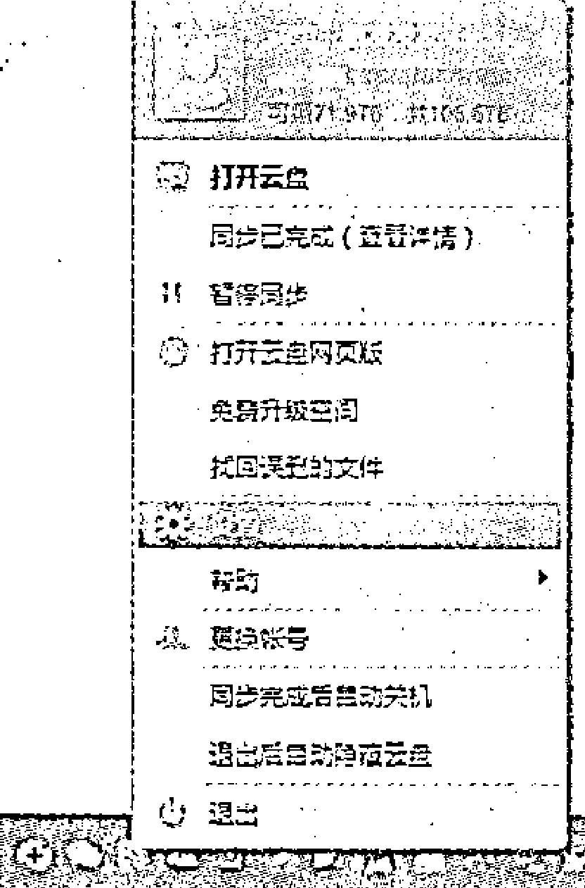

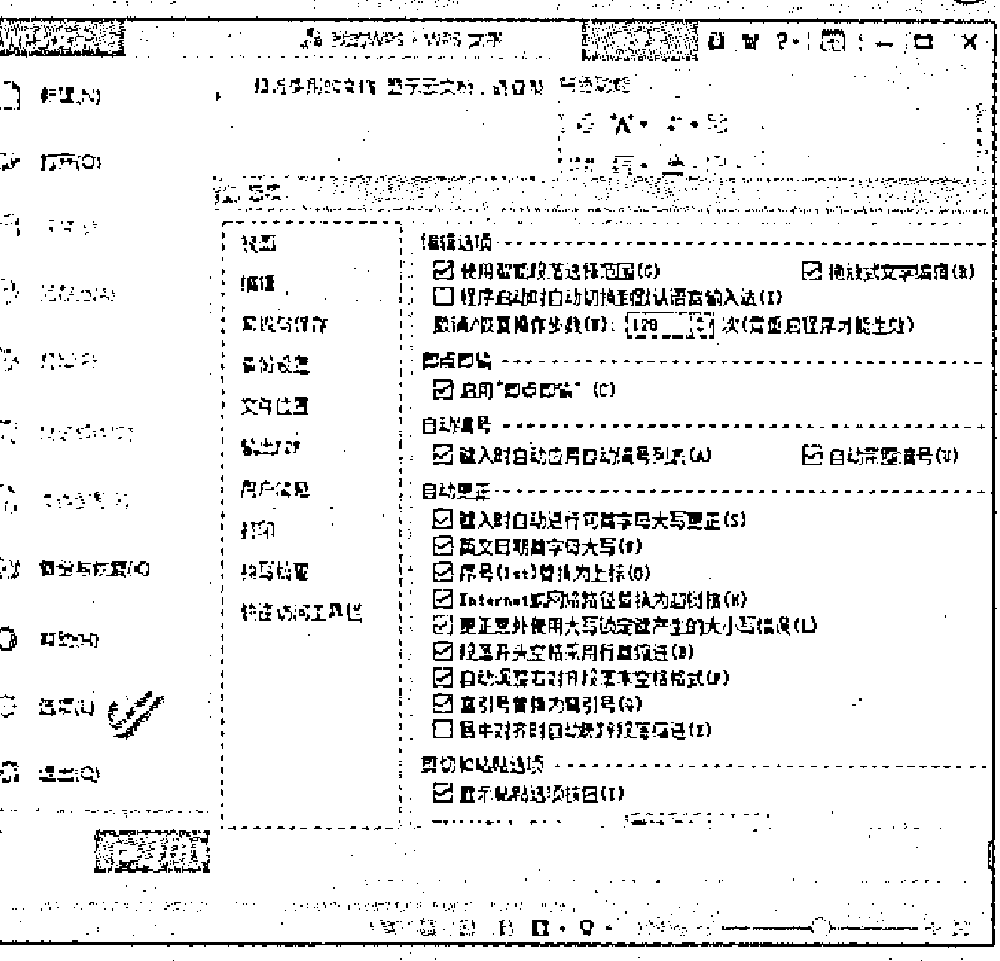

## 打造个性化软件管理环境

文|范晔

除了Windows本身和一些大型Office软件外，每个人的电脑中都会安装有不少小软件，这些软件的使用过程都会涉及到装卸、升级、备份等日常维护问题。借助于软件管理工具，我们可以按需打造自己的个性化软件管理体系。

### 1. 去插件纯净安装

捆绑插件是最惹人讨厌的一种软件行为，为此，可使用360软件管家安装和升级软件。安装前先通过软件右上角的设置菜单，选择“设置”进入软件设置窗口，在“安装升级”选项卡下，选择“开启纯净安装、纯净升级功能”选项（图1），这样，在软件安装过程中，软件管家就会自动拦截所装软件中捆绑的插件。

之后，返回到软件管家的主界面，按照软件分类浏览或输入软件关键词搜索的方法，找到需要安装或升级的软件进行安装就可以了（图2）。

### 2. 免确认一键升级

对于已经安装的软件，在软件管家的升级一栏中，就会看到自动检测出的升级可用软件数量，进入后可看到具体可升级的软件列表。这时，只需点击要升级的软件，软件管家就会自动以上述设定，对软件进行去插件纯净升级安装了。

对于已经安装的软件，如果需要升级，往往在运行升级程序后还会有许多后续确认的繁琐步骤。如果希望减少或省去这些步骤，可通过软件管家的升级选项，开启一键安装、一键升级功能（图3），这样在升级的过程中就不需要频繁点击按钮确认了。

需要注意的是，开启一键安装和升级程序的同时，需要指定软件安装的目录。软件管家会默认一个系统默认的软件安装目录为一键安装软件的目录。对于一键安装的软件，如果你有另外的目标目录计划，可以在这里提前设置好。这样就不用将软件全部安装到系统默认的目录中了，且可以自定义自己的一键安装和升级特别目录，以便于分开管理。其中游戏的安装目录还可以和软件分开设置，这样也更便于对游戏的单独管理。

> **小提示**
>
> 腾讯软件管理也可以实现去插件安装，读者可根据自身的情况选用。另外，不用管家软件也可实现上述功能，网上有专门的软件程序包去插件软件（如UniExtract程序解包去插件工具）。

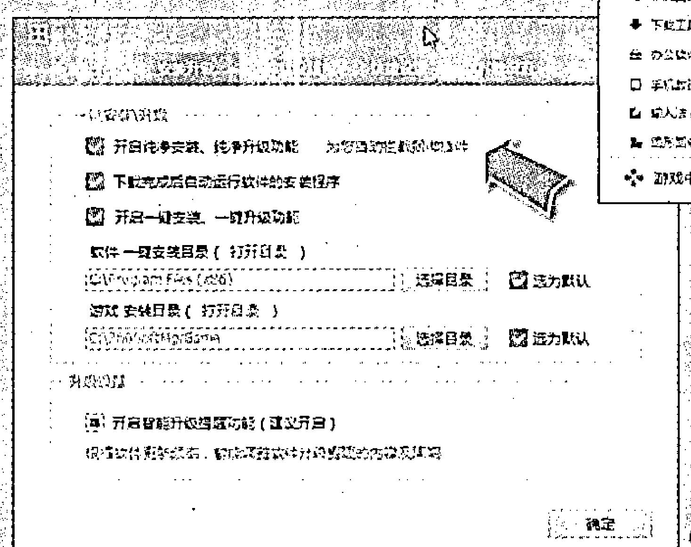

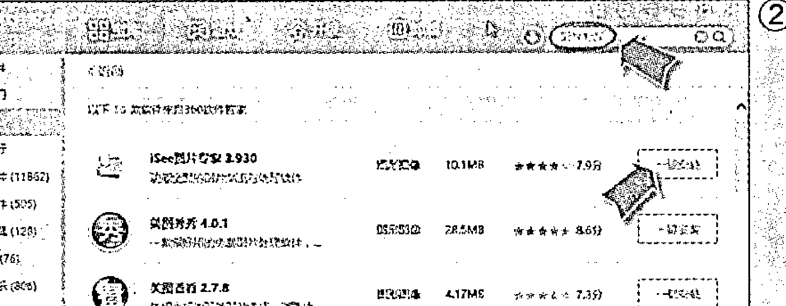

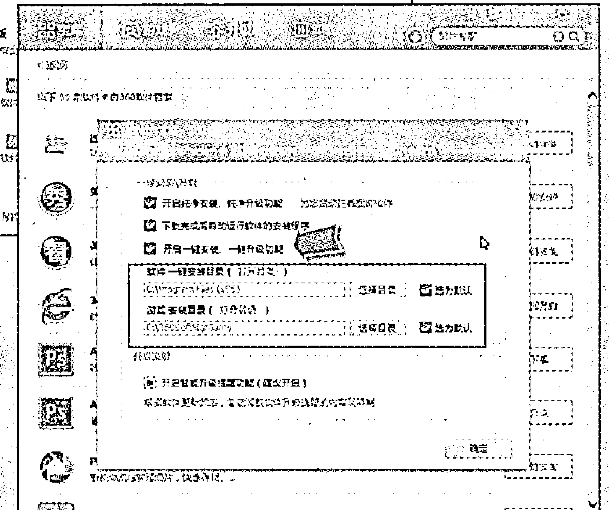

| 软件 | 版本 | 大小 |
|------|------|------|
| WinRAR 64位 | 5.50 | 2.5MB |
| Snagit 2021 | 2021.4.0 | 80MB |
| Internet Download Manager | 6.38 | 10MB |
| 其他软件... | ... | ... |

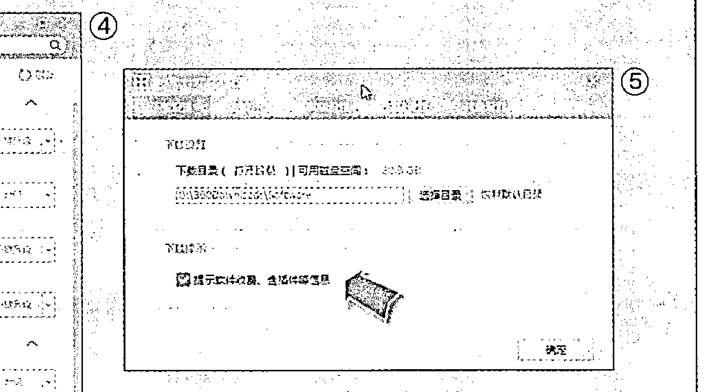

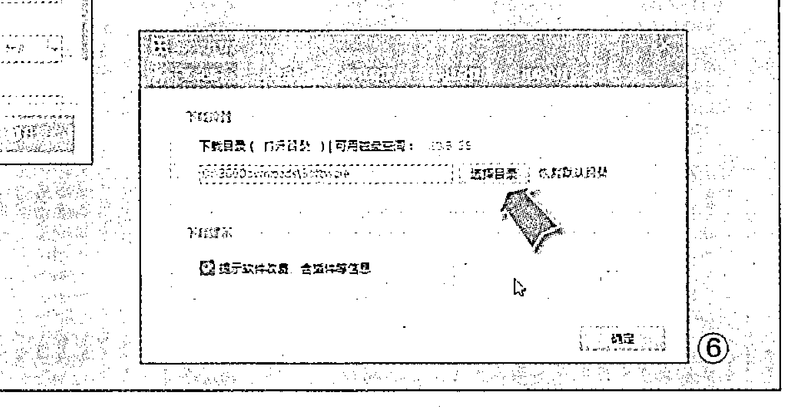

### 3. 分级别软件升级

软件是否升级，我们大可不必到具体的软件帮助菜单中去刷新软件的版本信息。借助软件管家的软件自动分类功能，在升级过程中，自动按免费正式版、收费版、测试版等类别，对系统内所有可升级的软件进行类别划分（图4）。

对于正式的稳定的升级版本，只需根据升级内容提示说明，选择点击后面的升级按钮进行升级即可。而对于目前只是测试版或收费版的软件，则根据自己的需要，参照软件功能升级说明的提示，慎重选择是否进行升级。

在软件的安装、升级过程中，要对收费、含有插件的软件进行过滤，需要保证开启提示信息选项，这样才能有所辨别。设置工作要在“下载设置”选项卡中进行，只需将“提示软件收费、含插件等信息”选项选中即可（图5），这样在软件安装或升级过程中，遇到有收费、含插件等软件时，就会自动出现相关的提示信息了。

### 4. 永久式软件备份

通过软件管家下载的软件，默认会在一定时期对下载的软件包进行自动清理。这样，电脑里随着软件更新的不断积累，前面的安装包会自动消失，最后只能留下较新的版本。而目前许多软件网站往往只会留下最新版本的下载链接，对于要找到早期版本的下载比较困难。虽然我们在使用软件方面往往都偏向于版本的“追新”，但是，为了避免一些新版本软件的不兼容或功能削减等问题的发生，使用旧版本的需求还是在一定范围内存在的。因此，也很有必要对经常使用的软件，留下它们的版本备份。

为达到上述目的，我们需要在软件管家中进行两项设置。首先要在“下载设置”选项卡下，指定特定的软件下载目录（图6）；接下来切换到“其他设置”选项卡下，将“安装包清理”选择项目切换到“不自动清理”选项。经过如上设置之后，所有软件版本更新后的安装包都将被保留下来。

> 以上功能在360软件管家或腾讯软件管理之外的其他管家类软件中也可实现，大家可以根据自身喜好选择相应的综合性管理软件。若不想软件管家总是占用系统资源，查看这电脑软件的一举一动，养成对软件安装包分类收集整理的习惯，使用时多留意界面边角“隐藏”的全家桶式附属安装，也能达成干净的软件使用环境。

## 一软搞定ISO文件

文|张惠香

ISO文件压缩包是我们常见到的系统映像、光盘映像、用户文件资料压缩文件。以往，我们建立、转换、使用、刻录映像文件包，可能会使用相应的多款软件才能完成，而这些软件中还有不少是共享软件，功能有所限制。现在，只需一款完全免费的ISO Workshop软件，即可将以上需求全部搞定。

### 1. 留心安装中的“宝藏”和“猫腻”

ISO Workshop在安装结束时有一个“Add an item to Send To menu”选项(图1)，选中这一选项后，以后可以通过右键“发送到”菜单，将任何文件或文件夹转换为ISO文件，操作要比在打开软件后再操作方便得多。此外要注意安装结束后有一个系统备份软件MyPCBackUp的捆绑，注意在执行下一步前取消对该软件的选择安装即可(图2、图3)。

### 2. 制作ISO及从ISO内提取文件

我们可以将自己的任何文件夹和文件，通过ISO Workshop制作成ISO映像文件，此外我们还可以将各种各样的系统文件制作成带有启动功能的ISO系统映像包，从而为制作启动盘做好准备。同时，如果我们要浏览ISO文件中的内容，或提取其中的文件，也可以借助于ISO Workshop来完成。

要制作ISO文件，在ISO Workshop主界面选择“制作ISO”按钮，随后选择ISO文件的类型，其中“标准”选项表示制作普通的UDF/ISO9660等格式的文件。而如果选择“引导”选项，则表示制作可引导的ISO文件，这时需要同时加载引导映像，引导映像文件的格式为IMG或IMA文件(图4)。确定ISO文件名称之后点击“确定”，之后通过Add按钮添加文件，最后点击Save按钮保存ISO文件即可。

如果要提取使用ISO文件内容，可直接通过主窗口点击“提取文件”按钮，进入提取文件窗口，点击Open按钮打开映像文件，也可以直接将映像文件通过资源管理器拖动到提取文件主窗口之中。随后，选择需要的文件，然后点击Extract按钮，即可将文件释放到指定的硬盘目录中(图5)。

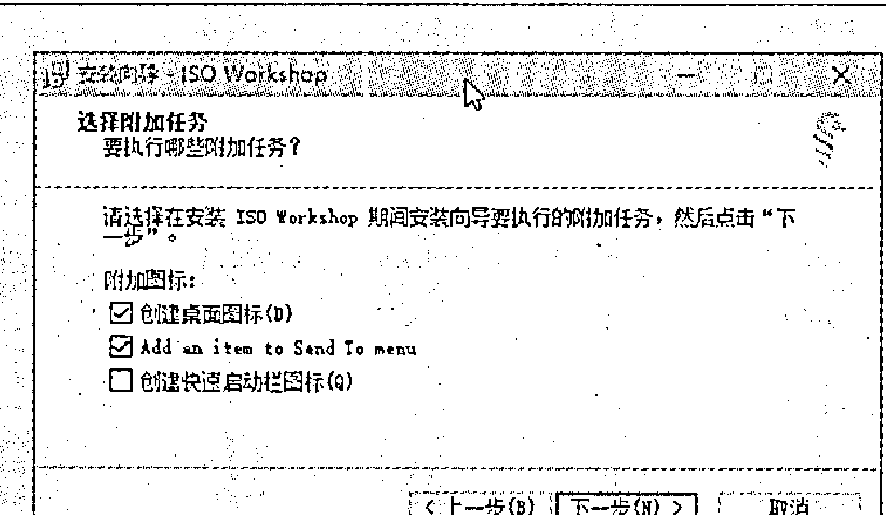

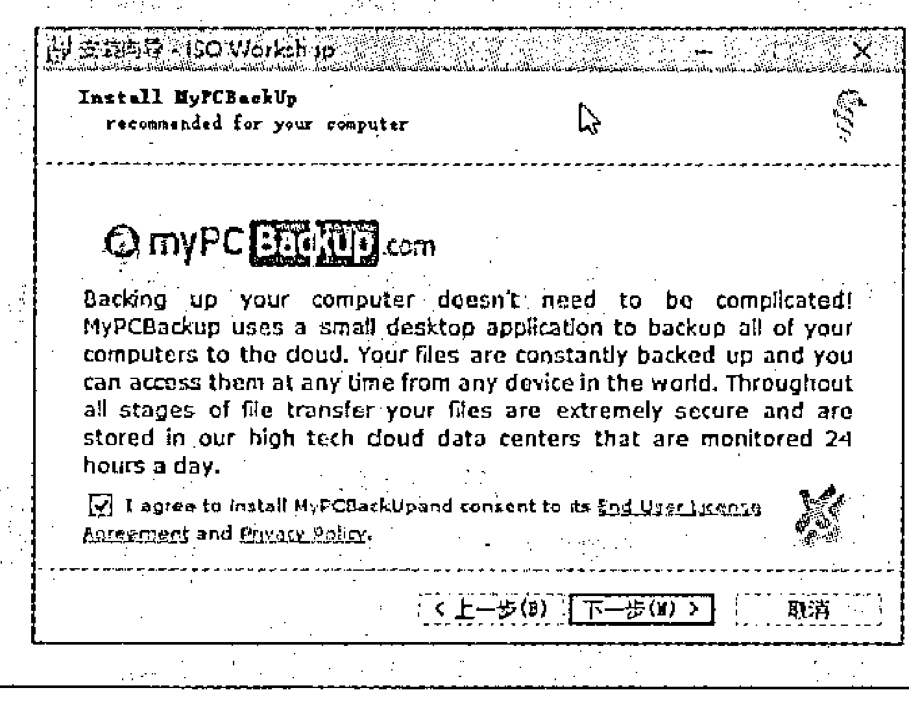

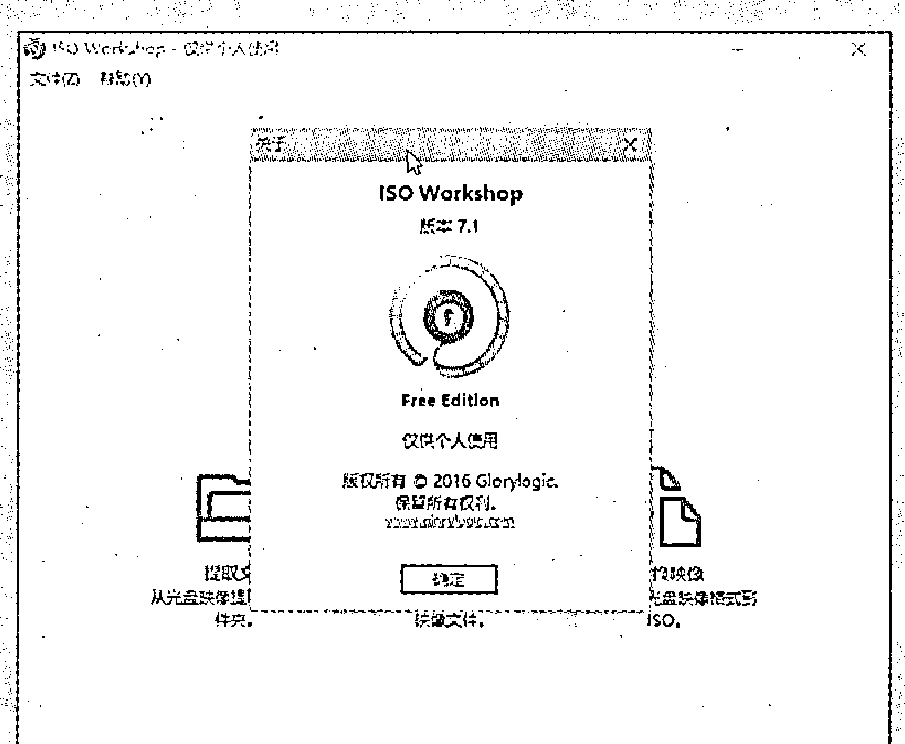

### 3. 备份光盘与ISO格式转换

我们可以用ISO Workshop将各类CD、DVD、蓝光碟等备份到硬盘ISO文件中。当然，还可以用它来将其他各类映像文件转换为ISO保存。要备份各类光盘，当然需要一个光驱，若电脑上没内置，可考虑外接一个USB移动光驱使用。点击“备份光盘”模块，插入空白光盘后点击浏览按钮，定义本地映像文件的名称，指定要备份的光盘执行备份操作即可。光盘源驱动器可以是只读的、可擦写的或虚拟驱动器。音频CD只能保存为BIN格式，而输出的其他映像文件可被保存为ISO格式或BIN格式。

如果我们手头上的映像文件格式为非ISO或BIN的格式，那么我们可以用转换映像模块来完成这些格式到ISO或BIN的格式转换。只需在源映像文件框和保存映像文件框中分别指定源文件和目标文件，点击“转换”按钮即可完成格式转换（图6）。该软件可以转换的格式同样也包含上述格式。

> 小提示
> ISO Workshop支持预览和提取的源文件不仅是ISO，其他诸如CUE、BIN、NRG、CDI、MDF、IMG、GI、PDI、DMG、B5I、B6I等文件均在支持之列，且支持文件的多重选择。

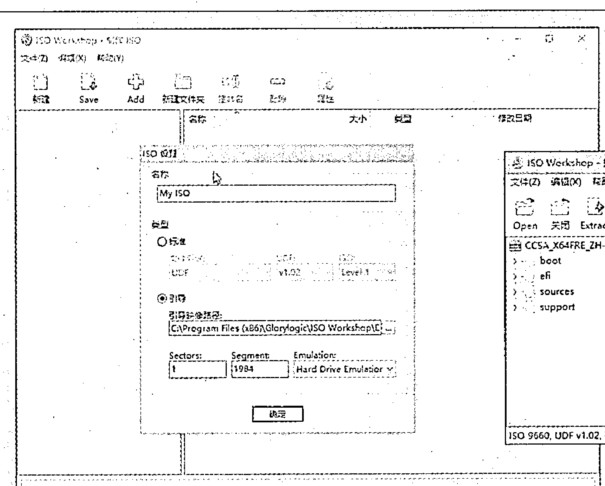

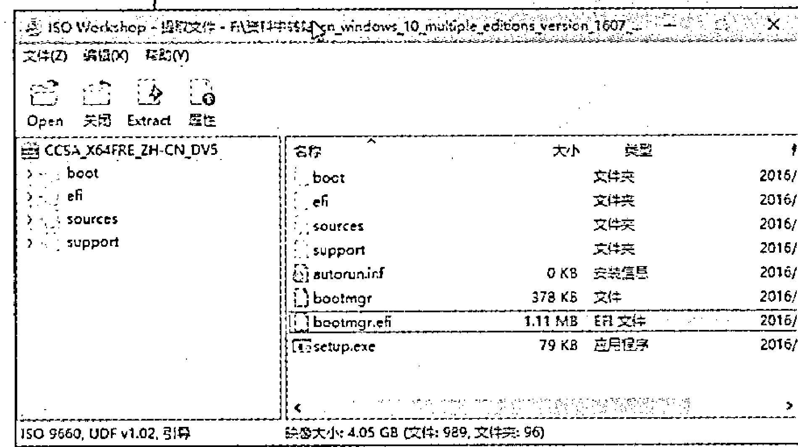

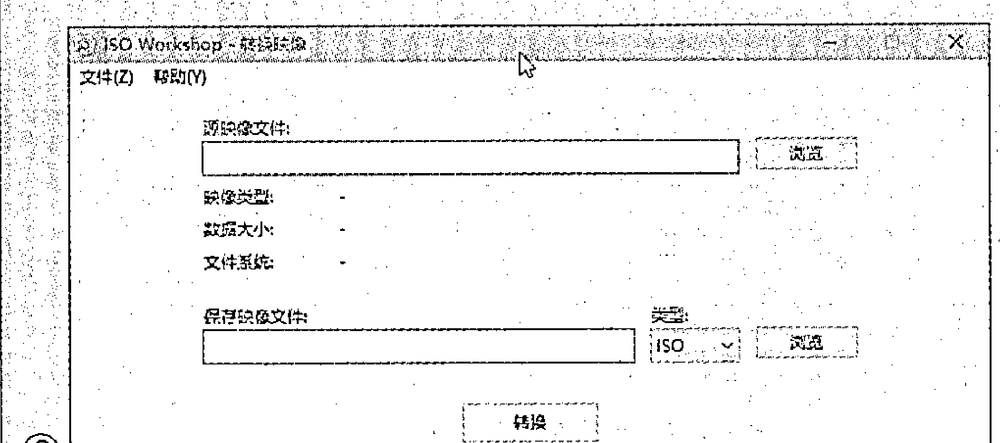

### 4. 各类光盘的刻录和擦写

在准备好映像文件后，如果电脑中安装有刻录机，且需要将映像文件变为光盘保存，那么使用ISO Workshop即可轻松实现映像变光盘的梦想。

插入空白介质（CD-R/W、DVD+-R/W/DL、DVD-RAM和Blu-ray Disc），指定映像文件（支持直接刻录ISO、BIN、NRG、IMG、DMG），指定速度执行刻录即可。对于可擦写光盘，可直接使用“擦除”按钮快速擦除光盘，重新写入新的内容（图7）。

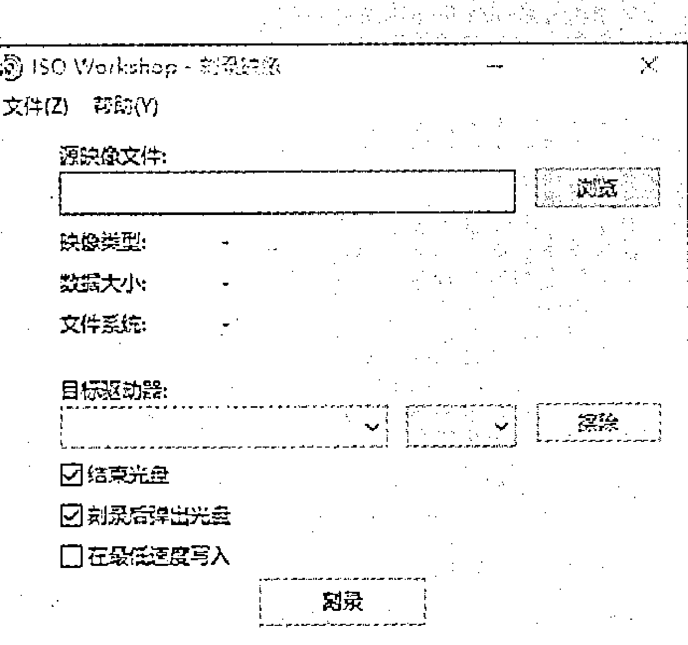

## 夜景模式 眼睛的福音

文|阿立

随着人们使用电子设备的时间越来越长，很多人的视力都变得越来越不好。于是有的软件引入了所谓的“夜间模式”，通过改变操作界面的颜色和亮度，以减少屏幕光线对眼睛的刺激，以至于Windows 10系统也在设置选项里面增加了一个模拟夜景模式的“深色”选项。那么对于还没有使用Windows 10的用户来说，如何才可以也引入夜景模式让眼睛变得舒服呢？

### 浏览器用扩展实现

对于很多用户来说，网页浏览器绝对是每天接触最多的软件之一，但是我们常见的网页浏览器都没有相关的“夜间模式”功能。好在现在很多网页浏览器都可以添加功能扩展，所以我们只需要安装一款相应的扩展即可。对于使用谷歌浏览器和衍生版本的用户来说，我们首先通过谷歌应用商店，下载并安装一款名为“Dark Reader”的扩展。安装完成以后会在工具栏里面出现“Dark Reader”的扩展图标，以后无论用户登录到哪一个网站页面里面，扩展就可以将这个网页转换为暗色的背景（图1）。

如果没有切换到我们需要的“夜间模式”，只需点击扩展图标后在弹出的对话框切换到On状态即可，或者使用快捷键Alt+Shift+D来快速进行开关（图2）。当然并不是所有的用户都对默认的“Dark Reader”方案感兴趣，还好扩展还带有一个介于黑色和白色之间的暖色背景方案，用户如果需要的话只需要点击对话框中的“Light”这项即可。这个方案不但不会有传统的白色刺眼背景，也没有深色背景如此大的反差效果，大约就是一种常见的乳白色的感觉。如果用户对“Dark Reader”和“Light”都不满意的话，每个用户还可以在“Dark Reader”的对话框里面，根据自己的需要手动调整色彩的各个细部选项。调整选项包括亮度、对比度、灰阶、墨色等，只要简单地点击左右的按钮就可以修改默认的数值，这样一定能找到最符合自己阅读习惯的颜色效果。除此以外，点击对话框中的“Font”标签，还可以对网页的字体进行设置修改（图3）。当然“Dark Reader”可能并不一定适合每一个网站使用，如果用户只想在特定的网站里面进行使用的话，或者在特定的网站停止使用“夜间模式”，那么现在点


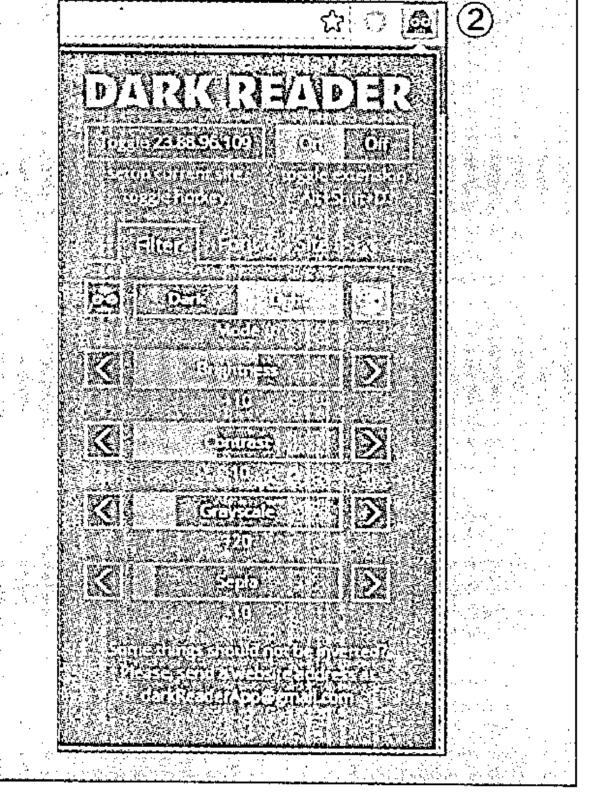当然并不是所有的网页浏览器都可以通过扩展实现“夜间模式”，这时我们只需要通过安装Stylish这款扩展再配合合适的CSS文件也行。首先打开http://userstyles.org这个网址，在右上方输入关键字“NightShift”并按下回车键。从搜索结果中选择一个喜欢的样式并点击这个链接，再点击提示窗口中的“Install Stylish”链接。通过它可以将页面中的白色部分变黑，同时降低网页图片的亮度，用起来就像开了“夜间模式”一样。

### 办公软件直接调用

除了我们刚刚介绍的网页浏览器以外，办公软件也是很多用户最常用的软件。说到办公软件自然就会想到国产的WPS Office，从这款软件最老的版本开始就有一个“蓝底白字”的选项，这也可以算是最早版本的“夜间模式”功能。如果用户要想在最新版本的WPS Office里面启用“夜间模式”的话，那么只需要点击工具栏中的“视图”标签，就可以看到“护眼模式”及“夜间模式”按钮(图4)。点击“护眼模式”按钮后，办公软件的背景就会变成浅绿色，绿油油的感觉让人觉得非常的舒服。点击“夜间模式”按钮后，整个软件界面都会调低亮度增加暗度，从而避免白色背景对眼睛的刺激。

### 自定义方案最贴心

当然很多的办公软件并没有“夜间模式”功能，比如本人常用的EmEditor编辑器就是如此。所以要想获得“夜间模式”的效果，必须要用户进行自定义设置才可以。首先点击软件“工具”菜单中的“当前配置属性”命令，在弹出的属性窗口选择“显示”标签这项。

“主题”列表中包括了软件自带的几个主题，包括标准、经典、蓝色、黑色等等(图6)。比如我们选择列表中的“蓝色”这项，就可以马上实现WPS Office的蓝底白字效果。当然用户也可以根据自己的需要，选择其他的方案来进行使用。如果默认的方案用户都不喜欢的话，那么就只能自己动手来进行设置了，比如本人就想设置一个“灰底蓝字”的方案。首先点击“文字颜色”列表，选择其中的“自定义”选项。这时就会弹出一个颜色设定对话框，在“基本颜色”里面选择蓝色就可以了(图7)。如果默认的蓝色不符合要求，还可以点击下面的“规定自定义颜色”按钮，在弹出的对话框设置颜色的红蓝绿参数。设定完成以后点击“确定”按钮，返回到“显示”标签页里面。再点击“背景颜色”列表中的“自定义”选项，按照相同的方法选择一个灰色选项，这样我们预想的“灰底蓝字”方案就完成了。

## 井然有序 用好增强版剪贴板

文|倚楼

复制粘贴是每个用户每天使用最多的功能之一，通过对它们的使用可以大大提高用户的工作效率。但是Windows的剪贴板一次只能容纳一条记录，这样就限制了复制粘贴功能的发挥。为了弥补这个看上去是Windows系统的“缺陷”，网上就出现了很多剪贴板增强工具，甚至有的还可以在不同的电脑系统之间同步剪切板中的内容。那么如何利用好剪贴板增强工具，来提高自己的工作效率并管理好其中的内容呢？

### 剪贴板的快速增强

对于很多用户来说复制粘贴都是在本地系统操作的，所以最早出现的剪贴板增强工具也只能在本地系统使用，而Ditto、CLCL、ClipX等这几款软件就是它们中的佼佼者。由于这类软件的主要功能都非常相似，所以今天我们就用CLCL来进行操作。首先下载CLCL这款软件的汉化版，下载完成以后进行解压，运行其中的可执行文件就可以了(下载地址: http://www.appwan.net/?p=8729)。这时可以在系统托盘里面看到一个曲别针一样的图标，这样就表明CLCL已经成功地接管系统的剪贴板功能。现在我们只需要像平时一样进行复制操作即可，无论是复制文本内容还是文件信息都一样。当我们要想查看CLCL剪贴板里面的内容时，只需要按下快捷键Alt+C，就可以调出软件的剪贴列表菜单进行查看。这时我们可以看到每一条剪贴板信息前面都有一个编号，点击这个编号就可以快速地将该内容粘贴到指定的地方。

### 有效管理提高效率

对于剪贴板里面的信息内容，有的只是临时使用，有的则可能长期使用，所以就需要对剪贴板里面的内容进行定时的管理操作，从而避免过时信息对用户使用所造成的一种干扰。现在在系统托盘的软件图标上点击鼠标右键，这时就会弹出一个CLCL软件的管理窗口。在左侧列表中的“历史记录”里面，就可以看到所有的剪贴板信息。选中一个剪贴板信息后，在右侧窗口里面就可以看到它的所有内容，在这里我们就可以对它进行修改操作(图2)。当然通过工具栏中的命令，还可以对剪贴板信息进行上下移动或者删除操作。很多用户可能都会经常调用电话号码、地址信息等内容，为了避免这些信息淹没在茫茫的剪贴板信息中。

### 剪贴板内容云同步

想必很多人都听过那个老掉牙的笑话：“是这样的王总，你在家里电脑复制，然后跑到办公室里粘贴是不行的，不，多贵的电脑都不行”。不过这样的问题现在已经不是问题了，因为随着剪切板云同步功能的流行，王总的愿望其实早就可以实现了。如果用户经常在电脑和手机之间同步剪贴板的话，肯定知道国外的Pushbullet、Pasteasy等应用。不过如果是在电脑之间同步剪贴板的话，那么可以试一试一款名为“快贴”的国产同类产品。

首先我们登录“快贴”的官方网站（http://clipber.com/），下载最新的Windows客户端进行安装。由于剪贴板的信息内容需要同步，所以首先点击系统托盘中的“快贴”图标，在弹出的菜单里面点击“登录/注册”按钮，接着根据向导注册一个账户进行使用即可（图5）。“快贴”的使用和我们前面介绍的差不多，用户只需要将需要的信息不停地进行复制，这样“快贴”就会自动地在系统后台将内容存储下来。不过经过测试以后发现，当剪贴板信息过大的时候，软件就无法进行内容的存储操作。当我们点击“快贴”系统托盘图标的时候，在弹出的菜单里面就可以看到存储的内容（图6）。“快贴”通过不同的图标将文本、图片和文件进行了区分，当用户需要调用某个存储信息的时候，只需要在菜单里面找到该选项后点击“复制并粘贴”命令即可。

### 防剪贴板泄露隐私

由于“快贴”最大的特点就是进行剪贴板的同步，但是稍有不慎就可能会造成用户个人信息的泄露。之前就有媒体报道过，有人利用手机系统的短信同步功能，窃取了用户银行卡里面的大量现金。为了避免类似情况的发生，“快贴”在电脑版上设置了一个非常贴心的功能，即对某些敏感关键词的信息内容不进行同步，这样就可以防止密码、银行卡号等重要数据被同步到服务器里面。

点击系统托盘中的“快贴”图标，这次在弹出的菜单里面选择“设置”命令，接着在弹出的对话框里面点击“隐私”标签。然后在“自定义关键字”列表中点击加号，再输入自己觉得是关键词的信息即可（图7）。以后一旦发现剪贴板出现了关键词信息，那么软件在复制的同时会用蓝色的锁头进行标识。如果用户非要进行上传的话，那么点击菜单中的“解除机密并上传”命令，这样才可以同步到云端服务器里面。

> 小提示
在“历史记录”里面的某个剪贴板信息上点击鼠标右键，点击“添加到模板”命令后也可以创建一个模板。

> 小提示
如果不进行“快贴”账号密码注册的话，也可以当作一款本地剪贴板软件来使用。

## 两位“大管家”都要自动化

文|张冠

### 1. 自动同步文件夹浏览模式

在Windows资源管理器窗口中进行文件操作时，每个人使用的文件夹或文件视图列表方式有所不同，或用大图标览图，或用详细信息排列文件，无论采取哪种方式，每个人习惯使用的模式基本是相对固定的。而如果每次进入文件夹后再行手动设置，显然比较麻烦。其实，我们可以通过文件夹选项的“文件夹视图”应用设置，将个人文件夹预览习惯设置为一种固定模式。
以Windows 10为例，具体设置方法为：先在资源管理器内打开一个文件夹，然后通过“查看”功能选项卡下的“布局”分组，将文件夹预览方式选择为自己喜欢的一种方式，例如设置为大图标显示，随后点击“选项”按钮（图1）。
在随后弹出的“文件夹选项”窗口中，切换到“查看”选项卡，点击“文件夹视图”分组框下的“应用到文件夹”按钮（图2）。经过这样设置之后，今后打开的同类文件夹，都将沿用当前文件夹一样的视图设置。这样就不需用再去手动设置每个文件夹文件列表的显示样式了。

### 2. 文件使用隐私清理自动化

Windows 10的一项新功能“快速访问”列表为文件操作带来方便。然而，这项功能也给用户的文件操作“行踪”隐私留下了暴露的隐患。虽然我们可以通过在资源管理器“快速访问”列表上单击右键，选择“从快速访问中删除”来清理文件操作痕迹（图3），但由于我们平时很可能疏忽这一细节，因此很容易忘掉这件事情。
实际上，我们还可以通过文件夹选项，将隐私清理设置为自动化的方式。右击“快速访问”项并选择“选项”，进入“文件夹选项”窗口之后，先在“隐私”一栏下点击“清除”按钮清除当前所有快速访问隐私，然后将该栏中的“在快速访问中显示最近使用的文件”和“在快速访问中显示常用文件夹”这两个复选框的选择去掉，最后点击“应用”按钮即可（图4）。

### 3. 自动回到熟悉的工作环境

经常进行办公、写作或一些固定性的工作，我们往往长期处在一个工作文件夹下，每次开启电脑都要先打开这个文件夹。除了建立文件夹快捷方式外，其实我们还可以让文件夹与资源管理器建立自动打开关联，让每次打开资源管理器的动作，直接连带自动打开常用文件夹的过程。这样做的好处是，当我们的工作文件夹有所变动时，资源管理器也会自动在下次打开我们上次刚变动过的文件夹。

要实现上述自动化过程，只需通过文件夹选项的“查看”选项卡，在“高级设置”列表中，将“登录时还原上一个文件夹窗口”复选框选中，然后点击“应用”按钮（图5）。这样设置之后，就不用开机后先打开资源管理器，再手动定位工作文件夹了。

### 4. 浏览器也能实现自动下载

自动化的管理方式不仅发生在文件管理器当中，在网络浏览器中，我们也可以设置自动化的管理方式。在我们的印象当中，下载断点续传和开启软件自动下载等功能只有在迅雷等专业下载工具中才具备，而网络浏览器在这方面的功能往往比较欠缺。因此我们才常常去寻求一些下载工具来解决下载问题。但实际上，目前我们可以直接借助于网络浏览器的下载功能来解决问题。

就以用户数比较多的QQ浏览器为例，进入浏览器“设置”窗口，在“下载设置”一栏中，选中“启动浏览器时，自动下载上次未完成的任务”复选框，设定下载保存的固定位置，这时软件会自动记住用户对下载位置和下载方式的设定（图6）。经过这样设置之后，当你向QQ浏览器添加了下载任务，在下载尚未完成之时你退出了浏览或关机了，那么，下次启动浏览器后，你不用去管下载任务，它会自动在后台帮你继续下载上次未完成的任务。

### 5. 让网页大小自动适应所有网页

我们查看一个网页觉得字小，于是可以放大显示。但到了另一个网页中还需要重复这样的设置。其实，可以让网络浏览器自动为我们完成这件事。在QQ浏览器常规设置的“网络内容”分组下，选择字号或自定义字体，选择当前网页的缩放比例，与此同时选择“该缩放比例对所有网页生效”复选框（图7）。经过上述设置之后，所有的网页将自动延续用户设定的适合于自己阅读的显示百分比来展示。

# 《电脑爱好者》2016年合订本（四）

## Metro回归 系统不回退仍能体验

文|孟祥云

Windows 8发行之后，Metro风格成为一种时尚，然而好景不长，由于其他原因，微软在其后的Windows升级中放弃了这一风格界面。但是，如果已经升级到Windows 10，却仍喜欢Metro桌面风格，借助Immersive Explorer软件，我们仍能在Windows 10上体验Metro界面带来的简单感。

启动Immersive Explorer后进入资源管理器界面，随机可见Metro风格的资源列表，包括库、收藏夹、驱动器等大类（图1）。

如果对Metro桌面背景默认的黑色不感兴趣，可以通过下端工具栏的“个性化”按钮，设置背景壁纸、颜色以及透明度（图2）。

背景壁纸除了可用系统桌面的背景和用户自定义的背景图片外，还可以直接借用微软Bing的每日壁纸；对于背景颜色，建议在显示壁纸时选择“暗色”背景（图3）。

软件默认的查看方式是以磁贴方式垂直滚动，如果希望像在Windows 8平板中看新闻那样水平滚动，可通过“更改视图”工具按钮，选择“水平滚动”方式查看。若觉得Metro图标太小，还可以选择“更大的图标”选项（图4）。

打开驱动器中的某个图片文件夹，可以看到以Metro风格显示的图片集。这时滚动鼠标，就可以按先前设定的横向或纵向方式浏览图片（图5）。

如果要预览一张图片的效果，点击进入之后可以看到预览页面中有简洁而方便的前后切换、放大缩小、GPS位置显示等按钮，点击这些按钮可进行一键控制(图6)。

我们进入了一个音乐文件夹，看到以列表方式显示的音乐文件；与此同时，选中的音乐自动开始播放，在工具条的右下角显示播放控制按钮和播放进度(图7)。

MD5和SHA1哈希值是一个验证文件完整性的很有用的功能，但可惜在Windows中没有直接提供。用右键点击一个文件后，工具栏上随机出现文件处理操作按钮，除打开、复制、移动、重命名、删除等操作按钮外，还有一个“属性”按钮，点击可见在Windows资源管理器中见不到的“显示MD5和SHA1哈希值”(图8)。

不管漫游到哪一级文件夹，如果要回到桌面初始位置，只需点击桌面顶部的小显示按钮，即可返回到一级桌面。点击一级桌面上的“桌面”按钮，就会以Metro方式显示原来Windows桌面上的所有内容。可以看到，文件夹、程序快捷方式、文本文件或程序文件，在该软件中均以分类磁贴的方式显示(图9)。

> 小技巧：优化系统性能
外挂桌面或多或少会影响系统性能，如果发现系统运行迟缓，可用软件“性能设置”中的Immersive Explorer优化工具进行一键优化。同时，将“显示每个磁贴的文件夹和文件数目”复选框取消，也可以提升系统性能。

通过软件自带的设置窗口可以看到，软件内置了默认的图片、视频、音频播放程序，默认均以内置程序打开这些媒体。但它们不是万能的，因此也可以自己指定外部程序打开(图10)。

> **小提示 文件管理方法**
所有文件的操作，都可以在进入文件夹之后，通过桌面下方工具栏上的相应按钮进行操作和处理。用“选择”按钮实现文件的全选和取消；用“高级”按钮实现选定项目文件路径的复制、在Windows资源管理器的打开、以命令提示符或管理员命令提示符方式打开文件；用“新建文件夹”按钮创建新文件夹；用“隐藏文件”按钮显示具有隐藏属性的项目或受系统保护的项目。这些在Windows资源管理器中具备的特殊文件管理功能，Metro浏览器中均可以实现。桌面下方的工具栏还通过工具栏左侧的三点式按钮实现隐藏或显示切换。

### 集成式插件武装谷歌Chrome

文|倚楼

谷歌浏览器自从诞生之日开始，它就被定义为一个网络平台。所以用户要想使用需要的功能，只能安装各式各样的功能扩展。但是功能扩展安装一多，系统资源的占用就会大大的增加，这样就形成了一个矛盾的地方。不过现在利用一款网友开发的GreenChrome插件，就可以在谷歌浏览器的基础上添加很多实用的功能。那么这款GreenChrome插件应该如何进行安装和配置使用呢？

#### 功能插件的安装操作

首先下载谷歌浏览器安装包 (https://api.shuax.com/tools/getchrome)，以及GreenChrome的插件包 (https://www.shuax.com/go/ChromeUpdater/)。下载完成以后通过压缩软件，对谷歌浏览器的安装包进行两次解压操作，这样就可以得到一个名为Chrome-bin的文件夹。接下来解压GreenChrome插件包，根据自己的浏览器所使用的版本，在GreenChrome文件夹里面自行选择复制32位或64位的wtsapi32.dll文件，然后粘贴到和Chrome.exe同一个目录里面即可。

运行Chrome-bin文件夹中的谷歌浏览器主程序文件Chrome.exe后，点击浏览器主界面右上角的“自定义及控制Google Chrome”按钮，在弹出的菜单里面选择“帮助”中的“关于Google Chrome”命令。如果在弹出的关于页面中，看到浏览器版本下面有一个GreenChrome的信息，就说明这个功能增强插件已经安装成功了（图1）。接下来我们就可以根据自己的需要，对这个插件进行相应的配置操作了。

#### 基本功能的配置操作

再次点击“自定义及控制Google Chrome”按钮，在弹出的菜单里面选择“设置”命令。在弹出的设置网页的最上方，可以看到多出一个名为GreenChrome的区域，点击下面的“点击配置”按钮后就可以开始配置操作了（图2）。GreenChrome插件最早的时候是作为制作谷歌浏览器绿色版的形式出现的，如果用户也需要制作绿色版的话，首先点击设置页面左侧的“基本设置”选项，接着在右侧窗口勾选“便携化”选项，同时在“数据目录”里面设置配置信息存放的位置。插件默认是将数据存放到%app%\User Data，也就是在浏览器安装目录下面的User Data文件夹里面，这里用户可以根据需要对目录进行修改。

## 扩展Chrome标签 浏览更快更省事

谷歌Chrome的多标签功能，可以让我们在同一个窗口里面，打开不同的网页链接进行阅读。但是仅仅只是用于区分不同的网页，那么自然而然会发觉标签的功能太单一，甚至还有很多不如意的地方。这时我们可以通过不同的功能扩展，来对Chrome的标签进行增强。那么Chrome有哪些扩展可以选择，从而让浏览器的标签操作起来更加人性化呢？

### 美化浏览器标签

凡是使用过Chrome的用户都知道，谷歌公司的软件一贯是以简洁而著称的。可是现如今毕竟是讲究个性化的年代，千篇一律的标签用久了肯定会审美疲劳，那么如何可以让浏览器的标签变得漂亮起来呢？

首先通过谷歌浏览器进入到应用商店，输入关键词“Infinity”来搜索，进而安装一款名为Infinity的功能扩展，安装完成以后会在谷歌浏览器的工具栏里面看到这款Infinity扩展的图标。与此同时，由于扩展更改了标签的默认配置，浏览器会弹出一个警示窗口询问用户，用户只需要点击其中的“保留更改”按钮就可以了（图1）。

> **小提示**
Infinity扩展还有一些很贴心的功能，比如提醒Gmail邮件、整合待办事项等等。比如用户在侧边栏激活“Gmail通知”选项，输入自己的Gmail的账号密码即可。或者点击标签页的“待办事项”按钮，就可以一项项地记录要办理的事件。

现在很多浏览器在标签页里面都增加了“快速拨号”的功能，通过它可以快速方便地打开一些网页链接和相关功能。而现在通过Infinity这款功能扩展，也可以实现相关的快速拨号功能。现在点击标签页右上角的加号按钮，在弹出的侧边栏可以看到很多的分类，比如点击“新闻”后就可以将新浪网等添加到快捷拨号列表中。如果这里面没有自己需要的内容，可以点击侧边栏的“自定义”标签，然后自定义网站链接的名称和网址即可（图3）。

### 快速管理标签页

随着用户浏览网页的时间增长，在Google Chrome窗口中打开的标签页也越来越多。一旦这些标签页过多过杂的时候，用户在标签页之间的切换就会变得困难。那么如何有效地管理Google Chrome中的这些标签页呢？

通过谷歌浏览器的应用商店，下载安装一款名为的Toby功能扩展。当用户觉得需要进行多个标签页的查找时，只需要点击一下工具栏中的“打开新的标签页”按钮。这时Toby扩展就会弹出一个新的标签页，并且在右侧列表里面一个个列出标签页的名称，这样通过浏览器自带的查找功能就可以找到相应的标签。找到以后点击这个标签页名称，就可以马上跳转到相关的网页里面（图4）。

如果浏览器里面打开的标签过多，通常我们不能在第一时间里面进行浏览。一旦这么长时间开着这么多标签的话，一定会占用很多的系统资源。所以我们可以通过扩展对这些标签进行管理，相当于提到了一个稍后阅读的工作。首先在右侧列表中找到想要的标签，通过鼠标左键将其拖动到左侧窗口里面即可。而且通过点击窗口右下角的加号按钮，还可以设置不同的分组对这些标签进行分组管理。这样即使用户关闭这些浏览器标签，也可以记录下这些标签内容的链接。然后当用户再次启动浏览器的时候，就可以快速打开这些标签页进行浏览（图5）。

> **小提示**
这些功能扩展由于都是对标签进行操作，在一些功能上难免会有重叠，所以可能会造成扩展之间的冲突。

### 暂停不用的标签

使用过Chrome的用户都知道，浏览器每开启一个标签页，就会跑出一个新的软件进程来。这样做的好处是当有标签崩溃的时候，不会使整个浏览器崩溃。但是这样做的问题也非常明显，就是系统资源的占用急剧升高，造成系统运行变得非常缓慢。那么如何减少标签占用的系统资源呢？

在谷歌浏览器的应用商店查找一款名为“The Great Suspender”的功能扩展。安装完成后这款应用会弹出一个网页标签，点击页面中的Settings按钮就可以根据需要进行设置。首先在“Automatically suspend tabs after”列表里面，根据需要设置一个时间信息，用户可以选择5分钟、15分钟、30分钟、1小时等等（图6）。当某个浏览器标签未被使用超过设置的时间后，这款扩展就会自动将其进入到所谓的暂停模式里面。暂停的标签不会消耗系统的资源信息，从而让系统资源可以进行其他有效的管理和运用。

接下来建议用户选择“Automatically unsuspsend when tab gains focus”这个选项，这样当用户切换到被暂停标签的时候，会自动唤醒暂停的标签并且重新进行加载操作。不过在使用这个功能扩展的时候也会出现一个问题，就是我们在开启社交网站的时候，需要时刻的接收网站的推送消息。一旦网页标签被暂停，自然就不会接收到推送消息了。不过好在该功能扩展有一个白名单的功能，我们只需要将不想暂停的标签链接添加到其中。比如我们要避免新浪微博页面被暂停，只需要找到设置页面的“Whitelist”区域，在其中输入http://www.weibo.com即可（图7）。设置完成以后点击“Save settings”按钮，保存刚刚的设置参数就可以了。

### 界面增强

以在这里设置为http://www.cfan.com.cn，需要注意的是网页链接必须要添加http的开头才可以（图3）。如果用户需要调用硬盘中的某个文件，那么直接在输入框里面设置文件的路径信息就可以了。除此以外，插件还专门设置了两个不同的参数。其中设置为“%demo%”参数的话，可以在标签页定时更换不同的壁纸，而且在壁纸上显示出当前的时间信息（图4）。

### 鼠标手势

### 手势操作

### 启动时运行

为了避免这种情况的发生，我们可以选择“保留最后标签”选项。另外当我们点击一个网页链接的时候，通常都是在当前的标签里面进行加载。如果不想覆盖当前页面的话，那么就需要选中“新标签打开书签”和“新标签打开网址”选项（图5）。

国产浏览器除了大大的增强标签操作以外，对鼠标手势的支持也非常优秀，这样就能快速地执行一些浏览器或者电脑的操作。以前我们要想使用鼠标手势，只能通过安装功能扩展来实现。而现在点击页面左侧的“鼠标手势”选项，接着在右侧窗口勾选“启用”选项，这样谷歌浏览器就拥有鼠标手势了（图6）。用户可以通过下面的“手势操作”列表来了解插件默认的手势，比如通过鼠标右键划出一个C，就可以激活系统里面的计算器功能。如果用户不喜欢默认的鼠标手势的话，可以对某些手势的名称以及动作参数进行修改。当然点击“添加新手势”按钮，还可以自定义其他的手势动作。

### 关闭时运行

### 增强功能自定义选择

许多国内的浏览器采用了Webkit内核（与Chrome相同），其中比较明显的就是在原来已有的功能上增加了很多个性化的操作命令，这样对浏览器的控制操作就会更加方便。现在我们点击设置页面左侧的“界面增强”选项，接着在右侧窗口就可以看到很多和浏览器标签相关的选项。比如我们平时关闭谷歌浏览器里面最后的一个标签后，整个浏览器就会自动退出运行状态。

### 随浏览器来启用软件

我想现在很多用户都不知道，傲游浏览器的前身叫做MyIE。这款浏览器当初有一个名为“外部工具”的功能，通过它可以快速地启动运行一些系统功能，或者第三方的软件程序等。但是现在主流的网页浏览器基本上已经没有相关的功能了，不过现在通过GreenChrome插件，就可以让常用的功能或软件，在谷歌浏览器启动的时候自动运行。

这次点击页面左侧的“启动时运行”选项，接着在右侧窗口的输入框里面设置要启动程序的文件路径，接着点击“添加”按钮加入到列表里面即可。然后按照同样的方式，来进行其他软件的添加设置。不过需要提醒大家的是，路径里面如果有空格的话，需要用英文的双引号来包括路径（图7）。除此以外，随着谷歌浏览器的关闭，用户也可能要关闭其他的一些软件。那么在“关闭时运行”的输入框里面，输入相关的程序文件路径地址就可以了。

### 不一样的位置 不一样的字体渲染

文|万立夫

现在很多人长时间地面对电脑工作，这样眼睛会觉得非常的不舒服。为了减轻眼睛的不适，很多人想了很多的办法，比如调低显示器的亮度等等。其实除此以外我们还可以通过修改字体来解决，就好像Mac OS那样的文字显示效果。那么通过什么方法可以将Mac OS字体显示效果移植到我们常用的Windows系统里面来使用呢？

### 借用软件进行渲染

说到字体渲染很多人就会想到Mactype，而这款软件最近也随着Windows 10一周年版本的发布，推出了支持Windows 10系统的全新版本。软件下载安装完成后会自动弹出软件的使用向导，首先选择窗口里面的“注册表加载”这项，这样可以允许软件随Windows系统启动而自动运行（图1）。接着点击“下一步”按钮，这样就可以看到软件自带的配置方案，从中选择一个自己喜欢的方案进行加载使用即可（图2）。

如果不喜欢默认的配置方案的话，还可以双击运行系统桌面的“MacType 配置程序”，这样可以一步步地创建一个配置方案。首先点击“新建配置文件”选项，点“下一步”按钮后在字体列表选择喜欢的字体，我这里选择的是微软雅黑（图3）。再点击“下一步”按钮，这时根据需要选择对字体的微调方式、反锯齿模式以及粗体模式等，从而完成方案的自定义操作。接下来再次运行向导程序并点击“添加新配置”按钮，在弹出的对话框选择刚刚生成的配置文件，这样就可以成功地进行字体渲染操作了。

### 无法渲染的软件解决

虽然Mactype是一款不错的字体渲染软件，理论上可以对系统以及所有软件进行渲染。但是这款软件也有一个致命的缺陷，那就是针对使用微软DirectDraw渲染的程序不能进行操作。换句话说，Mactype软件和这类软件不兼容。那么如果用户要想使用这类软件的话，又应该如何解决这个问题呢？

目前要想解决这个棘手的问题，有两个方法可以供用户进行选择。既然Mactype软件不支持这种渲染方式，那么我们关闭软件程序的DirectDraw渲染功能即可。比如我们运行最新版本的百分浏览器，在地址栏输入“chrome://flags”并按下回车键，从而进入到浏览器的后台设置界面。在弹出的页面中点击右上角的菜单按钮，在弹出的菜单里面点击“查找”命令。接着在弹出的搜索框里面输入关键词“write”，查找到“DirectWrite”这个选项后点击下面的“停用”按钮，然后根据提示重新启动浏览器就可以关闭这个选项(图4)。

另外针对这个问题还有网友专门开发了一个Mactype的补丁程序，通过它就能让Mactype软件支持DirectDraw渲染的程序。下载MacTypePatch软件的最新版本（http://t.cn/RtzWQo9，网址已作缩短处理），解压后打开Mactype软件的安装目录，将MacType自带的EasyHK32.dll以及EasyHK64.dll文件进行删除或者重命名，然后将补丁文件夹中的UserParams.ini复制到Mactype的安装目录里面。最后分别将补丁文件夹中的dll文件同时复制到Mactype软件的安装目录以及系统目录即可。比如32位的系统复制到C:\Windows\System32\EasyHK32.dll，64位的系统分别复制到C:\Windows\System32\EasyHK64.dll以及C:\Windows\SysWOW64\EasyHK32.dll。

> MacTypePatch软件只支持加载默认的渲染配置文件Default.ini，并不支持加载其他配置文件。所以我们可以将默认的Default.ini文件重命名，将自己的渲染配置文件改名为Default.ini即可。

### 谷歌浏览器另辟蹊径

虽然MacTypePatch软件可以解决问题，但是很多用户发现谷歌浏览器的效果仍然不佳。而且谷歌浏览器从52版本开始，已经固执地只能使用DirectDraw进行渲染，这个时候我们只能另辟蹊径寻找其他的解决方法了。通常情况下要想解决浏览器的字体渲染问题，最简单的方法就是加载合适的CSS文件。

在谷歌应用商店，输入关键词“Stylish”来搜索，进而安装一款名为Stylish的功能扩展。接下来在谷歌浏览器的工具栏里面可以看到Stylish扩展的图标，在该图标上点击鼠标右键选择菜单中的Stylish命令，就可以进入到一个发布CSS文件的专业网站（图5）。然后在窗口左侧输入“ForceMyFonts”这个关键词，在搜索结果里面选择第一个CSS代码链接并打开它。

在弹出的网页中我们可以看到，这个CSS文件和其他的CSS文件不一样，用户需要进行设置后才可以安装。所以我们首先在“01.浏览内核”列表中选择“Chrome”，接着根据自己的需要对其他选项进行设置，比如“中文字体”我们就选择“微软雅黑”。所有的设置完成以后，点击“Install with Stylish”按钮（图6）。

然后在弹出的“安装用户样式”窗口点击“安装”按钮，就可以完成这个CSS样式文件的安装，这样网页页面也可以达到Mactype软件渲染的效果(图7)。

### 巧用快搜工具Everything

文|阳春和

Everything作为一款文件快速搜索工具，尽人皆知。然而，为了进一步用好该软件或提高搜索效率，在其默认的用法之外，还有一些技巧值得我们去挖掘。

#### 1. 文件列表快速编辑技巧

不知你是否发现，在Everything的搜索结果窗口中，如果希望编辑搜索列表，选择了搜索结果文件列表之后，执行“工具”菜单下的“文件列表编辑器”命令（图1），在随后出现的文件列表编辑器窗口中却是一片空白，根本无法获得自己想要的文件列表。那么，如何才能将搜索结果列表在文件列表编辑器窗口中进行编辑呢？

其实，需先打开空白的文件列表编辑器，然后将搜索结果窗口中选中的列表拖动到文件列表编辑器窗口，这样就可以在该编辑器窗口中看到所选的文件列表了（图2）。

之后，可利用“另存为”命令将该列表保存为专用的EFU Everything列表格式文件。如果要对列表进行编辑，可通过“编辑”菜单或鼠标右键菜单，对项目进行删除或添加操作（图3）。

#### 2. 文件存在却为何无法搜到

有时我们要搜索硬盘中的某些文件，但由于忘了具体的存放位置，因此需要求助于Everything。但Everything给出的搜索结果却是一片空白，好像没有这个文件一样。遇到这种问题，我们需要从如下几方面来考虑并加以解决。

首先是搜索范围类别过滤问题。如果上次搜索过程中设置了搜索类别，并忘记将搜索范围进行恢复默认，那么很可能出现所需的搜索结果不在搜索范围之列，因而出现本来文件是存在的却无法搜索到的结果。此时，从“搜索”菜单下将搜索类别选择为“所有”，然后再进行搜索，一般就会立即获得搜索结果（图4）。

如果搜索范围也设置了“所有”，但仍无法获得正确的搜索结果，那么很可能就是文件索引的问题了。虽然Everything在首次使用时会自动建立文件索引数据库，其后也会自动扫描文件变化，重新生成索引数据库，但存放索引数据库的文件也可能会被系统优化工具或其他软件破坏掉，从而失去其对文件搜索的支持。这时，需要在Everything搜索界面按下Ctrl+P组合键，激活选项窗口，切换到“索引”一项，点击右侧窗口中的“强制重建”进行索引数据库重建（图5）。之后再尝试进行搜索。除此之外，分区选择也很重要。Everything软件只支持NTFS磁盘分区，如果有其他的磁盘分区，需要转换为这种常用的分区格式才可进行搜索。如果新增了可移动磁盘，要搜索其中的文件，需要选择“自动包含新增的可移动卷”选项，或者插入后重新建立索引。还要注意，要纳入索引范围的所有磁盘或分区都要选择将其“包含在数据库中”才能被搜索引擎支持（图6）。

#### 3. 巧从搜索结果中快速筛选

由于我们输入的搜索关键词不一定那么精确，或者关键词所覆盖的文件名范围很大，因此，有时获得的文件搜索结果中文件数量非常庞大。这时，从中挑出自己所需的文件仍然是一项艰巨的任务。遇到这种情况，可充分利用排序的技巧，缩短搜索的进程。通过关键词搜索之后，搜索列表已经出现，这时点击“查看→排序”菜单命令，从中按需选择进一步排序的方式。例如，我们要找一个有关Windows 10的文档，但结果中出现的包含Windows 10的文件太多了，而自己要找的是上一次编辑过的文档，这时，选择“最近打开时间”选项，就会快速以最新的打开时间排序，在列表的最前面或最后面的位置便能一眼找到自己所需的文档了（图7）。以此类推，还可以根据自己所记忆的文件路径、扩展名、创建时间、运行次数等，进行针对性的排序，从而快速定位所需的文件。

#### 4. 正则表达式高级搜索用法

快速搜索的诀窍除了上述二次筛选外，巧用正则表达式的效率会更高。要使用正则表达式搜索，首先要启用该功能，通过“搜索”菜单选择“使用正则表达式”或直接按下Ctrl+R组合键均可启用此功能。该功能启用之后，我们可直接在搜索栏内使用简单的正则表达式进行高效率搜索。例如，要寻找文件名中包含Windows 8或Windows 10的文件，则只需在这两个关键词中间加一个“|”半角符号进行搜索即可（图8）。要查找文件名头部含有“优化”字样的文件，只需使用“^优化”为关键词来搜索即可。

> > **小提示**
> 类似如上所述的两种正则表达式搜索法，Everything具体可用的正则表达式只有区区15条，通过说明文件可轻易掌握其用法，如图8所示。

## 远程控制还能这样用

文|南粤

许多时候，我们会与常用电脑隔得很远，而基于某项工作任务或临时调取文件的需求，要对电脑进行远程控制，这就是TeamViewer大显身手的时刻了。它用起来相对简单，只要两台联网的电脑运行后，控制端输入被控端的密码即可。但想要真正用好它，你还需要掌握本文介绍的技巧才行呢。

### 1. 无人值守远端如何设置固定密码

TeamViewer默认的使用方法是有人值守访问。之所以称为有人值守，是因为每次启动TeamViewer后它会生成一组随机的密码（图1），由于密码的可变性，因此，要控制对方的电脑，需要有一个人守在电脑前查看软件生成的这个密码并告诉对方才行。

而要打破这一访问方式，就需要让TeamViewer生成的密码固定下来，这就是设置无人值守访问。为此，需要点击“连接”菜单，然后选择“设置无人值守访问”命令。接下来在弹出的窗口中，设定一个固定的无人值守密码（图2）。

由于这个密码不会随电脑重启或软件重启而改变，因此不需要有人看护，只需保证电脑处于运行状态，并将TeamViewer设置为开机自启动状态即可。于是，只要保证远端的电脑是开着的，就能保证实现远程控制了。

### 2. 应用程序窗口上也能实现远控

TeamViewer远程控制功能还能驻留在任何窗口的角落，我们可以通过位于窗口角落的图标，和参与控制的伙伴实现互动。安装TeamViewer并开启窗口控制选项之后，在程序窗口右上角原有的三个控制按钮（最大化、最小化和关闭）的左侧，会出现一个双箭头图标，点击这个图标就可以邀请远控好友进行互动（图3）。

如果你没有在任何程序的窗口发现上述按钮，或者按钮的位置不太合适，那么可以通过TeamViewer的“其他→选项”菜单命令，进入TeamViewer选项窗口，

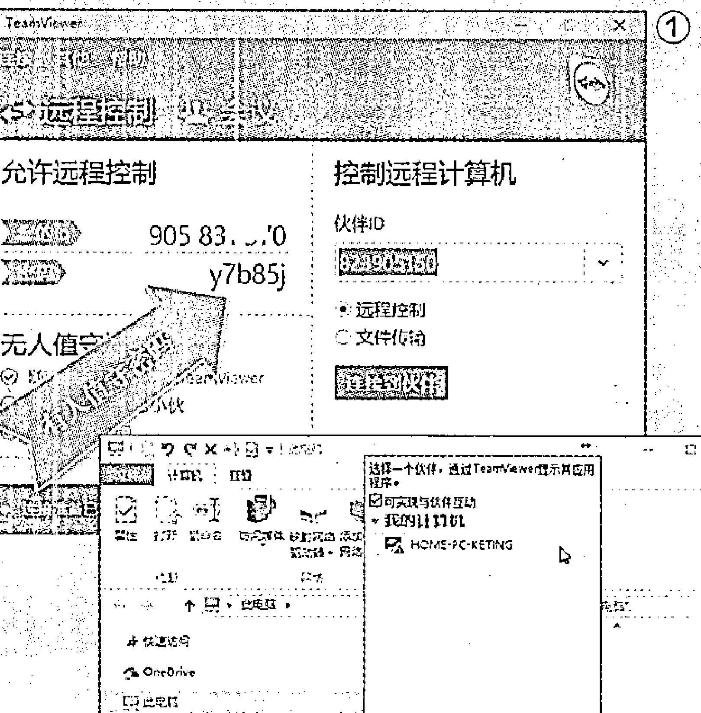

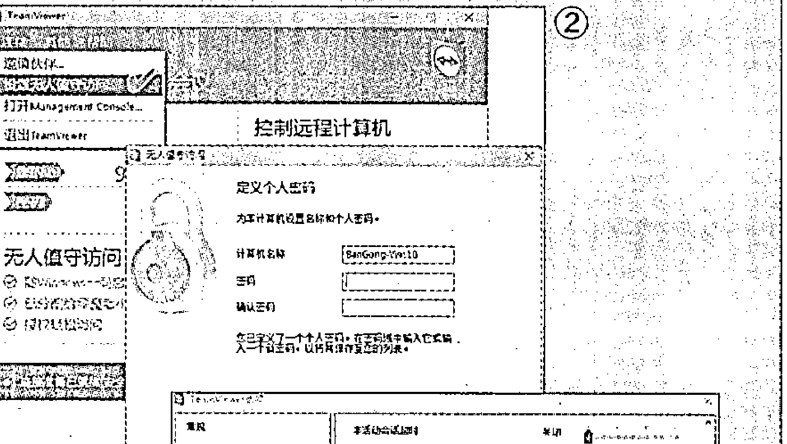

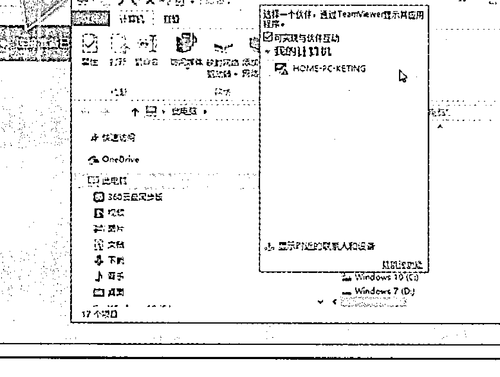

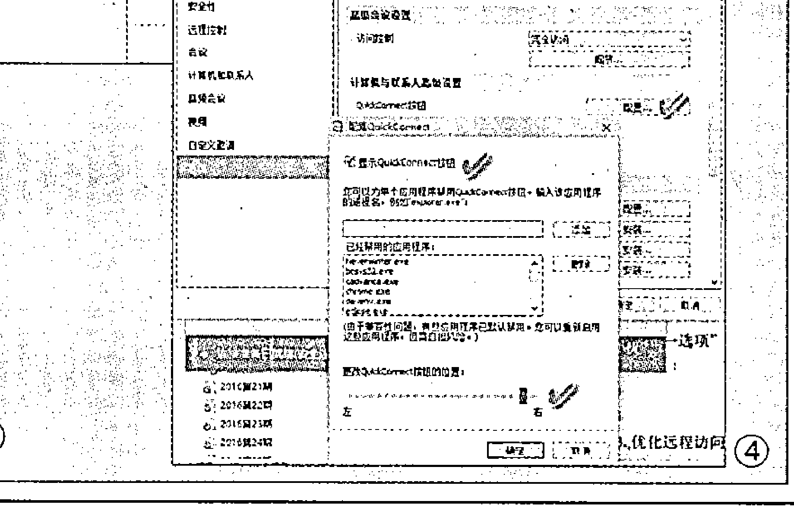

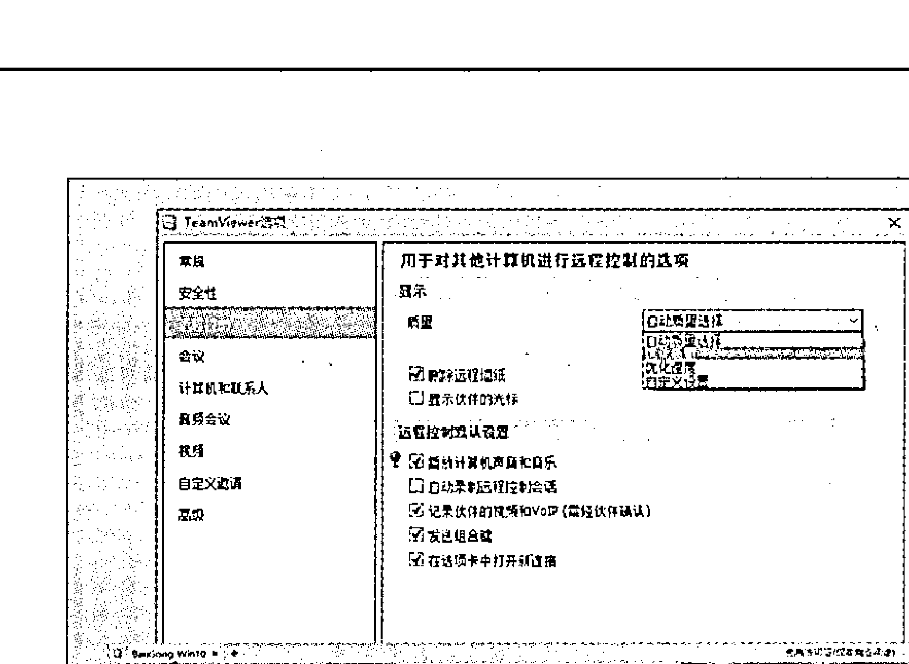

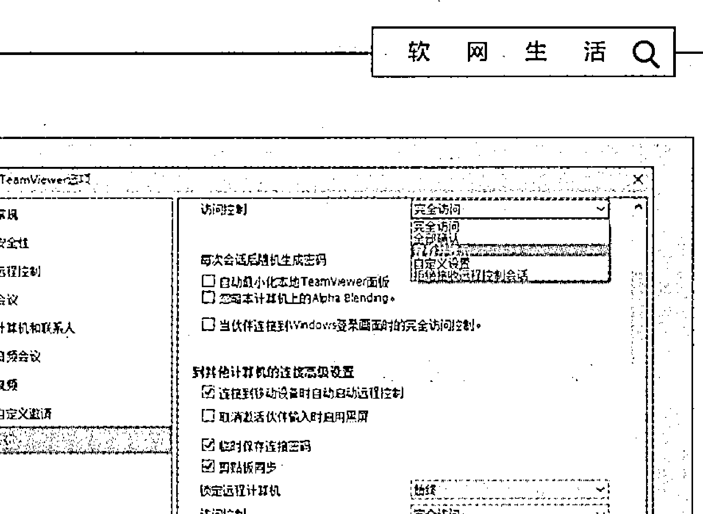

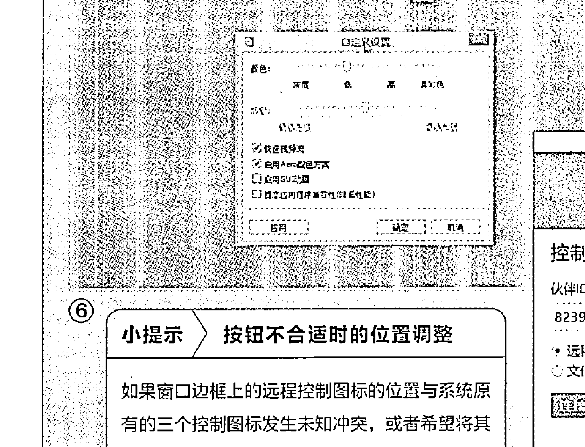

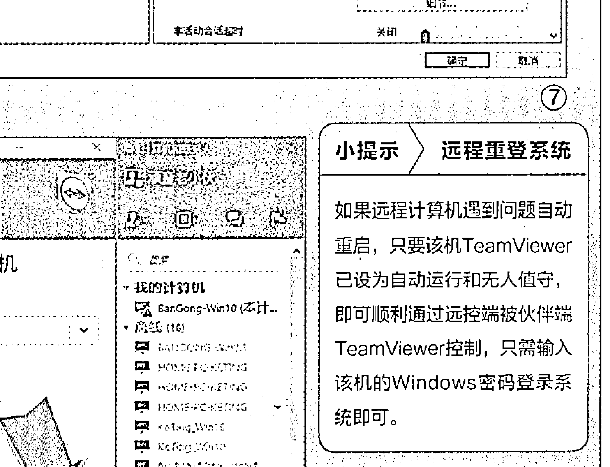

**小提示 按钮不合适时的位置调整**
如果窗口边框上的远程控制图标的位置与系统原有的三个控制图标发生位置冲突，或者希望将其分配到更合适的位置，可通过配置QuickConnect窗口下方的滑动条来调节其位置。

**小提示 远程重登系统**
如果远程计算机遇到问题自动重启，只要该机TeamViewer已设为自动运行和无人值守，即可顺利通过远控端被伙伴端TeamViewer控制，只需输入该机的Windows密码登录系统即可。

点击“高级”项目，在右侧找到QuickConnect项的“配置”按钮，点击之后可通过对“显示QuickConnect按钮”复选框的控制来开关窗口上的控制图标（图4）。

### 3. 优化远程访问质量的方法措施

远程控制访问体验除了与双端的设备和网络档次有关外，另外还与远控软件的质量与速度设置有关。首先可在本地TeamViewer软件的“远程控制”选项中设置质量优先还是速度优先，可选项目包括优化质量、优化速度、自动质量选择和自定义设置4个项目。同时，如果选择“删除远程壁纸”，还可以减少远程电脑界面的刷新时间，提高远程控制效率（图5）。

此外，远控质量或速度还可以通过即时远程控制窗口，在取得了控制权之后，通过改变控制窗口上端的相关控制参数来调整。点击控制窗口上方的“查看”菜单，然后再点击“质量”分组右下角的小箭头图标，即可进入自定义质量和速度的窗口，完成质量与速度的平衡设置（图6）。

### 4. 远程控制权限的控制与取得

远程控制默认为完全访问权限，其实我们还可以根据需要改变为其他权限，包括“查看并显示”、“拒绝接受远程控制会话”、“全部确认”等。这些权限可在“高级”选项的“访问控制”选项中选择（图7）。

如果远程控制时，对方的电脑自动锁定了屏幕，且锁屏画面不能响应远程鼠标的点击动作，无法解锁屏幕，那么可以尝试通过“动作”菜单发送“Ctrl+Alt+Del”命令进行解锁。

### 5. 免输入ID号的多电脑远程控制

如果是自己的公司或家庭拥有多台电脑，且需要两两之间进行远程控制，则可以申请一个TeamViewer网络管理账号，将每台电脑均加入到这个管理账号自动管理，然后点击账号按钮登录，通过右侧的计算机列表，直接点击右键菜单，即可控制各台计算机的远程访问（图8）。这样可以免去输入计算机ID号的不便。

## 隐私浏览还可以这样玩

文|万立夫

为了减少网站对特定用户的锁定和跟踪，同时避免浏览器对用户上网信息的记录，现在很多浏览器都加入了隐私浏览功能。其实除了网页浏览器以外，其他的一些网络软件并没有类似的功能。比如包括邮件客户端等一些带有浏览功能的软件，都有可能泄露使用者的个人隐私。那么如何使用浏览器的隐私浏览功能，并且杜绝不包括隐私浏览功能的其他软件泄露个人隐私呢？

### 激活浏览器隐私浏览

由于大量的网络用户都提出了这个要求，所以包括谷歌浏览器、火狐浏览器等知名浏览器，在软件里面都增加了一个隐私浏览模式的功能。那么普通用户如何激活这项功能呢？我们首先打开谷歌浏览器，接着点击右上角的“自定义及控制Google Chrome”按钮，在弹出的菜单里面选择“打开新的隐身窗口”命令（图1）。这时会新出现一个浏览器窗口，并且在左上角显示出一个灰色的礼帽图标，这说明隐私浏览模式就已经激活成功了。

如果用户使用的是火狐浏览器，同样首先运行打开它。接着点击右上角的“打开菜单”按钮，在弹出的对话框点击“新建隐私浏览窗口”命令（图2）。这样浏览器就会创建一个新的窗口，如果用户在窗口的右上角看到一个蓝色图标，这就表示已经成功地进入隐私浏览模式了。无论用户使用的是什么浏览器，在关闭所有隐身标签页后，用户浏览过的网页不会在浏览器的历史记录、Cookie存储区以及搜索记录中留下任何痕迹。

### 借用其他软件来浏览

当然包括IE浏览器在内的老浏览器，以及电子邮件客户端程序等软件，都没有自带隐私浏览模式的功能。那么对于这样的网页浏览器，我们又应该如何进行解决呢？其实这个时候最简单的方法，就是借助第三方软件来辅助操作。

首先下载安装最新版本的Adguard软件，安装完成以后会在系统托盘显示出软件图标。在图标上点击鼠标右键，选择菜单中的“选项”命令，就可以开始进行软件的配置操作。现在点击左侧列表中的“隐形模式”选项，接着

> **小提示**
最近火狐浏览器发布了三个“Test Pilot”项目的新特性，其中就包括从隐私浏览模式移植到默认浏览模式下的隐私保护功能。如果用户要想使用这项功能的话，首先打开“Test Pilot”项目的主页（https://testpilot.firefox.com），在页面中找到“Tracking Protection”这项后点击它，在新的浏览器窗口点击“Install the Test Pilot Add-on”按钮来安装一个附加组件。安装完成以后点击工具栏中的附加组件图标，在弹出的菜单里面点击“Tracking Protection”这项后，在弹出的新网页中点击“Enable Tracking Protection”就可以完成该模块的安装（图3）。

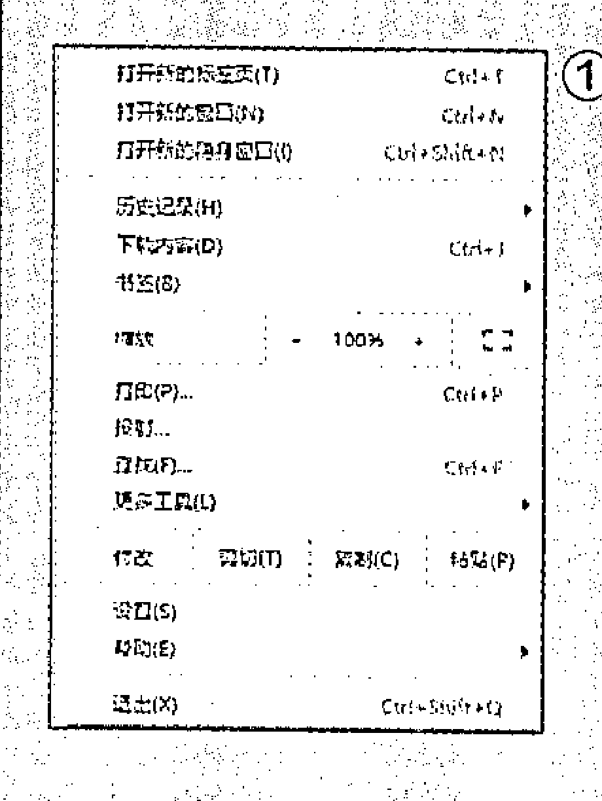

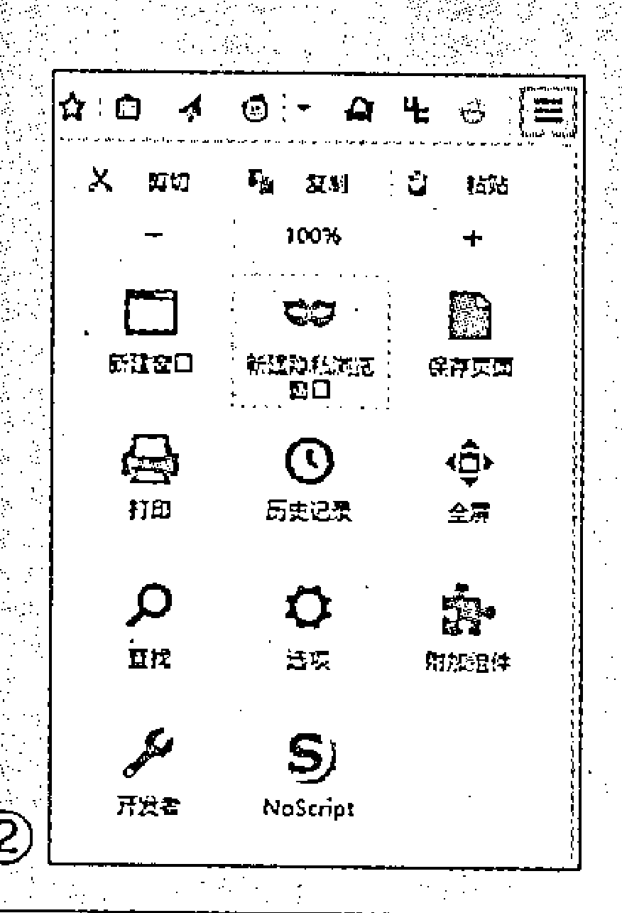

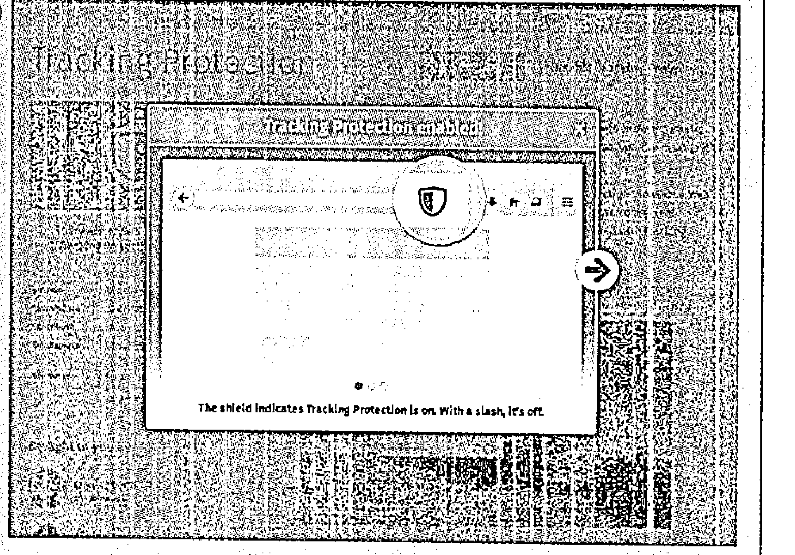

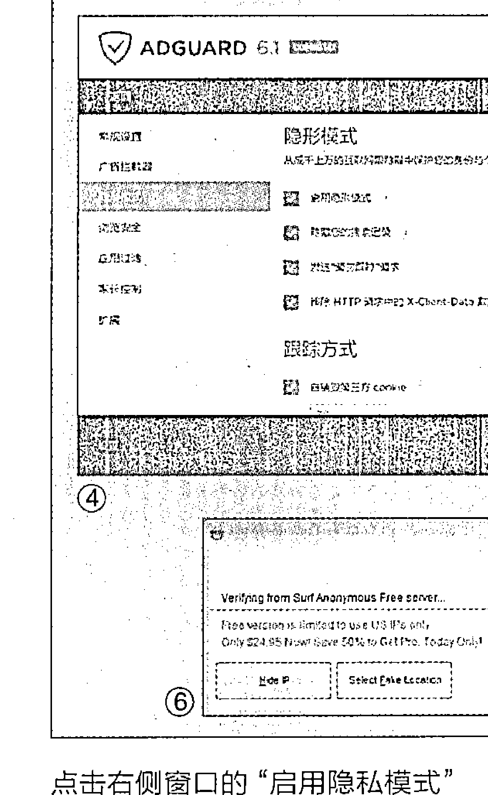

点击右侧窗口的“启用隐私模式”命令，这样我们就可以看到很多的选项。比如“隐藏您的搜索记录”、“发送请勿跟踪”等等。这些功能在谷歌浏览器里面已经存在，但是在一些其他的网络软件里面却没有，所以我们将它们选中就可以弥补这些软件的不足（图4）。另外这款软件还包括其他的功能，用户可以根据自己的需要进行选择。比如“自销毁第三方Cookie”、“禁止缓存第三方请求”、“拦截WebRTC”、“拦截定位API”等等。

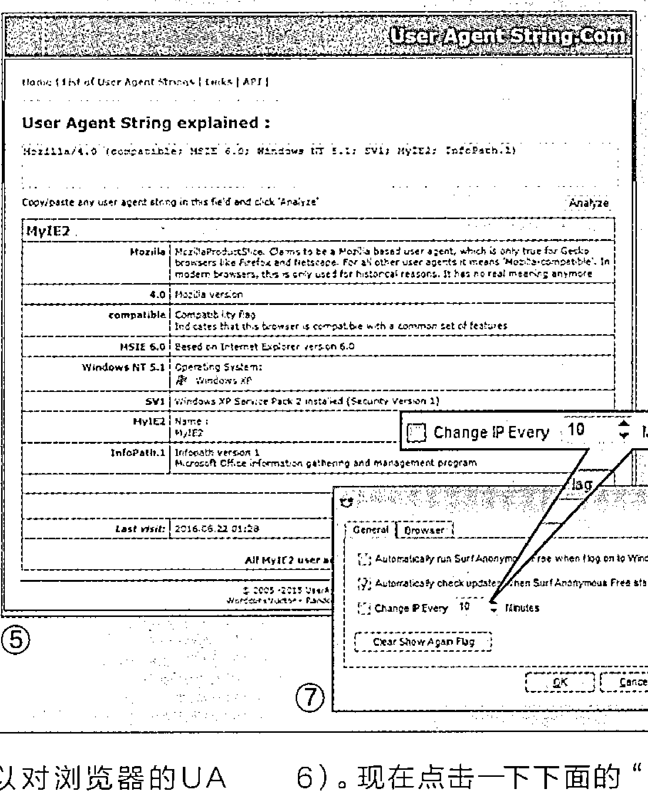

### 隐藏真实地址

隐私浏览模式虽然可以掩饰用户的信息，但是却不能成功地隐藏用户的IP地址。那么用户如何通过隐藏IP地址，来更好地保护自己的相关信息呢？首先下载安装“Surf Anonymous Free”这款软件，启动运行后会在软件窗口中显示出当前系统的IP地址（图6）。现在点击一下下面的“Hide IP”按钮，软件就可以调用免费的代理服务器，经过中转以后才可以访问需要的网站，这样就可以达到成功隐藏IP地址的目的。如果用户对当前使用的代理服务器不满意的话，那么点击下面的“Select Fake Location”按钮，就可以在弹出的窗口中选择其他地区的代理服务器来使用了。当然还有一个更加简便的方法，就是点击下面的“Options”按钮，在弹出的设置窗口里面选择“General”标签后，再选中下面的“Change IP Every”选项，这样就可以每隔一段时间自动更换一个代理服务器（图7）。


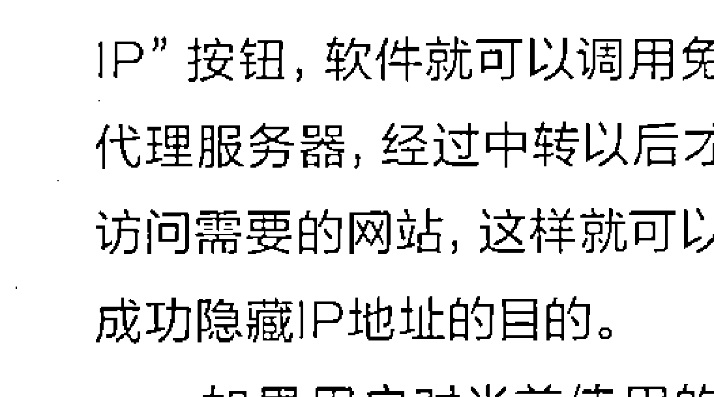

> 在Adguard软件的“杂项”里面，也有一个名为“隐藏您的IP地址”的选项，在输入框输入虚假的IP地址后就可以进行隐藏了。

## 时间到 你该休息一会了

文|阿立

电脑可以说是非常好的东西，不仅可以大大提高自己的工作效率，还可以充实自己的娱乐生活。可是很多时候坐在电脑面前，一坐就是大白天的时间。这样不仅眼睛会受到伤害，而且身体健康也会受到影响，所以需要定时休息休息才行。虽然很多软件都有定时提醒的功能，但是往往起不到很好的效果，那么有没有什么个性化的提醒软件呢？

### 改变桌面颜色提醒休息

FadeTop就是这样一款非常有个性的软件，主要通过让整个屏幕渐渐变淡来提醒用户。从其官方网站(http://www.fadetop.com)下载完成以后直接解压就可以运行，此时它也会在系统托盘驻留相应的图标。在软件图标上面点击鼠标右键，选择菜单中的“Options...”按钮，就可以开始进行设定操作。首先我们可以在“Activity timeout”选项中，设定每隔多少分钟休息一次的时间，用户可以依照自己的工作程度来进行调整（图1）。还可以在“Maximum opacity”选项里面设定每次要休息多久，在这段时间内整个屏幕都会自动淡出并变色。另外也可以在“Foreground color”和“Background color”选项里面，设置分别用于显示时钟时间和休息提示的颜色，以及用于覆盖屏幕的颜色等等。如果用户选中“Block fader when a full-screen application is running”选项的话，在运行全屏幕程序的时候就会暂停淡入淡出效果。设置完成以后点击OK按钮，当我们设定的时间一到，电脑屏幕就会以渐变的颜色进行提示（图2）。

### 活动颈椎减缓疲劳程度

长时间使用电脑后，我们就会觉得自己的颈椎非常的难受，而且手臂也有麻木的情况发生。这个时候最好的方法，就是活动活动进行缓解。而“头文字”这款软件就是通过摄像头对用户头部的活动来写字，定时提醒用户让颈部来活动活动。首先下载运行“头文字”这款软件，运行后同样在系统托盘打开它的设置窗口，接着分别设置“工作时间”、“休息时间”和“淡入时间”等选项（图3）。以后当设定的休息时间一到，整个屏幕将被一块“黑板”覆盖。在“黑板”的右下角会提示需要书写的汉字，与此同时软件会调用电脑连接的摄像头。当摄像头检测到画面中有人物头像后，“黑板”会出现某个汉字的笔划。比如出现的是横，那么用户的头部就从左至右进行移动，直到这一个笔划完成为止。接下来按照同样的方法书写下一划，直到这个汉字完整的书写完成就可以继续工作了（图4）。

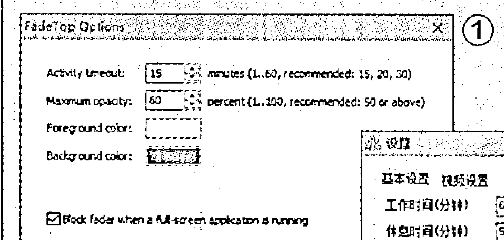

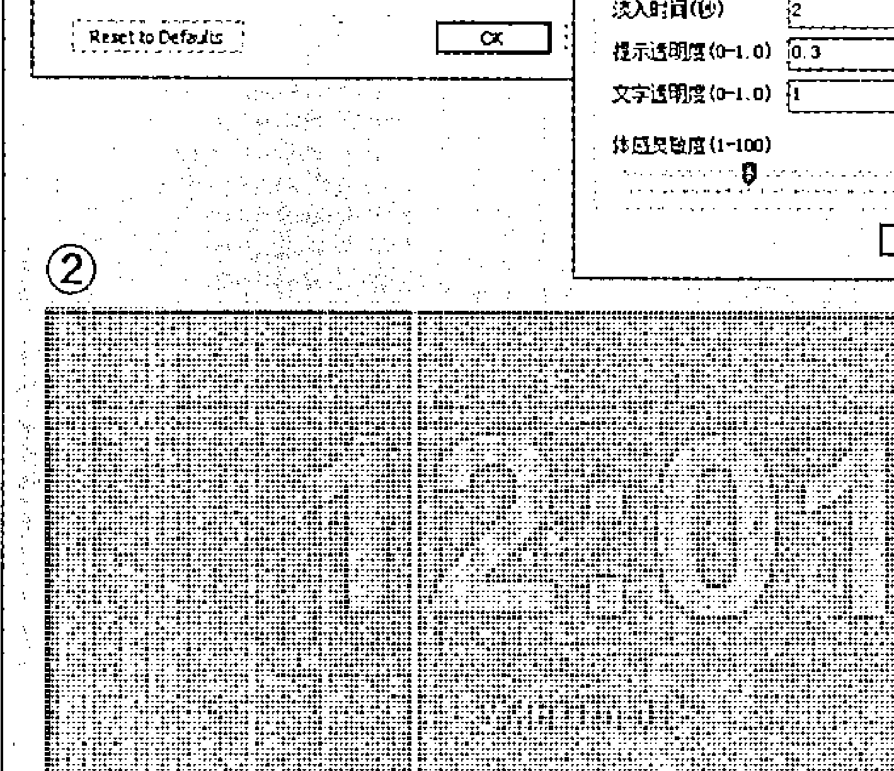

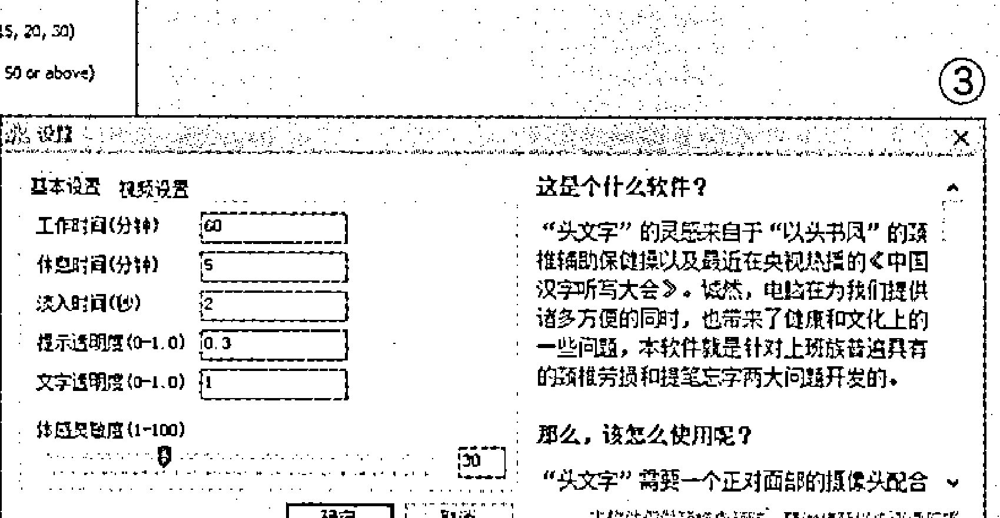


## 一键创建网页链接的二维码

文|倚楼

现在很多知名的网站页面都增加了各种各样的分享功能，这样只需要通过微信扫描分享的二维码，就可以在手机里面快速访问这个网页链接。但是并不是所有的网页链接里面都有分享功能，这样要在手机里面输入这个链接地址就非常麻烦。下面的方法，就是为没有提供此分享功能的网页也添加一个可快速访问的链接二维码。

### 功能扩展一键生成

要想把一个网页链接转换为二维码，最简单的方法还是在浏览器中完成。可是现在主流的浏览器都没有类似的功能，所以我们只能“因地制宜”地进行解决。由于国内的很多浏览器都是在Chromium的基础上研发而来，所以我们只需要安装一款相应的功能扩展就能解决。首先通过浏览器登录https://csser.me/这个网站，点击网页里面的“Anything to QRcode”链接，这样就可以跳转到谷歌应用商店安装这款功能扩展。

以后当我们访问一个网页链接后想要生成二维码图片的时候，只需要点击工具栏中的“Anything to QRcode”图标，或者在网页页面上点击鼠标右键选择“生成二维码”命令，就可以很快生成一个二维码图片信息。接下来只需要通过手机应用进行扫描，就可以快速地将这个网页链接传递到手机里面（图1）。除了传统的网页链接以外，该功能扩展还可以对选中的文本、图片地址、链接等内容进行二维码的生成。“Anything to QRcode”扩展除了生成二维码图片外还可以读取二维码图片，我们只需要在二维码图片上点击鼠标右键，选择右键菜单中的“解析二维码”命令就可以了（图2）。

### 脚本生成快捷方便

如果用户使用的是火狐浏览器而非谷歌浏览器，那么“Anything to QRcode”这个功能扩展肯定就无法使用，那么这个时候最好的方法就是使用脚本。登录https://github.com/lastdream2013网站，点击其中的“userChrome”链接后，就可以在列表中找到一个名为qrCreator.uc.js的脚本。将它下载到本地硬盘后，再复制到火狐浏览器的Chrome文件夹即可。

当我们要想将当前网页链接生成二维码的时候，在网页的空白处点击鼠标右键后选择“生成QR码：当前网址”命令，就可以将网页链接转换为二维码图片（图3）。而且这款脚本和“Anything to QRcode”扩展一样，也可以对选中的文本等内容进行二维码生成操作。比如我们选中一段文字内容后，点击鼠标右键选择“生成QR码 选区文字”命令即可。

> **小提示**
关于UC脚本的下载和安装操作，可以查看第16期《UC脚本打造非同一般的浏览器》一文。

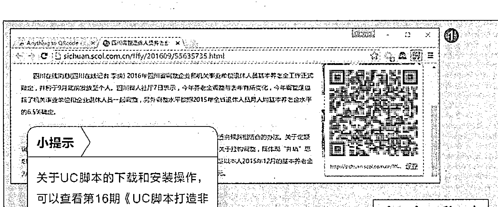

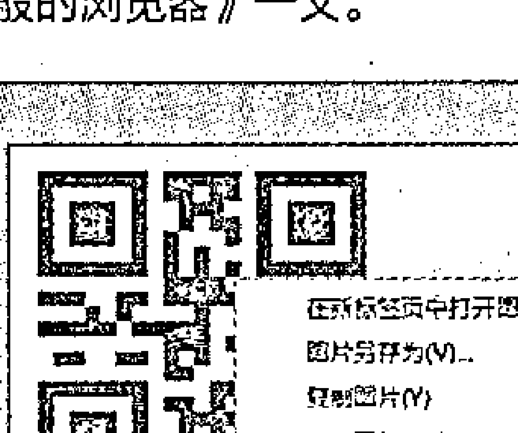

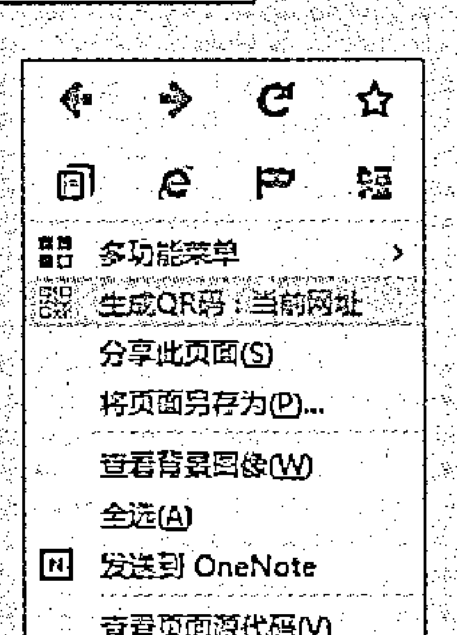

> **小提示**
利用一个名为qrReaderOnline.uc.js的脚本，在火狐浏览器里面也可以进行二维码的识别操作。

## 网络服务账号与好友共享

文|老万

现在有的网站为了更好地服务用户，对用户的注册都进行了限制操作。这样有的时候需要使用该网站的服务，就需要向朋友借用该网站的账号和密码。但是很多用户为了怕密码被泄露，并不愿意将账号密码进行外借，可是这样做的话又会影响朋友感情。那么能不能做到既可以和其他人共用网络服务账号，但是又不直接通过账号密码的方式进行分享呢？

### 创建Cookies分享链接

其实除了直接分享账号密码以外，我们还可以通过分享Cookies来解决。不过传统的方法对于双方来说，操作起来都非常的繁琐，所以今天通过云服务来解决。我们首先通过谷歌浏览器登录“Access URL”服务的官方网站(https://accessurl.com/)，点击网页中的“Add to Chrome”按钮后跳转到谷歌的应用商店，接着根据提示安装这项服务的功能扩展即可。当功能扩展安装完成以后，就可以在工具条里面看到“Access URL”的图标。现在通过谷歌浏览器照常打开需要分享的网站，输入账号密码以后进行登录就可以了。然后点击工具栏中的“Access URL”图标，在弹出的对话框可以看到分享网络服务过期的时间（图1）。其中包括24小时、一个星期以及永不过期三种选项，用户根据自己的需求进行选择后再勾选下面的同意使用条款选项，最后按下“Create Access URL”就可以产生一组随机的分享链接（图2）。再点击“Copy Access URL”按钮将分享链接复制到剪贴板，然后通过即时通讯工具、电子邮件等方式把它传给你要共享账号的朋友即可。

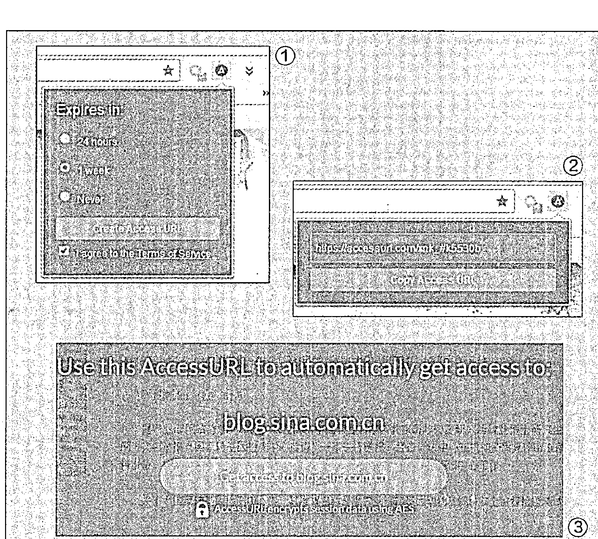

### 直接登录简单方便

当自己信赖的朋友点击打开“Access URL”产生的分享链接后，就会自动打开自己需要登录的这个网站。不过在网站上方会出现一个提示框，询问用户是否要取得前往这个网址的权限（图3）。点击下面的“Get access to”按钮后就可以自动完成登录操作了，看上去是不是非常的神奇呢？不过远程用户想要使用这项服务还有一个要求，就是同样必须使用谷歌浏览器并安装“Access URL”功能扩展才行，因为这个扩展的作用就是加密Cookies信息并进行传递。

如果用户需要管理自己分享的网页链接，那么可以通过浏览器打开https://accessurl.com/manage-urls这个链接，从中就可以看到自己创建生成的所有分享链接。如果用户不想等待分享链接过期让其失效，除了将用户现有的网络服务进行退出操作以外，最直接的方法就是点击分享链接后的删除按钮，从而人为地让这个分享链接马上失去效果（图4）。

**小提示**
理论上采用Chromium框架的浏览器，配合这个功能扩展都可以使用这项服务。

### 批量获取QQ群成员的QQ邮箱

文|王志军

工作中需要将工作群所有成员的QQ邮箱提取出来，制作成为一个Excel表格。有人可能会说，逐一打开相应群成员的“查看资料”对话框，复制、粘贴QQ号码就可以了。但要知道，对于群成员比较多的公司来说，这个方法显然十分的麻烦，而且还容易遗漏或出错。其实我们有更为简单的方法——在线工具配合Excel来轻松提取QQ邮箱。

#### 1. 访问群空间

打开相应的工作群，点击左上角的橘黄色星星图标，进入群空间页面。当然，也可以在浏览器直接访问“http://qun.qzone.qq.com/group#!/*******/home”，这里的“******”是群号码，随后同样也会进入群空间。

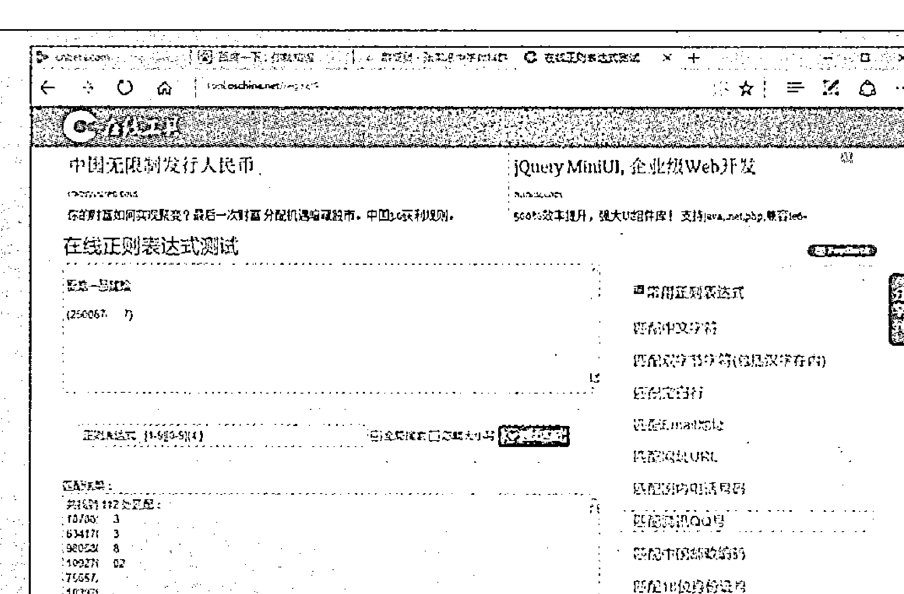

#### 2. 获取群成员列表

进入群空间界面之后，点击页面中的群成员列表按钮，在这里框选所有的群成员，右击选择“复制”，粘贴到剪贴板备用。

#### 3. 匹配正则表达式

在浏览器访问http://tool.oschina.net/regex/#，这是一个在线正则表达式测试的免费网页，在网页顶部的“在线正则表达式测试”文本框中，粘贴刚才复制的群成员信息，在右侧表达式选择“匹配腾讯QQ号”，很快就可以看到如图1所示的匹配结果，这就是我们所需要的QQ号码。

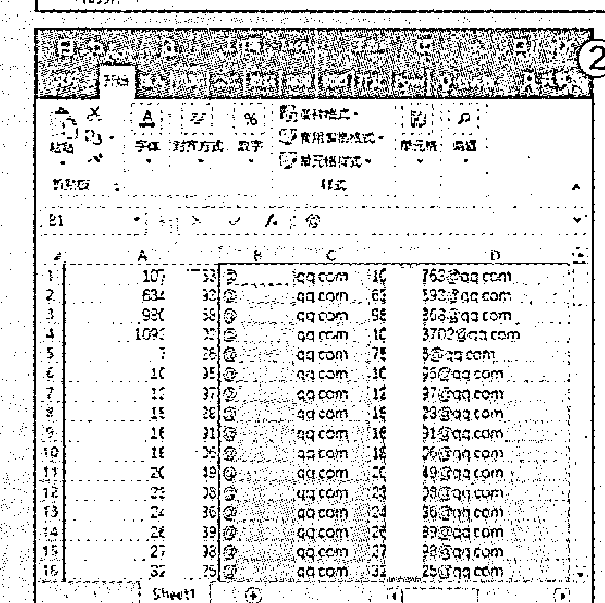

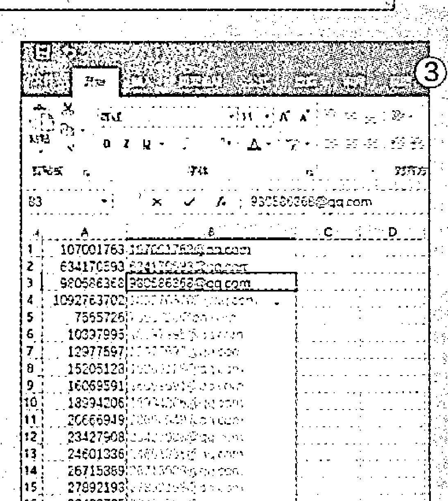

#### 4. 生成QQ邮箱

接下来的操作就简单多了，将QQ号码复制到剪贴板，打开Excel进行粘贴，至于接下来添加“@qq.com”的操作，可以利用辅助列和“&”进行连接，分别在辅助列输入“@”和“qq.com”，利用“=”的公式完成连接，效果如图2所示。

如果使用的是Excel 2016，也可以利用“快速填充”实现。例如在B1、B2两个单元格分别手工输入填充示例（注意必须是带@qq.com的内容），随后就可以看到如图3所示的填充建议，直接按下回车键即可。

此外，无论使用的是哪一个版本的Excel，还可以利用一个简单公式直接生成：在B1单元格输入公式“=A1&\"@qq.com\"”，按下回车键执行命令，向下拖拽或双击填充柄，很快就可以获得相应的效果。

> 扩展阅读
当然我们也可以利用Word或EmEditor的高级替换完成替换操作。复制群成员数据后，以无格式方式粘贴到Word，查找“^13^13”替换为空；查找“\(*\)”替换为空即可。

### 拼长图——截图拼接

文|老万

有的时候我们想要进行屏幕截图，但是由于需要截图的内容过长，这样按照常规的截图方法肯定就无法完成，这时就需要通过滚动截图来进行操作。但是并不是所有的截图软件都有滚动截图的功能，于是很多时候我们只能退而求其次。首先进行屏幕内容的分别截图，再利用图片编辑软件进行拼接，从而达到我们想要的结果。那么如何进行截图的拼接操作呢？

#### 系统画板快速拼接

对于很多电脑用户来说，截图操作平时都使用的不多，更不要说是长截图操作了，所以他们不会为此安装专门的软件，只想利用一些常见的软件来完成操作。我们首先运行Windows系统中的截图工具，点击工具栏里面“新建”旁边的下拉按钮，在弹出的菜单里面选择“窗口截图”命令。接下来点击工具栏中的“新建”按钮，将鼠标移动到需要截图的窗口上，这时截图工具将自动捕获窗口的轮廓，用户只需要点击鼠标左键就可以完成截图。接下来切换到截图工具窗口，点击工具栏中的“保存”按钮，就可以将刚刚的截图进行保存(图1)。然后切换到需要截图的窗口，移动滚动条到合适的位置上以后，按照刚刚的操作继续截图操作就可以了。

由于我们是按照窗口来进行截图的，所以每一张截图都有窗口标题栏的部分。接下来运行系统里面的画图工具，点击左上角主菜单选择“打开”命令，在弹出的对话框选择打开第二张截图文件。通过矩形选择框选中需要的内容部分，再点击工具栏中的“复制”命令。然后在画图工具里面打开第一张截图文件，打开之后把图片下方的空白部分用鼠标拉开点，因为我们后面添加的图片是在空白这个范围内才能显示的，如果空白部分太少的话，可能会导致后面拼接的图片显示不完整。
现在点击工具栏中“粘贴”命令，然后通过鼠标来移动图片的位置，从而完成两张图片的拼接操作（图2）。最后点击左上角主菜单选择“另存为”命令，将拼接完成的图片重新进行保存。

#### 专业软件自动拼接

虽然利用系统自带的软件进行操作非常的便捷，但是毕竟由于是手动操作，所以很多用户会觉得非常的不方便，而且这种手工操作往往会出现各种问题。这时最简单的方法，还是使用专业的软件进行自动的拼接操作为好，而我们常见的Photoshop软件就是这样一款软件。首先点击“文件”菜单中的“自动”命令，然后从弹出的子菜单里面选择“Photomerge”这个命令。
这个时候会弹出一个名为

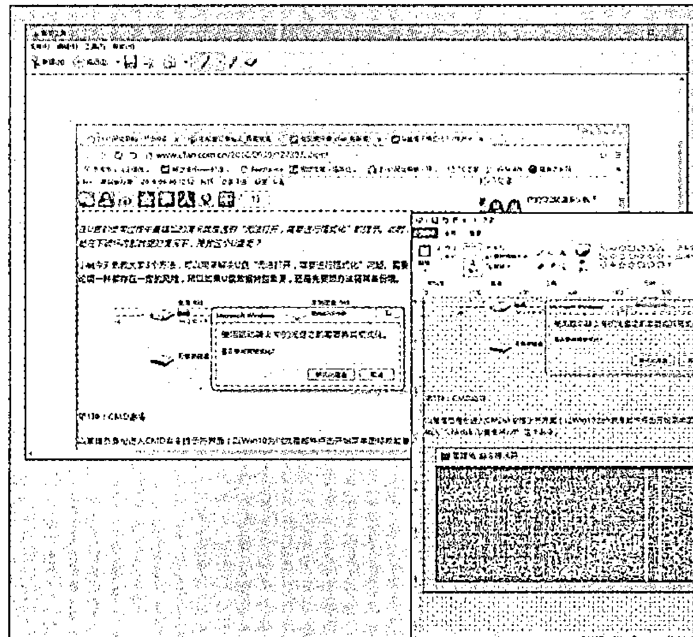

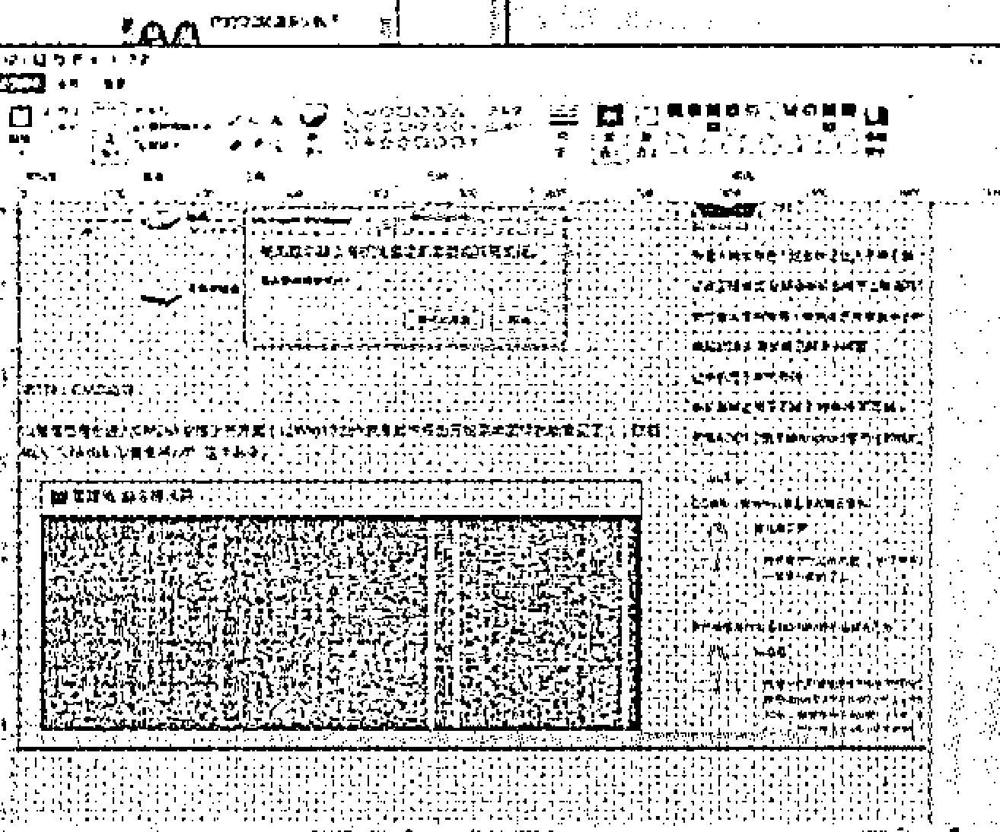

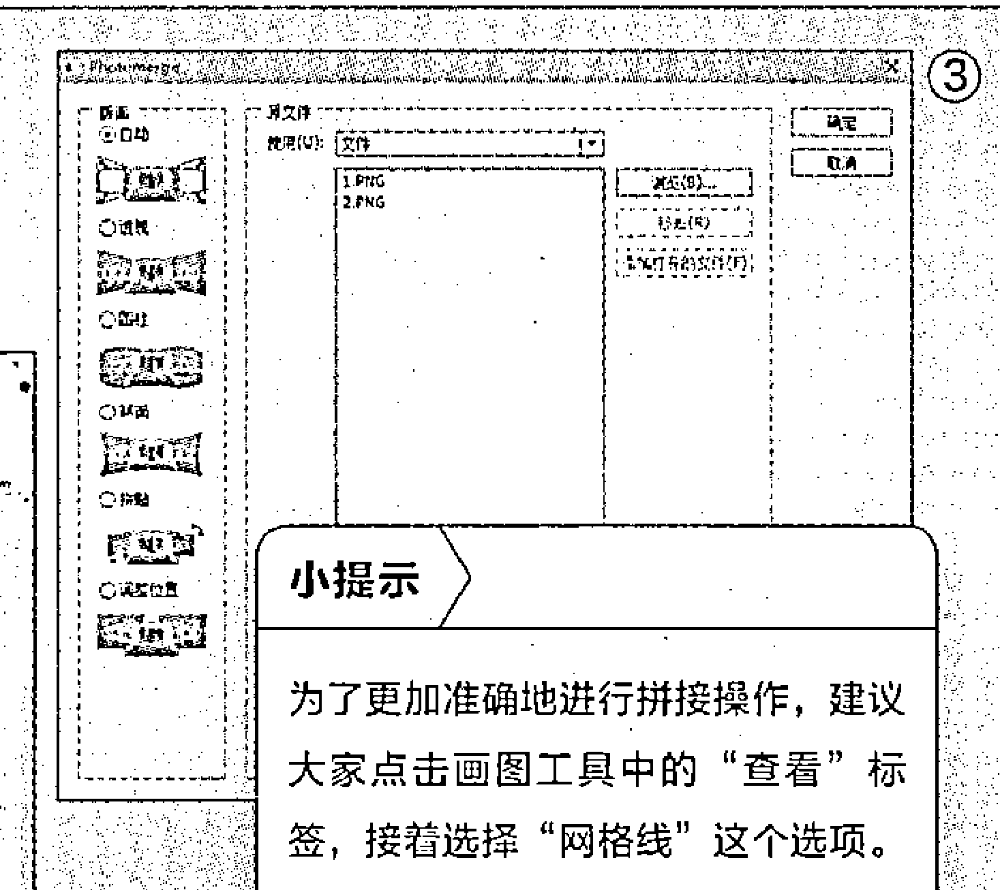

> 小提示
为了更加准确地进行拼接操作，建议大家点击画图工具中的“查看”标签，接着选择“网格线”这个选项。这样在移动图片的时候，就可以用网格线来进行参考。

#### 手机操作灵活方便

而且我们会发现，不符合拼接要求的照片将会被扔到下面单独列出来，将这些文件剔除后就可以合并所有图层了。现在找到Photoshop软件的图层对话框，点击对话框右上角的功能按钮，在弹出的菜单里面选择“合并可见图层”命令，这样图层对话框中的图层就可以进行合并。接下来点击“文件”菜单中的“另存为”命令，在弹出的对话框里面就可以将合并完成的图片存为需要的文件格式。

除了在电脑里面进行操作以外，我们现在很多人喜欢在手机里面操作，所以同样的问题也会在手机里面遇到。那么我们怎么才可以解决这个问题呢？大家首先通过应用商店安装一款名为“Stitch & Share”的软件应用，这款软件不仅可以进行长截图操作，而且可以对其他的截图进行快速的拼接操作。首先点击软件应用界面中的“Automatic capturing”按钮，如果是第一次使用这款手机应用的话，在点击这个按钮后就会看到三个控制权限。分别点击三个控制权限下面的“Allow”按钮，根据向导提示在手机里面分别激活控制权限后才可以使用。当权限激活成功以后，我们就可以在手机屏幕上看到一个悬浮的按钮。现在打开需要截图的软件应用窗口后，点击该按钮就可以进行截图操作了。当截图成功以后就可以在屏幕的左上角看到截图成功以后的缩略图显示(图5)。与此同时，在手机屏幕的右侧我们可以看到一个保存按钮，点击保存按钮下的箭头图标就可以对屏幕内容进行滚动，这样就可以实现长截图的操作了。如果点击箭头按钮没有反应的话，也可以直接手动进行滚动操作。最后点击保存按钮跳转到“Stitch & Share”的界面，这样就可以对刚刚的截图进行预览，如果没有问题的话就可以保存到手机的图库里面了(图6)。

如果手机里面已经有现成的截图文件，那么点击“Stitch & Share”界面中的“Combine Screenshots or images”按钮，在弹出的图库里面选择需要进行拼接的文件。接着手机应用会自动根据截图中的内容，对选择的图片顺序进行调整和排序整理。现在点击屏幕右侧图片结合部的剪刀图标，接着通过手指移动一张图片使得截图的重合部分完全重叠后，再进行保存，就可以非常方便地完成截图的拼接操作了(图7)。和在电脑系统里面一样，手机里面的截图往往也有标题栏等信息。所以我们只需要移动前面的一张图片，就可以成功地将标题栏信息等进行覆盖。

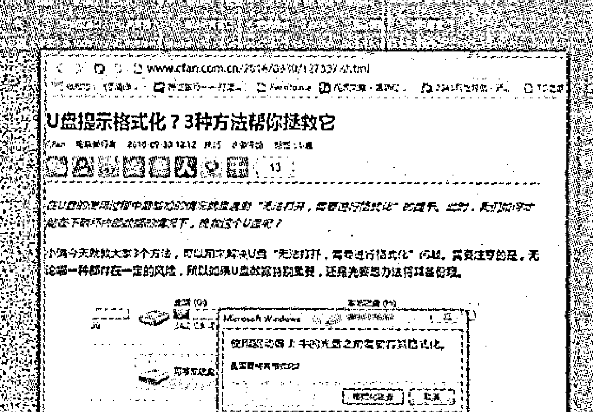

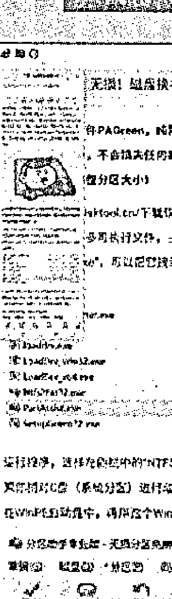

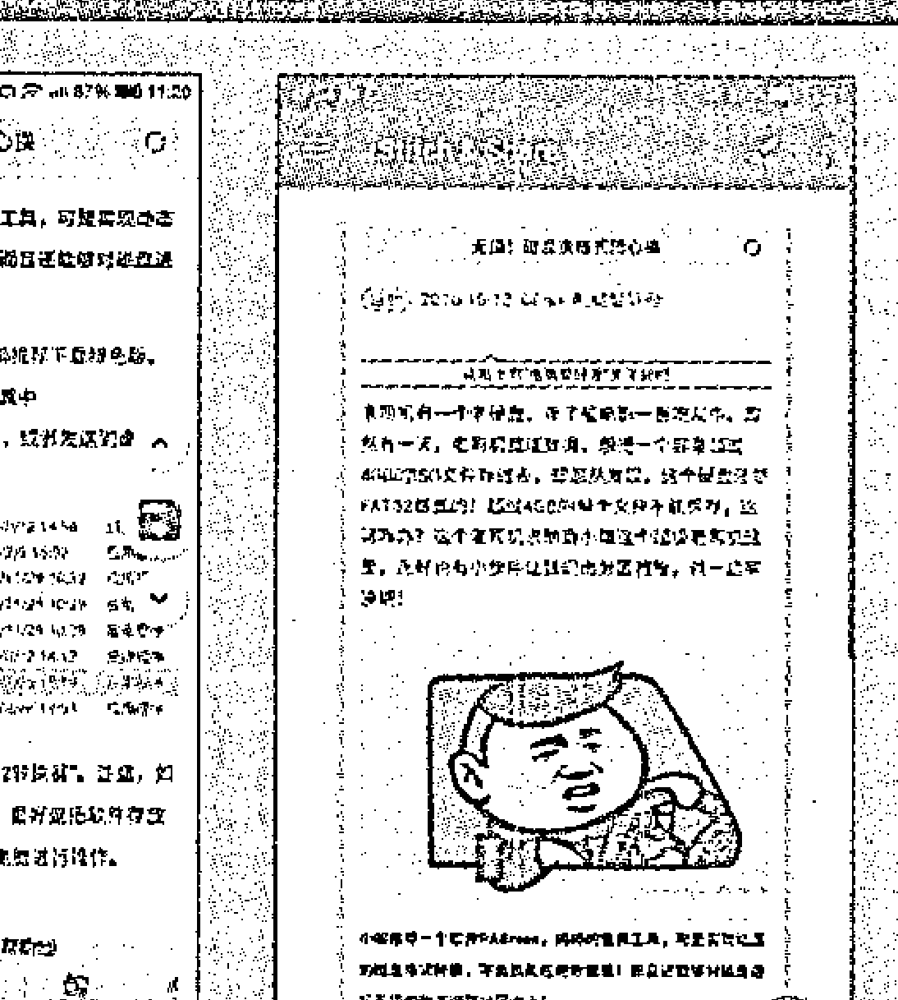


### 手机+电脑 快速录入文字

文|江文涛

对着手机或PC说话，语音立刻变为文字，这项语音转换功能大家一定已经熟悉。然而，当你坐在电脑旁，没有麦克风设备，而又需要在电脑中录入大量文字时，怎么办？充分利用当前手机的智能特性，将手机变为麦克风，通过局域网，将手机语音传输到电脑，并借助适当的软件进行自动识别，就能轻松解决上述难题。

首先在Windows 电脑中安装讯飞输入法(需要2.0.1217以上版本方可)，其中集成了讯飞麦克风软件。安装完成后，点击输入法状态栏右侧的齿轮图标，选择“讯飞麦克风”。

之后，按提示点击右下角的链接“已安装点这里连接手机”进行手机软件安装。接下来在手机上安装相应的讯飞麦克风应用。手机与电脑可以采用USB连接，也可以采用二维码进行连接，按照电脑屏幕的提示，用手机扫描屏幕上给出的二维码图案（图1）。

手机连接或扫描成功后，进入讯飞麦克风应用下载页面，点击“下载讯飞麦克风”按钮下载该应用（图3）。按照提示安装讯飞麦克风到手机上。

运行电脑上的讯飞麦克风，出现二维码图案，点击手机端的扫一扫配对按钮，扫描电脑二维码图案进行配对。

连接成功之后，手机屏幕出现麦克风大圆圈图标，提示按住屏幕开始说话（默认为普通话），就可以对着手机讲话输入了。此时，我们在电脑上打开一个文本编辑软件，随便说一些语句，即可将你所述的语句转换并记录在电脑上。

> 讯飞麦克风在PC上运行后，任务栏上会出现一个麦克风图标。右键单击该图标，在“选择语言”菜单中我们可以发现多种语言或方言的选择项。

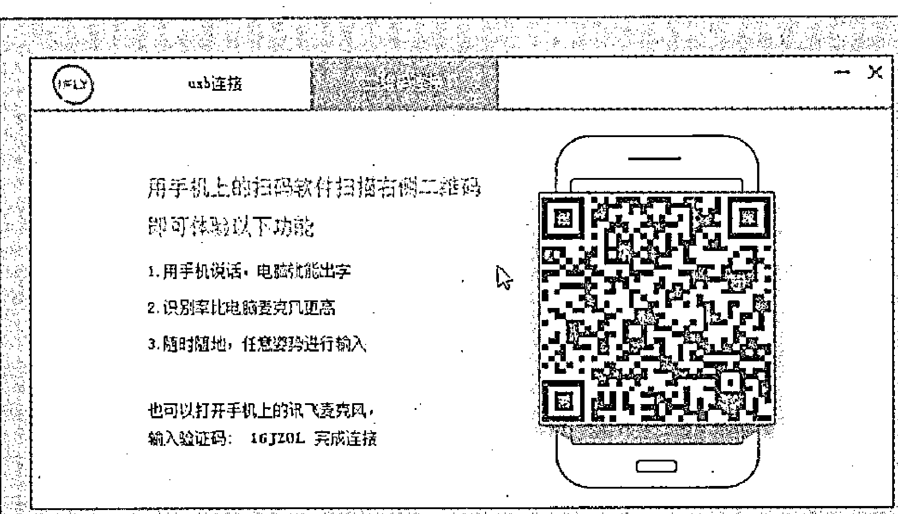

> **小技巧：设备配对要注意**

在正式使用手机向电脑端输入文字之前，手机端的讯飞麦克风需要与电脑端的讯飞麦克风进行配对。因此，这两部设备需要在同一个局域网中，需要保持Wi-Fi连接畅通，或USB连接正常。

> **小提示 为何无法安装成功**

注意手机与电脑要处于能够正常连接的状态，否则可能会出错。如果采用USB数据线连接，而连接不稳定；或者电脑网络、手机网络、手机应用安装权限等出现问题，都可能造成手机端应用无法安装成功的情况（图2）。

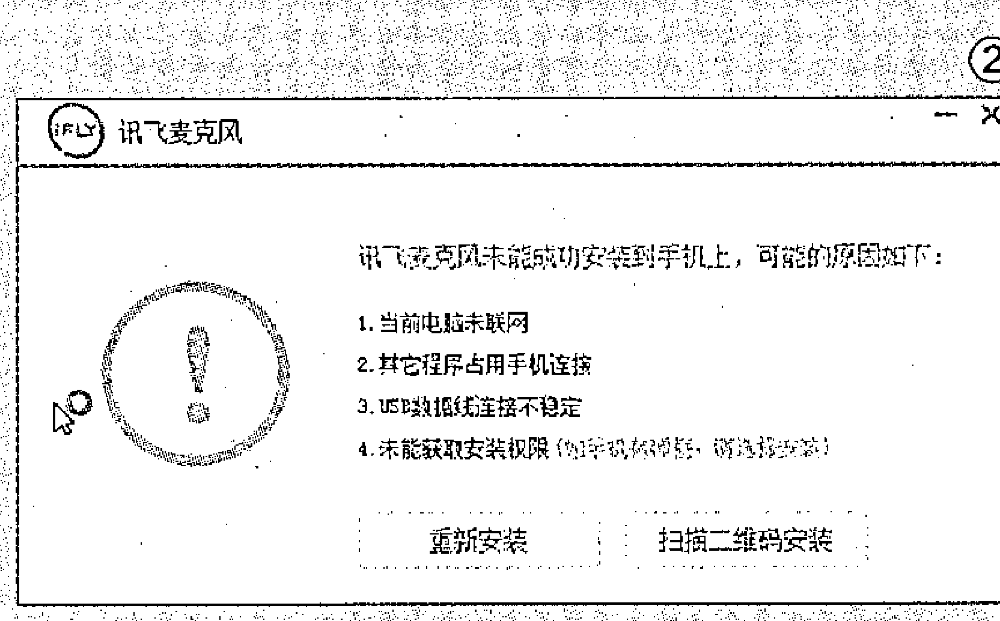

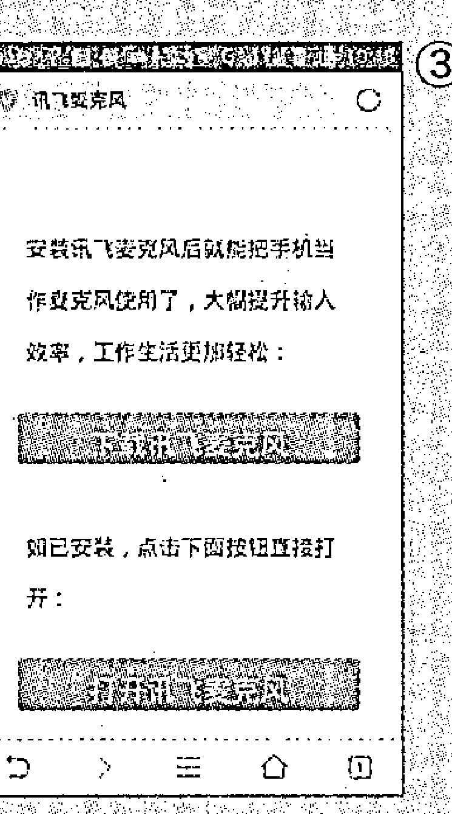

### PDF极速工作三合一

文|瑶瑶

PDF文档阅读已司空见惯，然而对PDF文档进行编辑或格式转换的需求也时有发生。之前，要完成PDF文档的阅读、编辑和转换，往往需要专业级的PDF编辑工具或借助多款不同的PDF工具。实际上我们可以寻得更为方便的解决方案。

#### 1. 寻求PDF飞速阅读体验

我们可利用“极速PDF阅读器”实现PDF的快速阅读（图1）。想要提升PDF阅读体验，以幻灯片播放方式阅读是个好办法。点击工具栏的“幻灯片”按钮即可进入幻灯片模式（可切换全屏）。平常的阅读操作则可一键完成，包括切换单页和对开阅读、切换阅读背景、倒置页面的旋转阅读等，通过工具栏的相应按钮即可完成，非常方便。

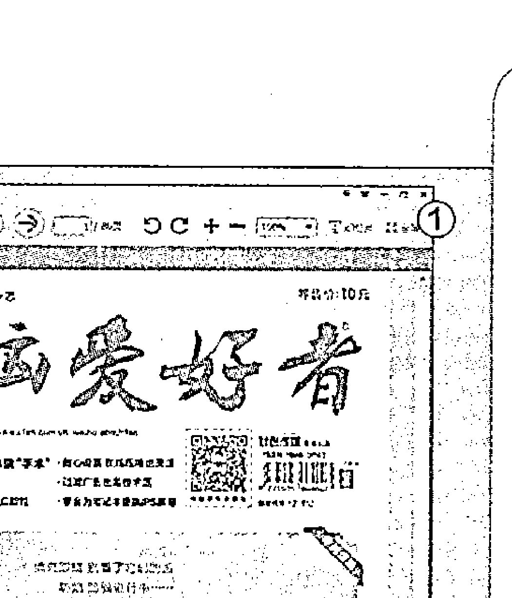

##### 小技巧

代替复杂的菜单命令，善用快捷控制操作，效率会更高。页面旋转用Ctrl+Shift++和Ctrl+Shift+-，连续阅读和书本阅读模式分别用Ctrl+X和Ctrl+B，幻灯片阅读和全屏阅读分别用Ctrl+L和Ctrl+Shift+L。此外，可用F12键一键显示书签并用右键添加书签（图2）。


#### 2. PDF格式一键转Word

Word是我们最常用的文档编辑器，如果对方需要Word文档，而我们手头上只有PDF，可先将PDF文档转换为Word文档。一键点击“转换”标签启动文档转换器（首次使用要自动下载安装相应的转换软件）。在当前打开的PDF文档列表中，还可以通过加号按钮添加更多的文档，准备好后点击“开始转换”，可转换出DOC、DOCX和RTF等三种格式（图3）。

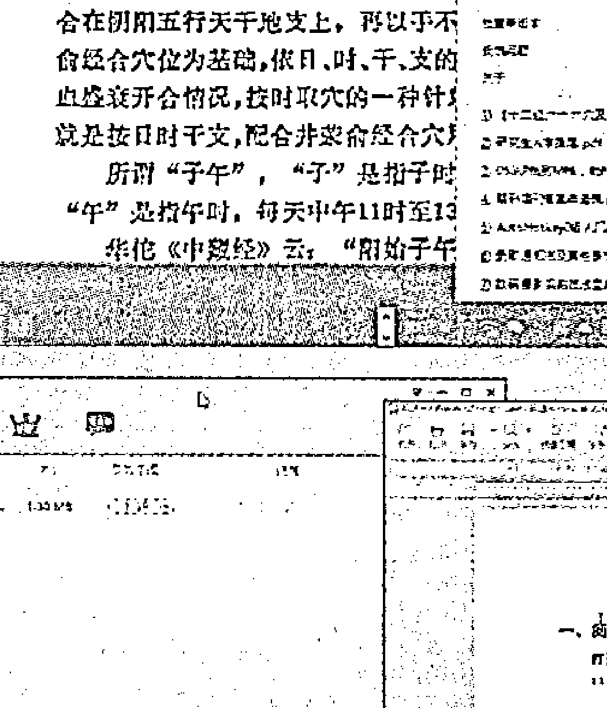

#### 3. PDF文档也能随心编辑

对PDF中的某些元素不满意，希望作增删操作。这时，只需点击“编辑”选项卡，进入编辑环境（首次使用也需自动下载安装相应的编辑软件）。启动到编辑环境之后，通过工具栏上提供的丰富的文本工具、线条工具、图章工具等，完成对PDF文档的编辑（图4）。

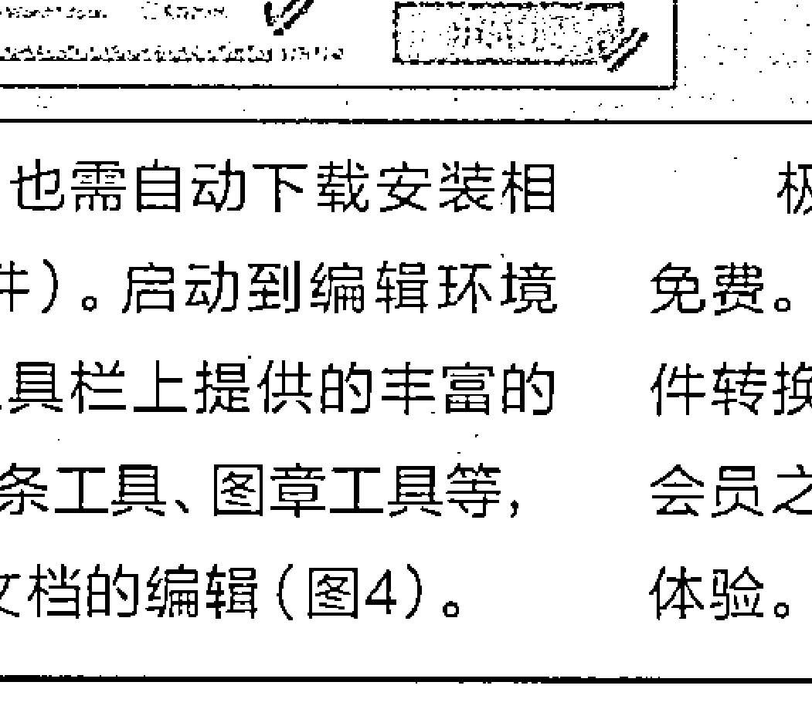

极速PDF阅读器的功能完全免费。转换器和编辑器免费版对文件转换数量和功能有所限制，注册会员之后，可获得更高效率的体验。

### 照片美化 “傻瓜” 也能高大上

文 白洁

说起照片美化，大款式的Photoshop和大众化的美图秀秀等常用看图修图软件基本都具备。然而，我们需要更为简单和实用的工具，为此，本文仅以2345看图王的附加图片美化工具抛砖引玉，以简单化的操作手法，实现不一般的照片编辑美化任务和效果。

安装2345看图王之后，在Windows资源管理器中打开图片文件夹，右击某张照片，选择“使用看图王美化图片”命令，即可进入照片美化窗口(图1)。

#### 1. 自由创建不同程度的马赛克效果

我们有时要在图片上创建马赛克效果，然而，动不动就用PS也不值得，而一些常用的简单工具(如百度输入法自带的截图工具)的马赛克处理，不能进行模糊度的设置控制，效果单一。用看图王美化器打开图片，点击工具栏上的“马赛克”按钮之后，通过“画笔大小”和“模糊度”，就可以随意对马赛克工具进行不同程度的调整控制了(图2)。

> 小技巧：如果觉得通常的马赛克效果太过千篇一律，还可以采用“油画笔”工具代替马赛克工具，对画面区域进行涂抹。点击“画笔大小”左侧的油画笔工具按钮，然后调整画笔大小参数即可(图3)。注意，与马赛克工具不同的是，油画笔工具只能调整画笔大小，不能调整模糊度。

#### 2. 文字标注要爆炸更要有透明度

在照片上标注适当的文字，常常可以起到说明、点缀或补充的作用。但由于文字颜色和图片颜色很难协调一致，因此我们往往会使用爆炸性文字框或给文字施以透明度来解决。一般的简易型照片文字标注软件制作爆炸标注框容易，但处理透明文字比较麻烦，在美图王编辑器中则变得非常容易解决。

打开照片，点击“文字”按钮后，可以用三种方式进行文字标注和美化。点击左侧的A按钮，可输入无边框的文字并对字体、字型颜色等进行设置。如果要添加气泡型、爆炸性、指示框、箭头、方框等文字标注形状，点击相应的形状按钮，并在图片上的相应位置画出即可。为了达到与背景图片的颜色协调，可通过透明度滑块进行调整。

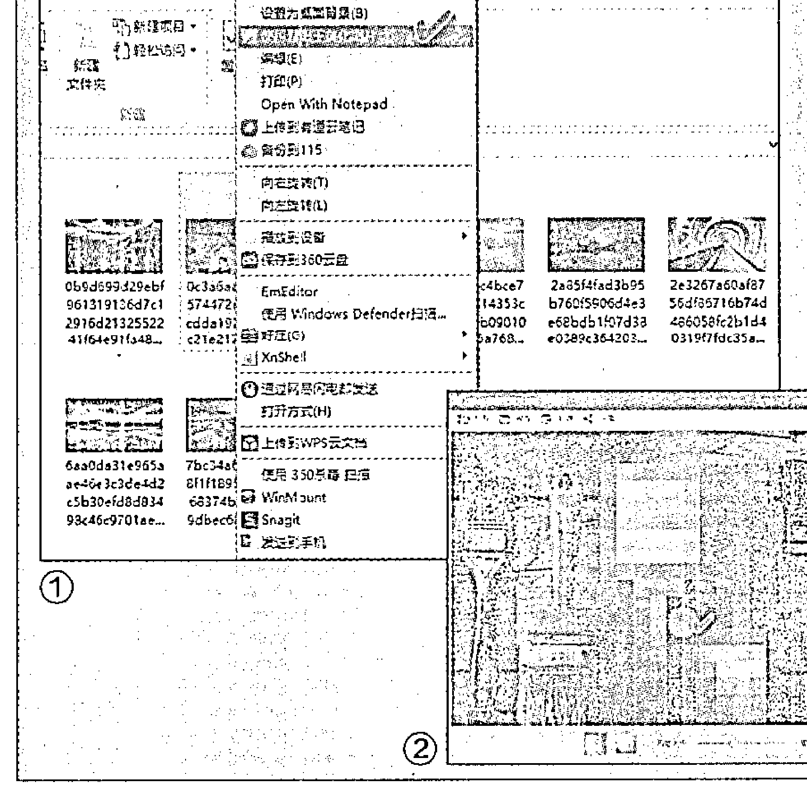

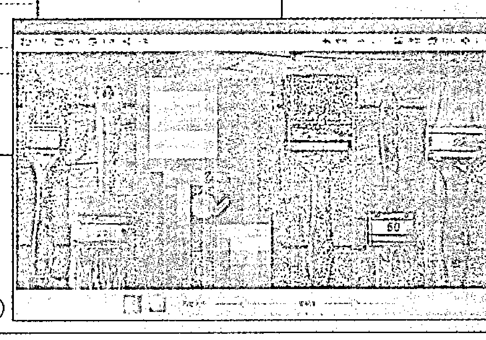

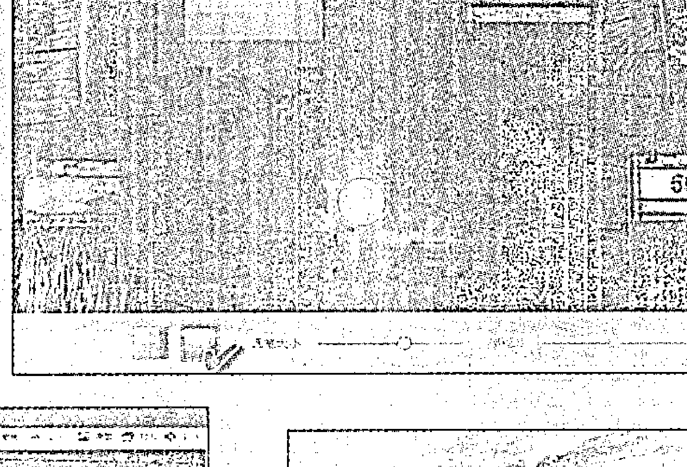

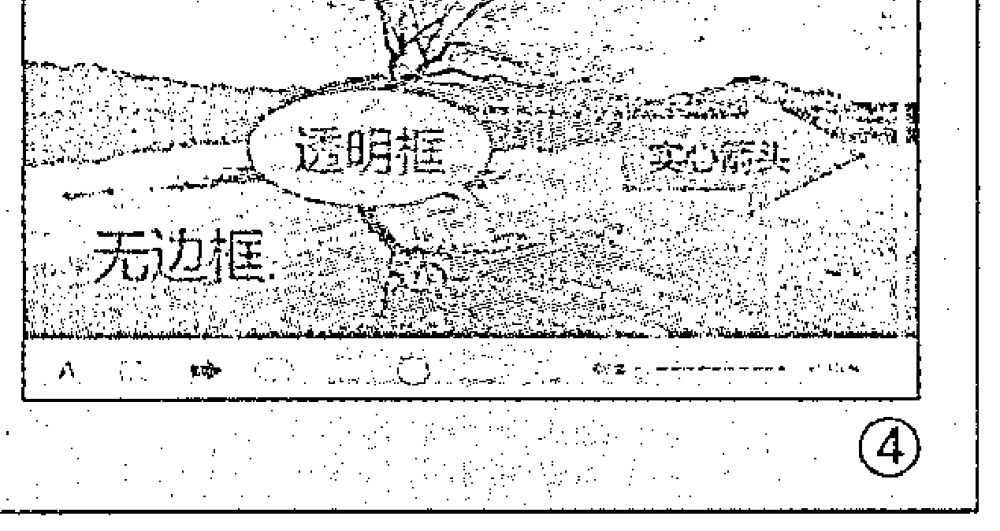

块调节字框背景的透明度（图4）。如果要在图片上标注实心无字的箭头、矩形等区域，只需添加箭头或矩形图标，调整好大小，并将透明度设置为100%即可。

#### 3. 超速打造个性壁纸与证件照片

将高像素数码照片裁剪成适于屏幕的壁纸，或将个人照片裁剪成能清晰打印的大头照、证件照，裁成多大尺寸合适？你恐怕还得去查有关数据吧。用看图王图片美化的裁剪功能却能免去这一切。

打开照片并选择“裁剪”，在工具栏上选择需要的壁纸类型（如“16:9宽屏壁纸”），屏幕中央会出现该比例的壁纸选框，通过拖动四周的句柄和在选框之内拖动鼠标，可缩放和移动壁纸（图5）。如果裁剪的是大头照或证件照，只需先打开单人照片，然后套用相应的头像或证件照模板，拖动模板位置，将位置摆放合适即可裁剪（图6）。

> ### 小技巧
默认的选框设置可以保证最基本的打印质量。如果觉得默认选框中的壁纸太小或头像太大，希望加大壁纸范围或将头像变小一点，抑或是需要提高照片的打印质量，只需通过拖动四角的圆圈，将裁剪框拖大一些即可。

#### 4. 快速修复曝光不合适的照片

拍摄数码照片的问题，除了构图不合适的因素外，最大的问题往往发生在光线的使用方面。多数情况下，只要通过简单的亮度、对比度、色彩饱和度调整，就能让一张失败的照片重现生机。

打开拍摄效果不满意的照片，点击“增强”工具按钮进入光线增强设置窗口，通过对亮度、对比度、色彩饱和度等滑块的移动调整，可以在上部的预览窗口中看到实时动态的调整结果。调整合适之后，点击“保存”按钮保存修改结果（图7）。

> ### 小提示
摄影过程当中，单反通过一些特效滤镜或后期软件，能够制造出照片的特殊效果。如果使用智能手机拍摄，通过手机APP软件自带的特效或套用一些特效模板，也能制造出特效。而电脑中可以用看图王打开照片，一键点击“特效”模组下的八个特效模板之一，就能让图片立马变个模样。此外，点击“对比”按钮可显示美化前后的效果对照。

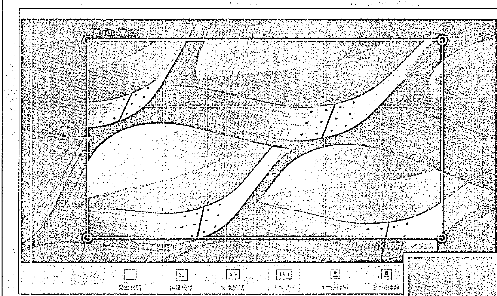

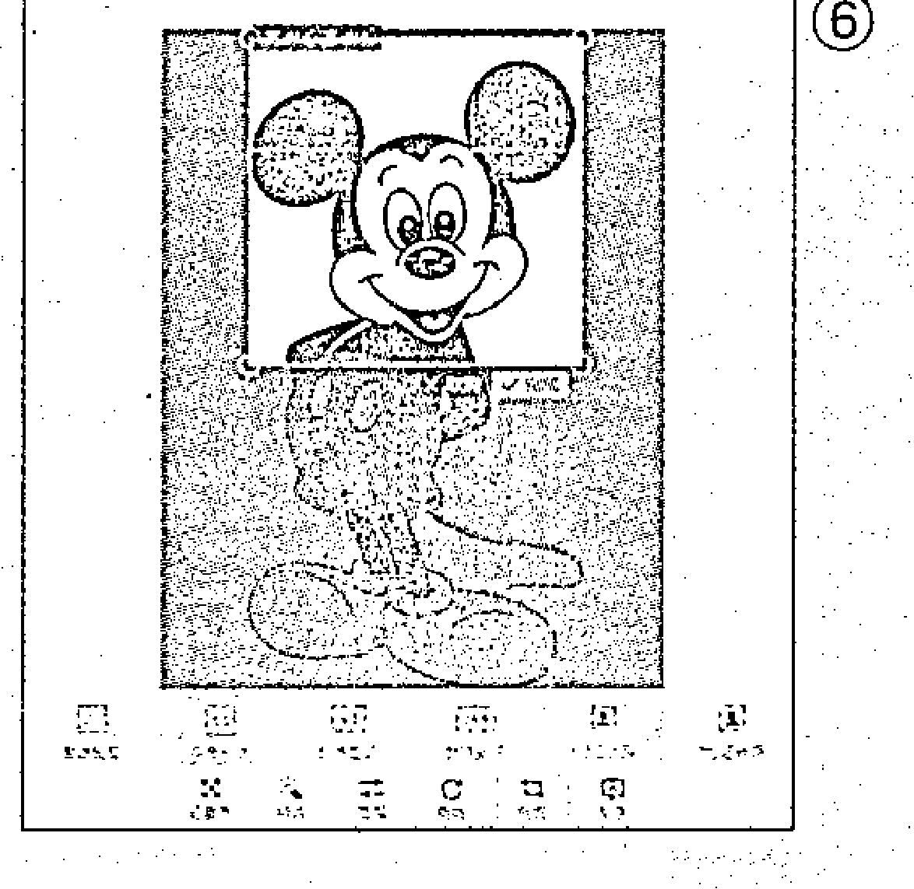

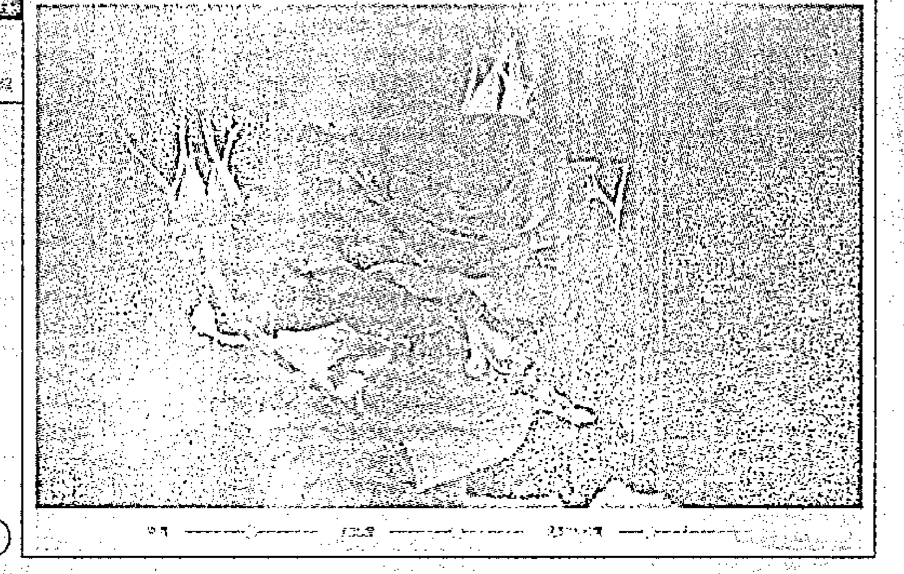

### 文件丢失 恢复没商量

文|吴昊

现在我们常使用数码设备，存储介质中的数据丢失不足为奇。文件丢失之后或介质被病毒侵害甚至格式化之后，两款简单易用的工具软件iStonsoft Photo Recovery和SanDisk RescuePRO Deluxe，不但能够将图片恢复出来，还能将其他类别的丢失文件也轻松地恢复出来。

#### 1. 三步轻松恢复丢失的照片

我们用iStonsoft Photo Recovery恢复照片。首次启动软件，虽为英文界面，但从其界面图标中也可以看出仅包含的照片、音视频媒体、文档选项，以及包含这三项的All选项(图1)。如果希望使用简体中文界面，点击右上角的设置按钮并选择“Language→中文简体”即可汉化(图2)。

如果介质中的照片丢失，我们只需在主界面上选中“图片”一个按钮，然后执行“下一步”(图3)。

接下来选择照片所在的驱动器盘符，然后点击“扫描”按钮进入扫描(图4)，扫描过程中随时都可以暂停和恢复暂停。扫描结果可以保存并可导入以前的扫描结果，这样就不用重新扫描了。这对于删除或丢失了大量文件的介质来说特别有用，因为有的介质(如大容量慢速闪存盘或SD卡)重新扫描一次所需要的时间可能特别漫长。

在扫描结果窗口中，软件会自动根据丢失的图片类型建立图片文件分类(如png、jpg、bmp等)。选择一张图片后，还能在右侧的小预览窗口中看到图片的预览，这样可以便于我们确定是否要恢复这张图片，以免做无用功。

> 该软件可以恢复来自各种设备的媒体文件，如电脑硬盘、USB驱动器、数码相机和其他存储介质。如果有磁盘映像文件，可以点击右下角的链接，导入映像文件，恢复其中丢失的照片。可恢复的内容不止是照片，还能恢复视频和音乐文件、办公文档等，只需在主界面选择相应的选项即可。数据完全丢失的情况下也能被恢复，无论是意外删除、格式化、不当使用所致，还是病毒攻击、软件崩溃等原因。

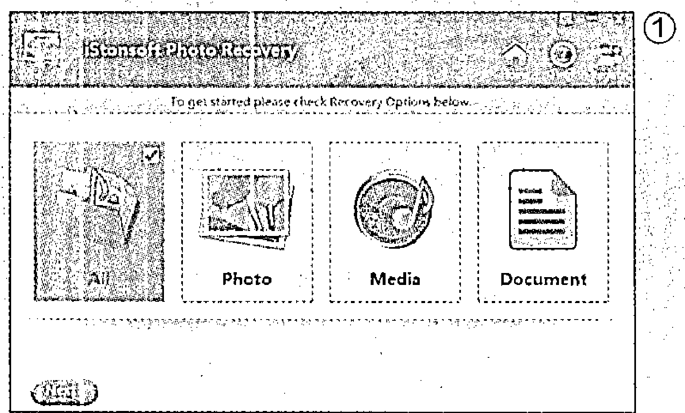

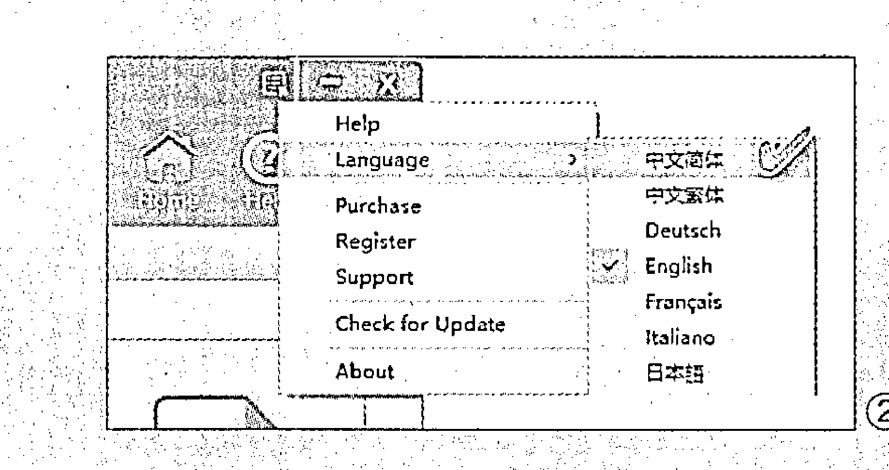

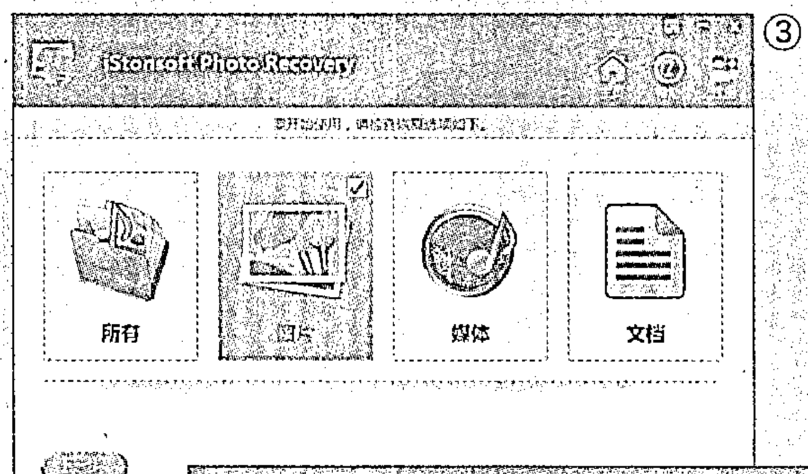

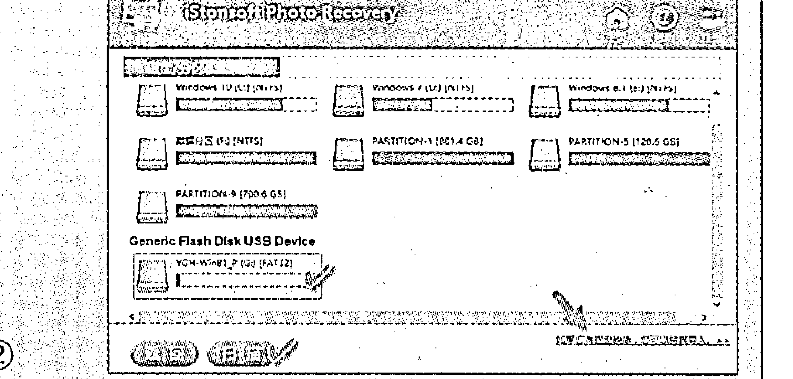用功。同时，在文件列表中，我们还可以按文件名、文件大小和日期进行排序，以便有计划地确定要恢复的图片。当扫描结果完成后，可根据预览结果选择需要恢复的文件，最后点击“恢复”按钮恢复即可(图5)。

文件，无论是文件被删除，还是介质损坏或被格式化，均可支持。软件中的“标准数据”是指图片和声像之外的其他一切电脑文件，如果要恢复这类文件直接选择该按钮即可(图6)。

将其存储介质上的数据备份为一个IMG文件，这样即使你在后来的恢复过程中因误操作或其他原因，再次对存储介质进行了写入操作，甚至存储介质彻底物理损坏了也无关紧要，因为介质中的数据已经全部备份出来了，不管是好是坏，统统被保留下来了。

#### 2. 附带相反功能的简易恢复

媒体恢复除了上述工具外，还可选择另一款更简便的恢复工具SanDisk RescuePRO Deluxe。RescuePRO将恢复目标定义为“照片图像”、“视频音频”、“标准数据”三种类型。RescuePRO支持各种类型数码设备的介质自动识别，设备连接电脑后可自动认出，能快速恢复因各种原因误删除或丢失的图片、音视频和数百种其他流行

插入介质并进入“标准数据”之后，软件自动扫描电脑中接入的介质并将其列出。此外，它还支持直接加载IMG映像文件进行恢复。选好介质之后，点击“开始”按钮，通过向导启动的界面，可以很容易地通过三次单击鼠标恢复文件(图7)。IMG映像文件可通过该软件主菜单中的“备份介质”来生成，其作用相当重要。比如你的一个摄像机上存储的文件丢掉了，这时将摄像机先接到电脑上，用“备份介质”功能

此外，SanDisk RescuePRO Deluxe还具有闪存盘数据完全擦写功能，将需要彻底清除的数据完全性粉碎掉，以保证我们数据的安全和隐私性。在插入介质后点击“擦除介质”，而后选择要擦除的设备，确认警示信息之后点击“是”即可安全彻底地擦除数据。经过此项操作的数据是无法恢复的，执行之前请三思(图8)。

### 彻底干净 卸载软件

文|张惠香

有的软件由于程序组、快捷图标或卸载程序丢失，因而无法用常规方式进行卸载。若只是手动删除安装目录，则注册表又会留下不少垃圾。借用Wise Program Uninstaller可实现任何软件的干净彻底卸载。

启动软件后会自动扫描当前系统，搜集已经安装的软件的信息，然后给出软件列表。从搜索结果与系统“程序和功能”列表中所列出的软件数量和磁盘空间占用对比可以看出，该软件所列出的系统内安装软件数量，远远大于系统本身报告的数量。在列表窗口的右上角点击设置按钮，从菜单中选择“添加到右键菜单”，即可给软件文件添加右键卸载的功能，这样就解决了因软件图标、程序组、卸载程序等丢失的软件的卸载问题(图1)。

如果一款软件无法通过正常的卸载程序或系统的程序和应用窗口正确卸载，可尝试通过Wise Program Uninstaller窗口找到该软件条目，然后点击该项目，在弹出的按钮列表中点击“强制卸载”对软件进行强制卸载(图2)。在“强制卸载”之前，会弹出提示，建议首先用安全卸载的方法卸载软件，安全卸载无效后再使用强制卸载。“安全卸载”时先自动卸载主要程序和文件。主要程序卸载之后，软件还会扫描遗留的垃圾文件夹、文件和注册表项目。用户选择确认之后，点击“删除”按钮即可完成软件卸载(图3)。“强制卸载”则先进行文件、文件夹和注册表的分析，之后根据提示选择扫描结果项目进行完全卸载。

> 小提示
虽然安装过程非常简单，但需要注意期间会有一个捆绑软件SpyHunter & Check要选择，若不想安装此附带软件，需要点击“Decline”按钮，跳过后继续安装。

若是系统中安装的软件太多不好找，可通过右上角的搜索框用关键词进行搜索。如果软件列表中出现了莫名其妙的软件，又弄不清有用没用，还可以用右键菜单中集成的搜索功能及时上网搜索，弄清其来源后决定是否卸载(图4)。此外，可使用右键打开与软件相关的注册表项，进一步弄清软件在系统中进行了哪些修改操作。

小技巧
如果要获取当前系统中安装的所有软件的名称、路径和软件大小的清单，在软件列表中单击右键并选择“保存为文本文件”，即可获得install.txt列表文件。

### 极简隐藏 藏起私密

文|张惠香

为了保护隐私，我们往往需要将自己的文件进行隐藏。但系统默认的文件隐藏功能不够可靠，用系统工具添加一个文件隐藏或显示命令，一下子就可以露馅。用Wise Folder Hider免费软件，可以对所有类型的文档实现双重密码保护的隐藏。

#### 1. 藏起文件或文件夹

首次运行Wise Folder Hider软件时，需要创建与其他密码不同的管理密码，并将其记住。对文件、文件夹进行隐藏，只需在Wise Folder Hider主窗口顶部点击“隐藏文件”或“隐藏文件夹”按钮，添加要隐藏的文件或文件夹即可。如果要处理的文件已经在文件夹中打开，更可以直接将文件或文件夹拖动到Wise Folder Hider主窗口。进入Wise Folder Hider主窗口的文件或文件夹将实现自动隐藏，资源管理器目录中将无法找到该文件或文件夹。若要再次看到，需要在该软件的文件列表中，将“取消隐藏”选项选中。文件被隐藏之后，可以通过软件列表点击“打开”按钮打开使用文件，但软件关闭之后文件又被隐藏起来，资源管理器中仍无法看到。我们还可以选择每个文件后面的下拉列表项“设置密码”，为单个文件设置不同的打开密码，这样每个软件都具备了双重密码保护，将更加安全（图1）。

#### 2. 藏起USB驱动器

如果我们的USB设备中有重要的内容，不希望别人看到，也可以用Wise Folder Hider将USB驱动器中的内容隐藏起来。插入USB设备，点击“隐藏USB驱动器”按钮，随后在USB驱动器列表中选择要隐藏的设备，点击“确定”。接下来可以选择为隐藏的设备添加密码保护，之后设备会出现在Wise Folder Hider软件列表中，而进入Windows资源管理器列表中再查看此设备，你会发现虽然设备还在，但没有任何文件可供使用了。

> 小提示：请使用Wise Folder Hider 3.38版加密USB设备。较低的版本会出现加密后无法解开的Bug。此外注意，卸载该软件前，请先解除对所有藏起文件或设备的隐藏，以免造成不可挽回的损失。

通过在“设置”菜单中选中“添加到上下文菜单”命令，可为文件或文件夹添加更加快捷的隐藏入口（图2）。这样，以后不用启动Wise Folder Hider软件，只需在Windows资源管理器窗口中右键单击文件或文件夹，从菜单中选择“使用Wise Folder Hider隐藏文件”项，即可进入文件隐藏设置窗口（图3）。

### 充分用好桌面右下角的时间区域

文|南粤

系统托盘最右侧的系统时间区往往不为人们充分重视，只用来看个时间而已。但实际上，充分挖掘和利用这一小空间，往往能给我们提供极大的方便。除了系统自身可以提供的各种日期时间格式显示、多国时区显示外，结合第三方的小小工具“软媒时间”，还可实现双屏显示天气日历、语音播报、桌面穿透日历等功能。

#### 1. 创建个性化双屏时间托盘

安装软媒时间工具后，软件自动驻留系统托盘。之后，系统托盘变成一个动态显示的小面板，分2屏分别显示当前日期、时间、农历、星期、温度、天气等信息。小小区域，信息一下子就倍增。当鼠标悬浮到时间区域后，又会浮出一功能面板，上面分4列分别提供更加详尽的时间、双历日期、天气预报、工具箱等信息（图1）。

双屏显示的内容和格式不是一成不变的，通过软件的“显示设置”窗口，可设置第一屏和第二屏的显示格式和显示内容（图2）。格式的形式用一些简单的代码来代替，具体含义点击“格式解释”链接可以获得（图3）。

时间变量：
年：yyyy(4位数字), yy(2位数字); YY(2位中文农历), YYYY(4位中文农历)
月：mm(等倍起始数字), m(非等倍起始数字); M(中文农历); EM(英文), EM3(英文3位)
日：dd(等倍起始数字), d(非等倍起始数字); D(中文农历)
时：12小时制：hh(等倍起始数字), h(非等倍起始数字); 24小时制：HH(等倍起始数字), H(非等倍起始数字)
分：ff(等倍起始数字), f(非等倍起始数字)
秒：ss(等倍起始数字), s(非等倍起始数字)
星期：ddd(周几), dddd(星期几), ddddd(几); EW(英文), EW3(英文3位)
一年第几周：week (第几周, 2.203之后版本支持)
上下午：tt(AM/PM), TT(半夜/凌晨/早上/上午/中午/下午/晚上)
农历年：nn(如提示为：龙年), NN(如提示为：壬辰龙年)
自定义字符：用#包裹字符串，如 #软媒#
换行：\n，目前很多支持时间三行显示
天气变量：
6日天气：we1, we2, we3, we4, we5, we6，分别代表今日天气
6日温度：tl1, tl2, tl3, tl4, tl5, tl6，6日温度中的低温，th1, th2, th3, th4, th5, th6，6日温度中的高温，如
实时温度：rtn
实时湿度：rhu
实时风力风向：rwd
IP地址：IP或ip
地理位置：pos
天气图标：Icn，注意：天气图标因为需要占一列的位置，只支持

> 小提示
声音播报需要下载声音包文件。此外，如果电脑常开，休息时间希望免打扰，还可以设置“勿扰模式”下的免打扰时间段。通过软件的“高级设置”窗口，还可以设置右下角区域双屏切换显示的间隔时间，以及动态切换显示的方式（上下切换还是左右切换）。

#### 2. 语音播报时间和天气信息

我们还可以给右下角的提示功能添加时间和天气的语音播报。右击时间区域并选择“设置”，进入“功能设置”页面，将“时间播报”和“天气播报”开关置于开的位置，设置播报的声音类型和播报类型，其后就可以按设置自动用语音播报时间和天气状况了（图4）。

#### 3. 用好托盘时间区

在托盘时间区域点击左键，不但可调出农历月历表，还可以调用提醒、记事上网等实用小工具。如果在托盘时间区域单击右键，则不但可以直接调用任务管理器，更可以开启一个桌面的“鼠标穿透”式的月历表。所谓“鼠标穿透”就是指月历覆盖下的桌面图标，鼠标仍能穿越月历进行点击，不影响程序操作。

### 挑战权威 轻量抓图它最能

文|张惠香

系统带的抓图功能或QQ、输入法等附加的抓图功能非常有限，关键时刻有时会显得捉襟见肘。而Snagit虽称权威，与此类似的同类软件也不少，然而它们安装文件大不说，且还需要注册使用。其实用轻量级的截图工具ScreenSnag，即可弥补这一遗憾。

#### 灵活设置 实现透明窗截图

在截图区域选择上（也就是软件所说“输入”方面），如需截取全屏、窗口或区域范围，一般还好说，但若要对截取的窗口实现透明化，则一般的方法无法实现。在ScreenSnag的“输入”属性窗口中，切换为“窗口”后点击“属性”，可对窗口透明度进行设定（图1）。

在截图“输出”方面，可以选择PNG、JPG、BMP等三种常用格式，并可对图片质量百分比进行自定义。此外，还可以设定固定文件名或自动文件名。

#### 方式另设 满足特殊化需求

截图的难点在于满足不同特殊情况下的需求。例如，有的人要求一批截图都带有固定的标题，有的人希望给截图加上漂亮的边框，还有人希望对截图进行自动缩放，甚至有人希望给截图配上声音做解释。以上要求在一个小小的ScreenSnag选项板中均可实现。只需在“选项”功能框中选择相应的功能，并进行简单的设定，截图时就可按自己的意愿进行（图2）。

> 小提示
透明设定对全屏抓图和区域抓图无效。

如果希望每隔1分钟自动截取一张图片，只需点击“定时器”按钮，然后将状态设为“启用”，设置好定时器为0小时1分钟0秒，确定后抓图即可（图3）。

#### 自建配置 实现个性化截图

由于所使用的环境不同，因而每个人常用的抓图配置也会大不同，但每人一般只用一两种固定模式。这时，没有必要每次抓图前设置各种参数，可事先将自己习惯的模式保存为模式配置文件，需要时一键调出即可。

为此，先在“输入”、“输出”和“选项”中依次设置个性化参数，然后在“配置文件”一栏中另存配置即可（图4）。

#### 自动截屏 记录历史性操作

> 小技巧
要改变图片的存储路径或启用全局抓图热键，请用软件右上角的设置按钮或使用托盘图标的右键菜单命令。

### “网页剪报”遇到问题怎么办

本刊曾在特别话题的《知识管理 井然有序》一文中有关云端收藏资料的部分涉及过“网页剪报”的简单介绍。有用户发现，在自己使用的浏览器中无法实现网页剪报功能，以为无法支持。其实，只要使用Chrome内核和增强插件的浏览器，就可以实现浏览网页剪报到有道云笔记的剪报收藏。

> **小技巧** 
“网页剪报”插件可直接在Chrome浏览器上使用。如果你使用的是360浏览器，且使用了兼容模式或IE 11模式，则需要将浏览器转换为极速模式后安装（图1）。

而今使用Chrome内核的浏览器越来越多，问题是，在这样的浏览器中安装Google插件，有时会因故受到限制。如果希望随意选择并一键收藏网页局部内容，就必须寻找能够顺利下载和安装收藏“剪报”插件的方法。下面的内容将引导你顺利完成这项工作。

#### 1. “网页剪报”到底为何物

“网页剪报”的基本原理，是给Chrome内核浏览器安装“网页剪报”专用插件之后，收藏过程中插件会自动提取网页中的正文信息、链接信息，除去页面周边的无关多余信息，只留下文章的标题和完整的正文内容，收藏的内容被保存在与“网页剪报”相关联的有道云笔记账户中，供用户在不同环境下灵活调用。

#### 2. 解决剪报插件的安装问题

通过网页剪报插件官方链接 (http://note.youdao.com/downloads/YoudaoNote-chrome.crx) 下载。若无法通过点击下载，则可以右键另存，或将此链接交给下载器，将文件下载到本地备用。若出现扩展功能提示，点击“继续”后打开Chrome扩展管理页面，通过浏览器右上角的设置图标，依次选择“更多工具→扩展程序”（图2）。也可以新开一个窗口，直接在地址栏中输入chrome://chrome/extensions/打开扩展页面。随后，将刚才下载的插件文件拖放到扩展页面空白窗口中，看到添加扩展程序提示窗口后，点击“添加扩展程序”即可（图3）。

之后，在扩展页面的列表中，已经添加了“有道云笔记网页剪报”插件，显示并非来自Chrome网上应用商店，且可以选择“在隐身模式下启用”，但同时警告Chrome浏览器无法阻止扩展程序记录用户的浏览信息（图4）。

扩展添加之后，我们看到在Chrome浏览器的地址栏右侧增加了一个剪报小图标，在上网的过程中，点击该图标就可以收藏网页内容了（图5）。

#### 3. “网页剪报”具体如何使用

对于360极速浏览器的用户，则不需要到Chrome网上商店或有道云官网下载，只需直接在浏览器的扩展页面中搜索“网页剪报”，即可获得插件链接，点击一键添加到浏览器中（图6）。安装之后同样会在浏览器插件工具栏上看到剪报插件小图标。

插件装好之后，我们就可以直接使用有道云账号收藏网页剪报。在浏览网页的过程中，如果要收藏其中的内容，点击浏览器右上角的剪报图标。第一次使用需要填写网页剪报的账号，网页剪报与有道云笔记共用账号，如果此前没有账号，可点击“新用户注册”注册新账号；此外还可以通过合作的微信号、QQ号、新浪微博号等直接登录有道云账号（图7）。

登录账户并点击收藏按钮之后，会弹出收藏选择对话框。可选择“网页”将当前网页收藏到云笔记，选择URL则只收藏链接地址，选择“正文”只收藏正文部分。其中选择框中的“来自网页剪报”为所收藏的文本在有道云笔记中的保存文件夹，当然也可以从这里选择别的文件夹保存收藏。设置好之后，点击“保存”按钮，网页中所选的内容就进入到自己的云笔记空间中了（图8）。

### 拒绝龟速 让Wi-Fi跑起来

文|俞木发

现在Wi-Fi已经成为我们生活中必不可少的网络，手机、平板都是通过Wi-Fi上网。不过在日常的使用中我们却经常发现明明自己的设备离Wi-Fi很近，却总是发现手机上网速度很慢。那么这是什么原因造成的？又该怎么进行解决？

正常情况下，在排除设备离无线路由器远、Wi-Fi信号弱的情况下，如果你连接的Wi-Fi上网速度仍然很慢，可以查查是否是以下原因造成。每种问题，我们都给出相应的解决办法。

#### 信号拥堵

我们的手机、平板在通过Wi-Fi接入网络的时候，都是使用一个固定频率的无线波段。而随着周边环境Wi-Fi热点的增多，就很容易造成信号拥堵。因为可能很多无线路由器都在使用同一个信道，这样造成的拥堵极易导致手机上网速度慢（即使Wi-Fi信号看起来是满格）。

既然是由于信号拥堵造成网速降低，解决方法是避开当前多人在使用的频段。当前无线设备频段可以借助一些专业软件进行查看。PC用户可以使用“WifiInfoView”，启动程序后会扫描到周边所有Wi-Fi热点，切换到“信道”，这里就可以看到当前很多无线路由器在使用“信道6”，如果你家的路由器也使用这个信道，那么信号拥堵现象就不可避免，12信道用户则最少人在使用（图1）。

如果你在家里只是使用手机连接，在手机上同样可以使用专门的APP进行查看。比如Android用户可以使用“Wifi分析仪”，启动应用后也会扫描周围热点，并且以图示的方式展示，显然这里9→12信道用户最好（图2）。

既然是信道拥堵导致网速变慢，解决方法自然是自行更改无线路由器的信道。打开浏览器进入路由器设置，切换到“无线设置→基本设置”，在右侧窗口将信道设置为用户最少使用的即可（图3）。

#### 同时连接用户过多

由于Wi-Fi信号无法同时发送、接收数据，这就使得这一网络接接入方式会比其他方式产生更多的数据延迟现象。特别是很多用户同时连接到一个热点的时候，上网速度便会明显变慢，这种现象在使用多个Wi-Fi的办公室最为明显。

为了提高大家手机的上网速度，对于员工较多的公司大多会配备多个Wi-Fi热点。但是很多朋友的手机都会在手机上成功连接过这些热点，这样在大家到公司后就会自动连接到离进门信号最近的热点，即使到各自的办公室后也还是会同时连接在一个热点上，直接导致上网速度变慢。因此解决的方法是先进入各自办公室，然后将原来连接的热点密码全部选择忘记，接着在自己的办公室进行热点搜索，选择信号最强的热点进行连接，这样确保每个员工连接的都是离自己最近的热点。当然也可以进入路由器设置界面，展开“无线设置→客户端列表”，然后选择用户数最少的热点进行连接即可（图4）。

### 路由器位置摆放不合理

现在越来越多的路由器支持5GHz频率，并且默认就只使用这个频率工作。虽然路由器使用5GHz频段进行传输，无线连接的稳定性和传输速率会更佳。但是很多朋友不知道的是5GHz频段穿墙本领较弱。特别是家庭用户，很多人家里的多媒体盒使用铁盒，5GHz路由器在其中，导致即使是在隔壁房间使用手机，手机能接收到的信号也极其微弱，从而导致上网速度变慢。解决方法是将路由器频段设置为双频段即可，以MW4530R设置为例，进入路由器设置界面后使用向导设置，然后在无线频段设置中选择“无线同时工作在2.4GHz和5GHz频段”即可（图5）。

### 其他原因导致网速变慢

除了上述路由器设置导致的原因外，手机连接网速变慢还有可能是手机本身的原因造成的。比如手机后台开启过多的网络进程在占用带宽，解决方法是关闭手机上不必要的后台进程，或者对手机上应用的联网权限进行设置。比如Android的用户可以借助“流量管家”进行控制。启动应用后切换到“联网控制”，根据自己的需要设置每个具体应用的联网权限即可。比如可以只允许常用的QQ、微信、浏览器联网，将其他无关程序全部设置为禁止联网（图6）。

当然也有可能是自己Wi-Fi密码设置过于简单，导致蹭网用户太多引起的，可以使用360安全卫士的“防蹭网”功能进行保护。此外手机上网速度还和你家宽带的实际网速密切关联，如果电脑正在使用迅雷等下载软件，这些软件由于占用大量的带宽，会导致手机上网速度变慢。总之，在使用上述方法排除无线路由器设置没有问题后，就需要从手机本身和宽带带宽上进行查找，找出实际影响网速的原因后一一进行排查即可。

### 灵活快捷 文件批量重命名

文 | 阿立

我们在日常的工作和生活中，经常遇到文件重命名的情况，而且往往需要批量重命名。虽然Windows系统本身也有批量重命名的功能，但是它的功能的的确确非常的有限。虽然也有“拖把更名器”这样专门的更名工具，但是这款软件由于常年没有更新，已经和最新版本的系统不兼容了。那么用户在遇到批量更名的时候，如何才可以快速灵活地进行操作呢？

#### 有声读物快速处理

很多人肯定和我一样，经常从网上下载一些有声读物，放在手机里面进行收听。可是这些有声读物文件为了更好地进行宣传，往往会在文件名上加上网站的名称或者网址信息，这样整个文件的名称不但会显得非常的长，而且对我们来说也非常的不必要，于是就需要对这些文件进行批量的修改。

虽然ReNamer是一款国外的重命名软件，不过它自带有简体中文的语言包。所以只需下载、解压，运行之后点击“Language”菜单后，选择其中的简体中文这项命令，再重新启动这款软件就可以看到中文操作界面了。现在点击软件工具栏中的“添加文件”或“添加文件夹”按钮，在弹出的对话框里面选择要重命名的有声读物文件（图1）。

要想重新进行有声读物的命名操作，我们首先需要想一个命名规则。由于这些有声读物的网址信息都是统一的，我们只需要通过查找替换的方式就可以将它们批量删除掉。所以接着点击窗口上方的“点击此处来添加规则”命令，打开软件的“添加规则”窗口。现在点击窗口左侧工具栏中的“替换”命令，接着在右侧窗口的“查找”输入框里面输入需要删除的网站信息内容就可以了。然后在“替换”输入框里面什么都需要输入，再在“操作序数”选项里面选择“全部”以及“忽略扩展名”选项，最后点击“添加规则”按钮就可以将这条规则添加到操作界面中（图2）。现在我们就可以在软件操作界面的文件列表中看到新的文件名称，如果满意的话点击工具栏中的“重命名”按钮就可以了（图3）。

#### 身份证号快速删除

前段时间学校开学后为了更好地对学生进行管理，要求每个学生上交一张身份证的复印件，而且文件的名称必须按照“学生名称+身份证号码”的格式进行命名。可是当我们将文件提交上去以后，领导又要求把身份证号码从文件名称中删除掉。这下子可麻烦了，那么我们如何批量对身份证号码进行修改呢？

由于身份证号码并没有统一的内容，所以按照前面的方法就无法进行修改操作。不过由于身份证号码的位数是固定的，所以我们可以按照身份证的位数来进行操作。首先按照前面的方法添加需要修改的身份证文件，接着打开软件的“添加规则”窗口。现在点击窗口左侧工具栏中的“删除”命令，在右侧窗口的“位置”里面设置为1。由于现在使用的第二代身份证号码的位数是18位，所以我们在“计数”选项里面输入18就可以了。再加上之前领导要求身份证号码在文件名称的最后面，所以我们不能按照传统的从左到右的方法进行操作，因此这里应该选中“从右到左”这个选项才可以（图4）。设置完成以后将这条规则添加到操作界面的规则列表中，点击“重命名”按钮就可以快速删除不需要的身份证信息了。

**小提示**
默认的规则只有一位数长度，如果用户为了文件名称统一好看的话，可以选择“填充0来补充长度”选项。并且在下面设置需要的长度，比如我们这里设置为2的话，那么编号就是以01、02这样的方式进行显示了。

#### 批量命名数码照片

很多人在外出旅行的时候，会拍摄一些照片留作纪念。加上现在手机摄像头像素越来越高，随手拍的情况也变得越来越多。但是无论是数码相机还是智能手机，拍摄后的照片都是以一串数字来进行命名的，这样的话时间一长就搞不清楚拍摄地点了，那么如何对这些数码照片进行重命名操作呢？

同样按照前面的方法来添加文件，由于我们要对数码照片进行重命名，首先需要将数码照片原来的名称全部删除。于是我们在“添加规则”窗口点击左侧工具栏中的“移除”命令，接着在右侧窗口里面点击“移除”选项后面的添加命令。然后在“操作序数”选项里面选择“全部”这项，同时勾选“忽略扩展名”选项，这样就可以将原来的名称进行删除了（图5）。设置完成以后点击“保存规则”按钮，这样这条规则就可以添加到窗口列表里面。

由于我们这里打算以“拍摄地+编号”的形式来命名，所以接下来在规则列表里面点击鼠标右键，选择菜单中的“添加规则”命令。由于我们需要添加拍摄地点这个信息，所以现在点击窗口左侧工具栏中的“插入”命令，接着在右侧窗口的“插入”输入框中输入需要的拍摄地点信息就可以了。比如我这里输入的是“植物园 国庆节”这组关键词，然后点击“保存规则”按钮添加这条规则。

现在按照前面的方法重新打开“添加规则”窗口，再点击窗口左侧工具栏中的“序列化”命令，接着在右侧窗口的“增量”输入框里面进行设置即可。软件默认的设置是序列号从1开始的，而且每次命名增加1，这样比较符合我们需要的编号规则（图6）。

设置完成以后同样点击“保存规则”按钮，这时规则列表里面就有三条规则了。通过文件列表可以预览到新的文件名，如果不满意的话还可以对列表中的规则进行上移或下移的调整，从而达到自己需要的效果（图7）。

### 屏幕遮罩让人专心工作

文 | 阿立

现在的电脑显示器屏幕越来越大，可以让用户在屏幕上打开更多的窗口，这样使得用户在工作的时候查询资料更加方便。但是与此同时也会带来一个新的问题，就是太多的窗口会分散用户的注意力，使得人们在工作的时候注意力无法集中起来。不过利用屏幕遮罩可以让整个屏幕的大部分区域亮度都明显低于当前窗口，从而使得用户可以专心地聚焦于工作区域。那么我们如何才可以制作出这种屏幕遮罩效果呢？

#### 根据需要选择遮罩效果

遮罩效果其实就是遮住一些用户不喜欢的内容，正所谓“眼不见心不烦”，只不过不同的软件使用的是不同的方法。比如使用过印象笔记的用户都知道，他们曾经推出过一款名为Clearly的谷歌浏览器阅读扩展，通过它可以让用户进行“不分心的在线阅读”操作。不过目前已经停止开发，所以我们可以选择安装名为“剪辑”的功能扩展作为替代(谷歌应用商店提供下载)。

以后当我们遇到需要认真阅读网页的时候，在浏览器工具栏点击它的扩展图标，在弹出的对话框里面我们可以看到“选择保存的内容”选项(图1)。这里我们选择“页面正文”选项，这时我们就可以看到网页的正文内容，会通过高亮的形式进行显示。与此同时，网页两侧的广告信息内容则会通过降低亮度的形式进行显示，这样就可以起到遮罩的效果，从而保证用户提高相关的效率。如果用户不喜欢这样的效果的话，那么可以选择设置对话框中的“隐藏广告”选项，这样网页里面的所有广告内容都会被清除掉，从而还大家一个干净清爽的网页(图2)。不过很多人在阅读的时候会发现，扩展的设置窗口会一直出现在网页正文的上方。如果觉得这样操作不方便的话，可以点击对话框右上角的隐藏按钮，这样设置窗口就可以自动地进行隐藏。

#### 阅读模式替代遮罩效果

由于使用“剪辑”扩展需要首先进行印象笔记的登录，而很多用户并不想进行相关的注册操作，所以这个时候我们只能改用另外一款名为“阅读模式”的扩展。这款扩展的使用非常简单，当它安装完成以后并不会看到任何的图标。但是一旦用户访问诸如小说网站、新闻页面、微信文章、博客等内容为文章或长文字的时候，扩展就会在浏览器地址栏右边出现一个阅读模式的图标，点击这个图标以后就可以马上进入到阅读模式里面。

阅读模式中除了当前网页文章正文内容以外，其他的如广告、无关的组件、各种烦人的东西会全部消失。而且这款扩展还有一个非常贴心的功能，比如网页内容有好几页的话，扩展就能智能地将下一页的内容展现，这对于浏览连载小说等网站比较有帮助。除此以外，如果用户对默认的阅读设置不满意的话，还可以点击文字右侧的“AA”按钮，在弹出的工具条里面就可以进行主题、字体及文字大小等调整（图3）。

> **小提示**
包括傲游浏览器、火狐浏览器等都自带有阅读模式功能，用户直接点击该功能按钮就可以实现专心阅读了。

#### 专业软件启用遮罩效果

但是很多软件并没有遮罩效果，而且即使有也仅仅局限于软件自身，那么如何在Windows系统里面启用“遮罩效果”呢？这里就需要使用到“iFocuzOn”这款软件。由于“iFocuzOn”是一款绿色软件，所以下载后直接运行就可以了。当这款软件成功运行后，整个屏幕都会呈现反选效果。用户只需要根据提示，在屏幕上通过鼠标勾画出一个合适的矩形，这样矩形以外的部分就会用黑色进行填充。而且只有在矩形区域以内的部分可以操作，在矩形区域以外的部分根本无法操作，从而完完全全起到遮罩的效果（图4）。如果用户需要暂时关闭遮罩效果的话，只需要点击一下系统任务栏的软件图标即可。再次点击软件图标，就可以恢复到遮罩效果。如果用户需要完全退出遮罩效果的话，只需要在矩形区域以外的地方点击鼠标右键，选择菜单中的“退出程序”命令就可以了。

菜单选择“设置”命令。在弹出的对话框就可以设置遮罩挡板的透明度和高度，还可以设置显示区域是横向还是纵向，以及定义开启和关闭挡板的快捷键（图5）。设置完成这些参数后立即生效，不需要重新启动软件程序。

程序启动后默认是不开启挡板效果的，用户可以按照刚才设定的相关命令，或者在弹出的右键菜单中选择“开启遮挡”命令。当鼠标移动的时候会自动对系统以及软件窗口进行捕捉，接着在遮挡区域按住鼠标左键进行上下移动，直到找到满意的遮挡区域后松开鼠标左键。如果你发现遮挡区域还在跟着鼠标移动，需要在遮挡区域点击一下鼠标左键即可（图6）。而且GrayEyes这款软件支持记忆遮挡区域的效果，开启记忆效果后会在遮挡的左上角显示锁定窗口。这样当鼠标移动到设定的遮挡区域后，遮挡效果就会自动开启。如果用户关闭GrayEyes软件或者遮挡区域所在程序，那么遮挡效果就会自动消失。

#### 灵活选择遮罩的区域

“iFocuzOn”软件虽然可以做到遮罩效果，但是它的选择区域固定后不能进行修改，这样就给人一种不太灵活的感觉。所以用户不满意“iFocuzOn”软件，还可以试一试GrayEyes这款软件。同样下载以后直接运行软件即可。首先在系统托盘点击鼠标右键，在弹出的

### 找回被Chrome摒弃的Flash插件

谷歌浏览器Chrome是很多人常用的网页浏览器之一，由于这款浏览器自带的Flash插件经常出现安全漏洞，因此在最新版本的谷歌浏览器里面，该插件已经被彻底地从浏览器里面删除掉了。但是我们无论是在线观看视频、社交网上发帖，以及在线游戏的时候，都需要使用到这款插件，没有这款插件会给我们的使用带来很多的问题。那么如何重新把Flash插件添加到浏览器里面呢？

#### 下载谷歌浏览器新版本

虽然很多用户都使用谷歌浏览器，但是要想第一时间升级到最新版本的话，除非用户安装有软件管家这些工具才行。如果用户没有使用软件管家的话，要想升级到最新版本就只能通过手动操作。那么用户如何才可以获得谷歌浏览器最新版本的下载地址呢？首先下载运行“Google Chrome更新器”这款小工具（http://i.ivb.net/cus），由于这是一款绿色的小工具，下载完成以后直接解压运行即可。接着在操作界面的“架构”选项里面，选择下载X86或X64的版本，接着在“分支”里面选择下载正式版、测试版还是其他的版本。设置完成以后点击“查询”按钮，稍等片刻就可以看到众多谷歌浏览器最新版本的下载地址。为了保证下载的谷歌浏览器没有问题，建议在下载地址里面寻找还有google.com内容的链接。寻找到以后直接点击这个链接地址，就可以自动将下载链接复制到系统的剪贴板里面（图1）。然后将下载链接粘贴到迅雷、QQ旋风等下载软件里面，这样就可以利用下载软件进行安装包的下载操作了。

#### 直接下载Flash插件

有了最新版本的谷歌浏览器以后，如何解决Flash插件的问题呢？好在谷歌公司并没有把这件事做绝，它还允许用户自定义添加相关的Flash插件，所以我们首先就来看看怎么通过谷歌浏览器自动下载最新版本的Flash插件。我们现在运行最新版本的谷歌浏览器，在地址栏输入“chrome://components/”并按下回车键，从而进入到浏览器的组件管理界面。在弹出的页面中点击右上角的菜单按钮，在弹出的菜单里面点击“查找”命令。接着在弹出的搜索框里面输入关键词“Adobe Flash Player”，查找该项目后点击“检查是否有更新”按钮(图3)。这样谷歌浏览器就会开始检查浏览器里面的Flash插件版本，如果没有发现Flash插件的存在，那么就会自动开始下载Flash插件的文件，下载完成以后重新启动谷歌浏览器就可以使用了。

> 使用这个方法需要先在系统里面安装Flash插件才行，如果用户觉得这个方法比较麻烦的话，可以从谷歌浏览器的贴吧等网站下载网友提取出来的Flash插件文件来直接使用。

#### 手动安装Flash插件

如果用户在使用第一种方法操作的时候，感觉下载速度太慢或者其他原因无法下载，那么还可以改用其他的方法进行解决。首先登录Adobe Flash Player插件的网站地址(https://get2.adobe.com/cn/flashplayer/)，登录这个网站以后网站页面会根据系统的版本自动给出需要进行下载的Flash插件版本。如果没有给出相应的版本的话，那么我们就可以自定义进行下载操作。比如首先在第一步列表里面选择自己使用的操作系统类型，接着在第二步列表里面选择“FP 23 for opera and chromium -PPAPI”这一项即可(图4)。接下来在“可选程序”里面去掉已经默认选择的选项，然后点击右下角的“立即下载”按钮进行软件安装包的下载。安装运行以后重新启动谷歌浏览器，在地址栏输入“chrome://plugins/”命令后回车，进入到浏览器的插件管理页面(图5)。在页面中就可以看到Adobe Flash Player这个选项，选中这个选项下面的“始终允许运行”选项并重新启动浏览器，从此以后我们就可以继续使用谷歌浏览器进行在线查看视频等操作了。

#### 调用绿色Flash插件

虽然上面的方法已经解决了我们的问题，但是对于使用绿色版谷歌浏览器的用户来说，如果还想进行携带的话，那么安装在系统里面的插件就无法进行操作，这个时候我们就需要把插件的文件移动到谷歌浏览器的安装目录中才可以。首先进入到谷歌浏览器的安装目录，查找到里面一个名为User Data的文件夹，然后在其中创建一个名为PepperFlash的目录。然后利用搜索软件查找pepflashplayer.dll这个文件，搜索到这个文件以后，将其所在的文件夹一起复制到PepperFlash目录里面就可以解决问题了(图6)。

### 禁止程序联网其实很简单
文|老万

现在很多软件都加入了客户端的特性，这样只要电脑系统连接到网络后，软件程序也会连接到相应的服务器进行操作。有的连接是为了进行软件的升级，而有的则是对用户进行相关的信息推送。其实这些操作对很多用户来说并不起作用，甚至有的时候联网以后反而会影响用户的相关操作。那么我们怎样才可以避免这些软件连接到网络里面呢？

#### 手动添加防火墙规则

由于现在的Windows操作系统都带有网络防火墙的功能，所以我们利用这个功能就可以非常方便地阻止软件程序的网络连接。首先将鼠标移动到开始按钮上，点击鼠标右键选择菜单中的“控制面板”命令。在弹出的窗口中找到右上角的“查看方式”选项，点击下拉菜单选择“大图标”这项。接下来点击列表中的“Windows防火墙”选项，然后在弹出的“Windows防火墙”窗口点击左侧的“高级设置”命令，从而进入到防火墙的高级安全设置界面（图1）。

现在点击左侧列表中的“出站规则”选项，接着在右侧的“操作”区域里面点击其中的“新建规则”命令。这时会弹出一个“新建出站规则向导”的窗口，通过它我们就可以创建拦截应用程序访问网络的规则。首先在规则类型里面点击“程序”选项，点击“下一步”按钮。接着在“程序”的右侧选择“此程序路径”按钮，点击后面的“浏览”按钮，在弹出的对话框中选择要禁止联网软件程序的主文件即可（图2）。然后点击“下一步”按钮，在“操作”的右侧选择“阻止连接”选项（图3）。再点击“下一步”按钮，在“配置文件”的右侧采用默认“域、专用、公用”都选择打钩即可。最后点击“下一步”按钮，输入这个防火墙规则的名称和描述，再点击“完成”按钮就可以了。

#### 简化规则的配置步骤

不过由于系统的防火墙功能隐藏得比较深，而且操作配置对于普通用户也非常的不便，所以现在我们利用第三方工具来进行辅助配置操作。首先下载最新版本的“Windows Firewall Control”安装包，以及对应的简体中文语言包文件。

安装完成以后会在系统托盘显示一个图标，现在在这个图标上

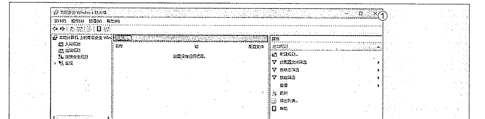

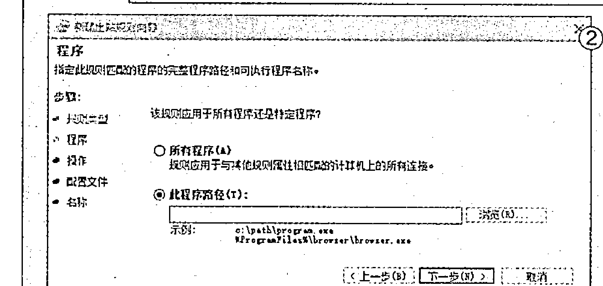

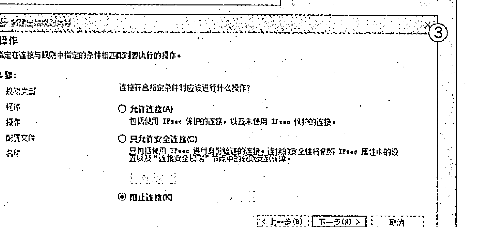

点击鼠标右键，在弹出的菜单中选择“Exit”命令。接下来将下载的中文语言包文件复制到该工具的安装文件夹。然后再次运行该防火墙图标，这样工具的操作界面就变成简体中文的了。双击系统托盘图标打开软件的配置窗口，点击左下角的“管理Windows防火墙规则”这项。接着在新窗口点击“创建新规则”中的“增加阻止程序”按钮，在弹出的对话框中选择要禁止的程序文件。程序文件选择完成以后，该工具就可以马上创建一个新的网络规则，但是操作步骤却大大的得到了简化。

> 小提示
如果用户还想让这条规则更加严谨的话，那么就选择刚刚创建好的网络规则，接着点击右侧列表中的“属性”按钮。由于很多网络软件通常都是连接服务器的80端口，所以在弹出的属性窗口中找到“协议以及端口”这项。就可以在“协议”列表中选择“TCP”选项，接着在“远程端口”列表选择“自定义端口”，然后在“例如”输入框中输入80。所有的设置完成以后点击“应用”按钮，以后当软件程序访问服务器的80端口，该工具就会弹出提示框进行拦截。

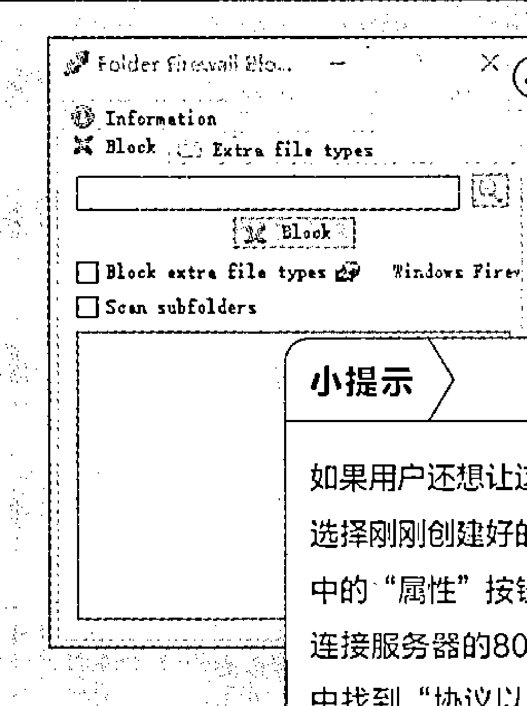

> 小提示
如果用户需要批量删除防火墙规则，那么首先可以运行CCleaner这款清理工具。接着单击工具栏中的“注册表”按钮，然后点击“扫描问题”按钮就可以分析出失效的防火墙规则并删除它们。

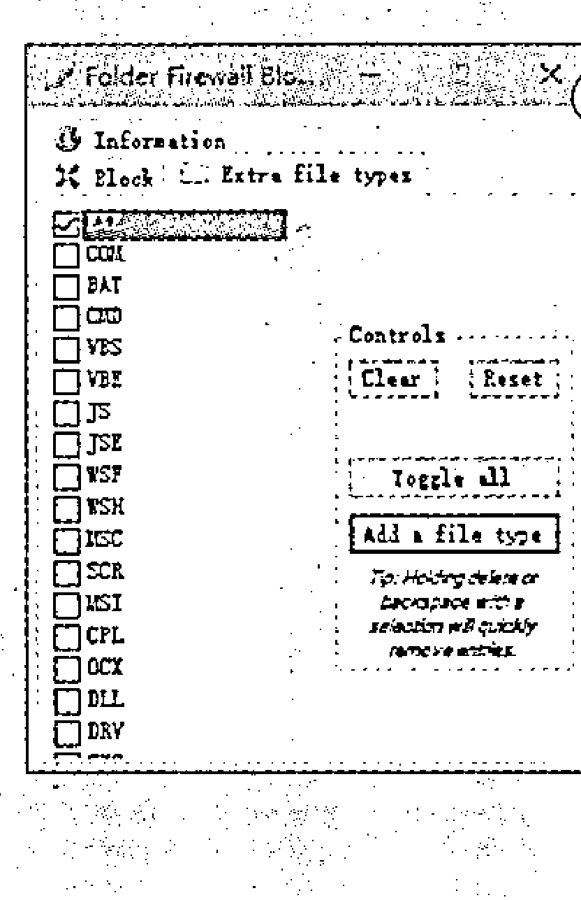

#### 批量添加防火墙规则

除此以外，用户也可以下载运行“Folder Firewall Blocker”这款工具。这款程序和“Windows Firewall Control”等配置程序最大的不同就是，以前的防火墙配置程序需要用户对每一个软件程序进行配置，而现在这款配置程序可以一次性对整个文件夹目录中的文件进行设置操作，从而大大的减少了用户的重复操作。现在点击“Block”标签中的浏览按钮，在弹出的窗口中选择应用程序所在的文件夹目录，接着选择“Block extra file types”和“Scan subfolders”选项（图4）。然后点击配置窗口中的“Extra file types”标签，从列表中设置要屏蔽的文件类型即可，一般情况下我们只需要选中EXE这项就可以了（图5）。如果列表里面没有需要的文件类型，那么首先点击“Add a file type”按钮，在弹出的对话框里面设置相应的文件类型扩展名就可以了。接下来返回到“Block”标签里面，再点击其中的“×Block”按钮，就可以自动创建防火墙规则并添加到系统的防火墙列表里面。

#### 不用防火墙进行屏蔽

“Folder Firewall Blocker”和“Windows Firewall Control”最大的优势，就是利用系统自带的防火墙功能来进行操作。这样当防火墙规则创建完成以后，就可以关闭配置程序了。但是这款工具也有一个比较大的问题，就是用户不想再屏蔽这些软件程序的时候，需要一个一个对已有的防火墙规则进行清除。如果用户不想这么麻烦的话，那么可以下载运行“禁止程序联网”这款工具来试一试。当我们运行这款工具后首先点击“目标文件”后的按钮，在弹出的对话框中选择需要进行屏蔽的软件程序文件即可。设置完成以后点击“拦截”按钮，就可以对这个软件程序进行拦截操作了（图6）。这款工具最大的特色就是不依赖于Windows的防火墙功能，而是利用自身来进行相关的屏蔽操作。所以要保证屏蔽效果一直存在，就需要这款工具常驻系统才可以。

### 像Edge一样在网页上直接笔记

文|阿立

Edge浏览器是微软Windows 10系统主打的一款网页浏览器，它不仅允许用户进行“稍后阅读”，还可以让大家直接在网页上做笔记。但要是正在使用其他浏览器的用户也想实现这些功能，应该怎么做呢？

#### 浏览器扩展的安装

其实对于使用其他网页浏览器的用户来说，只需要在浏览器上安装相应的功能扩展，或者调用相关的功能脚本就可以解决这个问题。我们首先运行自己常用的浏览器，登录Diigo服务的网站链接(https://www.diigo.com)。接着点击右上角的“Sign up”按钮，再点击“Free”按钮后根据提示注册一个自己需要的账号名称即可。然后点击网页上方的“Downloads”按钮，找到网页里面的“Diigo Extension”选项后，根据提示点击自己所使用的浏览器名称的网页链接，就可以跳转到相关的应用商店进行功能扩展的安装操作了(图1)。当所有的准备操作完成以后，我们可以利用刚刚注册的账号登录到Diigo服务的管理页面。以后无论是我们选择的稍后阅读页面还是进行的在线笔记，都可以在这个页面里面查询到。

#### 批注网页中的信息

我们这里使用的是谷歌浏览器，下面我们就通过这款浏览器结合“Diigo Web Collector”功能扩展来进行操作演示。比如当我们在浏览网页时，需要对网页内容进行批注或者进行在线笔记的时候。首先点击浏览器工具栏中的功能扩展图标，并在弹出的菜单里面点击“Annotate”按钮，这样就代表打开了该功能扩展的注释功能。现在通过鼠标选择需要注解或者笔记的内容，这时会在文字上方出现一个编辑工具条。点击工具条中的铅笔按钮，在弹出的颜色面板里面选择相应的颜色，这些文字就会以设定的颜色突出显示。当鼠标移动到标注的文字信息上的时候，会重新显示出一个新的工具条。点击工具条中的“add a sticky note”命令，就会弹出一个进行注释的输入框，在其中输入相应的注释信息后，点击“Save”按钮就可以进行保存操作(图3)。注释的信息会以一个图标的形式在

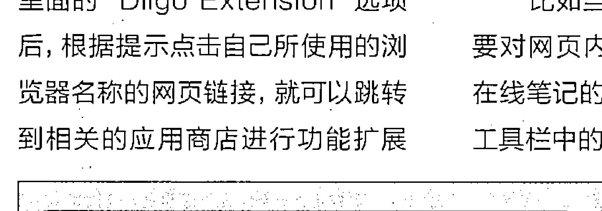

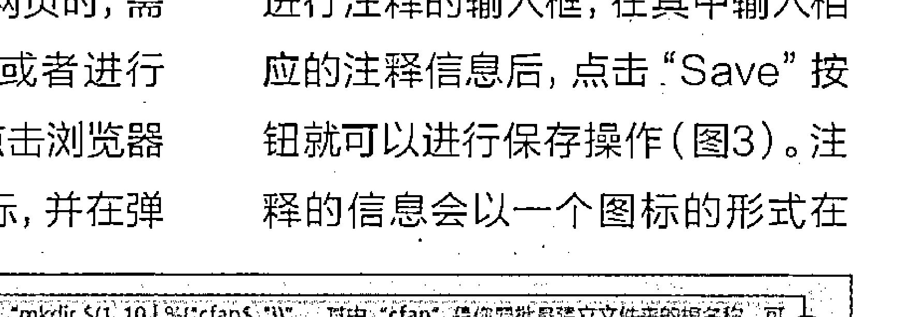

选择的文字后显示，用户只需要点击这个图标就可以看到注释的信息内容。

##### 小提示
如果用户现在还在使用微软的IE浏览器，那么就无法进行功能扩展的安装操作。这时候通过IE浏览器点击“Diigo Extension”选项后IE链接，在弹出的页面找到下面的“Diigolet”链接，然后将这个功能书签拖放到书签栏里面（图2）。这个时候IE浏览器会弹出一个提示框，点击“是”按钮就可以完成书签的添加操作，以后利用它就可以完成相关的操作。

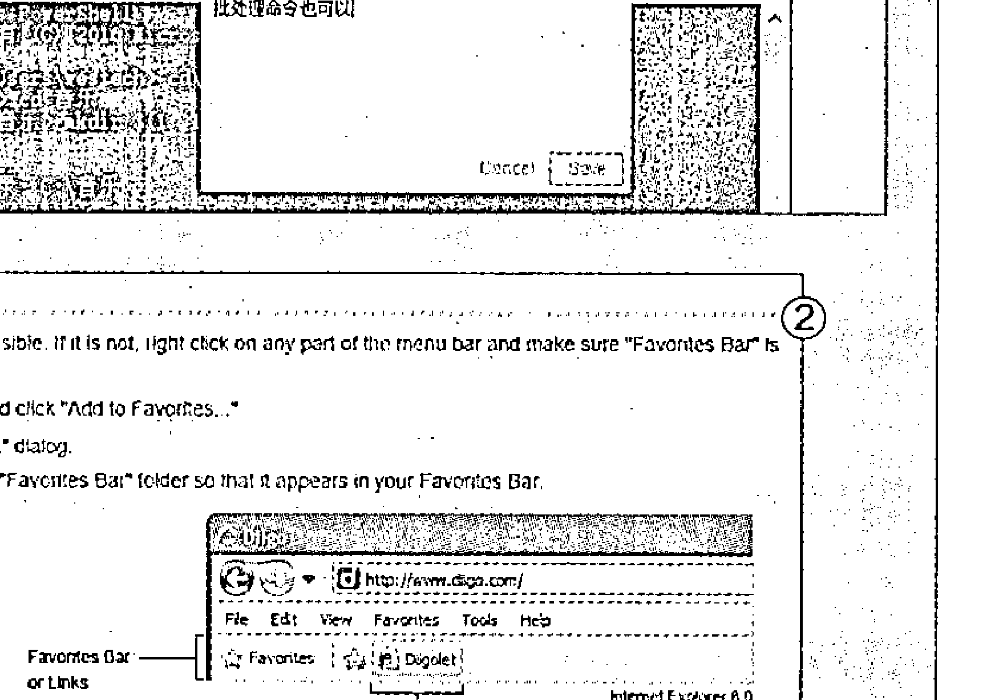

如果是刚刚进行了批注的信息，那么找到网页右上角的扩展工具条，再点击工具条中的列表按钮。在弹出的列表里面就可以看到我们刚刚批注的所有信息；点击批注的选择段落以后就可以马上在网页里面跳转到这个段落，以方便用户进行相关的查看。如果是后来需要查询相关的批注信息，那么现在点击浏览器工具栏中的扩展图标。在弹出的菜单里面点击“My Library”命令，这样就可以跳转到Diigo服务的管理页面，在列表里面就可以快速地进行查询（图4）。找到以后点击网页链接，就可以跳转到批注的网站页面了。

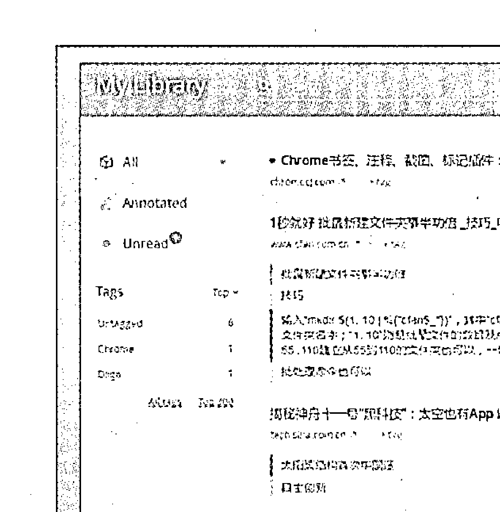

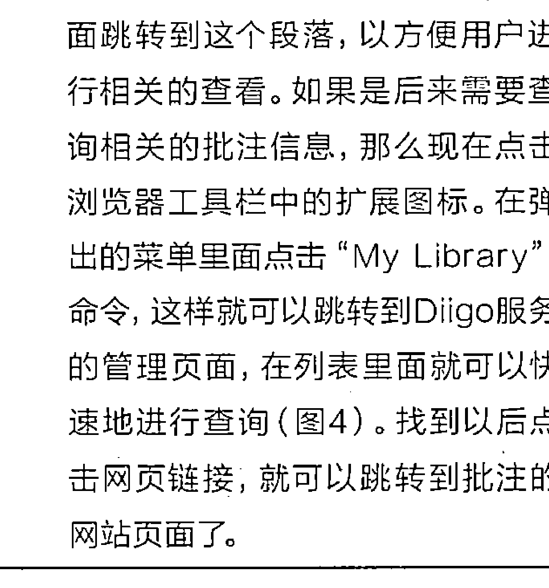

#### 管理查询批注信息

随着用户在网页里面批注记录的信息越来越多，这样进行信息的管理查找就成了一个问题，于是我们都需要对这些信息进行相应的管理操作。首先按照前面的方法进入到服务的后台管理页面，当然最简单的方法就是直接通过管理页面的搜索框来进行操作。这个搜索功能的范围比较宽泛，可以包括网页标题、内容、标签，甚至还有我们的批注信息等等。用户只需要输入关键词后回车，就可以在列表里面显示出搜索结果，这样就可以大大的缩小查找的范围。查询到以后点击信息右侧的管理按钮，在弹出的菜单里面就可以进行编辑、删除、分享等管理操作。除此以外，我们还可以像管理

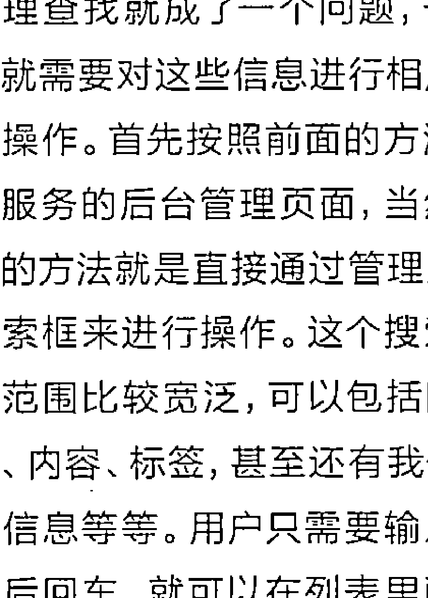

笔记一样，为网页信息添加上标签信息。在列表中找到一条需要管理的信息后，点击管理菜单中的“Edit”命令，就会弹出一个网页的管理窗口。通常情况下网页的标题以及网页链接都是默认设置好的，用户可以根据需要对标题进行修改。接着在“Description”输入框里面，编写对这个页面进行相应的描述。然后在“Tags”输入框里面，为网页链接加入标签，用户输入的标签之间只需要用空格分隔即可（图5）。最后点击对话框保存按钮，这个网页就管理完成了。以后当我们需要查找相关的网页信息的时候，只需要在后台管理页面点击左侧的“Tags”命令，在弹出的列表里面找到相应的标签名称并点击，这样就可以找到所有相关的网页链接。

#### 其他功能自由选择

除了我们前面介绍的这些功能以外，“Diigo Web Collector”扩展的其他功能也是非常实用的。比如点击浏览器工具栏中的功能扩展图标，在弹出的菜单里面点击“Save”按钮，就可以把当前的网页链接添加到云书签里面，这样随时随地都可以对这个网页进行查询。当用户点击这个按钮以后，首先会弹出一个保存对话框，通常情况下直接点击“Save”按钮即可（图6）。当然用户也可以选择“Read Later”或“Cache”选项，比如选择“Cache”选项以后就会直接将当前网页保存到云端，这样以后就可以加快网页的访问速度。

### 一款工具来 软件多“下岗”

众所周知，在电脑上要进行办公、娱乐、编程，需安装各种相应的软件。实际上，我们使用这些软件，多数情况只是用它们进行简单的阅读、查看或编辑，将软件的80%以上功能闲置了。这些软件难道非装不可吗？

#### 1. 日常办公 不安装Office也行

出差在外，如果电脑中没有安装Office套件，别人发来一份Word文档、Excel表格或PPT幻灯片，需要阅读或编辑，该怎么办？

这时，只需启动Free Editor，直接打开收到的Office文档，就可以在窗口中进行查看或编辑（图1）。窗口上方是文件操作工具按钮，而下方是类似于Word软件的格式栏，使用非常方便。

Free Editor能够打开从MS Office 2003到2016版的主流文档格式。对于WPS文档，若用MS Office兼容格式存档，也可以用此软件打开。

#### 2. 生活娱乐 不再为格式发愁

生活中，电子书阅读、影音播放占比很大。如果下载了EPUB、PDF、MHT、PDF等格式的电子书，还要去寻找安装各种对应的阅读器吗？对于数码照片、音乐视频文件，不装三两个浏览器或播放器能搞定吗？当然可以，Free Editor读书、播放音视频都很顺手，看图的同时还支持图片编辑操作。

如果双击一个媒体文件后无法用该软件自动打开，那可能是系统或软件在升级过程中改变了文档关联（例如Windows 10升级改变了PDF文档关联）。这时可选中文档，执行右键菜单的“打开方式→选择其他应用”命令，选中“始终使用该应用打开”选项，将此类文档设定为与Free Editor永久关联即可（图2）。

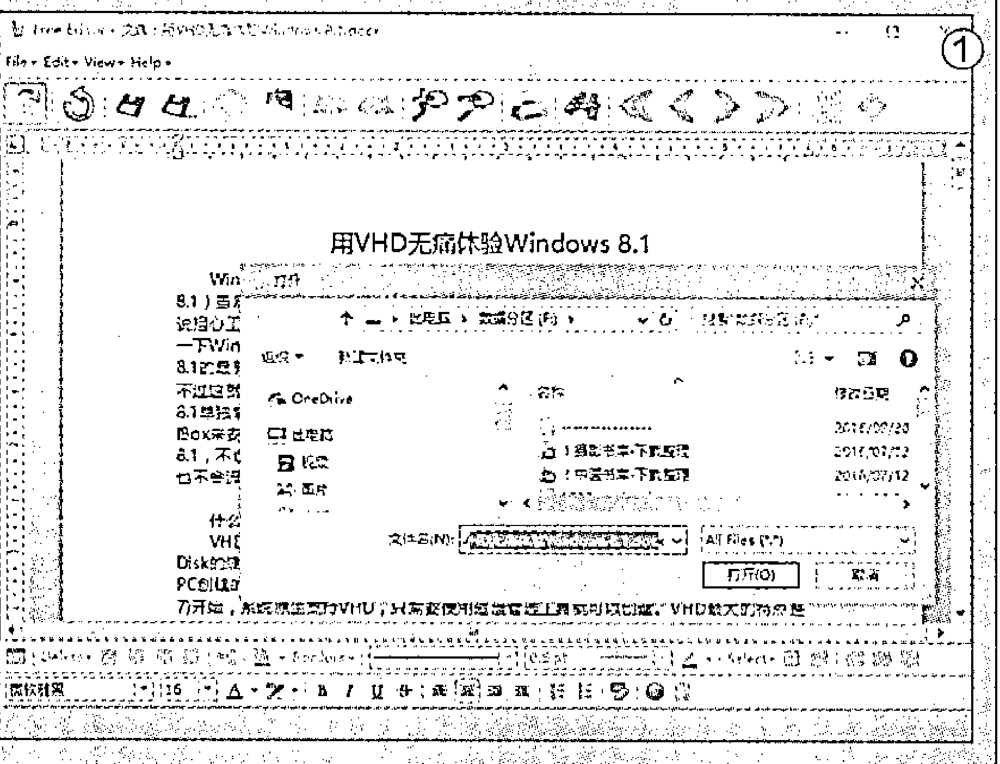

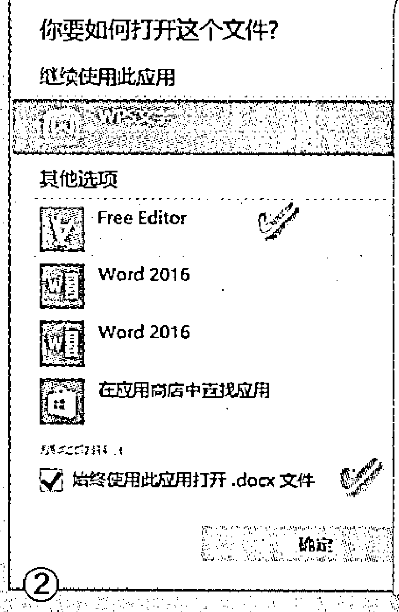

#### 3. 代码编辑 让Editor们靠边站

对于程序设计人员来说，离不了各种类型的程序代码编辑（如C、ASP、JAVA、JSP、PHP、SQL、VB等），人们会使用EmEditor或Editplus之类的各种代码编辑器。其实Free Editor可代替几乎所有的程序代码编辑器。以编辑ASP程序为例，在将该文件格式与Free Editor建立关联后，双击ASP代码文件，即可自动进入编辑环境（图3）。

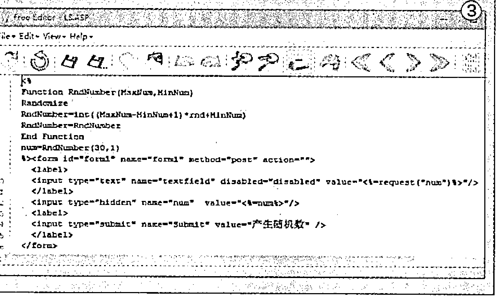

如果下载到了RAR、ZIP、7Z等格式的常用压缩文件，不用去惦记下载安装WinRAR或好压了，直接用Free Editor解压即可。

### 简单加密 强力安全

文|张惠香

当我们不得不通过电脑网络存储或传输文本或文件时，如果内容涉密，给文本或文件加密将比只添加访问权限更加可靠。为此，需要寻找简单易行而效果安全可靠的加密方法，而Encrypt Care这款软件即可实现。

#### 1. 明文变密文 用乱码沟通

如果希望加密一段文本，先开启Encrypt Care窗口，点击Text选项卡，在文本框中输入或粘贴文本内容，在上方的Password文本框中输入密码，勾选Remember password复选框；之后点击Encrypt按钮加密；随后可见右侧窗格中自动生成由数字和字母组成的“乱码”字串，这就是加密后的内容（图1）。这样就可将这段“密文”以明文的方式向任何人发送甚至共享在网上，别人也不会知道其代表的具体内容。而如果要将这段密文恢复为原文，除了需要用Encrypt Care软件外，最主要的是加密时所设的密码。

为了验证上述解密过程，可将左侧窗格中的原文本和上方的密码删掉，然后点击右侧窗格上方的Decrypt（解密）按钮，此时软件要求提供密码；输入密码后点击解密按钮，左侧再现原始文本内容。

#### 2. 任意文件快速加密与解密

Encrypt Care不但可以加密文本内容，还可以将任意类型的文件进行加密处理。我们将三个不同类型的文件（包括程序、图片、Word文档），用Add按钮或拖动的方法添加到Encrypt Care窗口中，输入加密密码，点击Encrypt按钮进行加密。随后，软件询问目标文件夹的存放位置，确定之后开始加密，最后给出加密报告（图2）。

到目标文件夹中查看，可见与源文件一样的三个文件名。但当分别点击这些文件时，图片无法打开，程序无法运行，Word文档打开后显示一堆16进制的代码（图3）。加密之后注意及时删除或转移源文件。

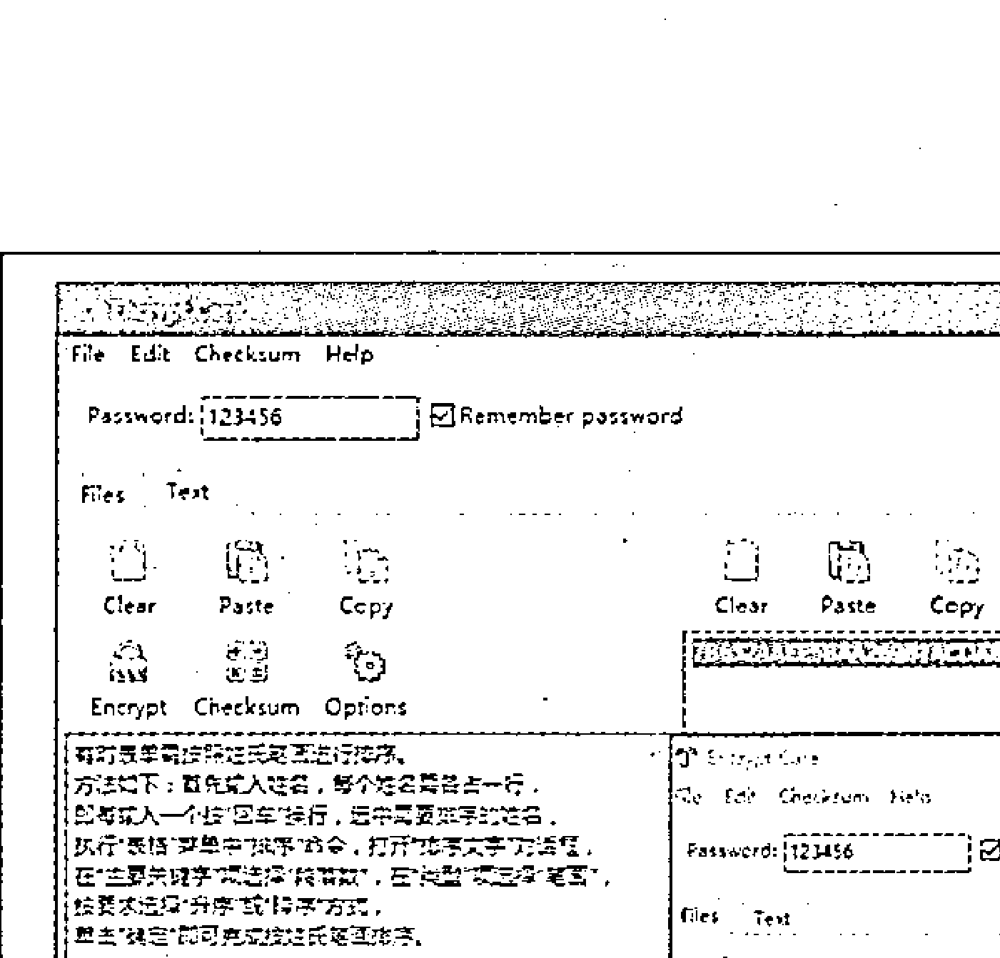

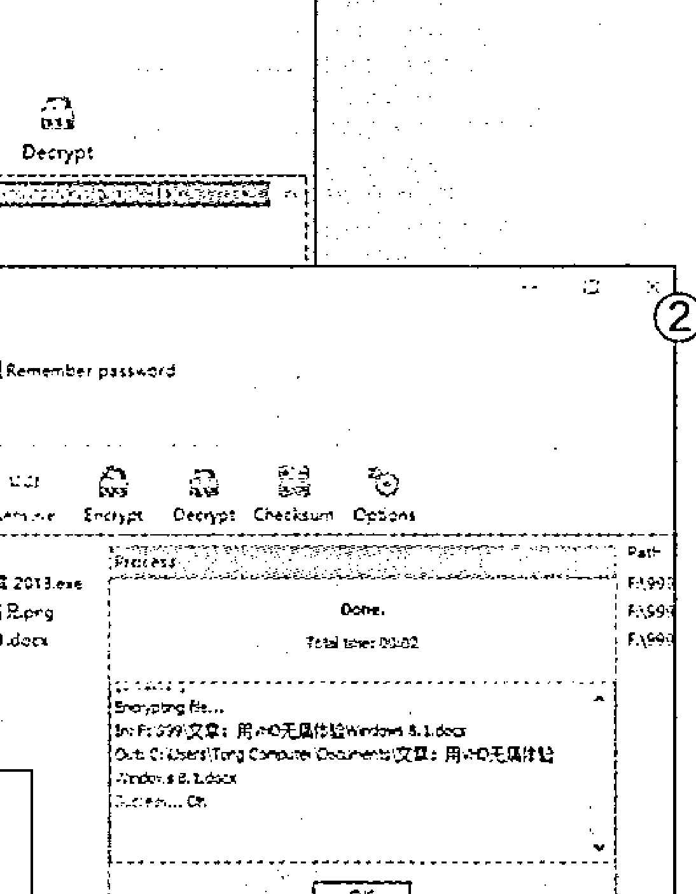

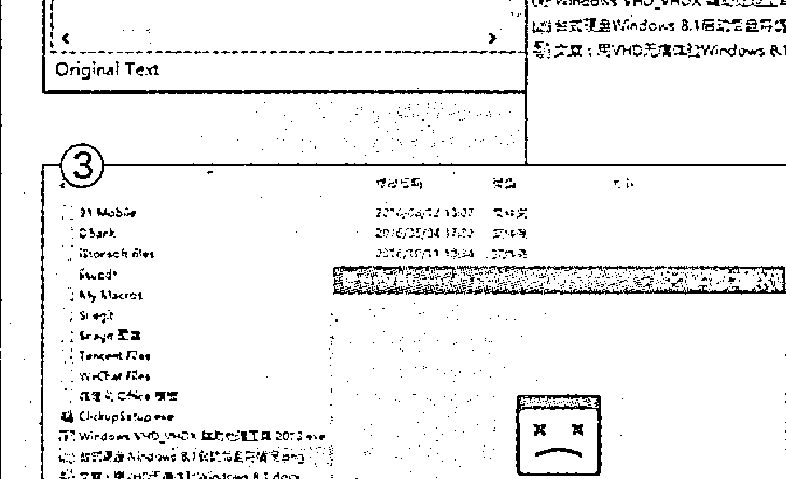

> 小提示
通过Options按钮，可设置文本或文件的多种加密方法。此外，通过Checksum按钮，可以自动生成文件的五种校验码，还可以依据已有的校验代码对文件进行正确性现场校验（图4）。

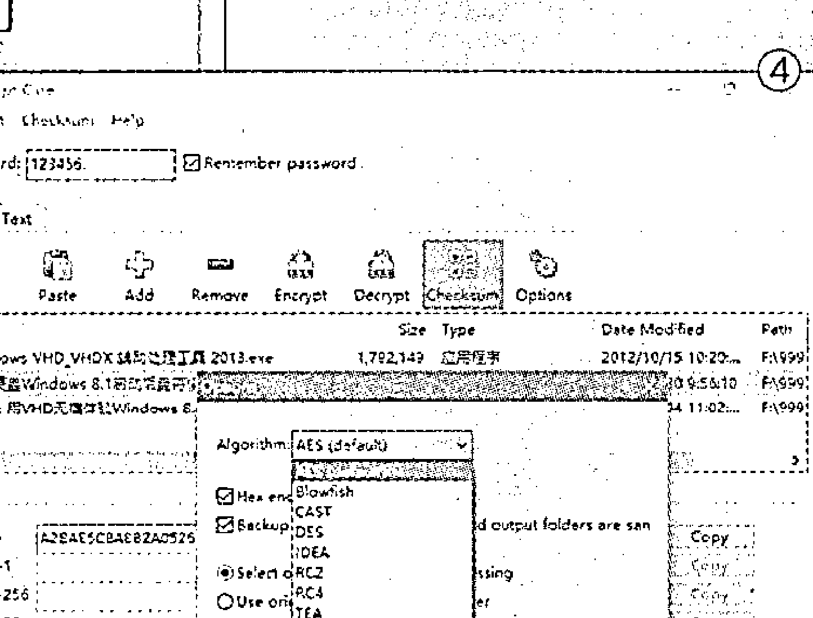

### 视频制作 小软件解决大问题

文|小能

笔者前几天接到一个重要任务：制作学生会宣传视频。虽然电脑中没有复杂的专业视频软件，但凭借自己的使用经验，用三个简单好用的小软件就可完成视频制作，完成后的视频效果完全不输专业软件所为，大家掌握之后对视频操作便不会惧怕了。

#### 1. 添加字幕与转场

首先来完成第一个任务，为部分视频增加字幕和转场效果。打开“爱剪辑”，点击下面的添加视频，把所有的视频按照顺序添加进来，然后点击“字幕特效”，双击右上角的视频输入字幕，最后用右上角视频旁的“字体设置”以及“特效参数”，根据实际需求设置字幕特效就好了（图1）。

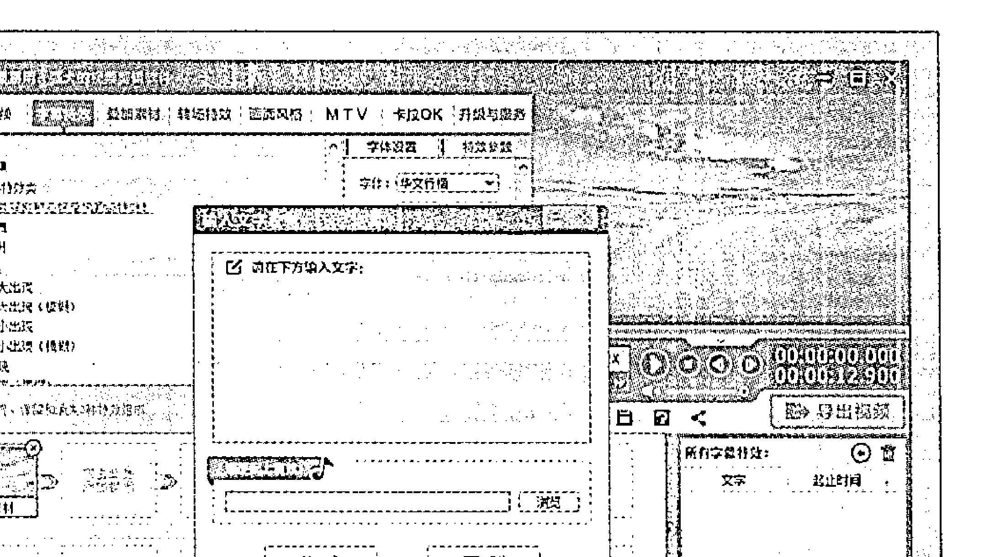

而加转场特效的时候需点击界面下方的“双击此处添加视频”，然后添加软件自带的一分钟黑幕或者白幕视频（添加的时候可以根据需要剪辑转场时长），放入需要转场的两个视频中间，再用上述方法向中间添加字幕、设置参数等（图2）。当然，它的作用不止于此，也可以用它在视频中添加贴图等，有待细心的你慢慢挖掘。

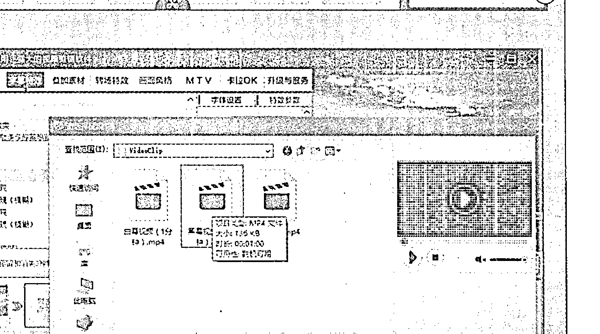

#### 2. 翻转视频

至于横竖不一的视频文件，使用“格式工厂”就能将它们统统按标准站好。首先确定自己要转换的视频格式，然后点击左边的相应格式，添加要转换的视频，在转换的页面点击“输出配置”，在“输出配置”的页面点击最下面的翻转，选择左翻或者右翻。

> 转换的视频与转出的格式要相同，否则设置不当可能导致视频出现模糊等问题。

#### 3. 剪辑与添加背景音乐

最后就要把那些需要剪裁以及接入的视频进行合成，还要添加背景音乐。这时，打开优酷的“iDo”，把需要剪裁或接入的视频导入，点击播放按钮让其播放，在需要剪裁的开头按暂停按钮，点击“剪切”，继续播放，在需要剪裁的结尾点暂停再点剪切。这样需要剪切的片段就被独立出来了，把鼠标放在那段视频上方点击红色的按钮删除。

添加背景音乐时，点击视频右边软件自带的音乐或使用本地音乐，添加自己需要的背景音乐即可。最后若需要美化，点击跳转至美化，之后保存视频即可。

### 360网盘文件快速“搬家”

文|万立夫

面对个人的免费云盘越来越少，就在人们庆幸还有几家可用时，360云盘也宣布明年年初转型停运了。得知消息的网友蜂拥而至，保存个人文件导致服务器下载缓慢。时间有限，如何完成360网盘内容的快速转移呢？

#### 注册和彩云的账号

既然我们暂时无法很快地将360网盘中的内容下载到本地系统里面，那么我们可以首先考虑将网盘中的文件转移到其他的网盘里面，比如中国移动开发的和彩云网盘。要想进行文件数据的转移操作，首先需要启动手机里面的微信客户端，接着点击操作界面上方的查找按钮。然后在搜索框里面输入关键词“和彩云”进行查找，当出现搜索结果以后点击结果中的公众号和彩云就可以了。

> 小提示
> 和彩云的密码不能使用诸如123456这样连续的信息内容。

接下来根据提示关注这个公众号，点击该公众号并在它的操作界面点击下方的“我的文件”按钮（图1），然后在弹出的菜单里面选择“网盘搬家”命令。如果用户是第一次使用和彩云网盘的话，那么首先根据提示注册一个账号来进行使用。当账号注册完成以后返回到公众号的主页面，再次点击“我的文件”按钮并在弹出的菜单里面点击“绑定账号”命令，这时在弹出的对话框里面输入刚刚注册的账号密码进行绑定就可以了。

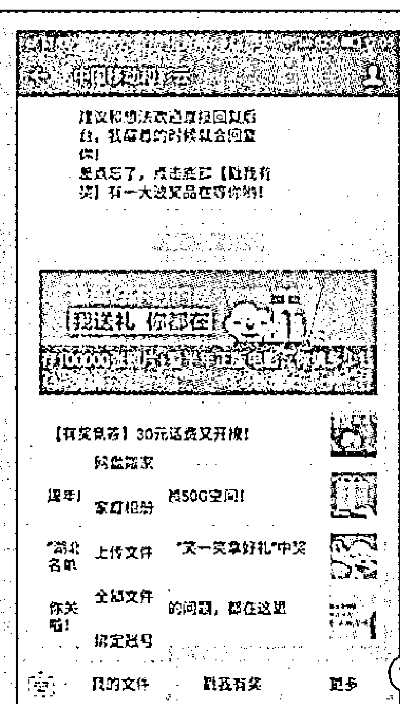

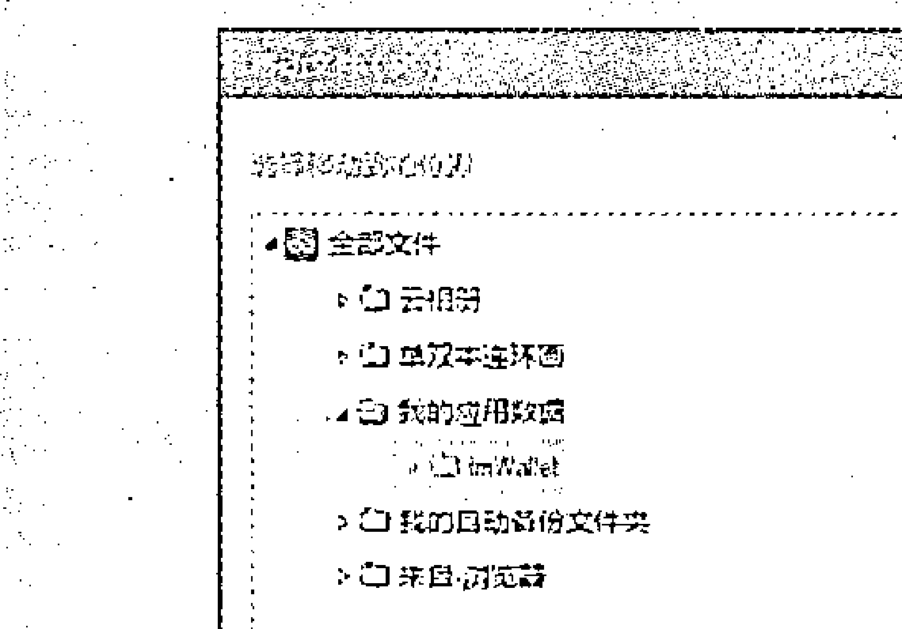

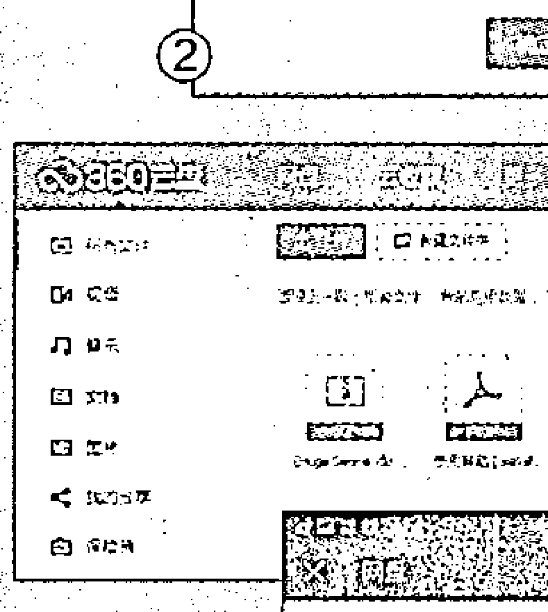

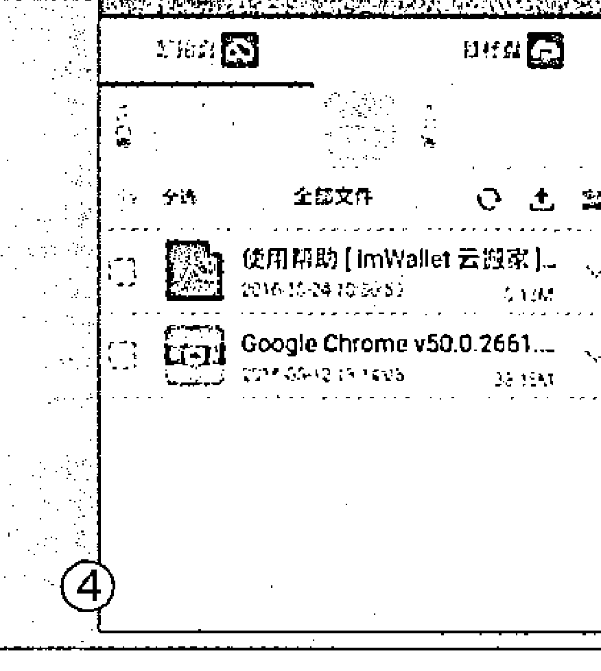

#### 转移文件到和彩云

当绑定完成以后不要急着进行搬家操作，因为当你在进行搬家操作的时候，会惊喜地发现网盘里面没有任何文件。这是因为第三方服务权限的问题造成的，所以我们现在首先通过浏览器打开360网盘的页面。从列表中找到自己需要下载的文件，接着点击鼠标右键选择“移动”命令（图2），然后在弹出的对话框里面将文件移动到“我的应用数据\imWallet\”这个位置（图3）。这时重新单击微信客户端“我的文件”菜单中的“网盘搬家”命令，这时就会弹出一个网盘搬家的操作界面。

现在点击左上角的“起始盘”命令，在弹出的列表点击“添加网盘”按钮。然后在授权列表里面选择“360云盘”这项，并且根据提示输入360网盘的账号和密码，从而完成相关的授权操作。现在返回到“起始盘”列表，选择刚刚授权的360云盘这项，这样就可以看到刚刚移动到imWallet文件夹中的文件或文件夹。

然后从“起始盘”的列表中勾选需要进行转移的文件或文件夹，选择完成以后点击“运行”按钮，就可以将360网盘中的文件转移到和彩云里面（图4）。当文件转移成功以后会在公众号里面有提示，然后我们再从和彩云里面慢慢地进行下载就可以了。

### 护眼有高招 多管齐下保护眼睛

文|平淡

作为办公一族，我们几乎每天都要长时间面对电脑屏幕，时间长了眼睛难免会疲劳，保护眼睛的方法就是降低屏幕光线的刺激，设置更为舒适的背景色等。不过自Windows 10之后，修改窗口背景颜色（比如把白底变成浅绿色）不再像以前那么方便，甚至需要修改注册表，或者借助一些优化软件来完成。既然系统自身的操作这么麻烦，我们何不借助一些专业软件来完成护眼工作？

#### 强制护眼 保护眼睛请位护士

大家知道长时间使用电脑，久坐容易腰酸背痛，用眼过度容易得干眼症之类的疾病。因此要保护好自己的眼睛，一是要强制自己使用电脑时间不要过长，二则可以调整屏幕显示。这些护眼操作现在可以通过“眼睛护士”实现。

软件启动后默认使用每45分钟休息3分钟的设置，在屏幕上会出现一个倒计时按钮，提醒你使用电脑的时间。点击该按钮可以进入自定义设置，比如可以自行设置强制休息的间隔、休息完毕是否结束指定程序（如强制自己休息后不再玩游戏）等（图1）。

这样到了指定的时间，屏幕就会被眼睛护士自动锁定，屏幕上会显示休息时间倒计时，只有到了指定的休息时间后才可以继续使用电脑。此外还可以使用它来进行关闭屏幕、屏幕关灯（只显示局部亮度）等操作（图2）。

切换到“增强功能”，这里还可以对屏幕背景、显示器亮度等进行调节，比如可以进入“电脑护眼设置→设置电脑色调为护眼色（浅绿色）”（图3）。

这样以后我们打开Word、记事本等文本软件阅读文本的时候，这些程序底色就会自动变为护眼绿色（图4）。

不过“眼睛护士”对系统背景色的设置对浏览器没有效果（IE网页默认使用其自带的背景色），对于经常浏览新闻的朋友，启动IE后点击“工具→Internet选项→常规→辅助功能”，去除格式化选项下“忽略网页上指定颜色”前的勾选（图5）。

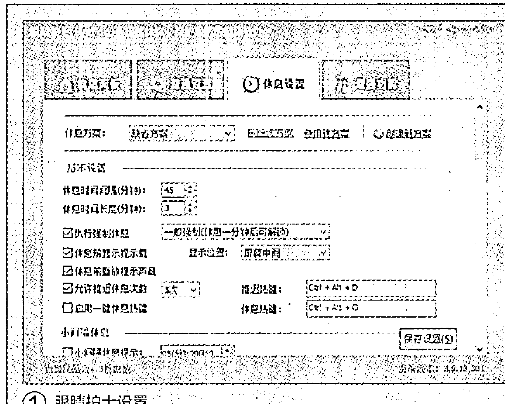

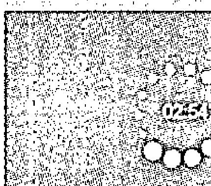

> 小提示
> 软件进入休息状态后无法结束其运行（默认1分钟后可以点击解锁图标回到桌面），如果临时有事不想进入休息状态，可以在出现休息提示的时候，点击软件图标选择“推迟休息”即可。

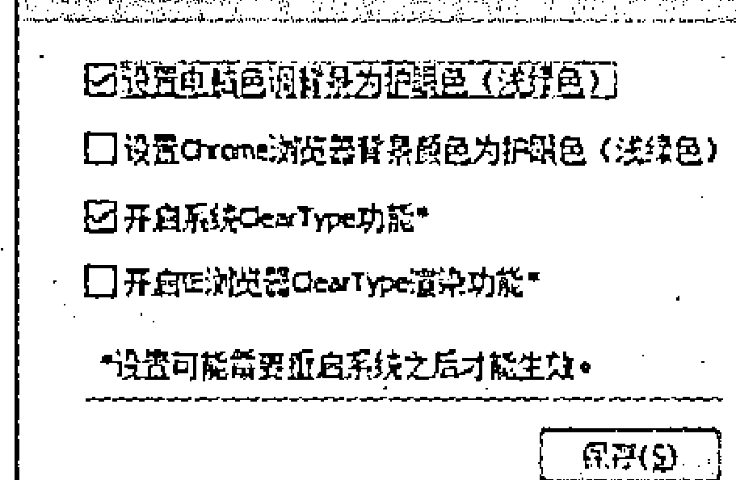

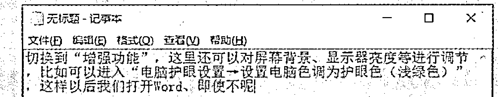

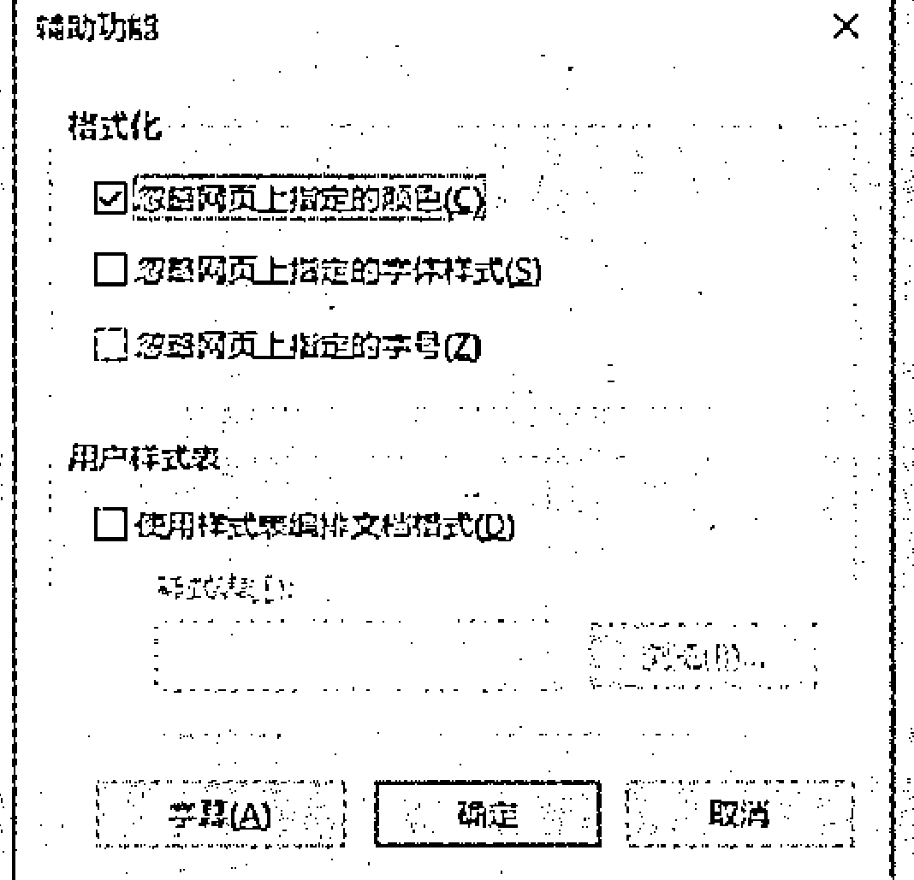

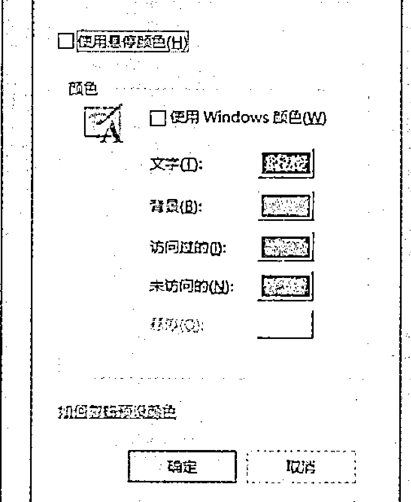

##### 设置网页背景色

返回“Internet选项→常规”，点击“颜色”，然后为IE网页设置需要的背景色，这样以后浏览网页的时候就可以使用自己设定的养眼色了（图6）。

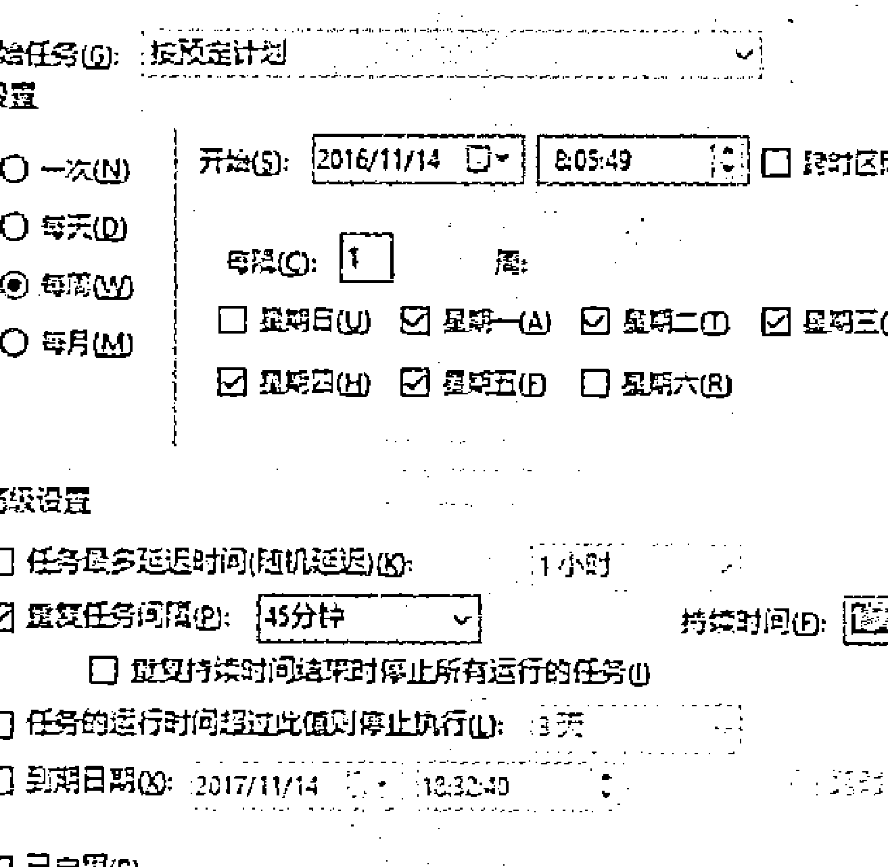

##### 任务计划实现电脑锁定

> 对于不想安装软件的朋友，如果要强制控制自己使用电脑的时间，可以使用系统自带的锁定命令实现。比如要实现每45分钟锁定电脑，启动记事本输入“rundll32.exe user32.dll,LockWorkStation”，将其保存为stop.bat，放置在C:\windows\system32下。接着启动任务计划，新建一个每周工作日8点（假设是你的上班时间）开始，每45分钟重复运行一次的任务，运行程序是上述建立的批处理，这样只要间隔45分钟就会自动锁定电脑了（图7）。

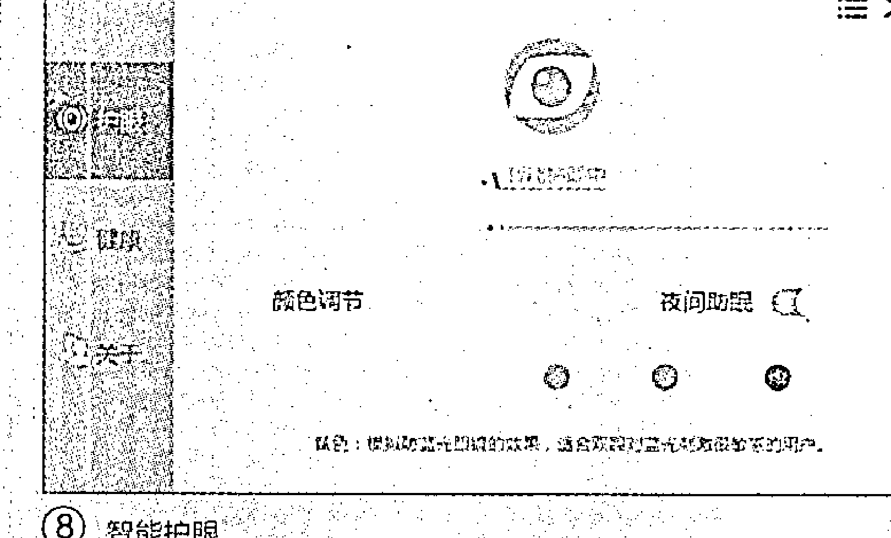

##### 智能护眼

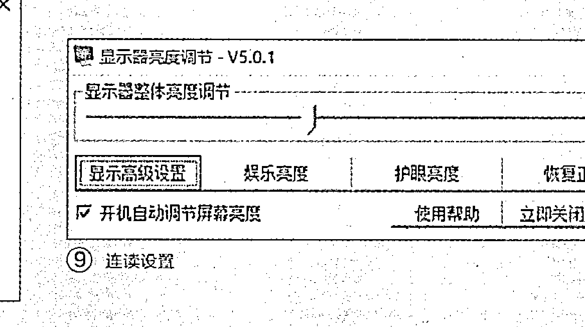

##### 连续设置

#### 护眼有一宝 使用护眼宝保护眼睛

除了上述的设置外，平时显示器的色温、蓝光这些也会对我们的眼睛造成伤害。因此要更好地保护我们的眼睛，还可以借助“护眼宝”进行调整色温和蓝光过滤等来保护我们的眼睛。启动护眼宝后就会自动进入智能护眼模式，软件会根据当前环境自动调整色温。我们也可以通过点击下方的颜色调节，选择每种颜色后软件会贴心地说明颜色的适用范围，这样可以获得更舒适的护眼效果（图8）。

#### 护眼更方便 一键调节亮度

上述软件虽然好用，不过并没有提供亮度手动调整。比如为了更好地保护眼睛，玩游戏的时候需要亮一些，在看文本的时候则降低些亮度，当然仅靠手动调节显示器上的按钮比较麻烦，现在借助“显示器亮度调节器”即可一键快速调节亮度以保护眼睛。以管理员身份运行软件后可以看到其内置了“娱乐亮度”、“护眼亮度”等设置，我们只要一键点击即可快速实现亮度的调节。而如果对内置亮度效果不满意，还可以拉动滑块实现更为个性化的亮度设置（图9）。对于高级用户，展开“显示高级设置”，这里可以对RGB色彩进行更多的调节，只要拉动对应的滑块即可实时看到调节的效果。如果对自行调整后的显示效果不满意，只要点击“恢复正常”即可恢复到初始调整状态了。

### 5毛的视频神功特效

文|诗蕴

你也许看过让人感觉神奇的好莱坞大片的视频特效，也看过那些只值“5毛”神剧的视频特效。其实，你也可以自己制作一段5毛钱的视频神功特效让人信服的。不信？那你就往下看吧！

打开Premiere Pro 7.0，新建一个序列，分别导入两段用单反相机拍摄的视频素材，并把这两段视频拖动到轨道V1和V2（图1）。

先删除蓝背景视频素材的音频，再把它拖到V2轨道的开始处，和V1轨道的视频素材开始处对齐（图2）。

单击左下角的效果面板，依次选择展开“视频效果→键控→蓝屏键”（图3）。之后拖动“蓝屏键”到V2轨道上的蓝背景视频素材上，完成抠像（图4）。

打开效果控件栏，创建第一帧动画。先展开其下的“运动”效果，依次展开“位置”和“缩放”项，单击“缩放”前的按钮，打开创建关键帧按钮后，调节后面的参数，压缩V2轨道的跳舞视频素材，使其大小在V1轨道人物的两手之间即可。

同理，选择“位置”前的按钮，打开创建关键帧按钮后，分别调节后面的X、Y参数，使V2轨道的跳舞视频素材移动到V1轨道人物的两手之间，即可完成第一关键帧动画的创建。

需要注意的是，如果蓝背景视频素材蓝背景“抠”得不干净，需要在“蓝屏键”效果文件夹下调节“阈值”。

继续创建第二帧动画。先在播放窗口中单击下一帧按钮，使V1视频前进一帧。再按照上一步的方法，依次调节跳舞“小人”的“位置”和“缩放”参数大小，使其始终保持在“大人”的两手之间。

按照上面的步骤，耐心细致继续创建下一个关键帧动画。蓝背景视频不够时，还可以拷贝粘贴重复使用，和V1轨道视频保持一样长度就可以了。

接着添加字幕、背景音乐，然后渲染、合成输出和保存。输出时可以选择H.264的高清格式，其他参数可暂时不用调。怎么样，最终效果，看起来很酷吧。

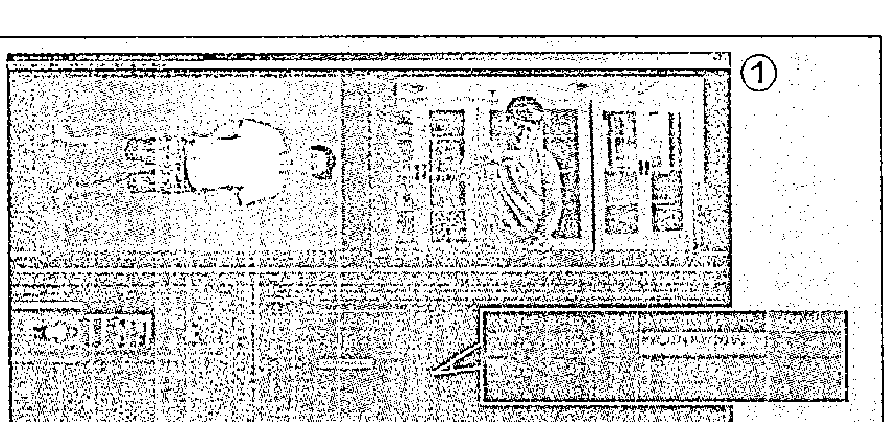

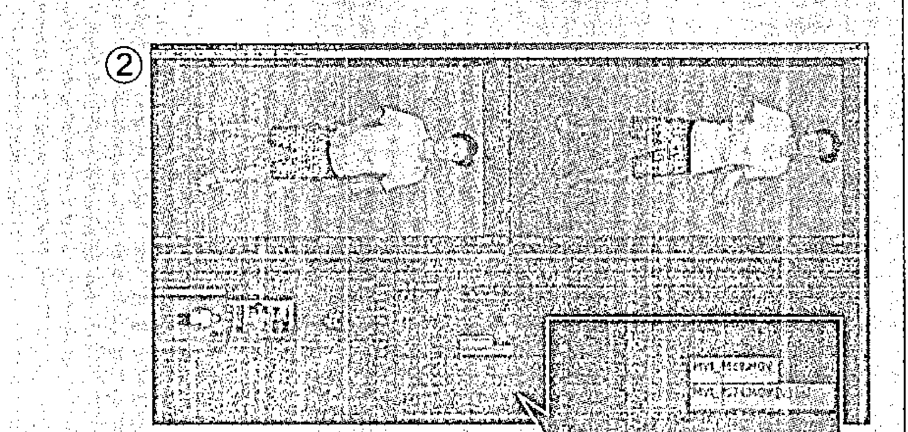

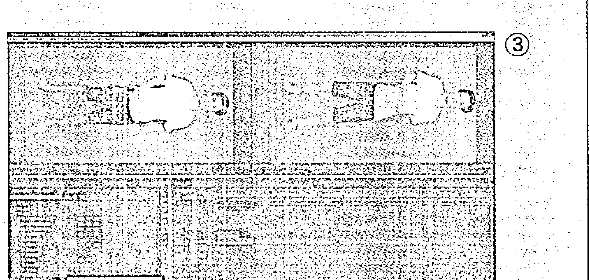

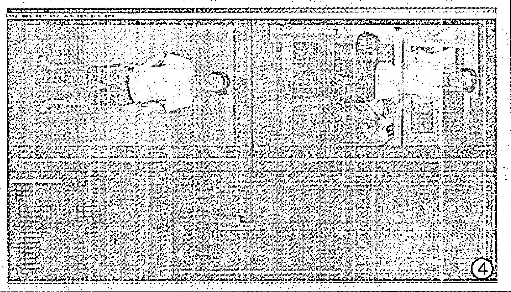

### 百度网盘文件加速下载

文|阿立

现在的网盘已经越来越少了，百度网盘就算是仅有的几个硕果之一，于是很多人也开始使用这个网盘进行文件存储。可是现在这个网盘的限制比较多，比如用户在下载文件的时候需要使用百度网盘的客户端，除此以外还对用户下载文件的速度进行了限制等等。那么有没有什么方法可以不受限制地进行下载呢？

#### 授权访问百度网盘

我们首先通过浏览器打开“百度网盘加速下载”这个网站（http://www.loveno.net/baiduyun/login.html），接着在打开的网页里面点击“与你的百度网盘连接”按钮，这时网站会跳转到百度网盘的授权页面（图1）。根据网页提示输入自己的百度账号和密码，点击“登录并授权”按钮就可以完成操作。接下来返回到刚刚打开的“百度网盘加速下载”页面，我们会发现其中并没有我们需要下载的文件内容。

这是由于百度网盘出于安全方面的原因，并不会允许第三方授权的服务可以随意访问网盘中的内容，因此我们还需要把要下载的内容转移到特殊的文件夹里面。

> **小提示**
> 如果用户以后不想再使用这项服务了，想解除它和百度网盘之间的授权操作，那么首先点击 https://passport.baidu.com/accountbind 这个链接。在弹出的页面找到“我授权过的应用”列表，在其中找到“百度云加速下载”这一项后点击它，然后在弹出的菜单里面点击“解除关联”命令就可以了。


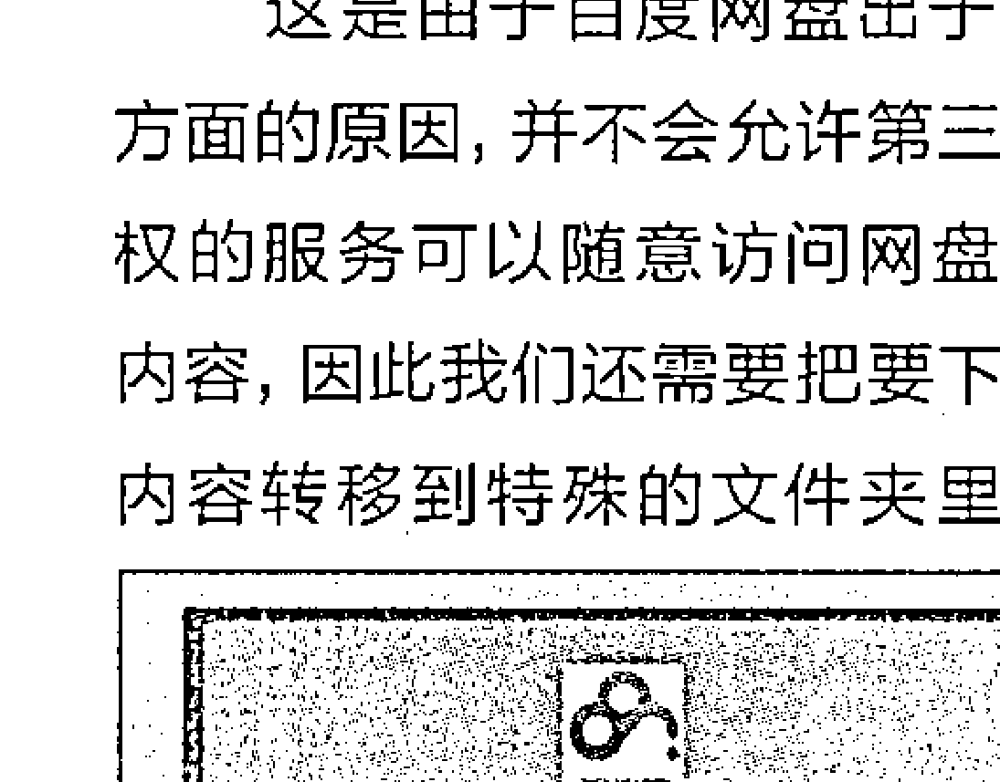

现在登录到自己的百度网盘页面，找到需要进行下载的文件内容并选中它们。接下来点击工具栏中的“更多”按钮，在弹出的菜单里面选择“移动到”命令。然后在弹出的对话框里面将文件移动到“我的应用数据\zqian123\”这个位置就可以了（图2）。

#### 快速下载不受限制

接下来再返回刚刚授权的“百度网盘加速下载”页面，对网页进行刷新操作后，就可以看到需要下载的文件内容了（图3）。在文件列表里面找到自己需要下载的文件后，在前面就可以看到相应的下载地址信息，将这个地址复制下来后添加到我们常见的下载软件里面，就可以利用多线程进行不限速的下载操作了（图4）。

按照前面的方法我们首先获得一个多媒体文件的下载链接，然后运行自己常用的视频播放器。比如本人最常用的播放器就是PotPlayer，点击播放器左上角的图标按钮，在弹出的菜单里面选择“打开”中的“打开链接”命令。在弹出的设置窗口里面将复制的下载链接粘贴到“打开链接”输入框里面。然后点击窗口下方的“确定”按钮，就可以看到PotPlayer开始进行多媒体文件的下载缓冲，当缓冲一会以后就开始进行视频文件的在线播放了。

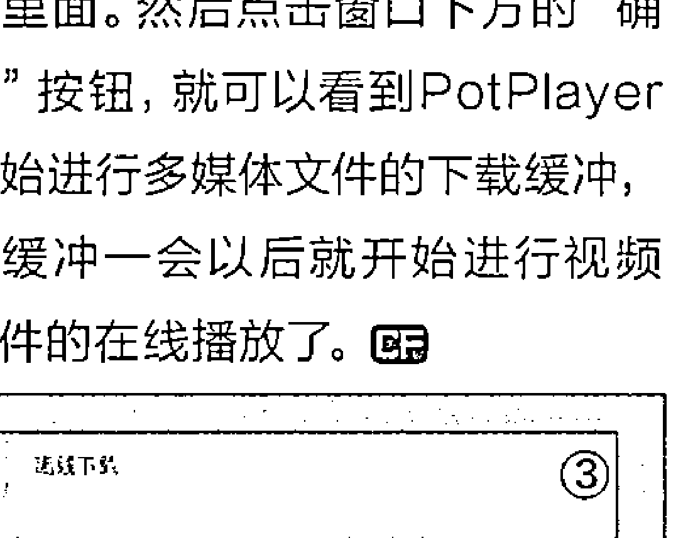

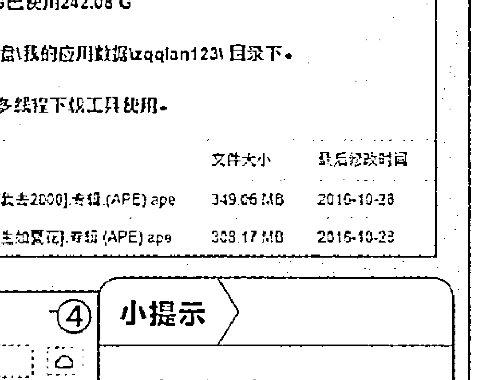

> **小提示**
> 不过这种方法还是需要考虑自己网络的带宽，如果你的带宽有限的话，还是建议下载到本地硬盘后进行播放操作。

| 操作 | 文件名 | 文件大小 | 最后修改时间 |
| :--- | :--- | :--- | :--- |
| 下载地址1 下载地址2 | 朴树...[我去2000]专辑(APE).ape | 349.66 MB | 2016-10-28 |
| 下载地址1 下载地址2 | 朴树...[生如夏花]专辑(APE).ape | 309.17 MB | 2016-10-28 |

| 状态 | 文件名 | 速度 | 剩余时间 |
| :--- | :--- | :--- | :--- |
| | 朴树...[我去2000]专辑(APE).ape | 4.25 MB/s | 00:01:03 |
| + 添加 | 清除已完成 | 速度: 4.28 | 全部 |

### 操作更便捷 电脑控制手机

文|俞木发

大家知道手机使用起来更为方便，但不适合办公，屏幕小、输入不方便。反之，电脑屏幕大、配置高、输入便捷，但是移动性又不如手机。因此对于一些需要输入较多文本或者多步骤的操作，通过电脑控制手机的方法可以实现更高效的操作，而对于一些演示性操作，手机也可以通过投射操作，方便在大屏显示器上展示。

#### 输入更高效 使用Total Control快速操作手机

由于手机屏幕小不方便进行大量文本的输入，现在这类操作可以借助Total Control（支持Android手机），使用电脑控制手机，在PC键盘上实现快速输入。因为需要分别在Android手机和电脑上安装Total Control，因此在电脑上启动Total Control后，首次使用需要使用数据线将手机连接到电脑上并在手机上开启“开发者模式”进行安装。

在手机上依次进入“设置→关于手机”，找到「版本号」（三个字），快速点击7次「版本号」，直到手机提示已处于开发者模式。回到“全部设置”中，然后开启“开发者选项”，打开其下的“USB调试”开关（图1）。

此时在手机屏幕上会弹出安装提示，点击“确定”完成驱动安装后即可连接手机。成功连接手机后程序界面就可以看到手机屏幕，按提示使用鼠标进行点击即可操作手机了（图2）。

当然为了操作方便，现在可以使用Wi-Fi方式进行无线连接。在手机上启动Total Control，切换到“使用WiFi连接”，然后记住其中显示的IP地址，返回电脑端Total Control，点击“添加连接→WiFi连接”，输入手机上显示的IP地址进行连接即可（图3）。

现在我们就可以借助PC键盘实现高效输入。比如需要发送长短信内容，按提示在PC屏幕上启动新建短信，然后直接使用键盘输入需要撰写的文本内容，书写完毕点击“发送输入框的内容到手机”，这样短信的内容会出现在发送文本框，点击“发送”即可完成长短信内容的撰写。其他应用操作类似，比如可以在手机上启动WPS，然后在电脑上进行快速输入即可（图4）。当然Total Control连接手机后可以正常显示屏幕上的所有操作，因此对于屏幕损坏无法触摸的手机，使用上述方法连接后即可执行通讯录上传、文件提取等操作。

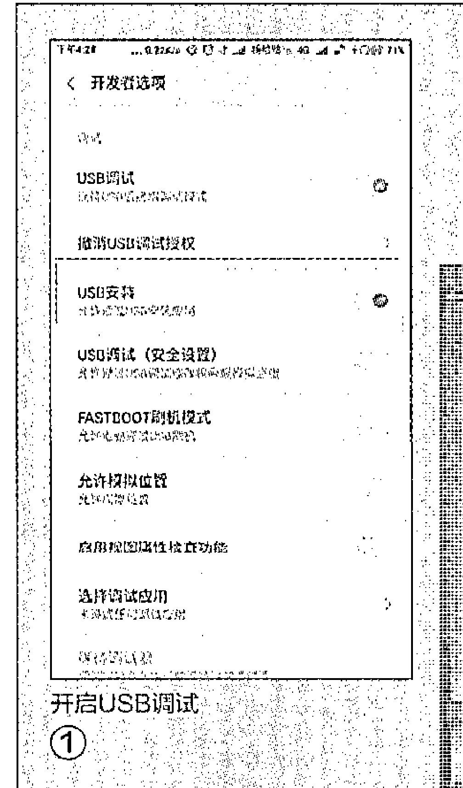

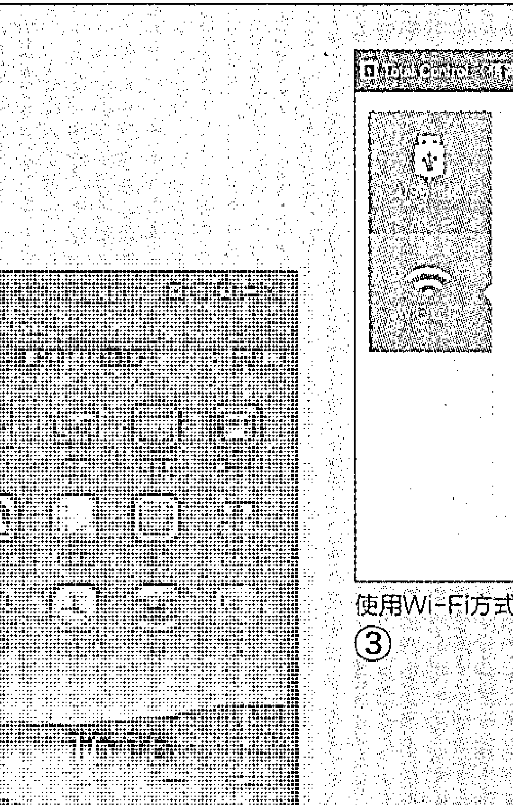

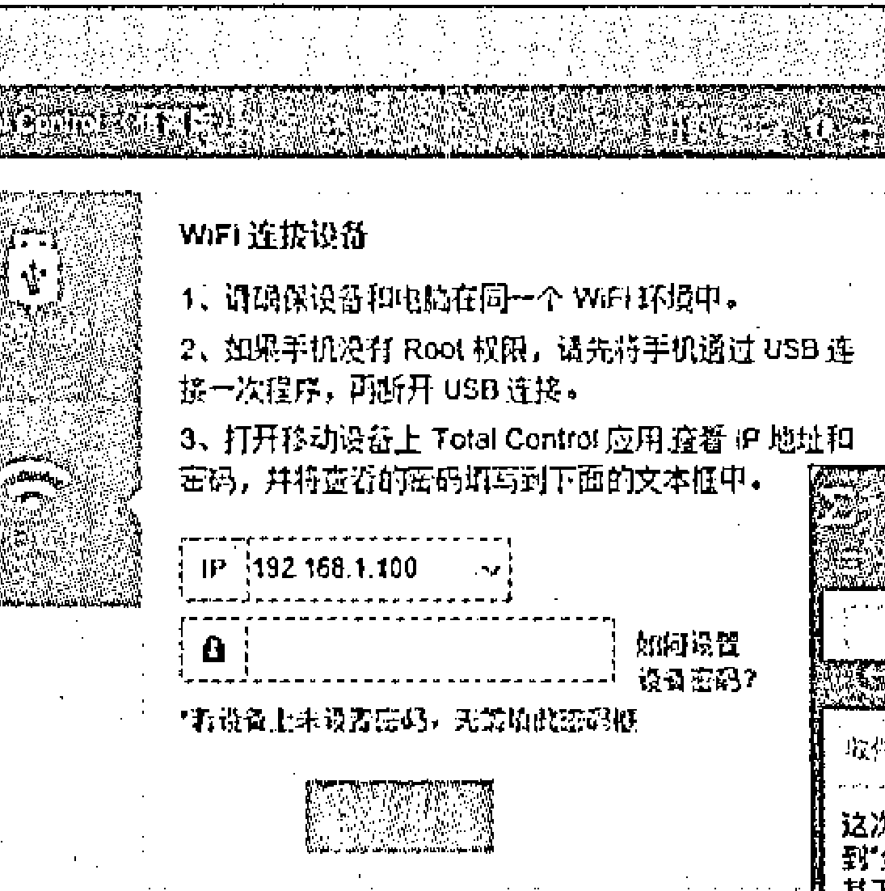

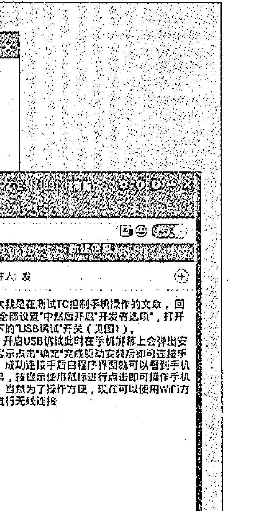

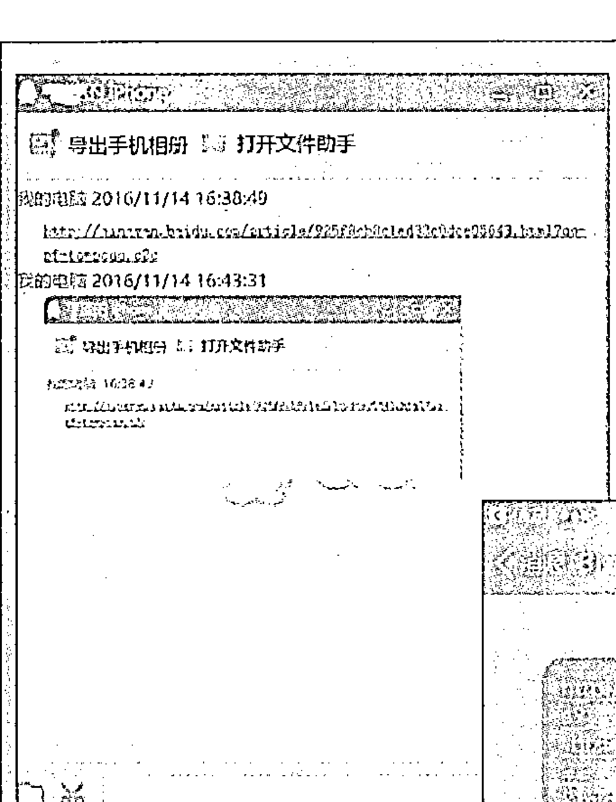

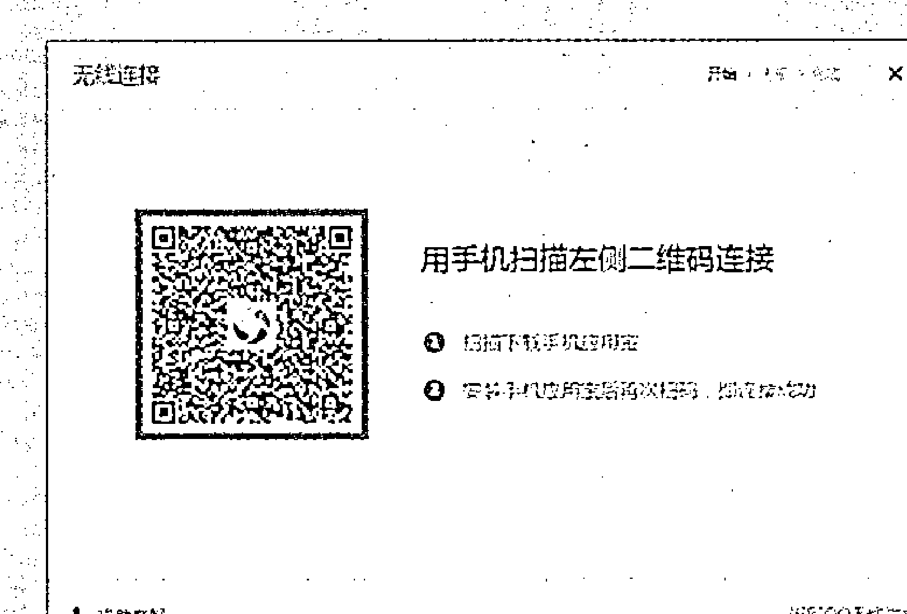

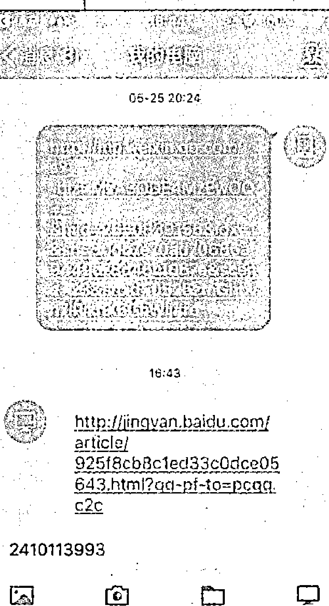

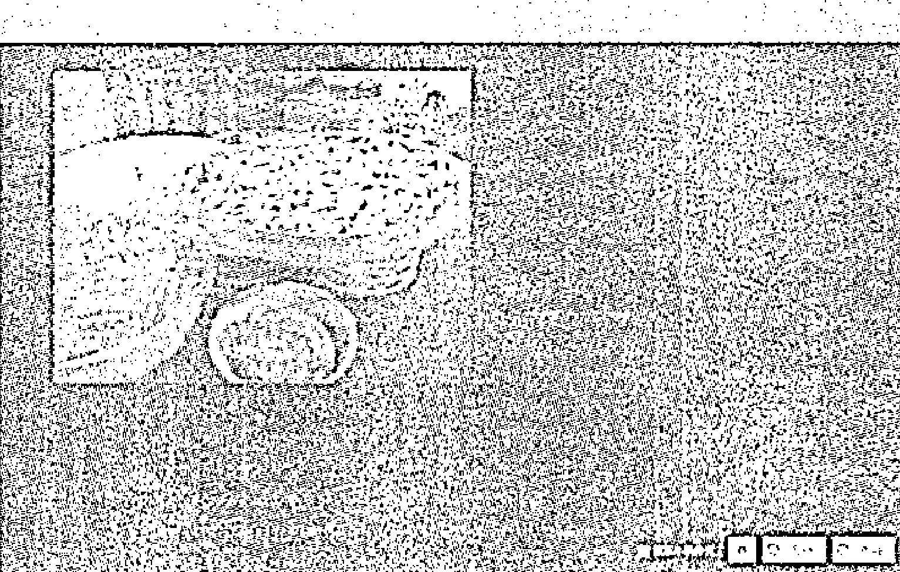

#### 无惧小屏 手机内容投射到显示器

手机上的屏幕尺寸较小，在手机上看视频或者照片的时候就显得不方便，利用“应用宝”就可以轻松实现手机内容投射。

首先在手机和电脑上都安装应用宝，在电脑上启动应用宝后点击“连接手机”，在弹出的窗口选择“我没有数据线”，按提示扫描二维码安装，接着再次扫码即可进行连接（图7）。

成功连接手机后，在电脑上点击应用宝上方菜单栏中的“我的手机”，然后单击左方菜单栏中的“工具箱”。把鼠标移到应用宝手机图标屏幕中央，会出现一个“播放按钮”，单击播放按钮，手机上显示的内容就能实时在电脑上显示了。比如在手机上打开一张图片，这样图片会自动显示在电脑的屏幕上，可以点击“全屏”切换到全屏显示，在大尺寸屏幕上看手机照片是不是更惬意（图8）。

> **扩展阅读**
> **电脑文件跨网络传输到手机**
> Total Control只能控制通过数据线或者同一Wi-Fi连接的手机，如果要跨网络传输数据到手机上，我们还可以借助QQ实现。比如需要将电脑上长网址发送到手机浏览器打开，在QQ上打开“我的设备→我的手机”，然后将网址（当然也可以是长文本、图片等内容）粘贴到发送框，这样网址内容会自动传输到手机QQ上（图5）。
> 
> 这样在手机上打开QQ，在“我的好友→我的电脑”里就可以看到QQ传送过来的消息。比如网址、图片可以直接在手机QQ中使用浏览器打开，长文本则可以使用复制、粘贴的方法转移到其他应用中，实现电脑间接控制手机的功效（图6）。

### 软件实验室功能前景
文|老万

现在有的软件在发布的版本里面，都会增加一些实验性的新功能，这样厂商可以根据一些用户的使用反馈来决定是否在以后的版本里面增加或删除这些功能。由于这些实验性功能常常会有一些不足，所以软件厂商往往会将这些功能隐藏得比较深。那么如何找到并激活这些实验性的功能，让用户可以提前感受到新功能的特色呢？

#### 启用全新的QUIC协议
谷歌浏览器是最早在软件里面添加实验室功能的软件之一，比如QUIC协议就是谷歌制定的一种基于UDP的低时延的互联网传输层协议。通过QUIC协议可以降低网络通信的延迟，提供更好的用户互动的体验。不过这个功能现在还处于测试的阶段，所以我们只能在试验室功能里面进行开启。

首先在浏览器的地址栏输入“chrome://flags”并按下回车键，从而进入到浏览器的后台设置界面。在弹出的页面点击右上角的菜单按钮，在弹出的菜单里面点击“查找”命令。接着在弹出的搜索框里面输入关键词“QUIC”，查找到“实验性 QUIC 协议”这个选项后，在列表里面选择“已启用”选项就可以了。然后根据提示重新启动浏览器，就可以启用这个实验室功能了（图1）。

> 小提示
> 不过要想使用QUIC协议的话，除了在浏览器里面激活这个功能以外，还需要网站服务器也启用这项功能，不过现在很多国外的网站默认已经开启了这项功能。

#### 实验室功能更加丰富
既然谷歌浏览器默认已经包含了实验室功能，那么在Chromium开源项目上研发的浏览器自然也有类似的实验室功能。除此以外，知名的火狐浏览器里面也包含了实验室功能。比如国内的运营商经常在用户上网的时候，进行DNS劫持等相关操作。

不过在火狐浏览器里面只需要设置远程DNS解析，就可以有效地防止DNS被劫持。首先在地址栏里面输入命令“about:config”后按下回车键，接着在设置界面输入“network.proxy.socks_remote_dns”参数后按回车键进行搜索。找到这个参数以后双击后面的参数值，将内容修改为true就可以了（图2）。

不过和谷歌浏览器有所不同的是，火狐浏览器的试验室功能不仅可以在后台进行开启，也可以通过功能扩展的形式进行使用。因为从Firefox 46版本开始，火狐浏览器悄悄启动了Test Pilot计划，这样可以让用户使用到正式版发布前测试的实验功能。如果用户要想使用这些功能的话，首先打开“Test Pilot”项目的主页(https://testpilot.firefox.com/)，在弹出的网页里面就可以看到多个实验项目，其中包括网页截图、标签管理、视频悬浮、隐私保护等等。鉴于很多截图软件都对网页截图支持不够，所以我们就来看看“Page Shot”这项功能。

首先点击网页里面的“Page Shot”功能介绍，在弹出的网页里面点击“Install the Test Pilot Add-on”按钮，这样就可以安装一个管理实验室功能的附加组件。当这个附加组件安装完成以后，网页会自动跳转到“Page Shot”功能的安装页面。现在只需要点击网页中的“Enable Page Shot”按钮，就可以完成该实验室功能的安装操作(图3)。以后当我们需要进行网页截图操作的时候，首先点击工具栏中的“Page Shot”按钮。接着用鼠标在网页里面进行拖动，从而选择需要截图的范围就可以了。这款截图工具可以自定义选择截图的范围，并且允许用户随意地对选择框的大小进行调整(图4)。

如果用户再配合滚动条的移动进行调整，就可以很方便地实现全屏的滚动截图操作。截图完成以后如果发现没有问题的话，点击截图框右下角的保存按钮。不过和其他的截图工具不一样的是，这款工具在截图完成以后并不会将图片保存到本地硬盘里面，而是弹出一个新的网页允许用户进行更多的操作。比如用户要想保存这张图片的话，那么只需要点击右上角的下载按钮，就可以将截图下载到本地硬盘里面。当然点击分享按钮以后我们就可以看到这个图片的共享链接，用户既可以把它分享给自己的朋友，也可以分享到社交网络里面(图5)。

> 小提示
> 如果用户需要对手机进行更深一步的操作，那么就需要打开手机的“开发者选项”，这里面就包含USB调试、GPU强制渲染、动画速度等多个非常实用的功能。如果用户想要打开这个选项的话，首先进入到Android“设置”窗口，在“关于手机”菜单中狂点“版本号”选项。当出现提示信息后，再退回设置界面，即可发现设置菜单的底部已经多了个“开发者选项”。

#### 移动应用也有实验功能
无论是谷歌浏览器还是火狐浏览器，它们不仅在自己的电脑版本里面拥有实验室的功能，而且在自己的移动应用里面也加入了实验室功能。除此以外还有一些知名的移动应用，也悄悄地加入了一些实验室功能。比如很多人和我一样都在手机里面安装了淘宝的客户端应用，可是这款应用每天都会推送相关的促销信息，即使是利用安全软件结束进程也不管用。

不过现在利用实验室功能，就可以很好地解决这个问题。首先在手机里面打开淘宝的客户端应用，在搜索框里面输入关键词“:labs”，然后点击搜索即可开启。淘宝客户端的实验室功能只有两个选项，分别是“静默防火墙”和“Activity Transition”。其中“静默防火墙”的主要作用就是在系统后台关闭进程，从而防止淘宝客户端的自启动操作等(图6)。

### 位图高清放大两不误
文|万立夫

我们平时接触到的绝大多数图片文件，从专业的角度上说都属于位图文件。这类文件的特点就是由单个的像素点组成的，这样当放大位图的时候可以看见很多的方块，这样就会出现人们常说的失真现象的发生。可是有的时候我们必须要对图片进行放大，对于专业人士可以借助于Photoshop等软件来进行修复，那么普通用户通过什么方法可以保证放大的图片不失真呢？

#### 灵活选择图片放大算法
由于世界上并没有任何超自然的力量，所以不可能产生放大图片后完全不失真的效果。但是我们可以借助于一些技术或者特效的弥补，让我们将图片放大后还能制作出可以使用的效果。今天我们就来使用一款名为SmillaEnlager的软件，它是一款专注于图像放大后尽可能不失真的软件。

这款软件的使用也非常的简单，我们首先从它的官方网站 (http://sourceforge.net/projects/imageenlarger/) 下载，然后直接运行里面的可执行软件程序即可。打开软件后我们需要进行放大操作的图片拖拽到软件窗口里面进行释放，这样这张图片就自动加载到窗口里面了。这时我们在软件界面的左侧可以看到文件的原图，在右侧就可以看到放大后的效果，是不是有些“惨不忍睹”啊。接着我们在操作界面的左上角选择图片放大的比例，然后在“Enlager Parameter”列表里面选择一种放大的算法。至于用户选择哪一种算法比较好，我们的建议是选择一个算法后点击“Preview!”按钮，这样就可以得到自己满意的结果。确认自己想要放大的图片效果后，就可以准备将这张放大的图片进行保存操作了。现在在操作界面的左下角输入新图片的名称，然后选择图片文件存放的路径位置，最后按下“Enlarger & Save”按钮图片就保存成功了(图1)。

> 小提示
> 虽然SmillaEnlager提供了多种放大的算法，但是如果用户都不满意的话，也可以在操作界面点击“Parameter”标签后，点击右下角勾选“Allow Changes”选项。这样就可以激活自定义对话框，然后根据需要进行相关的调整（图2）。

#### 傻瓜操作更加简单明了
SmillaEnlager这款软件虽然可以将图片进行放大处理，但是最终产生的效果感觉是像把图片进行了模糊化处理，所以放大后会有一种油画的感觉。如果用户不喜欢这种感觉的话，那么可以试一试另外一款名为“Sharper Scaling”的软件。它可以把实体物体的照片放大后，尽可能保持物体线条的边缘清晰以及相对较少的噪点。

**“Sharper Scaling”** 软件的使用同样非常简单，从官方网站下载后直接安装运行这款软件([http://a-sharper-scaling.com/](http://a-sharper-scaling.com/))。接着点击左上角的第二个按钮，在弹出的对话框选择想要放大的图片文件，这时在窗口里面就可以看到图片的真实效果。我们在右下角的对话框里面，可以设置想要放大的倍数并点击下一步按钮，这款软件默认可以放大到源文件的4倍的效果（图3）。

当图片文件被进行放大操作以后，软件会显示出一个效果比较窗口。通过移动窗口左侧缩略图中的选取框，在窗口中间显示的就是一般的软件对这部分放大后的效果，而窗口右侧则是这款“Sharper Scaling”软件放大后的效果（图4）。如果用户觉得效果比较满意的话，那么按下窗口右侧第二个存储按钮，就可以将这张放大后的图片进行另存为操作了。

#### 在线操作也能轻松完成
如果用户不喜欢在本地电脑安装软件的话，那么使用在线的相关云服务也是不错的选择，waifu2x这个网站就是一个可以在线处理图片的网站。该网站默认是针对二次元图片进行放大处理，当然用户可以随意地丢进各种各样的图片内容，从而快速地帮助用户把小图成功地转换成大图，然后就可以用到自己的社交网络等需要的地方。

首先通过浏览器登录waifu2x这个网站（[http://waifu2x.udp.jp/](http://waifu2x.udp.jp/)），这时你会看到它弹出一个对话框窗口，点击窗口中的“简体中文”后操作界面就变成我们熟悉的文字了。现在点击“选择图像”下面的“选择文件”按钮，在弹出的对话框里面选择需要处理的图片文件，当然我们也可以直接在输入框里面粘贴图片的网络链接地址。

接下来在“风格”里面选择文件的原本样式，如果是绘图图片就选择“插画”，如果是摄影照片当然就选择“照片”。然后在“降噪程度”里面根据自己的需要进行选择，通常情况选择比较平衡的“中”选项。不过用户可以依据产生的效果，来决定要调高去除噪点，还是要调低去除噪点等。

再在“放大倍数”里面进行选择，waifu2x这个网站最多可以选择放大2倍，最后点击“转换”按钮就可以了（图5）。

转换完成以后会在新的网页窗口显示出转换结果，用户只需要在图片上点击鼠标右键，选择菜单中的“图片另存为”命令就可以将图片保存到本地硬盘里面了（图6）。

> 小提示
> 其实waifu2x也有客户端软件可以使用，用户只需要在网站服务的对话框里面，点击“转至GitHub”这个链接后，在弹出的网页窗口里面找到“releases”选项并点击就可以下载最新的客户端软件了。

### 更为灵活的屏幕操作录制方案
文|张菲

为展示电脑操作过程，大家常常会用到屏幕录像。然而由于录制软件的功能太过单一，在录制过程中往往不便于控制录制方式、效果等设置，录制的文件格式也限于依赖播放器的AVI或GIF等格式，通用性稍差。若录制过程具有更多的录制方式和细节、效果控制，且可以直接录制成EXE格式的视频，将更加灵活方便。

#### 1. 区域选择与录制设置
启动软件Screen2Exe进入录制设置窗口，屏幕上出现屏幕区域示意图，点击“刷新”按钮旁的选择小按钮，然后软件窗口会隐去，继而出现的是由绿色选择框指示的桌面区域，通过拖动或点击选择要录制的桌面区域，然后用回车选择这个录制区域，这样录制窗口中会出现选择区域的示意图(图1)。若不选择录制区域，软件会默认为录制全屏。接下来从右侧的列表中选择屏幕录制的速度(从每秒1帧、2帧、4帧到尽可能快共4档可选)。设置好之后，点击右下角的“开始录制”按钮进行录制。

> 小提示：如果要连同系统声音一并录制进去，则同时要选择“录音”复选框。

#### 2. 开始录制及去向选择
开始录制之后，先弹出一个简易的倒计时小窗口，倒计时结束后开始自动录制，而录制期间Screen2Exe软件自动退缩为一个系统托盘图标。若需要停止录制，点击该图标，会自动弹出录制停止窗口(图2)。如果不需要进行编辑，只需直接点击“现在保存”按钮。如需要对录像进行编辑、添加注释和特殊效果等，点击“继续/编辑”按钮进入下一个环节。而如果要优化录制视频的文件体积，则需要点击“优化框架”按钮。

#### 3. 添加注释与效果编辑
录制视频之后，点击“继续/编辑”按钮进入编辑环节。在视频编辑窗口中，可看到下部有一个播放条，左边是播放按钮以及带圆圈的S按钮(表示选择开始点)和E按钮(表示选择结束点)。通过这三个按钮，可以对录制的视频进行回放和剪辑操作(图3)。

如果要给某个帧添加文字注释，先在要注释的帧上暂停播放, 点击“添加注释”按钮, 然后在Text标签的文本框中输入注释文字, 设置字体及字体的前景和背景颜色, 还可以通过点击下方的圆盘小指针来控制文本框上指示箭头的所指方向, 全部设置好之后, 点击“好”按钮完成注释设置(图4)。

在视频的每一帧中, 根据需要还可以添加各种指示图标和外部图片。点击“添加图片”按钮, 通过“加载”按钮添加常用图标或外部图片。可选择淡入、淡出或透明度, 设置图片的透明度。

我们常在电视里看到镜头拉近拉远的特殊效果, 这种效果实现起来其实也很容易, 只需选择“变焦/聚焦”按钮, 然后点击“设置”按钮, 通过+0.5秒或-0.5秒按钮, 设置聚焦片段的时段, 点击两次“好”按钮, 就可以为某个片段设置变焦/聚焦效果(图5)。

如果希望隐去视频某个区域的画面(比如版权、台标、隐私等), 可通过“添加马赛克”功能来实现。点击“添加马赛克”按钮, 点击“设置”按钮设置出现马赛克的视频时间段。在屏幕预览区域通过矩形框来设定马赛克的区域。注意, 如果选中了“矩形外”复选框, 则马赛克区域将出现在矩形区域之外的所有区域, 否则只对矩形区域内进行马赛克处理。此外, 在“马赛克”下拉选择列表中, 还可以选择另外三种模糊效果, 即白色、黑色、灰色(图6)。

#### 4. 优化帧数与压缩体积
还可以将视频文件的体积进行压缩, 通过“优化帧”按钮来实现。进入优化帧窗口后, 通过下方的导航工具条, 滚动显示每一帧与前后各帧的情况, 可手动选择删除感觉多余的帧。也可以点击“自动优化”按钮进行自动优化。

所有设置和优化工作完成之后, 最后点击编辑窗口右下角的“完成”按钮进行视频输出, 这时可看到在保存选项中默认已经选中了EXE自动播放类型, 不需要修改设置, 直接给EXE文件起名, 点击“马上保存”按钮, 就可以获得想要的自动演示EXE文件(图7)。

### 亲DIY 垃圾清理自动化
文|悠悠

苦于系统自身清理垃圾的不方便，目前人们多借助于XX卫士、管家之类的系统工具来优化系统。但这类工具往往会附加其他功能，让本应清理系统的工作变得更为复杂。

为此，我们用Wise Disk Cleaner Pro这款清洁工具，完成DIY系统垃圾清理的任务。软件安装时要注意两个细节，在附加图标选择时有一个Create 1 click to clean icon的选项，这是创建一键清理选项，可根据需要进行选择(图1)。此外，还需要注意在安装完成后一屏中，有个下载注册表清理工具的选项Download Wise Registry Cleaner now，默认为选中状态，不需要可取消该项的选择(图2)。首次运行选Chinese (Simplified)选项即可进入简体中文界面。

#### 1. 向导式定义个性化清理
进入软件的文件清理类型设置向导的文件类型清单，其中一般为一些系统临时文件。但若其中有你需要保留的临时文件(比如调试程序的临时文件等)，那么请将此类文件的选择去掉即可(图3)。在接下来的位置选择中，需要指定要清理的驱动器，既可一次性清理本地硬盘所有驱动器，也可以分别选择(图4)。清理“选项”设置则包括影响垃圾产生的一些主要项目，包括IE临时文件夹、Cookies安全项目、Windows更新补丁和更新补丁卸载程序、用户临时文件夹和Windows系统临时文件夹，还有无效的快捷方式、用户最近访问列表记录等，可按需选择(图5)。

在满足了如上常见清理项目之外，我们还可以根据自己电脑的使用情况，针对性地添加一些垃圾文件目录。例如，由于该软件没有将有的视频播放软件的缓冲文件夹纳入清理范围，我们可手动将这些目录添加到文件夹清理的范畴中(图6)。点击“添加”按钮进行添加即可，可添加多个项目。执行完如上操作之后，清理工作何时开始有两个选项可供选择，一个是“手动”清理，一个是“自动”清理，自动清理可以按天、周、月来执行。

采用移动到用户目录的清除方式虽然占用一定的磁盘空间，但好处是一旦发现误删，还可以从中找回来。这类似于一个集中的垃圾场，虽然占用一些磁盘空间，但远远比不清除有利于系统效率的提高。以上所有设置工作还可以在软件主界面中通过工具栏上的“设置”按钮进行修改。

自动清理。如果是手动清理，需要在软件界面中点击“开始”按钮进行清理。而如果选择了自动清理，那么按照软件设置窗口中“计划任务”的计划周期选择来自动清理，其中包括每天、每周、每月，或者选择启动时、登录时、空闲时等选项进行清理。对于清理的垃圾文件的去向，也有三种选择：删除到回收站、永久删除或只是被移动到某个用户指定的目录（图7）。

#### 2. 实现几个重量级有用清理需求

除了上述常规的系统清理项目外，通过软件工具栏上的“碎片整理”按钮，可以对磁盘碎片进行整理。此外，通过“反删除”工具按钮，可对磁盘中已经删除的文件进行恢复，或从备份文件中恢复文件（图8）。如果你的磁盘准备丢弃或送人，可通过“硬盘洗刷”工具对分区或整块硬盘进行数据的多次重新写入，以保证上面信息的不可恢复（图9）。

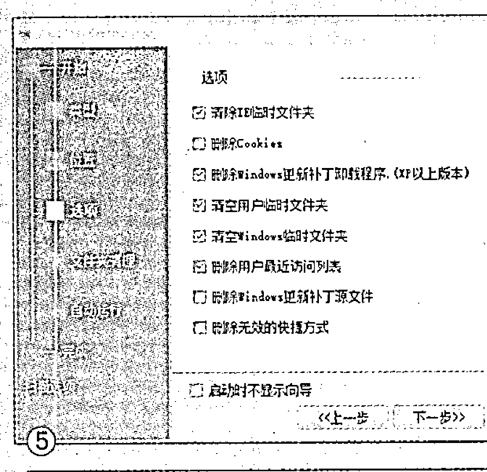

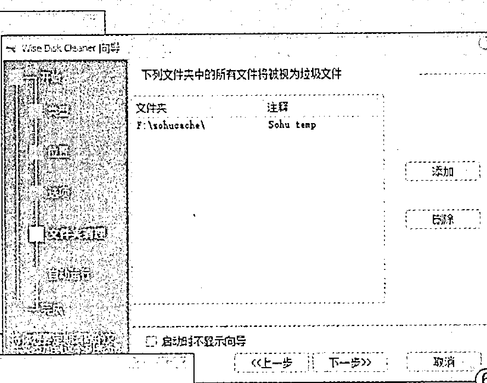

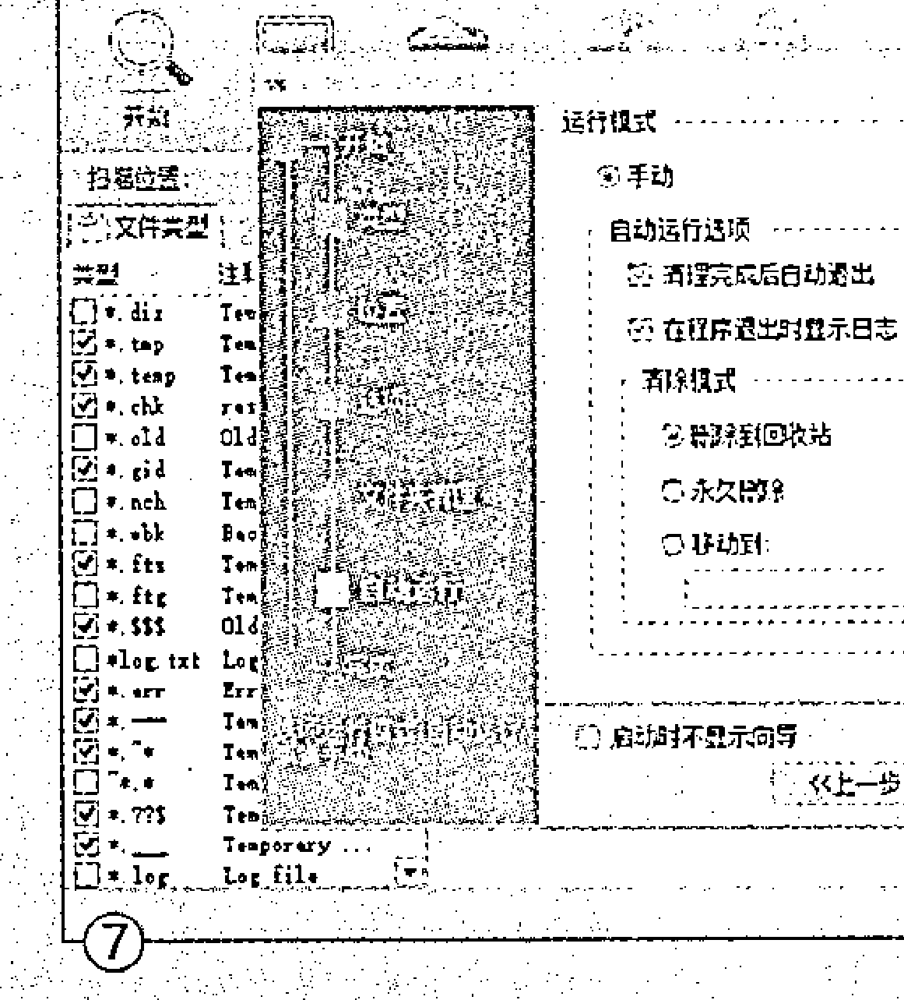

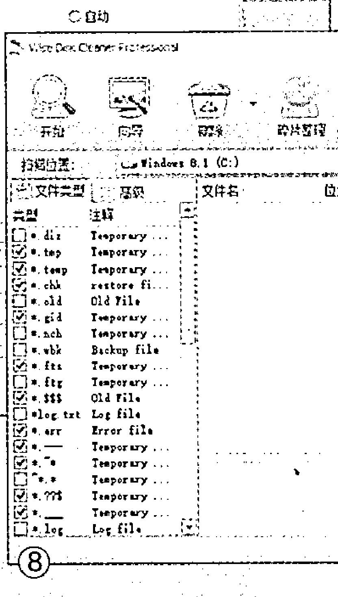

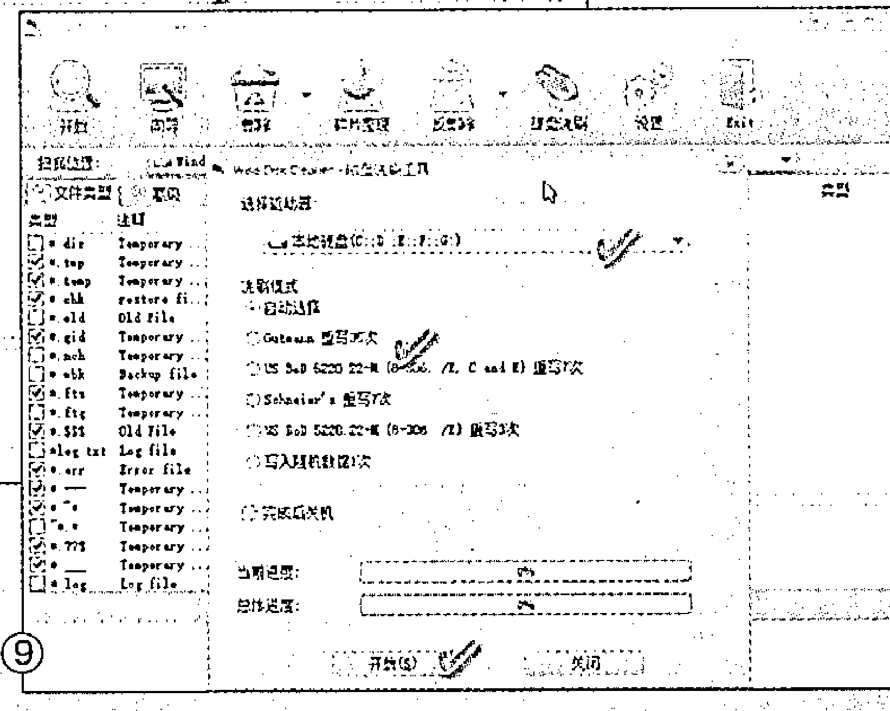

如果你熟悉命令提示符的用法，或需要从别的程序中自动调用清理系统，还可以用该软件提供的命令行的方式清理垃圾文件。其中如下命令代表用常用清理选项清理后自动退出：

```

"C:\Program files\Wise Disk Cleaner\WiseDiskCleaner.exe" -a
```

而如下命令代表用常用选项和高级选项清理后自动退出：

```

"C:\Program files\Wise Disk Cleaner\WiseDiskCleaner.exe" -a -adv
```

### 线上内容集中收藏有门道

文|张泽福

网页、微博、微信上总会遇到不少很有价值的文章需要收藏。收藏网络文章，目前最方便的工具莫过于云笔记软件，但面对不同来源的文章，若无法直接转存总不能只用复制粘贴吧。如何能快速地将各种来路的文章收藏到云笔记中呢？

#### 1. 转存微博精华文章有窍门

若希望将自己的微博内容或评论、转发别人的微博内容收藏到云笔记，可采用下面的方法。首先访问有道云笔记永久收藏微博设置页面(http://note.youdao.com/weiboAuth.html)，点击网页中的“立即启用”按钮(图1)。注意要先登录自己的云笔记账号，然后进行微博与有道云笔记的绑定工作。当弹出授权确认网页之后，点击红色“授权”按钮，进行授权捆绑(图2)。

接下来再确认授权有道云笔记收藏@新浪微博访问你的有道云笔记账号的服务协议，点击蓝色“授权”按钮，完成授权捆绑(图3)。

授权成功之后，在保存自己的微博内容到有道云笔记时，只需在所写的微博内容中包含有“@有道云笔记收藏”信息即可完成收藏。而如果要保存他人的微博，也只需在评论或转发的内容中包含“@有道云笔记收藏”即可将评论和转发信息收藏到自己的有道云笔记当中。

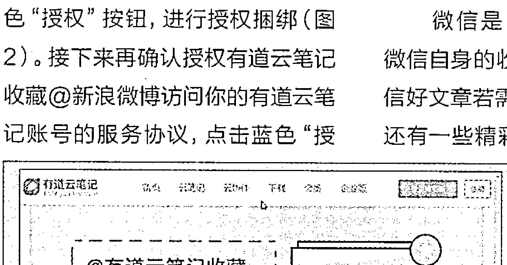

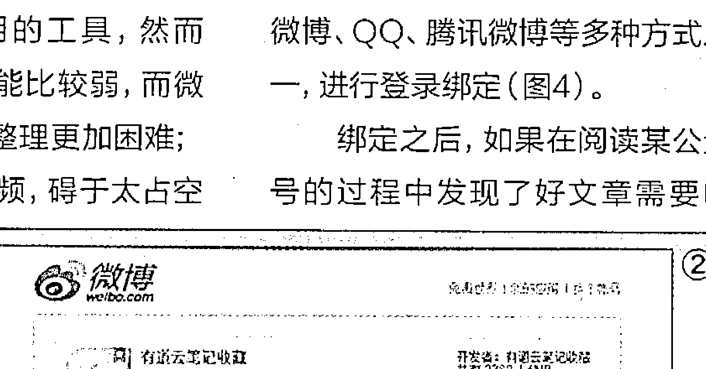

#### 2. 收藏微信精彩内容不简单

微信是最常用的工具，然而微信自身的收藏功能比较弱，而微信好文章若需分类整理更加困难；还有一些精彩小视频，碍于太占空间，也只能忍痛割爱地被主人清除掉；此外，重要的聊天记录要离线保存起来又该如何操作？所有这些，都可借助于有道云笔记的隐藏功能来实现。

首先进入微信，用“有道云笔记”公众号或扫描“有道云笔记”公众号的二维码关注该公众号。进入该公众号之后，点击“更多功能→账号绑定”命令，通过选择已经注册的有道云笔记账号、网易邮箱、新浪微博、QQ、腾讯微博等多种方式之一，进行登录绑定(图4)。

绑定之后，如果在阅读某公众号的过程中发现了好文章需要收藏，只需在文章的右上角单击三点式按钮，然后从菜单中选择“有道云笔记”，即可将文章自动同步到自己的有道云笔记当中（图5）。注意，若要在其他设备平台的有道云笔记中看到这些收藏的内容，手机中的有道云笔记要进行手动或自动同步，以便云端存储信息后供其他设备或平台访问。

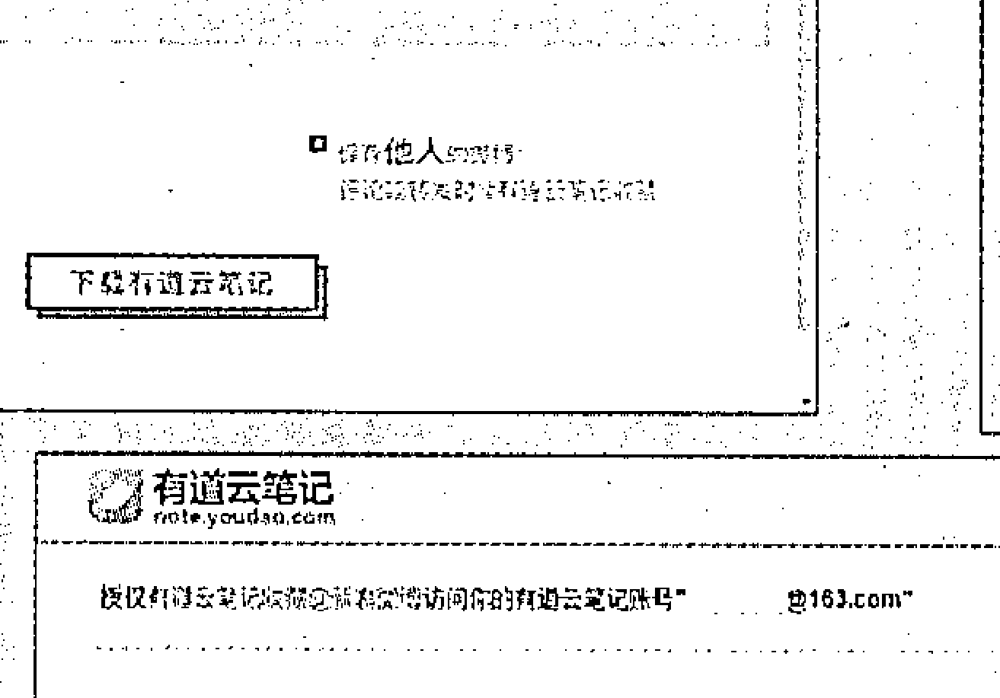

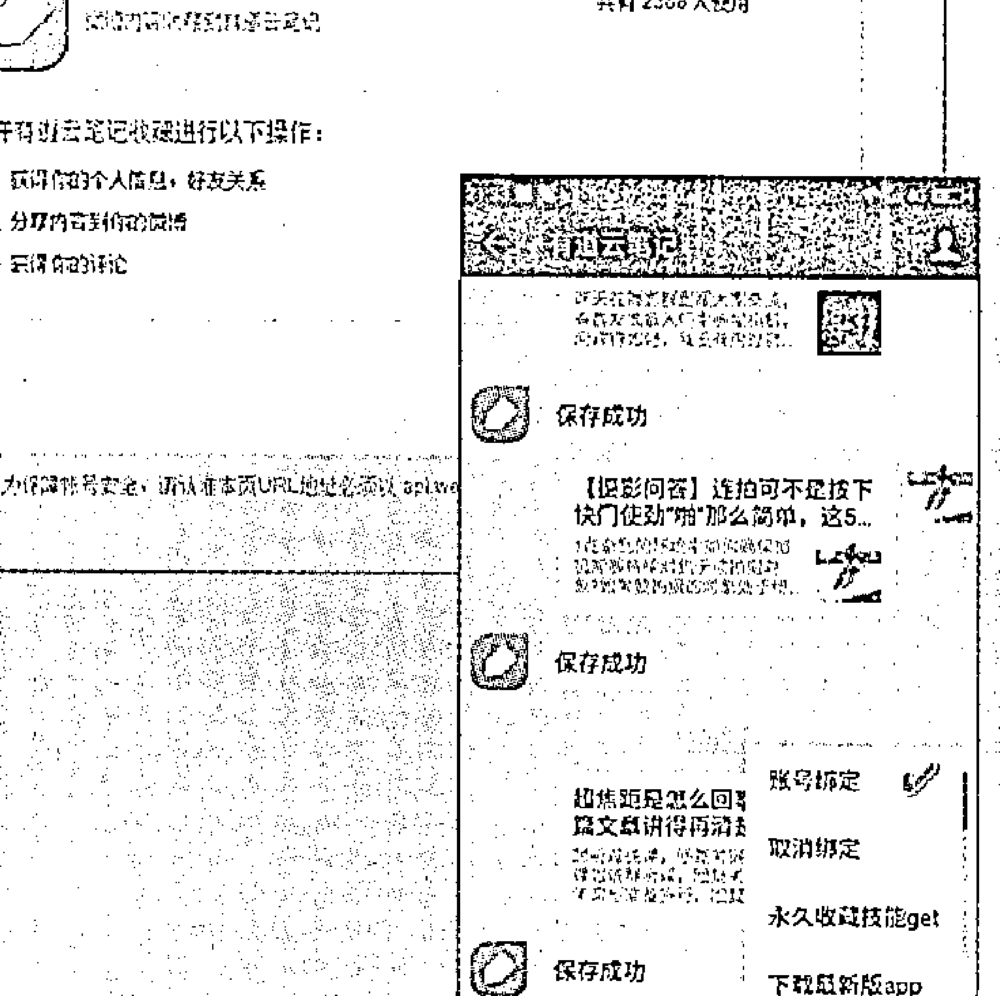

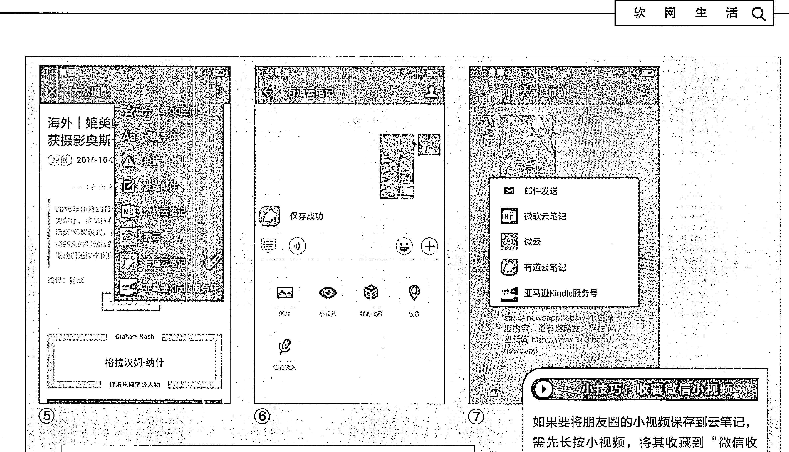

此外，我们还可以将微信有道云笔记作为一个聊天对象，将自己的语音信息、录制的视频等保存在绑定的云笔记中。具体方法是，进入有道云笔记公众号对话窗口，发送图片、语音或视频信息，当看到提示“保存成功”的信息时，这些信息已经保存在自己的云笔记当中了。其中语音以amr语音文件格式保存，而视频以MP4的格式保存（图6）。

如果要将微信中的聊天记录保存到云笔记中，只需长按聊天消息，然后复选所有要保存的消息，之后再点击屏幕右下角的三点式按钮，并选择“有道云笔记”即可完成收藏（图7）。

#### 3. 保存网页精华文章有捷径

对于网页上的文章，虽然每种浏览器都有各自的网页收藏夹，且多数浏览器的PC端和移动端都可以共享书签，但如果脱离了这种浏览器的阅读环境，收藏的文章就无法阅读。考虑到环境平台的通用性，使用云笔记的方式收藏网页将具有更强的兼容性和操作便捷性。具体方法本刊曾专门有文章介绍。

#### 4. 其他内容收藏超方便

除以上内容外，有道云笔记还可以收藏邮件。在有道云笔记Web版中，选择“账号设置→保存邮件到笔记”，然后输入邮箱账号，点击“绑定”之后，使用绑定的邮箱发送邮件至save@note.youdao.com，即可将邮件保存至自己的云笔记中（图8）。

此外，作为更广阔的应用，其他应用中的共享链接或内容也可以发送到有道云笔记中收藏。只需在相应的应用中开启分享功能，分享链接的时候可直接看到有道云笔记的选项。

> 小技巧：收藏微信小视频

如果要将朋友圈的小视频保存到云笔记，需先长按小视频，将其收藏到“微信收藏”中，然后回到微信“有道云笔记”公众号对话窗口，点击+号按钮打开“微信收藏”，将小视频发送给该公众号，即完成了视频保存。之后登录电脑的有道云笔记即可查看收藏的视频了。

> 火速连技

网页文章收藏的具体方法和使用技巧，请参考本刊2014年第18期特别话题栏目的《知识管理 井然有序》一文中有关“网页剪报”的介绍，以及2016年第22期文章《网页剪报遇到问题怎么办》。

### 不甘老一套图标DIY

文|张欣欣

面对老一套的电脑图标，你是不是有改变它们的想法？要制作一个属于自己的软件，你是不是更需要一套个性化的程序图标？通过IcoFX图标编辑软件，你可以随心所欲地营造一个属于自己的图标世界。

#### 1. 图标与图片随心转换

看到一个漂亮的图片，苦于它太大不能当作图标；看到一个好看的图标，又苦于它太小且只是一个图标。其实，你完全有办法将自己喜欢的图像或图片进行相互转换。
要将一幅图片做成图标，利用“文件→导入图像”命令选择图片并进入导入窗口，设置后确定即可完成图像到图标的转换(图1)。此外，还可以直接从浏览器中拖拽图像到IcoFX的工作区内，该图像将成为一个图标。也可以简单地从一个图标复制图像到另一个图标，仅需从图标的边列拖拽图像到另一个图标的边列即可完成。还可以使用“图示→导入图像”直接将图像导入到图标内使用。如果要加入Windows图标所需的图像类型，可使用“图示→从图像建立Windows图标”；如果要加入Macintosh图标所需的图像类型，使用“图标→从图像建立Macintosh图标”(图2)。另外，我们还可以捕捉桌面的一部分画面，然后以它来创建一个图标，选择“文件→捕获”命令后选择区域大小，即可创建一个桌面区域画面的图标(图3)。

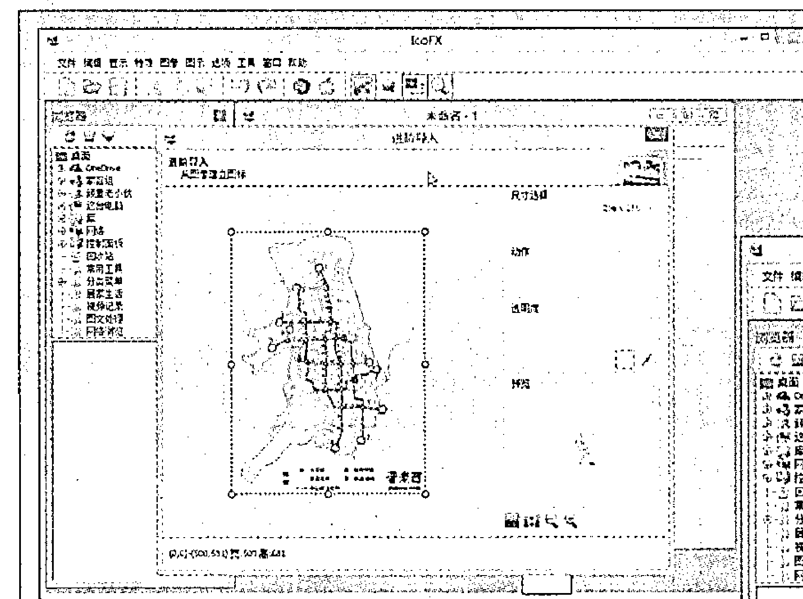

除了以图片作为来源转换图标外，其实电脑中就藏有非常丰富的图标。由于图标隐含在各种各样的文件中，我们平常看不到它们或只能看到它们中的少数，但深入挖掘即可将这些图标“曝光”并据为己有。IcoFX支持从程序文件提取图标，例如，要提取EXE或DLL文件中的图标，点击“文件→取出”(或Ctrl+T)命令找到EXE或DLL文件，即可将其中的图标提取出来。

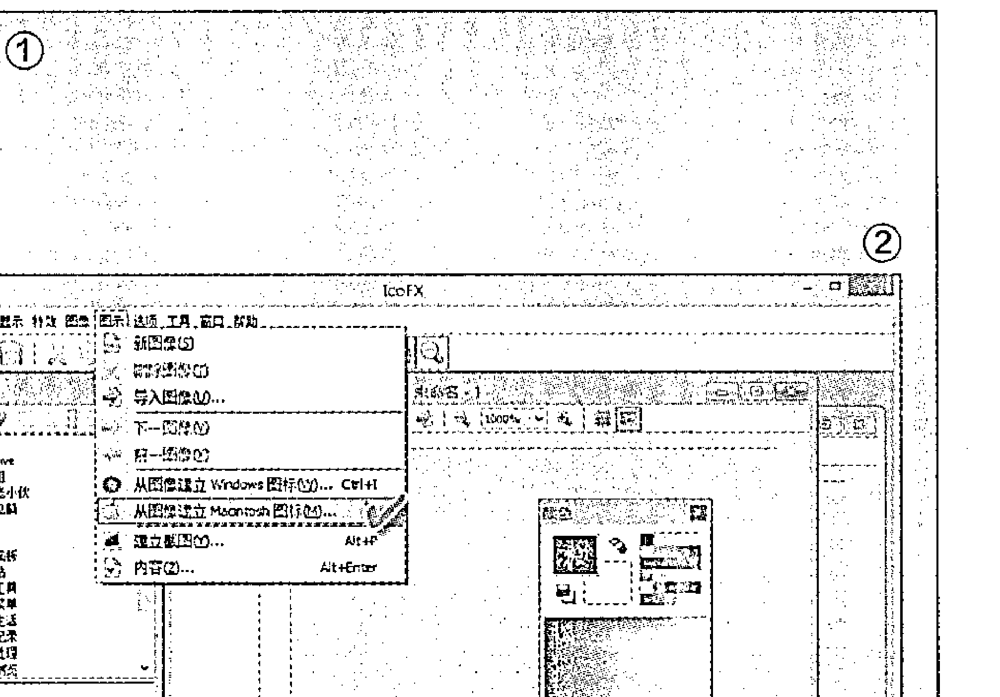

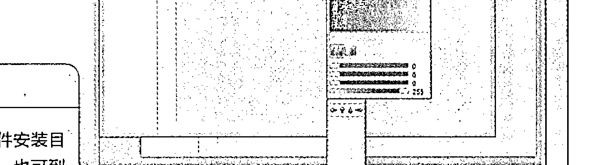

> **小提示**
IcoFX软件本身也提供了一些图标可供使用，这些图标位于软件安装目录的Objects文件中，可从中调取使用。若想获取更多的资源，也可到老牌图标网站http://www.easyicon.net/进行下载使用。
如果希望将图标转换为普通的图片文件(如BMP、PNG、JPG或GIF等格式)，只需使用“文件→导出图像”(或Ctrl+E)命令即可完成。

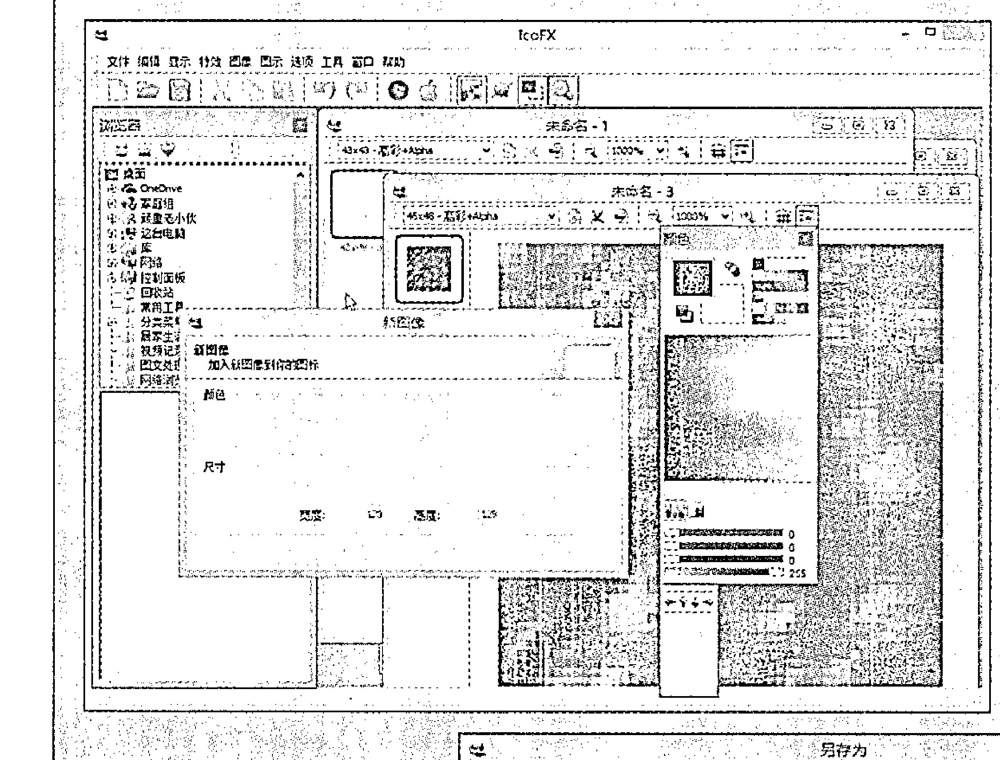

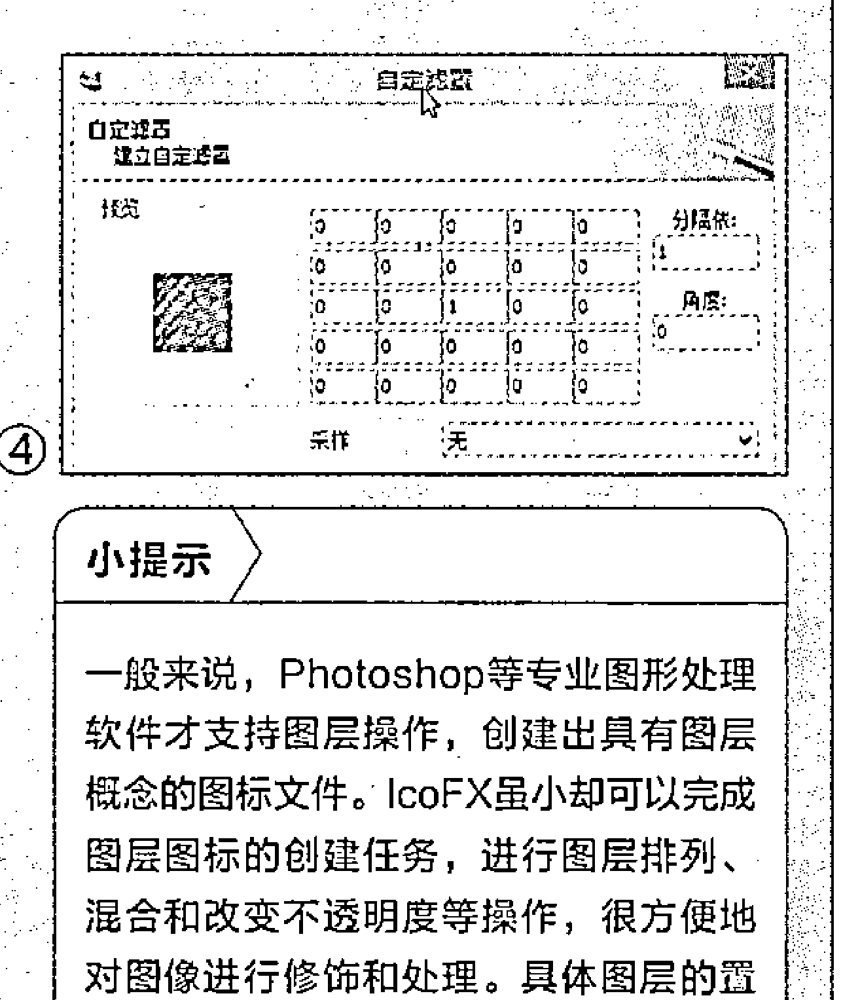

> 一般来说，Photoshop等专业图形处理软件才支持图层操作，创建出具有图层概念的图标文件。IcoFX虽小却可以完成图层图标的创建任务，进行图层排列、混合和改变不透明度等操作，很方便地对图像进行修饰和处理。具体图层的置前置后可通过编辑菜单的“置于前面”和“放于后面”命令，或通过Home和End键来控制。

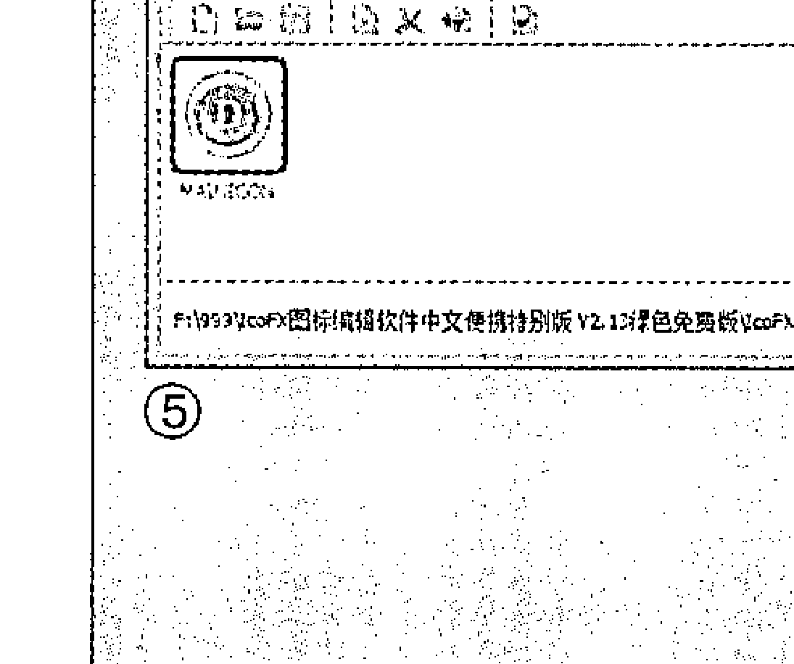

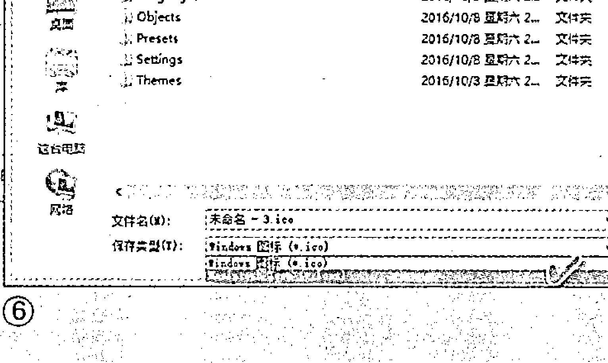

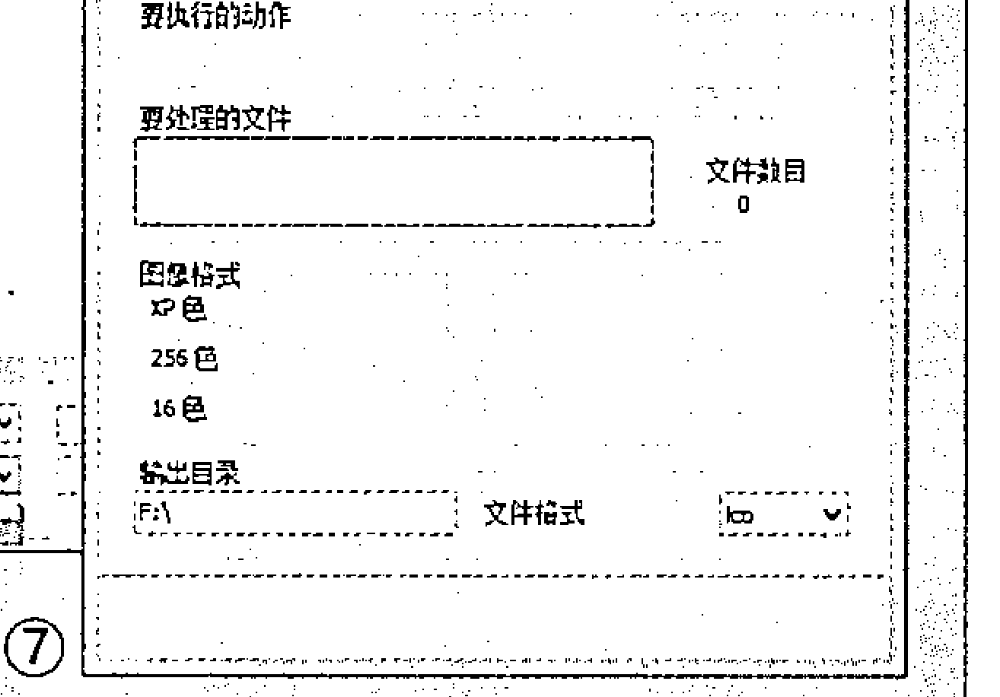

#### 2. 对图标不满意怎么办

如果对用上述办法转换或提取的图标仍不满意，可利用IcoFX强大的编辑功能进行编辑。IcoFX支持超过40种效果和滤镜，并提供直观的颜色校正工具集，可以轻松调整颜色参数，集成多种资源及图像编辑工具，可实现对图标及光标文件的快速全面处理。

平时我们所用的电脑光标就那么几种样式，如果对这些样式不满意，可用IcoFX创建属于自己的图标光标。IcoFX支持几乎所有图标格式及静态、动画光标。首先，如果对预览窗口的背景颜色不满意，可通过双击它来选择自己喜欢的颜色。

如果觉得某个图标样式平平，可通过“特效→自定滤罩”菜单命令（或Ctrl+F），套用和创建自己喜欢的图标特效（图4）。如果其间需要编辑线条，可使用1到7这7个数字键来更改线条的宽度，以此可创建属于自己的图标。

如果对一个EXE文件的图标不满意，可使用IcoFX内建的源档编辑器来编辑更换。通过“工具→源档编辑器”命令进入编辑环境，然后进行图标的增、删、改操作即可（图5）。

如果羡慕苹果系统中的绚丽图标，IcoFX也可以完成Windows图标与Macintosh图标之间的转换。只需开启其中的一种图标，然后使用“文件→另存为”命令，选择另一种格式，即可完成图标间跨平台风格的转换（图6）。如果要转换的图标太多，可使用“工具→批次程序”命令，调用多张图标文件，一次性完成转换（图7）。

除了批量转换文件格式外，还可使用批量处理功能轻松完成多个文件图标或光标的创建、提取和导出等操作。如果选择了多个图像或图标，在选区上右击，将弹出批处理选项以便打开批处理对话框或源档编辑器。

### 给公共网盘的文件加把锁

文|老万

今年以来很多的国内网盘相继关闭，这样就给用户的文件传输造成了很多的困难。于是用户想出了各种各样的解决办法，但是这些办法都有一些弊端。其实在国外还有很多的网盘可以选择，只不过这些网盘很多都是开放性质的，也就是说所有的用户都可以进行下载。其实我们只需要对文件进行加密处理，再上传到这些网盘以后，就可以解决我们所需的文件传输问题了。

#### 快速完成文件的加密

我们首先从网站下载AxCrypt这款软件，它是一款来自瑞典的免费开源的加密软件。下载完成以后按照常规的方法进行安装操作即可，由于新版本的AxCrypt需要一个启动码才可以使用，所以软件在第一次运行的时候会弹出一个对话框，要求用户输入自己的电子邮箱地址，输入完成以后点击ok按钮进行确认(图1)。

稍等片刻，我们在电子邮箱里面得到自己的启动码后返回AxCrypt的操作界面，根据提示在新的对话框里面输入启动码后，再输入一个用于文件加密的密码就可以了(图2)。密码设定完成以后，在每次启动这款软件的时候，都会要求用户输入密码进行身份的确认。

以后当需要进行文件加密处理的时候，只需要点击软件界面中的加号按钮，在弹出的对话框里面选择需要加密的文件(图3)。当这个文件加载到软件窗口后，就会自动进行加密操作。当加密完成以后这个软件的图标就会被换成AxCrypt的绿色图标，这样用户非常容易进行识别。当用户需要对文件进行解密操作的时候，首先点击工具栏中的第一个锁头按钮，在弹出的对话框里选择已经被加密过的文件，当它加载到软件窗口以后，就会自动进行解密并运行。

由于加密文件的解密操作也需要这款软件的支持，所以如果对方没有安装AxCrypt软件的话，那么用户可以在加密的时候点击鼠标右键，在弹出的菜单里面选择“Encrypt copy to .EXE”这个命令，这样就可以不使用软件直接进行解密操作了。

#### 文件分享到自己的邮箱

既然我们已经对文件进行了加密处理，那么接下来自然就是进行文件的上传。MyAirBridge是一款免费的网络硬盘，其最大的特色就是允许用户上传20GB大小的文件，这样可以满足大部分用户的需要。

首先通过浏览器打开MyAirBridge的操作页面(https://new.myairbridge.com/eng/)，通过页面的介绍我们可以看到它拥有两种主要的功能，即利用电子邮件来传输文件链接以及上传文件后获取下载链接。由于...

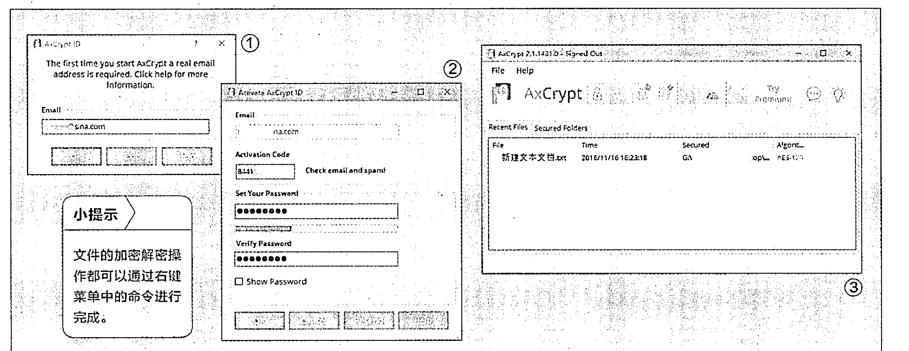

### 文件加密自动完成

我们是自己用于文件的传输，所以点击操作页面左侧工具栏中的电子邮件图标，从弹出的浏览窗口就可以选择要传递的文件。用户既可以一次选择一个文件，也可以一次性选择多个文件来传输。下载完成以后会弹出一个文件列表，用户可以对选择的文件进行确认。如果选择错误的话，可以将鼠标移动到文件名上，然后点击删除按钮就可以了。或者点击“Add more files”按钮，来重新选择其他的传输文件（图4）。然后在操作页面的左侧，分别输入发送人的电子邮箱、接收人的电子邮箱，以及电子邮件的主题和内容。如果是将文件传输到家里，那么自然收件人也输入自己的邮箱地址。最后点击右下角的“SEND”按钮，这样就可以将传输的文件上传到网盘的服务器里面。我们通过页面的进度条，可以看到文件的上传速度，以及上传的百分比。当我们回到家里以后，进入到自己的电子邮箱里面，点击其中的“Download”链接。在弹出的页面里面点击下载按钮以后，就可以将传输的文件下载到本地硬盘里面（图5）。然后再进行文件的解密操作，最后就可以对文件进行其他的操作了。

虽然AxCrypt这款软件使用非常方便，但是它的加密和解密操作都是手工完成的。如果用户每天需要处理大量文件的话，或者还在使用其他的同步类型网盘的话，还是使用自动的加密软件比较好。Cryptomator就是一款专门针对同步网盘而设计的加密软件（https://cryptomator.org），当然也可以作为单独的加密软件来进行使用。首先下载安装Cryptomator这款软件，安装完成以后，在弹出的界面中点击左下角的加号按钮。接着在弹出的菜单里面，选择“创建新保管库”命令，这时会弹出一个浏览窗口。其实这个所谓的保管库就是一个普通的文件夹，用于存储进行加密处理操作后的文件。正是由于这个原因，建议大家新建一个文件夹，避免和其他文件存储到同一个目录。如果用户使用的是同步网盘的话，那么这里就选择网盘用于同步的文件夹目录，这样就可以将加密文件同步到其他设备里面。保管库目录设置完成以后，根据提示设置保管库的密码，然后点击“创建保管库”按钮就可以了。

接下来当我们重新运行这款软件的时候，就会要求输入这个密码并点击“保险库解锁”按钮（图6）。当这个库文件解锁完成以后，就会通过加载一个虚拟硬盘的方式，对这个库里面的文件进行自动解密操作。用户可以跟往常一样工作，随意往这个虚拟硬盘里面保存、删除或修改文件。当用户使用完之后，只需按下操作界面中的“保险柜上锁”按键，这个保管库就会自动地进行关闭，与此同时加载的虚拟硬盘也会自动消失。同时这个盘里的所有文件资料都会被自动加密，而且Cryptomator还会增加一些随机数据来混淆文件大小以保证安全。

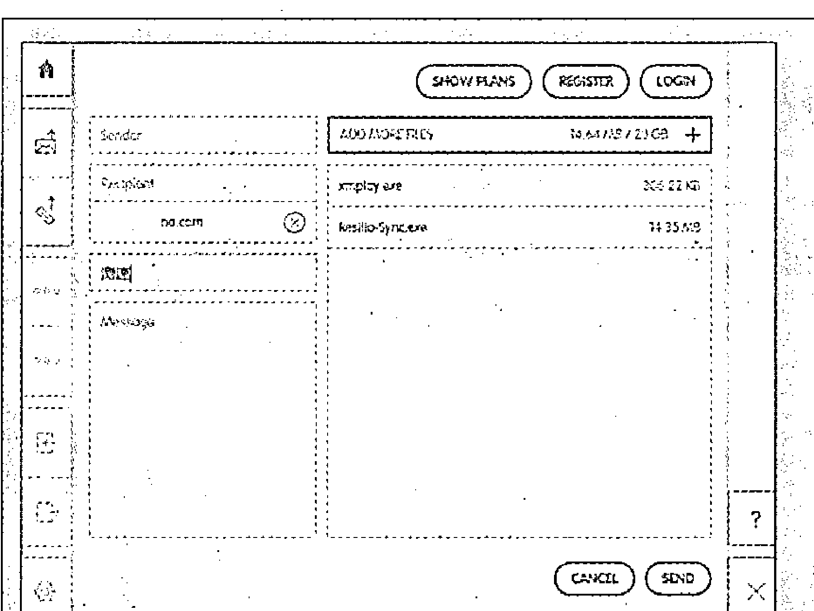

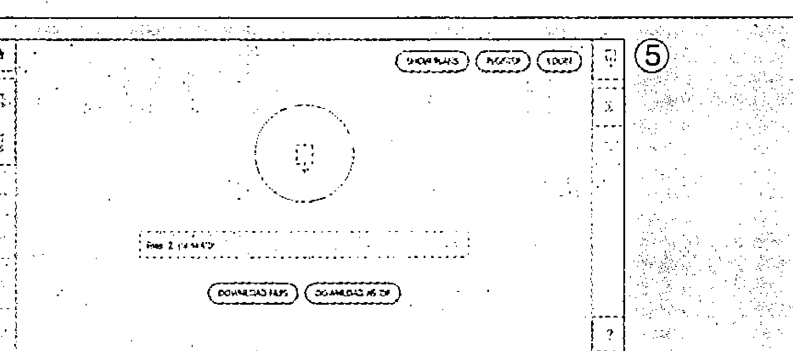

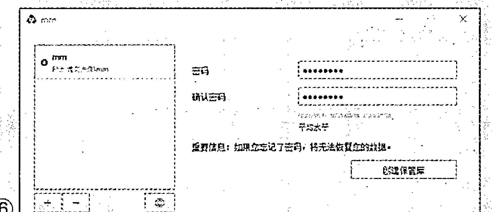

### 系统功能怎么用更好

文/阿立

Windows作为一个操作系统平台，自身也加入了很多常用的功能，比如网络防火墙、文件索引、回收站等等。但是由于每个用户的使用习惯不一样，因此对这些功能的操作感受也完全不同，有的功能操作起来甚至会觉得非常的麻烦。那么如何根据自己的实际情况，对需要的功能进行配置和调整操作，从而快速达到使用这些功能的目的呢？

#### 右键管理防火墙

微软的Windows系统从很早的版本开始就在里面增加了网络防火墙的功能，但是它的设置隐藏在系统的控制面板里面，这样用户想要进行控制管理就非常的不便。虽然现在也有很多依托于Windows网络防火墙的功能，但是还有没有更加简单快捷的方法，可以对防火墙进行相应的管理操作呢？其实很多时候，我们只需要利用右键，就可以快速完成管理操作。

下载一个名为“Tweaking.com Windows Firewall”的工具包，解压后运行文件夹中的“Right_Click_Options.exe”文件程序。这时会弹出一个警示窗口，询问用户是否将设定防火墙规则的选项添加到系统鼠标的右键菜单里面（图1）。我们这里直接点击左下角的“Add Right Click Menu”按钮，接着会弹出一个设定完成的“Done!”提示框，最后点击确定按钮就可以了。如果用户以后不想使用这个功能，点击窗口右下角的“Remove Right Click Menu”即可。

以后当我们需要添加或者管理防火墙规则的时候，在可执行程序的图标上点击鼠标右键后，在弹出的“Tweaking.com - Windows Firewall”菜单里面选择“Tweaking.com - Allow In Windows Firewall”这个命令（图2）。接下来就会弹出一个提示窗口，点击其中的“是”按钮就可以继续进行设定。随即又会弹出一个信息提示框，直接点击“确定”按钮就可以完成设置操作了。接下来我们打开系统控制面板中的网络防火墙配置窗口，就可以看到我们刚刚添加的软件程序的这条规则了。

#### 禁用索引器回退

现如今每个电脑硬盘中的文件都成海量的增长，所以我们在查找文件的时候常常都会使用到搜索功能，而微软也在自己的系统里面植入了该功能。在默认情况下系统会调用被称为“索引器”的功能，在系统后台慢慢地为选定的路径进行文件索引操作。而且为了不影响

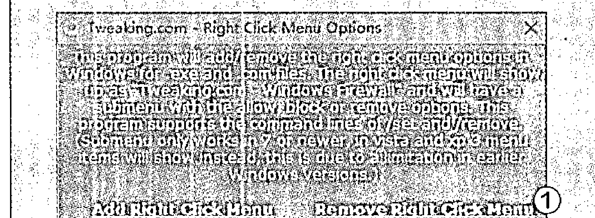

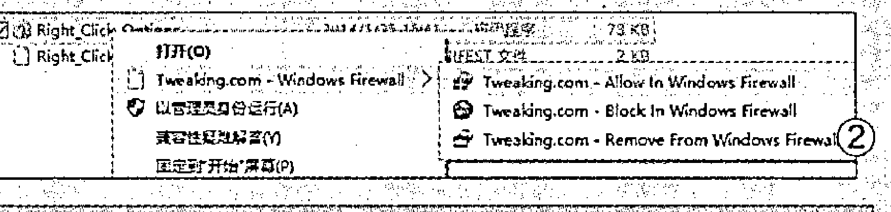

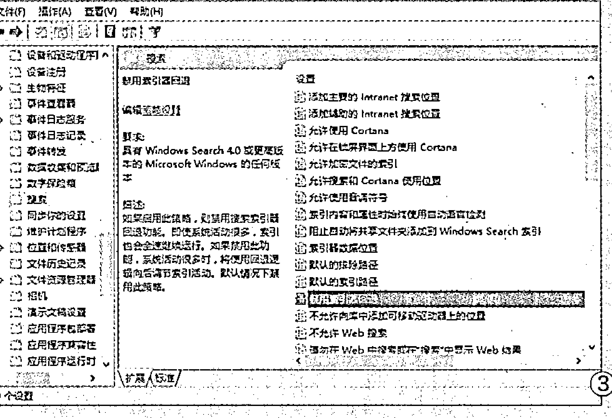

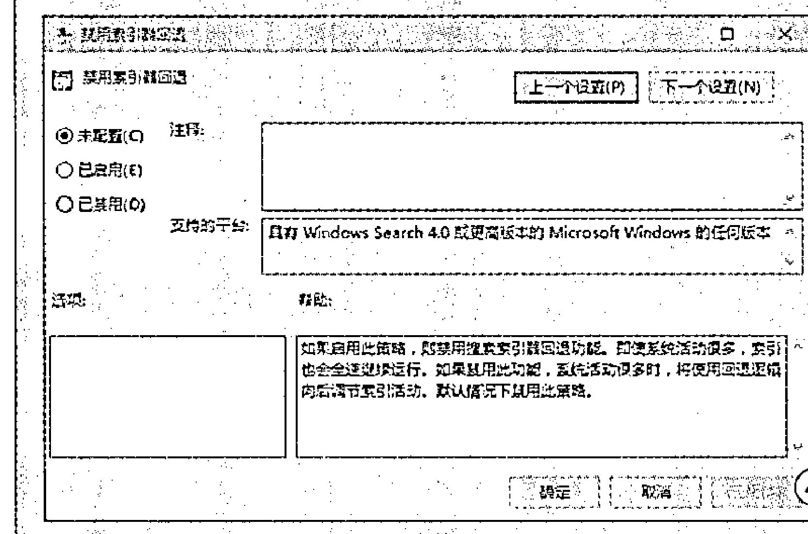

### 右键清空回收站

通常情况下我们在硬盘里面删除一个文件后，系统首先会将这个文件移动到回收站里面，以后用户在需要的时候可以将它进行恢复操作。但是如果回收站里面的文件达到了一定的数量，那么就需要对其进行清空操作，通常用户只需要在回收站图标上点击清空命令就可以了。那么能不能在鼠标右键增加一个清空回收站的功能，从而可以在任何目录里对其中的文件进行清空操作呢？

我们首先从网上下载运行CCleaner这款文件清理软件，接着在弹出的窗口点击左侧列表中的“选项”按钮，然后在弹出的对话框里面点击“高级”命令，将其中的“清理之后关闭程序”和“最小化到系统托盘”选项选上就可以了（图5）。然后点击左侧工具栏中的“清理器”按钮，在弹出的列表里面选择“系统”中的“清空回收站”以及“临时文件”选项就准备完成了（图6）。

接下来我们打开一个文本编辑器，在里面输入下面这段代码即可。需要提醒大家的是，这段代码的最后一行，指的是CCleaner软件的安装目录。如果用户安装的不是笔者设定的这个目录，需要根据自己的实际情况进行修改。创建完成后对代码进行另存为操作，就可以创建一个注册表的文件。现在双击运行这个文件，会弹出一个提示窗口。直接点击提示框中的“是”按钮，就可以加入到注册表里面。接下来重新启动操作系统，从此以后只需要在系统桌面点击鼠标右键，在菜单里面选择“清空回收站”命令就可以了（图7）。

```
Windows Registry Editor Version 5.00

[HKEY_CLASSES_ROOT\DesktopBackground\Shell\运行 CCleaner]
"CCRBType"=dword:00000001
@="清空回收站"
"Icon"="C:\Windows\System32\shell32.dll,64"

[HKEY_CLASSES_ROOT\DesktopBackground\Shell\运行 CCleaner\command]
@="C:\Windows\addins\CCleaner.exe /AUTO"
```

> 小提示
通过 “Tweaking.com - Windows Firewall” 菜单中的另外两个命令，就可以阻止这个软件程序的网络连接，或者删除该软件程序已经存在的网络防火墙规则。

## 整齐划一 用好Office对齐专家
文|平淡

在日常办公文档为了美观或者打印的方便，我们经常要对文档一些元素进行对齐。比如Office文档中插入的图形，尤其是在PPT中用的图形，为了展示的美观就需要对齐，但是手工对齐又有难度，我们该怎么快速有效地实现对齐？下面以Office 2016为例介绍对齐技巧。

### 就地取材用好Office对齐工具

对于类似图形类元素的对齐，Office组件已经自带工具，比如要在PPT中对齐插入的图表，图表有大有小，标题文字也大小不一。为了在幻灯片播放的时候更为美观，我们可以将图表大小和标题均调整为统一样式，并且进行水平对齐。在幻灯片中按住Shift键选中所有需要调整的图片，然后右击图片选择“大小和位置”，在右侧窗格大小设置适合的高度和宽度，这样选中图片可以调整为统一尺寸（图1）。切换到“视图工具→格式”，先选中第一行的图片，点击“排列→对齐→底端对齐”，这样可以实现第一行图片水平排列，然后使用鼠标将整行图片上移，使之和第二行图片有间距（图2）。按住继续选中第二行图片，同上点击“排列→对齐→底端对齐”，如果对齐后图片的间距不一，继续点击“排列→对齐→横向对齐”，这样就可以实现图片大小统一和水平排列了。

### 巧用母版轻松插入统一图片

由于在PPT中默认插入的图片是铺满整张PPT的页面的，对于插入的图片如果要对齐，我们还得像上面一样手动去调整对齐和图片的间距。其实对于需要固定版面的PPT，我们可以利用PPT母版功能，制作一个自定义样式，这样使用这个母版就可以快速实现插入的图片自动对齐，省去手动调整的麻烦。比如现在需要制作一个每张幻灯片上水平对齐排列3张图片，图片大小是10cm×10cm，间距是1cm的幻灯片。启动PPT后新建一个空白文档，切换到“视图→幻灯片母版”，然后点击“插入版式”，插入一个自定义版式的母版。选中插入自定义版式，单击“插入占位符→图片”，然后使用鼠标画出一个图片占位符，接着复制2个占位符，使得3个占位符水平排列。同上使用Shift选中3个占位符，右击图片选择“大小和位置”，在右侧窗格大小设置高度和宽度均为10cm，使用上面的标尺，将图片间距都设置为1cm。同上选中占位符，点击“排列→对齐→底端对齐”，使得三个占位符水平排列对齐。点击“关闭母版视图”，返回PPT的编辑界面。这样下次需要在一张幻灯片插入3张图片并要实现大小、间距、水平对齐的效果时，只要切换到“开始”选项卡中，点击“版式→自定义版式”，这个就是上述的设置版式，可以插入3张已经设置好占位符的图片（图3）。

现在按提示在占位符点击“插入→图片”，这样插入的图片就会自定位到占位符中，它的大小、位置和间距就是在自定义样式中设置好的，同上可以继续插入第2、第3张图片，这样插入后的图片就自动对齐排列，省去我们手动调整的麻烦。

完成自定义样式幻灯片的图片插入后，按下回车键继续下一张幻灯片的图片插入，此时新的幻灯片会继续使用之前设置好的自定义样式，操作同上继续插入图片即可。这样无论新建多少幻灯片，还是插入多少图片，每张幻灯片中插入的图片大小、排列都是一样的。

### 5招外力图片对齐更简单

使用Office自带的组件虽然可以实现图片对齐，不过操作起来较为复杂。如果要对齐的文档较多，我们还可以借助第三方插件快速实现图片的对齐。
到http://www.shortcuttools.com/en/powerpoint_alignment_shortcuts_commands.html下载PowerPoint ShortcutTools，启动PPT后在菜单栏会增加ShortcutTools子菜单，展开即可快速使用其提供的功能来快速对齐。比如需要快速调整图片大小到统一尺寸，使用Shift选择需要调整的图片，展开“Resize→Same width”和“Resize→Same height”，这样即可调整为统一的高度和宽度（图4）。
调整完图片大小后，继续展开Align菜单可以进行水平、垂直等的对齐操作，对齐可以根据菜单前的小图标直观看到，只要按提示选择相应的菜单或者快捷键快速对齐。比如水平对齐后再展开“Align→Align copy right”即可实现统一间距。
可以看到PowerPoint ShortcutTools的对齐功能可以实现Office自带组件的所有功能，而且操作更为便捷，对齐的功能更丰富。

## 以图言志 制作PPT中的精彩信息图
文|刘成

俗话说：一图胜千言。图片能给人带来直接、丰富的视觉信息，并且更适合现代人快节奏的阅读习惯。所以无论是在微博上、微信上、PPT中，大家都爱用信息图来表达。那么有哪些好的信息图制作工具，又可以怎样快速在PPT等Office文档中插入长信息图？

### 磨刀不误砍柴工 了解信息图制作步骤

要制作出包含丰富信息的图片，显然不是指绘制一张简单的图片就可以表达。要完成一张信息图的制作，首先需要明确信息，明白整张图表要用来表达什么意图，确定了表达的基调后就需要选择使用什么图形模型来进行图片的组织和布局。比如并列型信息图（文字间的逻辑关系是并列的），它的特点是更直观易懂，适用于表达一些比较简单的事情；递进型信息图则大多以时间为核心的增长，一般用于历史事件的表述（图1）。

确定表达主题后就可以使用具体工具来进行图片的绘制，绘制图片应该简洁明了，便于看图者一眼就能够看懂我们需要表达的意思。完成图形的绘制后为了更易于用户的阅读，一般还需要在图片上添加注释文本，最后再对信息图的版面进行调整，润色就可以完成信息图的制作了（图2）。

### 事半功倍 用好信息图制作工具

信息图制作都比较专业，使用手绘难度较大，因此我们可以借助一些专业工具进行绘图。常见信息图制作工具一般分为：

-   1. 专业工具，如Illustrator、Indesign、Coreldraw、Photoshop等等，这类工具制作出来的信息图专业、精美，但是对操作者要求较高，需要有足够的绘画专业能力，仅适合专业人员使用。
-   2. 在线制作工具，如http://www.easel.ly/、https://venngage.com/、https://www.gliffy.com、https://www.processon.com等提供的在线制图服务，这种方法制作简单，网站提供大量的图表、素材等，我们只要联机即可使用。不足的是网站提供的在线素材有限，信息图制作还受网速等的影响，无法制作出比较专业的信息图，适合新手们使用（图3）。
-   3. 常用软件，如Excel、Word等办公套件，这些组件是每个用户必装的软件，而且大家用起来也较为顺手。比如Excel具备图表生成和制作能力，结合文字注释可以做出非常专业的信息图来，适合大多数用户使用。下面我们就介绍如何使用Excel 2016制作一张信息图。

首先确定制作信息图的主题，比如要设计一个天猫购物流程，因为这是购物步骤，所以可以选择一个流程图结构。确定信息图结构后就可以打开Excel，然后根据整个购物流程，点击“插入→形状”，插入各种图形元素和箭头等连接符号制作信息图即可（图4）。

完成信息图的架构后，还可以在其中插入说明文字，并且对图形粗细、颜色、样式等进行修饰，完成合适排版后就完成信息图的制作了。

由于现在信息图的内容都比较丰富，制作的信息图大多比较庞大。在Excel完成信息图的制作后，对于较小的信息图可以使用视图缩放的方法，选择合适的比例能够显示全部图片内容后用截图的方法即可提取信息图。对于长信息图的截取则可以使用分步截图的方法，利用Excel的表格线作为参考先选择图形的上部进行截取，然后再截取图形的中部、下部，最后组合成一幅完整的信息图即可（图5）。

完成信息图的创建后就可以将其插入PPT中作为演示，不过对于长信息图在PPT中的使用我们还要注意一些问题。

比如在PPT中插入的是图表类的图形，由于PowerPoint默认会自动调节坐标轴的最大值/最小值，这样会导致很多情况下过度强调某一数据。当一组数据起始值如果较大，在插入PPT后，PowerPoint坐标的最小值就会被自动调节为大的数值，这样图表就无法真实表现信息图的真实数据，如下图中类别4和类别1实际值差别不大（610:545），但是被PPT自动调整后在信息图中看上去则像相差2倍。

因此对于这类信息图需要自行设置坐标轴格式，如最小值调整为50则不会出现上述视觉误差了。此外由于长信息图包含信息过大，而默认每张幻灯片默认尺寸有限，在一张幻灯片中可能无法完全显示。此时可以缩放插入的图片，使得插入的信息图刚好可以完全显示；如果缩放后无法看清图片内容，则可以自行定义幻灯片的大小，选中插入图片的幻灯片，切换到“设计→幻灯片大小→自定义幻灯片大小”，然后根据实际信息图的尺寸进行设置（图6）。

这样在PPT中就可以直接预览到整张幻灯片，可以比较直观地看到整张信息图了，不会由于缩放而看不清信息图的内容。

> 网络大补贴 信息化图表的资源网站
图研所：http://www.tuyansuo.com
Flowing Data：http://flowingdata.com
Chart Porn：http://chartporn.org

## 快速解决文件打印小问题
文|倚楼

打印看似简单，但是也经常会出现各种各样的问题。比如表格的标题无法打印，或者打印的结果和编辑的内容不一致等。虽然这些问题看起来都非常简单，但是解决起来却非常繁琐。那么通过什么快捷的方法，可以解决打印过程里面遇到的这些小问题呢？

### 打印标题不能随心所欲

通常情况下打印电子表格文档的时候，办公软件都会以第一行的内容作为标题。可是有的时候想以其他的内容作为标题，会发现打印预览中的编辑区域又不能进行修改。那么遇到这样的情况又该如何进行解决呢？
我们首先运行WPS Office的表格软件，载入需要进行打印的表格文档。现在点击工具栏中的“页面布局”标签，接着点击工具栏中的“打印标题”按钮命令。然后在弹出的设置窗口里面选择“工作表”标签，再点击窗口左下角中的“选项”按钮，在弹出的对话框选择“横向”还是“纵向”打印（图1）。点击“确定”按钮后返回到“页面设置”窗口，根据表格打印的方向在“顶端标题行”或“左端标题行”输入框里面，设置需要进行打印的标题行信息内容（图2）。如果需要打印的标题信息内容就在表格里面，点击后面的按钮，在表格里面指定选择要打印的是哪一行内容即可。设置完成以后点击“确定”按钮，就可以打印出设定的标题信息了。

### 如何使工作表居中打印

有时我们需要编辑一些简单的表格，由于这些表格中的信息内容比较少。所以打印的时候内容会集中到纸张的左上角，这样打印出来后看起来就非常的不美观。通常情况下要想进行居中显示的话，最简单的方法就是手工调节。那么有没有什么方法可以不动手，解决这个不是问题的小问题呢？
其实我们只需要进行简单的设置，就可以让表格内容在打印的时候，自动进行居中并打印出来。首先同样通过WPS Office的表格软件，载入想要打印的表格文档。接着点击“页面布局”中的“页边距”按钮，在弹出的“页面设置”对话框中，单击“页边距”页面标签。如果需要工作表中的数据在左右页边距之间水平居中，只要在“居中方式”区域勾选“水平”复选框就可以了（图3）。如果希望工作表中的数据在上下页边距之间垂直居中，只要勾选“垂直”复选框就可以了。当然我们可以同时选择这两个复选框，这样可以使得表格显示出来的效果更加的美观。设置完成以后点击“确定”按钮退出设置，以后就可以避免手工调整的麻烦了。而且当我们点击工具栏中的“打印预览”按钮，就可以马上看到调整以后的效果了（图4）。

以上两个和打印相关的技巧，同样适用于其他的办公软件，大家可以试试看。

## 文字卷页动画效果巧制作
文|马震安

PPT中的动画效果已经不少了，但是，有时我们需要的效果它并没有，如文字的卷页效果（图1）。那如何制作这样的动画效果呢？

新建一张空白PPT幻灯片，为了读者方便观看，暂时将幻灯片背景设置为灰色；插入所需要的文字，画一个矩形，填充色为白色，无边线，并使其旋转45度；复制文字，将其向右旋转90度，变成从下到上的竖形文字；将白色矩形置于顶层，将其覆盖在横向文字上，并将复制出的竖形文字与矩形边对齐（图2）。（为使大家能够看清楚，笔者将白色矩形的透明度设置成了50%，实际应为0%。）

元素准备完成后，就需要对元素进行动画效果的设置了。点击“选择”按钮下的“选择窗格”，选取横向文字，将其动画效果设置为“淡入”，开始为“与上一动画同时”，持续时间为0.25秒；选择矩形，为其添加直线路径动画，持续时间为1.25秒，开始为“与上一动画同时”，拖动矩形直线路径的终点，使起点的矩形边与终点的边对齐（图3）。

同样，再选定竖形文字，也添加直线路径动画，持续时间为1.25秒，开始为“与上一动画同时”，拖动竖形文字直线路径的终点到矩形直线路径处，使移动后的矩形能够将移动后的竖形文字覆盖；分别右击这两个路径，选择“效果选项”，在效果选项卡将平滑开始处的指针拖到最左端，将平滑结束处的指针拖到最右端（图4）。

最后，将幻灯片的背景色设置为白色，将矩形的透明度设置成0%，这样在放映幻灯片时就实现了文字的卷页动画效果（图5）。

> 小提示
矩形的颜色必须与文字的背景色一致，如文字的背景色是灰色，那么矩形的填充色也必须是灰色。

## Office的多标签浏览模式
文|王荣桂

当前，众多的浏览器都采用了多标签浏览模式，所有的网页集中在一个窗口中，通过单击不同的标签页来实现不同浏览页面窗口的切换。其实，Office软件也可以通过相关控件和设置，实现多标签浏览，这样切换文档就方便了许多。

### 1. 类似效果的多窗口浏览

Office 2016本身只能实现多标签类似功能。用Word 2016打开要编辑的文档，选择“视图”选项卡，在“窗口”功能区下，单击“新建窗口”菜单，再单击“并排查看”菜单，同一文档就会出现在两个窗口上。单击“同步滚动”菜单后，两窗口的内容即可实现同时滚动，比对左右窗口上的文本可以方便地进行校对了（见图1）。

### 2. 使用多标签控件实现

Office Tab控件可以让Microsoft Office实现真正的多标签浏览。免费版就支持Word、Excel等组件，而付费的企业版还支持Office中的其他组件。下载Office Tab软件，解压并双击其中的SetupOfficeTab.exe，按照屏幕提示进行安装即可。

Office的多标签浏览以Word 2016为例（见图2）。用Word 2016打开多个文档后，依次单击Word窗口的“办公标签→选项中心”菜单，打开“Tabs Word选项”对话框。在“常规和位置”选项卡下，单击“选择标签位置”下文的按钮，选择合适的显示方式，单击“确定”即可实现多标签浏览（见图3）。

在默认情况下，按“Ctrl+Tab”键可以快速在不同的标签间切换。

关闭多标签的方法也很简单，在“办公标签”选项卡下，单击“显示标签栏”菜单，使它处于未选中状态即可。

### 3. 低版本Office如何设置

Office Tab控件安装完成后，在Office 2003、2010和2013下，打开的文档默认以标签页的形式显示。只不过，关闭Word 2003多标签窗口时，需要依次单击Word窗口的“工具→选项”菜单，打开“Word选项”对话框。切换到“视图”页面下，找到“任务栏中的窗口”并去掉前面的勾选，单击“确定”按钮方可（见图4）。

## 快速了解人员更替信息

文 | 王志军

最近在工作中遇到一个问题，同事需要比较登记簿中“过去”和“现在”的人员数，如图1所示，由于有人辞职、有人新进，这样就需要找出哪些人是新进的（即“过去”列没有名字，但“现在”列有名字），哪些人是已经辞职了的（即“过去”列有名字，“现在”列没有名字）。由于公司比较大，实际的人数比较多，手工一一判断显然是相当麻烦。用如下两种简单办法，可以解决以上问题。

### 1. 用简单的小公式解决

利用公式可以很快地解决这一问题。选择B2单元格，在编辑栏输入公式“=IF(COUNTIF(C:C,A2),\"\",\"辞职\")”。

同理，选择D2单元格，在编辑栏输入公式“=IF(COUNTIF(A:A,C2),\"\",\"新进\")”。

### 2. 条件格式也能解决

如果不习惯于使用函数公式，还可以利用条件格式实现上述要求。

选择A列和C列（首行可不选中或删除），从“格式”功能组依次选择“条件格式→新建规则”，打开“新建格式规则”对话框，选择规则类型为“仅对唯一值或重复值设置格式”，点击右下角的“格式”按钮，打开“设置单元格格式”对话框，在这里设置相应的特殊格式，例如设置字体颜色为红色，确认之后关闭对话框，如图3所示。之后返回Excel主界面，现在就可以看到如图4所示的效果，这里显示为红色的即表示仍然在职或新进的人员，而非红色的表示已经辞职。

> **小提示**
> 以上只是列举了一个人事变动的情况。事实上，对于比较两列数据的不同场合，例如产品、实验项目等，均可以采用如上办法。

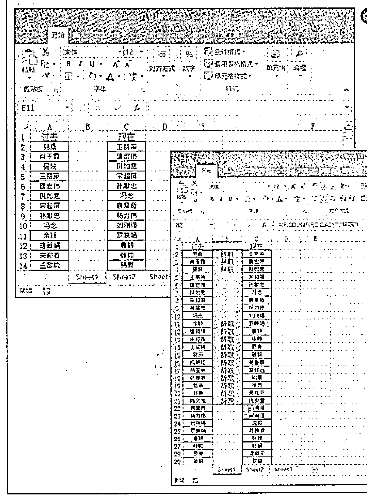

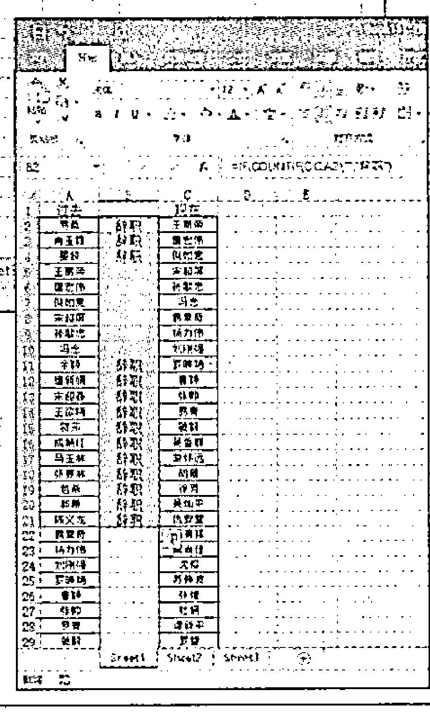

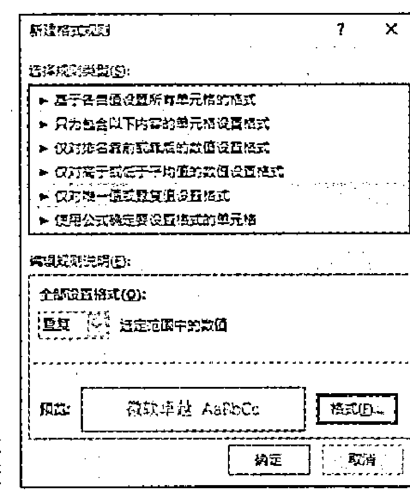

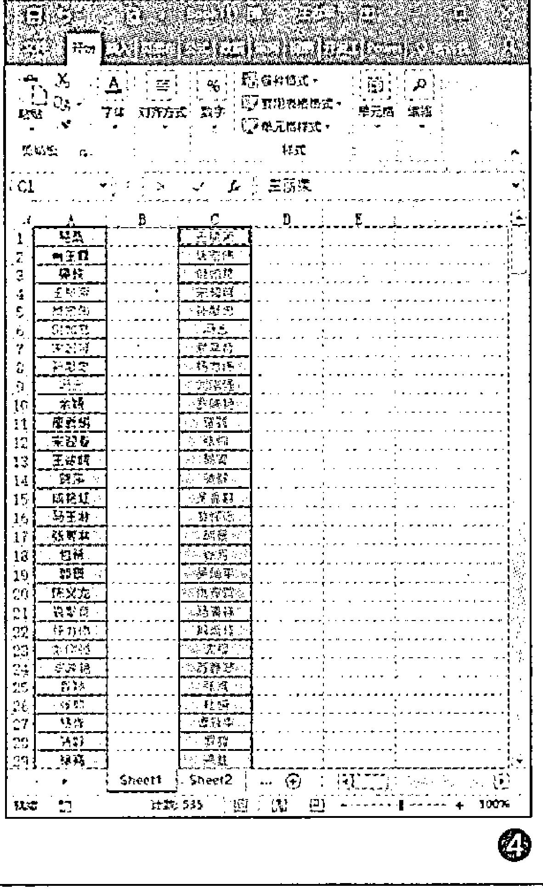

## WPS文字随心所欲做表格

文 | 张惠香

在我们的印象中，WPS Office套件中的WPS表格组件专门负责数据表的创建和处理。但是，这并不意味着所有表格都要通过这个工具来创建。事实上，对于一些不涉及复杂计算和统计的表格，用WPS文字自带的表格工具来创建、编辑和美化，更能快速完成各种个性化的表格任务。

### 1. 生成表格：用好三种基本方法

在WPS文字中，要创建基本的表格，方法不止一种。从“插入”选项卡面板下的“表格”下拉列表入手（图1），可以通过可视化的简单行列鼠标拖动插入、输入行列数定义宽度插入、鼠标手动绘制插入等三种方法来创建基本表格。

如果只是需要一个简单的m行n列的表格，不考虑其他表格元素，那么，只需点击“表格”下拉菜单，在出现的表格示意图中，用鼠标按需拖出所需的行列数，即可获得需要的表格（图2）。

但是，我们有时需要的表格行列数比较多，在屏幕上不好直接拖动控制或对表格的列宽有具体限制，用上面的方法就难以做到了。这时，可通过“表格→插入表格”命令，激活插入表格对话框，输入行数、列数，定义列宽参数来创建（图3）。如果考虑到表格内容和打印等因素，需要确定列宽的具体数值，那么还可以将列宽的单位指定为自己容易辨认的一种单位（例如厘米、毫米等）（图4）。

如果希望更加自由地确定表格的形状，可以通过“表格→绘制表格”命令，调用表格画笔，自由地绘制表格（图5）。手动绘制表格的最大好处是可以随意地在表格中插入斜线、横分隔线、竖分隔线等，更加接近我们传统的手绘制表格的感觉。

### 2. 表格变换：掌握两种快速转换技巧

表格的生成还有另外一种特殊情况：有时我们只有一个数据阵列（m行n列的数据列表），并无表格存在，但希望将其做成一个表格。这时，大可不必先绘制一个表格，然后将数字复制进去，我们可用更简单的办法来完成表格的生成。

首先在版面中选中要制作表格的阵列文字（这里的内容不一定是数字，也可以是文本类型），然后执行“插入→表格→文本转换成表格”命令（图6），随后会看到，屏幕上原来呈阵列分布的文本变成居于表格中的内容了。

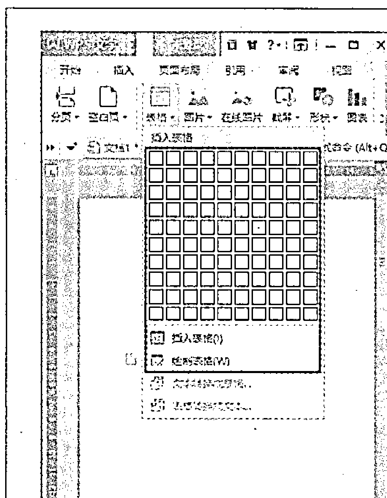

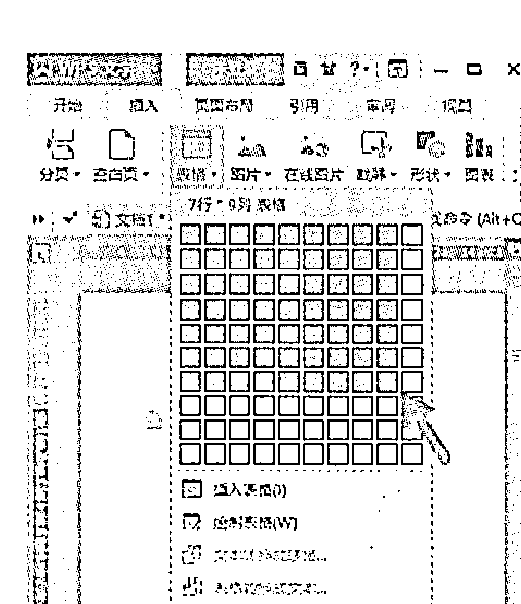

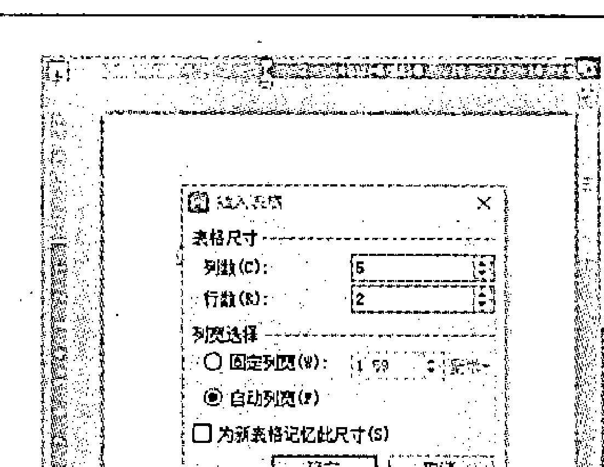


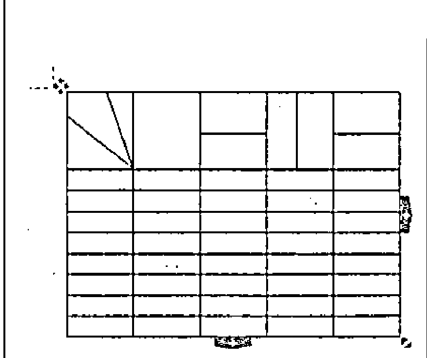

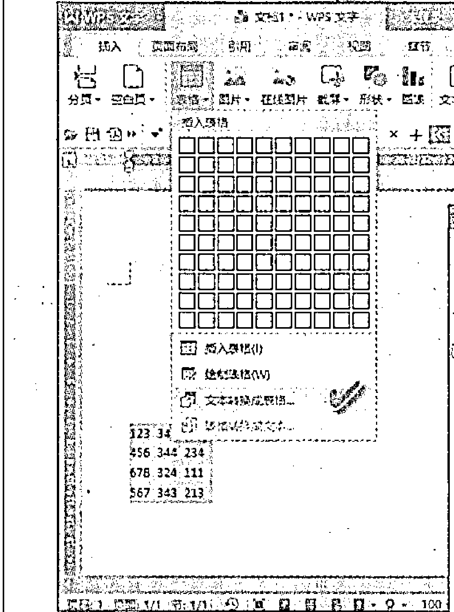

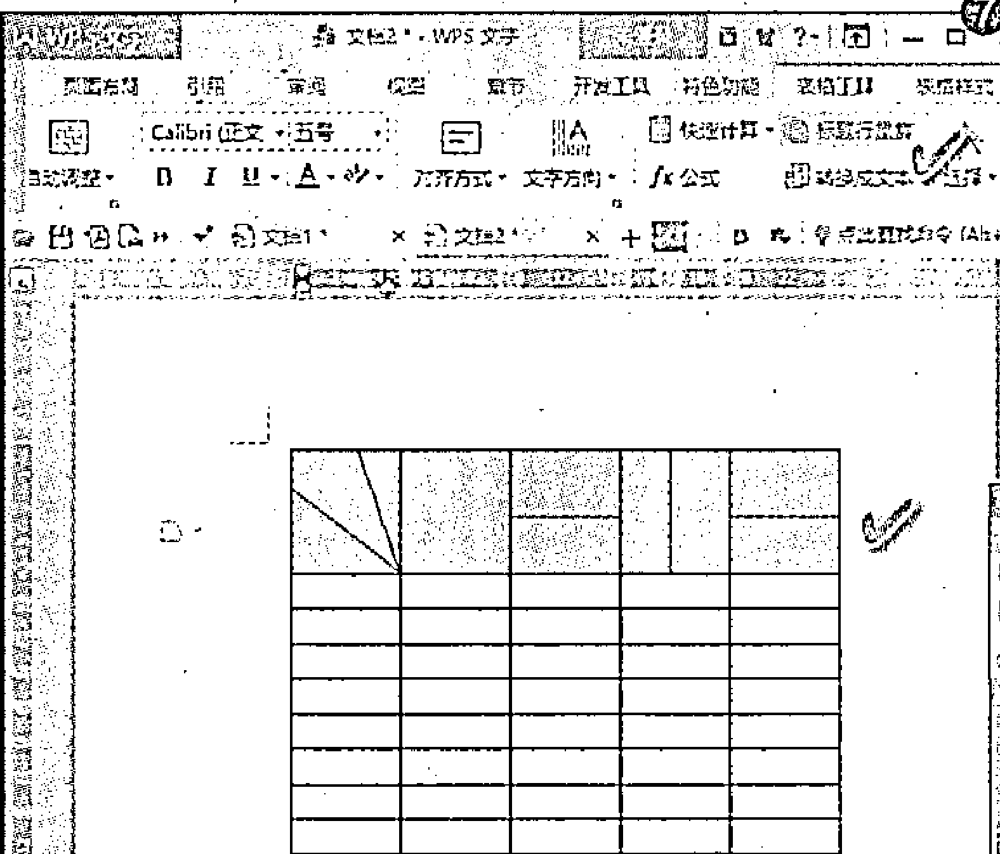

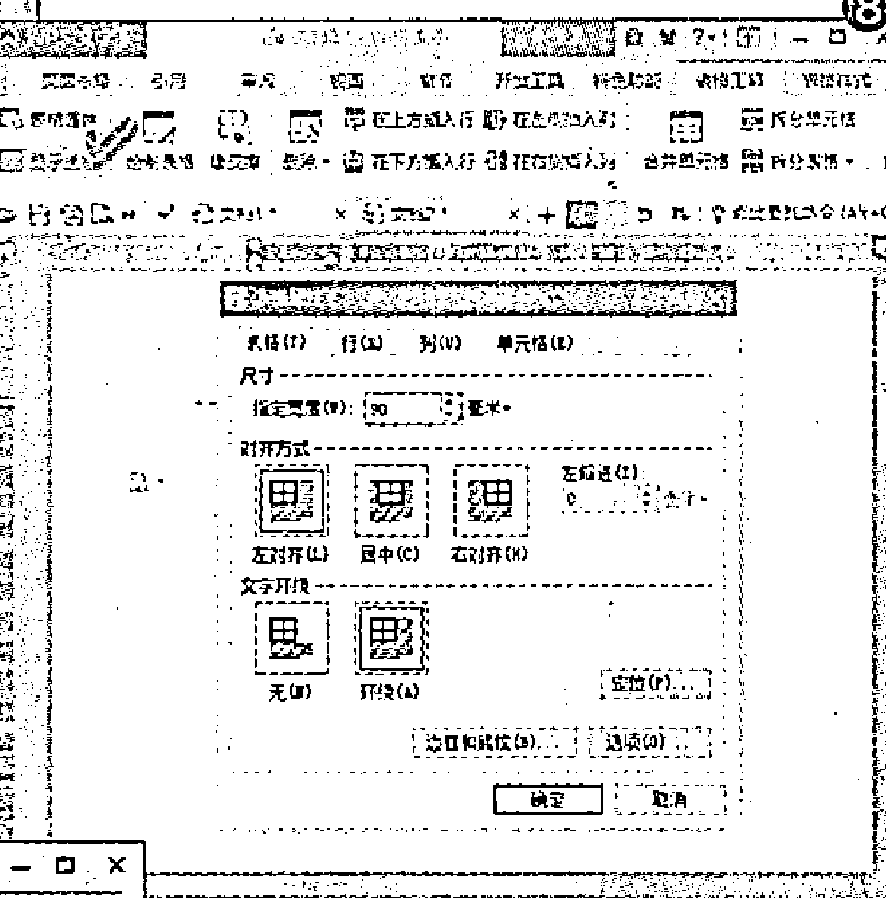

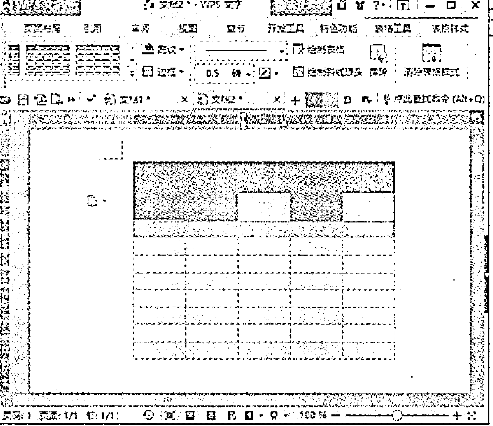

需要特别注意的是，无论我们采用如上哪种创建表格的方式创建表格，一旦命令下达创建了表格的雏形之后，系统中就会自动出现另一个菜单“表格工具”，它为表格的灵活编辑提供了更多的工具和可能。利用表格工具功能区中提供的各类工具，可以完成与表格编辑有关的各类任务。

如果表格中的某条线画错了，或希望消除表格中的某条间隔线将相邻表格打通，只需点选“橡皮擦”工具，对中表格线擦除即可。如果不需要那个行、列、单元格甚至整个表格了，通过“删除”按钮下拉菜单，选择相应的删除命令即可。而表格的插入、拆分和合并等，也可以通过按钮直接完成。

对于一个跨页的长表格，如果担心在首页之后出现的表格项目不够明确，可在选定标题行之后，通过“标题行重复”按钮，给以后各页均添加相同的标题行（图7）。

在表格创建期间，随着“表格工具”菜单一同出现的还有另一个菜单“表格样式”，它是专门为表格的美化和个性化而提供服务的。其中已经列出一个固有的样式模板，可供点击套用。当然，利用样式面板中提供的工具，对已有样式进行修改、擦除、清除等操作。或重新定义底纹、边框、表头等细部样式（图9），就更能创造出个性化的表格了。

> **小提示**
> 如果要将已有表格的表线去掉，最快速的方法是，在选中表格之后，执行“插入→表格→表格转换成文本”命令。而不是去擦除表线，当然擦除也未尝不可。

> **小提示**
> 如果要回到早期版本的表格参数定义界面，只需点击“表格属性”按钮，即可激活“表格属性”对话框，在其中对尺寸、行列、单元格等参数进行详细的设置（图8）。

## 单元格合并 数据照用不误

文 | 马震安

有时，为了分类更明显，我们会将相同名称或类别的单元格放在一起，并将同一名图的相邻单元格合并为一个单元格。但是，合并之后，在数据排序、计算或统计的时候，就会遇到麻烦。下面我们就探讨在不动合并后的单元格，不重新拆分单元格的情况下，照样进行数据排序、计算、统计的方法。

日常教学中很多老师都用Excel工作表记录学生的学习情况。例如，某老师就用工作表记录了每个学生各学科作业的得A情况（图1）。月底，老师想对每个学生各学科得A情况进行从低到高排序，以查看学生是否偏科。但是，一开始记录时，他制作的工作表在学生姓名处进行了单元格合并，这就给排序工作带来了一定的麻烦，普通的排序方法肯定是不行的，怎么办呢？是将合并的单元格取消后再填充，再分别排序，然后再合并相应单元格吗？这种方法不是不可以，但这也太费事。其实，在原有数据格式不动的情况下，通过辅助列的方法就能轻松实现对带有合并单元格数据的子数据进行排序。

### 巧用辅助列

在D2单元格输入“=COUNTA($A$2:A2)*10^4 +C2”，向下拖动填充到数据的最后单元格；然后，在标题行选择除去姓名列的单元格（即B1:D1），点击“筛选”，在“辅助列”字段处点击小黑箭头后选择“升序”，这样就实现了每个人各学科按得A数从低到高排序了（图2）。

虽然，上述方法能够解决合并单元格从低到高排序，但是如果要实现从高到低排序，用这种方法就不灵验了。那如何解决这个问题呢？我们不妨用另外一种方法，即“辅助列+普通排序”法。

#### 添加辅助列

将表格数据复制到一个新的表中，在新的工作表最左侧添加插入一列，列字段为“序号”，选定“姓名”列数据向左拖动填充到新插入的“序号”列，在填充选项中选择“仅填充格式”，在“序号”列依次输入1、2并选定它们，拖动填充到下面的单元格中（图3）。

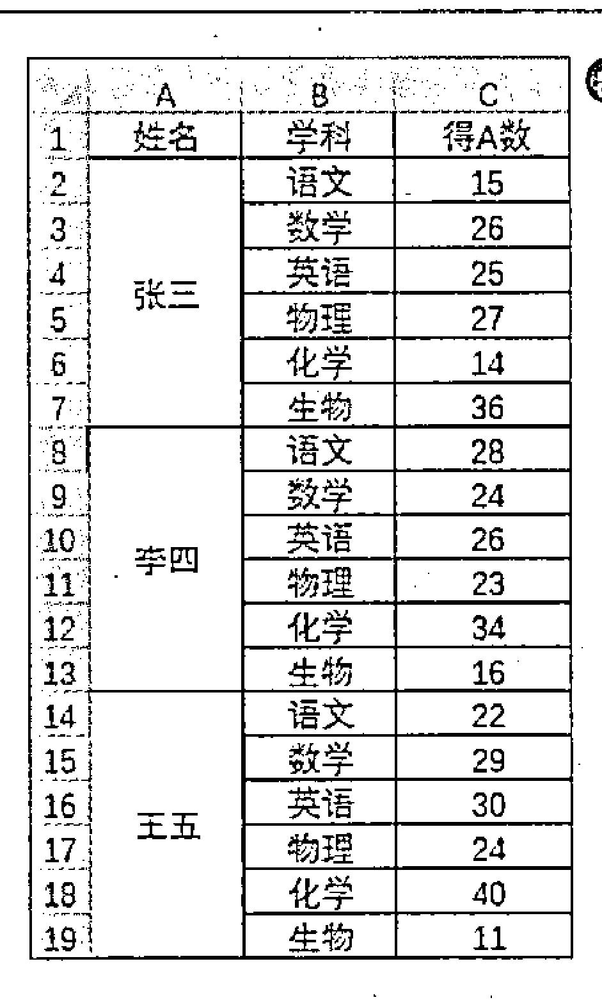

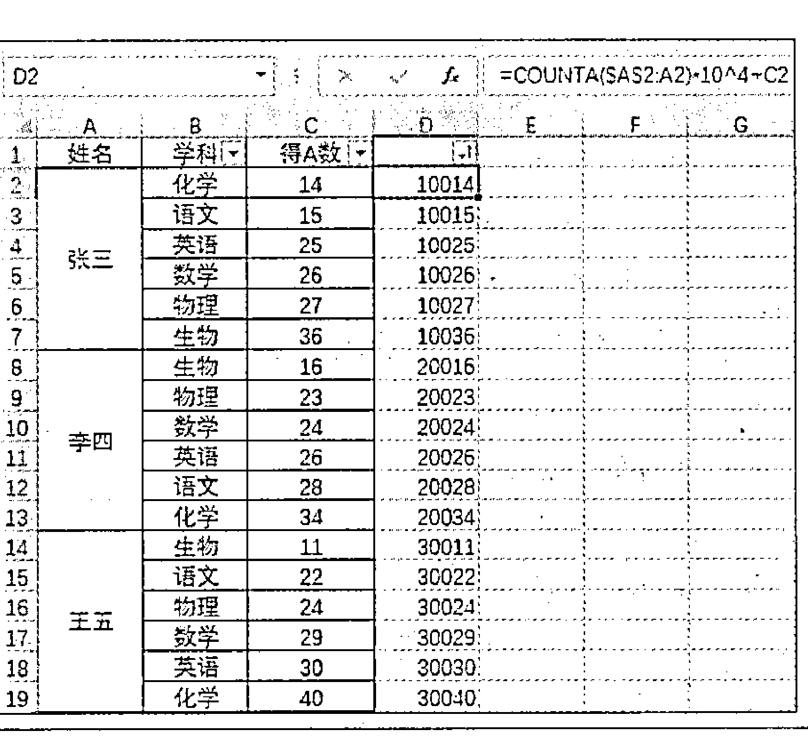

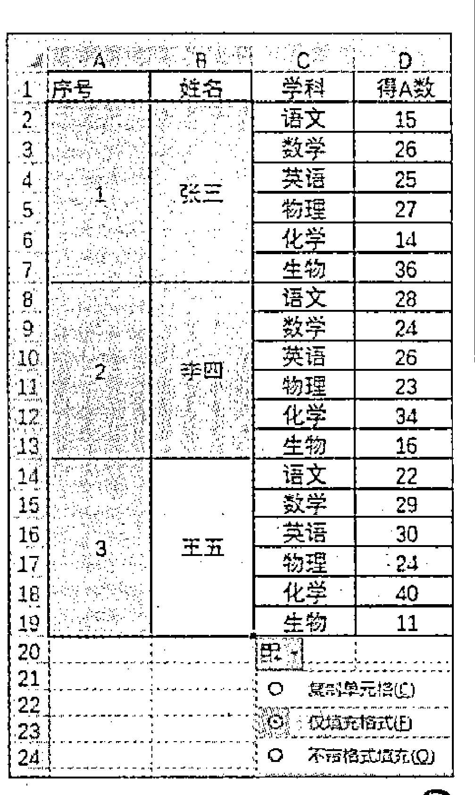

#### 取消合并单元格

选定“序号”列和“姓名”列，点击“合并后并居中”按钮来取消单元格的合并；接下来，点击“查找和选择”按钮下的“定位条件”，在弹出窗口选择“空值”，确定后在公式编辑栏输入“=A2”，并同时按下Ctrl和Enter键，对空白单元格进行填充（图4）。

#### 普通排序与利用

选择所有数据进行复制，并在原有区域进行选择性粘贴，选择“值”；选择“姓名”字段名，点击“自定义排序”，主要关键字选择“姓名”，点击“添加条件”，次要关键字选择“得A数”，次序选择“降序”，点击“确定”；再选定“序号”字段名，点击“升序”，这样就实现了按姓名分类、按得A数从高到低的排序（图5）。

最后，就该还原表格原来的格式了。删除“序号”列，切换到原表，选择姓名这列的数据，点击“格式刷”，将新表中的“姓名”这列刷成与原表中一样的格式（图6）。

有时需要对有合并单元格的子数据进行排名，如按“得A数”对每个学生的各科进行排名，其做法也是先将合并单元格取消后进行相应的填充，然后在排名列输入“=SUMPRODUCT(($A$2:$A$19=A2)*($C$2:$C$19>C2))+1”，并向下填充到最后的数据单元格，这样就完成了分类排名。同样，再利用格式刷将新表刷成原表的样式（图7）。

此外，使用SUMPRODUCT函数可以进行多条件排名，其语法为“=SUMPRODUCT((条件1)*(条件2)*(条件3)*…(条件n))”，作用就是统计同时满足条件1、条件2到条件n的记录的个数。

其实，带有合并单元格的数据表，实际上是以被合并的列作为分类，在这样的数据表中排序、汇总统计实际上就是进行多条件的排序、汇总统计。在日常办公中除了上述的SUMPRODUCT函数能进行多条件统计外，在Excel 2016中还新增了SUMIFS、AVERAGEIFS、COUNTIFS等函数，这些函数也都能进行多条件的统计。

| 序号 | 姓名 | 学科 | 得A数 |
|------|------|------|-------|
| 1    | 张三 | 语文 | 15    |
| 2    | 张三 | 数学 | 26    |
| 3    | 张三 | 英语 | 25    |
| 4    | 张三 | 物理 | 27    |
| 5    | 张三 | 化学 | 14    |
| 6    | 张三 | 生物 | 36    |
| 7    | 李四 | 语文 | 28    |
| 8    | 李四 | 数学 | 24    |
| 9    | 李四 | 英语 | 26    |
| 10   | 李四 | 物理 | 23    |
| 11   | 李四 | 化学 | 34    |
| 12   | 李四 | 生物 | 16    |
| 13   | 王五 | 语文 | 22    |
| 14   | 王五 | 数学 | 29    |
| 15   | 王五 | 英语 | 30    |
| 16   | 王五 | 物理 | 24    |
| 17   | 王五 | 化学 | 40    |
| 18   | 王五 | 生物 | 11    |

| 姓名 | 学科 | 得A数 | 名次 |
|------|------|-------|------|
| 张三 | 语文 | 15    | 5    |
| 张三 | 数学 | 26    | 3    |
| 张三 | 英语 | 25    | 4    |
| 张三 | 物理 | 27    | 2    |
| 张三 | 化学 | 14    | 6    |
| 张三 | 生物 | 36    | 1    |
| 李四 | 语文 | 22    | 5    |
| 李四 | 数学 | 29    | 3    |
| 李四 | 英语 | 30    | 2    |
| 李四 | 物理 | 24    | 4    |
| 李四 | 化学 | 40    | 1    |
| 李四 | 生物 | 11    | 6    |
| 王五 | 语文 | 28    | 2    |
| 王五 | 数学 | 24    | 4    |
| 王五 | 英语 | 26    | 3    |
| 王五 | 物理 | 23    | 5    |
| 王五 | 化学 | 34    | 1    |
| 王五 | 生物 | 16    | 6    |

| 序号 | 姓名 | 学科 | 得A数 |
|------|------|------|-------|
| 1    | 张三 | 生物 | 36    |
| 2    | 张三 | 物理 | 27    |
| 3    | 张三 | 数学 | 26    |
| 4    | 张三 | 英语 | 25    |
| 5    | 张三 | 语文 | 15    |
| 6    | 张三 | 化学 | 14    |
| 7    | 李四 | 化学 | 34    |
| 8    | 李四 | 语文 | 28    |
| 9    | 李四 | 英语 | 26    |
| 10   | 李四 | 数学 | 24    |
| 11   | 李四 | 物理 | 23    |
| 12   | 李四 | 生物 | 16    |
| 13   | 王五 | 化学 | 40    |
| 14   | 王五 | 英语 | 30    |
| 15   | 王五 | 数学 | 29    |
| 16   | 王五 | 物理 | 24    |
| 17   | 王五 | 语文 | 22    |
| 18   | 王五 | 生物 | 11    |

| 姓名 | 学科 | 得A数 |
|------|------|-------|
| 张三 | 生物 | 36    |
|      | 物理 | 27    |
|      | 数学 | 26    |
|      | 英语 | 25    |
|      | 语文 | 15    |
|      | 化学 | 14    |
| 李四 | 化学 | 34    |
|      | 语文 | 28    |
|      | 英语 | 26    |
|      | 数学 | 24    |
|      | 物理 | 23    |
|      | 生物 | 16    |
| 王五 | 化学 | 40    |
|      | 英语 | 30    |
|      | 数学 | 29    |
|      | 物理 | 24    |
|      | 语文 | 22    |
|      | 生物 | 11    |

## WPS文档背景个性化

文 | 文平

平时我们开启一个新的WPS文档，其背景均为空白。如果要在文档背景上打上版权防复制的烙印，或者要将某个自己想要的图片设置为个性特色的背景水印图片，该如何实现呢？下面以新版WPS为运行环境。若想在Word中实现此效果，在“设计”选项卡下选择水印功能即可。

### 1. 添加WPS文档图片背景

打开要设置背景的WPS文档，点击“页面布局”选项卡，点击“背景”下拉列表，然后选择其中的“图片”选项（图1）。
点击“选择图片”按钮，在电脑中找到要作为背景的图片，点击“确定”按钮。选择“锁定图片纵横比”可避免图片失真变形。想要背景图片100%符合要求，选取的图片尺寸一般为244.49mm×46.17mm，大于或小于该尺寸的图片会被截取或自动拼接（图2）。
这样，整个文档就会插入相同的该图片作为其背景（图3）。

### 2. 制作WPS防复制水印

点击“插入”选项卡，然后点击“水印”下拉列表，选择预设水印类型插入；或点击“插入水印”，自定义水印后插入。如果要删除文档中的水印，从该选单底部单击“删除文档中的水印”（图4）。
在自定义水印窗口中，选中“文字水印”复选框可修改文字水印内容；选中“图片水印”复选框可选择自己指定的图片作为水印图片；选中“冲蚀”可使背景图片呈半透明状态；自定义水印还可指定应用范围为整篇文档还是本节（图5）。
如果要取消图片背景，选择“背景→无填充颜色”就可以了。

> 小提示
> 要限制对以上背景或水印的删除或修改，只需在WPS“选项”页的“安全性”窗口中设置编辑权限密码即可。

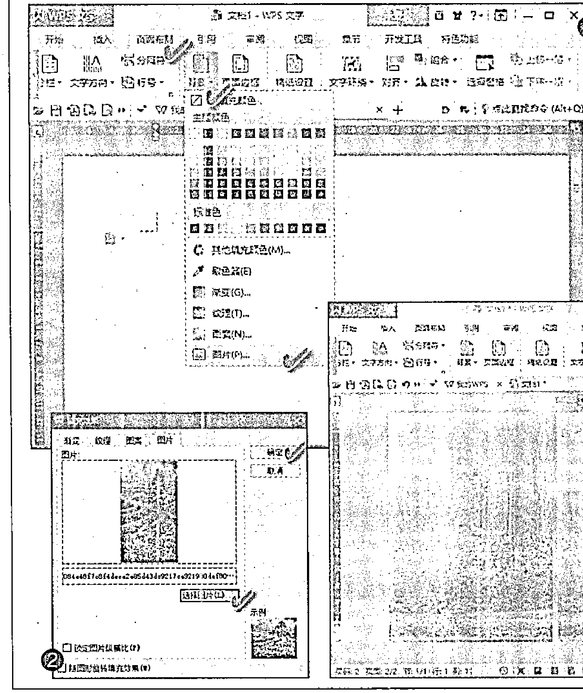

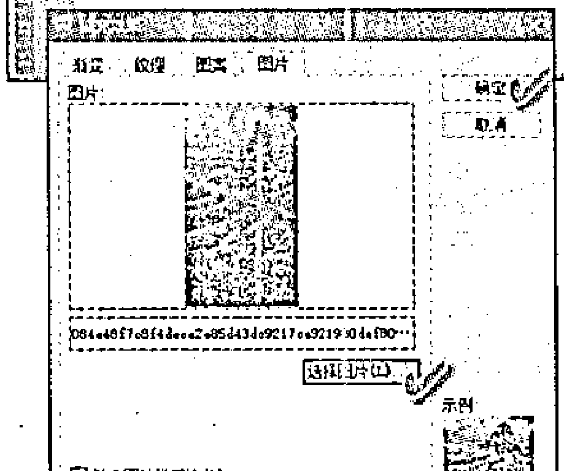

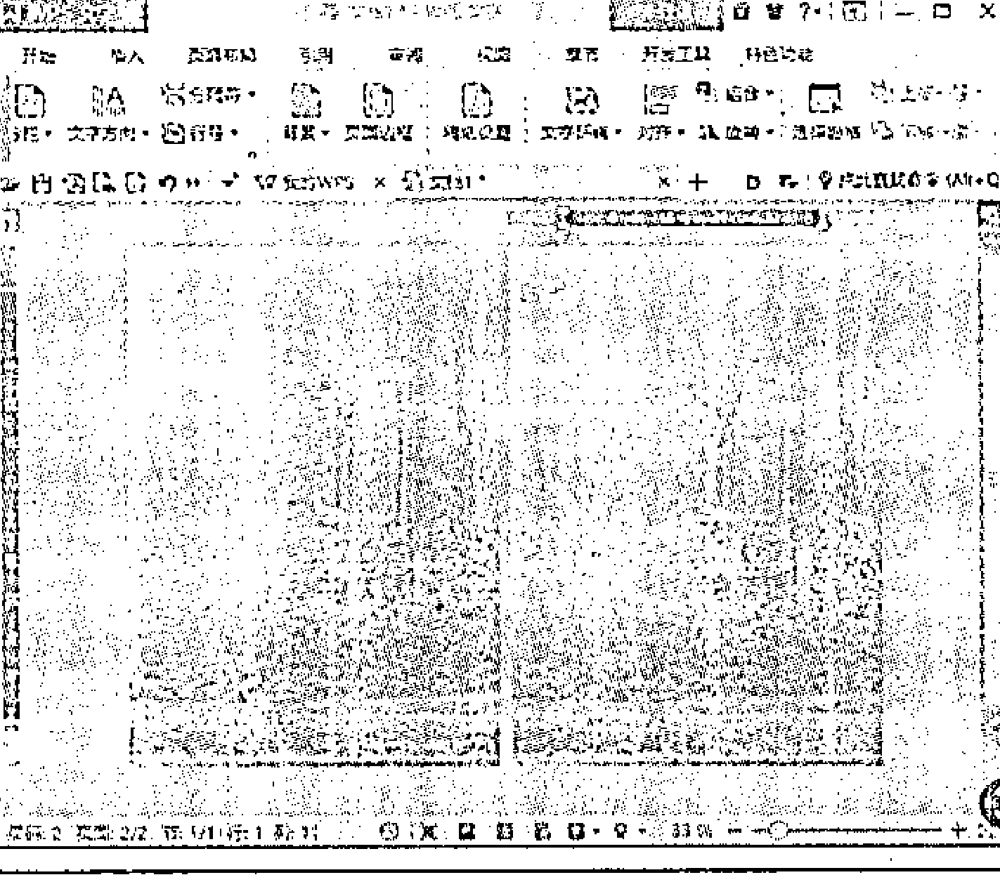

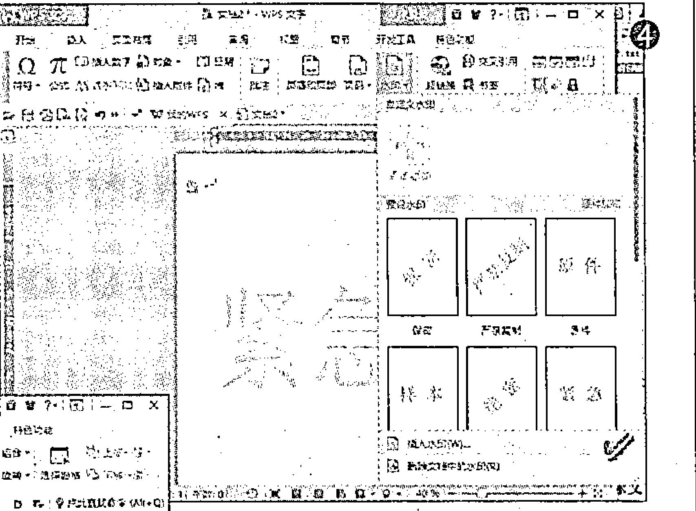

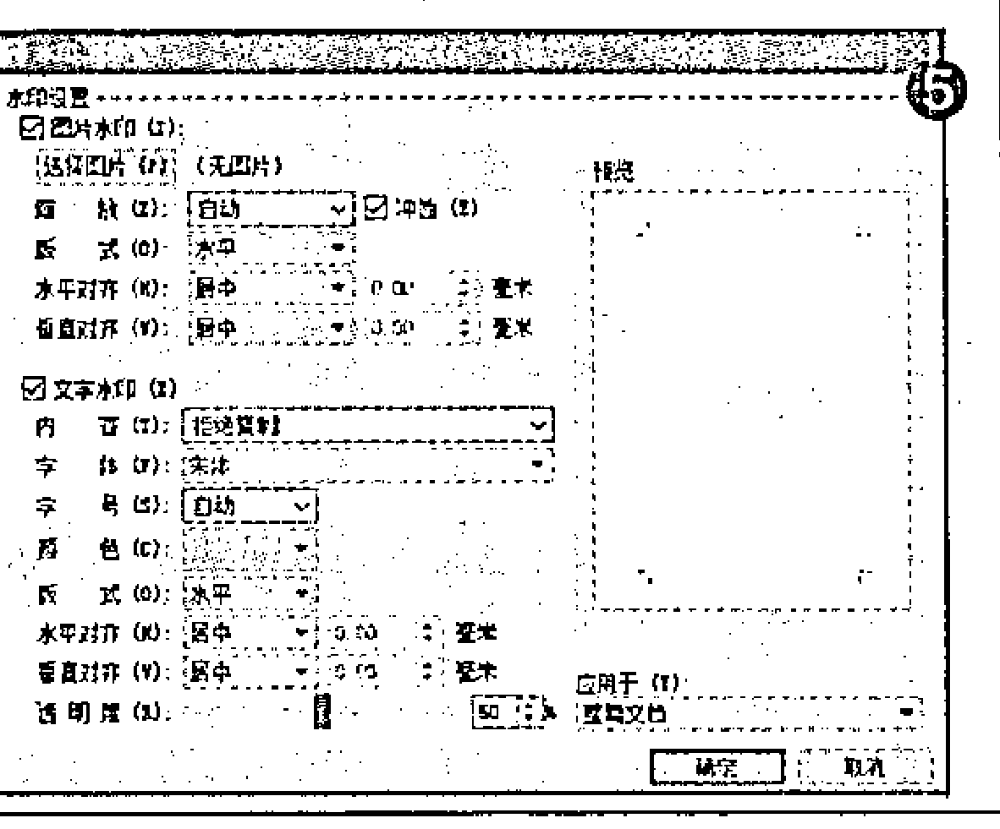

## E-mail助记访问过的网址

并不是所有的网页浏览器都有同步功能，所以有时用户在访问一个网址后，想在其他的地方继续访问就变得非常麻烦。虽然可以将网页信息保存到云笔记，或将访问的网址添加到稍后阅读的服务里面，但是对于轻度使用的用户来说都有些繁琐。那么有什么方法，能一键记录用户访问过的网址链接呢？

### 注册网址发送云服务

用网页浏览器登录Fwrdto.me这个云服务的网址(https://fwrdto.me)，在网页上方的“GET YOUR BOOKMARKLET!”输入框里面，填入自己用于接收相关网页链接信息的电子邮箱地址(图1)。设置完成以后点击下面的“Get My bookmarklet!”按钮，这个时候云服务会向这个电子邮箱发送一个验证邮件。随后登录设定的电子邮箱，对里面的链接信息进行确认，就可以避免自己的电子邮箱被其他人滥用。当确认邮件地址后就可以继续进行下一步，这时我们可以在Fwrdto.me云服务的网页里面看到一个红色的命令按钮图标(图2)。

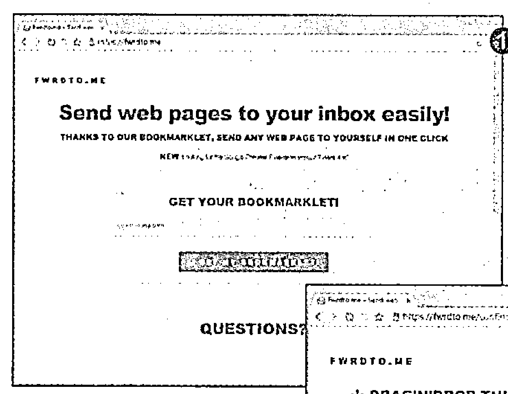

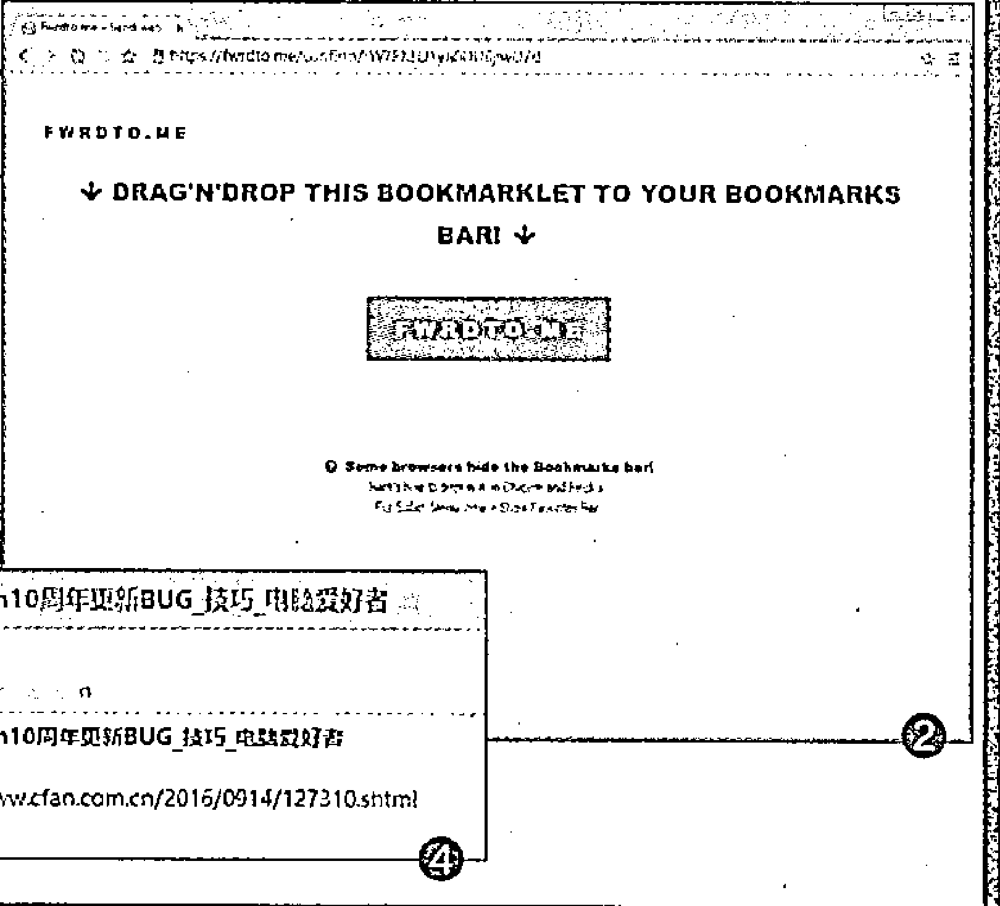

### 快速添加功能小书签

点击谷歌浏览器右上角的自定义按钮，在弹出的菜单里面点击“书签”中的“显示书签栏”命令，就可以将隐藏的书签栏显示出来。接着利用鼠标拖动这个命令按钮，将其拖拽到浏览器的书签栏里面，会在书签栏里面显示一个“Fwrdto.me”的链接。如果用户使用的是其他的网页浏览器，而网页里面的这个功能按钮无法添加到书签栏，那么只能手动进行添加操作了。
首先在功能按钮上点击鼠标右键，选择菜单里面的“复制链接地址”命令。现在打开系统的IE浏览器，接着在地址栏里面随意输入一个网页地址，回车后就可以打开这个网页链接进行访问。接下来点击收藏夹中的“添加到收藏夹”命令，把这个网站地址添加到书签栏里面。然后在收藏夹里面找到刚刚添加的网站地址，在名称上点击鼠标右键选择菜单中的“属性”命令。在弹出的属性对话框中，将“URL”中的信息替换成刚刚复制的代码信息，同时再将网站地址的名称修改成“Fwrdto.me”这样的名称就可以了。

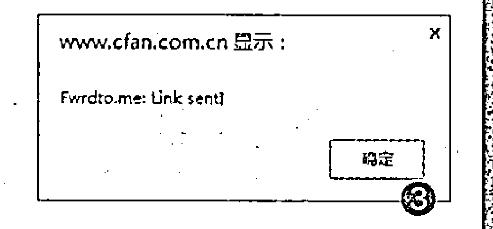

### 一键发送链接到邮箱

那么这个Fwrdto.me云服务到底如何使用呢？首先像平时一样浏览喜欢的网站，当发现喜欢的文章想要记录下来的时候，点击浏览器上方书签栏中的Fwrdto.me链接，稍等片刻会跳出一个名为“Link sent!”的提示窗口(图3)。接下来登录到注册的电子邮箱里面，就能收到从Fwrdto.me寄来的邮件信息，这里面就包括这个想要继续浏览的网站标题及网页链接(图4)。通过这种方式进行操作是不是更加简单方便呢？

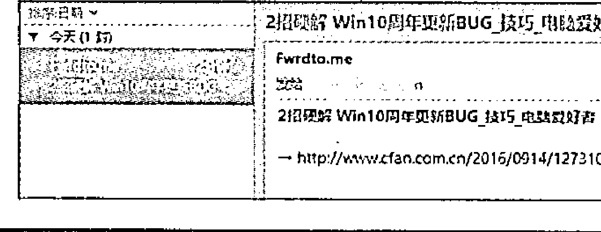## 灵活应用文字样式为文档添彩

文|张惠香

无论是使用Word还是WPS对文档进行操作时，除变换使用多种字体，改变字体的颜色大小之外，我们还可以利用其本身自带的编辑功能变换出更多另类的文字样式。例如，将文字加个圆圈或方块，将文字排列为横平竖直的方向，将现有文字做艺术化处理等。这样，就能令我们的版面更加活泼多姿。

这些在Word和WPS文字中均可随心实现，本文仅以WPS为效果演示。

### 1. 创建独立的外框式文字

对于文字的修饰，我们最常用的是加黑、斜体或加下划线、着重号等。但有时我们也会见到一些加有圈形或方块形外圈的标题，这样的标题配合特定的环境，会给人更加突出的感觉。

文字的版面中若要给特定文字加上圆圈或方形外框，根本不需要通过文本框或圆圈图形与文字叠加这种笨办法。我们只需套用“字体”设置项目组中提供的“带圈字体”工具，经过设置即可完成。

首先输入汉字或其他字符，选择要设置的文字（注意是单个文字）。点击文字工具组中的“带圈字体”下拉菜单，选择其中的“带圈字符”（图1）。接下来在带圈字符样式设置窗口中，默认即为圆圈设置，点击“确定”即可设好一个带圈字。但是，我们会发现设好的字体比原字小了很多。这时，如果要扩大显示，我们只需在样式列表中选择“增大圈号”，确定即可（图2）。

如果要给文字添加边框效果，用上述“方框”类型即可实现单个汉字的边框显示。但是，如果要给一行文字添加整体边框，需要通过“带圈字体”字体菜单中的“字符边框”命令来实现（图3）。

> **小提示**
>
> 我们不但可以通过这种方法设置圆圈外框，还可以从“圈号”列表中选择包括方框、三角形、菱形在内的其他3种外框。

### 2. 任意方向的文字排版

平时排版时，我们的文本都是横平竖直的排列，即便是文本框，我们也只不过是通过它来灵活安置位置而已。但如果将某些文字设置为任意方向排版，会给版面更多的动感。为此，我们可以用文本框的旋转来实现。通过‘插入→文本框’命令插入一个文本框，之后选中文本框，我们发现其边框中央部分有一个半圆形的箭头按钮，通过按下该按钮并拖动鼠标，即可实现文本框的任意旋转（图4）。如果希望倾斜的文字在版面中以无边框的状态出现，可点击右侧设置工具条最下方的线条按钮，将线条设置为‘无’即可。

注意‘文本工具’菜单的巧妙利用。激活文本框之后，我们发现系统生出了一个‘文本工具’菜单，在其中我们可以套用许多花样的艺术文本样式。此外，如果对这些预置效果不满意，还可以对文本框的填充、轮廓、方向等进行自定义设置（图5）。

用‘绘图工具’做非矩形文本框。版面中不但可以用文字的倾斜来增加活泼气氛，还可以摆脱死气不变的矩形样式，寻求多变的文字块样式。文本框激活之后，我们可见到另一个菜单‘绘图工具’的出现，通过它我们可以将文本框设置为非矩形的任意其他样式。选中文本框，依次点击‘绘图工具→编辑形状→更改形状’，然后从预设形状中选择自己想要的目标形状（图6）。同样我们也可以对自定义后的形状作进一步的效果设置，包括填充、轮廓和各种预设的形状效果等（图7）。

### 3. 挖掘‘艺术字’的活力

如果说以上文字效果是以文本框为基础的，那么我们还可以用另一种对象来实现文字的特殊艺术效果，那就是‘艺术字’。

艺术字的制作比较简单，只需通过‘插入→艺术字’命令按钮，从弹出的预设艺术字样式中选择一种样式，然后在开启的模板中输入自己的文字即可（图8）。

虽然系统内置的艺术字样式种类非常有限，但是，同上述文本框设置一样，选中艺术字框之后，系统会出现‘文本工具’和‘绘图工具’两个菜单。通过这两个菜单中的命令按钮，我们可以对当前的艺术字进行灵活的设置改造，从而创作出更多的艺术字样式（图9）。

### ‘分合’有道 数据合并有高招

文|阿木

在日常的工作中，我们经常需要对Excel中的一些数据进行合并、统计。不过很多时候需要合并的数据并不在同行、同列甚至不在同一个工作表、文件中，对于这些数据怎样才能快速进行合并？

#### 行列数据请一起 合并不同行列数据

在日常工作统计中，一些数据经常在不同的行列中。比如公司销售分为A、B两个小组，每个小组分别按自己的时间进行日销售额的统计（图1）。为了便于统计和查看，现在需要按照时间重新排序，将时间合并、A组销售额、B组销售额分别排列。

在Excel中打开上述表格后，选中H1，点击工具栏上的“数据/合并计算”按钮，在合并计算菜单选项界面中，函数选择“求和”，点击“浏览”左侧的选择数据按钮，在Excel中使用鼠标选中需要合并的数据，选择A、B列有效数据，勾选“首行”和“最左列”，点击“添加”（图2）。

同上，继续选择C、D列有效数据，点击“添加”，最后点击“确定”即可完成合并操作。这样销售时间（如果时间显示不正确，请将H列数据单元格格式设置为“日期”）、A组、B组销售额也会自动合并在一起，更方便进行查看（图3）。

这里是以不同列数据合并为例，如果是合并不同行数据，则只要将选择对象变为行数据的选择即可。

当然在Excel中除了这种情况的合并外，还有很多类似的合并，比如上述表格需要将A组、B组销售额合并到G列，组合成类似“A组日销售额XX，B组销售额XX”的形式。

鼠标定位B列，然后插入一新列，在其中输入“A组日销售额计：”，接着使用填充工具填充，同样在D列插入新列，添加“B组日销售额计：”，然后定位到G2，输入“=B2&C2&E2&F2”，然后使用填充工具填充，即将B、C、E、F列内容全部合并到G列（图4）。

#### 分久归一 合并不同工作表中的数据

对于一些复杂的统计工作，公司报表大多是由多个部门各自汇总统计，最终要将各自统计的报表合并在一起。对于这类不同工作表之间数据的合并，可以借助VLOOKUP函数完成数据的合并。比如公司销售和考勤分别在某个文件的销售统计工作表和考勤统计工作表中，现在要将这两个工作表汇总合并到总计表中。在打开的工作表下新建一个名为“统计汇总表”，然后将销售报表的数据复制到新建表中，再新建一标题为“考勤统计”的列，选中C2，点击“插入→函数”，插入VLOOKUP函数，在打开的函数参数设置窗口中，第一个填写框Vlookup_value中直接点击“销售统计”表中的第一位员工“王五”的名字（图5）。继续在第二个填写框Table_array中，这里选择考勤统计工作表中第一个员工王五的考勤数据即A2:B2的内容，在第三个填写框Col_index_num中直接填写2，表示选择第2列的数据（即考勤数据），然后第四个填写框Range_lookup中填写0，表示大致匹配（图6）。点击“确定”，这样在新建的统计表中就会自动读取考勤表中相应的数据。继续使用填充工具进行填充，其他员工的考勤数据就会自动从考勤表中读取出来。这样即可将两个工作表中的数据合并到一个工作表中，由于这里是自动引用其他工作表中的数据，如果其他工作表中的数据进行更改，比如某人考勤天数变动，这些变动数据会自动同步到新建的统计表中，而不像简单的复制、粘贴（图7）。

上述操作是将不同工作表中的数据合并一个新建表中，如果是不同文件中的数据要合并到一个文件中，解决方法类似，只要将其他文件中的数据复制到某个文件中的新工作表中，其他合并操作同上。当然，在实际操作中有很多类似的合并，我们只要灵活应用好函数即可。比如原来产品销售按照1月、2月、3月（每月一个工作表）做了三个月的报表，现在需要做季度表将3个工作表合并到一个，此时就可以使用INDIRECT函数进行合并（图8）。新建一个“季度汇总”工作表，按照表1格式复制品名文字字段，并在B、C、D列添加1月、2月、3月字段，然后在B2插入函数“=INDIRECT(""&B$1&"!B"&ROW(A2))”，通过函数引用工作表1的B列数据，然后向下、向右填充即可，这样会分别引用2月、3月工作表中对应的数据（图9）。

### 视频贴图轻松实现

文|马震安

在《奔跑吧！兄弟》、《极限挑战》等综艺真人秀节目的视频中经常看到滴汗、乌鸦飞过、省略号、大哭、头顶黑气等有趣的元素，这些元素是如何添加到视频中的呢？制作会不会很麻烦呢？其实，如果用“爱剪辑”对视频进行编辑，就可非常简单地实现视频贴图效果。

#### 添加贴图

打开“爱剪辑”软件，添加所需要编辑的视频，在“预览/截取”窗口可截取需要的视频片段。当然，如果不需要截取，直接点击确定。在右侧视频预览框时间进度条上，拖动到要添加贴图的时间点，将时间进度条定位到要添加贴图处。选择“叠加素材”左侧的“加贴图”选项卡，双击视频预览框，在弹出的“选择贴图”对话框选择贴图或导入自己的贴图，并可在“顺便配上音效”下方点击“浏览”按钮，为贴图配上音效（图1）。

#### 贴图设置

贴图添加完成后回到主界面，此时在右侧视频预览框里，贴图已处于带方框的可编辑状态，我们可以通过可编辑方框，实现放大、缩小、旋转、变形、移动以及删除贴图。在左侧“加贴图”栏目的特效列表中，选择要为贴图添加的特效（即处于打钩状态），在特效列表和视频预览框中间，我们可在“贴图设置”栏进行更详细的设置，比如贴图的持续时间、透明度等。详细设置完成后，可以点击“播放试试”看一下是否达到自己预期的效果（图2）（也可通过“ESC”键将贴图一键居中，通过上下左右方向键对贴图位置进行精确到1个像素的调整）。

#### 字幕添加

字幕的添加与贴图的添加方法类似，在需要添加字幕的时间点处双击，在弹出的窗口输入所要添加的文字即可。再通过“字体设置”选项卡设置好字体、大小、排列、颜色等，在窗口左侧“出现特效”选项卡，选择好字幕出现时的动画效果，通过“特效参数”选项卡设置出现时的字幕特效时长、是否逐字出现、是否多行时逐行出现等。同样，分别选择停留特效、消失特效选项卡，对字幕停留、消失时的动画效果等进行详细设置（图3）。

> 小提示
>
> 如果想对已添加的贴图、字幕进行修改，可在窗口右下角的“所有叠加素材”、“所有字幕特效”列表中选中需要修改的贴图或字幕，软件会自动定位到贴图或字幕修改处。最后，点击“导出视频”，在弹出的窗口中设置好需要的参数，将做好的视频导出即可。

### 轻松提取文件名中的关键词

文/马震安

将大量长文件名中的不同类别关键词分别提取出来，存入Excel表格中，我们应该如何巧妙实现呢？

例如公司组织下属单位进行论文大赛，收到相当数量的电子版论文。论文主要就经典文学作品人物进行论述，文件标题包含了作品人物、作品名称、论文标题等三大部分，如图1左侧。根据要求，需要将这些电子版论文的文件名、所选人物、作品名称等录入到Excel工作表中。如果手动录入的话，工作量可想而知的繁重。用VBA代码吗？固然能够实现，但恐怕对于普通办公人员不大容易实现。那么有没有什么更好的办法解决？其实，只需要借助一个一行代码的bat文件就能轻松搞定了。

#### 生成bat文件

在存放若干论文的文件夹中右击建立一个文本文件，打开它，将“for /r d:\论文 %%a in (*.doc) do echo %%~na >>生成文件.xls”这行命令输入到文本文件中，保存并关闭文件。接下来，设置显示文件扩展名，右击这个文本文件，选择“重命名”，将它的扩展名“txt”更改为“bat”，回车后就会提示是否更改扩展名，选择“是”。这时文件的图标如果发生了变化，这就意味着这个文本文件变成批处理文件了。双击这个批处理文件，就会生成一个Excel文件。打开这个Excel文件，就会看到每个Word文档的文件名被录入到工作表中了（图1）。

#### 标题巧分离

初始目录生成之后，还需要从这些目录中分离出人物、作品及论文标题。选定数据列，点击“数据”选项卡下的“分列”，在弹出的窗口中选择“分隔符号”，点击“下一步”，在窗口中勾选“其他”，输入分隔符（本例中输入下划线“_”），点击“完成”，就实现了数据的分离。

#### 添加链接

为了更进一步操作，可在文件目录中的标题和文件夹中的相应文件之间建立链接，当点击目录标题时就会打开相应的Word文件。首先为数据记录添加表头（即列标题）；选定论文标题这列，利用替换的方法删除每个单元格最后的空格（即在替换内容处输入一个空格，替换为处什么也不要输入）；接下来，在链接列的相应单元格输入“=HYPERLINK(A2&"_"&B2&"_"&C2&".doc",A2&"_"&B2&"_"&C2&".doc")”，并向下拖动填充。这样，标题就和文件之间建立起了链接。最后，将这个Excel另存为扩展名为xls的文件就可以了（图2）。

以上仅以文学作品文件名为例，其他大家日常遇到的多字段长文件名的分离提取，均可以采用上述方法。

```
for /r d:\论文 %%a in (*.doc) do echo %%~na >>生成文件.xls
```

```
=HYPERLINK(A2&"_"&B2&"_"&C2&".doc",A2&"_"&B2&"_"&C2&".doc")
```

### PPT中轻松实现翻书效果

文/马震安

以前我们也能用PowerPoint制作翻书效果，但制作过程比较麻烦，所需设置的东西非常多，如果一步有问题，就难以出现最后想要的翻书效果。现在，借助于PowerPoint 2016的变形切换，我们再来制作这种动画，就变得非常轻松（图1）。借助于将每页进行水平翻转，可以免去设定三维旋转的过程，制作出超乎预期效果的翻书动画。

#### 准备素材

新建一张空白幻灯片，将其版式设置为空白，根据需要设置好背景色；利用自选图形等绘制出书的效果图，作为翻书效果的背景（图2）。

> 可以调整向左、向右、向上、向下的偏移量来调整图片在矩形中的填充位置。

接下来，利用自选图形绘制出一个矩形，其大小与书的单页一致，矩形设置为无边线，填充选择“图片或纹理填充”，选择好所需要的图片。选中图片，利用“口袋动画”插件“补位工具”中的“水平补位”，将图片区域扩大为原来的两倍（图3）。

> 变形是PowerPoint 2016最新的幻灯片切换动画功能，需要对PowerPoint 2016进行版本的升级。以下涉及到在PowerPoint 2016中完成的操作，因此需要将你的PowerPoint 2016升级到最新版本。

选定补位后的图形区域，点击“口袋动画”插件“定位工具”中的“尺子选项”，在弹出的“度量参数设置”窗口中，对象位置处选择“中心对齐”，勾选“X坐标”、“Y坐标”，再点击“定位工具”中的“应用尺子”，这样就设置好了补位后图形区域的中心位置；拖动补位后的图形区域与绘制的书的背景区域对齐；选定补位后图形区域中带有图片填充的矩形，将其拖动到补位区域的右侧；复制这个图形区域，选定复制出的图形区域中的矩形，将其填充图片替换成其他所需要的图片（这里的图片指的是奇数页中的图片），以此类推（图4）。

然后，利用“选择”按钮下的“选择窗格”来调整图片的层次，利用对齐按钮将这些图片与书的背景对齐（图5）。

#### 扩展阅读
**外部工具实现翻书效果**
通过上述操作制作的翻书效果是在PPT内实现的。但是如果你使用的PPT版本低且不打算升级，觉得上述操作有些不好完成，没关系，你还可以通过第三方软件，实现整体幻灯片的翻书效果。比如利用A-PDF Flip PowerPoint，就能够将演示文稿制作成翻书效果。
首先，准备好PPT制作好的幻灯片。打开A-PDF Flip PowerPoint软件，点击“Import PowerPoint”按钮，将制作好的幻灯片导入；点击“Float”进入版面样式设置窗口，选择自己所需要的样式（图7）。
通过“Tool Bar Settings”面板来控制一些按钮的显示，设置完成后点击“Apply Change”，最后点击“Convert To Flipping Book”，在弹出的窗口中设置好输出类型（如HTML、EXE等）、是否全屏等，点击“Convert”生成翻书效果的文件即可（图8）。

#### 变形切换巧利用

右击并复制这张幻灯片，在复制出的幻灯片上，选定第一个图形区域，点击“格式→旋转→水平翻转”，将翻转后的图形区域中的矩形填充图更换成另外所需要的图片（这里的图片指的是偶数页中的图片）；选择“切换”选项卡中的“变形”，这样就实现了翻页的动画效果；复制第二张幻灯片，在复制出的新幻灯片中，将右侧的图形区域水平翻转，利用选择窗格将其调整到最上层。同样，将翻转后的图形区域中的矩形填充图更换成另外所需要的图片，幻灯片的切换方式依旧是“变形”。其他的翻页动画效果依此类推（图6）。
从头播放一下幻灯片，看一看是不是一个漂亮的翻书动画效果呢？

### 巧用替换实现省纸打印
文|马震安

办公人员有时需要打印参会人员的名单，但有关部门提供的记录表往往只有一列，要打印Excel工作表中的所有参会人员名单，若记录非常多，直接将其打印在A4纸上就会造成很大的浪费。如果能将单列数据变成多列再进行打印，就会有效节约纸张（图1）。

快速实现单列变多列，可使用一段一段地剪切、粘贴的笨办法，也可以使用更加方便的插件进行设置，或者也可以将记录复制到Word中再进行分栏。这些方案虽都可行，但操作起来都比较费事。其实，只需巧妙地利用Excel中的“替换”功能，就能轻松实现上述需求。

#### 1. 创建替换内容

在本例中，假如想在A4纸上输出5列，这时就可以在C2、D2单元格分别输入“A2、A3”，在C3、D3单元格分别输入“A7、A8”。选定C2:D3单元格区域，向右拖动填充到G3单元格，再选定C2:G3单元格区域，向下拖动填充，直到所要打印的最后姓名所在的单元格的名称出现为止，在本例中显示出A109就可以了（图2）。

#### 2. 单列转多列巧实现

完成替换内容的填充后，接下来就是见证奇迹的时候了。选定填充区域，点击“替换”按钮，替换内容中输入“A”，替换为中输入“=A”。这时候，被填充单元格的内容就变成了姓名列中的相应内容了。删除多余的一列原始数据，这时候就实现了单列变多列了（图3）。

接下来进行打印，只需要添加好表头，设置好打印区域，就可以省纸打印了。 CP

#### 扩展阅读
如果要打印的原始数据有4列，但又想在A4纸上打印出12列，这又怎么办呢？只需在F2、G2、H2、I2单元格分别输入“A2、B2、C2、D2”，选定F2:I2向右拖动填充到Q2；在F3、G3、H3、I3单元格分别输入“A5、B5、C5、D5”，选定F3:I3向右拖动填充到Q3，再选定F2:Q3单元格区域，向下拖动填充，直到所要打印的最后姓名所在的单元格的名称出现为止（图4）。最后，相信大家都知道了，就是将A、B、C、D分别替换为=A、=B、=C、=D就可以了。

### 多条件标记不同颜色统计
文|王志军

某项实验测得一组数据（如图1中的左侧表格），要求学生在实验报告的蓝色填充部分统计不同区间的数量，还要求对数据测量记录标记分区间标记不同的颜色，如果C6：G10单元格区域的数据大于4.15或者小于3.15，那么使用一种颜色；数据在3.65~4.15之间，使用另一种颜色；数据在3.15~3.65之间，使用第三种颜色。该如何设置？

#### 统计数量
数量的统计只需使用一个简单的FREQUENCY函数即可实现。这是一个频数函数，以一列垂直数组返回一组数据的频率分布，该函数的语法为“FREQUENCY(数据区域, 分组依据)”，其中的“数据区域”代表需要计算频率的数据区域，对照本文实例即为“C6:G10”；“分组依据”代表分组的依据，或者也可以理解为分段的界值，对照本文实例即为“{3.15;3.65;4.15}”。选择J9:J12单元格区域，在编辑栏输入公式“=FREQUENCY(C6:G10,{3.15;3.65;4.15}-0.000000001)”，按下“Ctrl+Shift+Enter”组合键转换为数组公式，这里的“-0.000000001”相当于1个很小的数，由于要求都是“<”，因此要减去一个小数避免统计到“=”的情况。公式执行之后即可得到统计效果，如图1所示。或者，也可以使用“=FREQUENCY(C6:G10,{3.15;3.65;4.15}-0.01%)”的数组公式，结果完全相同。如果源数据发生变化，可以根据实际情况更改上述公式。

#### 设置条件格式
选择C6:G10单元格区域，切换到“开始”选项卡，在“样式”功能组依次选择“条件格式→新建规则”，打开“新建格式规则”对话框，选择“使用公式确定要设置格式的单元格”，在下面的文本框添加公式“=OR(C6<3.15,C6>4.15)”，点击右下角的“格式”按钮，打开“设置单元格格式”对话框，切换到“字体”选项卡，在这里设置一种颜色；选择“只为包含以下内容的单元格设置格式”，如图2所示，设置单元格值介于3.15和3.65之间，点击右下角的“格式”按钮设置另一种颜色；选择“只为包含以下内容的单元格设置格式”，设置单元格值介于3.65和4.15之间，点击右下角的“格式”按钮继续设置新的颜色。

完成上述条件格式的设置操作之后，我们可以看到如图3所示的最终效果。当然具体的颜色可以根据自己的喜好而定。

### 文章页眉页脚问题轻松解决
**文|亦云**

此前，在低版本的办公软件中编辑文章的页眉页脚时，往往会遇到一些棘手的问题，例如页眉横线无法去除、页眉文字对齐排版不好控制、图片水印出血不容易排版等。现在，我们使用新版WPS或Word 2016，就可以轻松解决这些问题。

#### 1. 页眉横线麻烦一键解决
在WPS中打开含有页眉的文档，通过“章节”功能菜单，依次点击“页眉横线”菜单，从中选择“无线型”，即可去掉页眉中的横线(图1)。

此外，还可以在版面打开后，直接用鼠标双击页眉处。这时，“页眉与页脚”菜单将自动开启，同样也会出现“页眉横线”菜单，选择“无线型”即可(图2)。

若使用Word 2016页眉出现横线，可双击页眉处并选择“页眉→删除页眉”，横线去除后再添加新内容即可。

> **小提示**
如果对线型类别不满意，也可以在上述“页眉横线”菜单中选择其他类型横线。此外，还可以通过“页眉横线颜色”菜单设置横线颜色，实现诸如红头公文的粗横线页眉样式。

#### 2. 用页眉图片制造“出血”水印
我们发现，使用“插入→水印”命令在文档中插入的水印图片，只能覆盖版面的版心区域(图3)。如果要实现跨越版心，覆盖页眉、页脚的水印图片，可借助于页眉设置来完成。

> **小知识**
“版心”是指排版系统默认的文图区域，四边都有留白。为获得某种效果，有时将文图超越版心排版，称为“出血”。

双击WPS页眉进入页眉页脚设置，点击“插入图片→来自文件”菜单命令，选择一张背景图片插入；然后通过“布局选项”的“文字环绕”列表，选择“衬于文字下方”；拖动图片的四个边角，将图片缩放到超出版心的任意位置。这样就实现了背景水印图片的“出血”编排。如果要实现背景图片的透明，可在选中图片后选择“颜色→设置透明色”，然后点击图片中需要变为透明的色块即可。

> **小提示**
由于此项功能在WPS内部只有一个“冲蚀”选项可选，不好设置图片的透明度控制，因此，为营造水印的多样透明效果，最好提前用图片软件将水印图片处理为具有一定透明度，然后再置入文档。这样就不需要选择“冲蚀”效果命令了。

#### 3. 实现页眉文字轻松对齐
以往，在页眉中输入内容后要进行居中或居右，我们常常看到一些人用输入多个空格的方法将页眉内容向右顶排。实际上，在WPS页眉页脚的设置窗口中，我们可以通过“插入对齐方式选项卡”按钮，呼出“对齐制表位”对话框，在其中可方便地选择页眉的左中右对齐方式、对齐基准参照。此外，还有四种前导符可选，这样就省去了在需要前导符时，反复手动输入横线或点号的重复劳动（图5）。

如果不需要设置前导符号或选择对齐基准参照物，那么还可以在页眉中输入内容之后，双击页眉文本区域，然后在出现的浮动面板中点击对齐下拉菜单，从中选择五种对齐方式之一（图6）。这也是常用的页眉文本对齐方式。
Word 2016的“插入对齐方式”选项卡位于页眉页脚工具的“设计”菜单下，同样能实现上述功能。

#### 4. 灵活设置页眉页脚页码
在WPS页眉页脚中显示页码的最快捷方式是通过“页眉页脚”功能菜单卡下的“页码”下拉列表进行选择，这里已经默认分别提供了五种页眉和页脚的页码显示样式（图7）。但是，如果按照这种简单的页眉页脚页码设置方法，一篇文章或一本书设置下来，所有的页码都是一个样式，且都是连续的。如果要实现首页、奇偶页或各章节之间的页码独立，那么，还需要巧用分隔符实现不连续页码。

为此，需要先将文章用分隔符分成不同的章节。然后进入各章节的页眉页脚设置，点击“页眉页脚选项”按钮，启动设置窗口（图8）。其中，就可以将当前章节的页眉页脚设置为“首页不同”、“奇偶页不同”等特殊样式，然后再到首页或奇偶页分别设置页眉页脚和页码。与此同时，如果在当前章节要延续前一节设置的页眉页脚或页码，也可以在“页眉/页脚同前节”的选项列表中分别加以选择。

Word 2016中如上设置的选项位于“设计”菜单的“选项”分组下，进入页眉页脚一眼就能看到。CF

### 应需而变 打造Excel动态图表

在日常工作中我们难免要和各种图表打交道，在制作图表的时候经常会遇到数据结构相同但是具体数据不一样的情况。比如对于每个分公司的季度、年度销售统计，数据主体结构（销售月份和部门名称）是一样，但是每个分公司的销售额却是不同的（图1）。如果要在Excel中制作这些数据的图表，常规的方法是为每个子公司的销售数据单独建立一个图表，但是这样既占页面，浏览起来也不方便。其实可以在Excel中插入动态图表，这样在一片区域就可以显示出不同的图表，使得文档看起来更为美观、实用。

用Excel 2016打开报表，选中A8单元格，点击“插入→函数”，在函数列表选中“INDEX”函数，在弹出的函数设置窗口，Array参数选择A2→A7区域数据（即数据结构中的常量数据，当然也可以根据自己需要选择月份数据），Row_num参数选择A9单元格，当然可以任意选择A10、A11等，它的主要作用是记录一下返回的行序号。比如A9返回的值是2，表示返回的是$B$2:$D$7区域的第2行有效数据，也就是B3:D3的数值。完成参数的设置后点击“确定”完成函数的插入（图2）。

选中需要插入控件的区域，点击功能区的“开发工具→插入→组合框（窗体控件）”，此时在工作簿上可以看到一个带下拉箭头的窗体控件。右击控件选择“设置控件格式”，在打开的数据源区域选择上述所说的常量（即A2→A7数据），单元格链接选择“A9”（即引用A9数据），完成后点击“确定”（图3）。完成控件窗体格式的设置后，使用填充工具将A8公式向左填充到D8，这样原始数据就会自动整合到控件下拉列表中。比如在控件下拉列表中选择对应的常量，如“分公司3”，A8→D8显示就是分公司3一季度的销售数据（图4）。

选中A8→D8数据，点击“插入→图表→柱形图”，插入一个柱形图数据图表，在插入的图表上右击选择“选择数据”，在打开的窗口单击“水平分类标签”下的编辑按钮，将其数据设置为B1→D1数据，即显示月份。

> **小提示**
这里可以根据自己的需要灵活选择动态图表显示方式，比如点击切换行列，可以将“水平分类标签”设置为公司名称，这样点击月份可以显示每个子公司的销售额。

完成动态图表的展示。

返回Excel窗口选中上述插入的“组合框(窗体控件)”，右击选择“剪切”，然后将其粘贴到任意位置，这样就可以使用鼠标将粘贴控件移动到图表区域。按住Ctrl键选中图表和粘贴的控件，点击“格式→组合→组合”，这样就可以将下拉控件和图表组合在一起。现在展开控件下拉列表选择分公司，就会自动显示对应月份的销售图表完成动态图表的制作了（图6）。不过上面的操作仅仅是制作动态数据的报表，如果要让生成的图表更具有视觉冲击力，我们还可以将上述图表中每个分公司的报表转换为GIF图片，这样可以自动进行播放。首先使用截图软件依次将每个分公司的报表数据截图为图片，接着登录http://www.uupoop.com/gif/，点击“从电脑上打开图片”，将上述截图全部导入。依次选择导入的图片，点击右侧的“添加帧”，将数据图片生成为GIF图片（图7）。搜索下载VBAniGIF.ocx控件，下载后将其保存在C:\windows\system32。在Excel中点击“开发工具→插入→其他控件→注册自定义控件”，选择上述下载到的控件注册。成功注册后点击上述控件，在文档中插入一个VBAniGIF.ocx控件（图8）。

右击插入的控件选择“属性”，在“Filename”后输入需要插入的GIF图片的实际位置，这样可以在Excel中直接插入上述处理好的GIF图片（图9）。关闭控件设计窗格，点击“文件→另存为”，将其保存为“Excel启用宏的工作簿”，这样以后打开这个工作簿，上述插入的Gif图片就会自动显示分公司1到分公司6的数据。当然点击上述原来的图表，也可以手动切换各个子公司的报表数据图（图10）。

### 5分钟玩转Word智能制图
文|俞木发

在平时的工作中，我们经常要制作一些工作图，如公司的组织架构图、生产流程图等。不过这些图表看似简单，但是具体制作起来却有些复杂，很多朋友是通过第三方专业软件来制作。其实这些常用的图表，利用我们经常使用的Word就可以快速完成。

首先要了解自己公司大体的组织架构，接着就可以使用铅笔手绘出大体的架构草图（图1）。

根据这个草图启动Word后新建一个文本，点击“插入→SmartArt”，在弹出的选择图表窗口切换到“层次结构”，在右侧选择和自己草图架构最相符的架构图，点选后可以在右侧窗格预览到基本架构图（图2）。

选择合适的架构图后返回Word编辑窗口，可以看到选择的架构图和草图还是有些不同。现在就可以根据公司的实际结构进行项目的增删。比如公司一、二级组织是董事长和总经理，这样要在架构图上添加一个二级架构。选中原来的一级架构，点击“设计→添加形状→在上方添加形状”，这样即可添加一个二级架构图（图3）。

其他操作按照原来草图的架构，比如对于三级架构公司则只有两个副总经理，选中多余的图形点击降级将其添加到四级架构。其他级别按提示增删架构添加形状，使得最终的架构和草图一样即可。完成架构所有形状的添加后，就可以将其中的文本替换为实际部门。完成上述所有操作后点击“文件→另存为”，将文档保存为“网页（*.htm、*.html）文件”，然后打开其中的文件夹，其中的.png就是完工的组织架构图（图4）。为了让制作完成的架构图更为美观，可以通过点击“匹配形状”，为架构图匹配效果更好的3D图形。点击“更改颜色”，为架构图填充不同的配色，点击“格式→形状轮廓、填充、效果”，为架构图进行更多的美化（图5）。

当然大家也可以根据自己公司的实际情况，使用Word的其他组件为组织架构图进行更多的润色操作。比如为了让公司员工能够从组织架构图上更清晰地看到各部门对应的负责人，我们还可以将部门负责人的工作照片填充到架构形状内。在Word新建一文档，然后点击“插入→照片”，将负责人的工作照插入，然后调整照片大小，将照片放在一个合适的架构图形上，然后通过裁剪工具将照片裁剪成合适的大小，最后将照片和架构图形组合在一起即可。

#### 架构图的美化操作

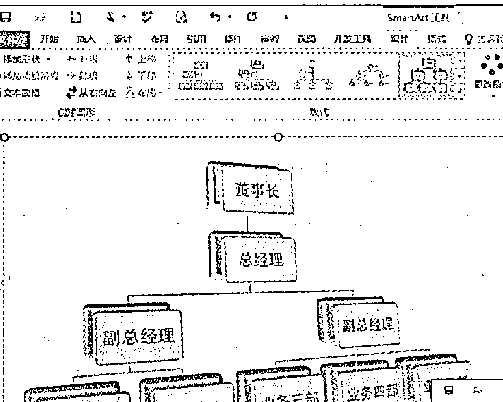


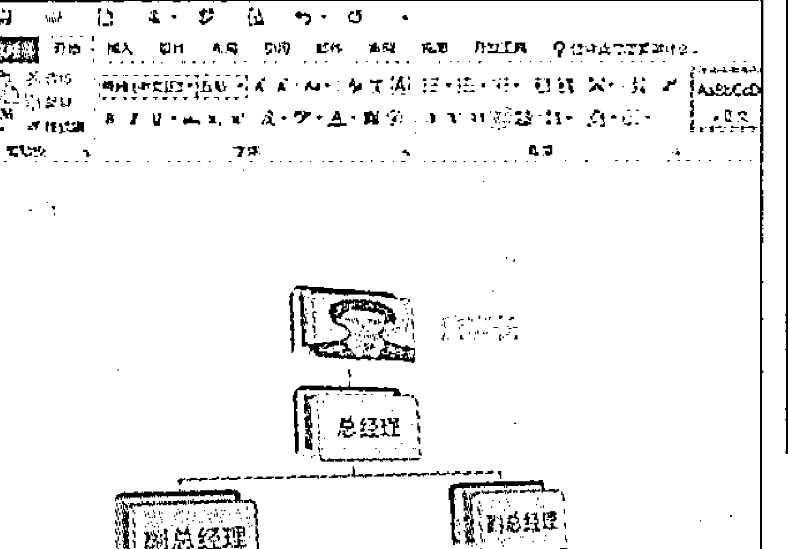

#### 使用照片填充形状

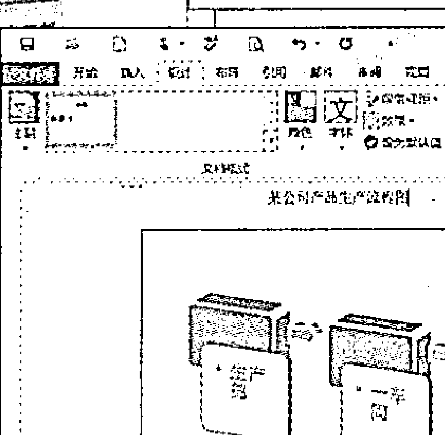

#### 制作流程图

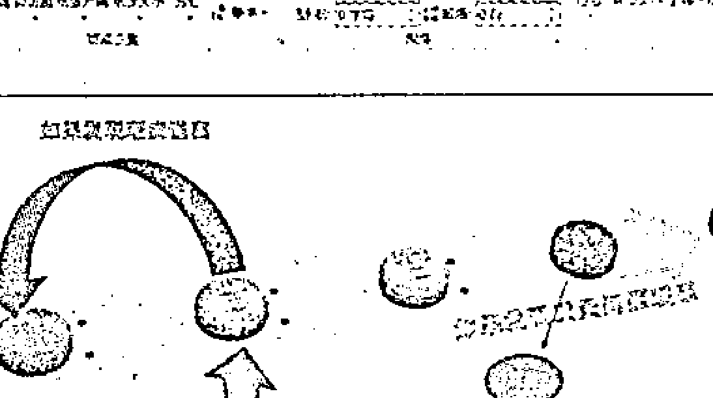

#### 流程图编辑和美化

插入到文档中。选中插入的照片，点击“格式→删除背景”，然后依次点击“要保留的区域”，保留被自动选中的前景，点击“要删除的区域”，删除未被选中的后景色，完成后点击“保留更改”，提取出工作照中的人物图像（图6）。保存提取到的人物照片，切换到组织架构图窗口，选中需要填充照片的对应负责人的形状，点击“格式→形状填充→照片”，然后选择上述提取出来的删除背景的负责人照片。选中一级架构形状，点击“插入艺术字”，在边上插入艺术字作为其文字职务说明。其他负责人的操作类似，这样用户只要从照片就可以非常清楚地知道每个部门对应的负责人了（图7）。

上面介绍了如何使用Word来制作组织架构图，可以看到Word的SmartArt图库里包含很多内置图形，只要加以选择和编辑即可快速生成其他常见图形。比如制造公司常用的生产流程图，同上首先手绘出生产流程步骤图，然后在SmartArt图库里选择适合的流程图，剩余操作同上，即可快速制作出符合要求的流程图了（图8）。

同样对于制作好的流程图，我们也可以利用Word的其他形状进行更为详细的设定。比如在粗加工的阶段，如果发现质量问题需要联系下料并退回重新处理。可以先将流程图设置为3D显示并设置每个阶段使用不同颜色标注。接着点击“插入→形状”，插入一个“上弧形箭头”，将其翻转和旋转一定角度后，使之将“下料和粗加工”阶段连接起来，同时插入艺术字作为说明。操作同上，在其他需要添加形状的阶段添加需要的连接形状和艺术字说明。最后选中插入的艺术字、流程图形状，插入形状，点击“设计→布局→组合→组合”，将它们全部组合在一起，这样就可以完成一份漂亮的流程图了（图9）。

### 巧用PPT制作发声图片

文|马震安

家里或亲戚有小孩的朋友都知道，孩子们学习英文一般喜欢用图、文、声并茂的多媒体教材，这样有助于提高学习的乐趣。但是，现成软件中的素材多数是固定的，只能选择，若想让孩子学习一组指定的单词却无法设置。其实，你完全可以利用自己所学的PPT幻灯片技能，为这些孩子任意制作英语单词发声教材。以下操作要在PPT 2016中完成。

#### 制作单词的声音文件

首先要有单词的读音，如果能在网上找到标准的读音下载最好，如果不能找到或不能下载，那只好自己动手录制了。打开PPT，选择“插入”选项卡，点击“音频→录制音频”，在弹出的面板中按下红色录制按钮，通过麦克风进行声音的录制。录制完成后，点击播放按钮试听，如果满意点击“确定”，否则，点红色录制按钮进行重新录制。确定后，在幻灯片中就会出现一个喇叭图标，点击它可以再次播放，右击这个图标，选择“将媒体另存为”，将声音保存在一个文件中(图1)。

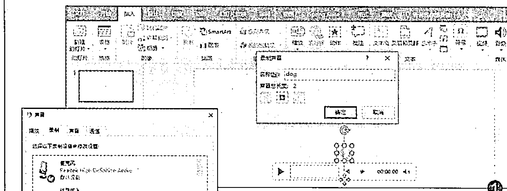

如果觉得自己的发音不太准确，可以利用电脑的内录功能，通过单词发音软件进行声音的录制。要想使用电脑的内录功能，需要进行一些设置。这里以Windows 10下的操作为例进行说明。在屏幕右下角右击“扬声器”按钮，选择“录音设备”，在弹出窗口的“录制”选项卡空白处右击，选择“显示禁用的设备”，就会出现“立体声混音”，右击它选择“启用”、“设置为默认设备”(图2)。

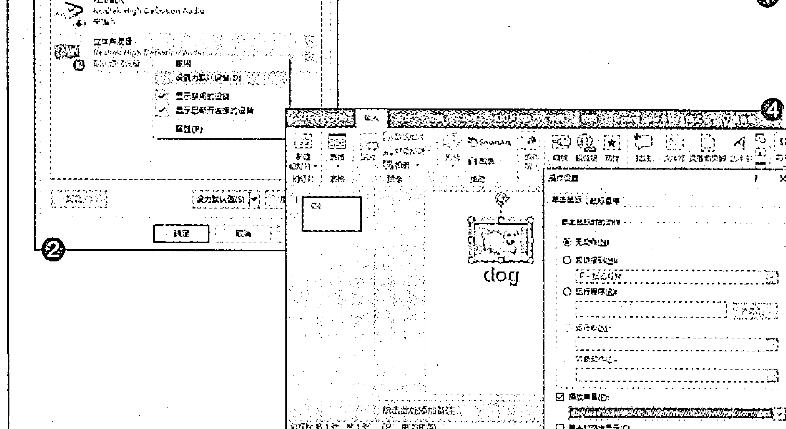

接下来，将打开的PPT缩放到一边，打开有单词发音的软件(这里以有道词典为例)，点击“音频→录制音频”，在出现的面板中按下红色录制按钮，立刻将鼠标移至有道词典的播放喇叭上。播放完成后，按下停止按钮停止录制。将声音保存为一个文件(图3)。

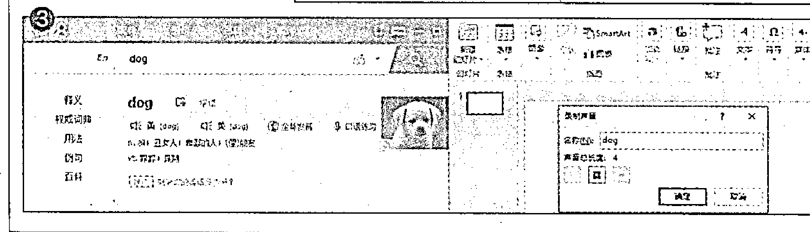

> **小提示**
> 需要将保存好的声音文件的扩展名进行重命名，由“m4a”更改为“wav”。

#### 将声音文件添加到图片

在幻灯片中插入所需要的图片，用文本框或艺术字写出其所对应的单词。选中图片，点击“插入”选项卡中的“动作”，在弹出面板的“单击鼠标”选项卡中勾选“播放声音”，选择“其他声音”，然后选择好录制的声音文件就可以了(图4)。


### 多维条形图 NBA球星数据巧对比

文/马震安

NBA忠实铁粉希望利用图表对所喜爱球星的相关数据进行分析。制作一张多维条形图表，将多位球星的数据进行综合性对比，球星的成绩数据就会一目了然（图1）。

#### 图表行列转换

首先在Excel工作表中收集每位球星的数据，添加辅助列1、辅助列2，每个辅助列中的数据都是其左侧数据与100%的差值，即在C3单元格输入“=1-B3”，向下拖动填充到C7；同样，在E3单元格输入“=1-D3”，向下拖动填充到E7，这样就完成了图表数据的准备（图2）。

数据准备完成后开始着手创建图表。选定A2:F7数据区域，插入堆积条形图表，选中插入的图表，点击图表工具“设计”选项卡中的“切换行/列”按钮，图表的行、列就会进行切换（图3）。

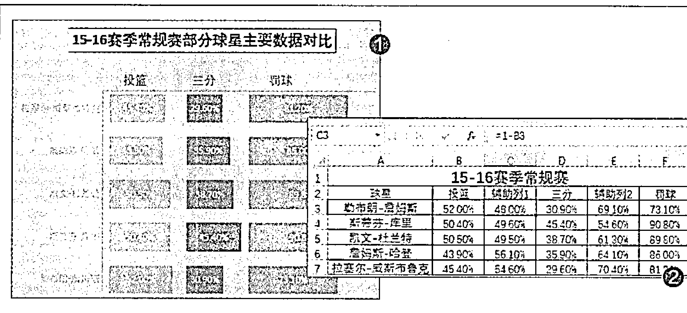

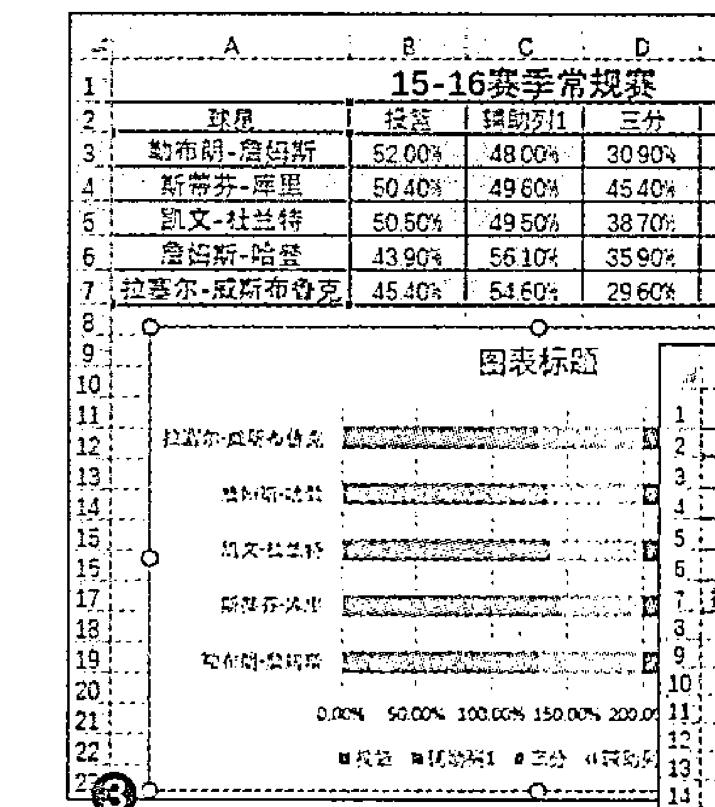

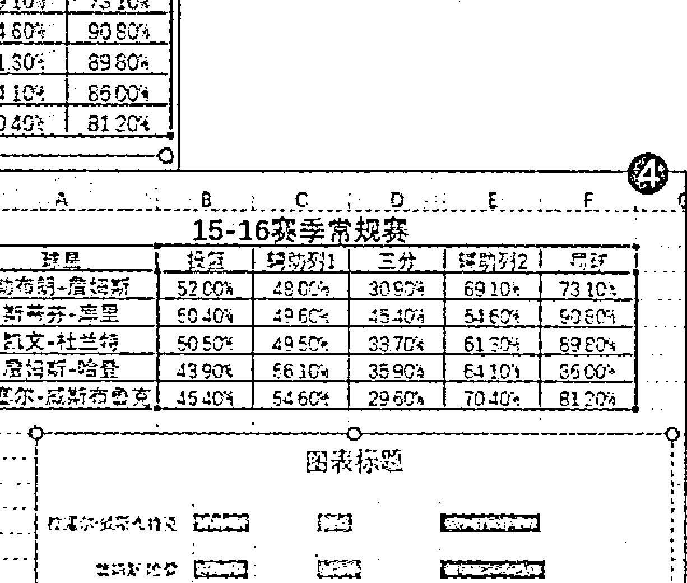

#### 隐藏辅助图表列

双击纵坐标轴，在右侧“设置坐标轴格式”的“坐标轴选项”卡中勾选“逆序类别”，刻度线主要类型处设置为“无”；选中图表中代表辅助列1的条形图，设置它的填充色为“无填充”；同样，也设置辅助列2的条形图填充色为“无填充”（图4）。

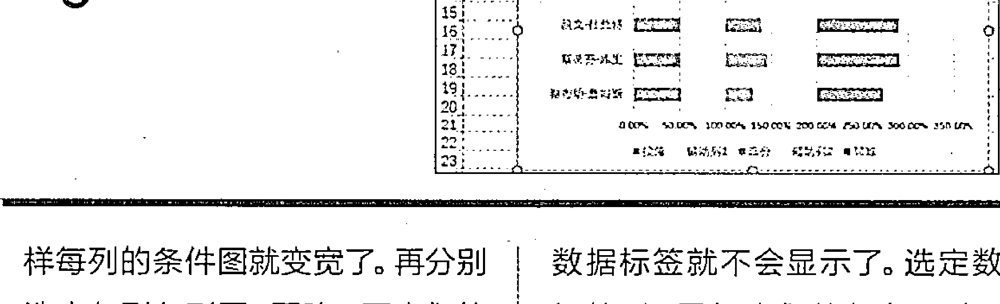

#### 美化图表

最后对图表的格式进行适当的设置。选定图表中任何一列条形图，在“设置数据系列格式”的“系列选项”中，将分类间隔调整到50%，这样每列的条件图就变宽了。再分别选定各列条形图，更改一下它们的填充色。利用图表工具“设计”选项卡“添加图表元素”中的菜单，显示出数据标签，居中，去掉图例，但辅助列的数据标签也会显示出来。这时，可以选定辅助列，在“标签选项”选项卡中，将“值”前面的勾选去除，这样辅助列的数据标签就不会显示了。选定数据标签，设置好它们的颜色。利用文本框在相应的条形图上方输入它所代表的数据名称，修改一下图表标题。当然，也可以利用画一些直线进行装饰。最后把图表、文本框、直线等元素选定，进行组合即可。只要是需要数据直观展示的地方，均可应用本文所介绍的方法。

### 带有演示功能的思维导图轻松做

文/马震安

制作思维导图的工具很多，即便是常用的办公软件如Word、PPT等都能制作，但是它们都有各自的不足之处，比如Word不能演示、PPT的播放也只是线性的，再者就是一些节点的添加与连接也不能做得特别到位。但是，如果使用NovaMind 5制作思维导图，上述所有的问题就迎刃而解了。接下来，我们就利用NovaMind 5来制作并了解一下“简单电路”知识点的思维导图的过程，掌握思维导图的制作方法（图1）。

#### 1. 添加节点

打开NovaMind 5，在默认的第1张幻灯片中有一个“开始”节点，双击这个节点（或者右击它，选择“编辑文本”），输入“简单电路”；在“格式”选项卡，通过各个按钮对这个节点的样式进行设计；当然，也可以通过右击选择相应的菜单（图2）。

接下来，就可以根据设想添加所需要的子节点了。选定第1个节点，在“主页”选项卡点击“子项目”，这时就会从第1个节点引伸出一个子节点；同样，将这个子节点利用“格式”选项卡设计好它的样式，输入节点内容为“电流”，可拖动该节点到所需要的位置；可通过“思维导图设计”来更改连线的样式（图3）。

选定“电流”节点，再接着插入所需要的3个子项目节点，分别为“测量”、“特点”、“概念”，将它们的项目形状设置为“线”，利用“格式”选项卡中的“边框”设置好所需要的颜色、线宽等。

选定“测量”节点，添加2个子项目节点，分别为“仪器”、“注意”，并根据需要设置好它们的样式；选定“仪器”子节点，点击“插入选项卡”中的图片，插入所需电流表的图片，调整插入的图片位置及大小，利用“格式”选项卡设置好它的样式及填充效果。同样，其他子节点的添加与上述操作类似。如果节点的子节点需要进行编号，则需要选择这个节点，点击“格式”选项卡中的“编号”，就会将子节点从上到下自动编号。

#### 2. 折叠节点

在编辑幻灯片的过程中，如果子节点太多，编辑好的节点可以将其折叠起来。选择要折叠的节点，点击其旁边的“-”按钮，就可将其子节点折叠隐藏起来了(图4)。

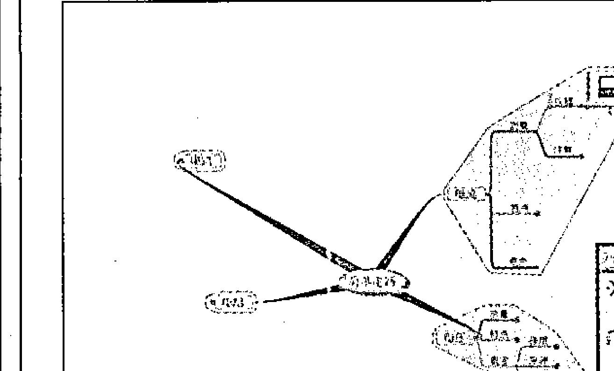

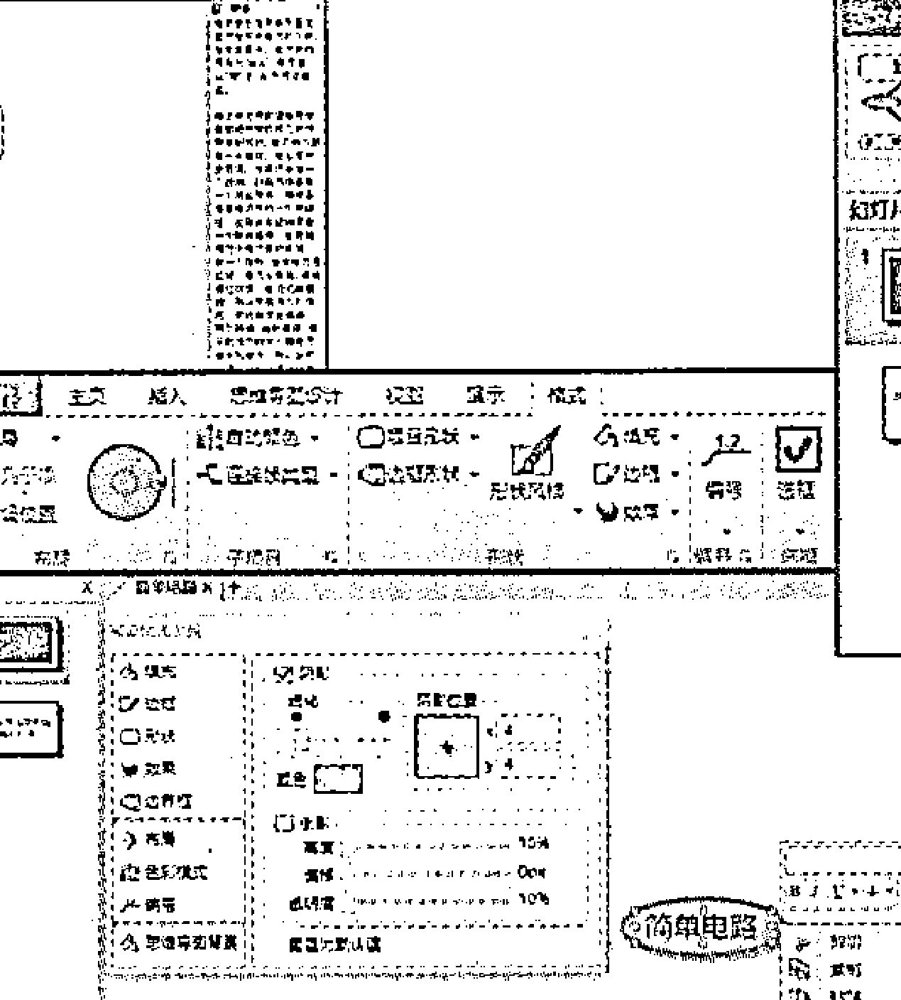

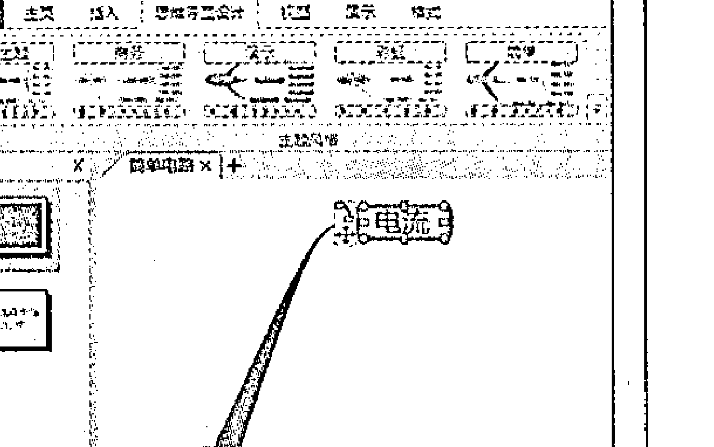

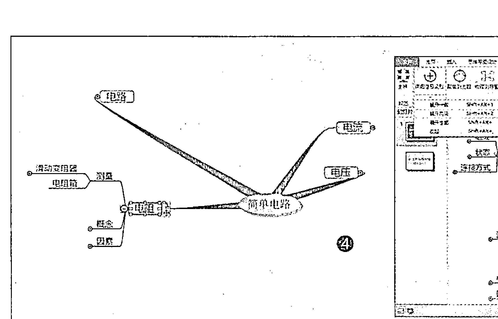

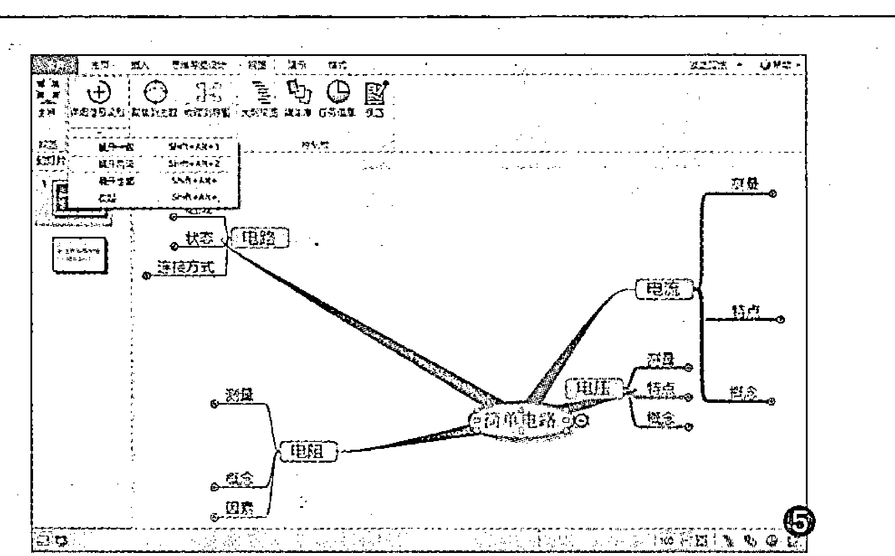

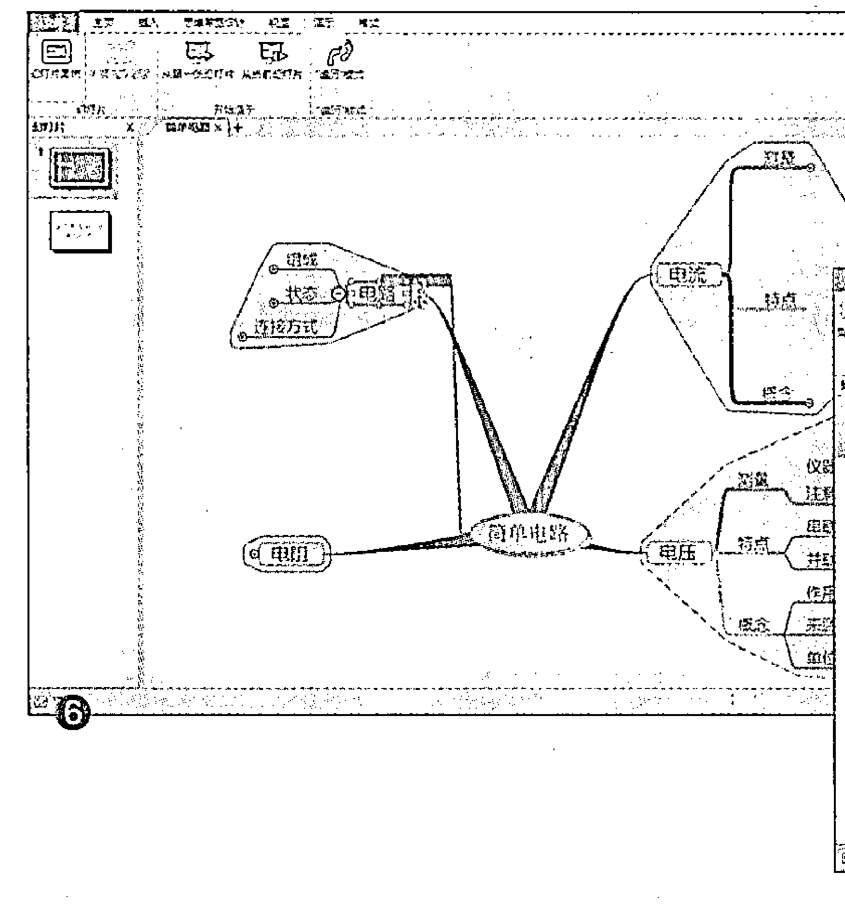

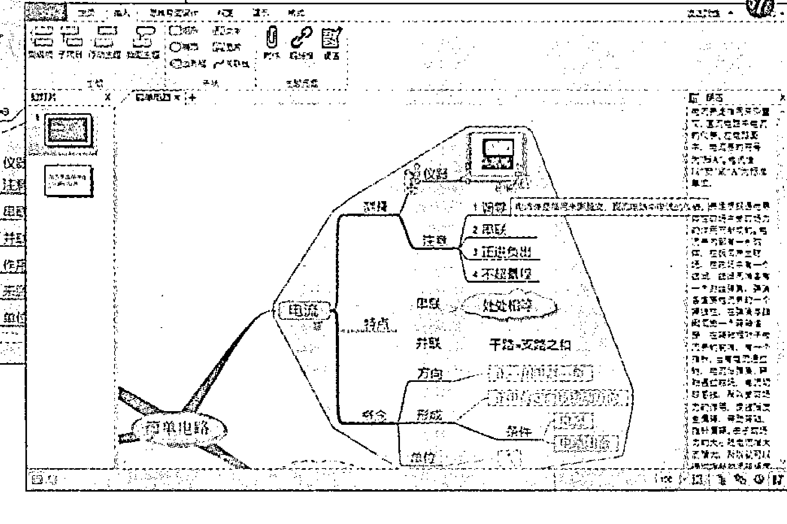

当然，也可以切换到“视图”选项卡，通过“详细信息”处的按钮对子节点的折叠进行控制。通过这些按钮可以一次性地控制所有节点(图5)。

为了使思维导图更加实用，还可以为节点添加边界框来显示该节点的使用范围。当该节点不断展开时，它的边界也进行相应的扩展；当它进行折叠时，它的边界范围也进行相应的缩小。选定需要添加边界框的节点，点击“主页”选项卡中的“边界框”按钮就可以了。当然，边界框也可以通过绘图格式处的按钮设置它的样式(图6)。

> **小提示**
> 如果想改变某个节点子节点的环绕位置，可选定该节点，在“格式”选项卡的“布局”处，点击“布局”按钮选择系统默认的布局方式，或者通过拖动旋转“布局”处的红色按钮来自定义环绕位置。

> **小提示**
> 如果觉得连线和子节点连接的位置有些别扭，可拖动此节点处的红色旋转箭头来更改连线与子节点的连接位置。

#### 3. 添加节点附件

在播放幻灯片时，其中有的节点可能需要链接到一个网址、一个文件或一些详细的资料，这就需要选定这些节点后，点击“插入”选项卡“主题元素”处相应的按钮进行添加。如为“电流—测量—仪器”这个节点添加附件、便签，在播放时，点击节点下的相应按钮就会显示相应内容(图7)。

#### 4. 放映幻灯片

所有节点编辑完成后，点击“演示”选项卡中“开始演示”处的“从第一张幻灯片”，开启遍历模式进行播放就可以了。在播放过程中，可以点击“+”展示相应的节点，并且可以实现幻灯片节点的跳转播放。

> **扩展阅读**
> 其实还可以利用“选框”制作待办事项的文档。每次演示，将办理完的事项勾选上，保存文档后，下次再打开演示时，完成的事项依然处于勾选状态，这对于办公族每日的晨会来说非常方便。

### 利用高级筛选生成最大值表

文|王志军

某学生进行物理实验时遇到一个实际问题，每一个编号的器材都对应3行记录，分别是这个设备的A相、B相、C相的电流值（图1），现在希望将每个编号对应的最大电流值筛选出来，并填充到一个新建的工作表中。数据较多，需要寻求高效的实现方法。

切换到Sheet1工作表，选择需要操作的源数据区域，即A1:A7990单元格区域，在列表字母A名称框输入“名称”，将选区定义为“名称”（也可定义为其他的名称）。点击状态栏的“+”按钮，新建工作表Sheet2，切换到“数据”选项卡，在“排序和筛选”功能组选择“高级”按钮，打开“高级筛选”对话框，设置筛选方式为“将筛选结果复制到其他位置”，在列表区域文本框输入“名称”，条件区域不需要设置。点击“复制到”右侧的浏览按钮，在Sheet2工作表选择A1单元格，勾选“选择不重复的记录”复选框。检查无误之后点击“确定”按钮（图2），很快会将不重复的筛选记录复制过来（图3第一列）。

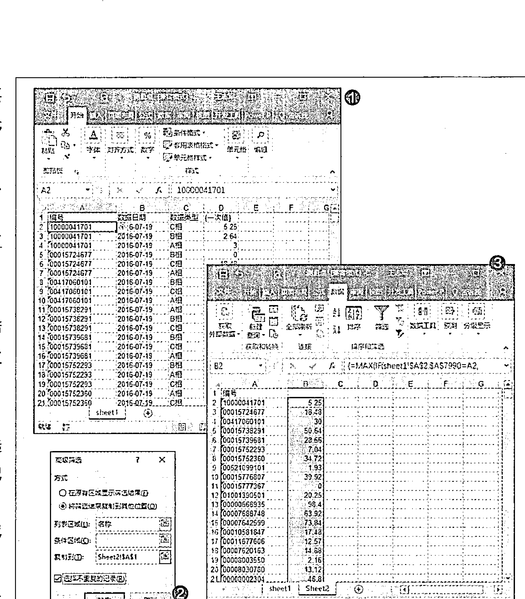

选择B2单元格，在编辑栏输入公式`=MAX(IF(Sheet1!$A$2:$A$7990=A2,Sheet1!$D$2:$D$7990))`，这里使用IF、MAX两个函数进行嵌套。首先利用IF函数判断Sheet1!$A$2:$A$7990是否存在与当前单元格编号一致的编号，如果一致则返回Sheet1!$D$2:$D$7990区域内的数据，也就是满足A2编号的电流值。最后使用MAX函数在符合当前编号条件的数据中找出最大值，按下“Ctrl+Shift+Enter”组合键转换为数组公式，公式执行之后向下拖拽填充柄，很快得到如图3第二列所示的效果，最后对标题栏进行适当设置即可。读者可以分别执行“`=IF(Sheet1!$A$2:$A$7990=A2,Sheet1!$D$2:$D$7990)`”查看公式运行的效果进行研究。

IF函数的语法为`IF(logical_test,value_if_true,value_if_false)`，Logical_test表示计算结果为TRUE或FALSE的任意值或表达式，本文示例为`Sheet1!$A$2:$A$7990=A2`；Value_if_true logical_test为TRUE时返回的值，本文示例为`Sheet1!$D$2:$D$7990`，表示返回同一编号的数据；Value_if_false logical_test为FALSE时返回的值，省略时则返回逻辑值。

> **小提示**
> 本文虽以电流值为例讲述，但对于其他方面的数据统计，只要符合上述形式，均可套用此方法。

### 解决Office超链使用问题

文/何向飞

Office文档中的超级链接本是为便于跳转而设的，但使用过程中有时本不想跳转却无意中触及，会给操作带来麻烦；超链中不美观的下划线如何取消，取消后超链功能还要保留，该怎么做；频频出现的超链无效或安全警告如何解决，这些都是本文要和你探讨的问题。

#### 编辑页面时的超链接问题

Word页面中的网址自动加有链接下划线，但点击无法自动进入网页，怎么办？其实只需先按下Ctrl键，然后点击网址链接，即可用系统当前默认的浏览器自动打开这个网页(图1)。

编辑文档时，有时无意中会点击激活网页，中断正在进行的编辑工作。这时只需用鼠标右键单击超链接，选择快捷菜单中的“取消超链接”即可。这样，无论使用鼠标点击或快捷键组合，网址都不会被激活了。

#### 取消下划线时如何保持链接

如果只是觉得版面上的网址下划线碍眼，希望将其去掉，但连接网页的功能需要保留。也就是说，下划线取消后，仍可以通过Ctrl+点击或直接点击链接上网。这时，在Word中可用Shift和左右光标键选中超链接，再按住Ctrl键点击两次U键（图2）。Excel中则按下Ctrl后单击一次U键即可。

PPT2016中没法用快捷键取消下划线，但可用变通的办法：选中网址后，在“字体”对话框中，先将线型选择为单线，然后将颜色设置为与背景同色，确定即可(图3)。此外，还可以插入文本框后输入网址，设置超链，就没有下划线了。

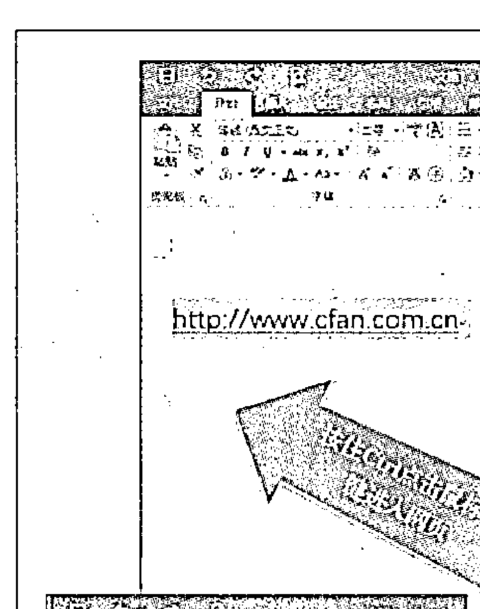

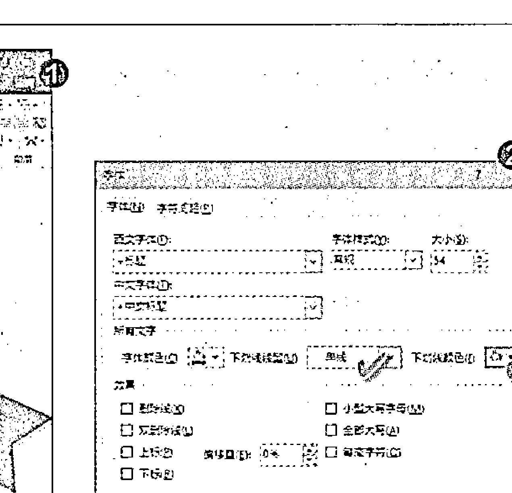

#### Office文档超链接无法打开的解决

有时我们在Word中打开超链接地址时，会出现“由于本地的限制，该操作被取消”的提示，超链无法打开。遇到这种情况，只需进入命令提示符窗口，然后执行下面的命令，确认删除错误的注册表项，问题即可得到解决。

```
reg delete "HKEY_CURRENT_USER\Software\Classes\.htm" /f
```

#### 点击超链接出现安全警告的问题

在Excel中打开连接到其他工作簿的链接时，常常会出现禁止自动更新链接的警告。若遇到此问题，可在Office软件选项窗口中点击“信任中心设置”按钮，选择“启用所有工作簿链接的自动更新”选项即可(图4)。

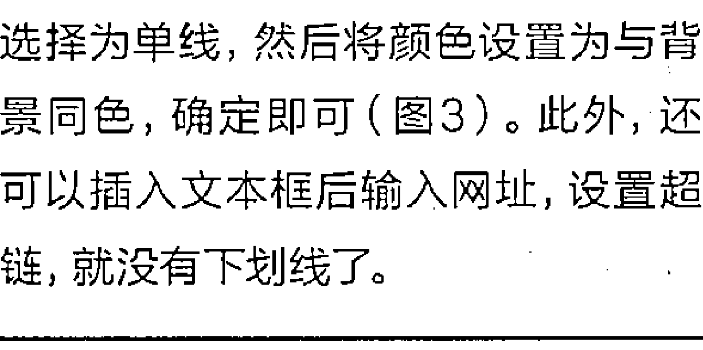

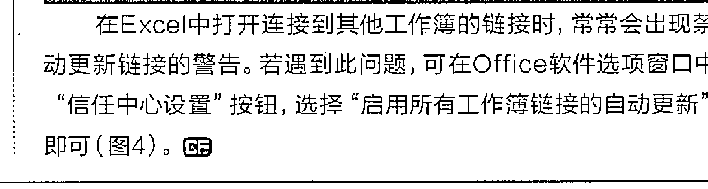

### 实现幻灯片的缩放功能

文|马震安

PPT的播放一般情况下都是线性播放，想要跳转的话，需要加入链接，这就使得使用者的操作有一定的局限性。现在好了，PPT2016新增了“缩放”，其功能特征类似Prezi的zoom功能，不但能够轻松实现幻灯片的跳转，而且能够对幻灯片缩放和部分放大。它包含了三类，分别是摘要缩放、节缩放和幻灯片缩放。接下来，我们就看看如何正确使用PPT缩放。

+   ### 1. 摘要缩放制作

摘要缩放功能是对整个PPT文档而言的，可以将选择的节或幻灯片生成一个“目录”，并自动生成插入在一张新幻灯片。单击节会放大演示，演示完节中的幻灯片返回目录。打开制作好的PPT幻灯片，选定需要在其下面插入摘要缩放效果的幻灯片，点击“插入”选项卡链接处“缩放”下的“摘要缩放”，在弹出的窗口中选择需要作为“目录”缩略图的幻灯片。在选择时，两个被选中的幻灯片将作为1小节（即1组），并将前一个选中的幻灯片作为缩略图（图1）。

点击“插入”后，就会在当前选定的幻灯片下面插入一张新幻灯片，里面包含若干张幻灯片的缩略图。同时，在左边的幻灯片目录窗口，整个幻灯片会根据选择分成若干小节。在新插入的幻灯片中，可以编辑好标题或者插入其他一些所需要的元素（图2）。

当放映幻灯片到这个摘要部分幻灯片时，点击相应目录，就会放大切换到相应小节的第1张幻灯片，当整个小节的幻灯片播放完成后，就会返回到摘要部分幻灯片。

> **小提示**
> 如果想将某小节的某张幻灯片移动到其他小节中，可以在左侧的幻灯片目录窗口拖动所需幻灯片到相应的小节。

+   ### 2. 节缩放制作

要想使用节缩放功能，必须将编辑好的幻灯片先划分成若干小节，否则节缩放功能不能用。要想将幻灯片分成若干小节，可在需要分节的幻灯片间右击选择“新增节”，完成后，再右击新增的节标签，选择“重命名节”，在弹出的窗口中输入该节的标签（图3）。

选择要生成节演示目录的幻灯片（插入节缩放时，不会插入到新幻灯片，而是会生成在当前幻灯片上）。

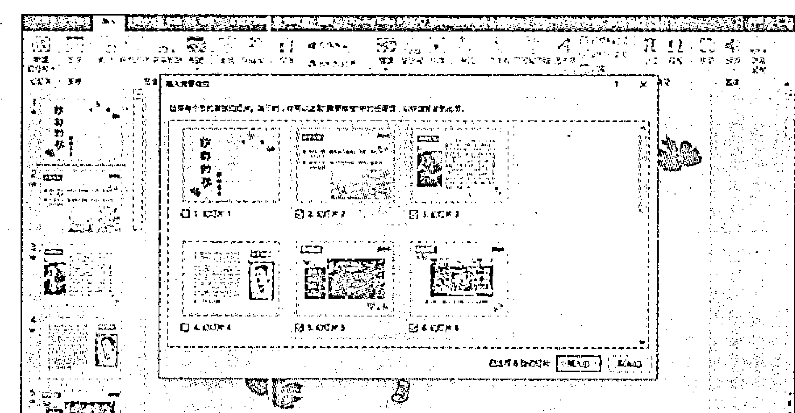

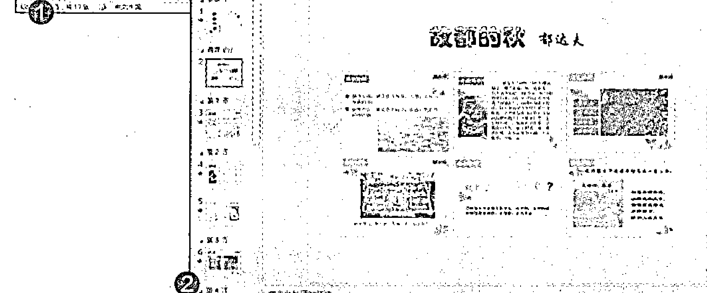

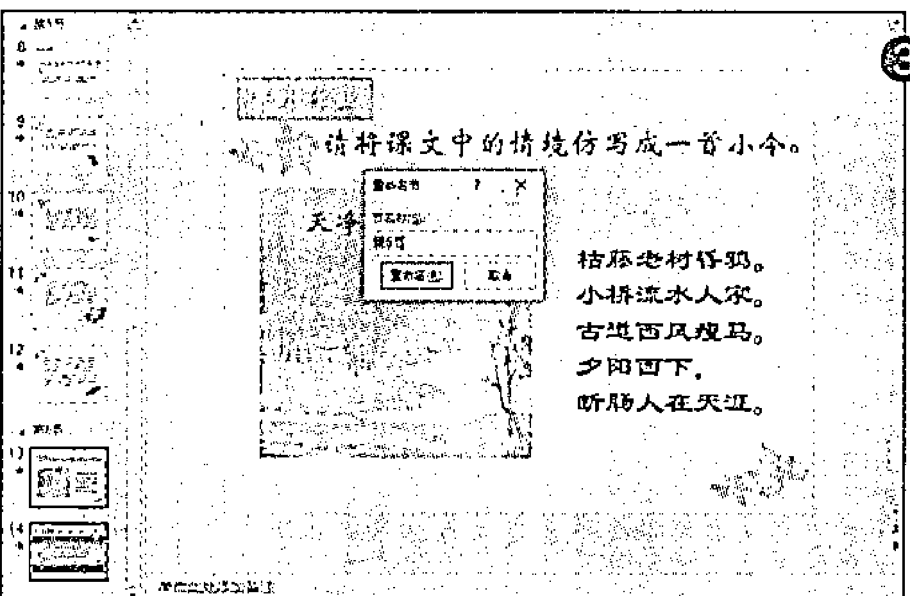

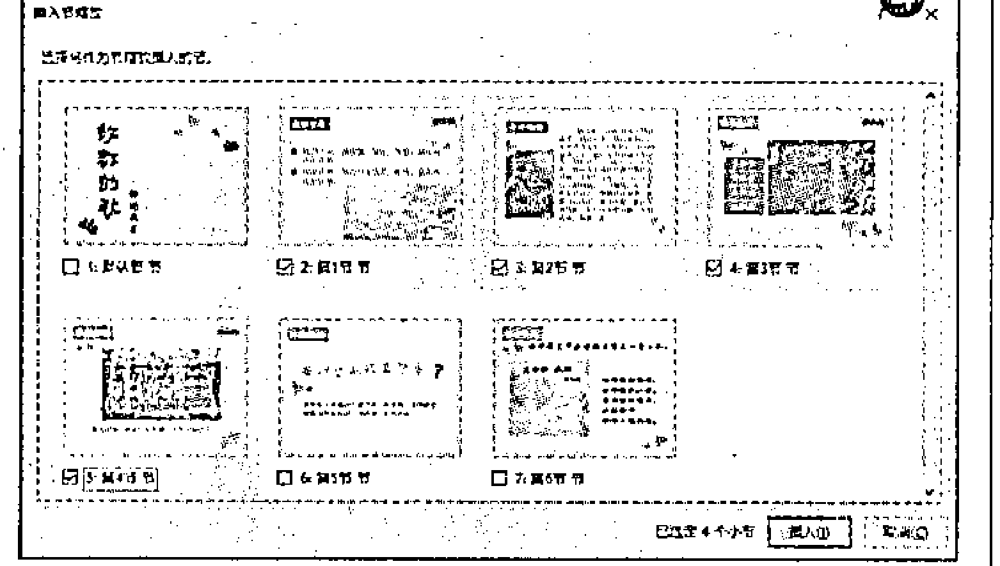

### 3 设计目录幻灯片

无论是摘要缩放的目录幻灯片还是节缩放的目录幻灯片，都可以对它们的样式进行设计。选择目录幻灯片中生成的缩略图，点击“格式”选项卡，利用其中的按钮对其样式进行设置。如果将缩略图旋转一定的角度，在播放时就会产生更加炫酷的效果（图6）。

最后，再提一下幻灯片缩放功能，幻灯片缩放只能选择幻灯片，将所选幻灯片生成缩略图并插入到当前幻灯片上，播放时只能按幻灯片顺序放大演示，演示完返回当前幻灯片。

- 小窍门
在制作幻灯片的缩放时，可以直接从左侧缩略图中拖拽任意页面到右侧编辑窗口的幻灯片中，PPT2016就会自动创建好幻灯片的缩放了。

#### 扩展阅读

利用幻灯片缩放还可以制作局部放大效果。首先，在幻灯片中插入一张图片，最好要高清无码的矢量图；再建立一张空白的幻灯片，里面不需要输入任何东西；在插入图片的幻灯片中，点击“插入”选项卡链接处“缩放”下的“幻灯片缩放”，在弹出的窗口中选择空白幻灯片，并将空白幻灯片缩略图移动到合适位置，比如靠近太阳系的火星；接下来，关键的一步，选中空白缩略图，在“缩放工具”的“格式”选项卡中，点击一下“缩放背景”，这样就使得页面中的空白缩略图透明了。这样一来，切换到缩放目标的时候，仍然能看到底图，同时也实现了镜头转移的效果。同样的操作，新建幻灯片，把其他几个星球的幻灯片缩放做好（图7）。点击播放，就能实现图片的局部放大效果了，同时还可看到镜头摇移效果（图8）。

如果想每展示一个行星后都回到全局，那么就在“缩放工具”中给每个缩放设置“返回到缩放”。

### 快速制作动感H5多媒体演示

文|茴香

如何制作图文并茂的多媒体演示，是时下移动互联网时代许多人都在思考的问题。以本刊CFan网为例，想要将实用性的文章一次性通过官方微信公众号发布出去，此前可能会花费大量的时间制作展示页面和内容超链，但现在只需用H5制作工具便能很好地完成。你不打算试试看？

#### 1.创建目录项目

首先进入WPS秀堂在线页面(http://s.wps.cn)并登录(新注册账号或用QQ、小米、新浪微博等第三方合作账号直接登录)，之后点击主页面上的“我的画册”，然后点击“创建空白画册”按钮，接着选择画册方向(横幅或竖幅)(图1)。
在下级页面中先选择“版式”选项卡，然后再从二级选项卡中选择“目录”一项。这时，在模板页面中可以看到不少现成的目录样式，我们从中选择一个与自己期望的目标大致类似的模板(图2)。双击模板标题，修改为自己的项目标题。下面的各级小标题也可以进行个性化的修改(图3)。

#### 2.编辑动感目录

接下来就在模板的基础上编辑目录内容，制作富有动感的多页演示。
目录模板中的每一处文本内容，实际上相当于我们原来在Word或WPS中排版用的文本框，双击之后均可以修改其内容。此外，还可以通过浮出的工具条进行字体的缩放、设置，并对文字段落进行实时对齐和排版操作(图4)。如果对目录中的文本框形状不满意，可通过点击上面工具栏的“形状”按钮，呼出形状编辑工具栏，点击其中的“更换形状”按钮，在弹出的形状选择列表中选择中意的形状套用(图5)。

目录页面中的项目不是单一静态的，而是可以和目录中的其他页面甚至网上的任何页面发生链接。只需选中需要建立链接的形状，出现二级工具条后，点击“链接”按钮，设置本目录文档的目标目录页面，或指定网页链接即可（图6）。注意，“本文档页面链接”中的页面可通过秀堂编辑页面的左侧栏，点击+按钮进行添加，添加的页面类似于PPT中的新页面。而外部网页链接可以是任意一个可访问的Internet页面链接。

之所以说是动感页面，是因为演示的页面元素还可以加点温馨的动态元素，例如发点红包，从空中纷纷掉下钞票的画面出现。要实现这种效果，只需在当前页面中点击“特效”工具，然后选择特效类型“祝福”，并从中选择“钱”或“红包”之类的选项即可（图7）。而在PPT中，要实现这类时髦的效果，则相对更复杂些。

不但页面可以动起来，页面中的每个元素都可以做成以动画的形式出现。只需点击“动画”工具按钮，然后在右侧窗格中选择希望动态出现的形状，并从下面设置动画出现的形式和开始时间、持续时间、重复次数等，最后点击“添加动画”，即可将动画效果附着在某个图形或文字框之上（图8）。

其他各种部件的制作均可按上述操作方法灵活设置。

#### 8. 发布共享作品

整个作品设置完成之后，点击工具栏上的“更多→预览发布”按钮，设置好作品的“标题”和“描述”内容，点击“发布”按钮即可分享制作好的作品（图9）。分享的接口包括一个网址和一个二维码图片，既可以用浏览器复制地址打开，也可以用手机的扫一扫功能直接扫描二维码访问上述作品。

工具栏上的“更多→预览发布”按钮，设置好作品的“标题”和“描述”内容，点击“发布”按钮即可分享制作好的作品（图9）。分享的接口包括一个网址和一个二维码图片，既可以用浏览器复制地址打开，也可以用手机的扫一扫功能直接扫描二维码访问上述作品。

- 小提示
除了在网页中访问WPS秀堂外，该软件还有桌面版可供使用。与网页版不同的是，只需点击桌面上的WPS H5按钮图标，即可启动WPS秀堂窗口，在其中编辑制作你的作品即可。具体操作与网页版基本相同，不同之处只是它不在浏览器内工作罢了（图10）。

### 媲美PS 巧用PowerPoint处理图片

文|平淡

在日常制作PPT的过程中，我们经常要在PPT中插入各种图片。为了PPT美观少不了对插入的图片进行各种美化处理，传统的方法是借助PS等专业软件进行处理。其实PowerPoint已经自带图片处理功能，可以直接在PPT中对图片进行常见的处理。下面以PowerPoint 2016为例。

#### 简单粗暴 直接套用PowerPoint预设处理效果

经常使用图片处理软件如PS、美图秀秀的用户都知道，为了让用户能够快速实现对图片的单一处理效果，这些软件预设大量的处理模板，如照片虚化、透明度等，这样用户只要简单选取即可实现对应的处理特效。同样的在PowerPoint 2016中也预置大量的处理模板，在PPT中插入图片后只要简单点击即可完成对图片的处理。比如在日常PPT制作中，为了增加对称美感，我们经常要对单一景物的照片进行镜像处理，这样可以获得两张镜像图片。

首先在PPT中插入一张需要处理的图片，接着复制图片粘贴在原图的右侧，使用鼠标拖动图片使两张图片排列整齐。选中复制的图形，展开“格式→排列→旋转→水平翻转”，这样则可以快速创建镜像图片了(图1)。如果是上下镜像，则将复制图片放置在原图下方，将复制图片作“垂直翻转”即可。

继续按住Ctrl键选中两张镜像图片，点击“排列→组合对象→组合”，两张镜像图片就合二为一了。同样的对于其他类似图片的处理，我们也可以直接展开对应的处理组件进行快速处理。比如要实现对图片进行类似虚化、纹理化处理，只要在PPT中右击图片选择“设置图片格式”；展开右侧的“艺术效果→预设”，按自己的需要选择一种特效进行处理即可(图2)。

#### 巧妙组合 轻松处理复杂特效

使用预设模板处理图片虽然简单，但是对于一些比较复杂的图片处理特效就无能为力了。对于这类图片的效果处理，我们可以利用PPT的各种组合工具进行处理。比如在日常制作一些促销PPT文档的时候，为了获得更为震撼的效果，我们经常要插入一些撕裂字的图片，这样可以给观看者更大的冲击力。在PPT中借助“艺术字+插入形状+格式+组合”工具即可实现撕裂特效。

新建一个幻灯片，点击“格式→形状填充”，将幻灯片的背景色填充为比较醒目的黑色。继续点击“插入→艺术字”，按提示分别插入需要进行撕裂效果设计的艺术字。为了方便处理，每个艺术字需要单独输入，并且调整好旋转的角度和大小，同时艺术字之间的间距设置得大一些（图3）。

选中艺术字“史”，点击“插入→形状→自由曲线”，然后按照自己的需要在“史”字中间划分出一个撕裂效果封闭自选形状（将“史”一分为二）。选中艺术字和自选形状，按住Ctrl+Shift拖动复制一份到右侧备用（图4）。

继续选中艺术字“史”和自选形状，点击“格式→合并形状→相交”，这样就可以获得“史”的左半部；选中复制到的艺术字“史”和自选形状，点击“格式→合并形状→剪除”，这样可以获得“史”的右半部。接着按自己的需要将获得的“史”的左半部和右半部拼接起来，这样就获得“史”的撕裂效果。其他字体的撕裂效果操作类似（图5）。

完成所有图片撕裂效果的设置后，按Ctrl选中背景和所有撕裂字的艺术图片，点击“格式→组合”，这样就可以完成撕裂字的设置了（图6）。

当然，使用类似的组合操作实现复杂特效在PPT中还有许多，PowerPoint 2016中包含丰富的图片处理组件，大家可以举一反三进行其他更多的图片处理。比如在制作一些PPT的时候，为了突出前景人物，我们经常需要对照片的背景进行虚化，现在借助“去除背景+虚化+组合”工具即可实现。

在PPT中插入需要处理的照片，选中照片后点击“格式→艺术效果→虚化”，然后按自己的需要调整虚化的参数将其作为背景图。新建幻灯片再插入同一张图片，点击“格式→删除背景”，此时大部分背景区域会被自动选中。依次点击“标记需要删除的区域”和“标记需要保留的区域”，删除背景和保留前景人物区域（图7）。

完成区域的标记后点击“保留更改”，这样即可将图片中的前景人物“抠”出来。按提示复制提取出来的人物照片，然后粘贴到前面处理过的虚化照片中。选中两张图片，点击“格式→组合”，这样一张前景突出、背景虚化的照片就完成了（图8）。

### 手把手教你制作Excel动态表头

文|经九

在日常我们使用Office的时候，大家都知道一般制作Excel表格都要自己手动来制作表头，工作不多的时候还好，可是如果图表数量庞大一些就难免会出现疲劳的感觉。尤其当出现很多相似表格的时候，或者遇到有规律可寻的表格，除了一般性的复制粘贴方法之外，我们还可以通过动态表头的制作来提高效率，避免拖沓冗长，并且同时还可以减少不必要的错误发生。通过对象格式属性的设置，以及配合公式的使用就可以实现事半功倍的效果了。

下面我们先创作一张崭新的工作表，那么先把它命名为“调整表1”。然后，在A1的单元格中输入年度，再在C1的单元格中输入一下月份（图1）。之后在A2的单元格里面输入目的地公司的名称，比如×××公司，并单击插入的选项，然后再点击一下微调框的按钮，在紧靠B2的单元格后绘制一个微调框的对象，用来输入年份。相同的条件下，在C2的单元格里是显示月份的，那么在紧靠着C2的单元格子后面再绘制一个微调框（图2）。然后右击一下微调框1，选择设置对象的格式，会弹出一个对象格式的对话框，单击一下“控制”里面的选项卡。在当前值的框中输入一个默认的年份，比如2016，然后在最小值和最大值的框里面输入一下此年份的上限和下限，步长里面选择1，在单元格的链接框里面输入一下要显示年份的单元格的绝对地址，比如$B$5。设置完成以后单击一下确定，这样微调框1和B2的单元格就链接好了。类似的情况，也可以将微调框2和C2的单元格链接起来，然后将B2和C2向左对齐一下就可以了（图3、图4、图5、图6、图7）。

接下来需要打开一下模板表格里面的工作表，选中一下A1，在表格的标题位置处输入一下公式“=动态调整表!A2&动态调整表!B2&”年”&动态调整表!C2&”月提成统计表”，然后按下回车键，再设置好标题的格式。

这个时候，我们就可以随心所欲动态地调整表头时间了，如图所示那样，是不是很方便呢（图8）？

其实对于Office一族来说，很多软件的应用并不难，但难在效率的把控上，找准方法，对于我们的Office工作可以起到一个完美的事半功倍的效果，留出来的时间可以再继续其他的工作。Excel调整和制作动态的表图，这个方法可以完整地运用到各种工作图表中，从而节省大部分的工作时间，快快学习起来吧。

### Word+Excel 理清混乱的信息

文|愚人

在日常工作中我们经常要对数据进行整理，一些数据由于原始录入时没有按照一定的标准输入，这样在后期整理时就显得比较麻烦。比如笔者所在公司人事部的MM，在招聘现场记录招聘人员信息时为了图快，直接在记事本使用“人名+电话号码”的方式记录大量招聘人员的信息（图1）。现在回到公司后MM需要在Excel中按照“人名+电话号码”各一列的方式重新整理，因为人员信息较多，重新录入工作量就较大。现在借助Word和Excel即可快速整理数据（本文中所有电话数据皆为自动填充的数据，纯为杜撰）。

首先在记事本全选复制上述数据，打开Word 2016后将其粘贴到新建文本文件中。点击“替换”，在弹出的查找与替换窗口，查找的内容输入“[0-9]{1,}”，[0-9]的意思是查找数据中包含0-9的数字（因为用户的电话号码都是由这些数字组成的）。{1,}表示查找一个字符以上的字符串，这里大家可以根据实际数据情况进行特定数据的查找。比如要查找身份证号码，则使用“[0-9X]”（因为有些用户的身份证会包含x字符校验码），要查找用户的英文用户名称则使用“[a-z]{1,}”（英文用户姓名由a-z组成）。单击“更多”按钮，展开下拉窗口，勾选“使用通配符”，切换到“替换为”输入框，点击“替换”选项的“特殊格式”，在展开的通配符列表依次点击“制表符”、“查获内容”、“段落标记”，即输入“^t^&^p^”。其中“t”是制表符，表示在将找到的电话号码前加上制表符，即将姓名和电话号码使用制表符隔开，这样就可以将姓名和电话复制到Excel的两列中。^& 表示查找的字符，查找什么数据就代表什么类型数据，这里指用户电话号码数据。^p是换行符，意思是在找到符合要求的数据后另起一行，前后用户信息各以一行排列。最后点击“全部替换”（图2）。这样完成替换后在Word中就可以看到原来杂乱的数据变为“姓名+制表符+电话号码”的格式，接下来将整理后的数据复制到Excel中即可（图3）。启动Excel，选中两列用于存放上述数据，右击单元格选择“设置单元格格式”，在打开的窗口中将格式设置为“文本”，这样电话号码不会变为默认的数字（否则手机号码默认会以科学计数法显示，图5）。

返回Word窗口，全选处理后的数据选择“复制”，切换到Excel，右键单击A2单元格，在粘贴选项中选择“匹配目标格式”，这样数据就粘贴到Excel的列中了（图6）。由于手机号码都是11位数字，为了防止在手工录入中遗漏手机号码的数字，在Excel中还可以使用Excel中的数据有效性来查错。选中B2，点击“数据→数据验证”，在弹出的窗口中，验证条件选择“自定义”，在公式栏输入“=AND(LEN(B2)=11,ISNUMBER(B2),MOD(B2,1)=0)”，这个公式有三个条件，AND(LEN())表示输入数据长度必须为11位，多余或者少于该长度都是错误数据，ISNUMBER表示输入数据为数值，MOD表示输入数据必须为整数，不能带小数点。勾选“对有同样设置的所有其他单元格应用这些更改”，将公式填充到电话号码这列的所有单元格（图7）。

返回Excel窗口，选中B列，这样Excel会对电话号码这列数据进行校验，点击“数据→数据验证→圈释无效数据”，这样所有错误的电话号码都会被红色圈记标识出来，按提示进行更改即可（图8）。设置上述校验公式后，以后如果要在上述文件中继续添加用户电话号码，只要输入的位数不是11位，Excel都会自动弹出提示，提醒我们这里输入了错误的数据（图9）。

- 小提示：我们也可以根据实际情况灵活使用通配符，比如为了保护员工的隐私，在公布一些员工信息如公司年会中奖时，需要隐藏员工的手机号码信息。此时只要在查找框输入“(1??)????(????)”，即查找所有1开头的电话号码，前后括号标识的字段保留原样，在需要替换内容框输入“\1***\2”。这里“\1”是指查找内容中的第一个表达式，“\2”是指查找内容中的第二个表达式，这个保留原样，将中间字段（4位数字）替换为“****”，最后单击全部替换即可（图4）。

```
=AND(LEN(B2)=11,ISNUMBER(B2),MOD(B2,1)=0)
```# 制作随鼠标而动的动态图表

文/马震安

以前我们常用表单控件来制作动态图表，通过选项按钮、下拉列表等控件来控制图表的互动。而在下面的实例中只需要鼠标来到相应单元格，不用点击，即可使图表发生动态变化（图1）。操作更加简单了，但实现起来容易吗？让我们在Excel 2016中试试看吧。

#### 1. 巧用简单自定义函数

我们以球员得分数据表为例，打开数据表，整理好数据。

随后点击“公式”选项卡中的“定义名称”，新建名称分别为“姓名”、“数据”，引用位置分别选择J2、K2的两个名称。点击“开发工具”选项卡打开VBA编辑窗口，点击“插入→模块”，在右侧的代码编辑区输入图中的两个简单自定义函数即可（图2）。

接下来，在J9单元格输入“=IF(ISERROR(HYPERLINK(hl($A$1))),$A$1,HYPERLINK(hl($A$1)))”，在J10单元格输入“=IF(ISERROR(HYPERLINK(hl($A$7))),$A$7,HYPERLINK(hl($A$7)))”，J11到J13单元格中的公式依次类推，这样在J9、J10、J11、J12、J13就会显示NBA球员姓名，同时也实现了当鼠标放到J9、J10、J11、J12、J13单元格时，J2单元格就会出现相应的行号值；同样，在K8单元格输入“=IF(ISERROR(HYPERLINK(hl(B$1))),B$1,HYPERLINK(hl(B$1)))”，L8单元格输入“=IF(ISERROR(HYPERLINK(hl(C$1))),C$1,HYPERLINK(hl(C$1)))”，M8到O8单元格中的公式依次类推，这样在K8、L8、M8、N8、O8就会显示各项参数名称，同时也实现了当鼠标放到K8、L8、M8、N8、O8单元格时，K2单元格就会出现相应的列号值；在L1:P1输入相应赛季，在L2单元格中输入“=OFFSET($A$1,COLUMN()-12+$J$2,$K$2)”。

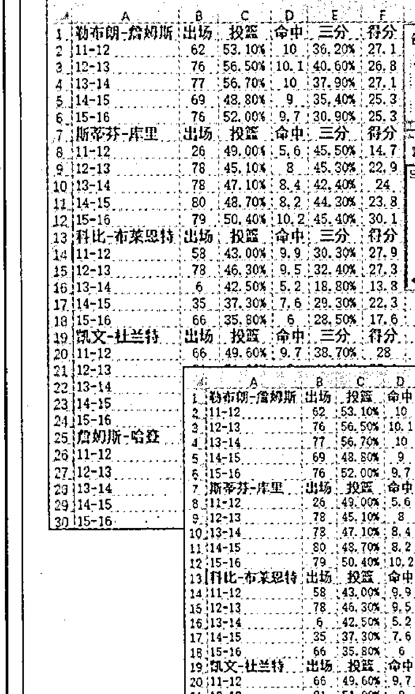

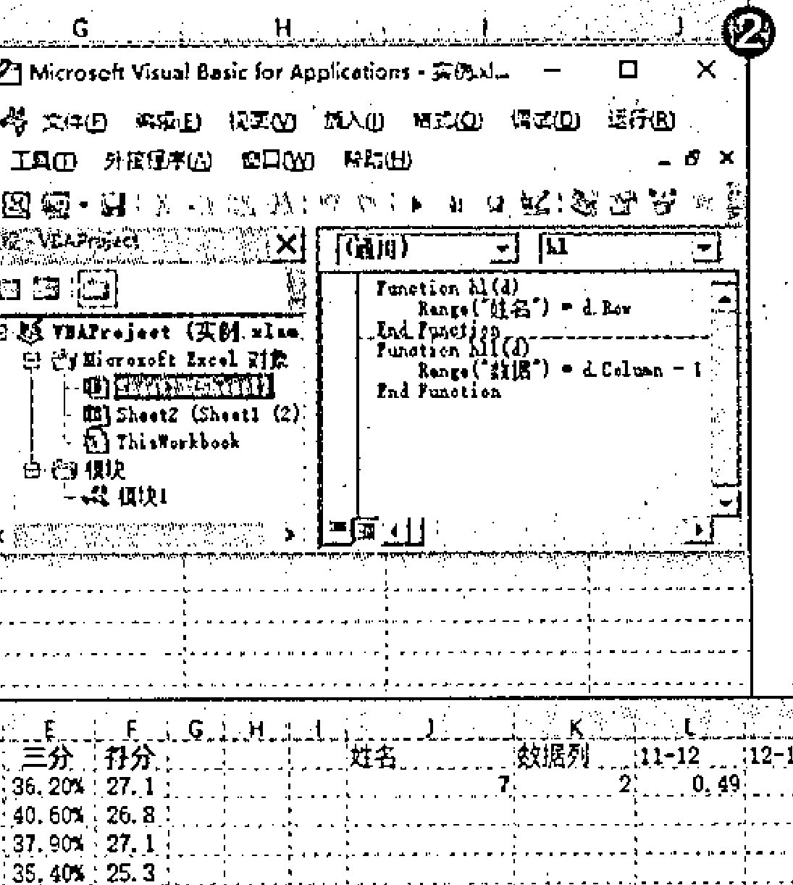

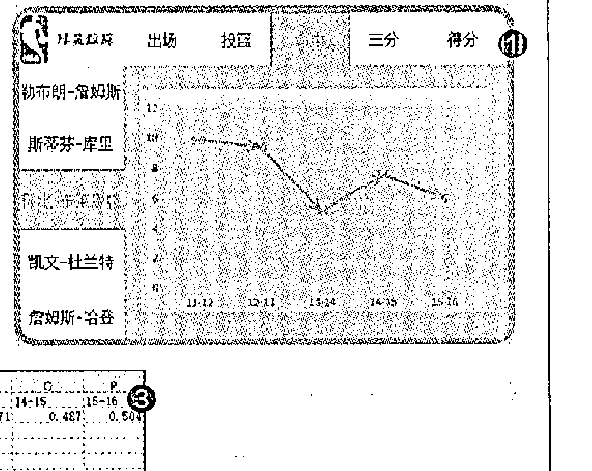

| 姓名 | 数据 | 11-12 | 12-13 | 13-14 | 14-15 | 15-16 |
|------|------|-------|-------|-------|-------|-------|
| 勒布朗-詹姆斯 | 出场 | 62 | 76 | 77 | 69 | 76 |
| 勒布朗-詹姆斯 | 投篮 | 53.10% | 56.50% | 56.70% | 48.80% | 52.00% |
| 勒布朗-詹姆斯 | 命中 | 10.1 | 10.1 | 10.0 | 9.7 | 9.7 |
| 勒布朗-詹姆斯 | 三分 | 36.20% | 40.60% | 37.90% | 35.40% | 30.90% |
| 勒布朗-詹姆斯 | 得分 | 27.1 | 26.8 | 27.1 | 25.3 | 25.3 |

> 小提示

HYPERLINK函数具有链接跳转功能，整个IF函数语句就是根据ISERROR()函数的值，如果是错误值就显示相应单元格的值，否则就在J2或K2中显示相应的行列号；而OFFSET函数是以A1单元格作为参考系，向下移动COLUMN()-12+$J$2行，向右移动$K$2列，其中COLUMN()表示当前列号，即L列的列号为12，M列的列号为13。名称的引用位置也可根据需要自己设置，以上涉及到的公式也可在自己所需要的单元格中输入。

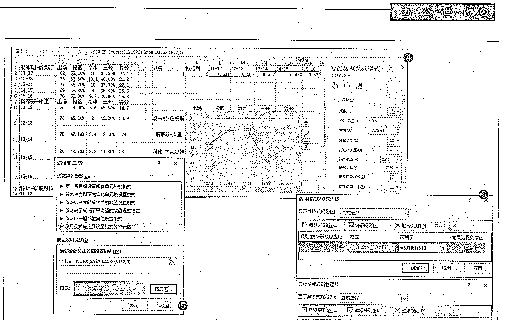

#### 2. 为数据区域添加图表

选定好L1:P2数据区域，插入数据点折线图。根据需要设置好折线图的线条样式、绘图区的背景色；另外，将折线图调整好大小，拖放到显示姓名和各项参数名称所围成的单元格区域，并设置好折线图放置处单元格的填充色（图4）。

#### 3. 设置指定单元格效果

当鼠标移动到相应单元格，除了能获取相应数据，最好单元格还可以有填充色的改变。选定J9:J13，点击“开始”选项卡中“条件格式”下的“新建规则”，在弹出的窗口中点击“新建规则”按钮，再在新弹出的窗口中，规则类型处选择“使用公式确定要设置格式的单元格”，在“为符合此公式的值设置格式”处输入“=$J9=INDEX($A$1:$A$30,$J$2,0)”。点击“格式”按钮，在弹出的窗口中设置好单元格所需要的格式（图5）。确定后返回“条件格式规则管理器”，在新建规则的“如果为真则停止”处进行勾选。同样道理，选定K8:O8，新建规则，公式处输入“=COLUMN()-$K$2=10”（图6）。通过这样的设置，就实现了当鼠标移动到相应单元格时，单元格就进行颜色的填充、边框颜色的改变及文字颜色的改变。

> 小提示
在设置规则格式时，单元格的填充色最好与图表背后单元格区域的填充色一致，这样实现起来效果更加逼真。

#### 4. 对图表进行必要的装饰

为看起来更加美观，需对图表进行一些必要的装饰。插入1个“形状”中的圆角矩形，调整其大小使其比姓名、参数名、图表区稍大些，设置其填充色为无，线条宽度5磅，颜色与单元格填充色一致。将J9:J13单元格横线颜色设置为白色，K8:O8单元格竖线颜色也设置为白色，在J8单元格插入装饰性的图标或文字（图7）。

## Word图文上叠文 要美观还要稳定

Word中插入图片非常容易，但要在图片之上添加文字注释，一是颜色不容易协调，二是在编辑操作时容易跑版，不好控制。用“悬浮”、“透明”和“组合”三技合一，可以实现美观和牢固的图片文字叠加效果。

### 1. “悬浮”分层次

在含有图片的Word版面里，需要在图片上面标注文字。先插入一个文本框，选中文本框，从“格式”菜单下选择“更改形状”命令，然后从下拉菜单中选择一种自己中意的文本框形状（图1）。

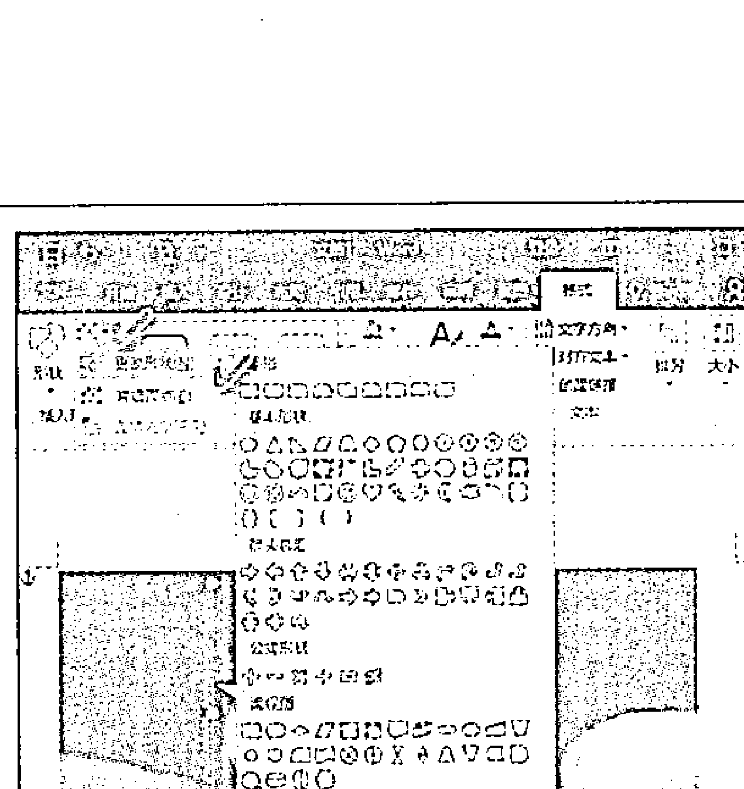

移动文本框的位置，更改其大小，双击输入和编辑文字。对于位置的精确微调，这里有一个小窍门——用“Ctrl+箭头”组合键进行调整（图2）。右键单击文本形状并选择“浮于文字上方”（图3）。

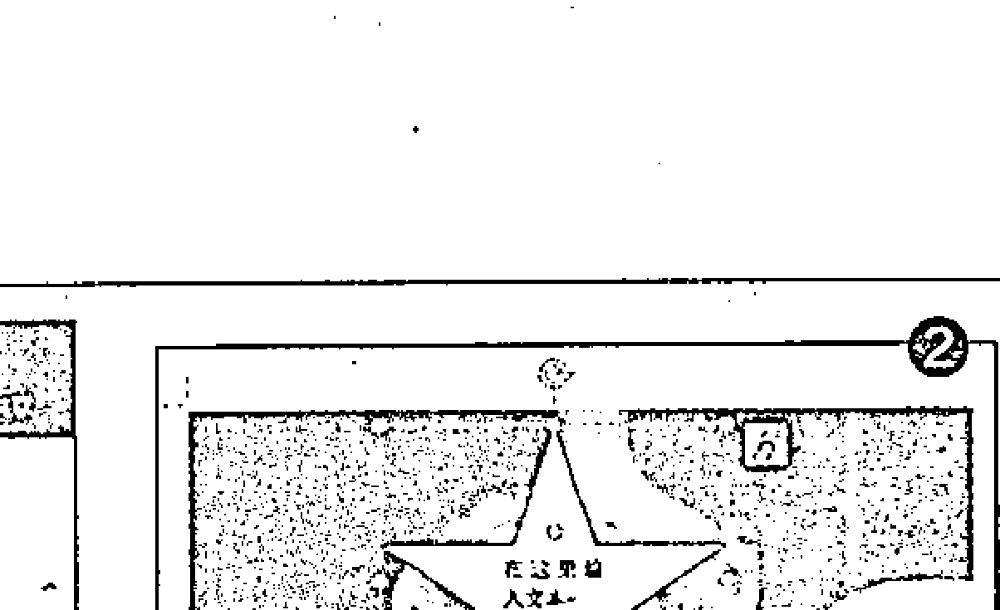

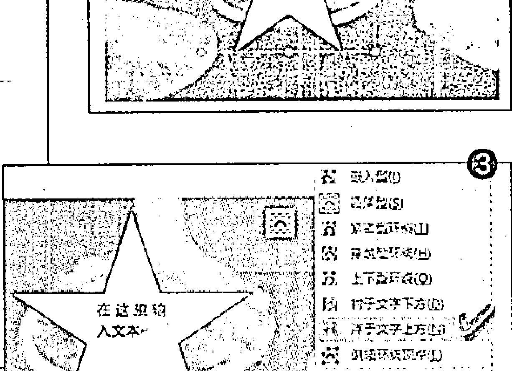

> > **小提示**
>
> 页面中的图片要提前设置为“浮于文字下方”，否则会遮盖掉文本框。

### 2. “透明”巧融合

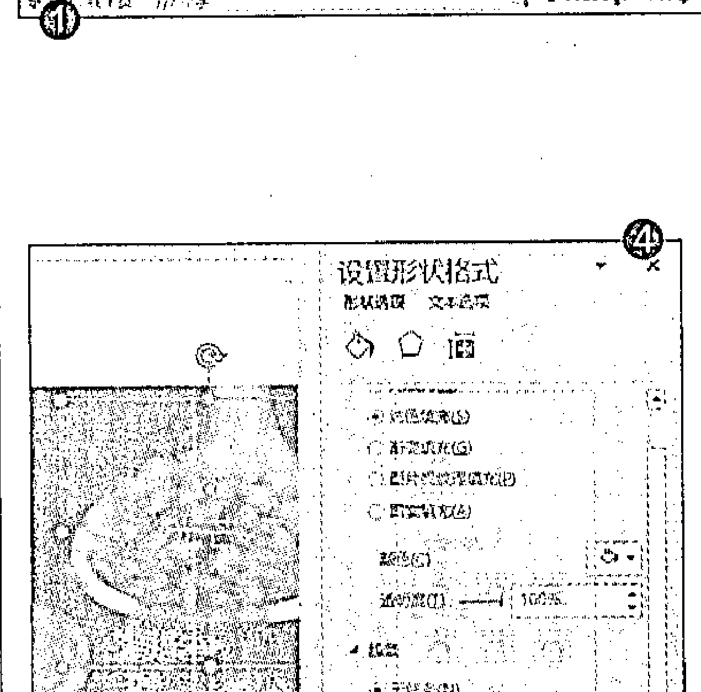

如果觉得文本框的形状和底色比较碍眼，可将其去掉。右键单击文本形状，之后从右侧对话框中设置形状格式，将“透明度”设置为100%，将“线条”设置为“无”；然后在“文本选项”中设置文字的颜色（图4）。

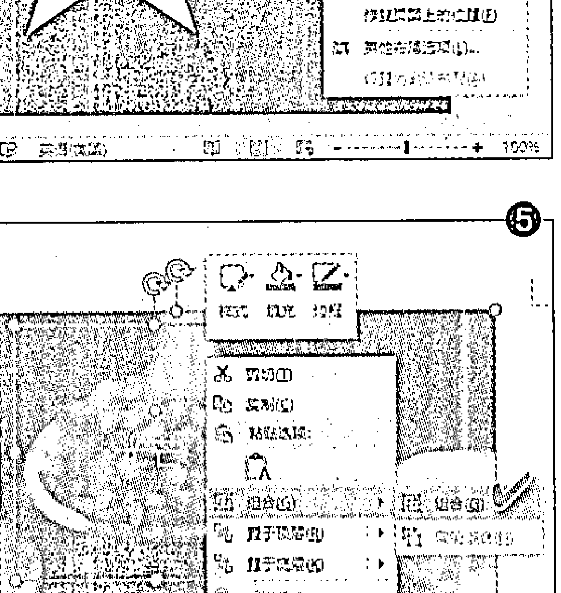

### 3. “组合”求稳定

操作过程中你可能会发现，随着版面的调整，辛辛苦苦设置好的图片文字会在不经意间“跑掉”。其实，只需将文字框和图片全部选中之后，右键单击选择区，依次选择菜单命令“组合→组合”，这样让图片和文本框成为一体，就不会跑版了（图5）。

> > **小提示**
>
> 不单单是图片和文本框可采用这种组合形式，文档中的其他对象，只要涉及到版面的立体层次关系，都可以采用编辑后组合的方式。当然，若发现不合适，还可以解散组合后再编辑、再组合。

## 翘图效果幻灯片DIY

文/马震安

在PPT幻灯片中，图片的阴影效果一般能让人产生立体的感觉。虽然PPT中自带了一些阴影效果，可以很方便地使用，但在实际使用中，PPT自带的阴影效果往往不能令人满意，这时，我们可以自制图片翘起的阴影效果，使图片看起来不但具有立体效果，而且还新颖别致（图1）。

首先，在空白幻灯片中插入所需图片，调整好图片大小。利用“插入”选项卡，插入一个黑色长条的矩形，无边框，矩形长度要小于图片长度，并摆放好矩形与图片的位置（图2）。

接下来选中矩形，右击选择“编辑顶点”，将鼠标指针放在矩形下方中间处，这时鼠标指针变成“+”状，右击选择“添加顶点”，向上拖动这个新添加的顶点（图3）。

然后在空白处点击一下，确认形状的变形。选中变形后的矩形，选择“格式”选项卡，在“形状效果”里点击“柔化边缘”、“10磅”。选中柔化后的矩形，右击选择“设置形状格式”，在“填充与线条”选项卡的“填充”处，透明度设置为40%（图4）。

选中处理好的矩形，调整其大小与位置，右击将它置于底层，使它置于图片下方，调整好位置，使效果更加逼真，如图1所示。


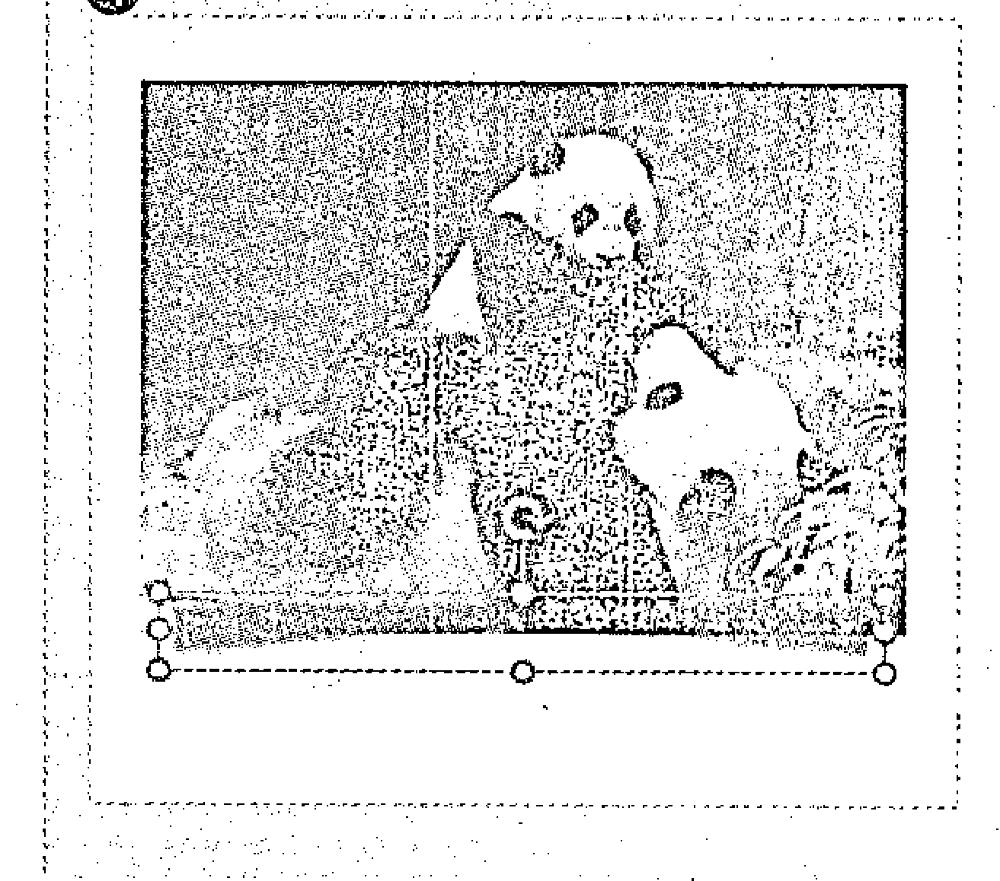


> 应用扩展

当然，也可以利用这种方法制作一个标签一边掀起的效果。只不过需要将绘制好的矩形通过调整其顶点后改变形状，再柔化，改变填充透明度，置于底层并摆放好位置就可以了（图5）。

## Word表格也能“飞”起来

文/刘飞

在表格操作与数值计算方面，Excel要比Word更显高效。然而Word表格其实也蕴含着许多操作技巧，熟练掌握之后，效率也会超高的。

### 1. 快速制作表格

#### 快速克隆制作

Word中制作表格莫过于在模板的基础上通过“克隆”快速生成表格。为此，先将光标定位在文档中需要插入表格之处。接下来依次选择菜单命令“表格→快速表格”，在弹出的表格模板列表中选择与自己期望值最接近的表格模板（图1）。之后，如果对表格的某些部位不满意，可在选中表格后，通过“设计”和“布局”两个菜单下的设计和布局修改工具按钮，对表格进行局部修整。

#### 快速自动填写

总觉得Excel中的自动填充很给力，Word中却感觉无从下手。其实，Word照样可以自动填充。例如，要给61班的学生编号，分别为611、612……，默认的Word编号样式中只有1、2……这样的编号。这时，在Word表格里选中要填入序列内容的单元格，单击“开始→段落”功能组中的“编号”设置列表，选择“定义新编号格式”选项，在“定义新编号格式”窗口中先在“编号样式”栏选择“无”，然后在“编号格式”栏内输入61，光标置于61之后，选择“编号样式”为“1,2,3…”，单击“确定”退出，就可以看到表格按照预期编好号了（图2）。

### 2. 快速编辑表格

#### 快速选中表格二法

要对表格进行编辑操作，首先要能选中表格。快速选择表格有两种方法，第一种是将鼠标指针移动到表格左上角，出现四向箭头图标时点击，即可选中整个表格。还有一种方法是在表格中任意点击，然后通过依次点击“布局→选择→选择表格”菜单命令，也可以选中整个表格（图3）。

#### 快速平衡表格列宽

在编辑Word表格时，大家通常都是拖动表格线来调整列宽。其实，如果在拖动表格线时，配合使用不同的功能键，可以获得不同的调整效果。按住Ctrl键的同时拖动表格线，表格线左边的单元格列宽改变，增加或减少的列宽由其右方的列共同分担或分享，整个表格的宽度维持不变；按住Shift键的同时拖动表格线，只改变表格线左方的列宽，其右方的列宽不变，整个表格的宽度相应改变。

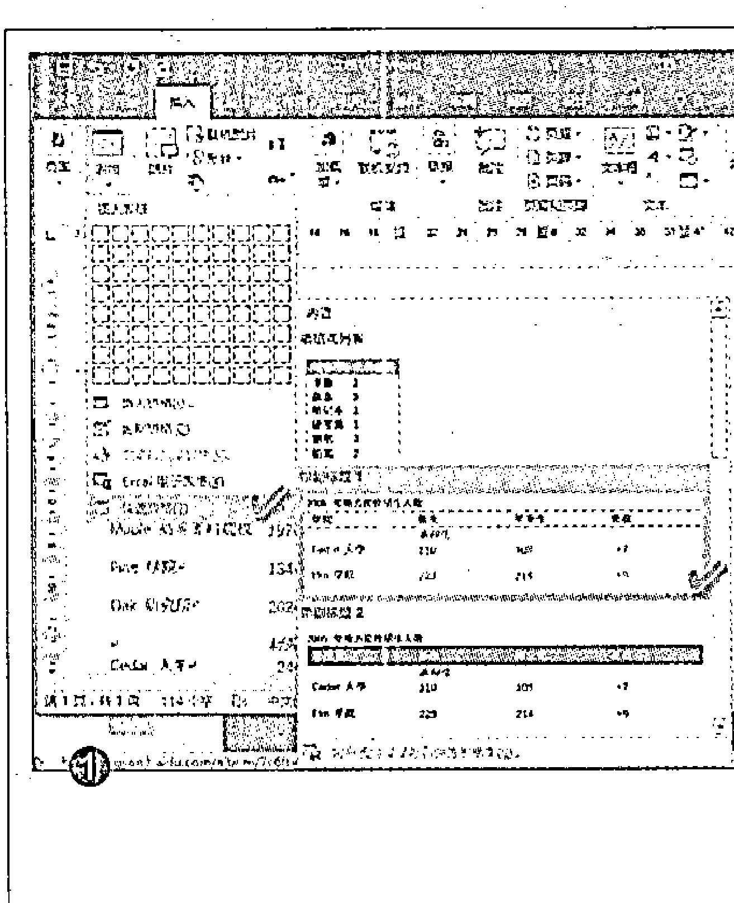

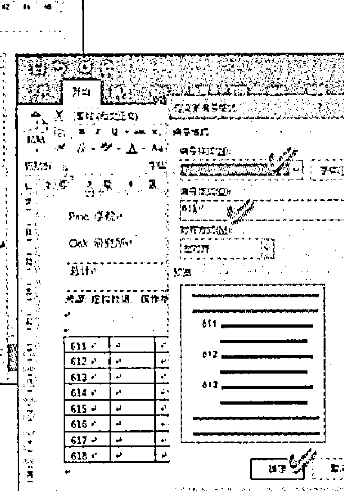

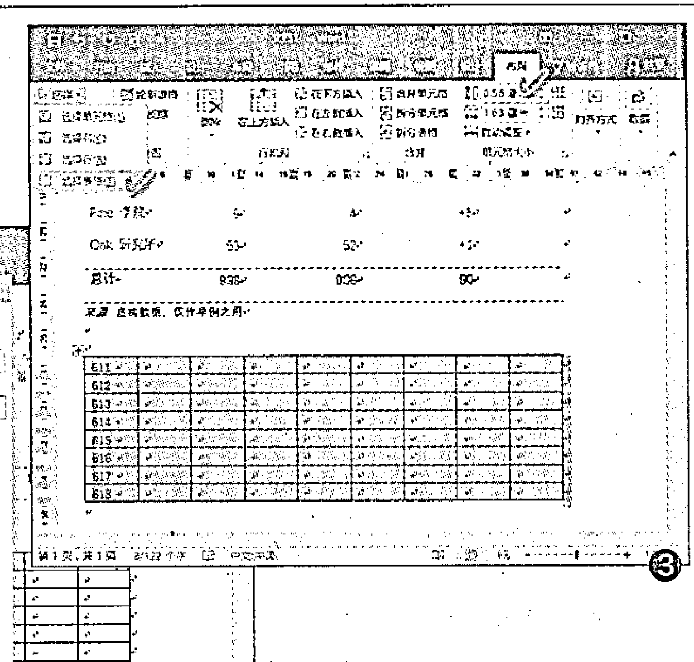

### 4. 表格快速计算

#### 快速获知表格行列数
不同于Excel表格中有清晰行列数标志，Word中没有这个指示，因而难以判断表格的行列数。如果Word中的表格比较长，如何快速获知其行列数呢？我们可以在选中表格后，通过右键菜单命令“表格属性”，在属性窗口的行、列选项卡下直接看到标示的行数或列数。此外，还可用给某一列添加项目编号的方法，获得直观的行数显示。

#### 表格快速自动求和
Word表格的计算比较“含蓄”，它不像Excel表格那样张扬，但这并不表示Word无法计算。以行列小计求和为例，只需将光标置于最后的单元格，执行“布局→数据→公式”命令，在公式窗口中填写“=SUM(LEFT)”并确定，即可算出左侧的数据之和（图7）。类似的，将其中的LEFT替换为RIGHT、ABOVE、BELOW，分别表示计算右侧、上方、下方单元格的小计。这四个参数还可以组合使用，中间用半角逗号隔开。例如“=SUM(LEFT,ABOVE)”表示计算单元格左侧和上方数据之和。

### 3. 表格快速转换

#### Word表格快速合并
如果要将列数不同的两个表格之一的某些行合并到另一个表格中，例如需要将如图所示的第二个表的前两行合并到第一个表的最后（图5）。选中第二个表的前两行，执行复制Ctrl+C；然后将光标定位到第一个表之后的换行符处，执行Ctrl+V命令，这样表2的前两行就附着在表1的末端了。合并表格列的方法也大致相同。

#### Word表格快速分解
如果要将一张表格从中间分为两张，把光标定位到需要分离的下一个表格的第一行，然后按下“Ctrl+Shift+Enter”组合键，这样整个表格就会被一分为二，并且两个表格中间会自动加入一个空行，可以输入其他内容（图6）。

#### Word表格快速添行
如果要在表格最后添加一个新的行，只需将光标移到表格的最后一个单元格中，按下“Tab”键，即可快速插入一行。若需要添加多行，如法炮制即可。

#### 网页为媒转换表格
在Excel中无法将表格保存为Word格式，若需要将Excel表格快速转换为Word表格，可先在Excel中打开该表格，并另存为HTML网页；然后在Word中打开该网页文件，编辑之后保存为Word的DOCX格式即可。

## 纯PPT制作超酷折线图表动画

文/马震安

在制作PPT幻灯片的过程中，要实现超酷的图表动画效果，一般需要借助于Flash、水晶易表、Swiff Chart等专业软件，但这些软件对于平常只用PPT的普通人来说，使用有些困难，若靠现学恐怕也不现实。难道只用PPT就不能制作出炫酷的图表动画效果吗？开动脑筋，总有办法实现PPT制作折线图表动画（图1）。

### 1. 插入折线图表

在空白幻灯片中，选择“插入”选项卡，点击其中的“图表”按钮，在弹出的窗口中，选择“折线图→带数据点的折线图”，在新弹出的数据源窗口，删除不需要的列，输入所需要的数据记录，就可以插入一个折线图表了。选中图表，点击“图表工具→设计”选项卡，通过“添加图表元素”中的菜单去除图表标题及图例（图2）。
如果觉得数据源窗口编辑不太方便的话，可以点击“编辑数据”中的“在Excel中编辑数据”来进行数据的录入。

### 2. 修饰折线图表

图表添加完成后，为了使图表看起来更加美观，还需要对它进行必要的修饰。选中图表，利用“图表工具→格式”选项卡中的“形状填充”，将图表区的背景色填充为深蓝色。选中图表中的横、纵坐标轴，将它们的文字颜色设置为“白色”。在网格线上右击选择“设置网格线格式”，设置线条的颜色、透明度、宽度，设置短划线类型（根据个人喜好选择调节）。再选择折线，在“线条”选项卡，设置线条颜色、宽度；在“标记”选项卡，将“数据标记选项”展开，选择“内置”类型和大小，设置填充的类型和颜色；边框处选择“无线条”。点击“图表工具→设计”选项卡中的“添加图表元素→数据标签→上方”添加好数据标签并设置颜色。这样，图表大体就装饰完成了（图3）。


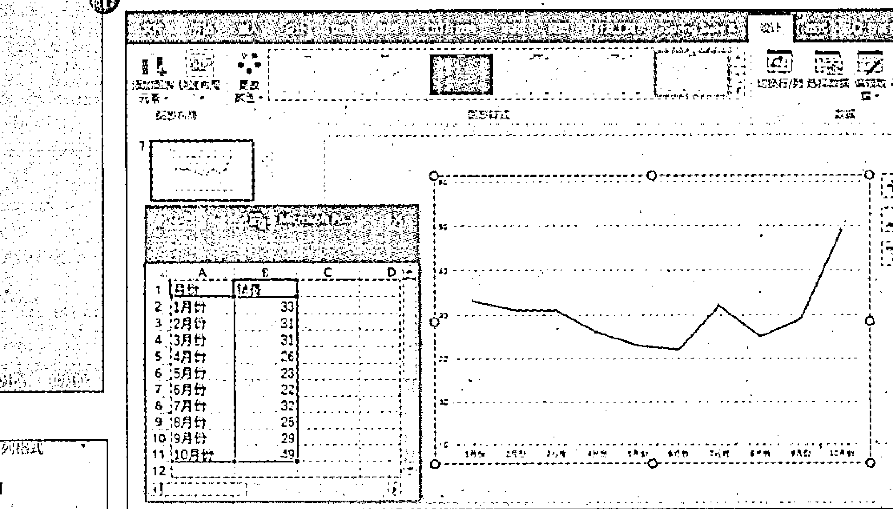


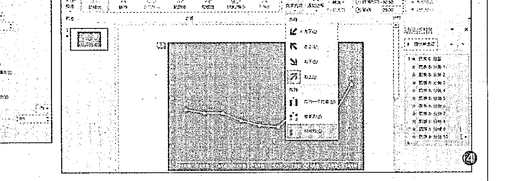

### 3. 添加图表动画

图表设计完成后，就该为其添加动画效果了。选中图表，将其向下压缩一些，这样可以预留一个添加图表标题的动画位置。选择“动画”选项卡，添加进入动画中的“阶梯状”动画，点击“效果选项”，方向选择“右上”，序列选择“按类别”；点击“动画窗格”，在动画窗格中选择分类动画，将它们的开始设置为“上一动画之后”（图4）。

接下来是比较关键的一步，将动画窗格中的所有分类动画选中，选择“动画”选项卡中进入动画中的“擦除”，效果选项中方向为“自左侧”，即把原来的阶梯状动画改为擦除动画（图5）。

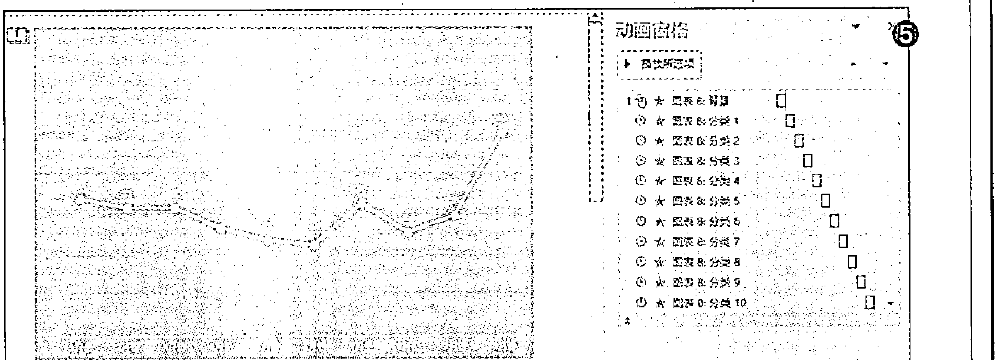

### 4. 添加装饰动画

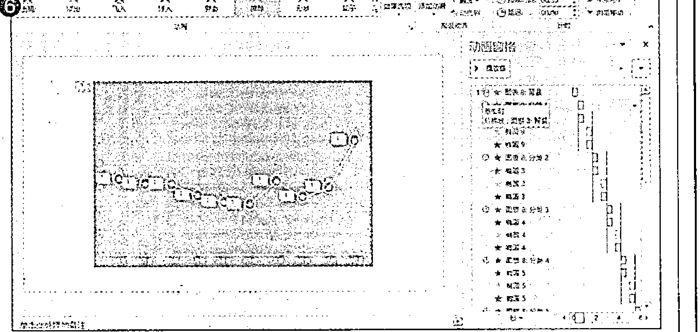

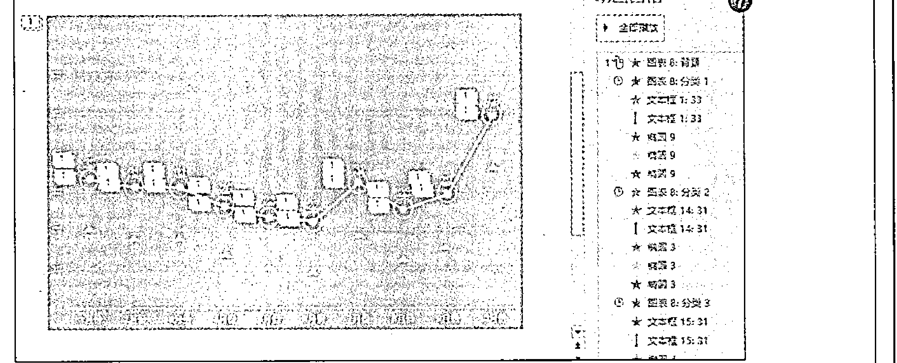

为了使图表动画更炫酷，还可以添加一些装饰性的动画。在第一个数据点处画一个圆圈，无填充色，边框设置为白色。为这个圆圈添加“缩放”动画效果，再利用“添加动画”按钮添加“放大”、“淡出”两个动画效果，将这三个动画的开始设置为“与上一动画同时”，在动画窗格将这三个动画拖放到图表的分类1动画下，选定“缩放”动画效果，将它的持续时间改为0.5秒，延迟时间改为0秒；同时选定“放大”、“淡出”两个动画效果，将它们的持续时间改为0.5秒，延迟时间改为0.75秒。接下来，选中幻灯片中的小圆圈，按住Ctrl键将它复制到相应的数据点上，同时，在动画窗格将相应的动画效果拖动到相应的分类动画下（图6）。

在第一个标签位置插入文本框，输入第一个数字标签的内容，字体颜色为白色，无填充、无边框，给它添加淡出、直线两个动画效果，并将直线动画设置为“反转路径方向”，开始设置为“与上一动画同时”，持续时间为0.5秒，将这两个动画拖动到分类1动画效果下面；复制这个文本框到其他数字标签位置，更改成相应数字标签的内容，并将相应的动画效果拖放到相应的分类下。选中图表，利用“图表工具→设计”选项卡中的“添加图表元素”中的菜单去除数字标签（图7）。

最后，利用文本框或艺术字给图表添加一个标题，并且设置好动画效果，放置在背景动画下面。这样，一个超酷的、不输给专业软件所制作的图表动画效果就制作完成了。

## 图片动画玩异样

文|马震安

PPT中自带的动画效果基本上可以满足日常需要。但是，如果想让自己幻灯片中的图片动画效果与众不同，还得脑洞大开，别出心裁地设计一下。

首先，在空白幻灯片中插入一个文本框，将输入法切换到中文状态，输入一些中文的破折号，字体为“Arial”；选中文本框，选择“格式”选项卡，点击“文本效果”中“转换”下“弯曲”中的“正方形”。此时，破折号会占满整个文本框，当然，文本框也可以任意缩放大小（图1）。选中文本框，选择“格式”选项卡，点击“文本填充”中的“图片”，选取所需要的图片，这时图片就占满整个文本框了，根据需要调整好文本框的大小。

接下来，为文本框设置动画效果。选定文本框，为其添加“飞入”的动画效果。点击“动画窗格”，在右侧动画窗格中右击动画，选择“效果选项”，在“效果”选项卡中，弹跳结束设置为“0.35秒”，动画文本处选择“按字母”，字母之间延迟设置为3%。当然，这些可以根据自己想要的效果进行设置（图2）。

这样，在播放时，图片会以波浪的形式依次出现（图3）。

当然，玩法还远不止这个，我们还可以将文本框的动画效果改成“缩放”，动画文本处依然选择“按字母”，字母之间的延迟设置为10%，这样就会出现另外一种动画效果（图4）。

> 小提示
对于这个“缩放”动画效果，如果在“动画”选项卡将“效果选项”按钮下的“消失点”由“对象中心”改为“幻灯片中心”，则又会是另一个炫丽的动画效果（图5）。

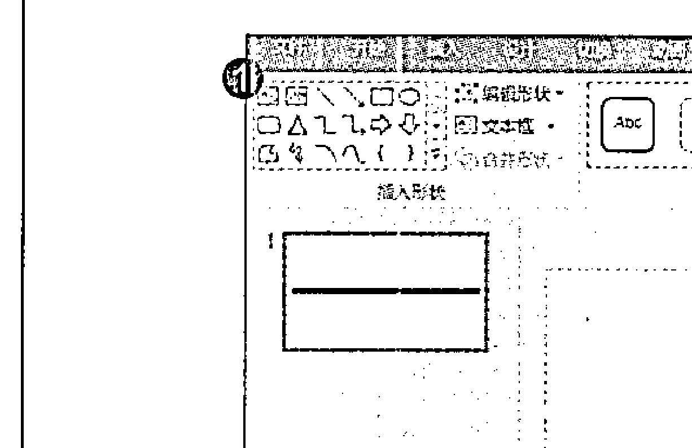

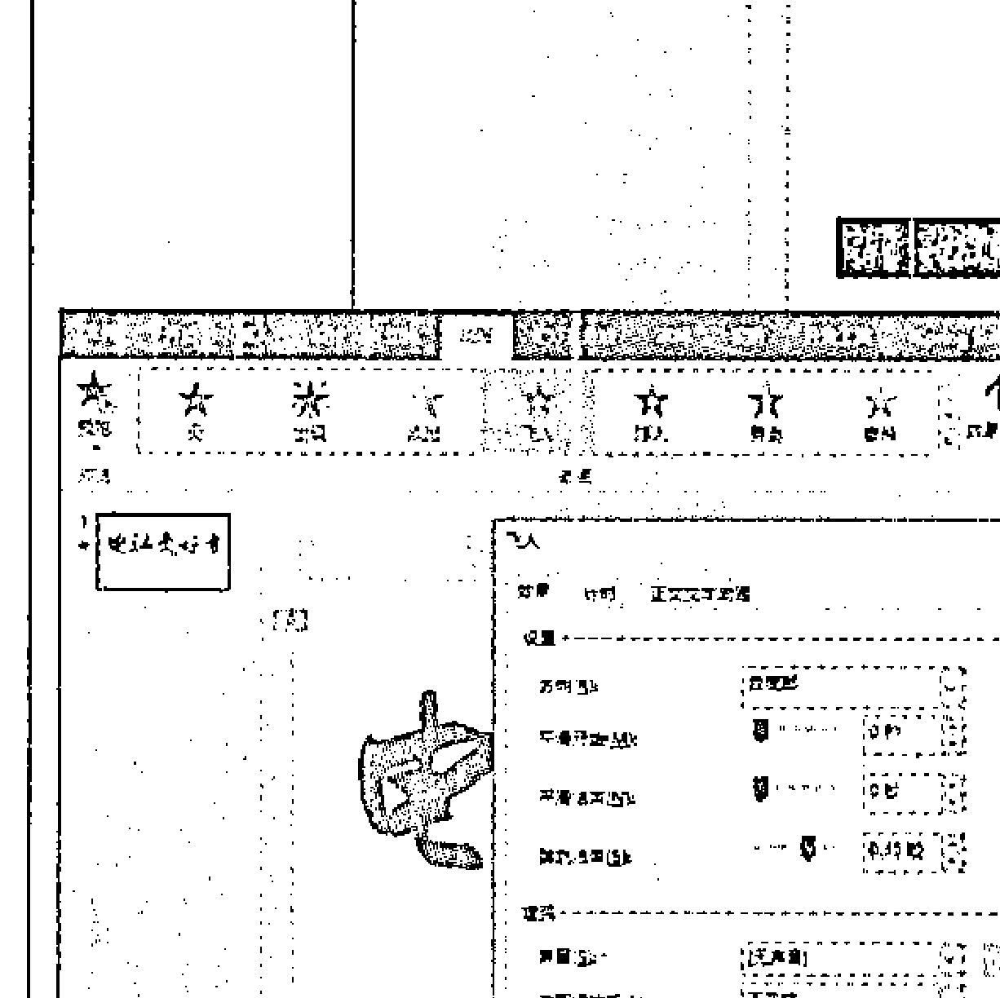

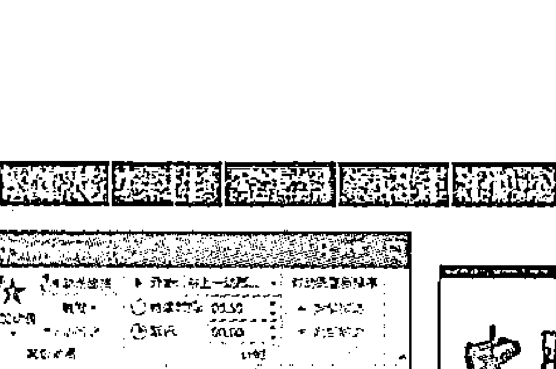


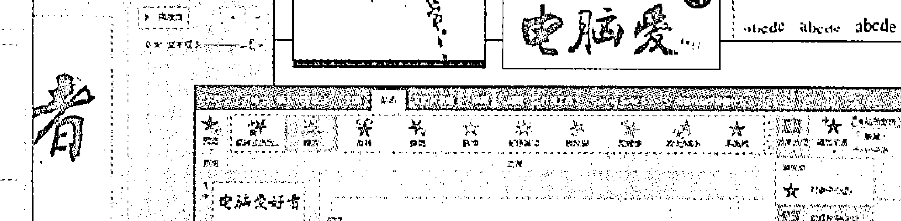

## 效率至上 Excel图表数据秒同步

文|平淡

在日常使用中我们经常要对数据进行同步更新，如在PPT中插入图表，但之后发现数据需要更改，需要实现在Excel中数据更改后，PPT中的图表能够同步更新。类似的，插入Word中的图表数据又怎么实现同步更新？

为了让自己的PPT更为专业，我们经常要在PPT中插入图表。如果要实现数据同步更新，可利用PPT的选择性粘贴工具。首先在Excel中输入数据，接着按提示生成所需的图表，右击图标选择“复制”，将图表发送到剪贴板并保存当前文档。

打开PPT，在需要插入图表的地方点击“开始→粘贴→选择性粘贴→粘贴链接→Excel图表对象”，这样在PPT中插入的就是Excel中的图表链接（图1）。

这样当我们在Excel中需要对数据进行更改的时候，Excel中更新的图表会自动同步到PPT中，省去再次插入的麻烦（图2）。

同样的，对于在Word中插入的图表，如果也要实现类似的同步，同上使用粘贴链接的方法可以实现数据同步更新。不过如果需要在Word中插入Excel的“数据+图表”，我们还可以使用插入文件的方法实现更精准的同步。

同上先在Excel中输入数据并生成所需的图表后保存文件。在Word中点击“插入→文本→对象→来自文件→由文件创建”，点击“浏览”选择上述创建保存的Excel文件，勾选“链接到文件”（图3）。

这样在Word中插入的是整个Excel文件，由于使用“链接到文件”功能，因此任何在原Excel文件中的更改都会自动同步到Word中，可以实现数据实时同步更新（图4）。

其实类似的数据同步更新在Office组件中还有许多，如在Excel一个工作表中引用另一个工作表数据。如果要实现数据的同步更新，那么可以使用Excel的透视表，在主表里录好数据后制作为透视表，将这透视表链接到另一个工作表，这样以后主表的数据更改后，只要刷新一下就可以把主表的数据自动同步过来了。

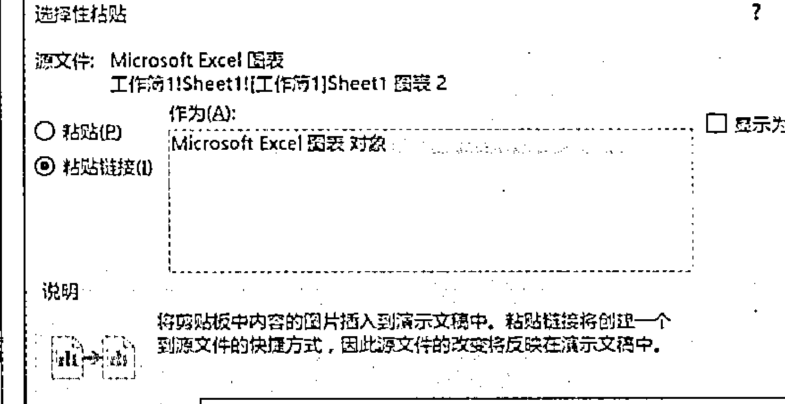

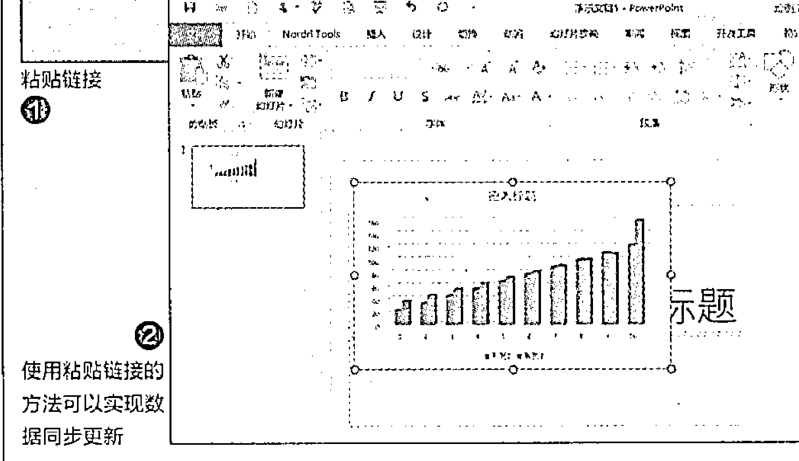

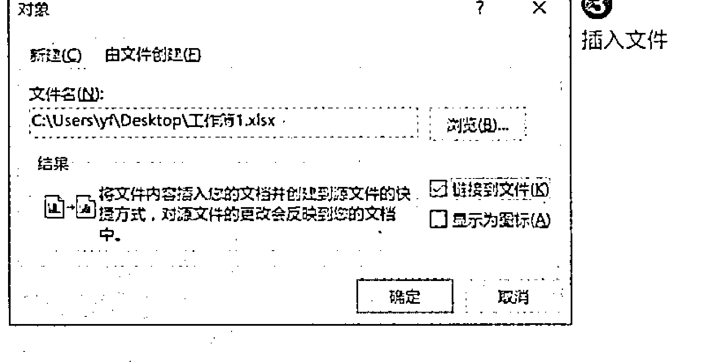

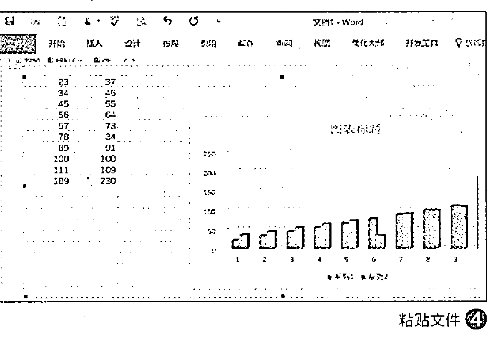

## 纸质文档转成数字文件

文|老万

平时的日常工作中我们难免会接触到各种各样的纸质文件，如果把这些文件都堆积在办公桌上不但不好整理也不好查询。这个时候最好的解决方法，就是将纸质文件进行数字化处理，通过文件管理软件进行快速的整理和查询。可是这一切的开始都必须从纸质文件的文字识别开始，那么如何将照片上的中文内容转换成数字信息内容呢？

### 云笔记进行识别

其实要想把图片里面的内容转换成数字信息，我们这里就必须使用到OCR这个功能，而微软的OneNote软件就自带有这个功能。由于OneNote本来是Office办公软件中的一个笔记功能模块，现在微软已经将这个模块独立出来，预装在Windows 10中，若使用的是其他版本Windows，可以从官方网站选择它的独立版本下载安装（http://www.OneNote.com/）。

启动软件窗口新建一个笔记页面，点击工具栏中的“插入”标签，再点击工具栏中的“图片”按钮。在弹出的对话框里面选择需要进行识别的图片，这样图片就会被植入到笔记窗口中。接下来在图片上点击鼠标右键，在弹出的菜单里面选择“复制图片中的文本”命令（图1）。这时软件将自动开始对文字内容进行提取，提取完成以后点击鼠标右键中的“粘贴”命令，就可以将识别出的内容粘贴到需要的文本里面。

### 在线识别简单方便

虽然OneNote软件可以达到我们的目的，但是很多人觉得这只是它的附属功能，所以需要找一个专业的软件来进行操作。这里我们就用“Copyfish Fresh OCR Software”来代替，其实它并不是一款专门的软件程序，而是谷歌浏览器里面的一款功能扩展，所以我们首先通过谷歌浏览器的应用商店来下载安装这款功能扩展。安装完成以后在工具栏里面找到这款扩展的图标并在图标上点击鼠标右键，选择菜单中的“选项”命令后对这个扩展进行必要的设置。

对于我们使用简体中文的用户来说，首先在“Input Language (OCR Language)”列表中选择简体中文（Chinese Simplified）这项，接着在“Translate to”列表里面选择Chinese这项就可以了（图2）。以后当我们打开一个有文字内容的网页图片时，首先按下谷歌浏览器上的“Copyfish Fresh OCR Software”按钮，这时候扩展会出现一个让我们选择内容范围的选...

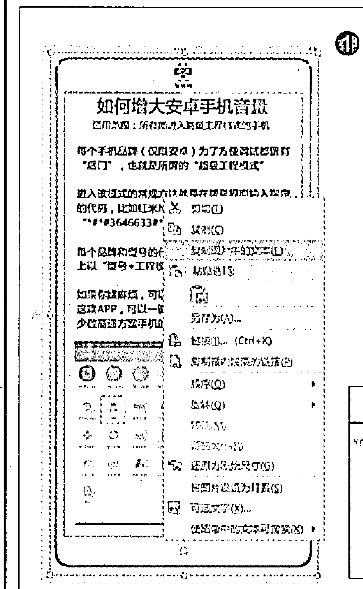

> 小提示：如果软件无法识别其中的内容，可以将照片的对比度调整一下再试试。

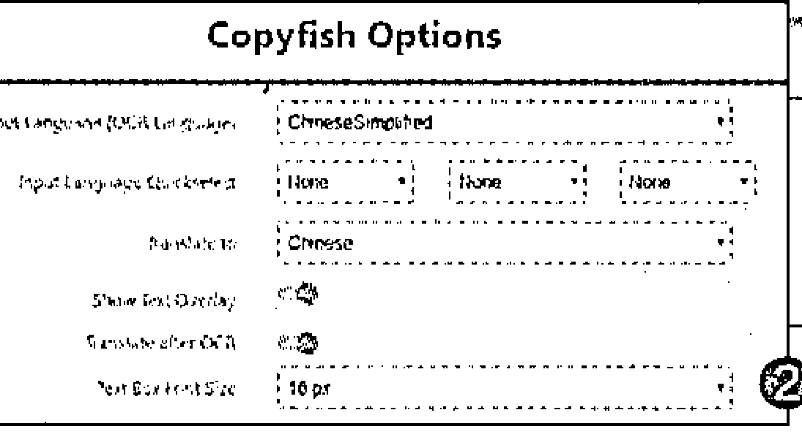

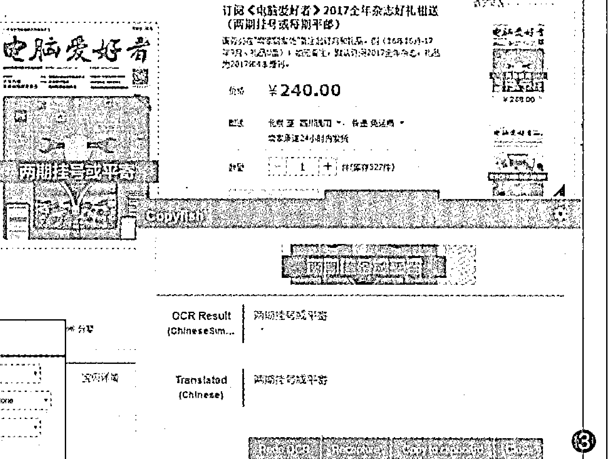

项, 我们通过按住鼠标左键进行框选就可以了。选择操作完成以后会在谷歌浏览器的右下方弹出一个对话框, 就会显示出选择的内容以及OCR识别出的文字结果, 而且读取出来的文字内容我们是可以直接进行复制粘贴操作的（图3）。

“Copyfish Fresh OCR Software”扩展的效果非常不错, 但是很多时候我们需要对电脑里面的图片文字进行识别操作, 那么这个时候又应该怎么进行操作呢? 首先通过软件打开需要识别的图片文件, 接着在“Copyfish Fresh OCR Software”扩展图标上点击鼠标右键, 这次在弹出的菜单里面点击“Desktop text Capture”这个命令, 这个时候就会弹出一个“共享您的屏幕”对话框（图4）。上面显示了当前系统里面已经打开的软件窗口, 从这个窗口列表中选择图片所在的软件窗口。然后点击下面的“分享”按钮, 这个时候软件窗口中的内容将被加载到谷歌浏览器的一个页面里面, 接下来按照之前的操作进行文字识别就可以了。

利用上面的这个方法, 我们还可以对视频文件中的字幕信息等内容进行识别。由于视频文件的字幕通常都在固定的位置, 所以就可以重复点击“Copyfish Fresh OCR Software”对话框中的“Redo OCR”按钮, 从而反复辨识同一个位置的文字, 这样就可以读取不同片段的字幕内容（图5）。

### 手机识别出人意料

有的时候我们在公共场所使用电脑, 或者通过别人的电脑进行操作的时候, 不方便安装第三方的软件程序, 这个时候我们就可以利用手机中的软件来进行操作。其实手机里面也有专业的OCR软件, 不过今天我们选择比较常用的谷歌翻译这款软件来进行操作。

我们首先安装运行最新版本的“谷歌翻译”应用, 第一次使用的话需要进行一些常规设置, 其中包括“您的主要语言”和“您最常翻译的语言”选项。接下来将主界面向右滑动。在弹出的操作栏里面点击“离线翻译”命令, 在弹出的对话框下载“中文”语言包即可。下载完成以后返回到“谷歌翻译”应用的主界面, 在左上角和右上角的列表中分别选择“中文”即可。

现在点击应用中的相机按钮, 启动手机的摄像头功能, 接着对准需要识别的图片内容进行拍摄。当照片拍摄完成以后, 应用就开始识别图片中的文字信息。识别出来的信息, 应用会自动对其进行框选, 我们只需要用手指点击需要的文字, 就可以将它们选中（图6）。或者直接点击窗口下方的“全选”按钮, 将所有识别出的文字全部选中。然后按照提示切换到应用主界面, 所有的信息就会完整地显示出来, 最后我们只需要将它们复制到其他的应用里面进行传输即可（图7）。

> 小提示
使用“萝卜书摘”这款应用也可以解决类似的问题。

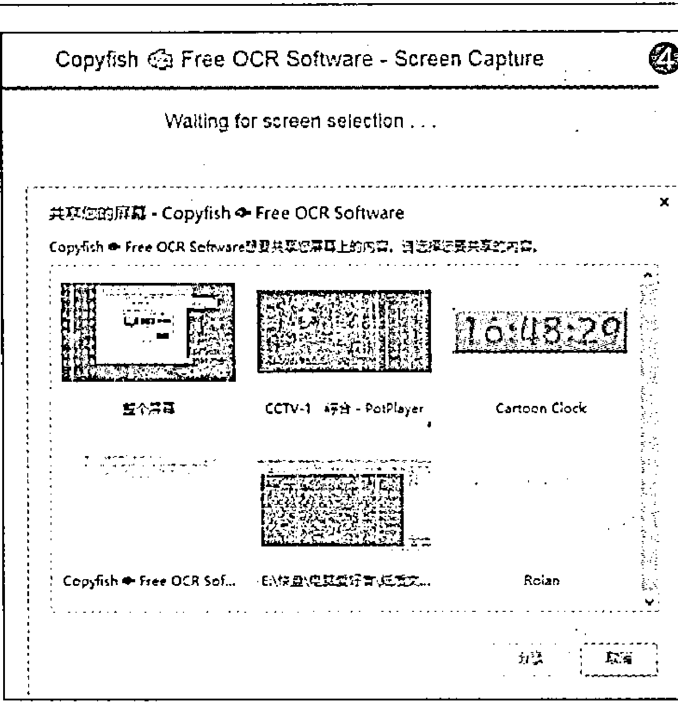

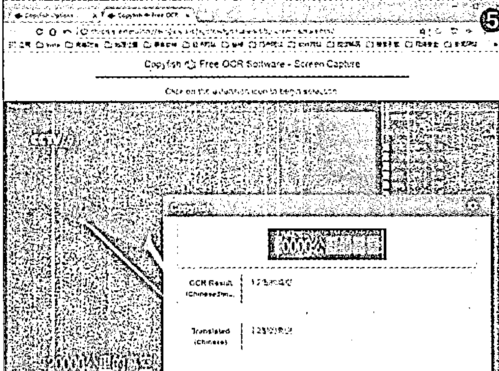


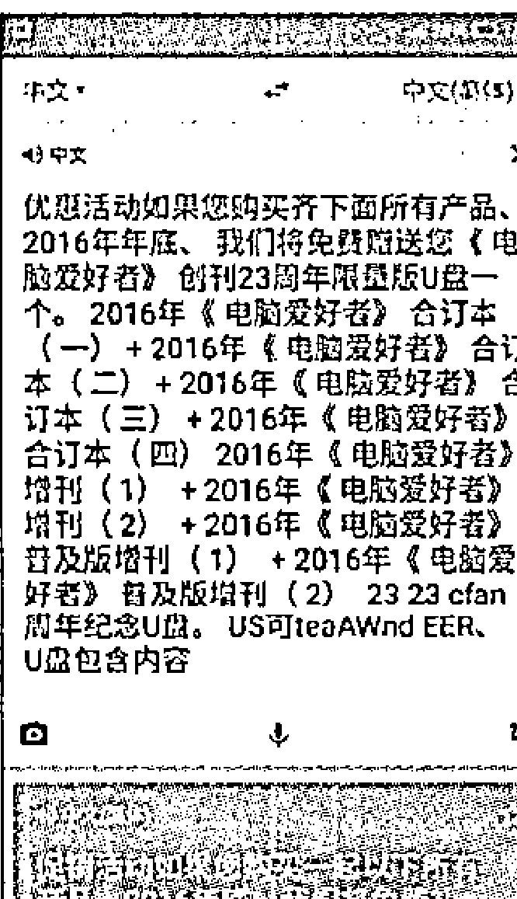

## 一个好汉三个帮 PPT辅助神器

文|俞木发

办公一族，经常需要制作PPT，而且有时候时间很紧急，根本没有时间慢慢打磨。如果要在尽可能短的时间内做出好的PPT，这时候就可以借助一些PPT插件来提高工作效率。

### 化繁为简一键高效调整PPT

为了让自己制作出来的PPT更统一、美观，很多时候我们需要对PPT里的元素进行统一性的调整。比如要将插入的图片调整到统一大小，如果插入的图片较多，一张张调整显然费时费力；为了方便标识自己制作的作品，需要为每张幻灯片插入水印说明。对于这些操作如果仅靠手工操作极其费时，此时借助“Nordri Tools”插件就可实现一键快速调整。

完成插件的安装后PowerPoint会新增一个“Nordri Tools”菜单，展开菜单后选择相应的子菜单即可使用。比如需要为每张幻灯片添加水印说明，点击“插入→形状”，然后选择一个需要作为水印的形状（支持同时添加多个水印），将形状插入PPT文档后移动到合适的位置，在其中输入文字水印说明，这个就作为水印母板（图1）。

选中插入的水印形状，点击“Nordri Tools→增删水印”，在打开的窗口单选“添加水印”和“所有幻灯片”，点击“应用”（图2）。

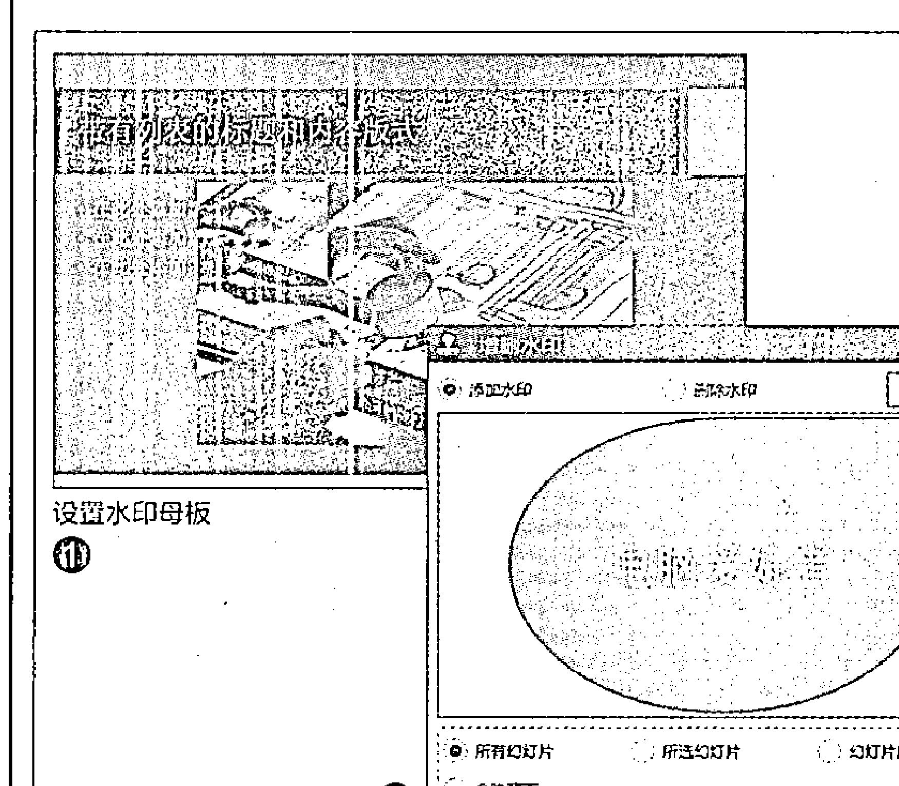

这样PPT中所有幻灯片都会被插入上述设置好的水印图片，省去我们一张张添加的麻烦（图3）。

当然“Nordri Tools”还支持其他很多一键调整和批量导出功能。比如上述水印只是在幻灯片上叠加一个形状图片（用户可以删除）。如果要实现真正的水印效果，可以使用“Nordri Tools”的“导出图片”功能点击“Nordri Tools→导出图片”，这样可以将当前PPT的所有幻灯片全部导出为一张图片，水印图片自然也集成到图片中。

当然这种功能也可以方便在没有安装PowerPoint的电脑上展示我们制作好的PPT（图4）。

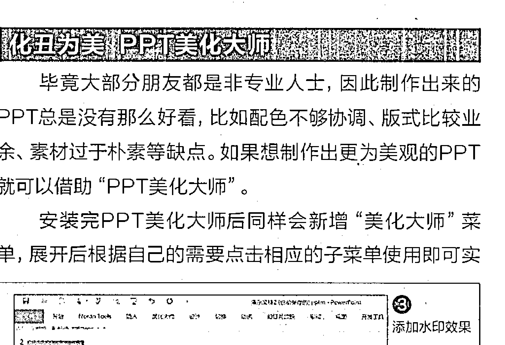

### 化丑为美PPT美化大师

毕竟大部分朋友都是非专业人士，因此制作出来的PPT总是没有那么好看，比如配色不够协调、版式比较业余、素材过于朴素等缺点。如果想制作出更为美观的PPT就可以借助“PPT美化大师”。

安装完PPT美化大师后同样会新增“美化大师”菜单，展开后根据自己的需要点击相应的子菜单使用即可实现一键美化。可以看到PPT美化大师实际上是一个包含丰富素材和模板的在线资源库，比如要为当前PPT更换模板，点击“美化大师→更换背景”，然后选择一种自己喜欢的模板和配色背景，下载应用后就可以快速实现所有幻灯背景的更换了(图5)。

美化大师提供很多专业工具帮助我们制作出精美的PPT，比如可以直接套用其提供的在线模板，也可以使用其他工具。比如对于目录结构比较复杂如多章节的PPT，点击“美化大师→新建→内容规划”，在弹出的窗口可以看到美化大师已经提供规划模板，我们只要按自己的需要进行增减，并选择自己喜欢的风格，然后点击“完成”(图6)。

这样美化大师会根据你规划和设置的风格快速生成很专业的PPT文档，只要再根据实际需要稍加编辑即可(图7)。

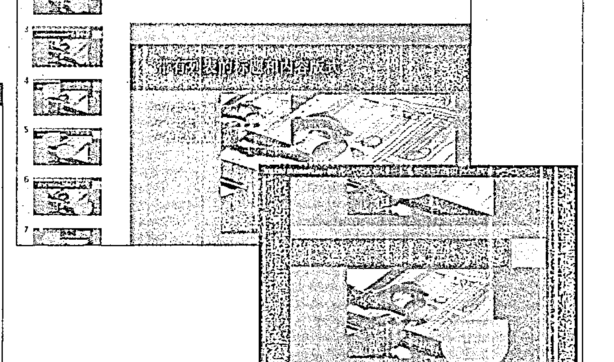

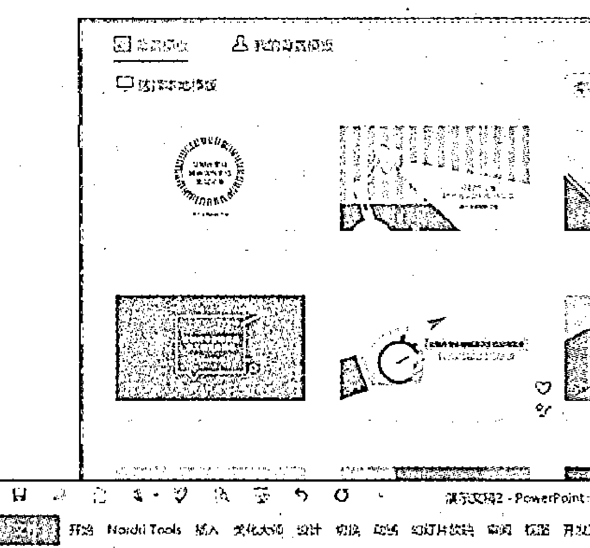

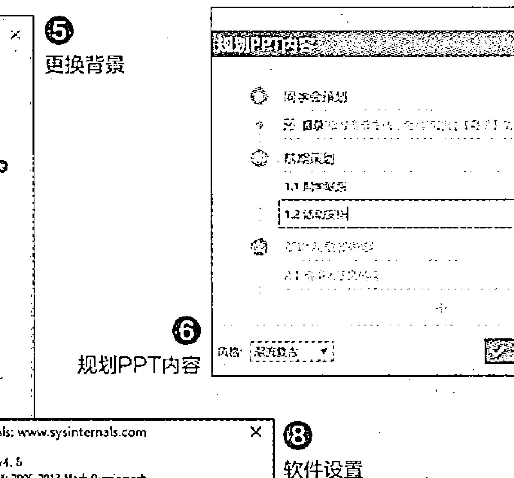

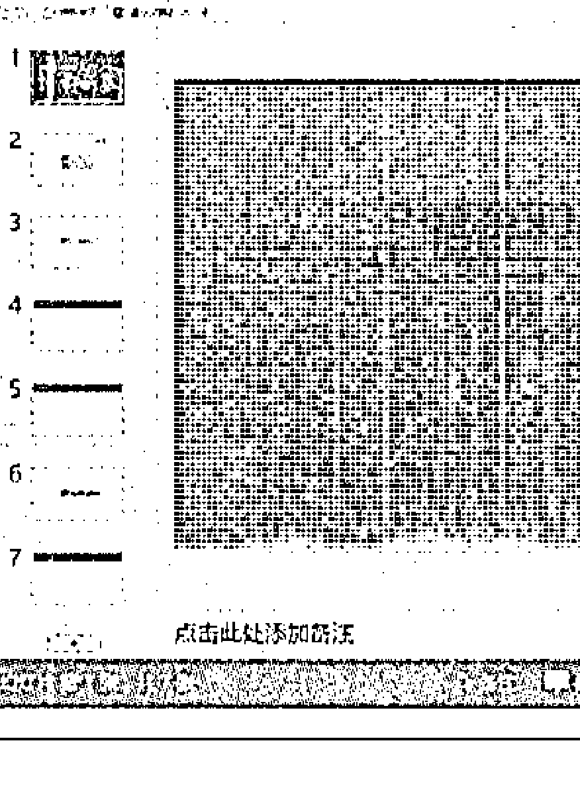

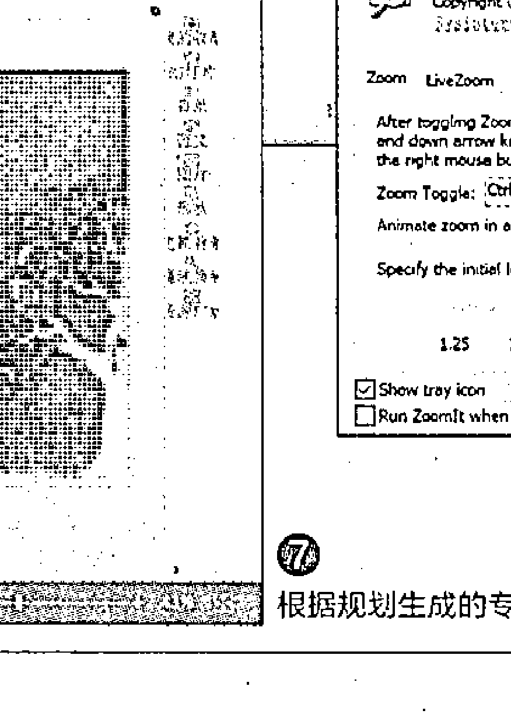

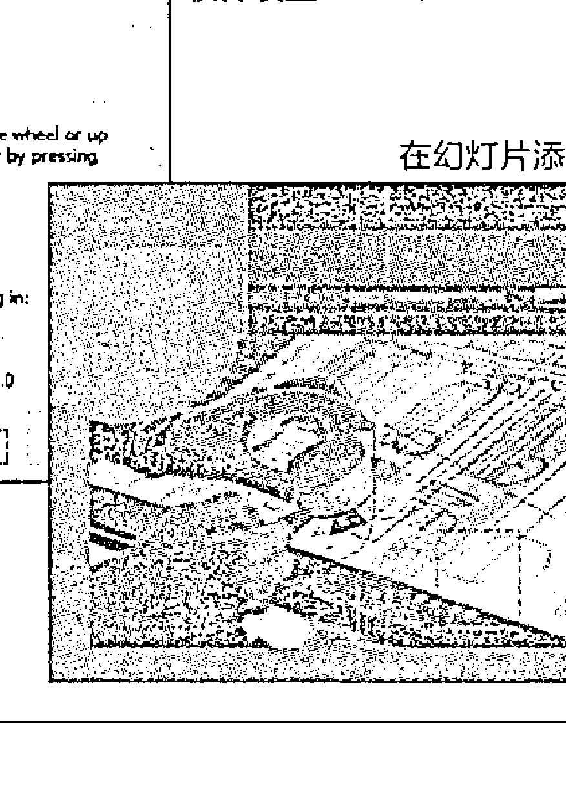

### 演示更简单

制作好PPT后少不了要在投影仪等设备上进行演示，不过常规的演示只是使用鼠标点击下一张或者返回等简单的操作。对于较为复杂的PPT文档，我们需要有更为个性的展示。比如对于一些需要局部放大的演示文件，希望在展示幻灯片的时候可以放大展示，对于复杂的演示文档，希望在演示的时候可以即时添加标注。现在如果要在PPT演示时实现这些功能就可以借助ZoomIt实现。

软件安装完成后可以进入设置，按自己的实际需要进行自定义设置。比如设置放大热键和放大倍数等参数，默认情况下Ctrl+1屏幕放大，系统默认的是放大2倍，我们可以使用鼠标自己决定放大的倍数，非常便捷。如果要退出放大状态按Esc即可退出(图8)。

这样在演示PPT时，我们可以随时按下Ctrl+1进行幻灯片的放大。如果要在演示时为幻灯片添加标注，只要在演示时按下Ctrl+2进行屏幕标注，使用屏幕标注的时候可以选择笔的颜色和线条（比如Shift键是直线，Ctrl键是长方形，Tab键是椭圆形，Shift+Ctrl是箭头等），这样既可以在幻灯片上添加各种标注，还可以画出箭头、直线等辅助标记(图9)。

当然PPT优秀的第三方插件还有许多，总之一一个好的工具和插件能够带给我们软件本身所没有的功能，而且还能节约大量的时间，提高工作的效率，大家可以根据自己的实际需要选择最适合自己使用的插件。

## Word计算你所不知道的那些事

文|马震安

本刊以前曾介绍过Word的计算功能，但Word计算还有一些其他实用功能也许你未曾用过。下面就为大家介绍几例，所有操作均在Word 2016中完成。

### 1. 对部分单元格的计算

Word中的表格计算，就是利用系统默认的函数公式计算，如SUM(LEFT)、AVERAGE(ABOVE)等直接确定计算。但在实际应用中，有时进行横向求和时，并不是计算当前单元格左边所有的单元格中数字的和值，有可能只需要某几个单元格的值，如果用上述办法就行不通了，这时可以像Excel工作表那样引用单元格的名称来进行计算。如表中需要求每个人的“实发工资”，可将鼠标放在“张三”实发工资对应单元格中，同时按下Ctrl+F9，在出现的大括号中输入“=D2+E2+F2”，输入完成后按下F9键，就会生成张三的实发工资。同样，其他人的实发工资也是这样计算（图1）。

### 2. 单元格公式自动填充

在Excel工作表中，进行大量计算时，只需拖动填充公式就可以了。但是在Word表格中拖动填充是行不通的。要想在Word表格中实现自动填充，还需要借助“域”进行单元格的动态引用才能很好地实现。

将光标放在张三的实发工资所在单元格，同时按下Ctrl+F9，在出现的大括号中输入“seq index_A”，在大括号前输入“D”形成“D{seq index_A}”；选中大括号中的“seq index_A”，再同时按下Ctrl+F9，在内层大括号前输入“=”，在内层大括号外侧（右）输入“+1”，形成“D{= {seq index_A}+1}”；将字母“D”连同这个域代码全部选定并复制，在整个大括号后输入“+”，并在“+”后进行粘贴，将字母“D”改成“E”。同理，再在大括号后输入“+”，也在“+”后进行粘贴，将字母“D”改成“F”，最终格式应为：“D{= {seq index_A}+1}+ E{= {seq index_B}+1}+ F{= {seq index_C}+1}”。

如果更新域代码的话，就会显示成“D2+E2+F2”；选中整个域代码，同时按下Ctrl+F9，在域代码前加“quote”和一对双引号，形成“quote “D2+E2+F2””。更新域代码后，单元格中将直接显示“D2+E2+F2”（图2）。

| 序号 | 姓名 | 工龄 | 基本工资 | 业务津贴 | 扣除 | 实发工资 |
|---|---|---|---|---|---|---|
| 1 | 张三 | 5 | 2400 | 1500 | -100 | 3800 |
| 2 | 李四 | 8 | 3000 | 1200 | 0 | 4200 |
| 3 | 王五 | 6 | 2800 | 1600 | -100 | 4300 |
| 4 | 赵六 | 7 | 2800 | 1300 | 0 | 4100 |

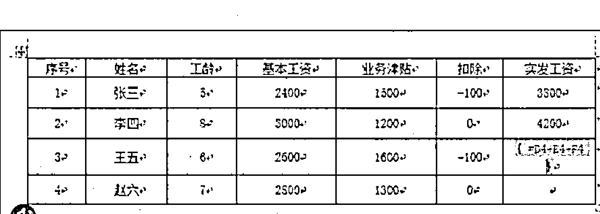

| 序号 | 姓名 | 工龄 | 基本工资 | 业务津贴 | 扣除 | 实发工资 |
|---|---|---|---|---|---|---|
| 1 | 张三 | 5 | 2400 | 1500 | -100 | D{= {seq index_A}+1}+E{= {seq index_B}+1}+F{= {seq index_C}+1} |
| 2 | 李四 | 8 | 3000 | 1200 | 0 | 4200 |
| 3 | 王五 | 6 | 2800 | 1600 | -100 | 4300 |
| 4 | 赵六 | 7 | 2800 | 1300 | 0 | 4100 |
| 5 | 陈七 | 5 | 2400 | 1000 | 0 | 3400 |
| 6 | 马八 | 5 | 2400 | 1200 | 0 | 3600 |
| 7 | 刘九 | 10 | 3400 | 1400 | 0 | 4800 |
| 8 | 赵十 | 10 | 3400 | 1600 | 0 | 5000 |

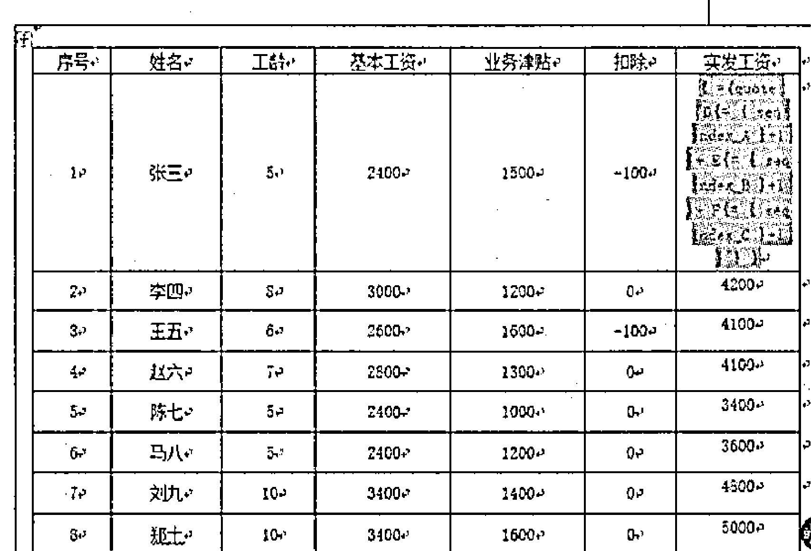

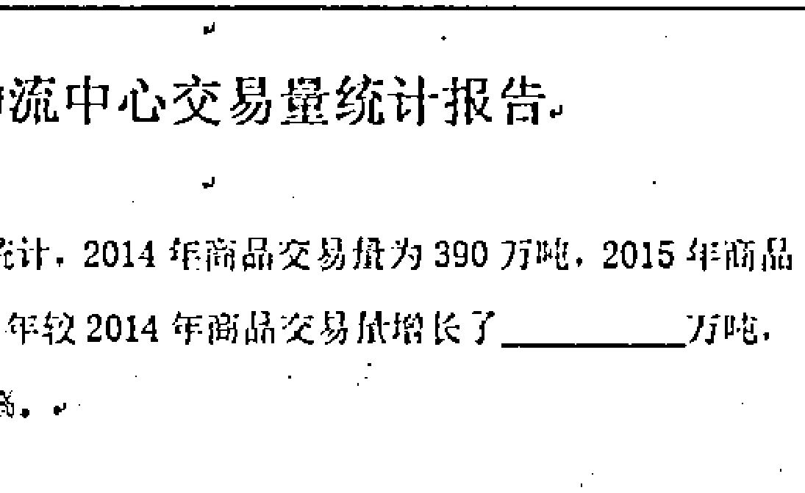

> **小提示**
在域代码中“seq index_A”的作用是生成一个数字序列；“D{= {seq index_A}+1}”实际上就是D2单元格；“quote”的作用就是对当前字符串的引用，即D2+E2+F2。如果有数据更新时，只需要在单元格中输入相应的数据后，按下F9键进行更新就可以了。

## XXX物流中心交易量统计报告

根据我中心统计室统计，2014年商品交易量为390万吨，2015年商品交易量为464万吨，2015年较2014年商品交易量增长了74万吨，增长率为16.96%。

后输入半角状态下的双引号，在双引号前输入“quote ”（quote后有半角空格），形成“{quote "D{={seq index_A}+1}+E{={seq index_B}+1}+ F{={seq index_C}+1}"}”；再将整个域代码选中，再次同时按下Ctrl+F9，在新出现的大括号前输入“=”，形成“={quote "D{={seq index_A}+1}+E{={seq index_B}+1}+ F{={seq index_C}+1}"}”；最后，按下F9键，就会得到计算结果“3800”，复制得到的“3800”，选定实发工资下其他空白单元格进行粘贴，再按下F9键就实现了单元格公式的自动填充(图2)。

### 利用书签进行计算

在Word中有时在文档的行文中需要进行计算，举个简单的例子，如某物流中心的统计报告所涉及到的数据计算(图3)。

虽然可以用计算器完成数据的计算，但如果数据有所更改的话，还需要重新计算。这时，可以使用Word中的书签进行辅助计算，即某些数据发生了更改，按下F9后其他相关数据也会随之更新，这就不需要重新计算了。具体方法如下：

首先，选中报告中的“390”数字，点击“插入”选项卡中的“书签”，在弹出的对话框中输入该书签的名称为“a”，点击“添加”按钮；同样，选中“464”数字，插入名称为“b”的书签(图4)。

接下来，将光标点在增长的下划线位置，同时按下Ctrl+F9，输入“=”，再同时按下Ctrl+F9，在出现的大括号中输入“b”，在里面大括号的右边输入“-”，同时按下Ctrl+F9，在出现的大括号中输入“a”，形成“={b}-{a}”；同样，将光标定位在增长率的下划线位置；输入类似“={({b}-{a})/{b}*100}”；最后，全选并按下F9进行域更新(图5)。

#### 扩展阅读

当然，应用这种方法还能够自动判断是增长还是下降。将文档行文中的“增长”删除，在合适位置同时按下Ctrl+F9，插入图中域代码。这样，当有数据更改时就能自动进行判断(图6)。

### 幻灯片绚丽文字“秀”起来

文|马震安

要想使PPT幻灯片作品更能吸引观众的目光，除了新颖的版面编排外，其实文字的设计也显得非常重要。漂亮的文字效果设计能够让幻灯片锦上添花。接下来，我们就在PPT 2016中试做几种独具一格的绚丽文字效果，感受“DIY”的乐趣。

#### 1. 荧光字效果

将空白幻灯片的背景色设置为黑色，插入所需要的文字，文本设置为白色，并复制出一个作为保留文本（图1）；然后右击原始文本，选择“设置形状格式”，在“文本选项”选项卡中，文本填充选择为“渐变填充”，类型选择为“线性”，角度选择为0度，插入多个不同颜色的光圈，透明度、亮度都设置为0%，无线条；复制填充好的文本，粘贴时选择“选择性粘贴”，选择“图片(PNG)”；接下来，需要柔化这个文字图片，选择粘贴出的文字图片，在设置图片格式的“图片”选项卡下，将清晰度设为-100%；再复制粘贴出一个柔化好的图片（图2）。

最后，将两个柔化的文字图片置于底层，同时和白色的保留文本叠加。注意，两个图片要分别一左一右不对齐白色的保留文本，这样就可以得到如图1所示的放大荧光效果了。

#### 2. 浮雕字效果

设置空白幻灯片的背景纹理，鼠标右键右击选择“设置背景格式”，填充选择“图片或纹理填充”，选择所需纹理（如栎木），插入所需要的文本，设置好字体、字号（图3）；选定文本，选择“格式”选项卡中“文本填充→纹理”，选择与幻灯片背景一样的纹理（如栎木）；再选择“文本效果→棱台”中的圆形；然后选择“设置形状格式→形状选项→效果”选项卡，将“三维格式”展开，调整棱台的各项参数，如顶端宽度设置为8磅，材料根据所选择的纹理来选择，设置好光源及角度就可以了（图4）。

#### 3. 磨砂玻璃字效果

将一空白幻灯片背景填充为一幅深色图片，插入所需要的文本，调整好大小，将文字颜色设置为深灰色(图5)；然后，用灰色填充文本框，设置透明，具体透明值可凭感觉设置。注意：文字颜色要与文本框的填充色区分开来；复制这个填充好的文本，选择性粘贴，选择“图片(PNG)”(图6)。最后选择文字图片，选择“格式”选项卡，点击“颜色→设置透明色”，用鼠标点取文字图片中的任意文字就可以了。

#### 4. 玻璃字效果

设置好空白幻灯片的背景色，插入所需要的文字，并调整好文字大小(图7)。然后，选定文字设置其填充格式，在“文本选项”的“文本填充与轮廓”选项卡中，文本填充选择“渐变填充”，类型为“线形”，角度为87度。4个渐变光圈，颜色均为白色：光圈1位置为0%，透明度为85%；光圈2位置为53%，透明度为60%；光圈3位置为68%，透明度为93%；光圈4位置为100%，透明度为84%。文本边框填充选择“渐变填充”，类型为“线形”，角度为90度。3个渐变光圈，颜色均为白色：光圈1位置为0%，透明度为85%；光圈2位置为53%，透明度为93%；光圈3位置为100%，透明度为84%。接下来，选择“文本效果”选项卡，展开“三维格式”，顶部棱台选择“角度”，宽度为2磅，高度为3.5磅；底部棱台选择“角度”，宽度、高度默认即可；深度处选择“自动”，大小为12磅；曲面图处选择“白色”，大小为0磅；材料处选择“平面”；角度处选择“寒冷”；展开“三维旋转”，Y旋转处输入335度(图8)。这样，玻璃字效果就制作好了。

### 云字体排版 强大且轻松

文|云之岫

印象中，在排版软件中使用新的字体总需要先将字体文件拷贝到Windows的Font目录中，或者要双击下载来的字体文件安装在系统中，才能在编辑软件中使用，这个过程不可或缺。想摆脱这种不方便的用法吗？这里介绍一种新式的字体使用方法——直接在WPS中使用云字体。

#### 1. 为本地字体添副翅膀

大家知道，Windows系统中我们所使用的默认字体数量不多，尤其是汉字字体更是少得可怜。但这并不表示我们无法进行丰富的字体排版，事实上，通过安装各种汉字字体，已可在版面中实现名人书法手迹、广告花样字体等五花八门的字体显示和打印（图1）。字体安装之后，只需简单地通过文字功能组中的字体列表框选择字体即可。

但是，没有安装的字体能通过上述字体列表选择使用吗？这在以往是不可想象的。现在，如果将文件处理工具WPS Office升级至最新版，就可以通过云功能直接使用网上的各种字体。点击字体下拉列表，通过“云字体”一组，可以看到当前已经显示出4种云字体可供使用；如果对这几种字体不满意，通过点击“换一换”来轮换显示另4种字体；如果想要一次查看更多的字体，点击“查看更多云字体”文字链接（图2）。

> 小提示
> 字体的使用需要用户先登录WPS网络账户，字体分免费和付费两大类。普通用户可选择免费字体，而买了WPS点卡或注册为“青铜”、“白银”、“白金”等各级别的会员，只需根据自己的级别情况选择字体，然后点击“下载”按钮即可使用相应字体（图3）。

由于网络字体非常丰富，要一下子找到自己需要的字体也不容易。因此，如果对需要的字体类别比较明确，可通过“筛选”功能来查找。点击“筛选”按钮之后，会出现字体分类列表，从中选择一个字体所属分类，例如“儿童字体”（图4）。之后，搜索范围便大大缩小，就可以从这个类别中很快获得具体的某种字体（图5）。如果所需要的类别不在电脑给出的这些类别之内，还可以通过关键词来进行搜索。比如需要找到某种行书书法字体，输入“行书”后便可将此类字体一并列出（图6）。

#### 2. 字体的免付费与版权问题

字体作为具有知识产权的产品，受版权法保护。个人日常使用的字体和商业用途完全是两个概念，以上介绍的内容均不能用在出版、广告等商业宣传及营销中。

具体字体的版权信息，可通过字体下载页面，点击字体下载框左下角的“i”按钮进入（图7）。点击之后，可看到具体的使用协议条款，如果同意协议内容则选中复选框，确定便可使用该字体了。这意味着，你要对自己随后使用字体的行为负责（图8）。

如果不想花钱购买字体，那么可以从免费字体中进行选择，例如标有0稻米的字体（稻米：WPS的一种虚拟货币），就不需要付费即可安装使用（图9）。但需要留意一下免费字体使用的权属范围，不要越轨使用。当然，若你愿意或需要为某种漂亮的网络字体买单，那么可以通过多种方式开通字体会员，然后在排版过程中就可以及时在线获得自己想要的字体了（图10）。

### 不走寻常路 用活PPT中的表格

文|平淡

在制作PPT的时候我们经常会插入表格，不过在传统的PPT中，插入的表格只是用来展示数据。其实表格除了这个用途，在PPT中用活表格还可以收到各种意想不到的效果。

#### 整序划一巧用表格统一排版

很多时候我们要在PPT中插入多张图片，为了美观、统一，常规的方法是在插入图片后使用PPT的对齐工具费力地对齐、调整大小。这种操作是不是觉得既费时又费力？此时就可以使用表格的方法来对齐，因为表格线就是天然对齐标记。

假设要在PPT中插入4张图片，在PowerPoint 2016中点击“插入→表格”，然后选择一行四列的表格（如果是要纵向排列则插入一列四行的表格），在幻灯片中就会自动插入这个表格。选中插入的表格，使用鼠标调整到合适的大小。接着点击“表格工具→设计→边框→无框线”，将其设置为无边框的表格(图1)。

选中第一行第一列，点击“表格工具→设计→底纹→图片→来自文件→浏览→选择需要插入的图片”，这样插入的图片会自动填充到表格中。

操作同上，继续在其他单元格中插入其他图片，这样一组大小一致、水平对齐的图片就自动在PPT中完成了(图2)。

完成图片的插入后还可以根据自己的需要进行美化。比如可以选择“表格工具→设计→绘制边框”，选择6磅边框，点击“边框→上框线、下框线”，为表格添加上下框线。继续点击“表格工具→设计→效果→阴影→透视→右下对角透视”，这样即可让插入的图片有更美观的效果(图3)。

同样我们可以利用表格线的天然对齐来实现更多排版效果。比如在PPT中经常要插入图片和文字进行图文混排，对于这类版式现在使用表格就可以很轻松地实现版式一致。同上在PPT中插入一个三行五列的表格，接着选中第一行2~5列，点击“表格工具→布局→合并单元格”，继续选中第三行进行同样的合并。选中第二行将所有单元格合并，并将其填充色设置为白色，用来作为一、三行的隔行(图4)。

同上在第一行、三行的一列里使用插入的图片进行填充，然后在合并的单元格里输入描述文字，这样一个整齐的图文混排版式就生成了(图5)。

#### 与众不同使用表格制作特效图片

大家知道，我们在PPT中可以使用底纹、效果、透明等组件对表格进行各种特效处理，利用这些工具我们可以为PPT插入的图片做出各种特效。比如在PPT中为了突出显示插入的图片，我们可以制作一张立体拼图。

在PPT中新建一张幻灯片，然后点击“插入→图片”，选择一张需要作为拼图的图片作为幻灯片的背景，同上在背景上插入一个十行八列的表格，具体大小请根据自己的实际需要设置，设置的行列越多，拼图组成的表格就越多。选中插入的表格，点击“表格工具→设计”，去除“标题行”和“镶边行”的勾选，将表格的填充色设置为白色，全选所有单元格，将其透明度设置为84%（图6）。

使用鼠标调整表格大小，使得表格可以覆盖整张背景图片。点击“表格工具→设计→底纹→效果”按钮，在“单元格凹凸效果”中选“圆”，这样一幅动感拼图就制作完成了。

当然我们还可以根据自己的需要进一步美化，比如背景色比较亮的部位，可以将其上的单元格透明度设置得低一些，或者在单元格上输入文本，然后将其透明度设置为5%，这样凹凸的效果更为明显（图7）。

同样我们可以使用更为紧密的单元格实现图片的马赛克效果，只要选择需要打马赛克的部位，同上在其上插入一些表格，接着选中单元格，选择“开始→字体设置”，将字体设置为“宋体，1”（1可以直接输入），这样就可以使用鼠标调整插入的表格单元格到最小（因为表格的行高默认是由输入汉字的大小决定的，所以表格行高需要通过设置字体大小来调整）。将调整好的表格移动到需要打马赛克的部位，然后将表格填充色设置为黑色即可（图8）。

当然利用表格填充图片和表格修饰工具，我们还可以制作出更多特效图片。比如使用Windows 10的朋友都知道，它的开始菜单使用磁贴图片，看上去沉浸感十足。如果要在PPT中插入类似的图片，使用上述表格同样可以实现。

同上在PPT中插入一个三行三列的表格，然后使用QQ截图工具截取开始菜单上的磁贴图片。完成截图后，选中需要填充图片的单元格，点击右侧窗格的“图片或纹理填充→插入图片来自→剪贴板”，这样截取到的图片可以自动填充到单元格。接着选中幻灯片背景，填充色选择和Windows 10开始菜单一样的背景色，选中表格，点击“表格工具→设计→绘制边框”，选择3磅边框，然后选择“边框→所有边框”，这样边框的颜色选择和幻灯片背景色一致，类似Windows 10开始菜单的磁贴图片就设计好了。这个和单纯的截图不一样，我们可以任意更换单元格中填充的图片、背景和边框等元素（图9）。

### 免费LibreOffice媲美微软办公

文|阿立

说到办公软件我们就会想到微软的Office以及国内的WPS，可是这两款软件都有很大的不足。比如微软的软件需要进行收费，而国内的WPS虽然免费，但是却捆绑了大量的软件以及广告，用户在使用的时候经常被干扰。其实除了这两款软件以外，还有一款名为LibreOffice的办公软件也非常不错。不过由于这款软件是国外开发的，因此有一些方面国内用户使用起来还有些不便，那么如何进行优化设置从而调整它的性能和效率呢？

#### 激活快速启动功能

任何一款软件都有它的优点和缺点，对于使用过这款LibreOffice办公软件的用户来说，他们认为这款软件最大的缺点就是启动相对较慢。这是由于这款软件的设计理念和其它办公软件不同所造成的。那么如何加快这款软件的启动速度呢？首先双击运行系统桌面上的LibreOffice图标，在弹出的软件窗口里面点击左侧列表中的“文本文档”按钮，这样就可以激活软件的文档编辑模块（图1）。当我们打开软件的文本编辑功能后，在弹出的操作界面中点击“工具”菜单中的‘选项’命令，然后在弹出的设置窗口里面点击左侧列表中的‘内存’选项，在右侧窗口里面就可以看到‘LibreOffice快速启动’这个选项，接下来勾选上其中的‘启用系统任务栏快速启动’选项就可以了。一旦用户激活这个选项以后，LibreOffice软件的一部分将会驻留于系统的内存当中，这样就可以快速地打开软件以及进行更快速度的响应操作。正是由于这个功能会占用一定的系统内存资源，所以要使用这个功能需要一定的条件才行，即系统内存必须大于4GB才可以。如果用户的电脑配置无法满足这个条件，在设置窗口里面根本就不会看到这个选项。除此以外，在启用这个选项后，在系统托盘中可以看到LibreOffice软件的图标。

#### 分配图形缓冲大小

如果用户的系统内存没有达到4GB的标准，那么可以考虑使用另外一种办法来解决。比如我们在处理一些文档的时候，文档里面都会插入各种各样的图片文件，这样在处理这些文件的时候就会增加内存的使用量。如果我们提前为文档准备一部分内存资源，这样的问题也就迎刃而解了。首先还是打开软件设置对话框中的‘内存’选项，在窗口右侧可以看到‘图像缓存’的内容，它的作用就是将文档中的图形保存到计算机的主内存里面。这样当滚动到文档中含有图像的页面时，就无需再重新计算缓冲区中存储的图像属性了。其中‘用于LibreOffice’选项指定用于全部图形的总缓冲区大小，比如我这里设置为128MB大小。而‘每个对象的内存’选项指的是不在缓冲区中存储大于设定大小的对象，比如我这里设置为20MB大小（图2）。设置完成以后点击‘确定’按钮，然后重启办公软件即可。

进行邮件的发送，可以在“发送服务器 (SMTP) 设置”中，分别填入“服务器名称”、“端口号”等信息 (图4)。根据不同的电子邮箱服务商，有时还需要选中“使用安全链接 (SSL)”复选框。

另外由于国内大部分邮箱服务提供商都采取了授权密码的形式，所以接下来点击下面的“服务器验证”按钮，在弹出的对话框选中“发送邮件服务器 (SMTP) 需要进行验证”复选框。然后点击“发送邮件服务器 (SMTP) 需要额外的认证”按钮，最后输入我们邮箱账户的用户名和密码就可以 (图5)。设置完成以后点击“确定”按钮返回，然后点击“测试验证”按钮，如果前面的步骤没有问题的话，将会收到“建立网络连接成功”的提示消息。现在关闭软件的设置窗口，点击“工具”菜单中的“邮件合并向导”命令，在弹出的窗口中根据向导就可以批量地进行邮件的编辑发送操作了。

#### 禁用软件中的Java

LibreOffice办公软件和其他的办公软件最大的不同点，就是它可以跨平台进行使用，这样它就必须使用很多的Java功能。其实我们平时在处理文档以及表格文件的时候，禁用Java并不会影响到正常的功能使用。所以我们从安全的角度出发，可以将这个功能进行禁用。

首先按照前面的方法打开软件的设置窗口，这次点击左侧列表中的“高级”选项。接着在窗口右侧就可以看到“Java选项”的区域，将其中默认的“使用Java运行时环境”选项关闭掉就可以了 (图3)。这样设置不仅可以提高软件的运行效率，也可以避免恶意文件对系统的攻击。以后当我们处理文件需要使用Java功能的时候，它会弹出一个对话框来提醒用户，用户按照向导重新激活Java功能就可以了。

#### 设置邮件合并邮箱

> > **小提示**
>
> “发送服务器”等信息可以在邮箱的网页里面查询到。

在Office办公软件里面有一个名为“邮件合并”的功能，它不但是批量完成工作任务的利器，也是批量发送邮件的最好选择。而在LibreOffice里面也可以使用该功能，那么在这款软件里面如何进行配置操作呢？

首先还是打开软件的设置窗口，接着在左侧列表里面展开“LibreOffice Writer 文本文档”条目，然后点击其中的“邮件合并 E-mail”选项，在右侧窗口中根据提示分别输入自己的姓名以及电子邮箱地址。如果用户需要通过办公软件进行邮件的发送，可以在“发送服务器 (SMTP) 设置”中，分别填入“服务器名称”、“端口号”等信息 (图4)。

#### 恢复常见的打印方式

由于LibreOffice软件是由国外的人士开发的，所以在有的方面和国内的使用习惯不太一样。比如我们在打印的时候常常都是使用A4的格式，所以每一次都需要手工进行修改操作，那么通过什么方法可以让它默认使用A4的格式呢?其实这样的问题主要是由于用户使用的是非中文语言的操作界面，所以用户只需要将操作界面的语言改成中文就可以了。在软件的设置窗口左侧列表里面展开“语言设置”条目，然后点击其中的“语言”选项，在右侧窗口的“用户界面”列表里面选择“中文简体”这项并重新启动软件就可以了 (图6)。

### 微信隐藏功能帮你鉴别二手机

文|镜花水月

> 小提示
如果一款手机曾被3个或更多用户登录过微信，但在申诉找回微信账号密码的界面却最多只能存在2个用户图标。所以它只能帮你鉴别手机非新，至于手机是二手、三手甚至四手，就需要用其他方法鉴别了。

很多用户网购手机都遇到过买来二手或翻新机的经历，如果你不能确定新买手机是否为“一手”，借用微信的一个隐藏功能就能实现鉴别效果。

运行手机微信APP，依次进入“我→账号与安全”，点击最下面的“微信安全中心”。然后再一次点击“找回账号密码→申诉找回微信账号密码”（图1），在弹出的窗口里点击“开始申诉”按钮（图2）。

如果在申诉找回微信账号密码的界面里出现了2个图标（图3），那就说明这款手机至少被2个用户登录过微信。这意味着除了你之外，它上面还有一个“主人”。没错，就是二手机无疑了。

至于微信为何具备如此功能，原因是微信安装时有一个需要读取设备识别码的权限，也就是将手机的IMEI码保存在腾讯服务器里。凡是用这个设备登录过的微信号，都会和IMEI码关联上，所以才有了上面的这个功能。最重要的是，哪怕我们将手机进行了恢复出厂设置、刷机等操作，依然不会影响到这个查询功能。

### 手机也可以使用长截图

文|天涯衰草

PC端浏览器的截图功能不仅可以对当前的网页内容进行截取，还可以通过滚动的方式对整个页面进行截图操作。可惜，要想在手机里面对整个页面进行截图，暂时只能通过分段截取后拼接的方式才可以完成。难道真的就没有快捷简便的方法，可以在手机系统里面对网页进行完整的截取吗？

首先下载安装AirClip这款应用（下载地址：http://dwz.cn/42DIT），启动后在主界面正中输入需要截取网页的URL地址，就会在AirClip内部加载这个网页内容（图1）。当加载完毕后我们只需要点击右下角的FAB按钮，稍等片刻就会弹出一个截取成功的提示窗口（图2）。

如果我们只需要截取当前可视的网页页面，那么只需要长按FAB按钮就可以完成截取操作了。

虽然AirClip这款应用的操作非常简单，但是还是有两点要提醒大家注意。首先就是如果加载的页面中图片比较多的话，那么在截图以前最好检查一下所有的图片是否加载成功。

其次就是很多社交应用在我们浏览网页的时候，我们根本看不到相关的网页链接地址。这个时候只需要点击分享按钮，在菜单里面选择“复制链接”命令后，再粘贴到链接输入框里面就可以了（图3）。

### 让手机号代替复杂的QQ号

文|镜花水月

如今新申请的QQ号都很长，对我们的记忆力是一种考验。如果你总是记不住相对复杂的QQ号，那就不妨尝试用手机号替代QQ号，用于日常的登录和显示吧。

用手机号替代QQ号需要借助电脑版的QQ。具体操作很简单，在电脑版QQ窗口中点击右下角的三道杠图标，选择“帮助→我的QQ中心”（图1）。在我的QQ中心界面，切换到账

号选项卡界面，然后点击手机辅助账号一行对应的“立即绑定”按钮。在绑定手机号的空行里输入你的手机号码，然后按要求填写验证码再点击提交验证码按钮（图2）。

看到“恭喜您，绑定成功”的提示时，就说明你的手机号已经和QQ号绑定成功了。接下来，还有两个细节设置需要我们留意。开启“其他人可在QQ查找中通过手机帐号找到您”这个功能，好友通过搜索手机号就能加你为QQ好友（图3）。此外，还能修改对外显示的账号是你的原QQ，还是新绑定的手机号，这两种号码可以根据你的心情和需求随意设定（图4）。

### 任何手机都能拍摄GIF动图

文|镜花水月

如今无论是微信还是微博，几乎所有社交APP都支持GIF动图的上传，这就让咱们在分享身边有趣事情时多了几分乐趣。问题是，并非所有手机的拍照APP都自带GIF拍摄，对那些不支持该功能的手机又该如何实现呢？

以金立为代表的很多智能手机都已在拍照APP中集成了GIF模式（图1），可以直接拍摄动图分享给好友。对那些不具备该功能的手机而言，我们则可借助第三方APP，比如“美图GIF”（下载地址：http://gif.meitu.com/）加以实现（图2）。

这款APP拍摄GIF动图的功能很强大，可以自定义照片数量（18、21或24张）、动图分辨率以及拍摄间隔的时间（图3），可以让我们有针对性地选择最恰当的参数，拍摄出不逊于视频才能展示出的丰富内容。此外，该APP的“魔术GIF”功能，还能对GIF动图进行后期加工（图4），加入涂抹动态区域的效果，让最后生成的动图看起来更炫。

总之，如今智能手机的所谓特色功能，在绝大多数情况下都能找到第三方APP加以实现，所以我们在选购手机时不必因某项软件功能而非它不选。

### 一组代码帮你强加QQ好友

文|镜花水月

很多用户不喜欢被别人打扰，所以会在QQ的会员中心界面中关闭“其他人可在QQ查找中通过QQ号码找到您”的选项（图1）。如果你想加的好友恰好关闭了这个选项，当你通过QQ号搜索他时会显示为空（图2）。那么，如何才能绕过这个机制强加QQ好友呢？

遇到此类问题，我们可以通过QQ命令代码将其破解。具体操作很简单，在任何一个QQ聊天界面（比如与好友、我的手机、某个QQ群），编辑发送下面这组代码：

```
tencent://AddContact/?fromId=45&fromSubId=1&subcmd=all&uin=QQ号码
```

其中，最后的“QQ号码”就是你想要添加好友的QQ号数字。发送这组代码之后，在PC的QQ上查看聊天记录，你会发现代码变成了一个可以点击的网络链接地址。

点击这个链接就会弹出添加这个QQ号码的窗口（图3），如此也就绕过了对方屏蔽QQ号搜索的设置，实现找到并将其添加为好友的目的。

> 小提示
如果在PC的QQ上点击链接地址无效，请检查QQ版本，将其升级到最新版本就没问题了。

### 将照片作为二维码的背景

文|天涯衰草

虽然二维码的使用越来越广泛，但我们常见的二维码却非常粗糙，稍好一点的二维码也不过在里面嵌入了一个LOGO图片。那么，我们有没有什么方法可以制作出一些与众不同的二维码呢？

首先需要在手机上下载安装Qart这款应用（下载地址：http://dwz.cn/4aNsUX），再利用手机里面的相机应用拍摄一张喜欢的背景图片。接着启动运行Qart这款应用，点击界面右上角的图片按钮，在手机相册里面选择刚刚拍摄的照片。当照片加载到应用里面后，通过手指进行移动操作，从而选择图片里面需要的部分即可（图1）。

Qart这款应用为用户提供了两种内容输入方式，首先就是最常见的通过手机键盘进行输入，其次点击输入框后面的二维码图标后，通过扫描传统的二维码来获取信息（图2）。当内容信息输入完成以后，点击右上角的生成按钮，这样就会生成一个以照片为背景的二维码（图3）。

接下来点击右上角的下拉三角按钮，在弹出的菜单里面选择“文本”命令，从而在其中输入二维码中的内容信息。

### 视频编辑也可以很简单

文|天涯衰草

如今手机拍照摄像的效果越来越好，但想在手机上进行后期的加工却不容易：手机应用翻来覆去就那几个模板，如果手动编辑的话又非常繁琐。那么，如何能在手机应用自动编辑的情况下，还可以让用户自行进行修改操作呢？

#### 视频编辑自动完成

首先通过应用商店下载安装Quik这款应用（下载地址：http://dwz.cn/4emIPv），启动这款应用以后点击“创建新视频”按钮。这个时候软件会自动跳转到手机的图库里面，从中选择自己需要编辑的照片或者视频文件（图1）。

选择完成以后点击右下角的

> > **小提示**
>
> 视频文件上传会使用大量的流量，建议在Wi-Fi环境下进行上传操作。

按钮进行确认，这个时候应用就开始自动进行编辑操作。Quik这款应用包括24种主题特效，用户可以在其中自由地进行切换，从中选择一个自己喜欢的主题特效（图2），选择完成以后就可以在应用上方显示播放编辑后的预览效果。

如果你对编辑后的效果非常满意的话，那么就点击应用右上角的确认按钮。这时会弹出一个分享视频的窗口，点击其中的“分享链接”按钮后，应用首先会将你编辑的视频文件上传到云端服务器。

上传完成以后会反馈给用户一个分享链接，这个时候就可以通过微信等应用进行分享操作了（图3）。

与此同时，编辑成功后的视频会显示到窗口列表里面，我们在列表里面可以进行编辑、分享、删除等一系列操作（图4）。

#### 手动方式修改细节

虽然Quik应用的自动编辑功能非常的方便，但是也出现了一个致命的问题。因为我们常见的照片文件都是长方形的，而该应用在编辑之前会将照片文件进行裁剪，这时照片就由长方形变成了正方形。所以照片里面的焦点就会发生偏移，这样裁剪后的照片就突出不了重点，这个时候我们就需要手工对其进行编辑操作。

现在点击应用下方工具栏

> > **小提示**
>
> 该应用还具有添加字幕、宽屏幕、调整视频时间等一系列功能（图6）。

中的第三个按钮，在新出现的窗口中可以看到一组照片墙，从中选择剪裁有问题的照片并点击它。接着在出现的编辑窗口里面，点击编辑窗口正中的铅笔按钮，这时就可以看到一个新的工具条。点击其中的“调焦”按钮后，拖动编辑窗口中的聚焦点到相应的位置上，然后点击下面的确定按钮就可以了（图5）。这样Quik应用就会按照新的焦点，对照片文件重新进行编辑操作。

### 修改两项设置让微信节省一半流量

如今还有不玩微信的同学吗?大家可以查看一下每个月数据流量的使用记录,微信这个APP一定占据了排行榜的前三位。考虑到很多用户每月流量都不够用,所以如何减少微信对流量的压榨就显得尤为重要了。

需要我们手动修改两个选项。第一个是依次进入“我→设置→通用”,将自动播放小视频从默认的“3G/4G和Wi-Fi”修改为“仅Wi-Fi”(图1),这样朋友圈或者群里的小视频就不会自动播放,从而起到节省流量的目的。

接下来进入通用下的“功能”界面,我们可以将不需要的微信功能给停用(图2)。比如笔者平时会一直运行QQ,习惯用今日头条看新闻,所以就可以停用其中的QQ离线助手、QQ邮箱提醒和腾讯新闻的服务(图3),一个月下来也能帮咱们节省不少流量。此外,如果你的微信中好友群很多,可以进入群设置中勾选“消息免打扰”(图4),如此一来只要不进入群界面,就不会浪费流量加载新消息。

### 易被忽视的超级省电模式

当手机电量低,且身边没有充电宝和充电器,还有不容错过的电话和短信时,相信不少用户的心理防线会直接崩溃。实际上,如今绝大多数Android手机已经针对这种尴尬场景提供了解决方案。

很多Android手机可以通过“设置→电池”或类似安全中心一类的APP,找到和省电有关的设置界面(图1)。在这个界面里,大都提供了高性能、一般、省电和超级省电等模式可供选择(图2)。其中,超级省电等模式就是上面这种尴尬情况的解药。几乎所有Android手机对超级省电等模式的定义都是一致的:降低屏幕亮度,彻底断开手机网络(包括移动数据和Wi-Fi),屏蔽除了通话、联系人和短信以外的所有APP。在这个情况下,哪怕手机只剩下10%的电量,也够咱们持续通话几十分钟的。需要注意的是,这种模式只是一个应急选项,如果你平时激活了它,将面临无法拍照、不能接收微信消息(甚至连运行都失效)等问题。所以,我们可以根据实际需求,在省电设置界面中自定义当电池电量低于多少时自动切换到这个模式(图3),预防自己玩嗨了不经意间就将电池耗费一空,耽误重要的电话和短信。

## 拨个号码查看电池温度

文|镜花水月

三星Note 7的爆炸门让很多用户重视起了电池的安全问题。根据分析，Note 7之所以爆炸，是因电池生产瑕疵使电池温度升高进而燃烧爆炸，其中温度升高是出现事故的诱因。实际上，任何手机当电池温度异常时，都存在较大的安全隐患。所以，我们有必要随时掌握电池的温度。

如今很多APP（如AIDA64）都能读取电池的温度信息，但仍有很多用户不喜欢安装APP的形式，认为它们浪费资源。好消息是，Android手机其实本身就带有查看电池实时温度的检测功能。在拨号界面输入“*#*#4636#*#*”代码就能进入Android系统的测试工程界面（图1），点击其中的“电池信息”（图2），就能在下一个界面里看到电池的详细数据了。除了我们关心的实时温度以外，还能显示更精准的电压信息（图3），同时还能根据电池技术一行判断手机电池到底是锂离子电池（Li-ion）还是锂聚合物电池（Li-poly）。之所以要如此判断，是因为当手机发热时，也可能是因为CPU温度升高引起的（这是正常现象），通过查看电池温度的方式可以排除这一可能。如果温度异常，且确定是电池温度太高引起的，就需要引起我们的重视了。CF

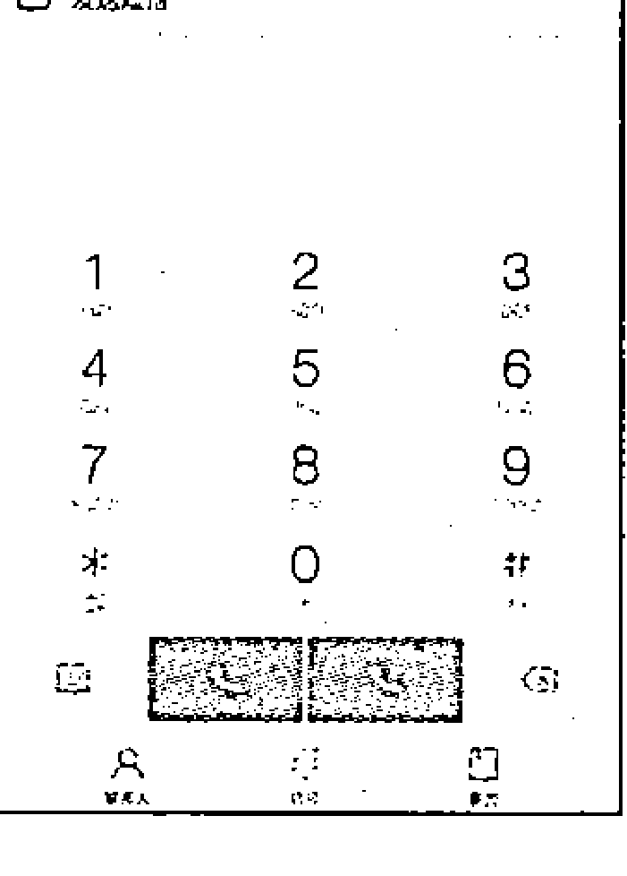

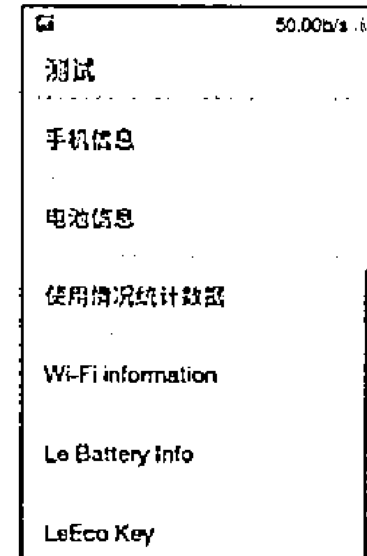

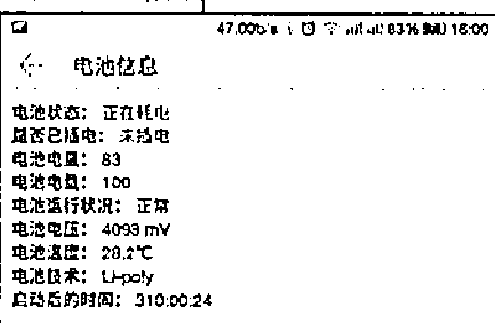

## 巧用QQ无线打印手机文件

文|天涯衰草

如今手机的使用率已经大大超过了电脑，于是很多人的手机里面都存有很多的文件。当我们有打印需求时，普遍会首先将文件上传到电脑系统里面，然后再按照传统的方法进行打印操作。这样的方法实在是有些繁琐，那么有没有什么更加简单的方法，通过无线网络就可以完成打印操作呢？

首先我们需要在电脑和手机端用同一个账号登录相应的QQ客户端软件。接着点击手机QQ客户端中的“联系人”标签，在出现的联系人列表里面向下滑动，就可以看到一个名为“我的设备”的选项。点击该选项进行展开，就可以看到“我的打印机”一项（图1）。现在点击“我的打印机”命令后，在弹出的新窗口可以看到“打印文件”和“打印照片”两个按钮（图2）。点击“打印文件”按钮打开的是手机文件列表，点击“打印照片”按钮打开的是手机图库。比如我们在手机图库里面选择要打印的照片后点击确定，这时在一个新的窗口里面就可以看到当前电脑系统连接的打印机信息。通过“打印机”列表选择要调用的打印机，再分别设置想要打印的份数等信息（图3）。设置完成以后点击“打印”按钮，这样我们需要的文件就可以通过无线网络进行打印了。CF


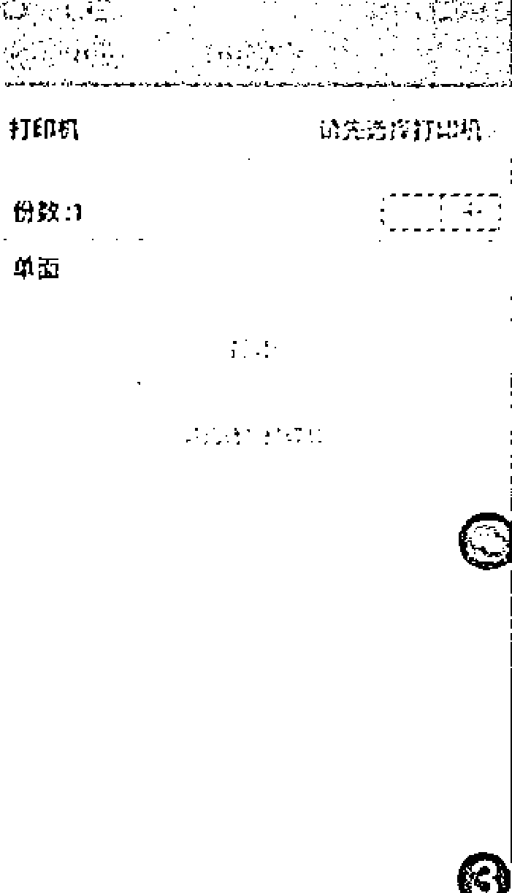

## 按需定制 让Android刷机包更好用

文|闫智飞

许多用户都会通过刷机来选择自己最喜欢的手机系统，但刷机包中往往会捆绑很多垃圾软件，而删除这些软件，得先获取ROOT权限才可以。特别是少数软件非常顽固，即使有了ROOT权限也不容易卸载干净。其实，我们可以在刷机之前，删除刷机包中的垃圾软件并添加自己所需要的软件，就可以让刷机包更好用。

### 第一步：清理垃圾软件

先从“http://www.romzhushou.com/”下载“ROM助手”，然后安装运行，再在其主界面中依次单击“ROM编辑”、“选择刷机包”按钮，将自己下载的第三方刷机包添加进来（笔者的手机是小辣椒Note，下载的第三方刷机包是“VIVO1.ZIP”，保存在D盘根目录下），稍等片刻，ROM助手就完成刷机包的解析操作了（图1）。在图1中，选中自己不需要的软件所对应的复选框（如“360卫士”等等），再点击图1中的“开始封装”按钮，完成精简垃圾软件后的刷机包的封装操作就可以了。

### 第二步：添加实用软件

1.  提取软件资源

用“WinRAR”打开“ROM助手”新生成的刷机包“VIVO1_old.ZIP”中的“system”文件夹（图2），然后将图2中的“app”文件夹、“priv-app”文件夹解压到D盘根目录下备用。

2.  添加APK软件包

从网上下载自己经常使用的“QQ”、“微信”、“闲鱼”等APK格式的安装包，然后将这些APK软件包的文件名重命名为纯英文，再将重命名后的APK文件复制到D盘根目录下的app文件夹中即可。

3.  清除“ROM助手”捆绑的软件

由于在第一步的操作中，我们是利用“ROM助手”来完成垃圾软件的清理操作的，但这个工具也往刷机包中添加了一个垃圾软件——Durian_Browser_mogu3572.apk，将“D:\app”目录下的同名文件删除就可以了。

### 第三步：替换安装包资源

完成刷机包中垃圾软件的清理以及自己所需软件的添加操作后，再用WinRAR打开原始的刷机包“VIVO1.ZIP”，将图2中的“app”、“priv-app”这两个文件夹删除，然后再把D盘根目录下与之同名的两个文件夹添加进来。最后关闭WinRAR并保存对刷机包“VIVO1.ZIP”所做的修改就可以了。将按需定制好的刷机包“VIVO1.ZIP”刷入手机，就可以看到最终的效果了（图3）。怎么样，制作这样一个满足自己需求的刷机包是不是非常简单呢？有此需求的朋友不妨一试。

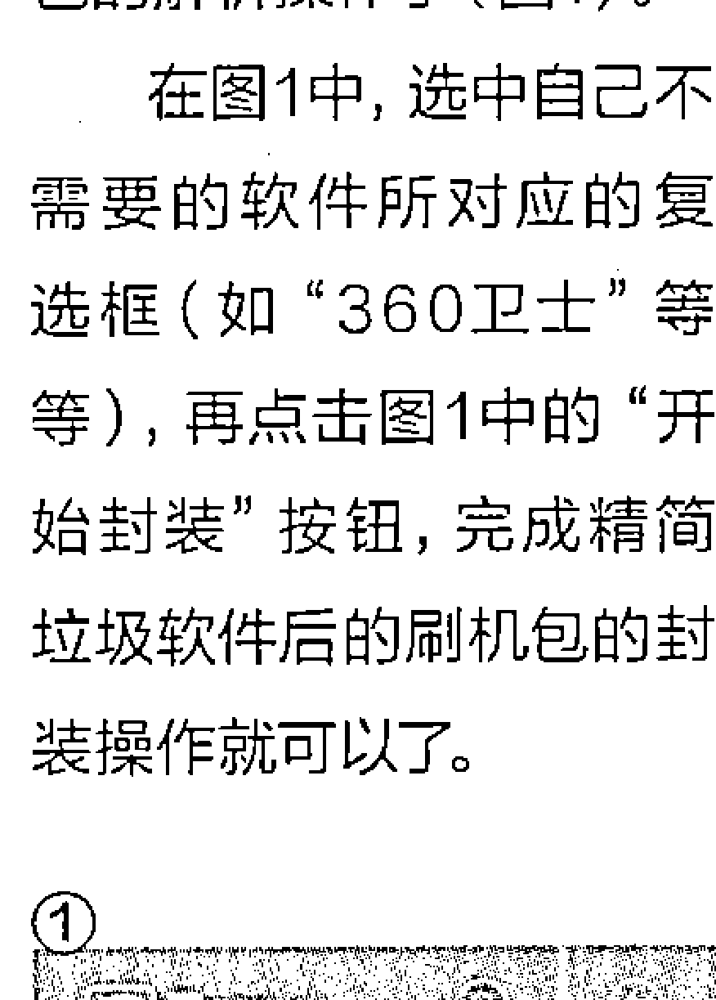

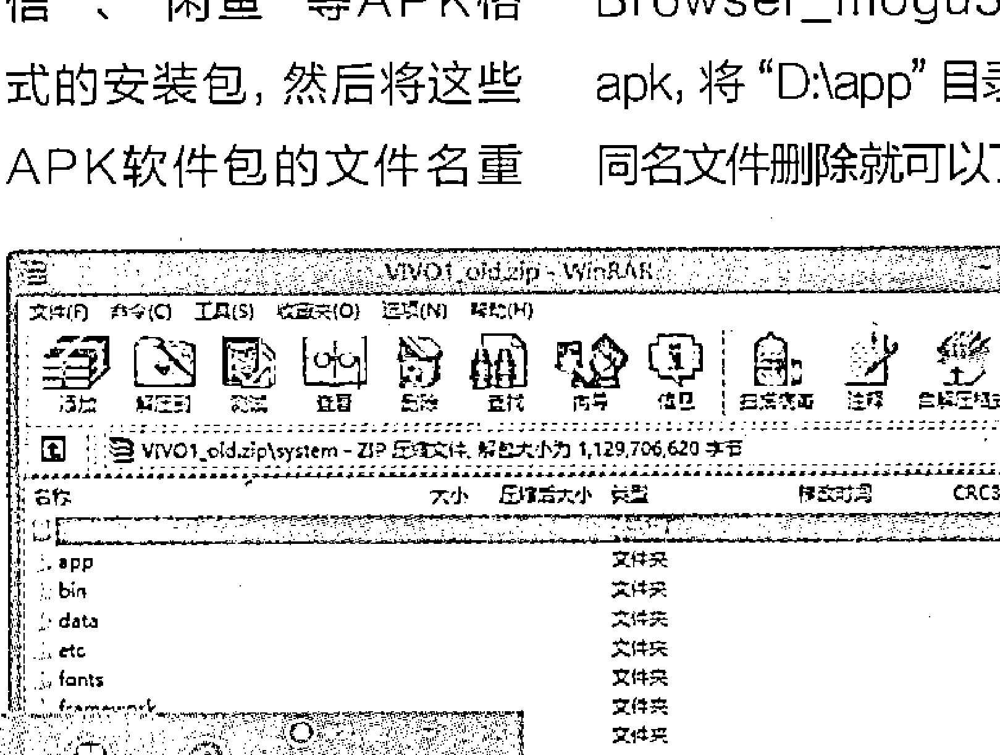

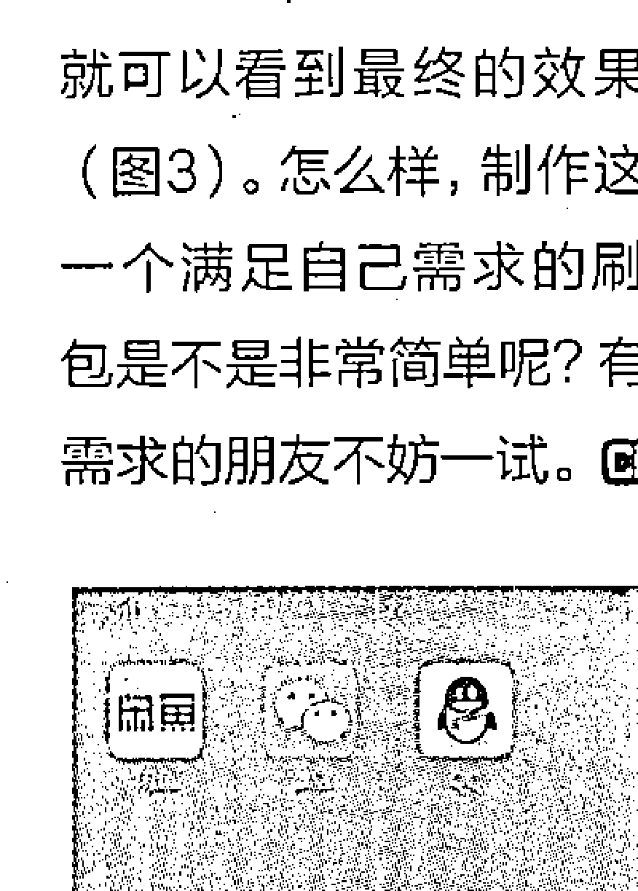

> 小提示
Android刷机包的系统内置应用存放在“app”文件夹或“priv-app”文件夹里边。其区别是：系统核心应用如Launcher、Systemui、Settings等应用只能放在“priv-app”文件夹里边。

**小提示**
1. “ROM助手”虽然有清除垃圾软件及添加自定义软件的功能，但生成的刷机包，刷机后会有一定几率卡在开机Logo界面而无法正常启动，此时只有重新刷入官方刷机包才能修复（所以笔者才推荐大家使用ROM助手来精简用不到的软件，然后使用WinRAR将清除垃圾文件后的文件夹提取出来）。
2. 极少数软件，刷机后往往无法正常运行，此时可用WinRAR打开该APK软件包（图4），将图4中“lib”文件夹中的资源添加到图2刷机包中的“lib”文件夹并重新刷机即可。

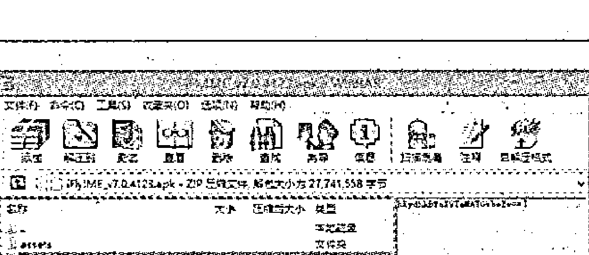

## 360网盘内容快速转移

文|天涯衰草

继金山快盘、新浪微盘、UC网盘之后，360网盘也将在明年初停止运营，噩耗传来我们第一时间想到的就是下载其中的文件。那么，在不借助PC的前提下，如何才能完成360网盘内容的快速转移呢？

### 网盘的授权操作

首先通过应用商店下载“云搬家”这款应用（下载地址：http://dwz.cn/4qHTet），通过名称我们就知道这款应用的主要功能，就是从一个网盘里面将文件转移到另外一个网盘里面。如果用户是第一次使用这款应用的话，需点击界面窗口的“注册”按钮，根据提示注册一个搬家服务的账号来进行操作（图1）。当账号密码申请注册完成以后，就可以登录到应用的操作界面。

现在我们点击界面下方工具栏中的“网盘”按钮，在弹出的新窗口里面点击右上角的“我的网盘”命令（图2）。再点击“我的网盘”窗口右上角的加号按钮，就会弹出一个“添加网盘”的列表。

由于我们是打算将360网盘中的文件转存到百度网盘里面，所以首先点击列表中的“360云盘”这项（图3）。接着根据网页里面的提示输入360云盘的账号以及密码信息，点击“登录”按钮以后就可以完成该应用和360云盘之间的授权操作（图4）。

授权操作完成以后点击操作界面左上方的退回按钮，按照同样的步骤对百度网盘进行授权操作就可以了。

### 网盘文件的转移

现在再次返回到“云搬家”应用的操作界面，还是点击下方工具栏的“网盘”按钮。在出现的网盘列表里面点击“起始盘”命令，在弹出的对话框里面选择刚刚授权完成的360云盘这项（图5）。

接下来在网盘列表中点击“目标盘”按钮，从弹出的对话框中选择授权的百度网盘就可以了。然后再返回到网盘列表里面，从“起始盘”的列表中勾选需要进行转移的文件或文件夹（图6）。选择完成以后点击“运行”按钮，这样就可以在云端进行文件的转移操作了，从而避免我们下载后再进行文件上传的繁琐操作。

**小提示**
建议大家在进行文件转移之前，先对360网盘中的文件进行清理，不必要的文件就不要转移了。

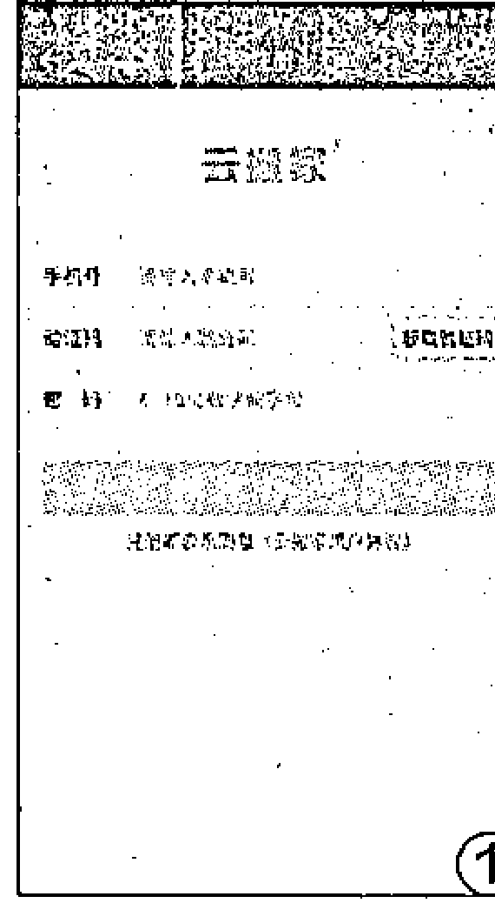

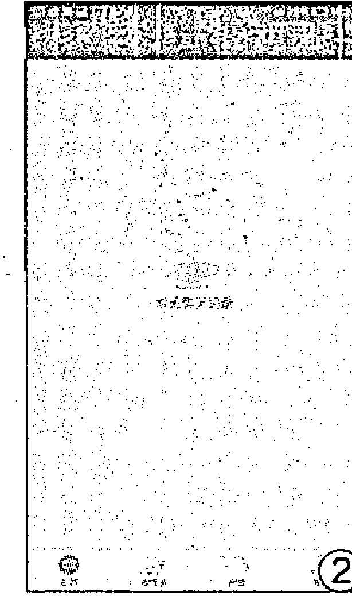

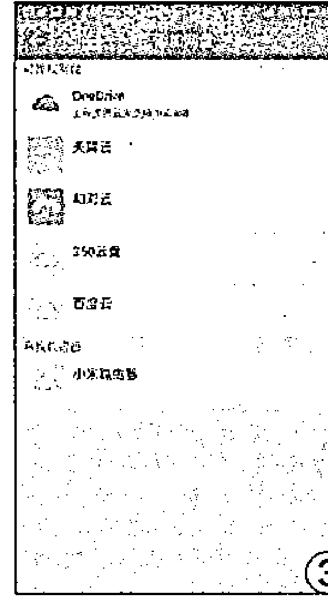

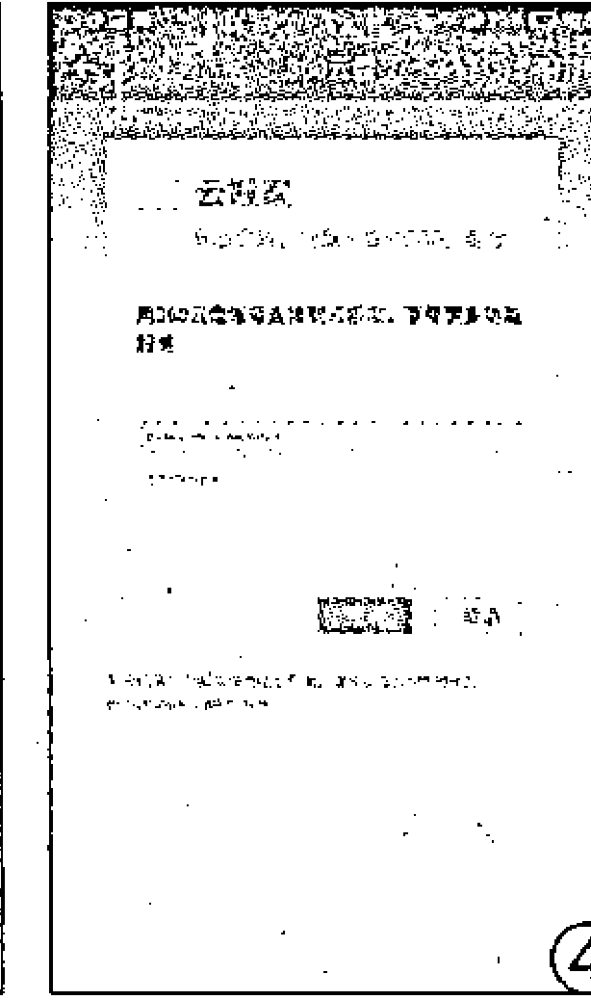

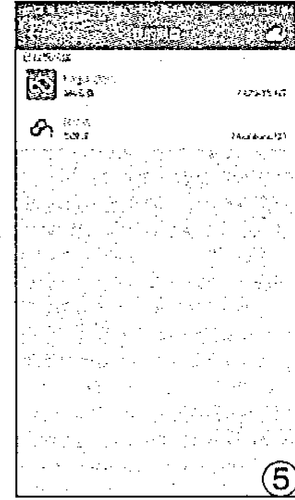


## 手机遥控PPT极简工具

文|无可尚人

无论是商务演讲还是老师授课，PPT已经成为一种必不可少的形式。不过演讲中的热烈气氛经常会被手忙脚乱的鼠标点击和屏幕变暗所破坏。如果能用手机来遥控PPT文稿，这一炫酷的操作肯定会给演讲加分不少。

现在iOS和Android系统上有不少可以遥控PPT播放的APP，但使用起来都比较复杂：一般要电脑、手机上各安装一个客户端，还需要在同一个Wi-Fi环境下，或者要用蓝牙进行配对。

手机遥控PPT工具使用简单至极，不用安装手机APP，不用蓝牙配对，不需在同一Wi-Fi环境下，只要有网络即可遥控。

“PPT遥控器”使用前，请确保手机与电脑均可上网。打开电脑上的“PPT遥控器”软件（下载地址：https://ppt.baidu.com/），该工具是绿色软件，无需安装，双击即可开始运行。

“PPT遥控器”软件运行后，界面上就会出现一个二维码（图1），使用手机微信扫描后打开一个新的页面，点击页面上的播放按钮即可开始遥控PPT了（图2）。

> 小提示
该工具不仅适用于Office中的PowerPoint，也适用于WPS演示。

在开始遥控前，请先打开PPT文件，如果未打开，界面上会有“您未打开PPT，请在电脑上打开PPT”的提示（图3）。在PPT遥控器界面中只有两个按钮，大的是“下一页”，小的是“上一页”。该工具还贴心地在下方添加了一个计时器，可以帮助演讲者把握时间（图4）。

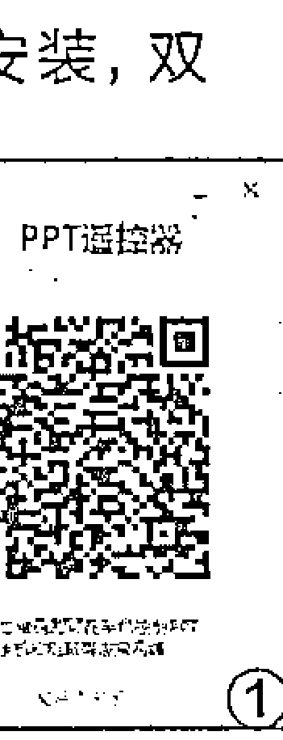


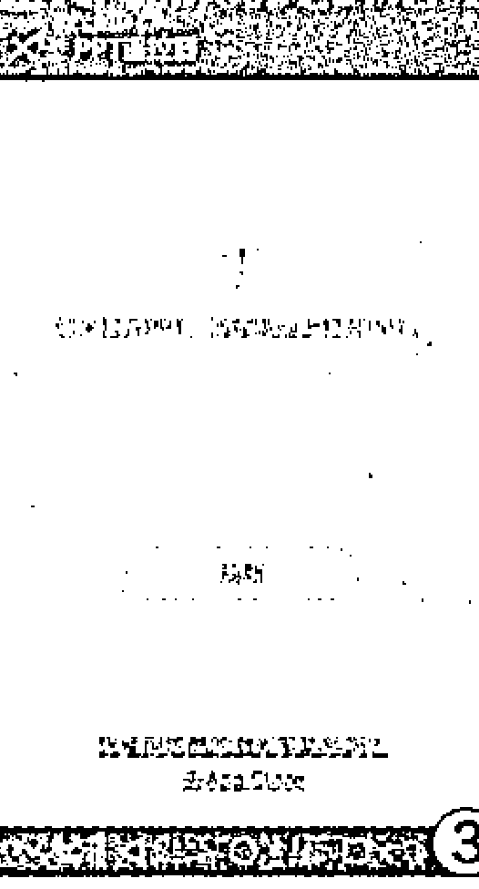

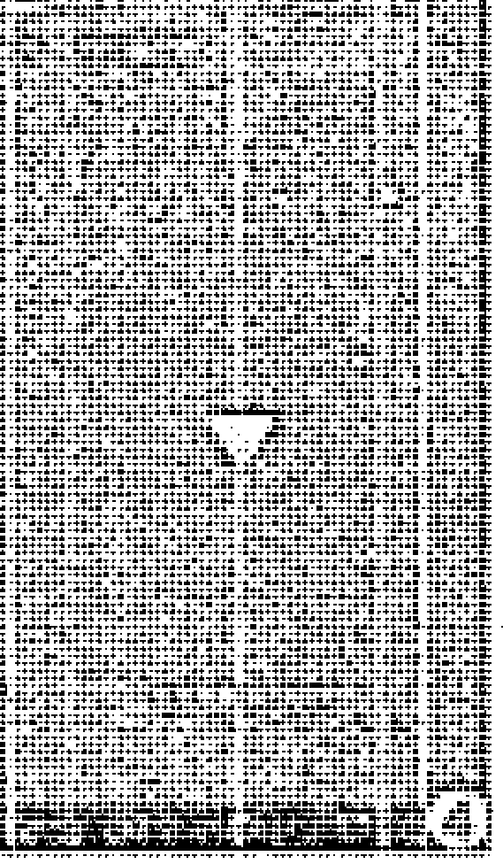

## 无需锤子手机也能实现Big Bang功能

文|天涯衰草

新款锤子手机支持一项名为“Big Bang”的新功能，可以将用户手机密密麻麻的文字信息一下子炸开到这个屏幕里面，便于选择其中的内容。那么，其他品牌手机如何实现类似“Big Bang”的功能呢？

下载安装“Clipboard Plus”软件（下载地址：http://dwz.cn/4pZpMx），启动这款应用就可以进入到它的设置窗口里面（图1）。首先点击“启动服务”按钮，在弹出的新窗口里面允许这款应用以悬浮框显示到其他应用的窗口上方（图2）。

权限启动完成以后，接下来我们就按照自己的要求，分别设置“智能分词”、“快速搜索”、“分词算法”等选项。另外，如果用户的手机里面有自动查杀后台的功能，那么还需要把这个应用添加到系统的白名单里面。

所有的这些选项设置完成以后就可以使用“Big Bang”了。比如我们这里就以新浪微博为例进行操作，首先从微博里面复制一段需要的文字内容，这时应用的悬浮框就自动出现了。点击这个悬浮框按钮以后，马上就可以看到“Big Bang”效果了（图3）。所有被复制的文字都会被拆开并铺满整个屏幕，想要复制什么内容进行选择就可以了，选中的文字可以进行分享、查询、搜索、复制等操作。

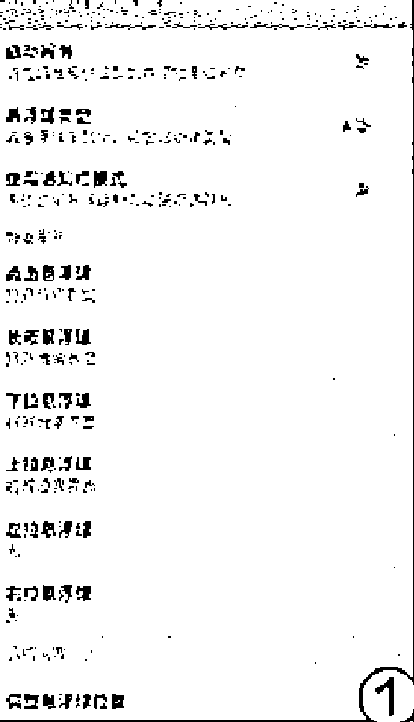

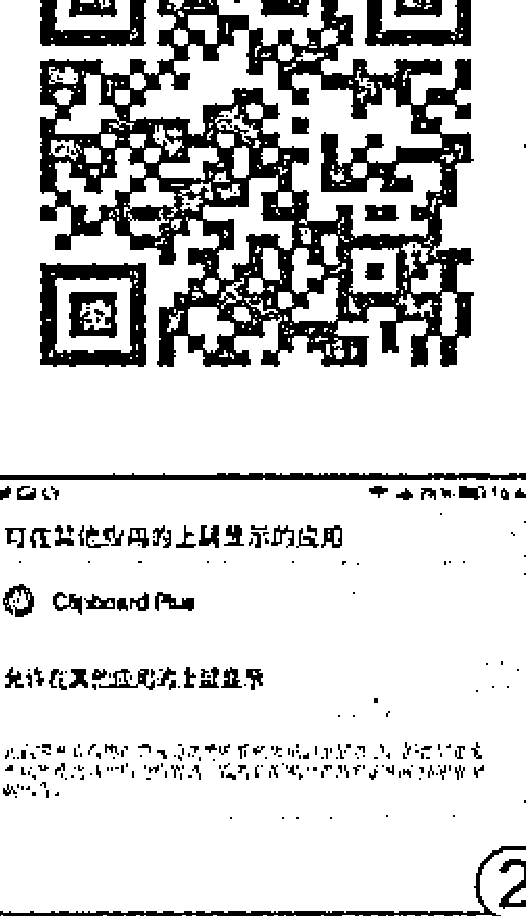


## 挖掘手机系统的截屏功能

文|天涯衰草

Android手机虽然都支持截图（电源键+音量减），但普遍功能偏弱，当我们想进行长截图或后期编辑时却往往需要借助第三方APP。实际上，现在很多Android手机已经自带了更高级的截图功能，善加挖掘就能带来惊喜。

以乐视手机为例，它就隐藏了一项滚动截屏的功能。点击系统桌面的“设置”图标，在弹出的列表里面点击“辅助功能”命令，找到其中的“长按虚拟键”设置选项，点击其中任意一个按键名称后，在弹出的窗口里面选择“截图”选项即可（图1）。

以后当我们需要进行滚动截屏的时候，长按虚拟键后就可以对当前屏幕进行截取，与此同时会显示出截图的预览图效果（图2）。而我们在预览图的下方工具栏里面，可以看到一个“滚动截屏”的按钮，点击这个按钮后就会开始进行滚动截图操作。

在滚动截图的过程中点击任意位置，就可以停止滚动截屏并生成截图效果（图3）。如果用户对截图效果不满意，可以手动重新调节截图范围，以达到自己需要的效果。最后点击右上角的“保存”按钮，就可以将长截图保存到手机图库里面。

> 小提示
不同品牌Android手机的截屏功能花样很多，比如手势截屏、截屏后的涂鸦编辑功能都是非常实用的功能。只是这些容易被忽略的选项往往存在于截屏后的预览界面，需要我们认真挖掘。

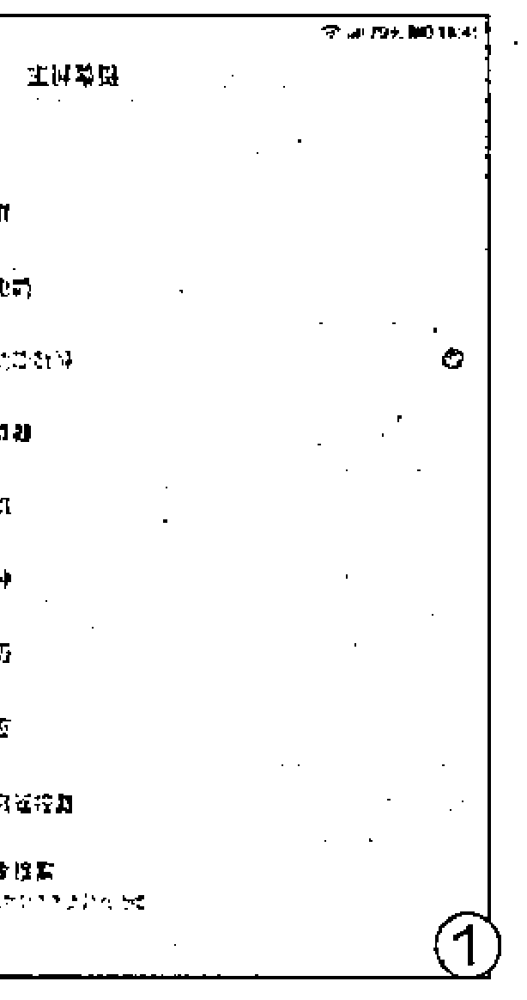

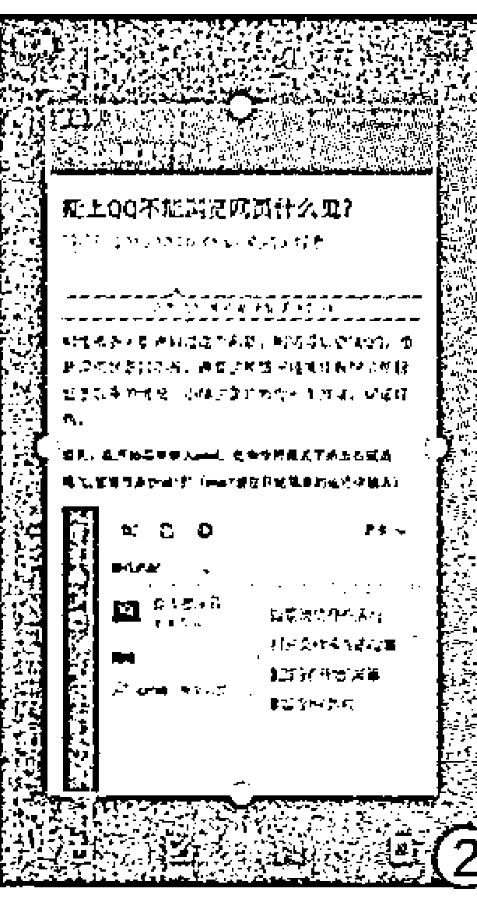

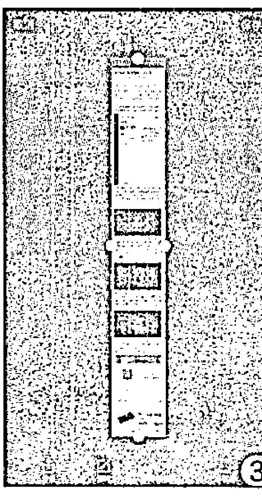

## 语音唤醒 + 行驶模式 让驾车更安全

文|镜花水月

最新美国大片《奇异博士》中有个情节，驾驶着兰博基尼的男主角为了接听一个电话而分神，与其他车辆剐蹭后出现了严重事故，最终导致双手被废。那么，在不使用蓝牙外设的情况下，如何降低驾驶时使用手机的风险？

很多Android手机都提供了语音唤醒功能，在设置选项中找到并打开它，根据界面提示录入唤醒关键词即可。以荣耀8为例，说出“我的荣耀”即可激活语音控制模式（图1），从而轻松实现语音拨打、接听电话的功能（图2）。

此外，荣耀8还提供了一个名为“驾驶模式”的APP，运行后原本的桌面会被隐藏，手机屏幕会变成只有导航、电话、音乐、设置以及语音唤醒五个功能的建议界面（图3）。说出提前设置好的唤醒词就会自动进入语音呼叫拨打电话界面，在设置中还能开启来电和短信播报，通过语音告诉你来电号码和短信内容，无需低头查看（图4）。

需要注意的是，本文提供的方法只能降低事故风险，要想获得100%的安全，开车时禁止使用手机的习惯还是要保持的。

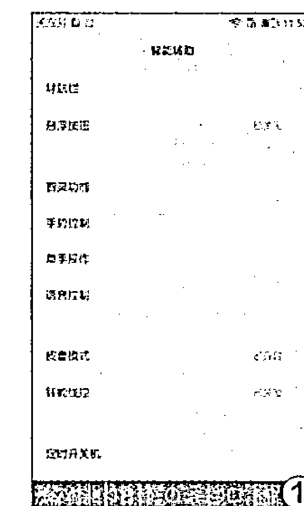

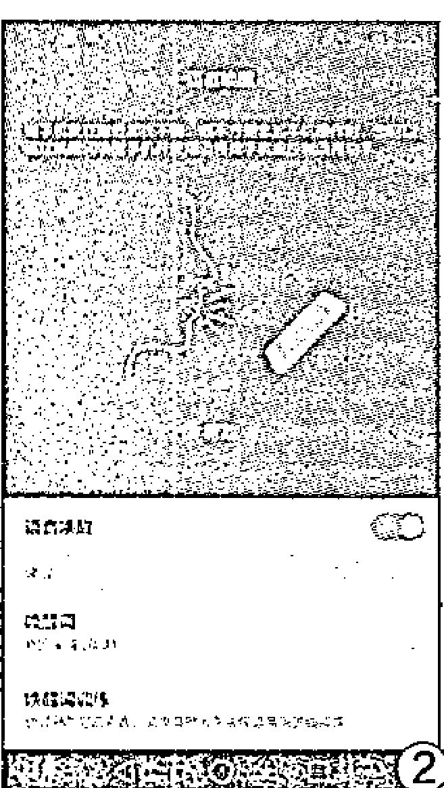

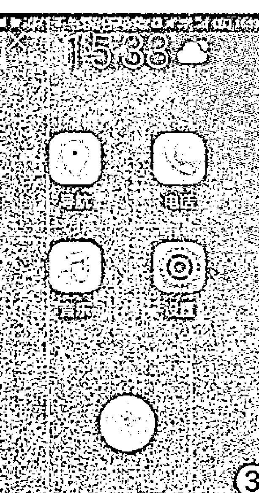


## 资源共享 让手机输入法更好用

如果电脑和手机输入法不同，我们如何才能将电脑输入法中常用的个性短语导入到手机输入法中，从而提高手机文字的输入效率呢？接下来，我们就以电脑中的QQ拼音输入法为例，介绍一下如何将个性短语添加到手机的讯飞输入法中。

### 导出个性短语

右击QQ拼音输入法面板，依次选择“属性设置→属性设置→词库”选项卡；再单击该选项卡“自定义短语”右边的“设置”按钮，打开一个与之同名的对话框；然后单击该对话框中的“导出”按钮，将自己经常使用的个性短语导出为“自定义短语.ini”文件，保存到桌面备用。

完成上述操作后，用记事本打开“自定义短语.ini”，将该INI文件中QQ拼音输入法自带的数学序号、希腊字母等用不到的冗余信息删除，只包含自己真正用到的自定义短语（图1），最后保存对“自定义短语.ini”所做的修改即可。

### 启用及导入个性短语

运行手机中的“讯飞输入法”，依次选择“设置→扩展功能”，接着轻触“个性短语”右边的“安装”按钮，完成该功能的安装操作并打开（图2）；

接着打开图1所示的INI文件，将光标定位在第一行的最左端，按下回车键并添加字段“[iFlyIME]”（不包括最外侧引号）；再将修改过的“自定义短语.ini”复制到手机内存或存储卡的根目录；最后轻触图2中的“导入个性短语”按钮，选择“手动选择文件”，按照提示将“自定义短语.ini”所包含的个性短语导入进来就可以了。

这样一来，当我们输入图1事先指定的英文字符（如“sh”），就可以很方便地输入与之对应的个性短语了（图3）。

### QPYD词库文件的转换

QQ输入法官网有许多不同领域QPYD格式的词库，选择合适的词库可以提高自己的文字输入效率。其实，我们也可以将自己经常使用的词库添加到讯飞输入法中。具体方法如下：

先从 http://dwz.cn/4EtG8F 下载“深蓝词库工具”并解压运行（图4），然后单击右上角的“…”按钮，将早已下载好的QPYD词库文件添加进来（如“常用聊天短语.qpyd”）；接着单击左上角的下拉箭头，选择“QQ分类词库qpyd”，单击右上角的下拉箭头，选择“讯飞语音输入法”；再单击“转换”按钮，将转换后的词库资源以“user_dict.txt”为文件名，保存到桌面；最后将这个文本文件复制到手机讯飞输入法所在的“iFlyIME”文件夹就可以了。

#### 词库资源的添加

运行讯飞输入法，选择“设置→词库→本地”，然后选择“导入用户词”，此时讯飞输入法就会自动将“user_dict.txt”所包含的所有词条内容导入进来。经过以上步骤的操作，以后我们在聊天时，就可以使用“常用聊天短语.qpyd”所包含的所有词条内容了（图5）。

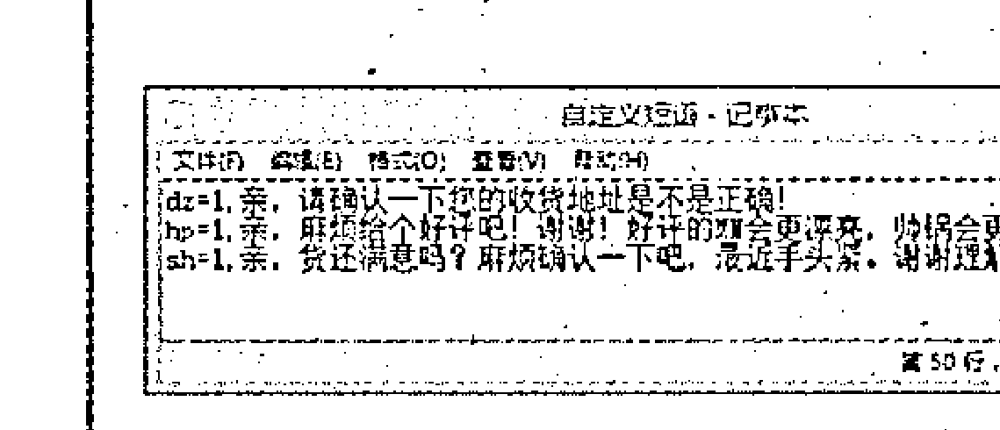

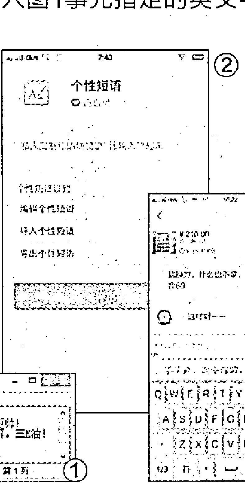

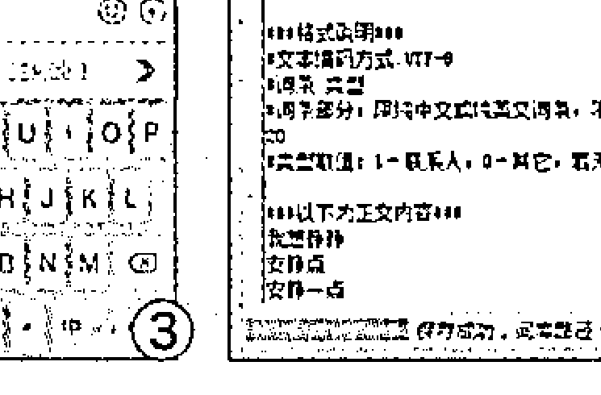

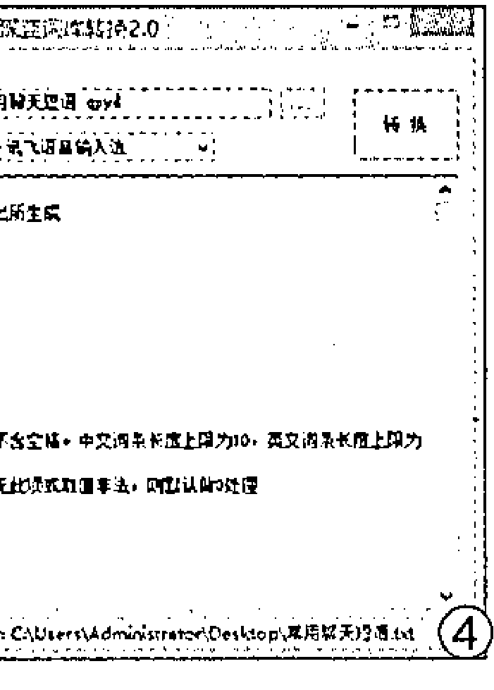

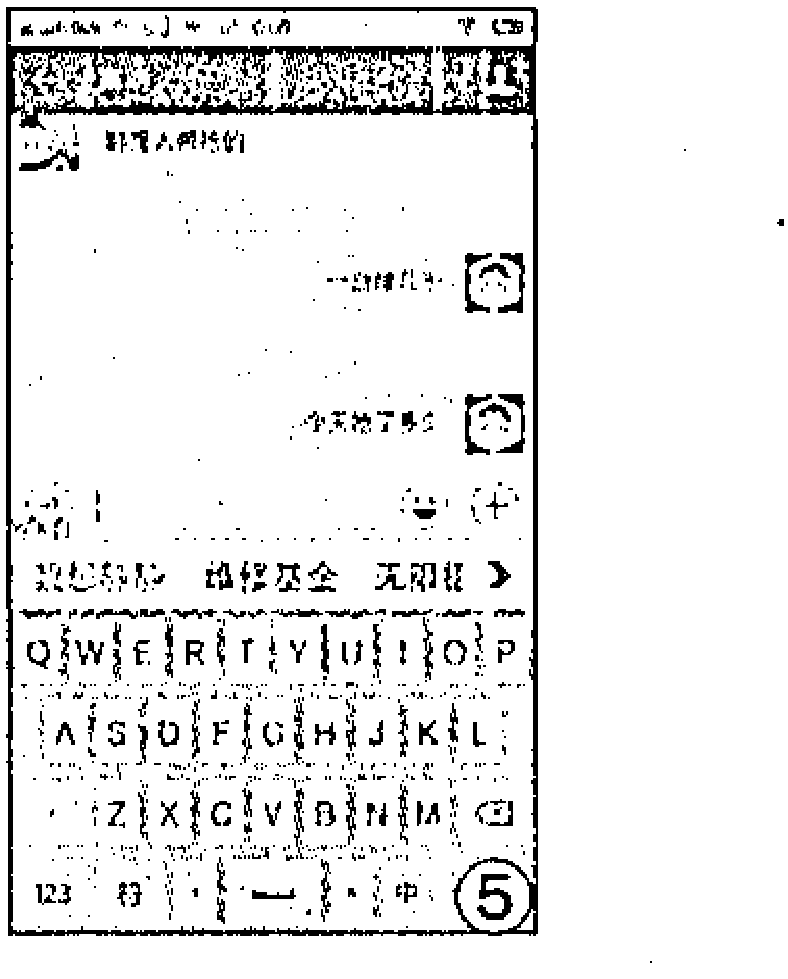## 利用QQ进行协作办公

文|天涯衰草

如今很多网站或客户端都提供了协作办公的功能，但它们要么操作不便，要么太过小众。那么，我们能否借助普及率最高的QQ实现协同办公的目的呢？

首先安装腾讯最新推出的TIM应用（下载地址：http://dwz.cn/4C81r4），安装完成以后利用自己的QQ账号进行登录即可。接着点击应用主界面工具栏中的“我”按钮，在弹出的列表里面点击“协作文档”选项，这样就可以弹出“协作文档”的列表窗口（图1）。

首次使用该功能时点击窗口右上角的加号按钮，根据需要点击“新建文档”或者“新建表格”按钮。如果是已经创建完成的文档，就可以直接在列表里面点击使用（图2）。接下来在弹出的编辑窗口里面就可以输入内容进行编辑操作了。如果你想要和其他人员协同完成这个文档，只需点击编辑窗口右上角的按钮，在弹出的对话框里面选择“好友”这项（图3）。

此时，应用就会切换到自己的QQ好友列表，从中选择需要协同办公的用户后就可以给他分享一个协同办公的邀请链接。当这个用户在TIM应用里面打开这个链接后，就会自动切换到编辑窗口，这样两个人就可以同时对一篇文章进行编辑操作了。

### 对传统照片进行数字化处理

文|天涯衰草

很多人家里都保存着由胶卷冲洗出来的照片。随着岁月的流逝，这些照片也渐渐地开始发黄，效果变得越来越差。那么，如何才能方便快速地将这些照片转换成数码照片呢？

我们首先下载一款名为“Google PhotoScan”的应用，它是谷歌发布的针对照片的扫描工具（下载地址：http://dwz.cn/4EsZNz），和手机自带的相机APP相比，它能自动识别照片的边框，并对边框内的内容进行分析处理。首次使用会弹出一个调用手机摄像头的对话框，同意该应用调用手机摄像头后，就会看到应用的操作界面。

现在将摄像头对准到我们需要扫描的照片上面，聚焦完成以后点击下面的拍摄按钮（图1）。拍摄完成以后我们会在屏幕正中看到一个圆圈，与此同时在屏幕四周还有四个其他的圆圈。按照提示将屏幕正中的圆圈分别移动到四个圆圈上面进行校对，这样应用就可以开始进行照片的处理。照片文件处理完成以后，点击屏幕右下角的按钮，这样就可以对刚刚扫描的照片进行预览（图2）。除此之外，还可以进行图片旋转、调整边角等编辑操作。如果没有异议的话，点击左上角的返回按钮就可以进入到应用的图库里面，再点击“全部保存”按钮就可以将这些扫描完成的照片保存到手机的图库里面（图3）。

## 傻博士

### 如何卸载手机里面的小米桌面

文/老万

Q：我的手机使用的是MIUI 8系统，可是我个人不太喜欢里面的小米桌面。所以我想问问通过什么方法可以将其卸载掉？我的手机系统已经获得了最高的ROOT权限。

A：由于小米桌面是MIUI系统里面重要的组件，如果将其删除以后将无法登录到系统，所以这个功能模块是无法删除掉的。既然你已经获得了ROOT权限，那么可以考虑选择一个和手机匹配的其他ROM。在进行了数据的成功备份以后，通过刷机的形式将小米桌面彻底地进行删除。

也可以安装第三方的启动器，如Arrow桌面等，用以替代系统里面的小米桌面。

### 怎么用手机拍出合格的证件照

Q：最近我们一家子打算出去旅游一下，可是旅行社要求提交一张电子版的照片。由于手上没有单反相机，所以我想问问通过手机能不能拍出合适的证件照啊？

A：其实证件照并没有大家想象的那么严格，只需要拥有标准的尺寸以及清晰度即可。首先通过应用商店下载安装一款名为“智能证件照”的应用，运行后选择“通行证/护照”这个选项。接着根据应用的提示来进行取景，这样就可以拍摄出一张满意的证件照了。

### Galaxy手机如何进入儿童模式

Q：我听说三星Galaxy系列的手机有一个儿童模式，但是我找来找去也没有找到这个功能。请问Galaxy手机到底有没有这个功能？有的话应该如何开启使用该功能啊？

A：首先点击手机左侧的功能键，在弹出的菜单里面点击“小组件”按钮。接着在弹出的屏幕上找到“儿童模式”的图标，点击它并将其拖动到主屏幕里面。接下来点击屏幕的“儿童模式”图标，这样就可以进入到“儿童模式”的安装操作。安装完成以后会要求设置一个密码，这样就可以开启或关闭儿童模式了。

### 让微信也可以支持浮动通知

Q：每当我们的手机收到微信消息后，都会在信息栏里面显示出一个微信图标，接下来用户需要下滑通知栏，才可以点击查看接收的信息。那么有没有什么方法，可以简化这个操作步骤啊？

A：其实我们只需要通过设置一段代码，就可以让微信信息通过悬浮进行显示。首先在任意一个聊天窗口里面输入

```
//switchnotificationstatus
```

并发送，这样以后收到的信息就会在手机顶部悬浮显示。用户只需要点击它就可以查看到信息内容了，从而节省了下拉信息栏的相关操作。

### 支付宝继续免费进行提现

Q：今年上半年的时候微信提现开始收费，现在支付宝也宣布提现要收费了。那么我们还有没有什么方法，可以继续免费从支付宝提现呢？

A：从支付宝官方的声明里面可以看到，通过余额宝进行操作是不需要收费的。所以如果要想进行提现操作的话，可以用你A卡的钱购买余额宝，然后再从余额宝里转出到你自己的B卡上面。或者买东西的时候尽量用蚂蚁花呗进行付款，到还款日期时用支付宝里面的余额来还花呗，也就是说把余额留在支付宝里面进行购物而不提现。

### 快速完成文章内容的排版操作

文/老万

Q：我大学毕业后到一个公司上班，公司要求我负责宣传方面的工作，就是把介绍公司的信息发到网站和微信中。可是网络中的文章排版和平时不一样，请问有什么方法可以快速地完成排版操作？

A：这里为你推荐一款名为“排版助手”的小工具，运行后首先将文章内容复制粘贴到编辑框。接着点击“选项”菜单中的“排版设置”命令，在弹出的对话框里面根据需要设置排版的选项，或者在主界面的左下方点击“方案”列表选择已有的方案。设置完成以后点击工具栏中的“执行”按钮，就可以一键完成排版操作。

其实在WPS Office里面，点击“文字工具”中的“智能格式整理”命令，也可以起到类似的效果。

### 分析扫描出图片里面的文字信息

Q：现在单位里面出于保密等原因，很多文件都是以PDF的形式发布的，这样如果想要调用里面的某些内容，就不能直接进行复制粘贴操作。那么如何可以将里面的内容复制出来呢？

A：首先通过截图软件将需要的部分截取下来，接着运行Office办公软件中的OneNote组件。点击工具栏中的“植入”标签，再点击工具栏中的“图片”按钮，选择刚刚截图下来的那张图片文件。然后在图片上点击右键并选择“复制图片中的文本”命令，这样图片中的内容将被提取到系统的剪贴板里面。

### WPS Office为什么不能使用宏

Q：我使用的办公软件是WPS Office，今天打开一个Word文件后，发现软件不能成功调用文件里面的宏信息。请问傻博士这是怎么回事啊？通过什么方法可以解决这个问题？

A：WPS Office的个人版里面是没有VBA组件的，所以要想使用这个功能有两种方法解决。首先就是安装WPS Office的专业体验版，或者安装由网友提取出来的VBA组件，这样就可以成功地激活文件里面的宏信息了。不过还是要提醒用户一下，宏可能会含有病毒代码，所以运行的时候要小心。

### Word自备计算器如何进行调用

Q：工作中常会用到计算器，但无论是调用系统的计算器，还是通过浏览器进行云计算都非常麻烦。那么Word里面能不能输入一个算式后，自动就给出相关的结果啊？

A：首先打开Word软件的“选项”窗口，点击左侧列表中的“自定义功能区”命令。接着在右侧窗口的“不在功能区中的命令”列表中，找到“计算”这项后双击将其进行添加。然后在Word中输入算式并通过鼠标左键选中，接下来点击“新建选项卡”下面的“工具计算”按钮即可。

### 删除分节符为何导致文档乱码

Q：今天同事发来一个Word文档，我发现最后一页有一个分节符，我觉得不合适所以打算将其删除。可是非常奇怪的是，当我删除这个分节符后，文档内容变成了乱码。这个问题咋解决啊？

A：估计是文件的内容和软件版本有冲突，你可以换一个办公软件或者上传到在线系统，看看能不能成功地进行编辑操作。或者你也可以将文章的内容全部选中后进行复制，接下来新建一个新的文档，将内容粘贴过去后再编辑试一试。

### 广告软件能不能主动进行拦截

文/老万

Q：现在无论是国内的软件还是国外的软件，很多都在安装的时候进行了其他软件的推广。虽然很多都允许用户自行去除，但是有的时候不小心还是给安装上了。那么有没有什么方法可以主动拦截这些软件啊？

A：正是由于这种情况的泛滥，所以也出现了一类拦截软件，可以在系统后台拦截自动安装的程序。Unchecky这款软件正好就是这类软件的代表，它的使用也非常的简单。用户只需要确认Unchecky软件正常运行后，再执行其他的软件安装程序，Unchecky就会自动帮助用户侦测并阻挡其他软件的安装。

国内很多安全软件的小工具，也包括类似的功能模块，用户只需要激活运行它们即可。

### 怎么才可以阻止应用程序的后台运行

Q：现在的应用程序莫名其妙地就在系统后台里面启动运行，不仅占用了大量的系统资源，而且还时不时地弹出各种各样的广告。请问如何才可以阻止应用程序在后台运行？

A：首先下载运行一款名为“Simple Run Blocker”的小工具，接着点击工具窗口中的“添加到列表”按钮，在弹出的对话框里面选择要阻止运行的应用程序。然后在列表中选择“禁止运行”选项，并且点击“保存设置”按钮进行保存。这样一旦指定的程序运行，该工具就会主动地进行拦截。

### 总提示迅雷破解版是无需启动的程序

Q：360安全卫士扫描迅雷星空破解版判定为伪造程序，点击立刻处理后重启电脑扫描还是这样。而且在扫描后弹出一个提示框，显示为“此类程序位置且必须开机自动运行程序”。请问怎么会出现这种莫名其妙的状况？

A：出现这样的情况有两种可能，首先由于使用的是破解版，所以会出现软件误报的可能。还有一种可能就是这个文件确确实实有问题，所以建议用户重新下载迅雷软件来试一试。如果用户分不清楚是哪种原因，可以将文件上传到www.virustotal.com扫描分析看看结果如何。

### MPC-BE播放器为什么无法运行

Q：听说MPC-BE这款播放器非常不错，所以我也下载安装了一个打算来试试。可是没想到这个播放器居然无法运行，本以为是下载的软件有问题，可是重新下载以后同样如此。请问这是怎么回事啊？

A：现在很多软件的运行都需要运行库的支持，MPC-BE这款播放器自然也不例外。由于这款播放器是用Visual C++ 2015来编写的，所以用户必须要安装Visual C++ 2015的运行库才可以。不过由于不同软件需要的运行库不一样，所以建议安装由网友制作的运行库合集安装包为好。

### 解压文件大小与压缩包显示大小不一致

Q：今天下载了一个EXE文件，发现可以用WinRAR打开，但解压后在属性里面显示的文件大小和WinRAR文件列表里面显示的不一样。所以我想知道为什么压缩文件中显示的文件大小和实际显示的不一致？

A：之所以出现文件大小显示的差距比较大，主要是因为这个EXE文件在制作的时候，使用了一些文件压缩的技术，但是它和我们常见的压缩文件又不相同，所以WinRAR无法正确地显示出其中的文件大小信息。建议用户更换为7zip这款压缩软件试一试。

### 用户怎样才可以禁用WPAD协议

文/老万

Q：我听说现在国外的很多网络运营商，都通过HTTPS来强制用户使用HTTPS协议，但是最近又有国外的安全专家说这个不安全。那么到底如何进行这两难的选择啊？

A：我想肯定是你自己理解错了，安全专家主要是说有一种攻击方法能绕过HTTPS保护，而问题主要是出在WPAD协议上面。首先打开注册表，依次展开到HKEY_CURRENT_USER\Software\Microsoft\Windows\CurrentVersion\Internet Settings\Wpad，接着在右侧窗口中新建一个名为WpadOverride的DWORD（32位）值，然后将其中的内容修改为1即可。

检查浏览器中是否有不熟悉的PAC文件，有的话将其删除就可以了。

### 如何为Edge启用TCP Fast Open

Q：据Google表示，TCP Fast Open可以改善页面加载时间10%至40%，而我使用的是Windows 10系统中的Edge浏览器。那么请问这个浏览器有没有这个功能？如果有的话如何进行激活操作？

A：首先在地址栏中输入“about:flags”后按下回车键，从而进入到Edge浏览器的开发者模式里面。在页面中找到最下方的“网络”区域，勾选其中的“启用TCP快速打开”选项，根据提示重新启动浏览器后就可以使用这个功能了。

### 如何停用Material Design外观主题

Q：我平时将Google Chrome作为默认浏览器，但是最近我发现它默认激活了Material Design风格的主题。可是我还是喜欢传统的主题，那么如何才可以回到以前的主题啊？

A：首先在地址栏输入“about:flags”命令并回车，就可以进入到浏览器的实验室里面。接着点击右上角的菜单按钮，在弹出的菜单里面点击“查找”命令。接着在弹出的搜索框里面输入关键词“浏览器顶部界面中的Material Design”，查找到这个选项后选择列表中的“非Material”这项，最后按照提示重新启动浏览器就可以了。

### Edge的adblock plus规则不会自动更新吗

Q：我的Edge浏览器在8月6日安装了adblock plus扩展并更新了过滤规则，今天8月13日发现过滤规则还是6日的。那么Edge版的adblock plus过滤规则是只能手动更新吗？

A：任何广告过滤扩展的规则都不可能天天进行更新，如果你想尽快更新的话，可以试一试手动进行操作。另外听说Edge的adblock plus扩展暂时还存在一些Bug，所以好多人都推荐adblock这款广告过滤扩展。

### 连接两台路由器的电脑如何实现文件共享

Q：家里有一台笔记本和一台台式机，同一个路由器引出2根网线接上后，两台机器间能实现网络共享。但是连接不同路由器时，则看不到任何共享文件。求解是软件设置问题，还是压根不能这么共享？

A：由于每一个路由器会自动为电脑分配一个IP地址，所以两台电脑使用的网段肯定是不一样的，这样要想实现文件共享就需要进行麻烦的设置。所以这里建议你使用BitTorrent Sync这样的同步软件，从而快速实现文件的共享操作。

### 用Google翻译复制书籍中的文字

文/老万

Q：有的时候需要从纸质图书上快速识别一些内容，传统的方法一般都是使用具有OCR的应用。可是专业的OCR应用都是收费的，那么有没有什么免费的应用可以推荐啊？

A：傻博士觉得最简单的就是“Google翻译”，首先把应用界面左边的来源语言设定为中文，接下来启动应用的“拍照翻译”按钮进行拍摄。拍照完成以后“Google翻译”就会自动辨识出图片上的文字范围，这个时候点击界面下方的“全选”命令，就能把照片上的内容全部转换成文字信息。最后我们只需要进行文字信息的复制操作就可以了。

其实很多应用都有OCR，比如杂志介绍过的“萝卜书摘”。

### 如何屏蔽苹果日历上出现的广告信息

Q：最近我和周围很多使用苹果手机的用户，都发现自己的手机日历上突然全是广告。请问这种情况是不是自己的Apple ID被盗了？通过什么方法可以解决这个问题啊？

A：首先通过电脑中的浏览器登录“iCloud日历”，点击网页页面左下角的齿轮命令后，在弹出的菜单里面点击“偏好设置”选项。接着在弹出的对话框里面选择“高级”这项，把“邀请设置”更改为“发送电子邮件到”选项。这样邮箱就会帮助用户过滤垃圾广告，而不会直接发送到本地日历应用上了。

### 快速进行人民币汇率的计算操作

Q：现在互联网购物变得越来越方便，甚至在国外网购也不是什么难事，但是如果在国外网购的话，这就涉及到一个汇率转换的问题。那么如何获取到最新的汇率信息呢？

A：首先下载安装“极简汇率”这款APP，它的汇率数据会通过网络实时进行更新，而且支持的外币内容也非常丰富，包括美元、港币、欧元、英镑等主要货币。打开运行这款APP后就可以在列表中看到最新的外汇牌价，通过在下面的键盘输入对应的人民币数字，马上就可以转换出其他的外币价格。

### 为什么浏览器的体积差别这么大

Q：以前自己的手机使用的是UC浏览器，但是现在觉得这款浏览器太大，甚至达到了几十兆这么大。所以我想安装一个迷你一些的浏览器，但是我发现有的浏览器只有一兆左右。那么为什么会出现这么大的差别呢？

A：出现这么大的差别除了浏览器的功能多少以外，一个最重要的原因就是有的浏览器自带有浏览器内核。而其他的一些迷你浏览器则不带内核，而是通过调用系统自带浏览器的内核来操作，所以体积就大大的减小了。

### 开启Android 7.0隐藏的夜间模式

Q：最近我的手机已经升级到最新的Android 7.0版本，但是我记得在预览版的时候有“夜间模式”功能。可是这个功能在正式版里面好像没有了，那么如何激活这个功能啊？

A：虽然谷歌官方声称正式版已经去掉了此项功能，但是实际上仅仅是隐藏了这项功能而已。用户可以去下载一个名为“夜间模式启动”的APP，只需在这款APP当中点击打开夜间模式功能按钮，然后去快速启动栏按住设置图标，进入系统调谐器界面开启夜间模式功能即可。

### 免费把PDF文件转换为Word文件

Q: 在平时的工作和学习中经常遇到PDF文件，可是往往需要转换成Word文件才可以编辑它。网上虽然有转换工具但是需要付费，那么请问如何简单快捷地将PDF文件转换为Word文件？

A: 首先通过浏览器访问www.addpdf.cn这个网站，点击网页里面的“PDF转Word”标签。接着按照提示将要转换的文件拖拽到网页里面，这样就可以在云端服务器里面进行转换操作。当文件转换完成以后，点击“下载”按钮进行下载就可以了。

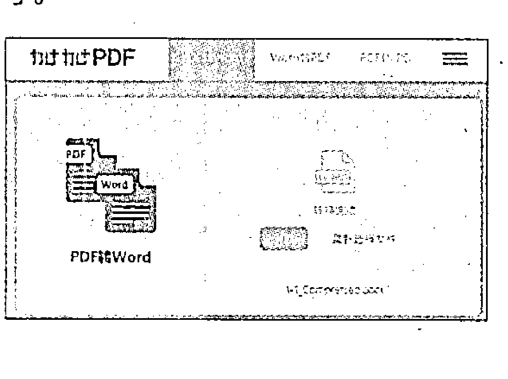

### Word文档的版本控制有什么推荐

文|老万

Q: 最近使用Word写文档，一个文件经常要修改很多次，我的版本控制方式就是改一次另存为一份，并附上当前的时间戳。那么针对没有编程经验的群体，有什么可推荐的Word协同工具？

A: 其实最简单有效的方法，就是通过云笔记来操作。比如我们通过有道云笔记的协作功能，首先在里面创建一个群组并将其他人加入其中。接下来创建一个新的笔记文档，这样整个团队就可以对这个文档进行编辑。如果用户需要进行版本控制，只需要点击列表中文件名后的按钮，在弹出的菜单里面选择“历史版本”即可。

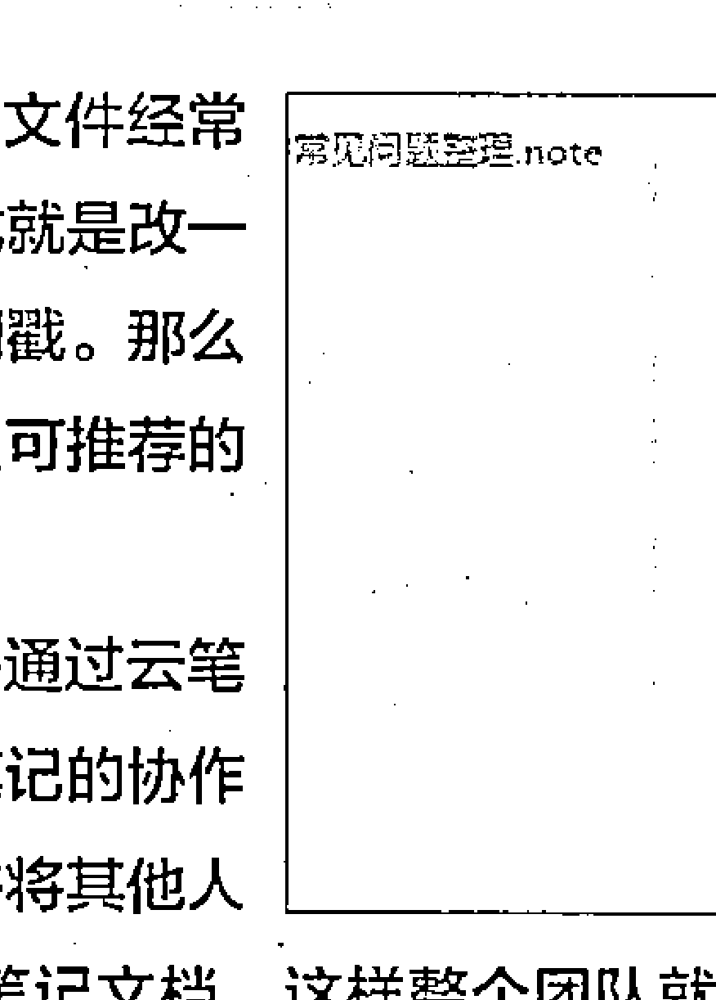


### 如何取消Office 2013的迷你工具条

Q: 在Office 2013里面选取一部分文字信息后，会在自己选取的位置显示一个迷你工具条，让用户可以方便快速地调整文字大小等选项。不过我个人反而觉得这个工具条比较烦人，那么通过什么方法可以关闭掉它啊？

A: 首先点击Word操作界面左上角的“文件”，在弹出的菜单里面选择“选项”命令。接着在选项窗口点击左侧列表中的“常规”标签，然后在右侧窗口找到“选择时显示浮动工具栏”这个选项，将该选项前面的对钩去除就可以了。

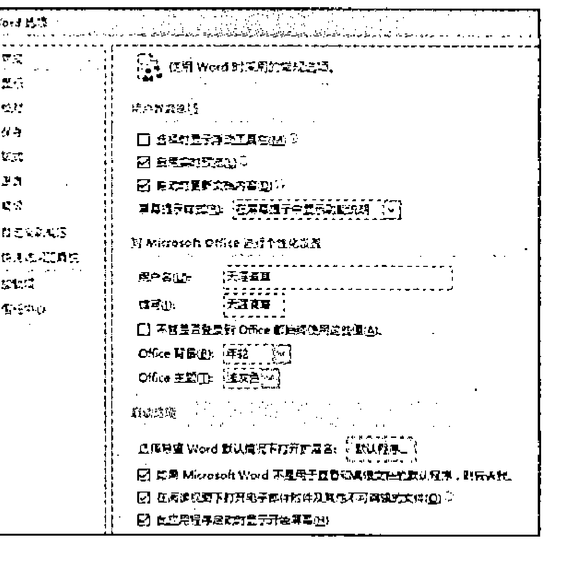

### 谷歌拼音和Office 2016不兼容吗

Q: 我现在使用的是Windows 10和Office 2016，但是使用谷歌拼音输入法的时候，经常出现敲一个字母Word里面出来一大堆的情况。不知道为什么会出现这样莫名其妙的问题？

A: 其实你所遇到的这个问题已经不是个案了，该问题主要还是由于谷歌拼音输入法长时间没有升级更新，已经和最新版本的系统和软件出现了严重的不兼容状况，所以只能选择安装一款其他的输入法来进行使用。

### 表格文字如何自动调节字体大小

Q: 如果我们在Word里面添加一个表格，随着文字内容的不断增加往往表格会变形。有没有什么方法可以让文字字体进行变化，而表格的大小一直保持不变呢？

A: 首先在文档里面选择要处理的表格，接着点击鼠标右键选择“表格属性”命令。在弹出的窗口中点击“单元格”标签后再点击“选项”按钮，然后在弹出的对话框里面选中“适应文字”选项即可。这样以后输入的文字增多，字体就会自动进行缩小。

### SSD为什么也会出现电脑卡机

文|老万

Q: 我的电脑使用的是SSD硬盘，最近更新到Windows 10的一周年版本，可是不知道为什么会出现系统不定时卡机的情况。请问是不是这个SSD硬盘出现了什么问题啊？

A: 其实并不是SSD硬盘出现了问题，而是Windows 10系统出现了一个Bug。如果用户要想马上解决这个问题的话，首先按快捷键“Win+R”打开“运行”框，输入“Services.msc”后回车启动系统服务管理器。接下来在右侧窗口里面找到一个名为“App Readiness”的服务，双击运行打开这个服务的配置窗口，将“启动类型”修改为“禁用”就可以了。

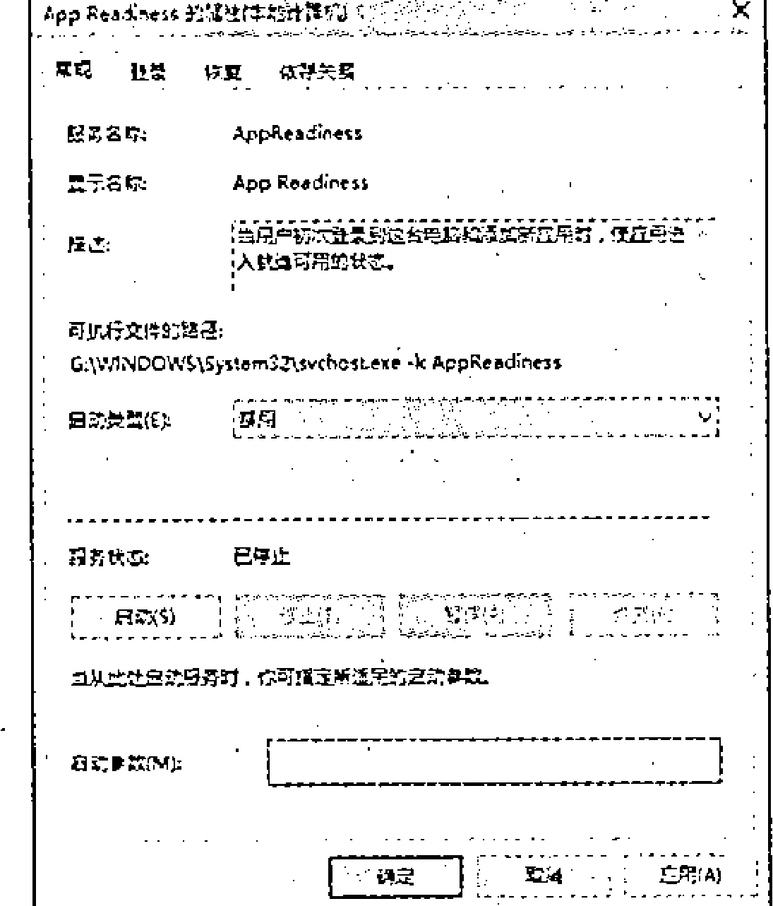


> 在电脑主板的BIOS里面，关闭AHCI也可以临时解决这个问题。

### 家庭版Windows 10如何禁用微软小娜

Q: 前段时间我在《电脑爱好者》杂志里面看到了禁用微软小娜Cortana的方法，这种方法使用的是组策略，可是我使用的家庭版没有该功能。那么这个时候应该如何解决啊？

A: 由于组策略最终也是通过注册表完成的，所以通过修改注册表可以达到同样的效果。首先在“运行”框输入“regedit”打开注册表，展开到HKEY_LOCAL_MACHINE\SOFTWARE\Policies\Microsoft\Windows\，在该项目下新建一个名为Windows Search的项目。然后在右侧窗口里面新建一个名为AllowCortana的DWORD (32位)值，最后再将“数值数据”修改为0就可以了。

### 禁用Windows 10屏幕亮度自适应

Q: 现在最新版本的Windows 10也可以根据周围光线的强度自动调整屏幕的亮度了，但是我个人还是喜欢自己设定的亮度。那么请问有没有什么方法可以关闭这个功能啊？

A: 首先在开始按钮上点击鼠标右键，选择菜单中的“电源选项”命令。接着点击当前使用电源计划右侧的“更改计划设置”链接，在弹出的对话框里面点击“更改高级电源设置”选项，然后在弹出的高级设置列表中展开“显示”树。最后将下面的“启用自适应亮度”修改为“关闭”状态即可。

### 让Windows 10全新安装更加干净

Q: 现在购买的品牌电脑里面，除了Windows系统还有很多电脑商的软件，可是这些软件基本上用不到。那么如果不采用重装系统的方法，如何才可以快速清除这些软件啊？

A: 首先从微软的官方网站下载一款名为“Refresh Windows Tool”的小工具，运行后根据向导选择“只保留个人文件”或者“不保留任何文件”选项，点击“开始”按钮就开始自动将系统还原到干净的原始状态。

### 任务栏始终在最前面挡住右键操作

Q: 很多软件在系统托盘里面都常驻有软件图标，但是今天我在QQ的图标上点击鼠标右键后，发现任务栏始终在最前面挡住了右键菜单的部分命令。请问这个问题怎么解决啊？

A: 首先在任务栏里面点击鼠标右键，选择菜单中的“任务管理器”命令。接着在弹出的对话框选择“进程”标签，从列表中找到“Windows资源管理器”这项，点击下面的“重新启动”按钮，看看能不能解决这个问题。

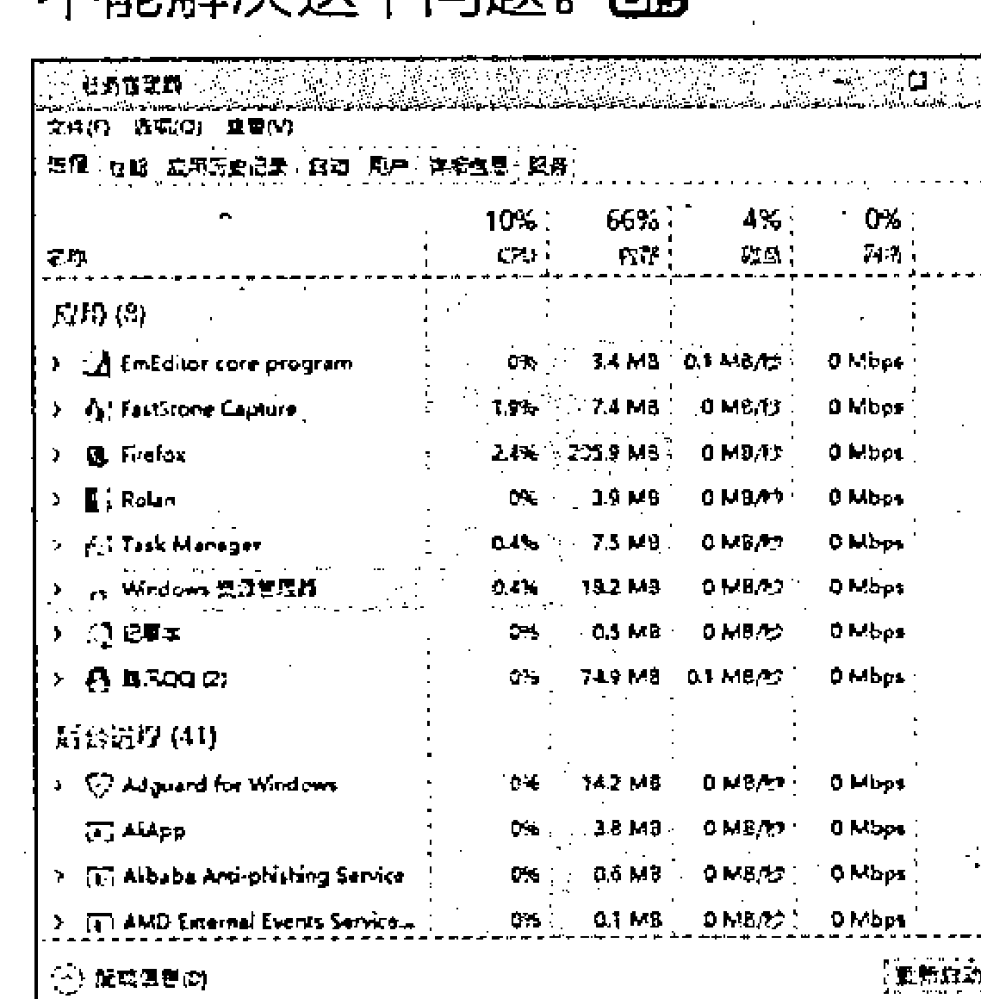

### 移除Windows 10加密文件的小锁图标

Q: Windows 10中除了采用BitLocker加密之外，还沿用了存在已久的EFS加密文件系统。可是系统对EFS加密的文件用了金色的小锁图标标识，而NTFS采用双蓝色箭头进行显示。有没有什么方法可以不显示这些图标啊？

A: 首先在“运行”框输入“regedit”打开注册表，展开到HKEY_LOCAL_MACHINE\SOFTWARE\Microsoft\Windows\CurrentVersion\Explorer\Shell Icons，接着在右侧窗口中新建一个名为178的字符串值，然后将其中的内容修改为一个空白的icon图标路径即可。

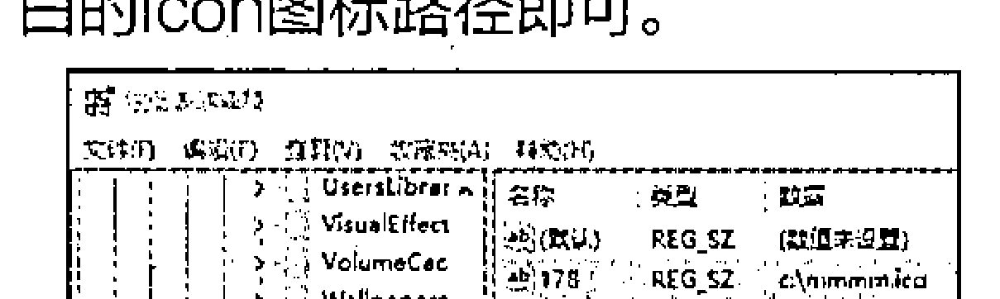

### 重置Windows网络连接的名称数

Q: Windows在接入不同网络时，会按接入的网络名称生成配置相应的文件。Windows为保证配置文件不冲突，会自动按网络名称在配置文件后增加计数进行区分。我个人不太喜欢这个计数，请问如何对其进行修改啊？

A: 首先按照前面的方法打开注册表编辑器，展开到HKEY_LOCAL_MACHINE\SOFTWARE\Microsoft\Windows NT\CurrentVersion\NetworkList\Profiles。接着会列出有线、无线以及VPN等网络连接配置文件的GUID，用户只需对相应GUID配置文件中的ProfileName键值进行更名即可。

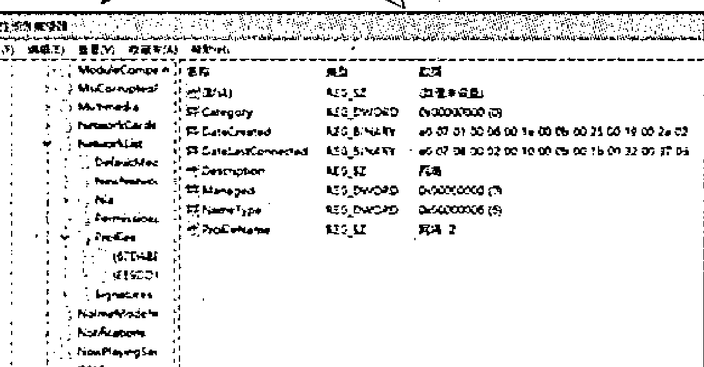


### 怎样让Ubuntu支持WebP图片

文/老万

Q: 我最近开始学习使用Linux系统，于是安装了目前很流行的Ubuntu，但是使用以后发现默认的图片浏览器不支持WebP格式。请问有什么方法可以解决这个问题啊？

A: Ubuntu和我们常见的Windows系统一样，如果系统默认不支持某项服务的话，那么就只有借助于第三方工具的解决方案。比如傻博士这里强力推荐gThumb这款图片管理工具，用户只需要在Ubuntu及其衍生版本中使用apt-get install gthumb即可进行安装，装好之后就可以直接打开WebP图片了。

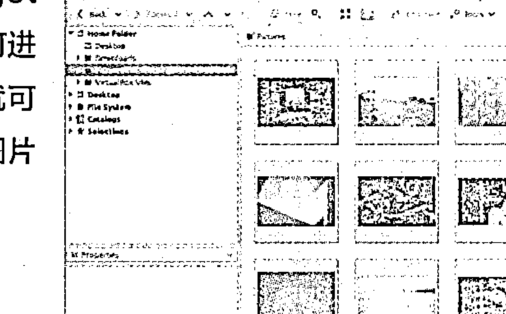

为了方便以后进行使用，可以通过右键的属性命令，在“打开方式”标签里面将gThumb设为默认值。

### 如何检测并屏蔽硬盘里面的坏道

Q: 最近用HD Tune检测硬盘的健康状况，结果发现非常不佳，但是扫描错误里面没有坏道。而用鲁大师的磁盘检测发现有损坏的块，所以准备重装系统重分区。那么如何检测并屏蔽硬盘的坏道啊？

A: 首先建议你及时备份重要的硬盘数据，接着在Windows PE里面打开命令提示符窗口，输入“format C:”命令进行快速格式化即可。因为在格式化的过程中，会对有缺陷的磁道做保留标识，从而防止被分配给数据读写。

### 怎么把系统迁移到新买的硬盘

Q: 老硬盘天天红看着非常不爽，所以我最近新加了一块硬盘，想把操作系统迁移到新硬盘上，其中老硬盘是SATA2的，而新硬盘是SATA3的。那么有没有啥好软件推荐啊？

A: 用户可以试一试“傲梅分区助手”这款软件，选中“磁盘1”后点击磁盘操作下的“复制磁盘”按钮，这时会弹出一个向导窗口。这里选择“快速复制磁盘”，并点击“下一步”按钮后选择目标磁盘即可。

### 自动过滤视频软件后台的进程

文|老万

Q: 现在很多的视频软件都使用了P2P技术，所以除了软件自身的进程信息以外，往往还有一些进程在系统后台长驻，这样不仅系统资源被占用，而且网络带宽也会被占用。那么如何在关闭视频软件的时候，将后台进程也自动关闭呢？

A: 使用“华华后台进程拦截器”可以看到软件默认已经集成了一些常见的视频软件的相关信息内容。接下来点击“进程拦截”菜单中的“开始拦截”命令，这样拦截器就可以在系统后台进行实时监控。一旦拦截器发现运行的主进程没有了，就会自动关闭进程列表中的后台进程信息，这样系统资源和网络带宽就不会被浪费了。

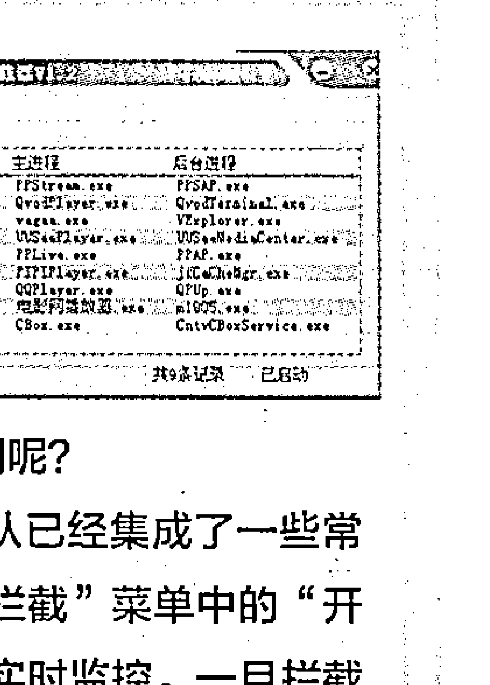

视频软件如果不在列表中的话，用户还可以自定义进行添加操作。


### 如何避免触控板对电脑操作的干扰

Q: 笔记本电脑的触控板在日常工作中会给我们带来不少的麻烦和烦恼，可是我又不想直接将触控板设定为禁用。那么如何才可以避免触控板的干扰所造成的误操作呢？

A: 最简单的方法就是在不需要它的时候将其屏蔽。首先下载运行“Touchpad Blocker”这款软件，在系统托盘找到这款软件的图标，点击鼠标右键选择菜单中的“设置”命令，在弹出的窗口中将“系统启动时自动运行程序”选项选中。接着选中“屏蔽意外触碰和点击”选项，并且在“屏蔽点击的时间间隔”列表中设置一个时间即可。

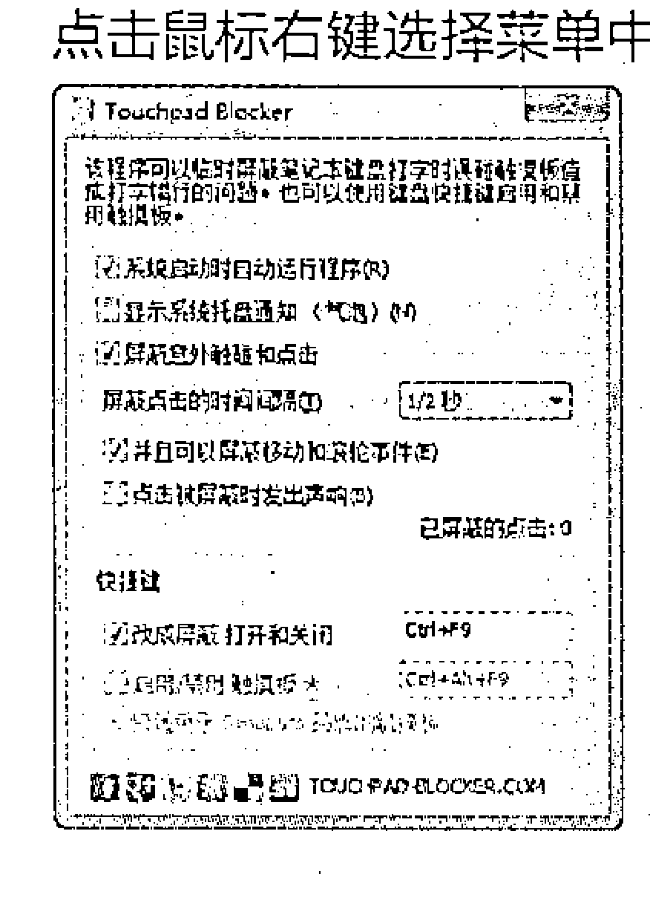

### 快速恢复刚刚被关闭的窗口信息

Q: 我这个人平时有些毛手毛脚的感觉，比如刚刚打开的软件窗口就给关闭掉，又必须重新打开这个软件窗口，这样重复的操作不但浪费时间，而且会大大降低自己的工作效率。那么如何可以快速地恢复刚刚关闭的窗口呢？

A: 首先下载运行一款名为UndoClose的工具，当你需要恢复关闭窗口的时候，通过鼠标双击系统托盘中的工具图标。在弹出窗口的“Recently Closed Folders”和“Recently Closed Apps”列表中，可以分别看到刚刚关闭的文件夹窗口以及应用程序窗口，然后直接双击运行列表中的窗口名称即可恢复。

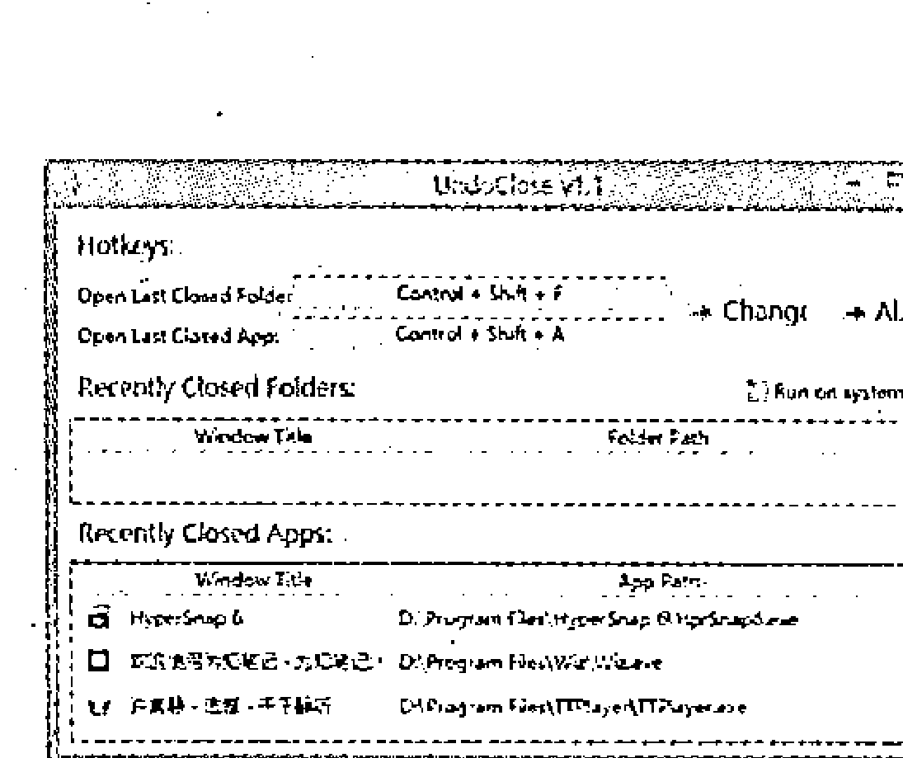

### 卸载软件后右键菜单图标还在应该怎么删除

Q: 我之前安装的是360杀毒软件，昨天卸载以后发现它的右键菜单还在。那么通过什么方法可以删除这个菜单啊？

A: 运行CCleaner这款软件，点击左侧工具栏中的“工具”图标，在出现的窗口里面选择“启动”命令。接下来在“右键菜单”标签里面就可以看到系统里面所有的右键菜单信息，从中选择想要删除的右键菜单信息，再点击旁边的“删除该项”命令就可以了。

### Foobar 2000无法打开音频文件

Q: 今天下载了一个音频文件，在桌面用Foobar 2000打开正常，移动到另一个文件夹后用Foobar 2000打不开。然后在Foobar 2000播放列表里添加文件，为何却提示Foobar 2000没有访问权限？

A: 之前可以打开说明该音频文件和Foobar 2000都没有问题，所以这个应该是文件夹的访问权限出现了问题。所以首先打开该文件的属性窗口，将“解除锁定”选项的勾选去除掉，确定退出以后就可以进行播放操作了。

### Adguard的扩展脚本对世界之窗无效

Q: Adguard这款软件里面有一个扩展脚本功能，通过它可以让浏览器加载运行功能脚本。可是不知道为什么我使用的世界之窗浏览器就无法进行脚本的扩展操作呢？

A: 这个主要是Adguard对世界之窗浏览器不支持造成的，不过你只需要将世界之窗的进程添加到列表就可以解决。首先打开Adguard的设置窗口，点击左侧列表中的“过滤的应用”选项。接着在右侧窗口里面点击“添加应用程序”按钮，在弹出的对话框选择世界之窗的主程序文件即可。

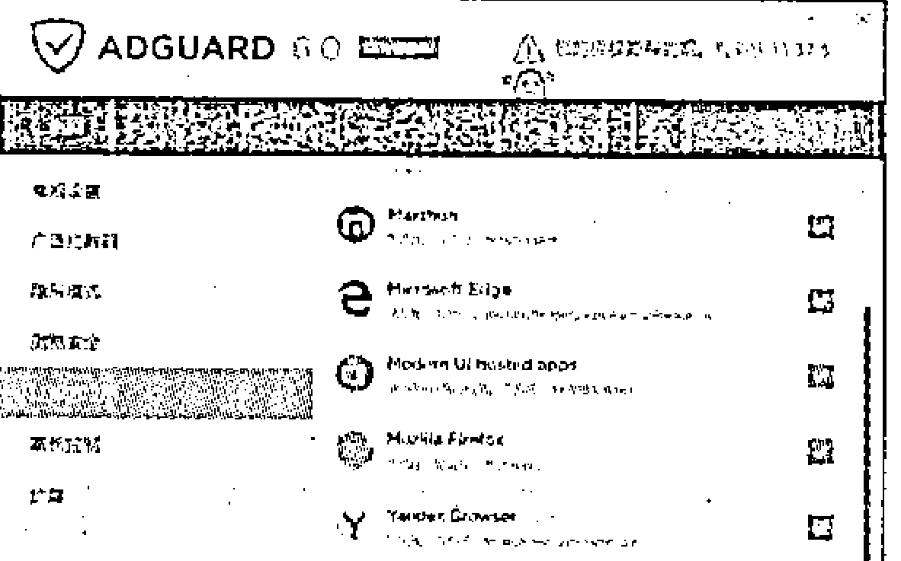

### 变更Edge浏览器的默认下载文件夹

Q: Edge浏览器用起来还是非常不错的，但是我不喜欢默认的下载文件夹目录，可是在软件里面并没有找到修改的地方。那么请问怎么才可以修改默认的下载文件夹啊？

A: 首先打开注册表，依次展开到 HKEY_CURRENT_USER\SOFTWARE\Microsoft\Windows\CurrentVersion\Explorer\User Shell Folders。接着在右侧窗口中找到一个名为“%USERPROFILE%\Downloads”的值，点击鼠标右键后将其修改为自己喜欢的下载文件夹目录即可。

### 不关注用户也可以查看他的长微博

文/老万

Q: 现在有的用户会在微博里面通过长微博的形式发表文章，但是最近我发现一个问题，就是如果你没有关注这个用户的话，那么只能查看到长微博的一部分。那么有什么方法可以不关注用户也能完整地查看长微博的内容呢？

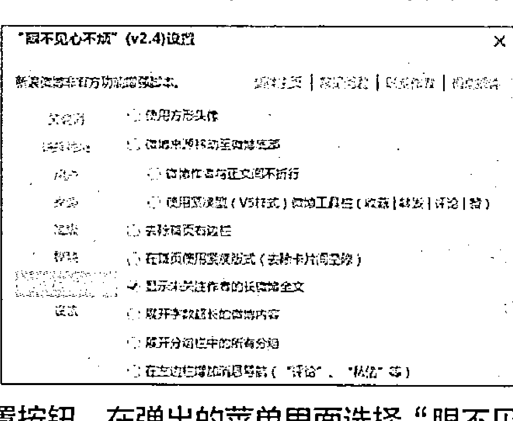

A: 如果用户使用的是谷歌浏览器或者衍生版本，那么可以到谷歌应用商店安装一款名为“眼不见心不烦”的扩展。安装完成以后点击微博右上角的设置按钮，在弹出的菜单里面选择“眼不见心不烦”命令。接着在弹出的设置窗口点击“改造版面”选项，然后在右侧窗口里面选中“显示未关注作者的长微博全文”选项就可以了。


如果用户使用的是其他浏览器，也可以调用“眼不见心不烦”脚本来实现。

### ZeroNet的分享页面为什么无法打开

Q: 现在有的网友分享文件是通过ZeroNet来完成的，可是通过浏览器打开相关的分享页面却无法访问，仔细一看分享页面居然是127.0.0.1开头的。这不是本地系统的IP地址吗？

A: ZeroNet是一个全新的P2P全球网站，要访问由它搭建的分享页面的话，首先需要安装对应的客户端软件才行。登录官方网站 https://github.com/HelloZeroNet 下载客户端，安装完成以后客户端会自动打开默认的浏览器，现在再访问分享页面就可以了。

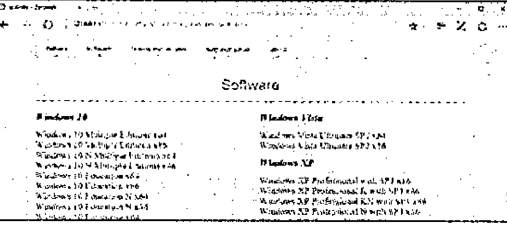

### 如何管理Edge浏览器的收藏夹

Q: 我的Edge浏览器里收藏了不少网站，我想像对IE浏览器那样在收藏夹目录里面对其进行管理，可是在网上搜索怎么也找不到Edge浏览器收藏夹的具体位置。请问傻博士你知道在哪里吗？

A: 首先打开资源管理器，按照 C:\Users\用户名\AppData\Local\Packages\Microsoft.MicrosoftEdge_8wekyb3d8bbwe\AC\MicrosoftEdge\User\Default\Favorites 这个路径进行查找就可以了。

### APKPure下载的UC为何是国外版

文|老万

Q: APKPure不是可以替代谷歌的软件吗，怎么下载的是国外版本的UC浏览器，里面不但没有简体中文的语言，而且不能同步国内的书签。那么怎么下载国内的UC浏览器版本啊？

A: APKPure本来是一个在线网站，可以帮助用户从Google Play里面下载应用，而它们的客户端也是起到同样的作用。可是Google Play对上传的应用有很多的要求，比如不允许应用在后台自动升级等等，所以它的版本往往和国内的版本不一样。如果用户要想使用国内的版本，建议直接通过官方网站进行下载。

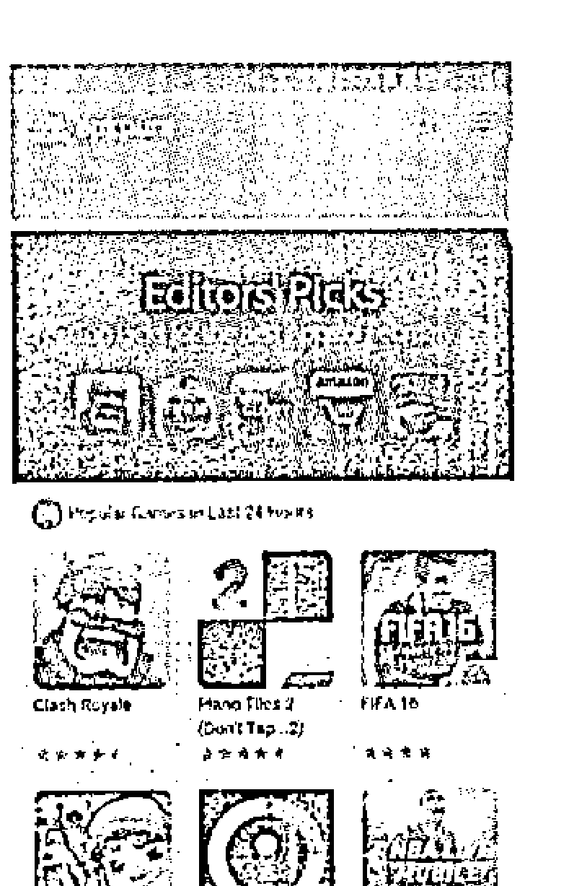

其实网上可以选择的浏览器有很多，比如国外的Yandex和Opera等都不错。


### UC浏览器怎么屏蔽网页中的广告

Q: 为了屏蔽手机浏览器中的广告，我安装使用了AdAway这款应用。但是发现该应用只对系统自带的浏览器有效，而我使用的UC浏览器怎么设置都没有效果。所以想问一下要怎么设置才可以？

A: 现在Android系统里面的广告过滤软件有很多，但是不同的软件采用的广告过滤方式并不相同，所以最终的效果也是参差不齐的。这里建议用户使用可以创建虚拟网络的广告过滤软件，这样所有进出手机系统的数据都会经过网关进行过滤，比如国内的净网大师以及国外的Adguard就属于这类软件。

### 全面了解各个城市的空气质量指数

Q: 随着冬天的到来，气温变得越来越低，空气环境也随之变得越来越差。虽然现在很多天气预报应用都有空气质量的相关显示内容，但是这些信息不但非常单一，而且很多数据也非常不专业。那么如何才可以更加全面地了解到空气质量信息呢？

A: 首先安装并运行AirVisual这款应用，这时应用会通过GPS定位所在位置。定位成功以后就可以在列表中显示出所在城市，以及周边城市的天气预报信息。点击自己所在城市的预告信息后，在新的窗口里面向上滑动，就可以看到包含PM2.5、PM10、臭氧、二氧化氮、二氧化硫等几项污染指数的数据。

### 手机丢失后支付宝的处理方法

Q: 手机对于现在的用户来说太重要了，不然怎么在朋友圈晒九宫格自拍呢。但是也经常发生一些悲剧，就是一个不小心手机被偷了。那么手机丢了以后，里面的支付宝还安全吗？

A: 由于支付宝在进行支付操作的时候，都需要支付密码进行确认，所以支付宝里面的钱是安全的。但是我们知道支付宝为了方便用户的支付操作，提供了一个名为“小额免密码支付”的功能。所以为了避免这个功能造成的问题，建议到“支付设置”里面将“小额免密支付”功能关闭即可。

### 用空调狗一键冻结手机应用的后台

Q: 现在Android手机的最大问题，就是流氓应用实在非常的多，这些流氓应用会在后台注入一堆进程，会消耗设备大量的性能和电量。我也安装了“冰箱”这款应用，但是和手机系统有冲突。那么还有没有类似的软件呢？

A: 现在有一款名为“空调狗”的应用，也可以解决用户遇到的问题。运行这款应用后首先赋予ROOT权限，然后把想要冻结的应用添加到列表中。接着按下右下角的冻结按钮，就能够冻结列表中的应用。这个时候列表中的应用下方的字样会从红色转变成绿色，同时也会从系统桌面和应用程序列表中消失掉。

## 如何在Windows 10安全模式下创建新账户

Q: Windows 10用户无法直接在安全模式的设置中创建新账户，因为一点击新建账户按钮就会自动关闭窗口。但是有的时候我们又需要新建用户名，那么如何才可以在安全模式下创建一个用户名呢？

A: 通过鼠标在开始按钮上点击鼠标右键，选择菜单中的“命令提示符（管理员）”命令。在弹出的窗口执行 “net user abc 123456 /add” 命令，就可以创建一个名为abc、密码为123456的本地账户。然后执行 “net localgroup administrators abc /add” 命令，就可以将这个账号添加到管理员权限的组里面。

```
Microsoft Windows [版本 10.0.14393]
(c) 2016 Microsoft Corporation。保留所有权利。

C:\WINDOWS\system32>net user abc 123456 /add
命令成功完成。

C:\WINDOWS\system32>net localgroup administrators abc /add
命令成功完成。

C:\WINDOWS\system32>
```

## Windows 10系统的回滚文件如何进行删除

Q: 很多用户升级至一周年版本后，突然发现系统盘的空间变小了，其实这是系统为了保持回滚专门预留的空间。既然Windows 10一周年版本已经非常稳定，也就没有必要进行回滚操作了。那么这些占用的磁盘空间，我们如何进行清理操作呢？

A: 首先打开系统盘的属性窗口，接着点击里面的“磁盘清理”按钮。然后再从弹出的对话框中点击“清理系统文件”命令，稍等片刻系统会给出不同信息内容当前所占用的磁盘空间，这样就可以看到“临时Windows安装文件”等选项。选中它以后点击“确定”按钮，这些没用的文件就可以彻底清除了。

## 关机后系统关了但机箱指示灯久不灭

文|老万

Q: 我最近观察发现系统是很快关闭了，但是机箱的指示灯要等大概2分钟才会灭掉。这个问题是最近出现的，重现率达到了100%。我1年都没装过什么新软件，难道是硬件问题吗？

A: 这个问题应该是出在系统的“快速启动”上，可以考虑将这个功能关闭试一试。首先在开始按钮上点击鼠标右键，选择菜单中的“命令提示符（管理员）”命令，打开命令提示符窗口输入“powercfg /h off”，就可以关闭Windows的休眠功能。接下来打开控制面板中的“电源选项”，在关机设置中的“启用快速启动”选项就没有了。

```
Microsoft Windows [版本 10.0.14393]
(c) 2016 Microsoft Corporation。保留所有权利。

C:\WINDOWS\system32>powercfg /h off
```


在命令提示符窗口输入“powercfg /h on”，就可以重新启动“快速启动”功能。

## 为右键菜单加入“移动到”等命令

Q: 记得在Windows XP系统的时候，资源管理器的右键菜单里面曾经出现过“移动到”和“复制到”的命令。不过这个功能在以后的系统里面没有了，即使是在最新的Windows 10系统里面也没有。那么如何可以为Windows 10系统的右键菜单加入“移动到”等命令呢？

A: 首先运行软媒魔方并点击“设置大师”按钮，接着在弹出的对话框选择“右键菜单”标签。然后点击窗口左侧的“添加右键菜单项目”命令，在右侧窗口里面勾选“复制到文件夹（所有文件）”和“移动到文件夹（所有文件）”选项，最后点击“应用”和“确定”按钮就可以解决。

## 去掉文件夹隐藏显示后也看不见文件

Q: 今天在安装一个软件的时候，360杀毒软件提示有软件在后台安装。我根据提示的路径进行查找，结果并没有找到这个文件，而且将文件夹的隐藏显示去掉也没有。请问这是怎么回事啊？

A: 出现这样的情况有两种可能，首先就是这个文件拥有双重属性，即去掉文件夹隐藏显示后还需要打开系统文件显示功能才可以看到。另外还有就是这个文件在没有成功安装以后，安装包就自动将这个文件删除了。

## 如何关闭谷歌浏览器右下角的通知窗口

文|老万

Q：前几天我用谷歌浏览器打开一个网站，结果网站弹出一个询问窗口，当时我没有注意就点击了允许命令。可是以后每次登录该网站的时候，在桌面右下角都会弹出一个通知窗口。那么如何关闭这个通知窗口啊？

A：当通知窗口出现的时候点击其中的齿轮设置按钮，在弹出的设置窗口里面拖动侧边栏到最下方，找到“通知”区域后选择“不允许任何网站提示通知”这项即可。如果允许有的网站弹出窗口的话，那么点击“管理例外情况”按钮后，在弹出的列表中，根据需要对某个网站进行“禁止”或“允许”设置即可。

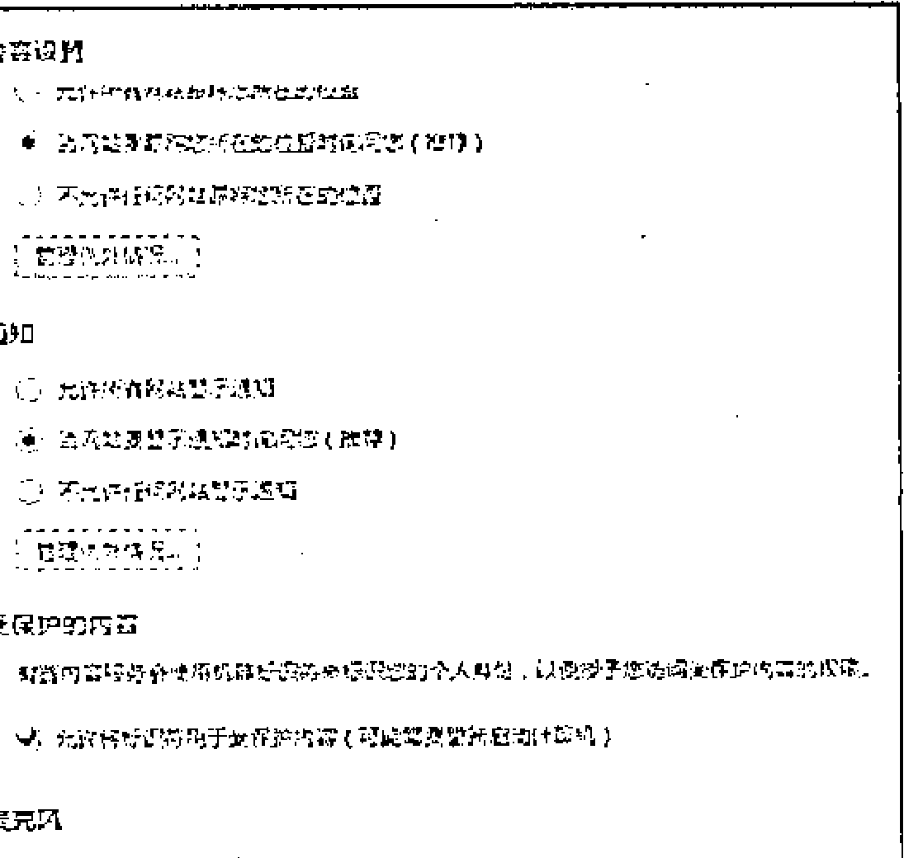


在地址栏输入chrome://settings/content后回车，也可以快速地打开设置窗口。

## 百分浏览器能不能退出自动清除垃圾

Q：我现在使用的百分浏览器和谷歌浏览器一样，这款浏览器并没有在清理垃圾的对话框里面包括一个退出浏览器时自动清理的功能。那么有什么方法可以让其自动清理垃圾信息啊？

A：其实这款浏览器是自带相关功能的，只不过用户没有找到相关的命令位置。首先点击浏览器右上角的按钮，在弹出的菜单里面点击“设置”命令。接着在弹出的设置页面选择左侧的“高级设置”这项，在右侧窗口的“隐私设置”里面勾选上“退出浏览器时清理浏览数据”选项即可。

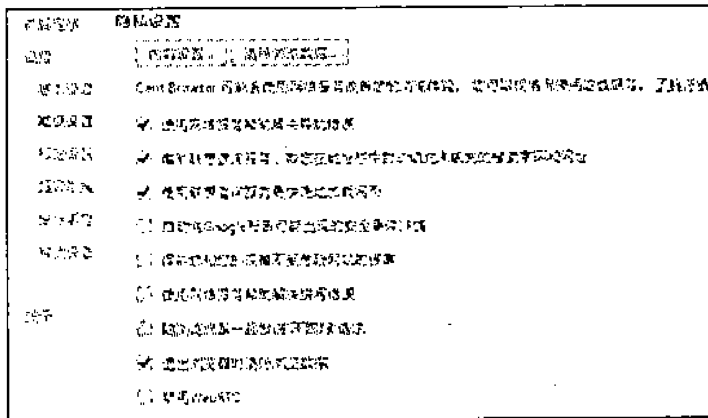

- \[x\] 推送通知
- \[ \] 使用网站时询问是否允许发送通知
- \[ \] 管理例外情况...
- 推送通知
    - \[x\] 允许所有网站显示桌面通知（推荐）
    - \[ \] 询问是否允许网站显示桌面通知（默认）
    - \[ \] 不允许任何网站显示桌面通知
    - \[x\] 管理例外情况...

## 搜狗输入法的词库如何导出其他格式

Q：搜狗输入法的弹窗比较多，主要是不注意就会给你安装搜狗浏览器。现在想导出数据库供小狼毫使用，或者给微软自带的拼音使用，可是现在的搜狗版本只能导出自己的格式（bin）文件。请问能不能导出其他的格式啊？

A：搜狗输入法从7.2版本起，就只能导出为自家的bin格式，而不能导出为常见的txt格式了。而且导出的bin格式也是经过加密处理的，这样通过深蓝词库转换工具也无法操作。不过用户可以到网上下载一个老版本，看看能不能导出txt格式的词库。

## 离开电脑如何防止忘记拔出闪存盘

Q：现在很多网盘都关闭了，所以大家又开始使用闪存盘来传递数据。可是由于各种各样的原因，在离开电脑的时候又常常忘记带走闪存盘。那么有没有什么方法可以在离开的时候，通过某种方式来提醒拔出闪存盘并带走呢？

A：首先下载运行USB Alert这款软件，它运行后会自动缩小到系统托盘里面，这样软件就可以自动监视系统中的闪存盘信息。当用户关闭计算机或注销系统的时候，USB Alert软件就会通过警告窗口以及“滴滴滴”的声音提醒用户，从而可以避免用户忘记拔出闪存盘的情况发生。

## 使Chrome支持NPAPI还是无法快速登录

Q：我使用的淘宝和Chrome都是绿色版的，Chrome通过插件已经支持NPAPI了，但是在chrome://plugins里面还是没办法看到阿里快速登录的插件。请问这个问题应该如何解决啊？

A：应该是使用的GreenChrome这款插件的问题，该插件已经不支持谷歌浏览器51版本后的NPAPI了。如果用户想继续使用谷歌浏览器快速登录淘宝网的话，那么只能使用老版本的谷歌浏览器配合插件来操作了，而且还需要使用安装版的淘宝客户端程序才可以。

## Firefox怎么删除一个网站的Cookie

Q: 我的Firefox一直都是开的隐身模式，退出以后就自动删除所有的Cookie了。但是有时候登录淘宝或者京东以后，在退出后如果不清除Cookie，其实还是在登录状态的。那么如何删除特定网站的Cookie啊？

A: 首先打开火狐浏览器的设置窗口，点击左侧列表中的“隐私”选项。接着在右侧窗口里面点击“显示Cookie”按钮，在弹出对话框的搜索框输入京东或淘宝的域名进行搜索。搜索到以后在列表中选择这些域名，再点击“移除选中”按钮就可以了。

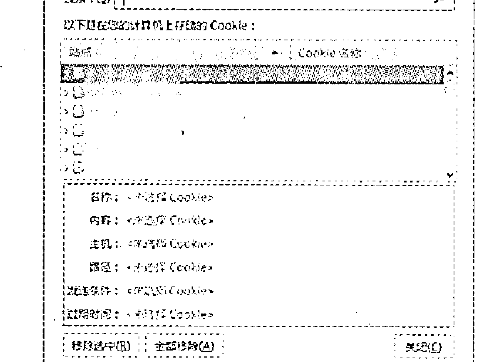

## LastPass在个别网站登录错误的解决

Q: LastPass是一款非常优秀的账号密码记录存储扩展，可是有的时候在使用的时候，常常会出现登录错误的问题。那么到底是什么情况造成的这些问题，自己应该如何解决这些问题呢？

A: 其实之所以会出现这样的问题，主要是验证码环节出问题了。首先进入到“我的LastPass密码库”页面，从中找到自动登录错误的网站名称。接着点击网站名称后面的“编辑”命令，在弹出的对话框里面点击“编辑表单字段”命令。在新的对话框里面找到“Checkcode”这个选项，将其中的验证码内容全部删除掉，再点击“保存”按钮就可以了。

## 如何查询本地天气的历史信息

Q: 今年夏天我感到天气异常的炎热，新闻上也说这是很多年来之最。那么在这个大数据的时代，有没有什么方法可以查询到当地天气的历史极值啊？

A: AccuWeather是一家提供全球商业性气象预报服务的公司，它的网页端查询功能就可以显示出历史温度等信息。首先登录AccuWeather的官方网站，按照常见的方法输入查询地址的名称，这样就可以看到未来几天的天气预报。现在我们点击页面上的“未来一月”，这样就可以在网页显示出一个月表图。其中在每一天的下方，就会显示出历史的平均温度。

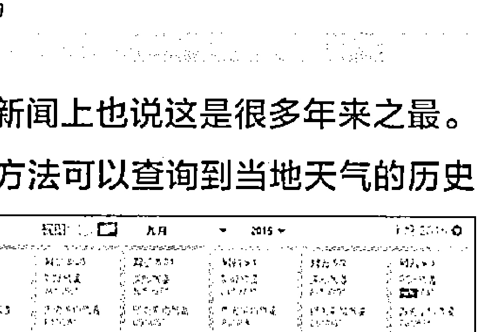

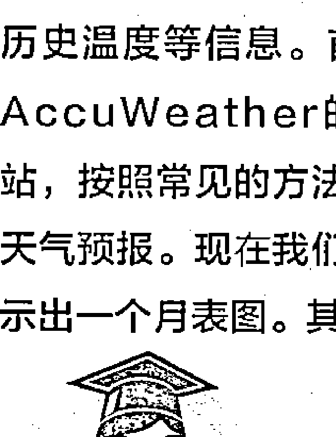

这个网站采用的是华氏温度，通过换算才可以得到常见的摄氏温度。

## 将印象笔记批量迁移到有道云笔记

Q: 我使用了六年的印象笔记，但是自从关掉公开链接后，感觉非常的不方便。也还是固执地坚持了几个月，终于无法忍受，因此考虑数据迁移，选中了有道云笔记。那么如何进行数据的批量迁移呢？

A: 首先在印象笔记里面选择要导出的笔记本或者笔记，点击鼠标右键选择菜单中的“导出笔记”命令，在弹出的对话框里面选择enex格式进行导出。接着打开有道云笔记，依次点击“菜单→导入→Evernote文件”命令选择刚刚导出的文件，就可以把印象笔记中的文件导入到有道云笔记啦。

## 给自己的二维码也弄个表情包

Q: 不可否认现在的二维码是非常实用的，但是传统二维码的黑白设计往往给人平淡的感觉。那么有没有什么方法可以将二维码也包装一下啊？

A: 首先通过浏览器打开http://www.amazing-qrcode.com/这个网站，在“Website URL”里面输入二维码要传递的信息内容。接着点击“Upload”后面的按钮，在弹出的对话框里面选择一张图片。然后点击“Submit”按钮，就可以为二维码添加一个漂亮的背景。

# 《电脑爱好者》2016年合订本（四）

## 开启隐藏的锁屏时间设置选项

Q: Windows 10中的锁屏显示是有时间限制的，比如默认设置是一分钟，超过一分钟后屏幕自动进入待机状态。不过我想让锁屏界面多保持一段时间，毕竟Windows 10的锁屏还是挺漂亮的。那么如何修改默认的锁屏时间呢？

A: 首先打开注册表编辑器，展开到HKEY_LOCAL_MACHINE\SYSTEM\CurrentControlSet\Control\Power\PowerSettings\7516b95f-f776-4464-8c53-06167f40cc99\8EC4B3A5-6868-48c2-BE75-4F3044BE88A7。在右侧窗口找到Attributes这个项目，将“数值数据”修改为2。然后在电源设置里面找到新增的“控制台锁定显示关闭超时”项目，然后根据需要进行修改就可以了。

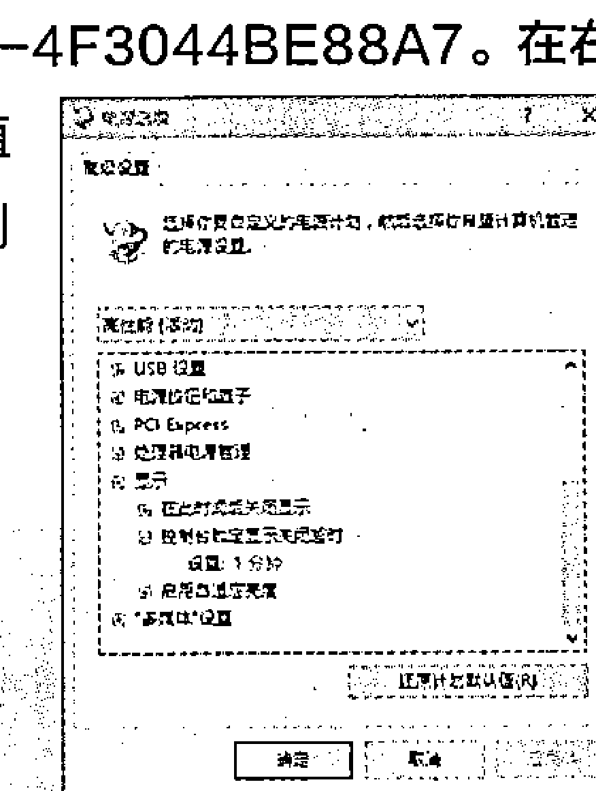


## Windows 7任务栏上的预览如何关闭

Q: 原来用的Windows系统我记得是可以关闭的，现在换了一个网友修改的版本，发现系统任务栏的预览始终无法彻底去除，网上的方法也都试过了。我想要彻底去除，一点预览都没有该怎么解决？

A: 首先下载运行“7+ Taskbar Tweaker”这款工具，安装运行后，在弹出的窗口中找到“鼠标悬停”这项，将默认的选项修改为“什么也不做”这项就可以了。

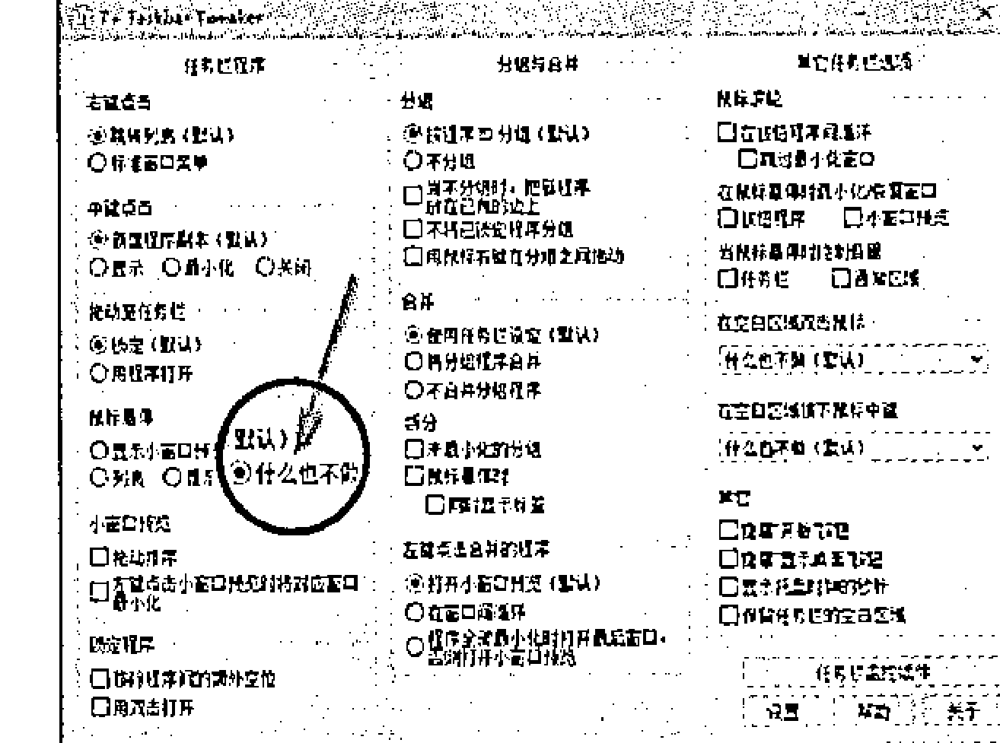

## 开机后Windows 10系统桌面一直闪

Q: 最近遇到一个奇怪的状况，亲戚的笔记本强迫升级到Windows 10后，开机看到桌面后就一直闪烁，桌面下方的任务栏图标一下子出现，一下子消失，完全没法正常使用。这个问题怎么解决？

A: 首先按Win+R组合键打开“运行”框，输入“Msconfig”后回车启动系统配置功能。在弹出的窗口中选择“服务”标签，找到“Problem Reports and Solutions Control Panel Support”和“Windows Error Reporting Service”服务并取消选择框，再重启看看能不能解决。

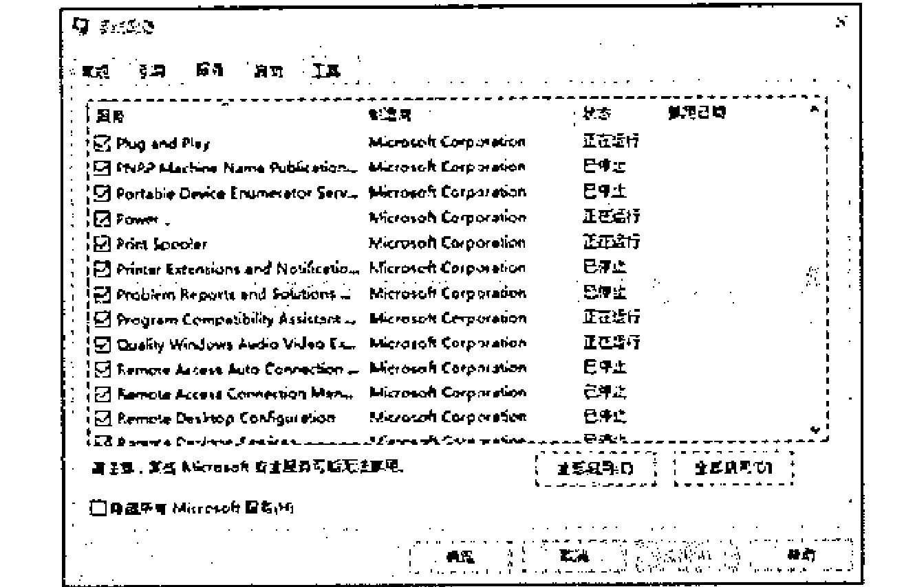

## 如何恢复自定义桌面图标排列

Q: 我喜欢自定义Windows 10桌面图标的排列方式，然而有时候可能会因为某些原因破坏了自己的排列。如果用到的图标较多，可能很难恢复原来的样子。那么有没有什么方法可以恢复原来的图标排序呢？

A: 首先在系统的任务栏上面点击鼠标右键，选择菜单中的“任务管理器”命令。在打开的系统任务管理器窗口里面，从“进程”列表中找到“Windows资源管理器”这项后，点击下面的“重新启动”按钮，这样就可以恢复以前的图标排列。

## 如何解决“USB端口上的电涌”问题

Q: 我在电脑主机插入闪存盘后发现系统有错误提示，通知标题为“USB端口上的电涌”。以前没有遇到过这个问题，请问这一问题该如何解决啊？

A: 首先打开系统的设备管理器，在左侧列表里面找到“通用串行总线控制器”这项，展开这个选项后在下面就可以看到各种USB接口信息。首先打开其中的一个接口属性窗口，在弹出的窗口中选择“高级”标签页，选中下方的“不要通知我USB错误”以避免通知即可。

## 如何快速给数字添加单位信息

Q: 有时我们需要在输入数字的同时，添加一些相关的数字单位信息。如果只是少量的数字，我们可以一个个地输入。如果有大量的数字，一个个添加肯定较慢。那么有没有什么方法可快速添加单位信息呢？

A: 首先在单元格里面依次输入相关的数字信息，接着通过配合Ctrl键选中所有的单元格。然后点击WPS表格模块“开始”标签中的“格式”命令，在弹出的菜单里面选择“单元格”命令。接下来在弹出的对话框里面选择“数字”标签，再点击左侧的“自定义”命令，在“类型”输入框输入单位名称即可。

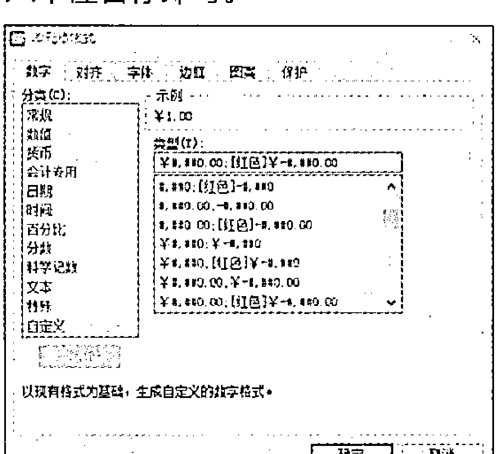

## 自动套用格式让编辑更加简单

Q: 在制作较长的文档以后，需要对文档内容进行编辑，可是很多步骤都是相同的，比如修改字体颜色、字体大小等等。那么通过什么方法可以减轻用户重复的操作步骤呢？

A: 通常情况下调用办公软件的“格式刷”，就可以解决用户所遇到的这些问题。首先需要对一段文字信息进行设定操作，设置完成以后点击“开始”标签中的“格式刷”命令，再选择其他的文字信息就可以将格式状态复制过去。需要说明的是，通常格式刷只能使用一次，如果要想重复使用的话，双击“格式刷”命令即可。

## 如何在Word里面调用方格稿子

文|老万

Q: 我们小时候写作文的时候，都会使用一种方格的本子，这种本子统称为作文本。那么在Word软件里面需要通过什么方法，才可以将原本的文字变成像是写作文的稿纸那样呈现出来呢？

A: 首先在Word里面正常输入相关的文字信息，接着点击“页面布局”标签中的“稿纸设置”命令。在弹出对话框的“格式”列表中，选择“方格式稿纸”这项。接下来分别设置“行数×列数”和“网格颜色”等选项，最后点击“确定”按钮就可以呈现出需要的效果了。

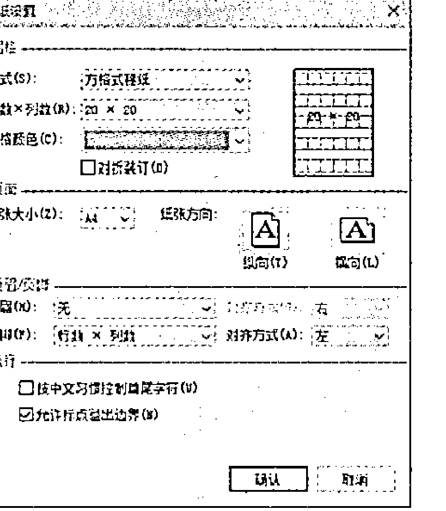

> 俊博士有话说
其实通过加载相关的方格稿纸模板，用户在输入的时候就可以得到相应的效果。

## 如何将PPT中的内容导入Word

Q: 现在各种各样的会议都会用到PPT，但是对于很多人来说，PPT中的文字才是最为重要的信息内容。那么如何才可以将PPT中的文字导入到Word文档里面进行使用呢？

A: 首先通过软件载入需要的PPT文档，接着点击左上角的软件图标按钮，在弹出的菜单里面选择“另存为”命令。在弹出的保存对话框里面，选择“保存类型”列表中的“大纲/RTF文件”这项，保存成功以后就可以通过Word直接打开运行了。

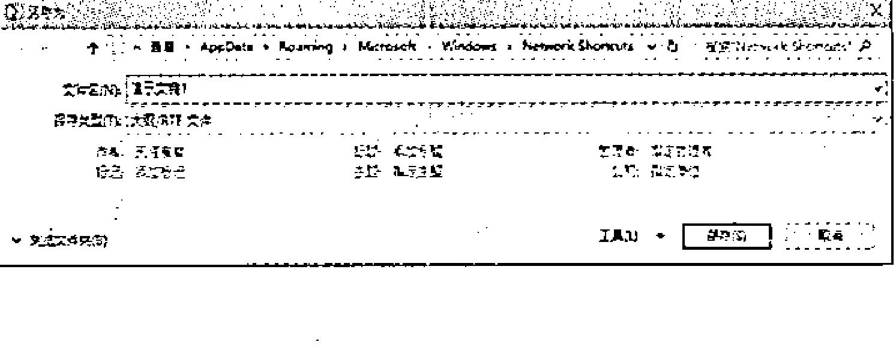

## 还有什么软件可以打开dbx文件

Q: 老电脑上使用的是Outlook Express 6.0，现在换了新电脑安装的是Office 2010，不再有Outlook Express 6.0软件了。那么如何将以前老的邮件导入到新的Outlook软件里面，毕竟其他软件也打不开dbx格式的文件啊？

A: 首先打开Outlook软件的导入对话框，在对话框里面选择“从其他软件或文件导入”选项后点击“下一步”按钮。接下来在导入的文件类型里面选择“Outlook Express 4.x、5.x、6.x或Windows Mail”这项并点击“下一步”按钮，然后通过向导就可以一步步完成导入操作。

《电脑爱好者》2016年合订本（四）

## 火狐浏览器真的会损坏固态硬盘吗

文|老万

Q：前几天我看到一个新闻，说火狐浏览器会向固态硬盘写入大量的数据，甚至有时会高于厂商推荐的日写入量。这样天长日久的话，必然会造成硬盘寿命的缩短。那么这个信息到底是不是真的啊？

A：其实任何软件大量的写入数据，都会造成硬盘寿命的缩短。如果害怕出现这个问题，修改一下火狐浏览器的默认配置即可。首先在地址栏里面输入命令“about:config”后按下回车键，接着在设置界面输入“browser.sessionstore.interval”参数后按回车键进行搜索。找到这个参数以后双击后面的参数值，将内容修改为1800000就可以了。

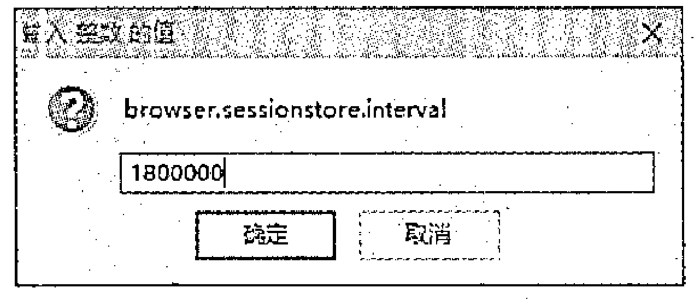

如果系统内存比较大的话，也可以创建一个虚拟盘来处理缓存信息。

## 为何Firefox 49启用多进程的选项是灰色

Q：听说Firefox浏览器从48版本开始就已经支持多进程的功能了，可是为什么我打开浏览器的设置窗口后，这个选项仍然处于灰色不可选的状态呢？难道使用这个功能还需要什么条件吗？

A：Firefox浏览器的的确确有这个功能，但是由于这个功能和很多的扩展不兼容，所以在安装有功能扩展的时候无法使用。如果用户需要使用的话，只有暂时将功能扩展都删除才可以。或者通过about:config命令打开配置窗口，搜索“browser.tabs.remote.force-enable”参数后，将内容修改为true就可以强行激活该功能。

## EmEditor怎么保存文件的书签

Q：我喜欢用EmEditor来看TXT的小说，但是往往一次看不完，所以想设置一个书签下次继续看，可是发现EmEditor好像不能保存书签了。怎么设置才能让它保存书签信息啊？

A：首先运行EmEditor这款软件，点击“工具”菜单中的“自定义”命令。在弹出的配置窗口选择“文件”标签后，勾选上“保存光标位置与书签”选项即可。

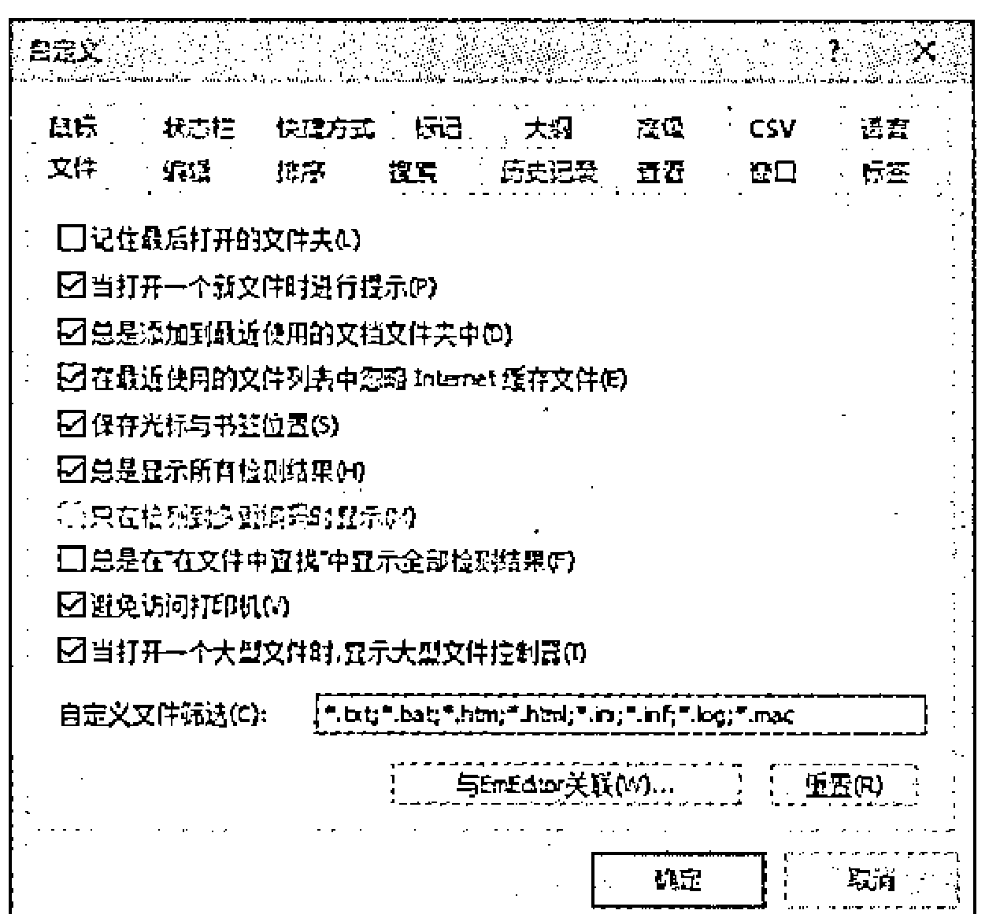

以后当你重新打开这个TXT文件后，就会自动定位到上一次操作的位置。

## 杀毒软件也能保护个人隐私文件

Q：电脑里面有一些非常重要的文件，我不希望其他人对它们进行浏览甚至误删除。那么有没有什么方法，可以不借助其他的保护软件，也能对这些文件进行保护呢？

A：我们知道，所有的杀毒软件在安装完成后，在磁盘中都会创建一个“病毒隔离区”。这样当杀毒软件检测到对系统有危害的文件时，就会将这些文件从磁盘原位置移动到隔离区里面。而我们就可以利用这个隔离区，将需要隐藏的那些重要文件添加到其中，这样通过资源管理器就看不到这些文件了。

## 百分浏览器为什么会有两个图标

Q：我平时使用的是百分浏览器，所以我将软件图标锁定在任务栏，可是我每次点击运行该软件后，任务栏里面会重新出现一个图标。那么怎么解决这个图标不能重叠的问题啊？

A：运行百分浏览器以后，在已经锁定的图标上单击右键，选择“从任务栏取消固定”命令即可。接下来在另外一个图标上点击鼠标右键，选择菜单中的“将此程序锁定到任务栏”命令将其重新进行锁定就可以了。

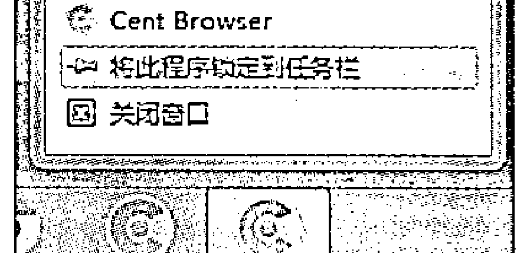## 谷歌浏览器关闭下载提示栏

Q: 我在笔记本电脑里面使用的是谷歌浏览器, 每次下载文件的时候都会出现一个提示栏。由于笔记本的屏幕大小有限, 这个提示栏就占用了一定的宽度。那么能不能关闭这个提示栏啊?

A: 首先通过谷歌应用商店下载安装一款名为“Disable Downloads Bar”的扩展, 安装完成以后不需要进行任何的设置操作, 之后下载文件的时候就不会再出现这个提示栏了。如果想要查看下载的文件信息, 一样还是可以在“下载内容”里面查看到。

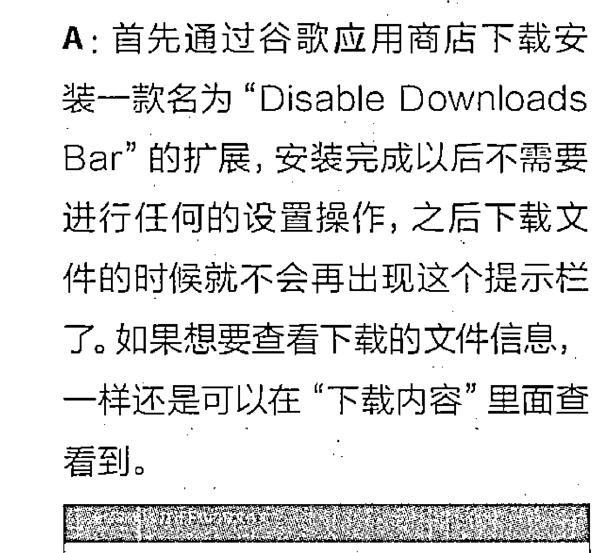

## 现在还有可以直接注册的邮箱吗

Q: 我想注册一个全新的个人邮箱, 但是国内很多邮箱都需要捆绑手机或者其他邮箱。那么还有没有那种可以直接申请的邮箱? 至于国内的还是国外的那倒没什么关系。

A: 国外倒是还有一些网络运营商, 完全可以满足你这样的要求。比如俄罗斯搜索引擎推出的Yandex邮箱, 用户只需要通过浏览器登录www.yandex.com这个网址, 接着点击网站中的“mail”链接, 然后在新的网页里面点击注册按钮, 再根据向导进行注册操作就可以了。

## 登录微博的时候提示错误信息

Q: 今天通过浏览器登录新浪微博的时候, 网页里面提示“The server returned an invalid or incomplete response.”请问这是什么问题啊, 应该如何进行解决才可以?

A: 前段时间傻博士也遇到过这样的问题, 当时采用了这么几种解决的方法。首先就是对网络连接的DNS进行修改, 放弃使用运营商或者当前的DNS服务, 改用第三方诸如阿里巴巴、百度的DNS服务。其次就是暂时放弃使用浏览器登录新浪微博, 而改用客户端软件来进行微博的管理操作。


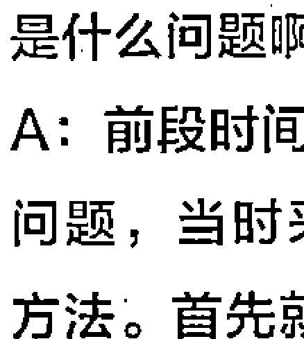

如果用户拥有代理服务的话, 也可以通过代理来进行登录使用。

## 阿里巴巴反钓鱼服务是干嘛的

Q: 我最近安装了淘宝的客户端软件, 结果发现它同时安装了一个阿里巴巴反钓鱼安全服务。后来看了一下卡巴斯基的网络流量监视, 发现这个东西上传和下载量惊人。请问这个服务到底是干嘛的?

A: 这个服务简单一点说, 就是一个浏览器的安全插件。它的作用就是对浏览器访问的数据进行实时监控, 一旦发现访问的网站存在安全问题就会及时通知用户。由于它是监视所有的浏览数据, 所以网络流量监视的下载量就非常大。如果用户不喜欢的话, 可以将这个服务进行卸载。

## 如何快速寻找视频的字幕信息

Q: 自从射手网不再提供字幕下载后, 找字幕一下子就变得复杂了不少。那么如何才可以快速地寻找和下载电影的字幕信息呢?

A: 如果用户使用的是迅雷下载软件的话, 那么首先升级到它的最新版本, 接着按照以前的方法进行电影的下载操作, 在电影的下载列表中点击鼠标右键, 选择菜单中的“搜索字幕”命令。这样就可以帮助用户寻找相关的字幕文件, 找到以后进行下载操作就可以了。

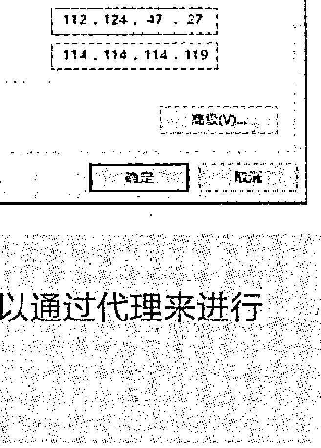

## 《电脑爱好者》2016年合订本(四)

## 如何对应用访问进行屏蔽拦截

文|老万

Q: 现在很多应用程序的权限越来越多，尤其是自动打开网络连接的权限，使得很多应用都会偷偷地跑流量。虽然通过很多安全应用可以拦截，但是首先需要对系统进行ROOT才可以。那么不ROOT能不能屏蔽拦截啊？

A: 首先下载安装“360流量卫士”这款应用，当用户运行这款应用的时候，它会提示用户应用会创建一个VPN网络。这样“360流量卫士”就变成了一个网关，所有进出手机的数据都会通过这款应用，自然就可以不ROOT对应用进行拦截。而通过对应用联网的权限进行设置，就可以成功地阻止应用的网络连接了。


其实在设置选项里面停止应用的运行，也可以阻止应用的网络连接操作。除此以外，Opera推出的“流量宝”应用以及国外的AFWall+应用，也可以起到类似的作用。

## 手机里面如何进行网络测速

Q: 最近网络运营商进行优惠活动，免费给老用户进行宽带升级，可是升级后我并没有发现网速提升。那么通过什么方法可以对网速进行测试啊？

A: 用户可以首先安装一款名为“迅雷测速”的手机应用，安装完成以后点击“开始测速”按钮，就可以开始对网络宽带进行检测了。不过需要提醒大家的是，测速的时候不要进行其他的操作，避免对带宽的占用造成测速不准确，而且最好多测速几次，以取得一个准确的数值。

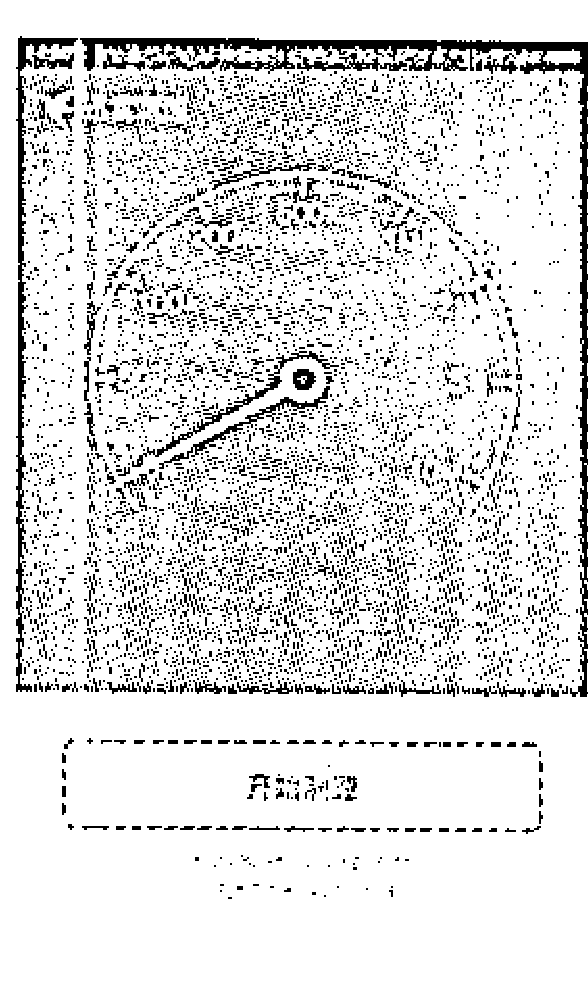

## 手机自带邮箱应用登录QQ邮箱失败

Q: 由于自己平时的电子邮件并不多，所以使用的是手机自带的邮箱应用，可是不知道为什么无法登录QQ邮箱。后来反复检测了几次邮箱密码，确认都是正确无误的啊？

A: 首先通过电脑浏览器登录QQ邮箱，在弹出的网页页面中点击“设置”链接，接着选择“账户”标签中的“POP3/IMAP/SMTP/Exchange/CardDAV/CalDAV服务”并开启它。这时在下面点击“生成授权码”这个按钮，从而获取到授权码的信息。然后打开手机的邮箱应用，在登录密码中输入这个授权码就可以了。

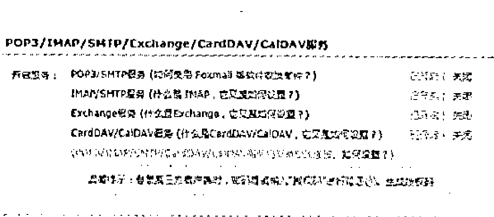

## 快速分辨鲜花的类型和名称

Q: 前段时间我们这里搞了一个花卉展览，里面有各种各样的花卉品种，但是我怎么也分不清楚月季和玫瑰。那么通过什么方法可以帮助用户快速分辨鲜花的类型和名称啊？

A: 正好微软亚洲研究院最新推出了一款名为“微软识花”的APP，可以一键帮助用户识别中国的绝大多数花卉。用户只需要首先拍摄花卉的图像载入到应用里面，接着通过移动窗口里面的选择框把花卉选中，再点击确认命令，它就可以进行分析判断，然后告诉用户最终的结果了。

## X520为什么不能使用电信3G上网

Q: 不久以前我买了一个乐视手机X520，可是外出打开手机流量功能后，发现无法成功地进行上网操作。这款手机不是号称全网通吗，怎么会出现这么莫名其妙的问题？

A: 这款手机使用的是高通处理器，和使用联发科的X620有所不同。由于用户使用的还是3G卡，问题有可能出在这里。据了解许多发生此问题的用户均是将3G卡更换成4G卡后解决了，建议此位读者也试试。如还有问题可以将机器送往官方服务点进行检测，让售后协助解决。

## Word里面如何按照姓氏拼音来排序

Q: 单位领导要求对新的员工进行统计，要求把员工名字录入到Word里面的一个表格中，而且要求按照姓氏拼音进行排序。现在表格已经制作完成了，请问姓氏拼音如何才可以实现啊？

A: 首先在Word里面选中刚刚创建的表格，接着选择“布局”标签后点击“排序”按钮。在弹出的对话框中的“主要关键字”里面选择需要操作的列，然后在“类型”列表里面选择“拼音”这项。再根据需要选择“升序”或“降序”，这样就可以完成相关的操作了。

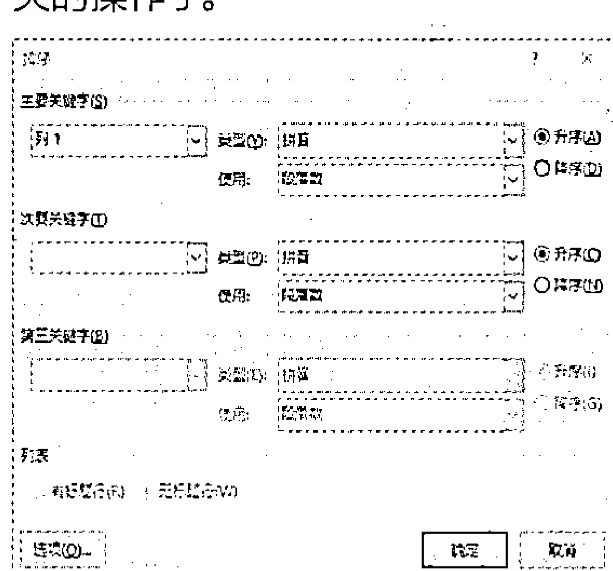

## Word如何关闭拼写检查功能

Q: Word里面的拼写检查功能非常有用，可以帮助用户检查一下错别字内容，但是有的时候也非常烦人，明明正确的内容也划红线。那么如何关闭这项功能啊？

A: 首先点击Word操作界面左上角的“文件”，在弹出的菜单里面选择“选项”命令。接着在选项窗口点击左侧列表中的“校对”标签，然后在右侧窗口找到“在Word中更正拼写和语法时”这个区域，根据需要将其中的子选项进行关闭就可以了。

## Word撤销功能失效的解决方法

文/老万

Q: 最近我发现一个非常奇怪的现象，就是Word里面的撤销功能无法使用，无论是点击按钮还是调用快捷键都不行。可是没有撤销功能不方便啊，那么这个问题如何解决？

A: 以Office 2013为例，首先打开系统的注册表，展开到HKEY_CURRENT_USER\Software\Microsoft\Office\15.0\Word\Options。接着在右侧窗口里面新建一个名为UndoHistory的DWORD（32位）值，然后双击新建的值，在弹出的对话框中选择“十进制”选项，然后在其左侧的“数值数据”文本框中输入一个撤销次数就可以了。

> 用户也可以重新安装一次办公软件，这样注册表的相关内容就会重新注册。


部署工具，下载完成以后进行解压操作，接着运行文件夹中的批处理文件。在弹出的窗口里面选择“3 - 清除Office激活信息”这项，就可以清除系统里面以前的Office激活信息。接下来再重新安装Office 365，就不会显示以前的版本信息了。

## Office 365无法正确安装怎么办

Q: 之前我一直使用的是盗版的Office专业增强版，现在购买了一个正版的Office 365来使用。可是当我卸载老版本安装新版本后，结果发现显示的还是专业增强版。这是怎么回事啊？

A: 首先下载最新版本的“Office 365

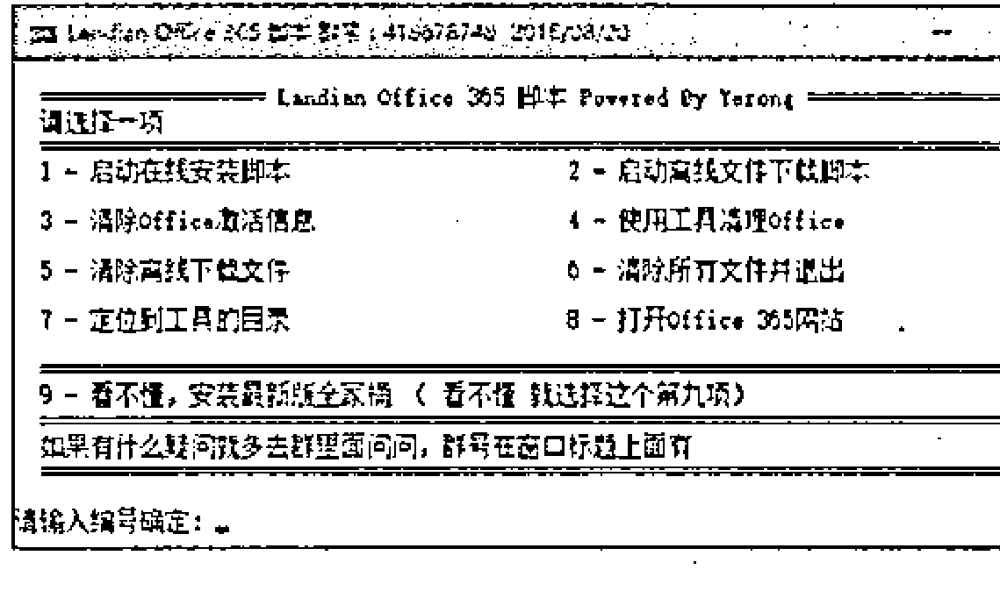

## Office 2007打不开2003的加密文件

Q: 我的Office 2007突然打不开Office 2003的加密文件了，而且只是Excel的加密文件打不开，一打开就提示“文件已损坏，无法打开”，但是同一个文件发给其他人都可以打开。这是怎么回事啊？

A: 据描述猜测，这个文件应该是在闪存盘里面运行的，在电脑磁盘里面运行不会有这个提示。所以建议你将文件复制到电脑磁盘后再运行，或者请他人帮忙将文件解密以后再发送给你。

## 消除Android 7.0移动网络上的感叹号

文|老万

Q: 我的Nexus手机开始收到Android 7.0的更新推送，但是我发现在Wi-Fi和移动网络的图标处会出现感叹号，使用以前的方法也不能解决这个问题。那么如何去掉这个感叹号啊？

A: 首先下载ADB工具包到电脑系统的根目录，将手机通过USB连接至电脑系统里面。接着在命令提示符窗口激活ADB工具，输入“adb shell”命令后如果出现$标志，再输入命令“adb shell settings put global captive_portal_server captive.v2ex.co”，完成以后重新启动手机系统就可以解决了。

```

C:\adb>adb shell
shamu:/ $ exit
C:\adb>adb shell settings put global captive_portal_server captive.v2ex.co
```


的手机里面安装一些相关的应用软件。现在已经有从这个设备分离出来的应用软件，比如“Pixel wallpaper”和“Pixel Launcher”等等，用户只需要通过应用商店进行下载安装就可以了。

## 如何禁止系统自带的应用运行

Q: 前段时间我看到贵刊介绍了一个技巧，就是通过手机设置里面的“应用管理”功能，可以暂时禁止系统自带应用的运行。可是我使用的乐视手机却不能按照这个方法进行操作，那么请问还有没有其他的方法可以解决这个问题？

A: 乐视手机里面自带了一个“管家”功能，通过它就可以解决你的问题。首先在系统桌面找到“管家”图标，点击它以后，在弹出的界面里面点击“应用仓库”选项。然后就可以看到系统里面所有安装的应用名称，找到需要暂时停用的应用名称后，点击后面的开关按钮就可以关闭了。

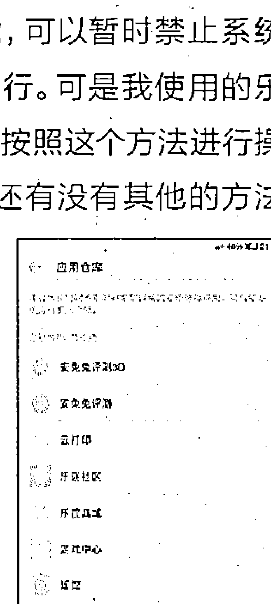

## 有没有可以语音输入的云笔记

Q: 虽然现在的手机屏幕越来越大，但是相比于电脑操作而言，它们的输入还是非常的不方便。那么有没有什么方法可以直接通过语音来记录笔记啊？

A: 说到语音输入很多人就会想到讯飞输入法，正好最近这款输入法也推出了一款名为“讯飞语记”的应用，通过它就可以完成语音笔记的操作。其实用户在使用传统的笔记应用的时候，只需要配合具有语音输入功能的输入法，也可以快速完成相关的操作。

## 如何可以感受到Pixel设备的特点

Q: 谷歌最近推出了一款全新的Pixel设备，这个设备里面搭载了最新的Android系统版本。可是我暂时并不想更换现有的手机，那么有没有什么方法可以提前感受一下这款设备的特色呢？

A: 如果用户想提前感受这款设备的特色的话，可以在自己现有的手机里面安装一些相关的应用软件。现在已经有从这个设备分离出来的应用软件，比如“Pixel wallpaper”和“Pixel Launcher”等等，用户只需要通过应用商店进行下载安装就可以了。

## PDF文件阅读器的全新选择

Q: 随着手机屏幕越来越大，在手机上看文字资料的时间也逐渐增多，但是现在有的文字资料还是以PDF格式的文档存在的，可是常见的阅读器对PDF文件的支持并不是很好。那么有没有什么好的阅读器可以推荐啊？

A: 其实我们并不一定非要把目光限定在阅读器上面，很多文件编辑应用也可以很好地支持PDF文件，比如国产的WPS软件就是这样的选择。

## 关闭Edge浏览器的SmartScreen筛选器

Q: Windows 10内置的Edge浏览器包含了SmartScreen筛选器，但是我已经安装了360安全卫士这款软件，所以不想再使用这个功能了。听说这个功能只能在系统里面进行关闭，那么如何才可以关闭这个功能呢？

A: 首先在Cortana搜索栏输入regedit，按回车键进入注册表编辑器。定位到HKEY_LOCAL_MACHINE\SOFTWARE\Policies\Microsoft\MicrosoftEdge\PhishingFilter，接着在右侧窗口里面新建一个名为EnabledV9的DWORD（32位）值，然后双击新建的值并在弹出的对话框中设置为0就可以了。

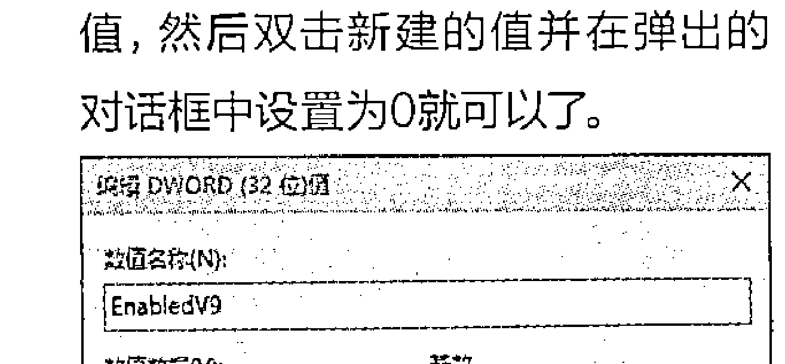

## 禁用Windows 10系统的壁纸压缩功能

Q: Windows 10在设置桌面背景时，会自动将图片质量压缩为原始图片的85%，再将压缩后的图片设置为桌面背景。之所以这么做主要是为了在一定程度上提高性能和节省空间，但对于目前的计算机性能来说恐怕微不足道。那么如何禁用这个压缩功能呢？

A: 首先按照前面的方法打开注册表编辑器，接着定位到HKEY_CURRENT_USER\Control Panel\Desktop，在右侧窗口里面新建一个名为JPEGImportQuality的DWORD（32位）值，然后双击新建的值并在弹出的对话框中将其值设置为100即可。

## 把任意文件固定到Windows 10开始屏幕

文|老万

Q: 虽然Windows 10能够让用户固定常用应用程序到开始屏幕，但是并不是所有文件都能固定到这个位置，一般来说是以程序和应用为主的。那么我想把任意的文件固定到开始屏幕，有没有什么方法可以解决呢？

A: 这个问题还是需要通过注册表来实现，不过由于这个操作比较麻烦，所以我这里制作了一个现成的注册表文件（http://pan.baidu.com/s/1skSf00P）。用户只需要下载以后双击运行，将其内容导入到注册表里面就可以了。接下来重新启动系统，点击右键就可以看到“固定到开始屏幕”命令，这样文件就可以固定到开始菜单了。

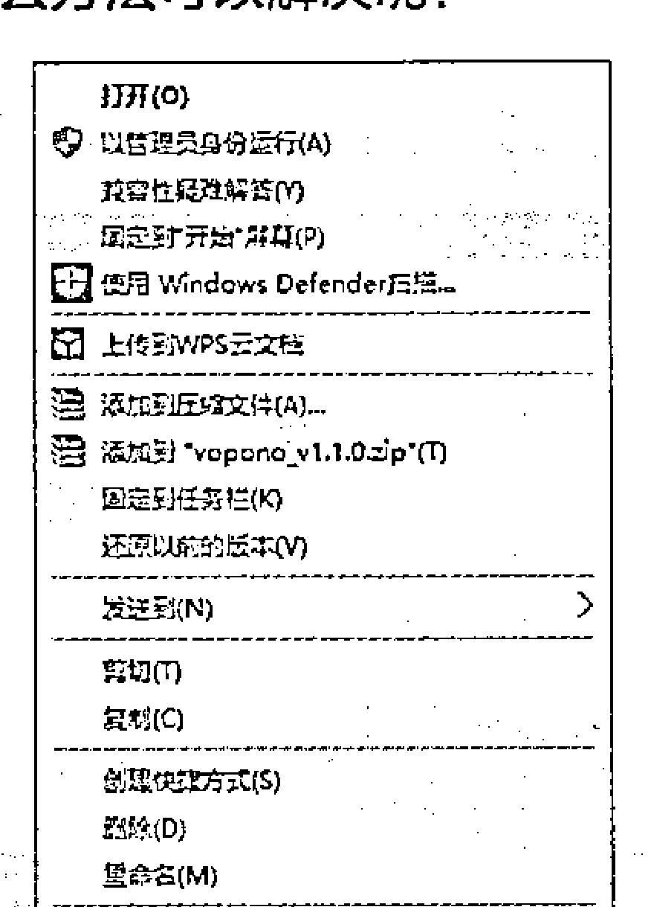


如果文件还是无法固定的话，可以先在桌面创建一个快捷方式，利用这个快捷方式固定就可以了。

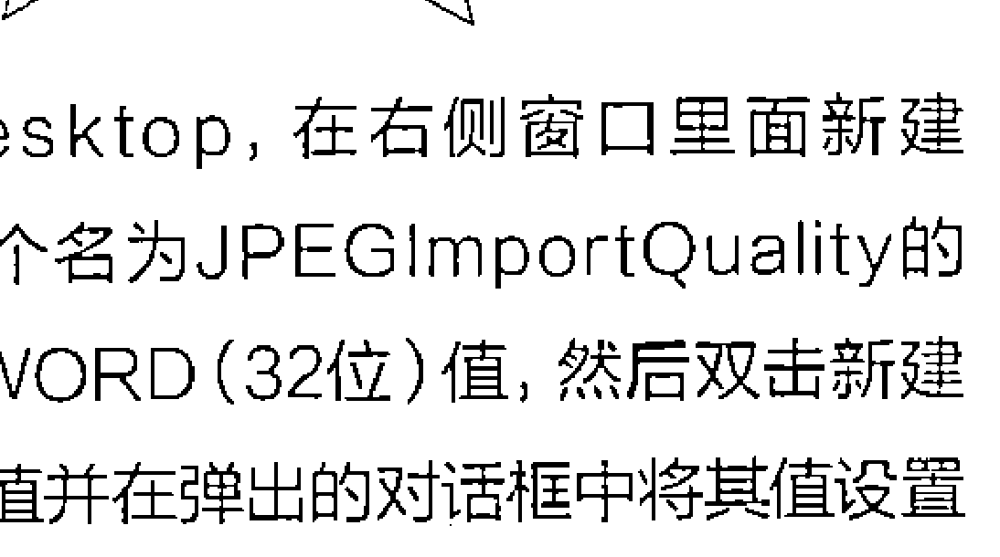

## 电脑一键还原和重装系统有什么不同

Q: 我想把电脑系统盘中的文件删除干净，通过一键还原可以做到吗？这种方法和我们常说的重装系统有什么不同吗？

A: 其实这两种方法都差不多，只不过一键还原在操作的时候，首先会将系统盘里面的文件通通删除掉。重装系统的话则会把以前的系统盘文件转移到一个特殊的文件夹目录里面，然后再进行系统的安装操作。

## Windows 10登录窗口没有密码输入条

Q: 今天打开电脑进入到登录窗口，发现界面和往常不一样，原来Windows 10登录窗口的密码输入条没有了。那么这是怎么回事，应该如何进行解决呢？

A: 出现这样的问题，应该是电脑系统安装了第三方的输入法软件，与Windows 10系统不兼容造成的。解决方法也非常简单，点击登录界面右下角的输入法图标，将当前的输入法切换为微软自己的输入法；稍等片刻密码输入条就出现了。

## 怎么使用Greasemonkey75.x扩展

文老万

Q: 我现在使用的是小众浏览器K-Meleon，在官方扩展论坛发现一个Greasemonkey扩展。安装扩展后我先设定JS文件夹再添加JS脚本，结果显示已安装脚本，但是却没有效果。求解决？

A: 虽然很多脚本都可以在不同的扩展里面运行，但是多多少少还是存在一些兼容性的问题。所以你可以在浏览器地址栏输入“about:addons”命令后回车，进入到自带的浏览器管理页面。再点击左侧列表中的“扩展”命令，然后在窗口的右上角输入扩展名称，这样来安装需要的扩展后再试一试。

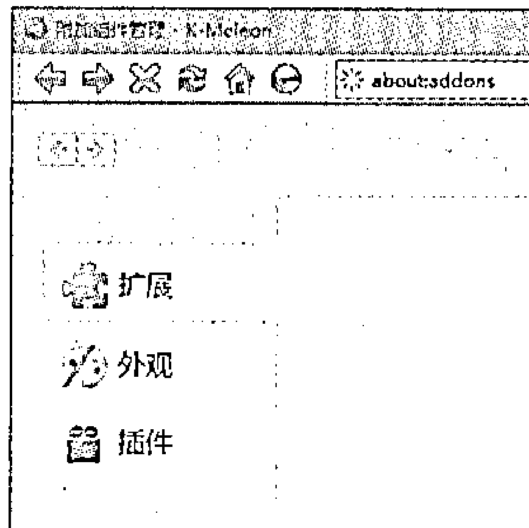


另外登录到http://kmext.sourceforge.net/这个网站，也可以下载到很多需要的功能扩展。

## 如何给QQ的Msg2.0.db文件瘦身

Q: 我自己加了很多的QQ群，有些群是每天可以生成将近上万条聊天记录的大群，隔一段时间我也会把那些大部分没用的聊天记录删掉。但是我观察过，在消息管理器里删了整个群的消息记录，Msg2.0.db这个文件的大小是一点都不会变。那么如何有效地对其瘦身啊？

A: 首先将这个文件进行改名操作，接着重新登录自己的QQ客户端程序。点击右下角的命令按钮后，在弹出的菜单点击“工具”

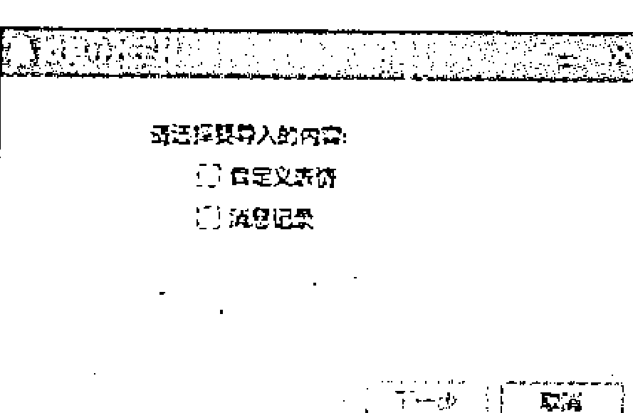

菜单中的“数据导入工具”命令，然后根据向导将以前的消息记录导入进来，你就会发现这个文件的体积变小了。

## 禁用Edge浏览器中的标签页预览

Q: 在Windows 10中将Edge作为默认浏览器使用，但是我并不喜欢它的标签页预览功能，所以打算将这个功能关闭掉，但是在设置选项里面没有找到这个关闭选项。那么如何关闭这个预览功能呢？

A: 首先打开系统的注册表，展开到HKEY_CURRENT_USER\SOFTWARE\Classes\Local Settings\Software\Microsoft\Windows\CurrentVersion\AppContainer\Storage\microsoft.microsoftedge_8wekyb3d8bbwe\MicrosoftEdge\TabbedBrowsing。

接着在右侧窗口里面新建一个名为TabPeekEnabled的DWORD（32位）值，然后双击新建的值，在弹出的对话框中设置为0就可以了。

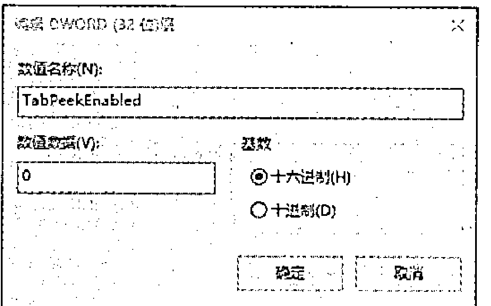

## KMP不知道碰了哪个键变成一条了

Q: 我使用的是老版的KMPlayer播放器，今天不知道碰了一下键盘中的哪个按钮，这个播放器的窗口就变成一小条了，类似于千千静听的播放条。那么如何恢复到正常的播放窗口呢？

A: 其实最简单的方法就是，将鼠标移动到播放条的边缘，然后按住鼠标左键进行拖动放大就可以了。

## 百分浏览器如何进行便携化设置

Q: 我之前下载的时候不知道百分浏览器有便携版，安装了一大堆插件和Stylish格式。现在我已经下载了便携版，怎样才能把我电脑上的插件、书签这些移植到便携版上呢？

A: 首先在地址栏输入“chrome://version/”并回车，在出现的信息窗口中找到“个人资料路径”这个选项，在后面可以看到一个完整的路径信息。接着将该路径下User Data这个文件夹中的文件复制粘贴到便携版安装目录中的User Data文件夹里面即可。

## WordPress批量修改引用图片地址
文|老万

Q: 有时候我们WordPress搬家或者碰到图床出问题的情况，这个时候就要修改博客里面引用的图片地址，但是一个一个进行修改实在是太麻烦了。有没有什么办法可以批量进行图片链接的修改啊？

A: 批量修改引用的图片地址需要进入数据库才行，这里使用phpMyAdmin等工具就可以了。首先通过phpMyAdmin选中数据库中的wp_posts表，然后点上面的搜索标签选择“Find and replace”。输入之前的图片地址和之后的图片地址，点执行会弹出确认的页面，确认后执行即可批量修改了。

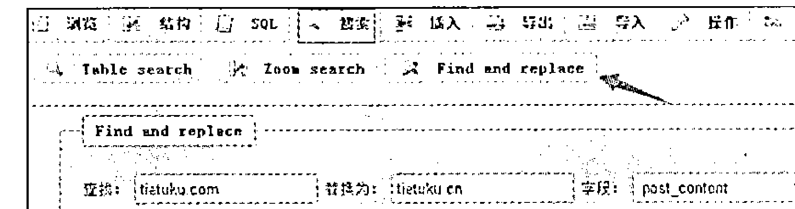

> 建议不要将图片和网站存放在一个空间，最好还是采用第三方的图床服务比较好。

## 一个二维码跳转到不同的下载地址

Q: 现在的手机应用都分为Android和iOS的版本，这样不同手机的用户需要扫描不同的二维码，到不同的应用商店去下载相关的应用。那么能不能在一个二维码里面，包括不同的下载链接并根据不同的手机进行跳转呢？

A: 首先通过浏览器登录到http://2bai.com.cn/链接，选择点击网页里面的“APP二维码”这项。接着在下面的“IOS系统”和“安卓系统”的输入框里面，分别设置Android和iOS版本的下载地址。设置完成以后点击“生成二维码”按钮，这样就可以创建一个二合一的二维码图标。

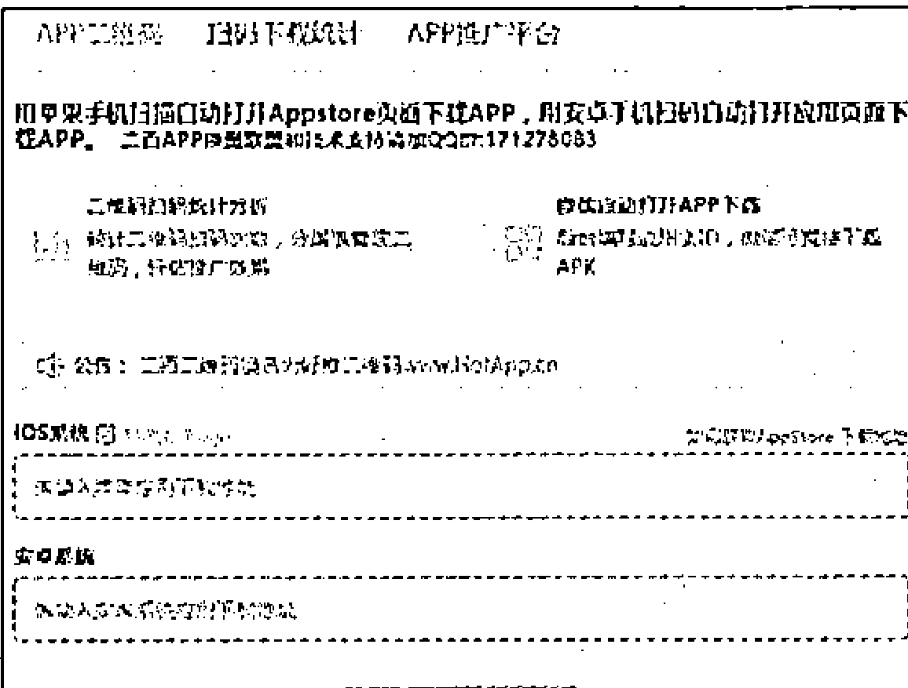

## 利用新浪微博来作为个人的图床

Q: 我想找一个免费的图床来进行使用，可是找来找去发现好的图床都是国外的，而国内却没有相关的好的选择。那么傻博士有没有什么可以推荐呢？

A: 如果傻博士说利用新浪微博来作为图床，你会不会觉得有些莫名其妙呢？其实不用感到奇怪，我们只需要在浏览器里面安装一款“围脖是个好图床”的功能扩展就可以了。以后我们只需要将图片直接拖拽到这个扩展里面进行释放，稍等片刻就可以看到这个图片的网页链接分享了。

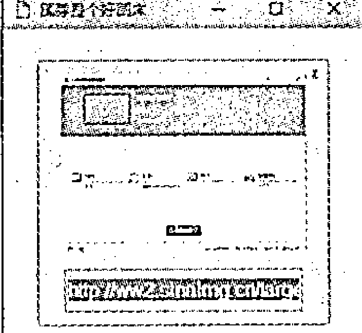

## 一个IP地址能和两个MAC地址绑定吗

Q: 单位电脑的IP地址和MAC地址绑定了，现在IP地址不够用了。能不能将新电脑的MAC地址修改成一台能上外网的MAC地址，两台电脑共用一个IP地址，然后都能直接上外网呢？

A: 不能共用一个IP地址，如果捆绑了网络设备没法传数据。建议用一个普通的有线路由器，WAN口支持克隆电脑的MAC地址，克隆后供下面再接的电脑上网。或者直接联系你们的网管，划分更多的VLAN后，进行精细化的管理操作。

## 为什么每次都只能用邮箱登录

Q: 我在一个论坛注册了一个账号，可是这个论坛每次都要求使用注册的邮箱进行登录，我觉得这样非常麻烦。为什么不可以使用注册的账号进行登录呢？

A: 由于不同的论坛拥有不同的管理规则，所以我认为这个论坛可能是因为用户的权限不够而暂时还无法使用账号进行登录。如果用户觉得麻烦的话，可以激活浏览器的账号密码记录功能。这样每次登录的时候浏览器就会帮助用户自动输入账号密码，从而快速地完成论坛的登录操作。

## 如何加快LibreOffice的启动速度
文|老万

Q: 虽然国产的WPS办公软件是免费的，但是现在这款软件的广告越来越多，于是我改用国外的LibreOffice软件。可是这款软件的启动速度不太理想，有没有什么方法可以解决这个问题呀？

A: 首先运行LibreOffice这款软件，点击“工具”菜单中的“选项”命令，在弹出的窗口中选择左侧的“内存”选项卡。接着在右侧窗口里面，将“用于LibreOffice”设置为128MB，并将“每个对象的内存”选项设置为20MB。设置完成以后点击“确定”按钮，然后重新启动该办公软件就可以了。

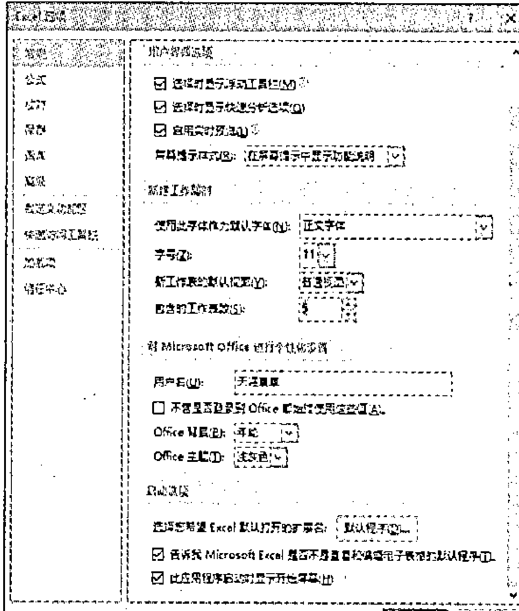

以上的设置完全取决于计算机的内存，用户可以根据自己的实际情况将其调高或调低。

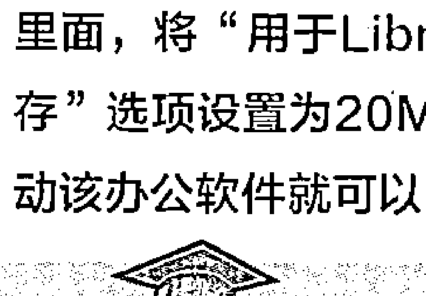

## 禁用Outlook在永久删除前的提示

Q: 我每天总会处理大量的邮件，其中有正常邮件和垃圾邮件，可是Outlook为了保证邮件安全，总会在永久删除项目时再次询问，并要求用户确认是否删除。有没有什么方法可以关闭这个确认功能啊？

A: 首先点击Outlook操作界面左上角的“文件”按钮，在弹出的菜单里面选择“选项”命令。接着在选项窗口找到左侧的“高级”选项，然后在右侧窗口的“其它”选项中，取消勾选“在永久删除项目前提示确认”命令即可。

## 只打印文章里面选中的部分内容

Q: 有时我们可能只需要打印长篇文档中的一个部分，传统方法是暂时将多余的内容部分进行删除，然后再进行相关的打印操作。这样操作起来肯定比较麻烦，那么如何快速解决这个问题？

A: 首先在文件里面通过鼠标选中想要打印的内容，再点击Word操作界面左上角的“文件”按钮，在弹出的菜单里面选择“打印”命令。在弹出的打印对话框里面点击设置命令后，再在弹出的菜单里面点击“打印所选内容”选项，最后点击“打印”按钮就可以了。

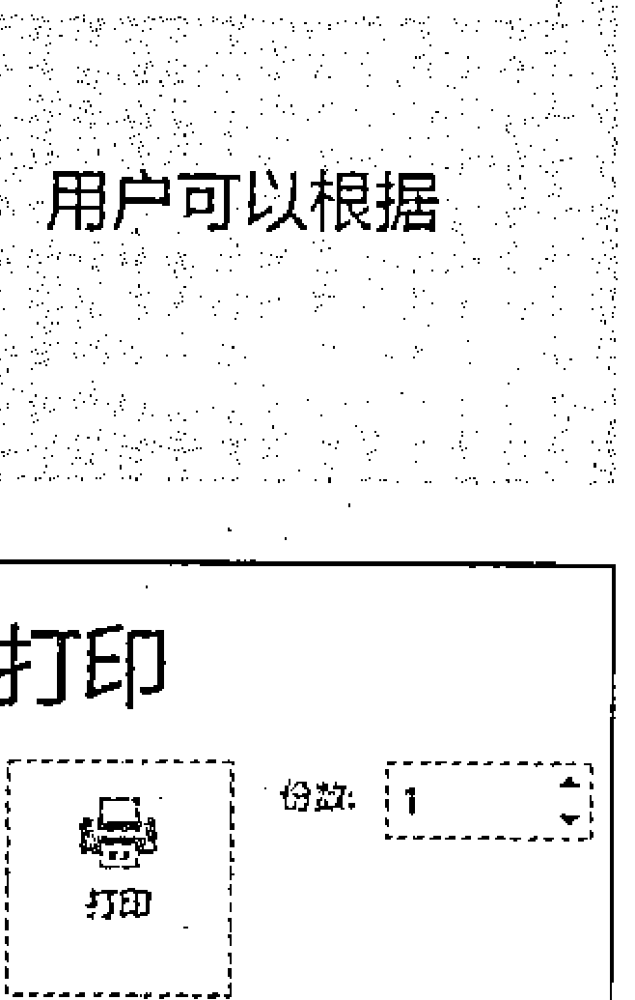

## 调整新建Excel工作表预设数量

Q: 我在使用Excel的时候经常需要打开多个表单，但是软件每次新建只会打开一个表单。虽然点击新建表单按钮也很方便，但是能不能打开新文件的时候就主动创建多个表单啊？

A: 首先点击Excel操作界面左上角的“文件”按钮，在弹出的菜单里面选择“选项”命令。接着在选项窗口找到“新建工作簿时”区域，然后在“包含的工作表数”选项进行设置即可。比如我们这里设置为5，这样新建表格文件的时候，就会自动创建五个表单。


## 不同文档如何进行同步滚动操作

Q: Office办公软件和WPS不一样，后者可以同时打开多个文档文件，这样进行文件内容对比就很方便。那么在Office办公软件里面，有没有什么方法可以解决这个问题啊？

A: 首先通过Office办公软件分别打开要对比的文档文件，接着点击办公软件中的“视图”标签，然后点击其中的“并排查看”按钮。这时办公软件会自动将两个文档并列显示，再点击“同步滚动”选项就可以让两篇文档同步翻页，这样对比起来就非常方便了。


### Windows 10玩游戏卡应该怎么解决

Q: 我听很多网友介绍说新的Windows 10操作系统玩游戏非常的流畅，于是我也下载安装了一个来试试。结果大出我的意料，因为在玩游戏的时候觉得非常的卡。请问为什么会出现这样冰火两重天的情况呢？

A: Xbox是Windows 10的一项预设应用，它有一个很特别的“屏幕录制”功能，关闭这个功能就可以解决了。首先在Cortana搜索栏输入Xbox，打开这个功能以后，点击窗口侧边栏中的“设置”命令，然后选择窗口中的“游戏DVR”标签。最后关闭“使用‘游戏DVR’录制游戏剪辑和屏幕截图”和“当我玩游戏时进行后台录制”两项复选框，便成功关闭了Xbox的后台自动录屏功能。

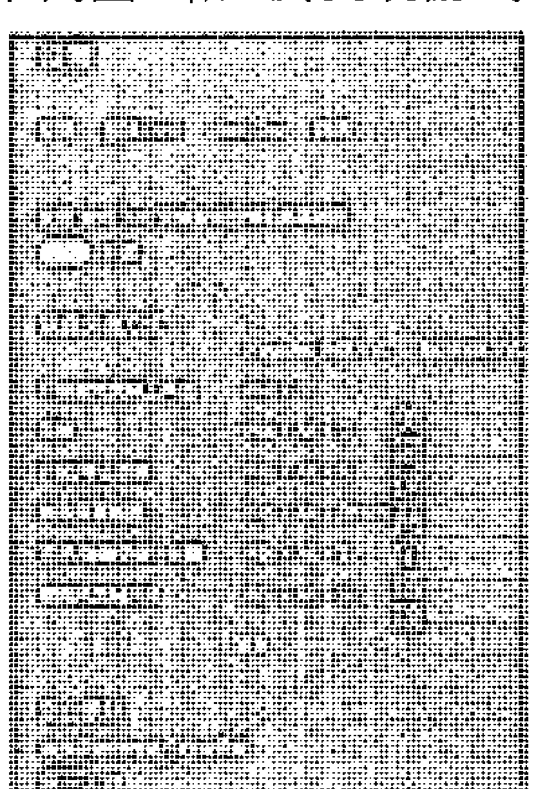

### 如何修改Windows 10系统版本信息

Q: 由于现在Windows 10的版本更新比较快，所以很多Windows系统发烧友喜欢“晒”系统版本信息。那么有没有什么方法可以修改这个信息，让我这样的菜鸟也“得瑟得瑟”呢？

A: 首先按照前面的方法打开注册表编辑器，接着定位到HKEY_LOCAL_MACHINE\SOFTWARE\Microsoft\Windows NT\CurrentVersion，然后在右侧窗口里面找到一个名为ReleaseId的DWORD (32位)值，双击这个值并在弹出的对话框中进行修改即可。

### 怎么取消网页文件与同名文件夹之间的关联
文|老万

Q: 我在将微软的办公软件另存为网页文件的时候，会产生一个网页文件以及同名的文件夹目录。但是当我删除这个网页文件的时候，同名的文件夹目录也会被删除，而删除文件夹的时候，网页文件也会被删除。那么有没有什么方法可以取消它们之间的关联呢？

A: 首先在“运行”框输入“regedit”打开注册表编辑器，接着展开到HKEY_CURRENT_USER\Software\Microsoft\Windows\CurrentVersion\Explorer，然后在右侧窗口里面新建一个名为NoFileFolderConnection的DWORD (32位)值，最后将“数值数据”修改为1并重新启动系统就可以了。

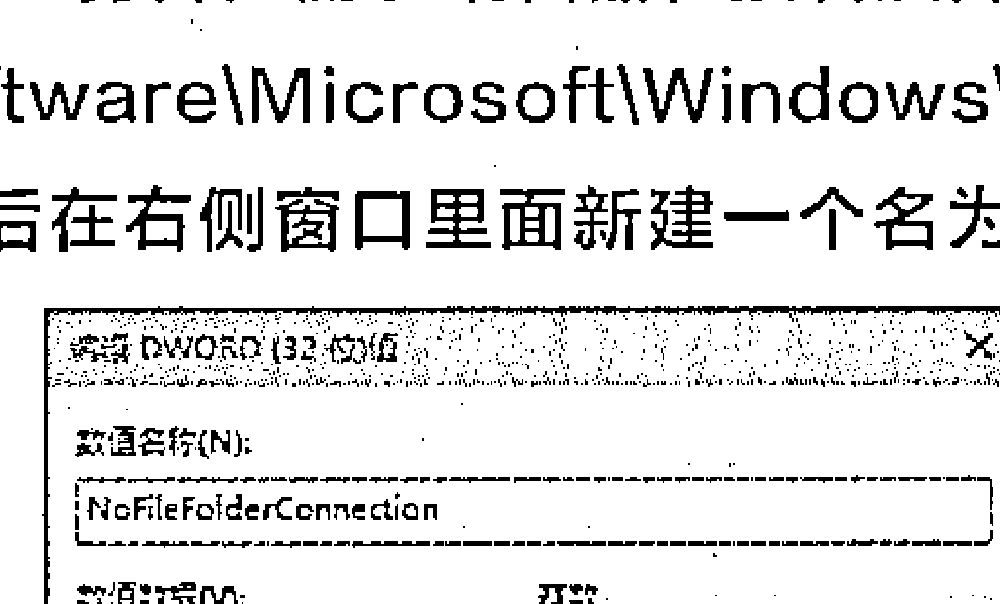

将网页名称或者文件夹名称进行重命名，在删除的时候也不会受到关联的影响。

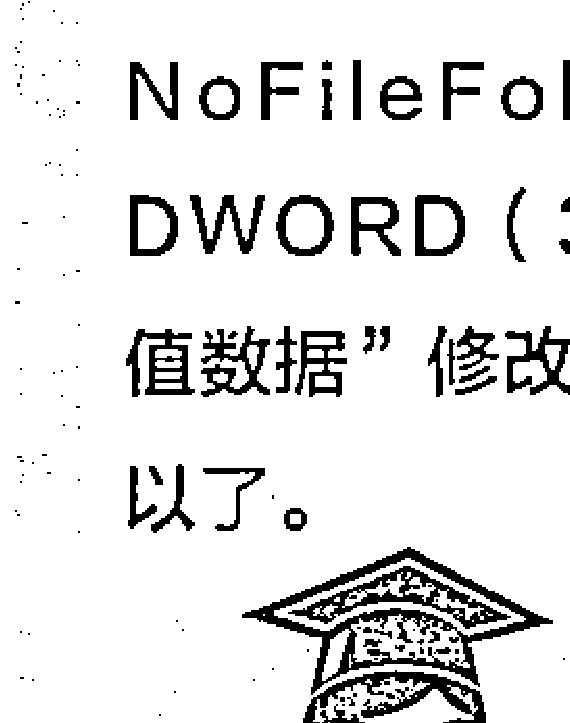

### 重置操作系统的组策略设置

Q: 系统里面的很多优化操作，我们都是通过注册表或者组策略来完成的。这些系统自带的功能虽然能够实现一些不错的效果，但是有的时候修改后可能也会出现问题。那么有没有什么方法将组策略修改为系统默认的配置呢？

A: 首先通过管理员权限打开命令提示符窗口，接下来分别执行下面三个命令，即rd /s /q "%windir%\System32\GroupPolicyUsers"、rd /s /q "%windir%\System32\GroupPolicy"、gpupdate /force。然后重新启动操作系统就可以恢复组策略以前的设置信息了。

### 让Windows 10系统蓝屏显示详细信息

Q: Windows系统的蓝屏已经非常常见了，但是最新的系统版本蓝屏里面只会出现一个哭脸的图标，而并不会显示出详细的错误提示。那么有什么方法可以让它显示出详细的错误信息呢？

A: 首先打开注册表编辑器，接着定位到HKEY_LOCAL_MACHINE\System\CurrentControlSet\Control\CrashControl，然后在右侧窗口里面新建一个名为DisplayParameters的DWORD (32位)值，双击新建的值并在弹出的对话框中将其值设置为1即可。

### Opera自带的去广告功能可以自定义吗
文|老万

Q: 我使用的是最新版本的Opera浏览器，现在这个浏览器自带一个去广告的功能，而且使用效果也非常不错。那么我想问问能不能自定义添加一些广告过滤规则呢？

A: 其实这款Opera浏览器是允许用户自定义添加广告规则的。首先点击浏览器左上角的菜单按钮，在弹出的菜单里面点击“设置”命令后，就会弹出浏览器的设置窗口。找到其中的“拦截广告”选项后，点击下面的“自定义拦截列表”按钮，就可以自定义添加广告过滤规则了。

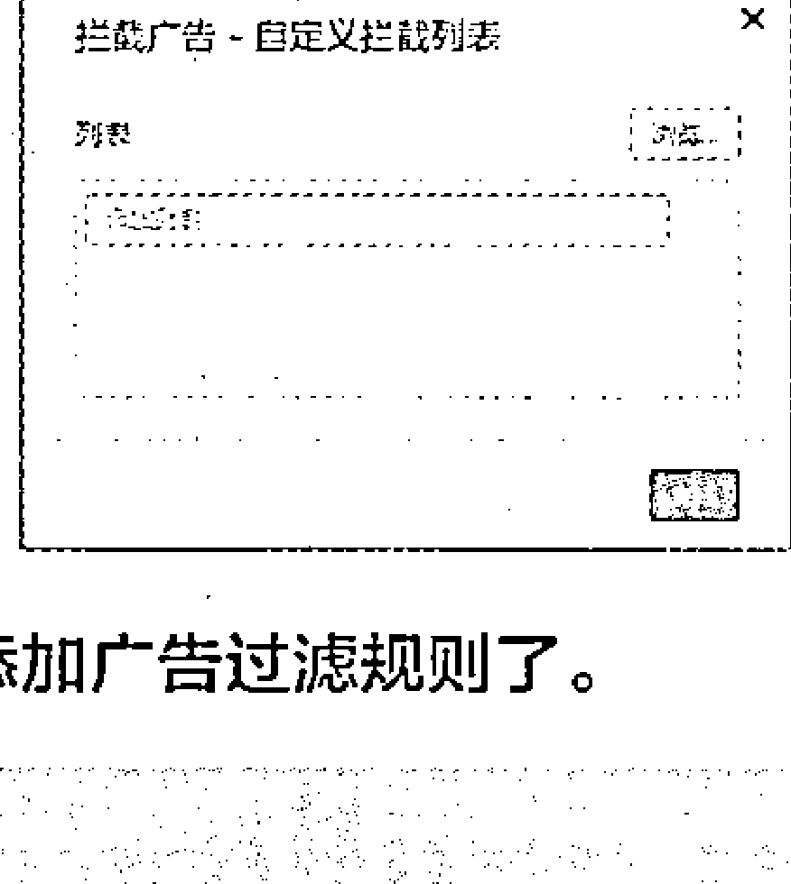

> 由于这款浏览器的广告过滤规则自成体系，因此不能导入现成的Adblock Plus规则。

### Vivaldi如何备份其中的关键文件

Q: 我现在使用的是Vivaldi浏览器，这款浏览器默认只能导入和导出书签，至于其他的内容就无法进行导入导出操作。那么如何对这些重要的文件进行备份，以便在需要的时候进行还原操作呢？

A: 由于Vivaldi这款浏览器使用的是谷歌浏览器的内核，因此我们可以采取谷歌浏览器那样对整个数据文件夹进行备份的方式进行操作。首先点击“帮助”菜单中的“关于”命令，在弹出的窗口里面找到“个人资料路径”这个选项，然后将路径中的这个目录进行整体备份就可以了。当需要还原的时候将这个文件夹的内容粘贴过去即可。

```
Vivaldi    1.5.653.3 (正式版本) （32 位）
修订版本   a1c9543d00603353109716a23d1a2135b5b5b14
操作系统   Windows
JavaScript V8 5.4.500.40
Flash      (禁用)
用户代理   Mozilla/5.0 (Windows NT 10.0) AppleWebKit/537.36 (KHTML, like Gecko) Chrome/54.0.2840.89 Safari/537.36 Vivaldi/1.5.653.3
命令行     "C:\Program Files\Vivaldi\Application\vivaldi.exe" --vivaldi-standalone --always-authorize-plugins --disable-translate --enable-blink-features=ResizeObserver --flag-switches-begin --disable-accelerated-2d-canvas --disable-accelerated-video-decode --no-pings --disable-child-account-detection --disable-gpu --disable-zero-copy --ignore-gpu-blacklist --num-raster-threads=1 --flag-switches-end
可执行文件路径 C:\Program Files\Vivaldi\Application\vivaldi.exe
个人资料路径   C:\Program Files\Vivaldi\User Data\Default
编译器     MSVC 2015
```

### 简单快捷提取视频文件中的字幕

Q: 现在很多视频文件默认是将视频信息和字幕文件结合到一起的，这样我们想获得字幕信息的话，就需要一个一个字进行输入。那么有没有什么简单的方法，可以快速将需要的字幕内容复制出来呢？

A: 我们首先下载并运行PotPlayer这款视频播放器，接着用它打开我们需要播放的视频文件。当视频正常播放并出现字幕的时候，把鼠标移动到字幕的上面，这时播放器就会自动将字幕文件框选出来。在这个框上点击鼠标右键，选择菜单中的“复制到剪贴板”命令就可以了。

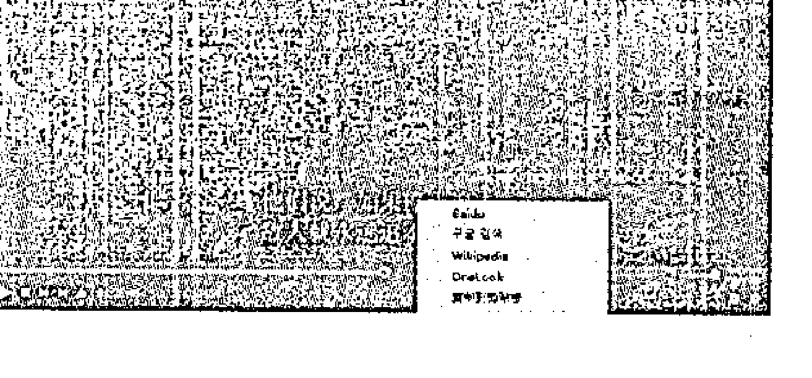

### 如何进行优酷超清视频的转换操作

Q: 之前我是用“硕鼠”这类下载软件来下载优酷里面的超清视频，但是不知道从什么时候开始，超清视频被官方屏蔽了，现在只能通过优酷客户端进行下载和播放。如何对下载的超清视频进行转换操作呢？

A: 首先下载自己需要的超清视频文件，接着进入优酷客户端并打开其中的“主页”。在弹出的窗口点击侧边栏中的“转码”选项，在窗口右侧点击上方的“新建转码”。接下来点击之前下载的超清视频，然后选择需要转换的格式，而“画面大小”选择“原视频大小”即可，最后点击保存路径就可以开始转换操作了。

### 如何辨别照片是否经过后期处理

Q: 最近单位准备进行一个摄影比赛，为了体现公平公正的目的，要求照片不允许经过任何的后期加工。那么通过什么方法可以检测出照片是否进行过后期处理加工呢？

A: 这个问题通过普通的人眼是很难识别的，必须使用专业的软件才可以，如JPEGsnoop这款软件就非常不错。它通过分辨和读取照片文件中的各种编码信息来进行判断，而且这款软件使用起来也非常简单。首次使用勾选上“I hvae read and agree to the terms above”，然后打开需要检查的照片。稍等片刻可以看到一段文字，如果你看到任何“SW”字样的文字，那么就说明这张图片是被处理过的。

## 直接在线进行当前网速的测试

Q: 现在很多安全工具里面都带有一个测速的功能，但是这些安全工具往往会占用过多的系统资源。那么有没有什么方法，可以不通过安装这些软件而进行网络速度的测试操作呢？

A: 首先通过浏览器打开http://www.speedtest.net/这个网站，接着点击其中的“Begin Test”按钮，这样就可以进行实时的在线测试操作。稍等片刻就可以看到测试结果，其中不光包括文件的下载速度，还包括文件的上传速度等等信息。

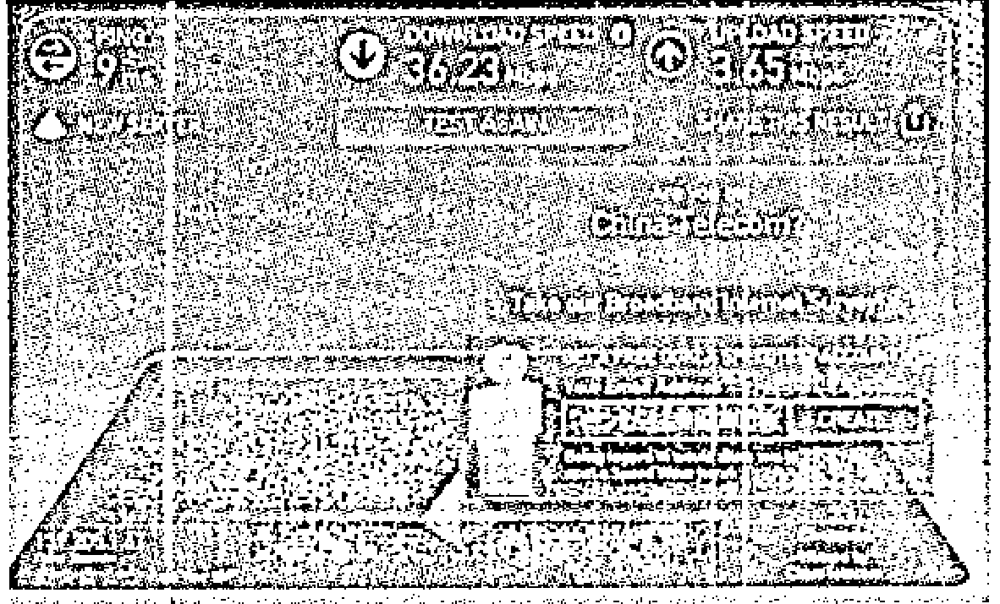

## 如何在线进行文件的预览操作

Q: 我们在出差的时候经常使用公共电脑，这个时候就会遇到一个问题，即很多需要的软件没有安装。如果我们需要查看一些常见文件的话，那么这个时候我们应该如何进行操作呢？

A: 其实这个问题非常好解决，我们只需要把文件上传到一个云端服务器后，就可以进行在线预览操作了。如果这些文件涉及到隐私的话，那么我们首先打开自己的QQ邮箱，接着创建一封新的邮件并且将这个文件添加到附件里面，然后点击这个附件文件的链接就可以在线进行查看操作了。

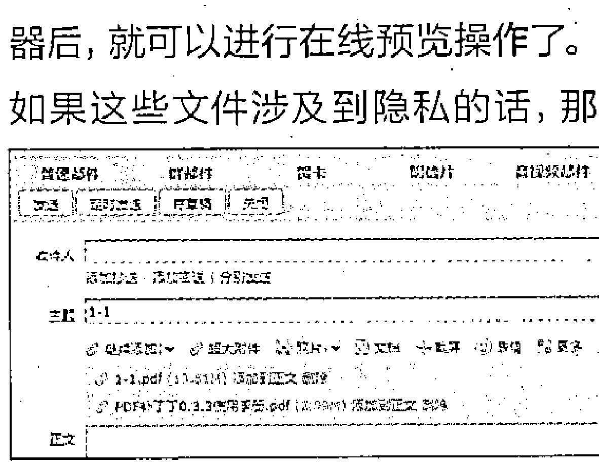

## 如何获得域名的准确解析地址
文|老万

Q: 现在通过网络来进行购物非常的方便，所以很多时候我们都通过官方网站来进行操作。可是我发现当自己输入一个网站的域名后，往往跳转到的是国内的官方网站。如果我想进入到国外的官方网站应该怎么操作呢？

A: 我们首先通过浏览器访问http://ipaddress.com/这个网站，点击上面的“IP Tools”按钮后，在弹出的页面选择其中的“IP Address Lookup”这一项命令。然后在新网页的“Enter any IP Address, Domain or Hostname:”输入框里面输入官方网站的地址，点击“Lookup”这个按钮，这样就可以解析出准确的IP地址信息了。IP地址查询结果表格截图，包含Hostname, IP Address, Organization等字段。


获取到准确的IP地址信息后，就可以按照“IP地址 域名”的格式来修改系统的Hosts文件。

## 俄语如何进行在线翻译操作

Q: 最近我发现一款俄罗斯的软件比较好用，于是打算购买一个正版的序列号。可是我自己不懂俄文，使用了一些常见的翻译软件，也无法进行俄语的翻译操作。那么这个问题应该怎么解决呢？

A: 其实一些大的搜索引擎都拥有多种语言的翻译功能，如我们常见的谷歌翻译、必应翻译，以及俄罗斯的Yandex翻译等等，用户可以根据自己的需要进行选择操作。比如我们这里就选择“必应翻译”，在窗口左侧输入需要翻译的内容后，点击翻译按钮就可以翻译成中文了。

## 正常浏览时被cdn开头的广告劫持

Q: 最近浏览网页时经常发生浏览的网页被一个以cdn.aixiaobuxiao.com开头的广告网页劫持，好像是覆盖上一层广告页面，底下的那层是自己所打开的网页。百度上的各种方法都试过了，而且电脑重装过，问题还是依旧。求解！

A: 这样的情况可能是由于脚本造成的，所以我们可以打开浏览器的设置窗口，将允许脚本运行的那个选项关闭掉，再看看有没有这个广告的显示。除此以外，我们也可以使用广告过滤软件的自定义功能，对这个广告页面进行屏蔽操作。

## 讯飞输入法也能离线语音输入

文|老万

Q：最近锤子手机的发布会上演示了讯飞输入法的功能，我发现这个输入法非常的不错，而且还找到了它的电脑版本。可是我的电脑里面没有安装麦克风等硬件，那么有没有什么方法可以解决这个问题呢？

A：其实用户只需要利用自己的智能手机，就可以代替麦克风进行语音输入。首先在手机里面安装“讯飞麦克风”应用，接着激活讯飞输入法的“讯飞麦克风”功能，这时就会出现一个二维码。使用手机讯飞麦克风客户端扫描该二维码后进行配对，之后用户只需要在手机讯飞麦克风中朗读文字，就可以在PC中实现语音输入了。

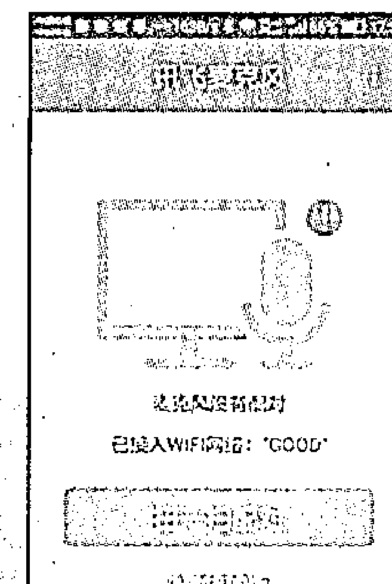


## 怎样才可以调用第三方播放器

Q：现在手机浏览器播放在线视频都是直接内置播放，而第三方播放器的好处是可以进行硬件解码，而且可以节省大量的手机电量。那么有没有什么手机浏览器可以调用第三方播放器啊？

A：其实利用UC浏览器国际版以及火狐浏览器，都可以实现你需要的这个播放功能。比如我们这里使用UC浏览器国际版，打开需要播放的视频文件后点击右上角图标，在弹出的菜单里面就可以调用第三方播放器来操作了。

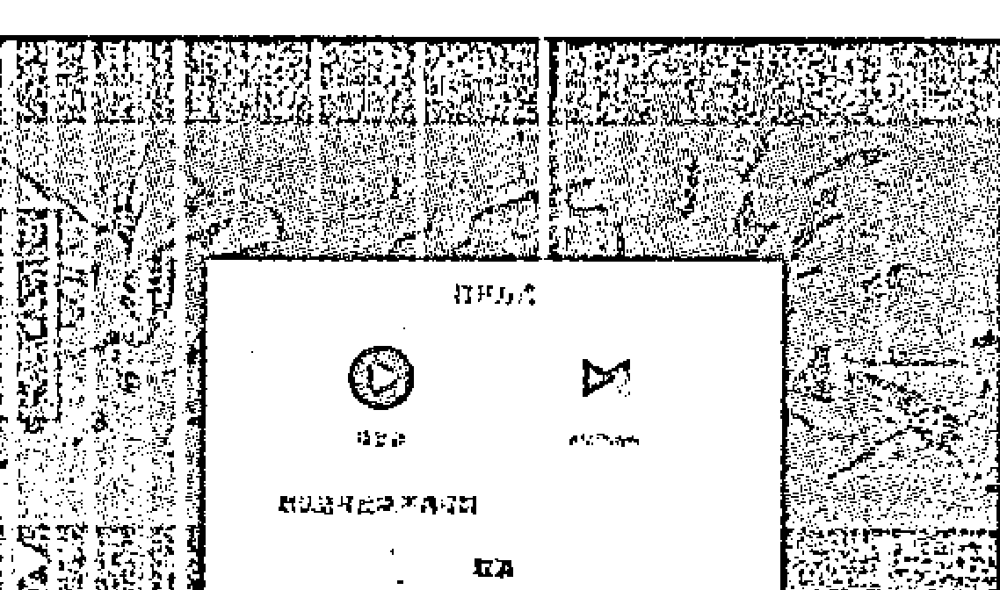

## 移动浏览器有没有放大字号的功能

Q：虽然现在手机的屏幕越来越大，但是看久了还是觉得非常的费劲。那么我想问问现在的移动浏览器里面有没有调整字体大小的功能，或者说哪个浏览器有这个功能？

A：其实主流的浏览器里面都有你所说的这个功能。比如点击Opera浏览器右下角的图标按钮以后，在弹出的菜单里面选择“显示”按钮，然后在弹出的对话框里面就可以根据自己的需要调整字体的大小了。除此以外，有的浏览器将这个功能隐藏在辅助功能里面，用户可以好好地找一找。

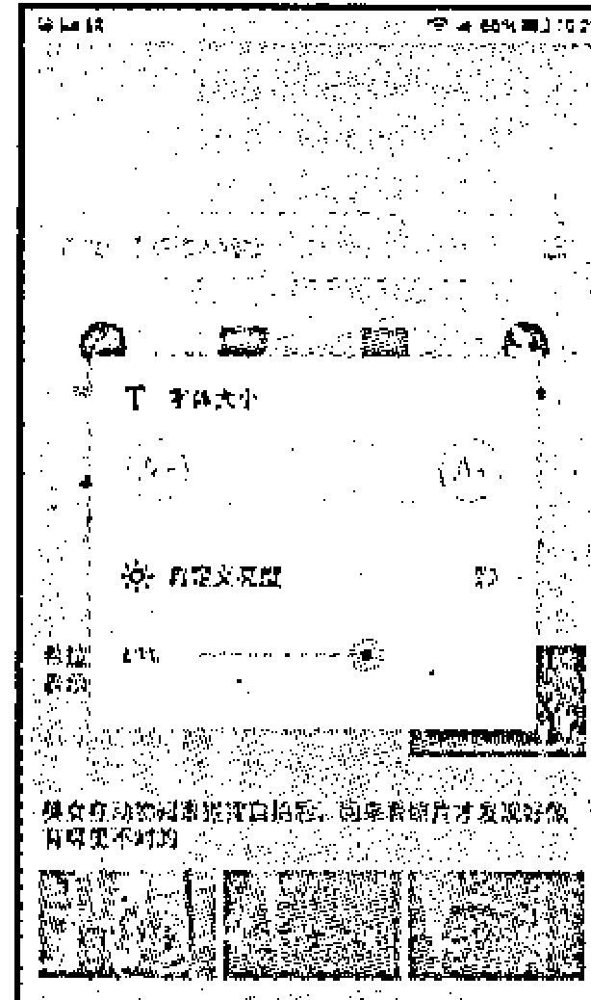

## 如何激活手机里面的Doze模式功能

Q：Android 6.0最大的一个改进就是引入了Doze模式，在这个模式下Android系统可以休眠后台的APP，从而大幅度地节省手机电量和流量的使用。不过我找来找去没有发现这个功能，请问如何激活这个功能啊？

A：虽然Android 6.0带有Doze模式功能，但是由于国内的系统改动非常大，所以这个功能可能被手机厂商删除掉了。建议用户下载一款名为“Check Doze”的应用，对系统是否有这个功能先检测一下。如果没有内置这个功能的话，就可以使用Doze这个软件来代替。

## 如何卸载手机里面的绿色守护应用

Q：为了杜绝国产手机应用的流氓行为，我在手机里面安装了绿色守护这款应用。现在我不想使用这款应用了，打算将其完全卸载掉，可是却发现它的卸载功能是灰色的。请问怎么解决这个问题呀？

A：既然能全面禁止软件和系统的某些动作行为，说明“绿色守护”是一款需要设备管理器支持的APP。要卸载必须先进入手机设置列表，依次选择“安全”中的“设备管理器”命令，点击绿色守护图标确认取消激活。接下来就可以正常地进行卸载操作了。

## 打开Excel提示内存或磁盘空间不足

Q: 昨天从邮箱下载下来一个Excel表格附件，打开时提示内存或磁盘空间不足的错误，这样就无法正常打开表格。我现在使用的是Excel 2016的版本，请问这个问题怎么解决啊？

A: 其实出现这个问题并不一定是内存或者磁盘空间的问题，而是表格文件被系统进行了锁定造成的。所以我们只需要在表格文件上点击鼠标右键，选择菜单里面的“属性”命令，然后在弹出的对话框把“解除锁定”选项的勾选去掉就可以了。

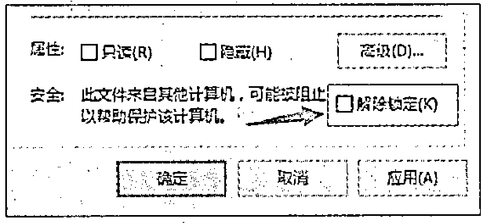

## 如何在表格文件里面创建等差数列

Q: 我们在学习数学的时候，学习过等差数列和等比数列。那么如何在表格文件里面，按照自己的需求也可以创建对应的等差或者等比数列呢？

A: 这里我们以WPS的表格软件来进行讲解。首先选择一个表格输入相应的数值，接着点击工具栏中的“行和列”按钮，在弹出的菜单里面选择“填充”下的“序列”命令。接着在弹出的对话框里面选择“类型”选项，并设置“步长值”和“终止值”，最后点击确定就可以了。

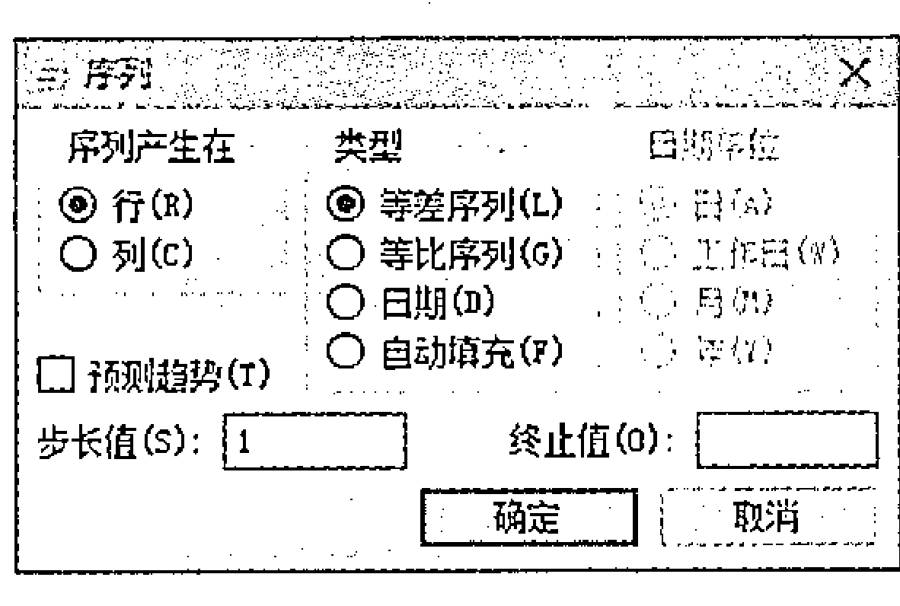

## 利用Word进行图片的快速处理

文|老万

Q: 我们在处理文档的时候，有时需要插入一些图片。如果是比较复杂的图片，那么会直接用Photoshop进行处理。如果这个图片比较简单的话，那么利用Photoshop反而显得比较麻烦。不知有没有比较简单的处理方法？

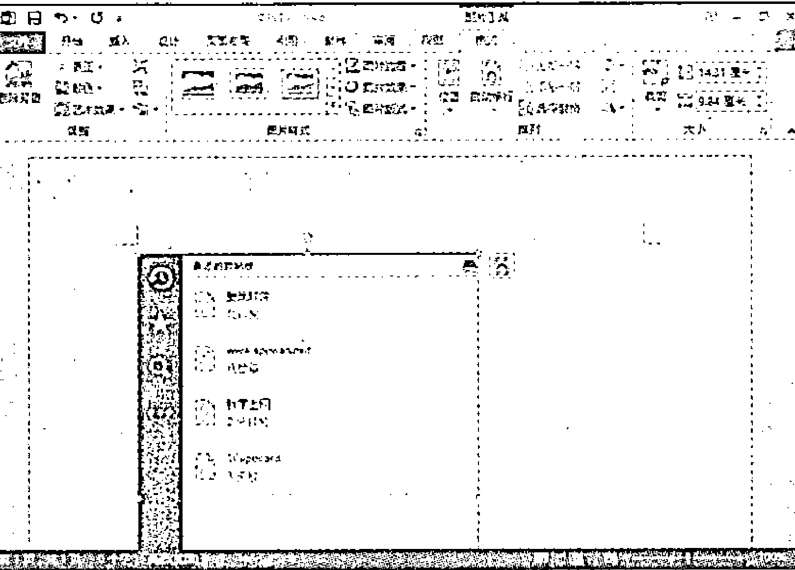

A: 如果用户使用的是微软的Word的话，那么通过它就可以进行一些常见和简单的处理。首先点击软件中的“插入”标签，在工具栏里面点击“图片”按钮后，选择需要插入的图片文件。然后软件就会多出一个“图片工具”的标签栏，在这个标签栏里面就可以进行相关的操作了。


其实利用一些常见的截图软件，也可以进行简单的图片处理操作。

## 更改Outlook收件人处显示的姓名

Q: 我平时使用微软的Outlook邮箱来进行办公，这个邮箱在发送邮件以后会显示出我的网名，这样看上去非常的不正式，而且对方常常搞不清楚是谁。那么能不能对这个网名进行修改呢？

A: 首先通过浏览器登录 https://outlook.live.com/ 网站，点击网页右上角的个人头像图标，在弹出的菜单里面点击“编辑个人资料”命令，然后就可以对自己的姓名进行重新编辑操作了。需要说明的是，国外网站往往是将姓和名分开的，用户修改以后最好发一封邮件看看效果。

## 打开CAD后显示加载文件失败

Q: 自己不小心删除了AutoCAD 2014在Appdata下的文件，现在打开CAD文件显示加载自定义文件失败，而且软件里面很多设置好的工具都没有了。关键我这是正版软件，重装起来很麻烦的，求解决办法？

A: Appdata下的文件是软件配置文件，如果删除了自然是无法使用的。用户可以考虑新建一个虚拟机，使用相同的系统版本以及相同的用户名称，然后在里面安装这款软件并进行配置，最后将Appdata目录下的文件拷贝到本机系统里面再试一试。

## Windows 10周年更新平板电脑优化三步走

在过去的一两年里，很多用户都入手了Windows平板电脑，它们或者是搭载BayTrail-T平台的廉价机型，又或者是基于酷睿M或酷睿i设计的中高端产品。无论配置如何，这些平板电脑均可流畅体验Windows 10周年更新版，在升级之后自然就免不了后续的优化设置了。

### 第一步：平板优化模式

微软自Windows 10开始加入了全新的平板模式，而周年更新版则在此基础上进行了些许优化。所以平板电脑用户在系统升级之后的第一步就是找到并激活它们。

在操作中心界面，我们可以一键开启或关闭“平板模式”，而新版Windows 10的任务栏则出现了更多玩法。如在“设置→个性化→任务栏”中可以选择让它在平板模式下自动隐藏，如果你需要它一直显示但却讨厌它占用了太多屏幕空间，则可通过“使用小任务栏按钮”缩小任务栏图标和其占用的屏幕面积(图1)。

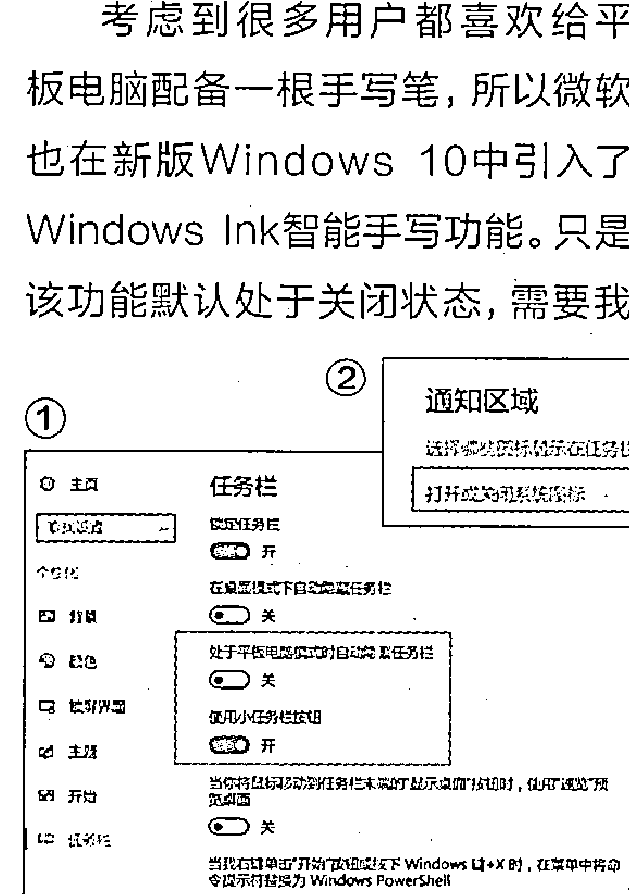

考虑到很多用户都喜欢给平板电脑配备一根手写笔，所以微软也在新版Windows 10中引入了Windows Ink智能手写功能。只是该功能默认处于关闭状态，需要我们手动开启。开启方法很简单，在上图1任务栏界面中下拉找到并点击“打开或关闭系统图标”(图2)，将Windows Ink工作区对应的勾选打开即可(图3)。

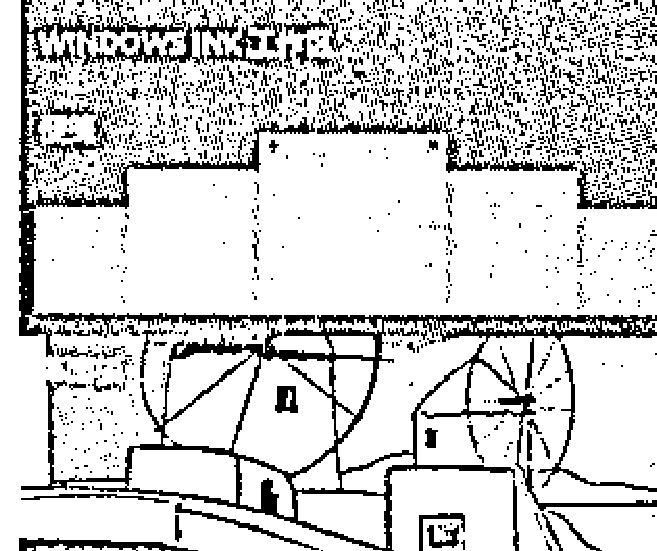

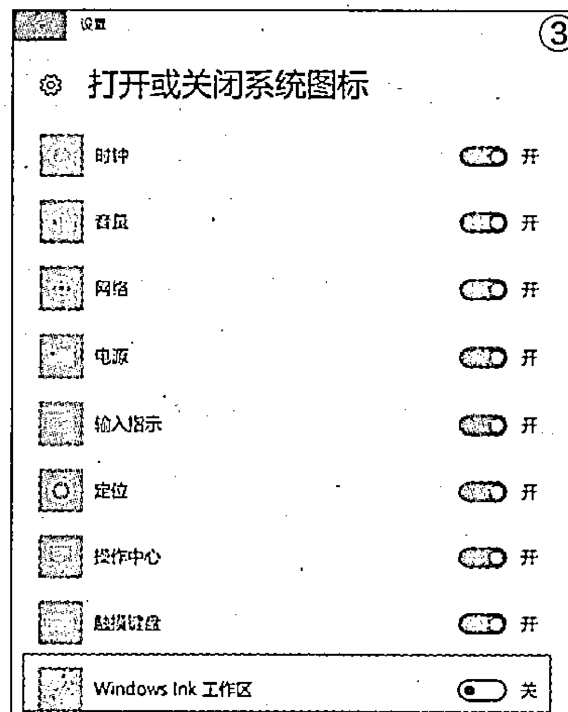

此时，你就会发现任务栏右下角新增了一个手写笔图标，点击它就能弹出Windows Ink工作区窗口，方便我们迅速建立便签、涂鸦等操作(图4)。


### 第二步：释放磁盘空间

更新周年版和当初升级Windows 10一样，都会占用将近20GB的磁盘空间。问题来了，很多Windows 10平板电脑的硬盘容量只有64GB，难道升级后就什么都装不下了？

在开启平板优化模式之后，接下来就是想办法帮周年版系统“减肥”了。在这里，笔者强烈向大家推荐系统自带的磁盘清理功能，避免出现误删关键文件而无法正常使用的隐患。在资源管理器中右键点击C盘进入它的属性界面，依次点击“磁盘清理→清理系统文件”，你就会发现竟然能清理出接近20GB的空间(图5)！

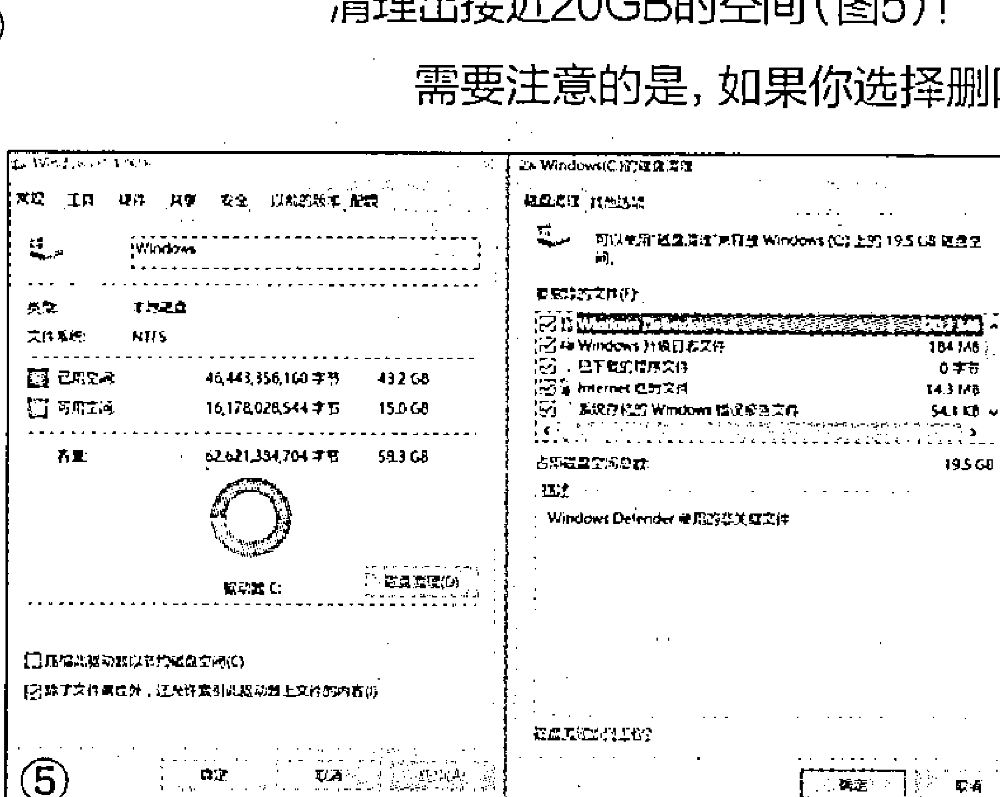

需要注意的是，如果你选择删除了旧系统的备份文件，“回退到旧系统”的功能将会失效。也就是说，当你后悔升级周年版系统后，就只能选择重新安装原版Windows 10了。所以请务必在实际测试没有Bug以及无法忍受的缺陷后再进行这步操作。

接下来，我们还可以长按开始菜单图标依次进入“系统→系统保护”，关闭系统还原功能，避免还原点对磁盘空间的占用(图6)。此外，考虑到Windows平板电脑都是以eMMC或SSD作为存储单元，开机速度非常快，所以传统的休眠功能就没什么太大意义了。

点击小娜图标搜索“CMD”，然后以管理员身份运行命令提示符程序(图7)，输入命令“powercfg -h off”(图8)，如果没有出现错误提示就代表已经关闭了休眠功能。重启系统后，你就会发现系统多出来了和内存大小相似的磁盘空间。需要注意的是，有部分品牌电脑在出厂时已禁用休眠功能，如有特殊需求，可以用“powercfg -h on”命令找回。

### 第三步：提升磁盘性能

Windows平板电脑无论采用的是eMMC还是SSD，这种由NAND闪存构成的存储模块都存在使用寿命的问题，尽量减少对磁盘的频繁读写，就是“延缓衰老”的秘籍了。

有关延长SSD寿命的文章网上有很多，在这里笔者就再分享一个容易被忽略的优化方式。在小娜搜索框中输入“服务”进入本地服务列表，找到“Superfetch”和“Windows Search”这两个服务项，双击它们进入设置界面，将启动类型设定在“禁用”状态即可(图9)。

Superfetch服务是Windows中一项文件预存取机制，由于SSD速度已经很快，Superfetch所产生的加速效果如今看起来已经非常微弱。相反由此带来的频繁读写，却对SSD颗粒寿命产生了相当大的影响。而Windows Search服务开与关都不会影响系统运行和搜索速度，但开启它后则会引起硬盘频繁读取，所以将其关闭也就在情理之中了。

如果你给Windows平板电脑准备了存储卡，请进入它在资源管理器中的属性界面，依次进入“属性→硬件→选择卡→属性→改变设置→策略”，在这个窗口中设定在“更好的性能”模式(图10)，这样可以提升存储卡的读写速度。只是今后在取下存储卡之前，必须先通过安全删除硬件的图标选择弹出存储卡。

| 名称 | 描述 | 状态 | 启动类型 | 登录身份 |
|---|---|---|---|---|
| Storage Tiers Management | 优化存储层 | | | |
| Superfetch | 维护和提高一段时间内的系统性能 | | 禁用 | |
| Windows Search | 为文件、电子邮件和其他内容提供内容索引 | | | |
| System Events Broker | 协调执行背景工作 | | | |
| Task Scheduler | 使用任务计划程序来运行计划的任务 | | | |
| TCP/IP NetBIOS Helper | 提供NetBIOS over TCP/IP (NetBT) 服务支持 | | | |
| Telephony | 提供电话服务API (TAPI) 支持 | | | |
| Themes | 为用户提供主题管理 | | | |
| Time Data model server | 用于时间服务的数据模型服务器 | | C:\WINDOWS\system32\svchost.exe -k LocalSystemNetworkRestricted | |
| Touch Keyboard and Handwriting Panel Service | 启用触摸键盘和手写板 | | | |
| Update Orchestrator Service | 用于Windows Update的更新协调 | | | |
| UPnP Device Host | 允许主机设备被发现和控制 | | | |
| User Data Access_3ec43 | 管理用户数据访问 | | | |
| User Data Storage_3ec43 | 处理用户数据存储 | | | |
| User Manager | 管理多用户 | | | |
| User Profile Service | 此服务负责加载和卸载用户配置文件 | | | |
| Virtual Disk | 提供虚拟磁盘管理服务 | | | |

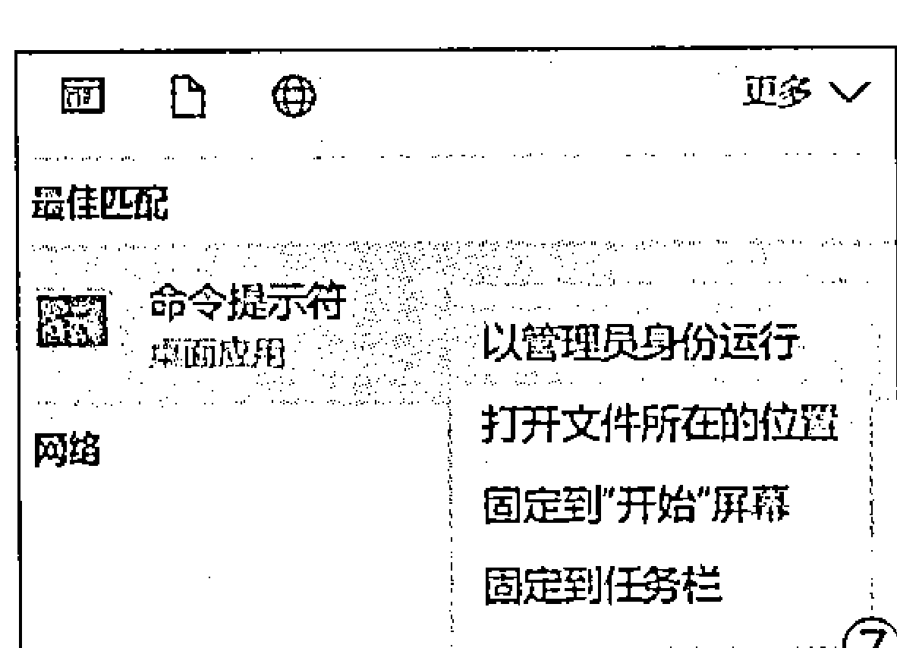

> **扩展阅读**
> **寻找专属应用**
> 所谓工欲善其事必先利其器，在Windows平板电脑上安装软件，请尽量通过自带的应用商店下载Pad版、HD版等Windows 10 UWP通用软件(图11)，这类软件都采用了iOS或Android版APP相似的界面风格，大图标针对触控进行了优化，让平板电脑用起来更像是平板电脑，哪怕脱离了键盘鼠标也能精准操作。

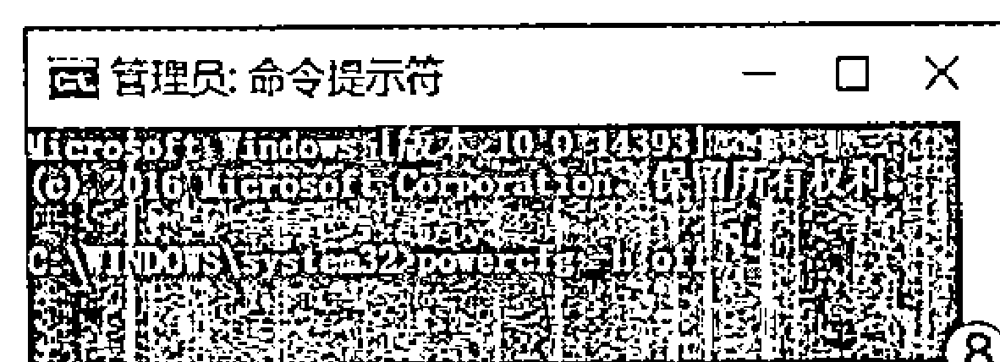

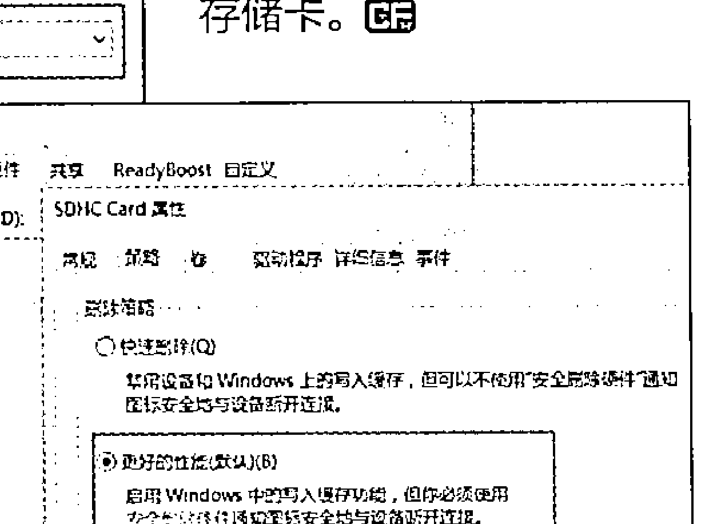

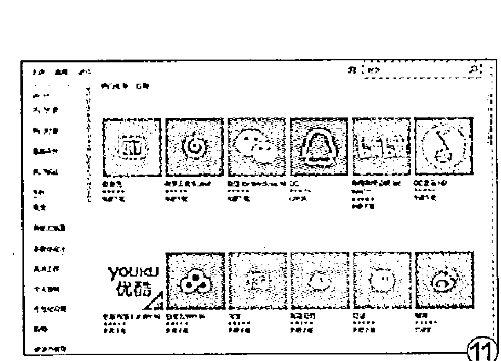

## 废物利用

### 闲置TF卡变身SSD硬盘

文/飞雪散花

相对于机械硬盘，SSD具有读写速度快、静音、防震抗摔等特点。近来闲逛淘宝，偶然发现一款名为“TF卡转SATA SSD硬盘转接卡”的宝贝（图1），其作用是能把10张TF卡RAID（磁盘阵列）起来，最终打造出一块SSD。不过，这种方法真的可行吗？

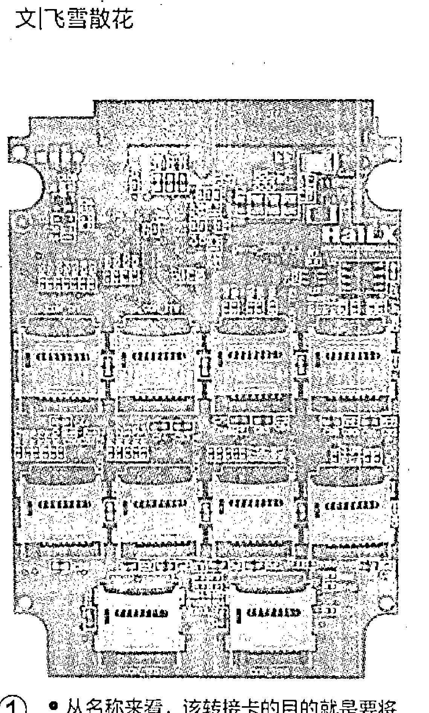

#### 看性能

#### 可否与SSD抗衡

“TF卡转SATA SSD硬盘转接卡”最多可同时支持10块TF卡（又称MicroSD卡），其容量和读写速度为各TF容量和读写速度的叠加，我们完全可以根据自己的需要，将其打造成1TB的大硬盘。那么，用这种方法打造出来的SSD，在性能方面和SSD相比究竟如何呢？

考虑到成本问题，在实际使用的过程中，很少有朋友能同时买10张TF卡将转接卡插满。这里我们不妨用4块金士顿32GB Class 10 TF卡，组成一个容量为128GB的磁盘阵列，和128GB三星SSD 840 Series做一个简单的比较。

在金士顿官方网站中，我们看到该TF卡的读写速度分别为80MB/s、45MB/s，同时为了能让朋友们直观地感受到转接出来的磁盘阵列，在性能方面和机械硬盘到底有什么差别，我们选取了1TB的希捷硬盘做另一个参照物。此处我们所用的测试软件为CrystalDiskMark，这是一款可以检测硬盘随机读写速度、连续读写速度和4K随机读写速度的工具。最终得到的结果如图2、图3所示。

从中我们可以看出，由于TF卡的真实读写速度远远达不到官方标称的速度，所以四块TF卡叠加后的读写速度并非320MB/s和180MB/s，而要低得多。只从读取速度来看，转接后的硬盘阵列的确要比机械硬盘好一点，但并不明显，而在数据写入方面，无论是持续写入还是4K随机写入都不如机械硬盘。

而和128GB SSD相比，4张TF卡组成的磁盘阵列更不是一个重量级的。当然，我们可以说这是因为叠加的TF卡数量太少的缘故，如果将4张32GB TF卡改成8张同性能的16GB TF卡，磁盘阵列的读写速度必然会有明显提高。

但是，另一个不容回避的问题就出现了，那就是磁盘阵列的4K随机读写性能，显然这一性能并不会因为TF卡数量的增加而有所改观。此外，如果你真的特别在意性能，肯定还是直接选择SSD来实现。这种转换卡最佳服务的对象，还是已有的闲置TF卡。

**CrystalDiskMark 5.1.2 x64 测试结果**
**② (左)转接卡性能 (右)机械硬盘性能**

| 测试项目 | Read [MB/s] | Write [MB/s] |
| :--- | :--- | :--- |
| Seq Q32T1 | 199.4 | 112.8 |
| 4K Q32T1 | 4.908 | 0.906 |
| Seq | 199.4 | 76.93 |
| 4K | 4.801 | 0.906 |

| 测试项目 | Read [MB/s] | Write [MB/s] |
| :--- | :--- | :--- |
| Seq Q32T1 | 165.8 | 160.3 |
| 4K Q32T1 | 1.793 | 1.493 |
| Seq | 165.9 | 161.5 |
| 4K | 0.643 | 1.504 |

**③ (左)转接卡性能 (右)SSD性能**

| 测试项目 | Read [MB/s] | Write [MB/s] |
| :--- | :--- | :--- |
| Seq Q32T1 | 199.4 | 112.8 |
| 4K Q32T1 | 4.908 | 0.906 |
| Seq | 199.4 | 76.93 |
| 4K | 4.801 | 0.906 |

| 测试项目 | Read [MB/s] | Write [MB/s] |
| :--- | :--- | :--- |
| Seq Q32T1 | 544.1 | 137.6 |
| 4K Q32T1 | 345.0 | 136.2 |
| Seq | 500.6 | 136.5 |
| 4K | 24.83 | 55.78 |

#### 扩展阅读

4K随机读写性能代表了磁盘数据吞吐能力。平时硬盘在进行数据读写时，能从一个位置起顺序读写的几率并不高，更多的是根据需要从磁盘的某个地方抽取或往其中写入数据，其读取、写入速度的快慢，就用4K随机读写性能表示。4K随机读写性能的优劣，直接反映了磁盘的瞬间响应能力，所以它和持续读写相比，更能真实地反映磁盘的读写性能。

从上面测试结果来看，转接后的磁盘阵列在4K随机读写性能的表现可以说是一败涂地，特别是在写入方面，甚至不如机械硬盘。

#### 看价格
能否比SSD实惠

性能方面不如SSD，那么价格呢？这种转接出来的硬盘阵列能否让我们感到真正的实惠？

此种转接卡的售价为120元，金士顿 32GB TF卡的京东售价为57.9元（图4），57.9×4=231.6元，这就意味着，我们使用该转接卡，打造出一个128GB磁盘阵列的成本约为350元左右。

目前，一块同容量SSD的价格基本在299元~419元之间（图5），350元足够让我们入手一块性能非常不错的SSD了。

此外，还有一个问题，那就是数据安全问题。众所周知，由于成本问题，许多TF卡使用的闪存芯片往往在品质方面不如SSD（一些高端卡除外），寿命较短。RAID的特点，注定了其中一张卡损坏，将导致所有数据消失，这种转接而成的RAID，是否适合保存比较重要的文件，的确是一个非常值得考虑的问题。

上面我们说了那么多，并不是要全面否定这种转接卡存在的意义。实际上，如果我们手头有多张闲置的TF卡，完全可以把它变废为宝，组成一个较大的U盘，需要的时候，可以临时存储一下不太重要的文件。此外，它还支持安装操作系统。

不过，在使用的时候有两点必须注意：

- 一是在使用多张TF卡时，最终的容量和速度取决于规格最低的那张。比如我们使用了8张TF卡，其中一张容量为8GB，其余7张为32GB，最后得到的总容量为8×8=64GB，而非232GB，速度叠加也是如此。因此，在组建RAID时，最好使用容量、性能都差不多的TF卡。

- 二是当使用的TF卡数量不足10张时，应按照从CON-TF1到CON-TF10的顺序依次插入，每张卡的前面不能有空槽，否则会导致系统无法识别到TF信息。

#### 隐藏福利
### 教你延长戴尔笔记本电池寿命

如今的笔记本为了追求纤薄化的设计，大都开始采用内置锂聚合物电池的设计，电池不可拆卸。然而，锂电池是存在循环充电寿命的，长时间插电使用必然会引起电池频繁充电的过程。那么，如何才能最大限度减低这种无谓的消耗呢？

#### 无法拆卸电池的尴尬

除了轻薄本，以戴尔新游匣7000-14（7466）为代表的游戏本也开始舍弃可拆卸电池的设计（图1）。笔记本放置一段时间电池会自然掉电，插电开机时则会默默进入充电状态，长此以往对电池寿命的影响极大。

#### 寻找隐藏的软件解决方案

好消息是，戴尔旗下的很多笔记本都预装了“Dell Power Manager Lite”应用程序（如果没找到可以通过戴尔官网下载），这个软件就提供了很多延长电池寿命的功能和设定（图2）。运行Dell Power Manager Lite应用程序之后，点击“更改设置”就能进入详细设置的窗口界面。

#### 根据实际需求更改设置

比如，笔者在绝大多数情况下，笔记本都是放在办公桌上，一直插电使用。在这种情况下最适合我的电源方案就是“主要使用交流电源”（图4），切换到这一状态后，该软件会自动给锂电池设定一个充电阈值。只有系统检测到电池实际容量低于这个阈值时才激活充电，如果电池容量高于阈值就无法充电，从而减少循环充电的次数。

笔记本外出时，笔记本电池至少还能剩下80%的电量，足以在户外坚持使用数个小时。

此时，如果你选择的还是“主要使用交流电源”，其默认的充电阈值大约是55%，一旦遭遇急事外出时可能面临电池电量偏低不够用的尴尬。

如果你每天使用笔记本的节奏比较规律，则可考虑使用高级充电功能，在这个模式下系统只会将电池充到足够当日系统典型使用期间的容量（图6），当日其他时间电池将保持在休眠状态。

除了戴尔，还有很多品牌笔记本都自带类似的电池管理程序，而“充电阈值的自定义”选项就是它们延长电池寿命的核心。还等什么，还不赶紧去找找看？

## 安全支付之源
### 全面剖析手机的NFC功能

NFC并非什么新鲜的技术，早在2010年就已出现在了手机领域，只是在很长一个时期它始终处于可有可无的尴尬境地。如今，越来越多的中高端手机都将它作为了标配，而NFC又能为这些手机带来哪些能力？

NFC (Near Field Communication, 近场通信) 是一种短距离的高频无线通信技术（图1），允许电子设备之间进行非接触式点对点数据传输，在10cm内的距离里交换数据。当手机内置了NFC硬件模块之后，它就有机会实现以下三种功能。

#### 点对点模式
##### P2P Mode

我们可以将这个模式理解为双向数据分享，也就是两个NFC终端互相交换数据，它主要用于作为蓝牙和无线连接的初始验证。

进入NFC的设置界面，我们通常可以看到一个名为“Android Beam”的选项（图2），它可让我们对几乎任何东西进行分享，无论是联系人、图片还网页链接。以图片为例，同时打开两部手机的NFC和Android Beam功能，如果你想分享相册里的图片，只需点击分享按钮选择“Beam”按钮（图3），然后将两部手机“背对背”（NFC模块靠近）放在一起，屏幕上就会弹出一个类似“触摸以传输”的提示，然后对面的手机就能自动接收到这张图片了。

实际上是通过蓝牙进行的，而Android Beam只是省却了“打开蓝牙→搜索设备→找到并配对”的繁琐流程。

此外，如今很多智能手环、蓝牙音箱也都支持NFC。只是，这些设备的NFC模块仅保留了点对点模式这一种功能，其用途也很单一：打开手机的NFC，将手机位于背部的NFC单元靠近这些设备的NFC识别区域就能瞬间完成配对过程（图5）。

> 三星早前还针对NFC开发了一项名为S-Beam的功能。和Android Beam相比，S-Beam还是利用NFC实现两部设备之间的快速配对和认证，只是传输过程不再是蓝牙，而是速度更快的Wi-Fi Direct（图4），非常适合分享大型文件。可惜，由于Wi-Fi Direct传输过程中会影响正常上网，所以三星后续的新品中已不再提供这一功能。

#### 读卡器模式
##### Reader/Writer Mode

顾名思义，智能手机NFC模块的读卡器模式，就是可以像读卡器一般，读取电子标签的相关信息、实现NFC手机之间的数据交换或读取其他IC卡内的数据。

###### 初级应用：NFC标签

还记得NFC标签吗？曾经，以小米和魅族为代表的手机品牌，以及无数不知名的企业都推出过数量和功能不一的NFC标签产品。以魅族NFC标签为例，就是包含了睡眠、会议、驾车、Wi-Fi、名片以及自定义六枚标签套装（图6）。

这种NFC标签的原理就是将内置芯片的感应线圈封装在一个标签中，并对其进行一定的功能设定，当手机通过NFC对其进行接触时便能够直接读取出这种功能设定，并完成特定的操作。比如，将设定静音模式的会议标签贴在会议室门口，开会前每个人都用手机的NFC和它接触一下，你的手机就会自动激活静音模式，省去了自行设定的繁琐。

可惜，NFC标签的功能还是太过单一，至少对于普通用户而言趣味性远大于实用性。所以，最近两年NFC标签已经逐渐淡出了市场。

好消息是，手机NFC的读卡器模式不仅限于读取这种标签，通过这个模式还能实现更多实用功能。

###### 高级应用：读取IC卡

手机的NFC读卡器模式的另一个本领，就是可以读取部分IC卡中的信息。以北京市的公交一卡通为例，它就属于可被NFC读取的IC卡之一。只需在手机上安装“北京一卡通”官方APP (http://www.bmac.com.cn/)，打开手机NFC功能并将一卡通与手机背部接触后（图7），该APP就能识别出卡号、余额等信息，而我们则可选择通过微信进行云端充值，免去了线下的排队之苦（图8）。

可惜，由于各个城市的公交一卡通“各自为政”，所以现在还没有任何方法可以“通吃”所有的一卡通产品，支付方式也存在仅支持微信、仅支持QQ或仅支持支付宝或多种支付组合的方式。需要注意的是，无论是哪一种支付方式，在支付成功后都需要再次将公交卡贴近手机的NFC感应区，否则支付的钱将无法写入到公交卡里！

如今的银行卡都已经升级到了IC卡（芯片卡），但只有支持非接触式（交易时卡放在POS机上而无需插入POS机内）的银行IC卡信息才有机会被手机的NFC读取。

想读取银行IC卡的信息，需要在手机上安装相应的金融类APP，比如各大银行的客户端、支付宝等等。以北京银行的IC卡为例，将卡片靠近手机背部的NFC模块，就能通过这些APP读取到最近的10条交易日志（图9），并可直接选择对其进行转账等操作。

#### 卡模拟模式
##### Card Emulation

对Android手机而言，只要配备了NFC，就一定支持前面介绍过的点对点和读卡器模式，但是否支持卡模拟模式就不一定了。因为手机要想支持这一功能，需要NFC包含完整的CLF（非接前端模块）、射频天线和SE（安全区域）三大部分，而是否支持完整的卡模拟模式，也将决定一款手机的NFC在金融方面的潜力。

###### 让手机变身公交卡

支持NFC的手机有两种变身公交卡的方式，其一是去营业厅办理更换支持公交卡功能的NFC-SIM卡并且开通NFC功能（图10），在手机的NFC设置中将安全芯片对应的选项设置在卡1，再将默认付款应用改为运营商钱包（图11）。需要注意的是，并非所有NFC手机都支持NFC-SIM卡，因为它需要NFC-SWP功能的支持。

这个方法适合没有内置SE的NFC手机，NFC-SWP功能的主要作用，就是让NFC-SIM卡模拟SE安全芯片，从而实现扮演公交卡的目的。

如果你的NFC手机内置SE，那么恭喜你，只要你购买的手机品牌有足够的影响力，那它无需更换NFC-SIM卡也能模拟公交卡，而这种方式又被称为“异形公交卡”。

以小米手机5为例，在小米MI Pay中可以购买包括北京市政交通一卡通、上海公共交通卡、武汉通、苏州市民卡、广东岭南通在内的异形公交卡（图12），其原理就是将虚拟的公交卡号写入到NFC的SE安全芯片里，使用上与实体公交卡一样，可以享受当地的优惠政策，刷卡时只要把手机背部的NFC区域对准闸机一扫即可。需要注意的是，这种异形公交卡不支持退卡（图13）！如果手机丢失或换新机了，你的异形卡也就白买了。

###### 手机扮演银行卡

同理，只要手机NFC包含SE，且支持NFC-HCE或NFC-eSE功能，你还能将银行卡写入到手机NFC的SE安全芯片中（图14），今后你的手机就变成了各种银行卡，轻松实现云闪付（图15）。

但是，NFC的SE安全芯片只是硬件基础，它能否支持异形公交卡和模拟银行卡，需要手机厂商自己开发支付类APP（如Apple Pay、MI Pay、华为钱包等等），然后由手机厂商去和当地交通卡发行方以及银行谈合作。以华为Mate 9为例，虽然它也支持异形公交卡，但暂时仅支持上海本地，其他地区还有待开通。

总之，虽然NFC不是什么新鲜的技术，而且如今支持这一功能的手机也越来越多，但真正能将NFC功能充分挖掘出来的却仅占少数品牌和产品。NFC硬件是否配备SE，是否支持SWP、HCE、eSE功能，以及手机厂商的影响力都是值得我们考量的地方。

### 非原装的困惑
### 电源适配器怎么选

在我们的日常生活中，家里的科技类设备总是更新换代最为频繁的存在。小到手机路由器，大到平板电脑笔记本，经历几次更新之后我们总会遇到一个颇为尴尬的问题：原装电源适配器找不到了，此时拿什么给它供电/充电？

#### 重新认识DC头和DC座

实际上，上面涉及产品的电源适配器都存在通用的可能，只要注意非原装适配器的接口、输出电流和输出电压这三项参数的匹配问题，兼容性都是有所保障的。在进行兼容性的讨论之前，我们首先要做的就是重新认识一下适配器的插头规格。

电源适配器与设备之间连接的电源插头又称“DC头”，设备上的电源接口又称“DC座”，里面藏有用于通电的金属内针(图1)。DC头可以按照外径和内径加以划分(常以外径×内径标注)(图2)，如今常见的规格有5.5mm×2.5mm、5.5mm×2.1mm、3.5mm×1.35mm、2.5mm×0.7mm(图3)。

DC座的规格和DC头相似，只是外径对应DC座插孔的直径，内径对应金属内针的直径。只有DC座和DC头内外径完全匹配时才能确保安全。如果DC头和DC座外径相同，但DC头内径大于DC座的金属内针直径，即使可以顺利插入也会出现金属内针接触不良的问题，安全隐患突出。

需要注意的是，根据DC头内壁的结构差异，又可被划分成音叉DC头和直插DC头(图4)。其中，音叉DC头的内壁上有两个金属弹簧片(图5)，当插入设备(如路由器)的电源接口后，弹簧片可以更稳固地卡住DC座里的金属内针。

因此，音叉DC头对DC座内针尺寸的要求比较宽松，比如5.5mm×2.5mm的音叉DC头既支持5.5mm×2.5mm的DC座，也兼容5.5mm×2.1mm的DC座。当然，如果音叉DC头品质不好，内壁的两个弹簧片弹力不足的情况下也会出现接触不良的问题。

只是出于成本的考虑，绝大多数设备标配的电源适配器自带的都是直插DC头，一些第三方的适配器或DC头的转换器，则有音叉DC头可选，大家可以根据实际需求加以选购。

下面，我们就分门别类看看常见的四类科技产品与适配器之间的匹配建议吧。

#### 路由器

除了一些顶级路由器以外，绝大多数路由器的适配器DC头都是5.5mm×2.1mm规格（图6），输出电压和电流也多在9V/0.6A~12V/1A之间。

此时，只要非原装（或其他型号路由器标配的）适配器的DC头、输出电压和原装适配器相同，而输出电流大于或等于原装适配器的输出电流，那就能放心使用。比如路由器A的适配器为9V/0.8A，路由器B的适配器为9V/0.6A，那A的适配器兼容B，但B的适配器却不适合A，原因是B适配器输出电流偏低，工作时适配器会过热，也容易引起路由器A本身出现故障。

如果你家里的智能台灯或其他电器的适配器也采用了5.5mm×2.1mm规格的DC头，而且输出电压电流和路由器适配器相匹配，那这个适配器也同样适用于给路由器使用。换句话说，适配器拥有“跨平台”的特性，只要DC头和电压电流参数匹配，它就能用在任何与上述参数相同的设备身上。

#### 智能手机

智能手机的适配器具备最强的通用性，因为无论是iPhone还是Android手机，它们的输入电压都是5V。也就是说，只要是5V充电器都能用在手机身上（图7）。但是，适配器能以多少A的电流输出，就取决于手机自身所支持的输入电流限制了。比如，有些Android手机最大仅支持5V/1.5A输入，如果你用5V/4A的适配器给其充电，那适配器则会自动降到5V/1.5A的输出模式；如果你的手机支持5V/2A输入，但适配器的规格为5V/1A，结果是可以充电，只是充电速度会大打折扣。虽然手机适配器有着广泛的兼容性，但笔者想强调的是一定要选择品牌适配器！比如，你用华为手机原装适配器给小米手机充电那绝对没问题，只是充电速度快慢而已。但是，如果你随便在街边花10块钱买了一个山寨的XX品牌适配器，那它在使用中就可能面临安全隐患了。正规适配器都通过了3C认证，内部有完善的过热、过压、过流等保护电路，缺少这些保障的山寨货在工作时会因过热或小概率的浪涌电流损坏甚至烧毁手机！

> 火速链接：如今很多手机都引入了快速充电技术，这里面涉及充电协议和快充技术与适配器间的兼容问题。有关手机快充技术的识别和兼容问题CFan曾经做过详细的报道，感兴趣的读者请扫二维码查看。

#### 平板电脑

绝大多数Android平板电脑都采用了Micro USB作为充电接口，而Windows平板电脑则会选择2.5mm×0.7mm等DC头。它们选择非原装适配器的思路和路由器/手机相同，只要接口相同、电压相同、电流相近或更大即可。

#### 笔记本

笔记本适配器的选购思路与平板电脑相似，只是对适配器输出电压和电流的要求更严格（图8）。比如某笔记本原装适配器是19V/5A（90W），那在选择非原装适配器时就必须选择电压相同、电流等于或大于5A的型号。如果适配器的输出电流偏低（导致输出功率不足），一方面会制约笔记本性能（睿频失效，还可能出现降频），另一方面则会导致适配器异常发热，出现安全隐患。如今市面上有支持调压且配备多种DC头的适配器可选，这类适配器兼容的产品类别更多。

设备类别 | DC头规格 | 输出电压 | 输出电流 | 备注
---|---|---|---|---
路由器 | 5.5mm×2.1mm | 9V~12V | 0.6A~1A | 电流需≥原装适配器
智能手机 | Micro USB / Type-C | 5V | 1A~4A | 电流受限于手机支持的最大输入
平板电脑 | Micro USB / 特定DC头 | 5V / 12V等 | 1A~2A | 思路与路由器/手机相同
笔记本 | 特定DC头 | 19V / 20V等 | 3A~5A+ | 电压需严格匹配，电流需≥原装## 量不妥协的性能

教你挑选均衡型的超薄本

如今传统笔记本正在朝三个方向发展：性能至上的游戏本，追求便携的超薄本，中庸却实惠的普通本。其中，超薄本在经历数代革新之后，很多新品在便携性上甚至不逊于PC平板二合一设备，已经到了适合入手的时节。

### PC平板二合一之殇

就轻薄参数而言，屏幕和键盘可以分离的PC平板二合一设备自然最具优势。然而，此类产品除了Surface Pro 4等少数产品，绝大多数机型都选择了与4.5W TDP的酷睿M处理器联姻，在性能上存在一定的不足。

此外，此类设备受限于空间有限，很难配备太过豪华的散热模块，在高负载的应用环境下容易触发CPU降频从而影响体验。最后，二合一设备的屏幕部分虽然纤薄，重量也能控制到800g以内，但当它们与键盘底座结合后(图1)，总重量往往会突破1.2kg大关，此时它们的便携性将大打折扣。唯一令人欣慰的，则是如今PC平板二合一设备大都配备了支持十点触控的屏幕，同时支持压感触控笔，在一些专业设计软件领域，或是运行支持触控类的游戏时可以获得较好的体验。

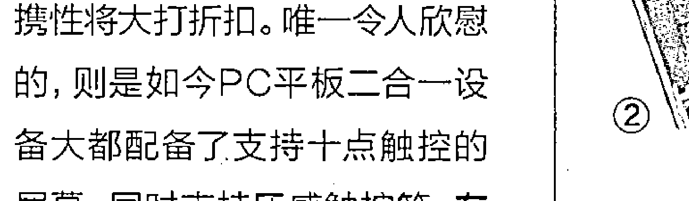

### 超薄本的天然优势

得益于微边框概念，以及处理器技术的不断革新，让“超薄本”可以更为轻松地突破设计上的瓶颈，获得不逊于PC平板二合一设备(屏幕与键盘结合时)的便携性。同时，超薄本有着相对充裕的内部空间，可以塞进更大的电池、尺寸更大的风扇和热管(图2)，提供手感更为出色的键盘以及更多的USB等周边接口。更有甚者，可以实现变身游戏本的梦想。

举个最简单的例子，戴尔XPS15是一款拥有15.6英寸大屏幕(图3)，且采用35W TDP处理器(如i5-6300HQ)和NVIDIA GTX960M独立显卡的游戏本，但它却将身材控制到了17mm厚和1.78kg重。虽然XPS15有着游戏本的性能，但它的形态却属于绝对的超薄本。

可惜，像XPS15这种便携性和高性能得以兼顾的机型定位太高，接近万元的起价注定不是普通用户可以承受的。好消息是，如果你对大型游戏不感冒，如今哪怕是5000元级别的超薄本，同样可以为你带来不少惊喜。

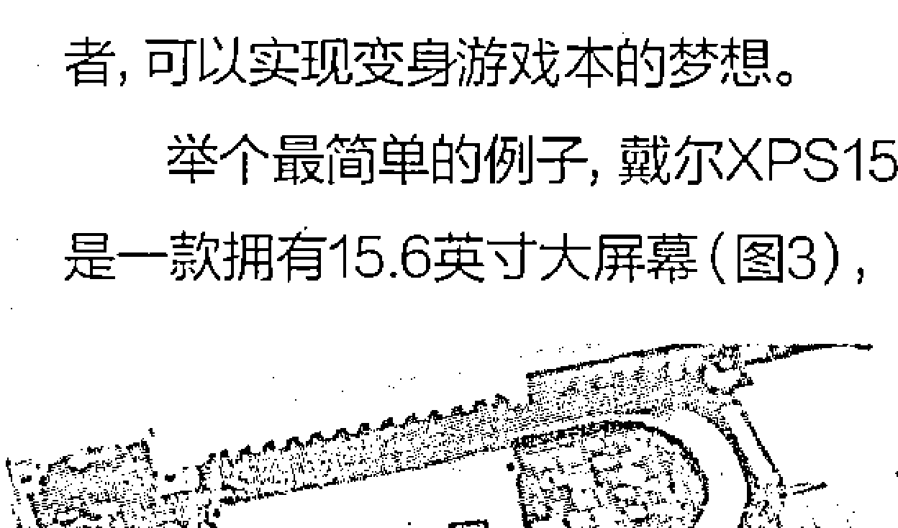

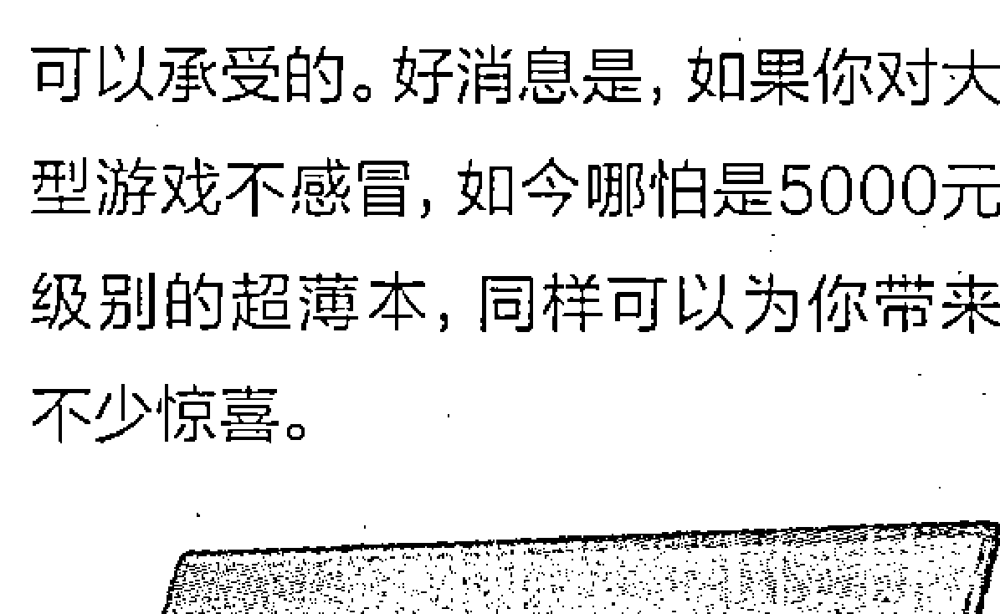

### 主流超薄本怎么选

考虑到超薄本也是“笔记本”，所以我们必须对它们的性能提出一定要求，也就是至少要配备15W TDP的U系列酷睿处理器，如此才能进一步缩短与传统笔记本之间的性能距离。在价位相近的情况下，可优先挑选搭载第七代酷睿处理器的新品(图4)，因为七代酷睿i5-7200U的性能就已超越了六代酷睿i7-6500U。

考虑到七代酷睿处理器刚上市不久，本文涉及的某些产品家族在截稿时还没升级。当大家拿到本期杂志时，不妨搜一下它们是否出现了武装七代酷睿的新型号，如果有且与旧型号价格相近，自然是新品更值得入手。在进行产品对比时，我们需要留意的参数有几下几点：屏幕材质，非广视角屏幕的偏色问题会严重影响多人同时观看屏幕时的体验；电池容量，在硬件规格相近时，电池越大续航潜力自然最高；USB3.0接口的数量，这将决定你能同时接驳几个高速闪存盘/移动硬盘；厚度重量，对超薄本而言，在屏幕相同的情况下这两个参数越小意味着便携性越强。下面，我们就来盘点一下5000元上下，或在设计或在性能方面有着独到卖点的热门超薄本。

#### 联想IdeaPad 710S

- 屏幕：13.3英寸IPS（1080P）
- 处理器：酷睿i5-7200U
- 内存/硬盘：4GB/256GB SSD
- 显卡：HD620核芯显卡
- 接口：读卡器、USB3.0×2、Micro HDMI、音频接口
- 厚度/电池/重量：13.9mm/45.5Wh/1.1kg

IdeaPad 710S应该是目前最具竞争力的超轻薄笔记本，这款产品搭载了最新的七代酷睿处理器，并将重量进一步压缩到了1.1kg，再结合5399元的售价，性价比非常突出。IdeaPad 710S的特色还表现在更多的扩展接口，以及出色的键盘手感方面，并没有因追求轻薄而牺牲太多。

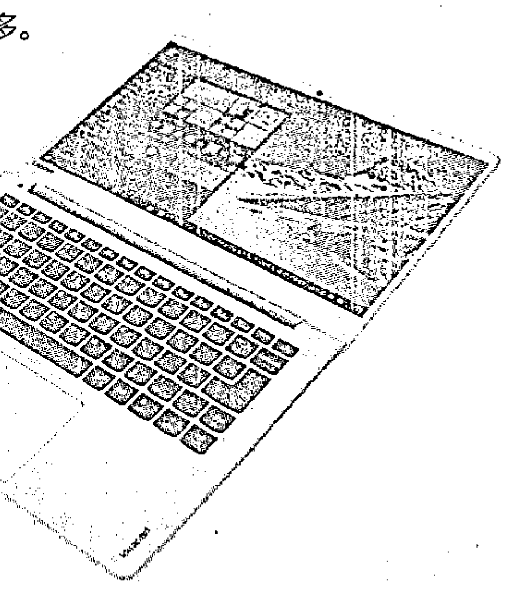

- 屏幕：13.3英寸IPS（1080P）
- 处理器：酷睿i5-7200U
- 内存/硬盘：4GB/128GB SSD
- 显卡：HD620核芯显卡
- 接口：读卡器、USB3.0×3、USB Type-C、HDMI、音频接口
- 厚度/电池/重量：13.94mm/57.8Wh/1.43kg

#### 惠普ENVY 13-d023TU

惠普ENVY 13是一款由全金属打造的轻薄本，它的转轴设计极具特色，当屏幕翻转到最大时，屏幕底部可以支撑起机身，充当支架的角色，提高笔记本底部的空气流通。此外，ENVY 13还配备了超大的57.8Wh电池，内置的M.2插槽也支持NVMe SSD，有需要的用户可自行升级。

- 屏幕：13.3英寸IPS（1080P）
- 处理器：酷睿i5-6200U
- 内存/硬盘：4GB/256GB SSD
- 显卡：HD520核芯显卡
- 接口：读卡器、USB3.0×2、USB Type-C、HDMI、音频接口
- 厚度/电池/重量：14.6mm/45.3Wh/1.3kg

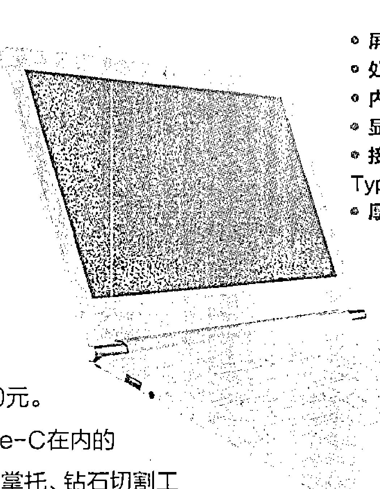

#### 宏碁蜂鸟S5

宏碁蜂鸟S5并非新品，经历数次调价后如今价格已不足5000元。这款产品最大的特色是在纤薄的机身上提供了包括USB Type-C在内的更多接口。顶盖的类肤质涂层、金属质感的转轴、拉丝金属的掌托、钻石切割工艺的机身边缘，则让蜂鸟S5-371显得更为“有型”。

#### 三星910S3L-M01

- 屏幕：13.3英寸PLS (1080P)
- 处理器：酷睿i5-6200U
- 内存/硬盘：8GB/256GB SSD
- 显卡：HD520核心显卡
- 接口：读卡器、USB3.0、USB2.0、HDMI、迷你以太网、音频接口
- 厚度/电池/重量：17.95mm/30Wh/1.34kg

三星910S3L-M01的特色在于提供了纯白和粉色的时尚配色，虽然也没能用上最新的七代酷睿，但不足5000元的售价却较为实惠。该产品还主打增强型的Wi-Fi，号称可以让Wi-Fi的数据传输速度提高20%。可惜，910S3L-M01仅内置30Wh电池，和其他产品相比容量偏小。

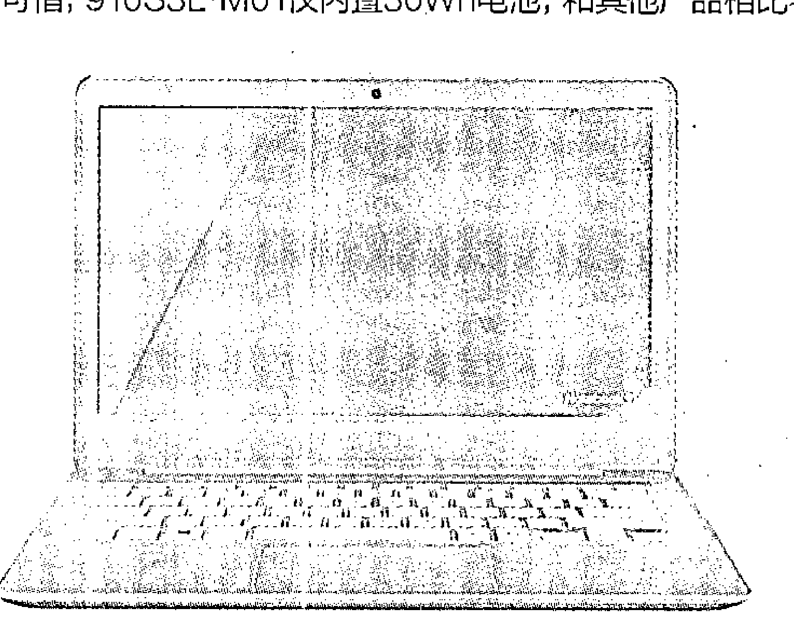

#### 华硕U310UQ6200

- 屏幕：13.3英寸（1080P）
- 处理器：酷睿i5-6200U
- 内存/硬盘：4GB/256GB SSD
- 显卡：NVIDIA 940MX（2GB DDR3）
- 接口：读卡器、USB3.0、USB2.0×2、USB Type-C、HDMI、音频接口
- 厚度/电池/重量：18.3mm/48Wh/1.45kg

华硕U310UQ6200是一款均衡性的超薄本，它虽然没有超窄边框，但便携性依旧出色，并在此基础上还加入了独立的940MX显卡。此外，该产品内部设计颇为充裕，除了板载4GB内存外还能再加装一根内存条，可组成M.2 SSD+2.5英寸双硬盘，实现磁盘容量和速度兼顾。

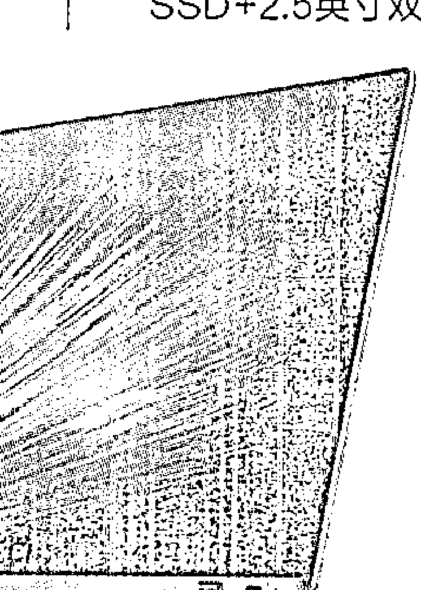

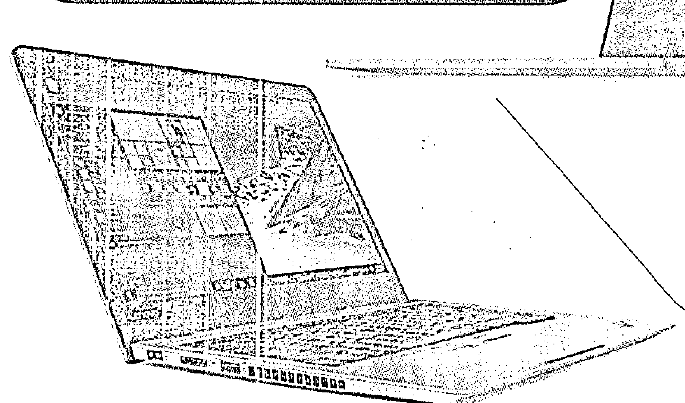

#### 小米笔记本Air 13

- 屏幕：13.3英寸IPS（1080P）
- 处理器：酷睿i5-6200U
- 内存/硬盘：8GB /256GB NVMe SSD
- 显卡：NVIDIA 940MX（1GB GDDR5）
- 接口：Type-C、USB3.0×2、HDMI
- 厚度/电池/重量：14.8mm/40Wh/1.28kg

将重量控制到1.3kg内的13英寸超薄本还有很多，而小米笔记本Air 13最大的特点就是在纤薄的机身里额外加入了NVIDIA 940MX独立显卡。在以集成显卡为主旋律的超轻薄笔记本阵营中，有了独显加持的小米Air 13可以驾驭更多3D游戏而不必考虑牺牲画质等问题。

#### ThinkPad New S2

- 屏幕：13.3英寸IPS（1080P）
- 处理器：酷睿i5-6200U
- 内存/硬盘：4GB/192GB SSD
- 显卡：HD520核心显卡
- 接口：读卡器、USB3.0×3、OneLink、USB Type-C、HDMI、音频接口
- 厚度/电池/重量：19.1mm/42Wh/1.41kg

ThinkPad New S2是一款定位商务的轻薄本，只是它采用了银色外壳，较之ThinkPad以往的黑色更适合年轻用户。这款产品的特色在于屏幕可以开合到180度，机身内配备了2个标准的内存插槽，意味着我们可以随意升级内存组建双通道模式，而OneLink接口则可接驳专用扩展坞。

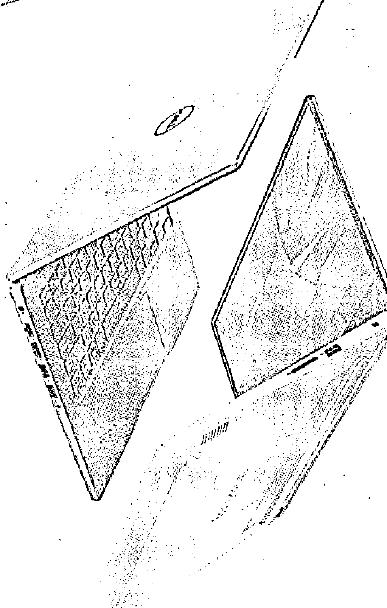

#### 戴尔燃7000-14

- 屏幕：14英寸IPS（1080P）
- 处理器：酷睿i5-7200U
- 内存/硬盘：4GB/128GB SSD+500GB
- 显卡：NVIDIA 940MX（2GB GDDR5）
- 接口：读卡器、USB3.0×2、USB2.0、HDMI、RJ45、音频接口
- 厚度/电池/重量：19mm/42Wh/1.65kg

虽然戴尔燃7000-14采用了14英寸屏幕，但得益于微边框的引入，让该产品的尺寸和传统13英寸机型类似。这款产品的特色还表现在合金材质的顶盖和底盖、类肤质的掌托、独立的NVIDIA 940MX独显，具备较强的游戏性能。不过，也正是因为独显的加盟，让其便携性显得不够极致。