# 电脑爱好者2017合订本（一）
## 2017年1期~6期精华内容集合

精选每期实用技巧文章，收入内容更多更全；栏目归类深度整合，便捷查阅触手可及

# 《电脑爱好者》2017年合订本（一）
- 主管：中国科学院
- 主办：北京《电脑爱好者》杂志社，中国计算机世界出版服务公司
- 编辑出版：《电脑爱好者》杂志编辑部
- 顾问：郭传杰
- 董事长：洪京一
- 副董事长：熊晓鸽
- 董事：万鹏远、许伟明、刘学义
- 社长：葛程远
- 出版人：许伟明
- 总编辑：西浩铭
- 副总编辑：张博
- 出版部：聂静（主任）
- 作者：《电脑爱好者》编辑部
- 发行总代理：北京爱好者文化传媒有限公司
- 杨波（发行总监）
- 办公地址：北京市海淀区翠微中里14号楼4层
- 通信地址：北京123信箱（《电脑爱好者》杂志社）
- 邮编：100036
- 广告客户部：010-88230595
- 读者服务部(发行)：手机短信：13801293315 电话：010-88230549 （周一至周五 9:30~11:30 13:30~17:00）
- 订阅：全国各地邮局（所）
- 国内发行：北京报刊发行局
- 邮发代号：82-528
- 中国标准连续出版物号：ISSN1005-0043，CN11-3248/TP
- 印刷：北京新华印刷有限公司
- 广告许可证：京海工商广字第0055号
- 出版日期：2017年3月31日
- 法律顾问：周涛律师
- 网站：www.zt148.cn 电话：13366185341

本书如有印刷或装订质量问题，我们负责调换。

图文版权所有，未经同意不得转载、翻印

定价：29.8元

# CONTENTS 目录
《电脑爱好者》2017年合订本（一）

[邮发代号 82-528]

## 特别话题
- 不要只看表面 新技术还需雾里探花 ......................................................6
- 不止于VR探究立体显示 .......................................................................17
- 在这里没有朋友 X86、ARM与Windows的爱恨情仇 ......................................25
- 细看电脑之芯（上）——从CPU-Z谈起........................................................36
- 细看电脑之芯（下）——通过GPU-Z认识显卡................................................45
- 进化从“视界”开始 移动设备屏幕的变迁之旅................................................53
- 有“十”力 才“七”待 节后的游戏本更精彩........................................................63
- PC不死 CES展上的电脑看“点”..................................................................72
- 鸠占鹊巢 手机屏幕的视界大迁徙................................................................81
- 又到3·15 回看这些年的IT产品质量与服务问题.................................................93
- 低端也精彩 过去和未来影响我们的那些技术...................................................99
- 让我们痛快地玩吧 网络正版游戏发行平台推荐...............................................108

## 系统应用
- 电脑休眠保持后台继续下载.................................................................117
- 掌控任务栏图标的闪烁提醒次数.............................................................118
- 添加农历 让Windows 10日历更“中国”...................................................119
- 绕过PIN码登录Windows........................................................................120
- 快速安装Windows系统..........................................................................122
- 设置系统提醒定期更换密码.................................................................124
- 使用系统功能屏蔽网页广告.................................................................126
- 自己动手 搞定Windows 10任务栏的小毛病.................................................128
- 玩转自定义 Windows 10上网更轻松........................................................130
- 快速给文件加密与解密.......................................................................132
- 寻找和更改文件安装路径...................................................................133
- VHD管理可以这样简单快捷.................................................................135
- 自带程序检测电脑健康.......................................................................136
- 高效为上 补丁下载安装不走寻常路.........................................................138
- 对症下药 从容应对Windows 10程序运行出错.............................................140
- 玩转动态壁纸 Windows系统一个都不能少................................................142
- 截图不求人 玩转Windows 10特殊截图....................................................144
- 有备无患 让微软推送完整版ESD...........................................................146
- 让Windows 10输入法切换更顺手.........................................................148
- DIY电脑变身品牌机..........................................................................149
- 注册表打造至强右键菜单...................................................................150

# 软网生活
- 远程取文件 用QQ也行.......................................................................151
- 不使用百度云客户端下载大文件...........................................................152
- Notepad助力搜索文件........................................................................153
- 简单一点 全网页截图并不难...............................................................154
- 自己动手升级Total Commander美化版.................................................155
- 预览让文件查询更加方便...................................................................156
- 另类解压软件安装包.........................................................................158
- 十分钟就好 分区大小任意调...............................................................159
- 效率倍增器来了 终极快捷键该这么用....................................................160
- 存储下载都靠它 零费用NAS改造计划...................................................162
- 快速找回被误删除的文件...................................................................164
- 为知云笔记数据大挪移.....................................................................166
- 破门而入——找回被锁住的文档...............................................................168
- 如何完全卸载流氓软件.......................................................................170
- 解决百度盘上传文件容量限制...............................................................172
- 快速打造临时免费聊天室...................................................................174
- 精准梳理视频资源...........................................................................176
- 电子相册云端制作...........................................................................178
- 百度袋鼠 换种方式控制电脑.................................................................180
- 深入内部 给PotPlayer换个漂亮图标.....................................................182
- 网络视频轻松“节录”.........................................................................183
- 万事不求人 DIY离线下载平台.............................................................184
- 文件下载的另类工具.........................................................................186
- 视频音乐提取随时听.........................................................................188
- 震惊！电子邮箱还能这么用.................................................................190
- 手动追查网络问题源头.....................................................................192
- 组策略打造绿色上网环境...................................................................194
- 输入法词库乾坤大挪移.....................................................................196
- 不注册博客也能发文章.....................................................................198
- 自己动手DIY私人DNS服务器...............................................................200
- Office文档编辑用浏览器就行...............................................................201
- 多管齐下 PDF转到Word......................................................................202
- 大转移 Chrome密码导入其他浏览器.....................................................204
- 快速检索历史记录中的内容.................................................................206
- 用手机号替换繁琐难记的QQ号...........................................................207
- 用低格拯救损坏的闪存盘.................................................................208
- 一键屏蔽流氓网站 我有绝招...............................................................209

# 办公世代
- 大写的一二三段落编号你会玩吗...........................................................210
- 用宏自动调整Word文档图片尺寸.........................................................212
- 用Excel实现动态数据表格..................................................................214
- 美化Excel折线图表...........................................................................216
- 批量合并纯文本格式的文件.................................................................218
- 高效&简洁两相宜 玩转Excel多条件查询...............................................220
- 用活SmartArt PPT排版更高效.............................................................222
- 切换更简单 在PPT中制作下拉式导航菜单.............................................224
- 做个80%的人都不会的动态图表...........................................................226
- Excel让预测有里有面........................................................................228
- 求和不走寻常路——玩转Excel中的特殊求和...........................................230
- 化繁为简 例谈PPT中文字的删减...........................................................232
- 灵活多变 玩转Word的保护功能...........................................................234
- 按图索骥 在PPT中巧用地图装饰文档...................................................236
- 他山之石可以攻玉 Excel图表配色有高招...............................................238
- 以文找图 用Excel公式查找图片...........................................................240
- 对齐更简单 玩转Word的文本对齐.........................................................242
- 自己动手找出Excel中的“非法数据”.......................................................244
- 一图胜千言 制作高质量全图PPT...........................................................246
- 以“少”为“多”也相宜 巧为PPT留白...................................................248
- 用活Excel内置功能花样保护文档.........................................................250
- 动静结合 在PPT中使用动态图.............................................................252
- 简单高效 玩转Word的图片功能...........................................................254
- 先导照片再排版 Excel一步到位...........................................................256
- 交互差？用PPT做个单词连连看...........................................................258
- 在PPT中制作实时反馈题...................................................................260

# 移动新天地
- 下载微信公众号视频 我有妙招...........................................................262
- “一个好汉三个帮” 让闲鱼交易更省心...................................................263
- 手机APP无法正常联网 怎么办...........................................................264
- 解决支付宝指纹验证失效的问题...........................................................264
- 效率优先 自己制作快捷方式...............................................................265
- 自制签到码 开会签到不排队...............................................................266
- 多措并举 斩断手机游戏扣费的“咸猪手”...............................................267
- 帮手机减负 微信小程序怎么玩...........................................................268
- 开通华为手机的NFC公交卡...............................................................269
- 让支付宝付款常驻信号栏...................................................................269
- 喜欢卡通风？教你用手机将照片PS成动漫特效.....................................270
- 大点再大点 学会Android手机的手势放大...........................................271
- 提示更新太烦人 告别APP的打扰.........................................................271
- 朋友圈视频分享 拒绝10秒时长限制...................................................272
- 强制所有应用使用分屏功能...............................................................273
- 通过蓝牙共享手机网络.....................................................................273

# 傻博士
- 傻博士.........................................................................................274

# CFan为你选
- 性能与便携兼顾 华硕U310UQ PK 戴尔燃7000-14.......................................304
- 旗舰机的较量 一加手机3T PK 魅族PRO 6 Plus.......................................306
- 为USB3.1找搭档 超高速存储外设怎么选...............................................308
- Always On Display 智能手机的息屏显示为何不同...................................311
- 商务派的较量 ThinkPad E470 PK 惠普Probook 440..................................314
- 腕上之争 荣耀手表S1 PK 华米运动手表...............................................316
- 腾讯的游戏盒子 TGP BOX双模主机怎么选.............................................318
- 性能不掉队 教你挑选超值Android高端手机...........................................321
- 身未动 心已远 模拟游戏平台.............................................................324
- 随时联网待命 小新Air 13和小米Air 13 4G版对决..................................328
- 爆款的对决 OPPO R9s PK vivo X9.......................................................330
- 只为那道炫光 高颜值的双玻璃手机...................................................332
- 可平板亦PC 联想MIIX 710 PK 华硕灵焕3...........................................334
- 超值金属风暴 魅蓝Note 5 PK 360 N4s骁龙版.......................................336
- 普及正当时 超值七代酷睿笔记本选购...................................................338
- 照亮你的美 锁定自拍美颜手机...........................................................340
- 免费安全软件谁家强 安全软件全体验——国产篇...................................344
- 以小博大的秘密 如何挑选微边框笔记本...............................................353
- 新生代游戏本的较量 微星GL62M PK 宏碁暗影骑士3................................356
- 入门之争 红米4 PK 魅蓝5.................................................................358
- 旅行伴侣 荣耀平板2 PK 联想P8.........................................................360
- 屌丝的逆袭 奔腾G4560 PK 酷睿i3-6100...............................................362
- 捂好钱包 游戏本的四个“不能买”.........................................................364
- 解决最后的瓶颈 笔记本要怎么选择NVMe SSD.......................................366

# 不要盲目追新技术还需雾里探花
策划 | 《电脑爱好者》编辑部

时值年初，我们将看到很多新面孔和新技术。然而，新品就一定“新”吗？这个问题背后的水分可就大了。本期，就让我们以英特尔最新的桌面处理器，以及谷歌Daydream VR平台为例，来一回雾里探花之旅。

扫一扫，更多精彩内容立现！

## 01 桌面七代酷睿很尴尬
七代酷睿的亮点就是在于“七”字，至少从表面上看它就一定有着全方位超越“六”代酷睿的资本（图1）。然而，结果可能会让你失望了。

## 失望大于期望 七代酷睿桌面版驾到
早在2016年第19期，《电脑爱好者》就为大家带来过《Kaby Lake来袭 英特尔第七代酷睿处理器解析》。可惜，首批上市的七代酷睿处理器都是针对笔记本领域定制的移动版本，而面向台式机领域的桌面版却迟迟不见动静。时至年交，桌面版的Kaby Lake终于与我们见面了。

# 七代桌面酷睿“偷跑”

按照英特尔的原计划，Kaby Lake七代酷睿处理器是移动版首发，而桌面版要延期到2017年1月才正式解禁。然而，在2016年底，各种ES版和所谓的“正式版”就已在淘宝等电商平台“偷跑”（图2），从而让我们有机会提前一睹桌面版Kaby Lake的风采。

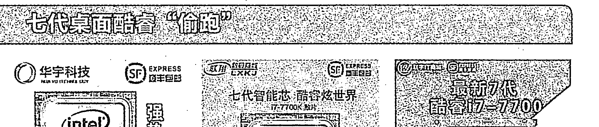

# 哪里发生了变化

很遗憾，桌面版Kaby Lake的情况和移动版相同，依旧是熟悉的14nm制程工艺，属于英特尔最新“PAO”（Process-Architecture-Optimization，制程→架构→优化）“三步走”中的优化一环（图3）。我们可以将它理解为14nm+，通过对原14nm工艺的改进，利用更高的鳍片与更宽的栅极间距降低了漏电概率，从而让Kaby Lake在大幅提升频率的同时依旧保持功耗不变。此外，Kaby Lake还优化了Speed Shift技术，可以在微秒级时间内提升性能（让睿频加速的响应时间更短、更快）。在核芯显卡（GPU）方面，Kaby Lake沿用了Skylake六代酷睿的Gen9核心，所以两代处理器的GPU性能基本一致。不过，Kaby Lake的核芯显卡增加了H.265 Main10、VP9 8/10-bit格式的硬件解码与编码，可大幅降低4K视频播放时的功耗。这个功能对台式机的意义不大，但对笔记本来说却是个利好消息。

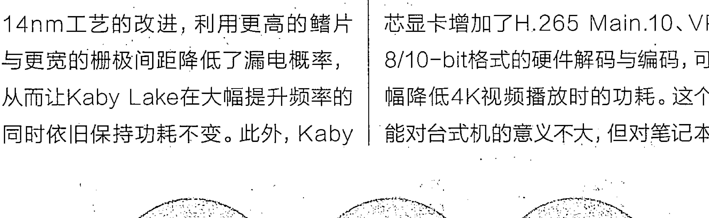

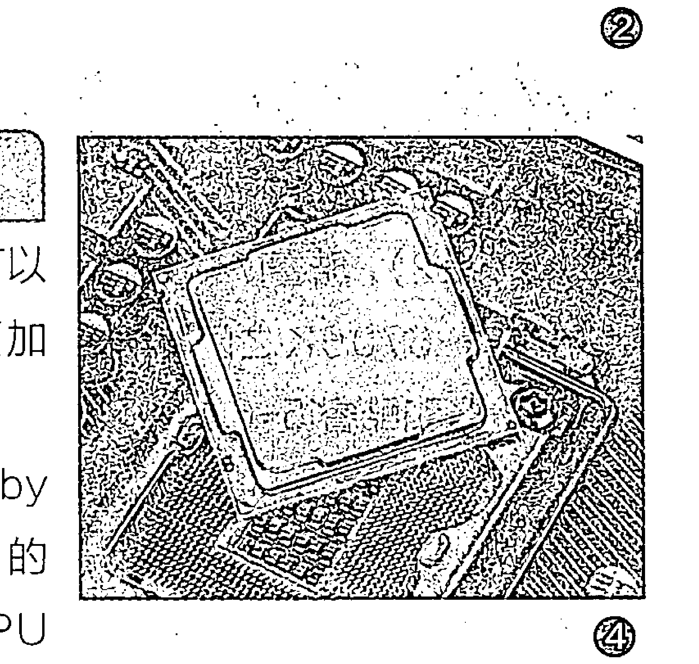

回到正题，桌面版Kaby Lake首发的型号以K系列的酷睿i7-7700K和酷睿i5-7600K为主（图4）。那么，它们与桌面版Skylake同级别的酷睿i7-6700K和酷睿i5-6600K相比差异有多大？答案很简单，这两代酷睿处理器之间最大的差异就是频率（表1），特别是多核睿频加速的差异更大（图5、图6）。至于接口类型、高速缓存、对DDR4内存的支持、核芯显卡的EU单元数量则完全一致。所以，它们的性能差异也就可以预见了。

表1 两代K系列酷睿i7和i5的规格对比

| 参数对比 | 酷睿i7-7700K | 酷睿i7-6700K | 酷睿i5-7600K | 酷睿i5-6600K |
| --- | --- | --- | --- | --- |
| 核心代号 | Kaby Lake | Skylake | Kaby Lake | Skylake |
| 接口类型 | LGA 1151 | LGA 1151 | LGA 1151 | LGA 1151 |
| 基础频率 | 4.2GHz | 4.0GHz | 3.8GHz | 3.5GHz |
| 单核最高睿频 | 4.5GHz | 4.2GHz | 4.2GHz | 3.9GHz |
| 双核最高睿频 | 4.2GHz | 4.0GHz | 4.1GHz | 3.8GHz |
| 三核最高睿频 | 4.2GHz | 4.0GHz | 4.1GHz | 3.7GHz |
| 四核最高睿频 | 4.2GHz | 4.0GHz | 4.0GHz | 3.6GHz |

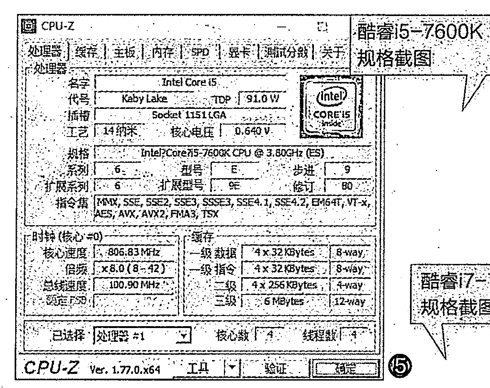

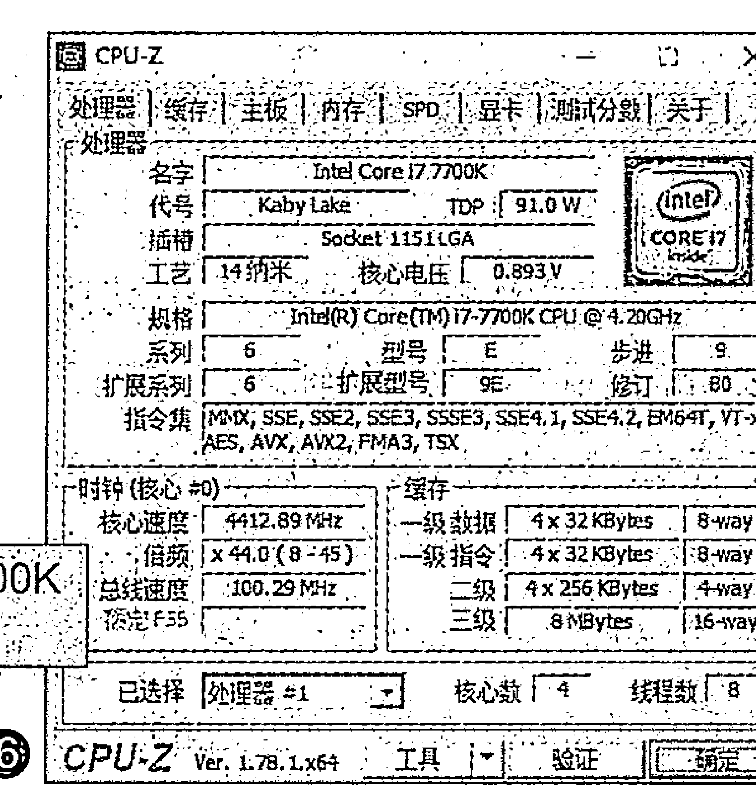

# 性能提升会有质变

很遗憾，从实际性能的对比来看（表2），酷睿i7-7700K和酷睿i7-6700K之间，酷睿i5-7600K和酷睿i5-6600K之间并没有拉开太大的差距，略微的性能提升都可视为更高频率带来的增益效果。考虑到K系列处理器本来就能超频，如果将K系列Skylake处理器提升到和Kaby Lake同频状态，二者的性能几乎完全一致。

因此，单就K系列处理器来说，我们完全可以将Kaby Lake视为Skylake的“修订版”。如果你家的PC已经用上了Skylake（图7），升级Kaby Lake就毫无意义了，哪怕它们的主板接口相同，完全可以直接换芯（需要主板升级BIOS）。

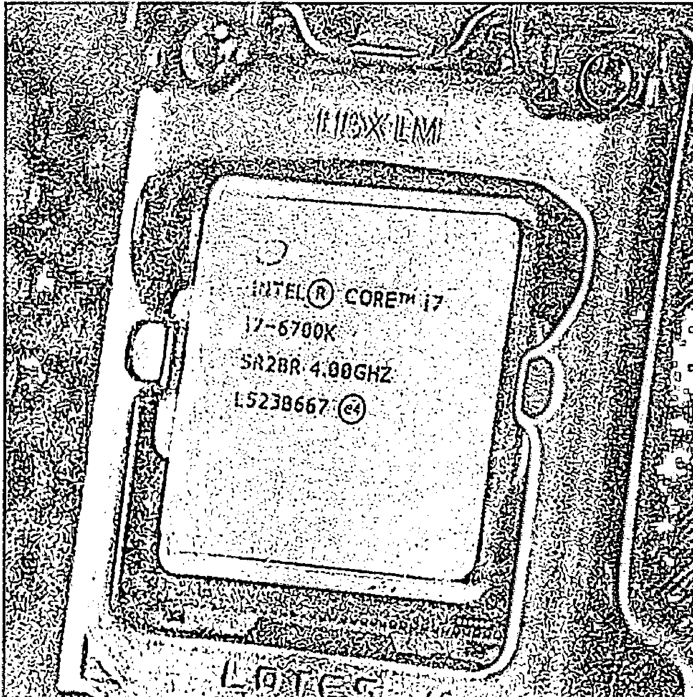

表2 两代K系列酷睿i7和i5的性能对比表

| 测试软件 | 测试项目 | 酷睿i7-7700K | 酷睿i7-6700K | 酷睿i5-7600K | 酷睿i5-6600K |
| :--- | :--- | :--- | :--- | :--- | :--- |
| | | **CPU性能对比** | | | |
| 新3DMark | 物理计算 | 13929 | 12754 | 9232 | 8511 |
| 国际象棋 | 多线程运算 | 17468 | 16005 | 12972 | 12038 |
| wPrime* | 1024M | ---- | ---- | 255s | 276s |
| CineBench R15 | 多核性能 | 913 | 886 | 690 | 646 |
| | | **GPU性能对比** | | | |
| 新3DMark | FireStrike | ---- | ---- | 1259 | 1234 |
| *代表越小性能越强 | | | | |

# 诚意体现中低端

虽然面向高端的K系列Kaby Lake处理器令人失望，但这并不代表Kaby Lake没有竞争力。实际上，英特尔此次将诚意都放在面向中低端领域的新处理器身上了。

## 源于官方的免费超频
请不要忘记，桌面处理器中出货量最大的永远是那些不支持超频的版本。由于Kaby Lake大幅提升了基础频率，同时还提升了双核、三核、四核睿频的最高频率，则让Kaby Lake与同级别的Skylake相比有了更大的竞争优势。以酷睿i5家族入门的i5-7400（Kaby Lake）和i5-6400（Skylake）为例，二者的主频就相差300MHz，换算成实际性能大约会有5%~10%的提升。如果二者价格相近，你会选择谁？就不言而喻了吧？

# 今年的i3能超频

桌面Kaby Lake除了将酷睿i3-7300的默认主频提升到了4.0GHz大关，同时还计划引入全新的酷睿i3-7350K处理器（图8）。没错，这款后缀带K的i3将获得超频能力！需要注意的是，i3-7350K的TDP高达91W，所以选择它的玩家就无法在散热风扇方面节省预算了，最终将导致i3-7350K+风扇的成本与直接购买更高一级的i5-7400相当。至于超频的i3-7350K和i5-7400谁的性能更强？就得看i3-7350K的实际体质以及你的超频技术了。

> 小提示
>
> 如今很多100系列主板都能通过解锁BIOS来对非K系列的Skylake处理器进行超频。但是，Kaby Lake处理器能否延续这一特色还有待验证，而非官方的解锁超频多少存在一些隐患，对普通用户而言意义不大。

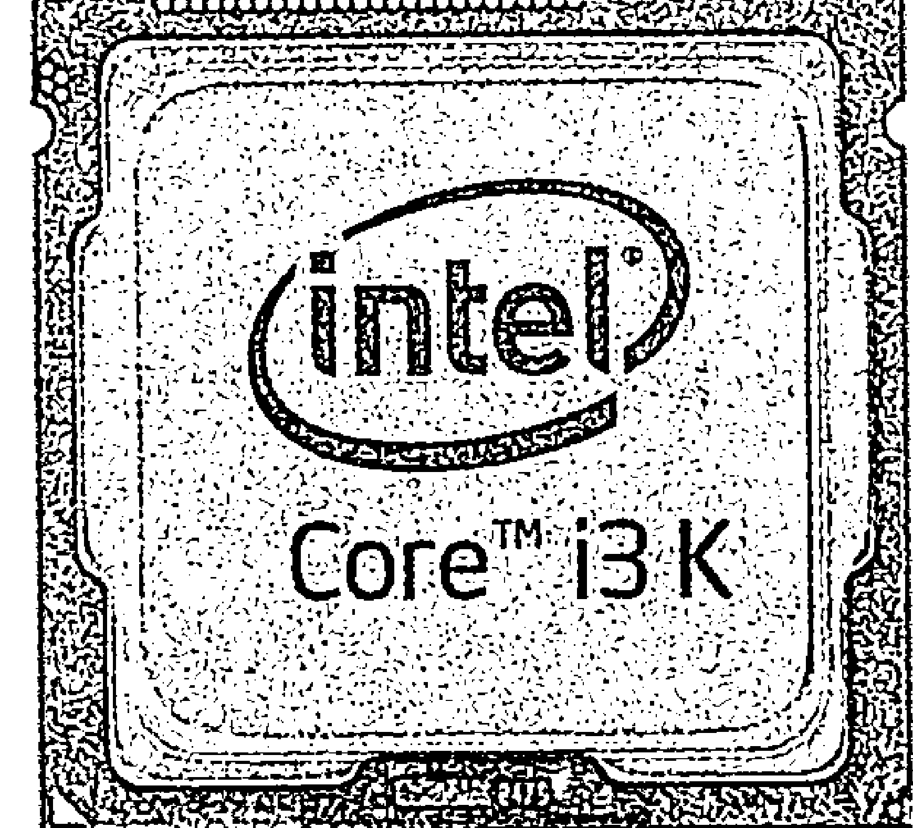

# 当奔腾遇见超线程

自从英特尔将酷睿推向王位，将奔腾打入低端之后，奔腾和酷睿处理器之间的性能隔阂就从来没有被打破过。如今，桌面Kaby Lake的奔腾却出现了一个“奇葩”：G4620，一款支持超线程技术的奔腾处理器（图9）。

简单来说，新一代奔腾G4620拥有3.8GHz的默认主频和3MB三级缓存，TDP为51W。这些都不重要，最关键的是它竟然支持双核四线程（图10）。这意味着，新奔腾和酷睿i3之间的差异就只剩下相差1MB的三级缓存、缺乏对AVX等指令集的支持，以及处理器内集成的核芯显卡规格了。

根据资料来看，虽然新奔腾G4620比不上同属Kaby Lake的酷睿i3-7300，但媲美甚至超越上代Skylake的酷睿i3-6100还是不成问题的。如果你要搭建独显平台，新奔腾可以帮你省下至少300元的银子。

# 新一代主板也有亮点

虽然100系列芯片组主板只需升级BIOS就能支持Kaby Lake处理器，但我们还是需要留意一下英特尔200系列主板的改进：除了向下兼容Skylake以外，高端型号（如Z270）还能提供多达24条PCI-e通道。这意味着当我们安装PCI-E通道的NVMe SSD时不用再担心主板PCI-E通道数不足的尴尬了。此外，新主板还支持Optane混合存储技术和雷电3接口。对打算新攒机的用户而言，哪怕你对Kaby Lake不感冒，用200系列主板和Skylake处理器搭配也是不错的选择（图11）。

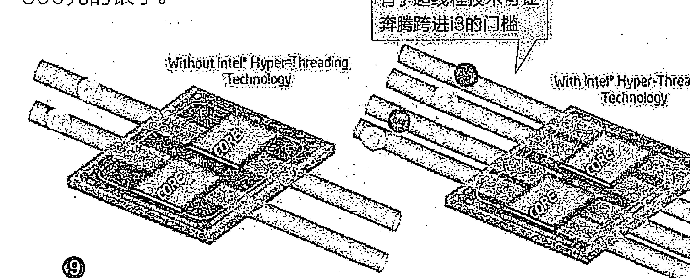

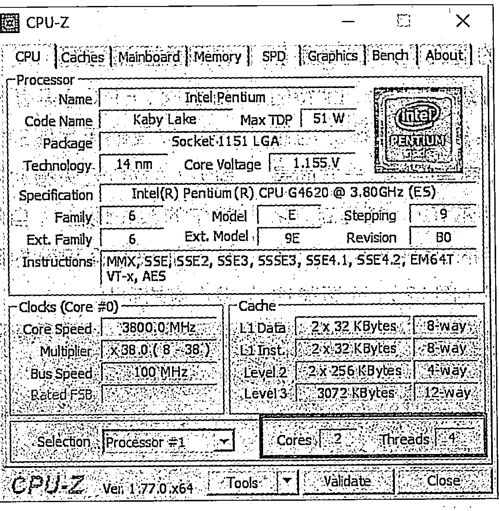

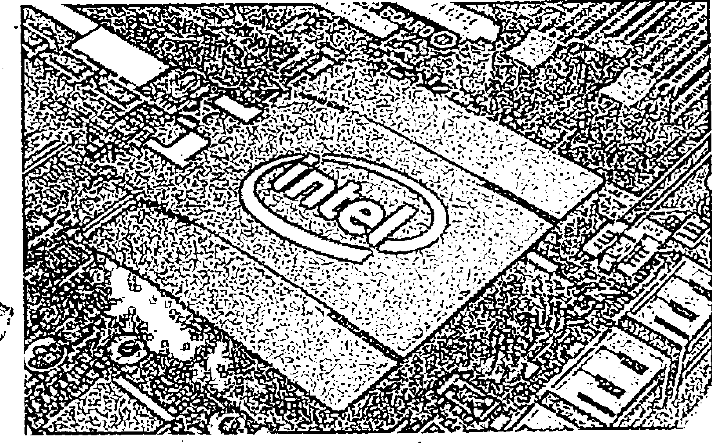

## “牙膏”战略何时是个休

虽然Kaby Lake被冠以最新的第七代酷睿处理器的称号，但在核心架构和制程工艺没有革新的情况下，仅能算是优化升级，距离我们期待的“质变”还有很远的距离。究其原因，一方面是英特尔10nm制程商业化量产的过程中确实遇到了麻烦（图12），而更关键的一点则是整个PC产业的萎靡（桌面处理器营收不断下降，英特尔还要投资新工艺研发、生产，还得照顾重点的数据中心、物联网、FPGA等新业务），以及缺乏足够的竞争力（AMD无法撼动英特尔的领先地位），自然缺乏加快制程和架构研发进度的动力。

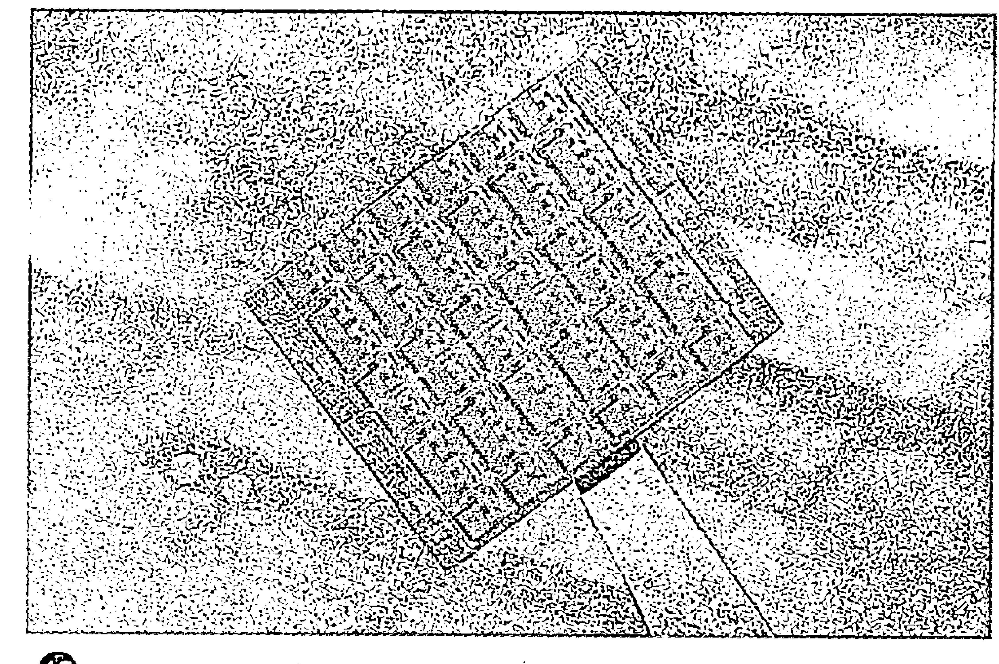

# 战略有变 看英特尔未来发展方向

桌面Kaby Lake处理器的表现已经基本定型，对其心有不甘的玩家自然开始期待它的接班人：第八代酷睿处理器（桌面代号为Coffee Lake）。可惜，英特尔的后续战略可能会让你失望了。

## 10nm可能再度延期
就在2016年底，国外的科技网站BenchLife爆出了大量有关英特尔2018年处理器产品线的线路图信息，其中最令人难以接受的消息就是，10nm桌面处理器将再度延期，最早也要等到2018年下半年才能与我们见面。接班Kaby Lake桌面处理器的下一代平台代号为“Coffee Lake”，它将沿用与Kaby Lake相同的核心架构，而制程工艺则选用14nm工艺的有一个衍生版本。没错，继“Tick-Tock”（制程→架构）两步走和“PAO”（制程→架构→优化）三步走战略之后，Coffee Lake将会面临尴尬的“制程→架构→优化→优化二周目”。

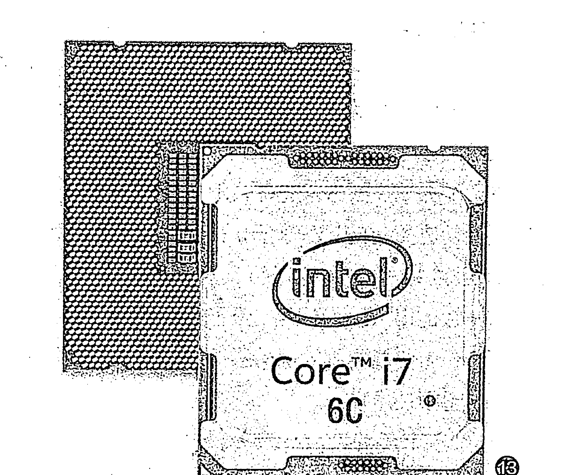

不变的制程工艺和核心架构自然难以令玩家们满意，而为了让Coffee Lake能符合第八代酷睿处理器的身份，英特尔会将高端的酷睿i7升级到六核心（图13）；霸占消费级市场多年的四核八线程传统，即将过渡到六核十二线程。用更多的核心数量换取10nm缺席的遗憾，你接受吗？

## 10nm优先供应移动版
虽然10nm在2017年无缘桌面处理器，但这并不代表针对笔记本的移动处理器无法享用。据悉，第八代酷睿处理器的移动版将出现分化，针对超薄本和PC平板二合一设备定制的U系列（15W）和Y系列（4.5W）的移动处理器将用上最新的10nm Cannon Lake架构平台，并以GT2核芯显卡与其搭配；而针对游戏本定制的U系列（15W/28W）和H系列（35W/45W）将改用14nm Coffee Lake架构平台。作为补偿，14nm Coffee Lake版本的移动处理器将拥有六核心的酷睿i7，以及集成性能更强的GT3e核芯显卡（图14）。

| 处理器系列 | 2016年 | 2017年 | 2018年 |
| :--- | :--- | :--- | :--- |
| H Processor (TDP 45-35W) | Skylake 2C/4C GT2/GT4e | Kaby Lake 2C/4C GT2/GT4e | Coffee Lake 2C/4C/6C GT2/GT3e |
| U Processor (TDP 28-15W) | Skylake 2C/4C GT2/GT3e | Kaby Lake 2C/4C GT2/GT3e | Coffee Lake 2C/4C/6C GT2/GT3e |
| U Processor (TDP 15W) | Skylake 2C GT2 | Kaby Lake 2C GT2 | Cannon Lake/10nm 2C GT2 |
| Y Processor (TDP 4.5W) | Skylake 2C GT2 | Kaby Lake 2C GT2 | Cannon Lake/10nm 2C GT2 |

# 收缩防线取消顶级核显

就在Kaby Lake还未全面上市之际，英特尔就迫不及待拿Skylake家族的老将“开刀”了。根据英特尔新一轮EOL(End of Life)退役通知，有3款非常特殊的处理器赫然在列，而它们就是拥有R后缀的昔日明星：酷睿i7-6785R、酷睿i5-6585R和酷睿i5-6685R（图15）。从2016年Q2发布（注意是发布，不是上市哦）到宣布退役还不足半年，可算是史上最短命的Skylake处理器了。

这三款处理器的特别之处在于，都集成了英特尔最强的GT4e核心显卡（Iris Pro Graphics 580），拥有恐怖的72个EU单元（普通核心显卡如HD530只有24个EU单元），同时还配备128MB eDRAM缓存，是真正能超越入门级独立显卡的存在。可惜，由于GT4e核心显卡成本太高，除了苹果以外鲜有PC品牌“用得起”。

悲剧的是，苹果新一代Macbook Pro笔记本都不再武装集成Iris Pro的处理器（图16），而这也进一步促成了英特尔下定取消顶级Iris Pro产品线的决心（今后仅保留GT3e）。

其实这也很好理解。什么样的平台才需要顶级核显？没错，就是预算有限、不考虑配备独立显卡的平台。而Iris Pro（GT4e）一直都是顶级处理器的专利，而顶级处理器自然喜欢和顶级独显搭档（图17），此时核显将面临英雄无用武之地的尴尬，纯属浪费。

总之，未来英特尔的处理器将不再追求核显能否超越独立显卡的“虚名”，而是更加专注于CPU自身性能的改进和提升。无论是Coffee Lake将酷睿i7推到六核时代，还是Kaby Lake为i3赋予超频能力，激活奔腾的超线程技术，都属于对自家产品的重新定义。

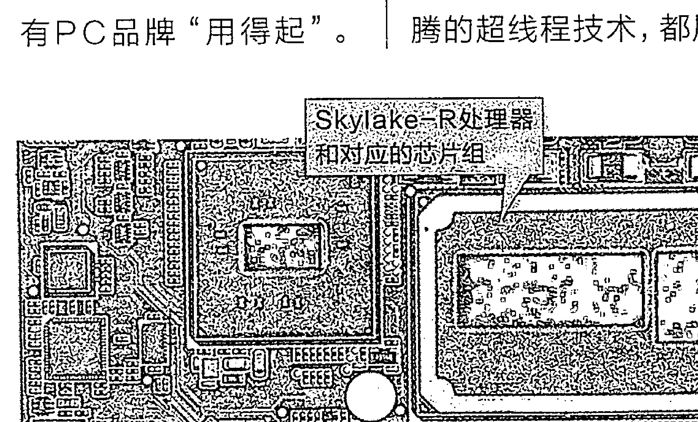

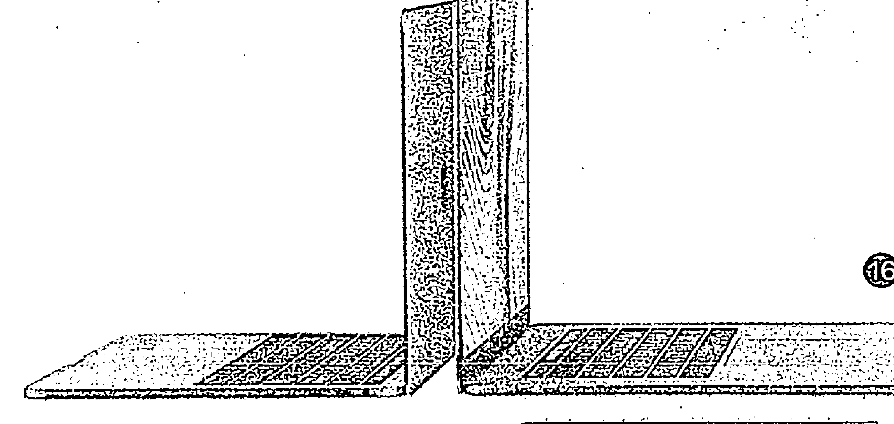

高端处理器和显卡往往是焦不离孟、孟不离焦的关系

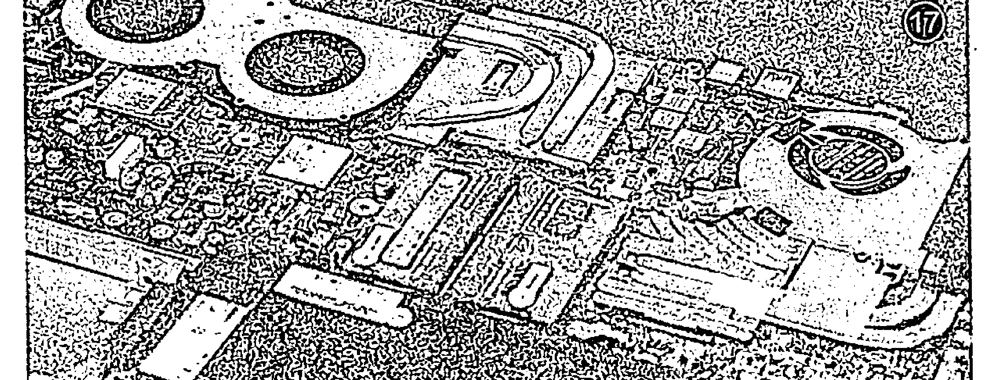

如果你希望英特尔可以迈出更大的步伐革新（比如普及10nm，改用更先进的架构核心），就只能寄希望于AMD的Ryzen能够真正威胁到英特尔的领先地位了。

# 宿命的对决 AMD要凭Zen逆袭

英特尔多年的“挤牙膏”策略终于给AMD留下了机会，即将面世的“Ryzen”就将成为AMD吹响反击英特尔的号角（图18），在高端市场与其掰一掰手腕。（说明：AMD新一代处理器构架名为Zen，而对应产品则被称为Ryzen。）

# 什么是Zen

还记得“推土机”和“挖掘机”吗？“Zen”和它们一样，都是AMD推出的微处理器架构设计。AMD近些年之所以在与英特尔的（CPU）竞争中失利，就是因为推土机/挖掘机存在先天不足。为了重现当年K7和AMD64时代的辉煌，AMD决定破后而立，对新一代Zen架构进行了大刀阔斧的改革，其中最令人关注的变化就是引入了微指令缓存。

# Ryzen初探

微指令缓存并不是什么新鲜的技术，英特尔很早以前就在自家的处理器里塞进了这种计算模块，其原理是让微指令更加接近微指令队列，避免核心去下级指令缓存里取指令而浪费额外的时间，对提升整个核心的执行效率效果非常明显。AMD此次为Ryzen引入微指令缓存，总算是弥补上了这块核心短板。

此外，AMD Ryzen还针对缓存层级进行了重构，正式支持SMT同步多线程技术（类似于英特尔的超线程），而Global Foundries 14nm FinFET工艺的引入也为实现更高的能耗比奠定了基础。AMD宣称，Ryzen的IPC（同频性能）将会比现有的挖掘机架构提升40%（图19）。

据悉，AMD Ryzen家族首发的“Summit Ridge”（桌面FX CPU，Zen家族还包含“Bristol Ridge”，即桌面和移动的APU）处理器共有四款，它们分别为Special Ryzen SR7（供发烧友的优选超频版）、Ryzen SR7（高端）、Ryzen SR5（中高端）和Ryzen SR3（中端）。

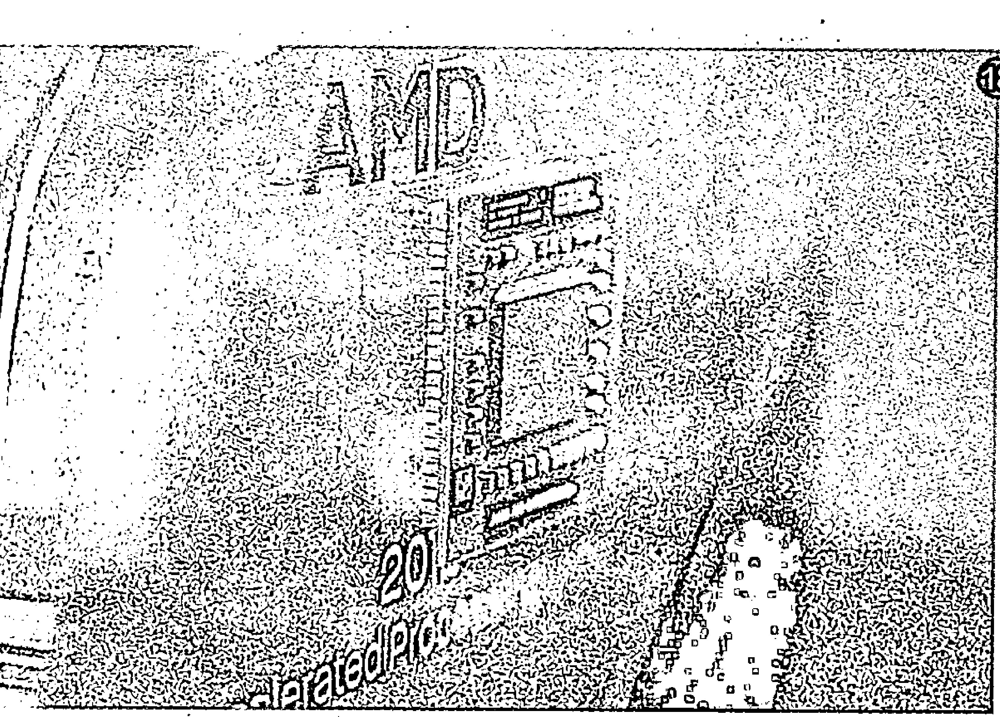

根据早前曝光的性能来看，这四款Ryzen处理器对比英特尔Braodwell-E和Skylake i7/i5在性能和价格上都有优势，而且原生支持DDR4、USB 3.1、NVMe和SATA-E等最新技术，在主流市场已经没有短板（图20）。


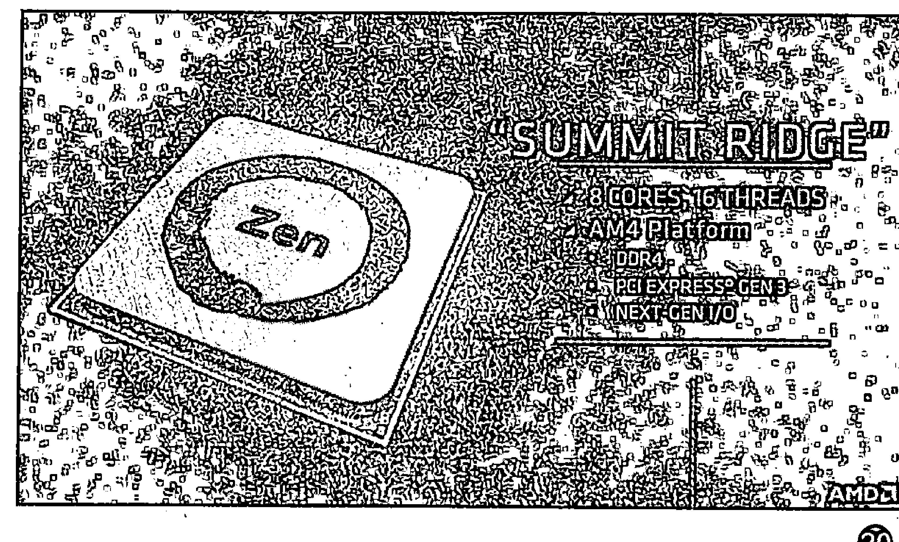

# 喜闻乐见的竞争

对我们消费者而言，自然希望AMD Ryzen真的能如宣传般强悍，只有给予英特尔真正的压力，才能终结后者不断“挤牙膏”的态度（图21）。有消息称戴尔已经对AMD Ryzen表现出了足够的兴趣，并且准备对这一新的处理器展开测试。如果一切顺利，未来在Alienware身上看到AMD的身影也不是不可能。

不过，虽然AMD Ryzen有着锐意进取的精神，但英特尔也没闲着，有最新的10nm工艺作为竞争资本（虽然不断延期上市），3D Xpoint和Thunderbolt 3（雷电3）也将随这些新品加以普及，而英特尔在渠道和厂商等方面的影响力也是不可忽视。AMD Ryzen赶上英特尔的节奏已然不易，想要真正的一步超越？只能等时间来加以印证了。

如果你对AMD Zen架构的细节以及它真实的性能表现感兴趣，敬请留意《电脑爱好者》的后续报道。

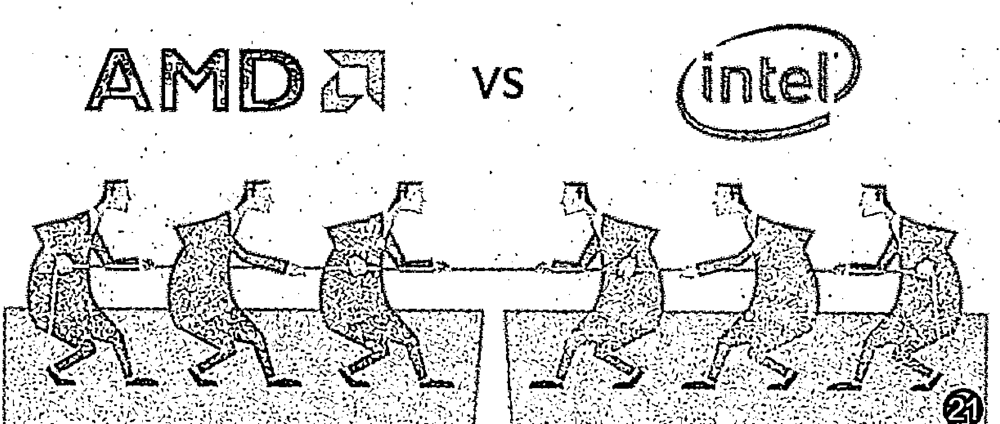

## 02 Daydream VR 随谷歌一起做个‘白日梦’

在2016年24期《娱乐 身临其境有新解》一文中，CFan简单介绍了时下VR设备的特色和分类。本期，我们将锁定在有望成为未来移动VR标准的谷歌Daydream身上，看看谷歌是如何带着我们一起做和VR有关的‘白日梦’。

在2016年5月的Google I/O大会上，谷歌首次提出了“Daydream”（白日梦）这一概念。2016年10月，Daydream VR平台正式与用户见面（图1）。作为由谷歌主导的VR生态系统，Daydream VR真的能改变世界吗？


## 先从Cardboard谈起

实际上，谷歌的VR梦早在2014年就已经在做了。当年谷歌推出了一款名为“Google Cardboard”的产品，这款由再生纸板盒制作出来的VR原型设备（图2），很快就成为了业内所有“手机VR眼镜（盒子）”的模仿对象。如今国内的暴风魔镜、小米VR眼镜、华为VR眼镜……几乎所有以手机+盒子（眼镜）为形态的VR设备都要认其为祖，只是在外形、材质、佩戴方式等方面有所改进而已（图3）。

镜内部集成了专用的惯性测量单元（IMU），可以辅助手机内置的传感器进行取样，从而有效降低头部运动的延迟，改善长时间VR体验时的眩晕感。也正是因为独立的传感器设计，让Gear VR成为了时下体验最佳的VR眼镜之一。

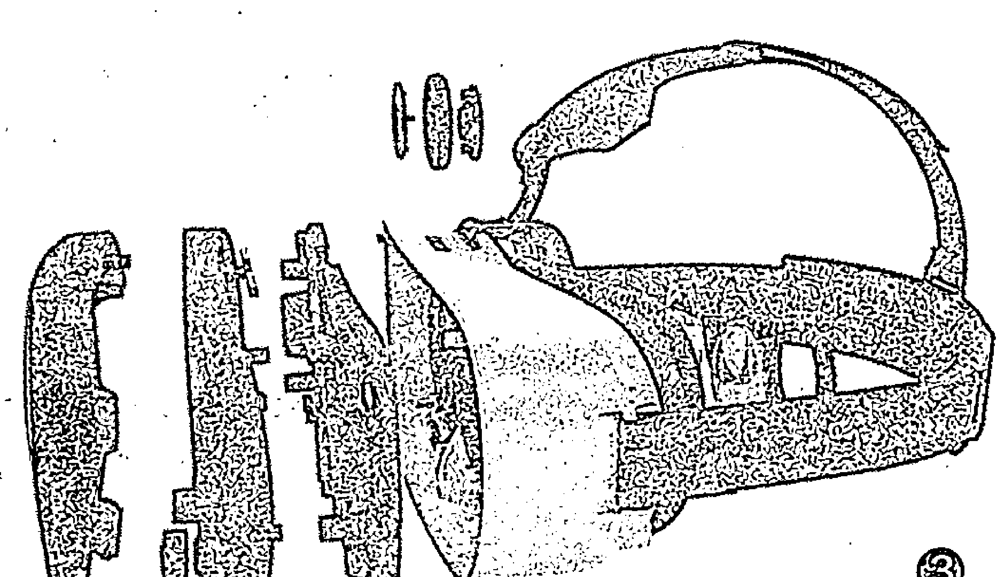

之所以说是“几乎所有”而不是“所有”，是因为手机VR领域还逐渐衍生出了一些“变种”。如三星Gear VR（图4），这款VR眼镜虽然也需要插入手机才能使用，但却在眼镜内部集成了专用的惯性测量单元（IMU），可以辅助手机内置的传感器进行取样，从而有效降低头部运动的延迟，改善长时间VR体验时的眩晕感。也正是因为独立的传感器设计，让Gear VR成为了时下体验最佳的VR眼镜之一。

另一个变种则是以“IDEALENS K2”和“小鸟看看Pico Neo”为代表的“VR一体机”，这是一种直接集成屏幕、手机处理器、RAM、ROM和相关传感器芯片的VR眼镜（图5），可以脱离手机单独使用。但是，“VR一体机”的价格普遍偏高（3000元以上），远不如手机+VR眼镜实惠，所以一直属于小众的存在。

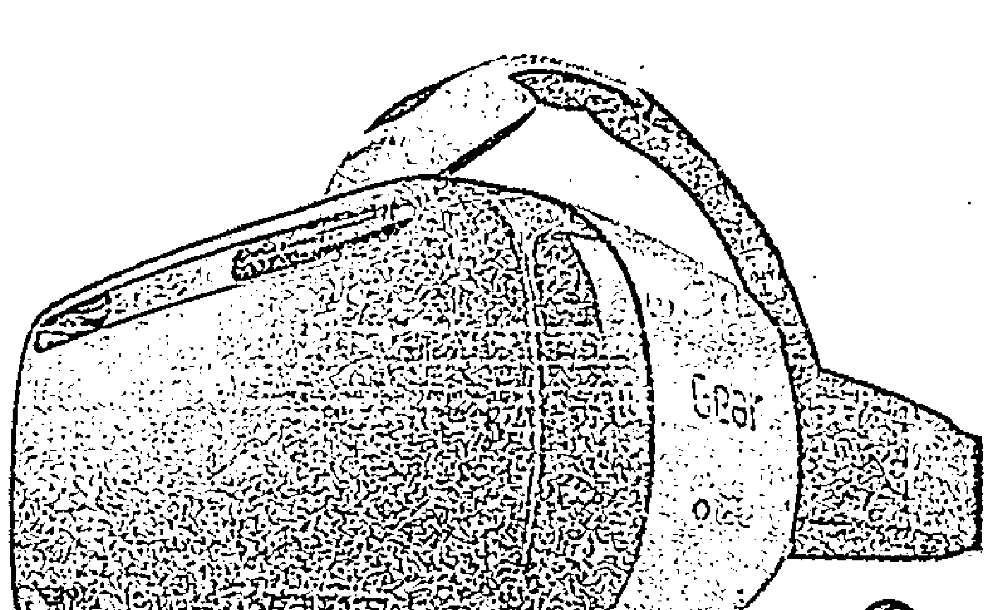

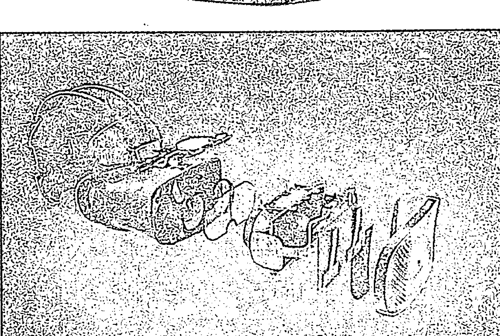

## 谷歌VR生态构建

如果说Google Cardboard只是谷歌针对手机VR体验的一个想法、一种玩具，那Google Daydream就是谷歌深思熟虑后所搭建的一整套VR生态系统。这个系统包含Daydream View头盔（其实就是VR眼镜）+ 专用手柄（随头盔附赠）、符合Daydream Ready软硬件认证的手机以及Daydream VR APP软件。

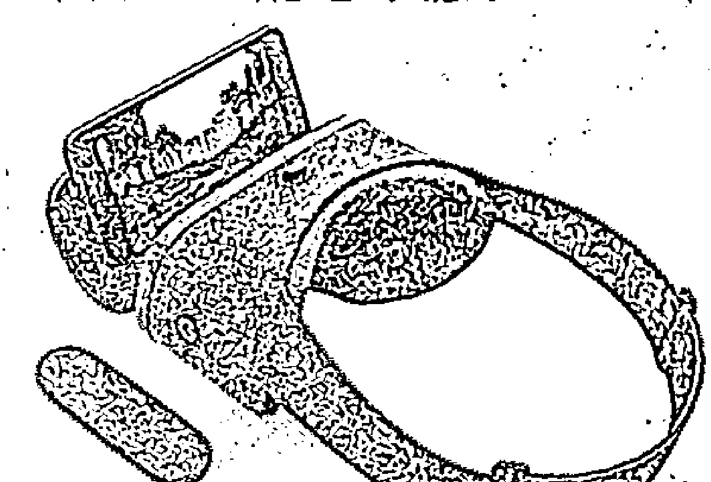

听起来很高大上？其实如果我们将整个Daydream生态系统成员分解，你就不难发出“原来如此”的感叹了。

（无法根据近视眼调节适配）。还好，它支持眼镜佩戴，基本常规尺寸的镜框都能戴上，佩戴的感觉也很舒适。

手机进入VR模式，启动Daydream VR APP，同时还能通过头盔上的2个橡胶颗粒调节手机画面，无需再像以前Cardboard那样需要仔细对齐中间线，从而大幅降低了安装、调试和启动VR的步骤和难度。

实际上，Daydream View头盔里还是有一个容易被忽略的“电子元件”：一枚隐藏的NFC芯片（类似NFC标签）。当你想体验VR时，只需打开手机的NFC功能，并将其塞进Daydream View头盔里（打开前面板取出遥控器，将手机放在前面板和镜片中间，将松紧带拉到钩上即可）。头盔里的NFC芯片会自动触发手机进入VR模式，启动Daydream VR APP，同时还能通过头盔上的2个橡胶颗粒调节手机画面，无需再像以前Cardboard那样需要仔细对齐中间线，从而大幅降低了安装、调试和启动VR的步骤和难度。

## Cardboard的豪华版

Daydream View头盔的价格为79美元，目前在国内淘宝等电商的海淘价格则在699元~799元之间，比三星Gear VR还要贵。实际上，Daydream View头盔本身并没有什么技术含量，我们完全可以将它理解为Google Cardboard的“豪华版”。

Daydream View头盔的结构和市面上任意一款VR眼镜都差不多，只是改用了更为取巧的结构和更具质感的材料而已。

简单来说，这款头盔采用了一个非常简单的塑料骨架结构，内含2个基本的镜片，它们被一种舒适的柔软布料包裹，从而抵消了简单物理结构的廉价感（图7）。我们甚至可以将它稍稍弯曲从而塞进旅行包中，布料材质可让它承受更多的“蹂躏”而不至于损坏。

没错，以上就是Daydream View头盔主体结构的全部了，没有像Gear VR那样内置IMU、搭载触摸板和USB接口，甚至连物距调节都没有。

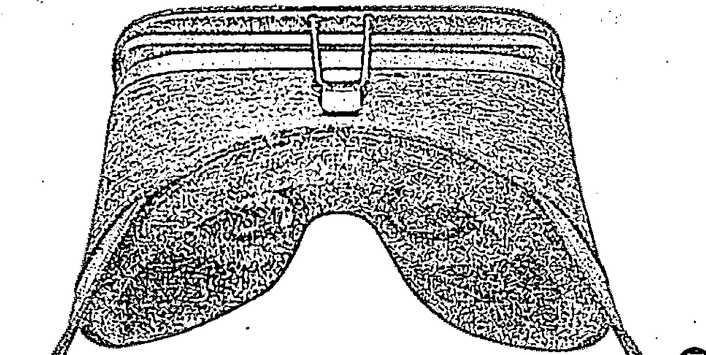


## 不一样的体感手柄

不过，一个内含激活VR模式的NFC标签肯定还不足以支撑Daydream View头盔的“高价”（其实对国外用户而言还是很实惠的，只是和国内各种VR眼镜相比就不便宜了），它还有哪些隐藏的本领呢？

国内的各种VR眼镜中标配蓝牙遥控手柄的产品也有不少，但就技术含量而言与Daydream View头盔附赠的手柄相比就有些不够看了。

## Daydream View

Daydream View的手柄虽然很小巧（图9），但功能却极为强大。它通过Wi-Fi和低功耗蓝牙技术（蓝牙4.2的BLE）与手机进行数据的交换，而自身也集成了包括陀螺仪、加速计、磁力计、触摸板、按钮以及方向传感功能，可以感知自身在3D空间中的位置。虽然它无法实现类似HTC Vive、Oculus Rift和PlayStation VR手柄那样强大的定位追踪能力，但用于指向和短距离内追踪用户手臂的位置还是不成问题的。

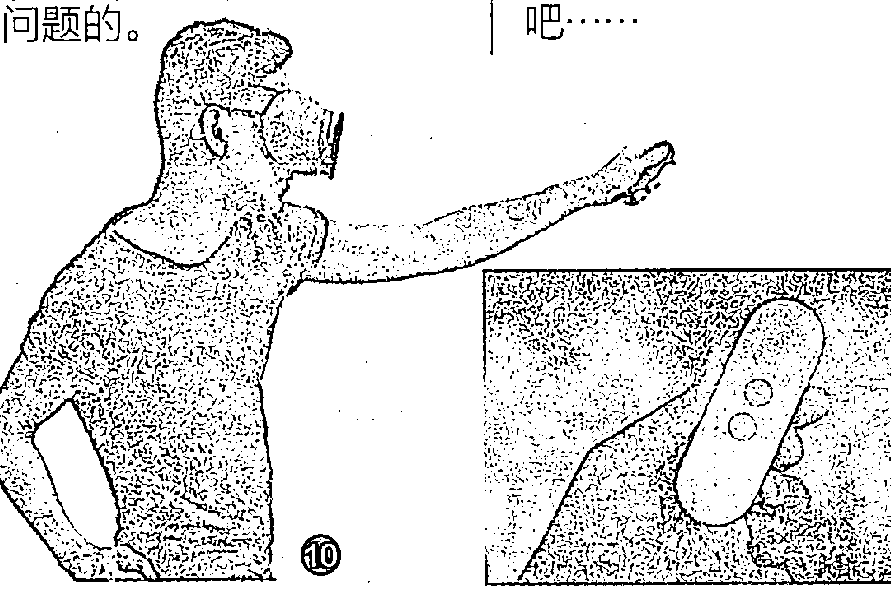

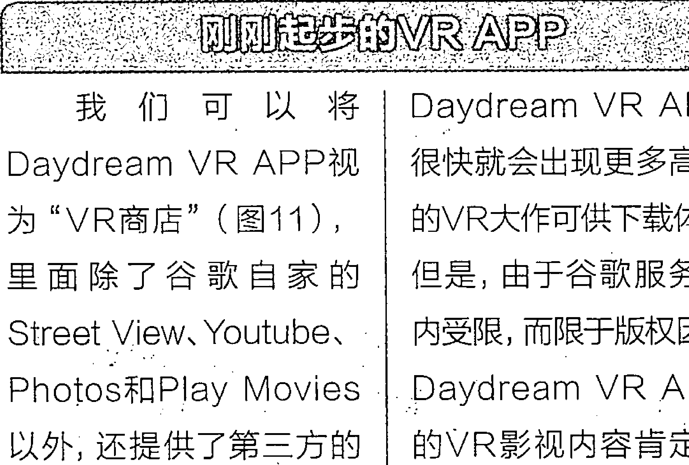

## 刚刚起步的VR APP

我们可以将Daydream VR APP视为“VR商店”（图11），里面除了谷歌自家的Street View、Youtube、Photos和Play Movies以外，还提供了第三方的VR游戏和软件专区（图12）。对VR设备而言，硬件只是基础，内容才是王道。有了谷歌官方牵头，Daydream VR APP中很快就会出现更多高素质的VR大作可供下载体验。但是，由于谷歌服务在国内受限，而限于版权因素，Daydream VR APP内的VR影视内容肯定不如国内VR眼镜厂商提供的APP资源丰富，少而精将是谷歌官方VR商店未来一个时期的代名词。

## Daydream VR

Google Daydream VR就是谷歌官方推出的虚拟现实应用，Daydream VR应用实测于您的智能手机之上。


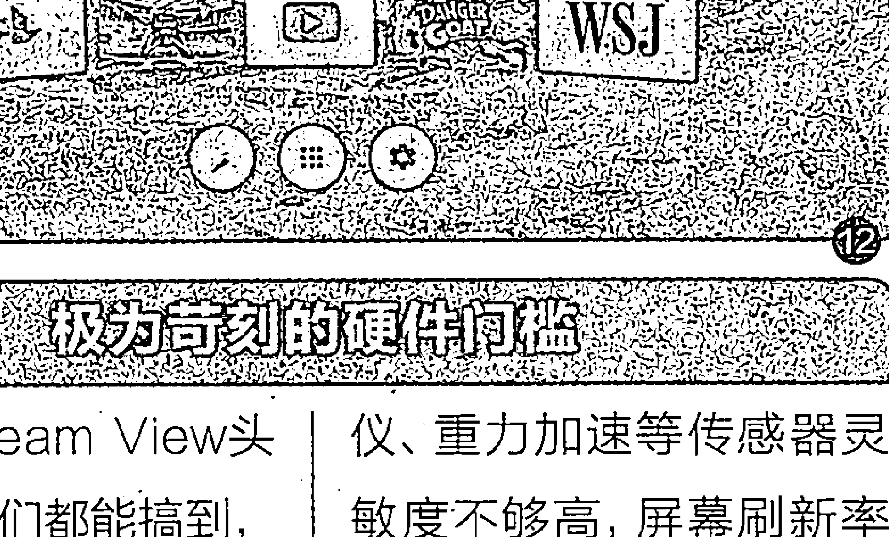

## 极为苛刻的硬件门槛

Daydream View头盔和APP我们都能搞到，这是否意味着我们可以轻松享用谷歌的这套VR生态了呢？答案是否定的，前文我们就已提到，谷歌为这个生态设定了较高的软硬门槛。软件方面还好，只要你的手机系统版本在Android 7.0或更高版本即可。但硬件方面的门槛，就会将99.9%的手机阻隔于谷歌VR生态之外了。

谷歌将Google Cardboard定位于“有趣的短视频体验”，建议使用时长在3分钟~10分钟以内不是没有原因的：此类VR眼镜玩起来太晕，时间一长很容易引起不适感。没办法，VR眼镜只是一个框架，体验VR的核心还是在于安装其内的手机。而绝大多数手机内置的陀螺仪、重力加速等传感器灵敏度不够高，屏幕刷新率也不达标，进行VR体验时脑袋轻微一动就会带来整个视野都被颠覆的感觉，眩晕感也就由此而来。

谷歌对Daydream View头盔的定位则是30分钟~60分钟的深度沉浸式体验。如果还是存在眩晕感隐患，谁能神经如此大条可以坚持这么久？因此，谷歌提出了“Daydream Ready”认证标准（图13），并将其公布在Android 7.1 Nought的兼容性定义文档中。简单来说，一款手机想通过这个认证，必须达到下面的要求：

- 1. 必须支持持续性能模式，必须支持OpenGL ES 3.2，必须支持Vulkan硬件级别……翻译过来就是处理器必须达到骁龙820/821或更高级别。
- 2. 手机屏幕尺寸在4.7英寸~6英寸之间，分辨率最少为1080P，推荐为2K或更高，屏幕在VR模式下的刷新率必须达到60Hz，显示延迟还要低于3ms。翻译过来就是最好用上2K分辨率的OLED或AMOLED屏幕。
- 3. 手机内必须集成更高精度和更低延迟的陀螺仪、加速计、磁力计等传感器，能读取设备表面温度的温度传感器等等。翻译过来就是各类传感器要全，性能指标要高，目前绝大多数手机都不合格。

截至目前，只有谷歌自家的Pixel、Pixel XL和华为Mate 9 Pro等极少数手机通过了这个认证标准。其他手机即使购买了Daydream View头盔，也将面临无法使用手柄、不支持APP中相关功能等问题。

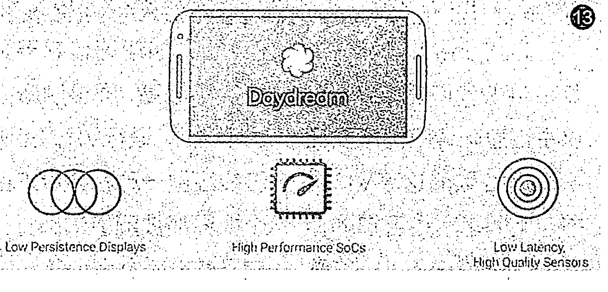

# 新工艺让VR体验更完美

好消息是，Daydream的VR体验时容易发热的问题并非无法解决。比如ARM最新推出的Cortex-A73（CPU架构）和Mali-G71（GPU型号），就专门针对VR-Ready智能手机进行了优化（图15）。可能有读者会说了，华为Mate 9系列搭载的麒麟960就首发Cortex-A73+Mali-G71的组合，但这个机器不是还存在跑分时GPU无法满血运行的问题吗？

原因很简单，ARM原本计划是让10nm工艺和Cortex-A73+Mali-G71搭配，而麒麟960为了赶时间采用了16nm工艺，所以无法完美驾驭而已。如今，骁龙835、联发科Helio X35、麒麟970等新一代旗舰SoC都已经箭在弦上，这些芯片都采用了10nm工艺设计，性能上都足以满足Daydream的运行需求。可以预见，2017年几乎所有搭载这些10nm处理器的Android手机都会打上“Daydream Ready”的标签，让我们一起期待吧。

总之，作为新品，谷歌Daydream View和早前的Cardboard在原理上并无不同，只是为了提供更长时间完美的VR体验而提高了软硬件的兼容门槛，并将绝大多数老款Android手机拒之门外。随着国内外新一代Android旗舰机的上市（图16），软硬门槛将不复存在，而我们所需担心的则是Daydream VR APP中能否收录足够丰富且好玩的VR资源。

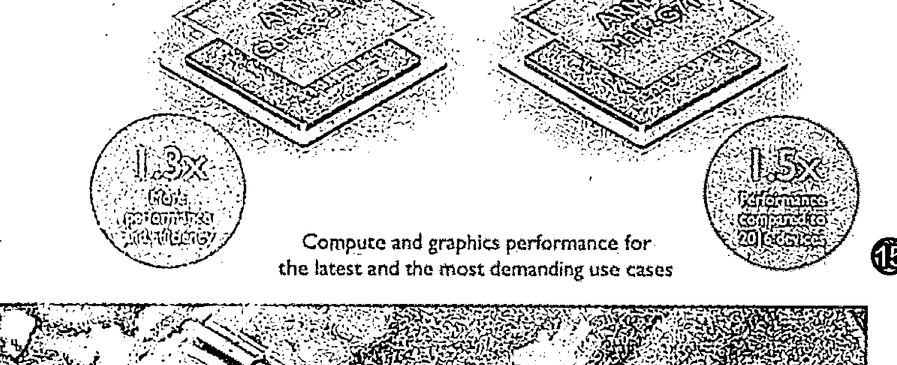


# 骁龙的发热难题

由于Daydream的VR模式不仅需要处理器的GPU渲染分辨率更高、刷新率更高的画面，还需要CPU以极低的延迟处理各种传感器数据，保证头部追踪正常（这将决定你的眩晕感），所以运行VR时移动处理器将一直处于较高负载的状态，很多时候都超过散热极限了。

换句话说，骁龙820在VR游戏中可能将变得比骁龙810更“奔放”（图14），很多Daydream View用户在与Pixel手机结合体验VR时，就曾遇到因设备过热而屏幕弹出警告并强制用户下线的提示。而高通也针对该问题表示，骁龙820进行VR体验发热的问题基本无解。

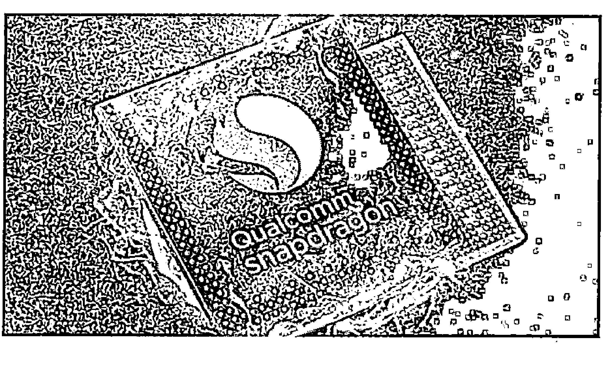

# 不止于VR
## 探究立体显示
文/治治

我们已经知道，现在铺天盖地的所谓“虚拟现实”（VR）浪潮，其实应该叫做“虚拟显示”大潮，毕竟绝大部分VR设备其实只是虚拟出了一个新的视觉世界，在其他感官方面仍然缺乏实际互动能力。不过即使目前的VR只能算是虚拟显示，也让很多电脑用户有了一种立体显示=VR的感觉，但这一感觉却错得离谱。现在最流行的头戴式VR显示方案虽然相对于眼镜+平面的形式要进步一些，但也只能算是立体显示领域的一个并不完美的实现形式，未来甚至可能是相当边缘化的一种形式。

## 立体显示的历史

立体显示就是我们常说的3D显示，而3D是英文三维度（3 Dimensional）的缩写，三个维度即表示我们所知的立体空间。相应的，2D就表示两个维度的空间，即平面。对人类来说，两只有一定距离的眼睛接收的视觉画面有一定的角度、距离差，通过大脑的计算会形成立体视觉，这也是立体显示所利用的原理，即给左右眼提供不同角度的画面，就可以让人感觉到立体影像的效果。

随着大量3D电影的出现，立体显示技术与电影的联系对大家来说已经习以为常，但大多数人都不知道，立体影像的探索也是紧随着早期摄像和电影技术的发展。1829年，比利时著名物理学家约瑟夫·安托万·费迪南·普拉多（Joseph Antoine Ferdinand Plateau）发现：物体在人眼前消失后形象还会在人的视网膜上滞留一段时间，即视觉暂留现象。普拉多根据此原理于1832年发明了“诡盘”（图1），转动的“诡盘”能使被描画在锯齿形的硬纸盘上的画片“活动”起来，这也成为了后来电影的基本原理。距离“诡盘”的发明仅有一年，1833年，英国物理学家查尔斯·惠斯通（Charles Wheatstone）就利用双眼视差法在两张手绘的草图上创造出了世界上的第一组立体图像。1938年，他根据这种像差原理发明了立体镜（图2）。1849年，英国物理学家布儒斯特（David Brewster）改进了立体镜。而利用偏极光特性制作3D投影机的想法则在1891就出现了，此时现代电影艺术还没有正式出现。早期的立体镜就是利用两部相机，在左右眼位置各拍一张照片，然后再通过“立体镜”，用左右眼同时观看，就会产生融合的3D影像。这也成为3D摄像技术遵循的基本原理。

在现代电影技术的发展过程中，也一直伴随着3D拍摄和显示技术。1894年，爱迪生发明了用胶片的连续转动，造成活动视觉的电影视镜，不过只能单人观看。1895年，卢米埃尔兄弟正式公映的影片宣告了电影时代的到来。而在电影艺术正式出现后仅仅5年，1900年，弗雷德里克·尤金·艾维斯（Frederick Eugene Ives）就发明了模仿人眼原理的立体摄像机。1915年，出现了最早的红绿立体电影视频片段。1922年，第一部立体电影《爱的力量》（The Power of Love）正式公映。这些最早期的立体电影探索并没有引起大众的关注，很快就沉寂下来。

进入20世纪30年代，随着经济大萧条，电影这一廉价的消遣方式受到欢迎，迎来了电影的大发展，其中当然也包括立体电影。1936年，米高梅电影公司推出了采用红蓝眼镜的商业电影《Audioscopiks》系列，轰动一时，该片获得了当年奥斯卡最佳短片奖的提名。电影创始人之一路易斯·卢米埃尔（Louis Lumière）也将最早的电影《火车进站》重新制作为立体电影（图3）。

二战后立体电影继续高速发展，1953年，《恐怖蜡像馆》等一批3D恐怖片应运而生，以红绿眼镜做媒介的3D片在上世纪五十年代进入了黄金时期。1962年，国内的天马电影制片厂拍摄了国内第一部3D立体电影《魔术师的奇遇》。2009年，《阿凡达》在3D技术上的成功，终于正式揭开了3D电影，乃至3D显示技术进入内地普通百姓生活的序幕。

随着技术的发展，立体显示逐渐从电影院中走出。1982年，托马斯A.弗内斯三世（Thomas A. Furness III）展示了带有6个自由度跟踪定位的头盔显示器（HMD），从而使用户完全脱离周围环境。1985年，司各特·菲舍（Scott Fisher）创建了由操作者的位置、声音和手势控制，带有广角立体显示的头盔式显示系统。进入1990年后，裸眼式立体显示器开始萌芽，1991年，日本电报电话公司NTT研究和开发出能播放出立体影像的彩色电视机；2003年，夏普推出量产型3D显示器；2011年，任天堂推出的便携式游戏机3DS（图4）拥有了裸眼3D显示能力和拍照能力。21世纪10年代，主要的显示芯片厂商，AMD和NVIDIA均推出了3D显示方案，而主要的显示器厂商也均推出了更适合3D显示的超高刷新率显示器。

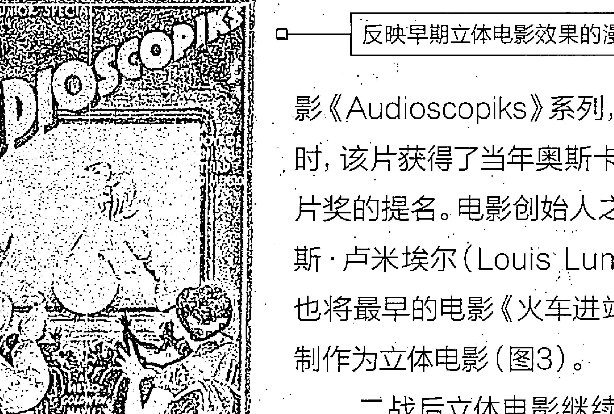

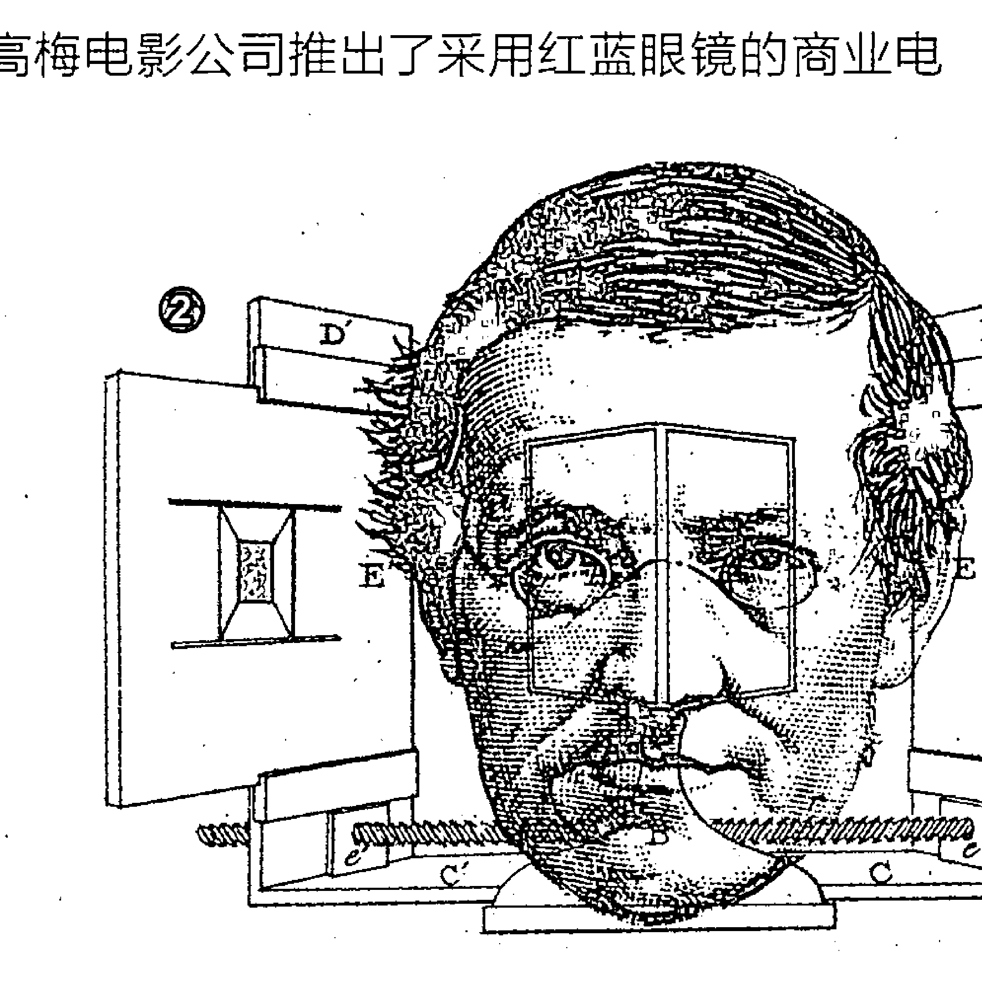

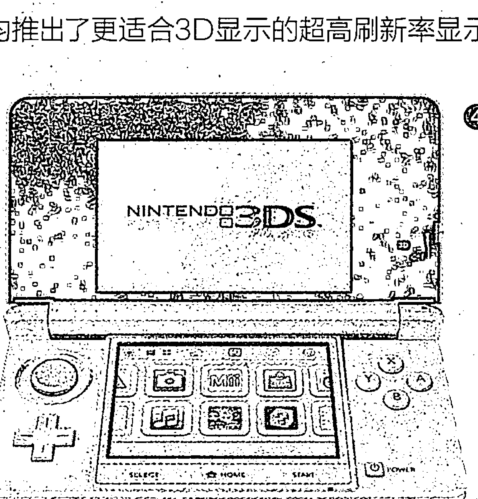

# 现代立体显示技术

目前的立体显示技术主要是3D眼镜方式、头戴式显示装置和裸眼3D显示，使用效果、使用场合、面向用户以及成本成熟度等各有不同，而且每一种方式又有多种不同的产品甚至不同的技术。

## 3D眼镜方式

3D眼镜方式是最传统而成熟的立体显示方式，通过为左右眼配置偏光、红绿、快门、明暗等不同镜片，让左右眼可以从同一块屏幕上接受不同的图像，以构成立体视觉。虽然原理类似，但其用途和具体实现方式还是有一定差异的。

### 1.偏光眼镜（Polarization glasses）

优势：3D效果比较真实，眼镜结构简单，成本较低且轻便。
劣势：使用显示器时图像分辨率降低，在影院中需要使用两台投影机，图像叠加对调教要求很高，且亮度有损失。

可见光是横波，即振动方向垂直于传播方向的波形，而自然光中，光波的振动方向环绕方向轴做无规律的振动（图5）。偏光眼镜采用的偏光镜片只允许一个振动方向的光线通过，振动方向垂直的光线会被彻底过滤掉。观看3D图像的偏光眼镜左右眼的偏振轴互成90度，在播放3D图像时，屏幕上的图像是对应左右眼的两幅图像叠加而成，两幅图像的光线分别适合偏光眼镜的左右眼偏振轴。这样用户观看同一块屏幕时，左右眼接收的图像却是不同的（图6），而左右眼画面就可以形成3D视觉。


偏光眼镜结构比较简单，所以眼镜成本较低，家用电视、显示器和影院屏幕等都能使用。不过因为采用滤光方式，所以用户看到的图像亮度会有一定损失。如果使用液晶电视/显示器的话，因为显示器两个偏振方向的图像各使用一半的像素点，3D图像的实际分辨率减半。而投影方式则需要使用两台投影机分别输出两个方向的偏振光图像进行叠加，对精度要求很高，难以应用在家庭环境中。


因为偏光镜片可有效滤除反射光和有害紫外线，具有消除眩光的功能（图7），所以也被应用在太阳镜、滑雪镜等产品上。

# 2. 色差式3D眼镜 (Anaglyphic 3D)

- **优势**：总体成本低廉，眼镜成本低至1元左右，对显示系统也没有特殊要求。
- **劣势**：容易产生偏色，图像彩色信息、亮度、分辨率都有损失，易引起视觉疲劳。

这种技术是基于图像分色（互补色式、色差式）技术的一种3D显示技术，该技术将两个不同视角上拍摄的影像分别以两种不同的颜色印制在同一幅画面中。这样视频在放映时仅凭肉眼观看就只能看到模糊的重影，而通过对应色彩的立体眼镜可分别获得左右眼图像，就可以看到立体效果。为了尽量过滤掉对应另一只眼镜的图像，两眼镜片需要采用互补色——以红蓝眼镜为例，红色镜片下只能看到红色的影像，蓝色镜片只能看到蓝色的影像，两只眼睛看到的不同影像在大脑中重叠，呈现出3D立体效果（图8）。

色差式3D眼镜有不同的色彩方案，红蓝电影需要用红蓝眼镜观看；红绿电影需要红绿眼镜观看；镜片分配也有所不同，有时会出现需要将眼镜反过来戴的情况。NVIDIA推出的成本低廉的3D Vision Discover（3D立体幻镜体验版）解决方案便采用的是红蓝眼镜技术。

色差式3D眼镜的原理和对显示的要求与偏光眼镜有点像，所以也有亮度和分辨率的损失，而且因为自带颜色的镜片会对影片色彩有影响，滤光能力也不如偏振光镜片，所以容易产生偏色和视觉疲劳。

# 3. 快门眼镜 (Shutter glasses)

- **优势**：3D效果较出色，设备市场占有率正稳步提高。
- **劣势**：设备成本较高，亮度、帧速损失较大，眼镜重量较大。

快门眼镜采用的是开关式（时分法遮光）技术，它会在屏幕上分帧显示左右眼画面，并通过液晶同步遮挡右眼和左眼，通过视觉暂留来实现3D效果。其具有和偏振光方式一样的色彩准确性。因为双眼只看到被降低为原来一半刷新率的画面，因此感受到整体画面亮度会有较大损失，而且如果刷新率不足，会明显感觉到延迟。

由于实现方式相对简单，特别适合消费级显示设备，所以快门眼镜一度成为个人消费市场上的主导技术，推进了液晶电视、显示器、投影机的刷新率提升。目前高刷新率的电视和显示器已经非常多，价格也比较合理，只是快门眼镜的构造比较复杂，所以成本和售价较高（图9）。

由于用户群体的重叠，这一立体显示技术受到目前VR设备的冲击很大，不过它还是具有可支持多人观看、成本相对较低等优势。

# 4. 明暗眼镜（Pulfrich effect）

- **优势**：可以呈现优异的空间影像，不戴眼镜也能看到清晰的2D画面。
- **劣势**：主要对运动图像有效，市场普及度低。

明暗眼镜（读写眼镜）是基于普菲立克效应（Pulfrich Effect）的产品——根据观察发现，人类对不同波长的光有不同的反应速度，大脑对阴暗刺激的认知比对明亮刺激稍微迟缓，所以人们容易认为明亮画面中的物体移动的速度比较快，且速度快的离自己比较近；也会感觉阴暗画面中的物体移动的速度比较慢，且速度慢的离自己比较远。因此，若左右两眼接收到的图像亮度不同，虽然两眼看到的是相同的图像，但大脑对其中的移动速度与距离位置的认知却不一样，便可产生视觉误差，构筑出实际上并不存在的空间深度（图10）。

使用普菲立克效应录制作品的特别之处在于照相机以及待摄活动物体必须往同一个方向移动。普菲立克效应的3D眼镜的原理就是其中一块眼镜片较暗，另一块透明。基于该原理录制的3D影像，当透过“明暗眼镜”时便能看到立体空间的影像，而没有戴眼镜的人也可看到真切的2D画面，这是其他任何立体3D显示工具都不具备的。而为了实现更清晰的明暗3D效果，一般要求所摄画面的明暗对比度要够强烈，播放设备（如投影机、液晶电视）最好具备黑画面插入功能，墨镜一侧的遮光效果要好。

# 头戴式显示器

- **优势**：能让用户最贴身地感受虚拟实境。
- **劣势**：标准不统一，产品价格偏高。

头盔显示器（Helmetmounted display, HMD）和视频眼镜都是固定在头上，把视频图像以及字符信息投影或显示在眼前（如半反光镜、护目镜）上的光电显示装置，即头戴式显示器。头盔式显示器最早被用于军事领域，作战飞行员需要一套可以将作战飞行数据随时显示到飞行员面前的直视系统，头盔式瞄准器及头盔式显示器可提供更宽更直观的数据，视野没有限制，可根据视线方向显示不同的数据和图像，以满足具备高度离轴交战能力的最新代空中格斗导弹的各种战斗需求，构建“透明化”座舱（图11）。对于民用系统来说，头盔式显示器这样的设备显然太专业也太复杂昂贵，视频眼镜便成为消费级市场上的头戴显示器主流产品。它由主板、超微显示屏、透镜、镜架、电池等部分组成，可接收各种多媒体设备输出的视频信号，并通过光学系统（主要是精密光学透镜）放大超微显示屏上的图像，以大屏幕形式呈现于观者眼前。

视频眼镜因为本身就以不同屏幕针对左右眼显示，所以很容易实现3D显示，而且随着运动传感器的引入和个人设备计算能力的增强，原本只能被动播放3D影像的头戴式显示器已经全面转向了虚拟显示，观察者可以自由转动头部，甚至是进行空间移动，显示的画面会随之改变，所以沉浸感极强。当然我们经常提到的，直接使用手机的VR盒子也可以算是一种简单的头戴式显示器，这里就不再赘述了。

# 裸眼立体显示技术

需要佩戴眼镜观看的立体显示会带来很多不便，而且大都对图像质量有影响，更难以进行多人互动操控，这些恰恰就是裸眼立体显示技术的优势。与3D眼镜方式不同，裸眼立体显示的原理差距非常大，常见的技术包括全息式、体积式、多平面式和2D多工式等。

# 1. 全息式（Holographic）

- **优势**：技术成熟容易取得，是能够进行较好互动和替代真实物品的选择。
- **劣势**：影像大小常受限于设备的大小。

全息式又称为全像式、立体照相术，是利用干涉和衍射原理记录并再现物体真实三维图像的技术（图12）。全息图上的每一部分都记录了物体各个点的信息，所以每一部分都可以再现整个原物的立体图像，甚至可以通过多次曝光在同一张底片上记录多个不同的立体图像。

全息显示技术在各种大型场合进行展示使用，如在运动会、舞台上进行物体重现或交互，也可在博物馆中精确地重现展品，人们无需任何额外设备就可以直接观看全息技术重现的立体图像（图13）。

# 2. 体积式（Volumetric）

- **优势**：真正能够实现动态效果3D图像。
- **劣势**：影像中央有旋转轴，越靠近轴心的影像旋转速度则越慢，所产生的立体影像也因此较为模糊。

体积式是一种利用激光扫描立体影像的显示器，所以被称为体积式显示器。它主要是利用一个快速旋转的垂直圆盘，配合由底下投影的激光光源，利用激光光源投射到快速旋转的旋转面时会产生的散射效应，扫描空间中的每一点（图14）。它是真正能够实现动态效果的3D技术，也可以让你看到科幻电影中一般“悬浮”在半空中的三维透视图像。它的缺点是影像中央必须有一个旋转轴，靠近轴心的影像旋转速度较慢，立体影像较不清晰。

体积式三维显示技术可分为扫描体显示器（Swept-Volume Display）和固态体显示器（Solid-Volume Display），其代表分别为Felix3D和Perspecta，以及DepthCube。其中DepthCube是比较先进的技术，它是一种背投立体式显示器，采用层叠液晶屏幕方式来实现立体显示，20层显示屏沿着X轴从前至后排在一起，这20张显示屏都是可以开关的液晶显示屏，只有一张是工作的，其他为透明的，而图片也只投射到工作的显示屏上（图15）。它使用高速数字光处理（DLP）投影器，每秒可以投射1000张“图片片段”，让每个屏幕的刷新率都可以达到50Hz，足够欺骗我们的眼睛，当然它需要的1000Hz图像刷新速度对主机是一个比较大的负担。

# 3. 多平面式（Multi-Planar）

- **优势**：成本容易控制。
- **劣势**：前后面板的对位困难，对观赏角度有较高要求。

多平面式立体显示的主要原理为利用两个面重叠的液晶面板，在两个面板显示大小相同的影像，利用物体和观赏者之间远近不同的距离，会有明度及颜色上的差别，进而重叠前后物体影像，使观赏者在视觉上产生立体感。由于此形态的立体显示是将两个二维影像重叠，因此只有在特定的正视方向观赏，才会有较佳的立体显示效果，其余观赏角度效果不佳。

# 4. 2D多工式（2D Multiplexed）

- **优势**：目前常见的裸视3D技术。
- **劣势**：亮度衰减和视角问题仍存在。

2D多工式（2D Multiplexed）是近年来厂商普遍采用的3D成像方式，其基本原理是将两张或数张具有视差的2D画面分别分割成不同的像素组合，再交叉排列起来，用特殊的光学元件形成针对左右眼不同的视域，然后分片或分时显示针对左右眼的画面。这样不需要透过特殊眼镜，就可以让用户的左右眼看到视角不同的平面影像，可产生立体的感觉。

2D多工式又可再细分为空间多工式、时间多工式、自动观者追迹式。空间多工式把显示画面间隔划分为左右眼影像显示区域，利用视差屏障或柱状透镜阵列同时把影像分别投向左右眼，以达到立体效果。所谓视差屏障是一种黑色与透明相间的直线条纹，用以进行分光，并置于距离液晶面板一小段距离处，让观赏者的右眼只能接收到液晶面板投给右眼的像素区，左眼则只能接收到液晶面板投给左眼的像素区（图16）。但是当光线通过黑色直线条纹区域时，由于光线被吸收，亮度会减少一半以上，所以对图像总体亮度有影响。

目前较成熟的空间多工式3D成像方法为柱状透镜式（Lenticular Lens），柱状透镜是利用制作成长条状的凸透镜，将奇数和偶数列像素的光线以不同角度平行射出，因此在一定的距离和角度内，左右眼就会看到不同的影像。柱状透镜的优点在于不会牺牲屏幕亮度，不过多视角会造成解析度严重下降的问题。由于透镜的制作精度以及与显示面板对位准度的困难度极高，因此制作成本也较高。

相较于空间多工式，时间多工式是利用特殊设计的分光机制，如显示器前方加上透明与不透明线条交错的光栅，在不同的时间点把左右眼影像连续投射至观赏者的左右眼，让左右眼仅能透过光栅看到属于不同视域的像素，以达到立体显示效果。由于此视差光栅可以采用印刷式光学膜设计，因此成本比空间多工式低。并且只要在显示面板上方再增加一片LCD面板开关，就能做到不固定区域的2D和3D任意切换（图17）。

自动观者追踪式3D显示技术是结合摄影机追踪观者的眼睛，自动动态调整左右眼图像视角以跟随人眼位置。由于只产生两个视角，可提供较好的3D分辨率，适合单人使用，较偏重在特定的专业应用上。

从原理可以看出，实现方式相对简单，成本较低的2D多工式立体显示，是最适合个人用户的裸眼立体显示方式，事实上，相关产品也已经出现在了市场上。1999元的SuperD 3D Box是一种相当轻巧的裸眼3D设备，它采用折叠结构，合盖时的尺寸类似于带有硬套的iPad mini（图18）。它采用人眼追踪技术和柱状透镜式3D显示屏，可以实现全高清的裸眼3D。SuperD 3D Box的主要应用方向是与手机连接，可以用3D模式玩手机游戏、看手机视频和直播等，是目前比较成熟的个人裸眼3D设备。另外SuperD还推出了使用柱状透镜式3D显示屏，并且对VR进行了优化的手机，价格只有1299元，不过其硬件配置较低，除非对立体显示有特殊要求，否则并不建议购买。

对于喜欢玩掌机游戏的用户，New 3DS或New 3DS XL/LL则是裸眼3D最佳的选择，它是3DS的新版产品，也采用了柱状透镜式3D显示屏，可以实现立体显示，并且支持3D摄像。New 3DS的屏幕比3DS略大（图19），New 3DS XL/LL则和前一代其分辨率都没有变化，相对于目前的实际应用来说，它们400×240的3D图像显示能力显得有些过时。

# 总结

立体显示并非只有所谓的VR设备一种形式，而且其他的立体显示方式在分享、互动等能力上还有可能比VR更强。特别是未来在真正的虚拟现实应用中，可以多人同时观看裸眼3D，特别是能够与多用户实现即时互动和反馈操作的投影式立体显示，才是家庭娱乐、商业应用等领域最好的选择，同样是非常值得我们关注的技术。

# 在这里没有朋友

# X86、ARM与Windows的爱恨情仇

策划《电脑爱好者》编辑部

扫一扫，更多精彩内容立现！

曾经的工作学习娱乐，离不开PC；如今的工作学习娱乐，通过手机屏幕就可完成。在计算终端从PC向移动设备过渡的期间，X86、ARM和Windows这三个关键词总在上演一幕幕的悲喜剧。本期特别话题，就让我们看看它们之前的爱恨情仇吧。

## 写在一切之前：X86和ARM

如今基于ARM架构处理器的手机、智能穿戴设备可谓风生水起，但谁又能想到ARM曾经一度仰望英特尔几十年呢？在PC时代，英特尔主导的X86（基于“CISC”复杂指令集）英雄无敌（图1），ARM根本没有实力正面回击。于是，ARM（公司）采用了曲线救国的策略，选择以“RISC”（精简指令集）作为主打（图2）。由于ARM的RISC精简指令集并不是特别符合当时硬件产品的潮流趋势，所以在很长的一段时间里它只能处于仰人（英特尔）鼻息的憋屈境遇。

所谓三十年河东，三十年河西。ARM的RISC精简指令集恰好与智能手机和智能穿戴设备的需求不谋而合，最终使其成为了移动时代的无冕之王。恰好此时PC产业正值严冬，英特尔迫切期望在移动市场分一杯羹以找到新的利润增长点，而ARM也计划入侵传统PC市场而谋求更大的布局。于是，一场龙争虎斗的较量便拉开了序幕。

# 英特尔：移动之路渐行渐远

英特尔虽然在PC市场风生水起，将同属X86阵营的AMD压得喘不过气，但在移动市场却始终处于劣势，而英特尔也不得不作出壮士割腕的举措。实际上，英特尔曾一度有希望成为移动时代的领军者，只是战略失策让其与移动时代失之交臂。

# 英特尔曾与ARM有过交集

1998年，英特尔从DEC（当年的处理器产业巨头）手里获得了StrongARM与ARM架构的完整授权，这意味着英特尔可以自行研发生产基于RISC精简指令集设计的ARM处理器。实际上，在随后的很长一个时期里（特别是在Pocket PC掌上电脑时代），英特尔旗下的“XScale”就一度成为ARM处理器中的“代名词”（图3）。

可惜，Pocket PC在当年并非一种成功的设备，英特尔没能从中赚取太多的利润反而面临亏损。同一时期，英特尔还恰好经历Pentium 4的失败以及AMD逆袭成功的阵痛。为了集中精力，英特尔将包括XScale及手持设备芯片业务以6亿美元打包出售给了Marvell公司。这种在今天看来属于绝对“短视”的行为让英特尔失去了与ARM（公司）直接抗衡的资本，最终造就了X86和ARM这两种“不相干”架构的处理器在移动市场中的火拼场面。

# 依托于凌动的移动梦想

面对智能手机的强势崛起，以及围绕着ARM而赚的盆满钵满的芯片厂（如高通），说英特尔不动心那是假的。好消息是，英特尔手中还有着一条和ARM处理器颇有几分相似的产品线：凌动（Atom）（图4）。

简单来说，Atom曾是英特尔针对上网本定制的处理器（图5），其最大特色就是从乱序指令（Out of order）改成了顺序指令执行（In order），最终导致Atom的功耗和性能都大幅缩水。没关系，说Atom性能差那是相对其他X86处理器而言，和ARM处理器相比，Atom的理论性能还是足够用的。

于是，英特尔在2012年CES展会上发布了旗下首款针对手机设计的X86架构处理器：Atom Z2460（隶属Medfield，32nm），它是一款单核双线程处理器，并由联想乐Phone K800首发（图6）；

2013年，英特尔再度祭出了Atom Z2580（隶属Clover Trail+，32nm），它是一颗双核四线程处理器，同样由联想旗下的K900首发（图7）；

2015年，随着Atom Z3580（隶属Silvermont，22nm）的出现，Atom正式进入了64位处理器时代，同时底层架构也从效率偏低的顺序执行换回了乱序执行指令，因此在实际体验上进一步拉近了与同期ARM处理器之间的距离（图8），受到了华硕旗下ZenFone系列的青睐（图9）。

# 英特尔的移动梦碎

可惜，针对ARM平台编译的二进制代码X86处理器是无法直接运行的。基于Atom处理器设计的手机，也因此一直饱受兼容性和执行效率偏低的困扰：虽然谷歌在很早以前就在Android NDK中加入了X86编译的选项，但仍有很多APP仅针对ARM处理器进行编译，这就导致了Atom手机运行此类APP时存在兼容问题（图10）。

英特尔的解决方案是，通过“二进制转换”功能解决X86处理器直接运行ARM库的问题。但是，二进制转换虽然可有效解决兼容问题，但却存在明显的性能耗损。技术达人“炮神”曾做过测试，Atom在性能诉求的应用中的损失可高达50%以上；在一些游戏类应用中也会带来约400mW的CPU功耗增加。

随着谷歌Android系统版本的升级，以及英特尔Atom Z3000处理器的登台，Atom在Android下的兼容性和耗损问题已经趋于完美。然而，历经4年辛苦耕耘的Atom依旧没能得到更多手机品牌和消费者的正视，Atom手机始终属于非常非常小众的存在。

# 扩展阅读：基带拖后腿

制约英特尔Atom处理器在手机领域大展拳脚的瓶颈还体现在一个方面：基带。对手机而言，处理器就是一整套SoC的结合体，基带芯片（决定手机信号或Wi-Fi的强弱）的重要性仅次于CPU自身性能。英特尔在过去几年中基带技术始终落后于竞争对手，所以也从侧面制约了Atom对手机市场的拓展。虽然苹果iPhone 7家族中有部分版本选用了英特尔最新的XMM3360基带芯片，但它的性能依旧落后于iPhone 7中采用高通MDM9645M基带的版本，以至于苹果不得不降低高通基带的性能，让两个版本的iPhone 7保持相同的网络性能。

终于，英特尔在2016年中毅然决定退出移动市场（主要针对手机）的竞争，取消了计划中的SoFIA 4G及Broxton处理器，最新的14nm Apollo Lake平台中的“移动版”仅适用于平板电脑等二合一设备（图11），想再在手机身上看到Intel Inside的身影短期内已无可能。换句话说，英特尔的移动梦碎。

# 再一次回到原点

正所谓“没有永远的敌人，只有永远的利益”。在英特尔全球开发者峰会IDF2016中，英特尔宣布与ARM达成了合作：在获得ARM的技术授权后，将在英特尔工厂内代工生产基于ARM的芯片。

别误会，这并不是说英特尔要推出自主品牌的ARM处理器，而是英特尔可以给高通、联发科、海思等芯片厂代工。要知道，英特尔的工艺水平始终领先于其他晶圆厂，其## Atom拥抱IoT物联网

虽然英特尔放弃了(手机)移动市场，但这并不代表Atom产品线被放弃。如今英特尔已经将工作重点转向了新兴的IoT物联网市场，并推出了针对IoT物联网的Atom E3900及面向车载电子的Atom A3900系列（图13）。其中，Atom A3900特别针对高温环境设计，可在110°C高温下使用15年！在移动市场失利的Atom能否在其他战场扳回一局？让我们拭目以待吧。

# 不再甘心移动，ARM染指PC千亿市场

就像英特尔总在努力实现移动梦想一样，ARM也在窥视千亿级别的PC市场。在与微软的紧密合作下，ARM染指PC已成定局。那么，ARM是如何实现“虎口拔牙”计划的呢？

## 背景知识：ARM的历史

ARM（英国芯片设计公司）的历史最早可以追溯到1978年，其前身Acorn RISC Machine Acorn Computer于剑桥成立（图1）。1985年，当时的IT巨头Olivetti收购了Acorn 49.3%的股份，由于理念不同，所以Acorn选择独立。1990年，Acorn携手Apple、VLSI等公司共同出资创建了ARM，Acorn RISC Machine也正式更名为Advanced RISC Machine，即今天ARM公司的全称。2016年，日本软银以234亿英镑（约合310亿美元）的价格收购了ARM。

当年的Acorn ARM处理器和计算机平台

# 迥异的商业模式

在PC时代，英特尔的“王霸之气”无人可敌，ARM也只好避其锋芒，转而开始研发在当时并不被看好的RISC精简指令集，定义产品的核心为：低成本、低功耗、高效率。由于销路不畅，所以ARM只好选择了与英特尔截然迥异的商业化模式。

在半导体芯片产业链中，大体可以分为IP设计、IC设计、晶圆制造和封装测试四个环节。英特尔选择的是亲力亲为，打包了包括研发、生产、测试乃至后期销售的所有环节。而ARM受困于资金，只能将所有精力都集中在IP设计这一个环节身上。

换句话说，ARM就是一家IP设计公司，它的工作就是每隔几年研发一代CPU的指令集架构（如ARMv8和Cortex-A73）（图2），并将这个指令集架构授权给IC芯片公司（比如高通、联发科、三星、海思等）。接下来，IC公司通过指令集架构设计出实际的芯片（如骁龙820、Helio X20、麒麟960）（图3），再联系晶圆制造企业（如台积电、三星）进行生产和封装测试，最终销售给硬件厂商（如华为、小米）进行手机的研发和生产（图4）。

ARM的盈利来源，则在于前期的授权费用，以及IC公司在芯片销售时收取的提成费用。理论上讲ARM授权的企业越多，利润越大。在2015年，ARM的营收为14.89亿美元，但同期英特尔的营收则达到了516.9亿美元，虽然表面上看起来差距悬殊，但ARM这种售卖知识产权的商业模式注定其站在了整个行业价值链的顶端，授权企业的盈亏都与它无关；而英特尔亲力亲为的商业模式固然营收巨大，但却自负盈亏，在PC产业不景气的今天很难止住下跌趋势。

# ARM的杀手锏

ARM之所以能在移动领域将以英特尔为代表的X86阵营笼罩在阴云之下，就是因为它赌对了RISC精简指令集在嵌入式芯片的发展趋势。

我们都知道，一颗CPU芯片的功能和性能高低强弱，都反映在晶体管数量上。晶体管数量越多，性能功能越强，但同时也会带来更高的功耗，需要更先进的制程工艺加以弥补。X86架构包含很多指令集，流水线、分支预测等硬件逻辑也极为复杂，这些都需要用去更多的晶体管（图5）；ARM架构指令集数量少、逻辑简单、功能单一，所以它对晶体管的需求远不如X86那么多。翻译过来，就是ARM效率高、更省电。

对移动设备而言，“过剩”的性能就是浪费，够用就好才是王道。所以，ARM才能一度在手机、Pocket PC、嵌入控制、多媒体数字等处理器领域拥有绝对主导的地位。

# 为反击X86积蓄力量

当移动设备步入智能时代后，更高的性能就成为了ARM的下一步发展目标。继ARM11(基于ARMv6指令集)之后，ARM将以后的产品全部改名为“Cortex”(基于ARMv7指令集)，并细分为“A”(高性能)、“R”(针对实时系统)和“M”(针对微控制器)三大系列(图6)。

智能手机所搭载的ARM处理器，全都是Cortex-A系列，而它也从最早的Cortex-A8，一路升级到A9、A15、A17、A53、A57、A72、A73等等，每一代Cortex-A的革新，就意味着智能手机在性能上再度进化。

没错，在智能手机、平板电脑崛起的时代，如果ARM还一味坚持保守的“功耗至上论”，只能等待被历史淘汰的命运，而诺基亚就曾为对新技术反应迟钝而付出了代价：在竞争对手纷纷武装1GHz Cortex-A8处理器时，诺基亚最新的旗舰机Nokia N8却仍停留在680MHz主频ARM11处理器的水平上(图7)，很尴尬吧？

随后，ARM还顺应趋势推出了64位架构ARMv8(也就是后来的Cortex-A53/A57)，并提出了big.LITTLE技术，有效解决了多核处理器中“一核有难，多方围观”的问题，让性能级核心和省电核心可以相互协同作战，实现性能和功耗的兼顾。

# 和X86展开正面冲突

以智能手机和平板电脑为代表的新一代移动设备的兴起，让英特尔决定杀回这个原本熟悉的市场，并借由Atom处理器对ARM“施加压力”。可惜，正如上个章节所述，Atom最终还是英雄末路。

面对英特尔的进攻态势，ARM也展开了有效的反击，而且还是直接从X86最引以为豪的性能层面入手。以ARM于2015年发布的Cortex-A72架构为例，ARM竟然找来了比Atom还要高一个档次的Core M(14nm的酷睿M-5Y10C)与其作比较，根据ARM官方资料显示，Cortex-A72除了单线程性能小输以外，多线程下完胜Core M！领先幅度可达1.6倍，且Cortex-A72的内存性能也快过Core M(图8)。最关键的是，此时Cortex-A72处理器的功耗只有1W，而Core M的功耗高达4W，能耗比再度完胜。

如今ARM最新的Cortex-A73已经进入井喷阶段，在10nm工艺的帮助下它也会表现出更为惊艳的性能。换句话说，随着ARM最新架构技术的不断提升，ARM已然具备了逆袭X86阵营的资本。

# 携手谷歌微软闹革命

PC市场是一个超千亿规模的大蛋糕，既然这个市场的老大英特尔能跨界移动市场挣食，为何ARM不能去抢PC的生意？ARM除了一步步提升Cortex架构性能之余，也找到了很多“志同道合”的伙伴，比如谷歌，比如微软，并随着这些伙伴一起，也在不断向X86阵营施加压力。

谷歌ChromeBook就是ARM挥师PC市场的先行军，在（海外的）入门级市场受到了广泛好评，ARM处理器可帮此类设备变得更轻更省电。好消息是，未来Chrome OS很有可能加入对Android APP的支持，这就让ChromeBook在与入门级PC的较量中有望取得更多竞争资本（图9）。

微软对ARM的支持同样给力。虽然经历了Windows Mobile和Windows Phone的失败，但微软始终没有放弃与iOS和Android竞争的希望，全新的Windows 10 Mobile就将正式加入对ARM处理器的支持，并可以运行X86程序！至此，ARM和X86之间的隔阂被正式打破。有关这部分内容，我们会在下一个章节作详细介绍。

# 英雄再度所见略同

前文说过，ARM已被软银收购，而软银此次收购ARM的最大目标则是进一步发展其物联网业务。是不是很熟悉？没错，英特尔之所以取消SoFIA 4G及Broxton处理器，放弃移动市场，就是为了集中精力迎接物联网时代，而ARM（即软银）也将未来赌在了物联网身上（图10）。

有数据显示，到了2018年，物联网设备的数量将会超过移动设备，到了2021年，我们将会拥有18亿台PC、86亿台移动设备、157亿台物联网设备。也许，ARM和X86还没能在移动市场分出胜负，战火就将全面蔓延到物联网市场。

# 微软的态度 两手都要抓 两手都要硬

在2016年底最重磅的一则消息，就是高通（ARM阵营的典型代表）联合微软宣布，骁龙芯片将支持完整的Windows 10操作系统，可以运行X86 Win32应用（不是UWP统一应用哦，而是货真价实的.exe程序）。至此，微软、英特尔和ARM之间的关系开始变得难以捉摸起来。

# Wintel联盟破裂

在PC时代，Wintel（微软/英特尔）联盟曾牢不可破，创造了一个又一个商业奇迹。然而，如今终端计算已经不再局限于桌面（台式机）和膝上（笔记本、平板电脑），而是开始向移动端（手机）倾斜（图1）。在英特尔选择放弃移动芯片业务之后，注定Wintel联盟将面临破裂。

实际上，在很早以前微软就与ARM（阵营）有过合作。这很好理解，微软一直都没有放弃过在移动领域的耕耘，早期的Windows Mobile系统（只支持ARM处理器）就是“智能手机”的绝对代言，并成就了当年的多普达（即HTC）（图2）。可惜，Windows Mobile系统的设计理念和操作形式完全照抄桌面版的Windows（图3），操作极为繁琐，再加上iOS和Android的迅速崛起，这个系统很快就被Windows Phone所取代。

Windows Phone（下文简称WP）有着极高的运行效率，极简的磁贴界面也让人有种眼前一亮之感（图4）。可惜，WP总是存在基础功能缺失的问题。以调节音量为例，iOS和Android很早以前就支持系统音量和多媒体音量可以单独配置，而WP系统却经历WP7→WP8→WP8.1，用了数年时间才得以实现。类似的问题还有很多，比如锁定屏幕旋转方向、Wi-Fi锁屏断开和VPN设置等等。最关键的问题是，WP系统的生态始终没能建立起来，缺乏杀手级的APP支持，就连最基本的支付宝功能都受到限制，注定了它的失败结局。

如果说微软在手机领域与ARM合作还情有可原，毕竟英特尔也推出过可以运行在Android系统上的Atom处理器，但微软将ARM领进PC市场，则是对Wintel联盟的最大挑战。

# ARM的Windows之旅

早在2011年的全球消费电子展（CES）中，微软就发布了支持ARM构架处理器的Windows RT操作系统，并同时推出了Surface RT平板电脑（图5）。从高通到NVIDIA，微软通过Windows RT系统与多家ARM芯片厂商进行了接触和适配（图6）。可惜，Windows RT并不兼容Windows系统中的传统应用，完全属于“另起炉灶”。参考Windows Phone的失败原因，缺少第三方APP，除了运行Office套装就只能当MP4使用的Windows RT平板很快就被合作伙伴们抛弃，而Lumia 2520和Surface 2则是Windows RT设备的绝唱。

当Windows进入10时代后，微软再次想到了将ARM带进PC领域的方法：Continuum模式。以Lumia 950为例，这款预装Windows 10 Mobile系统的手机，只需一款Display Dock（99美元）就能将手机内容输入到显示器上。

机与显示器的内容独立开来——一边让小孩子在显示器前看电影，一边在手机上处理邮件信息。

虽然Continuum模式可以让Windows 10 Mobile手机输出一个和桌面Windows 10一样的界面，但这个模式却仅支持UWP应用（图8），普通X86桌面程序（Win32）和WP平台应用都无法在该模式下运行。问题来了，UWP应用不够丰富，Continuum模式的实用性也因此大打折扣。

从Windows Mobile和Windows Phone的失败，再到Window 10 Mobile Continuum模式的失利，让微软认识到了一个问题：应用才是第一生产力，没有足够丰富且好用的APP，系统什么的全都免谈！

# 打破ARM与Win32程序的隔阂

iOS和Android发展至今，其应用商店可供下载的APP以百万计，而Windows（X86）发展至今，可供下载的Win32程序却何止千万计，特别是在生产力层面的软件从质量到数量都可碾压iOS和Android。既然Windows已被证明是一套稳定、强大、成熟可靠的系统，既然开发者因各种原因懒得将Win32程序移植为UWP应用，那就让Win32程序走出X86框架的限制，让其拥抱ARM不就结了？

于是，微软找到了高通，并在2016年底的WinHEC大展上公然宣布：骁龙处理器将全面支持Windows 10桌面操作系统，ARM架构的芯片运行X86 Win32程序已经不存在门槛（图9）！在现场微软展示了一款搭载骁龙820+4GB内存的原型机：预装

Windows 10桌面预览版系统的笔记本，并演示了它运行Edge及Word、外接绘图板、观看高清视频、使用PS定向滤镜、玩《坦克世界》（图10），整个演示效果极为流畅，很难想象这是一款内置ARM处理器的Windows平板电脑。

最新消息称：使用骁龙835芯片的Windows 10笔记本，性能几乎与英特尔Core i3看齐。所以无论是微软还是高通均认为，双方的合作将有助于满足用户随时随地进行创作的需求，从而带来史无前例的“移动便携、高效节能、始终连接蜂窝”的强大 PC 终端。

# 背后原理一捅就破

请注意，让ARM芯片兼容Win32程序并非什么黑科技，其背后的原理只是虚拟机机制。英特尔早期让Atom兼容Android程序是虚拟机，过去很多手机玩家在iPhone和Android手机上成功运行Windows 98和XP也是虚拟机。只是，微软在新版Windows 10中对虚拟机机制进行了更多优化，而高通所提供的芯片，也将是骁龙835这种采用10nm工艺的最新旗舰（比展示机内置的骁龙820强很多），足以弥补虚拟机可能带来的转换效率耗损的问题，保证绝大多数Win32程序的高速稳定运行。

# 重新定义手机与PC

与此同时，微软还会在新版Windows 10中引入5G和eSIM技术（图11）。其中，eSIM技术并不需要物理SIM卡，而是一个内置的电子模块，允许用户灵活地选择通信运营商。有了这些新特性，未来的Windows 10电脑将具备随时联网和通话功能，而高通骁龙芯片最大的优势就在于基带技术，与Windows 10的新特性可谓珠联璧合，进一步模糊PC和手机之间的界限。

没错，微软在2016年底就干了2件事。

-   1. 让ARM开始支持Windows 10电脑版的系统和程序；
-   2. 让Windows 10电脑开始支持手机通讯。

我们不妨大胆预测一下，很早以前就传出微软要推出自主品牌Surface Phone的消息（图12），并主打兼容Win32程序。而此次微软和ARM阵营代表高通的合作，在为传统PC市场注入一针新的兴奋剂的同时，也为Surface Phone的上市铺平了道路。未来，手机和电脑的概念将变得越来越模糊，而微软想传达给我们的意思则是：

如果你习惯传统小屏的手机形态，且主通话辅娱乐，那就买Surface Phone，通话同时兼容Win32程序的特色还能让你降低对PC的依赖；如果你平时多以办公和轻度娱乐（如看视频、玩页游或Win32里面的中小型游戏），买个ARM架构的Windows PC就足够用了；如果你需要进行更为复杂的运算，喜欢玩大型PC游戏，此时再考虑传统的X86 PC即可。

# 最后，我们再来看看对ARM平台Windows PC的答疑：

-   1. 所有ARM处理器都能兼容X86 Win32程序吗？

理论上可以，但微软强调目前仅和高通达成合作，这背后可能会涉及相关的优化和驱动，虽然三星、海思和联发科的新一代10nm旗舰处理器（如麒麟970和Helio X35）性能绝对要在骁龙820之上，但微软不点头基本没戏。

# 2.骁龙820真能媲美X86?

这得分怎么比、比什么。对于日常的操作，Word等办公文档的编辑，骁龙820的表现和i3的表现都差不多。但是，Windows下还有很多更大型的软件，比如专业的3D设计、使命召唤一类的大型3D游戏，你不能指望ARM处理器在跑这些软件时可以流畅。毕竟，单就性能而言，最强大的ARM处理器也赶不上主流级别的X86桌面处理器。

# 3.看高清视频和上网这些轻娱乐怎么样？

ARM处理器的优势就在于对这些轻娱乐有专用的硬件加速，所以看片、上网、听歌等操作时，不仅会比X86流畅，还更省电呢。当然，如果你非说比4K解码，那就另算了。

# 4.真的所有桌面软件都兼容吗？

此次微软让骁龙820跑桌面程序是通过模拟机机制运行的，并强调支持的是“X86 Legacy”程序。Legacy这个词出现的意义就是告诉我们不是100%兼容，至于具体有哪些，现在还不好说。

# 5.骁龙电脑可以DIY吗？

这一点可以参考那些搭载英特尔Atom处理器的低端笔记本们，答案是不能。因为骁龙处理器都是SoC，内存和NAND闪存都是板载或封装在一起的，无法后期更换，所以DIY梦碎。

# 6.手机可以刷入Windows 10系统吗？

有机会。微软和高通此次的联合展示，就是告诉了我们ARM处理器和X86 Win32程序间是没有隔阂的，为相互兼容奠定了基础。未来微软肯定是要推出专门为手机平板定制优化的Windows 10 Mobile版，为Surface Phone这类手机服务。但是，想在手机上安装桌面版本的Windows 10，不说手机空间够不够用，你觉得手机那么小的屏幕，你要怎么操作？

# 7.什么时候可以买到ARM的电脑呢？

虽然此次展示是以骁龙820为例，但微软曾多次强调未来你能见到的第一款ARM芯片Windows 10电脑必定来自高通，具体型号是骁龙835（图13）。而骁龙835最快也要今年3月份才能量产，你觉得什么时候才能看到它呢？

总之，“ARM笔记本”的出现，对PC产业有着极为重大的意义，它颠覆了ARM处理器无法兼容X86程序的传统认知。笔者认为，此次微软和高通的携手，不仅可以为未来的PC树立全新的标准——基于ARM芯片特色的千兆LTE连接，可让ARM PC始终保持高速的联网状态，无论你身边有没有Wi-Fi网络；ARM天生的低功耗优势，可让ARM PC的续航时间以小时为单位增加；同时也能重拾起消费者对未来Windows手机的信心。

我们不妨联想一下，以后很多公司都不会给你配电脑了，只提供1个显示器和键鼠套装。到了公司，你只要将Windows 10手机与显示器和键鼠相连就是一整套完整的PC（图14）。虽然它的性能可能不够强，但扮演昔日的上网本肯定不成问题，还能帮公司节省更多电费，也能让领导放心你不会偷玩大型游戏而耽误工作（ARM+虚拟机很难驾驭Win32大型3D游戏），一箭多雕。

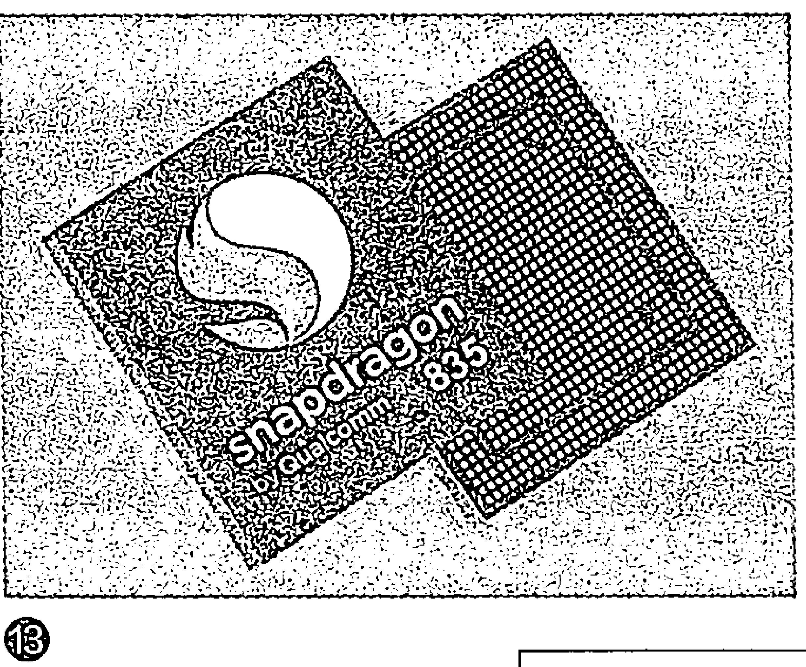

我们可以将其理解为Continuum 2.0

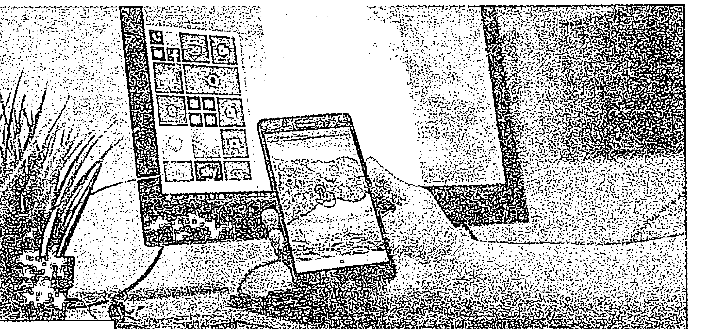

# 细看电脑之心（1）——从CPU-Z谈起

策划《电脑爱好者》编辑部 文/图 隐侠

我们总是习惯地用其处理器来描述电脑的档次，从486、586、奔腾，到现在的Intel i5、i7，这些处理器的名称总是位于电脑广告最显眼的位置，是卖场吆喝最响亮的一声，也是消费者第一眼关注和第一声询问的答案。尽管处理器对电脑来说如此重要，但如果问用户这些所谓的处理器分代和档次到底有何区别，相信绝大部分人只知道它们的性能不同、价格也不同，却并不了解为何它们会拥有不同的性能和价格，更不要说频率、功耗、线程等同样代表着处理器能力指标，以及为此而凝结在这些小小芯片当中的、目前人类最高超的智慧和最精细的生产工艺。

作为如此重要的计算机‘大脑’，虽然很难理解，但处理器的详细情况也是用户们非常关心的，所以CPU-Z这款非常小巧，但能够为我们提供处理器及其周边一些详细规格数据的软件，就成为了很多用户乃至测试人员的最爱。我们不妨就以这款大家最熟悉的处理器规格测试软件中提供的规格和数据，来详细了解一下处理器吧。

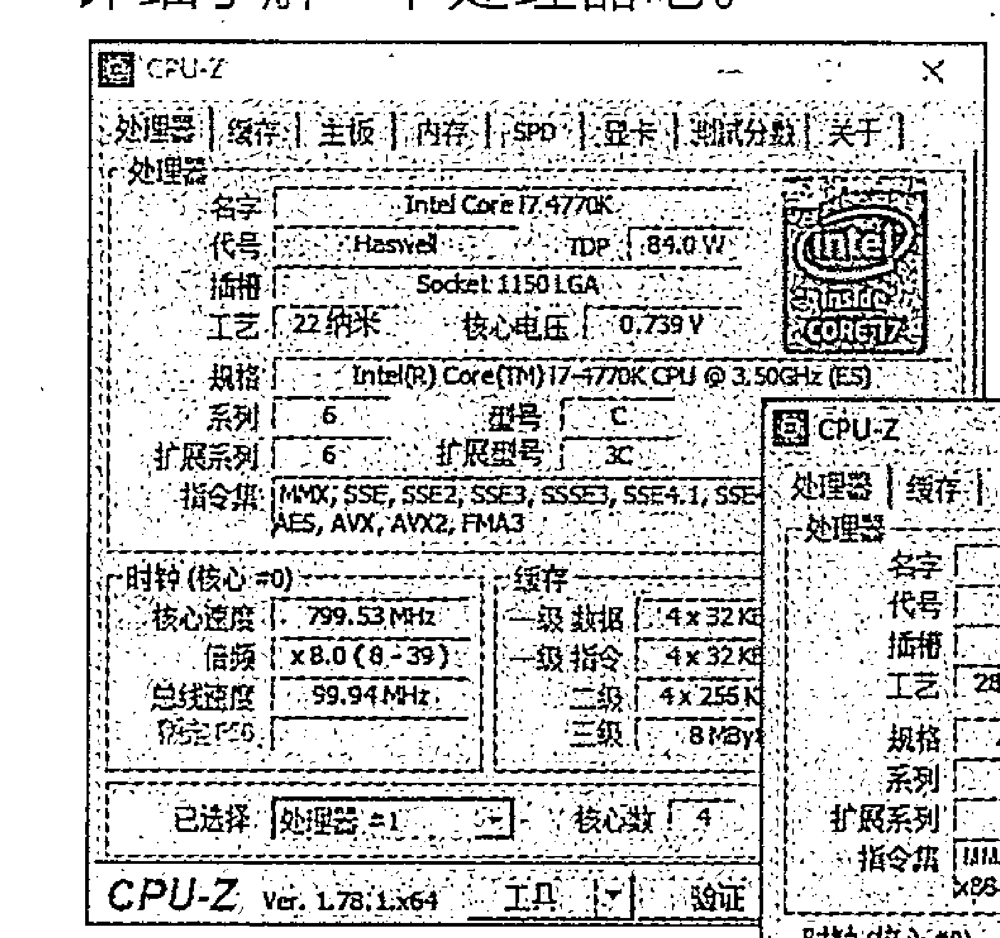

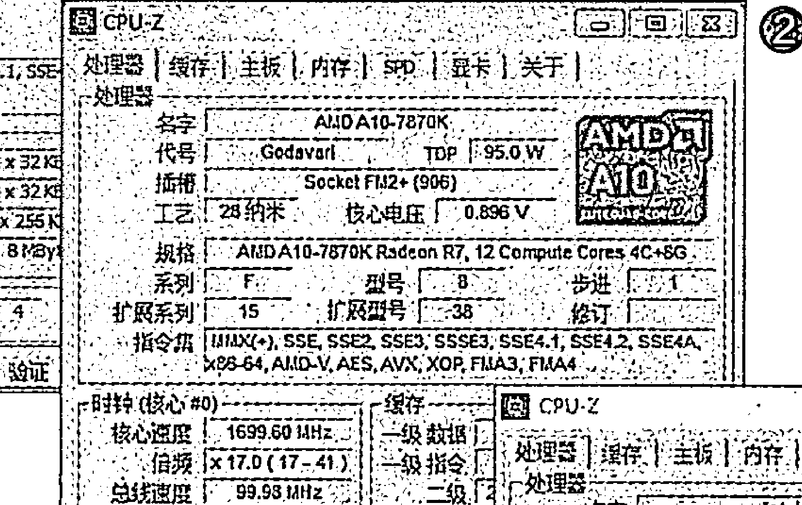

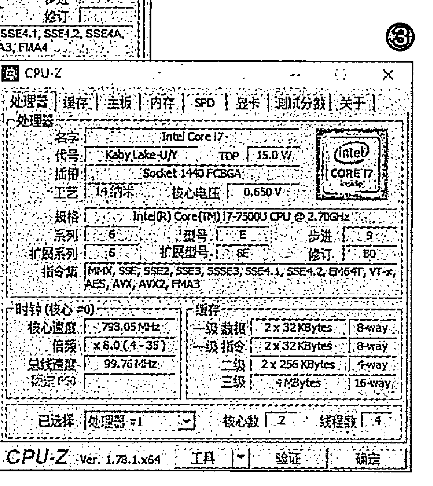

以上的三张图分别是CPU-Z对目前最常见的三种处理器，即英特尔台式处理器、AMD台式处理器以及英特尔笔记本处理器给出的典型规格数据，下面我们就根据它提供的信息，逐条来解释一下吧（图1~图3）。

## 名称

这一栏中的信息其实就是我们最常用的处理器名称，当然前面提到的486、586一类老处理器，现在已经基本绝迹了，我们目前最常见的处理器主要是英特尔的酷睿（Core）、奔腾（Pentium）、赛扬（Celeron）系列和AMD的APU、FX、Athlon（速龙）系列。

## 英特尔

英特尔的PC处理器虽然有多个系列，但核心类似，只是通过内部调整，如频率、缓存、线程等方式，让这些处理器呈现出比较明显的性能差别，适合其定价和市场需求。从名称基本可以看出英特尔处理器的定位以及档次，酷睿处理器主要面向中高端市场，性能和价格档次由低到高分为i3、i5、i7以及衍生的至尊版、至强E系列，它们同样是通过频率、缓存、线程的不同进行区分，其中最便宜的酷睿i3零售价格也要800元左右，i5一般1200元起，i7价格在2200元以上。两款衍生产品中，至强E可以看作是酷睿i7的低频无显卡版，因此价格较低，介于i5与i7之间，而酷睿i7至尊版当然就是增强极限版，价格在3000元以上。

奔腾（图4）处理器的价格在400元~500元，目标主要是一些对性能要求不高的用户，用于办公学习、影音娱乐，甚至应对一些主流网游都完全没有问题。赛扬作为传统的低端入门级处理器，价格可下探至200元，性能当然也更低一些，只能用于办公学习和影音娱乐等最基础的应用。

除了名称外，CPU-Z辨识出的桌面处理器都带有数字编号以精确标示其型号，而移动版处理器的数字编号却显示在“规格”栏中，这可能与移动版处理器经常会根据笔记本电脑厂商的需求进行定制有关。在处理器的数字编号中，第一位数字是表示分代，例如酷睿i5 6XXX就是比酷睿i5 4XXX更新的产品；后三位则是其等级，例如酷睿i5 6600的性能与价格就高于酷睿i5 6500。有些处理器在数字编号之后会带有字母识别符号，如图1中的“K”表示这款处理器是可超频产品，这些数字识别符号在移动版产品中更多见，都会在下面的“规格”栏中有所体现。

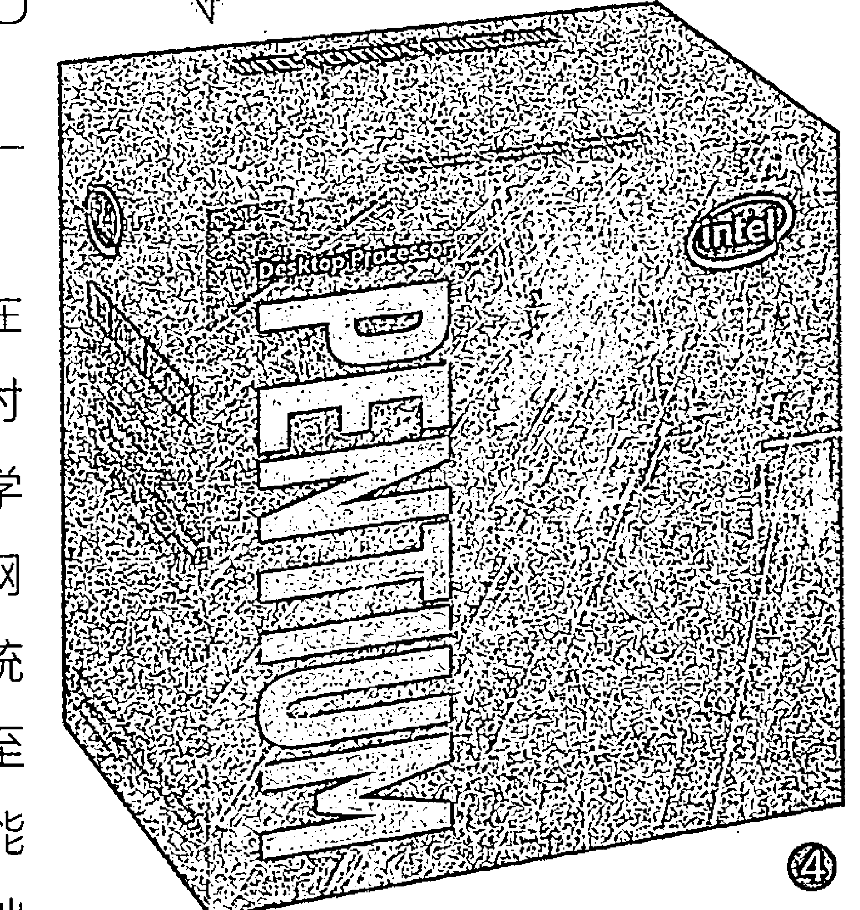

## AMD

AMD的几款处理器核心比较混乱，而且相当个性化。其面向高端的FX处理器和面向低端的Athlon采用类似的核心，同样以不同的频率、缓存来针对不同的市场价位段和用户群体，总体来说，FX处理器的价位在600元以上，而Athlon处理器的价格在600元以下。APU是一种比较特殊的处理器，它的CPU核心能力一般，但内置显示核心比较强大，性能几乎相当于500元甚至更高价位的独立显卡，低端产品完全可以运行主流网游，高端型号甚至可以玩一些高端单机游戏。APU也并非是与FX或Athlon处理器进行市场价位分割的产品，更多的是以用户实际需求分割市场，其价位涵盖了250元到千元级别，无论是低端还是主流用户，都可以享受到APU提供的处理器与较强显示核心的融合体验，特别适合一些追求简洁的PC设计。

AMD处理器的具体型号同样用数字标示，且数字含义甚至是字母识别符号都与英特尔类似，例如图2中型号数字后的“K”同样表示这款处理器可超频（图5），所以这里就不再赘述了。

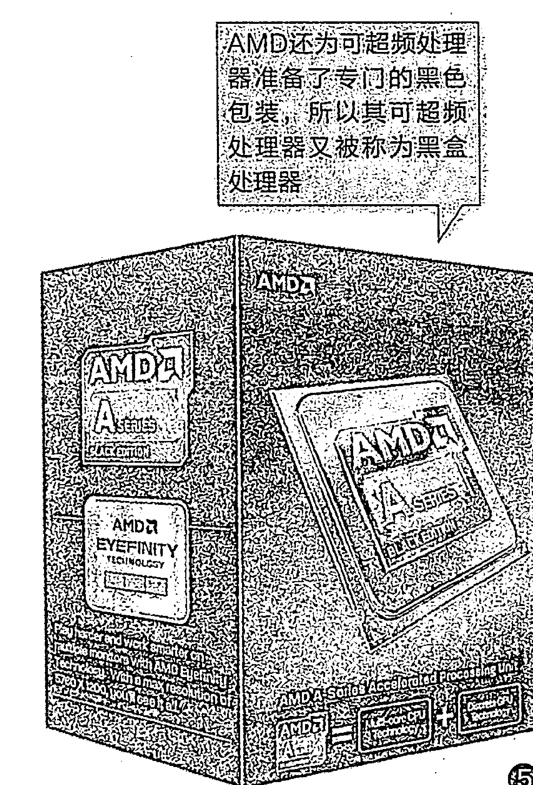

## **代号**

我们前面已经提到，同一代处理器经常会有多款型号采用类似的核心设计，但频率、缓存、线程不同，形成不同价位和市场的产品，要确认这些产品是否基于同一核心，就可以看CPU-Z提供的核心代号。有时处理器还会有另一种开发代号，用于架构等命名，与CPU-Z提供的核心代号并不相同，此时会出现同架构处理器核心代号并不相同的情况。

在核心代号的命名方式上，英特尔和AMD目前的主流产品各有特色，英特尔大量采用地名，例如最近的Skylake和Kaby Lake。AMD使用工程机械如“Piledriver”（打桩机）作为处理器架构的开发代号，而最终产品则采用地名作为代号，例如FX系列处理器的核心代号“Vishera”（维舍拉河）和APU的核心代号“godavari”（哥达瓦里河）等。

## **插槽**

将处理器连接和固定在主板上使用，就是插槽的作用。为了保证信号与能量的传输，处理器和插槽必须带有相应的接触方式，如图1和图2所示，目前英特尔和AMD台式机处理器各自选择了不同的接触方式，即LGA和Socket。

LGA的全称为Land Grid Array（栅格阵列封装），处理器下方以整齐排列的金属圆点作为接触点。LGA插座带有下压式的安装扣具（图6），可以让处理器上的金属圆点和插座上的弹性针脚紧密接触，从而与主板连成一体。英特尔采用LGA接口的各代处理器，在接口设计上略有区别，触点数从最初的775（LGA775），到最新产品的LGA1151，经过了多次变化，进入智能酷睿时代后，虽然处理器的触点数量和排列有差别，但尺寸、封装厚度等变化不大（图7），所以近几代处理器的扣具和风扇兼容能力不错。

Socket本身就是插座的意思，这一类型的处理器接口底部带有针脚，插入底座预留的对应孔内，并从侧面夹紧。AMD台式机处理器中，高端的FX处理器采用的是Socket AM3+接口，而APU和Athlon都采用Socket FM2+接口，均有900个以上的针脚（图8），在使用和安装时一定要小心保护这些非常密集而又比较纤细的针脚。虽然英特尔在台式机处理器中从Socket接口转向了LGA接口，但并不说明LGA接口就比Socket接口更先进，它除了更适合英特尔的处理器架构外，更多的考虑应该和当年的Slot接口一样，还是为了专利保护。从图3可以看到，这款英特尔的移动版处理器采用了FCBGA（Flip Chip Ball Grid Array，倒装芯片网格焊球阵列）接口（图9），也就是直接焊接在主板上的模式，毕竟笔记本电脑并不适合DIY和升级，对处理器拆装能力的需求非常低，但对连接牢固性的要求更高一些。

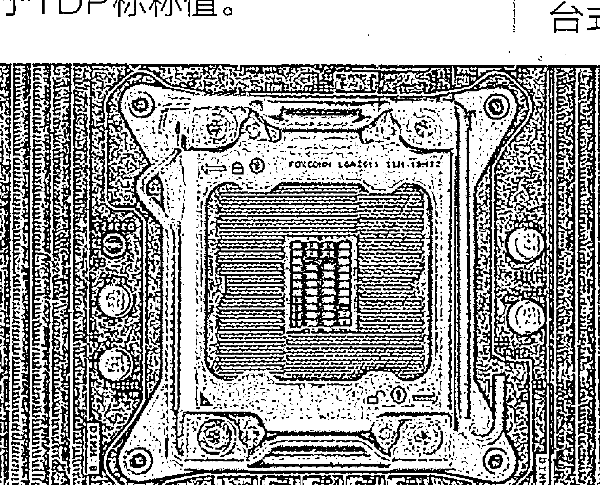

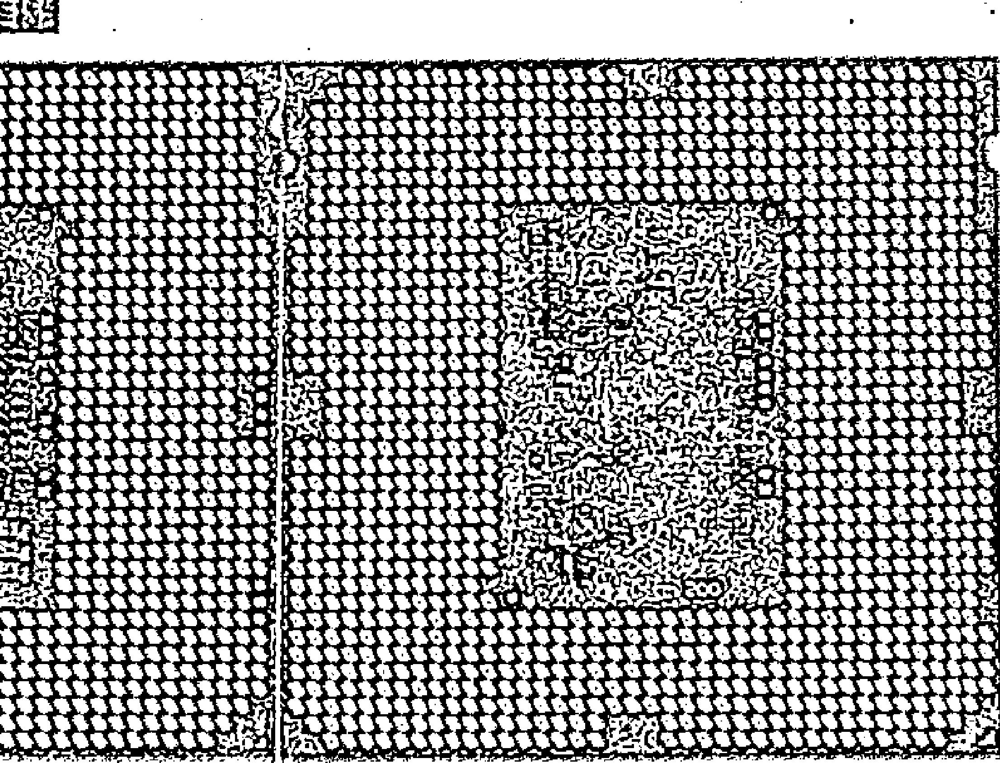

## **TDP**

TDP是热设计功耗（Thermal Design Power）的简称，主要是其发热能力的参考指标，指的是处理器在满负荷时可能会达到的最高发热量，散热器必须保证在处理器达到TDP的时候，能够让处理器的温度保持在安全范围内。当然这也就是说处理器的发热量并非一直和TDP数值相等，特别是在目前处理器性能过剩、处理器功耗管理又很受厂商重视的情况下，处理一般任务的处理器如果无需满负荷工作，就会自动降低电流、电压，甚至关闭不使用的线程、核心等半导体区域。所以在大多数应用和时间之内，处理器的发热量是低于TDP数值的。

另外要注意的是，TDP也不代表处理器的实际功耗，在处理器中，除了最终以热量方式散发出来的能量，还有一部分能量因为推动电子等做功方式而消耗掉了，以此为参考选择散热器是可以的，但要选择电源时，对处理器的供电能力必须高于TDP标称值。

## 工艺

这里的工艺是指的半导体上的刻线能力（图10），因为半导体上的线路制造方式实际上是在硅片上先进行全面覆膜，再通过光敏化学药剂进行光蚀“挖掉”金属覆膜的无用部分，露出硅片制造的，所以制造的精密度一般就是指的光蚀能达的精细度。而且实际制造中只有部分刻线会用到标注工艺的最小宽度，金属线路的宽度以及很多露出硅片的刻线宽度是大于标称值的。其实对于处理器的制造来说，涉及到的各种工艺技术非常多，例如目前比较热的三维晶体管（Tri-Gate）技术，可以让金属线路进行交叉（图11），节约了面积，减少了处理器所需的层数，同时加快了速度。

目前英特尔的制造能力已经达到了14nm，也有部分老式处理器采用的是22nm工艺，并且很可能在2017年内发布10nm工艺制造的处理器。AMD由于已经没有自己的生产厂，需要台积电等半导体厂商代工生产处理器，因此生产工艺受制于人。因为台积电生产工艺的落后，目前主流AMD处理器仍采用28nm生产工艺，也许在2017年内可以在处理器上应用14nm左右的生产工艺。

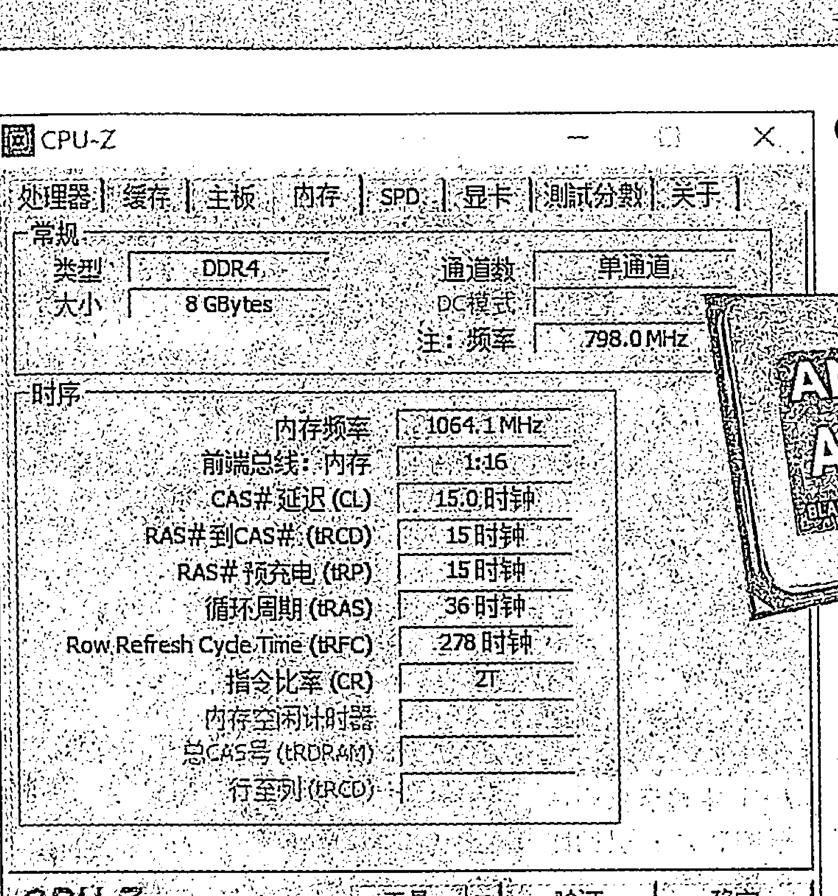

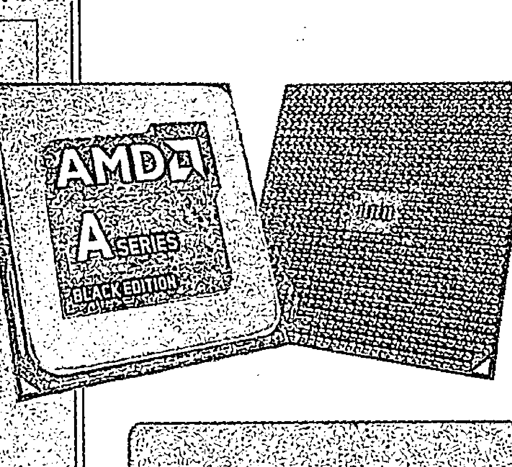

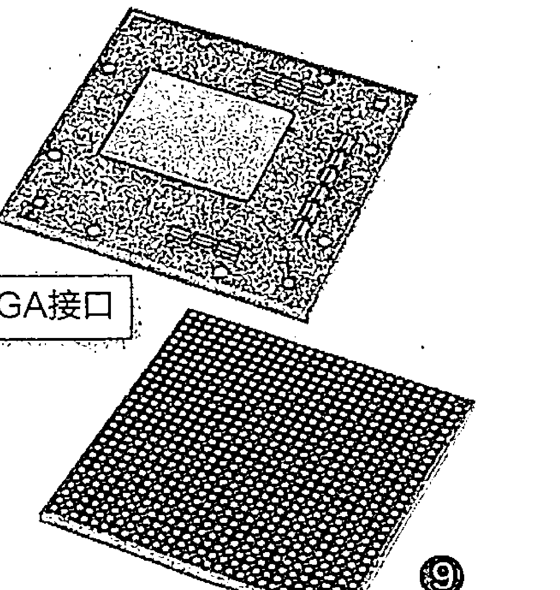

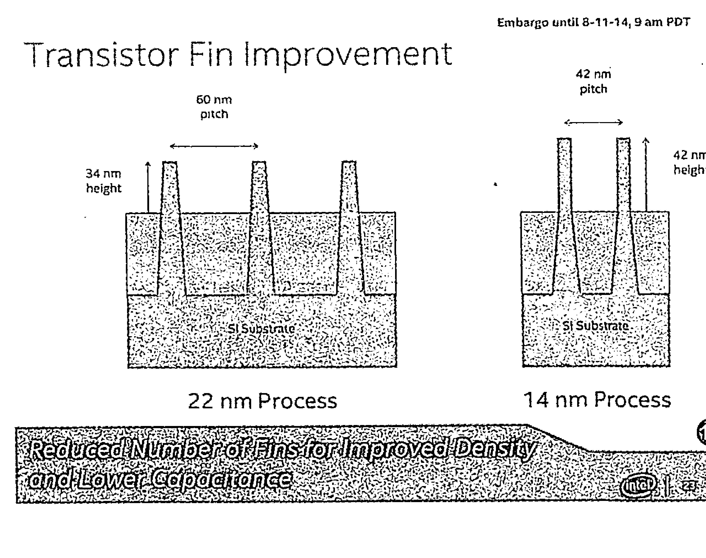

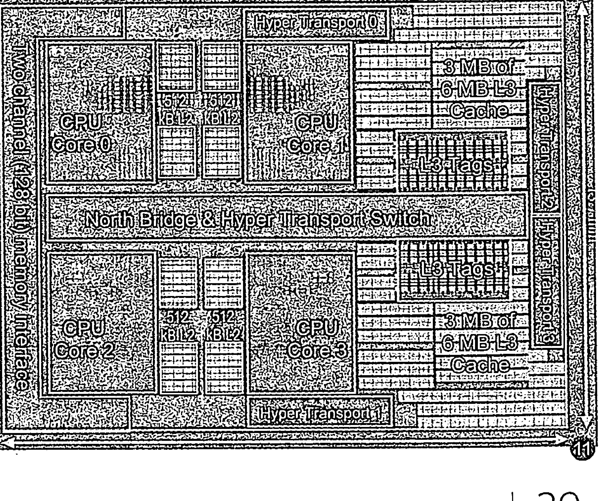

## 核心电压

核心电压当然就是驱动处理器核心运转的电压，随着技术的进步，这一电压不断下降。
需要注意的是，我们提供的几张图片中，核心电压均非实际驱动电压，这和我们前面提到的功率自动调整能力不同，因为在使用CPU-Z测试时并非进行满负荷工作，所以处理器会自动降低电压以降低功耗。

当然不同产品的核心电压也是有明显区别的，例如图3这样的低功耗处理器，其最高核心电压也较低。另外对于图1中的可超频处理器，我们在超频时如果希望其运行更稳定，常常采取提升核心电压的手段。

## 规格

规格可以看作是处理器的具体描述，除了型号之外还标注了频率，可以辨识处理器的实际使用情况，如图3那样的超低电压处理器也将名称标注在这里，大概是因为这种处理器的规格比较复杂，也可能因为厂商定制等原因有频率的差异吧。
也许是因为APU中的显示核心特别重要，占据了一半甚至更多的芯片面积（图12），所以在APU的规格中没有提供频率信息，但比较详细地标注了其内置显示单元的信息。我们可以发现APU规格栏的最后，将其核心数量标注为处理器核心+显示单元核心的方式，这是基于AMD异构计算（让图形处理核心参与通用计算）的想法。

异构计算可以让多核心但计算能力较弱的GPU去进行重复性高而相对简单的计算，而计算能力较强但核心数量较少的CPU核心进行一些复杂计算，大幅加快处理速度（图13）；但至今为止，支持这一计算模式的软件仍然比较少。
我们还可以看到，英特尔处理器在Intel和Core（酷睿）之后都有商标标志，而AMD及其产品并没有相应标志，不知道AMD是未进行相关商标注册还是实在心大，完全不在乎。

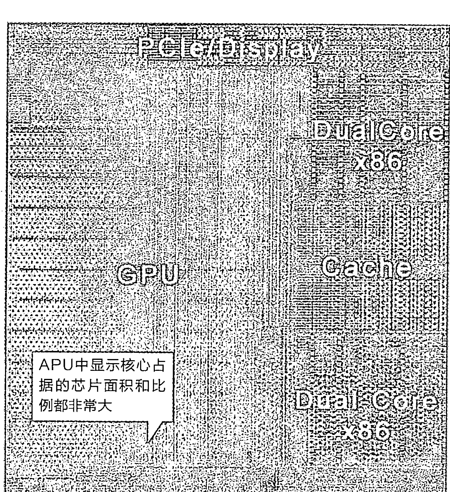

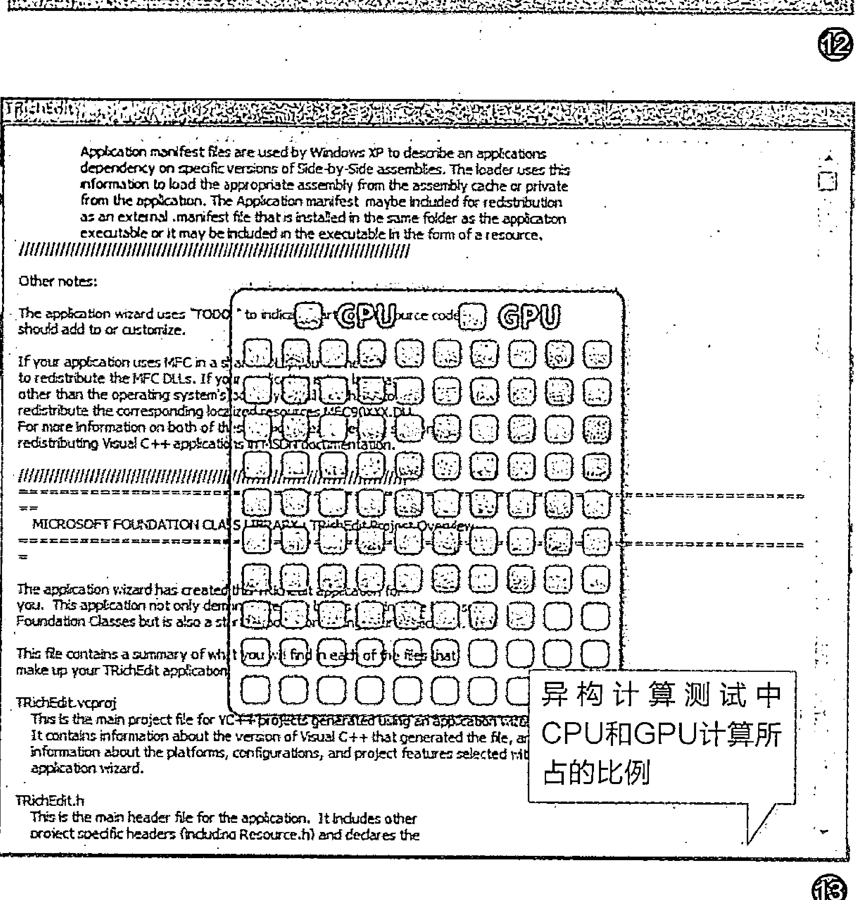

## 系列、型号、步进

这一系列规格与厂商的产品规划和制造有关，和大部分用户没有太大关系。当然如果特别小心的话，可以考虑购买步进数比较大的产品，这说明厂商对产品或制造过程进行修改的次数，一般来讲数字越大，产品自身的设计和制造过程的问题越少。

## 指令集

指令集可以看作是硬件与软件交流的语言，最基础的指令集是RISC (Reduced Instruction Set Computer, 精简指令集计算机)和CISC (Complex Instruction Set Computer, 复杂指令计算机)。RISC重视指令的简单和单纯性，例如采用等长指令，所以指令数也较少，因此处理器结构简单，一些常用功能处理效率很高，但一些复杂功能需要多指令组合完成，效率会有明显下降；CISC则直接使用丰富的指令系统，可以直接完成特定工作，但也造成了语言本身和处理器较为复杂。目前两种指令集及相应处理器有一些互相学习，所以分野已经不是那么明显。

对目前的个人PC处理器来说，通用语言应该是x86指令集，即符合英特尔处理器x86架构的指令集。x86指令集是一种CISC指令集，但在处理器内部已经普遍采用效率更高的RISC指令，处理器在输入输出时会自动进行编译。

我们可以看到，由于PC处理器对基础指令集的支持毋庸置疑，所以CPU-Z中标注的指令集其实是“扩展指令集”，类似于我们除了日常语言之外，在各个学科中学到的专用词汇。例如最早出现的扩展指令集MMX (MultiMedia eXtensions, 多媒体扩展)就是针对当时个人计算机普遍用于多媒体处理而推出的，包括视频、音频等加速能力的专用指令集。要支持这些指令集，就要在处理器内部布置专用的模块进行处理或“翻译”为标准指令。在这些扩展指令集中，最重要的是EM64T (或x86-64)指令集，即让处理器支持64位处理的指令集，它大大扩展了软件的能力、效率以及对内存等硬件的支持能力，已经成为了目前和未来软硬件发展的重要基础之一，而这一指令集来自AMD。

在处理器的发展史上，出现过4位处理器、8位处理器、16位处理器、32位处理器和64位处理器，它们的“位数”究竟表示什么意思呢？这些数字表示一个时钟周期里，这款处理器可以接收和处理的二进制代码数目。二进制代码仅有0和1两种状态，8位处理器有8条线路，每个时钟周期可接受8个电信号(8bit)，因为8位恰好是1个字节(1Byte)，因此之后的处理器架构升级，均以8位为阶梯。随着8位处理器上升至64位处理器，每个时钟周期可接收的字节数也从1个发展到8个，带来的处理器运算能力的倍增。

并不会让用户在实际应用中感受到双倍的速度，但是，它却预示着一个更加灿烂的应用前景。64位处理器的优势不仅在其处理能力方面，而且对于整个系统来说，也有相当大的进步。当数据存放在内存中时，每位地址编号越多表示同时存储的信息量越大。地址数和处理器的位数密切相关，32位的寻址能力仅有4GB，而64位则可以支持到16TB (180亿GB)的内存，不过这需要有相应的64位操作系统支持。另外，64位处理器可以在较低的频率下实现较高的性能，在功耗、制造难度等方面与32位处理器相比有明显的优势。其实在个人计算机准备进入64位时代时，英特尔曾考虑将为服务器市场开发的IA-64 (Intel Architecture 64, 英特尔64位架构)(图14)引入个人消费市场，但它需要应用全新的指令集，而且是一种纯64位架构，与以往的32位x86指令集(RIA-32)和RISC指令集都无法兼容。

# 时钟：核心速度、倍频、总线速度

不兼容，尽管理论上可以运行32位程序，但需要使用“模拟器”方式，运行效率非常低下。而EM64T是x86架构的一种64位内存扩展技术，可以正常运行已有的32位和16位程序，与IA-64处理器有着本质的区别，而且由于之前AMD K8处理器（图15）的成功，已经得到了微软等消费软件厂商的支持。虽然有一些自创的指令，但英特尔的64位扩展指令集EM64T和AMD的x86-64区别其实并不大，只是英特尔不太愿意承认使用了AMD如此重要的指令集而已。至于AMD方面，由于自身的定位关系，所以并不介意支持英特尔的开放式指令集，如SSE、AVX等，这也使得目前两家的处理器在软件兼容上不会出现什么问题。

时钟实际上是指的目前处理器的运行频率，由于现在的处理器都是多核设计，在负载较轻的时候会关闭一些用不到的核心，所以这里特别标注这些数据是基于第一个核心（编号为0）的。从第一个数据中，由于负载较轻，所以即使是最基础的一个核心，其频率也大幅调低至800MHz（图1）~1700MHz（图2），从倍频后的括号中，我们可以看到这款处理器实际支持的倍频数。

处理器的总线频率是来自于频率发生器并进行信号重整，由于频率发生器不一定特别准确，所以常常造成总线频率及核心频率不会特别精确。

# 缓存：一级数据、一级指令、二级、三级

在处理器工作的时候，会有大量数据和指令不断地输入输出，而处理器的速度与周边配件速度有巨大差异，处理器内部各部分之间的速度也不一定相等，所以需要有高速的存储单元对一些数据进行暂时存储。一般来讲，一级缓存主要用于核心内部产生的数据暂时存储，例如我们前面提到的处理器RISC核心和CISC编译器之间，如果出现了速度偏差，那么已经编译完毕等待进入核心进行处理，或者已经处理完毕等待输出的数据、指令，都可以存储在一级缓存内。另外，一些处理过程中出现的数据如果需要多次调用，或者需要等待其他数据一起处理、输出等，也可以存储在一级缓存内。

因为目前的处理器将内存控制器、PCI-E控制器等大量周边控制功能集成在内部，因此变动总线频率不仅对处理器有影响，也明显影响周边配件的稳定性，对于不提供倍频调节功能的锁频处理器，我们不建议通过调节总线频率进行超频。

由于处理器运行中，其总线负责与周边进行通信，为了保证信号传输的稳定性以及与周边配件的兼容性，所以无论高负载还是低负载，处理器的总线频率是不会有变化的。处理器的总线频率是来自于频率发生器并进行信号重整，由于频率发生器不一定特别准确，所以常常造成总线频率及核心频率不会特别精确。

如果希望了解所有核心的运行状况，我们可以点击CPU-Z主页面下部工具按键旁的三角图标，选择“时钟”，即可看到所有核心、内存、主板、显卡目前的运行频率信息（图16）。

| 一级数据缓存 | 大小 | 32 KBytes | x2 | 描述 | 8-way set associative, 64-byte line size |
| 一级指令缓存 | 大小 | 32 KBytes | x2 | 描述 | 8-way set associative, 64-byte line size |
| 二级缓存 | 大小 | 256 KBytes | x2 | 描述 | 4-way set associative, 64-byte line size |
| 三级缓存 | 大小 | 4 MBytes | | 描述 | 16-way set associative, 64-byte line size |

# 环形联通架构

配件取用，尽量减少临时从周边配件中调取数据的情况，可以平衡处理器和周边配件的速度差距。英特尔处理器的二级缓存稍小一些，用来存储更重要的数据，但设置了更大的三级缓存，也可以解决速度差距的问题，同时也用于和内置的核显交换数据（图17）。

由于缓存设计的不同，我们可以看到多种配置方式，例如英特尔处理器为每个核心配置一级、二级缓存，三级缓存由整个处理器共同使用（图18），而AMD则为每个核心配置一级数据缓存，为每个核心群组配置一级指令缓存和二级缓存，且一级指令缓存和一级数据缓存的容量不同。

# 核心、线程数

CPU-Z还为缓存的具体信息专门设置了一个界面，从中可以看到更详细的描述，特别是其最后一列——“多路缓存”的详细情况（图19）。此图为图3中酷睿i7-7500U处理器的缓存具体数据，可以看到其一级缓存采用8路组相联，二级缓存采用4路组相联，三级缓存采用16路组相联，也就是说被分为可以独立存取、清除的8块或4块，每块缓存如果出现问题或者需要清除数据，不会影响到其他缓存块中的数据。另外，其一二三级缓存都采用了64byte的存储单位，即小于这一尺寸的数据也要占用一个存储单位，而大于这一尺寸的数据则要占用多个存储单位。

目前多核心处理器已经成为市场的主流，多核心处理器是在一个处理器上有多个计算核心。早期的多核心处理器是在处理器上安装多个芯片，而目前的多核心处理器则是将多个计算核心直接设计并制造在一个硅片上。CPU-Z提供的线程数包括了虚拟线程，即用一个物理核心同时处理多个任务的能力，可看作是一种虚拟的多核心。目前英特尔在高端处理器中引入了虚拟双倍线程技术，可以用一个物理核心同时处理两个任务，例如图1中拥有4个物理核心的桌面版酷睿i7有8个线程，而图3中拥有2个物理核心的移动版酷睿i7有4个线程。AMD预计会在2017年内引入多线程技术，不过之前的产品只支持多核心，并不支持虚拟线程，例如图2中的APU有4个核心，能同时使用的线程也只有4个，其最高端的FX处理器也要使用8个真正的物理核心，才能获得媲美酷睿i7的8线程处理能力。

# 主板、内存、SPD、显卡测试

CPU-Z还有几个页面，可以查看一些电脑的基本信息，这些信息均与处理器关系非常密切，例如图1中处理器的如下相关界面。

在主板页面中（图20），我们可以了解到主板的制造商、主板型号（模型）、芯片组信息、LPC接口芯片（LPCIO，用于连接一些低速设备）生产商，以及BIOS信息、图形接口信息。

在内存页面中（图21），可以详细了解内存的容量、速度、运行方式等基本信息。

在SPD页面（图22）则可查询每个位置的内存条的具体信息，如厂商、序列号，甚至包括预置的可用频率等信息。

## 显卡

目前的大多数主流处理器都内置了显示核心，APU更是非常重视内置显示单元的配置，并且拥有较强的3D显示性能。这些显卡的具体情况可以从显卡页面（图23）看到，当然如果安装有独立显卡，我们也可以选择，CPU-Z同样能给出其较具体的规格参数（图24）。

# CPU-Z

CPU-Z也提供了简单的性能测试和稳定度测试功能，其中性能测试结果还可以与一些典型处理器的单核、多核性能进行对比（图25）。

# 总结

作为半导体工业最高端产品之一的处理器，相关信息远不止我们上面提到的这些，但对一般消费者来说，CPU-Z提供的信息已经足够作为大家选购、使用、优化的参考。与CPU-Z类似的软件还有一些，它们各有特色，感兴趣的用户也可以选择使用。

# 拆解显卡之心（下）——通过GPU-Z认识显卡

策划：《电脑爱好者》编辑部

文：

GPU（Graphics Processing Unit，图形处理器）是个人电脑中仅次于CPU的重要芯片，其价格与复杂程度也不弱于CPU。当然对于这样昂贵且重要的芯片，得到的用户关注也不弱于CPU，好在我们也有与CPU-Z类似的GPU规格检查工具——GPU-Z，它当然也就成为了很多媒体和消费者了解GPU及显卡信息时常用的软件。不过大家对GPU-Z中繁杂的项目真的了解吗？它究竟反映了GPU及其周边、显卡的哪些信息呢？下面我们就以这款软件的信息为引导，让大家更深入地了解一下GPU吧。

## 显示卡页面

## ◎ Name（名称）

当然这一栏中的规格就是GPU的具体名称了（图1），如果同名GPU有不同的规格，例如NVIDIA GeForce GTX 1060有配置6GB和3GB不同的产品，其频率等规格并不相同，那么也会在这一栏中显示（图2）。

如果希望进一步了解GPU，那么点击旁边的Lookup键，即可直接跳转至TechPowerUp的网页（图3），其中不仅包括了这款GPU、公版显卡的照片、具体信息等，还包括它与其他类似水平GPU的对比，以及一些比较典型的显卡型号及参数。

## GPU

笔者认为这一栏的名称应该改成核心编号，是厂商对显示核心的开发代号或编号。AMD GPU的代号和其CPU一样，一般采用地名，但CPU多为大河名，而GPU则为岛屿/群岛名称，例如目前比较受关注的Radeon RX480的核心代号为“Ellesmere”（图4），即为利斯摩尔岛。

目前最流行的NVIDIA GPU，如图1、图2中所示，一般采用字母加编号的开发代号，第一位“G”表示GPU，第二位则表示GPU世代，例如目前的Pascal核心世代，即为“P”，之前的“Maxwell”核心世代为“M”，“Kepler”核心世代则为“K”，“Fermi”核心世代当然就是“F”。数字编号则是表示这一GPU的定位，一般来讲从低到高是定位从高端到低端的产品，这主要是因为GPU的发布顺序一般是从旗舰到低端，例如图1、图2中的编号。先发布旗舰型号，之后由高到低推出GPU的方式，也许和现在GPU

# NVIDIA GeForce GTX 1070

The GeForce GTX 1070 is a performance graphics card by NVIDIA, launched in June 2016. Built on the 16 nm process, and based on the GP104 graphics processor, in its GP104-200-A1 variant, the card supports DirectX 12.0. The GP104 graphics processor is a large chip with a die area of 314 mm² and 7,200 million transistors. Unlike the fully unlocked GeForce GTX 1080, which uses the same GPU but has all 2560 shaders enabled, NVIDIA has disabled some shading units on the GeForce GTX 1070 to reach the product's target shader count. It features 1920 shading units, 120 texture mapping units and 64 ROPs. NVIDIA has placed 8,192 MB GDDR5 memory on the card, which are connected using a 256-bit memory interface. The GPU is operating at a frequency of 1506 MHz, which can be boosted up to 1683 MHz, memory is running at 2002 MHz. We recommend the NVIDIA GeForce GTX 1070 for gaming with highest details at resolutions up to, and including, 5760x1080. Being a dual-slot card, the NVIDIA GeForce GTX 1070 draws power from 1x 8-pin power connector, with power draw rated at 150 W maximum. Display outputs include: 1x DVI, 1x HDMI, 3x DisplayPort. GeForce GTX 1070 is connected to the rest of the system using a PCIe 3.0 x16 interface. The card measures 267 mm in length, and features a dual-slot cooling solution. Its price at launch was 379 US Dollars.

| Item | Value |
|------|-------|
| GPU Name | GP104 |
| GPU Variant | GP104-200-A1 |
| Architecture | Pascal |
| Process Size | 16 nm |
| Transistors | 7,200 million |
| Die Size | 314 mm² |

| Item | Value |
|------|-------|
| Released | Jun 10th, 2016 |
| Production Status | Active |
| Launch Price | 379 USD |
| Bus Interface | PCIe 3.0 x16 |

- Radeon HD 7970: 69%
- GeForce GTX 980: 74%
- GeForce GTX 980: 74%
- GeForce GTX 1060 6 GB: 75%
- Radeon RX FURY: 75%
- Radeon R9 FURY X: 77%
- Radeon R9 295X2: 84%
- GeForce GTX TITAN X: 88%
- GeForce GTX 1070: 100%
- GeForce GTX 1080: 115%

| Item | Value |
|------|-------|
| Memory Size | 8192 MB |
| Memory Type | GDDR5 |
| Memory Bus | 256 bit |
| Bandwidth | 256.3 GB/s |

| Item | Value |
|------|-------|
| GPU Clock | 1506 MHz |
| Boost Clock | 1683 MHz |
| Memory Clock | 2002 MHz |
| Memory Clock | 8008 MHz effective |

| Item | Value |
|------|-------|
| DirectX | 12.0 |
| OpenGL | 4.5 |
| OpenCL | 1.2 |
| CUDA | 6.1 |
| Shader Model | 5.0 |

| Item | Value |
|------|-------|
| Shading Units | 1920 |
| TMUs | 120 |
| ROPs | 64 |
| SM Count | 15 |
| Pixel Rate | 96.4 GPixel/s |
| Texture Rate | 180.7 GTexel/s |
| Floating-point performance | 5,733 GFLOPS |

| Item | Value |
|------|-------|
| Slot Width | Dual-slot |
| Length | 10.5 inches, 267 mm |
| TDP | 150 W |
| Outputs | 1x DVI, 1x HDMI, 3x DisplayPort |
| Power Connectors | 1x 8-pin |
| Board Number | PG411 SKU 20 |

| Name | GPU Clock | Boost Clock | Memory Clock | Other Changes |
|------|-----------|-------------|--------------|---------------|
| ASL GTX 1070 Founders Edition | 1506 MHz | 1683 MHz | 2002 MHz | |
| ASUS DUAL GTX 1070 | 1552 MHz | 1771 MHz | 2002 MHz | 1x DVI, 2x HDMI, 2x DisplayPort |
| ASUS GTX 1070 Founders Edition | 1506 MHz | 1683 MHz | 2002 MHz | |
| ASUS ROG STRIX GTX 1070 Gaming | 1594 MHz | 1784 MHz | 2002 MHz | 11.73 inches, 1x DVI, 2x HDMI, 2x DisplayPort |
| ASUS ROG STRIX GTX 1070 Gaming OC | 1633 MHz | 1835 MHz | 2002 MHz | 11.73 inches, 1x DVI, 2x HDMI, 2x DisplayPort |
| ASUS TURBO GTX 1070 | 1506 MHz | 1683 MHz | 2002 MHz | 1x DVI, 2x HDMI, 2x DisplayPort |
| BIOSTAR GTX 1070 Founders Edition | 1506 MHz | 1683 MHz | 2002 MHz | |
| Colorful iGame GTX 1070 U-TOP | 1569 MHz | 1759 MHz | 2002 MHz | |
| Colorful iGame GTX 1070 X-TOP | 1607 MHz | 1797 MHz | 2002 MHz | |
| Colorful iGame GTX 1070 X-TOP Advanced Limited | 1657 MHz | 1860 MHz | 2002 MHz | |
| Colorful iGame GTX 1070 X-TOP Snake | 1657 MHz | 1860 MHz | 2002 MHz | |
| ELSA GTX 1070 Founders Edition | 1506 MHz | 1683 MHz | 2002 MHz | |
| ELSA GTX 1070 S.A.C | 1506 MHz | 1683 MHz | 2002 MHz | 10.70 inches |
| ELSA GTX 1070 S.A.C | 1506 MHz | 1683 MHz | 2002 MHz | |
| ELSA GTX 1070 ST | 1506 MHz | 1683 MHz | 2002 MHz | |
| EVGA GTX 1070 Founders Edition | 1506 MHz | 1683 MHz | 2002 MHz | |
| EVGA HY GTX 1070 Gamer Edition | 1519 MHz | 1708 MHz | 2002 MHz | |
| EVGA HY GTX 1070 OC India | 1519 MHz | 1708 MHz | 2002 MHz | |
| EVGA GTX 1070 | 1506 MHz | 1683 MHz | 2002 MHz | |
| EVGA GTX 1070 ACX 3.0 | 1506 MHz | 1683 MHz | 2002 MHz | |
| EVGA GTX 1070 FTW DT ACX 3.0 | 1506 MHz | 1683 MHz | 2002 MHz | |
| EVGA GTX 1070 FTW ACX 3.0 | 1607 MHz | 1797 MHz | 2002 MHz | |
| EVGA GTX 1070 FTW2 iCX | 1594 MHz | 1784 MHz | 2002 MHz | |
| EVGA GTX 1070 Founders Edition | 1506 MHz | 1683 MHz | 2002 MHz | |
| EVGA GTX 1070 Hybrid | 1594 MHz | 1784 MHz | 2002 MHz | |
| EVGA GTX 1070 SC ACX 3.0 | 1594 MHz | 1784 MHz | 2002 MHz | |
| EVGA GTX 1070 SC Black Edition ACX 3.0 | 1594 MHz | 1784 MHz | 2002 MHz | |
| FORSA GTX 1070 FURY OC | 1569 MHz | 1759 MHz | 2002 MHz | |
| FORSA GTX 1070 Founders Edition | 1506 MHz | 1683 MHz | 2002 MHz | |
| FORSA GTX 1070 GAMING | 1556 MHz | 1746 MHz | 2002 MHz | |
| GALAX GTX 1070 EX | 1518 MHz | 1708 MHz | 2002 MHz | 11.65 inches |## Revision
修订版

这里显示的是GPU的修订版本，理论上讲，任何小的修改都会影响到这里的数据。作为非常复杂的半导体芯片，GPU设计存在一些Bug是在所难免的，厂商一般会通过软硬件两方面进行弥补，硬件方面当然就是进行设计的步进，如图1、图2中的芯片修订次数较少，而图4中的修订次数显然较多。当然上市芯片的修订版本数不一定就是A0，所以图4不一定说明这款芯片上市后有过大量的改动，很可能是测试过程中进行了大量修订。

# Transistors
晶体管

此栏是芯片的晶体管数量，其中M是百万（Million）的缩写，我们可以看到图1、图2、图4中的GPU晶体管数量都非常庞大，均达到了数亿个的量级。

# Technology 工艺

当然这里指的就是GPU的制造工艺，在上篇中我们已经提到，目前主要的芯片代工厂工艺长期落后于英特尔，所以NVIDIA和AMD的GPU长期被限制在28nm，直到2016年的新一代GPU才终于使用14/16nm工艺，也因此使芯片的功耗得以大幅降低，同时可以获得更大的集成度。

# Die Size 核心面积

核心面积是硅片的实际面积（图7），晶体管数量越多当然硅片核心面积就越大，而制造工艺越精细，则硅片面积就越小，这一点在上篇中已经提及。尽管最外层的芯片封装和硅片核心面积不一致，甚至不一定反映硅片的实际大小，例如AMD和英特尔的各代CPU，从外形上看，金属封盖的大小就很类似。好在近期的GPU并没有在封装上安装顶盖，我们可以直接看到最紧密的封装（图8），它与硅片结合紧密，基本可以反映出硅片的实际尺寸。例如比较NVIDIA GeForce GTX 980/1080的芯片，就可以看出采用更精细制造工艺的GTX 1080面积更小（图9）。

# BIOS Version BIOS版本

此栏应该是显卡的BIOS版本，从图1、图2、图4可以看出，与主板的BIOS版本不同，显卡版本号与GPU世代有关，但很难直接看出其推出日期等信息。

# Release Date 推出日期

尽管英文写法相同，但从我们的测试看，这一栏中的数据应该不是芯片出厂日期，而是这一GPU型号的正式发布或上市日期。

# Device ID 设备识别码

此栏显示的是显卡的设备识别码，很多软件其实就是通过这一代码来识别硬件设备的，它对普通消费者来说意义不大，甚至可以通过BIOS进行欺骗。

# Subvendor
次级供货商

所谓的次级供货商就是提供显卡的厂商，与提供GPU的厂商有一定区别，不过在早期的公版旗舰卡上，我们可能会直接看到NVIDIA或AMD的“大名”，如图1显示的那样。另外一些大型集团之下的子品牌会同时显示，例如图2中的Zotec（索泰）就是PC Partner（柏能）旗下的品牌。

# ROPs/TMUs
光栅化处理单元/纹理单元

此栏中的数字分别是GPU中ROP和TMU的数目，ROPs的全称为Raster Operations Units，中文即光栅化处理单元；TMUs的全称是Texture Mapping Units，即纹理单元。这两个单元均位于GPU的核心集群中（图10），可将GPU处理的数据转换为用于显示的图像，光栅化处理单元将计算的顶点数据等转换为符合分辨率的点，同时删除不用显示的部分，这样才能进行输出显示。不过此时的输出图像只是一个框架，纹理单元的责任就是将纹理填充到架构中，形成可在平面显示的3D造型的外壳或皮肤。

虽然理论上讲ROPs/TMUs的数目越多越好，但由于GPU架构的不同，各个厂商和各个世代的GPU设置有一定区别，会根据核心能力和最普遍的需求而不同，并不存在必然的关系。

# Bus Interface
总线界面

此栏说明的是显卡接口的标准和实际插槽的标准，前一部分表示显卡接口标准，近期显卡基本都支持PCI-E 3.0标准，采用16通道接口。作为现在最流行的PC总线，PCI-E的最新规范为版本3.0，传输率达到8GHz/8GT/s，单通道的数据传输速度接近1GB/s，我们这里提到的显卡使用16通道接口，说明其外部传输速度达到了16GB/s。

当然绝大多数PC显卡也可以安装到其他标准的PCI-E ×16插槽上，甚至只要电气结构相同，PCI-E ×8插槽也可正常使用，例如图1中的显卡就插在一个PCI-E 1.1标准的×16插槽上（@×16 1.1），而很多支持双显卡系统的主板（图11）也是采用了一个PCI-E ×16插槽和PCI-E ×8插槽，或者在使用单显卡时在单插槽中使用16通道，插上双显卡后自动为两个插槽各分配8个PCI-E通道。

在这一栏后的“？”是一个3D测试功能（图12、图13），因为很多显卡有自动节能功能，在空闲时不会全速运行，因此检测出来的PCI-E链接速度可能较低，通过一个小的3D测试使显卡进入全速工作模式，以此来测得真实的PCI-E速度。

# DirectX Support 对DirectX支持

DirectX的全称为Direct eXtension，也有一些更简化的称呼是DX，它是由微软公司创建的多媒体编程接口，被广泛使用于Microsoft Windows和XBOX系列平台上的游戏开发。其最新版本为DirectX 12。

对于显卡来说，对DirectX版本的支持能力也是划代的一个重要依据，不过由于最近几代GPU的架构类似，所以很多针对DirectX 11的GPU也可以支持DirectX 12，不过效率一般。在针对性的设计上，各家的表现也不一样，例如最新一代GPU中，NVIDIA更偏向于针对传统应用的效率，而AMD则偏向于对DirectX 12的优化，所以在同时支持DirectX 11/12的游戏中，N卡在DirectX 11模式下帧速更高，而A卡在DirectX 12模式下帧速更高。

# Shader 着色器

虽然名字叫着色器，但实际上这一栏中是目前的GPU所含流处理器核心数量，这些流处理器已经远不是最初的GPU着色器，而是具有一定的通用数据处理能力。我们在上一篇中提到的异构计算，就是利用了目前GPU的这种架构。

因为流处理器是GPU的主要运算单元，所以在同架构产品中，其数量的多寡也就意味着性能的高低，如果不是架构差别太大，临近几代同厂商GPU的性能也可以这样衡量。当然由于流处理器的结构不同，AMD、NVIDIA和英特尔之间是不能通过这一数量来衡量性能高低的，例如图1中的NVIDIA GeForce GTX 1070流处理器数量比图4中的AMD Radeon RX480还要少一些，但前者的性能显然全面超越后者，而英特尔核心显卡的类似单元为EU（Execution Unit，执行单元），单位性能要比AMD和NVIDIA的流处理器强得多，有人估算，以数据吞吐能力等计算，一个EU可以相当于十多个甚至更多独显GPU中的流处理器，所以一般产品只配置10个~24个EU单元。

# Pixel Fillrate/ Texture Fillrate 像素填充率/纹理填充率

和Shader这一指标一样，所谓的Pixel Fillrate/ Texture Fillrate也保持了很早以前GPU中还分为像素着色器（Pixel Shader）、纹理着色器（Texture Shader）时称呼，但在目前，它实际指的是能够输出到屏幕的像素/纹理数量。目前这一指标已经与所谓的Shader无关了，只考虑ROPs/TMUs（光栅化处理单元/纹理单元）和运行频率，显示的数据其实分别为光栅化处理单元和纹理单元与运行频率的乘积。

# Memory Type
显存类型

显存虽然与内存颗粒类似，但采用不同的运行模式，等效频率、带宽等远高于PC内存，且在名称方面并不是严格对应的，例如昙花一现的GDDR4和目前的主流GDDR5技术都更接近DDR3。在显存类型后标注的是显存颗粒的厂商，从图1、图2、图4显然可以看出，在GDDR5颗粒（图14）领域，三星显然是个中翘楚，这三款典型显卡的GDDR5颗粒都由三星提供。

# Bus Width
总线位宽

这里的数据指的是显卡上显存的位宽，这一数据表示显存与GPU之间交换数据时，可以一次性交换的数据量。在同代GPU中，这一指标同样反映着GPU的档次，越高端的GPU显存位宽越高，配合显存的高运行频率，可以与显存进行高速数据交换，配合GPU的高速运行。

# Bandwidth
带宽

# Memory Size
显存容量

与PC内存类似，显存的作用就是在GPU高速运行和数据处理时作为数据暂存的空间。当然强大的GPU也就需要大容量的显存进行配合，因为高分辨率或特别复杂的图形数据也是非常占空间的。从目前的游戏实际需求来看，4K分辨率时，游戏需要的显存已经达到3.5GB以上（图15），因此中高端显卡至少需要4GB的显存才能满足要求，考虑到未来的需求，最好配置6GB甚至更高容量的显存。

所谓的显存带宽就是理论上每秒钟GPU和显存交换的数据量，这一数据就是总线位宽和显存有效速度的乘积。注意显存位宽采用了Bit（位）作为单位，而带宽采用Byte（字节），所以其数值还需要进行换算，即1Byte=8Bit。

# Driver Version
驱动程序版本

在这一栏中除了驱动程序的版本，也显示了用户目前所使用的操作系统版本。当然在目前，针对的操作系统版本也确实是显卡驱动的一个重要参数，可以说确实属于驱动程序版本的一部分。

# GPU Clock/ Memory/ Boost
GPU/显存/Boost时钟

GPU Clock和Memory是GPU和显存在目前设置下的默认频率而不是真正的实时运行速度，如果进行了超频，或在某些厂商的驱动程序中选择了不同频率的场景模式（图16），都会引起这三栏中数据的变化。Boost频率是GPU在安全温度下自行超频的频率，可以应付一些突发的高端图形需求，但无法长时间持续。

# Default Clock/ Memory/ Boost
默认GPU/显存/Boost频率时钟

这一行中的3个数据是显卡的默认运行频率，与显卡本身的设置有关，并不一定是GPU厂商的标准设置。

# AMD CrossFire/NVIDIA SLI
AMD/NVIDIA双卡互联

这一栏中显示的是显卡是否采用了双卡互联模式，并非是显卡是否能支持这一模式。

# Computing
处理能力

GPU-Z提供了4种GPU可以参与的非图形计算功能，在支持的功能前方框内带有“√”，即表示支持这一功能，其中“OpenCL”全称为Open Computing Language(开放运算语言)，就是我们前面提到多次的异构计算功能。“CUDA”全称为Compute Unified Device Architecture(统一计算设备架构)，是NVIDIA推出的通用并行计算架构，包括软件和相应的硬件架构，让GPU能够参与解决复杂的计算而不是只能处理图形。使用C++和FORTRAN语言都能编写CUDA架构程序，相应程序在支持CUDA架构的NVIDIA GPU上可以获得很高的运行效率和性能。“PhysX”的读音和“Physics(物理)”一样，可以看做是后者的变体写法，它是AGEIA公司开发的物理运算引擎，可以让3D场景中的物体运动、碰撞效果更自然。NVIDIA收购AGEIA公司后，PhysX引擎也就成为NVIDIA GPU支持的物理引擎。从图4的测试结果可以看到，AMD目前并不支持这一引擎，其GPU支持的是Havok物理引擎，不过这一能力并未被归入GPU-Z的检测中。从名称就可以看出，DirectCompute是包含在DirectX中的功能，它也是一种用于GPU通用计算的应用程序接口。在图1、图2、图4中我们看到的DirectCompute 5.0，是集成在DirectX 11内的版本。

# 显卡选择栏

如果在电脑中存在多个显卡(在目前的电脑中非常常见)，那么点击GPU-Z最下方的显卡栏，就会出现一个下拉菜单。GPU-Z的默认显卡一般是独立显卡，我们可以通过这一功能选择处理器内置显示单元。

# Sensors(传感器)页面

在这一页面中，我们可以看到显卡、GPU等部分集成的多个传感器的实时数据(图17)，我们可以选择希望看到的传感器数据和刷新速度，也可以选择希望看到的数据类型(图18)。另外，我们如果点击页面下部Log to file前的选择框，就会生成一个GPU-Z Sensor Log.txt的文件，其存储目录和文件名均可选。

# 总结

通过GPU-Z，我们可以比较全面地了解显卡的信息，为选购、比较显卡提供参考。但需要注意的是，GPU-Z取得的很多信息是来自显卡BIOS以及识别BIOS信息后从信息库获得的标准信息，所以如果显卡BIOS被刷入其他信息的话，就会出现显卡信息错误的情况。如果希望了解显卡的准确信息，还需要使用其他软件，从多个方面对显卡进行考察。

## 进化从‘视界’开始

## 移动设备屏幕的变迁之旅

策划《电脑爱好者》编辑部

很多人只在意移动设备与性能相关的硬件变化（如CPU/内存的升级），却忽略了与屏幕相关的改变。实际上，历年来影响移动设备体验的最大贡献者往往就是屏幕。所以，本期特别话题就让我们从‘视界’入手，看看移动设备屏幕的变迁之旅。

扫一扫，更多精彩内容立现！

## 浅析那些让你用着更有‘面子’的手机

智能手机的军备竞赛从未停止，很快我们就能看到武装8GB内存的新机。但是，对绝大多数普通用户而言，更强的性能其实意义不大，手机的设计和颜值才是决定消费与否的重点所在。而从屏幕开始改变，则是智能手机提升颜值的主要手段。

## 屏幕从小到大

在智能手机时代，随着影音类APP和手游的兴起，让用户对手机屏幕所能呈现的‘视界’要求越来越高，首先就是屏幕尺寸。

在苹果iPhone还在固守3.5英寸‘黄金尺寸’时，三星就通过Galaxy Note系列打破了当时手机和平板的界限（图1）。随着更多手机品牌加入到‘平板手机’的浪潮中，小而精、单手操作已经不再是手机领域的主旋律，而‘小屏手机’这个概念也从3.5英寸逐步过渡到了4英寸、4.5英寸和5英寸。如今，5.2英寸以下都被称为‘小屏’，5.5英寸属于‘适中’，5.7英寸和6英寸才能算是‘大屏’。至于‘平板手机’，已经变成7英寸或更大尺寸手机的代名词（图2）。

单纯地提升屏幕尺寸，势必导致手机机身变宽而影响持握感。如何才能在增大屏幕、提升颜值的同时改进手感？在这个需求理念的影响下，手机屏幕也从面积的差异，转向了形态上的革新。

## 显示比例的变化

除了尺寸以外，早期影响屏幕大小和持握手感的参数还表现在显示比例上。同样大小的屏幕，显示比例的差异将直接影响到手机的长宽比。

在iPhone 5以前，苹果手机一直保持着3:2的显示比例(480×320像素或940×640像素)，从iPhone 5开始苹果则改用了16:9显示比例的屏幕(1136×640像素、1334×750像素或1920×1080像素) (图3)。

首款Android手机(HTC G1)的屏幕设计借鉴了iPhone 1，采用了3:2 (480×320像素)。随后变成了16:10 (800×480像素或1280×800像素)，最终锁定在时下主流的16:9 (1280×720像素、1920×1080像素或2560×1440像素)。

就手机屏幕而言，同尺寸的手机，屏幕比例越大屏幕越宽(图4)，可以横向展示的内容更多，尤其是在阅读网页、文字的时候非常有利。在手机屏幕尺寸小于4.5英寸时，用略宽的屏幕换来更大的视野很划算。但是，当手机屏幕突破5英寸大关后，大比例手机的劣势就显露无疑了。

> **小提示**
在手机刚刚进入720P时，市场中还出现了很多采用854×480像素(16:9)的手机。此外，魅族早期的产品在Android手机中属于比较“奇葩”的代表，曾一度坚持3:2和15:9的小众比例设计。

以三星Galaxy Note为例，这款5.3英寸(1280×800像素)手机的机身宽度为82.95mm，持握时会有种非常“撑手”的感觉。随后，三星Galaxy Note 2虽然改用了5.5英寸(1280×720像素)屏幕，但它的机身宽度却只有80.5mm，反而握起来更舒适了。这就是16:9屏幕能一统手机江湖的原因：可以为手机换来相对更细的机身(图5)。

## 向边框与黑边宣战

在16:9屏幕普及的今天，为何同尺寸手机的持握感还会有所变化呢？除了屏幕玻璃和机身的曲线弧度以外，边框宽度和屏幕黑边，就成为了手机厂商的下一个攻略重点。

5.5英寸的iPhone 7 Plus体积为158.2mm×77.9mm×7.3mm，6英寸的华为Mate 9为156.9mm×78.9mm×7.9mm，相差无几（图6）。究其原因，就是因为Mate 9采用了更窄的屏幕边框设计，从而将机身长宽压缩到了5.5英寸手机的大小。在金属材质中框（或全金属一体化机身）全面普及的今天，压缩边框宽度并不影响手机强度，所以通过这种方式帮手机瘦身也成为了最佳解决方案。

由于手机屏幕和表层玻璃之间存在落差，LCD屏幕的边缘很容易出现漏光现象。同时，手机屏幕（LCD）通过给液晶颗粒通电实现内容显示，它需要有支持通电和定位辅助的“线”，而这些“线”都需要在LCD外汇总，并被收纳到LCD的边缘。手机屏幕之所以会存在黑边，就是用来遮住漏光，以及用于收纳LCD边缘的线（图7）。在当前的显示技术下，屏幕黑边很难彻底消失，只能通过一些手段将它们尽可能缩窄（图8）。

# 屏幕从平到弯

如何缓解更大屏幕带来的持握压力？手机厂商最早的解决方案是，让屏幕从平变弯。这就好像一张纸，平整状态下我们只能“拖着它”，如果将其卷曲，就能一手掌握了。

最早让屏幕变弯的智能手机代表包括Galaxy Nexus和Nexus S，它们屏幕的上下两端略微向内弯曲，只是角度很小，而目的也只是更好地贴合用户的侧脸和麦克风听筒而已（图9）。需要注意的是，这些手机内部的屏幕依旧是平面，只是表面采用了波状的玻璃，严格来说属于“伪弯屏”。

真正让屏幕变弯的手机，则要数三星Galaxy Round和LG G Flex。这两款手机的共性是都采用了OLED柔性屏幕（Flexible Display）技术，不同之处则在于弯曲的方向。其中，Galaxy Round采用了机身左右两侧屏幕向内弯曲的设计（图10），所以有效降低了机身的宽度，让这款5.7英寸的手机仍能用一个手紧抓，符合人体工程学。

而LG G Flex则采用了机身上下两侧屏幕向内弯曲的设计（图11），减小了机身的长度，持握感也较为出色。和Galaxy Round不同的是，LG G Flex还采用了柔性的电池以及机身材料，我们甚至可以将它压直，然后它的屏幕还能慢慢还原到原来的弯曲状态，真正诠释了“柔性”的定义。

可惜，三星Galaxy Round只在韩国发售，而LG G Flex在经历2代升级后也退出了市场，这种变弯的手机最终还是退出了历史潮流。

# 从2D到2.5D

OLED柔性屏幕虽好，但却存在产能低、成本高的问题，如何改进更主流的智能手机在颜值和手感上的表现呢？诺基亚在2011年推出的N9身上，为我们带来了一种取巧的解决方案。

当年诺基亚为N9引入了一项名为“弧面浮动高透触摸屏”的技术，而它也就是我们今天常说的“2.5D屏幕”（图12）。

严格来说，这种边缘带弧度的2.5D并非LCD显示层，只是覆盖其上的表层玻璃而已：通过数控光机对普通纯平玻璃的边缘进行打磨做成弧形效果，但屏幕内在的显示层仍是纯平的。

2.5D玻璃起初成本略高，只是中高端手机的专利。但自从被iPhone 6引入后（图13），这种技术就慢慢普及，至今哪怕是几百元的Android手机也能用上它。而2.5D玻璃的优势有很多，比如有效缩短机身中框高度让手机屏幕向外突出，有种“水满将溢”的视觉效果（提升颜值）；手指划过屏幕边缘时没有割裂感，手感更好。

如果非要给2.5D玻璃找个缺点，那就是提升了贴膜的难度（图14）。特别是钢化膜，为2.5D手机定制的钢化膜都要比屏幕面积小一圈，贴上后虽然起到了更好的保护效果，但当手指移至贴膜边缘时会让割裂感回归，2.5D玻璃的高手感特色等于残废。

# 柔性曲面渐称王

有了Galaxy Round和LG G Flex的铺垫，OLED柔性屏幕也逐渐迎来了第二春，而三星于2014年推出的Galaxy Note Edge，则真正将智能手机推向了曲屏时代。Galaxy Note Edge屏幕右侧向后弯曲，使屏幕形成了一个很大的角度，“曲屏”概念便是由此而来（图15）。同时，三星还针对这个曲屏对系统进行了定制匹配，可以直接在这个条形的侧屏内添加启动APP的快捷图标、显示通知或直尺等内容。

随后，三星Galaxy S系列也引入了曲屏概念，而且还采用了双曲屏的设计。同时，针对侧屏的通知和快捷功能也变得更为成熟（图16）。

双曲屏手机可以有效缩减手机宽度，对颜值和手感的增益效果可谓巨大。所以，包括vivo、小米和华为等国产品牌也都从三星或LG手里拿到了OLED柔性屏幕资源，逐渐掀起了一阵国产双曲屏手机的风潮。

需要注意的是，都是双曲屏手机，但它们在体验上还是存在较大的差异。首先就是曲屏两侧弯曲的幅度大小（图17），再有就是手机厂商有没有能力针对侧屏开发直接显示通知、运行定制APP的能力。如小米Note 2的曲面幅度就要比华为Mate 9 Pro略小，它通过定制的曲屏主题模拟了Galaxy S Edge系列的侧屏功能；华为Mate 9 Pro虽然曲面幅度略大，但却没有针对侧屏开发特殊的功能；vivo Xplay6的侧屏弧度基本和三星S7 Edge相同，并支持侧屏功能（图18）。

总之，手机曲屏幅度越大，越能起到缩小体积、提升握感的作用，但同时需要在系统层面进行更多避免误操作的优化。而能将曲屏幅度做多大，能否引入侧屏功能，就要看手机厂商的研发实力，以及OLED柔性屏的版本了。

# 扩展阅读：OLED和柔性屏幕终将普及

如今采用曲屏设计的手机都属于高端产品，原因就是受限于柔性OLED的产能和成本。好消息是，除了三星和LG以外，国内的京东方、和辉光电、华星光电、国显光电、天马、信利、友达等企业都在积极布局OLED生产线，其中京东方的第二条6代柔性OLED生产线已经投产，在2017年看到国产柔性OLED屏幕已经不再是梦想，OLED在手机领域取代LCD已成定局（图19）。

需要注意的是，OLED屏幕红、绿、蓝三原色次像素寿命并不是一样长，所以只能通过更换次像素排列的方式加以弥补，于是就有了由RGB排列变更为Pentile排列。为了提升分辨率，降低像素边缘的锯齿感，于是就有了红、绿、蓝三原色像素的形状变化，比如红色和蓝色次像素是菱形形状，绿色次像素则是椭圆形的。对OLED屏幕而言，分辨率越高，越能改善显示效果。

# 换个角度再出发

当OLED柔性屏大范围应用之后，也会带来一个难以避免的尴尬问题：市面上所有双曲屏手机长得都太像了！所以，想获得一种独一无二的高颜值设计，光靠换块屏幕还是不够的。于是，围绕着和屏幕相关的改良设计，也就成为了众多手机厂商创新的方向。

# 努比亚Z9/Z11和索尼Xperia XA

努比亚的解决方案是“无边框”概念。需要注意的是，Z9/Z11并非真正的无边框哦，它们只是用了一项名为aRC（arc Refractive Conduction）的技术，利用光线折射的方法在视觉上隐藏了屏幕本身存在的黑边区域（图20）。换句话说，Z9/Z11应该属于“无黑边”，机身两侧还是存在金属中框的凸起结构。此外，索尼旗下的Xperia XA Ultra也采用了类似的设计（图21），硕大的屏幕和超窄微边框，点亮后在浅色背景下黑边也可以达到无视。

# 小米MIX

小米MIX在设计上参考了夏普Crystal的“三面无边框”设计思路，只是将下边框缩窄，利用“悬臂压电陶瓷导声”的技术解决了屏幕顶部没有空间安置听筒单元的问题（图22）。由于小米MIX的屏占比高达91.3%，所以它在采用了6.4英寸超大屏幕的基础上实际体积却仅和不少5.5英寸的手机相当。

# 荣耀Magic

荣耀Magic采用了5.09英寸的AMOLED柔性屏，由于它前后都采用了3D材质玻璃，而且前后双面玻璃的四边都呈弯曲效果（图23），所以这款产品又被称为“八曲面设计”。实际上，荣耀Magic的屏幕自身依旧是双曲面，只是表面前后玻璃加起来有八个曲面而已，从而带来了更为惊艳的视觉效果。

# 联想ZUK Edge

ZUK Edge的特色是诠释了什么叫将传统设计挖掘到极致就是成功的理念。这款产品在结构上和其他智能手机没有分别，只是将上下边框压缩到了极致，实现了高达86.4%的屏占比，142.9mm×74.5mm×7.68mm的三围尺寸和很多5英寸手机差不多大小（图24）。要知道ZUK Edge可是一款5.5英寸的手机，大屏幕小机身更适合喜欢大视野又青睐单手操作的用户。

> **扩展阅读：全屏幕手机**
小米5S和联想ZUK Edge都采用了超声波指纹识别技术，理论上该技术可以直接隐藏在正面玻璃之下，无需对玻璃开孔就能实现指纹的识别。只是，为了便于用户手指定位，小米5S在指纹识别模块上做了一个Home形状的凹槽，而ZUK Edge则是“画”上了一个Home键的边框。随着声波等隐藏式指纹识别技术的成熟，“整个正面都是手机屏幕”的手机已不再是梦想（图25）。如果你想了解隐藏式指纹识别技术的原理，请参考本刊2017年2期《手指里的黑科技：浅析手机指纹识别技术》的相关内容。

# 笔记本屏幕的“进化论”

和智能手机屏幕的不断革新相比，笔记本屏幕的变化就没有那么激烈了。但是，正所谓“润物细无声”，近年来笔记本通过对屏幕的不断改良，依旧在不知不觉间提升了我们的使用体验和效率。

# 从普屏到宽屏

早期的笔记本就是一个移动办公平台，因此它在很长一段时间都保持着和桌面显示器一样的4:3显示比例（图1），也就是我们熟悉的1024×768像素分辨率。随着高清视频的兴起，4:3的“普屏”会存在大大的黑边，屏幕利用率很低。于是，“宽屏”的概念渐渐在笔记本领域普及（图2）。

和智能手机一样，笔记本在向宽屏的进化中也经历了几个阶段：先是16:10显示比例（1280×800像素、1680×1050像素或1920×1200像素）一统天下，随后16:9显示比例（1366×768像素、1440×900像素或1920×1080像素）顺势崛起。之所以16:9笑到了最后，一方面是这个比例在观看高清视频时可以将屏幕的利用率用到最大而被誉为黄金比例，再有就是该比例LCD的切割成本最低，最后就是16:9屏幕的宽度要比16:10屏幕小（图3），更符合笔记本当前的瘦身趋势。

早期笔记本屏幕都是清一色的12.1英寸、14.1英寸或15.4英寸，这类产品的屏幕就都是16:10，而它们也纷纷被12.5英寸、14英寸和15.6英寸的16:9屏幕所取代。目前除了苹果MacBook以外，你所见到的其他品牌笔记本都已经被16:9所征服。

> **扩展阅读：**
在笔记本宽屏的进化道路上，还曾经出现过奇葩的21:9显示比例的产品：东芝U800W。这款采用了超宽屏的产品可以通过分屏功能在同一面屏幕里显示更多窗口和内容（图4）；在办公领域可以起到提高效率的作用。可惜，有这种需求的用户太过小众，现实中更多用户还是习惯通过外接多个显示器获得分屏显示的能力。

# 全高清渐渐普及

和其他硬件的升级节奏相比，笔记本屏幕分辨率这项参数却令人无语。从11.6英寸到15.6英寸，1366×768像素始终是“占有率”最高的标准。好消息是，如今1080P全高清（1920×1080像素）的普及趋势已经逐渐显露，2K甚至4K分辨率也开始在中高端笔记本领域出现，2017年中高端笔记本必将成为全高清屏幕的天下（图5）。

游戏本是1080P屏幕的主战场，在GTX级别独立显卡的帮衬下，常见的3D游戏大作都能流畅运行在1080P+高画质的设定下，点对点显示的画面可以带来更为细腻和震撼的视觉效果。同时，各种价位的二合一设备和超薄本也纷纷将1080P视为标配，“万年不变”的1366×768像素已经渐渐沦为3000元~4000元价位笔记本的选择。

# 字体太小或模糊怎么办

对屏幕尺寸小于15.6英寸的笔记本而言，1080P将会带来字体和图标显示太小的问题。如果你觉得过小的文字图标看起来费劲，可以进行如下调试：

以Windows 10系统为例，只需进入“设置→系统→显示”，将“更改文本、应用和其他项目的大小”设定在125%或150%即可。但是，如此设置之后还可能会出现字体显示模糊的问题，而该问题则多是DPI缩放的Bug引起。

如果你的笔记本出现了字体模糊现象，可以通过按“Win+R”打开运行窗口，输入“regedit”进入注册表编辑器界面。

此时我们需要先定位到HKEY_CURRENT_USER\Control Panel\Desktop，双击“Win8DpiScaling”并将其对应的数值数据从默认的“0”改为“1”（图6）；接下来找到“LogPixels”（如果没有就新建一个同名的DWORD 32位值），并将LogPixels对应的数值修改为所需放大的百分比数值（图7）。需要注意的是，这个数值需要进行十六进制与十进制的转换，比如想放大到120%就填写78，125%就填写7D，150%对应96，200%则是C8。

重启系统之后，字体模糊的问题就可以解决了。

# 没有1080P屏幕怎么办

如果你的笔记本没有采用1080P屏幕，而你又想获得全高清的体验，现阶段有3个解决思路：

- 第一，另配一个显示器，通过HDMI与显示器连接，从而获得全高清的视觉体验。
- 第二，如果你的笔记本搭载了AMD APU（2015年后的新品），或是AMD M300或更高级别系列独显，则可进入AMD显卡控制面板，在“我的内置显示器→属性（内置显示器）”界面里勾选“启动虚拟超级分辨率”（VSR技术），并将首选的缩放模式设定到“将图像比例调整为整个面板大小”（图8）。保存退出后，进入显示器分辨率的设置界面，你会发现出现了更多可选的最高分辨率数值（图9），从而让普通笔记本享受1080P的细腻视野。有关AMD VSR技术的原理和更详细的设置教程，请参考本刊2016年第10期《AMD用户的福音 让笔记本屏幕免费升级一个档次》这篇文章。
- 第三，如果你有一定的DIY动手能力，可以通过淘宝等电商渠道购买和笔记本屏幕大小相匹配的1080P LCD显示屏，然后与原LCD进行替换。在这个过程中需要注意的就是屏幕排线接口是LVDS还是eDP标准（图10），避免出现无法驱动新屏幕的尴尬。有关笔记本换屏的思路和教程，请参考本刊2016年第6期《打造完美“视界” 学会为笔记本更换IPS屏幕》这篇文章。

# 还有谁在影响显示效果

对笔记本屏幕而言，更高的分辨率可以换来更细腻的视界，但这个视界能否在任何角度都清晰可见，色彩显示是否真实完美就不一定了。

# 谁在影响可视角度

在过去的很长一段时间里，笔记本屏幕（LCD）是TN面板的天下。TN面板的优势是响应速度快、成本低廉，但却存在可视角度低的缺点。就可视角度而言，TN面板通常只能保证正对屏幕时的显示效果，无论是从侧面观看还是俯视仰视都会出现明显的偏色问题（图11）。如今，绝大多数游戏本和中端笔记本都采用了可视角度更高的IPS面板，它具备可视角度高、响应速度快、色彩还原好的优势，可保证170度范围内观看而不出现偏色问题。此外，三星笔记本则习惯选择自家的PLS面板，其特色和IPS相似，都是以高可视角度和色彩还原为主要卖点（图12）。如果你现在想新买笔记本，在价格和配置相似的前提下，使用IPS面板屏幕的型号无疑更值得选择。特别是对那些喜欢用笔记本看视频、玩游戏、搞设计的用户而言，用IPS替代TN甚至要比高一个档次的处理器更重要。

# 警惕虚假宣传

为了增加噱头，有些商家或厂商会采用混淆概念的方式误导消费者。比如将IPS、PLS和IGZO放在一起讨论，称PLS的色域绝对要在IPS之上。

实际上，TN、IPS、PLS、PVA、MVA（后两者主要用于显示器或液晶电视）这些名词都是一种显示技术，而a-Si（一般）、IGZO（较好）和LTPS（最好）等则是制造液晶基板的材料名称，将它们放在一起讨论毫无意义。

此外，和色域相关的参数主要以NTSC（由美国国家电视标准委员会制定的彩色电视广播标准）、Adobe RGB（由Adobe公司推出的色域标准）和sRGB（由惠普与微软共同推出的色域标准）为主，它们之间并无固定的换算方式，网上

# 扩展阅读：

如果你想了解自己笔记本屏幕的详细参数，可以先在笔记本上安装“AIDA64”软件，运行后就能在“显示设备→显示器”中获得屏幕的具体型号信息（图13）。然后在屏库网（http://www.panelook.cn/）中输入这个型号就能查询到它的详细资料，比如LCD面板是IPS、TN还是PLS，最大亮度和可视角度是多少（图14）。

流传的那些所谓“100%sRGB=72%NTSC”的说法根本就无从考证。影响屏幕色域的关键有两点，其一是LCD面板自身的素质，其二就是背光模组设计，只要背光模组给力，IPS也能做到100%的Adobe RGB色域，所以单从面板显示技术判断色域的高低是不靠谱的。

# 笔记本屏幕还能怎么变

为了摆脱同质化的困局，如今很多笔记本新品的创新点都集中在了屏幕之上。

# OLED屏幕参上

OLED屏幕的智能手机已经逐渐趋于普及，但采用OLED屏幕设计的笔记本却只有ThinkPad X1 Yoga、Alienware 13 OLED版等寥寥几款。究其原因，自然是OLED屏幕的成本较高，很难在主流价位产品中普及。和现有的TN或IPS相比，OLED可以赋予笔记本屏幕更宽广的色域和更出色的伽玛曲线。好消息是，三星和LG都加强了OLED笔记本面板的研发和产能，2017年武装OLED的笔记本肯定会呈现明显的上升趋势。

很多人都以为OLED屏幕的加盟可以进一步提升笔记本的续航时间，因为OLED是自发光，在显示深色或黑色背景时耗电量微乎其微。然而这个观点却并不准确：对动辄12英寸起步的笔记本屏幕而言，当屏幕显示白色背景时，每个像素都发光的OLED显示屏耗能要高于普通显示屏。因此，OLED笔记本在看视频时可以起到省电效果（视频中有许多低亮度的场景），但在上网或编辑文档时则会更加费电（网页和编辑界面以白色背景为主）。

# 微边框渐入佳境

微边框并非智能手机的专利，早在2007年，富士通就推出了“无边”概念的LifeBook S6510（图15），这款笔记本屏幕的左右边框只有5.6mm，所以硬是将14.1英寸屏幕塞进了13.3英寸的机身里，可惜受限于当年的处理器和材料技术，LifeBook S6510虽然压缩了宽度，但厚度依旧可观。2015年，戴尔推出的XPS13进一步将边框宽度压缩到了5.2mm，进一步将微边框发扬光大。如今，包括联想、ThinkPad、惠普、华硕、小米，几乎所有的笔记本厂商都推出了主打微边框概念的产品，而这个概念也将进一步在2017年的笔记本中普及。

# 屏幕表面“退化”？

你留意过笔记本屏幕表面的变化吗？最早的笔记本屏幕都是“雾面屏”，当年很多用户（包括笔者）甚至会购买镜面贴膜，让笔记本屏幕获得可以“反光”的炫酷体验。然而，事实证明镜面屏对笔记本而言却是一种糟糕的设计，在游戏或看视频时的反光会严重影响使用心情。所以，笔记本在经历全面进化到镜面屏之后，近两年又全面“退化”回到了雾面屏。

但是，对那些采用了触控屏幕设计，或是在屏幕表面嵌入了一层保护玻璃的笔记本（如小米笔记本、联想小新Air 13）而言（图16），表层玻璃的存在注定它们与雾面屏绝缘。考虑到超轻薄笔记本已经成为了市场发展的主要方向之一，而为了增加超薄本屏幕的强度，采用通过表面玻璃加固方案的产品也自然会越来越多，所以我们又将面临屏幕从雾面再次“退化”到镜面的尴尬。想要避免这种尴尬，要么选择周围没有光线干扰的环境使用笔记本，要么就得想办法提升笔记本屏幕的亮度。所以，今后在选购超轻薄镜面笔记本时，屏幕最高亮度这项参数，也将成为我们考量的重点之一。

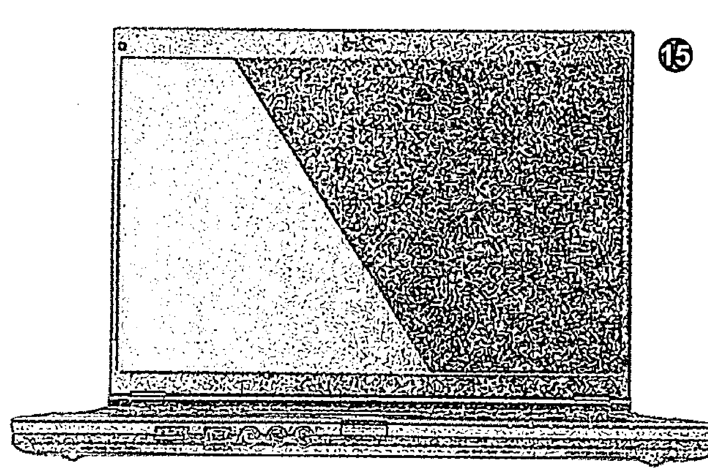

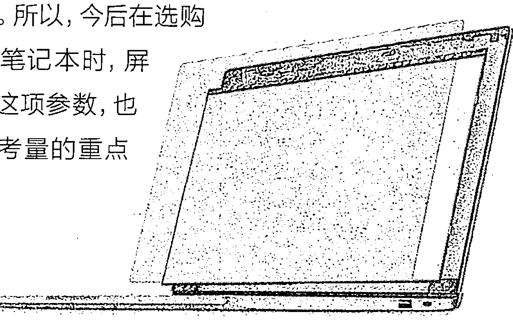

‘+’力大‘7’待 节后游戏本更精彩

策划《电脑爱好者》编辑部


对笔记本而言，影响其游戏性能的核心要素无非是处理器与独立显卡。借着CES2017的契机，全新一代的性能级移动处理器和独立显卡纷纷亮相，二者携手之后将为笔记本带来游戏性能的跨越式发展，更是主流价位的游戏本（4000元~7000元）的梦想之芯。想把脉2017年春节后游戏本的动向，就从本期特别话题开始吧。

## H系列降临 值得‘七’待的游戏本之芯

在过去的很长一段时间里，游戏本的“芯脏”始终被第六代智能英特尔酷睿处理器（SkyLake）占据。当这颗“芯脏”升级之后，能为游戏本带来多少性能上的改良呢？

# 七代酷睿终于补齐

提到第七代智能英特尔酷睿处理器（Kaby Lake），很多读者可能会产生疑问：CFan早在2016年19期就曾做过《Kaby Lake来袭 英特尔第七代酷睿处理器解析》，今天怎么又来骗稿费了呢？实际上，去年英特尔推向市场的，仅限七代酷睿家族中的U系列（如酷睿i5-7200U）和Y系列（如酷睿M3-7Y30）处理器，它们都是针对超薄本和平板二合一设备定制，节能有余，性能却略显不足。

而在CES2017中被英特尔再次祭出的，则是性能级的S系列（面向台式机，如酷睿i7-7700K）和H系列（面向笔记本，如酷睿i7-7700HQ），它们“天生神力”，主打高性能计算。至此，Kaby Lake七代酷睿家族终于补齐（图1）。而我们今天想要和大家分享的，则是其中用于游戏本之芯，H系列Kaby Lake移动处理器的那些事。


# H系列的四大阵营

英特尔此次一口气推出了七款H系列Kaby Lake移动处理器，它们分别为i7-7920HQ、i7-7820HK、i7-7820HQ、i7-7820HK、i7-7700HQ、i5-7440HQ、i5-7300HQ和i3-7100H，性能依次递减。为了便于大家理解，我们可以将它们划分为四大阵营，并将其与六代酷睿对应的前辈们进行对比。


# 性能之巅 想想就好

i7-7920HQ、i7-7820HK和i7-7820HQ是Kaby Lake七代酷睿移动处理器中的无冕之王，它们都是万元以上的旗舰级游戏本的标配（图2）。其中i7-7820HK比较特殊，它后缀中的“K”代表其可以通过BIOS或Intel Extreme Tunning Utility (XTU)软件进行超频，赋予了游戏本更多的DIY乐趣。


| 参数对比 | i7-7920HQ | i7-7820HQ | i7-7820HK | i7-6920HQ | i7-6820HQ | i7-6820HK |
| :--- | :--- | :--- | :--- | :--- | :--- | :--- |
| 内核/线程 | 4/8 | 4/8 | 4/8 | 4/8 | 4/8 | 4/8 |
| 基础频率 | 3.1GHz | 2.9GHz | 2.9GHz | 2.9GHz | 2.6GHz | 2.6GHz |
| 最大单核睿频 | 4.1GHz | 3.9GHz | 3.9GHz | 3.8GHz | 3.6GHz | 3.6GHz |
| 最大双核睿频 | 3.9GHz | 3.7GHz | 3.7GHz | 3.6GHz | 3.4GHz | 3.4GHz |
| 最大四核睿频 | 3.7GHz | 3.5GHz | 3.5GHz | 3.4GHz | 3.2GHz | 3.2GHz |
| 核芯显卡 | HD630 | HD630 | HD630 | HD530 | HD530 | HD530 |
| 显卡基础频率 | 350MHz | 350MHz | 350MHz | 350MHz | 350MHz | 350MHz |
| 显卡加速频率 | 1100MHz | 1100MHz | 1100MHz | 1050MHz | 1050MHz | 1050MHz |
| 内存规格 | LPDDR3-2133<br>DDR3L-1600<br>DDR4-2400 | LPDDR3-2133<br>DDR3L-1600<br>DDR4-2400 | LPDDR3-2133<br>DDR3L-1600<br>DDR4-2400 | LPDDR3-1866<br>DDR3L-1600<br>DDR4-2133 | LPDDR3-1866<br>DDR3L-1600<br>DDR4-2133 | LPDDR3-1866<br>DDR3L-1600<br>DDR4-2133 |
| 三级高速缓存 | 8MB | 8MB | 8MB | 8MB | 8MB | 8MB |
| TDP | 45W | 45W | 45W | 45W | 45W | 45W |

# 高端标配 舍我其谁

i7-6700HQ是英特尔上代酷睿中的当家花旦（图3），也是早前高端游戏本最热衷搭配的处理器。作为i7-6700HQ的接班人，i7-7700HQ的定位相对亲民（图4），6000元左右的游戏本就能以其为芯，对普通用户而言并非难以接受的开销。和上代产品相比，i7-7700HQ将默认频率提升了200MHz，睿频加速频率提升了300MHz，同时在GPU和内存支持上也有所升级（表2）。

| 参数对比 | i7-7700HQ | i7-6700HQ |
| :--- | :--- | :--- |
| 内核/线程 | 4/8 | 4/8 |
| 基础频率 | 2.8GHz | 2.6GHz |
| 最大单核睿频 | 3.8GHz | 3.5GHz |
| 最大双核睿频 | 3.6GHz | 3.3GHz |
| 最大四核睿频 | 3.4GHz | 3.1GHz |
| 核芯显卡 | HD630 | HD530 |
| 显卡基础频率 | 350MHz | 350MHz |
| 显卡加速频率 | 1100MHz | 1050MHz |
| 内存规格 | LPDDR3-2133<br>DDR3L-1600<br>DDR4-2400 | LPDDR3-1866<br>DDR3L-1600<br>DDR4-2133 |
| 三级高速缓存 | 6MB | 6MB |
| TDP | 45W | 45W |

## 表3：H系列酷睿i5规格对比表

| 参数对比 | i5-7440HQ | i5-7300HQ | i5-6440HQ | i5-6300HQ |
| :--- | :--- | :--- | :--- | :--- |
| 内核/线程 | 4/4 | 4/4 | 4/4 | 4/4 |
| 基础频率 | 2.8GHz | 2.5GHz | 2.6GHz | 2.3GHz |
| 最大单核睿频 | 3.8GHz | 3.5GHz | 3.5GHz | 3.2GHz |
| 最大双核睿频 | 3.6GHz | 3.3GHz | 3.3GHz | 3.0GHz |
| 最大四核睿频 | 3.4GHz | 3.1GHz | 3.1GHz | 2.8GHz |
| 核芯显卡 | HD630 | HD630 | HD530 | HD530 |
| 显卡基础频率 | 350MHz | 350MHz | 350MHz | 350MHz |
| 显卡加速频率 | 1000MHz | 1000MHz | 900MHz | 900MHz |
| 内存规格 | LPDDR3-2133<br>DDR3L-1600<br>DDR4-2400 | LPDDR3-2133<br>DDR3L-1600<br>DDR4-2400 | LPDDR3-1866<br>DDR3L-1600<br>DDR4-2133 | LPDDR3-1866<br>DDR3L-1600<br>DDR4-2133 |
| 三级高速缓存 | 6MB | 6MB | 6MB | 6MB |
| TDP | 45W | 45W | 45W | 45W |


# 主流悍将 超值之选

在SkyLake六代酷睿处理器之前，移动版的酷睿i5（如四代酷睿i5-4210H）一直都是双核架构，与更高一级的酷睿i7差距显著，这就让注重性能的用户不得不咬牙选择搭载酷睿i7的高配产品。步入SkyLake后，移动版酷睿i5终于进化到了四核架构，哪怕缺少了对超线程技术的支持，但其性能依旧有了显著的提升，至少已不再成为更高端显卡的拖累，也因此大幅降低了游戏本的选购门槛。作为七代酷睿的家族成员，i5-7440HQ和i5-7300HQ自然延续了四核架构（图5），同样将默认主频和睿频加速分别提升了200MHz和300MHz（表3）。这个级别的处理器非常受5000元级别的游戏本欢迎，属于性能价格比最高的存在。

# 入门之选 用者寥寥

H系列的移动版酷睿i3处理器一直较为尴尬，以六代酷睿中的i3-6100H为例，迄今为止你也很难在国内市场上找到一款搭载这颗处理器的笔记本。原因很简单，缺少了睿频功能的i3-6100H，在性能上仅比i7-6500U（U系列低功耗版酷睿）略强，但却更加费电。用它与高端显卡搭配会成为拖累，TDP略高的它也不适合塞进主打便携的超薄本身上。此次七代酷睿i3-7100H也将面临这种窘境，虽然它的默认主频就达到了3.0GHz（表4），但同辈兄弟i7-7500U的睿频加速却已达到3.5GHz，留给i3-7100H的市场空间依旧有限。作为游戏本，选用i3-7100H会显得“磕碜”（小气），作为轻薄本，选择i3-7100H则会影响发热和续航，所以我们可以选择将其淡忘（图6）。

## 表4：H系列酷睿i3规格对比表

| 参数对比 | i3-7100H | i3-6100H |
| :--- | :--- | :--- |
| 内核/线程 | 2/4 | 2/4 |
| 基础频率 | 3.0GHz | 2.7GHz |
| 核芯显卡 | HD630 | HD530 |
| 显卡基础频率 | 350MHz | 350MHz |
| 显卡加速频率 | 950MHz | 900MHz |
| 内存规格 | LPDDR3-2133<br>DDR3L-1600<br>DDR4-2400 | LPDDR3-1866<br>DDR3L-1600<br>DDR4-2133 |
| 三级高速缓存 | 3MB | 3MB |
| TDP | 35W | 35W |


# 理论性能的较量

以《使命召唤13》为例，七代酷睿i7-7700HQ至少已经能单凭核芯显卡流畅运行了（表6）。七代酷睿的GPU之所以表现得比CPU好看，是因为其采用了频率更高的DDR4内存，再加上更高的GPU频率所带来的增益效果。

可惜，考虑到所有搭载H系列酷睿处理器的笔记本都会额外“附赠”一个独立显卡（图7），所以真正轮到核芯显卡出手的机会并不大。

## 表5：两代H系列酷睿处理器的CPU性能对比表

| 测试项目 | i7-7700HQ | i7-6700HQ | i5-7300HQ | i5-6300HQ | i3-6100H |
| :--- | :--- | :--- | :--- | :--- | :--- |
| 国际象棋 | 13577 | 12459 | 9377 | 8505 | --- |
| Cinebench R11.5-单核 | 1.76 | 1.65 | 1.65 | 1.5 | 1.3 |
| Cinebench R11.5-多核 | 8.13 | 7.45 | 5.88 | 5.4 | 3.22 |
| Cinebench R15-单核 | 161 | 144 | 140 | 130 | 108 |
| Cinebench R15-多核 | 736 | 676 | 503 | 467 | 292 |
| Geekbench 4-单核 | 4740 | 4235 | --- | 3892 | 3402 |
| Geekbench 4-多核 | 14499 | 13103 | --- | 10708 | 6326 |
| 3DMark 11-物理分 | 9589 | 8799 | 6398 | 6129 | 3778 |
| 3DMark-FireStrike-物理分 | 10527 | 9940 | 6433 | 6121 | 4528 |

## 表6：两代H系列酷睿处理器的GPU性能对比表

| 测试项目 | i7-7700HQ | i7-6700HQ |
| :--- | :--- | :--- |
| Cinebench R11.5 OpenGL | 39.81fps | 36.79fps |
| Cinebench R15 OpenGL | 39.01fps | 36.77fps |
| 3DMark11-GPU | 1275 | 1158 |
| 3DMark-FireStrike-图形 | 851 | 772 |
| 《街霸4》默认画质 | 131fps | 114fps |
| 《生化危机5》默认画质 | 66fps | 51fps |
| 《古墓丽影9》中等画质 | 56fps | 45fps |
| 《使命召唤13》最低画质 | 30fps | 25fps |

*测试平台都采用双通道内存


# 如何看待七代酷睿的表现

英特尔Kaby Lake七代酷睿恰好处于制程→架构→优化“三步走”中的优化一环，它借助改良的14nm+工艺，在不提升TDP的前提下大幅提升主频，同时改进了Speed Shift技术，支持H.265 (HEVC)硬解码。由于在底层架构上没有太大改变，所以新一代酷睿的性能提升主要还是反映在了频率提升的增益效果上，无论是CFan早前介绍过的U/Y系列，还是今天面向游戏本而生的H系列，七代酷睿的表现只能算是理所应当，缺乏惊喜。

好消息是，H系列七代酷睿处理器从诞生之日起就“没拿自己当新品”：市面上那些搭载i5-6300HQ的游戏本起价多在5000元上下，而i5-7300HQ的价格也是如此。最关键的一点是，与i5-7300HQ和i7-7700HQ这些新处理器搭档的显卡，也同步升级到了NVIDIA最新的Pascal GTX 10系列显卡，让新品在整体性能上都较同价位的老产品有了极大的飞跃（图8）。

接下来，就让我们看看NVIDIA Pascal GTX 10系列显卡的最新成员：GTX1050和GTX1050 Ti移动版能为游戏本带来怎样的变化吧。


> 火速连接
如果你想了解Kaby Lake和SkyLake架构和制程层面的详细差别，请参考本刊2016年19期《Kaby Lake来袭 英特尔第七代酷睿处理器解析》这篇文章。

# GTX1050“+”力觉醒 主流游戏本翻身战就靠它

CFan曾在2016年24期解析过NVIDIA桌面版的GTX1050/GTX1050Ti，其结果是GTX1050Ti小幅领先于GTX960，而GTX1050则小幅领先于GTX950，让人小失望。那么，移动版的GTX1050/GTX1050Ti能否重新给我们带来希望呢？

# 迟来的Pascal成员

就新品的策略NVIDIA和英特尔刚好相反：英特尔是先发布了定位偏低的U/Y系列七代酷睿处理器，而后才释放出性能级的H系列产品“补刀”；而NVIDIA则一上来就剑指顶级市场，面向主流的GTX1050则姗姗来迟。
在性能方面，NVIDIA全新Pascal架构移动显卡中的GTX1060就可以秒杀移动版的GTX980M，而GTX1070甚至超越了台式机领域的GTX980，让武装这些独立显卡的游戏本真正有了叫板台式机的资本（图1）。
GTX1050移动版家族还能上演前辈们越级挑战的神话吗？


# 让台式显卡羡慕的规格

NVIDIA Pascal架构显卡的最大特色就是采用了14nm FinFET制造工艺，并对底层架构进行了大刀阔斧的改良，让它们能以更少的CUDA流处理器和更低的功耗，就获得远超上代Maxwell架构显卡的性能（图2）。此外，从这一代显卡开始，NVIDIA淡化了桌面版和移动版显卡的区隔，移动版显卡不再有“M”的后缀。
原因很简单，Pascal架构显卡移动版不再是对应桌面版的“缩水款”，而是基本相同的两个核心。就拿本文的主角GTX1050为例（图3），其桌面版和移动版的CUDA、TMUs和ROPs参数一模一样，而且GTX1050Ti的移动版频率反而要比桌面版提升了15%以上（图4）。移动显卡没有遭遇“阉割”而且还实现了“超频”，这在NVIDIA移动显卡的历史上还是头一遭。
需要注意的是，虽然移动版的GTX1050系列显卡的参数更好看，但受限于笔记本散热模块的效率制约（图5），移动版GTX1050采用了相对较低的TDP，相对桌面版GTX1050更易撞上功耗墙，所以其实际性能要略逊于桌面版。


## 和上代显卡的规格对比

作为笔记本专用的新显卡，相信大家还是更关心GTX1050移动版与NVIDIA上代Maxwell架构移动显卡的差别吧？从参数来看，相信不少读者心里都会出现“咯噔”的感觉：GTX1050的流处理器数量和GTX960M一样，GTX1050Ti的流处理器数量还不如GTX965M，难道说NVIDIA的这代新显卡要让我们失望了(表1)？

**表1：NVIDIA两代中高端GTX移动显卡规格对比表**

| 参数对比 | GTX1050Ti | GTX1050 | GTX970M | GTX965M | GTX960M |
| :--- | :--- | :--- | :--- | :--- | :--- |
| 制造工艺 | 16nm | 16nm | 28nm | 28nm | 28nm |
| 核心架构 | Pascal | Pascal | Maxwell | Maxwell | Maxwell |
| 核心代号 | GP107 | GP107 | GM204 | GM206 | GM107 |
| CUDA数量 | 768 | 640 | 1280 | 1024 | 640 |
| ROPs | 32 | 32 | 48 | 32 | 16 |
| TMUs | 48 | 40 | 80 | 64 | 40 |
| 核心频率 | 1493MHz | 1354MHz | 924MHz | 935MHz | 1097MHz |
| 加速频率 | 1620MHz | 1493MHz | 1038MHz | 1150MHz | 1202MHz |
| 显存类型 | GDDR5 | GDDR5 | GDDR5 | GDDR5 | GDDR5 |
| 显存频率 | 7000MHz | 7000MHz | 5000MHz | 5000MHz | 5000MHz |
| 显存位宽 | 128bit | 128bit | 192bit | 128bit | 128bit |

## 依旧能越级挑战

答案自然是否定的，新工艺和新架构，让Pascal架构显卡有了更高的晶体管效率，而GTX1050系列的表现也没有让我们失望。其中，GTX1050的性能就足以媲美GTX965M，而GTX1050Ti的性能更是超过了GTX970M（表2）！

还没完哦，得益于14nm工艺，让GTX1050系列的TDP可以被限定在50W左右，远低于GTX970M（80W），仅与GTX960M持平。这意味着，GTX1050系列显卡可以直接被用在那些曾经配备GTX960M/GTX965M显卡的老模具上，从而让新品最终可以“平价”上市。

**表2：GTX1050和上代显卡性能对比表**

| 测试项目 | GTX1050Ti | GTX1050 | GTX970M | GTX965M |
| :--- | :--- | :--- | :--- | :--- |
| 3DMark 11-X档GPU | 3506 | 2668 | 3267 | 2688 |
| 3DMark-Fire Strike | 7744 | 6797 | 7624 | 6103 |
| 3DMark-Fire Strike-Ultra | 1814 | 1210 | 1690 | 1405 |
| 3DMark-Fire Strike-Extreme | 3629 | 2676 | 3447 | 2555 |

## GTX1050的意义在哪

从字面的大小来看，看到GTX1050时我们很容易就能联想起GTX950M。现实中，GTX1050却是可以越过GTX960M而去直接挑战GTX965M的存在。不要小看这种幅度的提升哦，要知道NVIDIA原本对GTX1050系列显卡的定位就不高。

在2016年里，5000元我们能买到的游戏本大都采用了GTX950M/GTX960M独显，而配备GTX965M独显的游戏本则多在6000元左右。至于GTX970M，则是那些8000元起步高端游戏本的专利。如今，我们同样花5000元就已经可以买到配备GTX1050独显的游戏本新品了，其性能已经远超去年6000元级别的产品；如果你的预算再增加一些，6000元出头就能买到武装GTX1050Ti独显的新品，让你享受到昔日8000元级游戏本才能享受的性能。

而GTX1050最大的优势，则是它肯定要与第七代智能英特尔酷睿处理器搭配出现（图6），让我们可以同时感受到CPU和GPU双双升级的乐趣，而且这还是建立在价格维持不变的基础之上。用相同或更少的钱就能买到一部性能更强的新品，这就是2017年游戏本市场给我们的惊喜。

## 玩游戏CPU和GPU谁更重要

在我们玩大型3D游戏时，游戏画面多是由地形、建筑、植被、人物、光线、阴影、烟雾和爆炸等效果构成。CPU的作用是构建画面中所有的3D模型，以及游戏中的AI（人工智能）运算；而GPU则用于后期画面效果的渲染。换句话说，能否特效全开和流畅运行分别取决于显卡和处理器的强弱。就本话题涉及的产品而言，i5-7300HQ的性能就已经够用，升级到i7-7700HQ可以明显提高游戏过程中的最低帧数。如果你想提升最高帧数，就只能依靠独立显卡的升级了。

往年每次等到英特尔和NVIDIA新旧平台交替的时节，CFan的指导意见都是理性对待，和上代产品比价，只有价格相近才值得出手。如今CFan的建议则是，6000元价位上下的游戏本请认准七代酷睿和GTX1050，这绝对是2017年度主流游戏本的最佳搭档！


# CFan帮你选
## 最超值的游戏本

看完了理论知识，相信很多读者已经迫不及待地想要加入七代酷睿 + GTX1050组合的游戏本阵营了吧？别着急，借着本期特别话题，我们帮大家罗列出了时下热门的新一代游戏本，从这些产品中我们不难把脉出2017年主流游戏本的走势。

## 令人惊喜的价格走势

在2016年，5000元游戏本市场还是GTX950M/GTX960M的天下，面对《使命召唤13》级别的3D大作时就必须适当调低画质，这就让很多玩家感到不爽。如今七代酷睿 + GTX1050独显组合的新品并没有拿自己当大腕儿，起价依旧在5000元以内，其中还不乏标配SSD + HDD双硬盘的产品。至于性能足以媲美GTX970M的GTX1050Ti也显得很亲民，不少游戏本新品直接就打出了低于6000元的价格，这对预算有限又希望游戏本性能越强越好的玩家来说绝对是个好消息。

## 神舟战神Z6-KP5D1

战神Z6-KP5D1应该是目前最实惠的GTX1050游戏本，其价格只有4699元，但却依旧配备了i5-7300HQ处理器和8GB内存，唯一可惜的就是没有引入金属材质机身和TN材质的屏幕了。这款产品采用了双风扇双热管散热模块设计，可拆卸的电池也能让我们无需考虑长时间插电使用时的寿命问题。


- 屏幕：15.6英寸（1080P）
- CPU：酷睿i5-7300HQ
- 内存：8GB DDR4-2400
- 硬盘：1TB HDD
- 显卡：GTX1050（2GB GDDR5）
- 体积：378mm x 267mm x 26.9mm
- 重量：2.5kg

## 屏幕拖累了整体体验

令人遗憾的是，纵观第一批上市的七代酷睿 + GTX1050游戏本，它们虽然具备了更为澎湃的游戏性能，但其中能标配IPS广视角屏幕的产品却并不多见。如果你对“视界”的要求较高，我们的建议是可以考虑通过外接显示器的方式加以弥补。考虑到性能差距巨大，现阶段采用七代酷睿 + GTX1050 + TN屏的新品，依旧比六代酷睿 + GTX965M + IPS屏更值得选择。

## 高端GTX1050Ti游戏本遇尴尬

我们注意到，很多GTX1050Ti游戏本的高配或顶配版都已超过了8000元，而这个价格已经可以买到很多武装GTX1060独显的产品了。GTX1050Ti和GTX1060之间的差异，无法用更强的处理器和更快的SSD弥补。


## 宏碁暗影骑士3

宏碁暗影骑士3采用了全新的设计风格，在外观上更向自家高端的Predator掠夺者靠拢，跑车设计和黑红激情配色棱角分明。这款产品最大的特色就是在5500元左右的价格上就提供了i5-7300HQ处理器、GTX1050显卡以及双硬盘的组合，性价比十足。在散热设计上，暗影骑士3采用了双风扇双热管，拆机的难度不大，让后续的升级和风扇清灰除尘变得更加简单。可惜，暗影骑士3的屏幕并非IPS，在可视角度和色彩显示上是其最大的硬伤。


- 屏幕：15.6英寸（1080P）
- CPU：酷睿i5-7300HQ
- 内存：8GB DDR4-2400
- 硬盘：128GB SSD + 1TB HDD
- 显卡：GTX1050（2GB GDDR5）
- 体积：389mm x 265.5mm x 28.9mm
- 重量：2.5kg


## 微星GL62M 7RD-224CN

GL62M是微星旗下最超值的游戏本系列，虽然它的价格不足5000元，但依旧采用了i5-7300HQ处理器和GTX1050的组合，2.3kg的重量对一款15.6英寸产品而言也算不错。这款产品内部采用了双风扇六热管的豪华散热模块设计，并内置1个M.2插槽，可安装2块硬盘。可惜，GL62M的屏幕为TN材质，可视角度一般。

- 屏幕: 15.6英寸 (1080P)
- CPU: 酷睿i5-7300HQ
- 内存: 8GB DDR4-2400
- 硬盘: 1TB HDD
- 显卡: GTX1050 (2GB GDDR5)
- 体积: 383mm × 260mm × 29mm
- 重量: 2.3kg

## 机械革命深海泰坦X6Ti-S

机械革命X6Ti-S售价在6000元左右，它采用了金属顶盖，并通过拉丝工艺和立体设计打造出不错的质感，32色RGB背光键盘也让其可以呈现炫酷的效果。该产品在配置上的特色是采用了IPS屏幕，标配双硬盘(内部还闲置1个M.2插槽，最多可安装3块硬盘)，并为GTX1050准备了4GB显存(i7-7700HQ高配版对应的是GTX1050Ti独显)。X6Ti-S为内存和硬盘设计了单独的升级挡板，拆换很容易，但如果我们想对其风扇清灰，就需要进行深度拆机，难度极高。


- 屏幕: 15.6英寸IPS (1080P)
- CPU: 酷睿i5-7300HQ
- 内存: 8GB DDR4-2400
- 硬盘: 128GB SSD + 1TB HDD
- 显卡: GTX1050 (4GB GDDR5)
- 体积: 386.25mm × 264.9mm × 37mm
- 重量: 2.85kg


## 华硕ZX53VD

ZX53VD采用了华硕飞行堡垒系列经典的铁甲神盾外形设计，A面两道凸起的肩线更加增添了立体感。由于这款产品保留了光驱位(可安装硬盘托架)，所以机身偏厚，但红色的背光键盘和玛雅纹理装饰还是弥补了这一缺陷。ZX53VD起价不足6000元，其特色在于为GTX1050准备了4GB显存，但最大缺陷依旧是屏幕并非IPS材质。

- 屏幕: 15.6英寸 (1080P)
- CPU: 酷睿i5-7300HQ
- 内存: 4GB DDR4-2400
- 硬盘: 1TB HDD
- 显卡: GTX1050 (4GB GDDR5)
- 体积: 385mm × 255mm × 30mm
- 重量: 2.5kg


## 炫龙毁灭者X55Ti

毁灭者X55Ti采用了蓝天模具，26mm的厚度在15.6英寸游戏本中算是相对纤薄的。这款产品最大的特色就是配备了GTX1050Ti独显，且将价格控制到了5499元。X55Ti内部预留了M.2插槽，用户可以根据需要添加M.2 SSD组成双硬盘。如果你预算有限，还可以考虑4999元的毁灭者X55，只是它将显卡换成了GTX1050，性能下降明显。

- 屏幕: 15.6英寸 (1080P)
- CPU: 酷睿i5-7300HQ
- 内存: 8GB DDR4-2400
- 硬盘: 1TB HDD
- 显卡: GTX1050Ti (4GB GDDR5)
- 体积: 378mm × 257mm × 26mm
- 重量: 2.5kg


## 戴尔新游匣Master15

新游匣Master 15采用了非常炫酷的外观设计，金属材质的顶盖和边框、红黑撞色的风格令人印象深刻。新游匣Master 15采用了双风扇双热管的散热模块，内部配有防滚架，整个机身非常坚固。需要注意的是，该产品视型号的不同有着很多配置组合，本文涉及型号的价格为6999元；而6499元的版本则取消了SSD，显卡也换成了GTX1050。因此，如果你更在意性能，请认准配备GTX1050Ti显卡的版本。

- 屏幕: 15.6英寸 (1080P)
- CPU: 酷睿i5-7300HQ
- 内存: 4GB DDR4-2400
- 硬盘: 128GB SSD + 500GB HDD
- 显卡: GTX1050Ti (4GB GDDR5)
- 体积: 384.9mm x 274.7mm x 25.44mm
- 重量: 2.65kg


## 雷神ST Plus

虽然雷神ST Plus并没有采用金属材质，但却通过金属质感喷漆，以及银灰色漆面营造出不错的金属感，顶盖部分的Logo、两侧的LED灯条以及1600万色的RGB背光键盘也为其增添了几分动感。该产品的配置较高，i7-7700HQ处理器和GTX1050Ti的组合可谓强悍。可惜，雷神ST Plus的屏幕并非IPS稍显遗憾。

- 屏幕: 15.6英寸 (1080P)
- CPU: 酷睿i7-7700HQ
- 内存: 8GB DDR4-2400
- 硬盘: 128GB SSD + 1TB HDD
- 显卡: GTX1050Ti (4GB GDDR5)
- 体积: 378mm x 267mm x 26.9mm
- 重量: 2.3kg

## 三星玄龙骑士

Odyssey是三星最新的游戏本家族，中文名为玄龙骑士，产品共有红黑两种配色，从Logo到触控板，再到底部散热窗设计，都体现了与众不同的个性感。这款产品的特色在于采用了广视角的PLS屏幕，方便升级的底部扩展仓设计，以及通过Fn+F11就能自动录制游戏视频的软件功能等。

- 屏幕: 15.6英寸IPS (1080P)
- CPU: 酷睿i5-7300HQ
- 内存: 8GB DDR4-2400
- 硬盘: 128GB SSD + 1TB HDD
- 显卡: GTX1050 (2GB GDDR5)
- 体积: 378mm x 260mm x 28.2mm
- 重量: 不明


CES，全称为International Consumer Electronics Show（国际消费电子展），是世界上规模最大的消费类电子科技产品展会之一，而且由于它是在每年的1月初举办，因此总是会成为当年度消费电子市场、科技的风向标。

在最近几年的CES展会上，智能手机、移动互联、云计算、物联网、智能硬件等产品和技术都曾经是最耀眼的明星，而曾经的王者、个人计算的开创者——个人电脑，却越来越不受重视，甚至沦为配角。不过作为消费电子市场的老兵，个人电脑并不会就此消失，除了发挥自己在性能、容量、连接能力等方面的优势外，也在积极准备着新的使用体验，增加新的应用能力，CES上的PC及相关产品，无不体现出这些特色。

## 持续提升的计算能力

在本届CES2017上，个人电脑处理器市场两强——AMD和Intel又一次拿出了自己的最强处理器，其中AMD的新一代APU更是宣称达到了对手最高端处理器酷睿i7的水平，而且在展示自家的最新旗舰GPU时也使用了这款处理器，说明对其性能有相当的自信心。在个人电脑的另一个主要计算元件——GPU方面，AMD的最高端产品Vaga同样是展会上的亮点，但独显GPU市场的另一巨头NVIDIA却已经将重点转移到了其他方面，因此并没有特别值得关注的个人电脑新产品展示。

作为能够为个人电脑直接分代的产品，处理器和GPU当然也是最受用户关注的产品，那么我们就详细介绍一下它们吧。

## AMD RYZEN处理器

AMD在2016年底就公开展示了AMD RYZEN（代号Zen）的样品（图1），本次在CES上公布了RYZEN台式机处理器更多的技术和性能细节，并且展示了来自于5家主板厂商的16张AM4主板、全球17家系统集成商基于AMD RYZEN处理器的PC产品，以及创新的第三方CPU散热器设计。AMD还表示，全球顶级的PC OEM厂商也将拿出AMD RYZEN相关产品。比较遗憾的是，AMD RYZEN系列处理器仍有部分


规格没有正式公布，而是留给了最终的正式发布时刻，估计它将在GDC (Game Developers Conference, 游戏开发者大会)之前正式发布，并且在GDC期间正式发售。

有国外媒体已经拿到了AMD RYZEN的样品，并与AMD目前的主力产品以及英特尔高端产品进行了对比测试。这款样品应该是比较高端的型号，其频率在3.15GHz (正式版频率为3.4GHz以上)，采用8核16线程，拥有二级和三级缓存总量达到20MB。在数学计算性能测试中，AMD RYZEN的成绩超过了酷睿i7-6700K，甚至超过了6核12线程的i7-6800K，仅次于拥有10个核心与20个线程的怪兽级产品酷睿i7-6900K。在游戏能力测试中，受到频率较低的影响，其成绩与酷睿i5-6600 (3.5GHz)类似，明显低于酷睿i7-6800K (3.4GHz)和i7-6700K (4GHz)。与自家的高端处理器FX8370相比，AMD RYZEN样品的计算性能测试成绩提升达到60%，而游戏能力成绩则提升了30%以上。AMD提供的样品并没有锁频，据称它可在风冷模式下超频至5.0GHz，使其性能巨幅提升，而且AMD很可能在这款产品中终结处理器的锁频时代，即所有产品都可以超频，不再提供专门的不锁频型号。

AMD高级副总裁兼计算与图形事业部总经理Jim Anderson表示：“2017年将是AMD、IT技术合作伙伴和整个PC行业难忘的一年，我们非常高兴能在CES上开始新的纪元，携手OEM合作伙伴，向看好AMD RYZEN的各界人士展示各种高性能主板和PC设计方案。AMD和合作伙伴致力于通过支持AMD RYZEN处理器的主板、定制化PC和相关高性能散热器，为发烧友、游戏玩家和创作者提供新一代计算的创新和选择。”

RYZEN采用新的AM4插槽，AMD也为此推出了支持RYZEN的桌面芯片组X370、X300、B350和A320等芯片组，其中X370芯片组用于满足用户对超高性能、未来科技以及超级输入输出连接的需求，支持超频和双显卡。X300芯片组则可以满足在紧凑尺寸内追寻高性能的用户，可满足Mini-ITX尺寸规范，适合构建小型PC。在CES上展示了华擎、华硕、映泰、技嘉和微星等厂商基于这些芯片组的主板 (图3)。

RYZEN处理器及其主板采用双通道DDR4内存，支持NVMe和M.2 SATA存储设备，提供了第一代和第二代USB 3.1接口。AM4芯片组支持PCI-E 3.0标准，并且为USB、显卡、数据和其他输入/输出提供了专用的PCI-E通道，提供强大的、可扩展和可靠的计算体验。

AMD和Cyberpower、Maingear和Origin等携手推出一系列基于高性能AMD RYZEN处理器的“梦幻电脑”。AMD和合作伙伴在CES上展示了大量配备AMD RYZEN处理器的PC，其中就包括了国内的宁美国度和攀升兄弟等厂商，这些PC中既有外观独特、带有定制化水冷系统的个性方案(图4)，也有精致、实用的解决方案。

宁美国度定制化DIY主机的核心配置部分由高端AMD RYZEN处理器+AM4 X370主板+RX 480交火构成，即所谓的3A平台(图5)。它搭配DDR4 3000双通道内存以及M.2接口的高端NVMe规范固态硬盘，使其数据传输率可以满足极为严苛的使用需求，提供出色的性能。其散热和外形也体现出了宁美国度的设计功力，机箱侧板上大大的ZEN字样显示出这台主机的血统，造型传统而具有厚重的金属质感，机箱内的呼吸氛围灯也给AMD RYZEN处理器带来一丝神秘的气息。

攀升兄弟的AMD RYZEN处理器DIY主机搭配了AM4接口的M-ATX B350主板。其造型颇为别致，被设计成了充满科技张力的外星飞船UFO的样子(图6)，个性十足。它采用专为超频而生的V-game定制化水冷散热器，可以全面释放AMD RYZEN处理器的潜能；16GB双通道高频DDR4内存以及256G M.2 SSD提供的高速体验则迎合了UFO穿越宇宙的概念。攀升兄弟AMD RYZEN主机同样也为玩家准备了LED氛围灯，迎合现在的玩家追求跳脱飞扬的强烈个性。

也许是因为A7890K等产品配置的个性化散热器受到了广泛的欢迎，为了满足发烧友和PC制造商对于超静音或超频散热解决方案的不同需求，AMD正与15家顶级散热器制造商和供应商合作，为AM4处理器打造一系列CPU散热器。

对于需求超静音风冷散热的用户，Noctua将提供NH-D15和瘦身版本NH-U12S，EKWB旗下的定制化水冷解决方案也将支持AM4接口产品。

基于AMD RYZEN处理器的PC、AM4主板和兼容散热解决方案将于2017年第一季度上市。

# 英特尔第七代智能英特尔酷睿处理器

由于英特尔的更新一代制造工艺有些延误，造成了“工艺进步”-“架构优化”的产品推出节奏“Tick-Tock”在新年度未能实现，不过英特尔还是希望通过进一步优化的智能酷睿处理器，为用户带来更强的性能，也继续刺激个人电脑市场。第七代智能英特尔酷睿处理器家族也代表着英特尔更长远的愿景——创造融合现实、沉浸式游戏、始终连接，引领未来的全新PC体验。

发烧友来说，只有顶级桌面版酷睿i7才是真正需要的处理器，也是真正反映新一代处理器最高性能的代表产品。在本次CES上，英特尔也终于满足了这些用户的愿望，提供了新一代智能酷睿处理器的最强桌面版产品——酷睿i7-7700K。

作为救场产品，英特尔酷睿i7-7700K处理器确实给人缺乏亮点的感觉(图7)，在CES上，英特尔也公布了这款最新旗舰级处理器的一些特色，但其中大部分都在酷睿i7-6700K甚至更早的智能酷睿处理器上出现过了。酷睿i7-7700K采用睿频加速技术2.0版，当应用需要更高性能时，可将处理器频率从4.2GHz动态提高至最多4.5GHz，并且会按需进行动态频率调节以减少耗电。它支持超线程技术，每个处理器内核能同时实施两个任务，所以其4个核心可以同时实施最多8个独立任务(线程)，能改善多任务处理应用能力。它内置英特尔智能高速缓存，8MB共享高速缓存可根据每个内核的需求高效地进行动态分配，从而加快数据访问速度，显著减少常用数据的延迟，并提高性能。

酷睿i7-7700K的集成内存控制器支持双通道DDR4-2400内存和DDR3L-1600内存，每通道带2个DIMM，支持基于英特尔Extreme Memory Profile(XMP)规范的内存。它支持16个PCI-E 3.0总线通道，可配置为1x16、2x8或1x8和2x4等多种模式，能够以最高8GT/s的速度访问外设和网络。内置英特尔高清显卡630，支持Microsoft DirectX 12和4K超高清分辨率显示屏，动态频率最高为1150MHz。与内置显卡相配合的英特尔快速视频同步技术具有强大的媒体处理功能，可极速转换视频文件以支持便携式媒体播放器或在线共享，支持HEVC 10位(H.265)编码解码，可以流畅播放4K超高清的优质内容。

随着互联网视频流量的爆发式增长，视频格式正逐渐由1080P转换为4K，标志着4K时代的来临。另外据IDC的统计分析，超过80%的城镇消费者会拍摄高清视频，并使用笔记本播放高清视频，对内容存储、播放和编辑的需求日益旺盛。但视频文件体积大导致的占用资源和运行卡顿，成为制约向4K体验迁移的痛点。第七代智能英特尔酷睿处理器打造的媒体与图形平台，能够完美支持4K UHD HDR内容、高保真音频，并可实现更加快速的4K UHD编辑。其中支持产业标准的HEVC 10位编解码和Google VP9编解码，可进行实时的4K内容编辑以及360度视频创作。据称，HEVC解码的速度最高达120Mbps，适用于4K分辨率下60MHz实时处理，尤为适用于播放优质内容。许多在线视频服务商，例如Netflix、Sony Pictures ULTRA(来自Sony Pictures的4K超高清电影和电视节目的优质流媒体服务)、爱奇艺都计划于2017年为第七代智能英特尔酷睿处理器提供足够的4K高清内容。

这两年兴起的AR、VR和MR的热潮也是英特尔努力的方向。业内知道，VR的前景在于能颠覆人们的想像，但早期的VR设备因为屏幕反应有延迟，会让用户产生眩晕感。标准的PC游戏一般是30帧/秒，VR则要求每只眼至少达到90帧/秒，分辨率最低为2K，最佳为4K，这无疑对于PC提出了更高性能和体验的要求。而第七代智能英特尔酷睿处理器强大的性能，再加上英特尔高清显卡所增加的VP9和HEVC 10位硬件加速全新媒体引擎，完全可以打造出栩栩如生的VR沉浸式视觉效果。

调查显示，88%的设计者在处理很大的设计文件时，会遇到卡顿或死机的情况，且对VR内容创建者来说，第七代智能英特尔酷睿处理器通过硬件加速能够实现更加高效的转码处理，转码1小时4K UHD视频仅需12分钟(5年前的电脑需85分钟)。至于游戏，相较于5年前的旧电脑，在搭载第七代智能英特尔酷睿处理器的PC上游戏运行更加平稳，视觉效果更好。与同一代高清显卡相比，英特尔锐炬Plus显卡性能提升65%，同时可使用更高的1080P设置运行热门游戏。

酷睿i7-7700K可以兼容所有具备最新BIOS和驱动程序的英特尔200系列和英特尔100系列芯片组。借助英特尔Z270芯片组，它可对其未锁频内核倍频器、电源、基本时钟和内存系数进行灵活的超频，也可以对未锁倍频的显卡进行超频。

# AMD Vega GPU

由于NVIDIA消费级GPU没有什么重磅消息和展示，AMD的新一代旗舰级GPU—— Vega(织女星)就成为了最吸引人的产品。我们前面已经提到，在CES上，AMD用Ryzen处理器搭配Vega显卡进行了演示，演示项目为《DOOM》游戏，采用4K分辨率和最高的Ultra画质。从目前公布的视频看，游戏帧速基本保持在70FPS以上，看起来略强于平均帧速68fps的GTX 1080。

与目前的AMD旗舰级GPU——Fiji架构类似，Vega也采用了HBM(High Bandwidth Memory，高带宽内存)显存(图8)，但Fiji搭载的第一代HBM显存容量有限，即便是旗舰产品Radeon Fury X也只有4GB显存，在应对高分辨率高画质游戏时就有些捉襟见肘了。Vega GPU采用的第二代HBM显存容量可以提升至8GB甚至16GB，更适合高分辨率游戏，其带宽也达到了第一代HBM的两倍，达到256GB/s甚至512GB/s。

Vega GPU几乎完全重新设计了显存控制器，其HBM2显存被称作HBC(High Bandwidth Cache，高带宽缓存)，GPU内的显存控制器也就成了HBCC(High Bandwidth Cache Controller，高带宽高速缓存控制器)，而不是显存控制器(图9)。因为Vega GPU的寻址能力高达512TB，允许在显卡PCB上放置SSD、网络存储等超大容量的外存储设备，而且这些存储部件是可以像显存一样直接存取的，HBM2可以作为GPU和外部存储单元的大容量高速缓存。AMD之前公布的RADEON PRO SSG其实就是基于Vega GPU的专业显卡，它集成了1TB的NAND闪存，可以将海量数据全部存放到显卡上，不再受限于系统总线和外部存储的性能，可以更高速地执行一些原先效率较低的工作，例如AMD用Vega显卡进行的数据达数TB的豪华卧室场景渲染。

目前包括RADEON在内的大部分GPU还保留了固定功能单元实现的几何处理硬件，不过AMD已经注意到了，越来越多的开发人员使用计算着色器来进行几何处理。为此在Vega GPU的几何流水线上引入了Primitive Shader(图元着色器)，它可以以极高的比率舍弃无效的图像元素，实现高效几何着色处理，未来这个新着色器很可能会彻底替换掉现有的固定几何处理功能单元。AMD还为Vega GPU引入了Intelligent Workgroup Distributor(工作组分发器)，可以支持更多的着色器引擎，实现更灵活的载荷分配。实现更高效的几何处理性能。据称目前Vega可在4个几何引擎下每个周期处理11个多边形，达到两倍于现有产品的几何处理能力。对应GCN架构中的CU(Computing Unit，计算单元)，AMD在Vega GPU上引入了NCU(下一代计算单元)微架构。NCU支持紧缩(Packed)数学处理，每个NCU拥有64个ALU，在采用紧缩数学操作指令的时候，可以支持每个周期512个8位计算，或者256个16位计算，又或者128个32位计算。Vega GPU具备更高的频率和更大的指令缓存，可确保指令流运行得更持续，提升单线程性能。

Vega GPU对像素着色处理流程进行了大幅度的改进，采用新一代像素引擎DSBR(Draw-Streaming Binning Rasterizer，渲染流分仓光栅器)。DSBR会按照AMD称之为高速缓存感知化的方式来调度，先在一个高速缓冲中对一个场景中给定的“对象包”进行尽可能多的处理，然后GPU才会清空这个高速缓存并拾取其余的数据。DSBR可以让GPU在复杂的重叠几何体里抓出哪些像素无需渲染，节省在最终场景中非可视的像素渲染处理，让GPU更高效地处理像素着色，尤其是具有高度复杂性（意味着大量无效渲染）深度缓存的像素。

为了让DSBR更有效地运作，Vega GPU的二级高速缓存进行了重大的改进——在以往的AMD GPU中，纹理和像素的内存存取是非一致性操作，如果是执行渲染至纹理操作的话，需要先写到内存后，再读到纹理缓存里，增加了大量数据搬动的次数，而且这样的非一致性增加了大量的同步处理和驱动层级的编程挑战。

Vega GPU的后端单元可以直接访问片上的二级高速缓存，这样的变化可以让更多的数据访问动作在片上的二级高速缓存上直接实现，减少了清空缓存然后在需要的时候又从显存中读回的过程，同样有助于延后式渲染技术的性能提升。

据称DSBR只是Vega GPU的光栅化处理途径之一，它并非一直采用DSBR来处理所有的光栅操作，而是和其他方式以高速的动态方式基于状态变换的，例如有过于庞大的数据无法放进二级缓存时，DSBR的效率就不一定很高。

目前披露的Vega GPU规格并不多，我们只能估计它拥有至少4096个流处理器，频率达到1.5GHz左右，配置至少8GB显存。从目前这款产品的表现来看，Vega应该可以对NVIDIA目前的旗舰产品，甚至传说中的GeForce GTX 1080Ti造成相当的威胁，不过Vega的大核心设计和HBM2显存的成本较高，在价格方面可能并不乐观。

## 形态多样化的PC

高能效的微架构、先进的制造工艺和优化设计的芯片，也引发了PC市场的变化，从性能怪兽游戏本到超轻薄和2合1笔记本、MiniPC、一体机，使得PC变得时尚、高效，将娱乐和办公体验都提升至新的水平。在本届CES上，多款PC和外设、配件，同样给人带来了深刻的印象。

## 雷蛇Project Valerie三屏游戏本

笔者在考虑为朋友推荐游戏平台时，已经不得不承认，现在的游戏本能力和性价比已经有了巨大提升，但对大部分在游戏本和台式机之间犹豫的朋友，都会提到游戏本一个无法忽视的缺陷——屏幕尺寸。

随着性能的提升，很多游戏本也具有了流畅运行2K甚至4K分辨率游戏的能力，但不到20英寸的屏幕并不能体现出这些超高分辨率游戏画面的震撼感，雷蛇（Razer）的最新概念游戏本Project Valerie（图10），就是一台摸索游戏本屏幕扩展之道的产品。它采用3块17.3英寸4K IGZO显示屏，打开笔记本时两块侧显示屏会从主屏幕中自动滑出，形成巨大的环绕式屏幕。这款游戏本采用酷睿i7-7700HQ和NVIDIA GTX 1080显卡的顶级配置，应对4K超高清屏恐怕也是勉为其难，好在雷蛇的概念机常常要经过相当长的时间才能正式推出，也许真正商品化时已经可以采用更强大的显卡进行配合了。当然尽管看起来仍有缺陷，但这款游戏本对玩家的吸引力还是非常大的，其样品在CES期间就被偷走了，估计这也是真爱吧。

## 三星Notebook 9

采用第七代智能酷睿的三星Notebook 9是一款非常轻薄的产品(图12)，其13.3英寸型号在799g的重量下，最高可以配置酷睿i7处理器，15英寸产品的重量也不足1kg。其快速充电技术可以在80分钟内充满电池，或者20分钟充够2.1小时的电量。超级轻薄和电源的优化，使它再次改变了超轻薄商务本的办公体验。

## 宏碁Predator 21 X游戏本

宏碁 Predator (掠夺者) 21 X最大的特色同样是屏幕，这是全球首款曲面屏电竞本，屏幕尺寸也达到了21英寸(图11)。它采用第七代英特尔酷睿i7-7820HK可超频处理器和SLI模式双NVIDIA GeForce GTX 1080 GPU，搭配64GB DDR4-2400内存。它在RAID 0配置下能搭载多达4个512GB固态硬盘和1TB 7200RPM硬盘。它采用机械键盘，右侧的触控板还能翻转变成数字键盘。结合Tobii眼球追踪技术，让玩家可通过视线转换来辨识敌人、进行瞄准及掩护。这款产品和雷蛇的概念机不同，是可以选购的商品，只是79999元起的价格让绝大部分玩家只能流口水啦。

## 戴尔超薄和8K显示器

在戴尔站台上，XPS系列、新游匣等产品的光彩几乎都被两款显示器掩盖了，它们就是8K显示器UP3218K和超薄显示器S2718D。UP3218K(图13)采用32英寸8K (7680x4320) 超高清分辨率面板，显示精细度达到280ppi (每英寸像素数目)。它采用戴尔PremierColor技术，显示颜色数高达10.7亿，支持100% Adobe RGB以及100% sRGB显示，特别适合于各种专业领域。

S2718D显示器采用InfinityEdge (无边框) 技术，屏幕厚度数据并没有公布，不过看起来似乎与XPS相差不大(图14)。它采用27英寸2560×1440面板，可覆盖99%的sRGB色域。其驱动芯片和扩展接口均放置于显示器底座，配备了USB Type-C、HDMI和音频输出功能(图15)。

# VR的泡沫与崛起

进入2017年，在经历了一整年突飞猛进的跃迁式发展后，虚拟现实这个刚刚送走“元年”的热词终于慢慢止住了狂飙的势头，正式进入全新的发展阶段。

# PROJECT ALLOY

# ALL-IN-ONE MERGED REALITY HEADSET


> 今年CES大展VR圈的话题任务由英特尔的Alloy负责

就在刚刚结束的2017 CES展会上，我们依旧看到了一系列熟悉或陌生的厂牌亮出了自家的最新VR产品：HTC亮出了全新设计的Vive头带（图16）、适配“灯塔”基站的定位装置以及孵化自中国团队的无线传输组件；英特尔带来了代号“Alloy”的独立VR头显（图17）；备受瞩目的第一款眼动追踪技术VR头显FOVE 0正式公布了发货日期（图18）；华硕揭晓了ZenFone AR，一款适配Google Daydream的智能手机（图19）。除此之外，Nyko、Taclim以及CyberPowerPC等厂商都在展会上公布了自家的VR配件或者周边设备——倘若你多少对虚拟现实行业有些关注的话，上面这些名字一定会让你想起不少新闻报道。


> 虽然知名度不算高，但对于VR圈内人来说，FOVE这款头显确实值得期待

然而，尽管乍看之下变化不大，但确实有越来越多的异议之声开始从舆论中浮现出来：热闹归热闹，这届展会上的VR内容真能对得起我们的期待吗？远的不提，去年一整年叱咤风云的PSVR和Oculus Rift怎么销声匿迹了呢？

没错，在这届展会上我们没有看到像PS4一样进化的PSVR Pro，也没有看到Oculus Rift 2或者Santa Cruz的新原型，就连依旧高调的HTC也没有公布Vive的升级版本以及改良配件（没错，就是去年Steam Dev Days上亮相过的新款手柄）相关的消息。我们满心期待的虚拟现实行业新浪潮，到头来只收获了一大堆不痛不痒的升级周边，面对如此不给力的形势，大多数抱有高期望的朋友大失所望也没什么好意外的。


> 虽然看上去不起眼，但HTC出品的这款Vive头显刚性头带其实相当实用


> 果然还是手机盒子这边相对而言比较好理解一些……

不过，由此一来我们就可以判定虚拟现实行业已经提前进入了瓶颈期、不再拥有进一步的发展潜力（这番论调大家准保陌生，对吧）了吗？并非如此。事实上，和去年一整年的行业走势相比，CES2017这个看似不温不火的开局所抛弃的仅仅是浮华的泡沫而已，众多业内厂商在接下来的一年中选择的新方向，实际上已经展现得非常清楚。

## Vive Tracker

以HTC为例，尽管这家在过去一年中经历过强势转型的智能手机企业并没有在CES 2017上公布太多新噱头，但即便如此，即便最终呈现在我们面前的仅仅是一些看似不起眼的“添头”，我们依旧可以从这些棋路中揣测出不少意料之外的内容——最直白的例子，莫过于那个完全看不出功能卖点的“灯塔”追踪组件，Vive Tracker（图20）。

根据HTC官方的介绍，这款配件的功能并不复杂：只需把它捆绑安装在我们平日生活中使用的器物上——官方演示视频提及的例子包括网球拍、棒球棍以及高尔夫球杆等等——再经过适当的设置调整，我们就可以在Vive的VR视野中顺利识别这些绑定了Vive Tracker的配件，并沿用现实生活中的使用习惯进行操作。相比于标准的Vive Wand手柄，显而易见，这些“来自现实”的物件更加符合我们的实际手感，不是吗？

我不太清楚诸位在第一眼看到这个演示视频的时候内心感想如何，至少在我个人看来，HTC真是不负众望地再次埋没掉了一张潜力好牌——只要是对去年的VR行业有点常识和了解的朋友都知道，在“灯塔”系统凭借出色的跟踪精度以及灵敏的反应速率征服了近乎所有高端VR开发者之后，对于那些跃跃欲试想要把自家设备加入“灯塔”空间追踪系统的周边硬件开发商来说，唯一的可行之路就是借用Vive Wand手柄顶端的那一圈追踪凹点——于是，在过去的一整年中，我们见到了无数稀奇古怪的Vive Wand“托架”产品，甚至连被HTC官方寄予厚望的Manus VR也不例外：想要见识见识真正愚蠢的Vive周边设计吗？把Vive Wand手柄绑在手腕上进行追踪的Manus VR数字手套保准让你心满意足（图21）。

所以，尽管看上去与寻常用户关系不大，但对于广大VR硬件开发者来说，Vive Tracker确实是一款足以解燃眉之急的重大利好配件——事实上就在本届的CES展会上，我们已经可以看到加装Vive Tracker的VR数据手套产品了。这仅仅是个开始，但也已经足以证明这个方向上的潜力不容小觑。

事实上，不仅仅是Vive Tracker，本届展会上许多VR大厂的动作背后都隐藏着“完善产品，布局当下”的意味——无论是TPCAST的Vive无线组件，还是FOVE 0这个千呼万唤始出来的新技术试水头盔，诸如此类的设备都在明确无误地向我们证明，VR这个行业正在逐步从泡沫繁荣向新一阶段的技术积累过度。“VR元年”汹涌澎湃的投资浪潮自然会逐渐式微，但对于虚拟现实行业本身来说，这种摒弃浮躁积蓄实力迎接真正崛起的状态，岂不是更为理想的新起点吗？


笔者认为Vive Tracker是本年度CES最佳VR展品，没有之一


Manus VR手套手腕位置带有Vive Wand手柄

策划 | 《电脑爱好者》编辑部

# 鸠占鹊巢
# 手机屏幕的视界大迁徙

虽然智能手机的屏幕越来越大，分辨率越来越高，但对很多要求苛刻的用户而言，还是存在视野不够大、视觉冲击力不足的遗憾。好消息是，我们身边充斥着无数具有更大“视界”的设备，比如笔记本电脑、平板电脑或液晶电视等等。如果能让智能手机上演一番“鸠占鹊巢”的戏码，不就可以解决智能手机自身视野不足的缺陷了吗？


扫一扫，更多精彩内容立现！

# 有线的视界传输通道

觉得手机屏幕小？外接显示器不就结了？没错，外接显示设备就是最基本的解决方案，而且在智能手机的历史上还曾变得格外简单过。

## 智能手机与HDMI的联姻

在智能手机刚刚崛起的那段时间，HDMI曾经是高端手机彰显身份的功能。比如，摩托罗拉Droid X (ME811)、Atrix 4G (MB860)、XT800+、索爱MT15i等Android手机，以及诺基亚E7和N8等塞班手机都曾标配过Micro HDMI或Mini HDMI接口（图1），可以通过HDMI线缆直接与显示器、投影机等显示设备相连（图2），将手机画面在更大屏幕上完美呈现出来。

可惜，随着智能手机以更轻更薄作为终极发展目标之后，它们的“小身板”实在没有空间再来安置USB（用于充电和传输数据）之外的另一个HDMI接口了，哪怕它是更小的Micro或Mini规格。


## MHL成功取代HDMI

既然手机无法为HDMI单独预留位置，赋予USB用于视频信号传输的功能就是最佳解决方案。于是，寄生于智能手机标准Micro USB接口上的“MHL”（移动高清连接，Mobile High-Definition Link）技术孕育而生。


简单来说，MHL是一种可让智能手机或其他移动设备与电视、显示器及其他显示设备相连的物理接口，我们可以将其理解为做成Micro USB接口模样的HDMI，它可以同时传输视频和音频，一根线搞定（图3）。和HDMI相比，MHL的最大特色是采用了一拖二的线缆设计（图4），在传输音视频的同时还能用于充电。

早期的MHL技术只能传输1080P画面，而且充电功率较低，用连接显示器的MHL手机玩游戏时，耗电量始终在充电量之上，所以依旧存在越玩电量越低的尴尬。好消息是，MHL在2014年升级到了3.0标准，可以借助5个针脚的Micro USB接口实现4K超高清输出（2160P/30fps），支持更宽的色域、杜比TrueHD、DTS-HD等音效，通过改进的远程控制协议还能支持键盘、鼠标、触摸屏等外设，同时充电功率也提升到了10W（5V/2A），在可显示更清晰画面的同时确保了电量不会越玩越少。

> 扩展阅读：针对最新的USB Type-C，MHL联盟还推出了支持USB Type-C规范的MHL Alternate Mode（Alt Mode）标准，我们可以将它理解为MHL 3.0的一个补充协议，其最大特色是可以告别一拖二的线缆，通过一个USB Type-C接口就能同时实现视频、音频和充电（使用USB PD协议）。

## 手机MHL功能怎么玩

如今很多新款显示器、液晶电视和投影机都标配支持MHL功能的接口（特殊的HDMI），对于这些新款显示设备，智能手机只需一根MHL线缆就能与其连接并传输影音信号（图5）。如果显示设备不支持MHL，我们就需要另配一款“MHL转HDMI适配器”，这个适配器里面有芯片，作用是把MHL信号转换为HDMI信号再通过HDMI线缆输出到显示设备上（图6）。


由于是通过有线的形式进行信号传输，所以MHL的体验效果和HDMI输出相近，可完美无延迟地将手机画面在显示设备的屏幕上播放出来，对于对显示效果要求苛刻的玩家而言，MHL无疑是最佳之选。

## MHL出师未捷身先死

虽然MHL万般美好，但现实情况却格外残酷。在智能手机领域，支持最新MHL 3.0的Android手机仅限索尼Xperia Z2、努比亚Z7和乐视超级手机1 Pro等寥寥数款。你没有看错，MHL已经成为了“古董机”的代名词，从2015年下半年开始，几乎所有的Android手机都放弃了对这一功能的支持，诠释了“出师未捷身先死”的定义。


# 小提示
如果你想了解自己的手机是否支持MHL，可用手机扫描http://www.mhltech.org/网站最下面的二维码（图7），测试手机与MHL的兼容性（图8）。


那么，为什么如此出众的视频输出技术落得了如此下场？

原因很简单，MHL成本高，而且现在无线显示技术也正在变得愈加完美。先来看看成本，以支持MHL3.0的努比亚Z7为例，该手机通过矽映官方提供的SiI8620和Si6031 MHL 3.0芯片组实现了4K分辨率视频和高速数据通道的标准，额外的芯片自然就意味着更高的研发、调试和物料成本。至于可以替代MHL的无线显示技术，我们则会在后面的章节中详细介绍。

## MHL不是唯一的有线传输方式

问题来了，如果你的新款Android手机并不支持MHL，但你却非常需要有线传输的稳定性和超低的信号延迟又该怎么办？

在回答这个问题之前，我们不妨回顾一下没有配备HDMI、VGA等视频接口的超轻薄笔记本们是如何解决的：通过USB转HDMI的“USB外置显卡”（图9），获得与显示设备连接和影音信号的传递。既然笔记本可以，Android手机为什么不成？


有网友通过三星Galaxy S7 Edge进行了实际测试，结果是Android手机也能通过USB外置显卡与显示设备进行影音信号的传输（图10）。原理很简单，以S7 Edge为代表的所有新款Android手机都支持OTG功能，从而可以与USB外置显卡相连。


如今USB外置显卡大都采用了DisplayLink的解码芯片，而DisplayLink也针对Android系统推出了相关的驱动程序（需要根据Android系统版本下载安装对应的APK安装包格式的驱动程序）。Android手机只需通过OTG转接器与USB外置显卡相连，再通过HDMI线缆与显示设备相连，安装驱动程序后就能获得类似MHL的体验了（图11）。


## 让PC屏幕为我所用

如果你想通过USB有线连接的形式，将手机画面在PC（包括台式机显示器和笔记本LCD）屏幕上显示出来，则可借助MirrorOp软件（下载地址：http://www.mirrorop.com）加以实现。该软件分为Android的发送端APP和接收端APP，以及Windows的发送端exe和接收端exe，此次我们需要在手机上安装MirrorOp发送端APP（具体名为Sender），并在PC上安装MirrorOp的接收端exe（具体名为MirrorOp Receiver）。

以联想ZUK Z2手机和安装Windows 10系统的笔记本为例，首先在笔记本上运行MirrorOp Receiver，然后使用USB线让手机与笔记本相连，进入手机设置找到并打开“通过USB共享网络”（图12），然后在手机端运行Sender。Sender会自动搜索出2个可供连接的显示设备，分别对应Wi-Fi无线和USB相连的有线网络环境（图13）。


由于此次我们的目的是无延迟的有线画面输出，所以要选择USB对应的选项。此时会弹出一个Sender需要使用录制屏幕的权限提示（图14），允许并点击立即开始后手机的画面就能同步在笔记本的屏幕上显示出来了（图15）。

经过笔者的实际体验，通过MirrorOp进行USB的有线画面传输可以做到类似HDMI或MHL的低延迟效果，非常适合同步显示游戏。需要注意的是，这种连接方式的声音则是由手机扬声器发出来，笔记本只能同步手机屏幕的内容。


> 小提示
如果你想让声音也从笔记本的扬声器中传递出来，可以尝试使用双3.5mm插头的音频线，一边连接手机的耳机孔，一边插入笔记本的MIC孔。接下来依次进入“控制面板→声音→录制→麦克风”，在“侦听”选项卡中勾选“侦听此设备”，点击确定后笔记本扬声器就能同步听到声音了（图16）。如果你的笔记本采用的是耳机MIC二合一的音频接口，上述操作可能会无效。


# MHL有线退场 无线投屏补位

作为HDMI的最佳替代者，MHL被新款智能手机无情抛弃，通过有线形式进行屏幕内容的迁徙遇阻。还好，随着各种无线投屏（显示）技术的普及（图1），MHL的替代者也摆在了我们面前，它就是一项名为“Miracast”的技术。


## 无线投屏技术的分类

无线投屏技术的种类很多，但它们在体验上却是殊途同归的，无外乎两种模式：投射媒体内容以及投射屏幕映像。

其中，投射媒体内容是指把媒体文件推送到对应的播放设备。比如，视频文件推送到智能电视，然后电视播放视频；音频文件推送到智能音箱，然后音箱播放音频。这种投射占用的带宽较小，我们可以将其理解为PC领域多显示器设置中的“扩展”，即将媒体文件扩展到其他设备上播放出来。

投射屏幕映像则是把被投射的设备当成一个显示器，类似PC领域多显示器设置中的“复制”，投射源和被投射设备的显示内容保持同步。

目前主流的投屏技术有以下几种：

- **AirPlay**：苹果开发的技术，同时支持两种投射模式（图2）；
- **DLNA/UPnP**：它们是同一种技术，仅支持投射媒体内容模式，Android设备投射视频使用的就是此技术（图3）；
- **Miracast/WiFi Display**：它们也是同一种技术，仅支持投射屏幕映像模式，本章节内容就以该技术为主进行讨论（图4）。


## Miracast技术的基本原理

Miracast技术诞生于2012年，它以Wi-Fi Direct标准作为基础，无需任何线缆和转接器，无需使用路由器，就能在智能手机、平板电脑、笔记本电脑、投影机、智能电视、电视盒子等设备间进行1080P视频和5.1环绕声音频的串流。

对智能手机以及基于Android系统定制的电视盒子、智能电视等设备而言，只要确保Android系统版本在4.2或更高即可，它们在系统设置中的“无线显示”功能就是源于Miracast（图5）。


对笔记本电脑或台式机而言，英特尔处理器平台可以通过WiDi支持Miracast，而AMD处理器平台则可借助Screen Mirror技术支持Miracast，所以只要它们搭载第三代酷睿处理器或第三代APU，以及同期较新的无线网卡即可。同时，Miracast还需要Windows 8.1或更新的操作系统才能得以实现。

现在还有很多新款显示器或投影机里会内置无线模块，从而原生支持Miracast功能（图6），无需借助PC或电视盒子等外设，就能直接将智能手机的屏幕内容同步显示。


如果你家里的液晶电视或闲置的显示器型号较老，想将它们与手机之间建立无线投屏，就需要购买Miracast适配器（价格多在80元~300元之间）。这类适配器的使用很简单，只需将它们插入显示设备的任意HDMI接口上，再连接一根USB线缆（用于给适配器供电）即可（图7）。不过，笔者还是建议大家可以直接购买小米、乐视等知名品牌的电视盒子，功能比Miracast适配器强大很多。

## Miracast无线投屏实战

Miracast是目前通用性最强的无线投屏技术，所以我们需要将其进行分类说明。

## 电脑屏幕的无线投屏

如果你觉得笔记本的屏幕或台式机显示器的屏幕还是太小，想将它们投射到家里客厅液晶电视的屏幕上（图8），只需要满足3个条件：

- 第一是电视机为最新的基于Android系统定制的智能电视
- 第二是电脑的操作系统至少为Windows 8.1
- 第三是电视机和电脑共处同一个无线局域网


首先在智能电视（或连接着电视机的电视盒子、Miracast适配器）的设置中打开无线显示功能，进入待搜索配对的状态。如果电脑为Windows 8.1系统，只需用鼠标指向屏幕右下角，向上移动鼠标指针，然后依次点击“设备→投影→添加无线显示器”，在找到的设备列表中选择无线显示器，然后按照屏幕上的说明进行操作即可。

如果电脑系统为Windows 10，只需点击右下角的通知按钮，点击“投影→连接到无线显示器”（图9），系统会自动检索出同一无线环境## 手机屏幕的无线投屏

如果你觉得手机的屏幕太小，想将画面投射到笔记本的屏幕（或台式机显示器）里（图11），则只需符合2个条件：第一是笔记本的系统已更新到Windows 10周年更新版；第二是手机和笔记本共处同一个无线局域网。


在Windows 10周年更新版的“设置→系统”列表中新增了一个名为“投影到这台电脑”的选项，将“当你同意时，Windows电脑和手机可以投影到这台电脑”设定在“所有位置都可用”即可（图12），然后再进入Android手机中进行设置。


以联想ZUK Z2为例，找到并打开无线投屏功能，就能搜索到笔记本对应的选项了（图13）。点击它，稍后笔记本屏幕上会弹出一个权限申请的提示（图14），点击“是”就能将手机屏幕内容投影到笔记本的屏幕上了（图15）。


如果你想将手机屏幕投影到电视屏幕上，步骤和电脑屏幕的投屏步骤一样。以OPPO R9s Plus为例，先打开电视的无线显示功能，再进入R9s Plus的“无线显示”就能将其检索到（图16），点击就能实现投屏功能了（图17）。


# 手机之间的无线投屏

Miracast可以解决手机与其他显示设备之间的无线投屏，那么，如果我们希望将一款手机的屏幕内容投影到另外一款手机上，又该怎么做？

还记得上个章节介绍过的MirrorOp软件吗？通过这个APP就能轻松实现两部手机（或平板）之间的无线投屏功能。以联想ZUK Z2和OPPO R9s Plus为例，在两款手机上分别安装Sender（发送端）和MirrorOp Receiver（接收端），想让5英寸的Z2屏幕在6英寸的R9s Plus屏幕上显示，只需进行如下操作：

先在R9s Plus上运行MirrorOp Receiver（图18），稍后会生成一个独立的IP地址和手机型号信息（图19）。接下来在Z2上运行Sender，只要两款手机处于同一个无线网络环境就能自动检索出R9s Plus对应的信息（图20）；点击它就能建立连接，点击播放按钮会弹出申请录制屏幕的权限提醒，允许后两款手机的屏幕就实现了同步显示（图21）。需要注意的是，MirrorOp软件的投屏，在画面同步的流畅度方面要逊色于Miracast，存在一定的延迟（图22），而且只能传送画面，声音还是需要借助发送端设备的扬声器。


# 另类的无线投屏

无论是Miracast功能还是MirrorOp APP，它们只能实现屏幕内容的同步，只是单纯地将画面投影到一个更大的显示设备上。如果你对投屏的延迟要求不高，在投屏的同时还希望获得更多的功能，远程协助功能无疑就是最佳解决方案。

# 手机之间的远程协助

如今以华为、锤子、小米为代表的手机厂商都推出了类似“亲情关怀”的功能，初衷是让子女可以远程控制父母的手机，对一些功能或问题进行指导。实际上，这种远程协助就是无线投屏的一种功能扩展，除了画面的同步外，还能实现对另外一部手机的远程协助。

如果你的手机没有提供远程协助功能，笔者向大家推荐“360帮帮”（下载地址：http://ra.360.com/），这是一款通用性更强的远程协助软件，只要帮助者手机系统版本在Android 4.1以上，求助者手机系统版本在Android 5.0以上就能免ROOT运行。

在手机上安装并运行360帮帮，根据需求选择你是要帮助别人还是寻求帮助（图23）。以要帮助别人使用为例，只要对方也在手机上安装了360帮帮，并选择向你求助，你的手机上就会弹出一个类似来电的提醒（图24），点击“接受”后对方手机的画面就会呈现在你的手机屏幕里了。此时，你可以通过对屏幕的涂鸦或语音指导对方应该如何操作，或是点击左上角的菜单进入控制模式（图25）。


# 手机与PC间的远程协助

用PC远程控制手机，同样是一种另类的无线投屏体验。在这里笔者向大家推荐Mobizen（下载地址：https://www.mobizen.com），在手机上安装Mobizen APP后运行，注册新账户，记住用户名和密码（图26）。


接下来用PC浏览器登录https://www.mobizen.com网址，在页面上的手机窗口里用刚刚注册的账户登录（图27），稍后页面上就会显示手机对应的设备信息（图28）。点击它会生成一组二次认证码（图29），在手机APP上输入这个认证码就能完成无线投屏（图30）。

此时浏览器页面上就会出现控制界面，左侧为基础功能按钮区域，右侧则是虚拟的手机操控区域（图31），我们可以直接无线查看手机中的通讯录或播放影音文件，或是对屏幕上的手机画面进行放大（图32）。


> 小提示

Mobizen的功能非常强大，首次使用时在PC端安装客户端软件（图33），打开手机的USB调试模式并与PC相连还能激活加速模式（类似于驱动和配置文件）。此时，我们就能通过PC屏幕对手机进行远程控制了，只是用鼠标光标代替了我们的手指。


# 一机两用 无线推送更精彩

无论是MHL、Miracast还是上个章节介绍的各种第三方APP，它们都能实现手机屏幕内容在更大显示设备上的“复制”（图1），但画面同步的缺点就是手机无法“一心（机）二用”，如果在投屏过程中来了一个电话、一条微信小视频则会非常尴尬。此时，以DLNA为代表的无线投屏技术就是解决方案。


# DLNA技术的特殊之处

该技术是由索尼、英特尔、微软等厂商发起的一套PC、移动设备、消费电器之间互联互通的协议，可以将一款设备中的媒体内容（图片、音乐、视频）投放到其他设备的屏幕内播放。和前两个章节介绍的无线投屏不同，DLNA可以让智能手机在将当前播放的媒体文件投放在其他设备屏幕上播放的同时，手机本身可以退出播放界面进行其他操作，真正实现了“一机两用”。

需要注意的是，手机与智能电视的DLNA连接需要2个条件：第一是两款设备处于同一个无线网络环境下；第二是手机端的相册、音乐、视频APP提供了DLNA推送功能。以OPPO R9s Plus自带的音乐播放器为例，在播放界面下点击右上角的图标，就能选择播放源是手机自身还是客厅的智能电视（图2）。以优酷为代表的视频客户端也大都支持DLNA，可以将当前播放的内容推送到电视屏幕上播放（图3），而手机则能退出播放界面（图4），聊微信、看小说两不耽误。

# 手机与电视的DLNA投屏

如今市面上所有的智能电视或电视盒子都支持DLNA功能，如果你家的电视机较老，则可通过上个章节介绍的Miracast适配器获得对DLNA的支持，这种适配器通常都能同时兼容Airplay、Miracast和DLNA三种协议。

# 手机与电脑的DLNA投屏

手机与电脑通过DLNA相连就要稍微复杂一些，需要在电脑端进行一些设置。以Windows 10为例，需要打开Windows Media Player播放器，点击顶部的“流媒体”，并勾选“允许远程控制我的播放器”和“自动允许设备播放我的媒体”两组复选框（图5），此时会弹出媒体流选项的窗口，我们可以在这里


# 电脑爱好者 2017年合订本（一）

给PC自定义一个好记的名字，并全部允许“该电脑上和远程连接上的媒体程序”（图6）。

接下来我们需要鼠标右键点击开始菜单，依次进入“计算机管理→服务和应用程序→服务”，手动打开“SSDP Discovery”和“Windows Media Player Network Sharing Service”这两个选项（图7）。最后，依次进入“控制面板→网络和Internet→网络和共享中心→更改高级共享设置→选择媒体流选项”，确保流媒体处于启动的状态。

此时，我们在手机的相册、音乐播放器或视频播放器的推送按钮中就能搜索到电脑对应的DLNA选项了（图8），点击它就能将图片、音乐和视频推送到Windows Media Player软件中播放出来。和与电视相连一样，推送到电脑屏后，我们可以通过手机屏幕调节播放进度（图9），退出播放窗口也不会影响电脑端的播放。


> 小提示

需要注意的是，手机端如果播放的是rmvb等媒体格式，可能无法被Windows Media Player识别，导致DLNA推送失败。此时我们可以在网上下载安装特殊媒体格式的解码器软件，只要在安装中记得勾选Windows Media Player即可（图10）。

当电脑启动DLNA服务后，鼠标右键点击多媒体格式文件，选择“播放到设备”，同样可以检索出同一网络环境下的智能电视等设备（图11）。点击它就能将电脑中的多媒体文件推送到电视端进行播放，还能通过Windows Media Player窗口进行播放进度的调节（图12）。


# 让FTP临时客串DLNA

如果你在启动DLNA时总是失败，还可以通过FTP的形式，将手机中的多媒体内容无线推送到电视或电脑屏幕上播放出来。

如今几乎所有Android手机预装的文件管理APP都集成了远程管理功能（图13），点击该功能并激活远程管理服务，就会自动生成一个FTP网络地址（图14）。此时，我们只需在电脑的资源管理器地址栏输入这个地址，就能无线访问手机内的所有文件，像文本、图片和音乐都能直接在浏览器上查看或播放（图15），而视频文件则可直接下载到本地后播放。

同理，如果是智能电视或电视盒子，也能通过自带的文件管理APP访问这个地址（图16），直接无线查看手机中的文件。此外，其他Android手机也能通过ES文件管理器等第三方APP浏览FTP地址，通用性非常强。


# 录屏之后传精彩

我们进行无线投屏的初衷就是和更多人在大屏幕上感受更具冲击力的画面，很多时候对实时性的要求并不高。因此，将手机上的精彩内容或游戏过程中的操作录制成视频，再通过DLNA推送到大屏幕上与他人分享也是一种乐趣。

好消息是，如今很多Android手机已经自带录屏功能，以ZUK Z2为例，在将系统升级到Android 7.0后就能在“设置→尝鲜功能”中打开录屏功能了（图17）。问题是，如果手机不带录屏功能怎么办？别着急，此时我们可以借助


“录屏大师”一类的第三方APP加以实现。以OPPO R9s Plus为例，在安装录屏大师后需要进入“手机管家→权限隐私”中赋予其悬浮窗权限（图18），并在应用权限管理中选择信任我的应用。否则录屏大师的悬浮按钮会被隐藏，不利于游戏过程中的录制和终止（图19）。

只要你的Android手机系统版本在5.0以上，第三方APP录制屏幕就无需ROOT权限。如果你对第三方APP总是存有安全上的顾虑，而且身边恰好有一台电脑，则可通过在电脑上执行adb命令的方式实现录屏功能。

具体方法如下：首先需要在电脑上下载adb工具（下载地址：http://pan.baidu.com/s/1o6DzS62），解压后记住具体路径（图20）。

打开Android手机的USB调试模式，通过USB线连接电脑。接下来在电脑端同时按下“Win+R”键输入“cmd”进入命令提示符界面，依次输入“G:”（adb工具的路径）回车；“cd adb”（进入adb文件夹）回车；“adb devices”（连接手机）回车；“adb shell screenrecord /sdcard/movie.mp4”（开始录制，注意screenrecord与/间有一个空格，movie为文件名）回车。此时，你就可以对手机进行操作了，而屏幕所显示的所有内容都将会被记录成视频。当你想结束录制时，只需在电脑上按“Ctrl+C”键即可（图21），视频文件会保存在手机的根目录下（图22）。


比如笔者就将其解压到了G盘的根目录


```

C:\WINDOWS\system32\cmd.exe
Microsoft Windows [版本 10.0.14393]
(c) 2016 Microsoft Corporation。保留所有权利。

C:\Users\wj>G:
G:\>cd adb
G:\adb>adb devices
List of devices attached
6512b450	device

G:\adb>adb shell screenrecord /sdcard/movie.mp4
^C
G:\adb>
```


# 又到315

# 回看这些年的IT产品
质量与服务问题

策划 | 《电脑爱好者》编辑部


扫一扫，
更多精彩内容立现！

每一年的3月中旬，在3·15消费者权益保护日前后，
消费者和厂商都会对各种质量、服务问题特别注意，消费者要保护自己的利益，
而厂商则希望自己的产品不会被3·15晚会等关注度高的媒体曝光。
在内地市场上，相对于其他种类的产品，科技集成度高，生产工艺先进的IT产品，
群体性质量问题相对来讲要少一些，不过也并不能完全避免，
特别是另一个重要的消费者权益——“服务”方面的表现，其实并不能算好。
作为电脑爱好者，了解一些典型的IT方面的群体性质量、服务问题，
对现在和未来的选购应该也会具有一定的参考意义。

# 硬件质量问题

尽管IT硬件产品在技术和制造工艺方面都比较先进，但并不能保证它们不出现质量问题。其他质量问题还有很多，比较著名的就有英特尔Prescott架构奔腾4处理器的发热问题、6系列芯片组SATA控制器Bug、AMD羿龙（Phenom）的缓存问题、显卡从AGP转换为PCI-E接口期间NVIDIA的PCI-E桥接芯片问题等。在这些硬件质量问题中，有些虽然可能造成稳定性问题，但更新BIOS或驱动就可以缓解，或者对性能有一定影响，但并不严重；又或者产品本身的销量和影响力都不大，波及范围很小，而且其中大部分都很快得到了解决，所以我们就不进行详细评述了，有兴趣的读者可以自行搜索。我们下面提到的都是影响范围比较广，影响了品牌声誉甚至整个市场发展走向的质量问题。

# 最基础的Bug——奔腾处理器计算问题

作为消费级电脑处理器市场的领导厂商，英特尔的奔腾（Pentium）处理器无疑是其最得意也最重要的产品及品牌之一（图1），不过在这一产品刚推出时，却爆出了非常大的问题，其最初的产品在最基本的数学计算上有明显的Bug。
由于早期奔腾处理器的FPU单元有严重的缺陷，影响到FDIV（浮点除法运算）指令，造成它在位数较高的除法运算中出现错误。例如在Windows自带的计算器中计算962306957033÷11010046，得到的结果为87339.5805831329，而正确结果应为87402.6282027341。
虽然这一缺陷对日常应用的影响并不大，也可以通过一些补丁进行修正，但作为处理器的最基本能力，


# 电脑爱好者 2017年合订本(一)

数字计算出错还是给人非常不良的印象。英特尔最终承认了这一缺陷并回收了1994年12月之前的奔腾处理器，但这一问题还是对奔腾系列处理器的信任度和销售造成了影响，尽管奔腾75MHz的各种表现都相当出色，甚至连接口都进行了更换，但还是有不少人宁愿选择486或者其他厂商推出的486兼容处理器(图2)，不肯升级为奔腾平台。


# 最美的技术破灭——IBM玻璃盘片硬盘

在硬盘容量从15GB迅速冲向百GB，外部传输标准转向DMA66的时候，IBM的Deskstar系列硬盘产品(图3)异军突起，出色的性能加上合理的价格，使其一度成为很多DIYer的最爱，风头盖过了传统的硬盘领导厂商希捷、西数，甚至是刚收购了昆腾(Quantum)而风头正劲的迈拓(Maxtor)。

IBM几代硬盘的出色性能来自其特殊的盘片设计，以玻璃材质的盘片配合新一代巨磁阻(GMR, Giant Magneto Resistance)磁头。理论上讲，玻璃材质相对于传统的铝制盘片具有表面更平滑、高温形变小的优势，甚至表面硬度也要大一些，因此可以设计更低的磁头间距以及更高的盘片转速。从实际测试来看，其性能也确实因此有所提升。但在实际使用中，这种硬盘，特别是其中冲击百GB容量的产品120GXP系列，故障率却高得惊人，甚至可以说在两年的正常使用时间之后还“活着”的相关产品是凤毛麟角。

包括120GXP在内的Deskstar玻璃硬盘产品出现的故障主要是出现大量坏道，同时不正常的运行噪声增加。虽然很多故障硬盘通过低格可以修复到能使用的状态，但低格后会发现其中大量的坏道是物理损伤，实际是无法修复的，所谓的能用状态也会付出容量减小、性能降低，以及使用寿命仍然无法保障的代价。

> 大部分坏盘的拆解并未看到明显的盘片损坏，很可能只是其上的磁性涂层出现了缺损

既然玻璃盘片具有这么明显的优势，为什么会出现这么严重的质量问题，特别是在本来应该表现出色的使用寿命方面，反而大大不如传统盘片呢？目前关于这一问题的说法有多个版本，包括异常关机时磁头砸坏盘片、热胀冷缩不均匀造成盘片碎裂，以及磁性涂层与盘基的贴合不够紧密等。从目前我们看到的磁盘实际表现和拆解状况等可以看出，这几种原因都是存在的，其中第三项可能是根本原因，而造成这一问题的前提就是IBM对产品的测试不够。笔者认为正是玻璃盘基特别光滑的特性，造成磁性材质的粘合本身就不是很牢固，在密度较低的75GXP或更低容量型号上表现并不明显，但在磁性密度达到其极限后，因为磁头掉落或热胀冷缩等问题造成的磁性涂料损失就会很快变得明显，因此造成信息丢失，而硬盘也会“执着”地反复读取、验证，造成盘体和磁头更频繁地高速运转、发热量增加，盘体温度因此提升，进一步加剧了这一问题，造成恶性循环（图4），到最后出现某些拆解中看到的盘体材料崩落甚至盘体裂开的现象。

玻璃硬盘的故障问题导致2002年IBM硬盘部门亏损超过5亿美元，弃用玻璃盘片也无法挽回消费者的信心，因此IBM很快将硬盘部门出售给了日立公司。

# 竞争压力下的次品——英特尔1.13GHz奔腾3处理器

在21世纪初，AMD的K7处理器严重威胁到了英特尔的产品，K7不仅性能不弱于英特尔同等级产品，而且架构更适合高频率，所以更早突破了具有象征意义的1GHz大关。英特尔为了迎战而推出的1.13GHz奔腾3（图5、图6）虽然重夺频率王座，而且较大的频率优势让AMD一时难以企及。但消费者很快就发现，这款产品其实是通过增加电压进行超频获得的高频率，而且尽管英特尔肯定是挑选了高品质的处理器来“超频”销售，但在进行高负荷运算时，还是有不少1.13GHz奔腾3的发热量过大，且稳定性不佳。

最终英特尔终于承认这款重夺频率王座的产品有比较大的问题，对1.13GHz奔腾3启动了召回。但相对于在GHz频率争夺战上的失败，英特尔更大的问题应该是对频率的执着造成其后续的奔腾4处理器（图7）使用了有利于提升频率但效率不佳的长管线设计，且在适合的制造工艺和周边配件成熟前，不得不推出缓存不足的产品，其后又不得不进一步为成本考虑，放弃高带宽但昂贵的Rambus内存（图8），选择搭配低带宽的SDRAM。这些都严重限制了奔腾4的能力，在很长时间内被AMD的64位K8架构处理器（图9）压制。


最初突破1GHz的K7和奔腾3都采用目前已经淘汰的SLOT接口


# 成本与质量的博弈——技嘉主板电容爆浆问题

所谓的电容爆浆，是电解电容故障时的一种表现。电解电容是以金属作为阳极，以乙二醇、丙三醇、硼和氨水等物质所组成的糊状物当电解液，形成氧化膜作为介质而制成的电容器（图10）。当电解电容有故障时，因为内部发生化学反应，电解液体积增大，甚至大量被气化而使电解电容内部压力增大，从而导致电容外壳变形，电解液溢出。需要注意的是，虽然名为爆浆，但其过程相对于爆炸还是比较温和的，这也是为何电解电容顶部会带有“K”字型或“十”字型等样子的预制切口，让压力大到一定程度时就从这里挤破外壳渗出，而不是最终爆炸或者从底部渗出污染板卡造成更大的问题（图11）。

电容是包括主板在内的很多板卡必备元件，其主要作用是滤波，即把波动的电流变成平稳的电流，与电感等元件配合可以对电流进行滤波、调谐等，为GPU、CPU、显存等高频、敏感的芯片和相关电路提供稳定的供电，或者滤除板上其他电路工作时产生的杂波。电感的储能功能也可为一些大功率组件如硬盘、光驱等启动时提供能量，以免相关动作影响其他部分的供电稳定。


从电容在板卡上的作用可以看出，单个电容的性能降低或者失效很可能不会有特别明显的感觉，而多个电容出问题后，最大的影响是板卡的稳定性。例如在无规律偶尔死机等，直到大量电容失效后，才会因为多个电路和芯片杂波过大而无法启动。因为电容故障的这一特点，造成很多相关问题在发现时已经是大量电容出现故障，形成无法收拾的局面，加上电容故障常常产生的“爆浆”现象明显且很让人反感，因而特别会让消费者感到异常愤怒。

在21世纪初（怎么又是这个时间），多个品牌的主板出现了普遍的电容爆浆问题，其中以技嘉主板出现的问题最为著名，毕竟当时技嘉是少有的能挑战华硕在板卡市场王者地位的品牌。出现这一问题，除了主板厂商竞争压力增大，使用电解电容能够相对降低成本，也有主板性能和功能大幅提升，而主板厂商的观念以及固态电容的能力未能跟上的问题。由于显卡、处理器等配件的功率极速增大，其周边电路的电流也随之快速提升，对电路中的电容造成了巨大压力，因此一些承受不住的电容就因为过大的电流以及因此造成的高温而出现电解液膨胀，进而爆浆了。


由于电容爆浆问题，且在国内市场没有展开有效的召回，技嘉主板的品牌形象受到了重大打击，也造成了技嘉主板后来特别注重元件材质，甚至被赋予了“堆料帝”的外号。目前面向高端的主板以及所有主板在需要高性能电容的部分，都会采用高性能电容或者索性采用较为昂贵的固态电容（图12），所以目前板卡上的电容爆浆问题已经极少遇到了。

目前的主流主板在处理器供电电路中，大量布置了没有顶部开口的固态电容

## 特别话题

除了质量问题，IT数码产品的服务也是让用户非常在意的。毕竟这些“高科技”的玩意儿出现点问题，用户自己很难手工修复，就算是比较容易拆解的电脑、外设，DIY老手遇到问题也大都只能通过更换配件来解决。至于集成度很高且难以拆卸的轻薄本、平板电脑、手机等产品，基本就只能依靠厂商的服务来解决了。而在国内市场上，比较集中反映的服务问题就是所谓的“双重标准”。


# 后顾之忧——售后服务问题

在某年央视“3·15”晚会曝光的苹果公司售后服务问题，就是一种典型的售后服务双重标准，即在大陆市场执行与其他国家与地区不同的售后政策。苹果公司在中国宣称的“以换代修”、“整机交换”，但并没有真正更换整机，通常会沿用旧手机后盖。由于返还给消费者的不是“另一台”手机，可以不算是更换手机，就可以逃避“三包”标准中“商品三包有效期自换货之日起重新计算”这一条款。

随着苹果被作为典型进行曝光，包括苹果在内的大部分IT数码厂商都进行了政策调整，现在很多厂商在产品保质期内，如果遇到无法当场修复的故障，都会直接为用户提供全新产品进行更换了。需要注意的是，有些用户还对苹果等公司为用户更换手机时可能提供返修机而不满，但这一行为却并不能算是真正的槽点，很多公司在发达国家也是如此处理，且因为这种方式减少了电子垃圾而广受好评。对于一般的数码产品而言，大部分元件的寿命都远远超过淘汰周期，所以修复后的返修机在使用能力和寿命上与全新产品相比差距并不大，我们如果在苹果商店中寻找翻新机的报价，还会发现其价格也比新机低不了多少。

> 任天堂最新游戏机在美国、欧洲和英国的预售价格差异相当大（据称目前在英国和欧洲售价已有调整）


# 水货不绝——价格标准问题

在双重标准方面还有一个对用户影响很大的问题，那就是价格的双重标准。其实定价的差异，在各国各地区的市场上很常见，例如很多产品在欧洲和美国的售价就有很大差异（图13、图14、图15），特别是其中一些产品在英国的价格更是贵得惊人。但让消费者难以理解的是，作为收入相对较低，且生产出了这些产品的国家，为何我国市场的价格常常比欧美还要贵呢？

从笔者了解的情况看，目前我国内地市场IT数码产品较贵的原因之一是虽然生产了这些产品，但真正负责产品发送、销售的市场中心却常常不在国内，工厂里的产品要送出国之后，再转运回国内市场进行销售，造成运输、通关、税收等成本的上升。而执行自由港政策的我国香港特别行政区，以及作为很多大公司总部的美国、拥有亚太产品总部的日本、新加坡等地，价格当然就相对较低一些。由于产品价格的差距较大，很多用户都选择从海外购买、代购，甚至是选择购买走私的水货产品。

从目前来看，除了部分厂商外，内地的大部分IT数码产品价格差异还是可以理解的，特别是在人民币相对美元大幅贬值后，内地市场与美国的价格差距已经缩小了很多。当然作为目前最大的制造地和消费市场之一，笔者还是认为很多公司完全可以将亚太销售、产品总部这样的机构迁至国内，让用户享受到更合理的价格，应该是最好的选择。


# 低端也精彩

## 过去和未来影响我们的那些技术

策划|《电脑爱好者》编辑部

无论是手机还是电脑，追求更强是发展趋势。但是，在无数代表高端、高档、性能的产品光环背后，总有一些被遗漏的、容易被忽略的技术或产品。它们可能没有抢眼的性能或功能，但却能在更大的市场帮到我们。今天，我们就来简单分析一些已经和即将影响我们的技术。


## 被忽视的Apollo Lake平台


随着第七代智能英特尔酷睿处理器（Kaby Lake）和NVIDIA全新Pascal架构移动显卡的普及，高端游戏本和台式机终于有了更强悍的计算核心（图1）。然而，并非所有用户都在追求顶级性能，够用就好+极致的性价比依旧有着无与伦比的竞争力。好消息是，英特尔在推广Kaby Lake之余，面向更主流市场的Apollo Lake也已经箭在弦上（图2），并已经对低端市场发起了冲击。

## 英特尔的两个拳头

我们都知道，台式机/笔记本，平板电脑/智能手机，这两类设备之间的定位有着云泥之别。前者需要更强的性能用于满足各种复杂的办公和娱乐需求，而后者则需要实现性能与功耗之间的均衡。于是，英特尔针对这两个类别的设备推出了两种微架构：性能级的“Core”，以及低功耗的“Atom”。后者最大的特色就是可以摆脱风扇的束缚，采用被动式散热就能稳定运行。


### Intel Apollo Lake

## Core的架构平台关系

无论是Core还是Atom，它们都在按照Ticks-Tocks节奏进行着更新迭代。其中，Core阵营逐渐发展出了Sandy Bridge（二代）、Ivy Bridge（三代）、Haswell（四代）、Broadwell（五代）、Skylake（六代）、Kaby Lake（七代）酷睿架构，而每一代架构中都衍生出了针对台式机、游戏本和超轻薄设备的细分平台。


比如Kaby Lake-S（面向台式机，如i7-7700K）、Kaby Lake-H（面向游戏本，如i7-7700HQ）、Kaby Lake-U（面向超薄本，如i7-7500U）、Kaby Lake-Y（面向二合一设备，如酷睿M3-7Y30）（图3）。


## Atom的架构平台关系

同理，Atom阵营也在进行着类似的更新，先后出现了Saltwell（32nm）、Silvermont（22nm）、Airmont（14nm）和Goldmont（14nm）等架构。和Core阵营一样，Atom阵营的每一代架构也需要细分出多种平台（表1）。比如，在Silvermont架构时代，针对平板电脑定制的平台就被称为Bay Trail-T（如Atom Z3735F）（图4），而针对笔记本/迷你机定制的平台又被称为Bay Trail-M/D（如赛扬N2920）。进入Airmont架构时代后，针对平板电脑和笔记本/迷你机定制的平台则分别被称为Cherry Trail-T（如Atom X5-Z8500）和Braswell（如赛扬N3150）。可惜，Bay Trail-T和Cherry Trail-T这两个平板电脑专用平台的市场表现并不好，于是英特尔在2016年初做出了一个决定：让Atom（凌动）告别平板电脑的舞台，取消Cherry Trail-T的接班人Willow Trail的开发计划。同时，原本针对智能手机研发的Broxton和SoFIA平台也宣布搁浅（图5）。


因此，步入Goldmont架构时代后，我们就只能看到Apollo Lake一种平台，而该平台旗下的处理器也都会被冠以赛扬和奔腾之名，我们熟悉的Atom处理器在PC领域已经成为了历史。令人欣喜的是，Apollo Lake虽然都以奔腾和赛扬的品牌出售（图6），但它们的价格定位却延续了昔日Atom产品线的实惠。这不禁让我们产生疑问：Apollo Lake到底是一种什么样的平台？它的性能如何？可以被什么样的产品所用？


表1：Atom阵营最近三代架构与平台的关系对应表
| 架构名称 | Silvermont | Airmont | Goldmont |
| :--- | :--- | :--- | :--- |
| 制程工艺 | 22nm | 14nm | 14nm |
| 隶属平台 | Bay Trail-T<br>Bay Trail-M/D | Cherry Trail-T<br>Braswell | Willow Trail（已取消）<br>Apollo Lake |
| 核心数量 | 最高四核 | 最高四核 | 最高四核 |
| GPU | Gen 7 | Gen 8 | Gen 9 |
| 编解码能力 | MPEG-2、H.264、<br>VC-1、WMV9 | MPEG-2、H.264、VC-1、WMV9、<br>HEVC（混合解码）、VP9（混合解码） | MPEG-2、H.264、VC-1、<br>WMV9、HEVC、VP9 |

> 小提示
英特尔并没有完全砍掉Atom产品线，未来Atom处理器会转战物联网开发，在智能汽车、智能耳机、智能家电领域贡献力量。此外，英特尔放弃的也仅仅是7英寸的平板市场，而屏幕和键盘可分离的二合一设备依旧是英特尔的主抓方向。

# Apollo Lake的魅力之源

没错，Apollo Lake平台就是我们今天讨论的主角。我们可以将它理解为七代酷睿Kaby Lake的“小弟”，它们都采用了改进型的14nm工艺设计。虽然Apollo Lake没有太过澎湃的性能动力，但它却有着无与伦比的低功耗和低价位优势，从而拥有了“上下通吃”的发展潜力。

我们不妨看看英特尔最新的笔记本类产品发展路线图(图7)。作为Braswell的接班人，Apollo Lake可被用于9.7英寸~17.3英寸内所有形态的二合一或传统形态产品，并大幅降低不同类型设备的准入门槛。以1kg左右的超轻薄笔记本为例，如果采用Kaby Lake-Y(酷睿M)平台价格往往要在3500元以上，而改用Apollo Lake之后就能将价格下探到千元出头。上下通吃和超低门槛，这就是Apollo Lake值得我们关注的魅力之源。

# 两路出击的Apollo Lake


## PC类设备的三颗芯

可以更为充分地释放性能潜力。
“N”系列Apollo Lake平台处理器就是为此而生。此类处理器包含奔腾N4200、赛扬N3450和赛扬N3350，表3是它们与上代Braswell平台高端型号奔腾N3700的规格对比。
和奔腾N3700相比，Apollo Lake平台的三颗新品都大幅降低了默认主频，这意味着它们在待机或低负载运算时具备更为省电的优势，有利于进一步提升设备的续航时间。

## 笔记本类设备的三颗芯

由于笔记本类设备外出时需要使用电池供电，所以需要处理器具备更加省电的特性（图9）。而TDP仅有6W的

表2：Apollo Lake平台10W TDP处理器规格对比表
| 处理器型号 | 奔腾J4205 | 赛扬J3455 | 赛扬J3355 | 奔腾J3710 |
| :--- | :--- | :--- | :--- | :--- |
| 隶属平台 | Apollo Lake | Apollo Lake | Apollo Lake | Braswell |
| 核心/线程 | 4/4 | 4/4 | 2/2 | 4/4 |
| 默认主频 | 1.5GHz | 1.5GHz | 2.0GHz | 1.6GHz |
| 加速频率 | 2.6GHz | 2.3GHz | 2.5GHz | 2.64GHz |
| GPU | HD505 | HD500 | HD500 | HD405 |
| GPU EU单元 | 18 | 12 | 12 | 16 |
| GPU频率 | 800MHz | 750MHz | 700MHz | 740MHz |
| TDP | 10W | 10W | 10W | 6.5W |

表3：Apollo Lake平台6W TDP处理器规格对比表
| 处理器型号 | 奔腾N4200 | 赛扬N3450 | 赛扬N3350 | 奔腾N3700 |
| :--- | :--- | :--- | :--- | :--- |
| 隶属平台 | Apollo Lake | Apollo Lake | Apollo Lake | Braswell |
| 核心/线程 | 4/4 | 4/4 | 2/2 | 4/4 |
| 默认主频 | 1.1GHz | 1.1GHz | 1.1GHz | 1.6GHz |
| 加速频率 | 2.5GHz | 2.2GHz | 2.4GHz | 2.4GHz |
| GPU | HD505 | HD500 | HD500 | HD405 |
| GPU EU单元 | 18 | 12 | 12 | 16 |
| GPU频率 | 750MHz | 700MHz | 650MHz | 700MHz |
| TDP | 6W | 6W | 6W | 6W |

# 探秘Apollo Lake的细节

回顾Bay Trail-M/D升级Braswell、Bay Trail-T升级Cherry Trail-T时期，CFan都曾做过相关的技术和性能对比分析，但当时的结论却仅是制程工艺有革新，在CPU和GPU层面的差异却微乎其微。从表面来看，Apollo Lake和Braswell两代平台的差别也不大，但如果我们将目标锁定在核心架构的层面，就会发现它们之间还是存在着可喜的改进。


# CPU层面的进化

前文我们介绍过，Apollo Lake平台采用了最新的Goldmont架构，而它则是英特尔自2013年以来首次经历“大手术”的CPU架构（图10）。相对于Braswell和Cherry Trail-T平台对应的Airmont，Goldmont的改变主要体现在以下几个方面：

改用3发射超标量架构（以前是2发）、加强了分支预测、拥有更宽的乱序执行窗口、支持完全的乱序执行、后端执行资源增加、FPC内部执行延迟降低、特定场景加速、指令级延迟降低、提升内存地址转换和内存数据访问速度等。英特尔表示上述改进可带来最多30%的CPU运算性能提升。

# GPU层面的进化

相对于CPU的改进，Apollo Lake平台的GPU更新相信更能引起玩家的关注。简单来说，上代Braswell和Cherry Trail-T平台集成的GPU都隶属于Gen8架构，而Apollo Lake平台的GPU却衍生于六代酷睿Skylake和七代酷睿Kaby Lake所集成的Gen9架构（11），不仅性能更强，还支持HEVC 10bit和VP9的硬件解码。根据英特尔的资料，Apollo Lake平台的GPU相较上代产品同样有了最高30%的性能提升。

理论上讲，拥有12个EU单元的Apollo Lake处理器（如赛扬N3450）就能媲美配备16个EU单元的Braswell处理器（如奔腾N3700），至于有着18个EU单元的奔腾N4200自是更加值得期待。

需要注意的是，上面涉及的性能改进只是理论层面。现实中，每个厂商都会给设备自定义高低不等的温度墙和功耗墙，同一款处理器根据两堵墙的阈值不同，性能上也会出现较大的差距。

# 其他方面的进化

Apollo Lake平台的惊喜还体现在了更多方面。比如Apollo Lake可安装1866MHz的LPDDR3/DDR3L内存（上代平台只支持到1600MHz），并首次加入了对LPDDR4-2400MHz内存的支持。同时，Apollo Lake支持更快的eMMC5.0，并可同时安装2个SATA硬盘（图12）。要知道，上代Cherry Trail-T和Braswell平台仅支持eMMC4.5，而Cherry Trail-T更是连SATA硬盘都不支持！


# 可以越级挑战的性能

看完Apollo Lake平台的特色和功能，接下来就是我们关心的性能测试环节了。为了让大家可以更为直观地了解全新处理器的性能水准，笔者还找来了Braswell和Cherry Trail-T平台的高端代表，以及六代酷睿Skylake中的低功耗版处理器酷睿M3-6Y30作为对比参考。

从表4的对比结果来看，Apollo Lake平台基本实现了“越级挑战”的能力。比如，赛扬N3450是Apollo Lake平台中定位中端的型号，但它的性能却达到了Braswell和Cherry Trail-T平台更高端型号的水准。但我们也需要认清一个事实，Apollo Lake再强，它也很难撼动采用性能级Core微架构处理器的地位。比如酷睿M3-6Y30的TDP只有4.5W，但它依旧可以秒杀奔腾N4200，这就是微架构层面差异所带来的必然。

至于Apollo Lake平台的游戏性能，还是以赛扬N3450为例，它能在720P+中高画质下以35fps的平均帧数运行《英雄联盟》，只有偶尔才会出现低于24fps（出现卡顿）的情况。这种表现还是可以接受的，要知道赛扬N3450最低可以被1500元的笔记本和迷你机所武装，对这个价位的产品来说，能基本流畅地玩《英雄联盟》，夫复何求？

表4：Apollo Lake平台和上代产品性能对比表

| 隶属平台 | Apollo Lake | Apollo Lake | Braswell | Cherry Trail-T | Skylake |
| :--- | :--- | :--- | :--- | :--- | :--- |
| Cinebench R11.5单核 | 0.56 | 0.7 | 0.5 | 0.46 | 1.0 |
| Cinebench R11.5多核 | 1.73 | 2.1 | 1.7 | 1.65 | 2.3 |
| Cinebench R15单核 | 45 | 58 | 37 | 38 | 86 |
| Cinebench R15多核 | 140 | 165 | 141 | 126 | 205 |
| Geekbench 3-单核 | —— | 1498 | 1003 | 990 | 2420 |
| Geekbench 3-多核 | —— | 4867 | 3299 | 3350 | 4873 |

# Apollo Lake适合你吗

总的来说，Apollo Lake是一个非常值得关注的平台。得益于较低的TDP，整套平台（包括处理器、主板、内存、硬盘、无线网卡等）都可以被集成到巴掌大小的PCB板子上（图13）。由此给OEM厂商发挥的空间可就多了：套上一个外壳就是迷你电脑；塞进电池加上屏幕就是笔记本；还能直接以整合CPU的ITX主板形态挥师DIY市场……

而Apollo Lake平台最大的特色还是性能超过Braswell平台，价格却和Cherry Trail-T平台相仿。换句话说，今天我们只需用以前买Atom X5-Z8500的价钱买赛扬N3450，从而获得免费的性能提升。总之，Apollo Lake可以为我们带来更为丰富的选择余地，以及性能和价格上的相对完美。


# Apollo Lake平台的产品秀

也许用文字很难表达出基于Apollo Lake平台设计产品的特色，所以接下来我们就拿几种形态的实际产品为例，看看Apollo Lake平台的优势所在。

## 昂达小马11平板二合一

- 屏幕：11.6英寸触控屏幕（1080P）
- 处理器：赛扬N3450
- 内存/硬盘：4GB/64GB eMMC
- 体积：288mm×180mm×11mm
- 电池/重量：7500mAh/855g


昂达小马11是一款平板二合一设备，它的主体部分就是一款11.6英寸的平板电脑，虽然11mm的厚度和855g的重量与早期Cherry Trail-T平台的平板电脑相比略有超标，但小马11却得到了可加装M.2 SSD的能力，实现64GB eMMC和SSD的双硬盘模式。这款产品的裸机价格为1399元，键盘底座为199元，性能价格比非常出色。毕竟，赛扬N3450的性能堪比Atom x7-Z8700，而搭载后者处理器的产品价格却多在2000元以上。

## 中柏EZbook 3笔记本

- 屏幕：14英寸屏幕（1080P）
- 处理器：赛扬N3350
- 内存/硬盘：4GB/64GB eMMC
- 体积：335mm × 220mm × 21mm
- 电池/重量：10000mAh/1.3kg

这是一款标准形态的14英寸笔记本，它最大的特色就是拥有21mm厚和1.3kg重的苗条机身，而且还在1299元的价位上就提供了全高清屏幕（这个价位型号并非IPS屏），只是可视角度一般。虽然机身纤薄，但EZbook 3还是标配了2个USB3.0、miniHDMI和读卡器插槽，可惜该产品没有额外的SATA（M.2）插槽，无法安装SSD。


## VOYO VBook A1变形本

- 屏幕：11.6英寸触控屏幕（1080P）
- 处理器：赛扬N3450
- 内存/硬盘：4GB/32GB eMMC + 128GB SSD
- 体积：290mm × 196mm × 16mm
- 电池/重量：12000mAh/1.2kg

VOYO VBook A1是一款屏幕可进行360度翻转的变形本，拥有非常便携的身材。这款产品的亮点在于1899元的价格，以及相对均衡的配置：标配32GB eMMC+128GB SSD，存储容量和速度都已达标。此外，VBook A1机身内还预留了一个M.2插槽，有需求的用户还能再安装一块SSD，获得更大的存储空间。


## 宏碁EX2519笔记本

- 屏幕：15.6英寸屏幕（768P）
- 处理器：赛扬N3450
- 内存/硬盘：4GB/128GB SSD
- 体积：381mm × 258mm × 26mm
- 电池/重量：3000mAh/2.4kg

Apollo Lake平台也受到了很多一线笔记本品牌的青睐，只是这些品牌大都是直接在原有老模具上套用新平台，根本就无法充分发挥出Apollo Lake的低功耗优势。就拿宏碁EX2519来说，这款15.6英寸的笔记本并没能借助赛扬N3450瘦身，唯一的看点就是2499元的低价。就Apollo Lake平台笔记本而言，一旦它的价格超过了3000元那我们就可以直接跳过，而是选择那些直接搭载酷睿i3级别的产品，获得更强大的性能体验。


## 华擎J3355B-ITX

- 处理器：集成赛扬J3355
- 内存：2个笔记本内存插槽（DDR3L）
- 硬盘：2个SATA3.0
- 视频输出：VGA、HDMI
- 扩展PCI：PCI Express x16

如果你总是忘不了DIY，那就可以考虑集成处理器的ITX主板了。就拿华擎J3355B-ITX为例，它就直接嵌入了一颗赛扬J3355处理器，可用于DIY一套超低功耗的PC平台。该主板的价格只有499元，并集成串口和并口，唯一可惜的就是没有配备无线网卡。


## VOYO VMac mini迷你电脑

- 处理器：奔腾N4200
- 内存/硬盘：4GB/32GB eMMC + 128GB SSD
- 体积：120mm × 120mm × 27mm
- 重量：0.4kg

这是一款仅有巴掌大小的迷你电脑，诠释了“麻雀虽小五脏俱全”的定义。具体来说，VMac mini搭载了Apollo Lake平台高端的奔腾N4200处理器，标配双磁盘模块，同时还可再安装1个M.2 SSD。值得一提的是，该产品还内置散热器，可以让N4200稳定运行在更高的主频上，1599元的价格也极为实惠。


# 被小觑了的新主流级移动处理器

很多人在挑选手时只认“芯王”：总是倾心于高端处理器。诚然，更强的处理器芯片可以让手机在跑分软件中大杀四方（图1），但在实际体验中的改善却往往没有测试数据那般直观。因此，对于跑分党普通用户而言我们有必要反省一下：是否小看了天下英雄？


# 旗舰处理器的身份难题

提起高端（手机）处理器（图2），你会想起谁？现阶段有资格位列旗舰阵营的芯片有很多，已上市的“老将”包括高通骁龙821/820、麒麟960、三星Exynos 8890（表1）；未上市的“新贵”则以骁龙835、麒麟970、三星Exynos 8895和联发科Helio X35为代表（表2）。通过对主要参数进行分析，不难发现它们性能强悍的秘诀。

首先，旗舰级处理器必定采用了同期最先进的制程工艺，确保功耗和发热量的可控；其次，它们都采用了big.LITTLE（大小核）技术，其中的大核多为ARM性能级的Cortex A73/A72架构（或是自主研发的核心架构）（图3），同时尽可能地提高了主频；最后，与其搭配的GPU也毫不含糊，而GPU的强弱也已经成为了处理器之间拉开性能差距的最大砝码。

可以说，旗舰处理器都是“集万般宠爱于一身”。但也正是因其“尊贵”的身份，对与其联姻的手机提出了更高的要求：材质、机身结构和散热设计要确保处理器能满血运行而不因高温降频；需要和成本更高的UFS2.0/2.1存储单元搭配；需要同时武装更大的内存和存储空间、更高档次的摄像头和基带芯片……以上种种就注定了搭载旗舰处理器的手机不可能太便宜（图4），也因此就与很多预算有限的普通用户“绝缘”。


表1
| 工艺制程 | 骁龙820/821 | 麒麟960 | Exynos 8890 |
| :--- | :--- | :--- | :--- |
| 工艺制程 | 14nm | 16nm | 14nm |
| 核心架构 | Kryo四核 | 四核A73+四核A53 | 四核猫鼬+四核A53 |
| 最高主频 | 2.4GHz | 2.4GHz | 2.3GHz |
| GPU | Adreno 530 | Mali-G71MP8 | Mali-T880MP12 |


表2
| 工艺制程 | 骁龙835 | 麒麟970 | Helio X30 | Exynos 8895 |
| :--- | :--- | :--- | :--- | :--- |
| 工艺制程 | 10nm | 10nm | 10nm | 10nm |
| 核心架构 | Kryo八核 | 四核A73+四核A53 | 双核A73+四核A53+四核A35 | 四核猫鼬M2+四核A53 |
| 最高主频 | 3GHz | 3.0GHz | 3.0GHz | 2.5GHz |
| GPU | Adreno 540 | Mali-G71MP8 | PowerVR 7XTP | Mali-G71MP20 |

> **小提示**
决定手机处理器身份高低的还包含很多参数，比如基带芯片的规格、是否支持UFS存储技术、是否支持双通道内存和LPDDR4X、有没有针对双摄像头进行优化等等，只是上述参数对跑分成绩的影响并不直观。

# 新工艺成就主流处理器逆袭

智能手机难道就非旗舰处理器不选（图5）？主流处理器的性能真的就不堪重任吗？如果时间倒退到两三年前，搭载主流级别处理器的手机除了价格实惠外，还真的是难当大任。但是，随着最新14nm/16nm制程工艺为主流处理器所用，一场逆袭的好戏就此开幕。

回顾2016年，主流价位（低于1500元）的手机还普遍以骁龙615/617/617、联发科Helio P10和麒麟620等处理器为主，运行《阴阳师》级别的最新3D手游很容易出现卡顿的现象。没办法，这些处理器的制程工艺都停留在28nm阶段，不仅都采用了主打低功耗的Cortex A53架构，还不敢让CPU运行在较高的频率上（普遍低于1.5GHz），而它们集成的GPU规格也较为孱弱，玩起游戏“亚历山大”也就在情理之中了（图6）。

可能有读者会问了，高通骁龙652/653也是28nm工艺，为啥它们的性能就仅次于骁龙820？答案很简单，骁龙652/653采用了性能级的Cortex A72架构，并集成了更高档次的Adreno 510 GPU。同理，与其同期的联发科Helio X20采用的20nm工艺虽然也谈不上最先进，但它依旧有着Cortex A72架构和Mail-T880MP4 GPU的加持，也因此获得了次旗舰级别处理器的地位。

好消息是，骁龙625/626、联发科Helio P20、麒麟650/655和三星Exynos 7880等新主流处理器都升级到了14nm/16nm制程工艺（表3），虽然它们依旧以八核Cortex A53架构为主，但却可以将主频提升到2.0GHz以上而不用担心过热的隐忧。同时，这些处理器集成的GPU规格较早期产品也有所提升，而且GPU也都能运行在更高的频率上。

以骁龙625和骁龙652为例，就理论的跑分性能而言肯定是骁龙652完胜骁龙625。但是，如果你分别拿搭载骁龙625和骁龙652的两款手机同时玩《王者荣耀》（图7），也许

| | 骁龙652/653 | Helio X20/X25 | 骁龙625/626 | Helio P20 | 麒麟650/655 | Exynos 7880 |
| :--- | :--- | :--- | :--- | :--- | :--- | :--- |
| **工艺制程** | 28nm | 20nm | 14nm | 16nm | 16nm | 14nm |
| **核心架构** | 四核A72+四核A53 | 双核A72+四核A53+四核A53 | 八核A53 | 八核A53 | 四核A53+四核A53 | 八核A53 |
| **最高主频** | 2.0GHz | 2.5GHz | 2.2GHz | 2.3GHz | 2.1GHz | 1.9GHz |
| **GPU** | Adreno 510 | Mail-T880MP4 | Adreno 506 | Mail-T880MP2 | Mail-T830MP2 | Mail-T830MP3 |

# 更新一代已箭在弦上

就在我们惊叹于新主流处理器的逆袭表现之际，更新一代主流处理器也已箭在弦上。它们分别为高通骁龙660、联发科Helio P35和麒麟660（表4）。其中，联发科Helio P35的规格最为抢眼，它采用了和Helio X35相同的十核架构，只是主频略低，GPU也换成了3个核心的Mali-G71MP3。高通骁龙660和麒麟660相似，都采用了Cortex A73级别的大核架构（图10），GPU较上代型号（骁龙653/麒麟655）也有所升级。

表4：新一代主流处理器规格对比
| 规格 | 骁龙660 | Helio P35 | 麒麟660 |
| :--- | :--- | :--- | :--- |
| 工艺制程 | 14nm | 10nm | 16nm |
| 核心架构 | 四核Kryo（或A73）+ 四核A53 | 双核A73+四核A53+ 四核A35 | 双核A73+ 四核A53 |
| 最高主频 | 不明 | 不明 | 不明 |
| GPU | Adreno 512 | Mali-G71MP3 | Mali-G71MP4 |

总之，2017年我们在选购手机时已经没有必要揪着那些武装旗舰处理器的手机不放了。要知道，这类新品要么价格高昂，要么需要加价或抢购，入手门槛颇高。如果我们可以退后一步，也许在那些搭载新一代主流处理器的手机之中就能找到最适合你的“那双鞋子”。

游戏的阵地：正版游戏发行平台推荐

策划《电脑爱好者》编辑部
文/庐山照紫龙

随着电脑玩家的版权意识越来越强，内地正版游戏市场开始逐渐成熟。近两年，很多经典的游戏系列推出了新作品，甚至一些逐渐被玩家遗忘的游戏也开始推出复刻版。与低价正版光盘时代的内地正版游戏普及浪潮不同，本次的内地游戏正版化过程是伴随着正版游戏网络发行平台的发展而来的。

随着时代的发展，原本正版游戏的光盘销售形式正被越来越多的游戏厂商抛弃，游戏光盘也逐渐退出目前的游戏市场。究其原因是多方面的，首先光盘的制作与发行都需要不低的成本，这些成本无论如何削减，最终还是要由消费者买单，这并非游戏开发商的本意。其次则是随着硬件市场的不断发展，光盘作为一种相对落后的保存载体已经不能满足很多玩家保存或者收藏的需求。最后还有一个重要原因是现在很多玩家的电脑已经不再标配光驱，光盘这种载体对于很多玩家来说已经无法正常运行了。所以中国正版游戏的发行方式也随着时代变化做出了变革，更多的转向网络发行平台。

现在玩家能够享受到的正版游戏发行平台可谓百花齐放、百家争鸣。无论是中国本土的游戏发行平台还是国际知名的游戏发行方，在中国的玩家群体当中都有了不少的忠实簇拥。同时不同的游戏平台也有着不同的发展方向与定位人群，如何选择这些游戏发行平台，找到适合自己的游戏平台，对于刚刚接触正版游戏的朋友来说确实是一件困难的事情。那么今天就让笔者向大家介绍一下这些游戏发行平台，让大家了解哪个游戏平台更加适合希望玩到正版游戏的玩家朋友。

国外正版游戏发行平台

不得不承认，在游戏发行网络平台这方面，国外早已走到了我们的前面，无论是游戏的质量和种类，还是游戏玩家的数量，很多国外的游戏发行平台都强于国内的游戏发行平台。因此我们还是先对国外的著名游戏发行平台进行介绍，让大家对于网络游戏发行平台有一个完整而清晰的认识。


Steam 国际最流行的游戏发行平台


说到游戏发行平台，Steam绝对是无法绕开的经典。它由世界著名游戏制作厂商V社（玩家对Valve的爱称）推出，它的诞生最初只为了给玩家提供一个数据传输（Digital Distribution）系统，但最终成为了全世界电脑游戏玩家的最爱。Steam平台的开发者布莱姆·科恩也十分传奇，它正是目前广泛使用的BT下载分享技术之父，这位在下载技术圈里数一数二的教父级人物为Steam量身定做了一种强大的协同下载渠道，无论玩家身处哪里，只要所在的地区有其他使用Steam平台的玩家，而且他恰好下载了相同的内容，那么你就能分享他的资源，达到最快的下载状态。V社本身也在世界各地部署了大量的服务器，进一步保证了玩家在游戏下载和联网时的速度。在这方面，Steam的体验是优于同类型的其他下载平台的。

作为目前玩家认可度最高的游戏发行平台，Steam的游戏库是同类平台当中数量最多、质量最高的。2K、Paradox、BioWare等著名游戏公司都在Steam上发布甚至是首发自己的游戏作品，《上古卷轴》系列、《辐射》系列、《猎魔人》系列、《文明》系列等游戏都可以在Steam上轻松买到。同时Steam也致力于支持独立游戏的推广和发展，很多有趣又有创意的独立游戏作品也通过这个平台被广大玩家所熟知。

游戏的购买、付款渠道是否畅通是海外游戏平台能否受到内地玩家欢迎的重要因素，Steam在这方面做得非常不错。它支持简体中文界面，在内地多个地区设有服务器，支持传统的银联支付方式和支付宝及微信支付，更便于内地玩家使用。

Steam的游戏社区是一个玩家互动体验非常良好的社区，玩家可以在Steam的社区中发表自己对游戏的评价，或者晒出自己的游戏截图和视频。一些给玩家开放了扩展权限的游戏，还允许玩家打造属于自己的创意内容，比如通过一些游戏当中自带的创意工坊，玩家可以添加自己设计的物品、音乐音效、地图甚至故事剧情，通过游戏提供的开发组件制作属于自己的游戏。

和其他平台一样，Steam这个游戏发行平台也有自己的问题，例如广受诟病的客服系统。Steam的人工服务系统在2016年以前对于中国的玩家来说几乎等同于不存在，玩家发送给人工客服的信息回复速度经常很慢，而且很多客服的回复无法解决游戏内的问题，这极大影响了玩家的满意度。在2016年后虽逐步增加了中文客服，解决问题的速度也有了提升，不过相比其他游戏发行平台，其客服系统还有待提高。

总体来说，Steam基本能够达到玩家的各项需求，同时由于它的游戏的数量与质量都非常优秀，也聚集了数量庞大的用户。如果你不知道哪个游戏平台更适合自己的话，那么选择Steam绝对没错，它能够满足你对一个游戏发行平台的所有需求。

暴雪战网 暴雪自家游戏的整合平台

与Steam相比，暴雪战网就简单纯粹多了。听名字大家也想象得到它最初目的是什么，没错，这个游戏发行平台最初就是作为暴雪自己的游戏发行和对战服务器建立的。与Steam不同的一点是，暴雪战网上只有暴雪自己的游戏，完全没有其他公司的游戏作品，然而凭借《星际争霸Ⅱ》、《暗黑破坏神3》、《魔兽世界》、《炉石传说》、《守望先锋》等经典游戏作品，也足以满足相当一部分玩家的游戏需求。

暴雪在中国与网易有着深度的合作关系，所以暴雪的游戏平台在中国主要使用网易的账号进行登录。暴雪战网在内地的使用体验是相当不错的，比很多大而全的游戏发行平台使用体验要好很多。所以暴雪战网是很多游戏平台学习和模仿的对象，有很多国内游戏平台就参考了暴雪的界面设计。在游戏的社交方面，暴雪战网的游戏频道是互通的，无论你在玩什么游戏，其他玩家都可以通过游戏内部的联络方式与你进行沟通。

暴雪战网的主要问题出自其内地合作伙伴——网易，因为网易制定了更符合自己利益需求的运营模式，有可能影响玩家的使用感受。此外由于网易暴雪战网独立于国外其他服务器，所以内地暴雪战网玩家是无法与外国玩家进行交流。

总的来说，暴雪战网对于暴雪游戏的玩家以及喜欢简单直接、有选择困难症的玩家吸引力非常之大，对他们来说，这一游戏平台就已经能满足基本甚至全部的游戏需求。


育碧的Uplay和EA的Origin 游戏制作与代理商开发的游戏平台

之所以将这两个平台放在一起说，是因为这两个平台无论从特点上还是从问题上都有较大的一致性，所以我们就从整体上看看这两个平台的优劣吧。育碧和EA作为欧美著名的游戏公司，旗下拥有众多优质的游戏品牌和游戏系列，自然不可避免的想推动自己游戏平台的架设，不过因为Steam的强势，这两家公司的游戏平台架设策略都不算非常成功。EA与Steam的谈判破裂之后就没有在Steam上发布过一款新游戏，这对于希望在Steam上玩到EA新游戏的玩家来说确实是一件比较遗憾的事情。笔者不知道EA因此损失了多少玩家，不过相信EA目前在内地正版游戏市场的疲弱表现，可能也有这方面的原因。育碧比EA更聪明一些，他们虽然也架设了自己的游戏平台，但是并没有与Steam撕破脸，而是与Steam合作，在其发布在Steam上的游戏中集成了自己的Uplay平台组件，玩家想要玩育碧的游戏还必须安装育碧的Uplay平台组件。这样既借助Steam的影响力推广了自己的游戏平台，也没有与Steam产生过多的冲突，合理利用了Steam的平台优势。育碧和EA这两个游戏平台在内地的使用体验比前述平台差很多，两家的游戏平台分别被愤怒的玩家称为烂橘子（来自Origin的英文谐音Orange及其橙色的Logo及主色调）和playU（中式英语“玩你”），内地玩家在使用这两个平台的时候对网络状况的要求非常高。近两年随着中国游戏玩家的增多，两个游戏公司也分别改善了自己的游戏平台对内地网络的适应能力，不过比Steam还是差了一些。

这两个游戏平台经常会进行一些打折或者是免费赠送游戏的活动，尤其是EA，动不动就送玩家几个老游戏来玩。育碧更强调与其他游戏平台的合作，互相为对方的游戏平台导流。这种互利互惠的行为也让育碧的游戏被更多的玩家看到并接受，使其获益匪浅。

无论是EA的Origin还是育碧的Uplay，都做到了很多游戏厂商没有做到的事情，那就是建立自己的游戏发行网络渠道。可能对于一些其他的游戏公司来说，由于体量和游戏数量的原因，并没有建立游戏发行平台的必要，然而育碧或者EA这种体量的游戏公司，把关键的发行渠道完全交给其他的公司，怎么看都有问题。所以它们现在的做法可以理解，但我们更希望EA的Origin和育碧的Uplay能够再接再厉，给玩家提供更多的增值服务与体验。

国外其他游戏平台

其实国外的游戏发行平台还有很多，不过现在除了Steam一家独大之外，其他游戏发行平台与玩家见面的机会并不多，这里我为大家介绍三个各具特色的游戏发行平台，以便一些喜欢尝试不同内容的玩家进行体验。

# GOG (Good Old Game)

此平台是由知名游戏厂商CD Projekt RED创立。说起CD Projekt RED这个名字，可能很多玩家并不是那么熟悉，但是提起他们的游戏相信大家都有所耳闻，例如《猎魔人》系列。作为一个游戏情怀浓郁的公司，CD Projekt RED旗下的这个游戏平台是一个专门搜集老游戏，这也是平台名称的由来，当然其上也会发布CD Projekt RED自家的游戏。

GOG团队的工作者们努力寻找每一个曾经出现在电脑上的老游戏，找到他们的版权归属方，并尽量协助版权方将这款游戏从电脑平台上再现。这些工作包括版权确认、与版权方商议、找到最佳的游戏版本，然后使用技术让游戏在每个电脑用户使用的系统上都能运行。工作的复杂繁琐程度不下于开发新游戏，不得不说GOG的工作人员是一群有理想并且有情怀的人。如果喜欢国外的经典老游戏的话，不妨去这个GOG平台找找看，也许能找到你想玩的游戏作品呢。


GOG平台的风格就像他们发售的游戏一样，复古风味十足


OnePlay整合了很多游戏市场的内容


相比其他游戏平台的社区，Itch的论坛风格社区就显得简陋了一点

Itch不仅有游戏，还有很多其他的虚拟商品售卖

# Windows商店

现在Windows商店里面出现了越来越多的游戏作品，这一方面得力于微软将Xbox One游戏开放到Windows商店的策略，另一方面也是由于Windows10的用户逐渐增多，越来越多的玩家接受了从Windows商店中购买游戏的方式。作为一个综合性的软件游戏商店，Windows商店的整体体验还是十分不错的。

不过相对于专业的游戏平台，Windows商店的设计还有待加强，如缺乏玩家互动的功能和社区功能。作为一个购买游戏的渠道，Windows商店是合格的，但是作为一个游戏发行平台、一个联系玩家的纽带，Windows商店还差得很远。


# itch.io

相比其他的游戏平台，itch.io就开放多了。它不仅包含了游戏，软件、动画、音乐甚至是电影你都能在这个平台看到或者买到，可以说这是一个内容非常丰富的综合性电子内容交易平台。itch.io的游戏数量已经不亚于Steam，虽然在游戏的整体质量上还有很大差距，但是能有如此庞大的游戏库，本身也是相当不容易的一件事。

itch.io的另一个特点就是它的很多内容是可以免费获取的，虽然其他游戏平台也有很多免费获取的内容，不过比起itch.io来说还是差了一些。所以如果你既想玩游戏又不想花钱的话，不妨试一试这个游戏平台，可以从这个游戏平台来养成合法获取游戏的习惯，进而培养正版游戏观念。

# OnePlay

OnePlay (原来的Desura，后被OnePlay收购) 这个游戏平台应该是很多独立游戏作者的最爱，因为它对独立游戏的态度非常友好。如果独立游戏开发者希望在Steam平台上发布游戏，需要通过“青睐之光”进行投票，很多知名度不高的独立游戏作者无法获得足够的票数。然而在OnePlay上，只要你的游戏能够运行起来，没有太多的问题，就能够进行发布，所以也就更受独立游戏开发者的欢迎。

OnePlay平台还拥有很多被Steam平台下架的游戏。要知道独立游戏作者当中有一些个性较为强硬的人，否则他们也不会成为独立游戏作者。他们在与强调商业化、规范化的Steam的沟通与交流中，会产生许许多多的分歧，可能导致Steam下架他们的作品。如果没有更加开放包容的OnePlay，可能这些作品就永远与玩家告别了，我们也希望OnePlay能继续坚持下去。

国内正版游戏发行平台

与国外正版游戏发行平台相比，国内正版游戏发行平台的游戏数量及质量就显得单薄了很多，我们还有很多需要努力的地方。不过随着国内自有正版游戏发行平台的建立及发展，相信在不久之后，能够给玩家带来更多的惊喜。


# 杉果游戏 中国游戏发行平台的先行者

作为中国最早的一批游戏代理商，中电博亚旗下的杉果游戏平台应该是中国目前为止最好的游戏发行平台。杉果游戏平台上的游戏数量和质量，相比国内其他的游戏平台都有较大的优势，杉果游戏也能够为玩家提供非常丰富的游戏扩展内容。对内地玩家来说，杉果游戏平台绝对是一个非常好的游戏购买与玩家交流的综合性社区。

就游戏阵容来说，杉果基本完爆国内其他发行平台

好友列表与Steam的相关列表很像

新版的QQ游戏大厅风格焕然一新

杉果游戏里面购买的很多游戏都只能选择使用Steam激活

在QQ游戏大厅购买的游戏并不能与TGP联机

TPG的直播效果对于中国玩家来说体验还是很不错的


> 在单机游戏部分，TGP的表现并不算太好


> TGP自然也少不了腾讯公司的礼包服务了


> QQ游戏大厅的单机游戏部分更符合一般玩家的口味


> QQ游戏大厅的游戏基本还是以休闲游戏为主


> TGP平台当中包含了腾讯的网络游戏与单机游戏

杉果游戏平台目前还有一些问题，其中比较大的一点就是目前它销售的部分游戏需要玩家通过Steam进行激活，之后在Steam上体验，这对于游戏玩家来说非常不友好，有部分游戏玩家甚至吐槽杉果游戏平台只是个“卖激活码(Key)的”。这一问题可能在相当长的一段时间里还无法完全解决，不过随着游戏市场的不断发展，相信杉果游戏平台能够逐步扭转目前存在的问题。从目前的情况来看，杉果游戏平台越来越多的游戏已经能够在自有的平台上运行，这对于很多希望支持中国正版游戏发行平台的玩家来说，绝对是一件好事。由于是面向内地玩家的游戏发行平台，所以杉果游戏平台在很多游戏发行的活动策划上也十分贴近内地玩家的口味。个人感觉相比隔着千山万水的Steam平台，杉果游戏给人的感觉确实更加亲切一些。

腾讯的TGP和QQ游戏大厅 国内玩家最多的两个发行平台

作为拥有最多内地用户的网络公司，腾讯在网络游戏方面有自己的独到建树，而在正版游戏的网络化发行方面，其表现同样令人瞩目。财大气粗的腾讯在做正版游戏平台的时候也与其他公司不同，一次做了两个正版游戏平台出来，这两个正版游戏平台的发展方向也有所差别，对应了不同的游戏玩家。腾讯的TGP首先是腾讯对自家游戏的整合平台，腾讯自有的网络游戏都能够在其进行下载和体验。此外腾讯还在TGP上提供了一批评价较好的正版游戏，包括《饥荒》、《这是我的战争》等优秀作品，能够给腾讯玩家一站式的 游戏体验。在这一点上，TGP确实领先国内很多游戏公司。腾讯的QQ游戏大厅则主要对应休闲游戏玩家，腾讯几乎把旗下所有的网页游戏、手机游戏电脑版、棋牌游戏和休闲游戏都整合到QQ游戏大厅当中，而且基本做到了即点即玩，为休闲游戏玩家提供了良好的游戏平台。它同时开辟了怀旧正版游戏区，与游戏厂商合作推出了很多供玩家免费下载体验的经典正版游戏，勾起了很多老玩家的美好回忆。

也提供了包括《饥荒》、《这是我的战争》等优秀作品，让玩家能够玩到目前评价较高的游戏作品。

然后，重点来了，TGP平台的《饥荒》，与QQ游戏大厅的《饥荒》，是根本无法相互联机的!

可能很多腾讯的游戏玩家感觉既然是腾讯旗下的游戏作品，那么这两个平台的同一款游戏应该是可以联机的吧，于是在没有询问朋友在哪里买的游戏之时，直接在自己熟悉的平台购买了相关的游戏作品。然后他们就会发现，这两个平台的游戏竟然是没办法相互联机的，要想联机也可以，去朋友所在的平台再买一个游戏就行了。

对于玩家来说，在同一个公司花费两笔钱为一个账号购买同一个游戏，这已经是天方夜谭的事情了。然而这么神奇的事情在腾讯身上就这样发生了。其实腾讯想要解决这个问题一点都不难，他们只要给买了某一个平台游戏的账户免费赠送另一个游戏平台的游戏就行了。但是这种事腾讯未来会做吗？我们只能希望他们能够实现玩家的这个小小愿望吧。

所以如果玩家真的选择了腾讯的某个游戏平台，那么在购买游戏的时候，还是要慎重一些。

虽然圈子这个设计很不错，不过我翻看了一下，活跃度并不高

在袋鼠游戏商城，不仅可以买到虚拟游戏，还可以买到实体游戏

# 袋鼠游戏 中国经典武侠游戏的发行平台

作为与畅游乐动关系密切的游戏平台，袋鼠游戏主要提供的是大宇公司的经典及最新游戏，作为畅游乐动的合作方，袋鼠游戏平台的整体水平还是可圈可点的。除了大宇公司的作品，袋鼠游戏还有很多其他国内游戏制作公司的经典武侠游戏，包括《御天降魔传》、《风卷残云》、《新剑侠传奇》、《洛川群侠传》等一批经典的武侠游戏作品，可以说包括绝大部分国产武侠游戏了。如果你是武侠游戏的爱好者的话，那么袋鼠游戏应该是一个不错的选择。

依托搜狐畅游的平台资源，袋鼠游戏的资讯做得还是很不错的

# 结语

现在的正版游戏发行平台数量还是比较多的，其中有特色的平台也不少，它们是推动中国正版游戏市场不断发展的驱动力之一。如果玩家朋友们能够用自己的金钱为正版游戏市场尽一份力，让中国游戏市场越来越重要的话，那么在未来，我们就会玩到更多为中国玩家进行优化的作品。在玩家真金白银的支持下，中国游戏公司也可以通过开发制作更符合中国人口味的游戏作品来获得足够的利润和发展前景。笔者期待有一天，中国一样能够诞生像《猎魔人》、《上古卷轴》那样的经典游戏作品，让其他国家的玩家朋友们感受来自中国文化的独特魅力。

# 电脑休眠保持后台继续下载

文|红烧真人

Windows 10在一段时间不使用之后会自动睡眠。这对想要利用闲暇时间下载文件的用户来说非常不便。怎么才能既保持在一个比较省电的情况下还能下载文件呢？我们可以通过注册表在不大改动Windows 10运行机制的情况下，让电脑在睡眠（是睡眠，非休眠）时能够保持网络畅通下载文件。

- 从注册表下手
首先打开注册表（按Win+R组合键后输入regedit）（图1），直接定位到：HKEY_LOCAL_MACHINE\SYSTEM\CurrentControlSet\Control\Session Manager\Power。在右侧点击鼠标右键新建名为“AwayModeEnabled”的DWORD（32位）值，并将数值数据从默认的“0”更改成“1”后，注销当前登录账户或重启资源管理器（图2）。

- 修改系统设置
鼠标右键点击桌面左下角的Win徽标，选择“电源选项”（图3），进入界面之后，在左侧边栏选择“选择关闭显示器的时间”进入该选项（或按照图中地址栏显示的路径直接从控制面板进入此处）（图4）。

将“使计算机进入睡眠状态”下拉菜单设置为“从不”，如果使用笔记本电脑，只需要修改“接通电源”下的睡眠状态，“用电池”选项不动，保证续航能力（图5）。

继续点击下面的“更改高级电源设置”，进入关键的设置项目。在弹出的窗口中，将“硬盘”和“无线适配器设置”下的选项均改为“从不”，如果是笔记本电脑的话，则只修改“接通电源”下的选项，之后“保存修改”即可（图6）。

- 进一步确认修改
以上只是设置了无线网卡和硬盘的对应项目，接下来就需要在桌面上的“此电脑”点击鼠标右键，依次选择“属性→高级系统设置→硬件→设备管理器”（图7），在列表中找到网络适配器，展开后选择有线网卡。

之后右键选择“属性”进入“电源管理”界面，将“允许计算机关闭此设备以节约电源”前面的勾选去掉（图8）。

经过设置之后，电脑依旧具有“睡眠”功能，但此状态下它只会关闭显示器，降低处理器频率，减少整机功耗，但会保持网络畅通和硬盘运转正常，让设定好的下载任务持续进行。这样我们就可以充分利用其闲暇时间来下载文件啦。

# 掌控任务栏图标的闪烁提醒次数

文|红烧真人

不知道大家是否注意到，在Windows 10系统中，驻留在任务栏中正在运行的应用图标会在有消息或通知时，先是用闪动的橙色吸引用户的注意力，之后就保持橙色状态，直到我们点击图标才会恢复正常（图1）。

大家是否有数过它们闪动的次数？只要继续读下去就会知道，但这不是关键，重点是“次数”是在我们的掌控范围内，可以随意修改的。

首先打开系统注册表，按Win+R之后输入regedit进入注册表编辑器，直接定位到：

```
HKEY_CURRENT_USER\Control panel\Desktop
```

在右侧找到ForegroundFlashCount，双击之后就可以看到闪烁次数，默认为“7”（图2）。

如果你在右侧找不到该项的话，那就手动新建DWORD（32位）值，按此命名即可。修改键值的数值数据就可以直接改变任务栏闪烁的次数，经过多次试验，其范围在0~9之间（必须是整数）。至于想要闪烁几次或者干脆不通知我们，只要输入数字即可。

# 添加农历 让Windows 10日历更“中国”

文|阿立

虽然阖家团圆的春节刚刚过去，但是古老的农历依然在我们的工作生活中发挥着作用。可无论是在电脑还是移动系统里面，要想查询农历的信息都非常的麻烦，用户必须要进行一系列的设置操作才可以。在Windows 10系统的日历应用中，也面临着同样棘手的问题。今天就和大家聊一下，如何在Windows 10系统的日历应用里面，设置添加我们需要的农历信息。

> 小提示：其实利用一些输入法也可以快速地查询农历信息，比如在百度输入法里面输入“农历”的全拼即可。

- 启用日历中的农历信息
以前我们要显示农历信息，需要进行订阅操作才可以，而现在只需要打开相关的功能即可。首先点击系统左下角的开始按钮，在弹出的应用面板里面打开“日历”应用。接着在弹出的日历应用界面中，点击左侧列表的“更多日历”按钮，这样就会弹出一个“假日日历”列表（图1）。将列表滚动到最下方选中“中国”选项以后，我们就能看到日期下方多出了一些信息（图2），比如和农历相关的节假日、二十四节气等等。这样就可以更好地了解清明节、中秋节等传统节日，以后查询起来是不是更加方便呢？

> 小提示：如果用户在应用里面设置没有效果，那么可以在“日历”的网页版进行设置，再同步到本地应用里面。

除了我们经常所说的农历以外，干支历也是使用比较多的一种传统历法，比如去年是丙申猴年，今年是丁酉鸡年。其实除了用于常见的纪年以外，每月每日都可以通过干支历进行显示，比如很多人在乔迁、结婚、开业等时候比较喜欢使用它。那么如何在Windows 10系统的日历应用中，激活和干支历相关的内容呢？首先点击日历应用窗口左下角的齿轮按钮，接着就会在窗口的右侧弹出设置列表。点击列表中的“日历设置”命令后，在弹出的对话框里面滑动到最下方，这时就可以看到一个农历列表，在其中选择“天干地支”这一项就可以了（图3）。选择这个选项以后，之前显示的农历信息就会显示为干支历信息。

- 将天气整合到日历里面
由于天气预报信息对每个用户都非常重要，所以最新版本的“日历”应用也整合了天气信息。不过要想使用这个功能的话，首先需要将“日历”应用更新到最新版本。现在点击系统任务栏中的“应用商店”图标，接着在弹出的窗口里面点击自己的账号名称。在弹出的菜单里面选择“下载和更新”命令，然后在弹出的对话框点击“查找更新”命令即可。接下来启动系统的“天气”应用，设置为我们要了解的地区。然后重新运行“日历”应用，点击齿轮按钮后在右侧弹出的设置列表中，点击列表中的“天气设置”命令。在弹出的对话框里面选择要使用华氏温度或者摄氏温度，设置完成以后“日历”应用就可以将同步的天气信息，显示到日历列表的窗口里面了（图4）。

# 通过PIN码登录Windows

文|红烧真人

PIN码的全称为Personal Identification Number，即个人识别码。在Windows 10系统中，可作为Windows的附加登录方式，不过与微软账户密码相互独立。设置PIN密码后，在登录系统时只需要输入PIN密码就可以快速登录。

很多使用Windows 10的用户习惯了PIN码登录后慢慢地忘了原来的账户密码。微软账号可以去官网上修改，但系统本地账户密码被锁住就很麻烦了。虽说可以通过第三方软件移除现有密码或将硬盘拆下接到其他电脑上使用，但毕竟前者安全性有待商榷，后者不具有通用性。
不过这里还有一个通用又方便的方法，那就是使用Windows安装盘重置本地账户的密码。
需要注意的是，因系统文件的统一性要求，所以解锁密码的系统体系必须与Windows安装盘一致：32位使用32位安装盘，64位使用64位安装盘。至于是Windows 7、Windows 8/8.1和Windows 10没有限制。

| 名称 | 修改日期 | 类型 | 大小 |
|---|---|---|---|
| systemprofile | 2016/7/16 19:47 | 文件夹 | |
| TxR | 2016/9/30 14:28 | 文件夹 | |
| BBI | 2016/11/18 18:58 | 文件 | 1,280 KB |
| BCD-Template | 2016/8/24 10:02 | 文件 | 28 KB |
| COMPONENTS | 2016/11/21 10:19 | 文件 | 43,776 KB |
| DEFAULT | 2016/11/18 18:58 | 文件 | 512 KB |
| DRIVERS | 2016/11/21 10:26 | 文件 | 5,376 KB |
| ELAM | 2016/8/24 18:11 | 文件 | 32 KB |
| SAM | 2016/8/24 10:00 | 文件 | 128 KB |
| SECURITY | 2016/11/18 18:58 | 文件 | 24 KB |
| SOFTWARE | 2016/11/18 18:58 | 文件 | 101,632 KB |
| SYSTEM | 2016/11/18 18:58 | 文件 | 15,616 KB |
| userdiff | 2016/8/24 9:57 | 文件 | 8 KB |
| VSMIDK | 2016/7/16 19:45 | 文件 | 4 KB |

使用闪存盘或光盘启动电脑，在进入全新系统安装界面之前，使用“Shift+F10”组合键调出“命令提示符”后，输入“regedit”进入注册表编辑器（图1）。
鼠标左键选中“HKEY_LOCAL_MACHINE”，点击左上角的“文件”后选择“加载配置单元”（图2）。
在弹出的菜单中，查找安装盘路径下\Windows\System32\config\SYSTEM（不要去C盘找，而是在系统指派给安装盘盘符下查找，这步不能出错，本文中是E盘）（图3）。
选择“SYSTEM”，点击“打开”进行加载，这个时候需要随便起个临时的项名称，如“CFan”。

在右侧找到“cmdline”，双击后将数值数据改成“cmd.exe”，继续在右边找到“SetupType”，将数值数据改成2（图4、图5）。

左边栏选中CFan，点击“文件→卸载配置单元”，在弹出的对话框选择“是”即可。退出注册表编辑器、命令提示符，弹出闪存盘或安装光盘，重启电脑。

重启过程中会弹出命令提示符的窗口，此时输入“net user”，按回车键执行后，会列出电脑中所有的本地账户名称，查看要解锁的用户名（图6）。

按照以下命令格式修改密码（注意中间空格）：
net user 用户名 新密码
以用户名“westech”为例，命令可以参照如下格式（图7）：
net user westech 1993

将本地账户改好密码后，按照操作步骤最开始的部分，输入“regedit”再次进入注册表，将之前更改过的“cmdline”的数值数据清空，“SetupType”项目数值数据改成“0”。

关闭注册表编辑器和命令提示符，继续电脑启动过程，此时只要在登录界面找到改过密码的本地账户输入新密码即可。

如果你的电脑是纯粹的办公室公共用机或只在家中使用，不需要总是用密码锁定，也可以将登录密码彻底取消，省却忘记密码的烦恼。

使用“Win+R”组合键调出“运行”，输入“netplwiz”后回车执行（图8）。

在打开的用户账户设置中，将“要使用本计算机，用户必须输入用户名和密码”前面的勾选去掉，点击右下角的“应用”按钮确认更改（图9）。

之后系统会弹出界面让大家输入管理员账号的密码（微软账号就直接输入账号密码，本地账户就输入系统登录密码）（图10）。

全部完成后再重启电脑，是不是已经不需要输入密码就直接进入系统了呢？要是觉得取消了登录密码会有安全隐患，可以开启BIOS的开机密码功能，在电脑上按下电源后，就要输入安全密码，从硬件上保证了系统安全，还可以省下设置Windows账户密码的功夫了。

# 快速安装Windows系统

文|红烧真人

给电脑装系统说难也不难，说简单也不算简单。临近年关，虽然许多DIY配件水涨船高，但是也挡不住很多用户准备给自己配一台新的电脑，而装系统的问题就跳了出来。还有的用户想要在新年的时候给电脑重装一次系统，让老电脑焕发一下生机，也难免重装一次系统。针对这些需求，我们就来讲解一下如何更快地安装系统。

| 名称 | 修改日期 | 类型 |
|------|----------|------|
| Tools | 2016/4/27 9:38 | 文件夹 |
| WinNTSetup_x64 | 2016/4/26 10:24 | 应用程序 |
| WinNTSetup_x86 | 2016/4/26 10:24 | 应用程序 |

想要快速安装Windows，其实没有想象中的那么复杂，只要借助下WinNTSetup软件，就可以近乎完美的实现。根据实际情况我们有两种方式来使用它：一种是在全新的电脑上安装系统，需要把它放在WinPE的闪存盘中，一般常见的WinPE工具箱中也会有它的身影；第二种就是直接在已有操作系统的电脑上启动WinNTSetup，指定磁盘分区进行全新安装。

当然，无论你选择哪种方式，都需要提前准备Windows安装镜像（ISO文件）和WinNTSetup，并根据你想安装的系统版本，选择相应的启动程序，64位选择WinNTSetup_x64，32位选择WinNTSetup_x86（图1）。

这款软件比较贴心地将Windows系统分成了两类，安装软件启动之后，会根据需要，想安装Windows XP和以下版本的选左面的标签，Windows 7-Windows 10选右边的标签即可（图2）。首先需要定位install.wim文件的位置，在虚拟光驱加载或者解压的Windows ISO镜像的sources目录下即可找到install.wim文件（图3）。

## 系统应用

然后设置引导磁盘和安装磁盘的位置。想要把Windows安装到哪个磁盘，就设置为哪个盘即可。如果对某个设置项不明白的话，可以把鼠标移动到上面，会有提示信息弹出（图4）。

需要注意的是右下角的两个选项，一个是“挂载安装驱动器为”，默认已经勾选，选择准备安装Windows的盘符；另一个是“预分配驱动器盘符”，这个一定要勾选，否则安装系统后会出现盘符错乱的问题（图5）。

若想要改动和优化安装的系统的话，可以点击“优化调整”按钮以打开系统优化设置界面（图6）。

在这里可以提前对安装的操作系统进行一些优化设置，减少安装后到处设置的麻烦。“添加驱动”可以选择将硬件驱动一起通过软件静默安装。而“无人值守”则需要做好相应的脚本，当然我们还是建议安装系统的时候尽量在旁边观察，以免略过了关键项目的设置，出现问题后还要重新安装（图7）。

系统安装设置完成后点击“开始安装”，这时会弹出“都准备好了吗？”的窗口（图8）。
选择“使用Bootsect.exe更新引导”，系统将会支持UEFI模式（需要先行在BIOS中打开选项）；如果想要与电脑上现在已有的系统组建成双系统或多系统，则需要勾选“查找并添加已经安装在此电脑的Windows版本”；建议勾选“安装成功后自动重新启动计算机”。
最后点击“确定”，WinNTSetup就开始安装Windows镜像了，我们就可以慢慢等待全新的Windows系统出现在面前。这个方法非常简单吧？

# 设置系统提醒定期更换密码

文|红烧真人

很多记性不好或惰性十足的用户经常是“一个密码走天下”、“万年不动稳如山”。但是近两年网络上越来越多网站数据库被黑客破解的事件让很多人又开始担心起账号信息是否安全。


如果泄露的数据中恰巧有你的注册信息，黑客通过“撞库”的方式，等于将你所有数字化的东西都交于他人之手了。因为我们无法阻止某些动机不良的黑客去破解网站，所以想要保护个人信息，最好的方式也就是经常更换密码了。


虽然定期修改密码是件非常麻烦的事情，但是在这种“上网”如同“裸奔”的环境中，该麻烦的事情还是要麻烦一下的。如果总是想不起来，不妨就让操作系统强制性地来帮助大家养成这个习惯。当然，我们先从Windows的相关密码做起。

设定密码定时提醒，使用组策略往往是最直观方便的，如果你现在使用的是Windows专业版，那就使用Win+R之后输入gpedit.msc，随后依次进入“计算机配置→Windows设置→安全设置→账户策略→密码策略”（图1）。

在右边选择“密码最长使用期限”。一般情况下我们推荐72天进行一次更换，当然也可以自己选择更换时间，甚至还可以选择一天一更新，然后每天编一个密码。如果选择“0”，那么Windows操作系统密码就不会过期。只要确认后，到了设定好的日子，电脑就会提示更换登录密码，以免用户忘记（图2）。

此外，在这个组策略中，大家还可以更换最低密码长度、密码是否符合复杂性（能否使用数字密码或必须穿插英文字母大小写外加特殊符号）等，记性不好的请谨慎调节这些选项，不然忘记了就需要从系统内核来调整密码开机了（图3）。

使用家庭版Windows的用户是没有组策略的，可以用命令提示符来设置。输入下列代码来启动命令提示符：

```
wmic UserAccount set PasswordExpires=True
```

这样可以强制让系统登录密码过期，之后再输入

```
net accounts /maxpwage:X
```

其中X代表需要更新密码的时间。到了时间就会和上面那个组策略的效果一样，提醒更换密码。如果你的电脑有多个账户，而只想让你自己的账户定时提醒改密码的话，则需要将第一条命令替换为:

```
wmic UserAccount where Name='USERNAME' set PasswordExpires=True
```

其中USERNAME是大家使用的账户名。

调整完Windows的登录密码之后，我们可以再来调整一下微软账户。在Windows10系统中，微软将账号联动起来，个人账号不仅关联着Windows、Office、OneNote，如果你有Xbox等微软设备，也会产生联动。如果这个密码丢失，会给用户带来很大的麻烦，轻则不能数据同步，重则许多购买的软件就变成别人的了。不过微软也有保护措施，只要在微软网站登录账户（或者通过“设置→账户→你的信息→管理我的Microsoft账户”），在设置界面上选择“安全与隐私→更改密码”，之后只要选择“将密码的有效期设为72天”，就可以定期更新微软账户密码了。与系统里自由设定的方式不同，官方只提供了72天这个选项。此外还需要注意，更改微软账户密码后，Windows、Office、OneDrive等软件都需要使用新密码登录一次才有效(图4)。


除了微软的产品外，平时日常生活中经常使用的QQ、微信、电子邮箱或者论坛都没有提供类似的提醒服务，不过我们可以通过一些系统的小插件来提醒自己。

通过系统中的“计划任务”功能就可以做到。使用“计划任务”创建一个项目，用来提醒大家更换其他密码的内容就好。在“控制面板→管理工具→任务计划程序”中，点击右侧的“创建基本任务”（图5）。输入任务的“名称”，如修改QQ密码，以及“描述”。这部分用户可以自行发挥，完成后点击“下一步”（图6）。在“触发器”选项里设置任务开始时间为“每月”后继续，设置开始时间为当前时间，间隔周期看大家的需求（图7）。在“操作”选项里面选择“显示消息”，并填写需要提醒的详细信息。完成所有的相关设置后，就可以安心等待到日子时的提醒了（图8）。

虽然把密码改来改去非常麻烦，尤其是现在忙碌的生活让人记忆力没有以前那么良好，但作为网络时代的一份子，这些简短或复杂的密码是个人隐私、数字财产安全的最后一道屏障。如果嫌更改密码很麻烦，等丢了密码之后才更是麻烦呢。

# 使用系统功能屏蔽网页广告

文|红烧真人

随着商业方式的改变，广告的形式也变得多种多样起来。越大的内容提供网站，广告就越是繁多。面对这些无孔不入的广告，也有人想出很多方式来解决这些烦人的广告，到现在慢慢发展成拦截插件对抗网站投放的拉锯战。广告显示方式不断升级，而拦截插件也慢慢积累技术实力。不过就算现在效果较好又比较常用的ADSafe（净网大师），面对新型的广告有时候也是无能为力。


不过这些广告插件有时还会失灵，在使用网页看视频时就算用会员账号登录，偶尔也会出现网站检测到广告拦截插件的存在，黑屏45秒甚至更久（图1），让人很是厌烦。有没有简单方便的方法让烦人的广告看不见呢？


在Windows 10企业版中，微软就已经为Windows Defender加入了“潜在不受欢迎应用(PUA)”的拦截功能，可为用户提供广告软件等检测和拦截能力。虽然家庭版和专业版尚未获得此能力，不过我们还是可以通过注册表的调试来解决这个问题。

首先，按Win+R组合键启动“运行”后输入regedit打开注册表编辑器，定位到：HKEY_LOCAL_MACHINE\Software\Policies\Microsoft\Windows Defender

用鼠标右键点击Windows Defender文件夹，新建“项”并将其重命名为“MpEngine”（图2），然后在新建的“MpEngine”右侧点击鼠标右键，选择新建名为“MpEnablePus”的DWORD (32位)值，并将数值数据改成1（图3）。

随后重启电脑，Windows Defender就会强化查杀力度，清除一切不受欢迎的应用，广告软件拦截的能力也就展现出来了。

除了Windows Defender外，我们可以让IE和Edge浏览器经过设置后也能抵挡大部分广告内容，进一步加强广告屏蔽效果。

Edge浏览器的相关设置比较简单，只要点击右上角的“...”，进入“设置→查看高级设置”，打开“阻止弹出窗口”，关闭“使用Adobe Flash Player”（图4），并将此页面拉到最下方，这几个选项大家根据日常使用需求，酌情更改即可。要是觉得不放心，应用商店还专门准备了Edge专用扩展插件，可以根据自身需求决定使用（图5）。


IE浏览器的设置相对麻烦一些。首先进入“控制面板→Internet选项”，在“安全”子项目下首先“启用保护模式”，并进入“自定义级别”。如果用户不用IE浏览器去调试程序或播放动画之类的项目，可以把许多和“控件”相关的内容都直接禁用掉（图6）。

之后在“高级”子项目中的“安全”和“多媒体”下进行相关设置，这里也需要根据用户的使用需求进行详细设置（图7）。

需要注意的是，某些设置会直接影响到Edge浏览器，所以我们也可以优先从这里下手，阻止广告和拦截那些不良的应用程序。通过这些设置，以后浏览网页的时候就清爽多了，很难再看见烦人的广告。

# 自己动手搞定Windows 10任务栏的小毛病

文|阿发

使用Windows 10的朋友都会发现其任务栏总会出现这样或那样的问题，如系统假死点任务栏没反应、语言栏找不到无法切换输入法等。今天就让我们探讨一下，为什么会出现这些问题，以及问题出现时应该怎么办。


## 1 任务栏不见了

默认情况下Windows 10任务栏是停留在桌面下方，如果在日常操作时发现桌面底部的任务栏不见了，原因大多数是由于用户对任务栏进行了自定义设置所致。如设置为“在桌面模式下自动隐藏任务栏”，这样在桌面上就不会显示任务栏了。可以在任务栏空白处右击选择“设置”，在打开的窗口中将“在桌面模式下自动隐藏任务栏”选项关闭即可。此外由于用户误操作也会出现任务栏在桌面左侧或者右侧等问题，这些问题同样在设置窗口自行设置即可（图1）。

## 2 任务托盘图标总是被自动隐藏

默认情况下任务托盘只会显示输入法、时间等有限的几个图标，自己常用的如QQ、Windows Defender等则会被自动隐藏。如果要让自己常用的图标显示在任务托盘，同上在上述设置窗口中点击通知区域下的“选择哪些图标显示在任务栏上”，在打开的窗口中将需要始终显示的程序图标选项打开即可（图2）。

## 3 任务托盘输入法图标不见了

默认情况下，类似输入法、音量、时间等这些系统图标都会自动在任务托盘显示。如果发现系统图标不见了，首先检查是否是由于自己设置导致的。同上在任务栏设置窗口中点击“打开或关闭系统图标”，在打开的窗口中查看相应的选项是否关闭，如果是，只要将其重新打开即可（图3）。

如果在上述窗口中没有相应系统图标出现（或者图标显示为灰色不可设置），那么原因大多是由于系统组件受损所致。比如ctfmon.exe（输入法加载器）被病毒替代或者损坏，可以自行到其他电脑上复制同名文件进行修复。对于输入法其他常见问题的修复可以借助搜狗输入法自带组件，在搜狗输入法的属性设置页面中，点击页面左侧“输入法管理器”页面进入，然后在搜狗输入法管理器页面中，点击选择“手动修复”选项，即可进入输入法手动修复页面，在这里可以对输入法常见的问题进行修复（图4）。

## 4 任务托盘找不到小娜

默认情况下小娜会出现在任务栏Windows徽标旁，但是一些用户在执行优化操作的时候可能将它彻底关闭，导致其无法在任务托盘出现。此时可以右击任务栏选择‘搜索→显示搜索框’，接着启动组策略编辑器，展开‘管理模板→Windows组件→搜索’，在右侧找到‘允许使用Cortana’，将其设置为‘已启用’，重启后即可在任务栏启用小娜了(图5)。


| 支持的平台: | 至少为Windows Server 2016, Windows 10 |
| :--- | :--- |
| 此策略设置指定是否允许在设备上使用Cortana。如果你启用此设置或不配置此设置，Cortana就可以在设备上使用。如果你禁用此设置，Cortana就会关闭。在关闭Cortana后，用户仍可以使用搜索来查找设备上的内容。 |

## 5 任务栏假死

假死的原因大多是由于应用的安装出错导致的，此时可以使用命令行进行修复。以管理员模式运行Windows Powershell，在打开的窗口中输入以下代码运行即可（图6）：

```
Get-AppXPackage -AllUsers | Foreach {Add-AppxPackage -DisableDevelopmentMode -Register "$( $_.InstallLocation)\AppXManifest.xml"}
```


## 6 Windows 10 任务栏无故刷新

出现任务栏刷新现象往往伴随着桌面一起刷新，此现象一般都是资源管理器停止工作引起的。对于这种故障，首先要找出资源管理器停止工作的原因。在搜索框输入‘可靠性历史记录’，打开该组件后，在Windows资源管理器已停止工作事件上右击选择‘查看技术详细信息’(图7)。

在打开的窗口中可以看到引起故障的原因是AtipShellExt.dll_unloaded这个DLL文件未成功加载所致。这个是ATI显卡管理程序，因此故障原因大多是由于显卡驱动程序导致的(图8)。

因此解决的方法，一是使用设备管理器的驱动自动升级功能进行ATI显卡的自动升级，如果是自行安装的最新显卡驱动，建议先卸载，然后安装经过微软认证的显卡驱动，一般可以解决上述问题；如果问题继续出现，还可以尝试将上述AtipShellExt.dll文件手动删除，只要进入安全模式，然后使用搜索功能找到上述文件彻底删除即可。


# 玩转自定义Windows 10上网更轻松

文|俞木发

由于各个地方网络环境不同，但是大家一般都是使用Windows 10默认的设置来上网，这样在日常使用的时候经常会遇到这样那样的问题。其实很多问题我们都可以通过自定义设置来解决。

## 1 连接顺序自己定

笔记本用户大都有Wi-Fi和有线连接两种方式上网，为了获得更稳定的上网速度，在家里很多朋友喜欢使用有线连接的方式。不过默认情况下，笔记本的无线和有线连接都是自动联网，怎么让笔记本自动选择速度更快的有线网络？

对于网络连接的连接顺序，Windows 10是使用“跃点”来进行区分，因此我们可以通过手动修改“跃点”的方法实现有线连接优先。进入“网络和共享中心→更改适配器设置”，选中当前的“有线连接”，右击选择“属性”，在打开的属性窗口双击“Internet协议版本4（TCP/IPv4）”。点击“高级”，然后取消勾选“IP设置”标签页下面的“自动跃点”，将有线连接改为高优先级连接，即将其“接口跃点数”改为“10”。同理将WLAN的“接口跃点数”改为“20”。跃点数越小，连接的优先级越高（图1）。

要注意的是，这里的跃点数不要随意设置，大家最好根据自己实际的网络情况进行设置。一般跃点数和网络速度的对应关系如图所示（图2）。

| 连接速度 | 跃点数 |
| :--- | :--- |
| 大于 200 MB | 10 |
| 大于 20 MB，并且小于或等于 200 MB | 20 |
| 大于 4 MB，并且小于或等于 20 MB | 30 |
| 大于 500 KB并且小于或等于 4 MB | 40 |
| 小于或等于 500 KB | 50 |


## 2 无线连接更专一

现在办公室环境都有多个热点可以上网，默认情况下Windows 10会优先选择信号最强的热点进行连接。但是由于办公室连接Wi-Fi的设备众多，干扰严重，连接的热点上网速度却不如人意。我们可以让Windows 10连接一个指定的热点，这样可以避开连接用户众多的热点。

首先使用手动方式连接到速度最快的热点，连接成功后依次展开“控制面板→网络和Internet→网络连接”，在这里记住无线连接的名称，比如Windows 10默认是“WLAN”（图3）。

接着以管理员身份启动命令提示符，输入“netsh wlan set autoconfig enabled=no interface="WLAN"”，这样系统会自动关闭无线连接的自动配置，interface参数后接的是无线连接名称。如果要恢复默认设置，则将参数“no”更改为“yes”（图4）。

完成上述设置后笔记本就只连接到上述指定的热点，而且展开热点列表后不会再搜索到其他热点，自然不会再连接到其他热点上，可以让笔记本安心连接到速度最快的热点了（图5）。


当然对于支持无线/有线网卡的用户，如果只是用一种连接方式（如仅使用Wi-Fi连接），任务栏会出现有线连接未连接的红叉图标。为了避免这种情况的出现，此时我们同样可以使用netsh命令快速禁用网卡。同上展开“控制面板→网络和Internet→网络连接”，选中当前有线连接，右击选择“重命名”，将其连接名称更改为“eth0”，接着使用记事本输入下列的代码，然后保存为disable.bat放置在桌面备用：

```
netsh interface set interface eth0 disabled
```

命令解释：
这里eth0是需要禁用连接的实际名称，如果要禁用无线网卡，请自行更改为无线连接名称。如果要重新启用，则将上述代码中的“disable”更改为“enable”。

这样当我们在公司只使用无线连接方式上网时，只要运行上述批处理即可快速禁用有线网卡，避免任务栏网卡红叉的出现（图6）。


## 3 连接配置自行定义

为了方便自己的笔记本快速获得内网IP地址和使用自定义DNS服务器，很多朋友会使用自定义方式固定自己笔记本的IP地址和DNS服务器，但是由于家里和公司的网络环境不同，这样家里定义的网络设置到了公司就无法上网。为了方便在不同网络环境下快速切换网络设置，我们可以通过自行建立批处理的方式实现切换。

在家里设置好网络参数，确认可以顺利上网后启动命令提示符输入“ipconfig /all”，这里记住当前电脑的IPv4地址、子网掩码、默认网关、DNS服务器这些信息（图7）。

启动记事本输入下列的代码，保存为“home.bat”放置在桌面备用，其中对应的地址信息要和上述窗口获取的信息一致：

```
netsh interface ip set address "eth0" static 192.168.1.11 255.255.255.0 192.168.1.1
netsh interface ip set dns "eth0" static 114.114.114.114
```

同上到公司连接到网络后也记住上述信息，再制作一个批处理“work.bat”也放置在桌面备用。这样以后我们在家时或者在公司时只要使用管理员身份运行对应的批处理文件，即可快速切换到相应的网络环境，省去手动设置的麻烦了（图8）。

# 快速给文件加密与解密
文|红烧真人

电脑作为日常生活中常用的工具，平时也会藏有各种秘密。为了防止别人在使用我们电脑的时候看到这些秘密，除了设置访客账户外，就是给这些文件一个一个加上密码，但有时候把密码忘了更是麻烦。

从Windows 7开始微软就给用户准备了加密的文件系统EFS，它支持对硬盘中的文件和文件夹加密，拒绝未经授权的访问，不必针对整个硬盘或分区进行加密。当用户使用该功能加密文件后，其他账户以及通过其他系统启动设备后都无法查看被加密的文件内容，用起来很方便(图1)。我们只需要在文件或文件夹上点鼠标右键，依次选择“常规→高级”，勾选“加密内容以便保护数据”。如果感觉这么调试麻烦的话，我们可以通过修改注册表来让步骤变得更简单一些。

在按下Win+R后输入regedit进入注册表编辑器，定位到：HKEY_CURRENT_USER\Software\Microsoft\Windows\CurrentVersion\Explorer\Advanced 在右侧新建名为“EncryptionContextMenu”的32位DWORD值，并将默认数值数据设置为1(图2)。设置之后，大家不需要重启电脑。此时在任意文件或文件夹上点击鼠标右键，就会看到“加密”菜单选项了(要取消这个菜单，只需要删除创建的EncryptionContextMenu键值即可)。对于已经加密过的文件，则会显示为“解密”。这要比第三方软件和自己压缩加密简单多了(图3)。不过这么设置后，会有新的问题出现。此时的鼠标右键菜单会变得越来越长，对于那些我们不需要的鼠标右键菜单项目，可以直接删除掉。

首先打开注册表编辑器，然后搜索HKEY_CLASSES_ROOT\Directory\Shell和HKEY_CLASSES_ROOT\Directory\Shellex\ContextMenuHandlers。这两个文件夹下面保存着和文件夹右键操作有关的菜单内容，看看图片上文件夹的名称就很容易理解它们都代表什么（图4）。
如果这里没有大家想要删除的右键选项，我们就打开HKEY_CLASSES_ROOT\Folder\shellex\ContextMenuHandlers，这里还有一些隐藏的右键选项项目，是删除还是留下就看用户自己做决定（图5）。
此外，如果大家安装了较多的应用程序，会在鼠标右键的“新建”选项中出现一堆可以新建的项目。但实际日常使用中能用到的也就那么几个：新建文本文档、新建文件夹和Office三大件一类的文件，像“新建WinRAR”这种选项平时用到的并不多（图6）。
想要删除它们其实不难，在HKEY_CLASSES_ROOT下存放着所有文件类型的信息，像HKEY_CLASSES_ROOT\.rar就是和WinRAR相关的右键信息，在右键菜单的“新建”菜单中显示为“WinRAR压缩文件”的选项，在这个键值下删除“Shellnew”后，右键的“新建”菜单中就没有了上述选项。其他类型的文件大家也可以参考这个方法进行操作（图7）。

# 寻找和更改文件安装路径
文/红烧真人

平时我们经常会安装一些程序，但是时间一长就忘了放在哪里。有时候磁盘装满，想要清理的时候又不知道这些文件都从哪里来，这时候我们就需要找到定位出安装文件的“路径”位置。这时候只要在文件上点鼠标右键选择“属性”就能看到全貌，选择“全选”后复制再粘贴到资源管理器栏中，就能直达文件位置了（图1）。
而按住Shift键不放，在对应的文件或文件夹上点击鼠标右键，会出现“复制为路径”，能够省略在属性中查找的步骤（图2）。
当然，想要省去每次获取“路径”时都要按住Shift键的话，直接将选项集成在右键菜单中也有的是办法。首先我们新建一个文本文档，在其中输入下边的内容：

```
Windows Registry Editor Version 5.00

HKEY_CLASSES_ROOT\AllFilesystemObjects\shell\windows.copyaspath]
"CanonicalName"="{707C7BC6-685A-4A4D-A275-3966A5A3EFAA}"
"CommandStateHandler"="{3B1599F9-E00A-4BBF-AD3E-B3F99FA87779}"
"CommandStateSync"=""
"Description"="@shell32.dll,-30336"
"Icon"="imageres.dll,-5302"
"InvokeCommandOnSelection"=dword:00000001
"MUIVerb"="@shell32.dll,-30329"
"VerbHandler"="{f3d06e7c-1e45-4a26-847e-f9fcdee59be0}"
"VerbName"="copyaspath"
```

保存后将文件后缀更改为“.reg”，双击导入到注册表中。再在文件或文件夹上点击鼠标右键时，会发现菜单中增加了一个“复制路径”选项，虽然功能与按住Shift键的效果相同，但是在使用中更为方便(图3)。

有了这个功能，我们就可以随时查询应用程序的安装位置，还可以与他人分享系统文件的查找位置了。

除了寻找程序外，我们还可以更改软件的默认安装位置。

日常工作的时候经常会下意识地把一些软件安装到C盘当中，本来空间不大的C盘就莫名其妙的被我们装满了。Windows 10的“设置”中就增加了选项，让大家在安装和保存文件时更改默认的保存位置。使用“默认”路径(设置→系统→存储)，根据个人习惯我们可以轻松调整设置，并非一定要把文件选择安装到“可怜”的C盘当中(图4)。

不过有的时候我们会发现“新的应用将保存到”的选项变成了灰色不可选，这个问题是由于注册表项目没有正确写入导致的，遇到此问题我们首先要打开注册表编辑器。

按下Win+R后输入regedit，定位到HKEY_LOCAL_MACHINE\SOFTWARE\Microsoft\Windows\CurrentVersion，双击右侧的“CommonFilerDir”和“CommonFilerDir (x86)”进行编辑。

之后我们就可以更改Windows 10默认的安装应用路径了。我们可以直接将此项目更改成熟的自定义安装路径，如D:\Program Files。这样就可以一劳永逸解决默认安装路径的问题(图5)。

# VHD管理可以这样简单快捷
文/万立夫

微软从Windows 8系统开始就可以直接对VHD进行管理，但是这样的操作都是在磁盘管理器里面进行的。这样操作起来不但非常的繁琐，而且对于普通用户来说也不够直观，所以很多用户都不喜欢采用它进行操作。再加上磁盘管理器自身管理非常有限，并不能对VHD的所有需要进行操作。其实对VHD的管理，有更为简单快捷的方法。

## 1 创建虚拟硬盘文件

首先下载一款名为“Simple VHD Manager”的轻量级软件，解压后运行压缩包中的程序文件即可。通常情况下软件可以自动检测系统的默认语言，这样就会自动调用其中的中文语言包。如果没有调用语言包的话，那么就点击“Options”菜单中的“Languages”命令，然后在弹出的子菜单里面选择“Chinese”这个命令，这样软件就会变成了中文的界面。
接下来点击“菜单”菜单中的“创建并附加虚拟硬盘”命令，在弹出的对话框里面分别设置虚拟硬盘的大小、虚拟硬盘的格式以及虚拟硬盘的类型(图1)。通常如果我们只是用它来测试软件的话，那么在虚拟硬盘类型里面选择“固定大小”即可。如果用户需要安装一个操作系统的话，那么就选择“动态扩展”这个项目即可。
所有的设置完成以后，点击“创建并附加虚拟硬盘”按钮。这个时候会弹出一个保存虚拟硬盘文件的对话框，设置保存后稍等片刻，就会在窗口列表里面看到刚刚创建的虚拟硬盘了，同时该虚拟硬盘文件也会自动附加到Windows资源管理器中(图2)。由于这是一个全新的虚拟硬盘，所以会提示用户对这个硬盘进行格式化操作(图3)。

> 小提示
如果用户的电脑硬盘里面已经有现成的虚拟硬盘文件，那么只需要点击“菜单”菜单中的“添加虚拟硬盘”命令，然后从弹出的对话框里面，选择虚拟硬盘的文件即可。

## 2 管理虚拟硬盘文件

当格式化操作完成以后，那么我们就可以像使用普通硬盘那样对这个虚拟硬盘进行操作了。以后当我们不再想使用这个虚拟硬盘的时候，首先在软件列表中找到这个虚拟硬盘，点击鼠标右键选择菜单中的“分离虚拟硬盘”命令就可以了。相对于Windows操作系统自带的管理功能，“Simple VHD Manager”这款软件的管理操作可以说是相当丰富的。
如点击“选项”菜单中的“系统启动时自动附加虚拟硬盘”命令，这样就可以在系统启动的时候自动加载虚拟硬盘，从而避免用户的辛苦操作。当然用户也可以点击“选项”菜单中的“添加鼠标右键菜单”命令，在弹出的对话框里面勾选上“添加虚拟硬盘选项”这个选项，再点击“安装”按钮，就可以利用右键菜单快速地进行虚拟文件的添加启动操作了(图4)。如果用户在这个虚拟硬盘里面安装的是操作系统的话，那么点击“设置”菜单中的“添加到系统启动菜单项”命令，这样就可以在系统启动的时候出现一个选择菜单，从而方便用户快速地进入到这个系统里面。

# 电脑自带程序检测电脑健康度
文/红烧真人

辛辛苦苦工作了一年，总该让自己放松一下留出时间照顾身体。而电脑里面的各种软件和硬件也同样劳累，一年的辛苦‘工作’后很多软件和硬件的健康度在不断的下降。不喜欢重装系统的用户一般都会用第三方的检测、清理、修复程序给电脑清理一番，但是在琳琅满目的软件‘海洋’中不小心选错了下载目标只会给电脑增加负担。想要避免这种事故，我们不妨用Windows自带的工具来解决这个问题。

虽然微软把电脑系统中提供许多实用功能都藏了起来，不过也并不难找。首先我们就来学习如何检查系统健康度。

按下Win+R打开运行，输入perfmon/report。等待1分钟，给Windows收集信息和分析的时间（图1）；微软就会给出当前系统完整的各项报告，其中包括软件配置、硬件配置、CPU、网络流量、磁盘性能、内存信息等。如果你的电脑存在某些问题，它会在最前面用显眼的方式标识出来，并给出问题原因及解决方案，你可以放心地按照此方法去做（图2）。

不过有的时候正常的系统应用及服务检测没发现什么问题，但Windows还是经常报错或者卡顿，这个时候我们先以管理员模式启动cmd后，输入sfc /scannow（图3），之后便是等待结果即可，如果发现问题我们就需要进行系统修复了。

如果确认系统没有任何问题，但是总是觉得电脑有时候感觉不对劲，那可能就是你的内存和硬盘出现了某些隐疾。内存可以说是电脑问题常见的重灾区，很多电脑问题都跟内存有关。内存稍微有点问题都有可能会导致系统运行不稳定，最常见的表现就是蓝屏、自动重启，甚至不能开机。如果是不能开机，一般把内存条拔出来清理一下装回去就能解决。但是电脑最近在使用中系统不太稳定，经常无故蓝屏重启等，又不知道是不是内存条引起的，我们不妨使用系统的内存诊断来看一下。直接进入‘控制面板→管理工具’中找到Windows内存诊断。在弹出的窗口中，点击‘立即重新启动并检查问题’，重启电脑后就会进入自动检测阶段（图4）。

第一阶段中，如果它显示的是“尚未检测到问题”，就说明内存目前工作状态是正常的。在第二阶段也没有发现问题的话，就证明在内存上没有问题(图5)。

检查磁盘的方式比较简单，在磁盘盘符上点击鼠标右键，选择“属性→工具”后就能开始检查磁盘是否有错误(图6)。

此外，CMD还有更细致的检测方式，用CHKDSK X:/F (X代表盘符) 从底层开始查错并开始修复过程。如果Windows检测之后都无法解决的话，我们还是建议用户做好数据备份，更换一个新的硬盘(图7)。

通过电脑自带的工具检测和修复过程，除了Windows蓝屏不能开机的大问题外，一般都能很方便地解决。不仅如此，系统中还自带了电池循环检测的功能，对于笔记本用户来说可以很方便地确定电池使用状况和寿命。

在管理员模式下的CMD中输入以下命令：

```
powercfg /batteryreport /output "C:\battery_report.html"
```

之后系统会自动在C盘下直接生成一份完整的电池使用报告(图8)。

双击报告，系统会用默认的浏览器打开，它会显示电池的基本信息，包括电池设计容量、完全充电容量、充电周期，及最近三日电池使用变化曲线、电池续航预估值变化等，在这里看到的数据比任务栏电池图标上要更为准确，我们也可以使用这种方法来辨别购买的笔记本电脑是否是二手产品(图9)。

**Installed batteries**
Information about each currently installed battery

| NAME | BATTERY 1 |
| :--- | :--- |
| MANUFACTURER | bq20z45108DDGDLBB123456789ABCDE |
| SERIAL NUMBER | SMPNz45108DDGDLBB123456789ABCDE |
| CHEMISTRY | LION |
| DESIGN CAPACITY | 69,000 mWh |
| FULL CHARGE CAPACITY | 66,560 mWh |
| CYCLE COUNT | - |

**Recent usage**
Power states over the last 3 days

| START TIME | STATE | SOURCE | CAPACITY REMAINING |
| :--- | :--- | :--- | :--- |
| 2017-01-02 18:47:19 | Active | AC | 96% 64,180 mWh |
| 19:56:02 | Suspended | | 96% 64,180 mWh |
| 2017-01-03 09:50:23 | Active | AC | 96% 63,760 mWh |
| 11:23:00 | Suspended | | 96% 63,760 mWh |
| 11:31:23 | Active | AC | 96% 63,760 mWh |
| 12:05:00 | Suspended | | 96% 63,760 mWh |
| 12:06:59 | Active | AC | 96% 63,760 mWh |
| 14:16:00 | Suspended | | 96% 63,760 mWh |
| 14:17:14 | Active | AC | 96% 63,690 mWh |
| 18:44:24 | Suspended | | 96% 63,690 mWh |
| 2017-01-04 09:57:39 | Active | AC | 95% 63,410 mWh |
| 11:38:00 | Suspended | | 95% 63,270 mWh |
| 11:43:22 | Active | AC | 95% 63,270 mWh |
| 12:05:25 | Suspended | | 95% 63,270 mWh |
| 12:06:42 | Active | AC | 95% 63,270 mWh |
| 14:01:00 | Suspended | | 95% 63,270 mWh |
| 14:05:12 | Active | AC | 95% 63,270 mWh |
| 18:53:00 | Suspended | | 100% 66,560 mWh |
| 18:58:41 | Active | AC | 100% 66,560 mWh |
| 18:59:13 | Suspended | | 100% 66,560 mWh |
| 2017-01-05 10:08:04 | Active | AC | 99% 66,210 mWh |
| 16:55:00 | Report generated | AC | 99% 66,008 mWh |The request was rejected because it was considered high risk## 3 巧用虚拟机 截取各种启动、安装截图

对于电脑的启动界面（如Windows 10多重启动菜单），系统安装界面图片，由于此时电脑程序都未启动，常规的方法也无法进行截图。不过Windows 10已经自带虚拟机组件，因此只要在Windows 10中安装特定的系统虚拟机即可实现截图。

打开控制面板，依次展开“程序→启动或关闭Windows功能”，然后在Windows功能下面我们找到并勾选Hyper-V，点击“确定”后按提示安装虚拟机组件（图5）。

重启电脑之后在所有应用中启动“Hyper-V管理工具”，按提示安装需要截图的虚拟系统，这样在Windows 10中启动相应的虚拟系统后就可以进行截图了，比如可以直接截取系统安装界面等（图6）。


# 4 用活画图 自制特殊界面截图

使用虚拟机的方法几乎可以截取各种特殊格式的截图，不过虚拟机的安装需要花费大量的时间，如果只是截取某一个简单的界面如BIOS设置，我们还可以使用Windows 10自带的画图组件来手动制作。比如UEFI启动界面，通过相机的拍摄可以看到，这基本上是一张蓝底白字的字符界面，我们只要在画图中设置相应的颜色和对应的文字即可（图7）。

首先使用相机将启动界面拍摄出来，导入画图后在原图的右侧增加适当大小的空白区域，然后使用蓝底填充底色，并根据原拍摄图片加上对应的框格，最后使用画图的文字填充工具（高亮颜色使用画图的去色和矩形工具进行填充），将文字的颜色设置为白色，按提示将相应的文字填写上去即可（图8）。


技术扩展：除了上述技巧外，我们还可以对Windows 10自带的截图功能进行个性化设置以方便自己使用。比如在Windows 10中已经自带截图应用，为了方便调用可以将其快捷方式发送到桌面，然后为快捷方式设置一个快捷键如F9，这样需要截取图片的时候只要按F9即可快速启动截图应用。默认情况下，在Windows 10中按下微软键+PrintScreen键自动保存截图。可以展开注册表的[HKEY_CURRENT_USER\Software\Microsoft\Windows\CurrentVersion\Explorer]，双击右侧的“ScreenshotIndex”，把它的值修改为0，这样就能实现屏幕截图命名从1开始，方便在大量截图时自动排序图片。

# 有备无患 让微软推送完整版ESD

从Windows 10/15002预览版开始，微软开始采用UUP增量推送的方式，也就是只推送有更新的数据内容。但UUP推送的ESD文件过于琐碎，并且经常会遇到推送不成功的故障。其实完整版的ESD推送，不仅方便Windows 10升级，而且这些推送文件还可以用于日后的维护。因此我们可以手动设置让微软推送完整版ESD镜像，并且用好这些推送的ESD文件。


> ## 小知识：什么是UUP推送和ESD文件
UUP是Unified Update Platform（统一升级平台）的简称，UUP服务启用后，会智能下载差量文件，只会下载和你上次更新设备之后的差异化文件，而不是下载整个新的安装包，它和我们在Android手机上使用的OTA推送类似。ESD则是微软新推出一种文件封装格式，类似常见的WIM文件，也是一种高压缩率的半加密镜像文件，但比WIM和ISO格式文件压缩率更高，可以加快用户下载，它的解压和释放仍然可以通过系统内置的DISM命令完成。

因为完整版ESD的实际功能和之前系统安装镜像install.wim一样，因此对于Windows 10 15002预览版之后的用户，我们可以通过修改注册表的方式让微软继续推送完整版ESD镜像。启动注册表编辑器后依次展开[HKEY_LOCAL_MACHINE\SOFTWARE\Microsoft\Windows\CurrentVersion\WindowsUpdate\Orchestrator]，将右侧窗格“EnableUUPScan”的DWORD（32位）值更改为“0”（如果没有则新建该值）（图1）。


继续展开[HKEY_LOCAL_MACHINE\SOFTWARE\Microsoft\WindowsUpdate]，将右侧名为SupportsUUP的DWORD（32位）值也更改为“0”（如没有该值则自行建立），重启系统后微软就会按原来的方式推送完整版ESD文件（图2）。

完成上述设置后，以后Windows 10完成新版本升级后就会像之前一样获得完整版的ESD文件。比如升级到Windows 10创造者更新15002预览版，升级完成后打开C:\Windows\SoftwareDistribution\Download，在其中搜索ESD文件，就可以找到一个大小为4.2GB的ESD文件，这就是微软推送的完整版ESD安装文件（图3）。

这里要注意的是，如果注册表没有经过之前的更改，那么新版文件默认是推送多个（大小不一）的ESD文件，这是默认UUP增量推送的小文件，无法直接提取使用。完成完整版ESD文件的推送下载后，现在就可以将其提取出来备用。如Windows 10虽然已经自带系统重置功能可以全新安装系统，但是使用过该功能的朋友都知道Windows 10重置时间非常长（一般在1小时~3小时）。通过上述方法获取ESD文件后，我们可以自行使用DISM命令进行快速重置操作。

启动命令提示符，输入“dism /get-wiminfo /wimfile:d:\install.esd”（假设install.ESD文件已经提取到D:\），在这里可以看到ESD文件所包含的映像文件，根据映像文件的说明选择自己需要重置的版本。比如笔者电脑上获得的ESD文件中，映像2为当前安装的专业版。现在点击“设置→所有设置→更新和安全→恢复”，点击“高级启动”下的“立即重启”（图4）。

重启电脑后依次选择“疑难解答→高级选项→命令提示符”，启动命令提示符后依次输入下列命令完成C盘格式化和ESD文件的释放，这样重启后就可以完成系统的全新安装，它的速度要比Windows 10内置组件快得多（图5）。

当然我们还可以将ESD转换为ISO文件实现更多用途，比如升级其他电脑。由于ESD文件默认无法直接制作启动闪存盘，这里可以借助Dism++将其转换为常见的ISO文件。启动DISM++后点击“文件→ESD→ISO”，然后在打开的窗口依次输入上述获得的ESD文件和设置转换后的保存路径，点击“完成”（图6）。


> ### 小提示
关闭UUP增量推送后，系统升级速度要明显慢很多，如果想恢复UUP推送，只需将上述两个值的数值数据恢复为1即可；一般我们只是在需要提取ESD文件备用时选择完整版推送。

这样Dism++可以对ESD文件进行解包，并将其转换为我们常用的ISO文件。转换后的文件可以直接使用。比如需要在Windows 7/8/10的电脑上直接升级到Windows 10 15002，那么只要在这些系统中加载上述制作好的ISO文件，然后直接运行ISO镜像根目录下的Setup.exe进行升级安装，具体操作和之前Windows 10安装升级是一样的。当然如果想全新安装Windows 10 15002，则可以使用UltraISO制作闪存盘启动盘，然后使用这个闪存盘启动全新安装也可以直接升级到15002版（图7）。

# 让Windows 10输入法切换更顺手

文|庐山照紫龙

虽然对于很多新用户来说，Windows 10目前切换输入法的方式非常方便，但对于用惯了老系统或者是经常玩FPS游戏的用户来说，还是希望切换回原来的使用方式。那么应该怎么做才能让新系统的输入法切换回到我们熟悉的切换模式呢？下面就跟随笔者学习一下吧（图1）。


首先单击任务栏右下角的输入法，弹出菜单选择“语言首选项”，然后点击添加语言，搜索框输入English，选中English（美国）（图2）。

这个时候，在开始菜单输入“regedit”编辑注册表，定位到“HKEY_CURRENT_USER\KeyboardLayout\Preload”项，修改“1”的键值（双击）为00000804。

然后定位到“HKEY_CURRENT_USER\KeyboardLayout\Substitutes”下，右侧栏中右键单击新建字符串值，名称为“00000804”，键值为“00000409”。这一步的目的就是设置默认语言为“美式键盘”。


成功添加语言后，打开控制面板的“语言”，单击“中文”的“选项”，添加输入法“美式键盘”。然后回到语言项，点击左侧的“高级”，替代默认输入法选中“美式键盘”，而后点击“更改语言栏热键”进一步设置。

在弹出的窗口中选中“在输入语言之间”，点击“更改按键顺序”，切换输入语言选择“未分配”。再选中“中文(简体输入法)--输入法/非输入法切换”并点击“更改按键顺序”，随便设置一个不常用的组合按键方案，简言之就是尽量避免常用的快捷键（图3）。


如此一来，用户就可以通过Ctrl+空格或者Ctrl+Shift控制输入法的切换（搜狗输入法需要在软件设置内单独设置Ctrl+空格切换的方式），默认情况下都是美式键盘模式，需要时才调用中文输入法。这样既恢复了和Windows 7一样的输入法切换方式，又不会出现在游戏中因为按Shift切换姿势就弹屏的毛病了（图4）。

# DIY电脑变品牌机

文|庐山照紫龙

对于很多喜欢飙配置的朋友来说，自己DIY一台电脑应该是最满足的一件事了。不过有些时候我们也会有些小困扰，就是在和一些朋友介绍自己的电脑时，由于系统内部没有相关的信息，所以让人觉得，自己的电脑还比不过那些品牌机，遭到鄙视。对于我们这些喜欢给电脑组装最强配置的人来说，这是绝对无法接受的。所以让我们发挥自己的想象力，给自己的系统介绍界面也DIY一番吧（图1）。


如果想要达到这样的效果，注册表技巧自然是必不可少的。按Win+R之后输入regedit进入注册表编辑器，直接定位到HKEY_LOCAL_MACHINE\SOFTWARE\Microsoft\Windows\CurrentVersion\OEMInformation。在右侧使用鼠标左键新建名为Manufacturer的字符串值，双击更改数值数据，填入我们需要的自定义信息即可（图2）。


接下来按着此方式继续新建名为Model、SupportHours、SupportPhone、SupportURL的字符串，其中Manufacturer=制造商，Model=产品型号、SupportHours=售后时间、SupportPhone=售后电话、SupportURL=厂商网址。各位需要更改什么信息，都可以酌情选择，如果想打造一个充满个性的DIY系统，那么就发挥大家的创造力吧（图2）！

至于你想贴自己的照片还是特殊的Logo，只要继续按此方式新建一个名为Logo的字符串值，数值数据填完整的图片存放英文路径，一旦填写后就不要随便挪动图片了，否则就会出错。获取完整的文件路径的方法很简单，只需要直接点击标题栏就会出现路径信息了。

至于图片属性要求，120×120像素的BMP（色彩深度32位）就行了（图4）。想要恢复初始状态，只要把新建的内容全部删除即可。对了，稍微有点不够完美的地方就是Logo只能在电脑属性中显示，Windows 10新增的UWP设置（设置→系统→关于）暂时还没有办法让它显示出来（图5）。


# 注册表打造至强右键菜单

文|庐山照紫龙

操作电脑除了快捷键外，最常用的就是鼠标右键的菜单了。虽然微软把Windows 10做得非常智能，但基于日常操作这部分，还是沿用了Windows传统框架，没有丝毫长进。对于很多用户来说，这样的右键菜单肯定是无法让大家满意的。这次笔者就给大家介绍一个打造“至强”右键菜单的小技巧。


按Win+R之后输入regedit进入注册表编辑器，定位到HKEY_CLASSES_ROOT\AllFileSystemObjects\shell。

先在左侧新建名为Windows.organize的项，然后在右侧依次新建如下项目：

- 新建名为Description字符串值，数值数据修改为@shell32.dll,-31412
- 新建名为Icon字符串值，数值数据修改为shell32.dll,-16753
- 新建名为MUIVerb字符串值，数值数据修改为@shell32.dll,-31411
- 新建名为NeverDefault字符串值，数值数据为默认
- 新建名为CanonicalName字符串值，将数值数据修改为{7ddc1264-7e4d-4f74-bbc0-d191987c8d0f}
- 新建名为SubCommands字符串值，将数值数据修改为：Windows.cut;Windows.copy;Windows.paste;Windows.undo;Windows.redo;;Windows.selectall;;Windows.layout;Windows.folderoptions;;Windows.delete;Windows.rename;Windows.removeproperties;Windows.properties;;Windows.closewindow（图1）

之后呢，分别到：

- HKEY_CLASSES_ROOT\Drive\shell
- HKEY_CLASSES_ROOT\Folder\shell
- HKEY_CLASSES_ROOT\Directory\Background\shell
- HKEY_CLASSES_ROOT\LibraryFolder\shell

这几个位置，按着上面的方式都来一遍。

修改完毕之后，鼠标右键菜单在各个位置操作时，都会出现名为“组织”的菜单项，内含剪切、复制、粘贴等Windows常用功能，效果非常明显，可以给你的右键菜单添加相当多的实用功能（图2）。

如果用户觉得按着步骤逐一修改注册表还是很繁琐的话，那么可以直接到http://pan.baidu.com/s/1c2aeq5M下载笔者为大家做好的注册表文件，双击导入即可。恢复到默认右键菜单的文件也贴心地准备好了，如果大家希望切换回原来的右键菜单，那么替换相关设置就可以了。

# 远程取文件 用QQ也行

文|猛酱酱

QQ和微信出现之后，电脑与手机之间的文件传输变得更为简单，只要善用它们自带的“文件传输助手”就可以轻松完成文件传输了。但当人不在电脑旁的时候，手头只有手机的时候怎么传输文件呢？

除了远程控制类软件和跑回电脑旁边重新拷贝文件外，其实使用手机QQ和电脑版QQ就可以完成。

在手机版QQ中找到“我的文件”（图1）。


选择下方的“电脑文件”后，如果是首次使用，会要求你设置访问电脑版QQ时使用的独立密码，并在电脑上进行确认。如果已经设置过了，直接输入之前设置的密码（图2、图3）。


此时，电脑端会出现以下提示（图4），或成功登录的提示（图5）。


手机QQ上就会出现已登录电脑版QQ，电脑上的所有磁盘分区和文件夹，只要网络状况良好，是可以实时看到电脑上文件的增减（图6）。

想要使用这个功能，首先要保证电脑和手机都处于联网状态，而且一定要在离开电脑之前设置好访问电脑的独立密码，否则对于初次使用的用户，是实现不了远程访问的。


# 不使用百度云客户端下载大文件

文|猛酱酱

平时想要与朋友共享一些文件，除了靠闪存盘互相拷贝外，百度云盘无疑是最方便的。不过百度网盘里的小文件可以直接用浏览器下载，但是大文件和文件夹，就必须安装客户端了（图1）。

不过我们可以通过谷歌 Chrome浏览器等采用其相同内核的开发调试功能，来绕过百度云客户端，直接用迅雷等下载软件全速下载文件。


首先用Chrome浏览器打开百度网盘文件的下载页面，按F12调出控制台。或在空白的地方点击鼠标右键，然后选择“检查”一项（图2）。


此时浏览器右侧弹出控制台，显示页面代码等内容，找到“Console”一项（图3）。


在空白的地方输入以下代码后回车（图4）：

```
Object.defineProperty(this, 'navigator', {value: { platform: "" }});
```


再点击百度网盘上显示的下载按钮，浏览器或者下载软件就会开始将我们选择的文件进行下载（图5）。


有的时候下载速度比百度网盘客户端还要快一些（图6）。


需要注意的是，大家最好把这段代码保存好，每次下载一个新文件的时候都要按此操作，可不是一劳永逸的。虽然麻烦一些，但终归要比安装客户端、注册账号方便一些。如果不喜欢或者现在使用的并不是Chrome浏览器也没关系，像UC浏览器、360安全浏览器、搜狗浏览器、猎豹、世界之窗、百度浏览器、傲游、Safari，使用了与Chrome相同内核的都可以应用此方法进行百度云盘大文件下载。

# Notepad助力搜索文件
文|小文龙

随着硬盘存储量变大，在动辄几百GB甚至上TB级的硬盘中搜索一些小文本文件，如果使用系统自带的搜索功能会非常慢，还可能根本搜不到。而借助于功能强大的记事本软件Notepad，哪怕你忘记了文件名，也可以轻松搜索到想要的文件。

## 以关键词搜索文本文件

有一些重要的个人信息，比如各种密码，有些人喜欢将它们保存在文本文件中。如果时间一长，随着硬盘中的文件增多，往往很难再找到。下面就请Notepad来轻松解决这个问题。

启动Notepad后，在其主界面中，依次单击菜单“搜索→在文件中查找”，打开“Find in Files”对话框并切换到“Find in Files”选项卡（图1）。接着在“查找目标”右边的文本框内输入查找的关键词（本例中是“QQ”，不包括外侧引号，下同），在“文件类型”右边的文本框内输入“*.TXT”。最后单击“目录”右边的“...”按钮，指定所要搜索的文本文件所在的硬盘分区即可。

> **小提示**

Notepad不但支持对TXT文本文件执行搜索操作，而且同时支持JS文件、VBS文件、BAT文件等能够用记事本进行编辑的文件执行搜索操作，搜索时，只需要将字符串“*.TXT”中的“TXT”修改为相应的扩展名（如“VBS”）就可以了。

## 搜索、替换文本文字

有时候，我们需要对文本文件中的少量文字信息进行编辑处理，如对于在闲鱼卖东西的卖家而言，如果保存到文本文件中的买家的收货信息有所变动，使用Notepad，在不打开该文本文件的前提下，就可以对其进行编辑处理，这样就省事多了。

在图1所示的“Find in Files”对话框中，在“查找目标”右边的文本框内输入某个文本中需要修改的文字信息（如收货信息中的手机号），在“替换为”右边的文本框内输入对应的修改后的文字信息（要修正的新手机号）。最后指定相关文本文件所在的硬盘分区并单击“在文件中替换”按钮，稍等片刻，Notepad就会自动完成指定关键词的搜索和替换操作了。

一句话，使用Notepad，无论是搜索文本文件，还是在不打开的前提下，对文本文件进行简单的编辑操作，都是非常方便的。有此需求的朋友不妨一试。

# 简单一点 全网页截图并不是难事

文/Westech

很多人看到好的网页想要截图，比如看到一个全屏幕网页很好，想要截取下来保存，无论如何都是快捷键或者Windows自带的截图工具无法实现的。通常的方法都是安装专用的截图软件，占用系统空间不说，专业的软件操作也很繁琐，多余的功能又都用不上。难道没有一个万全之策吗？

其实，如果你拥有一个Chromium内核的浏览器，例如采用Chromium内核的Chrome、360极速浏览器等等，就可以利用网页插件FireShot实现多种方式的网页截图，甚至是截图后转存为PDF文件！

这里以Chrome浏览器为例，首先，打开https://yurl.sinaapp.com/crx.php网页，输入FireShot的应用ID “mcbpblocgmfnpjppndjkmgjaogfceg”（不包括引号），然后点击“在这里右键另存为”按钮就可以下载。下载成功后，鼠标拖拽这个*.crx文件到Chrome浏览器的“扩展程序”页面（也可以在浏览器地址栏输入chrome://extensions/），系统会提示添加安装插件（360浏览器请打开扩展中心页面后拖拽进去）（图1、图2、图3）。

安装成功后浏览器页面的右上角会有一个“S”的图标，根据需求选择截图类型即可。截图成功后，可以根据需求存储为图片或者PDF文件，图片文件默认为JPG格式（图4、图5）。

如果需要使用质量更好的位图文件PNG，可以在设置中修改。强烈建议选择PNG格式（JPG格式的有损压缩画质不佳）（图6）。

> ### 小知识：PNG格式和JPG格式的区别

PNG即可移植网络图形格式，也是一种位图文件存储格式，可以进行无损压缩。而JPG是目前最常见的图片格式，其特点是具备较高的压缩比，因此图片占用存储空间较少，但也牺牲了图片质量。此外，PNG格式可以编辑，如图片中有字体等，可利用PS再进行更改，JPG格式则不具备这个特性。

另外，在设置中可以根据需求自行定义设置截图热键，这样就可以不用手动点选截图了。但是需要注意一点，包括浏览器本身乃至QQ等诸多拥有快捷键的软件，都要避免按键冲突（图7）。

> ### 小提示

360浏览器有时候会因为内核版本过低导致不能安装Chrome用的插件，这一点要特别留意。如果遇到报错，尝试升级360浏览器。如果还是不行，建议更换为Chrome使用。

# 自己动手升级Total Commander美化版

文|万立夫

Total Commander是一款知名的文件管理器，很多用户都通过它代替系统自身的资源管理器。于是有的用户根据自己的使用习惯，在原版本的基础上增加了一些功能插件，同时对软件进行了一定的美化操作，然后将其分享到网络里面供其他的用户来使用。可当美化版已不升级时，如何才可以自己动手将它升级到最新的版本呢？

## 对比文件版本差异

我们首先从Total Commander的官方网站下载这款软件的最新安装包，下载完成以后按照通常的方式进行安装操作即可。接下来我们还需要下载一款名为Beyond Compare的文件比较软件，通过它就可以分析出最新版本与老版本之间的差异。现在运行Beyond Compare这款软件，接着在弹出的软件窗口里面点击‘文件夹比较’按钮，这时就会弹出一个文件夹比较窗口（图1）。

在窗口左侧点击工具栏中的‘浏览文件夹’按钮，选择TC新版本的安装目录。接下来按照同样的方式，点击窗口右侧工具栏中的‘浏览文件夹’按钮，在弹出的对话框里面选择平时使用的美化版的安装目录。选择完成以后点击‘视图’菜单中的‘显示差异’命令，这样我们就可以通过不同颜色的差异，了解到新版本与老版本之间的不同了（图2）。比如红色显示的就是新版本的文件信息，而紫色显示的则是一方文件夹没有的文件信息。

## 升级更新美化版本

对于任何一款软件来说，EXE、DLL以及SYS这三种类型的文件都是最为常见和重要的，所以我们先对这三种类型的文件进行升级操作。现在点击工具栏中的‘过滤’按钮，在弹出的对话框的‘包含文件’输入框里面，分别输入*.exe、*.dll以及*.sys就可以了（图3）。设置完成以后点击‘确定’按钮，这样软件就会自动过滤掉其他格式的文件。现在我们选中窗口左侧中的红色文件，接着点击工具栏中的‘复制’按钮，在弹出的对话框选择‘选择内容’中的‘左边’选项。然后点击右下角的‘开始’按钮，就可以把新版本的文件复制到以前的美化版文件夹里面了（图4）。接下来再次点击工具栏中的‘过滤’按钮，在弹出的对话框中将‘包含文件’输入框里面的内容，剪切到‘排除文件’输入框里面，然后点击‘确定’按钮。这样就会过滤掉EXE、DLL以及SYS这三种类型的文件，从而在对话框里面显示出还有哪些文件需要更新。我们按照前面的方法，对这些文件进行更新就可以了。不过需要特别强调的是，LANGUAGE目录里面有一个名为WCMD_CHN.MNU的文件，这个文件大家千万不要进行更新操作。因为这个文件里面存放的是美化版的配置信息，如果这个文件被升级，那么‘美化版’也就不复存在了。

# 预览让文件查询更加方便

文|老方

某些时候，当我们想要在众多没有标注的文件中查找需要的内容，只能手动一个一个打开，但现在很多文件体积相对较大，尤其是那些视频文件，查阅起来实在太消耗时间和系统资源了。利用文件预览是一个很好的方法，但是系统默认的文件预览功能却非常单薄，该如何提升文件预览的范围呢？

## 直接预览视频内容

看视频是很多人喜欢的娱乐方式之一，所以有些用户一有时间就会下载一些视频，存放到自己的电脑硬盘里面。可是时间一长往往就会发现一个无法回避的问题，就是不知道这个影片到底是什么类型的。虽然微软从最早的Windows XP时代起，就已经支持视频文件的预览功能，但是也依然仅仅支持几个极少数的视频格式文件，而且只能预览视频文件的第一帧画面。由于几乎所有电影的片头基本上都是黑屏开始，所以文件夹里满满都是黑色的图标。那么如何让每一个视频文件，都显示出自己最精华的视频预览截图呢？

下载“Media Preview”这款软件(http://www.babelsoft.net/)，安装完成以后启动软件的设置工具。现在选择“设置”标签，在“助手”选项里面启用“自定义”选项，接着根据自己的需要对视频文件的“亮度”等信息进行调整（图1）。然后点击“视频格式”标签，在弹出的窗口里面根据需要勾选自己经常预览的视频文件格式，当然我们也可以直接点击“全选”按钮进行选择（图2）。接下来按照同样的方法，分别在“音频格式”和“图像格式”标签里面进行选择即可。

接下来点击“测试和缓存”标签，这个时候我们从系统里面选择一个视频文件，将它拖拽到“目标区”后释放，稍等片刻就可以在窗口里面看到生成的预览图效果了。如果没有异议的话，那么点击下面的“清除缩略图缓存”按钮，然后点击退出按钮就完成了设置操作（图3）。现在用户只需要重新启动电脑，由这款软件配置的预览图就可以展现在用户的面前了。我们可以看到这款软件默认的设置并不是从视频文件的第一帧开始的，而是使用视频文件五分钟的画面来进行预览的，这样就可以替代系统自带的视频文件预览功能了（图4）。

## 空格键预览文件信息

除了多媒体文件以外，用户也经常对各种各样的办公文档进行预览，但是这些文件通过“Media Preview”软件则没有办法进行预览，所以我们只能寻找其他的替代方案。如果用户使用过苹果的操作系统的话，那么一定知道其中有一个非常贴心的功能，那就是按空格键就可以对文件进行预览操作。比如当用户的鼠标选中一个文件后，按下空白键就会立即弹出一个预览窗口，再按一次则会马上进行关闭。现在这样的功能在Windows系统里面也可以实现了。

首先下载运行Seer这款专业的预览工具（http://ccseer.sourceforge.net/），由于这款软件默认并不支持微软的办公软件格式，所以我们在安装完成以后仍然需要对这款软件进行一下设置。首先在系统托盘找到这款软件的图标，点击鼠标右键，在弹出的菜单里面选择设置命令。接着在弹出的设置窗口里面选择中国的国旗，然后点击确定按钮，就可以将软件切换到中文的操作界面了（图5）。

接下来重新打开设置窗口，点击左侧工具栏中的“插件”命令。然后在“所有可用插件”列表中，选中“MSOffice”这一项后点击右下角的下载按钮，这样就可以进行这个插件的下载操作（图6）。当这个插件下载完成以后，点击选择“本地插件”标签。然后点击右下角的加号按钮，在弹出的对话框里面选择刚刚下载的插件文件，就可以完成插件的安装操作了（图7）。从此以后，只需要通过鼠标选中一个文件，再点击一下键盘中的空格键。这时就会自动弹出一个预览窗口，信息内容就会显示在窗口里面。

## 摆脱软件支持来预览

其实无论是利用系统的文件预览功能，还是利用Seer这款软件进行文件预览，在很多时候都需要相关软件的支持才可以。比如我们要预览Office办公文件的内容，首先就需要安装微软的Office软件才行，并且还需要将这些软件设置为这类文件的默认运行软件。如果没有安装这些相关的支持软件，文件预览还是无法成功地进行显示。那么如果用户不喜欢安装这类软件的话，又应该如何进行解决呢？

- 所有可用插件
  - MSOffice
  - ...

这个时候其实我们就可以利用第三方的文件管理器来操作，说到第三方文件管理器很多用户就会首先想到Total Commander这款软件。其实这款软件默认就已经支持一些文件的预览操作，但是如果想让它在不安装其他软件的情况下对常见的文件进行预览操作的话，那么还需要功能插件的配合才可以。我们首先通过浏览器下载一款名为uLister的插件（http://www.totalcmd.net/plugring/oilister.html），下载完成以后在TC管理器里面找到这个插件文件。直接双击这个插件文件，会弹出一个提示窗口，点击提示窗口的“是”按钮（图8）。接着会弹出这个插件的安装目录提示，直接点击“确定”按钮就可以了。此外由于这款插件的使用还需要Oracle库文件的支持，所以还要从网上下载Oracle的库。下载完成以后用Oracle库压缩包中的redist目录，替换掉uLister插件安装路径中的redist目录即可。从此以后，在TC里面点击选择一个文件，按快捷键F3就可以对文件进行预览操作了。

# 另类解压软件安装包

文|万立夫

曾有人说过，用电脑就是用软件，所以许多软件厂商针对不同需求的用户，提供了安装版及便携版两种选择，但并不是哪家厂商都这么贴心。若我们想要制作软件的便携版，首先要做的就是获得软件相关文件，而这些都需要通过它们的安装包解压完成。

## 压缩软件直接解决

其实很多软件的安装包就是一种压缩格式，看上去和我们常见的自解压格式差不多，所以我们一般利用解压软件就可以进行操作了。

首先下载运行压缩软件7-Zip，通过文件列表找到软件的安装包（图1）。接着选中安装包文件，点击工具栏中的“提取”按钮。在弹出的提取窗口里面点击“提取到”选项后的按钮，在弹出的对话框列表中点击“新建文件夹”按钮并选中它，然后点击“确定”按钮关闭对话框。接下来直接点击提取窗口中的“确定”按钮，这样就可以开始进行安装包文件的提取操作（图2）。当7-Zip提示文件提取完成以后，再进入到刚刚创建的文件夹目录里面进行操作即可。

> 小提示

当然用户也可以直接在软件安装包上点击鼠标右键，在弹出的菜单中选择其中的“UniExtract提取到这里”命令，和我们平时利用WinRAR进行解压差不多。如果右键菜单里面没有这个命令的话，那么建议下载软件的安装版来试一试。

## 万能提取轻松搞定

如果用户使用7-Zip这款软件无法解决自己的问题，那么可以选择另外一款名为“Universal Extractor”的工具。“Universal Extractor”是一款万能的提取器，它几乎可以提取任何安装格式的文件信息，无论是简单的压缩文件，还是现在流行的打包工具制作的安装包，比如NSIS等等，甚至连Windows Installer (.msi)程序包，它也能轻松自如地提取出其中的文件。

首先下载运行最新版本的“Universal Extractor”工具，由于笔者下载的是绿色版本，所以解压后运行里面的主程序文件即可。接着点击“Edit”菜单中的“Preferences”命令，在弹出的对话框里面找到语言列表，从中选择简体中文这个选项，然后点击OK按钮就可以了（图3）。

接下来点击软件窗口“要提取的压缩文件和安装程序”选项后的按钮，在弹出的对话框里面选择要提取的软件安装包。然后点击“目标文件夹”选项后的按钮，在弹出的对话框设置一个文件提取后保存的文件夹目录（图4）。设置完成以后点击“确定”按钮，就可以开始进行文件的提取操作。很快它就完成了安装包的提取操作，我们到目标文件夹就可以查看到提取的文件。其实现在网上很多所谓的“绿色软件”，都是利用“Universal Extractor”完成的，所以我们自己完全可以利用它来制作属于自己的绿色软件。

# 十分钟搞好分区大小任意调

文/Westech

C盘是不是经常不够用？这是很多人容易遇到的问题，很多人分区的时候认为足够用了，结果随着时间的堆积，系统越发臃肿，这个时候想要调整几乎只剩一条路了——重装系统。事实真是这样吗？答案当然是否定的，通过工具我们可以在现有系统下实现分区大小的调整，数据却可以完好无损。

首先下载分区助手，下载地址：http://www.disktool.cn/，这里推荐下载绿色版，直接安装在D盘或者其他非系统分区下，然后运行程序（注：绿色版本没有快捷方式，请运行解压文件夹内的 PartAssist.exe）（图1）。

右键单击需要增容的盘符，例子中为D盘，在弹出的菜单中选择“调整→移动分区”（图2）。

这时，鼠标单击不放，将图中D盘右侧圈选框向左拖动，压缩可用空间。如果你觉得不够精确，可以在分区大小处填写一个自认为合适的数值，单位以GB计。注意，调整后的分区容量不能小于现在已经使用的容量（图3）。

回到主界面，这时可以看到，在D盘后面有一个未分配空间，大约为75.85GB，这个“省出来”的存储空间就是一会儿要合并到C盘系统分区的了（图4）。

> 小提示

分区助手有向导模式，也可以实现磁盘扩容的功能。不过向导模式只支持MBR分区模式，GPT分区模式下的磁盘分区还是要使用手动调整功能。

右键点击C盘，选择“合并分区”，弹出页面后勾选“未分配空间”并点击确定，这样容量就会合并计算（图5、图6）。最后在左侧下方“等待执行的操作”中会有详细的操作步骤，这时再检查一遍，是不是如自己所想的需求一般，确认无误方可点击程序左上的“提交”！如果有误，可以按下“撤销”按钮，一步步回溯操作。根据磁盘分区的大小，程序运行时间长短也不一致，不过要注意的是，这期间要保证系统正常工作，分区完毕后再使用电脑（图7）。


> **小提示**
> 分区助手只能调整系统磁盘分区，Windows系统乃至Linux系统的特殊分区，比如ESP分区、MSR分区，Linux的Swap分区都不可以调整！

# 效率倍增器来了 终极快捷键该这么用

文|westech

很多人都认为快捷键无非就是软件或系统提供的基础功能，比如Ctrl+C、Ctrl+P、Ctrl+Alt+Z之类的辅助操作功能。如果你想实现比如直接调用已获得管理员权限的命令提示符窗口，普通快捷键就没有办法了。世事无绝对，Winkey Plus就能帮助你实现类似这样的功能。

Winkey Plus下载后一共有两个版本，分别对应X86和X64，一定要根据自己系统的版本选择。需要注意的是，Winkey Plus需要VC运行库才能运行。

无论是X86还是X64版本，Winkey Plus一共只有三个文件，其中WinkeyPlus.exe运行后不会有任何图标和界面，WinkeyPlus.ini则是运行配置文件，所有已经编辑的快捷键应该保存到这里面，再运行程序才能实现想要的快捷功能。需要提醒一点，在编辑ini文件时必须使用UTF-8编码才可以（图1、图2）。

下面先把Winkey Plus的基础命令格式介绍一下：

```
热键=命令1|参数1|参数2
=命令2|参数1|参数2
```

简单说，就是你要设计一个快捷方式，就必须以这种格式在WinkeyPlus.ini中进行“编程”，而“;（英文半角分号）”表示注释，可以在行首也可以在末尾，“*（英文半角星号）”表示一个别名，参数之间以“| / - _”之一分隔。同一行内必须使用相同的分隔符。注意，所有命令都不用区分大小写。

特殊按键代码如下：
- `+`  SHIFT
- `@`  Alt
- `^`  Ctrl
- `~`  Win
- `$`  Hook（钩子）模式

特殊按键可以用键盘代码表示，也可以用名称表示。名称需要以{}（大括号）包围。

具体举个例子，现在想要实现按下Ctrl+Alt+A打开记事本，那么就需要把快捷键命令写为“^@A=run|notepad.exe”，^为Ctrl，@为Alt，A为A键，这三个键组合按下，=run就等效运行Notepad即记事本程序。注意=run后面的|用以分割命令与调用的程序，这个可不能漏掉。这就是一条完整的Winkey Plus快捷键命令了。

特别要介绍一下$ Hook（钩子）模式，这个模式是说运行的快捷键拥有高级别权限，即便是这个热键组合与系统乃至某个软件有冲突，也是优先运行Hook模式的快捷键命令，而不会被覆盖。比如，我们想用Win+O实现用默认浏览器打开百度网站，可以将命令写为$~O=run|http://www.baidu.com，主要的区别就是在命令前加了一个$。

如果我们想要实现一个已获得管理员权限的命令提示符窗口的快捷键，该怎么处理呢？基本命令格式^@A=run|cmd.exe。注意前面我们提到的命令=run了吗？=run是调用应用的基本命令，如果我们改用=srun，就意味着强制要求调用应用程序时使用管理员模式。另外，在=run/srun后面|区隔应用名称后，还可以继续用|添加更多的参数。比如=srun|cmd.exe|/k cls，就是说以管理员权限运行cmd窗口后，/k执行后面的命令，并且执行完毕后保留窗口，具体命令为cls。这下清楚了吧？

这里只是把最基本的Winkey Plus功能和使用方法作简单讲解，实际还有很多参数、命令规范可以调节，通过Winkey Plus实现的快捷键功能，远远比系统/软件默认的要高级许多。有兴趣的人不妨试一下，具体的命令详解，我们也附上说明链接供大家参考（下载地址：http://pan.baidu.com/s/1kUAekyN），用来定制自己的个性化快捷键需求。


配置示例如下：

| 热键 | 命令 | 说明 |
| :--- | :--- | :--- |
| `N` | `osdtext\|NOTEPAD\|2000\|8000aa00\|微软雅黑\|4` | 显示OSD文本 |
| | `=run\|notepad` | 运行记事本 |
| `@^C` | `OSDText\|CMD Here` | 显示OSD文本 |
| | `=run\|cmd.exe\|\|\|\|%c` | 运行命令提示符 |
| `@^X` | `OSDText\|Admin CMD Here` | 显示OSD文本 |
| | `=srun\|cmd.exe\|/k pushd "%c"` | 以管理员权限运行命令提示符 |
| `@_E` | `=run\|notepad.exe "%i"` | 运行记事本编辑配置 |
| `@_S` | `=AlwaysOnTop` | 窗口置顶 |

> **小提示**
> Winkey Plus下载地址：http://pan.baidu.com/s/1kV9E1cb
> VC运行库下载地址：
> X64 http://t.cn/RLzyUfj
> X86 http://t.cn/RIUzAbp

> **小提示**
> 即便是Hook模式，也不可能覆盖高权限快捷键窗口功能，如系统的打开资源管理器、任务管理器等快捷键操作，都无法被替代。

# 存储下载都管它 零费用NAS改造计划

现在网速越来越快，远程下载、云盘同步这些功能应用也越来越多。但是，随着网络安全问题的日益严峻以及个性化需求的不断提升，很多用户还是希望能拥有一套自己的远程云系统——NAS（网络附属存储），管理方便、功能灵活，这些都是NAS的特点。NAS是近两年才兴起的新鲜事物，简单说就是一个专用于存储的系统，不过成品都要以千元计，功能也较为单一。其实利用好自己手边的老电脑，一样可以实现NAS功能，尤其是远程下载、存储，甚至是自有网盘同步，这些都可以通过OpenMediaVault实现。

几乎所有免费开源的NAS系统对性能要求并不高，以功能强大、处理器资源占用极小的OpenMediaVault为例，近10年内的主流电脑配置都能安装使用，即便是性能孱弱的Atom处理器也不在话下。若条件允许，内存尽量扩充至1GB以上，而显卡能‘点亮’电脑就可以（仅是安装的时候需要），其他配置都是可有可无。至于存储空间那就因人而异了，但既然做NAS使用，那自然是多多益善，而且这部分不能疏忽，避免硬件损坏造成数据损失。

## 安装OpenMediaVault

OpenMediaVault的安装过程全部为向导模式，下载地址：http://www.OpenMediaVault.org/download.html，使用UltraISO/Rufus或其他工具制作闪存启动盘（512MB以上容量的闪存盘均可），通过系统选择闪存盘启动，根据提示安装（图1）。根据向导安装提示设置好区域、时区、键盘语言、网络设置后，提示键入主机名称，这里可以用默认名字，也可以根据自己的喜好填写（图2）。设置密码是一个复杂的事情，首先是系统ROOT密码，这个密码是最高权限用户的，根据需求设置，也可以空着（图3）。之后便是建立日常使用的用户账户及密码，这样超级管理员和普通使用账户分别应对，加强安全性十分必要（图4~图6）。配置好用户、账号用户名和密码后，系统会提示镜像更新的地址选择，这里选‘中国’，然后建议用户选择‘mirrors.163.com’，速度比较理想。如果不好用，可以选择最后一个‘mirrors.sohu.com’（图7）。此时OpenMediaVault将更新APT内容，然后配置系统生效，这个过程大约在10分钟~30分钟左右（具体视网速而定），安装完毕提示确认重启，主机设置就结束了。


OpenMediaVault是一个开源的基于Debian Linux的NAS解决方案。它包含众多服务，如SSH、(S)FTP、SMB/CIFS、DAAP媒体服务器、RSync、BitTorrent客户端等。OpenMediaVault的最大特点是采用插件（Plugin）方式，这一点有点类似于群晖的‘套件中心’，这样就使得系统在易用性和扩展性有了很大提升，并且已有一些第三方插件开发团队开发了多个很成熟的实用插件。

重启后系统是纯字符界面，会有提示IP地址，这时候主机就相当于一台服务器，所有的操作需要通过其他电脑来实现。使用时，在客户机浏览器输入对应的IP地址（如192.168.1.248或指定地址），输入安装时自定义的用户名密码即可登录。此时的OpenMediaVault是个非常单纯的NAS系统，通过共享磁盘目录，可以实现局域网的存储共享功能。但是，我们要实现的可不是这么简单的功能而已，这时就需要使用插件功能来扩展了（图8）。

需要注意的是，官方的插件功能比较少，不是那么丰富，我们需要通过第三方插件源才能实现扩展更多功能的要求。第三方插件源下载地址是：http://omv-extras.org/debian/pool/main/o/OpenMediaVault-omvextrasorg/，请按照对应版本下载，文件名是*.deb。下载完毕，在OpenMediaVault左侧栏找到“插件”项，然后点击“上传”，选择刚才下载的*.deb文件（图9）。

这时候页面会刷新，继续点击“插件”，下拉右侧页面，找到OpenMediaVault-omvextrasorg项勾选，点击上面的“安装”即可。安装完毕后页面刷新，左侧“系统”项下会多出一个“OMV-Extras.org”，也就是第三方插件源。这样一来，我们就可以扩展更多功能了（图10）。

## 开启远程下载

有了第三方插件源，我们可以使用的功能就多了，比如要重点说的远程下载。首先设置OMV-Extras.org第三方源，尤其勾选“次要”选项卡中的相关选项（图11）。

刷新页面后，点选右侧服务项中的“SSH”，点击“启用”保存生效。接下来使用Putty（下载地址：http://www.xiazaiba.com/html/4842.html）之类的SSH应用登录系统（注意，在客户机上操作），输入有最高权限的登录密码（安装时用户名ROOT及密码或修改权限后的自定义账户）（图12、图13）。

此时在Putty中输入“apt-get install openmediavault-transmissionbt”拉取transmissionbt应用。安装成功后，回到OpenMediaVault页面刷新，左侧栏服务“BitTorrent下载”项，在“文件和位置”设置好保存目录。点选“BitTorrent下载”，切换右侧栏“Torrents”即可添加BT种子下载了。


其实OpenMediaVault功能远不止于此，百度云盘/BTSync/Owncloud同步、DLNA，甚至是XBMC媒体播放中心等等功能都可以通过它来实现，再辅以DDNS动态域名绑定，你甚至可以通过外网控制它。可以说，随着使用需求的变化，电脑本身的角色也在发生着改变，这些开源的系统满足了越来越多非传统的功能需求，也挽救了大量“老爷机”，让其焕发第二春。


# 快速找回被误删除的文件

文|猛酱酱

平时工作繁忙的时候偶尔不小心将重要文件扔到回收站中，等到自己想用的时候却发现已经清空了回收站。不过也不用着急，恢复被删除的文件这里有两个方法：利用Windows的缓存记录功能找回文件；或者使用第三方软件对磁盘进行扫描，寻找曾被覆盖或擦除的信息予以重组，在一定程度上能找回被删除的文件（图1）。

## 注册表快速找回

用Windows找回文件的前提是电脑没有经过清理软件对系统进行优化、垃圾清理等操作，如果已经进行了相关操作，请直接跳到第二种方法。

按Win+R后输入regedit进入注册表，直接定位到：
`HKEY_CURRENT_USER\SOFTWARE\Microsoft\Windows\CurrentVersion\Explorer\DeskTop\NameSpace`
在右侧点击鼠标右键新建“项”，将其重命名为：
`{645FF040-5081-101B-9F08-00AA002F954E}`
随后双击右侧的“默认”项，将数值数据修改为“回收站”（图2），重启电脑之后，一般就可以恢复之前被删除的文件。


## 第三方软件恢复

如果删除的时间太久，或者文件位置已被覆盖，还可以试试这种办法来亡羊补牢。现在市面上有很多的恢复软件，不过收费的产品占了不少。如果只是偶尔回一次被删除的文件，可以选择EasyRecovery这款软件试用。

安装之后选择想要恢复文件的驱动器类型（图3），按照操作指引，选择需要试图恢复文件的磁盘分区，让软件对其进行扫描（图4）。

选择需要恢复的文件或文件夹对其进行“保存”即可（图5）。

使用第三方恢复软件有几个地方需要注意：第一，不要将其安装在需要恢复的系统分区中；第二则是恢复文件保存的位置绝对不能是进行恢复的分区和位置，如要恢复回收站文件或C盘文件，选择保存的位置一定要是D盘或E盘，防止文件重复写入造成未恢复先覆盖的后果。

掌握了这两种方法，只要不是经过格式化的硬盘，基本上都可以将之前删除的文件找回。

对于恢复移动设备存储中被删除的文件有一个简单的方法。将闪存盘或移动硬盘的文件丢到回收站后，只要没有清空回收站，将设备插回电脑，之前删除的文件是在回收站中就可以见到了，直接在回收站中选择“还原”即可。

虽然有了这么多的恢复方法，不过还是不能保证被删文件一个字不漏地还原成功，所以还是需要大家养成勤备份和清空回收站之前检查的良好习惯。


# 为知云笔记数据大迁移

文|阿立

对于喜欢将数据存储在云空间的用户来说，2016年可以说是非常痛苦的一年。因为在这一年里，不仅有多家网盘服务商停止了服务，就在年底时，为知云笔记也宣布全面开始收费。如果用户不进行充值的话，那么最为核心的云同步功能将不能使用，这样它就变成了一款本地软件。随之而来的当然就是对数据进行转移操作，让我们来看看如何才可以将其中的数据导入到其他的云笔记软件中。

## 为知数据的导出操作

由于为知云笔记并没有像一些云笔记软件那样提供接口，所以我们无法在云端进行数据的转移操作，这样我们只能按照传统的方法进行数据的转移。首先运行为知云笔记的客户端软件，在软件窗口左侧的笔记列表中选择需要导出的笔记目录，接着在窗口右上角找到“菜单”按钮（图1）。点击它以后选择“文件”菜单中的“导出文件”命令，然后我们可以从子菜单里面选择导出的形式。

由于“我的笔记”中有很多属于富文本信息，所以我这里就选择“导出html”命令。接下来会弹出一个导出操作的对话框，点击“导出到”选项后面的“浏览”按钮，在弹出的对话框里面设置一个用于存放导出数据的文件夹目录。然后再根据自己的需要对其他选项进行设置，比如字符集里面选择“UTF-8”格式，最后点击“确定”按钮就可以完成数据的导出操作了（图2）。

## 导入数据到OneNote

为知云笔记的数据已经导入到硬盘里面了，接下来我们就可以将它导入到需要的云笔记软件里面。微软的OneNote就是一款非常不错的云笔记软件，普通用户不但可以免费进行使用，而且利用自己的微软账号就可以登录，无需重新进行账号密码的创建操作。不过要把数据导出到OneNote这个软件里面，我们首先还需要对浏览器进行一些简单的设置。

现在利用IE浏览器访问“OneNote Clipper”这个网站(https://www.onenote.com/Clipper/OneNote)，首先在IE浏览器的标题栏点击鼠标右键，在弹出的菜单里面点击“收藏夹栏”选项。接着点击网页中的“获取OneNote web Clipper”按钮，这时会弹出一个操作对话框。按住对话框左下角的“OneNote Clipper”按钮，将其拖拽到浏览器的收藏栏里面进行释放。


> > 关于云笔记软件的选择，除了根据自己的使用习惯来选择以外，这里还需要提醒大家关注软件的导出功能。因为有的云笔记软件在导入数据的时候，支持的格式类型比较多，但是在导出数据的时候，则只支持自身开发的数据文件格式。这样用户想要将数据导入到其他云笔记软件的时候，就会出现许多问题。

**小提示**

OneNote软件还有另外一个数据导入的方法。那就是首先通过IE浏览器打开刚刚导出的一篇笔记，接着点击鼠标右键选择菜单中的“发送至OneNote”命令。这个时候就会弹出一个保存笔记的提示框，用户只需要从中选择需要保存的笔记位置，然后点击确定按钮就可以将笔记保存到OneNote软件里面了。

# 在 Internet Explorer 中设置 OneNote Web Clipper

如何安装：
- 若要打开收藏夹栏，请在打开的选项卡旁边的空白区域中单击右键，然后选择“收藏夹栏”。
- 将下面的 OneNote Web Clipper 按钮拖动到“收藏夹栏”。[按钮文字: OneNote Clipper] 拖动我到收藏夹栏！

**小提示**

相对于微软的OneNote软件来说，印象笔记最方便的地方，就是可以支持数据的批量导入。如果用户想批量将数据导入到OneNote软件里面的话，那么可以采用一种折中的方法。首先我们按照刚刚的介绍，将数据批量导入到印象笔记里面。接着利用“Evernote to OneNote”这款工具，从云端将数据再导入OneNote软件里面就可以了。

如图3所示。这时浏览器会弹出一个询问是否添加此小书签的窗口，点击“是”按钮以后就可以成功地进行添加了（图4）。然后我们通过IE浏览器打开刚刚导出的一篇笔记，现在只需要点击IE浏览器收藏夹中的这个“OneNote Clipper”按钮，这时该书签将自动提示是否收藏当前页面，点击确定按钮后会自动将其内容剪切到云笔记里面。

## 导入数据到印象笔记

除了微软的OneNote云笔记软件以外，印象笔记也是一款很不错的云笔记软件。如果用户想要将数据导入到它里面，除了利用浏览器的剪切功能以外，那么还应该怎么进行操作呢？

首先打开印象笔记的客户端软件，点击“工具”菜单中的“导入文件夹”命令，这时就会弹出一个导入对话框。点击其中的“添加”按钮，在弹出的对话框里面选择存放有导出笔记数据的文件夹目录。选择完成以后就可以在列表中进行显示，如果没有其他问题的话直接点击“确定”按钮，这样文件夹中的笔记数据就可以批量导入到印象笔记客户端里面了（图5）。

然后用户再根据自己的使用习惯来制作相应的笔记标签等信息，这样笔记数据导入操作也就完成了。

## 导入到本地笔记软件

无论是微软的OneNote软件还是印象笔记，都是国外的云笔记软件，这样有的时候在进行数据同步的时候难免会出现错误。其实这个时候我们就可以考虑使用一些本地的笔记软件。

如minipad2是一款小巧的纯文本笔记软件，它最大的特色就是系统资源占用非常的少。当我们启动这款笔记软件后，点击“文件”菜单中的“导入”命令。这时在弹出的对话框里面，选择“导入来源”中的“从文件夹”选项（图6）。接下来点击确定按钮，会弹出一个浏览文件夹的列表。选择笔记文件存放的文件夹目录，然后就可以进行导入操作了。

这款笔记软件没有同步功能，不过好在这款软件非常的小巧，所以我们可以将整个软件复制到具有同步功能的网盘里面，这样也就起到了数据同步的效果。

# 破门而入——找回被锁住的文档

文|俞木发

为了保证电脑文件的安全和隐私，我们通常都会对文档进行加密处理，这种做法很大意义上确保了文件不会被他人窃取和利用。但是凡事有利也有弊，很多人也会忘记文件的密码，这样想要再打开加密文档时就会被密码挡在门外。那么该怎么找回被锁住的文档？

# 找回压缩软件密码

为了节省空间和方便管理，很多朋友都会使用WinZip、WinRAR等压缩软件对文件进行加密压缩。如果忘记密码，就可以借助Advanced Archive Password Recover（以下简称为AAPR）进行解密。AAPR使用暴力破解的方式拆解密码，支持常见的ZIP、RAR、ACE和ARJ压缩文件的解密。
以管理员身份启动软件后点击“打开”，导入需要解密的文件。攻击类型选择“暴力”，然后根据加密文件的实际情况进行设置。比如是自己加密的文件，如果你一般是以数字作为密码，那么在“暴力范围选项”勾选“所有数字(0~9)”，长度大多数人使用的是6位，在“长度”选项将最小和最大长度均设置为“6”，点击“开始”(图1)。
剔除不合实际的加密字符后，AAPR可以很快地进行解密。比如对于6位纯字符的加密密码(密码组合只有261698383种)，笔者使用的Intel i3处理器级别的电脑不到10秒就完成破解，获得加密文件的正确口令(图2)。从这也可以看到，单纯的数字密码极易被破解，因此加密时强烈建议选择大小写字母+数字组合，并设置足够位数才可以避免自己的文档被轻易破解。

> 破解加密文件是有风险的，破解失败的话文件很可能会被损坏，所以建议在破解自己加密的文件前，一定要做好文件的备份工作。

# Office加密文档的破解

大家知道，Excel、Word都可以对文档进行加密保护，如果是此类文档忘记密码，则可以借助“Advanced Office Password Recovery Office密码破解工具”（以下简称为AOPRO）进行破解，AOPRO可以支持对常见办公文档（DOC、XLS、PPT）的解密。
启动软件后点击“打开”，打开需要解密的文件。由于AOPRO同样使用暴力破解的方法进行解密，因此也需要预先设置条件进行密码字符的筛选，点击“攻击选项”，然后根据自己常用的加密方式进行筛选，如密码长度（一般大小均设置为6位）。
默认情况下暴力破解是将所有选择字符排列组合，然后一一测试进行破解。因此要尽可能剔除不合实际的加密字符，这样可以极大地减少加密字符数，大大提高解密速度。即使是未知文件，也可以首先根据大多数人的加密设置进行筛选（如密码长度为4→6位）等。

> 默认情况下暴力破解是将所有选择字符排列组合，然后一一测试进行破解。因此要尽可能剔除不合实际的加密字符，这样可以极大地减少加密字符数，大大提高解密速度。即使是未知文件，也可以首先根据大多数人的加密设置进行筛选（如密码长度为4→6位）等。

# PDF文件解密

大家知道PDF文档也可以进行加密，加密可以实现文件打开需要密码或者为打印权限设置密码。如果要对PDF文件的打开解密，可以借助“Advanced PDF Password Recovery”实现。

启动程序后打开需要解密的文件，恢复模式选择“暴力破解”，同样需要为暴力破解设置筛选条件，只用数字字符加密的在“Character set”选择“0→9”，这样可以大幅提高解密速度（图3）。

点击“确定”返回程序主界面，点击“开始”，这样AOPRO可以很快将文档的加密密码找出来。对于复杂的密码，AOPRO可能要花费较长的时间，可以先暂停解密，点击“文件→保存方案”，保存解密方案，这样以后再次运行AOPRO，点击“文件→打开方案”，打开之前保存的方案即可继续解密（图4）。

可以通过截图方式绕开打印限制

暴力破解PDF文件

这些文档大多是从网上下载，因此一般将密码长度设置为6位，字符设置为0→9、a→z（一般尝试小写字母）即可，点击“开始”即可进行暴力破解（图5）。

如果要对打印权限进行解密，则可以通过“截图”方法另类破解，因为这类文档可以打开浏览，我们可以使用截图工具（如果文档较多，建议使用自动翻页+自动截图工具）进行截图。可以通过阅读工具的缩放按钮，将文档设置为正好显示一页文档的全部内容，然后自动进行截图保存，最后通过画图等工具打开截取的图片进行打印即可（图6）。

# 扩展阅读 其他另类破解方法

> 上述我们主要介绍使用暴力破解的方法，通过对特定字符的排列组合进行猜解。这种方法费时费力，如果加密密码长度较长（如10位以上），字符较复杂（如大小写字母+特殊字符），那么暴力破解一个密码可能需要花费数月的时间。为了节约破解时间，我们还可以在解密前尝试使用其他另类、有效的方法。如对于使用PowerPoint 2007加密的PPT只读文档，可以先使用7zip打开解压到一个目录，接着用记事本打开解压到的“presentation.xml”文件；将 <p:modifyVerifier ... /> 代码中的全部内容选中并删除；最后将所有文件重新压缩为pptx文件，即可去除只读密码的限制了。

# 如何完全卸载流氓软件

文/红烧真人

想要完全卸载一款软件，首先要做的就是将它关闭，不能让它有任何进程在任务管理器中。对付一般的程序还好，只要知道软件的名称，在“进程”选项中找到并强制关闭就好。但对付一些“流氓”和“全家桶”的软件这招可不灵，因为它们为了防止我们删除甚至崩溃哦，总会在进程中伪装成操作系统运行文件的后台进程，不仅找起来很麻烦，万一删错了，系统不是报错就是重启。

有矛就有盾，对付这种流氓软件还是有整治它们的方法。像是XueTr、PowerTool这类的进程管理工具，不仅可以强制结束进程，还可以直接解锁占用文件的进行项目，查看文件/文件夹被占用的情况。这样我们就可以游刃有余地安装和卸载各种软件了（图1）。

此次我们就使用PowerTool这款软件来解决这些问题。PowerTool是一款个人开发的绿色软件，它不需要任何的安装操作，在文件夹中选择对应系统版本的运行程序即可（32位选择PowerTool32，64位系统选择PowerTool64）。启动软件后，它会自己对系统进行检测，寻找是否存在安全风险及被第三方软件加载了流氓行为（图2）。

在各个列出的项目中单击鼠标左键就会弹出一个说明选框，选框内会写出此项被禁用之后会出现的情况。

如果右键点击则会出现定位注册表对应选项的弹出菜单，想要学习注册表编辑功能的朋友可以通过这个方法来了解一下Windows系统是如何运行的（图3）。

此外系统修复选项中还会出现其他的项目，这些项目如果没有特殊需求（如备份、修复引导扇区），最好不要轻易进行调试。毕竟这款软件是直接在Windows内核中进行操作，稍有不慎就可能导致系统崩溃，初次接触的用户一定要在自己熟悉的领域操作。如果用这款软件不小心把Windows系统调试到崩溃，用WinPE都不一定能恢复，一定要谨慎（图4）。

在进程管理模块中，能够看到比任务管理器更为详细的进程说明，它展示了现在系统中所有的进程（含我们平时看不到的隐藏进程），其中黑色代表系统，蓝色代表非系统（第三方软件）。而要是出现了红色进程就要小心了，这些进程都是挂载了驱动，是一些有着很高权限的软件（如杀毒软件、病毒等，它们都可以直接对Windows系统造成破坏），要多加小心（图5）。

随便点击一个进程，在下面就会显示这个进程的相关信息，比如该模块的目录位置，方便我们手动删除或确认是否具有危险性。如果此处也是红色条目的话，就代表进程异常，通常都不是正常程序，要多留意（图6）。如果在这里点击鼠标右键的话，还可以看到很多常用的系统调节工具功能，需要的用户可以留意一下（图7）。

软件中剩下的“内核模块”和“内核相关”两个部分可以适当地查看一下，但是千万不要做任何修改。一旦调试出现问题，轻则系统重启，重则直接让系统彻底崩溃无法修复，所以不了解的情况下一定不要动这两个部分。

仔细观察的朋友可能会问“钩子”选项是什么呢？这个“钩子”指的是Windows消息处理机制的一个平台，应用程序可以在上面设置子程序以监视指定窗口的某种消息，而且所监视的窗口可以是其他进程所创建的。当消息到达后，在目标窗口处理函数之前处理它。钩子机制允许应用程序截获处理Windows消息或特定事件。简单点说，像一些木马软件都是用“钩子”劫持键盘输入或操作，将本应该发送给密码输入位置的字符发送给木马软件。这个项目中要是有红色或非微软的文件，十有八九就是一些流氓软件了，赶紧去用安全软件找到位置查杀吧！一些安全软件也会在这里显示红色，一部分是为了监视用户进程保护用户安全（实际上是一种越权行为），但是此外还挂载了很多不该加载的东西。有时候系统卡顿、提醒内存不足总跟这些进程也脱不开干系。

软件其他一些选项和常见的管理类软件差不多。“文件”能扫描出硬盘中各种类型的文件，可以强行删除并阻止该文件还原，对付那些会自动安装的“全家桶”流氓软件相当有效（图8）。

“注册表”可以对Windows注册表进行编辑管理，点击之后会显示用途（图9）。“启动项”、“系统服务”和任务管理器显示的相差不大，唯一的区别就是点击右键后能够直接进行各种系统操作。至于风险上文中已经提到过，红色进程的尽量不动，基本不会出现什么问题。

有了PowerTool之后，Windows系统基本就等于全部呈现在大家面前，系统内的一举一动都能通过它来观察和了解，而且还可以直接进行系统干预。在PowerTool最新版本中还增加了硬件检测，可检查硬盘使用情况和电池损耗率等，可以用来检测电脑硬件是否为二手翻新产品。此外，PowerTool还可查看CPU、硬盘等部件的温度，方便使用监控。如果放在WinPE中还可以清楚地查找到引导扇区的病毒，对系统进行优化和管理。这样一款全能又直观的系统管理软件是不是很方便呢？如果有需要就赶紧在电脑中安装一个吧，让电脑和流氓软件彻底说再见。

# 解决百度网盘上传文件容量限制

文|红烧真人

自从有了网盘之后，很多用户习惯将各种文件保留在网盘上。但是现在的网盘限制越来越多，稳定免费的网盘也就百度网盘较为常用，只需简单注册一个账号即可使用。但百度网盘限制也不小，如果不是会员用户只有5GB的云空间，而且还限制上传和下载速度，下载大文件必须使用网盘客户端等麻烦事情。而现在百度盘又限制非会员用户上传，单个上传文件不能超过4GB，无形中又增添了很多障碍。像是Windows系统镜像、许多打好包的视频文件或者游戏安装包非常轻松地就超过了4GB，但又不想花钱充会员时，这又该怎么办呢？

大家可以通过一种“曲线救国”的方式来解决这个问题：利用百度网盘的BT下载功能，将4GB以上文件做成种子文件后再上传，下载的时候让网盘自动识别后再下载，省心省力（图1）。

需要注意的是，上传的文件是常规压缩文件，可以通过WinRAR等压缩软件把大文件分成多个小包上传。ISO之类的文件也可以这么做，但如果出现了某个压缩包损坏就无法正常使用了（图2）。

我们需要用到常见的BT下载软件，利用生成种子文件功能来完成需求。这里以BitComet为例，首先启动软件，然后点击左上角的“文件→制作Torrent文件”（图3）。

在弹出的窗口中按照要求选择源文件，等待生成种子文件即可，之后将生成的Torrent文件放到方便找到的文件夹下（图4）。

登录百度网盘账号，将生成好的Torrent文件上传。为了验证是否能用，我们在网盘网页上单击文件来测试一下（图5）。

在“新建离线BT任务”界面上点击“开始下载”。如果百度云盘服务器中有这个文件，那么这个文件会非常快速地进行下载，如果没有就要考验用户的网速如何了（图6、图7）。

验证之后我们就可以将生成好的种子文件删除，然后将原文件上传到网盘即可。下载时，在网盘中找到离线下载的文件，右键选择“下载”，即可高速下载到本地了。

| 进程名 | 用户 | CPU | 内存(专用工作集) | I/O读取/秒 | I/O写入/秒 |
|---|---|---|---|---|---|
| 服务主机: DcomLaunch 服务 (5) | SYSTEM | 0% | 1.4 MB | 0 MB/秒 | 0 Mbps |
| 服务主机: DcomLaunch | SYSTEM | 0% | 3.0 MB | 0 MB/秒 | 0 Mbps |
| 服务主机: 本地服务 (8) | LOCAL SERVICE | 0% | 3.9 MB | 0 MB/秒 | 0 Mbps |
| 服务主机: 本地服务(网络受限) | LOCAL SERVICE | 0% | 1.4 MB | 0 MB/秒 | 0 Mbps |
| 服务主机: 本地服务(网络受限) | LOCAL SERVICE | 0% | 1.5 MB | 0 MB/秒 | 0 Mbps |
| 服务主机: 本地服务(网络受限) | LOCAL SERVICE | 0% | 5.9 MB | 0 MB/秒 | 0 Mbps |
| 服务主机: 本地服务(网络受限) | LOCAL SERVICE | 0% | 1.7 MB | 0 MB/秒 | 0 Mbps |
| 服务主机: 本地服务(网络受限) | LOCAL SERVICE | 0% | 12.4 MB | 0 MB/秒 | 0 Mbps |
| 服务主机: 本地服务(网络受限) | SYSTEM | 0% | 12.0 MB | 0 MB/秒 | 0.1 Mbps |
| 服务主机: 本地服务(网络受限) | SYSTEM | 0% | 2.0 MB | 0 MB/秒 | 0 Mbps |
| 服务主机: 本地服务(网络受限) | SYSTEM | 0.1% | 2.2 MB | 0.1 MB/秒 | 0 Mbps |
| 服务主机: 网络服务 (4) | NETWORK SERVICE | 0% | 3.2 MB | 0 MB/秒 | 0 Mbps |
| 服务主机: 远程过程调用 (2) | SYSTEM | 0% | 4.5 MB | 0 MB/秒 | 0 Mbps |
| 系统中断 | | 0.1% | 0 MB | | |
| 桌面窗口管理器 | | 1.5% | 15.2 MB | | |好的文件分享给需要的朋友了。不知道大家有没有注意到，每次分享时创建私密链接的时候出现的提取码都是随机的，非常不好记，而且系统默认不支持自定义，我们可以稍加改动让提取码更为个性化（图8）。

首先用一个Chrome内核的浏览器打开网页，打开创建分享链接的选择界面（图9）。

此时按下F12，进入浏览器调试界面。找到“控制台”或“Console”，粘贴以下代码（图10）：

```
javascript
javascript:require(["function-widget-1:share/util/service/createLinkShare.js"]).prototype.makePrivatePassword=function(){return prompt("请输入自定义的密码","XXXX")}
```

输入后回车执行命令，随后点击“创建私密链接选项”，就会弹出窗口，百度让我们输入自定义的密码（图11）。

之后我们就可以输入自己想要的提取码了。需要注意的是，自定义的提取码字符必须是四个。一个字母或数字算一个字符，一个汉字算三个字符，因此如果密码中有一个汉字则只能加一个字母或数字，而且不能出现任何符号。

满足了以上的要求之后，我们就可以随心所欲地做出自己想要的个性提取码啦（图12）。

# 快速打造临时免费聊天室

文|阿立

使用过旧版QQ客户端的用户都知道，任何一个用户都可以创建一个QQ聊天室，邀请一帮朋友在里面海阔天空地神侃。不过现在这个功能已经被QQ取消，改变成了QQ群的这种形式。但是我们有的时候仍然有这样的需求，如果让所有用户再去统一注册某个网站的账户，肯定很多朋友都懒得弄。那么我们如何才可以创建一个既可以聊天，又可以进行其他操作的免费聊天室呢？

# 快速创建文字聊天室

其实网上现在有很多临时的聊天室，用户使用它们没有任何的限制，而且只需要通过浏览器就可以使用，根本不需要下载或者安装任何的软件程序。如通过浏览器打开Hack.chat这个网上聊天室 (https://hack.chat/)，当开启这个网站后可以看到关于它的简单介绍，以及一些预先设置好的聊天室频道等（图1）。

若用户想要使用更加隐私以及安全性更好的频道，那么也会随机帮用户产生一组频道名称，用户可以在 “And here's a random one generated just for you” 后面找到。当然用户也可以自定义一个聊天室的频道，只需要在网址后面的? 后加上任何一个英文数字组合即可。例如：https://hack.chat/?your-channel，把your-channel改为任何用户想要的名称即可。当我们点击打开这个网页链接后，会显示要求使用者输入昵称的提示信息，设置完成后就可以进入到聊天室（图2）。

现在我们将地址栏中的网址发给其他用户，当他们登录打开这个网页链接的时候，同样要求设置一个相应的昵称信息。接下来我们只需要在窗口下方的输入框里面，键入相应的文字信息并按下回车键，就可以将内容发送到屏幕上面了（图3）。当有人加入或者离开聊天室的时候，聊天室会以绿色的文字进行提示。而且后加入的使用者无法读取之前的聊天内容，因为Hack.chat不会保留任何的对话信息记录。

# 强大的多功能聊天室

Hack.chat聊天室的功能非常的简洁，甚至没有任何的管理机制。也就是说这个聊天室没有管理员，因此无法对其他人进行禁言、踢除等管理操作。当然也有人更喜欢功能强大一些的聊天室，比如可以进行视频聊天、文件传输等一系列的操作，所以这个时候我们就可以采用


> 小提示
这个聊天室还可以在移动设备上进行操作，用户只需要安装相应的appear.in聊天室应用即可。同样不需要注册任何的账号，就可以进入到聊天室里面进行操作了。

用下面这款聊天室。
在浏览器中打开appear.in的官方网站(https://appear.in/)，接着和上面的Hack.chat聊天室服务一样，根据网页中的提示输入一个聊天室的名称(图4)，随后点击后面的按钮就可以创建这个聊天室了。当我们进入到聊天室以后会要求激活系统的摄像头和麦克风，这样聊天室的准备工作就快速完成了。这个时候可以在浏览器的正中，看到用户摄像头捕捉的实时画面。由于浏览器在访问这个网站的时候，会同时打开电脑的麦克风和摄像头，但是有些用户并不希望开启摄像头，那么就可以点击操作窗口中的“Video off”按钮，这样就会将摄像头的画面进行屏蔽。或者点击操作窗口中的“Stickers”按钮，在弹出的对话框里面任意选择一个图标，也可以用它代替视频窗口中的画面。

之后点击操作窗口里面的“Copy link”按钮，将聊天室的分享链接复制下来，将它发送给自己的朋友即可(图5)。当朋友点击这个链接登录到聊天室以后，就会在浏览器的窗口同时显示出对方的实时画面，这样就可以开始进行语音聊天操作了。当需要邀请的朋友都加入到聊天室以后，为了避免其他的用户也进入到聊天室里面，那么我们可以点击屏幕上方的“Lock”按钮，这样就可以把聊天室进行锁定。以后想进入聊天室的用户，都需要经过聊天室创建者的确认才可以加入，不然的话就无法进入到这个聊天室里面。如果有的用户的电脑没有安装摄像头或者麦克风的话，就会显示出一个摄像机标志的预览窗口。现在只需要点击屏幕右下角的聊天按钮，这样就会弹出一个文字输入列表。在列表最下方的输入框里面，输入需要的文字信息以后，大家就可以进行实时的文字交流(图6)。

# 屏幕分享给其他用户

我们都知道QQ里面有一个远程协助的功能，其实利用appear.in这个聊天室也可以完成类似的操作。首先点击操作窗口中的“Share screen”按钮，这时会弹出一个对话框，要求用户首先安装“appear.in screen sharing”这个浏览器的扩展。如果用户无法完成这个扩展的安装，建议安装谷歌浏览器或者其衍生版本。当这个扩展安装完成以后再次点击该按钮，这个时候就会弹出一个“共享屏幕”对话框。

用户现在根据自己的需要，选择点击“您的整个屏幕”还是“应用窗口”标签。如果用户选择的是“您的整个屏幕”标签的话，那么点击“分享”按钮以后，聊天室中的朋友就可以看到整个屏幕内容(图7)。如果选择的是“应用窗口”标签，那么上面显示了当前系统里面已经打开的软件窗口，从这个窗口列表中选择需要共享的软件窗口。然后点击下面的“分享”按钮，这个时候朋友只能看到这个窗口里面的信息。通过对软件窗口的展示，就可以更好地进行演示，或者重现自己要解决的问题。


# 精准梳理视频资源

文|阿立

我想很多人和我一样，都喜欢通过看电影的方式来打发时间，所以我们平时就会下载很多的电影，存放在自己的电脑硬盘里面。可是由于各种各样的原因，并不是所有的电影我们都一一看过，这样时间一久就会在硬盘里面存放大量的电影。现在到了快过年的时候了，我们也需要对硬盘里面的电影文件进行一番梳理，将有特色的电影进行保留，将不需要的电影进行删除。

# 寻找硬盘中的电影文件

由于平时都没有时间对电影进行管理，所以现在当我们要进行管理操作的时候，首先第一步要做的就是找到硬盘里面的电影文件。由于这些电影文件存放的文件夹不同，所以要想一个个地寻找实在是太麻烦。虽然可以利用Everything这类搜索软件来辅助用户操作，但是由于不同电影文件的格式不尽相同，所以操作起来也不是非常的方便。好在利用Picasa这款软件，就可以非常方便地解决这个问题。

Picasa本来是谷歌推出的针对图片文件的一款管理软件，其实这款软件也可以非常有效地针对硬盘里面的视频文件进行管理。不过为了避免硬盘里面的图片文件对用户的干扰，我们首先需要对软件重新进行一番设置才可以。现在点击软件主界面“工具”菜单中的“选项”命令，在弹出的对话框里面选择“文件类型”标签。接着将其中关于图片文件后缀名的选项都去除掉，只保留最下方的“视频”选项就可以了（图1）。然后再点击确定按钮，这样软件就只会扫描硬盘里面的视频文件，从而将其他的图片文件成功地进行过滤。由于整个扫描的过程相对较慢，所以我们可以利用这个时间干一点其他的事情。当然为了避免长时间对硬盘的操作，我们还可以对扫描的范围重新进行设置。现在点击“工具”菜单中的“文件夹管理器”命令，在弹出的对话框里面选择一个不需要进行扫描的文件夹目录，接着在窗口右侧选择“从Picasa中删除”选项。接下来按照类似的操作方法，对其他的文件夹进行设置，最后点击确定按钮重新扫描就可以了（图2）。当扫描完成以后，我们从窗口左侧的列表里面选择一个文件夹目录，这样就可以在右侧窗口中显示出该目录中的视频文件（图3）。

通常情况下视频文件都会以缩略图的形式进行显示，现在我们只需要在一个文件上点击鼠标右键，选择菜单中的“属性”命令就可以查看到这个视频的名称以及所存放的位置、文件大小等相关信息。如果用户还想要对其进行预览的话，只需要点击左上方的“全屏播放幻灯片演示”按钮，就可以马上进行预览操作了。如果经过预览以后发现这个电影文件不好看，那么在文件上点击鼠标右键选择菜单中的“从磁盘删除”命令就可以了。


# 结合网上信息进行管理

既然我们已经通过前面的方法找到了硬盘里面的视频文件，那么接下来我们就应该想一想如何对这些视频文件进行管理操作。由于这些影片很多我们都没有看过，所以不知道影片的内容到底是什么样的，因此现在我们首先需要了解每部影片的基本概况，然后根据相关的介绍再对这些影片进行相应的管理操作。说到对影片内容的了解，很多用户自然就会想到豆瓣网，但是如果一个一个去查询的话肯定比较麻烦，所以我们这里就使用“极影派”这款电影管理软件来进行操作。


> 小提示：软件是根据文件的名称来进行判断的，所以如果无法正确获取电影的信息，那么我们首先需要对电影文件的名称进行修改才可以。

首先从“极影派”的官方网站下载软件的最新版本（http://www.jeenpi.com/），由于它是一款绿色软件，所以解压后直接运行就可以了。首先在弹出的操作界面里面点击左上角的“添加影片”按钮，在弹出的菜单里面选择“单个影片文件”命令，这里我们就根据提示来添加一部影片。接着软件就会自动分析出影片文件的大小、时长、清晰度等信息，同时从网上自动获取电影的类型、导演、主演、简介、海报图片等资料（图4）。并且还可以自动截取影片中的画面制作成胶片预览效果，让用户通过文字、预览等信息对影片有一个大致的了解。接下来我们按照同样的方法，对其他的电影文件进行添加操作就可以了。

当硬盘里面的电影文件都添加到这款管理软件里面以后，我们点击左上角的“影片管理”按钮，这样就可以在列表中看到所有的影片名称，点击任意一部电影文件都可以在左侧看到它的相关信息。如果用户需要播放这部电影的话，那么点击播放按钮就可以调用默认的播放器对该文件进行播放操作（图5）。如果用户不喜欢某一部电影的话，那么在这个电影的名称上点击鼠标右键，选择菜单里面的“打开所在文件夹”命令，就可以自动跳转到电影文件所在的文件夹，这样就可以直接将这个电影文件进行删除。

在经过对不需要的电影文件进行删除以后，那么如何对剩下的电影文件进行管理操作呢？这款软件也为用户提供了多种不同的管理方式。首先我们可以点击“分组”按钮，接着在弹出的对话框里面设置一个分组的名称，然后将需要的电影移动到这个分组里面就可以了。不过个人觉得还是按照现在主流的方法，通过标签的方法进行管理比较好。所以我们现在在一部电影的名称上点击鼠标右键后，在弹出的菜单里面选择“属性”命令，这时就可以看到关于这部电影的相关介绍。点击最下方的“标签”输入框后面的按钮，在弹出的编辑窗口中根据自己的需要添加这部电影的相关标签信息，输入完成后点击“确定”按钮就可以了（图6）。

从此以后，我们无论是在软件主界面的左侧点击标签中的类型，或者直接在搜索框里面输入标签的名称并搜索，都可以快速找到相应的电影信息文件。

# 电子相册云端创作

文|老万

春节是我们中国人团聚的节日，拍照留念肯定是不可缺少的一项。可是在有了照片以后只是简单地进行分享实在是没有意思，所以有的用户会将拍摄的照片制作成一个电子相册，然后再分享给其他的亲朋好友来一起进行留念。通常我们都是在电脑里面通过软件进行电子相册的制作，其实通过云端操作，不用安装软件，操作更简单。

# 简单快捷的相册制作

由于现在大量的服务都可以在云端完成，所以我们今天也通过云端来进行电子相册的制作。这样不仅可以快速地进行电子相册的制作，还可以在制作完成以后快速地将其分享出去，就比在用户的电脑里面进行制作后再分享简单得多了。

我们首先通过浏览器打开 Photodrop 这个云服务的网站 (www.photodrop.com)，它是一个免费的网络服务，可以让用户轻松地建立一个云端的电子相册。当我们打开这个网站服务以后，点击网页里面的蓝色按钮，接着在弹出的对话框里面选择需要制作成电子相册的照片文件（图1）。当选择照片完成以后就开始进行上传操作，当上传完成以后就会自动产生一个电子相册的链接。

现在只需要把链接复制给自己的亲朋好友，他们就能开启 Photodrop 看到你上传的相片内容了（图2）。当亲朋好友点击电子相册中的一张照片后，就会自动弹出这张照片的预览图。进而点击照片两侧的三角按钮，就可以在不同的照片之间进行切换。另外这项服务还有一个非常贴心的地方，就是无论是这个相册的创建者还是其他人，只需要拥有这个分享链接，都可以点击左上角的按钮，然后添加新的照片文件到这个相册里面。

如果发现有不喜欢的照片的话，将鼠标移动到这张照片上，稍等片刻，在下方就会弹出一个菜单，点击里面的删除按钮就可以将这张照片删除。

# 发送邮件制作相册

由于移动设备的快速普及，很多用户现在都是利用手机来进行相关的拍摄操作。但是如果是这样的话，首先需要将照片传输到电脑里面，再上传到云端进行处理操作，这样看上去也非常的麻烦。其实我们可以利用一个特殊的电子邮箱，将照片文件发送到这个邮箱里面后，就可以让它自动在云端里面进行照片的处理操作了。


> 小提示
由于不同的电子邮箱运营商对附件的大小都有一定的限制，如果用户一次无法上传所有的照片文件的话，那么只需要首先发送一部分的照片文件过去，当收到 Piccy.me 返回的电子邮件后，就可以在下方看到一个全新的邮箱。现在只需要继续将剩余的照片文件发送到这个邮箱里面，就会添加到刚刚创建的那个电子相册里面。同样的道理，我们只需要将这个电子邮箱转发给自己的亲朋好友，他们也可以将照片文件上传到这个电子相册里面。


首先打开Piccy.me这个服务的官方网站(http://piccy.me/)，这样就可以在上面看到一个电子邮箱的链接，即start@piccy.me(图3)。接着打开手机里面的电子邮件管理应用，在收件人的输入框里面填上start@piccy.me这个地址，邮件标题内容可以随便进行填写。

接下来最重要的就是将你要制作成电子相册的照片文件，添加到电子邮件的附件里面(图4)。所有的设置完成以后点击发送按钮，等待这个电子邮件成功发送即可。当电子邮件成功寄出以后，Piccy.me系统会自动回复给你一个新的邮件，里面的链接就是你的电子相册地址(图5)。你只需要打开这个电子邮箱中的链接地址，就可以快速地对相册中的图片进行浏览操作了。当然将这个邮件或者链接地址转发给亲朋好友，他们也可以快速地浏览到这个电子相册中的内容了。

# 播放相册并配合讲解

虽然通过前面的两种方法都可以快速地创建电子相册，但是我们也会发现这两种方法创建的电子相册相对比较简单，那么有没有什么方法可以换种方法来创建电子相册呢？其实我们可以换一个名为Live.Pics.io的云服务，这样我们在分享照片文件的时候，还可以通过语音对照片文件进行相关的介绍说明，即使是有的亲朋好友不在拍摄现场，也可以快速地了解到每张照片背后的故事。

首先登录Live.Pics.io这款云服务的官方网站(http://live.pics.io/)，这个时候网站会出现要求使用麦克风的提示信息(图6)。如果用户在进行线上操作的时候需要同时进行语音交流的话，那么就需要同意通过网站来使用你的麦克风设备才可以。接着点击网站左侧的“upload images”按钮，在弹出的对话框选择需要进行上传的照片文件，或者直接在硬盘里面选择需要传输的文件，将它们拖拽到浏览器窗口里面释放，这样就可以开始进行照片文件的上传操作(图7)。

当照片文件上传完成以后，在窗口右侧会显示出一排照片文件的预览图。如果其中有不满意的照片的话，在图片左上角点击删除按钮就可以了。这个时候在窗口的左侧我们可以看到一排工具栏按钮，比如点击其中的第三个按钮，还可以进行新的照片文件的上传操作(图8)。除此以外，还可以进行麦克风的关闭等一系列操作。接下来的事也就水到渠成了，我们只需要将这个电子相册的分享链接发给自己的亲朋好友就可以了。

不过和其他的电子相册有所不同的是，当我们的亲朋好友打开这个分享链接以后，只能看到电子相册中的一张图片。这是因为这个云服务使用的是WebRTC技术，这个电子相册的控制权还在我们的手上。我们在本地电脑上调整一张图片，他们就可以看到一张全新的图片，从而进行整个电子相册的播放操作，这样就可以达到电子相册的演示和语音讲解同步的效果。

# 百度袋鼠，多种方式控制电脑

文/老万

虽然我们平时控制电脑，只需要通过键盘或者鼠标就能完成，但有时也可能需要类似遥控器之类的设备，这样不用坐在电脑前，也能方便地操作了。

# 摆脱鼠标进行远程控制

随着电脑显示器屏幕的尺寸越来越大，很多人都直接利用显示器来收看各种视频节目。当然由于显示器屏幕的扩大，用户不可能近距离地进行观看，所以这样就需要远距离地进行控制。可是由于鼠标线的长度限制，很多时候不方便进行远距离的操作，那么这个时候又应该如何解决呢？

我们首先安装百度拼音输入法的最新版本，安装完成以后点击工具栏中的“工具箱”按钮，在弹出的对话框里面点击“百度袋鼠”这个功能模块。这样输入法就会在系统后台进行这个功能模块的下载安装，当这个功能模块安装完成以后会自动弹出一个对话框。如果没有弹出这个对话框的话，用户可以直接双击运行系统桌面上的“百度袋鼠”图标。接下来利用手机里面的二维码扫描软件，对百度袋鼠对话框中的二维码进行扫描，这样就可以为手机终端安装一款“百度袋鼠”的客户端应用（图1）。

当这款客户端应用安装完成以后，我们启动它并点击窗口左上角的“点击连接电脑”按钮，这时在弹出的对话框里面点击“扫码连接”按钮（图2）。然后通过将手机摄像头对准“百度袋鼠”对话框中的二维码再次进行扫描，当扫描确认后就可以建立电脑和手机的连接通信了，这样我们就可以开始通过手机对电脑进行远程控制操作了。首先我们点击手机客户端的“远程控制”按钮，就可以看到这个操作界面分为上下两个部分。上面一个部分类似于笔记本电脑下方的触控板，用户只需要通过手指在这个触控板里面进行操作，就可以对电脑系统进行远程控制的操作了。

为了更加方便地对电脑进行操作，软件还设立了一些手势操作。如用户如果在触控板上用单指点击一下，那么就相当于点击鼠标左键一次。如果用户用两指点击一下，相当于点击鼠标右键一次。如果通过两指按住进行滑动的话，那么就可以对屏幕进行上下滚动的操作。当然用户也可以利用触控板下面的两个按钮，来执行鼠标左键或者右键的操作（图3）。除此以外，用户在进行视频节目播放的时候，往往会选择进行全屏播放。那么利用操作界面下方的控制面板，就可以执行视频的播放暂停，以及音量的增加减少和视频节目的切换等操作。


## 多种汉字输入任意选择

随着电脑和互联网的普及，很多老年人也开始学习使用。但是要在互联网上更好地操作，文字输入是不可避免的一个环节。而通常只能利用拼音或者五笔进行输入，这对一些老年人来说多多少少会存在一些问题。那么我们又应该如何解决这个问题呢？

其实要想解决这个问题也非常简单，最简单的方法就是利用语音输入来解决。“百度袋鼠”里面也自带有语音输入的功能，这个时候输入就更加的方便了。首先将鼠标光标定位到需要输入文字的位置，接着点击手机“百度袋鼠”客户端应用中的“语音输入”标签。然后点击操作界面下方的麦克风按钮，对着麦克风说出自己想要的内容以后，很快文字输入也就完成了(图4)。如果用户使用的是粤语的话，在点击麦克风按钮以前，可以先选择操作界面右下角的“粤语”按钮。


> **小提示**
>
> 如果用户在使用麦克风的时候，手机客户端出现无法使用麦克风的提示，那么说明手机里面的权限管理功能限制了麦克风的使用。这个时候我们只需要打开手机里面的权限管理软件，找到“麦克风使用”这一项并点击它，然后在列表中找到“百度袋鼠”并开启后面的“允许”按钮就可以了。


语音输入虽然简单，但是对用户也是有要求的，即要求用户使用的是普通话。但是很多人多多少少会带有一些地方的口音，这样在文字识别的准确性上就会大打折扣。因为如果出现大量的错别字，用户再对其进行修改的话，反而会显得更加的麻烦，所以这个时候选择手写输入就更加简单。现在点击主界面中的“手写输入”标签，在弹出的界面里面直接用手指在书写板上进行书写，书写完成以后生成的汉字就会出现在屏幕下方的候选框里面，然后用户只需要从中选择需要的汉字就可以提交到上面的输入框里面(图5)。当这段文字输入完成以后，在界面上方的输入框点击一下，这样这些汉字就可以提交到我们的电脑里面了。


## PPT也能无线控制播放

现在很多手机厂商在推出的时候，都会隆重开一个发布会进行介绍。在这个产品发布会里面，厂商会通过一个PPT文档来演示这款手机相关的特点，而控制这个PPT文档的则是一个无线设备。很多用户在看到这里的时候都非常的惊喜，以为这是什么了不起的黑科技。其实我们也可以非常方便地利用手机来远程控制电脑中的PPT文档。

首先点击应用主界面中的“文档播放”标签，这时我们可以看到“您已经可以控制电脑上的PPT了”的提示，并且在主界面正中出现一个巨大的播放按钮(图6)。点击这个按钮以后就进入到PPT文档的控制界面，用户只需要通过手指向上或者向下滑动，就可以对这个PPT文档进行播放讲解了。与此同时，在主界面的右上角可以看到这个PPT文档的张数以及当前正在播放的张数。这样我们就可以很好地对这个PPT文档进行讲解操作了(图7)。如果用户为了让对方更好地了解这款产品的重点信息，还可以用手指按住屏幕正中的圆圈按钮，这样就可以在PPT文档上显示出一个激光笔的符号，这样就可以为用户强调产品的重点信息了。

# 深入内部：给PotPlayer换个漂亮图标

文/阿立

笔者非常喜欢韩国的播放器PotPlayer，因为它的设置项目并不是非常的繁杂，但是也给用户留下了自定义的空间。但是PotPlayer有一点非常不好，就是关联的文件图标非常的难看。为了自己用起来比较舒心，我打算给它换一些关联图标。另外友情提示一下，下面的方法可以举一反三，应用到其他相似程序的修改上。

# 寻找美丽图标

我们既然要进行关联图标的更换，首先就需要找到一些漂亮的图标。经过寻觅后发现，“完美解码”播放器自带的关联图标还不错，所以准备把这些关联图标拿来用。由于完美解码播放器是用7-zip进行打包的，所以我们也通过这款软件来进行解压，并用7-zip软件的磁盘列表，找到完美解码播放器的安装包(图1)。
接着点击工具栏中的“解压”按钮，在弹出的“解压文件”窗口中，设置文件的“解压目录”等信息即可(图2)。设置完成以后点击“确定”按钮，就可以把完美解码播放器中的文件全部解压出来。接下来进入到文件的解压目录，可以发现ico和ico_xp两个文件夹目录，这分别代表完美解码播放器自带的两套关联图标文件。

# 导入图标文件

现在我们打开程序资源修改工具Restorator，点击工具栏上的“打开文件”按钮。在弹出的窗口进入到PotPlayer播放器的安装目录，选择存放有关联图标文件的PotIcons.dll。接下来点击左侧列表中的“图标”，这样我们就可以看到一长串的数字项目。其实这些数字子项目中的每一个，都对应的是每一个多媒体类型的关联图标。于是在每一个子项目上点击鼠标右键，在菜单中选择“导入→导入”命令，在弹出的窗口选择准备好的关联图标文件即可(图3)。
然后用同样的方式，替换掉所有的关联图标信息。这里需要提醒大家的是，在进行替换以前先看清楚这个子项目，本来对应的多媒体文件的具体类型。不要用MP4文件的关联图标替换AVI文件的关联图标，这样看上去就不“和谐”呢。所有的关联图标修改完成以后，点击工具栏中的“保存文件到磁盘”按钮进行保存即可。


# 清除图标缓存

现在运行系统桌面上的PotPlayer播放器图标，在播放器的操作窗口中点击鼠标右键，选择菜单里面的“选项”命令就可以了。接着在弹出的选项设置窗口中，选择左侧列表中的“关联”选项。依次点击“清除缓存重建图标→恢复默认值→立即刷新→选择视频”按钮，最后点击“确定”按钮完成关联图标缓存的清除以及新图标的创建。其中“选择视频”这一步，用户可以根据需要，点击“选择音频”、“选择字幕”或者“选择全部”等，这样就可以关联上自己喜欢的多媒体文件格式。

## 网络视频轻松‘节录’

文|闫智飞

有时我们需要某个网站中一段完整视频的某一部分，一般来说，是将其下载下来，然后使用“会声会影”进行截取。不过网上的视频下载一般比较麻烦，而且还要再进行视频剪辑处理，工作量还是挺大的，且难度也不小。其实，我们只需使用 Camtasia Studio（以下简称CS），将所需要的视频片段录制下来就可以了。

# 确定屏幕录制范围

安装并启动 Camtasia Studio，然后打开需要录制的网络视频所在的网页链接（如 “http://g.beva.com/gushi/xiao-zhao-ma-ma.html#651”），再单击该网页中的播放按钮，通过试看视频，以确定视频画面的录制范围。接着在 CS 中，依次单击菜单“工具→录制屏幕”命令，调出“录制屏幕”面板（图1）。可先暂停所录制视频的播放，然后通过调整绿色虚线矩形的大小，就可以“划定”视频的录制范围了。

会有一个3秒倒计时的提示信息，提醒我们3秒钟后自动开始录制屏幕视频，在倒计时结束的最后一秒，同时按下所录视频所在网页中的“播放”按钮，使得视频的播放和屏幕的录制同时进行。

-   1. 在录制视频时，一定使得图1“录制屏幕”面板中的“Audio”参数处于“on”状态，否则录制的视频是没有声音的。当然，“Audio”参数未“启用”，可单击该参数右边的三角形，选择“Record system audio”，这样在录制视频时，就可以将声卡所发出的声音录制下来了。
-   2. 在录制网页中的视频时，建议大家将系统的音量调到最大，以保证所录制的视频中的声音足够清晰（如果录制视频时，嫌声音太吵，可将音箱关闭，这样就可以在安静的状态中，录下声卡发出的声音了）。
-   3. 导出所录视频。完成视频素材的录制及保存后，CS会自动加载所录制的视频素材（图3），单击菜单“生成并共享”，打开“生成向导”对话框（图4），单击下拉箭头，选择“MP4 only（up to 720p）”。最后单击“下一步”按钮，按照提示指定生成的MP4视频的保存位置，CS就会将录制的视频素材生成MP4格式的视频。

当自己想要录制的视频片段播放完毕后，按下F10键，CS就会停止视频的录制操作（图2）。CS会自动播放所录的视频，感觉满意的话单击“Save and Edit”按钮，按照提示将所录制的视频素材保存到硬盘的任意位置即可。

完成上述操作后，稍等片刻，就可以在自己指定的视频保存位置（如“C:\Users\syhl777\Documents\Camtasia Studio\小蝌蚪找妈妈”目录下），找到生成的MP4视频文件了。

# 录制视频素材

在网页浏览器中，按下F5键刷新一下所录视频所在的页面，然后在 CS “录制屏幕”面板中，单击最右侧红色的圆形“rec”按钮，此时CS就会有一个3秒倒计时的提示信息，提醒我们3秒钟后自动开始录制屏幕视频，在倒计时结束的最后一秒，同时按下所录视频所在网页中的“播放”按钮，使得视频的播放和屏幕的录制同时进行。


-   对于图1所示的CS“录制屏幕”面板，“Dimension”参数默认是等比例调整录制屏幕范围的矩形大小的，强烈建议大家单击“Dimension”参数右边的“锁定”图标，以取消该限制，这样就可以随心所欲地调整所录视频的范围，使得既可以屏蔽视频的Logo，且所录制的视频四周没有黑边等缺点。

# 万事不求人DIY离线下载平台

文|老万

随着国内外云计算的快速发展，虚拟服务器的价格也越来越便宜，往往用户只需要花几百块钱就可以买到。有了虚拟服务器以后，用户完全可以在这上面根据自己的需要搭建一些网络服务，比如博客、云存储以及离线下载平台等等。可能有的电脑用户会想，这些操作对于我们来说会不会太难。其实如果用户拥有一个小型的虚拟服务器的话，往往只需要利用一些现成的脚本代码，就可以完成相关服务的搭建操作。今天我们就利用脚本代码来试着创建一个完全属于自己的离线下载平台。

## 创建离线下载服务

首先我们需要有一个虚拟服务器，一般都是收费的，这里笔者使用的是Hostodo网站上提供的服务 (http://hostodo.com/portal/aff.php?aff=294&pid=13)，当我们成功购买虚拟服务器以后，服务运营商就会通过电子邮件，发送一些相关的账号信息到我们的电子邮箱里面。接下来我们下载运行Xshell这款远程管理软件，在弹出的窗口里面点击工具栏中的“新建”按钮，这时会弹出一个新建会话属性的对话框。在“名称”选项里面任意设置一个名字，然后在“主机”选项里面输入获得的服务器IP地址（图1）。设置完成以后点击“确定”按钮，接下来返回到软件的会话窗口。点击刚刚创建的远程服务器名字，点击下面的“连接”按钮后，会弹出一个服务器账号输入对话框（图2）。通常情况下服务器的账号都是root，确定后根据提示再输入服务器密码即可，这样就可以成功连接到远程服务器里面（图3）。

```
bash
wget -N --no-check-certificate https://soft.dou-bi.co/Bash/cloudt.sh && chmod +x cloudt.sh && bash cloudt.sh
```

当我们成功登录服务器后，粘贴上述代码。当这段脚本代码下载运行完毕后，就可以开始安装“Cloud Torrent”这个离线下载服务了。整个过程都是通过向导的形式来完成的，比如这个脚本首先要求输入开放的端口，脚本默认设置的端口是8000，当然用户可以根据自己的需要进行设置。除此以外，如果用户害怕这个离线服务被其他的用户乱用的话，还可以设置一个登录的账号信息。根据提示输入“Y”以后，分别设置账号信息和密码信息就可以了。当


> **小提示**
> 不同的虚拟服务器套餐的侧重点是不一样的，有的侧重于系统资源，有的侧重于性价比，有的则侧重于流量。如果用户要制作离线下载平台的话，那么当然首先需要考虑使用流量比较大的虚拟服务器。另外还需要提醒大家的是，很多虚拟服务器运营商对盗版非常敏感，大家千万不要用它来下载盗版的资源，否则会被关闭服务的。


# 进行离线下载操作

现在我们启动自己常用的网页浏览器，在地址栏输入“http://IP地址:端口”这段信息后回车，这样我们就可以看到离线下载服务的操作界面了。如果用户设定了登录账户的话，那么根据提示输入账号和密码信息即可。

现在我们点击离线下载平台右上角的第一个按钮，在弹出的页面里对平台的选项进行设置即可，其中包括自动启动、禁用加密、下载目录等选项。通常情况下我们只需要将其中的设置选项都开启后，接着点击下面的保存按钮就可以了，这样就可以返回到下载平台的主页面(图5)。

接下来我们就可以开始进行文件的下载操作，“Cloud Torrent”可以直接在输入框里面粘贴磁力链接或者种子文件的文件链接。然后点击下面的蓝色按钮，下载平台就开始对种子文件进行解析操作。当种子文件的资源解析成功以后，下载平台就会自动开始下载操作。与此同时，在窗口界面出现一个下载的进度条，从中就可以看到文件下载的进度信息。点击“Files”按钮可以查看正在下载的文件列表，“Start”则是启动文件下载，而“Stop”按钮则是停止下载。如果用户下载完毕或者点击了“Stop”按钮，那么“Stop”按钮就会变成“Remove”按钮，这样就可以非常方便地进行任务的删除操作。

如果用户仅仅是想删除种子资源里面的某一个文件的话，那么首先将鼠标移动到这个文件的后面，这时就会出现一个垃圾箱的按钮。点击它以后会变成一个对号的图标，点击该图标进行确认，这样就可以单独将这个文件进行删除了(图6)。

当所需要的文件下载完成以后，我们在文件上点击鼠标右键，这样就可以将这个文件的链接复制下来，然后通过下载软件将它们下载到本地的硬盘里面。由于包括谷歌浏览器、火狐浏览器等主流的浏览器，都可以对一些常见的文件进行预览操作，这样如果下载的是MP4或者PDF这种类型的文件，当用户点击这些文件后就可以直接进行在线的播放以及预览操作。

# 种子资源在线查询

可能有的用户在想，虽然“Cloud Torrent”这个离线下载平台非常方便，但是我到哪里去寻找种子资源呢？其实用户根本不需要担心，因为这个离线下载平台自身就集成有种子资源的搜索功能。用户只需要在输入框里面输入需要下载的关键词，这时你就会发现先前的蓝色按钮变成了一个绿色的按钮。从中选择一个种子资源搜索网站，然后点击后面的搜索按钮就可以进行搜索了。当搜索成功以后会在下面以列表的形式显示出搜索结果，用户只需要从中查询自己需要的内容，然后点击后面的下载按钮就可以开始解析下载操作了(图7)。

# 文件下载的另类工具

文|老万

迅雷和QQ旋风是国内用户使用比较多的下载软件，但是这些下载软件均对普通用户进行了速度限制，而且在很多网站都受到了屏蔽，给用户的下载操作就带来了非常大的困难。如果直接使用浏览器自带的下载功能，速度也得不到保障。其实，除了以上方法之外，我们完全有第三种选择，解决下载速度受限的问题。

# 下载软件的配置操作

除了这些常见的下载软件以外，还有一些比较小众的下载软件可以选择，而Aria2就是很多用户比较推崇的一款。不过这款软件的使用和常见软件有些不同，它是一款命令行下运行的下载软件。下载该软件（https://github.com/aria2/aria2）并解压后会得到一个文件夹目录，里面包含了主程序在内的几个文件。现在用文本编辑器打开里面的配置文件aria2.conf，用户需要根据自己的习惯对软件进行一些配置。比如dir这个参数后面就需要设置下载文件存放的文件夹目录，而disk-cache这个参数则可以设置软件是否需要使用下载缓存的信息（图1）。


设置完成后保存关闭配置文件编辑窗口，接下来运行文件夹中的aria2.exe这个文件，从而启动Aria2的服务端程序文件。成功启动以后可以在系统托盘看到它的图标，点击这个图标以后，在弹出的命令行窗口里面就可以看到Aria2这个软件已经开放了连接端口。由于下载软件需要连接到互联网里面才可以进行文件的下载操作，所以这时系统的防火墙会弹出一个警示窗口，我们需要允许该下载软件访问网络才可以进行后面的文件下载操作（图2）。

# 添加图形化管理窗口

前面我们已经提到，Aria2这款下载软件是一款命令行形式的下载软件，所以很多人在操作起来会觉得非常的不方便。于是需要给它单独设置一个配置窗口，下载Aria2 UI软件包（https://github.com/ziahamza/webui-aria2），下载完成以后对其进行解压就能得到webui-aria2-maste文件夹，进去后直接双击打开index.html，随后浏览器就会读取并打开管理窗口。


这个页面，这样用户就可以在本地系统里面进行下载操作了。不过同样我们需要对这款软件进行一些简单的配置才可以。首先点击网页顶部菜单的“设置”按钮，在弹出的菜单里面选择“连接设置”选项。在出现的配置窗口里面找到“主机”选项，并在后面设置127.0.0.1这个参数，其他的参数我们按照软件默认的设置就可以了，然后点击下面的“保存连接设置”按钮（图3）。

当Aria2 UI配置完成以后，我们就可以开始进行文件的下载操作了。点击网页顶部菜单的“添加”按钮，在弹出的菜单里面选择“使用链接”命令，在弹出的对话框里面粘贴上需要下载的文件链接即可（图4）。至于其他的选项按照软件默认的设置即可，设置完成后点击对话框右下角的“开始”按钮，这样就会返回到Aria2 UI的主界面，通过主界面就可以看到文件下载的相关信息（图5）。当然通过这个操作界面，我们可以对下载的文件进行暂停等一系列操作。如果用户需要同时添加多个下载链接的话，那么就像其他软件一样每一行设置一个下载链接就可以了。除此之外，Aria2自然也可以支持BT等其他的下载方式。只需要选择“添加”菜单中的“使用种子”命令，在弹出的对话框里面选择本地系统中的种子文件就可以了。如果用户使用的是磁力链接的话，还是使用“使用链接”这种方式就可以解决了。

# 浏览器调用下载软件

如果用户使用的是谷歌浏览器或者其衍生版本，那么首先打开谷歌应用商店并搜索查找YAAW这个关键词。当搜索到相关的功能扩展后进行安装，这样在谷歌浏览器的工具栏找到该扩展的图标。点击鼠标右键选择菜单中的“选项”命令，就可以对这款功能扩展进行配置操作。用户只需要选中“选中即可开启右键菜单”选项，点击保存按钮后就可以将Aria2和浏览器结合在一起了（图6）。以后在网上遇到需要进行下载的文件后，在文件链接上点击鼠标右键，在弹出的菜单里面选择“ARIA2 RPC”命令（图7）。然后在浏览器的右下角会出现一个提示，现在点击工具栏中的扩展图标，就可以跳转到下载列表进行管理了。

火狐浏览器则利用一款名为FlashGot的扩展就能解决。安装完成以后，在火狐浏览器的页面点击鼠标右键，选择菜单里面的“FlashGot选项”命令，接着在子菜单里面选择“更多选项”命令。首先点击窗口中的“常规”标签，点击“下载管理器”列表后的“新增”按钮，在弹出的对话框里面任意设置一个名称。设置完成以后会自动弹出一个对话框，从中我们选择Aria2的主程序文件，再在“参数模板”里面输入“-c -x10 -s10 -k1M --check-certificate=false --dir=FOLDER --referer=REFERER --load-cookies=CFILE --out=FNAME [URL]”。设置完成以后自动返回FlashGot选项窗口，点击“确定”按钮就可以完成配置操作（图8）。从此以后，通过右键菜单就可以进行文件的下载了。

# 视频音乐提取随听

无论是行走在路上，还是在家休息，长时间呆在一个狭小的空间里面，很多人都会有一种疲乏的感觉，这个时候可以通过其他方式来调节一下我们的紧张神经。虽然现如今网上很多音乐文件已经取消了下载，但好在我们可以通过视频网站找到自己需要的信息内容，即可将它们下载到本地并转换成音频格式的文件，在旅途中欣赏了。

# 视频文件分析下载

说到现在各种各样的艺术类型，相声自然可以算是最喜闻乐见的一种类型了。打开视频网站，输入自己喜欢的相声演员的名字后开始搜索，找到其中一段喜欢的相声后点击链接进入到浏览器的播放页面（图1）。当我们寻找到自己喜欢的相声段子以后，如何将其下载到自己的电脑硬盘里面呢？
这里我们就需要使用一款名为“视频下载王”的软件。首先通过浏览器打开这个软件的官方网站（www.apowersoft.cn），点击页面上方的“桌面软件”链接。在弹出的对话框里面选择“视频下载王”按钮，然后就可以进行软件安装包的下载操作了。当这款软件安装完成并启动以后，返回到刚刚寻找相声段子的浏览器页面中，将需要下载的视频内容的链接复制下来即可。
接下来再切换到“视频下载王”的软件界面中，点击主界面左上角的“粘贴地址”按钮后，软件就会自动分析出视频文件的下载链接（图2），然后开始自动进行下载操作，当文件下载完成以后，软件会通过声音进行提示。现在点击窗口左侧列表的“已完成”选项，在右侧窗口里面就可以看到刚刚下载的视频内容了。在列表中选中这个视频文件的名称以后，点击鼠标右键，从菜单里面选择“播放”按钮，这样我们就可以对下载的视频文件进行预览。
如果没有问题的话，接着点击菜单最下方的“添加到”命令，通过它我们就可以将文件转移到移动设备里面。这样我们就可以在外出的时候，随时随地观看这个相声段子了。

# 格式转换自由定义

当然对于很多用户来说，相声不是拿来看的而是用来听的。所以我们还需要将其转换成音频文件，这样就可以将其放到自己的MP3播放器里面收听。首先在“视频下载王”窗口的“已完成”列表中，选择一个刚刚下载好的相声文件，点击鼠标右键选择菜单中的“转换”命令。接着在弹出的窗口里面，点击下方的“输出格式”选项，选择列表中的“MP3”格式（图3）。如果用户想对音频质量进行设置，那么点击输出格式右侧的“设置”按钮。在弹出的对话框里面，设置好采样率、比特率等参数（图4），这样转换出来的音频文件效果会更加理想。最后设置好转换文件的输出目录，点击“确定”按钮就可以开始转换操作。转换完成以后，用户就可以随时随地欣赏相声了。


是拿来听的，所以我们就需要将这个视频文件转换成一个音频文件。那么我们又应该如何进行操作呢？

首先点击“视频下载王”软件工具栏中的“转换”按钮，在弹出的窗口里面点击“添加文件”按钮，在弹出的对话框里面选择我们刚刚下载的视频文件（图4）。接着在窗口下方找到“输出格式”选项，在这个选项后面隐藏着一个非常小的功能按钮。点击它以后，在弹出的对话框里面选择“音频”标签，从左侧列表里面选择MP3或其他自己喜欢的音频格式。然后在对话框的右侧选择需要的音频质量，通常情况下我们选择“低音质”就可以了（图5）。设置完成以后，在窗口下面找到“输出目录”选项，点击后面的“请选择一个输出目录”按钮，在弹出的对话框里面选择一个保存输出文件的文件夹目录。当所有的设置完成以后点击“转换”按钮，就开始视频的转换操作了。当文件转换完成以后点击“输出目录”后面的“打开”按钮，这样就会切换到我们设定的输出目录文件夹，从而找到我们需要的音频文件，然后将其移动到自己的手机或者平板电脑里面。

# 编辑剪辑视频文件

虽然通过上面的方法我们就可以完成视频文件的下载以及转换操作，但是如果我们认真观察的话就会发现，现在有些视频文件里面，多多少少会加入一些进行推广的广告信息，这样就会给我们的使用造成一定的不便。为了更好地对视频文件进行流畅的观看，就需要对里面的广告信息进行剪辑，从而呈现一个完整的相声段子在大家的面前。通常情况下要想对视频文件进行剪辑的话，需要用到一些专业的视频编辑软件。不过现在利用“视频下载王”自带的功能，就可以进行简单的编辑操作。

首先按照前面的方法将需要剪辑的文件添加到“视频下载王”的“转换”窗口里面。接着点击窗口上方的“编辑”按钮，这时就会弹出视频文件的编辑窗口。在视频编辑窗口里面视频文件将自动开始进行播放操作，当出现广告信息的时候我们只需要点击下方的暂停按钮（图6）。接着在窗口右侧点击“添加截取区域”按钮，这时分别在“设置开始时间”以及“设置结束时间”选项里面，设置广告信息开始的时间以及结束的时间。设置完成以后在“偏好设置”列表里面选择“删除截取区域”，当我们设定完成以后可以点击右侧的“播放截取区域”按钮，这样我们就可以对选定的段落进行预览，看看有没有多选择的内容信息。如果没有的话点击预览窗口下的播放按钮继续播放，由于一个相声视频里面可能会有多个广告信息的插入，当播放出现第二个广告信息的时候，我们只需要再次点击“添加截取区域”按钮进行设置即可。所有的广告段落设定完成以后，点击“确定”按钮返回到文件转换窗口，按照前面的操作进行转换就可以了。

如果用户觉得前面的方法比较麻烦的话，那么利用“视频下载王”自带的功能也可以试一试。首先点击软件工具栏中的“侦测”按钮，在弹出的窗口里面可以看到一个类似于浏览器的操作界面。接下来我们就按照平时操作浏览器的方法，访问自己常去的视频网站，然后找到自己想要下载的相声段子视频。接下来点击窗口左下角的“启动侦测”按钮，“视频下载王”就会在系统后台对播放的视频进行侦测（图3）。当发现视频文件的链接地址后，就会在系统右下角弹出一个提示窗口，同时自动切换到软件的下载功能对其进行下载操作。

- MP3
- MP2
- WMA
- M4A
- AC3
- DTS
- AAC
- OGG
- WAV
- FLAC
- AIFF
- RealMedia

# 震惊！电子邮件还能这么用

文|万立夫

对于很多用户来说电子邮箱是每天都需要打开的，无非是通过电脑还是手机进行操作而已，但是通常情况下用户利用电子邮箱只是简单地收发邮件。其实我们只需要将电子邮箱和现在流行的云服务进行配合，就不再需要使用其他软件来完成很多意想不到的操作。如果大家对这个想法感到怀疑的话，那么我们用几个实例来给大家进行介绍。

# 利用邮件分享文件

平时如果我们想分享一些文件的话，通常的方法都是将这些文件上传到网盘里面，接着再获得一个分享链接，并且将这个分享链接发给自己的朋友或者同事。其实我们现在利用一个电子邮箱服务，就可以一次性地完成相关的操作。

首先通过浏览器打开nFiles这个云服务（https://nfil.es/），在网页里面就可以看到一个电子邮箱地址（图1）。现在我们打开自己常用的电子邮箱并新建一封电子邮件，在“收件人”输入框里面粘贴刚刚获取的电子邮箱地址。接着点击“添加附件”按钮，在弹出的对话框选择需要分享的文件，至于主题内容随便设置就可以了（图2）。最后点击“发送”按钮，就可以发送到指定的云服务器里面。稍等片刻，服务器就会返回一个电子邮件到我们的邮箱里面，随机产生一个网页链接和管理页面，开启这个网页链接后我们就可以从云服务器里面下载我们分享的文件信息了，这样就和普通的网络硬盘没有太大的区别（图3）。如果分享的是PDF或者文本（含Word）文件的话，还可以直接在线上对内容进行预览操作。

若用户一次上传了很多文件到云服务器，它会把所有文件集结在一个文件夹里面。其他用户可以通过分享链接来一次性查看所有文件，然后对需要的文件进行下载操作。如果用户想要对上传的文件进行管理的话，点击电子邮件中的“Click to manage:”链接，接着在弹出的页面里面点击“Folder”标签，在“Name”里面可以设置分享内容新的名称（图4）。如果用户选择了“Visible to search engine ”选项的话，就可以通过搜索引擎检索到我们分享的内容。设置完成以后点击“Update”按钮，就可以对相关的信息进行更新。如果用户想要删除分享文件的话，只要点击“Delete entire folder”按钮，就可以将文件从云服务器里面进行删除。


> **小提示**
在这个云服务的首页里面有一个绿色的上传按钮，如果用户上传的文件体积小于2MB的话，那么点击它也可以进行文件的上传分享操作。这一点和我们平时遇到的网络硬盘一模一样。


> 小提示：当用户创建提示信息完成后，点击编辑按钮可以对其中的信息进行修改（图7）。


# 代办事务邮件提醒

当今社会用户的生活变得越来越碎片化，所以每天需要处理大量的工作和生活琐事。但是如果一件一件处理的话很容易忘记，所以就需要借助于其他一些方式来帮助用户进行操作。通常的方法就是使用专业的待办应用来处理，如果用户不喜欢这些专用工具的话，那么也可以试一试电子邮件的提醒方式。

首先我们通过浏览器访问Reme.io这个云服务（http://www.reme.io/），在弹出的网页里面输入自己的电子邮箱地址，点击后面的按钮后会发送一封确认邮件到自己的电子邮箱里面（图5）。当用户进入到自己的电子邮箱里面点击确认邮件中的链接后，根据提示注册一个该服务的账号就可以了。接下来进入到这个账号页面，点击网页中的“Create one now”按钮，这时会弹出一个待办事务的设置窗口。

首先在“Remind me to:”输入框里面设置要提醒的内容，虽然是一个国外的云服务，但是支持中文以及非英文的语言信息，而且寄送的通知也能够正常显示中文内容（图6）。接着设定好发送的日期和时间，根据这个云服务的官方说明，Reme.io会自动侦测用户所在地区的时区，自动在正确的时间发送提示，所以使用者无须担心时差的问题。设置完成相关的提示信息后，Reme.io就会在用户指定的时间，将信息发送至用户注册的电子邮箱。如果用户还需要发送到其他的电子邮箱，点击“Add another email recipient”按钮后进行添加即可。

# 网页制作邮件搞定

有的时候临时想做一个网页，手里却没有虚拟主机的空间，而且也没有合适的网页制作工具，那么这个时候又应该如何解决呢？这个时候利用电子邮件，就可以利用云服务来制作网页。首先通过浏览器打开Mailpin这个云服务（http://mailp.in/），在网页里面就可以看到一个电子邮箱地址（图8）。现在打开自己常用的电子邮箱，在收件人输入框里面粘贴刚刚网页中的电子邮箱地址。接着在“主题”输入框里面设置一个名称，这个名称就是制作的网页名称，而电子邮件的内容则是网页的内容，而且支持HTML的代码信息（图9）。

当电子邮件发出以后，马上会收到云服务的回信，里面就会有页面的链接（图10）。点击这个网页链接以后，就可以看到制作好的网页。制作的网页看起来跟邮件内的格式一样，而且中文信息也可以正常地进行显示（图11）。点击邮件中的“Edit”链接，可以编辑网页中的所有内容，包含标题以及内容信息等等。默认下制作的页面是不会提供给谷歌等搜索引擎进行索引的，如果用户同意搜索引擎进行索引的话，可以勾选“Allow Search Engine to Index”来让搜索引擎索引和爬取这个页面中的内容。

# 手动追查网络问题源头

文|万立夫

随着网络在日常生活和工作中的使用越来越广泛，用户遇到网络故障的频率也越来越多，因此如何分析判断这些问题就显得尤为重要。对于熟悉电脑的用户来说，他们可以在命令提示符窗口利用ping、nslookup、tracert等一系列命令来进行检测，从而分析出网络问题所在的出处。其实我们还可以通过手动方式，依次分析网络问题的出处，从而解决它。

# 自行判断网站是否运行

当我们无法正常打开一个网站的时候，首先需要检测自己的网络是否有问题。这个检测方法非常的简单，看看是否可以登录其他的网站，或者QQ、迅雷这些网络工具能不能正常使用就可以了。如果自己的网络没有问题的话，那么很有可能出在这个网站自身。比如网站遭受到黑客的攻击或者网站正在进行相关服务的升级等等，都会造成网站暂时无法正常使用的情况。那么如何判断这个访问的网站当前是否在正常地工作呢？

遇到这样的情况，我们通常会问一下自己周围的同事和朋友，但是如果这些人处于同一地区的话，难免也会遇到区域性的限制，所以最好的方法就是通过专业的检测网站对其进行检测操作。我们首先通过浏览器打开Ping.pe这个网站（http://ping.pe/），网站首先会显示用户目前的IP地址信息和所在区域，以及IP地址对应的运营商等等信息（图1）。不过这个网站最让我们感到需要的是，可以通过全球多个IP对这个网站进行检测，其中包括北京、深圳、江苏和上海。

现在在网页的左上角输入IP地址或者网站域名，比如我们输入的是《电脑爱好者》的官方网站（www.cfan.com.cn），接着该服务就会开始进行检测操作。这个网站首先会分析出该网站域名对应的IP地址以及所在区域，在检测页面中会显示出数据包的发送和接收时间、丢包率、最快和最慢时间等等。我们这里只需要查看MTR和Chart这两个参数，如果这两个参数都是绿色的显示，说明这个网站正在正常地运行（图2）。

# 节点跟踪辨别问题位置

既然网站可以正常地访问，而我们也可以正常地上网，那么到底是什么问题造成我们无法访问网站呢？其实我们要访问一个网站的话，首先需要通过电脑连接到本地


有些服务提供商会限制WinMTR工具发送的数据包，这样就会给用户造成一种数据包丢失的假象，但事实上这些数据包并没有任何的丢失。

运营商的服务器。再经过他们的网络“翻越过”千山万水后，才可以连接到网站所在的服务器里面。因此在这个传输的过程中，可能就会出现意想不到的问题，那么我们如何对这种情况进行验证呢？

首先从网上下载WinMTR这款工具（http://winmtr.net/），它是国外开发的一款网络监测工具，集成了我们常见的Tracert与Ping这两个命令。而且工具是图形化的操作界面，便于普通用户的使用。WinMTR的使用方法非常简单，解压后不需要任何安装就可以使用。我们可以在操作界面看到“Host”一栏的文本框，在“Host”文本框内输入用户要追踪的IP或者网站域名，然后点击后面的“Start”按钮，工具就开始对网站进行检测。

工具会侦测从本地电脑发出的数据包经过的所有节点，并且将每一个节点的信息在列表中通过一行一行的数据显示出来（图3）。在每一个节点里面工具会详细给出这个节点的IP地址以及侦测的其他信息。这其中有两个数据大家要特别关注，分别是丢包率以及时间延迟。这其中Loss%这个参数就表示数据包回复失败的百分比，也就是我们刚刚所说的丢包率。如果你在一个节点看到有丢包，就表明这个特定的路由节点有问题，从而也可以分辨出是节点还是线路出现了故障。而Avrg这个参数代表的是数据包的平均回应时间，这个时间越长说明数据包的响应速度越慢。

# 地图直观显示数据走势

WinMTR这款工具虽然可以成功地分析出数据包经过的所有节点，但是普通用户在查看的时候还是显得有一点专业，因为这样显示起来非常的不直观。其实我们还可以借用另一款名为17monipdb的工具，通过它就可以很好地与WinMTR这款工具进行配合，从而更加直观地显示出问题的所在位置。

下载安装17monipdb这款工具，安装完成后在系统桌面上找到它的图标，点击鼠标右键后以管理员身份启动它。这时你会看到这个工具的主界面，由于这款工具只带了一个IP地址库信息，所以为了更好地进行查询操作，它会自动更新IP地址库的内容。如果没有自动更新的话，那么我们点击右侧列表中的“更新IP库”按钮，这样就可以获得最新的IP库信息了（图4）。

接下来我们点击“路由跟踪”按钮，这样就会弹出一个新的操作界面。在窗口最上方输入要跟踪网站的IP地址或者域名信息即可，接着点击后面的列表，从中选择相应的DNS服务器。该工具默认自带了多个DNS服务器信息，包括百度、阿里巴巴、谷歌以及114等常见的DNS服务器信息。如果其中没有用户所需要的话，那么可以点击后面的加号按钮，在弹出的对话框输入自己需要的DNS服务器地址即可（图5）。

设置完成以后点击“开始”按钮，工具就开始对节点进行分析操作。稍等片刻就可以在列表中看到分析出的相关信息，同时工具会调用谷歌地图对分析的节点路径进行显示，这样我们就可以直观地看到访问网站的数据传输路径了（图6）。

# 组策略打造绿色上网环境

文|李文明

现在网络中充斥着各种不良信息，甚至一些正规网站也夹杂着各种低俗内容，但在“互联网+”的大背景下，人们的生活又越来越离不开网络，甚至孩子的学习很大程度都需要依靠网络进行。如何让孩子免受不良信息的影响，为孩子打造绿色安全的上网环境是令每个家长头疼的问题。今天笔者要给大家介绍用系统的组策略功能即可实现的对电脑访问网络的控制，通过设置可以让电脑仅能访问许可的网站。

## 添加筛选器操作

按下Win+R键，打开“运行”，输入“gpedit.msc”打开组策略，定位到“计算机配置→Windows设置→安全设置→IP安全策略在本地计算机”。在右侧空白处点击右键，选择弹出菜单中的“管理IP筛选器列表和筛选器操作”，打开“管理IP筛选器列表和筛选器操作”窗口。切换到“管理筛选器操作”选项卡，点击“添加”按钮，弹出向导，点击“下一步”，在名称处输入“禁止连接”，点击“下一步”，点选“阻止”，点击“下一步→完成”。继续点击“添加”按钮，点击“下一步”，在名称处输入“允许连接”，点击“下一步”，点选“许可”，点击“下一步→完成”（图1）。

## 添加阻止筛选器

在“管理IP筛选器列表和筛选器操作”窗口，切换到“管理IP筛选器列表”选项卡。点击“添加”按钮，在名称处输入“阻止所有网络连接”，去掉“使用‘添加向导’”的勾选，点击“添加”按钮。打开“IP筛选器属性”窗口，将源地址改为“我的IP地址”，保持“目标地址”为“任何IP地址”（图2），其余为默认设置，点击“确定”返回，再点击“确定”关闭IP筛选器列表窗口。

## 添加允许筛选器

此步骤设置的是允许电脑访问的网站，此处以电脑爱好者网站（www.cfan.com.cn）为例，通过Ping命令得知其IP地址为101.201.80.41。

在“管理IP筛选器列表”选项卡点击“添加”按钮，弹出“IP筛选器列表”窗口，在“名称”处输入“允许访问电脑爱好者网站”，去掉“使用‘添加向导’”的勾选，点击“添加”按钮。打开“IP筛选器属性”窗口，将源地址改为“我的IP地址”，“目标地址”处选择“一个特定的IP地址或子网”（此为Windows 7及以上系统，Windows XP系统则为“一个特定的IP地址”），在输入框中输入IP地址“101.201.80.41”（图3），点击“确定”返回，再点击“确定”关闭IP筛选器列表窗口。

其余默认，点击“确定”返回，再点击“确定”关闭IP筛选器列表窗口。

重复此步骤可以将其他需要访问的IP地址添加到列表中。最后别忘了将DNS服务器地址添加到列表，否则无法通过域名访问网站。如果不知道自己的DNS服务器地址，可以通过“IPCONFIG /ALL”命令查看，或者使用“114.114.114.114”（图4）。

## 创建IP安全策略

在组策略窗口右侧空白处点击右键，选择“创建IP安全策略”，弹出向导，点击“下一步”，输入名称“绿色上网”，点击“下一步”，勾选“激活默认响应规则”，点击两次“下一步”，弹出警告，点击“是”，勾选“编辑属性”，点击“确定”。

在弹出的“绿色上网属性”窗口，去掉“使用‘添加向导’”的勾选，点击“添加”按钮，在“新规则属性”窗口选择“IP筛选器列表”选项卡，点选“阻止所有网络连接”，切换到“筛选器操作”选项卡，点选“禁止连接”，点击“确定”。继续点击“添加”，在“IP筛选器列表”选项卡选择“允许访问电脑爱好者网站”，在“筛选器操作”选项卡选择“允许连接”，点击“确定”。重复上述步骤将其余允许访问的地址及DNS服务器设置为允许访问（图5）。点击“确定”关闭属性窗口。

| 名称 | 描述 | 策略已指派 | 上次更改时间 |
|---|---|---|---|
| 绿色上网 |  | 是 | 2017-02-10 08:30:01 |

## 启用策略

当组策略“IP安全策略，在本地计算机”右侧出现“绿色上网”策略，在其上点击右键，弹出菜单选择“分配”（Windows XP系统选择“指派”），“策略已指派”变为“是”（图6），策略设置完成。此时电脑只能访问许可的网站。

在空白处点击右键，选择“所有任务→导出策略”，可以将设置好的策略导出为文件，以后可以通过“导入策略”进行还原，也可复制到其他电脑进行快速部署。为了防止策略被修改，可以通过注册表禁用组策略。打开注册表，定位到[HKEY_CURRENT_USER\Software\Policies\Microsoft\MMC\{8FC0B734-A0E1-11D1-A7D3-0000F87571E3}]，将“Restrict_Run”值改为“1”。若无此项，根据路径创建DWORD值即可（图7）。

除了打造绿色上网环境，此功能还可以用来防止办公电脑外联。

如要限制单位电脑只能访问IP为“192.168”开头的网站（内网），可以将第3步添加允许筛选器的时候“目标地址”改为“一个特定的IP地址或子网”（此处为Windows 7及以上系统，Windows XP系统则为“一个特定的IP子网”），然后在输入框中输入“192.168.0.0/16”（图8）（Windows XP系统在“IP地址”栏输入“192.168.0.0”，在“子网掩码”栏输入“255.255.0.0”）。

若策略失效或无法正常启动，请确保PolicyAgent服务（显示名称: IPsec Policy Agent）正常启动就可以啦。

# 输入法词库乾坤大挪移

文|阿立

手心输入法是一款宣称没有广告的输入法，可是自从去年年初推出了最后一个版本，以后这款软件一直没有进行升级。这样在和有的软件配合时，就会存在兼容性的问题，于是很多用户开始改用其他的输入法软件。可是对于任何一款输入法来说，词库都是至关重要的一个环节。接下来就向大家详细介绍将已经在手心输入法里面创建的词库信息转移到其他输入法中的方法，此技巧也可以应用在其他输入法的词库转移上。

## 手心词库的导出操作

既然要进行输入法词库的转移，那么首先就需要对手心输入法的词库进行导出操作。我们首先点击手心输入法工具栏中的齿轮按钮，在弹出的对话框里面点击“设置”命令，这样就可以进入到手心输入法的设置窗口。点击窗口中的“词库”标签，我们就可以看到“用户词库”和“已安装词库”的列表。由于很多输入法都自带有一定数量的词库，所以我们这里只需要将用户词库导出就可以了。在“用户词库”的选项后点击“导出”按钮，就可以将用户自己的词库信息导出保存到一个指定的文件夹目录里面，这样我们的词库操作就导出完成了（图1）。

## 输入法编码进行转换

由于不同的输入法采用了不同的编码方式，因此当我们需要将一种输入法的词库导入到另一个输入法里面时，首先就需要进行词库编码的转换操作。而这种转换操作非常的专业，因此我们需要借助于专业的工具才可以。首先从“深蓝词库转换”的官方网站下载最新的版本，由于这是一款绿色软件，所以解压后直接运行。不过需要提醒大家的是，软件需要.NET Framework 2.0框架的支持才可以正常使用，好在主流的系统版本已经自带有这个框架。我们首先在“深蓝词库转换”软件窗口，点击第一个输入框后面的选择按钮。在弹出窗口的文件类型列表中，选择“所有文件”选项后，就可以在窗口看到刚刚导出的词库文件。现在在列表中选择导出的词库类型，由于“深蓝词库转换”这款工具默认并不能识别手心输入法的词库格式，所以我们在列表中选择“自定义”这一项后，接着就会弹出一个词库编码的自定义窗口（图2）。现在我们用一个文本编辑器打开刚刚导出的词库文件，我们就可以在窗口里面看到手心输入法词库的编码方式，即采用的是“中文汉字拼音词组拼音词频”这样的顺序来进行编码操作。

在窗口看到刚刚导出的词库文件。现在在列表中选择导出的词库类型，由于“深蓝词库转换”这款工具默认并不能识别手心输入法的词库格式，所以我们在列表中选择“自定义”这一项后，接着就会弹出一个词库编码的自定义窗口（图2）。现在我们用一个文本编辑器打开刚刚导出的词库文件，我们就可以在窗口里面看到手心输入法词库的编码方式，即采用的是“中文汉字拼音词组拼音词频”这样的顺序来进行编码操作。现在我们切换回“自定义词库编码”窗口，点击“匹配规则”后面的按钮，在弹出的对话框里面分别勾选“包含编码”、“包含词频”和“是拼音编码”三个选项。接下来找到“词条排序”这个区域，将“编码”后面

| 名称 | 类别 | 词条数 | 更新时间 | 操作 |
|------|------|--------|----------|------|
| 成语大全 | 语言 | 58932 | 2016-02-01 | 词库 |
| 网络流行词语 | 语言 | 1546 | 2016-02-01 | 词库 |
| 聚众美众 | 饮食 | 19540 | 2016-02-01 | 词库 |
| 网站名称大全 | 办公 | 1786 | 2016-02-01 | 词库 |
| 常用商品名单 | 购物 | 30490 | 2016-02-01 | 词库 |
| 西药 | 医学药学 | 55889 | 2016-02-01 | 词库 |
| 中药 | 医学药学 | 36556 | 2016-02-01 | 词库 |
| 影视明星大全 | 影视明星 | 1321 | 2016-02-01 | 词库 |
| 旅游景点大全 | 旅游 | 7842 | 2016-02-01 | 词库 |
| 股票基金词汇大全 | 投资理财 | 19706 | 2016-02-01 | 词库 |

的数字调整为2，“汉字”后面的数字调整为1，“词频”后面的数字调整为3。然后在“每个编码之间的分隔符”列表中选择分号，在“编码汉字词频之间的分隔符”列表中选择Tab即可（图3）。当所有的设置完成以后点击“确定”按钮，就可以返回到“自定义词库编码”窗口。现在点击“测试识别”按钮，看看设定的效果和之前查看手心输入法词库的编码效果是否一样。

## 将词库导入所需软件

现在词库的转换操作已经完成了，接下来我们就是将它导入到现在正在使用的输入法里面。比如笔者现在使用的是百度拼音输入法，那么首先在百度拼音输入法的工具条上点击鼠标右键，在弹出的菜单里面选择“高级设置”这个命令。接下来在弹出的“高级设置”对话框里面选择左侧的“词库”选项，就可以在右侧窗口里面看到“用户词库”这个区域。然后点击下面的“批量造词”按钮，在弹出的对话框里面选择“导入TXT文件”选项。最后点击“浏览”按钮，在弹出的对话框里面选择刚刚保存的词库文件，再点击“导入”按钮就可以成功地进行导入操作了（图5）。

不过很多用户使用的多为搜狗拼音输入法，那么如果用户想将词库导入到搜狗拼音里面，应该如何进行操作设置呢？首先切换到搜狗拼音输入法，在输入法的工具条上点击鼠标右键，选择菜单中的“设置属性”命令。在弹出的属性设置窗口里面点击左侧的“词库”选项，然后

如果没有问题的话点击“确定”按钮，重新返回到“深蓝词库转换”工具主界面。接下来在第二个词库列表中选择需要的输入法名称，比如我这里就选择的是“无拼音纯汉字”这个词库类型，这种类型由于没有任何的编码信息所以兼容性最好（图4）。最后点击“转换”按钮就可以成功地进行转换操作了，这时“深蓝词库转换”会询问用户，是否将转换的词库保存到本地磁盘里面。直接点击“是”按钮后，在弹出的窗口输入该词库名称，这样词库就保存到本地硬盘，最终完成词库的转换操作。

后在右侧窗口里面点击“中文用户词库”后面的“导入”按钮，这时会弹出一个浏览窗口（图6）。在“文件类型”列表中选择“文本词库文件”选项，这样就可以看到我们刚刚转换完成的词库文件了。选中它以后点击“打开”命令，这样就可以将刚刚导出的词库导入到搜狗拼音里面。

由于现在的Windows 10系统强力推荐云功能，所以包括系统自带的输入法已经支持词库同步功能。如果用户想要将词库导入到微软拼音输入法的话，那么首先切换到微软拼音输入法，接着点击系统任务栏中的齿轮设置按钮。

这个时候会弹出一个输入法的设置窗口，然后拖动窗口右侧的滚动条，在窗口里面找到一个名为“添加新的或编辑现有的用户定义的短语”选项。点击下面的“用户自定义短语”按钮，在弹出的对话框里面点击“导入”按钮，然后选择刚刚转换完成的词库文件，这样就可以将它导入到微软拼音输入法里面（图7）。

# 不注册博客也能发文章

文|万立夫

平时我们为了在网上发布文章，需要在发布平台进行相应的注册。如果用户仅仅是偶尔需要发布一篇博客文章的话，那么这样的操作肯定会显得非常的麻烦。好在现在网络里面有一些匿名的文章发布平台，这样就可以很好地解决用户的难题。

## 文本信息快速分享

说到这种免费而且匿名的内容分享平台，很多人都会马上想到Notepad.cc这项服务，因为著名的播放软件PotPlayer就是通过它来发布升级信息的。不过现在这项服务已经关闭了，好在又有很多类似的分享服务应运而生，其中SHARETEXT就是国内比较有名的一款内容分享平台。我们首先通过浏览器登录SHARETEXT这项服务的官方网站（http://www.sharetext.cn/），随即在网页里面就可以输入需要发布的信息内容。

首先在标题栏里面输入分享内容的标题，接着在后面的列表中选择分享内容的类型。其中既可以选择代码也可以选择文本信息，还可以选择现在流行的Markdown格式信息。设置完成以后在下面的输入框里面，输入需要分享的信息内容就可以了。接下来我们在“有效期”列表里面，选择内容分享的时间长度，这项服务默认分享的时间是一个月，用户可以选择十分钟、一个小时、一天甚至永久等等（图1）。一旦分享内容设定的时间一到，SHARETEXT服务将自动从服务器里面删除这篇文章。

接下来在“类型”列表中可以选择这个分享内容的类型，通常选择默认的“公开的”这个类型就可以了。如果用户只是用于记录自己的隐私信息的话，那么可以选择“私有”选项，但是选择这个选项的前提是用户需要首先对这个网站进行注册才行。如果用户分享的内容只是想在小范围里面进行传播的话，那么还可以在下面的输入框里面设置一个访问密码。当所有的选项设置完成以后，点击“提交 SHARETEXT”按钮就会自动跳转到内容的分享页面，现在我们只需要将地址栏的链接发布出去就可以了。当其他用户点击我们的分享链接以后，在浏览器里面就可以看到我们分享的信息内容了（图2）。

## 编辑分享一样不少

SHARETEXT这项服务虽然使用起来非常的简单，但是它也有一些非常明显的问题，其中包括无法直接插入图片以及无法对文字信息进行编辑操作等等。虽然利用# 电脑爱好者


Markdown代码可以进行相应的操作，但是对于普通用户来说未免有一些困难。那么还有没有可以更加直观方便的对内容进行编辑操作的分享平台呢？正好最近Telegram发布了一个名为Telegraph的服务，我们利用它就可以毫无限制地发布博客文章了。

同样首先打开自己常用的浏览器，登录到Telegraph这项服务的官方网站(http://www.telegra.ph/)，我们可以看到这项服务的操作界面非常的干净整洁。首先在“Title”里面输入分享内容的标题名称，接着在“Your name”里面输入发布者的名称，然后在“Your story”里面输入分享内容的信息。虽然这是一项国外的服务，但是对中文信息可以非常完美地支持。而前面我们已经提到这项服务的最大特点，就是可以对网页中的内容进行编辑操作。用户在输入框里面输入完成相关的内容信息以后，利用鼠标选中需要进行编辑操作的信息内容，这时候就会弹出一个编辑工具条。利用这个编辑工具条中的命令，我们就可以进行文字的加粗、斜体、增大、缩小、超链接等一系列的操作（图3）。

比如我们选中内容中的“电脑爱好者”几个字，然后点击工具栏中的“超链接”图标，在弹出的对话框里面输入电脑爱好者的官方网址http://www.cfan.com.cn/，输入完成以后点击回车键进行确认操作（图4）。从此以后，就可以通过点击这个链接直接打开“电脑爱好者”的官方网站了。当我们按下回车键重起一行的时候，就会发现在这一行的最前面出现了两个图标，分别用于引用网络中已有的信息以及添加需要的图片信息。比如我们需要添加图片信息的话就点击相机按钮，接着从弹出的对话框里面选择硬盘里面的一张或者多张图片就可以了。选择的图片会自动上传到该项服务的服务器里面，而且Telegraph这项服务会自动对这些图片进行托管，这样的话就避免用户重新去寻找图库的麻烦了（图5）。

除此以外，当用户点击引用图标以后，在其中直接粘贴这些引用信息的网页链接，然后按下回车就可以显示出引用的信息内容了。不过非常可惜的是，这些引用的内容主要是针对国外的服务，国内的服务暂时还不行。最后点击“PUBLISH”按钮就可以完成发布操作，和前面的SHARETEXT服务一模一样，成功发布信息内容以后就会跳转到信息的发布页面，这时在地址栏上面就会出现一个分享链接，将这个分享链接发布出去就可以了（图6）。

与此同时，我们看到在分享页面的右上角出现了一个编辑按钮，这说明这项服务是允许用户对发布的信息内容进行编辑操作的。不过由于Telegraph这项服务不需要登录以及账号注册，所以只能通过IP地址以及Cookies信息来进行用户身份的判断。因此只有使用原浏览器才有编辑的权限，另外只能编辑内容而无法将网页进行删除操作。

# 自己动手DIY私人DNS服务器

文|老万

现在国内服务商的DNS解析服务越来越差劲，不仅运营商如此，很多第三方的服务同样如此。不久以前笔者登录一个国外的网站，居然被解析到这个网站的国内代理商网站。为了杜绝这种情况的发生，笔者连续更换了好几个DNS服务地址，结果却都是一样的，所以最好的解决方法就是制作一个私人的DNS服务器。

# 架设本地DNS服务

首先从网上下载一款名为dowsDNS的工具(https://github.com/dowsnature/dowsDNS/)，通过它就可以在自己的电脑系统里面搭建一个DNS系统。下载完成以后对压缩包进行解压，接着选中解压文件夹中的Windows.bat文件，点击鼠标右键后以管理员的权限运行它。这时会弹出一个命令提示符窗口，可以看到其中有多个选项可以选择（图1）。根据提示输入1并按下回车键，当命令提示符窗口出现“本地代理已设置！”的提示后，就可以成功地搭建本地DNS服务器。然后在系统桌面左下角的开始按钮上，点击鼠标右键并在弹出的菜单里面选择“命令提示符（管理员）”命令。接着输入“ipconfig /flushdns”命令并回车，这样就可以刷新DNS缓存了。


# 修改DNS服务信息

由于dowsDNS这款软件替代了系统的DNS服务，所以就需要对Windows系统的DNS解析进行修改。首先打开系统的控制面板窗口，接着点击“网络和Internet”下面的“查看网络状态和任务”选项。在弹出的操作窗口中点击左侧的“更改适配器设置”命令，然后就会打开系统的“网络连接”窗口，从中选择自己最常用的网络连接方式。接着点击鼠标右键选择“属性”命令，在弹出的窗口列表中选择“Internet 协议版本 4”这项。点击下面的“属性”按钮后，在弹出窗口的“首选DNS服务器”选项中，将其设置为127.0.0.1这个IP地址就可以了（图2）。从此以后再通过浏览器等网络软件上网的时候，就会通过dowsDNS软件来进行域名的解析操作了。

# 局域网也调用DNS

由于现在很多家庭都是通过局域网来上网的，如果一个设备架设了DNS服务器的话，那么局域网中的其他设备能不能共享呢？答案当然是肯定的，不过首先还是需要进行一番设置才行。首先打开命令提示符窗口，输入ipconfig命令并回车，这样就可以获得电脑的网络信息。其中的“IPv4 地址”就是电脑在局域网的IP地址，比如笔者这里就是192.168.1.8（图3）。接下来进入到dowsDNS工具的conf目录，用文本编辑器打开其中的config.json配置文件，将其中的“Local_dns_server”参数修改为电脑的IP地址即可（图4）。重新启动dowsDNS工具后，将其他设备的DNS服务修改为这个IP地址就可以了。

# Office文档编辑用浏览器就行

我们在电脑里面或多或少会处理一些文字信息，不过不同的用户处理的方法却完全不相同。有的用户处理任何文字信息都会使用专业的编辑软件，而有的用户则正好相反，他们会选择一些小巧的文本编辑器来处理。如果遇到Office文档这样格式的文件，那么除了安装专业的办公软件以外，我们还可以通过网络服务的方法完成。

# 离线编辑扩展安装操作

其实还有一个很多用户都想不到的方法，就是直接在谷歌浏览器或者其衍生版本里面进行操作。也许很多用户都会非常疑惑，这样操作真的可以吗？当然前提是需要用户在谷歌浏览器里面加载一个相应的功能扩展才可以。首先打开谷歌浏览器的应用商店，接着通过左上角的搜索框输入关键字“Office编辑扩展程序”，这样就可以查找到一款名为“Google文档、表格及幻灯片的Office编辑扩展程序”的扩展应用，找到以后按照提示进行安装操作就可以了（图1）。


由于“Google文档、表格及幻灯片的Office编辑扩展程序”扩展的体积比较大，如果用户平时不使用这个功能扩展的话，可以点击谷歌浏览器右上角的“自定义及控制”按钮。在弹出的菜单里面选择“更多工具”中的“扩展程序”命令，然后在弹出的窗口找到这个扩展，并且将后面的“已启用”选项关闭掉（图2）。这样就可以避免该扩展过多地占用系统的资源信息。

# 离线阅读编辑文档文件

安装完成以后，我们就可以在工具栏里面发现“Google文档、表格及幻灯片的Office编辑扩展程序”扩展的图标。当用户想要进行Office文档的阅读和编辑的时候，只需要在硬盘里面选中这个文件后，通过鼠标拖拽到浏览器窗口释放即可，该功能扩展支持Office最新版的.docx、.pptx、.xlsx文件格式。当功能扩展成功地加载Office文档后，用户会惊奇地发现操作界面和谷歌在线办公系统一模一样，这样普通用户也不存在熟悉的过程。好在用户不需要登录自己的谷歌账号，在离线状态下就可以进行文档的阅读和编辑操作了。

当我们需要编辑一个Office文档的时候，只需要在浏览器的编辑页面中进行操作即可。这时在编辑页面的上方，会出现一个“所做编辑不会自动保存”的提示。点击后面的“立即保存”按钮，这时会弹出一个提示窗口（图3）。点击窗口里面的“确定”按钮，就像在Office软件里面进行另存为操作一样，会弹出提示询问用户这份用谷歌浏览器编辑的文件要储存到哪里。用户可以根据自己的需要选择一个存放目录，也可以直接覆盖原本的文档文件。当确认这份新文件的编辑保存完成以后，接下来在谷歌浏览器里继续编辑文件，所有的编辑修改都会自动储存到本机指定的位置了。


# 多格式PDF转到Word

文|阿立

对于办公用户来说，经常都会遇到Word以及PDF这两种常见的文档格式。有时我们在处理这两种格式文件的时候，难免需要进行格式的转换操作。通常情况下由于编辑软件都可以另存为PDF格式，所以这种转换操作比较简单。可是有的时候也需要将PDF格式转换成Word格式，转换方法相对就要困难一些了。

# 办公软件直接转换

WPS Office在很久以前就可以将Word文件转换成PDF文件。现在最新版本的WPS Office办公软件，已经增加了将PDF文件转换成Word文件的功能，所以我们要进行转换操作的时候也变得非常简单了。首先我们下载安装最新版本的WPS Office办公软件，安装完成后点击工具栏中的“云服务”标签，在工具栏里面就可以看到“PDF转Word”以及“图片转文字”两个选项。如果用户是第一次使用这个功能的话，那么软件首先会连接到服务器里面下载相关的功能模块，当下载安装完成以后就可以进行使用操作了。

以后当我们要进行PDF文件转换的时候，点击工具栏中的“PDF转Word”按钮，在弹出的对话框里面按照提示，将要转换的PDF文件拖拽到窗口里面并释放（图1）。这个时候就可以看到“金山PDF转Word”的操作界面，接着在“输出格式”列表中选择“原生DOC文件”，然后在“输出目录”中选择文件存放的位置（图2）。最后点击“开始转换”按钮，就可以开始进行转换操作了。当转换完成以后软件会自动跳转到存放PDF文件的文件夹目录，这样就可以通过WPS Office来进行查看和编辑了。

# 云端服务快速解决

虽然WPS Office办公软件可以进行相关的转换操作，但是由于这款软件有很多功能上的限制，所以如果用户不想要付费的话，那么可以考虑在线进行转换操作。首先通过浏览器登录到云端服务ilovepdf (http://www.ilovepdf.com/) 的首页，云端服务会通过对系统语言进行自动分析，很快在左下角弹出一个“中文（简体）”的提示框，点击该提示框以后就会跳转到简体中文的操作界面。这时我们在网页里面就可以看到“OFFICE & PDF”这个链接，点击它以后选择其中的“PDF转换至WORD”选项，就会进入到相关的转换操作界面。

通过网页里面的介绍可以了解到，该网站使用的是Solid Documents软件的技术。在弹出的操作页面点击“选择PDF文件”按钮，接着从弹出的对话框选择需要转换的文件。当文件被成功地添加到操作页面后，首先需要用户对其进行预览操作，避免错误的选择造成时间的浪费。如果发现错误地选择了文件，那么将鼠标移动到文件图标的右上角，在悬浮框里面点击“删除这个文件”命令即可（图5）。

当所有的准备都完成以后，点击“转换为Word文件”按钮后就开始上传和转换。当文件转换完成以后，网页会自动弹出文件保存的对话框，这样就可以将转换的文件保存到本地系统里面。

> PDF文件主要有两种内容格式，一种就是以文字信息为主要内容的，还有一种就是以图片信息为内容的。如果遇到以图片信息为主的格式的话，那么又应该如何处理呢？这个时候就需要点击工具栏中的“图片转文字”按钮，将要转换的PDF文件拖拽到弹出的操作界面里面。这时软件会对PDF文件内容进行分析，如果文件内容较多的话，会要求用户选择是处理全部内容或者特定的页面（图3）。设置完成以后就会加载到软件窗口里面，点击工具栏中的“识别”按钮，就可以对页面中的内容进行识别（图4）。识别成功以后就会通过左右两个窗口进行对比，如果没有问题的话点击“另存为Word”按钮就可以了。


# 化整为零节约时间

前面我们已经提到，WPS Office办公软件在进行转换的时候会有很多的限制操作，这主要是针对没有花钱的普通用户。其实有的时候一个PDF文件里面拥有很多的页码，但是我们并不需要对所有的页码信息进行转换。而且对整个文件内容进行转换的话，需要耗费大量的时间。我们只需要通过软件将需要的部分进行分割，然后对指定的页码内容进行转换操作就可以了。

首先我们从网站下载UnityPDF这款PDF文件处理文件，点击工具栏中的“Add PDF file”按钮，在弹出的对话框里面选择要进行分割的PDF文件。接着点击“Actions”这个菜单，我们可以看到这款软件提供了多种不同的分割方式（图6）。比如我们可以按照大小进行分割，也可以按照页码的数量进行分割。而我们点击菜单中的“Extract pages”这个命令，在弹出的对话框里面设定要分割的页码，比如从第几页到第几页的内容（图7）。然后点击“Extract”这个按钮，就可以把这几页的内容单独分割成一个PDF文件了。

> > 小提示
> 如果需要转换的文件体积比较大，同时又不想在本地系统进行编辑的话，那么可以试一试OneDrive网盘进行转换。首先需要登录OneDrive网盘的网页版（https://OneDrive.live.com），接着点击网页中的“上载”按钮，在弹出的对话框里面选择它并进行上传。接着选中需要转换的PDF文件，点击鼠标右键选择菜单中的“在Word Online中打开”命令。然后在弹出的网页里面点击工具栏中的“在Word中编辑”命令，这时会弹出一个提示窗口。直接点击“转换”按钮就会开始进行转换操作，转换完成以后的文件会直接保存到网盘里面。

# 大转移 Chrome密码导入其他浏览器

文|阿立

谷歌浏览器现在是市场占有率最大的一款浏览器，在国内也有不少的用户在使用它。不过由于这款浏览器很多功能需要通过扩展来完成，所以有的方面不太符合很多人的操作习惯，于是有些人就想改成其他一些浏览器来使用。但是要想使用其他的浏览器，就必须要进行数据的转移，其中就包括收藏夹里面的书签以及记录的网站账号密码信息。对于书签的转移操作起来非常简单，其实谷歌浏览器所保存的账号密码同样也能导入到其他的浏览器中。

# 账号密码直接同步

百分浏览器是刚刚出现不久的一款浏览器，它是在谷歌Chromium框架的基础上开发的。不仅保留了谷歌浏览器很多原生的功能，而且根据国内用户的使用习惯，增加了鼠标手势等相关功能。那么我们如何将谷歌浏览器的密码信息导入到这款浏览器里面呢？

由于百分浏览器可以直接对谷歌浏览器中的数据进行同步操作，所以要想将密码导入到这款浏览器里面就非常的简单。我们首先点击百分浏览器右上角的自定义按钮，在弹出的菜单里面点击“设置”命令，接着在弹出的设置窗口里面就可以看到“登录”选项（图1）。点击其中的“登录Cent Browser”按钮以后，在弹出的对话框里面输入自己的谷歌账号与密码。登录成功以后就可以将谷歌浏览器的书签、密码等相关信息，同步到百分浏览器里面了。

# 本地进行导入操作

当然并不是所有的浏览器，都可以直接进行谷歌浏览器数据的同步操作。所以用户要想在其他浏览器里面导入相关的数据，就必须采用其他的方法来完成。比如用户使用的是最新版本的Opera浏览器的话，那么利用它自身的导入功能也可以将密码数据导入到浏览器里面。

首先点击Opera浏览器左上角的“菜单”按钮，在弹出的菜单里面选择“更多工具”中的“导入书签和设置”命令。接着在弹出的对话框里面，首先在浏览器列表中选择“Chrome”这一项，然后在“选择要导入的内容”里面勾选上“保存的密码”选项，最后点击“导入”按钮就可以了（图2）。由于Opera这款浏览器也是使用谷歌Chromium框架，所以它们的数据兼容性是完全相同的。


小提示：最新版本的Vivaldi浏览器也可以采用类似的方法进行导入。

# 手工转移账号密码

如果用户选择的浏览器既不能直接进行谷歌浏览器数据的同步操作，自身的导入功能也不支持导入相关的密码信息，那么我们就只能采取手工的办法进行数据的转移操作了。要进行这个转移操作的话，首先就需要将谷歌浏览器里面已有的密码数据进行保存，然后再将导出的数据导入到其他的浏览器里面。

首先在谷歌浏览器的地址栏输入 “chrome://flags” 并按下回车键，从而进入到浏览器的后台设置界面。在弹出的页面中点击右上角的菜单按钮，在弹出的菜单里面点击 “查找” 命令。接着在弹出的搜索框里面输入关键词 “密码导入和导出”，查找到 “密码导入和导出” 这个选项后，在列表里面选择 “已启用” 选项就可以了。然后根据提示重新启动浏览器，就可以启用这个密码导出的相关功能了（图3）。现在点击谷歌浏览器右上角的菜单按钮，在弹出的菜单里面点击 “设置” 命令。接着在弹出的选项窗口里面点击最下方的 “显示高级设置” 命令，在 “密码和表单” 里面找到 “管理密码” 选项，点击该选项，在弹出的对话框列表里面就可以看到浏览器已经存储的密码信息。选择点击下面的 “导出” 按钮，就可以将密码导出成以逗号分隔的Excel文件（图4）。不过为了保障用户的信息安全，在进行密码导出时必须首先输入当前Windows用户的密码，从而完成用户身份的验证。


> 刚刚我们已经说过，这个导出的表格文件中的内容，是以明文的方式进行显示的。所以建议大家在转移完账号密码信息以后，将这个表格文件从硬盘里面彻底地进行删除，从而避免账号密码等隐私信息被窃取的危险。

> 对于一些连手工添加账号信息都没有的浏览器来说，那么我们只能采用最传统的方法进行操作。也就是打开浏览器后在地址栏里面输入对应的网站登录链接，分别将账号密码复制粘贴到对应的输入框里面。在进行登录以后浏览器会弹出一个询问提示框，这样我们才可以将账号密码等信息保存到新的浏览器里面。

现在我们用办公软件打开刚刚导出的表格文件，就可以清晰地在里面看到一排一排的账号密码信息，而且所有的信息内容都是通过明文进行显示的。这个表格的结构也非常简单，其中每一行显示的就是一个账号密码的相关信息。整个表格文件用四列进行显示，其中第一列显示的是网站的名称信息，第二列显示的是登录网址的链接信息，第三和第四列分别显示的是登录的账号以及对应的密码信息。在了解到这个账号密码表格文件的相关信息以后，我们就可以将这些数据导入到需要的浏览器里面。

| 网站名称 | 网址 | 账号 | 密码 |
| :--- | :--- | :--- | :--- |
| （示例） | （示例链接） | （示例账号） | （示例密码） |

比如我们打开 “360安全浏览器”，点击工具栏中的 “登录管家” 按钮，在弹出的对话框里面点击左下角的 “设置” 按钮。这时就会弹出一个 “登录管家设置” 对话框，选择对话框中的 “网站列表” 标签，然后点击下面的 “新建” 按钮。在弹出的对话框里面我们就可以看到 “网站”、“网址”、“账号”、“密码” 等需要填写的信息，而这些信息正好跟我们刚刚浏览的表格文件结构一模一样。所以我们要做的就是把每一行中的信息，复制粘贴到对应的输入框里面就可以，接着点击 “确定” 按钮完成操作。接下来再点击 “新建” 按钮，进行第二条账户信息的转移操作，直到所有的信息转移完成。

# 快速检索历史记录中的内容

文|万立夫

在这个信息内容快速又破碎的时代，我们经常会打开许多网页文章，一篇接着一篇的进行快速浏览。但是有的时候会突然想到某篇文章中的内容可能有用，但是一时半会儿又找不回这个网页。虽然每一个浏览器本身都提供了历史记录的功能，可是只能对网页链接的标题内容进行查询。今天笔者就教给大家对历史记录中的内容进行检索的方法。

# 检索历史记录中的内容

如果用户使用的是谷歌浏览器或者其衍生版本的话，通过安装一个相应的功能扩展就可以解决。首先打开谷歌浏览器的应用商店，接着通过左上角的搜索框输入关键字“WorldBrain”，这样就可以查找到一款名为“WorldBrain”的扩展应用，找到以后按照提示进行安装操作即可。扩展安装完成以后不需要进行任何的设置就可以开始使用，接下来用户只需要按照通常的方法进行网页的浏览操作就可以了。


当以后需要查询浏览过的网页内容信息的时候，只需要先将鼠标定位在浏览器的地址栏输入框里面，接下来按快捷键“W+空格键”激活这个扩展功能即可。然后在后面的输入框里输入要检索的文字内容，马上就可以在输入框下面显示出搜索结果。而结果里面带有WorldBrain扩展图标的，就是从历史记录里面检索出的链接。单击其中任意一个链接后进行查询就可以了，这样就可以大大的缩小用户查询的范围（图1）。


> 小提示
为了更好地保护用户的个人隐私，WorldBrain扩展默认情况下不会检索需要登录账号密码的网页。如果用户有不让扩展检索的页面，只需要打开扩展的设置页面，单击网页左侧的“PREFERENCES”选项。然后在右侧窗口里面单击Add按钮，在“Type your text here”里面设置关键词即可（图2）。


# 找回无法访问的网页内容

WorldBrain扩展的使用还是非常方便的，但是这个扩展只能在历史记录中查找出用户需要的内容链接。如果用户要查询内容的话，还是需要通过浏览器打开这个链接才可以。但是有的时候可能因为服务器检修或者其他方面的原因，当我们点击某一个链接的时候会发现这个页面已经不存在了，或者无法正常地进行访问。那么这个时候又应该如何解决这个问题呢？

同样打开谷歌浏览器的应用商店，搜索安装一款名为“Wayback Machine”的扩展。当我们成功地安装完成这款功能扩展后，以后访问到一个无法浏览的网页链接的时候，这个扩展就会从服务器里面查询这个页面的快照文件。当检测到这个页面的快照文件的时候，就会弹出一个提示框告知用户找到网页的老版本。如果用户需要的话，只需要点击下面的“Click here”按钮就能访问页面的内容信息了（图3）。

# 用手机号替换繁琐难记的QQ号

文/庐山照紫龙

如今新申请的QQ号码都很长，对我们的记忆力是一种考验。如果你总是记不住相对复杂的QQ号，那就不妨尝试用手机号替代QQ号，用于日常的登录和显示吧。

想要用手机号替代QQ号码，就需要借助电脑版QQ。首先我们需要点击QQ窗口左下角的“三道杠”图标，选择“帮助→我的QQ中心”，跳转至网页界面。

之后在网页中，切换到“账号”选项卡界面下，选择“手机辅助账号”一行对应的“立即绑定”按钮。（图1）。

在绑定手机号的空行里输入

你的手机号码，然后按要求填写手机上接到的验证码，再点击提交。看到“恭喜您，绑定成功”的提示时，就说明你的手机号已经和QQ号绑定成功了（图2）。

接下来，还有两个细节设置需要留意。需要开启“其他人可在QQ查找中通过手机帐号找到您”这个功能，好友才能通过搜索手机号成功加你为QQ好友（图3）。

此外，还可以根据个人需求，修改对外显示的账号是你的原QQ号码，还是新绑定的手机号，这两种展示方式可以根据实际情况随意切换。但在使用手机号作为对外联系号码时，也请大家注意保护好相关个人隐私，避免骚扰电话和短信等问题出现，至于如何在手机上防骚扰，就需要移步到移动串串烧栏目，查阅相关内容了（图4）。


> 【囧】

# 用低格拯救损坏的闪存盘

文|庐山照紫龙

有些时候用户在制作闪存盘引导盘的过程中，会由于一些原因导致引导盘制作失败，而当出现这种情况之时，有一定的概率会出现闪存盘损坏的情况。虽然这种概率很小，但是对于用户来说是很大的困扰，在闪存盘没有物理损坏的情况下，如何通过软件对闪存盘进行修复操作是一个值得研究的问题。

首先看看闪存盘的情况，因为之前用它做过一个引导分区，闪存盘的全部容量中有一半闲置，但是在格式化的时候提示错误，用DiskGenius格式化提示错误，删除分区提示错误，之后找量产工具发现找不到闪存盘控制器，用各种闪存盘修复工具都不行(不少都是以盘符为目标，而不是以闪存盘本身为目标)(图1)。


笔者找到了一个工具Rmprepusb，下载解压后运行，需要注意的是软件默认第一次运行的时候是英文，在右上角有语言选项，可以切换到中文界面。

默认选中闪存盘总容量7.2GB(就是8GB闪存盘)，单机“清理”按键，提示确认是否清理闪存盘，这一步是低级格式化的最后确认，单击确定，一会儿闪存盘就能恢复正常了(图2)。

其实Rmprepusb是一个非常好用的闪存盘工具，除了低格功能之外，还能创建各种规格的引导盘，包括WinPE、DOS、XP甚至是Linux的都可以。在界面的“3启动选项”部分选中需要的规格，右侧分别选择不同的格式化方案就可以了(图3、图4)。

另外要提醒一点，在文件引导部分有FDD、ZIP、HDD几个常用选项，很多人都不清楚这三种究竟有什么区别，不都是引导模式吗？那么笔者就简单给大家罗列一下它们的不同。

- **USB-HDD**：闪存盘模拟成硬盘模式，兼容性最好；
- **USB-ZIP**：闪存盘模拟成zip驱动器模式；
- **USB-FDD**：闪存盘模拟成软驱模式，启动后盘符为A，另外这个模式下闪存盘没有主引导记录(MBR)或分区表。

整体来看，USB-HDD>USB-ZIP>USB-FDD。除非有特殊需求，否则在做引导启动盘时，最好选择USB-HDD模式。希望这次的方法能帮助大家拯救被软件破坏的闪存盘。

# 一键屏蔽流氓网站 我有绝招

文|庐山照紫龙

现在越来越多的流氓网站开始使用各种方式入侵用户的电脑，有些流氓网站通过修改电脑配置的方式，让用户根本无法通过常规手段去除在电脑里的驻留。那么我们需要怎么解决，才能搞定这些流氓网站呢？

今天我们要使用的道具是Windows系统中不太起眼的Hosts文件，它主要负责IP地址与域名快速解析，当大家访问某网站时，电脑会优先查看Hosts文件有没有关于此域名IP地址的记录。如果有，就直接登录该网站，没有再查询DNS服务器。咱们不仅可以将日常访问的网站IP加入Hosts列表中加快访问速度，也可以把那些流氓软件需要链接到的网址用Hosts进行屏蔽。


Hosts文件的存放位置在C:\Windows\System32\drivers\etc下，用记事本或一些文本编辑器打开。在修改Hosts文件之前，建议保存一份Windows默认的Hosts文件，以防万一。此外，如果修改完毕后提示大家需要管理员权限或无法保存的话，可以利用“复制-粘贴”大法：先复制Hosts到其他地方编辑，再粘贴回去覆盖原文件实现修改（图1）。


Sample of Domains Using DNS1.KABASJI.COM

| Domain | Registrar | Create Date | Expire Date |
|--------|-----------|-------------|-------------|
| 2345.cn | ???????????? | ? | ? |
| 2345.com | HICHINA ZHICHENG TECHNOLOGY LTD | 1998-01-19 | 2020-01-18 |
| 4399.com | 35 TECHNOLOGY CO., LTD | 2004-06-04 | 2015-06-04 |
| 50bang.org | eName Technology Co., Ltd. | 2006-11-29 | 2021-11-29 |
| 5591.com | ENAME TECHNOLOGY CO., LTD | 2004-08-05 | 2022-08-03 |
| ab365.com | ENAME TECHNOLOGY CO., LTD. | 2005-02-26 | 2018-02-26 |
| duote.com | HICHINA ZHICHENG TECHNOLOGY LTD. | 2006-04-26 | 2018-04-26 |
| duote.com.cn | ???????????? | ? | ? |
| duote.net | ENAME TECHNOLOGY CO., LTD. | 2006-04-30 | 2017-04-30 |
| duote.org | eName Technology Co. Ltd | 2008-01-24 | 2017-01-24 |
| hao123.com | BIZCN.COM, INC. | 2008-11-24 | 2020-11-24 |
| y2333.com | ENAME TECHNOLOGY CO.,LTD | 2008-01-29 | 2017-01-29 |


对了，还要提醒大家一句，那些流氓或者恶意网站不会只有一个域名，其中还包含大量的子域名，想要全部屏蔽可是需要费点时间。如果用户有这样的需要，那么请记住这个网址：https://who.is/，通过它可以查询到某网站的全部子域名，统统按着上面的方法加入到屏蔽列表中，保证干净清爽（图3）。

想要加速某些网站的访问速度，也可以用此方法的哦，只需要“正确的IP+空格+网址”即可。


可能有部分用户并不知道某些网站的IP，只记得网址，这个问题也不难解决。只需要利用命令提示符的Ping命令，在Ping的时候显示的IP地址就是网站的IP，写在Hosts里面就可以解决这个问题（图4）。

当然，正规的门户网站们也是有子域名的，按着上面介绍的查询方式，把它们都加到Hosts里，这样再次访问时速度就会有所提升了。

# 大号的一二三段落编号你会玩吗

文|南非村长

编号不仅是编辑文档段落区隔的重要工具，也是让图片、表格能快速查找的一个捷径。Word编辑文本段落的时候，如何用好段落编号是一个非常有学问的事情。今天小编就跟大家聊聊这点事儿。

# 新手入门：自动编号怎么用

当大家要给一段文档进行编号处理的时候，选中要进行编号的段落，在“开始”选项卡中找到“项目符号”图标，点选下拉菜单（小三角），选择相应的段落标记符号。这个符号也是可以更改的，在“定义新项目符号”中可以切换选择。甚至你可以用图片来当做段落标记使用（图1、图2）。

如果是想使用数字编号进行段落标记，则点击“项目符号”旁边的“编号”即可。在“定义编号格式”弹出的对话框中，还可以修改数字编号的字体、对齐样式等，这样可以让其格式与段落文字的格式不一样，有所区隔（图3、图4）。

# 调整编号与文本间距很容易

比如我们选择了数字编号，但是编号段落的文本之间的间距并不是我们想要的，这时还可以进一步在多级列表中进行调节。首先按住Ctrl键不松手，然后点选要调整间距的段落，单击“多级列表”下拉菜单（小三角），选择“定义新的多级列表”进行调整，在弹出菜单的下半部分“位置”中，对“对齐位置”、“文本缩进位置”进行相应的修改，具体数值要根据文档的使用需求来定（图5）。

# 多级标题编号不用晕

篇幅较长的文档，标题的层级不可能仅仅是一、二、三、四……那么简单，还需要自标题编号，如1.1、1.2、1.3等等。这种情况如果只是简单选择一个标题列表，无论大小标题，层级如何，都只是顺序排列而已，根本不是我们要的效果。


这种情况下，单击点选第一层级的标题让光标处于该层标题上，然后在最右侧找到“选择”中的“选择格式相似的文本”，这样同级别的标题就都被圈选上了（注：要提前设置好标题的大小，统一不同层级的标题）（图6）。

之后，单击右键选择“段落”，标识大纲级别为“1级”（二级标题就标选“2级”，以此类推），然后确定（图7、图8）。

回到主编辑界面，还是找到“多级列表”，选择你需要的格式，例如图中所示的方案。当设置好第一级标题后，重复动作将光标分别放置在要设置的层级标题上，二级标题就在“段落”中设置“2级”，以此类推。最后用这一步的操作设置，子标题就会按照要求自动设置好了（图9）。

# 自动编号撤销要这么弄

有了自动编号，看起来就好很多了，条理清晰也便于查找。不过在修改的时候，往往一个硬回车，它就会自动根据前文标题层级设置一个编号，这个麻烦真是讨厌死了。有没有办法取消它呢？当然有，点选Word文档最上端的选项卡“文件→选项”，找到“校对”中的“自动更正选项”，切换到“键入时自动套用格式”，取消“自动编号列表”就可以了（图10）。

# 图片序号别乱来

文字排版的编号问题基本就是这样子了，但是图片呢？相信不少文档当中都需要插入图片，要将图标进行编号处理，肯定不能是一个一个手动输入，万一错了一个或者是调整过一个，编号也就需要重新整理。这种情况对着已插入图片右键单击选择“插入题注”，在题注中点击“新建标签”并输入“图”即可。这样在后续插入图片的时候，只需重复右键单击选择“插入题注”，直接点击确定，就可以自动按照编号顺序给图片编号，哪怕这个图片被删除了，后续图片也会根据变化自动改变编号序列。另外，表格文件也是如此，操作基本一致，在此就不再赘述了（图11）。

# 用宏自动调整Word文档图片尺寸

文|南非村长

平时想用电脑打印两张照片，最简单的方法就是把照片复制粘贴到Word文档中，然后将文档用打印机打印出来。不过碰到一些尺寸不同的照片，在Word文档中调整大小就变得非常麻烦了。我们可以通过宏来自动调整照片大小，让这些照片可以放在一张A4纸下。

新建一个Word文档，切换选项卡到“布局”，点击图中标示荧光黄的位置打开页面设置（图1）。


在页面设置中，将设置页边距上下左右都设置为0.5厘米，纸张方向改为横向（图2）。


选择Word选项卡中的插入选项，选择要插入的照片文件，多选一次性插入（图3、图4）。


这时，切换选项卡到视图一项，点击右侧的“宏”（图5）。

在弹出的界面中，随便输入一个宏名称，比如“打印”，然后点击创建（图6）。

将以下内容复制到弹出的Microsoft Visual Basic中，注意其中Height = 216 * 0.7、Width = 300 * 0.8中的数值。如果后续执行时不能缩进到同一页面下，可以调整这部分的数字（图7）。

```
Dim i As Integer
For i = 1 To ActiveDocument.InlineShapes.Count
    With ActiveDocument.InlineShapes(i)
        .Height = 238 * 0.7
        .Width = 315 * 0.8
        .Borders(wdBorderTop).LineStyle = wdLineStyleSingle
        .Borders(wdBorderTop).LineWidth = wdLineWidth050pt
        .Borders(wdBorderTop).Color = wdColorAutomatic
    End With
Next i
```## 办公世代


```
vba
Sub 打印()
' 打印 宏

Dim i As Integer

For i = 1 To ActiveDocument.InlineShapes.Count
    With ActiveDocument.InlineShapes(i)
        .Height = 216 * 0.7
        .Width = 300 * 0.8
        .Borders(wdBorderTop).LineStyle = wdLineStyleSingle
        .Borders(wdBorderTop).LineWidth = wdLineWidth050pt
        .Borders(wdBorderTop).Color = wdColorAutomatic
    End With
Next i
End Sub
```

编辑完成后关闭，回到Word界面，点击“宏”下拉菜单（倒三角），找到“查看宏”并单击运行，Word就会进行自动的缩放排序，多张图片很容易就缩进到一页内。如果不能，记得调整宏中的Height、Width数值（图8、图9）。

按下Ctrl+P调出打印页面，选择打印即可，一张A4规格的纸张就能缩进多张图片，是不是很方便？通过宏命令，可以将很多需要人手工一步一步调整的步骤变成一步。以后打印照片就方便多啦（图10）。


# 用Excel实现动态数据表格 文|南非村长

每逢年终办公打开Excel图表难免会很心烦，Excel图表数据给人的感觉就是密密麻麻数据繁多。虽然有柱状图表示的内容似乎清晰明了，但是看起来总感觉不够直观，尤其数据较多的时候，一页一页地翻动更是麻烦。如果可以通过修改Excel设置，让数据能在一张表格中自己动起来岂不是很方便？今天我们就来让Excel图表变成动态数据表格。

打开Excel，在要制作成动态数据表格的页面上切换选项卡到开发工具（如没有开发工具，请点击Excel文件→选项→自定义功能区，右侧勾选开发工具即可），选择“插入”表单控件中的滚动条（图1、图2）。右键单击滚动条，选择设置控件格式（图3）。切换选项卡到“控制”一项，修改单元格链接。比如我们选中的E9这个空白单元格（点击单元格链接后的小图标可以直接选择单元格）（图4）。按下Ctrl+F3打开名称管理器，这里略复杂。弹出的窗口是新建自定义名称，第一个比如叫日期，就输入=OFFSET(Sheet1!$A$1,Sheet1!$E$9,5)。第二个比如叫数据，一样输入=OFFSET(Sheet1!$B$1,Sheet1!$E$9,5)。实际上就是这两个名称的位置定位。这里的意思是，OFFSET函数的行偏移量由E9单元格指定，而E6单元格则由滚动条控件来控制。这样每单击一次滚动条，OFFSET函数的行偏移量就会发生变化（图5、图6）。


现在开始制作图表，在Excel界面选择‘插入’选项卡，找到折线图的小图标（在推荐的图表附近），点击选择一个折线图（图7）。在刚刚建立的图表数据上右键单击，选择‘选择数据’（图8）。在选择数据源中分别编辑左侧图列项（系列）和水平（分类）轴标签，分别对应之前修改自定义名称（日期、数据）（图9、图10）。最后，再根据实际需求，修改图表高度、单元格高度，并辅以底色之类的美化工作。最终，我们就能依靠滚动条让图表数据动起来，实现动态数据浏览啦。这样看起来是不是有趣多了？

# 美化Excel折线图表

文|南非村长

一般来说，如果我们想通过Excel来统计数量的增减，可以通过上升或下降的折线来表示，这就是折线图。Excel中的折线图与柱状图相比，不但能表示数量的多少，而且还能反映同一事物在不同时间里的发展变化趋势。不过一成不变的折线图看起来总是有些单调，我们不妨简单调整一下折线图的外观，让折线图变得漂亮起来。

## 给折线添加阴影

首先准备好一个数据表。这里使用的是一个简单的销售表格，一共两列，一列是时间，一列是对应的销售额。选中销售额这列数据，然后切换到“插入”选项卡。点击工具栏中“二维折线图”的下拉按钮，从下拉框中选中“带数据标记的折线图”项，插入一个折线图（图1）。

默认情况下，我们会看到一个蓝色趋势线的折线图。我们可以选中折线，然后右击，从弹出的菜单框中改变边框的颜色。这样折线的颜色就可以调整成自己想要的颜色。这里我们改成红色，看起来显得醒目一些（图2）。

接下来再次选中销售额这列数据，并按Ctrl+C键复制。点击选中刚刚生成的折线图，按Ctrl+V键粘贴，此时会发现折线图变了颜色。其实这并非变色，而是生成了一个新的折线图（图3）。

确保折线图为选中状态，切换到“图表工具-设计”选项卡。点击工具栏右侧的“更改图表类型”按钮。在打开的图表类型窗口中，切换到“所有图表”标签，再在左侧选中“组合”项。这时右侧会显示两个系列名称，下面那个同名称的系列就是上面刚刚复制出来的。将上面那个系列的图表类型设置为“带数据标记的折线图”，将下面那个系列改成“面积图”，点击“确定”，一个带阴影的折线图就这样完成啦（图4）。

如果觉得默认的黄色非常刺眼，可以用上述方法修改颜色。右击阴影部分，在右键菜单中直接修改“填充”的颜色就行（图5）。

## 折线与条形图双组合

上面是由同一组数据生成的折线图，对于多组数据，可以选择不同的图形与折线进行配合。这里准备了一个三组数据的表格（图6）。任意点击选中某一个数据单元格，然后切换到“插入”选项卡。点击工具栏上的“推荐的图表”按钮，在打开的图表类型窗口中切换到“所有图表”标签，再选中左侧“组合”项。默认情况下，前两个系列自动选中为柱状条形图，第三个系列为折线图，这里将其改为“带数据标记的折线图”。因为这样折线会显示节点，看起来更加美观（图7）。不过灰色的折线很不醒目，我们可以用刚才的方法。右击灰色折线，再在弹出的右键菜单框中，将“填充”和“边框”都改成自己想要的颜色即可，比如这里改成了红色。一个看起来很美观的组合折线图就完成啦（图8）。其实还可以将几个系列都改成折线图，这样几条折线交错也显得直观又漂亮（图9）。

| 时间 | 销售额 |
|------|--------|
| 一月 | 1800   |
| 二月 | 1850   |
| 三月 | 1700   |
| 四月 | 1950   |
| 五月 | 1580   |
| 六月 | 1800   |
| 七月 | 1600   |
| 八月 | 1850   |


# 批量合并纯文本格式的文件

文|老万

我平时在网上发现有用的信息后，都会将它们复制粘贴到一个文本文件里面，这样日积月累就会拥有大量的文本文件。可是这些文本文件的内容并不多，所以为了方便自己在手机中调用和阅读，于是想以一个星期为周期进行文本文件的合并操作。但是是一个一个地复制粘贴工作量太大不说，而且也非常容易出现错误。那么有没有批量合并的方法呢？

## 传统命令快速合并

其实关于多个文件的合并操作，最简单的方法就是在命令提示符窗口里面，使用copy命令来进行操作就可以了。所以我们首先在系统桌面左下角的开始按钮上，点击鼠标右键并在弹出的菜单里面选择“命令提示符（管理员）”命令。接着利用cd命令跳转到文件所在的文件夹目录里面，输入“copy 001.txt+002.txt+003.txt+...024.txt all.txt”这样的命令就可以进行合并操作了。

如果用户需要合并的文件比较多的话，那么这个命令操作起来肯定非常的麻烦，因为需要输入大量的文件名称才行，这个时候我们还可以改用“copy *.txt all.txt”这个命令（图1）。但是这个命令在操作的时候也有一个小问题，因为这个命令是按照文件名称的顺序来进行合并的。如果文件名称是001、002、999这样的话，合并的时候就不会出现任何的问题。但是如果是1、10、100、999这样位数不同的话，就会出现文件排序错误的问题，所以这个时候首先需要做的就是批量修改文件名。

## 避免错误重设文件

现在我们运行文件管理器Total Commander，首先在文件列表里面通过鼠标配合Shift键，选择需要批量进行更名的文件。接着点击工具栏中的“批量重命名”按钮，这时会弹出一个批量重命名的操作窗口。现在在窗口左上角的“重命名规则”输入框里面，点击下面的“C 计数器”按钮，这时输入框里面会显示出“C”的提示。然后在窗口右侧的“定义计数器”中，在“起始值”里面输入1，这就表示第一个文件是以1开始的。再在“步长”里面输入1，这就表示每一个文件以1的基数来进行增长。然后根据自己的需要批量重命名文件的数量，在“位数”列表中进行选择。比如我们选择的是2的话，那么文件名称就会以01、02、10、11这样的形式进行显示（图2）。

在经过这么一系列的设置以后，我们就可以在窗口列表的“新文件名”里面，看到新的文件名称。如果确认没有任何问题的话，那么点击下面的“开始”按钮，就可以对这些文件进行批量的重命名操作了。


> 小提示
如果在列表中存在有其他格式的文件，那么在合并的时候会自动对这些文件进行过滤。


接下来返回到文件列表中，就可以看到全新的文件名称。其实利用Total Commander这款软件，也可以快速地进行文件的重命名操作。首先在文件列表中选择需要合并的第一个文件，接着点击“文件”菜单中的“合并文件”命令。这个时候会弹出一个合并对话框，对话框会提示将从这个文件开始，合并以升序命名的所有文件，同时会给出一个新文件的保存目录。如果没有疑义，点击“确定”按钮就可以了（图3）。当文件合并完成以后，在列表中选择合并成功的文件。再点击窗口下方的“查看”命令，就可以看到最终文件的合并效果了（图4）。

## 编辑工具也能搞定

前面的方法虽然也非常的简单，但是毕竟多了一个重命名的步骤，这样对于菜鸟来说肯定还是觉得稍显麻烦，尤其是在合并文件并不多的情况下。那么有没有更加简单快捷的方法呢？

我们知道EmEditor这款软件是一个非常不错的文本编辑器，它自带的功能就可以在不重命名的情况下进行文件的合并操作。首先点击工具栏中的“打开”按钮，从对话框中选择需要进行合并的所有文件，这样软件就会利用多标签的优势将每一个文件展开运行。接下来我们可以通过鼠标拖动文件标签的顺序，来调整后面文件的合并顺序（图5）。当标签拖动完成以后，点击“工具”菜单中的“分割合并”命令，然后再从它的子菜单里面选择“合并文档至一个文件”命令。

这个时候会弹出一个设置窗口；在“请指定要合并的文档”列表中，可以看到我们已经在软件窗口里面打开的所有文件名称。通过它可以再一次检测文件合并的顺序，如果有问题的话从列表中选择需要调整位置的文件，然后点击窗口右侧的“向上”或者“向下”按钮进行调整就可以了（图6）。设置完成以后点击“目标文件”后的按钮，设置合并后的文件保存的文件夹目录。当这些设置完成以后点击“下一步”按钮，软件会询问是否将刚刚的设置参数进行保存。我们这里不需要进行保存，所以直接点击“下一步”按钮。这样所有的文档就可以快速地进行合并操作了。

其实无论是Total Commander软件还是EmEditor软件，除了可以进行文件的合并操作以外还可以进行文件的分割操作。比如我们在Total Commander的软件窗口列表中选择需要分割的文件后，点击“文件”菜单中的“分割文件”命令。接着在弹出的对话框里面，首先设置分割后文件保存的文件夹目录，然后在“每个文件大小”列表中，设置每个分割文件的大小（图7）。其实软件默认已经设置了一些常见的文件大小，用户可以从中进行选择使用。如果其中没有合适的大小，那么自定义设置就可以了，这里可以选择KB以及MB这样的大小单位。设置完成以后点击“确定”按钮，就可以快速地进行文件的分割操作了。

# 高效&简捷两相宜——玩转Excel多条件查询

文|愚人

很多报表都是使用Excel制作，在日常工作中常要对报表的一些信息进行多条件的查询。比如某物流公司有多个中转仓库，现在需要统计发货地为上海、收货地为成都的发货数量。这里就需要对收货地、发货地两个条件进行查询（图1）。对于类似的多条件查询，在Excel中我们可以使用函数法或者高级筛选来进行快速查找。

## 函数快速查找

Excel中有许多函数可以进行多条件的查询，比如SUMPRODUCT函数，它可以对多个数组的数值进行求和。首先按提示在G2输入函数“=SUMPRODUCT((A2:A8="上海")*(C2:C8="成都")*(E2:E8))”，表示对A列（发货地）、B列（收货地）的数量（C列）进行求和，这样我们只要在F2输入需要查询的描述，通过公式在G列就可以快速完成多条件求和的统计了（图2）。

当然Excel中还有很多函数可以进行多条件的查询。比如SUMIF函数，它可以对报表范围中符合指定条件的值求和。在上述实例中我们是要对A列、C列中符合要求的仓库进行发货统计，这样可以对原始数据稍微编辑一下，然后在F2（对应查询A2:A8中的发货仓）、G2（对应查询C2:C8的收货仓）输入对应仓库名，在G2（对A、C中符合要求的数据求和）输入公式“=SUMIFS(E2:E8,A2:A8,F2,C2:C8,G2)”即可快速求和（图3）。

类似的多条件查询函数还有MAX函数、lookup函数、MIN+IF函数、INDIRECT+MATCH函数等，函数控们可以根据自己的实际需要进行选择。

## 拒绝函数使用高级筛选快速查询

对于Excel多条件的查询，使用函数可以快速进行查找。不过对于很多初学者来说，函数的熟练使用和理解还是有一定难度的。对于类似的查询，我们还可以直接使用Excel的高级筛选工具来进行快速查找。


比如上例，需要统计的是上海发货、成都收货的数量，这样我们只要以这两个条件在工作表中筛选出合适的数据，然后再进行统计即可。

选中F1、G1、H1，在其中输入和原表中相同的数据段，在F2、G2输入需要统计的发货仓和收货仓，注意这里的字段一定要和原来的数据一致，这样才可以进行筛选（图4）。

单击数据区域任意单元格，再依次单击“数据→高级”，在弹出的“高级筛选”对话框中，方式选择“将筛选过的数据复制到其他位置”（即将符合要求的数据提取出来，并将其复制到其他单元格），列表区域选择A1:E9（即原来表格中的所有数据，符合条件的数据就是从中筛选），条件区域是选择F1:G2（即需要统计的上海发货和成都收货两个仓库，使用这个条件从工作表中进行筛选），复制到选择H1（即将筛选出来的数量排列在H列，方便后续进行统计），最后点击“确定”（图5）。

这样工作表中所有上海发货和成都收货的数量会自动提取出来排列在H列，我们只要简单使用求和方法进行最终统计即可（图6）。显然对于新手来说，图形化的筛选操作要比运用函数更为简单，而且筛选设置在Excel中都有详细的文字解释，更方便我们的使用。

当然Excel的高级筛选还可以用来进行更多的筛选，筛选关键是要根据实际需要设置好筛选条件。比如要在上表中快速找出每天发货量大于5000的仓库，首先在J1和J2输入“数量”（这个数值一定要和F1的一致）和“>5000”，把这个作为筛选条件，在F1输入最终筛选结果说明文字（可以任意输入），G1、H1、I1分别输入“发货仓”、“时间”、“数量”，把这个作为筛选范围，即从原表中提取这些已知数据，复制到选择G1:H1（图7）。

同上，打开“高级筛选”对话框，其中列表区域选择A1:E9，条件区域选择J1:J2，复制到选择G1:I1，点击“确定”后就可以快速将符合条件的仓库筛选出来了（图8）。

# 用活SmartArt PPT排版更高效

文|俞木发

为了让自己制作的PPT图文并茂，我们少不了要在PPT中插入图片，但是PPT文档中图片的排版却很让人费心。常规的排版方法费时费力。其实借助PowerPoint自带的SmartArt组件就可以实现快速排版和生成创意图表。

## 图片排版一气呵成

SmartArt组件原来是制作流程图的组件，它内置很多模板，这样我们直接套用就可以实现文档图片的快速排版。比如要制作一张旅游景点介绍的PPT文档，我们经常使用“地图+景点图片”内容进行介绍，现在就可以通过SmartArt组件来快速制作。


首先准备好景点图片素材，启动PowerPoint 2016后新建幻灯片，然后点击“插入→图片”，将准备的素材图片全部插入到新建的幻灯片中，然后根据实际需要对照片进行排列，比如本例中地图在右侧，将对应的景点照片放置在左侧（图1）。

按住Ctrl键，然后依次选中左侧和右侧的所有图片，点击“格式→图片版式”，在展开的下拉列表可以看到很多预置的模板，只要点选即可快速预览版式效果。这里我们选择“圆形图片标注”（图2）。


这样一幅漂亮的景点图片对应地图的PPT即可快速生成，接下来可以进行微调，使得景点照片对应到地图上的实际位置，可以自行添加箭头形状，使得景点图片和地图更为对应。最后再对其进行文字的添加，做到图文并茂。点击图片上的“文本按钮”，然后为图片添加上不同的文字说明（图3）。


当然为了PPT文档更加美观，可以切换到“设计→文字”，为幻灯片添加更漂亮的背景，为图片添加发光、阴影等效果，使得PPT看起来更加美观。这样利用SmartArt内置的模板+内置模板，以及PowerPoint的一些修饰工具就可以快速制作出精美的PPT文档（图4）。

> > **小提示**
> 这里图片版式实际上也是SmartArt内置的模板，和直接在SmartArt中套用模板不同的是，选择相应的版式后会自动将选择的图片填充到图案中（直接在SmartArt中套用模板则要自行选择照片填充）。


我们只要简单替换模板就可以快速生成更符合自己需要的文档。比如上述文档需要转换为三日游文档，同上在预置模板中选择“升序图片重点流程”，然后为图片添加上旅行日程即可(图5)。

# 创意图表快速生成

上述我们介绍使用图片版式快速生成精美的PPT文档，当然也可以直接使用SmartArt内置的模板生成各种创意图表。比如我们在制作一些比较复杂的PPT文档时，经常要在第一张幻灯片里制作图文目录，如果要让自己的目录页更有创意，现在就可以通过SmartArt来快速制作。比如原来的PPT文档设计是使用简单的文本进行展示，现在可以将其转换为SmartArt制作成精美的PPT文档(图6)。

同样，现在就可以通过SmartArt来快速制作。比如原来的PPT文档设计是使用简单的文本进行展示，现在可以将其转换为SmartArt制作成精美的PPT文档(图6)。

在幻灯片中全选目录文字，右击选择“转换为SmartArt”，在预置模板中选择一种自己喜欢的结构图，这样文字目录就立刻变为图片。当然还可以在选择模板后切换到“SmartArt→设计”，在这里选择更多精美的模板，如可以选择“梯形列表”，这样目录就变为梯形排列的结构图(图7)。

继续点击“更改颜色”，选择一种更为醒目的颜色，为幻灯片变换背景，为图片添加其他特效等操作，这样制作出来的SmartArt目录是不是比原来的文字目录更美观？

当然还可以使用“SmartArt样式”选项组中的“颜色库”和“样式库”，来美化SmartArt图形的外观。如果当前的布局不符合表达要求，还可以使用“布局”选项组中的“布局库”来进行更改SmartArt图形的布局（即类型）等更多的美化操作，让自己的文档显得更为漂亮。这所有的操作并不需要复杂的设置，只要简单使用预置的模板就可以快速完成(图8)。

# 切换更简单 在PPT中制作下拉式导航菜单

大家知道，传统PPT是按部就班进行前后幻灯片的切换，在展示一些条块化内容如展示的是并列几个大类产品，每类产品下又有几个子类产品，这样传统切换就显得不方便。而我们在访问很多门户网站时，每类网页如新闻、军事、娱乐等大多是通过展开下拉列表的方式实现快速切换。因此要提高类似条块化内容PPT的切换速度，我们也可以在PowerPoint 2016中制作类似网页的下拉菜单。

因为类似网页的导航菜单需要出现在所有幻灯片中，我们可以通过在母版中进行设置。新建一个演示文档，点击“视图→幻灯片母版”进入到母版视图。按下Ctrl+A组合键选中母版里的所有文本框，按下Delete键删除母板中所有的文本框。然后点击“插入→形状”选项卡，在幻灯片母版上插入一个圆形作为导航按钮。同上继续插入矩形作为子产品的按钮，选中矩形，按住Ctrl+C复制产品数量对应的矩形并排列在一起。当然这里的导航按钮和子菜单形状大家可以任意设置，大家可以到网上下载网页设计图片，然后将其填充到对应的形状中即可(图1)。

选中圆形按钮，在其中输入“导航”，作为幻灯片的导航按钮说明，继续选中子产品矩形，依次输入子产品的名称。然后按住Ctrl选中所有插入的矩形，切换到“格式→组合”，将插入的矩形组合在一起作为一个整体的下拉菜单(图2)。关闭母版视图，选中上述设计好的版式，然后依次按下回车键新建幻灯片，并在幻灯片中插入对应子产品的图片。返回母版视图，选中第一个矩形，全选矩形中的说明文字，右击选择“超链接”，链接到选择“本文档中的位置”，选择幻灯片2（即子菜单对应的产品）。

这里我们使用超链接的方法实现幻灯片的跳转，当然大家可以自行设置实现对任意幻灯片的跳转，比如可以再增加一个“回到首页”跳转，这样在演示时点击即可快速返回到首张幻灯片。同上，将其他子菜单也链接到对应的产品幻灯片(图3)。选中组合矩形菜单，点击“动画→添加动画→更多进入效果→切入”，为点击导航时添加切入动画效果(图4)。添加动画效果后，继续点击“动画窗格”，在打开的窗格中点击动画效果右侧的下拉菜单，选择“效果选项”，在打开的窗口中点击“计时”选项卡，将“开始”设置为“单击时”，这样点击导航按钮时就会显示下拉菜单。同理，再次为组合矩形添加“退出”动画效果，并进行类似设置。最后，为“导航”圆形按钮添加触发器，将“导航”按钮设置为上述两个动画的触发器。这样在幻灯片播放时，点击“导航”按钮即可显示下拉菜单，再次点击则隐藏下拉菜单，实现网页下拉菜单的类似效果。


福建革新机器厂产品展示


福建革新机器厂产品展示


点击“效果选项→自上而下”效果，这样在点击导航按钮时就会展开下拉菜单。在PowerPoint中预置了很多效果，大家也可以根据自己的实际需要选择其他效果，比如“向内容解”效果可以在点击后自动消失。同上继续点击“动画→添加动画→更多退出效果→切出”，点击“效果选项→自下而上”效果，为展开的下拉菜单添加回收效果，这样点击后下拉菜单会自动收回（图5）。按住Ctrl键选中添加的动画1、动画2效果，点击“触发→单击→椭圆6”，这样以后我们只要点击圆形的导航按钮，就会触发自动弹出或收回弹出的菜单，它的效果和在网页上点击一样（图6）。关闭母版视图，然后对幻灯片进行一些美化操作，比如可以对背景、配色、样式等进行一些美化操作，使得PPT看上去更为美观（图7）。切换到“幻灯片放映→从头开始”，在打开的演示窗口中就可以点击导航菜单，这样在弹出的子菜单点击相应的产品即可快速进行切换。这样不管这个PPT有多少张幻灯片，我们随时可以在导航菜单里快速进行切换（图8）。当然上述我们只是简单使用“插入图形+动画”的方法制作下拉式的导航菜单。对于追求“逼格”的朋友则可以参照上述的方法，使用更多个性的元素制作出更为精美的效果。比如导航菜单类似PPT中的目录，我们可以使用SmartArt建立目录的方法快速建立精美菜单。首先在PPT首页插入文本框，然后按提示输入产品说明文本（一个产品一行），全选输入文本，右击选择“转换为SmartArt→选择预置梯形目录”，这样目录会变为梯形图形。按提示复制该图形，切换到幻灯片母版，将复制的图形粘贴到上方位置，切换到“设计”，对粘贴的图形进行美化，如使用“SmartArt样式”选项组中的“颜色库”和“样式库”来美化SmartArt图形的外观，最后同上将不同的图形添加超链接到对应的幻灯片（图9）。接下来可以为不同的梯形设置动画效果，比如可以添加从左到右弹出的菜单，这样以后在演示PPT的时候，通过点击不同的梯形目录也可以快速进行切换了（图10）。

# 做个80%的人都不会的动态图表

文westech

数据对比静态图固然清晰，但是想要进一步差异化对比数据，就比较麻烦了。其实Excel具备很强的动态图表功能，配合复选框可以让更多的数据以动态图表的样子显示出来。小编今天就给大家举个例子，来看看能够选择对比数据的动态图表是怎么做出来的吧！

首先打开Excel，我们要用到开发工具，这可以在Excel的开始菜单选项中找到设置，将开发工具调节到主选项卡中。勾选“选项→自定义功能区”右侧的开发工具即可（图1、图2）。

切换到开发工具选项卡中，单击插入下拉箭头，选择“复选框”（图3）。

右键单击复选框选择编辑文字，改写成你需要的文字。注意，有多少个数据项就要重复生成相应数量的“复选框”（图4）。

修改完毕后，继续右键单击选择设置控件格式，切换到“控制”选项卡，将值选为“已选择”，并在“单元格链接”中选中一个空白单元格，小编推荐在Excel第一行列中选取。比如像我们要制作的动态图表一共有北京、上海、广州、深圳四组数据项，那就分别将四个复选框的单元格链接都要做上，这里分列为B1、C1、D1、E1（图5）。

接下来制作图表，圈选除了刚才B1、C1、D1、E1一行之外的数据表格进行图表制作，具体是什么样根据自己的需求选择就可以（图6~图8）。

将刚才做好的4个复选框分别移动到制作好的图表之上，这里有个小技巧，可以先将4个复选框组合起来移动，然后右键单击选择“置于顶层”，之后再取消组合，方便后面单独设置每个复选框（图9）。

重点来了，复制刚才生成表格的数据，然后在复制的表格中找到


| 地区 | 1月 | 2月 | 3月 | 4月 |
|------|-----|-----|-----|-----|
| 北京 | 300 | 310 | 360 | 370 |
| 上海 | 370 | 360 | 410 | 450 |
| 广州 | 260 | 280 | 310 | 330 |
| 深圳 | 290 | 310 | 350 | 350 |


| 地区 | 1月 | 2月 | 3月 | 4月 |
|------|-----|-----|-----|-----|
| 北京 | 300 | 310 | 360 | 370 |
| 上海 | 370 | 360 | 410 | 450 |
| 广州 | 260 | 280 | 310 | 330 |
| 深圳 | 290 | 310 | 350 | 350 |


| 地区 | 1月 | 2月 | 3月 | 4月 |
|------|-----|-----|-----|-----|
| 北京 | 0 | 0 | 0 | 0 |
| 上海 | 370 | 360 | 410 | 450 |
| 广州 | 260 | 280 | 310 | 330 |
| 深圳 | 290 | 310 | 350 | 350 |


对应的数据输入公式，比如在例子中B10单元格，针对北京的1月份数据框填入“=IF($B$1=TRUE,B3,0)”（这是锁定前半部分的公式，你可以根据自己的需求使用F4切换锁定方式）。这就是刚才我们设置的B1复选框选中的单元格，勾选时显示北京的数据情况，反之则不显示为0。而锁定前半部分公式的目的在于横向2月~4月单元格复制公式时，前半部分公式判定不会随动（图10）。

公式确认无误后，右键单击表格中任意一组数据，选择“选择数据”（图11）。

在弹出的“选择数据源”中，图表数据区域点击后面的小图标，圈选复制的表格全部内容点击确定（图12）。

这时，当你点击勾选/取消复选框“北京、上海、广州、深圳”任意一个的时候，图表都会随之显示相应内容。注意看上面复制后的表格，也会随着勾选/取消对应的复选框而改变数据，这个动态图表就算大功告成了（图13）！

# Excel让预测有理有据 文|westech

迈入2017年，去年的总结和今年的规划是必不可少，如何让大家能够直观看到今年一年的情况，比如预测一下2017年某些数据变化的可能性？

Excel在2016版本中提供了一个数据预测功能，通过它就可以做出一个预测图表，这样一目了然的方式自然可以让大家看得更加清楚。

以销售数据来说好了，先录入销售数据，这里以2015年到2016年的数据为例，圈选这些数据项，然后切换选项卡到“数据”，找到右侧的“预测工作表”点击（图1~图3）。在弹出的图表中，蓝色代表实际销售数据，趋势预测、置信下限、置信上限都是橙色——也就是预测数据。不过这三个数据几乎都是平直的，显然不是正常的预测值，没有参考价值（图4）。这是因为没有正确设置数据范围的缘故。

点击图表中的“选项”展开选项内容，首先是预测结束日期，比如我们设置到2018年4月1日（根据自己的实际情况设置），预测开始时间设置为2017年4月1日（要预测的起点，这之后都是未发生的数据）。之后是预测中周期的规律，切换“季节性”到“手动设置”，设置一个周期比如12，代表一个周期为12个月，在这个基础上计算预测数据。这里也可以根据自己的需求修改，比如4个月（1个季度）（图5）。


| A列（日期）       | B列（数值） |
|-------------------|-------------|
| 2015年1月1日      | 120         |
| 2015年2月1日      | 97          |
| 2015年3月1日      | 130         |
| 2015年4月1日      | 150         |
| 2015年5月1日      | 200         |
| 2015年6月1日      | 210         |
| 2015年7月1日      | 380         |
| 2015年8月1日      | 590         |
| 2015年9月1日      | 630         |
| 2015年10月1日     | 570         |
| 2015年11月1日     | 300         |
| 2015年12月1日     | 210         |
| 2016年1月1日      | 120         |
| 2016年2月1日      | 97          |
| 2016年3月1日      | 130         |
| 2016年4月1日      | 150         |
| 2016年5月1日      | 200         |
| 2016年6月1日      | 210         |
| 2016年7月1日      | 380         |
| 2016年8月1日      | 590         |
| 2016年9月1日      | 630         |
| 2016年10月1日     | 570         |
| 2016年11月1日     | 300         |
| 2016年12月1日     | 210         |
| 2017年1月1日      | 110         |
| 2017年2月1日      | 130         |
| 2017年3月1日      | 160         |
| 2017年4月1日      | 190         |


这里要讲解一下选项设置的几个重要参数：

- 预测开始: 从历史数据中的哪一期数据开始预测。
- 置信区间: 设置预测值的上限和下限；该值越小，则上下限之间的范围越小。
- 使用以下方式填充缺失插值点: 默认为“内插”，是根据数据的加权平均值计算出的插值；也可以将其置为“0”，即不进行缺值的插值计算。
- 使用以下方式聚合重复项: 举例来说，如果2016年1月份有好几个数据，Excel在计算预测值时会将一个月内的多个值进行“聚合”，“聚合”的方式包括平均（默认）、计数、最大/最小/中值等，这就要看你表格数据的具体情况了（图6）。

设置完毕点击确认，可以看到图表左侧的数据处多了要预测但未实际发生的三列数据分别是趋势预测（数字）、置信下限（数字）、置信上限（数字），这分别代表着预测值、预测下限、预测上限。而右侧的图表，可以看到波峰波谷的情况。当然，这种预测表格是根据往年的销售波动来检测的，Excel还没有到可以将不可预测的情况包含在内哦。最后，这个图表不仅可以用波峰形式来体现，也可以用柱状图的形态来表现，在图表中的右上角有切换选项，不妨看看哪个更适合自己。完成设置后，还可以将图表复制到PPT中作为路演素材，是不是很方便呢（图7~图9）？

大家在使用Office 2016的时候有没有发现：以往我们需要大量代码、公式才能制作出的内容，好多都已经集成在程序内，只是微软并没有很大方地将它们展现出来。大家在遇到某些难题的时候，可以细心观察功能区的选项及设置中的隐藏项目，一般都在那儿呢！

# 求和不走寻常路——玩转Excel中的特殊求和

文|愚人

在日常工作中我们经常要对Excel中的数据进行求和，除了使用SUM进行常规求和外，我们还经常要对一些数据进行非常规的求和。对于这些求和有什么更高效的方法？

## 对指定非数字的数据求和

比如公司对员工出勤考核是通过“√”(出勤)和“休息”进行统计，现在需要对员工出勤记录进行汇总，即对标记为“√”的天数进行统计。对于这类使用特定符号的数据可以借助Count函数进行统计，在原工作表中选中B32，然后在函数框输入“=COUNTIF(B2:B31, "√")”，表示对B2:B31工作日中标记为“√”的个数进行统计(图1)。

COUNTIF函数是对指定区域中符合指定条件的单元格计数求和，格式是：countif(range, criteria)，其中参数criteria使用引号标注，这样可以对很多非数字文本进行求和，比如还可以用于统计“优秀”、“及格”这类文本个数等。

```
=COUNTIF(B2:B31, "√")
```

## 多条件求和

很多时候我们需要对满足多个条件的数量进行求和，如在统计公司发放津贴的时候，公司财务是按照时间进行排序发放，领取的员工是多个部门，现在需要对9月份财务部员工领取的津贴进行统计(图2)。

显然这里有两个条件，一是指定月份(9月)，二则是特定部门(财务部)。对于类似的多条件求和可以使用SUMPRODUCT函数，按提示在F2处输入函数“=SUMPRODUCT((MONTH(A2:A9)=9)*(C2:C9="财务")*(D2:D9))”，这里月份通过Month函数进行查询，统计范围则是D2:D9中属于财务部的金额，通过这个多条件的设置即可快速查询(图3)。

SUMPRODUCT函数可以指定多个条件进行快速求和，如果有更多条件，只要使用{ }引用即可。比如上例中，如果要增加生产部门的统计，那么只要将公式改为

```
=SUMPRODUCT((MONTH(A2:A9)=9)*(C2:C9="财务")*(D2:D9))
```


=SUMPRODUCT((MONTH(A2:A9)=9)*(C2:C9={"财务","生产"})*(D2:D9))”即可。大家在实际使用的时候可以根据自己的实际情况进行条件的增删。


## 跨列求和

有时候统计数据并不在同一行或列，比如公司生产部门在统计生产任务的时候常常会有计划任务和实际任务两列内容，现在需要对这两列内容分别进行统计，此时就可以使用SUMIF函数进行跨列求和（图4）。

可以看到计划数分别在A、C列，如果要对这两列的数据进行统计，在F2输入“计划”，然后在F3处输入函数“=SUMIF($A$2:D$2, F$2,A3:D3)”，这里$A$2:D$2是设置条件区域，F2则为条件（即求计划数），A3:D3则为求和区域，将公式下拉填充，这样就可以对A、C列进行快速求和了（图5）。


## 对特定颜色的单元格求和

在日常统计中为了更好地对产品质量等级进行标注，在成品统计表中经常使用不同颜色的单元格来表示（图6）。如果要对指定颜色的数量进行统计，就可以借助get函数获取颜色，然后再借助SUMPRODUCT函数进行求和。

选中C2，按Ctrl+F3，在弹出的新建名称对话框中，新建一个名为“品质统计”，在引用位置输入公式: “=get.cell(63,A2)&t(now())”，这是获取A列单元格的颜色值，这样通过该函数我们就可以获取单元格颜色的数值（图7）。


在C2的函数栏输入“=品质统计”，然后向下填充，在C列就可以将B列颜色使用对应的数值标识出来了。这样原来Excel无法对颜色进行识别统计，借助get.cell函数则可以将单元格的颜色转换为可识别的数字（图8）。

在D2函数栏输入“=SUMPRODUCT(($C$2:$C$15=品质统计)*($B$2:$B$15))”，其中$C$2:$C$15表示求和区域，通过上述建立的“品质统计”，来直接引用B列中对应颜色的数据，这样就可以快速将指定颜色的单元格数值统计出来了（图9）。

# 化繁为简 例谈PPT中文字的删减

在PPT演示文稿中大段文字是一种普遍现象，而衡量一个PPT的质量，文字的多寡通常是衡量标准之一。如果一个PPT的页面中，大都是成段成段的文字，那么这个PPT的质量通常比较一般。不少人喜欢把Word讲稿直接搬到PPT中，导致讲的内容和PPT上基本一样，讲解的时候基本上是照读，观众自然也会兴趣索然。本文就通过实例来谈谈如何精简PPT中的文字。

## 把“废话”移到备注中

很多时候做PPT的和讲PPT的不是同一个人，讲的人通常喜欢将Word文稿给做的人，如果制作人只是将文本复制到页面中，可能会将很多“废话”收入其中，密密麻麻都是文字。

这些“废话”其实可以移到幻灯片的备注中，这样自己演示的时候能看到，而观众却看不到。操作很简单，切换到“视图”选项卡，点击工具栏中的“备注”按钮，再在下面“单击此处添加备注”框中点击，然后手动输入或剪切粘贴相应的内容就可以了(图1)。


如果不想移到备注中，可对文字内容直接进行删减，去除口水话，然后通过改变文字字号和颜色，突出目标数据，显得更有条理，同时本页的重点自然也就凸显出来了。对于某些不太重要的文本，如果有必要保留，可以缩小字号放在页面中(图2)。


## 图形化修饰

当一个页面中都是文字时，观众容易产生疲劳感，因为一眼望去都是字符，所以我们可以尝试在页面中添加一些图形作为点缀修饰，提升版面的视觉美感，让文字不再显得那么拥挤繁杂。

本例中，我们可以将标题中的2017做成一个图形，也可以直接到百度中找一个适合的图形，在每个小指标的前面添加上一个小图标，让指标的分类更加显明。增加一些小图标，能够愉悦观众身心，某些时候还能起到画龙点睛的作用(图3)。


由于图标通常是从网络上搜索下载，复制到PPT的页面后，一般可以删除其背景或设置透明色。有时为了让图标更好地融合在页面中，还可以使用取色器，修改图标的色调(图4)，让图标的颜色与页面中的主体色保持一致。


除了使用图标外，有时通过一些简易的图形，也能很好地将大段文字进行版面分割（图5），这样整段的文字被分割成多个小区域，既便于阅读，又不感觉拥挤，这就是图形化修饰的作用。
如图中的两个版面都是介绍中国教师资格制度发展历程（图6），但是上图一眼看去都是密密麻麻的文字，而下图将时间通过线条进行引导，同时又巧妙地借用线条对页面中的文本进行分割，这样看上去我们的视线会被线条吸引，不会再感觉满屏都是字符了。

## 表格有妙用

有时面对海量的文字，却又无法过多精简，此时可以借助表格进行梳理。比如图中是本市初中学科基地考核情况（图7），由于要在一页中呈现的信息比较多，所以字号很小，达不到演示要求，如果将优秀基地和合格基地分开，则又不便于观众对比掌握情况。
此时可以通过表格来呈现信息（图8），将相同的内容合并起来，如初中某某学科基地可以直接精简成语文、数学……表格中不同的类别通过色块和字体进行区分，使其更加醒目，观众可以很快检索到所需的信息。表格中的色块设置是选中单元格后，切换到“设计”选项卡，在“底纹”中修改颜色即可。另外单击“效果”按钮还可以给表格添加一个阴影，让其具有立体感。

## 文字转图表

图表结合可以很直观地呈现多维信息，这在一些商业化的PPT中十分常见（图9）。这个例子中，上图和下图同样是集团的人才招聘情况说明，下图借助图表，让人才储备情况一目了然。表格的制作很简单，这里简要介绍一下旁边的饼形图的做法。
切换到“插入”选项卡，单击“图表”按钮选择“饼图”，然后输入数据（图10），数据输入后会生成饼图，右击饼图选择“设置数据标签格式”打开属性面板，选择类别名称、百分比和数据标签内三个选项。饼图的颜色和文字都可以根据喜好进行修改，可以和表格单元格的颜色统一起来，这样从视觉上也能产生联系。
PPT中文字的精简，不是简单的删除，而是在深入理解文本意思后进行的有机重组，意在让其言简意赅，一目了然。同时还可以借助于图片、表格和图表，对文本的版面进行修饰，让文本的布局更加合理，从视觉上对文本进行“精简”。

# 中国教师资格制度发展历程


## 南通市初中学科基地2016年度工作考核结果

| 优秀学科基地（15万/奖） | 合格学科基地（10万/奖） |
|--------------------------|--------------------------|
| 南通市第一初级中学 | 海安县城南中学 |
| 如东县实验中学 | 启东市长江中学 |
| 通州区育才中学 | 如皋市实验初中 |
| 海门市实验学校 | 海门市能仁中学 |
| 启东市南苑中学 | 通州区平潮实中 |
| 如皋市九华初中 | 如东县岔河中学 |
| 海安县曲塘中学 | 海门市东洲中学 |
| 通州区金沙中学 | 启东市汇龙中学 |
| 如东县掘港中学 | 如皋市白蒲中学 |
| 启东市天汾中学 | 海安县李堡中学 |

## 2016年南通市初中学科基地年度工作考核结果

| 优秀基地（15万/次） | 合格基地（10万/次） |
|---------------------|---------------------|
| 初中语文 | 南通市第一初级中学 |
| 初中数学 | 海安县城南中学 |
| 初中英语 | 如东县实验中学 |
| 初中物理 | 通州区育才中学 |
| 初中化学 | 启东市南苑中学 |
| 初中生物 | 海门市实验学校 |
| 初中思品 | 如皋市九华初中 |
| 初中历史 | 海安县曲塘中学 |
| 初中地理 | 通州区金沙中学 |
| 初中音乐 | 如东县掘港中学 |
| 初中体育 | 启东市天汾中学 |
| 初中美术 | 如皋市白蒲中学 |

## 尖峰集团近三年引进人才统计

尖峰集团近三年持续引进各类人才，2014年招聘50人，博士6人，硕士14人，本科30人。2015年招聘150人，博士12人，硕士32人，本科106人。2016年招聘200人，博士25人，硕士45人，本科130人。目前博士合计43人，占人才库的10.75%，硕士合计91人，占人才库的22.75%，本科合计256人，占人才库的66.5%。

## 尖峰集团近三年引进人才一览表

| 年份 | 博士 | 硕士 | 本科 |
|------|------|------|------|
| 2014年 | 6 | 14 | 30 |
| 2015年 | 12 | 32 | 106 |
| 2016年 | 25 | 45 | 130 |
| 合计 | 43 | 91 | 266 |

★21世纪最有价值的是人才，因此要重视人才发现，必须优化人才的管理★


# 灵活多变 玩转Word的保护功能

文|平淡

为了不让自己辛苦制作出来的文档被人任意“践踏”，大家一般是使用添加密码的方式进行保护。其实除了这个常见的保护方法外，我们还可以使用更多灵活的保护措施。

## 谢绝引用 给Word文档添加水印

现在很多网友的版权意识都不强，这样我们在网上发布文档会被人任意引用。为了保护自己的文档版权，现在可以在文档中添加版权水印。切换到“设计→水印→自定义水印”，在打开的窗口就可以根据自己的需要添加水印，比如可以使用文字水印，设置好文字、字号等参数点击“确定”（图1）。

返回文档编辑界面，点击“水印”，这样在文字的下方就会出现上述设置的文字水印了。以后需要在网上发布自己的文章的时候，我们可以使用截图的方法将文章放置在网上，引用者就没有那么随意可以引用我们的文章了（图2）。

Word的文字水印实际上是一张衬于文字下方的图片或者文本框，默认水印无法设置自定义位置。因此如果要自行设置水印，我们可以使用插入文本框的方法实现。点击“插入→文本框”，然后在需要添加水印的地方插入文本框，输入提醒的版权文字后选中文本框进行旋转，同时将其版式设置为衬于文字下方。选中文本框，切换到“格式→形状填充→无填充颜色”，继续设置“格式→形状轮廓→无轮廓”，这样一个自制版权水印就制作完成了，它可以设置任意大小和移动到任何位置（图3）。


## 禁止编辑 使用窗体保护文档

我们的日常文档中会有一些固定格式的信息文本，如公司税务账号、地址、开户行、用户考核结果等，这些内容是有统一格式的，为了保护这些信息不被浏览者


（后续内容因原始文本截断而结束）编辑而导致出错，可以借助Word的“填写窗体”功能实现。

比如对于公司部门人员考核的填写，为了名称规范，我们可以设置好统一名称，编辑者只需填入合格或不合格即可，此时就可以使用填写窗体方法进行保护。首先设置好统一名称文字，如输入考核员工姓名（图4）。

鼠标定位到员工名字后面，依次点击“开发工具→旧式窗体”，在弹出的菜单中点击“组合框（窗体控件）”图标，这样会在每个人名后面添加一个“组合框（窗体控件）”图标，这样用户只能在这个组合框中进行选择（图5）。

双击插入的组合框（窗体控件），在弹出的窗口中“下拉项”依次输入“合格”和“不合格”选项，用于用户的选择，完成后点击“添加”并勾选下方的“启用下拉列表”（图6）。

点击“开发工具→限制编辑”，在右侧窗格选中勾选“限制对选定的样式设置格式”，编辑限制设置为“填写窗体”，并点击“是，启动强制保护”，在打开的窗口为强制保护设置保护密码（图7）。

在下拉列表中进行“合格”或者“不合格”的选择，这样可以实现对文档其他内容的保护，同时又不影响对文档特定内容的填写（图8）。

# 谢绝窥视！隐藏重要文字

在一些文档中可能保存一些重要文字，如产品的开发代号、研制地点等重要信息，如果不想浏览文档的人知道这些信息，我们可以使用“隐藏”字体的方式进行保护。

首先在Word中选中需要隐藏的内容，然后在“开始”功能区的“字体”分组中单击“显示‘字体’对话框”按钮（可以使用快捷键Ctrl+D），在打开的窗口勾选“隐藏”，点击“确定”，这样选中的文本就被自动隐藏了（图9）。

如果要恢复隐藏的文件，点击“文件→选项→显示”，勾选右侧菜单栏的“隐藏文字”，返回Word窗口即可显示之前被隐藏的文字了（图10）。

如果需要隐藏Word中插入的图片，双击图片，切换到“格式→选择窗格”。按两次Ctrl+F1打开右边任务窗格，点击“图片”右边的眼睛图标即可进行隐藏和显示，也可以进行全部图片的隐藏和显示（图11）。

可以看到，上述保护方法与常规的单纯添加密码保护要灵活得多，既可以实现部分的保护，又不会对文档造成破坏。类似的保护方法还有许多，大家可以在日常操作中灵活使用。

# 搜索技巧：在PPT中巧用地图装饰文档
文|愚人

大家知道地图是实际位置的天然标记，在日常PPT文档中涉及到地域描述时我们经常可以使用地图来表述。今天就让我们来看看，如何在PPT中用活这些地图数据。

## 使用世界地图作为背景

平时在制作一些需要展示高端、大气场景的PPT时，我们经常要选取一些比较逼格的图片作为背景。比如对于一些业务遍及全球(或者希望开拓全球业务)的公司，此时页首的PPT就可以使用世界地图作为背景。

首先要获取地图素材图片，因为这里地图主要作为背景使用，因此建议搜索黑白颜色地图作为背景。获取到相应的图片后在新建的PPT中粘贴图片，选中图片切换到“格式→下移一层→置于底层”，将其作为背景，然后添加上相应的文字说明即可。为了增加对比，文字可以使用白色字体(图1)。

> 特别警示

地图数据的使用是一件需要特别重视的事情，如果需要在公开发表的刊物使用地图数据，一定要使用正规、合法的数据来源，所需的地图数据建议到国家测绘局官网下载http://www.sbsm.gov.cn/article/zxbs/dtfw/，各省地图则建议到各自省份测绘局官网下载。

当然大家还可以根据自己的实际需求，选择其他地图作为背景图片。比如介绍中国美食则可以将中国美食图片作为背景。除此之外，还可以将地图局部作为PPT装饰元素，用来和文字说明相呼应，比如介绍振兴东北的PPT，可以将中国地图的东北区域作为配图，然后添加文字说明，这样可以让人一目了然了解PPT主题(图2)。

## 使用地图作为业务覆盖图标

由于地图自带天然的地域标记，因此在制作一些涉及地域如业务发展、各地区销售数据、某单位分布等内容的时候，我们结合地图就可以非常方便地进行标注。因为这里引用的地图需要对地图区域进行标记，所需要的地图可以到福建测绘局官网http://www.fjbsm.gov.cn/ca/20150908000051下载，这里下载“福建省地图政区版(200万)”地图数据即可。

比如需要绘制福建高校数量分布图，可以直接插入上述获取的福建省地图，单击“插入→形状→自由曲线”，然后使用PPT笔型工具，按照地图原来的区域分割线将特定的福州市区域勾勒出来，然后即可自行填充自己所需的颜色，最后再插入文本即可（图3）。

完成区域勾勒后切换到“绘图工具→格式→形状填充”，为福州市地图填充一种颜色。继续选中地图中的“福州”字符，在其后添加上高校数量（图4）。

操作同上，继续将其他地市的地图标注上不同的颜色和高校数量。同时为了方便用户查看，可以在PPT中再插入一个高校数量统计表格。最后为PPT配色，使用相应主题进行美化等操作，这样借助地图即可非常直观地表示福建高校的分布（图5）。

图作为图标，常见地图还有交通地图、卫星地图等类型，我们可以根据自己的实际需要加以使用。比如要制作福州市房价分布图，就可以使用福州市交通地图作为素材，具体地图图片可以在百度地图获取，获取到相应的地图图片后粘贴到PPT中。点击“插入→形状→圆形图案”，然后将图案插入到地图上对应的区域，并将插入的图案进行透明设置，同时在图案上插入房价文本标注，这样通过地图就可以非常方便地知道各区的房价了（图6）。

对于需要制作比较复杂数据的地图标示，我们还可以借助http://c.dituhui.com/maps提供的在线服务，通过在线生成自己所需的数据地图，然后插入PPT中引用即可。比如需要制作某手机华东区销量地图，首先使用Excel制作好销量分布数据，登录上述网址后切换到“制图”，然后将Excel文件上传，选择一种地图模板后即可在线生成地图。可以根据自己的需要对地图进行自定义设置，完成地图设置后点击保存，然后即可将制作的地图下载为图片并插入PPT中。

对于无法进行编辑的地图（如直接从百度地图截取的图片，现在需要提取省份地图），在插入PPT后还可以使用PPT自带组件进行编辑。比如上述介绍的笔形工具，单击“插入→形状→自由曲线”，即可使用PPT笔型工具将特定的省份区域勾勒出来（图7）。同样的使用自由曲线勾勒出某个省份地图形状后，我们还可以直接使用这个形状。比如绘制出北京市形状后可以将其“剪切”，然后复制到其他地方作为单个省份地图使用。这样在需要使用某个省份的统计时，我们可以直接将中国地图作为母版，然后使用自由曲线截取所需省份，再结合文字介绍即可快速在PPT中使用（图8）。

# 他山之石可以攻玉 Excel图表配色有高招
文/平淡

为了让自己制作的报表更好看，少不了要对Excel图表进行配色。不过毕竟不是人人都专业，对于图表的配色，除了简单填充颜色或者套用模板外，普通人几乎做不出专业的配色方案。现在借助配色器来取色，我们就可以将专业的配色效果移植到自己的图表上。

## 即点即取使用Colorpix提取配色

专业配色讲究RGB三种基色的搭配，Colorpix则可以非常方便地提取特定颜色搭配值，这样通过提取专业图表的配色，我们就可以立马让自己的图表也变得高大上。比如要在Excel中制作一张专业配色饼状图，大家首先可以通过百度、谷歌等搜索一些杂志、网站的专业图表的截图，然后将图下载到本地保存（图1）。

比如上图是一个典型的饼状图形，如果现在需要参考它的配色，首先在Excel中输入自己的数据，接着点击“插入→图表→饼状”，选择一种和参考图一致的饼图。完成图片的插入后启动Colorpix，展开下拉菜单选择“run on the top”，使之始终运行在程序的上方。使用鼠标点击原图的配色区域，这样在Colorpix的界面上会出现提取颜色的RGB数值，选中需要的配色后按下键盘上的向上键，这样可以固定该颜色的数值（图2）。

返回Excel窗口，点击需要配色图表的相关区域，右击选择“填充→其他填充颜色”，在弹出的窗口切换到“自定义”，然后在颜色模式下选择RGB，依次按照Colorpix的界面上RGB显示的数值输入，这样该块区域显示的颜色就会和样本图片上的配色一致（图3）。

操作同上，继续选择其他需要填充的区域并填入Colorpix获取的RGB值，这样自己的图表配色就可以像专业图表的配色一样了。

# 小提示

对于纸质杂志、实体活页等物体上的配图，如果要提取其中的配色，我们可以使用相机、扫描仪等获取数字照片，然后将其导入Excel中使用。不过要注意的是，导入的照片颜色会有稍许失真，可以在输入RGB数值后拖动滑块进行微调，使得配色尽量和原图一致。

## PPT+Excel互助互帮

上面的方法需要安装Colorpix才可以实现，对于已经安装Office 2016套件的用户，在PowerPoint 2016中已经包含一个取色组件，我们可以直接使用其中的组件来提取样张的配色。

同上先找到自己喜欢的配色图片并插入到PPT新建幻灯片中，同上也将Excel中制作好需要配色的图表复制并粘贴到PPT中，将两张图片并列排放（图4）。

在PPT中选中插入的Excel图表，选中需要配色的区域（注意不要选择图表全部区域，而是选择需要填充的单一区域），右击选择“填充”，此时在下拉菜单中会出现一个“取色器”按钮，按提示选择该菜单（图5）。

选中取色器后，按提示在插入的样张图片区域点击，选择自己所需的配色，这样配色的参数会自动被PPT读取并显示相应颜色的RGB值。继续切换到插入的Excel图表中，点击需要配色的区域，这样提取的颜色会自动填充（图6）。

完成所有颜色的填充后，将完成配色的图表复制粘贴到Excel中即可。这样通过取色器就可以让自己的图表配色更为专业了。

上述方法需要先在Excel中制作好图表插入，填充完所需的颜色后再粘贴回Excel中才可以使用。如果仅仅是展示所用，还可以直接在PPT中点击“插入→图表→饼状图”，这样在PPT中可以直接生成饼状图。继续在上方弹出的Excel数据列中输入所需的数据，其他操作同上，这样就可以直接在PPT中完成图表的配色了（图7）。

除了PPT自带的取色器组件外，系统自带的“画图”也有类似组件，不过其取色组件和PPT一样也无法移动到其他程序窗口中使用，而且画图中完成的配色图表是无法编辑的。如果只是用于展示或者打印，我们也可以在画图中完成取色配色。操作同上，先将Excel生成的图表和样张图片全部粘贴到画图程序中，接着点击画图的“取色”按钮，在样张图片上选择所需的颜色后，使用填充按钮将所需的颜色填充到Excel截取的图表中即可（图8）。

# 以文找图 用Excel公式查找图片
文/平淡

大家知道，超市售卖的产品非常多，为了方便员工进行快速查询，很多超市的统计报表都使用“文字+图片”的方式进行统计。如苹果种类就有红富士、嘎啦果、金冠、青苹果等，为了方便查看和统计，对苹果的统计就按照上述分类统计，并且在每种苹果后面添加上对应的图片（图1）。

不过问题来了，统计的商品多了以后，查询起来就有些不便。因为同一大类的商品外形都差不多，默认查询又只能按照商品的文字描述进行查找。现在通过Excel的函数，我们就可以实现对图片的查找。新建一个名为“查询”的新工作表（假设原工作表名称为“产品统计表”），在新工作表中的A1、B1输入和原工作表相同的内容，选中A2单元格，点击“数据→数据验证”，在弹出的窗口验证条件下的允许选择“序列”，来源设置为“=$A$2:$A$5”，即“产品统计表”中“图案”列的所有单元格（图2）。

按Ctrl+F3调出名称管理器，点击新建按钮，新建一个名称“图案”，在引用位置编辑框内输入以下公式（图3）：
=OFFSET(产品统计表!$B$1,MATCH(查询!$A$2,产品统计表!$A:$A,)-1,)
此公式是在OFFSET函数中嵌套MATCH函数，这里先使用MATCH函数查询A2单元格的产品名称在“产品统计表”中A列所处的位置，然后将这个作为OFFSET函数的行偏移参数。这里MATCH函数计算的是在整列中的位置从B1开始偏移，实际显示从B2开始，所以要减去1。这样当我们在“查询”工作表中的A2进行数据有效性查询时，B2就会动态引用原来工作表中B列对应的图片。

切换到“查询工作表”，选中B2单元格，按下Ctrl+C进行复制，点击“开始→粘贴”，选择“其他粘贴选项”下的“粘贴链接的图片”，这样B2就会动态引用和A2中查询产品所对应的图片（图4）。

同上在原工作表的D、E列输入原工作表的商品和图案字符用作查询字库，在D2建立数据有效性验证，按Ctrl+F3新建一个名称“照片”，在引用位置编辑框内输入以下公式：
=INDEX(产品统计表!$B:$B,MATCH(产品统计表!$D$2,产品统计表!$A:$A,0))
这也是一个嵌套公式，使用MATCH在D列获取原工作表中的A列数据（即商品名称数据），然后根据这个数据使用INDEX函数在E列动态引用B列的图片，从而实现通过文字来查询对应的图片（图6）。

选中B2，在函数栏处输入“=图案”，即引用产品统计表中对应的图案。完成上述操作后，在A2展开下拉列表选择对应的苹果品种，此时在B2就会自动粘贴上对应的图片（图5）。当然，如果需要查询的数目较多，也可以直接在A2输入名称进行快速查询。

OFFSET是通过引用MATCH函数获得的偏移行数来获得动态引用效果，可能有些朋友不容易理解。当然我们也可以使用Excel经典的INDEX函数来完成查询。

同上选中E2，按下Ctrl+C进行复制，点击“开始→粘贴”，选择“其他粘贴选项”下的“粘贴链接的图片”，并且在函数栏输入“=照片”，即引用上述建立的INDEX函数。因为这里粘贴的是链接的图片，这样E2就会动态引用B列的图片（图7）。

完成上述的操作后，以后我们只要在D列下拉列表选择相应的商品名称，同样在E2也会动态出现对应的图案，方便我们快速进行查询（图8）。

这样我们通过OFFSET函数中嵌套MATCH函数，就可实现通过对文字数据查询来直接引用相应的图片查询，这种方法可以极大地方便我们在众多数据中快速找出需要查询的产品，同时通过图案快速进行鉴别。比如一些外形相似的产品，通过图案查询就可以快速进行分辨，以确定查找的是否是自己真正需要查询的产品。

# 对齐更简单 玩转Word的文本对齐
文/平淡

在使用Word制作文档的时候，为了美观、统一，我们经常要对输入文本进行对齐。常规的方法是使用插入空格进行对齐，但是很多时候这种方法并不奏效。下面就一起来看看如何玩转Word 2016的对齐。

## 使用标尺对齐文本

在Word中可以启用视图的“标尺”，这是一个天然的对齐参考线。因此对于文本较少的文档，我们可以通过标尺的方式实现对齐。比如在Word中输入员工身份证号和电话号码时，由于员工姓名字数不同，这样很难使用空格实现对齐（图1）。

点击“视图→勾选标尺”，切换到“标尺”视图。这里先对名字进行对齐，这里每个名字的后面都有一个冒号，我们可以使用它作为对齐的基准。选中名字最长的用户“王二麻子”（不要选择冒号），点击“开始→段落→分散对齐”，在弹出的窗口选择新文字宽度，这里以其文字宽度数值作为基准（图2）。

继续选中其他名字，同上设置为同一数值的文字宽度，这样所有名字都会以冒号作为基准对齐。接着选中所有需要对齐的文本，然后将右侧标尺线左移，移动到原来最长文本的位置（即“王二麻子电话______”字符段后），以其作为右对齐的基准，然后在其他名字“电话”字符前添加空格，这样就实现右侧对齐的效果了（图3）。

## 用表格实现快速对齐

上述左对齐需要对每行的文字进行分散对齐，如果需要对齐的文本较多，设置起来就显得复杂。因为表格有天然的对齐表格线，因此如果需要对齐的文本较多，我们还可以直接使用插入表格的方法快速实现对齐。

检查需要对齐的文本，然后在每段字符（如上述姓名、冒号、身份证、电话）后添加一个制表符（按TAB键），接着全选需要对齐的文本进行复制。点击“插入→表格→插入一个三行四列”的表格，全选表格然后粘贴复制的文本，这样文本会自动填充到对应的单元格中。选中姓名列，点击“开始→段落→分散对齐”，然后调整A、B列的列宽，使得冒号和名字紧挨在一起，这样就实现人名分散对齐了（图4）。

继续选中插入的表格，点击“设计→边框→无框线”，取消表格线的显示，还可以切换到“设计”，为表格选择不同的背景（图5）。

当然使用类似的方法还可以实现很多的对齐，这里关键是要在Word里对需要对齐的文本块使用Tab键分割，这样复制到表格里后就可以很方便地利用各种对齐工具对文本进行快速对齐。而且更为好用的是，由于表格支持多列、多行的复制，这样在Word文本块需要执行类似对齐操作时，使用表格无疑是最快的方法。

# 某电影组成人员

导演: 高尚

男女主角: 林姗菁、张绍刚

演员: 张欢、黄过、江苏澈、黄产

# 16 原文格式

# 某电影组成人员

导演

高尚

男女主角

林姗菁、张绍刚

演员

张欢、黄过、江苏澈、黄产

# 17 通过右对齐制表位实现名称右对齐

# 某电影组成人员

导演

高尚

男女主角

林姗菁、张绍刚

演员

张欢、黄过、江苏澈、黄产

# 制表位对齐效果

# 18

# 3.使用制表位快速对齐

在 Word 中我们可以为字符插入制表位，由于制表位也是天然对齐标记，因此对于需要对齐的文本，通过插入特定的制表位就可以快速实现对齐。比如一份某电影组成人员，现在要实现演员名称右对齐，中间使用连接符隔开（图6）。

# 图 6 原文格式

# 某电影组成人员

导演: 高尚

男女主角: 林姗菁、张

演员: 张欢、黄过、江


# 9

# 制表位设置


# 段落设置

# 8

# 使用制表位快速对齐

在 Word 中我们可以为字符插入制表位，由于制表位也是天然对齐标记，因此对于需要对齐的文本，通过插入特定的制表位就可以快速实现对齐。比如一份某电影组成人员，现在要实现演员名称右对齐，中间使用连接符隔开（图 6）。

人员名单要实现右对齐，因此我们可以在人名后面添加一个右对齐制表位。使用鼠标全选需要对齐的字符，点击左侧窗格的制表位，切换到右对齐制表位，然后在标尺下点击即可加上“右对齐制表位”。移动右制表位到合适的位置，将其作为右对齐的标记。

返回 Word 窗口，在“导演:”后按下 TAB 键，这样导演名字就会自动移动到右对齐标记的位置。操作同上，依次将主角、演员名字全部移动到右对齐位置（图 7）。

接下来可以设置制表位特定格式，比如对齐要求是：职业和人名之间使用连接符隔开（默认使用空格）。因此我们可以为制表位设定连接符，用鼠标选中“导演”和“高尚”之间的制表位，点击“开始→段落→段落设置”，在打开的窗口点击“制表位”（图 8）。

在打开的窗口根据自己的实际需要设置制表位的位置，或者记住这里显示的数值。关闭窗口，全选需要排序的字符，同上再打开制表位设置窗口，制表位位置选择“25.65 字符”，前导符选择“5…5”，对齐方式选择右对齐（图 9）。

点击确定即可在职业和人名之间加上类似“…”的前导符隔开，这样通过制表位我们就可以根据自己的实际需要快速对齐文本。更为好用的是，这里制表位并不是真的表格，而是一种格式。这样如果文中需要对齐的文本较多，或者以后需要使用类似的对齐格式，那么我们可以用“格式刷”复制，快速地在其他段落应用，甚至用上快捷键 Ctrl+Shift+C/V 实现快速应用。或者还可以将其添加到样式，然后一键套用，以后需要重复使用时，直接选择该样式调用，马上就能用 Tab 键自动对齐了（图 10）。

# 自己动手找出Excel中的“非法数据”
文|平淡

在日常工作中我们经常要对Excel中的数据进行统计，但是由于设置或者输入时使用格式错误，或者粗心大意重复输入数据，这类看似正确的“非法数据”会导致在后续统计中出现统计错误，而这些错误仅靠常规的方法很难发现。那么该如何避免非法数据的输入，并且快速找出这些非法数据并进行正确统计呢？

## 异常格式一键清理

在日常的报表中，由于对单元格格式进行多个设置，这样在进行汇总的时候就容易出错。比如下面的一份报表，B列是产品的销售额，但是使用求和公式计算后却发现总数是错误（图1）。
细心的朋友可能发现B4数据有些问题，切换到B4单元格，可以看到其数据类型是“文本”，默认情况下文本数据是不参与计算的，所以导致上述求和结果出错。
这是典型的异常数据，解决的方法自然是将文本数据转换为常规数据即可。不过如果需要统计的数据很多，仅靠单纯肉眼是很难发现异常数据，而且单元格中格式多种多样，如何快速清除单元格中的众多格式？
这里可以使用CLEAN函数进行数据格式的删除，CLEAN是默认清除所有的非打印字符，包括可见的和不可见的，还能清除单元格的设置。只要你觉得Excel数据有问题，那么就可以使用这个函数进行清除。新建工作表2，将A列的数据复制，在B1处输入函数“=CLEAN(Sheet1!B1)”，然后往下填充公式，这样原来工作表中B列单元格里的各种格式都会被自动清除，现在再进行数据统计就不会出错了（图2）。

## 错误数据一目了然

对于部门比较多的公司，常规的子报表都是通过各部门统计人员自行统计，在日常统计输入中，除了单元格格式设置紊乱外，还出现重复、日期错误等常见的错误，这些错误导致的非法数据也很容易导致最终统计出错。比如下面的报表，使用求和公式统计时看上去并没有出现错误（图3）。
不过实际上上述表格中的2016/11/31数据是错误的（因为11月并没有31日），这样在单纯的数据统计上不会出现错误，但是在透视表中使用“季度分组”查看时，此时会出现“选定的区域不能分组”的错误提示，因为数据里有不规范的日期格式。对于类似这种固定格式数据，我们可以通过Excel的数据验证快速找出来。
选中当前工作表的数据列，单击“数据→数据验证”，在弹出的窗口中，验证条件选择：允许“日期”，数据介于“2016/01/01→2016/12/31”之间（图4）。
这样返回数据列，单击“数据→数据验证→圈释无效数据”，Excel会快速将无效日期格式使用红圈标识，只要按提示进行正确的更改即可（图5）。
当然在出现错误的时候再来查找什么地方有错误，这会给我们的工作带来很多的麻烦。其实在日常工作中类似的异常数据还有很多，比如在统计员工发放津贴表格中，如果重复输入某个员工的姓名，会导致最终统计的数据出错，而这类“软错误”很难在报表中找出来。为了避免这类数据输错，我们可以先使用数据验证将特定列的数据做好提前验证。比如统计员工姓名，这里要求不能输入重复姓名。先选中员工姓名列，同上打开数据验证设置窗口，允许选择“自定义”，在公式栏输入“=countif(A:A,$A2)=1”（图6）。
切换到“出错警告”，按提示设置好出错样式、标题和错误信息等内容，这样方便统计人员在输入时看到警告提示（图7）。
这样以后统计人员在输入员工姓名的时候，如果再次输入已经输过的员工姓名，Excel就会弹出出错提示，用户无法输入重复姓名数据（图8）。
使用数据验证可以很好地防止用户输入错误数据，这里主要是要根据实际输入数据设置好验证条件。比如要验证身份证号码（要求15位或18位），则在公式框中输入：

```
=or(len($B2)=15,len($B2)=18)
```

,
限定输入本月日期，则起始日期输入公式

```
=DATE(YEAR(TODAY()),MONTH(TODAY()),1)
```

,
结束日期输入

```
=DATE(YEAR(TODAY()),MONTH(TODAY())+1,0)
```

。由于这里是应用DATE函数设置日期，无论是哪个月份都可以自动对应，再也不会出现上述类似“2016/11/31”的错误。
总之在日常工作中，我们会遇到各种各样“非法数据”的困扰，只要我们掌握好Excel提供的工具，就可以有效地避免这类数据的出现，同时在出现错误时可以快速找出错误数据。

# 一图胜千言 制作高质量全图PPT

文|俞木发

俗话说“一图胜千言”。在这个快节奏且浮躁的时代，人们都喜欢读图而不喜欢看文字，因此全图型的PPT受到很多人的青睐。不过全图型的PPT并非只是将图片堆砌在PPT中，制作高质量全图PPT需要更多的技巧。

## 准备素材

确定自己的文档可以使用全图PPT来表达后，接下来就可以根据具体的文档内容来准备图片素材搭建PPT了。因为文档主要用“图”说话，图片的获取可以到千图网(www.58pic.com)、昵图网 (http://www.nipic.com/index.html)、pixabay (https://pixabay.com/zh/photos/)。因为这些网站提供大量高清矢量图，非常适合用于PPT展示。出于版权的考虑，特别推荐 pixabay, 因为该网站提供的都是免费高清图，并且可以通过主题进行图片的搜索。比如需要一张表达宁静安谧的图片，打开https://pixabay.com/zh/photos/, 直接输入“宁静”就很容易找到类似的图片，比如在大家的意识里蓝天白云、草原背景就是宁静环境，而且可以在搜索结果点击图片标签，快速找到类似的图片资源(图1)。

除了图片素材，文字素材也是必不可少的资源。全图PPT并不是没有一个字，而是图多字少。为了突出美感，这里的字建议使用美化字体，PowerPoint自带的字体效果并不好，可以到在线字体转换 (http://www.ziti88.com/)、艺术字在线生成 (http://www.akuziti.com/)、zhenhaotV (http://www.zhenhaotv.com/) 等在线网站获取。特别推荐http://www.akuziti.com/, 因为该网站提供透明背景字体图片，只要输入想要的文字(如果要竖排则一字一行生成)，选择合适字体和字号，勾选“透明”，这样生成的就是透明背景的字体，可以非常方便叠加到任何图片上(图2)。


## 图文搭配

完成资源的收集后就可以开始制作PPT了。因为是全图型PPT，这里要注意的主要就是图文搭配。比如我们首页要制作一张聚焦白天鹅保护的图片，同上先以“焦点 白天鹅”搜索找到符合要求的图片并插入PPT中（图3）。

接着就可以在图中插入文字，这里可以直接使用PPT插入艺术字的方法。不过艺术字格式比较匮乏，此时可以使用上述介绍的在线字体，按提示输入“聚焦白天鹅保护”，背景选择透明色，生成字体后在字体图片上右击选择“复制照片”，然后将照片粘贴到PPT中。由于底图左上角空白较多，因此可以将字体照片粘贴于此（图4）。

可以看到图片宽度较宽，选中插入的字体图片，点击“绘图工具→格式→裁剪→裁剪”，根据自己的实际需要裁剪为合适大小。同时由于使用透明色，一些字体外缘不够圆滑，继续选中字体，点击右侧窗格的“效果→发光”，依次调整其中的大小和透明度进行修饰即可（图5）。

当然为了增加视觉冲击力，我们还可以充分利用PPT提供的各种工具增加全图PPT的视觉效果。比如可以在图片上插入各种图形，同上继续生成“焦点”透明字体照片粘贴到上图中，点击“插入→图形→菱形”，在“焦点”字符上插入一个“菱形”图形，选中插入的图形，点击右侧窗格的“效果→发光→透明度”，调整到合适透明度。同上再插入三个菱形，并填充不同颜色，同时将其作水平居中排列，这样这些增加的图形可以为图片增加视觉效果。适当、灵活地为全图PPT增加类似直线、曲线、圆形等形状可以起到很好的装饰作用（图6）。

这样一张全图PPT幻灯片就完成了，大家可以根据自己的需要再制作其他幻灯片即可。总的来说，要制作好一张优秀的PPT全图文档，关键是要搜索到符合要求的高清素材图片（包括各种艺术字体照片），然后再利用PPT提供的各种工具如对齐、裁剪、图片处理特效进行排版即可。

## 制作全图PPT的更多技巧

+   1. 善用图片链接: 因为全图PPT主要使用图片元素，而图片一旦完成就不容易编辑，因此对于一些需要经常改动数据的图片，如在PPT中显示销售图表，我们可以通过在Excel中制作，然后通过“复制→粘贴→选择性粘贴→链接的图片”的方法制作，这样在Excel中更改数据后，PPT里的图片可以同步实现更改。
+   2. 图意清晰: 图片上文字说明一定要简洁并且概括性强。因为全图PPT主要是图，但是图意要通过文字表述，比如首张PPT配图一定要点明文案主题，同时使用简洁的文字亮明主题。因为整套PPT基本上都是围绕这页来讲的。同样内文每张幻灯片也要实现类似的效果，这样才能让观看的人看懂你制作的全文PPT。
+   3. 注意细节: 比如对于字体设置，一套PPT的字体、版式应该也是一致的，不能开始几页用宋体，中间用几页黑体，最后又用了仿宋，这样多变字体会导致视觉紊乱。

# 以“少”为“多”也相宜 巧为PPT留白

文|愚人

在日常PPT设计中，很多朋友喜欢使用各种设计元素将PPT页面塞得满满的，以为这样看上去内容更丰富。其实很多时候，大家可以换个角度，将PPT页面设计得更为简洁，即为PPT留白（腾出更多空间）同样可以达到更佳效果。那么什么样的PPT该留白，又该怎样为PPT留白？

## 突出重点·大面积留白

在日常广告创意中，大家都看过这种留白效果。比如某些品牌在发布会时会买下报纸整张版面，但是却只在版面某个极小区域放置产品或者文字，其余全部留白。它的作用是突出重点，让受众关注产品本身（图1）。
因此我们制作需要突出产品本身（可以是品牌、特性等）宣传PPT时就可以使用类似大幅留白的方法。不过并不是简单的留白，突出元素摆放需要根据实际情况加以设置。比如上述广告，字体需要放在留白正中，对于位置参照可以使用PPT参考线，新建PPT后切换到“视图→勾选参考线”，这样在设计页面会显示十字参考线，按提示插入矩形框和文字（文字的字号如果需要超过96，可以直接输入如128等自行设定字号的大小），并根据参考线移动到正中位置即可，完成设计后可以去除参考线的显示（图2）。

## 突出前景·背景留白

很多时候在PPT中插入照片时，我们为了突出人物形象，此时就需要将背景留白。对于背景的留白，使用PPT“删除背景”即可。在PPT中选中插入的照片，切换到“图片格式→格式→删除背景”，然后选中和保留需要删除的背景区域，点击“保留更改”即可（图3）。
这样照片背景色就可以全部删除，不过要注意的是删除背景后，由于边缘不是那么平滑，为了图片美观可以加上阴影，选中图片后点击“格式→图片效果→预设”，为其选择一种阴影效果可以让处理过的图片更圆滑（图4）。
除了去除背景突出前景外，PPT图片处理工具还可以对图片进行虚化处理，这种处理可以增强意境。图片虚化留白和删除背景可以很好地结合起来，比如可以先通过删除背景将原图背景去除，接着再将原图虚化，然后将删除背景的图片叠加到虚化图片上，这样可以实现两种留白效果的组合。


① 大幅留白广告


② 使用参考线确定留白位置


③ 删除背景


④ 添加图片效果


## 若隐若现半透明留白

有时候为了表现某种朦胧效果，我们可以使用半透明留白的效果。比如上述去除背景的图片，现在可以为其加上一个透明的背景。
点击“插入→形状→矩形”，根据图片大小拖动鼠标调整矩形的尺寸。接着选中矩形，点击“绘图工具→格式→形状填充→纯色填充”，选择“白色”作为填充色，接着拖动下方的“透明度”滑块，调整到自己认为比较合适的透明度（图6）。
完成上述设置后，将矩形拖到需要背景半透明留白的图片上方，按Ctrl依次选中矩形和图片，点击“排列→组合”，这样一张半透明留白的照片就做好了（图7）。
淡化的背景其实是一种广义上的留白，这种效果的好处在于，即便图上没有留白的空间，也能创造出留白。因此对于一些不容易去除背景（或者无法完全去除背景）的图片，这里通过添加前置透明矩形可以实现留白效果。如果要将矩形图片作为纯净背景，则可以在排列次序中将其“下移一层”实现。

除了使用透明式样的留白外，使用“渐变填充”的好处是可以实现该留白处留白。比如对于展示鞋子品牌PPT，可以将模特上半身留白，突出展示脚上的靴子。将模特左半脸留白，美容产品展示在右脸等。同上先画出一个矩形，填充选择“渐变填充”，预设渐变选择黑色，然后拖动渐变光圈1到50%处，透明度设置为0，亮度设置为-100%，增加一个渐变光圈到100%处，透明度设置为100%，亮度设置为100%，这样就可以得到一个左右对比反差比较大的渐变矩形（图8）。
完成上述操作后可以将这个渐变矩形叠加到模特脸部区域，这样一张黑白脸即可做出。当然可以将矩形扩大，这样移动到人物上后可以实现右部留白（上下留白则可以翻转矩形图片实现）。

# 用活Excel内置功能花样保护文档
文|技术宅

日常工作中，我们制作的Excel文档在传阅过程中经常会由于其他员工的编辑导致数据出错。传统简单的添加只读保护常常无法很好地保护文档安全，因为它是针对整个工作簿进行保护，而有时候我们需要对某个工作表或者某些行列数据进行保护。其实Excel还内置很多组件可以用来对文档进行更为灵活的保护。

## 让看不让动 将数据转为图片

在Excel中最重要的元素就是各种数据，如果要保护自己的数据不被浏览者更改，直接将图片“变为”无法编辑的图片是个很好的保护方法。不过并不是直接截图，而是通过链接图片的方法实现。比如一份原始的每日销量统计表，因为数据每天都在添加，现在要截取截止到今天的数据给上司查阅，就可以使用连接图片的方法（图1）。

选中A1→B31数据，右击选择“复制”，然后选中需要展示数据的单元格，假设为E1，选中E1右击选择“开始→粘贴→链接的图片”（图2）。

这样在E1就会自动出现一张和A、B列数据完全一样的图片数据，由于这里显示的是图片，因此浏览者除了查看是无法进行编辑的。不过这又是一张链接的图片，它显示的是引用=$A$1:$B$31里的数据，也就是说我们只要在A1:B31输入或者更改数据，那么这儿图片里的数据也会同步更改显示，但是浏览者又无法编辑，可以很好地保护原始数据不被浏览者更改（图3）。

## 保密勿看 重要工作表玩隐藏

在平常制作的一些文档中我们经常会在表格中保存一些比较机密的信息，如产品的出厂价格、研发代号、合作厂商等商业信息。文档保存在档案库后，我们不希望一般浏览者看到这些信息，对于这些信息现在可以使用隐藏的方法进行保护。

假设产品出厂价均保存在“出厂价格”这个工作表，在Excel中右击该工作表选择“隐藏”，这样这个工作表就会自动隐藏起来了。为了避免其他用户再通过“取消隐藏”的方法显示工作表，点击“审阅→保护工作簿”，在弹出的窗口中输入需要保护的密码（图4）。

这样用户就无法通过“取消隐藏”的方法显示被隐藏的工作表了（图5）。


> 图8 启用工作表保护后无法使用‘取消隐藏’


> 图9 去除勾选


> 图10 单元格灵活保护

# 局部保护 用活Excel的工作表保护

使用保护工作簿的方法可以很好地保护隐藏工作表的安全，但是密码记忆是个问题。如果要彻底隐藏工作表而不需要记忆密码，我们还可以通过VBA深度隐藏工作表。按下ALT+F11，打开VBA编辑器，在“工程”面板中选择要隐藏的工作表如“出厂价格”，并在“属性”面板中设置“Visible”属性值为“2-xlSheetVeryHidden”（图6）。

上述方法是对整个工作表进行隐藏，很多时候上述机密数据可能保存在某些行列中，对于这类数据，我们可以通过隐藏特定行列的方法进行保护。比如重要数据在B列，选中B列右击选择“隐藏”，这样B列的内容就自动隐藏了（图7）。

说明：“Visible”属性值-1、0、2分别代表可见、隐藏和绝对隐藏。比如设置为0-xlSheetHidden则为普通隐藏，可通过“格式→工作表→取消隐藏”取消隐藏工作表；“2-xlSheetVeryHidden”则为深度隐藏，需要显示工作表时要同上进入VBA设置，将其属性再设置为-1才可以正常显示。

如果要显示隐藏列，则选中A、C列，右击选择“取消隐藏”即可。同样的，为了避免用户使用这种方法显示隐藏列，点击“审阅→保护工作表”，然后按提示输入保护密码，这样取消隐藏菜单就无法使用，可以更好地保护隐藏的内容。

当然我们还可以根据自己的实际需要灵活使用“工作表的保护”，比如工作表中标题栏大多使用固定格式，如果希望只是保护标题栏的内容不被更改（其他内容可以编辑），可以执行如下操作：

选中文件中所有单元格，右击选择“设置单元格格式”，在打开的窗口切换到“保护”标签，去除“锁定”和“隐藏”前的勾选（图9）。

返回工作表选中需要保护标题栏的单元格，同上进入单元格保护设置，勾选“锁定”和“隐藏”选项。同上，点击“审阅→保护工作表”，开启工作表的保护。这样该工作表的标题栏将自动保护，用户试图编辑的时候会被Excel拒绝，其他单元格则可以自由编辑，有效实现灵活保护（图10）。

# 动静结合 在PPT中使用动态图

文|平淡

为了让自己的PPT更有动感，在PPT中插入一些动态效果图是个不错的选择。可是简单插入常规的GIF动态图或者Flash，很多时候并不能实现自己想要的效果。其实在PowerPoint 2016中，我们可以更好地使用动态图。

## 就地取材：使用PPT组件制作动态图

PowerPoint 2016已经支持各种动画效果的展示，因此要在PPT中使用动态图就可以就地取材制作。比如在制作一些晚会PPT时，为了增加PPT的趣味性，我们可以在PPT中添加3s倒计时的动画。

新建一张幻灯片，点击“插入→形状→圆形”，然后按住Shift键在幻灯片中插入一个圆形并调整为合适大小。继续点击“插入→文本框”，在圆形中插入文本框并输入数字3，选中文本框和圆形，点击“绘图工具→格式→组合”，将其组合在一起（图1）。


选中组合图形，点击“动画→添加动画”，为这个组合图形添加一个进入效果为“出现”、退出效果为“轮子”的动画，持续时间设置为1秒，开始播放为“上一动画之后”，点击“预览”可以看到数字出现和消失的动画效果（图2）。


选中组合图形，按住Ctrl键拖动复制2和图形，这样复制的图形相应的动画效果也会自动复制。选中三个图形，点击“绘图工具→对齐→水平居中和垂直居中”，这样三个图形会自动组合居中排列在一起（图3）。


现在切换到“幻灯片放映→从头开始”，这样在播放区域就会出现一个倒计时的动画，依次显示3、2、1，可以用它来告诉观看者正文即将开始（图4）。


当然借助动画还可以制作出更多的动画效果，比如为增加图表演示效果，我们可以在Excel中完成图片的


> 小提示：软件运行需要Microsoft Visual C++ 2010组件的支持，没有该组件的朋友请先自行到微软主页下载安装。


制作后插入PPT，然后选中插图图表添加一个弹跳的进入动画，效果选项设置为“按类别中的元素”（图5）。
这样预览时我们就可以看到每个数据是以弹跳的形式加入到图表中，而且数据会动态向上延伸展示，更好地显示图表效果（图6）。

## 巧用外派使用Cliplets制作动态图

使用PPT自带的动画组件制作动态图操作比较麻烦，而且只能制作比较简单的动画。因为很多动态效果都是从视频中截取的，因此我们还可以借助Cliplets自行从各种视频中截取制作。不过由于在PPT中主要展示的是局部动态视频，因此对于视频素材的选择要注意，不要选择那种全局动态视频，尽量选择局部表情比较丰富，但是动作幅度又不要太大的视频片段，比如手部拍掌，头部晃动之类的片段即可。
比如在制作商务合作的PPT时，我们可以使用一张握手动态图片表示合作，握手视频可以到网上下载。准备好所需的素材后，启动Cliplets点击“Open”，然后导入需要处理的视频开始播放。Cliplets只支持截取10s片段，可以拖动下方播放滑块到自己需要截取的片段，预览满意后点击OK（图7）。
返回程序主窗口，点击右侧窗格的“Add new layer”，新增一个图层，接着使用图形工具截取握手区域动作，这样被圈选的区域就是动态展示，其他部分则是静态背景（图8）。
完成图片的截取后点击“Export Cliplet”，然后将截取的部分输出保存为GIF动态图片，这张动态图片使用Windows 10自带的“照片”应用打开就可以显示握手动态片段（图9）。
返回PPT设计窗口，点击“插入→图片”，文件类型选择图形交换格式（*.gif），选择上述处理好的图片，并在PPT上加上相应的文字说明，这样在启动PPT幻灯片播放时，一张亲密握手的动态图就跃然纸上了（图10）。

制作后插入PPT，然后选中插图图表添加一个弹跳的进入动画，效果选项设置为“按类别中的元素”（图5）。
这样预览时我们就可以看到每个数据是以弹跳的形式加入到图表中，而且数据会动态向上延伸展示，更好地显示图表效果（图6）。

准备好所需的素材后，启动Cliplets点击“Open”，然后导入需要处理的视频开始播放。Cliplets只支持截取10s片段，可以拖动下方播放滑块到自己需要截取的片段，预览满意后点击OK（图7）。
返回程序主窗口，点击右侧窗格的“Add new layer”，新增一个图层，接着使用图形工具截取握手区域动作，这样被圈选的区域就是动态展示，其他部分则是静态背景（图8）。
完成图片的截取后点击“Export Cliplet”，然后将截取的部分输出保存为GIF动态图片，这张动态图片使用Windows 10自带的“照片”应用打开就可以显示握手动态片段（图9）。
返回PPT设计窗口，点击“插入→图片”，文件类型选择图形交换格式（*.gif），选择上述处理好的图片，并在PPT上加上相应的文字说明，这样在启动PPT幻灯片播放时，一张亲密握手的动态图就跃然纸上了（图10）。

# 简单高效玩转Word的图片功能

文|俞木发

平时在制作DOC文档的时候，我们经常要在文档中插入图片，这样就少不了要在Word中对图片进行管理，如导出、排序、编号等操作。下面就为大家介绍如何高效地对Word 2016中的图片进行管理。

## 图片居中一键对齐

如果在文中插入了很多图片，为了文档美观就需要对图片进行对齐操作。不过一张张对齐不仅操作繁琐，而且不容易保证对齐效果。现在可以借助Word的替换法实现批量居中对齐。

为了使对齐后图片的排版效果更佳，可以先将插入的图片调整为同一大小，大小调整可以利用F4快捷键完成。选中任意一张需要调整的图片，右击图片选择“大小和位置”，然后在打开的窗口中输入需要调整的大小（高度和宽度数值），同时去除“锁定纵横比”和“相对原始图片大小”前的勾选（图1）。

完成图片大小的调整后，用鼠标选中其他需要调整的图片，按下F4，这样其他图片也会调整为同样大小。当然如果调整的图片较多，还可以使用宏来进行批量的大小调整。接着点击“开始→替换”，在打开的对话框点击“更多”，在展开的菜单点击“特殊格式”，然后选择“图形”，将图形作为替换元素，这样在查找内容处会自动填入“^g”（图2）。

定位到“替换”处，点击其下“格式→段落”，在弹出的对话框中，在“缩进和间距”下选择对齐方式为“居中”（可以选择其他对齐方式），点击“确定”（图3）。

返回替换窗口，点击“全部替换”，这样文中的图片会被作为对齐的元素进行居中对齐（图4）。

## Word图片一键搬家

为了方便对图片的整理和管理，我们常常要将Word里的图片提取出来集中管理。不过一张张从Word中复制显然费时费力，现在可以通过将Word另存为网页文件的方法快速提取图片。

点击“文件→另存为”，在打开的对话框中，保存类型选择“网页（*.htm; *.html）”，点击“工具→Web选项”，勾选“允许将PNG作为图形格式”，这样保存导出的图片质量较高（图5）。保存后，在保存目录里会有一个和文档同名的“同名文件.files”目录，里面保存的就是Word文档里的所有图片，点击“查看→分组依据→类型”，然后提取其中所有的PNG图片即可（图6）。


## 图片过多一键减肥

Word中如果插入的图片过多，不仅会造成文件的体积过大，而且打开的速度也会变得很慢。我们可以对其中的图片进行压缩和隐藏。

点击“文件→另存为”，在打开的保存窗口点击“工具→压缩图片”，然后根据自己的实际需要选择一种输出方式，一般电脑浏览选择“WEB (150ppi)”即可，这样Word会自动对文档中的图片进行压缩保存（图7）。

如果压缩后文档的体积仍然很大导致打开速度慢，不方便浏览，还可以在打开文档后在左上角点击“文件→选项”，会打开Word选项对话框，在左侧点击“高级”选项，然后在右侧把“显示图片框”复选框勾选上。完成之后点“确定”，此时如果再打开带有图片的Word文档，将只显示图片框的边框线。这样可以大大加快文档的滚动速度（图8）。

## 查找更简单 图片自动编号

如果在文中插入图片多了以后，浏览时查找起来和重新排序就很不方便。为了能够更快速找到自己所需的图片，我们可以为插入的图片自动编号。

选中第一张插入的图片，右击选择“插入题注”，在打开的窗口点击“新建标签”，输入一个“图”作为标签，点击“插入”，这样题注会自动添加“图 1”的字样到图片的下方（图9）。

点击“确定”，这样在图1的下方就会自动添加“图 1”的题注。继续选中图2，按下F4，图2也会自动添加上题注，同理继续使用F4键可以为其他图片添加序号（图10）。

Word 2016的题注会随图片的删减自动变化，比如在上文中将图2的序号和图片删除，或者在图3之前又插入了一张图片，那么完成图片的增删后只要按Ctrl+A全选文本，然后按F9即可自动刷新图片的编号（Word会自动增加或者删除序号），始终保持图片序号的完整和连贯！


> 图4 图片居中对齐效果


> 图5 WEB选项


> 图6 从目录中提取图片


> 图7 压缩图片


> 图8 打开图片变成边框线


> 题注设置 图9


> 自动添加题注 图10

# 批量照片支持排版 Excel一步到位

文|平淡

在日常工作中，如制作员工名册、产品介绍表的时候经常要在Excel中插入很多和文字对应的图片。常规的方法是一张一张将照片插入到对应的行列中，然后再调大小。如果需要插入的图片很多，传统的操作显然费时费力。其实我们可以利用批处理和Excel公式生成“图片的链接代码”，一步到位实现图片的批量导入和排版。这里我们以制作员工花名册为例，首先将员工的照片以员工的名字为名全部保存在“D:\照片”目录中。

因为Excel生成图片链接是依据文件名自动生成的，因此我们首先要提取照片文件名称。文件名可以使用Dir命令提取，启动记事本建立一个批处理cfan.bat，放置在“D:\照片”目录中，代码如下：

```
dir *.png /b >名称.txt
```

代码解释：将指定目录里的png图片（如果是其他格式，请自行更改代码）提取出文件名，并在当前目录下生成“名称.txt”文件(图1)。

这样在“D:\照片”下运行上述批处理，打开“D:\照片\名称.txt”就可以看到当前目录下的文件名了，在记事本中点击“编辑→替换”，将“.png”替换为空字符，完成替换后就可以获得纯粹的文件名字符了(图2)。

复制上述字符，然后打开Excel，将复制的字符粘贴到A列。这样A2开始输入的就是和照片对应的员工名称，按提示输入其他说明字符(图3)。

选中B2，点击“插入→图片→来自文件”，选择对应员工的照片插入B2单元格，同时调整照片的大小，使得照片可以在单元格中显示效果最佳。接着调整B2单元格的行高和列宽，只要将鼠标移动到行列线调整即可看到显示的具体数值。尽量选择整数数值，本例中宽度是155像素(18.75cm)，高度是190像素(142.5cm)，把这个作为照片大小的基准数值(图4)。

选中B列，点击“开始→格式→行高”和“开始→格式→列宽”，将行高和列宽分别设置为B2显示的数值，这样B列的单元格就调整为同一大小，并且可以正常显示插入的图片。接着将B2插入的图片删除。


## 5 插入并填充公式


# 8 自动插入照片


# 6 复制获得的代码


# 7 选择性粘贴

除，然后选中B2，在公式栏输入公式“="<table>"”，然后将公式向下填充，这样B列公式会自动读取A列名称(图5)。

公式解释：公式的含义是在B列插入照片链接，照片名字引用A列的员工名称，其中width和height则是调整照片为对应的像素大小，这两个参数实际上是完成对插入照片的批量调整。

依次选中B2及其填充公式的单元格，右击选择“复制”，然后将复制的代码粘贴到记事本中。返回Excel窗口，同上选中插入公式的单元格右击选择“清除内容”，清除插入公式。接着在记事本中复制上述获得的代码(图6)。

# 小提示

上述方法是将照片批量插入Excel中，如果要将Excel中批量插入的照片导出，则可将Excel文档另存为网页形式，这样可以得到一个和保存名称相同的“.files”目录，其中保存的就是全部插入的图片。也可以在插入图片时将图片插入超链接，代码类似<body><a href="c:\张三.jpg">，这里使用table、body都可以，但table会纵向排布，而body会横向排布。

在Excel中选中B2，右击选择“粘贴→选择性粘贴→Unicode文本”，将上述代码以“Unicode文本”形式粘贴到Excel中，这样Excel会自动读取代码对应的链接图片(图7)。

由于Excel支持Html代码，这样以Unicode文本形式粘贴的链接图片就会自动显示在Excel中，而且大小由代码自动调整完成。插入的图片和A列显示的员工一一对应，这样我们就完成照片的批量插入和自动调整了(图8)。

由于这里使用代码链接图片，因此图片如果要替换，比如很多公司员工名字相同但是性别不同，这样通过更改照片名称和代码也可以快速进行更改。举例来说：公司有男女员工都叫张星，那么就可以在女的张星照片后加上“张星(女).png”，同时A列假设为A5对应员工名称也更改为“张星(女)”，然后将其对应的B5照片删除，在记事本中代码更改为“<table>”，将其以Unicode文本形式选择性粘贴到B5即可实现照片的替换。“张星(男)”的替换操作类似。

# 交互差？用PPT做个单词连连看

文|刘华

在大多数人的印象中，PPT只是一款演示工具，交互功能非常差，无法做出较强的互动效果。有此想法，根源在于对PPT中的“宏”不是非常了解。本文使用了一些简单的宏代码，就能制作出一款大家熟悉的益智小游戏——单词连连看，让大家一改对PPT的呆板印象，为制作演示文稿开启一条交互大道。

## 添加素材

首先我们来准备单词连连看中的一些素材（图1），主要包含：8张水果图片、水果对应的单词（矩形上添加的单词）、Replay按钮（圆形上添加的英文），最后还有个文本框，输入标题（单词连连看）。

打开PowerPoint 2016，切换到“插入”选项卡，单击“图片”按钮添加水果图片（共8张），尺寸和位置先不要调整；单击“形状”按钮绘制一个矩形，然后右击矩形选择“编辑文字”，输入水果对应的单词（共8个）；选中所有的图片和矩形，右击弹出的菜单选择“大小和位置”，打开右侧的属性面板，取消“锁定纵横比”选项，然后在“高度”和“宽度”中都输入3（图2），这样统一了图片和单词的尺寸。再将图片和单词进行随机排列，可借助“格式”选项卡中的“对齐”工具，使用“顶端对齐、横向分布”等功能，将图片和单词均匀对齐摆放。

将水果和正确的单词添加相同的说明，这个说明有些类似于为图片图形定义名称，便于后面添加代码时进行区分。比如，香蕉图片和Banana是对应的，可按住键盘上的Ctrl键不放，选中香蕉图片和Banana单词，然后右击选择“设置对象格式”，切换到“形状选项”下的“大小和位置”选项，拖到最下方，在“说明”中输入Banana（图3）。这样后面添加宏代码后，这两个对象在连连看游戏中就是一对，连续单击即可消失。为其他的图片和对应的单词分别添加相同的名称，如苹果图片和单词Apple，都添加说明为“Apple”……添加说明这一步很重要，它直接决定单词连连看游戏中对应的连接对象。

## 编写“宏”

对于大多数PPT用户来说，“宏”既熟悉又陌生，听说过或使用过，但是却没有自己编写过。如果仅仅依赖PPT的超链接、触发器来实现交互，无疑会非常单一。我们只要掌握一点或者直接使用现有的宏代码，就能实现出乎意料的PPT交互功能。

默认情况下，PPT中的宏代码编写选项并不开启，单击“文件”菜单选择“选项”弹出“PowerPoint选项”窗口，切换到“自定义功能区”，勾选右侧“开发工具”复选框后确定。这样功能区就添加了“开发工具”选项卡，切换到此选项卡单击“Visual Basic”按钮（图4）就可以打开VBA编辑窗口。


选项”对话框，切换到“自定义功能区”选项，勾选右侧面板中的“开发工具”，这样在PowerPoint主界面中就会增加一个“开发工具”选项卡。

切换到“开发工具”选项，单击“宏”按钮弹出对话框(图4)，在“宏名称”中输入llk，然后单击“创建”按钮，此时会进入宏编写窗口。宏是用VBA代码编写的，当然了，如果懒得学习，可以将一些常用的宏代码导出保存，制作时直接“拿来主义”套用即可。

删除宏窗口中的原有宏代码，然后在里面输入下方的代码：

```
Dim bb As Boolean
Dim te As String
Dim sh1 As Shape
Sub xiaoshi(sh As Shape)
If bb = False Then
    bb = True
    sh.Top = sh.Top - 2
    te = sh.AlternativeText
    Set sh1 = sh
Else
    bb = False
    sh1.Top = sh1.Top + 2
    If sh.Id = sh1.Id Then Exit Sub
    If te = sh.AlternativeText Then
        sh1.Visible = msoFalse
        sh.Visible = msoFalse
    End If
End If
End Sub
```

```
Sub chonglai(sh As Shape)
For Each oShp In sh.Parent.Shapes
    oShp.Visible = True
Next oShp
End Sub
```

在这些代码中(图5)，第一段是用来定义宏中的变量；第二段代码是实现相同说明的对象，在连续分别单击后消失；第三段代码恢复显示所有对象，从而重新进行游戏。图中用椭圆标注的是两段代码的名称，后面要给图片和单词插入这些动作代码。

对于这些常用的精品宏，我们可以保存起来，右击“模块一”选择“导出文件”(图6)，输入名称即可保存宏。如果需要在其他PPT中使用该代码，只需要切换到“开发工具”选项卡，单击“查看代码”按钮打开宏编写窗口，单击“文件”菜单选择“导入文件”，即可打开保存的宏文件进行二次利用。

## 为对象添加宏

下面我们只要为静态的图片和单词添加编写的宏代码，这样原来的静态对象，就会有动态的交互功能，相当的神奇。

-   第一步：选中一张水果图片，如草莓，切换到“插入”选项卡，单击“动作”按钮弹出“操作设置”对话框(图7)，切换到“单击鼠标”选项，在“运行宏”中选择“xiaoshi”，“播放声音”中选择“单击”，并勾选“单击时突出显示”，这样在游戏时，单击草莓图片会有声音并且会突出显示。用这种方法为其他水果图片和单词都添加“xiaoshi”宏代码。
-   第二步：为Replay按钮添加“chonglai”宏代码，这样在所有对象都连接消失后，单击该按钮会恢复显示所有图片和单词。按F5键播放幻灯片，即可进行单词连连看游戏，游戏结束后，单击Replay按钮即可重新游戏。
-   第三步：使用了宏的PPT演示文稿，在保存文件时，要选择“保存类型”中的“启用宏的PowerPoint演示文稿”，文件格式为pptm。在其他电脑上打开包含宏的PPT演示文稿时，宏可能会被禁用，一般在左上角会有“安全警告：宏已被禁用”的提示，单击“启用内容”即可运行宏。如果不启用文件中的宏，交互功能将会失去。

# # 在PPT制作中实时反馈题
文|仲勇

最近帮一个同事做个课件，其中有个课内当堂测试，采用的是选择的形式，学生选择答案后会当场给出反馈。这种实时反馈题也可以用于一些抢答比赛中，那么在PowerPoint中如何制作此类实时反馈的选择题呢？本文就与各位分享两种制作方法，大家可以根据需要选择使用。

### ## 用好控件结果随时反馈

PowerPoint的开发工具比较给力，内置的控件，加上简单的代码就能实现现场反馈功能，非常简单。本PPT在题目下方的三个答案就是用控件制作的，单击答案就会弹出提示窗口，反馈对错或进行文字提示(图1)。

打开PowerPoint 2016，先用文本框制作标题等，然后切换到“开发工具”选项，单击“命令按钮”，然后在工作区拖动出一个矩形按钮(图2)，修改按钮上的Caption名称为答案即可。

右击按钮选择“命令按钮对象→编辑”(图3)，此时就可以编辑按钮上的文字，将其修改为答案。将该按钮复制2份，然后修改后两个按钮上的文字为后面的两个答案。

如果要修改答案的字体字号等属性，可以右击按钮选择“属性表”(图4)，在“Font”选项中可以修改文字属性，单击后面的“…”弹出字体属性框，根据需要修改字体字号等。

右击按钮(答案A)选择“查看代码”打开VBA编写窗口，这是一个错误的答案，在中间添加一段代码，代码如下(图5)：

```
Private Sub PA_CommandButton2_Click()
MsgBox "答错了，再想一想!"
End Sub
```

同样右击答案B按钮，在中间添加代码：MsgBox "答错了，再想一想!"。右击答案C按钮，这是正确的答案，所以中间添加的代码是：MsgBox "真棒，答对啦!"(图6)。

按F8键播放幻灯片，单击答案即可实时弹出反馈窗口(图7)，单击错误答案会提示“答错了，再想一想”；正确答案即可弹出提示“真棒！答对啦！”


### 不写代码 用触发器制作

用代码编写的实时反馈题，在视觉效果上稍显呆板，如果想要视觉效果好一些，在答题后多一些炫目的互动效果，还可以借助触发器来制作。

首先使用文本框制作题目和答案，答案是分开的，一行一个答案（图8），在答案后面添加结果判断图片（对或错）。切换到“开始”选项卡，单击“选择→选择窗格”打开选择窗格，选择第一个答案后，双击选择窗格中的文本框名称，将其修改为“答案1”，这相当于为答案文本框添加了一个名字，分别修改答案的文本框名称，便于后面进行识别。

对错图片是通过百度搜索的，插入到PPT以后，如果图片不符合要求；可借助“裁剪”工具删除多余的部分（图9）；如果图片有背景，可使用“删除背景”功能清除背景；如果图片是纯色背景，可通过“颜色→设置透明色”设置透明背景。

在答题前，对错图片并不显示，单击答案才会出现相应的提示。所以要为对错图片添加出场动画。选中所有的对错图片，切换到“动画选项卡”（图10），选择“动画”下的“缩放”动画，为答案后的对错图片添加“缩放”动画效果。当然了，这里的动画效果还可以设置得更炫一些，甚至为动画添加个性化的声音。

右击答案1后面的图片动画选择“效果选项”（图11），切换到“计时”，然后单击“触发器”，选择“单击下列对象时启动效果”后的“答案1”文本框，然后单击“确定”按钮。再为其他两个对错图片的动画添加触发器，触发对象分别是答案2、答案3，添加结束后动画窗格如图所示。最后播放幻灯片；在抢答时点击某个答案，在后面会出现对或错的图片，点击答案时是随机进行的。

# 移动新天地


# 下载微信公众号视频 我有妙招

文|闫智飞

有时我们会发现某个微信公众号里边有自己喜欢的视频，但微信公众号却没有提供视频下载功能。那么能否将微信公众号中自己感兴趣的视频资源下载下来呢？答案当然是肯定的。

## 第一步：获取公众号视频链接

对于自己想要下载的微信公众号中的视频资源，先打开其所在的页面（图1），然后轻触右上角的三个白点按钮，在弹出的快捷菜单中选择“复制链接”，复制视频资源所在的网页链接（如“http://mp.weixin.qq.com/s/nmzc-8cFR3MccVqvvqidiQ”）。

接着在计算机上登录自己的QQ，并在手机QQ中打开任意一个亲朋好友的聊天窗口，粘贴刚刚复制的链接并发送出去。此时在计算机端的QQ聊天窗口中，就可以看到相关链接了（图2）。

## 第二步：安装应用扩展

安装并运行360极速浏览器，接着点击其工具栏中的“扩展中心”图示，打开扩展中心所在的页面，并以“视频下载”为关键词执行搜索操作，此时就可以看到相关应用扩展（图3）。

最后单击应用扩展“网页视频下载工具”下边的“安装”按钮，按照提示完成该应用扩展的安装操作即可。

## 第三步：下载公众号视频

关闭并重新打开360极速浏览器，然后复制第一步发送到计算机端QQ聊天窗口中的微信公众号视频链接，粘贴到360极速浏览器的网页地址栏并按下回车键；再单击网页中视频的播放按钮，以完成视频的缓冲操作（图4）；接着单击右上角的“网页视频下载工具”图示，在弹出的提示窗口中就可以看到该工具所抓取到的视频以及SWF格式的Flash动画记录了，单击体积最大的视频记录最右边的“下载”图示，按照提示将相关视频下载到本地硬盘即可。


> 小提示
对于“网页视频下载工具”所抓取到的Flash动画以及体积较小的视频，往往都是广告，请大家不要下载。

# “一个好汉三个帮”让闲鱼交易更省心

文/闫智飞

现在很多人都喜欢在闲鱼上处理闲置的数码产品，但是闲鱼里买家的收货信息却不能复制。这样和买家确认收货信息时只能截图给买家，而发货时，只能以手写的方式往快递单上填写这些冗长的文字。如何才能简化这个步骤呢？

其实，我们可以借助于网页版微信将PC端旺旺中买家的收货信息复制到手机上，这样既方便了和买家确认收货信息，又方便在手机上复制收货信息。下面，笔者就给大家介绍一下如何实现。

## 第一步：PC版旺旺获取收货信息

在电脑上登录自己的淘宝账号(也就是闲鱼账号)，接着单击阿里旺旺主面板中的“淘”图标，然后在阿里旺旺新弹出的页面中单击“全部订单”，此时在打开的网页中就可以看到自己的所有订单信息。然后在该网页中依次单击“卖家中心→已卖出的宝贝”，找到买家付款成功的商品链接并单击“详情”。最后在新出现的页面中切换到“收货和物流信息”选项卡，将买家的“姓名”、“收货地址”、“电话”等信息复制到记事本中备用。

## 第二步：网页版微信共享收货信息

登录网页版微信“http://p.weixin.qq.com/”(图1)，在微信好友列表中，将第一步保存在记事本中的收货信息复制到聊天窗口中并单击“发送”按钮，发送给家人等靠得住的好友。这时在手机的微信中就可以看到发给家人的收货信息了(图2)。复制收货信息，然后在闲鱼聊天窗口中粘贴给买家，这就方便了买家核对收货信息。

## 第三步：寄快递在线提交快递单

发快递时，往快递单上手工填写冗长的收货信息，同样是件麻烦且又容易出错的事。其实，我们完全可以在微信中通过复制、粘贴收货信息来完成。下面，就以邮费最为实惠的“百世汇通”快递来作一下说明。在微信上关注“来取”公众号并打开该公众号，接着轻触左下角的“寄快递”按钮，此时就会弹出一个“寄件”页面(图3)；然后将第二步复制的收货信息粘贴到“智能寄件”下边的文本框内，并轻触“提交”按钮。此时“来取”公众号平台就可以自动抓取收货人的详细信息并保存(图4)；

再轻触“点击添加寄件人信息”右边的“>”按钮，添加寄件人的详细信息并选中，最后输入“备注”信息并轻触“提交”按钮即可。完成上述操作后，打电话通知快递来取件，并告诉快递员自己的姓名、手机号等信息，快递员回去包好包裹，打印并粘贴上自己刚刚在“来取”公众号提交的快递单，就可以将包裹发走了。需要注意的是：现在闲鱼上有许多不良买家，用种种理由欺骗卖家或以次充好进行退货，达到不法牟利的目的。大家在打包发货之前一定用照片或视频等形式保存好发货证据，避免损失。


# 手机APP无法正常联网怎么办

如今几乎所有的国产Android手机都自带联网防火墙功能，可自定义具体APP能否使用数据流量或Wi-Fi网络的权限。但是，由于不同品牌对该功能定义的不同，也容易引起一些小尴尬。

以OPPO R9s为例，当我们在安装第三方APP后，系统会自动对这些APP进行联网权限的分配。问题是，系统智能分配的权限有时并不合理，所以容易导致某些APP无法正常使用数据流量的问题。

以UC浏览器为例，安装这个APP后它就被自动禁止使用数据流量（图1）。此时你在户外（没有Wi-Fi）时运行它自然就会出现无法联网的情况。

类似的问题还出现在很多APP身上，当大家的手机遇到某些APP无法正常使用数据流量或Wi-Fi上网时，检查一下联网防火墙的设置（图2），说不定就能解决这种尴尬呢。

很多Android手机都会预装无法卸载却又不实用的APP，如果系统没有提供应用冻结一类的功能，我们可以通过联网防火墙禁止它们使用数据流量和Wi-Fi，就能最大限度杜绝它们在后台自启的问题。

# 解决支付宝指纹验证失效的问题

为了提升产品的竞争力，很多手机厂商都会不定期对经典型号提供固件升级服务。但是，很多手机在经历大版本的系统更新后总会出现一些Bug。

以华为荣耀8为例，在更新EMUI5.0后，就容易出现支付宝指纹验证失效的问题（图1）。难道此时只能恢复出厂设置？

当手机出现莫名的问题时，恢复出厂设置是不是唯一法门。但是，像上述指纹验证失效的问题，因它而重置手机多少有些不划算。实际上，凡是和支付宝指纹验证失效一类的问题，都能从以下两种思路入手加以解决。

首先，检查手机是否ROOT，ROOT系统会导致指纹功能出现莫名的问题。如果手机没有ROOT，则可依次进入“设置→华为账号”，找到并进入“账号保护”（图2），在设备列表中删除当前设备（图3）。

重启手机之后，重新登录华为账号，再打开支付宝就能顺利进行指纹设置了。

很多Android手机虽然配备了指纹识别模块，但在支付宝或微信中却找不到开启指纹支付的选项。这个问题存在两种可能，第一是手机厂商没有得到支付宝或微信的授权，无法开启指纹支付功能（无解）。另一种则是支付宝或微信的版本不对，请从手机自带应用商店中下载最新版的APP升级。

# 效率优先 自己制作快捷方式

Android系统的功能素以丰富著称，而各个手机厂商也会加入很多特色功能。问题是，这些特色功能固然实用好用，但却存在一个潜在的问题：藏得太深，或者说是不好寻找。

现在几乎所有Android手机都集成了流量管理，但它要么藏在设置界面的二三级菜单里，要么藏在类似安全管理APP的子项功能中。想要进入这个功能，通常需要点击好几次按钮或图标，好不繁琐。那么，如何才能为常用的这些小功能创建独立的快捷图标，实现一步进入的梦想呢？

好消息是，Quick ShortcutMaker（创建快捷径，下载地址：http://t.im/1a60h）就是这么一款非常强大逆天的APP，我们可以在该APP上选择多种桌面主题，也可以给正在运行的应用创建快捷方式。而后面的功能，就是我们所需要用到的手段。

此外很多Android手机用户都安装了2个SIM卡，经常需要进入双卡管理界面，手动切换默认通话、短信和上网时所用的SIM卡。但是绝大多数Android手机却没有双卡管理的快捷方式，所以下面就得轮到QuickShortcutMaker登场了。

运行QuickShortcutMaker后，我们无需修改任何默认设置，只要在搜索框输入“双卡”，这个APP就能检索出所有与双卡有关的程序和进程（图1）。点击其中的“双卡管理”就能进入编辑界面，为了和默认的设置图标加以区分，我们可以修改图标样式或图标名称（图2），然后点击“创建”按钮，就会在桌面生成一个可以直通双卡管理界面的快捷图标了（图3）。

再比如，现在很多人都不希望在休息时被人打扰，所以勿扰模式就此诞生（图4）。可惜，这个功能往往需要按照“设置→安全→勿扰模式”等流程才能进入，很繁琐。借助QuickShortcutMaker，我们只需搜索“勿扰”就能找到勿扰模式对应的程序（图5），点击它就能将其创建为桌面图标，方便以后一键进入。

前文提到的流量管理也是一样，在QuickShortcutMaker中搜索“流量”就能找到它并创建桌面快捷图标（图6）。此外，对于一些第三方APP，该软件也能将APP自带的功能拆分，将其中某项功能添加到桌面图标中（图7）。

> 小提示 使用QuickShortcutMaker软件无需ROOT权限，但有些手机系统不支持第三方快捷方式的建立（比如OPPO R9s），所以此类手机上使用该软件会在最后创建快捷图标的步骤中失效。

# 自制签到码 开会签到不排队

在日常会议或某些活动中，签到表是必备的选择。然而，在街头消费都能用手机扫一扫的今天，如果还停留在用纸笔签到就实在太OUT了。所以，咱们就来看看如何设计一个可用多部手机签到的二维码，方便我们进行后台的签到统计工作。

# 创建签到二维码

如今有很多创建二维码的网站，在这里笔者向大家推荐草料二维码网站（http://cli.im/），初次使用需要先进行简单注册。注册成功后，再登录完成后在“活码管理系统”中选择“记录码”项，打开记录码制作栏（图1）。

单击右上角的“新建记录码”按钮，创建新的记录码。在“物品名称”栏中输入会议名称，配图栏中调入相关宣传会议的图片（图片不用太大，因为主要是服务于手机），物品栏中可以输入会议的要求和须知（图2）。然后可以先单击右边的预览按钮预览，发现不妥之处再进行修改调试（图3）。

弹出的对话框中可以将二维码图片保存下来。如果PC已经连接了打印机，则可直接点击右下角的“快速打印”（图4），按要求输入相关会议的标题和会议要求（这些内容会显示在打印出的A4纸上，不输入相关信息也无妨），点击打印按钮即可（图5）。

确定后就可以开始创建签到二维码了。单击右上角的“二维码”按钮，在

# 便捷的签到和管理功能

将印有签到二维码的纸张贴在会议室门口（可以多贴几张），凡是参与活动的用户只需用手机扫一扫即可，扫码成功后通过手机端输入自己的名字和手机号码来进行签到。

作为管理者或主办方，可以登录草料二维码网站，进入后台管理界面就能查看统计参会人员信息（图6），是不是比传统的纸张签到更便捷呢？

| 记录时间 | 记录详情 | 记录类型 | 记录来源 | 记录人 | 手机 | 操作 |
|---|---|---|---|---|---|---|
| 2016-12-09 10:03 | 参会签到 | 人员签到 | 扫码签到 | 王女士 | 138****0000 | 详情 | 删除 |
| 2016-12-09 10:03 | 参会签到 | 人员签到 | 扫码签到 | 张先生 | 139****0000 | 详情 | 删除 |
| 2016-12-09 10:00 | 参会签到 | 人员签到 | 扫码签到 | 李先生 | 136****0000 | 详情 | 删除 |
| 2016-12-09 09:59 | 参会签到 | 人员签到 | 扫码签到 | 赵先生 | 137****0000 | 详情 | 删除 |
| 2016-12-09 09:55 | 参会签到 | 人员签到 | 扫码签到 | 刘女士 | 135****0000 | 详情 | 删除 |
| 2016-12-09 09:52 | 参会签到 | 人员签到 | 扫码签到 | 陈女士 | 134****0000 | 详情 | 删除 |
| 2016-12-09 09:52 | 参会签到 | 人员签到 | 扫码签到 | 孙女士 | 133****0000 | 详情 | 删除 |

# 多措并举 斩断手机游戏扣费的“咸猪手”
文|孙学荣

春节期间串门时最尴尬的就是将手机借给亲友小孩玩，结果孩子因各种误操作造成手机被恶意扣费。其实，我们可以多措并举，切断手机游戏扣费的“咸猪手”，这样借给小孩子手机玩游戏就再也不用担心遭受额外的损失了。

# 如何避免手机话费被扣费

手机游戏扣费最常见的一种方式是通过移动、联通、电信等通信运营商实现，即在手机游戏的商店内购买虚拟装备会弹出提示(图1)，只要点击确定按钮运营商就会扣除相应金额的话费。

这种通过短信形式扣费的方式，我们可以借助Android手机系统自带的权限管理功能，禁止指定游戏发送短信的权限(图2)。如果你的手机没有提供类似功能，则可借助360手机卫士等第三方安全APP实现。此外，我们还能进入短信服务中心，在短信中心号码尾数后边添加数字1(图3)，如此设置后手机就只能接收短信而无法发送短信了(如需短信功能时记得修改回来)。

# 如何避免在线支付平台扣费

手机游戏除了通过移动、联通等通信运营商扣费以外，还会通过支付宝等在线支付工具扣费。比如，最近一段时间非常火的一款手机游戏“地铁跑酷”就支持支付宝等在线支付工具扣费(图4)。

我们只要关闭在线支付平台的免密支付功能，就可以避免在玩手机游戏的过程中被恶意扣费了，其操作步骤如下：

先在手机上登录支付宝，然后切换到“我的”页面，依次进入“设置→免密支付→小额免密支付”界面，关闭其中的“小额免密支付”功能即可(图5)。此时，当小孩子玩手机游戏时如果使用支付宝付款的方式购买虚拟装备，就会弹出要求输入支付密码的确认页面(图6)，由于小孩子根本不知道支付密码，这样就没有金钱的损失了。

# 一些经验分享

根据笔者验证，Android手机在手机游戏中购买虚拟装备时，如果使用微信支付、QQ钱包，都无法实现免密付款，必须输入支付密码才可以。

现在手机充值卡极少有人使用，因此只要保管好自己的银行卡，小孩子在玩手机游戏时是完全可以避免被恶意扣费的。

强烈建议大家在支付宝、QQ钱包、微信等在线支付工具里边不要有太多钱，且这些支付工具绑定的银行卡也不要太多钱(购物付款时随用随充)，这也是避免发生手机游戏被扣费而造成自己金钱损失的有效手段。

# 帮手机减负 微信小程序怎么玩
文|镜花水月

虽然如今Android手机的运行内存普遍都超过了3GB，但在实际使用中却依旧会出现偶尔卡顿的问题。究其原因，则是后台APP之间的相互唤醒，内存使用率瞬间超过了系统的调度机制。那么，如何才能最大限度避免卡顿现象的发生呢？

# 传统解决方案

如今Android手机大都提供了APP自启功能，禁止微信和QQ等常用应用以外的所有APP自启，同时再借助绿色守护一类的应用切断APP间的相互唤醒，如果系统提供了应用冻结，还能再将不常用的APP都给冻结起来……

听着很晕？或是找不到相应的功能，懒得研究支持禁止关联唤醒和冻结功能的APP？现在，我们有了一个更有潜力的替代方案：微信小程序。

# 微信小程序怎么玩

微信小程序虽然名曰程序，但它的本质其实和浏览器提供的云应用类似，也是无需安装本地APP应用，完全依靠网络加载功能插件和用户信息，从而模拟本地APP的主要功能。微信小程序的优点是，可以直接使用微信号登录，免去了我们重新注册新用户的繁琐。借助微信的影响力，其发展前景和功能实现上要比浏览器的云应用更有优势。

将微信版本升级到6.5.3(或更新版本)后，在微信的发现界面下方就会出现小程序的选项了(图1)。点击它，在搜索栏输入你要找的程序名称，比如“美团”，微信就能自动检索出所有带美团关键字的小程序(图2)。

我们以美团外卖为例，只需点击它的图标等待加载完成，它就会直接固定在小程序的列表页了。由于小程序属于云端的存在，所以使用它的整个过程中无需下载安装APP，也无需太多运行内存的支持，所消耗的仅仅是一点数据流量而已。这对内存RAM偏低、ROM存储空间总是不够用的用户而言绝对是个利好消息(图3)。

此外，在任意小程序界面，点击右上角的三个小点图标，我们还能选择将它添加到桌面图标(图4)，或是添加到聊天置顶，方便以后直接启动(图5)，非常方便。如果你想删除小程序，只需在小程序列表页中长按程序图标就能弹出删除按钮。

# 开通华为手机的NFC公交卡
文|镜花水月

如今包括华为、小米和三星在内的很多中高端手机内都集成了全功能NFC，无需更换NFC SIM卡，也无需安装第三方APP就能变身公交卡。所以，如果你的手机恰好支持它，可千万不要错过了。

以荣耀8为例，打开随机自带的华为钱包APP，然后进入“卡包”（图1），找到并点击“HUAWEI PAY”（图2），然后屏幕就会弹出添加公交卡的选项了（图3）。如果是其他品牌手机，也是需要进入自家的钱包APP里找到相关功能。

需要注意的是，华为手机目前仅支持北京和深圳两个城市的一卡通，能否支持更多城市，需要手机厂商后续与相关城市的公交集团签署授权协议。

因此，不同品牌的全功能NFC手机，所支持公交卡城市的数量也是不一样的，有多有少。

接下来就进入开卡阶段。以北京一卡通为例，创建虚拟公交卡的开卡成本为29元，然后再选择对应的充值金额即可（图4）。今后，通过手机就能直接刷公交地铁，也能在云端充值，是不是很惬意呢？

> 火速连看：如果你想了解手机NFC功能的原理和更多技术细节，请参考本刊2016年24期《安全支付之源 全面剖析手机的NFC功能》这篇文章。

# 让支付宝付款常驻信号栏
文|镜花水月

如今手机支付变得越来越方便，无论是超市、餐饮还是街边的小吃，都只需扫一扫手机即可完成交易。此时，如何才能迅速启动支付宝付款界面，让我们可以一步完成支付就显得尤为重要了。

在支付宝APP里已经提供了快捷支付的功能，那就是依次进入“我的→设置→通知栏”，勾选“通知栏快速入口”（图1），我们通过下拉屏幕就能调出支付宝的一键扫一扫或付款的入口（图2）。但是，这个下拉通知却总是自己消失，经常是需要使用时发现它不见了，还得重新手动启动支付宝，从而影响了支付效率。

如果你想让支付宝快捷支付常驻通知栏，需要按照以下思路进行尝试：找到手机管家或安全类APP的应用自启界面，确定支付宝在自启白名单中；在通知管理中，允许支付宝显示各种通知服务（图3）；将支付宝添加到自动清理后台程序的白名单中。

此外，手机系统自带的很多特殊的节能选项也需关闭。以OPPO为例，我们还需进入“设置→电池→耗电保护”，关闭其中对应支付宝的后台冻结和自动优化才能100%确保支付宝快捷支付常驻通知栏（图4）。

# 喜欢卡通风？教你用手机将照片PS成动漫特效

文|镜花水月

要问2016年最热门的日本动画是什么，《你的名字》无疑是无冕之王。这部动画片除了剧情出色以外，写实的动漫世界画风也是它的一大特色，片中很多画面都能在现实的世界中找到对应的场景。如果你也想将现实中的风景变成类似《你的名字》中的动漫效果，通过手机端的APP就能轻松搞定。

# 自己动手丰衣足食

如果你喜欢自己动手，笔者向你推荐“泼辣修图”。在相册中随便打开一张照片（图1），通过该APP自带的诸多滤镜就能将其转换成动漫效果。

下面笔者简单介绍一下操作思路和流程。点击泼辣修图下方的特效编辑按钮（类似表盘图标的按钮），将照片阴影和黑色色阶的数值拉到100，让暗的地方变亮；降低高光的数值到-100，让亮的地方变暗；如果照片不够亮，还能适当拉高白色色阶，让画面显得更通透。

接下来，我们还需将清晰度降低至-100（模糊画面）；将色彩降噪和明度降噪数值提高至100（消除因为暗部提亮带来的噪点）；最后再提高一下画面的自然饱和度即可（图2）。

怎么样，现在的照片是不是非常有动漫效果了（图3）？需要注意的是，泼辣修图的部分滤镜效果需要付费，如果你想将普通照片完美转换成动漫效果，一些关键的滤镜是少不了的，否则无论如何修饰都会感觉有点瑕疵。


# 一键自动完成动漫转换

如果你不想花钱，而且懒得自己一步步通过滤镜修图，笔者向你推荐另一款名为“Everfilter”的软件。这款APP的操作可谓“傻瓜化”，你只需随便打开一张照片（图4），该APP就能自动联网帮你修图（图5），稍等10秒左右就能帮你得到一张类似《你的名字》风格的动漫效果图（图6）。此时，点击左下角的按钮还能将这张照片变成黄昏的特效（图7），毫无难度可言。

需要注意的是，“Everfilter”运行时需要联网，建议在有Wi-Fi的环境里使用它进行照片的转换工作。


# 大点再大点 学会Android手机的手势放大

虽然Android手机的显示设置中都能选择大、中、小字体显示，但大号字体会让手机界面显得很Low不美观，而其他字号的文字却还是偏小。实际上，我们无需使用第三方字体大小设置的APP， Android系统本身就提供了方便实用的“放大镜”效果。

这项实用的功能就隐藏在Android手机的“设置→辅助功能”中，首次进入这个界面需要输入验证码（图1），然后打开其中的“放大手势”功能即可（图2）。


此后，我们只需通过点击屏幕三次就能触发放大效果（图3）。


当界面被放大后，我们可以通过双指滑动屏幕，或是捏合做进一步的字体大小缩放。

这项功能的优势在于全局性，无视当前运行的程序，比如微信、浏览器甚至游戏画面全部都能触发放大效果（图4）。


如果你想退出放大效果，只需再次点击3次屏幕即可，上手容易毫无难度。这个功能适合辅助那些不支持字体大小设置的APP，或是帮你看清游戏画面中隐藏的细节，更多用法大家还是自行摸索吧。


# 提示更新太烦人 告别APP的打扰

如今很多APP都会不断地尝试联网，当获得新的版本更新，或是推送消息时都会在软件图标的右上角增加一个数字角标提醒，好不烦人。那么，如何才能彻底干掉APP的角标通知呢？

以系统自带的浏览器为例。很多用户都有习惯使用第三方浏览器（如UC），系统自带的浏览器使用几率很少，它无法被卸载，但却总会不定期提醒你进行更新，或是推送一些消息。如果你不希望被它（或类似的APP）打扰，可按照如下思路进行操作。


如果你的手机系统版本在Android 5.x以上，那么恭喜你，你可以进入通知管理，禁止它使用通知的权限（图1）。为了彻底杜绝隐患，你还能进入权限管理设置界面，禁止它读存储设备和写存储设备的权限（图2），再进入联网防火墙设置界面，禁止它使用数据流量和Wi-Fi网络的功能。如此设置后，任何APP就都无法再打扰到你了。


如果某个APP图标已经出现更新角标（比如系统更新），但你却不想更新，难道就只能永远看着应用图标上的提醒标识吗？答案是否定的，此时你只需进入应用程序管理界面，进入这个APP的详情界面，点击清除缓存和清除数据按钮即可（图3）。


# 朋友圈视频分享 拒绝10秒时长限制

文|闫智飞

如今很多用户都喜欢在微信中分享视频，但是微信对视频存在时长限制：不得超过10秒。实际上，我们只需注册一个微信公众号，就能突破微信视频分享10秒的限制了。接下来，笔者就给大家介绍一下如何来实现。

## 第一步：上传视频

先在手机端登录自己的微信公众号，然后依次点击“素材管理→视频→添加视频”，打开微信公众号的视频上传页面（图1）。点击“选择文件”按钮将保存到手机中的视频添加进来，在“标题”右边的文本框内为上传的视频取个题目（如“迪拜交警豪车宣传片”），点击“分类”右边的下拉箭头，根据所上传的视频内容的不同为其选择一个合适的分类（如“微电影”），在简介右边的文本框内随意输入几个字作为简介。完成上述操作后，点击“保存”按钮，即可完成视频的上传工作。


> 小提示
腾讯对上传的视频会有一个大约三到五分钟左右的审核过程，只要不是法律法规所禁止的视频内容，基本都会审核通过。

## 第二步：发布视频

在自己的微信公众号界面，点击“素材管理→新建图文信息”，打开“新建图文消息页面”（图2）。接着在该页面中点击右侧的“视频”，打开“选择视频”页面的“素材库”选项卡。再选中“素材库”中新上传的视频并点击“确定”按钮，将第一步上传的视频添加进来。最后点击“保存”按钮，以完成图文消息的创建工作。


> 小提示
虽然使用“腾讯视频”APP也可以将自己拍摄的视频上传并分享到朋友圈，但一来此应用弹窗广告较多，二来上传的视频审核时间也较长（大约1个半小时或更长，可能是由于每天视频上传量太大的缘故），因此不建议使用。

## 第三步：推送图文消息并分享到朋友圈

依次点击微信公众号界面中的“群发功能→从素材库中选择”，打开“选择素材”页面（图3）。接着选中刚刚创建的图文消息，点击“确定”按钮，以完成图文消息的推送操作（图4）。再点击下端的“查看全文”链接，就可以在公众号新打开的页面中欣赏到刚刚上传的视频了。而点击该页面右上角的三个白点按钮，在新弹出的快捷菜单中选择“分享到朋友圈”，就可以将该视频分享到朋友圈。


# 强制所有应用使用分屏功能

文|镜花水月

如今很多Android手机都集成了分屏功能，可以轻松实现打开两个APP，让聊微信和看视频两不耽误。问题是，Android系统环境下有很多软件自身并不支持分屏，比如不少游戏在使用分屏功能时会弹出报错提醒（图1）。如果我们想强制任意APP分屏，能否做到呢？

强制所有APP使用分屏功能需要系统层面的支持，并非所有Android手机品牌都支持。但是，如果你的手机在开发者选项界面的应用一栏中提供了“强制将活动设为可调整大小”的可选项，那么恭喜你，只要将其激活就能实现对所有APP进行分屏了。

以华为手机为例，需要将系统升级到Android 7.0（EMUI5.0）才能看到这个选项（图2），小米手机的MIUI系统升级到MIUI8时也有所提供（图3），而联想ZUK Z2升级到Android 7.0后则没有这个功能（图4）。所以说，强制分屏莫强求。


# 通过蓝牙共享手机网络

文|镜花水月

提到网络共享，相信很多用户首先会想到用手机建立一个Wi-Fi热点再共享给他人使用。但是，无线热点的共享方式耗电量很高，不适合长时间使用。

此外，有时我们并不愿意将家里的Wi-Fi密码告诉别人，但当别人想使用家里的网络时，往往还需临时建立个访客专用的热点，好不繁琐。实际上，通过蓝牙我们就能轻松实现网络的共享，从而解决上面两种尴尬现象。

以两款Android手机为例，首先进入“系统设置→网络共享”，找到并打开两款手机的“蓝牙共享网络”这个选项（图1）。接下来，两款手机通过蓝牙建立连接，成功配对后，在共享网络的手机（假设为手机A）上进行下面的设置步骤。

在蓝牙管理界面的已配对的设备列表中找到需要使用共享网络的手机（假设为手机B）（图2），点击它进入高级设置界面，勾选“互联网连接共享”即可（图3）。现在，哪怕手机B没有打开Wi-Fi，没有安装SIM卡，也能借助手机A的网络进行上网（图4）。请放心，通过蓝牙共享网络的速度还不错，下载速度能有200kb/s以上。


# 傻博士

# 比较两个相似的PPT文档之间的差异

文/老万

**Q: 要比较两个相似的PPT或者PDF文档，看看到底是一样还是存在差异。用BC或TC软件的话，只能转换成二进制或十六进制来比较，但不知道差异在什么地方。那么请问还有什么办法既可以比较差异，还可以知道差异在什么地方？**

**A:** 首先可以利用办公软件或者虚拟打印机，将PPT文件转换成PDF格式的文件。接着运行Adobe Acrobat这款软件，点击“视图”菜单中的“比较文档”命令，在弹出的对话框里面分别选择两个不同的文件。然后点击确定按钮，软件就会自动对两个文件进行对比，对比完成以后软件就会显示出两个文档的具体区别。

> Total Commander配合Lister插件，也可以完成文件内容的对比。

# 能否推荐一款好用的语音朗读软件

**Q: 我每天都需要进行大量的文字操作，时间一久就会觉得“头晕眼花”了，所以在进行文档检查的时候就难免出现错误。那么能不能给我推荐一款好用的语音朗读软件，通过软件的朗读来对输入的文字进行检查操作呢？**

**A:** 这里傻博士给你推荐“朗读女”这款软件，点击“添加”按钮选择需要进行检查的文件。需要指出的是，这款软件只支持文本文件。选择完成以后根据自己的需要选择声音的类型，然后点击“开始朗读”按钮就可以对文章中的内容进行朗读，从而方便用户对文章中的内容进行相关的检查操作。


# PDF文件如何进行页面分割操作

**Q: 现在很多人利用PDF文件来进行分享操作，但是这种格式的文件往往体积比较大，而里面的内容我们往往只需要很小的一部分。那么能不能对这个文件的页面进行分割，只获取需要的那部分页面呢？**

**A:** 我们首先从网上下载SepPDF这款软件，点击其中的“Ref”按钮后，选择需要分割的PDF文件。然后点击下面的“Split(page etc input)”按钮，在弹出的对话框里面选择需要的那部分页码的范围，再点击Ok就可以将这部分页码的内容分割出来了。


# 为什么PNG转WEBP的时候“透明”会丢失

**Q: 最近我打算将PNG格式的文件转换成另外的WEBP格式文件，结果利用PICOSMOS转换的时候，直接出现崩溃的情况。采用“格式工厂”转换的时候，出现透明背景丢失的情况。可是换了另外一张图片则可以，那么为什么会出现这样的问题呢？**

**A:** 这个可能是图片文件色彩空间的问题，因为不同的图片色深是不一样的。用户可以考虑在Photoshop里面新建RGB图像，再将相关的图片内容粘贴其中，接着将图片导出为PNG格式的文件。然后再用图片浏览器XnViewMP，将图片转换为WEBP的格式，应该就可以保留透明信息了。

# 办公文件能不能压缩后直接打开

**Q: 微软格式的办公文件体积一般都比较大，如果在插入图片等其他信息后，就会显得更加的大。那么能不能通过什么方法，对这种文件进行压缩操作，但是又不影响它的运行和编辑呢？**

**A:** 首先运行NXPowerLite这款Office文档专用压缩工具，接着点击“添加文件”按钮选择需要压缩的文件。然后点击下面的“优化”按钮，就可以对文件信息进行优化，从而起到文件压缩的目的。

# 一个命令备份多系统选择菜单

文|老万

# 如何进行快速的锁屏操作

**Q:** 在微软的操作系统里面，锁屏是一个非常常见的操作。比如开机之后第一个画面就是锁屏画面，当然用户也可以在离开电脑的时候进行锁屏，但是这个时候往往是通过快捷键来完成的。那么有没有什么可以一键锁屏的操作呢？

**A:** 这里我们可以通过文本编辑器自己制作一个脚本来完成。为了方便大家更好地进行使用，我们从网盘里面下载制作好的脚本文件（http://pan.baidu.com/s/1geThjJ9）。以后当需要进行锁屏的时候，直接双击这个文件就可以了。

**Q:** 随着现在电脑硬盘的容量越来越大，很多人开始在里面安装多个系统，这样在登录的时候就会出现一个选择菜单。那么如何才可以对这个选择菜单进行开始的备份或者还原操作呢？

**A:** 我们首先在系统左下角的开始按钮上点击鼠标右键，在弹出的菜单里面选择“命令提示符（管理员）”这项命令，从而打开系统的命令提示符功能。接下来输入“bcdedit /export C:\BCDbackup”这段命令后回车，这样就可以执行选择菜单的备份操作了。

```
dim WSHShell
Set WSHShell=WScript.CreateObject("WScript.Shell")
WSHShell.Run "Rundll32.exe user32.dll,LockWorkStation", 0
```


输入“bcdedit /import C:\BCDbackup”这段命令，就可以执行选择菜单的还原操作了。

# 如何新建一个超大的文件

**Q:** 我这个人喜欢搞一些恶作剧，但是以前那些方法已经太老套了。所以我最近想到一个新的方法，就是想创建一个或者多个超大的文件，放到某人的硬盘里面使他的硬盘亮起红灯的提示。那么有什么方法可以快速创建超大的文件呢？

**A:** 首先按照前面的方法打开系统的命令提示符窗口，接着按照“fsutil file createnew 盘符:\文件名.后缀名 大小”命令的格式，就可以自定义出自己需要的一个超大文件了。需要指出的是，这个文件的大小是按照b来计算的。

# 有关系统打补丁的一些问题

**Q:** 我现在使用的是原版的Windows系统，那么请问是否还有必要继续对系统打补丁呢？我个人是不太喜欢打补丁的，主要是下载速度太慢了。

**A:** 由于Windows系统的很多安全漏洞都是通过补丁的形式来修复的，所以傻博士觉得还是应该继续对系统打补丁。如果用户觉得打补丁比较慢的话，那么可以借助第三方工具来完成，比如本杂志曾经介绍过的“Windows Update MiniTool”工具。

# 桌面计算机图标不见了怎么办

**Q:** 我使用的是微软的Windows 10操作系统，今天我无意间发现一个问题，就是系统桌面的“计算机”图标没有了，这样要想管理文件就非常的不方便。那么请问如何修复这个图标呢？

**A:** 首先在系统桌面点击鼠标右键，选择弹出菜单中的“个性化”命令。接着在弹出的对话框中点击左侧的“主题”选项，在右侧窗口里面点击“桌面图标设置”命令。然后在弹出的对话框里面勾选“计算机”图标，最后点击确定按钮就可以了。


# 有没有同时显示两个标签页的浏览器

文|老万

**Q:** 现在的网页浏览器都是多标签的，同样很多文本编辑器也是多标签的。那么有没有什么网页浏览器，可以像文本编辑器那样，对多个标签进行同时并列的显示呢？

**A:** 其实拥有这个功能的网页浏览器还是不少的，比如最近刚刚推出的Vivaldi浏览器。用户只需要按照通常的方法打开多个标签，接着通过鼠标拖拽一个标签，使得多个标签形成一个分组。然后点击浏览器右下角的“页面平铺”按钮，在弹出的菜单里面选择需要的平铺方式就可以了。


如果浏览器默认没有这个功能，那么可以添加功能扩展来进行支持。

# CUE文件运行时出错的解决

**Q:** 最近从网上下载了一个音乐专辑的APE文件，但是对应的CUE文件无法进行下载使用，所以我从另外一个种子文件里面下载了对应的CUE文件。可是将这两个文件复制到一起进行播放时，出现CUE文件出错的情况。请问这个问题怎么解决？

**A:** 首先通过记事本软件打开这个CUE文件，这样就可以在其中找到“FILE”一段信息。其中双引号里面的内容就是对应的APE文件名称，现在我们将这里面的信息内容改为APE文件的名称即可。或者也可以将APE文件的文件名称，替换到双引号里面的信息内容。

```
CDImage.cue - Notepad2-mod

PERFORMER "林忆莲"
TITLE "滚石香港黄金十年林忆莲精选"
FILE "CDImage.ape" WAVE
  TRACK 01 AUDIO
    TITLE "当爱已成往事"
    PERFORMER "林忆莲"
    INDEX 01 00:00:00
  TRACK 02 AUDIO
    TITLE "伤痕"
    PERFORMER "林忆莲"
    INDEX 00 04:37:45
    INDEX 01 04:48:58
  TRACK 03 AUDIO
    TITLE "夜太黑"
    PERFORMER "林忆莲"
    INDEX 00 10:45:47
```

# 优先使用哪个文件夹的Flash插件

**Q:** 最新版本的谷歌浏览器并没有包括Flash插件，如果用户想要使用的话，需要自行进行Flash插件的安装操作。可是安装有两种不同的方法，而且这两种方法安装的目录是不同的。如果两个目录都存在Flash插件的话，那么浏览器会首先调用哪个Flash插件呢？

**A:** 通常情况下，谷歌浏览器会对这两个目录里面的Flash插件版本进行对比，哪一个版本高就首先调用哪一个目录中的Flash插件。如果这两个目录的Flash插件版本号相同的话，那么自然会首先调用软件数据目录里面的Flash插件来使用。

# PotPlayer能不能显示音乐歌词

**Q:** 我平时都是通过PotPlayer这款播放器来播放电影等视频文件的。我想问问通过这款软件来播放音频文件的话，能不能像其他的播放器那样，同时显示对应的歌词文件呢？

**A:** PotPlayer这款播放器可以显示视频文件对应的字幕文件，那么同样也可以显示音频文件对应的歌词文件。不过需要提醒大家的是，音频文件和歌词文件的名称必须相同才可以。其次如果用户看不到显示的歌词信息，那么可以拖动播放器上方和下方的边框，在展示出的播放窗口里面就可以显示出歌词了。

# 避免下载文件时系统休眠

**Q:** Windows系统里面有一个休眠的功能，如果用户长时间不用电脑的话，就会激活这项功能。可是我们有的时候会在后台进行文件的下载，如果休眠的话就无法进行文件的下载操作。那么如何在不关闭这个功能的情况下进行下载操作呢？

**A:** 首先下载一款名为Coffee的软件，接下来运行这款软件，在操作界面里面设置一个文件下载的最低速度，设置完成以后点击“Sleep Blockers”按钮就可以了。这样Coffee就会避免系统在下载的时候休眠，当低于设置的下载速度后就会执行默认的电源管理计划。

# UsersCloud网盘下载链接的获取

Q: 由于国内的网盘纷纷关闭了，所以我开始使用国外的网盘，而UsersCloud就是个比较好用的网盘。不过为了持久运作网盘它也加入了广告，有时候点两三次才能获取到下载链接。那么如何获取文件的下载地址并且不要点广告呢？

A: 首先从网上下载“UsersCloud网盘直连获取工具”，下载完成以后直接运行这款工具就可以了。接着把文件分享的链接粘贴到工具的输入框里面，稍等片刻在下面就可以显示出文件直接下载的链接地址。将它复制下来以后粘贴到下载软件里面，这样就可以利用下载软件进行下载操作了。


# 在保存或打印前修改网页的内容

Q: 由于网页内容都是保存在网站的服务器里面，因此我们在打印或者保存网页之前，想对其中的内容进行修改是不可能的。那么有没有什么方法在保存或者打印之前，就可以对网页中的内容进行修改操作呢？

A: 如果用户使用的是火狐浏览器的话，那么首先通过应用商店安装“Print Edit”这款扩展。安装完成以后会在工具栏里面出现一个图标，点击它以后在需要进行修改的网页上进行操作，就会弹出一个编辑窗口让用户进行修改操作了。


# HTTPS访问错误后没有了继续选项

文/老万

Q: 我在使用谷歌浏览器访问部分HTTPS站点后，浏览器会提示“您的连接不是私密连接”。以前可以选择点击“高级”选项，然后继续访问这个网址，可是现在这个高级选项没有了。请问这个问题怎么解决啊？

A: 出现这样的问题往往是网站的根证书安装出现了错误。我们在下载根证书文件后，双击运行这个证书文件，在弹出的对话框里面点击“安装证书”按钮。这时根据向导一步步地进行操作，当窗口询问将该证书保存到什么位置的时候，选择“受信任的根证书颁发机构”选项就可以了。


> 傻博士有话说：有的浏览器拥有自身的证书管理功能，如果用户使用的是这种浏览器的话，那么需要在该功能里面导入相关的根证书文件才可以。

# 和彩云为什么无法进行注册

Q: 最近看到一篇文章说，可以将一些网盘中的文件转移到一个名叫和彩云的网盘里面。可是我到这个网站注册了很多次，都因为各种原因无法成功地进行注册。请问为什么会出现这样的情况呢？

A: 和彩云出现无法成功注册的情况，主要是用户在注册时使用的密码过于简单，尤其是其中包含了123、abc等很多连续的字符串。所以系统判定有问题而无法成功注册，用户只需要将密码改得稍微复杂一些就可以了。

# 360云盘如何才可以加速下载

Q: 360网盘即将关闭导致全网“挤提”，现在基本下载不了相关的文件了。这不是我个人的文件，而是孩子学校班级的照片，老师自己也没备份，总共10GB左右。怎么才可以加速下载啊？

A: 正是由于很多用户急着想把文件下载到本地系统里面，所以网盘才出现了拥挤的情况。所以用户可以考虑将文件转移到其他网盘后，再慢慢地进行下载，具体操作可以查看本杂志刊登的关于360网盘文件“搬家”的文章（2016年第23期《360网盘文件快速“搬家”》一文）。另外如果用户使用的是智能路由器的话，也可以安装下载插件，利用晚上网络资源较宽松的时候进行下载。

# 如何把手机变成暖手宝来使用

文/老万

Q：不知不觉之中冬天就这么来了，而且今年的冬天特别的寒冷，所以随时都想拿一个暖手宝来烤烤手。但是这个东西在手上又非常的不方便，那么能不能用手机来解决这个问题呢？

A：由于手机厂商为了防止手机过热，都设置了一个温度控制系统。如果用户想用手机来暖手的话，只需要把这个温控系统干掉就可以了。如安装“温控拜拜”这款应用，运行以后，就可以突破TDP这一极限，从而让手机温度快速地升高。但温度过高对手机电池及其他部件是有明显损害的，甚至可能直接烧毁屏幕，使手机报废。几千元的手机和几十元的暖手宝哪个更合算些，就不用再说了吧？


当然用户也可以通过看视频、玩游戏使得温度快速升高。


# 如何正确地安装谷歌服务框架

Q：和电脑里面的很多软件程序一样，在手机里面很多应用也需要使用相应的框架服务。可是由于这个框架涉及的版本比较多，而且往往和处理器以及系统的版本相关，弄得我们这些菜鸟往往无所适从。那么如何正确地安装相应的框架服务呢？

A：这里向大家推荐Open GApps这个框架下载来源，最近他们也推出了自己的客户端软件。首次运行时会引导用户授予其正常运行所必需的存储空间权限，同时自动检测手机的平台架构以及系统版本等信息，从而让用户决定自己想要使用的GApps版本。设置完成以后便可以在主界面下载相应的安装包了。


# 语音内容直接进行翻译操作

Q：现在虽然有很多翻译软件可以选择，但是这些软件只能通过输入文字的方法来进行相应的文字内容翻译操作。那么有没有什么方法，可以对语音内容直接翻译呢？

A：正好腾讯公司最近推出了一款名为“翻译君”的应用，通过它用户只需要在软件界面里设定需要翻译的语言类型。然后点击下面的语音输入按钮，这样就可以像在微信里一样说话了。当应用接收到用户的语音以后，就会通过服务器识别其中的内容，并将这些内容进行翻译操作。

# 把耳机插入手机后自动播放音乐

Q：每天在坐地铁或者公交车的时候，我都习惯播放一些音频文件来进行收听，可是传统的方法都是插入耳机后打开应用进行播放。那么能不能插入耳机的时候自动进行播放操作呢？

A：如果知道IFTTT这个服务的话，那么利用类似的服务就可以解决了。比如安装Conscient这款应用，它可以自动检测手机的多种状态，比如插入耳机的状态。这样一旦发现手机正处在某个状态的时候，就会自动激活设定的操作动作了。

# 定制版应用和原版有何不同

Q：我经常在贴吧或者某个论坛里面看到有用户分享某款手机里面的定制版软件，而且这些软件还受到不少用户的追捧。所以我想问问，这些定制版的软件和我们常见的版本有何不同？

A：这些定制版软件的最大不同之处，就是没有原版软件那样的“流氓”行为。比如这些软件首先没有任何的广告，其次在软件关闭后不会驻留任何的进程，而且不会强行进行后台升级，所以定制版也可以称为“纯净版”，但大家在下载或使用这些定制版时也需要注意，并不是每个人分享的都是“干净”的，没有经过官方或平台检测的APP，安全隐患可不少呢。

# 为拒绝手机外借找个好借口

Q: 最近我自己新购买了一款手机，所以很多同事都要拿去试一试，看看效果到底怎么样，这样的话一块电池的电量很快就被消耗殆尽，所以我不想再将手机借给他们使用。那么有什么好的方法可以拒绝对方的要求呢？

A: 这里推荐一款名为“伪装电量”的小工具，通过它可以修改手机电量显示，理直气壮地拒绝他人的使用。不过这款小工具是基于Xposed框架的应用，所以需要先ROOT手机再安装Xposed框架，然后就可以安装伪装电量的工具了。这款伪装电量工具使用起来很简单，开启后输入你想要显示的电量百分比，点击应用后十秒左右就生效了。


本插件用来伪装电量，需要Xposed支持，修改后电池不升不降 开启：输入想要伪装的电量，点击应用，一会就修改成功了 关闭：不勾选该应用即可关闭伪装

# 为什么快充手机不能快速充电

文/老万

Q: 我新买的乐视手机是支持快速充电的，可是今天在充电的时候发现特别的慢，很长时间都没有完成充电的操作，而且我发现充电器也不像原来充电的时候那么烫。那么为什么不能进行快速的充电操作呢？

A: 如果手机没有其他问题的话，很可能是用户在不小心的时候将快速充电的功能关闭掉了。所以用户只需要点击手机的“设置”按钮，在弹出的列表里面找到“电池”选项，然后在新的窗口里面找到“快速充电”选项并开启就可以了。如果这个选项默认是开启的话，那么首先将它关闭，然后再重新开启。


除此以外，用户也可以选择彻底将手机关闭，在关机的时候进行充电，看看效果怎么样。

# 手机屏幕录像也能很简单

Q: 平时为了给他人演示一些软件的操作，我们会对整个操作的步骤进行录像记录。以前这样的操作往往都是在电脑系统里面进行的，可是随着移动设备的快速普及，在移动设备里面进行屏幕录像也变得越来越常见。那么如何才可以简单快速地进行手机屏幕的录像操作呢？

A: 安装“AZ Screen Recorder”这款应用，安装完成以后可以在手机屏幕的左侧看到一个悬浮图标。点击该图标以后选择菜单中的绿色录像按钮，这样就会看到一个倒计时显示的提示。当倒计时显示完成以后，就开始自动进行手机屏幕的录制操作。当用户需要停止录像的时候，只需要将消息栏进行下拉，然后点击停止按钮就可以了。

# 为什么网页文字不能复制

Q: 我们经常在上网的时候会将一些需要的内容复制下来，以便在需要的时候可以使用。可是有的时候也会遇到这种情况，就是需要的文字虽然可以选择，但是无法进行复制操作。那么在手机里面如何突破这样的限制呢？

A: 最近微软的车库项目推出了一个名为“Clip Layer”的应用，安装完成以后，当你长按Home键的时候，就会在文字上面出现一个个的框框。从中选择需要复制文字所在的框框，再点击最下方工具栏中的复制按钮，就可以轻松地进行文字的复制操作了。

# 电视盒子播放时出现卡顿的解决

Q: 不久以前我购买了一个天猫魔盒，连接到电视上通过它来播放电视节目，可是在播放的时候我发现一个问题，就是偶尔会出现卡顿的现象。我们家的带宽是40M，为什么也会出现这样的问题呢？

A: 出现这个问题有很多的原因，如缓存过多或者垃圾过多等。所以用户可以利用自带的工具，对垃圾信息进行一下清理操作。另外可以找到使用的网络连接，点击手动操作后，在弹出的对话框里面将DNS修改为114.114.114.114后试一试。

# 检查是否有人用USB偷插自己的电脑

Q: 前段时间我在网上看到一个新闻，说现在只需要利用一个USB的设备，插入到电脑上就可以对电脑系统进行相关的破坏操作。那么我想问问，如何在电脑里面可以发现别人的USB设备插入过自己的电脑里面呢？

A: 在“运行”框（按Win+R组合键调出）输入“regedit”打开注册表，展开到HKEY_LOCAL_MACHINE\SYSTEM\ControlSet00x\Enum\USBSTOR，这里的ControlSet00x里面可以是任何数字。下面就会列出连接过我们电脑的USB设备了，点击左侧列表中的任意一项，在右侧窗口就会显示出这个设备的信息，这样我们就可以分辨是不是自己的USB设备了。


# 如何在Windows 10中设置多时区时钟

Q: 由于公司在境外也设立了办公场所，所以经常需要和其他地方的同事进行交流，不过由于存在不同的时差，所以交流之前经常需要查看时间。那么能不能在系统里面设置多个时区的时钟呢？

A: 首先打开Windows 10系统的设置窗口，点击里面的“时间和语言”选项，在弹出的窗口中点击“添加不同时区的时钟”选项。在弹出的对话框里面勾选“显示此时钟”选项，再根据需要设置时区就可以了。完成上述这些步骤后，我们便可以将鼠标悬停在系统托盘的时钟上方查看其他时钟。


# 检查哪些文件被偷偷修改过

Q: 当我们在使用电脑的时候，听说电脑中的某些文件也会被在后台悄悄地进行操作，比如读取、执行、编辑、删除等操作。那么我们如何才可以知道哪些软件在系统后台进行了相关的操作呢？

A: 首先运行WhatChanged这款软件，接着根据自己的需要在软件窗口里面勾选上需要监控的项目。如果要检查哪些文件被修改过，则勾选上“Scan Items”这个选项，并填写需要检查的硬盘盘符即可。接着点击“Setp #1: Get Baseline State”按钮，然后按照以前的状态操作电脑。最后点击“Step #2: Find what changed since Step #1”按钮，就可以对比出文件前后的状态了。

# 不用组策略禁止Windows Defender

Q: 微软现在的操作系统里面带有一款Windows Defender杀毒软件，以前看见杂志介绍过通过组策略的方法可以将这个杀毒软件进行关闭，可是我使用的是家庭版，没有这个功能。那么如何才可以禁用这个杀毒软件呢？

A: 首先在系统桌面左下角的开始按钮上点击鼠标右键，并在弹出的菜单里面选择“命令提示符（管理员）”命令。接着输入reg add "HKEY_LOCAL_MACHINE\SOFTWARE\Policies\Microsoft\Windows Defender" /v "DisableAntiSpyware" /d 1 /t REG_DWORD /f这段命令，重新启动系统，这个问题就解决了。


# 无法打开也无法删除某个注册表项

Q: 我在用注册表编辑器打开一个键值的时候，注册表编辑器提示“无法显示安全信息”。请问这个问题怎么解决啊？

A: 出现这样的问题应该是这个键值受到了相关的保护操作，用户可以到安全模式下面进行操作。或者运行安全工具PC Hunter，点击安全工具里面的注册表标签，找到相关的选项后再进行删除操作即可。

# 在英文状态下可以更快地输入

**Q:** 现在流行的输入法软件都有自定义短语的功能，可是如果我们是在英文状态下进行输入的话，那么还是只能一个一个地进行输入，这样输入的速度马上就会降下来。那么通过什么方法可以快速提高英文状态下的输入效果呢？

**A:** 安装一款名为TyperTask的软件，开启软件后会自动弹出一个文本编辑窗口。接着根据提示在窗口下面输入需要定义的内容，以及对应的短语信息。设置完成以后只需要输入这个信息，就可以显示出定义的短语了。

# 如何进行文字字体的批量修改

**Q:** 通常一篇文章中的内容拥有很多的类型，不但包括中英文甚至还有数字和符号等。但是如果用户想要对中文、英文以及数字信息进行字体替换，那么应该使用什么样的方法呢？

**A:** 打开编辑器的替换窗口，在“查找内容”里面点击一下。接着点击下面的“更多”按钮，在展开的窗口中点击“特殊格式”按钮，然后在弹出的菜单里面选择“任意字母”。在“替换为”输入框里面点击一下，接着点击下面的“格式”按钮，在弹出的菜单里面选择“字体”命令。设置完成以后就可以批量修改了。


# 如何自动纠正文档里面字母的大小写

文/老万

**Q:** 我们在处理文档的时候，经常需要输入英文单词，这个时候就会按照输入法的提示来完成英文单词的输入操作，这样难免就会出现单词首字母为小写的情况。虽然这样写也不算什么大事，但是为了更好地完成工作，通过什么方法可以将单词的首字母自动转换成大写呢？

**A:** 通过EmEditor这款软件打开需要编辑的文档文件，接着通过鼠标选中要转换的英文单词所在的段落，然后点击鼠标右键选择菜单“转换选定内容”中的“首字母大写”命令，这样就可以完成相关的转换操作。


> **傻博士有话说**：如果用户使用的是Word 2016的话，那么可以通过Office应用商店，安装“文字效果自动纠正”插件来解决。

# 在Word中用鼠标滚动滚轮发现字闪动

**Q:** 我的电脑是Windows 10系统，显卡是正常的，电脑系统是64位的，使用的Office 2013也是64位的，而且都已激活。可是在Word 2013中滚动文档时文字有明显的深浅变化，这样眼睛看着很不舒服。这是怎么回事啊？能不能取消呢？

**A:** 点击Word操作界面左上角的“文件”，在弹出的菜单里面选择“选项”命令。接着在选项窗口点击左侧列表中的“高级”标签，然后在右侧窗口找到“禁用硬件图形加速”选项并勾选，最后点击确定按钮并重新启动软件就可以了。

# 在线进行文档格式的转换操作

**Q:** 我平时编辑文档都是使用文本文件，今天收到一个LibreOffice办公软件的文档，这样自然是无法打开的。那么通过什么方法可以进行文档的转换操作呢？

**A:** 如果没有现成的软件的话，最好的方法自然是在线转换。通过浏览器打开https://cloudconvert.com/，点击网页中的按钮来选择需要转换的文件。接着选择需要的文件格式，点击右下角的按钮就可以快速进行转换了。

# 一键释放谷歌浏览器占用的系统资源

文/老万

Q: 谷歌浏览器一直就存在占用系统资源过多的问题，有的时候只打开几个网页就让电脑变得非常慢，所以我只好删除一些扩展或者插件来解决。请问还有没有更加简便的解决方法呢？

A: 首先在谷歌浏览器的地址栏里面输入“chrome://restart”这个命令并回车，接着就会自动执行一系列的相关操作，包括关闭浏览器、重新启动浏览器、恢复浏览器原有的所有标签页。这样过度占用的系统资源就可以有效地得到恢复。


如果用户觉得这个命令效果还不错的话，那么可以将它添加到书签栏里面，这样需要的时候点击该命令就可以了。


# PotPlayer如何进行5.1声道的设置

Q: 我平时都是利用PotPlayer这款软件来进行电影播放的，我的电脑支持5.1声道的音频效果，可是我试了多种方式播放出来的声音都是不一样的。请问如何进行设置才可以更好地体现出5.1声道的效果？

A: 打开PotPlayer软件的配置窗口，点击选项窗口左下角的“初始化”命令。再点击列表中的“声音”选项，在右侧窗口中将“输出通道”修改为“源作为输出”。另外再切换到“规格化混响”标签，将默认的“播放时开启规格化”选项去除，最后关闭设置窗口就可以了。


# Opera如何播放网页中的H.264视频

Q: 网上资料说Opera自己不支持H.264，需要操作系统提供解码H264的解码器。我这里试了FFMpeg、ffdshow几个能解H.264的解码器，但还是不能播放H264的视频。傻博士知道如何解决这个问题吗？

A: 由于Opera这款浏览器先后使用了不同的渲染引擎，所以如果用户使用的是老版本的渲染引擎的话，那么自然是无法进行播放操作的。如果用户使用的是最新版本的软件，那么自带的Flash插件就可以播放这类视频。只需要在地址栏输入opera:plugins，查看Flash插件有没有激活即可。

# 重装系统后配置信息会消失么

Q: 我下载的Win+R Alias Manager软件是一个单文件，好像没看到哪里有配置文件。这类软件一般都是在某个位置设置一个文件夹，将快捷方式命名短名称，然后修改“环境变量”来实现快捷操作。那么重装系统后会不会丢失配置信息？

A: Win+R Alias Manager这款软件的配置信息是存放在系统的注册表里面的，所以重装系统后配置信息会消失。如果用户使用的是该软件的最新版本的话，那么通过鼠标右键中的导出命令，就可以将配置信息导出并保存到硬盘里面，重装系统后再导入到注册表里面。


# 能不能修改查看网页源代码的编辑器

Q: 我想查看一下网页的源代码，但在谷歌浏览器里面只能使用新建的那个标签加载简易工具，可是该工具连源代码的语法高亮显示都没有。那么能不能像IE浏览器那样，默认的源代码查看软件进行修改呢？

A: 据傻博士所知，谷歌浏览器暂时没有相关的功能。如果用户实在需要这样的功能的话，那么只能通过将源代码进行复制，然后粘贴到这类具有代码高亮显示的文本编辑器里面，最后再对源代码进行查看和分析操作。

# 云文字的制作可以这么简单

Q: 我们经常在手机发布会上，看见一种所谓的云文字，这种东西看上去非常的高大上，所以我们在制作宣传片的时候也想借鉴。那么有没有专门制作云文字的工具或者网站呢？
A: 其实要想制作云文字也非常的简单，现在有很多在线网站提供免费的文字云制作服务，比如TAGUL就是一个在线云文字制作平台。进入到这个制作平台后，分别设置需要添加的文字，以及文字的形态、显示的字体、文字的布局等等，设置完成以后进行导出操作就可以了。

# 点击磁力链接自动下载种子文件的方法

Q: 现在网上很多的下载文件，都是通过磁力链接的方式来提供下载操作的，可是通过迅雷来解析磁力链接的话，有的时候非常的慢，还时不时出现失败的情况。那么还有什么方法可以解决这个问题呢？
A: 在浏览器中打开http://www.torrent.org.cn/这个网站，找到网页中的“磁力链接转种子”选项。将磁力链接的信息粘贴到下面的输入框里面，最后点击“转换”按钮就可以了。当种子文件转换出来以后，就可以利用浏览器进行下载操作了。


# 查询Gmail账号密码是否被盗

Q: 最近我看到一个IT方面的新闻，上面说有一个全新的恶意程序，入侵了超过100万的谷歌账号，而且这个数字每天都在快速地增加。那么通过什么方法可以验证自己的账号密码是否被入侵呢？
A: 通过浏览器登录https://gooligan.checkpoint.com/这个网站，在网页的输入框里面输入自己的谷歌电子邮箱地址，然后勾选下面的“进行人机身份验证”选项，最后再点击后面的检测按钮，稍等片刻就可以知道自己的谷歌邮箱是否被入侵了。


如果用户平时都是从正常的渠道来安装应用的话，那么就不需要考虑账号是否被窃取入侵的问题了。

# Opera12.17看腾讯视频跳出安全提示

Q: 最近用Opera12.17看腾讯视频，频繁跳出安全提示对话框，里面写的是“此页面是安全的，但此页面的信息将被提交到btrace.video.qq.com上的某个不安全页面。强烈建议不要提交敏感信息。”这个问题应该如何解决啊？
A: 由于Opera12.17使用的是老版本的渲染引擎，而现在腾讯视频已经全面启用https的网络链接格式，所以这款浏览器和网页已经出现了不兼容的情况。要想解决这个问题，用户只能更换一个现在主流的浏览器，或者利用Opera浏览器加载IE内核插件的形式来解决。

# 如何方便稳定地使用谷歌恶意网址库

Q: 现在很多浏览器里面都带有相关的安全功能，这样当用户访问含有恶意代码网页的时候，就会弹出一个提示框来警示用户注意。可是很多浏览器使用的是谷歌的恶意网址库，那么我想问问如何才可以方便稳定地使用这个网址库信息呢？
A: 通常情况下，用户只需要在浏览器的设置窗口里面找到相关的安全选项，然后勾选上就可以了，比如谷歌浏览器就勾选“保护您和您的设备不受危险网站的侵害”命令即可。当然如果用户觉得不保险的话，还可以使用uBlock Origin等功能扩展，这样也可以解决相关的问题。


## 货币汇率如何快速进行转换操作
文|老万

Q: 随着美元不断的升值，我们在海外购物就会付出更多的人民币，所以我们在购物的时候首先就需要观察一下汇率。那么有没有什么方法可以将网页上的价格直接转换为对应的人民币价格呢？
A: 如果用户使用的是谷歌浏览器或者其衍生版本，那么首先安装一款名为“谷歌汇率转换小工具”的扩展，安装完成以后就可以在工具栏里面看到扩展的图标。以后当我们进入一个购物网站的时候，只需要将这个商品的价格复制下来，然后点击扩展图标并将数据粘贴到里面，就可以转换出对应的人民币价格。


如果用户使用的是最新版本的Opera浏览器，那么它自带有相关的转换功能，通过右键就可以完成查询操作了。


## 蚂蚁笔记客户端数据的备份操作

Q: 我现在使用的笔记软件叫做蚂蚁笔记，虽然这款软件也有同步的功能，但是免费用户的流量很有限。所以我想问一问能不能直接对数据进行备份，这样在重装系统以后可以快速地进行恢复？
A: 其实蚂蚁笔记的数据备份非常简单，用户只需要首先在资源管理器里面打开“C:\Users\用户名\AppData\Roaming\Leanote”这个目录，接着将其中的data（图片和附件）和nedb55（笔记数据）两个目录复制出来就可以了。当重装系统以后，再将这两个文件夹目录复制到前面的路径里面即可。

## Vivaldi能不能用绿色版的Flash

Q: Vivaldi这款浏览器是在谷歌浏览器的基础上开发而来的，但是现在的谷歌浏览器已经不包括Flash插件了，所以Vivaldi浏览器自然也没有Flash插件了。那么如何为这款浏览器添加上绿色的Flash插件呢？


A: 首先将Flash插件的pepflashplayer.dll文件放在Vivaldi\Application\Plugins\PepperFlash\文件夹目录里面，接着在浏览器图标上点击鼠标右键并选择其中的“属性”命令。在弹出的属性窗口找到“目标”这个项目，在后面加上“ --ppapi-flash-path="Plugins\PepperFlash\pepflashplayer.dll"”这个参数即可。

## 轻松更换免费的DNS服务器

Q: 听说切换DNS服务器能够帮助改善网页性能，或者帮助用户访问某些无法访问的网站。但是如果一个个手动进行更改则比较繁琐，那么有没有什么简单快捷的方法呢？
A: 首先下载运行“Change DNS Helper”这款工具，它里面包括Google、OpenDNS、Comodo、Yandex等大量的DNS服务器地址。用户首先在列表中选择自己的网卡信息，接着选择当前系统使用的网络协议的版本，然后从列表中选择一个需要的服务器名称，最后点击“Change DNS”按钮就能完成。

## 完全擦除硬盘里面的数据信息

Q: 最近我打算新购入一台电脑，同时将当前正在使用的这台旧电脑进行出售。为了避免硬盘里面的数据被别人恢复，所以想完全对硬盘的数据进行擦除操作。请问如何才可以完成这样的操作呢？
A: 首先运行CCleaner这款工具，接着点击左侧工具栏中的“工具”图标，在出现的窗口里面选择列表中的“驱动器擦除器”命令。然后在右侧窗口的“擦除”列表里面选择“整个驱动器”选项，再在“安全”列表中选择“高级覆写”。在列表中选择需要擦除数据的磁盘名称，最后点击擦除命令就可以了。


# 谷歌浏览器提示不是私密连接

Q: 今天我将谷歌浏览器升级到最新的版本，打开一个网站后发现地址栏前面的图标非常奇怪，点击以后出现“您与此网站建立的不是私密连接”这样的提示。那么到底怎么解决这个问题呢？

A: 这个提示的意思是用户访问的网站没有进行任何的数据加密操作，而是采用传统的明文方式进行数据的传输。由于现在国际上主流的网站都开始推荐HTTPS这个网络协议，所以一旦用户访问的网站不是HTTPS协议就会出现这样的提示，不需要有任何的担心。


# 连接服务器的时候提示超时

Q: 今天我用管理软件Putty连接最新购买的服务器的时候，软件不但出现无法连接等情况，而且不断地出现超时的提示。那么为什么会出现这样的情况呢？可是我用Ping命令进行检测时，发现服务器是可以正常连接的啊。

A: 出现这样的问题首先应该检测一下，系统里面的防火墙是否允许该管理软件连接到互联网。现在打开系统控制面板中的Windows防火墙管理窗口，接着点击“更改设置”按钮，然后点击下面的“允许其他应用”按钮，在弹出的对话框选择需要连接的应用程序就可以了。

# 在线编辑Office文档信息内容
文|老万

Q: 由于Office文档是一种特殊的格式文件，所以需要专业的软件才能进行编辑操作。可是并不是每一台电脑里面都安装有相关的办公软件，那么在国内有没有可以直接进行在线编辑Office文档的网站呢？

A: 首先通过浏览器打开http://word.baidu.com/这个网站，接着根据提示输入自己的百度账号密码，就可以在线进行文档的编辑操作了。如果用户已经有现成的Office文档的话，那么点击右上角的“导入文档”按钮，选择相关的文件上传后就可以进行在线编辑操作了。


腾讯的微云最近也和微软进行了合作，用户利用微云的应用也可以对文档进行编辑操作。

# 百度网盘的好友更新去哪里了

Q: 最近百度网盘进行了更新操作，我发现以前在页面里面关注的好友更新信息现在不知道去哪里了，难道这个新版本取消了这个功能吗？请问到哪里可以找到关注好友的更新信息呢？

A: 首先进入到自己的百度网盘里面，点击最上方的“更多”按钮，在弹出的页面里面就可以看到一个“分享动态”的按钮。点击它以后，在弹出的新页面窗口里面就可以看到自己关注的好友最新发布的更新信息了。


# 把MSN联系人群组转移到Skype

Q: 微软已经把Skype和MSN进行合并，Skype账号已经与微软账号互联互通。可是这样合并后原来的群组分类消失了，这对于我这样好友比较多的MSN用户来说是个很大的困扰。那么能不能把MSN联系人群组转移到Skype呢？

A: 现在通过MSNCatgTool这款小工具，就可以非常方便地解决这个问题。首先用Windows账号登录Skype客户端，接着开启MSNCatgTool这款工具。点击“登录Live网站”按钮，此时就会出现联系人列表，然后就可以进行转移操作了。

# Android刷机可以更加简单方便
文|老万

Q: 选择使用Android手机最大的原因就是可以安装各种各样的系统版本，可是在安装系统之前最麻烦的事，就是需要安装合适的Recovery软件才行。那么有没有更加简单方便的解决方法呢？

A: 如果你是一名Android刷机玩家，想必一定知道TWRP的大名，它是Android上最好的Recovery之一。最近TWRP这款软件推出了全新的手机应用，用户通过它就可以直接进行刷机操作了。该应用提供了ROOT和免ROOT两种安装运行方式，并且可以实现Android界面下选取ROM后直接重启进入rec等功能。


虽然国内也有类似功能的刷机应用，但是这些应用多多少少会有一些流氓行为。

# 不想看微博客户端里面的广告信息

Q: 现在的微博客户端越来越难用了，不仅如此，里面还充斥着各种各样的广告信息。我这个人最讨厌广告信息内容了，那么如何可以不看这些广告信息呢？

A: 如果用户不想看微博里面的广告信息的话，那么最简单的方法就是将账号升级到vip的等级。当然很多用户还是不喜欢花钱去广告的，那么这时就可以采用第三方的客户端应用。比如Welike这款客户端就非常的不错，不仅操作简单，而且界面也没有任何的广告信息。


# 怎么取消微信授权的第三方网站

Q: 现在我们在微信里面使用一些服务的时候，会要求用户使用微信账号进行授权登录操作，但是有的服务使用不久以后发现非常的不好用。那么我就想问问如何关闭这些微信授权的第三方服务？

A: 很遗憾地告诉你，微信不能取消第三方授权。在微信公众平台开发者文档里面有说明，refresh_token的有效期为7天、30天、60天、90天，当refresh_token失效后，需要用户重新授权。也就是说，这些授权访问过段时间就会自动关闭了。

# 如何才能开启支付宝指纹支付

Q: 现在智能手机带指纹识别功能的越来越多，不过听说要想使用指纹识别功能，还需要在应用里面进行相关的设置才可以。那么我想问问如何才可以在支付宝里面开启指纹识别功能呢？

A: 首先打开支付宝客户端应用，点击界面右下角的按钮，在弹出的界面中点击“设置”选项。然后在弹出的列表里面点击“安全设置”选项，这时就可以看到一个“安全保护工具”的选项，点击它以后就可以看到“指纹”的开启功能了。接下来按照应用的提示进行手指指纹的提取识别，这样以后就可以通过指纹付款了。需要提醒大家的是，决定支付宝能否使用指纹支付的并不是支付宝的版本，而是智能手机是否支持。

# 魅族手机悬浮球的关闭操作

Q: 最近我给老爸买了一个魅族手机，他说手机屏幕上有一个透明的圆圈挡在屏幕上面，非常的不习惯。那么如何才可以将这个圆圈关闭啊？

A: 这个所谓的圆圈叫做“悬浮球”，类似于苹果手机的软Home键。用户可以首先打开手机的设置窗口，在列表中找到“辅助功能”这个选项。点击它以后就可以看到“悬浮球”选项，再点击这个选项，接下来就可以对悬浮球进行关闭操作了。

# 换种方式阻止系统的自动更新

Q: 为确保Windows 10用户能够在最安全的环境下运行，微软会自动更新系统以确保系统始终处于最新状态。可是新的更新往往也会带来新的问题，那么我们如何才可以避免系统的自动更新呢？

A: 其实这样的问题我们已经介绍过多次了，不过今天我们可以试一下“Windows 10 Update Switch”这款工具。如果你的电脑处于按流量计费的网络连接中，Windows 10系统就不会自动更新你的系统，而这款软件就是根据这个原理来运行的。


# 找回在此处打开命令提示符命令

Q: 从Win10 Build14971这个版本开始，我发现已经无法通过按住Shift键，同时右击资源管理器空白处，来选择“在此处打开命令提示符”命令了。那么对于我们这些用户来说，究竟有没有办法将这个打开方式找回来呢？

A: 首先按照前面的方法打开注册表编辑器，展开到HKEY_CLASSES_ROOT\Directory\Background\shell\Powershell\command，然后在右侧窗口里面将默认字符串值改为“cmd.exe /s /k pushd "%V"”；最后点击确定按钮退出就可以了。

# 如何从资源管理器中移除OneDrive
文|老万

Q: 作为微软云战略中的重要一环，OneDrive的地位自然是无可置疑的，用户可以通过OneDrive来自由地同步文件。可是我还是喜欢使用国内的网盘软件，那么有没有什么方法可以将其从资源管理器移除呢？

A: 首先在“运行”框输入“regedit”打开注册表，展开到HKEY_CLASSES_ROOT\CLSID\{018D5C66-4533-4307-9B53-224DE2ED1FE6}，在右侧窗口里面找到一个名为System.IsPinnedToNameSpaceTree的值，然后双击这个值并在弹出的对话框中将默认值修改为0即可。


如果用户想要恢复OneDrive的使用，只需要将上面的值重新修改为1即可。

傻博士有话说

# 快速保存文件或文件夹的属性内容

Q: Windows系统里面每一个文件或者文件夹，都有大量的属性内容，比如文件名称、文件大小等。那么我们如何可以快速将指定的属性内容，保存到数据库或者文本文件里面呢？

A: 首先运行“Win7xfolder”这款工具，点击其中的选择按钮后选择需要导出属性信息的文件和文件夹。接着点击窗口中的“Save list to file”按钮，在弹出的对话框中设置要导出的属性内容，然后进行保存就可以了。


# 硬盘安装Windows 7失败的解决

Q: 我从网上下载的Windows 7镜像文件，解压之后点击自动安装这个选项，可是重新启动之后出现“Bad command or file name”这样的提示。请问这个问题应该怎么解决呢？

A: 如果是在硬盘里面进行系统安装的话，推荐使用“NT6 HDD Installer”这款软件，它会在系统重新启动后自动引导用户进入到安装界面来完成系统的安装操作。

# 微信快速查询快递状态信息
文|老万

Q：每当逢年过节的时候，我们都会给亲戚朋友寄一些土特产，这样就要时刻查询快递信息。但是一个一个在电脑面前输入快递单号非常麻烦，如果安装专业的快递查询应用又觉得没有必要。那么还有没有其他的方法可以选择呢？
A：其实利用我们最常见的微信客户端，就可以查询快递的状态信息了。用户首先点击微信客户端右上角的功能按钮，在弹出的菜单里面选择“扫一扫”功能，然后利用它对准快递单的条形码进行扫描，稍等片刻就可以得到快递当前的状态信息了。


# 不用发送手机直接播放影片

Q：以前我都是将视频文件发送到手机里面以后，再通过手机进行视频的观看操作。但是如果在家里的话，这样操作会觉得非常的麻烦。那么有没有什么方法可以解决这个问题呢？
A：如果用户是在家里同处于一个局域网的话，那么可以首先在电脑里面找到视频文件存放的文件夹，并通过右键属性开启它的共享选项。然后安装“ES文件浏览器”应用，点击左上角的汉堡式菜单，选择“网络”中的“局域网”命令，点击“扫描”，稍等片刻就可以看到电脑里面的视频文件了。


# 夸克浏览器的二维码扫描在哪里

Q：我现在使用的是夸克浏览器，这款浏览器非常的简洁，使用起来和谷歌浏览器差不多。但是我发现这款浏览器里面没有二维码扫描的功能，请问这个功能在哪里可以找到啊？
A：夸克浏览器其实是带有二维码扫描功能的。首先点击浏览器主界面书签后面的加号按钮，在弹出的对话框里面向左滑动，这时就可以看到从扩展添加的列表，其中就有一个二维码的扩展。点击后面的加号按钮以后，就可以将这个功能添加到浏览器的主界面里面，从此以后就可以方便地使用二维码扫描功能了。

# 如何继续在微信中免费提现

Q：微信是最早开始收取提现手续费的，虽然给了每个人一千元的免费提取额度，但是这个额度实在是太少了。那么还有没有什么方法可以免费提取呢？
A：大家知道在支付宝里有一个规定，就是从余额宝里面转出是不需要手续费的，所以我们利用类似的方法进行操作就可以了。首先点击“提现”按钮下的小链接“零钱理财，让零钱安稳赚收益”，接下来系统会跳转到一个“零钱理财”的小页面，从中购买一种理财产品就可以了。以后需要提现的时候，找到购买的理财产品余额，点击最下方的“取出”按钮即可。


# 易信现在如何进行签到操作

Q：由于易信可以用来免费打电话，所以我装了这款应用，但是要想打电话的话，必须每天签到赚金币才可以。但是现在我找不到签到的位置，请问在哪里可以签到啊？
A：首先点击易信右上方的“我”，在弹出的列表里面点击“奖励中心”。接着点击最下方的去花金币按钮，然后在新窗口的左下角有一个“赚金币”的按钮，点击它就可以进行签到了。

# 使用通配符进行相关信息的替换

Q: 我现在经常遇到比较长的一些文档，可是有的时候对需要查证的内容记不清楚，这样寻找起来就非常的麻烦和困难。那么通过什么方法可以快速查找需要的信息呢？

A: 这个时候可以通过通配符快速完成查找和替换操作。首先打开Word 2013或以上版本的“查找和替换”对话框，点击下面的“更多”按钮后勾选上“使用通配符”选项。接着在“查找内容”输入框里面键入要替换的内容，然后点击“查找下一处”按钮进行搜索查找即可。


# 虚拟打印机在Windows 10系统下不工作

Q: 我安装的是Adobe PDF虚拟打印机，之前的系统下工作都很正常。在Windows 10下安装的时候，驱动列表的10个选项中前五个安装失败，提示缺少文件，又不说具体缺什么文件。试过了多个版本的Acrobat。请大侠出手帮忙解决。

A: 出现这样的问题，应该是Adobe PDF虚拟打印机的驱动程序和Windows 10系统不兼容造成的。用户可以在安装之前，在程序属性里面选择“兼容性”标签，选中“兼容模式”来试一试。另外，Windows 10系统自带虚拟打印机，也可以试一试这个自带的功能。


# 哪种输入法有键盘输入的声音

文|老万

Q: 现在机械键盘越来越流行，很多人都喜欢敲击键盘时发出的声音。可是我现在使用的还是传统的键盘，那么什么输入法软件可以在敲击键盘的时候发出声音呢？

A: 据我们所知，现在还没有一款输入法软件可以在敲击键盘的时候发出声音，不过我们可以换一个方法来进行解决。首先下载运行Tickyes这款软件，输入QAZ123后打开软件的设置窗口，然后在“声音选择”选项里面选择自己需要的音效就可以了。不过要提醒大家的是，可能有些人并不喜欢这样的声音效果。


有的输入法的皮肤里面也存在着某些声音效果，如搜狗输入法有个皮肤叫做“机械键盘=音效版”。

# XPS文件用什么软件可以编辑

Q: 今天在系统里面发现一个xps格式的文件，我第一次遇到这种类型的文件。那么请问该文件是干什么用的，通过什么软件可以对其进行编辑？

A: XPS文件是打印输出文件，类似于PDF的一种电子文件格式。目前暂时没有专门的工具可以对其进行编辑，如果想要编辑的话，首先将扩展名改成.zip，解压后依次打开Documents等目录。然后找到对应页码的fpage文件，用记事本打开就能编辑里面的文本，编辑完后再压缩回.zip格式，最后将扩展名改为.xps即可。

# 文档页眉线如何进行删除操作

Q: 今天一个同事发给我一个Word文档，打开一看发现文档里面加过页眉，这样在页顶自动出现一条细线。可是文章在进行编辑操作后，有的页眉文字已经删除，但是这个细线仍然不会消失。那么页眉线如何进行删除操作啊？

A: 首先打开需要编辑的Word文档，点击“全选”按钮将文字全部选中。接着再点击软件中的“开始”标签，找到“段落”中的“边框”选项。点击该选项，在弹出的菜单里面，选择“无框线”命令就可以解决了。

# 如何备份自己的微信聊天记录

文|老万

Q: 不久以前刚刚购买了一款新的手机，所以想将旧手机的微信聊天记录备份下来，然后转移到新的手机里面好进行查看。请问通过什么方法可以备份自己的微信聊天记录呢？

A: 其实微信应用自身就带有类似的功能。首先启动微信的客户端应用，在弹出的操作界面点击右下角的“我”按钮，接着在弹出的列表中选择“设置”命令。然后选择“聊天”命令，在“聊天记录”中选择“聊天记录迁移”命令，最后根据向导进行操作就可以了。


当然利用腾讯电脑管家也可以进行微信的聊天记录备份操作。

# 批量删除懒人听书中的内容

Q: 平时在挤地铁的时候都喜欢通过懒人听书来打发时间，可是我发现通过懒人听书可以批量地下载音频，但是要想删除的时候却非常麻烦。那么有什么方法可以批量地进行内容的删除操作呢？

A: 首先打开“懒人听书”的客户端应用，点击下面工具栏中的“我的”按钮，这样在弹出的窗口列表中就可以看到曾经收听过的内容了。找到需要进行批量删除的内容名称后，点击它，在弹出的窗口右上角就可以看到一个“批量删除”的按钮。


# 消除Android 7.1.1网络的x号

Q: 我的手机系统已经推送了Android 7.1.1这个版本，可是老的问题又出现了，也就是移动网络的符号那有一个x符号，但是通过以前的方法都无法解决。那么应该如何解决这个问题呢？

A: 首先需要下载ADB工具包到系统的根目录，通过命令提示符窗口打开这款工具。在窗口中输入“adb shell”命令后回车，如果出现$标志说明ADB服务已经开启。在$后面输入：settings put global captive_portal_https_url https://captive.v2ex.co/generate_204，然后再输入reboot重启设备即可。

```
adb
settings put global captive_portal_https_url https://captive.v2ex.co/generate_204
```

# CM以外的其他ROM选择

Q: 以前每当购买一款新的手机，就会安装CM这款系统，因为它的优化设计比普通的系统好，可是前段时间听说这款系统现在已经停止更新了。那么请问还有什么第三方的系统可以推荐吗？

A: 如果要说系统的话，其实国内的魔趣系统还是很不错的，用户可以下载来试一试。另外你说的CM系统现在已经换了一个马甲重出江湖了，而且针对国内的一加手机、红米手机、步步高手机等已经发布了相应的版本，用户可以根据自己的手机来进行下载安装。

# 简单又好用的剪贴板工具

Q: 在电脑里面有一类剪贴板工具，可以不断地复制各种各样的信息，然后用户在需要的时候从中调用。那么在手机里面有没有类似的工具可以推荐，最好是简单易用的那种？

A: 其实这类工具在手机里面已经很多了，不过个人认为最简单好用的还是“Clip Stack”这款工具。当用户安装这款工具以后，启动它就会在系统后台进行驻留。以后可以像平时那样进行信息内容的复制操作，当用户需要粘贴的时候只需要下拉通知栏，在通知栏就可以看到已经复制的内容。点击内容旁边的复制按钮，就可以将内容重新复制到剪贴板里面。

# 让复制文件路径选项在右键菜单保留

Q: 由于某些特殊的原因，我们有时需要将文件的路径给复制下来，而通常的方法是在右键选择文件之前，按住键盘上面的Shift键就可以了，此时就可以看到复制为路径的命令。那么有没有什么方法可以直接将这个命令保存在右键菜单里呢？

A: 其实最简单的方法就是修改注册表内容，但是由于修改的内容比较多，所以这里提供一个注册表文件（http://pan.baidu.com/s/1o8JcYHs）。从网盘里面下载这个注册表文件，双击运行这个文件后导入到注册表里面，然后重新启动操作系统，就可以在右键菜单里面看到复制路径的命令了。

# 如何让操作中心常驻系统里面

Q: 操作中心是Windows 10系统带来的新特性，通过这个功能可以在里面看到因为繁忙而错过的消息。不过在默认状态下，操作中心是不能常驻的，一旦用户点击了其他的地方，操作中心就会重新隐藏。那么如何让操作中心常驻系统里面？

A: 按照前面的方法打开注册表编辑器，接着展开到HKEY_LOCAL_MACHINE\SOFTWARE\Microsoft\Windows\CurrentVersion\ImmersiveShell\Launcher。然后在右侧窗口里面新建一个名为DisableLightDismiss的DWORD（32位）值，最后再将“数值数据”修改为1并重新启动系统就可以了。

# 返回Windows系统经典的切换选项

文|老万

Q: “Alt+Tab”快捷键对于每天在使用Windows系统的用户来说是很方便的，通过它可以在不同的窗口间进行快速的切换。不过随着Windows系统的升级，窗口缩略图也愈变愈大，虽然可以看得很清楚，但实在是太占桌面了。那么如何切换回以前的方式呢？

A: 首先在“运行”框输入“regedit”打开注册表，展开到HKEY_CURRENT_USER\Software\Microsoft\Windows\CurrentVersion\Explorer。然后在右侧窗口里面新建一个名为AltTabSettings的DWORD（32位）值，最后再将“数值数据”修改为1并重新启动系统就可以了。


用户也可以使用虚拟桌面，将不同的窗口移动到不同的桌面，从而在不同的桌面进行切换查看。

# 如何强制用户定期更新登录密码

Q: 随着Windows 10系统的日益普及，有越来越多的方法对电脑进行验证，不过大部分用户的首选方法还是使用密码来登录，但是密码很容易被别人进行破解。那么如何强制不定时修改系统的登录密码？

A: 首先通过“gpedit.msc”命令启动系统的组策略编辑器，通过鼠标依次展开左侧列表“计算机配置→Windows设置→安全设置→账户策略→密码策略”，这样就可以在右侧窗口看到“密码最长使用期限”的项目内容。现在直接双击该选项打开它的配置窗口，在里面设置为专家推荐的72天即可。


# 定时删除用不到的老旧更新补丁

Q: 系统在使用一段时间后就需要下载安装补丁进行更新，但是这些补丁文件在安装完成以后并不会自动进行删除，这样日积月累就会占用大量的系统磁盘空间。那么如何定时删除这些不用的补丁文件呢？

A: 首先下载运行“Windows Installer UnUsed Files Cleanup Tool”这款工具，点击软件窗口中的扫描按钮，就可以分析系统中是否存在无用的安装文件。扫描完成后勾选想要删除的补丁文件，再点击右下方的删除按钮就可以了。


# 远景论坛无法访问的解决办法

文|老万

Q：我经常登录到远景论坛里面去了解一些关于操作系统的内容，可是最近不知道为什么，这个论坛一直无法进行登录。那么到底是这个论坛关闭了，还是什么原因造成的呢？


A：出现这样的情况一般都是域名解析方面出现了问题，所以我们可以修改系统的Hosts文件，在里面添加218.93.127.136 pcbeta.com、218.93.127.136 bbs.pcbeta.com、218.93.127.136 www.pcbeta.com这几行内容。这样当我们再次访问这个论坛的时候，就会直接跳转到服务器对应的IP地址里面。

> 如果修改Hosts文件的时候，安全工具弹出提示窗口，一定要允许相关的操作才行。

# 收集公共DNS信息的查询网站

Q：现在运营商提供的DNS服务简直不敢用，最近我登录一个国外的购物网站，结果居然跳转到国内的代理商网站上面了。那么有什么好的DNS服务器可以推荐一下呢？

A：首先通过浏览器打开http://public-dns.info/这个网站，这是一个收集公用DNS服务的网站，里面有很多服务器可以供用户进行选择。不过这里要提醒用户一点的是，用户需要查看“Reliability”这个选项。这个参数代表服务器的稳定程度，建议用户从100%里面选择自己需要的DNS服务器。


# QQ邮箱能否设成弹窗阅读模式

Q：记得好像是163邮箱，是那种点击某个邮件就会弹出一个小的窗口。而像QQ邮箱那样一点邮件就进去了，返回列表的时候又很难定位自己看到哪里了。那么能不能把QQ邮箱修改为163邮箱的模式呢？

A：据了解，现在QQ邮箱还没有这个功能，不过我们可以换一种方式来实现它。就是首先在电脑里面安装专业的邮件管理软件，接着从QQ邮箱里面接收最新的邮件信息。然后点击某一个邮件的标题后，就可以在软件窗口的右侧看到电子邮件的信息内容了。

# 在线编辑网站的Favicon图标

Q：最近我和几个朋友打算开始创业，于是制作了一个相关的网站。网站的搭建其实还是比较方便的，但是在制作Favicon图标的时候遇到了麻烦。那么有没有比较简单的制作方法呢？

A：对于第一次制作Favicon图标的用户来说，最好的方法就是利用一些傻瓜工具来协助完成。www.favicon.cc这个网站就是一个不错的选择，打开这个网站以后就可以根据向导来设置Favicon图标的图案以及颜色，从而最终完成Favicon图标的设置操作。


# QQ邮箱提醒用户待办事项

Q：现在我每天要处理很多的事情，有时稍不注意就会忘记一些事情的处理。虽然我也下载了一些专业的待办事件软件，可是使用起来非常的不方便。有没有简单易用的方法啊？

A：首先登录自己的QQ邮箱，点击左侧列表中的“日历”选项。接着在日历中选择待办事件的日期，然后点击左上角的“新建事件”按钮，在弹出的对话框里面根据需要进行设置就可以了。

# 爱剪辑导出的视频为何画质很差

Q: 我平时喜欢用“爱剪辑”来制作一些视频，但是制作视频后发现导出的画质比原来的画质差很多。那么为什么会出现这样的问题？而我们又应该怎样解决这样的问题呢？

A: 出现这样的问题主要是用户在制作的时候，没有很好地设置导出视频的清晰度选项。当用户在“爱剪辑”里面新建一个任务的时候，就可以看到“视频大小”的选项，通常用户不太注意这个选项。以后只需要在“视频大小”的列表里面，选择和源视频分辨率相似的分辨率，就不会出现用户所遇到的那些问题了。

# WinRAR解压后自动删除源文件

Q: 使用WinRAR解压完压缩文件后，都要手动将源压缩文件进行删除，个人觉得这样还是比较麻烦的。不知有没有能让WinRAR将源压缩文件，在解压后自动进行删除的方法啊？

A: 首先用鼠标右键单击一个压缩文件，在弹出的鼠标右键菜单上选择“解压文件”命令。在打开的“解压路径和选项”对话框里面单击“高级”标签，然后在“删除压缩文件”栏中选择“总是”选项就可以了。


# 压缩软件直接管理网盘文件

文|老万

Q: 由于国内的很多网盘相继关闭，所以我开始使用国外的一些网盘服务。为了避免也出现关闭的可能，所以我一口气注册了好几个网盘，但是这样管理起来却非常的麻烦，因为需要安装不同的管理软件才可以。那么有没有什么方法可以简单地进行管理操作呢？

A: 可能很多用户都不知道，曾经有一款知名的压缩软件叫做WinZip，现在它的最新版本就增加了云模块一站式管理的功能。点击最左侧的“添加云”，然后就能在列表中看到它可以管理的网盘信息，用户需要哪个就选择哪个网盘，然后输入账号密码就能登录，从而利用一款软件就能管理多个网盘中的文件。


# 如何更改网址及邮件字体的颜色

Q: 我在使用Notepad++软件的过程中，想更改文本文件中的网址及邮件字体的颜色，比如网址默认是黑色，我想改成其他的颜色。请问如何可以实现？百度很长时间不得其解！

A: 首先点击“语言”菜单中的“自定义语言样式”命令，在弹出的窗口里面点击“新建”按钮，随意自定义一个样式名称。接着选择“关键字列表”标签，选上“前缀模式”选项后在列表中输入www等前缀。然后点击“样式”按钮，在弹出的对话框中设置需要的颜色就可以了。


# 卸载电脑管家后还会提醒清理垃圾

Q: 我明明已经卸载了电脑管家软件，可是有时开机后还会有管家的垃圾清理提醒。为什么会出现这样诡异的问题呢？

A: 出现这样的问题最大的可能就是用户在卸载软件的时候没有成功地将其进行卸载。用户可以找到电脑管家软件曾经的安装目录，看看里面是否还残留有其他的文件，如果有的话将其删除就可以了。如果无法进行删除，首先在任务管理器里面将它的进程进行关闭，然后再进行文件删除操作就可以了。

# 开启Windows Defender扫描压缩文件

文|老万

Q：在Windows 10系统里面自带了Windows Defender这个杀毒软件，但是这款杀毒软件默认只会扫描常见的文件信息，并不会对压缩包里面的文件进行扫描。那么如何让Windows Defender可以扫描压缩包里面的文件呢？

A：首先在“运行”框输入“regedit”打开注册表，展开到HKEY_LOCAL_MACHINE\SOFTWARE\Policies\Microsoft\Windows Defender，在这个项目上点击鼠标右键新建一个名为scan的项目，然后在右侧窗口新建一个名为DisableArchiveScanning的DWORD（32位）值，最后再将“数值数据”修改为0就可以了。


> 也可以利用管理员权限打开Windows PowerShell，输入“Set-MpPreference –DisableArchiveScanning 0”命令来操作。

# 将“便签”添加到系统右键菜单

Q：我这个人比较“马大哈”，所以有事常常记在“便签”里面，为此经常要在开始菜单里面寻找“便签”命令。那么能不能把“便签”添加到鼠标右键菜单中，减少在开始菜单里面查询的麻烦啊？

A：首先下载运行“Easy Context menu”这款右键管理软件，在弹出的软件窗口列表中找到“系统工具”中的“截图”选项。接着点击工具栏中的“应用更改”命令，重启系统后，就可以在鼠标右键菜单里面看到“便签”命令了。


# 旧硬盘Ghost系统到新硬盘的问题

Q：旧硬盘有3个分区：C、D、E，新硬盘也已经分为3个区：F、G、H。如果用Ghost把旧盘C分区上的Windows 7系统克隆到新盘F分区上之后，如何把盘符F改为C使之能正常引导呢？我自己的设想是进PE改，但没试过，不知道是否可行。感谢指教！

A：其实根本不需要修改这个盘符，直接利用Ghost恢复系统并重新启动，接着在BIOS里面把新硬盘设置为第一启动就可以了。如果用户的老硬盘有逻辑坏道的话，这么操作也会把坏道复制到新硬盘里面，所以在Ghost操作以前最好检测一下是否存在坏道。

# 让Windows 10在任务栏时间显示“秒”

Q：通常在系统任务栏右侧会显示当前的时间，但是其中主要的格式为“时:分”。那么有没有什么办法，可以在时间显示里面出现“秒”呢？

A：按照前面的方法打开注册表编辑器，接着展开到HKEY_CURRENT_USER\SOFTWARE\Microsoft\Windows\CurrentVersion\Explorer\Advanced，然后在右侧窗口里面新建一个名为ShowSecondsInSystemClock的DWORD（32位）值，最后再将“数值数据”修改为1并重新启动系统就可以了。

# Windows 10收不到推送的原因是什么

Q：我使用的Windows 10是企业版，版本号是14393.351，可是每天检查更新都没有14393.576的推送。请问这是什么原因造成的啊？

A：首先通过搜索引擎查找一个名为Windows10Upgrade9252.exe的文件，把Windows系统的更新功能开启以后，运行这款工具就可以检测到新版本的存在并安装。安装完成以后把Windows.old文件夹删除，这个文件夹是之前系统的备份文件夹。


# Excel数据查找修改一气呵成

Q: 有的Excel表格文件里面拥有大量的数据，为了方便以后查找其中的某个重要数据，我常常对这些数据的属性进行修改操作，通常是查找到以后再进行修改。那么能不能一步完成两项操作？

A: 首先点击Excel工具栏中的“查找和选择”按钮，在弹出的菜单里面点击“替换”命令。在弹出的对话框里面点击“选项”按钮，然后点击“替换为”后的“格式”按钮，最后根据需要设置内容的属性信息就可以了，比如颜色、字体、大小等等。

# 如何做到图片放大效果不失真

Q: 我平时都是在百度、搜狗上面寻找图片，不过有时找到的图片实在是太小，这样实在是没有办法使用，如果轻易放大的话又会失真。那么如何做到图片放大效果不失真呢？

A: 首先下载运行PhotoZoom这款软件，点击工具栏中的“打开”按钮，在弹出的对话框里面选择要处理的图片。接着在窗口左侧的“新尺寸”里面输入新图片的尺寸大小，用户可以按百分比、像素、厘米等多种方式进行调节。修改完成以后点击“保存”按钮，放大不失真的图片效果就出来了。

# 如何修改PDF里面的文字内容

文/老万

Q: 通常情况下我们从网上下载的PDF文件，只可以进行预览，并不能进行编辑操作，可是有的时候我们非要进行编辑不可。那么如何才可以对其中的内容进行编辑操作呢？

A: 我们首先从网上下载安装“迅捷PDF编辑器”这款软件，点击“打开”按钮，在弹出的对话框中选择要编辑的PDF文件。接着单击工具栏中的“编辑内容”按钮，稍等片刻，文件就会切换到可以编辑的状态。现在从中选择要编辑的部分，就可以在编辑器中修改文字内容了，编辑完成以后点击“保存”按钮即可。

> 也可以先将文字复制出来，编辑完成以后转换为PDF文件。

# 日常办公Word打印省纸诀窍

Q: 最近企业的效益不太好，所以老板要我们能省就省，比如不要浪费打印纸等等。虽然打印对于每一位职场人士来说都不陌生，但要把“打印”玩好却不是一件容易事。那么有没有什么Word打印省纸的诀窍呢？

A: 首先在Word里面载入要打印的文件，点击“文件”菜单中的“打印”命令。在右侧窗口里面的“设置”列表中点击“每版打印XX页”命令，就可以将多页内容拼合到一张纸上打印出来。设置完成以后Word会自动将内容缩印到同一张纸上，虽然在预览中看不出来，但是打印稿肯定是没问题的。

# MathType公式乱码该怎么办

Q: 我的Word文件里面有一些MathType公式，但是这些MathType公式在复制粘贴以后，居然出现乱码的情况。那么出现这些乱码应该如何进行解决呢？

A: 出现此种问题的原因，一般来说是MathType复制粘贴格式设置错误。首先在MathType编辑窗口中选择“预置”菜单中的“剪切和复制预置”命令，接着在剪切和复制预置窗口中选择“公式对象”，确定退出以后这个问题就可以解决了。

# 注册表被删导致软件不能使用

文|老万

**Q:** 今天用了“恶意软件清理”这个软件，结果导致现在电脑上好多软件不能用了。卸载重装的时候出现提示“卸载软件时出错，可能已经将其卸载”，当然我并没有卸载，软件也可以打开，但是功能没了。求问该怎么办？

**A:** 出现这样的问题应该是注册表清理过度造成的，好在这类软件在清除以前都会进行备份操作。用户只需要找到这些注册表的备份文件，将其内容重新导入到注册表里面即可。如果软件没有备份信息的话，可以下载无法正常运行软件的安装包，对软件进行覆盖安装就可以了。

无论是在清理还是优化注册表之前，都需要对注册表内容进行备份操作。

# 百分浏览器的设置选项能备份吗

**Q:** 平时上网使用的是百分浏览器，想问问这个浏览器的设置选项到底能不能进行相关的备份操作？如果可以的话，应该如何进行操作？

**A:** 百分浏览器自带有一个同步系统，所以利用它就可以对设置选项进行备份。不过需要提醒大家的是，虽然这个同步系统可以对扩展进行同步，但是扩展的配置信息却不能进行同步操作。如果用户想要备份扩展的配置信息，那么只能对浏览器的User Data文件夹进行备份才可以。

# 如何设置地址栏的翻译图标提示

**Q:** 每当我使用百分浏览器打开一个外文页面的时候，就会弹出一个翻译功能的提示框，如果我需要翻译就点一下翻译图标，但是如果总是弹出来提示就太烦人了。那么如何才可以把这个提示框关闭呢？

**A:** 首先打开百分浏览器的设置窗口，点击左侧列表中的“高级设置”选项。接着在右侧窗口找到“语言”，把其中的“询问是否翻译非您所用语言的网页”选项去除，这样这个提示框就关闭掉了。以后如果用户想要翻译网页的话，点击右键菜单中的“翻成中文”命令即可。

# 电脑输入法不能切换怎么解决

**Q:** 最近不知道是不是因为升级到了最新的系统版本，我发现安装的输入法经常出现各种各样的问题，不是输入法不能切换，就是输入法图标不见了。那么这个问题应该怎么解决啊？

**A:** 首先在“运行”框输入“regedit”打开注册表，展开到`HKEY_USERS\.DEFAULT\Control Panel\Input Method`，然后在右侧窗口里面找到一个名为`Show Status`的字符串值，最后再将“数值数据”修改为1并重新启动系统就可以了。如果没有发现这个键值的话，需要用户自定义创建一个。

# QQ总是假死怎么办

**Q:** 最近使用QQ时，无论是登录过程还是和别人聊天，总是时不时的假死，这个是什么情况？是中毒了还是QQ有问题了？

**A:** 如果将QQ升级为最新版后，还会时不时出现假死的问题，可以考虑清理一下QQ的缓存文件，直接删除`C:\Users\用户名\Documents\Tencent Files\`文件夹下的所有文件，并在`C:\Program Files\Tencent\QQ\Bin`中将`QQExternal.exe`、`TXPlatform.exe`、`TXPFProxy.dll`这三个文件删除即可。

# 好用的在线帮助文档生成系统

文|老万

# 类似QQ邮箱记事本的编辑器

**Q:** 对QQ邮箱里的那个记事本大家应该熟悉吧，我觉得这个记事本真的非常简洁好用，但是这个记事本需要登录才可以使用。那么有没有不需要登录就可以使用的记事本编辑器啊？

**A:** 说到不需要登录又简洁好用的云记事本，很多人都会想到Notepad.cc这项服务。不过现在这项服务已经关闭了，好在国内出现了一个类似的服务，名为Notepad.live。通过它就可以快速地进行跨平台的信息记录，而且对于比较隐私的信息可以进行密码设置。

# QQ邮箱登录界面出现错误

**Q:** 以前通过谷歌浏览器登录QQ邮箱的时候都没有任何的问题，可是今天登录的时候却发现QQ邮箱登录框没有了，而且还出现一个英文提示。那么这个问题怎么解决啊？

**A:** 首先打开谷歌浏览器，接着点击右上角的“自定义及控制Google Chrome”按钮，在弹出的菜单里面选择“打开新的隐身窗口”命令。这时会新出现一个浏览器窗口，在这个窗口里面看看能不能正常地进行登录。如果可以的话，说明安装的扩展有问题，需要用户一个一个地进行排除。

**Q:** 我想寻找一个好用的在线帮助文档生成系统，主要用于生成在线的产品说明文档，通过帮助中心供用户进行查阅操作。自己找了一圈，觉得看起来不错的还不少，但是没找到好用的生成系统和管理器。请问可否推荐一下？

**A:** 其实根本不需要专业的生成系统，利用一些云笔记工具就可以完成。比如我们运行为知云笔记，在软件左侧创建帮助文件的目录，接着在右侧窗口创建一篇一篇的帮助内容。创建完成以后点击右上角的按钮，在弹出的菜单里面选择“文件”中的“制作CHM”，在弹出的对话框里面进行设置即可。

当然用户也可以利用“简书”、“看云”等服务，在线制作需要的帮助系统。

# LNMP编辑WordPress主题的错误

**Q:** 晚上帮助同事把WordPress博客网站搬到搭建好的LNMP环境VPS中的时候，一切都比较顺利，但是在编辑WordPress主题的时候看到有错误。那么这个问题应该如何解决啊？

**A:** 这是由于LNMP环境中php.ini文件的scandir()函数有问题，只需要去掉这个函数就可以了。首先通过远程管理软件登录VPS，分别输入

```
sed -i 's/,scandir//g' /usr/local/php/etc/php.ini
```

和

```
/etc/init.d/php-fpm restart
```

两行命令来执行。完成以后重新启动VPS，这样就可以正常地编辑博客主题了。

# QQ旋风空间的离线下载问题

**Q:** 我通过QQ旋风来离线下载N卡的驱动程序，下载下来后发现数字签名是不对的。那么到底是QQ旋风空间的问题，还是我的网络被运营商劫持了呢？

**A:** 最近一段时间QQ旋风的离线空间的确有些问题，所以建议用户不要使用它的离线下载功能，而是使用正常的下载功能进行操作。或者换一款另外的下载软件来进行操作。

# 利用Jing无法接收到推送消息

文/老万

Q: 为了方便自己查看手机应用推送的信息，我在手机里面安装了一个名为Jing的应用。之前这款应用都可以成功地获取推送消息，可是最近却不行了。请问这是什么原因造成的啊？

A: 出现这样的问题应该是手机系统升级后，以前应用的权限设置被修改造成的，所以用户只需要开启Jing所需要的权限即可。首先打开系统的设置窗口，滑动到最下方选择“辅助功能”命令。在弹出的列表里面找到“服务”中的Jing应用，然后激活其需要的权限就可以了。

当然用户也可以卸载Jing并重新安装，这样可以根据向导一步步地进行操作。

# 亲戚之间的称谓计算方法

Q: 春节期间见到了很多久未谋面的亲属，而这些亲属有的还带着自己的小孩。由于我们都属于独生子女这一代，所以亲属之间怎么称呼还不是十分的了解。那么通过什么方法可以知道亲属之间的称呼呢？

A: 其实利用小米刚刚推出的一款计算器应用，就可以解决这个问题了。打开这款应用以后，点击左上角的按钮，在弹出的对话框里面点击左下角的“亲戚称呼计算”按钮。然后在弹出的对话框里面，按照需求在键盘里面输入自己和亲戚的关系，比如“堂妹的女儿”，这样就可以了解到互相之间的称呼关系了。

# 一个应用替代多款常见应用

Q: 不同的手机应用主打的功能大不相同，于是为了使用更多的功能，常常需要安装多款不同的应用。那么能不能通过一款应用，替代一些常见的应用功能，比如快捷管理、文件浏览、屏幕录像等等？

A: 傻博士想来想去，觉得fooView这款应用比较符合你的这一系列的需求。首先这款应用安装完成以后，会在屏幕左侧出现一个悬浮框，点击这个悬浮框就可以快速地启动安装的应用。其次点击该应用的图标，就可以进行文件的管理操作。当然点击快捷菜单中的命令，还可以进行截图、录像等一系列操作。

# 耗电手机应用的提示和解决

Q: 现在很多手机应用都非常耗电，我的乐视2手机经常没有怎么用就没电了。那么除了自己进行查看以外，通过什么方法可以提醒用户耗电的应用，并对这些应用进行处理操作？

A: 首先打开系统的设置窗口，滑动到最下方选择“电池”命令。在弹出的列表里面选择“省电管理”选项，再在出现的列表里面选择“应用耗电提醒”选项，最后激活“自动提醒”选项就可以了。以后系统发现耗电的应用就会提醒用户，并且会询问用户是否结束这款应用。

# 将Android手机变成无线路由器

Q: 自己有两款手机，一个手机的流量比较多，一个则非常的少。那么能不能把一个手机变成路由器，用另一个手机进行连接并且使用它的流量呢？

A: 其实根本不需要使用第三方软件，利用系统自带的功能就可以解决这个问题。首先打开手机系统的设置窗口，点击列表中的“个人热点”命令。在弹出的对话框里面设置无线热点的名称、密码以及加密方式等信息，最后点击“便携式WLAN热点”按钮，这个无线路由器就创建成功了。

# Windows 10系统找回系统桌面的图标

文|老万

**Q:** 每次重装操作系统以后，系统桌面上只会留下一个回收站的图标，其他的图标一个都没有。这种情况在Windows 10系统中依然存在，但是计算机图标却非常重要。那么如何找回这个重要的桌面图标呢？

**A:** 首先通过小娜搜索“控制面板”并打开它，在弹出的窗口里面点击“更改主题”命令。然后在弹出的对话框中点击“更改桌面图标”命令，这时会弹出一个对话框窗口，勾选上“计算机”选项后这个图标就出现在桌面了。

> 也可以打开系统桌面上的“回收站”图标，点击“上移到桌面”按钮后就可以看到计算机图标，通过它就可以创建一个“计算机”的快捷方式。

# 更新Windows 10后怎么设置界面文字

**Q:** 最近将自己的系统升级到最新的Windows 10版本，升级以后发现这个系统界面和以前有些不同，而且界面的文字看起来也不太舒服。那么如何才可以对界面的文字进行修改操作呢？

**A:** 首先点击Windows 10的开始菜单，点击程序列表中的“电脑设置”。选择其中的“更新与恢复”按钮后，单击窗口中的“立刻检查”选项，再选择“查看详细信息”选项。从中找到一个重要更新（KB3008956），并且进行安装操作。最后点击重启按钮，重启完成后就可以解决了。

# Windows 7右键菜单没有小工具选项

**Q:** 我使用的Windows 7系统不知道怎么回事，最近发现右键菜单里面的小工具选项没有了。请问通过什么方法可以将这个选项重新找回来啊？

**A:** 首先打开系统的控制面板，将控制面板中的查看方式修改为“类别”。单击其中的“卸载程序”命令后，在弹出的窗口中点击“打开或关闭Windows功能”选项，就会弹出“打开或关闭Windows功能”对话框。找到“Windows小工具平台”并将前面的钩打上，然后点击“确定”按钮关闭就可以了。

# Windows 10开始菜单弹出“关键错误”

**Q:** 今天点击Windows 10开始菜单按钮后，突然弹出一个“关键错误”的错误提示框。以前根本就没有遇到过类似的错误，那么现在应该如何解决这个问题啊？

**A:** 首先在“此电脑”上点击鼠标右键选择“管理”命令，接着在弹出的窗口中选择“服务和应用程序”的“服务”选项。然后在列表中找到“User Manager”服务，双击打开该服务名称后，在启动类型列表中选择“禁用”命令，最后重启操作系统即可。

# Windows 10所有自带应用都打不开了

**Q:** 由于Windows 10系统自带的应用里面没有广告，而且使用起来效果也非常不错，所以我现在很多操作都是利用应用来完成的。可是今天在打开应用的时候发现所有的应用都无法打开了，那么如何解决这个问题呀？

**A:** 首先按照前面的方法打开服务管理器，接着将“Windows Update”这项服务进行停止操作。然后搜索系统的“SoftwareDistribution”文件夹并将其重命名，再重新打开“Windows Update”这项服务，在“运行”窗口中执行wsreset命令，看看能不能解决你遇到的这个问题。

# 第三方编译版本和官方版的区别

文/老万

Q: 最近打算更换一下浏览器，听说火狐浏览器非常不错，但是我在查找的时候发现有一些所谓的第三方编译版本。那么请问这些版本和官方发布的版本有哪些区别呢？

A: 由于火狐浏览器是完全开放源代码的一款软件，所以任何用户都可以对这些源代码进行修改并重新进行编译。而这些第三方编译版本最大的特色，就是根据不同的CPU指令集制作不同的版本，使Firefox能够做到根据不同的平台而优化。同时改善了浏览器的渲染过程，使得渲染效率更高。

# 增强1by1播放器的音质效果

Q: 我平时使用1by1播放器来播放音频文件，虽然这款软件操作使用起来非常的简洁，但是我一直觉得它的音频效果很一般。那么通过什么方法可以提升这款软件的音质效果呢？

A: 要想提升播放软件的音质效果，最简单的方法就是使用其他的音频解码器。在网上有几款比较知名的音频解码器，其中就包括BASS.dll等。用户只需要下载这款音频解码器到软件的安装目录，接着在设置窗口里面调用这款解码器就可以了。

# 是否有软件模拟触摸板左键

Q: 我的笔记本触控板左键点击无效，去询问了一下维修费需要三千多块钱，由于这款电脑已经使用了三年多，所以不打算再继续进行维修。那么请问是否有模拟鼠标左键的软件，比如按某个快捷键可以设置成鼠标左键点击效果的？

A: 其实这类软件在网络里面已经有很多了，比如“楼月鼠标模拟器”就是一款利用键盘的数字小键盘区域，控制鼠标的点击和移动的软件程序。比如1、2、3这三个键分别表示点击鼠标左键、点击中键以及点击右键，而4、5、6、8这四个键表示向不同方向移动鼠标指针，表示向左、向下、向右及向上移动。

# 关于刻录系统光盘出现的问题

Q: 我使用Windows 7自带的刻录功能，打算刻录Windows 10的系统盘，可是当ISO文件刻录好以后，发现光盘没有启动程序，点进去还是个压缩包文件。那么这个问题应该怎么解决啊？

A: 可能是因为关联程序变了造成的问题。所以首先进入WinRAR的设置窗口，取消WinRAR对ISO文件的关联。或者鼠标右键点击ISO文件，点击“打开方式”命令后，选择菜单中的“Windows光盘镜像刻录机”即可。

# PicPick的滚动截屏功能失效

Q: 我平时上网使用的是360极速浏览器，今天想通过PicPick软件的滚动截屏功能来截取一个网页信息，可是不知道为什么，按照软件的提示点击了鼠标左键还是无法进行屏幕滚动。请问这是什么原因？

A: 由于360极速浏览器使用的是谷歌的内核，所以可能存在这个截图软件和这个内核不兼容的问题。因此建议用户打开系统的IE浏览器并且访问相应的网页链接，然后重新打开截图软件试一试看看能不能滚动进行截图操作。

# 系统频繁弹出淘宝广告怎么办

Q: 最近一段时间不知道怎么回事，老是在系统的右下角频繁地弹出淘宝的广告信息，这些信息实在是有些烦人。那么请问如何才可以对这些淘宝信息进行拦截操作呢？

A: 首先打开系统的任务管理器，在任务管理器中点击“进程”选项卡，在列表中找到“notify.exe”并在上面单击右键，选择菜单中的“打开文件位置”命令，将“notify.exe”重命名为“notify.exe1”。在空白处单击右键新建一个文本文档，将名称修改为“notify.exe”，最后将“属性”设置为“只读”即可。

# 利用DNS进行恶意网站的拦截

Q: 平时我们都是利用安全软件来进行恶意网站的拦截操作的，可是现在的安全软件体积越来越大，占用的系统资源也越来越多。那么有没有其他的方法可以对恶意网站进行拦截操作呢？

A: 由于上网必须进行DNS的解析操作，所以我们可以充分利用这一特点，进行恶意网站的提示拦截。比如打开常见的114dns网站（https://www.114dns.com/），就可以在网页里面看到“拦截 钓鱼病毒木马网站”的提示，将系统或者路由器的DNS修改为114.114.114.119和114.114.115.119即可。


# 浏览器安全连接失败的解决

文|老万

Q: 现在网页里面的广告信息越来越多了，于是安装了一款名为Adguard的广告过滤软件，可是当我打开HTTPS链接的时候，居然出现“安全连接失败”的提示。那么应该如何解决这个问题呢？

A: 一般情况下，HTTPS链接出现错误提示，都是安全证书出现了问题所造成的。所以首先打开Adguard这款软件的设置窗口，点击窗口左侧的“常规设置”选项，然后在右侧窗口里面找到“重新安装证书”按钮并点击它，或者去除“过滤HTTPS协议”选项的选择就可以了。


当然我们也可以为浏览器安装专门的广告过滤扩展来解决这个问题。

# 关于广告过滤软件的安全问题

Q: 现在电脑和手机上不少广告过滤软件都用了代理，然后通过它们的服务器来过滤广告。是不是意味着服务器能够获取用户所有上网的数据，包括账户和密码这类信息？

A: 虽然现在的广告过滤软件使用的是代理技术，所有上网的数据都需要经过服务器的过滤。不过这个代理服务器并不是由软件服务商提供的，而是由广告过滤软件在电脑和手机里面搭建的，所以并不会泄露用户相关的账号密码内容，当然别有用心的软件除外。在此也建议大家使用正规、经过安全验证的广告过滤软件，避免损失。

# 为什么有的网站不打www也能访问

Q: 为什么有的网站不打www前缀也能访问？注意有些网站不打www，则会自动加上www，我指的不是这种网站，而就是没有www前缀的和有www前缀的，但都是同一个网站！

A: 用户可以先看看“www”的定义，其实所有的网站都可以不加www的前缀，比如http://www.cfan.com.cn/和http://cfan.com.cn/。不加前缀就能使用的前提是，网站管理员在DNS解析服务商进行了设定，这样才可以正常地进行解析访问操作。

| 记录类型 | 主机记录 | 记录值 | MX优先级 | TTL | 状态 | 修改 | 暂停 | 删除 | 备注 |
|---|---|---|---|---|---|---|---|---|---|
| A | @ | 默认 | -- | 10分钟 | - | 修改 | 暂停 | 删除 | 备注 |
| CNAME | - | 默认 | -- | 10分钟 | - | 修改 | 暂停 | 删除 | 备注 |
| CNAME | www | 默认 | -- | 10分钟 | - | 修改 | 暂停 | 删除 | 备注 |

- 1. 暂停
- 2. 启用
- 3. 导出

# Excel对回车键的功能进行更改

文/老万

Q：通常情况下，在Excel中使用回车键的功能，是结束当前单元格的输入，并跳转到同一列下一行的单元格中。那么我们能不能对Excel回车键的功能进行更改，以便在按回车键时向其他方向进行移动呢？

A：首先点击Excel操作界面左上角的“文件”，在弹出的菜单里面选择“选项”命令。接着在选项窗口点击左侧列表中的“高级”标签，然后在右侧窗口找到“编辑选项”中的“方向”列表框，并在下拉列表中单击选择相应的方式，最后再单击“确定”按钮就可以了。


> 如果取消“按Enter键后移动所选内容”复选框，那么回车键的功能仅仅是保存输入的内容到当前单元格。

# 设置Excel自动恢复功能路径

Q：微软为了防止因电脑故障而导致工作内容丢失设置了一个自动恢复的功能，这样当遭遇到意外导致原工作内容丢失时，软件会自动检查意外时的状况，并调用自动保存的文件。而我对自动保存的路径不太满意，能不能对其进行修改操作？

A：首先按照前面的方法打开Excel的设置窗口，点击左侧列表中的“保存”标签。然后在右侧窗口找到“自动恢复文件位置”文本框，并在其中输入新的文件夹路径，最后再单击“确定”按钮就可以了。另外在“默认文件位置”文本框中，可以输入新的文件保存路径。

# Word页码从任意页开始设置

Q：在大学期间我们经常要写一些论文交给老师，通常情况下论文的第一页都是标题这些信息，而正文都是从第二页开始的，可是我们在利用办公软件标注页码的时候，往往都是从第一页开始的。那么如何才可以设置从第二页开始标注呢？

A：首先将光标定位到要加入页码的前一页，接着点击“页面布局”中的“分节符”，从中选择“下一页”。随后跳转到你要加入页码的界面，单击“插入”中的“页码”按钮，在菜单里面选择“设置页码格式”。在弹出的窗口中选择页码编号，勾选上“起始页面”并输入1，最后点击“确定”按钮即可。


# Excel也能将图片作分割打印

Q：以前我们在看电视的时候，经常看到有一组电视组成的电视墙，而其中显示的则是一个完整的画面。那么能不能通过什么方法，也做出类似的效果图并且打印出来呢？

A：首先打开Excel软件，并且将文件设置为横向。接下来插入一张需要的图片，接着点击“视图”标签中的“页面布局”按钮，这时就可以看到图片被进行分割显示出来了。为了更好地体现出效果，再点击“显示比例”按钮，在其中根据自己的需要设置一个比例大小就可以了。


# 如何快速创建条形码的信息

Q：我们经常在商场或者各种商品上面看到条形码的符号，这样只需要利用相应的设备扫描一下就可以了。那么我们能不能通过什么方法，快速制作出需要的条形码呢？

A：其实只需要下载一款名为“Free 3 of 9”的字体安装在系统中，接着打开办公软件输入需要的内容。不过内容只能是大写英文及数字，在内容的前后要加上符号“*”。然后将你要做成条形码的文字选取后，只要选择字体为“Free 3 of 9”就可以了，这样对应的条形码信息就会显示出来。

# 利用小数点进行表格数据对齐

Q: 像我这样进行秘书工作的人自然少不了接触各种报表，可是杂乱无章的数据看起来真让人非常痛苦，时间一长甚至有些眼花的感觉。那么如何才可以让数据看起来更加整洁呢？

A: 其实这就是一个数据对齐的问题。首先选中要对齐的数据内容，接着点击“开始”标签“段落”右下角的弹出按钮，在对话框里面点击左下角的“制表位”按钮，然后输入制表位的长度即可。最后将对齐方式选定为“小数点对齐”，这样这些数据就会以小数点进行对齐操作了。


# 怎么才可以知道文档修改的位置

Q: 有时发给老板一份文档，老板修改完成以后发回来，并没有说明修改了哪些地方，我们当然不好意思去问老板。那么如何才可以发现修改的地方，听说需要安装比较软件才可以是吗？

A: 其实根本不需要安装比较软件，利用Word自带的功能就可以搞定。首先点击“审阅”标签中的“比较”按钮，在弹出的菜单里面选择“比较”命令。在弹出的对话框里面分别设置“源文档”和“修改的文档”选项，再点击“确定”按钮就可以看到两个文档之间的区别了。

# Word里面直接进行图片压缩

Q: 随着现在的网络速度越来越快，获取一张高清图也越来越方便，可是这样的结果就是插入图片的文档体积越来越大。那么通过什么方法可以直接压缩文档的体积呢？

A: 既然明白文档的体积是由于图片造成的，所以对图片进行压缩操作就可以了。其实Word本身就内置了一项图片压缩功能，用户只需要将图片选中，点击“图片工具”标签以后，点击“调整”中的“压缩图片”选项。在弹出的对话框里面选择“Web/屏幕”这项，确定后就会发现整个文档瞬间变小了。


也可以先将图片在Windows自带的画图中进行压缩处理，再插入到Word文档里面进行编辑。

对于已经输入的内容还有一个解决方法，就是首先全选全部内容信息，然后点击“字体”中的“Aa”按钮，在弹出的菜单里面选择“半角”即可。

# 为什么打出的英文字符那么大

Q: 最近这几天在编辑文档的时候，我发现一个非常诡异的问题。就是打出的英文信息非常的大，好像字母之间的间距被放大了一样，但是中文信息又没有任何的异常。请问为什么会出现这样的情况啊？

A: 其实这种情况主要是用户无意中开启了输入法的全角模式，导致了一个英文字母占据了一个汉字的位置。所以只要取消全角模式，切换到正常的半角模式，这个问题就恢复正常了。


# 行和行之间为什么行距这么大

Q: 我的Word文档已经设为单倍行距了，可是为什么行与行之间的距离还是那么大呢？怎么设置一下才可以缩小距离，这样看上去可以更加的美观啊？

A: 其实这多半是用户将字体切换为“微软雅黑”后出现的问题，这个解决的方法也是非常的简单。首先点击“开始”标签“段落”右下角的弹出按钮，在弹出的对话框里面将“间距”中的“如果定义了文档网格，则对齐到网格”复选框取消，最后点击确定按钮就可以了。

## Cfan为你选

## 性能与便携兼顾

很多人都希望自己的笔记本拥有纤薄瘦小的身材，不会成为外出携带时的累赘，同时还要具备足以流畅运行常见3D网游的性能。如果你也抱有类似的期待，华硕U310UQ和戴尔燃7000-14就都属于你的菜。只是，它们谁更超值？


## 游戏还得靠独显

虽然英特尔第七代酷睿（Kaby Lake）处理器早已入驻笔记本，但它所集成的核芯显卡却没能与六代酷睿的集显拉开差距，这意味着它们的性能依旧仅是“够用”，应付英雄联盟压力不大，但对守望先锋而言就稍显不足了。因此，如果你希望笔记本在确保画质的前提下流畅运行更多的游戏，独立显卡还是必不可少的。


| 参数对比 | 华硕U310UQ6200 | 戴尔燃7000-14 |
| :--- | :--- | :--- |
| 屏幕 | 13.3英寸 (1080P) | 14英寸IPS (1080P) |
| 处理器 | 酷睿i5-6200U | 酷睿i5-7200U |
| 内存/硬盘 | 4GB DDR4/256GB SSD | 4GB DDR4/128GB SSD+500GB |
| 显卡 | NVIDIA 940MX (2GB DDR3) | NVIDIA 940MX (2GB GDDR5) |
| 接口 | 读卡器、USB3.0、USB2.0×2、Type-C、HDMI、音频接口 | 读卡器、USB3.0×2、USB2.0、Type-C、HDMI、RJ45、音频接口 |
| 尺寸 | 323mm×223mm×18.35mm | 323.3mm×227.1mm×18.95mm |
| 电池/重量 | 48Wh/1.45kg | 42Wh/1.65kg |
| 参考价格 | 4999元 | 4999元 |

## 身材纤薄的代表

由于U310UQ整机引入了大量的金属材质，所以机身强度并不会因纤薄而缩水，3个标准USB和全新USB Type-C（USB3.0）接口的加盟，也让它具备了较强的外设连接性。唯一可惜的就是因追求纤薄而牺牲了RJ45（网线）接口，在没有Wi-Fi的环境下上网稍显不便。

华硕U310UQ是一款13.3英寸笔记本。得益于相对小的屏幕，让它的身材保持得颇为性感，并在18.35mm厚度、1.45kg重的体内塞进了NVIDIA 940MX独显芯片，极为难能可贵（图2）。


戴尔燃7000-14是一款14英寸笔记本，虽然它的屏幕比U310UQ更大，但它的身材却和U310UQ非常接近，仅仅是宽了4mm而已。究其原因，是因为燃7000-14采用了时下流行的微边框技术，大幅压缩了屏幕和掌托的宽度，最终让其实现了小机身大屏幕的梦想（图3）。不过，更大的屏幕还是有代价的，那就是重量达到了1.65kg，在便携性能方面略逊于U310UQ，但与同类型的14英寸笔记本相比则优势明显。

## 硬件配置的差异

华硕U310UQ和戴尔燃7000-14虽然都配备了NVIDIA 940MX独显，但U310UQ却选用了DDR3显存与其搭配，因此我们可以将它身上的独显视为“940M独显的马甲”，无法发挥出940MX应有的性能。此外，U310UQ的处理器还停留在英特尔六代酷睿平台，在七代酷睿满天飞的今天看起来有些落伍的感觉。好消息是，华硕U310UQ虽然更为迷你，但却提供了更大的48Wh电池，在续航时间上有着一定优势。

戴尔燃7000-14最大的优势就是采用了最新七代酷睿和GDDR5显存的940MX独显搭配，同时还标配SSD和HDD双硬盘的组合，在性能上领先很多（见表）。此外，该产品的屏幕为可视角度更高的IPS，在多人同时用笔记本看电影时，所有人都能看到较为完美的画面（不会偏色或泛白）。

## 来自升级潜力的探讨

华硕U310UQ和戴尔燃7000-14由于身材所限，它们都采用了单风扇单热管的散热模块，再加上它们还将散热通风口隐藏在屏幕转轴内，这就注定笔记本在全速运行时存在发热量偏高的问题。如果你想长时间运行游戏，建议再选配一个散热底座。

华硕U310UQ的内部采用了4GB板载内存设计，预留1个内存插槽，最大支持8GB内存条，一共可组成12GB的双通道内存模式。此外，该产品除了标配1个M.2接口的256GB SSD外，还预留了1个2.5英寸的SATA3.0硬盘位（图4），对存储空间有需求的用户可再自行添加1个HDD机械硬盘。

戴尔燃7000-14的内部结构和华硕U310UQ相似，它们最大的区别就是燃7000-14采用的是2个标准的内存插槽（图5），如果你有需求可升级到16GB（8GB×2）。


| 测试软件       | 测试项目   | i5-7200U | i5-6200U |
|----------------|------------|----------|----------|
| Cinebench 11.5 | 单核       | 1.53     | 1.35     |
| Cinebench 11.5 | 多核       | 3.53     | 3.19     |
| Cinebench R15  | 单核       | 135      | 119      |
| Cinebench R15  | 多核       | 322      | 290      |
| Geekbench 3    | 单核       | 3362     | 2949     |
| Geekbench 3    | 多核       | 6830     | 6169     |
| PassMark       | CPU Mark   | 4538     | 4098     |

*测试数据来源于http://www.cpu-monkey.com网站

> 作为轻薄和性能兼顾的笔记本代表，华硕U310UQ和戴尔燃7000-14都有着不错的竞争力。华硕U310UQ主打精致的全金属机身和更轻薄的设计，其内部也预留了足够的升级空间。戴尔燃7000-14则主打微边框概念以及更为均衡的配置，适合追求一步到位的用户选择。

# 旗舰机的较量

## 一加手机3T PK 魅族PRO 6 Plus

在2016年底，很多手机品牌都推出了年度旗舰，而一加手机3T和魅族PRO 6 Plus无疑就是最受玩家关注的型号。那么，这两款手机谁更适合你？


| 参数 | 一加手机3T | 魅族PRO 6 Plus |
|------|------------|----------------|
| 网络 | 全网通(双卡双待) | 移动联通双4G(双卡双待) |
| 屏幕 | 5.5英寸AMOLED (1080P) | 5.7英寸AMOLED (2K) |
| CPU | 高通骁龙821 | 三星Exynos 8890 |
| GPU | Adreno 530 | ARM Mali-T880MP10 |
| 内存/存储 | 6GB/64GB (不支持存储卡) | 4GB/64GB (不支持存储卡) |
| 摄像头 | 1600万/1600万像素 | 500万/1200万像素 |
| 尺寸 | 152.7mm×74.7mm×7.35mm | 155.6mm×77.3mm×7.3mm |
| 电池/重量 | 3400mAh/158g | 3400mAh/158g |
| 参考价格 | 2799元 | 2999元 |

## 核心之争：骁龙VS猫鼬

一加手机3T和魅族PRO 6 Plus之所以被称为旗舰机，就是因为它们搭载了2016年度的旗舰级处理器。有意思的是，它们的处理器都还有一个共同点：采用了自主架构核心，至少性能级核心并非ARM公版的Cortex A57/A72/A73。其中，一加手机3T选择与骁龙821搭配（图1），骁龙821基于高通自主设计的Kryo四核架构，由2个最高2.35Ghz主频的性能级核心和2个最低为1.6GHz的省电核心构成。在GPU方面，骁龙821和骁龙820相同，都是Adreno 530。魅族PRO 6 Plus则武装了三星Exynos 8890八核处理器（图2），它是由4个三星自主研发的代号为Mongoose（猫鼬）性能级核心和4个公版Cortex A53核心构成，严格来讲属于“半自主架构”。在GPU方面，Exynos 8890选择了12个计算核芯的ARM Mali-T880MP12。需要注意的是，魅族PRO 6 Plus分低配和高配两个版本，2999元低配版不仅主频更低，GPU也缩水为Mali-T880MP10，所以性能存在小幅下降。就理论性能而言，骁龙821要在Exynos 8890之上，但就实际体验而言，两颗处理器却又属于同一个级别的存在，特别是它们的GPU性能都很强，足以应对未来1~2年Android最顶级3D游戏的挑战。


## 其他硬件规格的对比

一加手机3T标配6GB内存，屏幕分辨率为1080P，前后摄像头都是1600万像素。其中，它的后置摄像头为索尼## 最大的不同源于功能

一加手机3T在功能上的亮点并不多，除了前面提到过的三段式开关（图5）、Dash闪充以外，就是还支持全网通和NFC（无安全芯片）以及最接近原生Android的H2OS 2.5系统了。而魅族PRO 6 Plus最大的优势，就是无比丰富的功能。

可通过按压呼出对应预览结果及手机热键功能。此外，PRO 6 Plus还内置ES9018K2M+AD45275芯片，实现了硬件级的HiFi音效，Type-C接口也支持USB3.1 Gen1标准（USB3.0），在传输大量文件时更省时。由于NFC模块内置安全芯片，所以它理论上可以实现模拟刷卡支付等更高级的功能。


# 工艺和细节设计的差异

两款手机采用了相似的工艺，比如屏幕都是2.5D玻璃，以及一体式的全金属后盖设计。不过，它们在细节的处理上还是有所差异的。比如，一加手机3T目前仅有枪灰色一种版本可选，黑色的前面板相对沉稳，背后的两道纳米注塑条颜色深且醒目，在机身侧面添加了独立的三段式开关，拨动即可调节静音、勿扰、响铃模式。

魅族PRO 6 Plus提供了香槟金、深空灰、月光银三种颜色版本可选，背后的纳米注塑条也延续了PRO 6上的“一刀切”工艺，让金属后盖看起来更整体。此外，PRO 6 Plus在后置摄像头下方添加了激光对焦模块，并在该模块外部嵌入了环形10-LED闪光灯（图4）。

比如，魅族PRO 6 Plus在Home键上不仅集成了指纹识别传感器，可通过手势实现返回、主页等mBack功能，还加入了心率传感器，可以结合APP实现实时的动态心率检测。再比如，压感式的3D Press屏幕（图6），


> 当你拿到本期杂志时，这两款手机都应该可以随时购买了。作为2016年的旗舰机，它们在2017年同样“吃得开”，我们无需担心硬件过时的问题。相对而言，一加手机3T的定位更加纯粹，就是在较低的价位实现Android领域的最强性能。而魅族PRO 6 Plus则属于追求全能的代表，在保持一流性能的同时还加入了心率传感器和3D Press屏幕等特色功能。因此，如果你追求的就是性能性价比，那更便宜的一加手机3T优势不言而喻；如果你想体验更丰富的功能，魅族PRO 6 Plus则不会让你失望。

# 为USB3.1找搭档 超高速存储外设怎么选

在英特尔100系列芯片组（如Z170、H170、B150和H110等）之后，USB 3.1 Gen2已经成为了新款主板的标配。与此同时，很多中高端笔记本也将这个接口囊括其中。问题来了，什么样的外设才能发挥出USB 3.1 Gen2的高速优势呢？

## USB3.1接口的分类

USB3.1应该是USB历史上最为混乱的接口，它被划分为USB3.1 Gen1和USB3.1 Gen2两个标准。其中，USB3.1 Gen1的理论传输速率为5Gbps，由于这个速度与USB3.0完全一致，所以很多玩家都习惯将USB3.1 Gen1视为USB3.0的“马甲”。USB3.1 Gen2的理论传输速率达到了10Gbps，是USB3.0的2倍。所以，USB3.1 Gen2才算是真正的USB3.0接班人。

USB3.1除了标准不同，它的接口形态也是一个字“乱”。在很多用户的印象中，会将USB Type-C与USB3.1划上等号。实际上，USB3.1还能做成标准USB（Type-A）、Type-B（图1）和Micro-B（图2）这三种形态，它们都能实现USB3.1 Gen2标准的10Gbps传输速率。


> 扩展阅读 谈USB Type-C
>
> 由于USB Type-C接口中拥有更多的针脚，所以它除了传输USB信号以外，还能用其他针脚识别更为复杂的信号，承载更大的电流。因此，USB Type-C接口理论上可支持36W（12V/3A）的供电能力，支持DisplayPort 1.3和MHL3.2规范，还能作为雷电3接口。此外，USB Type-C可以根据需求选择任意USB传输速度标准，比如很多手机虽然都采用了USB Type-C接口，但它们当中却多以USB2.0为主，只有极少数产品能兼容USB3.0。

## 哪类存储外设适合USB3.1

USB3.1 Gen2堪称是为存储设备量身定制的高速接口，可惜，并不是所有存储设备都能享用到这一标准。

比如，闪存盘受限于自身的物理结构（大都将主控集成在NAND闪存中），它们的速度极限也就是350MB/s的读取和300MB/s的写入，基本等同于USB3.1 Gen1（USB3.0）的上限。因此，市面上所有主打USB3.1功能的闪存盘，它们都是Gen1标准，USB3.0的速度！

在移动硬盘领域，现在可以分为两种类型：

- HDD机械硬盘+硬盘盒：可拆卸，用户可自行替换其中的硬盘；
- SSD固态硬盘+硬盘盒：可拆卸，SSD类型包括2.5英寸标准SSD、mSATA或M.2接口的迷你SSD，用户可自行替换其中的硬盘（图3）。


我们可以回顾一下HDD机械硬盘的性能，哪怕是最顶级的3.5英寸硬盘（台式机专用），它们的持续读写速度也不过200MB/s上下，而2.5英寸硬盘（笔记本专用）则更是多在100MB/s~150MB/s之间。这种速度，连USB3.0都“喂不饱”。

因此，能100%发挥USB3.1 Gen2速度优势的存储外设，唯有以SSD作为存储介质的产品。因为无论是2.5英寸标准SSD，还是mSATA或M.2接口的迷你SSD，它们至少都符合SATA3.0（6Gbps）标准，此时USB3.0（5Gbps）存在瓶颈，只有USB3.1 Gen2（10Gbps）才能将其“喂饱”（图4）。

当然，这也只是理论，要知道现在再高端的SATA3.0 SSD也没有把握说能达到6Gbps的速度瓶颈，在绝大多数情况下USB3.0足矣。USB3.1 Gen2真正的“客户”，应该是由2个SSD组建的RAID0磁盘阵列，或是PCIe通道的SSD。


> UASP是一项可提高USB3.0传输速度的技术，它需要移动硬盘主控芯片和操作系统（Windows 8或更高）的支持。

## USB 3.1存储外设现状

如今号称采用USB3.1接口的存储外设有很多，它们之中既有Gen1标准的，也有Gen2标准的。为了让大家可以更好地理解USB3.1对存储外设的意义，下面我们就采用具体产品具体分析的方法，为大家解读一下USB3.1存储外设的现状。

## 保守型：闪迪至尊极速500

- 存储介质：SATA3.0接口的SSD（仅PCB主板）
- 接口类型：USB3.0（Micro-B）

之所以说闪迪至尊极速500保守，是因为该系列移动固态硬盘还在坚持着USB3.0的称号，并没有因USB3.1 Gen1=USB3.0，就直接标注容易引起消费者误会的USB3.1。这款移动固态硬盘体型很小，估计很多人会以为它会采用mSATA SSD作为存储介质吧？实际上，它采用的却是标准SATA3.0接口的SSD。通过拆解图可见，闪迪至尊极速500的存储介质就是一块闪迪SSD Plus系列的PCB主板，只是通过ASM1153E方案将SATA3.0转换成了USB3.0接口而已。目前240GB的版本售价约1200元。


## 厚道型：三星T3

- 存储介质：mSATA SSD
- 接口类型：USB3.1 Gen1（Type-C）

T3是三星最新推出的高端移动固态硬盘，250GB的版本售价在800元左右。它的体积仅有75mm×58mm×10mm，比香烟盒还要小两圈。这款产品虽然配备了USB Type-C接口，但官方给出的参数中却明确注明了USB3.1 Gen1标准的说明，并没有拿USB Type-C和USB3.1的含糊关系做文章，所以才说其属于厚道型。之所以没用上USB3.1 Gen2，是因为T3内部是以一块mSATA接口的SSD作为存储介质，而三星也认为就mSATA SSD的实际传输速度来说，用USB3.1 Gen1标准足矣，用USB3.1 Gen2纯属浪费。


## 争议型：存储巴士元谷DS1800

元谷DS1800采用了长条形的外壳，身材非常迷你，它采用了1个mSATA SSD作为存储介质，并配备了支持USB3.1 Gen2标准的Micro-B接口。官方称DS1800的最高读写速度可达525MB/s和480MB/s，然而有网友实测256GB版本却远达不到这一成绩，所以颇受争议。造成这个结果的可能原因有很多，比如测试平台的USB3.1 Gen2接口的PCI-E带宽可能被显卡占据了太多。实际上，单SSD在实际速度是很难突破USB3.0接口速度瓶颈的，除非这个SSD容量很大且足够高端。


- 存储介质：mSATA SSD
- 接口类型：USB3.1 Gen2（Micro-B）

## 极速型：闪迪至尊极速900

- 存储介质：SATA3.0接口的SSD（仅PCB主板）×2
- 接口类型：USB3.1 Gen2（Type-C）

这款移动固态硬盘是采用USB3.1 Gen2标准的代表，其持续读取和写入速度可达850MB/s。而这一速度已经远远超过了USB3.1 Gen1标准理论传输速率的极限，所以闪迪为其准备了符合USB3.1 Gen2标准的Type-C接口。闪迪至尊极速900之所以可以达到如此高速，是因为它的内部是由2个SATA3.0接口SSD组成的RAID0磁盘阵列，从而让持续读写速度翻倍提升。可惜，这款产品起价就达到了2000元（480GB），入手成本较高。

## 朗科Z5

- 存储介质：mSATA SSD×2
- 接口类型：USB3.1 Gen2（Type-C）

朗科Z5同样配备了USB3.1 Gen2标准的Type-C接口，其持续读取和写入速度约为800MB/s左右。这款产品采用了由2个mSATA SSD组成的磁盘阵列，所以唯有USB3.1 Gen2才能充分释放它的潜质。和闪迪至尊极速900相比，朗科Z5的优势就是价格更实惠，256GB的版本只有900元左右。

## 噱头型：奥睿科户外移动硬盘

- 存储介质：SATA3.0接口的HDD
- 接口类型：USB3.1 Gen2（Type-C）

奥睿科户外移动硬盘主打配备符合USB3.1 Gen2标准的Type-C接口，而它则是由多彩纹状硅胶套和铝镁合金材质的硬盘盒构成，至于硅胶套的保护作用让其适合“户外”使用。这款移动硬盘拥有支持2.5英寸或3.5英寸硬盘的两个版本，而且内置的都是HDD机械硬盘。正如前文所说，机械硬盘用USB3.0都绰绰有余，强上USB3.1 Gen2噱头的成分更大一些，因为它的实际性能不会比USB3.0的机械移动硬盘快多少。还好，这款产品的价格不算太贵（1TB版不足600元），买回来将HDD拆下来，换上SSD就能发挥USB3.1 Gen2的潜力了。


## DIY型：世特力CSS25U31C-BK硬盘盒

这款硬盘盒售价在240元左右，支持USB3.1 Gen2标准，接口也是支持盲插的Type-C。它的内部可以安装1块SATA3.0接口的2.5英寸硬盘。如果你想充分发挥USB3.1 Gen2的速度，那就不要图便宜，选择越高端越好的SSD与其搭配吧。


## DELOCK 42552硬盘盒

DELOCK 42552的价格谈不上便宜（接近500元），但它除了支持USB3.1 Gen2标准，可安装2块mSATA SSD以外，还同时提供了RAID1、RAID0和JBOD三种模式。其中，JBOD模式可让2块硬盘在电脑中显示为2个独立的盘符，相互之间互不影响，实用性很高。

- 存储介质：mSATA SSD×2
- 接口类型：USB3.1 Gen2（Type-A）


> 看到这里，相信大家已经对USB3.1存储外设有了较为直观的认识了吧？对单硬盘的解决方案而言，我们没有必要刻意追求最新的USB3.1 Gen2，哪怕是USB3.0标准的移动硬盘盒，只要它支持UASP模式，基本就不会拖累内部SSD性能的发挥。但是，对那些由双硬盘组建RAID0的存储外设，USB3.1 Gen2就是必需的选择了。

# Always On Display 智能手机的息屏显示为何不同

根据统计，人们大约每天会查看他们的手机150次，而大多数用户点亮屏幕只是为了查看时间和通知。为了方便用户获取信息，很多智能手机都加入了Always On Display（息屏显示）功能。然而，虽然此类功能的表现方法很像，但背后的原理和体验却有着云泥之别。

## 什么是息屏显示

## 追溯息屏显示

所谓息屏显示，就是在不点亮整块屏幕的前提下，在屏幕的部分区域可以直接显示时间、来电信息、推送消息等内容。在如今的智能手机时代，类似功能的实现主要包含两个形式：屏幕可以直接进行息屏显示（图1）；需要借助特殊保护套实现息屏显示（图2）。想知道两种形式谁更好，就必须从息屏显示的起源和原理入手加以分析。

早在塞班时代，诺基亚旗下的N86就提供了类似的功能：时间信息可以像屏保一样独立出现在屏幕之上（图3）。随后，这一功能（当时被称为“Glance Screen”，即屏幕概览）也在Lumia系列的高端型号上得以延续（图4），只是当时息屏显示功能并没有被诺基亚和微软大肆宣传，再加上Lumia也一直属于小众机型，所以并没有引起用户更广泛的关注。


2013年，摩托罗拉在MOTO X身上引入了一项名为“Active Display”的技术，它的运行原理是在屏幕上下两端配备了数个红外线传感器（图5），当它们感应到用户（如手掌）靠近手机时就会点亮屏幕的部分区域，用来显示时间或通知，手指按住向上滑动可息屏显示以直接进入手机界面或者打开应用（图6）。在Android手机领域，摩托罗拉的“Active Display”应该算是最早实现息屏显示功能的品牌。


- 最新MOTO X底部的2颗红外线传感器，用于判断息屏显示的依据

## 息屏显示玩出花样

虽然摩托罗拉（如今的联想）在随后的产品中都延续了“Active Display”功能，但它们的表现形式还是比较单一，给用户留下的印象也很实用而已，与个性和酷没有太大关系。


2016年，三星在Galaxy S7和Galaxy S7 Edge等新品身上引入了Always On Display功能，并将它翻译成“息屏提醒”。和MOTO X系列依靠红外线传感器作为判断是否显示息屏信息不同，三星的息屏提醒功能可以直接进行开启和关闭的设置（图7），开启后它能实现常亮。


此外，三星的息屏提醒功能还能选择不同的显示风格，比如时间、日历甚至个性化的图案（图8），颜色也不止单一的黑白，所以可以呈现更炫酷的表现力。需要注意的是，这个功能会在电量低于5%，或是当手机放在口袋或包里、手机屏幕朝下时自动被禁用（只需碰一下屏幕就能重新唤醒）。


## OLED是幕后英雄

息屏显示功能如此实用，为什么至今也没能在智能手机领域普及？在回答这个问题之前，我们不妨再回顾上面提到的几款产品，无论是诺基亚时代的N86、微软时代的Lumia、Android时代的MOTO X、Nexus 6还是三星Galaxy S7，它们都有一个共同点：采用了OLED（如AMOLED）材质的屏幕。

OLED屏幕最大的特色是什么？没错，就是屏幕上的每个像素点都能单独发光，并在显示纯黑内容时几乎不耗电，和普及度最高的LCD（如IPS）屏幕相比具备更广的色域和更省电的优势（图9）。


前面提到手机息屏显示的原理，就是仅点亮OLED屏幕上的部分像素点用于显示信息和通知等内容（图10），而其他像素点则始终处于关闭状态（黑色）。换句话说，得益于OLED屏幕的特性，在实现息屏显示功能时的耗电量可以被控制到一个极低的水平。


如果非要用一个数据加以量化，那就是当息屏显示常开的情况下，每天会额外消耗5%~10%左右的电力。如果手机始终放在口袋或包包里，该功能是不会耗费额外电力的。如果就为了查看时间或通知而点亮整个屏幕，在相同的使用频率下，耗电量将会是息屏显示的数倍甚至数十倍！

至于很多用户担心息屏显示会不会造成OLED屏幕特有的“烧屏现象”，三星曾给出的答复是：息屏提醒功能下时钟会在不同位置变换，而且每个主题下的时钟样式也都不一样，无需担心烧屏问题。

问题来了，对于那些没有采用OLED屏幕的手机，就没办法实现类似的功能了吗？

## 非OLED怎么办

答案自然是否定的。对非OLED屏幕，或是采用OLED屏幕但却不支持息屏显示功能的手机，我们还是有2个方法可以曲线获得类似的功能。


第一种就是借助第三方APP来实现。在Android中有一款名为“Active Notifications”的应用（图11），它可模拟类似MOTO的Active Display功能，其原理是通过传感器进行识别，当手机放在口袋里或者屏幕向下时屏蔽息屏显示功能；当我们拿起手机时，传感器就会智能识别并在屏幕上出现相关信息。不过，该APP貌似存在一些兼容问题，已经很久没有新版本发布了。


第二种就是按照前文的思路，通过手机保护套加以实现。如今绝大多数Android手机都配备了霍尔元件，支持在开窗型保护套的小窗口中显示指定画面，比如时间、信息、来电按钮等（图12）。但是，LCD屏幕在小窗口显示内容时，整个屏幕其实都是出于点亮状态，只是小窗口对应区域以外都是纯黑色（图13）。

问题是，LCD屏幕在显示纯黑色画面时也耗电，小窗口显示固然酷炫且实用，但却和省电没有半点关系。反之，如果你的手机采用了OLED屏幕，这种保护套在模拟息屏显示功能时，对电量的消耗就要比点亮整个屏幕低很多了。

那么，LCD屏幕就没有半点方法了吗？

LG G5虽然在销量和影响力上与三星S7系列没法比，但它却通过一项名为“Always On”的技术，解决了LCD屏幕在息屏显示时的耗电问题（图14）。据悉，LG在液晶屏幕区域背光调节方面做出了重大的改进，息屏显示时只点亮主屏幕中心的一部分区域用于全天候开启显示信息。在功耗方面，LG表示采用Always On的G5每小时待机仅耗电0.8%，几乎可以忽略不计。今后区域显示也不仅仅是AMOLED屏幕的专利了。


> 小结
> 在智能手机硬件和外观设计趋于同质化的今天，我们不妨将目光投向一些更加实用的小功能上。就拿本文涉及的息屏显示功能为例，就是一种可简化操作、提升我们获取信息的效率，同时缓解电池续航压力的小功能。

# ThinkPad E470 PK 惠普Probook 440

虽然如今商务笔记本和娱乐笔记本的区隔已经不如往年那般泾渭分明，但定位于商务的产品在做工和安全方面却依旧小幅领先于同价位的娱乐笔记本。所以，今天我们就来看看商务领域的两款新秀：联想ThinkPad E470和惠普Probook 440 G4的较量。

# E470: 经典小黑延续

ThinkPad一直是商务本领域的标志，而E系列则是该品牌中定位偏低，且融入了很多娱乐元素的家族。就拿E470来说，4000元出头的价位就能买到集英特尔最新七代酷睿处理器和NVIDIA独显于一身的型号，可谓商务娱乐两相宜。ThinkPad E470为了提升便携性而取消了内置光驱设计，22.4mm的厚度和1.9kg的体重还算便携。

E470延续了ThinkPad一贯的“小黑风格”，沉稳的黑色系外观，可以开合至180度的屏幕，经典的小红帽和触控板三键设计都是提高办公效率的存在（图1）。需要注意的是，现在市面上还有不少搭载六代酷睿处理器的老版本E470在售，建议大家直接跳过这些老将选择七代酷睿的版本。要知道，七代酷睿i5-7200U的性能足以媲美六代酷睿i7-6500U，可谓加量不加价。

| 参数对比 | 联想ThinkPad E470 | 惠普Probook 440 G4 |
|----------|-------------------|---------------------|
| 屏幕     | 14英寸 (1366×768像素) | 14英寸 (1366×768像素) |
| 处理器   | 酷睿i5-7200U      | 酷睿i5-7200U        |
| 内存/硬盘 | 4GB DDR4/500GB    | 4GB DDR4/1TB        |
| 显卡     | NVIDIA 920MX      | NVIDIA 930MX        |
| 接口     | 读卡器、USB3.0×2、USB2.0、HDMI、RJ45、音频接口 | 读卡器、USB3.0、USB2.0、Type-C、VGA、HDMI、RJ45、音频接口 |
| 尺寸     | 344mm×239mm×22.4mm | 343.2mm×239mm×20.3mm |
| 电池/重量 | 45Wh/1.9kg        | 48Wh/1.64kg         |
| 参考价格 | 4399元            | 4299元              |

# Probook 440: 更靓的商务本

与ThinkPad的沉稳相比，采用银色外观和圆润边角设计的惠普Probook 440 G4就显得有些时尚感了，而1.64kg的重量，则让这款产品在外出时可以帮你的肩膀进一步减负。虽然Probook 440 G4没有ThinkPad的小红点和三键设计，但它却额外提供了独立的静音键和无线开关按钮（图2），同时在键盘右下角还加上了指纹识别模块，安全性更高。

指纹识别器，不仅提升了数据安全性，还能替代密码进行电脑的系统登录。

惠普Probook 440 G4将扬声器放在了最靠近屏幕的地方，配合HP Audio Boost音效系统，在视频会议或播放视频时都能带来不错的体验。

目前市面上还存在Probook 440 G3，和G4相比G3的配置还停留在六代酷睿处理器和AMD R7 M340独显的搭配上，性能同样不如新品，所以大家在选购时不要买错版本。

# 配置上的异同

ThinkPad E470和Probook 440 G4都采用了最新的酷睿i5-7200U处理器和DDR4内存的组合，但是它们的显卡规格差异就较为显著了。其中，ThinkPad E470选用了NVIDIA入门级的GeForce 920MX独显，在3DMark11中可以取得1800左右的成绩（GPU子项分数）。Probook 440 G4则选择了稍高一个档次的GeForce 930MX独显，3DMark11测试成绩约在2400左右。

如果你对ThinkPad E470的配置不满意，则可以考虑该系列的高配备，可选1080P IPS屏幕以及GeForce 940MX独显的组合，只是该版本的价格更高，已经谈不上性价比了。

两款商务本的差异还体现在了接口方面。ThinkPad E470提供了3个标准的USB，再加上1个HDMI视频输出接口勉强够用（图3）。惠普Probook 440 G4的标准USB只有2个，不过它还提供了1个最新的USB Type-C接口，同时还增加了VGA，可以实现三屏显示功能（图4）。

考虑到商务用户更看重数据安全，而C面键盘之下则属于笔记本的核心区域，一旦遇水就极易导致硬件故障从而让数据受到威胁。所以，ThinkPad E470和Probook 440 G4都配备了全尺寸的防泼溅键盘，如果你不小心碰到了水杯，可以最大限度确保内部硬件无恙。此外，两款商务本的键盘表面都存在一定的弧度，可以更好地贴合手指提升手感。不过就体验来看，还是ThinkPad键盘的手感更佳。

# 探秘升级潜力

为了便于用户升级，两款笔记本都采用了简易拆装的设计。其中，ThinkPad E470拧下几颗螺丝就能拆下整个底盖，内部提供了2个内存插槽和1个2.5英寸硬盘位（图5）。如果你想升级SSD，就必须卸下原有的机械硬盘，无法实现容量和速度的兼顾。

Probook 440 G4的底盖预留了2个扩展舱，拆装同样方便。该产品提供了2个内存插槽、1个2.5英寸硬盘位和1个M.2插槽（图6），可以方便用户升级HDD+M.2 SSD的双硬盘组合，在扩展能力方面要优于ThinkPad E470。

作为新一代的入门级商务本，在七代酷睿和NVIDIA独显的帮助之下，ThinkPad E470和Probook 440 G4都能实现亦商务亦娱乐的双重体验，4000元出头的价格也极具性价比。只是，Probook 440 G4拥有更为轻薄的设计，在性能和扩展潜力方面也有着较大的优势，而ThinkPad E470的特色则在于小红帽、触控板三键和键盘手感，如何取舍就得看你是执着于性价比还是经典设计了。

# 腕上之争

# 荣耀手表S1 PK 华米运动手表

虽然如今的手机都已具备计步器功能，可以统计每日行走或跑步的步数，然而，依靠手机统计的信息存在精准度不够高、查看起来又不够方便的问题。因此，可以戴在手腕上的智能手表，就成为了运动爱好者的最爱了。而荣耀手表S1和华米运动手表，就是目前较热的两个代表。

| 参数对比 | 荣耀手表S1 | 华米运动手表 |
| :--- | :--- | :--- |
| 屏幕 | 1.04英寸黑白触摸屏 (208×208像素) | 1.34英寸彩色触控屏 (320×300像素) |
| 表壳材质 | 铝合金 | 氧化锆陶瓷+玻纤加强聚碳酸酯 |
| 表带材质 | TPU | 运动表带 |
| 传感器 | 加速度传感器、陀螺仪、心率传感器、佩戴传感器、环境光传感器 | 加速度传感器、陀螺仪、心率传感器、地磁传感器、环境光传感器、GPS |
| 蓝牙 | 蓝牙4.2 | 蓝牙4.0+Wi-Fi |
| 安全防护 | IP68、5ATM防水 | IP67 |
| 电池容量 | 80mAh | 280mAh |
| 重量 | 35g | 53.7g |
| 参考价格 | 699元 | 799元 |

# 以运动之名

荣耀S1和华米手表都以运动为切入点，所以无论是设计还是功能都针对运动进行了诸多优化。其中，荣耀S1身材相对迷你，采用北欧简约式设计风格，金属一体化机身搭配了易拔式可拆卸表带。该产品支持IP68级别的防尘防水，并可实现5ATM级别的潜水（约50米）（图1）。

华米运动手表的体积要比荣耀手表S1大一圈，采用了氧化锆陶瓷+玻纤加强聚碳酸酯的外壳设计，可实现IP67级别的防尘防水。虽然它的防护功能不如S1，但戴着手表洗脸洗澡已经不成问题。

# 屏幕规格迥异

荣耀S1采用了1.04英寸的黑白触控屏，分辨率较低，显示效果较差。但是，这个屏幕的优势就是超级省电，所以荣耀S1才能在仅配备80mAh电池的情况下就提供6天左右的续航能力。

华米手表采用了1.34英寸的低功耗反射式彩色触控屏（光线越亮显示越清晰），显示效果比较出色（图2）。得益于较大的机身和反射式屏幕的省电特性，在280mAh电池的帮助下同样可以实现5天左右的续航能力。

两款手表屏幕的共性是，屏幕能全天候显示，可随时查看时间，而且不会对续航造成太大的压力。

# 丰富的传感器

作为运动手表，想获得准确的计步和健康监测，陀螺仪和心率传感器必不可少。这两款手表都在表盘底部配备了心率检测模块（图3），可以在运动状态下实时监测心率变化并在表盘上显示，让用户可以借助这个数据进行科学指引锻炼。

同时，两款手表都可以与手机连接实现消息推送功能，将手机上的来电信息、短信和微信内容同步到手表的屏幕上，运动时无需掏出手机就能作出即时反应（如电话拒接等）。总之，荣耀S1和华米手表都具备运动手表理应具备的所有功能，那它们的差异到底在哪里？

# 差异在哪里

我们可以将荣耀S1理解为加上了屏幕的运动手环，因为它没有太过复杂的芯片结构，很多功能都离不开智能手机的协助（图4）。比如，如果S1在没有和手机连接的情况下运动，再次连接手机时是无法同步此次运动信息的。如果你想记录跑步的轨迹信息，也需要借助手机端的APP，因为S1里也没能集成GPS定位模块。

华米手表最大的特色是其本身就是一套独立的智能平台，内置双核处理器、512MB内存和4GB存储空间，在脱离手机的情况下也能实现运动记录的保存，并同时同步到与其连接的手机上。由于有着独立的存储空间，所以华米手表还能提前将音乐保存在手表本地，再通过蓝牙耳机听歌，在功能上可以最大限度脱离手机的束缚。

此外，由于华米手表内置了更丰富的传感器，所以它还能实现指南针、气压海拔等功能，对于平时爱跑步和越野跑的朋友来说更加实用。

# 代表未来的支付功能

支付功能，已经成为以荣耀S1和华米手表为代表的智能穿戴设备的发展趋势，而这两款手表，就都已支持支付宝的离线支付功能。没错，哪怕你出门只带着手表没拿手机，也能在超市收银台通过手表进行付款（图5）。

想使用手表支付，需要提前在手机端支付宝APP的“设置→安全中心→安全保护工具→智能手表”中确保手表付款码开关已打开。此时，你的手表就能进行每天最大500元额度的付款了（图6），如果累积超过500元就需要换成手机付款码进行支付。当绑定支付宝的手表丢失后，一定要第一时间解绑手表，避免捡到手表的人拿它去购物！

# 小结

荣耀S1和华米手表的价格谈不上便宜，因为它们都在运动的基础上加入了包括支付在内的更多功能。只是荣耀S1在运动层面的挖掘更为深入，5ATM能力适合喜欢带着手表游泳甚至潜水的用户。而华米手表则更倾向于丰富的功能，更适合出门运动不喜欢携带手机的用户。

# 腾讯的游戏盒子

# TGP BOX双模主机怎么选

提起PC端的游戏分发平台，相信大家首先就会联想起Steam，6000多款的庞大游戏库基本涵盖了所有最新的知名作品（图1）。此外，暴雪战网、EA Origin、Uplay和Xbox Live在各自领域也有着不小的知名度。如今腾讯也闲不住了，和硬件厂商联手推出了自家的软硬平台：TGP BOX。那么，TGP BOX到底是什么？它又是否值得我们选择呢？

# 先从TGP谈起

如今由腾讯代理或出品的游戏已经占据了国内游戏市场的小半江山，很多游戏玩家的PC上都已安装了数款甚至数十款腾讯游戏。于是问题就出现了：网络游戏都会不定期更新，每个游戏中我们都会交到不同的好友，安装的游戏越多，频繁的更新和与好友的交互就变得越加繁琐。

因此，腾讯在很早以前就推出了自家的TGP游戏平台，整合了腾讯自家所有游戏的下载、更新、购买、绑定、好友排名和各种互动功能（图2），再加上基于国人习惯的界面和设定，在体验上要超越Steam不少。

# TGP BOX到底是什么

“TGP”是腾讯自家的游戏平台，是一款在Windows系统通过双击.exe安装的软件。比它多了一个“BOX”的TGP BOX则是一套软硬平台，包含TGP OS、腾讯认证的电脑主机和独立的游戏手柄。TGP BOX主机最大的特色，就是预装双系统——Windows 10和TGP OS，用户可以随时在两套系统间切换，既能在专属TGP主机模式界面进行无干扰的游戏体验，也能在熟悉的Windows 10界面下进行上网、看视频、玩非腾讯平台游戏或办公等常规操作，两不耽误。

# TGP OS体验如何

TGP BOX游戏主机开机默认会进入引导界面，在这里我们可以进入设置接入家里的Wi-Fi网络，调节分辨率和音量等参数。而后，就可以选择是使用单纯的TGP OS游戏主机模式，还是进入传统的Windows 10系统界面了（图3）。

看到这里，可能有朋友会发出疑问：难道TGP OS是一个和Android差不多的独立系统？

很抱歉，你猜错了。TGP OS其实就是Windows系统上的一个程序，我们可以将TGP OS理解为一个定制的账户，界面整合了游戏中心、游戏直播、游戏下载和游戏更新四大板块（图4）。在这套程序中，鼠标左键是确认，右键为返回上级界面，操作简单便捷。哪怕没有鼠标，直接用游戏手柄也能轻松操作（图5）。

担心弹出什么广告、新闻窗口，真正做到了全心全意为游戏服务。因此，TGP BOX玩游戏时的流畅度也要略微高于同配置的传统PC。如果你在玩游戏时不希望被打扰，TGP OS就可以为你营造一个单纯的只和腾讯游戏有关的操作环境；如果你属于电脑高手，知道如何屏蔽其他软件的干扰和对系统资源的占用，那TGP OS存在的意义就有所折扣了。

需要注意的是，从TGP OS切换到Windows需要等待注销，而从Windows切换到TGP OS（运行桌面的TGP BOX模式程序的快捷方式）则需要重启电脑（图6）。理论上讲，任何一部PC安装TGP OS后都能获得和TGP BOX一样的系统体验。但是，腾讯目前并未开放TGP OS下载，所以除了直接购买TGP BOX游戏主机，其他PC还无缘体验。

总的来说，TGP OS最大的意义就是屏蔽了Windows系统中绝大多数浪费游戏资源的进程、服务和无关程序，不必

# TGP BOX主机都有谁

目前与腾讯携手定制TGP BOX游戏主机的厂商有海尔、微星和华硕（表1）。

# 海尔刀锋

海尔定制的TGP BOX主机又称“刀锋”（也是首款TGP BOX，即TGP BOX一代），提供了i3和i5两个版本，NVIDIA GTX750Ti显卡足以应付时下腾讯旗下游戏的挑战。

表1：TGP BOX游戏主机参数对比
| 型号 | 海尔刀锋X3 | 海尔刀锋X5 | 微星海皇戟 | 华硕ROG GR8 II |
| :--- | :--- | :--- | :--- | :--- |
| 处理器 | 酷睿i3-6100 | 酷睿i5-6400 | 酷睿i5-6400 | 酷睿i5-6400 |
| 内存 | 4GB DDR4 | 8GB DDR4 | 8GB DDR4 | 8GB DDR4 |
| 硬盘 | 128GB SSD | 128GB SSD + 1TB HDD | 128GB SSD + 1TB HDD | 128GB SSD + 500GB HDD |
| 显卡 | GTX750Ti | GTX750Ti | GTX1060 | GTX1060 |
| 参考价格 | 3799元 | 4799元 | 5999元 | 6999元 |

刀锋TGP BOX的特色在于机顶盒风格的迷你设计，棱角分明的外观和红色的呼吸灯则为其增添了几分炫酷感（图7）。刀锋具备一定的DIY潜力：拧下底盖的一颗螺丝就能拆开硬盘舱的挡板，对HDD硬盘进行更换。拆下底盖所有螺丝就能将底盖和前面板分解开来，可供我们升级替换的硬件包括2个内存插槽和2个M.2插槽（图8），扩展潜力还算不错。

考虑到NVIDIA GTX750Ti不足以应付最新的3D大作，而游戏玩家也不可能只玩腾讯自家的游戏，为了获得更多发烧级玩家的青睐，微星和华硕旗下的第二代TGP BOX就此出炉。它们最大的特色就是符合“VR Ready”认证，可以完美适配HTC Vive和Oculus Rift。

# 微星海皇戟

微星TGP BOX又称“海皇戟”，是一款仅有4.72升体积、可平躺或者竖立放置的迷你主机（图9）。虽然身材性感，但海皇戟却依旧塞进了NVIDIA最新的GTX1060显卡，其性能足以媲美上代顶级的GTX980，游戏性能毋庸置疑。为了便于玩家体验VR，微星还为其添加了特殊的VR-Link接口以及一键开启VR模式的热键。

海皇戟的内部结构很有特色，微星在处理器和显卡之间增加了一个塑料隔板，可让二者独享散热风道，避免温度的叠加，而微星则将这个设计称为“寂静风暴”散热系统（图10）。


# 华硕ROG GR8 II

ROG GR8 II采用了比上代GR8更为夸张的梯形结构，非对称的六边形外观设计非常独特，三处800万色的LED氛围灯通过设置软件可对当前的游戏状态进行遥相呼应（图11）。这款产品的配置和微星海皇戟类似，都是酷睿i5-6400和GTX1060显卡的组合，只是ROG GR8 II标配的128GB SSD为速度更快的PCIe规格。

ROG GR8 II的特色还在于附赠GameFirst III软件，预设4种网络带宽使用模式，用户可自定义设置游戏封包的优先级。


# TGP BOX到底值不值

这个问题就得看你的实际需求了。通过自己攒机， DIY超过第二代TGP BOX规格的PC平台成本约5500元（表2），比刀锋贵了700多元，但却获得了碾压的性能，同时还分别比微星海皇戟和华硕ROG GR8 II便宜了450元和1450元左右。如果你肯在主板、SSD硬盘和机箱方面再缩点水，节省的资金将会更多。

但是，自己DIY的平台很难获得TGP BOX主机那种定制式的外观设计，还无法享受TGP BOX特有的TGP OS游戏主机界面。如果你并非颜值控，对TGP OS不感冒，自然是自己DIY更超值。

表2：DIY类似第二代TGP BOX的迷你机平台所需成本

| 配件 | 型号 | 价格 |
| :--- | :--- | :--- |
| 处理器 | i5-6400 | 1299元 |
| 散热器 | Tt Riing S300 | 129元 |
| 主板 | 华擎H170M-ITX/ac | 799元 |
| 内存 | 金士顿8GB DDR4 | 359元 |
| 硬盘 | 金士顿UV300 240GB | 419元 |
|  | 希捷1TB HDD | 359元 |
| 显卡 | 微星GTX1060 3G OC | 1499元 |
| 机箱 | 乔思伯U3 | 349元 |
| 电源 | 航嘉jumper500 | 299元 |
| 合计 |  | 5511元 |

反之，如果你本来就想挑选一款品牌迷你机，那TGP BOX主机还是很有竞争力的。同样以微星和华硕旗下的迷你游戏主机为例，5999元的宙斯盾虽然处理器规格更高，但显卡却还停留在GTX960。而华硕上代GR8的规格更逊，移动处理器和GTX750Ti的搭配更不够看（图12）。此时，TGP BOX的性价比就有所展现了，而TGP OS，我们则可将其视为一项增值的附带功能。

# 教你挑选超值Android高端手机

智能手机领域在不断上演着“军备竞赛”，今年3月份我们就能看到以骁龙835为代表的最新10nm处理器一统顶级Android手机江湖的格局。然而，并非所有用户都能等到新一代处理器的上市，而且也无法忍受拼人品抢购的辛苦。因此，市面上热销中的昔日旗舰们，就成为了最值得入手的高性价比手机。

什么样的Android手机才有被称为“旗舰”的资格？是否武装顶级处理器，就是考核的重点。截至目前，有资格位居顶级行列的手机处理器只有四颗，分别为高通骁龙820、骁龙821、麒麟960和三星Exynos 8890（表1）。它们的共性是，CPU主频更高且集成了更强的GPU，而UFS2.0/2.1存储模块也有着媲美SSD的持续读写性能，这些都是让系统操作和游戏运行更为流畅的基础。

就性能而言，麒麟960有着最为出色的CPU性能，而骁龙821则具备更强的GPU性能（表2）。但是，这些数据只能代表理论层面的差距，在实际使用中它们都足以满足Android系统下所有大型3D游戏的运行所需，我们很难切实感受到它们之间的差异。所以，对这些旗舰机而言光讨论性能的意义不大，还是得从它们的设计、功能和实际价格入手考察。

接下来，我们就盘点一下市面上热销的几款超值旗舰机，它们都有着一流的性能和做工，同时各自也有着丰富且实用的特色功能，基本上只要买到就是赚。

## ZUK Z2 Pro

- 网络：全网通（双卡双待）
- 屏幕：5.2英寸1080P（Super AMOLED）
- 处理器：骁龙820
- 内存/存储：4GB/64GB
- 摄像头：800万/1300万像素
- 体积：145.5mm×70.5mm×7.45mm
- 电池/重量：3100mAh/145g

ZUK Z2 Pro由金属中框和双面玻璃构成，机身非常轻薄。该产品最大的特色是集成了血氧、心率和紫外线等传感器，是Android手机中传感器最为丰富的机型。ZUK Z2 Pro还采用了Super AMOLED材质的屏幕，支持与iOS iCloud同步的功能对家里还有苹果设备的用户而言非常方便。随着几次调价，如今ZUK Z2 Pro的价格已不足2000元，性价比逐渐显露。

**适用人群：** 喜欢随时监测健康情况的运动爱好者

| GeekBench 3-单核 | 麒麟960 2176 | 骁龙820 2320 | 骁龙821 2534 | Exynos8890 1734 |
| :--- | :--- | :--- | :--- | :--- |
| GeekBench 3-多核 | 麒麟960 6690 | 骁龙820 5460 | 骁龙821 5984 | Exynos8890 5908 |
| GeekBench 4-单核 | 麒麟960 1925 | 骁龙820 1731 | 骁龙821 1862 | Exynos8890 1483 |
| GeekBench 4-多核 | 麒麟960 5860 | 骁龙820 4198 | 骁龙821 4356 | Exynos8890 3880 |
| GFXBench ES3.1 曼哈顿离屏 | 24fps | 29fps | 33fps | 24fps |
| GFXBench ES3.0 曼哈顿离屏 | 31fps | 45fps | 49fps | 36fps |
| GFXBench ES2.0 霸王龙离屏 | 71fps | 92fps | 95fps | 83fps |

*Exynos 8890的成绩源于低配版的魅族PRO6 Plus，处理器规格略有缩水


| 麒麟960 | 骁龙820 | 骁龙821 | Exynos8890 |
| :--- | :--- | :--- | :--- |
| 制程工艺 | 16nm | 14nm | 14nm | 14nm |
| CPU | 四核A73(2.4GHz) 四核A53(1.8GHz) | 双核Kryo(2.2GHz) 双核Kryo(1.6GHz) | 双核Kryo(2.4GHz) 双核Kryo(2.0GHz) | 四核猫鼬(2.3GHz) 四核A53(1.6GHz) |
| GPU | ARM Mali-G71MP8 | Adreno 530 | Adreno 530 | ARM Mali-T880MP12 |
| 存储 | UFS2.1 | UFS2.0 | UFS2.0 | UFS2.0 |

## 中兴天机7

- 网络：全网通（双卡双待）
- 屏幕：5.5英寸2K（Super AMOLED）
- 处理器：骁龙820
- 内存/存储：4GB/64GB
- 摄像头：800万/2000万像素
- 体积：151.7mm × 75mm × 7.9mm
- 电池/重量：3250mAh/175g

天机7采用了全金属一体化流线型机身，以及前置的双扬声器设计，再加上AK4961和AK4490双旗舰独立音频处理芯片，让天机7具备了出色的音量和音效表现。此外，这款产品还配备了Super AMOLED屏幕，骁龙820的性能也没得说，目前降到不足2600元的价格也让其变得越来越有性价比。


**适用人群：** 喜欢高品质音乐效果的用户

## 乐3 Pro

和乐视以往的产品相比，乐3 Pro最大的改进就是从机身三段式金属升级到了金属一体化设计，通过纳米注塑工艺实现了信号的溢出。这款产品的特色在于，除了搭载骁龙821处理器，还通过4070mAh电池保证了长效续航，而双扬声器和500nit亮度的屏幕也能为用户营造一个非常出色的视听环境。目前乐3 Pro低配版的价格不足1800元，非常超值。

**适用人群：** 注重性能又对续航有要求的玩家


- 网络：全网通（双卡双待）
- 屏幕：5.5英寸1080P
- 处理器：骁龙821
- 内存/存储：4GB/32GB
- 摄像头：800万/1600万像素
- 体积：151.4mm × 73.9mm × 7.5mm
- 电池/重量：4070mAh/175g

## 小米5S

小米5S采用了相对小巧的5.15英寸屏幕设计，机身弧线带来了良好的持握感。这款产品配备了以超大感光元件著称的IMX378传感器，采用了无孔式超声波指纹识别，同时还支持全功能型的NFC模块，功能非常丰富。可惜，小米5S所搭载的骁龙821处理器为降频版，但在不足1900元的价格面前，些许遗憾也是可以忽视的。


- 网络：全网通（双卡双待）
- 屏幕：5.15英寸1080P
- 处理器：骁龙821
- 内存/存储：4GB/32GB
- 摄像头：400万/1200万像素
- 体积：145.5mm × 70.3mm × 8.25mm
- 电池/重量：3200mAh/145g

**适用人群：** 喜欢拿手机当公交银行卡的用户

## 360 Q5 Plus

360 Q5 Plus是一款主打安全的旗舰级手机，它内置一颗独立的银行级安全芯片，再结合360 OS特色的安全机制，对注重隐私和财产安全的用户极具吸引力。该产品的配置特色在于骁龙820，以及双1300万像素的摄像头组合，在性能和拍照方面的表现都令人满意，不足2000元的售价也非常超值。


- 网络：全网通（双卡双待）
- 屏幕：6英寸1080P（Super AMOLED）
- 处理器：骁龙820
- 内存/存储：4GB/128GB
- 摄像头：1300万/双1300万像素
- 体积：156.5mm × 80mm × 8.3mm
- 电池/重量：3700mAh/175g

**适用人群：** 追求性能且对安全更为看重的用户

## 一加手机3T

作为一加3的升级版，一加3T在外观设计上没有变化，只是改用了性能更强的骁龙821处理器，并将电池容量提升到了3400mAh，保持2799元的价格不变。该产品的特色在于DASH闪充技术可以确保边充边玩时的充电效率，机身侧面独立的三段式开关，拨动即可调节静音、勿扰、响铃模式，非常实用。


- 网络：全网通（双卡双待）
- 屏幕：5.5英寸1080P（Super AMOLED）
- 处理器：骁龙821
- 内存/存储：6GB/64GB
- 摄像头：1600万/1600万像素
- 体积：152.7mm×74.7mm×7.35mm
- 电池/重量：3400mAh/158g

**适用人群：** 喜欢原生Android系统体验的玩家

## 锤子M1

- 网络：全网通（双卡双待）
- 屏幕：5.15英寸1080P
- 处理器：骁龙821
- 内存/存储：4GB/32GB
- 摄像头：400万/2300万像素
- 体积：149.36mm×71.75mm×8.22mm
- 电池/重量：3050mAh/146g

锤子M1的起价不足2500元，而该系列也应该是和iPhone最像的Android手机之一，因为它采用了圆形的Home键，并集成了指纹识别功能。不过，锤子M1并非全金属材质，而是双2.5D玻璃设计。这款手机的配置很高，摄像头也加入了四轴光学防抖和三轴电子防抖功能，特色的Smartisan OS 3.1极具实用性。


**适用人群：** 对锤子OS情有独钟的用户

## 华为Mate 9

- 网络：全网通（双卡双待）
- 屏幕：5.9英寸1080P
- 处理器：麒麟960
- 内存/存储：4GB/64GB
- 摄像头：800万像素/2000万像素（黑白）+1200万像素（彩色）
- 体积：156.9mm×78.9mm×7.9mm
- 电池/重量：4000mAh/190g

华为Mate 9是一款有着6英寸超大屏幕的手机，它的特色在于搭载了麒麟960处理器和UFS2.1存储单元，在性能上不留遗憾。同时，该产品还采用了华为与徕卡联合设计的第二代双摄像头，可以实现2倍无损变焦拍摄能力。同时，Mate 9还采用了全新的SuperCharge超级快充技术，全功能NFC和Android 7.0系统也为其加分不少。可惜Mate 9需要抢购，能否3299元原价买到是个问题。

**适用人群：** 喜欢拍照且注重续航的玩家或商务用户


## 魅族PRO6 Plus

魅族PRO6 Plus最大的亮点就是搭载了三星Exynos 8890处理器，在性能上已经不逊于骁龙821阵营太多。同时，魅族还为PRO6 Plus引入了2K屏幕、AOD熄屏显示功能、心率监测、HiFi芯片、3D Press压感屏幕等技术和功能，可以算是功能最为丰富的高端手机之一。可惜，PRO6 Plus不支持电信网络，而不足3000元低配版的处理器规格也略有缩水。


- 网络：移动联通双4G（双卡双待）
- 屏幕：5.7英寸2K（Super AMOLED）
- 处理器：三星Exynos 8890
- 内存/存储：4GB/64GB
- 摄像头：500万/1200万像素
- 体积：155.6mm×77.3mm×7.3mm
- 电池/重量：3400mAh/158g

**适用人群：** 喜欢新技术的时尚达人

# 身未动 心已远

# 模拟游戏平台

文|咸水鸭

翱翔于九天之上，驰骋在赛道之上，这是很多热衷于模拟游戏的玩家最大的心愿。在去年举行的珠海航展上，飞舞的战机和奔驰的战车，更撩动了很多玩家的心，可是对绝大多数玩家来说，亲身驾驶这些战机和战车都只是梦想（图1），那么就退一步，在游戏中寻求这样的感觉吧。由于模拟游戏的特殊性，玩家用最经典的游戏PC配置玩这些游戏时，无论是游戏效果还是操控体验，一定都会感到有很明显的不足。要提升模拟游戏的体验，我们其实需要一些与其他游戏有所差异的设备，来组成更适合模拟游戏的PC平台。

# 操控

使用键鼠操控飞行或驾驶游戏时，由于按键无法反映出操控的力度和角度，提升了操控难度，而且完全没有回馈感，总有一种隔靴搔痒的感觉，此时我们需要的就是一套更适合模拟游戏的操控设备。

## 北通瞬风189方向盘

北通（Betop）的游戏外设的质量和兼容性都是比较值得信任的，而且性价比也比较高。瞬风189方向盘是一款有线方向盘，其外形色彩相当艳丽（图2），背部更是设计为车轮形（图3），个性十足。


盘的直径为11英寸，左右旋转角度为300°，带有换挡拨片，更类似于赛车键盘而非家用车，同时右侧也提供了三段式换挡杆（图4），让现实中的老司机们可以更熟悉地操作。它配有可调角度踏板，面积加大且带有防滑纹，使用起来更舒适。


这款键盘在Windows下无需驱动就能正常使用，可支持目前主流的单机和网络模拟驾驶游戏。它支持双振动模拟，可以模拟在不同路面上行驶，以及刮擦碰撞等意外情况。

## 莱仕达无极3 PXN-V18S方向盘

莱仕达（Litestar）的这款方向盘的特色是独立式的排挡杆和手刹模块，用户可以将其设置在自己最习惯的位置使用（图5）。其背面同样采用了个性化设计，类似车头的形状表现出了它的个性（图6）。这款产品的方向盘左右旋转角度为180°，加上略小的直径（24cm）和隐藏式换挡拨片，使用体验更类似于赛车。这款产品同样支持双振动模式，可以模拟不同路况和碰撞体验。


## 莱仕达双翼Ⅱ代PXN-2119Ⅱ飞行摇杆

这款同样由莱仕达（Litestar）推出的飞行摇杆（图7），在提供了比较全面功能的前提下，价格较为合理。带有油门杆的全套飞行摇杆操控更方便、更拟真，而且因为市面上极少有可用于扩展的油门杆销售，单独的飞行摇杆只是理论上存在升级的可能性（图8），我们并不推荐。

这款摇杆外形亮眼，功能齐全，操作也比较舒适，而且拥有振动功能，可以模拟飞行或空战中的各种反馈。


## 法拓士TFRP模拟飞行脚舵

如果说模拟飞行控制器的价格有些略高的话，那么其扩展件就是真的很昂贵而且少见了。例如进一步提升拟真程度的模拟飞行脚舵，目前比较容易从电商买到的就只有这款法拓士（THRUSTMASTER）TFRP模拟飞行脚舵（图9），但其价格远远高于中档飞行摇杆。


TFRP模拟飞行脚舵采用金属滑轨，滑动感舒适且非常牢固，并且带有差动刹车设计。如果希望在家使用时脱鞋放松的话，还可以将其脚后跟垫拆卸掉，直接光脚使用。

## 显示器

大概没有什么比模拟游戏更需要环绕式显示器或多显示器了，环绕式显示器不仅能提供更多的环境细节，提升真实度，而且也很符合目前先进的飞机、战车的实际设计（图10~图12）。


## 戴尔S2316H

目前边框+黑边小于1cm的显示器已经比比皆是，理论上讲这些产品都很适合构建环绕式多显示器，其中戴尔S2316H（图13）是性价比较高的一款。除了本身配置和性能比较好之外，戴尔提供的多显示器支架（图14）也是我们考虑这款产品的原因之一。


## 华硕MX279H

对于不差钱而且眼睛能够照顾到大屏幕的用户，也可以考虑选择目前很流行的27英寸超窄边框显示器，如华硕MX279H（图15），类似的产品还有AOC LV273HIP、戴尔SE2717H等。由于27英寸显示器的屏幕更大，因此同样的窄边框和接缝尺寸会显得更小，对整体视野的影响也更小。


## 三星C27F591FD

曲面屏自带环绕“属性”，如果能使用多台曲面屏显示器的话，可以获得更好的环绕效果，三星C27F591FD（图16）这样的曲面屏+超窄边框显示器当然最适合这样的应用。


# 注意事项

作为模拟游戏用的多显示器形式，笔者认为更适合的方式并非是简单的两台、三台或更多的并列、拼接，而是3+1的形式（图17）。环绕式显示器+上方独立显示器的方式更类似前面提到的新型战机HUD（Head Up Display，抬头显示器）+LCD信息显示屏的模式，拟真度更高，使用感受也不错。另外像图中那样主要使用环绕式显示器，而将顶置显示器用于重要信息如地图的显示，也是很不错的选择。


# 其他周边

要想获得良好的模拟游戏体验，其实对主机，特别是显卡的要求也是很高的，另外电脑桌、电脑椅等最好也不要凑合，一定要好好选择。

## 显卡

多显示器系统的分辨率以倍数提升，要处理这样的大分辨率3D图像，需要显卡足够强劲。我们建议至少选择AMD Radeon RX 480/NVIDIA GeForce GTX 1060级别以上的显卡，同时应该保证显卡提供了高版本的HDMI或DisplayPort接口，以保证连接多台显示器时的带宽。


## DXRACER电竞椅

相对于一些杂牌电脑椅，DXRACER（图18）等电竞椅不仅更舒适，而且还会提供一些额外的配件，可以和前面提到的各种设备配合，获得更好的使用效果。例如DXRACER提供的扶手鼠标垫（图19）、笔记本平台（图20）等，就可以用来安装莱仕达无极3 PXN-V18S方向盘的排挡，或者双翼Ⅱ代PXN-2119Ⅱ飞行摇杆的操作杆及油门杆，与汽车或战机的布置方式更类似，使用体验更佳。

# 随时联网待命——小新Air 13和小米Air 13 4G版对决


虽然手机的性能和功能越来越强，但就移动办公一项而言它依旧无法取代笔记本电脑。然而，笔记本想获得随时随地的网络连接并不容易，要么需要身处Wi-Fi环境，要么需要手机共享热点，要求较为苛刻。今天，我们就来看看两款可随时4G联网的笔记本的较量。

## 还是熟悉的味道

小新Air 13 Pro和小米笔记本Air 13并非新品，CFan过去的很多文章中也都出现过它们的身影。和传统13英寸笔记本相比，它们引入了窄边框概念（图1），通过压缩屏幕边框减小了整体的体积，并通过更合理的内部结构设计，让13.3英寸笔记本获得了不逊于以往12英寸产品的便携性：不足15mm的厚度和不足1.3kg的重量。

最关键的一点是，小新Air 13 Pro和小米笔记本Air 13没有因超纤薄的设计而牺牲性能，它们都搭载了英特尔15W TDP的第六代酷睿处理器（U系列），并同时还塞进了NVIDIA GeForce 940MX独立显卡，进一步强化了游戏性能：足以在720P分辨率+中高画质下运行绝大多数热门3D游戏。

| 配置项 | 小新Air 13 Pro 4G版 | 小米笔记本Air 13 4G版 |
| :--- | :--- | :--- |
| 4G网络 | 联通4G | 移动4G |
| 屏幕 | 13.3英寸IPS（1080P） | 13.3英寸IPS（1080P） |
| 处理器 | 酷睿i5-6200U | 酷睿i7-6500U |
| 内存/硬盘 | 8GB DDR4/256GB PCIe SSD | 8GB DDR4/256GB PCIe SSD |
| 显卡 | NVIDIA 940MX（2GB GDDR5） | NVIDIA 940MX（1GB GDDR5） |
| 接口 | 读卡器、USB3.0、USB2.0、Type-C、电源插孔、音频接口 | USB3.0、Type-C（充电）、HDMI、音频接口 |
| 尺寸 | 309mm x 220mm x 14.8mm | 309.6mm x 210.9mm x 14.8mm |
| 电池/重量 | 46Wh/1.29kg | 40Wh/1.28kg |
| 参考价格 | 6299元 | 6999元 |

## 硬件上的异同

在配置上：两款笔记本都采用了IPS广视角屏幕和全贴合玻璃（图2），并内置DDR4内存（集成在主板上无法升级），配备高速PCIe SSD，顺序读取速度可轻松突破1000MB/s大关。而两款产品的差异，则主要体现在以下方面：

虽然都是NVIDIA 940独显，但小新Air 13 Pro的显存却比小米笔记本Air 13多了1GB，在1080P下运行游戏时会起到一定的增益效果；4G版的小米笔记本Air 13暂时只有搭载酷睿i7-6500U处理器的一个配置，而4G版的小新Air 13 Pro暂时也仅有酷睿i5-6200U一个版本，所以就性能而言自然是小米笔记本Air 13更占便宜，但小新Air 13 Pro价格更低，对预算有限的用户吸引力更大。


小新Air 13 Pro和小米笔记本Air 13在扩展能力方面的差异很大。小新Air 13 Pro标配读卡器，提供2个标准USB接口和一个USB Type-C接口。如果你有外接显示器的需求，就必须购买USB Type-C转HDMI的接头。小米笔记本Air 13的USB数量不足，USB Type-C平时还得承担起充电的任务，在充电时就只剩下1个USB可用。

在内部设计方面，小新Air 13 Pro仅内置1个M.2插槽（图3），如果你觉得硬盘容量不够想升级SSD，就意味着原SSD必须淘汰。而小米笔记本Air 13则内置2个M.2插槽（图4），用户可以随时再买一个M.2 SSD升级。

由于两款产品的硬件规格相近，所以它们的续航能力完全取决于电池容量。在这方面，小新Air 13 Pro有着更大的电池，所以理论续航能力要在对手之上。此外，小新Air 13 Pro还配备了指纹识别模块，在安全易用性方面的表现尤为突出。


## 随时4G联网怎么用

想让笔记本获得随时联网功能，很多用户首先会想到使用手机创建Wi-Fi热点。但是，手机在Wi-Fi热点模式下发热、耗电量和流量的消耗巨大。如果选择移动路由器，除了开销不低以外，携带也不是很方便。

因此，像小新Air 13 Pro 4G版和小米笔记本Air 13 4G版这种能随时随地联网的方式，将成为未来笔记本的新发展趋势之一。这两款产品都采用了类似eSIM的虚拟芯片（集成在无线网卡上）（图5），无需安装实体SIM卡就能通过软件的方式开通4G网络。

其中，小新Air 13 Pro 4G版采用了联想懂的通信提供的一站式通信服务解决方案，从资料来看使用的是联通4G信号。首次激活只需笔记本先接入Wi-Fi，然后运行联想懂的上网程序，使用联想ID登录后点击“连接”按钮即可（图6）。联想为这款产品提供了48GB的流量包，从激活日起360天使用有效，每月自动分配4GB流量，如当月超过4GB，下一个月的4G流量包则会自动提前生效，如果48GB流量提前用完就需要充值后才能继续联网了。

小米笔记本Air 13 4G版选择和中国移动合作，包含48GB免费的数据流量（每月为4GB），有效期为12个月（图7）。12个月之后的流量叠加方案目前暂未确定，小米在后续会公布更多方案。


为笔记本直接赋予4G联网功能是大势所趋，但从现阶段来看，用户为这个功能所付出的成本也着实不低。小新Air 13 Pro 4G版较同配置的非4G版贵了600元，而小米笔记本Air 13 4G版则比非4G版贵了2000元（处理器同时也从i5升级到了i7）。相对而言，小新Air 13 Pro 4G版的性价比更高（还免费赠送价值749元的终身正版Office 2016）。而对4G笔记本而言，厂商后续的流量续费高低和优惠方案也将是我们重点的考量方向，毕竟当Windows系统接入网络后，流量消耗要远远大于手机，稍不控制每天的流量就能达到GB级别。


# 爆款的对决 OPPO R9s PK vivo X9

提到最热门的国产手机，OPPO旗下的R9s和vivo旗下的X9无疑是最典型的代表。铺天盖地的广告，让我们知道了R9s能拍出“这一刻更清晰”的照片，而X9则可“照亮你的美”。那么，它们之间谁更适合你？


## 相似韵味的风格

OPPO R9s和vivo X9给人的第一感觉就是“好像啊”。这两款产品都采用了5.5英寸屏幕，铝合金一体式设计，CNC削边、更贴合手掌的侧边弧线和前置指纹识别按键也如出一辙。此外，OPPO R9s和vivo X9还都采用了康宁第五代大猩猩玻璃，白边+黑边整体边框窄至1.66mm（R9s）和1.59mm（X9），都属于极窄边框的范畴了。而它们在设计上的不同之处，则体现在了细节层面。

## 差异体现在细节

比如，OPPO R9s采用了音量键在左、电源键在右的设计，底部的耳机孔位于Micro USB接口的右侧，扬声器喇叭孔位于左侧。vivo X9则将音量键和电源键都放在了机身右侧，而底部的耳机孔和喇叭孔还互换了位置。

| 参数对比 | OPPO R9s | vivo X9 |
| :--- | :--- | :--- |
| 网络 | 全网通（双卡双待） | 全网通（双卡双待） |
| 屏幕 | 5.5英寸（1080P） | 5.5英寸Super AMOLED（1080P） |
| CPU | 高通骁龙625 | 高通骁龙625 |
| GPU | Adreno 506 | Adreno 506 |
| 内存/存储 | 4GB/64GB（支持存储卡） | 4GB/64GB（不支持存储卡） |
| 摄像头 | 前置1600万像素<br>后置1600万像素 | 前置2000万+800万像素<br>后置1600万像素 |
| 尺寸/重量 | 153mm×74.3mm×6.58mm<br>3010mAh/145g | 152.6mm×74mm×6.99mm<br>3050mAh/154g |
| 参考价格 | 2799元 | 2798元 |

此外，OPPO R9s屏幕顶部的前置摄像头和光线传感器采用了对称式设计（位于听筒两侧），而vivo X9则在R9s的基础上增加了2个孔：组成了双前置摄像头（图1）+前置柔光灯的拍摄模块（图2）。

合金一体式设计固然带来了更好的手感和质感，但如何解决金属对信号的屏蔽干扰就是考量厂商设计实力的舞台了。在这方面，OPPO和vivo采用了两种迥异的解决思路：考虑到传统的纳米注塑信号带太粗太明显，所以OPPO在R9s身上引入了“微缝天线”概念，由3道仅有0.3mm宽的细线组成，让天线从“带”变“线”（图3）。而vivo X9采用了全新穹顶式U形天线设计，将天线带转移到了手机后盖的顶部和底部的边缘地带（图4），既不影响信号的溢出，也保持了金属机身的整体性。虽然两款手机的Home键几乎一致，但它们同样采用了迥异的物理结构。


OPPO R9s的Home键采用了和iPhone 7类似的轻触式指纹识别设计，指纹解锁时无需按下Home键就能解锁（实际上你也按不动），交互更为简单（图5）。vivo X9采用了下压式的Home键设计，并在此基础上也引入了轻触式的功能，平时指纹解锁、支付、返回桌面等操作无需用力按下，只需轻触一下Home键的表面，如果你喜欢下压式按键的手感就按下去，随你心意。

## 一模一样的性能

OPPO R9s和vivo X9都搭载了骁龙625，这颗芯片是高通首次在非旗舰处理器身上引入14nm LPP制程的八核处理器，其性能介于骁龙617和骁龙650之间，最大的特点就是性能够用且极为省电。在内存和存储方面，两款产品都是以4GB内存+64GB存储空间起步，差异是OPPO R9s采用了三选二的SIM卡托，如果你没有双卡双待的需求，还能使用存储卡扩充。而vivo X9并不支持存储卡，如果你对存储空间要求苛刻，就只能一步到位选择128GB的高配版了（2998元）。

## 两种快速充电思路

骁龙625主打能效比，自然还需要效率更高的快速充电技术与其搭配才算完美。vivo X9的快充技术名为双引擎闪充，其本质就是高通的QC（QuickCharge），最大充电功率为18W（9V/2A，高电压低电流）。OPPO R9s采用了自家的VOOC闪充技术，可提供20W的充电功率（5V/4A，低电压高电流）。
就充电速度而言，vivo X9在30分钟可以充到45%，90分钟左右完全充满。OPPO R9s在30分钟可充到60%，70分钟内就能充满。此外，VOOC闪充还有一个过人之处，就是边充电边玩手机也不会影响充电效率，而QC快速技术在充电时玩手机效率则会大打折扣。

## 拍照重点一前一后

OPPO R9s和vivo X9都主打拍照，只是OPPO R9s更着重记录风景，它的主摄像头采用了和索尼联合定制的IMX398传感器：除了支持相位对焦以外，还引入了全新的双核对焦技术（图6）。而vivo X9则更看重自拍体验，前置主摄像头为和索尼共同研发的2000万像素IMX376传感器以及800万像素景深摄像头，可以排出背景虚化的自拍照，而前置柔光灯在夜间的补光效果也非常出色。


作为时下最热的两款国产智能手机，OPPO R9s和vivo X9相似的设计语言可以让我们忽略它们的外在设计，将重点都放在功能的差异上来。OPPO R9s有着效率更高的充电速度，后置摄像头在对焦速度和夜间成像上更为出彩。vivo X9前置双摄和柔光灯的加盟，让其更适合自拍，而独立的AK4376芯片也让其保持了Hi-Fi级音效，可兼顾音乐发烧友的需求。所以，如果你喜欢记录眼前的景色，R9s就是首选；如果你对自拍和音乐有着更高要求，X9不会让你失望。

# 高颜值的双玻璃手机

经历一轮轮的军备竞赛之后，如今哪怕是千元机也具备了较强的性能动力。因此，更高的颜值就成为了智能手机的发展方向。就给颜值加分而言，全金属只能带来更好的质感，而双玻璃则能赋予产品更靓丽的外表。因此，双玻璃手机必将成为2017年度智能手机的一道风景。

## 金属已经OUT？

金属材质的特性就是坚固且极具质感，可以更有效地减小机身在受到意外磕碰时的伤害。可惜，金属材质受制于对信号的屏蔽性能，必须通过嵌入塑料或纳米注塑工艺解决信号溢出问题。此外，金属手机之间很难在设计上做出花样，大家能比较的无非是CNC工艺、喷漆工艺、信号条的处理等等，极易出现“千机一面”的情况。因此，更容易体现出差异化设计的双玻璃手机再度来袭。


## 双玻璃高调回归

双玻璃其实并非什么新鲜事物，苹果早在iPhone 4就已经将其普及开来。但是，今天我们看到的双面玻璃手机和早期的iPhone 4相比又有了明显的改善。首先就是金属中框不再面临“死亡之握”的尴尬，同时玻璃也从昔日的2D变成了2.5D甚至曲面（3D），手感进一步提升。

同时，很多双玻璃手机在背面玻璃上还加入了多道特殊涂层，可以将光线折射出各种绚丽的反光特效。有同心圆纹理光效的，也有光线荡漾特效的，这些都为玻璃材质的差异化竞争提供了方向。下面，咱们就来看看时下热门的几款双玻璃手机，它们的后盖玻璃都能和阳光发生“化学反应”。


## 魅蓝X

- 网络：全网通（双卡双待）
- 屏幕：5.5英寸1080P
- CPU：联发科Helio P20
- GPU：Mali-T880MP2
- 内存/存储：3GB/32GB
- 摄像头：500万/1200万像素
- 体积：153.8mm x 76mm x 7.4mm
- 电池/重量：3200mAh/165g

魅蓝X的最大特色就是首发联发科Helio P20处理器，16nm制程工艺以及LPDDR4X内存的加持让魅蓝X运行时更省电。这款产品的主摄像头为索尼IMX386，USB接口也是可以正反插的USB Type-C规格，支持微信支付宝指纹支付的特色mTouch更是其一大杀手锏。

## 华硕ZenFone 3 灵智

- 网络：全网通（双卡双待）
- 屏幕：5.5英寸1080P
- CPU：骁龙625
- GPU：Adreno 506
- 内存/存储：4GB/64GB
- 摄像头：800万/1600万像素
- 体积：152.59mm×77.38mm×7.69 mm
- 电池/重量：3000mAh/155g

ZenFone 3灵智采用了以能耗比著称的骁龙625处理器，激光对焦模块再结合光学和电子防抖双重技术，可呈现清晰稳定的影像。此外，该产品还采用了亮度高达600nits的屏幕，并在内部集成了新一代五磁铁扬声器的全新架构，在视听方面的表现颇为突出。


# TCL 初现750

- 网络：全网通（双卡双待）
- 屏幕：5.2英寸1080P
- CPU：联发科Helio P10
- GPU：Mali-T860MP2
- 内存/存储：3GB/32GB
- 摄像头：800万/1600万像素
- 体积：145.8mm×71.4mm×6.95mm
- 电池/重量：2800mAh/140g

TCL 750选择了最适合单手握持的5.2英寸机身，背部面板在光照下可以看到明显的CD纹理，摄像头、双色温补光灯和指纹识别模块则相对机身中轴线对称排列。可惜，联发科Helio P10的性能相对一般，而且TCL 750的电池容量偏低，也没能加入对快速充电技术的支持。


# 小米Note2

- 网络：全网通（双卡双待）
- 屏幕：5.7英寸2K（OLED）
- CPU：骁龙821
- GPU：Adreno 530
- 内存/存储：4GB/64GB
- 摄像头：800万/2256万像素
- 体积：156.2mm×77.3mm×7.6mm
- 电池/重量：4070mAh/166g

小米Note2最大的特色是采用了OLED双曲面屏幕，在配备4070mAh电池的基础上依旧将厚度控制到了7.6mm，166g的体重也相对轻盈。此外，该产品还搭载了高通旗舰级的骁龙821处理器，性能价格比非常出色。


# 荣耀8

- 网络：全网通（双卡双待）
- 屏幕：5.2英寸1080P
- CPU：麒麟950
- GPU：Mali-T880MP4
- 内存/存储：4GB/32GB
- 摄像头：800万/双1200万像素
- 体积：145.5mm×71mm×7.45mm
- 电池/重量：3000mAh/153g

荣耀8最大的特色在于独特的黑白彩色双摄像头模块，并支持包括激光在内的多种对焦技术。安置在机身后盖中间的指纹模块可一键启动支付宝（付款界面），大幅提升了购物结账时的效率。此外，荣耀8还支持NFC，麒麟950的性能也较为强悍，是一款全能型的高颜值手机。


# 三星Galaxy S7

- 网络：全网通（双卡双待）
- 屏幕：5.1英寸2K（AMOLED）
- CPU：骁龙820
- GPU：Adreno 530
- 内存/存储：4GB/32GB
- 摄像头：500万/1200万像素
- 体积：142.4mm×69.6mm×7.9mm
- 电池/重量：3000mAh/152g

虽然Galaxy S7上市已近一年，但就性能而言它依旧属于旗舰级别，特别是IP68级防尘防水功能更是增添了不少安全系数，可在1.5米的水深下坚持30分钟！随着Galaxy S8发布日期的临近，S7的价格已经降到了3000元出头，总算是表现出了一些性价比。


# 可平板亦PC

## 联想MIIX 710 PK 华硕灵焕3


对喜欢极致便携的用户而言，屏幕和键盘可以分离的PC平板二合一就是王道。在英特尔最新七代酷睿处理器的加持下，此类设备的性能又有了进一步提升。作为基于七代酷睿M3设计的二合一新秀，联想MIIX 710和华硕灵焕3谁更适合你？

| 参数对比 | 联想MIIX710(MIIX4 PRO) | 华硕灵焕3 |
| :--- | :--- | :--- |
| 屏幕 | 12英寸 (2160×1440像素) | 12.6英寸 (2880×1920像素) |
| 处理器 | 酷睿M3-7Y30 | 酷睿M3-7Y30 |
| 内存/硬盘 | 4GB/256GB SSD | 4GB/256GB SSD |
| 显卡 | HD615核芯显卡 | HD615核芯显卡 |
| 接口 | USB3.0, USB2.0, Micro HDMI, 音频接口 | USB Type-C(雷电3), 音频接口 |
| 摄像头 | 500万/500万像素 | 500万/1300万像素 |
| 机身 | 292mm×210mm×9mm | 303mm×202mm×6.9mm |
| 电池/重量 | 40Wh/750g (主机), 330g (键盘) | 38.5Wh/695g (主机), 约500g (键盘) |
| 参考价格 | 5288元 | 5299元 |

## 两种设计形态

作为PC平板二合一新秀，联想MIIX 710和华硕灵焕3分别代表了此类设备的两种设计形态。其中，联想MIIX 710采用了和微软Surface系列相似的连体式支架设计，只是联想将支架转轴改为了更为高档的表链式风格(图1)，可以稳定地固定在0度~150度的任意角度上。

华硕灵焕3则采用了类似苹果iPad Pro的风格，拥有超大的屏幕和更为纤薄的身材。由于没有支架，所以只有搭配磁吸式键盘保护盖时才能稳定摆放在桌面上(图2)，脱离键盘或支架我们就只能用双手将其固定了。


## 形态引发的冲突

得益于连体式的支架，让联想MIIX 710脱离键盘时也能摆放在任意平面上，同时也让机身有了更多空间去安置接口。MIIX 710标配2个USB(其中一个可用于充电)，HDMI和存储卡槽也没有缺席，在接驳显示器或容量扩充上变得极为方便(图3)。当然，获得上述功能的同时，也让MIIX 710牺牲了便携性，9mm的厚度和750g的重量，甚至超过了比其屏幕更大的华硕灵焕3。

华硕灵焕3在设计上追求极致的轻薄，所以才能在12.6英寸屏幕的基础上还将厚度和重量控制到6.9mm和不足700g上。但也正是因为如此，该产品整个机身上就只剩下了USB Type-C接口，无论是充电还是接驳外设都得靠它。换句话说，一款Type-C转多种接口Hub的开销是少不了的（图4）。好消息是，灵焕3的Type-C支持雷电3，属于全功能型的USB Type-C接口。

## 不要忽视键盘

虽然单就主机而言，华硕灵焕3比联想MIIX 710更加轻巧便携，但如果与键盘结合成“笔记本”之后，二者整体的便携性就将出现逆转。MIIX 710键盘重330g，和主机结合后总重量不足1.1kg。而华硕灵焕3的总重量则接近1.2kg，反而更重了。

究其原因，灵焕3的键盘不仅是键盘，还得扮演保护盖和支架，所以用料更多（图5）。此外，这个键盘还内置背光设计，所以厚度重量略有超标也是可以理解的，1.4mm键程的敲击手感也颇为出色。

作为对比，MIIX 710的键程为1.2mm，缺少了支架的物理模块自然可以做得更为轻盈。


## 硬件上的差异

两款产品的核心硬件规格一致，都搭载了英特尔七代酷睿中的M3-7Y30处理器（1.0GHz~2.6GHz），内置4GB LPDDR3内存和256GB SSD，足以满足日常的办公和娱乐所需。MIIX 710的电池容量比灵焕3略大一点，续航能力相对要好一些。

联想MIIX 710和华硕灵焕3都采用了3:2显示比例的屏幕，其中MIIX 710为12英寸大小，拥有400nits的亮度和2K级别的分辨率。灵焕3的屏幕稍大，其12.6英寸屏幕拥有450的亮度和3K级别的分辨率，显示效果更为出色。在声音方面，MIIX 710内置2个扬声器单元，而灵焕3则配备了4个扬声器（图6），声音效果也表现得尤为出色。此外，灵焕3还在电源键的基础上集成了指纹识别模块，功能更为丰富。


> 联想MIIX 710和华硕灵焕3都支持手写笔，只是5299元的版本没能标配，手写笔属于选配外设，有需要的用户可以单独购买。

> 虽然如今已经出现了很多重量只有1kg左右的超轻薄笔记本，但当PC平板二合一设备将屏幕和键盘分离后，其平板电脑部分的便携性依旧有着较大优势，所以此类产品在追求极致便携的用户心里还是有着更高的优先级。

就联想MIIX 710和华硕灵焕3两款产品而言，MIIX 710属于均衡之选，虽然它主机本身略重，但却直接提供了支架和丰富的接口，拿来即用。而灵焕3则因追求纤薄设计，需要使用扩展坞才能接驳更多外设，需要我们付出更多购买转接器的开销。如果你图省事，MIIX 710就是首选；如果你对轻薄和影音效果更为看重，灵焕3则更适合你。

# 超值金属风暴

## 魅蓝Note 5 PK 360 N4s骁龙版


如今千元机已经全面过渡到了金属材质时代，只是其中还有不少产品采用的是三段式或冲压金属外壳，对追求品质的用户而言还是稍欠档次。而魅蓝Note 5和360 N4s骁龙版，则是低端机中以工艺著称的产品，它们之间谁更适合你？

## 全金属一体化机身

魅蓝Note 5和360 N4s骁龙版的共同点是都采用了全金属一体化的机身设计，机身边角采用了圆弧处理，通过背后的两道纳米注塑天线条解决了信号溢出的问题。至于二者的区别，魅蓝Note 5在机身前后两侧的边缘处都利用CNC工艺进行了削边，存在两道亮边(图1)，线条给人的感觉硬朗分明。

360 N4s骁龙版只有靠近屏幕玻璃的一侧边缘进行了CNC工艺削边，整机只有一道亮边，整个背面则是呈曲线过渡(图2)，给人的感觉更为圆润，可带来更好的持握手感。此外，两款手机的接口布局也存在差异。魅蓝Note 5将耳机孔和Micro USB都设计在了机身底部，而360 N4s骁龙版则将耳机孔放在了机身顶部。

| 参数对比 | 魅蓝Note 5 | 360 N4s骁龙版 |
| :--- | :--- | :--- |
| 网络 | 全网通（双卡双待） | 全网通（双卡双待） |
| 屏幕 | 5.5英寸（1080P） | 5.5英寸（1080P） |
| CPU | 联发科Helio P10 | 高通骁龙625 |
| GPU | ARM Mali-T860MP2 | Adreno 506 |
| 内存/存储 | 3GB/16GB | 4GB/64GB |
| 摄像头 | 500万/1300万像素 | 800万/1600万像素 |
| 尺寸 | 153.6mm×75.8mm×8.1mm | 151.3mm×74.6mm×8.35mm |
| 电池/重量 | 4000mAh/175g | 5000mAh/169g |
| 参考价格 | 999元 | 1299元 |

## 指纹设计—前一后

两款手机都支持指纹识别功能，只是在位置的安排上出现了分歧。其中，魅蓝Note 5将指纹识别模块和Home键合二为一，集成了mTouch与mBack，不仅支持指纹解锁，同时还能实现指纹加密、微信和支付宝的指纹支付功能(图3)。这个按键还集成了Android三按键的功能：轻触返回、按压返回桌面、长按进入语音助手(可自定义)等操作。


360 N4s骁龙版将指纹识别模块放在了手机背面(图4)，可以实现指纹解锁、指纹加密、一键进入隐私空间、指纹应用快启等功能。需要注意的是，这款产品支持支付宝指纹支付，但暂时还不支持微信指纹支付功能。

## 性能对比谁更强

魅蓝Note 5和360 N4s骁龙版都搭载了联发科和高通旗下的当家花旦。其中，魅蓝Note 5选择了联发科Helio P10，具体型号为降频版的MT6755M，最高主频为1.8GHz。同时，该产品标配3GB内存和16GB（999元）或32GB（1099元）存储空间，至于4GB内存+64GB存储空间的高配版（1499元），性价比较低就不值得考虑了。Helio P10是一颗采用28nm，由8个Cortex-A53核芯构成的八核处理器，集成ARM Mali-T860MP2 GPU，主打能耗比。

顾名思义，360 N4s骁龙版搭载的是高通旗下热门的骁龙625，这是一颗基于14nm工艺设计的Cortex-A53八核处理器，集成Adreno 506 GPU。就性能而言，骁龙625的各项测试都要在Helio P10之上（见表），而且得益于更先进的功耗，它在省电方面的表现也更为突出。

| 性能对比 | 骁龙625 | 联发科Helio P10 |
| --- | --- | --- |
| 安兔兔 | 65000 | 51000 |
| GeekBench3单核 | 933 | 875 |
| GeekBench3多核 | 5260 | 3300 |
| GFXBench ES3.1曼哈顿离屏 | 6.2fps | 4.8fps |
| GFXBench ES3.0曼哈顿离屏 | 9.9fps | 7.0fps |
| GFXBench ES2.0霸王龙离屏 | 23fps | 17fps |

## 都是大电池的代表

作为定位千元的手机而言，魅蓝Note 5和360 N4s骁龙版都以长效续航为主打卖点。为此，魅蓝Note 5在8.1mm厚的机身里塞进了4000mAh电池，在5.5英寸手机普遍以3000mAh容量电池作为标准的今天，其续航能力表现颇为不俗。此外，该产品还支持9V/2A的快充功能，60分钟可以充电70%，90分钟充到90%，约110分钟充满。

360 N4s骁龙版虽然机身比魅蓝Note 5厚了0.25mm，但它却塞进了更大的5000mAh电池，再加上骁龙625自身省电的特性，其续航表现可见一斑。该产品同样支持9V/2A快充，60分钟可以充到50%，90分钟充到75%，150分钟左右可以充满。

## 系统体验风格迥异

魅蓝Note 5预装的Flyme 5.2系统主打“小清新”，系统自带的APP数量不多，整体交互的感觉以简单易用为主。在特色功能方面，Flyme 5.2增加了红包助手和分屏功能，前者可以在红包到达之时第一时间进行提醒，而后者则可实现边看视频边聊天的操作（图5）。

360 N4s骁龙版预装360 OS 2.0，主打更丰富的安全功能，比如财产系统、私密系统、健康卫士和通讯安全等功能能够保障用户隐私和财产安全，而一卡多号、位置穿越等功能则带来了更多的玩法。


> 作为全金属一体化的千元级代表，魅蓝Note 5和360 N4s骁龙版都有着精湛的设计和工艺。魅蓝Note 5的系统更易上手，999元的起价门槛更低，适合预算有限且懒得折腾的普通用户。而360 N4s骁龙版价格虽贵，但却具备相对更强的性能，在安全方面的特殊功能也可尽可能保证用户的隐私财产安全。如果你更注重安全，略贵的360 N4s可让你用起来更放心。

# 超值七代酷睿笔记本选购

不知不觉间，英特尔Kaby Lake第七代酷睿处理器已经上市半年，并逐渐取代了SkyLake六代酷睿的市场地位。换句话说，七代酷睿普及正当时，如果你有意选购新品，那就请认准7th Gen的标签吧。


## 七代酷睿开始显性价比

从本质上来看，七代酷睿只能算是六代酷睿的“优化版”，它延续了14nm工艺，核心架构没有太大的变化，GPU核芯显卡也是原地踏步。唯一的好消息就是英特尔大幅提升新处理器的频率，从而让它们有了“越级挑战”的机会。

| 测试软件 | 测试项目 | i7-7500U | i5-7200U | i7-6500U | i5-6200U |
| :--- | :--- | :--- | :--- | :--- | :--- |
| Cinebench 11.5 | 单核 | 1.74 | 1.53 | 1.5 | 1.35 |
| | 多核 | 3.67 | 3.53 | 3.32 | 3.19 |
| Cinebench R15 | 单核 | 153 | 135 | 132 | 119 |
| | 多核 | 334 | 322 | 302 | 290 |
| Geekbench 3 | 单核 | 3817 | 3362 | 3286 | 2949 |
| | 多核 | 7149 | 6830 | 6474 | 6169 |
| PassMark | CPU Mark | 4809 | 4538 | 4355 | 4098 |

以七代酷睿中的i5-7200U为例，得益于更高的主频，它在绝大多数测试项目中都能媲美甚至超越六代酷睿中的i7-6500U(见表)。随着时间的推移，七代酷睿已经过了“新品的溢价期”，i5-7200U和i5-6200U同配同价的现象屡见不鲜。考虑到如今搭载i5-7200U的笔记本起价只有3000元，而搭载i7-6500U的产品还停留在4000元以上，七代酷睿的性价比已经显露无疑。所以，今天就让我们将目标锁定在3000元起步，足以越级挑战的那些入门级笔记本本身上。

## 入门级笔记本怎么选

在七代酷睿处理器的帮助之下，虽然如今入门级笔记本的CPU性能有了明显提升，但出于定位的考虑，这些入门级产品依旧存在些许遗憾：比如鲜有采用超轻薄设计或全金属材质；大都没有加入M.2插槽，无法安装双硬盘；屏幕材质清一色都是TN，可视角度不高；即使有独显也多是入门级型号，很难和处理器的集成显卡拉开差距。

那么，在时下的入门级笔记本领域都有哪些“相对完美”的产品呢？

## 戴尔灵越15 3000

- 屏幕: 15.6英寸 (1366×768像素)
- 处理器: 酷睿i5-7200U
- 内存/硬盘: 4GB DDR3 /500GB
- 显卡: AMD R5 M315
- 接口: 读卡器、USB3.0、USB2.0×2、HDMI、RJ45、音频接口
- 体积: 380mm×260mm×21.7mm
- 重量: 2.19kg


灵越15 3000又称“飞匣”，也是戴尔旗下的主力入门级笔记本。这个配置的飞匣价格只有3299元，七代酷睿i5提供了足够的性能动力。可惜，AMD R5 M315虽然号称独显，但它的性能却基本和i5-7200U的集成显卡相近，我们就当独显是免费赠送的吧。

如果你想了解七代酷睿的更多技术细节，请参考本刊2016年19期《Kaby Lake来袭 英特尔第七代酷睿处理器解析》这篇文章，或扫码即看。

## 华硕F456UV7200

- 屏幕：14英寸（1366×768像素）
- 处理器：酷睿i5-7200U
- 内存/硬盘：4GB DDR4/500GB
- 显卡：NVIDIA 920MX
- 接口：读卡器、USB3.0、USB2.0、USB Type-C、HDMI、VGA、RJ45、音频接口、DVD刻录光驱
- 体积：348mm×242.8mm×24.0mm
- 重量：2.2kg

其又称“顽石畅玩版”，这款售价不足3800元机器的最大特色就是保留了内置光驱设计，同时还配备了最新的USB Type-C接口。如果你平时用不上光驱，则可将其替换成硬盘托架，安装SSD实现双硬盘模式。

# 惠普HP15-bd102TX

- 屏幕：15.6英寸（1920×1080像素）
- 处理器：酷睿i5-7200U
- 内存/硬盘：4GB DDR4/500GB
- 显卡：AMD R5 M430
- 接口：读卡器、USB3.0、USB2.0×2、HDMI、RJ45、音频接口
- 体积：384.3mm×254.6mm×24.3mm
- 重量：2.3kg

这款笔记本的价格虽然不足3600元，但却配备了15.6英寸1080P屏幕，可以带来更为细腻的显示效果。HP15系列的A面上加入了横纹设计，告别了平整外壳，整体感觉更为时尚。在配置方面，R5 M430独显虽然谈不上太过强悍，但也算是聊胜于无吧。

# 宏碁TravelMate TX40

- 屏幕：14英寸（1366×768像素）
- 处理器：酷睿i5-7200U
- 内存/硬盘：4GB DDR4/500GB
- 显卡：NVIDIA 940MX
- 接口：读卡器、USB3.0×2、USB2.0、HDMI、VGA、RJ45、音频接口
- 体积：343mm×248mm×30mm
- 重量：2.1kg

TravelMate是宏碁旗下的商务本系列，而TX40则是其中娱乐味道十足的“异类”。该产品采用了14英寸雾面屏幕，配备了NVIDIA 940MX独显，而且还为其准备了2GB GDDR5显存，性能颇为强悍。此外，TX40还可安装第二块硬盘，不足3300元的售价性价比十足。

# ThinkPad E470

- 屏幕：14英寸（1366×768像素）
- 处理器：酷睿i3-7100U
- 内存/硬盘：4GB DDR4/500GB
- 显卡：HD620核心显卡
- 接口：读卡器、USB3.0×3、HDMI、RJ45、音频接口
- 体积：339mm×239mm×22mm
- 重量：1.92kg

这款ThinkPad E470搭载了英特尔七代酷睿i3处理器，其性能虽然不及六代酷睿i5，但却足以秒杀六代酷睿i3，用于商务办公或日常娱乐也已经足够。集显版本的E470价格只有3000元出头，适合喜欢ThinkPad的设计和手感，但预算又很紧张的用户选择。

# 联想扬天V310-14

- 屏幕：14英寸（1366×768像素）
- 处理器：酷睿i5-7200U
- 内存/硬盘：4GB DDR4/500GB
- 显卡：AMD R5 M430
- 接口：读卡器、USB3.0×2、USB2.0、HDMI、VGA、RJ45、音频接口
- 体积：343mm×247mm×22.7mm
- 重量：1.85kg

扬天V310-14定位商务，所以它提供了丰富的接口，屏幕也能开合到180度，同时还集成了指纹识别模块。如今的笔记本其实商务和娱乐的划分已经不再重要，这款笔记本在提供商务本特有的安全的同时，配置也毫不含糊，不足3600元的售价也颇具性价比。

# 照亮你的美

# 锁定自拍美颜手机

如今美颜自拍已经成为了智能手机的标准功能，而各个品牌也都在前置摄像头的基础上，增加像素、扩大光圈、塞进双摄、武装柔光灯……如果你希望免去化妆步骤，每一次都能用手机拍出最靓丽的自己，在选择智能手机时就需要考量更多了。

# 谁在影响自拍效果

前置摄像头的素质，是决定自拍效果的基石。但是，很多用户对前置摄像头的认知还停留在“像素值”这一个参数上，想当然以为像素值越高，自拍效果越好。实际上，像素仅仅是影响拍照效果的环节之一，摄像头所用的传感器型号、光圈大小、镜头镜片数量也都影响着最终的成像（图1）。

此外，以自拍为主要任务的前置摄像头还不能只看成像效果，相机APP的美颜算法更需要引起我们的重视（图2）。很遗憾，有关美颜算法这个项目无法用数据量化，在前置摄像头参数相近的情况下，OPPO、vivo、美图秀秀为代表的美颜效果要明显优于其他品牌。如果你觉得自己的手机美颜效果不佳，可以尝试使用美颜相机等第三方APP进行自拍，弥补默认相机APP美颜算法存在的遗憾。

需要注意的是，智能手机的前置摄像头几乎都不支持自动对焦，握持手机自拍时问题不大（距离近），但使用自拍杆且镜头里有很多人物时，视距离远近在某个距离时就容易出现发虚的问题（图3）。如果你非常看重这一点，则可考虑配备支持自动对焦的前置摄像头的手机（如小米Note 2），让自拍时每个距离都清晰。

火速链接：如果你想了解手机拍照时需要注意哪些参数，请参考本刊2015年12期《像素说明不了问题 手机摄像头如何拍出好照片》这篇文章，或扫码即看。

# 昏暗环境里的一道光

自拍时除了前置摄像头素质和相机APP的美颜算法以外，环境光线对自拍效果的影响也是极大。特别是在夜晚或昏暗的室内，拍出黑乎乎一坨照片的情况非常常见。因此，如今越来越多的智能手机都想尽办法为前置摄像头寻找一个自拍时的补光方案。

# 基础：屏幕补光

苹果在推出iPhone 6s时引入了一项名为“Retina Flash”的功能（图4），翻译过来就是屏幕补光灯。当我们进行自拍时，按下快门时屏幕会以纯白色显示并瞬间让屏幕亮度暴增（以调节白平衡和对比度的方式超越默认最高亮度），从而模拟补光灯的作用（图5）。

实际上，类似“Retina Flash”的功能并非苹果专利，比如OPPO在推出R7系列时（早于iPhone 6s）就已经加入对屏幕补光灯功能的支持，如今支持类似功能的智能手机更是越来越多。如果你的手机在自拍界面有闪光灯标志，将其打开后拍照时屏幕便会瞬间全白照亮用户的脸部。

以OPPO R9S为例，点击手机屏幕左上角的“闪电”标志，然后选择打开，当用户按下快门的时候，屏幕便会瞬间全白照亮用户的脸部（图6）。现在智能手机屏幕的补光亮度都能轻松达到400流明以上，足够在光线昏暗的情况下为用户自拍进行补光了。

# 进阶：补光灯和柔光灯

既然后置摄像头可以通过闪光灯提升夜间拍摄时的照明问题，为何前置摄像头不能享受这个待遇呢？于是，给前置摄像头找个闪光灯邻居的产品越来越多，而大家也习惯将这些闪光灯称为“补光灯”，意为自拍时补光专用。

然而，智能手机领域早期的补光灯大都直接沿用了后置摄像头专用的LED灯，亮度很高，自拍亮起时极为刺眼。此外，自拍时手机距离用户脸庞太近，此时LED的光线就显得太过硬朗，容易出现光线过于集中或油光等等影响自拍的因素。

因此，现在很多手机厂商都会对前置LED灯进行改造。以vivo X9为例，便在LED光源前添加了两层油墨，使光线更加柔和，并且色温控制在4800K到5400K之间，保证更好光线效果的同时不会刺眼（图7）。暗光下自拍时可让皮肤红润，在富有光泽的同时肤色更均匀。这种在补光灯基础上通过特殊涂层使光线变得更加柔和的方案，常被称为“柔光灯”。

# 扩展阅读

# 旋转摄像头解决补光难题

无论是补光灯还是柔光灯，它的物理结构都是一颗LED灯，不存在技术上和成本上的门槛。但是，智能手机如今都在追求纤薄设计，屏幕顶部的空间更是有限，塞进一颗LED灯需要对研发提出更高的要求。所以在前置补光灯普及以前，很多厂商还想到了一个方案：利用旋转摄像头的方式，让拍摄风景或自拍时都使用同一颗摄像头和闪光灯（图8）。可惜，旋转摄像头需要较为复杂的物理模块（图9），存在使用寿命问题。较高的成本反而不如直接配备（前后）2颗摄像头和LED灯来得省事。

# 求助：外设来帮忙

问题来了，如果我们的手机既不支持屏幕补光，也没有配备前置补光灯，此时难道就只能另换新机了吗？答案自然是否定的。如今各大电商平台都有销售手机专用的补光灯外设，可轻松解决夜间自拍时的光线难题。

手机补光灯外设大致可以分为两个类别，其一是通过3.5mm耳机孔固定，使用时可以将补光灯插在手机的耳机孔中（图10）。此类补光灯的优点是价格便宜，缺点是如果手机耳机孔位于机身底部，补光效果不如位于手机顶部（距离前置闪光灯距离更近）。

另外一种类别是同样内置锂电池，通过5V的标准USB充电，但平时可以用夹子或支架固定在手机顶部，使用前打开补光灯电源让LED灯亮起再进行自拍（图11）。这种产品的价格相对要贵一些，不同档次产品的差别在于做工、样式是否美观可爱等。

最后，让我们来看看时下热门的几款配备前置补光灯/柔光灯的手机吧。

# 美图手机M6s

| 项目 | 规格 |
| :--- | :--- |
| 网络 | 全网通（双卡双待） |
| 屏幕 | 5英寸（1080P） |
| 处理器 | 联发科Helio P10 |
| 内存/存储 | 4GB/64GB |
| 摄像头 | 2300万像素/2300万像素 |
| 体积 | 152mm×68.3mm×9.99mm |
| 电池/重量 | 2900mAh/156g |

美图手机M6s采用经典的双V设计，提供了薄荷绿、月光白和樱花粉三种配色。该产品首次加入了实时耳返搭配Hi-Fi音效，使音乐爱好者一个人也能享受KTV的飙歌乐趣。前后双2100万像素摄像头和美图特有的美颜算法，让M6s有了更为优秀的自拍素质。

# nubia Z11 mini

| 项目 | 规格 |
| :--- | :--- |
| 网络 | 全网通（双卡双待） |
| 屏幕 | 5英寸（1080P） |
| 处理器 | 高通骁龙617 |
| 内存/存储 | 3GB/64GB |
| 摄像头 | 800万/1600万像素 |
| 体积 | 141.4mm × 70mm × 8mm |
| 电池/重量 | 2800mAh/138g |

nubia Z11 mini上市时间较早，所以处理器规格一般，不过其小巧别致的机身设计，可以满足很多用户单手操作的愿望。Z11 mini提供了多材质后壳，相机APP里也通过了丰富的拍照特效和模式，千元左右的价格也有着不错的性价比。

# vivo X9

| 项目 | 规格 |
| :--- | :--- |
| 网络 | 全网通（双卡双待） |
| 屏幕 | 5.5英寸AMOLED（1080P） |
| 处理器 | 高通骁龙625 |
| 内存/存储 | 4GB/64GB |
| 摄像头 | 2000万+800万像素/1600万像素 |
| 体积 | 152.6mm × 74mm × 6.99mm |
| 电池/重量 | 3050mAh/154g |

vivo X9可谓专门为自拍定制的手机，它采用了“一大一小”的前置双摄像头解决方案，最大的特色就是可轻松实现“先拍照后对焦”的背景虚化模式。此外，该产品还内置AK4376 Hi-Fi芯片，在自拍之余也能享受更出色的音乐体验。

# 索尼Xperia XA Ultra

| 项目 | 规格 |
| :--- | :--- |
| 网络 | 全网通（双卡双待） |
| 屏幕 | 6英寸（1080P） |
| 处理器 | 联发科Helio P10 |
| 内存/存储 | 3GB/16GB |
| 摄像头 | 1600万/2150万像素 |
| 体积 | 164mm × 79mm × 8.4mm |
| 电池/重量 | 2700mAh |

索尼Xperia XA Ultra是一款设计感十足的大屏手机，它采用了极窄边框设计，所以虽然屏幕达到了6英寸，但依旧具备很好的手感。需要注意的是，Xperia XA Ultra有单卡和双卡两种版本，暂时只能通过全球购渠道入手(约2000元)。

# 金立S9

| 项目 | 规格 |
| :--- | :--- |
| 网络 | 全网通（双卡双待） |
| 屏幕 | 5.5英寸（1080P） |
| 处理器 | 联发科Helio P10 |
| 内存/存储 | 4GB/64GB |
| 摄像头 | 1300万/500万+1600万像素 |
| 体积 | 154.2mm × 76.4mm × 7.4mm |
| 电池/重量 | 3000mAh/168.2g |

金立S9是一款亦商务亦娱乐的手机，它延续了M6系列的商务安全功能，足以保障商务用户对私密信息的保护。此外，该产品除了前置柔光灯外，后置摄像头也采用了“一大一小”的双摄方案，可轻松实现双摄虚化功能。

# 三星Galaxy J7 2016

| 项目 | 规格 |
| :--- | :--- |
| 网络 | 视运营商版本（双卡双待） |
| 屏幕 | 5.5英寸AMOLED（1080P） |
| 处理器 | 三星Exynos 7580 |
| 内存/存储 | 3GB/16GB |
| 摄像头 | 500万/1300万像素 |
| 体积 | 151.7mm × 76mm × 7.8mm |
| 电池/重量 | 3300mAh/170g |

三星Galaxy J7主打运营商渠道，所以不同的网络制式有对应的产品。2016版的Galaxy J7采用了AMOLED屏幕，并采用了可换电池的设计，支持NFC功能，三星Exynos 7580处理器的性能也具备不错的能耗比。如今移动版J7108的价格只有千元出头，就三星品牌来说性价比已经不错了。

# 免费安全软件谁家强

# 安全软件全体验——国产篇

文|任九州

安全对于每一个人来说都非常重要，进入信息社会之后，越来越多的办公文档与个人信息都从纸面转移到了电脑中去，变成了一个又一个的1和0组成的字符。科技发展让工作和娱乐更加方便多样的同时，安全问题也变得更为严峻。日常生活中我们浏览各种网站、下载各种资源的时候一不小心就可能中了病毒和木马，它们会盗取账号偷走资料，也可能会利用用户的电脑变成“肉鸡”去攻击其他网站的服务器，或是打开电脑摄像头偷窥用户的日常生活。为了保证电脑使用的安全，电脑安全软件很自然的就成为了装机必备软件之一。

> 随着科技的进步和市场的变化，以前动辄百元的且功能单一的杀毒软件对于现在的普通用户来说已经很难再看见了，而市面上更多的是各种免费的安全软件套装，而且数量不少。面对如此多的安全软件，哪种产品对于我们来说更方便和哪种产品又更合适呢？这次我们就将对这些免费的杀毒软件套装配做一个对比测试，看看谁才是最强的产品。

## 在测试之前我们先来回答几个常见的问题：

### 1. 微软免费提供MSE(Microsoft Security Essentials)和系统自带防火墙，我们为什么还需要第三方的安全软件？
确实微软的MSE杀毒软件小巧轻便、兼容性极佳，而且在Windows 8之后的系统中还集成到了Windows Defender里面。不过看似美好的MSE每次在杀毒软件排行当中总是以垫底的身份出现。所谓“魔高一尺，道高一丈”，病毒与反病毒的斗争中病毒也在不断地升级，对于黑客来说，突破微软系统自带的防火墙和制作MSE无法查杀的病毒是最基本的专业知识。显然“MSE+系统自带防火墙”这个“道”是远远不够的。毕竟术业有专攻，微软很清楚自家系统的弱点和需要保护的地方，但是在反病毒技术的积累上比专业的安全软件厂商还是要差很多。对于经常下载和对安全有一定需求的用户来说，选择一款靠谱的第三方安全软件显然是很需要的，如果只是日常办公，轻度使用，系统自带的防火墙和MSE也足够使用。

### 2. 为什么是安全软件而不是杀毒软件？
以前我们使用电脑主要是使用杀毒软件进行病毒查杀，不过这是一种比较被动的方法。杀到病毒之前我们要做的就是让电脑里先感染病毒。就像是得病需要看医生一样，在得病之前最好的方法就是做足预防工作，让自己不会得病。安全软件就是起到一个预防的作用，我们平时安装的安全软件可能缺少杀毒功能，但是能对系统漏洞进行修复和加固，及时清理用户的关键信息。

网络浏览时进行安全监控，尽可能减少中毒和被黑客利用的机会。而且为了达到最好的防护效果，现在的安全软件中不但增加了主动防御机制，很多情况下还会把杀毒软件捆绑进来，组合安全软件套装，进一步加强对电脑的安全防护。

# 3.为什么测试免费的安全软件

市面上收费的安全软件非常多，且常年占据杀毒测试排行榜上前十的名次，选择这些安全软件确实比免费的安全软件更为安全。不过免费的安全软件查杀能力和保护能力也不断加强，杀毒测试排行榜上也有着不错的排名，国内不少免费的安全软件在排名上都曾成功晋级国际前三。此外，大部分的安全软件厂商受到免费风潮的影响推出了免费版本给用户试用，这些免费版缺少了一些安全组件，但是核心程序都有保留，仍具有很强的安全保护能力，对于常规的安全防护来说完全足够。如果没有特殊需求，免费的安全软件就能满足日常使用，所以这次我们只测试了免费的安全软件。


# 正式测试

这次安全软件测试中我们选取了360、金山、腾讯、百度、火绒、瑞星共六款国产免费安全产品。因为越来越多的安全软件中集成了杀毒软件，所以部分产品没有杀毒软件，只有安全软件一款。

-   测试中我们将根据用户体验和查杀能力两个部分进行综合评分。用户体验方面将分成安装界面、上手难度、漏洞查找、常用功能、UI设计与卸载体验五个项目。
-   查杀能力测试中我们将测试压缩的病毒包查杀能力、常规文件扫描和下载检测功能。


为了模拟正常安装和使用的过程，整个测试中我们不会对软件进行任何设置，都以默认为主。


# 360安全卫士+360杀毒

-   版本号：360安全卫士11.0.0.2001+360杀毒5.0.0.7121
-   安装包容量：63.0MB+36.4MB
-   安装完成容量：446MB

360安全卫士应该是国人比较熟知的安全软件之一，作为国内起步很早的免费安全软件，360发展至今在国内积累了很高的人气，技术上也有着大量的积累，可以说是国内免费安全软件中功能最为完善的一款。

## 安装阶段

360杀毒安装时非常简便，设置完安装路径就开始极速安装，没有任何其他捆绑项。360安全卫士的安装没有360杀毒那样简单，在设置中我们能看到很多需要选择调整的不必要工具。安装过程也比较长，共计花费12秒。

安装之后待机期间360安全产品套装对整机的性能占用并不高，处理器使用仅提高了2%，内存消耗也在5%以内。


## 用户使用

两款软件的UI界面还是非常常直观的，功能选项一眼即可尽收眼底。UI设计简洁，还可以自定义更换皮肤。不过笔者比较喜欢老版360安全卫士的界面，更为美观一些(可以在皮肤设置中调出来)。

360安全卫士偏向系统保护和系统加固，杀毒能力较为缺乏，右键没有杀毒选项，只能在木马查杀中选择全盘查杀和自定义杀毒。360杀毒这方面做得就比较好，带有右键杀毒功能。

两款软件都带有功能大全，且功能比较相近，360安全卫士的辅助功能更全，360杀毒则偏向系统安全加固。

## 查杀测试

查杀测试中因为测试机环境较为特殊，所以没有采用全盘查杀测试。查杀测试里我们将测试压缩包病毒查杀能力和指定文件夹查杀测试。

360安全卫士和360杀毒默认情况下并没有开启全部杀毒引擎，各缺乏两个杀毒引擎，用户可以自行下载。为了模拟默认情况，本次测试中没有下载这些引擎。

使用360安全卫士进行电脑体检的时候非常耗费时间，共计使用1分50秒，不过检查比较全面彻底。检测中没有进行快速查杀，仅仅是检查系统漏洞，电脑资源消耗较少，几乎可以不计。在安全测试中我们没有对360安全卫士进行病毒查杀测试。

在杀毒测试中我们用一个二次封包的3.55MB压缩病毒包来测试360杀毒的查杀能力。360杀毒共用17秒查出3464个病毒文件，默认的处理方式为删除，杀毒加病毒处理共耗费33秒。这个速度在测试中表现不错。

为了模拟正常的应用环境，我们针对一个装有109GB游戏的文件夹进行查杀，这个文件夹中既有正版游戏也有网络游戏，还有从网站下载的破解游戏。

360杀毒使用3分14秒完成扫描，发现两个游戏的破解程序中带有木马病毒。查杀过程中电脑性能消耗比较明显，处理器使用25%，内存使用29%。

## 浏览器防护测试

打开浏览器，弹出了360安全插件的安装提醒，这里我们选择点击一键安装，之后跳转到Chrome扩展商店选择插件自行下载，有些麻烦。


# 金山毒霸11

-   版本号: 11.2.4
-   安装包容量: 27.3MB
-   安装完成容量: 111MB

金山毒霸作为国内几个老牌杀毒软件之一在过去有着相当大的用户群体，不过随着时间的推移，现在知名度远不像之前那么高。我们在下载安装包的时候发现金山毒霸官网很凌乱，有金山杀毒、金山卫士和金山毒霸11三款软件，但除金山毒霸11以外，另外两款安全软件的安装包已经常年没有更新，界面也很老旧。

## 安装阶段

安装界面比较简单，除了安装路径，没有需要调整的地方。但是在安装的时候进度卡在67%，之后突然安装完成。安装完成后系统进入短暂假死。


## 用户使用

金山毒霸11整个UI界面清爽大方，很直观，引导性很强。常用的功能都集成在了百宝箱当中，不过在分类上做得不是很好，将常用的几款辅助软件打乱重新划分成几类，找起来不太方便。

## 查杀测试

金山毒霸11把杀毒软件和安全辅助软件合二为一，用起来比较简单。点击全面扫描后开始电脑体检。本机扫描速度很快，不到40秒。不过之后还需要使用云扫描，共计花费2分03秒，云扫描期间流量消耗很大。如此耗费时间和网络的电脑体检仅是做系统安全扫描，没有进行病毒查杀，有些让人失望。


随后我们对压缩病毒包进行查杀，查杀速度很快，但结果只扫描出一个病毒。为了验证是否是封包问题，我们将病毒包解压一次，但这种情况下也仅查出两个病毒。随后我们点击病毒处理，病毒处理期间不能停止处理，也无法点击返回主界面，整个过程消耗2分05秒。

在109GB的游戏查杀阶段，金山毒霸查杀速度还算可以，耗时3分29秒，扫描出两个病毒。查杀期间处理器消耗27%，内存使用28%，性能资源消耗不小。


## 浏览器防护测试

打开浏览器，没有任何捆绑安全插件提醒。
使用浏览器下载完病毒包没有主动查杀。

## 软件卸载

金山毒霸在卸载上还是比较迅速的，秒速卸载，没有拖沓。有文件夹残留，但没有任何文件，在C盘注册表文件夹下留有一个手机助手的文件夹。

# 百度杀毒+百度卫士

-   版本号：百度杀毒5.1.0.8629+百度卫士8.2.0.7227
-   安装包容量：178MB+31.2MB
-   安装完成容量：195MB

百度的安全产品推出时间不长，但是在极短的时间内拓展了很大的市场，曾经还推出过国际版的百度杀毒，不过因为各种原因最后被取消了。现在重整后的国内版百度安全套装又会怎样呢？

## 安装阶段

百度杀毒的安装界面比较华丽，但是速度有些缓慢。安装前后没有顿卡问题。百度卫士的安装速度很快，安装后立刻就完成了首次电脑体检，这一设计值得肯定。

## 用户使用

百度杀毒的界面非常迷你，整体界面很小，引导性很强，精简到只有一个明显的查杀按键。点击“安全防护”就可以看到百度杀毒的安全保护程序。相比于360等其他品牌的安全产品，百度的安全软件定位划分非常明显，没有产品交叉。百度杀毒主打杀毒，集成系统加固能力，没有系统优化；百度卫士只有基本的木马查杀和保护能力，没有进阶的系统加固和防护能力。百度卫士的界面设计比较一般，虽然简洁，但是颜色上的蓝白基调红绿提醒设计却不太讨喜。百度卫士的百宝箱打开后多是对电脑安全没有多大用途的辅助性软件。

## 查杀测试

百度卫士的电脑体检扫描速度非常快，也比较彻底，只用10秒就扫描完成。发现问题比较全面，不过无法查看具体情况，在处理问题时耗时较长。
我们用百度杀毒对压缩病毒包进行查杀，查杀耗时1秒，但未发现任何病毒。在对病毒包解压后扫描结果仍然为零。这不禁让笔者开始怀疑百度杀毒的杀毒能力。
109GB的游戏文件查杀中，百度杀毒仍然以非常快的速度完成。耗时仅41秒，扫描出两个病毒和两个伪装加壳程序，这个查杀结果在测试中还算不错。查杀期间处理器消耗34%，内存使用33%，性能资源消耗很大。

## 浏览器安全保护

仍然是空白，虽然百度卫士有浏览器保护，不过仅是满足危险网址的防护，对下载文件没有检测。

## 软件卸载

软件卸载的体验比较满意，虽然在卸载界面做了一些“挽留”措施，不过只有一个页面，卸载速度也很快。安装目录和注册表目录只留有空白的安装文件夹（此外还有些小惊喜，下文中会提到）。


# 腾讯电脑管家

-   版本号：12.1.18202.223
-   安装包容量：52.3MB
-   安装完成容量：363MB

腾讯安全管家虽然只是一款比较简单的安全软件，不过腾讯旗下的安全软件团队在国际比赛中屡次获得第一，其研发的企业安全产品在很多测试中排名第一，这让笔者对这款针对个人用户的腾讯管家充满期待。


腾讯电脑管家的UI设计还是比较好看的


有针对自家产品的各种优化软件，考虑得很周全。


检测速度和垃圾处理很快

## 安装阶段

安装简单方便快捷，没有顿卡。安装过程是整个测试中界面最华丽且没有顿卡现象的。


腾讯电脑管家安装过程设计得很好看

## 查杀测试

系统扫描速度很快，仅用23秒，顺手还发现了百度卫士中捆绑的奇怪的软件，处理速度也很快。

对压缩病毒包进行查杀，查杀秒速完成，但结果也是颗粒无收。对病毒包解压后进行扫描，终于能找出四个病毒。这种水平的压缩包查杀能力只能说聊胜于无。

106GB的游戏查杀速度不慢，用时45秒，处理器使用30%，内存使用27%，发现四个病毒（包含两个伪装加壳），查杀结果比较满意。

## 用户使用

迷你界面，功能齐全，点击详细之后会展开变成常规的大页面。引导能力比较一般，部分标识有些抽象。工具箱设计是一个二级菜单，点开全部以后就能看到非常详尽的辅助软件，功能比较齐全，还


病毒包查杀效果不是很理想


常规查杀效果还不错

## 浏览器安全测试

测试效果同上，下载防护仍然为零。

## 软件卸载

腾讯电脑管家的卸载就令人有些不快了，连续四次确定才能开始卸载，折腾好一阵。软件所在的文件夹下没有残留，C盘残留1.03MB注册表。


腾讯电脑管家的卸载过程让人讨厌

# 瑞星杀毒软件个人版

-   版本号：24.17.01.03
-   安装包容量：39.4MB
-   安装完成容量：100MB

瑞星杀毒软件的小狮子和小绿伞对于很多老电脑玩家来说一定不陌生，以前很多用户都是采用每30天一重装的方式来绕过购买，从侧面说明了很多用户对其安全防护能力的认可。而现在瑞星干脆将个人产品设计成免费使用，还有个人免费防火墙可以选择，也算是满足了很多用户的心愿。


老牌杀毒软件瑞星的查杀能力有些让人失望

## 安装阶段

非常传统的安装界面，不过在这种到处都只在安装界面上下功夫的年代反而有几分讨巧。不需要过多的设置，而且安装速度很快，安装完毕自动进行第一次系统检测。安装后有短暂的顿卡现象。

## 用户使用

界面非常简约、直观，引导性也很强，完全没有上手难度，但是UI设计过于紧凑。功能列表也很全面，针对电脑安全保护的相关辅助软件一应俱全。缺少一键Wi-Fi这种常用辅助软件，辅助软件种类方面还比较保守。


## 查杀测试

系统扫描中并没有漏洞修复，这点倒是很让人不解。病毒包查杀速度很快，笔者还没反应过来就查杀完成，并且自动删除病毒文件，共发现13个病毒（实际上共有23个子病毒包），效果比较一般。


安装界面非常传统


系统性能消耗很低

106GB的游戏查杀速度就让人大跌眼镜了，耗时5分03秒，还好，查杀结果非常彻底，共检测出6个木马病毒，但是默认处理方法是自动删除，没有提醒用户，这点就有些不太人性化。性能占用比较低，处理器消耗17%，内存消耗31%，几乎没有消耗（笔者内心此时是崩溃的，又要重新安装各种游戏补丁）。

## 浏览器安全测试

测试效果同上，下载防护等于零。

## 软件卸载

本次测试中最麻烦的卸载产品出现了。卸载的时候发现有两个程序需要卸载。首先是瑞星软件部署系统，简而言之就是专门用来在后台静默下载各种合作软件的。卸载软件本体更是麻烦，先是弹出广告，拒绝之后还要人工点击卸载验证才能卸载。软件所安装的文件夹下没有残留，原有安装包下留有1KB的安装统计文件，C盘残留9.03MB文件，包含注册表和完整的瑞星推广产品下载器和安装器。而且这个下载文件无法直接删除，它会在系统后台打开一个自动下载程序和隐藏一个保护程序，想要删除这个文件夹就需要在任务管理器中找到程序并彻底关闭才行。


# 火绒安全

-   版本：4.0.2.3
-   安装包容量：9.75MB
-   安装完成容量：20MB

对于很多用户来说火绒安全可能比较陌生。的确，火绒安全作为一个起步不晚的安全软件厂商，其产品正式推出较晚，且缺乏有效的推广，但是其产品质量非常高，被很多专业用户所喜欢。


## 安装阶段

安装界面精简，没有任何的动画，而且安装速度很快。


扩展工具中只提供了最基本的辅助管理软件，而且默认都没有下载，点击之后需要先下载完成才能使用。而且每个软件都是独立的，每次开机这些软件都需要重新点开才行。我们可以通过软件设置来解决这些小问题。火绒的这个辅助功能的独立设计对于有软件洁癖的用户来说非常合身。火绒的进阶安全功能很全面，而且支持用户自定义，适合对系统有一定了解的用户。不过常用的辅助软件一个没有。

## 查杀测试

火绒作为一款名为“火绒安全”的安全软件缺少了补丁查找和系统漏洞查找能力，比较可惜。在病毒包测试上火绒表现最为出色，查找出3555个病毒文件，耗时16秒，处理方式是删除文件。不过其处理方式是拆包并删除每一个病毒文件，所以刚开始时会出现明显的顿卡情况，删除耗时16秒。
106GB的游戏查杀速度表现不是很理想，高速杀毒也耗时4分50秒。而且选择高速杀毒时处理器消耗高达61%，考虑到测试机所采用的是i7处理器，对于常规电脑来说这个性能消耗还是太大了。不过内存消耗没有太大变化，仍然为28%。

## 用户使用

打开火绒安全的主界面，整体设计还是非常清爽的。界面划分清楚，很容易找到所需要的功能。除了病毒查杀和软件设置外，剩下所有的工具都在扩展工具里。


## 软件卸载

软件卸载非常清爽，没有任何多余提醒，给笔者留下了一个良好的印象。留有空白的安装文件夹。


●清爽干净，非常尊重用户的选择

# 国内免费安全软件评测

| 软件名称 | 杀毒能力 (40分) | 防护能力 (30分) | 系统消耗 (30分) | 查杀速度 (20分) | 交互设计 (10分) | 软件卸载 (10分) | 总分 |
| :--- | :---: | :---: | :---: | :---: | :---: | :---: | :---: |
| 360安全套装 | 38 | 24 | 17.5 | 13 | 7.5 | 3.5 | 77.5 |
| 金山毒霸 | 33 | 20 | 17 | 17 | 8 | 3 | 73.5 |
| 腾讯电脑管家 | 27 | 19 | 15 | 15.5 | 7.5 | 4.5 | 70 |
| 火绒安全 | 35 | 20 | 18.5 | 12 | 6.5 | 5 | 70.5 |
| 百度安全套装 | 30 | 19 | 17 | 16 | 7 | 9.5 | 69 |
| 瑞星杀毒软件 | 30 | 20 | 18.5 | 10 | 6.5 | 4 | 65 |
| 360杀毒 | 35 | 24 | 16 | 13 | 7.5 | 3.5 | 65 |
| Avast! | 38 | 24 | 8 | 7 | 8.5 | 3 | 62 |
| McAfee | 35 | 23 | 8.5 | 7 | 8.5 | 3 | 60 |
| Norton | 40 | 24 | 7.5 | 6 | 8 | 4 | 50 |

# 测试总结

## 分值说明

在这次测评中，我们更多的是偏向安全软件的安全防护能力，毕竟一个功能再多再强大的安全软件，如果做不到最基本的安全保护功能就无从谈起，因此我们对安全软件的查杀能力给予了40分的绝对性分值，而辅助功能只有5分。

查杀速度和系统消耗能体现一个厂商的软件优化能力，优化得越好，占据性能会越少，对系统的拖累也会越低，这对一款安全软件来说也是很重要的。这里给予30分的分值。

软件的安装与卸载体现出一个软件是否对用户得尊重，尤其是软件的卸载上，很多厂商为了保住用户自身利益经常会做出一些令人厌烦的举动，卸载之后还会暴露出很多捆绑软件，因此这次评分中卸载占据了10分的分值。

而交互设计的评分因为主观因素较多，因此这里以7分为平均分，以二级菜单为基准，菜单分级越多对用户的日常使用也就越麻烦，因此扣分也就越多。针对配色、UI设计和皮肤自定义上给予了1分的分值，这些要素对日常使用影响较多，但是对正常使用没有影响。

本次测评中，360安全套装以77.5的高分获得了第一名，这款软件不仅在杀毒能力、安全保护和上手难易度方面有着不错的平衡，其附加功能也是最为齐全的，适合一般的家用用户。

而后起之秀火绒安全以73.5的综合得分获得第二名，其优秀的杀毒能力和安全防护能力非常值得推荐，而且该软件对用户也十分尊重，给予用户相当大的自主选择权，加上功能强大的进阶安全调整，推荐给那些对安全软件有了一定了解而且对安全性能有一定要求的用户。

这次测试中虽然多为安全软件套装，但是对浏览器的防护支持缺乏更深的结合，没有任何一个安全软件在浏览器下载文件后进行自检，这点还需厂商努力。

在经过上述测试之后，我们很容易就可找到适合自己的安全软件。每个安全软件偏向都不同，在不同的环境之下也有不同的效果，选择最合理最有效的安全产品才是最好的，一味追求品牌有时反而得不到好的结果。下期我们将会针对国外的免费杀毒软件进行测试，来看看是国人深知国人心还是外来的和尚好念经。

> ### 小提示
> 在测试过程中系统有时会处于没有安全软件的防护下，此时Windows Defender会开始工作，而且发现了压缩病毒包中的7个病毒。这个意外测试一方面体现了MSE的病毒检测能力并不弱，一方面也显示出了某些国产安全软件查杀能力的羸弱。


> 有很多用户讨厌国产安全套装，究其原因还是因为它们的“全家桶”策略，让很多用户感觉自己的隐私得不到保护，没有产品选择权。凡事有利就有弊，一方面免费的安全软件为了追求利益最大化，“全家桶套装”无疑是快捷的业务拓展方式；另一方面为了保证安全软件防护效果最大化，难免会需要各种各样的安全同捆产品来保证面面俱到，如何做出取舍还是要看用户自己选择。

# 以小博大的秘密

# 如何挑选微边框笔记本

在手机领域，“屏占比”已然成为了一个非常关键的技术参数。提高屏占比的方式很简单，那就是压缩手机屏幕边框的宽度，从而让相同尺寸的手机拥有更小的机身，获得更大“视界”的错觉，以及更好的持握手感。那么，当与所谓的屏占比密不可分的微边框概念引入到了笔记本领域，又能碰撞出怎样的火花呢？


# 日趋成熟的微边框

## 微边框形态不再局限

超窄边框的手机是最近几年才开始兴起，而超窄边框的笔记本则早在2007年就已经出现了。当年富士通LifeBook S6510就以5.6mm的边框提出了“无边”概念，只是受限于当年的处理器和材料技术，微边框只能压缩宽度却无法降低厚度，所以并没能引领超薄本的爆发。直至2015年戴尔的XPS13，以微边框概念再结合最新的15W TDP低功耗处理器，才算是真正实现将大屏幕塞进小机身的梦想。时至今日，微边框已经被更多笔记本品牌引入到旗下产品之中，从而让小机身+大屏幕逐渐成为一股席卷整个PC领域的风潮，且愈演愈烈。

最早的微边框笔记本都是标准的产品形态，即屏幕最多可以开合到180度，且清一色都是13英寸的苗条产品。如今，微边框已经摆脱了产品形态和尺寸的束缚，无论是配备高端独显的性能级产品，还是拥有可360度翻转屏幕的变形本，再或是PC平板二合一，几乎所有形态的笔记本中都能看到它的影子。不相信？那咱们就来一起瞧一瞧。

## 戴尔新XPS15

- 屏幕：15.6英寸IPS (1080P)
- 处理器：酷睿i5-7300HQ
- 内存/硬盘：8GB/256GB SSD
- 显卡：NVIDIA GTX1050 (4GB GDDR5)
- 接口：读卡器、USB3.0×2、雷电3、HDMI、音频接口
- 厚度/电池/重量：17mm/56Wh/1.8kg


在很多用户的印象里，游戏性能出色的笔记本就一定厚重。然而，戴尔新XPS15却凭借微边框，实现了性能与便携性的完美平衡。这款产品的厚度和重量只有17mm和1.8kg，但它却拥有15.6英寸的超大视野，同时还塞进了性能级的45W七代酷睿处理器和NVIDIA最新的GTX1050独显，无论是玩游戏还是搞设计都不在话下。唯一可惜的，就是新XPS15的价格超过了万元大关，注定与普通用户无缘。

## 联想YOGA710-14

- 屏幕：14英寸IPS触控屏(1080P)
- 处理器：酷睿i5-7200U
- 内存/硬盘：4GB/256GB SSD
- 显卡：NVIDIA 940MX(2GB DDR3)
- 接口：读卡器、USB3.0×2、Micro HDMI、音频接口
- 厚度/电池/重量：17.3mm/52Wh/1.6kg

当微边框遇到“翻转本”之后，同样可以助其以更为轻巧的面目示人。就拿YOGA 710-14来说，这款有着14英寸视野的产品，它的身材却堪比13英寸的YOGA13等前辈。同时，有了七代酷睿i5-7200U和940MX独显的组合，也让YOGA 710-14获得了较强的娱乐动力。如果你喜欢能随时在平板电脑和笔记本角色间切换，集轻薄和性能于一身的全能产品，这款不足6000元的YOGA 710-14的表现应该不会让你失望。


## 三星900X5M-K03

- 屏幕：15英寸PLS(1080P)
- 处理器：酷睿i5-7200U
- 内存/硬盘：8GB/256GB SSD
- 显卡：HD620核芯显卡
- 接口：读卡器、USB3.0×2、USB Type-C、HDMI、mini RJ45、音频接口
- 厚度/电池/重量：14.5mm/39Wh/1.29kg

如果你喜欢更大的视野，但是对性能的要求不高，那这款来自三星的900X5M-K03想必不会让你失望。该产品将15英寸广视角屏幕塞进了14英寸的模具中，并将厚度和重量控制到了14.5mm和1.29kg，便携性不逊于很多13英寸超薄本，屏幕可以开合到180度，6999元的起价也可以接受。可惜，900X5M-K03的电池容量偏小，读卡器也仅支持MicroSD小卡。


## ThinkPad X1 Carbon

- 屏幕：14英寸IPS(1080P)
- 处理器：酷睿i5-7200U
- 内存/硬盘：8GB/256GB SSD
- 显卡：HD620核芯显卡
- 接口：USB3.0×2、USB Type-C、雷电3、HDMI、音频接口
- 厚度/电池/重量：15.95mm/52Wh/1.13kg

ThinkPad新一代的X1 Carbon在传统商务本形态的基础上，利用微边框实现了进一步的瘦身，14英寸和1.1kg出头的重量极具便携性。该产品提供了最新的雷电3接口，指纹传感器上也引入了“匹配传感器”功能，可以根据识别的用户进入不同桌面，从而避免操作系统之间的交互干扰。可惜，新X1 Carbon依旧没能标配读卡器，近万元的起价也颇为高昂。


## 惠普Spectre X360

- 屏幕：13.3英寸IPS触控屏(1080P)
- 处理器：酷睿i5-7200U
- 内存/硬盘：8GB/256GB SSD
- 显卡：HD620核芯显卡
- 接口：USB3.0、USB Type-C×2、音频接口
- 厚度/电池/重量：13.79mm/58Wh/1.44kg

Spectre X360同样是一款引入了微边框概念的翻转本，只是它拥有更为极致的13.79mm厚度和1.44kg重量的身材，代价则是没有空间去安置独显芯片，办公娱乐全靠七代酷睿处理器集成的核芯显卡。Spectre X360的特色还在于一体化的全金属机身、B&O音响品牌以及更大的58Wh电池，是一款轻薄又持久的小机身大视野代表，它的起价为6999元。


## 小米笔记本Air 12

- 屏幕：12.5英寸IPS（1080P）
- 处理器：酷睿M3-6Y30
- 内存/硬盘：4GB/128GB SSD
- 显卡：HD515核芯显卡
- 接口：USB3.0、USB Type-C、HDMI、音频接口
- 厚度/电池/重量：12.9mm/37Wh/1.07kg

如果你的预算有限，但也想感受微边框的魅力，那么这款3499元起的小米笔记本Air 12无疑是最佳之选，不足1.1kg的重量极为轻盈。只是，为了将身材压缩到极致，该产品采用的是无需风扇辅助散热的酷睿M处理器，因此性能表现相对一般，仅适合办公或轻娱乐体验。该产品的特色在于内置2个M.2插槽，可以安装2个SSD扩容。


## 昂达小马21

- 屏幕：12.5英寸IPS（1080P）
- 处理器：赛扬N3450
- 内存/硬盘：4GB/64GB eMMC
- 显卡：核芯显卡
- 接口：读卡器、USB3.0×2、USB Type-C、Micro HDMI、音频接口
- 厚度/电池/重量：12mm/38Wh/1.08kg

如果你觉得小米笔记本Air 12的价格还是高，那就可以考虑英特尔最新Apollo Lake平台的产品了。以昂达小马21为例，该产品售价不足1500元，但却依旧提供了超窄边框设计，以及1.08kg的性感身材。赛扬N3450的性能介于往日的Atom X5和酷睿M之间，无需风扇辅助散热，用于办公和页游不成问题。需要注意的是，小马21内置的存储单元为eMMC，虽然比机械硬盘略快，但却远逊于SSD。


## 华硕U410UQ

- 屏幕：14英寸IPS（1080P）
- 处理器：酷睿i5-7200U
- 内存/硬盘：4GB/500GB HDD
- 显卡：NVIDIA 940MX（2GB DDR3）
- 接口：读卡器、USB2.0×2、USB3.0、USB Type-C、HDMI、音频接口
- 厚度/电池/重量：18.85mm/48Wh/1.34kg

如果你对触控和变形不感兴趣，只是希望用微边框换来便携和性能的平衡，这款华硕U410UQ则不容错过。U410UQ起价不足5000元，但却提供了七代酷睿i5-7200U处理器和NVIDIA 940MX独显的组合，流畅运行守望先锋级别的游戏不成问题，而100% sRGB色域的屏幕也带来了更好的视觉享受。可惜，这个价位的U410UQ仅标配机械硬盘，如果你对磁盘性能要求较高，则可考虑自行购买M.2 SSD升级。

> 微边框不仅限于笔记本

微边框之风在PC领域已经兴起，而且它也不仅仅是笔记本的专利。比如联想扬天510S就是一款将边框宽度压缩到了2mm的一体电脑，结合23英寸IPS超大屏幕可以带来更为震撼的无边视野。此外，微边框还能帮平板电脑大幅瘦身，以华硕ZenPad 3s为例，这款9.7英寸的平板电脑就拥有5.32mm的窄边框，78%的屏占比在平板电脑领域堪称翘楚。


# 新生代游戏本的较量

# 微星GL62M PK 宏碁暗影骑士3


如今基于英特尔七代酷睿处理器和NVIDIA GTX1050独显设计的游戏本越来越多，它们在主流价位就能提供昔日更高端游戏本才能拥有的性能动力。而微星GL62M和宏碁暗影骑士3则是众多新品中性价比颇高的型号。那么，它们之间谁更适合你？


| 项目 | 微星GL62M 7RD-224CN | 宏碁暗影骑士3 |
| :--- | :--- | :--- |
| 屏幕 | 15.6英寸 (1920×1080像素) | 15.6英寸 (1920×1080像素) |
| 处理器 | 酷睿i5-7300HQ | 酷睿i5-7300HQ |
| 内存/硬盘 | 8GB/1TB HDD | 8GB/128GB SSD+1TB HDD |
| 显卡 | GTX1050 (2GB GDDR5) | GTX1050 (2GB GDDR5) |
| 接口 | 读卡器、USB3.0×2、USB2.0、USB Type-C、HDMI、miniDP、RJ45、音频接口 | 读卡器、USB3.0×2、USB2.0、USB Type-C、HDMI、RJ45、音频接口 |
| 尺寸 | 383mm×260mm×29mm | 389mm×265.5mm×28.9mm |
| 重量 | 2.3kg | 2.5kg |
| 参考价格 | 4999元 | 5499元 |

## 张扬与含蓄的外观设计

宏碁暗影骑士3引入了超跑的设计语言，黑红激情配色、外观棱角分明、形如尾灯的红色散热窗孔 (图1)、炫酷的红色背光键盘，这些都彰显了暗影骑士3的游戏本定位身份。如果说这款产品属于张扬风格，那微星GL62M就属于含蓄型游戏本的代表了。

微星GL62M的机身以黑色为主色调，只是顶盖的Logo和机身后面的红色条纹装饰，预示着GL62M也是一员游戏战将。GL62M的特色在于配备了赛睿游戏键盘 (图2)，黄金三角按键设计经久耐用，键程适中，敲击手感非常舒适。


## 毋庸置疑的游戏性能

两款游戏本的核心配置相同，都是英特尔七代酷睿i5-7300HQ和NVIDIA GTX1050独显组合。其中，i5-7300HQ的默认主频和睿频加速频率分别较六代酷睿i5-6300HQ提高了200MHz和300MHz，更高主频带来的性能增益效果还是比较明显的 (表1)。

| 测试项目 | i5-7300HQ | i5-6300HQ |
| :--- | :--- | :--- |
| 国际象棋 | 9377 | 8505 |
| Cinebench R11.5-单核 | 1.65 | 1.5 |
| Cinebench R11.5-多核 | 5.88 | 5.4 |
| Cinebench R15-单核 | 140 | 130 |
| Cinebench R15-多核 | 503 | 467 |

至于GTX1050，这款显卡的性能更是堪比NVIDIA上代定位中高端的GTX965M，用于5000元价位的游戏本上，可让它们获得叫板以往6000元游戏本的图形性能 (表2)。有了这两个新硬件的强强携手，让微星GL62M和宏碁暗影骑士3足以在1080P+中高画质下流畅运行几乎所有的大型3D游戏。


| 测试项目 | GTX 1050 | GTX 965M |
|---|---|---|
| 3DMark 11-X档-GPU | 2668 | 2688 |
| 3DMark-Fire Strike-GPU | 6797 | 6103 |
| 3DMark-Fire Strike-Ultra-GPU | 1210 | 1405 |
| 3DMark-Fire Strike-Extreme-GPU | 2676 | 2555 |

## 其他配置的异同

也许是受制于定位吧，微星GL62M和宏碁暗影骑士3虽然采用了1080P雾面屏，但却都是TN材质，并非广视角的IPS屏幕，所以在仰视和俯视的情况下都会有明显的偏色现象。如今一块IPS屏幕的价格不过400元上下，与TN屏幕的价差只有几十元，作为采用最新CPU和GPU的游戏本新秀，没能选用更高素质的屏幕实在可惜。

微星GL62M的起价只有4999元，所以它仅标配了1块1TB的机械硬盘，磁盘性能是它的最大瓶颈所在。暗影骑士3由于标配128GB SSD+1TB HDD，所以在容量和性能上取得了比较好的平衡，可惜，暗影骑士3标配的SSD为SATA通道，并非时下热门的PCIe SSD。


两款产品都配备了2个USB3.0、1个USB2.0和1个最新的USB Type-C接口，USB的种类和数量都还不错。在视频输出接口上，暗影骑士3仅有1个HDMI，而微星GL62M则多加了一个miniDP（图3），无需任何转接设备就能实现多屏输出功能。

## 拆机和升级潜力对比

微星GL62M和宏碁暗影骑士3的拆机难度都不高，拧下D面螺丝就能拆下底盖，此时可以轻松拆卸风扇和散热鳍片进行清灰除尘操作，稍有DIY经验的用户都能自行搞定。

在升级潜力上两款机器大同小异：它们的CPU和GPU都是BGA封装，无法自行更换升级。两款产品都标配1根8GB DDR4-2400内存，并闲置1个内存插槽，有需求的用户可以升级到16GB的双通道内存模式。在硬盘方面，暗影骑士3配备了1个2.5英寸硬盘位和M.2插槽，已经被占满，想升级时需要替换其中之一。而微星GL62M则通过光驱位的转接主板用于安装标配的2.5英寸机械硬盘，闲置了1个M.2插槽（支持PCI-E Gen3.0），对磁盘性能要求高的玩家可以另配NVMe SSD提速。

微星GL62M和宏碁暗影骑士3的散热模块设计差异较大，微星GL62M采用了非常豪华的双风扇六热管（图4），其中GPU通过四根热管散热，而CPU则被分配了两根热管。暗影骑士3采用了双风扇双热管设计（图5），只是风扇尺寸更大、热管更粗。考虑到i5-7300HQ和GTX1050的发热量并不夸张，所以我们完全无需为它们的散热表现而担心。


> 随着GTX1050移动显卡的上市，让5000元价位的游戏有了越级挑战（老产品）的能力，而GTX1050又往往和最新的七代酷睿处理器搭配，所以武装它们的新品往往有着更高的性能价格比。作为首发新品，微星GL62M和宏碁暗影骑士3都有着不俗的实力，GL62M适合对散热要求更高的玩家，而暗影骑士3则更能吸引喜欢个性和颜值的用户。

# 入门之争

# 红米4 PK 魅蓝5


继千元机崛起后，智能手机的准入门槛再度被拉低，更多的品牌已经将目光放在了699元甚至599元的超低价位之上。在这个价格区间中，红米4和魅蓝5无疑是最具代表性的选手，那么它们之间谁更超值？


* 红米4

* 魅蓝5

| 参数对比 | 红米4 | 魅蓝5 |
|---|---|---|
| 网络 | 全网通(双卡双待) | 全网通(双卡双待) |
| 屏幕 | 5英寸(1280×720像素) | 5.2英寸(1280×720像素) |
| CPU | 骁龙430 | 联发科MT6750 |
| GPU | Adreno 505 | ARM Mali-T860MP2 |
| 内存/存储 | 2GB/16GB(支持存储卡) | 2GB/16GB(支持存储卡) |
| 摄像头 | 500万/1300万像素 | 500万/1300万像素 |
| 尺寸 | 141.3mm×69.6mm×8.9mm | 147.2mm×72.8mm×8mm |
| 电池/重量 | 4100mAh/156g | 3070mAh/138g |
| 参考价格 | 699元 | 699元 |

## 将小屏进行到底

也许是屏幕越小物料成本越低，如今超低价位的手机大都是5英寸左右大小的存在。就拿红米4和魅蓝5来说，它们分别采用了5英寸和5.2英寸屏幕，70mm左右的宽度非常利于持握，这对追求单手操作的用户而言无疑是个好消息。虽然都是价格实惠的小屏手机，但红米4和魅蓝5在设计上却出现了迥异的差别。

## 红米4：更精致的金属之旅

红米4采用了金属一体化机身，将一整块高品质铝锭，通过无数道工序一体成型，配合CNC钻石切割，为手机的边框、镜贴合手掌(图3)。这款产品将耳机孔和USB接口都放在了机身顶部，而指纹识别模块则采用了与Home键结合的正面设计(图4)。

28nm LP工艺更为先进，具备更好的发热和功耗表现。因此，虽然Adreno 505的理论性能要在Mali-T860MP2之上，但在实际的游戏体验上反而是MT6750占优。当然，让699元的手机比拼性能的意义并不大，因为面对《王者荣耀》级别的游戏，这两款手机都会面临较大的压力，卡顿是避免不了的。而对那些休闲游戏而言，两款手机的性能却又是过剩的。总体来说，红米4和魅蓝5都不适合玩大型3D游戏，如果你很注重游戏体验，建议咬咬牙选择红米4高配版(骁龙625平台)或魅蓝Note系列的新品(联发科Helio P10平台)。

# 源于核心的配置差异

由于定位偏低，所以红米4和魅蓝5都没有采用1080P屏幕，1280×720像素的分辨率PPI偏低，但却换来了更为省电的优势。在存储容量上，699元起价的它们都标配16GB存储空间，实际可用的容量在11GB左右。如果你觉得空间太小，则可考虑通过存储卡扩充，它们都最大支持128GB的存储卡(图5)，只是SIM卡托为三选二，安装存储卡就不得不放弃双卡双待功能。红米4和魅蓝5在配置上的最大差异就是处理器型号不同(图6)。其中，699元的红米4搭载了高通骁龙430八核处理器，它基于28nm LP工艺制造，采用了四核A53 (1.4GHz) 和四核A53 (1.1GHz) 的组合，集成450MHz的Adreno 505 GPU。魅蓝5则选用了联发科MT6750平台，这是一颗基于28nm HPC+工艺制造的八核处理器，采用了四核A53 (1.5GHz) 和四核A53 (1.0GHz) 的组合，集成520MHz的ARM Mali-T860MP2 GPU。就工艺来看，MT6750的28nm HPC+要比骁龙430的28nm LP工艺更为先进，具备更好的发热和功耗表现。

⑥ A53架构处理器注定不是主打性能，而是以能耗比为出发点

# 电池是第二差异

红米4和魅蓝5在配置上的另外一个明显差异就是电池容量。魅蓝5采用了3070mAh电池和更轻量的聚碳酸酯，所以它仅有138g的重量，拿在手里毫无压力。而红米4则在小身板里塞进了4100mAh电池，最终导致厚度和重量分别达到了8.9mm和156g，用相对有些压手的感觉换来了更为持久的续航。

> 作为699元起的代表，红米4和魅蓝5都有着够用的性能，像2.5D屏幕和指纹识别功能也都没有缺席。只是，红米4更为注重金属质感以及续航表现，而魅蓝5则通过材质复古的设计，换来了更轻的重量和鲜艳的多彩。在系统方面，红米4的MIUI主打丰富的功能，而魅蓝5的Flyme 5.2 (基于YunOS 5.1) 主打简约高效。如何选择，就看你对材质、续航、手感和系统体验的要求了。

# 旅行伴侣 荣耀平板2 PK 联想P8

近两年平板电脑的热度虽然不及以往，但它们依旧有着很多不可取代的优势，比如拥有更震撼的屏幕、在飞机上也能使用等等。因此，集便携性和性价比于一身的小尺寸平板仍有市场。今天，我们就来看看两款千元级产品，荣耀平板2和联想P8的较量。

## 可单手掌握的平板

荣耀平板2和联想P8都采用了8英寸屏幕设计。请放心，虽然从数字上看它们要比iPad mini（7.9英寸）更大，但由于将屏幕显示比例从iPad mini的4:3变成了16:10，所以这两款产品的体型更显“瘦小”（图1），虽然单手操作无望，但单手持握时的压力并不大，男性朋友一手即可掌握，一听330ml可乐的重量也可以接受。

| 参数对比 | 荣耀平板2标准版 | 联想P8 |
| :--- | :--- | :--- |
| 屏幕 | 8英寸IPS (1920×1200像素) | 8英寸IPS (1920×1200像素) |
| GPU | 高通骁龙616 | 高通骁龙625 |
| GPU | Adreno 405 | Adreno 506 |
| 内存/存储 | 3GB/16GB（支持存储卡） | 3GB/16GB（支持存储卡） |
| 摄像头 | 200万/800万像素 | 500万/800万像素 |
| 尺寸 | 209.3mm×123mm×8.1mm | 209.5mm×123.5mm×8.6mm |
| 电池/重量 | 4800mAh/340g | 4250mAh/330g |
| 操作系统 | Android 6.0 | Android 6.0 |
| 参考价格 | 999元 | 999元 |

## 机身材质大有不同

荣耀平板2采用了珍珠白色的屏幕面板，后盖则是金属材质；四周边缘略带弧度，提升了把握时的手感。华为早前的平板后盖大都采用了三段式的金属结构，而荣耀平板2的一体化设计保证了整体的金属质感（图2）。需要注意的是，荣耀平板2的全金属工艺可无法与时下热门手机所用的CNC一体成型工艺相比哦。

联想P8采用了黑色的屏幕面板，后盖也没能引入金属材质。但是，该产品却对塑料后盖进行了磨砂工艺的修饰（图3），深蓝色的磨砂后盖手感极为出色，还不存在划痕和容易留下指纹的隐患。
这两款平板电脑都采用了虚拟按键设计(返回、主页等按钮占用了屏幕最下一行)，后置摄像头都位于机身后盖的左上角，所以整机看起来都颇为简约。这两款产品都还拥有支持通话功能的全网通版(可安装SIM卡)，而本文涉及的型号则为各自家族的Wi-Fi版，取消了SIM卡槽，但却不存在无法在飞机上使用的限制。如果你觉得内置空间不够，可以安装存储卡进行扩容(图4)。

# 核心硬件的差异对比

从表面的参数来看，荣耀平板2和联想P8都搭载了高通八核处理器，但如果深入探究，就会发现它们的核心硬件存在着较大的差距。

其中，荣耀平板2选用了高通早期的骁龙616八核处理器，为了平衡性能和功耗，它基于28nm工艺制造，采用了4×Cortex-A53 (1.5GHz) +4×Cortex-A53 (1.2GHz)的大小核心设计，内建Adreno405 GPU。而联想P8则搭载了高通骁龙625，基于14nm工艺制造，采用了8×Cortex-A53 (2.0GHz)核心设计，集成Adreno 506。

虽然骁龙625依旧定位中低端市场，但由于它采用了更先进的生产工艺，发热量和功耗控制极为出色，在全速游戏过程中很难出现CPU降频的现象，其实际表现甚至不逊于高通旗下更高端的骁龙650或652，因此它能完胜骁龙616也就在情理之中了(见表)。

| 性能测试 | 荣耀平板2 | 联想P8 |
| :--- | :--- | :--- |
| 安兔兔 | 38580 | 61515 |
| GeekBench 3-单核 | 690 | 778 |
| GeekBench 3-多核 | 2891 | 4113 |

## 系统体验孰优孰劣

荣耀平板2和联想P8的系统都基于Android 6.0定制而来。荣耀平板2系统的风格和功能都与华为/荣耀手机预装的EMUI相同。该产品的特色在于加入了ClariVu增强显示技术，即便在环境光线非常强烈的条件下也能够实现清晰可见的显示效果。此外，荣耀平板2还在系统层面就加入了分屏功能(图5)，可以一边聊微信，一边看视频，将8英寸屏幕的大视野优势充分挖掘出来。

如果你用过这两年的MOTO手机，联想P8开机后你将会看到一个熟悉的系统界面：基于原生Android以及集成乐商店和其他联想服务的UI。P8的特色在于加入了娱乐、儿童独立运行的双模式，通过家长管理系统可管控儿童使用平板的时间和权限，避免孩子沉溺其中(图6)。此外，联想P8还内置双扬声器，支持杜比全景声，在声音的表现力上非常出众。

随着智能手机屏幕变得越来越大，小尺寸平板电脑的市场地位受到了严重的威胁。但是，智能手机总存在些许遗憾，比如不能在飞机上使用、通话模块的耗电量较大、为了不错过重要电话或消息而不敢过分压榨电池等等。

就荣耀平板2和联想P8来说，这种8英寸平板在视野面积和便携性之间取得了很好的平衡。虽然它们内置的电池谈不上太大，但由于取消了耗电的通话和4G网络模块，持续观看8小时的在线视频还是没有问题的，非常适合影音爱好者随身携带。如果你更看重性能，联想P8凭借骁龙625处理器的优势明显；如果你更喜欢金属质感，需要经常“一屏二用”，荣耀平板2的表现也不会让你失望。

# 屌丝的逆袭 奔腾G4560 PK 酷睿i3-6100

英特尔七代酷睿Kaby Lake架构的“衍生品”，新奔腾家族引入了超线程技术，这就让其在理论上有了越级挑战上代Skylake平台酷睿i3-6100的实力。那么，作为新奔腾家族的入门型号，奔腾G4560和酷睿i3-6100之间到底还有多少差距呢？

| 参数对比 | 奔腾G4560 | 酷睿i3-6100 |
| :--- | :--- | :--- |
| 所属平台 | Kaby Lake | Skylake |
| 生产工艺 | 14nm+ | 14nm |
| 核心/线程 | 2/4 | 2/4 |
| 主频 | 3.5GHz | 3.7GHz |
| 缓存 | 3MB | 3MB |
| 核芯显卡 | HD610 | HD530 |
| 处理器接口 | LGA1151 | LGA1151 |
| TDP | 54W | 51W |
| 参考价格 | 459元 | 799元 |

## 七代奔腾的逆袭

Kaby Lake奔腾之所以被DIY玩家誉为“一代神U”，就是因为它融入了酷睿家族引以为豪的超线程技术。双核四线程、3MB缓存、HD610/HD630核芯显卡，当这些参数汇聚于一身时，七代奔腾的规格已经无限接近六代酷睿i3-6100。以新奔腾家族的入门型号奔腾G4560为例(图1)，它和酷睿i3-6100相比仅仅是主频低了200MHz(图2)，GPU性能略逊一筹，但二者的价格却相差350元！

## 性能到底相差多少

在有了超线程技术的加持后，奔腾G4560的性能较上代奔腾G4400有了明显的提升，其综合性能甚至直逼酷睿i3-6100，哪怕与早些年的“神U”酷睿i5-2500K相比也是不遑多让(表1)。在功耗和发热量的表现上，采用14nm+工艺打造的奔腾G4560更是占尽了优势。

如果你觉得表1的对比资料还不够直观或丰富，图3则是奔腾G4560与近些年热门处理器在无数测试中所取得的平均分数对比，可谓酷睿i3-6100之下的最强代表。要知道，G4560还是新奔腾中规格最强的型号，比如奔腾G4620的主频就和i3-6100一致，都是3.7GHz，这意味着奔腾G4620的性能已经足以将i3-6100踩在脚下了。

> > 小提示
> 和酷睿i3-6100相比，G4560（包括其他新奔腾处理器）的最大差异就是取消了对AVX 2.0指令集的支持。AVX 2.0具体表现在数据库处理、视频编辑等应用中有着较大的优化，但如果你只是用于办公、上网和游戏等应用场景，那新奔腾和酷睿之间的差异就可忽略不计了。

表1：奔腾G4560和代表处理器的性能对比表

| 测试软件 | 测试项目 | 奔腾G4560 | 奔腾G4400 | 酷睿i3-6100 | 酷睿i5-2500K |
|----------|----------|------------|------------|--------------|---------------|
| Cinebench R15 | 多核性能 | 100% | 72% | 85% | 121% |
| PC Mark8 | 工作模式 | 100% | 93% | 113% | 95% |
| Handbrake* | 4K转1080P | 100% | 123% | 85% | 84% |
| 视频解码 | X265 1080P | 100% | 87% | 117% | 121% |
| 满载功耗 | - | 57W | 60W | 90W | 120W |
| 满载温度 | - | 48℃ | 34℃ | 61℃ | 50℃ |
*代表数字越小，性能越强，本表数据来源于computerbase.com网站

## 奔腾G4620的性价比分析

Kaby Lake奔腾家族包含5款子型号，其中G4560的性价比最高，盒装版天猫价格仅有459元。而G4600的报价则为699元，它拥有更高的主频优势，GPU性能也与酷睿处理器持平。可惜，G4600的价格略高，和酷睿i3-6100相比只有百元价差，性价比优势很小。需要注意的是，Kaby Lake奔腾家族中后缀带“T”的为低功耗版，主频较低，所以性能下降得比较明显。考虑到入门平台对功耗不敏感，所以笔者不建议大家选购此类型号（表2）。

> > 小提示
> Skylake平台的奔腾家族中有一款名为G4520的型号，它和Kaby Lake奔腾G4560的型号很像，虽然都属于“G45X0”，但却是两个时代的产品，大家在选购时可不要买错了。

表2：Kaby Lake奔腾家族规格对比

| 参数对比 | G4560 | G4560T | G4600 | G4620 | G4600T |
|----------|-------|--------|-------|-------|--------|
| 默认主频 | 3.5GHz | 2.9GHz | 3.6GHz | 3.7GHz | 3.0GHz |
| TDP功耗 | 54W | 35W | 51W | 51W | 35W |
| 核芯显卡 | HD610 | HD610 | HD630 | HD630 | HD630 |
| GPU频率 | 350MHz 1.05GHz | 350MHz 1.05GHz | 350MHz 1.1GHz | 350MHz 1.1GHz | 350MHz 1.05GHz |
| 参考价格 | 459元 | 还未上市 | 699元 | 还未上市 | 还未上市 |
| 其他规格 | 14nm工艺，双核四线程，内置3MB高速缓存，支持最大64GB DDR4-2400内存 | （合并单元格） | （合并单元格） | （合并单元格） | （合并单元格） |

## 综合成本谁更优

对DIY而言，谈到处理器就不能离开主板，毕竟这两个配件需要成套购买。好消息是，奔腾G4560和酷睿i3-6100虽然属于两代处理器，但它们却都采用了统一的LGA1151接口（图4），这意味着B150等老主板也能支持最新上市的奔腾G4560，无形中降低了整套平台的攒机成本。

但是，只有2016年11月中旬以后出厂的B150（或其他10系列主板）才能直接支持奔腾G4560（或其他七代酷睿处理器），而早期上市的主板需要升级BIOS才能识别使用。如果你没有足够的动手能力，请谨慎选择老主板与新处理器的搭配。

英特尔给奔腾G4560设定的最佳搭档是B250芯片组，此类主板的起价多在459元以上，比B150主板的299元起价贵了不少。如果你选择新主板与奔腾G4560搭配，整套平台的成本不会比酷睿i3-6100和老主板的组合便宜太多。

奔腾G4560的出现，为英特尔在入门级市场注入了一针强心剂，它的性能足以比肩自家更高端的酷睿i3-6100，同时也将承担起与AMD即将发布的新处理器抗衡的重任。对预算有限的用户而言，如果你有足够的DIY经验，可以轻松搞定B150的BIOS升级，或者可以买到最新出厂原生支持奔腾G4560的B150主板，那使用G4560攒机无疑远比酷睿i3-6100实惠，用省下的350元买块SSD，可以带来立竿见影的体验提升。

# 游戏本的四个“不能买”

虽然全球笔记本的出货量持续下滑，但作为笔记本的一个分支，游戏本却呈现逆袭之势。究其原因，则是更多用户青睐于选择相对轻薄且性能强悍的游戏本作为家里的唯一一部PC。不过，在2017年选购游戏本，我们需要秉承四个“不能买”的原则，避免将来后悔。

## 四代酷睿不能买

随着七代酷睿处理器的普及，如今游戏本的处理器平台陷入了极为混乱的“战国时代”。就拿定位中端的H系列酷睿i5为例，市场上就存在i5-4210H（Haswell，四代酷睿）、i5-6300HQ（Skylake，六代酷睿）和i5-7300HQ（KabyLake，七代酷睿）三个时代的版本（表1）。

| 参数对比 | i5-7300HQ | i5-6300HQ | i5-4210H |
|----------|-----------|-----------|----------|
| 制程工艺 | 14nm+     | 14nm      | 22nm     |
| 内核/线程 | 4/4       | 4/4       | 2/4      |
| 基础频率 | 2.5GHz    | 2.3GHz    | 2.9GHz   |
| 最大睿频 | 3.5GHz    | 3.2GHz    | 3.5GHz   |
| 核芯显卡 | HD630     | HD530     | HD4600   |
| 内存规格 | LPDDR3-2133 DDR3L-1600 DDR4-2400 | LPDDR3-1866 DDR3L-1600 DDR4-2133 | DDR3L-1600 |
| 三级高速缓存 | 6MB       | 6MB       | 3MB      |
| TDP      | 45W       | 45W       | 47W      |

虽然在七代酷睿i5-7300HQ上市后，那些搭载六代酷睿i5-6300HQ和四代酷睿i5-4210H的老款笔记本价格都有所下降，但笔者还是不建议大家购买那些配备i5-4210H的“老将”。原因很简单，i5-4210H由于上市时间太早，它的制程工艺还停留在22nm，而且只有2个物理核心，也就是所谓的双核处理器，无论是性能还是能耗比都要远远逊色于后续而来的新品（表2）。

| 测试项目 | i5-7300HQ | i5-6300HQ | i5-4210H |
|----------|-----------|-----------|----------|
| 国际象棋 | 9377      | 8505      | 6118     |
| Cinebench R11.5-单核 | 1.65      | 1.5       | 1.5      |
| Cinebench R11.5-多核 | 5.88      | 5.4       | 3.7      |
| Cinebench R15-单核 | 140       | 130       | 129      |
| Cinebench R15-多核 | 503       | 467       | 330      |
| 3DMark 11-物理分 | 6398      | 6129      | 3990     |
| 3DMark-FireStrike-物理分 | 6433      | 6121      | 4243     |

此外，与酷睿i5-4210H搭配的独立显卡也多以GTX850M/GTX860M为主，而与i5-6300HQ和i5-7300HQ搭档的独显则升级到了GTX950M/GTX960M和GTX1050系列。用10%~20%的价差换50%的性能，怎么算都是吃亏的（图1）。

## GTX970M不能买

在过去的很长一个时期以来，GTX970M和GTX980M就是NVIDIA移动显卡领域的最强音，而武装这些显卡的游戏本价格也多在8000元以上，让很多预算有限的玩家“可远观而不可亵玩”。然而，如今七代酷睿（H系列）和NVIDIA最新的Pascal架构显卡成为了“默认搭档”：凡是武装七代酷睿的游戏本大都同时配备了NVIDIA GTX1050起步的独显，这就让新一代游戏本在游戏性能上有了质的飞跃（图2）。具体来说，NVIDIA新一代GTX1050Ti独显的性能就已经足以超越GTX970M，而武装GTX1050Ti的游戏

本起价则只有6000元。如果你有8000元的预算，甚至可以买到配备GTX1060或GTX1070的新品，其性能甚至可以“完虐”GTX980M。

> 如果你想了解七代酷睿和Pascal独显组合可以碰撞出怎样的火花，请参考本刊2017年第4期的特别话题《有“十”力才“七”待 节后的游戏本更精彩》。

总之，如今的游戏本是越高端的老显卡越不值得买，新品往往可以借助低一个档次的新显卡在游戏性能上实现逆袭。反之，那些配备GTX950M/GTX960M的游戏本老将，只要价格低于4500元就还有选购的价值。

# 一个硬盘位不能买

对游戏本而言，其性能上的最大短板往往体现在磁盘性能上。可惜，HDD机械硬盘容量虽大但性能孱弱，而SSD固态硬盘速度虽一流但却价格高昂（特别是近一年来SSD价格持续上涨）。因此，想解决游戏本磁盘容量和性能的矛盾，能否同时安装2块硬盘，组成HDD+SSD的存储模块就显得尤为重要了（图3）。

如果你青睐的游戏本只有一个硬盘位，而且没有内置光驱（如果有光驱可通过硬盘托架安装第二块硬盘），笔者建议你直接跳过它。如果你青睐的几款游戏本都配备了SATA+M.2双硬盘位，那就请优先挑选M.2支持PCI Express Gen 3×4，即可安装NVMe SSD的型号（图4）。


# 拆机难度太高不能买

对游戏本而言，无论是H系列的处理器还是GTX级别的独立显卡都是发热大户，而我们在游戏的过程中CPU和GPU需要经常面临满负载运行的环境。此时，如果其中任意一颗芯片出现了过热，都会引起降频的连锁反应，从而引起游戏卡顿等尴尬问题。

问题来了，游戏本正常使用数个月后，其内部的风扇和散热鳍片就会开始堆积灰尘和毛屑。如果用户平时不注重桌面的清洁，往往不足一年就会因这些杂质的堆积而影响空气的流通。一旦散热鳍片的缝隙被“堵死”（图5），或是风扇内因堆积灰尘而导致转速下降，过热和降频问题也就将接踵而来。

因此，我们在挑选游戏本时，在配置和价格相近的前提下，是否容易拆机、便于用户自行拆卸风扇、重新涂抹硅脂就是我们进行取舍的关键要素。绝大多数游戏本只需拧下D面所有螺丝，取下底盖后就能进行上述操作，但少数产品却需要从C面（键盘）进行拆机，看到主板后还需将整个主板拆下并翻转过来才能进行涂抹硅脂的操作，难度不是一般的高。

不要小看拆机难度对后期成本的影响。去客服进行除尘并不在保修范围里，这种服务往往需要我们支付数十元甚至数百元的成本。如果游戏本便于自行拆机和除尘，用省下来的开销加装个内存或SSD，是不是更惬意的体验呢？


# 笔记本要怎么选择NVMe SSD

随着第七代智能英特尔酷睿处理器和NVIDIA全新Pascal架构GTX10系列移动显卡的携手，笔记本在CPU和GPU性能上已经不留遗憾。此时，影响笔记本性能的最后一块短板就体现在了硬盘的搭配上，唯有NVMe SSD才能打破这一瓶颈。那么，NVMe SSD又该如何选择？

## NVMe SSD是什么

在笔记本领域，SSD主要以两种形态示人。其一是2.5英寸硬盘形态，也就是我们常说的“笔记本硬盘”，它采用了标准的SATA3.0（又称6Gbps）接口。其二则是迷你硬盘形态，包括mSATA（已淘汰）和M.2（早期又称NGFF）两种接口，而M.2则还能细分为B Key（又称Socket2）和M Key（又称Socket3）两种标准（图1），其中只有M Key才能支持PCI Express Gen 3×4总线（下文简称PCI-E 3.0×4）。从严格意义上讲，NVMe SSD这种说法是不严谨的，NVMe（Non-Volatile Memory Express，非易失性存储器）只是一种高速传输协议规范，用来取代AHCI传输协议。我们可以将NVMe理解为一种专门针对PCI-E 3.0×4总线定制的“优化驱动”，这种超高速SSD的完整名称，应该是“支持NVMe协议的、运行在PCI-E 3.0×4通道模式的M Key标准插槽的M.2 SSD”。NVMe SSD最大的特色就是超高速。运行在AHCI协议（即SATA3.0通道）的M.2 SSD最大队列深度只有32，而NVMe SSD的最大队列深度则提升到了64000，所以4K 64线程读取速度终于能达到1GB/s了，也超越了SATA3接口能到达的上限，IOPS性能有了质的飞跃（图2）。在具体的表现上，普通M.2 SSD的持续读取速度最高不过600MB/s，而NVMe SSD则可轻松达到1200MB/s，高端型号甚至可以突破2500MB/s大关！


## 什么样的笔记本支持它

首先我们需要明确一点，所有NVMe SSD肯定都采用了M Key接口，也就是金手指只有一个缺口。因此，笔记本身上的M.2插槽是否也是M Key标准就是兼容与否的最大前提条件。至于如何区分笔记本M.2插槽的类型也很简单，M.2插槽会被一个防止误差的隔断一分为二，数一下小隔断里金属针的数量，如果是5根就属于B Key标准（图3），如果是4根就是M Key标准（图4），M Key向下兼容B Key，反之则不成立。


> 火速连接
有关笔记本M.2插槽的识别方法，以及NVMe SSD的更详细技术解析，感兴趣的读者请参考本刊2016年19期《NVMe来了 笔记本用上更高速的SSD》这篇文章，或直接扫码查看。

M Key向下兼容B Key，反之则不成立。因此，NVMe SSD的接口根本就不能插入到B Key标准的插槽中(图5)。那么，只要笔记本配备了M Key标准的M.2插槽，就一定支持NVMe SSD了吗？答案是否定的。以搭载第六代酷睿处理器的联想拯救者14为例，这款游戏本的M.2插槽虽然也采用了M Key标准，但联想却没有为其赋予PCI-E总线，还是让它走SATA3.0总线。如果你的笔记本也采用了类似的设计，哪怕可以顺利安装NVMe SSD也会面临无法识别的问题。好消息是，是否支持NVMe SSD也算是当前笔记本领域的一大卖点，因此但凡支持该技术的产品大都会在宣传中突出这一特性(图6)。如果你不能确定自己的笔记本是否支持NVMe SSD，请提前联系客服，或是咨询销售NVMe SSD的商家，确定100%支持再入手!

> 多一个插槽的位置，就多一种精彩的可能

如果说轻薄是我们不断努力的追求，那么扩展性则是我们对游戏本不变的坚持原则。S7 Pro拥有多达4个内存插槽，可支持16G*4的内存扩展；2个M.2 SSD接口，其一支持PCI-E通道固态硬盘；双盘插槽的设计，足以支持2个7mm机械硬盘或1个9.5mm机械硬盘来组建双硬盘。无论怎么选，总有你精彩。

> 小贴士
Windows系统自带写入保护机制，微软的NVMe驱动会等待写入验证，所以NVMe SSD在测试时总存在4K写入成绩偏低的问题。所以，笔者建议大家可以进入“设备管理器→磁盘驱动器”，右键点击NVMe SSD对应的型号属性，在策略选项卡中手动关闭“Windows写入高速缓存缓冲区刷新”功能(图7)。


# 安装老系统需要加载驱动

从Windows 8.1开始，微软才正式原生支持SSHD混合硬盘及NVMe非易失性硬盘。因此，如果想在新买的NVMe SSD上安装Windows 10，按照以往的思路正常安装即可；如果你想安装Windows 7，在选择系统安装路径时会出现找不到NVMe SSD的问题，需要加载NVMe驱动后才能识别。具体方法可以提前将NVMe驱动拷贝到闪存盘里，或是直接在网上搜索已经集成NVMe的Windows 7安装镜像。

# 谁在影响NVMe的性能

对采用SATA3.0总线的M.2 SSD而言，读写速度的差异也就在10%~25%之间，顶级产品能有接近600MB/s的持续读取速度，而低端产品最差也能达到450MB/s，哪怕是4K性能相差得也谈不上太过玄乎。而NVMe SSD之间的性能差异可就非常明显了，有些产品持续读取速度只有1000MB/s出头，而有些产品则能接近3000MB/s。没办法，影响NVMe SSD性能发挥的因素太多了，主控、NAND闪存颗粒的品质、容量大小、驱动版本、安装平台（笔记本还是台式机）都会制约NVMe SSD的性能。但是，无论如何，NVMe SSD的性能都是SATA3.0总线M.2 SSD无法比拟的，所以对磁盘性能较为看重的笔记本用户，只要你的机器支持NVMe SSD，那就不要犹豫，一步到位吧！


# 英特尔600P

| 属性 | 值 |
| :--- | :--- |
| 容量 | 128GB/256GB/512GB/1TB |
| 主控 | 慧荣2260 |
| NAND类型 | TLC |
| 长度 | 80mm |
| 质保 | 5年 |

英特尔600P应该是目前最超值的NVMe SSD，其128GB版本售价不足500元，256MB版本不足600元，比很多SATA总线的SSD还要便宜。

# 浦科特M8PeG

| 属性 | 值 |
| :--- | :--- |
| 容量 | 128GB/256GB/512GB/1TB |
| 主控 | Marvell 88SS1093 |
| NAND类型 | MLC |
| 长度 | 80mm |
| 质保 | 5年 |

浦科特M8PeG采用了Marvell 88SS1093主控和MLC闪存颗粒组合，128GB和256GB版的价格分别为699元和1099元，由于其表面覆盖有散热片，所以拥有更好的导热能力。


# 威刚SX8000

| 属性 | 值 |
| :--- | :--- |
| 容量 | 128GB/256GB/512GB/1TB |
| 主控 | 慧荣2260 |
| NAND类型 | MLC |
| 长度 | 80mm |
| 质保 | 5年 |

威刚SX8000采用了和英特尔600P相同的慧荣2260主控，而NAND则采用了MLC，所以性能表现更为出色一些。至于价格，128GB版本为599元，而256GB版本为899元。


# 影驰铁甲战将

| 属性 | 值 |
| :--- | :--- |
| 容量 | 120GB/240GB/480GB |
| 主控 | 群联PS5007-E7 |
| NAND类型 | MLC |
| 长度 | 80mm |
| 质保 | 3年 |

影驰铁甲战将的性价比很高，其240GB版本在天猫官方旗舰店售价只有599元，群联PS5007-E7主控的性能也较为出色，读写速度分别可达2400MB/s和1200MB/s。


# 建兴T10

| 属性 | 值 |
| :--- | :--- |
| 容量 | 120GB/240GB/480GB |
| 主控 | 群联PS5007-11 |
| NAND类型 | MLC |
| 长度 | 80mm |
| 质保 | 3年 |

建兴T10的最大特色就是正面配有蓝色合金散热护甲设计，其主控为群联PS5007-11，MLC闪存颗粒也有着更为持久的寿命。


# 三星960 EVO

| 属性 | 值 |
| :--- | :--- |
| 容量 | 250GB/500GB/1TB |
| 主控 | 三星Polaris |
| NAND类型 | TLC |
| 长度 | 80mm |
| 质保 | 3年 |

三星960 EVO以250GB为起步容量，采用了和前辈960 PRO一样的北极星主控，250GB版售价不足千元，其读写速度分别可达3200MB/s和1500MB/s，性能相当强悍。


# 宇瞻Z280

| 属性 | 值 |
| :--- | :--- |
| 容量 | 240GB/480GB |
| 主控 | 群联PS5007-11 |
| NAND类型 | MLC |
| 长度 | 80mm |
| 质保 | 3年 |

宇瞻Z280的起步容量为240GB，天猫官方旗舰店售价在850元左右。该产品同样采用了群联PS5007-11主控，提供了3年质保期。


# 小提示

最后笔者还需再次提醒一下大家，现阶段支持NVMe SSD的笔记本仍是“少数派”，特别是对那些搭载第六代酷睿处理器的老产品，只有高端超薄本和部分游戏本才能享用。所以自己的笔记本是否支持，一定要提前向厂商客服咨询清楚！