# 电脑爱好者2017合订本（三）

计世传媒 荣誉出品
ISSN 1005-0043
9 771005 004003
18>

### 2017年合订本（三）

2017年13期~18期精华内容集合

邮发代号 82-528
零售价 29.80元


精选每期实用技巧文章，收入内容更多更全；栏目归类深度整合，便捷查阅触手可及

## 电脑爱好者

## 2017年合订本(三)

电脑爱好者杂志社

## 《电脑爱好者》2017年合订本(三)

主管 中国科学院
主办 北京《电脑爱好者》杂志社
中国计算机世界出版服务公司
编辑出版 《电脑爱好者》杂志编辑部
顾问 郭传杰


董事长 洪京一
副董事长 熊晓鸽
董事 万鹏远 许伟明 刘学义
社长 葛程远
出版人 许伟明
总编辑 西浩铭
副总编辑 张博
出版部 聂静 (主任)

作者 《电脑爱好者》编辑部
发行总代理 北京爱好者文化传媒有限公司
杨波 (发行总监)
办公地址 北京市海淀区翠微中里14号楼4层
通信地址 北京123信箱 (《电脑爱好者》杂志社)
邮编 100036
广告客户部 010-88230595
读者服务部(发行) 手机短信: 13801293315 电话: 010-88230549
(周一至周五 9:30~11:30 13:30~17:00)

订阅 全国各地邮局(所)
国内发行 北京报刊发行局
邮发代号 82-528

中国标准连续出版物号
ISSN1005-0043
CN11-3248/TP

印刷 北京新华印刷有限公司
广告许可证 京海工商广字20170127号
出版日期 2017年9月30日
法律顾问 周涛律师
网站: www.zt148.cn 电话: 13366185341

本书如有印刷或装订质量问题，我们负责调换。
图文版权所有，未经同意不得转载、翻印

定价: 29.8元

## CONTENTS

## 《电脑爱好者》2017年合订本（三）

[邮发代号 82-528]

### 特别话题

- 夏日避暑 笔记本散热大作战.....................................................7

- 年中IT大赏 CFan带你看ComputeX 2017........................................17

- 捍卫无价之宝 移动数据保卫战................................................23

- 我的耳朵需要什么 探寻耳机的小秘密...........................................33

- 管中窥豹？小孔连接大世界.....................................................39

- 不用独立显卡一样High 集成显卡能力谈........................................48

- 屏幕那些事........................................................................53

- 波峰波谷20年 处理器的奋战史...................................................62

- 游戏本的努力 你看到了吗........................................................72

- 厂商“认证”！细看ChinaJoy上的游戏硬件........................................82

- 多核普及战 了解新一代英特尔酷睿处理器.......................................90

- 反击战的尾声 浅析AMD Radeon RX VEGA......................................100

### 系统应用

- 内存优化 释放无端占用........................................................104

- 三步解决应用商店不能启动....................................................105

- 提高Windows Defender的安全防护等级.........................................106

- Windows徽标键大“营救”.......................................................108

- 无人值守 用好Windows 10.....................................................110

- 在Windows 10中创建多分区闪存盘............................................112

- 找出内鬼 Windows 10计划任务窗口不再闪...................................114

- 免密码唤醒Windows 10.......................................................116

- 突破Windows 10系统保护禁区.................................................117

- Windows 10 VHDX虚拟系统扩容方法多.......................................118

- “详细信息”实现文件个性化筛选................................................119

- 需求多样化 Windows10窗口布局步步高........................................120

- 告别卡顿 Windows 10游戏提速有招...........................................122

- 系统保安 锁住关键设置........................................................124

- 医治Windows 10的“睡眠症”...................................................126

- 文件丢失 轻松找回就靠它.....................................................128

- 电源管理 我要更随心..........................................................129

- 壁纸误操作“免疫”四法........................................................130

- Windows 10聚焦锁屏的那点事.................................................132

- 超好用 限制Windows 10安装第三方程序......................................134

- 新版Windows 10类似功能“超前”体验..........................................136

- 让工作继续 我的电脑不停机...................................................137

- 装双透视眼 查看遗忘的账户密码...............................................138

- 创意者Windows 10主题路路通.................................................140

### 软网生活

- 浏览器快速处理网页内容.....................................................141
- 快速调动一切所需资源...........................................................143
- 图片批处理 就是不一样..........................................................144
- 抛弃Flash也能进行在线播放....................................................146
- 数码照片变身EXE音乐相册.....................................................148
- 解决“正在解析主机”网络问题...................................................150
- 快速DIY自己的电影资料库......................................................152
- 自己动手 调整错乱的影视字幕.................................................154
- 图片动画 在简单制作中出彩....................................................156
- 拒绝伪造 手写亲笔签名与信件.................................................158
- 请来“快手” 本地文件快速搜..................................................159
- 轻松把文件夹变成共享网站.....................................................160
- 自己动手做喜欢的有声读物.....................................................162
- 不畏专业 Photoshop一样能傻瓜操作..........................................164
- Windows 10夜间模式可以更专业................................................165
- 个性化屏幕相册轻松建..........................................................166
- 快速创建动感旗帜动画..........................................................167
- 点点鼠标 让游戏“飞”起来....................................................168
- 调动右键 解决文件夹管理三大难题.............................................169
- 文件压缩解压难题巧解决........................................................170
- 一键排版小助手................................................................172
- 上网无障碍 网络环境切换自如.................................................174
- 微博内容一键管理..............................................................176
- 就是这么简单 在线杀毒也能与时俱进.........................................178
- 装把尺子 灵活度量屏幕........................................................179
- 轻松管理随身盘绿色软件......................................................180
- 任意图片变身素材背景..........................................................181
- 软件应用 全面开启安全防护...................................................182
- DNS我们可以这么使用.........................................................184
- 更懂你的“智能”压缩软件.....................................................186
- 同步网盘 MEGA可以做得更好...................................................188
- 保护眼睛 改个模式看小说.....................................................190
- 一样的记事本 不一样的用法...................................................191
- 轻松“擦掉”图片的背景画面...................................................192
- 音频文件秒转文本..............................................................194
- 建立自己的网络电子资料馆...................................................196
- 用好文件查重复多功能利器...................................................198
- 让Windows 10的“锁定”更实用................................................199
- 快速生成素描艺术画............................................................200
- 免软件 提取在线图片中的文字.................................................201
- 动静相宜 制作局部动态特效GIF图.............................................202
- Windows 10有“短” 资源管理器被接管.......................................204
- 简单设置过滤系统所有广告....................................................206

- 第三种方法 全面有效分享文件 页码：208

- 借助批处理 让Cortana变聪明 页码：210

## 办公世代

- 巧做计分增长式柱形图表 页码：211

- PPT中文字动画巧合成 页码：213

- 用活Unicode代码 Excel批量操作更高效 页码：214

- 绝对养眼 用好PPT中的黄金分割 页码：216

- 查找更高效 玩转工作表的批量操作 页码：218

- 不务正业 用好PPT另类功能 页码：220

- 宣传片动画 简单也能出效果 页码：222

- 数据互换 Excel有高招 页码：224

- 虚实结合 在PPT中制作剪影 页码：226

- 按需设置 Word页码72变 页码：228

- 用好WPS文字的云端功能 页码：230

- 用函数掐头去尾算平均值 页码：231

- Excel也能制作动态仪表盘 页码：232

- 巧用切片器制作动态图表 页码：234

- 不同列Excel也能找不同 页码：235

- 大势所趋 把好PPT箭头“方向” 页码：236

- Office“审阅”你真的会用吗 页码：238

- 用好配色方案 Word大玩“美颜” 页码：240

- 互帮互助 Word中表格用好Excel函数 页码：242

- 九九归一 Excel跨表数据轻松取 页码：244

- 简单高效 Excel空白行列增减有道 页码：246

- 省时省力 玩转PPT批量操作 页码：248

- PPT版面设计之“变” 页码：250

- 就地取材 PPT图文排版有高招 页码：252

- 炫酷幻灯片 Focusky制作更轻松 页码：254

- 操作更便捷 学会用好Excel的表中表 页码：256

- 无中生有 用PPT制作特效表情 页码：258

- 不走寻常路 Word中的异型表怎么做 页码：260

- 让Excel中的筛选变得有条不紊 页码：262

- Word文档快速分页加码 页码：263

- 特殊文档内容 WPS快速处理 页码：264

- 快修+解禁 解决Office无法启动的问题 页码：265

- 免Office套件 Edge就能日常办公 页码：266

- 相得益彰 PPT文字美化有办法 页码：268

- 始终如一 Excel序号输入有高招 页码：270

- 先天不足现在补 手动美化PPT配图 页码：272

### 移动新天地

- 双刃剑？合理利用手机文件夹的云功能 页码：274

- NFC银行卡支付的那点事 页码：276# 夏日避暑 笔记本散热大作战

策划《电脑爱好者》编辑部

又到一年酷暑时！每到这个时节，台式机用户可能没什么感觉，但笔记本玩家就要面对更为严峻的散热压力了，特别是在没有空调的室内环境中。那么，为什么笔记本的散热总是存在问题，而我们又该如何提升笔记本的散热效率，最大限度避免因发热而引起的降频和各种问题呢？

#### 先从笔记本的散热原理谈起

细心的读者肯定发现了，哪怕是硬件配置完全相同的两款笔记本，它们的散热能力也可能存在极大的差距。问题来了，（处理器、显卡）芯片相同意味着发热量也是等同的，那为什么还会出现冰火两重天的局面（图1、图2）？

##### 笔记本的热源由来

首先，我们需要知道让笔记本变“热情”的温度由何而来。笔记本内部的发热源有很多，比如处理器、独立显卡、芯片组、内存、硬盘、无线网卡和电池等等。但是，真正能让我们感触到的（引起键盘区域发烫），或者说会影响笔记本性能（触发降频）和稳定性（过热重启或死机）的热源，则只限于处理器与独立显卡芯片这两位“发热大户”（图3）。

至于其他芯片或组件，它们在工作时也会发热，但与前面提到的发热大户相比就小巫见大巫了。无需额外的散热措施，哪怕7×24小时不间断工作也无需为这些“发热小户”而担心。

##### 发热大户也分三六九等

为了照顾不同预算和需求的用户，笔记本处理器和显卡自然也要划分为三六九等，但性能越高，功耗和发热量越大的公式肯定是永恒不变的。现阶段，笔记本处理器主要以Apollo Lake和Kaby Lake两大平台为代表，它们的代表和对应关系请参考表1。

考虑到笔记本显卡领域暂时是NVIDIA称王，现阶段笔记本显卡的性能和功耗对比可参考表2。

对笔记本处理器和显卡而言，TDP和性能成正比关系。哪怕是最顶级的酷睿i7-7Y75，受限于4.5W TDP，其综合性能也比不上酷睿i3-7100U（15W），而酷睿i3-7100H（35W）也能稳赢酷睿i7-7500U。但是，笔记本显卡却存在例外。

GTX900M系列移动显卡由于都隶属于28nm工艺打造的Maxwell架构，而GTX10系列移动显卡则都衍生自16nm工艺的Pascal架构，拥有更高的执行效率和省电特性，因此哪怕是GTX1050的TDP很低，依旧可以完胜TDP更高的GTX965M，这就是工艺和架构升级带来的最明显好处。

总之，一款笔记本搭载的处理器、武装的独立显卡TDP越高，就越需要更高效率的散热模块用于缓解发热压力（图4）。如果散热模块的效率不足以“镇压”发热大户的“热情”，自然就会出现降频和各种不稳定的隐患。散热模块效率越高，笔记本的使用体验也就越完美。那么，笔记本的散热效率又该如何计算和对比？

##### 笔记本散热效率的基本公式

受限于机身结构和厚度的制约，无论是轻薄本还是游戏本，大家的散热模块的设计和工作原理大致相同，都是覆盖芯片表面的散热片+热管+散热鳍片和涡轮风扇的组合（图5）。散热模块的工作流程，是处理器和显卡运行时发热，热量首先会传导至覆盖芯片上的散热片，然后由热管传递到散热鳍片上，最后再由涡轮风扇去吹鳍片，通过冷空气与鳍片的热交换来带走热量，从而达到控温的目的。

通过气→固热交换的原理我们可粗略得到一个公式：散热模块效率=温度差×鳍片面积×气流速度。

通过公式我们可以得到提升笔记本散热能力的3种方案：①提高鳍片与空气间的温度差；②加大散热鳍片面积；③增加气流速度。所以，接下来就让我们从以上3种方案着手，看看优化笔记本散热能力的思路和手段。

###### 表1：笔记本处理器对应关系表

| 平台 | Apollo Lake | Kaby Lake-Y | Kaby Lake-U | Kaby Lake-H |
| :--- | :--- | :--- | :--- | :--- |
| TDP | 6W起 | 4.5W | 15W | 35W或45W |
| 代表 | 奔腾N4200<br>赛扬N3450<br>赛扬N3350 | 酷睿i7-7Y75<br>酷睿i5-7Y54<br>酷睿M3-7Y30 | 酷睿i7-7500U<br>酷睿i5-7200U<br>酷睿i3-7100U | 酷睿i7-7700HQ<br>酷睿i5-7300HQ<br>酷睿i3-7100H |
| 定位 | 2500元内低价或超薄本 | 超薄本或PC平板二合一设备 | 超薄本和普通笔记本 | 主打性能的游戏本 |

###### 表2：笔记本显卡对应关系表（性能依次增强）

| 显卡型号 | 940MX | GTX950M | GTX960M | GTX965M | GTX1050 | GTX970M | GTX1050Ti | GTX980M | GTX1060 | GTX1070 | GTX1080 |
| :--- | :--- | :--- | :--- | :--- | :--- | :--- | :--- | :--- | :--- | :--- | :--- |
| TDP | 20W~30W | 30W~40W | 40W~50W | 60W | 40W | 75W | 50W | 100W | 60W~80W | 90W~120W | 115W~180W |
| 定位 | 入门 | 主流 | 主流 | 主流 | 中高端 | 中高端 | 中高端 | 高端 | 高端 | 顶级 | 顶级 |

*很多显卡的TDP都是浮动的，笔记本厂商可以根据需求和散热设计上下浮动*

#### 扩展阅读

##### 热管没有看起来那么简单

从表面看，热管好似一根长长且扁平的实心金属条（图6）。实际上，热管是一种中空结构的“金属管道”，内部填充着纤维和纯水并被抽光了里面的空气。其导热原理是在真空状态下水的沸点很低，当热管一端受热时（蒸发段，靠近芯片），管内的液体蒸发汽化，蒸汽在微小的压差下会流向另一端（冷凝端，靠近散热鳍片和风扇），放出热量凝结成液体。液体再沿着由毛细多孔材料构成的热管内壁，靠毛细力的作用流回蒸发端，如此循环不息。

热管越粗，导热效率越高。此外，热管的内壁同样会影响导热能力，而热管的内壁结构现阶段主要以熔渣结构、沟槽结构、多重金属网孔和纤维结构（又称丝束+弹簧）等为主（图7），其中热熔渣结构的效果最好。

#### 如何提升笔记本的散热效率

##### 先从温度差入手

想提升散热鳍片与空气间温度差的方法有很多，只是受限于某一款笔记本的实际厚度、价格定位，笔记本厂商必须在散热效率和成本预算之间加以妥协，而妥协的程度就是同配置笔记本之间散热效率有别的根本原因。

相同配置的笔记本，玩同一款游戏时有些可以始终流畅运行，而有些却频繁遇到卡顿问题。而后者卡顿的原因，就多是散热模块不给力，CPU/GPU撞上了“温度墙”而触发降频机制让性能骤降（图1），最终影响了游戏体验。通过上个章节中我们学到的影响笔记本散热模块效率的公式，不难找到让笔记本远离“温度墙”的方法。

##### 让热管加速传递更多热量

作为发热端（CPU/GPU芯片）和散热端（散热鳍片）之间的桥梁，热管是传递热量的核心干将（图2）。配备更多数量的热管，或是将热管加粗，都可以起到提升温度差的功效。此外，由于热管特殊的内部结构（中空，内部液体使用冷凝散热机制），决定热管并非越长越好，同时减少热管的弯曲，同样也可以让热管的散热效率发挥到最大。

以戴尔燃7000-14笔记本为例，该产品搭载15W TDP的U系列酷睿处理器（如i5-7200U），同时分为集显版和武装NVIDIA GeForce 940MX独显的两个版本，理论上独显版要承受更大的散热压力。通过实际拆机看，集显版戴尔燃7000-14散热模块设计

> 火速连接
对笔记本而言，温度墙和功耗墙是最不容忽略的两个指标。如果你对这两堵墙感兴趣，请参考本刊2016年22期《今天你撞墙了没有？移动设备的性能为何参差不齐》这篇文章。

标配版和独显版的戴尔燃7000-14都采用了相同规格的风扇和散热鳍片（图3），但独显版却通过弯度更小、更短更粗的热管（图4），达到了同时为CPU和独显GPU降温的目的。由此可见，小小热管所承担的大功效。

> 小提示：涂抹硅脂前一定要先将热管散热片和芯片表面擦拭干净，然后在芯片中央挤出定量的硅脂，用类似银行卡之类的卡片向四周推，直至均匀（图7），最后再覆盖上热管散热片。感兴趣的读者可以参考http://dwz.cn/64CSjQ这篇CFan网站文章的教程。

#### 重新涂抹硅脂可能会有意外之喜

我们都知道，热管（包括与其相连的散热片）并非直接覆盖在CPU和GPU芯片表面，它们之间还需要一层导热硅脂用来填补金属片与芯片之间的缝隙，确保热量的传递效率。问题来了，很多笔记本只有CPU表面涂抹的是硅脂，而GPU表面却使用导热效率相对差一些的导热贴片（图5），换成导热硅脂后可明显改善散热效果。

此外，当笔记本使用一段时间后，硅脂可能变得干硬，起不到原本的导热功能，从而让笔记本温度变高影响稳定性。因此，对动手能力较强的用户而言，每年重新给笔记本重新涂抹一次硅脂还是很有必要的。

问题又来了，笔记本适合涂抹什么样的硅脂（图6）？

根据笔者的经验，黏稠度低的硅脂并不适用于笔记本。因为硅脂黏稠度低会让覆盖芯片表面的硅脂层变薄，再加上芯片全速运行时的高温会迅速让过薄的硅脂出现油脂分离，使导热部分被挤走，核心只剩硅油。在这里笔者推荐大家优先考虑正品7783或者7921硅脂性价比比较高，而且不需要小心涂抹（压平即可），导热系数也是硅脂中排在前位的。

#### 散热鳍片的材质之困

在笔记本的散热模块中，散热鳍片因处于最为犄角旮旯的位置而容易被我们忽视。实际上，散热鳍片的材质对温度差的影响也至关重要。现阶段笔记本散热鳍片主要分为铜、铝两种材质。其中，纯铜的导热系数约为380W/m-k，而铝的导热系数则仅有230W/m-k左右，显然是以纯铜作为散热鳍片才是最佳选择。拆开笔记本，如果散热鳍片为银色那基本就可断定它采用了铝（图8）；如果是和热管一样的金黄色则可判断为铜（图9）。

需要注意的是，很多厂商为了保持笔记本内部颜色的统一性，可能会将热管和散热鳍片都涂成黑色或其他颜色，让我们无法直观辨别鳍片的材质（图10）。实际上，哪怕你买的笔记本采用的是铝制鳍片也没有任何改善办法，笔记本的热管和鳍片通常都是连体设计，无法单独更换（即使能换也没有地方买）。

#### 增加笔记本的鳍片面积

大家可以回顾一下家里的暖气，暖气片片数越多，家里也就越暖和。笔记本散热鳍片的原理和暖气类似，散热鳍片的片数越多（图11），在被风扇吹风的过程中就可实现更高效率的散热目的。

##### 如何增加散热鳍片面积

提升散热鳍片面积的最简单方案就是增加鳍片片数，只是鳍片模组的宽度普遍就6cm到8cm，不可能无限制的让鳍片变得更密。因此，无论是轻薄本还是游戏本，现在都更青睐第二种提升鳍片面积的方案：改用双风扇散热模块设计——两个风扇就代表两套鳍片，直接就让鳍片面积乘2（图12）。在双风扇设计的基础上，还有一种进阶型的改进方案，那就是在某个风扇的两侧各开一个孔洞，同时配上两套散热鳍片，与另外风扇配套的散热鳍片加起来可以获得乘3的面积（图13）。可惜，散热鳍片数量越多，意味着对笔记本模具和内部结构的改动越大，在笔记本利润率越来越低的今天，已经鲜有采取如此设计的笔记本出现了。

#### 除尘清灰不可少

当笔记本使用一段时间后，我们往往会遭遇散热鳍片面积减小的情况。原因很简单，散热鳍片的缝隙已经被灰尘毛屑所堵塞了（图14）。因此，养成定期为笔记本除尘清灰的习惯同样很重要。不同型号笔记本的拆机难度不同，动手能力较强的玩家可以自行处理（建议同时重新涂抹硅脂），没有自信的用户则可去客服中心处理。需要注意的是，很多品牌的笔记本除尘服务是需要收取费用的，价格在50元~200元不等。由此可见，笔记本是否采用了简易化的拆机结构，对用户后续的升级维护是多么重要。

#### 提升散热模块的气流速度

热管的职责是将芯片温度传递到鳍片，鳍片的作用则是尽可能放大散热面积，最终起决定性作用的还得是依靠足够的风量让鳍片冷却下来。因此，提升风量即气流速度，也是提升散热效率的关键一环。

##### 缓解风扇与噪音的矛盾

提升气流速度很简单，只需增加散热风扇的功率，让其转速更快，扇叶更多即可。然而，使用笔记本时我们都会希望身处一个安静的环境中，如果笔记本风扇噪音很大，无疑是件非常尴尬的事情。因此，无论是轻薄本还是游戏本，更高效率的静音风扇才是大家所追求的发展方向（图15）。至于实现方法，业界普遍采取三招组合拳的策略：第一招，增加风扇叶片数量，从而提高风扇对热量的引导效率；第二招，内部加入防尘网和防静电措施，避免细小颗粒的吸附堵住散热鳍片缝隙；第三种，改变叶片设计或在叶片尖端部位设置凸起物，打散风扇运行时产生的大漩涡，减少风扇划过空气时的乱流，从而起到降低噪音实现静音的目的。

##### 风扇数量和位置很重要

无论如何，为了让风扇静音，总会损失一定的风量。因此，现在很多独显超薄本和游戏本会采用双风扇模块，风扇数量越多自然可以带来更大的风量，加速散热鳍片的冷却效果。但是，双风扇设计必定导致它们位于机身后部，对转轴设计就提出了更高的要求。

如很多轻薄本为了瘦身，不得不采用下沉式转轴设计，此时风扇对应的散热孔刚好位于转轴和屏幕的夹角中，有一部分热浪会被屏幕下端挡住（图16）。而对散热效率要求更高的游戏本，则大都采取分体式的转轴，无论屏幕开合到多少角度都不会挡住出风口（图17）。因此，轻薄本的转轴设计是否为散热孔预留了充裕的夹角空间，游戏本屏幕打开后是否会挡住散热孔，就是我们重点考核的对象了。

##### 提升气流速度的外设们

对热管和鳍片进行“手术”根本不是普通用户可以做到的，但提升气流速度就没什么难度可言了。其中，最简单的方案就是购买散热底座（图18），这类外设的原理是通过底座内的风扇朝上吹风，从而增加笔记本底部散热孔的进风量，提升空气流通改善散热效果。因此，在选购散热底座时我们就需要留意以下几点：

+   1. 散热底座材质不重要，但表面一定要有足够多的孔隙，纯平面的不能要；
+   2. 底座的风扇要足够大（风量大且静音），如果是小风扇设计，要选择可以随意挪动风扇位置的产品，好让风扇正对着笔记本底部的散热孔“送风”；
+   3. 散热底座能否调节高度、是否支持USB Hub功能可以作为加分项。

此外，现在还有一种抽风式的散热底座，它可以固定在笔记本散热出风口的位置，通过类似抽油烟机的原理，加速将笔记本散热鳍片的热量“吸”出来。可惜，这种抽风式散热底座仅适合出风口侧置的笔记本（图19），而如今越来越多的产品都将出风口放在了笔记本后部，这类散热底座也就没有了用武之地。
看到这里，相信大家已经对影响笔记本散热效率的存在有了更为直观的认识。好消息是，笔记本的散热能力已经引起了业内的广泛重视，下面我们就看看笔记本品牌代表微星和独立显卡供应商NVIDIA分别都提出了哪些改进手段吧。

#### 微星将散热公式进行到底

在刚刚结束的ComputeX 2017上，微星发布了全新的GT、GS、GE系列游戏本，并展示这三大系列新品所配备的散热模块设计，堪称将散热公式的精髓进行到底。

比如，定位主流游戏本市场的GE系列，CPU和GPU分别覆盖四根热管和三根热管，而且两个风扇也各配有两组散热鳍片，最终实现双风扇、七热管、四鳍片的豪华散热套餐（图20）；针对轻薄游戏本设计的GS系列则改用三个超薄风扇、五根热管和面积超大的散热鳍片（图21）；针对高端游戏本定制的GT系列则拥有更夸张的十一根热管，散热风扇和鳍片的尺寸更是惊人（图22）。

微星的这种设计固然有效，但注定会大幅提升游戏本的成本，很难在整个行业中推广开来。那么，还有没有更为通用的解决方案？

#### NVIDIA：软硬结合进行底层改进

NVIDIA在ComputeX 2017上发布的“Max-Q”，就是一项更为通用且更有效的笔记本散热设计解决方案（图23）。通过这个设计，可以让游戏本做到原本1/3的厚度，同时还可以降低1/5的重量，性能提高3.3倍以上！那么，Max-Q是如何实现的呢？

##### Max-Q由何而来

“Max-Q”源自于航天工程学名词，代表了宇宙飞船在大气中飞行的时候所能承载的最大动态压力，而宇宙飞船也必须根据Max-Q值进行精确设计。NVIDIA提出Max-Q概念的初衷，就是希望通过一系列优化，让顶级游戏本也能做到和MacBook Air一样轻薄，将GTX1080独显塞进18mm厚的笔记本不再是梦想。

## ## Max-Q是如何实现的

Max-Q是一项需要软硬结合的设计解决方案，它并非是强制性的，厂商们可以适当修改和免费使用。但是，如果哪一款产品想贴上符合Max-Q标准的标签，则需要NVIDIA的审核和检测。具体来说，Max-Q是通过对四个方面的改进（图24），最终才实现了让顶级游戏本瘦身的目的：

+   1.  **最佳能耗比设置**
    Max-Q是基于NVIDIA Pascal GPU而生的技术，初期仅支持GTX1060、GTX1070和GTX1080。NVIDIA通过一系列测试找到了这三款独显的最佳能耗比节点。比如，GTX1080满血运行需要180W TDP，但事实上只需90W就能获得将近90%的性能。同理，80W的GTX1060最佳能耗比节点是60W。换句话说，采用Max-Q方案的显卡，是通过牺牲极小的性能，换取了最合理的功耗和发热量。
+   2.  **更高效的散热方案**
    通过全新的散热模块设计，可以将厚度只有18mm~20mm的游戏本满载温度控制在一个合适的温度上。同时，为了兼顾玩家的游戏体验，NVIDIA还提出了静音模式的概念，启用后散热风扇产生的噪音可降至40dB。
+   3.  **更高效率的电源设计**
    NVIDIA这次推出了一套更加高效的电压转换系统，可以有效减少电压转换损耗，从而实现更高的供电能力。
+   4.  **驱动/软件方面的优化**
    在原有的NVIDIA GeForce Experience和Game Ready基础上进行优化，让用户在玩任何游戏时，驱动程序都能找到一个确保画质和流畅度，同时还能降低温度和功耗的优化节点，做到性能、画质的兼顾。

## ## Max-Q即将来袭

在展会上，NVIDIA展示了两款符合Max-Q标准的游戏本：华硕ROG Zephyrus与宏碁Triton 700（图25），两款机器都武装GTX1080独显，但身材都非常骨感。有趣的是，这两款游戏本都开始尝试将键盘移到笔记本下方（图26），让热量足以在D面和C面散去。而NVIDIA则表示不会直接干预OEM厂商的散热做法，而是对风扇噪音、通风效率以及运行模式加以建议，确保Max-Q游戏本可以符合40dB以下的噪音以及20mm以下厚度的最低标准。当你拿到本期杂志时，一大波Max-Q游戏本应该就已正式发布和上市，届时游戏本终于可以和“性感”一词挂上关系了。

### 特别话题

#### 自己动手 帮笔记本降温

面对酷暑的降临，我们需要的还是最实际的降温策略。除了前面章节介绍过的清灰除尘、重新涂抹硅脂和购买散热外设以外，我们还能通过软件系统方面的设置，减轻笔记本的散热压力。

##### 没有免费的午餐

首先我们需要明确一点，除了进行硬件上的改造，任何软件系统层面的节能降温手段，都是以牺牲性能为代价。而我们的目标，则是像NVIDIA提出的Max-Q方案一样：用损失尽可能小的性能换取最大的散热改善。考虑到笔记本(独立)显卡的温控策略要比处理器更成熟，所以下面的文章我们则主要看看处理器的降温思路。

> 火热链接
如果你想在不牺牲性能的前提下提升散热能力，而且还拥有着足够的动手能力，可以参考CFan早期的几篇散热模块改造文章。比如《笔记本热管改造：没那么简单》(http://dwz.cn/64VdlM)、《告别高温笔记本逆天水冷改造》(http://dwz.cn/4hNPsa)、《Windows 8.1平板散热改造思路》(http://dwz.cn/1PGyDe)和《给笔记本降降火 游戏笔记本简易水冷改造》(http://dwz.cn/64VeIl)。

##### 系统层面的调节

依次进入“控制面板→电源选项→更改计划设置→更改高级电源设置”，找到“处理器电源选项→最大处理器状态”选项，将其从100%调整到99%或98%就能屏蔽酷睿i5或更高级别处理器的睿频加速功能(图1)。

对酷睿i5级别的处理器来说，其默认的最高频率就足够满足游戏软件的运行需求，短时间的睿频加速反而成为了过热的源泉。因此，除非你需要进行视频编辑，或是需要处理器始终满速运行的工作环境，这种屏蔽睿频功能的方案是最简单且立竿见影的降温手段。

##### XTU的进阶优化

在英特尔官网下载“英特尔至尊调试实用程序”(Intel Extreme Tuning Utility，俗称XTU)，这个软件支持几乎所有的英特尔移动处理器进行核心层面的调试。

XTU的功能非常丰富，并被细分为系统信息、高级设定、压力测试、Benchmark测试、历史记录和保存的脚本，而本文我们所需要用到的功能则都集中在“高级设定(Advanced Tuning)→核心(Core)”的选项卡中(图2)，如果你对某个设置进行了修改，它就会以醒目的黄色加以展示，点击Apply可保存修改(图3)。

在这个界面下，我们需要先来熟悉各个可选设置的意思:

+   1.  Reference Clock: 外频，不建议修改；
+   2.  Core Voltage: 核心电压，不建议修改；
+   3.  CPU Voltage Offset: 核心电压偏移，可以尝试修改；
+   4.  Processor Core IccMax: 核心电流，不建议修改；
+   5.  Intel Turbo Boost Technology: 当前CPU是否支持睿频，不可选；
+   6.  Turbo Boost Power Max: 长时间睿频时的最高功耗，决定稳定的性能；
+   7.  Turbo Boost Short Power Max Enable: “鸡血模式”开关；
+   8.  Turbo Boost Short Power Max: “鸡血模式”时的最高功耗，决定瞬间性能；
+   9.  Turbo Boost Power Time Window: “鸡血模式”可以持续的时间。

其中，触发“鸡血模式”的前提是笔记本的散热足够好（即不会撞上“温度墙”），让处理器可以在短时间内以突破默认最高主频的频率运行。

###### 存在风险的降压操作

想降低处理器的发热量，首先可以通过调低CPU Voltage Offset核心电压偏移的方式加以实现。比如设定在-0.1V，就意味着CPU向主板发出的电压请求会在默认基础上降低0.1V，从而让CPU工作在同样频率时可消耗更少的电，从而降低发热量。

不同型号处理器该选项的调节单位存在很大差距，比如酷睿M-5Y10处理器的调节单位为0.005V（图4），而酷睿i7-6700HQ的调节单位则为0.1V。以酷睿i7-6700HQ为例，假设它在默认电压时满载最高温度为95℃，在电压降低0.1V时，其最高温度可能就能降到90℃。

需要注意的是，无论什么型号的处理器，CPU电压参数都不能调低太多，否则可能会引发“缩肛”问题，即处理器无法运行在默认设定的最高频率上了。考虑到降压方式降温的幅度不大，还存在一定的危险系数，所以笔者还是建议大家通过设定功耗墙的方法实现降温的目的。

#### 扩展阅读

##### XTU也能提升性能

XTU除了可以降低处理器发热，如果你对笔记本的散热有信心（图5），通过它也能实现性能的再提升哦。思路就是调高Turbo Boost Power Max，打开鸡血模式开关，提高鸡血模式时的持续时间（鸡血模式功耗无需增加），只是此时笔记本将面临更大的散热压力。一般来说，酷睿M的功耗墙不要超过6W，U系列处理器不要超过20W，H系列不超过50W即可。

##### 更安全的降低功耗墙

我们可以将Turbo Boost Power Max理解为默认的“功耗墙”，修改这个选项可以起到即刻降温（降低性能）的作用。以酷睿i7-6700HQ为例，其Turbo Boost Power Max默认的数值是45W，关闭Turbo Boost Short Power Max Enable也就是鸡血模式的开关，将Turbo Boost Power Max对应的功耗墙设定到35W，此时i7-6700HQ的温度会下降10℃左右，但性能却可依旧保持着i5-6300HQ的水准。

如果将TDP进一步设定到25W，i7-6700HQ也能具备i3-6100H的性能，此时哪怕玩GTA5这种没有对多核进行太多优化的游戏，帧数也不会出现明显的降低；下降到15W，那i7-6700HQ就变成了i7-6500U；降到4.5W，恭喜你，你免费得到了一颗酷睿M-6Y30。

总之，通过XTU降低默认的功耗墙是最安全且最便捷的降低处理器发热的方案，大家可以多加尝试找到一个功耗、性能与温度的平衡节点。比如i7-6700HQ在25W时的能耗比最好，性能损失不大，但温度却能有近20℃的下降。

### 年度IT大赏
#### CFan带你看ComputeX 2017

文|魔之左手

在消费IT领域，目前有两个国际展会是最值得关注的，那就是年初的CES和年中的ComputeX。当然也有一些其他的展会对特定人群有更大的吸引力，如手机玩家可能更关心WMC甚至Google I/O、WWDC，游戏玩家可能更关注E3、ChinaJoy或东京电玩展等等，甚至连一些笔者认为影响力不足甚至已显过气的展会如Macworld、CeBIT、IFA等，也有不少拥趸。不过对于一本电脑科普类期刊，ComputeX 2017在盛夏中显然是最炽烈的……

##### 全互联PC（Always Connected）

笔记本电脑乃至平板电脑难敌手机，除了便携性差距以外，无法随时在线也是一个重要原因。在移动互联和智能互联时代，设备的个体性能再强也无法达到互联网信息与应用的深度和广度，不能随时在线会大大影响设备的应用能力和使用体验。所谓“全互联”PC，当然就是让电脑像手机和平板一样，随时与互联网保持连接。其实早期的上网本和后来的超极本，都尝试让PC获得类似数码设备的长续航及随时联网的能力，不过受限于当时的硬件和网络技术，并没有获得完全的成功。如今移动网络连接能力只出现在部分电脑上，而且大都是高端选配项目。

在ComputeX 2017展会上，英特尔、微软甚至ARM等厂商，又开始重新提起这一话题，并且借助最新技术进行推进。英特尔客户端计算事业部移动端副总裁Chris Walker在Computex 2017展会期间表示，英特尔与微软即将在全互联PC方面进行合作，使用英特尔的硬件搭配Windows软件，让电脑用户可以更轻松地使用4G网络。英特尔将借助自身的CPU和4G网络硬件，推出新的轻薄型二合一电脑，还会让其Modem硬件直接支持e-SIM，使电脑不需要实体SIM卡就能连接移动网络，可能有助于降低4G版本电脑的价格。

要让全互联PC能够获得类似智能移动设备的能力，软件应用模式的改变也非常重要。微软正在推广的UWP应用就是一种很适合全互联PC的应用模式。UWP应用可以和移动APP一样获得网络的推送信息，而且无需开启应用，且在PC待机状态下也能接收信息。在微软近期推出的Surface Book中，我们已经可以看到全互联PC的概念，它采用的Windows 10s就仅能运行UWP应用。

出乎意料但也并不意外的是，移动智能设备的核心厂商高通也加入了全互联PC阵营(图1)。

微软在去年底就宣布高通骁龙处理器将全面支持Windows 10操作系统，本次更展示了一款采用ARM架构的Windows 10平板电脑。而高通在长续航、移动互联方面的经验，也非常适合全互联PC。

另外要想获得“全互联”能力，移动网络的支持也是必不可少的，4G和未来的5G网络的速度足够，但PC需要的网络流量却远高于手机和平板电脑，因此需要更划算的移动流量方案。目前各大通讯公司的流量卡，以及小米等厂商推出的高流量自有品牌电话卡，已经可以提供数GB/月乃至20GB/月以上的数据流量，但其中高端套餐的价格对一般用户来说还是比较昂贵的，要想用电脑随时在4G网络上冲浪，仍然代价不菲。

##### 处理器新动向

处理器仍然是电脑分代的一个重要指标，而随着AMD新核心的强势推出，今年的处理器市场变得格外热闹。为了应对AMD的挑战，英特尔开始改变策略，推出了新的X系列处理器，同时开始为年底的新一代酷睿处理器造势。AMD则不仅继续稳步推动Ryzen锐龙处理器，还带来了很多人非常关心的新一代移动版APU的消息，甚至还相当有默契地推出了和英特尔X系列高端产品对应的Threadripper处理器。

###### 英特尔

英特尔在ComputeX 2017上最引人瞩目的并非是将在年底推出的10纳米制程新一代酷睿处理器，而是新的酷睿X系列处理器，其中包括一款酷睿i5处理器、三款酷睿i7处理器以及五款首次出现在酷睿家族中的“i9”处理器(图2)。其实我们可以看到，X系列酷睿处理器应该就是之前至尊酷睿产品线的延展，在英特尔官方网站上，X系列处理器的列表中也确实包括了酷睿i7-6950X、i7-6900K等至尊酷睿处理器(图3)。

| 型号 | 基频 | 睿频2.0 | 睿频3.0 | 核心/线程 | 三级缓存 | PCI-E 3.0通道 | 内存支持 | TDP | 接口 |
|------|------|----------|----------|------------|------------|----------------|-----------|-----|------|
| 酷睿i9-7980XE | - | - | - | 18/36 | - | - | - | - | 2066 |
| 酷睿i9-7960X | - | - | - | 18/36 | - | - | - | - | 2066 |
| 酷睿i9-7940X | - | - | - | 16/32 | - | - | - | - | 2066 |
| 酷睿i9-7920X | - | - | - | 12/24 | - | - | - | - | 2066 |
| 酷睿i9-7900X | 3.2 | 4.3 | 4.5 | 10/20 | 13.75MB | 44 | 4通道DDR4 | 140W | 2066 |
| 酷睿i7-7820X | 3.6 | 4.3 | 4.5 | 8/16 | 11MB | 28 | 4通道DDR4 | 140W | 2066 |
| 酷睿i7-7800X | 3.5 | 4.0 | N/A | 6/12 | 8.25MB | 28 | 4通道DDR4 | 140W | 2066 |
| 酷睿i7-7740X | 4.3 | 4.5 | N/A | 4/8 | 8MB | 16 | 双通道DDR4 | 112W | 2066 |
| 酷睿i5-7640X | 4.0 | 4.2 | N/A | 4/4 | 6MB | 16 | 双通道DDR4 | 112W | 2066 |

X系列处理器全部没有锁频，而且除了更多的核心外，也特别准备了两款核心数量正常但频率更高的i5/i7处理器（图4、图5）。从核心数量来看，新的X系列酷睿i5/i7处理器显然是为了应对AMD的Ryzen 5/7处理器，而多款i9处理器则是试图再次拉开与AMD在消费级处理器上的性能差距。另外英特尔表示，酷睿X系列的多线程性能比前代提升10%，单核性能也有15%的提升。

X系列处理器的平台也有了变化，它们采用新的X299芯片组，接口为LGA2066，可支持最大4通道内存和最多44个PCI-E通道。在ComputeX 2017上，已经有多个主板厂商推出了X299芯片组主板（图6）。

###### AMD

AMD在ComputeX 2017上同样推出了新的高端处理器，不过并非是高频Ryzen 7，而是名字更加霸气的Threadripper（线程撕裂者）处理器（图7）。这款处理器同样基于“Zen”架构，拥有多达16个核心和32个线程，预定于2017年夏天推出，将面向高端和顶级台式机市场，与英特尔的酷睿X系列高端处理器进行正面对抗。Threadripper处理器也将搭配新的平台，采用X399芯片组（名称显然是为了压制英特尔的对应产品）及4094个针脚的TR4接口，可支持最大2TB的四通道内存，以及高达64个PCI-E通道。另外AMD还发布了新一代APU的消息，锐龙APU将于2017年下半年首先推出移动版（开发代号Raven Ridge），它基于“Zen”架构，内建4核/8线程CPU和基于“Vega”架构的高性能显卡（图8）。和前代产品相比，锐龙APU的CPU性能预期提升50%，图形性能提升40%以上，功耗则可降低一半，可用于从轻薄二合一到游戏本的各种移动平台（图9）。

在Threadripper处理器和新一代APU的阴影下，预定于2017年第三季度上市的Ryzen 3系列桌面处理器和即将推出的商用处理器锐龙PRO，都显得不那么重要了。至于玩家关心的Vega显卡，AMD表示会在SIGGRAPH 2017上正式发布，大家又要等一等了。同样需要等待的还有AMD面向服务器的新品牌——EPYC处理器，即之前代号为“那不勒斯(Naples)”的服务器处理器产品，它预计于6月20日正式发布，最高将拥有32颗物理核心，支持8通道最高4TB的内存，并提供高达128个PCI-E通道(图10)。

###### 高通

我们在上文已经提到，高通与微软试图在PC平台上做事情，双方的公开合作意向仅仅半年，在ComputeX 2017上就出现了基于骁龙835的PC样机，在现场展示了基于骁龙835的Windows 10平台(图11)，据称可以支持包括Microsoft Office在内的所有Windows应用。骁龙835采用比目前英特尔处理器更为先进的10纳米制造工艺，提供了出色的能效比和更低的发热量，采用无风扇设计，并且拥有更长的电池续航能力。现场还展出了骁龙835移动PC平台的主板样品，其整体面积仅有传统X86平台的一半左右(图12)，其集成的骁龙X16千兆级LTE调制解调器，可提供高达1Gbps的峰值下载速率。

高通在ComputeX 2017上宣布，华硕、惠普和联想将成为首批使用骁龙835开发PC的OEM厂商。

##### VR/AR新热点

VR和AR的热度也许有些降低，但在硬件性能相对过剩、用户都在追求更新更好体验的今天，这种考验硬件性能、大幅提升使用体验的技术，当然会成为厂商展示技术能力、讨好用户的最好选择。

###### 微软MR设备

所谓的MR(Mix Reality,混合现实)，其实可以看作是在VR世界中引入了一些现实场景的技术，是一种结合VR/AR技术的应用模式。其外形通常类似VR设备，不过配置有一个或多个摄像头，可将外部环境直接映射到虚拟的场景中，或者数码化之后加入到虚拟场景中。

在Computex 2017期间，微软公布了与宏碁、惠普、联想、戴尔、华硕等厂商合作的MR(Mix Reality,混合现实)设备(图13)，其中宏碁和惠普的产品已经可以预定(图14、图15)，价格分别为299美元和399美元。其他厂商的产品虽然进行了展示，但仍处于原型机状态，上市时间甚至是否会真正上市都并不是很确定。

华硕的MR设备具有独特的多边形盖板(图16)，舒适的人体工程学设计头带可轻松单手安装。华硕与微软合作的六自由度运动跟踪控制器使其性能强大、延迟更低且重量更轻。戴尔MR设备采用时尚的白色(图17)，它更专注于用户舒适度，使用更舒适的衬垫和重量更平衡、更好的线束设计，以及使用易拆装遮阳板等，可能会在圣诞假期上市。联想的MR头戴式设备(图18)包含内置的传感器、外部追踪装置，并且简化了设置，可以让用户更轻松地体验虚拟世界。

###### 摆脱线缆

VR虽然拥有不错的沉浸式体验，但因为数据传输量巨大，所以不得不使用高速的有线连接方式，用户会被VR主机设备连接牵制，无法随心所欲地行动，影响了体验效果。为了解决这一问题，目前厂商们准备了两种方案，即无线传输和VR背包，英特尔就宣布将与HTC Vive合作，利用高速的无线技术WiGig为Vive打造无线模块。WiGig是一种千兆级的短距离无线技术，未来很可能成为Wi-Fi标准的一部分，它采用60GHz的高频率，因此传输和绕射能力较弱，但是在近距离内能达到7Gbps的高速度，不仅适合作为目前Wi-Fi的补充，也很适合连接VR设备这样的近距离高速外设。

索泰等厂商推出的VR背包是另一种解决连线束缚问题的方式，那就是索性将主机背在身上，连线不会影响用户的移动。VR背包的出现其实也有赖于目前硬件能力的提升，例如索泰VR GO背包使用的酷睿i7-6700T处理器，功耗仅有35W，而高性能的NVIDIA GTX 1070的功耗与发热量完全可以用于笔记本电脑，再加上更轻巧的SSD硬盘等配置，即使在不太追求紧凑的设计下，主机净重也仅有3kg多一些，两个电池可以连续玩2小时以上的VR游戏(图19)。

从包括笔者在内的体验者反馈来看，各个品牌的VR背包虽然含电池的重量大都在4kg以上，但都设计了比较好的背带和辅助固定装置，背负还是比较轻松的，背包与VR眼镜的连线也很牢固和灵活，并不会影响到头部的运动。其实作为与游戏本同样追求高性能低功耗的产品，VR背包也可以从前面提到的NVIDIA MAX-Q等技术中受益，成为更轻便的随身VR主机。

##### 彰显个性的新亮点

个性化的外形设计已经是目前外设的主流，而灯效更是个性化设计的一个重要元素，因此在ComputeX 2017展会上，外设厂商的展位是最为闪亮的。其实除了让展台闪亮起来的灯效外，智能化、小型化和新型材质等也是外设产品的发展方向。除了外设厂商之外，目前的板卡、内存、散热系统等内部配件以及笔记本电脑，也纷纷搭载各种灯效，让对应的展台同样闪亮了起来。

###### 索泰旗舰级迷你显卡

索泰推出的GTX 1080 Ti Mini（图20）和GTX 1080 Ti ArcticStorm Mini（图21）两款显卡均采用了目前最为强大的消费级GPU，但外形却相当小巧，211mm的长度比常见的GTX960、GTX750等单风扇中低端显卡还要短。这种短小的旗舰级显卡符合目前台式PC小型化的趋势，可以更方便地配置在小型机箱中，GTX 1080 Ti Mini的双风扇设计和GTX 1080 Ti ArcticStorm Mini预留的水冷接口更让用户无需顾虑散热问题。

###### 海盗船VENGEANCE RGB DDR4内存

带有灯效的内存已经不是很新鲜的事了，但海盗船VENGEANCE RGB DDR4设置的RGB灯光还是让人有些惊艳的（图22）。它不仅提供了出色的性能，而且还照亮了机箱中最后的一块黑暗之地，与带有炫光的显卡、风扇、主板等一起，配合透明箱板甚至全透明机箱，可以让用户的电脑主机成为炫酷的彩色炫光源，不仅够骚气，甚至可以说是一种霸气了。

###### 迎广WINBOT概念机箱

迎广（In Win）有在ComputeX展会上展示概念机的传统，本次更是拿出了一款球形的透明机箱WINBOT（图23）。WINBOT采用独特的向上开盖设计（图24），内部容积较大，可支持E-ATX规格主板。其最大的特色是配有支持脸部与动作追踪功能的相机，整个球形机箱可以根据人的动作旋转，另外每隔一段时间，Winbot会自动拍一张照片，可以保存在本机，也可上传到网络上。

##### 总结

智能移动设备等数码产品对大众数字生活的“侵蚀”，虽然让PC市场的光彩显得有些褪色，不过在PC市场有回暖迹象的今天，ComputeX 2017还是展现出了一定的方向和亮点。很多新技术、新产品的推出，很可能会改变今后PC的形态和使用感受。比较遗憾的是，虽然大量产品消息的发布和技术的推出让人非常期待，但在ComputeX 2017之后，能够快速量产的产品却相当有限，我们要到圣诞假期甚至明年，才能充分体验到这些新技术和新产品为PC带来的影响。

### 备份无价之宝
#### 移动数据保卫战

策划 |《电脑爱好者》编辑部

在更换新电脑或新手机时，你最关心的是什么？相信绝大多数同学的答案都是“如何买到性价比更高的新产品？”诚然，当你用MacBook一半的价格买到与其相同工艺和性能的笔记本时，或是用三星S8一半的价格买到骁龙835芯片的手机时，心里总会产生一种“超值、占了便宜”的窃喜之感。然而，之后呢？无论你新买的是手机还是笔记本，第二步往往比省钱购机更为重要。没错，就是如何处理老设备中的数据。和硬件本身的价值相比，我们拍摄的照片视频、单机游戏的存档记录、很多APP运行期间所生成的数据，这些都是无法用金钱衡量的存在。当新旧设备“交接班”时，我们总会面临一个颇为尴尬的问题：如何快速且安全地将旧设备中的数据迁移到新设备中？接下来则是如何保护设备中的数据安全？本期特别话题，就让我们着眼于这些无价之宝，聊一聊移动数据的保卫战。

##### 新旧手机数据的迁移之路

提到新旧手机的数据迁移，估计不少同学都会感觉没啥难度。微信有专门的备份转移方法，拍摄的照片视频也能轻松导出。但是，当我们想将游戏进度和APP数据转移到新手机时，往往就会遭遇卡壳的地方。

###### Android的存储机制

细心的读者肯定都注意过一个现象，Android手机明明标注内置32GB或64GB闪存，但实际可用的存储空间却只有22GB和52GB(图1)，至少“丢了”10GB的闪存空间。实际上，这就是Android特别的存储机制造成的。

内置的闪存视为电脑中的硬盘，那丢失的10GB空间就是C盘（用于安装Android系统、各种APP应用以及APP运行期间所生成的核心数据，如单机游戏的存档、微信的聊天记录等数据），而实际可用的存储空间则是D盘（拍摄的照片视频、下载的音乐地图等文件都会保存在这里，可被用户随意折腾）。问题来了，Android有着一套较为严格的管理机制，用户没有资格查看C盘里的数据，第三方APP也没有读写C盘核心数据的权限（图2）。

就是因为这套管理机制，给Android手机用户在更换手机时的数据迁移造成了不少困扰和问题。因此，Android手机的数据迁徙，实际上就是与上述管理机制“斗智斗勇”的过程。

> 小提示
微信的文字聊天记录虽然保存在C盘，但语音聊天、收发的图片等数据默认则是保存在D盘。此外，像懒人听书一类的APP，下载的资源保存在D盘，但设置信息则保存在C盘。

###### 内部有人好迁徙

前面提到“第三方APP”没有调出C盘核心数据的权限，那将其反过来说，就是官方预装的APP则具备读写C盘核心数据的权限。没错，如果你新换的手机和旧手机都是同一个品牌，那么恭喜你，在数据的迁徙之路上你将一路顺风。

以OPPO手机为例，找到并运行“备份与恢复”APP，点击界面上的“手机搬家”就能进入新旧手机的选择界面（图3），在这里你可以选择搬家数据的类型（图4），可以将旧手机的个人数据（通讯录、短信等）、系统数据（桌面图标布局、连接过的Wi-Fi密码、闹钟和各种设置信息等）、应用程序（包括所安装的APP和应用数据）全部都一股脑转移到新的OPPO手机身上（图5），只是微信、QQ等应用运行时需要重新登录，但登录后你会发现聊天记录、游戏存档之类的全部还在。

你觉得很简单？这种简单的“手机搬家”背后，其实隐藏着“内部有人”的潜规则。备份与恢复是OPPO随机预装的APP，已经被赋予了读写C盘所有数据的底层权限，所以它才能顺利地从旧手机的C盘里提取核心的系统数据和应用数据，并写入到新手机的C盘里。如果是两部不同品牌的手机，数据迁徙之路就很麻烦了。

> 小提示
每个品牌都有自己的搬家软件，比如联想ZUK和MOTO是茄子快传，360手机是360安全换机，乐视手机是乐视换机等等。

###### 外人无法窥视秘密

以乐视Pro3和360手机N5为例，在两部手机中都安装乐视换机APP。假设360手机N5为旧手机，在选择发送数据时是找不到系统设置和应用数据选项的（图6），只能将D盘数据和安装的第三方APP安装包发送到乐视Pro3身上。

假设乐视Pro3为旧手机，在发送数据时虽然可以选择系统设置和应用数据（图7），但在将选中内容转移到360手机N5上的过程中，360手机N5安装的乐视换机APP会自动跳过系统设置和应用数据的迁徙（图8），最终收到的还只是乐视Pro3手机D盘数据和安装的第三方APP而已。

没办法，第三方搬家类的APP没有读写C盘数据的权限。可能会有同学问了，C盘中保存的应用数据有那么重要吗？像微信聊天记录有可以通过Wi-Fi或连接PC就能备份/恢复的方法，这种需求真的是刚需吗？

以《王者荣耀》为例，如果是不同品牌的手机，新手机收到旧手机发送的《王者荣耀》APP安装并首次运行时，需要重新等待初始化资源包（图9）、解压资源包、检查游戏更新、通过微信或QQ登录。如果是同品牌的手机，在发送《王者荣耀》时是APP连同应用数据一并打包的，新手机首次运行就能免去解压、更新和注册的过程，直接进入登录状态并进行游戏。这就是差距。

如果是单机游戏，我们好不容易才辛苦积累的很多经验值、快打到了最终Boss关卡，如果因为换手机（还可能是维修、损坏、丢失）存档就都没了。而游戏存档就是C盘应用数据中的一个类别，如果可以将它也直接迁移到新手机或备份出来，就不用担心辛苦白费了。

###### ROOT是权限之钥

问题来了，我们不可能每次换机都选择同一个品牌，如果新旧手机隶属两家，又该如何实现系统设置和应用数据的迁徙目的呢？
答案很简单，赋予第三方换机/备份类APP读写C盘数据的权限即可。而赋予权限的前提，则是手机已经ROOT，在运行APP弹出授权窗口时选择允许（图10）。考虑到ROOT手机将失去质保，并面临严重的安全隐患，笔者并不推荐大家尝试。
那么，在不ROOT手机的前提下，还有没有其他的替代方案？

###### 可尝试“氢备份”

氢备份（Helium，下载地址可自行搜索）是一个备份/恢复类的APP，它与其他同类型软件相比最大的特色就是可以实现免ROOT备份应用数据的能力。可惜，氢备份并不全能，它无法备份阿里、腾讯和百度等厂商旗下的APP，但对Android系统下的单机游戏支持还是蛮不错的。所以，当你想对游戏和存档进行备份，以便随时还原或迁移到新手机身上时，可以考虑这个软件。
使用氢备份需要在手机端安装APP，并在电脑端也安装Helium客户端。在手机上运行这个APP前，请打开系统设置中的“USB调试模式”，并通过数据线将手机和PC相连，在弹出的传输模式中选择“PTP”（传照片模式）（图11）。当PC客户端显示出现绿色对勾的图标后（图12），我们就能在手机上对指定的APP进行备份了（图13）。

为了便于恢复，建议大家不要勾选“App Data Only”（图14），将APP安装包和数据打包备份。氦备份是付费软件，免费版仅能将数据备份在手机内置的存储空间中（根目录的carbon文件夹）。此时，我们可以将备份数据上传到电脑，再通过电脑复制到新手机上（自行创建carbon文件夹，将备份数据放在里面），然后用新手机运行氦备份，在“RESTORE AND SYNC”选项卡中就能进行恢复操作了（图15），相当于变相的数据迁徙，虽然稍显繁琐但着实有效。

需要注意的是，氦备份对Android 6.x或更高版本系统的支持可能存在问题，有些型号的手机运行氦备份会卡在连接界面或是出现闪退现象。此时，大家可以再考虑下面的迁徙方案。

###### 万能的ADB迁徙之路

为了方便开发人员调试，谷歌给Android系统开了个后门，那就是可以通过PC进入SDK环境，通过ADB命令操作，绕过Android的安全机制和权限，进行各种底层操作。比如忘记密码时，可以通过ADB删除密码等。而利用ADB命令将指定APP和数据备份到PC上，再在其他手机上通过ADB命令恢复，就是氦备份的替代方案啦。

在PC上下载ADB工具包（下载地址：http://pan.baidu.com/s/1c1PvHxm），解压缩后在文件夹空白处按Shift键和鼠标右键选择“在此处打开命令窗口”就能直接进行ADB命令操作了（图16）。

> > 小提示
> 在操作完成后，大家一定要记得关闭USB调试模式，以防止手机丢失后，捡到的人利用PC解锁，盗取你的隐私信息。

打开旧手机的USB调试模式，通过数据线与PC相连，在ADB窗口中输入“Adb devices”，如果窗口返回值包括“device”的内容（图17），那就说明Android手机已经成功以USB调试的形式连接到Windows系统中了。输入“adb shell pm list packages”命令回车后，ADB窗口会列出连接PC手机中所安装的所有APP的标准名称（图18）。

现在，我们有两种备份思路。

- 第一种思路是备份指定的单个APP的数据，对应的ADB命令是“adb backup -f d:\backup.db APP名称”。其中，“adb backup”是备份命令；“-f d:\backup.db”是将备份文件命名为backup.db（backup这个名字可以随意起），并保存在D盘的根目录下；APP名称必须是标准名称，比如你想备份“cn.wps.moffice_eng”的数据，那就输入“adb backup -f d:\backup.db cn.wps.moffice_eng”即可（图19）。此时手机屏幕会出现加密窗口，可以对备份数据进行加密（图20），当然不输入密码选择直接备份也可以。

打开新手机的USB调试模式并与PC相连，运行ADB工具包。然后只需输入“adb restore D:\backup.ab”（图21），然后在手机弹出的窗口中点击恢复按钮，之前备份的APP数据就能还原到新手机上（图22）。

由于我们备份的只是APP数据，还原的前提是先在新手机上安装需要还原的APP应用才可以哦。

- 第二种思路则是全局备份，比如想备份所有已安装APP的数据，只需键入“adb backup -all -f D:\backup.ab”，APP安装越多，所需等待的时间越长，所生成的backup.db文件也就越大（图23）；
- 想备份所有已安装APP安装包以及对应数据，只需键入“adb backup -apk -all -f D:\backup.ab”；
- 想备份所有已安装APP安装包、对应数据以及内置存储卡里的所有数据，只需键入“adb backup -apk -shared -all -f D:\backup.ab”。只是这么备份没什么意义，内置存储卡里的数据本来就能随意拷贝，如此操作反而浪费时间。

至于还原的方法和第一种思路相同，都是在连接好新手机后键入“adb restore D:\backup.ab”，恢复时间视备份文件的大小而定。

##### 教你保护手机内的数据

当新旧手机的数据迁移之后，我们还将面临一个问题：如何更好地保护手机内的隐私和信息？实际上，绝大多数Android手机都已经为我们准备好了应对套餐，关键就是你能否将它们找到并合理利用了。

###### 给数据上一道保险

使用手机的过程中最尴尬的事情是什么？没错，就是错删了照片、手抖卸载了某个APP。所以既然谈到了数据保护，那我们首先要做的就是为“手抖误删”上一道保险。

很多最新Android手机已经集成了回收站功能，比如OPPO R11默认就将删除的照片放在了回收站里，有需要时可以随时恢复。但是，并不是所有手机型号都提供了类似功能，而容易被误删的也不限于照片。所以笔者建议大家在手机上安装“Dumpster”（下载地址：http://dwz.cn/69QlbJ），一款强大的文件恢复APP。

安装Dumpster后，记得将它添加到锁屏清理内存的白名单和自启APP列表中（图1），确保它始终保持后台运行。因为该APP被关闭后回收站机制会失效，只有后台运行时才能保证删除的数据进驻Dumpster的保存列表中。

Dumpster运行期间，你所删除的所有照片、视频、音乐、文档和卸载的APP都会被保存在该软件的备份空间里（图2），点击被误删的文件就能恢复到原先的位置（图3）。

###### 记得使用强密码

指纹识别早已在Android手机上普及，轻触式的息屏解锁效率一流。但是，依旧有不少用户会忽视录入指纹前的锁屏密码设置，如果你还在使用4位数字密码，那你的手机就将处于一个非常危险的境地。

如果手机丢失或被盗，4位数字密码被蒙对的风险很高，一旦被恶意破解，指纹加密的也就没有意义了。所以正确的锁屏密码应该选择字母+数字密码或图案密码（图4），前者加入大小写和字符后将极难破解，图案密码则可参考图5，利用图案密码可以线路重叠的特性，越复杂或越出人意料越好。同时，除非临时需要，否则请检查手机的开发者模式和USB调试模式选项，一定要处于关闭状态，注册手机品牌会员并登录，打开类似“找回手机”的功能。这样即使手机丢失，没有USB调试模式对方无法通过PC删除密码，而通过找回手机功能也能定位手机位置，或是远程删除手机内的所有数据，这些都是需要我们养成的好习惯。

##### 都是加密 体验不一样

如今几乎所有Android手机品牌都在系统上集成了应用加密功能（图6），有些品牌还能实现应用图标隐藏。和应用加密相比，应用隐藏的效果更好，毕竟单纯的应用加密，图标还在桌面上，如果有朋友“逼着你打开”，隐私什么的就只是笑话而已。

此外，文件保险箱（通常位于文件管理器中）一类的功能也是Android手机的主打特色，它们的操作流程基本一致，都是打开“文件保险箱→添加文件”，然后每次进入文件保险箱前都需要密码或指纹验证。但是，不同品牌的加密原理却存在着较大差异。

以OPPO手机为例，添加到保险箱列表的图片、视频会被转移到专用系统隐藏的目录中，无法被手机APP读取，连接电脑时也不能被Windows系统找到。但是，只要在文件保险箱验证后就可直接播放里面的视频、浏览图片（图7）。

而以华为手机为代表品牌的“保密柜”则采用了另外一种思路（图8）：进入保密柜不仅需要验证，每次读取里面的视频或图片时，都需要一次类似解压缩的过程。如果说OPPO的保险箱是单纯的文件隐藏，而华为的保密柜则是隐藏+加密，优点是即使通过ROOT手机找到了加密文件，没有秘钥时也无法直接查看读取实际内容。但缺点也很明显，每次想看保密柜力的文件前都需要解压缩，如果是动辄数百兆的视频，等待时间可不短，而且一旦中途退出，再进入保密柜播放还需要重新解压，很耗时间。

此外，如果你的Android手机支持多用户登录，则可通过机主和访客的方式实现隐私内容的保护（图9）。自己用时使用机主模式，给别人使用时则进入访客模式（可通过不同指纹进入不同用户），两种模式的数据并不共享，是不是更方便呢？

还有一些品牌会集成类似“私密空间”等功能，以金立手机为例，在私密空间中我们的通话、短信、录音、照片和添加的APP都会被加密保护（图10），可实现更深度的个人隐私安全保护。总之，当你买到新款Android手机后，不妨好好研究一下系统是否提供了上述和数据安全有关的设置和功能，找到并开启它们吧。

扩展阅读：
除了手机，PC同样需要简单易行的加密手段。如果你想寻找到适合自己需要的加密软件，让文件夹伪装得更逼真，可参考这个链接中的内容：http://dwz.cn/69SBq9。

##### 新旧硬盘的迁移之路

聊完新旧手机的数据迁徙之后，我们不妨将目光收回到更熟悉的笔记本领域。为了改善磁盘性能，体验10秒内开机的速度，很多用户都会尝试给老款笔记本更换SSD固态硬盘。然而，升级SSD之后，如何才能免去重装系统驱动的繁琐，轻松实现新旧硬盘之间的系统和数据的迁徙呢？

###### 源于笔记本结构的门槛

如果是台式机，那新旧硬盘之间的系统或数据迁移没有太大的难度可言，但对笔记本来说，产品自身的扩展能力，将成为数据迁移之路上的最大门槛。比如，很多主流价位的传统笔记本、绝大多数轻薄本，它们内部仅有唯一一个2.5英寸SATA硬盘位或M.2插槽，如果你想升级SSD（图1），就意味着原有硬盘必须“下岗”。换句话说，新旧两块硬盘无法同时运行在笔记本之上。

对标配光驱或同时提供2.5英寸SATA硬盘位和M.2或mSATA插槽的产品而言（图2），则可实现老硬盘和新配SSD同时运行在笔记本身上的模式。这种源于扩展能力的差异，将决定我们采取何种手段进行新旧硬盘中的数据迁徙。

###### 扩展阅读：便捷的硬盘底座

外置硬盘底座的通用性最强，它既能支持3.5英寸台式机硬盘，也兼容2.5英寸笔记本硬盘，很多产品还能同时安装2块~4块硬盘，可以实现脱机对拷/克隆功能。比如，我们可以将笔记本身上的老硬盘拆下来，和新买的SSD同时插在外置硬盘底座上，通过脱机对拷功能，就能将老硬盘的数据都克隆到新硬盘上（图6）。

只是，使用该功能时要注意两个硬盘的插槽顺序，而且仅适合新买SSD容量大于或等于老硬盘的情况，否则将无法进行对拷。该操作的优势是老硬盘中的分区（包括隐藏分区和恢复分区）以及所有数据都能迁徙到SSD，对拷后将SSD装回笔记本就能直接开机进入系统，即时恢复工作状态。至于拷贝速度主要取决于使用的硬盘性能，机械硬盘的拷贝速度在60MB/s~80M/s之间，如果两块硬盘都是SSD则会更快。

###### 当只有一个硬盘位时

如果笔记本只有一个硬盘位，想实现新旧硬盘的数据转移需要借助一些外设来帮忙，比如外置的硬盘底座（图3）、移动硬盘盒（图4）或M.2（mSATA）转移动硬盘的设备（图5），可以通过USB数据线，让笔记本将你新买的SSD识别出来。

###### SSD容量小于老硬盘

通常情况下，我们新买的SSD的容量肯定是小于原有HDD机械硬盘的，所以仅适合做系统（C盘和相关的隐藏分区）的迁移。此时，将新买的SSD装入移动硬盘盒中并与笔记本相连，然后下载安装并运行“傲梅分区助手”（下载地址：http://www.disktool.cn/download.html）。

在主界面点击左侧功能列表中的“迁移系统到固态硬盘”选项，然后在弹出的磁盘选择窗口中选择移动硬盘对应的盘符（图7），接下来会进入调整目标分区大小的窗口，一般选择默认即可（图8）。点击软件左上角的执行按钮（图9），会弹出重启进入PreOS模式的提醒，同意后笔记本会重启进入类似DOS的界面，此时请耐心等待，出现迁移成功的提示后会自动重启（图10）。

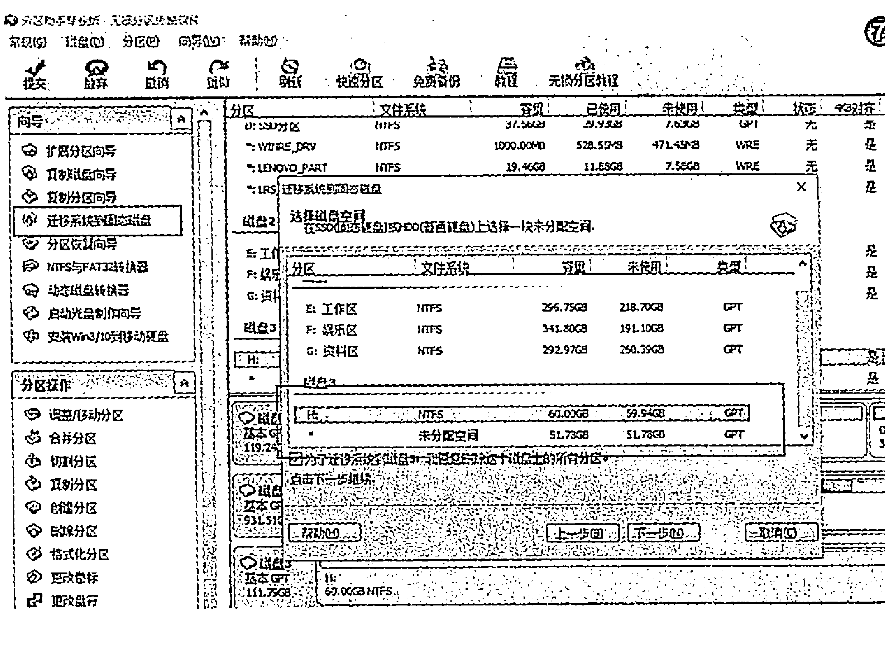

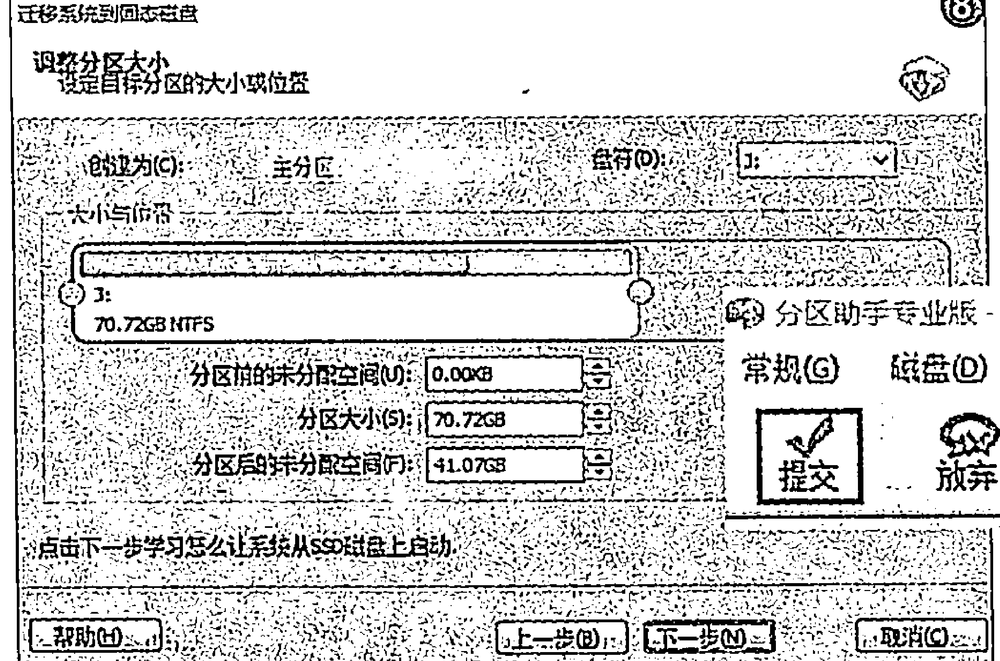

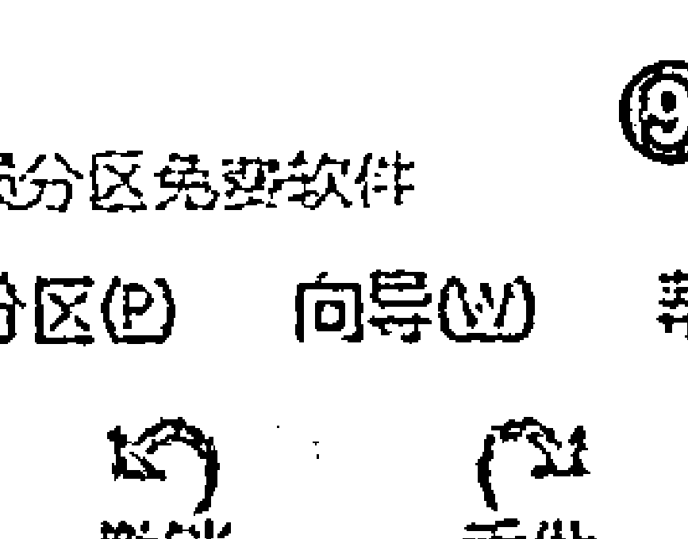

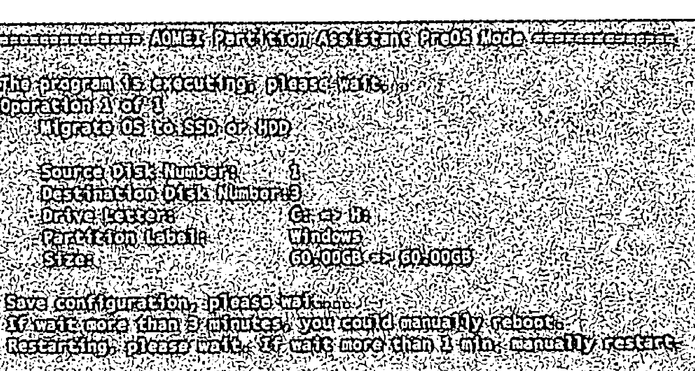

关机，将新老硬盘替换，重新开机后笔记本就能直接进入操作系统，你会发现C盘原有的系统、已安装的驱动、软件和保存的数据都在，只是如果笔记本原先有一键恢复的隐藏分区就没办法保留了。接下来，将老硬盘通过移动硬盘盒与笔记本相连，再将老硬盘中D盘或其他盘符中的重要数据复制到新硬盘即可。

###### SSD容量大于老硬盘

如果你新买的SSD容量大于或等于老硬盘，那笔者则建议大家使用硬盘克隆的方式，实现老硬盘整体数据的迁移，包括所有分区、隐藏分区、恢复分区等所有的数据。还是按照上面的方式将新硬盘与笔记本相连，然后下载安装并运行“轻松备份专业版”（下载地址：http://www.disktool.cn/backup/download.html）。

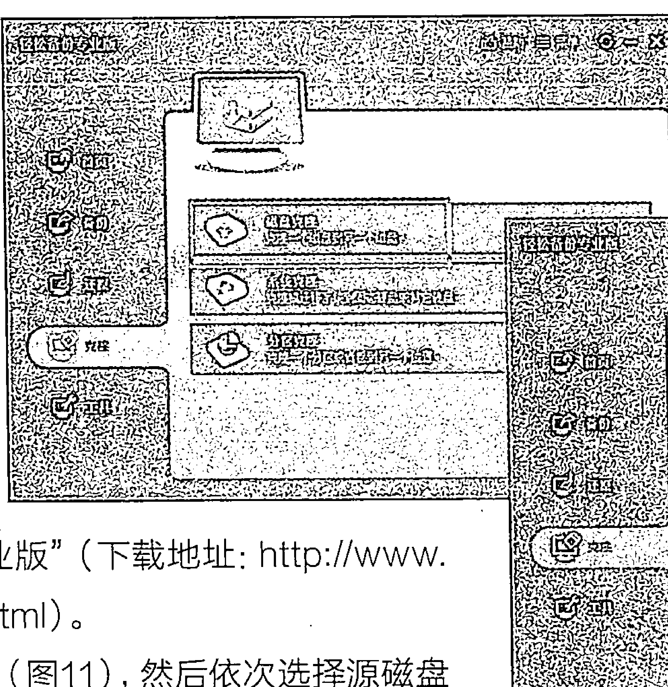

运行软件后点击“磁盘克隆”（图11），然后依次选择源磁盘

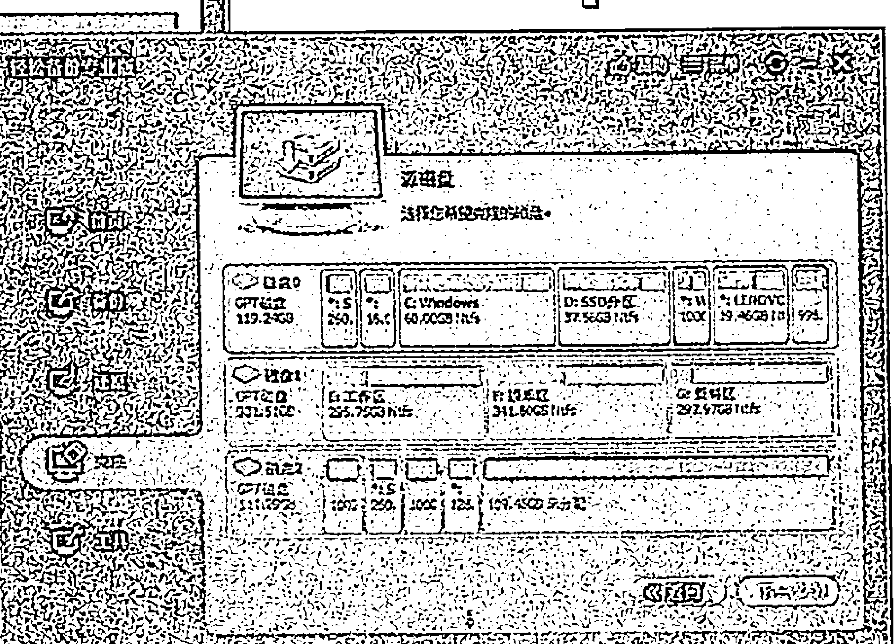

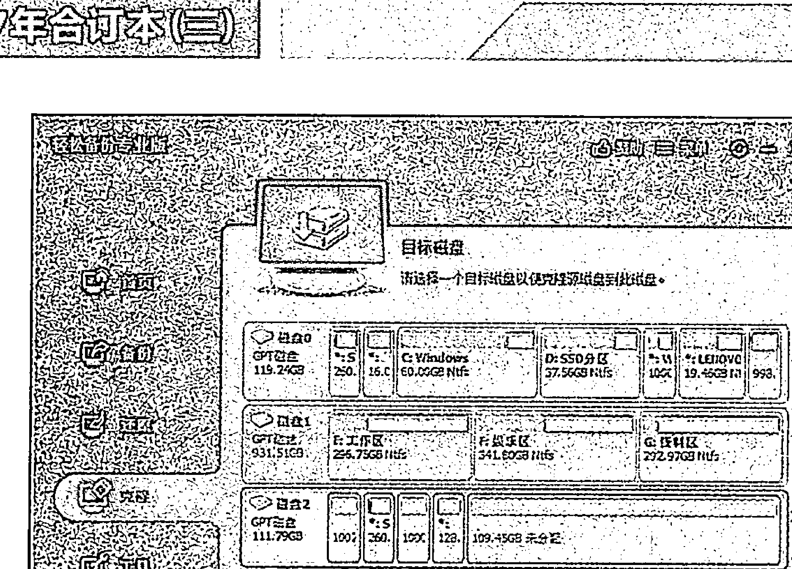

（图12）和目标磁盘（图13），点击下一步按钮将弹出磁盘克隆会覆盖删除目标磁盘分区和数据的警告窗口，点击是进入操作摘要界面，勾选“允许分区对齐已优化SSD”（图14），点击“开始克隆”按钮后耐心等待直至克隆完成。此时SSD的分区数量和里面的数据与老硬盘一模一样（图15），只是各分区的容量会根据SSD的实际容量出现变化。

| 磁盘 | 容量 | 分区信息 |
|------|------|----------|
| 磁盘0 | 119.23 GB | Windows (C:) 60.00 GB NTFS, SSD分区 (D:) 37.56 GB NTFS, 其他恢复分区等 |
| 磁盘1 | 931.51 GB | 工作区 (E:) 296.75 GB NTFS, 娱乐区 (F:) 341.60 GB NTFS, 学习区 (G:) 292.97 GB NTFS |
| 磁盘2 | 111.77 GB | Windows (J:) 57.46 GB NTFS, SSD分区 (K:) 35.17 GB NTFS, 其他恢复分区等 |

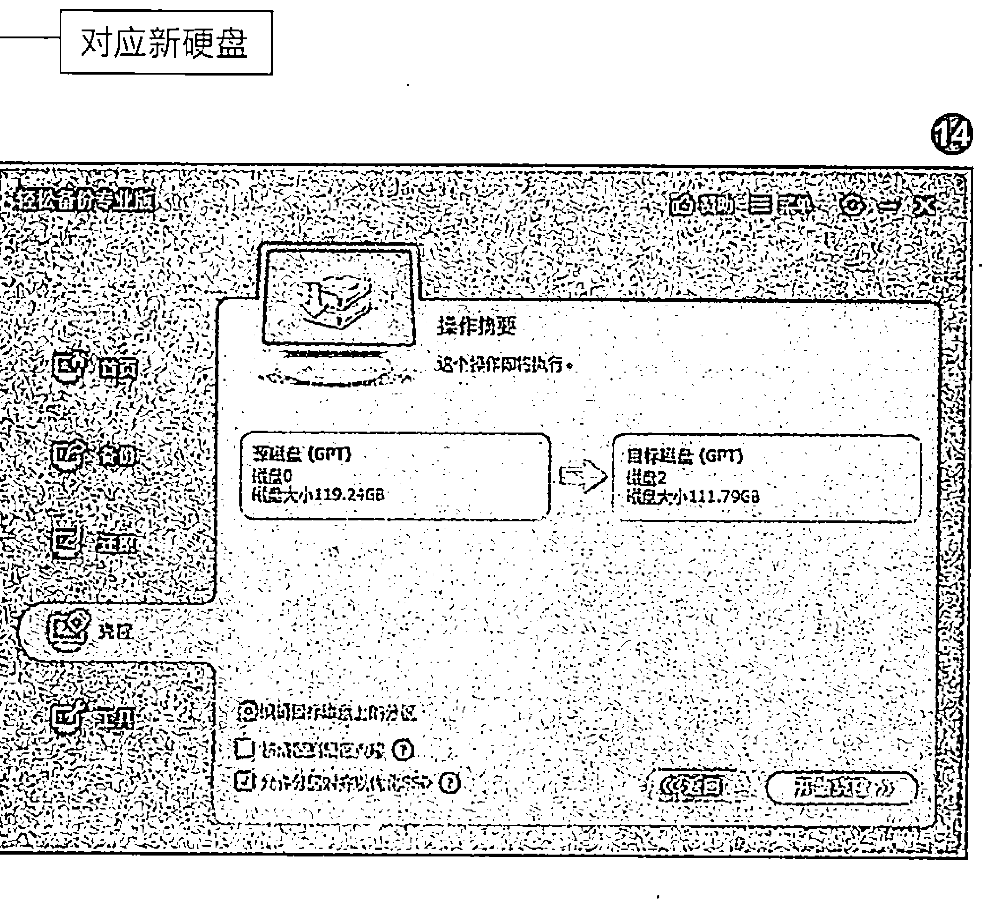

###### 当有两个硬盘位时

如果笔记本有两个硬盘位，那我们就无需准备移动硬盘盒等外设了，而且只要迁移系统分区即可，无需进行全盘的克隆。具体操作是直接将新买的SSD装进笔记本，然后通过“傲梅分区助手”进行“迁移系统到固态硬盘”的操作。由于SSD是通过SATA或M.2接口与笔记本相连，在系统迁移时的速度远非通过USB外接硬盘可比。

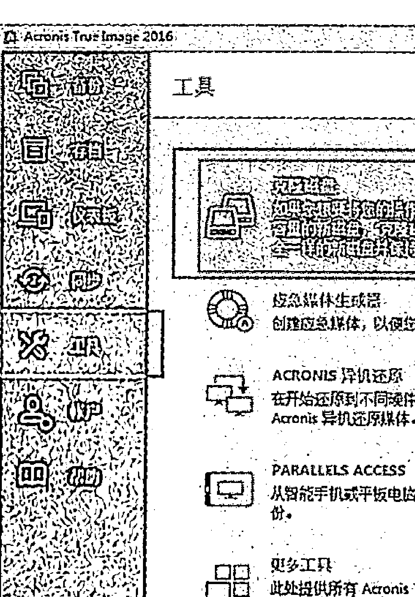

在这里，小编再向大家推荐一个名为“Acronis True Image”的软件，它的磁盘克隆功能可以调整更多目标分区大小和参数（图16）。此外，很多SSD品牌也会随机自带官方的数据克隆和系统搬家软件，比如三星SSD的Samsung Data Migration软件（图17），省去了我们下载第三方软件的麻烦。

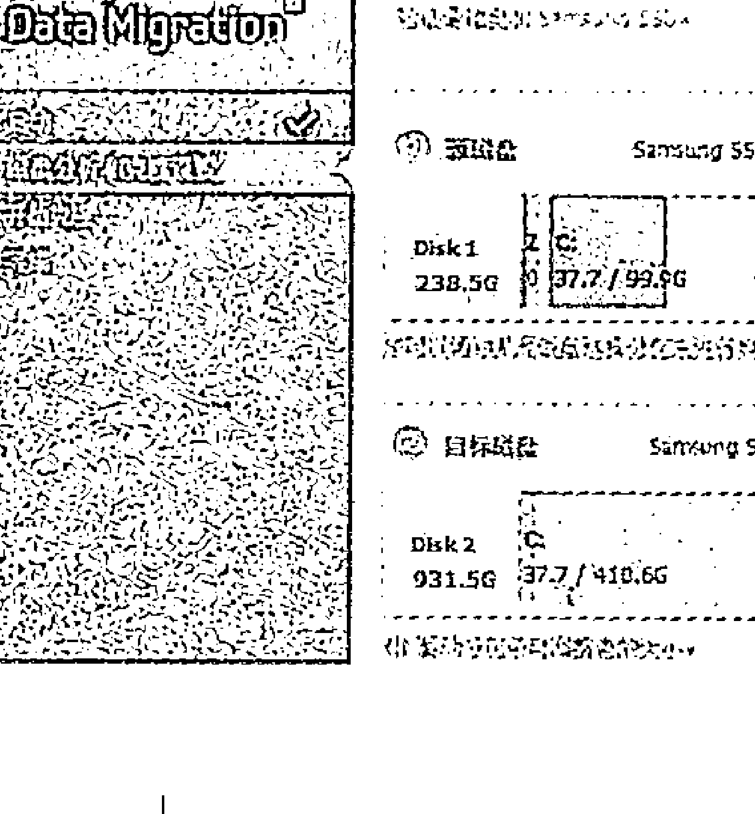

需要注意的是，新旧硬盘都装进笔记本并做完系统迁移或克隆后需要进入BIOS设定硬盘启动的顺序，要让SSD优先启动，进入系统后用分区助手等软件格式化老硬盘原来的系统分区（系统自带的分区工具可能不支持删除以及格式化老硬盘中的系统以及隐藏分区，即使你是从SSD进入系统的）。

#### 我的耳朵需要什么 探寻耳机的小秘密

文/魔之左手 张翼 策划《电脑爱好者》编辑部

扫一扫 更多精彩立即见

人类的感官中，视觉无疑是最重要的，很多研究的结果都指出，人类获取的信息中心，一半以上来自视觉，因此我们总是对各种视觉体验趋之若鹜，特别是在电器和数码产品用户中，追求视觉体验是最重要的购买/升级原因之一。然而很多人都会忽视一件事，那就是各种研究也表明，在视觉之外，听觉获取的信息也占据了不少份额。无论是在满足了视觉需求之后，还是在视觉必须用于更重要的活动如工作、行走和驾驶时，听觉获取的信息就显得更重要了。说得更直白一点，就是在进一步提升设备的应用体验、边娱乐边工作，以及随时随身娱乐方面，听觉是最为重要的途径，声音输出设备当然也应是各种数码设备中除了显示外设之外最重要的外设之一。

听觉感受对数码用户虽然非常重要，可是却被严重忽视，大部分人在购买各种数码设备时都不会很重视耳机或音箱等声音输出设备的配置，甚至连厂商都有意无意的忽视了相关外设，例如现在的电脑和手机就逐渐将音箱、耳机从标配品变成了选配品，或者干脆忽略掉。另外比较麻烦的一点是，原先的标配产品音箱、耳机对用户来说可以满足基本需求，也基本符合产品定位和能力，现在用户必须花心思来了解自己的需求和产品，选择最适合的音频搭档。如果您也遇到了这种情况，不妨来看一看我们下面的介绍吧。在购买音频输出设备时，我们常常会看到一些参数和概念，可以指导我们的选购，但这些参数相对于其他常见配件的指标来说，不仅比较陌生，更不太直观，应该怎样通过这些参数和概念了解并且进行选购呢？考虑到主流用户的生活环境和经济水平，本次我们主要推荐音频输出设备都是耳机，辅助设备也主要是便携易用的产品。

##### 游戏电竞

在游戏中，特别是电竞游戏中，声音是图像之外最重要的信息来源，游戏中的各种音效首先可以让玩家了解视野之外发生的情况，例如FPS游戏中敌方的脚步声、SLG中助手的报告或者单位的叫声等，因此能够让玩家清晰地听到这些声音，是游戏音频设备最重要的特色。其次对于游戏高手来说，能了解视野之外的敌情和敌方方位的话，将为己方提供明显的优势，这一点也同样有赖于对声音的精确表现能力，因此所谓的3D音效和支持3D音效定位的音频播放设备也就应运而生。最后，由于网络游戏中，组队的队员常常是在不同的地点上网，或者全都佩戴着隔音效果良好的耳机，所以游戏音频设备中应包括麦克风，而且效果还必须较好以保证交流的顺畅。

综上所述，好的游戏音频设备应该拥有良好的分辨力、精确的定位能力、效果良好的麦克风，表现在设计和配置方面，就是采用较大口径的扬声器，并且采用多音箱、多扬声器方式或者支持虚拟多声源，配有便于收放、试音效果较好的麦克风。目前游戏/电竞玩家都更偏向于选择耳机而非多音箱系统，除了前面提到的价格和空间问题外，还因为游戏/电竞耳机可以更加隔音以提升场景内的微小音效识别能力，可以自配麦克风且更加靠近嘴部，还可以在线缆上配置更易使用的音量、麦克风开关等调节部件，更便于使用。由于玩家经常会长时间游戏，很多主流竞技游戏的比赛更是动辄半小时以上，所以游戏/电竞耳机特别追求长时间佩戴的舒适性，比如采用轻量化的材料、角度和弹力精心调教的头梁、封闭效果好但不会太闷热的耳罩等，现在的很多相关产品更是为了讨好年轻的玩家而加入了个性化装饰和灯效。

| 参数项 | 参数值 |
| --- | --- |
| 类型 | 动圈，50mm，音效模式 |
| 类型 | 耳挂式，封闭式 |
| 频率响应 | 12Hz-28,000Hz |
| 阻抗 | 30Ω |
| 声压等级 | 1kHz 时 104.5dB SPL/mW |
| 总谐波失真(T.H.D.) | <2% |
| 输入功率 | 额定30mW，最大500mW |
| 重量 | 360g |
| 重量（含麦克风） | 376g |
| 线缆长度和类型 | 耳机(1m) + 音频控制器(2m) |
| 连接 | 耳机-3.5mm 插孔（4 极）+ 音频控制器-3.5mm立体声麦克风插孔 |
| 麦克风类型 | 驻极体电容麦克风 |
| 麦克风指向 | 全指向，降噪 |
| 频率响应 | 50Hz-18,000Hz |

###### 了解参数

在基本了解了游戏/电竞耳机的需求后，让我们来仔细看看应该如何挑选吧。

####### 1 单元

游戏耳机的产品介绍中，几乎都会提到自己采用了超大单元，也就是大直径的喇叭，其原因就是理论上讲，大直径的单元一般也最大，功率也相对较大，可以让一些微小的声响更清晰地表现出来。不过我们也应该了解，在实际使用中，耳机并不是一直使用最大功率的，耳机的音质还要看喇叭的额定功率。

其实即使在“超大”单元这一指标上，也有相当多的不同。一般来讲，至少50mm的单元才有资格这样表述，不过一些比较小巧轻便的耳机在采用40mm单元的耳机时也会宣称自己是“超大单元”，相对于其体积来说，40mm口径也许确实应算比较大了，但性能与50mm口径单元相比显然会有一定的差异。

大直径单元的一个问题是会造成耳机体积和重量的增加，所以一般的“超大单元”也就是50mm直径，60mm直径的产品已经比较少，70mm的更是很少见到。

| 参数项 | 参数值 |
| --- | --- |
| 音频处理器 | BlasterX Acoustic Engine 简版(预设模式) |
| 音频驱动程序 | 40mm Full Spectrum 全频段发声单元 |
| 耳机频率响应 | 20Hz ~ 20kHz |
| 支持的游戏控制台 | 通过3.5mm4极接口连接PlayStation®，通过3.5mm4极接口(需要Xbox One立体声耳机适配器)连接Xbox One® |
| 麦克风 |  |
| 麦克风类型 | 单向降噪电容麦克风 |
| 可拆卸 | 是 |
| 频率响应 | 100Hz ~ 16kHz |
| 灵敏度 | -40dB |

> 比较常见的游戏耳机规格表

####### 2 频响范围

耳机或者说是单元的频响范围，是指它能够重放的声音频率范围，表现的是耳机对高、中、低各频段信号的再现能力。耳机的频响范围只标出能够表现的最高和最低频率，所以更准确的说法是对极高和极低频信号的表现能力，中频信号的表现一般不会有问题，也无需标出。

正常人能够感受到的声音频率范围是20Hz~20kHz，超出这个范围的大部分人都是听不到的，而敏感的音频范围只有100Hz~15kHz。由于游戏中一般也不会设计超过普通人敏感范围的音效，所以无需追求过高的频响范围。

需要注意的是，如果希望同时作为娱乐耳机，进行高保真音乐、电影欣赏等活动，且听力确实出色的话，还是应该考虑购买频响范围接近甚至超过20Hz~20kHz的耳机。

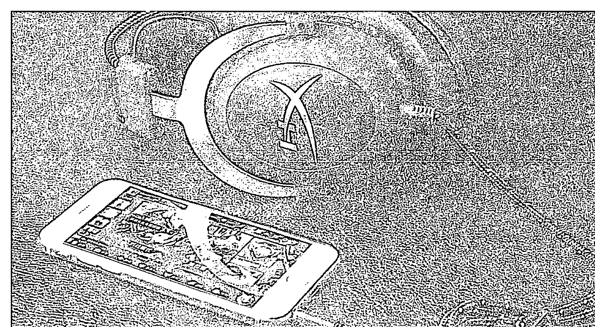

####### 3 阻抗

阻抗是指在具有电阻、电感和电容的电路里，对电路中的电流所起的阻碍作用。阻抗越小，耳机越容易出声，但此时声音的表现也会显得比较平庸；反之，难以驱动的耳机虽然比较耗电，但低音会更加的沉。

大部分的游戏耳机阻抗在32Ω左右，这是考虑到了PC耳机接口的实际驱动能力以及游戏音效的实际需求确定的。这一阻抗也可以满足基本的娱乐听音需求，用来进行基本的音乐欣赏、电影播放等都没有问题，也可以用于手机等数码设备，特别是用于最近兴起的手机游戏/电竞中。相比之下，发烧级耳机的阻抗要高得多，因此与游戏耳机有着比较明确的分野，相关介绍请参考下面的高音质耳机部分。

####### 4 灵敏度

灵敏度就是给耳机提供1毫瓦的功率，耳机在1kHz的频率处发出的音量大小。灵敏度越大，耳机的音量越大。通常耳机的灵敏度会在90dB~120dB之间，而游戏耳机的灵敏度普遍会高于音乐耳机，因此能够更清晰地表现一些微小的音效。

可以看出灵敏度其实与阻抗的表现正好相反，不过并不是完全矛盾的，如果特别追求高灵敏度、低阻抗的话，特别微小的信号变化都能够“推动”耳机，会使得原本不明显的系统噪声影响到正常播放，声音的稳定性也差。

####### 推荐产品

对参数有了基本了解后，让我们看看一些典型的游戏/电竞耳机产品吧。

####### 雷蛇北海巨妖标准版

参考价: 299元

北海巨妖标准版是雷蛇（Razer）北海巨妖系列游戏耳机中的入门机型，外观与其他版本非常相似，只是性能略有缩减，不过50mm的单元、20Hz~20kHz的频响范围、24Ω的阻抗、105dB的灵敏度已经完全可以满足一般用户的需求。它300g的重量也相对较轻，带有轻巧的麦克风，不过1.3m的线长对主机放在桌下的用户可不足。

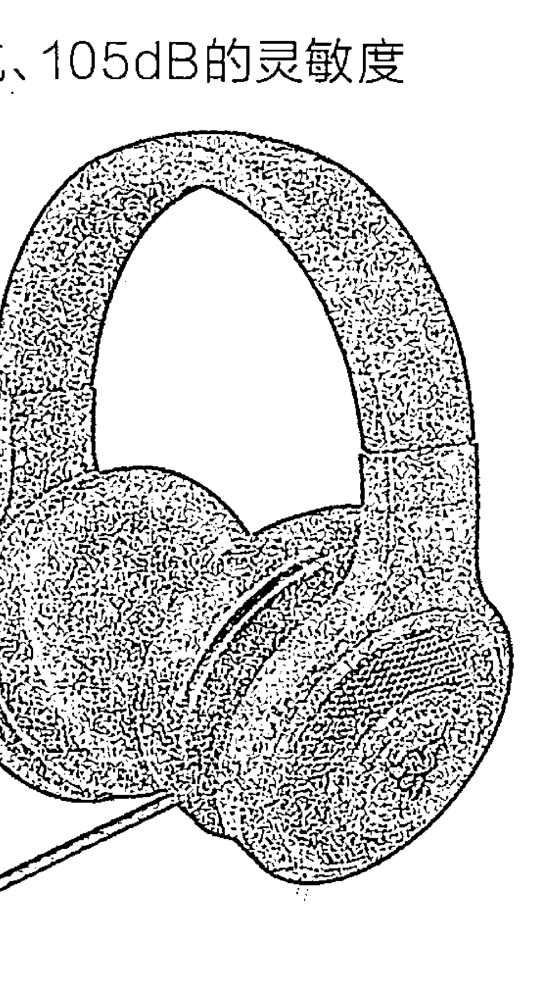

####### 赛睿西伯利亚v1

参考价: 259元

赛睿的西伯利亚（siberia）v1是一款特别注重轻量化设计的产品，这也使其在采用50mm大口径单元的同时仅为240g。这款产品有多种艳丽的配色可选，个性十足，特殊的弹性头带设计使其佩戴压力更多地由头顶而非耳部承担，加上厚实的耳罩缓冲，佩戴较为舒适。它采用两段式连线，包括线控延长线的线缆总长达到2.8m，非常适用于将主机放置较远的玩家，不连接线控延长线的话线长仅有1m，更便于连接随身数码设备。其频响范围达到18Hz~28kHz，阻抗为40Ω，没有透露灵敏度。它采用麦克风与耳机分离设计，在游戏中通话时不如一体式设计的麦克风方便。

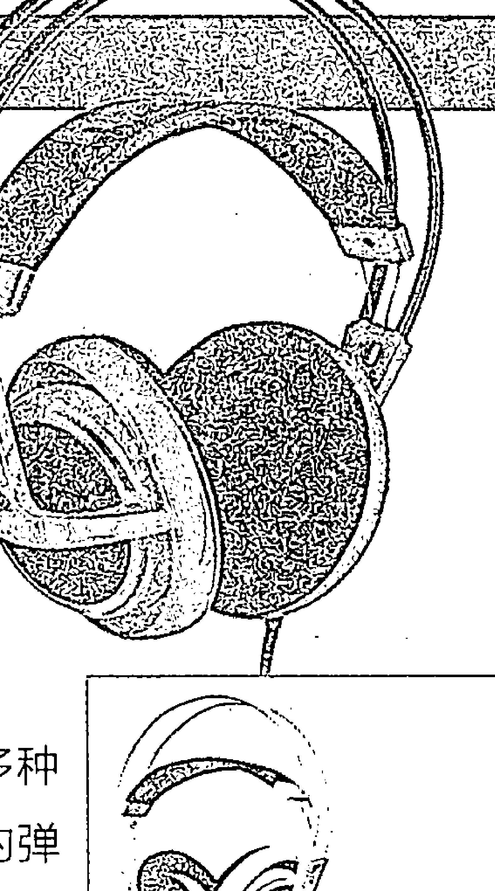

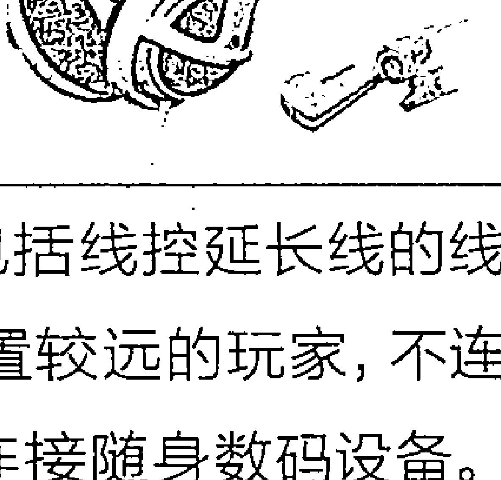

####### 5 材质

决定耳机佩戴舒适度的一个重要因素就是材质，这里主要是指耳机头梁和耳罩的材质，舒适性工程学设计常常也依赖于材质的能力。耳机头梁的材质一般会选用比重小而强度、弹性适中的材质，在保证强度和足够的压力之外，尽量轻巧。低端产品一般采用塑料树脂，而高端产品常常采用轻质化的合金材质。

前面已经提到，游戏耳机对隔音的要求比较高，通常采用全包裹结构的耳罩，很少有压耳式设计。耳罩一般为皮革包裹海绵结构，海绵能大大地减缓耳机对头部和耳部的压力，而皮革的包裹则让耳朵在长时间的佩戴时不会过于闷热。当然海绵也分为普通海绵、记忆海绵等，厚度也各不相同；皮革则有真皮和仿皮，档次同样有所分别。

##### 高音质耳机

自CD问世起，我们就走入了数字多媒体时代，传统的磁带、黑胶唱片等由于技术老旧且效果不佳已渐被淘汰。同时，我们也已习惯时时刻刻在电脑和移动设备上使用音视频功能，这一切仿佛司空见惯，但对音频保真度有所追求的人则并不满足：一台主流性能的个人电脑与一副百元左右的耳机，或是一台普通手机与其附送的耳机……这种搭配在他们眼中，就是能听个声而已，离欣赏的高度还相差甚远。

在音频爱好者圈内有类似这样一句话：百元到千元的提升是一分钱一分货，而万元及以上的提升则是十分钱一分货甚至更多。可见音频设备在最初阶段的升级效果是显而易见的。人的追求是永无止境的，我们并不是要推荐各位花重金去购置一套Hi-Fi音响系统，而是在此理清一些思路，获得在有限的资金预算内音质得到明显提升的方案。

###### 如何判断音质的差别

相信多数消费者在使用多媒体设备时并没有注意到音质，只要设备不妨碍使用即可。可当你感受到高品质音频后，会发现之前“够用”设备提供的音质根本谈不上享受，它可能糊成一片，高、中、低频没有明显的区分；或是定位不够清晰，乐器和人声等忽远忽近；更有甚者，高频尖锐刺耳，低频鼓点则隆隆作响不可忍受。这些都是低端设备的表现，不仅在乐曲的还原能力上大打折扣，长久使用下来，甚至严重损坏了听觉。

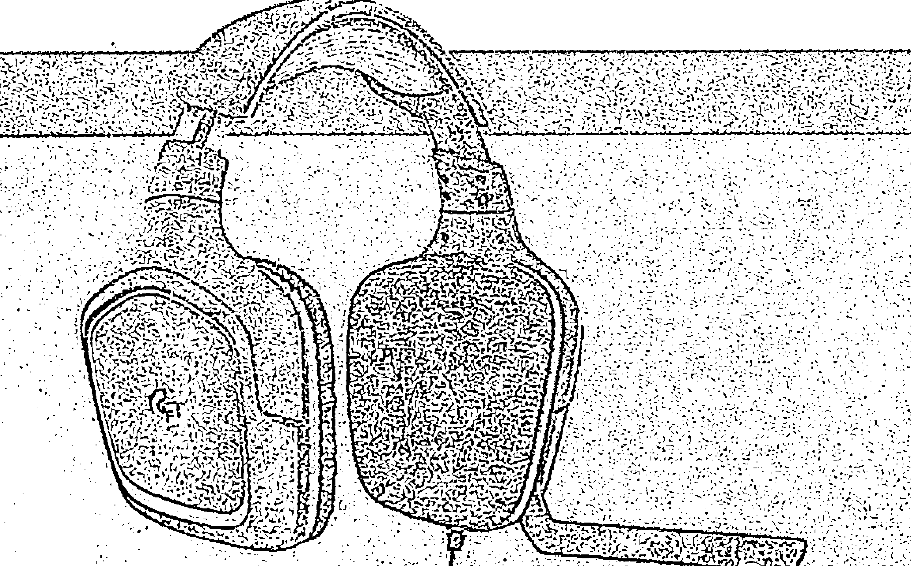

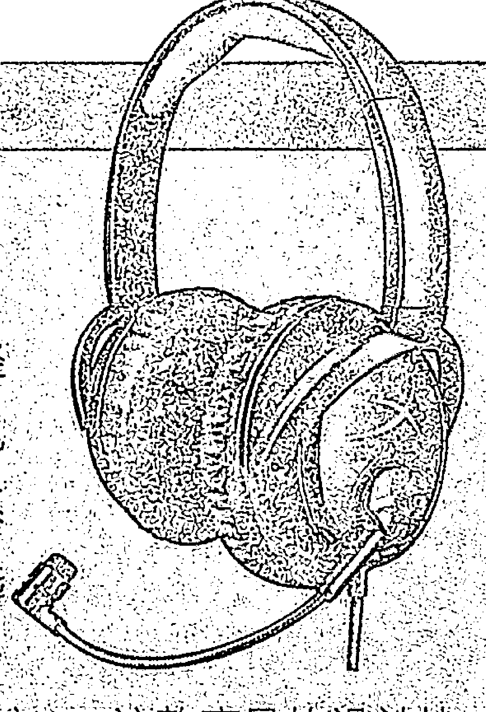

**罗技G231 Prodigy**
参考价：349元
罗技G系列游戏耳机虽然非常出色，但大部分价格不菲，而G231 Prodigy是其中比较亲民的一款。这款耳机外形和配色都比较独特，个性十足。它采用比较特殊的直杆式麦克风，耳罩可以旋转90度，让耳机成为扁平造型，易于携带，重量更是仅有255g。其单元直径为40mm，频响范围20Hz~20kHz，阻抗为32Ω，灵敏度90dB。

**金士顿HyperX Cloud Drone**
参考价：259元
金士顿的HyperX品牌已经转变为包含多种外设的游戏/电竞专业品牌，它推出的Cloud系列耳机受到了很多玩家和电竞选手的青睐，Cloud Drone（黑峰）耳机是其游戏耳机的入门级产品之一。这款产品的设计比较简洁，重量仅有220g，它采用两段式连线，1m的主线用于连接随身数码设备也不会觉得累赘，增加2m的延长线后则可以连接较远的主机。它内置40mm单元，频响范围20Hz~20kHz，阻抗24Ω，灵敏度94dB。

> **小提示**
由于硬件配置较高，在其他方式的娱乐应用中，游戏/电竞音箱/耳机的表现也不会太差，但对于一些高端听音用户来说，追求细微音效和震撼效果的游戏耳机，整体音质可能就显得粗糙，甚至有明显的瑕疵。此外，游戏/电竞耳机的麦克风和线上操控功能，在一定程度上也会影响高端音质的表现。

##### 提升音质的几个必要条件

1. 要有良好的音源，也就是我们所说的音频文件，这些文件来源于对CD音源的无损抓取，以及网络上的共享。如果你拿着几个经过强力压缩的文件想获得良好音质是不可能的。
2. 稳定且不差的播放设备，这至少应该是一部装有支持无损音频文件播放APP的主流品牌手机，一部专用的随身音频播放器，一台拥有经过音质优化主板的PC或添加了独立声卡/独立解码器的PC。
3. 一部质量尚可的扬声器，这可以是各种佩戴方式的耳机，或是2.0音箱。

##### 移动端升级思路

###### 1.简洁轻便型

因为主流手机的解码器等在品质上差距不大，如果只想花少量资金提升音质并且以轻便为主，只要选一款低阻抗、灵敏度高且质量过硬的品牌耳机即可。类似这种耳机在市面上可选的范围极大，价格在300元~1000元区间，种类丰富，可根据自己的喜好和实际需要购买一款。但需注意，绝大多数类似耳机都有Android系统和iOS系统适用之分，耳机的线控和麦克风功能会受此影响，请在购买前多加注意。

####### 推荐产品

- 森海塞尔Momentum in-Ear入耳式耳机
- 索尼MDR-EX750AP h.ear入耳式耳机
- 爱科技（AKG）K374U入耳式耳机

###### 2.进阶发烧型

如果你不满足手机和耳机的搭配，对音质有更高的要求，那就不用考虑用手机作为播放平台了，一款高质量的随身无损音频播放器则是首选，而耳机的选择则需再上一个档次（千元以上）。专业无损音频播放器，其在最初就完全按照优化音质的思路设计的，没有集成过多其他芯片和复杂电路，保证信号纯净无干扰。在此基础上，除了搭载更高端的解码和运放芯片外，还设计有功率放大电路，能更从容地驱动各种高端耳机。这些播放器都支持绝大多数格式的音频文件，甚至有近些年被发烧友更加推崇的DSD文件。千元以上价位的耳机方面，各大厂商则会拿出自家相对更新、更具有品牌代表性的产品，它们的设计理念不外乎就是最大限度地还原音源，没有过多音染，使得到的音质更纯净，耳机的驱动方式则有动圈、动铁、圈铁融合等。当然，如果播放设备有一定实力了，部分头戴式大耳机也可以作为选择方向。

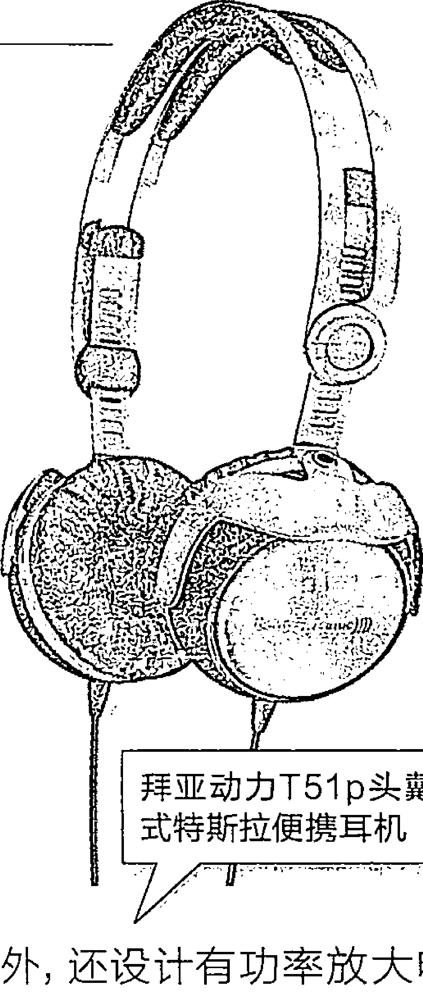

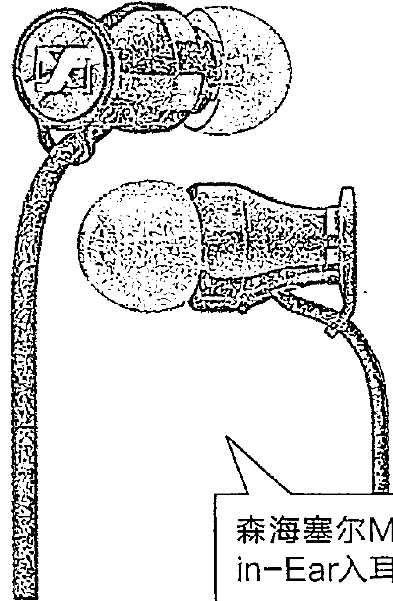

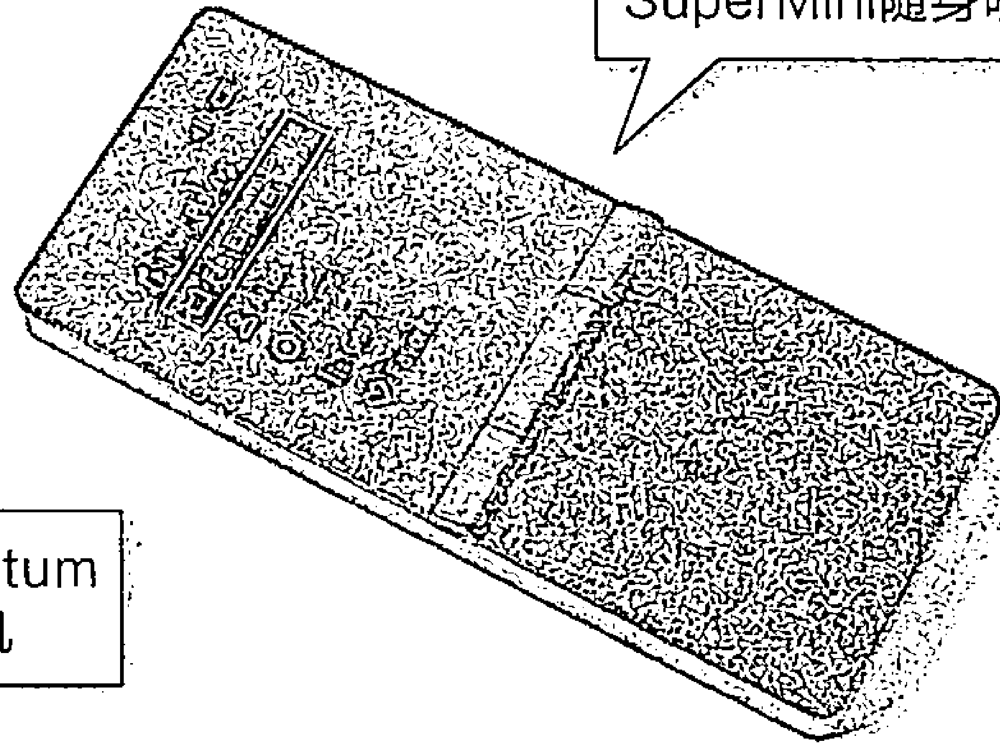

####### 推荐产品

- 森海塞尔IE80入耳式耳机
- 罗技UE900S四单元动铁入耳式耳机
- 拜亚动力T51p头戴式特斯拉便携耳机
- 艾利和（Iriver）Astell&Kern AK Jr HIFI播放器
- 头领科技（HIFIMAN）SuperMini随身听
- 索尼NW-ZX100无损音乐播放器# PC端升级思路

从移动端设备的推荐中可看出，一套进阶型的随身听音设备也动辄四五千元，而PC端的应用没有了便携等因素的制约，可挖掘的和必须投入的精力和资金也是超出前者很多的。PC Hi-Fi的概念自提出多年后，至今没有得到诸多传统音响发烧友的认可，他们认为PC是多功能集成电路，设计复杂，配件繁多，因此在硬件内部产生的电磁干扰就已不属于Hi-Fi的范畴; 为了尽量减少这些干扰，市面上有很多类型的外接解码设备供爱好者自由搭配。常见的例子有:

1.  台式机家装内置专业音乐声卡→同轴线输出到功放/耳放→扬声器
2.  台式机/笔记本电脑USB界面/IEEE1394界面连接外置解码器或解码/功放一体机→扬声器
3.  台式机加装内置声卡→光纤或同轴输出到解码器→同轴或平衡线输出到功放/耳放→扬声器
4.  购买专业数字转盘，通过局域网与PC移动设备相连，从网上下载文件，从数字转盘输出到解码器→功放/耳放→扬声器

从上述例子中可看出，只要遵循数字解码→模拟电路功率放大→扬声器的准则就可以实现完整的台式听音系统。至于用什么界面进行传输，则要看各位的需求和产品提供的接口了。总之从电源开始，到PC系统优化/播放软件的选择，到主要设备，再到各种接口和材质的连接线，无疑是一笔相当庞大的支出。不可否认这个领域的水很深，听音毕竟是个人的主观感受，一切从个人感官出发，搭配一套适合自己的系统才是正确的。至于一些不负责任的“老烧”，揣着自己的一些目的，用听似高端深奥的词语评价某款产品或某种器材搭配时，不论评价好坏，各位不可全信，如果正是自己关注的产品，则可寻求一些条件试听一下，耳听为实。

### 名词解释

-   **推力**: 很形象的名词，简单的意思是说音频输出电路是否可很好地驱动扬声器的各个频段，所放出的音质是否饱满和细腻。多媒体应用中，推力也有直推和功放之分，后者是一件独立设备，它设计了独特的模拟电路放大器，对应一些型号的扬声器可得到惊艳的效果; 前者则没有额外的放大电路，整体效果不及功放。
-   **无损格式文件**: 顾名思义就是没有经过压缩或者经过各种算法少量压缩处理过的音频文件，常见的有WAV、FLAC、ACC等。CD格式的采样率通常为44.1kHz, 我们可依据这个标准判断音频文件是否进行过压缩。
-   **解码器**: 当前我们手中的音源除磁带或黑胶唱片外，基本都是数字音源，其存储形式为01001……我们就需要解码器(DAC)进行数字信号到模拟信号的转换，才能播放出对应的声音。不论是手机等移动设备或是PC声卡, 都带有解码芯片。
-   **动圈/动铁**: 常见的耳机驱动形式, 动圈比较传统, 是通过电力带动磁铁驱动一片圆形的振膜发声; 动铁出现相对较晚, 其单元体积比动圈小很多, 构造更加精密, 不少高端产品甚至出现3单元到6单元不等的产品。

### 管中窥豹？小孔连接大世界
策划《电脑爱好者》编辑部

如今笔记本电脑已经成为最受家庭用户青睐的PC形态，而作为办公和娱乐应用的终端设备，笔记本除了要具备足够强大的性能动力以外，还要具备一定的扩展交互能力。而笔记本扩展交互能力的强弱，则体现在其机身上众多大大小小的孔洞里面。可以说，笔记本上每一个孔洞都可能连接着一个世界。
它们一直都在，只是极易被我们忽略和轻视。本期特别话题，就让我们将目标锁定在笔记本身上的那些孔洞吧。

#### 屏幕孔
可能是最热闹的所在

细心的读者可能发现了一个问题，笔记本屏幕上边框的摄像头附近，往往是孔洞密集的“驻扎区”，少则2个，多则N个。那么，这些小孔都是做什么用的呢？

#### 最醒目的摄像头

在笔记本屏幕边框的孔洞中，最为醒目的就是摄像头对应的“窟窿”了。有些笔记本在摄像头旁边会增加一个开孔并嵌入状态指示灯（图1），可以通过它判断摄像头的运行状态，从而起到防止其被恶意控制而偷拍隐私的问题。
遗憾的是，绝大多数笔记本并没有给摄像头配备状态灯。如果你担心安全问题，在Windows 10系统中可以进入“系统设置→隐私”中，选择关闭禁用摄像头（相机），或是手动指定允许使用相机权限的应用（图2），比如将QQ之外的全部关闭即可。

#### 摄像头的新搭档

微软在Windows 10中新添了Windows Hello功能，可以通过面部识别取代复杂繁琐的密码输入。然而，Windows Hello的面部识别不仅需要笔记本配备摄像头，还需要一颗红外传感器辅助（图3）。因此，凡是号称支持Windows Hello功能的新款笔记本，它们都会在摄像头附近配备红外传感器。

#### 电源孔
渐露统一曙光

笔记本电源孔虽然小，但它却是最为至关重要的存在。毕竟，单纯依靠电池供电玩游戏，时下笔记本的续航时间也就是2小时到6小时之间，要想持续作战，电源孔很少有闲暇的时候。

#### 兼容咋就这么难

智能手机的充电接口要么是Lightning，要么是Micro USB，各品牌之间的适配器和充电线都能混用，便利性始终让笔记本羡慕嫉妒恨。反观笔记本领域，机身上的电源孔形状长期以来非圆（型）即扁（平）（图7），其中采用扁平状电源孔设计的多为联想和ThinkPad品牌产品，而其他品牌虽然钟爱圆形插孔，但依旧存在令人无语的兼容困局。

抛开适配器所能提供的输入/输出电压和电流是否匹配不谈，单看圆形的电源插孔就存在5.5mm×2.5mm、5.5mm×2.1mm、3.5mm×1.35mm、2.5mm×0.7mm等诸多规格（图8），这就导致各个品牌或不同型号之间笔记本的电源插头无法通用。

如果你想给公司或学校单独另配一个电源适配器，原装的太贵，而选择第三方的兼容适配器时必须留意DC头（适配器的电源插头）和DC座（笔记本身上的电源插孔）内外径匹配的问题，接触过紧或接触不良都存在安全隐患。

#### 易忽略的MIC采集孔

相信不少同学都用笔记本进行过视频聊天吧？在不使用外接MIC时笔记本也能采集到我们的声音从而传递给对方。原因很简单，每一款笔记本都已集成好了内置的MIC。

早期笔记本大都仅内置一个MIC，而且会将它安置在掌托附近（图5），也就是靠近使用者的位置上。然而，随着视频聊天和视频会议的流行，用户对声音传输的品质要求越来越高，过滤背景杂音已经成为最基本的诉求。

在这种大环境下，你会发现时下笔记本几乎都在屏幕顶部摄像头两侧开了2个细小孔洞，构成了双MIC的阵列方案（图6）。这种矩阵式的MIC可以实现更好的降噪和过滤作用，远离扬声器的它们也能避免啸叫现象，在聊天或录音时可较为完美地还原你的声音，即便在嘈杂环境中个人智能助理Cortana也能在矩阵麦克风的帮助下识别语音命令。

#### USB Type-C接口一统江湖

好消息是，如今越来越多的新款笔记本都开始通过USB Type-C型接口作为充电端口。有关它的特性CFan介绍过多次了，简单来说它拥有反正都能插、占地面积小、支持100W以内的充电功率等优点。

可惜，充电功能只是USB Type-C接口的可选项，如果想要获得该功能，需要额外的电源管理IC芯片的配合，而出于成本的考虑，很多笔记本仅保留了USB Type-C接口传输数据的能力，而无法进行电力的传输。

此外，有些追求极致的轻薄本可能仅配备了唯一的USB Type-C接口，充电时就无法接驳闪存盘或其他外设。此时，建议大家购买集成DC in功能的Hub转接器，在转接器身上不仅提供了标准USB、VGA和HDMI等常规接口，还配备了额外的支持DC in的USB Type-C接口(图9)，可用于接驳原装充电器，在使用外设的同时依旧可以进行充电。

> > **快速链接**
如果你对移动设备电源适配器之间的兼容问题感兴趣，请参考本刊2016年22期《非原装的困惑电源适配器怎么选》这篇文章。

#### 笔记本锁孔
因轻薄而失宠

在笔记本本身上哪种接口的历史最为悠久？除了我们熟悉的USB以外，诞生于1992年的笔记本锁孔(NoteBook Lock)也是源远流长(图1)。如果你经常在公共场所下使用笔记本，这个锁孔的重要性将被无限拔高。

##### 防盗专业户

笔记本锁孔的标准诞生于1992年，由美国肯辛通公司发起。这是一个矩形圆角的孔，在锁孔内有钢结构加固，通过和锁具上的T型锁扣相互卡合，使锁及锁缆和设备紧密连接(图2)。

如果是肯辛通官方认证的安全锁，其锁扣内部是由七颗弹珠构成，很难用工具暴力撬开，钥匙也无法复制。而钥匙锁的线缆也是由多股麻花状的钢缆和防弹纤维组成，普通老虎钳根本剪不断(图3)。此外，笔记本机身上的防盗锁孔内部也通常会采用合金材质加强的，当其与安全锁搭配使用时，要想将锁与机器分开，基本上都是要破除机器外壳的。

无论是学校宿舍、办公室还是其他公共场合，只要你用安全锁将笔记本锁好，短时间的离开根本无需担心它会被人偷走。当然，前提是你购买安全锁时不要图便宜，安全锁的固定点足够牢靠(图4)。

##### 安全与轻薄的矛盾

理论上讲，越是贵重的笔记本，就越应该强化安全防盗能力。然而，在轻薄本大行其道的今天，笔记本锁孔却渐渐离开了坚守已久的阵地。

以苹果新MacBook、惠普Spectre 13和华硕灵耀3等最新高端轻薄本为例，这些产品为了保持性感的身材和简洁的设计，全身上下仅保留了3.5mm和USB Type-C接口，包括笔记本锁孔和其余接口被一并舍弃（图5）。实际上，笔记本锁孔所占用的空间和USB Type-C相差不多，理论上讲再轻再薄也不差多为其保留一个孔隙。只能说这些轻薄本太过偏执了。

要知道，笔记本越轻越薄，被“顺手牵羊”的难度也就越低。

总之，如果你是住校学生，经常在教室或宿舍使用笔记本；或是工作场所总有外来人员光顾；再或是需要带上笔记本进行室外工作的人员，笔者强烈建议大家优先考虑配备笔记本锁孔的机器，并为其购买一条安全锁。

#### 喇叭孔 透过现象看本质

在笔记本机身上，总会存在一对密集型的细小孔隙，当我们观看视频或聆听音乐时，或澎湃或轻柔的声音就会从这里传出。那么，通过这对小小的喇叭孔，我们还能了解什么呢？

##### 喇叭孔的位置之争

作为多媒体娱乐终端设备，笔记本自然要具备一定的影音表现力。比如可视角度和亮度更高、色彩更真实的屏幕，以及能在方寸间营造影院般的声音体验。因此，无论笔记本价格几何，它们至少都会配备“立体声扬声器”，也就是所谓的“双喇叭”。

问题来了，喇叭放在哪里效果最好？既要照顾到喇叭孔开口不会影响笔记本整体的视觉效果，还要确保声音的通透性。

就喇叭孔的位置而言，如今的笔记本大都采用了3种位置方案：
1.  将双扬声器集成在屏幕转轴附近，要么是键盘顶部左右两侧（图6），要么是隐藏在键盘上方的长条区域内（图7）；
2.  将双扬声器安置在机身左右两侧，和侧面接口位于同一个水平面上（图8）；
3.  将双扬声器隐藏在机身底部边缘位置（图9）。

就理论来看：①的优点是可以确保音量不受损失，但如果调校不好或音量过大会有刺耳的感觉；②的表现最均衡，立体声效果最强；③的声音经过桌面反射会表现得更为圆润而接近真实。就实际应用来说，游戏本大都青睐第①种设计，②在纤薄风的影响下已经没有了立足之地，而③则是最受轻薄本欢迎的设计。

##### 数量和品质决定音效

为了增加噱头，很多笔记本都会加入杜比音效的支持。实际上，网上也能找到很多破解版的杜比或SRS音效软件，可以让任何笔记本都能获得特殊音效的增益加持。但是，真正决定一款笔记本声音表现力的，还是得看内置扬声器的品质和数量。一些低价笔记本虽然号称配备立体声扬声器，但拆机可见它们的喇叭真的只是最简单的喇叭（图10），连最基本的音腔都没有，只有音量没有音质可言。而好一些的笔记本都会采用集成较大音腔的扬声器单元（图11），低频饱满不破音。而再讲究些的笔记本则会集成4个扬声器单元（图12），或是额外增加1个独立的低音炮单元，哪怕没有连接耳机也能带来较好的影院效果。

#### 音频孔越来越“独”

> > 不就是插耳麦的货吗，有啥可说的？

实际上，笔记本音频孔远没有我们想象的简单哦。

##### 越来越独处的音频孔

在早期高端笔记本上，最多时可同时集成四个音频孔，它们分别是耳机孔、MIC孔、音源输入和音源输出（图1），可以接驳带低音炮的5.1声道音箱。随后，笔记本音频孔减少到了三个（图2），除了耳机孔和MIC孔外，S/PDIF数字音频接口的加盟可以接驳DTS数字环绕AV放大器，配合多声道家庭影院音箱系统，可带来极为震撼的声音表现力。可惜，笔记本的发展趋势是轻薄为上，而搭配功放使用的发烧玩家也越来越少。于是，笔记本的音频孔进一步从三变二，只保留耳机孔和MIC孔。如今，随着轻薄本的流行，笔记本周边的音频孔都换成了唯一的复合式音频接口（图3），腾出更多空间去安置USB等接口，或是让笔记本侧面看起来更简洁。由于笔记本的音频孔数量不一，这就让我们在外接耳麦时容易遇到各种兼容问题。

##### 与耳麦的匹配问题

比如，新买的笔记本只有唯一的复合式音频接口，而你家里的耳麦却采用了耳机和MIC插头分离的设计，想用耳麦听歌就无法使用耳麦上的MIC；再比如，新买的笔记本采用了耳机和MIC分离的设计，但你家里的耳麦却采用了复合式接口，同样面临耳机和MIC功能只能任选其一的尴尬。

好消息是，在淘宝上我们可以买到一转二（图4）或二转一的分叉音频线（图5），恰好可以解决上面这种笔记本和耳麦音频接口不匹配的问题。

此外，有些耳麦上的MIC品质不好，在录音时效果反而不如笔记本内置的MIC。这个时候，我们可以进入控制面板中的“声音→录制”界面，手动指定内置MIC为“设置为默认设备”，同时禁用外置MIC即可（图6）。

#### 进风孔
空气流通的学问

散热效率是影响笔记本性能发挥的核心要素，因为再高的配置也禁不起过热降频的折腾。有关笔记本的散热设计，CFan过去曾详细介绍过热管、风扇、散热鳍片和出风口的作用，今天我们则来补全进风孔的重要性。

##### 复习进风孔的作用

在2017年13期的特别话题中，我们介绍过笔记本散热模块的工作流程：处理器和显卡运行时发热，热量首先会传导至覆盖在芯片上的散热片，然后有热管传递到散热鳍片上，最后再由风扇去吹鳍片，通过冷空气与鳍片的热交换来带走热量，从而达到控温的目的。

在这个过程中，冷热空气的交换流通至关重要。对游戏本而言，几乎所有产品都会在CPU、GPU和散热风扇对应位置的底盖附近添加密密麻麻的进风孔。由于笔记本普遍使用离心式风扇，这样外部的冷空气就会从进风孔中被抽进来（图7）。换句话说，底盖的进风孔面积越大、距离风扇越近，抽进来的冷空气风量也就越大，散热效果也就越好。

为了避免从进风孔“入侵”的灰尘，进风孔对应的底盖内侧普遍还会贴有一层防尘网（图8）。如果你的笔记本没有这层防尘网，建议自行购买贴上。

###### 进风孔遇到轻薄本

细心的读者可能发现了，如今绝大多数轻薄本的底盖上变得越来越“干净”（图9），具体表现就是——进风孔好像不见了！

出现这种趋势的原因，是因为时下轻薄本青睐类似Unibody的超薄金属材质，如果再在底部开孔可能会影响整体结构的强度。于是，更多轻薄本都将进风孔和出风口集成在了屏幕转轴内侧，散热效率较普通笔记本大打折扣。

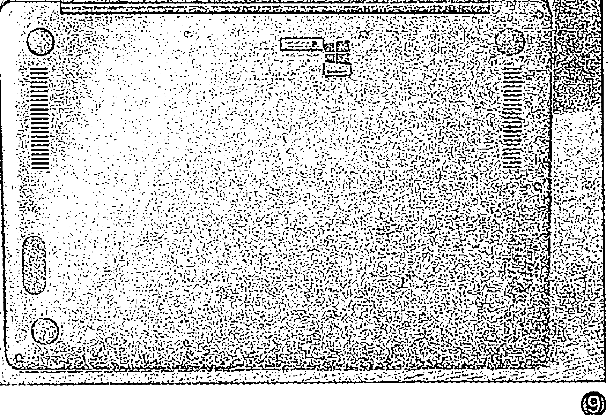

###### 进风孔到底有多重要

那么，进风孔真的有那么重要吗？早些年iFixit网站工程师就曾做过一个实验：由于忍受不了MacBook Pro（2014款，底盖无进风孔）的夸张发热量，直接用电钻在MacBook Pro底盖对应风扇的位置打了两圈进风孔（图10）。结果却是效果显著，全速运行时内部平均温度从90摄氏度下降到了50摄氏度！这就是小小进风孔所起到的作用。如果你的笔记本发热严重，在过保后也可考虑手动在底盖上开孔以改善空气流通。

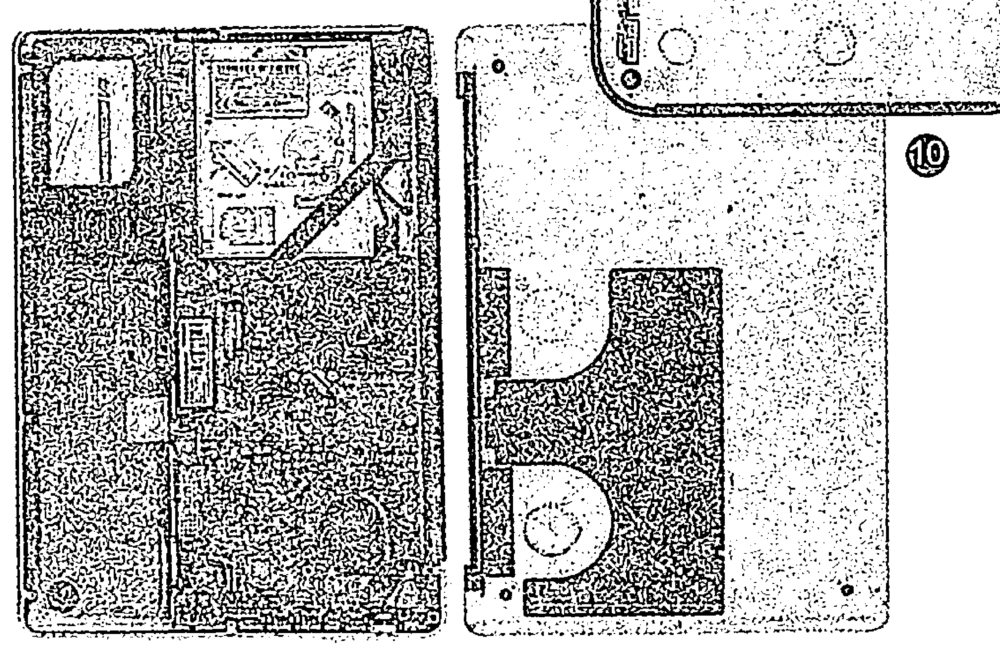

还是以最新的13英寸MacBook Pro为例（2016/2017款），内置Touch Bar的版本散热效果也远远优于没有Touch Bar的版本。除了前者拥有双风扇的配置以外，它在底盖边缘位置加入的条形进风孔也是功不可没（图11），可以极大地增加冷空气的流通量（图12）。而无Touch Bar版本的MacBook Pro底盖没有任何开孔，好看是好看，但散热压力谁用谁知道。

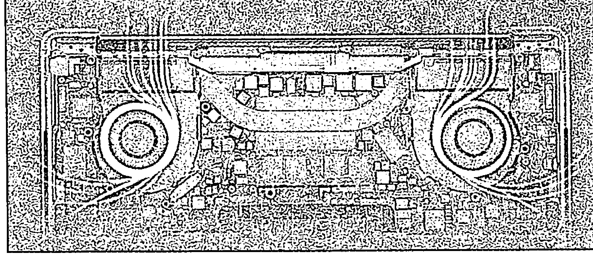

实际上，如果仔细观察轻薄本的底盖，你会发现很多产品虽然放弃了在对应CPU、GPU和风扇位置的开孔，但却在底盖两侧不明显的位置增加了细小的开孔区域，而这些孔隙就承担着进风孔的重任。只是，这种距离风扇较远、开孔面积较小的“小打小闹”，肯定不如大面积的开孔有效（图13）。

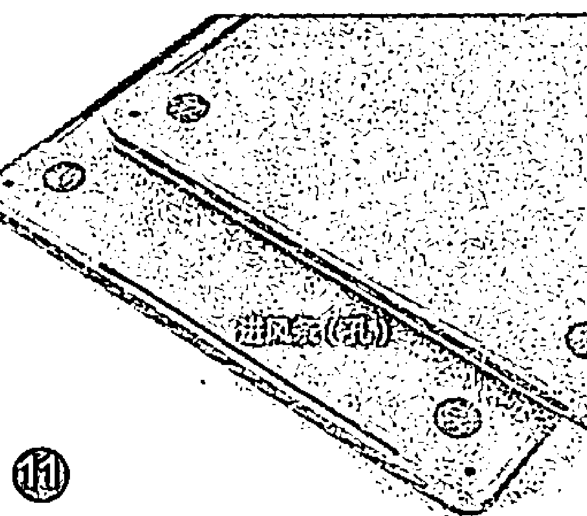

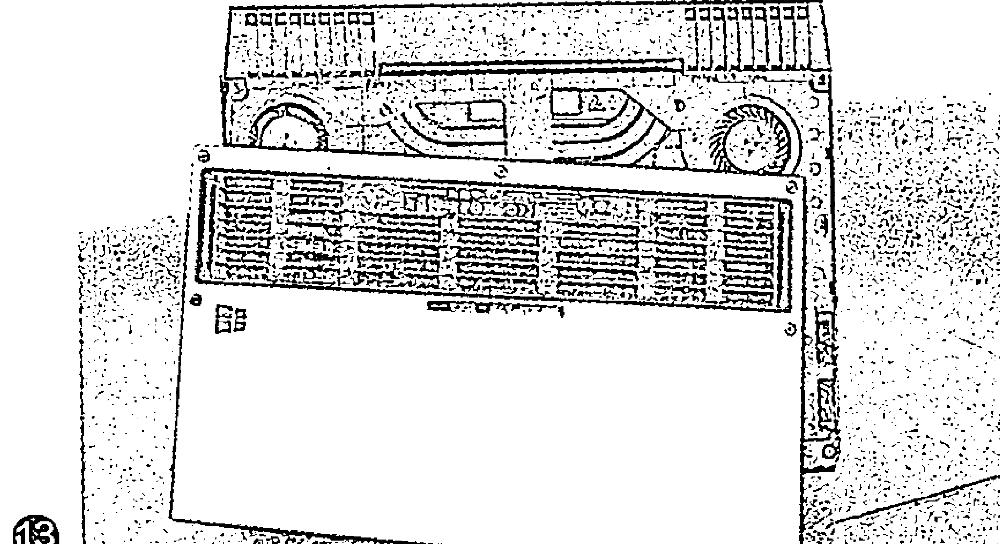

要视觉效果的整洁、底盖整体强度的坚韧，还是为了确保散热效果而大面积开孔？这是摆在所有笔记本厂商面前的一个问题。但就实用性的角度来说，笔者是支持后者的。

##### 螺丝孔：拆机前的角力点

在绝大多数情况下，我们很少有机会和螺丝孔打交道。但是，当您想给笔记本升级、清灰除尘或检查硬件故障时，就不得不拿它们下手了。因为唯有拧下所有的固定螺丝才能拆下底盖（图14），对笔记本内部单元进行各种“手术”。

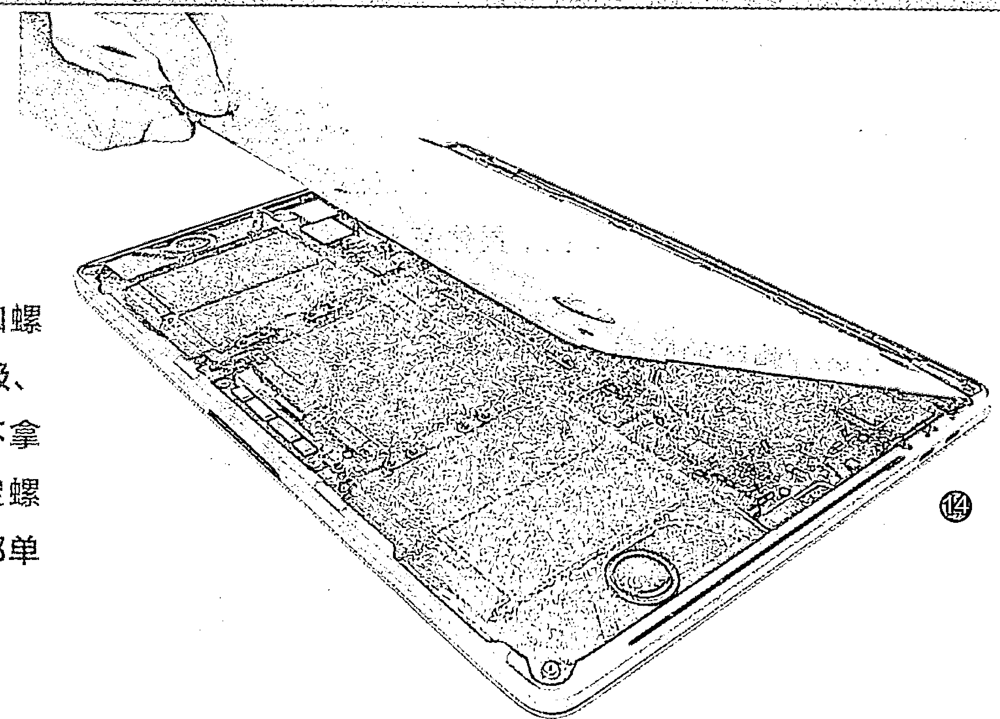

###### 留意隐藏的螺丝孔

螺丝通常位于笔记本D面表面，每一个螺丝孔对应一颗螺丝。但是，一些较厚的笔记本在机身尾部也有2颗到4颗固定螺丝，想拆下底盖需要连同它们一起拧下来。

需要注意的是，有一些可换电池的笔记本，在取下电池后会发现电池仓里也隐藏着螺丝孔，还有一些轻薄本会在靠近笔记本后端的两个脚垫内也藏有螺丝孔（图15）。如果您没有留意到它们，只是拧下了表面螺丝就暴力拆卸底盖可就危险了。

如果脚垫内隐藏着螺丝孔，抠下脚垫拆机后，在装回脚垫时可能会出现脚垫松动的问题，稍不留意脚垫就会脱落，很容易丢失，此时随便找点双面胶带将脚垫粘结实即可。

###### 应对滑丝问题

经常拆装笔记本的用户很难避免滑丝问题，螺丝刀大小不合适、过大过小都是诱因。如果遇到滑丝问题不要慌，我们可以尝试使用以下几种方法拧下受伤的螺丝：

- 1. 尝试稍大一点的一字螺丝刀；
- 2. 用502将螺丝和螺丝刀粘上，再转螺丝刀带动螺丝；
- 3. 用锡把螺丝和螺丝刀焊住，再转螺丝刀带动螺丝；
- 4. 用刻模笔等工具将滑丝螺丝的表面刻成一字，然后再用一字螺丝拧下来；
- 5. 如果以上方法无效，请找专业的维修店处理。

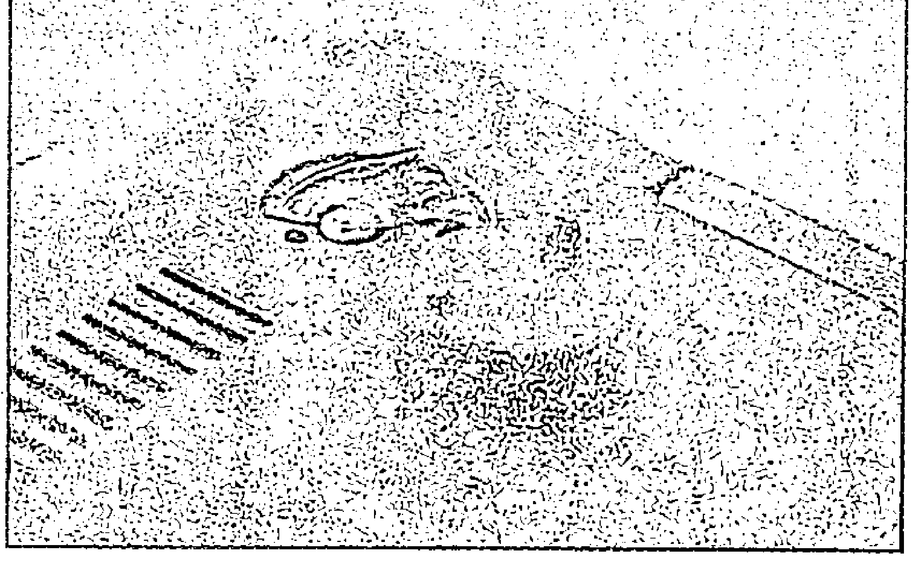

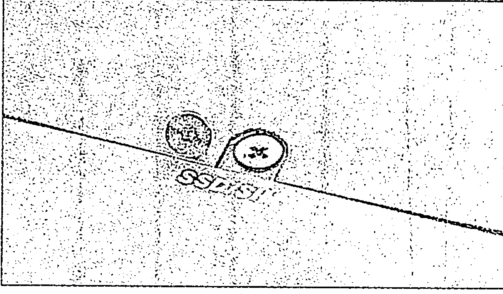

##### 小提示

有些笔记本会通过多种类型和长度螺丝的组合，在拆机过程中我们要记住每一颗螺丝对应的位置，建议提前拍摄照片留档，或是按照每颗螺丝对应笔记本的位置进行摆放。如果笔记本有螺丝丢失，只要知道它的具体规格就能很容易地在五金店配到。比如M4X6就代表4mm的直径、6mm的长度。如果你弄不清楚，可以拿着螺丝去店里现配。

###### 确定螺丝的类型

笔记本螺丝孔内的螺丝通常为十字或六角螺丝（图16），我们需要找到对应规格的螺丝刀去处理它们。如果螺丝刀规格不匹配，轻则拧不动或无法受力，重则出现滑丝问题。建议大家购买S2材质的螺丝刀套装（图17），覆盖几乎所有规格的螺丝标准。

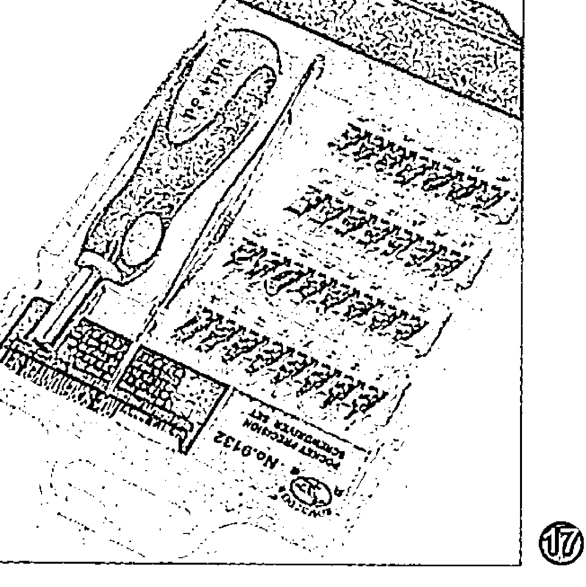

##### 神秘孔：可选的小保险

除了上面这些常见的孔洞以外，很多笔记本周身可能还会配有一些少见的小窟窿，比如恢复孔、重启孔和断电孔，在某些特殊时刻它们可以作为一道保险使用。

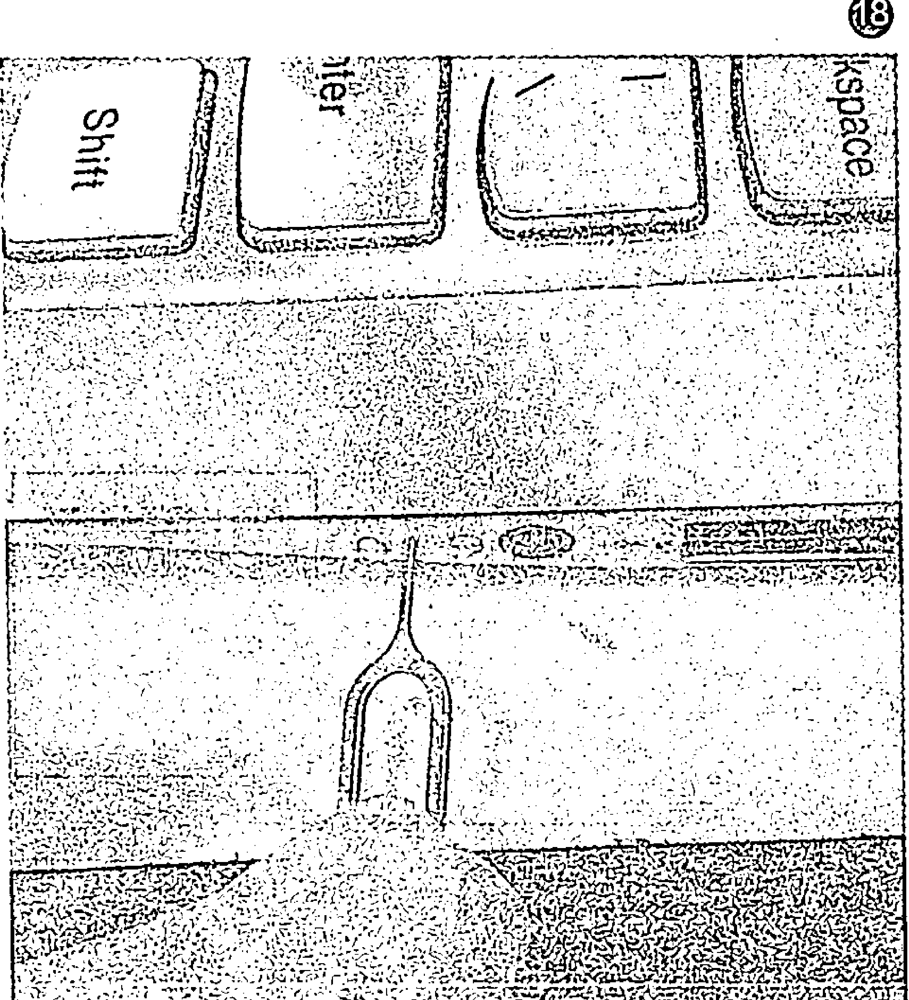

###### 恢复孔：系统崩溃的保险

少数商务笔记本会配备这种恢复（出厂设置）的小孔（图18），在关机状态下用曲别针等硬物捅它一下就会触发BIOS层面的引导，出现类似System Recovery模式的选项开关，可将系统恢复到出厂状态。可惜，由于Windows 10系统已经集成便捷好用的恢复模式，这种厂商层面的一键恢复功能和隐藏的系统恢复分区已经变得不再重要。

###### 重启孔：不稳定的保险

很多超薄本和平板二合一类设备都会在机身两侧或主机背面加上一个印有“Reset”标识的小孔（图19），也就是所谓的复位孔或重启孔。当系统变得不稳定或卡顿频频时，直接用曲别针捅它一下就能强制重启，免去了点击开始菜单选择重启按钮然后耐心等待重启的过程。

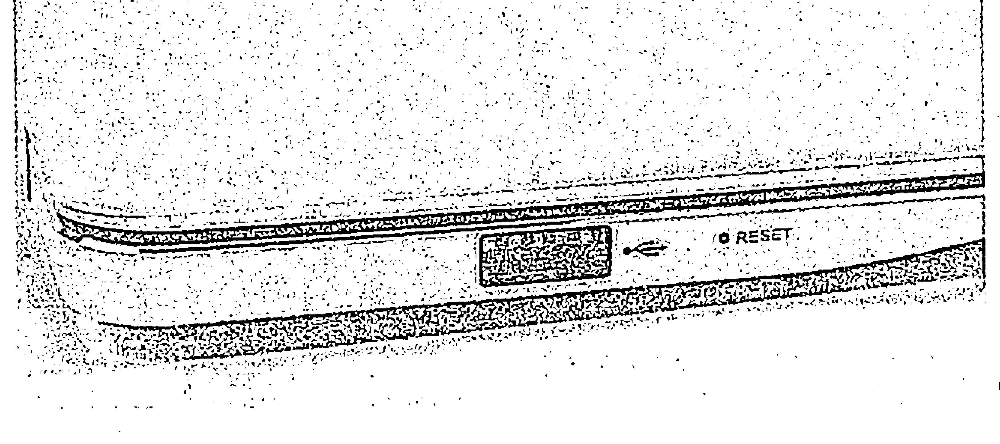

###### 断电孔：无法关机的保险

如今绝大多数笔记本已经不再支持换电池，而是将锂电池内嵌到底盖里。这种设计虽然有利于瘦身，增加可靠性，但当笔记本遭遇死机等现象时，就需要我们长按电源键10秒甚至更长时间才能切断电源了。问题是，当你长按电源键都无法关机时又该怎么办？针对这一可能，有些笔记本D面靠近电池的位置会增加一个印有电池图标的小孔（图20），通过它可以一下切断电池和主板之间的供电，实现一步关机的作用。

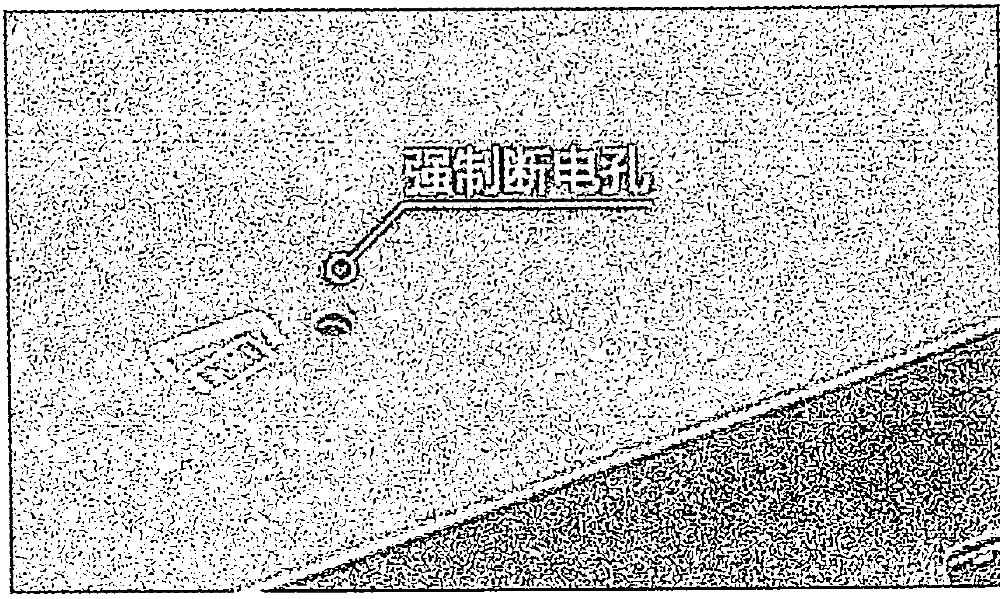

需要注意的是，上面这三个小孔和对应功能并非笔记本的“标配”，能同时集成这三大功能的笔记本几乎已经找不到了。可以说，无论你的笔记本有了它们之间的任何一个都是赚。

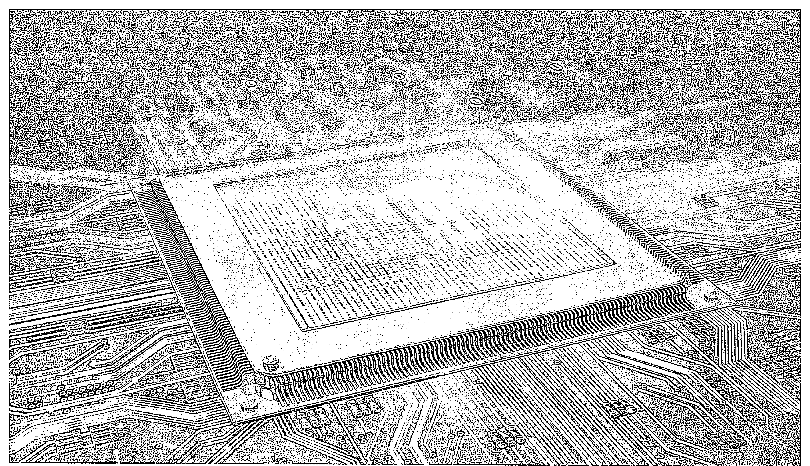

### 不用独立显卡一样High：集成显卡潜能谈

文|魔之左手

2017年中，DIYer的烦恼一件接着一件，内存与SSD的价格上涨还没有结束，显卡又开始了全面涨价甚至缺货，后者不仅涨幅更大，而且因为大规模缺货，因此让很多没来得及装机和升级的玩家朋友大喊“坑”（图1）。本次显卡市场的波动原因比较复杂，相关的介绍非常多，我们这里不再赘述，重点要讨论一下没有独立显卡的情况下，我们是否还能攒机，是否还能在我们喜爱的游戏中好好玩耍。

既然中端及以上独立显卡全面缺货，我们能选择的视频处理和3D计算就只有集成类显卡了，也就是英特尔酷睿处理器中的核芯显卡和AMD APU中的内置单显。它们的表现究竟如何？在使用时有什么必须注意的问题呢？

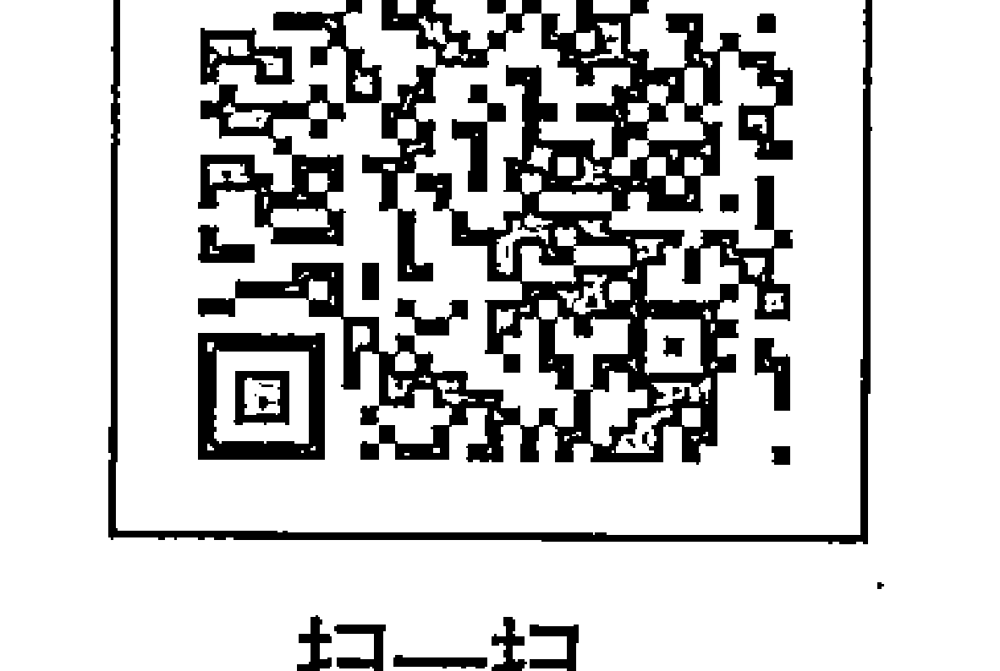

扫一扫，更多精彩内容立现！

| 列1 | 列2 | 列3 | 列4 | 列5 |
|-----|-----|-----|-----|-----|
| ¥2999.00 讯景 (XFX) RX 580 4G 1366/700 ... | ¥3499.00 蓝宝石 (Sapphire) RX580 8G D5 白金版 ... | ¥3699.00 蓝宝石 (Sapphire) RX580 8G D5 超白金 ... | ¥3599.00 迪兰 (Dataland) DEVIL RX580 8G 1411 ... | ¥2999.00 蓝宝石 Sapphire RX580 4G D5 白金版 OC ... |
| ¥3499.00 讯景 (XFX) RX 580 8G 黑狼版 1366MHz ... | ¥2699.00 迪风 (Colorfire) RX 580 Utorrent 8G 134 ... | ¥3499.00 迪兰 (Dataland) RX 580 8G X-Serial 134 ... | ¥3699.00 华硕 (ASUS) ROG-STRIX-RX580-O8G-G ... | ¥3499.00 华硕 (ASUS) DUAL-RX580-O8G 1360 ... |

#### 现代集显的能力

在目前的英特尔主流处理器酷睿系列，以及AMD大力推广的APU中，都带有内置显示单元，这些显示单元不仅在结构上完全融入了处理器，而且功能也远非单纯的图像处理了。

##### 英特尔智能酷睿及核芯显卡

在英特尔处理器的第一代智能酷睿中最初并没有内置显示核心，不过很快就加入了具备“英特尔高清显卡(Graphics Media Accelerator HD, 下文简称GMA HD)”的产品。不过GMA HD的加入显然比较仓促，所以拥有内置显示核心的第一代智能酷睿处理器采用的是在两块硅片上分别制造CPU和显示部分，安装在同一块基板上的方式(图2)。

GMA HD核心是由英特尔G45芯片组中整合的GMA X4500显示核心改进而来，采用统一渲染架构设计，并将渲染单元由10个增加至12个，性能有所提升，同时支持DirectX 10、Shader Model 4.0、OpenGL 2.1，也符合当前主流游戏的标准。GMA HD的3D游戏性能相当有限，在1024×768分辨率下以较低画质运行一些中端游戏时，勉强能达到20fps~30fps的可玩帧速，对玩家基本不具有实际意义。另外，GMA HD显示核心新增了Intel Clear Video HD高清功能、Dolby TrueHD和DTS-HD Master Audio音频源输出，并可支持最多两个HDMI输出接口。由于要为Clarkdale核心处理器的GMA HD显示核心提供视频输出接口，因此芯片组也在DMI之外增加了FDI (Flexible Display Interface)，利用两条独立控制的通道来负责显示核心和H55芯片进行数据交换。

值得一提的是，Intel Clear Video HD高清功能可支持Dual Stream双视频流硬件解码，可同时对两部高清影片进行硬件解码，利用双HDMI输出可同时满足客厅和卧室/书房的视频欣赏需求。这显然是针对家庭娱乐应用而设计的功能，也从侧面反映出酷睿i3与H55/57主板平台的另外一个重要战场——HTPC市场。

尽管第一代内置显示核心在性能、效能、集成度等方面的表现都只能算是差强人意，但英特尔对其作用显然有更大的计划，所以其后的各代智能酷睿中，都保留了内置显示核心，而且其实从第二代智能酷睿处理器(核心代号Sandy Bridge)开始，内置显示核心的应用能力就有了相当不错的表现。

Sandy Bridge核心首次将显示单元和处理器单元完全融合设计和制造，内置显示单元被命名为“核芯显卡”，采用了新的EU (Execution Unit, 执行单元)，数据吞吐能力达到上一代的两倍，并且支持OpenCL (通用计算语言)。借助高速环形联通架构，新的显示单元可与处理器及片内缓存、内存进行更紧密的连接(图3)。

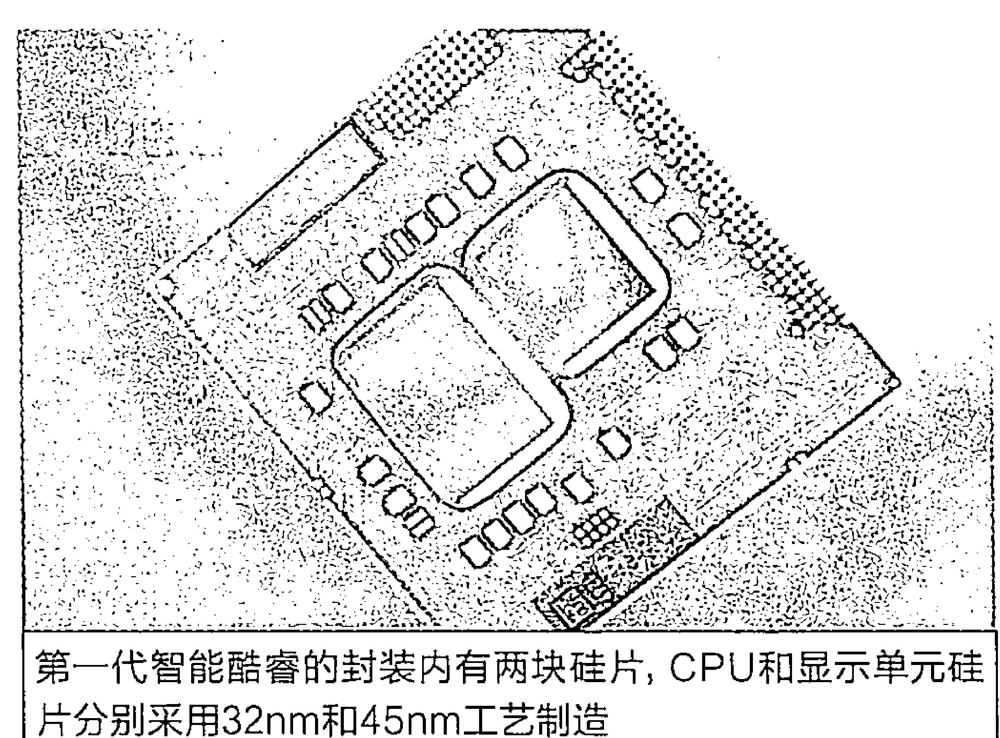

Sandy Bridge核心中的核芯显卡与缓存直接连接，可以进行高速数据交换

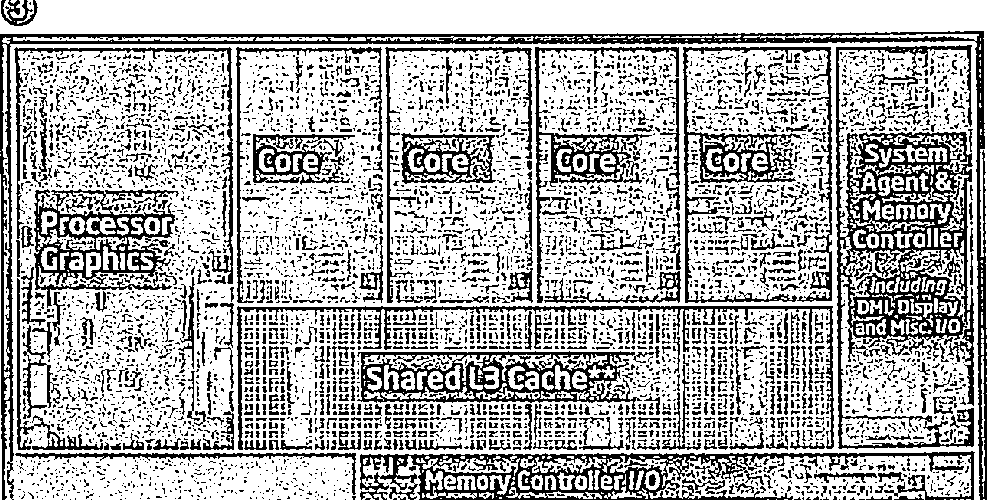

Sandy Bridge有两种显示配置，分别为6个EU的Intel HD Graphics 100及12个EU的Intel HD Graphics 200，后者将主要用于移动平台以及一些特殊型号的台式机处理器中，替代低端独显，可以降低功耗和发热量，减小电脑体积。

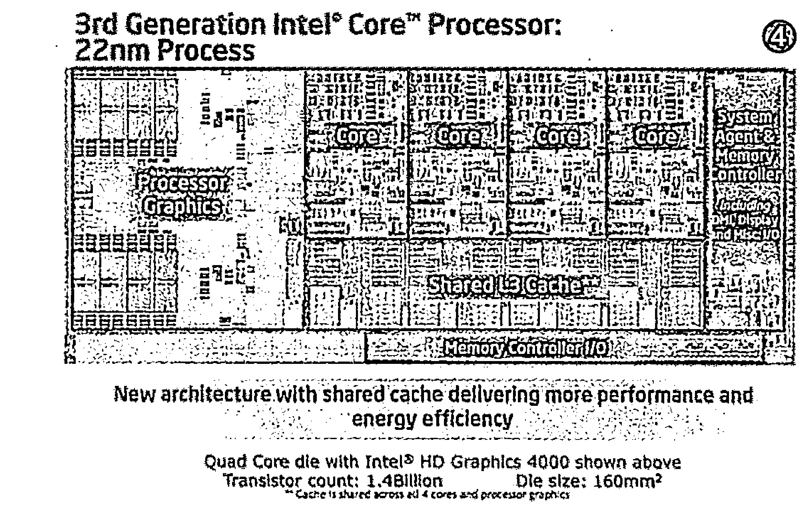

Sandy Bridge的显示单元带有独立视频编解码器，可实现双码流H.264、VC-1、MPEG-2编码格式视频的完整硬件解码，Clear Video HD技术能够在保证高清视频播放流畅性的基础上，消除影像中的锯齿和视频残影，让画质更清晰细腻，改善用户的视觉体验。InTru 3D技术则让集成显示单元也可提供3D视频播放能力。

显示单元与处理器和平台更紧密的集成，使核芯显卡拥有很多独立显卡难以做到的能力，例如Clear Video HD技术除了视频输出外，还可作用于视频导出，其动态侦测和图像增强等技术可让捕捉的视频更加清晰，色彩更为饱满。而进行视频转码时，显示单元和处理器几乎无延迟的协作，可达到非常高的速度，即所谓的“高速视频同步”，对各种即时视频应用、社交网站应用具有重要意义。而在移动平台上，新显示单元与Wi-Fi网卡配合，还可提供更高清晰度的WiDi（无线显示）能力。

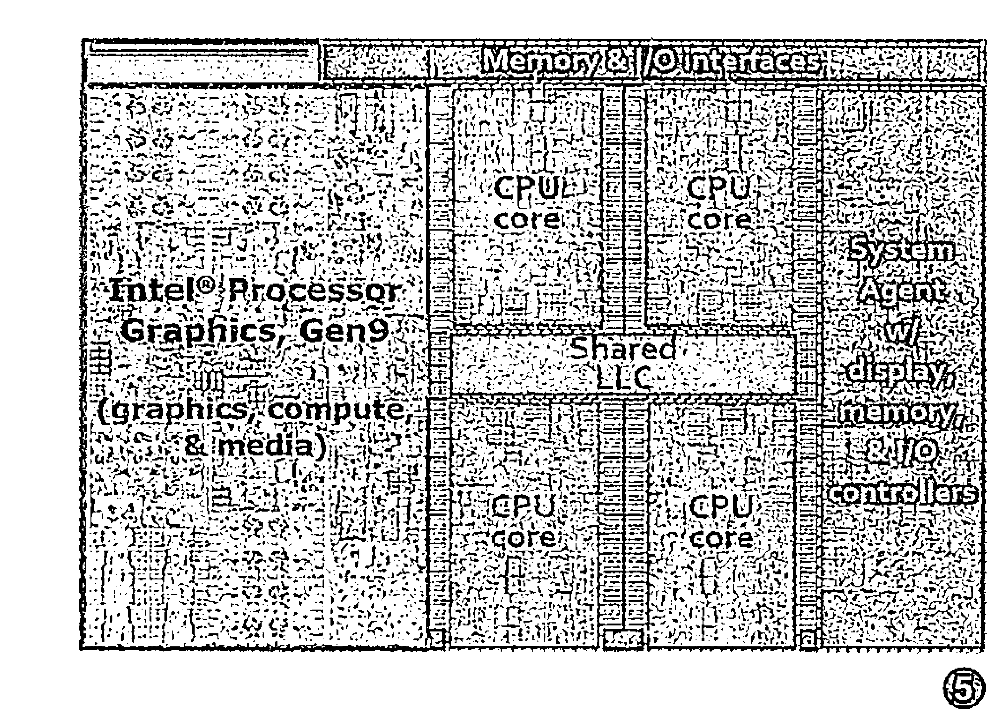

在显示性能测试中，Sandy Bridge的核芯显卡已具备了在720P高清分辨率下以中等特效较流畅运行主流DX10游戏的能力。对大量普通用户来说，如果不追求最新最高端特效的话，那么已完全可以放弃当时的低端独显，例如NVIDIA的GeForce GT520、AMD的Radeon HD 6450。

在其后的各代智能酷睿处理器中，核芯显卡也在不断进化，虽然并非每一代都有大的变化，但总体来说，还是越来越强大的。在智能酷睿处理器中，显示核心所占的面积比重也越来越大，说明其重要性亦不断提升，Ivy Bridge核心的第三代智能酷睿处理器中，显示核心的面积比重已经明显高于Sandy Bridge核心（图4），而近期的第六、第七代智能酷睿芯片中，图形单元的面积更是与CPU单元部分相差无几，集成到芯片中的系统控制部分也相当显眼（图5）。

| 项目 | 设置 | Core i5-2500核芯显卡 |
| :--- | :--- | :--- |
| 3DMark Vantage | 入门模式 | E9232 |
|  | 性能模式 | P1678 |
| 生化危机5 | 1024×768/最低特效 | 45.4fps |
|  | 1024×768/中等特效 | 37.0 |
| 孤岛惊魂2 | 1024×768/最低特效 | 40.42fps |
|  | 1024×768/中等特效 | 20.85 |
| 星际争霸2 | 1280×800/普通特效 | 31.302fps |

在第六代、第七代智能酷睿主流产品内置的核芯显卡规格与性能类似，主流型号为HD 530/630，拥有24个EU单元，比上一代主流产品HD 4600有了比较明显的提升。新一代核芯显卡基本能够在720P或1080P分辨率下，以中等以上画质流畅运行主流3D网游，或者以低画质体验3D大作。

英特尔的内置显示单元还有一个比较独特的分支——锐炬（Iris）系列，它们不仅拥有更多的执行单元，锐炬Pro（Iris Pro）还附带有自己的高速缓存（图6），可以大大提升性能。但是锐炬系列显卡一般都用来配合一些特殊的产品，例如面向微型主机和轻薄型笔记本电脑的U（超低电压）系列处理器，面向主流台式机的只有昙花一现的i7-5775C/5675C两款处理器，这些产品并不适合我们DIY使用，这里就不再赘述。

除了越来越强大的3D性能之外，核芯显卡的视频等性能也越来越强，例如在支持高速视频同步技术(Quick Sync Video)的视频处理软件中，用户可以用非常高的速度对视频进行转码等操作(图7)。

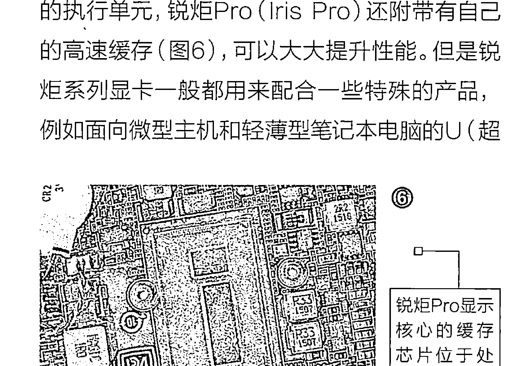

| 项目 | 设置 | Core i5-6600K +HD530核芯显卡 |
| :--- | :--- | :--- |
| 3DMark | Fire Strike | 1031 |
| 3DMark | Cloud Gate | 8454 |
| 街头霸王4 | 1920×1080默认画质 | 84.58fps |
| 英雄联盟 | 1920×1080非常高画质 | 81.603fps |
| Dota 2 | 1920×1080中等画质 | 57fps |
| GTA5 | 1280×720Low画质 | 44.21fps |
| 超级房车赛:汽车运动 | 1920×1080 Medium画质 | 37.64fps |
| 阿提拉全面战争 | 1280×720 Low画质 | 26.2fps |

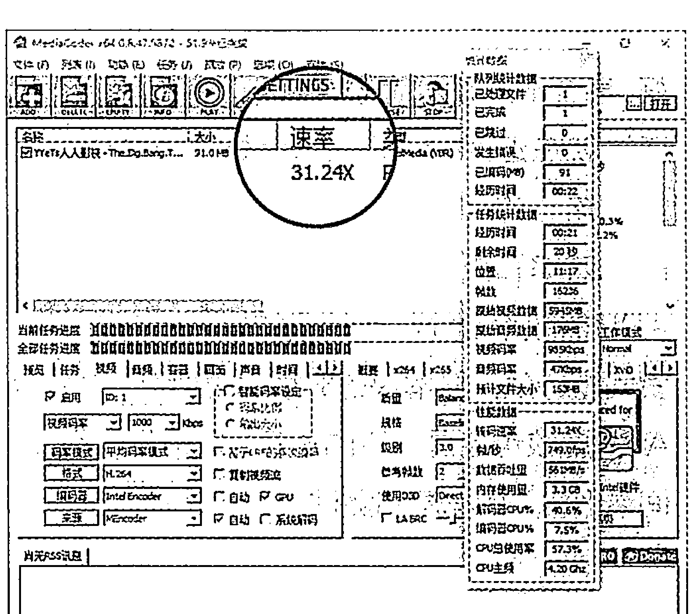

##### AMD APU和内置单显

“内置单显”是AMD APU内置显示单元的名称，其原因应该是它可以和AMD的独立显卡配合，组成双显卡CrossFire模式，另外也表现出这种内置显示单元已经脱离了集成显示单元的范畴，而是类似独显的存在。

其实APU(Accelerated Processing Unit)加速处理器，本身就是AMD“融聚未来”理念的产品，其目标就是将CPU与GPU进行融合设计，形成不同于传统CPU(Central Processing Unit， 中央处理器)的新形态电脑核心。从APU的核心架构也可以看出，GPU在其中占据的面积甚至明显超过了CPU部分(图8)。在AMD的设想中，APU除了具备入门级甚至更高一些的图形处理和3D游戏能力外，还可以用GPU辅助CPU进行运算，例如在复杂任务中，将大量简单运算交给拥有大量流处理器的GPU，而将复杂运算交给线程虽少但处理能力更强的CPU，这就是所谓的“异构计算”。

虽然理念更加前卫，但APU的架构却相对比较传统，例如其内置单显与独立显卡GPU的架构基本类似。例如较新的APU中，GPU部分与Radeon R5/R7的基本架构相同，使用了大量流处理器(图9)，甚至也直接采用了这一名称，只是流处理器数量等方面与独显GPU有一定差别，没有像英特尔一样使用专门设计的少量EU和缓存共享机制，让APU可以更方便地兼容图形软件及异构计算软件，但内部的数据交换等工作效率会低一些。

仅从显示部分的重要性上来看，APU是要超过英特尔智能酷睿的，但在目前的市场上，

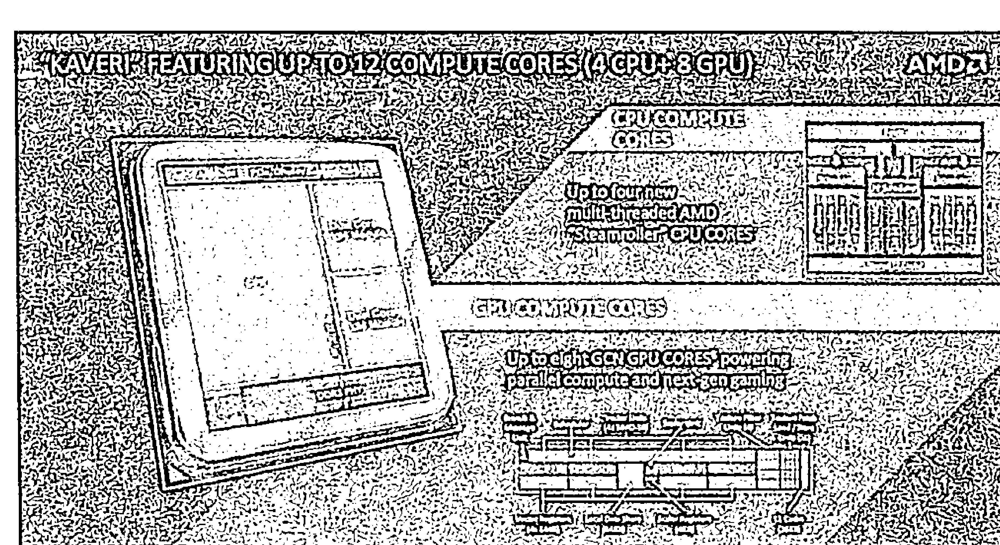

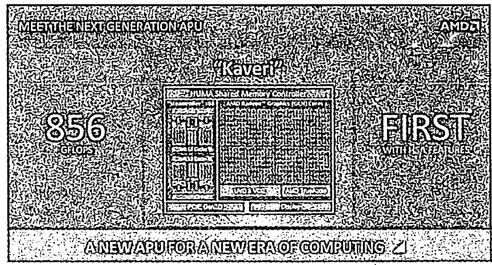# Intel NUC性能测试

| 项目 | 设置 | 得分/平均帧速 |
| :--- | :--- | :--- |
| 3DMark | Cloud Gate | 6203 |
| | Sky Diver | 4166 |
| | Fire Strike | 929 |
| CINEBENCH R15 | OpenGL | 37.88fps |
| | CPU | 354cb |
| 天堂4.0 | 1280×720，画质“Medium”，关闭曲面细分 | 26.1fps |
| 怪物猎人OL | 1280×720 | 12.6fps |
| 最终幻想14: Heavensward | 1280×720，DX11，画质“Standard（Desktop）” | 20.592fps |
| | 1280×720，DX9，画质“Standard（Desktop）” | 34.885fps |
| 生化危机6 | 1280×720，中等画质 | 2522 |
| 古墓丽影9 | 1280×720，“普通”画质 | 35.6fps |
| 街霸4 | 1920×1080，最高画质 | 52.41fps |

#### 玩转内置显示单元

要搭建或者升级内置显示单元的电脑时，我们应该注意一些与独显系统不同的问题。

#### 主板视频输出接口

市场中的一些主板为了节约背部I/O接口的空间，或者考虑到使用内置显卡的用户档次，会有只提供一个接口或者不提供高端多媒体接口（HDMI或者DP）的情况。对于准备主要使用独立显卡的用户来说，主板的视频输出接口并不重要，但要准备在一段时间内主要使用内置显示单元的话，就必须考虑到自己的实际情况了。我们建议大家选择提供了一个HDMI和一个DVI/VGA接口的主板（图10），这样无论是选用什么样的显示器，都不存在连接问题。如果是新购高端显示器，HDMI可以提供支持；如果使用旧式显示器，也可以连接DVI/VGA接口；如果拥有两台显示器，还可以同时连接使用双显示器。

此外，如果手头有不希望换掉但仅提供了DVI或VGA接口的显示器，在目前新型GPU和显卡逐渐放弃老式接口的时候也不用害怕了，因为内置显示单元可以和独立显卡共同组成多显示器。未来即使升级采用了不提供DVI/VGA这种老式接口的显卡，我们也可以让旧显示器继续连接主板视频接口来使用，相关内容我们在之前已经进行过介绍。

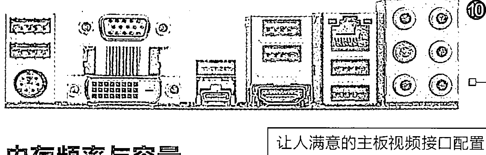

#### 内存频率与容量

由于内置显示单元没有自带显存，或者显存数量较小（如Iris Pro），因此在运行一些大型图形程序，如3D游戏时，需要系统内存充当显示缓存。为了给内置显示单元提供足够的“显存带宽”和“显存容量”，我们需要配置较高频率与容量的内存，或者对内存、总线频率进行适当的超频。

由于设计思想的不同，英特尔核芯显卡与APU内置单显对内存的需求是不同的。英特尔核芯显卡可以利用高速的处理器缓存或片上缓存，以速度换取容量，因此对内存能力的需求并不高。APU上较为传统的GPU部分对显存的需求也同样比较传统，因此APU用户更需要高频率、高容量的内存，特别是要充分使用双通道内存架构和APU更高内存频率的控制能力。从一些测试来看，APU的图形性能对单双通道和内存频率的敏感度都远超过英特尔智能酷睿。

### 屏幕那些事
IDEA
策划《电脑爱好者》编辑部

无论是智能手机、平板电脑还是各类电脑，配置和性能肯定是我们优先考虑的“硬指标”。然而，智能手机与我们之间交互最为频繁的就是屏幕，而电脑（显示器）和眼睛打交道的重点也是屏幕。除了分辨率、材质和亮度色域等我们熟悉的指标以外，屏幕的表面其实还有一层非常影响实际体验的东西，它们就是各种涂层。
本期，我们就从屏幕的表面出发，看看这些涂层是如何影响实际体验的。只有了解了这个知识点，在我们日后的选购产品之路上才能做到有的放矢，让各类设备屏幕的视觉和触觉效果都能达到我们的预期水准。

#### 灵感源于荷叶
浅析手机身上的疏油层

接触手机较多的用户肯定发现过一个现象：不同价位的手机或不同价位的钢化膜之间，总存在手感不一的问题。有些手机屏幕/钢化膜摸起来无比顺滑，不易沾惹指纹，碰到水也能像荷叶一样聚拢成水滴(图1)，一吹就干净。而有些手机/钢化膜摸起来非常干涩，极易留下指纹油污痕迹。这是怎么回事呢？

##### 疏油层的神奇功效

不同的手机和钢化膜间之所以存在体验上的差异，大都是因有无“疏油层”而引发。疏油层又常被称为“疏水层”、“防指纹涂层”、“防油污层”……在行业内它们则有相对官方的名字: Anti Finger Print (下文简称AF) 或Oleophobic coating。正是因为其具备疏水疏油的特性，才换来了光滑的手感，以及不易留下指纹和聚拢液体的特性。

> **扩展阅读：**
###### 荷叶效应
荷叶表面由粗糙的特殊微米纳米复合结构以及低表面能的蜡纸层共同组成，当有水落到其上时可保持较大的接触角，易于滚动而带走表面的尘埃，具有优异的自清洁功能，同时被称为“荷叶效应”。而疏油层就是荷叶效应的仿生学代表。

###### 疏油层的原理

手机领域的疏油层大都以AF材料为主，它是一种含氟涂料（多为全氟聚醚），主要作用是附着在屏幕表面从而增加屏幕的疏水、排油、防污等性能。具体来说就是能使水具备超高的表面张力（表现为拒水性），将周围的液体聚拢形成较高接触角的水珠（图2），也能让油污自行收缩成难以附着在金属表面的小油滴，哪怕有少量残留油污也能用毛巾或纸巾轻易擦除干净。

疏油层可以通过喷涂与真空蒸镀两种方式附着于手机的屏幕玻璃表面（图3），而且成本较低：喷涂单片成本不高于0.6元，真空蒸镀的单片成本不高于2元。此外，疏油层不仅用于玻璃，通过改进的工艺也能应用在各种金属表面（比如手机后盖），弥补深色手机后盖一摸就留下清晰指纹痕迹的尴尬（图4）。

至于如何辨别手机是否涂抹了疏油层，最简单的方法就是在手机表面洒上几滴水，如果形成了水珠且接触水滴角为钝角代表有疏油层，此时翻转手机时液体会保持水珠的形状依靠重力在屏幕上滑动，用力一吹就能吹干净；如果水没能形成水珠或接触水滴角为锐角且角度较小则代表没有疏油层，翻转手机时液体会不规则地流淌（图5）。

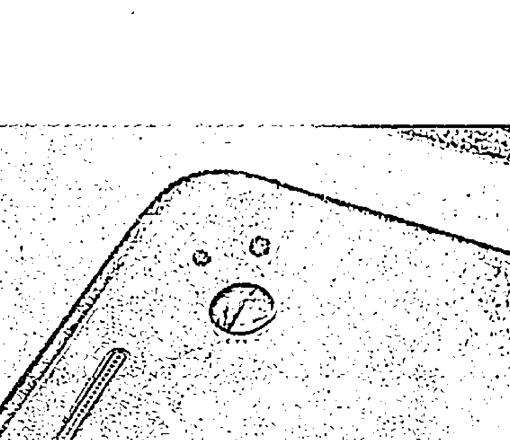

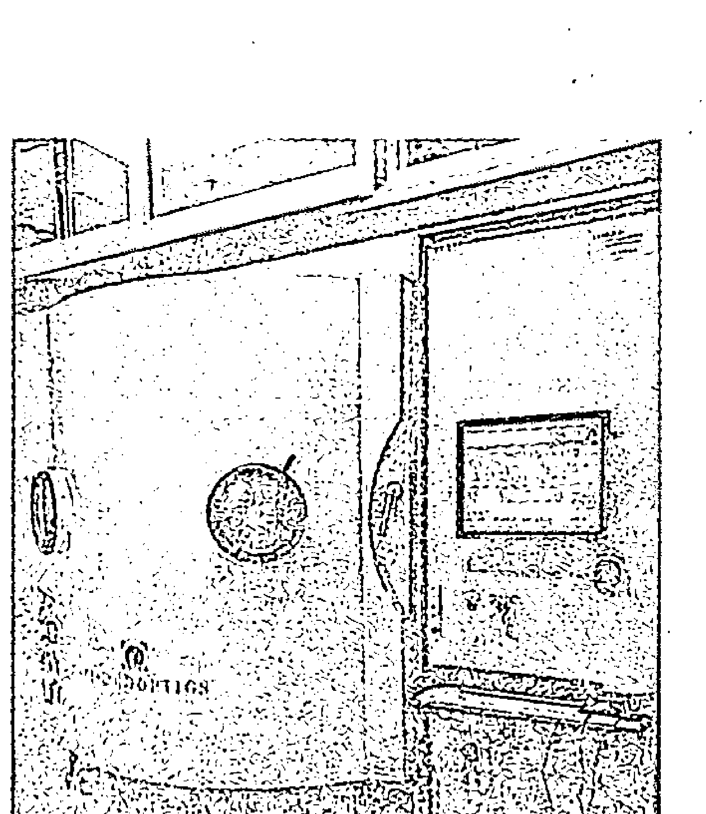

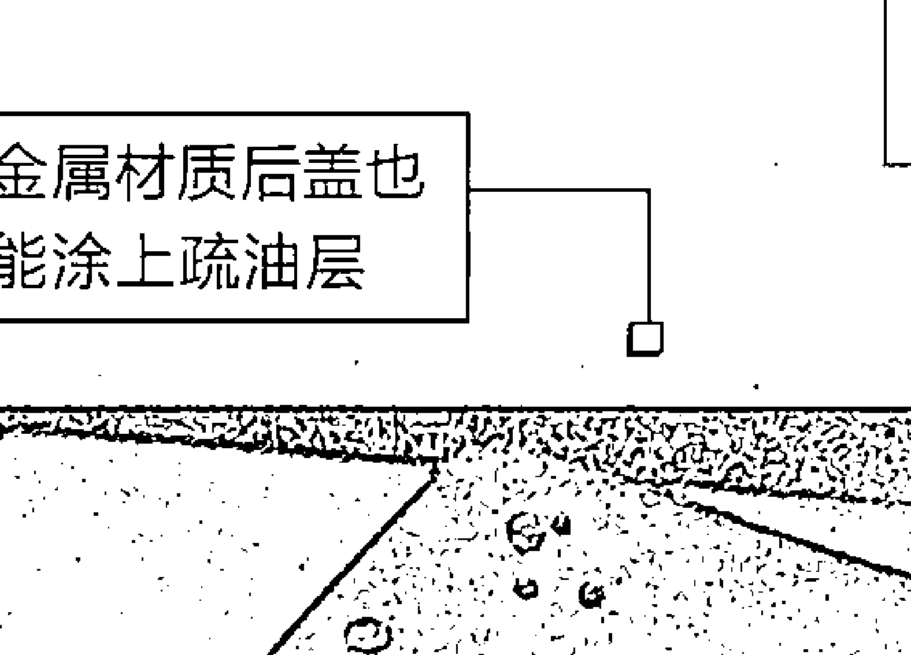

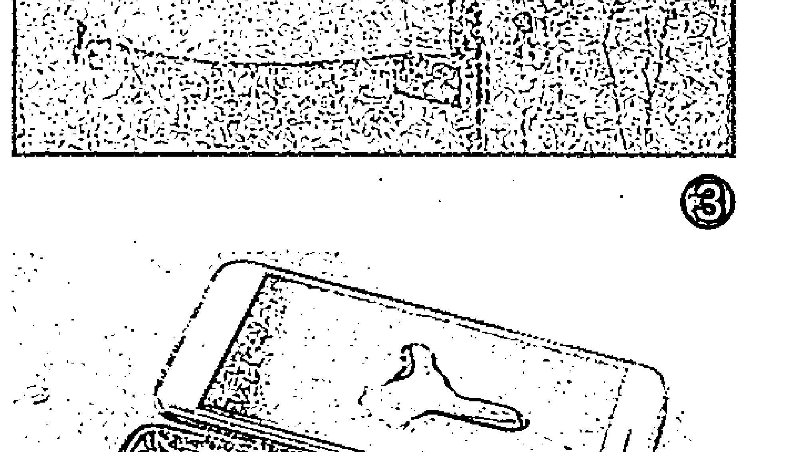

###### 疏油层是消耗品

当手机屏幕集成疏油层后就一劳永逸了吗？答案是否定的，疏油层是一种“易耗品”，它通常是由真空蒸镀机将AF材料蒸镀在屏幕表面玻璃上，会随着使用频率的增加和使用习惯而不断磨损，其疏水疏油的作用也会随之逐渐减弱。据现有资料显示，当手机进行疏油层镀膜时，需要较高浓度的AF涂层才能保持1年内不被磨损破坏，如果浓度较低寿命则会相应缩短。

此外，酒精对疏油层也是有一定伤害的，如果你常用的屏幕清洗液或贴膜时赠送的擦布里含有酒精成分（图6），出于稳妥的考虑建议改成清水擦拭屏幕。

###### 疏油层引发的风波

对智能手机而言，操作手感无疑比理论跑分成绩更为敏感，当手指在屏幕上滑动时的流畅感、是否容易残留恶心的指纹油污，都是决定其是否是一部“好手机”的关键指标。因此，如今无论是数千元的旗舰还是千元价位的主流手机，大都已在屏幕上引入了疏油层。

但是，总有例外发生，比如华为P10就因屏幕缺少疏油层而引起了轩然大波（图7）。作为一款3488元起的高端手机，缺少了趋于普及的一种特性自然有点说不过去。官方的解释是P10采用了康宁第五代玻璃和incell技术，在涂了疏油层之后会出现静电纹问题，行业内也没能找到解决方案。但是，同样采用康宁第五代玻璃的三星S8却具备疏油层，而这也是引发争议的对比点之一。

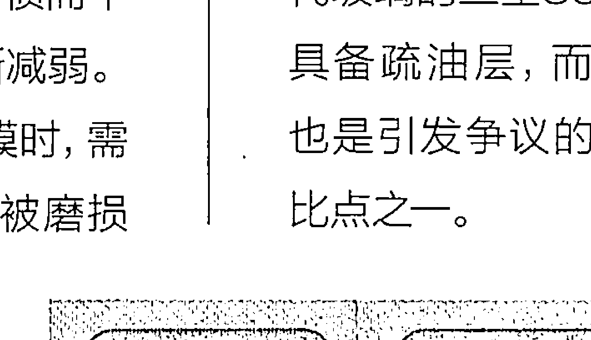

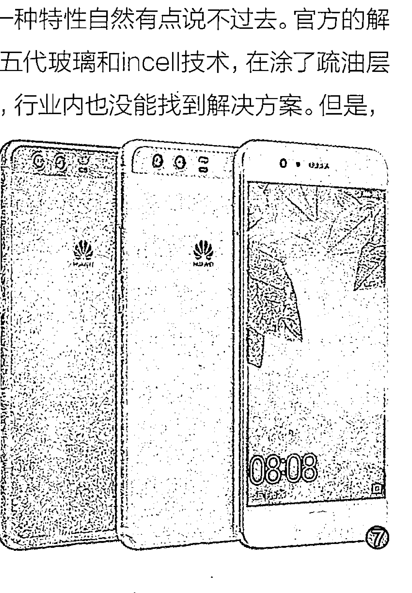

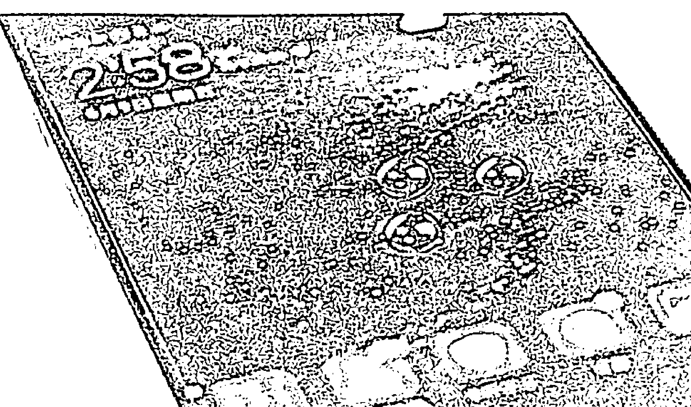

当然，华为也提供了弥补方案，那就是所有P10出厂时就已贴上了涂有疏油层的贴膜（图8）。哪怕用户不小心将贴膜揭下，也能在附近的华为授权服务店重新免费贴（疏油层）膜。从成本方面考虑，免费贴膜肯定要远高于手机出厂前的批量镀膜（疏油层），所以说华为因控制成本而取消P10屏幕疏油层的观点就站不住脚了。

但是，疏油层毕竟是今天影响操作手感的核心指标之一，而也并非所有用户都喜欢贴膜使用手机，习惯“裸奔”的玩家大有人在。因此，在手机行业里更多的品牌都是屏幕涂有疏油层，并在表面贴有一层不含疏油层的普通贴膜来保护屏幕。

总之，从最人性化的角度考虑，手机都应该默认就涂抹疏油层。而用户则可根据喜好，选择裸奔使用或自行贴上一层集成疏油层的贴膜（图9）。换句话说，疏油层用户可以不用（贴膜后屏幕表面的疏油层就没意义了），但手机不能没有。

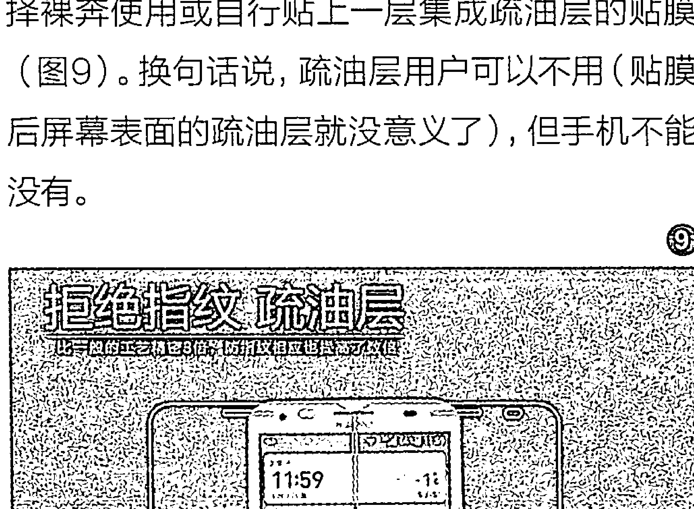

###### 没有怎么办

问题来了，并非所有手机厂商都会在旗下产品的屏幕上添加疏油层。如果你心仪疏油层带来的高手感和抗油污能力，又不喜欢贴（具备疏油层的）膜，如何让“裸奔”的屏幕玻璃得以升华呢？

在淘宝以“手机+疏油层”为关键词就能检索出无数纳米镀膜液类型的产品。这些纳米镀膜液每瓶（5ml）的价格多在20元~30元之间，百元以上则会赠送专用的便携式固化设备（图10）。

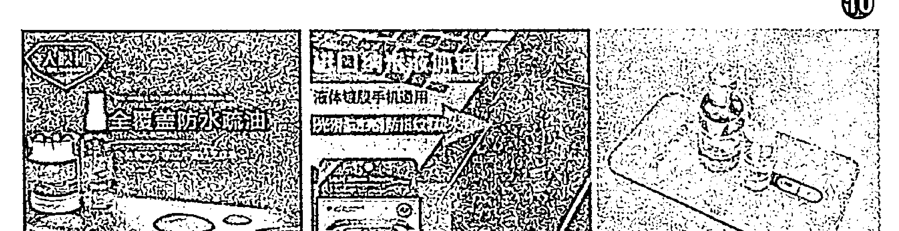

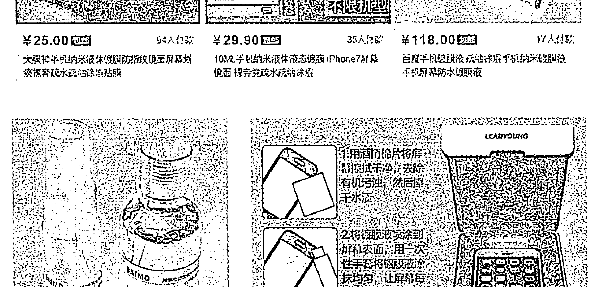

纳米镀膜液的使用方法也很简单：先在手机屏幕上滴上几滴镀膜液（图11），然后戴上一次性手套将镀膜液均匀涂抹在整面屏幕上，让其自然晾干等待固化完全。这个等待时间往往需要5小时到10小时，时间越久越耐用。而前面提到的便携式固化设备，则是一种内置紫外线灯管的手机盒子，将涂匀镀膜液的手机放置其中，能在5分钟之内就完成快速固化，所以还被冠以“地摊神器”之称（图12）。

涂抹这种纳米镀膜液后，手机屏幕玻璃也就具备了和疏油层类似的效果：提升手感、聚拢水滴、抗指纹油污。但是，这种纳米镀膜液所能改善的也仅限于此，它只是一种渗透类涂层，并不具备防摔和防划的能力，它无法取代贴膜，更不能修复玻璃表面的划痕。所以，凡是打着提升抗摔、不怕划伤旗号的纳米镀膜液，就选择性地忽略吧。

此外，这种涂抹镀膜液的方式，效果肯定无法和由精密机械蒸镀上去的相比，如果在等待固化的期间里周围环境尘埃多，还可能导致屏幕表面出现“沙沙”的触感。所以，除非你就喜欢屏幕“裸奔”，否则购买纳米镀膜液远不如直接购买集成疏油层的贴膜来得实在。

###### 真正的纳米镀膜

虽然在淘宝上销售的纳米镀膜液含有“纳米”这种高大上的名词，但它们其实并非真正意义的“纳米”，也远远没有达到镀膜的标准。此外，这些纳米镀膜液也只支持手机屏幕玻璃和钢化膜，并不支持手机边框后盖常用的塑料和金属材质，有效的使用寿命也多在半年以内，使用酒精反复擦拭也能将其去除。

真正的纳米镀膜，是不限材质、稳定性和使用寿命也更有保障的。以P2i公司的纳米镀膜技术为例，它就能在产品整个表面镀上一层厚度仅以纳米计的聚合物，让材料外观保持不变。这层薄膜能以分子形式附着在产品表面，密不可分。一旦有液体与涂层接触，液体就会凝结成水珠滚落，因而具有极佳的防油防水性能。

请注意，该纳米镀膜技术可以应用在手机的各个层面及元件上，除了玻璃材质的屏幕和后盖，无论是金属/塑料材质的边框和后盖、手机耳机孔、USB孔、喇叭孔，还是手机内部的主板和上面的各种芯片和元器件，都能实现在其表面的镀膜（图14）。如此一来，即使有液体流入到设备中（比如手机不慎掉入水池），镀膜也可以

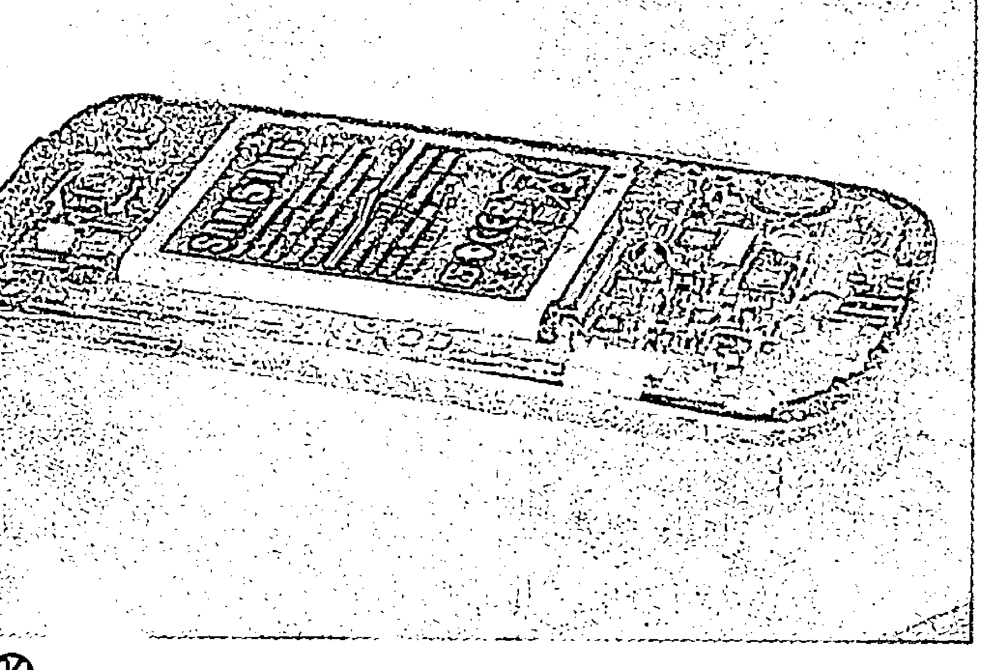

##### 小提示

P2i是一家于2004年成立的公司，起初是英国国防部国防科学技术实验室的下属机构，主要为军方进行各种防水技术的开发。在转向民用市场后，P2i借助MWC2012年大会将覆盖涂层的iPhone和iPod泡在水里运行而名声大噪。除了P2i，HzO和Liquipel也是知名度较高的方案公司（图13）。


阻止液体与电路芯片直接接触造成短路，让我们有充足的时间将液体排出手机体内，从而实现较强的防水性能。

有一些人会认为手机涂有P2i涂层，如果经常擦拭机身的话P2i涂层就会很快地消失，其实这是错误的概念。由于产品表面的物理粘结达到分子层面，纳米涂层的寿命会与所保护的材料相同，不会在日常使用中逐渐磨损。此外，P2i涂层还可以应对高温环境，对腐蚀性液体也有很好的防护作用。

问题来了，既然P2i纳米镀膜技术如此简单就可实现防水，那还要三防手机做甚？

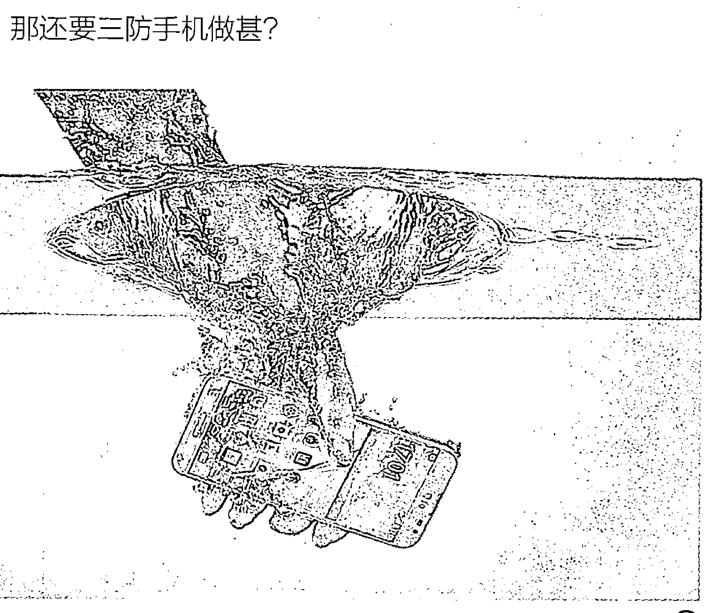

答案很简单，类似P2i的这种纳米镀膜技术最多只能实现IPX5的防水能力，也就是无视任意角度的低压喷水。但是，如果手机长时间浸泡在水中（图15），或是当手机内进水却没有排干，时间长了内部液体依旧会对内部电路造成持续性的锈化和腐蚀，有一定几率导致短路而彻底报废。
因此，纳米镀膜技术只能算是一道防水的“保险”，并不能让手机实现真正意义的“防水”。一款手机要想获得IPX6以上的更高等级防水能力，需要多种工艺的配合，因为不同部位防水的手段具有多样性。
比如，在麦克风和听筒部分由于需要传导声音，就必须使用只能允许空气分子通过而不能让水分子通过的特殊工艺。接口和缝隙部位，则需要以硅橡胶（圈、垫）密封和防水粘胶（图16）。至于内部电路还需进行电路板防水（纳米材料覆膜）等多种方式，工艺复杂度和成本极高。所以，现阶段真正生活防水的手机，只有iPhone 7/Plus、三星S7/S8和索尼Z系列等顶配手机。

> 小提示
P2i纳米镀膜技术主要应用在手机生产线的最后一步，属于厂商层面的一种增值服务。好消息是，如今很多城市都出现了给手机做纳米镀膜服务的手机店，通过专用的设备在真空环境下给手机进行全范围的纳米镀膜（图17），从而让任意手机获得IPX4左右级别的防泼溅能力。这种服务的价格多在50元到100元之间，感兴趣的朋友可以了解一下。

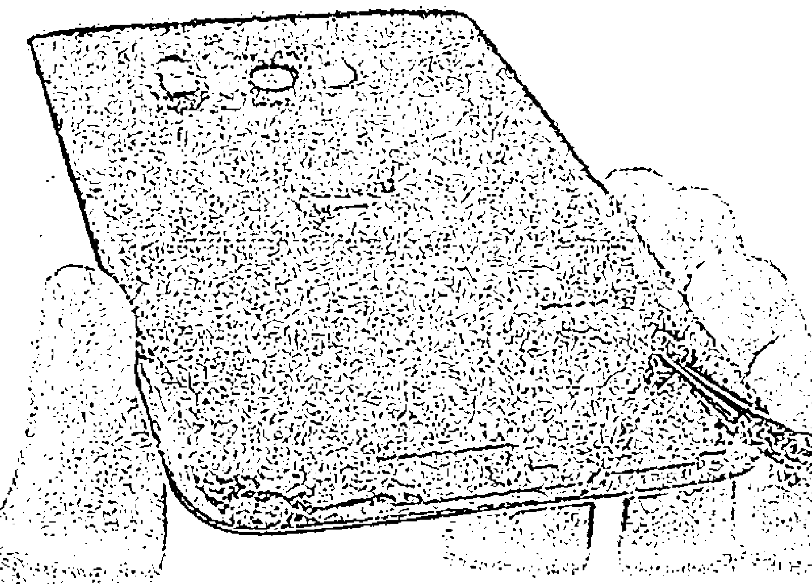

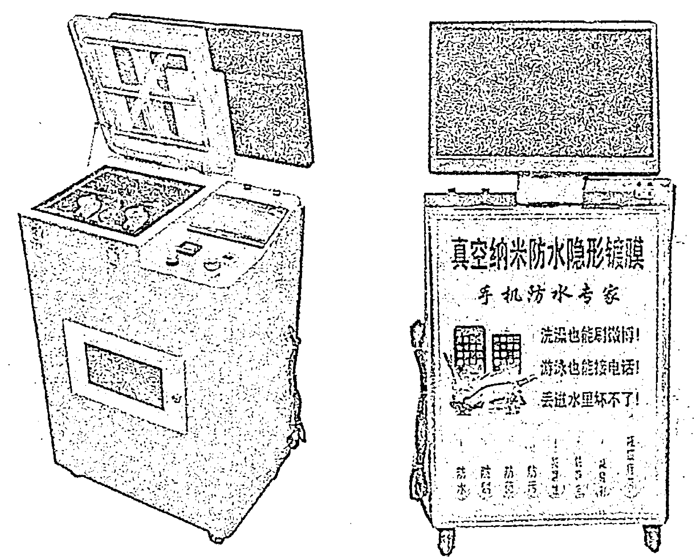

###### 隐形却很重要
####### PC屏幕的那层膜

提起PC屏幕（包括显示器和笔记本屏幕），我们都知道IPS（MVA）材质的可视角度更大、色域更高的显示效果越好。但是，你可曾听说过偏光膜和各种涂层？当屏幕出现显示异常等问题时，很可能就是这些因素在捣乱了。

##### 至关重要的偏光膜

有些显示器会在醒目的位置贴有“禁止撕下屏幕贴膜”的提示(图1)。在很多用户的潜意识里，屏幕表面的贴膜不就是保护屏幕免划伤的吗？揭下来又能怎么样？诚然，有些显示器出厂时可能会在屏幕表面贴一层保护膜，而更多显示器表面的那层贴膜却还有另外一个名字——偏光膜(又称偏光片、偏振膜)，如果你“手欠”将其揭下来，那显示器将无法正常显示画面(图2)！

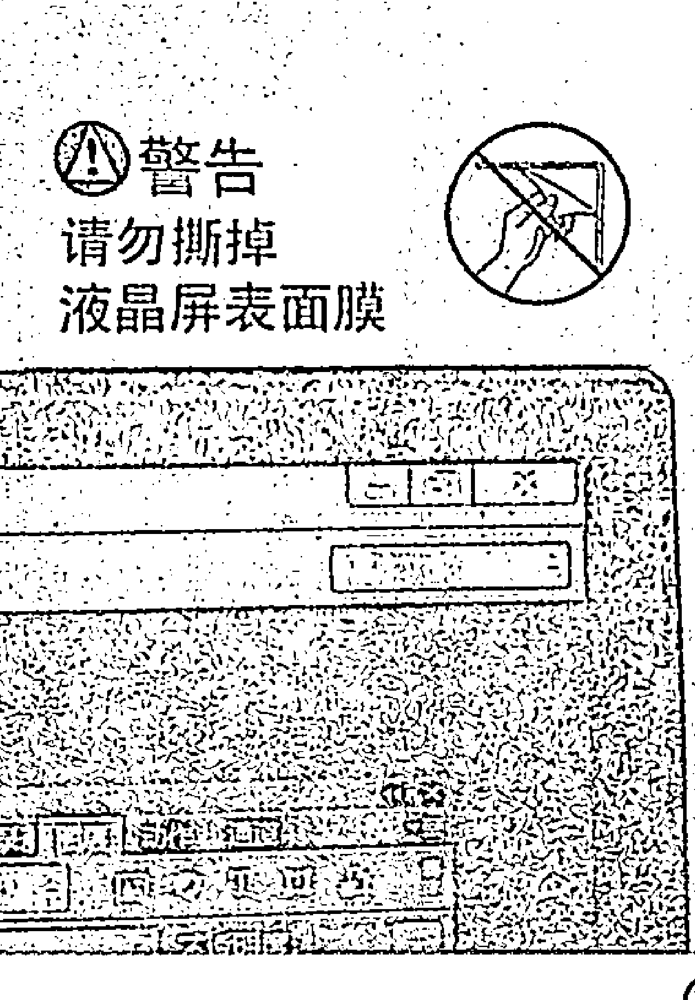

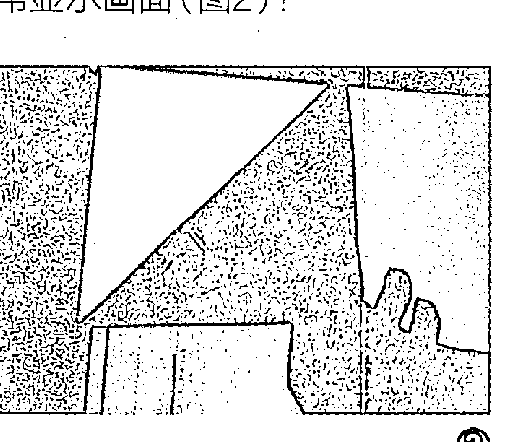

###### 偏光膜的原理

液晶显示器成像需要3个关键部件：背光灯、液晶屏、偏光膜。当显示器通电后背光灯打开，此时从液晶屏透出的光(电磁波)是向前传播的横波，有垂直于前进方向(上下左右)的振动，所以被称为“偏振光”。问题是，人眼是无法识别这种“偏振光”的，此时看到的是一片白色的画面。而偏光膜，则是覆盖在液晶屏表面的一种具有二向色性的透明薄膜，它能将人眼无法识别的偏振光给“翻译”成可以识别的色彩并呈现出来(图3)。于是问题就简单了，显示器表面正是因为有了一层偏光膜才能显示画面，而你要是将它揭下来，自然就要直面“偏振光”而看不到任何内容了。

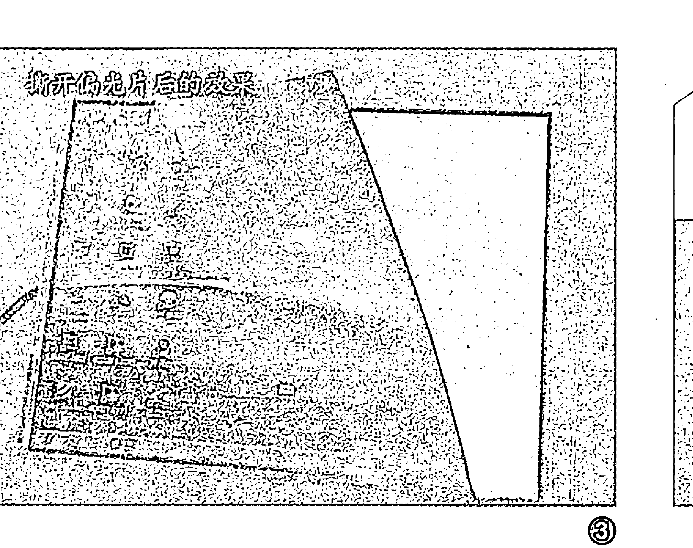

> **小提示**

如果是触控显示器(或笔记本屏幕)，在液晶屏和偏光膜之外还会覆盖一层保护玻璃，不用担心误揭偏振膜的问题。至于笔记本屏幕，它的表面也存在偏光膜，只是LCD的边缘刚好被屏幕边框覆盖，哪怕你想撕下来都没地方下手。除非我们先拆下屏幕边框看到裸露的LCD整体(图4)，才能从边缘处看到偏光膜的存在(图5)，揭下来同样会出现屏幕变白无法显示的问题。

###### 偏振膜还能这么玩

对普通用户而言，显示器偏光膜是无论如何也不能碰的存在，否则显示器就基本报废，需要重新购买匹配的偏光膜贴上，难度颇高。但如果你有着足够的动手能力，喜欢尝鲜恶作剧，那偏光膜其实还有一个很有趣的玩法。

笔者简单介绍一下思路：

将显示器表面的偏光膜撕下来，此时显示器将纯白一片，什么都看不见。找一副眼镜，将揭下来的偏光膜根据眼镜片的尺寸裁剪成小片(图6)，

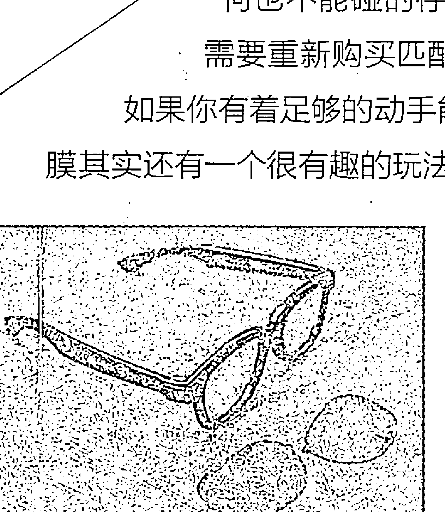

并贴在眼镜片上。现在，戴着贴有偏光膜的眼镜看屏幕，是不是显示正常了(图7)? 但摘下眼镜却又是白茫茫一片。

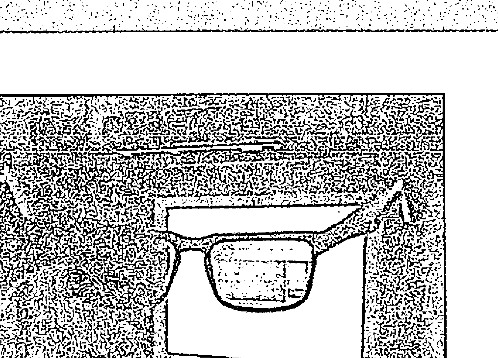

没错，这种方法是一种非常另类的保护屏幕隐私的方案。实际上，现在市面上那些所谓的“防窥膜”也是在偏光膜基础上的一种拓展，贴有防窥膜的屏幕会将可视角度限定在仅正对屏幕上，从侧面看就好像缺少偏光膜过滤的效果。

##### 防眩光让你看得更清晰

在我们摆放PC时，最无法忍受的就是屏幕直对窗户，因为在日光下屏幕的反光会严重影响显示效果。问题来了，哪怕我们很注意PC的摆放了，但依旧存在易被灯光干扰的问题。此时，名为“防眩光”的屏幕就走向了前台。

###### 何为防眩光屏幕

顾名思义，防眩光屏幕就是减轻阳光灯光直射时产生的反光，让用户始终都能看清屏幕画面，不会因反光问题而感到晕眩。一般来说，防眩光屏幕都是应用在LCD最外层偏光片(就是偏光膜)上的一种工艺。

防眩光屏幕(玻璃)又称“AG玻璃”，其大概原理是用氢氟酸等化学药水对玻璃表面进行一种特殊的加工，使其原玻璃反光表面变为凹凸不平的哑光无反射表面，从而获得较低的反射率(反射率从普通玻璃的8%降低到1%) (图8)。市面那些所谓的“雾面屏” (图9)，其实就是防眩光屏幕的一种表现。

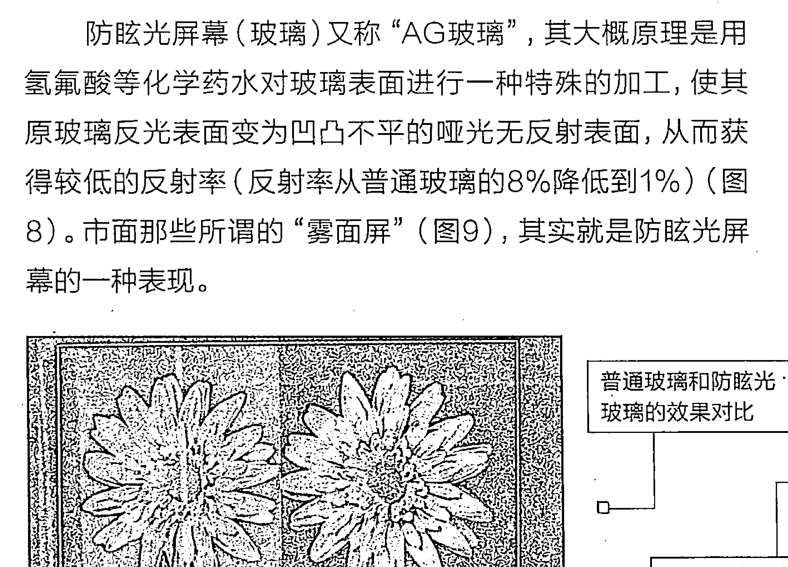

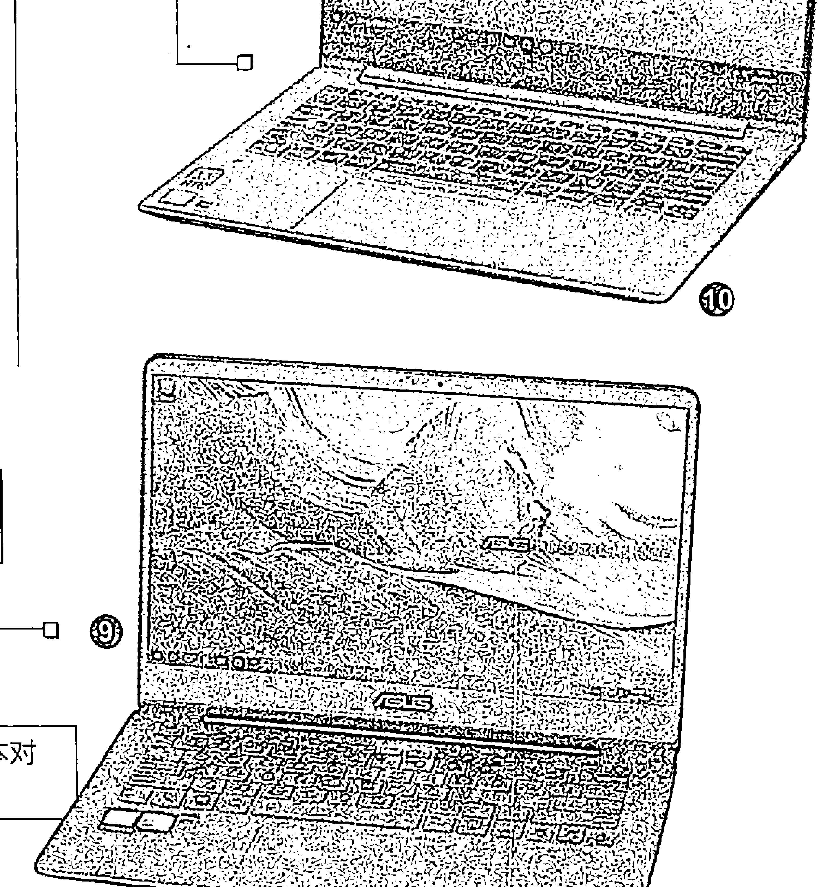

如果你的显示器或笔记本采用了镜面屏且反光严重，可考虑贴AG膜换得雾面屏效果，只是这种AG贴膜的本质其实就是磨砂保护膜，对于屏幕显示有一点不利的影响，不如原生防眩光屏幕效果好。

###### 镜面屏的涂层改良

问题来了，为了保护脆弱的玻璃，或是为了实现触控功能，如今很多显示器和笔记本屏幕都嵌入了一层康宁玻璃盖板，和防眩光屏幕彻底绝缘(图10)。那么，此类产品就必须忍受光线折射的困苦了吗？

答案自然是否定的，镜面屏可以通过抗反射涂层解决光线反射的眩光问题。需要注意的是，只要是镜面玻璃就一定存在眩光现象，所谓的抗反射涂层只能缓解，并不能彻底消除眩光！此外，这类抗反射涂层大都还具备防指纹和一定的疏水功效，免去了每次点触屏幕过后都需要好好擦拭的繁琐。

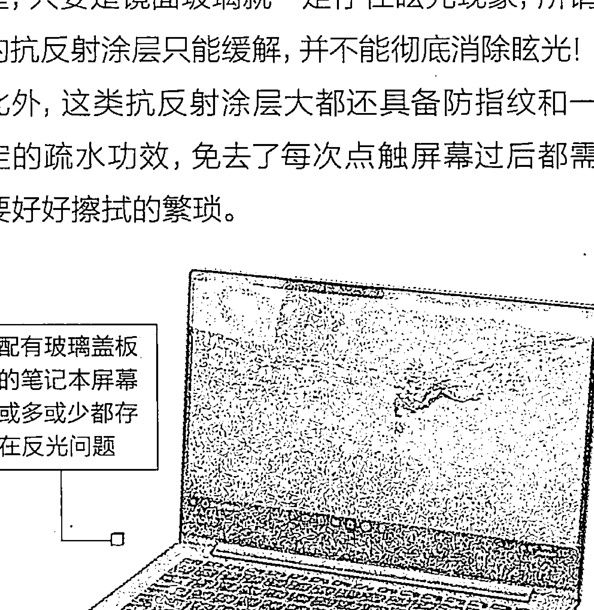## 涂层的保养很重要

当镜面屏表面涂有抗反射涂层就万事大吉了吗？很遗憾，如果你没有养成正确的保养习惯，这个涂层也许会成为你的噩梦般的存在：苹果早期MacBook和视网膜版MacBook Pro就曾深受屏幕防反射涂层变色或者脱落问题的困扰（图11），严重影响到了视觉体验。

虽然后期的MacBook以及其他品牌采用镜面屏幕且涂有抗反射涂层的产品（图12），都已经对抗反射涂层工艺进行了改良，不存在闭合时键盘触控板对屏幕压力的设计影响，但汗液和第三方的清洗液依旧可能会对抗反射涂层具有不可逆的损害。

简单来说，包括抗反射涂层在内的所有镀膜，都最怕酸性物质。由于每个人的体质不同，有些人分泌的汗水中就会呈现酸性，这种物质一旦和镀膜发生较长时间的混合就会让其发生化学反应，引起变色或脱落等问题。

总之，存在涂层的屏幕需要更加注重保养方式。不要在屏幕上喷洒包括外用酒精和任意类型的玻璃清洁剂和镜头清洁喷雾剂等（图13）。只能使用纯净水，而且切记不要用喷洒和浸湿的方式，而是用一块轻微湿润的柔软的眼镜布来清洁屏幕表面。此外，手纸和各种纸巾也不要用，对脆弱的涂层而言它们依旧过于粗糙。

### 好鞍还需好马 理性选购电竞显示器

无论是疏油层、防眩光屏幕还是各种涂层，都是应用在屏幕表面的存在。而在屏幕的内部，同样有一些非常吸引人的技术和功能，比如被冠以“电竞显示器”的产品，就以超高的刷新率作为主打卖点。然而，你真的以为有了电竞显示器就能获得电竞级的显示了吗？

#### 电竞显示器的标准

随着电子竞技的兴起，很多用户挑选PC时都开始向“游戏专用”的角度倾斜，游戏本的迅速崛起就能很说明这个问题。借着这股东风，各种电竞外设也是越加火爆，而电竞显示器则以炫酷的外观和出色的显示效果，成为很多游戏玩家的必选项(图1)。

什么样的显示器才能被冠以“电竞”之名? 超大的屏幕视野、5ms以下的响应时间、144Hz起步的屏幕刷新率、支持AMD FreeSync (图2) 或NVIDIA G-Sync同步技术 (图3) ……问题来了，很多人就是追求电竞级的体验而选择了电竞显示器，但在与家里的游戏本或台式机搭配时，却根本没有感受到应有的电竞级效果。这又是怎么回事呢?

#### 好鞍也需配好马

电竞显示器的刷新率都是144Hz起步，少数顶级产品甚至已经实现了240Hz显示。然而，刷新率虽然上去了，但同时也对PC的硬件配置提出了更高要求。以《守望先锋》游戏为例，需要配备GTX1060级别的显卡才能发挥出1080P分辨率、144Hz刷新率电竞显示器的实力。

问题是，7000元内的游戏本大都以GTX1050 Ti级别独显为主，武装GTX1060显卡的机型大都在8000元以上。此外，现阶段只有FPS和赛车类游戏适合电竞显示器，如果你平时只玩《英雄联盟》或《DOTA2》，更高刷新率就没有半点加成效果了。换句话说，如果你想给笔记本配个电竞显示器，意义真心不大。至于台式机，考虑到其后续可以不断升级的特性，在有相关需求的前提下倒是可以选择与电竞显示器搭配。

#### 认清需求最重要

在很多用户的潜意识里，能被称为电竞显示器，其显示效果绝对更为完美，用于图像视频编辑肯定更为契合。可惜，这个潜意识有些“想当然”了。

为了追求更低的响应时间，电竞显示器普遍选择TN材质的屏幕，色彩和可视角度较IPS和MVA等材质都有一定的劣势。TN屏唯一的好处就是成本低，而这也是时下电竞显示器价格已经滑落到2000元价位起的主要原因之一。总之，如果你对色彩准确性的要求很高，TN材质的电竞显示器显然不适合你，而配备IPS材质的电竞显示器价格又不便宜，从性价比的角度考虑，还是直接购买色彩表现更佳的普通显示器来得实在。

总之，电竞显示器是专为游戏而生的设备，仅适合游戏玩家与发烧级游戏本和台式机搭配。至于普通用户，则没有必要为更高刷新率和响应速度的电竞显示器买单的必要。哪怕现在电竞显示器的价格越来越便宜，但架不住普通显示器的价格更低。

### 激斗英特尔 20年 处理器的查找史

策划《电脑爱好者》编辑部
文|魔之左手 白狼

2017年，AMD花费数年时间打造的Zen核心终于成熟，相应的Ryzen处理器就带给了大家惊喜，其出色的性能让Intel又一次感受到了来自处理器市场的竞争压力，而这一压力已经消失了近10年。20年前，K5和K6这两个自研架构让AMD从Intel的市场合作者、供货补充者的位置，正式转向了正面竞争者。在20年的历史中，AMD的处理器既在性能上取得过明显的领先，也曾在难以抵御的重压下顽强地奋战，给强大的Intel以及用户们带来过深刻的记忆。

#### 前史
从费尔柴尔德到5x86

要说Intel与AMD是目前市场中最主要的消费级处理器厂商，比较有趣的是，虽然两者在市场上激烈竞争，但从根子上说，确是系出同门，怎么都绕不过费尔柴尔德（Fairchild，亦可译为“仙童”）半导体公司。创建了Intel的“三巨头”——诺伊斯（Robert Norton Noyce）、摩尔（Gordon Moore）、格鲁夫（Andrew S. Grove）三人就是从费尔柴尔德出走的（图1），AMD的创建者桑德斯同样也曾经是费尔柴尔德的销售部主任（图2）。

AMD很早就进入了个人电脑处理器市场，早期主要是通过逆向工程仿制Intel产品，并且在IBM推出个人电脑时，作为第二供货商，获得了很多技术的授权，其中最重要的当然就是X86架构的永久授权，以此为契机，AMD在286时代的销售额甚至超过了Intel的一半以上。不过随着Intel拒绝授权生产386处理器，研发能力相对较弱的AMD的处理器迅速堕入了低谷。由于处理器结构日渐复杂，初期的80386 DX处理器集成了大约27.5万个晶体管，而80486更是拥有120万个晶体管，逆向工程已经越来越难，AMD在1991年才成功仿制和推出了AM386处理器（图3），而此时486处理器都已经上市销售数年了。

随后的Pentium处理器时代，Intel更是连名称专利都垄断在手中，兼容处理器厂商已经无法使用类似名称了。刚刚完成486研发的AMD不得不继续在这一架构中“折腾”，虽然推出了终极版486——5x86（图4），性能已经接近早期的Pentium，但整体的落伍仍然是无法弥补的，但AMD的野心并未消失，并且迅速迎来了它最辉煌的10年。

#### 辉煌10年
从K6到K8

#### 初阵——K6系列

1997年推出的K6处理器对如日中天的Intel Pentium系列来说，还没有形成很大的威胁，但对AMD来说却意义非凡。作为第一款自行设计，同时能够与Intel高端处理器并驾齐驱的AMD处理器，K6标志着AMD第一次拥有了正面对抗Intel的资本。从K6到现在的Ryzen，20年间，AMD与Intel的恩怨情仇，一直左右着处理器市场。

K6处理器的技术来源有两个，分别来自AMD首款自行设计的处理器K5和收购的半导体设计公司NexGen。AMD在1994年的微处理器技术论坛年会上展示出了自研发的K5处理器（图5），并宣称性能高于奔腾30%。不过1995年K5正式推出时，Pentium架构已经比较成熟，频率达到了100MHz以上，同时K5的性能也并没有其宣传的那么出色，只能以较高的性价比与Pentium中低端型号竞争。K5采用和75MHz以上Pentium处理器一样的Socket 7接口，但架构已经有所不同，因此引入了PR值标称，但因为并没有表现出明显高于同频Pentium的能力，所以PR值与实际频率没有太大差别。

1995年，AMD收购了NexGen公司，以K5为基础，结合NexGen的第六代处理器技术（Nx686），在1997年推出了K6处理器（图6）。这款处理器仍然采用了兼容Intel Socket 7平台的策略，可安装在Intel芯片组或ALI、VIA、SIS等厂商芯片组主板上，但在技术、规格、工艺等方面都有了自己的鲜明特色，并且有着可以与最新Pentium处理器抗衡的性能。

K6采用32KB数据L1缓存和32KB指令L1缓存，均达到了Intel Pentium MMX（多能奔腾）的两倍，可以同时处理更多指令，并且可以支持最新的MMX指令。K6的频率也可以紧追最高端Pentium MMX，迅速达到了200MHz以上。在具体性能表现上，K6的整数性能已经与同频Pentium MMX类似，只是在浮点性能和MMX指令集效率上略逊一筹，因此这款处理器在办公等应用中表现出色，但在图形图像处理、3D游戏等应用中的表现要差一些。

英特尔MMX（MultiMedia Extensions，多媒体扩展）指令集的成功，以及自身相对落后的浮点性能决定了AMD对K6的改进方向，最终产品就是加入了3D扩展指令集——3D Now!，以加强3D处理，特别是3D游戏能力的K6-2处理器（图7）。K6-2处理器在1998年上市，主要架构并没有大的变化，内部主要是加入了3D Now! 指令集并使用更新的制造工艺，在外部则采用266/300MHz起跳的高频率，并可支持100MHz外频，相应芯片组和接口平台又被称为“Super 7”。K6-2在市场上获得了相当不错的成绩，除了自身性能的进一步提升和用户对AMD的逐渐认可之外，Intel新一代处理器Pentium II的不佳表现，也从另一个方面推动了K6-2的销售。除了市场上的成功之外，笔者认为K6-2对未来AMD处理器的影响力也超过了K6处理器。在K6-2处理器上，AMD首次尝试了独有的扩展指令集3D Now! 和Super 7主板平台，并获得了很多软硬件厂商的支持，说明除了用户之外，各个相关厂商也认可了AMD处理器并准备对其进行更好的支持，其意义远超过这些技术对性能的实际提升。

1997年推出的Pentium II是Intel用来一举甩开所有竞争对手，让处理器实现跨越式进步的利器，它是纯32位专业级处理器Pentium Pro的小幅度升级版，在运行32位程序时有着巨大的性能优势，同时采用了Intel专利技术的SLOT 1插槽接口。很遗憾的是，Intel在Pentium II上的架构壁垒——纯32位架构，因为只能以模拟方式相当缓慢地运行16位程序，对当时仍大量混用16位程序的主流用户来说难以接受；而硬件壁垒——SLOT 1插槽及SECC（Single Edge Contact Connector，单边接触插槽）封装（图8），则存在成本高昂、安装难度大、占用空间大、散热困难、外置缓存速度受限等诸多问题。Pentium II的诸多问题造成大量用户放弃了选购Intel新一代产品，其中很多人转而使用K6-2处理器，特别是K6-2虽然更适合100MHz外频的Super 7平台，但也仍然可以正常使用Socket 7平台，更让原有的Pentium用户可以用最小的成本进行升级。

AMD K6、K6-2对Intel的压力相当巨大，可以说是赛扬（Celeron）处理器这一全新品牌推出的动力之一。第一批赛扬处理器为赛扬266MHz和赛扬300MHz，它们可以看作是不配备板载L2缓存和外壳的奔腾2，外频也降低到66MHz，因此成本大幅下降，可以用来和K6-2进行竞争。不过当时市场上支持SLOT 1接口的440LX和440BX芯片组价格仍然很高，且取消了L2缓存的赛扬浮点性能虽然仍相当出色，也因为没有缓存的限制而拥有了让人惊讶的超频能力，但运行16位程序时的低能和没有缓存造成的整数性能下降，使其办公等性能大幅落后于K6-2，甚至超频后都难以让人满意，所以只有一些游戏爱好者和超频发烧友才会选择。而后Intel推出了带有将小容量二级缓存集成在内的新赛扬（图9），其中的300MHz产品凭借优异的性能和超频能力获得了发烧友的热爱，和K6-2 300MHz一起成为了两款当时深受欢迎，并且在历史上留下深刻印记的经典产品。

#### 世纪大战——K7

1999年，Intel推出了采用0.18微米工艺、增加SSE（Streaming SIMD extensions，数据流单指令序列扩展）指令集的新一代处理器——Pentium Ⅲ（图10），解决了大量Pentium Ⅱ上存在的问题。相对应的，AMD也推出了增加了512KB大容量二级缓存的K6-Ⅲ（图11）及其精简版K6-2+处理器，大容量缓存为新处理器带来了更强大的性能，特别是整数性能，AMD甚至特意将命名规则更改，采用了K6-Ⅲ而非K6-3的命名，以表示这是一款不同以往的产品，以及挑战Pentium Ⅲ的决心。不过K6-Ⅲ在市场上的影响实际很小，除了延期、较大的发热量、高成本、浮点性能较差等因素之外，最重要的原因是更加强大的K7几乎接踵而至。K7炫目的光彩完全遮掩了K6-Ⅲ的身影，让它从高端产品迅速沦落为暂时填补低端市场空白的陪衬，并且开启了世纪之交的新一轮处理器大战。

1999年6月，AMD推出的K7架构处理器比K6更加强势，其主要技术来自DEC公司强大的服务器处理器Alpha 21264，并使用了Alpha架构的EV6总线。与之前的绝大部分非Intel处理器不同，K7架构拥有超越Intel处理器的浮点能力和频率潜力。首款K7处理器被命名为Athlon，它和Intel的Pentium一样，成为了AMD的保留商标，至今仍是中低端处理器的名称，当然在初创之时，它还是一款高端产品，价格与同频Pentium Ⅲ比肩。首批推出的Athlon处理器拥有500MHz主频、200MHz外频、128KB一级缓存，采用0.25微米制造工艺。比较有趣的是，不知道是Intel在技术和宣传上的强势，还是为了与其他配件厂商进行更好的匹配，AMD也选择了SECC封装（图12）、外置低速512KB二级缓存，采用SLOT A插槽接口，早期用户发现它其实就是反向使用的SLOT 1接口。

Athlon的综合性能超越同主频Intel Pentium Ⅲ，让当时所有的DIY用户和Intel都震惊不已。而其后Athlon更是开始在Intel最骄傲的频率方面不断进行挑战，从700MHz到突破1GHz，双方轮番夺取频率的制高点，产品发布的频率和相互之间的间隔都变得很小，以至于1GHz这一具有里程碑意义的频率，双方几乎是同时达到的。如果考虑到发布、出货的时间间隔，甚至难以确定到底是谁第一个突破了GHz大关。不过在1GHz的处理器方面，有一点可以肯定的是，冲击1GHz大关的Pentium Ⅲ产品都出现了这样那样的问题，有些型号甚至全面回收，所以最终戴稳了这一桂冠的，应该是AMD和Athlon处理器。

在争夺1GHz高峰的同时，Intel也发现了SECC封装的弱点，重新返回Socket接口，推出了Socket 370接口的Coppermine（铜矿）核心Pentium Ⅲ（图13）。这一核心对早期架构进行了修改，内置同频L2缓存，但容量降至256KB，使得产品体积、制造成本、发热量等都大幅降低，性能大幅上升。AMD应该是在推出K7后，很快也意识到了SECC封装的不足，因而紧接着推出了Socket A接口以及相应的Thunderbird（雷鸟）核心Athlon处理器（图14），同样采用了同频内置L2缓存，容量也降至256KB。在更换为Socket A接口的同时，AMD还推出了面向低端的Duron（钻龙，内地俗称毒龙）系列CPU（图15），将二级缓存砍到了64KB。虽然较小的二级缓存对高端应用有一定的影响，但在日常应用中，Duron的表现还是很出色的，基本达到了压制Intel新一代赛扬处理器的目标。

2000年底，Intel推出了采用NetBurst（网络突发）架构的新一代处理器——Pentium 4，其超长管线的设计使其可以很容易地提升频率，而且理论上拥有更高效的计算能力。虽然事实证明最终Pentium 4也没能达到真正的高效率，且频率提升并没有预想中的顺利，不过在当时，1.4GHz起步并迅速达到2GHz以上频率的Pentium 4（图16），还是给了AMD K7架构很大的压力。

由于早期的Pentium 4性能表现欠佳，且陷入了内存搭配、更换接口等很多自身的麻烦之中，所以Athlon仍然勉强可以应对，但2002年初推出的Northwood核心Pentium 4（图17）已经比较完善，它使用0.13微米工艺制造，将二级缓存提升到了512KB，最高频率达到3GHz以上。更重要的是，其配套芯片组i865系列开始支持双通道DDR400内存，终于补足了Pentium 4在内存带宽方面的短板，最后更实现了大大提升效率的超线程技术。

2001年底，AMD在压力下也推出了新版本的K7处理器进行应对，即Athlon XP，其主要变化是加入了对SSE指令集的支持，以及更高的频率，另外相应的芯片组也开始支持更高带宽的DDR内存，封装基板也从厚重的陶瓷改为了更轻巧、类似Pentium Ⅲ的树脂材质。由于对手的高频率可能对市场造成误导，因此AMD又一次祭出了PR值标定法，以体现处理器相对于Pentium 4的实际效率。Athlon XP进行了数个版本的快速迭代，其终极核心，2003年推出的Barton（图18）采用了最新的0.13微米工艺，L2缓存翻倍达到512KB，加上新的双通道DDR内存支持，尽管实际性能已经无法和高端Pentium 4对抗，但出色的性价比仍然使其成为A粉心中的一代经典。

在K7时代，AMD处理器的出色表现也吸引了大量周边芯片组厂商，无论是老搭档VIA、ALI，还是新晋的NVIDIA等厂商，都提供了稳定、出色的芯片组。因此尽管不再能兼容Intel平台，但K7平台攒机的可选性不降反升。到Athlon XP时代，NVIDIA的nForce 2芯片组（图19）非常强势，以双通道DDR2内存、AGP 8×、SATA等一系列新技术、新接口，以及内置强力显示单元等独特功能，受到了用户的青睐，形成了延续数年直到K8时代的NVIDIA芯片组+AMD处理器的最佳组合模式。

#### K8

2003年8月，AMD推出的K8处理器可以说是一款划时代的产品。虽然总体上说，K8是基于K7架构的产品，但有三项大的改变，而这三个改变中的任何一个，都足以成就“一代名U”。而这三项技术实际上也代表着处理器发展的方向，实际上也被Intel全部或部分吸收使用。

首先，K8最重要的改变就是加入了64位指令集，通过64位指令集不但让处理更高效，而且管理超过4GB容量的内存。64位处理器本身并不是AMD最先提出和推出的，但Intel等厂商只把64位指令集及相关处理器用在了服务器市场上，例如其IA64架构安腾（Itanium）处理器（图20）。这些处理器不仅本身不适合消费级市场，而且其指令集也是高度专一和优化的，并不能兼容消费级市场的应用软件，这给AMD留下了一个很好的突破口。AMD提出的64位指令集是一种基于X86架构的扩展指令集，因此K8不仅可以高效运行64位程序，也能出色地执行32位X86程序。AMD的64位指令集在实际使用中的表现相当优秀，获得了微软等业界领导者的支持，也使得Intel不得不对其进行支持。

其次，在K8中首次集成了内存控制器，最初支持DDR内存，可以大幅度降低内存与处理器的通信延迟，提升系统整体性能。这一技术目前已经成为所有主流处理器的标配，其意义不言自明。当然处理器内集成内存控制器减少了内存可选的种类，还会使内存的工作频率与CPU频率直接挂钩，让超频多了一些限制。

最后，K8放弃了原有的FSB前端总线而采用了HyperTransport总线技术，它采用点对点串行设计，让内存、磁盘、PCI总线控制器之间有了更高的数据带宽和更大的弹性空间。这项技术对Opteron（皓龙）系统上的影响很大，帮助AMD拓展服务器市场，并一直沿用到Ryzen架构之前。

除此之外，K8还在K7架构的基础上加长了整数与浮点流水线，增加了缓存容量，加入温控电路和节能技术，以及增加了对SSE2指令集的支持。第一代K8处理器架构内置单/双通道DDR400内存控制器，一级缓存为128KB，二级缓存为512KB~1024KB。K8处理器的封装也有了大幅改变，与Pentium 4类似，带有一个金属保护壳，以前因手滑或者操作不当而压碎CPU核心的问题终于成了历史。

K8处理器有面向主流市场的Athlon 64、顶级的Athlon 64 FX（图21）以及专业级产品Opteron，接口也分为Socket 754和Socket 940两种（图22），前者针对中低端，不支持双通道内存，早期的Athlon 64和Sempron（闪龙）采用这一接口；后者针对高端，支持双通道内存，主要用于早期的Athlon 64 FX和Opteron。

前面已经提到，Pentium 4采用了特别适合高频但效率不佳的架构，因此Athlon 64也采用了PR值标定方式，以确定对位的竞争产品。在Athlon 64处理器中，不乏Athlon 64 3000+/3200+等经典型号，而Athlon 64 FX则在性能上全面超过奔腾4系列，价格也是水涨船高，Athlon 64 FX-60的价格曾超过万元。另外在K8产品中开始出现面向高端消费者的专门产品——FX系列处理器，它们不仅性能出众，而且拥有组建多路CPU的能力，以HyperTransport总线连接的多路CPU系统，充分体现着K8架构独特的服务器处理器血统。2004年7月，AMD还推出了K8架构的新Sempron（闪龙），主要变化就是L2缓存容量降至128KB，性价比和功耗表现都很出色，其中闪龙2500+可以轻松从1.5GHz超频到2GHz以上，其便宜的价格与功耗非常实惠，笔者家中还留有一块藏品。

2005年，AMD的K8架构进入了双核和DDR2时代，双通道内存的Socket 939成为主流接口，除了Sempron之外，K8全部消费级处理器都逐渐转向这一接口，直至全部统一到Socket AM2接口，使得用户的选购与升级都更加方便。不过由于Intel在Pentium 4平台逐渐排挤兼容芯片组，使得大量厂商集中在K8芯片组市场中，这使得K8主板市场空前繁杂，VIA、ALI、NVIDIA、ATI等厂商的芯片各有特色，不过其中功能最全面，也最受欢迎的仍然是NVIDIA的nForce系列芯片组，它最早提供了规格最高，表现也最好的SATA、USB接口，以及PCI-E等新兴接口。

与K8对应的Pentium 4处理器已经是后期的Northwood核心与Prescott核心。其实Northwood核心的另一个重要变化是支持超线程技术，可以动态分配计算量，尽量填满整个计算管线，充分利用NetBurst架构的长管线设计。超线程技术让一个核心能同时运行两个计算，成为虚拟双核心，这一技术一直延续到了当前的智能酷睿处理器和Ryzen处理器中，但在Northwood核心处理器中，仅有最高端的3.06GHz型号实际开放了这一功能。在Northwood核心的基础上，还推出了Pentium 4极致版（Pentium 4 Extreme Edition，P4EE）处理器，增加了2MB的三级缓存，提升了在多媒体等专业领域的性能。

2005年Intel推出了Prescott核心，使用90纳米（0.9微米）制造工艺，L1数据缓存升至16KB，二级缓存达到1MB。Prescott核心的Pentium 4开始使用延续至今的LGA（Land Grid Array栅格阵列）封装，即LGA775接口（图23、图24），取消了处理器上易折断的针脚，使其运输、安装都更安全，与主板连接更紧密，也更方便进行散热等设计，这一接口类型一直延续到了今天的所有Intel消费级处理器上。在Prescott核心的基础上，Intel通过一些小改款逐步引入了64位指令集、双核双线程、1066MHz外频，以及更新的65纳米制造工艺等技术，其配套的915芯片组也提供了对双通道DDR2内存、PCI-Ex16插槽等高带宽接口的支持。

在AMD的攻势面前，Pentium 4处理器的抵抗混乱而低效，例如为了抢先发布双核处理器，Intel推出砍掉超线程技术直接封装两颗核心的Pentium D（图25）。这款“胶水双核”自然没法摆脱高热量高功耗的悲剧，而且价格还够贵。没过几天，AMD就推出了Athlon 64 X2双核处理器（图26），还搞了一次真假双核的商业宣传对决，使其情况更加被动。

Intel在2006年还准备了一款Cedar Mill核心的Pentium 4，应该是Pentium 4最接近完美形态的产品，它采用65nm制造工艺，将TDP降至86W，引入Prescott核心尝试的所有最新技术。不过这款处理器也难以扭转Pentium 4失败的命运，几乎没有出现在市场上就被淘汰了。

2006年第一季度，AMD处理器10年的繁荣期达到顶峰，在X86市场的份额几乎达到了50%，Intel Pentium 4最终完败。不过此时，笔记本平台上的Intel Pentium M处理器却大获成功，为下一阶段的竞争埋下了伏笔。

> 被暴力揭盖的Pentium D，可以看基板上的两块处理器芯片

> 同样被暴力揭盖的Athlon 64 X2双核处理器，可以看到内部只有一块芯片（揭盖时被导热胶粘到了顶盖一侧）

> 其实所谓的3A平台，即AMD处理器、AMD GPU+AMD芯片组，也是AMD最初的一种融合规划

#### K10

2006年AMD突然宣布收购ATI，同时获得了GPU和芯片组设计能力，并借此推出了Fusion（融合）平台（图27）及处理器计划，之后又在上海成立研发中心，回头在纽约又准备建立晶圆厂。看似一路高歌猛进的AMD此时却不得不为自己收购ATI带来的资金不足买单，开始出现财务亏损。此时Intel虽然把摩托罗拉成功打败，但是还是放弃了移动业务，把XScale处理器出售给Marvell，自己则进行了大规模裁员和产品降价。并开始启动了“Tick-Tock”计划，即一年更新架构一年更新制程的处理器升级计划，这种挤牙膏战略虽然有些死板，但是这种严格的执行力正是AMD所缺乏的。

2006年7月Intel很少见地在台式机市场引入了移动平台的Pentium M架构衍生产品——Core 2（酷睿2）系列处理器。Pentium M本来是因为Pentium 4 M在移动平台的表现不佳而设计，它减少了流水线，改良了分支预测机制，进行指令集捆绑执行，提升了L2缓存并进行分区设计，拥有不错的性能功耗比。Core 2处理器在采用了四发射设计，改进了宏指令融合技术，并对功耗与发热有了较多的重视，并且非常“走心”地使用了已有的LGA775平台，节约了用户升级成本和配套厂商的研发成本。首发的Conroe（也就是被戏称为“扣肉”）架构Core 2处理器得到了市场的一致好评，使得Athlon 64 X2处理器一夜之间狂降千元，FX性能也不再辉煌。Core 2的早期型号如E4300/E6300（图28）等拥有出色的性价比，而后更率先推出了Core 2 Quad四核处理器，虽说是价格昂贵的胶水四核，但是性能上确实没有对手，发热程度也还可以被接受。在很短的时间内，Intel就形成了对AMD处理器的全面压制，更使得AMD的市场份额在一个季度内狂跌10%，一年内就跌回到了30%左右。

AMD应对酷睿2处理器的产品，是在K8架构的基础上进行了深度改良的K10（或称K8L）架构，其主要改进是更多的核心数量，以及增加了大容量的三级共享缓存。K10架构算不上是很成功的技术，但是AMD通过错位竞争的关系保住了不少的份额，并将接口升级到AM2+和AM3。此时AMD推出了Phenom（羿龙）处理器，试图争夺高端份额。不过首发的羿龙四核显然出师不利，缓存TLB Bug造成的严重不稳定问题，使这款处理器很快被市场抛弃，直到9X50系列的羿龙处理器才修正了这个问题，这让AMD尴尬了很久。

为了保住低端市场，吸收了ATI的AMD开始在芯片组上下功夫。此时电脑上面的集成显卡是集成在芯片组上面的，芯片组性能的好坏也决定了集成显卡的性能。Intel的GMA 900芯片组虽然性能不弱，但也只是能满足办公而已，还是要靠英伟达、威盛等厂商的协助。而有了ATI的AMD就不是这样了。通过AMD690系列芯片组的集成显卡，AMD在中低端市场上呼风唤雨了好一阵，其中的690G芯片组集成的Radeon Xpress 1250显卡性能已经可以流畅运行一些单机大作，而价格上还很便宜。正面打不过的AMD在芯片组的集成显卡上面显然尝到了甜头，开始在别的方面动心思。为了吸引用户购买，AMD还推出了不锁倍频的黑盒处理器（图29），这也成为其后所有产品的定例，甚至影响了Intel的产品线。

#### 小试牛刀——K10.5

2008年，AMD发布了新处理器家族，主要就是Phenom II和Athlon II两系列处理器，K10.5改进并不多，升级到45nm工艺并扩大L3缓存。不过坚持了很长时间，其中有不乏Phenom II X4 955这样的经典产品，轻松超频之后放到现在还能使用。此外AMD还开始玩起了“开核”的小把戏，通过打开被屏蔽掉的问题核心可以把处理器从双核开到三核甚至是四核，哪怕是入门级的单核闪龙也可以开成双核，而且成功率还非常高，其中闪龙145开核之后还能疯狂超频到3.0GHz被很多发烧友拿来当玩具。此外AM2到AM3接口的内存和处理器兼容性不错，老处理器与老内存可以装在新主板上，这方便了很多预算不足的用户进行平台升级，充分照顾到了中低端用户的购买心理。

在AM3年代，800系芯片集成性能非常不错，其中880G作为市场上的常青树，集成了Radeon HD 4250显卡，可以流畅运行当时市面上的大多数网游，价格还非常便宜，成了很多人的装机首选。

2010年前后，AMD的处理器架构停滞不前，Intel却开始了处理器架构的快速迭代，酷睿处理器进化为智能酷睿，首先发布了面向高端市场的Nehalem架构Core i7-920、940、965XE，它们也将内存控制器整合到了内部，支持三路DDR3内存，新的QPI总线便于处理器互联和扩展。为了给Core 2留下清理库存的时间，中低端智能酷睿产品直到2009年末期才正式推出，即Core i3和i5处理器，其中部分产品采用了内置GPU模块的设计，虽然又一次使用了双硅片封装的方式，但是处理器集成GPU的首次尝试（图30）。

#### 一体两面——APU

2011年1月，AMD终于推出了融合处理器的研发成果——APU，不过Intel首款融合显示单元的产品已经后发先至，即Sandy Bridge核心的第二代智能酷睿处理器。APU本质上是想通过GPU的密集计算优势来协助CPU进行计算，以便提高CPU执行效率的异构计算的整合设计，但是受到软件支持的限制。实际上在大部分应用中APU都无法做到这一点，甚至在融合程度与协作能力上，与Intel的核芯显卡都互有长短。APU唯一的优势就是显示核心的性能更强一些，其占用的面积甚至超过了CPU部分，被用户戏称为“买显卡送处理器”，但APU内置显示核心的实际性能极受内存带宽的影响，又缺少内置高速缓存等缓和这一问题的手段，因此实际能力的发挥并不是很理想。

2011年底，AMD又一次推出了FX系列处理器，它基于推土机（Bulldozer）架构，没有内置GPU，更强调纯CPU性能，与APU针对不同的市场。FX系列处理器采用模块化设计，每个模块由两个运算核心及相应的缓存组成（图31），可以更灵活地进行组合，提供最高8个物理核心的产品。由于处理器架构优化效果不佳，FX处理器常常出现一个运算模块只能有一个核心运转的情况，而因为多模块带来的寻址等问题，性能还要打折。总体来看，FX处理器拥有高主频，但效率不佳，实际上颇有些奔腾4的影子。

在推土机架构之后，AMD又推出了打桩机（Piledriver）核心和压路机（Steamroller）核心，但都没有解决执行效率过低的问题，只是靠着工艺和小修小改勉强拉升了主频。市面上甚至还出现了买FX4000系列不如买955黑盒、买FX6300系列不如买1050T的“怀旧”现象，而FX8000系列则干脆无人问津。处理器不好卖，主板自然也要跟着受委屈。AM3+的主板不但不好卖，900芯片组除了顶级的990FX芯片组外，其他都因工艺问题出现了发热量过高的问题。现在看来，AMD也并没有把重心放在FX处理器中，各种CPU核心更多地还是为了APU而生，以及为AMD暂时撑住场面，等待仍在精心打造的Zen核心。

2011年Intel的新核心Sandy Bridge称为第二代智能酷睿，它将GPU直接集成到了芯片里，而且GPU与CPU共享三级缓存，这直接提升了核心显卡的性能，让核心显卡有了入门级低端显卡的性能，而后还加入了视频解码引擎和Turbo Boost技术，以及AVX指令集。第二代智能酷睿处理器在市场上收获颇丰，虽然因为锁定频率和变换接口的问题让超频爱好者和升级用户感到有些不爽，但性能提升还是实实在在的。其中i7-2500K还因为足够强大的性能被不少用户使用至今，笔者也是去年才从i7-2500K升级的。

AMD既不能威胁高端市场，又没法抢占中低端市场，Intel在之后的很长一段时间里面开始了挤牙膏战略。从Ivy Bridg核心到Skylake核心，酷睿处理器的计算性能没有多少长进，倒是在集成显卡上下了不少功夫。入门级的奔腾G4400处理器就是凭借其低功耗、高性能及不错的核芯显卡能力，从APU和新速龙手中抢回了不少的低端份额，帮助Intel几乎完成了一统江湖的霸业。

这一阶段的AMD完全可以用惨淡来形容，最后靠着卖工厂卖大楼勉强挺了过去，不过也使其完全转变了观念，开始更像一家纯粹的半导体设计公司，不再关注生产了。

2017年1月，Intel正式发布了新一代牙膏产品Kaby Lake核心处理器，它进一步加强了核心显卡性能，降低了功耗，小幅度提升了性能，主要还是对架构内部进行了很多细节修改。但是对消费级市场而言，这款产品并没有与上一代产品拉开距离，而AMD则祭出了全新的Zen架构。

Zen架构采用了新的精简化核心组，重新调整了运算核心的内部构造，统一了每组的L1缓存并增加了微指令缓存，同时采用了非对称L/S单元，有效地提高了执行效率而且缩小了核心面积，最后还加入了同步多线程技术，来降低多线程工作压力。在实际性能体现上，基于Zen架构的Ryzen 7处理器终于能和最新的酷睿i7产品进行对位，而Ryzen5更是实现了对酷睿i5的压制，据称入门级的Ryzen 3也超过了酷睿i3，性能十分接近酷睿i5。对Ryzen处理器的具体架构和评测，我们在近期的内容中已经有过相关报道，这里就不再赘述了。

在处理器市场上，时隔10年之后，Intel处理器终于再次需要通过降价手段来应对AMD处理器的挑战。Intel新的X系列处理器和第八代智能酷睿处理器也将很快加入Ryzen和未来新一代APU的战团，不过从目前掌握的消息来看，Intel第八代智能酷睿处理器的提升也不是很明显，X系列处理器也更适于专业应用而非消费级市场。在新一代处理器的竞争中，AMD是否能笑到最后，我们还不得而知，但至少从目前来看，AMD与Intel的处理器终于又走上了相近的起跑线。从AMD处理器20年的历程可以看出，只有激烈的竞争，才能激励厂商为消费者带来更好的产品，处理器市场的竞赛与争夺，就从现在起，重新开始了。


扫一扫
更多精彩内容立即

#### 游戏本的努力
你看到了吗

策划《电脑爱好者》编辑部

随着电子竞技行业的蓬勃发展，游戏再也不是“电子鸦片”，而是可以赢得荣誉和赚钱养家的运动项目。
所谓“工欲善其事，必先利其器”，想练就一身过硬的电竞身手，自然少不了性能强大的游戏平台的加持。然而，现在你还会选择笨重呆板，且将我们锁定在电脑桌前那一亩三分地的台式机吗？

游戏本无疑是电子竞技兴起的最大受益者，它凭借相对便携的机身，在方寸之间就能成为玩家练习的主舞台。
只是，在过去的很长一个时期里，高端游戏本总是傻大黑粗的形象，但来自NVIDIA最新推出的一种设计，却即将改变我们对游戏本的固有印象……

### 再探NVIDIA Max-Q游戏本

CFan在2017年13期的特别话题（P10页）中曾简单介绍过NVIDIA为发烧级游戏本量身定制的Max-Q设计。如今，基于Max-Q定制的产品已经陆续面世，其中有一些特性与我们之前报道的信息有所出入。为了让大家可以更深入了解未来高端游戏本的发展模式，下面就让我们重新再探Max-Q背后的秘密吧。

#### 高端游戏本减肥有点难

对游戏本而言，如何才能胜任“高端”和“发烧”的定义？答案必然包含两个核心参数：英特尔标压处理器（H系列，如i7-7700HQ或i7-7820HK等），NVIDIA GTX1060或更高档次的显卡。然而，这两类硬件都属于“发热大户”，需要相对奢华的散热模块才能镇压它们的热情，而这也意味着高端游戏本很难拥有苗条身材（图1）。

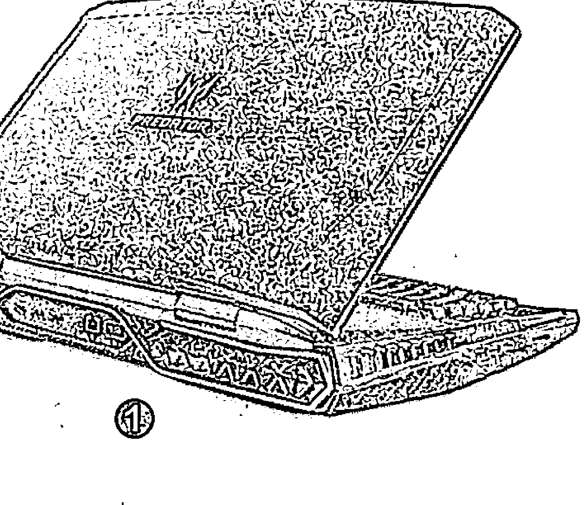

实际上，在过去的很长一段时间里，高端游戏本都没有放弃在瘦身方面的努力，而且也不乏成功范例。比如，高端轻薄游戏本的标杆——全新的雷蛇（Razer）灵刃14，以及距离成功还有半步之遥的戴尔XPS15和Alienware 13R3。

##### 成功的范例

雷蛇灵刃14的机身尺寸为353mm×236mm×17.8mm，重量更是轻至1.85kg，但该产品却集i7-7700HQ和GTX1060独显（频率较GTX1060标准版略有降低）于一身（图2），性能异常强悍。为了缓解散热压力，雷蛇灵刃14采用了全铝材质的机身以及双风扇四热管的散热模块设计（图3），再加上独特的Chroma炫彩键盘和雷电3接口，让雷蛇灵刃14成为最完美的14英寸超薄游戏本之一。当然，除了高达15999元起步的价格。

##### 瘦身欠成功

很多玩家都将戴尔XPS15和Alienware 13归类到“轻薄游戏本”阵营，但它们和灵刃14相比却还有着一定差距。

其中，戴尔XPS15的体积为357mm×235mm×17mm，重量只有1.78kg，标配雷电3接口，是一款便携性媲美灵刃14却又有着更大的15.6英寸视野的游戏本（图4）。可惜，该产品虽然也搭载了H系列酷睿处理器，但显卡却仅为GTX1050，在游戏性能上没有达标（只是相对而言，GTX1050对普通玩家而言也算够用，其性能媲美NVIDIA上代GTX965M独显）。

戴尔新Alienware 13凭借13英寸屏幕，理论上也能挤进轻薄游戏本的行列（图5），而且该产品还可选配OLED材质的触控屏幕，武装GTX1060独显和雷电3接口，性能更是强悍无比。可惜，Alienware 13的三围和重量分别达到了330mm×269mm×22mm/24mm（触控版）和2.6kg，机身宽度和重量明显超标，便携性不符合本文的定位。

戴尔XPS15和Alienware 13的价格都不算便宜，但就连它们都没能让性能和便携性得以平衡，可见高端游戏本的瘦身之难。在这一大环境下，NVIDIA最新推出的Max-Q就显得无比珍贵了，因为Max-Q就是一项确保高端游戏本减肥成功的秘籍。

#### 扩展阅读

##### 认识Max-Q和Max-P

NVIDIA每款移动显卡都有一个最强性能的节点，这个点即Max-P，需要GPU运行在最高的频率且不计功耗代价。问题来了，移动显卡的功耗和性能的提升幅度并不固定，起初可能每提升10%的功耗就能增加10%的性能，但超过某个范围后，为了再提升5%的性能可能就要付出功耗增加20%的代价。

在性能和功耗对应的曲线之中，总有一个最佳能效比的节点，比如用原先80%的功耗就能获得相当于Max-P节点90%的性能，而这个节点就是Max-Q（图6）。现在NVIDIA自己将GTX1060、GTX1070和GTX1080对应Max-Q的节点找了出来，交于OEM客户使用。

换句话说，Max-Q是一项软硬结合的设计（图7），它的调节方式是独立于GPU之外的，其本质就是在GPU核心频率和功耗平衡点上做文章，让GPU一直运行在能效比最高的负载和频率范围内。Max-Q涉及的控制变量包括笔记本、GPU计算能力、驱动程序以及散热和电子元件等。因此，Max-Q并不需要重新流片，而NVIDIA也曾表示Max-Q版本的GPU在芯片层面和普通版GPU是一样的，只需改良笔记本的散热、电路和安装相关的驱动软件即可，最终实现让GTX1080游戏本成就18mm瘦身的梦想。


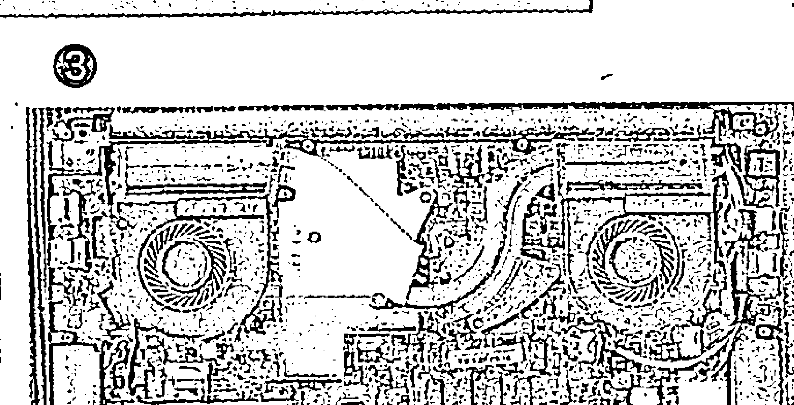
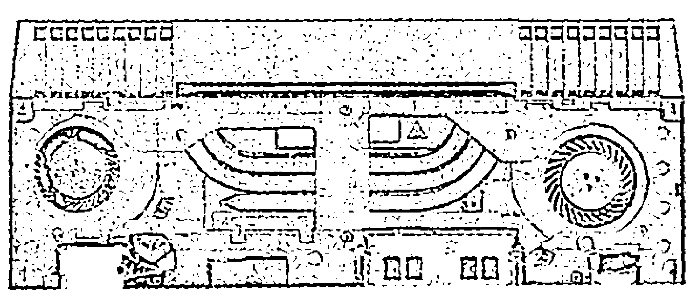
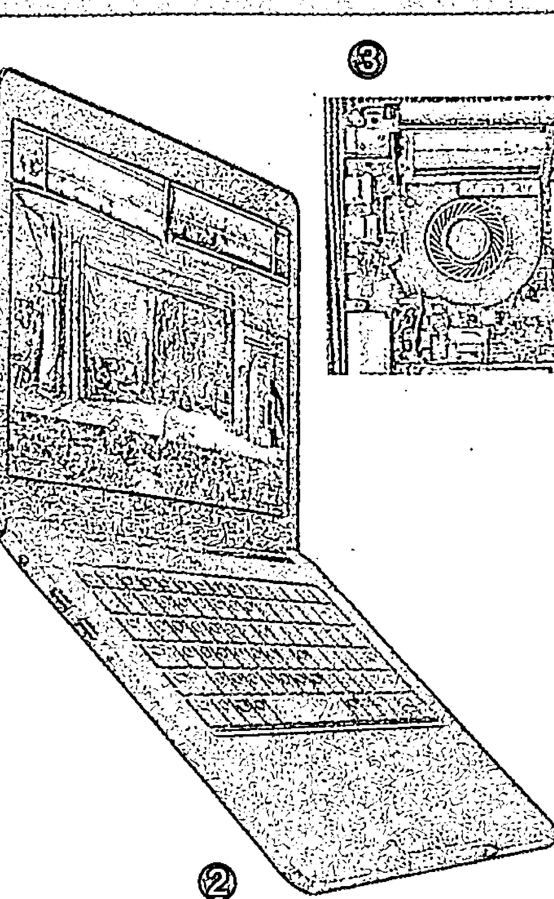

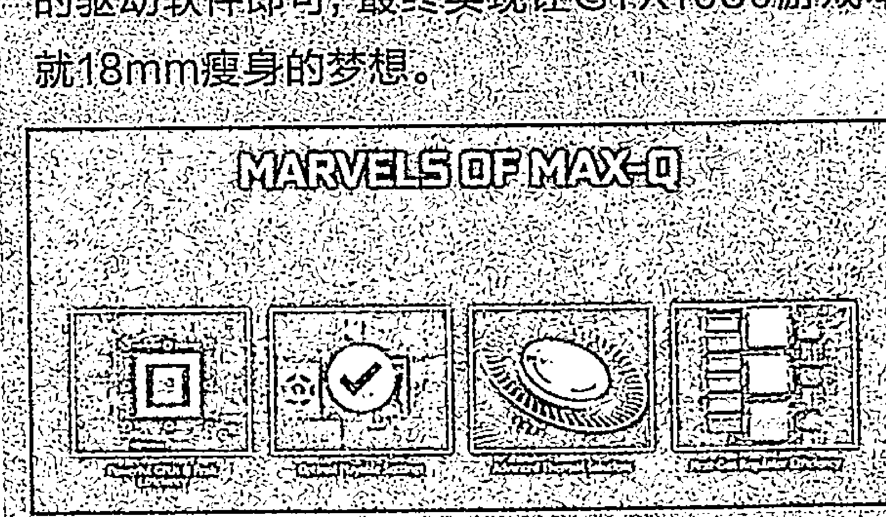

#### Max-Q成就瘦身梦想

为了更好地理解Max-Q对游戏本的意义，咱们先来品味一下基于该技术定制的几款新品，并通过它们在设计、配置和性能上的表现，把脉Max-Q的与众不同之处。

##### 激进的Max-Q游戏本

提到顶级游戏本你会想到哪些关键词？“怪兽”还是“巨无霸”？反正历史上顶级游戏本就是轻薄和性感的反义词。但是，借助Max-Q设计，终于让GTX1080入驻了厚度媲美苹果MacBook Air的超薄游戏本中。

华硕ROG Zephyrus GX501和宏碁Predator TRITON 700就是此间代表，它们都标配雷电3接口，而且还采用了相似的设计语言：将键盘挪到了C面靠近用户的边缘位置，最大限度增加了键盘和屏幕之间的空间（图8）。而这种设计的最大优势是，无论我们怎么折腾机器，与我们手指/手腕接触的键盘区都能保持清凉，让玩家的身体彻底远离容易引起不适感觉的发热源。

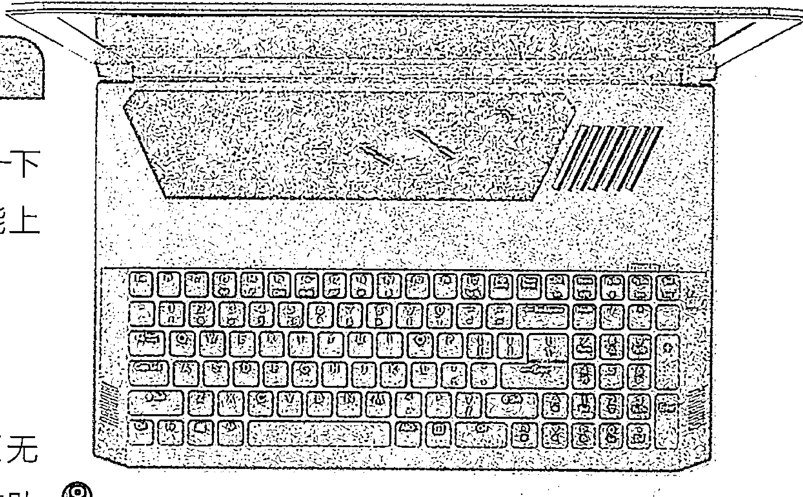

###### 宏碁Predator TRITON 700

- 屏幕：15.6英寸IPS
- 处理器：酷睿i7-7700HQ
- 显卡：GTX1060 Max-Q或GTX1080 Max-Q
- 厚度/重量：18.9mm/2.6kg

虽然身材略逊于华硕GX501，但宏碁Predator TRITON 700在同规格游戏本中也属于绝对的性感了（图10）。该产品同样配备了G-SYNC屏幕，而且在键盘和屏幕之间的区域嵌入了酷感十足的透明康宁玻璃板，透过它可以看到内部风扇，并将触控板功能集成在了靠右的玻璃里。此外，TRITON 700还内置两条M.2插槽，扩展潜力更出色。

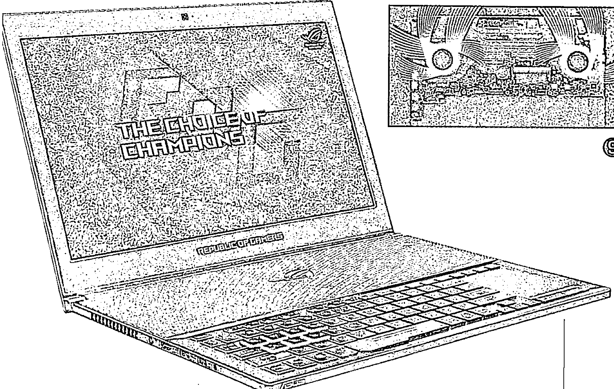
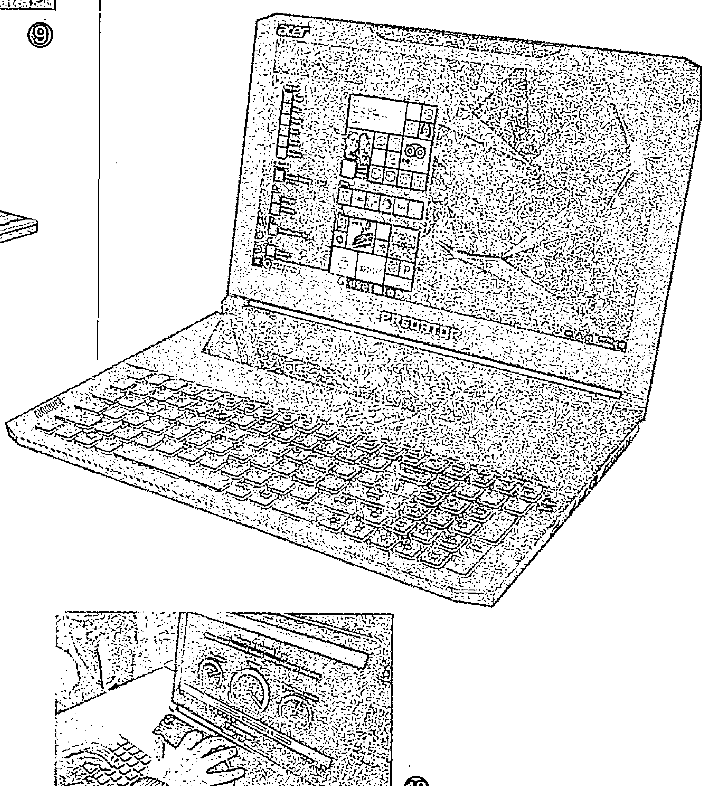

###### 华硕ROG Zephyrus GX501

- 屏幕：15.6英寸IPS
- 处理器：酷睿i7-7700HQ
- 显卡：GTX1070 Max-Q或GTX1080 Max-Q
- 厚度/重量：17.9mm/2.25kg

华硕GX501应该算是最薄的GTX1080游戏本，2.25kg的重量也极为轻盈（图9）。该产品的特色还在于配备支持G-SYNC技术的屏幕，刷新率达到了120Hz。此外，GX501位于键盘右侧的触控板也很有特色，它可以通过快捷键切换成触控操作的数字小键盘，算是将空间利用到了极致。目前武装GTX1070 Max-Q版本的GX501VSK（16GB内存，512GB SSD）已在国内上市，首发价为20999元。

##### 均衡的Max-Q游戏本

为了迎合Max-Q设计的风潮，微星也顺势推出了武装GTX1070 Max-Q独显的GS63VR Stealth Pro（图11），只是与华硕GX501和宏碁TRITON 700相比，这款产品保持了常规游戏本的外观设计，但轻薄性已然超越了本文开头介绍过的雷蛇灵刃14。要知道，GS63VR可是一款15.6英寸的游戏本哦，还可选最高4K分辨率呢。

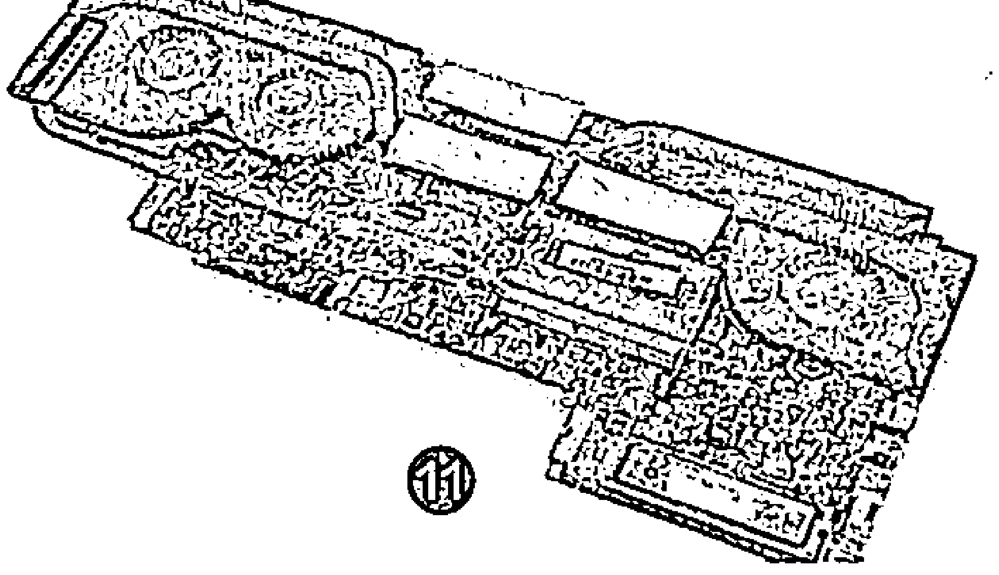

###### 微星GS63VR Stealth Pro

- 屏幕：15.6英寸IPS
- 处理器：酷睿i7-7700HQ
- 显卡：GTX1070 Max-Q
- 厚度/重量：17.5mm/1.9kg

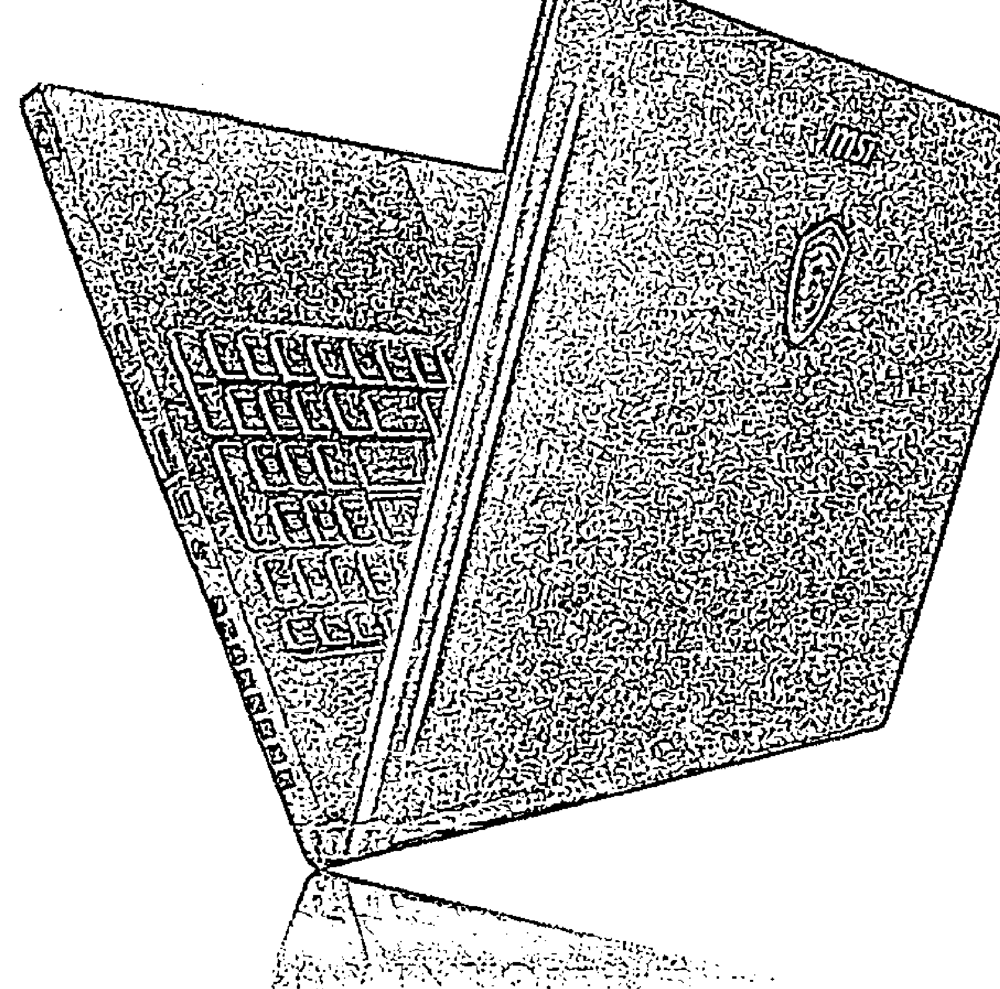

机械师PX5和炫龙耀9000就是两款基于P950模具设计的Max-Q游戏本（图14），而且它们在显卡的搭配上都超过了蓝天推荐的GTX1060 Max-Q，而选用了更高一个档次的GTX1070 Max-Q，拥有更强的游戏动力。可惜，P957HP6模具的散热模块驾驭GTX1070似乎有点吃力，满载运行时C面键盘区的平均温度达到了46摄氏度，机身底部的最高温度更是高达70.9摄氏度（图15）。

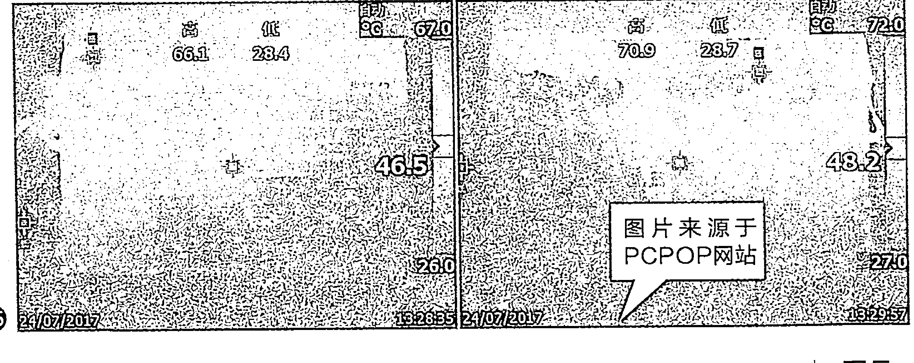

##### 通用的Max-Q游戏本

在游戏本公模领域大名鼎鼎的蓝天（Clevo）公司也推出了P950HP6和P957HP6两个Max-Q方案（统称P950系列），采用15.6英寸屏幕（最高可上4K分辨率），支持GTX1060 Max-Q，并将厚度和重量控制到了18.7mm和1.9kg左右（图12）。如果不出现意外，下半年以神舟、雷神、机械师、炫龙、未来人类为代表的国产Max-Q游戏本就都将属于P950HP6或P957HP6模具的衍生品，它们之间的差异主要体现在外壳材质、Logo、键盘背光颜色，而内部设计和散热模块则完全相同（图13）。蓝天的这两套Max-Q方案最大的遗憾，是没能将雷电3纳入标配，而且机身里留给电池的空间不多。还好，游戏本大都需要外接电源使用，电池的作用并不大。

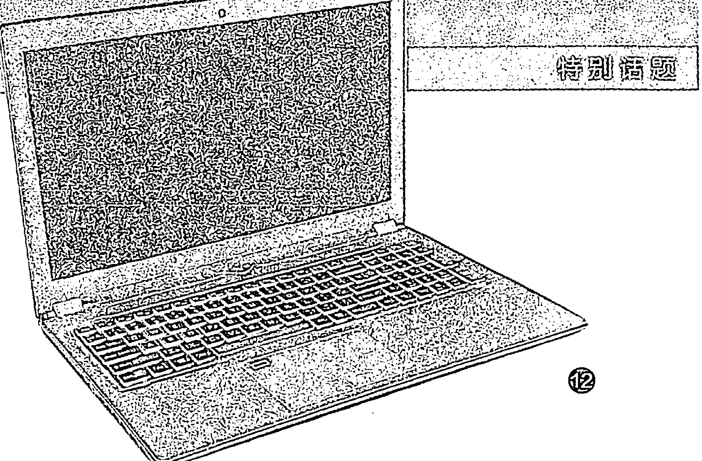
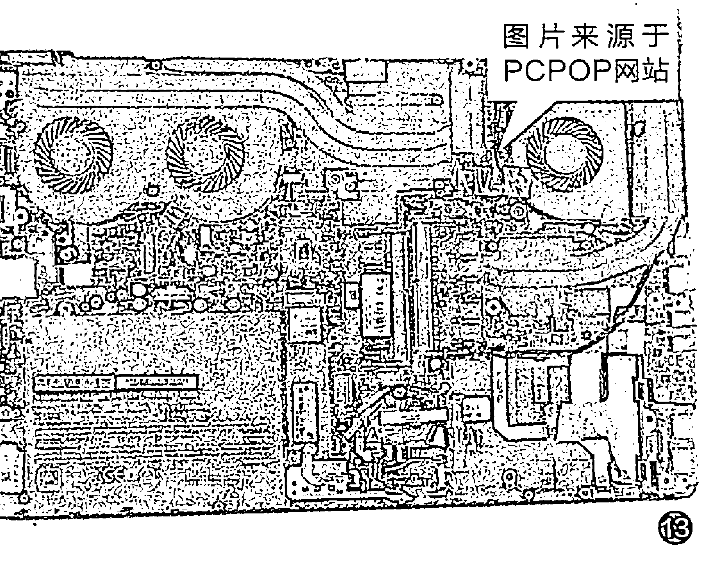

###### 机械师PX5/炫龙耀9000

- 屏幕：15.6英寸IPS
- 处理器：酷睿i7-7700HQ
- 显卡：GTX1070 Max-Q
- 厚度/重量：18.7mm/1.9kg

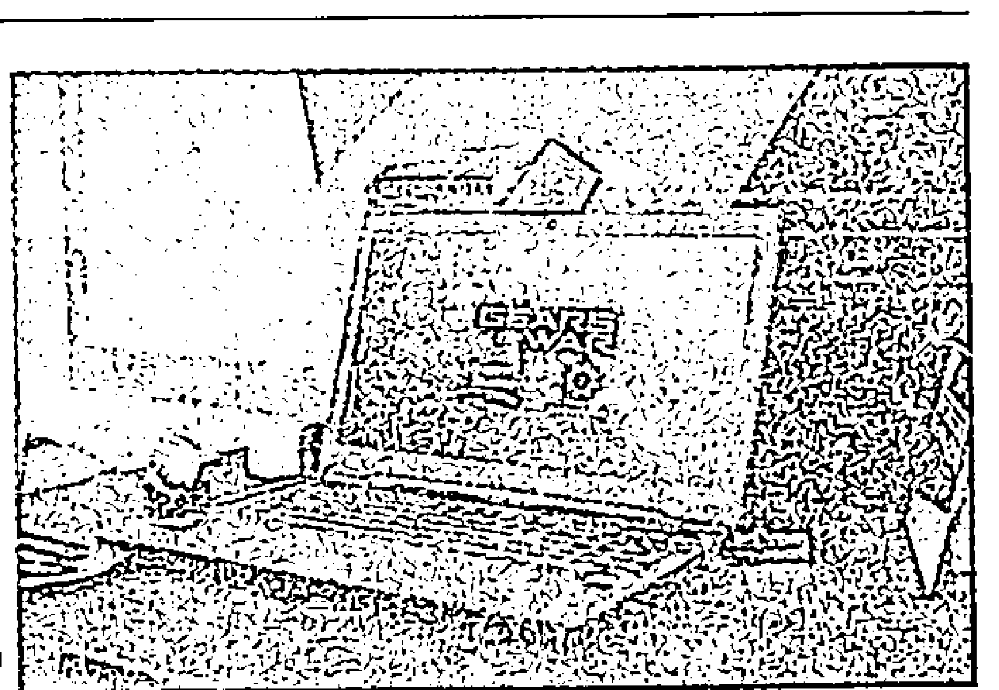

> 雷电3接口的外观和USB Type-C一样，凡是支持该功能的USB Type-C都在旁边增加闪电的标志

细心的同学可能已经发现了，笔者在介绍Max-Q设计游戏本时总会强调它有没有配备雷电3接口（图16），而它最大的意义就是凭借超高的传输速率连接外置显卡扩展坞（图17）。换句话说，凡是有雷电3的游戏本，在预算充裕的情况下都能通过外接GTX1080Ti甚至NVIDIA下代顶级桌面显卡来提升3D效能。

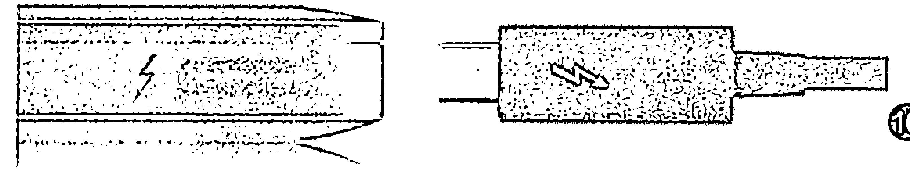
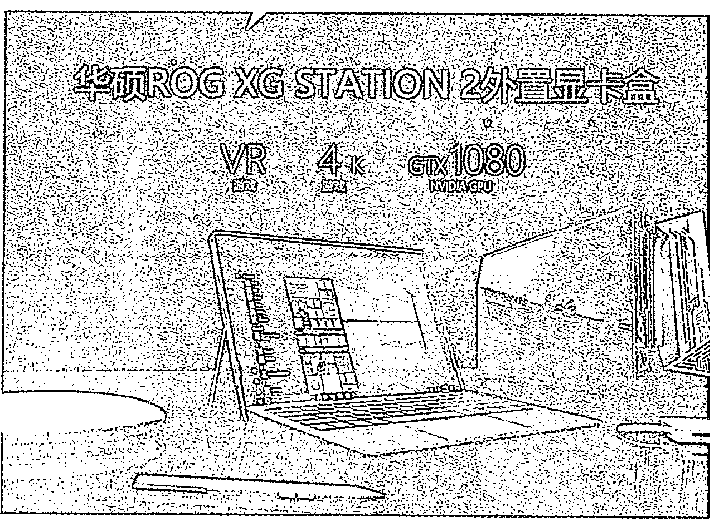

#### Max-Q不仅限于瘦身

在NVIDIA刚刚公布Max-Q设计时，很多人都以为它仅仅是帮助GTX1080独显塞进18mm厚度笔记本内的一种妥协方案。然而，随着Max-Q正式降临，我们才发觉它竟然是一种适应性和覆盖面更广的存在。

首先，无论是GTX1080、GTX1070还是GTX1060都能作为Max-Q设计的组成部分，如此一来就大大拓展了Max-Q游戏本的价格范围，采用蓝天模具和GTX1060 Max-Q的游戏本极有机会打入不足8000元的价格段里。要知道，P957HP6可是厚度不足19mm、重量不足2kg的方案，让更多游戏玩家都有机会将超薄高端游戏本纳入囊中（图18）。

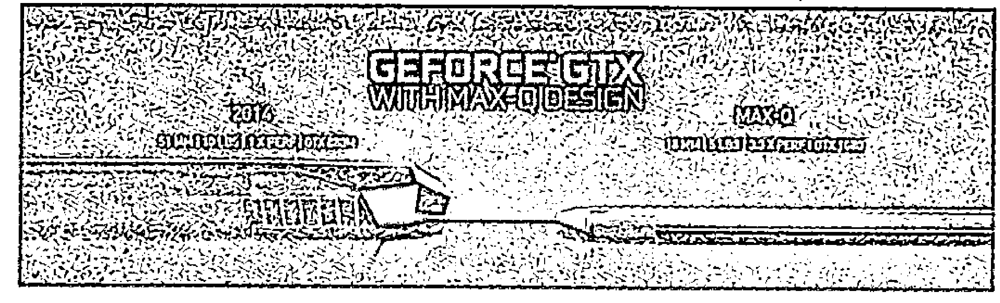

Max-Q还是一种很灵活的设计，虽然它的初衷是帮助高端游戏本减肥，但这并不是说传统游戏本就没有享用Max-Q的机会。因为Max-Q还有一个隐藏的意义——那就是让游戏本在保持现有身材和散热设计的基础上，塞进更强一个档次的显卡，从而获得更强的性能和竞争力。而戴尔新Alienware 15就是这种初衷的代表。

戴尔Alienware 15这款15英寸的“外星人”原本最高仅支持到GTX1070独显，如果你追求顶级性能，就只能选择更大且更贵的Alienware 17了。而新一代Alienware 15则出现了武装GTX1080 Max-Q独显的子型号（图19），从而获得了无限接近Alienware 17的性能表现。

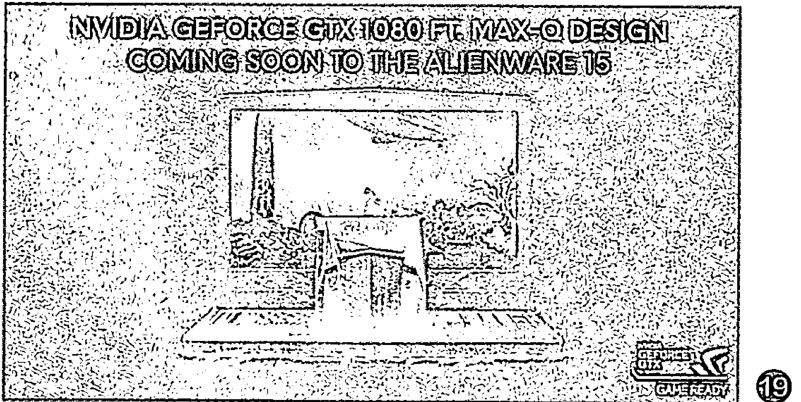

老版本的Alienware 15之所以“不敢”使用GTX1080，就是因为它的散热模块无法支持GTX1080满载运行（图20），存在过热降频的风险。但是，当GTX1080经过Max-Q设计优化之后，其TDP被限定到110W，和标准版的GTX1070相仿，所以新Alienware 15才能在散热模块不变的基础上将其“降服”。

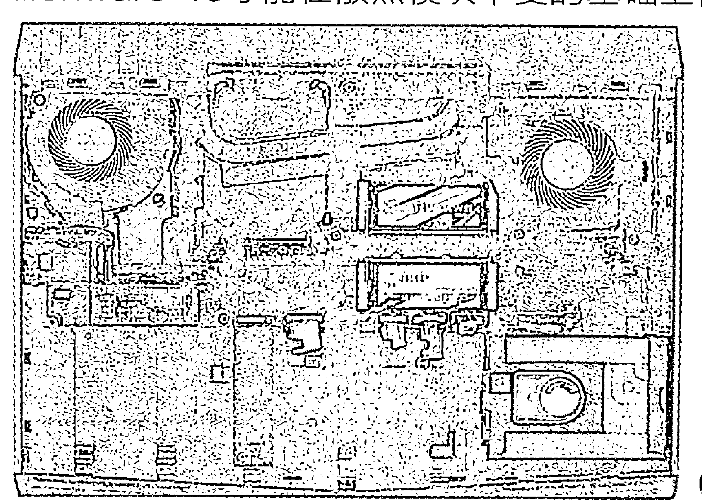

可惜，Max-Q版的Alienware 15价格也达到了27699元，和普通的游戏玩家绝缘。

好消息是，除了Alienware 15这种顶级游戏本，以联想拯救者R720和暗影精灵3为代表的主流价位的游戏本都出现了升级到GTX1060 Max-Q显卡的版本。以拯救者R720为例，i5-7300HQ+GTX1060 Max-Q的型号仅售6999元（图21）。

要知道，如果你以前想买一款联想品牌的GTX1060游戏本，只有万元起步的拯救者Y720可选。而有了GTX1060 Max-Q，你却可以直接省去30%的预算。而Max-Q版R720才刚刚上市，还有一定的调价空间。随着神舟、雷神、机械革命等品牌现有游戏本加入到GTX1060 Max-Q显卡的升级热潮，也许你只需6000元就能享用了！

GTX1060 Max-Q版显卡的TDP不足60W，基本和GTX1050 Ti持平。这意味着，现在市面上那些配备GTX1050 Ti独显的游戏本，都能直接升级到GTX1060 Max-Q而不用担心散热问题，从而大幅降低研发成本。

#### Max-Q牺牲了多少

无论NVIDIA将Max-Q设计说得多么天花乱坠，但依旧无法掩盖它是现有移动显卡“降频版”的事实，只是NVIDIA在官方层面找到了一个最佳能耗比的节点，并在硬件设计上给出了指导建议，通过优化的驱动和GeForce Experience软件确保性能不会流失太多。所以，当移动显卡经历Max-Q设计“优化”后还能剩下多少性能？这才是最受玩家关注的问题。下面，我们就以GTX1060、GTX1060 Max-Q和GTX1050 Ti这三款移动版显卡为例，看看Max-Q对性能的影响吧。首先看看三款移动显卡的规格对比。请放心，无论是GPU-Z的信息还是实际拆解，GTX1060 Max-Q的核心都与GTX1060标准版一模一样（图22），只是降低了GPU核心的基础和加速频率而已（表1）。GPU降频后，GTX1060 Max-Q的TDP可以下降到50W~60W之间，远低于标准版GTX1060的75W，所以可以安心让定位更低的GTX1050 Ti游戏本直接搭载GTX1060 Max-Q使用，而无需增加其他设计成本。

##### 表1：GTX1060 Max-Q规格对比表

|          | GTX1060    | GTX1060 Max-Q | GTX1050 Ti  |
|----------|------------|---------------|-------------|
| 核心架构 | Pascal-GP106| Pascal-GP106  | Pascal-GP107|
| 流处理器 | 1280       | 1280          | 768         |
| 纹理单元 | 80         | 80            | 64          |
| 光栅单元 | 48         | 48            | 32          |
| 核心基础频率 | 1405MHz | 1063MHz       | 1493MHz     |
| 核心加速频率 | 1671MHz | 1342MHz       | 1620MHz     |
| 显存位宽 | 192bit     | 192bit        | 128bit      |
| 显存容量 | 6GB GDDR5  | 6GB GDDR5     | 4GB GDDR5   |
| TDP*     | 75W        | 55W           | 50W         |

*TDP是浮动值，会根据GPU预设频率和实际运行频率而上下浮动，仅供参考

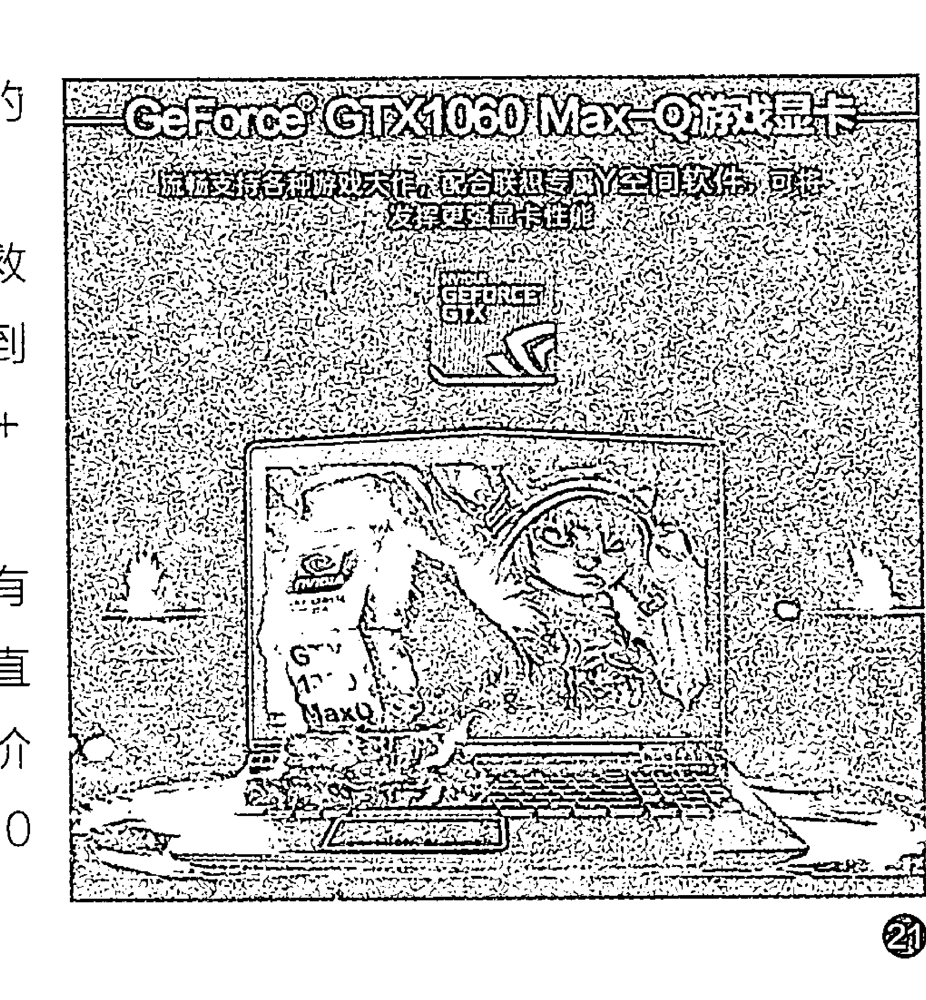
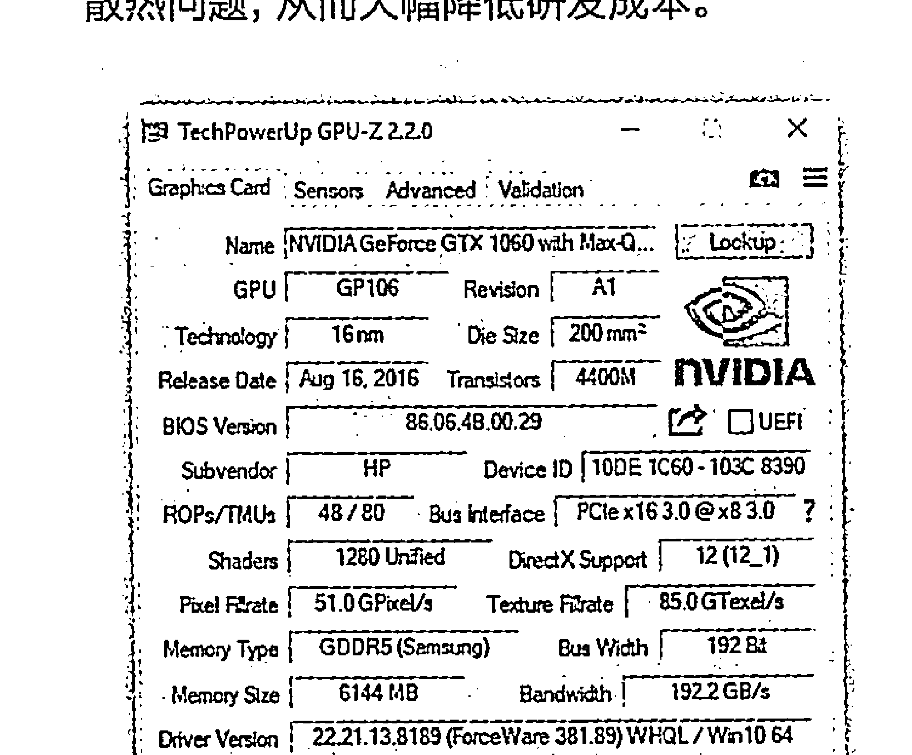

在具体的测试项目中，GTX1060 Max-Q的性能自然是全面落后于GTX1060，但幅度并没有降频幅度那么大，大约会有平均10%~15%的降低（表2）。但即便如此，GTX1060 Max-Q依旧遥遥领先于GTX1050 Ti。特别是在《杀出重围：人类分裂》、《幽灵行动：荒野》、《刺客信条：枭雄》和《生化危机7》测试中，GTX1050 Ti已经出现明显的卡顿了，但GTX1060 Max-Q仍然可以保持流畅运行。

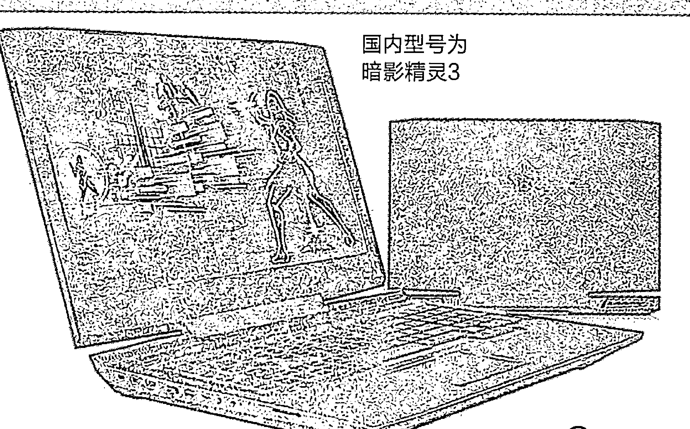

为了让大家更直观地认识到GTX1060 Max-Q的性能，如果以它的性能作为100%基准，那它与其他中高端移动显卡的性能对应关系就如下表所示（表3）。现在认识到Max-Q设计的可贵之处了吧？它能让以前配备GTX1050 Ti的游戏本在不增加散热压力的前提下直接提升29%的性能！

根据笔者的了解，Max-Q版的GTX1060、GTX1070、GTX1080在性能上同样都是较标准版降低了大约10%左右。用微弱的损失换取30%~50%的性能提升（用GTX1070 Max-Q换GTX1060，GTX1080 Max-Q换GTX1070），除了价格增加这一点令人不爽以外，你还有什么理由会去拒绝吗？

##### 表2： GTX1060 Max-Q版性能对比表

###### 理论测试（仅取GPU子项分数）

| 测试软件 | 测试说明 | GTX1060 | GTX1060 Max-Q | GTX1050 Ti |
| ---- | ---- | ---- | ---- | ---- |
| 3DMark 11 | Performance | 14450 | 13279 | 9768 |
| 3DMark | Fire Strike | 11261 | 10349 | 7791 |
| Heaven 4.0 | DX11 | 3711 | 3322 | 2365 |

###### 实际游戏测试（1080P最高画质，单位：fps）

| 游戏名称 | GTX1060 | GTX1060 Max-Q | GTX1050 Ti |
| ---- | ---- | ---- | ---- |
| 巫师3：狂猎 | 37 | 34 | 27 |
| 蝙蝠侠：阿甘骑士 | 57 | 54 | 41 |
| 刺客信条：枭雄 | 31 | 29 | 23 |
| 古墓丽影：崛起 | 59 | 51 | 40 |
| 孤岛惊魂：原始杀戮 | 56 | 53 | 40 |
| 全境封锁 | 50 | 49 | 35 |
| 杀出重围：人类分裂 | 29 | 27 | 20 |
| 看门狗2 | 42 | 39 | 27 |
| 生化危机7 | 86 | 76 | 25 |
| 幽灵行动：荒野 | 38 | 33 | 10 |

*本表测试数据来自notebookcheck.net对惠普Omen-15（图23）的评测

##### 表3 显卡型号性能对应

| 显卡型号 | 性能对应 |
| ---- | ---- |
| GTX1070 | 155% |
| GTX1060 | 111% |
| GTX1060 Max-Q | 100% |
| GTX1050 Ti | 71% |

> 针对Max-Q显卡的驱动程序可以优化GPU的电源效率，并将电压保持在1V左右，同时通过不断调整时钟速度确保散热风扇的安静运行（最大为40dB），这种静音方案被NVIDIA称为WhisperMode技术。

##### 小结

Max-Q设计的出现，给了游戏本更为广阔的未来。对预算充裕的发烧级用户而言，18mm厚的GTX1080 Max-Q游戏本再也不是外出时的累赘，同时也能带来让人赏心悦目的感观体验。对预算有限的普通玩家而言，Max-Q设计则能让现有的游戏本无需重新开模和改变老产品内外设计，就能跨界升级到更高一个档次的Max-Q版显卡，在发热可控的前提下流畅运行更多游戏，同时还能带来更理想的静音效果（图24）。可以预见，当配备GTX1060 Max-Q独显的游戏本跌破6000元大关时（搭配酷睿i5处理器的低配版），对整个游戏本产业将是一个多么轰动的事件：再也没有本本在1080P下跑不动的游戏了！

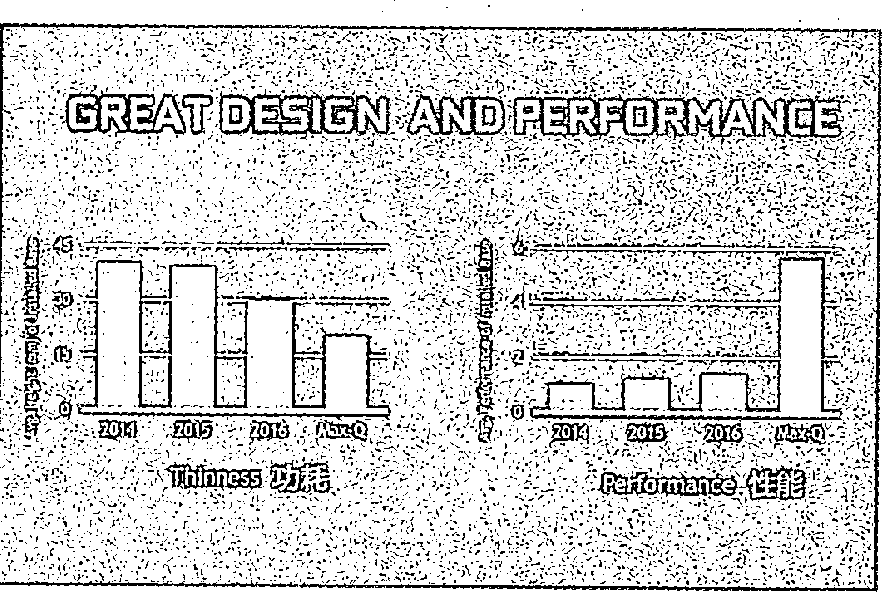

更实际的游戏本筛选思路

在上一个章节里，我们“感性地”结识了NVIDIA Max-Q和基于该设计打造的产品。接下来，就到了“理性地”看待这种新兴技术的时间了。

Max-Q的局限性

NVIDIA Max-Q设计的优点不言而喻，但它最大的特色还是帮助高端游戏本“减肥”，并不能拉低高端游戏本的价格，指望18mm左右厚度的Max-Q游戏本短期内降到主流价位（7000元以内）的同学可以洗洗睡了。

对发烧级游戏玩家而言，性能永远是游戏本的最关键指标，至于轻薄则只是可选项。

目前配备GTX1080 Max-Q独显的超薄游戏本价格都在20000元以上，而这个价位已经可以买到很多武装“满血版”GTX1080独显的顶级游戏本了。虽然后者的厚度普遍达30mm，重量也是3kg起步（图1），但除非你有经常背着笔记本外出打比赛的需求，否则厚一点、重一点又有什么关系？

何况满血版GTX1080的性能也要比Max-Q版高出至少10%，而且此类“厚实”游戏本充裕的内部空间也能塞进更为豪华的散热模块（图2），无需担心长时间满载运行时CPU/GPU的发热隐患。

此外，满血版GTX1070游戏本的价格普遍在9000元到20000元之间，整体价格也要比武装GTX1070 Max-Q独显的机型更便宜。Max-Q显卡中唯一的闪光点只有GTX1060，在老模具游戏本身上“就职”后，价格能较配备满血版GTX1060的游戏本更实惠一些。

总之，Max-Q属于游戏本领域的“纤体中心”，凡是从这里面走出来的产品都会有着更性感的身材和颜值（图3）。但是，天下没有免费的午餐，你所需要付出的代价则是“认证费用”，以及必须接受的性能缩水。如果你的预算足够充裕那自然皆大欢喜，但如果你只是追求“性能价格比”，非Max-Q设计的高端游戏本则能在同样价格的前提下释放更强的性能动力。

还是那句话，对普通玩家而言，Max-Q版的GTX1080/GTX1070当做茶余饭后的谈资即可，而GTX1060 Max-Q+原GTX1050 Ti独显老模具的组合才是值得我们关注的对象，它们的价格普遍比同品牌旗下的满血版GTX1060游戏本低（图4），但所提供的性能却更为可观。

| 特性 | Max-Q版GTX1060 | 满血版GTX1060 |
| :--- | :--- | :--- |
| **产品示例** | 联想（Lenovo）拯救者R720 15.6英寸游戏笔记本电脑(i5-7300HQ 8G 1T+128G) | 联想（Lenovo）拯救者Y720 15.6英寸游戏笔记本电脑(i7-7700HQ 8G 1T+128G) |
| **价格** | ¥6999.00 | ¥10999.00 |
| **亮点** | [GTX1060Max-Q 高性能却超GTX1050Ti] | [Y神光降临！ 搭载GTX1060显卡 6] |

雷电接口是加分项

当两款价格和硬件规格相似的游戏本摆在你面前时，应该如何取舍？抛开品牌和外观设计的影响不谈，是否配备雷电3接口就是加分选项。在上个章节中我们也已经提到了，有了雷电3，就有了使用外置显卡扩展坞进一步提升游戏动力的机会。哪怕是移动版GTX1080独显在2年后也有性能不够用的隐患，但外置显卡却能让你随时享用最新台式显卡的机会。

如今外置显卡还处于初级阶段，市面上最实惠的扩展坞AKiTiO Node价格也要2500元左右（图5）。不过，随着雷电3接口的普及以及英特尔八代酷睿处理器的推出，外置显卡的发展前景还是颇为明朗的。如果你打算让游戏本服役较长时间，雷电3+外置显卡的组合可以最大限度延长它的寿命。

要懂得取舍之道

CFan在2017年14期介绍过《从细节入手 同配置游戏本为何价格不同》，借着本期讨论游戏本的机会，笔者就继续补全一下这篇文章中没有谈到的一些知识点和注意事项吧。

什么时候优先考虑处理器

当游戏本标配雷电3接口时，此时可以优先考虑处理器规格更强的型号，比如搭载能超频的HK系列，或是直接使用台式机处理器的游戏本。原因同上，未来当感到玩游戏吃力时可以通过外置显卡满血复活，但你可曾听说过“外置处理器”（图6）？

如果你相中的游戏本没有雷电3接口，那自然是显卡的优先级大于处理器了。比如i7-7700HQ + GTX1050 Ti的组合就不如i5-7300HQ + GTX1060 Max-Q的方案了。

笔记本专用的处理器都是BGA封装，直接焊在主板上无法升级

不用盲目追求更高分屏幕

对游戏本而言，屏幕只要是IPS+1080P分辨率即可。至于OLED、2K或4K分辨率，在价格相似时自然是加分项，但我们却没有必要为这些参数而加价。原因很简单，除了GTX1080，GTX1070都无法满足2K分辨率+最高画质流畅运行所有游戏的实力。如果你真的对屏幕素质（分辨率、色域）要求较高，还不如花2000元买个准专业显示器（图7），其显示效果哪怕是30000元以上的顶级游戏本也比不了。

为何同芯性能却有别

经常关注游戏本评测跑分的同学可能会发现一个现象，两款游戏本明明配备了同样的处理器和显卡，但性能表现却有着较为明显的差异。这是怎么回事呢？

跑分和实际的差异

NVIDIA前不久推出了GeForce MX150独显，而宏碁Swift3则是第一批武装该显卡的超薄本代表之一，它的基本配置为酷睿i5-7200U+8GB内存+MX150独显。在理论测试中，宏碁Swift3的图形跑分成绩普遍较其他同配置超薄本略高，但在实际的游戏体验里却没有差异。

散热好性能才会好

无论是GeForce MX150还是GTX系列的高端独显，NVIDIA都允许OEM厂商通过BIOS自行设定显卡的核心/显存频率。因此，不少对游戏本散热有信心的厂商，往往会在独显官方频率的基础上进行超频，从而获得更好看的跑分和游戏表现。

两堵墙在闹事

我们都知道，无论是CPU还是GPU，都存在两堵看不见的墙。温度墙，是对笔记本芯片的一种保护手段；功耗墙，则是对笔记本资源调度的一种分配态度。它们的高低受限于笔记本散热模块的用料和效果。有关这两堵墙的讨论，感兴趣的读者可以参考本刊2016年22期《今天你撞墙了没有？移动设备的性能为何参差不齐》这篇文章。

先来看看Swift3理论跑分高的原因。GeForce MX150分为标准功耗（25W）和低功耗（8W）两个版本（图8），前者适合较厚的传统笔记本，后者则是为超薄本身量身定制。而Swift3身为超薄本，却采用了25W标准版的MX150，所以它的理论跑分成绩自然更好看。

以GTX1060为例，其GPU基础和加速频率应该是1405MHz和1671MHz（图9），但宏碁Predator HELIOS 300却将标配的GTX1060超频到了1455MHz和1733MHz（图10）。同时，该产品在引入全球最薄3D刀锋速冷金属风扇的基础上，还可通过PredatorSense软件调整风扇转速（图11），让超频后的GTX1060也能满血运行。

之所以实际游戏中Swift3没能拉开与竞争对手的差距，是因为游戏过程时间较长，而Swift3的散热模块无法长时间让标准版MX150独显满血运行，在撞上温度墙后会自动降频到8W低功耗版MX150的水准，性能自然会回落到标配低功耗MX150独显竞品的档次上。

总之，配置越高的游戏本，它若想长时间全速运行，对散热模块的要求就越是苛刻，而散热模块用料、设计的合理性，则是同配置高端游戏价格差异很大的原因所在。如果你想挑选高端游戏本，在出手之前一定要多多参考拆机和烤机测试，择优录取。

厂商“认证”！细看ChinaJoy上的游戏硬件

文|任九州

作为一年一度国内最大的游戏展会，ChinaJoy今年也是备受玩家瞩目，各大游戏厂商尽其所能在有限的展台上展出主力游戏。而硬件厂商们也没有闲着，除了与各大游戏厂商合作推出定制产品外，也没有忘记在自家展台上推广宣传，并且还推出各种精彩活动与玩家、粉丝们互动……

### ChinaJoy展会中那些有趣的“硬”亮点

#### Intel与它的伙伴们

本届展会英特尔跟几大OEM厂商联合包下了E4展馆，创下了ChinaJoy承包展馆历史之最。展馆中玩家可以看见耳熟能详的几大知名厂商。华硕带来了旗下几款全新推出的ROG笔记本以及台式游戏主机。在炫酷的MOD主机外，还有一些比较好玩的产品，如GR8II迷你电竞主机。这款主机配有i7-7700处理器与GTX1060显卡，从侧面来看主机尺寸仅比一本《电脑爱好者》大一点点，宽度也比笔者的手掌宽度小很多，对于那些对尺寸比较敏感的用户来说绝对是个很好的选择。

在华硕对面的是联想展台。联想带来了自家的游戏电脑品牌拯救者系列，并在展会期间发布了WINBOT主机，这款主机搭配分体式水冷散热，外观上也很有个性范儿。此外还配有最新的酷睿i9处理器以及TITANX显卡，性能绝对剽悍，由联想、炽魂、迎广三家厂商一起打造，而且未来将增加语音控制与面部识别等功能。不过在游戏体验区笔者没能体验到这款产品，有些遗憾。在联想展台的最边缘处则是一块空旷的VR体验区，玩家可以在这里体验移动式的VR射击游戏，只需要在背后背上联想推出的背包式VR主机就行了。

除了华硕与联想，还有很多厂商也在自家展区中展示最新产品。比如惠普就以暗影精灵系列游戏电脑为主打，一改玩家对其原有的商务形象，吸引玩家的眼光。HP除了在展区内提供了VR体验区跟游戏对战区外，还不忘用跑车当作游戏体验位，玩家可以坐在车上在Show Girl的陪伴下体验三屏并联的赛车游戏体验。

离惠普不远的则是Alienware展台。展区内我们能看到大量的AREA-51台式主机，配上240Hz刷新率的AW2518H显示器，带来的游戏体验感非常棒。在试玩守望先锋的时候，感觉游戏流畅度要比家中普通60Hz刷新率的显示器高了很多。在体验区旁边，还可以看到被拆解的AREA-51主机以及拆除后盖的Alienware 17笔记本，对于喜欢拆开电脑看硬件用料的用户来说倒是满足了眼福。

各种炫酷的MOD成为了不少人的关注点

既然是英特尔体验馆，自然少不了英特尔自家出场，展馆的三分之一则都是英特尔的单独展区。展区被划分为体验区与观赛区两个部分，在英特尔的体验区中玩家除了能看到与体验到各式各样的采用英特尔处理器的电脑，还能体验各种英特尔支持的VR技术，还有不少采用酷睿i9处理器的个性MOD电脑也让很多人驻足观看。而在展区对面的观赛区则是第十二届英特尔极限大师杯赛(IEM)，这让不少关注该赛事的玩家特地到达现场观看。到了《星际争霸2》总决赛那天，笔者险些被淹没在观看比赛的人海之中。

#### 各占一方的AMD与NVIDIA

AMD今年仍然扩大了展台，不过相比往年却挤了很多。除了Ryzen处理器的名气之外，AMD还在展会VR游戏体验区中增加了带有VEGA显卡的体验平台，在周末两天中体验的队伍也排起了长龙。VR还是AMD今年展台的主要展示部分，大量的VR体验位占据了展区1/3的位置，加上舞台占据1/3，这让很多想要体验新3A平台的玩家只得到旁边的其他厂商展示区去体验。今年AMD在ChinaJoy上除了与一些厂商推出合作主机外，还展示了针对家用入门市场的Ryzen3处理器，目前在合作渠道上全面铺开，对于那些预算不多的用户来说是个好消息。

NVIDIA展区面积今年扩大到了展馆的1/3，一片黑绿配色风格在展馆中成了一条独特的风景线。笔者还记得刚来ChinaJoy的时候NVIDIA展台仅仅是半条过道，如今变化也是让人感慨。展会期间NVIDIA展台仍然保持着没事“送”显卡的“优良传统”，今年还请来了很多主播与战队，场下永远都挤满了等待参加活动的粉丝与玩家。

NVIDIA展区中有单独的VR体验室和MOD主机展台，此外还有MAX-Q笔记本体验区。MAX-Q是一种由NVIDIA提出的设计方案，其目的是保证游戏笔记本散热与游戏性能的情况下缩减笔记本尺寸，方便携带。不少MAX-Q笔记本都有一个很有趣的设计，就是在键盘区上面有很大的一块散热板，笔记本键盘位置相对变小很多，触控板则放到了键盘的右侧。这种摆放方式对于大屏幕笔记本玩游戏来说确实方便了不少，按键更容易触碰，也减少了触摸板误触的几率，而且还能增加整机散热效率，至于有关它的技术问题，本刊已经为大家详细解读过，感兴趣的朋友自行翻阅即可。展区内提供了大量采用机械键盘的笔记本电脑，体验了一下，在打字上要比其他不采用机械键盘的笔记本舒服太多。

#### 始终在努力的其他厂商

除了三家大头以外，还有很多的电脑配件厂商散落在展会内的各个展馆之中，他们也带来了很多有趣的新产品。像技嘉就在NVIDIA展台旁边包下了一个1/3场馆的展台，主打AORUS品牌。除了熟知的AORUS主板与显卡，今年技嘉还推出了机械键盘等外设产品，而在展台侧面则有VR体验区与模拟驾驶舱供玩家体验。

希捷、西数两大硬盘厂商今年倒是有些冷淡，可能是因为前一阵的Computex 2017刚刚展出完还没有缓过劲来，两家厂商只是象征性地推出了几款外置硬盘方案。希捷展区没有引导员，而在西数展区中，虽然有几名工作人员一直在，但是当笔者对一款外置SSD硬盘感兴趣，就配置参数进行询问时，几名工作人员却都无法说出详细信息，看来这两家厂商今年功课还是没做够。在另一边的东芝展台由于缺乏新品推出，也只是靠着守望先锋路人赛来撑场，实属有些凄惨。相比之下，展区虽小但出展展品较多的三星则人流量较多，看来有产品要比推广方式更为重要。

海盗船展区今年也扩大了不少，除了有大量的个性MOD主机可以参观外，还有非常多的体验电脑供玩家体验。由于不限制时间，很多逛累的游客把这里当作了临时歇脚的地方。在展区的外侧则是海盗船的新品体验区，玩家可以在这里体验各式各样最新的海盗船键鼠产品以及电竞耳机，如果喜欢还可以在现场以折扣价直接购买。

说到外设，今年森海塞尔也加入到了ChinaJoy展会之中，并带来了专门为电竞而设计的多款耳机与两款全新的音频放大器，并在现场提供了游戏体验。除了森海塞尔，还有老牌游戏耳机厂商硕美科和新派耳机厂商1MORE也在展会中推出自己的新产品，还有狼蛛等外设厂商在ChinaJoy上发布多款新品给玩家体验。很多外设厂商寄希望于ChinaJoy一改用户对其原有的印象，并将自己的品牌推广开来，作为玩家来说还是非常支持这种宣传的。

#### 无处不在的游戏厂商

ChinaJoy既然作为娱乐互动展自然少不了各大游戏厂商的身影，归根到底它们才是这届展会的主要力量。最受玩家关注的应该就是索尼、微软两大主机厂商了。索尼展区将参展的体验机换成了刚推出的国行PS4 pro以保证提供给玩家最好的体验，而VR体验区也进行了升级改造，给想要体验VR的玩家更充足的空间。今年索尼在展会期间发布了很多全新中文化作品与独占作品，还有中日合作推出的《大圣归来》游戏体验，从头到尾都不缺乏看点。

而在对面的微软则依然是不声不响，虽然也有推出Xbox One X试玩体验，但是还是无法摆脱缺乏游戏的尴尬情况。除了FPS的《光环》与Xbox One X的限时体验外，其他游戏体验都没有玩家排队等待。而笔者在体验《光环战争2》对战的时候还出现了集体掉线的情况，当商品推广员对笔者推广Xbox One的时候连自家产品是在微信还是淘宝销售都有些分不清，场面一度颇为尴尬，希望明年微软展区能给我们带来全新的体验。

今年比较意外的是育碧展台的火热。育碧近些年来针对中国市场做了很多本土化工作，厂商也乐意与玩家进行互动。在这次展出中育碧推出《刺客信条》、《荣耀战魂》、《马里奥+疯兔》等共计8款游戏，除了各式各样的专业Cosplay外，育碧CEO也来到现场与玩家互动，对于一个国外游戏厂商来说实属不易。此外，同样被玩家津津乐道的另一个话题就是盖亚娱乐代理的《巫师之昆特牌》专区，玩家不但能与猎魔人中的经典角色合影，还能看到柯洁、sky、马伯庸等名人参与游戏对战，现场气氛一度非常活跃。


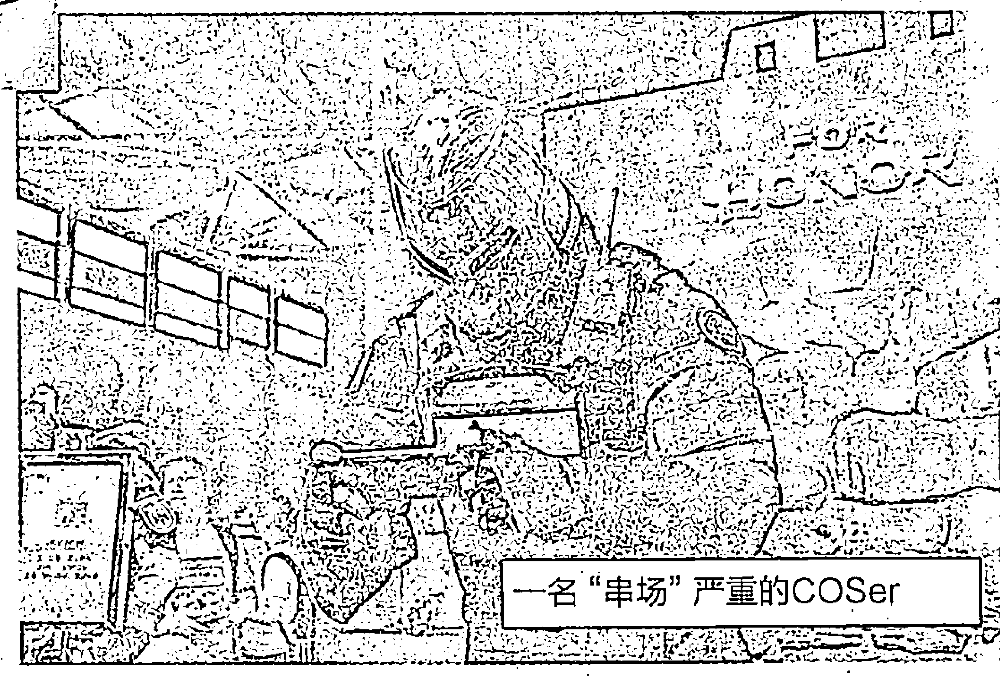

#### 作为硬件爱好者我们看到了什么

展会中各式各样的台式整机与游戏笔记本，确实让人应接不暇。不过今年比较有趣的现象就是各大展台使用的电脑配置比较统一，除了少数厂商自备设备与演示体验区外，其他配备的大多都是ROG迷你台式电脑、宁美国度游戏台式机以及Alienware台式机，配置上多为i7+GTX1060的组合。笔记本则以雷蛇Razer Blade灵刃游戏本居多，配置仍然是上述组合。一方面是现在游戏对优化越来越看重，电脑硬件性能提升也越来越明显；另一

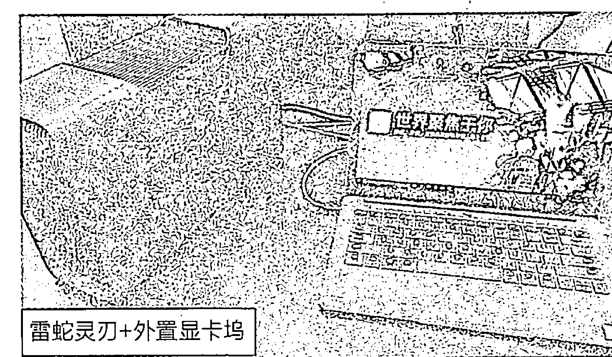

#### 作为玩家今年我们看到了什么

方面则是展出的游戏对配置的硬性需求在相对下调，这次展会中并没有什么以硬件杀手著称的游戏。MOD展示代替了游戏的硬件体验，外观越来越成为玩家关注的内容。

不少硬件厂商碍于参展内容较少，选择了抱团取暖的合作推广的方式。像宁美国度就与ZOL、阿斯加特等厂商共用一个展台，微星等厂商则与盛大合作共用展台，赛睿等厂商则转向了专业展馆，而像网件等厂商干脆已经沦落到角落过道小厂商的展示柜之中。

ChinaJoy不但是各大品牌展现自己实力的地方，也是一次大的洗牌。一些品牌在展会中越来越边缘化，背后则是自己的产品在国内逐渐失去市场。尤其是国内很多新兴厂商在强大的代工贴牌的推动下针对网吧和入门市场的竞争中逐渐形成了自己的品牌，并通过各大展会从而转型，尤其是原本与游戏体验关联度较小的产品在大厂商跨品牌发展的趋势下会受到更大的影响。

在未来的几届展会中这些趋势会越来越明显，统一化的内部配置，造型各异的外观选择，强者越强、弱者越弱，品牌之间的竞争会变得更加激烈。对于用户来讲入门产品的价格会持续下降，这是一件好事，但是对于发烧友而言，可能就是另一番景象了。

近几年当我们在谈论ChinaJoy的时候可能忘记了一件事情。

ChinaJoy，全称中国国际数码互动娱乐展览会。我们总是习惯性地将ChinaJoy称为游戏展，但是数码互动娱乐，终点并不是游戏，而是落在了娱乐上，近几年从展会内容走向来看确确实实是向着娱乐发展。

今年我们能看到直播平台在展会上占据大量的


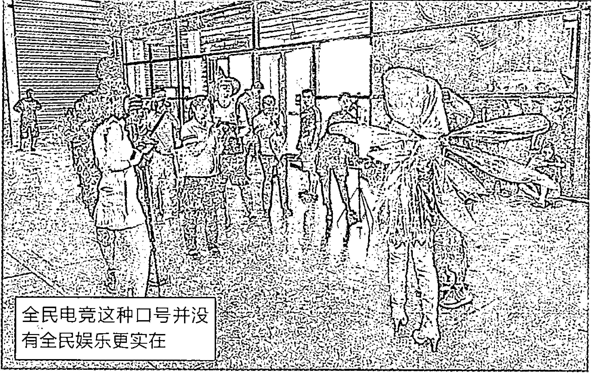

山寨游戏与未激活系统，非常应景的一张图片


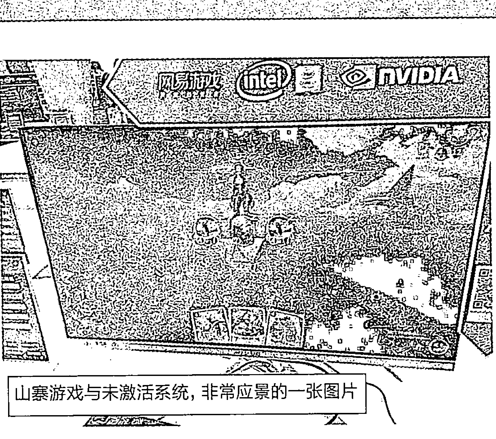

展区，此外还有AcFun、bilibili等视频网站，还有虚拟偶像、偶像团体。各大厂商也是唯恐不用其极，把自身产品想尽办法与“二次元”挂钩，就算是VR游戏也必须加入“人民群众喜闻乐见的二次元”要素。娱乐的形式是多种多样的，拘泥于游戏并不符合ChinaJoy的主题与定位，何况不少媒体跟玩家的关注点仍然是在Show Girl上，“互动娱乐”四个字任重而道远。

硬是把安卓盒子说成游戏主机，是个游戏就要推出排位赛搞出电竞氛围，没VR游戏就不叫展出到如今的“二次元”概念遍地。如果用三个字来解读近几年展会的游戏内容，“多、乱、同”三字完全足矣。没有自己的技术，没有自己的特色，连设备上都懒得贴个Logo的厂商数不胜数，这些厂商可能今年拿到融资来到ChinaJoy上搏一搏，明年就搞成资金断链人去楼空卷铺盖走人，这种情况在展会上还属于非常常见的现象。由于今年市场热点话题并没有硬件与活动可炒，“二次元”这个词就被拿出来救场，但实际上具有中国特色的“二次元”到底是什么，没人知道。

可以预见，在苹果的推动下，明年AR技术会成为一个新的热点，大量的AR和AR+VR产品会涌现出来，明年ChinaJoy上

store已有的游戏让玩家“体验未来”。

相比之下，索尼的中国之星与微软的方舟计划则更显示出了两大厂商对于中国游戏市场的诚意，育碧的本土化工作与CD project的合作宣传也让人对这些国外厂商充满了好感。在经历了《仙剑奇侠传》、《幻》、《地球OL》等情怀攻势之后，国内玩家们更偏向于国外厂商这些看得见摸得到的产品。

作为一名电脑玩家，笔者还是对国产游戏充满了希望。今年的玩家展区中虽然不再见到《紫塞秋风》这样的作品，但是Tap Tap等厂商还是不断地展示一些国内比较少见的外国游戏或是真正好玩的国产独立游戏，这要比某些国产厂商宣传的拙劣仿制品强得多。在专业展区中我们能看到更多有国产游戏引进与出口的洽谈区域，也能看到一些国产游戏厂商的身影。只盼将来国产游戏能有真正用心的制作组与发行商。

我们能看到一堆名为“XX科技”的厂商的展台上摆放着苹果手机与华强北方案的“自主研发”AR头盔装上两款App


口号见得多了，但是真的能做到么

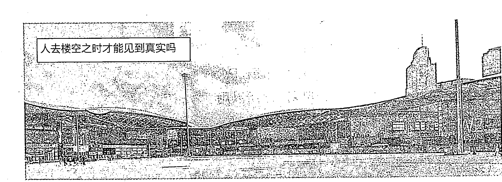

人去楼空之时才能见到真实吗

最后，笔者希望每一位参与到ChinaJoy中的人“愿你走出半生，归来仍是少年”。

每到秋高气爽的时节，都是IT圈即将沸腾的前奏。原因很简单，新平台、新技术、新产品都喜欢在这个时间段扎堆发布，而它们无一不是足以改写相关领域产品发展规则的存在。比如，第八代智能英特尔酷睿处理器就应时而至，不仅实现了性能上的飞越，还能让用户沉浸于丰富的4K UHD娱乐之中。

### 多核普惠时代

#### 了解新一代英特尔酷睿处理器

> 策划|《电脑爱好者》编辑部


扫一扫，更多精彩内容立现！

当你拿到本期杂志时，第一批搭载第八代智能英特尔酷睿处理器的PC已经全面上市（图1）。但是，这些PC却仅限于轻薄本这么一种形态，显得颇为单调。那么，为什么这次游戏本和台式机没能搭上八代酷睿的首班车呢？

##### 八代酷睿的混乱之治

还记得去年这个时候吗？代号为“Kaby Lake”的第七代智能英特尔酷睿处理器在PC领域“全面”掀起了一轮升级风暴。之所以用“全面”一词，是因为英特尔七代酷睿家族都是由一个平台构成，只是被细分成了Kaby Lake-Y（如酷睿M3-7Y30和酷睿i5-7Y54）、Kaby


Lake-U (如酷睿i5-7200U)、Kaby Lake-H (如酷睿i5-7300HQ)和Kaby Lake-S (如酷睿i7-7700K)四套平台 (图2)，分别对应PC平板二合一、超薄本、游戏本和台式机。一个平台通过不同后缀就能区分产品线，简单易懂。

然而，到了第八代酷睿处理器发布之际，英特尔却学会了“上台阶”，准备以“三步走”的策略来推广这一代的酷睿家族，而且我们之前习惯的代号命名方式也将发生变化。

比如，第一批面世的八代酷睿只有i7-8650U、i7-8550U、i5-8350U和i5-8250U四个型号，而它们也都是面向超薄本定制的低压版移动处理器 (图3)。根据惯例，这四颗处理器应该就是传说中的Coffee Lake-U (Coffee Lake为传说中八代酷睿的代号)了吧？那很快Coffee Lake-S、Coffee Lake-H和Coffee Lake-Y也要来咯。

很遗憾，你想多了。按照英特尔的计划，八代酷睿的“三步走”规划如下：

- 第一步：2017年8月底推出14nm+工艺打造的Kaby Lake Refresh平台；
- 第二步：2017年秋季推出14nm++工艺打造的Coffee Lake平台；
- 第三步：2017年Q4~2018年Q1推出10nm工艺打造的Cannon Lake平台。

没错，i7-8650U、i7-8550U、i5-8350U和i5-8250U全部隶属于Kaby Lake Refresh平台，而“八代酷睿”实际上是由Kaby Lake Refresh + Coffee Lake + Cannon Lake三个小平台组成的大家族 (图4)。酷睿家族的混乱之治就此拉开了序幕……

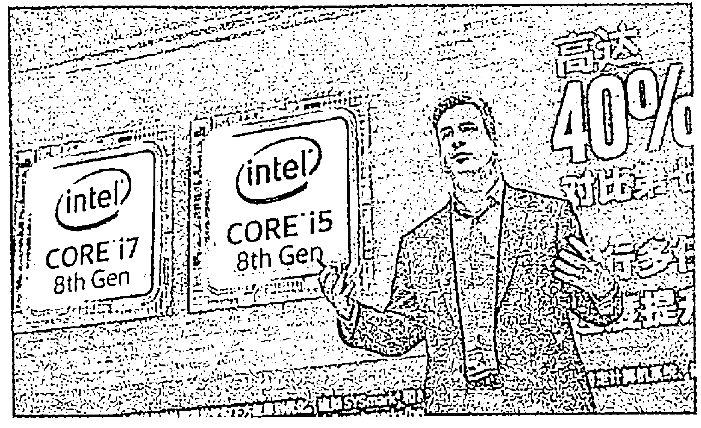

红框中的平台都隶属于第八代酷睿家族，本图仅供参考，平台规格以英特尔最终发布时的参数为准

###### 先来搞清楚工艺之谜

细心的同学应该发现了，无论是前文中的文字还是图片，里面竟然出现了14nm、14nm+和14nm++三种工艺类型。按照英特尔经典的“嘀嗒” (Tick-Tock) 战略，从七代酷睿就应该升级到10nm工艺才对，为何只有当八代酷睿推广到第三步时才能享用10nm工艺大餐呢？

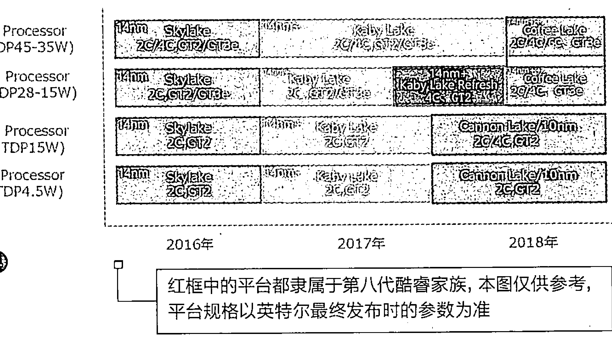

原因很简单，英特尔在从14nm过渡到10nm工艺的研发之中“卡壳”了。受限于物理学本身的障碍，每两年升级一次工艺已经变得不再现实。因此，英特尔在去年推出第七代酷睿处理器时宣布取消Tick-Tock战略，而是提出了全新的“PAO” (Process-Architecture-Optimization)，即制程→架构→优化“三步走”策略。

所以，第五代、第六代酷睿都是标准的14nm，而七代酷睿则是优化后的14nm+。作为七代酷睿的小幅升级版，抢先上市的Kaby Lake Refresh也延续了14nm+工艺，随后上市的Coffee Lake则用上了在14nm+工艺上再度优化的14nm++工艺 (图5)……你明白了吗？

CFanBoundEdition·2017

91

为了让大家更直观地了解历代酷睿处理器的工艺情况，我们可以参考表1，里面汇总了从2010年初代酷睿Westmere到未来第九代酷睿的发布时间和制程工艺对比表。

###### 三小平台的割据势力

可能又有同学会问了，工艺什么的我看不懂，就想知道英特尔八代酷睿家族中的三小平台分别用在哪些领域？

简单来说，Kaby Lake-Refresh属于七代酷睿向八代酷睿时代的过渡产物（具体规格和性能后文会有详述），适用于轻薄本或Surface Pro级别的高端二合一设备。随后上市的Coffee Lake属于“上下通吃”的存在，它会被细分成Coffee Lake-S (台式机)、Coffee Lake-H (游戏本)和Coffee Lake-U (轻薄本)。

至于最后上市的Cannon Lake，受限于10nm初期产能不高，所以它可能只会被英特尔用于Cannon Lake-U (轻薄本)和Cannon Lake-Y (二合一)品类，让轻薄本和PC平板二合一设备在拥有更强性能的同时还能具备更持久的续航能力。而Cannon Lake还有一个必杀技，那就是凭借10nm工艺优势，将Wi-Fi、蓝牙和调制解调器模块 (3G/LTE) 塞进处理器，封装成集成度更高的SoC，可大大降低成本和功耗，同时还能解放出更多的PCIe和USB总线用于其他。

总之，在一年后的九代酷睿推出之前，台式机和游戏本是无缘10nm工艺的。八代酷睿存在的意义，就是最后再发挥一次14nm工艺的余热，同时通过10nm展示肌肉，巩固英特尔在制程工艺上的领导地位 (图6)。

| 酷睿版本 | 平台代号 | 发布时间 | 制程工艺 |
| :--- | :--- | :--- | :--- |
| 1代 | Westmere | 2010年 | 32nm |
| 2代 | Sandy Bridge | 2011年 | 32nm |
| 3代 | Ivy Bridge | 2012年 | 22nm |
| 4代 | Haswell | 2013年 | 22nm |
| 5代 | Broadwell | 2014年 | 14nm |
| 6代 | Skylake | 2015年 | 14nm |
| 7代 | Kaby Lake | 2016年 | 14nm+ |
| 8代 | Kaby Lake-Refresh | 2017年 | 14nm+ |
| | Coffee Lake | 2017年Q3 | 14nm++ |
| | Cannon Lake | 2017年Q4 | 10nm |
| 9代 | Ice Lake | 2018年Q3 | 10nm+ |

###### 八代酷睿的诚意在哪里

看到这里，可能有同学心里会“咯噔”一下：Cannon Lake还没影儿，Coffee Lake首发的也只是台式机处理器，移动处理器的排期还要靠后，而已上市的Kaby Lake-Refresh在工艺和底层架构和七代酷睿Kaby Lake似乎也没什么变化，它又如何能承担起“第八代酷睿”的称号呢？

请放心，这一次英特尔还是很有诚意的，首发Kaby Lake-Refresh平台在性能上较七代酷睿有了最高40%的提升！同时，八代酷睿还可以帮笔记本全面瘦身到19mm (厚度) 级别，续航时间则可提升到10小时，而且还能提供多屏4K UHD体验，整体效能的改善已然超过了2016年七代酷睿取代六代酷睿时的增益效果 (图7)。

那么，以Kaby Lake-Refresh平台为代表的八代酷睿处理器是如何提升效能的？

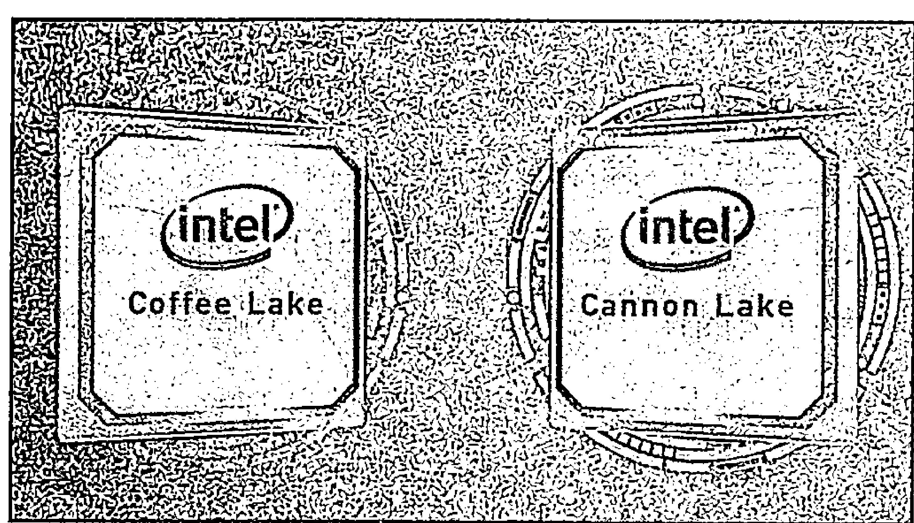

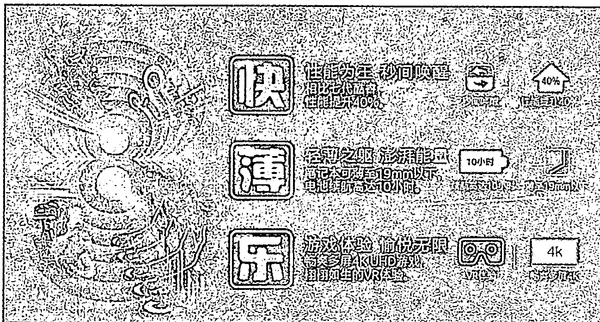

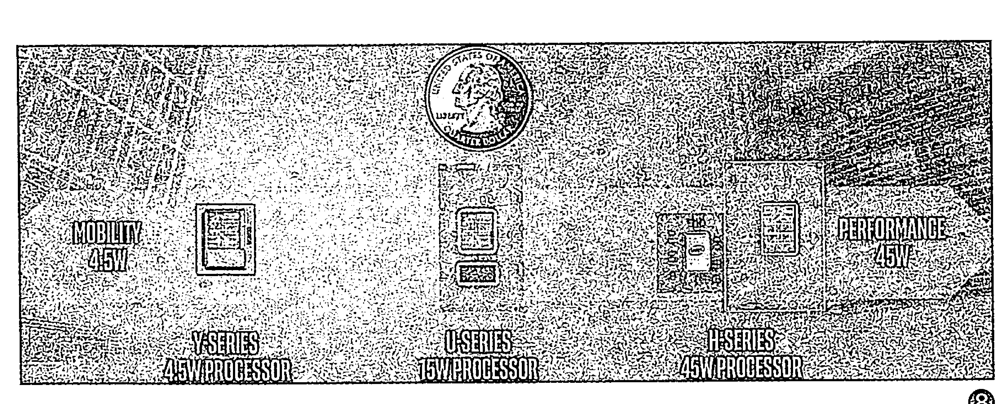

###### U系列进入四核时代

U系列最早是英特尔专门为超极本定制的低压版移动处理器（图8），可惜它为了平衡性能和功耗，在诞生之初就坚持双核（四线程）架构，同时主频也要明显低于H系列的标准电压移动处理器。因此，哪怕是i3-7100H（双核）也能秒杀i7-7500U，就甭提i5-7300HQ这种四核（八线程）标压处理器了。

问题来了，很多用户只会为家里添置唯一一部PC，如果选择的是主打轻薄的笔记本，必然要面临U系列处理器不够给力的尴尬。难道凡是选择轻薄本的家庭就必须再另配一部性能更强的台式机或游戏本？

Kaby Lake-Refresh平台的出现，就很好地解决了上面这种尴尬现象。虽然隶属于该平台的i7-8650U、i7-8550U、i5-8350U和i5-8250U四颗处理器依旧延续了较低的15W TDP功耗，但

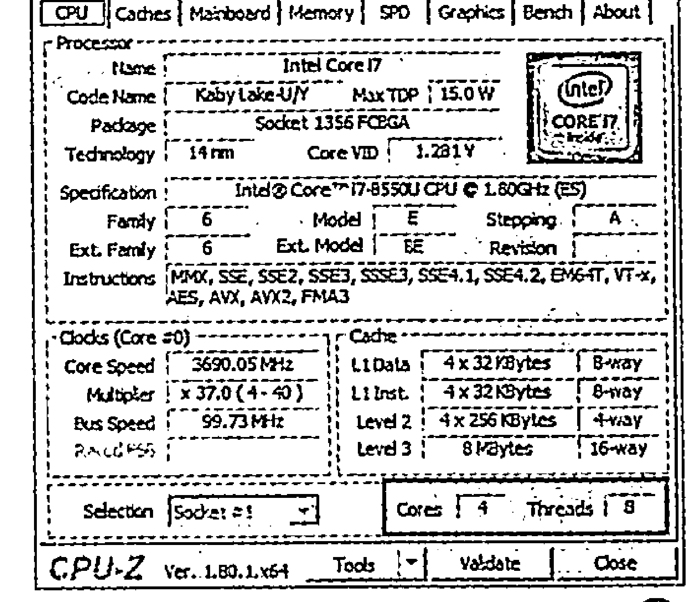

它们却全面从双核四线程升级到了四核八线程（图9），全面进化到了四核时代！

###### 有升有降的核心参数

为了让大家可以更直观地了解Kaby Lake-Refresh平台的性能，我们不妨先来看看它们与各自对应的七代酷睿“老将”间的规格对比（表2、表3）。

细心的同学不难发现，英特尔在第七代U系列酷睿处理器中包含三种子系列。

| 型号 | i5-8250U | i5-8350U | i5-7200U | i5-7300U | i5-7260U | i5-7267U |
|---|---|---|---|---|---|---|
| 制程工艺 | 14nm+ | 14nm+ | 14nm+ | 14nm+ | 14nm+ | 14nm+ |
| 核心/线程 | 4/8 | 4/8 | 2/4 | 2/4 | 2/4 | 2/4 |
| TDP功耗 | 15W | 15W | 15W | 15W | 15W | 28W |
| TDP-UP | 25W | 25W | 25W | 25W | --- | --- |
| TDP-down | 10W | 10W | 7.5W | 7.5W | 9.5W | 23W |
| 高速缓存 | 6MB | 6MB | 3MB | 3MB | 4MB | 4MB |
| 基础频率 | 1.6GHz | 1.7GHz | 2.5GHz | 2.6GHz | 2.2GHz | 2.1GHz |
| 单核睿频加速 | 3.4GHz | 3.6GHz | 3.1GHz | 3.5GHz | 3.4GHz | 3.5GHz |
| 核芯显卡 | UHD620 | UHD620 | HD620 | HD620 | Iris Plus 640 | Iris Plus 650 |
| 显卡基础频率 | 300MHz | 300MHz | 300MHz | 300MHz | 300MHz | 300MHz |
| 显卡加速频率 | 1.1GHz | 1.1GHz | 1GHz | 1.1GHz | 950MHz | 1.05GHz |
| 支持内存 | DDR4-2400, LPDDR3-2133 | DDR4-2133, LPDDR3-1866, DDR3L-1600 |

1.  后缀为“00U”（如i5-7200U）——普及度最高的标准版，综合性能相对一般；
2.  后缀为“60U”（如i5-7260U）——增加缓存，并集成锐炬Iris Plus 640显卡，游戏性能有所升级，TDP保持15W不变；
3.  后缀为“67U”（如i5-7267U）——增加缓存，集成最强Iris Plus 650显卡，游戏性能媲美入门级独显，属于U系列中的皇帝，但TDP功耗也提升到了28W。

作为第八代酷睿的先锋军，Kaby Lake-Refresh平台的整体规格介于“00U”和“60U”之间，其核心参数算是有升有降。

###### 表3：七代和八代酷睿i7规格对比表

| 型号       | i7-8550U | i7-8650U | i7-7500U | i7-7560U | i7-7567U |
|------------|----------|----------|----------|----------|----------|
| 制程工艺   | 14nm+    | 14nm+    | 14nm+    | 14nm+    | 14nm+    |
| 核心线程   | 4/8      | 4/8      | 2/4      | 2/4      | 2/4      |
| TDP功耗    | 15W      | 15W      | 15W      | 15W      | 28W      |
| TDP-UP     | 25W      | 25W      | 25W      | —        | —        |
| TDP-down   | 10W      | 10W      | 7.5W     | 9.5W     | 23W      |
| 高速缓存   | 8MB      | 8MB      | 4MB      | 4MB      | 4MB      |
| 基础频率   | 1.8GHz   | 1.9GHz   | 2.7GHz   | 2.4GHz   | 3.5GHz   |
| 单核睿频加速 | 4.0GHz   | 4.2GHz   | 3.5GHz   | 3.8GHz   | 4.0GHz   |
| 核芯显卡   | UHD620   | UHD620   | HD620    | Iris Plus 640 | Iris Plus 650 |
| 显卡基础频率 | 300MHz   | 300MHz   | 300MHz   | 300MHz   | 300MHz   |
| 显卡加速频率 | 1.15GHz  | 1.15GHz  | 1.05GHz  | 1.05GHz  | 1.15GHz  |
| 支持内存   | DDR4-2400, LPDDR3-2133 | DDR4-2400, LPDDR3-2133 | DDR4-2133, LPDDR3-1866, DDR3L-1600 | DDR4-2133, LPDDR3-1866, DDR3L-1600 | DDR4-2133, LPDDR3-1866, DDR3L-1600 |

升级部分：
1. 升级到四核八线程，多核性能表现更优；
2. 高速缓存几乎翻番，为更高性能打下基础；
3. 大幅提升了睿频加速频率；
4. 提升了核芯显卡的加速频率。

下降部分：
1. TDP-down设定较高，可能会增加低负载模式时的耗电；
2. 基础频率缩水严重，受TDP限制四核同时睿频加速时很难长时间超过2.5GHz；
3. 没能继承锐炬Iris Plus显卡，3D性能几乎无变化。

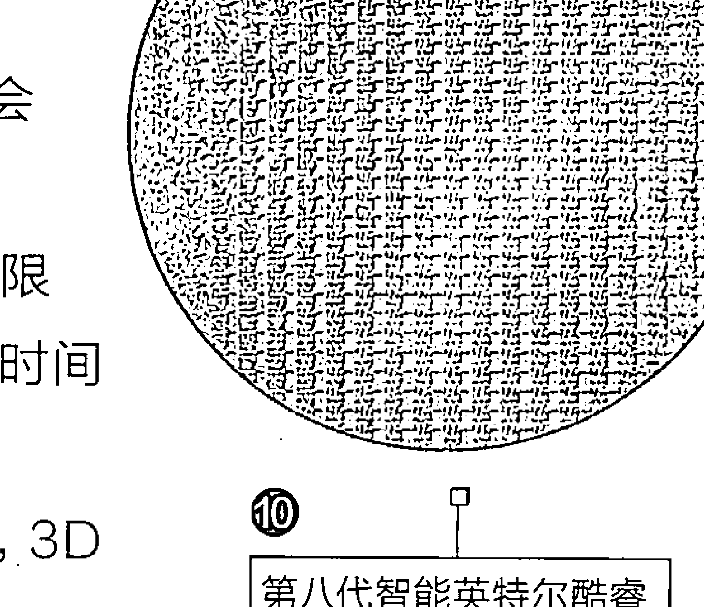

总的来说，Kaby Lake-Refresh更像是以“60U”系列前辈为模板进行的微调：取消Iris Plus显卡，用“省下来”的TDP冗余换来额外的两个物理核心以及更大的高速缓存，同时大幅调低了基础频率稳定TDP，并通过调高睿频加速频率的方式确保满负载运行时的最高性能。而这一升一降，也就是八代酷睿在维持14nm+工艺不变（图10），性能提升的同时还能将续航时间提升到10小时的重要原因。

###### 当GPU碰到UHD

Kaby Lake-Refresh平台集成的核芯显卡并非Iris Plus，依旧集成了和“00U”前辈相同的HD620，拥有24个执行单元，并依靠提升GPU加速频率略微改善了一下性能。

好消息是，虽然英特尔没能在GPU架构上进行革新，但却在GPU功能上进行了完善——八代酷睿开始正式支持VP9和HEVC 10的硬件加速了，可流式处理4K UHD视频（图11）、增强虚拟现实，翻译过来就是完全满足体验4K、VR、360°全景视频的实时处理需求。

同时，英特尔此次还将Thunderbolt 3（雷电3）再次优化，让八代酷睿笔记本可以拥有40Gb/s的双向数据传输，可外接两台4K显示器（或一台5K显示器），可给外接显卡提供更大的带宽，还可提供100W的电力，以及15W的外接充电等。

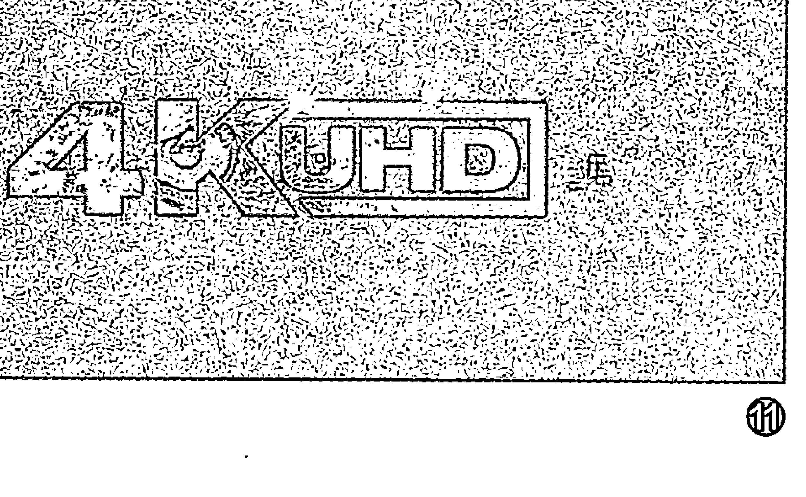

###### 实际的性能表现

接下来就是大家最为关心的性能对比测试环节了，Kaby Lake-Refresh平台的实际性能到底较前辈们有了多少提升？就理论测试成绩来看（表4），八代酷睿i5-8250U和i7-8550U虽然在部分单核性能测试上不如七代酷睿i5-7200U和i7-7500U，但是在综合或多核性能对比中都有着秒杀前辈的实力，而且提升幅度颇为惊人。八代酷睿i5-8250U竟然超越了七代酷睿i7-7500U，而八代酷睿i7-8550U在绝大多数测试项目中甚至将七代酷睿i5-7300HQ斩于马下，要知道后者可是TDP高达45W的游戏本专用芯片！由此可见，当Kaby Lake-Refresh平台迈入四核门槛后，赋予了第八代U系列酷睿处理器越级挑战的性能，也让基于它们设计的轻薄本获得了更强大的生产力潜质。按照英特尔的说法，八代酷睿的整体性能较（同级别）七代酷睿最高可提升40%，其中25%来自增加的两个核心，而其他则来自设计和工艺方面的完善（图12）。嗯，没有夸大宣传。

###### 表4：七代和八代酷睿处理器理论性能对比表

| 对比型号 | i5-7200U | i5-8250U | i7-7500U | i7-8550U | i5-7300HQ |
| :--- | :--- | :--- | :--- | :--- | :--- |
| 国际象棋 | 6240 | 8366 | 6553 | 9876 | 9733 |
| CineBench R11.5-单核 | 1.53 | 1.45 | 1.74 | 1.68 | 1.52 |
| CineBench R11.5-多核 | 3.53 | 4.83 | 3.98 | 5.4 | 5.74 |
| CineBench R15-单核 | 135 | 142 | 165 | 151 | 148 |
| CineBench R15-多核 | 322 | 450 | 361 | 486 | 510 |
| Geekbench 4-单核 | 3810 | 4230 | 4296 | 4696 | 4354 |
| Geekbench 4-多核 | 7506 | 12493 | 9521 | 13981 | 12149 |

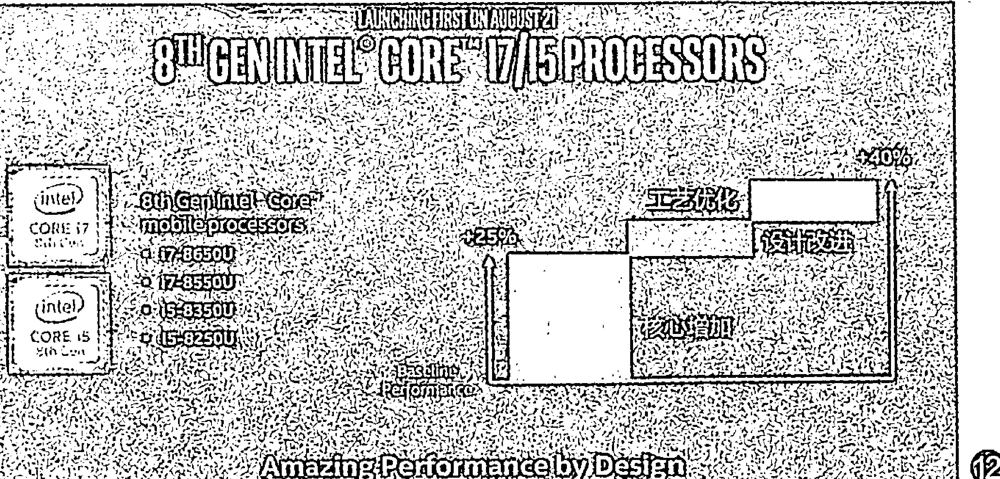

但是，理论毕竟是理论，虽然i7-8550U从表面上看似乎超越了i5-7300HQ，但它依旧无法撼动i5-7300HQ在游戏本领域的地位，因为后者哪怕睿频失效也有着极为稳定的高性能输出。在显卡的搭配上，最适合与Kaby Lake-Refresh平台搭档的就是NVIDIA GeForce MX150或是GTX1050（如果能推出Max-Q版本的GTX1050就完美了），至于GTX1060或更高级别的独立显卡就不要想了，CPU性能会拖累这些顶级独显的发挥。

###### 这一次散热设计更重要

虽然Kaby Lake Refresh平台从双核进化到了四核（图13），但为了维持15W TDP不变，它们只能通过降低基础频率来缓解功耗和发热风险，通过拔高最高睿频加速频率来获得更高的性能输出。但是，睿频加速毕竟只是短时间的“鸡血模式”，在日常应用中，处理器是很难长时间运行在最高主频上的，而是在基础频率和最高睿频间波动。反观七代酷睿，哪怕它们遇到过热导致睿频失效的问题，也能因较高的基础频率而保持稳定的性能输出。

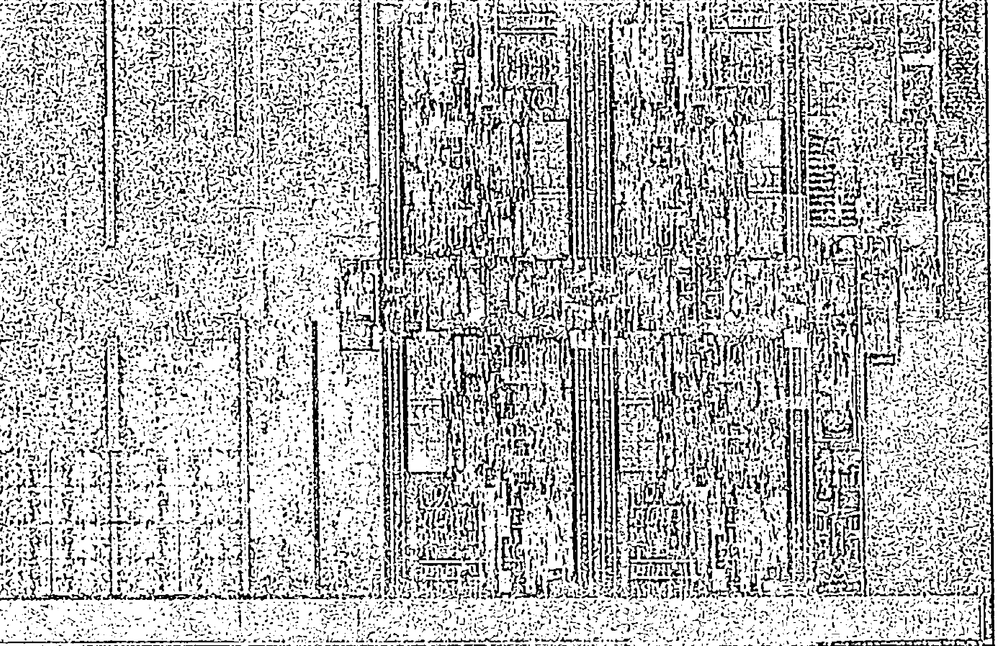

在这种大环境下，Kaby Lake-Refresh平台对笔记本的散热模块设计就提出了更高的要求（图14）。如果散热模块足够豪华，可以持续进行最高频率的性能输出自然皆大欢喜。如果散热设计不过关，因过热而屏蔽睿频加速后其性能会出现断崖式的下降。因此，在众多八代酷睿笔记本中，在配置和价格相近的前提下，散热设计就是决定购买优先级的关键指标。

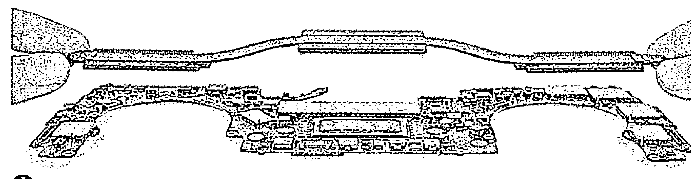

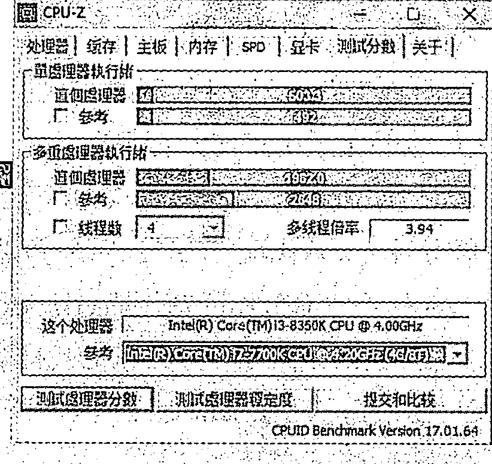

###### 扩展阅读：桌面版Coffee Lake抢先看

继Kaby Lake-Refresh之后，八代酷睿家族的“第二弹”——Coffee Lake平台在这个秋季也会与我们见面，而其首发的型号均为Coffee Lake-S桌面版，包含i7-8700K、i7-8700、i5-8600K、i5-8400、i3-8350K和i3-8100六款型号（图15）。其中，i5和i7全部进化到六核，i3也升级到了四核，并拥有更大的高速缓存。根据国外媒体曝光的资料来看，哪怕是定位偏低的八代酷睿i3-8350K，凭借着四核、更大缓存以及高达4.0GHz的基础频率，其性能已经超越了七代酷睿i5，甚至威胁到了i7-7700K（图16）！可惜，新一代的Coffee Lake桌面处理器虽然依旧是LGA1151插槽，但却不兼容100和200系列主板，必须搭配最新的300系列主板才能使用。如果你对Coffee Lake平台感兴趣，请留意CFan的后续报道。

| Processor | Cores / Threads | Clock speed | Turbo 2.0 | 1-core Turbo 3.0 | L3 | TDP |
|---|---|---|---|---|---|---|
| Core i7-8700K | 6/12 | 3.8 GHz | 4.3 GHz | 4.5 or 4.7 GHz | 12MB | 95W |
| Core i7-8700 | 6/12 | 3.2 GHz | 4.2 GHz | 4.4 GHz | 12MB | 65W |
| Core i5-8600K | 6/6 | 3.8 GHz | 4.2 GHz | 4.4 GHz | 9MB | 95W |
| Core i5-8400 | 6/6 | 2.8 GHz | 3.5 GHz | 3.8 GHz | 9MB | 65W |
| Core i3-8350 | 4/4 | 4.0 GHz | na | na | 8MB | 95W |
| Core i3-8100 | 4/4 | 3.6 GHz | na | na | 6MB | 65W |

##### 一览打尽！八代酷睿笔记本速览


在上个章节中，我们了解了第一批上市的第八代酷睿处理器的规格和性能表现，当你拿到本期杂志时，基于这些新U打造的笔记本也将全面上市。为了便于大家选购，小编特意整理了已登陆京东商城的所有八代酷睿笔记本，感兴趣的读者不妨加以参考。

> **小提示**
> 本文涉及的产品均为同款笔记本中的低配版（最便宜的版本），价格取自京东商城8月25日的报价。

先给大家汇报一个好消息，八代酷睿笔记本的综合性价比极高，虽然搭载八代酷睿i5-8250U的新品在总体价格上要略高于搭载七代酷睿i5-7200U处理器的老型号，但请不要忘记，i5-8250U可是在性能上已超越了i7-7500U的存在，而老型号中搭载i7-7500U的高配版型号在价格上则肯定是要高于新品的！

下面就是已经上市的八代酷睿新品盘点了，如果你觉得内存和硬盘容量偏低，则可根据预算选择中配或高配版本，或者等内存和SSD价格便宜了再自行升级。

###### 惠普小欧HP14q-bu100TX

这应该是目前最便宜的八代酷睿处理器，京东预售价格仅为3799元。不过，如此便宜也注定它只是一款普通款式的笔记本，厚度和重量指标并不突出。不过即便如此，该系列产品还是预留了M.2插槽，方便用户日后自行升级双硬盘，Radeon M520虽然性能一般但也算聊胜于无吧。对了，该系列还有15.6英寸的小欧HP15q和17.3英寸HP17g，配置相似，只是起价分别涨到了3999元和4999元。

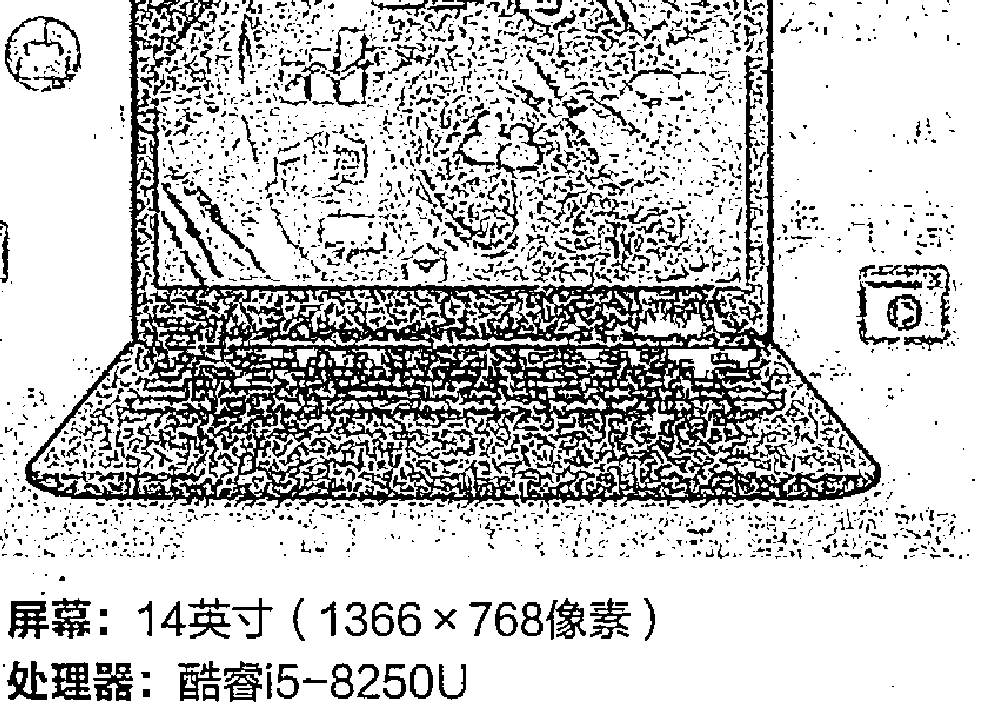

- 屏幕：14英寸（1366×768像素）
- 处理器：酷睿i5-8250U
- 内存/硬盘：4GB/500GB
- 显卡：AMD Radeon M520
- 接口：读卡器、USB3.0×2、USB2.0、HDMI、VGA、RJ45、音频口
- 厚度/重量：23.7mm/1.94kg

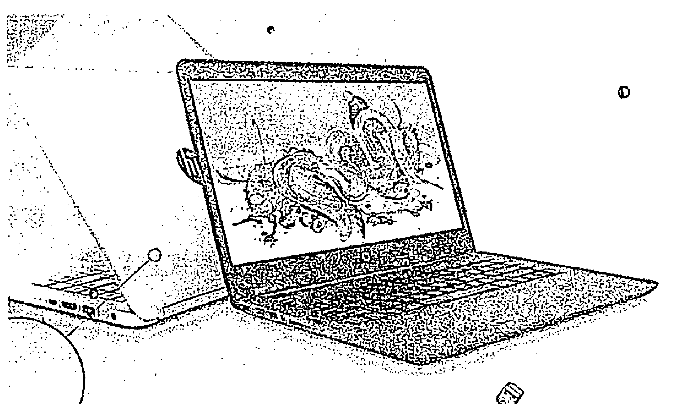

###### 惠普小欧HP14s-be101TX

- 屏幕：14英寸IPS（1080P）
- 处理器：酷睿i5-8250U
- 内存/硬盘：4GB/256GB SSD
- 显卡：AMD Radeon M530
- 接口：读卡器、USB3.0×2、USB Type-C、HDMI、RJ45、音频口
- 厚度/重量：19.9mm/1.52kg

虽然这款小欧HP14s只有后缀和前面的小欧HP14q不同，但两款产品在设计上却有着云泥之别。小欧HP14s改用了更轻薄的外观设计，同时也小幅升级了显卡，屏幕换成了IPS材质的全高清屏幕，4899元的价格也较为实惠。

###### 惠普Pavilion 14-bf116TX

惠普新一代Pavilion 14定位在小欧系列之上，其最大卖点就是采用了5.4mm窄边框，它的C面键盘掌托部分为3D立体全金属冲压一体成型，“翘臀转轴”设计在翻开电脑的同时可将整机托起，提升键盘输入舒适感并增大底部散热孔的进风量。可惜，新Pavilion 14显卡还停留在GeForce 940MX，没能用上最新的MX150，否则在5599元价位的竞争力会更强一些。

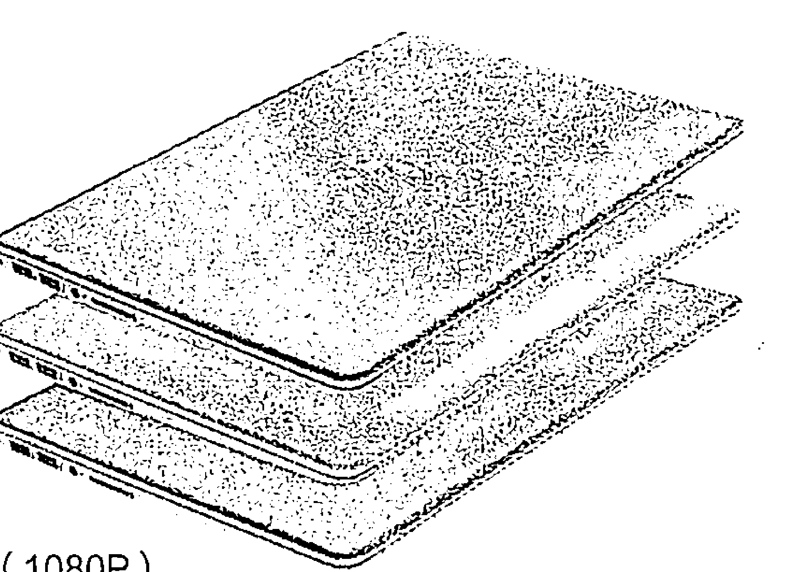

- 屏幕：14英寸IPS（1080P）
- 处理器：酷睿i5-8250U
- 内存/硬盘：8GB/128GB SSD+1TB
- 显卡：NVIDIA GeForce 940MX
- 接口：读卡器、USB3.0×2、USB Type-C、HDMI、RJ45、音频口
- 厚度/重量：19.9mm/1.53kg

###### 惠普ENVY 13-ad 102TX

ENVY 13是一款以工艺见长的轻薄本，它采用了3.06mm超窄边框设计，全金属钻切工艺的机身和独特的翘臀式转轴都令人印象深刻。这款产品的特色还体现在武装最新的MX150独显，而且还配备了超大的51Wh电池，四个扬声器环绕立体声更出众。ENVY 13-ad 102TX的售价为6299元起，略高于其他MX150独显竞品。

- 屏幕：13.3英寸IPS（1080P）
- 处理器：酷睿i5-8250U
- 内存/硬盘：4GB/256GB PCIe SSD
- 显卡：NVIDIA GeForce MX150
- 接口：读卡器、USB3.0×2、USB Type-C×2、音频口
- 厚度/重量：15.4mm/1.3kg

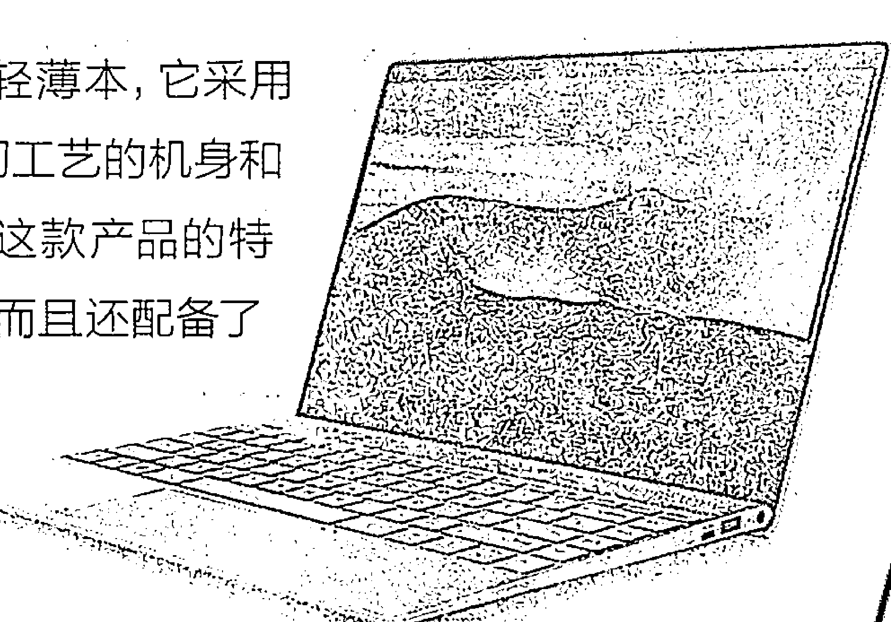

###### 宏基蜂鸟Swift3-14

- 屏幕：14英寸IPS（1080P）
- 处理器：酷睿i5-8250U
- 内存/硬盘：8GB/256GB PCIe SSD
- 显卡：UHD620核芯显卡
- 接口：读卡器、USB3.0×2、USB2.0、USB Type-C、HDMI、音频口
- 厚度/重量：17.95mm/1.5kg

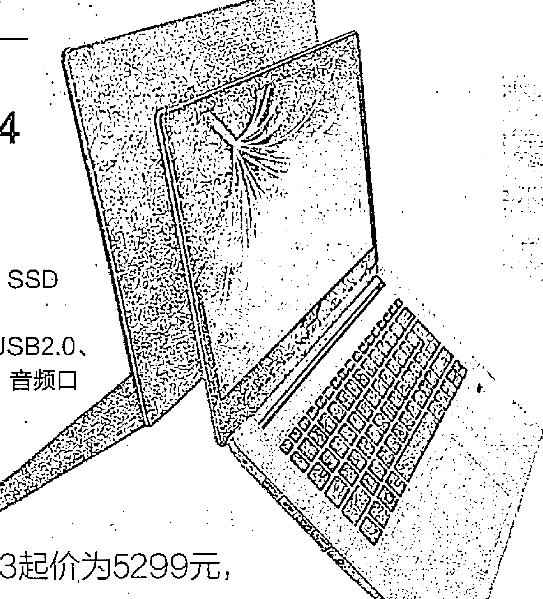

这款宏基蜂鸟Swift 3起价为5299元，主打轻薄长续航功能。该产品的机身最厚度为17.95mm，重量也仅有1.5kg，并在键盘下侧配有指纹识别模块（静态按压式），SSD也支持PCIe高速通道，磁盘性能较强。值得一提的是，蜂鸟Swift 3的屏幕支持蓝光护盾技术，开启后可降低54%自显示屏发出的蓝光。由于缺乏独立显卡的支持，蜂鸟Swift 3更适用于日常娱乐和办公领域。

###### 惠普ENVY X360 15-bp100TX

- 屏幕：15.6英寸IPS触控屏（1080P）
- 处理器：酷睿i5-8250U
- 内存/硬盘：4GB/256GB PCIe SSD
- 显卡：NVIDIA GeForce MX150
- 接口：读卡器、USB3.0×2、USB Type-C、HDMI、音频口
- 厚度/重量：19.6mm/2kg

ENVY X360 15是ENVY 13的大屏+触控版，二者有着一脉相传的工艺，并有了可360度翻转视界的能力。在宽大机身的帮助下，这款产品支持安装双硬盘，适合对视野和触控操作有一定要求的用户选择，6499元的起价也没比ENVY 13贵多少。

###### 宏基蜂鸟Swift3-15

蜂鸟Swift3-15是前面介绍的蜂鸟Swift3-14的大屏版，虽然18.9mm的厚度依旧纤薄，但2.2kg的重量就谈不上轻盈了。这款产品的配置和联想小新潮7000-13一样，都是i5-8250U+8GB+256GB PCIe SSD，只是蜂鸟Swift3-15凭借更宽裕的机身空间，可以安装第二块2.5英寸SATA硬盘，5799元依旧有着不错的性价比。

- 屏幕：15.6英寸IPS（1080P）
- 处理器：酷睿i5-8250U
- 内存/硬盘：8GB/256GB PCIe SSD
- 显卡：NVIDIA GeForce MX150
- 接口：读卡器、USB3.0×2、USB2.0、USB Type-C、HDMI、音频口
- 厚度/重量：18.9mm/2.2kg

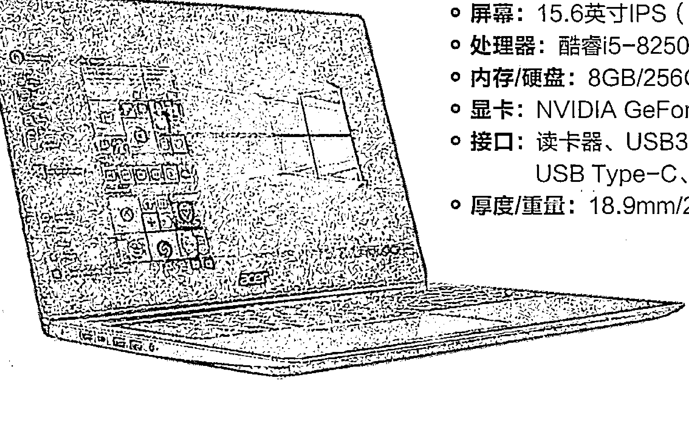

###### 联想小新潮7000-13

目前联想小新潮7000拥有14英寸和13.3英寸两个版本，前者采用的是七代酷睿i5-7200U，而后者则升级到了最新的酷睿i5-8250U，显然是后者更能发挥出MX150独显的潜力。得益于屏幕尺寸的缩减，让新版小新潮7000-13有了更为轻薄的身材，但代价则是不再支持双硬盘，很难在磁盘速度和容量之间得以兼顾。好消息是，新版小新潮7000-13的价格为5699元，只比14英寸的老版本贵了200元。

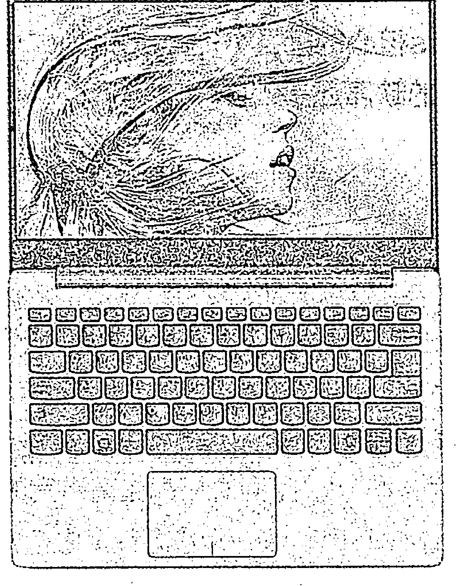

- 屏幕：13.3英寸IPS（1080P）
- 处理器：酷睿i5-8250U
- 内存/硬盘：8GB/256GB PCIe SSD
- 显卡：NVIDIA GeForce MX150
- 接口：读卡器、USB3.0、USB2.0、USB Type-C、HDMI、音频口
- 厚度/重量：16.9mm/1.2kg

###### 戴尔灵越7000 (7570-R1545S)

戴尔灵越7570是一款15.6英寸的八代酷睿轻薄本，其厚度被控制到了20mm以内，并采用了航空5系列铝合金材质外壳，提供银粉双色外观，支持双硬盘，8.6mm窄边框和支持180度屏幕开合设计也为其加分不少。该产品起价不足6000元，缺点是标配内存较小，而且940MX独显也稍显落伍。

- 屏幕：15.6英寸IPS（1080P）
- 处理器：酷睿i5-8250U
- 内存/硬盘：4GB/1TB
- 显卡：NVIDIA GeForce 940MX
- 接口：读卡器、USB3.0×3、USB Type-C、HDMI、RJ45、音频口
- 厚度/重量：19.5mm/1.95kg

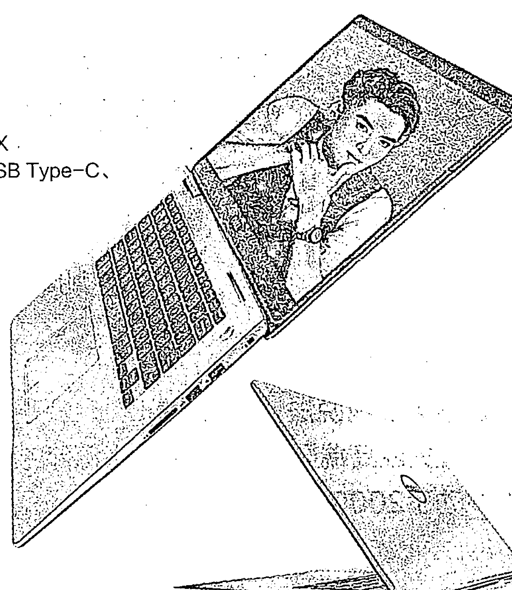


###### 华硕灵耀360

华硕灵耀360是一款极致轻薄的PC平板二合一设备，它采用了可360度翻转的触控屏幕，但却将机身厚度压缩到了10.9mm，结合1.1kg的重量，堪称最轻薄的八代酷睿笔记本。可惜，这款产品只有搭载酷睿i7-8550U处理器的一个版本，13999元的价格颇为高昂。

- 屏幕：13.3英寸IPS触控屏（1080P）
- 处理器：酷睿i7-8550U
- 内存/硬盘：16GB/512GB SSD
- 显卡：UHD620核芯显卡
- 接口：USB Type-C×2、音频口
- 厚度/重量：10.9mm/1.1kg

##### 小结

从现在来看，首发的八代酷睿新品都以轻薄本为主，其中最合理的搭配方案就是和NVIDIA MX150独显组合，如果你注重便携和性能，符合这套组合方案的新品可以增加优先考虑的权重。考虑到八代酷睿的性能颇为给力，在确保散热无忧的前提下，其实笔者更期待酷睿i7-8550U+NVIDIA GTX1050（最理想的版本是Max-Q GTX1050）组合轻薄游戏本的出现，你们呢？

### 反客为主

#### 浅析AMD Radeon RX VEGA

策划 | 《电脑爱好者》编辑部 文 | 刘松

扫一扫，更多精彩内容立现！

从2016年11月到2017年7月，AMD一直跳票的VEGA核心GPU，几乎成为了一种传说，在各种传言中更是不乏悲观说法，例如“最高版本只能达到对手GTX 1070的水平”、“难以控制的功耗与成本”等等，让关注高端显卡的A粉感到了深深的失望。虽然AMD还是使用Polaris核心的RX 400/500系列成功地搅动了2000元以下的主流显卡市场，夺回了一部分市场，但高端产品的缺席还是让对手缺少了升级降价的压力，市场显得有些沉闷。

好在等待终于结束了，随着7月31日的发布和8月份各个版本评测的逐渐解密，VEGA神秘的核心架构与实际性能展现在我们的面前。VEGA究竟带给了我们怎样的能力？是否可以让A粉和玩家们满意呢？相信这是煎熬等待了半年多的A粉与玩家都非常想要了解的。在VEGA送达我们的评测室之前，让我们先根据一些公开资料，了解一下VEGA吧。

##### 承前启后——VEGA架构

从上一代GPU开始，AMD的顶级产品就采用了与主流产品不同的架构，以采用更多的流水线，即所谓的“大核心”设计，同时搭配超高带宽的HBM (High Bandwidth Memory, 高带宽内存)显存。在这一代GPU产品线上，AMD仍然采用了这一模式，即在低端和主流市场使用Polaris核心，而高端和旗舰级则使用刚刚推出的VEGA架构。

VEGA架构中的基础单元为NCU (Next-Generation Computer Unit, 下一代计算单元)，它仍然是基于GCN的改进，改进重点当然仍是提高效率。在NCU单元中加入了快速堆叠运算(RPM, Rapid Packed Math)，可以将不同带宽的兼容指令进行打包处理，因此每一个NCU中的64个32位处理单元每个时钟周期最多可以同时处理512个8位、256个16位或者128个32位操作，提高了计算单元的利用率和总体性能。

VEGA的几何引擎可以更高效地抛弃不可见的、没必要处理的元素，新的智能负载分配器则会根据实际情况持续调整流水线设定，更好地平衡各个几何引擎之间的负载，提高利用率。它配有流式传输光栅器（DSBR, Draw Stream Binning Rasterizer），可以通过消除非必要的数据和处理来提升处理效率，降低功耗。VEGA核心将纹理和像素的存取统一，也提升了缓存的效率及使用率，可以更好地满足目前超高分辨率和刷新率以及VR显示的需求。

VEGA核心内置4MB二级缓存，配有更高频率和容量的HBM2显存，不过目前的版本考虑到成本问题，采用两颗显存的堆叠方式，显存位宽相对于4显存的Fiji反而更低一些。它还带有高带宽缓存控制器(HBCC)，可将系统内存作为显示缓存使用，并且会优化这部分内存的管理机制，使其更适合作为显示缓存，这在一定程度上解决了HBM成本较高、VEGA显卡自带显存容量较小的问题。

VEGA 10也是AMD第一款采用“Infinity Fabric”技术的GPU，该技术将GPU内部的显存控制器、PCI-E控制器、显示引擎和视频加速模块等主要逻辑模块连接起来。这种模块化的设计让GPU可以根据客户的不同需求进行变换，并且也加强了PCI-E控制器等模块的性能，让HBCC可以更高效地使用系统内存。另外VEGA也会完全支持最新的DirectX 12.1；在可选技术的支持方面还高于Pascal。

Current AMD GCN: Fixed width SIMD (16 wide)

Some GPU work (wavefronts of different sizes)
Empty/unoccupied part of SIMD (still along for the ride & using up fuel/power)

VEGA (Next Generation Compute Unit - NCU): Variable width SIMD as required by workload

Same amount of GPU work done as above, but without the wasted SIMD space/power use

##### Radeon RX VEGA显卡

目前公布的首批VEGA架构产品均采用VEGA 10核心，包括两个型号，即Radeon RX VEGA 64 (VEGA 10 XTX核心)和Radeon RX VEGA 56 (VEGA 10 XT核心)，并且提供了高频水冷版配置Radeon RX VEGA 64 LC及银色风冷限量版。VEGA 10核心基于14nm工艺制造，拥有125亿个晶体管，远多于上一代Fiji核心的89亿个晶体管，486平方毫米的核心面积当然远大于自家的RX 480/580 (232平方毫米)和对手的GTX 1080/1070 (314平方毫米)，与GTX 1080 Ti相近(471平方毫米)，但比Fiji的596平方毫米要小一些。

VEGA 10核心的计算单元被分为多个计算引擎(Compute Engines)，每个计算引擎包含16组NCU、64个计算单元。RX VEGA 64核心中带有4个计算引擎，共4096个计算单元，而RX VEGA 56则有3个计算引擎，3584个计算单元。另外在其他配置上也有一些差别，不过均采用了两颗HBM2显存，总位宽1024bit，总容量8GB。

从规格对比可以看出，同档次的VEGA核心在复杂度方面远超对手的Pascal核心，大量的计算单元不仅适合图形处理，在通用计算方面也有着出色的能力，但这也使其功耗比GTX 1070/1080要高不少。RX VEGA各版本公版显卡均完全淘汰了DVI标准接口，只有高带宽的DisplayPort 1.4和HDMI 2.0标准输出接口，输出分辨率可达8K@60Hz。它还支持最新的FreeSync2图像稳定技术，可拥有LFC低帧率补偿功能和HDR输出能力。

从目前公开的测试成绩看，RX VEGA 56在大部分3D综合测试和游戏中的速度介于GTX1070和GTX1080之间，RX VEGA 64则超过了GTX 1080，但即使是高频水冷版本，也仍然与GTX 1080 Ti有一定差距。当然我们也应该看到，偏向于计算能力的架构和HBCC等新技术的引入，使得RX VEGA拥有更大的潜力，但也更需要3D引擎的优化。随着新一代游戏、应用的推出，其性能表现可能会有进一步的提升。另外，尽管其首发价格相对于对手来说还是比较有竞争力的，但目前上市已经一年多的NVIDIA高端显卡已进行了一些价格调整，而作为新品且受到一些“非正常”用户关注的RX VEGA却很可能无法很快进行价格跟进，会明显影响其性价比。

| 显卡型号 | RX VEGA 64 | RX VEGA 56 | GTX 1080 | GTX 1070 |
|----------|------------|------------|----------|----------|
| 首发价（人民币） | 4899元 | 4199元 | 5399元 | 3499元 |
| 核心代号 | VEGA 10 XTX | VEGA 10 XT | GP104-400 | GP104-300 |
| 制造工艺 | 14nm | 14nm | 16nm | 16nm |
| 晶体管数量 | 125亿 | 125亿 | 72亿 | 72亿 |
| 着色器数量 | 4096 | 3584 | 2560 | 1920 |
| 单精度浮点 | 12.7T | 10.5T | 9T | 6.5T |
| 核心频率 | 1274MHz | 1156MHz | 1607MHz | 1506MHz |
| boost频率 | 1546MHz | 1471MHz | 1733MHz | 1683MHz |
| TDP | 295W | 210W | 190W | 150W |
| 显存频率 | 945MHz | 800MHz | 1250MHz | 2000MHz |
| 内存位宽 | 2048bit | 2048bit | 256bit | 256bit |
| 内存带宽 | 484GB/s | 410GB/s | 320GB/s | 256GB/s |
| 内存类型 | HBM2 | HBM2 | GDDR5X | GDDR5 |
| 内存容量 | 8GB | 8GB | 8GB | 8GB |

总体来看，AMD针对电脑市场的新架构反击战的最后一击，Radeon RX VEGA的表现并没有让人失望，不过在对手已经相当成熟的产品和市场布局下，要想取得最终的胜利，还需要继续努力。

### 系统应用

#### 内存优化 释放无端占用

Windows 10系统靠一项内存压缩新技术对已占用内存空间进行压缩，是一种变相的内存释放技术。但这项技术并不是我们控制的。而对于尚未使用Windows 10的用户，也无法享受此项技术。那么，有没有更简单有效的释放内存的办法呢？一款免费小工具Wise Memory Optimizer，就可以释放无用程序所占用的内存空间，并对内存空间进行压缩，增强系统性能。

##### 小知识 Windows 10的内存压缩机制

在Windows 10任务管理器的“性能”选项卡下，单击“内存”项，可以看到标示为“（已压缩）”的内存量（图1）。内存压缩是Windows 10的一项内存管理新技术，它是压缩页面在内存中的一个集合。其原理是当系统内存管理器监测到内存空间不够用时，会将暂时无用的内存页面进行压缩处理，仍存放在内存中，而不是作为交换文件写入硬盘中，当需要的时候直接从压缩内存中转换调用。这样就能够减少进程占用内存的空间，以腾出更多物理内存运行急需内存的应用，从而也能在整体上加快Windows的响应速度。但是，这项技术只是对进程占用内存空间的压缩，而不是对无用进程的完全释放。

为了达到更加完美的无人干预控制优化，最好将上方的“开机自动启动”复选框也选上。

##### 1. 查看内存占用情况

Wise Memory Optimizer运行后，主界面会自动显示检测出的当前已占用内存量和可用的剩余内存量，分别用红色和绿色两种颜色的文字条显示，同时配以形象的双色环形图标（图2）。

##### 2. 手动压缩优化内存

如果觉得系统运行明显缓慢下来，且上述示意图中显示的可用内存空间明显已经很少，那么，可以马上点击“立即优化”按钮，软件将尽可能多地自动压缩并释放被占用的内存。

##### 3. 自动压缩优化内存

总要等到系统卡顿了才想起去启动软件释放内存，这不是积极有效的好办法。自动化的优化措施更显人性化，为此，点击软件窗口右上角的齿轮状设置图标，然后选中“自动优化内存”复选框，同时在下方的滑块上选择当剩余内存达到多少时启动自动内存优化操作。如果担心优化内存操作会影响到当前的高精度或机密作业，为了保险起见可同时选中“当CPU空闲的时候优化内存”选项（图3）。

#### 三步解决应用商店不能启动

文/樱子

在Windows 10使用过程中，我们会通过应用商店来下载和安装应用，但有时会遇到应用商店无法启动或启动后无法更新内容的现象（图1）。遇到这种情况，可从如下三个方面来着手解决。

> > **小提示**
>
> 360安全卫士等软件可能会禁用Windows 10系统自动更新功能（图3），这样会造成在Windows 10系统设置窗口中无法开启系统自动更新，从而影响应用商店的更新。此时需要取消禁用设置。

##### 1 更新系统 弥补缺失

Windows 10的某些重要更新被卸载可能会引起应用商店的问题。这时，需要将系统更新到完整最新版。点击“开始”按钮，依次选择“设置→更新和安全→Windows更新”，然后点击“检查更新”为系统安装更新即可（图2）。

##### 2 网络三项设置问题

应用商店的正常使用与网络连接、账户登录和设置也有密切关系。若更新系统后应用商店仍不启动，则需要按以下步骤解决网络设置问题。

首先，依次通过“开始→设置→网络和Internet→WLAN”检查是否存在网络连接问题，保证网络畅通；接下来检查是否已使用自己的Microsoft账户登录，检查的步骤是“设置→账户→电子邮件和应用账户”，若未登录则选择“添加Microsoft账户”；最后再检查时间和位置设置，转到“设置→时间和语言”设置正确的时区。

##### 3 重置应用商店缓存

如果上述问题都已解决，但仍不能显示网络商店内容，则最后进行应用商店的缓存重置操作。按下Win+R组合键打开“运行”命令框，键入“WSReset”命令并确定（图4），随后会看到黑色的命令窗口出现，然后应用商店会自动启动，并显示页面内容（图5）。若应用商店未自动启动，请手动启动。

#### 提高Windows Defender的安全防护等级

文|红烧真人

Windows 10系统中，微软为了提升系统安全性集成了Windows Defender，对于轻度和有良好使用习惯的用户来说Windows Defender已经足够用了，当然，如果想要提升系统的安全等级，我们还可以通过调整策略组来提升Windows Defender的云保护等级，进一步提高安全防护。

如果大家使用的是Windows 10专业版、企业版可以很简单地打开，但如果是家庭版则需要手动添加几个注册表选项了。

首先我们打开菜单，在搜索栏里面输入“运行”，然后在运行对话框中输入”gpedit.msc”（图1）。

然后我们需要在左侧导航图里面找到并依次点开“计算机配置→管理模板→Windows组件→Windows Defender防病毒程序-MAPS”（图2）。

Windows Defender MAPS是微软的主动保护服务（Microsoft Active Protection Service）；打开之后系统会自动打开在线云服务系统，在静默状态下检测并发送系统检测的危险信息。在Windows 10非家庭版中，如果在系统初次设置中选择了系统生成发送报告的话，这个功能是默认打开的。如果用户对个人隐私比较介意的话，这个提升安全性的方法就可以忽略了。

如果没有则需要点击“加入Microsoft MAPS”，并在弹出的窗口左上部分选择“已启用”，并在下面的选项中选择“高级MAPS”并点击确定（图3）。

之后我们要调整MPEngine的安全等级，它就在MAPS的下面，双击打开后在右侧找到选择云保护级别，点击进入设置。

之后弹出的窗口跟上一个窗口很像，左上部分依然点击“已启用”，再在选项字样下方的“选择云阻止级别”的下拉菜单中选择“高阻止级别”，然后点击确定（图4）。

如果用户使用的是家庭版或者是在安装系统的时候在数据收集时选择否，则需要手动建立MPEngine的功能。

先打开“运行”，输入“regedit.exe”，然后打开到HKEY_LOCAL_MACHINE\Software\Policies\Microsoft\Windows Defender，右键在“Windows Defender”文件夹上新建“项”，并命名为MpEngine（图5）。

然后在右侧新建一个“DWORD（32位）值”项，命名为“MpEnablePus”，将里面的数值数据改为1（图6）。

之后我们在右侧再建立一个“DWORD（32位）值”项，命名为“MpCloudBlockLevel”，并将里面的数值数据改为2。

家庭版用户在此基础上还需要右键点击“Windows Defender”文件夹，新建一个名为“Spynet”的文件夹，并新建“SpynetReporting”的DWORD（32位）值，在数值数据中将0改成2（图7）。

最后重启电脑来保存这些修改。重启后，系统自带的Windows Defender就已经是最高等级了。

若想关闭MAPS与MPEngine的话，我们只需要将修改的数据修改回去，将注册表HKEY_LOCAL_MACHINE\Software\Policies\Microsoft\Windows Defender下新建的三个文件夹删除，重启即可。

#### Windows徽标键大“排查”

文|樱子

在使用电脑的过程中，如果忽然发现Windows徽标键失效，例如按下“Win+空格”组合键只能输入一个空格，按下Win+X只能输入一个X，如何恢复？而另一方面，在玩游戏的过程中，按键盘上的游戏控制键又常常会误触动Win键，又该如何将Win键屏蔽？

首先应该知道，由于键盘进水或设备故障，也会造成Win键失灵。因此，如果发现Win键失灵，首先要排除硬件故障因素，确认不是键盘物理损坏。排除方法：进入双系统中的另一个系统或通过启动盘启动Windows，按下Win键测试；或将键盘拔下后接到别的电脑上测试。若能正常使用，则说明不是键盘硬件故障。排除了硬件故障后，就需要从软件方面考虑了。

##### 1 借用小工具控制Win键功能开关

可使用一款“Win键盘屏蔽器”软件检测Win键是否被第三方软件屏蔽，并解除被屏蔽了的Win键。运行该软件后，如果窗口中的“允许Win键”按钮显示为高亮状态，则说明该键已经被屏蔽，只需点击“允许Win键”按钮，即可解除屏蔽。反之，若希望玩游戏时禁用Win键，以防止误操作，则只需点击“禁止Win键”按钮即可（图1）。

##### 2 编辑注册表实现Win键的屏蔽与恢复

若不想使用第三方软件，还可以直接用编辑注册表的方式来解决。按下Win+R组合键启动运行窗口，输入并运行REGEDIT命令，启动注册表编辑器（图2）。在注册表编辑器窗口中，依次定位到路径“HKEY_LOCAL_MACHINE\SYSTEM\CurrentControlSet\Control\Keyboard Layout”。右键单击右侧窗格空白处，选择“新建→二进制值”（图3），将该项目命名为“Scancode Map”，双击并输入值“00 00 00 00 00 00 00 00 03 00 00 00 00 00 5b e0 00 00 5c e0 00 00 00 00”（图4）。注意窗口中左右两列的数据为自动生成，可不予理会。输入确认后，注销并重新登录或重启资源管理器，使得设置生效。

**小提示**
若电脑中安装有360安全卫士，也可用它来对Win键进行屏蔽。点击安全卫士“更多”按钮，选择添加“游戏优化器”应用，在“游戏防打扰”选项卡中，选择“屏蔽左侧Win键”旁的“优化”按钮，自动对左侧Win键盘进行屏蔽处理。

**小提示**
若需要解除禁用，只需将上述的“Scancode Map”项删除即可。

为了操作方便，还可以将上述过程用代码方式写到一个REG纯文本文件中，命名为“屏蔽左右Win键.reg”（图5）

```
Windows Registry Editor Version 5.00
[HKEY_LOCAL_MACHINE\SYSTEM\CurrentControlSet\Control\Keyboard Layout]
"Scancode Map"=hex:00,00,00,00,00,00,00,00,03,00,00,00,00,00,5B,E0,00,00,5C,E0,00,00,00,00
```

同时写另一个文件“撤销屏蔽Win键.reg”，用来解除对Win键的屏蔽（图6），代码如下：

```
Windows Registry Editor Version 5.00
[HKEY_LOCAL_MACHINE\SYSTEM\CurrentControlSet\Control\Keyboard Layout]
"Scancode Map"=-
```

这样，当需要屏蔽或解除屏蔽时，只需双击运行对应的REG文件即可。

如果只是想要屏蔽某个Win+快捷组合（例如仅屏蔽Win+A功能），也可以用注册表修改的方法。先依次定位到“HKEY_CURRENT_USER\Software\Microsoft\Windows\CurrentVersion\Explorer\Advanced”，新建名为DisabledHotkeys的字符串值，编辑其数值数据，填入A即表示屏蔽Win+A，填入B即表示屏蔽Win+B（图7）。若希望去除限定，只需在注册表中删除DisabledHotkeys即可。

#### 无人值守 用好Windows 10

文|樱子

虽然Windows 10下的多数任务还离不开手动操作，但有时我们又希望在不需要人为干预的情况下完成一些任务，例如实现无人干预的自动登录、无需选择的启动顺序变更、免干预的自动升级和无人值守的系统自动备份等。这些任务如何实现呢？

> 小提示
在“运行”窗口中直接运行“NETPLWIZ”命令，同样也会出现上述设置窗口。

##### 1 不输密码自动安全登录

家庭中的电脑每次启动输密码比较麻烦，而如将管理员或用户密码设置为空，又容易被黑客利用，存在隐患。因此，比较安全的方法是为Windows设定登录密码，但可让系统自动输入密码，免去用户手动输入。

为此可用如下几种方法：

按下Win+R启动运行窗口，执行如下命令（图1）：

```
Rundll32 Netplwiz.dll,UsersRunDll
```

打开“用户账户”对话框，选择要免密登录的用户，然后把“要使用本计算机，用户必须输入用户名和密码”复选框里的对钩去掉（图2）。确定后按系统要求输入登录此账户的密码。这样，下次启动时Windows就会自动按所设账户和密码自动启动到桌面了。

通过修改注册表解决。在注册表编辑器中依次打开“HKEY_LOCAL_MACHINE\SOFTWARE\Microsoft\Windows Nt\CurrentVersion\Winlogon”项。在右边窗格内右击并新建“字符串值”，命名为AutoAdminlogon，双击该项并将键值设为1（图3）。接下来把同窗口下DefaultUserName的值设为需要自动登录的用户名（图4）。最后新建一个字符串值DefaultPassword，并将其值设为用户名对应的密码，重启即可。

##### 2 无需选择变更启动顺序

办公室的公用电脑往往会被置为多系统，以针对不同的员工习惯。如果有一台电脑默认使用的是Windows 10，明天要交给一个老员工用Windows 7工作，希望一开机不用选择就自动进入Windows 7，只需在下班前通过MSCONFIG系统配置命令进行配置即可。

在命令提示符窗口或“运行”框中执行MSCONFIG命令，启动到系统配置窗口，点击“引导”选项卡，选择引导项为“Windows 7”，点击“设置为默认值”按钮，然后点击“确定”(图5)。这样明天电脑启动后，不用选择便可自动进入Windows 7系统供老员工使用。当然，若要免去同事输入密码的麻烦，同样用上面提到的方法设置Windows 7的安全自动登录密码即可。

##### 3 不用干预自动升级系统

如果一台Windows 10电脑用作文档和打印机服务器，需要常开着并保持安全，这样就需要系统保持不断地自动更新。为此，需要屏蔽系统更新暂停功能，并去除用户设定的升级自动重启时间限定。以Windows 10创意者更新为例，在系统设置窗口中选择“更新和安全”选项，然后选择“Windows 更新”，进入Windows更新设置窗口后，点击“重新启动选项”，将安排时间开关设置为“关”状态(图6)；同时，还要保证在“高级选项”窗口中，将“暂停更新”置于“关”的状态(图7)。这样系统将保持自动更新，并不会理会用户安排的更新时间。

##### 4 无人值守自动备份系统

Windows系统故障率较高，升级频繁更容易出问题，有必要定期备份系统。但备份系统往往耗时漫长，占用工作时间又不太合适，因此用闲置时无人值守备份是最好的选择。

执行Acronis分区备份任务，选择需要备份的系统分区，在磁盘备份选项的“排程”中选择“每天”或“每周”的备份时间(图8)；然后选定备份方案为完整或增量备份，在“高级”选项中设置压缩备份方式，按需选择“备份完成后关闭计算机”，指定备份文件的位置和文件名，然后确定方案。这样，以后备份时间一到，只要电脑处于开机状态，就会自动启动备份程序进行备份了。

#### 在Windows 10中创建多分区闪存盘

文|俞木发

现在闪存盘的容量越来越大，系统安装包也越来越大。平时，很多朋友使用闪存盘来保存资料或作为系统安装盘。不过由于之前Windows系统不直接支持闪存盘分区，因此这些大闪存盘在实际使用时就会带来诸多不便。但Windows 10升级到1703版后，新系统开始原生支持闪存盘分区，这样我们可以根据自己的实际需要，为大闪存盘分区。

##### 资料保护有高招 打造双分区分存盘

首先确保你的Windows 10已经升级到1703及以上版本，版本查看只要启动记事本，点击“帮助→关于记事本”，在打开的窗口中确认系统当前为“版本1703(OS内部版本15063.296)”及以上即可。接着插入需要分区的闪存盘，在任务栏搜索框输入“计算机管理”，打开该组件后展开“存储→磁盘管理”，选中闪存盘右击选择“删除卷”（注意：卷的删除会丢失所有资料，删除前请备份好闪存盘资料），右击闪存盘选择“新建简单卷”，根据自己的实际需要选择分区容量，比如需要保存资料的分区设置为1GB，则建立一个大小为1024MB的分区（图1）。
剩余操作同上，继续将剩余的分区创建为另外一个分区，这样分区完成格式化后就可以直接使用两个分区的闪存盘了（图2）。

> **注意**
由于目前只有1703版本（及以上）Windows 10才能正常识别多分区的闪存盘，其他低版本Windows只能识别闪存盘第一分区，因此保存个人资料的分区建议划分到第二分区。这样闪存盘（即使盘符没有删除）在其他低版本Windows上使用时，第二及之后的分区会自动隐藏而无法识别。如果要在低版本的Windows上访问隐藏分区，可以借助Diskgenius（它也可以实现闪存盘分区），启动软件后选中隐藏的闪存盘分区，点击“浏览文件”即可进行访问（图4）。

为了更好地保证保存个人资料分区的安全，在磁盘管理组件中选中该分区，右击选择“更改驱动器号和路径”，然后将其盘符删除。这样再次插入闪存盘后，系统不会对上述的分区分盘符，可以有效保护个人资料的安全，即使对可见分区选择“格式化”也不会伤及没有盘符的分区（图3）。

##### 2 启动安装二合一 打造互不影响安装盘

大家知道现在安装Windows 10的电脑都在使用UEFI启动，重装这类系统的时候也要选择支持UEFI启动闪存盘。不过由于UEFI启动只支持FAT格式，但是该格式最大只能支持4GB以下的单个文件，而现在很多Windows 10安装文件(install.wim)的体积都超过4GB。这样简单使用FAT格式闪存盘就无法装下大于4GB的安装文件，现在通过新版Windows 10，我们就可以打造“FAT32+NTFS”双分区闪存盘：前者用于UEFI启动，后者则用来存放安装文件(NTFS支持最大2TB文件)。分区操作可以参照上述方法，按提示创建一个FAT32和NTFS格式分区。不过在磁盘管理中无法直接创建并格式化为NTFS分区(只有FAT和FAT32选择)，可以在创建分区后选择不格式化，然后在资源管理器中选中未格式化的分区，在这里选择NTFS格式进行格式化(图5)。当然熟悉命令行的朋友也可以使用Diskpart命令行一步完成NTFS分区的创建。在闪存盘上直接创建FAT32和NTFS分区后，准备好1703版Windows 10的安装文件(假设为Windows10.iso)，按提示在资源管理器中打开，然后将除“sources\install.wim”文件外全部复制到闪存盘的FAT32分区，将ISO全部文件复制到闪存盘的NTFS分区。这样以后需要重装Windows 10的时候，只要在开机启动时选择“UEFI启动闪存盘”，启动到PE系统后，打开闪存盘的NTFS分区，然后运行其中的“setup.exe”进行安装即可。当然大家也可以使用Imagex、DISM命令行等直接解压闪存盘NTFS分区的“install.wim”文件快速安装，无需考虑该文件大小是否超过4GB(图6)。

> 小提示：分区闪存盘同样可以用于全新安装操作系统(但是要注意在对闪存盘完成分区后需要激活主分区)，这样开机启动选择闪存盘启动即可。

#### 找出内鬼 Windows 10计划任务窗口不再闪

文|俞木发

很多使用Windows 10的朋友经常会遇到这样的情况，就是电脑用着用着屏幕忽然出现一个一闪而过的窗口，根本来不及看清是什么东西就消失了，而且隔段时间相同的情况又会重复出现。那么到底是什么程序在后台运行？下面就为大家找出原因并进行解决。

##### 1 分析原因 找出后台内鬼

从故障现象看，因为这个是定时出现，所以很符合后台系统计划任务的特征。由于没有当前窗口，这些后台程序大多是命令行，所以在屏幕上的表现就是一闪而过。当然也不排除中毒情况，因此如果出现此类情况，首先将杀毒软件升级到最新病毒库进行查杀。如果没有病毒，那就可以从任务计划入手了。

##### 2 系统内探事件查看器确定病因

既然是系统后台运行的计划任务，那么Windows 10自带的“事件查看器”就可以记录这些任务运行状况。不过默认情况下，Windows 10并没有开启计划任务的记录，因此需要自行开启。

在任务栏搜索框输入“计划任务”，打开任务计划程序管理器。点击窗口右侧“操作”下的“启用所有任务历史记录”（开启后显示为“禁用所有任务历史记录”），这样系统计划任务运行后都会被事件查看器自动记录（图1）。

> 小提示
开启计划任务事件记录后，系统中会出现很多的记录事件，为了方便快速进行筛选查找。既可以根据计划任务出现时间，也可以点击右侧窗格的“筛选”，根据事件来源、用户等进行自定义查找。

现在就是继续你的日常操作，等待上述神秘窗口再次显示。此时在任务栏搜索窗口输入“事件查看器”，启动程序后展开“应用程序和服务日志→Microsoft→Windows→TaskScheduler→Operational”，在右侧窗口根据窗口出现时间进行筛选，可以看到笔者电脑屏幕上出现的窗口是一个名为“OfficeBackgroundTaskHandlerRegistration”的计划任务导致（图2）。

通过窗口出现时间再结合计划任务运行记录时间，我们基本可以断定此次窗口的出现就是由于“OfficeBackgroundTaskHandlerRegistration”这个计划任务导致。不过由于这个窗口显现和消失的时间很短，为了进一步确定是否由该计划任务导致，我们还可以利用“oCAM”屏幕录制软件进行记录。启动“oCAM”后点击“菜单→选项”，视频录制帧数选择30以上（帧数大些可以完整录制那些一闪而过的窗口）。返回主窗口，点击“录制区域”选择全屏录制，声音不要录制，然后点击“录制”（图3）。

这样等待神秘窗口再次出现后停止录制，完成窗口的录制后，默认录制的视频保存在软件安装目录，按提示使用系统自带的“电影和电视”打开，在弹出窗口时点击暂停，通过鼠标快进和快退，可以看到这个弹出窗口运行的正是上述记录的计划任务（图4）。

知道了弹出窗口的元凶，接下来我们根据自己的实际需要进行设置即可。同上打开任务计划程序管理器，打开后展开“任务计划运行库”，这里会显示本机所有后台运行的计划任务，按照上述显示的名称进行查找即可（图5）。

如果这里发现的是陌生的病毒程序，先结束其任务的运行，然后打开任务计划属性窗口，切换到“操作”，在这里可以看到运行程序的详细信息，按提示进行文件的删除，最后在“任务计划运行库”中删除其任务即可（图6）。

> 小提示
一些病毒同样使用SYSTEM身份实现后台静默运行，对于这类可疑的计划任务，我们则可以将其运行身份更改为当前账户，这样病毒在运行时会被UAC拦截，我们可以通过UAC提示来判断程序是否有害。

要是系统正常的计划任务，则可以通过更改账户运行的方法让它在后台静默运行。同上打开任务计划属性窗口，切换到“常规”，点击“更改用户或组”，在“输入需要选择的对象名称”处输入“SYSTEM”，即让任务以SYSTEM账户身份运行（图7）。

返回属性窗口，勾选“使用最高权限运行”（防止运行的程序需要更高权限，导致UAC窗口弹出），现在该计划任务运行账户已经变为“NT AUTHORITY\SYSTEM”。由于SYSTEM账户是系统内置账户，而且其没有运行环境，因此上述计划任务就会在后台静默运行，不会再弹出烦人的运行窗口了（图8）。

#### 免密码唤醒Windows 10

在使用Windows 10的过程中，如果电脑从睡眠或待机状态被用户唤醒，往往需要输入密码。若希望唤醒时不需要密码，可以采用如下两种方法进行设置。

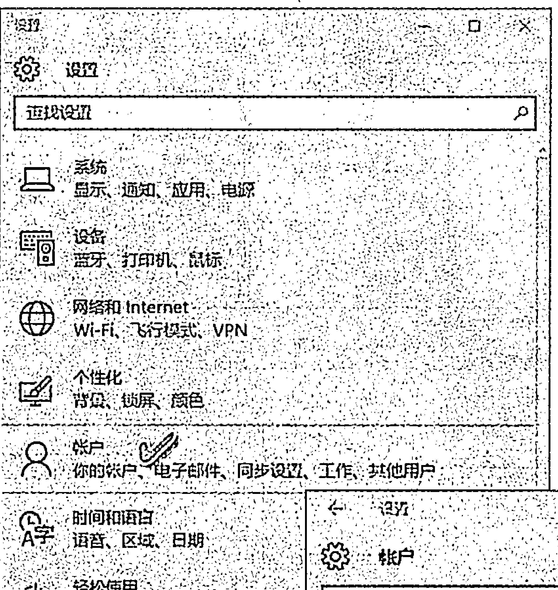

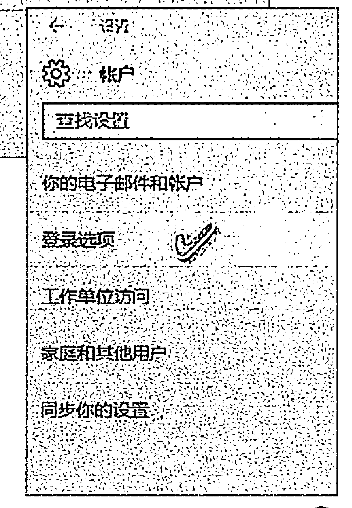

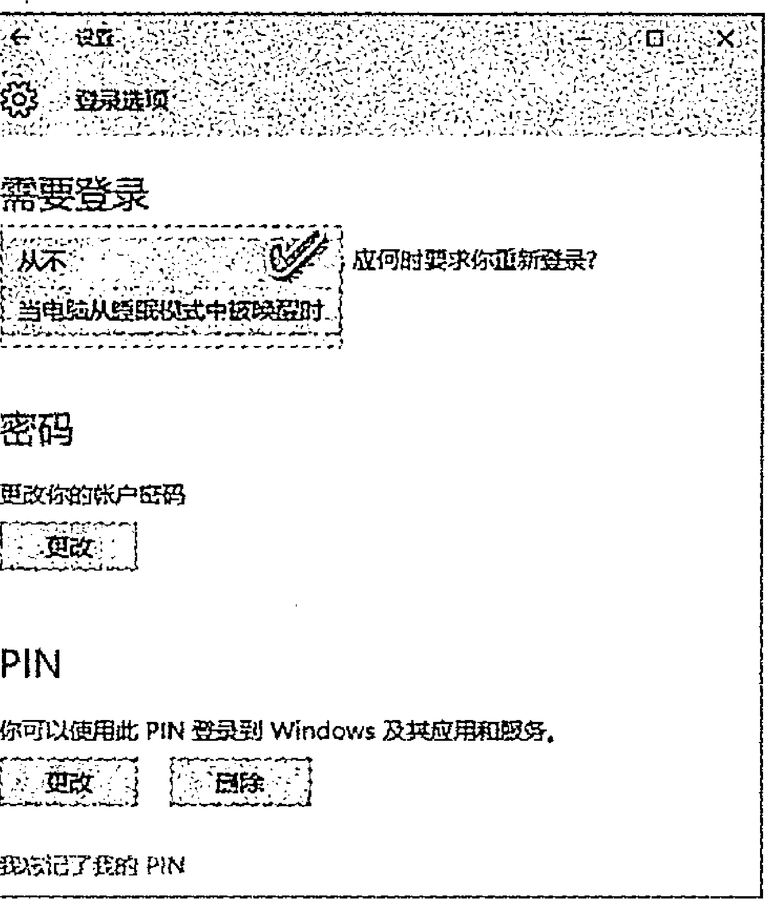

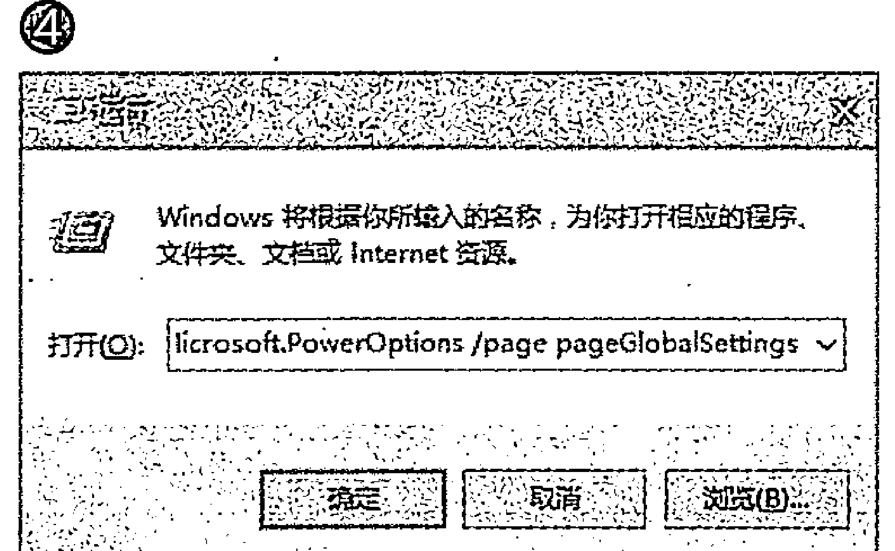

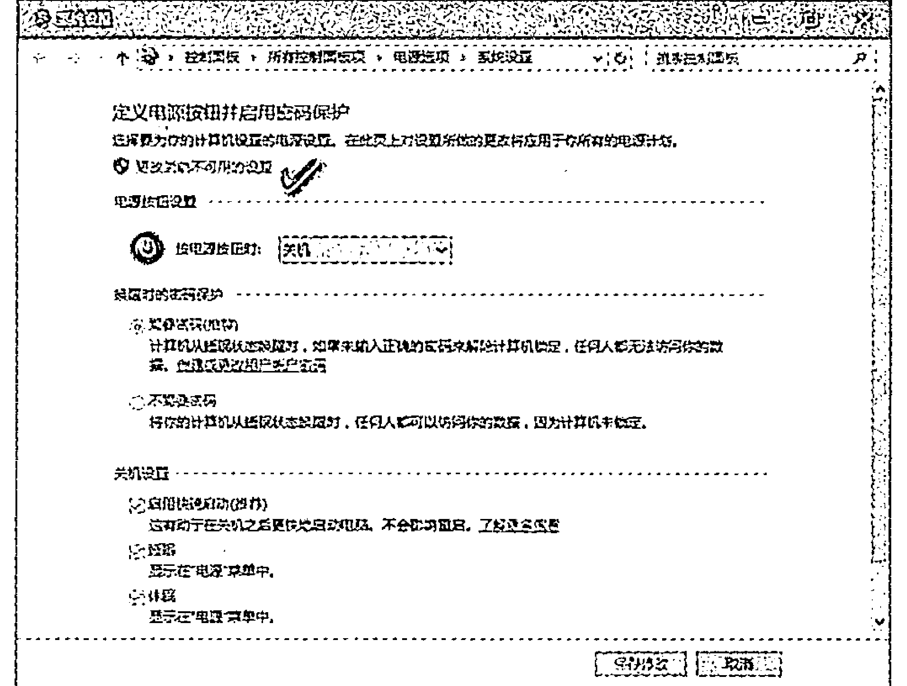

##### 1 使用新式Windows 10“设置”

对于已经进行过周年更新的Windows 10版本，可采用如下图所示的方法，取消唤醒时再次输入密码的过程。

按下Win+I组合键，启动系统设置窗口，点选“帐户”选项（图1）。

在“帐户”窗口设置列表中，选择“登录选项”（图2）。

进入“登录选项”设置页面，在“当你从睡眠模式被唤醒时”的登录方式选项框中，选择“从不”命令（图3）。

##### 2 利用传统控制命令来解决

如果使用其他版本的Windows 10，通过界面进入设置不方便，也可以采用如下方法进行设置。

按下Win+R组合键启动到运行窗口，在“打开”输入框中输入如下命令并回车运行（图4）：`control.exe /name Microsoft.PowerOptions /page pageGlobalSettings`

在随后启动的系统设置窗口中，可看到有唤醒时“不需要密码”的选项，但该项可能为灰色不可选状态。这时要选择上部的“更改当前不可用的设置”蓝色文字链接（图5）。

之后当“不需要密码”变为可选状态，单击选中该项后点击“保存修改”按钮即可。

小提示：如果不想用上述长命令串，也可以沿着“控制面板→所有控制面板项→电源选项→系统设置”的路径，依次通过图形界面进入到上述设置窗口。

#### 突破Windows 10系统保护禁区

文|樱子

Windows 10的系统保护有多种方式，系统还原是其中一种。系统还原也有禁区，比如两次还原点建立的时限便是禁区的一道门槛。

```
PS F:\> Checkpoint-Computer
位于命令管道位置 1 的 cmdlet Checkpoint-Computer
请为以下参数提供值:
Description: Hy-point-1
PS F:\> Checkpoint-Computer
位于命令管道位置 1 的 cmdlet Checkpoint-Computer
请为以下参数提供值:
Description: Hy-point-2
警告: 无法创建某个新的系统还原点, 因为在过去 1440
分钟内已经创建了一个系统还原点。可以通过在注册表项
'HKLM\Software\Microsoft\Windows NT\CurrentVersion\SystemRestore' 下创建
DWORD 值 'SystemRestorePointCreationFrequency'
来更改还原点的创建频率。此注册表项的值指示两次创建还原点的必要时间间隔
(以分钟为单位)。默认值为 1440 分钟(24 小时)。
```

系统还原点可通过系统保护窗口建立，也可以通过系统命令来建立。如果通过系统保护窗口建立，要选择“启用系统保护”并配置磁盘空间使用量(图1)，之后才能创建。若通过系统命令来建立，需在管理员模式的PowerShell窗口中输入Checkpoint-Computer命令和还原点名称创建。

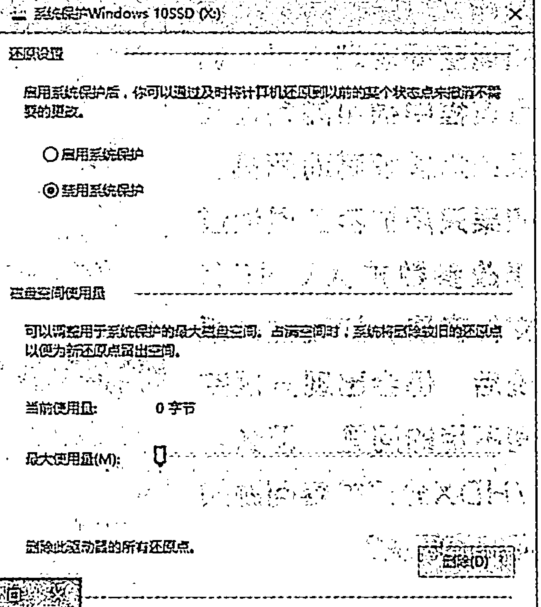

但是，还原点的创建有严格的时间间隔限制，如果在创建了系统还原点之后，又有操作变动，希望创建另一个还原点，而这两次时间间隔又太短，那么系统会提示无法创建新的还原点，并给出无法创建的原因是两次创建时间间隔未超过系统指定的1440分钟(即24小时)时限(图2)。

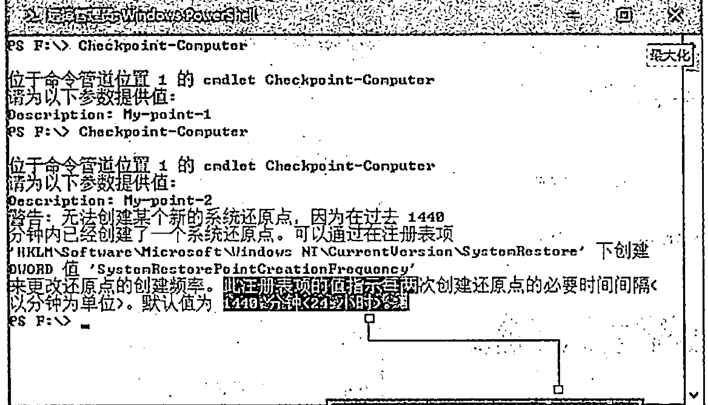

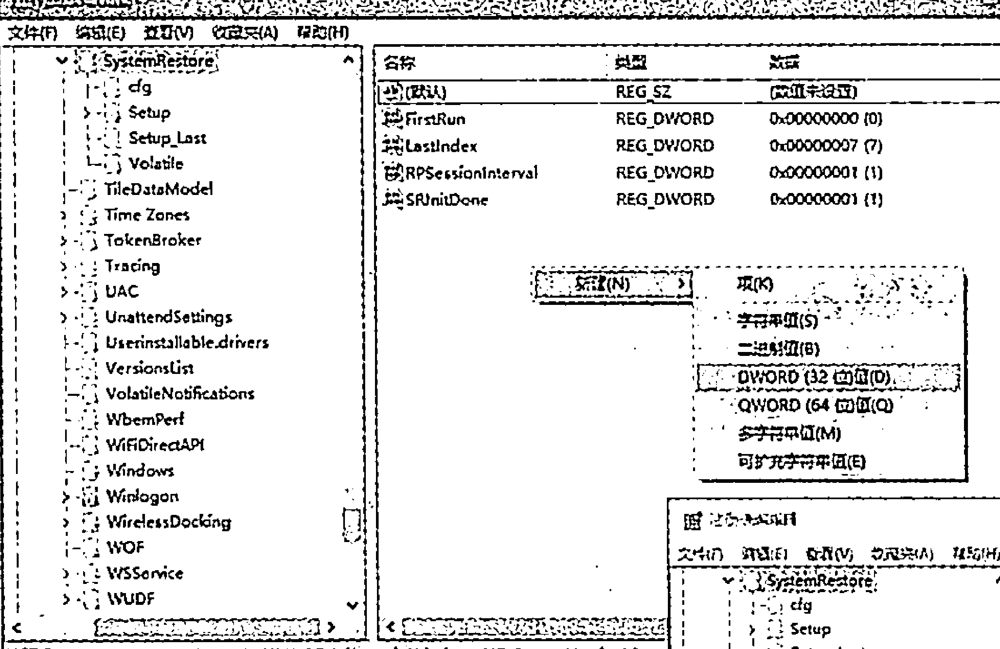

> 小技巧：如何解开系统还原功能
如果系统还原功能被屏蔽无法使用，可在系统服务窗口中检查Microsoft Software Shadow Copy Provider服务，点击“启动”按钮手动启动该服务。若使用带有组策略功能的Windows高级版本，还可以通过组策略中的“计算机配置→管理模板→系统→系统还原”路径，将两个系统还原相关选项设置为“未配置”或“已禁用”状态。

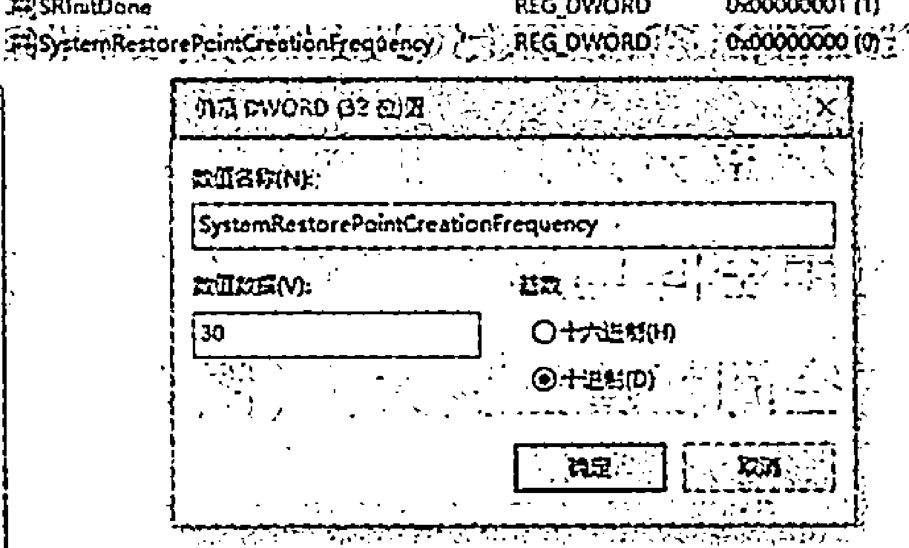

通过修改注册表，可缩短创建系统还原点的时间间隔。按下Win+R组合键启动运行窗口，运行REGEDIT命令启动注册表编辑器，依次定位到“HKEY_LOCAL_MACHINE\Software\Microsoft\Windows NT\CurrentVersion\SystemRestore”，新建一个DWORD(32位)值(图3)。将新建值更名为SystemRestorePointCreationFrequency，双击该项并选择基数类型为“十进制”，在“数值数据”中输入间隔时间数(单位为分钟)，例如输入30就表示修改为两次还原点创建时间不低于30分钟(图4)。确定后重启即可使设置生效。

#### Windows 10 VHDX虚拟系统扩容方法多

文/樱子

使用VHDX虚拟系统初期空间规划不足，运行过程中很可能会造成系统盘被填满而死机。如果只用扩容工具通过修改参数扩大VHDX文件容量，加载虚拟系统后，仍会出现分区空间不足的问题。那么，VHDX分区扩容问题如何彻底解决？

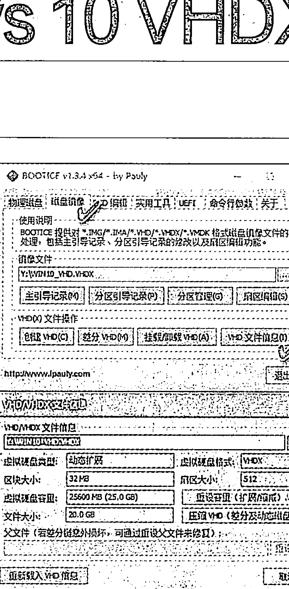

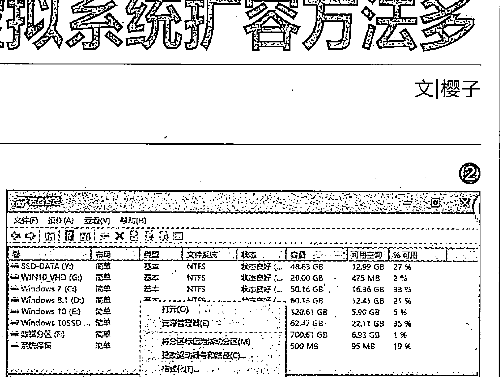

##### 1 用Windows 10磁盘管理解决VHDX

点击“磁盘镜像”选项卡下的“VHD文件信息”按钮，然后点击“重设容量”按钮进行重设(图1)。之后进入Windows 10磁盘管理，选择“操作→附加VHD”命令，加载VHDX文件。可见VHDX盘上有未分配区域，这正是用扩容工具BOOTICE增加的文件容量。右键单击VHDX盘并选择“扩展卷”命令(图2)，根据提示将最大可用空间均用作扩展(图3)。完成扩展后，VHDX分区的空间就真正变大了(图4)。

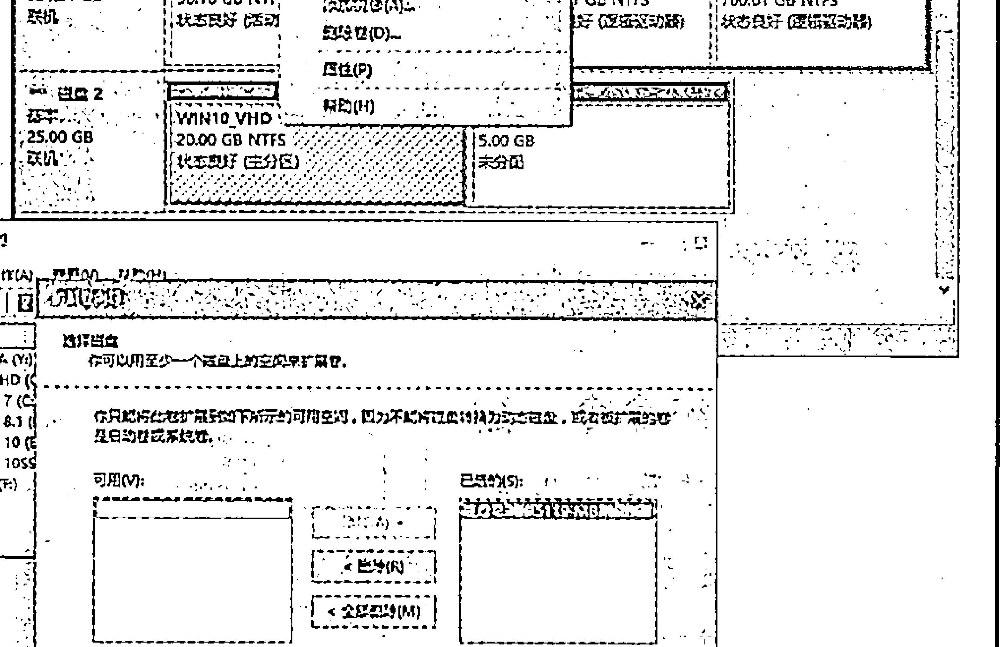

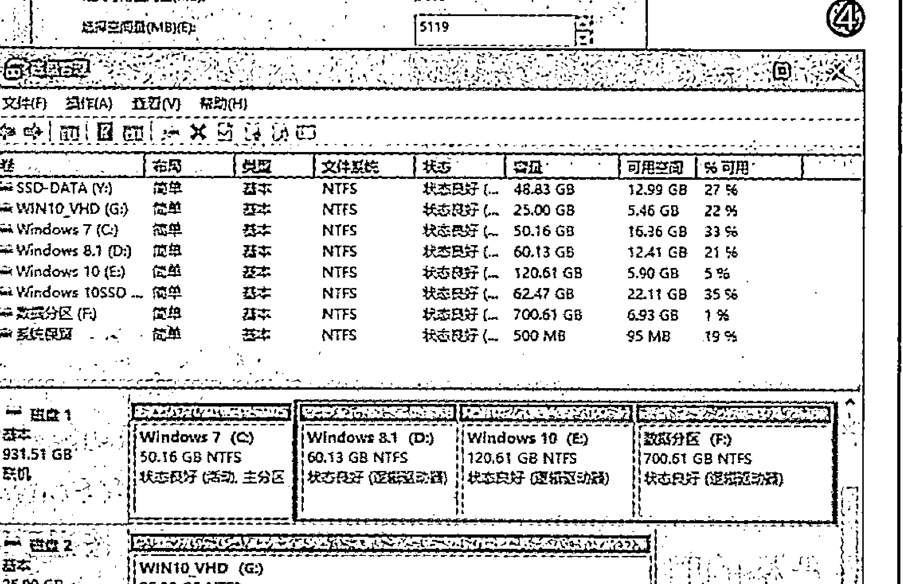

##### 2 命令提示符实现VHDX虚拟盘扩容

按Win+R组合键运行DISKPART命令，输入“SEL VDISK FILE=X:\路径名\VHDX文件名”(注意加扩展名VHDX)，回车执行后显示DiskPart已成功选择虚拟磁盘文件。接着再输入“EXPAND VDISK MAXIMUM=扩容后的容量”(单位为MB)，回车执行后系统显示DISKPART已成功扩展虚拟磁盘文件。最后利用分区工具(如梅奥分区助手)，在虚拟磁盘上右键点击扩容部分，选择合并分区即可。

##### 3 Ghost 32实现VHDX虚拟盘扩容

在多系统的VHDX系统下，新建一个大容量VHDX(比如50GB)，挂载该VHDX。然后使用Ghost32工具将小容量VHDX分区克隆到新的VHDX分区，克隆结束后，重启计算机进入另一个非VHDX的Windows系统，删除小容量的VHDX文件(或为安全起见，也可不删除而更名备份)，然后将大VHDX重命名为与原小容量VHDX同名即可。

#### “详细信息” 实现文件个性化筛选

文|阿楠

在众多不同种类的文件中，只靠文件名和扩展名是不足以准确区分文件的，在不借助于专用软件的情况下，巧妙利用 Windows 10文件系统的“详细信息”，也能快速筛选出想要的内容。比如某个焦段、某台相机拍的照片，甚至宝宝的照片、特定场景拍摄的照片等都可以挑出来。

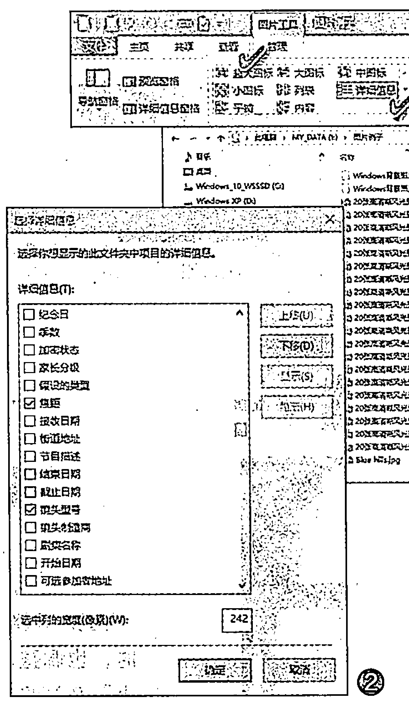

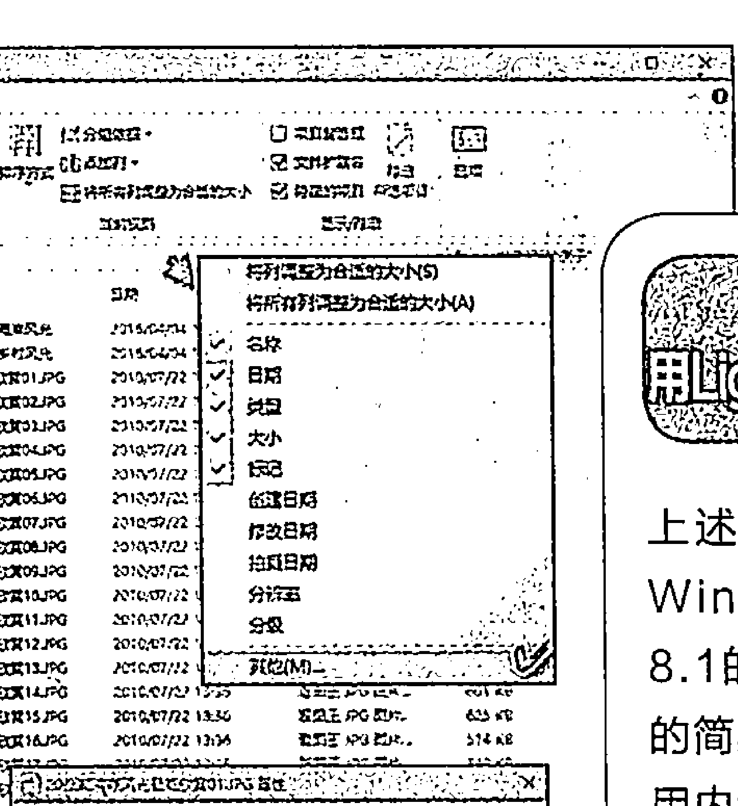

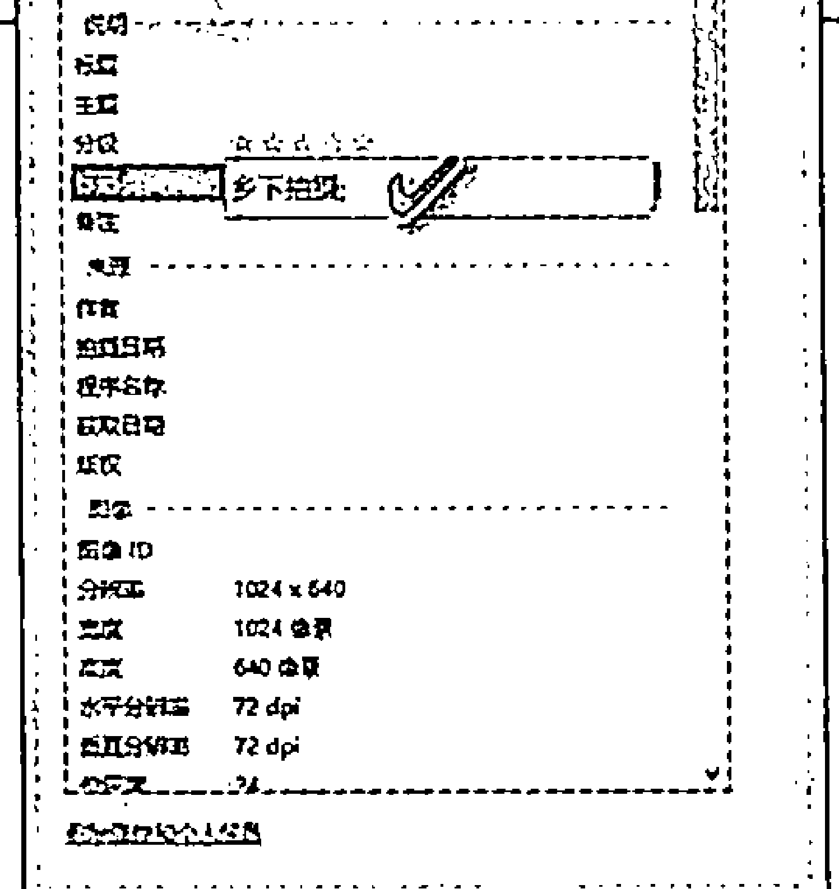

上述照片管理，仅仅是利用 Windows 10 或 Windows 8.1 的资源管理器对文件进行的简易分类管理，其核心是利用内置文件属性的分类字段及其自定义。若照片管理工作更频繁或更专业，则可以改用 Lightroom 来管理照片，该软件使用一种类似于“库”的文件系统来组织管理照片，可大大减少文件冗余和空间占用，搜索、编辑照片更加方便高效。

##### 直接调用内置参数 一键实现按需分类

在文件资源管理器中以“详细信息”方式查看照片，在文件列表标题栏上单击鼠标右键，然后点击“其他”(图1)，进入“选择详细信息”窗口进行操作。

如果要将照片中属于某个焦段拍摄的所有照片挑选出来，先在上述选择详细信息窗口中选中“焦距”选项(图2)；确定后在资源管理器详细信息列表项目中，就会出现“焦距”项目，点击该项目后照片就会自动按焦距进行排序；之后，只需将排在一起的某焦段的文件复制拷贝出来即可。

如果文件夹中的照片是不同型号的数台相机拍摄的，那么只需在属性详细信息列表中选“镜头型号”，然后在文件列表中新出现的“镜头型号”上点击，即可让同一型号镜头拍摄的照片“扎堆”。

> 小提示
类似的，我们不但对照片按EXIF各参数进行排序筛选，对于照片之外的其他类型的文件，比如音乐、幻灯片、邮件、程序等，也可以用这种方法进行分类挑选。

##### 自定义内置参数 实现个性化分类

上述过程是直接用系统内置的参数来完成排序和筛选的，参数虽多但数量总还是有限的。那么，对于之外的更多需求，比如要挑出乡下拍的、宝宝等照片，参数列表中没有，该如何选择呢？这可以通过自定义参数来完成。

拍摄照片后，在照片上单击右键选择“属性”，点击“详细信息”选项卡，然后点击“标记”字段，输入标记关键词（如“乡下拍摄”，关键词可以是多个，中间用半角分号隔开）(图3)。确定之后，在文件详细列表中按前述方法以“标记”字段进行排序，这样所有“乡下拍摄”的照片就会排列在一起，将它们拷贝出来即可。

若要从一堆照片中挑出爸爸、妈妈、宝宝的照片，方法也是如此。只需在照片标记字段中输入男或女，以及爸爸、妈妈或宝宝的标记，然后按“标记”排序，就可以完成个性化的人物照片挑选。

#### 用 Lightroom 管理照片更专业

#### 需求多样化 Windows10窗口布局步步高

文|樱子

除了全屏游戏的时候，在日常使用电脑时，相信大家都不会只打开一个窗口。以笔者为例，看着视频、浏览网页、刷着微博，没事再翻翻Windows设置或文件是常有的事情。如何管理这些摆在“桌面”上的内容，就要考验大家对Windows 10有多么了解了。

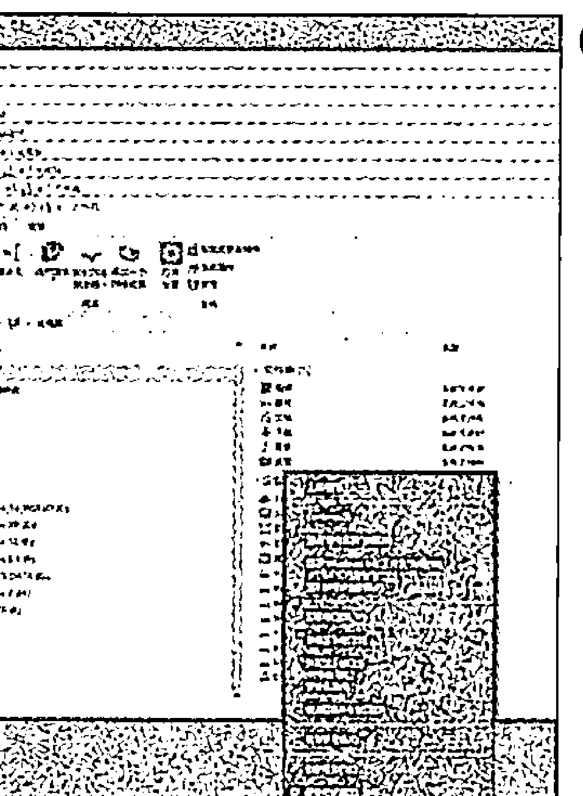

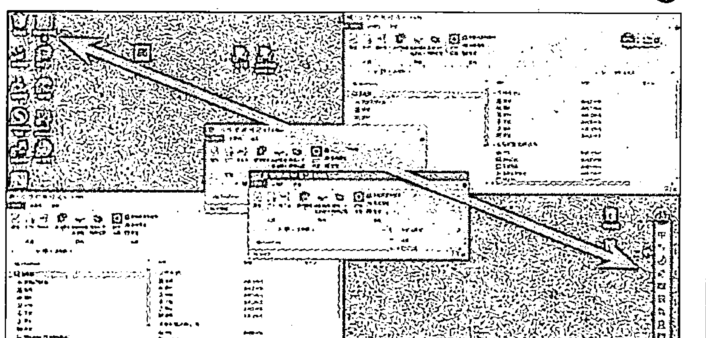

##### 少量工作窗口——单桌面的多窗口布局

###### 用任务栏快捷命令改变布局

通过在任务栏空白处单击右键，在层叠、堆叠、并排显示窗口等方式中进行选择，可非常方便地将当前桌面上打开的窗口进行自动排布（图1）。其中的堆叠显示和并排显示，虽然都是按照横竖对齐的方式排列窗口，但堆叠显示会在纵向安排更多的窗口，而并排显示则会在横向上安排更多的窗口。例如共有12个窗口，堆叠显示会显示四行三列，而并排显示则会显示三行四列。

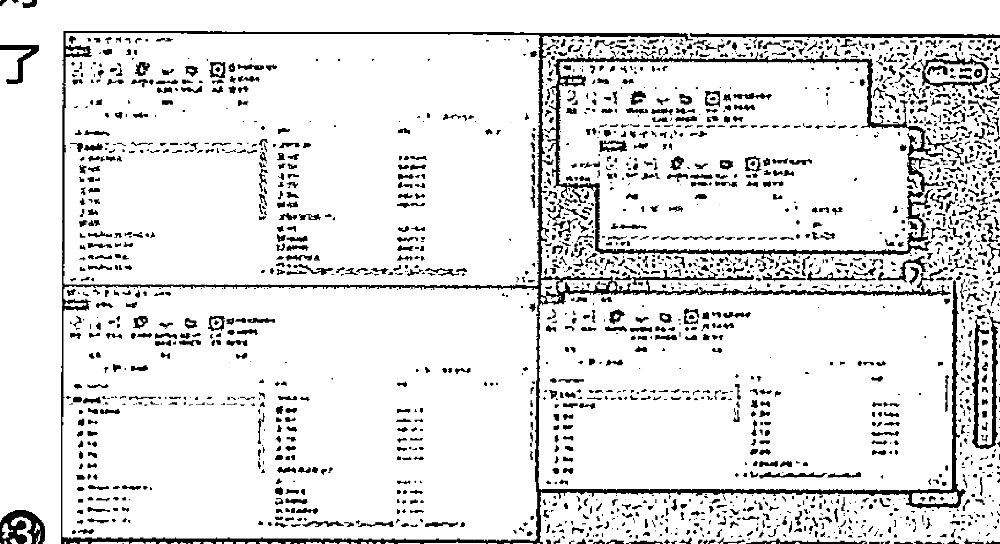

> 在系统“设置”窗口“系统”项下的“多任务”设置窗口中，若将“当我调整某个贴靠窗口的大小时，也调整任何相邻贴靠窗口的大小”开关置于“开”的位置，则能够使自动排列的窗口在经过手动调整的过程中进行联动缩放（图4）。此外，若“抛”窗操作过程中的自动贴靠功能失灵，也要从该窗口的贴靠列表中进行开关设置来修复。

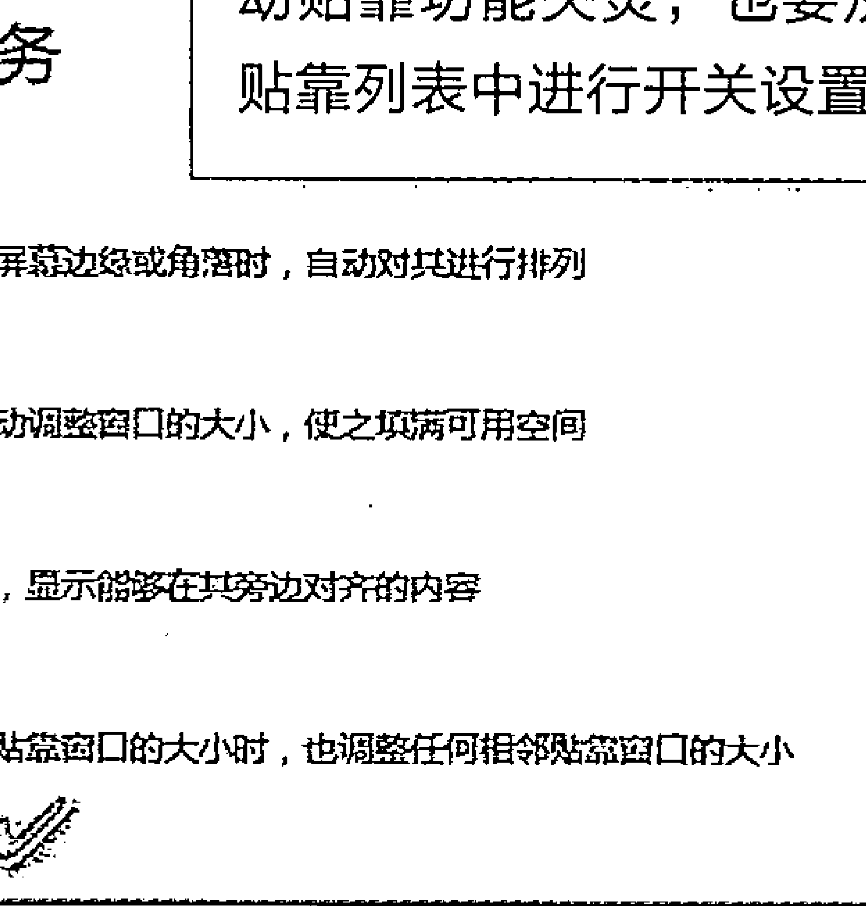

###### 鼠标手势操作改变窗口布局

用鼠标左键按下某个窗口的标题条，然后顺势向屏幕的左侧或右侧一抛，即可将屏幕自动平分为二，所抛出的窗口占据半个屏幕的位置。与此类似，若将窗口抛向屏幕的四个角，可以将屏幕平分为4等份，每个窗口各占据一个角的位置（图2）。

###### 自动与手动相结合改变窗口布局

除了用命令自动排列窗口和鼠标“抛”窗的办法外，还可以采用自动和手动相结合的方法，这种方法排布窗口更加灵活。如希望在左侧屏幕安排两个窗口做参考，而右侧屏幕的位置则采取用户手动控制窗口大小的办法安排任意窗口。这时，可分别先将两个窗口用上述办法“抛”向屏幕左上角和左下角，然后将另外的一个或多个工作窗口，用手动调节窗口位置和边框大小的办法，安排在屏幕的右侧一半区域（图3）。

> ### 小技巧
分组窗口的建立可在虚拟桌面建立之后，分别切换到不同的桌面进行。但若不同分组的桌面已经在同一个桌面打开的情况下，要想办法将其分归到不同的桌面：在窗口所在的虚拟桌面视图中，按下窗口后拖动到其他虚拟桌面图标；或右击需要转移的窗口，然后从快捷菜单中选择移动到哪个虚拟桌面。

##### 2 大量分类窗口——多桌面分类窗口的布局

如果要管理的窗口是分为不同组别的任务，例如一个任务是工程图纸处理，而另一个任务是整理硬盘中的电子书文件，还有一个任务是进行多文件的参考排版任务，这些工作的窗口若混杂在一个桌面，会显得混乱无比。这时，充分利用桌面任务栏上的两个特殊按钮，可以完成窗口的有序管理。

第一个按钮是Windows 10“任务视图”按钮。按下任务栏左侧的这个按钮，可以建立多个虚拟桌面，将同类分组任务在不同的虚拟桌面打开。进行多组任务之间的切换时，只需点击“任务视图”按钮，然后选择分类桌面即可，这样就解决了窗口太多而造成的混乱局面（图5）。

任务栏上另一个可用的窗口按钮是一个不起眼的“隐形”按钮，它位于任务栏的最右端操作中心图标的右侧，是一个竖长方形的空白按钮，名为“速览”按钮或“显示桌面”按钮。点击这个按钮，可以让桌面上打开的所有窗口遁形而露出干净桌面，不论打开的窗口有多少。但是，这个按钮也有失灵的时候，万一失灵就到系统设置窗口的“个性化→任务栏”窗口中，将“当你将鼠标移动到任务栏末端的显示桌面按钮时，使用速览预览桌面”下面的开关置于“开”的位置，就可以恢复这项功能（图6）。

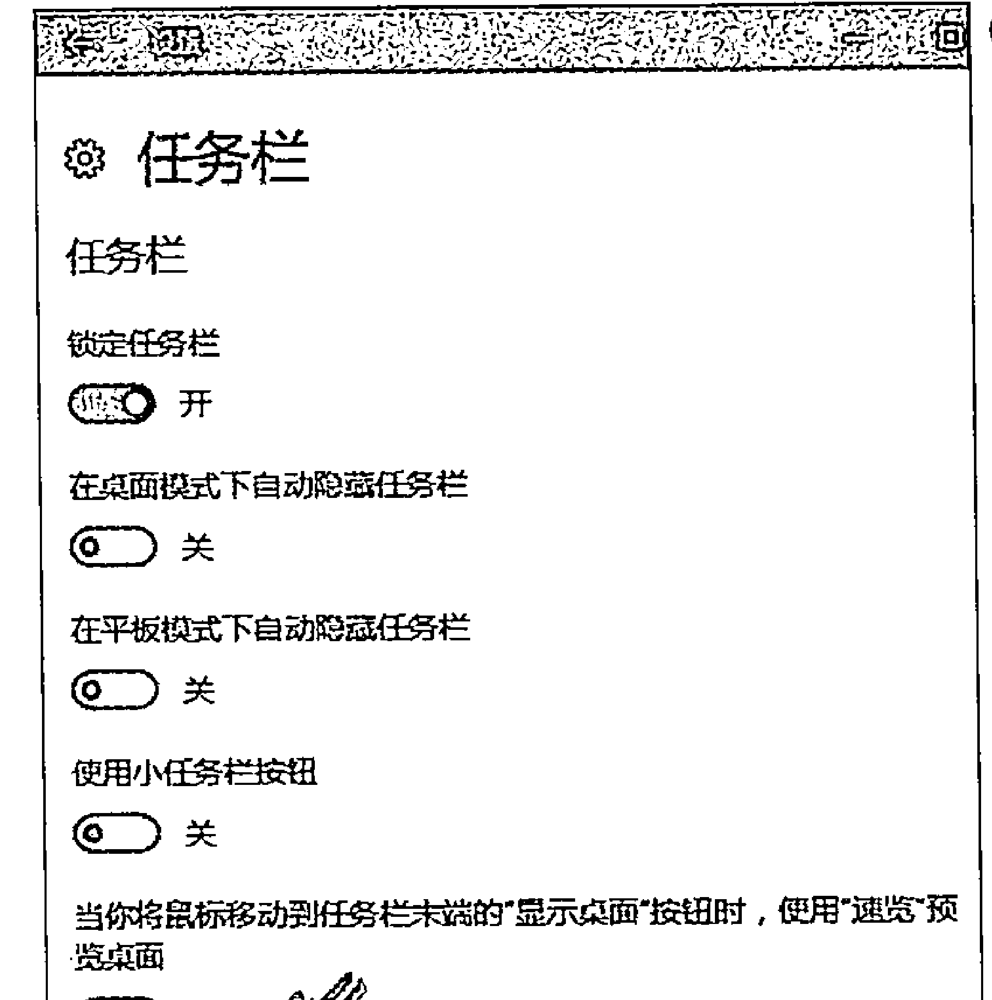

+   * **任务栏设置项**
  - 锁定任务栏：开
  - 在桌面模式下自动隐藏任务栏：关
  - 在平板模式下自动隐藏任务栏：关
  - 使用小任务栏按钮：关
  - 当你将鼠标移动到任务栏末端的“显示桌面”按钮时，使用“速览”预览桌面：开

##### 3 应对特殊需求——借助工具解决自身功能不足

有了多窗口、多桌面的管理功能，但Windows 10窗口使用仍可能会遇到其他特殊需求。例如：希望将窗口折叠为一个仅有标题栏空间的占位，这样可在屏幕上堆叠更多的窗口；还可能希望将许多窗口藏在一个任务栏菜单中，而桌面上不要任何窗口显示，这样也可以在保持窗口不关闭的情况下，省出更多的桌面空间。上述所列需求均无法用Windows 10自身功能来解决，这时就需要借助于第三方工具软件来解决。为此，可安装EXTRA BUTTONS软件，通过设置热键，控制将当前窗口折叠为一个任务条，或将窗口最小化到系统托盘菜单中（图7）。

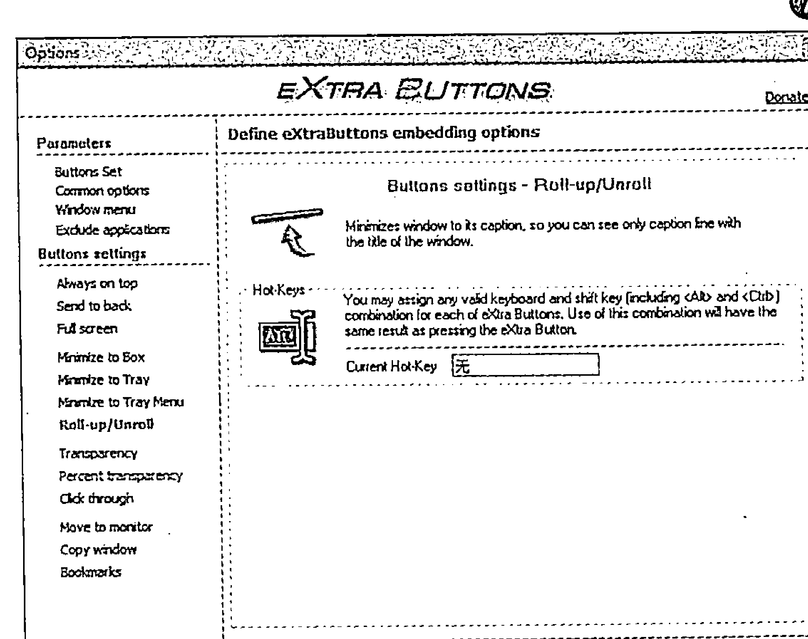

#### 启动卡顿 Windows 10游戏提速有招

文|俞木发

游戏已经成为很多朋友业余消遣的主要方式，但是很多游戏都需要大量系统资源和网络带宽。那么如何在现有条件下充分发挥系统功效？今天笔者就来分享一些方法，让Windows 10下的游戏运行更顺畅。

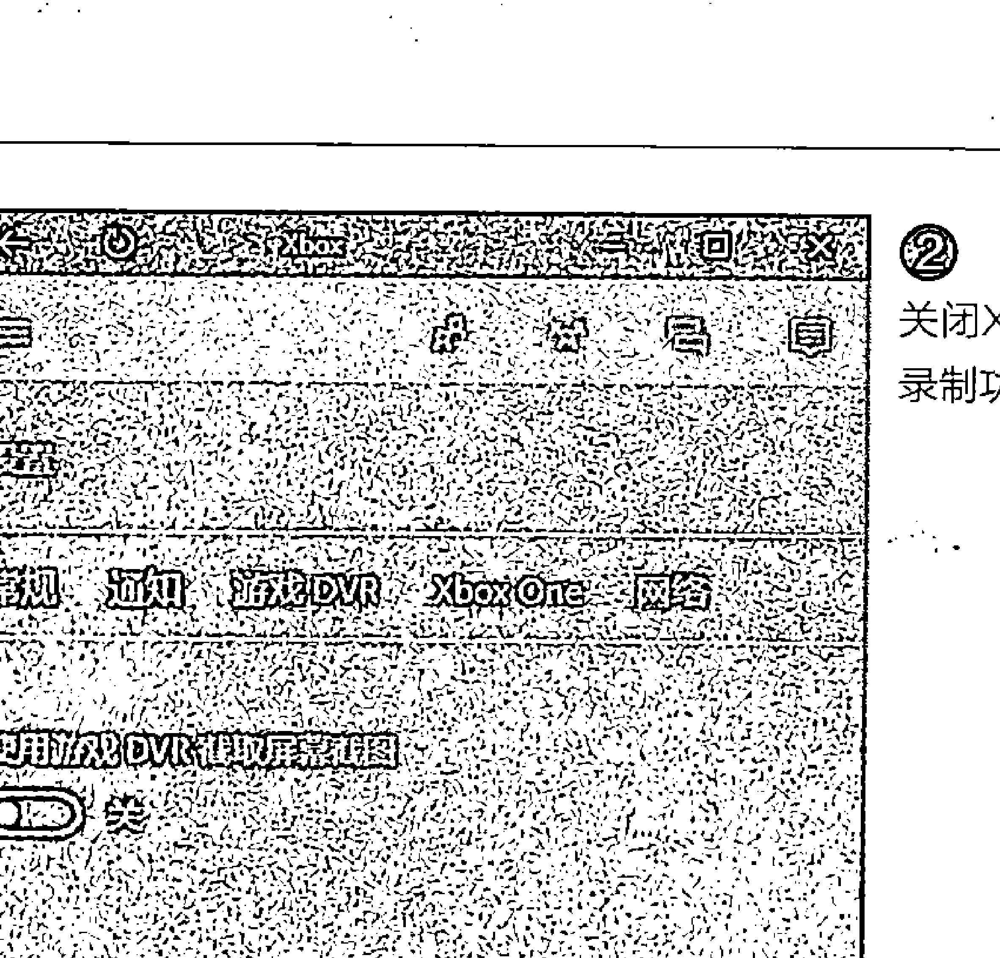

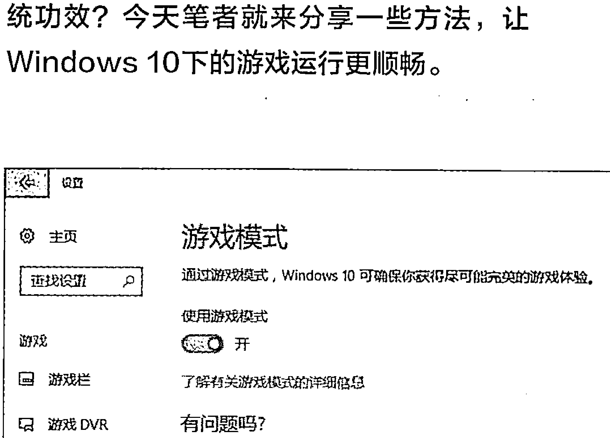

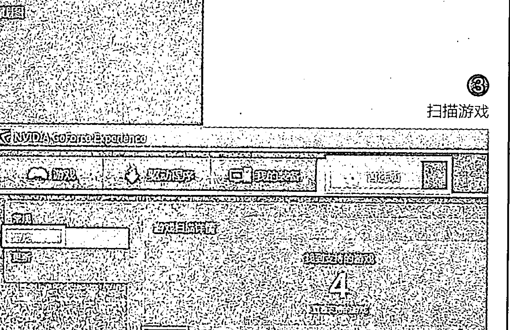

##### 1 就地取材 用好Windows 10的游戏模式

为了能够让Windows 10用户更顺畅地玩游戏，1703版Windows 10新增了“游戏模式”，我们只要在玩游戏的时候切换到该模式即可。首先将其他无关程序全部退出当前窗口，点击任务托盘的“设置→所有设置→游戏→游戏模式”，将右侧窗格的“使用游戏模式”选项设置为“开”，这样即可打开游戏模式（图1）。

完成游戏模式的开启后，Windows 10将能够分配整个CPU核心，确保使用最多的CPU和缓存资源来处理游戏相关的数据运算。当然在GPU方面也有类似优化，“游戏模式”下会优先将显存分配给游戏程序，同时将其他程序的显存需求降至最低。这样可以更好地保障游戏获得更多的系统资源。不过要注意的是，Windows 10的“游戏模式”并不会提高硬件性能，它只是对当前系统资源进行优化分配。因此原来你的电脑性能就无法适应当前游戏（比如显存容量就不符合游戏最低要求），可别指望这个模式可以提高你的游戏体验。游戏运行得流畅与否，归根结底还是要看硬件机能和游戏本身的优化。

##### 2 进阶优化 让游戏运行更流畅

如上所述，Windows 10自带的“游戏模式”只是对当前系统资源进行优化分配，而且这些优化都是在后台运行，我们不知道也看不到其具体优化方法。因此在实际游戏中，我们还可以在“游戏模式”基础上执行更多具体优化，让游戏运行更流畅。

##### 3 减少资源占用

要让游戏运行更流畅，前提当然是要让游戏获得更多的系统资源，上述“游戏模式”的主要作用也是如此，只不过它是Windows 10进行的自动优化。除此之外，我们还可以自己手动关闭Windows 10一些平常不需要经常使用，却又在后台占用大量资源的进程。比如Xbox游戏自动录制功能就是系统资源占用大户，在搜索框输入“xbox”打开应用，接着在打开的窗口中点击左侧栏“设置→游戏DVR”，然后将“使用‘游戏DVR’录制游戏剪辑和屏幕截图”和“当我玩游戏时进行后台录制”两项复选框设置为关闭，这样可以有效节省系统资源（图2）。

##### 4 显卡优化

显卡功能是影响游戏性能的一个重要因素，大家可以根据自己的显卡进行有针对性的优化。比如N卡用户可以利用官方提供的“GeForce Experience”进行游戏自动优化。启动程序后点击“首选项→游戏→添加→现在扫描”，这样程序会自动扫描本机安装的游戏。如果你安装的游戏没有扫描到，可以点击“添加”，自行添加游戏安装目录（图3）。对于程序支持优化的游戏（支持游戏列表可以登录https://www.nvidia.com/en-us/geforce/geforce-experience/games/查看）会自动出现在左侧列表，以后只要选择需要启动的游戏，游戏启动后会自动进行优化。GeForce Experience游戏优化会根据硬件配置来优化游戏中的图形设置，可以针对GPU、CPU以及显示器分辨率的各种组合而进行广泛的游戏测试，并将这些信息存储于NVIDIA云端，这样连接到NVIDIA云端可以下载专为自己的PC而量身定制的优化游戏设置。显然它的优化性能要比Windows 10自带的“游戏模式”更为专业（图4）。

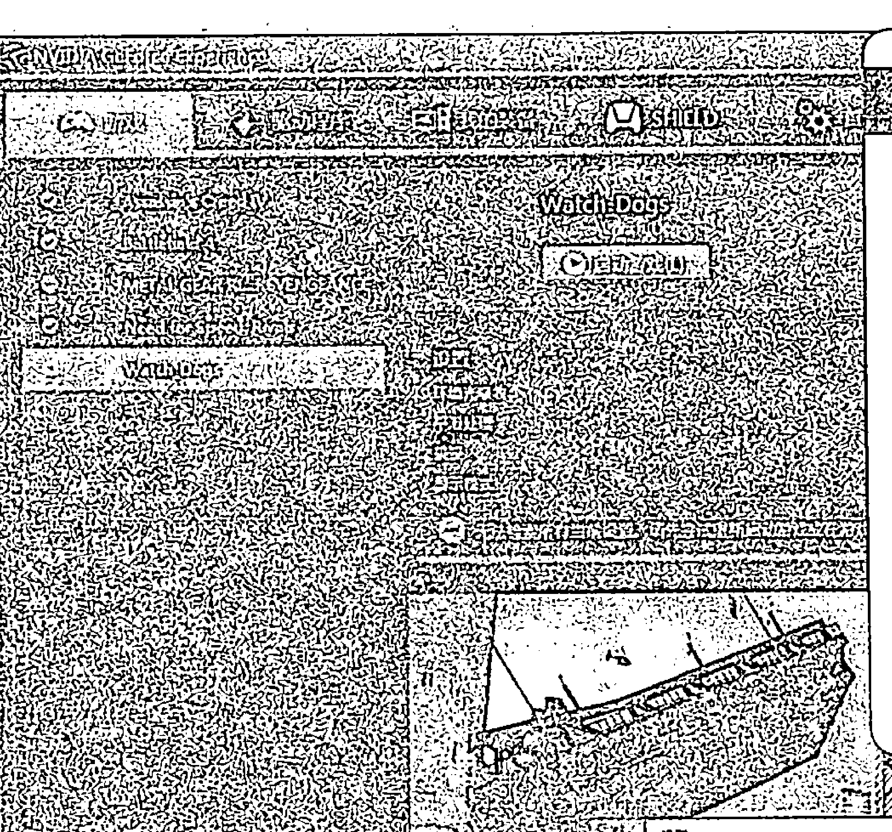

使用GeForce Experience自动优化游戏

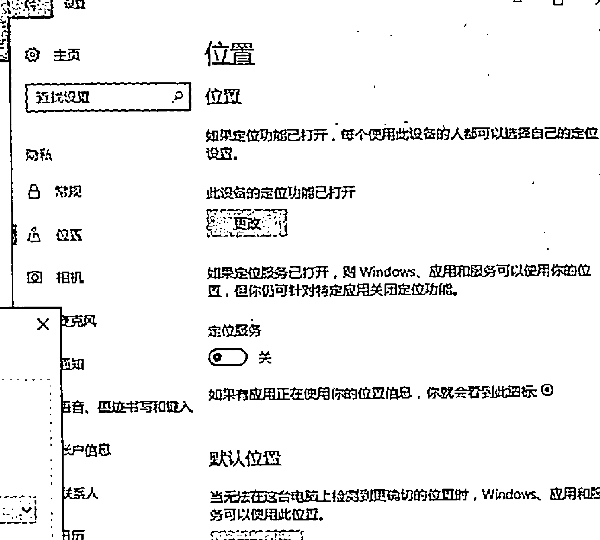

关闭定位可以减低网络延迟

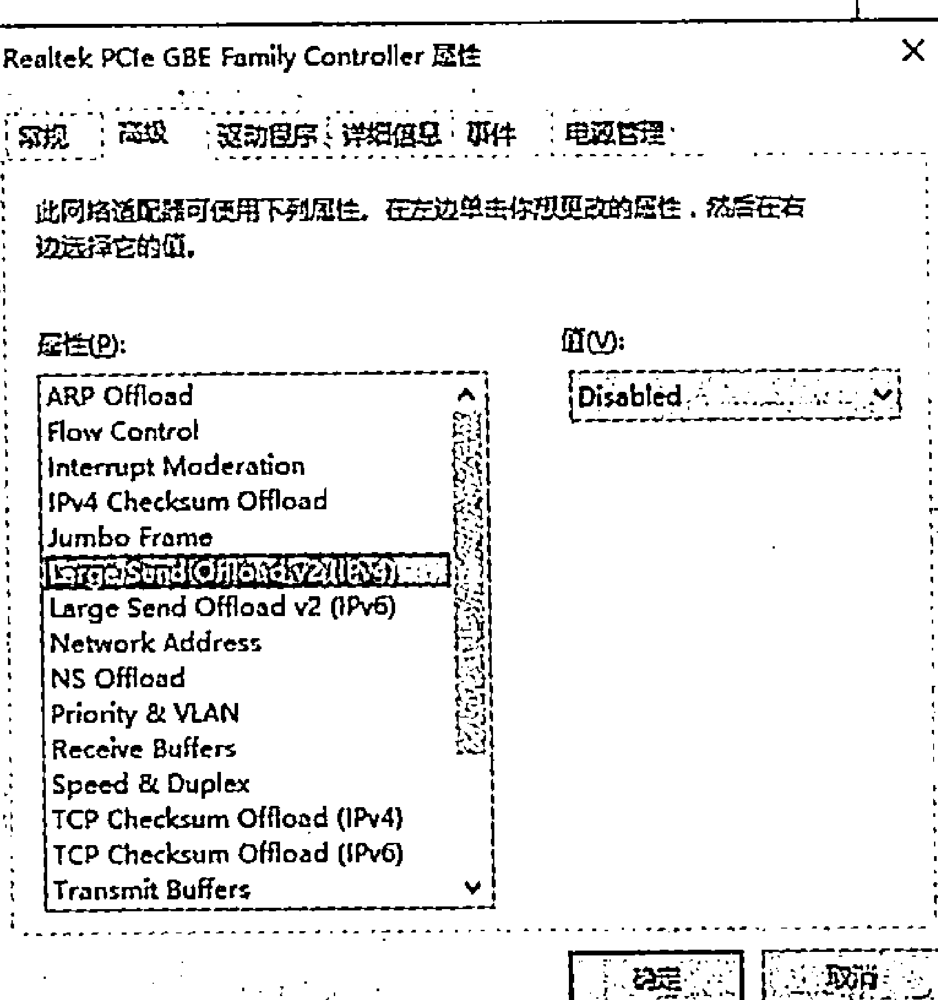

网卡高级设置优化

##### 5 网络延迟优化

对于网络游戏的流畅性，网络延迟也是影响流畅性的一个重要因素。网络延迟优化可以根据自己的实际网络情况进行优化，比如使用Wi-Fi上网的Windows 10笔记本用户，由于系统默认开启“定位功能”，这样系统会在后台不停地扫描出附近的热点列表，然后根据扫描到的热点MAC地址对比数据库实现定位，这种频繁的扫描就会导致网络出现延迟。因此这类用户可以进入“设置→隐私→位置→关闭定位服务”来解决网络延迟的问题（图5）。当然除此之外还可以对网络其他因素进行优化，比如可以优化网卡设置，打开设备管理器后找到“网络适配器→本地网卡”，右击选择“属性”，在打开的属性窗口中切换到“高级”，按照自己的实际需要进行优化。比如自己的网络上传速度慢，则可以将其中“Large Send Offload v2（IPv4）”的值设置为“Disabled”（图6）。

#### 安置Windows 10的“睡眠症”

文|樱子

睡眠功能本是Windows 10为节能而设的一项人性化体贴功能，有时却也可能会给我们带来麻烦。比如，本来是进入了睡眠状态的电脑，却在人离开后，因为某个软件的唤醒指令被唤醒；还有的情况是，一些电脑在处于自动待机或睡眠状态后，当用户执行唤醒操作时，却发生死锁的情况。为此，我们需要寻找问题的根源，解决它。

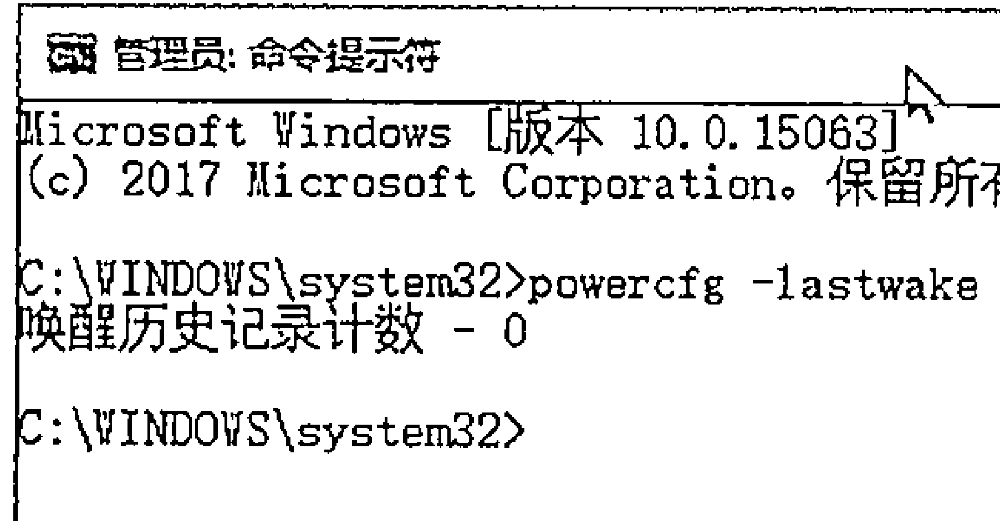

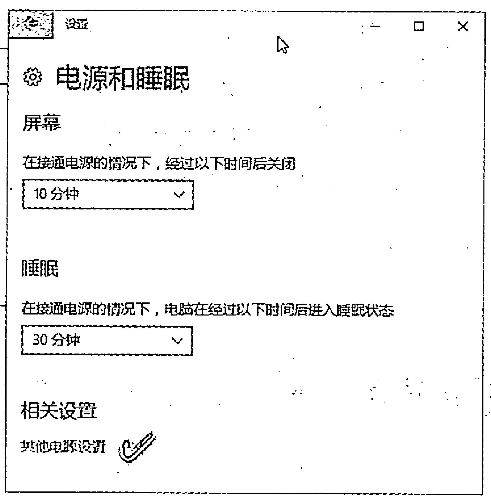

##### 01 解决睡眠后无故自动唤醒问题

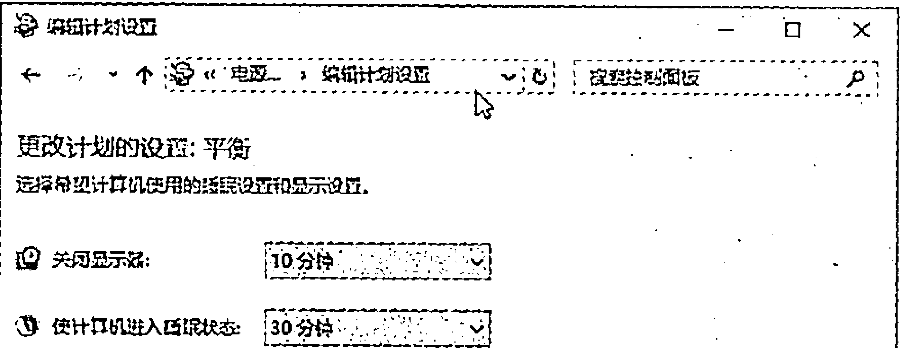

通过“关机”按钮选择“睡眠”，让电脑进入睡眠状态；或者在设定的自动睡眠时间到达后，电脑自动进入睡眠状态，这是我们最常用到的电脑节能方案。但有时我们会发现，当自己回到电脑前准备执行唤醒操作时，电脑早已在点亮运行的状态了。这种情况往往是因为其中的某个程序的唤醒指令发生作用的结果。程序唤醒睡眠的实质，是其对系统电源管理的控制。知道了这个原理，重新设置唤醒定时器即可。

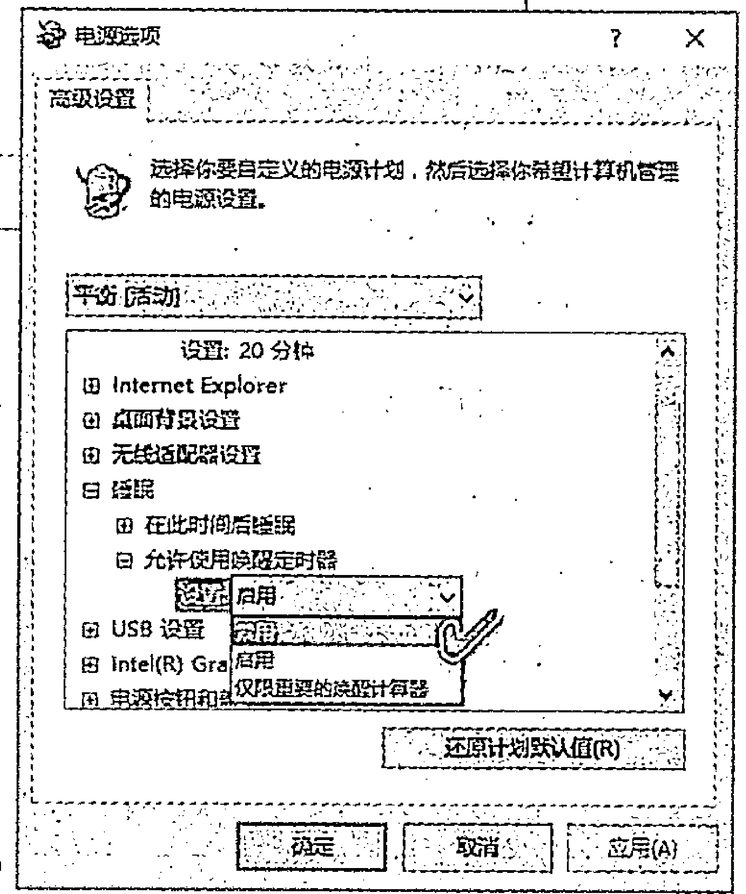

为此，首先启动管理员命令提示符窗口，然后执行下述命令：

```
powercfg -lastwake
```

执行该命令后，系统会显示唤醒历史记录计数值（图1）。如果电脑出现过自动唤醒请求，那么该计数数值一定不是0。我们可通过在控制面板的电源管理设置中，对唤醒定时器设置禁用，从而达到阻止无故唤醒的目的。在Windows 10“开始”菜单中依次选择“设置→系统→电源和睡眠”，然后在电源和睡眠窗口中选择“其他电源设置”（图2）；在电源选项窗口中选择“更改电源计划”，打开“编辑计划设置”窗口，然后点击“更改高级电源设置”文字链接（图3）；在随后打开的电源选项高级设置窗口中，依次选择“睡眠→允许使用唤醒定时器→设置：禁用”，确定即可（图4）。

经过上述设置后，任何应用程序都无法使用唤醒定时器，将电脑从睡眠状态中唤醒了。

##### 解决睡眠待机锁屏死机问题

另外一种情况是，当我们希望从电脑睡眠状态唤醒系统时，却发现键盘操作无效、鼠标点击无效，整个电脑被锁死，动弹不得。这种情况可能由多种情况引起，需要按照下述方法逐一分析或尝试解决。

软硬件电源管理功能配合不好，也可能出现无法唤醒的问题。首先从硬件方面来讲，电源管理要求电脑的电源和主板要支持ACPI规范（目前的ATX标准遵守的规范），符合此规范的电脑主板，其BIOS设置中的Power Management Setup之类的项目才能有效发挥作用，直接对系统休眠睡眠进行控制（图5）。

而Windows 10本身也会从软件层面上控制系统睡眠。由于硬件的多样性和Windows 10对硬件支持的不完善，如果软硬件之间在电源管理问题上恰巧产生冲突，就可能会出现进入节能状态后死机的问题。为此，可尝试从BIOS中将电源节能项目关闭，只让Windows 10来管理电源。

此外，软件与系统之间的冲突，也可能造成睡眠唤醒方面的问题。例如许多声卡驱动并不支持休眠，由于声卡的连续工作会造成与电源管理的冲突问题。如果是这种情况引起的，只需在欣赏音视频期间，将系统休眠或睡眠时间设得足够长即可。另外还有，在进行大型制图、程序调试等工作时，如果长时间开启运行，也可能造成睡眠唤醒死机的问题。解决的办法是，在调试期间不要开启自动睡眠功能。

如果上述情况均无法解决问题，很可能是由于硬件本身的问题所引起的。例如，主板部件出现问题可能造成睡眠方面的这种严重问题。这时，如果不希望此故障对正在进行的工作造成影响，那么可以借助于相应的工具软件来临时解决。比如，可安装DontSleep软件，防止系统进入睡眠或待机状态。DontSleep软件运行后，选择Please-Dont Sleep选项卡，然后在“阻止程序”偏好设置栏中，将待机/混合睡眠/休眠、阻止关机、注销、屏幕保护/关闭显示器等选项全部选中，然后点击“缩小到托盘”按钮即可（图6）。在执行大型图形处理、多媒体编辑、软件测试等任务的过程中，为了防止睡眠意外死机、蓝屏等情况的发生，采用DontSleep软件强行阻止一切睡眠行为的做法，可为工作上一道安全有效的保险。

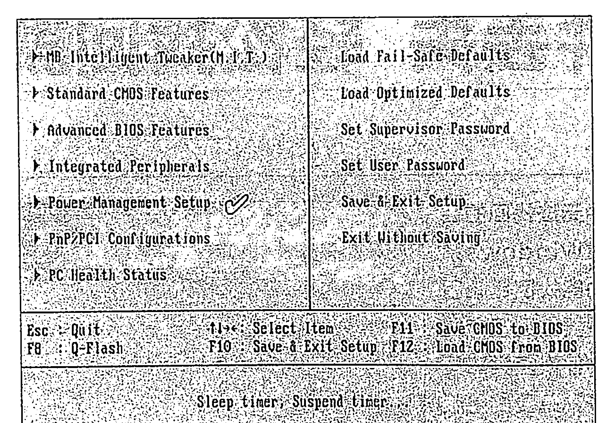

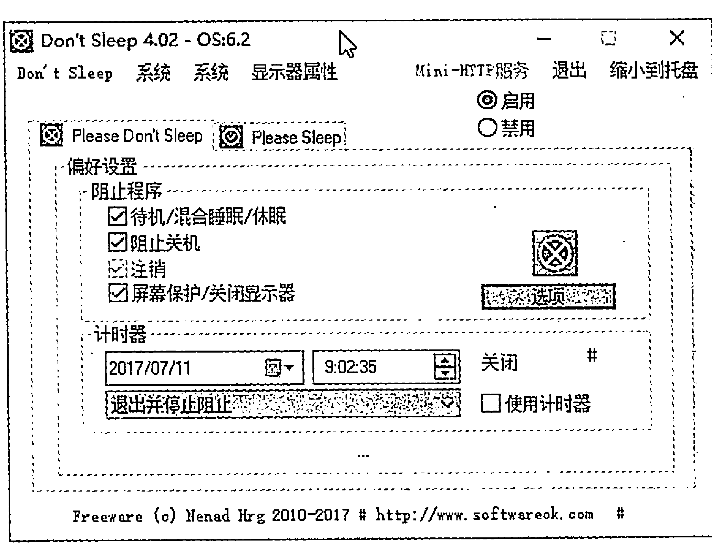

> **小提示**
>
> 顽固的系统睡眠问题也可能与系统版本的兼容性有关，可待更新的系统版本出来后，尝试升级后看问题是否可得到解决。必须注意，睡眠或锁屏引起的死机问题，可能就会造成正在进行的工作资料的丢失。因此，防患于未然是最必须要做的。在锁屏或睡眠之前，最好先将工作任务作存盘操作，或给资料设置必要的自动备份任务。这样就能杜绝因意外睡眠死机所造成的损失。对于已经发生过这类情况的电脑，更应该做好资料的存盘和备份工作。

#### 系统保安 锁住关键设置

文|樱子

虽然Windows 10的控制面板和一些重要设置藏得比较隐蔽，但有时也会由于第三方工具的干扰或他人在不经意间的操作而改动设置。为了安全起见，如果能锁定控制面板和应用设置等重要的安全操作，就可以免去对系统的意外修改。

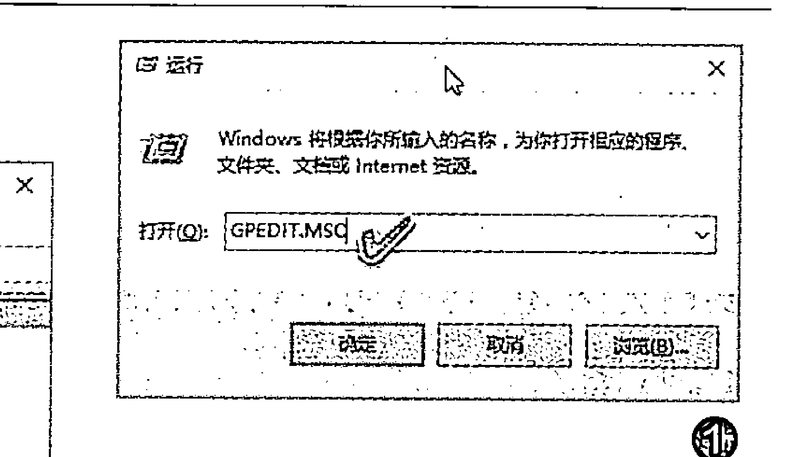

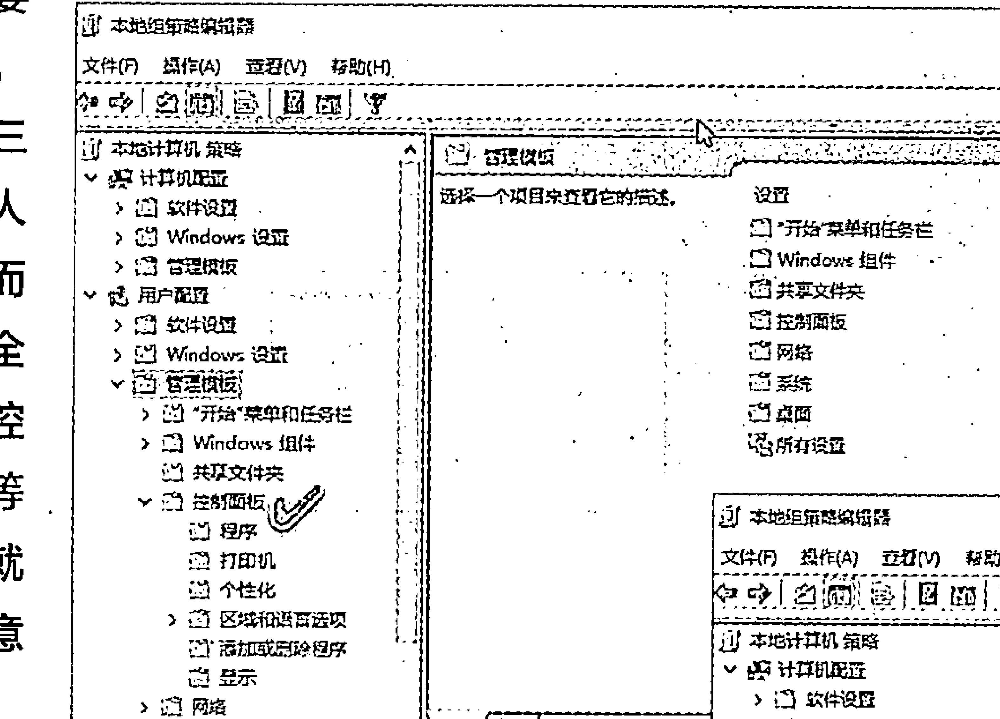

##### 1 企业团体 重要设置轻松安全锁定

对于使用Windows 10专业版、教育版或企业版的用户，由于在上述Windows系统中，本身提供组策略编辑器的使用权限，因此可以方便地借助于本地组策略编辑功能，对系统控制面板和PC重要设置进行限制。

先按下Win+R组合键，激活“运行”窗口，输入GPEDIT.MSC命令并回车运行（图1）；随后会启动本地组策略编辑器，在编辑器的左侧窗格中，依次选择“本地计算机策略→用户配置→管理模板→控制面板”（图2）；接下来在右侧窗格中，找到“禁止访问控制面板和PC设置”一项，用鼠标双击该项（图3）；最后，在配置窗口中选择“已启用”选项，点击“应用”按钮或“确定”按钮使设置生效（图4）。

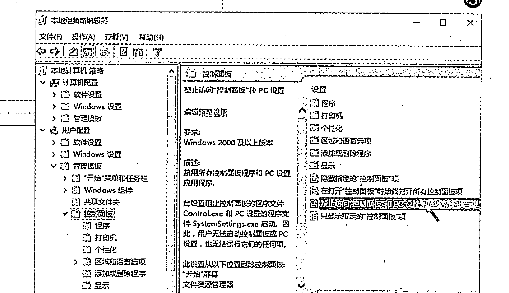

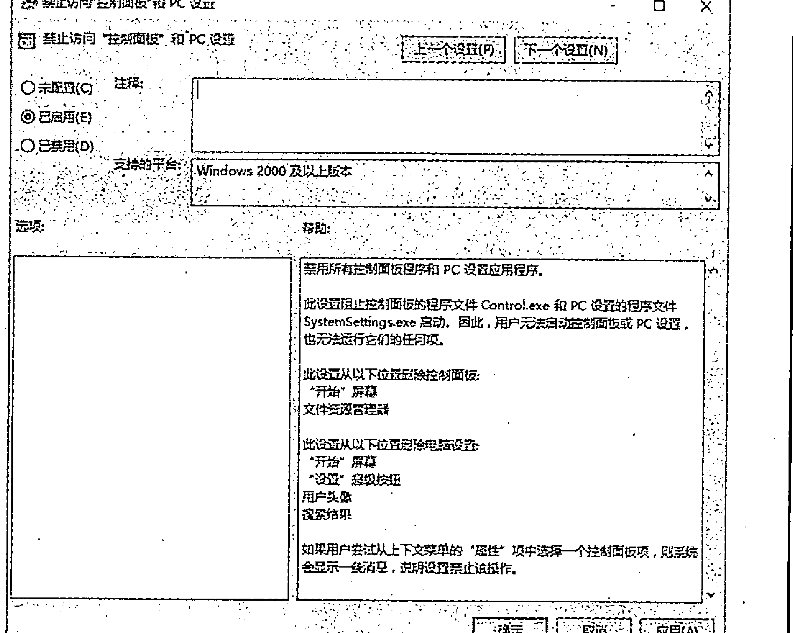

执行如上操作后，在“开始”屏幕或“开始”菜单中，电脑设置操作将被禁用。此外，如果在一些系统组件的属性中，关联了系统设置或控制面板的项目，在选择该项目进入系统设置或控制面板时，系统也会给出禁止操作的提示。在试图打开控制面板时，电脑会提示“本次操作由于这台计算机的限制而被取消。请与你的系统管理员联系。”（图5）。此外，试图打开应用设置的操作也不能执行。由于系统控制面板和设置是由Control.exe和SystemSettings.exe两个程序分别控制的，而上述组策略修改正是禁止了这两个程序的运行，因此用户即便找到这两个关键程序，也无法运行。

##### 2 家庭用户 锁定重要设置也有妙方

如果正在使用的系统为Windows 10家庭版，家长希望控制孩子不能随意改动电脑重要设置，则上述方法行不通。由于此版本不支持组策略控制操作，管理员用户只能借助于注册表编辑功能来解决上述问题。

按下Win+R组合键激活“运行”对话框，输入REGEDIT命令并回车，启动注册表编辑器。依次定位到“HKEY_CURRENT_USER\Software\Microsoft\Windows\CurrentVersion\Policies\Explorer”分支（图6）。随后在右侧窗格中，用鼠标右键菜单新建一个DWORD（32位）值，右键单击该值，将其重命名为NoControlPanel（图7）。双击NoControlPanel，将窗口中的“数值数据”改为1，点击“确定”（图8）。

##### 3 借用防沉迷工具 锁住重要设置权限

上述两种控制方法适用于以管理员的身份控制普通标准账户之用，例如家长控制孩子、网管控制员工等场合。若只以管理员账户一种方式使用，则明白操作的人完全可以用反向操作的方法，解除上述禁用操作。因此，这种情况下需要另想办法，可借助“防止上网沉迷系统”之类的软件来实现系统设置的控制。

软件默认会提供一组管理密码，运行后可进入设置将软件管理密码改为用户自己的管理密码（图9）。之后，在软件中可对注册表、任务管理器、安全模式等系统重要设置进行选择性屏蔽。关机重启后，电脑自动进入设定的锁定状态。若需要卸载此软件，将无法启动卸载程序，且由于任务管理器被禁用，因此用进程中端的办法停止该软件也是徒劳。如果要卸载该软件，只能通过管理密码进入软件后解禁系统相关设置，然后方能卸载。

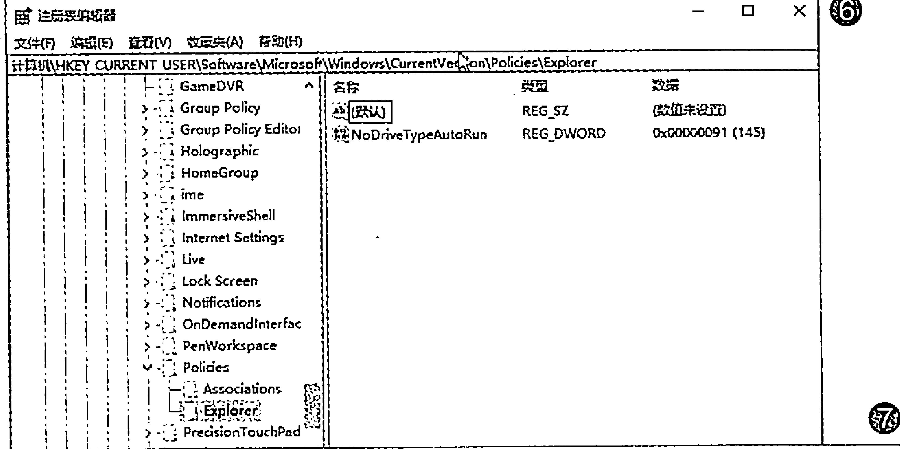

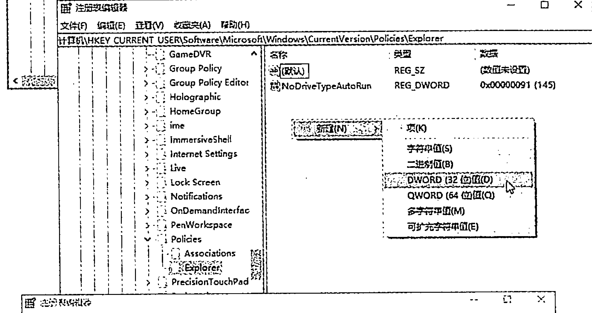

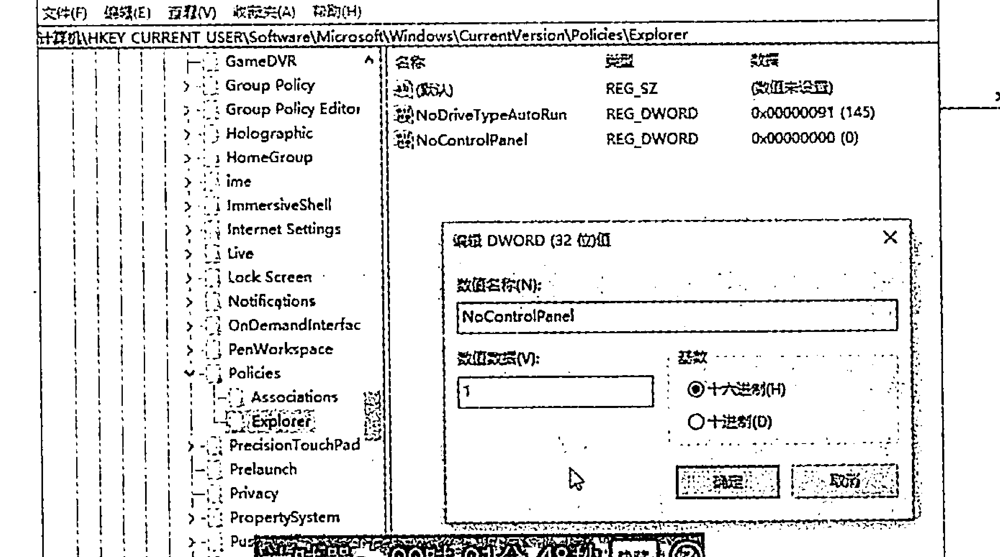

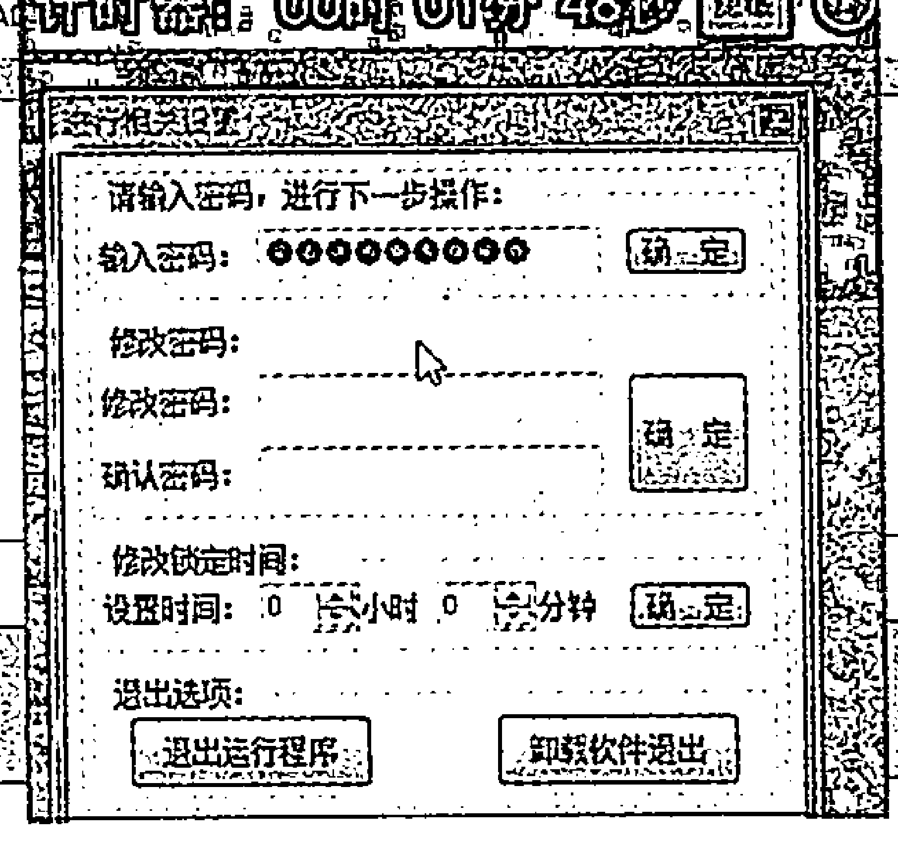

#### 文件丢失 轻松找回就靠它

文|樱子

从回收站中无法找回的丢失文件，靠Windows系统本身的功能找回比较困难，往往需要借助于专业工具。但文件恢复类工具收费版居多，免费试用版多夹杂广告信息，且又有文件恢复大小和数量等限制。一款小巧的免费文件恢复工具Wise Data Recovery出人意外，能够在分区遭遇意外、硬盘格式化后、系统崩溃或移动设备数据丢失等情况发生后，对丢失的文件进行恢复，使用非常方便。

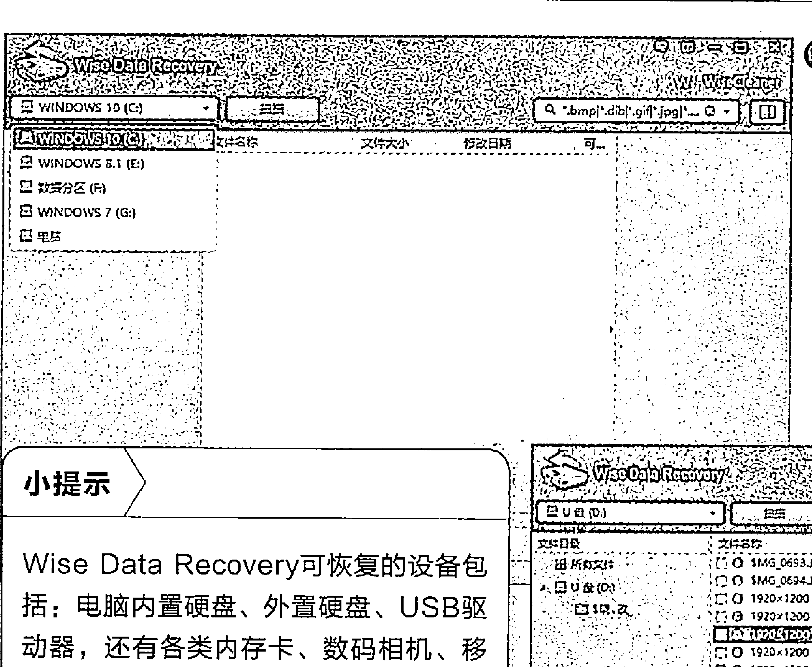

小提示：Wise Data Recovery可恢复的设备包括：电脑内置硬盘、外置硬盘、USB驱动器，还有各类内存卡、数码相机、移动电话、音乐播放器和其他存储媒介。这些设备中丢失的文件，无论是被操作系统永久删除且标记为空闲空间的，还是意外莫名丢失的，都可以尝试用它来恢复。

小提示：Wise Data Recovery软件有其对应的绿色便携版（http://downloads.wisecleaner.com/soft/WDR.zip），建议将该软件直接拷入闪存盘（最好是带启动功能的WinPE盘）收藏备用。这样，如果系统崩溃，可直接利用闪存盘启动进行文件恢复，省了另找电脑下载安装软件处理的繁琐。

首先将要恢复的介质接入电脑，启动Wise Data Recovery，点击窗口右上角的驱动器列表，点选要恢复文件所在的盘符，若需要按类搜索恢复，在右上角的关键词列表中输入文件类型，然后点击“扫描”按钮进行扫描（图1）。通盘搜索则直接点击“扫描”按钮即可。

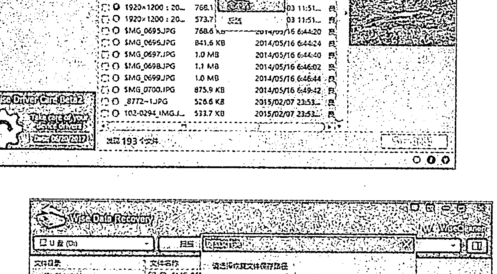

扫描结束后，在扫描结果文件窗口中，文件前会标有三种颜色的圆形图标，分别表示文件的三种可恢复程度：其中红色为几乎不可恢复，黄色为部分可恢复，绿色为可完全恢复。选择文件恢复时，在文件名前点选复选框，或在文件列表上单击鼠标右键，进行相应的选择处理，之后窗口右下角的“恢复”按钮会被激活并亮起（图2）。点击该恢复按钮，然后选择恢复的目标存储器或设备的文件夹，这里要注意存放恢复文件的目标设备须选择与原始文件所在的设备不能为同一设备（图3）。

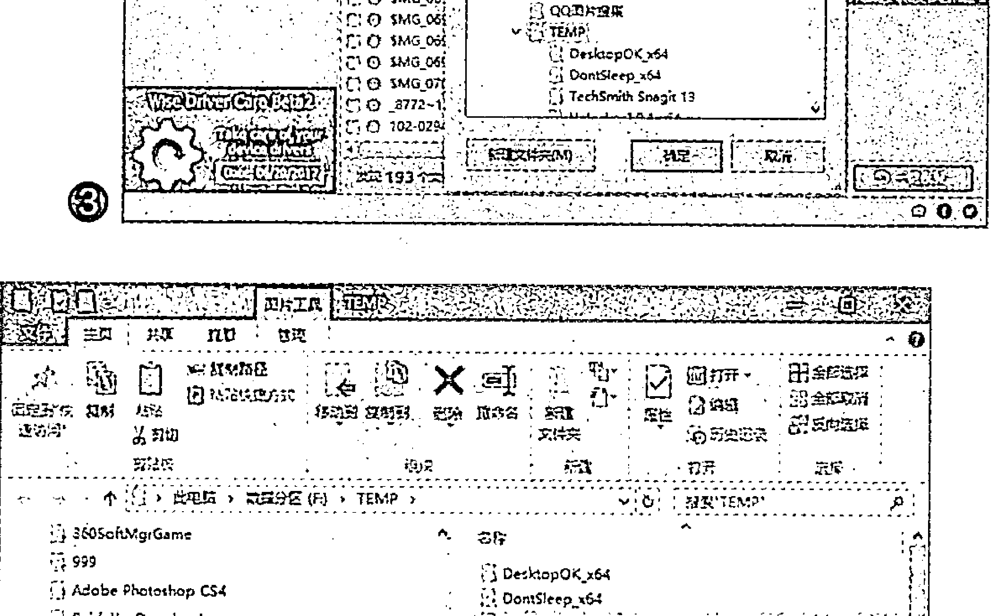

当提示文件数据已经被恢复后，点击“确定”按钮，软件会自动打开恢复文件所在的目标窗口，从这里就可以获取恢复出来的文件了（图4）。试试看，是不是你丢失的文件呢？

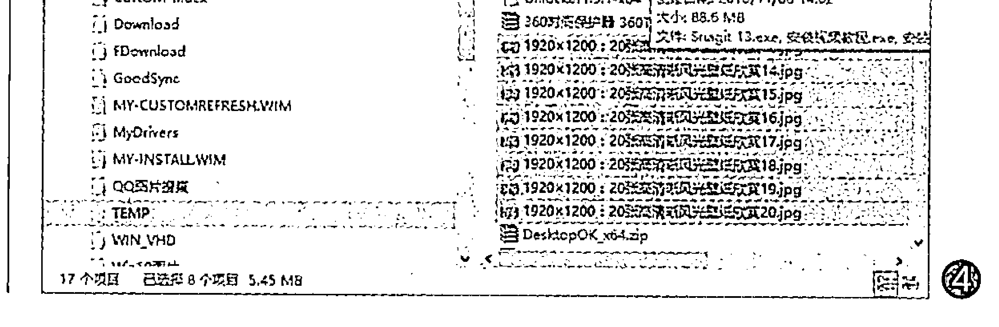

#### 电源管理 我要更随心

文|樱子

Windows 10开始菜单的电源按钮很方便，但若要控制定时执行各种电源操作，还需要编制电源管理计划，操作起来就比较麻烦。借助于Wise Auto Shutdown这一小软件管理Windows电源，关机、注销、重启、睡眠等操作，将可以按自己的计划随心所欲地进行。

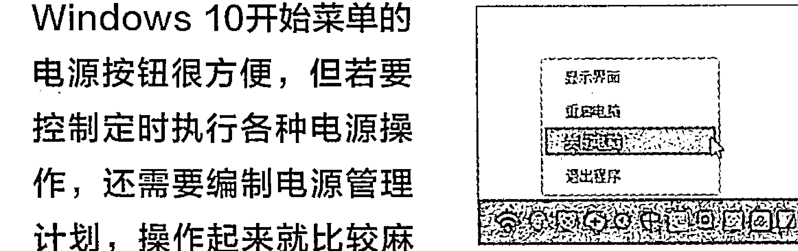

小提示
选中设置窗口左下角的“在执行任务前5分钟提醒我”复选框，可弹窗提前提醒，届时若有改变计划的需要，还可通过“取消任务”按钮取消计划。

##### 1 托盘关机重启 电源管理更顺手

对于最常用的关机和重启命令，可将其搬到系统托盘来执行。运行Wise Auto Shutdown，系统托盘驻留程序图标，右键单击该图标后选择“重启电脑”或“关闭电脑”，就能执行最常用的两项电源管理操作（图1）。
如果需要指定更为准确的定时电源计划，点击“显示界面”项进入程序主界面设置。

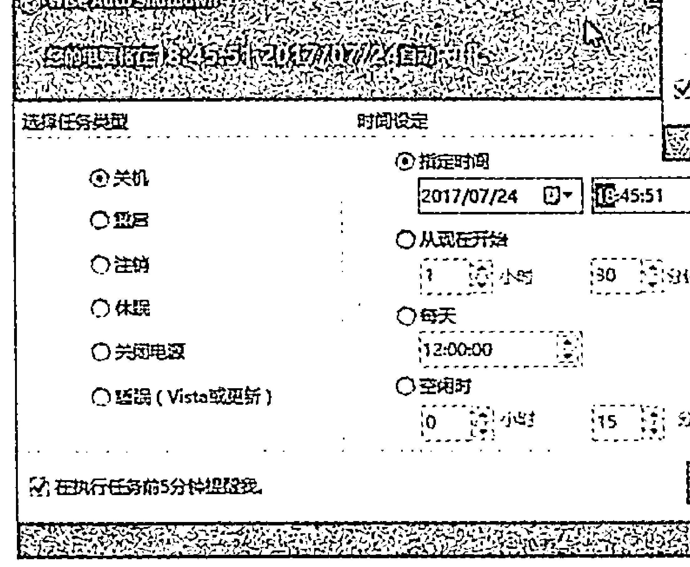

##### 2 定时关机 操作再没那么复杂

之前如果我们希望在某一时刻定时关机，往往需要编辑系统定时计划任务，调用系统关机命令，过程比较复杂。现在，只需打开Wise Auto Shutdown设置界面，选择任务类型为“关机”，然后在右侧指定关机的具体时间，最后点击“开始任务”按钮即可（图2）。

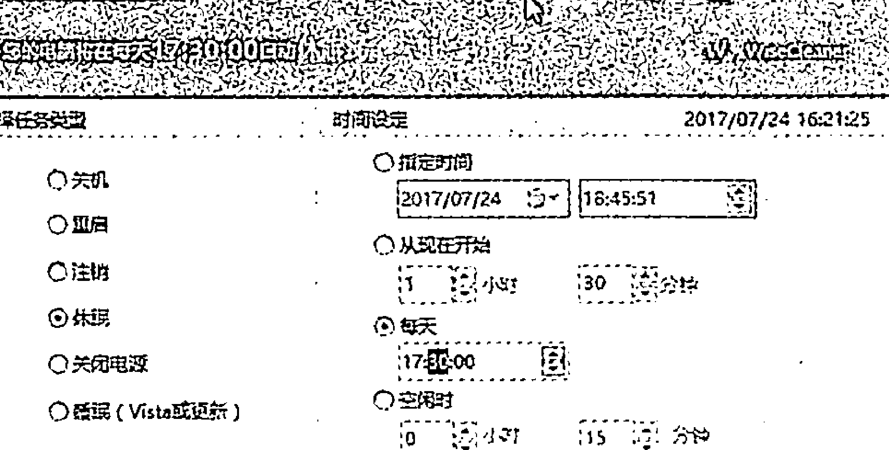

小提示
若想免除安装软件的麻烦，可使用官方Portable便携版（下载链接：http://downloads.wisecleaner.com/soft/WAS.zip），直接运行主程序WiseAutoShutdown.exe执行电源管理操作（图4）。

##### 3 自动执行定时周期性休眠

如果某员工每天下午3点外出办事，但下班前还有同事要访问其电脑中的共享资源，而该员工未完成且未关闭的任务还不允许采用自动关机的方式来管理电源，怎么办？
这时，可选择任务类型为“休眠”，然后设定周期为“每天”，并设置时间为下午17点30分下班时（图3）。这样，每天下班时间一到，电脑就自动进入休眠状态了。

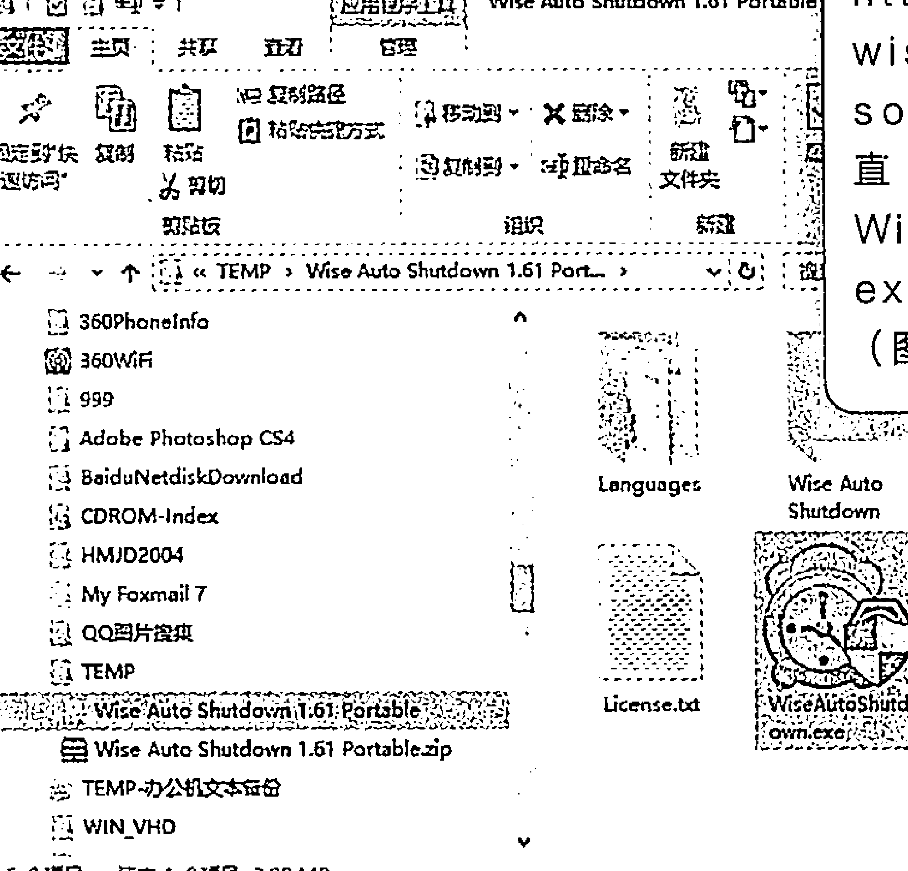

除了上述情况外，还可以通过选择任务并设定“空闲时”参数，设定当电脑空闲时，自动进入关机、休眠、睡眠等状态。

#### 壁纸误操作“免变”四法

文|樱子

在使用Windows的过程中，经常会涉及到图片操作。图片右键菜单中的“编辑”和“设为桌面壁纸”两个选项紧挨在一起，往往一不小心就会将当前图片设置成了桌面壁纸，这样就破坏了原本设好的桌面背景图片或动态背景图片演示。如何防止这种情况的发生呢？

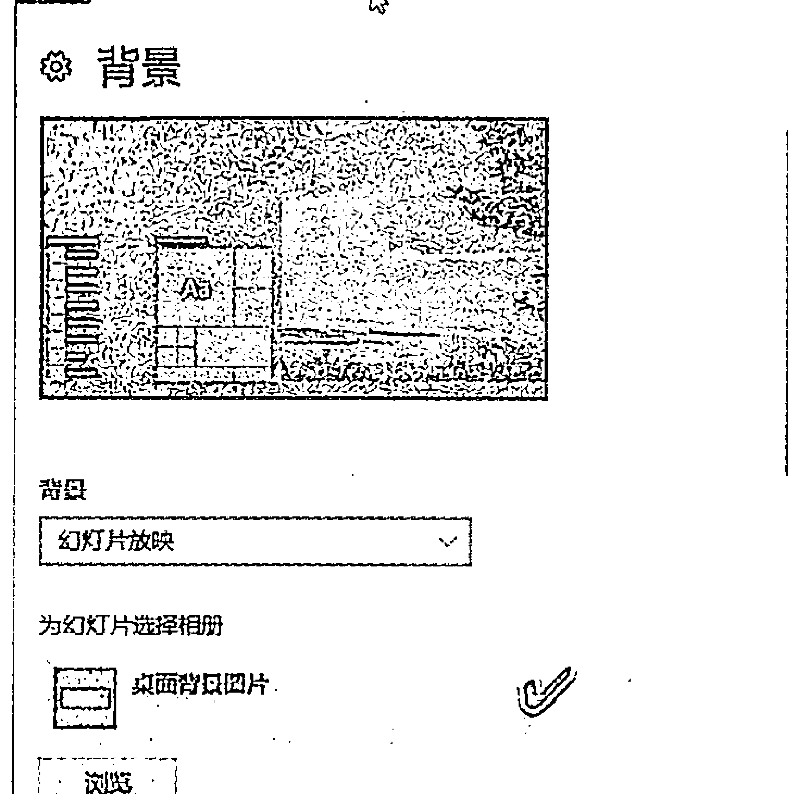

##### 弄乱桌面不怕 依靠系统恢复

在Windows 10系统中，利用定制个性化幻灯片目录的方法，可快速恢复桌面背景。

先在自己的电脑中确定一个固定的壁纸文件夹，例如“桌面背景图片”，将自己心仪的所有壁纸存放在这个文件夹内（一张或多张）；然后利用系统的“设置”，设置背景显示形式为“幻灯片放映”，用“浏览”按钮将放映文件夹指向自己的个性化图片文件夹（图1）。

如果不小心弄乱了桌面，只需向Cortana发出“背景设置”命令，在反馈结果中点击“背景设置”项（图2），随后点击“浏览”按钮指定自己的“桌面背景图片”文件夹，即可恢复自己熟悉的桌面。

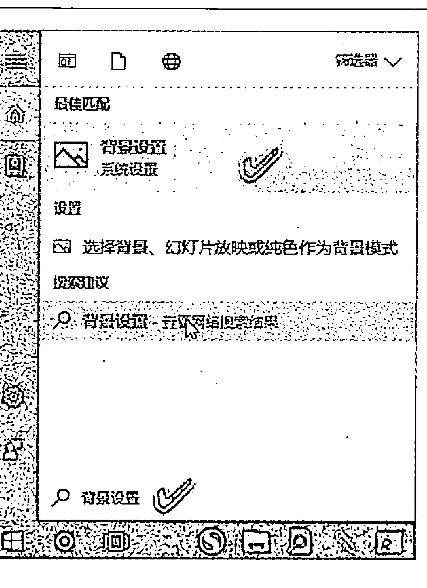

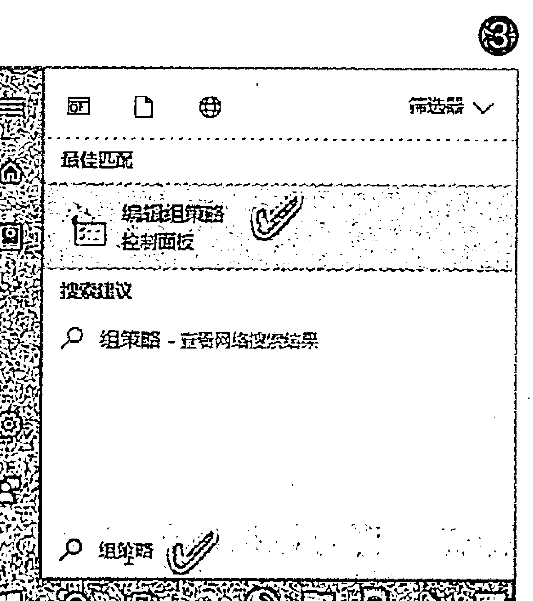

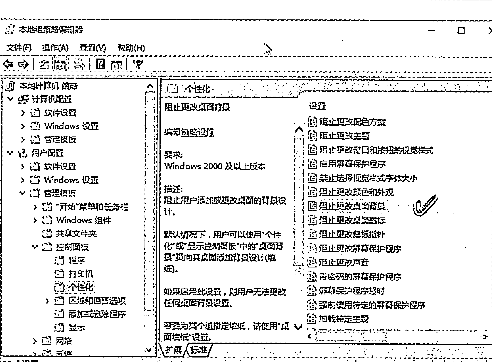

##### 专业用户 改变策略锁定桌面

如果电脑系统为Windows 10专业版、企业版或教育版，由于这些版本均支持组策略操作控制，因此可以用修改组策略的方法，设置桌面背景禁改策略，让桌面壁纸修改误操作变得无效。

向Cortana发出“组策略”请求，点击反馈结果中的“编辑组策略”控制面板项（图3）；在随后打开的“本地组策略编辑器”中，从左侧窗格中的“本地计算机策略”下，依次点击“用户配置→管理模板→控制面板→个性化”，然后点击定位到右侧窗格中的“阻止更改桌面背景”项（图4）；双击该项，在随后出现的配置窗口中，选择“已启用”单选钮，点击“应用”或“确定”使阻止策略生效（图5）。

130 电脑爱好者 2017年合订本（三）

##### 3 家庭用户 修改键值锁定桌面

对于家庭版Windows 10用户，由于系统对组策略的禁用，因此无法用上述组策略编辑功能，但可以通过注册表修改的方法禁用对桌面背景的修改。

同时按下Win键与R键启动“运行”对话框，运行REGEDIT命令启动注册表编辑器（图6）。在注册表编辑器窗口左侧，依次定位到“计算机\HKEY_CURRENT_USER\Software\Microsoft\Windows\CurrentVersion\Policies”分支，在Policies分支右侧窗格的空白处，单击右键并选择“新建→项”新建一个子项（图7），将新建子项命名为“ActiveDesktop”。选择新建的ActiveDesktop项，在右侧窗格中单击右键，选择新建一个DWORD(32位)值，将新建的值命名为“NoChangingWallPaper”；双击新建的NoChangingWallPaper值，将其数值数据更改为1（图8）。这样，在重启系统或下次登录系统后，桌面背景图片就被锁定无法修改了。

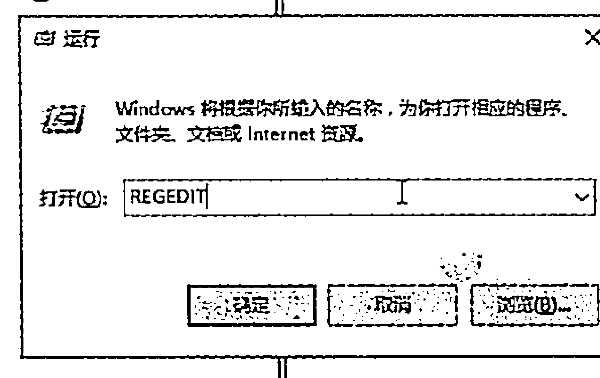

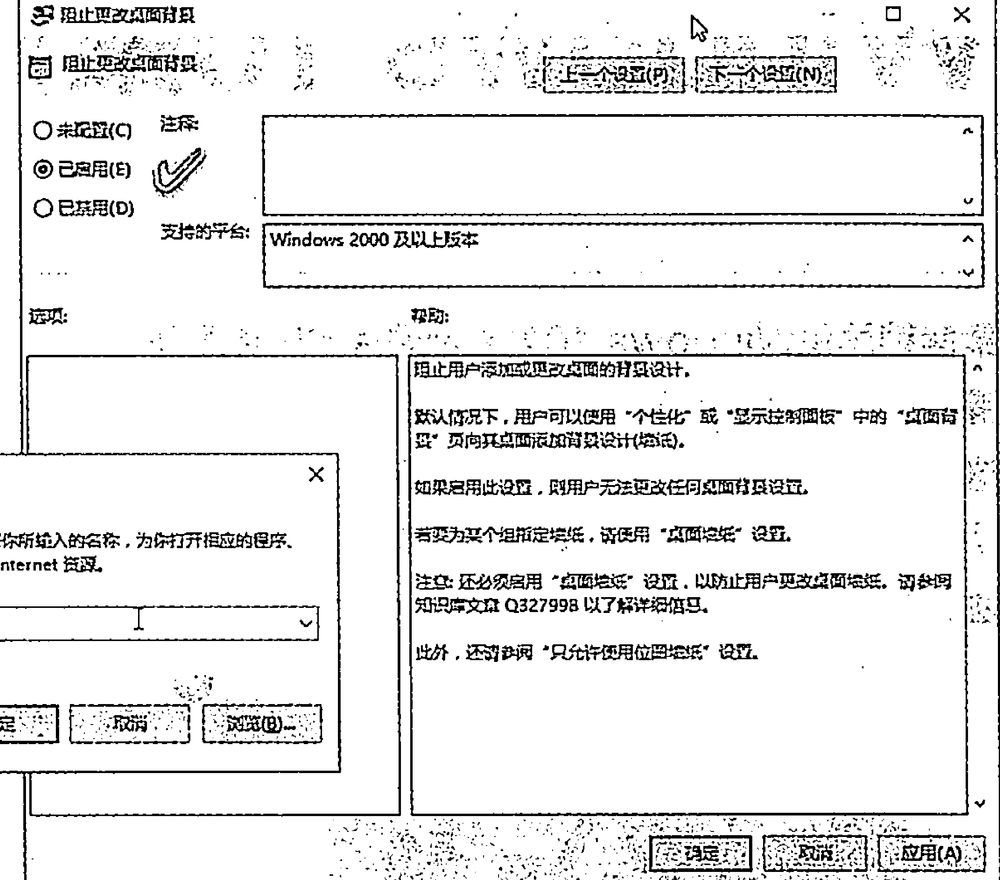

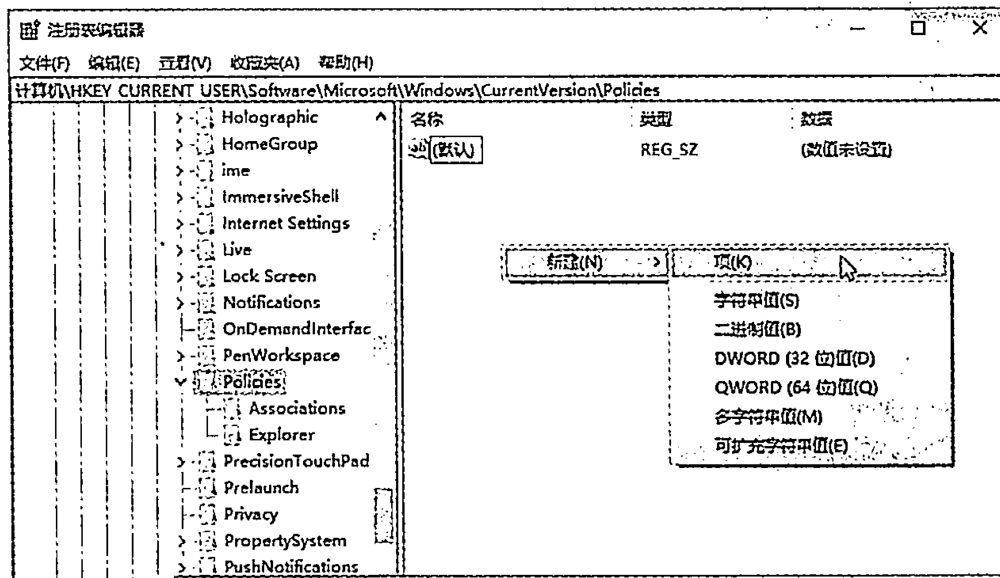

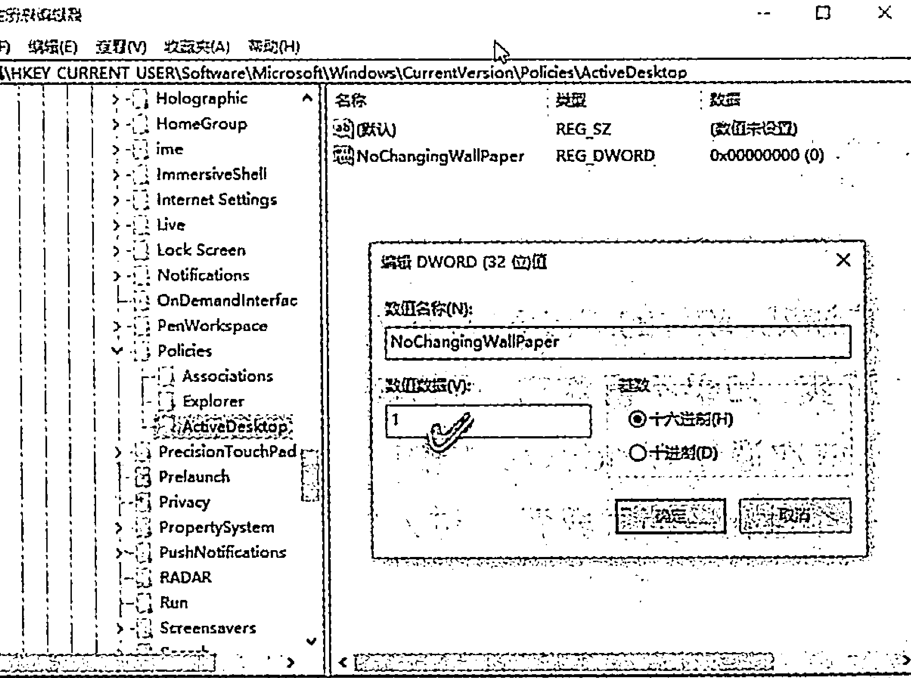

> > **小提示**
>
> 若要解除背景锁定，只需将上述ActiveDesktop注册表项直接删除即可。

##### 4 不靠系统功能 第三方工具解决

上述利用系统功能恢复壁纸的方法稍显复杂，而用组策略或注册表修改的方法要动用系统设置，若误操作会带来其他问题。若改用第三方软件管理壁纸，设置好自己的壁纸目录，一旦出现误操作而更换了壁纸，只需进入壁纸软件，然后一键即可恢复自己心仪的壁纸环境。

以使用壁纸软件WaterWall这款小工具为例，设定好自己的壁纸目录（内含一张或多张壁纸），通过“File→Save list as”命令保存壁纸方案文件，弄乱桌面后恢复时直接一键调用该方案，即可恢复自己心仪的桌面壁纸。

> > **火速连接**
>
> 关于WaterWall软件的详细使用方法，请参见本刊第15期文章《个性化屏幕相册轻松建》。

## Windows 10聚焦锁屏的那点事 文|樱子

聚焦锁屏是Windows 10为展示图片或广告而开辟的一个新的交互渠道。但是，不少用户没有对这一功能做更深入的了解，只是听任于系统的默认演示。如果进一步深入挖掘聚焦锁屏的使用方法，锁屏图片便可以随心控制。

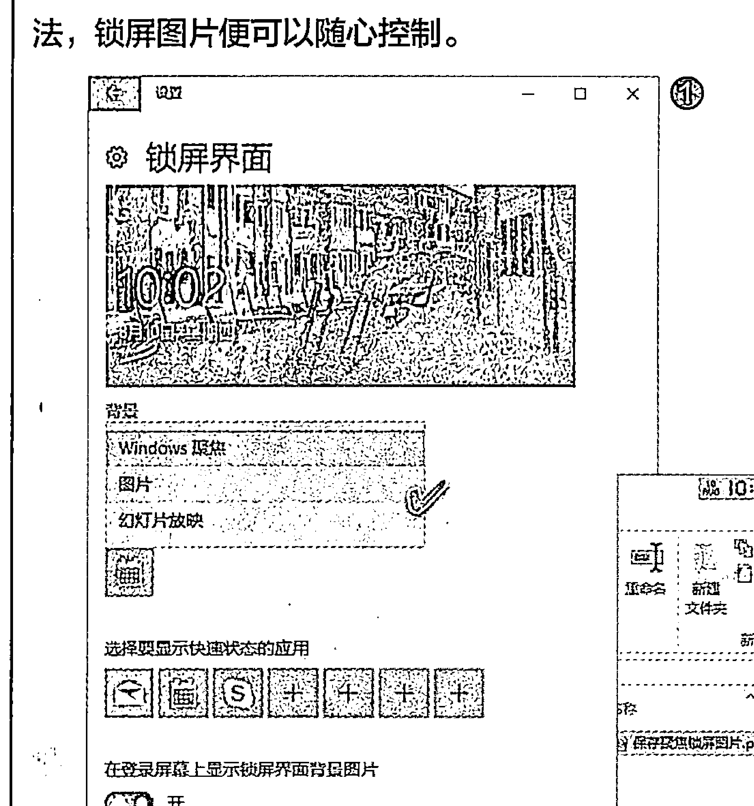

##### 屏蔽聚焦锁屏广告推广

聚焦锁屏图片有时会夹杂一些推广游戏、软件的广告信息，让人看着不爽。如果不喜欢它，可将其关闭。依次通过Windows 10的“设置→个性化→锁屏界面”，进入“背景→Windows聚焦”，在此处将背景设置为“图片”或“幻灯片放映”即可（图1）。

- 设置→个性化→锁屏界面→背景→Windows聚焦→图片/幻灯片放映

##### 小提示

在低版本的Windows 10中，还可以通过在Windows聚焦设置窗口中关闭“在锁屏界面上获取花絮、提示、技巧等”选项，仅屏蔽广告信息而留下图片显示。

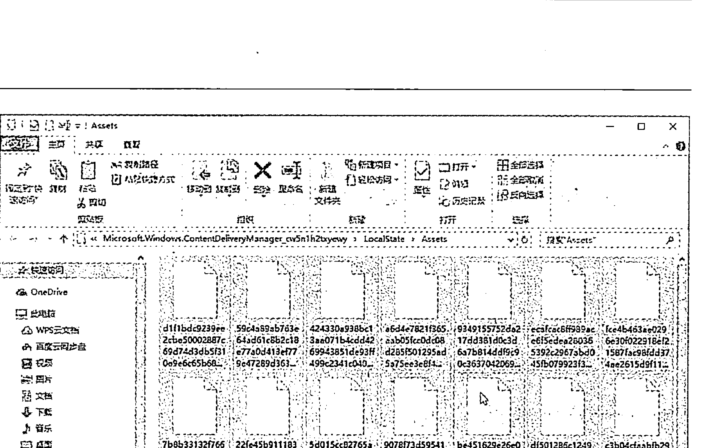

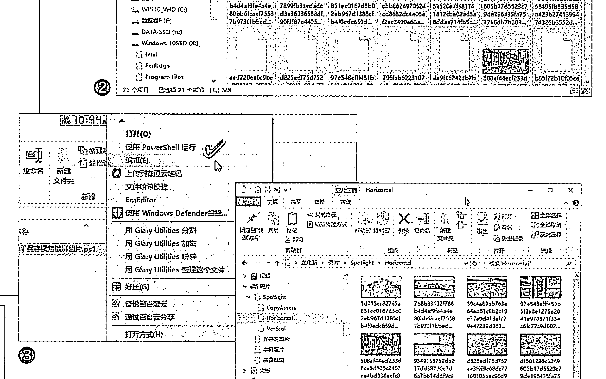

##### 用聚焦锁屏创建个性图库

认真对待每日推送的聚焦锁屏图片问答，如实回答“喜欢”还是“不喜欢”，会为以后微软推送图片素材提供依据。远程服务器根据不同用户对图片的喜好，针对性地推送聚焦锁屏图片。聚焦锁屏图片每日会不定时更新10张左右的新图，目录在系统中埋藏较深，目录中的推送图片不会累积，但新图片到来会顶占旧图空间，旧图随即也被删除（图2）。因此，若需要搜集这些不断变化的美图，需要做到及时转移，不能坐等消失。

利用一键提取聚焦锁屏图片的PowerShell脚本（下载链接：https://pan.baidu.com/s/1gflVuQR，密码：tfxs），可自动提取Windows 10锁屏壁纸。该脚本不仅会自动移除非壁纸文件，还会将横向和竖向壁纸分类存放。使用方法：下载PowerShell脚本后得到一个.ps1格式的文件，保存壁纸时只需右键点击该文件，选择“使用PowerShell运行”（图3），即可自动将壁纸分类保存到“此电脑→图片→Spotlight”文件夹中（图4）。使用上述方法，只需记得每天中午休息时和晚上下班前，分别执行自动收集一次即可。这样一年下来，就可以建立起一个由上千张世界顶级图片组成的图片库，可作为研究摄影艺术作品的好参考。

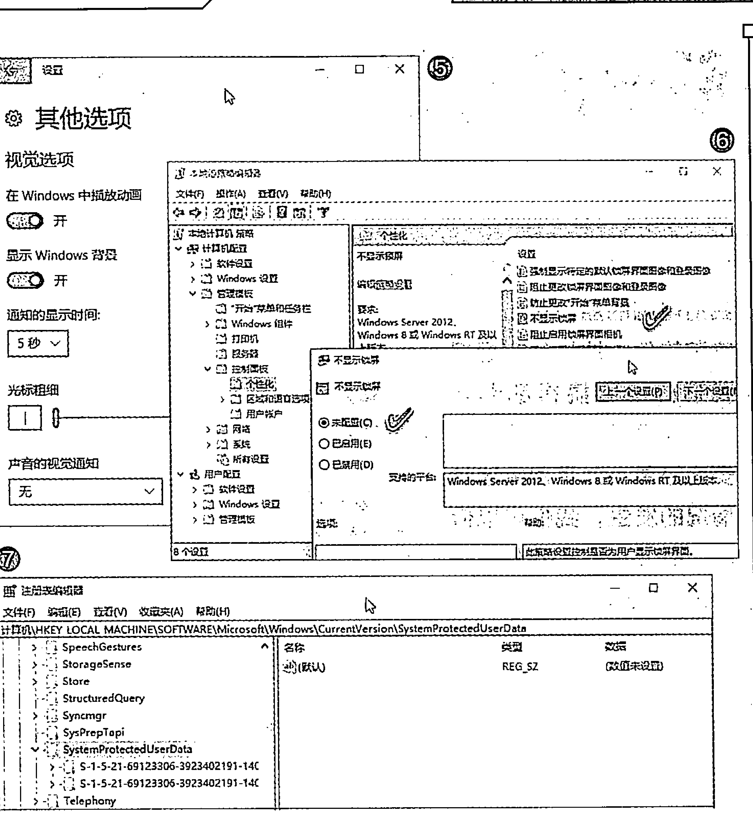

> 关于聚焦锁屏图片的藏身位置和批处理提取法，还可参见本刊2015年第23期文章《聚焦锁屏图片“连窝端”》，或访问http://www.cfan.com.cn/2015/1201/123861.shtml 快速查看。

##### 3 锁屏图片无法更换怎么办

如果发现聚焦锁屏壁纸无法更换了，可采用下面介绍的方法来逐个排查和修复。
首先，聚焦锁屏发挥作用，需要网络正常且登录微软账号。若用本地账号使用Windows 10，即便是有网络也无法看到变换的聚焦锁屏图片。请先在Windows 10中登录自己的微软账号，然后再将锁屏背景图片设置为“图片”或“幻灯片”模式，最后再改回到“聚焦锁屏”模式。
除了登录网络账号外，网络环境不当，也可能引起聚焦锁屏图片无法更新。如果使用路由器，尝试重置一下；检查是否工作在域里面或者开启有网络代理服务，将IP、DNS设置为自动获取；在管理员命令提示符中运行“netsh winsock reset”，重置WinSock试试。
若网络和账号均无问题，则尝试通过“Windows设置→轻松使用→其他选项”，把其中的两个选项先关闭再试聚焦锁屏，若正常了再重新打开（图5）。可多试几次。
此外，还可以尝试用组策略重设解决：按下Win+R打开“运行”，执行GPEDIT.MSC。在打开的“本地组策略编辑器”中，定位到“计算机配置→管理模板→控制面板→个性化”，将其中的“不显示锁屏”设置改为“已启动”或“已禁用”，点击“应用”之后，再用同样的方法设置为“未配置”，点击“应用”确定即可（图6）。
若上述方法均无法解决，则可从Windows系统层面来修复。
先借助于注册表清空用户系统保护数据。按下Win+R组合键，在“运行”框中输入“%ProgramData%\Microsoft\Windows”并回车。打开SystemData文件夹，将里面的内容全部删除（要先取得用户权限）。打开注册表编辑器，依次定位到“HKEY_LOCAL_MACHINE\SOFTWARE\Microsoft\Windows\CurrentVersion\SystemProtectedUserData”，在右侧窗格中，将“默认”项除外的所有选项都删除（图7）。
最后修复Windows组件。按下Win+X，选择管理员命令提示符，输入以下指令：
Dism /Online /Cleanup-Image /CheckHealth
Dism /Online /Cleanup-Image /RestoreHealth
sfc /scannow

#### 巧用组策略限制Windows 10安装第三方程序

文|平淡

在一般情况下，其他使用我们电脑的朋友可以随意安装软件，这样很容易把我们的电脑搞得乱七八糟，而且极易带来病毒等安全隐患。为了避免这种情况的发生，我们可以借助Windows 10组件对软件的安装进行限制。

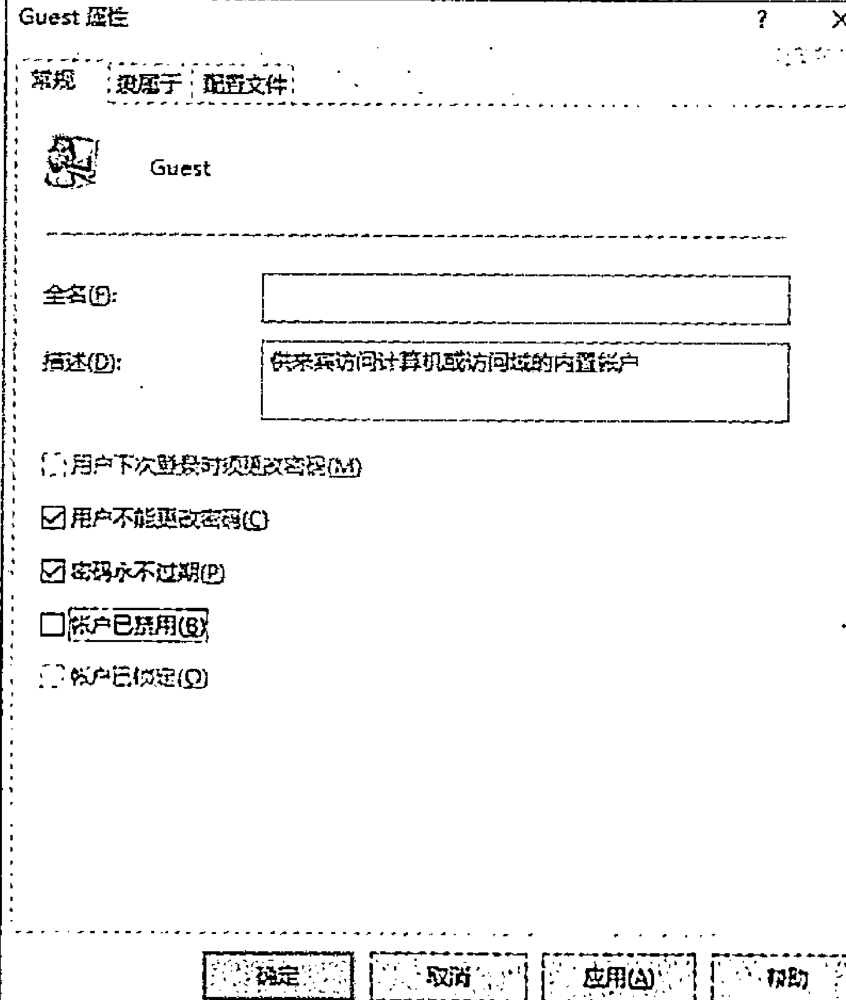

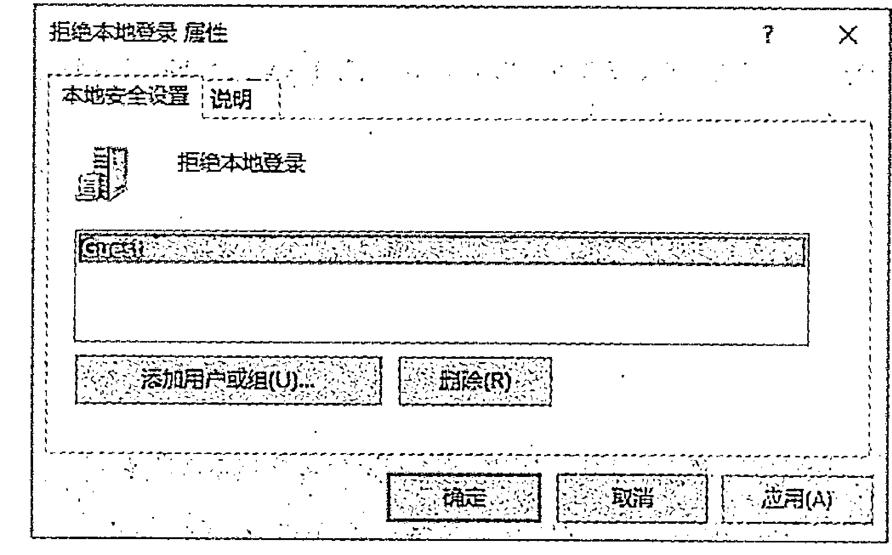

##### 用好来宾账户 软件安装好限制

来宾账户是Windows 10内置账户，默认该账户权限极低，因此把该账户作为他人使用我们电脑的专用账户即可阻止软件安装。不过Windows 10默认禁用来宾账户，右击桌面“此计算机→管理→本地用户和组”，接着在右侧窗格打开Guest账户，去除其“账户已禁用”前的勾选将其启用(图1)。

> 因为来宾账户权限较低，可能在实际使用时会给用户带来不便（比如没有权限打开很多目录），我们也可以通过建立标准账户的方法进行类似的限制，只要为其他用户新建一个标准账户进行登录。这样标准账户登录后安装那些带盾牌标记的软件时也会被UAC拦截，但是日常使用却不会受影响。

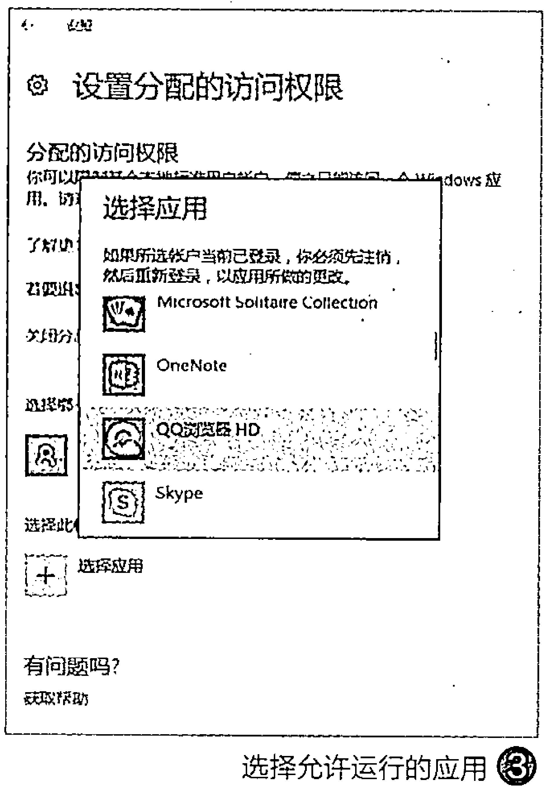

在搜索框输入“组策略编辑器”，打开组策略后依次展开“计算机管理→Windows设置→安全设置→本地策略→用户权限分配”项，在界面右侧找到“拒绝本地登录”项并右击选择“属性”项，在打开窗口的“拒绝本地登录”列表中选中“Guest”账户将其删除(图2)。

完成上述设置后，注销当前用户，在用户登录列表点击“Guest”即可以来宾账户登录。默认情况下由于来宾账户没有管理员权限，因此在试图安装那些带盾牌标记的软件时都会被UAC拦截，需要输入管理员密码才能安装，可以有效阻止此类软件的安装。

##### 权限限制 阻止用户运行安装程序

来宾账户可以很好地限制那些带盾牌标记的软件，不过对于普通软件或者绿色软件的安装就无能为力了。为了确保自己电脑的安全，可以使用Windows 10的“分配的访问权限”设置账户权限，比如可以设置登录账户只能使用浏览器上网，从而阻止用户安装或运行任意安装程序。

首先在当前管理员账户登录环境下以管理员身份启动命令提示符，输入“net user cfan 123456 /add”，建立一个名为cfan的账户。点击“开始→当前账户→cfan”，以cfan账户登录系统后打开“应用商店”，然后下载并安装“QQ浏览器HD”应用。

注销cfan并切换到原来的管理员账户，在搜索框输入“分配的访问权限”并启动该组件，点击“选择应用”，然后在应用列表中选择“QQ浏览器HD”，这样cfan账户登录后就只能使用该浏览器，无法运行其他任何程序，自然也无法安装软件了。

配的访问权限”，在打开窗口的“选择哪一个账户将具有分配的访问权限”下点击“选择账户”，将上述添加的cfan账户添加到限制列表，点击“选择应用”，然后在弹出的应用列表选择“QQ浏览器HD”应用（图3）。

这样我们将cfan作为他人使用的专用账户，用户使用cfan账户登录系统后就会直接以全屏方式打开QQ浏览器HD，任务栏不再显示，开始菜单也无法打开。总之cfan账户只能使用QQ浏览器上网，无法运行除此之外的其他程序，自然彻底杜绝安装其他程序的隐患（图4）。

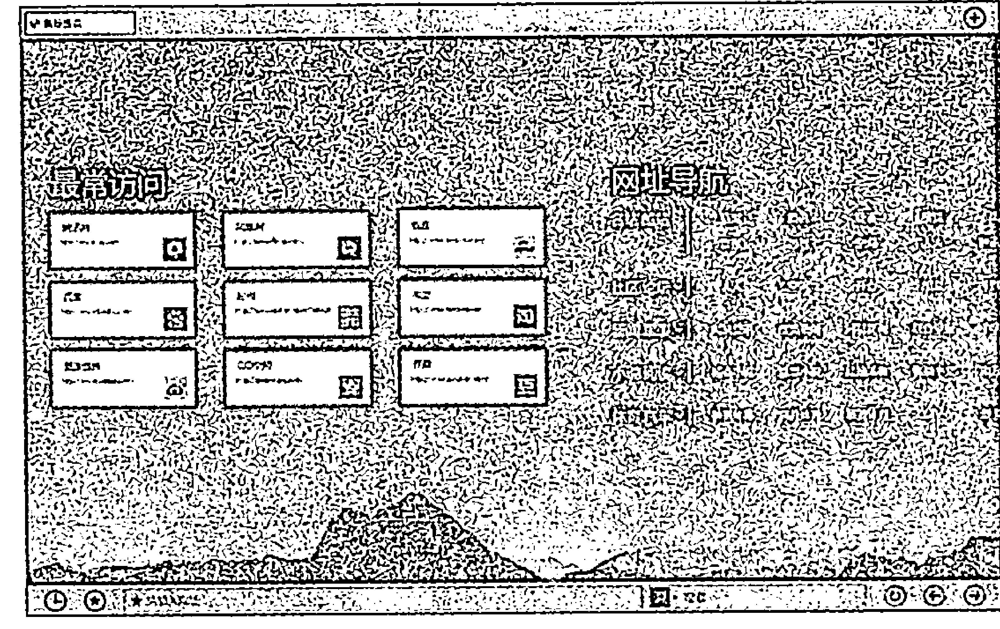

> 小提示
组策略的限制是针对所有账户生效，如果是自己使用需要取消限制，那么只要将“mmc.exe”也添加到允许列表。需要取消限制时运行“mmc.exe”，然后加载“gpedit.msc”，同上关闭上述策略限制即可。

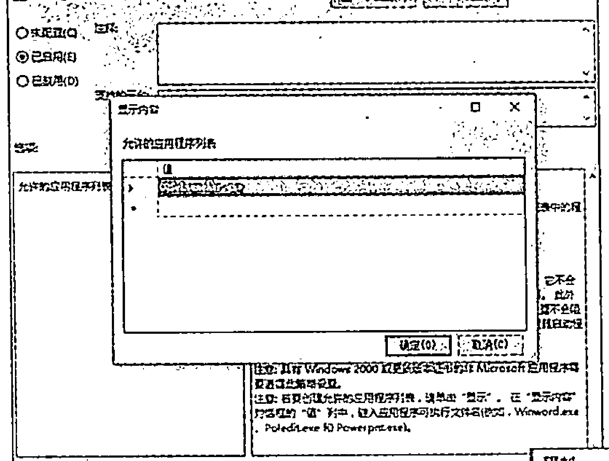

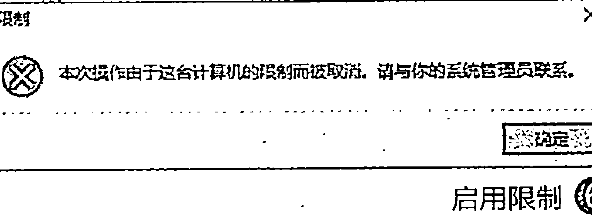

上述方法是系统内置的强制设置，使用该方法后系统就只能运行一个允许的应用商店的应用。如果要对普通EXE安装程序进行限制，那么可以使用组策略进行限制。同上启动组策略编辑器后依次展开“用户配置→管理模板→系统”，然后双击右侧窗格的“只运行指定的Windows程序”，在打开的窗口将其设置为“已启用”，点击“显示”，然后输入“QQScLauncher.exe”（图5）。

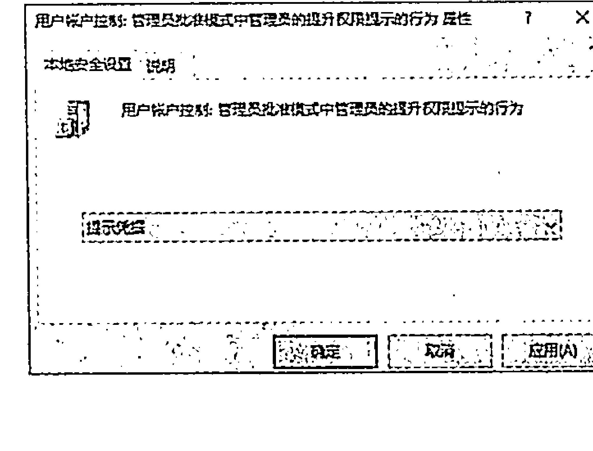

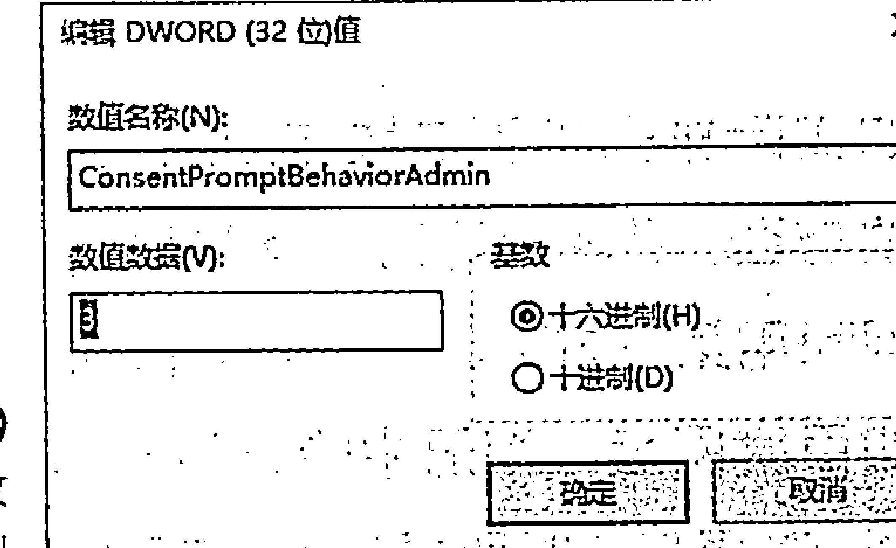

这样你的电脑就只能运行QQ，其他人在试图运行其他安装程序时，Windows 10都会弹出阻止提示，提示由于限制而无法运行任何EXE安装程序（图6）。

##### 3 用好组策略 安装程序需密码

上述方法主要是针对来宾账户和标准账户进行限制，可能很多朋友平时只有一个管理员账户。由于默认管理员账户可以随意安装程序，对于这类用户可以使用组策略对安装程序加以限制。

同上启动组策略编辑器后依次展开“计算机设置→Windows设置→安全设置→本地策略→安全选项”，双击右侧窗格的“用户帐户控制: 管理审批模式下管理员的提升提示行为”，在打开的窗口设置为“提示凭据”（图7）。
这样即使在管理员模式下，用户试图安装那些带盾牌的EXE安装程序时，系统也会弹出UAC提示，提示我们需要输入管理员账户的密码才能完成安装。对于家庭版用户，可以启动注册表编辑器展开[HKEY_LOCAL_MACHINE\SOFTWARE\Microsoft\Windows\CurrentVersion\Policies\System]，在右侧窗口中找到“ConsentPromptBehaviorAdmin”值，双击打开编辑窗口，把该值的数值数据修改为3即可（图8）。

#### 新版Windows 10类似功能“超前”体验

文|樱子

即将到来的Windows 10第五次重大更新将带来一些新的功能。虽然我们无法提前用上这些原汁原味的新功能，但在新系统到来之前，其实早已能够通过第三方软件体验类似的部分功能了。

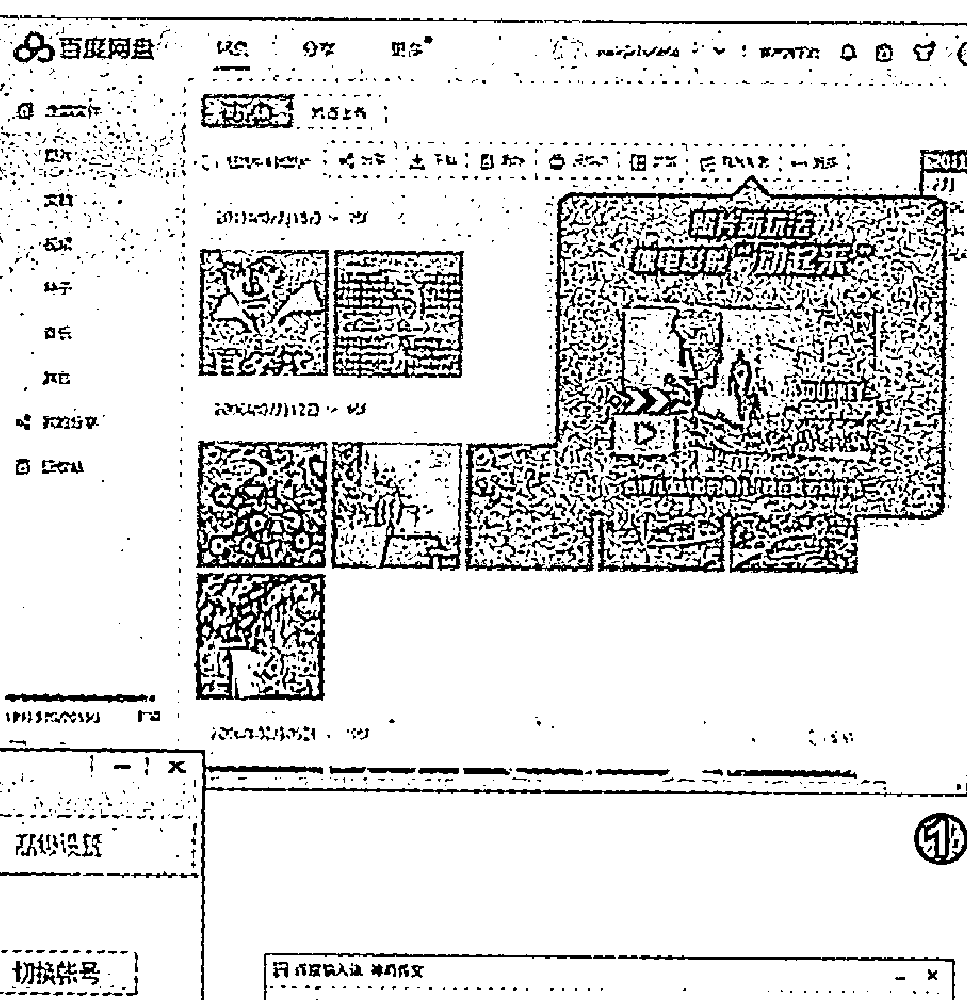

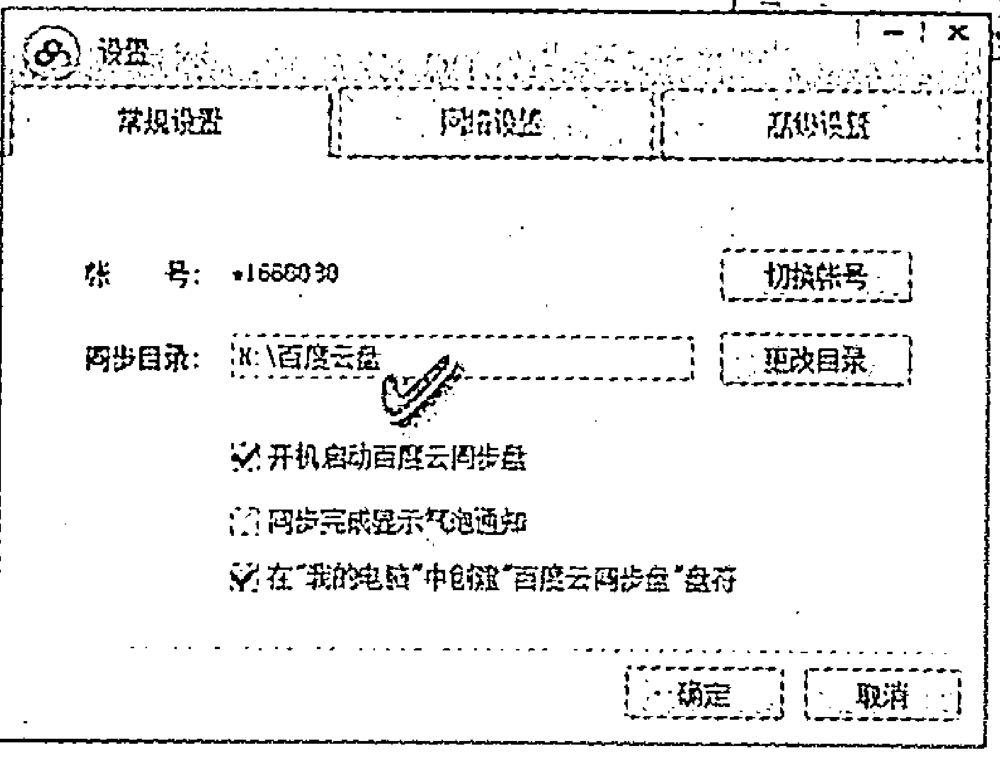

##### 1 “时间轴”迟到 类似功能先体验

此前人们曾指望出现的“时间轴”功能据说可能要跳票。该项功能的主要内容涉及任务的实际排列和历史操作回溯。实际上，不管跳票与否，尽管我们无法及时完全体验该功能，但利用第三方工具，已可部分类似功能。例如百度网盘云相册中的时间轴，按时间显示页面，选择某个时段或时点，就可以很快选出所需图片（图1）。这一按时间轴显示的特性，在不同平台的设备上通过相应的云客户端均可实现。

文档也是如此。利用云笔记组织文章在不同平台的客户端上用时间轴的方式来排列，改变平台之后，同样可以按时间顺序来显示这些文章。

此外，时间轴功能会作为文件历史记录功能的替代。文件历史记录若被取消，其实同样也可以用百度云等软件提供的历史文件功能来替代实现。

##### 2 信息或文件 通过云端来共享

另一项值得期待的新功能，是基于Microsoft Graph(微软图谱)将能够智能化地实现文字、文件的“跨平台”复制。这一功能看似新鲜，其实早已能够通过第三方软件来实现部分类似功能。
如可先通过云盘中的记事本或剪贴板，将文字、图片、语音信息输入其中，然后在另一种平台中用同一产品、同一账号登录云盘客户端，就可以获得这些信息。
通过百度输入法中的“神马传文”附件工具，将输入的一段文字、联系人信息、文章或读书心得等，通过生成的二维码，用移动设备扫描二维码，轻松获取不同平台上的信息（图2）。

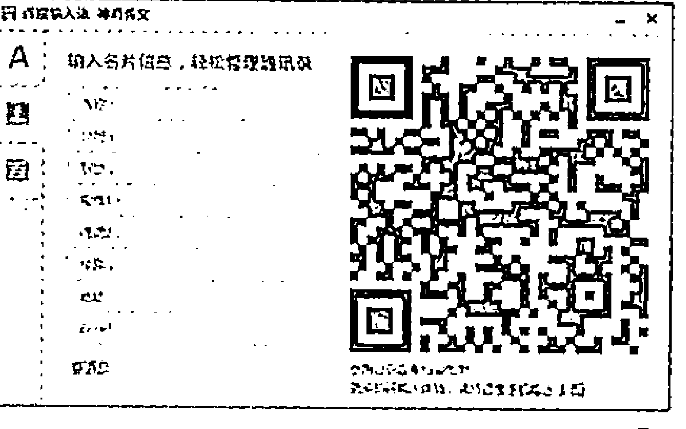

此外，在一些手机助手软件、Wi-Fi共享软件，甚至网络浏览器中，也可以通过二维码，跨平台共享信息。

##### 3 操作无界限 远程文件无差别

Windows 10中将会出现的全新的OneDrive on-demand，能够让操作文件更方便，使用者可以用一种更接近于操作本地文件的手段和方式操作云端文件。实际上，类似的部分功能可通过云盘的本地同步文件夹来实现。

例如，在本地建立一个同步文件夹，名为“百度云盘”，然后安装百度网盘同步版，在软件中设置网络同步盘对应的本地同步文件夹“百度云盘”文件夹（图3）。接下来的工作将在该文件夹中进行，在本地创建文件的过程，实际上也是在操作云端文件，而用户感觉完全是在执行本地操作。

Windows 10新版的另一项新功能是设备与设备间无缝编辑文件。其实，现今在云笔记里所做的编辑工作，用WPS国产办公软件的云编辑功能所做的文档编辑工作，不就已经可在设备与设备间无缝编辑文件吗？

#### 让工作继续 论如何让电脑不关机

文/樱子

在使用Windows的过程中，系统的睡眠、休眠、节能熄屏、自动锁定等功能，时常会中断远程监控、网络下载、网盘定时自动同步等工作，如何让电脑永不“停机”，让一切潜在的自动功能持续下去呢？

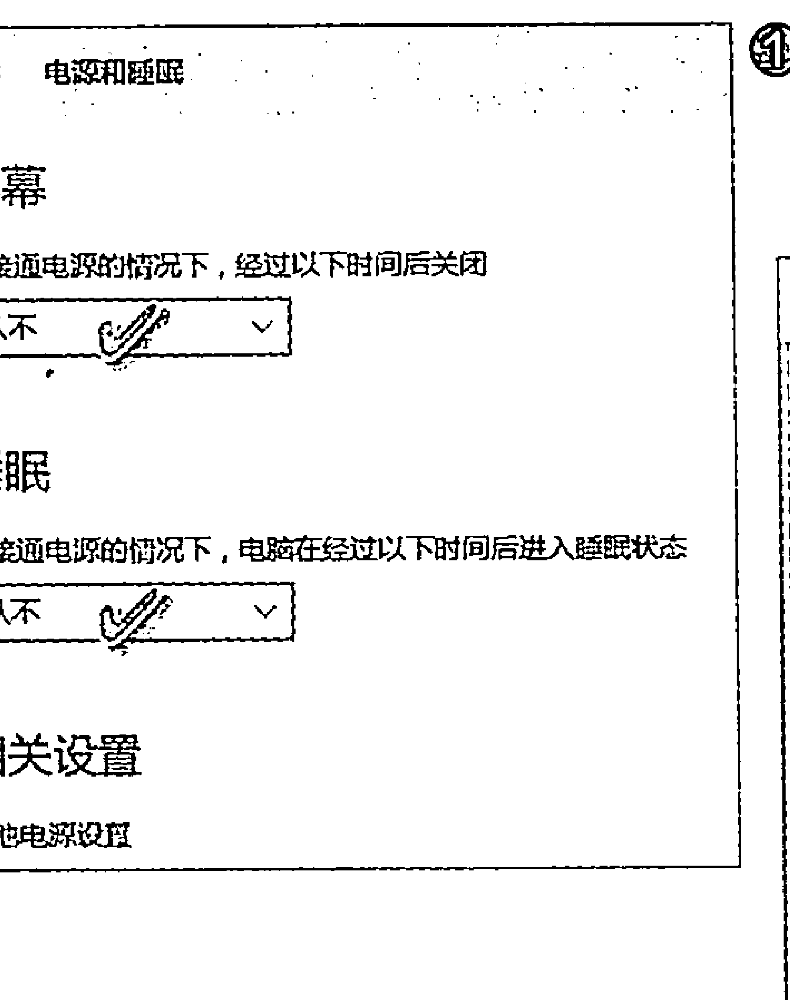

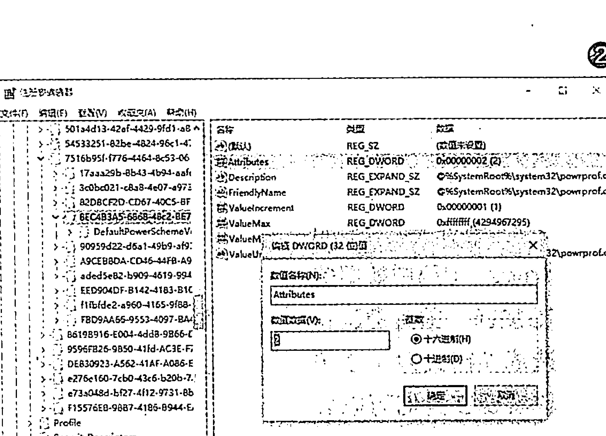

##### 1 关闭屏幕超时和自动睡眠

如果屏幕超时和自动睡眠影响了你的工作，可在系统设置的“锁屏界面”窗口中，选中“屏幕超时设置”；将“电源和睡眠”设置窗口中的屏幕关闭时间和进入睡眠时间设置为“从不”（图1）。

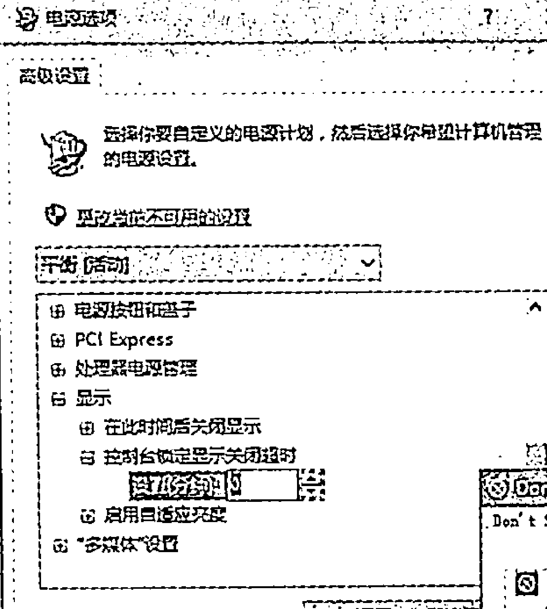

> 小提示
使用其他Windows 10版本的超时设置位置有所不同，但有统一方法：用Cortana搜索“控制面板”，进入电源选项窗口，点击“更改计划设置”，将“关闭显示器”和“使计算机进入睡眠状态”两个选项均设置为“从不”即可。

##### 2 关闭一分钟自动锁屏超时

若是自动锁屏影响继续工作，只能通过注册表来解决。Windows 10自动锁屏超时时间默认为1分钟，且未提供手动设置入口，通过修改注册表，可关闭此时间限制。运行REGEDIT命令打开注册表编辑器，依次定位到“HKEY_LOCAL_MACHINE\SYSTEM\CurrentControlSet\Control\Power\PowerSettings\7516b95f-f776-4464-8c53-06167f40cc99\8EC4B3A5-6868-48c2-BE75-4F3044BE88A7”，将Attributes的DWORD(32位)值更改为2（图2）。重新登录系统之后，在电源选项高级设置窗口的“显示”项目下，便会出现“控制台锁定显示关闭超时”选项，将该值设置为0即可（图3）。

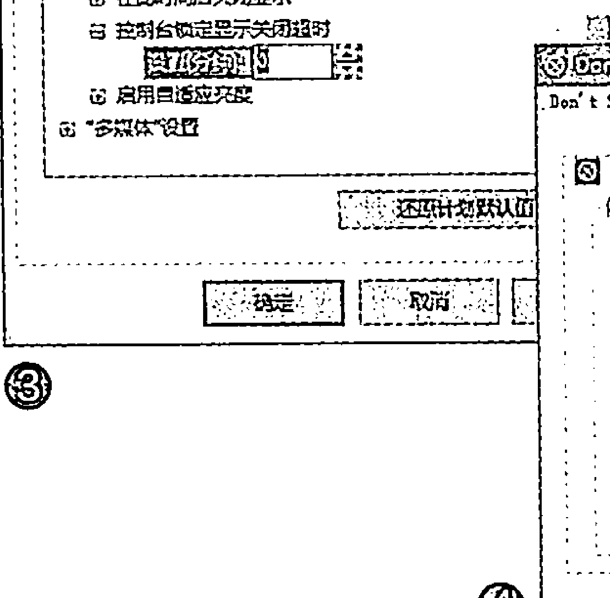

##### 3 借助软件曲线实现

如果觉得手动设置修改参数太麻烦，还可借助于之前我们介绍的Don't Sleep来解决。在该软件的“Please Don't Sleep”选项卡下，选中“阻止程序”分组框下的四个复选框，点击“缩小到托盘”（图4）。这样就以阻止“休息”的方式，绕道解决了各种自动“停机”的问题。

# 装双透视眼 查看遗忘的账户密码 文|俞木发

密码是我们进入系统或者网络账户的令牌，但是平时总有很多人会忘记这些密码。如果密码遗忘了，常规的方法是进行重置，但是这种方法可能会带来一些副作用。比如Windows 10用户如果使用EFS加密，重置密码就可能造成加密文件无法访问。其实现在我们可以装双透视眼，查看遗忘的账户密码。

> 小提示
由于程序包含读取密码的代码，程序运行后会被杀毒软件拦截，请在运行前暂时关闭杀毒软件的实时防毒设置。

##### 拒绝重置 查看Windows 10账户密码

为了方便自己使用，很多安装Windows 10的朋友都在使用自动登录的方法进入系统。如果忘记了Windows 10登录密码，那么可以借助“Mimikatz”直接查看账户密码。
到http://suo.im/ONVC3下载软件，接着根据自己的系统类型（32位还是64位）以管理员身份启动程序，在出现的命令提示符窗口依次输入下列命令进行密码提取（图1）：

```
privilege::debug //提升权限
sekurlsa::logonpasswords //进行账户密码抓取
```

可以看到在输入上述命令后，Mimikatz会将本机所有账户密码全部抓取出来，大家只要根据当前登录的账户查看相应的密码即可（图2）。
Mimikatz需要在已经进入Windows 10的系统上运行，如果你的账户密码已经彻底遗忘无法进入系统，那么就需要借助PE使用“Proactive System Password Recovery”查看密码。准备好PE启动盘并进入后以管理员身份启动程序，点击“主菜单→登录密码”即可（图4）。

> 小提示
因为任何管理员账户使用Mimikatz都可以读取当前账户密码，为了保护账户密码，我们可以通过更改组策略的方法禁止用户运行Mimikatz。启动组策略编辑器后依次展开“计算机设置→Windows设置→安全设置→本地策略→安全选项”，双击右侧窗格的“用户账户控制: 管理审批模式下管理员的提升提示行为”，在打开的窗口设置为“提示凭据”。这样用户试图以管理员身份启动Mimikatz就必须先输入密码（图3）。

##### 2 方便重装 查看Windows 10的安装密钥

除了系统账户密码外，系统的安装密钥是重装系统后恢复系统正版的密码。不过在Windows 10中只能查看到产品ID，如果需要查看系统安装密钥则可以借助AIDA64。
以管理员身份启动程序展开“操作系统→操作系统”，在右侧窗格“授权信息→产品密钥”中即可看到Windows 10的安装密钥；按提示复制将其保存到文本文件中（图5）。
这样下次重装系统后在桌面右击“此电脑→属性”，在打开的属性窗口点击“更改产品密钥”，接着在打开的窗口按提示导入上述保存的密钥即可重新激活正版系统了（图6）。

##### 3 就地取材 使用凭据查看网络账户密码

为了方便登录各种网络账号，平时我们在使用IE或者Edge登录邮箱、淘宝时都爱使用浏览器自动记忆功能。如果时间长了以后忘记了这些密码，那么就可以使用系统自带的“凭据管理器”查看。
在搜索框直接输入“凭据管理器”，启动凭据管理器后切换到“WEB凭据”，在列表中就可以看到浏览器所有记住的密码。只要展开需要查看密码的网址，点击“显示密码”，然后输入当前登录系统的账户和密码即可看到记住的密码了（图7）。
对于使用非IE核心用户，我们可以使用浏览器自身提供的工具进行查看。比如谷歌浏览器，打开浏览器后单击右上角的“选项”，在下拉菜单中选择“设置→显示高级设置→更多高级设置”选项。接着选择“密码和表单”，在打开的窗口可以看到浏览器记住的所有网站的密码。找到你要查看的网站密码，单击后面的显示按钮，在弹出的窗口中同样输入当前系统的账户密码后即可看到保存的网站密码了（图8）。
火狐用户则单击右上角的设置图标展开火狐浏览器的设置面板，选择“选项/隐私与安全→已保存的登录信息”，在打开的窗口中也可以看到所有记住的密码，选择相应的网站后点击“显示密码”即可（图9）。

#### 创意者Windows 10主题另类搭配

Windows 10升级到1703创意者版之后，主题的使用有了很大变化，总体趋于简单化。但简单化并不意味着没有“可玩”的地方，DIY起来的成本更低呢。

“火速连接” 聚焦锁屏图片的收集方法见本刊2015年第23期文章《聚焦锁屏图片“连窝端”》。

##### 制作自己的数码照片主题

数码照片不但可用作桌面背景，还可以做成个性化主题，在Windows 10中直接使用。先将拍摄的照片设置为幻灯片桌面背景；沿着“设置→个性化→背景”操作路径，进入“背景”设置窗口；将背景演示方式选择为“幻灯片放映”，然后用“浏览”按钮为幻灯片指定存放数码照片的文件夹（例如“桌面背景图片”）（图1）。
接下来自定义照片主题。从“个性化”窗口选择进入“主题”设置窗口，可看到“背景”已自动选择为刚才定制的幻灯片照片。分别点击“颜色”、“声音”和“鼠标光标”按钮，为自己的照片主题定制个性化样式。定义好之后，点击“保存主题”按钮（图2）。随后，根据系统提示，输入主题的名称（例如“我的重码照片主题”），点击“保存”按钮。
经过上述操作后，该主题便作为一个用户主题保存下来。以后需要使用时，可直接点击“主题→应用主题”列表下的该主题名称，即可将该主题应用到当前系统中。右击该主题，然后选择“保存用于共享的主题”，接下来给这个deskthemepack主题文件取一个名字，即可获得一个本地的deskthemepack主题文件包，用于备份或共享。注意，自定义主题文件包最大不能超过2GB。
精彩的Windows 10锁屏图片，也可以做成主题使用。收集锁屏图片，然后用上述方法制作主题，即可生成一个聚焦锁屏主题，让聚焦锁屏可以“回溯”。

##### 使用现成的新老Windows主题

Windows 7/8.1/10等版本中可以使用的在线主题，在最新版创意者Windows 10中仍然有效。从微软Windows主题Web网站https://support.microsoft.com/en-us/help/13768点击下载相应的主题，双击安装到系统中（图3）。由于Windows即将改变主题的发布方式，这些主题将来很可能从这里下架，若需要保存请尽快批量下载。
此外，在Windows 10中，系统主题的获取方式已经改成从应用商店下载。通过“设置→个性化→主题”，选择“应用主题→从应用商店中获取更多主题”，进入免费主题栏目，直接点击相应的主题名称，安装到当前Windows 10中。但这只能手动一个个安装，无法批量快速操作。

# 浏览器快速处理网页内容 文|阿立

每天我们通过浏览器连接到互联网，就进入到了信息的海洋里面。在这些众多的信息里面肯定有自己需要的内容，于是怎么处理这些内容就成为了一个非常棘手的问题。通常情况下会用软件配合浏览器进行处理操作，其实通过浏览器自身，就能快速处理网页中的内容。

##### 利用电子邮件稍后阅读

在浏览网页的过程中，往往会因为某种原因被打搅，这时就只能安排其他的时间来进行阅读。为了解决这个问题，就出现了稍后阅读和云笔记这样的服务，可是这样操作起来往往比较复杂，很多浏览器并不支持相应的功能扩展。如何才可以简单有效地解决这个问题呢？

先打开常用的浏览器，登录到“Email This”这项服务的网站(https://www.emailthis.me/)，在网站的输入框里面输入我们要接收信息的电子邮箱地址。之所以要进行这样的操作，是害怕有人恶意使用他人的信箱来进行操作。当用户填完电子邮箱地址后，点击后面的“Install our bookmarklet”蓝色按钮就可以了(图1)。这时“Email This”会发送一份确认邮件到我们的邮箱，接下来登录邮箱，就会看到在一个确认邮件里面有一个按钮。点击这个按钮以后，就会跳转到一个新的窗口里面，这个窗口将演示指导用户如何来添加一个快速操作的书签按钮。

现在点击谷歌浏览器右上角的自定义按钮，在弹出的菜单里面点击“书签”中的“显示书签栏”命令，这样就可以将隐藏的书签栏显示出来。接着利用鼠标拖动这个命令按钮，将其拖拽到浏览器的书签栏里面，这时就会在书签栏里面显示一个“Email This”的链接(图2)。如果用户使用的是火狐浏览器的话，那么首先在浏览器的窗口顶部点击鼠标右键，在弹出的菜单里面勾选上“书签工具栏”。这时就会看到在浏览器上方多出了一个书签工具栏，现在同样按住这个按钮将其拖放到书签工具栏中释放就可以了。至于其他浏览器的操作都和它类似，这里就不再进行相关的叙述了。

以后当遇到需要稍后阅读的文章时，只需要点击书签栏中的“Email This”按钮。稍等片刻就可以看到已经成功保存的提示，这样就可以离开干其他的事情了(图3)。在其他事情处理完成以后，打开自己的电子邮箱就会发现刚刚没有阅读完成的那篇文章，已经被发送到了邮箱的收件箱里面。而且可以看到除了文章的标题以及正文以外，其余的广告信息等都被自动过滤掉了，并套用了一个阅读时更加舒服的样式（图4）。在电子邮件的末端还标识出这个页面的来源地址，这样用户就可以快速地连接到原始地址来查看原文。通过这个方法不光可以在电脑里面进行实时的阅读，也可以方便地使用移动设备。

##### 浏览器标签显示笔记内容

前面已经提到有的用户会将需要的内容记录到云笔记软件里面，这样在需要的时候进行查看阅读。虽然这种方式也非常的不错，但是现在很多云笔记软件都开始收费了。那么对于轻度记录的用户来说，还有什么方法可以解决类似的问题呢？

如果使用的是谷歌浏览器或者其扩展版本，那么安装一款功能扩展就可以解决这个问题了。我们首先通过谷歌浏览器进入到应用商店，输入关键词“Memomi”来搜索，进而安装一款名为Memomi的功能扩展。安装完成以后会在谷歌浏览器的工具栏里面看到这款Memomi扩展的图标。与此同时，由于扩展更改了标签的默认配置，浏览器会弹出一个警示窗口询问用户，用户只需要点击其中的“保留更改”按钮就可以了。接下来我们就可以像平时那样进行网页的浏览操作，一旦在网页里面发现需要的内容，首先通过鼠标选中这些内容，接着点击鼠标右键并点击菜单中的“Add to MemoMi”命令，这样就可以将选中的内容记录下来了。

之后打开一个浏览器的新标签后，就可以看到这款功能扩展呈现出的效果。它会随机展示一段用户保存的内容，并搭配上一张漂亮的背景图片进行显示（图5）。如果用户喜欢收藏名言警句的话，那么这种方式就可以随时帮助用户进行阅读。当然要想进行笔记内容的管理操作，最简单的方式还是为笔记内容添加上管理标签。我们可以在每段收录文字的左下方点击其中的加号按钮后，在弹出的输入框里面设置相应的标签名称，查询记录的笔记时，只需要在新标签窗口里面点击左侧的菜单按钮，在弹出的对话框列表中就可以看到所有的标签名称，然后找到需要的标签名称并点击它，便能显示出对应的笔记内容了（图6）。当然我们也可以通过搜索功能，输入相应的关键字来进行查找操作。

##### 找回被删除的网页内容

上文每一种方法在摘录相关的信息后，都会在内容后面添加一个载入的网页链接地址，只需要点击链接，就会跳转到内容的原始网页里面。可是有的时候当我们点击这个链接后，会发现原来的网页已经被删除掉了。那么如何才可以解决这个问题呢？

当安装一款名为“Wayback Machine”的扩展后，访问到一个无法浏览的网页链接的时候，就会自动弹出一个提示框，询问用户是否需要使用网页时光机来找到该网页的缓存版本。点击“Click here to see archived version”按钮后，就可以从Wayback Machine找到以前的资料。然后将用户引导到备份内容页面，同时上方会显示出时间轴，用户就可以选择任何时间的备份内容了。

#### 快速启动一切所需资源

文|阿楠

对于常用的软件、文件夹、网站等，要实现对它们的快速调用，我们往往需要建立快捷方式，或通过资源管理器、网络浏览器的收藏夹来完成。实际上一个小小的Wise Hotkey软件，即可完成上述诸多快捷调用的需求。

> **小提示**
Wise Hotkey触发的前提条件是在软件设置中选中“系统启动时自动运行”选项，同时要保证“临时禁用”选项处于未被选中状态。“临时禁用”选项是在热键与其他软件的热键发生冲突时，用来规避冲突的（图1）。

##### 1. 为应用程序设置快启捷径

电脑中安装了那么多应用程序，要找到快速调用的捷径，而快速调用常用程序是Wise Hotkey的长项。启动Wise Hotkey并点击窗口中的任意加号按钮，在弹出的面板中选择“应用”选项卡，窗口中就会显示出电脑中安装的所有软件的程序图标，从中选择需要的图标或用关键词搜索，然后点击“添加应用”按钮，即可将该程序添加到快启窗口中（图2）。

图标添加后，要为其赋予一个调用热键。如给第四个图标指定“控制面板”程序，要为其指定Alt+4启动热键，这时只需点击图标下方的热键区域，然后按下键盘热键组合Alt+4即可。

##### 2. 用热键快速调用文件夹

文件夹也可以用这种方式来管理。在窗口中点击加号+按钮，选择“文件夹”选项卡，然后选择系统文件夹或点击“添加文件夹”按钮，从资源管理器中选择用户文件夹。在浏览文件夹的过程中，还可以用“新建文件夹”按钮临时新建文件夹。为文件夹指定快捷访问组合热键的方法与上述方法类似（图3）。

##### 3. 建立常用网页的快速通道

有了Wise Hotkey的帮助，我们也不再需要通过网络浏览器来收藏常用网页了。在Wise Hotkey中点击加号按钮添加项目，选择“网址”选项卡，输入要添加的常用网页地址（如cfan.com.cn），点击“添加URL”按钮，一个网址访问的快捷按钮便出现在管理窗口中。为其指定快捷访问热键组合，以后即可用热键的方式访问你喜欢的CFan网站（图4）。

#### 图片批处理 就是不一样

文|阿楠

为完成不同的图片处理任务，尤其是一些特殊任务，如按分辨率自动分类图片、从一组图片生成多组不同尺寸的图片，我们往往要使用多种工具，经过较多的步骤才能完成。如果改用“图片馆”免费软件来处理，效率将会得到很大改观。

##### 1. 让图片分类挑拣实现自动化

在本刊2017年11期的《图片横七竖八 一次自动分家》一文中，曾介绍通过资源管理器、第三方资源管理器或第三方看图软件，按图片分辨率排序，然后手动为图片分类的办法。实际上，图片分类，还有更加智能的自动分类处理办法。

先从“图片馆”右侧窗格中选择图片文件夹并选择要批量处理的图片文件，然后通过左侧窗格选择“批处理→整理”，在弹出的方案选择窗格中选择“分辨率”(图1)。之后软件按照图片分辨率的不同对图片进行自动分类，分类过程完成后，在原图目录下就会自动生成一个“Picosmos_整理”文件夹，其中包含按不同分辨率进行分类的图片子文件夹(图2)。

##### 2. 自动生成多种尺寸的图片组

如果手中有一组原始尺寸的图片，而设计或演示中需要以这组图为基础，生成多组不同尺寸的图片，这在以往需要用图片处理软件进行多次处理，才能获得不同尺寸的图片组，而用“图片馆”只需一次即可完成。

在选择了要处理的图片后，从左侧批处理窗格中选择“多尺寸输出”按钮，然后在弹出的窗口中制定多种图片输出尺寸方案，通过“添加”按钮和其上方的“限制最大分辨率”参数设置，删除或添加方案，自定义图片尺寸和质量。之后点击“转换”按钮，进行多种尺寸图片方案的自动批量输出(图3)。

同样，在图片转换完成后，资源管理器中也会自动出现按上述所设分辨率方案而建立的多尺寸图片文件夹(图4)。

> **小提示**
整理输出目录可以由用户通过“浏览”按钮自定义，图片整理的动作也可选择为“复制”或“移动”。除此之外，还可以选择“日期”，让软件按照日期自动建立图片分类目录。

> **小提示**
优化之前，若选中“删除EXIF数据”复选项，可对原始照片中的拍摄数据进行去除操作，从而保护图片拍摄的技术隐私。

> **小提示**
“自动色阶”和“自动对比度”两个优化操作会立即修改原文件，因此若要保留原文件，需要先行备份处理。

> **小技巧：善用穿透目录**
穿透目录能够一次性处理多个目录（包括子目录和并列目录等）中的文件，以往需要经过多次处理才能完成的多级文件夹批量任务，变成一次性完成，提高了工作效率。用法也很简单，点击主窗口右上角的“穿透目录”按钮（图5），即可将当前文件夹中的各级子文件夹串联成一个目录对待，各级图片将显示在同一个窗口中。

##### 3. 成批图片的方案性自动优化

成批优化图片的软件屡见不鲜，但为环境而设的方案性优化，才更能显示出对人的体贴。用“图片馆”提供的4种优化方案，可适应不同类型的图片优化，其中包括：保持原始分辨率、保持原始分辨率和质量、限制分辨率在大多数移动设备内、限制分辨率在大多数PC设备内等。

先从中间窗格选择要处理的图片，然后点击左侧窗格“批处理→优化”按钮，在出现的优化窗口中选择一种优化方案，设置最大分辨率、图片质量，执行效果测试之后，点击“优化”按钮正式优化输出图片。

而除了上述方案性优化外，用本软件实现常规项目的自动批量优化也更加方便。通过一个“颜色”优化按钮，即可进行最常见的亮度、对比度、饱和度、色调的批量自动优化，先选择批量文件，再设置优化参数，然后执行优化处理即可。也可以不设参数，交由软件自动优化，只需在批处理面板中分别选择“自动色阶”和“自动对比度”两个按钮即可完成。

##### 4. 批量图片的多功能水印制作

水印制作我们并不陌生，如果要同时制作包含图片水印、文本水印、透明水印的图片，用“图片馆”更方便。选中一批图片，点击“水印”按钮即可进入水印设置窗口。通过“浏览”指定水印图片，通过“文本”加载水印文本，通过滑杆设置透明程度，还可以精确设定水印位置和缩放比例。一窗搞定，非常方便。

除上述应用外，我们还可以用图片馆完成证件照自动批量换背景、更为个性化的文件批量重命名等实用任务。

#### 抛弃Flash也能进行在线播放

文|万立夫

Flash作为一款知名的网络插件，曾经很长一段时间都占据着浏览器重要的位置，因为没有这款插件的话用户就无法进行在线视频的播放操作。但是随着这项技术的逐步落后，以及支持这种技术的软件漏洞越来越多，因此受到了用户的诟病，包括苹果、谷歌在内的大型公司，也已经开始放弃对它的支持。不过不用担心，没有Flash在线视频照样能播放。

##### 屏蔽Flash插件的使用

其实目前国内一些网站已经开始支持HTML5这项技术了，腾讯视频就是其中的一家。当用户的浏览器登录这些网站的时候，它首先会对浏览器的Flash插件进行判断。如果使用了Flash插件的话，那么会首先调用这款插件来对视频进行播放。如果没有发现这款插件的话，那么就会使用HTML5来进行播放。所以用户想使用HTML5这项技术进行播放操作的话，那么最简单的方法就是将Flash这款插件进行屏蔽。虽然现在最新版本的谷歌浏览器已经完全抛弃了Flash插件，但是浏览器开发商为了照顾国内用户，因此在他们的最新版本里面仍然保留了这款插件，就以百分浏览器为例介绍如何进行屏蔽操作吧。点击浏览器窗口右上角的“自定义及控制Cent Browser”按钮，在弹出的菜单里面选择“设置”命令，这样就可以打开浏览器的设置窗口。接着点击窗口左侧的“高级设置”按钮，在右侧窗口点击“内容设置”按钮，然后在弹出的对话框里面找到“Flash”这一项，这里建议用户在其中选择“检测并运行重要的Flash内容”这一项即可（图1）。这样设置的最大好处就在于，当不需要使用Flash插件的时候，就不需要激活它；在必须要使用这款Flash插件的时候，再激活它进行使用操作。

如果用户使用的是火狐浏览器的话，首先点击火狐浏览器右上角的“打开菜单”按钮，在弹出的窗口中点击“附加组件”命令。现在在弹出的设置窗口中点击右侧的“插件”命令，接下来在右侧窗口找到“Shockwave Flash”这一项，在后面的“总是激活”列表中选择“永不激活”这一项就可以了（图2）。所有的设置完成后，我们打开腾讯视频任意播放一个视频文件。这时网站会提示“您的Flash插件已过期，无法播放视频了”，直接点击提示对话框中的“切换到HTML5播放器”按钮就可以了（图3）。然后在视频窗口点击鼠标右键，选择其中的“视频信息”命令。在弹出的对话框里面我们可以看到“html5hd”这个信息，这就表示在使用HTML5这项技术进行播放了（图4）。

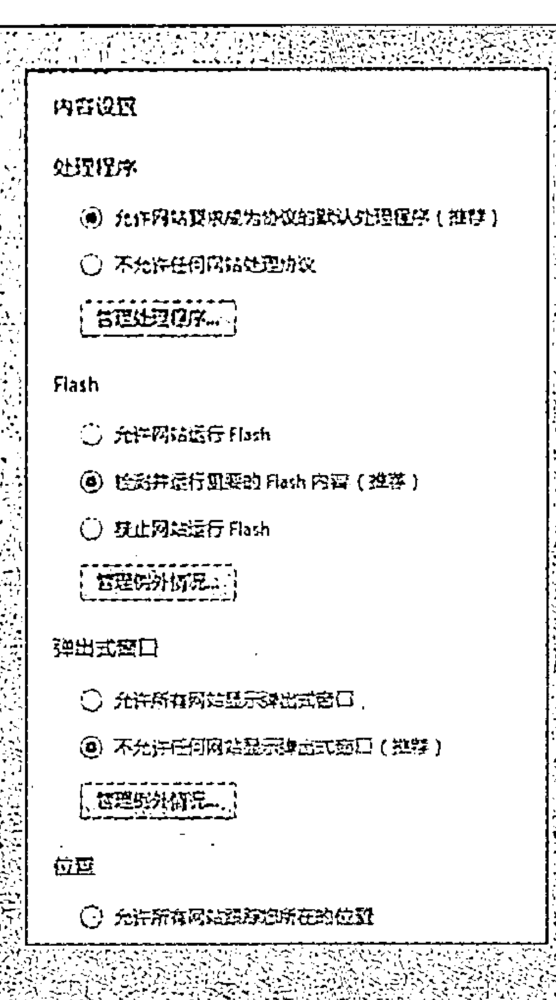

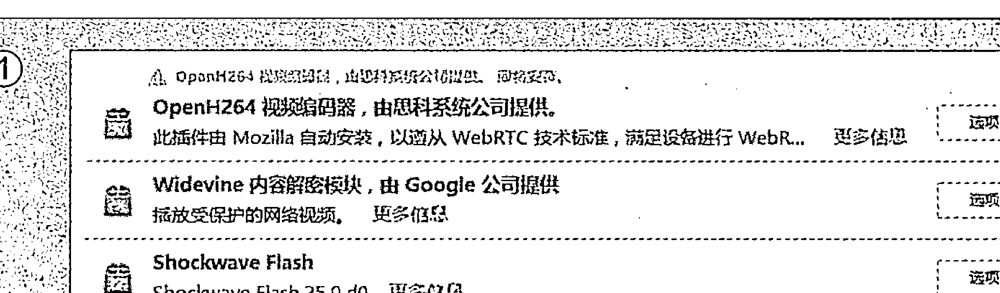

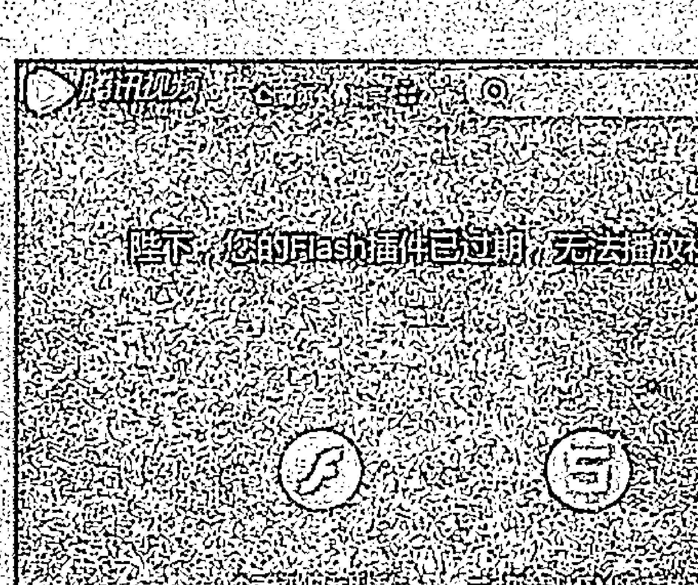

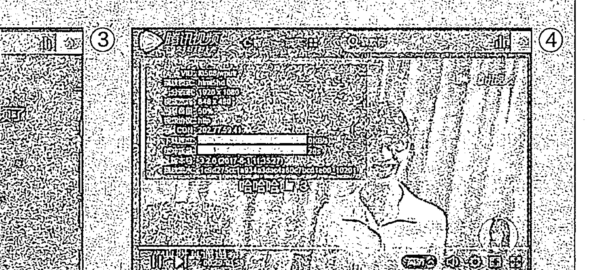

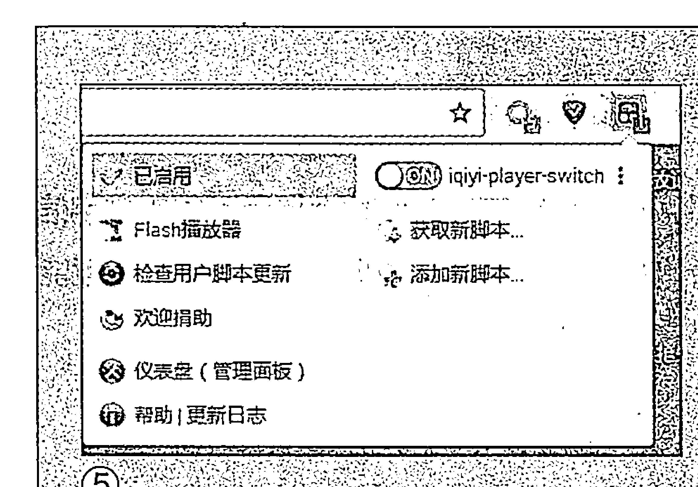

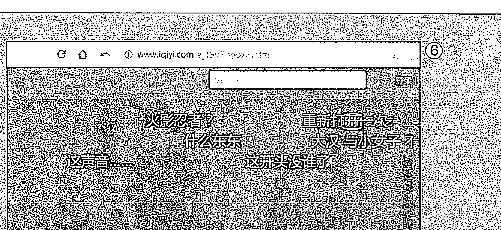

> **小提示**

按照上面的方法来安装一款名为“HTML5播放器增强插件”的功能脚本，就可以实现PotPlayer的快捷键布局，从而对播放界面实现调节亮度、饱和度、对比度、速度等功能。

##### 编码转换后进行播放

当然国内还有很多的视频网站，不支持HTML5这项播放技术。如果我们想使用这项技术来进行播放的话，那么就需要另想其他的办法才行。其中最常见的方法就是利用功能脚本实现数据编码的转换操作，为了让浏览器支持脚本的运行，首先需要下载安装一款功能扩展。进入到谷歌浏览器的“Chrome网上应用店”，通过应用商场左上角的搜索框查找“Tampermonkey”，根据提示进行安装操作。接着在浏览器的地址栏里面输入https://greasyfork.org，回车后就可以登录到一个专业的脚本发布网站。在网站的搜索框里面输入“iqiyi-player-switch”关键字，查找到以后在脚本的介绍窗口点击“安装此脚本”按钮。接下来会弹出一个是否安装脚本的提示框，点击“安装”按钮后就可以安装完成。以后当我们登录到爱奇艺这个网站的时候，就会发现工具栏中的Tampermonkey扩展图标上显示了一个“1”的提示（图5）。点击这个图标以后，在弹出的菜单里面点击“Flash播放器”命令，这样就可以切换到HTML5这个播放模式里面进行播放了（图6）。

##### 修改浏览器UA来播放

虽然现在网络里面已经拥有大量的视频网站，但是有的时候我们仍然需要在电脑上观看直播，尤其是一些体育比赛。而拥有这些体育比赛直播权的在国内也只有央视，可是央视的直播平台现在仍然还是使用老旧的Flash技术，那么如何让它也支持最新的HTML5播放技术呢？

若正在使用谷歌浏览器，那么要想解决这个问题非常的简单，只需要按照前面的步骤安装一款名为“hls.user.js”的功能脚本就可以了。如果用户使用的是其他浏览器的话，那么还需要增加一个其他的环节，也就是说需要对浏览器的UA进行修改才可以。比如我们打开火狐浏览器，首先在浏览器的地址栏里面输入命令“about:config”，按下回车键就会弹出一个提示窗口。直接点击“I’ll be careful,I promise”的按钮后，进入到火狐浏览器的设置界面里面。

在设置界面的空白处点击鼠标右键，选择“新建”子菜单中的“字符串”命令。接下来在对话框里面输入字符串名称“general.useragent.override.tv.cctv.com”，点击“确定”按钮以后在新的对话框里面输入“Mozilla/5.0 (Linux; U; Android 4.0.4; en-gb; GT-I9300 Build/IMM76D) AppleWebKit/534.30 (KHTML, like Gecko) Version/4.0 Mobile Safari/534.30”这段信息即可（图7）。这里需要特别强调的是，字符串名称中的tv.cctv.com就是告诉浏览器，访问这个地址的时候才切换UA字符串信息，访问其他的网站地址不需要进行切换。

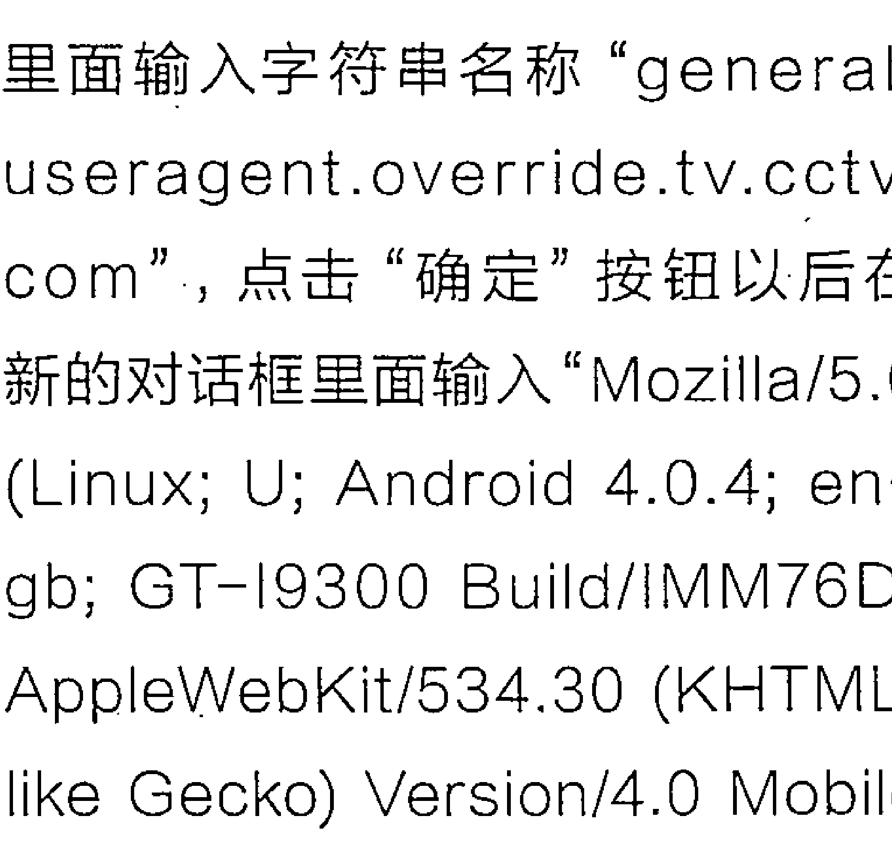

# 数码照片变身EXE音乐相册  文/阿楠

将数码照片做成电子相册，不但要求相册显示个性化的封面，换场特效随机变换，还能在每幅照片上显示不同的文字信息，最后还要打包成EXE文件。这样的相册如何制作？简单点，用看图软件FastStone Image Viewer的附加功能就能轻松实现。

##### 1. 右键菜单进入制作环境

在一个文件夹中备好制作电子相册所需的数码照片文件，右键单击第一张图片并选择“打开方式→FastStone Image Viewer”（图1）。随后会进入到图片的幻灯片预览模式窗口，在窗口上方的工具栏右侧的一个退出状按钮为“切换到浏览模式”按钮，点击该按钮进入浏览模式（图2）。

在图片浏览窗口的右侧窗格中，选中制作相册所需的所有照片文件，然后执行“创建→建立幻灯片文件”菜单命令（或直接按下Alt+S组合键），进入到幻灯片建立环境（图3）。

##### 2. 定制个性化的相册封面

首先设置个性化相册封面，选中“使用封面”复选框，第一张图片将作为封面使用，命名相册标题并输入简单的描述文字，然后从封面图片风格列表中选择一种风格，可选择内置的10种风格之一，也可以选择“无”（表示不加任何艺术效果的原图）。如果选中添加“浏览”按钮选项，将来生成的封面中将出现图片浏览按钮，用此按钮可进入手动选择图片浏览的界面；如果选中添加“输出”按钮选项，将来生成的封面中将包含输出按钮，用此按钮可以输出EXE文件中包含的图片文件（图4）。

##### 3. 设置多变图片提示信息

在演示过程中，有时我们不但需要为每幅图片添加文件名、日期信息等提示，还可能需要将拍摄照片时所用到的相机和镜头参数，随时动态地显示在每幅照片上。

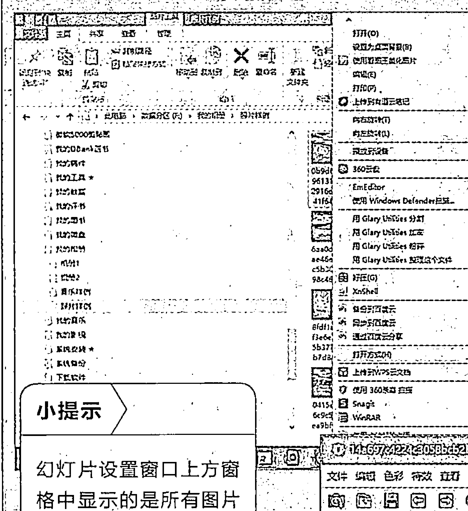

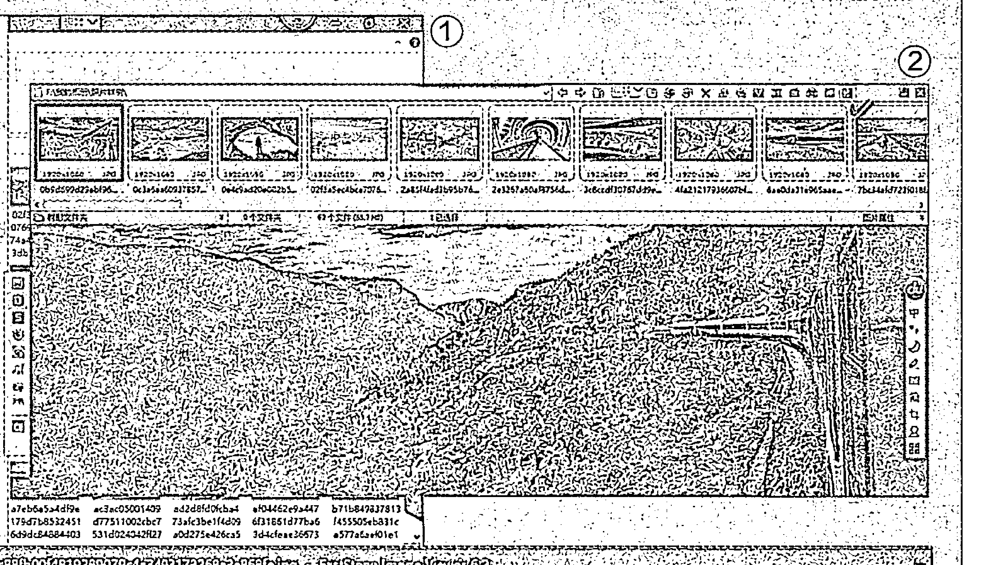

> **小提示**

幻灯片设置窗口上方窗格中显示的是所有图片文件的出场顺序，可通过鼠标拖动图片的方式调整顺序，还可以通过相应的功能按钮添加新的图片或删除不需要的图片。

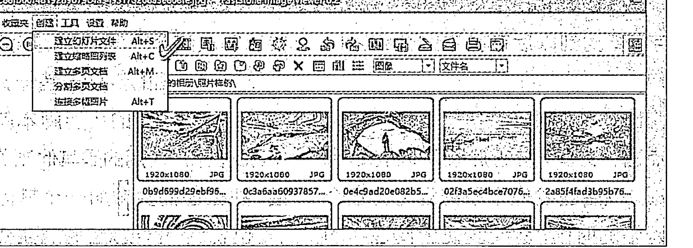

要显示这些信息，选中“显示文字(文件名、日期、EXIF信息等)”复选框，然后在文字设置窗口中点击“插入变量”按钮，接着从菜单中选择要插入的变量(图5)：如果要显示图像的宽度和高度，就分别插入$A和$B；如果要插入拍摄所用的光圈大小，就插入$M；如果要插入拍摄时所用镜头的焦距，就插入$Q；还可以通过EXIF时间菜单下的七个选项参数，分别插入照片拍摄时的各种格式的时间信息。

可以看出，本软件在插入可变的照片提示信息方面的功能非常强大。我们可以灵活地结合使用各种参数，给照片添加多种多样的可变提示信息。

##### 4. 图文并茂 背景音乐不能少

照片相册中的画面转场效果，往往是媒体演示最出彩的一个项目。在FastStone Image Viewer幻灯片创建窗口中，通过“使用过渡效果”选项，可以为每幅图片随机设置多达156种过场效果。选中每一种过渡效果后，在右侧的窗口中会有预览显示。此外还可以从“效果持续时间”列表中，选择5种过渡效果展示的持续时间之一(图6)。

如果说前面解决的是“图文并茂”的需求，那么对于一个照片专辑，如果缺少了一些背景音乐的话，现场气氛就会显得冷清了许多。我们需要为自己的专辑加上背景音乐。选中“背景音乐”复选框，启动到“音乐”设置选项卡，点击“增加”按钮，从电脑中指定一些事先准备好的MP3背景音乐文件，点击“确定”，背景音乐就设置好了(图7)。

上述所有过程完成后，点击“创建”按钮，软件会自动以先前输入的封面名称作为EXE相册名，点击“保存”按钮即可开始多媒体相册文件的创建过程。创建过程完成后，软件会自动运行建好的EXE相册文件，我们可以看到窗口标题中的相册名称，右侧窗格中的相册说明文字，左侧的封面艺术图片和左下方的播放(Play)、图片浏览(Browse)、图片输出(Export)功能按钮(图8)。至此，一个图文声并茂的多媒体音乐相册就制作好了。

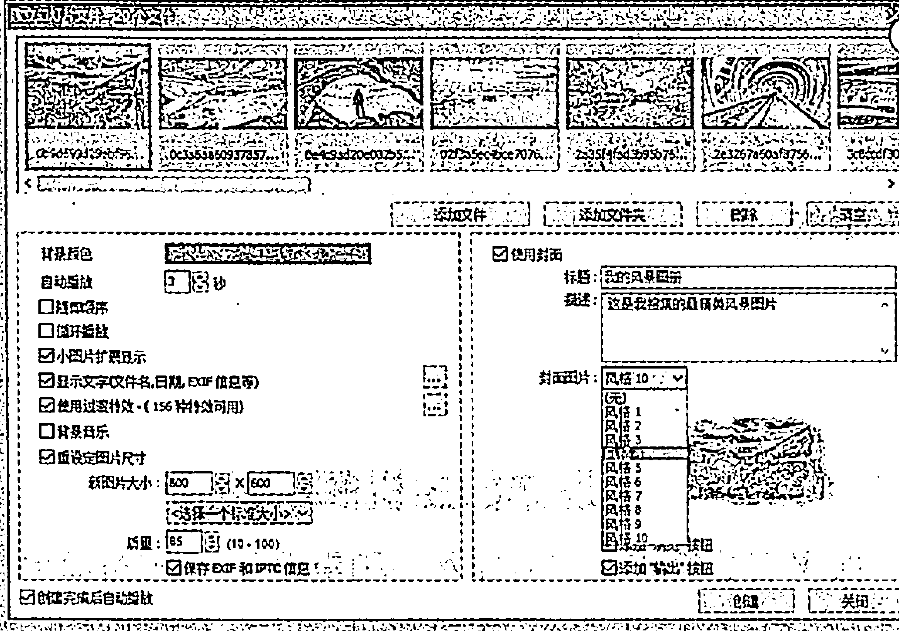

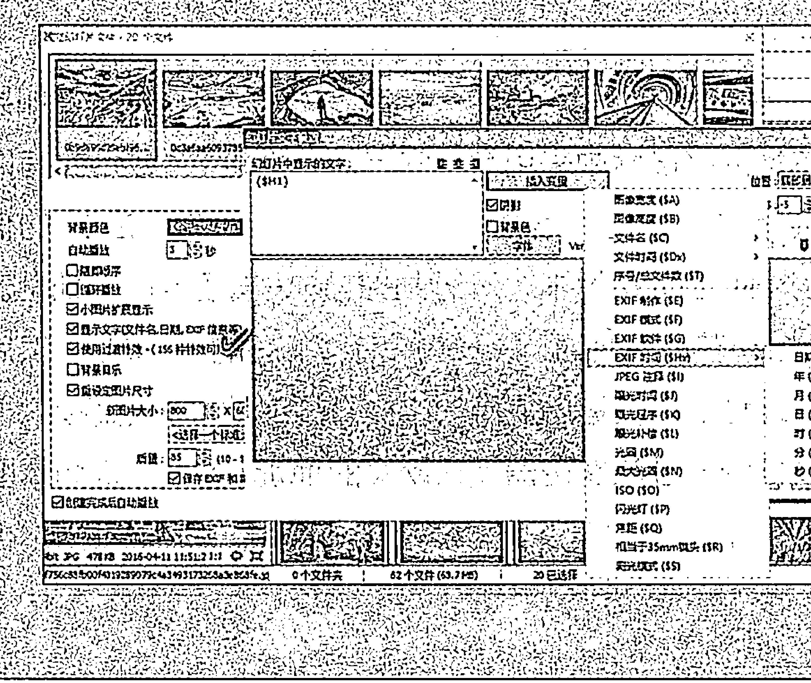

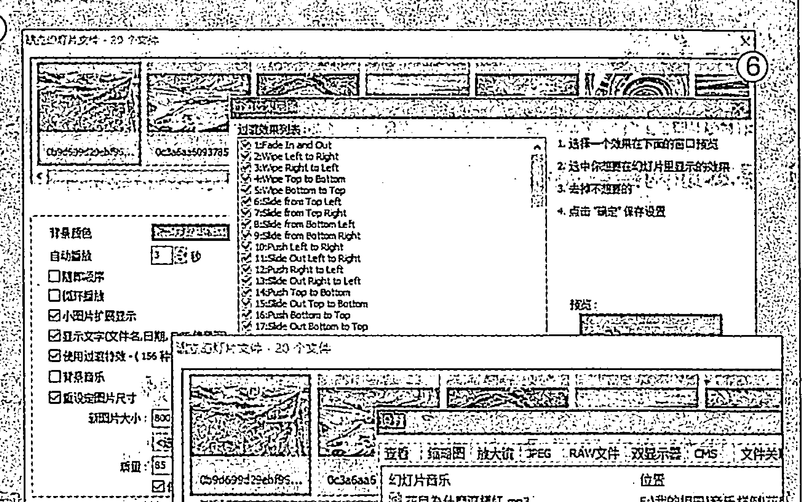

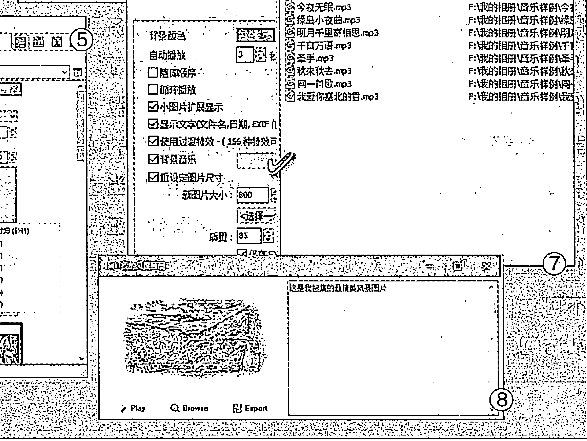


#### 解决“正在解析主机”网络问题

遇到网站打不开或者打开缓慢时，我们常会在浏览器状态栏看到“正在解析主机…”的提示。究竟是网站出了问题，还是本地网络或系统有问题？该如何解决？这些都是我们总想知道的。

##### 1. 服务器延迟造成的“主机解析”问题

我们通常不需要在浏览器内输入IP地址，只输入域名就能访问到自己需要的网站，这其中发挥作用的是DNS服务器。DNS服务器负责实现域名到IP地址的翻译，这样我们就不需要记住IP地址了。但是，负责给我们提供“翻译”功能的DNS服务器，当遇到访问量过大或DNS攻击时，超负荷的访问会直接影响到连接这些服务器的特定用户。当这种攻击达到一定程度，用户就会在终端看到“正在解析主机”的提示，网页访问变得缓慢，甚至变得不可访问。遇到这种情况，不妨先换另外的目标网站访问，以排除网站远程文件服务器问题的因素。

##### 2. 本地网络障碍造成的主机解析问题

如果在更换访问的目标网站和重设DNS服务器地址后，网络访问缓慢和“解析主机”问题仍未解决，则需要从用户的本地网络方面来寻求解决办法。

本地IP的分配有时也会影响到网页的访问效率。如果在本地网络设置中采用默认的自动IP地址获取方式，有时也会造成网络访问缓慢，从而出现“正在解析主机”的信息。这时，首先可为本地网络中的电脑设置固定的IP地址。将“自动获取IP地址”改选为“使用下面的IP地址”，然后在IP地址栏内根据所使用的路由器的IP地址分配原则，填写本机IP地址和路由器默认网关的地址（图4）。例如本图为TP-LINK路由器的典型设置方法，其中的IP地址为本机

小技巧：如何重设DNS服务器？ 右击任务栏系统托盘网络图标，选择“网络和共享中心”，在网络和共享中心窗口中点击“以太网”链接，进入以太网状态显示窗口，点击“属性”按钮（图1）；在随后打开的以太网属性窗口的项目列表中，选择“Internet协议版本4(TCP/IPv4)”，然后点击“属性”按钮（图2）；选择“使用下面的DNS服务器地址”选项，并在下方的首选和备选DNS服务器地址栏中输入新的DNS服务器地址，确认即可（图3）。

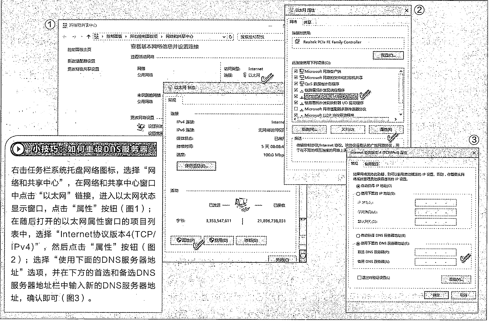

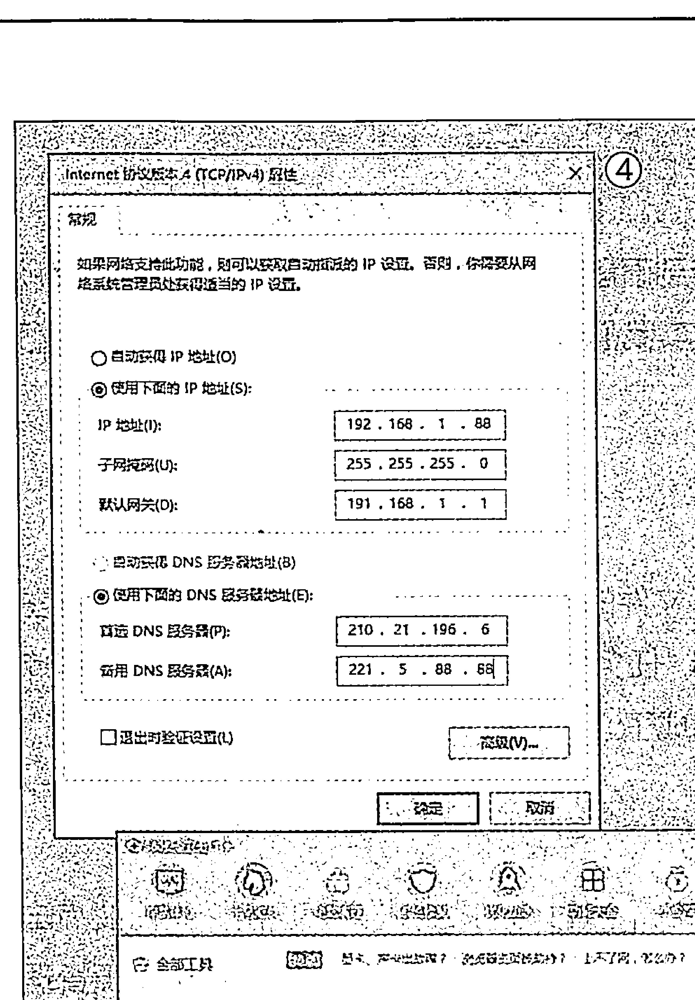

| 项目 | 值 |
|------|-----|
| 状态 | 6 |
| 模式 | 108Mbps (Dynamic) |
| MAC地址 | 00-14-78-87-03-8C |
| IP地址 | 192.168.1.1 |
| 运行时间 | 2 day(s) 20:29:07 |

- 网络硬件配置
- 网络连接配置
- DHCP服务
- DNS服务
- HOSTS
- 浏览器配置
- 检查电脑能否上网

- 网络硬件配置：未诊断
- 网络连接配置：未诊断
- DHCP服务：未诊断
- DNS服务：未诊断
- HOSTS：未诊断
- 浏览器配置：未诊断
- 检查电脑能否上网：未诊断

| DNS服务器 | 测试结果 |
|------------|----------|
| 202.106.0.20 | 正常 |
| 202.106.46.151 | 正常 |

> 某些网络浏览器还提供“网络医生”选项，如搜狗浏览器、360安全浏览器等，可以用F1功能键启动网络修复。

的IP地址设置，该地址受路由器IP分配设置的影响，具体需要按路由器说明中的规则进行有效地址的分配。DNS服务器地址，应设置为当地服务商的DNS服务器地址。一些杀毒软件或优化工具在修复电脑时，可能会更改电脑的DNS服务器地址，虽然其目的可能是善意的，但有时也会导致上述问题的出现。这时，我们可以手动恢复DNS服务器地址。先用所用路由器的管理地址和密码登录路由器管理页面，通过路由器状态属性页面查看本网DNS设置（图5）；然后手动在网络设置中，按上述方法设置DNS服务器地址。如果不具有访问路由器的权限，也可以咨询网络服务商，直接获取DNS服务器的地址。此外，作为一种更加便捷的处理手段，还可以用优化软件的恢复选项进行恢复。在360安全卫士主页的右下角点击“更多”按钮，进入工具选择窗口，选择运行“断网急救箱”工具（图6）。在断网急救箱页面中列出的断网7大因素中，就包括DNS服务的问题，点击“全面诊断”按钮，软件会自动进行诊断和修复（图7）。若问题出在DNS服务方面，则会在诊断之后显示已修复的结果，表示问题已经得到解决。如果对修复结果还不够满意，那么还可以进一步使用DNS优选工具，让软件自动根据当前所用的网络，选择更优的DNS服务器。操作非常简单，点击“开始DNS优选”即可自动完成（图8）。

#### 快速DIY自己的电影资料库

文|万立夫

有些用户平时最喜欢利用业余时间观看电影，甚至将自己喜欢的电影保存到硬盘里面。这样日积月累下来，硬盘里面就会存在大量的电影文件，时间一长有些电影的情节就会变得模糊起来。其实我们可以自建一个电影资料库，需要的时候就可以快速查询了。

##### 搜寻硬盘电影文件

要想创建一个电影的资料库，首先就需要了解硬盘里面现在存放有哪些电影，第一步需要把它们寻找出来。下载zogvm视频管理软件（https://github.com/zogvm/zogvm），首次运行时会要求用户创建一个电影文件的资料库，如果用户将电影文件保存到移动硬盘等设备里面，那么需要将移动硬盘接入电脑。当系统识别出移动硬盘等设备以后，点击软件窗口左上角的“建索引”按钮，在弹出的对话框里面勾选需要进行文件索引的磁盘名称。如果用户了解电影文件的存放地址，那么可以点击窗口中的“目录表”列表，接着点击左下角的“添加共享/本地目录”按钮，在弹出的对话框里面选择存放有电影文件的文件夹目录即可。选择完成以后，在右下角根据需要选择“建立文件索引（快）”、“建立媒体信息（中）”等选项，最后点击“开始构建”按钮，就开始进行电影文件的查找操作了（图1）。当软件窗口在左下角显示出“任务做完了”的提示以后，就表示数据库已经创建完成了。

##### 查看电影详细信息

当需要进行数据库的检索操作的时候，只需要点击主窗口中的“检索”按钮，就会弹出一个类似于资源管理器的窗口。点击窗口左侧列表中的磁盘名称，就会显示出该磁盘里所有的多媒体文件信息，当然也可以在输入框里面直接输入电影的名字，这样软件就可以在创建的资料库里面对它进行检索操作，进而快速找到需要的电影文件。需要说明的是，由于在创建资料库的时候也对移动设备中的视频进行了收录，因此即使是在没有连接移动设备的时候，也可以快速地从资料库里面查到移动设备里面包含的电影文件（图2）。

> > **小提示**
> 虽然这款软件号称主要是对视频文件进行管理操作的，但是其实它也可以对音频文件进行管理操作。如果用户不想要它对音频文件进行管理操作，那么首先点击“文件过滤”标签，将已经勾选的音频选项全部去除就可以了。

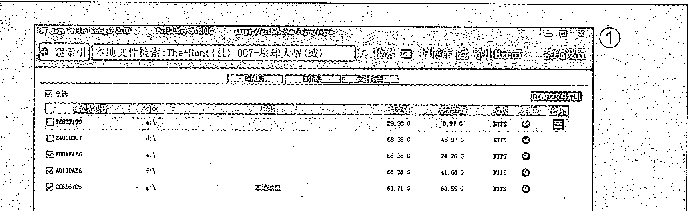

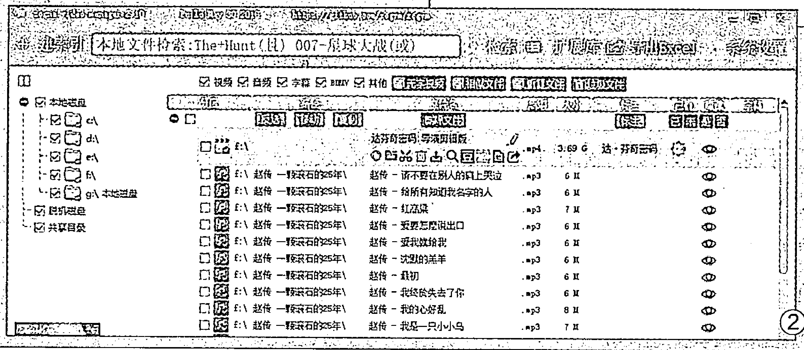

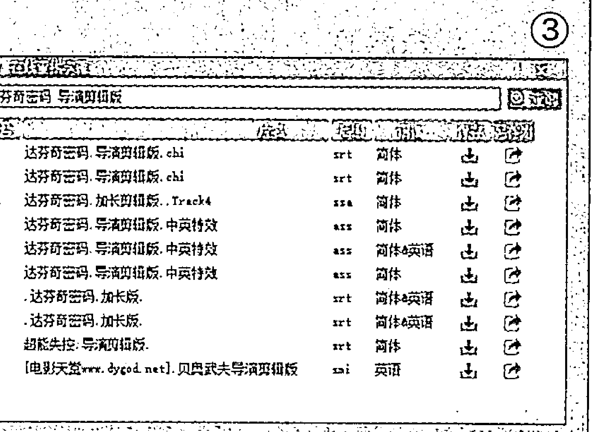若需要了解某一部电影的详细信息，只需要在窗口列表里面选中这部电影，这样在窗口的左下角就会显示出这个电影的基本信息。其包括电影的海报以及出品年代、导演、主演等相关的信息。如果还需要更加详细地了解其他内容，可以点击“豆瓣链接”，在打开的浏览器窗口里面进行查询。当然用户也可以点击工具栏下的“显示豆瓣信息”按钮，在弹出的对话框里面就可以显示出搜索到的电影名称。从中点击用户需要查看的电影名称后，就可以在窗口下方显示出详细的电影信息了（图4）。

##### 创建纯粹的资料库

虽然zogvm这款视频管理软件非常的不错，但是它也有它的不足之处，那就是这款软件是依托于电影文件来创建数据库的。换句话说，电脑里面没有这部电影的话，那么就无法创建相关的数据库文件。那么如何才可以摆脱电影文件，来创建一个独立的数据库信息呢？

说到电影数据库很多人就会马上想到非常专业的电影网站IMDB，现在我们利用一款客户端工具就可以直接从这个网站获取到相关的信息，进而在自己的电脑里面创建出对应的数据库文件了。我们首先从网上下载EMDB这款软件（https://eyun.baidu.com/s/3eRRWuem），接着点击工具栏中的“添加”按钮，在弹出窗口的“片名”输入框里面输入要创建的电影名称。需要提醒的是，由于IMDB这个网站是国外的网站，所以输入的电影名称也必须是英文名。输入完成以后点击“搜索IMDB”按钮，就开始连接到IMDB网站的服务器进行检索。一旦检索到相关的信息后，就会从网站进行下载操作，并且自动输入到对应的输入框（图5）。

当相关信息下载完成以后，点击OK按钮就可以返回到主窗口（图6）。接下来只要按照同样的方法输入其他的电影名称并添加，这样就可以快速地创建一个完全属于自己的电影资料库了。

> 我们可以通过搜索引擎输入这部电影的中文名称来查询它的英文名称。

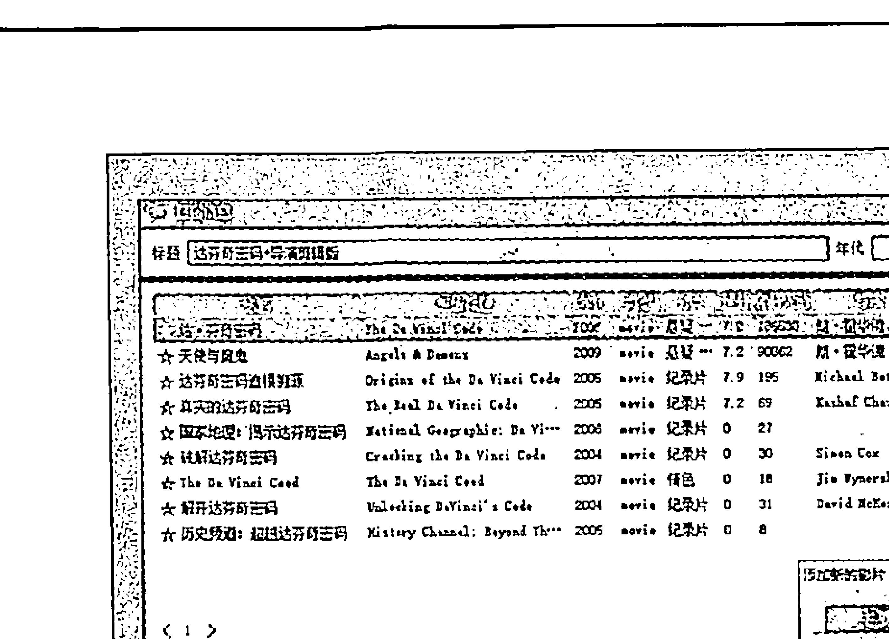

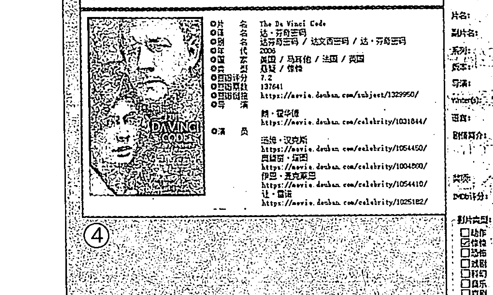

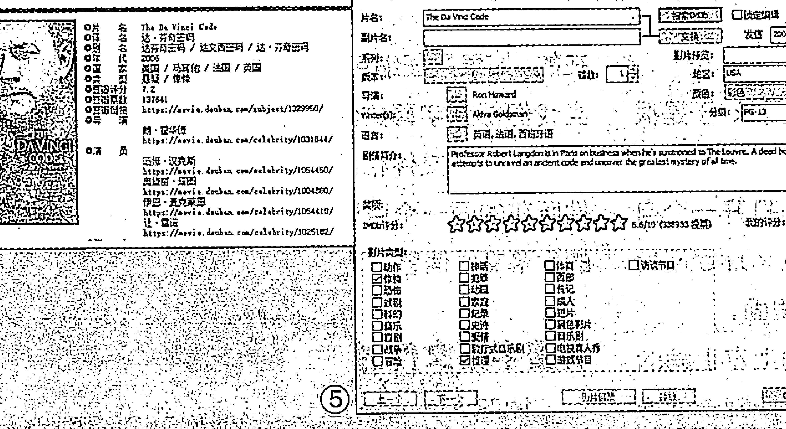

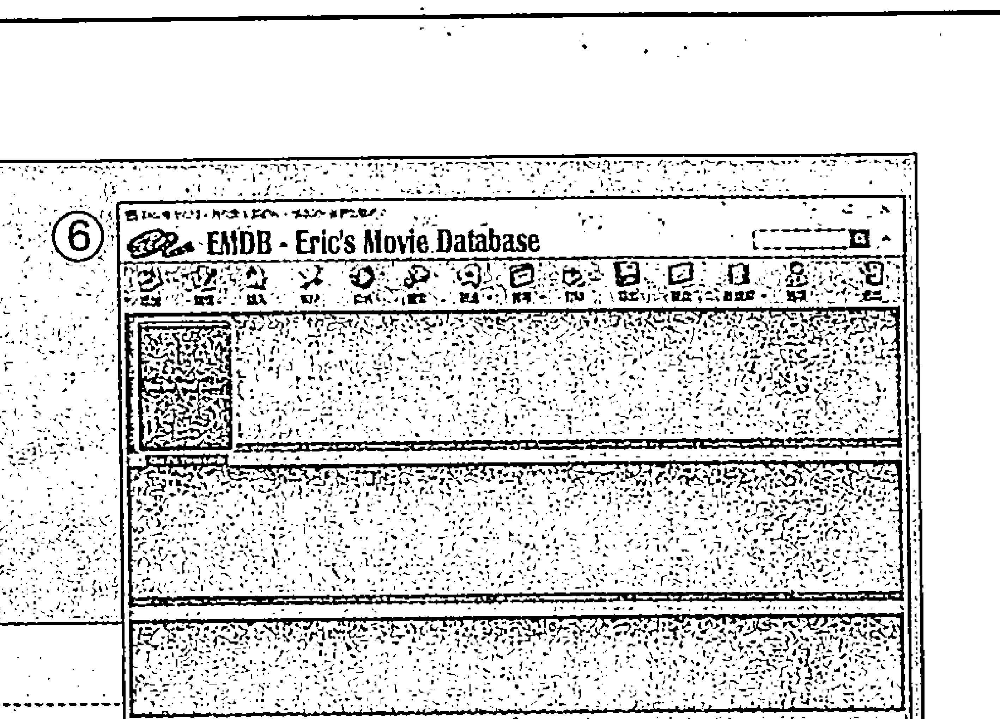

## 自己动手调整错乱的影视字幕 文阿立

看电影是很多人选择的休闲方式之一，但是观看国外的电影的话，那么字幕肯定是少不了的。即使是你的英语水平很好，遇到其他语言的影片也是需要字幕的。本文就和大家说些找字幕的技巧，以及对不合适的字幕如何进行调整编辑。

##### 寻找需要的字幕文件

在射手网关闭后，由于存在大量的字幕需求，于是很多字幕网站如雨后春笋快速出现，所以我们要想寻找字幕文件的话还是非常简单的。现在我们首先打开一个自己常用的浏览器，在地址栏中输入www.zimuku.net网址后回车，就可以进入到这个全新的字幕网站里面。

接下来要做的就简单多了，只需要在网上左上角的输入框输入电影的名称，回车后就可以开始搜索查询操作了（图1）。为了方便用户确认是否为自己需要的电影字幕，它会在每一个字幕的前面显示出该电影的封面图片，通过它用户就可以进行快速的确认（图2）。确定是自己搜索的电影，那么在后面的列表中就会显示出该电影所有对应的字幕文件。从中寻找自己需要的字幕文件链接并点击“下载字幕”按钮就可以了。

通常下载的字幕文件会以两种方式存在，一种就是纯粹的字幕文件格式，而另一种则是以压缩包的方式存在的。如果是压缩包，则需要对这个文件进行解压操作。当我们得到字幕文件以后，还要将字幕文件的文件名更改为和视频文件相同的名称，并且把它们移动到视频文件所在的同一个目录里，才能成功地加载并显示出对应的字幕文件信息。

##### 调整字幕文件时间差

按照前面的操作其实我们就可以正常地观看视频并显示字幕了，但是有的时候会发现显示出的字幕和视频的内容出现了错位的状况。之所以会出现这样的状况，是因为用户观看的视频文件和字幕文件作者观看的视频文件存在版本上的差异。要想解决这个问题的话，我们只能手动对字幕文件的时间进行调节。

以PotPlayer播放器为例，在软件的屏幕正中点击鼠标右键，接着选择“字幕”菜单中的“字幕浏览器”命令，可以看到整个字幕信息了。想要对字幕文件

> 小提示
最近网络里面出现了一种利用字幕文件进行攻击的破坏方式，为了杜绝这种情况的发生，我们在下载字幕文件以后最好对字幕文件的安全性进行检测。检测的方法也非常的简单，只需要打开一个文本编辑器，将字幕文件拖拽到这个窗口并释放即可。如果窗口里面显示出字幕文件的详细内容，就说明这个字幕文件是安全的。反之如果显示的是乱码信息的话，那么建议用户马上将这个文件进行删除。

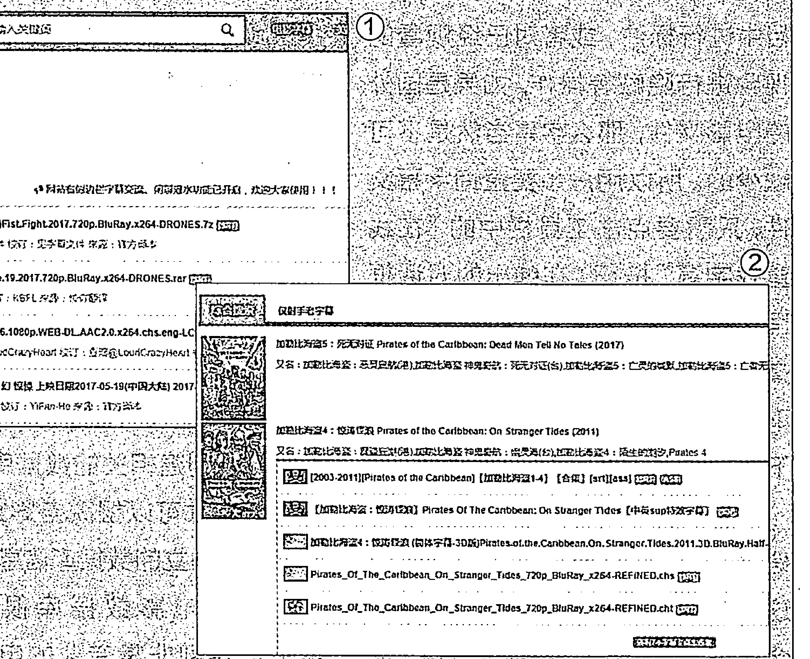

##### 字幕文件的重新编辑

的时间进行调整，那就要以影片的名称出现为基准，通过它找到字幕中的影片名称信息后进行对比，从而得出一个对应的时间差。接下来点击工具栏中的第1个或者第2个按钮，就可以对字幕进行滞后或者提前的操作了（图3）。不过无论用户点击哪一个按钮，它们每一次只能进行0.5秒的操作。如字幕文件和视频文件的时间差为2秒，就需要点击四次相关的按钮才可以。当然用户也可以点击“直接输入同步”按钮，在弹出的对话框里面输入时间差即可（图4）。

件进行调整。不想这么麻烦的话，那么只能对这个字幕文件的时间进行重新编辑，这才是一种一劳永逸的方法。

下载运行SrtEdit这款工具，点击工具栏中的“打开”按钮，在弹出的对话框里面选择要编辑的字幕文件，这样就可以在窗口列表里面显示出字幕文件的所有信息了。同样我们在列表里面找到电影名称的那一条字幕信息，接着在上面“时间校准”的“显示”输入框里面，设置我们认为新的时间。

然后在右侧选择“以本条为准按原时间间隔校准所有字幕”选项，点击“执行校准”按钮，这样就可以一次性对所有的字幕内容进行调整（图5）。调整完毕以后点击工具栏中的“保存”按钮，这样这个字幕文件就修改完成了。

前面我们通过播放器对字幕的顺序进行调整，只是临时的解决方案而已。因为下一次再打开同一个视频文件，还需要再一次对字幕文件进行调整。

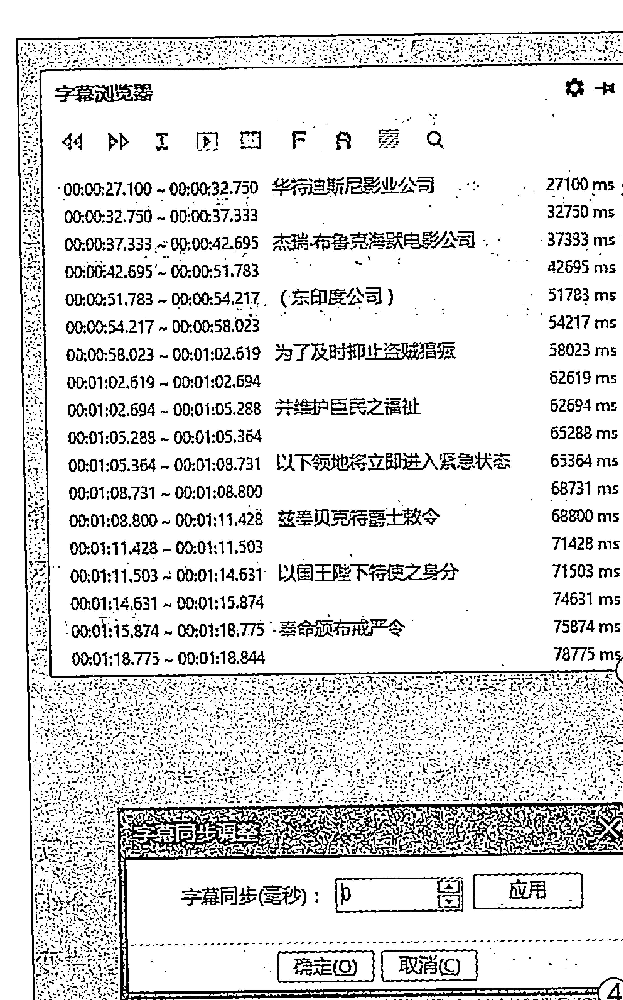

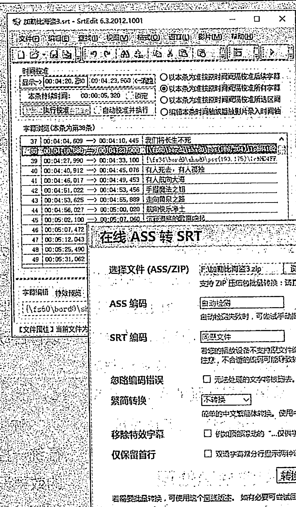

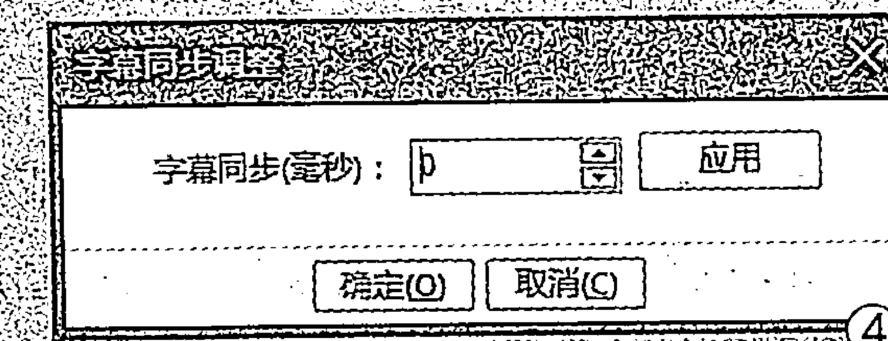

##### 字幕文件格式的转换

同其他格式的文件一样，字幕文件也拥有不同的格式。

如果用户只是对单一的文件进行转换操作，利用上面的这款工具也可以完成。通过它打开需要转换的字幕文件，接着点击“文件”菜单中的“另存为”命令，在弹出的对话框中选择“保存类型”列表中的新的字幕格式，最后点击“保存”按钮就可以了。如果用户要想批量进行字幕文件的转换操作，通过浏览器打开http://lab.sorz.org/tools/asstosrt/这个网址，接着将所有要转换的字幕文件压缩成一个压缩包，点击“浏览”按钮进行压缩包的上传操作。然后根据自己的需要进行相关选项的设置，最后点击“转换并下载”按钮就可以完成批量转换的操作了（图6）。

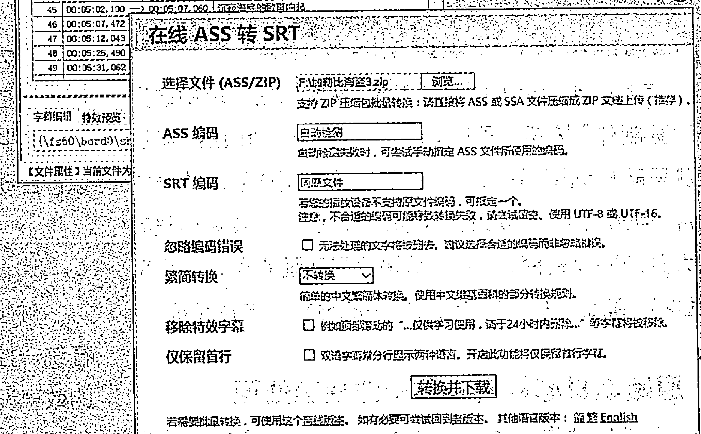

## 图片动画 在简单制作中出彩 文|阿楠

制作GIF动画的方法很多，但我们总希望制作过程更简单，效果更炫酷。但在制作过程中，用一般的工具或方法，只能做出效果平平的动画；而要玩出更多的花样，还有一些问题困扰着我们，如原始图片尺寸不统一的处理、横平竖直的图片布局太死板等问题。针对上述情况，选择图片工厂的动画制作工具来执行制作任务，也许是一劳永逸的方法。

##### 1. 准备基本素材时设置动画分辨率

首先启动图片工厂套件工具，从窗口主菜单中选择“动画制作”按钮(图1)。进入动画制作窗口后，通过左侧导航栏选择图片文件夹，然后选中制作所需的原始图片，点击“添加”按钮加载图片，之后软件会弹出限制最大分辨率设置窗口，通过滑块设置动画的最大分辨率(图2)。确定之后，制作动画所需的材料便准备完成。

##### 2. 原始素材图片尺寸不同的快速处理

当我们制作动画所用的图片尺寸不一致时，我们可先不理会其尺寸的不统一，一次性载入即可。载入图片系列之后，可以通过动画图片基准设置列表，确定一个基准图片尺寸，如选择最大的一幅图片或最小的一幅图片作为基准，或选择第一幅图片的尺寸为基准，另外还可以自定义一个心目中的图片尺寸为基准(图3)。这样，软件会自动以我们选择的基准来处理图片的伸缩，以符合动画演示所需要的一致尺寸。

##### 3. 解决添加颜色渐变过渡等效果问题

许多简易动画制作软件对图片的动画过渡效果实行统一控制，用户不便对其中的某些帧进行单独或分组的效果设置或时间控制，这样就造成整个动画的图片变换要么用同一种效果，要么就用随机的变换效果，留给用户的能动性空间不足。而在图片工厂的动画制作环境下，我们可以借助于帧设置的范围、时间、效果的组合控制，实现用户对过渡效果的灵活组合控制操作。

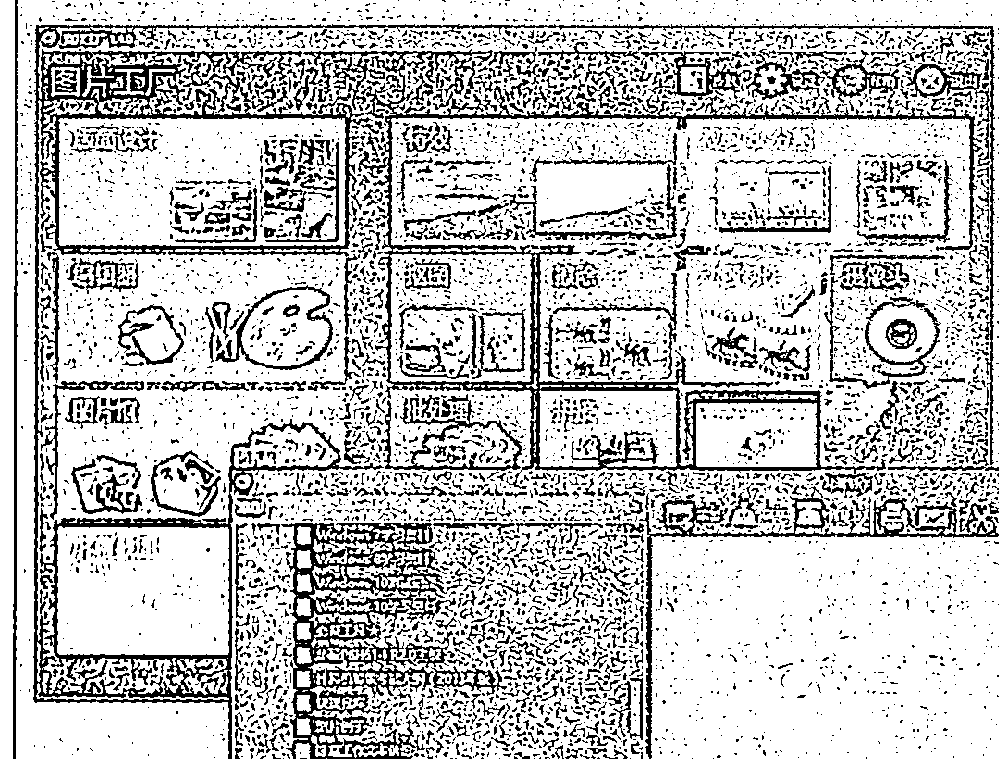

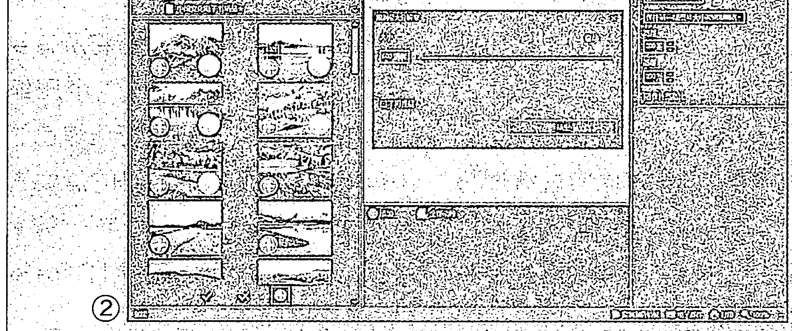

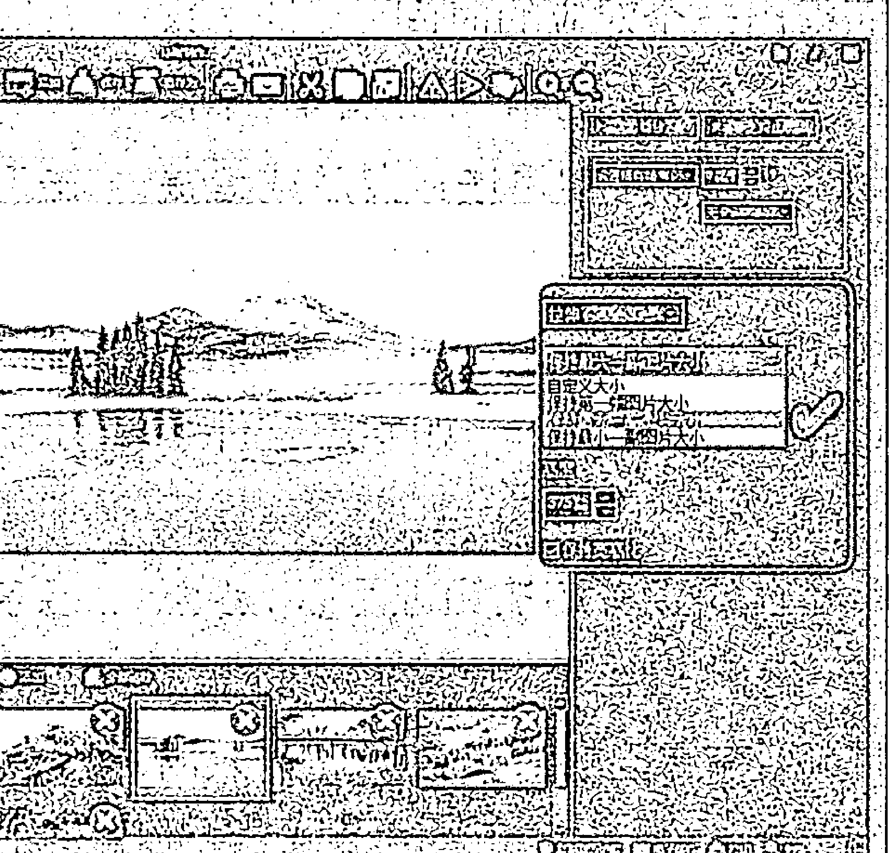

> **小提示**
在用“擦除”、“擦除颜色”、“滑动”等方式设置图片变换效果时，还可以根据需要对变换方向进行选择。为实现多变效果，请为不同组别的图片设置不同方向的擦除或滑动效果。擦除或滑动方向一般可从4种方向中选择。

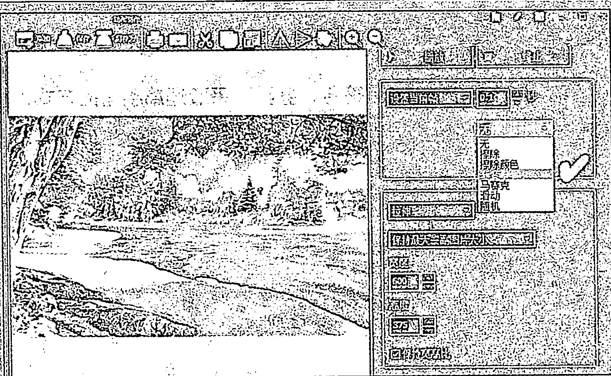

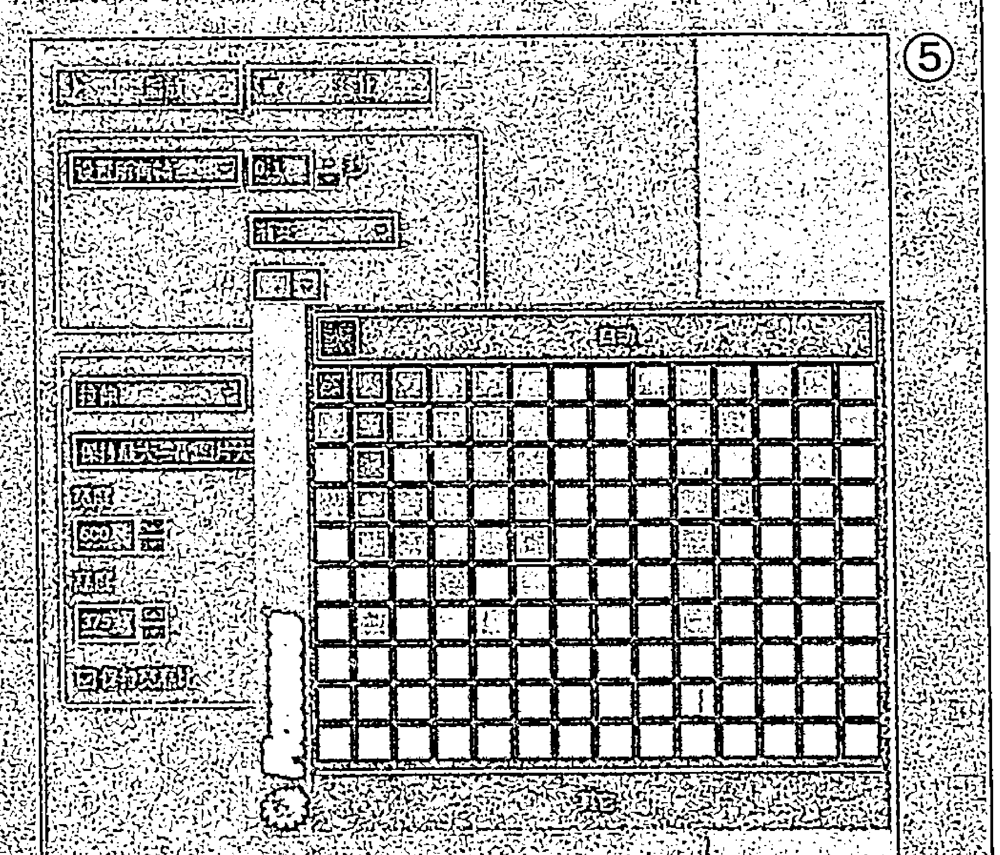

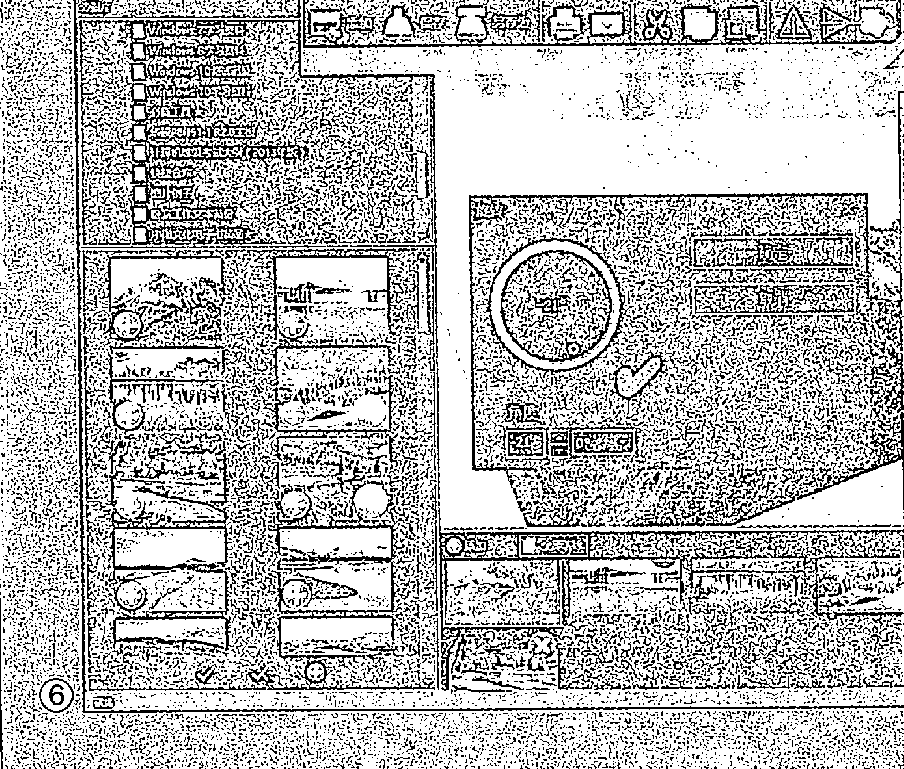

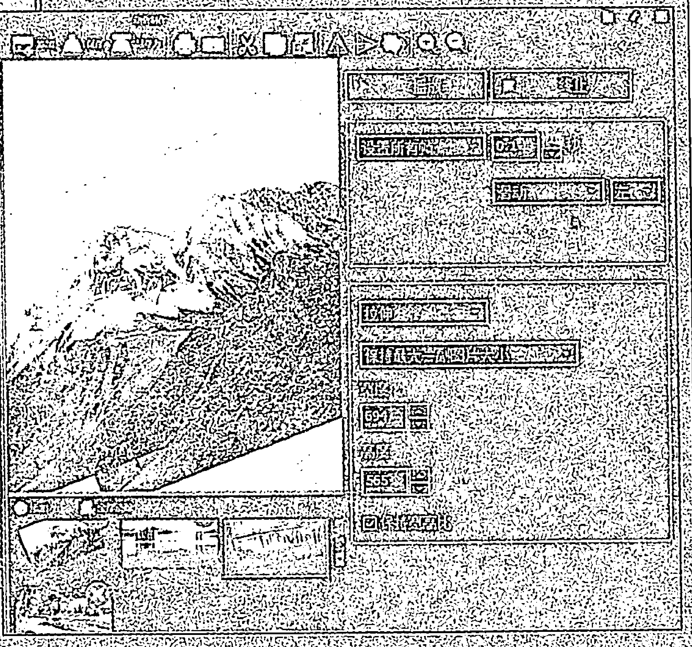

##### 4. 如何改变图片横平竖直的死板模样

首先在图片列表中选择要控制的目标为某张图片，然后从帧设置范围中选择“设置当前帧”，同时设置延时时间，再选择一种过渡效果（图4）。如此设置之后，最终效果将只作用于用户单独设置的图片上。用同样的方法对需要进行个性化变换的图片进行设置，这样最终的效果将能够严格按照用户的安排来演示，而不是软件自动指定的某种效果或变换莫测的随机效果了。

如果要实现用户定义的某种颜色的渐变效果，选择变换方式为“渐变”，然后点击色块，在弹出的取色面板中选择渐变的颜色，之后这张被选中的照片将按用户设定的渐变颜色来过渡（图5）。

在图片工厂动画制作窗口中，选中要灵活设置的图片，点击工具栏上的“旋转”按钮，在窗口中部会出现一个圆形的“调谐”按钮，类似于收录机上的调谐旋钮，通过转动这个旋钮，我们就可以自由地设置帧图片在动画中的角度。当然，如果对角度有严格的要求，还可以通过在旋钮下方的文本框中输入具体的角度数值，进行精确设置（图6）。

上述设置只是动画制作过程中的一些特殊环节。基本设置完成之后，在动画输出之前，要先看一看制作的效果如何。点击“播放”按钮进行动画演示，这时原来的图片窗口将变成动画窗口。如果演示过程中发现哪个环节有问题或不满意，点击“终止”按钮停止播放，然后定位到出现问题的动画帧，并用下面的参数窗口进行调整。直到最后对演示效果满意之后，再点击保存或另存为按钮，将作品保存为GIF格式输出即可（图7）。

## 拒绝伪造 手写亲笔签名与信件 文阿楠

通过电脑传递信息，为了材料的真实性，有时我们需要在文章末尾附上亲笔签名，甚至还采取通篇手写的方式。用电脑记录手写笔迹，最好有一块专业手写板，或者更简单一些，利用鼠标手写或借助手机触屏手写，也可创建亲笔签名或亲笔信件。

##### 1. 鼠标手写 签名很随意

从设备上来讲，用现成的鼠标作为手写工具是最省事的。在百度输入法的工具条上点击“工具箱”按钮，然后从工具箱列表中找到“亲笔信”工具，点击它完成手写组件的安装（图1）。之后，在WPS文档、Word文档或其他图文编辑环境下，如果需要插入亲手书写的内容，只需点击桌面上生成的“亲笔信”快捷方式，或正在使用百度输入法的用户可从工具箱中点击启动“亲笔信”，即可打开鼠标手写面板。用鼠标在窗口右侧的田字格中书写文字，写好后的文字将出现在左侧的写板上（图2）。签名或亲笔信写好之后，可以点击“复制”按钮，然后转到编辑环境下粘贴手写图案；还可以点击田字格右下角的信封按钮，将写好的签名图片直接发送到编辑器当前光标所在处。

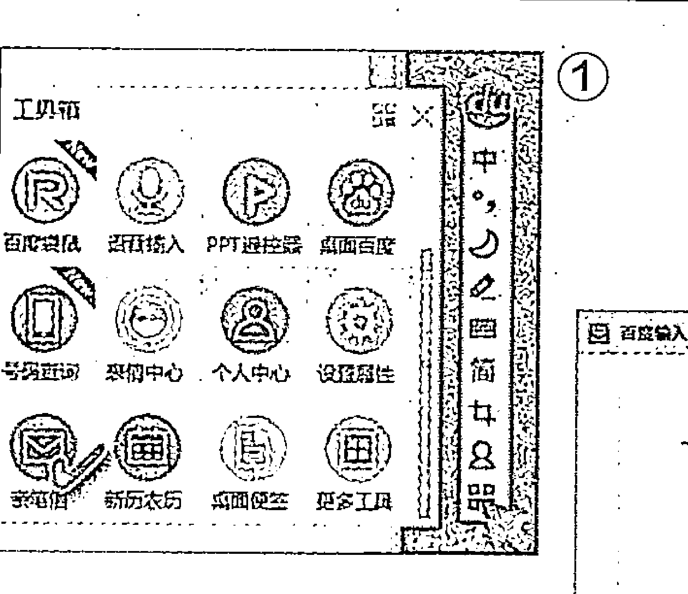

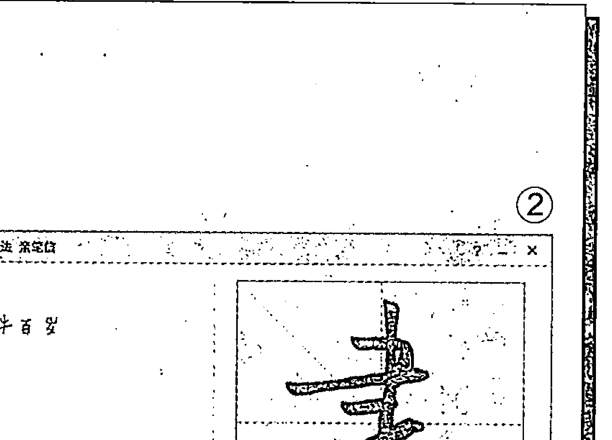

##### 2. 借用触屏 手写更精准

由于鼠标手写不太好控制，而且如果不加练习，写出的字与真正手写会有不小差异。为了更接近于手写的效果，可以借助于“云端输入”功能，借用手机屏幕作为手写板来输入内容。为此，需点击亲笔信输入窗口下方的“切换为云端输入”按钮，之后出现一个二维码图片，使用与PC联网的手机扫码（图3），之后在手机触屏上进行手写输入将更易控制，这样更接近于传统书写。输入的内容出现在电脑屏幕写板区域内，用上述方法将手写内容插入到编辑器的文档中即可。

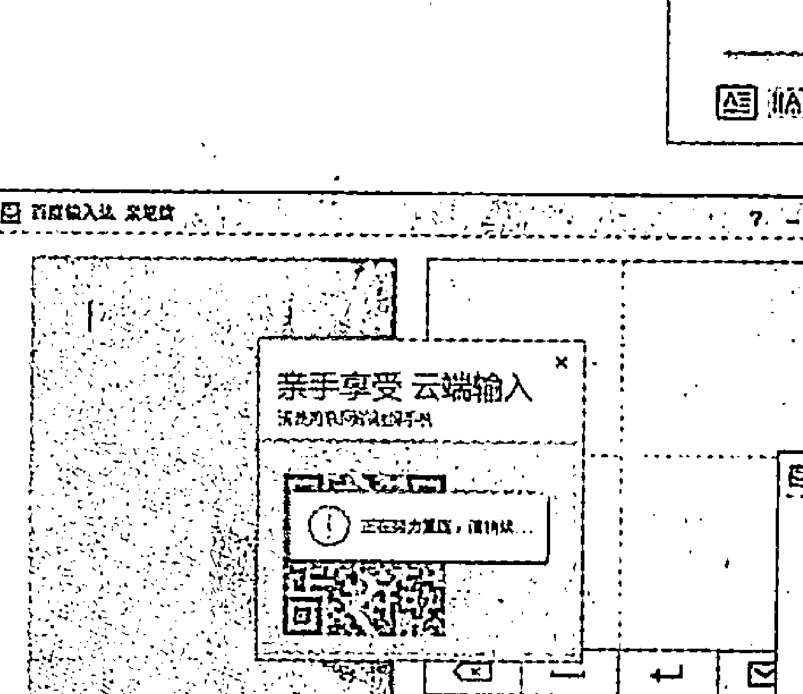

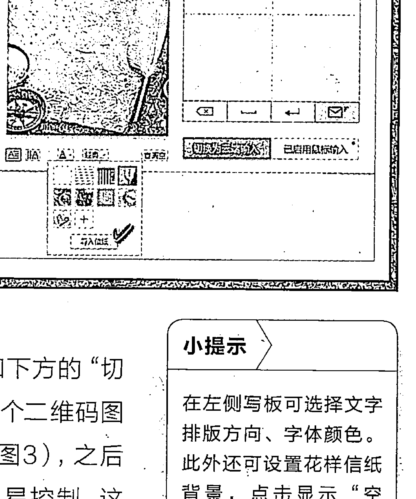

> > 小提示
> 在左侧写板可选择文字排版方向、字体颜色。此外还可设置花样信纸背景，点击显示“空白”的选择框，选择信纸图案，或用“导入信纸”按钮加载个性化的信纸图案（图4）。

## 请来“快手” 本地文件快速搜 文|阿楠

Windows本地文件搜索效率不高，第三方工具要么“臃肿”，要么磁盘文件格式支持有限（如Everything只支持NTFS格式），想要更好地搜索文件，一款免费搜索工具Wise JetSearch不能错过。

JetSearch运行后，屏幕右上角出现快速搜索浮动面板，输入关键词后点击“查找”，即可快速从本地连接的所有存储介质中找到满足条件的文件。如果使用过程中搜索面板不见了，在软件主窗口右上角的控制菜单中选择“运行快速查找”即可找回（图1）。


如果要搜索的文件范围比较明确（比如在D盘或F盘中），只需在JetSearch主窗口的驱动器列表中，选择指定的分区搜索即可（图2）。

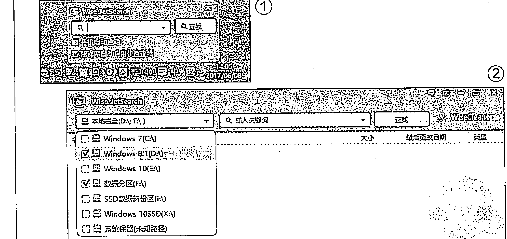

若需要找具有隐含属性的文件，可在搜索窗口直接输入关键词进行搜索，就能让隐含文件现形（图3）。

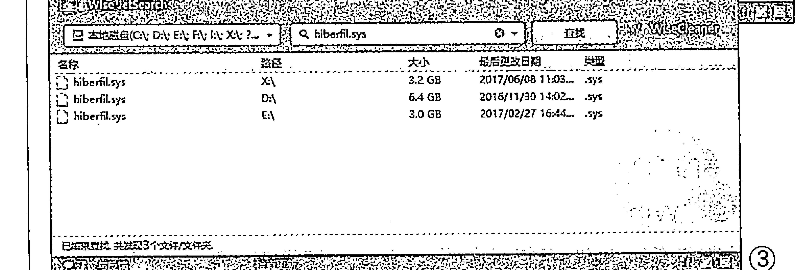

想找出电脑中的所有MP4电影文件吗？用关键词“*.MP4”搜索试试。如果只记得文件名的大概，可以使用半角“?”号代替记不起的部分。比如，用“摄?入门”这个关键词搜索（图4）。

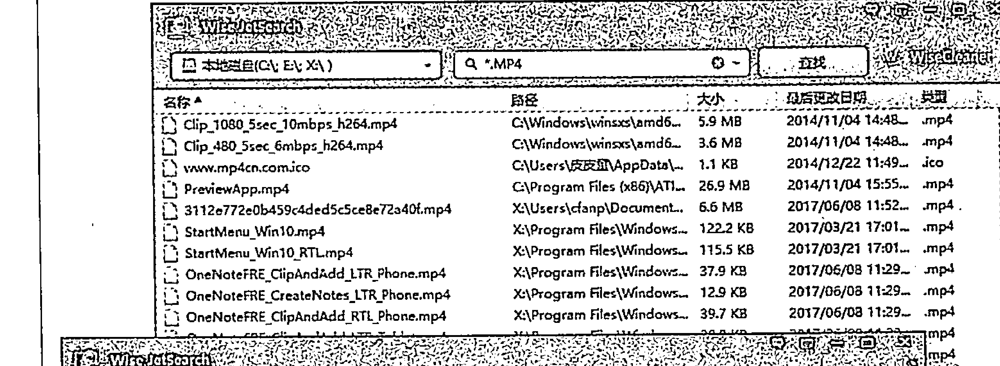

需要一份完整的磁盘文件列表吗？用“*”或“*.*”作关键词搜索，即可将所选介质中的所有文件一览无余。然后直接在搜索结果列表上单击鼠标右键，选择“保存到txt文件”命令，将搜索文件列表保存到一张CSV表格中，然后通过WPS表格或Excel来编辑处理（图5）。

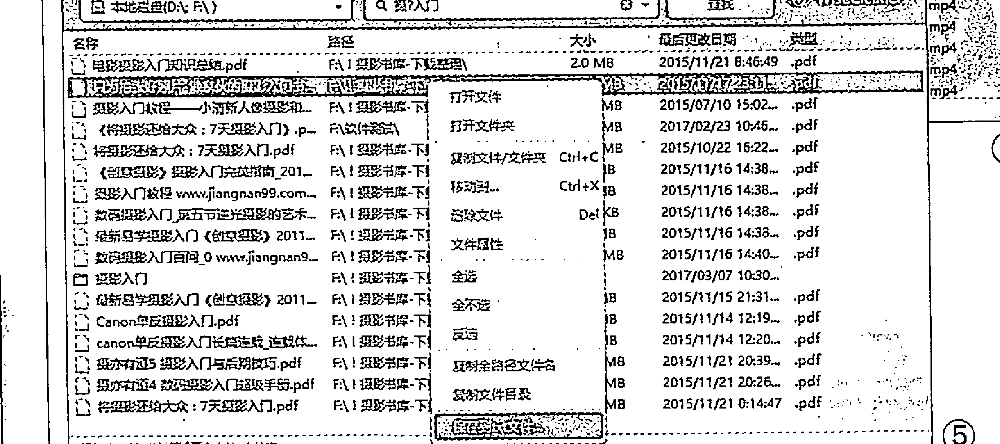

为了让JetSearch能够随时提供服务，别忘了保持将浮动搜索面板中的“开机自动启动”选项置于被选中的状态。

## 轻松把文件夹变成共享网站 文|阿立

随着国内知名的网盘接二连三地关闭，用户分享文件的方式就又少了一种。虽然仍然可以通过电子邮件进行分享，但是毕竟没有网盘来得方便。好在现在用户的硬盘已经以TB级计算，存放大量的文件已经没有任何的问题了，我们完全可以将自己的硬盘变成共享系统。

##### 配置生成软件安装包

虽然在电脑里面搭建共享系统有很多的方法，但是今天我们采用的是网页式文件共享的方式。也就是说将自己电脑里面特定的文件夹目录变成一个网页服务器，从而搭建出一个属于自己的共享网站，网络中的其他用户就可以通过电脑等设备，来访问和下载共享目录中的文件内容了。

要想搭建文件的共享网站需要使用专门的软件，使用Caddy这款免费开源的WEB服务器软件就行。不过这款软件的使用和我们常见的软件有一些不同，因为它需要根据自己的要求来配置安装包。首先登录这款软件的官方网站(https://caddyserver.com)，点击网页中的“Download”按钮，在弹出的网页左侧就可以看到“Windows 32-bit”这个选项。用户可以点击后面的按钮，来选择其他的软件版本。接下来点击“Add plugins”选项后面的加号按钮，在弹出的对话框列表里面选择“http.filemanager”这个选项。选择完成以后点击“Done”按钮，关闭对话框后点击“Download”按钮进行安装包的下载操作(图1)。

现在我们将下载的安装包进行解压就可以了，接下来打开一个文本编辑器，在里面随意输入一段文字信息。这里输入的是《电脑爱好者》的官方网站，输入完成以后将这个文件另存为index.htm，并且将其保存到刚刚解压的文件夹目录里面。然后运行文件夹目录中的caddy.exe这个文件，这时就会弹出一个类似于命令提示符窗口的界面。最后打开浏览器并且在地址栏中输入“http://localhost:2015/”并回车。如果在网页中显示出我们刚刚输入的内容，那么就说明这个软件已经成功运行了。如果没有显示输入的内容，则说明运行失败。

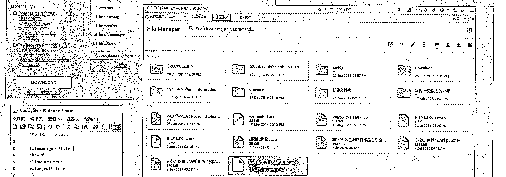

> > 在命令提示符窗口输入“ipconfig”后，就可以看到当前系统的IP地址。


```

192.168.1.6:2016

filemanager /file {
    show /
    allow_new true
    allow_edit true
}

```


##### 远程文件的操作管理

接下来我们就需要在前面的步骤上创建共享网站了。首先打开一个文本编辑器，创建一个名为Caddyfile的新文件，注意这个新文件没有任何的扩展名。接下来需要在文件里面输入下面的参数内容。

首先第一行就是允许访问的IP地址和访问的端口号，而show参数用来设置文件在电脑上对应的文件夹目录。比如在软件目录下创建一个名为file的文件夹，那么就输入“show /file”。当然也可以输入“show f:”，对某个磁盘分区进行共享。如果用户将共享的文件放到一个虚拟磁盘里面，那么就在这里设置虚拟磁盘的盘符就可以了。

除此以外，allow_new和allow_edit参数表示允许新建和修改共享文件夹中的文件（图2）。

现在重新启动caddy.exe这个文件，接着打开任意一个设备的浏览器，访问“http://ip:端口/file/”后就可以看到共享的文件信息。当我们在网页里面选中需要的文件后，通过工具栏中的相应命令就可以对它进行管理操作。比如我们点击“Download”按钮就可以进行这个文件的下载操作，点击“Delete”按钮就可以将它从共享磁盘里面删除掉（图3）。

除此之外，对于多媒体文件和文档文件等，点击“See raw”按钮后就可以进行在线预览（图4）。当然除了从共享磁盘里面下载文件以外，也可以将文件上传到共享磁盘里面，以便其他的用户进行下载分享操作。点击工具栏中的“Upload”按钮，在弹出的对话框里面选择需要上传的文件后，就可以上传到共享磁盘里面了。

##### 其他暂时替代的方法

如果只是临时想共享一些文件的话，那么并不需要上面这种专业的软件来操作，而利用一些常见软件中的共享功能就可以完成了。如Everything这款常见的文件搜索软件，里面就包括有HTTP和FTP这两种不同的文件共享方式。

点击“工具”菜单中的“选项”命令，接着选择左侧列表中的“文件夹”选项，然后在右侧窗口里面点击“添加”按钮，从中选择存放有要共享文件的磁盘或者文件夹（图5）。

接下来点击注册列表中的“ETP/FTP”选项，勾选窗口中的“启用 ETP/FTP 服务器”选项。接着根据自己的需要，设置“ETP/FTP 服务器端口”。如果只想让熟悉的人进行登录的话，还可以设置“ETP/FTP 服务器用户名”和“ETP/FTP 服务器密码”等选项（图6）。

设置完成以后分别点击“应用”和“确定”按钮，返回到搜索软件的主操作界面。现在同样在任意一个设备里面打开浏览器，在地址栏中输入“ftp://ip地址”并回车，就可以访问我们的共享文件夹目录。通过文件目录一层层打开，就可以找到需要的文件，点击文件名称的链接后就可以进行下载操作了。

#### 自己动手做喜欢的有声读物
文阿立

碎片化的时间增多，使人们已经失去了整段的时间去阅读，于是许多人通过电子读物的方式去“听”书，但并不是任何我们需要的内容都可以找到现成的电子读物。遇到这种情况，别担心，自力更生自己制作。

##### 随意选择引擎版本

其实最简单的方法就是将文本信息转换为语音文件，然后通过任意的播放设备就可以进行播放操作了。虽然通过语音转换方式得到的文件没有真人朗读起来那么好听，但是至少可以临时解决我们需要的这些问题。

首先下载运行Balabolka这款朗读软件（http://cross-plus-a.com/balabolka.htm），我们在安装的过程中只需要选择“Chinese (Simplified)”这项，这样安装完成的软件就是我们熟悉的中文界面了。

现在在弹出的软件窗口中点击工具栏中的“打开以前的文件”按钮，在弹出的对话框里面就可以选择需要朗读的文件。这款软件支持的文档格式非常丰富，其中包括了我们常见的Word、PDF、纯文本文件等这几种格式。除此以外，也可以直接在软件窗口的输入框里面，输入或者粘贴需要朗读的内容信息。

接着点击工具栏中的“朗读”按钮，这样软件就开始对输入框中的内容进行朗读。凡是朗读过的内容，在输入框里面就会以蓝色的文字进行显示，这样可以方便用户对这些内容进行区别。在朗读的过程中用户可以根据自己的习惯，对语速、语调、音量等选项进行调整，从而达到一个用户认为满意的状态（图1）。

然后点击工具栏中的“保存音频文档”按钮，在弹出的对话框里面选择一个音频文件格式，就可以进行相关的转换操作了。

Balabolka和其他朗读软件最大的区别，就是使用了各种版本的微软语音API（SAPI），这一点通过软件窗口中的“SAPI 4”、“SAPI 5”和“Microsoft Speech Platform”标签就可以切换。不过软件默认只能调用系统里面自带的一个语音API版本，如果用户想要使用其他的语音API版本的话，那么就需要登录到软件的官方网站进行下载。

> 如果用户加载的文档文件内容比较长的话，建议用户点击工具栏中的“分割并转换成音频文档”按钮。在弹出的对话框里面根据提示进行设置后，在“分割模式”里面，用户可以根据需要，按照文本大小、特定字符等不同的方法进行分割操作（图2）。

##### Microsoft Speech Platform

- The Microsoft Speech Platform （11.0版）是一套程序设计工具，让程序设计师创造具有语音识别功能和语音合成文字功能的软件产品。
使用语音合成软件，需要下载并安装以下成分：
1. Microsoft Speech Platform - Runtime 是为软件提供API的平台服务器部分（x86_SpeechPlatformRuntime\SpeechPlatformRuntime.msi文档）。
2. Microsoft Speech Platform - Runtime Languages 是服务器部分的一套语言。目前能提供26个语言的声音，包括中文HuiHui，HanYee 和 HanHan（名称包含"MSSpeech_TTS_"的文档）。

比如我们点击网页中的“Microsoft Speech Platform - Runtime Languages”链接，就可以下载到包括中文的语音API版本。安装完成以后切换到“Microsoft Speech Platform”标签，点击后面的刷新按钮以后，就可以看到刚刚安装的语音API版本（图3）。然后调用这个语音API版本，就可以进行文本的朗读以及转换操作。

##### 在线转换方便快捷

通常我们使用的文本转换服务，都是由微软提供的技术支持，而很多人对它可能有些麻木了。那么我们还有其他的文本转换服务可以选择吗？其实SpeakPage云服务就是一个不错的选择，它背后采用的是Amazon Polly的技术。

我们首先通过浏览器登录这项服务的网站https://speakpage.com/，接着点击右上角的“Register”按钮来注册一个账户。成功登录到这个云服务的后台后，我们可以看到它的主要功能都集中在左侧的工具栏里面。

现在点击左侧工具栏中的“Narrations”按钮，如果用户仅仅是需要该服务进行文字的朗读，那么就点击其中的“Generate”按钮。然后分别在“Enter a Title”和“Copy & Paste your script here”里面输入相关的内容，最后点击“Submit Request”按钮就可以了（图4）。

如果用户想要将文本进行转换的话，那么点击“Upload”按钮，这样可以看到该网站提供了两种不同的上传方式。首先一种就是在磁盘里面选中文件后，直接拖拽到网页里面的上传框中进行释放。或者点击窗口里面的“Browse Files”按钮，在弹出的对话框中选择需要转换的文档文件，然后上传到服务器的空间里面即可（图5）。

根据上传文件的内容长度，SpeakPage需要一些时间进行处理。处理完成后就会显示到窗口列表中。点击列表中的文件名称后，就可以看到转换成功文件的播放器以及嵌入网站的语法，用户只要复制一下源代码就能在自己的网站、博客里面朗读出内容（图6）。

不过非常可惜的是，这个服务没有提供下载功能，所以我们只能利用嗅探功能来进行文件的下载操作。SpeakPage还有一个比较特别的功能，就是可以一边收听一边加入标记符号。以后通过这些加入的标记符号，就可以方便用户找到文章里重要的段落内容了。

#### 不是专业 Photoshop 一样能傻瓜操作
文阿立

Photoshop这款软件非常的专业，所以普通用户很难快速上手使用它。为此许多人转而使用“美图秀秀”这类更加傻瓜化的一些软件，通过它们对自己拍摄的照片进行快速的处理。其实，Photoshop也一样能进行傻瓜操作。

##### 套用滤镜快速处理

很多用户对Photoshop的了解，还停留在桌面版本的基础上，其实现在这款软件已经发布了很多其他的版本。比如在Windows10的应用商店里面，就有一个名为“Adobe Photoshop Express”的版本，通过它我们就可以快速地进行照片的处理操作。

这款应用启动以后它会首先要求用户注册一个账号，我们可以点击窗口右上角的按钮跳过这一步操作。现在点击窗口中的“Pictures Library”按钮，在弹出的对话框选择需要进行处理的照片文件（图1）。

> 如果用户仅仅是想处理照片中的“红眼”，那么点击工具栏中的“Red eye”按钮即可。

> 滤镜分为“Free looks”和“Premium looks”两类。如果用户想要使用“Premium looks”滤镜的话，只需要免费注册一个账户就可以了。

傻瓜化的照片编辑软件之所以非常容易上手，最大的特点就是因为它拥有大量的滤镜可以选择。而“Adobe Photoshop Express”也借鉴了这一特色，自带有大量的滤镜供用户进行操作。

首先点击下方工具栏中的“LOOKS”按钮，在弹出的对话框里面就可以看到滤镜的预览图，现在点击自己需要的滤镜后就可以套用（图2）。处理完成以后点击“Save/Share”按钮，就可以对处理的照片进行保存。如果还想要进行其他的修改，只需要点击左上角的“←”按钮，就可以回到刚刚的编辑主界面。

##### 手工编辑更加自然

如果用户并不想使用自带的滤镜，而仅仅是简单地让照片看得更加自然的话，那么直接点击工具栏中的“Auto fix”按钮，这样软件就会利用自带的算法对照片进行调整。

如果对应用自动调整不满意的话，可以点击工具栏中的“Correct”按钮，就可以对照片的对比度、曝光和白平衡等进行调整。由于应用对所有的操作都是实时保存的，如果用户对刚刚的操作不满意的话，只能点击“Resrt”按钮进行撤销。

其实对于一张好的照片来说，除了进行适当的修图以外，裁剪也是非常重要的一环，通过裁剪可以更加突出照片的重点。现在点击工具栏中的“Crop”按钮，在弹出的对话框里面就可以对照片进行逆时针和正时针的旋转，以及以照片的中间线为基准进行上下或者左右的翻转。除此之外，点击对话框中的“Free”按钮，可以看到各种不同比例的裁剪命令。用户只需要根据需要进行选择，就可以快速地完成照片的裁剪操作（图3）。

#### Windows 10夜间模式可以更专业
文/万立夫

虽然Windows 10自带有“夜灯（Night Light）”模式，可以满足用户的基本需求，但是这个功能自身的操作非常简单。如果想要根据自己的需要来自定义，就有些无能为力了。正所谓“术业有专攻”，所以我们可以利用专业的软件来操作。

##### 更加丰富的设置选项

首先点击系统任务栏中的“应用商店”按钮，在弹出的操作窗口中搜索“f.lux”这个关键词，这样就可以安装一款名为“f.lux”的Windows 10应用。

安装好这款应用以后，打开它首先就会要求进行所在位置的定位操作，我们点击“是”按钮以后就可以启用相关的定位功能了。现在点击主界面右上角的“Custom Colors”按钮，在弹出的菜单里面就可以看到大量的预先设置的选项，这样用户就可以根据自己的需要来选择了，比如适用于日常工作的“Working Late”模式。设置完成以后可以点击一下下面的太阳图标，这样就可以模拟24小时“夜灯”模式的变化状况（图1）。

> 小提示 如果用户想要自定义亮度和色温的话，可以通过键盘的快捷键来完成。比如Alt+Page Down就是调整亮度，Alt+Shift+Page Down就是调整色温。

##### 针对夜猫子的新模式

通常我们使用的这类软件，只有“白天”和“晚上”两种不同的色温模式。虽然这样的模式对于普通用户来说已经够用了，但是对于习惯于夜间工作的用户来说就不太令人满意。好在“f.lux”这款应用针对这类用户，增加了一种名为“Bedtime”的模式。

首先点击应用主界面左上角的菜单按钮，在弹出的菜单里面点击“Adjust all colors at once”命令，这样就可以在主界面中看到多出了两个色温的调整条（图2）。这样喜欢在晚上工作和生活的夜猫子，就可以根据自己的需要来进行色温调整操作了。

##### 特定情况禁用该模式

虽然夜灯模式可以很好地保护用户的视力，但是有的时候也有埋怨它的理由。比如我们在上网或者从事文本编辑的时候，这种模式就非常的好。如果用户要进行图片编辑的话，那么这种模式反而会影响用户的操作。那么这个时候又应该怎么解决呢？

比方我们在启动Photoshop后需要自动禁用F.lux，那么我们需要首先启动Photoshop软件，并且将其窗口置于当前使用的状态。接着在系统托盘找到F.lux应用的图标，在弹出的菜单里面点击“Disable”选项后，在弹出的菜单里面选择“when using Photoshop”命令就可以了（图3）。以后当我们将窗口切换到Photoshop软件窗口的时候，就会禁用夜灯模式。当我们切换到其他窗口的时候，就会自动激活应用的夜灯模式。

#### 个性化屏幕壁纸幻灯片轻松搞定
文|阿楠

收藏或拍摄的照片常会用作桌面演示，由于不同版本Windows演示照片的设置方法不同，操作起来比较麻烦。利用WaterWall这款小软件，可方便地将收集的图片作为自动更换的桌面幻灯片演示，还可以为图片配以音乐展示。

##### 1. 设置基本演示图片列表

运行软件后显示Wallpapers空白窗口，点击+按钮添加壁纸图片（支持BMP、JPG、GIF三种常用格式）。从图片方式列表中，选择6种图片显示方式之一；选中图片后，用上下箭头按钮调整图片的排列顺序；点击音乐图标按钮或右键单击某图片后选择Associate sound命令，为图片关联WAV音乐文件，形成音乐图片（图1）。

**小技巧**
如果有多套图片方案需要使用，为避免重复设置的麻烦，可通过 “File→Save list as” 命令保存方案，下次使用直接用Open list命令打开即可。

##### 2. 幻灯方式更换桌面壁纸

基本图片列表准备好后，要执行图片的幻灯片演示，点击Options选项卡，在WaterWall项目下进行设置，点击“WaterWall→Slideshow”，用计时器滑块选择图片演示的变换间隔时间（图2）。这样，桌面背景就会按时自动演示设定的图片。

##### 3. 每次开机自动更换桌面

若需要每次开机自动更换桌面壁纸，在Options选项卡下点击“WaterWall→Startup”，选择Windows starup分组下的Change Wallpaper once a day即可（图3）。注意，必须同时选中Autostart分组下的WaterWall application复选框，让软件处于自动启动和常驻状态，才能实现壁纸的自动更换。

**扩展阅读**
WaterWall还提供了一个很实用的附加日历和项目提醒功能。点击Calendar选项卡，从左侧面板中选择日期，然后从右侧工具栏点击+号按钮添加提醒事项标题，点击钟表按钮设定提醒时间、频率和是否响铃，点击音乐图标按钮添加WAV提示音乐（图4）。这样，一个贴身的“小秘书”就常驻你的电脑了。

此外，通过“Desktop→Background”选项窗口，还可以自定义桌面背景的颜色。

#### 快速创建动感旗帜动画
文|阿楠

在网页或演示作品中，我们常常会看到公司、团体或产品的旗帜动画效果。如果用普通动画软件制作，需要准备不同的帧幅图片，过程比较麻烦。若用Flagimation这款专门创建旗帜动画的小软件，可让旗帜动画的创建变得无比快捷。

启动Flagimation软件，首先通过“File→Open”命令打开一张需要制作成旗帜的原始图片。不需要准备那么多帧，一幅即可。如要制作团体或产品图片旗帜动画，准备一幅团体名称或产品的图片；若要将个人照片或名片做成旗帜样，准备一张个人照片即可。图片文件支持BMP、JPG、GIF三种最常见格式。这里我们选择一张风景图片做旗帜动画（图1）。

加载图片之后，立刻可见在旁边的小窗口中形成了一个不断飘扬的风景旗帜动画。但是，旗帜默认效果不一定能合己之愿。这时，可以通过软件窗口的6个选项卡改变动画参数，达到个性化的目的。

直接拖动演示小窗口右下角到斜线区域，可改变动画的尺寸；点击Light选项卡，拖动Brightness和Contrast滑块，可改变动画的亮度和对比度（图2）；点击Bump选项卡，通过调整Intensity和Frequency滑块，可改变动画图案的隆起程度和发生频率；而GIF选项卡下的Delay、Loops和Colors等滑块，则可以分别改变GIF动画的延时、循环和颜色等参数设置；Animation选项卡下的Frames和Distance滑块，可改变动画的帧数和图片视觉远近；在Flag选项卡下，还可以改变振幅（Amplitude）、频率（Frequency）、角度（Angle）和波形样式（Radial waves）（图3）。

一切参数调整好后，通过“File→Preview”命令，可进行动画逐一帧幅图片预览。注意，预览前要通过Background选项卡取消对Transparent复选框的选择，否则会出现提示并无法进入预览窗口（图4）。最后，用Ctrl+S命令将旗帜动画以GIF文件的形式存盘保存。

#### 点鼠标 让游戏“飞”起来

文/阿楠

电脑性能将会影响到游戏的玩耍体验。除了更新硬件配置外，针对性地优化系统是提高游戏体验的另一种渠道。使用Wise Game Booster这款专用游戏优化软件，对系统进行必要的优化，可变相提高游戏速度。

第一次运行Wise Game Booster软件，会自动搜索本地已安装的游戏，然后将搜索到的游戏纳入到本软件的管理范围。点击“是”进行自动搜索。此外，也可以点击“添加游戏”按钮对自己的目标游戏进行手动添加，或随时用“搜索游戏”按钮对本地游戏发起自动搜索和添加（图1）。

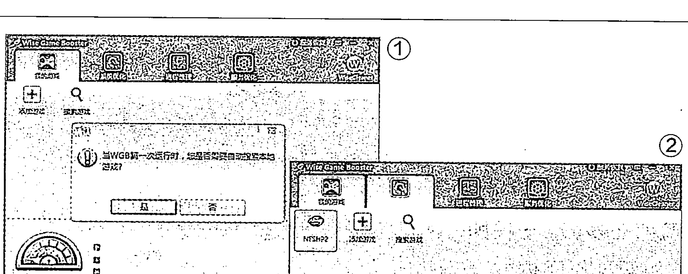

经过软件自动扫描后，软件会发现影响游戏性能的关键因素。其中主要包括影响系统性能的因素、占用内存过大的进程因素、可以关停却还在占用资源的服务等。这时，只需点击“一键优化”按钮，即可对所有项目进行一键优化（图2）。

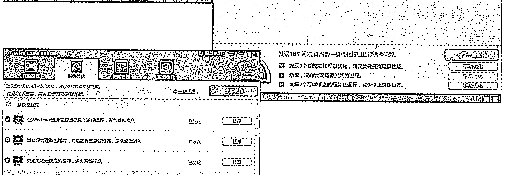

而对于可以提高电脑性能的具体项目，还可以单独选择优化。点击“系统优化”选项卡，用“全部优化”绿色按钮进行整体优化，或选择下属的具体项目，并用其右侧的“立即优化”按钮进行针对性优化（图3）。

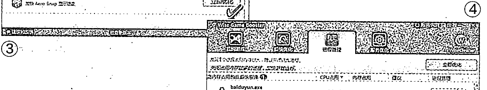

针对占用资源高的进程，Game Booster会给出优化建议。点击“进程管理”选项卡，在“建议”一栏中可看到标记“结束”字样的进程为影响游戏效率的进程，点击“结束”关闭进程。若对此进程的含义不理解，可通过菜单中的搜索命令进行搜索（图4）。

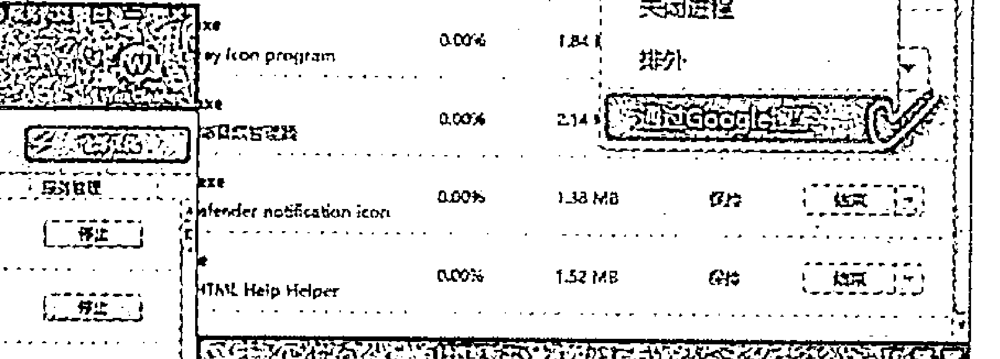

多余的服务开启也会影响游戏性能。点击“服务优化”选项卡，其中列出影响游戏性能的所有服务项目。若没有不可关停的项目，则点击“全部优化”按钮进行优化，否则分别点击具体服务后面的“停止”按钮进行单独优化（图5）。

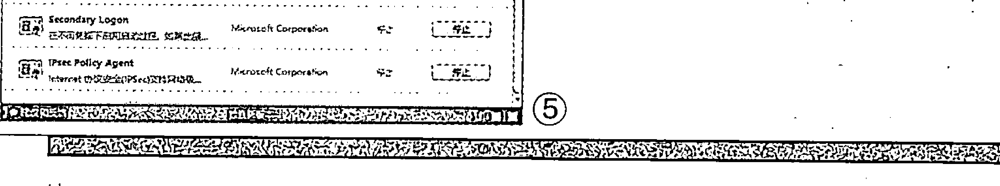

> 小提示：Wise Game Booster官网提供软件的Portable绿色便携版（http://downloads.wisecleaner.com/soft/WGB.zip），不用安装，将软件解包到一个闪存盘或闪存卡上，随时随地插入PC，即可进行游戏运行的优化了。

#### 调动右键 解决文件夹管理三大难题

工作文件夹日久天长产生的碎片和空文件夹，以及其中层级较多的文件目录结构管理是文件夹管理的三大难点。借助于免费套件Glary Utilities中的三种免费优化小工具，用右键就能实现针对以上问题的快捷管理操作（图1）。

##### 1. 整理文件夹占用磁盘空间

选择要整理碎片的文件夹，右键单击后选择快捷菜单中的“用Glary Utilities整理这个文件夹”，之后便进入对该文件夹的碎片自动整理过程，中间的图表会显示碎片状态（图2）。注意，如果直接在碎片整理软件中选择驱动器进行整理，则针对整个驱动器，而不是选择的文件夹。要在窗口中对某个文件夹进行整理，需要用工具栏上的第三个按钮，然后选择文件夹，这样显得复杂了些。

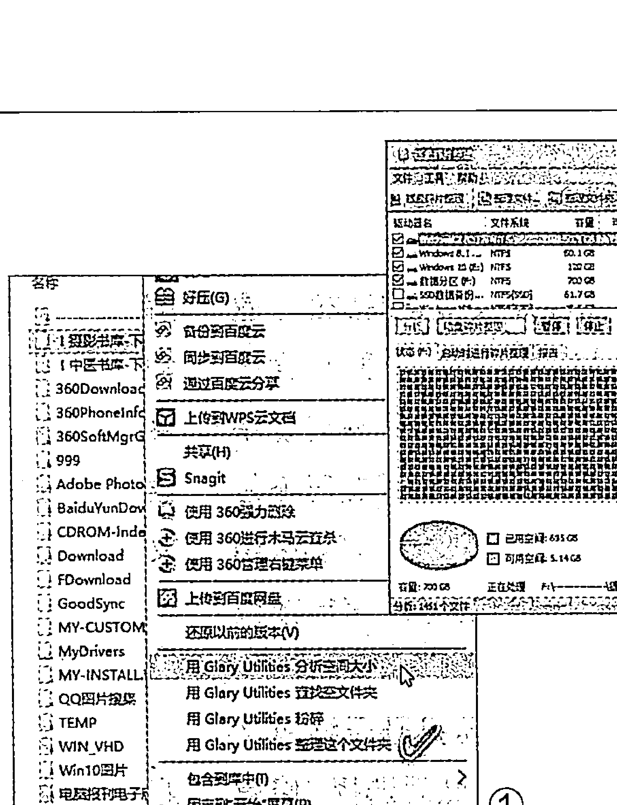

##### 2. 清理不再用的空文件夹

若要消除冗余空文件夹的系统效率的影响，在文件夹上单击右键，从菜单中选择“用Glary Utilities查找空文件夹”，软件会自动找出该文件夹下所有的空文件夹（图3）。如果其中一些文件夹是你准备要用的空文件夹，不能清理，可先编辑一个有用的空文件夹清单文件，然后用“排除→排除的文件夹列表”载入要保留的文件夹，最后再按下“删除已选中的文件夹”按钮。若操作有误，还可以按“还原”按钮还原空文件夹的位置。

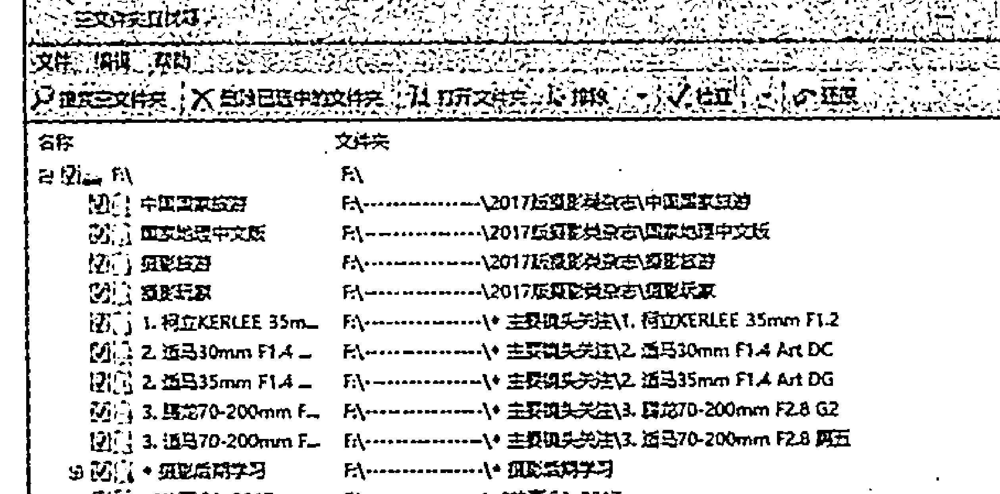

> ▶ **小技巧**
> 如果觉得文件夹太大，整理作业占用时间长会影响到工作，可通过“选项”窗口，选中“按计划运行”，然后选择操作频率和整理时间，实现按预定时间启动整理计划任务。

##### 3. 管控复杂的文件夹结构

对某个文件夹下的子文件夹和文件进行容量统计，可做到心中有数。右键单击该文件夹并选择“用Glary Utilities分析空间大小”，随后软件会自动计算子文件夹和文件占用的容量，并用饼图和柱状图给出占比描述，非常形象具体（图4）。

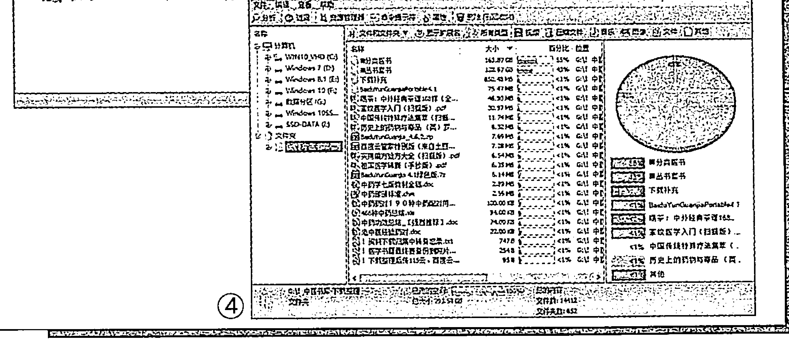

#### 文件压缩解压难题巧解决

文/阿楠

平时我们进行文件压缩或解压，通过简单的右键单击选择命令即可完成。但在压缩或解压文件的过程中，也可能会遇到多种难题，例如因压缩出错而无法解压出文件，或压缩包没有坏却无法执行解压，如何将同一文件添加到多个压缩包或多个文件添加到已有压缩包，已经压缩好的大压缩包如何分包处理等问题。

##### 1. 解压出错 文件如何抢救

压缩包解压出错，一般是因为压缩包文件在传输过程中，因网络不稳定或不支持断点续传等造成的。遇到这种情况，若下载源还可以找到且下载方便，可尝试重新下载后解压。但若重新下载依然如此，则有可能是网上提供的压缩包本身就存在问题。这时，根据压缩包中保存的文件是否为一些分散独立的小文件，可尝试用压缩软件的修复功能来修复或用“抢救开关”来抢救数据。

以使用好压软件为例，选择以好压打开压缩包文件，在好压窗口中点击“工具箱”按钮，然后选择“修复压缩包”工具（图1）。选择修复文件类型和修复结果保存的文件夹，然后点击“修复”按钮尝试修复（图2）。可修复程度要看文件的损坏程度而定，只能通过测试来尝试修复效果，不确定百分百可修复。

如果用修复的办法无法解决，且包中所含的是许多零碎的独立文件，还可以尝试另一种方法来尽可能多地解救出有用文件。右键单击压缩包并选择“解压到…”命令，随后在解压文件窗口中，将“其他-保留损坏的文件”复选框选中（图3），这样一来，压缩软件就不会在尝试解压失败后自动删除已经解压出的文件了，能用的文件得以保留。

##### 2. 为什么无法解压

还有的时候我们又会发现，明明在一台电脑上可以好好使用的压缩包，到另一台电脑上却无法解压了。这又是为什么呢？

第一种可能是磁盘空间不足引起，由于不同的解压方法需要不同数量的临时文件空间，如果在解压过程中系统盘或资料分区空间不足会造成无法解压，这时只需腾出更多空间即可。也可以通过更改解压软件的临时文件路径，将临时文件夹指向空间充足的分区（图4）。

另一种可能是压缩包中的文件存在病毒，在解压过程中杀毒软件自动检测到带毒文件并将其隔离或删除了。这种情况要谨慎处理，若确定文件无毒，属于误报，可关掉杀毒软件再行解压，或从杀毒软件隔离区中查找和恢复文件（图5）。

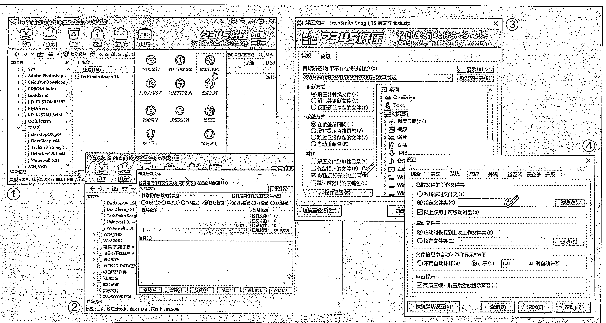

> 小提示：如果要将多个文件添加到一个已有的压缩包中，也没必要解包重新压缩，可先打开该压缩包文件，然后直接将多个要添加的文件，从资源管理器中拖入该压缩包窗口中即可。

##### 3. 向多个压缩包快速添加同一文件

如果有许多压缩包已经压缩完成，但忽然想起所有文件都忘了添加一份说明文件，又该怎么办呢？这时，我们可借助于“WinRAR压缩包助手”这一工具来完成。打开“WinRAR压缩包助手”，先点击“清空”按钮清空左侧两个小窗口中的文件，然后在“向压缩包中添加的文件列表”中添加说明书文件，在“待处理压缩包列表”中添加所有目标压缩包。最后，点击软件窗口右下角的“开始”按钮，执行向压缩包中批量添加文件的任务（图6）。需要处理的压缩包越多，执行效率相对越高。

##### 4. 已有大个压缩包 分包还需巧处理

还有的时候，我们在备份资料时已经将许多文件打包成一个非常大的压缩包，但在转存的过程中，才发现压缩包文件太大，目标存储设备一次放不下这么多内容，在这种情况下，需要再次解包后重新分包压缩吗？其实也不用。

利用WinRAR或好压的一个特殊“压缩”功能可以快速解决。首先需要将压缩包的文件扩展名改一下，改成ZIP或RAR之外的一个随便的扩展名，比如.MY。之后右击这个文件，压缩软件就不会将其认定为压缩文件了，此时便可以选择“添加到…”命令；随后在压缩文件窗口中，选择压缩方式为“存储”，然后选择压缩分卷大小，点击“确定”，软件将以存储（非压缩）的方式将文件自动按设定的分卷大小进行快速切割（图7）。

此外，如果系统中安装有带有文件分割功能的系统优化工具，例如Glary Utilities，可以方便地通过在压缩包上点击右键并选择“用Glary Utilities分割”，将大文件切割成任意容量的较小文件（图8）。这一操作将更加方便。

#### 一键排版小助手

文/阿楠

每当我们编辑完成一篇文章后都会需要对它进行排版，这样可以让文章看上去更加清晰。但是很多排版操作都是简单地重复操作，这样就会浪费掉大量的宝贵时间。那么有没有什么简单快捷的排版方法呢？

##### 常见文章一键完成

说到文章的排版操作，我们最常见的方法就是，每段文字抬头空两格。但是随着网络在日常生活中的比重越来越大，抬头空两格这种方式并不适用于所有的环境，因此我们需要根据特定的环境来进行排版操作。那么如何才可以做到根据环境来排版呢？

首先下载一款名为“排版助手”的软件（http://www.gidot.net）（图1），选择将需要进行排版的内容粘贴到文本框里面，接下来在软件的左下角可以看到一个“方案”的选项。在列表中我们可以看到“默认设置”、“手机小说”、“网络文章”和“网络新闻”等，点击后面的“方案预览”按钮后可以通过一篇文章查看到不同的效果（图2）。用户如果对某种方案比较满意的话，点击右下角的“选用此方案”按钮后返回到主窗口，然后再点击工具栏中的“执行”按钮就可以了。

现在有的网站为了避免用户进行复制操作，会对用户进行各种各样的限制。比如用户明明是复制了一段文本信息，可是复制粘贴后会发现里面存在很多的html代码，这样用户根本无法进行正常的阅读操作。而现在我们利用“排版助手”中的“便捷工具箱”按钮，就可以快速地对这类问题进行解决。首先选择需要编辑的内容，点击右上角的“便捷工具箱”按钮，在弹出的菜单里面我们可以点击“去掉html代码”和“去掉ubb代码”命令，这样复制文章中的代码就会被快速删除掉（图3）。

##### 公文内容快速编辑

相对于普通的文章或者网络文章来说，我们在日常生活和工作中接触最多的，应该还是各种各样的公文。比如“邀请函”、“通知”等，而这类公文对文章的排版要求更为严格。那么如何才可以快速完成这类公文的编辑操作呢？

下载一款名为“小恐龙公文排版助手”的Office插件（http://xkonglong.com/），下载完成以后对压缩包进行解压安装即可。不过很多人在安装的时候会遇到一个问题，就是插件会提示说“此应用程序中的自定义功能将不起作用，原因是用于为公文排版助手的部署清单签名的证书已过期或不在有效期内”，用户只需要重新对系统的时间进行调整，将系统日期调整到2016年以前然后重新进行安装就可以了。

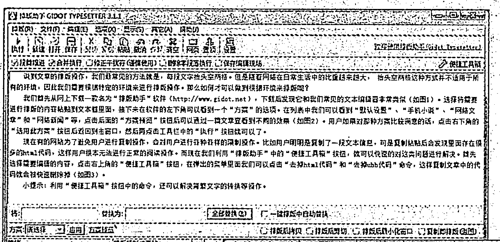

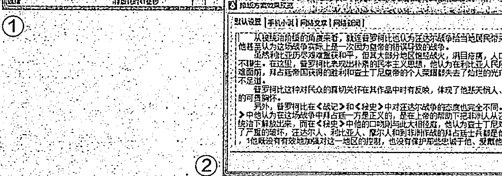

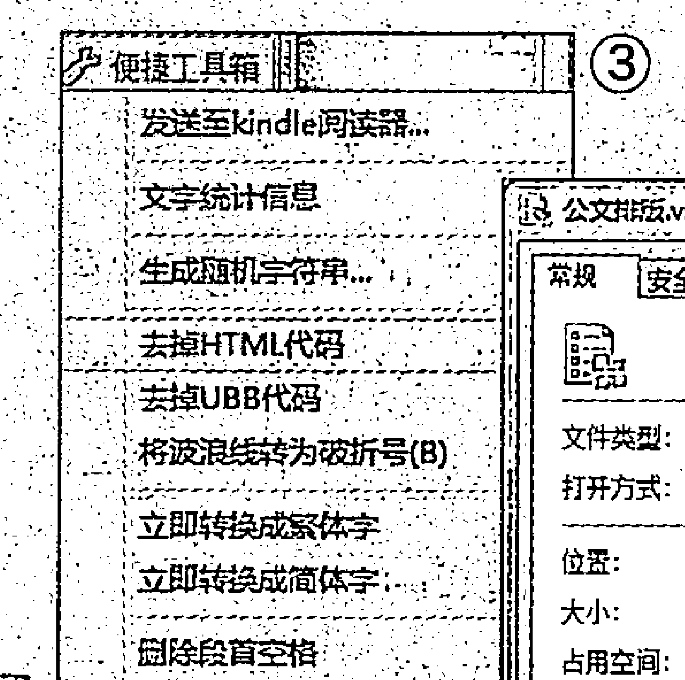

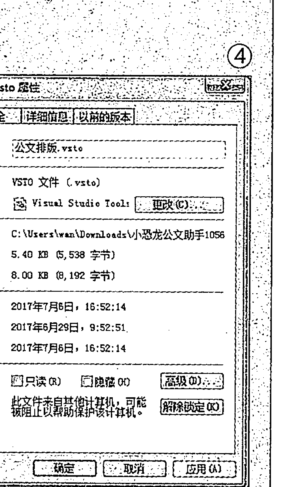

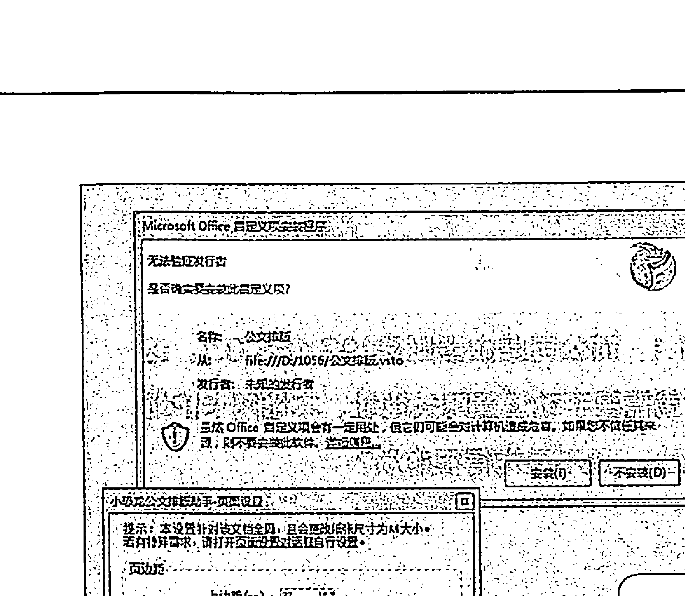

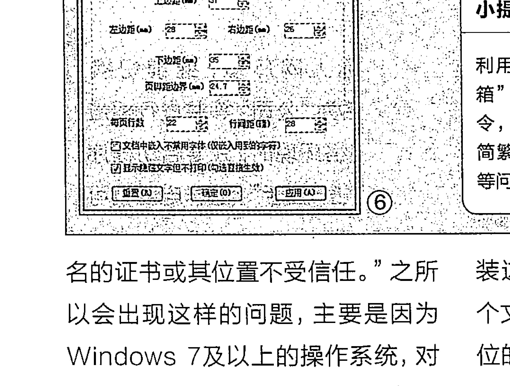

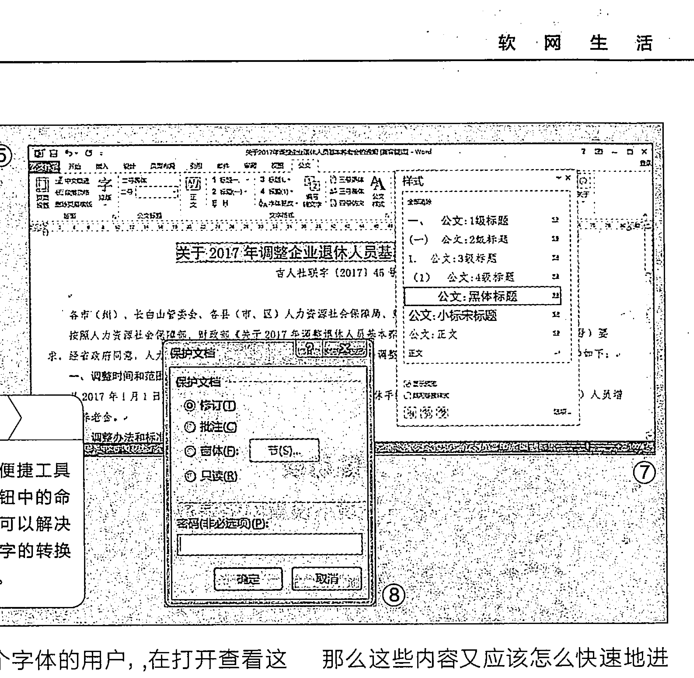

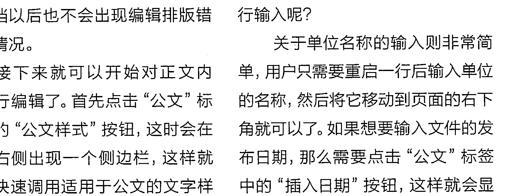

> > **小提示**
> > 利用‘便捷工具箱’按钮中的命令，还可以解决简繁文字的转换等问题。

另一个常见的问题是，在安装插件时可能会提示“无法安装，因为安装证书的颁发者不受信任。”或“此应用程序中的自定义功能将不起作用，原因是用于为公文排版助手的部署清单签名的证书已过期或不在有效期内。”之所以会出现这样的问题，主要是因为Windows 7及以上的操作系统，对网络下载的文件会进行安全防护。所以在安装文件夹里面找到“公文排版.vsto”，点击鼠标右键后选择菜单里面的“属性”命令,然后在弹出的对话框点击“解除锁定”按钮就可以了(图4)。接下来重新进行安装操作,同样会弹出一个提示窗口,点击其中的“安装”按钮就可以了(图5)。 当这个插件安装完成以后,我们就可以在打开的Word软件里面,看到一个名为“公文”的功能标签。同样首先在Word里面输入相关的公文内容,接着点击Word窗口中的“公文”标签,同时单击工具栏中的“页面设置”按钮。在弹出的对话框里面可以设置公文的边距,以及每页的行数和行间距等。如果用户在编辑文档的时候使用了不常用的字体,那么建议选择“文档中嵌入不常用字体(仅嵌入用到的字符)”选项,就可以将文档中使用的字体保存在文件里面(图6)。这样其他没有安装这个字体的用户,在打开查看这个文档以后也不会出现编辑排版错位的情况。

接下来就可以开始对正文内容进行编辑了。首先点击“公文”标签中的“公文样式”按钮,这时会在窗口右侧出现一个侧边栏,这样就可以快速调用适用于公文的文字样式。比如我们选择公文中的标题内容,接着点击“公文样式”侧边栏中的“公文黑体标题”选项,这样标题马上就可以显示出黑体二号字的效果(图7)。然后我们按照类似的步骤,就可以对其他的标题以及正文内容开始进行编辑了。除此以外,全选所有的正文内容并点击工具栏中的“中文缩进”按钮,就可以达到抬头空两格的效果。

##### 落款信息一应俱全

相较于其他的文章来说,公文往往会在文章的末尾加上相应的落款,比如单位名称以及发布日期等等。有的时候为了显示出公文的真实性,还需要加上公章等相关信息。

那么这些内容又应该怎么快速地进行输入呢?

关于单位名称的输入则非常简单,用户只需要重启一行后输入单位的名称,然后将它移动到页面的右下角就可以了。如果想要输入文件的发布日期,那么需要点击“公文”标签中的“插入日期”按钮,这样就会显示出当天的具体日期。除此以外,如果用户想要加入公章的话,那么点击工具栏中的“公章”按钮。在弹出的对话框中选择公章的图片,这样就可以把它加入到相应的位置上。

既然公文有它的权威性,那么为了避免其中的内容被篡改,所以我们最好将文档进行限制操作。现在我们点击工具栏中的“限制编辑”按钮,在弹出的对话框里选择“保护文档”中的“修改”选项以后,在下方的“密码”输入框里面输入一个保护密码,最后点击“确定”按钮就可以了(图8)。除此以外,通过另存为命令直接将文档内容转换为PDF文档,也可以起到相关的保护作用。

#### 上网无障碍 网络环境切换自如

文/俞木发

大家知道不同地方网络环境都是不同的，比如家里的路由器IP是192.168.1.1，而公司路由器则是192.168.0.1。这样对于携带笔记本电脑需要在家里和公司上网的用户，每次在不同环境下上网，就需要手动设置网关地址、本地网卡IP地址、DNS服务器这些信息（很多公司网络绑定IP设置，自动获取IP常常无法上网）。是不是觉得很麻烦？

##### 外援相助——网络环境一键切换

对于懒人来说要在不同环境下设置网络参数显然很麻烦，现在借助“NetSetMan”则可以实现网络环境的一键切换。

启动程序后可以看到NetSetMan支持5组网络环境的设置，首先选择本地网卡，接着切换到“Set1”，右击选择“重命名→命名为家里”，勾选“IP网关→使用下面的IP地址”和“DNS服务器→使用下面的DNS服务器地址”，然后按照自己实际的网络环境进行IP地址、子网掩码、默认网关等参数的实际设置即可（图1）。

当前网络环境参数可以在命令提示符下输入“ipconfig /all”获取，这里需要注意的是，如果公司的网络已经将IP地址和网卡MAC地址绑定，这里IP地址的设定一定要和路由器中绑定的地址一致，否则会导致无法上网。

同上根据自己的实际上网环境，继续切换到“Set2”、“Set3”，重命名为“公司”等并进行相应的设置。这样以后到了不同网络环境时，只要启动程序切换到对应的“Set”设置，点击“激活”，这样电脑就可以利用上述设置好的网络参数进行上网，省去手动设置的不便（图2）。

##### 自力更生——网络设置自动设

利用“NetSetMan”虽然可以很方便地实现网络环境的切换，对于很多高手们来说额外安装软件使用起来总是不便。其实上述网络参数的设置利用系统自带的命令行就可以完成，而且由于大家在公司上下班的时间是固定的，这样结合“任务计划”还可以实现网络环境的自动切换。

首先启动记事本，根据自己公司的网络情况输入下列的命令保存为work.bat, 放置在桌面备用:

```

netsh interface ip set address "以太网" static 192.168.1.119 255.255.255.0 192.168.1.1
netsh interface ip set dns "以太网" static 114.114.114.114

```

代码解释:
这里使用netsh命令行快速设置IP和DNS服务器，其中的“以太网”是指Windows 10中本地网卡的名称（Windows 7则为“本地连接”），请根据自己电脑的实际情况输入正确名称。具体名称可以展开“控制面板→网络和Internet→网络和共享中心→查看活动网络”查询（图3）。

在搜索框输入“任务计划”，启动任务计划程序后点击右侧窗格的“创建任务”，切换到“常规”，按提示创建一个名为“公司上网”的任务，同时勾选下方的“使用最高权限运行”，因为网络参数的更改需要管理员权限运行（图4）。

切换到“触发器→新建”，触发器是每周工作日8:05（假设每天8:00到公司），每隔5分钟（持续15分钟，防止到公司后没有及时开启电脑）运行一次的任务计划（图5）。

切换到“操作→新建”，操作是“启动程序”，程序路径选择上述桌面建立的批处理文件。这样每周上班时间，我们到公司打开电脑后就会自动切换到公司网络环境中顺利上网了（图6）。

为了方便到家后可以自动切换回家里的网络环境，同上再根据自己的家庭网络环境建立一个“home.bat”的批处理也放置在桌面。同上新建一个任务计划，每个工作日17:25（假设17:30下班）执行，执行的操作则是“home.bat”，这样每天下班时将网络环境自动切换回家庭环境。

当然任务计划运行比较呆板，可能有时候任务的运行和实际情况有出入（比如推迟下班），此时我们可以自行运行桌面批处理来进行手动切换。因为上述网络参数的设置是借助命令行完成，除了设置任务计划自动运行，我们还可以根据自己的实际需要进行更多的灵活设置。

比如很多朋友到家后第一件事就是启动网游，那么可以将网络环境切换和网游启动关联在一起。同上启动记事本，新建一个批处理yx.bat，并将其快捷方式发送至桌面，选中桌面新建快捷方式，右击选择“属性→高级”，勾选“用管理员身份运行”（图7）。

代码如下:

```

netsh interface ip set address "以太网" static 192.168.1.119 255.255.255.0 192.168.1.1
netsh interface ip set dns "以太网" static 114.114.114.114
%windir%\system32\cmd.exe /c timeout 10 & "C:\Program Files\yx.exe"

```

代码解释:
这里使用timeout 10延迟10秒启动指定游戏，这样在家里开机后我们只要运行桌面批处理yx.bat，网络环境切换好后10秒即可自动启动游戏（图8）。

#### 微博内容一键管理
文|老万

新浪微博这样的社交媒体，俨然成为了现代人生活中的一部分。很多人每天都会花大量的时间在上面浏览，同时也会在上面分享自己工作生活中的点点滴滴。可是发布的信息一多，自然就需要对这些信息进行有效的管理。

##### 微博批量打包下载

由于新浪微博记录了太多的生活碎片，所以很多用户都想通过各种各样的方法，对发布的微博内容进行备份操作。虽然现在有很多不错的备份方法，比如将发布的内容备份到云笔记里面，可是这种方法每次都需要进行@操作。如果不进行这样的操作的话，这条微博内容就无法进行备份。因此有些用户觉得这样的操作还是比较麻烦，所以想定时对已有的微博信息进行批量的备份操作。那么如何才可以达到这样的目的呢？

如果用户使用的是谷歌浏览器或者它的衍生版本，那么通过谷歌浏览器的应用商店，可以搜索安装一款名为“微贝”的功能扩展。如果用户无法登录到应用商店的话，那么也可以通过浏览器访问功能扩展的发布网页（http://vdisk.weibo.com/s/x5GuwUhIGH/1498206615），将扩展文件下载到本地系统以后，通过鼠标拖拽它到浏览器窗口释放，就可以将其安装到浏览器里面了。

当这个功能扩展安装完成以后，我们按照通常的方法登录到自己的微博首页。接下来点击工具栏中的“微贝”扩展图标按钮，在弹出的网页里面根据提示通过微信扫描网页中的二维码，从而关注这个功能扩展的公众号（图1）。

关注成功以后点击下面的“点我测试到微博的网络”按钮，如果网络没有问题的话会要求用户进行微博的登录操作（图2）。成功登录到微博的手机页面后，就会看到一个“全量备份”的按钮，点击它以后就可以进行数据的抓取。在抓取的过程中扩展会提示用户，“共xxx条xxx页微博需要备份，预计需要x分钟，请耐心等待，不要关闭本页面”（图3）。当所有微博内容的抓取操作完成以后，会在扩展的页面下方显示出抓取的微博内容。而用户只需要点击“下载到电脑”按钮，所有的微博信息就会以网页文件的形式进行打包，最终下载到用户的电脑系统里面。

##### 微博管理这么容易

社交网络虽然给我们的工作和生活带来了不少的乐趣，但是同时也给我们带来了不少的苦恼。比如我们

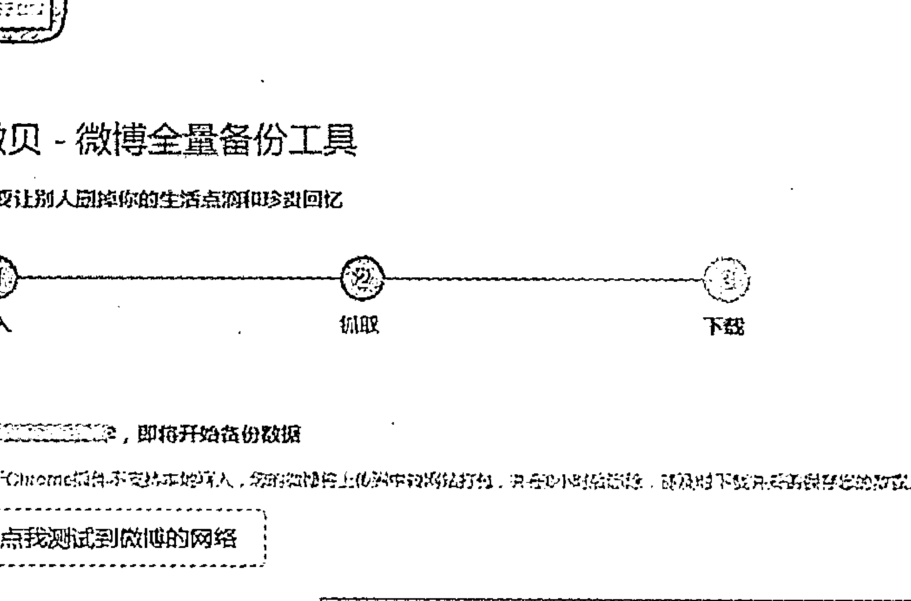

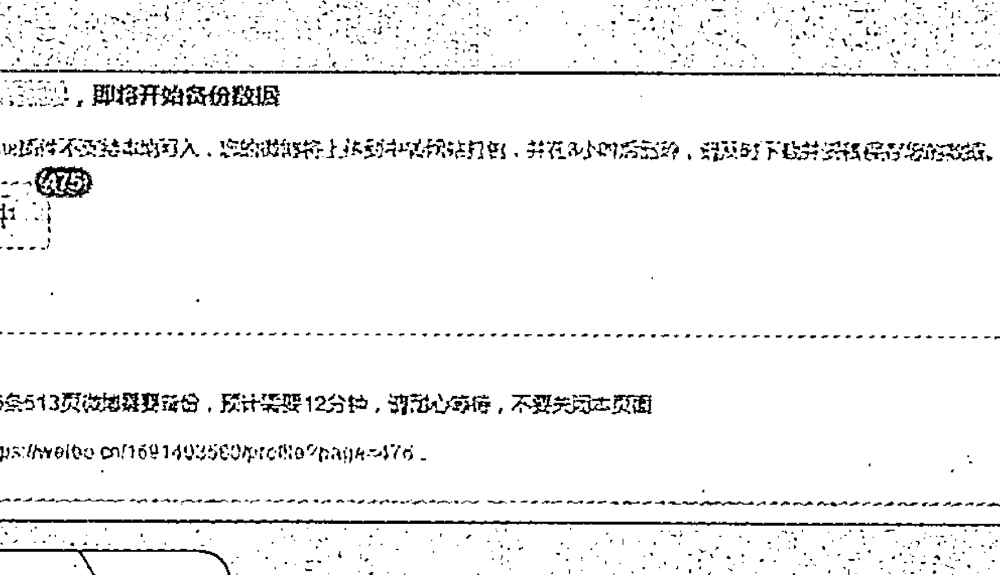

> **小提示**
通过功能扩展图标上的数字，就可以了解到微博备份的进度。

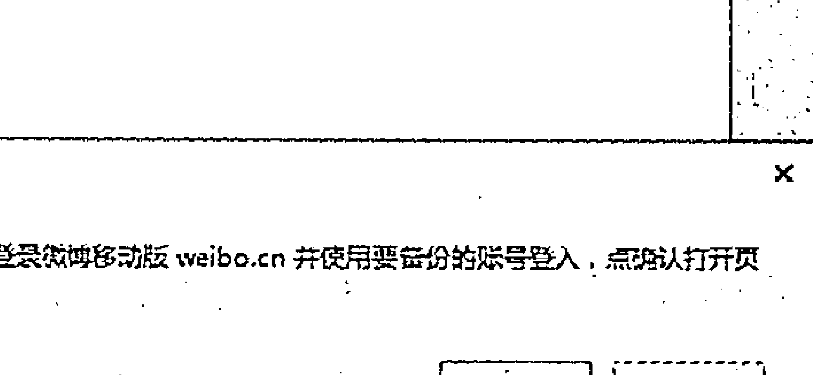

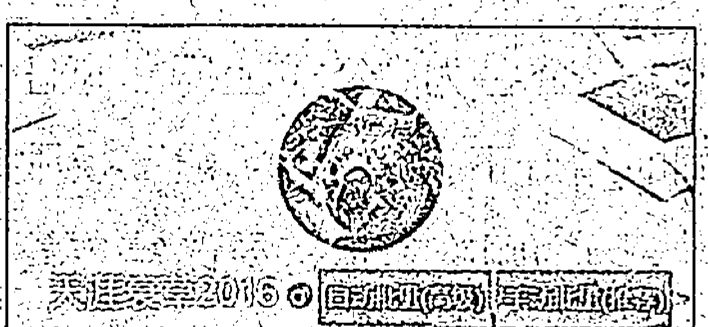

> **小提示**
如果用户使用的浏览器无法安装功能扩展的话，那么还可以通过小书签来进行操作。比如我们打开火狐浏览器，首先在浏览器的窗口顶部点击鼠标右键，在弹出的菜单里面勾选上“书签工具栏”按钮。这时就会看到在浏览器上方多出了一个书签工具栏。现在在“档案娘助手”的发布页面找到“档案娘助手”这个按钮，按住这个按钮将其拖放到书签工具栏中释放就可以了。以后当我们需要对微博进行批量操作的时候，只需要点击书签栏中的“档案娘助手”按钮，稍等片刻就可以按照前面的方法进行批量操作了。

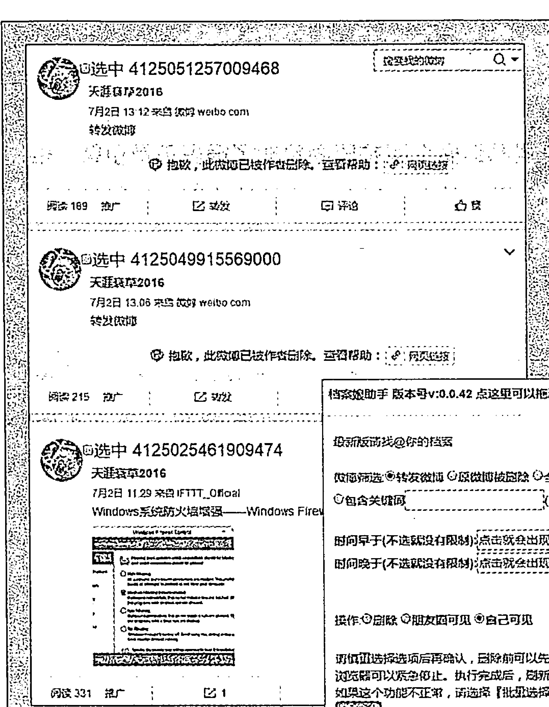

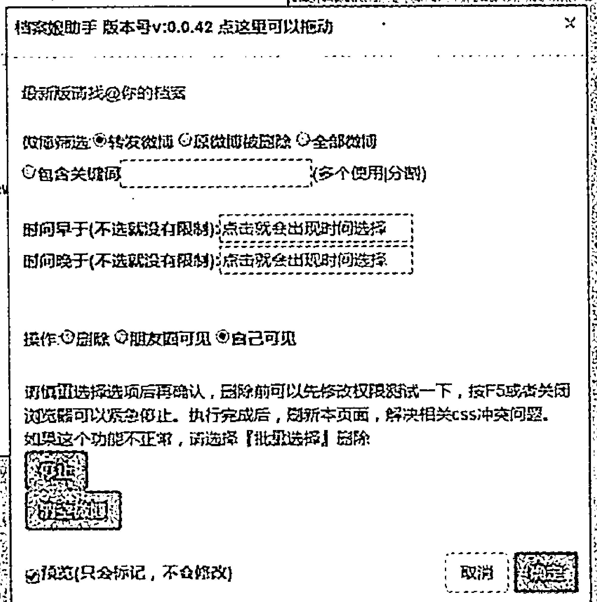

> **小提示**
批量删除已经收藏的微博内容，还是首先点击工具栏中的扩展图标。在弹出的对话框里面点击“批量删除收藏”选项后的命令，接下来在弹出的页面进行操作即可。

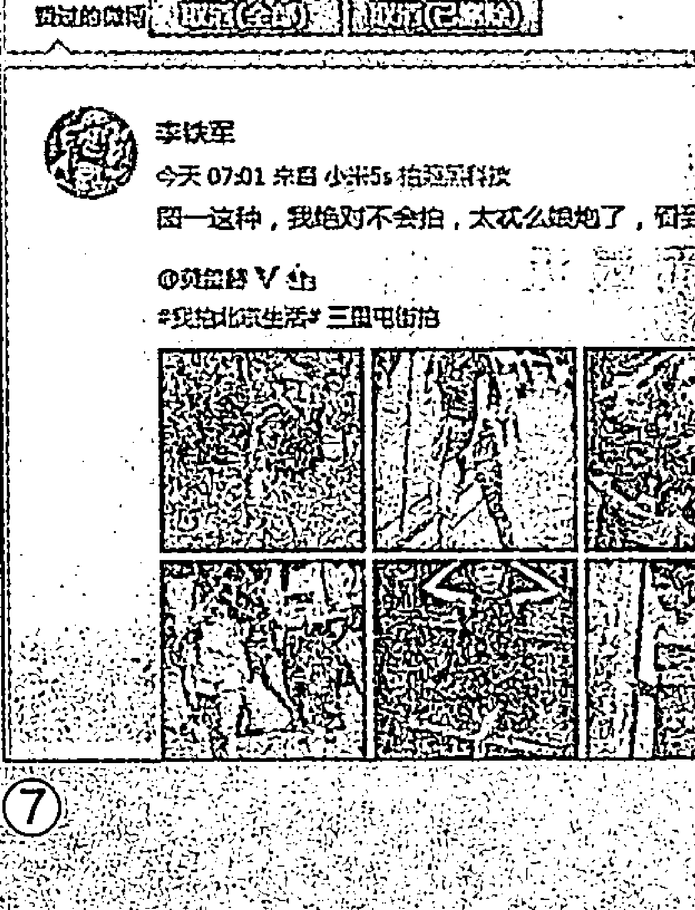

发布或者转发的微博内容，有的时候被莫名其妙地删除了，而关注自己的粉丝里面存在大量的僵尸粉或者广告粉等等。所以为了让自己的微博看上去更加的整洁，我们需要对这些内容进行清理操作。那么如何才可以快速和批量地进行相关操作呢？

首先通过自己的浏览器登录到“档案娘助手”的发布页面（http://chrome.weibodangan.com/），根据自己使用的浏览器来安装相应的功能扩展或者脚本。当这个扩展安装完成以后，我们登录到自己的微博首页里面，这样就会在自己的微博头像下面看到两个按钮（图4）。比如我们想批量删除一些微博的话，那么首先点击“手动批量”按钮。这时在每条微博的前面就会看到一个复选框，勾选上需要删除的微博以后，在“选中设置”里面勾选上“删除”选项（图5）。最后点击“选中设置”按钮，这时会弹出一个提示框要求用户进行确认，点击确定按钮以后就可以批量进行删除了。

如果觉得一个一个手动进行选择非常麻烦的话，那么也可以设定一些条件让扩展自动进行识别操作。现在点击微博头像下面的“自动批量”按钮，在弹出的对话框里面找到“微博筛选”这一项，这样用户就可以根据转发微博、原创微博以及全部微博等分类进行选择。除此之外，我们还可以再根据特定的关键词来进行管理（图6）。比如在“包括关键词”输入框里面输入相应的关键词，如果用户设定的关键词有很多个的话，那么可以利用竖线来进行关键词的分割。设置完成以后，这个功能扩展就可以在所有的微博里面进行筛选，从而将含有这些关键词的微博寻找出来，然后再根据自己的需要进行管理操作。

我们平时除了自己发布微博信息以及转发其他网友的微博以外，还会对微博进行其他的操作，比如对认可的微博进行点赞或者对需要的内容进行收藏等。如果用户想对已经点赞的内容进行管理的话，那么就需要点击工具栏中的扩展按钮图标。在弹出的对话框里面选择“批量删除赞”这项后的按钮，从而就会自动跳转到自己曾经点赞过的所有微博。这时我们就可以看到在上方有两个按钮，如果想要取消所有的点赞操作的话，那么就点前一个“取消(全部)”按钮。如果只想对已经被删除的微博取消的话，那么就点击后一个“取消(已删除)”按钮即可（图7）。

#### 就是这么简单在线杀毒也能与时俱进
文|万立夫

说到在线杀毒网站很多人都会首先想到VirusTotal和VirSCAN，虽然这两个网站里面集成了很多杀毒引擎，但是如果认真观察的话就会发现很多引擎的病毒库已经非常旧了，也就是说它并不能对现在最新的病毒文件进行分析判断。那么遇到这样的情况我们应该怎么解决呢？在线杀毒也要与时俱进，以便有效阻截新病毒。

##### 在线进行文件判断

说到杀毒软件我们很多用户首先就会想到卡巴斯基，而最近卡巴斯基就推出了一个名为“Kaspersky VirusDesk”的在线文件扫描网站，这样我们通过它就可以对可疑的文件进行判断操作了。我们首先通过浏览器访问“Kaspersky VirusDesk”服务的网址（https://virusdesk.kaspersky.com/），在网页正中的输入框后点击曲别针图标就会弹出一个选择框（图1）。从中选择用户认为安全性可疑的文件，选择完成以后点击后面的按钮后，就可以将文件上传到卡巴斯基的服务器里面进行判断。

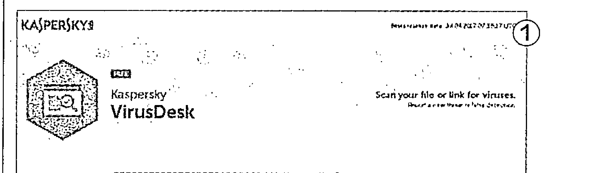

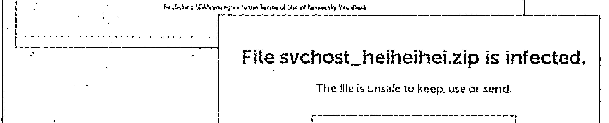

上传完成以后就会开始对文件的安全性进行分析，分析完成后就会在网页中显示出最终的分析结果。比如检测的文件是安全的话，就会用绿色的文字显示出“File is safe”这段信息。如果检测的文件有问题的话，那么会用红色的文字显示出“File is infected.”的信息（图2）。与此同时，还会显示出这个文件的相关信息，包括文件的大小、文件的类型以及文件的哈希函数等等。

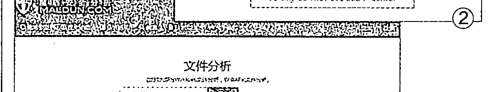

> **小提示**
利用相同的方法也可以对网址的安全性进行判断。

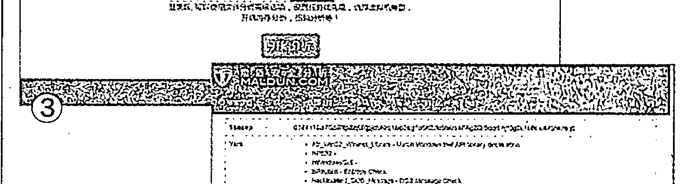

现在我们通过浏览器访问“魔盾安全分析”网站（https://www.maldun.com/），点击网页正中的“分析可疑文件”按钮。在出现的网页里面点击“选择文件”按钮，从弹出的对话框里面选择要进行分析的文件，最后点击“开始分析”按钮将文件上传到服务器里面（图3）。由于“魔盾安全分析”网站会利用不同的虚拟机和沙箱进行分析，所以分析的时间可能会稍长一点。

##### 行为动作看出端倪

如果对网络安全比较了解的话，那么我们就会知道对病毒的判断有很多种方式。除了传统的利用病毒库进行对比以外，还有一种利用行为方式进行判断的方法。通常这种方法都是在沙箱里面完成的，不过现在也有安全人员将沙箱搬到了互联网里面。

当文件分析完成以后，“魔盾安全分析”网站会给出一个详细的分析报告，其中包括虚拟机的标签、文件详细信息和文件特征等等（图4）。不过这些参数对于普通用户来说很难读懂，所以我们只需要查看报告中的“特征”这一项即可。报告会按照不同的安全级别将文件特征进行分类，同时以不同的颜色将特征一条条地列出。比如“高危险等级”就会用红色的颜色进行显示，如果特征里面的红色条目比较多的话，那么就说明这个文件的危险性非常的大，用户在运行的时候一定要小心为好。

#### 装把尺子 灵活度量屏幕
文|阿楠

有时我们需要将设计作品打印出来，为了解具体尺寸，需要将图片像素和实际打印尺寸进行换算，进行打印测试又浪费纸张，要是能在屏幕上实现软件测量，就方便许多了。借助于PMeter这个小工具，就不用拿个尺子在屏幕上比划了！

PMeter软件可作为普通软件安装使用，安装过程中选择Local setup方式即可；同时还提供了一种绿色移动版的安装方式，安装时选择Portable Setup方式（图1），选择要安装到的移动硬盘或闪存盘及其安装目录。之后当需要进行屏幕度量时，只需插上移动设备，直接运行该软件即可。

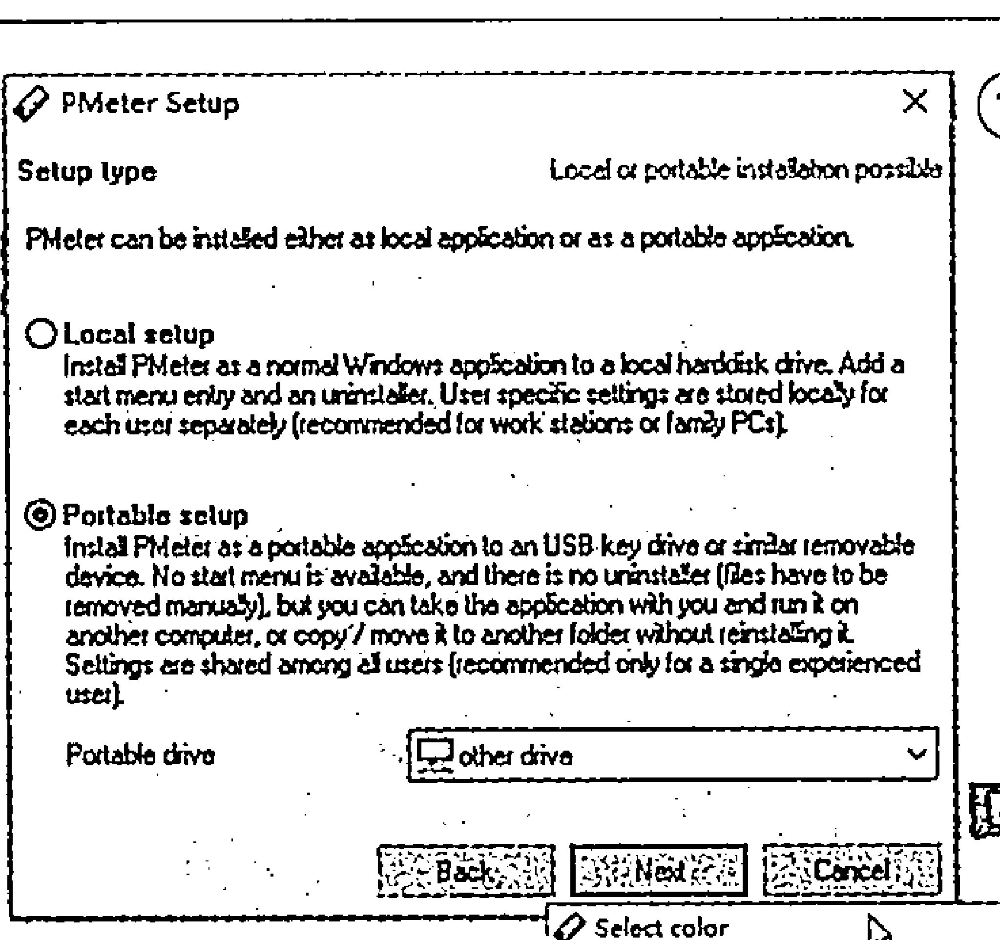

在使用任意软件的过程中，如果需要对窗口或屏幕组件进行度量，运行PMeter，屏幕随即会出现黄色标尺，在标尺上按下鼠标左键并拖动，可将标尺在屏幕上随意移动。如果需要隐藏标尺，右键单击系统托盘上的标尺图标，选择Hide ruler即可；若再次需要使用标尺，选择右键菜单命令Show ruler（图2）。标尺上的刻度默认为从左向右、从小到大，从上到下、从小到大的顺序排列。若需要相反方向丈量尺寸，只需点击标尺上的两个双箭头按钮，即可切换标尺刻度为反方向显示。若需要纵向丈量，点击标尺上的弯曲箭头按钮即可切换显示方式，或直接在标尺上双击也可改变显示方式。此外，标尺的长度也不是一成不变的，只需用鼠标拖动标尺两头的边框，即可将标尺长度缩放为自己需要的尺寸。


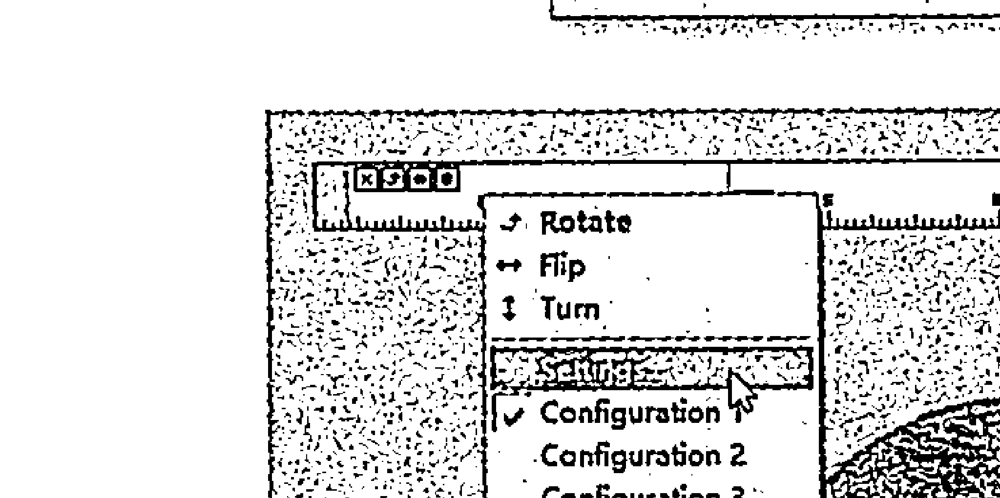

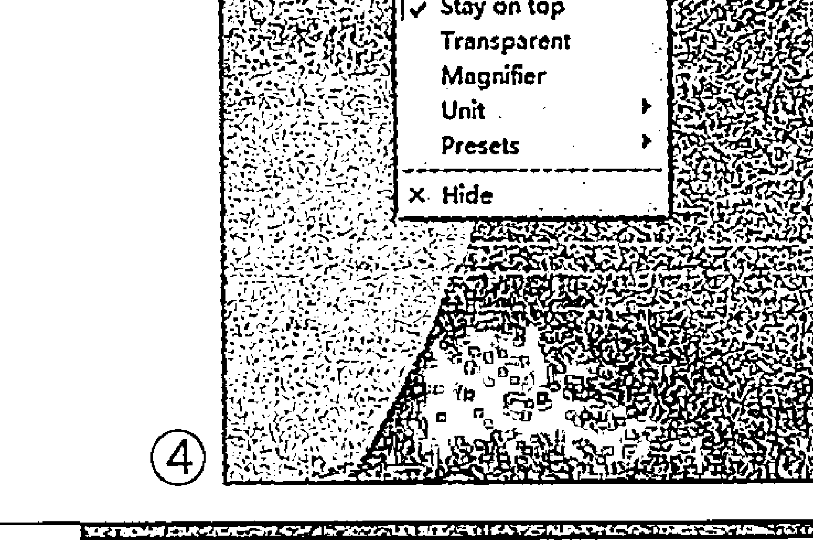

如果在使用某个软件过程中需要进行颜色定义，通过PMeter软件托盘右键菜单中的Show color picker命令，可开启一个拾色器面板，从中可定义自己需要的颜色（图3）。此外，为了精确定位度量的点位，可以通过Show cursor coordinate命令开启坐标交叉点光标显示。如果度量时标尺挡住了部件，可选择Transparent命令将标尺透明化。

要改变标尺的度量单位，右键单击标尺，选择Unit菜单命令，然后选择需要的单位（如英寸、厘米等）。通过系统托盘图标右键菜单或标尺右键菜单命令Settings，还可以进行诸如标尺颜色、热键、放大镜、像素等更多的个性化标尺自定义。选择Configuration命令，还可定义最多3套常用标尺参数组合，以便日后直接套用（图4）。

#### 轻松管理随身盘绿色软件

绿色软件不用安装且可直接拷贝到闪存盘中运行，但随身盘中的绿色软件数量一多，要启动时不便于查找。用PStart小工具来管理绿色软件，让闪存盘拥有一个“开始”菜单，便可快速启动软件了。

##### 1. 为不同环境安装开始菜单

在PStart的安装过程中，会给出两种渠道选择：如果选择Local setup，为本地硬盘安装一个附加的程序“开始”菜单；选择Portable setup，并从Portable drive列表中选择盘符，则将软件安装到选定的USB移动介质中，在移动介质中生成一个“开始”菜单，为运行绿色软件、重要文档、文件夹提供方便之门(图1)。

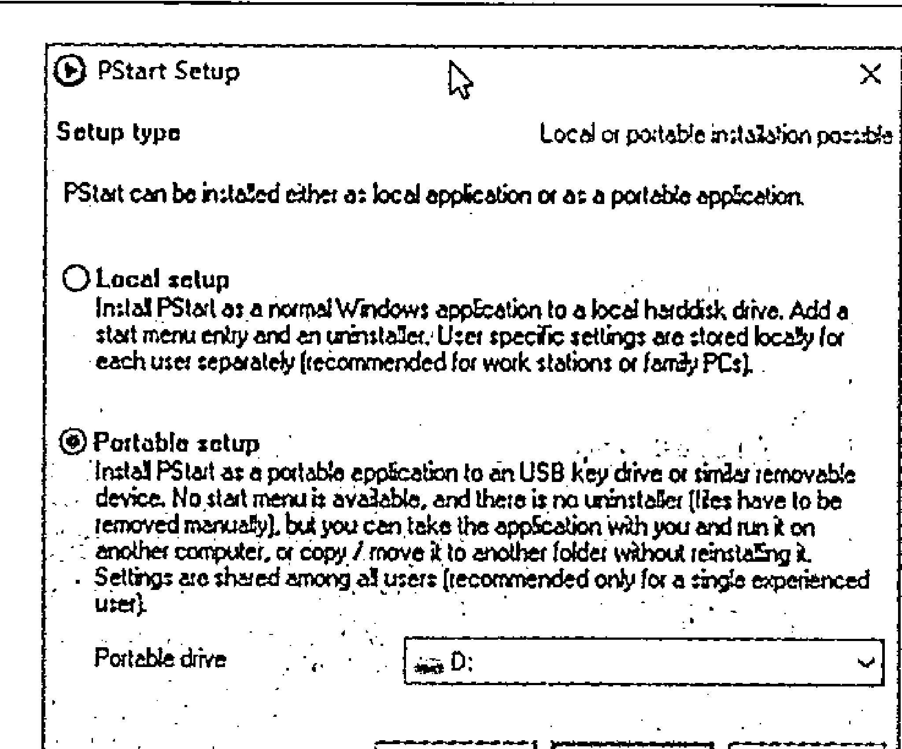

##### 2. 定制自己的移动开始菜单

当PStart安装到移动介质后，生成一个PStart.exe可执行文件，双击此文件启动到PStart界面。PStart有四个功能选项卡，其中Items用来添加启动菜单项目，Search提供搜索功能，Notes编辑和组织记录信息，而Info则提供移动介质的容量和文件系统信息(图2)。

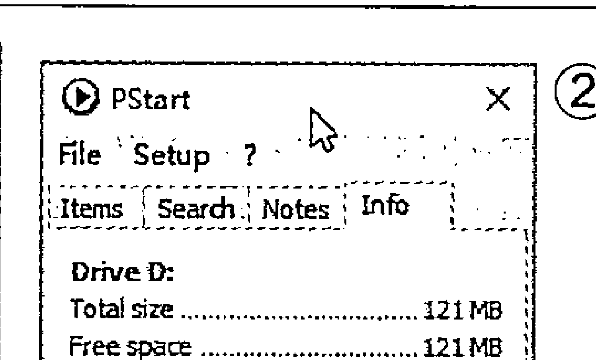

要为移动介质添加菜单项目，在Items选项卡窗口空白处单击鼠标右键，选择4种Add项目之一即可(图3)。如果要将绿色软件添加到菜单中，选择“Add file…”项，然后指定要添加的绿色程序名称(支持exe、com、bat、cmd、scr等类型程序)，随后还可为程序设定基本参数、高级参数、环境变量等(图4)；若要添加常用文件夹，选择“Add folder…”，文件夹中可组织需要的程序或文档；此外还可以建立程序组，选择“Add group…”添加相关项目即可。

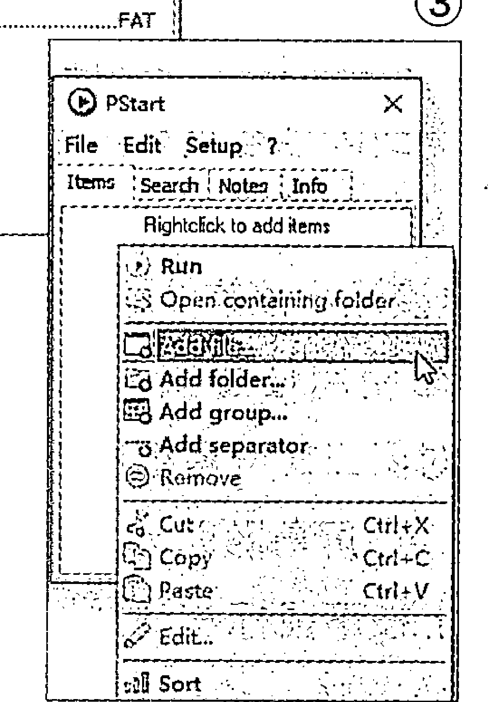

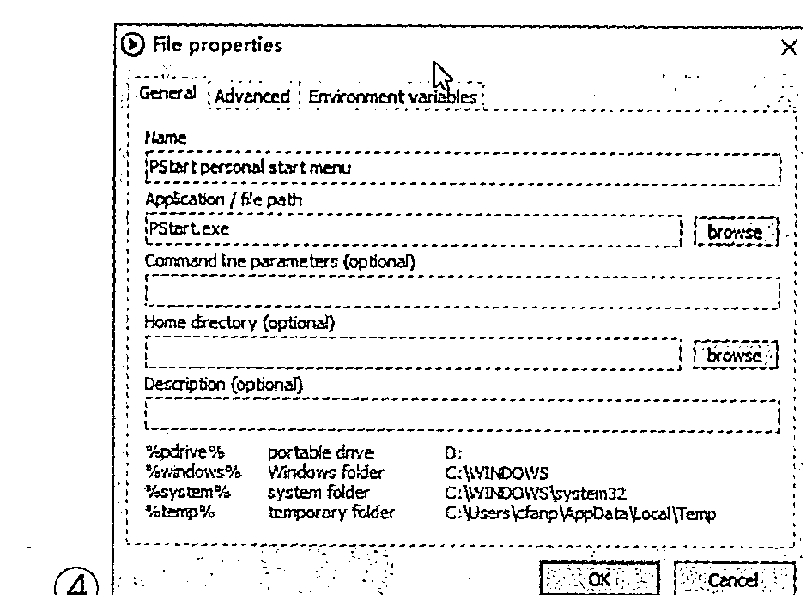

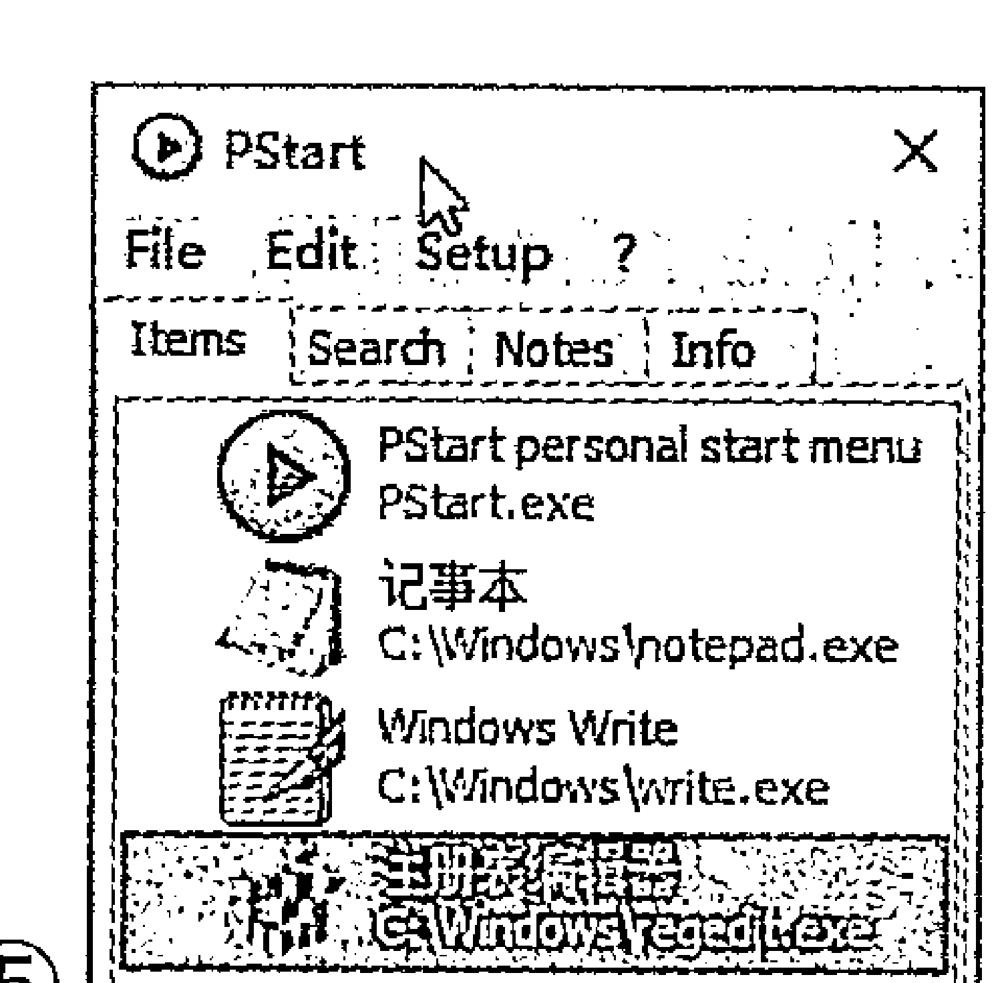

根据需要，可以为移动介质生成自动运行程序。具体方法是点击“Setup→Create autorun file”菜单命令。菜单创建之后，当插入移动介质后，若支持自动运行，便可出现程序开始菜单。若没有制作自动运行程序或系统禁用移动设备自动运行，则点击移动设备中的PStart.exe程序即可启动菜单，双击菜单中的项目即可启动选中的项目(图5)。

> **小提示**
通过“Setup→Settings”命令进入软件设置中心，可以定制热键，设计个性化的用户界面等。

#### 任意图片变主题素材
文|阿楠

制作网页或多媒体演示时，常常需要用到主题背景图片。从网上下载或从图库中找到的图片，不一定能反映出我们自己的需求。用XFader软件，根据任意一个图片，创建各种各样的个性化纹理素材图片，不失为一种快速的解决方案。

启动XFader软件，通过Open按钮打开一幅原始图片（可以是亲手制作的图片或亲自拍摄的照片）（图1）。
原始图片并不一定正好合适，通过Image菜单中的各种命令可进行调整（图2）。其中Resize命令可改变图片的尺寸，Recolor命令可为图片重新着色，Rotate和Flip命令可对图片进行旋转和翻转等操作。要在原图的基础上生成多重复合式的图案，点击执行“Image→XFader”命令，启动XFader参数设置和Image图像导航窗口，通过连续点击Image窗口中的Repeat按钮，可在原图的基础上生成不同样式的多重复合式的图案（图3）。

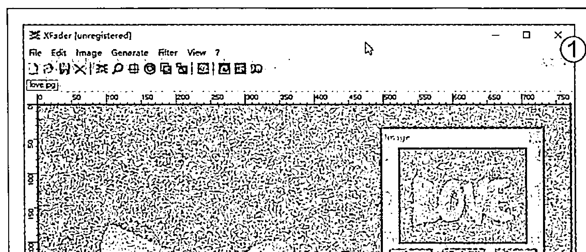

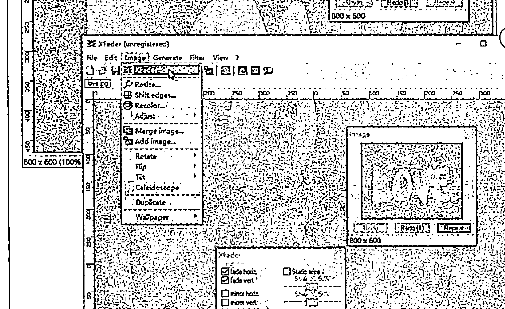

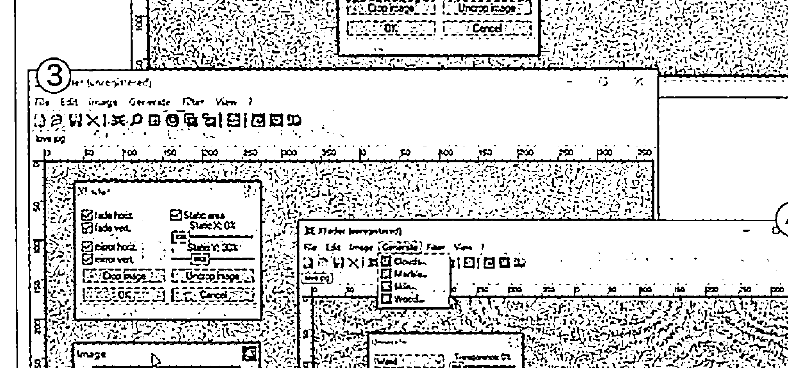

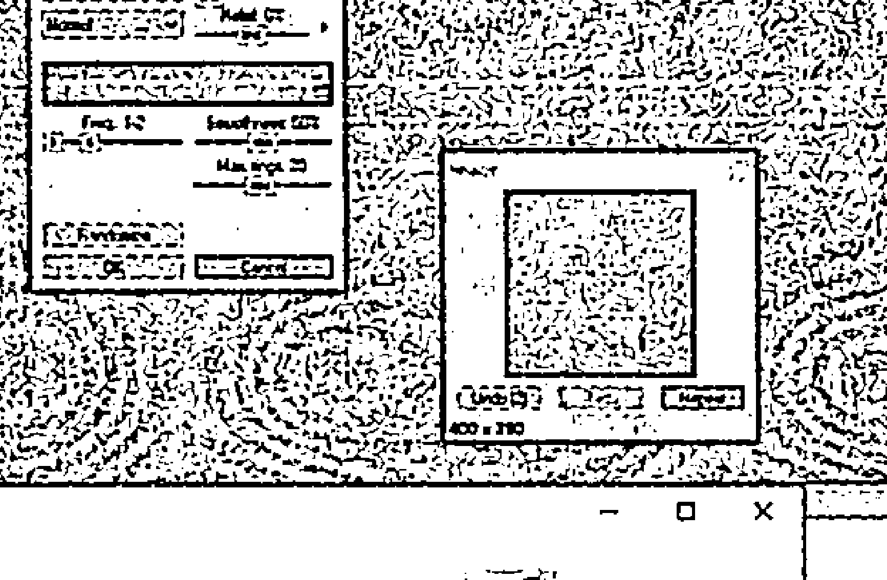

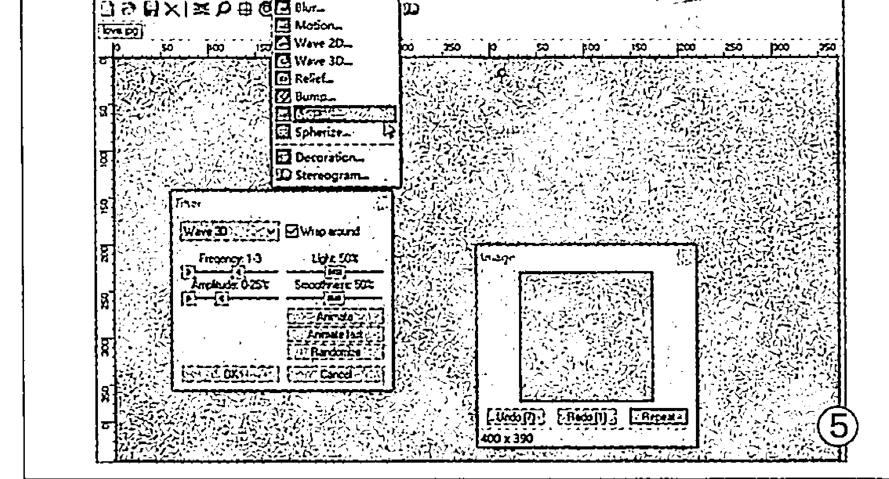

如果要在此图案的基础上生成材质纹理图案（如木质或云彩等），选择Generate菜单下的Wood或Cloud等材质，然后在弹出的相应材质参数设置窗口中设置参数，即可生成各种样式的纹理背景（图4）。
我们还可以为制作的背景直接套用多种软件预设的滤镜效果。点击Filter滤镜菜单，在其中选择需要的滤镜，然后在弹出的对应滤镜设置窗口中设定参数，随后可及时看到应用滤镜之后的背景图片效果（图5）。
制作完成后，按下Ctrl+S对制作的背景图片进行存盘操作，将图片保存为BMP、JPG、PNG格式之一。免费版无法提供存盘权限，不过可以采用一种迂回“战术”——用截图的方式，将界面显示的成果保存下来使用。

> **小提示**
如果希望XFader作为绿色软件使用，则请在安装时选择Portable setup选项，并选择移动盘符，将软件直接安装到移动硬盘或闪存盘中。

#### 软件应用 全面开启安全防护
文|阿楠

在使用电脑的过程中，威胁往往来自多种渠道，但其中最为重要的方面就是病毒或恶意程序利用软件应用或文档途径进行传播和破坏。浏览器、输入法、桌面图标、软件安装、图片文档等均可能是木马病毒的藏身之所或攻击目标。那么，对这些目标的防护，就成为电脑使用安全防护的重中之重。

##### 1. 浏览器防护 锁定目标别乱用

如果电脑中安装有多种网络浏览器，锁定默认的安全浏览器非常重要。利用锁定默认浏览器工具Change Default Browse，可对包括IE、Firefox、Chrome、Opera等在内的常见浏览器进行默认锁定。运行Change Default Browse后，只需选择相应的浏览器类型，然后用Browse按钮对主程序进行指定，最后点击Set Default Browse按钮即可锁定指定浏览器为默认浏览器（图1）。

> **小提示**
在Windows 10中，Change Default Browse要以管理员权限运行才能启动，否则会提示运行错误。

如果遇到浏览器默认锁定失败的情况，一般为第三方软件导致。可尝试使用电脑管家工具箱中的浏览器保护功能解锁，也可以尝试用360安全卫士的相应功能解锁。

##### 2. 输入法防护 堵住木马入口

输入法安全的隐患，一般为伪装输入法的木马对输入法输入内容的拦截。对于伪装成输入法程序的木马或利用输入法启动的木马程序，我们可以多种方法进行应对。

首先要清理系统输入法设置中的“空输入法”，在语言选项的输入法列表中，如果发现有空白的输入法项目，这很可能是木马伪装的输入法，果断点击“删除”清理掉（图2）。

利用键盘防记录保护工具KeyScrambler Personal，可以防止上网时输入用户名和密码被键盘记录器窃取（图3）。软件安装会深入到操作系统的底层，控制键盘驱动程序，让键盘记录器彻底失效。键盘记录器记录下的将是一些不可理解的加密信息；而浏览器需要输入的信息时，该软件会为其解析，使其获得正确的输入信息。如此，KeyScrambler便将可以保护电脑不被未知的键盘记录器所攻击。

此外，也可以使用另一款键盘输入保护工具KeyDefender，防止键盘记录软件对输入记录进行采集。KeyDefender不使用原系统输入通道传输数据，改

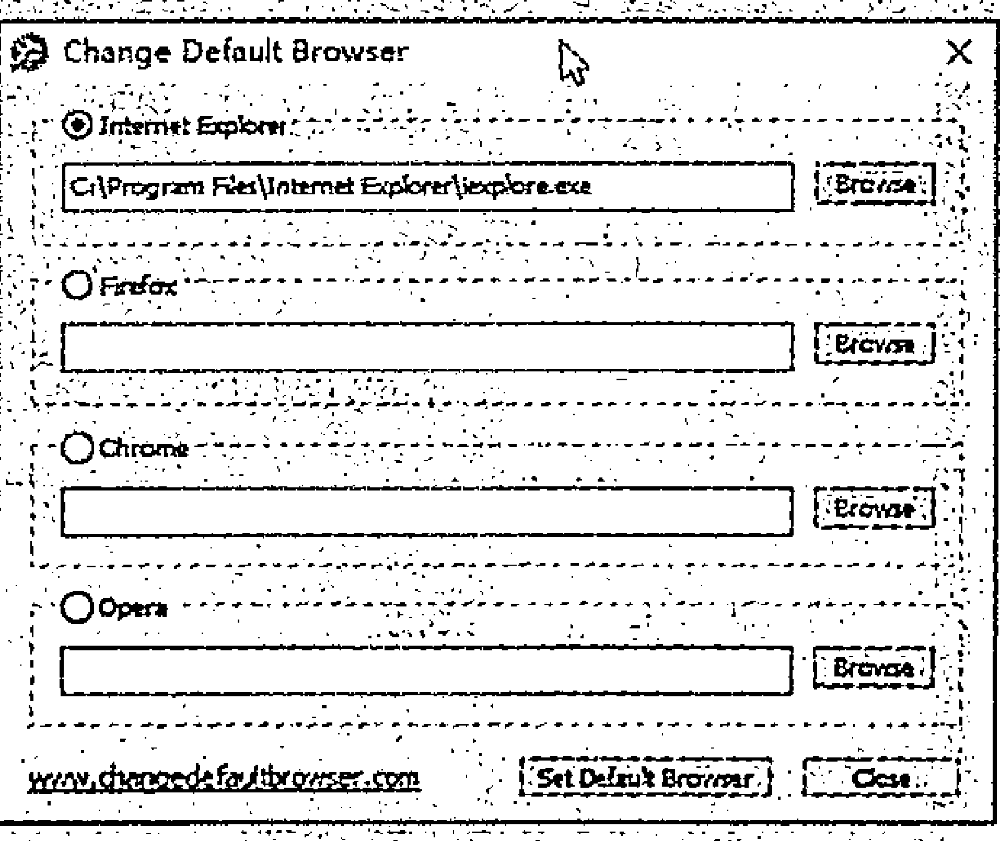

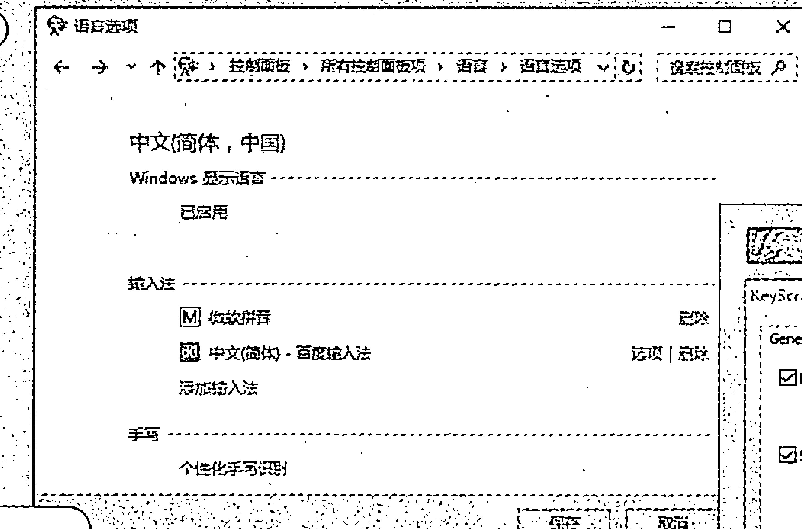

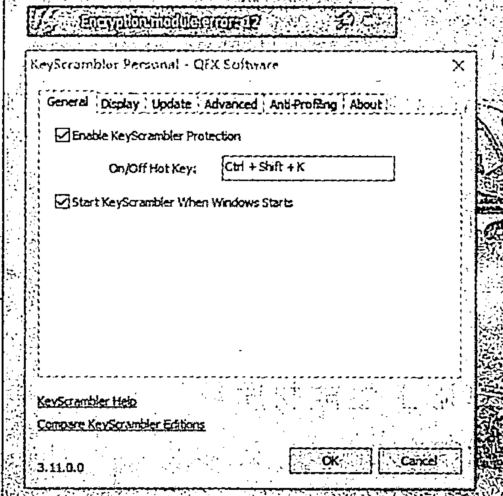## 3. 桌面图标防护 不让修改得逞

对桌面图标进行修改，也是木马侵入的一个渠道。因此，进行桌面图标防修改保护，也是软件防护的一个重要方面。我们可以利用“桌面图标防删除生成器”来实现桌面图标的修改防护。

“桌面图标防删除生成器”是利用IE劫持原理写的一个小软件，用它来设置桌面图标防修改，可防止别人轻易改动已建立的桌面软件图标。运行软件后，添加桌面图标的名称、图标路径、右键关联文字、图标关联的程序路径等，然后还可为桌面图标右键定义新的名称属性，参数设置好之后，点击“添加”按钮添加（图4）。

##### 4. 软件安装防护 去除多余捆绑

在安装一些网上下载的软件时，我们常常会为软件捆绑的各种无关插件或第三方软件所困扰。利用“捆绑软件净化器”，可以解决这一令人头痛的问题。其运行后自动开启净化功能，当安装一款软件时，会自动实现软件净化提示和选择处理，无关的第三方软件或插件捆绑安装将被阻止，让电脑能够保持干净快速的状态（图5）。

##### 5. 文档图片保护 要有得力工具

文档图片被木马加密挟持和勒索将是很可怕的一件事。利用安装文档卫士软件，开启对文档图片的防护，可保护文档、图片不被木马病毒（如CTB-Locker等）加密破坏（图6）。即便是被一些常见的勒索病毒加密，也可以尝试用该软件来解密，很可能挽回损失。

#### DNS我们可以这么使用

文|老万

DNS作为最基础的网络服务之一，往往受到很多用户的忽视。不过你可能没有想到的是，选择好一个DNS服务，不仅可以加快用户的上网速度，还可以对很多恶意链接进行拦截。

##### 第三方DNS的选择

虽然每一个网络运营商都提供有自己的DNS服务，但是由于这些运营商会在传输的过程中插入广告，于是很多用户对这种做法非常反感，所以很多网友都开始使用第三方的DNS服务。那么网友应该从什么地方，去寻找需要的DNS服务信息呢？

我们首先通过浏览器打开http://public-dns.info/这个网站，这是一个收集公用DNS服务的网站。当用户打开这个网站以后，在网站首页的列表里面就显示出大量可以选择的DNS服务，用户只需要从中选择一个认为合适的DNS服务就可以了。需要提醒大家的是，在列表的“Location”选项里面显示的是DNS服务器所在的位置。除此以外，用户在选择以前一定要查看“Reliability”这个选项，因为这个参数代表服务器的稳定程度，建议用户从100%里面选择自己需要的DNS服务（图1）。

##### 用DNS拦恶意链接

网络里面充斥着很多不好的信息内容，这样会给青少年造成很多恶劣的影响，所以我们需要想方设法对其进行拦截。通常通过一些杀毒软件或者安全插件，可以对有害的内容进行拦截。可是如果没有安装类似软件的话，那么可以使用DNS服务来进行操作。

当然并不是所有的DNS服务都可以对恶意信息进行拦截操作，所以我们需要选择具有该功能的DNS服务才可以。比如我们首先访问oneDNS服务的官方网站（http://www.onedns.net/），在下面我们就可以看到网页里面提供了几组DNS服务。这些DNS都可以对钓鱼病毒、挂马网站等恶意网站进行拦截，所以用户可以根据自己的需要进行选择操作（图2）。

##### 锁定DNS防止被篡改

DNS一个最主要的作用就是将网站域名转换成对应的IP地址，这样浏览器就可以成功地进行拦截访问了。正是由于它的这一特性，有的病毒或者黑客就会对系统里面设置的DNS进行修改。这样让用户在上网的时候就可能落入到黑客设定的网络陷阱里面，从而造成自己各种各样的损失。那么如何才可以防范系统的DNS被篡改呢？

> 如果用户已经开始使用IPv6，那么就在“IPv6 DNS server”列表里面进行选择。

我们知道现在很多安全软件都有一个防范浏览器首页链接被篡改的命令，其实我们只需要利用专业的软件就可以防范DNS被篡改。我们首先下载运行“Dns Lock”这款软件，在弹出窗口的“IPv4 DNS server”列表中，可以看到多组的DNS信息，其中最下面的那组就是用户正在使用的DNS。用户根据需要选择要用的DNS以后，点击“Install Service”按钮就可以利用系统服务的形式将DNS进行锁定（图4）。

##### 换种方法使用DNS

除了可以直接在系统里面设置DNS信息以外，用户还可以利用其他的方法达到同样的效果。我们知道很多系统里面都有一个Hosts文件，这个文件有一个作用就是配置域名和IP地址的映射关系，从而提高域名解析的速度。虽然利用任何的编辑器都可以对Hosts文件进行编辑，但是编辑器毕竟没有专业的软件直观和方便。

> 利用“工具”菜单中的命令，还可以进行DNS缓存信息的刷新等操作。

所以我们首先下载运行“BlueLife Hosts Editor”这款软件，比如我们需要给《电脑爱好者》的官方网站设计一条规则，那么首先打开系统里面的命令提示符。接着输入“ping www.cfan.com.cn”这行命令并回车，这样就可以解析出对应的IP地址（图5）。接下来返回到“BlueLife Hosts Editor”工具的窗口里面，在工具栏的前面输入域名地址www.cfan.com.cn，接着在后面输入对应的IP地址101.201.80.41。最后点击“解析域名并添加到列表”按钮，接下来按照同样的方法进行解析和添加操作。当我们将Hosts文件编辑完成以后，点击工具栏中的“保存更改”按钮即可（图6）。以后即使是DNS被篡改或者DNS服务器失效，也可以成功地完成域名的解析操作了。

#### 重整你的“智能”压缩软件

文/阿立

虽然现在有很多的压缩软件可以选择，但在使用操作上都非常的相似，不知不觉间会浪费很多的时间。只有更加“智能”的压缩软件，才可以大大提高我们的工作效率，而Bandizip就是这样一款压缩软件。

##### 压缩文件右键预览

通常我们要了解一个压缩文件中的内容，都需要双击这个压缩文件，在弹出的窗口列表中才可以了解。如果这个压缩文件中的内容比较多的话，在加载时会浪费大量的时间。除此以外，黑客也会将病毒文件伪装成压缩文件的图标，引诱用户进行运行操作。若只用右键进行文件预览的话，就可以大大的减少相关问题的出现。

下载安装Bandizip (https://www.bandisoft.com/bandizip/cn/)，双击运行系统桌面上的Bandizip压缩软件图标，在弹出的窗口里面点击“选项”菜单中的“设置”命令（图1）。接下来在弹出的设置窗口中点击左侧列表中的“上下文菜单”按钮，在右侧窗口的“选择解压菜单”中找到“预览压缩文件”这项。现在将这个选项选中，然后在“预览文件数量限制”中设置一个自己认为合适的数值，点击“确定”按钮关闭设置窗口就可以了（图2）。接下来我们找到一个压缩文件，选中它以后点击鼠标右键，在菜单中的“压缩文件预览”这一项下面就可以看到压缩包里面的文件预览信息，从而就可以减少双击打开文件查看的繁琐操作（图3）。

##### 自动解压更加人性

每个用户在创建压缩文件的时候，都有他的使用习惯和特点。比如有的用户在创建压缩文件的时候，会将文件直接进行创建操作，这样用户在解压的时候就会将所有的文件释放到当前的目录，对于用户的管理操作来说就非常的麻烦。而有的用户在创建压缩文件的时候，就会连文件夹一起进行创建，这样我们在解压文件后，就需要连续多次双击文件夹，才可以看到相应的文件内容。不过现在利用Bandizip的“自动解压”功能，这些问题都迎刃而解了。

比如我们用Bandizip打开压缩文件的时候，若这个压缩文件里面有一个文件夹的话，那么Bandizip就会自动将此文件夹进行过滤，从而自动显示出文件夹中的内容。如果用户通过右键菜单进行解压操作，点击鼠标右键后选择菜单中的“自动解压”命令，Bandizip就会根据压缩文件中的目录层级，自动过滤多余的文件夹目录层级，或者解压

##### 解压跳过临时目录

在进行文件解压的时候，许多人都会有一个拖拽文件的习惯。也就是说在打开的压缩文件中，通过鼠标选择需要解压的文件后，利用鼠标拖拽的方式进行操作。如果用户解压的是一两个文件的话，那么这种方法相当的快捷方便。如果用户选择的是众多文件的话，那么用户可能就会发现在拖拽完成以后，会出现一个文件复制的进度条。之所以出现这样的情况是因为用户在操作的时候，压缩软件首先会将这些文件解压到系统的临时目录，再从临时目录复制到我们指定的文件夹里面，这样就会花费大量的时间。

不过现在这个问题通过Bandizip的“快速拖放”功能，已经可以很好地解决了。该功能使用用户选择的文件被直接解压到指定的拖拽文件夹目录，而不需要像传统的压缩软件那样通过临时文件夹进行中转。这样用户既不需要改变自己的操作习惯，同时也可以有效地减少自己等待的时间。其实除了拖拽文件进行解压可以使用“快速拖放”功能以外，在进行体积较大的单文件解压的时候也可以使用这个功能。我们首先打开Bandizip软件的设置窗口，点击左侧列表中的“解压设置”选项。然后选中“解压大文件时使用快速拖放”选项，以后解压大文件时就可以跳过“临时目录”这个环节（图5）。

##### 代码页让乱码消失

我们从网上下载的压缩文件，有的解压后可以进行正常的显示，有的则会在文件名处显示出乱码。之所以出现这样的情况，主要还是由于压缩文件在制作的时候，操作系统使用的编码和我们当前系统的不一样造成的。以前要想解决这个问题，操作起来非常的繁琐。不过现在利用“代码页”功能，这个问题就可以快速地迎刃而解。

如果我们利用鼠标右键的预览功能，发现文件名称出现乱码的情况，就在鼠标右键菜单上点击“用Bandizip打开”这个命令。接下来在弹出的操作界面点击工具栏中的“代码页”命令，然后在弹出的选项里面选择“自动检测”功能。这样软件就会自动对当前的文件所使用的编码进行检测，检测以后就可以正常地进行显示操作了（图6）。

##### 文本图片预览编辑

此前要想查看一个压缩文件中的图片文件或者文本文件，最常见的方法就是对它进行解压后再进行查看。即使是用户直接在压缩文件里面进行操作，也存在一个解压和重新压缩的过程。不过现在Bandizip软件自带一个图片预览功能，只需要点击压缩文件中的图片文件，那么就可以在左下角看到图片的预览效果。如果用户觉得这样查看太小的话，还可以在设置窗口的“查看器”里面，分别设置图片文件的查看器以及文本文件的编辑器（图7）。

#### 同步网盘MEGA可以做得更好

文|万立夫

随着国内几家知名的云存储服务相继关闭，许多人现在又开始利用闪存盘等移动设备来传递文件。即便是现存的几家云存储服务，也都取消了文件同步等关键功能，该怎么办呢？

##### 多文件夹的同步操作

既然国内没有好的同步网盘可以选择，那么我们自然就将目光瞄向了海外。而MEGA正好就是一款优秀的同步网盘，每个注册用户都可以马上分到50GB的存储容量。我们首先通过浏览器访问这个网盘的官方网站(https://mega.nz)，点击网页右上角的按钮，在弹出的菜单里面选择APPS这一项。然后我们在子菜单里面找到“同步用户端”这一项，点击它以后就可以下载具有同步功能的客户端软件了。

和其他的文件同步软件一样，用户在安装完这款客户端软件以后，软件会要求用户设定一个同步目录。这样以后当软件发现这个目录里面的文件存在变化后，就会自动将里面的文件上传到云端服务器里面。不过和其他同步软件不同的是，MEGA同步软件可以支持对多个文件夹目录进行同步操作。

首先我们在系统托盘找到MEGA同步软件的图标，在图标上点击鼠标右键后，在弹出的菜单里面点击“设置”按钮，这样就可以弹出同步软件的设置窗口。点击设置窗口中的“同步”按钮，我们在列表里面就可以看到已经设置的同步文件夹目录（图1）。点击下面的“增加”按钮，在弹出的对话框中根据提示分别设置“本地文件夹”以及“MEGA文件夹”（图2）。设置完成以后点击“好”按钮，那么这个目录就可以进行同步操作了。

##### 快速多样的文件分享

除了可以进行文件的存储以外，网盘还有一个重要的功能，就是进行文件的分享操作。那么MEGA网盘又是如何进行文件分享的呢？对于在本地硬盘里面存储的文件，如果用户想进行文件分享的话，那么只需要在文件上点击鼠标右键，之后在弹出的菜单里面选择“得到MEGA链接”命令。这时在软件的客户端上面就会弹出一个“链接已经复制到剪贴板”的提示，现在我们只需要直接粘贴就可以得到共享链接了。

如果需要共享的文件在本地硬盘里面并没有备份的话，那么我们只能在云端服务器里面进行分享。首先登录MEGA网盘的网页空间，在文件列表中选中需要进行分享的文件，点击工具栏中的“获取链接”按钮（图3）。在弹出的对话框里面设置链接的密码，以及有效天数等信息，点击“确定”按钮后，就可以得到分享链接了（图4）。

> ### 小提示
“MEGA文件夹”指的是文件夹目录同步到云端服务器里面的名称，用户既可以保留和本地文件夹相同的名称，也可以重新设置一个名称。

### 软网生活

行共享的文件。点击鼠标右键后选择菜单中的“更新分享链接”命令，在弹出的对话框里面，用户可以选择“链接不包含密钥”以及“链接包含密钥”等方式，这样就可以看到分享的文件链接了（图3）。

#### 一气呵成的上传分享

我们在发送电子邮件的时候，经常都会利用附件的形式来传递一些文件。由于各个邮箱的附件大小限制等原因，用户就会改用其他的方式来进行分享，最常见的方法就是发送网盘文件的分享链接。对于已经存在于网盘中的文件来说，这种方法当然是非常简单的。如果分享的文件不在网盘里面的话，那么又应该如何解决呢？

运行电子邮件客户端Thunderbird，接着点击窗口右上角的“菜单”按钮。在弹出的菜单里面选择“附加组件”命令，然后在弹出的窗口里面点击左侧的“扩展”按钮，接下来在右侧窗口里面搜索并安装MEGAbird这款扩展（图4）。返回到邮件客户端主界面以后点击“新建消息”按钮，在弹出的编写窗口中点击“工具”菜单中的“选项”命令。

接下来点击工具栏中的“附件”命令，点击“添加”按钮后捆绑自己的MEGA账号（图5）。然后点击编写窗口中的“附件”按钮，在弹出的菜单里面选择“文件链接”中的“MEGA”这项。在弹出的对话框里面选择我们需要进行分享的文件，接下来它会自动上传到网盘里面。当上传完毕以后会自动生成分享链接，并显示到邮件编写窗口里面（图6）。

#### 文件获取就这么方便

当我们得到文件的分享链接以后，只需要通过浏览器打开它，就可以通过浏览器进行下载操作了。不过由于浏览器没有断点续传的功能，这样在下载体积较大的文件时可能会出现错误，所以还是建议用户用网盘客户端来进行下载。

将文件的分享链接复制到系统的剪切板里面，接着在系统托盘的网盘客户端图标上点击鼠标右键，在弹出的右键菜单里面选择“输出链接”命令。这样我们就可以看到在弹出的对话框里面，自动粘贴上了剪切板中的分享链接。接下来我们只需要点击下面的“提交”按钮，客户端就会自动分析出分享链接的文件名字（图7）。然后用户可以根据自己的需要，勾选“下载到我的电脑”或者“输出到云盘”选项（图8）。设置存储的具体位置后，最后点击“好”按钮就可以进行下载操作了。

#### 多媒体文件在线播放

若分享的是多媒体文件的话，那么还可以实现类似于在线播放的操作。首先在客户端的右键菜单里面点击“来自 的文件”命令，在弹出的对话框里面点击“公共链接”按钮，将文件分享链接粘贴到弹出的对话框里面。接下来客户端会分析出文件的名称和类型，然后点击下面的“默认程序”按钮。这样就可以利用系统里面自带的播放器，对这个多媒体文件进行在线播放的操作了（图9）。

> 如果在文件列表的后面有一个结绳图标，说明这个文件被共享出去了，通过后面的命令就可以取消共享设置。

> 如果系统里面没有安装网盘的客户端程序，可参考2015年第8期《跳出浏览器 MEGA文件直接下载》或浏览http://www.cfan.com.cn/2015/0625/119924.shtml查阅，利用MegaDownloader来进行下载操作。

#### 保护眼睛 改个模式看小说

文|老万

现在很多人为了不断地充实自己，会经常从网上下载各种资料来阅读。这些资料往往会以各种各样的文档形式存在，通常都是利用默认关联的软件程序来查看的，长时间进行阅读的话，就会造成视觉疲劳，所以我们应该选择更好的“阅读”模式。

##### 调用自带的阅读模式

Word文档是最常见的文档格式之一，但是由于Word文档格式的特殊性，因此只能使用办公软件来进行查看。不过好在Word软件里面自带有一个阅读模式，所以用户只需要切换到该模式下就可以了。利用Word打开需要的文档文件，点击“视图”标签中的“阅读视图”按钮，就可以切换到软件的阅读模式中。

我们可以看到在这种模式下面，不仅文字内容重新进行了排版，而且字号看上去更加大，同时文字之间的间距也进行了加大（图1）。而且整个窗口是用全屏的方式展开的，这样就可以减少其他软件窗口对用户阅读的干扰，从而可以让用户在阅读内容的时候更加专注。用户只需要通过鼠标点击窗口左右两侧的按钮，或者通过键盘中的方向键来完成文档的翻页操作。为了让阅读更加舒服，不同的用户还可以根据个人的习惯，对阅读模式的属性进行修改。比如点击“视图”菜单中的“页面颜色”，用户可以选择黑底白字、白底红字和粉底红字等。通过“视图”菜单中的其他命令，还可以调整页面的布局以及文字的间距等等。除此之外，打开“导航窗格”后点击“页面”标签，可以点击某一个页面的缩略图，从而快速地跳转到相应的页面里面（图2）。

如果用户需要对某一个章节进行重点阅读的话，那么可以点击工具栏中的“加书签”按钮进行收藏。这样在需要的时候就可以通过“整理书签”按钮，快速跳转到指定的这个位置进行阅读（图4）。

##### 专业阅读软件的选择

除了我们常见的Word文档以外，文本文件以及网页文件也是信息传播载体。可是运行这些格式的软件程序，很少带有阅读模式的功能，这个时侯只能使用专业的阅读软件来进行操作。

现在打开PageByPage这款阅读软件，点击工具栏中的“打开”按钮后，选择需要阅读的文档文件。当文件成功地载入以后，会发现软件通过对开的方式，将文件内容进行了展示。同时通过对字体大小以及字体间距的重新排版，让用户更加体验到一种实体书籍的显示感觉（图3）。通过工具栏中的“上一页”和“下一页”按钮，就可以实现文档的快速翻页操作。以前我们通过编辑器打开文本文件后，最大的问题就是无法记录阅读的位置。这样重新打开这个文件后，只能通过拖拽侧边栏的方式去寻找上次阅读的位置。不过使用PageByPage这款阅读软件就不用担心这个问题，因为当用户打开同一个文件的时候，它会自动恢复到之前阅读的位置。这样用户就可以从这个位置，继续进行该内容的阅读。

#### 一样的记事本 不一样的用法

文/阿楠

在许多人看来，Windows 10系统中的记事本仍旧是一个用来记录文字的简单工具。其实，看似非常简单的小工具，却有许多别样的用法。

##### 1. 基本功能别样用

###### 获知当前系统内核版本号

Windows 10之后不再有11或12之类的大版本出现，但其内部版本号变化很快。如何才能知道自己所用的Windows 10的版本号呢？

启动“记事本”，通过“帮助→关于记事本”菜单命令，就可以看到当前所用的Windows 10系统的版本和OS内部版本号(图1)。

###### 巧用扩展名制作程序文件

虽然记事本默认的保存格式为.TXT，但我们可以根据情况在存盘时选择文件类型为“*.*”，然后将扩展名指定为任一种程序文件，例如HTML为网页文件、REG为注册表文件、BAT为批处理文件等等(图2)。

###### 文档快速插入时间

如果文本文档中某一位置需要当前时间，在记事本中按下F5键即可插入。如果要为文档自动添加编辑时间记录，只需在文档首部添加一行“.LOG”（不含引号），这样以后每次用记事本打开该文档时，程序会自动将本次编辑的开始时间和日期追加到该文档的末尾。

###### 巧用行号标记和跳转状态

如果启动记事本以后，发现“查看”菜单下的“状态栏”变为不可选灰色状态，“编辑”菜单下的“转到”命令也变为不可选状态。这往往是因为我们在平时看文本时习惯于按窗口自动换行，选中了“自动换行”选项所致。

如果在看一些代码时，为了看清层次结构，这时我们不要选中“自动换行”，这样状态栏就生效了，跳转到某行代码的命令“转到”（Ctrl+G）也变得可用了。

##### 2. 已有功能再增强

###### 让自动换行与状态栏共处

虽然记事本自动换行和状态栏无法同时开启，但通过修改注册表可改变这一状况。首先在记事本中选择自动换行，然后将记事本关闭，打开注册表编辑器，选择“HKEY_CURRENT_USER\Software\Microsoft\Notepad”项，在右边窗格选择StatusBar，双击设定数值数据为1(图3)。打开记事本，选择自动换行，发现底下的状态栏已经开启。

###### 为记事本建个隐形开关

记事本隐藏较深，启动不够方便，为它建立一个隐形开关，用快捷键启动更方便。到“Windows\system32”目录中找到notepad.exe，创建一个快捷图标，右键单击该图标并选择“属性→快捷方式”，点击“快捷键”并按下某键，程序自动给出含有“Ctrl+Alt+某键”的快捷键组合。注意若与其他程序所用快捷键相冲突，需要避开设置。

轻松“擦掉”图片的背景画面
文|老万

去除图片的背景是很多用户经常遇到的操作，但是实际操作起来却非常棘手。通过简单的图片处理软件无法直接解决相应的问题，利用复杂的图片处理软件对普通用户而言又非常麻烦。不用烦恼，其实我们有更加快速且高效的去除图片背景的方法。

###### 背景内容自动识别处理

虽然通过各种各样的软件程序，可以非常轻松地去除图片的背景。但是如果电脑里面暂时找不到类似的软件，那么我们又应该如何进行操作呢？其实随着云计算的快速发展，网上也有很多去背景的网站服务，通过它们也可以快速地解决问题。

登录Malabi这个云服务的网站(https://www.malabi.co/)，点击网页中的“Upload”按钮，在弹出的对话框里面选择需要进行处理的图片文件即可。和其它的同类云服务不同的是，当我们成功上传图片以后，Malabi云服务会对这张图片进行预处理。如果这张图片的背景颜色比较单一或者简单的话，可能在这个环节就已经成功完成去除背景的操作了（图1）。如果图片的背景内容比较复杂的话，那么云服务没有处理到用户需要的部分，就需要点击图片下方的“Touch Up”按钮进行手动操作。

在弹出的“Background Remover Edit”对话框里面，可以看到左上角的绿色和红色的画线功能区域。点击其中的绿色区域，在图片中画出要保留的区域范围。接下来我们再点击红色区域，选择要进行移除的区域范围。当用户开始通过鼠标画线后，每一个步骤进行时云服务都会即时计算并调整出最适合的背景去除范围（图2）。如果用户将需要保留的部分进行了选择，可以点击“Undo”按钮返回上一步来重新进行操作。编辑完成以后点击对话框右下角的“Preview Result”按钮，就可以预览到去除背景后的图片效果。如果预览图片没有任何问题的话，点击“Save Changes”按钮进行保存，最后点击“DOWNLOAD IMAGES”按钮进行下载操作即可。

> 小提示：在“Background Remover Edit”对话框的左下角有两个按钮，可以分别将图片背景转换为透明的样式以及移除阴影等操作。如果用户需要将图片的背景修改为透明效果的PNG文件，那么一定要选中“Transparent”这个选项才行。

###### 背景更换两步合二为一

很多人对图片中的背景进行去除并不是最终的目的，而是想将处理后的图片内容和其他的图片进行整合，最终达到自己满意的一种效果。通常情况下我们要完成这样的操作至少需要两个步骤，那么能不能将这两个步骤合二为一，从而更加简化相应的操作呢？

利用“Background Burner”云服务，就可以实现类似的合成效果。现在我们通过浏览器打开它的官方网站(https://burner.bonanza.com/)，在硬盘里面选择要处理的图片后，通过鼠标拖拽到网页的“Drag and Drop Image Here”输入框释放，这样就可以将文件上传到云端服务器里面(图3)。

当图片文件上传完成以后，云服务会自动弹出一个处理窗口，我们可以看到一只小恐龙通过喷火的途径将图片的背景给“燃烧掉”。当然“烧”完以后会在窗口里面显示多个处理的结果，用户可以从中选择一个自己认为满意的来使用(图4)。由于我们打算将处理后的图片和其他的图片进行整合，所以点击右侧图片下面的“Replace Background”按钮。

###### 保留背景去除其他部分

当然有些用户并不是需要进行图片背景的操作，他们需要的可能正好相反，就是把图片里面除了背景以外的内容给删除掉。这样我们在某个景区拍照的时候，如果有人不小心进入到我们的镜头内的话，就可以用这种方法将他们PS掉。那么除了使用Photoshop这类大型的图片处理软件以外，怎样才可以更加快捷地获得需要的结果呢？

打开Webinpaint网站(https://www.webinpaint.com/)，在弹出的网页里面点击窗口中的“Upload image”按钮，用于选择上传要处理的图片文件。在弹出的处理页面中通过工具栏中的放大镜，对需要进行处理的范围进行放大。接着点击“Mask”旁边的数字选项来调整笔刷的大小，然后把想要去除的地方抹上红色的漆即可。不过需要提醒大家的是，必须将处理范围进行均匀的涂抹并且填满才行。

涂抹操作完成以后点击工具栏中的“Run”按钮，这时云服务就开始进行在线处理操作，稍等片刻我们就可以看到处理后的结果(图6)。比如图6就是我们去除图片里花朵的结果，不过对于这类比较复杂的内容不可能一次性处理完，我们只需要多进行几次涂抹操作即可。当图片处理最终完成以后，点击工具栏中的“Download”按钮，就可以将图片下载到本地系统里面存放。

> 小提示
利用Webinpaint处理图片中的其他信息，也可以得到非常不错的效果，比如去除图片中的水印或者Logo等等。

音频文件秒转文本
文|万立夫

很多从事文秘工作的人，都会在会议中通过录音等方式进行记录，以便结束后将内容整理成文字信息。虽然这个工作听起来不会很难，但如果经常做的话，就知道整理文字是一件耗时耗力的工作。那么怎样才可以快速地将音频内容转换成文本信息呢？

###### 收听编辑合二为一

比较传统的方法都是通过音频播放器播放音频文件，同时打开电脑系统里面的办公软件，这样一边听一边进行文本的录入。但是在输入的时候常常需要进行音频的调整，自然就需要在两款软件之间进行切换，这样必然就会造成手忙脚乱的情况。不过现在利用“豆子腾稿机”这款软件，就可以很好地解决这类问题。
点击“豆子腾稿机”软件窗口中的“打开影音档”按钮，在弹出的对话框里面选择会议的音频文件。接下来点击窗口左侧的播放按钮，这样就可以开始进行音频文件的播放。与此同时，在窗口下方的输入框里面就可以进行文本内容的输入操作，输入完成直接点击“存逐字稿”按钮就可以保存了（图1）。

###### 添加标签跳转方便

虽然“豆子腾稿机”这款软件的操作非常的方便，但是它也有一些小问题。比如我们只有在输入完成的时候才可以进行保存，不然的话就很容易造成录入信息的丢失。而现在利用oTranscribe这款云服务，就可以很好地解决这个问题了。
通过浏览器打开oTranscribe这款云服务的官方网站（http://otranscribe.com/），点击网页里面工具栏中的语言标签，接着在弹出的对话框里面选择“简体中文”这项，这样操作界面就变成我们熟悉的文字内容了。现在点击网页正中的“选择音频或视频文件”按钮，在弹出的对话框里面选择需要的音频文件（图2）。当音频文件上传完成后，在新出现的网页上方就会出现一个类似播放器的样式，通过它就可以进行音频文件的播放、暂停、前进、后退等操作。
现在把网页输入框里面预设的内容进行全选、删除以后就可以开始输入用户需要录入的内容。oTranscribe这款云服务不

> 小提示
根据个人需求的不同，可以调整音频的播放速度。

###### 云端处理提高效率

虽然前面的方法可以帮助用户全神贯注地整理文字，但是这种方法也就是在传统的方法基础上进行改进，并不能很好地提高用户的操作效率。那么还有什么方法可以更好地提升音频信息转换成文字的效率吗？其实我们知道现在利用云服务可以将文字信息转换为音频信息，所以反过来我们也可以将音频信息转换为文字信息。

访问云服务SwiftScribe的官方网站（https://swiftscribe.ai/），打开网址以后根据提示进行注册操作。成功登录注册账户后点击右上角的“Upload or Drag”按钮，在弹出的提示框里面选择要进行转换的音频文件。当音频文件被成功地上到云端服务器以后，SwiftScribe就会开始进行相关的分析和转换操作。通过列表中的“Progress”这项，可以看到分析转换的进度（图4）。当进度条显示为绿色的“Ready”后，就代表音频文件的分析转换完成了。

点击列表后面的铅笔图标，就可以进入到文本的编辑页面，从而看到分析转换出的文字信息。在文本编辑框的下方有一个播放控制器，点击播放按钮后就会开始进行该音频文件的播放。同时在上方的编辑框里面标示出目前播放的位置，方便用户一边听一边修改其中的内容。编辑完成以后点击右上角的“Save”按钮进行保存，最后点击“Export”按钮将文字保存为文本文件等格式。

> 小提示
云服务SwiftScribe目前处于测试阶段，所以有的时候会出现服务崩溃的问题。这时用户只需要刷新网页，重新进行操作即可。

> 小提示
无论是中文还是英文信息，都存在大量声音相同或类似的词组，这样在进行转换的时候肯定就会出现错误。所以无论用户选择的是国外还是国内的云服务进行转换操作，最好结合前面两种手工方式对其中的内容进行对照修改，从而可以更好地完成文字的整理操作。

###### 移动终端也能搞定

除了使用云服务SwiftScribe以外，国内其实也有类似的服务，不过这些服务仅仅存在于移动终端上。我们首先安装运行“录音宝”这款应用，在开会的时候点击屏幕正中的录音按钮，这样就可以将会议的内容以音频的方式进行记录。会议完成以后点击界面中的“停止”按钮，完成会议内容的记录操作。当我们要开始进行文字整理的时候，点击应用窗口右上角的按钮，在弹出的列表中点击之前的录音文件（图5）。现在在弹出的工具栏里面点击“转文字”按钮，就开始进行音频的转换操作。转换成功后点击工具栏中的“发送”按钮，就可以将TXT文件发送到网盘等地方（图6）。

建立自己的网络电子资料馆
文|阿楠

将上网过程中遇到的好文章、自己的所感所写、拥有使用权的各类作品在网络上建立个性化的资料库，有助于随时快速查阅和收集。要实现上述需求，可使用360doc个人图书馆一站式解决方案。

#### 1. 馆内分类摘取 找到更多好文章

类似于百度文库，由于360doc体系专为资料收藏和发布而设，因此来源于360doc的文章将是资料库的首选素材。当我们需要某方面的资料时，需要在360doc窗口的搜索框中输入资料的关键词或馆友的名称进行搜索（图2）。找到所需的文章之后，点击文章末尾的“转藏到我的图书馆”，即可将文章收入自己的360doc资料馆中保存。

此外，点击“我的图书馆→馆藏”按钮，进入我的图书馆对资料目录进行分类设置。点击“我的馆藏”标题右侧的齿轮形按钮，右侧弹出文件夹设置窗格，用相应的增删改按钮，对文件夹进行规划设置（图3）。文件类别设置之后，以后再收藏文章时，就可以在目标位置列表中选择合适的存储位置了。

> 小技巧:如何找到更多相关好文章
当遇到一篇自己所需的好文章后，若希望找到更多与此相关的资料，点击文章标题下方“文章来源”前的用户名文字链接，即可进入收藏该文章的馆主的主页，或许馆主正是这方面文章的专家或收藏家呢！如果是你中意的馆友，关注一下，然后就可以在你的“通讯录”中找到该馆友，一直关注其收藏动态了。

#### 2. 借助收藏插件 馆外网文巧收藏

360doc的文章虽然丰富多彩，但不一定能囊括我们所需的所有内容。遇到其中找不到的资料，我们还可以通过其他搜索引擎收集文章资料，用“网文摘手”插件或APP，可以将网络上360doc领域以外的网页内容保存在360doc账户中，便于今后阅读。在“我的馆藏”页面工具栏中选择“网文摘手”工具（图4），在随后弹出的页面中，根据自己所用的PC网络浏览器的类型，为PC浏览器选择安装相对应的网络文章摘录插件（图5）。插件安装之后，会在浏览器收藏栏中出现“360doc网文摘手”图标，遇到需要收藏的网页文章时，点击该按钮并根据摘手小贴士的提示，保存文章即可。用360doc建立的个人资料库不单单能在PC上阅读，通过在手机或平板上安装360doc移动客户端，可以实现馆藏资料的随时随地阅读。在移动设备中安装对应的APP插件后，手机或平板同样可以使用网络文章摘录功能（图6）。

##### 安装网文摘手

###### 电脑版

电脑版网文摘手是安装在浏览器中使用的，不同浏览器的安装步骤不一样，请在下方找到您正在使用的浏览器并点击。

- IE浏览器
- 360安全浏览器
- 360极速浏览器
- Chrome浏览器
- 傲游浏览器
- 世界之窗浏览器
- 腾讯TT浏览器
- QQ浏览器
- 猎豹浏览器
- 火狐浏览器
- 淘宝浏览器
- 欧朋浏览器
- Mac Safari
- 百度浏览器
- Microsoft Edge
- UC浏览器
- 搜狗浏览器
- 2345浏览器

###### Ipad版

专为Ipad用户推出的版本，安装在safari中使用，请在ipad上访问此页面进行安装。

###### 手机版

下载网文摘手（手机版），一键保存微信、浏览器里的好文章。

> 小技巧:快速进入自己的资料馆
只需点击浏览器收藏工具栏上的360doc插件工具按钮，即可快速进入自己的360doc资料馆，不用另行登录。

> 小技巧:本地电脑文章备份
如果要将360doc个人资料馆中的文件下载到本地PC，可安装“360doc文章下载和备份工具”进行备份。

#### 3. 个人创作收藏 广纳图文声像媒体

我们不仅能在360doc资料馆中收藏文摘，更可以收藏自己创作的内容。只需点击“馆藏→随笔”工具按钮，就可以创作200字以内的随笔作品，还可以插入图片和表情等。

如果觉得“随笔”的限制太多，区区200字不足以表达，那么还可以用工具条上的“文档”按钮，将自己的各类图文作品上传到资料馆中。上传的内容要遵守即时发布页中有关版权的约定（图7）。此外，对所有馆藏资料的处置和共享，也均应遵守360doc的版权规定，用户自己要把握。

此外，我们还可以将自己的相册、录音文件、视频等资料保存在360doc资料馆中。点击“馆藏”工具栏右侧的“相册”、“音乐”、“视频”按钮，添加图片、音乐、视频文件到相应的分类目录中，即可创建属于自己的多媒体网络资料库（图8）。

#### 用好文件查重复多功能利器

文|阿楠

电脑中经常会保存大量的文件，对各类文件有没有重复的问题，我们自己也很难一下说清楚。磁盘中的重复文件不但侵占磁盘空间，还会增加检索时间、拖慢系统运行效率。用Wise Duplicate Finder软件，通过任意比较文件的名称、大小、内容，可找到重复文件并释放更多的有效空间。

##### 特殊用途 一次性清除0字节文件

空文件或0字节文件作为一种不含内容的特殊文件，均可看作是重复文件。它们虽然不会侵占太多空间，但此类文件过多会影响磁盘文件搜索效率，让系统白白地做无用功。用Wise Duplicate Finder可一次性将此类文件找出并清理掉。点击“位置”框后的文件夹图标，选择添加要搜索的盘符或文件夹（可多选）；从搜索条件框中选择“0字节文件”，然后点击“扫描”按钮（图1）。软件自动扫描结束后，依次点击窗口下方的“全选”和“删除”按钮，将所有0字节文件删除（图2）。

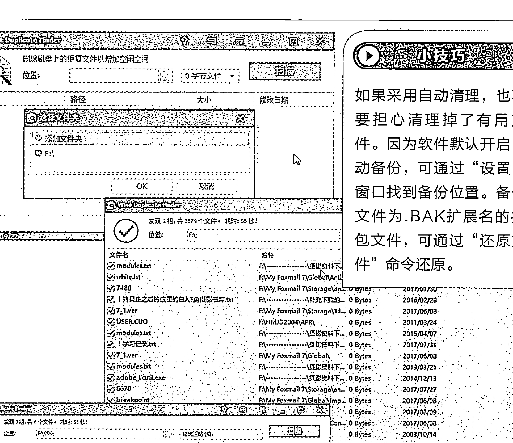

> 小提示 如果采用自动清理，也不要担心清理掉了有用文件。因为软件默认开启自动备份，可通过“设置”窗口找到备份位置。备份文件为.BAK扩展名的打包文件，可通过“还原文件”命令还原。

##### 不同名 重复照片如何找出来

对于一些内容完全相同但文件名不同的照片，如何才能快速找出来呢？我们首先添加存放照片的分区或文件夹，点击“高级设置”按钮，选择“包含”的文件类型为BMP等图片类，将搜索条件设置为“精确匹配（慢）”，然后扫描（图3）。由于要进行内容对比，因此速度慢是理所当然的，此时可利用后台运行或闲置时间让软件自己去查找。找到的相同图片会以颜色块分组显示，容易识别。

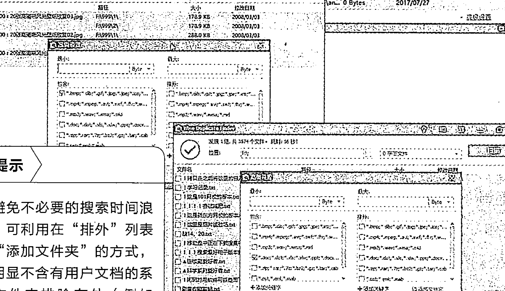

> 小提示 为避免不必要的搜索时间浪费，可利用在“排外”列表中“添加文件夹”的方式，将明显不含有用户文档的系统文件夹排除在外（例如Windows文件夹）。

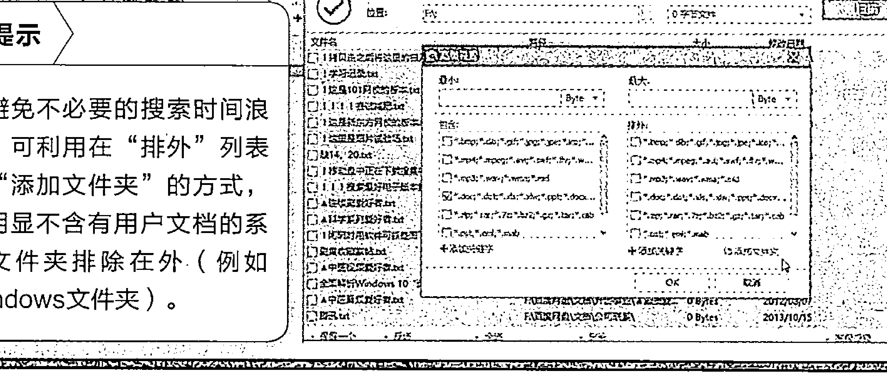

##### 自定义 随心所欲处理重复文件

如果要按自己的特殊需要处理某类文件，例如只希望包含各类办公文档，且希望指定处理文件的最大和最小值，可点击“高级设置”按钮，在高级设置窗口中选择“包含”的文件类别，然后指定“最小”和“最大”文件的字节数，点击OK后，选定目标位置进行重复文件的搜索和处理即可（图4）。

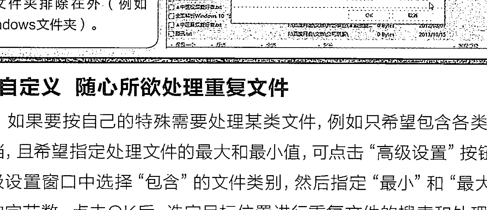

#### 让Windows 10的“锁定”更实用

文|傅海军

平时从上班到下班这段时间，我们的电脑一般都会一直开着，在此期间难免会离开，而电脑如果不做任何防护，则会处于“裸奔”状态，因此锁定电脑无疑是一个好的选择。不过Windows 10的锁定功能还是过于单一，如果能借助于一些小工具，则能让锁定操作花样多多，更加好用。

##### 锁定即关闭显示器

默认情况下，在Windows中按下Win+L组合键，可以让系统进入锁定状态，但是不会立即关闭显示器，在这个提倡节能低碳的时代，这可不是一个好习惯。借助OffandLock来执行锁定操作，则可以一举两得。

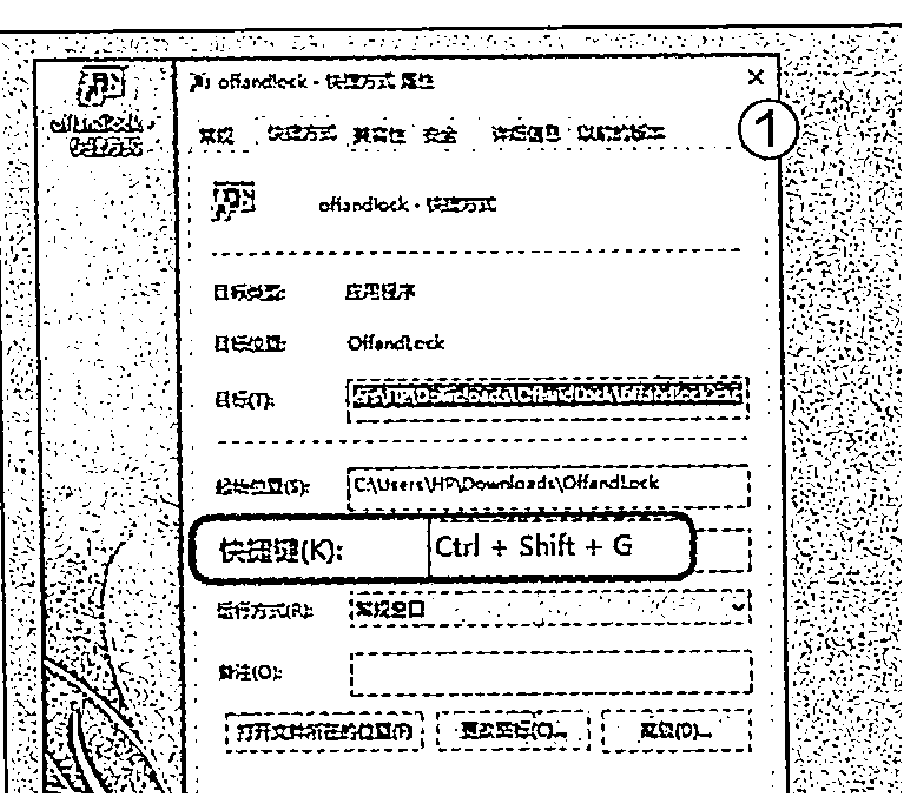

OffandLock是一款绿色软件，下载解压到某个文件夹中，右击文件选择“发送到→桌面快捷方式”，为其创建一个快捷方式，右击快捷方式选择“属性”，切换到“快捷方式”选项（图1），可以为其加上快捷键，这样使用时会更加方便。

使用该工具前，系统要设置登录密码，否则就起不到锁定效果了。另外还要取消本机的自动登录功能，按Win+R组合键打开运行窗口，输入`control userpasswords2`，按回车键打开“用户帐户”选项，在“本机用户”下选择自己的账号，并且勾选上方的“要使用本计算机，用户必须输入用户名和密码”（图2），最后单击确定按钮即可。

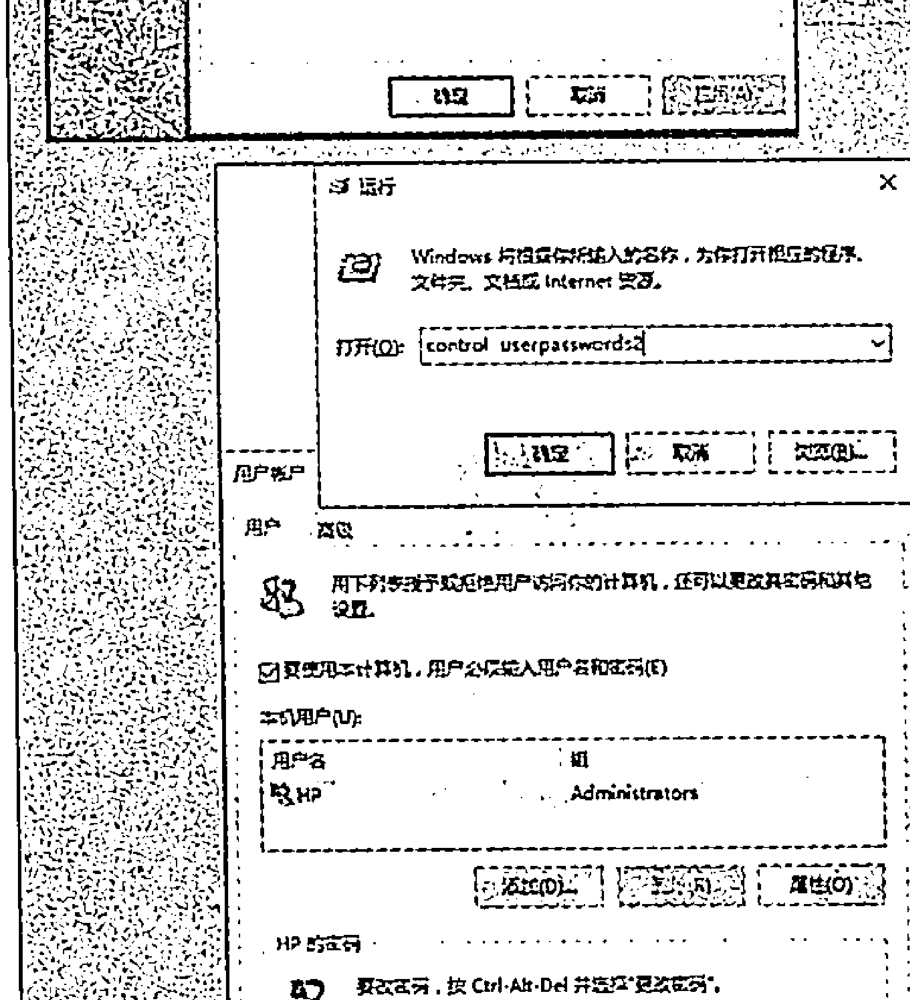

##### 非法解除锁定即报警

锁定的电脑，特别是笔记本，如果被人“顺手牵羊”抱起来就走，到时也是“欲哭无泪”，毫无“还手之力”了。此时可以用Laptop Alarm来保护锁定的电脑。

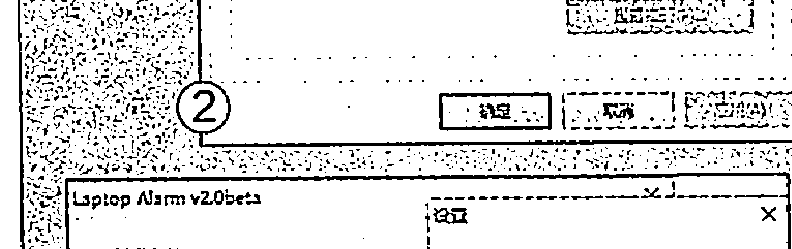

Laptop Alarm同样是一款绿色软件，它的厉害之处就是笔记本执行断电或关机注销操作时，就会发出报警声。打开软件后（图3），“触发条件”一目了然，单击“设置”按钮设置解锁密码，最后单击“锁定电脑”即可将电脑锁定。

完成设置后，以后按下Win+L组合键，不但能锁定系统桌面，而且也能激活Laptop Alarm程序自带的防盗报警功能。一旦有人趁主人离开笔记本的时候想偷偷拿走，Laptop Alarm程序就会发出刺耳的警报声，让不轨者闻声而逃。

##### 登录时“跨过”锁屏界面

默认情况下，进入Windows 10后会先显示锁屏界面，单击后才能进入登录界面。对于希望提高效率的人来说，无疑是多此一举，通过组策略可以跨过锁屏界面。

按Win+R组合键打开运行窗口，输入`GPEDIT.MSC`，按回车键打开“本地组策略编辑器”，依次展开并定位到“计算机配置→管理模板→控制面板→个性化”，在右边窗口中找到“不显示锁屏”一项，双击该项，将“未配置”改为“已启用”（图4），最后单击下方的确定按钮。这样以后就不会再出现锁屏界面，而是直接进入登录窗口。另外在这里还能设置是否阻止更改锁屏图像、是否启用锁屏界面相机和幻灯片。

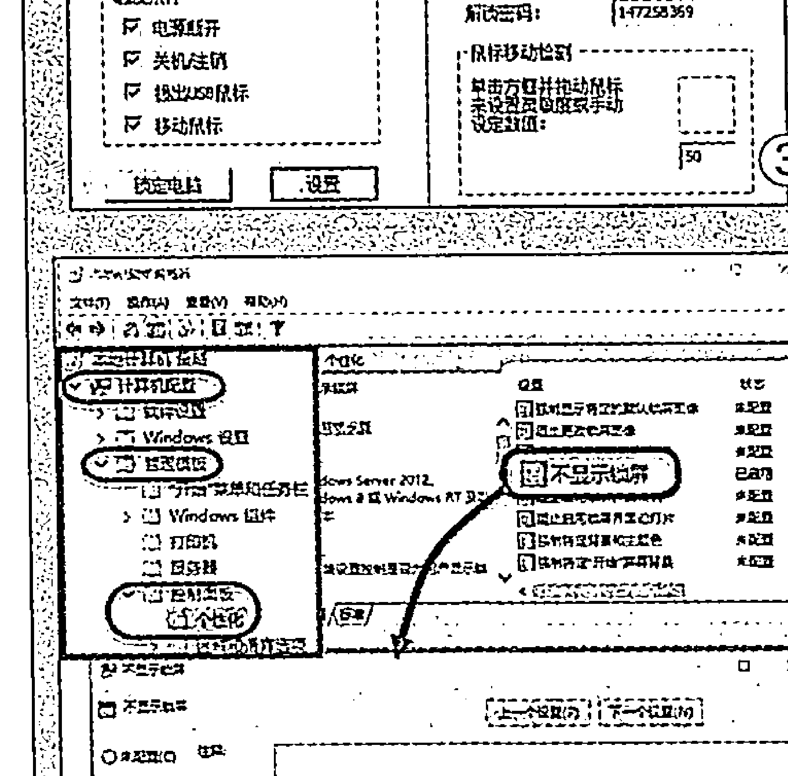

#### 快速生成素描艺术图

文|江南

我们经常看到网友用素描形象画作为头像展示，难道这些图都是网友亲手绘制？其实没想象中的那么复杂，只要你有合适的照片，有很多种方法可将它们变成素描画。

##### 小工具实现极速“素描”

用最快的速度可实现一键照片变素描画，我们利用一个仅有500KB大小的绿色软件“速写大师”，就可成就照片变素描画的梦想。打开速写大师，可以看到软件已经默认自带了一幅照片，点击“转换”按钮，就会发现，只用不到一秒钟的时间，照片已经变成素描画了（图1）。

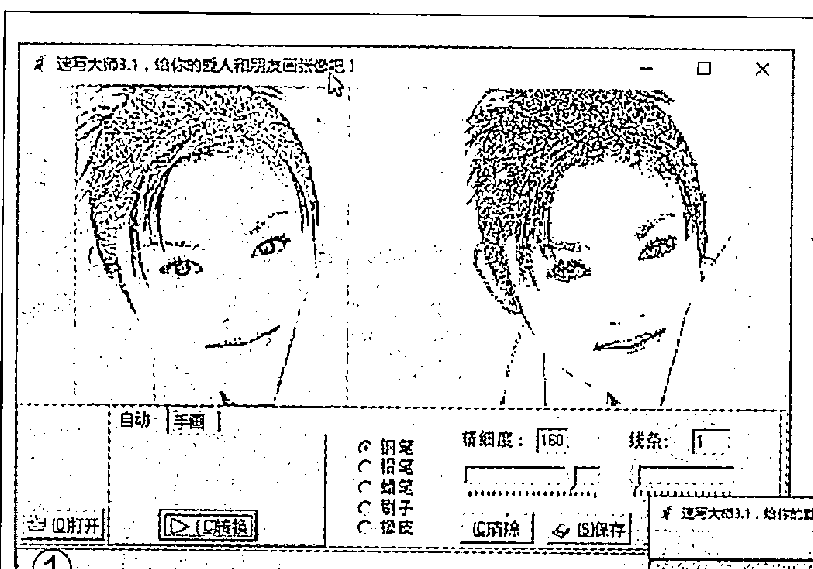

> 小提示：除了自动生成外，软件还带有一个简单的“手画”功能。虽然软件自身不带更复杂的编辑功能，但通过“编辑”按钮可调用系统默认关联的图像编辑软件（默认为“画图”），实现对素描图的进一步编辑处理（图3）。

接下来，我们可以将照片换成一张猫咪图进行说明。点击“打开”按钮载入猫咪照片，通过选择“钢笔”、“铅笔”或“蜡笔”这些工具，可生成不同风格的线条，线条的粗细和精细程度可由“线条”和“精细度”来控制，通过滑块调整即可（图2）。设置好之后，点击“转换”按钮查看绘制效果，若不满意还可以重新设置并绘制。

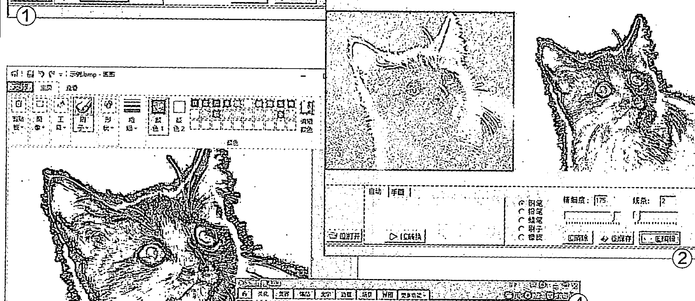

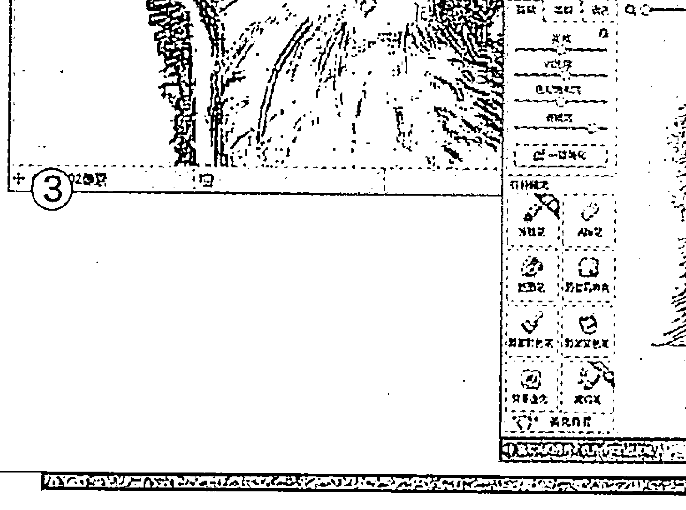

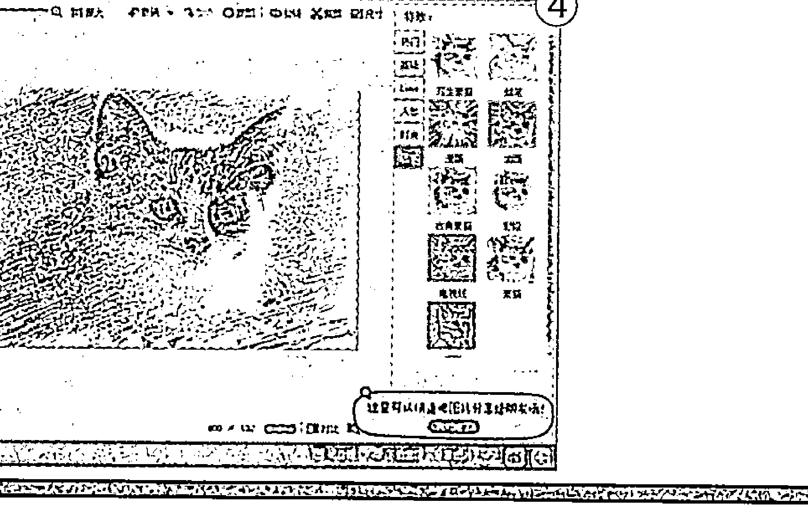

##### 大众工具搞定照片素描

上述软件虽然精小，但毕竟需要下载。如果你自己的电脑里有现成的“美图秀秀”，用这款软件也可快速生成素描画。只需在打开照片后，在“美化”标签页面下，选择右侧列表中的“特效→艺术”选项，然后点击“写生素描”模板，套用即得素描效果画（图4）。

如果没有安装美图秀秀，也可以使用美图秀秀网页在线版来制作素描画。从网页里打开照片后，在绘图工具“美化图片”页面下，选择“特效→艺术特效”选项，然后套用“写生素描”模板，即可得到素描效果画。

#### 免软件提取在线图片中的文字

文|老万

现在很多单位都开始推行无纸化办公，这样很多时候就需要将文字信息转换为数字信息，而在转换的过程中必须要使用到OCR这类的软件，可是通常情况下这类软件不但需要收费，而且有的时候操作起来也比较麻烦。如果临时急用，在不用安装软件的情况下，我们也能进行图片文字的提取。

##### 在线分析快捷简单

通过浏览器打开 “ Free Online OCR ” 这个云服务网站 (https://www.onlineocr.net/) ，这项云服务的操作非常的简单，用户只需要根据页面中的向导一步步进行操作就可以了。首先点击网页中的 “Select File” 按钮，在弹出的对话框里面选择需要扫描的文件。这款云服务支持的文件类型非常丰富，不但可以对图片信息进行扫描，而且也可以对PDF文件进行扫描。

接下来在 “Select language and output format” 列表里面选择扫描文字的类型，通常我们都是扫描中文信息，所以选择 “Chinese Simplified” 这一项就可以了。如果扫描的内容里面还包括有英文等其他文字信息的话，我们就看哪种信息比较多就选择哪一种文字选项。接下来在列表中选择扫描出文字信息的保存文件格式，可以将其导出为纯文本格式以及Word文档格式 (图1) 。

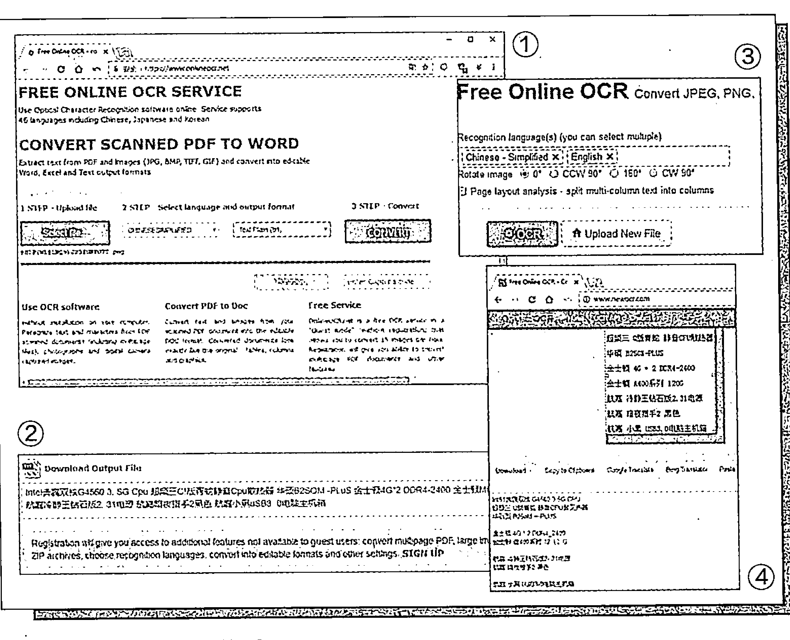

我们在转换前需要输入网页上出现的验证码，点击 “Convert” 按钮就可以开始进行相关的扫描转换操作了。扫描分析出的内容会及时地显示在网页下方的文本框里面，通过对比发现除了少数英文字母的内容出现错误以外，中文信息都完整地被识别出来了。最后点击 “Download Output File” 按钮就可以将其保存，再对这些内容重新进行编辑排版即可 (图2) 。

##### 多语言支持更准确

虽然云服务的操作非常方便，但是由于可能会遇到服务器宕机或升级等问题，所以我们还是最好选择一个其他的在线云服务进行备份。而另外一款同样名为 “Free Online OCR” 的云服务也非常的不错。现在访问它的网站链接http://www.newocr.com/，点击网页中的 “选择文件” 按钮后，选择需要分析扫描的文件。接下来在 “Recognition language(s)” 列表中，点击选择要扫描文字的类型。这个云服务和前一个最大的不同之处在于，它可以同时选择多种文字类型，比如同时选择中文和英文等等 (图3) 。

选择完成以后点击 “Upload” 按钮进行上传操作，我们之所以不马上进行扫描分析，是因为有的时候在上传的过程中图片会出现翻转等问题。所以当文件上传完成以后，我们首先要对图片进行预览，查看它是否正常进行显示。如果不正常的话，还可以通过旋转的方式进行调整。当所有的调整完成以后，点击 “OCR” 按钮就可以开始在线分析扫描了。相对于之前那个云服务，该服务的分析结果并没有改变原有的排版格式。而且可以直接在网页的编辑框里面，对扫描结果进行在线编辑以及在线翻译等操作 (图4) 。

#### 动静相宜 制作局部动态特效GIF图

我们经常可以看到一些网文会配合唯美或有趣的局部动态特效图，使其看起来更有趣。在没有专业支撑或学习过动画制作的情况下，如何能够将信手拈来的素材快速制作成想要的动图呢？

##### 1. 制作前景静止后景运动的动态图

在电视画面中，我们经常会看到前景的主人公不动、后景不断变化的场景，本来需要一定摄影技术才能完成的操作，现在借助ScreenToGif则可以轻松完成。
对于动态背景的选择一般使用视频画面，因为要实现前景静止后景运动，因此尽量选择一些如高速路驾驶汽车、主持人现场报道之类的场景，可以确保前景人物是相对静止，后景则不断变化。这里我们以驾驶视频为例，使用任意播放软件播放一段驾驶视频文件，然后启动ScreenToGif，点击录制并将录制框叠加到播放界面并开始录制（图1）。
完成视频录制后返回程序窗口，点击“编辑”，选择需要作为动态效果的帧数（只要选择车窗外风景变动较大的片段即可）。然后切换到“图像→Cinemagraph”，将需要设置为动态显示的窗外区域选中（图2）。
完成后点击“应用”，这样播放后车内的人员是不动，窗外的风景则和原来的视频一样。最后点击“文件→另存为→Gif”，将其导出为Gif动态文件即可（图3）。

##### 2. 突出局部制作动态图

默认情况下我们截取的动图一般都是整个视频画面，很多时候为了有更好的动态效果，我们需要仅突出画面中的某个元素（比如夸张的笑脸、点头），而让画面其他元素静止，这种动态效果可以借助Cliplets来完成。
首先准备需要制作局部动态图的视频并拖入程序窗口（如果不支持你的视频格式，请自行使用“格式工厂”等预先转换为支持的格式）。在程序窗口可以进行视频的预览。因为是要制作局部动态效果，因此需要选择视频画面某个动态元素，这里我们选择下面视频中主人公手中燃烧的火柴。点击播放按钮，然后记住火焰燃烧在视频中出现的起始时间，按提示拖动上方起始滑块进行定位，把这个燃烧的火柴作为动态元素（图4）。
完成视频定位后点击右侧窗格的Add new layer，

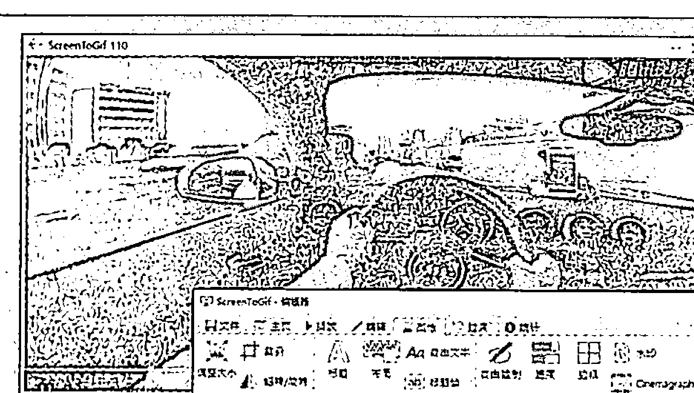

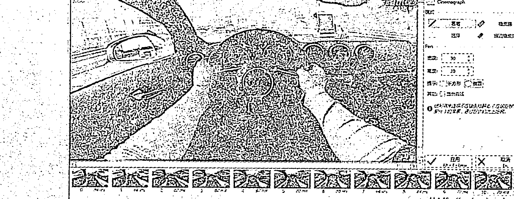

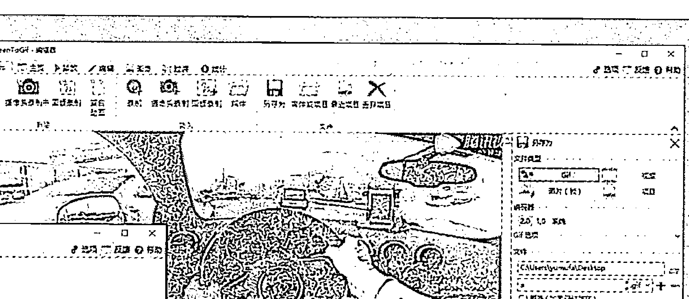

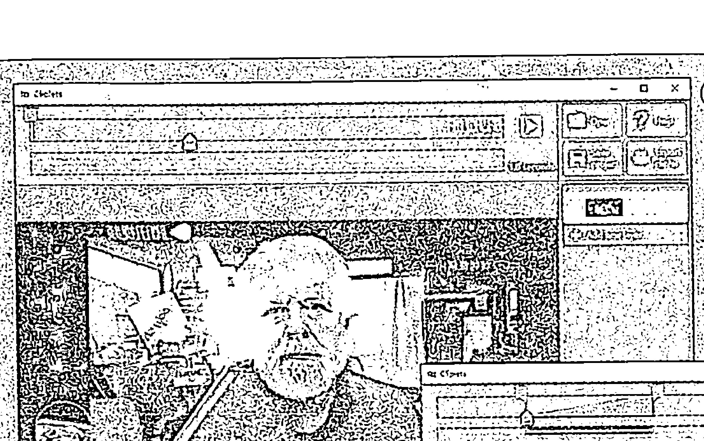


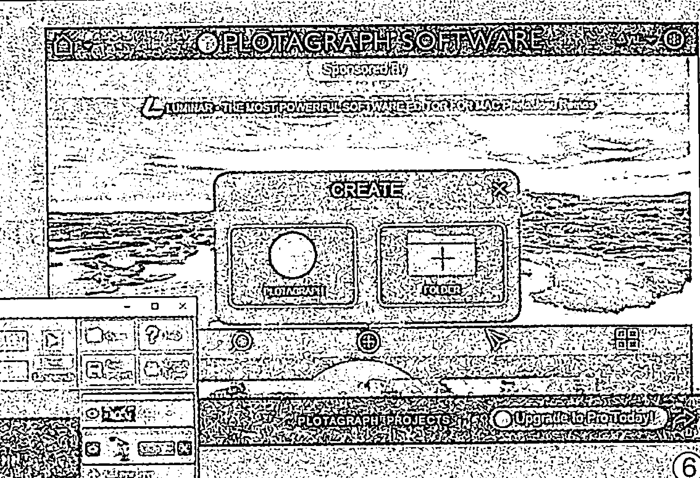

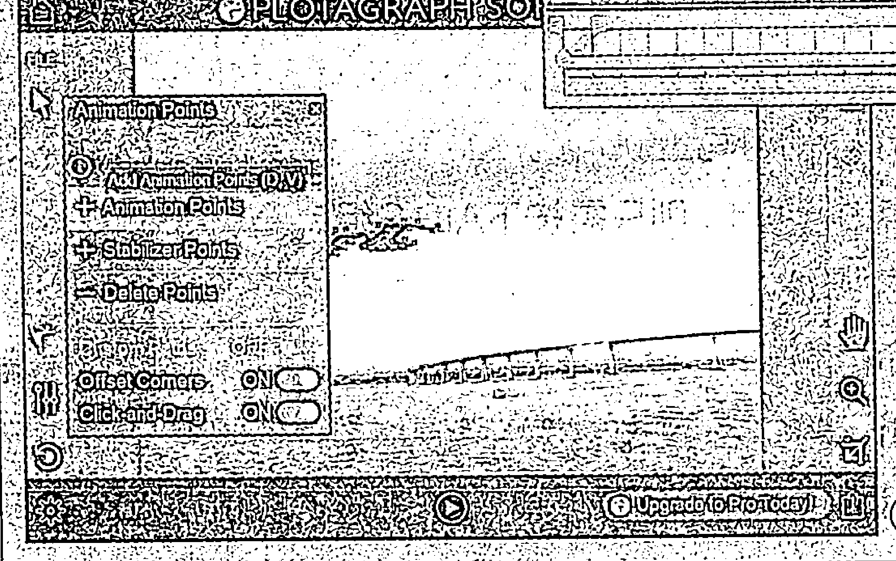

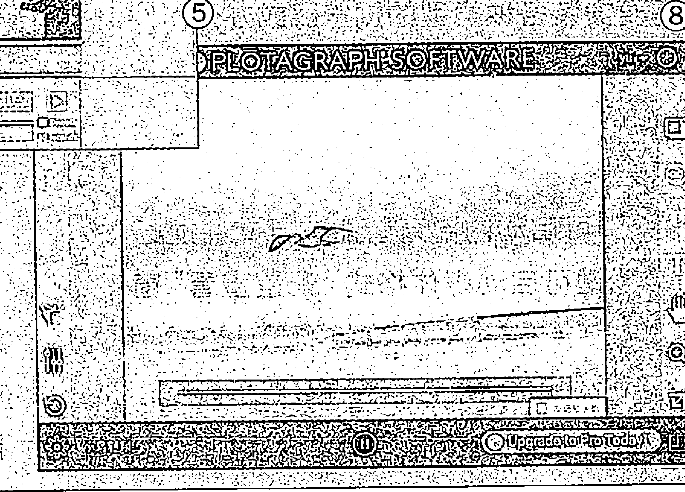

此时在屏幕上会出现一个套索图案，动态方式选择Loop，按提示将套索图案定位到燃烧火柴的位置。这样点击下方播放按钮后，可以看到整个视频画面就只有火柴动态燃烧，其他画面则是静止的（图5）。

点击Export cliplet，将上述视频画面导出为.mp4格式保存。同上使用ScreenToGif录制为Gif图片并放置在自己的微信公众号上即可。

##### 3.静态变动态

上述方法都是使用视频来制作动态效果图，由于制作这种动态效果视频选择有一定限制，因此制作方法并不简单。借助https://app.plotagraphs.com提供的在线服务，我们可以使用静止图片直接制作局部动态特效图。

打开上述网站后使用自己的邮箱注册并登录，接着点击“主页→Photograph Software”，在打开的窗口点击“+”，点击Plotagraph，然后导入自己需要处理的照片（图6）。

Plotagraph提供的动态特效是通过在图片设置动态点和静态点实现，因此在处理照片时我们就需要预先规划好静态和动态区域。因为静态区域锚定比较简单，因此对于新手建议选择照片中静态点区域较少的图片作为素材。比如笔者这里选择一张小鸟在海面翱翔的图片，最终效果是实现小鸟不动，而让海面波浪翻动。

在图片在线处理页面，展开左侧的跳舞图标，这里的Animation Points和Stabilizer Points就分别对应动态和静态点工具，前者使用箭头表示动态。如图中要使波浪左右滚动，则依次插入左右方向箭头，静态点则使用小矩形框定（图7）。

完成设置后，点击下方的“播放”，这样就可以看到处理的效果。可以看到添加了动态效果后，水面变得波涛汹涌（动态箭头越长，效果越显著），但是小鸟却是静止不动的（图8）。

完成后点击右下角的“输出→输出为Gif”即可。不过免费版没有直接输出为Gif的功能，同上使用ScreenToGif录制为Gif图片即可。

#### Windows 10有“盘”资源管理器被接管

文|吕梁

Windows 10文件资源管理器在很多时候都无法满足“多能”的实际需求，如快速处理文件、对比重复文件/文件夹等，往往要借助于插件或工具来完成。很多人会想到使用Total Commander来完成这些操作，但相对于只有30天试用期的它，笔者更推荐完全免费的FreeCommander。

##### 1. 不装软件预览多媒体格式文件

在Windows 10中，打开图片、视频、办公文档等，仅靠系统自带的默认格式支持是不够的，往往需要安装各种类型的浏览器或办公软件。使用FreeCommander则可以免除各种装软件的麻烦。

选择一个要预览的媒体或文档后，按下F3功能键，即可启动内部查看器进行文件预览。按下F9功能键可启动媒体格式“配置查看”窗口，查看每类媒体或文档具体支持的默认格式。我们可以看到FreeCommander内置了非常丰富的媒体格式预览支持，包括多种文本、富文本、图像、视频媒体、办公文件、互联网Web格式等，弥补了Windows 10系统对文件支持的短板（图1）。

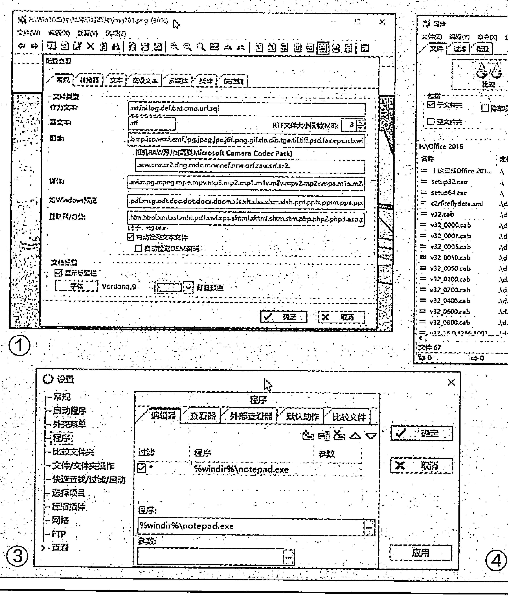

##### 2. 一个窗口对比处理两个文件（夹）

如果要在Windows 10中对不同的文件和文件夹进行对比、同步等操作，不借助于第三方工具和插件显然无法实现，用FreeCommander操作则易如反掌。

FreeCommander支持双窗格对比操作。如果需要比较两个文件夹中的内容，在双窗格中分别打开文件夹后，按下Alt+V组合键，即可马上获得比较结果。而如果需要将两个文件夹的内容进行同步，则只需按下Alt+S组合键（图2）。

如果要比较两个文件的差异，要先设定一下关联程序，通过菜单命令“工具→设置→程序→比较文件”，设置文件编辑器（例如记事本程序），这样可用记事本程序打开文件进行比较，关联程序可多重添加（图3）。选择要比较的文件后执行“文件→比较文件”命令（或直接按下Ctrl+Alt+V组合键），可自动打开文件进行比较。

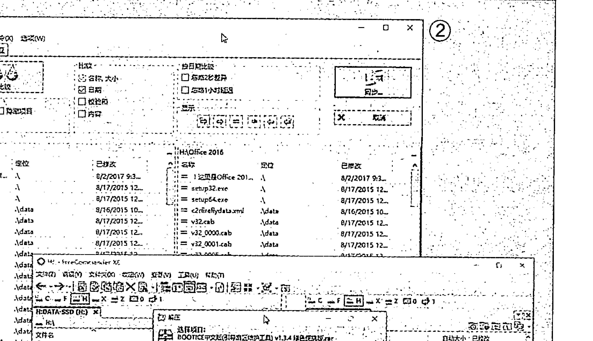

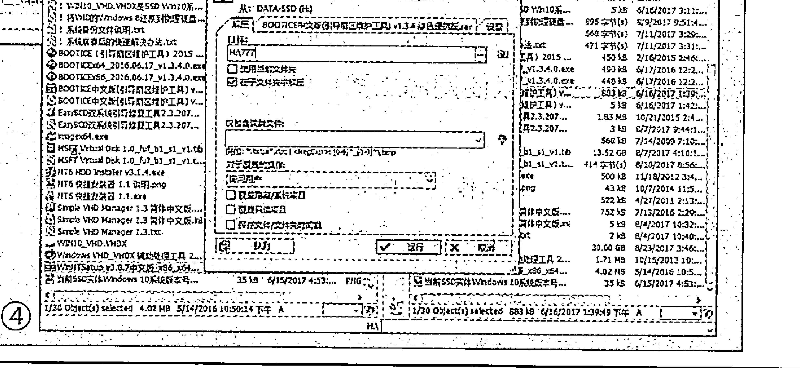

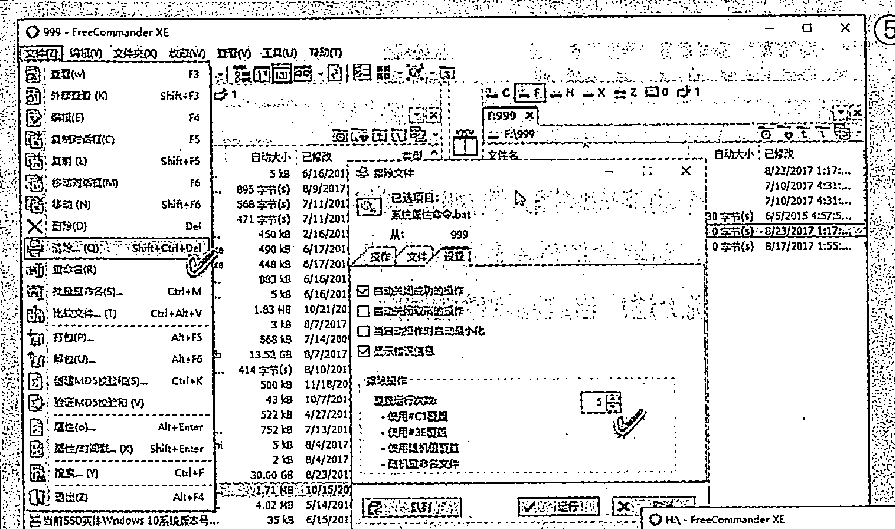

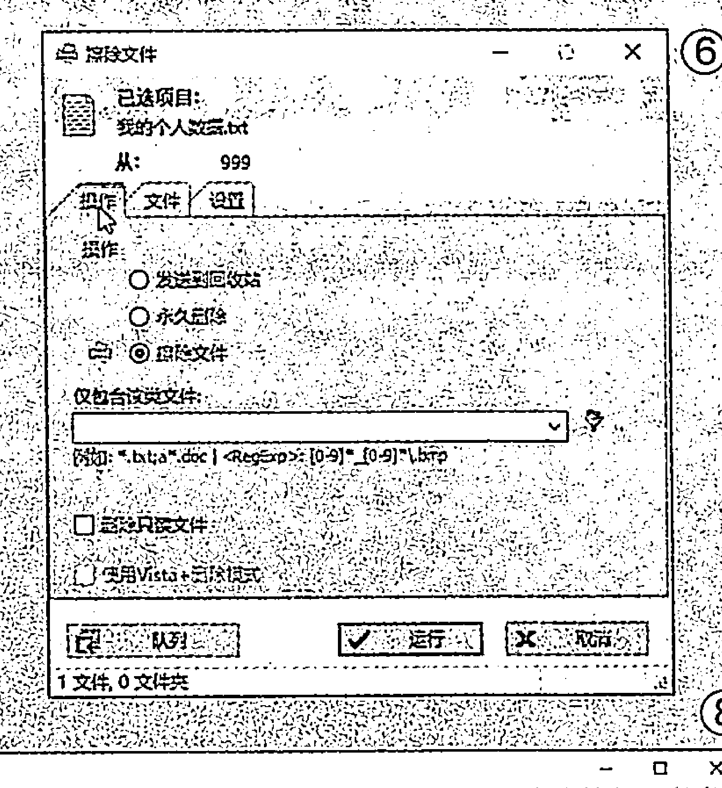

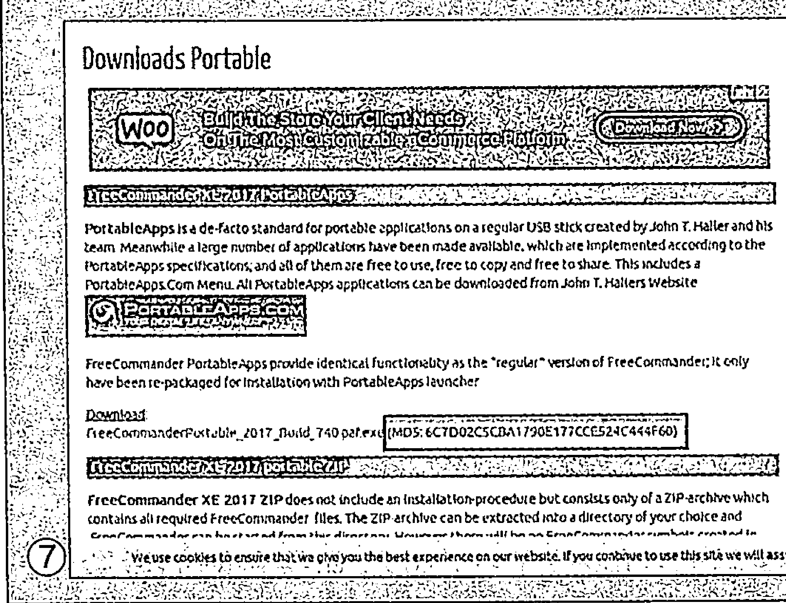

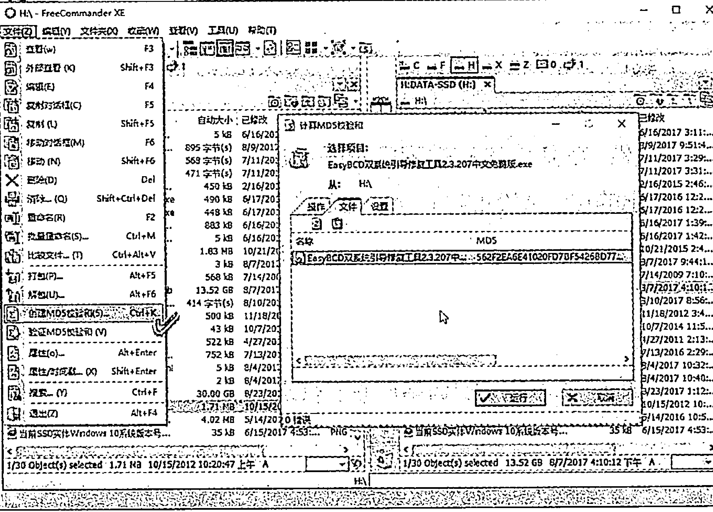

##### 3. 处理RAR压缩文件免装软件

Windows 10虽然已能直接处理ZIP压缩文件，但面对ZIP之外的RAR等压缩格式，还需要装个WinRAR或好压来解决。使用FreeCommander则不然，选择RAR压缩文件后，只需按下Alt+F6组合键即可解压文件（图4）。若要将文件打包，选择文件后按下Alt+F5即可。

##### 4. 对保密文件进行粉碎性删除

大家知道，直接以Delete键删除文件或通过清空回收站“彻底”删文件，都起不到文件保密的作用。而在Windows 10环境下如果要进行文件粉碎性删除，还需要借助于专用工具。换用FreeCommander，只需在选择了要粉碎的文件后，执行“文件→清除”命令或按下Shift+Ctrl+Del组合键，在擦除文件设置窗口中选择文件覆盖运行的次数（图5），在“操作”选项卡中选择“擦除文件”并点击“运行”按钮，即可彻底粉碎文件（图6）。

##### 5. 生成共享文件的MD5校验码

不少软件在下载时会提供MD5校验码，本文所用的FreeCommander软件官方下载链接后就附有MD5码（图7）。其目的是通过对下载的软件生成MD5码，与网站提供的MD5进行核对，以验证下载软件的完整性。在使用Windows 10时，要生成MD5编码，需借助于专用软件或插件，但若使用FreeCommander，可一键生成MD5校验码。要在FreeCommander中生成文件MD5校验码，选中文件后执行“文件→创建MD5校验码”命令，点击计算窗口下方的“运行”按钮即可生成，按“复制”按钮可复制校验码（图8）。

> > **火速链接**
>
> 要了解在Windows 10中生成MD5校验码的方法，请参考本刊2017年第12期的文章《多种方法快速校验文件》。

> > **小提示**
>
> FreeCommander还支持安装插件扩展更多功能。添加插件在格式查看器“选项”配置窗口中的“插件”选项卡下进行。

#### 简单设置过滤系统所有广告

文/万立夫

目前网络里面拥有大量的广告过滤软件可以选择，甚至有的安全软件里面也有相应的功能模块。可是这些软件进行广告过滤多采用的是线程插入的技术，也就是说广告过滤软件把一个功能模块插入到浏览器的进程里面，但是这种操作具有一定的局限性，因为广告过滤软件通常只会对浏览器进行插入，对其他软件不起任何作用。今天给大家介绍的是另外一种广告过滤软件的类型，采用的是浏览器代理的方式，可以摆脱上述广告过滤软件的局限。

##### 利用代理过滤广告

下载Proxydomo广告过滤软件及汉化包，解压后将汉化语言包解压到软件安装目录中的lang文件夹。运行程序文件，在弹出的软件窗口里面点击“Option”按钮，在弹出的设置窗口的“Language”列表中选择“中文”（图1）。点击OK按钮关闭设置窗口后重新启动系统软件，这样软件界面就变成简体中文的了。不过要想让Proxydomo完成广告过滤的操作，还需要添加相应的广告过滤规则才可以。图省事的话，直接下载网友制作的广告过滤规则，将规则文件替换到软件的安装目录里面就可以了。

接下来我们就要开始对浏览器进行设置。前面已经说过这款软件是利用浏览器代理的方式进行广告过滤操作的，所以我们只需要对浏览器的代理功能进行配置即可。由于现在很多浏览器里面都有使用系统代理的功能，所以为了避免重复设置的繁琐，只需要在系统里面进行相关的设置就可以一步到位。首先打开Windows 10操作系统的设置窗口，点击窗口中的“网络和Internet”选项。在弹出的对话框里面点击右侧列表中的“代理”选项，将右侧窗口里面的“使用代理服务器”选项打开。接下来在“地址”里面输入127.0.0.1，在“端口”里面输入6060就可以了（图2）。所有的设置完成以后打开浏览器，随意访问一个自己喜欢的网站页面，就可以看到其中的广告信息都被成功地过滤掉了（图3）。

##### 加密协议也能去除

为了更好地保护用户传输数据的安全，现在很多网站开始使用加密的HTTPS协议。可是刚刚的设置由于只能完成传统的HTTP协议数据的过滤，所以要想对加密数据中的内容进行广告过滤的话，还需要进一步地进行配置操作。首先打开Proxydomo的配置窗口，点击其中的“生成数字证书”按钮，在弹出的对话框点击“确定”按钮，从而创建一个数字证书文件。

现在进入到Proxydomo软件的安装目录里面，双击运行其中的“CertMgr.exe”文件。在弹出的窗口中点击“安装证书”按钮，按照提示将证书安装到系统的“受信任的根证书颁发机构”目录中即可。

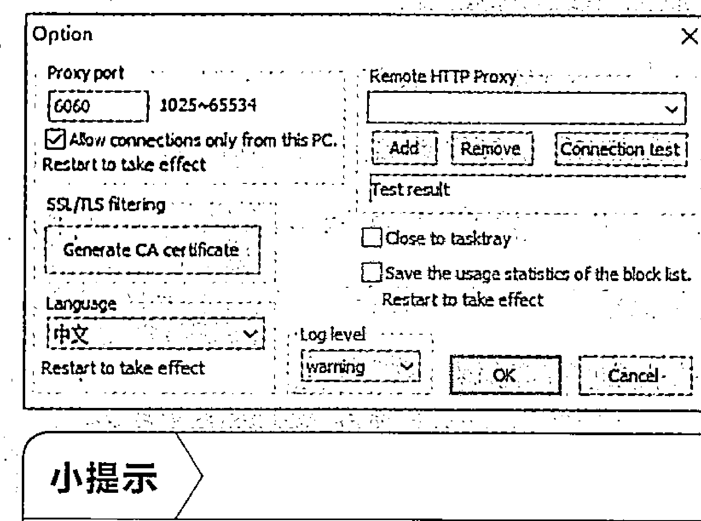

> 小提示
关于“端口”选项的设置，可以在软件设置窗口的“代理端口”选项里面进行查看。如果默认的端口数用户不喜欢，或者其他软件有冲突的话，可以修改为其他一个端口数，但是一定要保证这个端口数和系统代理设置的端口数相同。

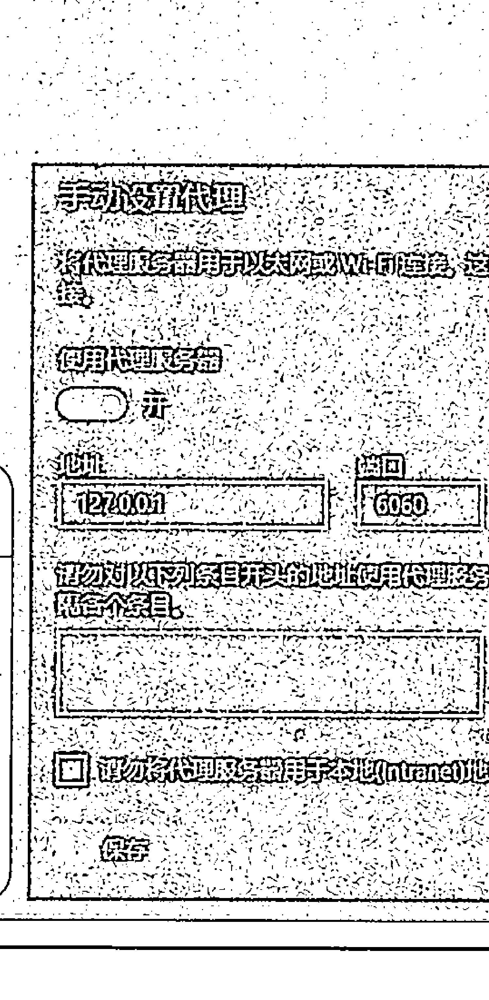

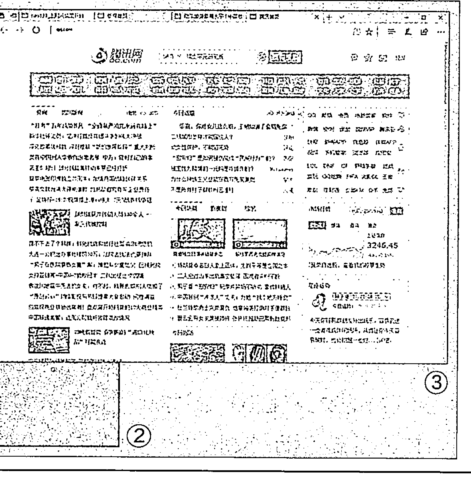

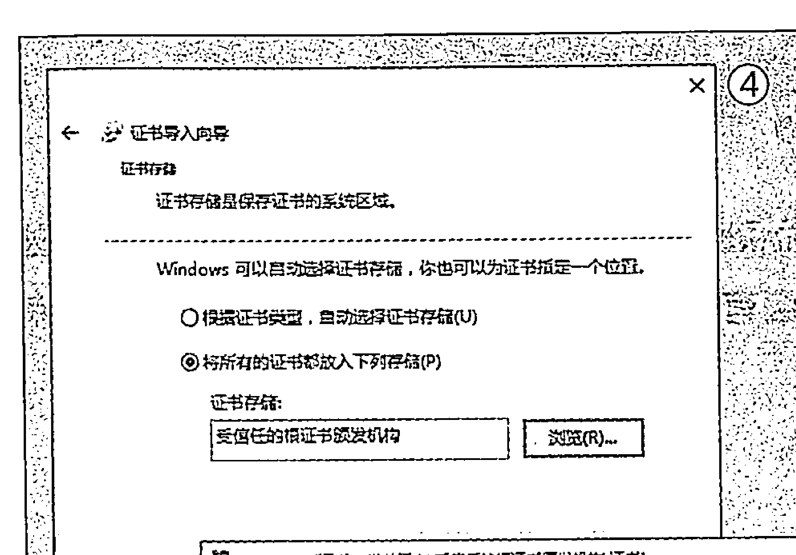

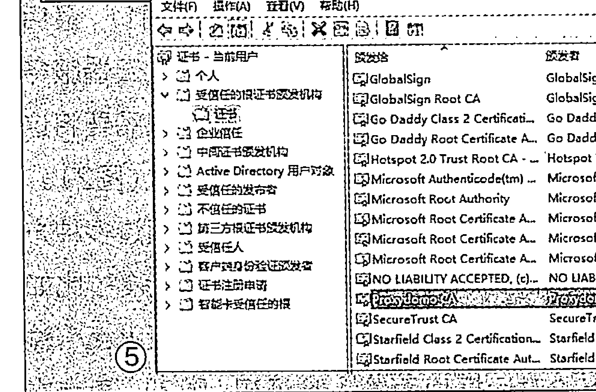

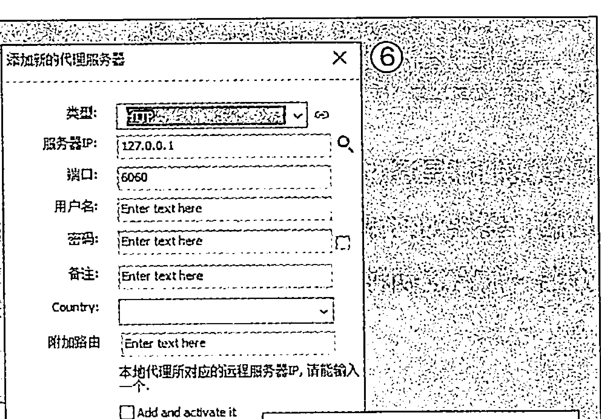

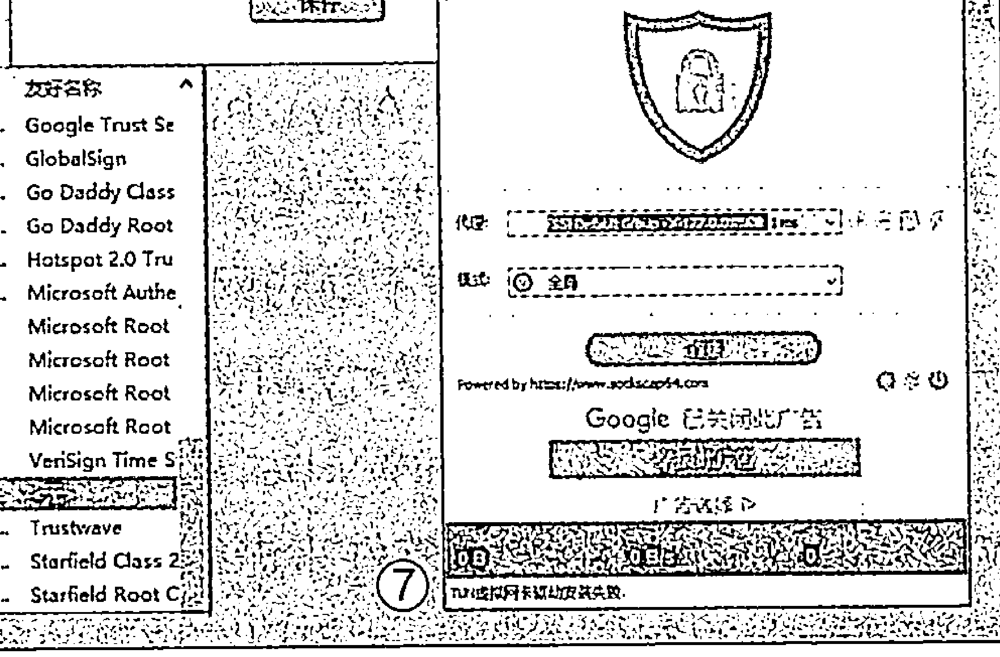

##### 全局广告这样解决

双击文件夹中的根证书文件。在弹出的窗口里面点击“安装证书”按钮，这时会弹出一个证书的向导设置窗口，接着点击“下一步”按钮。在“证书导入向导”窗口里面选择“将所有的证书放入下列存储”这一项，再点击“浏览”按钮，在“选择证书存储”列表中，选择“受信任的根证书颁发机构”这一项，点击“确定”按钮后返回向导窗口再点击“完成”按钮（图4）。这时系统会弹出一个安全警告的对话框，点击其中的“是”按钮就可以完成证书的安装操作。现在通过快捷键“Win+R”打开“运行”框，输入“certmgr.msc”命令后回车打开Windows的证书管理器。接着在左侧列表中找到“受信任的根证书颁发机构”这一项，展开它后选择其中的子项目“证书”。接着在右侧的窗口列表中查看是否有“Proxydomo CA”的证书，如果有的话就表示证书已经安装成功了（图5）。接下来按照前面的方法重新启动浏览器。

其实除了我们每天访问的网页里面存在大量的广告信息以外，我们每天使用的很多软件程序里面也会推广很多的广告信息。那么除了使用软件程序的破解版本以外，通过什么方法才可以去除这类软件里面自带的广告呢？通过前面的介绍我们可以发现，要想利用Proxydomo这款软件过滤广告的话，首先需要软件自带代理功能才可以。但是并不是所有的软件都带有代理功能的选项，所以现在我们要做的就是为这些软件加上代理功能。现在我们下载运行SSTap这款软件，在它的安装过程中会弹出一个对话框，要求安装一个设备软件。点击对话框中的“安装”按钮，才可以保证安装软件的正常运行。接下来启动安装的软件，在弹出的窗口里面点击“代理”输入框后面的“添加新代理”按钮，在弹出的菜单里面点击添加代理选项，就会弹出一个代理设置对话框。首先在“类型”列表中选择“HTTP”选项，接着在“服务器IP”里面输入127.0.0.1，在“端口”里面输入6060（图6）。最后点击“保存”按钮就可以返回到主窗口，在主窗口的“代理”列表中选择我们刚刚设置的选项。然后在“模式”列表中选择“全局”选项，最后点击“连接”按钮就可以了（图7）。这样SSTap就可以使用虚拟网络技术让广告过滤软件成为一个虚拟的“网关”，让所有的传输数据都经过这个网关过滤一遍，最终实现所有的软件都可以利用广告过滤软件来进行广告过滤操作了。

#### 第三种方法 全面有效分享文件

通常我们都是通过QQ或者网盘来进行文件分享的，但是这两种方法既有优点也有缺点。比如要想通过QQ进行文件发送的话，需要对方是自己的QQ好友才可以；而通过网盘进行发送的话，又会有各种各样的使用限制。本文笔者就为大家介绍一种将这两种方法的优势集合于一身的第三种方法。

文|老万

##### 点对点分享快速方便

最新版本的“Send Anywhere”就是一款集合了P2P在线传输以及网盘存储于一身的网络分享服务，通过它用户可以根据不同的网络环境选择不同的分享方式。打开“Send Anywhere”这项服务的官方网站（https://send-anywhere.com/），下载一个Windows系统的客户端软件来进行操作。如果用户不想下载专业的客户端软件，也可以在自己的谷歌浏览器里面安装功能扩展来进行操作。

现在启动这项服务的客户端软件，在弹出的操作界面中点击发送按钮，在弹出的对话框里面根据发送的内容，可以选择文件或者文件夹等方式。比如点击“Files”按钮后，在弹出的对话框里面选择需要分享的文件，用户在这里可以一次性选择多个需要分享的文件，不用像有的分享服务那样只能一个文件一个文件地分享。当然也可以直接在硬盘里面选择要分享的文件，通过鼠标拖拽到发送对话框里面进行释放（图1）。最后点击“Send”按钮，这样客户端程序就可以从云端服务器上面获取一个验证码信息和二维码，现在只需要将这个验证码信息发送给需要分享的用户就可以了（图2）。

当用户获取到这个验证码信息后，可以通过多种方式来进行接收，如客户端软件或者官方首页等等。比如我们打开它的官方首页，点击网页中的“Input Key”输入框，在弹出的对话框里面输入验证码（图3），再点击“Receive”按钮进行验证码的对比，如果确认成功就可以直接从远程客户端里面进行分享文件的下载操作。如果用户分享的是多个文件的话，在传输开始的时候该服务会将所有文件打包成一个文件进行下载。需要特别强调的是，该项服务默认使用的是P2P传播的方式。也就是说在文件传输的过程中，无论是传输方还是接收方，在文件没有完全下载成功的情况下，都不能关闭相应的客户端软件。不然整个文件的传输工作也将终止（图4）。

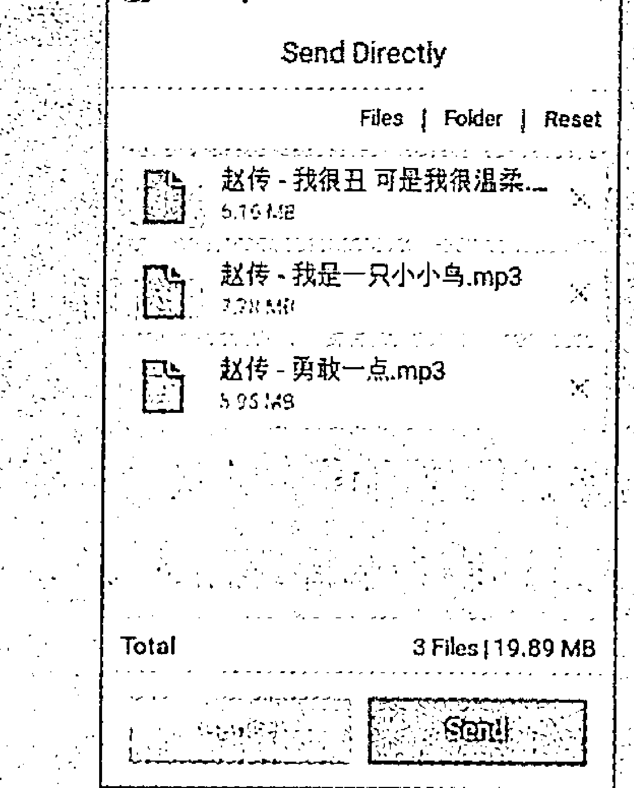

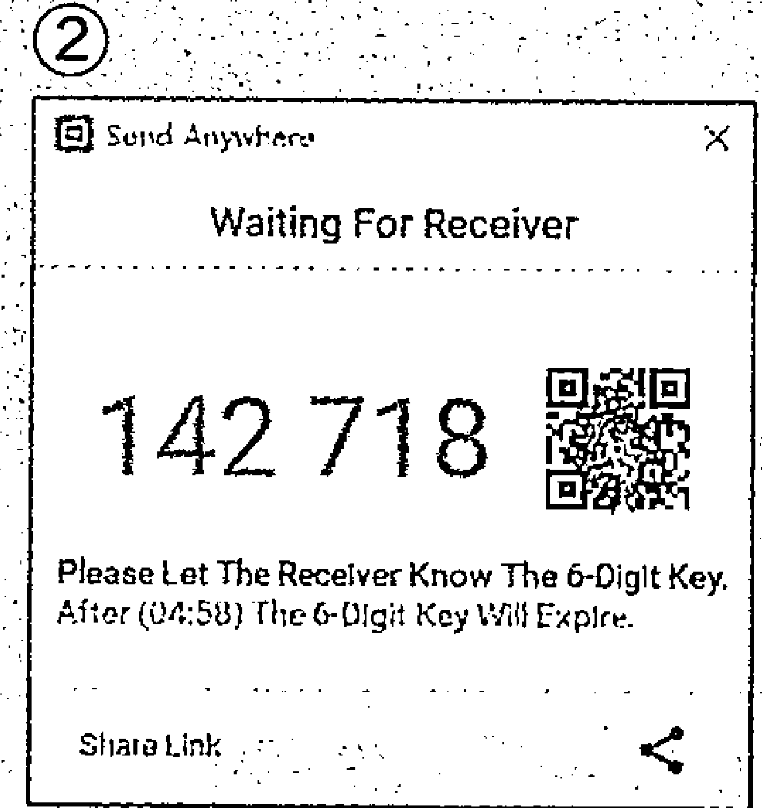

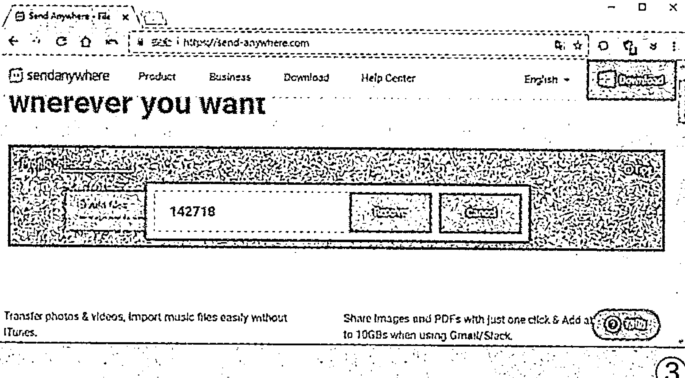

> 小提示：无论生成的是验证码还是二维码信息，统统只有10分钟的有效验证期。如果在10分钟里面没有使用这个验证信息的话，那么该信息就会失去相应的验证效果。

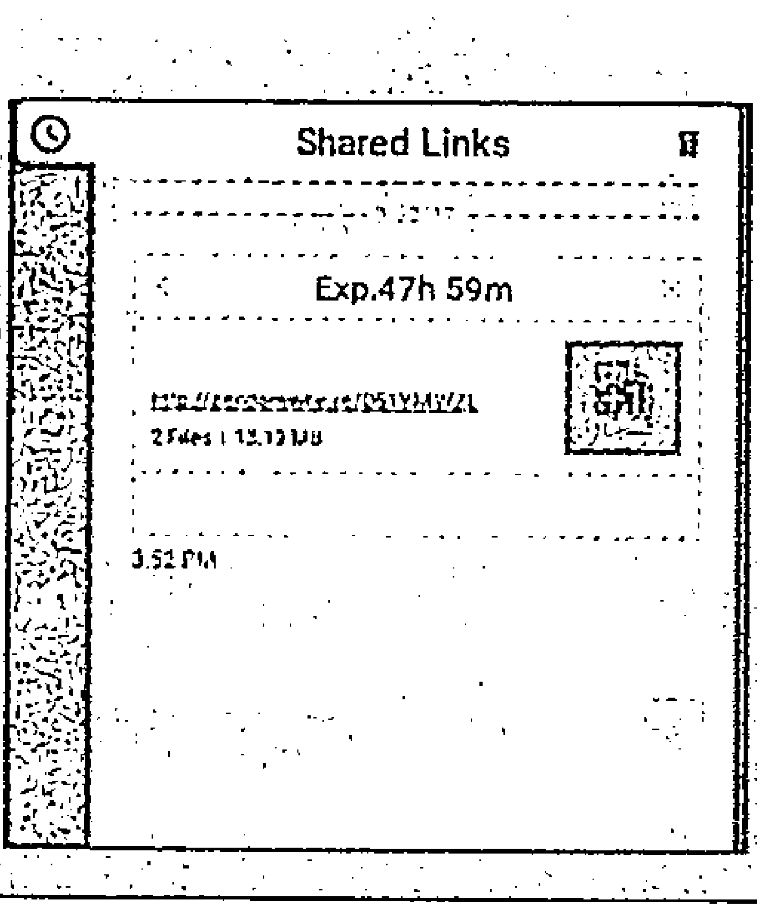

> 小提示：关于“Send Anywhere”手机应用的使用，可以查看《无需第三方 网页即可P2P》一文。

##### 择机而动的网盘存储

> 如果用户想要提前删除上传到云端服务器的文件，可以点击分享窗口该文件信息右上角的删除按钮。这时会弹出一个询问窗口，点击Yes按钮就可以了。

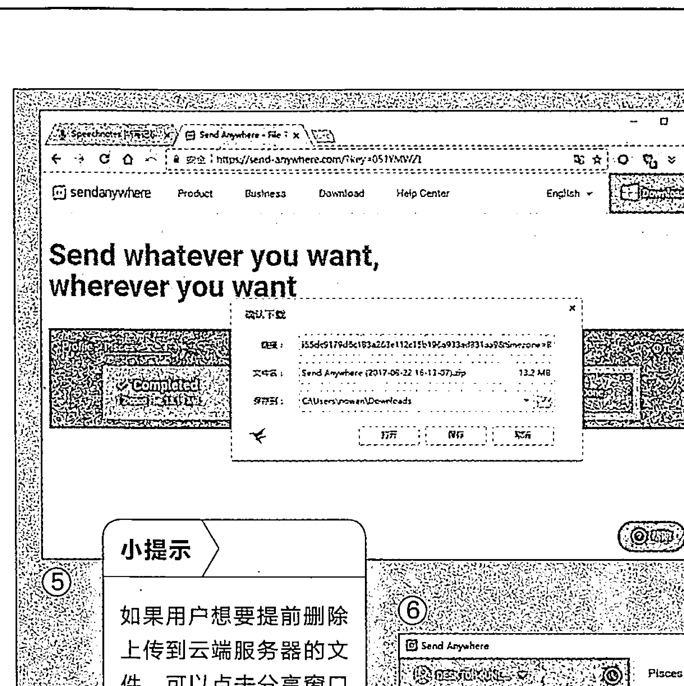

P2P进行文件传输的方式虽然非常安全，但是也存在着一个非常大的问题，就是需要双方同时在线才可以进行操作。如果碰巧接收方没有在线的话，那么又应该怎么办呢？这个时候“Send Anywhere”这款软件的特别之处就体现出来了。当我们在验证码窗口点击右下角的分享按钮后，它就会切换到另外一种方式并且将文件上传到云端服务器里面。这样操作起来就有点类似于我们的网盘分享操作了，当文件上传完成以后我们就可以看到一个分享链接。现在点击这个分享链接以后，它会自动复制到我们系统的剪贴板里面，接下来只需要将它发送给相关的好友就可以了（图5）。 当远程用户通过浏览器打开我们的分享链接以后，网页服务就会自动读取分享链接后面的验证码。当这个验证码验证成功以后，云服务就会自动索取存储在云空间的文件。当文件索取成功后就会自动弹出文件下载的对话框，点击对话框中的“保存”按钮就可以进行下载操作了（图6）。上传到云端服务器的文件可以保存48个小时，任何拥有分享链接的用户都可以在这48个小时里面随意地进行下载，一旦超过48个小时云端服务器将自动删除这个分享文件。而且通过电脑客户端软件可以一次性传输300GB的文件，这可比不少国内外的网盘方便多了。

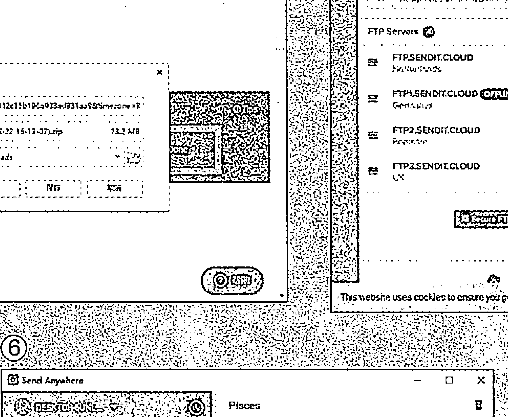

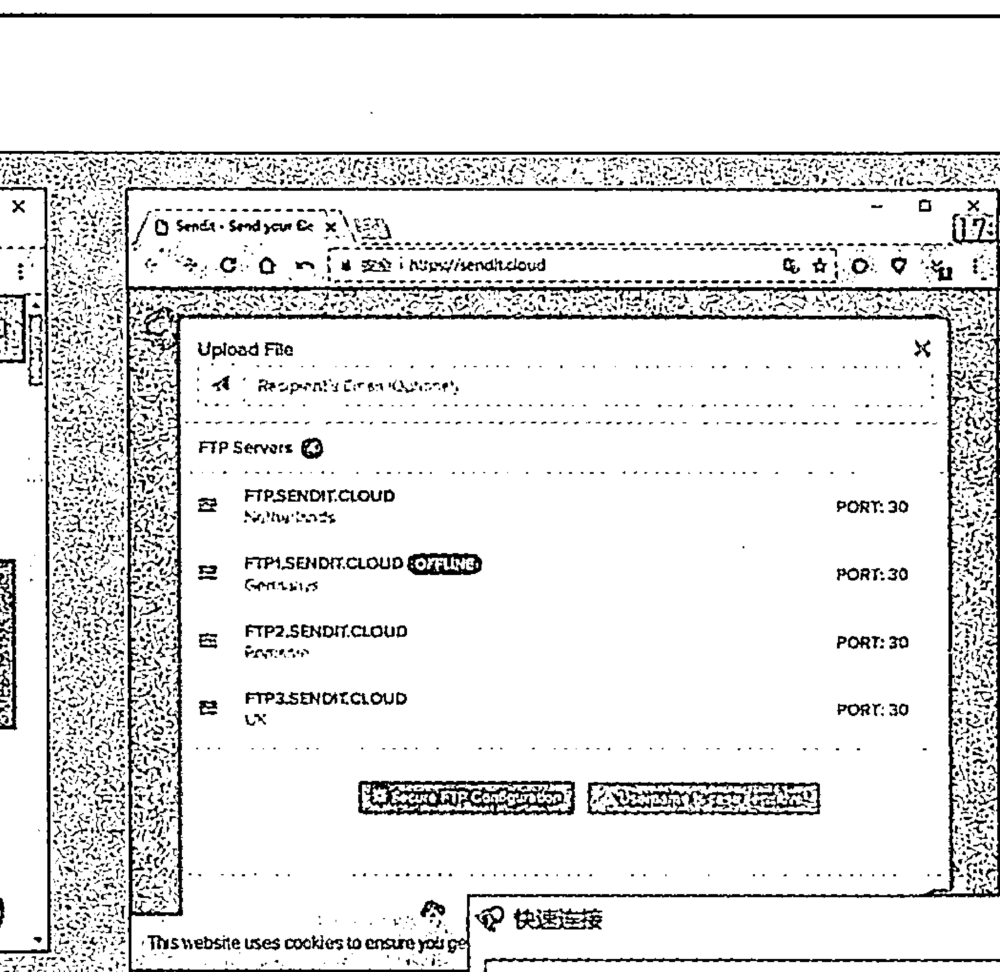

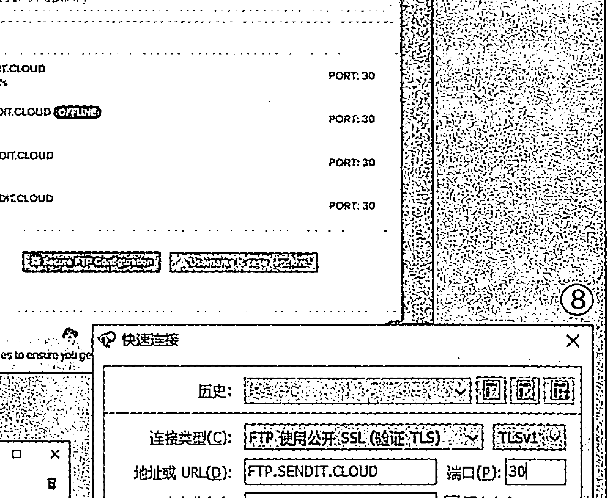

##### 用FTP传输共享文件

现在的文件分享绝大多数都是通过浏览器来操作的，但是由于浏览器以及网络的问题，有的时候难免会在传输的过程中出现错误。这时我们就需要使用具有断点续传功能的服务来进行操作，“Sendit.Cloud”这个云存储服务（https://sendit.cloud/）就具有多种不同的文件上传方式。打开网站以后点击网页正中的图标，在弹出的对话框的下方可以看到多种的文件上传方式，其中就包括浏览器上传、网页链接上传以及非常少见的FTP上传的方式，而FTP这种上传方式就可以支持断点续传。现在点击工具栏中的“FTP Upload”按钮，在弹出的列表里面我们就可以看到几个FTP上传链接和端口（图7）。 不过要想使用FTP这种上传方式，首先需要进行注册才可以。现在我们打开FlashFXP这款软件，点击工具栏中的“连接”按钮，在弹出的菜单里面选择“快速连接”命令。接下来在弹出的对话框中分别填入连接地址、端口以及注册的账号密码，在“连接类型”列表中选择TLS这一项（图8）。最后点击“连接”按钮就可以连接到服务器，现在将分享文件进行上传操作，上传完成以后在云端服务器进行分享就可以了。

#### 借助批处理让Cortana变聪明

文|阿楠

Windows 10中有个善解人意的Cortana，但她对许多汉语指令有些“水土不服”。比如，直接在Cortana中输入“系统属性设置”，点击匹配结果却只能进入网络搜索；输入“关机”请求，给出的却是微软帮助（图1）。我们通过制作相应的批处理程序，借助在Cortana中搜索和执行批处理，可以让Cortana变得更聪明。

##### 1. 让Cortana弄懂“系统属性设置”

只需创建一个“系统属性设置.BAT”批处理。批处理文件含如下命令（图2）：

```
@echo off
sysdm.cpl
```

将该文件保存到Windows目录下。之后若需要调用系统属性设置窗口，向Cortana发出“系统属性设置”请求，她就能给出准确的“系统属性设置”命令（图3），点击该命令就能启动系统属性窗口了（图4）。

##### 2. 让Cortana听懂中文“关机”

想让Cortana记住“关机”命令，也只需创建关机的批处理“关机.BAT”，将此文件放置于系统的Windows目录下。该批处理文件仅有如下一行内容：

```
SHUTDOWN -P
```

之后需要关机时，只需在Cortana中输入“关机”，即可在搜索结果中出现“关机”命令，点击即可关机（图5）。

可以用类似的办法创建更多实用的批处理，放在Windows下作为系统功能的扩展。

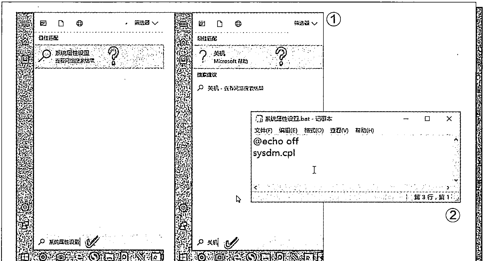

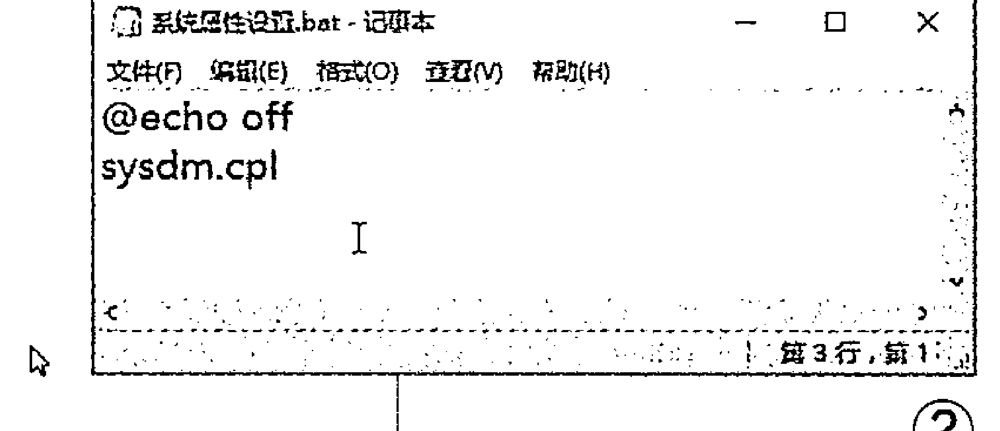

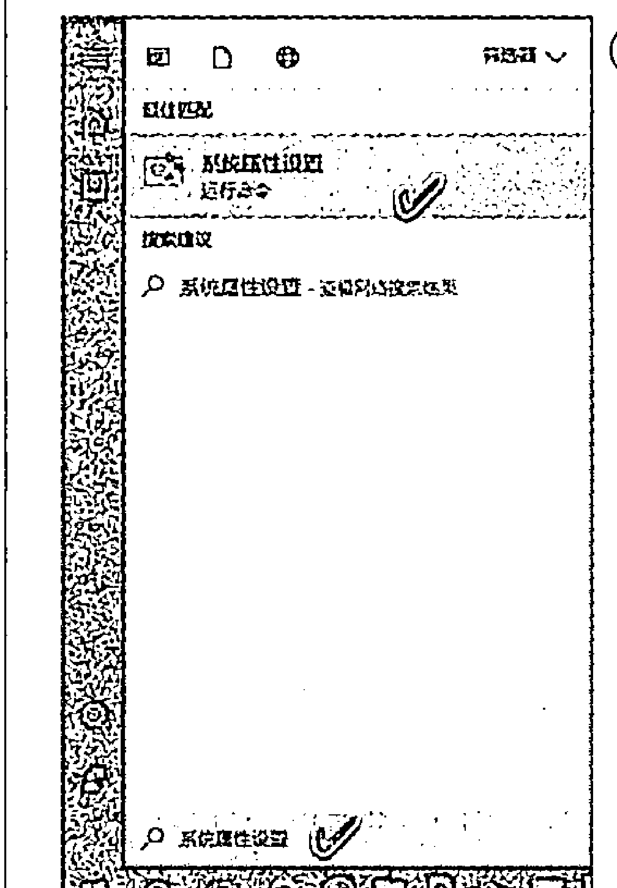

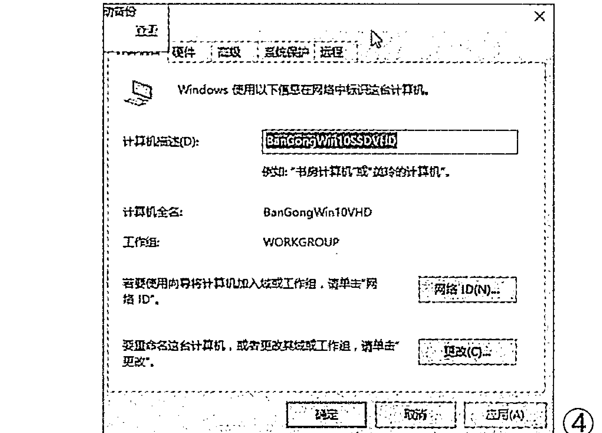

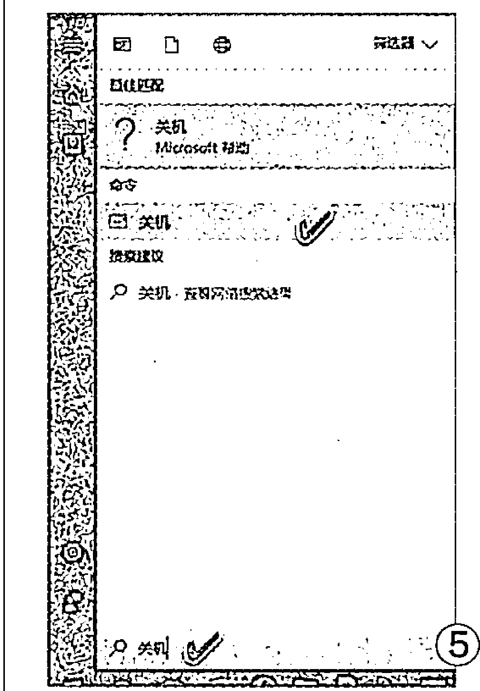

> 小知识
批处理不仅能放在Windows目录中，只要是系统PATH环境变量包含的目录均可。PATH环境变量指定了系统可以自动搜索到的文件夹默认位置，具体可通过“系统属性”窗口，点击“高级”选项卡，在“环境变量”窗口中查看。我们可以用PATH命令自定义文件夹路径，加入到PATH环境变量中。具体命令格式：
PATH [[drive:]path[;...][;%PATH%]
其中的%PATH%是系统原有的旧路径，而“[drive:]path[;...]”是用户自定义路径（多个路径用半角分号隔开），例如将其改为“D:\MYCMD”表示追加用户路径“D:\MYCMD”。

#### 巧做计分增长式柱形图表

文|马震安

在许多选秀节目中，有时会出现选手比赛结束后进行计票显示，表示票数的柱形图不断地上涨，同时数字也随着柱形的增长不断地上移位置并增大分值（图1）。那么，这样的图表如何制作呢？接下来，让我们来看看在PPT2016中的实现方法。

##### 1. 插入柱形图表

在PPT2016中打开一张空白的幻灯片，点击“插入”选项卡中的“图表”，插入一个柱形图，在数据源区域删除不需要的列，更改好记录数据，双击图表的纵坐标轴，在坐标轴选项中将边界的最小值设置为0。选中柱形图，选择“动画”选项卡，添加“擦除”动画效果，方向是默认的“自底部”；点击“动画窗格”，在右侧的动画窗格窗口中，右击添加的动画效果，选择“效果选项”，在弹出的窗口中选择“图表动画”选项卡，在组合图表处选择“按分类中的元素”。这样，当点击鼠标时，柱形图就一个一个地自下向上以擦除的效果出现了（图2）。

##### 2. 设置计数增长效果

插入一个文本框，在里面输入1-82个数字（即第1个选手的得票数），设置好字体及大小并右对齐；为这个文本框添加一个“闪烁一次”的动画效果；在动画窗格右击这个动画效果，选择“效果选项”，在“效果”选项卡的“动画文本”处选择“按字/词”，在“计时”选项卡的“开始”处选择“与上一动画同时”（图3）。 选中文本框，点击“开始”选项卡中的“行距”，行距设为“固定值”、“0磅”；接下来，在动画窗格中文本框的“闪烁一次”动画效果，点击“动画”选项卡中“添加动画→动作路径”下的“直线”，在效果选项中选择“反转路径方向”，开始设置为“与上一动画同时”，在幻灯片中拖动“直线”动画效果的起点、终点到合适位置。再插入一个文本框，里面输入“82”（即选手A的最终得票数），设置它的字体、字体大小与上面的计数文本框一致，将它的动画效果设置为“出现”，开始设置为“上一动画之后”，将这个文本框拖动到计数文本的终点处使其重合（图4）。

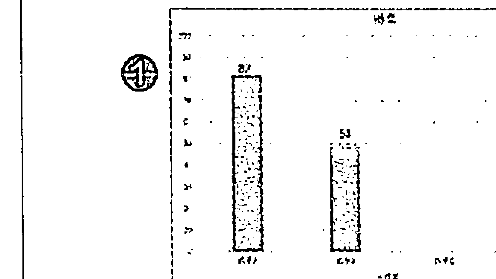

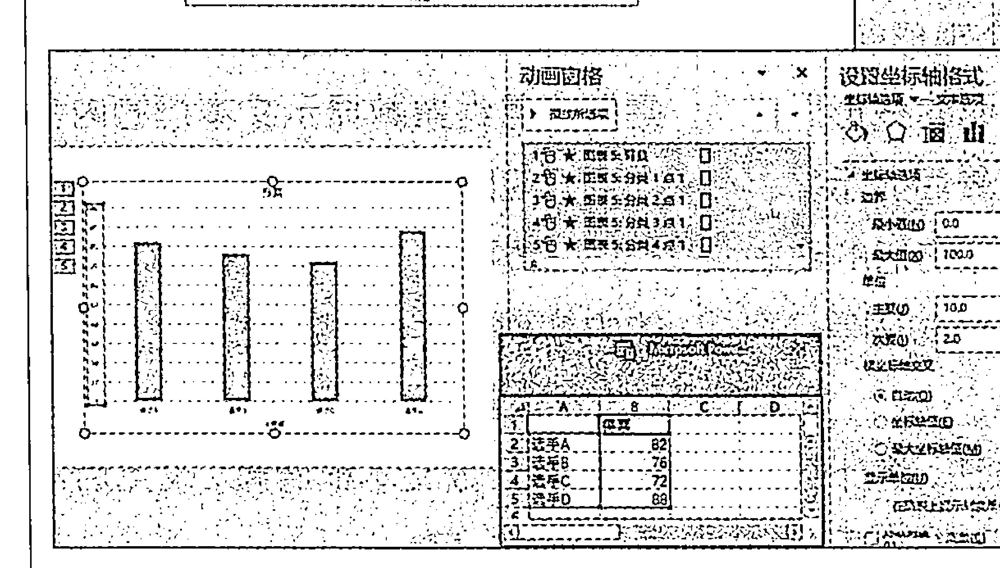

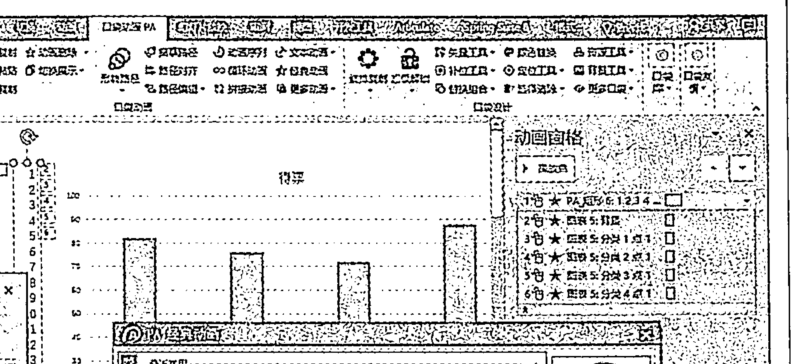

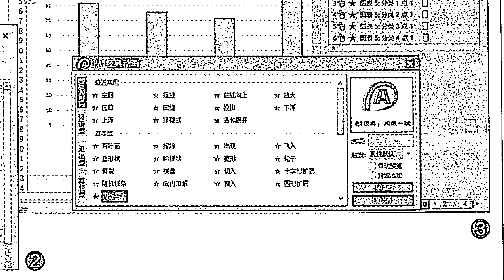

##### 小技巧

在文本框中输入多个连续数字时，没必要一一输入，可先在一个Excel工作表中输入少量几个后进行拖动填充，然后将工作表中的数字选中复制后粘贴到一个文本文件中，再在文本文件中选中复制后粘贴到幻灯片中，这样操作会非常省时、省力。由于PPT2016中没有这个动画效果，可以安装一个叫“口袋动画”的插件，点击它里面的“经典动画”，就可以为文本框添加这个动画效果。如果使用的仍是老版本PPT2003，也可以直接插入这个动画效果。

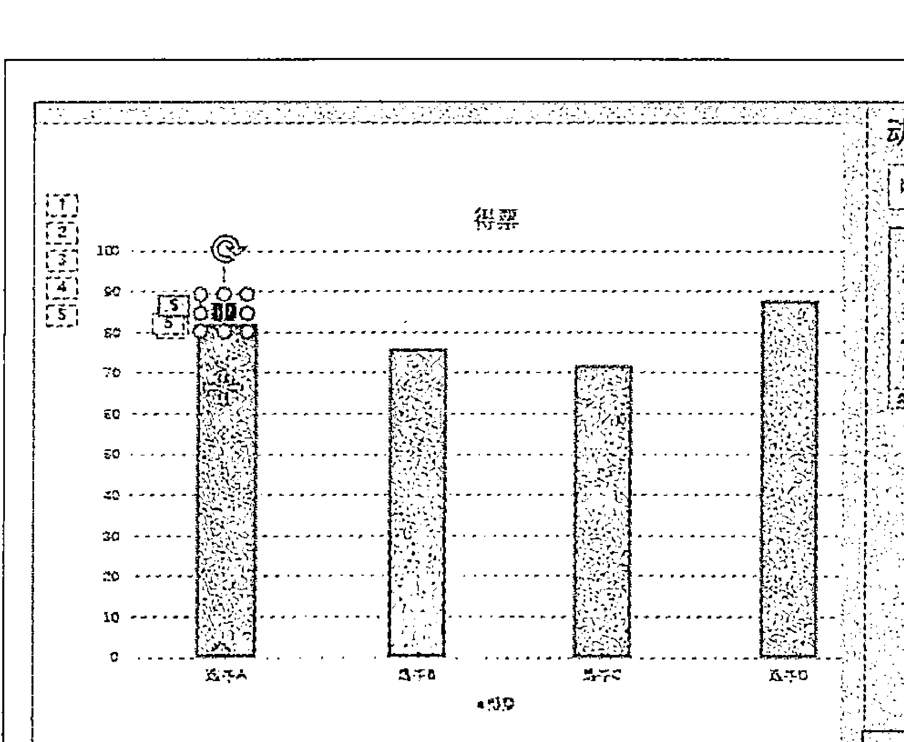

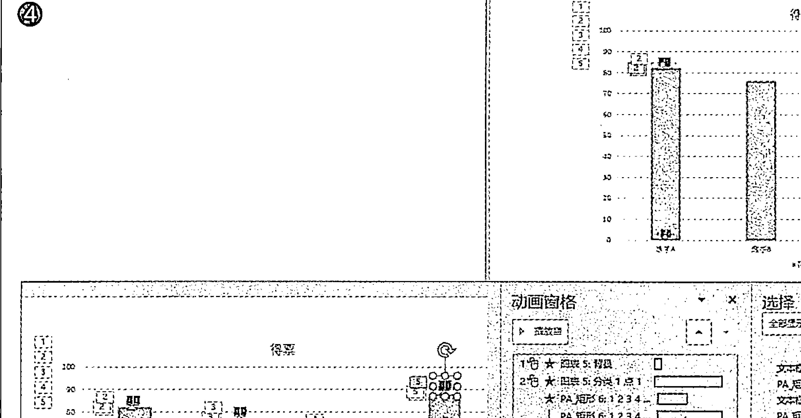

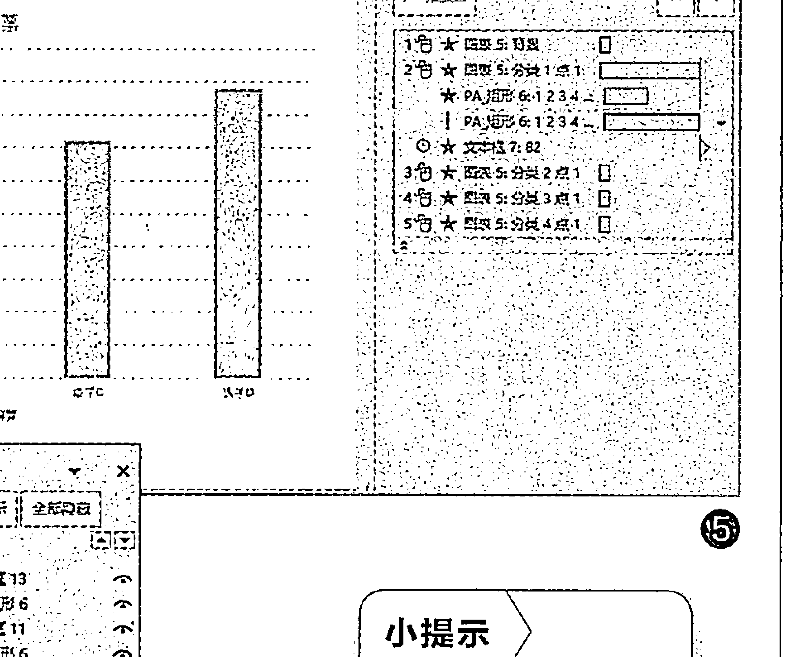

##### 小提示

这个动画效果不仅可用在投票计数的显示，还可以用于产品的产量显示、销量显示、各类生产进度显示等许多场合。

##### 调整动画效果

在动画窗格窗口，将两个文本框的动画效果拖动上移到图表动画效果的分类1下；在计数文本框的“闪烁一次”动画处，拖动方框里面的绿色条块的右侧向左移动，将“按字/词”的速度设置为0.1s；分别拖动计数文本框的两个动画效果向右移动，使它们的开始为0.2s；进行幻灯片的放映，根据放映效果不断调整分类1、“闪烁一次”及直线动画效果的结束时间，力求动画效果完美实现（图5）。

在动画窗格中，动画效果中的矩形条的长度代表动画播放时间的长短及速度，越长速度越慢，越短越快，可拖动其右侧边框进行调整；如果鼠标放在矩形条上时出现左右箭头，可拖动整个矩形条。同样道理，为其他的柱形图表也插入计数文本框及最后显示得票数的文本，也要设置好它们的动画效果、出现时间及结束时间等（图6）。可采用复制的方法，将计数文本框及最终票数显示文本框进行复制并粘贴到其他柱形图相应的位置；

利用“选择窗格”选择相应的计数文本框将它们的行距设置为单倍行距，显示出所有数字后，该删除的删除，该添加的添加，完成编辑后，再把它们的行距设置为0；同样，也需要将最终票数显示文本框的内容进行相应的更改。在更改最终票数显示文本框的内容时，由于与计数文本框有重叠，不太顺手，可以利用“选择窗格”，将计数文本框隐藏，改完后再显示出来。

#### PPT中文字动画技巧

文/马震安

好的动画在一定程度上能增强PPT幻灯片的吸引力，利用PPT 2016自带的动画制作功能，制作将多个文字合成为动画的特殊效果（图1），会更有一番风味。

首先，新建一张空白幻灯片，设置其背景色为某种颜色（如纯黑色）。插入一个竖排文本框，在其中输入所需要的文字（如“电脑爱好者”），根据需要设置文字的大小、字体、颜色；将文本复制二份，并排排列这三个文本；选择最左边的文本，右击此文本将其置于顶层，再右击此文本，选择“设置形状格式”，在窗口右侧的“设置形状格式”中，点击“文本选项”，设置透明度；同样，选择最右边的文本，将其置于底层，文本透明度设为同样的值。选择“格式”选项卡，点击“对齐”下的“顶部对齐”，将文字对齐（图2）。

接下来设置文字的动画效果。选择三份文本，点击“动画”选项卡，选择进入动画中的“淡出”效果，设置持续时间和延迟时间（一般为0.1到0.5秒，可按需改动）；再点击“添加动画”按钮下“动作路径”中的“直线”，开始处选择“与上一动画同时”，设置持续时间和延迟时间。编辑上方文字的动画路径，将左、右两个文本动画的终点移动至中间文字的起点，完成后删除中间文字的动画。点击“动画窗格”，分别右击两个直线动画，选择“效果选项”，将它们的“平滑开始”和“平滑结束”都设置为0（图3）。

在“动画窗格”窗口中，分别右击每个动画效果，选择“效果选项”，在“动画文本”处选择“按字母”，设置延迟率百分比，如20%（图4）。

最后，点击“预览”按钮预览制作效果，若某个环节不够满意，可返回先前的过程修改各项动画参数，直到符合要求后存盘即可。

对于其他内容和效果的文字动画制作，均可按上述思路进行。通过改变制作过程中的文字内容、参数设置，选择不同的选项形式，就能制作出更多丰富多彩的文字动画。

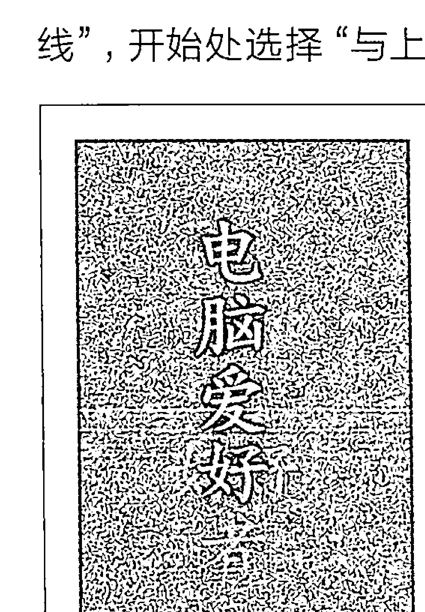

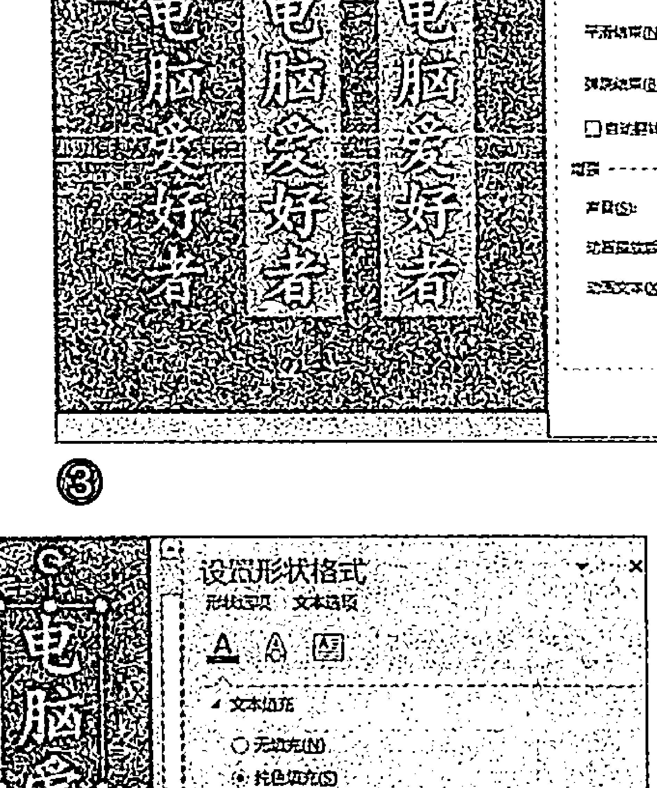

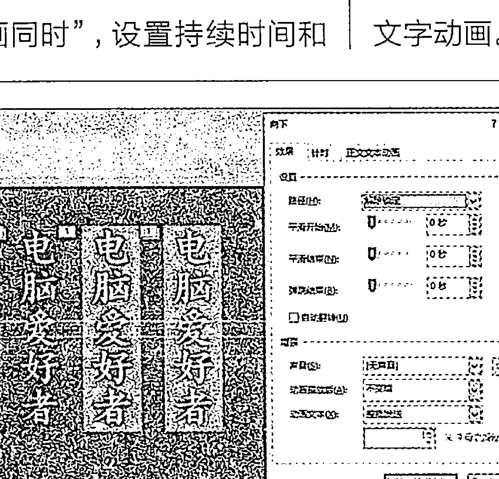

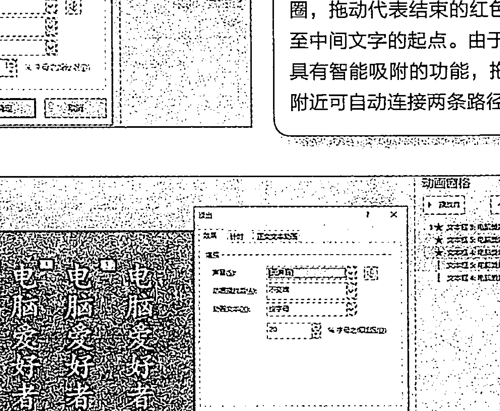

> 小提示：为中间文字添加路径动画的意义，在于定位左、右文字的终点。单击选中动画路径，此时路径的起始和结束会变成圆圈，拖动代表结束的红色圆圈至中间文字的起点。由于PPT具有智能吸附的功能，拖动到附近可自动连接两条路径。

#### 使用Unicode代码 Excel批量操作更高效

文/俞木发

大家知道，Excel支持Unicode代码，只要在常见的网页代码前添加`<table>`，复制到Excel后使用“选择性粘贴→Unicode代码”的方式就会直接显示代码表示的内容。因此，通过预先设计好相应的代码文件，然后粘贴为Unicode代码，即可实现很多特定数据在Excel中的快速输入。

举个简单的例子：数学老师经常需要在Excel中输入平方单位数据上标，化学老师则要输入化学式中的数字下标。常规的上标输入方法是在单元格中先输入数据如“5cm2”，然后再选择“2”，右击单元格选择“设置单元格格式→特殊效果→上标”，这样才能完成平方单位的输入。如果此类数据很多，显然一一手动更改操作非常不便（图1）。

现在借助预先设计Unicode代码的方法可实现上下标的快速输入。我们首先需要知道上标代码的表示方式，在Excel中新建一个文本，然后使用上述方法输入一个5^2cm的数值（图2）。

点击“文件→另存为”，保存类型选择“单个文件网页”，这样做的目的是查看上标的代码是什么。使用IE浏览器打开上述保存的网页文件，在IE窗口中右击选择“查看源”，接着在右上角的搜索框输入“5cm”，在搜索结果可以看到类似“`<td height=27 class=xl65 width=452 style='height:20.25pt;width:339pt'>5 cm<font class="font9"><sup>2</sup></font></td>`”的代码，显然5cm之前的代码表示字体颜色、大小等信息，而“`<sup>2</sup>`”则表示上标代码（图3）。

对于其他各种特殊代码，都可以在Excel中预先输入一个示例，然后另存为网页文件，通过源代码查看具体代码表示，比如下标为“`<sub>2</sub>`”。找到包含上标的代码后将其复制到记事本，并在代码前添加`<table>`。可以看到对于5^2cm这类数值的输入主要是由“`<table><td height=27 class=xl65 width=452 style='height:20.25pt;width:339pt'>`”、“5”以及“`cm<font class="font7"><sup>2</sup></font></td>`”这三部分组成，三部分分别对应字体设置、实际输入数据、下标。现在按提示将上述三段代码分别复制到 Excel 新建文档的 A1、B1、C1 中（图4）。

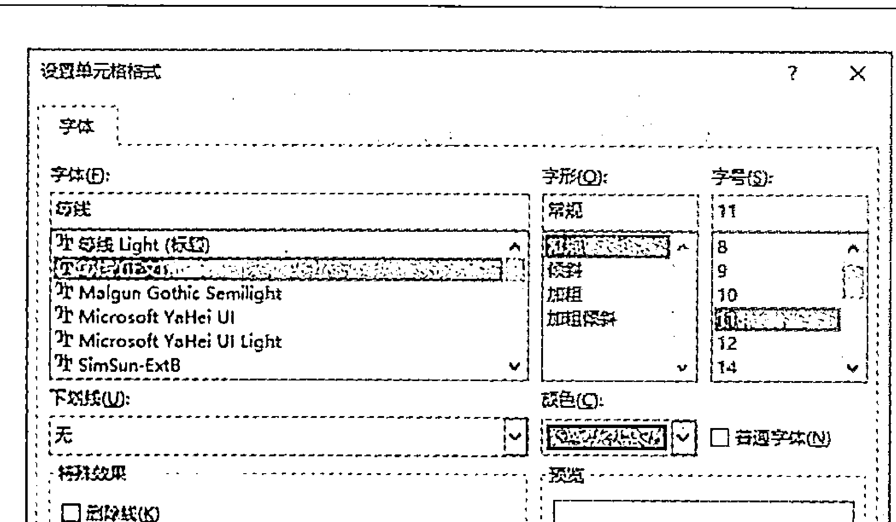

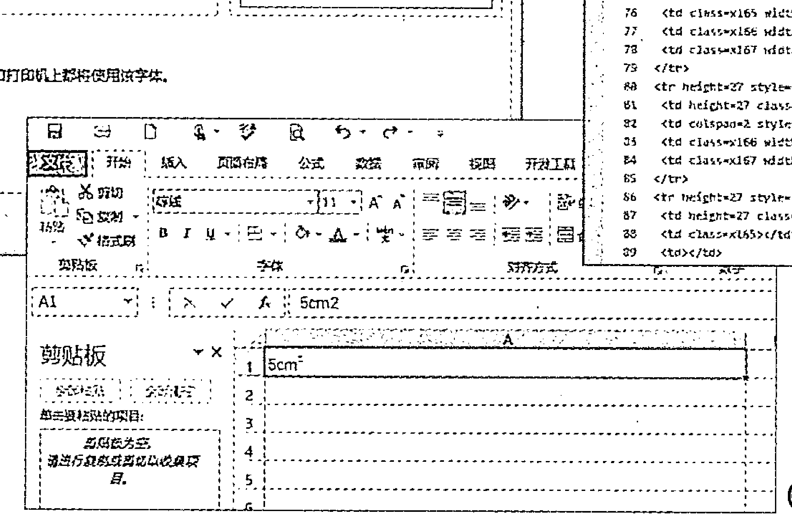

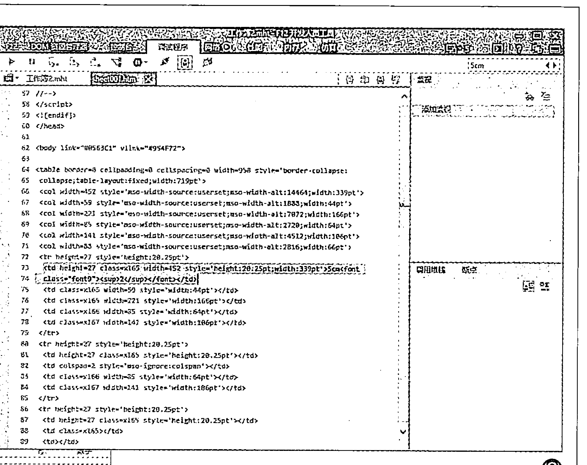

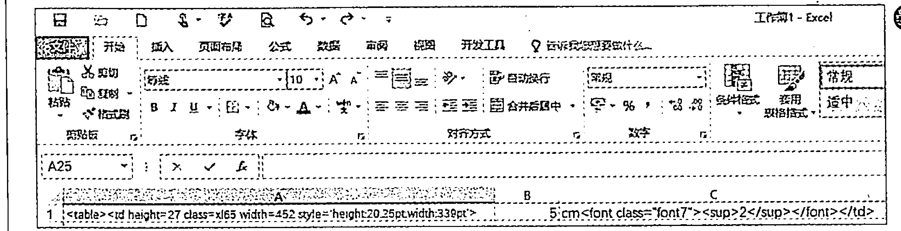

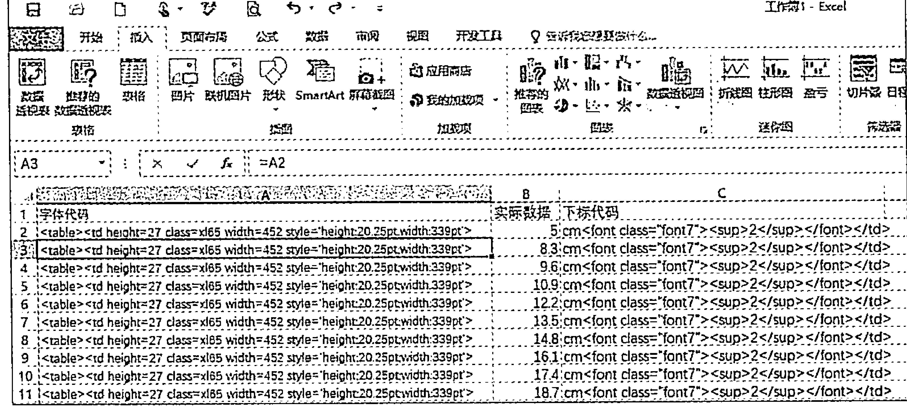

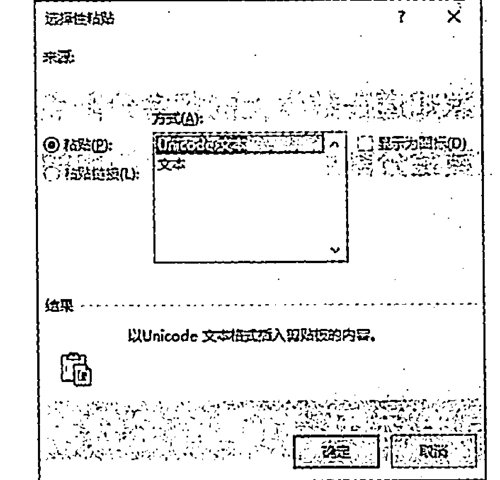

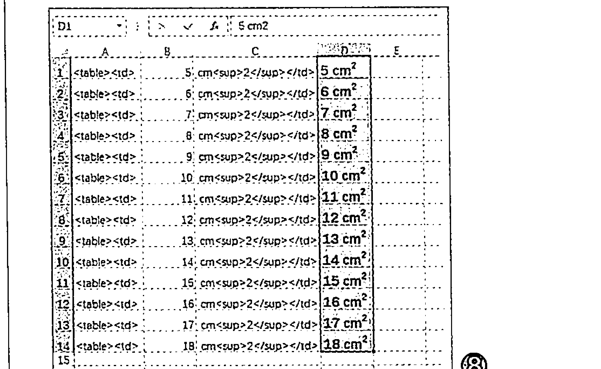

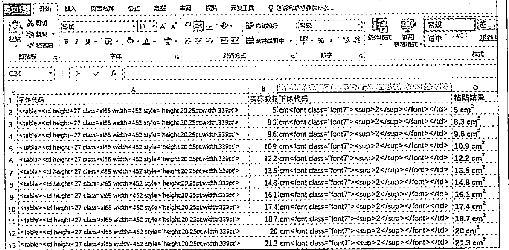

选中 A2，输入公式“=A1”，然后向下填充，也就是说 A2 以下的内容全部填充为和 A1 代码一致。同样的在 C2 输入公式“=C1”，也向下填充。这样当我们需要输入类似 9^2cm、12^2cm 这类平方单位数据时，只要在 B 列中输入不同的数值即可（图5）。

完成数据的录入后全选所有数据复制，将其粘贴到记事本，再次在记事本中选择“复制”，接着返回选中 D2，点击“粘贴→选择性粘贴→Unicode 代码”，将剪贴板的内容以 Unicode 代码的形式进行粘贴（图6）。

由于 Excel 支持 Unicode 代码，因此粘贴的数据在 Excel 中最终显示的就是平方单位数值，这样通过选择性粘贴的方法，我们就可以实现上标的快速输入了（图7）。

如果需要输入的是立方数据，则将“`<sub>2</sub>`”更改为“`<sub>3</sub>`”；如果要输入的是类似化学分子式下标，则将代码更改为`<sup>2</sup>`。此外，Excel 对代码的书写也没有那么严格，比如只要输入“`<table><td>5cm<sup>2</sup></td>`”（保留关键代码），同样也可以准确进行识别（图8）。

当然，我们可以通过同样的方法快速实现其他特殊数据的录入。上述方法的关键首先是要获取特殊数据的网页代码，接着将代码进行分段，在 Excel 中填充相同的代码（代码实现特殊效果），然后直接输入普通数据，最后将代码执行“复制→选择性粘贴→Unicode 代码”即可实现。

#### 绝对养眼 用好PPT中的黄金分割

文/平淡

大家知道在数学上的黄金分割点是指把一条线段分割为两部分，比值近似值是0.618，经过这样分割的线条最具美感。不过黄金分割点并不是一个简单的数学概念，办公一族还可以将它运用在PPT设计中，让我们的PPT看起来更具美感。

##### 简单运用 打造黄金分割PPT封面

PPT封面是一个PPT文件的“脸面”，要让自己的PPT更好看，现在就可以运用黄金分割点进行设计。比如很多PPT封面都在使用分割矩形，现在就可以使用黄金分割线作为矩形分割标记，打造出黄金分割版面。

选择自己喜欢的模板新建一个幻灯片，点击“格式→选择窗格”，在右侧窗格菜单依次选中“标题1”和“副标题2”，按Del键将其删除，只保留空白的版面。点击“插入→矩形”，按提示插入一个矩形1，矩形大小要覆盖整个背景，单击“格式→形状填充→无”，这样就插入了一个和背景大小一致的矩形，此时在右上角“大小”选项卡里可以看到矩形的长和宽的数值（图1）。

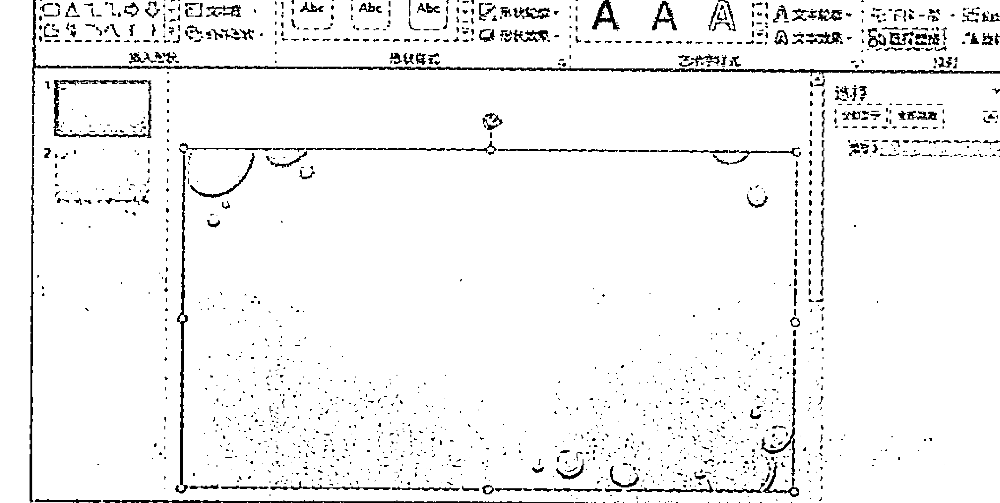

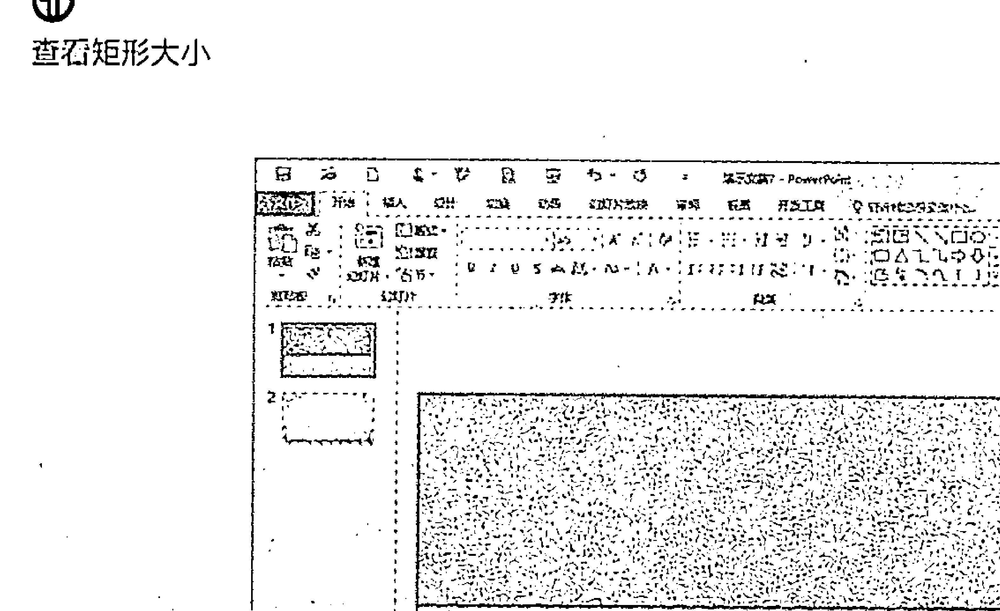

显然如果现在要制作一个上下黄金分割的矩形版面，只要选择上述高度值的0.618倍，即19.05×0.618=11.77cm处进行分割即可（当然在实际设计中并不要精确数值，只要大约为0.618即可）。同上，点击“插入→矩形”，再次插入一个矩形2，使得插入的矩形长度和上述矩形一致，并且高度设置为11.77cm。将矩形1和矩形2上部对齐，继续插入一个线条放置在矩形2的下边并对齐，这条就是黄金分割线（图2）。

同上点击“格式→选择窗格”，在右侧窗格菜单依次将上述插入的矩形1、矩形2删除，这一个黄金分割矩形就完成了，按提示插入封面标题文字即可（图3）。


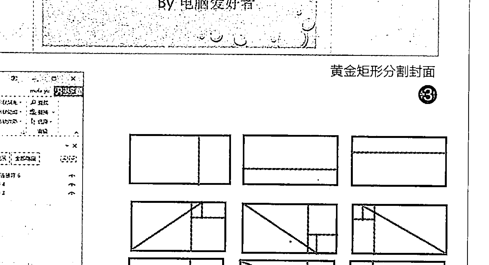

##### 进阶运用打造正文黄金版面

在上面的介绍中，我们是通过设计黄金分割矩形封面来增强美感。这样的设计也可以运用在正文设计中，而且不仅仅是简单矩形分割，还可以根据正文实际内容进行更多的设计。比如上述的分割矩形版面，可以根据正文实际内容和结构，使用横、竖、斜的不同黄金分割线，并且在矩形内再次进行多重分割（图4）。

以斜边进行分割操作为例，同上插入一个矩形1，计算出它的宽度后，在其上再插入一个0.618倍的直线1并对齐，这样可以获得上边的黄金分割点。按提示再插入直线2，将左下角顶点和分割点连线即可。因为是斜边分割线，在斜边上的字体可以旋转角度，使得插入的字体能够和斜边平行，然后在右侧梯形处输入PPT正文，这样一幅斜边黄金分割版面就完成了（图5）。

除了对矩形进行黄金分割外，在实际使用中还有很多图形可以进行黄金分割。比如根据斐波那契数列画出来的螺旋曲线（又称为黄金螺旋线），我们通过画出黄金螺旋线和矩形的组合可以轻松实现完美的排版。

黄金螺旋线可以借助Atrise Golden Section（下载地址：http://atrise.com/golden-section/）自动生成。启动程序后点击右上角的“switch look”可以不断切换生成的黄金图案（每种图案在程序标题栏右击可以旋转方向和调整大小），按提示选择所需的黄金螺旋线并截图到PPT备用（图6）。

因为实际排版是根据螺旋线切线生成黄金矩形实现，在PPT中粘贴截图后点击“插入→矩形”，然后依次以螺旋曲线切线作为矩形的边插入矩形，这样最终获得的是多个黄金矩形的组合图形（图7）。

点击“格式→选择窗格”，在右侧窗格菜单将插入的黄金螺旋截图删除，以后我们就可以使用这个来进行图片的黄金排版。选中矩形后，点击“绘图格式→形状填充→图片”，选择排版图片。操作同上，依次在其他矩形里选择图片进行填充，这样就完成一张黄金曲线图片的排版了（图8）。

当然在实际操作中，我们并不要机械使用精准的黄金曲线进行排版，在具体操作中还要根据实际情况加以选择。比如很多网页排版则主要使用黄金曲线左右结构，而对于一些人脸的修饰，如果不考虑实际情况，强行套用黄金曲线，反而会收到“丑化”的结果。因此黄金分割在PPT设计中，大家一定要灵活、务实地运用（图9）。

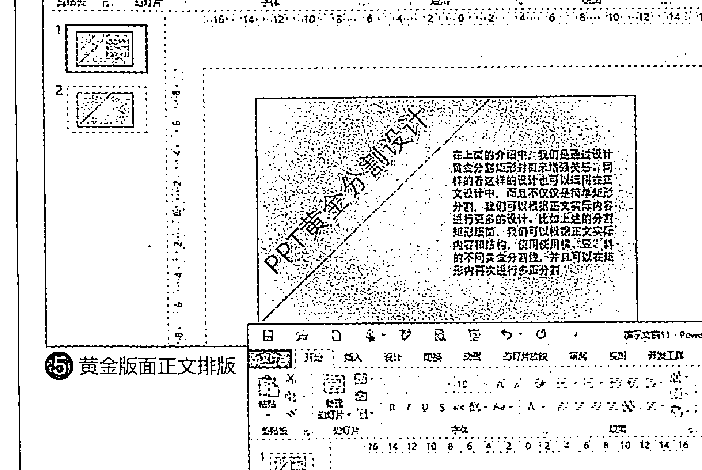

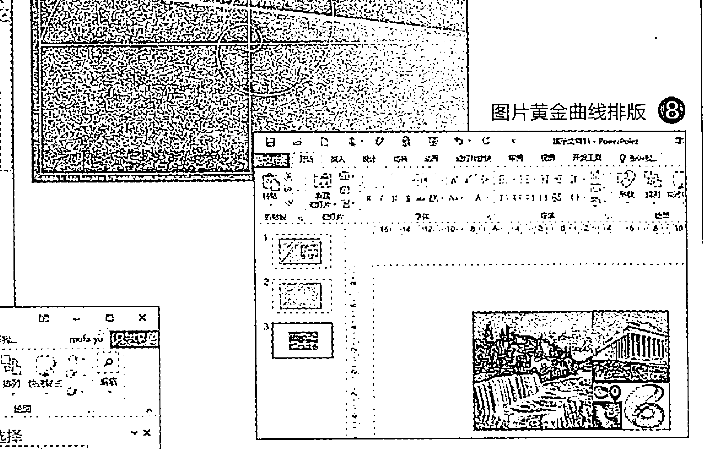

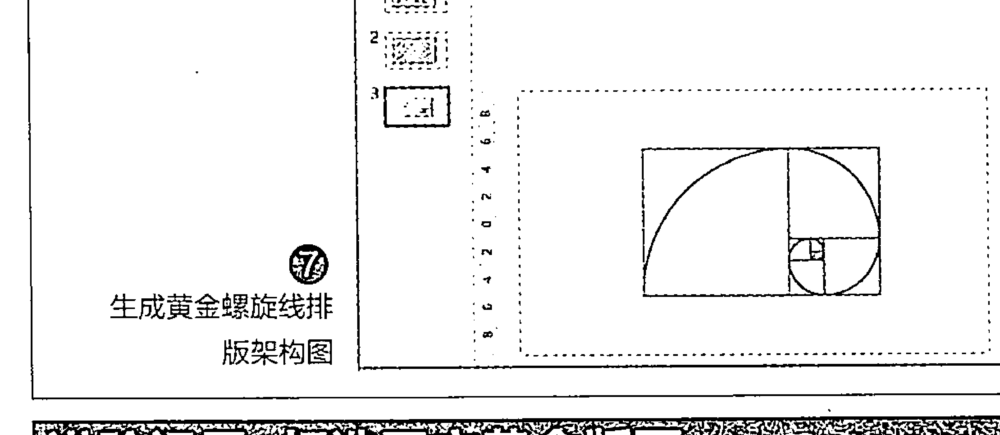

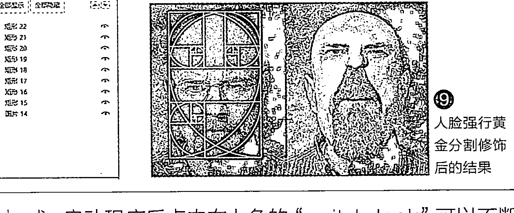

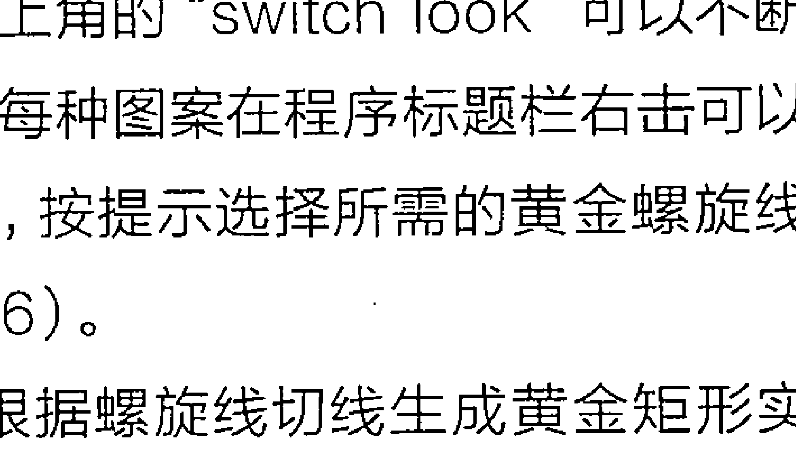

#### 查找更高效 玩转工作表的批量操作

文/技术宅

大家知道通过Excel制作一些复杂的项目统计数据时，我们在一个工作簿里会生成多个工作表。当工作表持续增加时，对于后续的查找和管理就有诸多的不便。该如何快速实现工作表的查找，以加快工作效率呢？

首先要提取工作表名称，可以使用Excel内置的GET.WORKBOOK()函数快速进行提取。在Excel中打开包含多个工作表的文件，接着选中第一个工作表，右击选择“插入”，插入一个名为“目录页”的新工作表（图1）。

点击菜单栏的“公式→定义名称”，新建一个名称为“目录”的新名称，引用位置处输入“=get.workbook(1)”，这是Excel内置的宏表公式，它可以自动读取工作表的名称，但是应用之前需要定义名称（图2）。

切换到“目录页”工作表，选中B1，输入公式“=INDEX(目录,ROW())”（即引用上述宏表公式），将公式下拉（有几个工作表则下拉几行，如果增减工作表则重新填充），这样在B列会自动填充类似“[工作簿名称]+工作表名称”的内容（图3）。

选中B列填充的内容，右击选择“复制”，选中A1，右击选择“粘贴选项→值”，仅复制提取文字值。最后使用查找与替换工具，将其中的“[工作簿名称]”替换为无内容，这样在A列就可以获取到所有工作表的名称了（图4）。

宏表公式提取的是“[工作簿名称]+工作表名称”内容，提取之后还要替换“[工作簿名称]”和选择性粘贴后才能完成操作。熟悉VBA脚本的用户可以直接使用脚本一步到位进行提取。点击菜单栏的“开发工具→查看代码”，然后在打开的窗口中输入下列的代码（图5）。

代码如下：

```
Sub 提取工作表()
For i = 1 To Sheets.Count
Cells(i, 1) = Sheets(i).Name
Next
End Sub
```

代码内容是使用For命令遍历当前工作表，然后提取其名称。完成代码的录入后按F5，这样会自动生成一个名为“提取工作表”的宏。返回“目录页”工作表，定位到A1，点击“宏→提取工作表→执行”，运行这个宏后会将工作表名称自动提取到A列（图6）。

> 小提示
为了方便提取其他工作簿的工作表名称，可以将上述包含“宏”的文件另存为“启用宏的工作簿（xlsm）”，这样需要提取工作表名称时，只要打开这个工作簿运行“宏”即可。

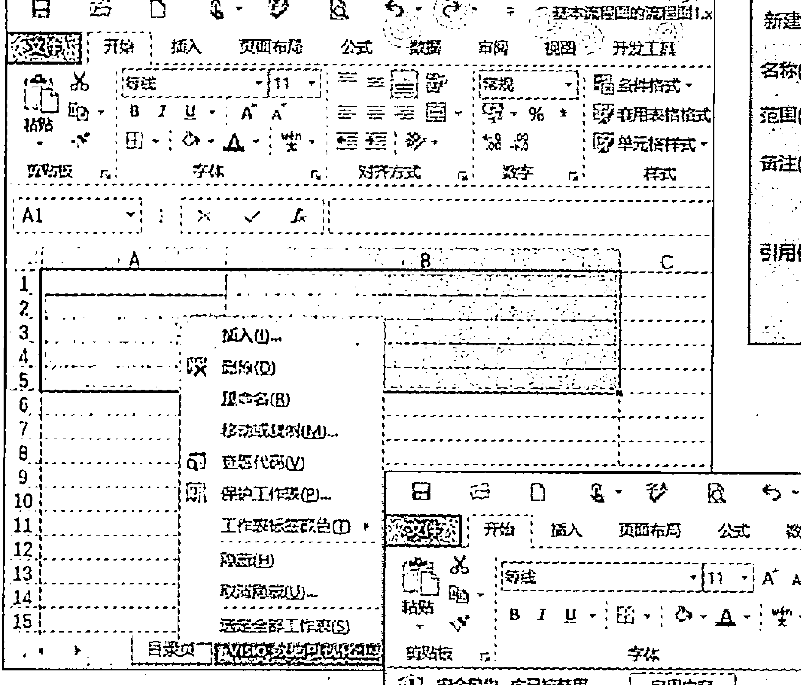

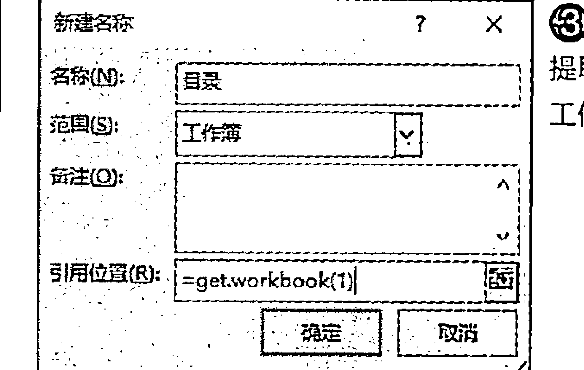


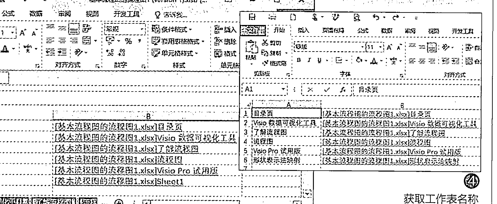

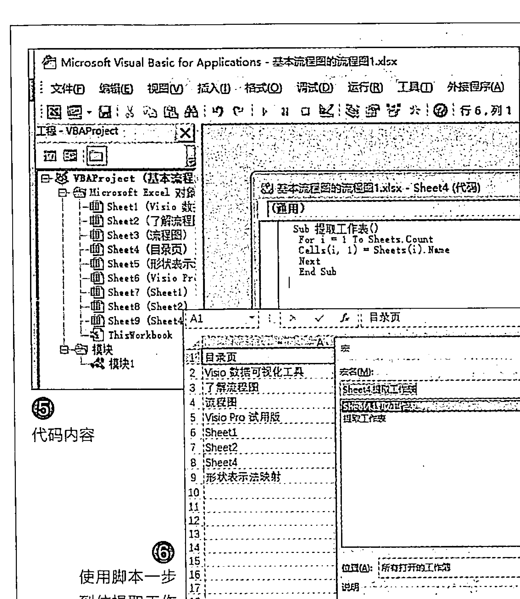

##### 生成目录链接

完成工作表名称的提取后，接下来就可以使用HYPERLINK函数为其添加链接。选中C1，插入公式“=HYPERLINK("#"&A1&"!A1",A1)”（即引用A1的名称并在C1为其添加链接）。同上向下填充公式，这样我们就在C列增加了各个工作表名称的链接，点击其中的链接即可跳转到指定的工作表（图7）。

如果工作表众多，为了方便在任意工作表返回到目录页，可以按住Shift键依次选中除目录页的所有工作表，然后在任意一个工作表的A1单元格（如果原来工作表的A1单元格非空白，可以插入一列空白行）输入“=HYPERLINK("#目录页!A1","返回目录")”，这样所有工作表的A1都会自动输入“返回目录”，点击该链接即可快速返回到“目录页”工作表（图8）。

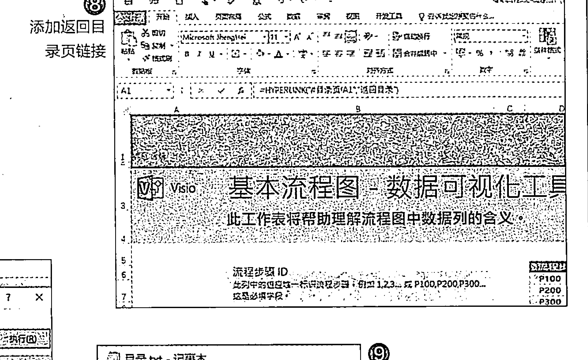

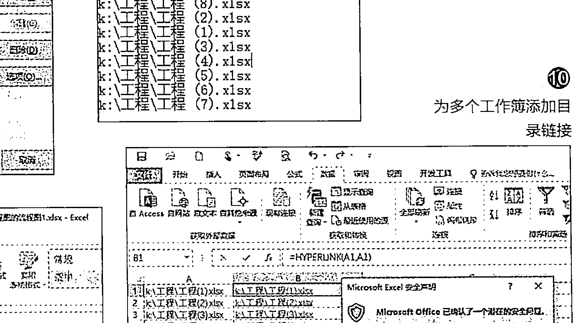

##### 扩展阅读 为多个工作簿创建目录链接

上述方法是提取一个工作簿中的多个工作表名称并添加超链接制作目录，如果是要制作工作簿的目录链接，我们可以使用DIR命令提取。假设某个项目工程以“工程(1).xlsx”、“工程(2).xlsx”等多个工作簿为名保存在“K:\工程”下（注意：路径和文件名均不要有空格），现在需要为这些工作簿创建目录链接，首先启动命令提示符，输入“dir k:\工程 /s /b >>k:\目录.txt”，这样会在K:\生成一个名为“目录.txt”的文件，其中的内容就是工作簿的路径（图9）。

将上述文件内容复制到Excel的A列，选中B1输入公式=HYPERLINK(A1,A1)添加超链接，这样在这个文件中点击链接即可打开对应工作簿的文件（图10）。

#### 不务正业 用好PPT另类功能

文/俞木发

现在PowerPoint的功能越来越强大，除了制作幻灯片这个本职功能外，新版PowerPoint 2016更是集成了如截图、格式转换等很多常用功能。这样，在执行很多日常操作时，无需再安装其他的软件，利用PowerPoint 2016就可以完成。下面就让我们一同体验PowerPoint 2016的一些另类实用功能。

##### 百变格式:PPT变身格式转换器

大家知道，通过PPT的“另存为”菜单，我们可以将当前PPT导出为视频、图片、PDF等多种格式，这样在需要进行特定格式的转换时，就可以利用这个功能来实现。比如手机由于应用的限制，对于电脑上常见的.PPTX、.XLS文件都无法直接打开。如果这类文件需要在手机上观看，就可以通过转换为图片、MP4视频的方式实现。

若需要在Android手机上直接观看PPT，在完成PPT的制作后点击“文件→另存为”，选择保存位置后，在文件类型选择“.PNG”，这样即可将PPT幻灯片转换为图片。如果PPT包含动画效果，则可以点击“文件→导出→创建视频”，设置文稿质量后就可以转换为手机能直接播放的MP4视频文件（图1）。对于其他需要变换格式的类型（如Excel工作表），则使用插入表格的方法后再转换。

##### 音频裁剪:PPT变身铃声制作工具

在个性化流行的今天，很多朋友需要制作一段个性化的音乐作为自己的铃声。铃声制作需要对音频进行截取，现在利用PPT的“音频剪辑”功能即可完成。

在PPT中点击“插入→音频→PC上的音频文件”，然后选择插入需要作为铃声的MP3音乐文件。选中插入的音乐文件，切换到“音频工具→播放→剪裁音频”，按提示播放后选取需要作为铃声的片段，接着拖动进度条上的起始裁剪滑块，选择需要作为铃声的起始片段，点击“确定”即可进行裁剪（图2）。

完成上述操作后点击PPT菜单栏的“文件→压缩媒体→选择保存质量”，这样裁剪部分会被自动压缩并将裁剪后的音频文件保存下来（图3）。

返回PPT窗口，选中上述压缩过的音频文件，右击并选择“媒体文件另存为”，将文件导出为“.m4a”保存即可（图4）。

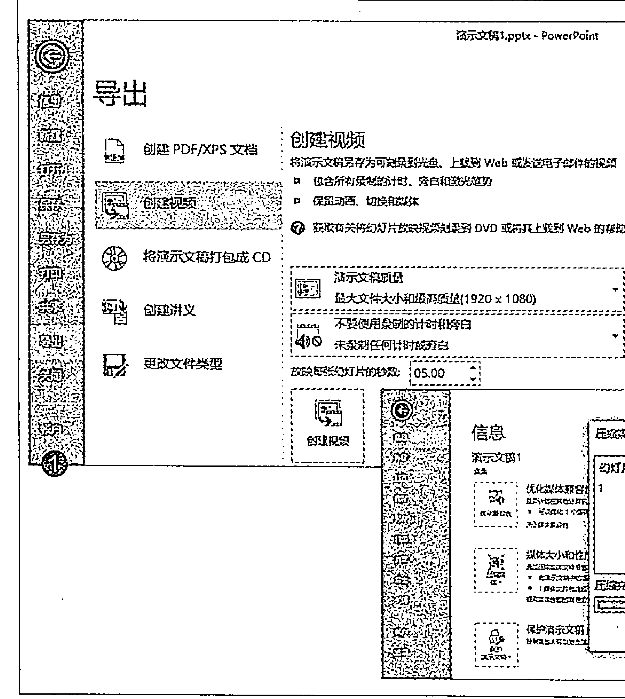

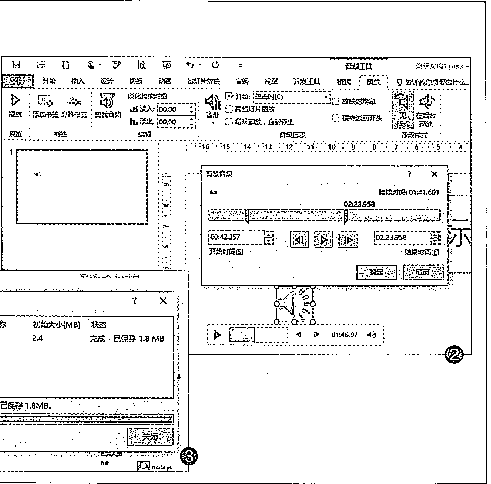

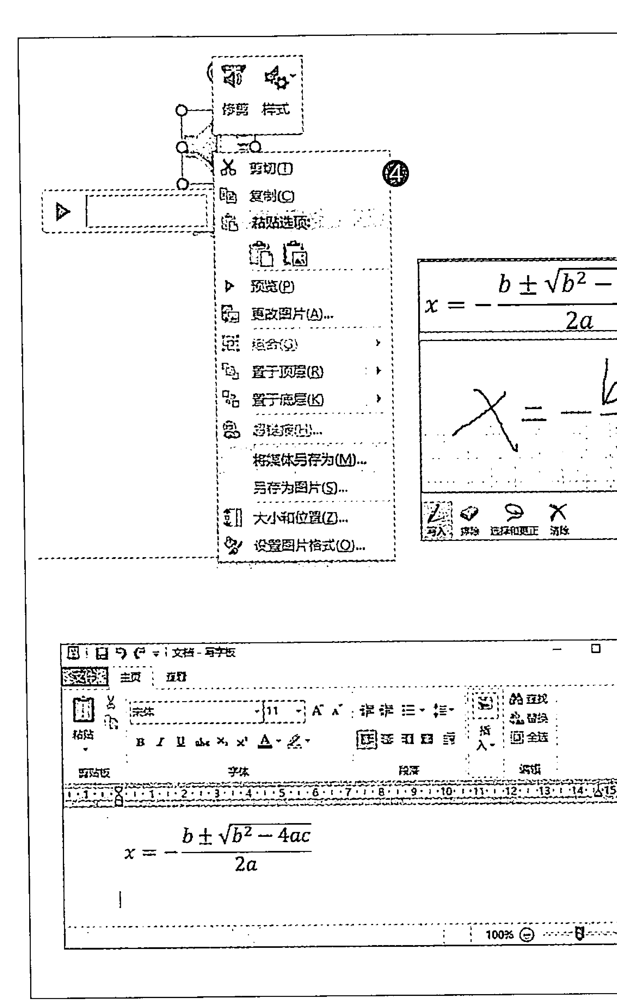

```
x = -\frac{b \pm \sqrt{b^2 - 4ac}}{2a}
```

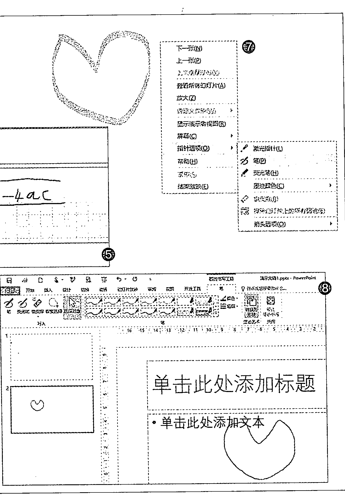

这样得到的是.m4a文件，iPhone用户可以将其改为.m4r，然后使用iTunes同步到手机上作为自己的铃声。

##### 直接手写PPT变身公式输入器

我们经常要在日常办公文档中插入一些公式，有些公式并没有在常用的办公软件中集成。不过现在PPT 2016支持使用手写方式直接插入公式，这样需要在其他文本编辑软件（如写字板等）中输入公式时，只要先在PPT中手写输入，然后复制到写字板即可。

在PPT中点击“插入→公式→墨迹公式”，在打开的手写公式框，按自己的需求使用鼠标手写输入需要的公式，它会自动进行识别，如果书写或者识别错误，可随时点击“擦除”重新输入（图5）。

完成公式的手写输入后点击“插入”，然后将其复制并粘贴到写字板，即可完成公式的输入了（图6）。

##### 随手涂鸦PPT变身QQ表情制作器

在和好友聊天时，我们经常会收到一些涂鸦表情，不过非QQ会员现在无法制作涂鸦表情。PPT在播放幻灯片时，我们可以使用类似涂鸦的笔刷，这样通过PPT就可以制作出自己的涂鸦表情。打开任意一个PPT文件开始播放，在播放界面右击选择“指针选项→荧光笔”，这样屏幕会出现笔形工具即可任意涂鸦，按自己的需要画出合适的涂鸦表情（图7）。完成涂鸦后退出播放，当提示是否保存墨迹注释时点击“是”，这样返回PPT后就可以看到自己的涂鸦图片。选中涂鸦图片切换到“墨迹书写工具→笔”，这里可以对涂鸦进行任意编辑，完成后将其导出为图片，然后作为QQ表情使用即可（图8）。

当然，除此之外，PowerPoint 2016还有“截图”（可以方便在需要截取图片时直接进行截图）、“屏幕录制”（可以对任意程序屏幕操作进行录制，方便制作一些操作教学视频）、“绘图”（可以手绘出各种图形，再结合布尔运算还可以组合出更多有趣图案）等另类功能，更多功能等待大家自己去挖掘！

#### 宣传片动画 简单也能出效果

对于办公一族来说，制作公司形象或产品宣传片动画时，镜头的忽近忽远、放大缩小，文字、图片的华丽出场与退场效果等，设置越简单省时越容易被人接受。办公族虽然熟悉PPT的居多，但想要用它来完成上述效果，却不是一件轻松的事。如果用“万彩动画大师”来制作，操作过程就变得简单多了，信手拈来即可做出与众不同的动画效果。

##### 1. 炫彩文字添加与动画设置

点击“新建空白项目”（也可以在各类模板中选择所需要的模板进行编辑），在窗口右侧的工具栏选择“文本”按钮，将所需要的示例文件拖动到空白场景中，点击添加的文本进行编辑，输入所需内容，设置好所需样式（图1）。

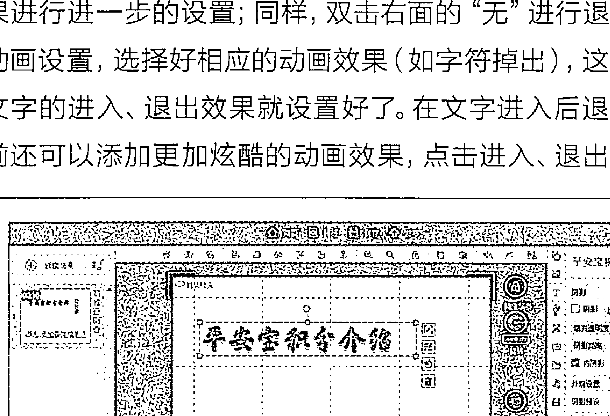

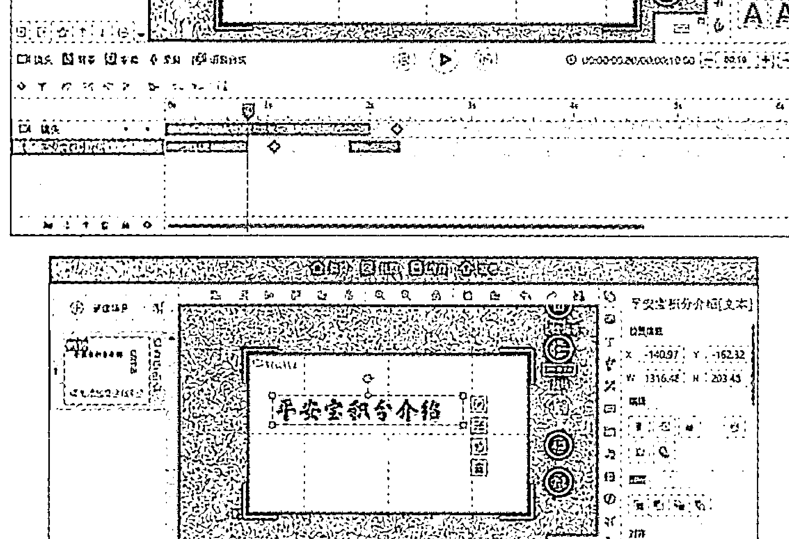

文字添加完成后，在文字时间轴上双击左面的“无”进行动画的设置，在弹出的窗口中选择所需要的动画效果（如字符打印），点击“高级选项”，对动画效果进行进一步的设置；同样，双击右面的“无”进行退出动画设置，选择好相应的动画效果（如字符掉出），这样文字的进入、退出效果就设置好了。在文字进入后退出前还可以添加更加炫酷的动画效果，点击进入、退出效果之间的“+”按钮，在弹出的动画效果窗口选择所需的动画（图2）。当然，进入、退出间的动画效果可以添加多个，以达到炫酷的效果。在文字时间轴上将鼠标放在各个效果左、右黄色菱形按钮上拖动以改变动画效果播放的时间长短，将鼠标直接放在动画效果上拖动以改变动画效果播放的时间点（图3）。

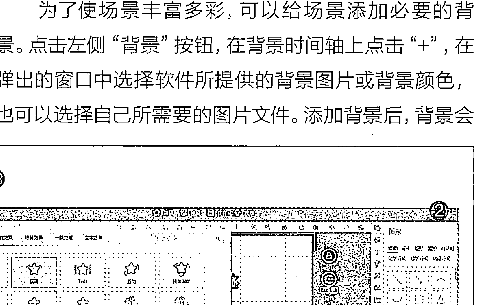

##### 2. 添加合适的场景背景

为了使场景丰富多彩，可以给场景添加必要的背景。点击左侧“背景”按钮，在背景时间轴上点击“+”，在弹出的窗口中选择软件所提供的背景图片或背景颜色，也可以选择自己所需要的图片文件。添加背景后，背景会一直显示，想更换或删除背景，可点击背景时间轴上的“+”，更换背景可在弹出的窗口中选择新的图片背景，删除背景则不要选择任何图片（图4）。

> 小提示
在背景时间轴上拖动相应背景，可以确定它出现的时间点。

##### 3. 角色动画效果应用

介绍内容时，可以在场景中放入人物角色。点击右侧的“角色”按钮，在弹出的窗口中选择所需要的角色及动画效果。当然，角色动画可以添加多个（图5）。

在角色时间轴上点击角色所对应的左右箭头，在弹出的菜单中设置好角色动画的播放方式，即单次播放、循环播放；当然，还可选择“角色编辑”，在弹出的窗口中自己设置播放时间段。

##### 4. 插入声音和文字

在进行内容介绍时，可能需要声音或文字。对于声音的插入，可以点击“录音”按钮，进行声音的录制；或点击“语音合成”按钮，在弹出的窗口中输入所需要的文字，选择播音人物，设置好音量、语速等，这样就会生成一个有关声音的时间轴。双击音乐时间轴上的声音，就会弹出一个窗口，可以对声音进行裁剪。声音插入后，可以在时间轴上拖动它，使它的播放开始及结束与角色动画对应好（图6）。

对于文字的插入，可以结合角色动画，选择右侧的“气泡”按钮，在弹出的窗口中将所需要的对话窗口拖入到场景中的合适位置，在场景中右击，选择“插入→文本”，输入所需要的介绍内容，设置好文字样式等，将文字与插入的对话窗口位置调整对应好，设置好文字出现、消失的文字动画效果（图7）。

为了使宣传片的效果更加吸引人的眼球，还可以添加本地图片、视频、SWF等，它们的插入方法和插入文字差不多。

##### 5. 镜头伸缩效果制作

镜头的忽近忽远、放大缩小，会给宣传片带来意想不到的效果。在镜头时间轴上点击“+”，添加镜头，将镜头的范围调整到所要显示的相应位置。可以添加多个镜头，每个镜头显示场景中的相应元素，这样就实现了忽近忽远、放大缩小的特效（图8）。

最后，保存项目文件，点击“发布”，将项目发布成所需要的文件格式就可以了。

> **小提示**
声音的插入也可以点击右侧按钮中的“音乐”，选择已经录制好的解说声音。

#### 数据互换 Excel有高招

文|平淡

在日常工作中我们经常要对一些数据进行互换操作，比如由于排序标准变化后，需要将列名称顺序进行互换等。对于这些数据的互换有什么快捷的方法？用Excel，分分钟搞定。

**加个符号，文本型互换为数据型**

在日常的输入中经常会在单元格输入很多文本数据，比如在输入类似059112345678的电话号码时，默认的数据类型会自动将区号前的“0”删除。因此这类数据需要使用“文本”类型数据输入，但是这样输入后会在左上角含有小三角符号并提示数据错误，且不美观。如果要将这类文本数据快速转换为数据型（使其左上角不再出现小三角符号），只要在源数据前加个运算符号即可。

选中C2，在其中输入公式“=+B2”，然后向下填充即可，这样数据单元格左上角就不会再出现小三角符号了（图1）。

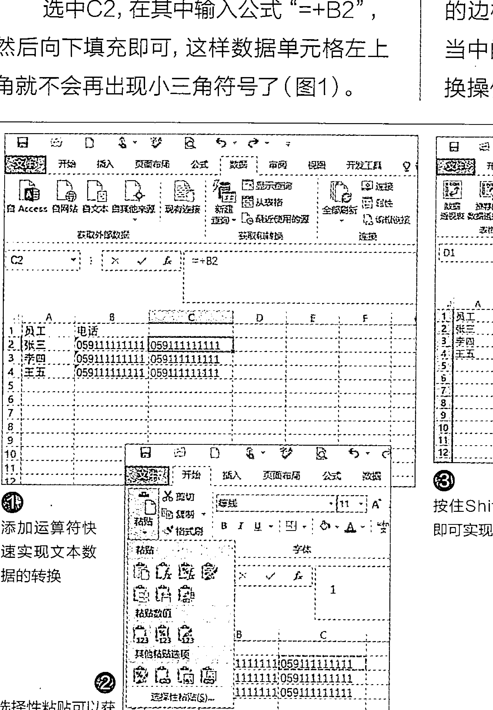

**恢复真身，公式和数据互换**

大家知道Excel中很多单元格的数据都是通过公式自动获取的，这样在进行常规复制时，粘贴得到的实际上是公式，无法获得原始数据。如上述例子，如果复制C2单元格粘贴到E2，实际内容为“=+D2”。如果要实现公式和数据互换，在粘贴时就需要使用选择性粘贴，同上例，复制B2后，在E2点击“开始→选择性粘贴→值”即可（图2）。

**位置变换——两列（行）快速互换**

如上所述，一些数据由于排序标准变化后，需要将列名称顺序进行互换。比如公司联系通讯录，现在需要将职位（D列）和电话（B列）互换。对于这类列数据的互换，先选中D列，然后将光标移至D1的边框位置，当出现十字形形状时，按住Shift键，将D列拖到B列，当中间出现一道较粗的白色线的时候，松开鼠标即可。邻近行的互换操作类似（图3）。

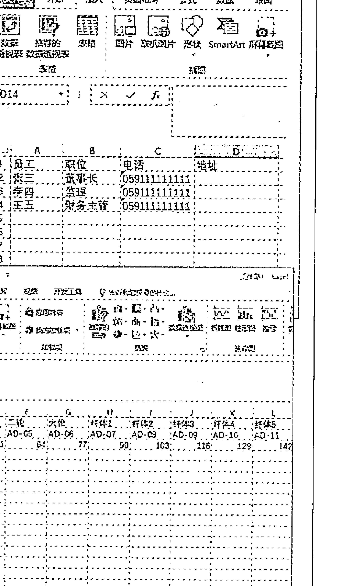

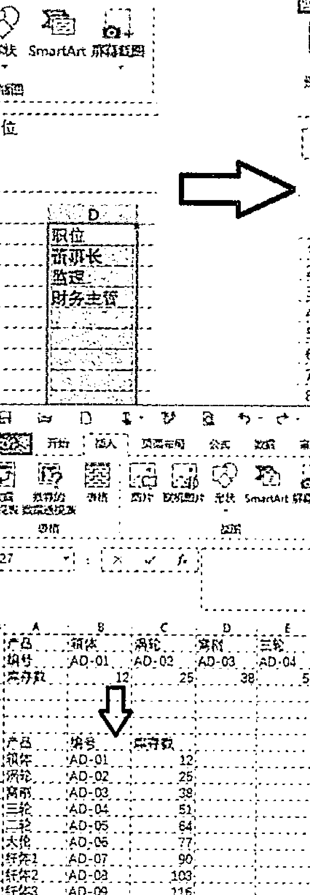

**横竖变换 行列数据互换**

除了上述互换外，在工作中我们经常还要对行、列数据进行互换。比如原来公司库存报表是按照行的方式输入，由于后续的数据很多，水平滚动浏览不便，现在领导要求在新工作表中将数据转换为按列的方式排列，即将原来的行、列数据互换（图4）。

对于行列的转换，可以全选数据，复制后使用“选择性粘贴→转置”即可完成转换（图5）。但是这种简单的转换无法实现数据的同步，如果原始数据变化了，又得重新转置。利用Transpose函数可以将表格中的行列进行同步转置。

新建工作表2，选中A1→C12区域（即和原来12行3列A1:L3对应的转换区域），选中A1，在其中输入公式“=TRANSPOSE(Sheet1!A1:L3)”，由于这是数组公式，完成公式的输入后要在公式编辑栏按下Ctrl+Shift+Enter，这样即可实现行列数据的互换。由于这里是使用Transpose函数引用原来的数据，因此原来的数据变动后转换的数据会同步进行更改（图6）。

**一列变多列 单列数据互换为多行多列**

平时数据统计我们一般都是将数据汇总在一张表格中，很多时候需要将特定的数据转换为多行、列数据以方便查看。比如仓库盘点中，A列因为产品的数量很多，查看需要不断滚动数据行，但是总列数不多。现在为了方便查看，需要将A:C列变为5行多列排列的数据（图7）。

对于这类数据的互换可以使用INDEX函数进行转换。在F2输入函数公式“=INDEX($A$2:$A$31,ROW(A1)+(COLUMN(A1)-1)*5)”，然后下拉填充5行、右拉填充公式，这样原来的A列数据会变为5行6列排列（图8）。

完成分列后还要继续在每列之间插入两个空白列（用于填充原来的B、C列数据）。选中G列，右击选择“插入”，插入一个空白列，然后按F4再次插入空白列。操作同上，依次完成空白列的插入。

插入空白列后将表头数据粘贴，接下来再进行数据引用即可。选中G2插入公式“=VLOOKUP(F2,$A$2:$B$31,2,FALSE)”，这样可以引用F2对应的商品名称，向下填充公式即可。同上在H2输入公式“=VLOOKUP(F2,$A$2:$C$31,3,FALSE)”并填充即可。

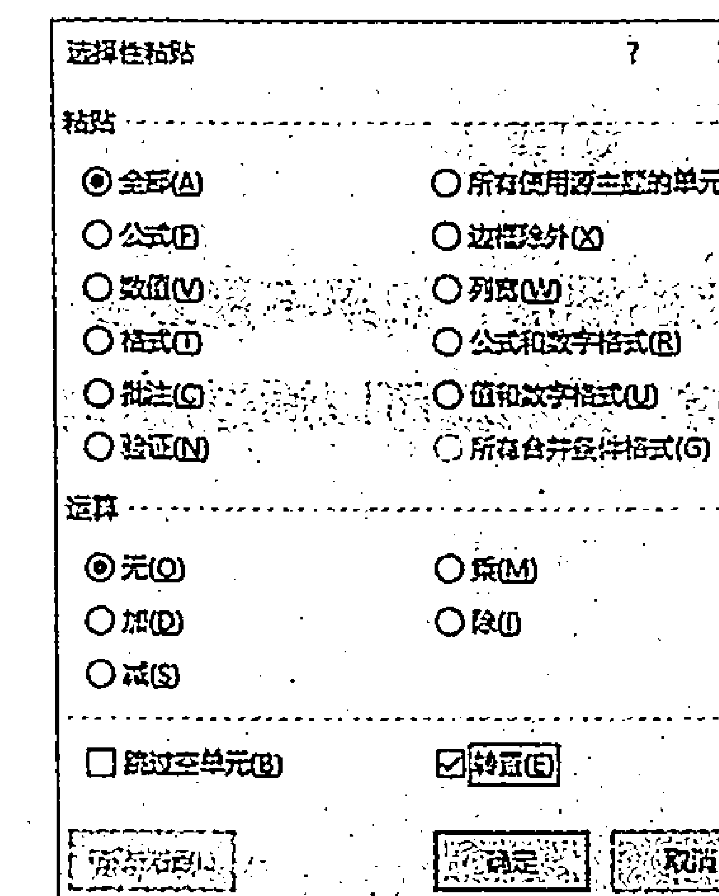

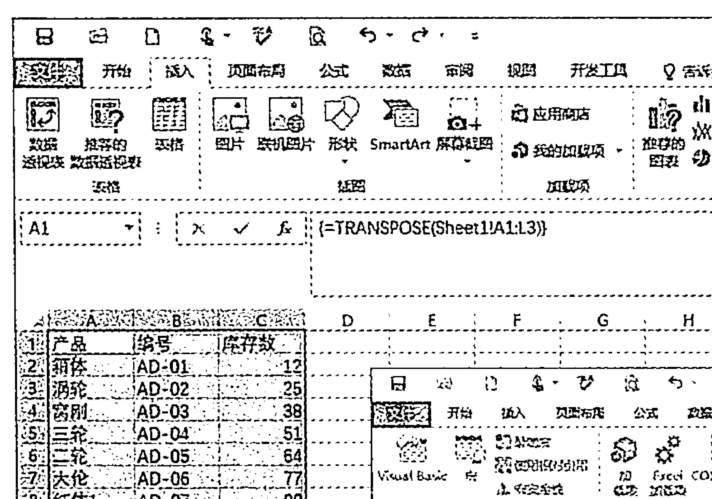

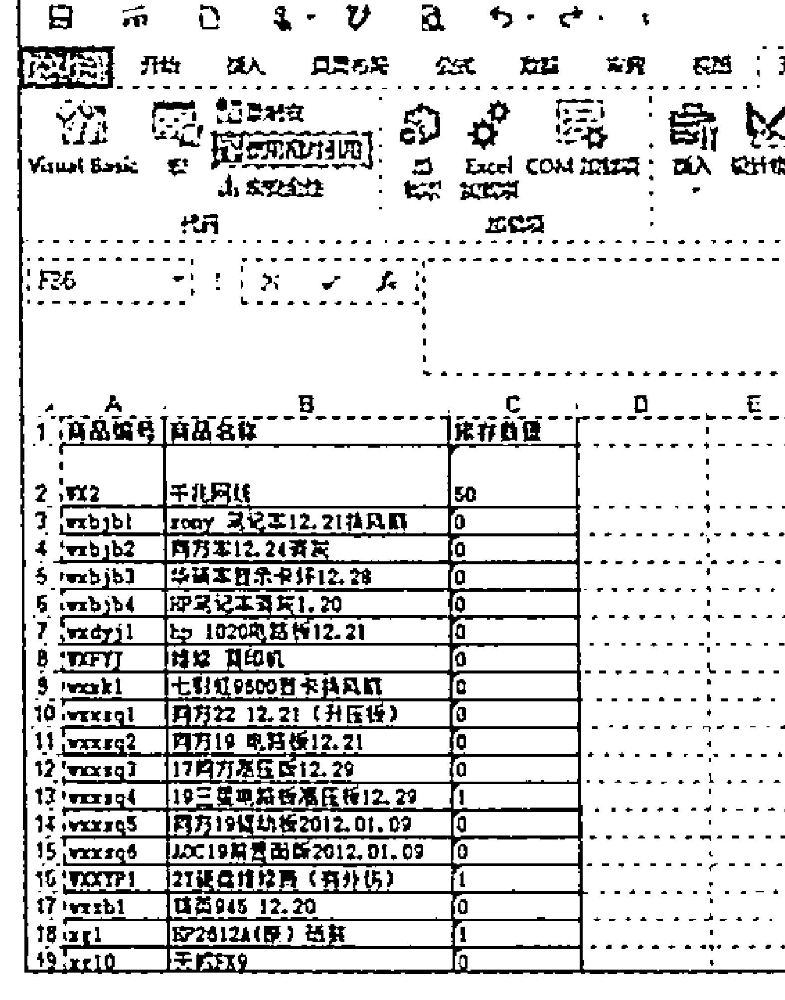

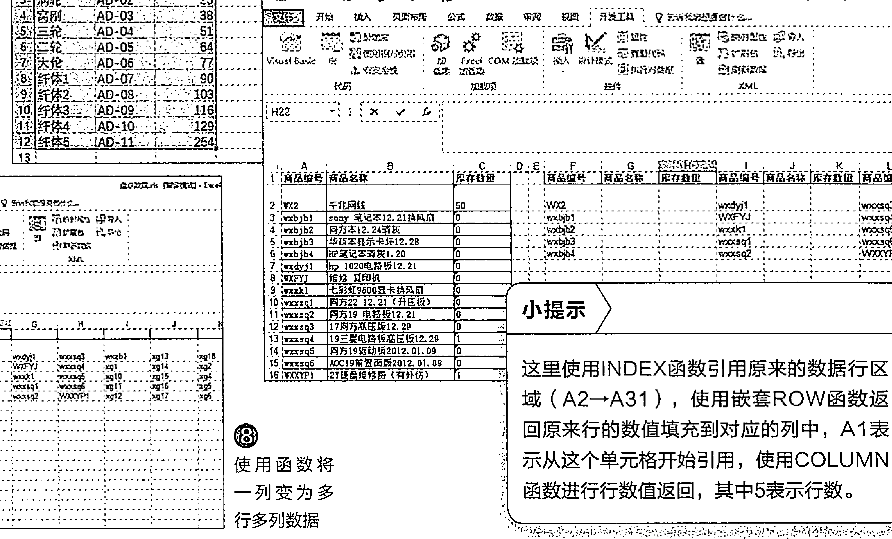

> **小提示**
这里使用INDEX函数引用原来的数据行区域（A2→A31），使用嵌套ROW函数返回原来行的数值填充到对应的列中，A1表示从这个单元格开始引用，使用COLUMN函数进行行数值返回，其中5表示行数。

#### 教你如何在PPT中制作剪影

文|愚人

大家知道，现在扁平化设计是PPT主流设计方式，这样在实际设计中我们就要多使用象征化的图形，如果不是必要，尽量不要使用立体的实物素材。因此在幻灯片设计中，如果要使用类似人物、实物照片这类素材，我们就可以通过制作剪影的方法进行扁平化处理，让自己的PPT更有风格。

PowerPoint 2016已经自带丰富的制作剪影的工具，我们只要直接套用即可。比如下面是一张表达父爱主题的PPT，原来设计是直接使用一张父子合影照片，这样人物照片在整张PPT中比较显眼。为了能够更加突出父亲节主题文字，这里就可以使用剪影的方法来淡化人物在图片中的比重(图1)。

新建一张幻灯片，然后直接使用截图工具将人物提取出来，接着在PPT中使用删除背景的操作，将人物“抠”出来即可。选中抠好的人物照片，切换到“图片工具→格式→颜色→重新着色”，然后选择“黑白75%”，这样就可以获得人物剪影效果了(图2)。

复制制作好的人物剪影效果图，将其粘贴到原来的图片上覆盖父子合影，按住Ctrl键选中原图和剪影效果图，点击“格式→组合→组合”。经过这样处理后剪影人物在原图中是不是弱化了，可以更加突出父亲节的文字效果(图3)。

可以看到人物剪影效果的制作很简单，只要选择“抠图→粘贴→组合→重新着色”即可完成。这里要注意的是，由于剪影大多使用黑白效果，因此图片人物素材选取时要注意尽量选择人物着装为深色衣服，并且轮廓要比较清晰，这样制作的剪影效果才更好。

当然在实际的设计中，我们还可以根据自己的实际需要进行更多剪影效果处理。比如对正面人物进行剪影处理，则可以根据自己的实际情况进行处理。如果需要对脸部的五官进行弱化只保留一个轮廓，同上先删除背景，选中照片后点击“格式→更正→更多更正选项”，将亮度调整为-100%，对比度调整为100%即可(图4)。

如果需要保持人物的五官而只是进行淡化处理，则可以同上选择“颜色→重新着色→选择75黑白”，或者选取其他颜色进行处理(图5)。

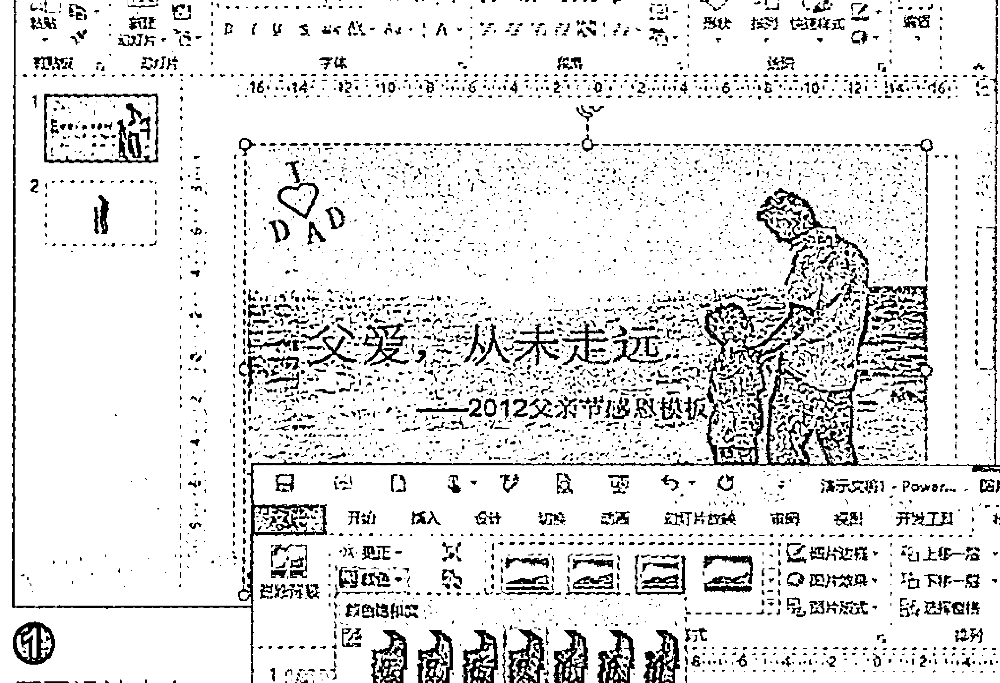


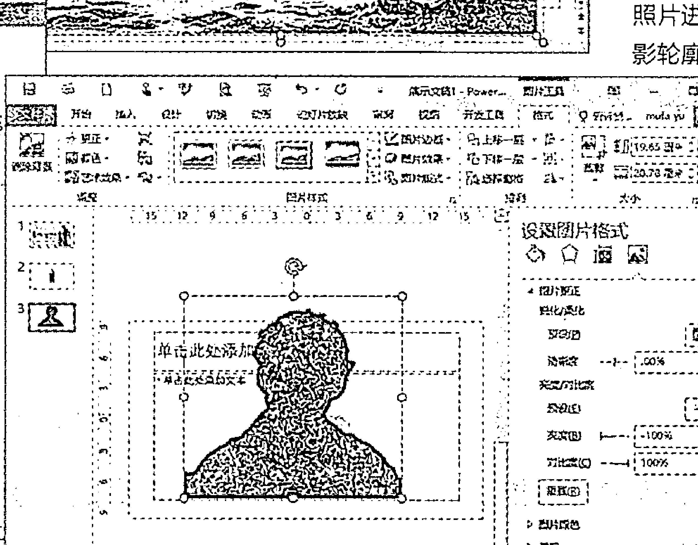

##### 5. 多种颜色处理剪影效果


##### 6. 电视机剪影制作

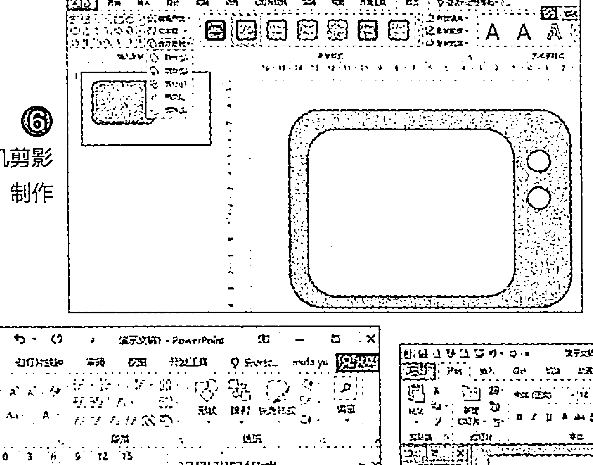

##### 7. 各种剪影效果处理

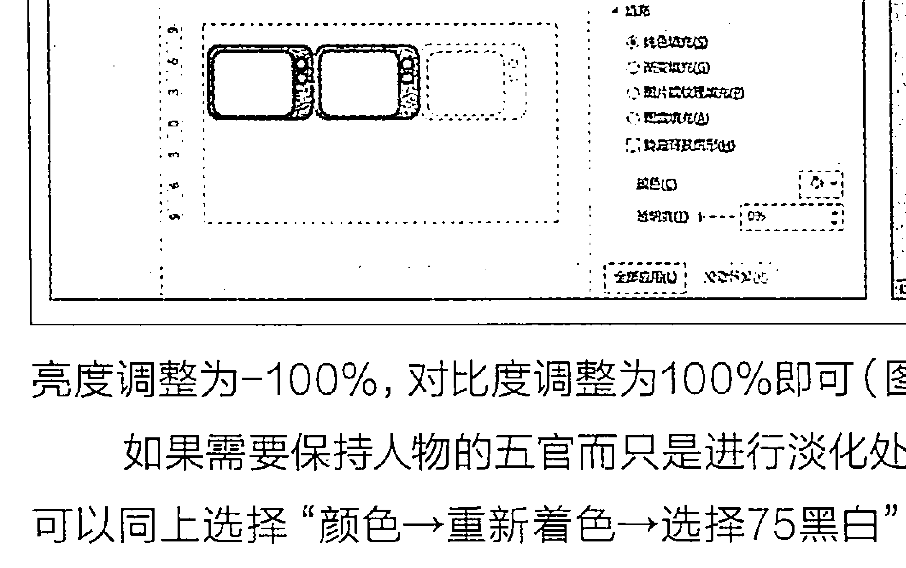

##### 8. 插入剪贴画

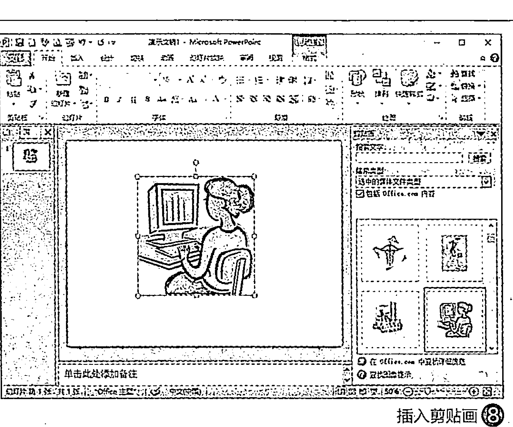

##### 9. 显示/隐藏形状

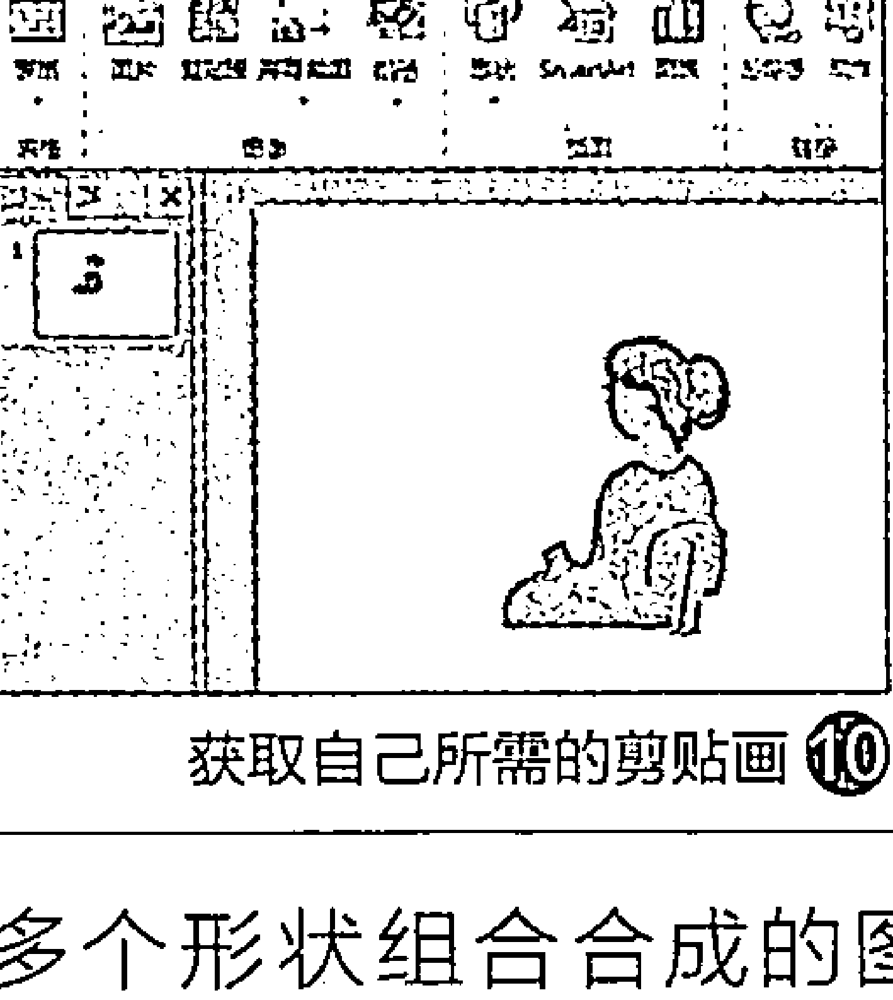

##### 10. 获取自己所需的剪贴画

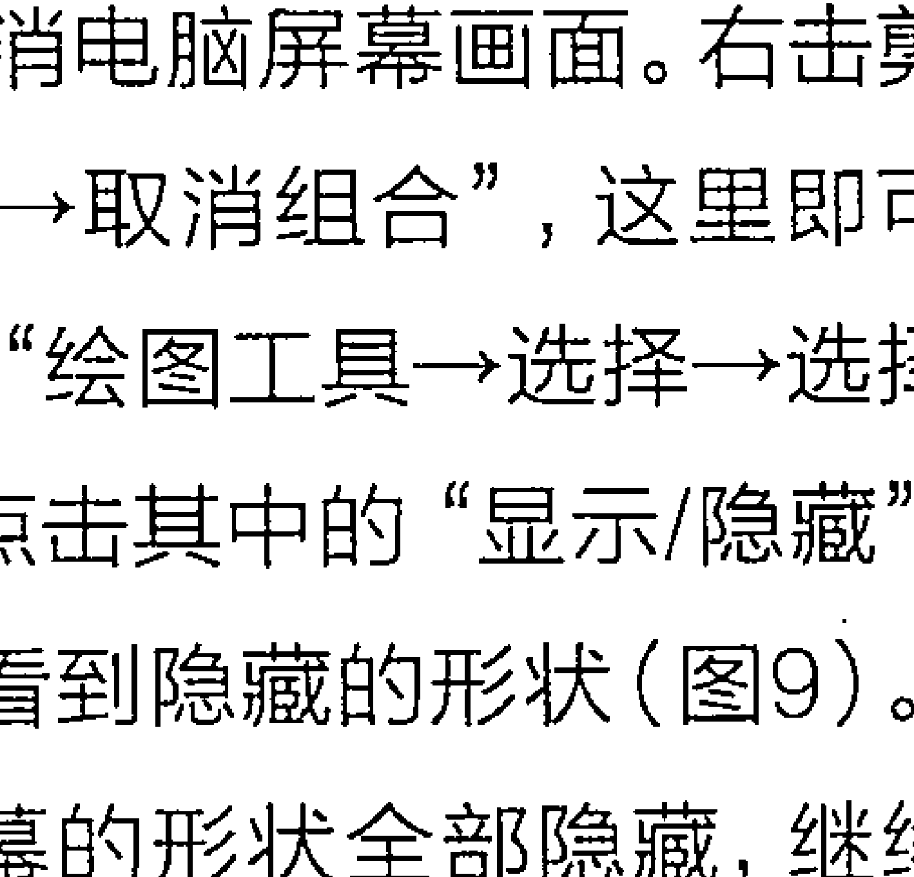

当然除了对人物进行剪影化处理外，我们可以自己制作剪影作品。比如在很多厂商的发布会上就使用各种象征性的物品剪影(而不是实物)，对于这些象征性的剪影，在PPT中同样可以制作。这里以制作电视机为例。

点击“插入→形状→圆形矩形”，同上再次插入一个矩形排列在其上，继续在第一个矩形的边缘插入2个“圆形”(按住Ctrl键调整大小)，依次选中所有插入的矩形，点击“绘图工具→格式→合并形状→组合”，这样一个类似电视机的象征性的剪影就完成了(图6)。

如果要让这个剪影能够像前面的操作一样进行更多处理，可以右击图片选择“复制”，将其粘贴为“图片”，这样就可以利用“颜色→重新着色”、“格式→更正”等进行各种效果处理了(图7)。

如果觉得自己制作剪影麻烦，大家还可以使用插入剪贴画的方法快速获得剪影素材。在PPT中点击“插入→剪贴画”，这样可以联机搜索到很多直接可用的剪贴画，按提示插入自己所需的图片即可(图8)。

这里的剪贴画都是由多个形状组合合成的图片，我们可以根据自己的需要任意对其增减。比如上述插入的剪贴画，如果要取消电脑屏幕画面。右击剪贴画，依次选择两次“组合→取消组合”，这里即可看到所有组合图形。切换到“绘图工具→选择→选择窗格”，在右侧窗格按提示点击其中的“显示/隐藏”图标，在左侧剪贴画中即可看到隐藏的形状(图9)。

按提示将组成电脑屏幕的形状全部隐藏，继续按住Ctrl键选中隐藏的形状将其删除。这样就可以通过填充颜色、增加形状等操作获得自己需要的剪贴画了(图10)。

这样借助PPT常用组件，我们就可以制作各种剪影素材。不过最后需要注意的是，剪影的主要目的是体现事物大体的特征，又不会由于视觉冲击力太强而影响观众对文字的留意。设计出发点是弱化人物、实体物品在幻灯片中的比重，突出文字或其他要素，因此对于一些原来就需要强调人物、实体的设计，就不要使用剪影效果了，否则适得其反。此外，如果在同一PPT中屡次运用剪影后会使PPT略显单调，这些都是大家在运用剪影时需要注意的地方。

#### 按需设置Word页码72变

我们平时使用Word编辑文档，一般采用的都是默认的页码设置。默认设置虽然省事，不过遇到特殊要求的文档时会很不协调，甚至会有错位。所以今天笔者就来分享几个特殊情景下的页码设置方法。

**双面打印页码外侧对齐**

为了节约纸张，我们有时会采用双面打印。大多数打印机都支持半自动双面打印，也就是先打印出奇数页，然后将纸面翻过来再打印所有偶数页，所以我们需要对奇数页和偶数页分别进行设置。如果打印出来的文档准备在左侧装订，那么页码最好放在右侧，这时奇数页的页码保留在右侧，而偶数页的页码反而要移到左侧。

这里以Word 2013为例（2007以上版本均适用），首先切换到“页面布局”选项卡中，点击展开“页面设置”，在打开的窗口中切换到“版式”，然后勾选“奇偶页不同”项，点击“确定”返回（图1）。

接下来分别设置奇数页和偶数面的页码。将插入光标置于任意奇数页面上，如第1页、第3页等，然后切换到“插入”选项卡，点击工具栏的“页码”按钮。本例在弹出菜单中选择“页面底端”下一个页码显示在右侧的样式，你可以根据自己的需要选择其他样式（图2）。用同样的方法，将插入光标置于偶数页（如第2页），插入一个页码，本例选择的是页面底端的左侧样式。

接下来就简单了，进入打印界面中，选择先打印奇数页，完成后将打印好的纸翻过来再打偶数页。可以看到，页码有序排列，而且所有页码都在外侧对齐。

**独立横向版面的页码设置**

一般来说Word文档都是纵向排版的，不过有时候因为特殊情况，比如文中插入一个比较大的表格或者图片，这时就需要将这个单独的页面设置为横向（图3）。

如上图所示，打印出来装订的话，横版那一版的页码就会跑到右上方去了，因为装订时不可能横竖不一致，这就导致它与其他版面的页码不对齐。现在可以单独调整这一版的页码位置，本例是将它从原有的右下角

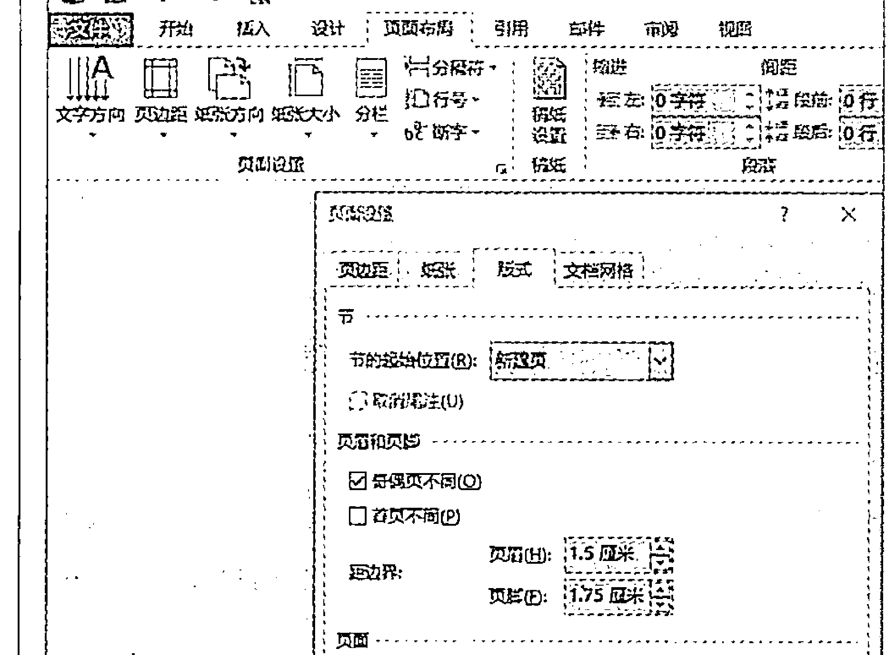

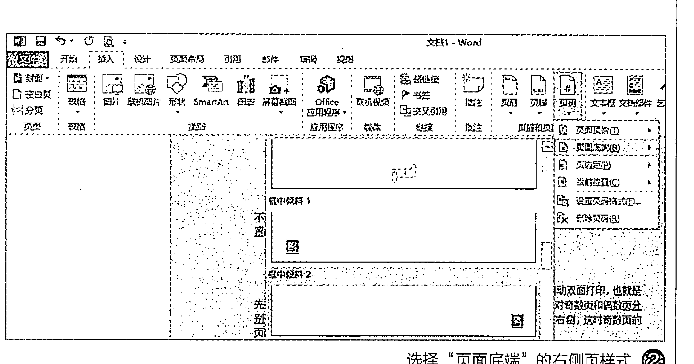

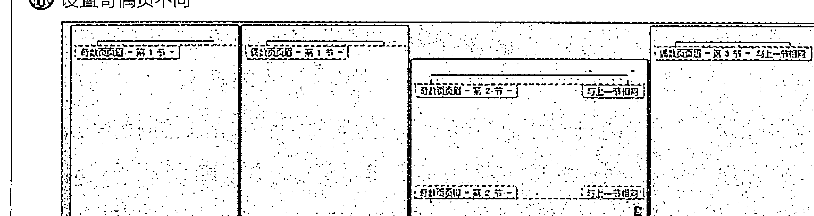

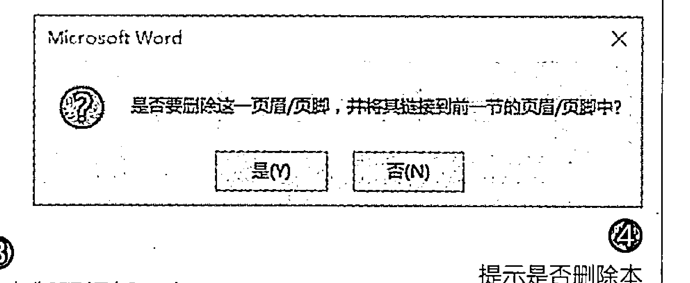将页码移到指定的位置

在域公式和计算结果之间切换

设置页码标志文字

输入域公式

##### 给每个分栏加页码

对于超长文档，很多时候我们会选择分栏版面。这种情况下，如果能在每一分栏的下面添加上页码（也就是每页有两个页码），将会增加易读性。这看起来挺难的，其实也容易设置。

移到左下角。双击横版页面中的页码进入“页眉页脚设计”界面，选中横版中的页码，然后在“设计”选项卡中，点击取消“链接到前一条页眉”项，将会弹出提示框，询问是否删除本页的页眉页脚，点击“是”确认（图4）。

首先双击文档页脚处进入页脚编辑界面，然后在对应分栏的位置，分别输入两个页码标志文字，如“第页”（图6）。

将上述的域代码复制到第二个分栏下面的“第页”两字之间，并略做修改，即删除“-1”，此处的域代码便成了“{={ page }*2 }”。当然你也可以按上面的方法重新输入。输入完毕，按Alt+F9键即可切换到结果状态，显示出分栏页码数了。

这时就可以自由拖动它到新的位置了，这里我们按之前的设计将它拖放到页脚的左侧（图5）。如此一来，虽然横版与竖版混杂，但是可以确保装订的文档，所有页码都在外侧的同一位置了。

将光标置于“第页”两个字之间，然后按Ctrl+F9键输入一个域标志，即一对花括号。注意，必须按快捷键输入，手动输入的花括号是无效的。在花括号中输入一个等号，然后再按一次Ctrl+F9键输入一对花括号，在此括号中输入代码“page”，再在括号外输入“*2-1”（不含外侧引号）（图7）。

如果还不显示，可以按Ctrl+A键全选，再按F9键刷新。其实还有一个方法，就是右键点击域代码，从右键菜单中选择“切换域代码”，即可显示出域的计算结果了。再次右键选择“切换域代码”，又会重新进入域的编辑状态中（图8）。

上面介绍的几个方法简单易行，可以让我们的页码适应于不同的应用环境，还不错吧？

#### 用好WPS文字的云端功能

文|阿楠

之前，我们往往习惯于在本地进行办公文档的操作，而前些时的文档锁定勒索病毒，让我们不得不对文档的安全进行重新审视。其实，如果善于利用WPS文字的云端功能，将使用WPS的目光从本地转移到云端，即便是病毒感染，文档安全也不成问题。

##### 文档漫游+网盘同步 文档上个双保险

WPS文字除了在本地保存文档外，“云文档”或“漫游文档”可以让我们将编辑好的文档随手或自动保存在WPS云空间中。下载安装最新版的WPS免费尝鲜版，启动WPS文字时，软件会提示开启云文档自动漫游（图1）。按照提示操作，用WPS网络账号或QQ、小米、新浪微博等合作账号登录，WPS编辑器便开启了云文档自动漫游功能。编辑过程中，也可随时按下F12功能键并选择“我的云文档”，将文档保存在云端（图2）。

##### 利用“写得”实现跨平台文档编辑

如果觉得用PC端的WPS还显庞大，可点击WPS文字“云服务”菜单，选择工具条末端的“云编辑器”工具，启动跨平台轻编辑器“写得”（图4），创建Windows、Android、苹果等各种移动平台也能适用的文档，还可以实时分享编辑的文档。

- ▶ 小技巧：使用智能推荐获取合适的文档模板
利用云端智能模板推送功能可提高文档创建效率。WPS云端提供丰富的文档模板，点击WPS右侧窗格的三角按钮，展开任务窗格，选择“推荐”按钮，软件会从云端推送一些“猜你需要”的模板供选择。我们也可以从该页的稻壳儿搜索中用关键词搜索所需模板（图5）。

- ▶ 小技巧：为云文档上双保险
在WPS备份设置中，启用智能备份或自动定时备份，将“自动恢复文件位置”设置为某个网盘的本地同步文件夹，这样文档会在另一家网盘上备份，自动形成文档的双保险网络备份。

#### 用函数轻松去尾算平均值

文|马震安

在许多由多个评委参与的比赛中，为了消除极端分数的影响，常常会用“去掉一个最高分和一个最低分”后求总分或均分的评判规则；而对于极端分数多于一个的，需要按照去掉两个或两个以上的高分或低分的规则来进行评判。对于不同需求的评判方法，在Excel中可用SUM、MAX、MIN函数联合，或用TRIMMEAN函数来自动完成评分计算。

##### 1. 合用三个函数轻松去掉一个极端分

以某单位举办的一个摄影作品大赛为例，共有10位评委对作品进行打分，将打分的结果整理到Excel工作表后，按照以往的惯例去掉1个最高分、1个最低分计算平均值。利用SUM、MAX、MIN这三个函数，在N2单元格输入“=(SUM(D2:M2)-MAX(D2:M2)-MIN(D2:M2))/8”，然后向下填充，能够很快计算出各作品的平均分数（图1）。

##### 2. 去掉多个极端分三个函数稍显吃力

仔细观察，不难发现有的作品分数出现多个极端数据，如果再用上述计算平均分的方法，对有的参赛员工来说就有失公允了。于是，组织者临时决定去掉2个最高分、2个最低分来计算平均分，这时如果再用SUM、MAX、MIN这三个函数进行计算，需要在N2单元格输入“=(SUM(D2:M2)-MAX(D2:M2)-MIN(D2:M2)-LARGE(D2:M2,2)-SMALL(D2:M2,2))/6”，这样也能计算出平均分，只不过有些麻烦（图2）。

##### 3. 处理多个极端分TRIMMEAN函数更轻松

其实，如果使用TRIMMEAN这一函数，无论去掉多少个最大、最小值，都能很轻松地计算出平均分。将上面的公式换成“=TRIMMEAN(D2:M2,1/10*4)”后向下填充，也能轻松计算出去掉2个最高分、2个最低分的平均值，是不是更简单呢（图3）？

**小提示**

TRIMMEAN函数的作用是返回数据集的内部平均值，它的语法是TRIMMEAN (Array, Percent)，Array为需要进行整理并求平均值的数组或数据区域，Percent为计算时所要除去的数据点的比例，比如Percent为0.2，那它就表示10个数据点集合中要除去2个数据点（10*0.2），即最大、最小各1个，共2个。上述问题中涉及到了4个极端数据，也就是去掉2个最大值、2个最小值，那Percent究竟如何计算呢？其实Percent的计算有个通用公式，即Percent=1/数据总数*去除的总数，所以上述公式也就不难解释。

#### Excel也能制作动态仪表盘

文|马震安

一提起动态仪表盘图表的制作，很多人会想到利用“水晶报表”等软件制作。其实不借助于第三方软件，只用Excel 2016也能很快地制作出专业的动态仪表盘图表（图1）。

##### 1. 设计表盘

为了设计表盘，首先需要构建一个数据表。其中A列为刻度标签，是想要显示在表盘刻度线边的数字；B、C、D列数据用来模仿外观和定位标签的辅助数据，分别负责内圈标签、预警色带、外圈刻度线的位置（图2）。

接下来，使用B、C、D列的数据生成一个环形图。选中这三列的数据区域，选择“插入”选项卡，点击“饼图”中的“圆环图”，再选中插入圆环图中的一个圆环，右击，选择“设置数据系列格式”，将圆环的“第一扇区起始角度”设置为“225°”，将圆环图内径大小设置为“65%”；删除下方图例（图3）。

##### 2. 美化表盘

外圈环形图用来模拟表盘的外框，可使用白色框线、淡色填充（当然，这都可以自定义）；中圈环形图用来模仿表盘的预警色带，270度那个大数据点使用红-绿渐变填充（设置时，选择“渐变填充”，类型选择“线性”，角度设置为180度），其他数据点的环形图块无框线、无填充色；内圈环形图用来辅助显示刻度标签，可保存并关闭Excel后下载安装xy chartlabeler工具，再打开Excel文件，选择“开发工具”选项卡，点击“Excel加载项”，在弹出的窗口中点击“浏览”，选择xy chartlabeler工具安装文件夹中的xla文件，这时选项卡中就会多出“加载项”选项卡，选择内圈环形图，点击“加载项”选项卡中XY Chart labels下的Add Chart labels，在弹出的窗口中，点击Select a Label Range处的“-”，选择A列中的数据（注意，向下要多选定两个单元格），这时，内圈的环形图就添加了数字标签；再点击XY Chart labels下的Move Chart labels，在弹出的窗口中勾选Move Only this Date Label，然后再通过点击“▼”分别选中相应的数据点，通过不断点击窗口中的上下左右箭头来调整每个

**小提示**
一般仪表盘的指针范围从左下到右下，幅度是270度，10等分的话，就是10个27的数据，外加一个90度的数据，合计360度。为了让刻度标签正好显示在刻度线上，将0和27交叉组织，到时好利用0数据点的标签来显示刻度标签。而色带的数据，270度范围可以用一个数据覆盖，便于一次填充渐变颜色。当然，也可以使用10个27和90，或实际需要的数值区间，这样可以分段设置预警色带。

##### 3. 制作仪表盘指针

首先在G列相应单元格输入2个数据，G1单元格输入“指针”（也可不输入，只是为了做个提示），G2输入“65”，G3输入“20”，G4输入“=270-SUM(G2:G3)”，这样，制作饼图所需要的数据就构建完成了。右击环形图，选择“选择数据”，在弹出的窗口中点击“添加”，系列名称选择G1，系列值选择G2:G4区域，确定后就会在环形图外层又添加一个环形图(图5)。

接下来，在最外层环形图上右击，选择“更改图表类型”，在弹出的窗口中，左侧就会自动选择“组合”，将右侧指针所对应的“圆环图”更改为“饼图”，确定后所生成的饼图就会将环形图覆盖；右击饼图，选择“设置数据系列格式”，将饼图的“第一扇区起始角度”设置为“225°”，“饼图分离程度”设置为“20%”。分别选中G2、G4单元格所对应的饼图，将它们的填充色设置为无，线条也设置为无；选中G3单元格所对应的饼图，将它的填充色设置为红色，线条颜色也设置为红色，在系列选项中将“点爆炸型”设置为0，指针的雏形就基本完成了，只不过不太像，这时可将G3单元格的值更改成1，再看时表盘指针基本上就像样了(图6)。

##### 4. 添加交互按钮

在F7单元格输入“指标完成”，在G7输入30，在G2单元格输入“=G7*2”；选择“开发工具”选项卡，点击“插入”下的“数值调节钮”，右击它，选择“设置控件格式”，在弹出的窗口中，设置当前值为30，最小值为0，最大值为100，步长为1，单元格链接选择G7。这时，当点击上、下按钮时，表盘指针就会随着数据的增加、减少而进行相应的调整。接下来，利用形状，在图表上绘制一个矩形，设置好它的样式，选中它，在公式栏输入“=G7”，这样，矩形的文本就会跟随G7单元格值的变化而变化。最后，设置好图表标题，利用形状，绘制一个圆圈，设置好它的样式，放在中心点，模仿指针的固定钮(图7)。至此，动态仪表盘图表制作完成。

#### 巧用切片器制作动态图表

文|马震安

传统动态图表的制作方法多半都是用控件或者数据有效性再加自定义名称或辅助列来实现，若是巧用Excel 2016的切片功能，就可以直接制作动态图表，而且效果也相当赞。

实例：汇报会上要将每月各部门费用支出情况用饼图进行展示。利用Excel中的切片功能，只用一个具有交互效果的图表，就可以完成数据的动态展示（图1）。

##### 1. 生成数据汇总表

在利用Excel的切片器功能之前，首先需要进行数据汇总。选择“插入”选项卡，点击“数据透视表”，在弹出窗口的“选择一个表或区域”处选择工作表中的数据区域，在“选择放置数据透视表的位置”处选择“现有工作表”，并选择一个合适的单元格，也可以将数据透视表放在一个新表中。接下来，在右侧的“数据透视表字段”，将“月份”、“所属部门”拖放到“列”下面，将“项目”拖放到“行”下面，将“金额”拖放到“值”下面。这样数据就按项目、部门进行了按月汇总（图2）。

##### 2. 插入切片器

选中数据透视表中的任一单元格（否则数据透视表工具中的“分析”、“设计”选项卡不会显示出来），选择数据透视表工具中的“分析”，点击“插入切片器”，在弹出的窗口中勾选“月份”、“所属部门”，这样就会在工作表中出现两个交互式列表；点击“切换器工具”下“选项”卡中的“切片器设置”可以对每个切片器进行设置，还可以选中切片器，通过操作控制点来更改它们的大小，或者在窗口中的“按钮”、“大小”处来设置切片器的大小、样式等。接下来，分别在“月份”、“所属部门”切片器中选择一个月份和一个部门。这样数据透视表处的数据就会根据所选发生相应改变（图3）。

##### 3. 插入三维饼图

有了汇总数据就可以制作图表了。选中数据透视表中的某个月各个项目的汇总数据，插入一个三维饼图，所插入的图表中也有相应的交互式按钮，通过对这些按钮的操作可以实现图表的交互效果。当然，可以将图表中的这些交互式的按钮隐藏，只通过切片器来进行图表的交互式操作。在图表中任意一个交互式按钮上右击，选择“隐藏图表上的所有字段按钮”，这样图表中的交互式按钮就都不显示了。这时，可以通过选择切片器上的不同项目来实现图表的交互功能（图4）。

#### 不同列Excel也能找不同

文|俞木发

当需要核对的数据是在一个工作表的不同行列中，比如在仓库的盘点统计中，库存数是根据公式自动计算出来，还有一个实盘数则是手工填写。现在需要对这两列数据进行核对，以便找出数值不同的数据（图1）时，该如何快速操作呢？

对于这种在同一工作表不同列数据的核对，最简单的方法是用条件格式进行核对。依次选中库存数和实盘数，点击“条件格式→突出显示单元格规则→重复值”，将重复值设置为默认浅红色显示，这样两列中数据不同的数值就可以很直观地标示出来了（图2）。条件格式可以很快将不同的数据筛选出来，但是如果每列的数据很多，要在众多的数据中查找还是有些不便，对于这类数据还可以使用“条件格式+IF函数”进行核对。首先在实盘数后插入一个辅助列F，选中F4，插入公式“=IF(OR(D4=E4),"正确","请重新核对")”，然后向下填充。公式的意思是，对D、E列的数值进行核对，如果相同则显示“正确”，否则显示“请重新核对”。继续选中F列，点击“条件格式→突出显示单元格规则→等于”，然后在弹出的窗口中，为等于以下值的单元格设置格式，输入“请重新核对”，设置为浅红填充深红色文本（图3）。这样在不同值的单元格后面就会显示红色的“请重新核对”，完成后再对F列按照单元格的颜色进行排序，所有不同的数据会自动排列并且突出显示（图4）。

```
=IF(OR(D4=E4),"正确","请重新核对")
```

#### 大势所趋 把好PPT箭头“方向盘”

文|小丽

通过PPT做演示，尤其是在商业报告中，经常涉及某种事物或现象的发展趋势，而表现趋势的最好方法就是使用具有方向性的箭头。下面是笔者总结归纳的PPT制作箭头的几大类方案，供大家参考，以便制作出自己的个性化箭头图来。

##### PPT自带箭头的变形

以PowerPoint 2013为例，它自身就带有多种箭头形状。不过如果直接使用这些箭头，绘制出来的图形往往非常难看，我们需要适当地进行调整，对箭头进行美化。

我们首先看一张效果图（图1），在这张幻灯片中，起到划分版块作用的两个箭头就是通过PPT自带的图形绘制的。切换到“插入”选项卡，点击工具栏中的“形状”，在打开的列表中可以看到多种箭头，选择“箭头总汇”中的圆角右箭头，然后在空白的幻灯片中画出一个箭头形状（图2）。

与最终效果相比，现在这个箭头有三个问题，一是圆角不够圆，其次尾巴太短，另外就是箭头的方向不对。当点选这个箭头图形时，选取框上会显示四个黄色的小方块，对应箭头的两个小黄块是调整箭头大小的，对应圆角处的小黄块就是调整圆角大小的，用鼠标按住小黄块拖动即可（图3）。箭头的尾巴有两种方法解决，一种是右击箭头，然后从右键菜单中选择“编辑顶点”，这时图形上会出现几个黑色小方块，任意拖动小黑块就可以改变图形拉长箭头的尾巴（图4）。另外一种方法就是新建一个长条形，填充颜色选择一样的，然后接到箭头图形上，再把这两个图形组合成一个图形就可以了。至于调整箭头的方向，在选中箭头后，切换到“格式”选项卡，通过其中的“旋转”命令，转到自己想要的角度就可以了。

PowerPoint中还提供单线性箭头，许多人使用默认设置，只能画出单一的细线箭头（图5上），而实际上通过调整，还可以实现非常个性化的箭头（图5下）。具体方法是，选中所画的箭头，右击它，从右键菜单中选择“设置形状格式”，再在右侧打开的窗格中，分别设置线的宽度和风格、箭头的形状、箭头的大小等，即可画出一条个性化的单线箭头来（图6）。

单击此处添加标题

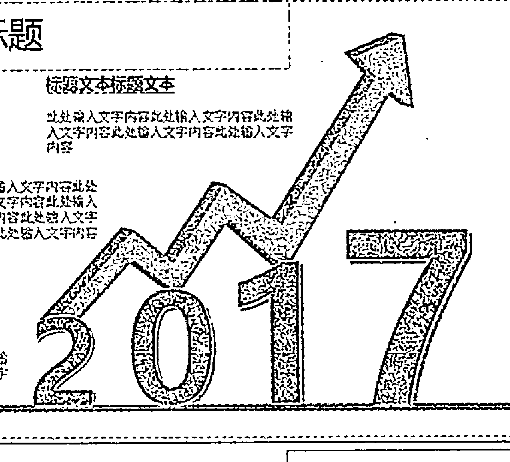

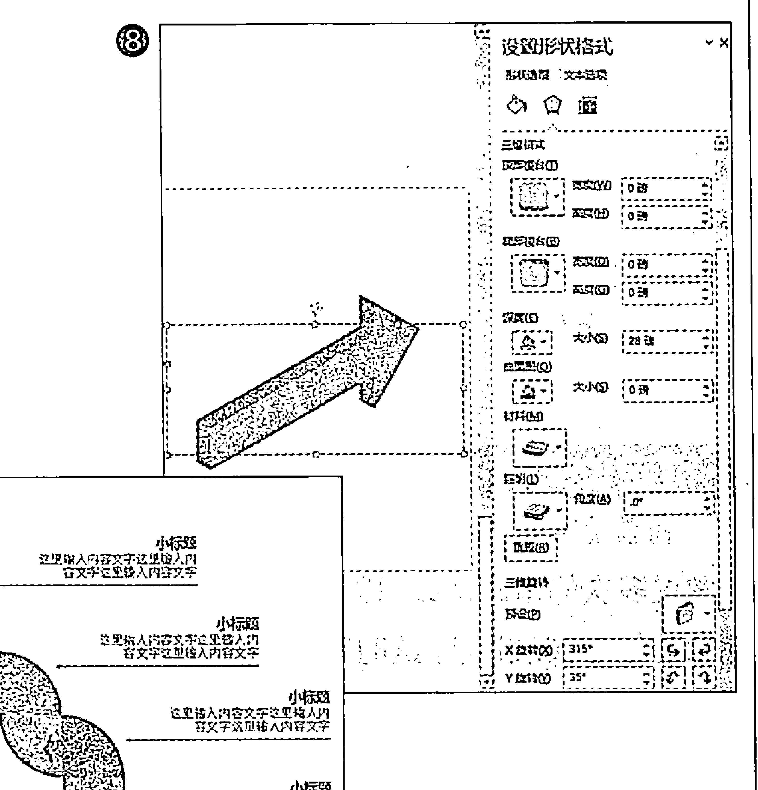

小提示

要想使箭头有足够多的曲折，就需要增加更多的顶点。方法是，在图形的线框上右击鼠标，然后选择“增加顶点”即可。另外需要注意的是，因为应用了三维变形，所以图形和线框的位置显示的时候会不一致，但不影响调整（图9）。


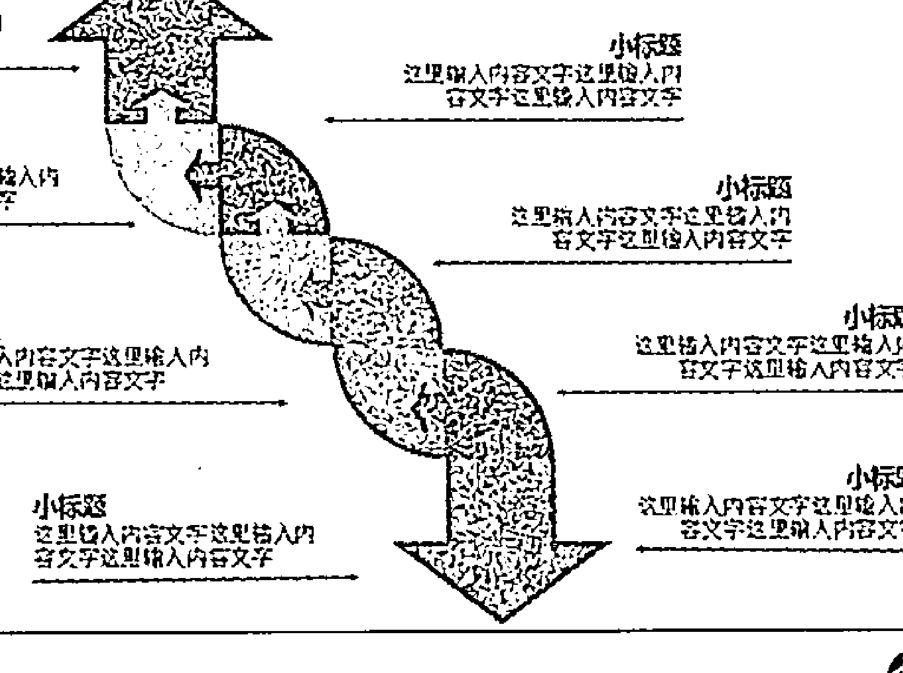

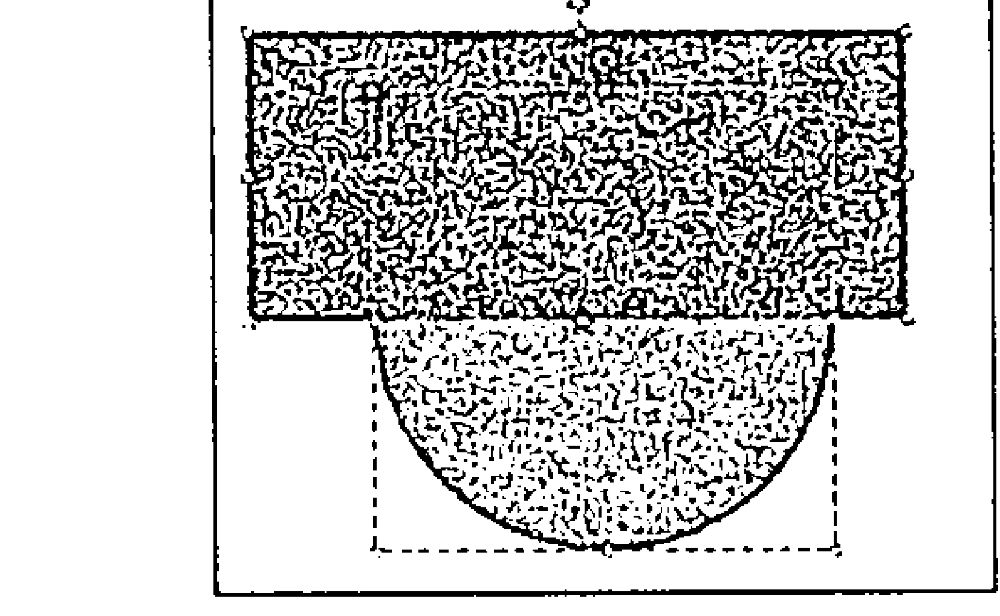

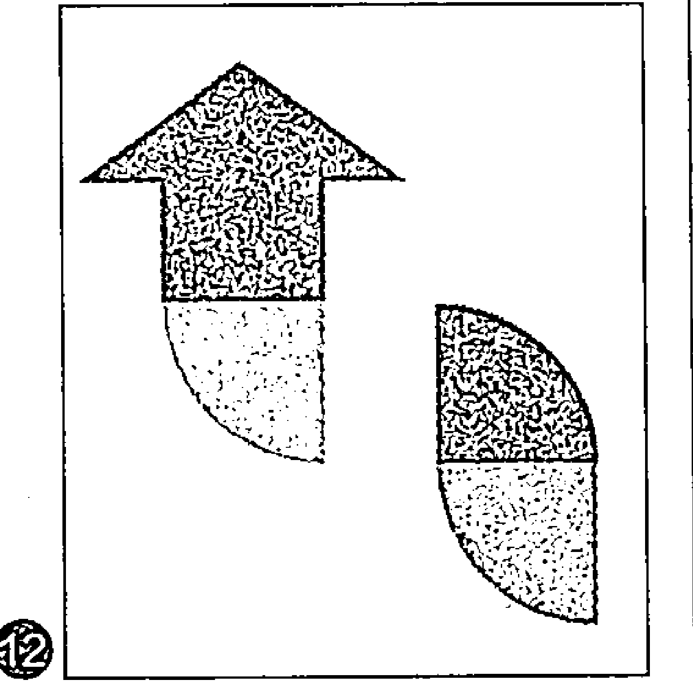

##### PPT箭头三维立体化

箭头制作的第二个思路就是将平面图形三维立体化。同样的，我们先来看看本例的效果图，再详细制作其中的红色曲折的三维箭头（图7）。

切换到“插入”选项卡，点击“形状”，选择箭头总汇中的第一个图标，在空白幻灯片中绘制一个右箭头形状，将它的填充色修改为红色。右击这个红色箭头，选择“设置形状格式”，再在右侧打开的窗格中，切换到“效果”中（点击上方五角星图标），展开其中的“三维旋转”，再点击预设右侧的图标，在打开的列表中选择一款预设的旋转样式。

接着再展开“三维格式”，点击“深度”下面的颜色按钮，选择深红色，再在后面的“大小”中设置立体的厚度，比如这里笔者设置的是28磅，一个三维立体箭头就出现了（图8）。再接下来，就是扭曲这个箭头，使它与所配合的文字相适配。右击立体箭头，从右键菜单中选择“编辑顶点”，即会出现一些小黑方块，拖动它们即可任意扭曲图形了。

##### 组合生成个性化箭头

上面的方法，是对PPT中的原有图形进行变形操作，以得到自己想要的箭头形状。除此之外，还有一种常用的方法，就是将多个图形进行排列组合，从而实现更加个性化的箭头图形。同样的，先看看最终的效果（图10）。

看起来很复杂的箭头图案，实际上就是一个四分之一圆和一个箭头的组合而已，这里的关键是四分之一圆的制作。首先从形状中选择椭圆，然后按住Shift键不放，这样可以在幻灯片空白处绘制出一个正圆形。接着再绘制一个矩形，遮住半个圆（图11）。全选圆形和矩形后，切换到“格式”选项卡，点击工具栏左侧的“合并形状”，从弹出的菜单中选择“相交”，我们将发现圆形被切成半圆形了。用同样的方法，再绘制一个矩形遮住半圆形，相交后就可以得到四分之一圆了，然后绘制一个箭头，将它们组合成一个图形即可（图12）。以此类推，就可以得到前面所示的效果图啦。

除了上述三大类方法，我们还可以完全抛开PowerPoint自带的箭头基本形，手工绘制其他更加个性化的箭头。只有你想不到，没有你做不到，有兴趣的朋友试试吧。

#### Office “审阅” 你真的会用吗

文/小凌

Office中的Word和PowerPoint都有“审阅”功能，方便我们对文档进行各种修改批注，但是很多人只知道审阅的基本用法，一些独特实用的审阅功能却被忽略了。如某一文档被反复修改多次，以至于到最后搞不清到底改了哪些细节，这时该怎么办？跨语言跨区域的人审批文档，如何打通不同语言关？这些我们都可以通过审阅功能来解决（适用于Office 2013及以上版本）。

##### 一键定位文档的修改

有些重要的文档，比如签订的合同，可能会被多人做过多的审阅批改，以至于到最后自己都弄不清到底哪些地方被改过了，这时审阅的对比功能就派上用场了。

首先将审阅前后的文档分别保存，比如一个存为“审阅前”，一个存为“审阅后”。然后在Word中，切换到“审阅”选项卡，点击工具栏上的“比较”，从下拉菜单中选择“比较”打开对话框。点击“原文档”右侧下拉按钮，可以直接选择最近编辑的文档，也可以点击其后的文件夹图标，浏览选择其他文档。用同样的方法选择修订后的文档。点击左下方的“更多”按钮（点击后将变成“更少”）展开对话框，还可以设置各种不同的比较选项。注意，这一功能不只能比较文字的修改，对于格式设置、页眉页脚等的变化，同样也能检测出来（图1）。

设置完毕，点击“确定”返回，这时将同时出现三个文档，右侧分别为原文档及修订的文档，中间则是比较文档，它通过红色粗线显示修改的大致位置。左侧则显示具体的修改内容，双击某一项，则可以精确定位到文档中修改的位置点。这样一来，对他人所做的任何修改，你都可以做到一目了然（图2）。

##### 给审阅批注的文字加大号

默认设置下，Word批注的字体要比正文小一号，对于视力不好的人来说，看起来比较费力。通过几步设置，我们可以统一调整批注字体的大小。

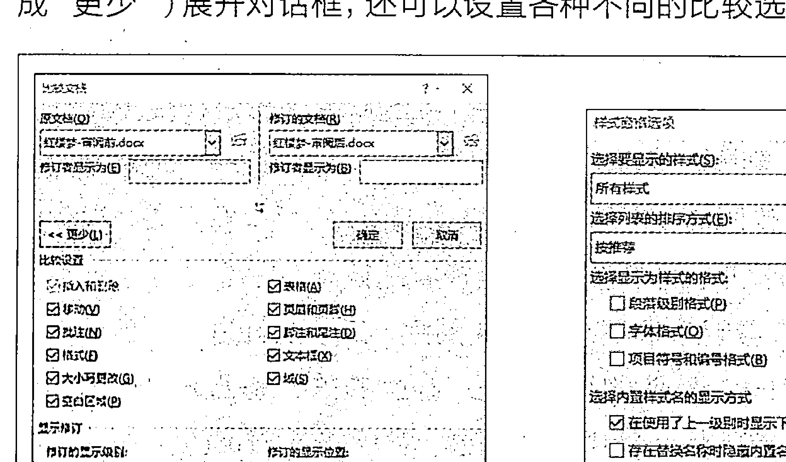

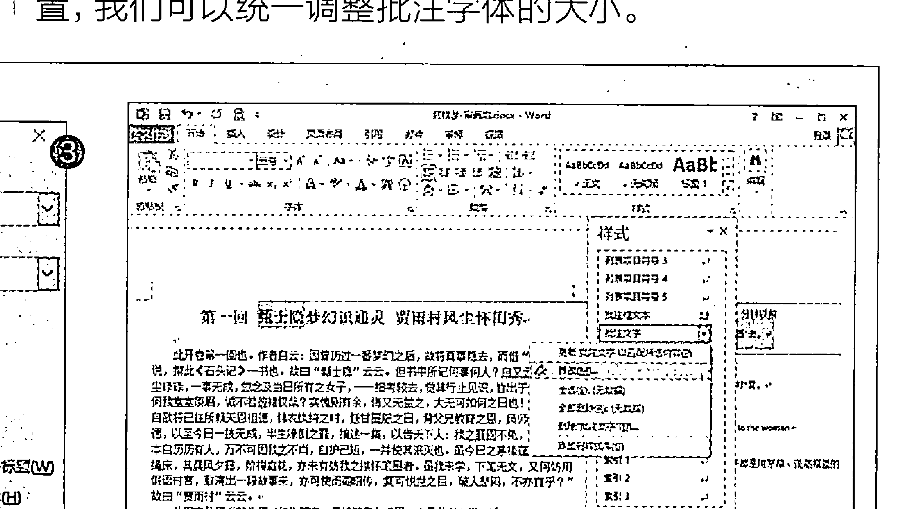

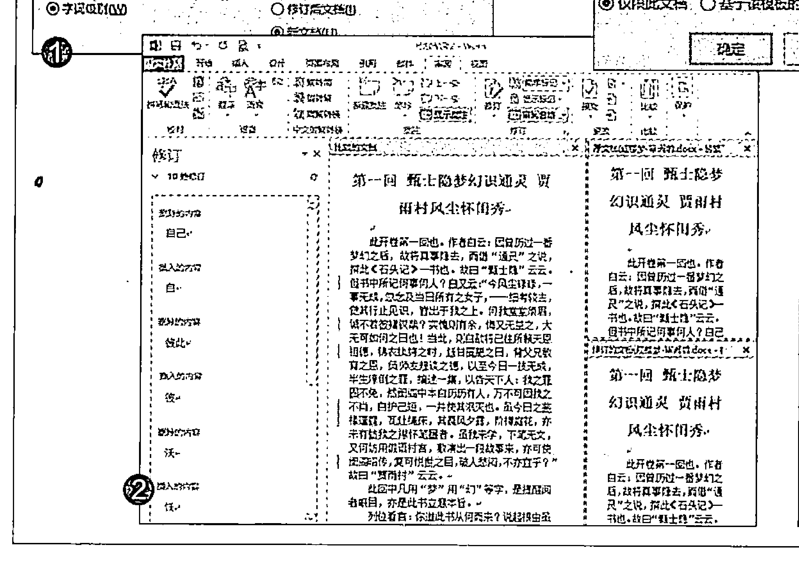

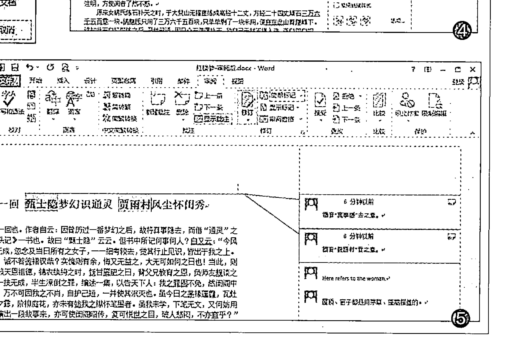

###### 审阅批注文字

首先切换到“开始”选项卡，点击工具栏“样式”右下角的小箭头展开样式列表，在列表中选中“批注文字”项。如果列表中没有此项，可先点击列表下方的“选项”，在打开的对话框中，选择显示“所有样式”（图3）。确定后返回样式列表，就可以找到“批注文字”项了，点击其右侧的下拉箭头，从弹出的菜单中选择“修改”，再在打开的对话框中为批注样式设置大一号的字体就可以啦（图4）。

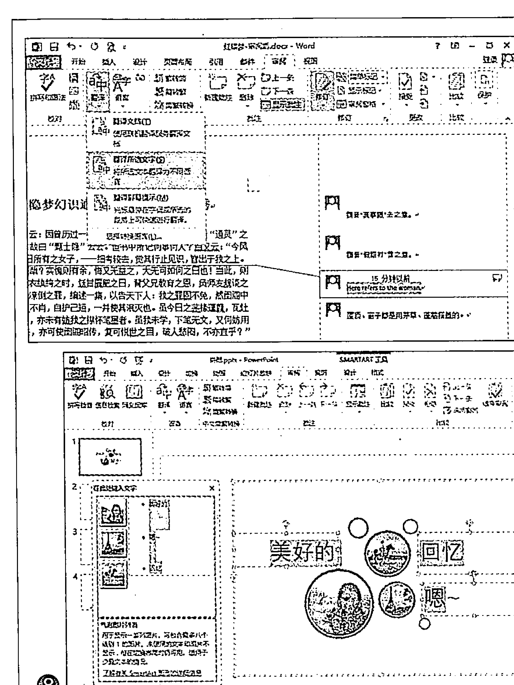

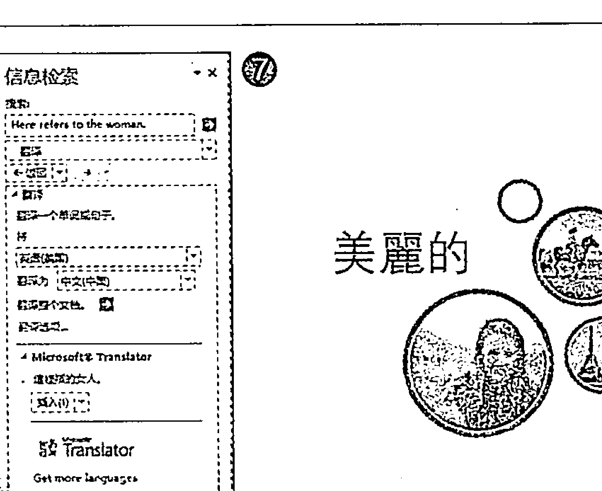

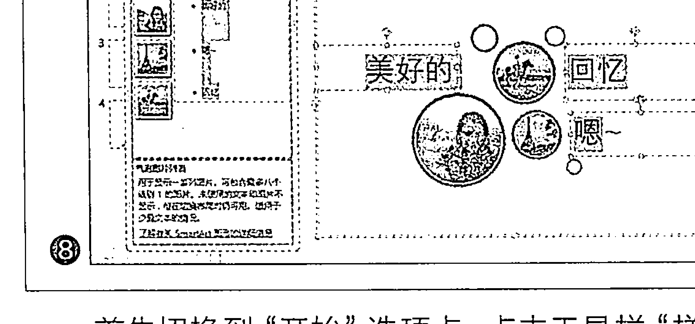

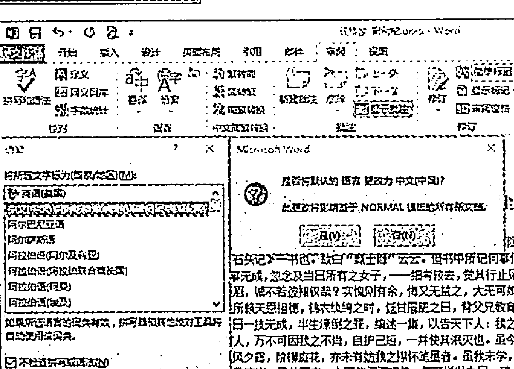

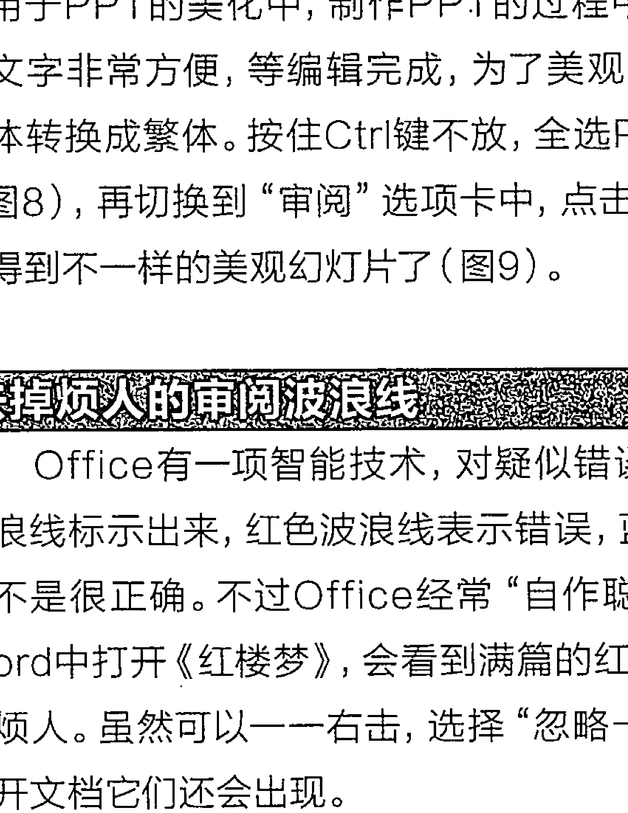

##### 审阅打通语言关

如果审阅批注文档的人来自不同的地方，他们可能会使用不同的语言，如简体汉字、繁体汉字、英文等，这时有可能会造成阅读障碍（图5）。好在Word审阅提供了翻译转换工具，可以助我们打通语言关。

如果批注是外语，选中之后，点击工具栏上的“翻译”按钮，选择“翻译所选文字”（图6），即可在右侧打开信息窗格，给出翻译信息了。在这个窗格中，可以为几十种不同的语言进行互译（图7）。

简繁互转相对来说就更简单，切换到“审阅”选项卡后，选中要转换的批注文字，然后点击工具栏上的“繁转简”或“简转繁”，即可秒转换。这一技巧，有时可用于PPT的美化中，制作PPT的过程中使用简体编辑文字非常方便，等编辑完成，为了美观，有时可以将简体转换成繁体。按住Ctrl键不放，全选PPT中的文字（图8），再切换到“审阅”选项卡中，点击“简转繁”即可得到不一样的美观幻灯片了（图9）。

##### 去掉烦人的审阅波浪线

Office有一项智能技术，对疑似错误的文字会用波浪线标示出来，红色波浪线表示错误，蓝色波浪线表示不是很正确。不过Office经常“自作聪明”，比如在Word中打开《红楼梦》，会看到满篇的红蓝波浪线，非常烦人。虽然可以一一右击，选择“忽略一次”，但下次打开文档它们还会出现。

这里有一个一劳永逸的方法解决它。在Word中（如无特殊说明，所有方法在PowerPoint中也通用），点击切换到“审阅”选项卡中，再点击工具栏中的“语言”，从下拉菜单中选择“设置校对语言”，在打开的对话框中，勾选“不检查拼写或语法”，点击“设为默认值”，并在弹出的提示框中点击“是”确认即可（图10）。现在回到文档中，所有的波浪线都没有了，清爽多了吧。当需要恢复的时候，同上操作，进行反向选择即可。

#### 用好配色方案 Word大玩“美颜”

一提到配色方案人们首先想到的是PPT，其实DOC文档同样也是可以“美颜”的。虽然Word和PowerPoint共享Office通用的配色方案工具，不过DOC以文字为主，PPT以演示为主，两者还是有所不同的。下面就让我们来看看，如何在Word中进行配色，从而让阅读者赏心悦目。

##### 内置主题快速生成五彩文档

Office中将配色方案统称为“主题”。在Word(本以2013版为例)中已经内置了多套主题方案，但非常奇怪的是，虽然这一功能极其简单易用，却有很大一部分用户忽略了它的使用。

在Word中打开需要美化的文档，然后切换到“设计”选项卡，点击工具栏“文档格式”右下角的箭头按钮打开一个列表，其中已内置多种样式，光标划过，会自动预览样式效果，点击后将会自动应用到文档中（图1）。此时再点击工具栏上的“主题”，将会显示多个内置的主题方案，选择自己喜欢的点击确认即可。此时会发现，不同的主题不但字体等大不相同，色彩也会随之改变（图2）。只需要做出简单的选择，我们就可以快速获得一篇色彩丰富的美观文档。

##### 另类设置Word文档背景色

在美化Word文档时，许多人忽略了背景颜色的设置，其实设置背景色，不仅能增强美观，还能有效防止眼疲劳。点击工具栏的“页面颜色”按钮，从弹出的列表中即可快速为文档设置一种背景色。

如果不是选择单一色，而是点击下面的“填充效果”，则可以打开一个对话框，进一步为页面背景设置渐变、纹理、图案，甚至是图片背景（图4）。切换到“图片”标签，点击“选择图片”，从在线库或者本机选择一张图片，确定后即可以图片做背景了。本例中，笔者选择了一幅与文字色彩反差较大的花朵图片作为背景，与原始的朴素页面比较起来，已大异其趣（图5）。

不过上面的方法所设置的图片背景，有可能会过于强烈而冲淡正文，这时有两种方法进行解决。一个是在

> > 小提示 深入修改主题颜色
>
> 内置主题用起来方便，但色彩搭配不一定合你的心意，这时可以自行调整颜色。依旧在“设计”选项卡中，点击工具栏的“颜色”按钮，从弹出的菜单中点击下方的“自定义颜色”，打开新建主题颜色窗口，在这里就可以将文档中的不同元素，如标题、链接、正文等替换成任意自己喜欢的颜色了（图3）。

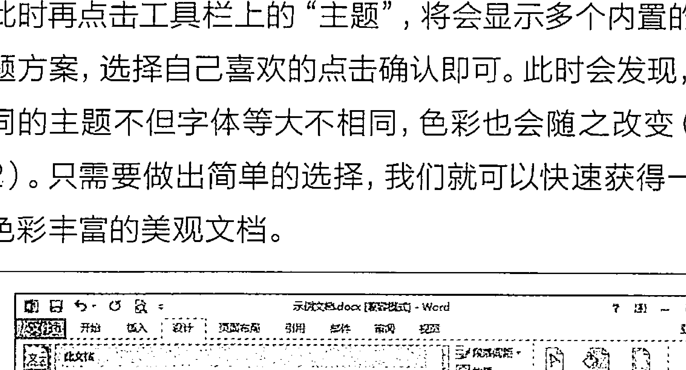

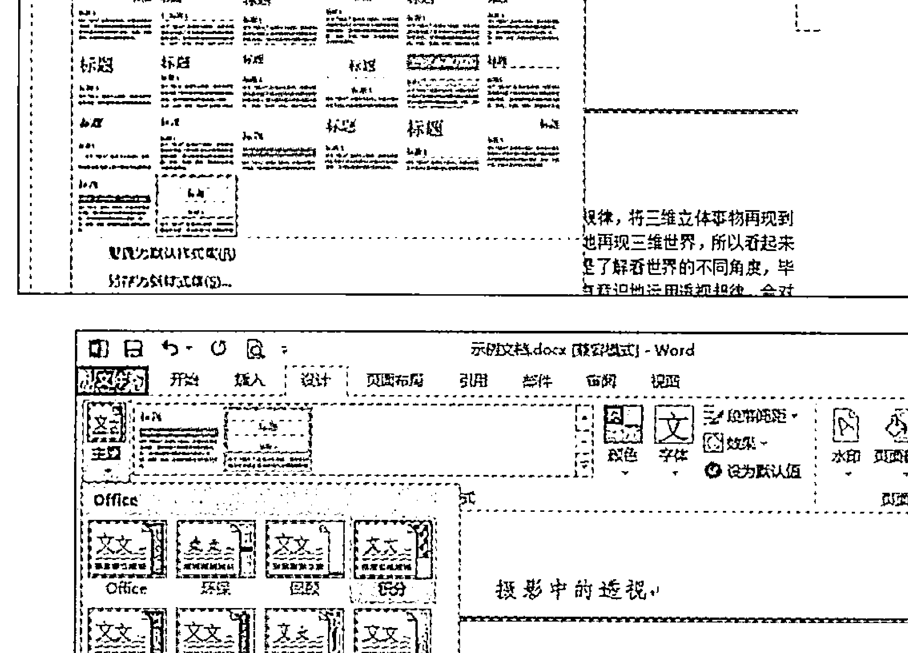

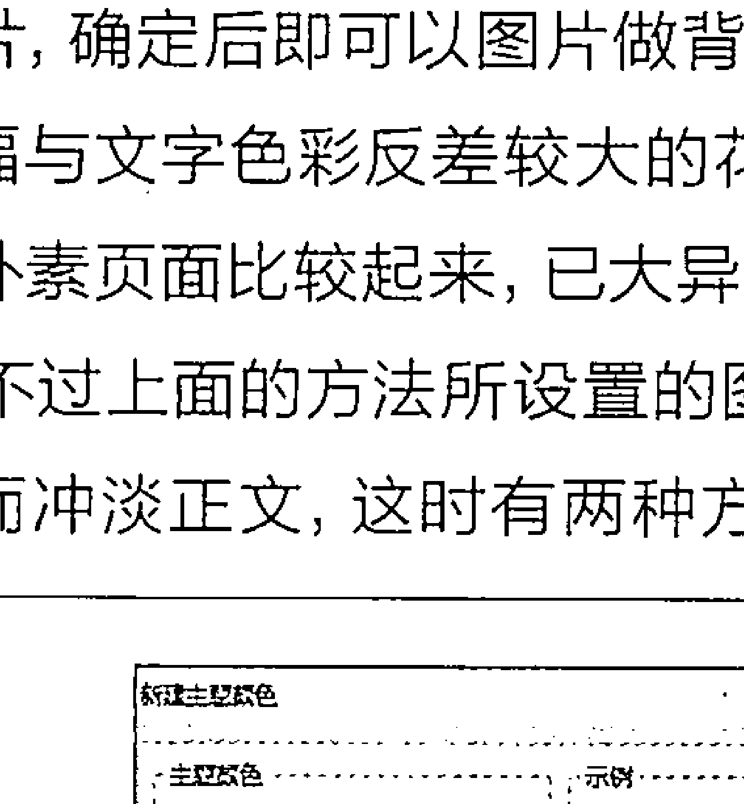

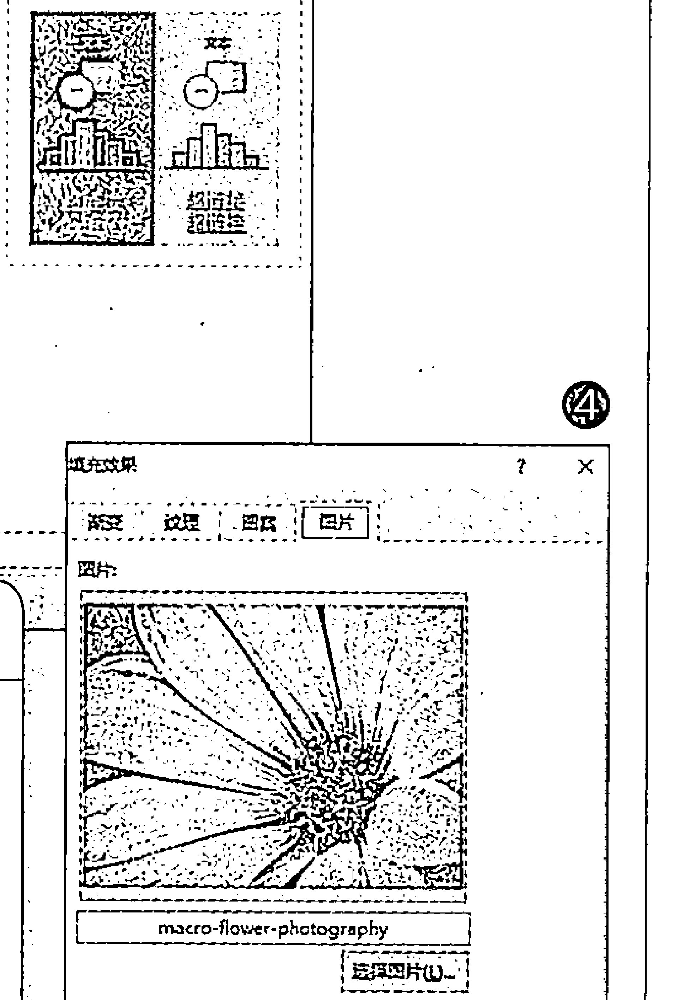

透视法是绘画中的术语，指根据建筑物或远近景物的视觉规律，在二维平面上再现三维空间深度的一种方法。相机自身就可以精确地再现三维世界，所以我们并无需用透视线来解决空间透视的问题。在平面的画面上再现三维世界，必须了解透视的原理。实际上，我们看世界的视角，本身就符合透视的规律。因此，在设计时，如果能够有意识地运用透视规律，会对我们表现画面的空间感有很大帮助。

透视法是绘画中的术语，指根据建筑物或远近景物的视觉规律，在二维平面上再现三维空间深度的一种方法。相机自身就可以精确地再现三维世界，所以我们并无需用透视线来解决空间透视的问题。在平面的画面上再现三维世界，必须了解透视的原理。实际上，我们看世界的视角，本身就符合透视的规律。因此，在设计时，如果能够有意识地运用透视规律，会对我们表现画面的空间感有很大帮助。

我们平常常看到的这种，即铁轨的两条平行的铁轨，在很远的地方会汇聚成一个点，这就是所谓的消失点。根据消失点的多少，可以将透视分成一点透视和三点透视。

一点透视也叫平行透视，指物体的立方体（比如方方正正的保险柜）其底边平行于视平线，其透视线只交于一个消失点的透视现象。除了平行的那一个面，其余各面都会聚到这个消失点。因为一点透视是向纵深方向汇聚，所以特别适用于表现较深的场合。三点透视也叫成角透视，立方体（保险柜）因为有边，其任何一面与画面不平行，就是成角之势。这时，这个立方体的边线，会分别向两边的消失点汇聚到两个消失点上。因为是向两边延伸，所以三点透视表现的物体的体积感最强。

##### 保存主题方案

如果对自己修改的主题方案很满意，可以将其保存以备以后重复使用。在“设计”选项卡中，点击“主题”，在打开的列表的下方，点击“保存当前主题”，即可将它存为一个后缀为thmx的主题文件。

##### Word窗口自身的配色

不只是文档可以美化，Word自身的窗口也有配色方案。点击“文件→选项”打开Word选项窗口，左侧选择“常规”，右侧找到“Office主题”，点击它右边的下拉按钮，便可以选择白色、浅灰色或深灰色方案，确定后Word的窗口色彩便会随之改变（图11）。在Word 2016中，则还有彩色可以选择。

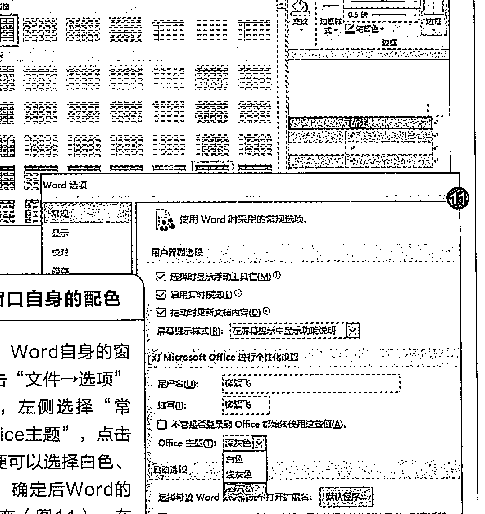

其他图片处理软件中（如Photoshop）先行将图片的透明度降低，另外就是以水印的方式插入背景图片。点击工具栏的“水印”按钮，在打开的列表中点击下方的“自定义水印”，再在打开的对话框中选择“图片水印”项，然后点击“选择图片”按钮，选择要作为背景的图片，并取消对“冲蚀”项的选择，确定即可（图6）。如果图片未能铺全背景，可以在“缩放”中适当调整放大比例，这样设置的背景，和上面的风格又略有不同了（图7）。

##### 借助PowerPoint为Word图表增色

Word文档中插入的表格需要独立配色，插入一个表格之后切换到“设计”选项卡，点击“表格样式”右下角的箭头按钮，即可在一大堆样式列表中进行选择了（图8）。

不过比起PowerPoint，Word表格设计中少了“效果”设置。如果在PowerPoint中预先制作好表格，直接复制粘贴到Word中，所有设置的效果会自行丢失。所以要想在Word中实现表格的立体、倒影等特效，就要使用稍另类一点的方法。

在Word中，切换到“插入”选项卡，再点击工具栏上的“对象”，在打开的对话框中选择插入“Microsoft Office PowerPoint幻灯片”对象。选中这个对象后，Word会自动嵌入PowerPoint菜单，在其中插入一个表格，然后切换到“设计”选项卡，点击工具栏的“效果”，选择自己想要的特效（图9）。

配置好色彩和特效之后，在表格之外任意空白处点击，即可自动返回Word界面，此时就可以看到具体特效的表格了（图10）。

#### 互帮互助 Word中表格用好Excel函数

文|平淡

日常工作中我们经常会在Word中插入Excel表格，不过在Word中大家一般只是将插入的表格作为一个简单的插入对象。实际上Word中插入的表格和在Excel中是一样的，我们同样可以直接利用Excel的各种函数让表格更强大。

##### 直接套用 在Word中调用Excel

在Word中使用表格的时候，许多人常规的做法是直接在Word中插入，或先在Excel中复制制作好的数据进行粘贴，但如此一来表格就无法使用函数了。因为插入的表格会变成Word的插入对象，正确的做法是：在Word中点击“插入→表格→Excel电子表格”，插入一个虚线的表格（图1）。

但是需要对这个表格数据进行统计时，只要在Word中双击表格，表格激活后会直接调用Excel，这样表格的具体使用和在Excel中是一样的，可以直接使用函数、VBA脚本等工具。对于已经在Excel中处理好的数据如添加公式、函数等则可以通过粘贴的方法将数据移动到插入的表格中，这样对于需要在Word中进行大量数据的处理时非常方便（图2）。

##### 数据同步 在Word中连接表格

在Word中插入表格时很多时候需要对表格的数据进行更改，常规的方法是在Excel中修改后再根据实际修改到Word中进行同步修改。其实数据同步不必这么麻烦，我们可以使用“选择性粘贴”方法实现数据同步更改。

首先在Excel中完成数据的编辑后保存，接着在Excel中复制需要粘贴到Word中的数据。在Word中通过

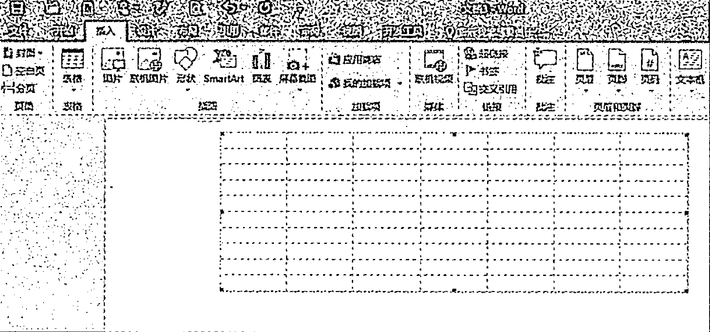

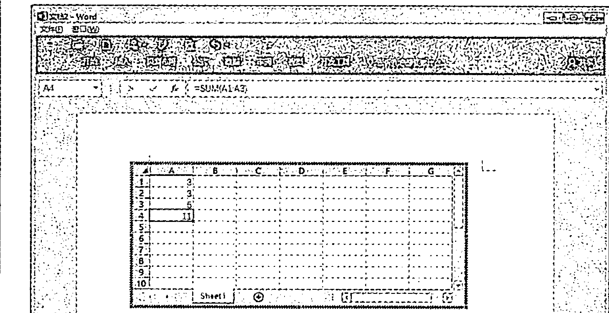

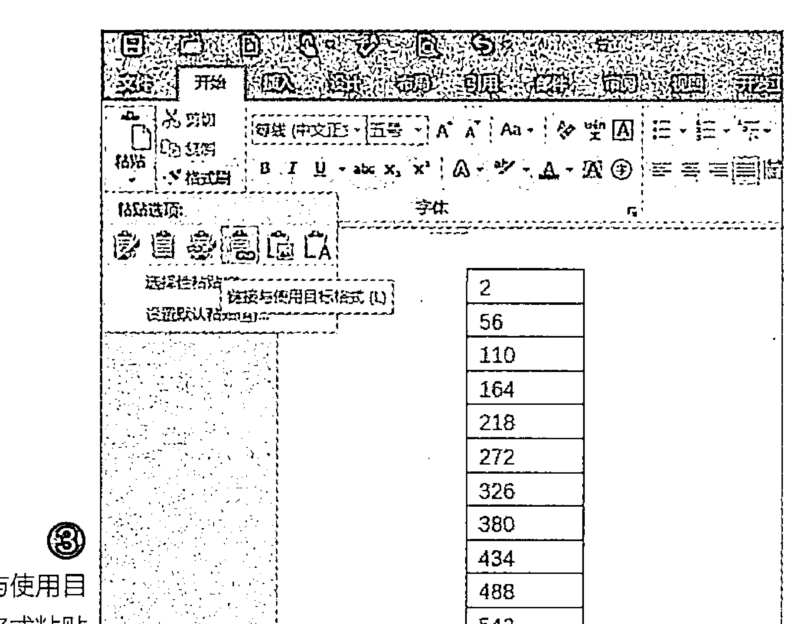

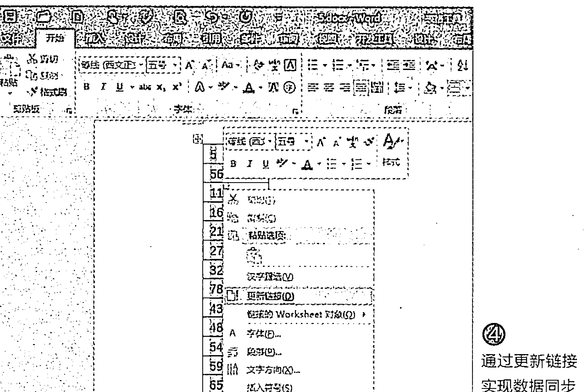

##### 更改链接

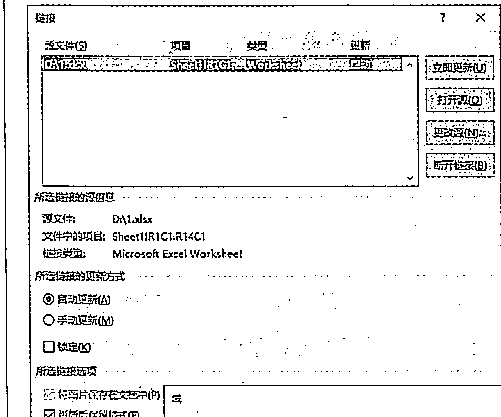

##### 选择域

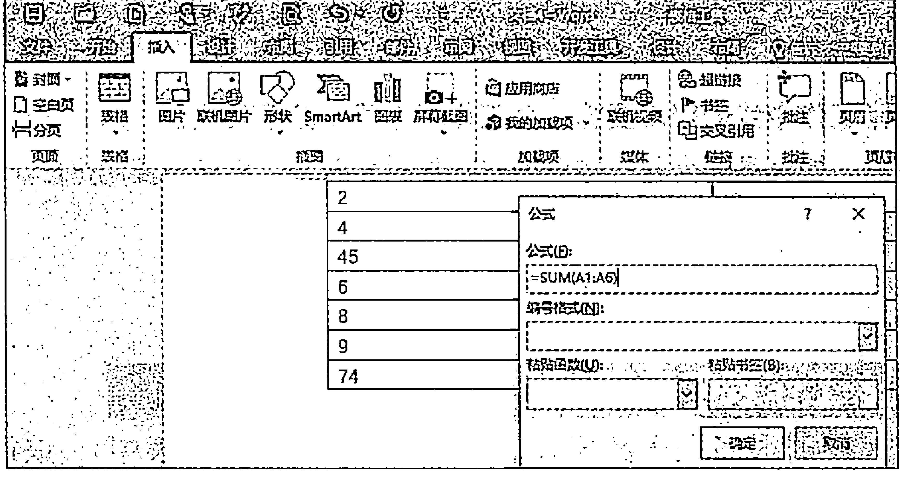

##### 使用域输入向量公式

> 除了在Word中借助Excel函数外，利用两个软件一些组件的不同，Excel也可以使用Word组件对数据进行快速处理。比如Word的查找替换功能比Excel强大，如在Excel中需要将单元格的所有英文字母替换掉，此时可以将数据粘贴到Word中，在Word的查找内容里面输入`[a-zA-Z]`，替换为空，即可快速将英文字符全部替换掉，最后再将处理后的内容复制到Excel中即可。

点击“开始→粘贴→链接与使用目标格式”的方式粘贴数据，这样粘贴的实际上是一个链接数据（图3）。

这样以后粘贴到Word中的表格数据需要更改时，我们只要打开Excel对需要编辑的数据进行更改。完成更改后在Word中选中表格，右击选择“更新链接”即可实现数据的同步更改。这样所有数据的处理是在Excel中完成，在Word中只要“更新链接”即可（图4）。

如果原始数据文件有多个备份，我们还可以自行定义链接的文件。同上在上述菜单选择“链接的Worksheet对象→链接”，在打开的窗口中可以看到这里链接对象的实际文件，点击“更改源”，然后重新选择源文件和链接项目即可（图5）。

启动Excel，既可以节省系统资源，还可以提高工作效率。这里以使用求和公式为例。

在插入的表格选中需要求和的单元格，点击“插入→文档部件→域”项，在弹出的“域”窗口中，选择“域”列表中的“=(Formule)”，然后点击“公式”按钮（图6）。

在打开的“公式”窗口中，输入公式“=SUM(A1:A6)”，并点击“确定”按钮，这样返回Word表格区域可以获得求和结果（图7）。

##### 就地取材，直接在Word中使用公式

上述方法利用的都是Excel的实际功能，在实际使用中都是要启动Excel运行表格的操作。如果我们只是在Word中使用一些简单的函数如求和、平均数等，那么利用Word本身的“文档部件→域”项即可，这样无需

可以看到在Word的域里公式的具体使用和Excel是一样的，但是这里是直接在Word中进行公式调用而无需再启动Excel，对于熟悉函数的朋友还可以在Excel中直接设置好，通过“粘贴函数”的方法实现公式的快速调用。当然域代码还有其他用处，比如直接输入数学、物理等公式，比如按Ctrl+F9快捷键，然后输入“eq \o(→,a)”，右击选择“切换域代码”，最后再调整一下间距即可输入数学向量公式（图8）。

#### 九九归一——Excel跨表数据轻松取
文|愚人

日常工作中我们经常要将多个工作表（簿）数据归集到一起，比如月销售数据合并为季度销售表。常规的方法是手工复制粘贴，如果需要合并的数据很多则费时又费力。其实只要用好Excel函数就可以快速实现多个工作表（簿）的归集。

##### n个工作表归集到1个工作表

平时很多报表数据我们都是建立在多个工作表中的，比如很多公司的津贴都是按月发放，每月建立一个工作表，现在需要对公司员工季度发放的津贴做个统计，也就是要将1月、2月、3月每个员工的津贴数据汇总到“1季度汇总”工作表C列对应的单元格（图1）。

对于这类需要将多个工作表数据归集到一个表中的数据，现在可以借助SUM函数直接引用合并。切换到“1季度汇总”工作表，在C2输入公式“=SUM("*"!C2)”回车，此时公式会自动变为=SUM('1月:3月 '!C2)，向下填充即可实现每个员工1月→3月津贴数据的汇总统计（图2）。

使用SUM函数可以很方便地对多个工作表的数据进行统计，但是这里需要注意的是汇总工作表的结构要和原始数据结构一致（比如上表中姓名顺序要一致），否则统计数据会出错。显然在进行一些特殊汇总时，SUM函数使用起来有一定的局限性。比如在一张仓库盘点表中，盘点的产品按照大类分为多个工作表，现在需要对其中某几个产品进行抽查，需要将指定抽查产品的盘点数据从多个工作表中提取并归集在抽查表中（图3）。

对于这类特定数据的汇总可以使用Vlookup嵌套INDIRECT函数实现归集。切换到“抽查汇总”表，按提示输入需要抽查的产品名称，在B2输入公式“=VLOOKUP(B2,INDIRECT($A2&"!A1:C5"),2,FALSE)”,

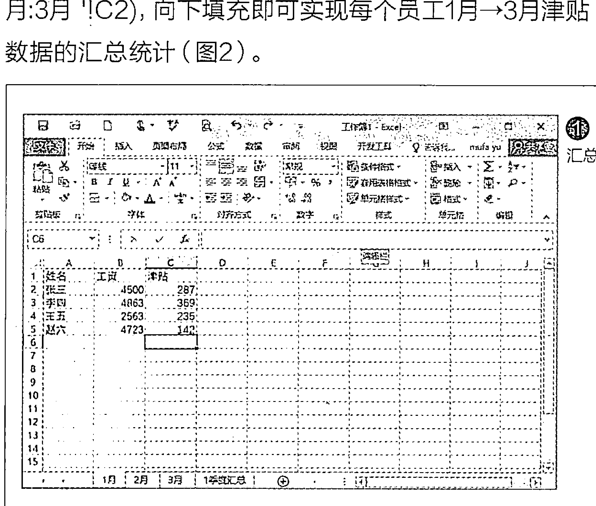
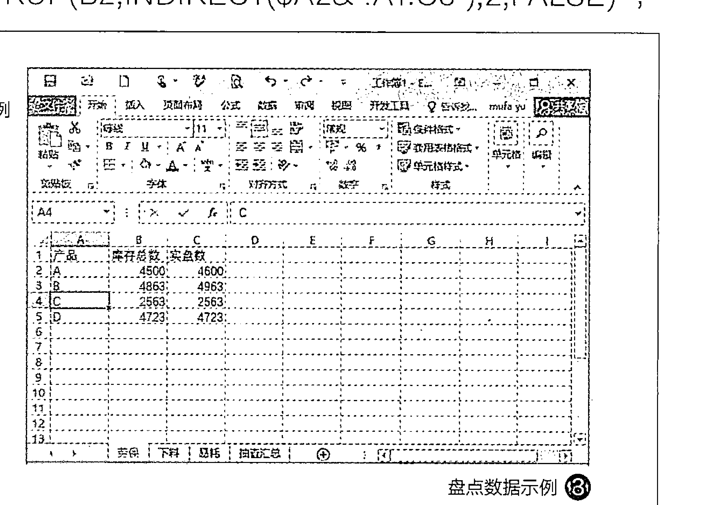
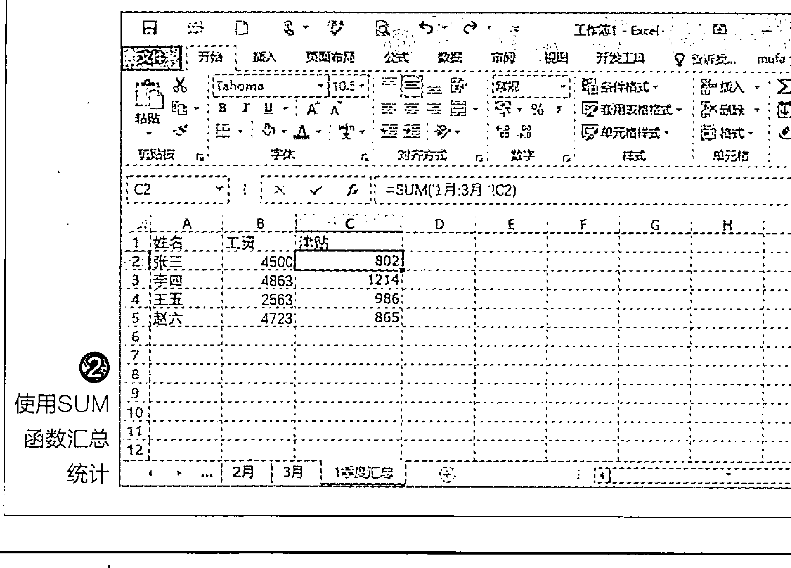
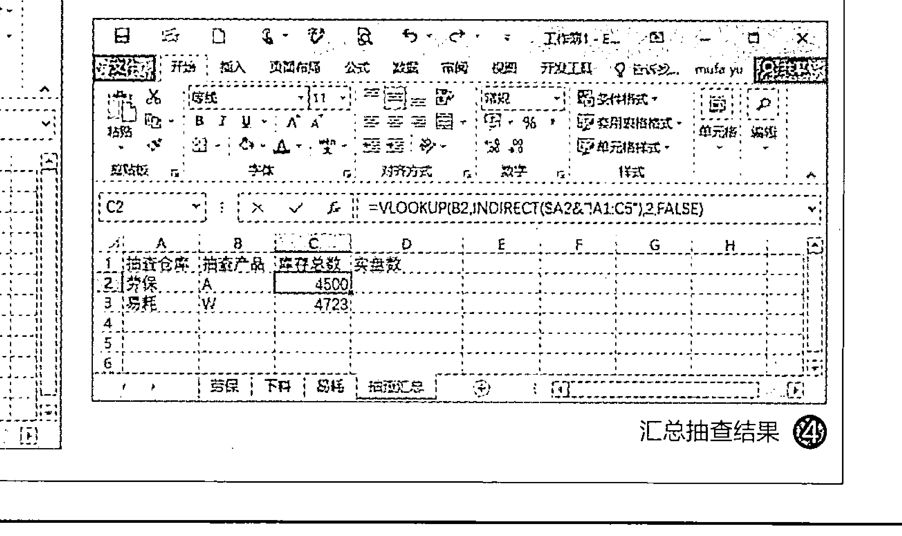
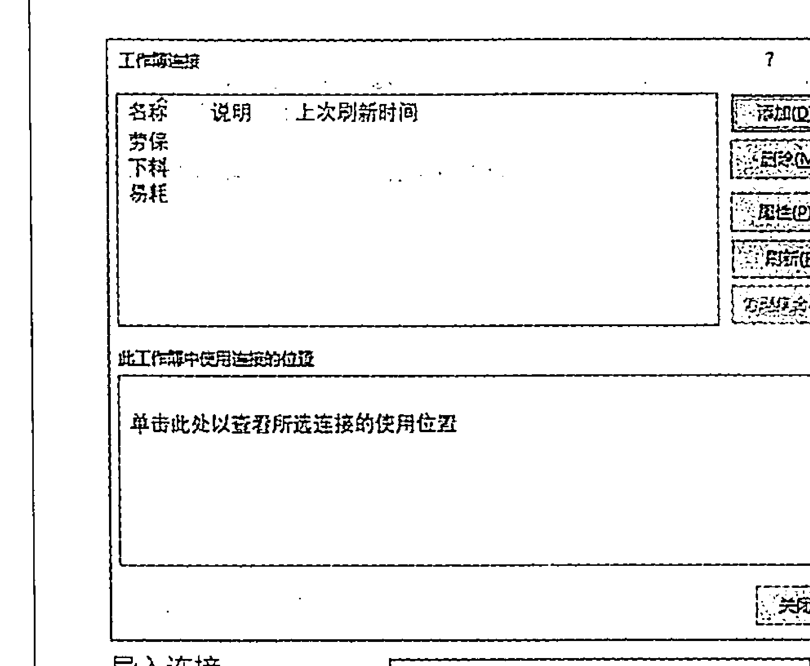
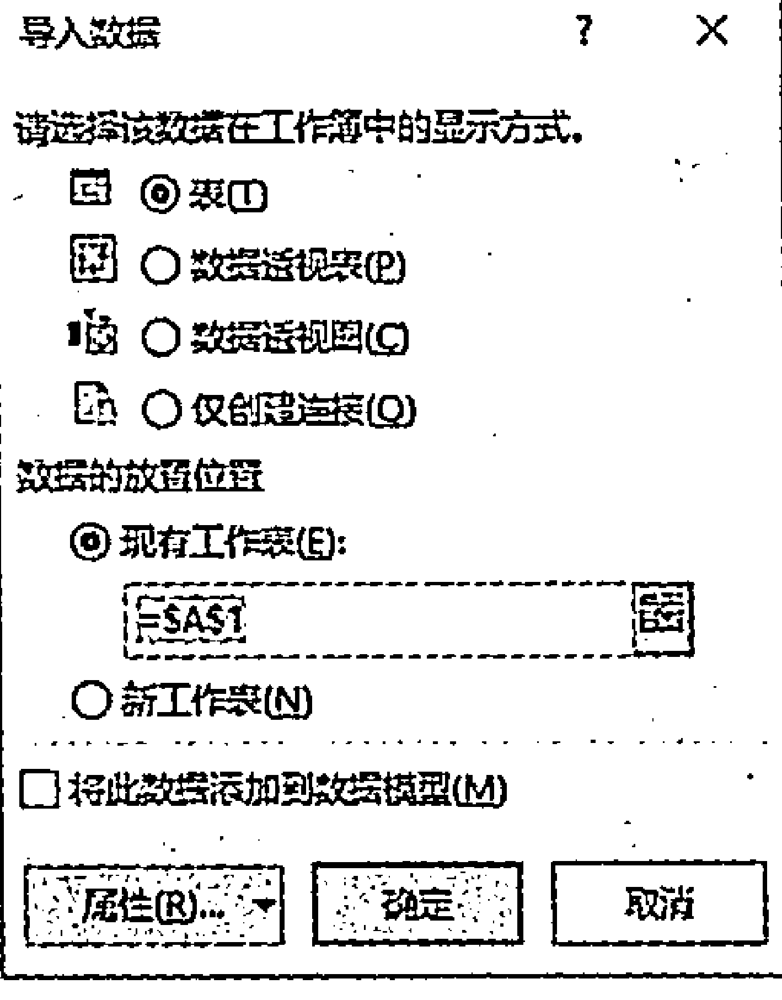
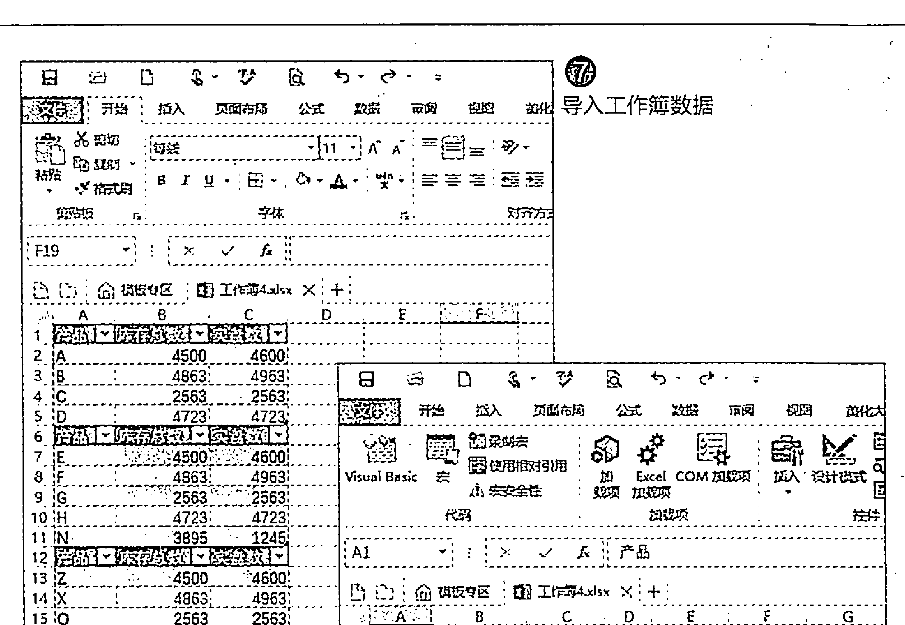
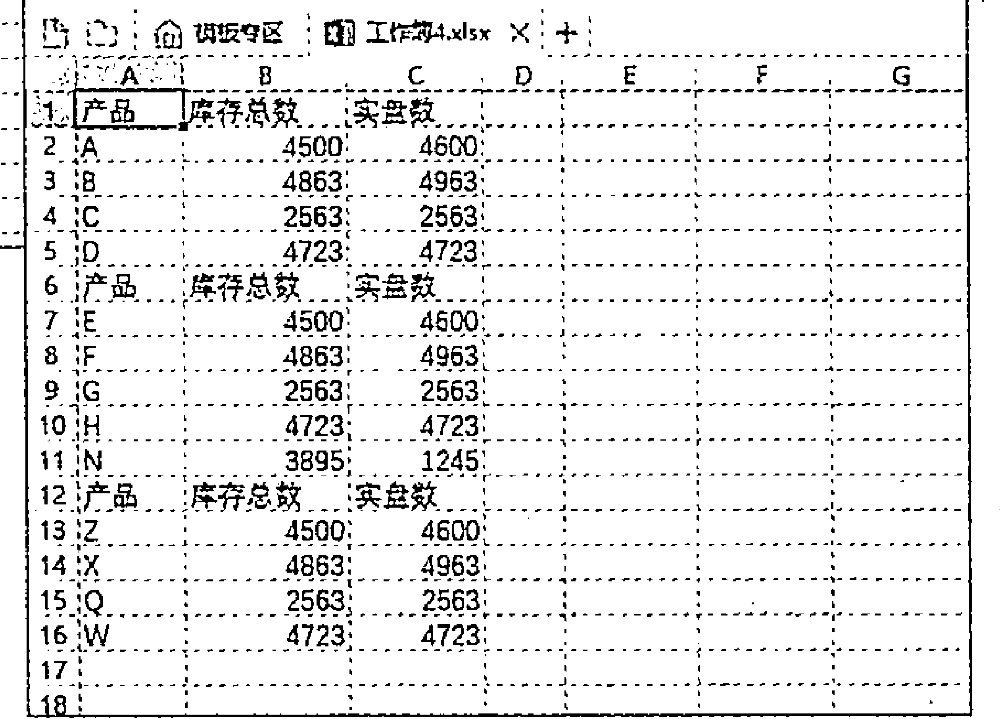

这样向下填充即可获取抽查结果了（图4）。
公式解释：
B2：将汇总表输入的B2值作为VLOOKUP搜索内容，即搜索的是报表中具体产品的名称。
“INDIRECT($A2&"!A1:C5")”：使用INDIRECT函数对工作表进行引用，引用的工作表是A2输入名称即抽查仓库的名称，注意这里的名称要和工作表的名称一致，否则引用会出错。A1:C5则是引用范围，注意由于每个工作表起始范围数据可能不同，这里要使用工作表的最大范围，假设本例最大范围为“易耗”报表的A1:C18，则这里引用范围设置为A1:C18。因为使用相对引用，所以公式填充后会自动根据A2输入名称去查找对应的工作表。
“2，FALSE”：表示如果找到了相匹配的值，则返回对应工作表中第2列的对应内容，本例为各产品盘点表中库存数值，FALSE表示查找时要求完全匹配，而不是模糊匹配。

例子，假设每个子表内容是不同的仓管员盘点，并且各自建立了不同的工作簿文件，现在需要将每个仓库盘点的数据归集在“仓库总表.xls”中。
如果需要合并的工作簿不多，可以直接利用Excel的连接功能实现。首先将需要合并的工作簿文件全部保存在一个目录中。新建一个汇总表文件，打开后点击“数据→连接”，在打开的工作表连接中点击“添加”，依次将需要合并的工作簿文件导入连接（图5）。
定位到A1单元格，点击“数据→现有连接”，依次点击上述添加的连接文件，然后在打开的窗口中显示方式选择“表”，现有工作表输入“=$A$1”，点击“确定”即可导入工作簿的数据（图6）。
操作同上，继续导入其他工作簿的数据，完成后就可以在汇总表中导入所有工作簿的数据了（图7）。
如果需要导入的工作簿很多，那么可以借助VBA脚本快速实现。先到https://share.weiyun.com/5f0963791afbeaabd784381fb373f521下载所需的代码文件，按Alt+F11打开VBA窗口，按提示输入获得的代码并保存。返回汇总表窗口，点击“开发工具→宏→合并工作表→执行”，执行这个宏后，在打开的浏览窗口选中全部需要导入的工作簿文件即可完成汇总（图8）。

##### n个工作簿归集到1个工作表

除了分类工作表外，在日常的工作中还需要对已经保存的多个工作簿文件进行归集。比如上述仓库盘点的例子，假设每个子表内容是不同的仓管员盘点，并且各自建立了不同的工作簿文件，现在需要将每个仓库盘点的数据归集在“仓库总表.xls”中。

#### 简单高效 Excel空白行列增减有道
文|俞木发

平时在制作周报、统计数据这类报表文件时，为了便于数据查看和美观，我们常常要在行列之间插入间隔的空白行、列，如果需要插入的空白行列较多，手工插入显然费时费力。有没有高效的插入方法呢？

##### 就地取材 用好Excel的内置功能

对于空白行列的添加，用Excel已经内置的一些组件可以快速实现。比如在制作单词列表数据时，为了便于查看和遮挡背诵，现在需要在原来的单词列表中插入空白行进行间隔，此时利用Excel内置功能就可以轻松实现（图1）。

首先在E2、F3输入1、2数值，接着选中“E2:F3”数组向下填充到原始数据的末行，使得数据和E列、F列输入的数值错开排列。选中E2:F11，按下F5点击“定位条件”，定位条件选择“空值”（图2）。

这样E2:F11的所有空白单元格都会被选中，点击“开始→插入→单元格→插入工作表行”，Excel就会在每行的间隔插入空行了，最后将E、F辅助列删除即可（图3）。

上述方法是添加插入空白行，如果要插入空白列，

同上先在原始数据最后一行输入辅助数据，比如本例是A12→D12，依次输入1、2、3、4，E12→H2输入1.1、2.1、3.1、4.1（图4）。

点击“数据→排序和筛选→自定义排序”，在打开的排序窗口中点击“选项→按行排序”，主要关键字选择“行12”（即自定义的辅助行），排序依据为“数值”，排序的方式选择为“升序”（图5）。

这样完成数据的排序后就会自动在每列之间添加一个空白列，按提示将辅助行删除即可（图6）。

通过上述操作可以看到，空白行列的添加主要是借助添加辅助行、列的方法实现，对于行的添加是通过在原始数据的列尾添加错开辅助数据，然后通过排序实现，如果要插入多行则错开相应行数据即可。空白列则在原始数据的行尾添加对应列数的辅助行数据实现。大家可以根据自己的数据实际情况完成空白行列的添加。

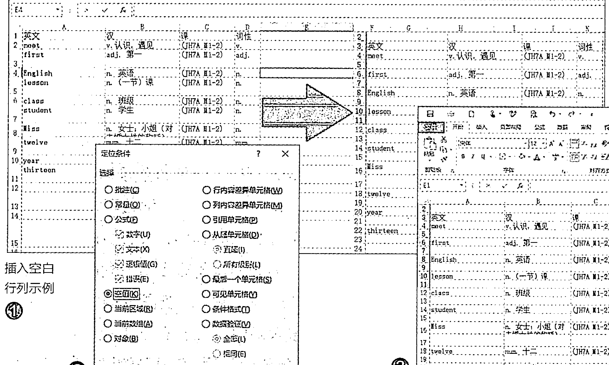

> > 对于需要进行数据统计或者排序的文件，插入空白行后可能会影响操作。如果要批量删除空白行，同样可以使用上述F5空值定位的方法，定位到所有空值后选择“删除”即可。

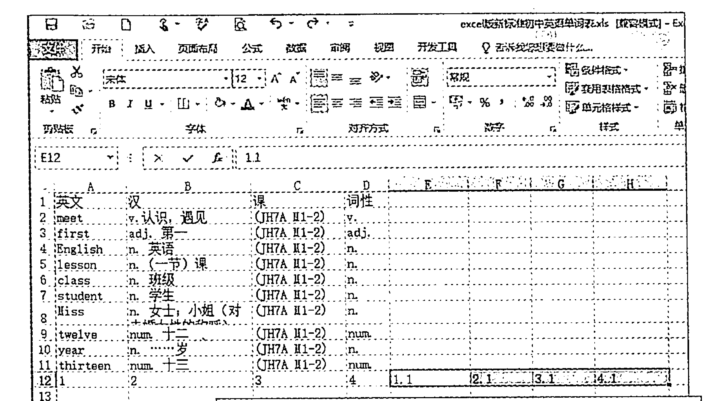
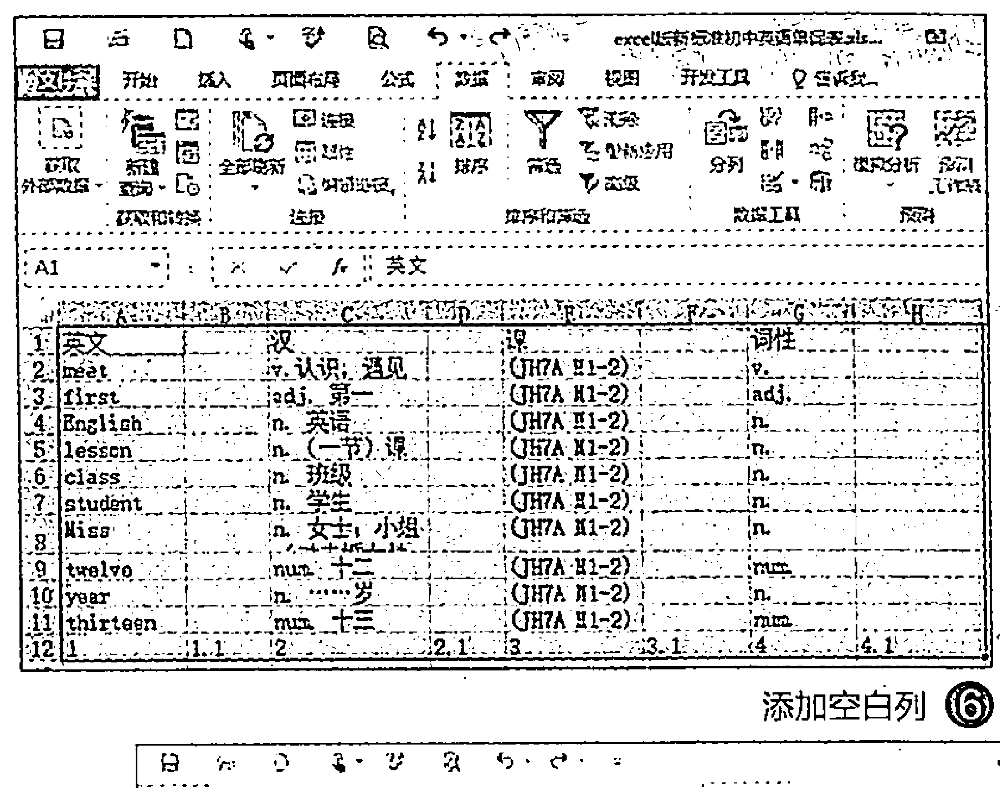
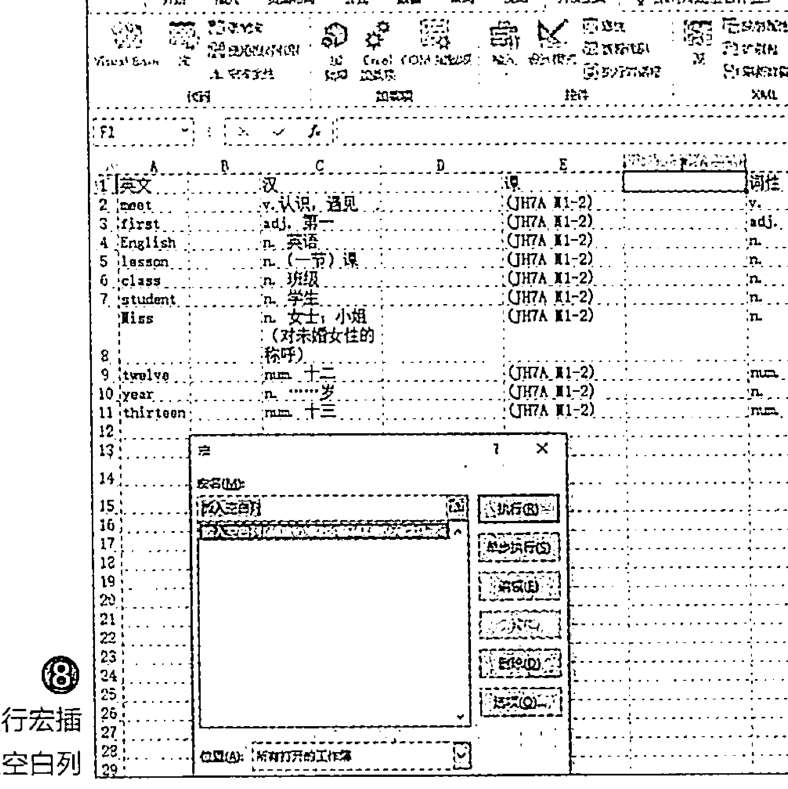
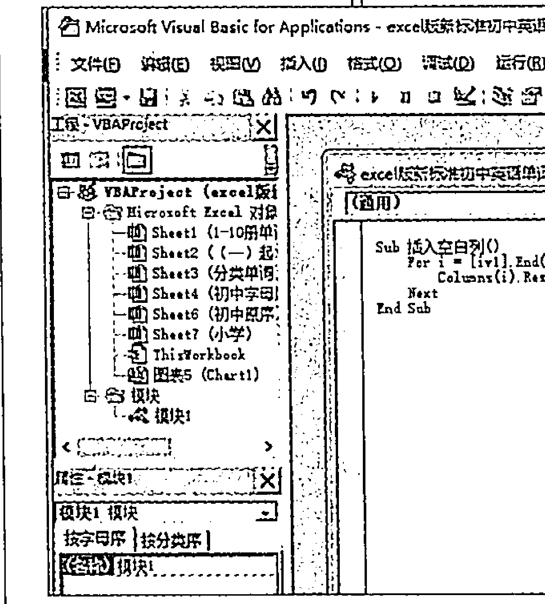

排序设置

插入空白列代码

运行宏插入空白列

##### 一步到位 VBA脚本快速实现行列添加

上述增加辅助行列的方法虽然操作简单，但是对于很多追求效率的朋友来说，还是略显繁琐。对于这类朋友，还可以借助VBA脚本实现空白行列的一键添加。

要在上述示例中插入空白列，点击“开发工具→VB→插入→模块”，在打开的窗口中将下列代码粘贴到空白处，这样保存后就会添加一个名为“插入空白列”的宏脚本(图7)：

```
vba
Sub 插入空白列()
    For i = 1 To 3
        Cells(1, 2 * i).Select
        Selection.EntireColumn.Insert
    Next i
End Sub
```

代码解释:

For i = 1 To 3 : 本例表示只插入3列空白列，具体数值请根据自己的实际数据选择。

Cells(1, 2 * i).Select: 表示在第一行, 2*i列处插入空白列进行间隔

Selection.EntireColumn.Insert: EntireColumn表示插入的是列, 如果是插入行则使用EntireRow代码。

保存后返回原始数据窗口, 点击“开发工具→宏→插入空白列→执行”, 执行这个宏后就会在原来的列之间插入一个空白列了(图8)。

如果是插入空白行, 输入下列的代码即可:

```
vba
Sub 插入空白行()
    For i = 1 To 10  ,表示插入10个空行
    Cells(2 * i, 1).Select
    Selection.EntireRow.Insert  ,表示插入的是空行
    Next i
End Sub
```

#### 省时省力 玩转PPT批量操作
文|俞木发

平时在制作PPT的时候，我们经常要对很多设计元素进行批量操作。比如为了统一样式，需要对PPT幻灯片的字体批量设置为统一字体。这些批量操作，如果能够用好PowerPoint 2016内置组件，就可以节省不少宝贵的时间。

##### 标题色块批量添加

在设计PPT的时候，为了突出标题，我们经常通过给PPT标题添加色块的方法实现。不过如果需要添加色块的标题很多，手工添加就很不方便。现在借助PPT的“文本转换为SmartArt”可以批量实现标题色块的添加。

因为这里只是对标题添加色块（正文不需要），因此先要在幻灯片中对需要添加色块的标题和正文内容进行分级，接着按住Ctrl键选择需要添加色块的标题内容，右击选择“转换为SmartArt→选择垂直项目符号列表”（图1）。

这样被选择的标题内容就会自动套用SmartArt样式，完成套用后可以根据自己的需要更换形状、颜色等，这样通过SmartArt就可以快速为标题添加自己需要的色块（图2）。

##### 字体、字号批量变换

为了统一样式，经常需要对所有幻灯片的字体进行批量设置。在PowerPoint 2016中，字体的批量替换可以借助“查找替换”实现。例如，现在要将某PPT幻灯片原来的宋体字体全部替换为雅黑字体。打开PPT后点击“开始→替换→替换字体”，选择替换和替换为字体进行替换，这样所有幻灯片的字体都会替换为“微软雅黑”（图3）。

除了对字体的替换外，很多时候还需要对字号进行批量设置。比如在较大场合展示PPT时，为了方便后排观众观看，这时就可以通过PPT的大纲视图来批量调整标题字体大小，具体操作是点击“视图→大纲视图”，在打开的大纲视图窗格中全选所有标题，然后在“开始”菜单中设置为合适的字号即可（图4）。

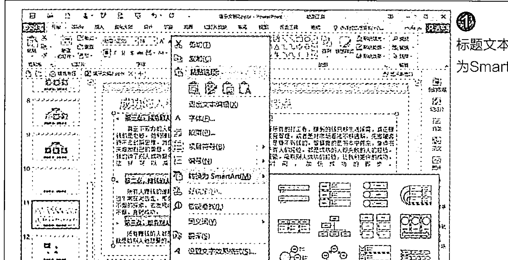
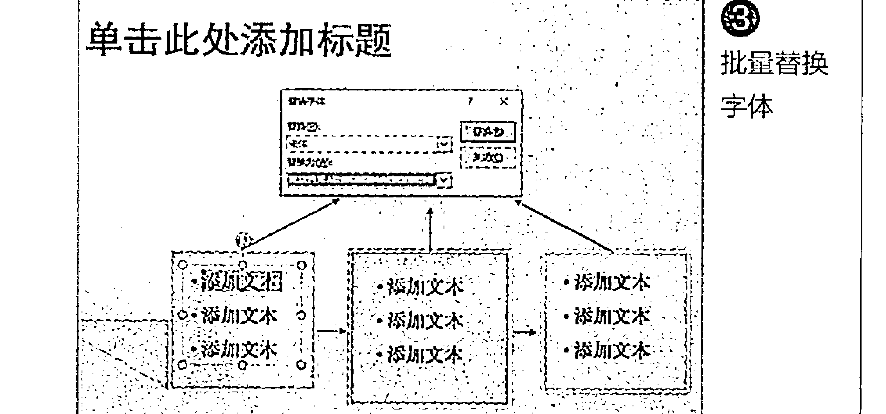
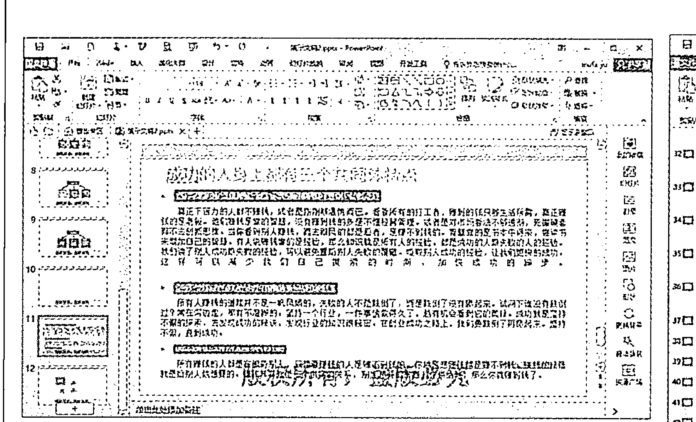
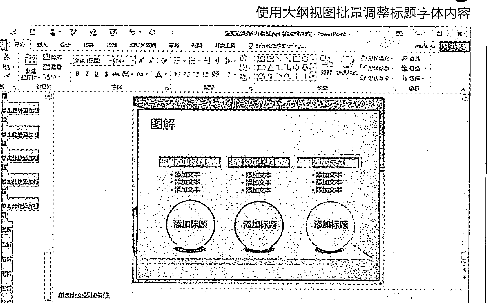
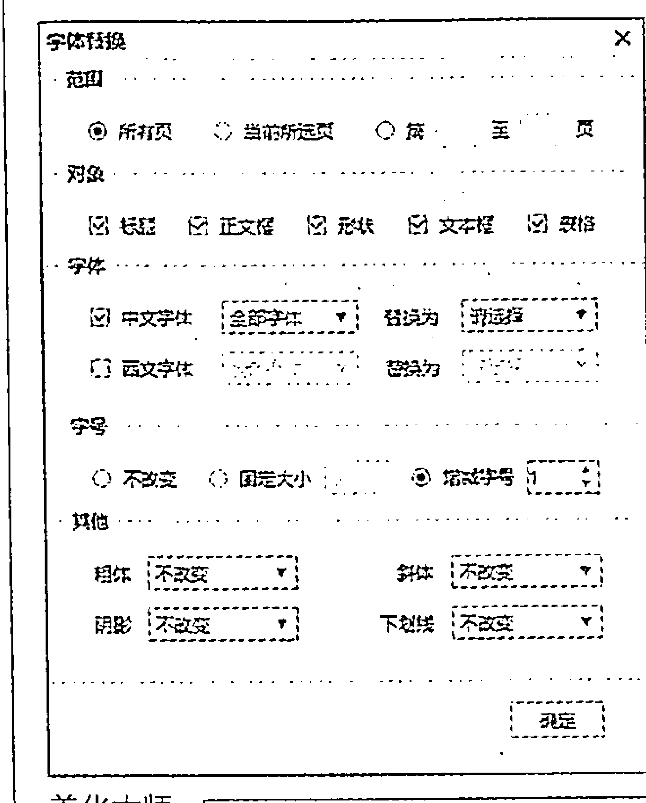
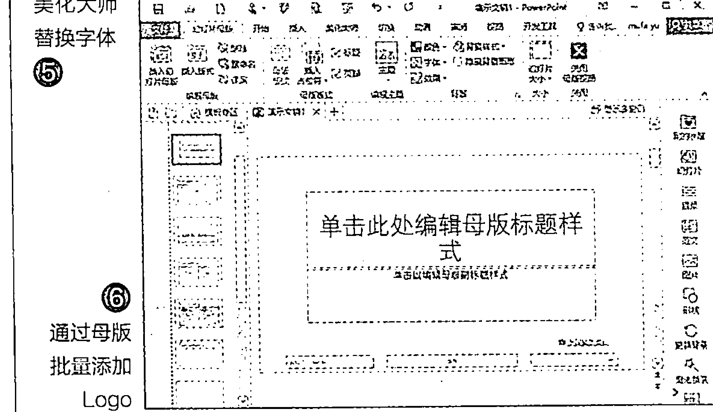
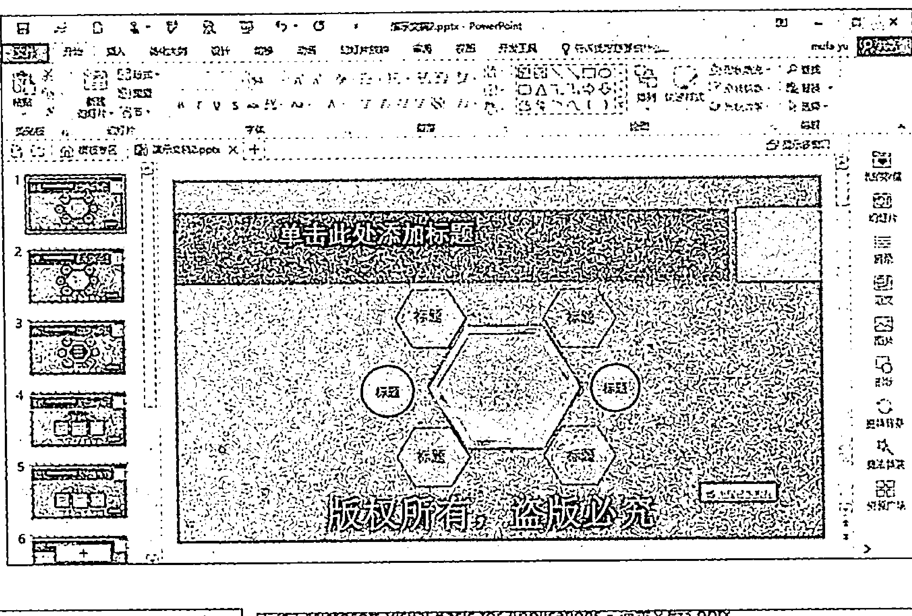

```
VBA代码示例：
vba
Sub 图片调整()
  For i = 1 To ActivePresentation.Slides.Count
    ActivePresentation.Slides(i).Select
    ActiveWindow.Selection.SlideRange.Shapes("Picture 1").Select
    With ActiveWindow.Selection.ShapeRange
      .Height = 380
      .Width = 510
      .Left = 200
      .Top = 80
    End With
  Next
End Sub
```

的员工查看，此时就需要将幻灯片的字号加大。标题字号的批量调整可以使用“大纲模式”完成。点击“视图→大纲模式”，此时在左侧窗格会显示所有可调整的标题文字内容，按下Ctrl+A全选，然后对字体颜色、字号等内容进行批量调整即可，完成后对所有幻灯片生效（图4）。

如果要对正文内容的字号等内容进行批量调整，则要借助“美化大师”插件。安装完成后点击“美化大师→替换字体”，这里可以对所有幻灯片的字体、字号等进行批量更改，比如要加大字号，则在此调节增减字号的数值即可（图5）。

##### Logo图片批量增删

公司制作PPT经常会在幻灯片中添加公司Logo图片和一些固定标识，这些元素的添加可以通过母版设置。点击“视图→幻灯片母版”，准备好Logo图片粘贴到母版的合适位置，关闭母版视图后所有的幻灯片就会自动添加Logo图片了（图6）。

当然对于已经制作好的幻灯片，同上切换到母版视图可以批量添加。因为在母版添加的元素可以统一增加到所有幻灯片中，因此我们可以根据自己的实际需要灵活使用。比如可以自行准备版权图片添加到PPT作为版权Logo水印，或者自行设计好背景图片（可以在图片上通过插入艺术字的方法制作文字水印）作为版权标记（图7）。

##### 简单高效，使用VBA实现批量操作

经常使用Excel的朋友都知道，很多批量操作可以借助VBA脚本实现。PPT同样支持VBA脚本，因此我们也可以利用它来实现很多批量操作。因为排版的需要，经常要在PPT中插入大量的图片，并要手动对插入的图片进行大小和位置的调整。现在这些操作可以借助VBA脚本实现。

首先将需要插入的图片保存在一个目录中，点击“插入→相册→新建相册”，通过相册的方法将所有图片插入到PPT中。接着按Alt+F11调出VBA窗口，在打开的窗口中输入如图所示的代码（代码下载：https://pan.baidu.com/s/1nvNZ2pN，密码：mbgg）（图8）。

完成代码的输入后切换到“开发工具→宏”，运行名为“图片调整”的宏即可完成批量调整操作了。

#### PPT版面设计之“变”
文|周建峰

一个精品PPT，其内容页的版面布局就是亮点，对于一般用户来说，少有专门学习过平面设计等美术课程，因此要做出好作品，还是要多练习多模仿。本文就将一段话进行不同的版面设计，让大家通过最直观的方式来学习PPT版面布局，掌握版面设计的常用技法。下面是这段话的初始排版样式（图1），将用多种方法对其进行排版，通过版式对比和实际操作，体会到版面布局的奥妙，并且能够无缝衔接运用到自己的作品中。

##### 修改样式

很多时候只需要对图片和文字的样式进行简单的修饰，往往就能让人眼前一亮。图片样式的修改通常包含改变图片的大小位置、比例边框、形状重复等；文字样式通常就是字体、颜色、段落等，或者添加线条图形作为小装饰，这些看似很普通的修饰，往往能让版面有不一样的表现效果。

我们来看一个实例效果（图2），先从这段话中提取出标题（读书的好处），可以选中段落中的“读书的好处”，然后直接拖出段落外即可独立出来。再将剩下的内容按回车键分成三段，切换到“开始”选项卡，单击“段落”中的“项目符号”，让段落更具条理性，最后在“读书”的下方添加一根横线。

选中图片，从边角拖动让其高度和版面相同，然后切换到“格式”选项，单击“裁剪”按钮，保留图中的人物主体部分（图3）。如果不想让图片太过于显眼，可将其裁剪为椭圆。还可以将图片裁剪为其他形状，并在下方添加虚线图形作为装饰。

如图所示将标题的“文字方向”设置为“竖排”（图4），选中图片，按Ctrl+D复制粘贴3张图片，调整4张图片的尺寸，由小到大排列，这里可借助Onekey7（http://oktools.xyz）将图片等比例设置为从小到大。安装该工具后，只要先调节首尾两张图片的尺寸，然后选中4张图片，切换到“Onekey 7”选项卡，在“形状组”中选择“尺寸递进”下的“小→大”，则可等比例设置图片的尺寸。

##### 巧用色块

当页面上有许多不规则的元素时，借助一些规整的色块，可以是正方形，也可以是圆形或者不规则图形等，让二者结合，能够在视觉上呈现出整齐感和整体感。两个版面运用了横向或竖向的色块，色块的颜色来自配图，可使用取色笔选取颜色（图5）。上方的版面将图片的边框设置为白色，标题也设置为白色，下方的白色装饰线条与图片边框相连接，形成一个视觉上的整体，文字颜色与色块一致。下方的版面稍有不同，图片有一部


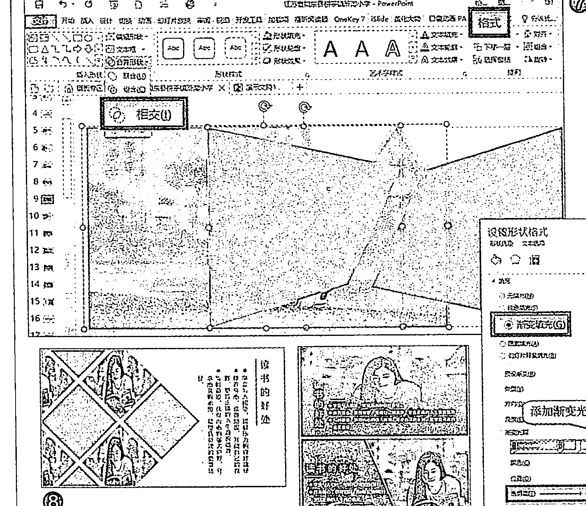
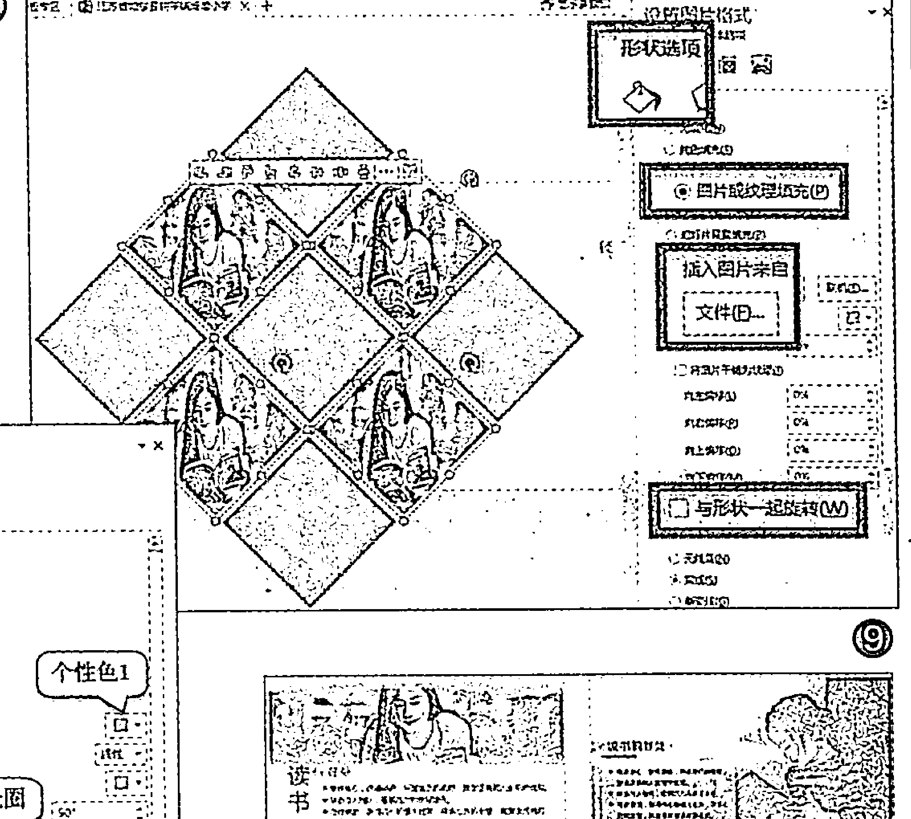
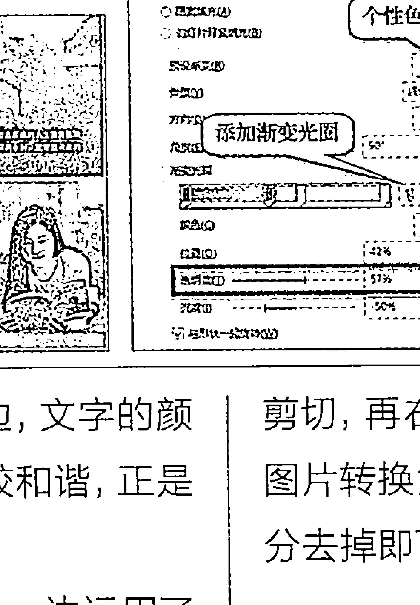

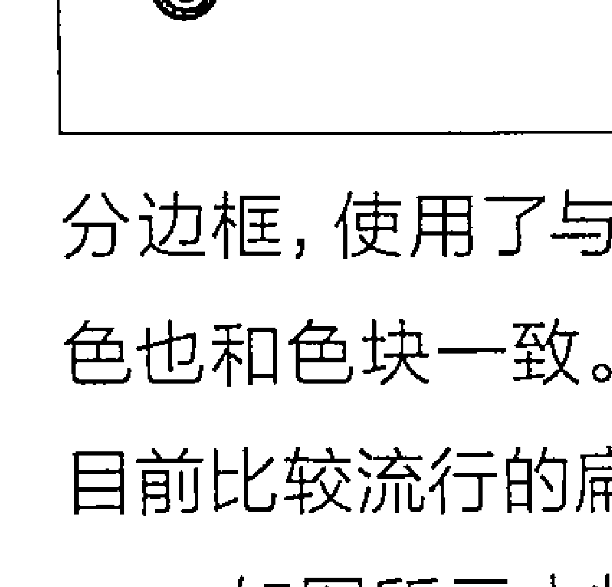
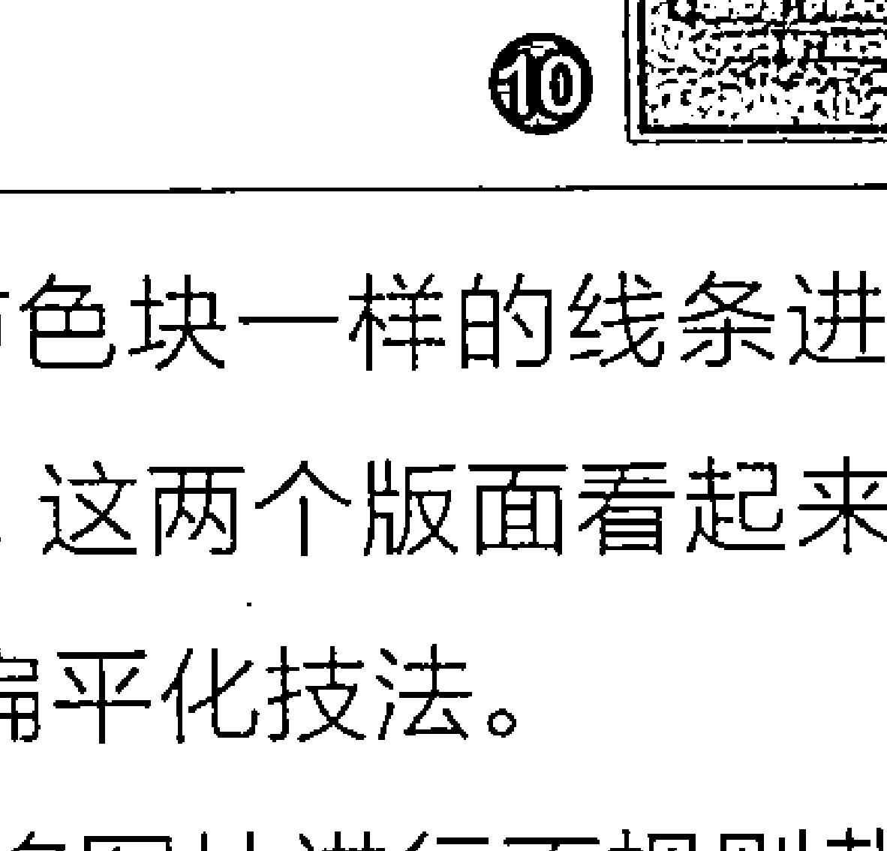
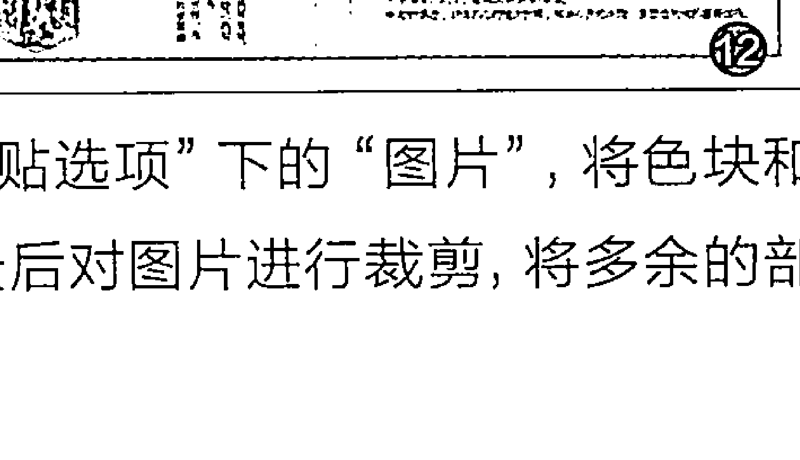

##### 善用蒙版

分边框，使用了与色块一样的线条进行嵌边，文字的颜色也和色块一致。这两个版面看起来都比较和谐，正是目前比较流行的扁平化技法。

如图所示中将图片进行不规则裁剪，另一边运用了相同形状的色块，让整体效果看起来更加和谐交融（图6）。绘制一个与版面等高的矩形，切换到“格式”选项卡，选择“编辑形状”中的“编辑顶点”，拖动顶点改变形状，复制粘贴该图形。

切换到“格式”选项卡，选择“旋转”中的“垂直翻转”和“水平翻转”，这样两个图形形成对接状态。将左侧图形覆盖在图片中的人物上，按住Ctrl键不放，先选中图片再选择上面的图形，切换到“格式”选项卡，选择“合并形状”中的“相交”（图7），即可将图片裁剪成相应的形状。然后在色块上添加文字，并且绘制一个贯穿图片和图形的线条，让其看起来更加融合。

使用色块与图片重复，这在版面排列中很常用（图8），特别是当图片数量不凑巧时，常用色块来填充。绘制一个绿底白边的正方形，然后旋转45°并复制8个，排列成3×3，形成一个旋转45°的正方形。

选中部分色块（图9），右击选择“设置对象格式”，在“形状选项”下的“填充与线条”中，选择“图片或纹理填充”，然后单击“文件”选择相应的图片，取消选择“与形状一起旋转”，全选色块和图片并按Ctrl+X剪切，再右击选择“粘贴选项”下的“图片”，将色块和图片转换为一张图，最后对图片进行裁剪，将多余的部分去掉即可。

蒙版在PPT设计中运用相当广泛，通常是在图片上方更改一个半透明的图形，降低图片对文字阅读的影响，此类蒙版效果也会让我们的PPT看起来更加高大上。如图所示，上面使用了全蒙版，突出了文字，下面使用了半蒙版，文字和图片相对平衡（图10）。

蒙版本质上就是一个透明度有所改变的图形，绘制一个矩形让其覆盖在图片上，然后设置图形属性。在“形状选项”中选择“渐变填充”（图11），“预设渐变”中选择“个性色1”，在“渐变光圈”中添加黑色光圈和白色光圈，分别调节光圈的透明度，让蒙版下的人脸部分尽量清晰显示，蒙版的下部分尽量保留黑色，最后在上面添加白色的文字。有时为颜色丰富的全图添加文字，通常也使用这种技法。如图中的下图使用了梯形蒙版，蒙版的颜色是纯黑，再调节透明度即可（图11）。

当然了，版面的变化不仅仅是本文中所述，设计时要根据图片、文字、听众的实际情况进行设计（图12）。总的来说，版面设计在于一个“变”，因图因文因表达对象而变。

#### 就地取材 PPT图文排版有高招

文|愚人

大家知道一份漂亮的PPT离不开排版的功劳，但是PPT默认的版式均比较简陋，如何排版才能让自己的PPT看上去更美丽？下面笔者就教大家几招。

##### 从文字开始: PPT文字美化排版

PPT文字是幻灯片的重要组成部分，但是很多朋友只是简单地在文本框中输入文字，这样文字在幻灯片中就显得非常平庸。要让自己的PPT更漂亮，我们就需要对PPT文字进行美化处理。

比如对于原来的文本框的文字可以添加上大色块，这样设计可以让人觉得高大上。色块的添加操作很简单，只要点击“插入→形状→矩形”，然后将插入的矩形设置为无轮廓，颜色填充为白色，接着在插入的矩形框中再添加文本框并输入文字即可。这里需要注意的是，文字标题字体颜色尽量要和图片主题颜色一致，这样添加效果才协调。比如下方的图片，标题颜色应设置为蓝色，只要在字体设置界面的点击“主题颜色→取色器”，然后使用取色器点击图片主题色即可（图1）。

这样通过添加色块后文字显示更为清晰，文图对比也更加强烈，可以让我们的PPT设计看上去更有档次（图2）。

当然对于文字的美化还有许多，比如制作的是类似卡通教育的PPT，我们则可以将字体设置为幼圆等更活泼的字体，对于类似广告宣传的PPT，则可以对文字进行变形、立体化、撕裂等特殊处理。总之需要根据PPT的实际主题，使用多种美化方法进行排版。

##### 取悦双眼: PPT图片美化排版

图片作为PPT中最重要的元素，在PPT设计中自然离不开对图片的美化排版。高手们借助PS等专业软件对图片进行美化，其实PPT本身已经自带很多美化工具，我们结合幻灯片主题就可以实现相应的美化排版。

如对于传统“图+文字”的幻灯片，为了突出图片人物主题，我们可以通过将图片裁剪为特殊形状，如将人物照片裁剪为平行四边形，这样左右留白用以填充文字，可以获得更好的设计效果。选中插入的照片，切换到“格式→裁剪→裁剪为形状→平行四边形”，保留照片人物主体即可（图3）。

完成图片的裁剪后，左右留白的空间就较大，直接插入文本框，同时对文字进行稍加修饰，这样排版后的效果是不是更好呢（图4）。当然PPT美化图片的组件还有很多，比如为了突出图片主体，可以使用“删除背景”的方法抠图；为了制作特殊形状图片，可以使用裁剪、合并形状，使用SmarArt快速排版等方法。具体操作在之前的文章已经多次介绍，这里就不赘述了。

继续点击“插入→形状”，插入一个矩形，将插入的矩形覆盖在文字的上方。点击“开始→选择→选择窗格”，在右侧窗格依次点击“文本框”、“矩形”（选择顺序不可出错），接着切换到“绘图工具→格式→合并形状→组合”，这样可以获取镂空的标题字体（图6）。

##### 图文结合 让幻灯片更美丽

上面我们分别介绍幻灯片中文字和图片的处理技巧，在日常设计中除了这些独立技巧外，因为PPT毕竟是图文结合体，很多时候我们还要根据实际情况使用多种组合技巧对图文进行美化排版。如一些幻灯片的背景颜色比较丰富、艳丽，为了能够让背景和文字标题融合在一起，我们可以针对文字进行镂空处理，使用背景图片对字体进行填充，让图片和字体融为一体。同时针对图片的艳丽背景，使用柔化的方法降低颜色艳丽度，给观看者更柔和的感觉。

字体镂空设计可以借助PPT的“组合”工具实现，点击“插入→文本框”，然后在文本框上输入作为标题的文字。为了获得更好的融入效果，这里建议文字使用粗体黑字如“方正超黑粗体”（具体字体大家可以自行从网上下载），并将字号设置为“80”，同时将文本设置为“无轮廓”，文本填充选择“纯色填充→白色”（图5）。

同上点击“开始→选择→选择窗格”，在右侧窗格选中文本框将其先隐藏。继续点击“插入→形状→矩形”，插入一个矩形并覆盖在图片上，右击矩形选择“设置形状格式”，形状选项选择“渐变填充”，然后依次设置填充参数如颜色、位置、透明度等，选择一种自己满意的效果进行填充，这样图片效果就会变得更为柔和（图7）。

拖动镂空字体到合适位置，可以看到随着字体的移动，字体比划组合内会自动使用下方的背景图片填充，这样字体和图片就完美融合在一起。不过这里由于背景图片颜色较靓丽，我们可以为其添加一层透明的蒙版进行柔化。

完成上述操作后显示文本框标题，并将标题移动到合适位置，这样组合处理后的效果是不是比直接在图片上插入文字效果更好了（图8）！

#### 炫酷幻灯片 Focusky制作更轻松

文|马震安

利用Prezi、PPT插件制作非线性播放幻灯片都有不足之处，如Prezi对于中文的输入兼容性不强、PPT插件效果有限等。若采用Focusky来制作，能够模仿视频的转场特效，加入生动的3D镜头缩放、旋转和平移特效，制作出的幻灯片像一部3D动画电影，能给观众带来强烈的视觉冲击。下面我们通过一个课件实例，看看如何用Focusky轻松制作炫酷的幻灯片（图1）。

##### 1. 制作封面

在编辑窗口左侧选择矩形窗口，点击或拖动快速添加一个矩形窗口（也可根据需要添加一个方括号帧、圆形窗口和不可见帧），添加一个窗口就代表一张幻灯片，类似于一个电影镜头。点击左侧新添加的窗口，将窗口放大。在添加的幻灯片中，可将所需图片作为幻灯片的背景。点击窗口右侧快捷工具栏中的“图片”，再在新出现的窗口中点击“添加本地图片”，在弹出的窗口中选择所需要的本地图片。图片插入后，选中图片，利用8个控制点来调整它的大小，本例中将它的大小调整为与整个幻灯片一样。图片大小调整好后，可利用右侧的图片窗口中的各个按钮对图片的样式、效果、边框、外观形状等进行编辑。为了操作方便，图片设置完成后，可利用工具中的“锁定物体”按钮将其锁定（图2）。

接下来，点击右侧快捷工具栏中的“文本”，在编辑窗口中点击，在出现的输入位置输入所需要的标题文字。同样，通过右侧文本窗口下的各个工具按钮设置文字的大小、颜色、样式等（图3）。

##### 2. 添加动画效果

封面中的图片、文字设置好后，对它们进行动画效果的设置。点击窗口上方的“动画”，在动画编辑窗口，选择所需要的设置动画的文字（或图片），点击“添加动画”，在弹出的窗口中选择所需要的进入、强调、退出、动作路径等动画效果（图4）。

同样，其他的文字或图片的动画效果也是这样添加的。动画效果添加完成后，在右侧出现一个动画列表，点击每个动画效果对应的工具按钮，设置它们发生的时间。

**小提示**
如果操作不太方便的话，可以利用鼠标滚轮对幻灯片进行缩放，利用鼠标在空白处的拖动对幻灯片进行上、下、左、右的平移。

##### 3 制作嵌套幻灯片

由于本例中的一个导图包含4张幻灯片，所以就需要幻灯片的嵌套了。退出动画编辑后，利用鼠标滚轮将画布编辑窗口缩小，根据需要再添加一张幻灯片，将它拖放到画布的其他位置（不要与封面重合），在左侧窗口点击它，将其放大。当然，可根据需要为其设置背景图片。在这个幻灯片中用同样的方法添加4张幻灯片，并摆放好它们的位置。这样，就形成了幻灯片的嵌套，可利用图形、图片等对幻灯片进行修饰（图6）。同样道理，编辑每张幻灯片，只需要在左侧窗口点击相应的幻灯片将其放大后，插入所需要的图片、文字、Flash、视频、音乐等，操作方法同上。

> 每张幻灯片都可以进行嵌套，也可以叠加嵌套。

##### 4 旋转镜头制作

旋转镜头实际上是一种幻灯片的切换方式，制作也比较简单。添加新的幻灯片后，先不要将其放大，用鼠标拖动它的旋转按钮，根据需要进行一定角度的旋转。这样，当镜头切换到这张幻灯片时就会发生旋转。其内容的编辑仍然与上述操作类似（图7）。

##### 5 修饰作品并输出

要想使作品更加华丽美观，可使用统一的主题、背景等。点击快捷工具栏中的“主题”，选择所需要的主题或自定义一个新的主题。当然，也可以为作品设置统一的背景，包括3D背景、图片背景、视频背景、背景颜色等，点击窗口中的“背景”，选择所需背景即可（图8）。所有内容制作完成后，在窗口中点击“输出”，在弹出的窗口中选择所需要的格式（如果想让作品能够在其他电脑上演示，最好选择exe输出格式），点击“下一步”输出作品即可。

#### 操作要便捷 学会用好Excel的表中表

文|愚人

大家知道Excel的基本单位就是表格，平时我们都是按部就班使用Excel表格进行各种运算。很多朋友不知道的是，我们还可以在Excel中通过“插入表格”的方法形成“表中表”，利用它解决许多日常问题。

##### 你变我也变 用表中表同步数据

为了让自己的报表看上去图文并茂，很多朋友都会在Excel中插入透视图表。但是很多时候图表引用的数据会进行更改，源数据进行更改后，比如增加或者删除一行数据，这样在图表引用源就得同步进行更改，如果更改的数据较多，同步起来就费时费力(图1)。

现在借助“表中表”可以实现数据、图表同步更改。比如上图，先选中A1→B6数据，点击“插入→表格”，数据范围选择A1→B6，这样原始数据标题会变为筛选形式，此时再插入图表，可以看到图表默认引用A1→B6数据(图2)。

现在我们如果需要对原始数据进行更改，比如增加一行G产品数据，按提示输入数据后，可以看到右侧图表会自动增加G产品的图表，也就是说使用“表中表”后，图表是动态引用表中表的数据，无论是增加还是删除，图表数据都会同步变化(图3)。

##### 表多不迷花 快速定位工作表

对于一些复杂的报表，我们经常会按照品名建立多个工作表。比如总库的盘点表是按照生产车间，每个车间一个工作表汇总统计，这样工作表多了以后查找起来就非常不便。对于多工作表的报表文件，同样可以通过“表中表”方法进行自定义分类，方便后续的查找和定位。

选中第一个表中数据，操作同上选中全部数据后点击“插入→表格”，插入表格后在上方“表名称”中，按照当前工作表名称进行命名。操作同上，将所有工作表都设置为表中表，并将表格的名称和工作表名称一一对应起来(图4)。

完成上述的操作后，以后如果我们需要查找相应的工作表，切换到任意工作表，在插入函数左侧的编辑窗口展开下拉列表，这里会将上述建立的表名称全部列出，点击相应的表格即可快速切换到对应的工作表（图5）。

当然如果原来工作表的名称比较长，我们可以将这里插入表格名称进行简化，比如只要提取关键字即可。因为这里选择表中表名称是直接定位到选取数据的区域，因此对于数据很多的工作表，我们可以选择任意区域的数据作为表中表的数据，比如经常要查询501行数据，则选择这里数据作为插入数据源，以后选择表名称即可快速定位到指定工作表的行列了。

除了可以进行快速定位外，对于多个工作表的数据，在日常使用中经常需要对多表数据进行跨表引用。常规的方法是直接在函数中输入引用工作表的名称，如果工作表很多且名称复杂时，引用起来就不方便。但是使用上述方法为插入表命名后引用起来就方便多了，比如Index函数，在任意工作表引用其他表时只要输入插入表名称开头字符，Excel就会自动列出，只要简单点击即可快速实现跨表引用（图6）。

此外，在选择插入表格后会出现“表格工具→设计菜单”，在“表格样式”中Excel内置了很多标准样式，对于需要进行表格美化的朋友，只要在样式列表中选择一种自己喜欢的样式即可快速完成表格的美化操作（图7）。

##### 公式不变形 模板应用更简单

对于常用的工作表，我们经常会在其中使用大量的公式，为了方便下次使用则会将其制作为模板文件。但是常规的模板公式很容易在编辑数据时丢失或者错误编辑，导致公式在下一次使用时出错，现在借助插入表格则更容易保证公式稳定。

比如在上述例子中需要增加单价和金额列，金额使用“数量×单价”公式计算。那么只要在原表C1增加单价、D1增加“金额”回车后会自动填充为表列，按提示在D2输入公式“=B2*C2”，这样D列所有内容都会自动填充该公式。而且只要不删除第一行表列标题内容（比如可以更改标题名称用在其他报表中），原来的公式不会改变可以继续使用，将该文档保存为模板后更方便后续应用（图8）。

#### 无中生有 用PPT制作特效表情

文|俞木发

经常观看娱乐节目的朋友都知道，在主持人或者嘉宾遇到一些尴尬、悲伤等场景时，此时导演经常会在嘉宾脸上实时叠加动画表情，让电视画面更有喜剧感。对于这类动画表情效果，现在使用PPT自带的动画组件也可以实现，让你的PPT在播放时也具备同样的效果。

##### 素材获取

为了获得更好的叠加效果，这里的表情符号都是使用背景透明的表情图片。因此我们先要准备这些图片，如果需要自己制作则可以使用PPT的抠图功能进行提取。比如需要制作一幅墨镜素材图片，先将下载到的墨镜图片导入PPT，选中图片后点击“图片工具→格式→颜色”，选择一种合适的色温，这样可以去除原来镜片后的镜架图案。继续点击“图片工具→格式→删除背景”，将原来的背景删除变为透明色。最后点击“图片工具→格式→裁剪”，将图片裁剪为合适大小，这样一幅透明背景的墨镜效果素材就做好了(图1)。

操作同上，继续制作自己所需的表情素材，完成后将素材全部放置在一张幻灯片中备用即可。

##### 人物照片处理

在人物脸部叠加表情图片后，为了能够更突出表情效果，我们需要将人物照片进行虚化处理。这个处理借助PPT蒙版功能即可。

在PPT中插入一张人物图片，点击“插入→形状→矩形”，然后将插入的矩形调整为和图片大小一致。选中插入的矩形，右击选择“设置图像格式”，选择“填充纯色→选择一种和图片背景色一致的颜色”，将其透明度调整为合适数值，使得人物图片看上去有蒙版效果即可(图2)。

> 小提示：由于QQ影音只能截取最大10秒的视频，所以如果动画表情内容较多，在PPT中设置动画的时候，可以将动画的速度调快一些，尽量将整个动画添加效果控制在10秒之内。

##### 叠加表情并设置动画效果

在PPT复制上述处理好的素材图片到人物脸部，这里插入的素材图片可以自行调整大小和位置，按提示将其添加到人物脸部对应位置，这样可以完成效果的添加。接下来就是为效果图添加动画效果，实现素材叠加是动态完成的（图3）。

比如墨镜是从下到上戴到眼部的，选中墨镜图片，点击“动画→飞入效果”，这样墨镜就可以从下到上添加到脸部，当然可以点击“效果选项”更改动画顺序，比如选择“左下”进入效果不错。同上可以为其他素材添加动画效果，比如香烟素材则可以选择“劈裂”效果，然后将延迟的时间设置为0.5s，这样可以在添加完墨镜后0.5s再出现在人物嘴部（图4）。

当然为了让添加的素材更具效果，我们还可以为动画加上音频效果。比如可以为香烟的效果加上打火机点烟的声音，按提示准备好点烟的音频文件，建议保存为.wav文件备用。在PPT窗口点击“动画→动画窗格”，在动画窗格选中香烟的“劈裂”动画效果，点击“效果选项”，在打开的窗口点击“增强”项下的“声音→选择其他声音”，然后导入上述准备好的.wav文件，这样在添加香烟效果的时候就会增加打火机点烟的声音了（图5）。

完成上述操作后点击“预览”，看看自己添加的动画表情是不是和电视画面有些类似呢？当然除了在PPT中使用，我们还可以导出这些效果到微信、QQ中使用。点击“文件→导出→创建视频”，选择“低质量”，点击“创建视频”，这样即可将动画添加效果保存为.MP4视频文件（图6）。

由于MP4视频可以直接在手机中播放，如果要和微信好友共享这些视频，或者使用好友图片进行恶搞，打开电脑微信后将视频发送给好友，这样对方在手机微信上直接点击就可以播放了（图7）。

当然你也可以将动画文件转换为GIF表情，表情的转换可以借助QQ影音实现。首先同上将动画导出为MP4视频，接着使用QQ影音打开导出的视频文件，然后在视频播放页面，单击鼠标右键弹出菜单，选择“转码/截取/合并→动画(GIF)截取”。接着在QQ影音的左下角，使用滑竿选取截取范围，只要覆盖人物动画区域即可。选区确定后，可以选择预览按钮进行效果预览，也可以对播放快慢进行调节。最终确定后，点击保存按钮即可将动画表情转换为GIF图片，之后就可以将其作为QQ表情发送给好友共享了（图8）。

#### 不走寻常路 Word中的异型表怎么做

平时我们经常在Word中插入表格，主要作用是用于排列数据。其实除了这个常规的作用外，在Word中用表格还有很多特殊的用途。

#### 快速制作Web表格

现在很多公司都有自己的网站，有时候我们经常要在网站上发布一些表格数据。默认情况下Web表格是由超文本标记语言(HTML)来定义的，如果使用HTML代码创建一个表格并不是一件简单的事情。不过在Word里可以轻松插入表格，并且另存为网页就可以将表格转换为Web代码。

在Word中点击“插入→表格”，按提示插入一个需要的表格。点击“文件→另存为→网页”，这样就可以得到一个网页文件，按提示使用“记事本”打开网页文件，其中代码就是一个Web表格的完整代码，按提示复制到网站上即可。如果需要更改表格，如框线大小、颜色等，同上在Word中编辑完成后再另存为即可(图1)。

#### 快速制作等分表格

很多时候我们需要制作一些等分表格，比如某公司的质检标签是一张4列×5行规格的A4不干胶贴纸，每张标签对应一个均分排布的单元格，现在需要制作这样一份表格进行打印(图2)。

如果在Excel中制作，我们需要设置精确的单元格大小(因为无法精确均分，打上图案标记后分割线会错位，无法撕开每个完整的标签)。对于这类均分表格，借助Word插入表格即可轻松完成。点击“插入→表格”，插入一个1行1列的单元格，切换到“表格工具→布局”，点击“拆分单元格”，按提示将单元格拆分为4列5行的表格(图3)。

这样表格就会被自动分为4×5的表格，依次点击上方菜单的“分布行”和“分布列”按钮，将行列均分，这样每个单元格大小就会被自动均分。最后在每个单元格添加上所需的图案，在打印设置中，将行边距、列边距全部设置为“0”进行打印即可。

#### 文本转换为表格

| 正文 | 图片 | 正文 2 | 正文 3 |
| :--- | :--- | :--- | :--- |
| 正文 4 | 正文 5 | | |

#### 排版要求

#### 使用表格完成排版

| 同样的 对于 包含 冒号 |
| :--- |
| 家知道单元格本身就是 一个天然对齐元素，因此 在Word中对于此类数据 的对其利用表格就可以快 速完成。观察上面的文 本，可以看到中英文是通 过 TAB 键分割（如果数据 没有这类分割符号则需 要手动添加），点击“开 |
| 家知道单元格本身就是一个天然对齐元素，因此在Word中对于此类数据的对其利用表格就可以快速完成。观察上面的文本，可以看到中英文是通过 TAB 键分割（如果数据没有这类分割符号则需要手动添加），点击“开 |
| 家知道单元格本身就是一个天然对齐元素，因此在Word中对于此类数据的对其利用表格就可以快速完成。观察上面的文本，可以看到中英文是通过 TAB 键分割（如果数据没有这类分割符号则需要手动添加），点击“开“ |

#### 通过表格对齐文本

> 小提示
利用添加表格再灵活设置框线的方法还可以制作出很多特效，比如要在文字的上方添加上划线，只要将文字填充进表格，然后选择只保留上框线的表格样式即可。而且Word里默认单元格是随着内容的输入自动适应的，因此这些框线也会随内容的输入自动变换。

| ABS | 资产担保证券 |
| :--- | :--- |
| Accelerated depreciation | 加速折旧 |
| Acceptor | 承兑人；受票人接受人 |
| Accommodation paper | 融通票据；担保借据 |
| Accounts payable | 应付账款 |
| Accounts receivable | 应收账款 |
| Accredited Investors | 合资格投资者；受信投资人 |
| Accredit value | 自然增值； |
| Accrediting | 本金增值 |
| Accrual basis | 应计制；权责发生制 |
| Accrued interest | 应计利息 |
| ACE | 美国商品交易所 |
| Acid Test Ratio | 酸性测验比率；速动比率 |
| Acquisition | 收购 |
| Across the board | 全面一致；全盘的 |
| Acting in concert | 一致行动；合谋 |
| Active assets | 活动资产；有收益资产 |

#### 快速对齐文本

平时我们在Word中经常会输入一些中英文对照的词汇表，为了文档的美观常常要实现中英文对齐，常规的方法是不断输入空格进行对齐，但是由于中英文字符不同，很多时候还无法实现完整对齐(图4)。

#### 使用表格快速排版

对于一些Word文档，我们经常要进行一些特殊排版。比如公司的内部刊物就经常需要使用类似下属样式的排版要求，这类看似特殊的排版，如果使用常规的方法很难完成，现在借助表格可以快速实现(图7)。

大家知道单元格本身就是一个天然对齐元素，因此在Word中对于此类数据的对齐利用表格就可以快速完成。观察上面的文本，可以看到中英文是通过Tab键分割(如果数据没有这类分割符号则需要手动添加)。点击“开始→替换”，将Tab键替换为“制表符”。全选文本内容，继续点击“插入→表格→文本转换为表格”，在打开的窗口中列数选择2列，文字分隔位置选择“制表符”，将文字转换为表格(图5)。

观察上述排版要求可以看到，整个版面实际上就是一个7×2的表格(列以最长内容为准，包含合并单元格)。同上按提示插入一个7×2的表格，接着选中第1行的2、3、4列，右击选择“合并单元格”，接着选中第2行的5、6、7列也进行合并，其他再根据实际情况进行合并，最后在各个单元格中插入文本内容和图片即可完成排版(图8)。

这样上面的中、英文就会自动分列在两个单元格，按提示调整列距。点击“表格工具→设计→选择一种无边框的表格”，这样就可以轻松完成文本的对齐操作了(图6)。

最后同上操作选择不显示框线，或者有选择地显示特定框线即可，在这里每个单元格的字体、字号、段落标记都可以独立设置。当然我们可以通过对单元格参数的其他调整完成更多高效操作，比如可以在Word中插入表格制作会议的座次表，因为会议名字之间有间隔，此时只要对单元格的间距进行调整即可实现。

同样的对于包含冒号、小数点等特殊符号的文本，如果希望文本按照这些符号对齐，我们同样可以通过插入表格的方法(将特殊符号放置在独立列)，最后再设置为无边框的表格即可。

#### 让Excel中的筛选变得有条不紊

在Excel中进行数据筛选时，有时需要为筛选后的数据添加序号，有时需要对符合条件的筛选数据进行汇总计算，还有时则需要根据筛选字段显示不同的标题。这些用Excel自带的自动筛选或高级筛选很难实现，但利用好SUBTOTAL函数，一切就变得容易多了。

为了能够更形象地说明SUBTOTAL函数对筛选起到的作用，我们构造了如图所示的基础数据工作表(图1)。

##### 实例1：按部门筛选数据，并为筛选后的数据添加序号。

在A2单元格输入公式：`=SUBTOTAL(3,B$1:B2)-1`，向下填充；选中B2单元格，添加筛选。这样，筛选后的数据序号也是由小到大依次排列的(图2)。

##### 实例2：按部门统计实发工资在7000元以上的人数。

在需要显示统计人数的单元格输入公式：`=SUMPRODUCT(SUBTOTAL(3,OFFSET(B2,ROW(1:10),))*(H3:H12>=7000))` 这样，就实现了统计出按部门筛选实发工资在7000元以上的人数(图3)。

##### 实例3：自动更正筛选后的标题。

在A1单元格输入：`=LOOKUP(1,0/SUBTOTAL(3,OFFSET(B1,ROW(1:10)-1,)),B:B)&"实发工资在7000以上人数"` 这样，当按部门筛选时，标题就会按筛选部门发生相应变化(图4)。

> LOOKUP函数以1作为查询值，在以上内存数组中查找最后一个0的位置，并返回对应位置的B列的内容，最终目的就是实现筛选后，提取最后一个处于显示状态的单元格内容，将提取到的内容与&"实发工资在7000以上人数"连接，变成可自动更新的表格标题。

> SUBTOTAL函数只统计可见单元格内容，第一参数使用3，表示执行COUNTA函数的计算规则，公式始终计算B列从第一行至公式所在行这个区域中，处于可见状态的非空单元格个数，用结果减1，实现序号效果。

> OFFSET以B2单元格为基点，依次向下偏移1行~10行，实现对B3:B11每个单元格的单独引用，SUBTOTAL函数第一参数使用3，即依次统计B3:B11每个单元格的可见单元格个数，如果单元格处于显示状态，则对这个单元格的统计结果为1，否则统计结果为0，最后设置条件H3:H12>=7000，使用SUMPRODUCT函数进行计数求和。

#### Word文档快速分页加码

文|马震安

在Word文档中按章节输入成千上万字的报告或规章制度时，往往都是在依次输入完内容后，再将鼠标放到各章节标题前插入分页符，对文档按章节进行分页。如果章节比较多的话，用“替换”操作，可非常方便地进行一次性分页。

举个例子，要制作某公司的规章制度，输入完成后，它的排版有个规律，每一章均以“第+阿拉伯数字+章”开头，打印前需要将它按各章内容进行分页（图1）。

##### 一步分页

使用简单的分页就是用查找、替换的方法。具体操作就是将光标放置在文档开始位置，点击“替换”按钮，在窗口的查找内容处输入`(^13)(第[1234567890]{1,}章)`，替换为处输入`\1^12\2`，点击“更多”，将“使用通配符”勾选上，最后点击“全部替换”。这样，一步就完成了按各章内容进行分页的操作了（图2）。

##### 巧加页码

分完页后，还需要给文档添加页码，如果直接使用插入页码的方法，显得太过单调了，可以利用自选图形、域进行组合添加，这样就可以使得页码的格式更加灵活多样。

选择“插入”选项卡，点击“页脚”下的“编辑页脚”，在页脚编辑位置插入所需要的一个自选图形；右击插入的自选图形，选择“编辑文字”，输入“第”和一个空格；选择“插入”选项卡中“文档部件”下的“域”，在弹出的窗口中，点击“域名”列表中的“Page”，点击“确定”按钮；在该页码后键入一个空格，再依次键入“页”、逗号、“共”，然后再键入一个空格；再选择“插入”选项卡，点击“文档部件”下的“域”，在“域名”列表中，点击“NumPages”，点击“确定”按钮；在总页数后键入一个空格，再键入“页”。

最后，点击“关闭页脚”，这样，新颖别致的页码就添加完成了（图3）。

> 小提示
如果每一章均以“第+中文数字+章”开头，那么查找内容处就需要输入`(^13)(第[一二三四五六七八九十]{1,}章)`，而替换为处依然是`\1^12\2`。

#### 特殊文档内容 WPS快速处理

文|樱子

在文档处理过程中，我们往往会遇到一些特殊的操作需求，今天我们就抛开Office，看看用WPS能不能完成诸如成批网络超级链接的处理、图文混合水印制作等任务。

##### 1.快速取消成批超链功能

由于直接复制等原因，致使有的文档中含有许多超链文字，而使用中并不需要上网，但很容易在不经意点击间打开了浏览器，人为关闭又带来麻烦。由于其中的超链比较多，一个一个地取消比较麻烦。这时，巧用PDF文件输出中的超链选项功能，可快速取消所有超链。

点击WPS文字主控菜单，然后选择“输出为PDF”菜单项（图1）。在随后弹出的“输出PDF文件”选项窗口中，取消“输出选项”分组下“超链接”选项的选择（图2），点击“确定”保存文件。文件存盘之后，其中的超链文字或对象的超链属性都将消失，尽管在表面上可能还有超链的样式，但再也无法点击上网了，从而避免使用上的麻烦。

##### 2.图文混合式水印一次性制作

一般我们常见的水印要么是一个小图片，要么是一些背景文字，如果要在文章的正文之下插入一个有图片又有版权文字的水印，往常一般是需要先在图片处理软件中合成一幅含有上述信息的图片，然后再插入。其实那样还是显得麻烦些。在WPS文字中，我们可以免第三方软件直接制作混合式水印。

点击“插入→水印”，选中“图片水印”复选项，通过“选择图片”按钮加载作为背景水印的图片，选中“冲蚀”选项以淡化图片，不对正文造成太大影响。然后选择“文字水印”复选项，从“内容”列表中选择作为水印文字的项目（可选项目有：严禁复制、保密、样本、原件、草稿等），设置好文字的透明度、文字和图片在版面的位置，（图3）。点击“确定”使设置生效，便可看到设置的图文版混合式水印（图4）。

> 小提示
如果要对水印显示的页面范围进行限定，可利用设置窗口中提供的水印范围设置来进行约束。若通篇设置水印，可选择“整篇文档”；若只限制某些页面设置，可使用“只限于本节文字”选项。

#### 快修+解锁 解决Office无法启动的问题

文/馨居士

不知道大家有没有遇到过在使用Office 2016时，偶尔会出现程序无法启动的情况（图1），这多发生在系统被“优化”或安装了新应用之后。如何在避免重装的情况下解决它呢？

首先尝试自带的快速修复。右键单击Windows 10开始按钮，在弹出的菜单中选择“程序和功能”，启动程序和功能窗口，在其中右击Office程序项目，选择“更改”（图2）；在随后弹出的修复对话选择窗口中，选择“快速修复”项，然后点击“修复”按钮（图3）；接下来继续执行安装，看是否能够修复安装问题。

若快速修复不能成功，在前面所述的修复选择对话窗口中选择另一个选项“联机修复”，然后点击“修复”按钮；要是继续出现错误信息窗口，则点击其中的文字链接“联机查找更多帮助”（图4）。如果看到对话框中显示系统服务被禁用，就要找到禁用的服务所在并加以解决（图5）。

右键单击任务栏空白处并选择启动“任务管理器”，切换到“服务”选项卡，找到“Microsoft Office ClickToRun Service”项，发现该服务显示为“已停止”状态（图6）。双击此服务项目，将其设置为“自动”的启动类型。

完成以上设置之后，重新运行Office 2016，一般可顺利启动到Office编辑环境。

小提示：如果使用的Windows 10为创意者1703版，则“开始”按钮右键菜单中相应显示为“应用和功能”，对应的Office项目右键菜单中显示为“修改”按钮。

#### 免Office套件 Edge就能日常办公

说到用电脑处理文档，大家一定首先会想到安装微软Office套件。其实，如果正在使用最新版的Windows 10，即使电脑中没有安装Office套件，通过在Edge浏览器中添加Office在线办公扩展，也可进行文档的处理。

##### 1.扩展的添加设置和启用

启动Edge浏览器，点击窗口右上角的“...”设置按钮，在菜单中选择“扩展”，然后点击“从应用商店获取扩展”文字链接（图1）。
在免费扩展列表中，点击“Office Online”扩展图标，随后点击“获取”按钮，将Office Online应用添加到Edge中（图2）。
在接下来出现的扩展提示窗口中，点击“启用”按钮启用该扩展；或者在应用商店Office Online扩展界面中，点击“启动”按钮，也可以启用该扩展（图3）。

##### 2.在线办公文档的编辑使用

Office Online扩展添加到Edge之后，Microsoft Edge工具栏上将出现Office Online图标。通过点击该图标，可直接访问和编辑Office文档，访问之前要先选择文档在线保存位置，并登录微软账户（图4）。在线文档保存位置可选择为OneDrive或OneDrive for Business。Office Online支持的办公文档包括Word、Excel、PowerPoint、OneNote和Sway等文档类型。
点击New按钮建立一个新文档，然后从列表中选择五种常用的Office组件之一，即可建立对应格式的文档（图5）。进入网络文档的编辑环境后，文档编辑过程中所使用的按钮、菜单等功能，与本地Office软件的操作类似（图6）。如果要打开云端的已有文档，点击Open按钮，然后选择From OneDrive打开（图7）。

### 办公进化

由于Office Online文件编辑是在云端操作，默认会开启对个人隐私数据的访问权限（图8）。Office Online登录会给出相应的提示，用户也可以随时在账户设置中更改这些应用程序的权限。

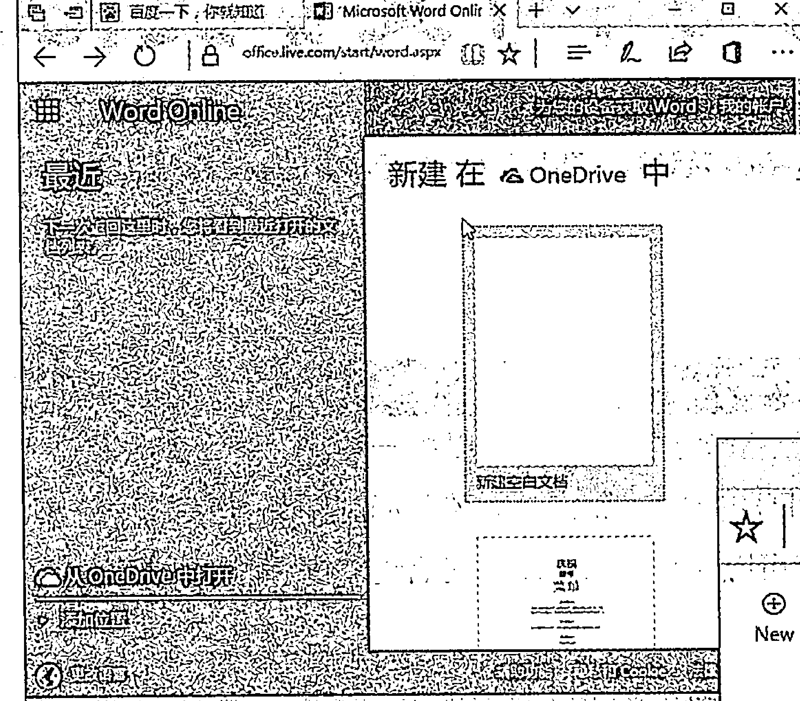

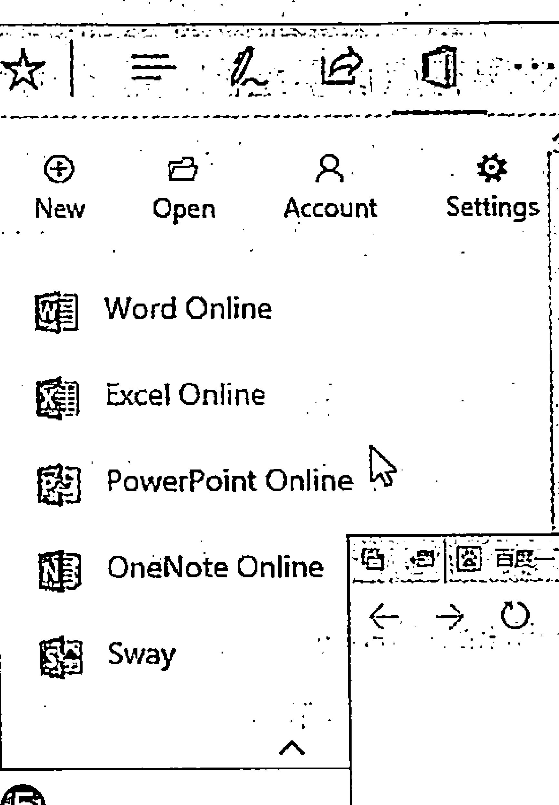

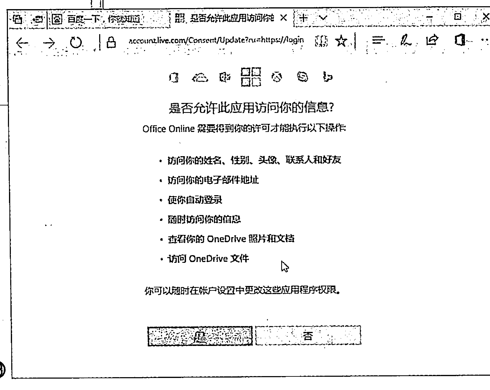

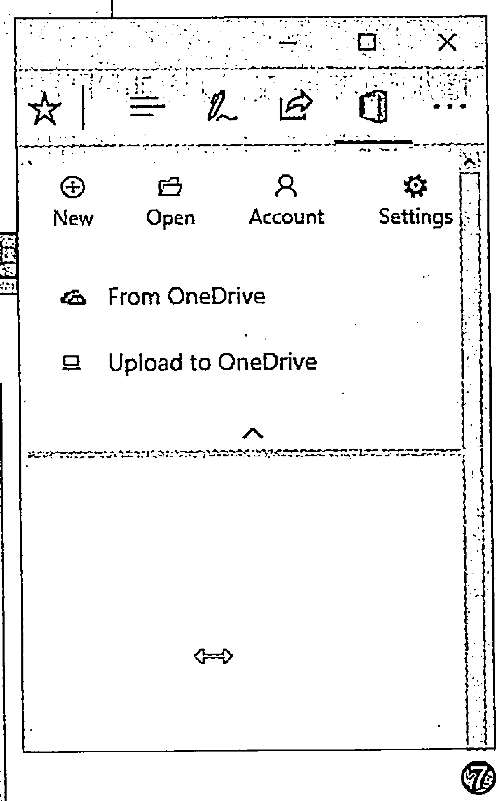

#### 本地办公文档编辑的实现

Office Online不但可以编辑和查看在线存储的Office文档，还支持对本地Office文档的操作。若要打开本地文档，需先点击Open按钮，选择Upload to OneDrive，先将文档保存到云端，然后用前述办法打开编辑。

需要说明的是，无论远程文档还是本地文档，编辑过程均是在云端进行，编辑操作所使用的是云端软件服务，所需要的软件仅是一个浏览器。这是与传统本地办公软件处理的区别所在。

疑难解答：为什么我的Edge浏览器中安装不了Office Online？
由于Office Online需要Windows 10 1607及以上版本支持，若系统为新版本但无法使用该扩展，请按下Win+R组合键，输入并运行WSRESET命令，重置应用商店，再进行尝试。

其实，Office Online不一定要在Edge浏览器中使用。如果你不习惯于使用Edge浏览器，或者使用的系统版本太低，没法运行Office Online插件，可换一种你习惯的浏览器使用Office Online。以搜狗浏览器为例，在搜狗浏览器中打开微软Office Online在线页面（https://products.office.com/zh-cn/office-online/documents-spreadsheets-presentations-office-online#office-online-products），选择其中一种办公产品，然后就可以像使用本地办公产品那样，在浏览器中办公了。

#### 相得益彰 PPT文字美化有办法

文|俞木发

在PPT文字美化制作的过程中，大家一般通过插入文本框或艺术字来组织文字，这样PPT中的文字就显得较为平淡。其实，PowerPoint本身就自带很多组件，可以对文字进行丰富的美化处理。

##### 巧用动画 制作动态文字

PPT中的文字默认都是静态显示。我们可以将一些文字增加动态特效，以增加PPT的动感。比如针对孩子们制作的六一PPT，在初始页面就可以使用动画制作一些活动的文字。

在PPT中插入艺术字，接着选中插入的艺术字，点击“动画→插入动画”，然后为文字添加一种进入的动画，比如可以选择“进入→飞入”效果(图1)。

为了获得更好的动画效果，还可以多重复几次。按住Ctrl键复制添加动画的艺术字，复制多次，接着将复制的艺术字全部对齐。这样在播放的时候就会重复显示多次动画效果(图2)。

##### 用好图片工具 制作铅笔字

铅笔字体的效果有点像手绘图，把它运用在PPT上，不但吸引人，而且会给演示文稿增添新意。在制作一些产品设计类PPT时就可以使用铅笔字来作为修饰文字。

在PPT中插入需要作为铅笔字的艺术字，选中文字，点击“开始→字体颜色→自定义颜色”，将RGB颜色全部设置为127。接着选中文字右击，选择“复制→选择性粘贴→PNG图片”，将文字转换为图片。选中转换后的图片，点击“图片工具→格式→艺术效果→铅笔素描”，这样文字就变为铅笔字的手绘效果(图3)。

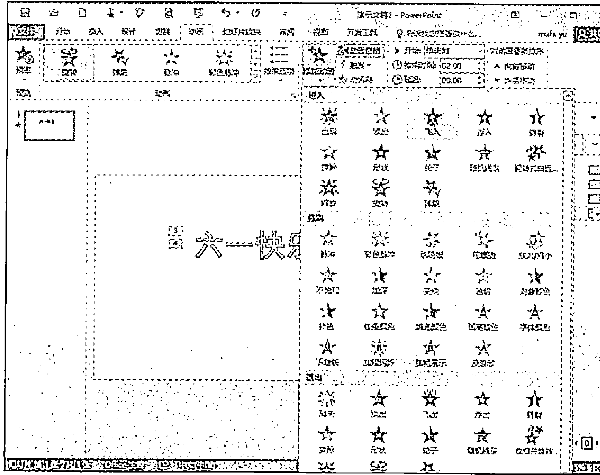

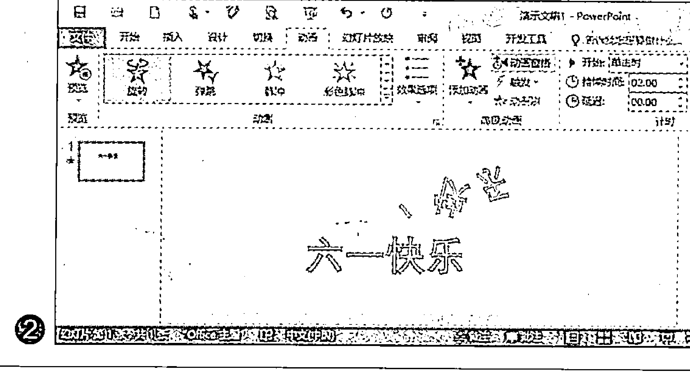

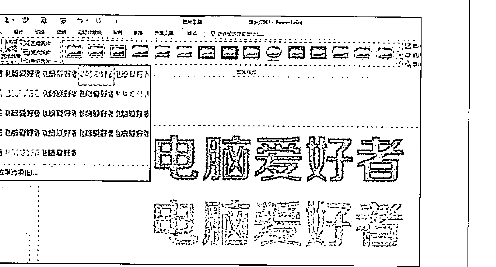

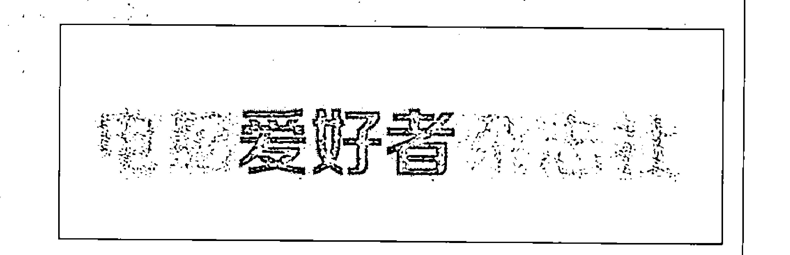

> **小提示**
> 用活填充工具可以制作出更多效果的文字，比如使用渐变色图片作为幻灯片背景，其中的文字同样可以使用类似的渐变色进行填充(使用渐变填充，并选择好渐变色的起始色)，这样图文看起来更为协调。

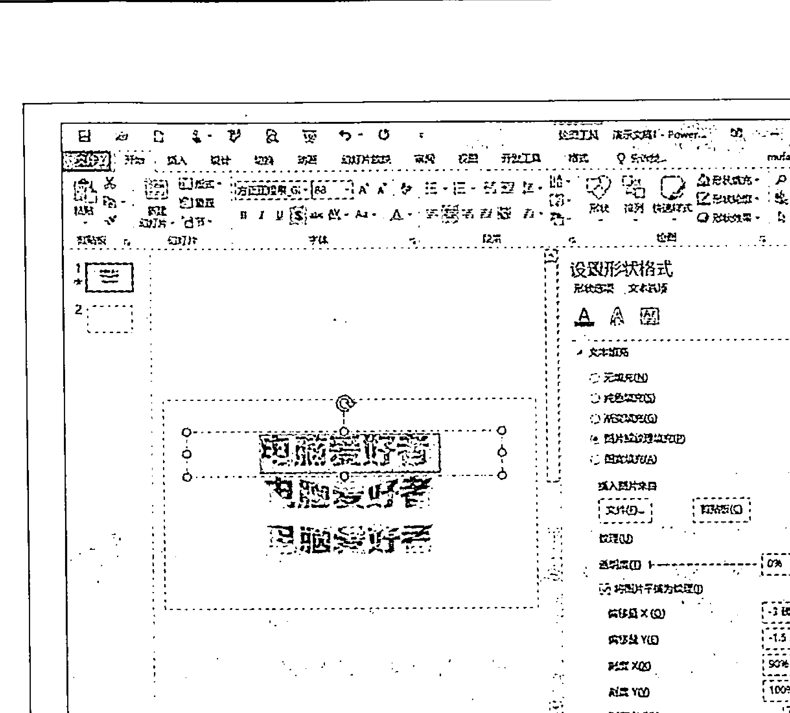

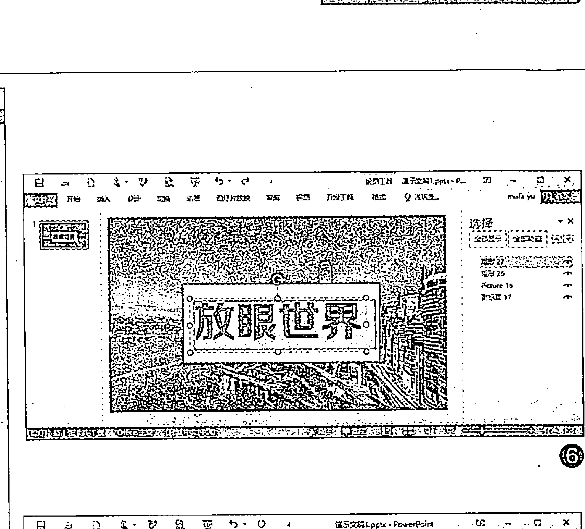

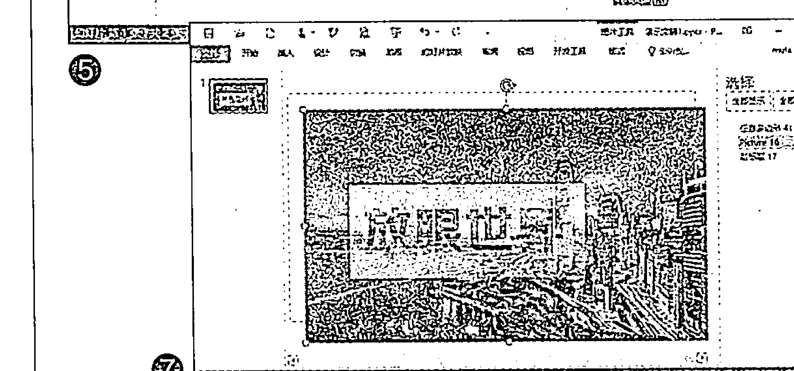

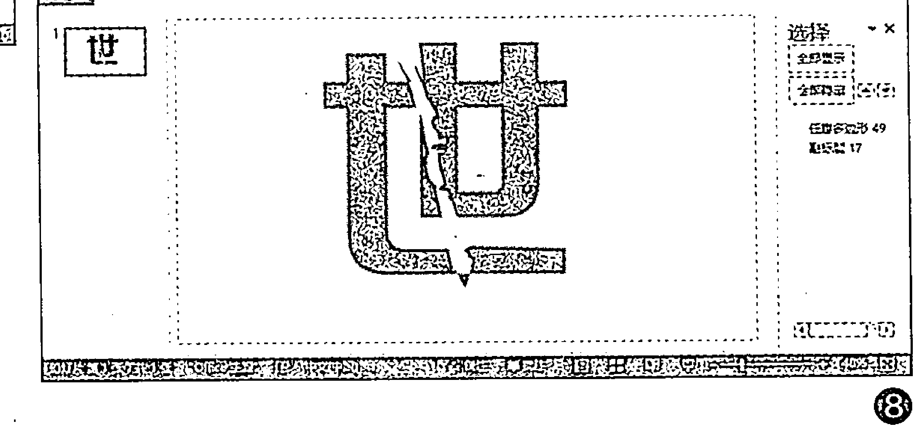

利用PPT提供的图片工具，还可以按需制作更多的特效文字。比如上述文字如果要突出“爱好者”这三个字，可先插入上述艺术字并复制二份为图片，一份在艺术效果中选择“模糊效果”，另一份使用裁剪工具仅保留“爱好者”内容。接着将其重叠到模糊图片上面并对齐，如果对比效果不明显，还可以在下方的艺术效果选项中调整模糊效果的数值(图4)。

##### 用活填充制作七彩颜色字

制作PPT时在图片上使用文字，可借助填充工具让文字变得五颜六色。

首先准备一张色彩斑斓的图片并复制到剪贴板，在PPT中插入艺术字，接着选中艺术字右击，选择“设置形状和格式”，切换到“文本选项→文本填充→图片或纹理填充→剪贴板”，勾选“将图片平铺为纹理”并对偏移量、刻度等参数进行调整。这样斑斓的图片就会填充到文字中形成多彩文字，选择不同的图片填充形成不同的颜色效果(图5)。

##### 另类组合制作图文合一特效字

文字和图片底色不同，文字和图片就有割据感。制作图文合一的镂空字可以让图文合一。

在PPT插入需要作为背景的图片，点击“插入→形状→矩形”，在其上插入一个大小合适的矩形，并将其底色设置为使用白色(或者浅灰色等浅颜色)填充，设置合适的透明度；点击“插入→艺术字”，在矩形上插入艺术字，将其字体颜色也填充为白色；点击“开始→选择→选择窗格”，在右侧按住Ctrl键依次点击艺术字、插入矩形框(注意先后顺序)，选中这两个图形(图6)。

点击“绘图工具→格式→合并形状→合并”，这样组合图形会变为一个任意多边形，此时移动多边形字体并设置适当的透明度，可以看到字体颜色已经变得透明，背景图案会自动填充到字体笔画之间，字体变得透明并和背景融为一体了(图7)。

此外，我们还可以使用其他合并形状如“剪除”来制作撕裂字体。同上插入艺术字，接着点击“插入→形状→任意多边形”，然后使用该形状作为分隔符，调整多边形图形到合适的大小和位置。同上依次选中艺术字和插入图形，点击“绘图工具→格式→合并形状→剪除”，这样即可完成撕裂字体的制作。还可以右击撕裂字选择“编辑定点形状”，对撕裂效果进行调整(图8)。

#### 始终如一 Excel序号输入有高招

文|愚人 平时的工作中我们经常要在Excel中输入序号对数据进行排序，但是在后续的操作中可能需要对数据进行排序、删减等操作，这样很容易导致原来的序号紊乱。其实掌握了一些技巧和方法，就可以保证序号的稳定如一，以解决各种序号的输入难题。

##### 不怕排序快速整理排序后的序号

在Excel中对已经做好排序的数据，在进行排序时经常会将序号变得混乱。对于这类数据的重新排序我们可以使用自动填充的方法快速重新填充序号。比如原来的数据排序发现序号紊乱，那么可以在原来的序号列输入原来第一个序号（本例为“一”），接着按住鼠标下拉填充，填充类型选择“填充序列”即可快速完成序号的填充（图1）。

Excel自动填充可以很方便地输入各种序号，比如对于重复星期的输入，选中需要填充的单元格，点击“开始→填充→列→日期→工作日”，这样输入“星期一”后进行填充即可。当然还可以进行填充等比、等差递进的序列（图2）。

##### 无惧增删解决增删数据后断层序号

对于已经排序好的数据，如果删除其中一行或者多行数据，会导致原来的序号出现断层。对于这种序号断层的问题，可以借助SUBTOTAL函数自动排号。

这里以图1的数据为例，在A2输入公式“=SUBTOTAL(103,$B$2:B2)”并填充，可以看到填充后自动添加上1、2、3序号，不同的是这里的序号是会随着工作表动态变化，比如删除一列数据，则序号自动进行调整。同样新增或者对数据进行排序，A列的序号也会动态进行调整（图3）。

##### 循环序号轻松填写

平时工作中一些数据需要使用重复序号，如果需要填充的序号较多，手工填写费时费力且容易出错。对于这类序号可以借助MOD函数和ROW函数制作循环序号。比如需要输入每个年段的班级序号，只要在B2输入公式“=MOD(ROW(3:3),3)+1”并向下填充，就可以得到循环的1、2、3序号（图4）。

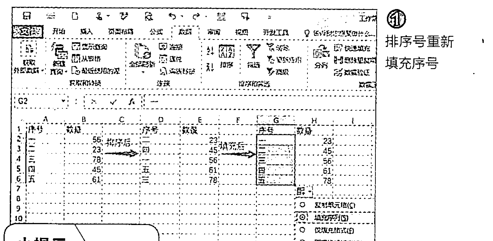

> > **小提示**
> > 103为计数函数，对所选单元格范围内的非空单元格的数量进行计数，$B$2:B2表示选择范围，并根据这个范围进行计数。这样B列的数据调整后，A列的序号就会自动进行调整。

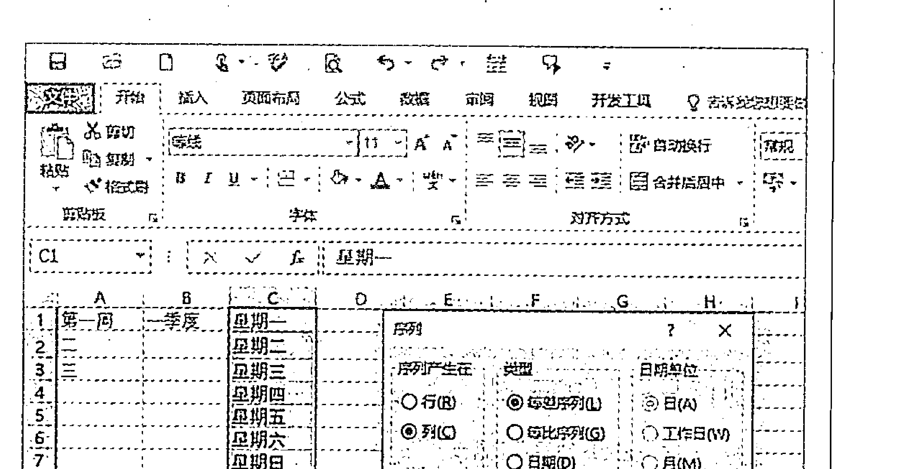

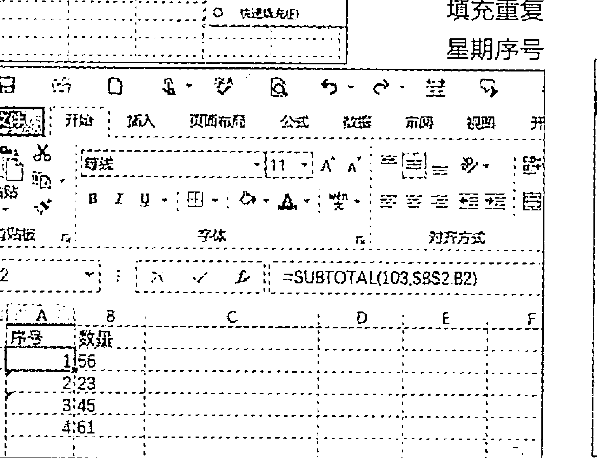

| 年段 | 班级 |  |
|---|---|---|
| 一年 | 1 | 1 |
|  | 2 | 2 |
|  | 3 | 3 |
| 二年 | 1 | 1 |
|  | 2 | 2 |
|  | 3 | 3 |
| 三年 | 1 | 1 |
|  | 2 | 2 |
|  | 3 | 3 |

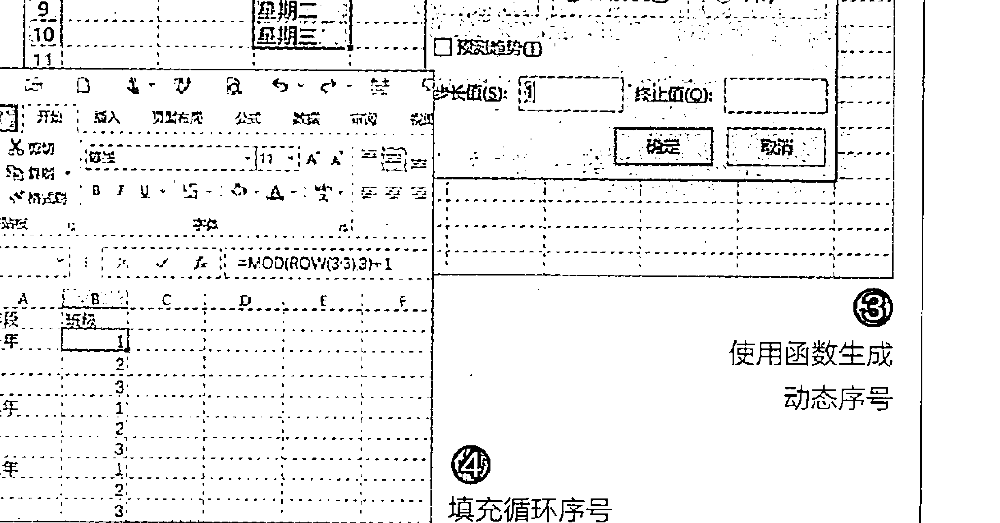

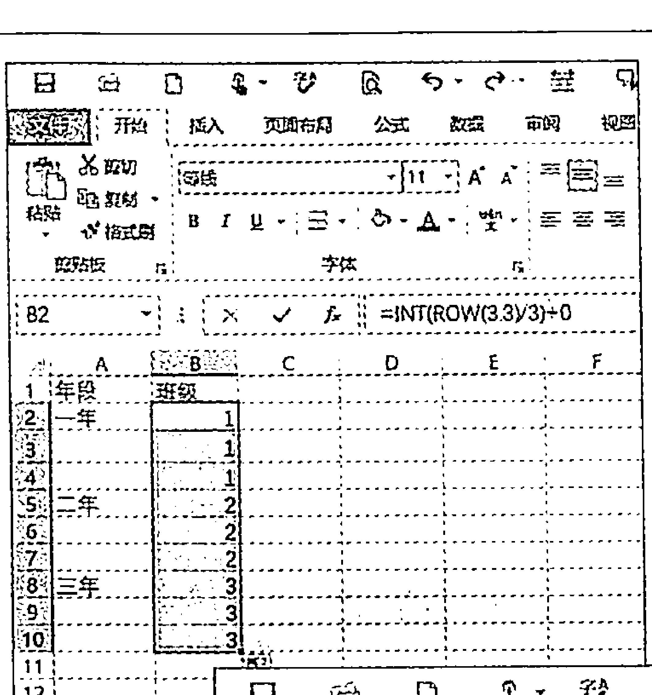

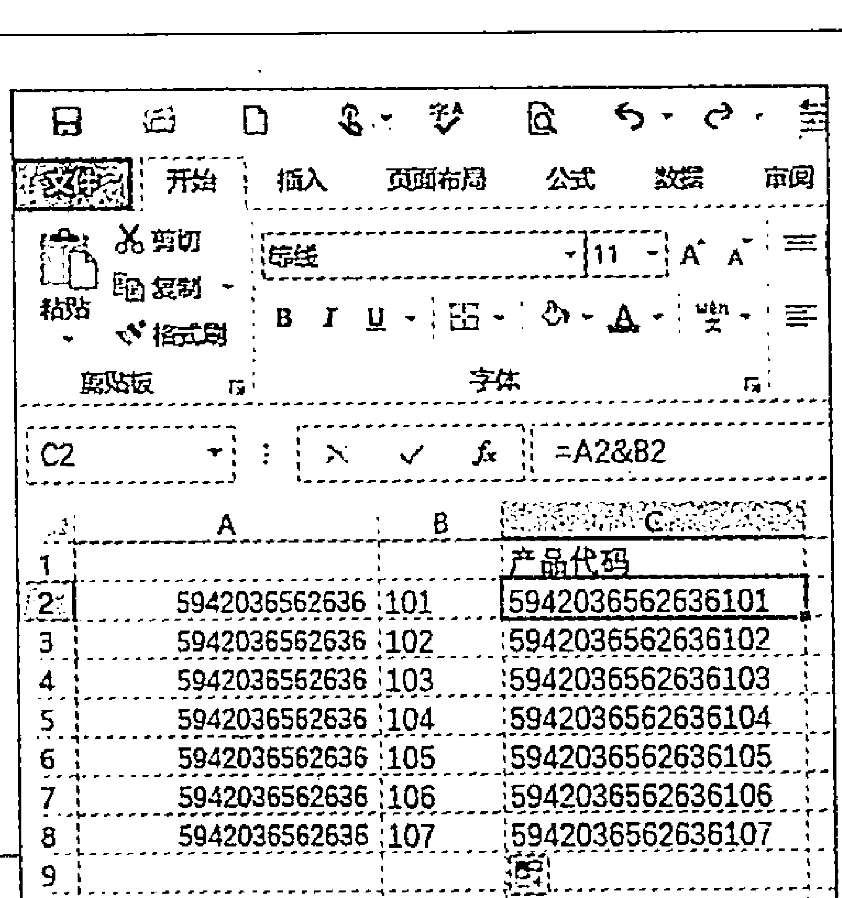

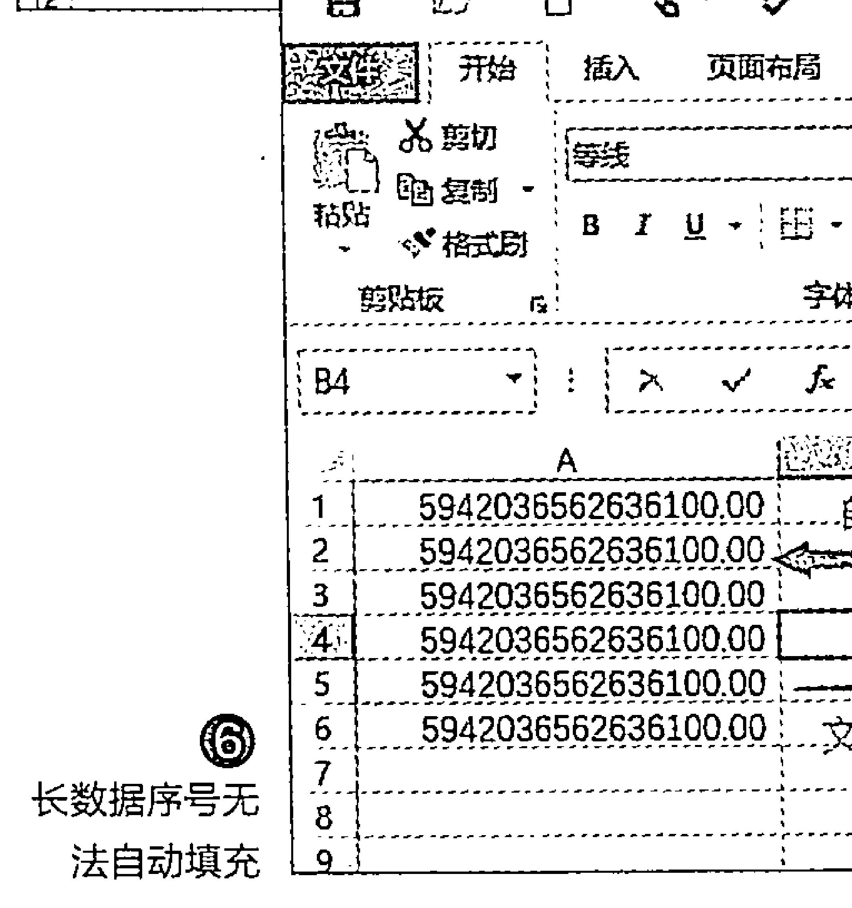

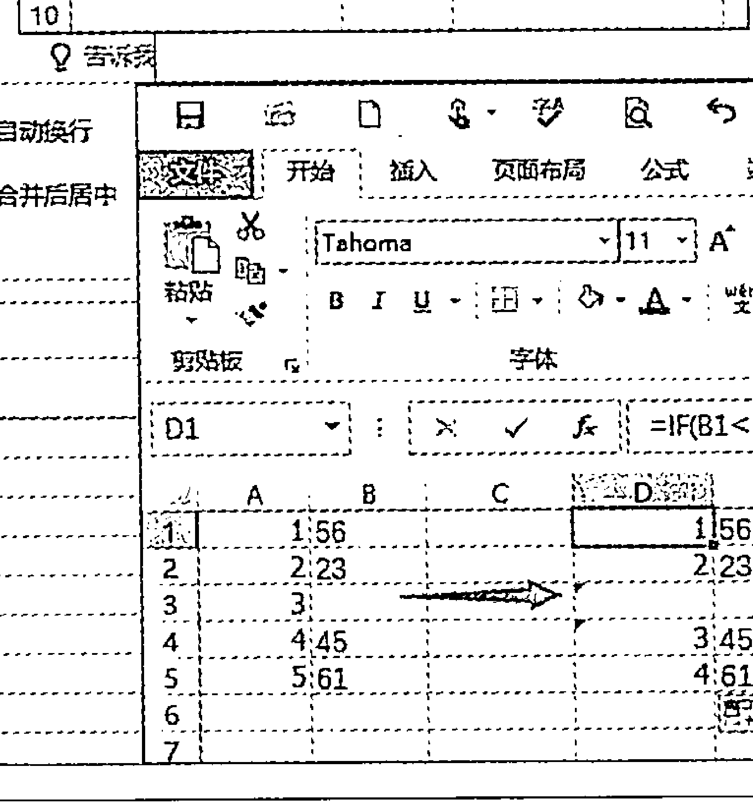

填充即可。如果要重复输入1→5，则将其中参数“3”更改为“5”即可（图4）。

Excel中输入循环序列的函数还有许多，如要输入类似1, 1, 1, 2, 2, 2循环序号，则可以使用INT和ROW函数。比如在B2输入公式并填充即可获得类似的循环序列（图5）。

```
=INT(ROW(3:3)/3)
```

##### 超长序号连接输入

日常工作中很多公司的产品都会使用自己企业的零件代码编号，比如类似5942036562636101、5942036562636102，前缀5942036562636是公司内部代码，表示子公司、部门等代码，101为起始序号。由于这些代码超过15位数字，在Excel中默认会使用科学计数法表示（无法显示完整序号也无法自动填充），如果使用文本模式自动填充只能复制文本（图6）。对于这类超长的代码序号，可以将代码分段，然后使用连接符号输入。

首先在A2输入前缀代码，并将单元格的格式设置为“数值”（小数点0位）并向下填充，在B2输入101并填充，接着在C2输入，这样C列就会自动输入上述超长序号。当然如果你的序号是更长的数字，可以使用多列输入，然后再进行连接即可（图7）。

```
=A2&B2
```

##### 空行不编号 生成有数据的连续序号

日常的数据中为了美观，很多数据都会人为增加一些空行进行隔断。默认情况下自动填充会为这些空行添加序号，造成序号紊乱。现在可以借助IF函数生成有数据的连续序号，空行自动留空。

在D1输入公式，这里使用<>对B1单元格数值进行判定，如果B1≠空，则D1等于B列B1开始向下累加至相应行的非空数据数量值，否则为空。这样只要B列的数值是空值（空单元格），那么序号就留空，从而实现空行不编号（图8）。

```
=IF(B1<>"",COUNTA($B$1:B1),"")
```

当然由于这里是使用IF嵌套Count函数对单元格进行判定，同样也可以根据B列数据的变化进行动态调整。比如在B列添加或者删除数据，那么对应的A列序号也会智能进行序号的增减，大家可以在A1输入公式后预先填充，这样B列数据变化后可以自动进行序号的调整。

#### 先天不足现在补 手动美化PPT配图

文/愚人

平时PPT的制作少不了配图，但是很多时候我们预先准备的配图却由于质量不佳上不了“台面”，如一些产品的配图可能是手机拍摄的像素较低，一些活动照片可能是在晚上拍摄的质量较差。但是这些配图又不得不用在PPT中，此时该如何美化这些低质量的配图？下文就给大家介绍一些技巧。

##### 以高换低 用好搜索引擎找图功能

现在网络如此发达，很多搜索引擎都有“以图找图”功能，因此如果手中配图质量较差，那么我们可以通过搜索引擎来查找更高质量的配图。以百度为例，打开http://image.baidu.com/，点击“本地上传”将低质量图片上传，这样百度会自动识别，并快速找出同类产品的图片（图1）。

接着在搜索结果中按提示选择更高质量的配图，这样就可以完成图片的美化。在PPT中看看原图和搜索图片的质量是不是差别很大（图2）？

当然搜索引擎也不是万能的，可能很多时候我们无法通过搜索引擎找到一样的图片。不过PPT本身已经自带很多图片美化组件，我们可以根据图片的实际使用情况对其进行美化。

##### 以虚换实 为图片添加虚化效果

如果一些图片的质量较低，为了降低用户对图片的关注，我们可以将这些图片作为PPT背景，然后对其进行虚化处理即可。这样既可以使用原来的图片，又可以使像素低的图片看起来更美观。

在PPT中选中需要处理的图片，点击“图片工具→图片格式→艺术效果→虚化”，然后打开虚化设置选项，拖动“半径”滑块，使得用户只能看到产品图片的大概轮廓（图3）。

图片虚化后为了突出产品轮廓，切换到“填充和线条”，选择一种自己满意的渐变填充效果，这样PPT背景显得更为专业。因为虚化后会淡化用户对图片的视觉，点击“插入→艺术字”，插入需要作为标题的艺术字，颜色选择鲜艳一些的字体，这样可以将观众的视觉转移到文字上来，弱化虚化图片效果。看看经过“虚化+渐变填充”处理后的效果是不是要比原来好多了（图4）。

当然我们还可以根据图片的实际情况进行更多的图片处理，比如对于棱角比较分明的图片，如手机则可以在艺术处理中选择“铅笔灰度”，这样可以获得类似手绘的效果。如果是比较老旧的图片，则可以在“颜色→重新着色→选择黑白色”，打造出黑白怀

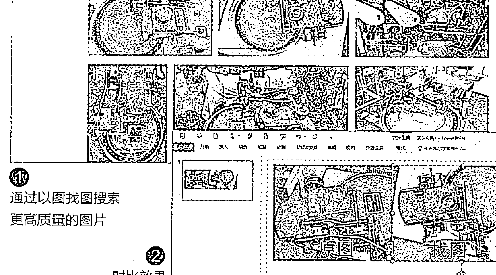

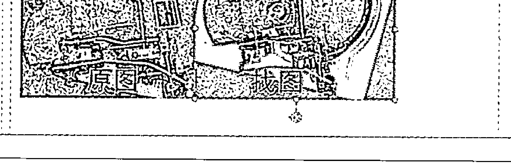

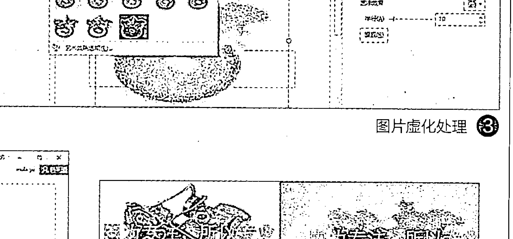

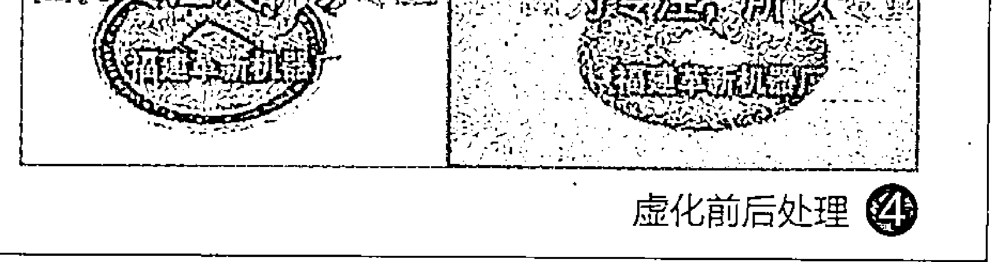

旧的效果，经过这些处理后可以很好地降低用户对低质量图片的关注。

##### 以多换少使用平铺排版提高图片质量

大家知道低质量图片在PPT中看起来不舒服，主要是由于我们在PPT中对图片进行放大、拉伸处理，这样低质量图片的锯齿效果就更明显，导致PPT质量不高。因此如果有多张类似图片需要使用，我们可以将多张低质量图片进行平铺处理，这样图片小而且多张排列，可以有效提高图片整体观看质量。

图片的平铺排版借助PPT的SmartArt组件即可。在PPT中插入多张低质量的图片，按住Ctrl键依次选中插入的图片，点击“图片工具→格式→图片版式→蛇形图片题注列表”，这样选中的图片就可以快速完成平铺的展示（图5）。

按提示再将文本说明添加上去，再对图片颜色、版式美化一下，这样即使原来的图片质量较低也不会影响整体的观感（图6）。

> **小提示**
> 如果图片进过上述处理后在播放时仍然显示比较模糊，那么还可以插入一个矩形，填充适当颜色后设置透明度作为蒙版叠加在排版上面，打造出朦胧效果，以降低用户对图片的关注。


##### 以偏换全提取主体图片美化配图

对于一些背景比较单纯的图片，如果图片的主体质量尚可，那么为了突出主体，我们可以使用PPT删除背景的功能，将主体图片提取出来，然后通过为其更换其他背景或者添加样机相框的方式来提高图片显示质量。

比如需要在PPT里插入一张表达人造牛市的图片，如果手上仅有一张模糊的牛图片，那么为了提升PPT的质量，我们可以首先使用删除背景的方法将“牛形”提取出来，然后准备一张股市清晰图片作为背景，再将模糊的牛形图片叠加在背景图上。由于背景图片和文字非常清晰，这样观众在查看这个PPT的时候就会“忽略”原来低质量的图片（图7）。

当然我们也可以通过为图片添加透明相框的方法美化图片。如原来手上只有一张模糊的储钱罐图片，现在如果要制作一张理财PPT，那么我们可以先到网上下载一张关于理财的样机图片，下载后将其插入PPT中，同时将低质量的储钱罐图片添加到样机图片中并将其缩小以提高质量，这样配上相应的文字说明后即可（图8）。

总之，对于低质量图片的美化操作，在PPT中主要是通过各种手段来弱化观众对图片的关注。比如进行虚化、平铺、更换背景、添加样机相框等方式，通过添加其他清晰图片或者文字进行对比，从而实现低质量图片的变相提高质量。当然在实际操作中，大家可以将上面几种方法综合运用。

### 移动新天地

#### 双刃剑？合理利用手机文件夹的云功能

文/镜花水月

智能手机和功能机的最大差别就是可以通过安装APP实现无数功能。问题来了，在哪里寻找下载APP？相信大家的答案都是手机自带的应用商店。实际上，除了应用商店，手机桌面上的文件夹也是一个不错的下载渠道，有时候可能要比商店更方便呢。

出于方便用户或是商业推广等目的，很多Android手机厂商都在系统层面引入了云应用或云文件夹的概念。它们的存在可谓有利有弊，利在于有时真能推荐一些靠谱好用的APP，而弊则是错点容易浪费流量。那么，如果我们能深入了解它们的运行机制，将有利一面更多的潜力挖掘出来呢？

目前Android手机在云应用的推广上普遍采用三种思路，下面我们就来一一介绍。

##### 指定的云文件夹

以华为(EMUI)为代表的Android手机默认都能在桌面上找到一个名为“精品推荐”的文件夹，和其他文件夹(包括我们自己建立的)相比，精品推荐文件夹在左上角提供了一个类似于云的按钮，而且文件夹里也存在一些带向下小箭头的APP图标(图1)。

需要注意的是，这些图标只是一个链接，不占用内存也不会自动下载应用，必须自行点击才会下载并安装。如果你对该文件夹推荐的APP不感兴趣，点击云图标另一侧的刷新按钮，就能更换其他的推荐APP。

如果你不希望看到这种形式的推荐，可以点击精品推荐文件夹上的云按钮，看到上面出现一道斜杠并变暗后就相当于关闭了APP推荐功能(图2)。此外，我们也能通过解散这个文件夹，或是在手机主界面状态下双手捏合屏幕，在弹出的主页编辑界面中点击“设置”(图3)，然后关闭“应用建议”功能即可(图4)。

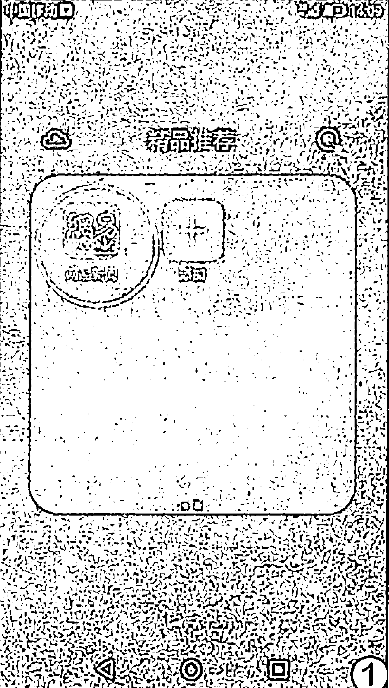

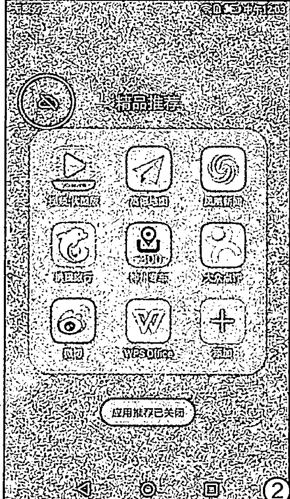

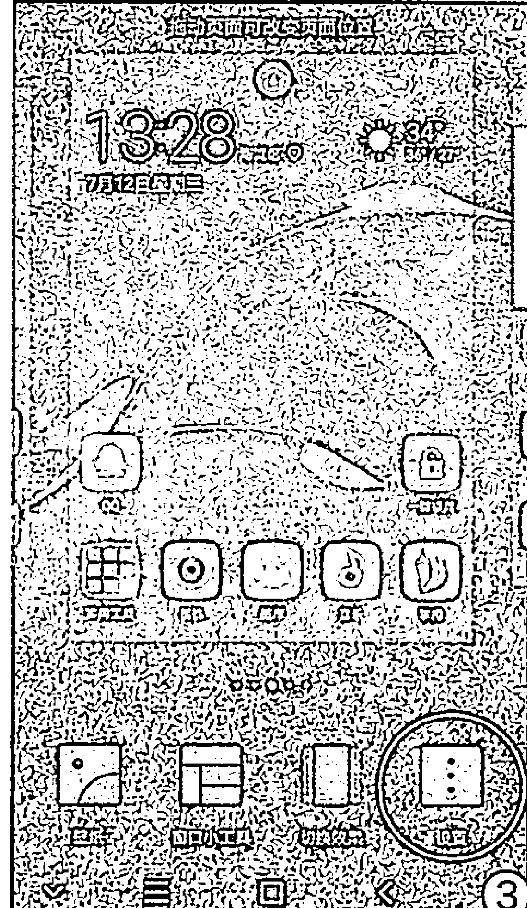

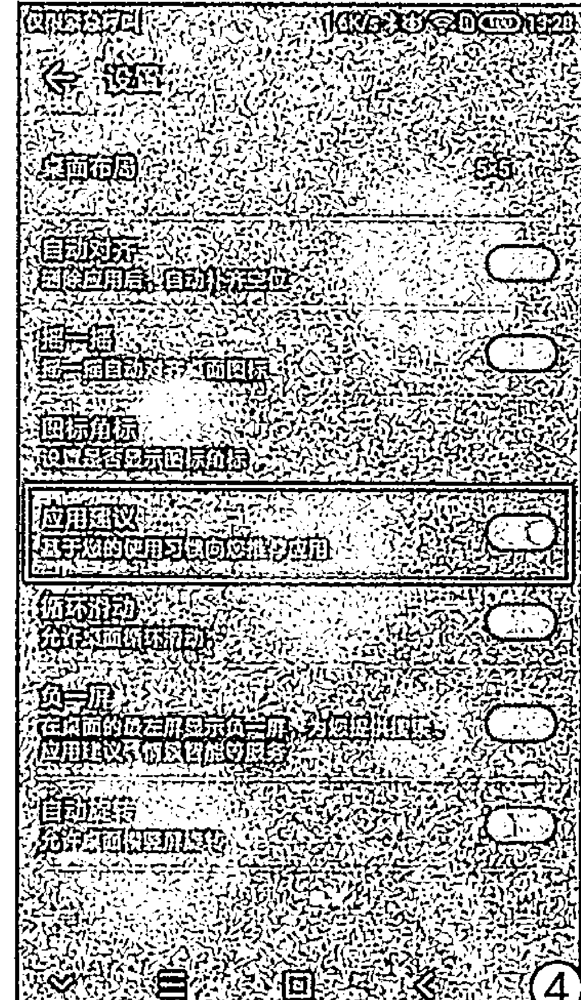

##### 随叫随到的云推荐

以小米(MIUI)为代表的Android手机在每一个文件夹(包括随机自带和自己新建的)里面都集成了APP推荐功能，只是系统默认将该功能给隐藏了起来。

将该功能激活的方法很简单，那就是进入文件夹并点击文件夹对应的名称，在重命名编辑界面的对话框下方就会出现一个“猜你喜欢”的开关(图5)，点击它然后退回到上级界面，你就会发现在该文件夹底部新增了一行猜你喜欢的APP图标(图6)，你可以左右滑动或点击刷新按钮寻找自己所感兴趣的APP，点击任意图标就能弹出安装按钮了(图7)。

至于猜你喜欢的规则，和文件夹名称以及里面所保存的APP类型有关。如果你担心该功能容易因误操作而浪费数据流量，可以进入安全中心的联网控制界面，找到并关闭“系统桌面”和“应用商店”使用3G/4G联网的权限即可(图8)。

小提示
华为手机解散“精品推荐”文件夹的操作是不可逆的。解散后，哪怕你重新建立一个名为“精品推荐”的文件夹，也不会再出现云推荐的按钮了。所以除非你真的不需要，否则建议大家不要删除或解散默认的精品推荐文件夹。

##### 省流量的“云应用”

以华硕(Zen UI)为代表的Android手机则在云文件夹的基础上还引入了“云应用”的概念。先来看看它的云文件夹功能，点击文件夹里的“更多应用”图标(图9)，这个文件夹就会自动列出从应用商店里检索出来的结果(就是以当前文件夹名称为关键词检索)，可以直接下载从而免去了进入应用商店的流程(图10)。

而云应用功能则是在文件夹界面往上拉一下屏幕，就会出现与该文件夹有关的云应用(图11)，无需下载APP，直接通过网络就能在这些云应用中操作。这种云应用和微信小程序很像(图12)，不用担心下载存在病毒木马的安装包，也不会耗费更多系统资源。

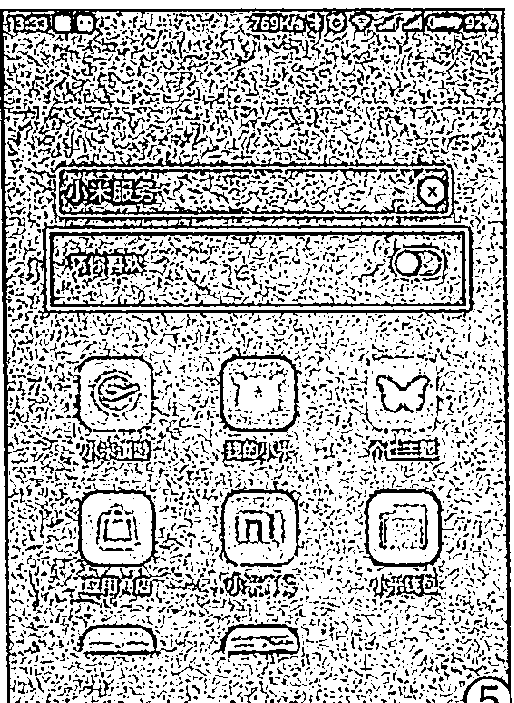

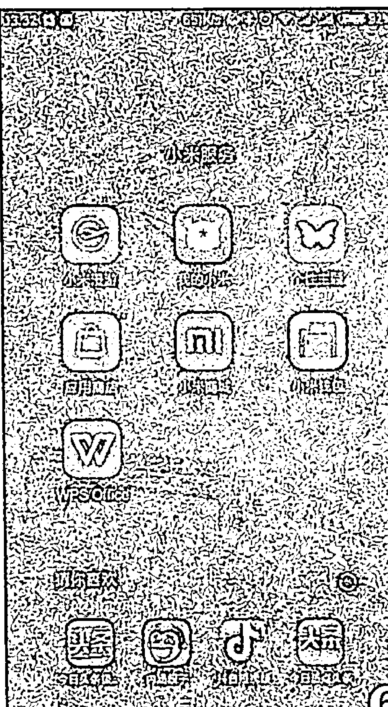

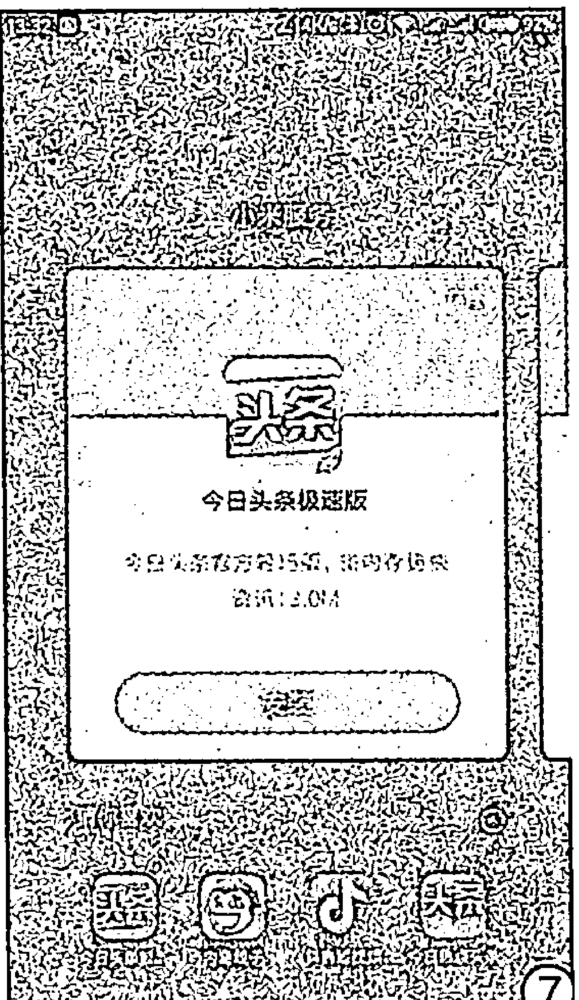

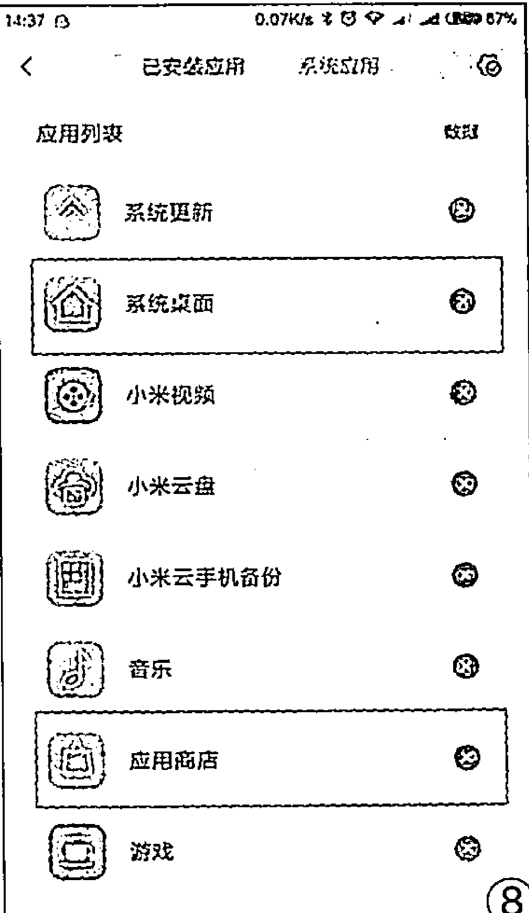

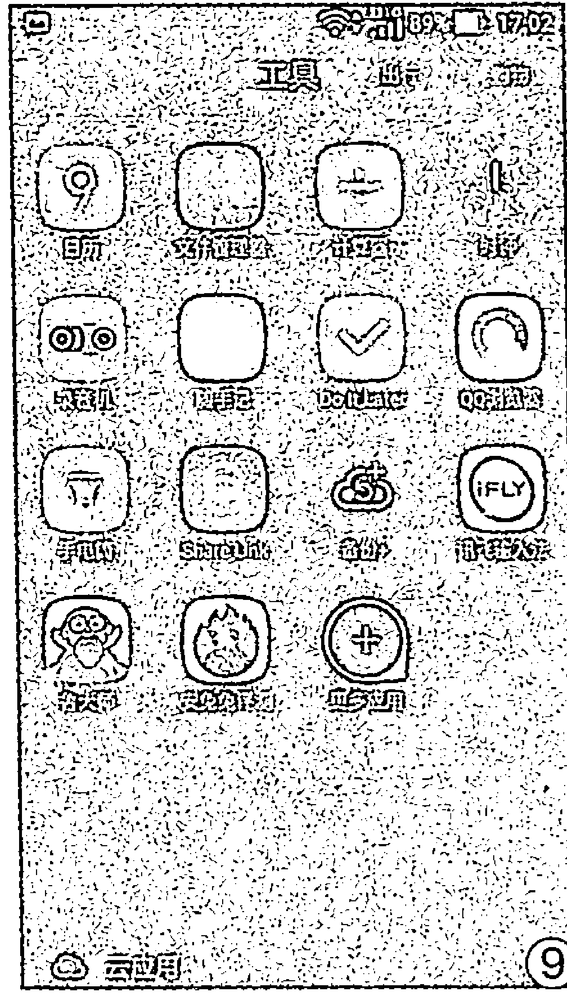

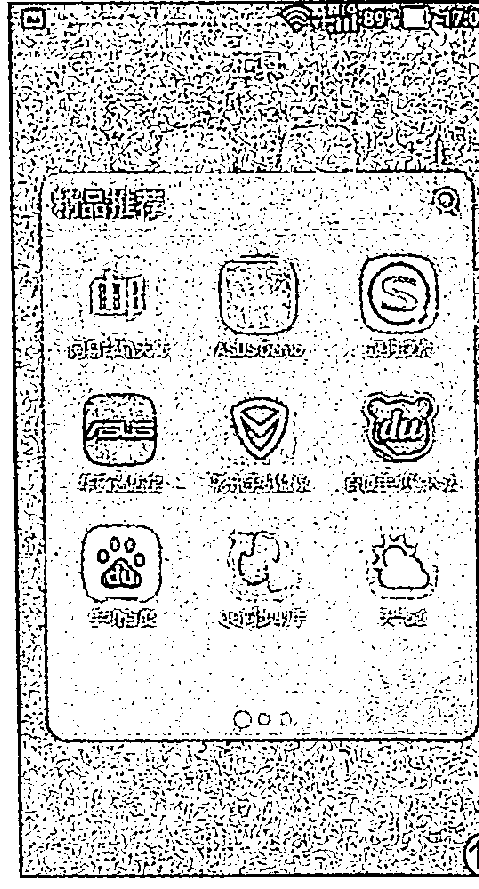

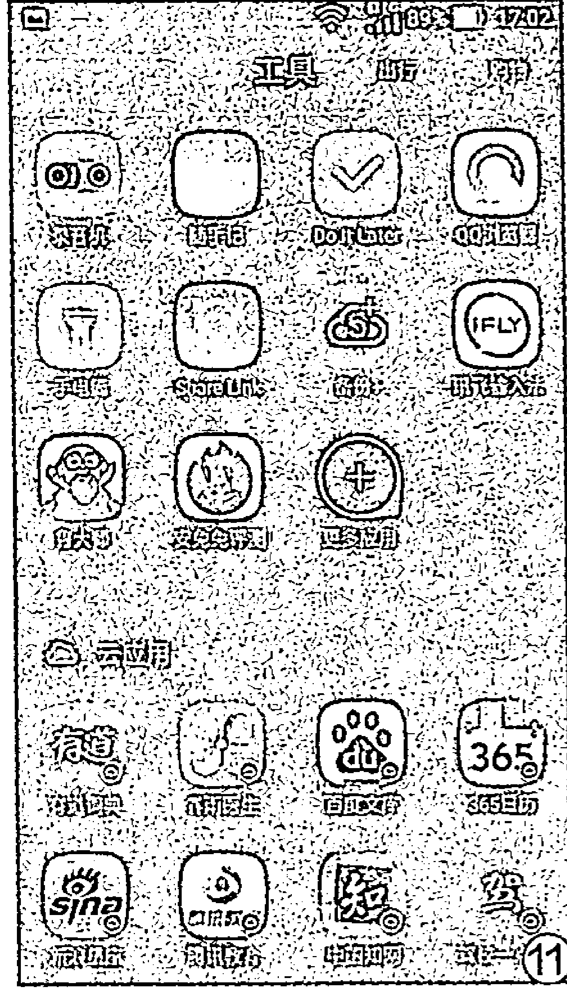

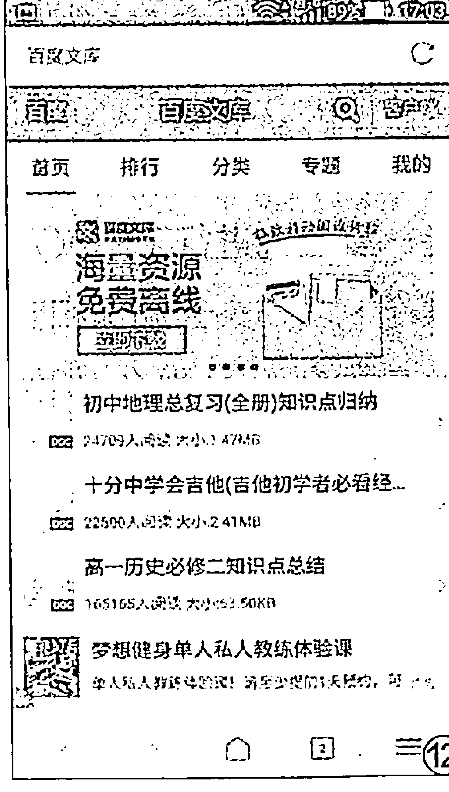

#### NFC银行卡支付的那点事

文|静花水月

如今很多高端Android手机都开始主打全功能的NFC功能，即可实现添加银行卡和公交卡，用手机刷POS机的服务（图1）。不过，不少用户都在手机刷银行卡时遇到了各种各样的问题，今天我们就简单对常见问题进行一下解答（以华为手机为例）。

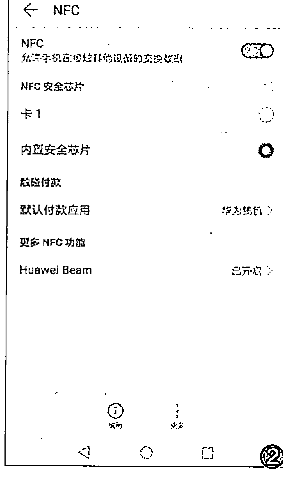

如果在添加银行卡时出现“未知类型的错误，请您联系银行客服，卡号识别错误”的报错提示，请检查手机网络，或是由于摄像头扫描银行卡号与实际银行卡号不一致，需要手动修改。如果总是提示“无法连接服务器”，可尝试备份数据后进行恢复出厂设置解决。

如果靠近POS机无反应，请进入手机设置，确定NFC功能已打开、内置安全芯片开启，默认付款应用为华为钱包并同时开启Huawei Beam（图2）。

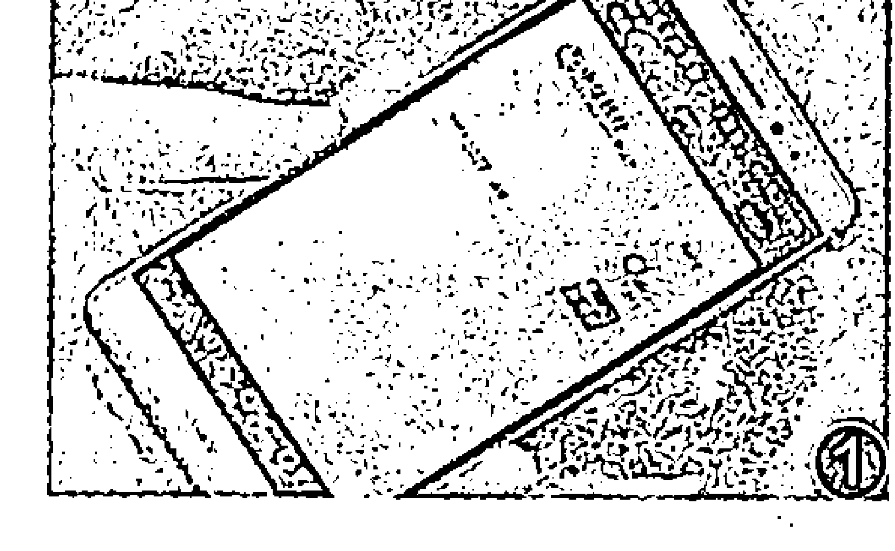

此外，一些较厚或金属材质的手机壳会阻碍NFC感应，还有一些POS机自身就不支持而阻碍了NFC感应，需要在标有银联及QuickPass闪付功能的POS机上消费。

当我们更换新机后，可能需要移除已绑定的银行卡。具体方法是打开华为钱包→我的→卡包→点击需要移除的卡片→详情→移除卡片。如果总是遇到移除失败的问题，可使用另一个华为账号登录华为钱包，然后进入华为钱包→Huawei Pay，点击添加→添加银行卡，会提示“其他帐号添加的银行卡占用安全芯片，需要清空后添加。是否立即清空？”点击同意即可清除。

#### 无需ROOT也能修改Hosts文件

文|天涯衰草

我们知道Host文件的作用有很多，除了可以加快网站域名的解析外，还可以进行广告屏蔽等操作。但是要想在Android系统修改Hosts文件的话，往往首先要对系统进行ROOT操作才可以。但是一旦系统进行了ROOT操作将面临失去质保和安全方面的风险。那么，如何实现不ROOT操作也能对Hosts文件进行修改呢？

首先，我们需要从网上下载一款名为Postern的应用（下载地址：http://dwz.cn/61voXn），首次运行软件会弹出一个提示窗口（图1），询问用户是否创建一个VPN链接，这里我们暂时点击“取消”按钮。

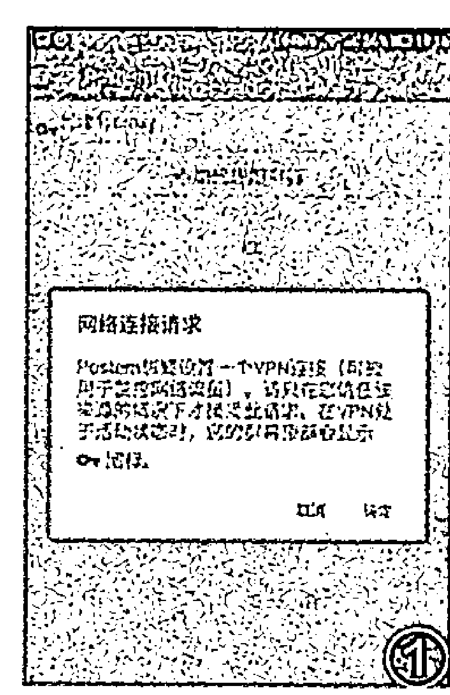

接下来点击应用左上角的“菜单”按钮，在弹出的菜单中选择“配置hosts文件”命令；接着点击窗口列表中的“添加Host-ip”按钮。然后根据提示在“Host”里面输入对应的网址，在“IP地址”里面输入相应的IP地址信息，最后点击“保存”按钮就可以了（图2）。

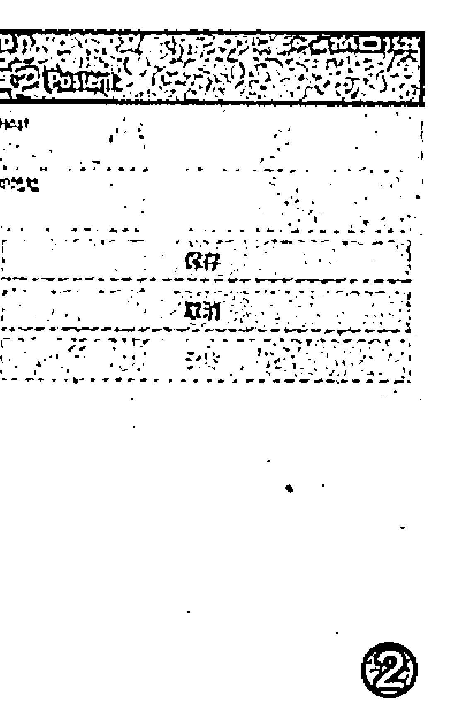

现在我们再次点击“菜单”按钮，在弹出的菜单里面选择“DNS”命令。在“DNS服务器”里面设置一个自己常用的服务器地址，设置完成以后点击“保存”按钮即可（图3）。

最后我们再次点击“菜单”按钮，选择菜单中的“打开VPN”命令，这款软件就自动开启了一个网关功能，而所有的信息都会通过这个网关进行传送，这样无论是修改的Hosts文件还是DNS信息都可以马上起到作用。


#### 快速搜寻和下载电影字幕文件
文|天涯衰草

对于那些喜欢观看国外视频的用户来说，视频字幕文件的重要性不言而喻。那么，通过手机能不能快速下载到需要的字幕文件呢？

首先通过应用商店下载一款名为“字幕狗”的应用（下载地址：http://dwz.cn/61vQTV），运行后我们只需要在应用上方的输入框里面设置要查找的视频名称就可以进行搜索了。

如果搜索的视频文件拥有众多版本的话，就会在列表中依次显示出每个版本的具体信息(图1)，而我们只需要根据自己的需要点击相应的版本名称就可以了。此时就会在弹出的对话框里面看到所有可以下载的字幕文件，从中点击一个自己认为可以的字幕文件即可(图2)。

现在我们返回到“字幕狗”应用的主界面，点击工具栏中的“查看”按钮后，在“已下载”标签列表中就可以看到刚刚下载的字幕文件。由于有的字幕文件是以压缩包的形式存在的，所以我们点击选中这个字幕文件后，选择菜单中的“解压”命令就可以将这个文件进行解压操作(图3)。当然，如果你认为下载的字幕文件不符合自己的要求，也可以点击“删除”按钮将它直接进行删除操作。

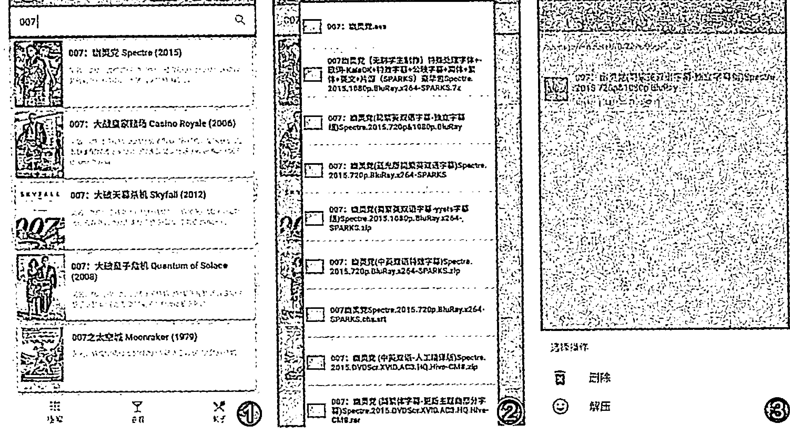

#### 航班信息一手掌控
文|静花水月

对经常坐飞机旅行或出差的用户而言，最希望的就是可以随时掌握航班变动信息，或是进行网上值机等操作。此外，如果是经常委托第三方机构订票，自然也不希望因提交信息有误而导致订票失败，影响正常登机。

好消息是，现在只需我们在手机安装“航旅纵横”（下载地址：http://www.umetrip.com/）这款APP，就能通过手机查看已定航班，以及各种高级操作功能了。

首次运行航旅纵横时需要通过手机号注册，然后进行实名认证。实名认证的渠道有身份证和护照等(图1)，以身份证为例输入身份证号码后，可以通过支付宝或微信进行快速认证。如果你不愿等待，建议使用微信，支付1分钱就能即时通过认证(图2)。

实名认证后，航旅纵横就能显示你当前所预订的航班信息(图3)，如此就不用担心第三方机构将你的信息弄错而预定失败了。此外，该软件还可查看你本人过往乘坐的所有航班信息（一年内）(图4)，并可进行选座服务等等，非常简单便捷。

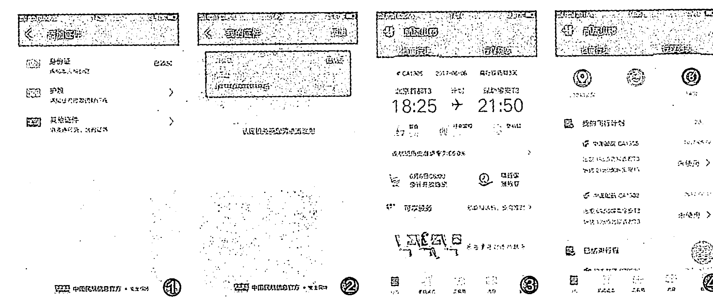

#### 解读数字密码

#### 手机拨号盘的多功能使用

文|一行

随着微信、QQ等社交软件的流行，如今电话功能已不再是手机最重要的一环，但拨号盘仍然是人们每天接触的。当我们看到拨号盘上的*或#时（图1），是否会疑惑这些符号与纯数字的号码有什么关系？除了打电话，手机拨号盘还能做什么呢？实际上，这两个不起眼的符号，也有自己的作用。

##### 了解USSD功能

USSD (Unstructured Supplementary Service Data) 即非结构化补充数据业务，是一种新型的基于GSM网络的交互式数据业务。当你使用手机键盘输入一些网络已预先制定的数字或者符号比如*、#等，再按Send也就是拨号键就可以向网络发送一条指令，网络根据你的指令选择你需要的服务提供给你。接下来，笔者就总结一些常用的USSD功能。

###### 1.查看IMEI号码

IMEI即移动通信国际识别码,是由15位数字组成的“电子串号”，它与每台移动电话机一一对应，而且该码是全世界唯一的。当手机出现故障需要保修时，客服中心都会和你确认手机IMEI码，看看它是否为国行、有没有过保。想知道自己手机的IMEI码，只需在拨号盘输入“*#06#”即可（图2）。

###### 2.开启来电转接

如果你有事无法立刻接听电话，又不想受到他人打扰，来电转接就是最有效的方法。除了可以通过系统设置开启来电转接，直接在拨号盘界面也能完成：输入“**21*号码#”即可（“号码”即转接的目标号码），输入“##21#”可取消。

如果不想一接电话就转接，我们也可以开启条件来电转接：①将21改成62，即为关机或不在服务区呼叫转移。②将21改为67，即可设置成遇忙呼叫转移。③将21改为61，即可设置为应答呼叫转移。输入“*#21#”即可查询手机呼叫转移状态。

小提示
很多地区的来电转接功能需要提前让运营商开通才可使用。

###### 3.呼叫限制

这部分功能需要知道手机网络密码才能实现，网络密码由运营商提供，可直接向其询问。开启禁止所有拨入电话为“**35*网络密码#”，关闭为“##35*网络密码#”。开启禁止所有播出电话为“**33*网络密码#”，关闭为“##33*网络密码#”。开启禁播国际长途为“**331*网络密码#”，关闭为“##331*网络密码#”。

###### 4.工程模式

部分手机可通过拨号盘进入工程模式，从而快捷进入手机测试和状态查询。以三星为例，输入“*#0*#”即可进入工程测试模式，里面有各种各样的功能供手机测试（图3）；华为手机输入“*#*#1357946#*#*”可查询识别码及SN码，输入“*#*#2846579#*#*”可进入工程模式；小米手机输入“*#*#4636#*#*”也可显示手机信息、电池信息、电池记录、使用统计数据、Wi-Fi信息等实用工具（图4）。

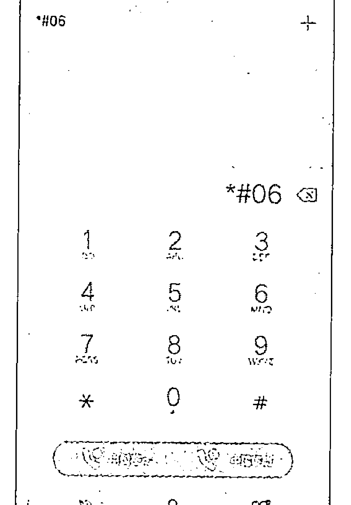

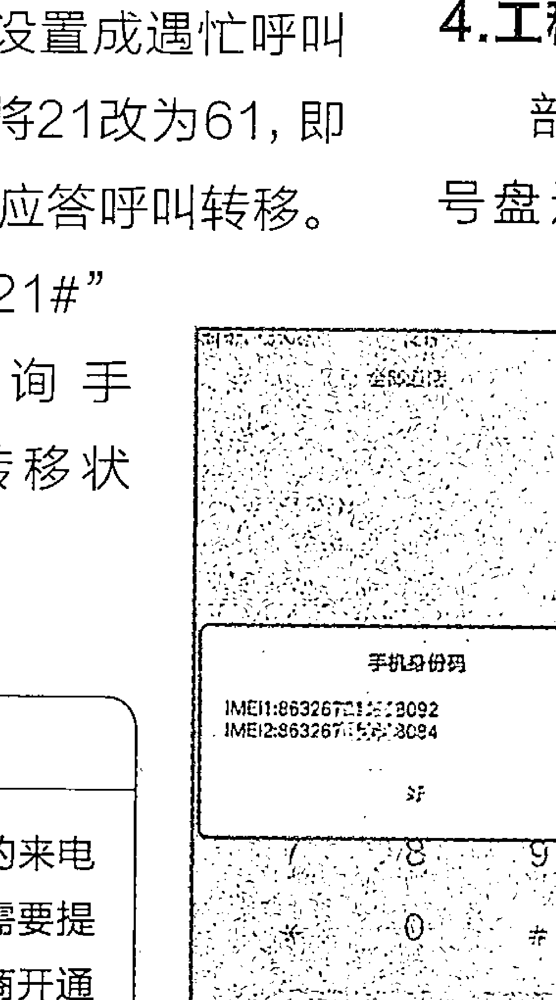

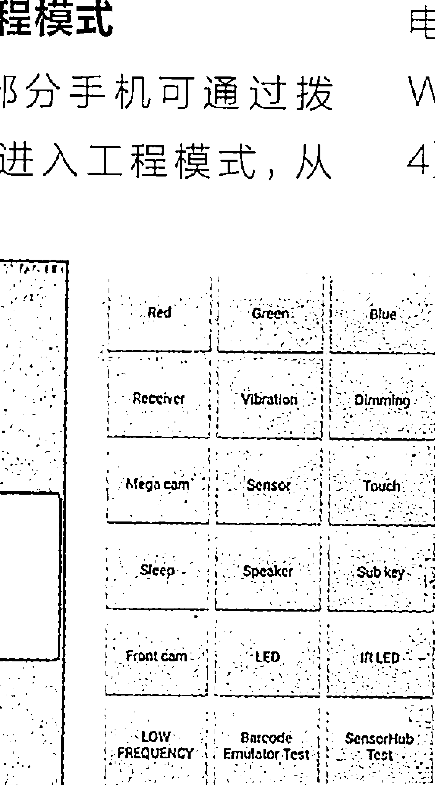

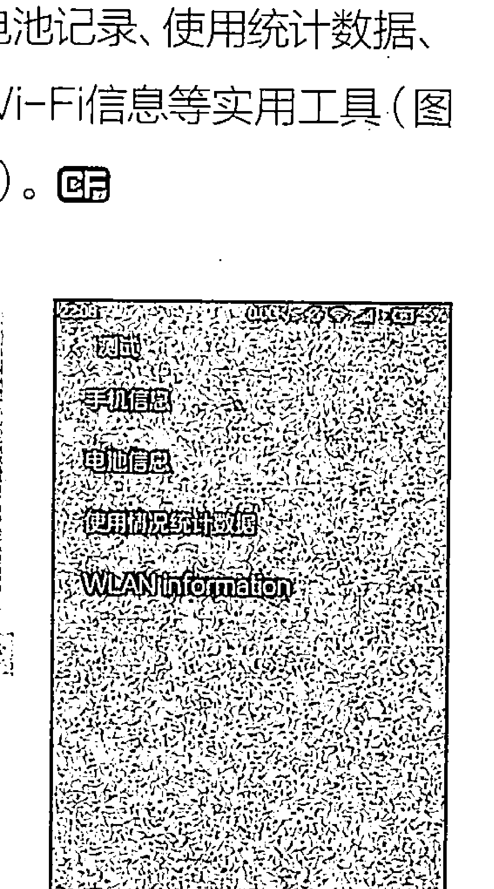

#### 量变引出质变
##### 找出影响手机续航的小设置

文/镜花水月

在使用手机的过程中最让人尴尬的现象就是电池快没电了。那么，如何设置才能让手机尽可能保持长效待机的能力呢？本文，就让我们从几个容易被忽视的小设置入手，看看延长手机续航的另一种思路。

- 减少天气更新频率

在天气类APP中，找到并进入高级设置界面，然后请关闭天气声音、背景动画、自动分享天气等选项（如果有），并延长更新时间间隔（比如从1小时延长到6小时），更新的频率越低就越能节省电量（图1）。

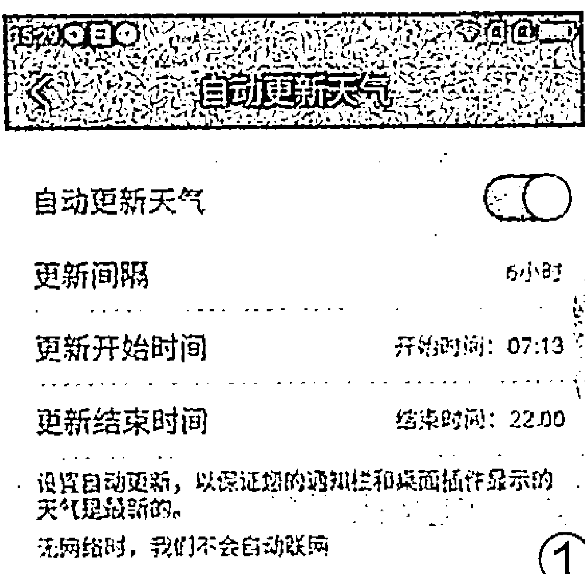

- 堵住应用商店的后门

进入应用商店类APP的设置界面，找到并关闭WLAN闲时自动更新和消息提示、开启应用更新通知免打扰（图2）。同时，进入我们常用的APP设置界面，如果里面也有类似“WLAN时自动更新”的选项，将其关闭也能避免因APP在后台自动更新而消耗电力。

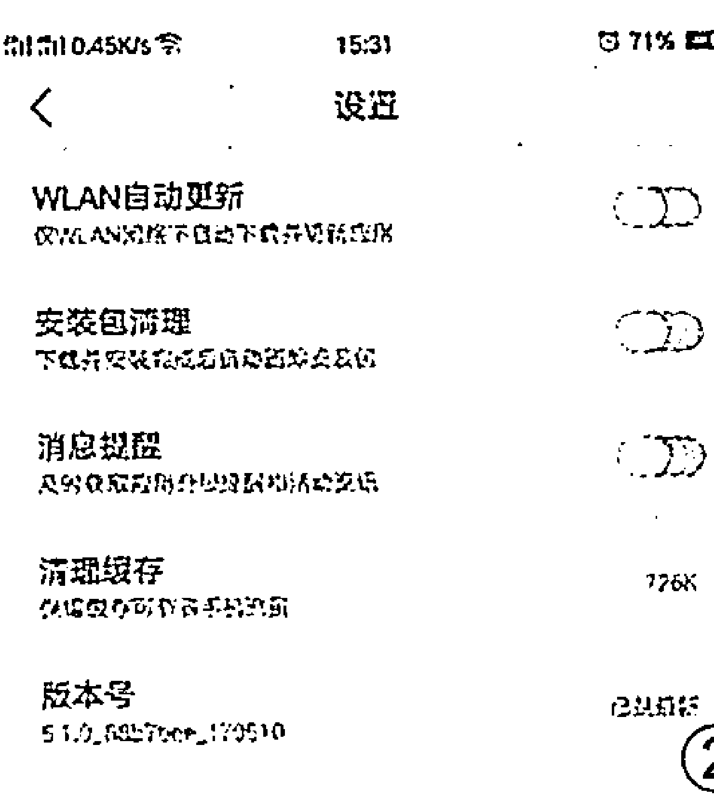

- 关闭不必要的通知提醒

在设置中找到并进入通知管理界面，关闭除了微信等常用APP以外所有应用的通知亮屏提示、收到通知时指示灯闪烁等提醒功能（图3）。同时，找到应用自启动界面，关闭非必要APP的开机自启、相互唤醒功能。如果手机支持联网防火墙功能，可以关闭不常用APP使用数据流量和WLAN网络的联网功能（图4），避免后台APP联网后传数据或接收各种推送消息。

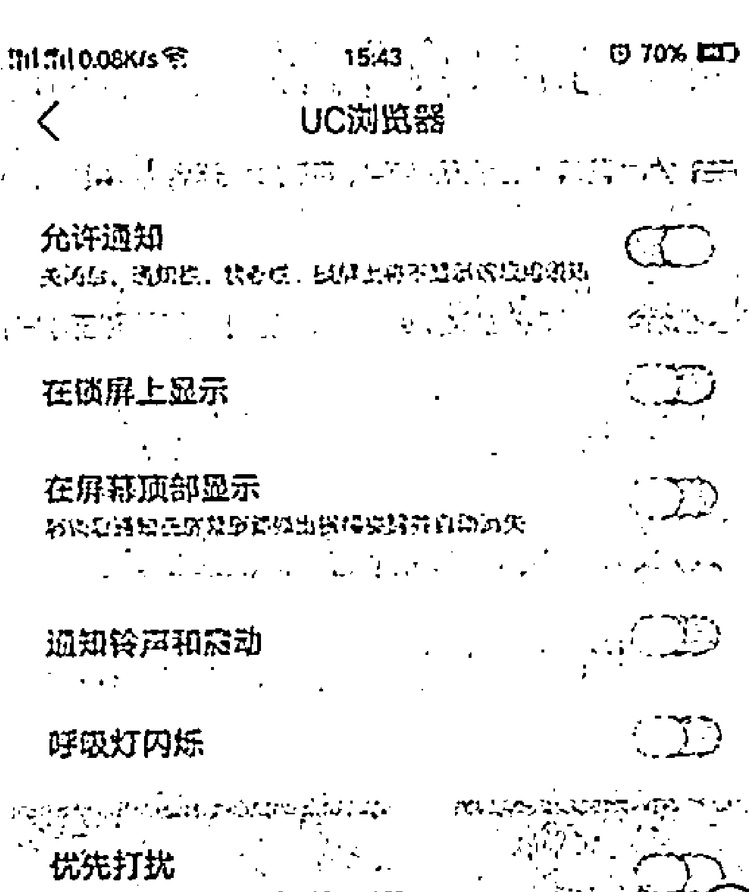

小提示
很多手机在省电设置中还会提供类似“息屏省电”功能，即黑屏几秒后自动清理内存，关闭后台非白名单指定的程序（图5）。如果你的手机有这个选项，请记得打开，并把微信、QQ等常用APP添加到白名单中。

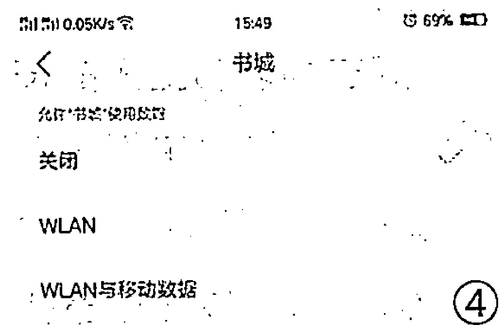

- 必要时再打开传感器

平时可手动关闭蓝牙、GPS、NFC、屏幕旋转和自动同步等功能（图6）。以GPS为例，只有进行户外导航（如运行高德地图）时才有必要进行精准定位，其他APP通过网络定位就能保证精准度了。

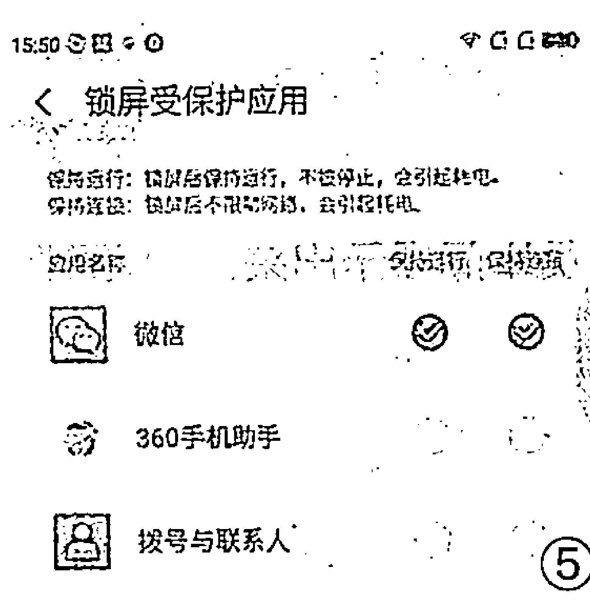

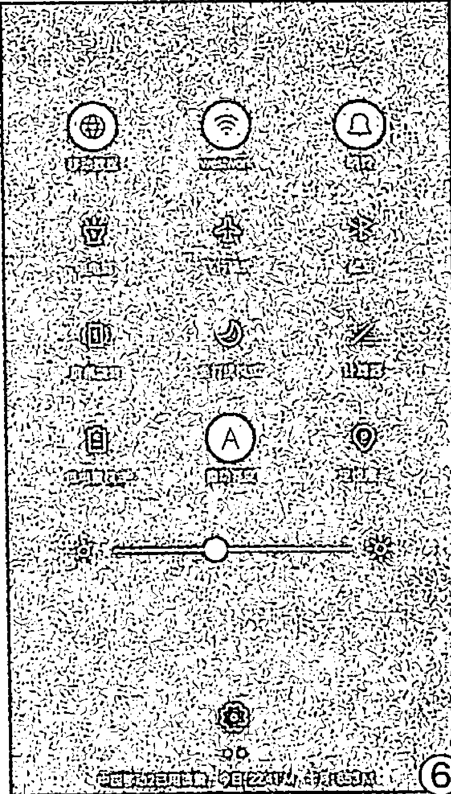

此外，还有很多用户喜欢微信计步或其他运动类APP，这些软件在进行记录运动信息时也会消耗一些电力。如果是中高端手机，处理器集成协处理器时记录运动数据几乎不耗电，但一些中低端手机则需要使用CPU统计信息，24小时运行耗电量不小。所以如果你很在意续航，可以关闭类似APP或功能。

- 其他一些细节设置

关闭呼吸灯、触控键背光灯、拨号音、拨号和按下虚拟键的震动反馈等，也是节省电力的好习惯。如果你的手机具备自动更换壁纸、推送锁屏新闻等功能，你可以选择关闭该功能，也可以通过延长更新间隔来节能。

#### 快速管理QQ接收到的文件

文|天涯衰草

小提示
如果要管理接收的图片文件，点击列表中的“QQ保存图片”按钮即可。

现在手机QQ最大的作用之一就是用于接收各种各样的文件。但QQ接收到这些文件后会自动存储到特定的文件夹目录，而这些文件夹目录又隐藏得比较深，查找起来非常不方便。那么，如何快速管理QQ接收到的文件呢？

我们可安装一款名为“QQ文件助手”的应用（下载地址：http://dwz.cn/68Agk0），打开应用后可以在窗口列表里面看到“QQ下载文件”、“QQ保存图片”、“QQ头像”和“QQ头像大图”等不同的按钮（图1）。点击列表中的“QQ下载文件”按钮，就可以在列表里面显示出所有手机QQ接收到的文件。

点击列表右上角的按钮，在弹出的菜单里面就可以按照时间以及文件的大小，对文件进行重新的排序操作。这样就可以更好地找到自己需要的文件，找到以后点击“删除”按钮就可以将不需要的文件从存储卡里面删除掉（图2）。点击“打开”按钮以后就可以调用其他第三方的应用，对这个文件进行打开和编辑操作，这样处理起文件来也就更加的方便了（图3）。

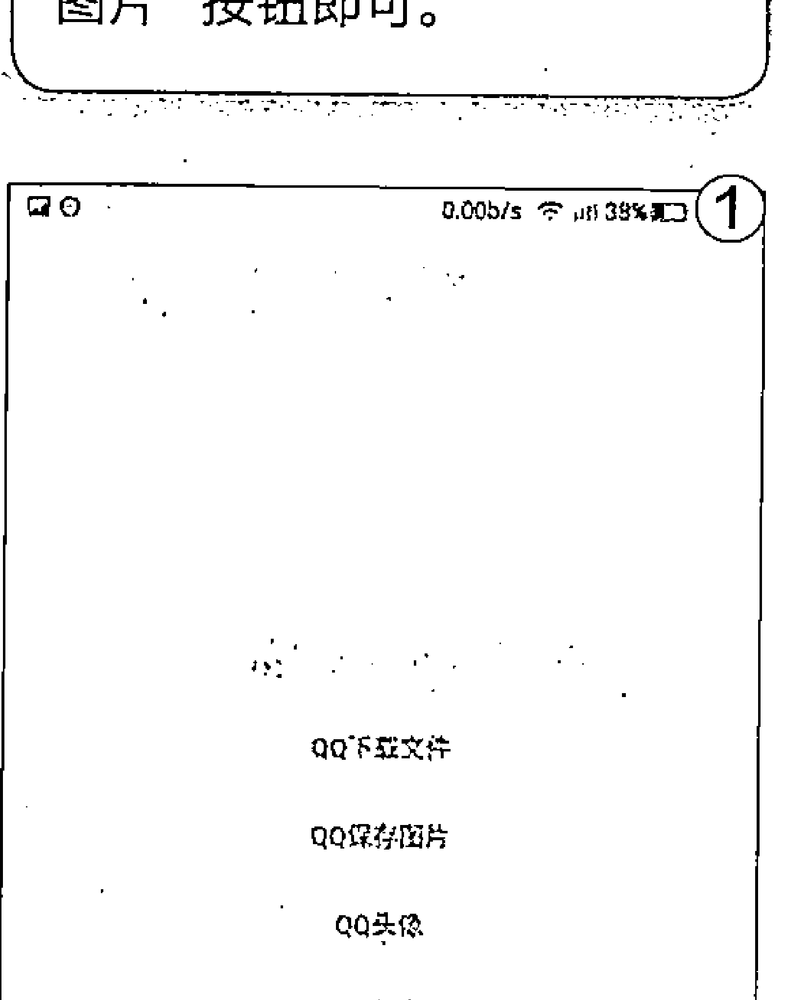

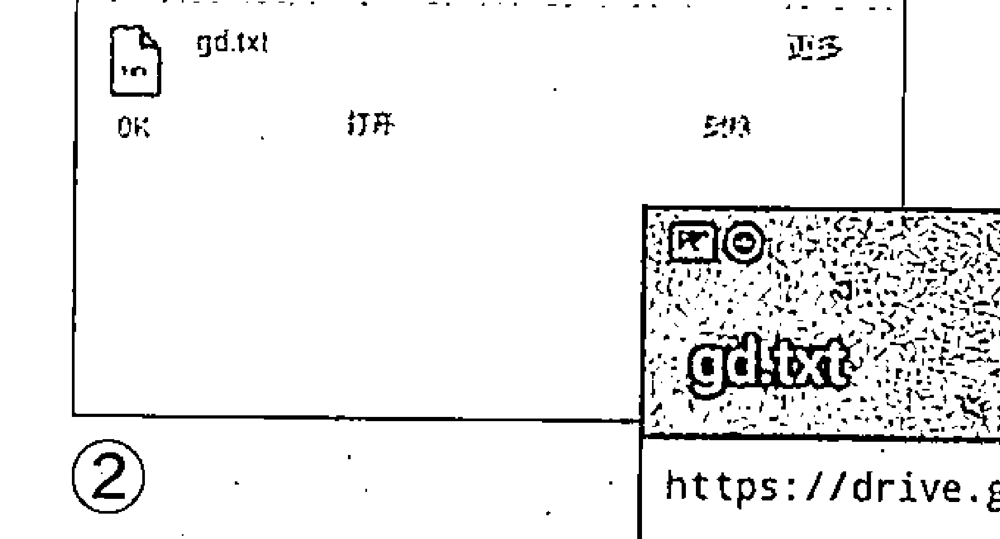

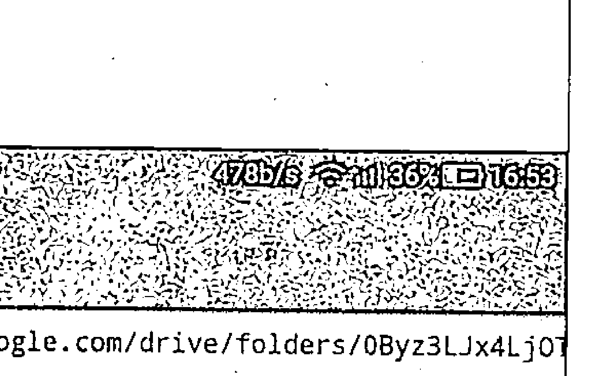

#### 辟谣助手快速分辨微信谣言

文|天涯衰草

现在微信和微博等社交媒体已经成为人们生活中的一部分，但是利用社交媒体传播谣言也成为非常普遍的一种现象。而很多人在不了解真实情况的时候，也无意识地成为了谣言的传播者。那么，如何才可以分辨出相关信息的真实性呢？

其实很多用户都同我们一样，对这些谣言深恶痛绝，所以通过一些辟谣工具就可以解决这个问题。我们首先打开自己的微信客户端，点击工具栏中的“发现”按钮，在弹出的对话框里面点击“小程序”，这样就可以搜索并安装一款名为“微信辟谣助手”的小程序。点击打开这个小程序以后，我们就可以像阅读新闻那样，查看当前正在流传的网络谣言，以及相关机构对这个谣言的辟谣和解释（图1）。

当然并不是每个网络谣言都会在小程序的首页里面显示出来，所以我们可以通过搜索关键词的方法进行查找。比如前段时间就有一个“微波炉加热食品致癌”的消息在朋友圈里面传播，我们搜索“微波炉”这个关键词就可以查找到相关的信息以及辟谣内容了（图2）。

除此之外，对于那些经常在微信里面浏览的用户来说，哪些读过的消息是虚假的呢？我们可以点击工具栏中的“与我相关”按钮，就可以看到自己曾经阅读的文章哪些是虚假的了（图3）。

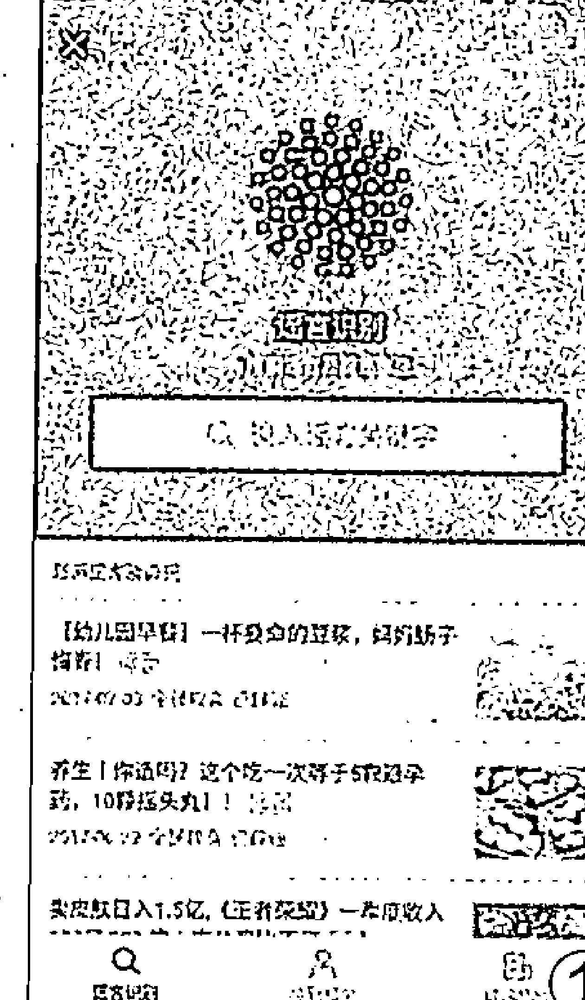

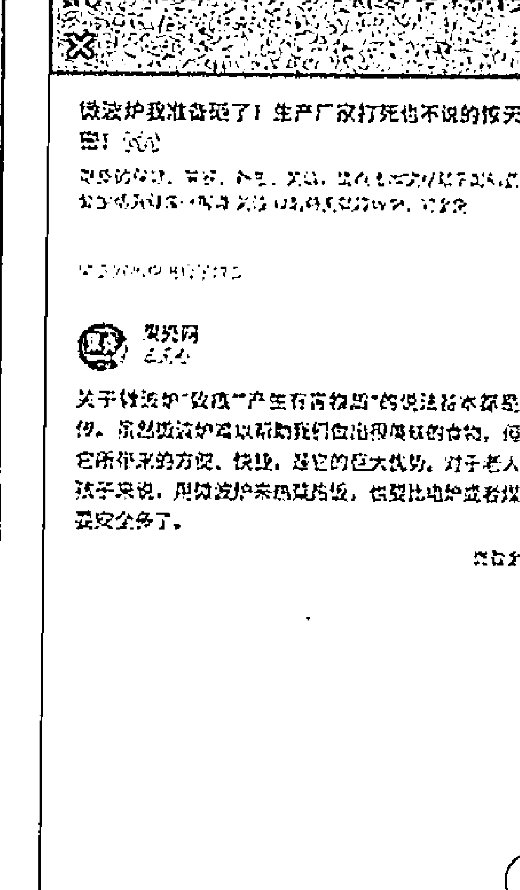

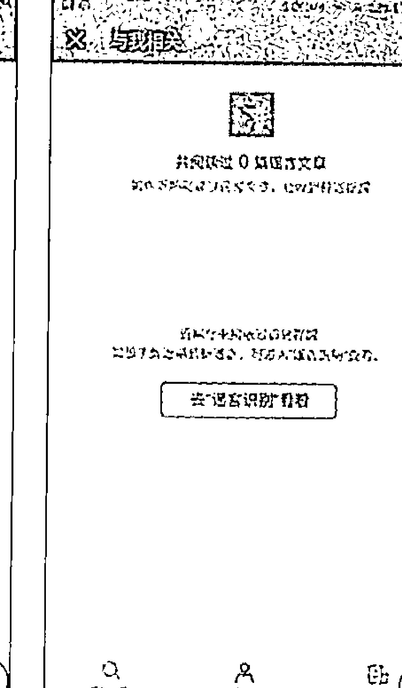

#### 检测手机系统的安全漏洞
文|天涯衰草

勒索病毒之所以可以在网络中疯狂地传播，最主要的是因为用户没有及时修复系统漏洞。而我们常用的手机也有很多漏洞，同样也会给我们带来严峻的威胁。在电脑里面我们可以通过多种方式检测系统漏洞，那么如何在手机系统里面检测安全漏洞呢？

我们可以通过应用商店来安装“360透视镜”这个应用（下载地址：http://dwz.cn/68zUVr），接着点击应用主界面中的“立即扫描”按钮，这样就可以对当前手机系统存在的漏洞进行扫描（图1）。

扫描完成以后我们可以看到手机的相关信息，同时应用会给出当前系统存在的漏洞数目，而且会按照严重漏洞、高危漏洞和中危漏洞分别进行显示（图2）。点击任意一个漏洞编号后，在弹出的对话框就可以看到这个漏洞的类型，以及这个漏洞可能会给手机系统造成的危害（图3）。

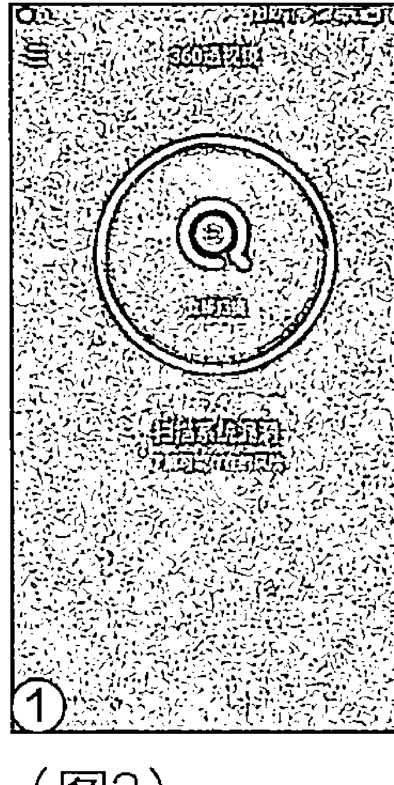

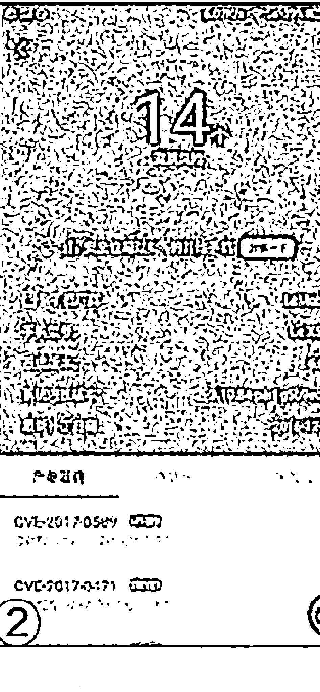

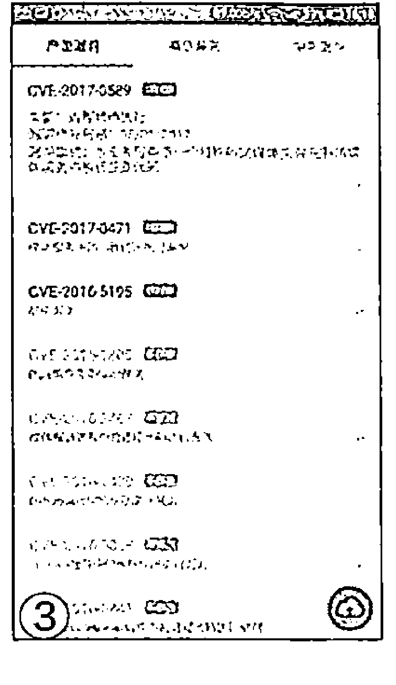

遗憾的是，由于Android系统非常的碎片化，每个手机厂家都对其进行了定制操作，所以这款应用无法像我们在电脑里面那样对手机存在的安全漏洞进行修复。不过我们可以点击界面右下角的按钮，将检测的结果反馈给手机的开发商，希望他们尽快提供系统的升级来修复漏洞。

#### 将多条微信信息保存到一条笔记里
文|天涯衰草

想把微信聊天内容保存到印象笔记里面，最常见的方法就是利用它的公众号。但是这个方法也有一个致命的缺点：它会将每条信息单独保存为一条笔记，看起来非常散乱。那么，如何将多条信息保存到一条笔记里面呢？

由于每一款云笔记软件都有一个专属的邮箱地址，所以我们只需要利用发送邮件的方法，就可以将多条信息转换为一条笔记了。

在手机里面安装QQ邮箱的客户端，并且在通讯录里面添加上云笔记分配给用户的专属邮箱地址，比如我们这里输入的是“印象笔记专属邮箱”（图1）。接下来打开自己的微信客户端，找到需要保存的信息内容并且长按它，在弹出的菜单里面选择“更多”这个选项。

这时就可以在每条信息的后面看到一个复选框，通过它勾选多条需要保存的信息内容，再点击下方工具栏右下角的“...”按钮（图2）。此时会弹出一个对话框，点击对话框中的“邮件发送”命令，就会马上跳转到自己刚刚安装的QQ邮箱客户端里面。接着你会发现刚刚选中的聊天信息内容已经被自动添加到邮件正文中了（图3）。而你只需要在收件人地址栏输入“印象笔记专属邮箱”，然后将其发送出去，这样印象笔记的服务器就会自动将这封邮件编辑为一篇笔记。

小提示
本文中的技巧适用于所有常见的云笔记服务。

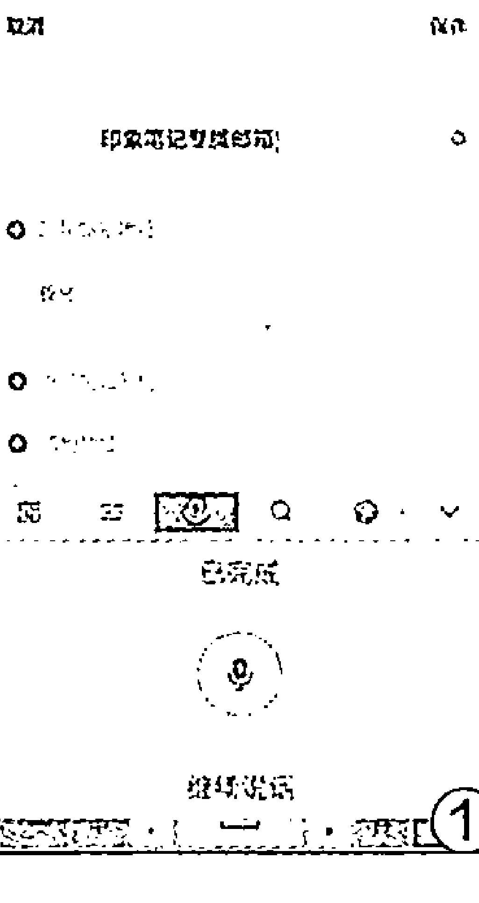

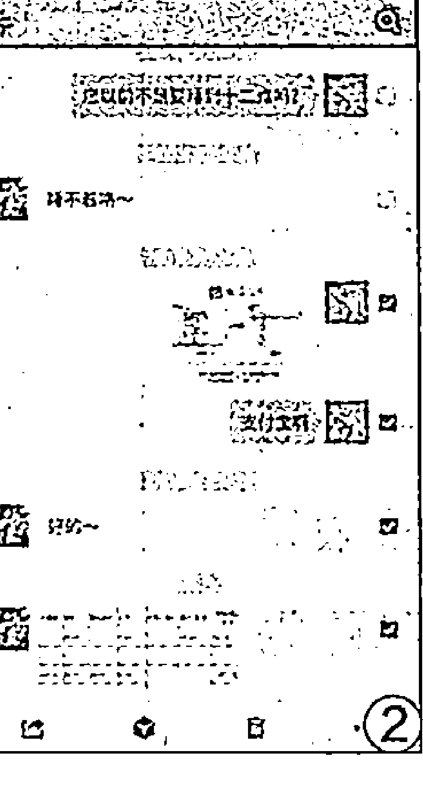

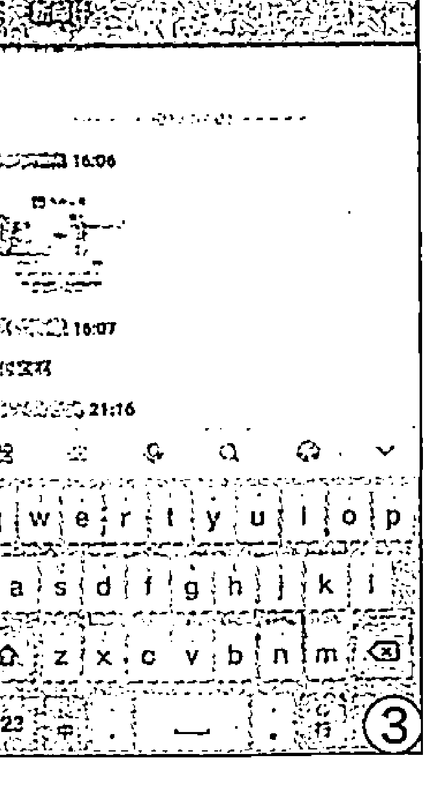

#### 将手机短信自动转发到邮箱
文|天涯衰草

现在很多用户都拥有多个手机号，并搭配多款手机使用。此时最头痛的就是使用某个手机号登录账号时的验证码接收问题，如果这个手机恰好不在身边该怎么办？

想解决这个问题非常简单，我们只需通过手机应用获取短信内容，再转发到指定的电子邮箱即可。首先通过APKUpdater这款应用来搜索安装一款名为“妖妖短信辅助器”的应用，接下来打开发送邮箱的SMTP协议设置。

这里我们以常见的QQ邮箱为例，点击QQ邮箱设置窗口中的“帐户”标签，开启其中的“POP3/SMTP服务”选项即可（图1）。

接下来运行“妖妖短信辅助器”应用，第一次运行会要求用户设置邮箱等信息（图2）。点击“好”按钮以后，根据向导分别设置发送邮箱、接收邮箱、发送端口等信息（图3）。由于现在的电子邮箱运营商为了杜绝用户的恶意使用，会要求用户设置邮箱的密码进行身份确认，所以还需要设置邮箱密码。当所有设置完成以后，“妖妖短信辅助器”一旦发现新的短信信息，就会自动转发到指定的邮箱里面。

##### POP3/IMAP/SMTP/Exchange/CardDAV/CalDAV服务
| 服务 | 状态 |
| --- | --- |
| POP3/SMTP服务（如何使用Foxmail等软件收发邮件？） | 已开启 |
| IMAP/SMTP服务（什么是IMAP，它又是如何设置？） | 已开启 |
| Exchange服务（什么是Exchange，它又是如何设置？） | 已开启 |
| CardDAV/CalDAV服务（什么是CardDAV/CalDAV，它又是如何设置？） | 已开启 |
| (POP3/IMAP/SMTP/CardDAV/CalDAV服务均支持SSL连接，如何设置？) | |

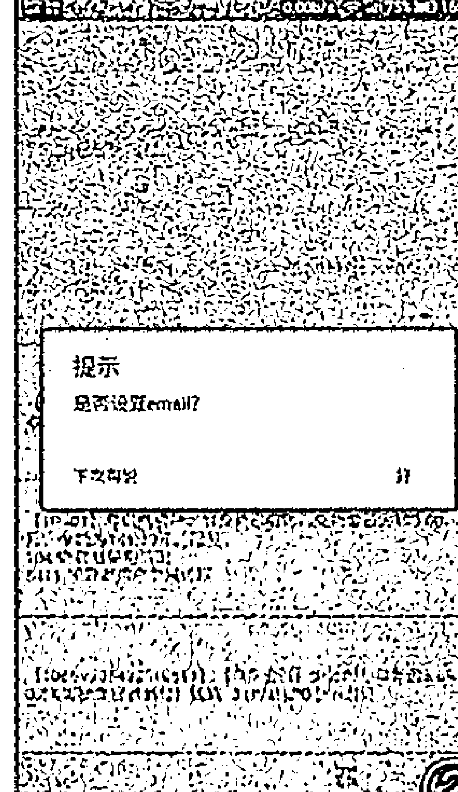

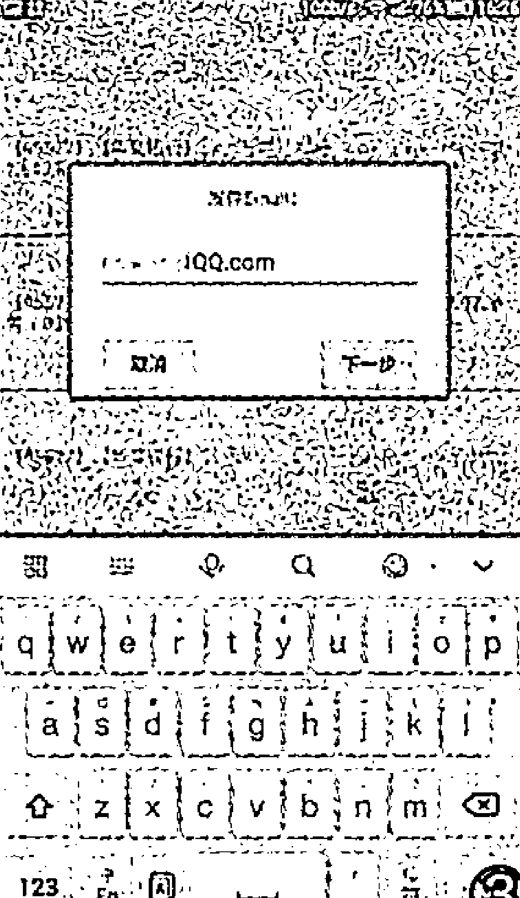

> 如果你担心电子邮箱密码丢失，可以申请一个全新的电子邮箱来使用。

#### 不错过任何一张优惠券
文|天涯衰草

很多用户都会尝试在进行网购之前领取商家赠送的优惠券，但问题是我们怎么知道哪里会有感兴趣产品的优惠券，又或是有什么方法可以自动帮助我们领取优惠券呢？

我们可通过应用商店安装“有券助手”这款应用（下载地址：http://dwz.cn/6kWoSD），第一次运行它时会要求进行权限设置（图1）。点击“自动为你找券领券”后的“开启”按钮，从而自动跳转到手机系统的“辅助功能”列表。点击列表中的“有券助手”选项后，根据向导开启相关的权限就可以了（图2）。

设置完成以后，“有券助手”就会在系统后台以悬浮窗或者常驻通知的方式运行。以后当我们通过淘宝客户端应用打开某个商品的介绍页面进行浏览的时候，“有券助手”就会在后台自动查找优惠幅度最大的可用优惠券（图3）。查找到以后它会通过悬浮窗的形式通知我们，这样我们在结算的时候就可以使用优惠券，从而享受到更大的购物实惠了。

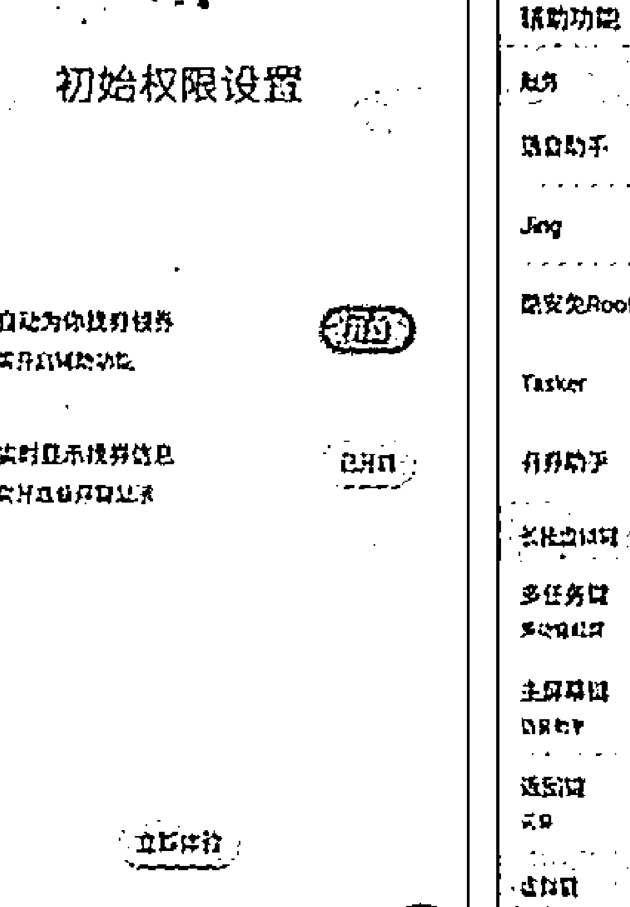

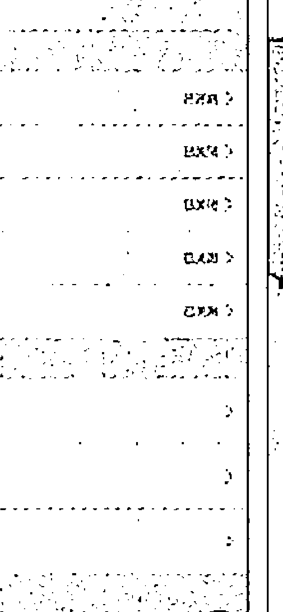

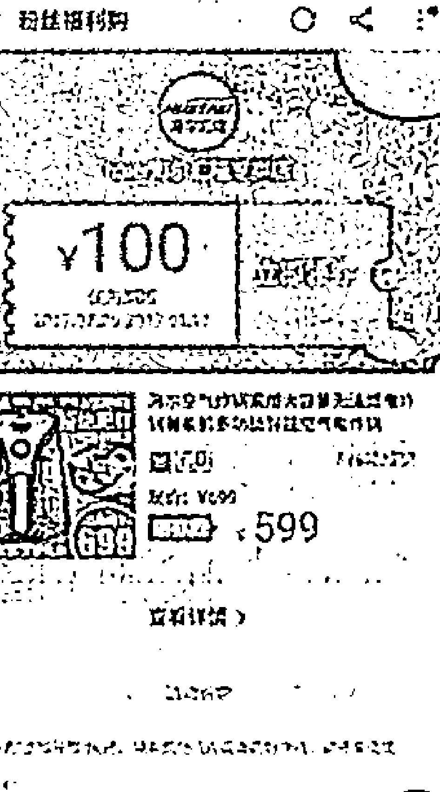

> 如果你是Xposed的用户，安装“有券助手”后可以在Xposed管理器里面找到并激活“有券助手”的相关模块。

#### 多个渠道一键检查手机APP更新
文|天涯衰草

如今每个Android手机品牌都有自家的应用商店，但和Google Play相比，任意一个品牌应用商店都无法做到收录全部的APP，而这就导致我们通过其他渠道（如浏览器下载）下载安装的APP，无法通过应用商店获取更新。那么，有什么方法才能同时从多个渠道来搜索和检查应用的更新情况呢？

安装APKUpdater（下载地址：http://dwz.cn/6jDJYZ），它最大的特色就是可以从Google Play、APKPure、APKMirror和Uptodown等多个渠道进行应用的检查和更新。点击应用窗口右上角的齿轮按钮，在弹出的界面里面找到“更新源”选项，将其中的四个更新源的选项都选中即可（图1）。

设置完成以后返回到应用的主界面，点击其中的“更新”标签后再点击右下角的刷新按钮，这样就可以对手机里面安装的应用版本和更新源中的版本进行对比。一旦发现有新的版本就会在列表中进行显示，同时给出新版本的版本号以及更新源名称（图2）。如果你想要更新某个应用的话，只要点击对应的应用名称就会自动跳转到下载页面；按照提示进行下载安装就可以了（图3）。

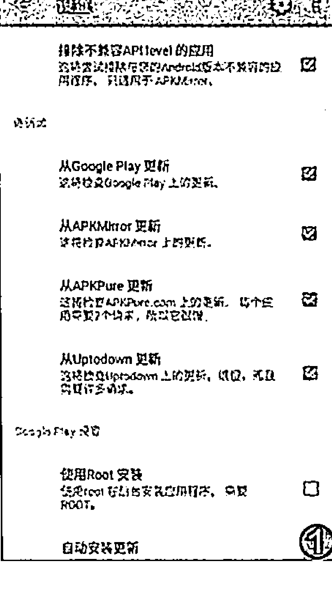

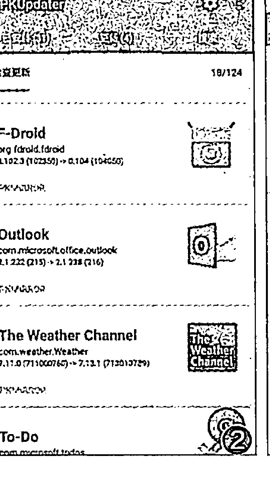

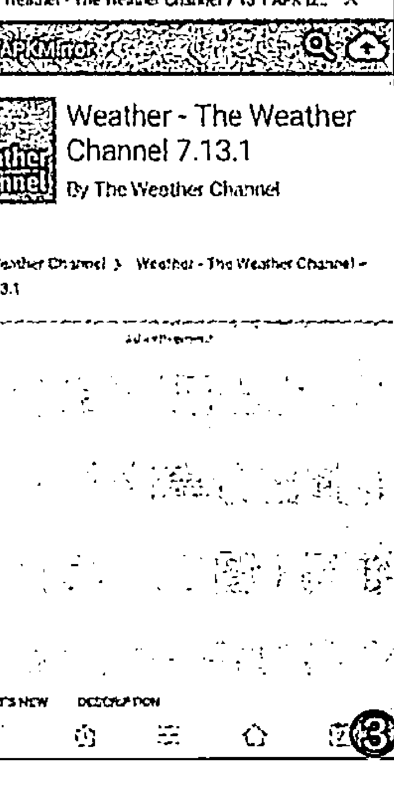

#### 微信转账也能实现延时到达
文|天涯衰草

经常能在新闻里面看到某人通过微信转账发生错误，将钱转到不认识的用户账号，而且通过联系对方不但不退款，还会被拉黑屏蔽的消息。如今，银行卡大都已经支持延时到达的功能，那么微信转账能不能也实现同样的操作，给用户一个吃后悔药的机会呢？

其实在最新版本的微信里面已经有了延时转账的功能，只需要根据自己的情况进行设置就可以了。

首先点击工具栏中的“我”按钮，在弹出的列表中点击“钱包”选项，这样就会出现名为“我的钱包”的窗口（图1）。点击界面右上角的三个圆点，在弹出的菜单里面选择“支付管理”命令，这样就可以看到一个“转账到账时间”的选项（图2）。

点击它以后可以看到“实时到账”、“2小时到账”、“24小时到账”等三个选项（图3），我们只需要根据自己的情况进行选择就可以了。以后当我们发现转账给了错误的人，或者转账金额有问题的话，那么至少还有2小时的时间联系对方，或者及时联系微信的客服进行退款处理。

> 小提示：如果两人之间想要即时到帐的话，通过发红包的方法就可以解决。

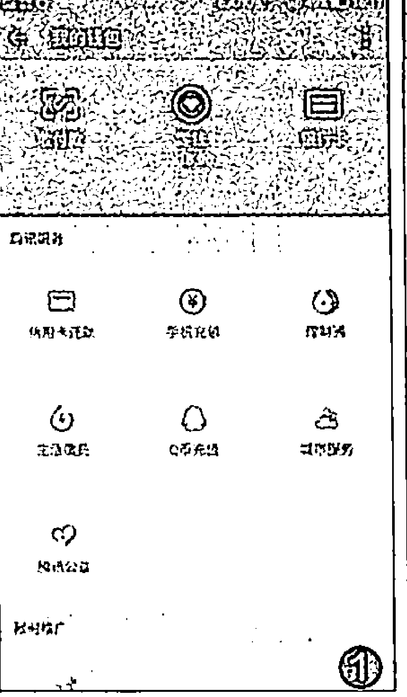

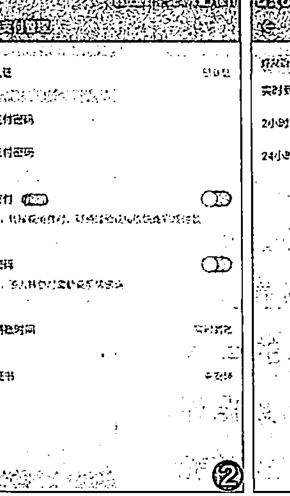

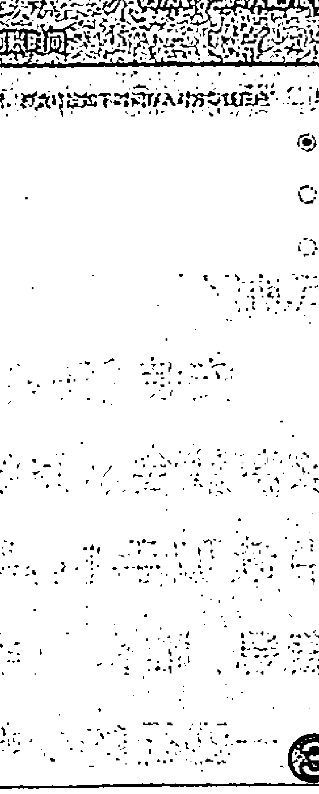

#### 连接过的Wi-Fi密码还能这样看
CFan在过去曾经介绍过很多种查看连接过Wi-Fi密码的技巧，比如ROOT后通过浏览器配置文件查看，或是安装第三方APP读取等。如果你的手机支持二维码分享Wi-Fi热点的形式，那就有了另外一种查看密码的方法。

以华为手机为例，在设置的WLAN选项中（图1），点击已连接的Wi-Fi就能弹出分享这个Wi-Fi的二维码（图2），其他华为手机通过扫一扫就能实现自动免密码连接，是一种简化分享的小功能。

实际上，这个功能不仅限于华为手机之间，其他品牌手机只要通过扫一扫功能（浏览器、微信的扫一扫功能都可以）对着这个二维码，就能在屏幕上弹出对应的Wi-Fi热点名称和密码信息（图3），而其他品牌手机只需将其复制下来，手动输入密码就能接入对应的Wi-Fi。

利用这个方法，我们还能避免出现忘记Wi-Fi密码的尴尬。进入所有连接过Wi-Fi的二维码分享界面，将带有二维码的内容截屏，并将截屏照片保存好即可。如果哪天你大脑“短路”忘记了Wi-Fi密码，只需用微信等APP的扫一扫功能，读取保存过的截图照片就能显示对应的密码了。

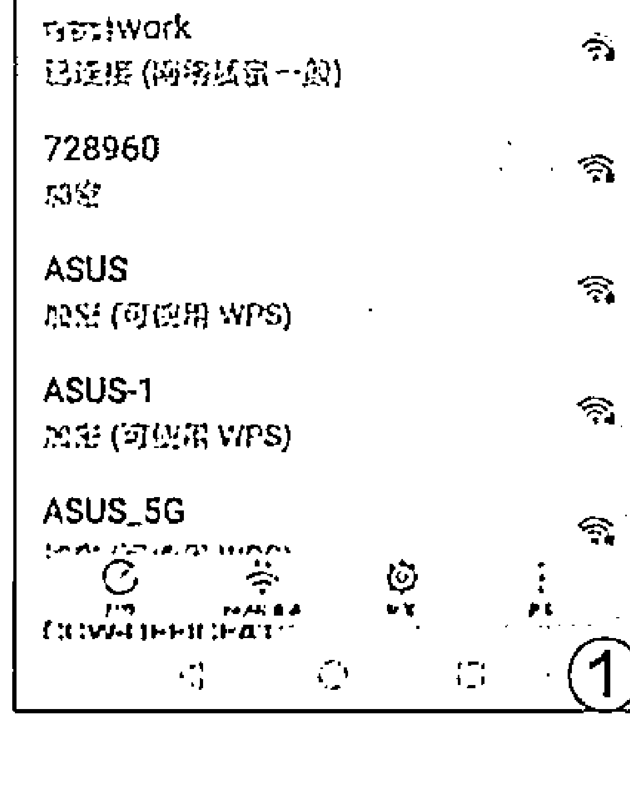

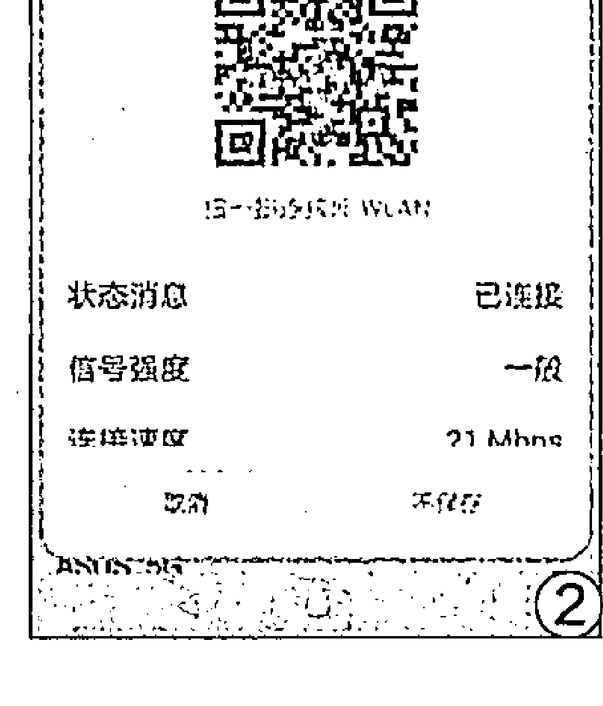

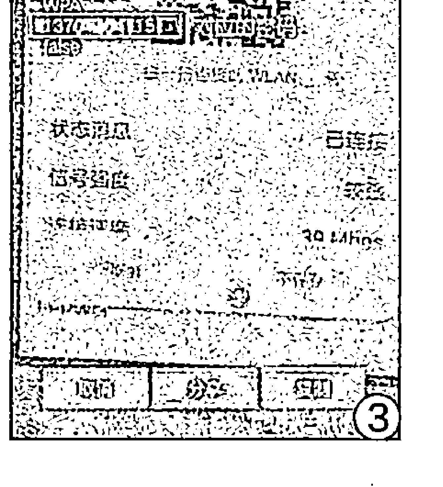

#### 教你强制开启王者荣耀高帧率模式
《王者荣耀》应该是目前最热的手游，但玩家们可能会发现一个问题：并非所有手机都有高帧率模式的选项，而这个选项的出现与硬件规格关系不大，只与手机厂商与游戏开发商之间的合作有关。问题来了，如果你的手机配置够强，如何强制激活《王者荣耀》的高帧率模式呢？

安装《王者荣耀》时，该游戏会从系统配置文件中读取手机具体的型号信息，唯有型号与数据库一一匹配的少数机型才能触发高帧率模式功能，不在数据库中的机型哪怕搭载了骁龙835，还是无缘更高画质。

想强制开启这个模式的思路很简单，修改手机的配置文件，将手机信息换成支持《王者荣耀》高帧率模式的型号。以华为Mate 9为例（默认不支持高帧率模式的），ROOT系统后运行RE文件管理器，找到并修改“/product/etc/prop”目录中的local.prop文件（图1）。

将 `ro.product.manufacturer=HUAWEI` 改为 `ro.product.manufacturer=OPPO`（修改品牌）（图2），退出后找到并打开“/hw_oem/prop”里的local.prop文件，将最后三行改为 `ro.product.name=OPPOR11 Plus`、`ro.product.model=OPPO R11 Plus`、`ro.build.id=OPPO R11 Plus` 即可（图3）。此时，Mate 9在系统信息中会被识别成OPPO R11 Plus，从而骗过系统触发《王者荣耀》的高帧率模式。

> 小提示：ROOT系统有一定风险，而且不同型号的手机方法不同。

```
/product/etc/prop/local.prop 文件内容修改示例：

##### 原内容
ro.product.manufacturer=HUAWEI
##### 修改为
ro.product.manufacturer=OPPO
```

```
/product/etc/prop/local.prop 文件内容修改示例（续）：

##### 退出后，修改 /hw_oem/prop/local.prop 文件的最后三行
ro.product.name=OPPOR11 Plus
ro.product.model=OPPO R11 Plus
ro.build.id=OPPO R11 Plus
```

```
修改后的系统信息识别结果：

系统信息显示：
品牌：OPPO
型号：OPPO R11 Plus
```

#### 伪造文件杜绝垃圾文件重生
我们在电脑系统里清除垃圾文件以后，为了杜绝垃圾文件的重生往往会伪造生成一个同名的文件来进行操作。问题来了，在智能手机系统里面也会生成大量的垃圾文件，那么能不能利用类似PC的方法，杜绝手机系统中垃圾文件的再生呢？

现在很多手机系统已经带有自动清除垃圾的功能，但是如果想要杜绝垃圾的再次生成的话，那么只有借助于“Dir”这款应用才可以（下载地址：http://dwz.cn/6oqicp）。

打开这款应用后点击主窗口下方的按钮，如果你是第一次使用这款应用的话，首先需要在联网的状态下同步更新垃圾扫描的规则（图1）。当规则更新完成以后，应用就会自动开始进行垃圾的扫描操作。

垃圾扫描完成以后，在出现的垃圾文件列表中我们可以看到有的内容后面出现了两个图标。其中有一个就是我们最常见的垃圾桶图标，表示对这条垃圾信息进行删除操作。除此以外还有一个手势的图标，这个图标就表示可以对这个文件进行替换。

我们根据自己的需要进行设定后，点击右下角的清除按钮就可以了（图2）。如果你发现在替换文件后有的应用无法正常运行，可尝试将主窗口向右滑动，在弹出的菜单里面选择“撤销替换”命令，然后长按删除相关的规则即可（图3）。

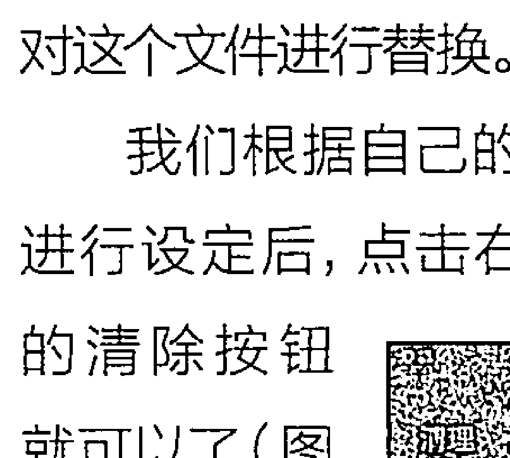

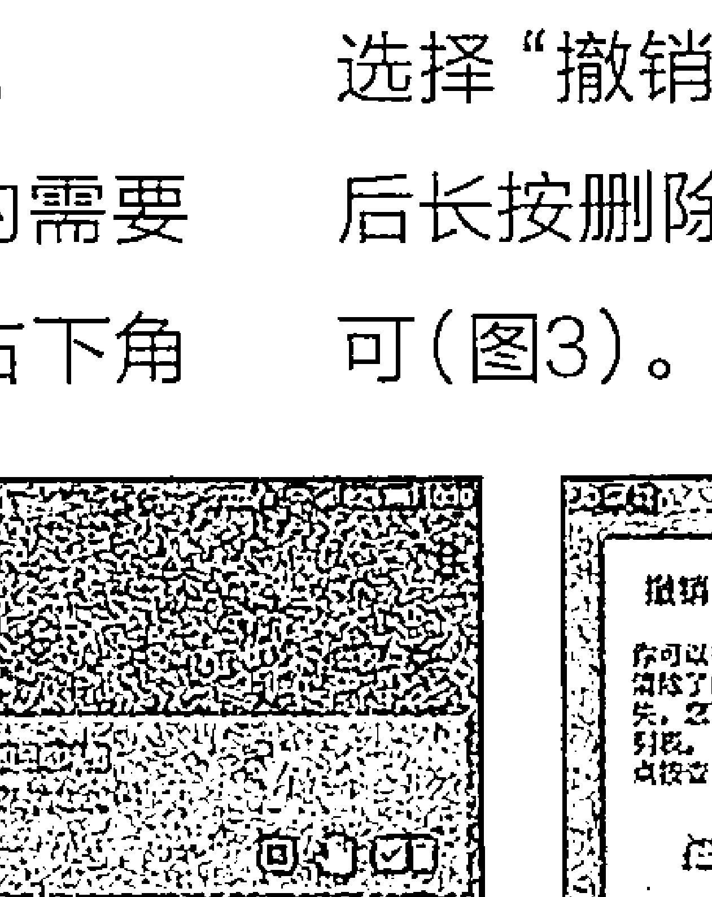

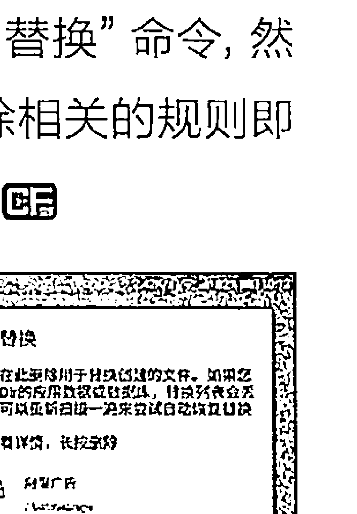

#### 本地同步发送微博和微信
微博和微信是使用最多的社交平台，很多人会同时在它们里面发布同一条信息。以前我们为了简化繁琐的操作会利用云同步，随着微博对同步功能进行了限制，我们还有什么方法可以解决信息同时发布的问题吗？

首先在手机上安装“动态同步助手”APP（下载地址：http://dwz.cn/6oqj6H），打开的应用窗口和平时发送消息的窗口非常类似。我们只需要在文字输入框里面输入相应的文字信息，接下来点击文字框下面的添加图片按钮，这样应用就会跳转到手机的图库里面（图1）。

需要提醒大家的是，在点击预览一张图片后，首先要勾选右下角的“选择”按钮，再点击右上角的“完成”按钮才可以（图2）。

返回到应用的主窗口以后，在下面勾选上需要同步的社交应用，接下来点击右上角的发送按钮即可。这时“动态同步助手”应用会自动启动并跳转到社交应用的发布页面上，同时将我们刚刚输入的信息内容“同步”到发布页面中，而我们只需点击发送按钮进行发布操作就可以了（图3）。

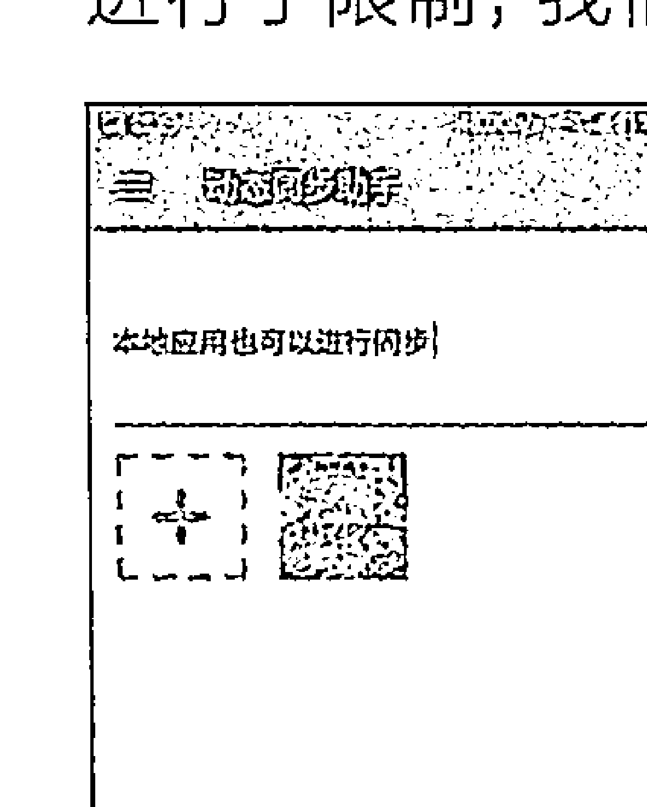

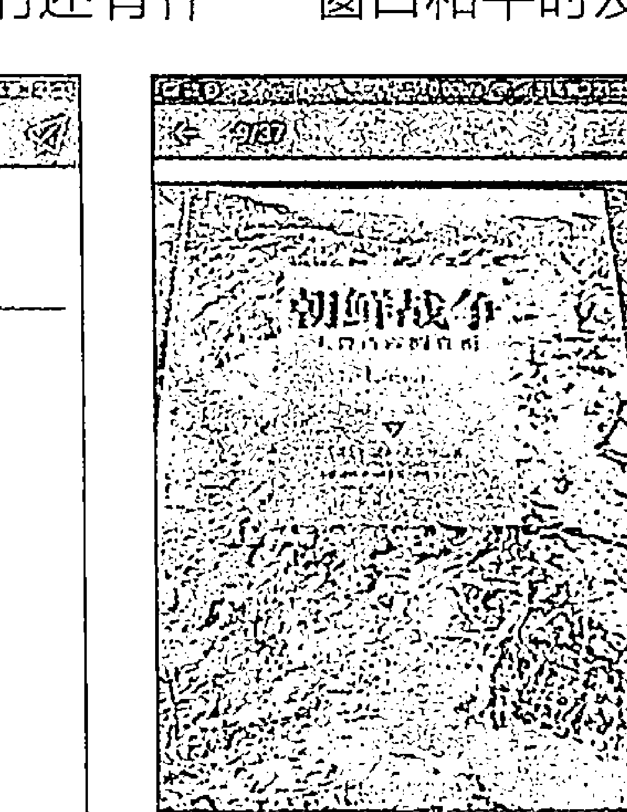

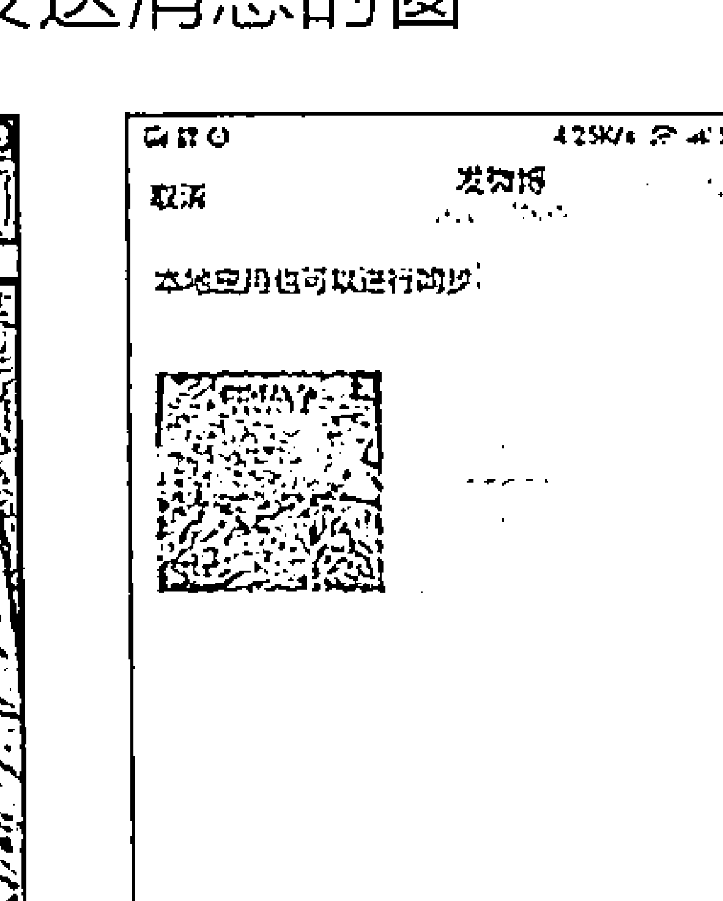

> 新浪微博拥有很多的第三方客户端，而该应用只支持官方的客户端，因此如果你使用的是第三方的客户端就无法完成相应的“同步”操作了。

### 傻博士

#### 关闭MIUI系统里的内置广告
Q: 小米的手机系统用起来倒是非常的不错，但是现在它里面自带的广告也越来越多，这样非常严重地影响用户的使用体验。那么有没有什么方法可以尽量屏蔽这些广告信息呢？

A: 其实小米系统里面的很多广告，都是通过自带的应用来推广的，所以只需要进入应用里面屏蔽就可以了。比如打开小米自带的浏览器，点击右下方的菜单按钮，在弹出的对话框里面点击“设置”命令，然后在弹出的窗口里面选择“消息通知管理”命令，最后将里面的所有选项进行关闭就可以了。

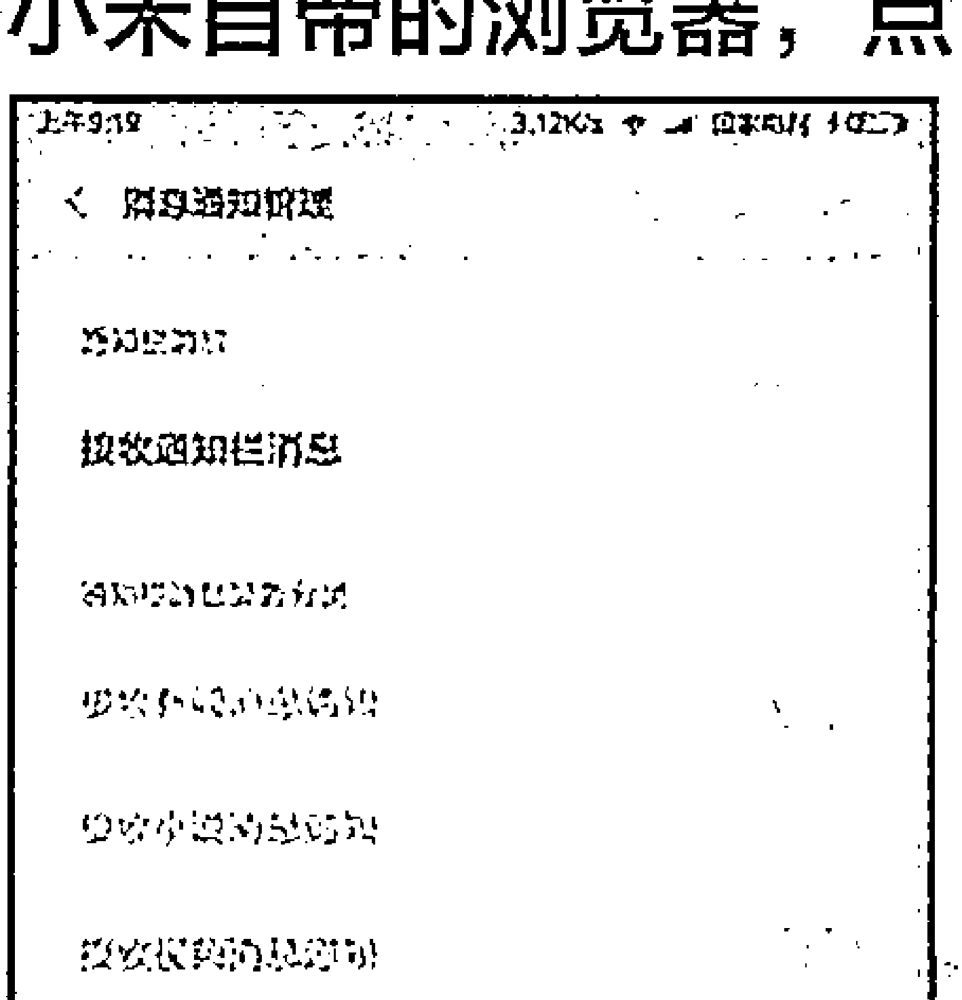

按照类似的方法，我们只需要进入到小米系统其他自带的应用里面，就可以尽量多地关闭消息的推广选项。

#### 手机文件如何快速进行查询
Q: 在电脑里面有一款名为Everything的软件，通过它可以在操作系统里面快速搜索到自己需要的文件。那么在手机系统里面，有没有什么方法可以实现同样的目的呢？

A: 首先下载安装一款名为“快速搜索”的应用，安装完成以后就可以看到一个文件搜索框，只需要在文件搜索框里面输入要查找的文件信息就可以了。搜索的时候可以输入完整的文件名称，也可以输入文件名称的一部分内容，当然也可以选择一部分内容加上后缀名的方式，这样可以快速地查找到需要的文件。

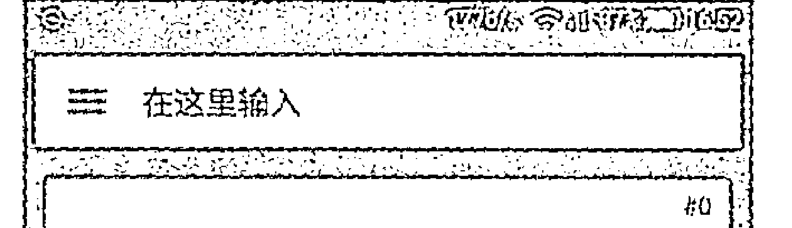

#### 手机系统里面也玩云点播
Q: 以前要想在手机里面看视频的话，都是通过电脑下载以后再传到手机系统里面的。那么有没有什么方法可以直接利用手机进行下载观看，类似于电脑上的云点播功能呢？

A: 首先下载安装一款名为“喵喵云点播”的应用，打开应用以后直接在搜索框里面输入相应的视频名称。当然在搜索框下面还可以看到很多热搜的关键词以及视频资源，直接点击就可以进行搜索操作了，找到相应的视频后就可以进行在线观看。


#### 壁纸如何才能与时间联动
Q: 现在手机里面有很多的壁纸应用，这些应用可以让用户手动进行壁纸的替换，也就是每天可以定时进行相应的操作。那么能不能将壁纸与系统时间进行关联，让它随着时间的变化而改变呢？

A: “α Clock”是索尼推出的一款壁纸应用，它使用索尼的相机拍摄了大量世界文化遗产的照片，而且是对每一个景点按照不同的时间进行拍摄的。当用户的手机时间进行改变，那么应用就会自动更换到该时间拍摄的照片，这样即使是一个地方也可以在不同的时间段看到不同的壁纸。

#### 把微信朋友圈发的信息导出
Q: 现在很多朋友都喜欢在微信朋友圈里面发一些信息，那么有没有什么方法可以将这些信息导出来，然后做成相应的电子文件呢？

A: 在手机应用商店里面可以看到一款名为“微信朋友圈数据导出”的工具，这款工具不是一款单独的手机应用，而是一款Xposed的模块，通过它就可以导出朋友圈里面的相关数据了。但是要想使用这款工具的话，首先需要对系统进行ROOT，接着再安装Xposed框架才行。

#### 在多页表格中建立重复的表头
Q: 每个表格文件开头都有一些表头信息，可是如果翻到表格下一页的时候，这些表头信息就会消失。有的时候我们搞不清楚表头信息，这样就只能返回到第一页进行查看。那么如何在表格的每一页都加入表头信息呢？

A: 首先在表格里面选择要重复使用的表头信息，接着点击鼠标右键选择菜单中的“表格属性”命令，在弹出的对话框里面选择“行”标签，然后在下面的“选项”区域勾选上“在各页顶端以标题行形式重复出现”选项，最后确定退出即可。

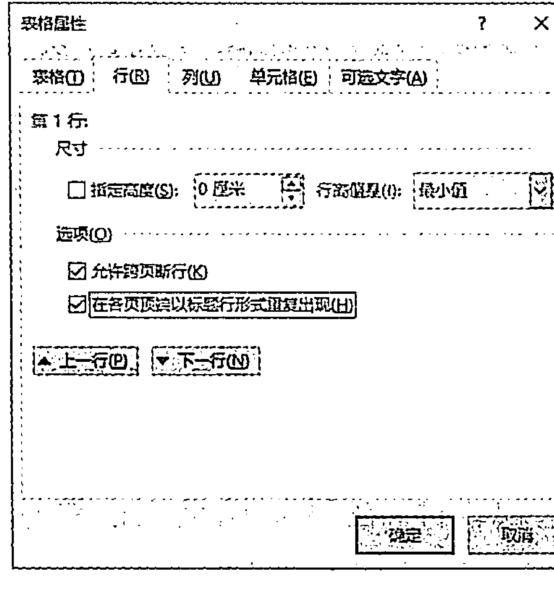

#### Word文档里面的表格如何去边框
Q: 表格有的时候是一个文档里面最重要的部分，但是通常情况下表格都有各种各样的边框，这样看上去非常的不好看。那么有没有什么方法可以去除掉表格外面的边框呢？

A: 首先通过鼠标全选文档中的表格内容，接着点击“布局”标签中的“转换为文本”按钮，在弹出的对话框里面选择“制表符”这个选项，点击确定按钮以后表格的边框就没有了。

#### 如何对文档中的外文信息进行翻译
文|老万

Q: 现在从网上下载的一些文档里面，难免充斥着各种各样的外文信息，可我个人对外文信息都不是很熟悉。那么如何借助于其他第三方工具，对文档中的外文信息进行翻译操作呢？

A: 如果用户使用的是最新版本的Office办公软件的话，那么可以点击“插入”标签中的“应用商店”按钮，在弹出的对话框里面安装一个名为“有道文档翻译助手”的插件，安装完成以后只需要在文档中选择需要翻译的段落，然后在右侧对话框里面就可以显示出翻译结果了。

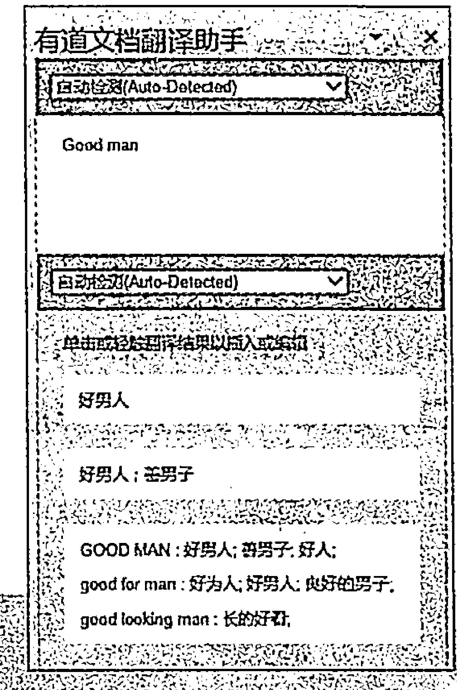

如果用户使用的是老版本的办公软件，可以借助于QTranslate等软件进行翻译。

#### 将表格自动生成图表插入到文档
Q: 通常我们都是通过表格文件来制作相应的图表信息的，但是有的时候我们需要在文档里面进行一些图表的展示。那么如何将表格中的内容快速插入到文档里面，并且通过图表进行展示呢？

A: 首先创建一个Excel文件，在里面输入相关的数据信息。接着新建一个Word文档，点击“插入”标签中的“图表”按钮，在弹出的对话框中选择一个相应的图表样式后，系统将会自动跳出一个Excel表格。将刚刚制作的表格数据复制粘贴到其中，这样就可以制作出相应的图表了。

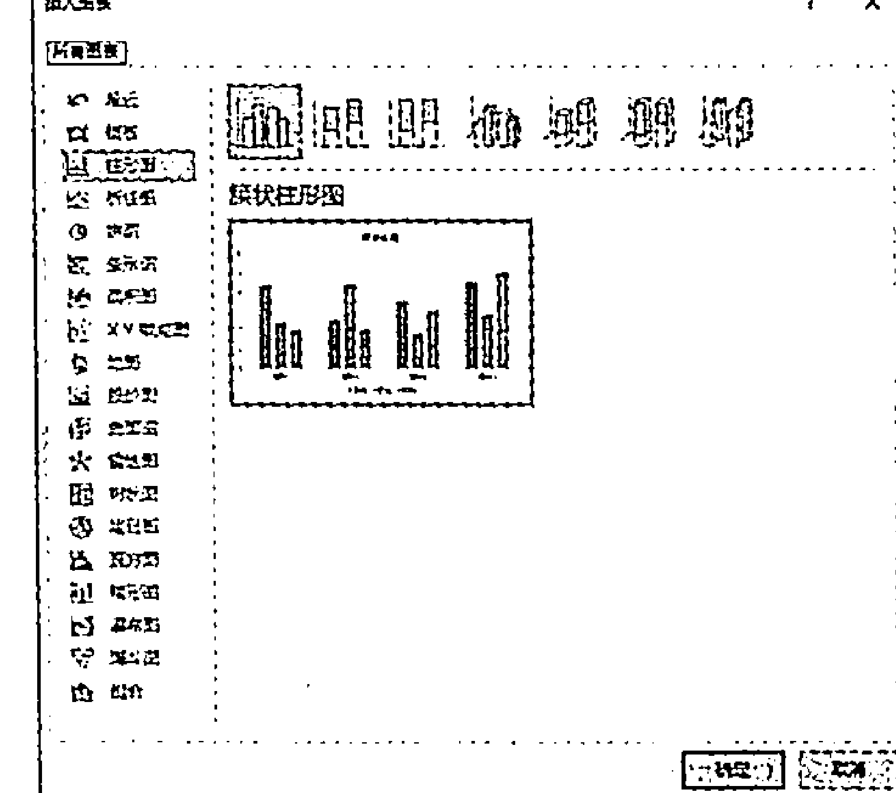

#### PDF文件如何重新进行排版打印
Q: 现在学校里的老师都是通过将作业以PDF文件的形式发给家长，然后由家长监督小孩来完成，有时PDF文件里面的作业有好几页，但是每道题之间的间距非常大，如果直接进行打印的话就会浪费很多纸张。那么有没有什么方法重新对这些内容进行排版呢？

A: 这里有一个非常简单的方法推荐给大家，就是通过截图软件将每道题进行截取，然后将这些图片以此插入到办公软件里面，重新进行排版，并且按照自己的需要设置间距，所有的操作完成以后再进行打印就可以了。

#### 如何利用补帧技术使视频播放更好
文|老万

Q: 平时我们看的视频都是24帧左右的，虽然这样的效果也可以接受，但是有没有什么方法可以提升呢？听说有一个补帧技术可以实现，请问这个传闻是不是真的啊？

A:
- 首先需要是AMD的显卡或者APU，并安装最新版本的驱动程序。
- 接下来打开AMD驱动设置页面，在视频标签页下选择自定义方案，勾选“启用AMD Fluid Motion”这项。
- 然后进入PowerDVD播放器的设置窗口，选择“为蓝光电影启用AMD Fluid Motion”即可。

如果用户使用的是其他播放器，需要首先安装名为“Bluesky Frame Rate Converter”的播放器插件。


> 傻博士有话说

#### 删除系统卸载列表中的无用项目

Q: 今天通过系统控制面板里面的卸载功能删除一个软件的时候发现，以前删除的一个软件项目还在里面，虽然显示在哪不影响系统的正常使用，但是看上去非常的不习惯。那么如何将这个项目进行删除呢？

A: 其实网上有很多专业的软件卸载工具，比如下载“UninstallView”这款工具以后，它会扫描本地系统上安装程序的所有信息，并且在列表里面显示出已经安装的程序。在列表中选择需要删除的项目，然后点击工具栏中的“卸载选定的应用程序”按钮就可以了。

| 序号 | 显示名称 | 安装位置 | 版本 | 安装时间 |
|------|----------|----------|------|----------|
| 1 | 17MONIP6P2P2.1.2 | C:\Program Files\... | 2.1.2 | 2017/2/22 18:42 |
| 2 | Adguard | C:\Program Files\... | 6.1.331.1732 | 2017/2/12 05:26 |
| 3 | Microsoft Office... | ... | ... | ... |
| ... | ... | ... | ... | ... |

#### 什么视频播放器比较好用

Q: 操作系统是Windows 7 64位的，最近从网上下载了一个视频文件，在播放的时候弹出一个错误的提示框，接下来就只有声音没有图像。那么请问有没有什么好的播放器可以推荐呢？

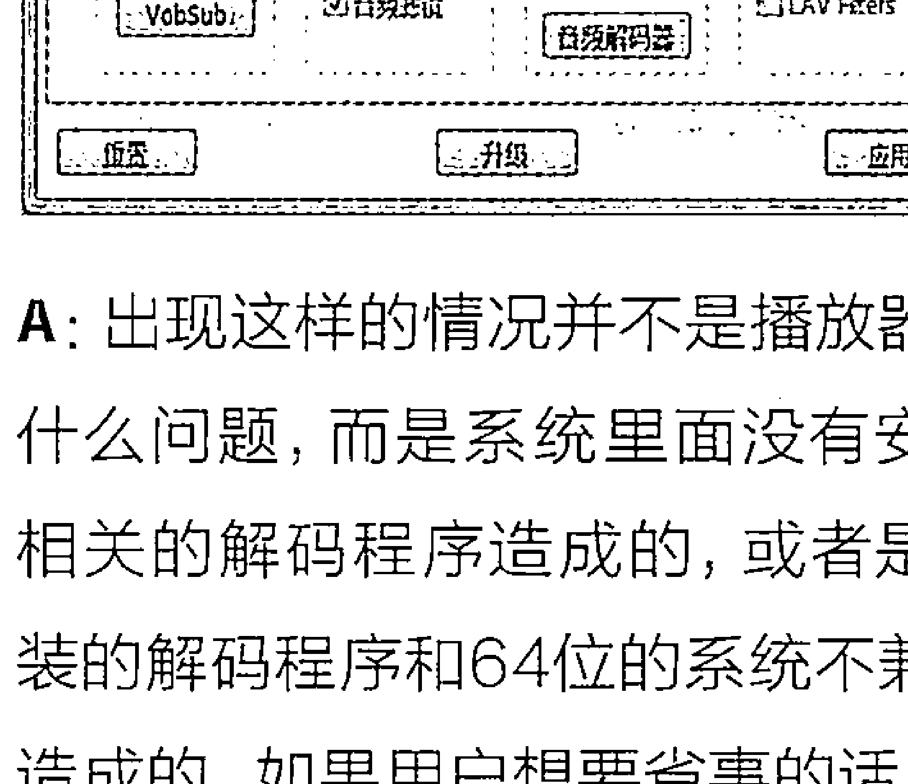

A: 出现这样的情况并不是播放器有什么问题，而是系统里面没有安装相关的解码程序造成的，或者是安装的解码程序和64位的系统不兼容造成的。如果用户想要省事的话，那么直接安装完美解码这种打包好的播放器就可以了。

#### 固态硬盘需要进行碎片整理吗

Q: 最近安装了一个固态硬盘，我想问问这个硬盘是否像传统的硬盘那样，需要定时进行磁盘碎片的清理操作？如果需要的话，那么有没有相应的清理工具可以推荐呢？

A: 其实包括闪存盘、存储卡以及固态硬盘等存储设备，用户只需要下载“Paragon Alignment Tool”这款工具。运行后如果显示为绿色，则表示已经4K对齐了；而显示为黄色，则表示没有4K对齐。选择黄色未对齐的硬盘后，点击下面的“Align Partitons”按钮即可。

#### 快速跳转到指定文件夹目录

Q: 在电脑硬盘里面有很多特殊的文件夹目录，比如存放文档的目录以及用于保存下载文件的目录等等。那么除了创建快捷方式以外，还有什么方法可以快速进入到这些目录里面呢？

A: 首先下载运行“Folders Popup”这款软件，在系统托盘点击鼠标右键后，选择菜单中的“Folders Popup Settings”命令。在弹出的对话框中点击“ADD”按钮，添加需要经常访问的文件夹目录即可。以后只需要点击鼠标，就可以快速访问要打开的文件夹目录。

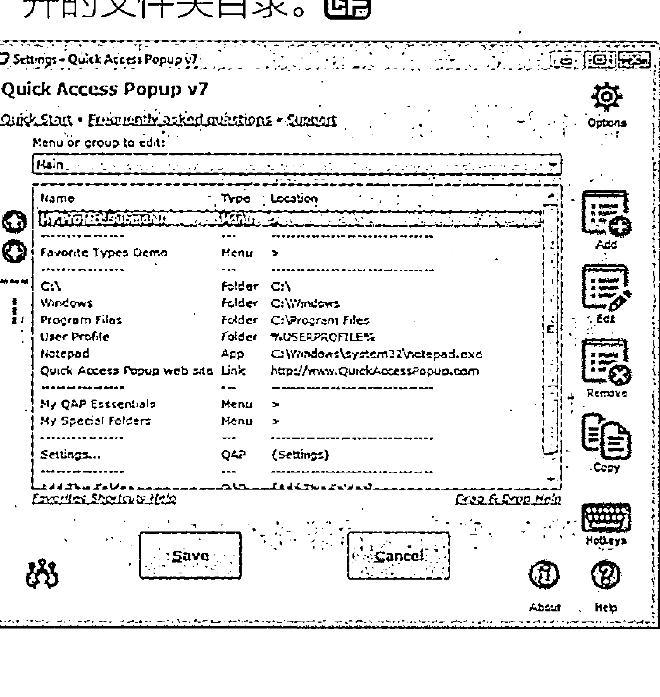

#### 在线进行相关文件的解压操作

Q: 现在很多软件只是提供了安装版本，并没有提供相应的绿色版本，听说有的时候只需要将安装包进行解压，将相关的文件复制出来就成为了绿色版本。那么如何对这些安装文件进行解压操作呢？

A: 首先可以在安装包上点击鼠标右键，看看通过系统中安装的压缩软件是否能对其进行解压。如果不行的话，那么登录到123apps的网址（https://123apps.com），点击右侧窗口的“Archive Extractor”选项，在弹出的网页里面选择要上传的文件，这样就可以在线对这个安装包进行解压操作了。

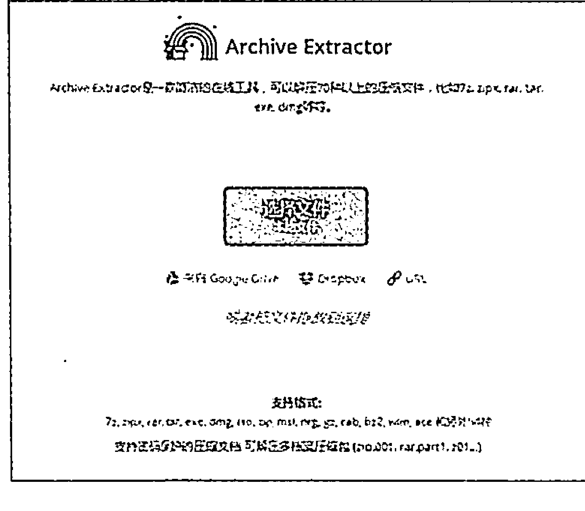

#### 在线随机生成密码信息

Q: 经常听到某个网站的数据库被窃取，这样用户的账号密码就会面临各种各样的危险，于是用户除了及时更改密码以外，使用一些比较长的密码就成为很多用户的选择。那么如何生成这样的密码呢？

A: 现在网上有很多在线密码随机生成工具，只需要登录一个这样的网站，进行生成创建就可以了。比如登录http://www.youxia.org/Password.html这个网站，按照要求设置密码的位数以及包含的信息，最后点击生成按钮，就可以创建需要的密码了。

#### 如何才可以为网站服务进行加速
文|老万

Q: 最近和朋友开办了一个小的网站，由于是初次制作网络服务没有经验，因此使用的服务器配置并不是非常好，这样在访问的时候就会发现访问速度不是很理想。那么请问通过什么方法可以对访问速度进行提升呢？

A: 现在网上有一些网络服务加速软件，比如最常见的锐速以及刚刚流行的BBR，用户只需要将它们安装到自己的服务器里面，就可以进行加速操作了。其实这种加速并不是真正意义上的加速，它们所起到的作用只不过是充分地利用了现有的带宽，减少了传输过程中的丢包情况而已，从而使得网络访问速度大大地得到了改进。

```
Configuring linux-image-3.16.0-4-amd64
You are running a kernel (version 3.16.0-4-amd64) and attempting to remove the same version.
This can make the system unbootable as it will remove /boot/vmlinuz-3.16.0-4-amd64 and all modules under the directory /lib/modules/3.16.0-4-amd64. This can only be fixed with a copy of the kernel image and the corresponding modules.
It is highly recommended to abort the kernel removal unless you are prepared to fix the system after removal.
Abort kernel removal?
<Yes>
```

> 傻博士有话说
BBR这种加速技术已经集成到Linux最新版本的内核中，用户只需要升级最新的内核就可以启用它。

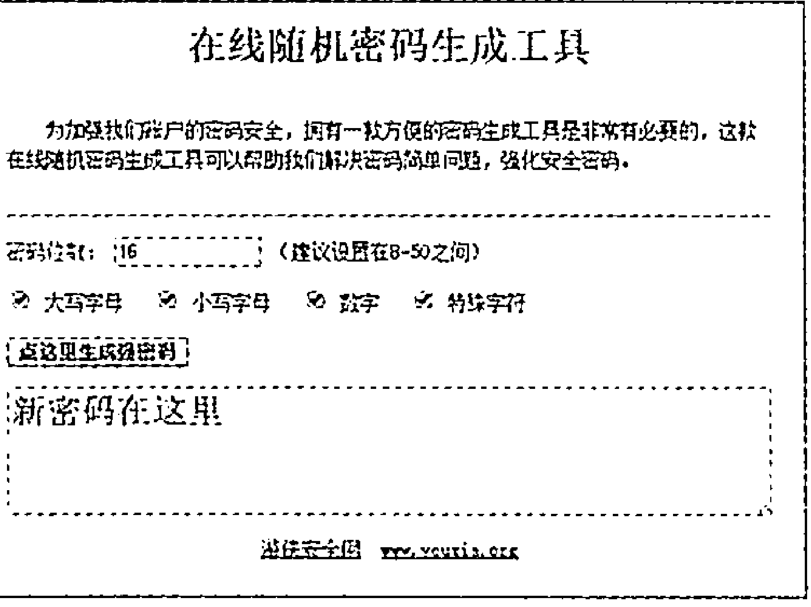

#### 开会信息及时提醒大家

Q: 领导经常要求我们召集大家来开会，虽然这个事看上去比较简单，但是要每个人都通知到就比较麻烦。那么有没有什么方法，可以在线提醒大家按时来开会呢？

A: 首先安装最新版本的TIM客户端，接着进入到这个客户端的日程功能里面。在需要开会的日期上创建一个新的任务，然后在“选择人员”里面添加要来参加会议的人员，最后点击创建按钮就可以了。当设定的时间一到，日程功能就会通过发送信息的方式，来提醒所有人员进行开会。

#### 图片放大怎样才可以不失真

Q: 常见的图片在放大以后，就会出现一些失真或者模糊的情况。那么通过什么方法，可以在放大图片以后保持图像的原貌呢？

A: 首先通过浏览器访问“智能图片放大”网站（http://bigjpg.com/），按照要求上传需要进行放大的图片。选择完成以后就可以对图片进行放大操作，完成以后再下载到本地硬盘里面就可以了。

#### 除了微软的系统还有别的选择吗
文|老万

Q: 现在很多人使用的都是微软的操作系统，那么除了它以外还有其他的操作系统可以选择吗？听说乌班图这款操作系统非常不错，傻博士觉得效果怎么样呢？

A: 除了微软的操作系统以外，我们可以选择的系统主要就是Linux系统，而你说的乌班图系统也就是Linux系统里面的一个分支。由于这个系统的更新速度比较快，而且也有很多的软件可以支持它，所以可以考虑来试一试。

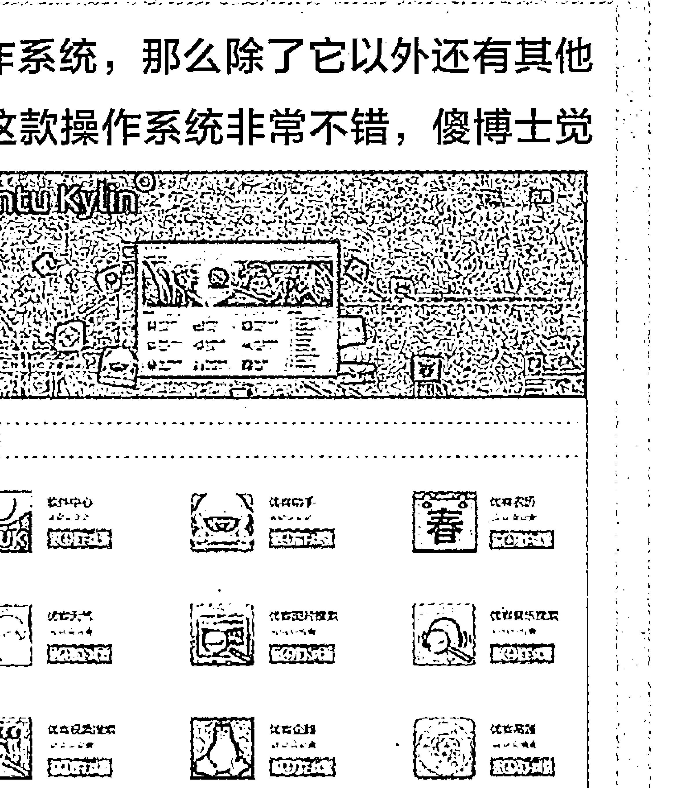

第一次使用乌班图可以选择“优麒麟”这个版本，它是在原版的基础上进行了大量的本地化工作而来的衍生版。


#### Windows 10应用商店提示“重试该操作”

Q: 这几天登录Windows 10的应用商店总是出现问题，进入商店之后不但无法正常显示页面，还出现了“重试该操作”的提醒字样。那么到底是我的问题，还是微软方面的问题啊？

A: 其实包括傻博士在内的很多用户，同样也遇到了类似的问题，所以这个问题并不是出现在你一个人身上，只有等待微软方面进行解决才行。而我们要做的，就是过几天重新登录看看服务器是否已修复。

#### 让Windows 10屏幕键盘回归到老版本

Q: 如果在Windows 10中使用自带的输入法，屏幕键盘的样式看起来非常简约，但是却少了很多的功能按键。如果用户使用的是触屏设备，这种设备还是非常不错的。但是在传统的电脑里面，有没有什么方法可以恢复到以前的老版本界面呢？

A: 首先在“运行”框输入“regedit”打开注册表，展开到HKEY_LOCAL_MACHINE\SOFTWARE\Microsoft\TabletTip\1.7。接着在右侧窗口里面新建一个DWORD（32位）值，将其名称重命名为EnableCompatibilityKeyboard，然后将“数值数据”修改为1并重新启动系统就可以了。

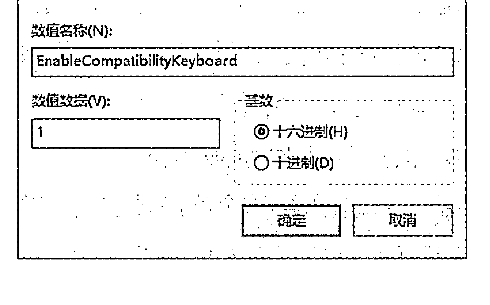

#### Windows 10测试版无法进行在线升级

Q: Windows 10预览版升级设置为“Fast”方式，最近遇到Bug，不能继续更新，联机下载总是失败。现在这个版本在不断提示即将过期，再升级不上去隔几小时就会重启一次。怎么办？

A: 由于用户使用的是Windows 10测试版，难免会遇到各种各样的问题。现在想要解决这个问题的话，只有直接从网上下载最新的Windows 10系统镜像文件，下载完成以后进行解压，通过传统的方式进行安装操作就可以了。

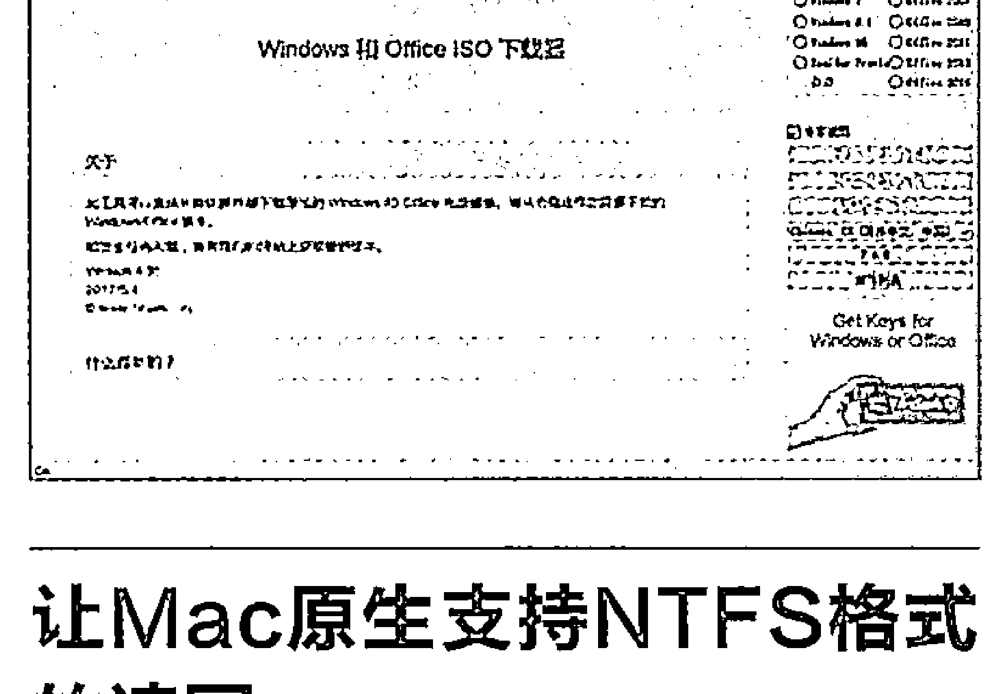

#### 让Mac原生支持NTFS格式的读写

Q: 最近单位给配了一台Mac电脑，可是在使用NTFS格式移动硬盘的时候，默认只能以“只读”的模式进行打开，而不能移动、修改、重命名或删除里面的东西。那么如何才可以解决这个问题？

A: 其实MacOS系统本身是支持NTFS磁盘格式的读写的，只不过苹果把NTFS的“写入”功能给屏蔽掉了。现在只需要安装“Mounty for NTFS”这款工具，就可以实现NTFS文件的写入操作。

#### 系统桌面刷新后视频文件图标显示慢

Q: 在系统桌面上刷新后，其他的文件图标都可以很正常的显示，只有一些视频文件总是刷新很慢，比如刷新后一两秒才会慢慢显现出来。那么如何才可以解决这个问题啊？

A: 可以考虑重建一下系统图标的缓存来试一试。首先从网上下载“Media Preview”这款软件，安装完成以后点击“测试和缓存”标签，然后点击下面的“清除缩略图缓存”按钮，最后重新刷新一下桌面图标看看效果如何。

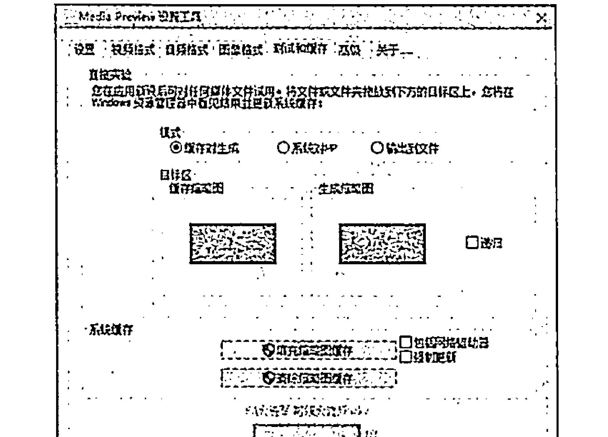

#### 打了补丁后勒索病毒为何还能够运行

Q: 最近在微博上看到一个消息，有人在安装了系统补丁以后，自己测试了一下勒索病毒的样本，结果不幸的是运行后还是中招了。那么为什么会出现这样的情况呢？

A: 这个应该是用户在理解上出现了问题，安装系统补丁只是阻止勒索病毒进入系统的一个途径，并不代表安装了这个补丁系统就不会中这个病毒了。因为病毒还可以通过其他的途径进入到系统里面，如通过移动设备进行传播或者通过电子邮件附件的方式进行传播等。

#### Windows 10系统能不能进行滑动关机

Q: 日常使用移动设备的时候，都是通过手指滑动的方式来进行关机操作的。既然Windows 10系统可以支持移动设备，那么电脑版本的Windows 10系统能不能也支持类似的滑动关机操作呢？

A: 这个功能当然是可以有的。首先打开系统的资源管理器，在地址栏上输入C:\Windows\System32这个文件夹地址后回车，在其中找到一个名为SlideToShutDown.exe的文件。只需要双击它，就可以看到一个滑动关机的提示，根据提示进行操作就可以了。

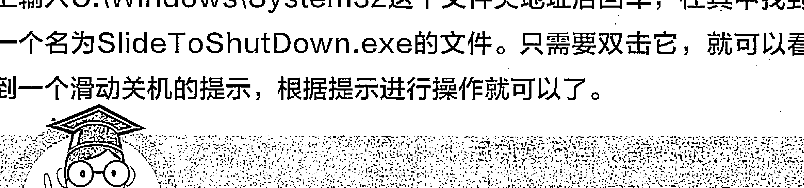

#### 如何关闭系统通知中的广告

Q: 现在最新的Windows 10系统有一个特点，就是当接收到一些通知的时候，会在系统的右下角弹出一个提示框，而这些推送的消息里面，有一部分其实就是广告信息。那么如何将这些广告信息进行关闭呢？

A: 首先打开系统的设置窗口，点击窗口中的“系统”按钮，在弹出的窗口里面选择左侧的“通知和操作”命令。接下来就可以在右侧窗口看到“获取来自应用和其他发送者的通知”和“在使用Windows时获取提示、技巧和建议”这两个选项，将它们进行关闭就可以了。

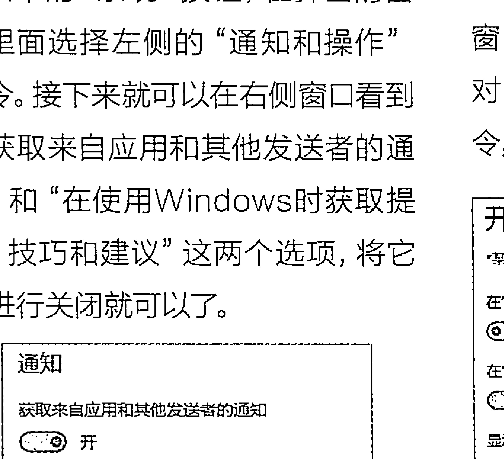

#### 如何才能不显示开始菜单中的推广

Q: Windows 10系统重新添加了开始菜单，但是仔细观察的话就会发现，在开始菜单里面或多或少会出现一些软件的推广信息。不喜欢看到这些推广信息的话，如何才能让它们不进行显示呢？

A: 首先打开系统的设置窗口，点击窗口中的“个性化”按钮，在弹出的对话框里面选择左侧的“开始”命令，然后在右侧窗口里面将“偶尔在‘开始’屏幕中显示建议”这个选项进行关闭就可以了。

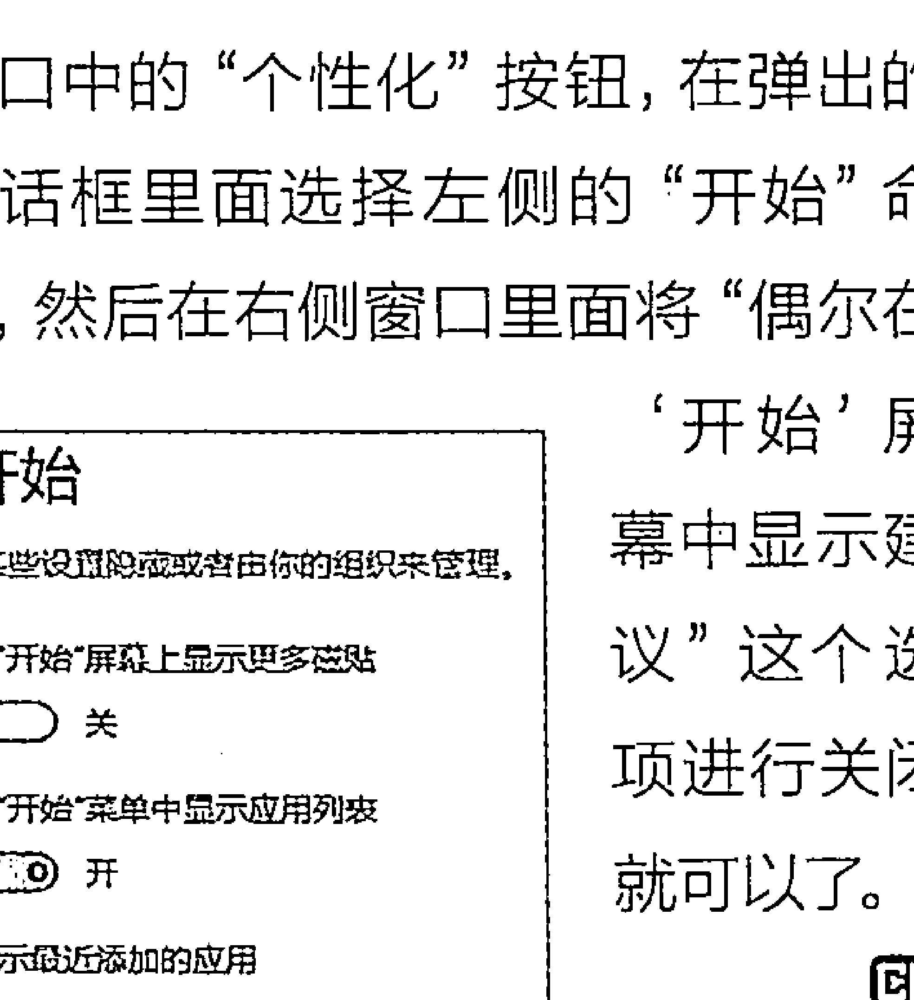

#### 如何批量完成图片的转换操作
文|老万

Q: 最近公司要求把网站上的图片批量转换成WebP这个格式，但是看了一下自己常用的软件，都无法对这种格式进行支持。那么请问如何才可以批量完成图片的转换操作呢？

A: 如果是常规格式的图片转换，利用一些知名的看图软件就可以解决了，但是对于这种全新的格式，只能使用专业的转换软件，比如XnConvert这款软件就不错。运行软件后点击右下角的“添加文件”按钮，在弹出的对话框中选择需要转换的文件。接着点击“输出”标签并在格式列表中选择想要的格式，最后点击“转换”按钮就可以了。

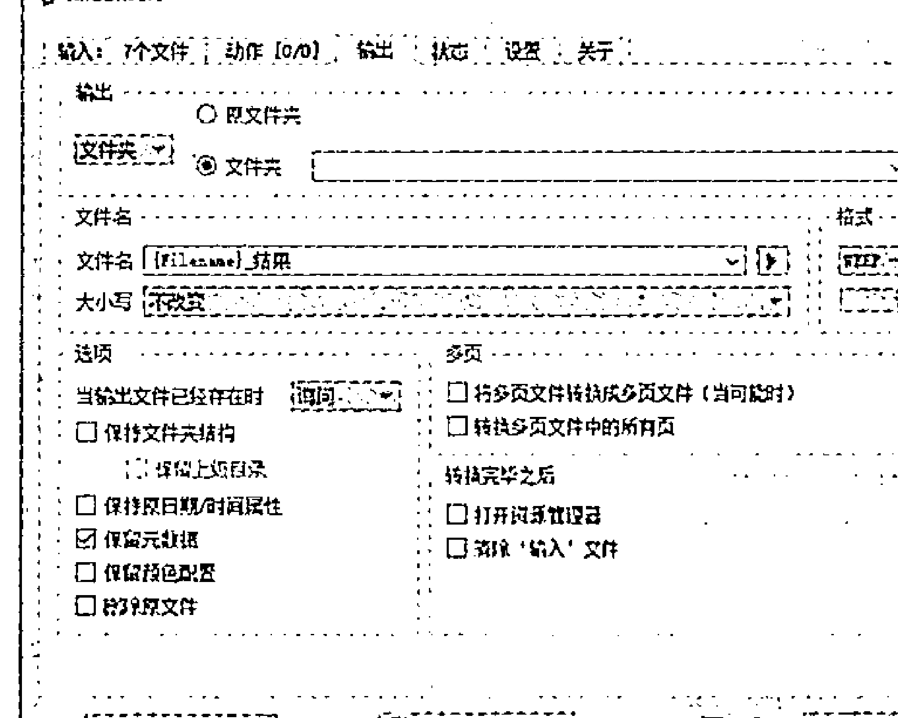

> 很多看图软件需要安装相应的插件，才可以对全新的图片格式进行支持操作。


#### MP3格式之后有其他选择吗

Q: 最近在网上看到一个新闻说，以后MP3这种音频格式将被淘汰了。那么是不是以后就无法使用这种格式呢？除此以外有其他新的格式可以选择吗？

A: 这个新闻傻博士也看到了，新闻说会用新的AAC格式来替代MP3这种格式。当前网上已经有很多音频格式可以选择，如果用户仍然喜欢MP3这种格式的话，可以利用“格式工厂”等工具自己进行转换操作。

#### 勒索病毒有没有方法来抢救

Q: 最近这段时间以来，勒索病毒一直是人们茶余饭后的讨论话题。那么如果用户不小心中了这类病毒的话，除了支付赎金以外，有没有其他方法可以进行数据的抢救操作呢？

A: 从现有的技术手段来说，要想解决这个问题，只能使用传统的数据恢复的方法来解决。比如运行Recuva这款软件，在软件左上角的列表中选择要恢复文件的磁盘，点击扫描按钮开始进行扫描操作，扫描出要恢复的文件后在列表上勾选它们，最后点击右下角的恢复按钮看看能不能解决。


#### 压缩包文件删除时提示要密码

Q: 最近遇到一个压缩文件，在删除里面的文件时提示要求输入密码。可是自己创建了一个压缩文件后，只是双击打开的时候提示输入密码，删除的话并不会提示需要密码。怎样做到删除里面的文件也需要密码呢？

A: 其实出现用户所说的这两种情况，只是在创建压缩文件的时候，设置有所差异而已。比如在WinRAR参数设置窗口中点击“设置密码”按钮后，如果选择了“加密文件名”选项，就会在运行压缩文件后要求首先输入密码；如果没有选择这个选项的话，那么只有在删除文件的时候才会要求输入密码。

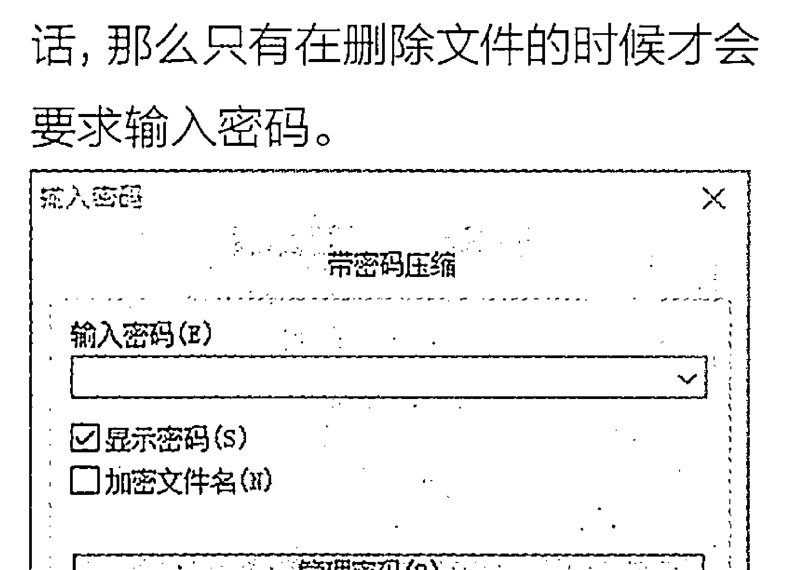

#### PotPlayer打开后出现磨砂效果

Q: 今天从网上下载了PotPlayer播放器的最新绿色版，可是打开以后发现软件的界面出现了一层薄纱的效果，而且无论是否播放视频都是这个效果。请问应该怎么解决这个问题啊？

A: 出现这样的问题最大的可能就是，PotPlayer软件和显卡驱动之间有冲突。建议下载一个以前的老版本，或者下载一个其他的播放器，来试一试看看会不会出现类似的效果。


#### 访问时间一到就提醒用户注意

Q: 有的时候打开一个网页后，很长时间我们都沉溺在其中，这样时间就被遗忘在了脑后。而有的时候为了查询一件事情，从搜索结果中又跳转到不知道哪里去了。那么有什么方法可以在设定的时间内提醒用户吗？

A: 首先打开自己常用的浏览器，登录到https://bato.life/这个网站服务页面中，根据提示在页面中设置一个限定的时间并点击下面的确认按钮，接下来设置自己需要访问的网页链接并确认。这样该服务就会自动打开这个网页并进行倒计时，时间一到就会用声音提醒用户注意。

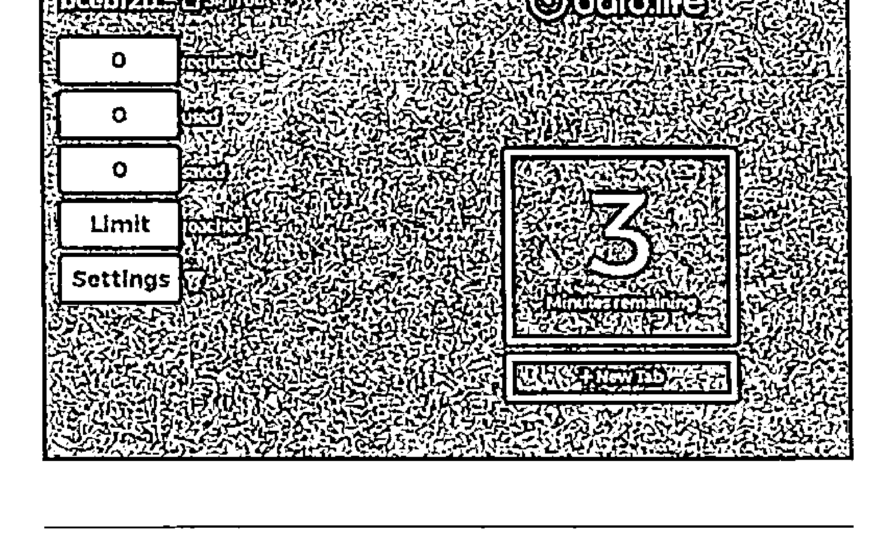

#### 清理类似于淘宝那样冗长的链接

Q: 在访问淘宝或者微博的时候，想将一些有意思的内容转发给自己的亲朋好友，可是复制粘贴后发现转发的链接非常的冗长。那么有没有什么方法将这些冗长信息进行缩短呢？

A: 首先通过浏览器访问https://meta.appinn.com/t/topic/3130这个网页链接，根据页面中的介绍将其中的代码制作成一个小书签。以后登录淘宝或者微博的时候，只需要点击这个小书签就可以将当前的网页链接转换成简洁的形式了。

#### 快速查看新浪微博中的图片信息
文老万

Q: 现在新浪微博是一个非常热门的社交网络，很多用户都在里面发表自己的个人观点，其中就有不少相关的图片内容，但是想要查看一张图片的原图，需要连续点击几个不同的按钮。那么有没有更加方便快捷的查看方法呢？

A: 要解决这个问题，只需要安装一款名为“新浪微博之我要看大图”的扩展或者功能脚本即可。安装完成以后打开新浪微博的时候，将鼠标移动到要查看的微博图片上，就会在图片的左侧显示出一排功能按钮，点击相应的按钮就可以快速地进行图片操作了。


如果用户要安装功能脚本的话，需要首先安装Greasemonkey这个扩展。

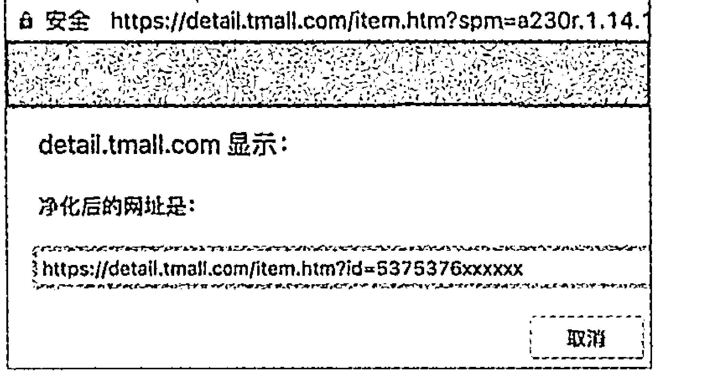

#### 浏览器状态栏会提示某个网址

Q: 明明打开的是《电脑爱好者》的官方网址，但是浏览器状态栏提示的却是其他的网站链接，比如ruyi.etao.com等等。请问为什么会出现这样的情况？应该如何进行解决才好啊？

A: 出现这样的情况应该是用户的浏览器安装了某些功能扩展引起的。比如安装了“如意淘”这个扩展，那么这个扩展自然就会访问它的官方网站，这样就出现了上面所说的这种情况。用户可以将这个扩展进行删除或者禁用，看看还会不会有类似的网页链接出现。

#### 银行理财收益的计算方法

Q: 人们常说“你不理财，财不理你”，如果手里有些余钱的话，可以进行一些理财操作。比如现在很多银行都通过小额定投的方式来吸引用户，但是每个银行的规则又不尽相同。那么如何来计算定投的收益率呢？

A: 首先通过浏览器登录到光大银行的官方网站，选择“个人业务”中的“基金”这一项，在弹出的页面右侧可以看到“理财工具”的区域，点击其中的“基金定投收益率计算器”链接后，根据提示输入相关的信息进行计算就可以了。

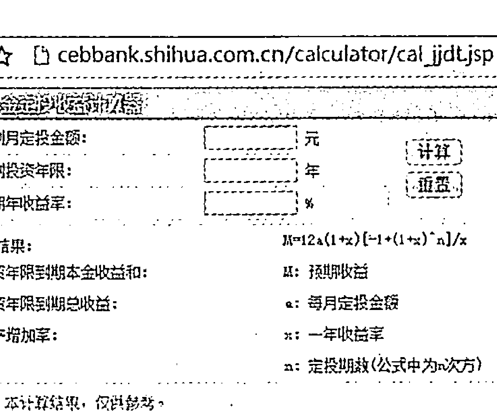

#### 将微信收到的文件传到电脑

文/老万

Q：今天通过微信收到一个压缩包文件，现在想将这个文件上传到电脑里面，可是又不想安装电脑版的微信客户端。那么请问通过什么方法可以解决这个问题呢？

A：首先在微信里面将这个压缩包进行下载，通过手机的文件管理器找到这个文件。接着通过管理器的分享功能将它分享到QQ里面，在弹出的QQ对话框里面选择“我的电脑”这项，这样就可以上传到电脑里面了。

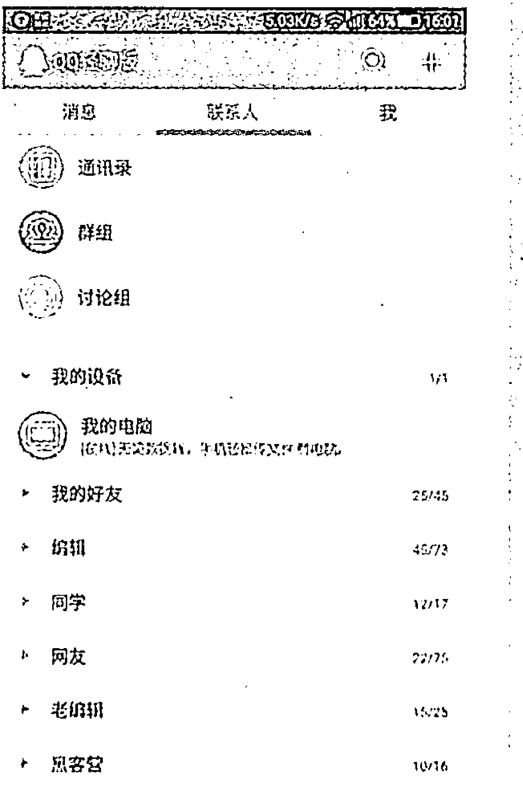


除此以外，利用分享功能中的电子邮件来发送附件的方式也能进行上传。

#### 快速制作精美的毕业相册

Q：马上就要毕业了，于是和同学依依不舍地拍了很多照片，想把这些照片制作成电子相册，可是现有的相册应用感觉千篇一律。那么有没有好的让人眼前一亮的应用可以选择呢？

A：首先下载安装一款名为“MAKA”的应用，它是一款HTML5制作工具，打开它以后在“专题”栏目里面选择“毕业季”，就可以看到大量的制作模板。

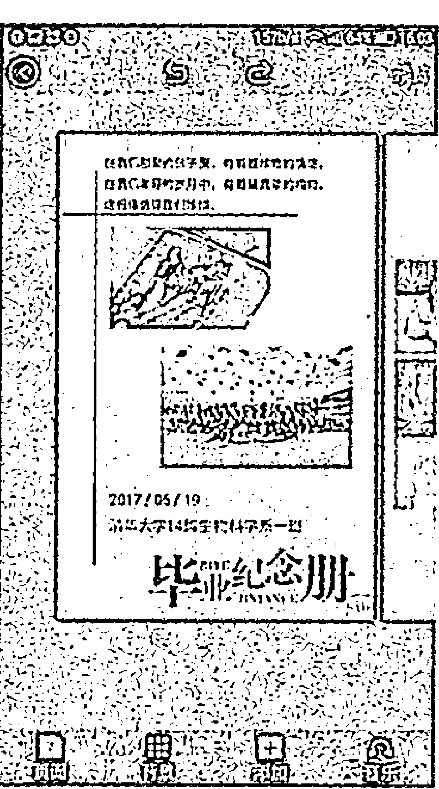

从模板里面选择一个喜欢的，根据提示填上相应的图片、音频、文字等信息，这样就可以快速制作出一个精美的电子相册了。

#### 一键识别闪存的具体型号

Q：之前看到有读者在这个栏目询问如何鉴别手机的闪存型号，而傻博士当时给出了一个通过读写速度来判断的方法，可是自己对这些还是搞不太明白。有没有直接显示出闪存型号的检测方法呢？

A：首先下载安装“P10Check”这款应用，运行它之后直接就能够显示出闪存的类型，到底是EMMC还是UFS等。不过需要提醒大家的是，该应用并不能检测UFS闪存的具体类型是UFS 2.0还是2.1。除此之外，这款应用适用于所有的手机，并不单单是某品牌的手机。

#### 文字放大以后再进行选择

Q：有的时候朋友发来一段微信的文字信息，其中有的内容非常重要，于是想把它复制下来，可是在非常小的环境下进行操作非常不便。那么有没有什么好的方法可以解决呢？

A：其实只需要在这段选择的文字信息上进行双击，就会看到这段文字被全屏放大了，然后按照以前的操作方式进行长按，这样就可以方便选取其中需要的信息内容了。

#### 乐视手机开启悬浮球功能

Q：现在很多手机系统里面都加入了悬浮球功能，听说乐视手机里面也增加了这个功能，可是怎么也没有找到它。那么如何开启这个功能呢？

A：首先将系统升级到最新版本，接着点击桌面的“设置”按钮，在弹出的列表中点击“辅助功能”选项。这样就可以在列表中找到“悬浮球”的选项，点击它以后将这项功能进行开启就可以使用了。

当然用户也可以根据自己的习惯，对悬浮球的动作进行自定义设置操作。

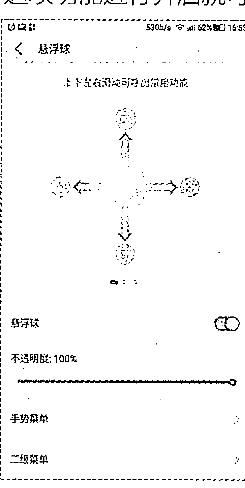

##### 快速进行文章首行的缩进操作

Q: 中文写作与英文最大的不同之处在于，每个段落的首行都需要进行缩进，而我们通常都是通过连续按下空格键来完成的。如果不再进行重新编辑的情况下，这样的操作是没有问题的，但是如果后期需要重新进行编辑，那么可能就会出现错位的情况。那么这个问题应该怎么解决呢？

A: 首先打开需要编辑的文章，接着点击“开始”标签中的“选择”按钮，将所有的文字进行全选操作即可。接下来点击“段落”右下角的按钮，在弹出的对话框中选择“特殊格式”列表中的“首行缩进”选项，这样设置以后就不会出现错位的情况了。

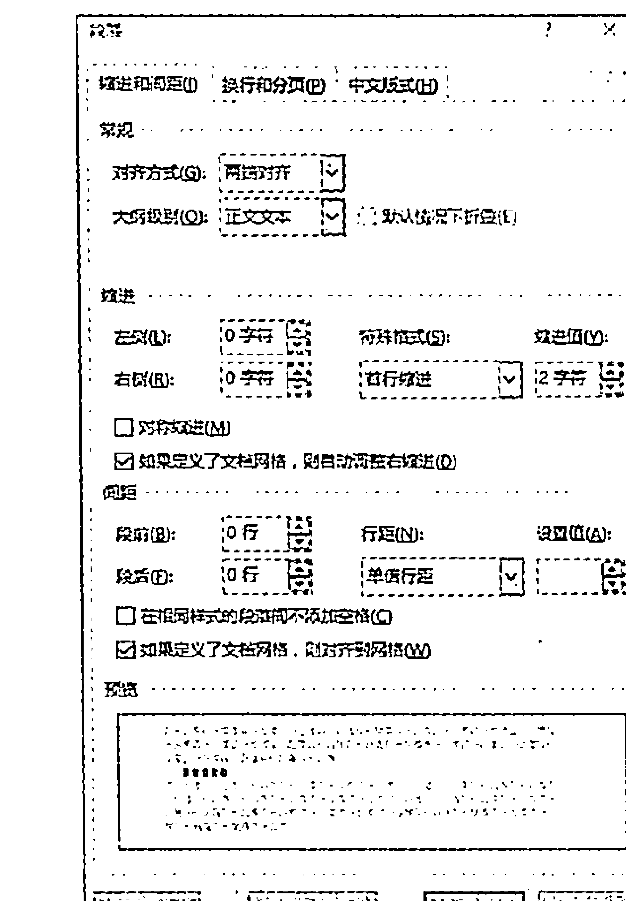

##### 跨页选取文字如何方便操作

Q: 想对文字进行编辑操作，首先需要通过鼠标对这些文字进行选中，但是如果选中的文字比较多，这种长距离的拖拽就很容易出错，而且操作的效率也非常低。有没有什么更加快捷方便的方法呢？

A: 如果要一次性选中大量文字的话，可以利用鼠标和键盘的配合来完成。比如首先在文字的起始点点击一下鼠标左键，接着按住键盘中的Shift键不放，滚动鼠标的滑轮后，在文字的结束点再点击一下鼠标左键，这些内容就可以轻松地进行选择了。

##### 批量删除文章中的空白行

Q: 从其他的文章里面复制出自己想要的内容后，在新建一篇文章的时候很有可能顺带复制了一些不需要的空行过来。通过传统的手工方法删除的话非常麻烦，而且也不怎么美观。那么如何可以快速地将这些空行进行删除呢？

A: 首先对文章中的内容进行全选操作，接下来点击“开始”标签中的“替换”按钮。在弹出的“查找内容”输入框里面输入“^p”，然后在下面的“替换为”输入框中保持空白，最后点击“全部替换”按钮就可以了。

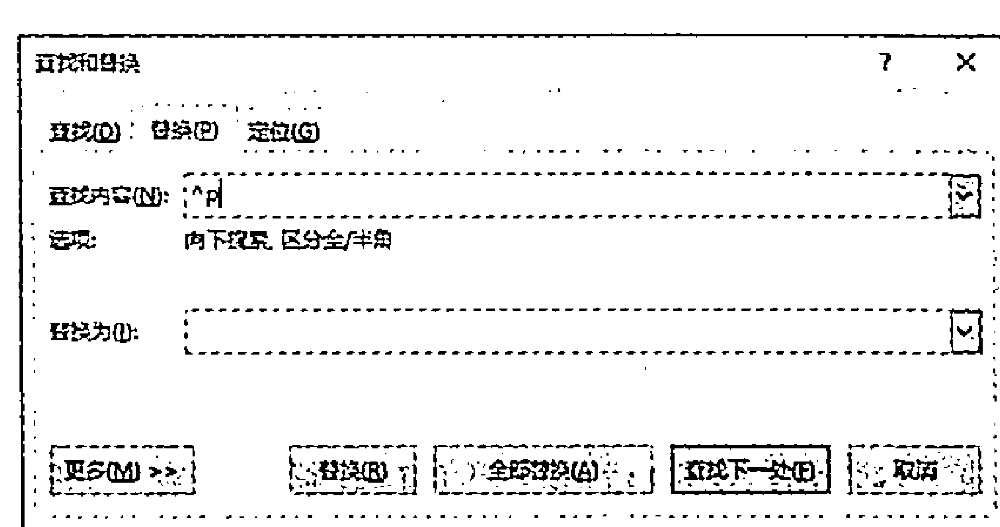

> 利用这些特殊的通配符，可以完成大量的替换操作。

##### 修改文章里所有图片的效果

Q: 在编辑文章的时候，我们常常会在文章里面插入一些图片，然后根据文字内容来对图片进行编辑，可是一个一个对这些图片进行修改的话会非常麻烦，而且往往也会造成效果的不统一。那么如何让所有图片都达成一个效果呢？

A: 首先选中文章中的一张图片，点击“格式”标签中的“图片效果”按钮，根据自己的需要对这张图片进行编辑。编辑完成以后点击文章中的第二张图片，再点击键盘中的F4键，就可以快速完成第二张图片的编辑操作。以此类推，就可以对所有的图片进行编辑操作了。

##### 无需回车就可以跳转到下一页

Q: 通常要打印一份工作报告的时候，首页都是报告的标题名称，接下来正文需要从第二页开始输入。为了达到这样的效果，我们需要不停地点击回车键来进行操作。那么有没有不按回车键就进行操作的方法呢？

A: 首先在第一页输入报告的标题名称，然后按一下回车键，接下来点击“插入”标签中的“分页”按钮。这样就会自动跳转到第二页，从而方便用户开始进行正文的输入操作。

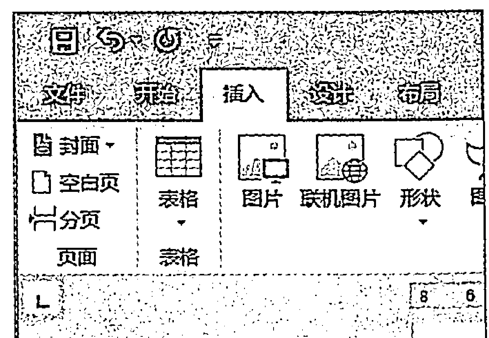

##### 如何去除办公文档中的超链接

文/老万

Q：有的时候从网上复制一段内容，将它们粘贴到Word办公软件里面，这个时候就会发现包含的超链接信息也粘贴过来了，这样在编辑的时候就会非常麻烦。那么如何去除这些超级链接，但是并不改变其他内容的样式呢？

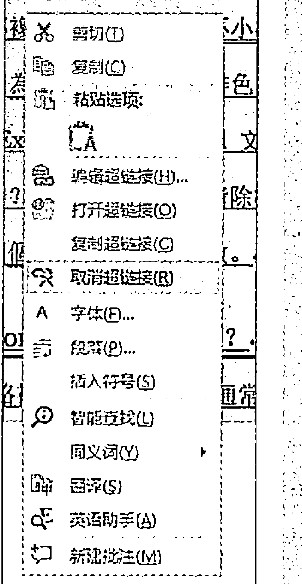

A：首先点击Word“开始”标签中的“全选”按钮，将所有的内容选中后，在其上方点击鼠标右键，选择菜单中的“取消超链接”命令即可。这样就可以在取消超级链接的同时，保留其他需要的文字内容样式了。

点击工具栏中的“清除所有样式”按钮，也可以一次性将所有的内容清除掉。

##### 通过邮件合并快速发送电子邮件

Q：公司每当有商业活动的时候，都会发出大量的邀请函邮件，如果邀请函一个一个地输入的话，就会显得非常麻烦。那么有没有批量发送邮件的操作方法呢？

A：首先在Word软件窗口中输入邀请函的主要内容，点击“邮件”标签中的“开始邮件合并”按钮，选择菜单中的“电子邮件”选项。接着点击旁边的“选择收件人”按钮，根据自己的需要输入邮件收件人的信息。然后点击“插入合并域”按钮，在弹出的菜单里面选择“称呼”，再进行发送操作就可以了。

邮件合并收件人列表截图

##### 批量修改选中文字的颜色信息

Q：有的时候如果一篇文章较长的话，我们会通过不同的方式，将重点内容进行标注，其中添加标注颜色就是相应的方法之一。那么如果想对添加的颜色进行修改，应该如何操作呢？

A：首先点击Word工具栏中的“字体颜色”按钮，在弹出的对话框里面根据需要选择一个颜色。接着打开软件的“替换”窗口，点击“更多”后选择右下角“格式”菜单中的“突出显示”命令。接下来按照同样的方法在“替换为”输入框里面进行操作，最后就可以批量完成颜色的替换操作了。

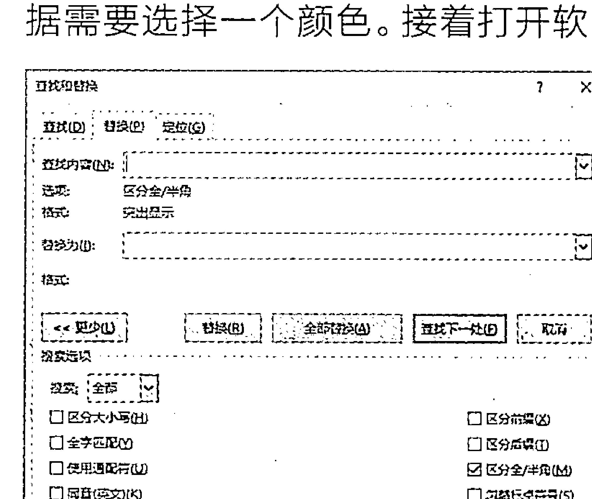

##### 如何设置软件里面没有的颜色

Q：很多时候我们需要对文档里面的字体颜色进行修改，可是点击“字体颜色”按钮后发现可以选择的颜色非常少。那么如何自定义需要的字体颜色呢？

A：首先在Word里面选中需要改变颜色的内容，点击工具栏中的“字体颜色”按钮，在弹出的菜单里面选择“其他颜色”命令。然后在弹出的对话框中选择“自定义”标签，根据自己的需要，分别设置红色、绿色、蓝色的参数就可以了。

##### 输入文字时原有的文字被替换

Q：今天打开一篇文章想对里面的部分内容进行修改，当需要在一段文字的前面加入内容的时候，发现输入的内容将原有的部分内容替换掉了。那么是什么原因造成这个问题的，又应该如何解决呢？

A：首先看一下办公软件的状态栏里面是否有“改写”这样的提示，如果有的话，那么只需要点击这个命令，将它切换成“插入”状态后再重新输入就可以了。之所以会出现这样的问题，可能是用户误按了键盘的Insert键造成的。

#### 同步Edge和IE浏览器收藏夹

Q: 在Windows 10系统里面，Edge已经是默认的浏览器了，但是有的时候仍然会使用IE浏览器。可是认真观察就会发现，两款浏览器里面的收藏夹内容却不相同。那么如何可以让两个浏览器的收藏夹信息同步呢？

A: 首先通过“gpedit.msc”命令启动系统的组策略编辑器，通过鼠标依次展开左侧列表“计算机配置→管理模板→Windows组件→Microsoft Edge”，这样就可以在右侧窗口看到“使收藏夹在Internet Explorer和Microsoft Edge之间保持同步”的项目内容。双击该选项打开它的配置窗口，在弹出的对话框中选择“已启用”即可。

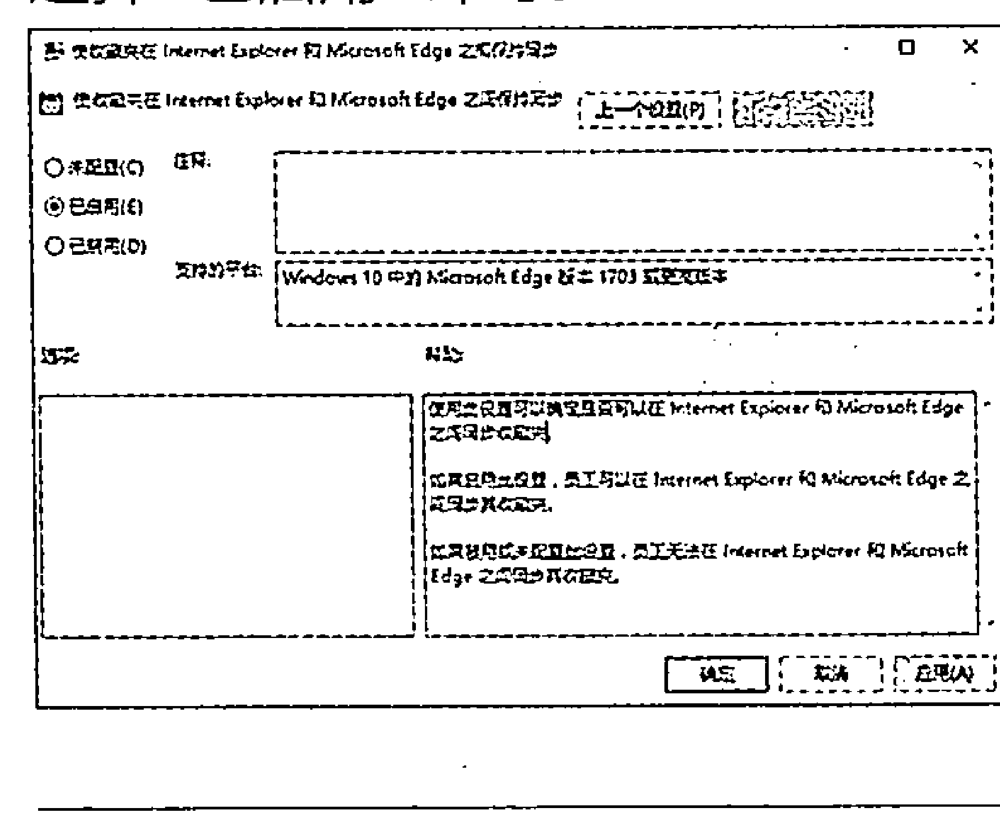

#### 提高Windows Defender的云级别

Q: Windows Defender和其他国外的杀毒软件一样，都是以本地病毒库为主要判断来源的，这样的话就会占用大量的系统资源，而它本身也是拥有云安全的功能。那么能不能让云安全起主要作用，从而降低它的系统资源占用呢？

A: 首先按照前面的方法打开系统的组策略编辑器，通过鼠标依次展开左侧列表“计算机配置→管理模板→Windows组件→Windows Defender防病毒程序→MAPS”，这样就可以在右侧窗口看到“加入Microsoft MAPS”的项目内容。双击该选项打开它的配置窗口，在弹出的对话框中选择“已启用”即可。

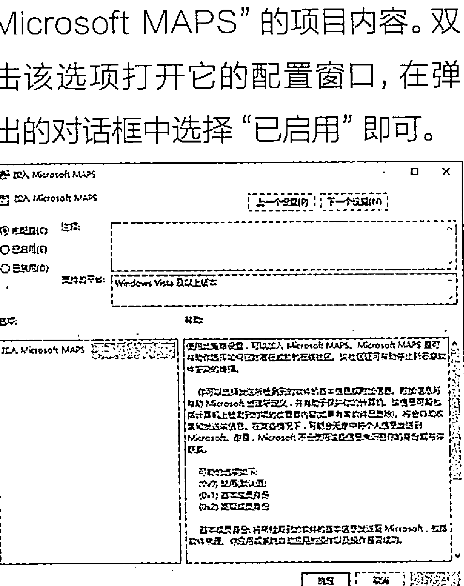

#### 彻底关闭Windows Defender

文/老万

Q: Windows Defender是系统里面自带的杀毒软件，每次安装完系统后都会将这个杀毒软件进行关闭，以前都是通过组策略的方法来关闭的，可是现在通过这个方法发现杀毒软件的图标仍然出现在系统托盘。那么如何才可以彻底关闭该杀毒软件？

A: 按“Win+R”打开“运行”框，输入“regedit”打开注册表，展开到HKEY_LOCAL_MACHINE\SYSTEM\CurrentControlSet\Services\SecurityHealthService。在右侧窗口里面找到Start这个内容后，双击打开它，将里面的“数值数据”修改为4就可以了。

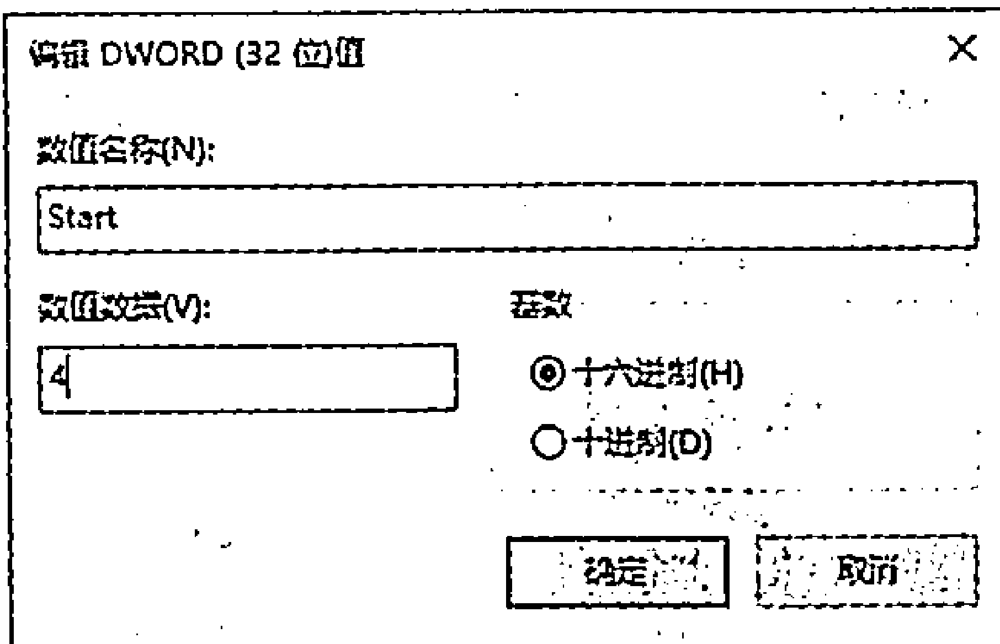

> 如果要想彻底关闭Windows Defender，需要配合组策略的方法一起使用才行。

#### Windows 10 CPU占用高的解决办法

Q: 使用Windows 10系统以后，不知道为什么经常都会听到系统主机风扇疯狂旋转的声音，而且查看CPU的占有率也非常的高，可是还是使用的那些软件啊。那么如何可以解决这个问题呢？

A: 首先打开系统服务的管理窗口，在列表中找到“HomeGroup Listener”这个服务，双击打开它的操作窗口后，将它的“启动类型”设置为“禁用”就可以了。接下来将“HomeGroup Provider”服务也进行同样的设置。

#### Windows 10是不是免疫勒索病毒

Q: 听说将操作系统升级到最新的Windows 10版本，就可以抵御现在流行的勒索病毒了。请问这个说法是否正确呢？

A: 将系统升级到最新的Windows 10版本以后，只是防范病毒通过网络进行传播的这个途径。如果用户从网上下载的软件含有勒索病毒的话，那么系统同样会被病毒所破坏，因此安装相应的杀毒软件还是非常必要的。

#### 现在远程控制类木马还流行吗

文/老万

Q: 说起远程控制木马，就让人联想到“灰鸽子”等等，但是这些东西现在已经难以听到了，大家提及的时候都是在回顾历史。那么现在这类工具应该有所发展吧，傻博士能不能介绍一下啊？

A: 由于现在法律规定制作传播木马程序都属于违法行为，因此制作远程控制木马的人已经转入了地下，所以现在在网上就很难发现类似于灰鸽子这样的木马了。


现在为了避免被杀毒软件所查杀，有的黑客开始利用 TeamViewer这类正规的远程控制软件进行入侵和破坏操作。

#### 如何快速进行视频的转换操作

Q: Windows 10电脑系统中下载的视频文件，需要进行相关的转换格式操作。那么除了格式工厂以外，还有没有更好的软件可以选择呀？

A: 其实利用PotPlayer这款播放软件，就可以进行相关的格式转换操作。首先打开需要转换的视频文件，在主界面上点击鼠标右键，选择“视频”菜单中的“视频录制”命令，然后点击其中的“立即录制视频”命令，在弹出的窗口中选择需要转换的格式后，点击“开始”按钮即可。

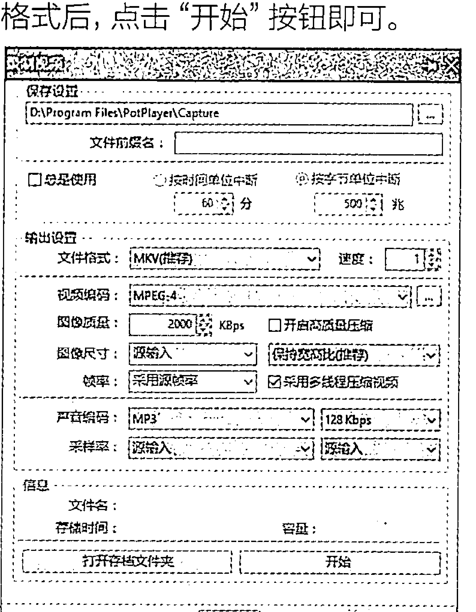

#### Office弹窗问题的原因和解决

Q: 最近一段时间不知道怎么回事，微软的Office软件会在屏幕窗口上突然闪出一个窗口，然后迅速进行关闭，这样看上去非常不舒服。那么通过什么方法可以解决这个问题呢？

A: 其实这个问题很多网友都遇到过。首先打开系统里面的任务计划程序，在弹出的窗口里面选择左侧列表中的Office这项，然后在右侧窗口列表中找到OfficeBackgroundTaskHandlerRegistration这一项，在它上面点击鼠标右键，选择菜单中的“删除”命令就可以了。

- Office Automatic Updates
- Office ClickToRun Service Monitor
- Office Subscription Maintenance
- OfficeTelemetryAgentFallBack2016
- OfficeTelemetryAgentLogOn2016

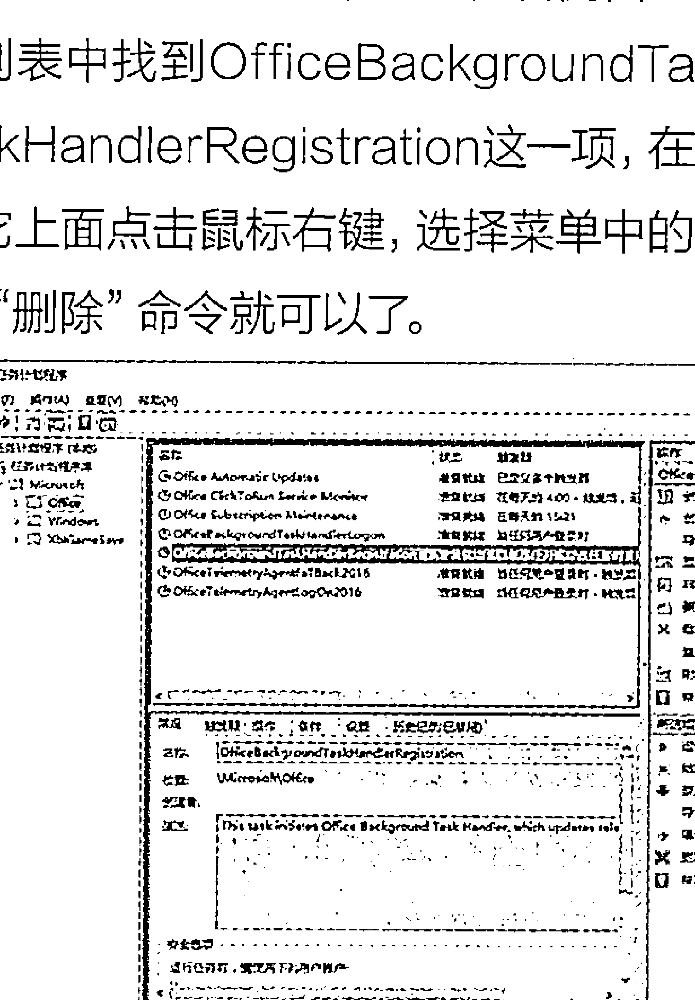

#### 批量去掉文本里的符号和数字

Q: 准备折腾一下输入法的词库，原来备份的老词库码表格式和现在准备用的有一点不一样，比如原来是“透视 rmmc#序12941”这样的，现在是“透视 rmmc”这样的。那么应该如何解决这个问题啊？

A: 首先通过EmEditor打开词库文件，点击“搜索”菜单中的“替换”命令，在弹出的对话框里面选择“使用正则表达式”选项后，在“查找”输入框里面输入“#序\d+”，最后点击“替换”按钮就可以批量解决了。

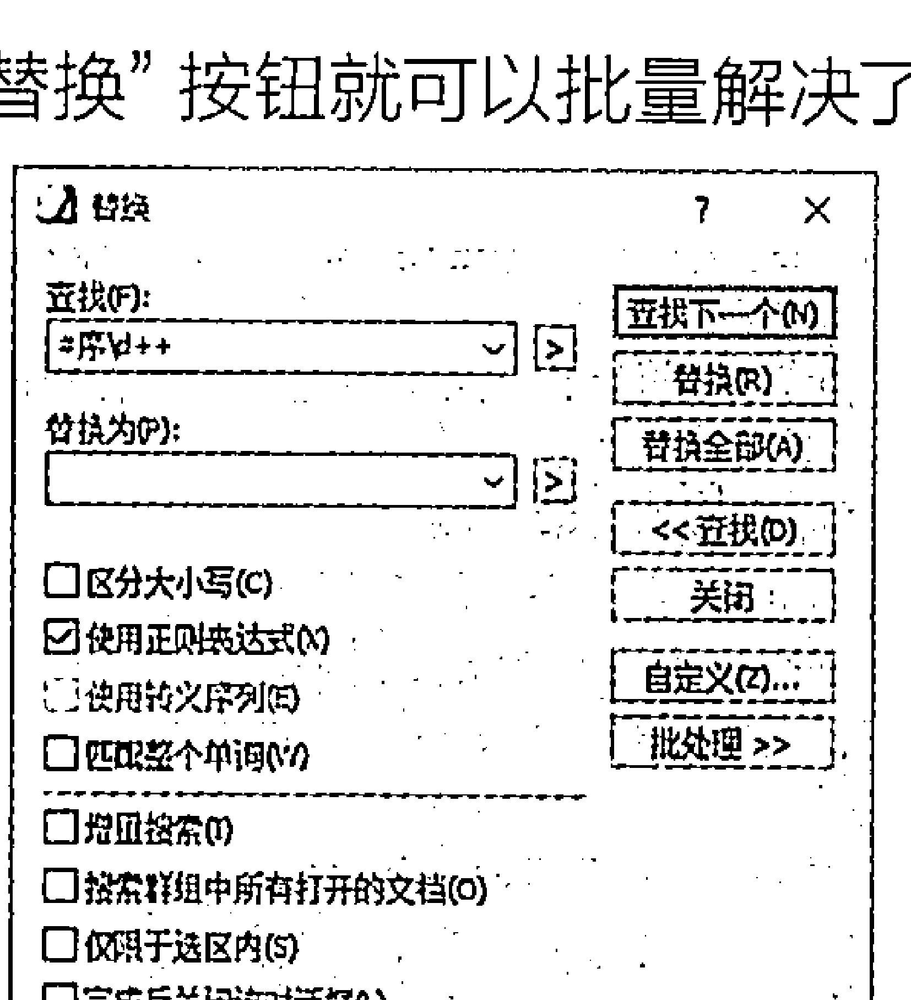

#### 搜狗输入法候选字位置出现偏移

Q: 刚刚购买的新电脑中安装的是Windows 10操作系统，输入法选择的是流行的搜狗拼音输入法，可是在输入的时候发现，候选字的位置出现了偏移，也就是说候选框里面只能看到候选字的一部分。那么请问如何解决这个问题呀？

A: 首先建议用户将输入法的皮肤替换为默认的皮肤，看看是否还会出现偏移的状况。如果更换皮肤以后解决了这个问题，那么就说明是皮肤的问题。如果更换皮肤以后没有解决这个问题，那么可以试着调整电脑的DPI缩放来看看。

#### 如何测试优化用户的网站图片

Q: 最近有个朋友制作了一个图片网站，可是在测试的时候发现加载速度非常的慢，不知道是图片太多的原因，还是由于网站程序的问题。那么如何才可以进行分析判断呢？

A: 首先通过浏览器打开https://pageweight.imgix.com/这个专业的分析网站，按照提示在输入框里面输入自己的网站域名，然后点击下方的按钮开始进行检测操作。检测完成以后网站会给出详细的报告，并且告诉用户应该如何对网站进行优化操作。

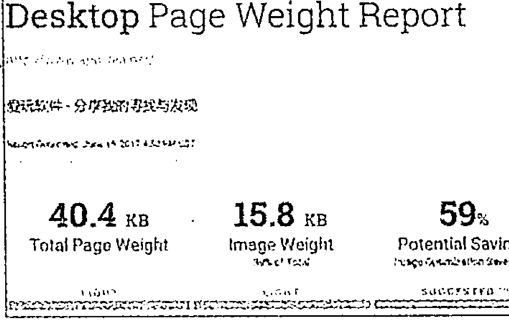

#### 美国电话号码区号的查询查找

Q: 最近经常在国外通过网购买一些东西，这个时候就需要选择一些转运公司，而自己对这些转运公司的信息又不太了解。那么如何通过查询电话号码区号的方式，来了解公司所在的位置呢？

A: 网上可以查询电话号码区号的方法有很多，但是要想查询美国电话号码区号的话，可以试一试https://www.chahaoba.com这个网站。打开它以后在搜索框里面输入美国，然后在弹出的结果页面中就可以查询到美国的区号信息了。


#### MP3文件的在线存储和播放

文/老万

Q: 平时都是通过电子邮件或者网盘来分享MP3文件的，虽然这种方法非常的快捷和方便，但是也有它的一些不足之处。那么有没有什么方法可以进行MP3文件的在线存储和播放操作呢？

A: 其实无论什么文件通过网盘来传递都是可以的，最主要的一点就是如何对文件进行在线预览的操作。用户可以通过浏览器登录http://picoSong.com/这个网站，按照提示来上传需要分享的MP3文件，然后得到一个分享地址。打开这个分享地址后，就可以在线进行MP3文件的播放。

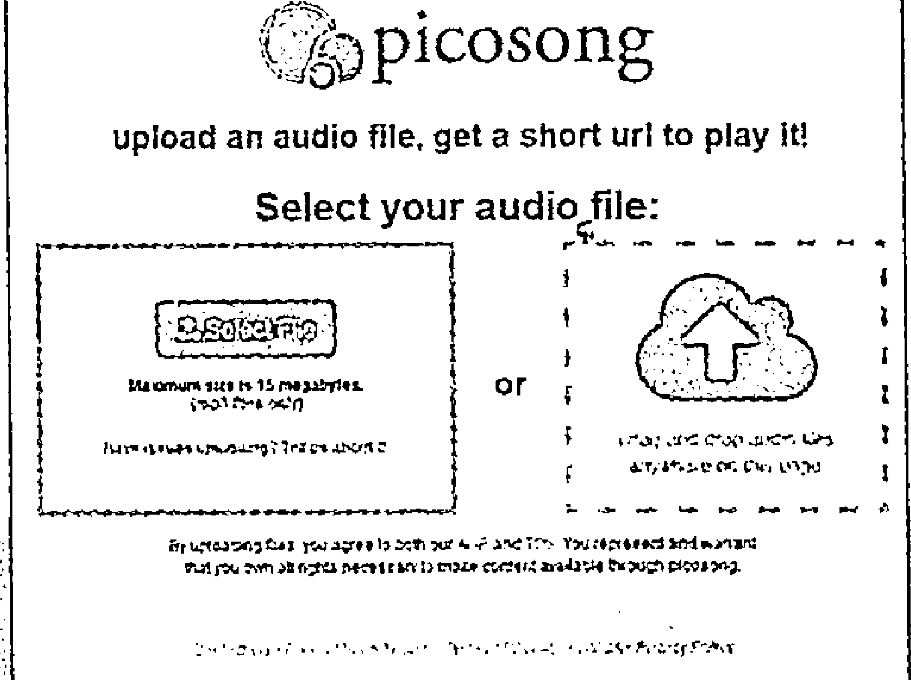


其实有些电子邮箱也拥有MP3文件的预览功能。

#### 如何才可以快速接收国外邮箱的邮件

Q: 现在微软系统都是利用微软的账号进行登录的，而这个账号对应的是一个邮箱的地址，本人一直就是利用这个邮箱来收发邮件的，可是最近发现登录这个邮箱非常缓慢。那么有没有什么方法可以加快邮件的接收呢？

A: 其实我们可以利用国内的邮箱，来帮助接收国外邮箱的邮件。比如打开QQ邮箱以后，点击上方的“设置”按钮，在弹出的页面中点击“其他邮箱”标签，根据提示点击“添加其他邮箱账户”按钮后进行设置，这样就可以利用QQ邮箱接收微软邮箱的邮件了。

#### 在线病毒扫描网站的选择

Q: 有的时候为了方便自己通过移动设备进行携带，大家都喜欢选择一些绿色版本的软件。可是有的官方并没有绿色版的下载，于是只能从网上下载网友制作的，可是这种软件非常不安全。那么如何进行在线检测操作呢？

A: 其实利用网上的一些在线病毒扫描网站，就可以解决这个问题了。比如通过浏览器打开https://virusscan.jotti.org/这个网站，点击“浏览”按钮后选择需要检测的文件，这样网站就会在线对这些文件进行扫描操作，扫描完成以后就会给出文件安全与否的结果。

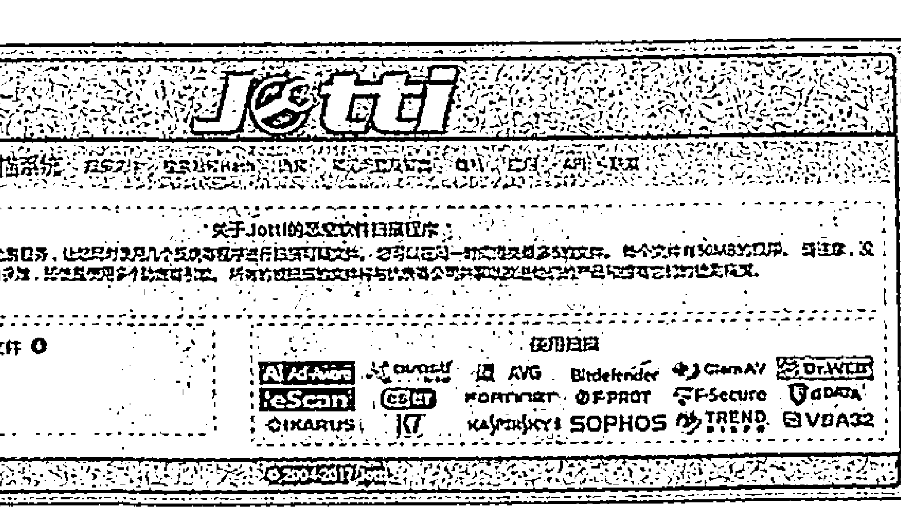## 网络游戏如何进行加速操作

文|老万

Q: 最近身边的很多朋友都在玩“王者荣耀”，可是不知道是什么原因，我的手机在连接的时候速度特别的慢，这样打游戏感觉就非常的不流畅。那么通过什么方法可以解决这个问题呢？

A: 其实手机和电脑一样，有专门的加速服务器软件可以选择。如用户可以安装“迅游手游加速器”这款应用，该应用首先会建立起一个直线连接，这样游戏就可以通过这个连接，连接到加速服务器，从而提升游戏的访问速度。

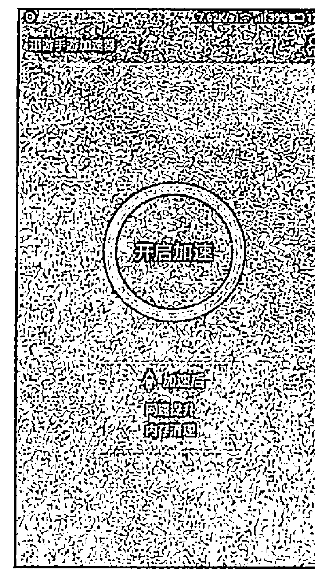

当然这类加速服务器应用，也可以实现网页加速等效果。

#### 如何修改系统的DNS信息

Q: 现在手机在上网的时候，通常使用的是运营商提供的DNS信息，这样的话就容易被插入各种各样的广告内容。那么有没有什么方法可以对手机系统的DNS信息进行修改呢？

A: 通常要想对系统的DNS信息进行修改，首先需要对系统进行ROOT操作才可以。如果用户不想进行ROOT操作的话，那么可以安装一款名为“DNS修改器”的应用。安装完成以后可以发现，该应用提供了多组常见的DNS信息供用户选择，这样用户就可以不受到运营商的骚扰了。

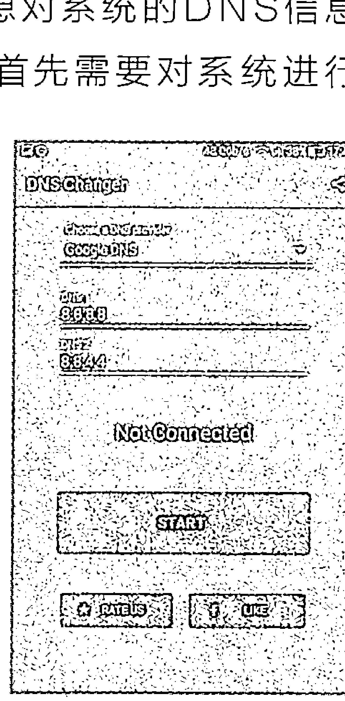

#### 整合多个天气源的预报应用

Q: 平时大家使用的天气预报应用，都是采用的一个数据源信息，这样难免就会出现预报不准的情况。那么有没有什么软件会同时采用多个天气源呢？如果有话麻烦傻博士给推荐一下。

A: “更准天气”这款应用就可以满足你的要求，它自身集合了包括彩云天气、World Air Quality、Dark Sky以及Google等多组数据源信息。除了我们常见的温度预报以外，还包括云量、湿度、污染物等各种预报信息。

#### Android系统如何查询漏洞信息

Q: 不久以前刚刚爆发的勒索病毒，让所有的用户都大吃了一惊，之所以造成这样的破坏，很大的原因是用户没有及时修复系统的漏洞。那么如何对手机系统的漏洞进行检测呢？

A: 首先下载安装“AVL Pro”这款应用，启动这款应用后点击下面的“系统检测”按钮，在弹出的操作窗口中会显示出手机的相关信息，用户只需要点击“开始检测”按钮就可以对系统漏洞的信息进行检测了。

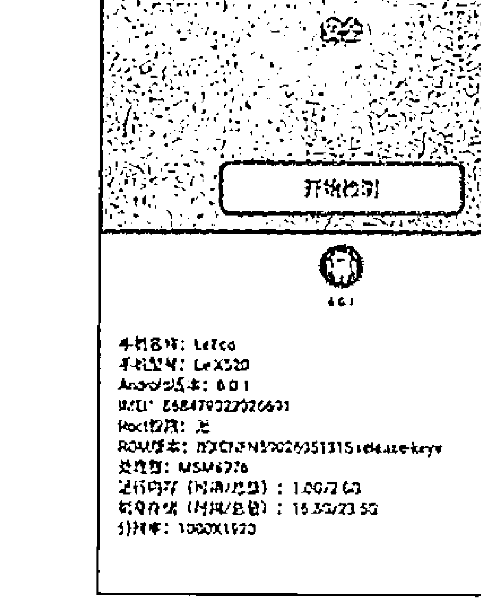

#### 在手机上也能完美地排版

Q: 为了让自己的文章更加吸引人，图文并茂是最基本的要求，可是要想在手机里面达到图文并茂的效果，操作起来肯定没有在电脑上那么方便。那么如何才可以快速地编辑出一篇图文并茂的文章呢？

A: 其实可以进行图文并茂编辑的应用有很多，如最常见的WPS应用就是这样的。但是鉴于手机屏幕的大小等原因，还是建议大家选择一款自带有模板的应用来操作。这样只需要选择一款自己喜欢的模板，对里面的元素进行相应的调整后，就可以快速制作出一篇精美的文章了。

##### 阻止更改Windows的系统设置

Q: 每个用户在使用操作系统或者软件的时候，都有自己使用的操作习惯，会根据自己的需要进行设置。如果一台电脑有多个用户使用的话，他们也会进行相应的设置修改。那么如何防止他们对系统进行修改操作呢？

A: 首先通过“gpedit.msc”命令启动系统的组策略编辑器，通过鼠标依次展开左侧列表“用户配置→管理模板→控制面板”，这样就可以在右侧窗口看到“禁止访问‘控制面板’和PC设置”的项目内容。现在直接双击该选项打开它的配置窗口，在弹出的对话框中选择“已启用”即可。

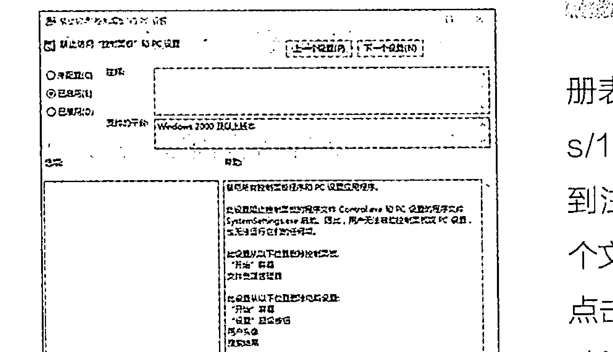

##### 在右键菜单中添加哈希校验命令

Q: 现在很多网上的文件都含有病毒，所以很多安全人士要求用户在下载文件后，首先对文件的哈希数值进行校验。通常情况下要想进行校验的话，需要使用专业的软件。那么能不能在系统右键菜单里面添加一个相应的校验命令呢？

A: 要想通过右键进行哈希数值的校验操作，只需要对系统的注册表进行修改就可以了。由于修改的内容比较多，这里直接给大家提供一个注册表文件(https://pan.baidu.com/s/1kVgIPpl)，下载以后双击它添加到注册表里面即可。以后想对哪一个文件进行校验的话，在它的图标上点击鼠标右键，选择菜单中的“文件哈希校验”命令即可。

##### 去掉Windows 10登录界面的电源按钮

Q: 在Windows 10的锁屏界面中依然可以看到电源按钮，通过它就可以进行重新启动、关机等一系列的操作。可是如果处理的文件没有保存的话，被人点击了这个按钮就会造成数据的丢失。那么如何去掉锁屏界面中的这个按钮呢？

A: 按“Win+R”打开“运行”框，输入“regedit”打开注册表，展开到HKEY_LOCAL_MACHINE\SOFTWARE\Microsoft\Windows\CurrentVersion\Policies\System。接着在右侧窗口里面新建一个DWORD（32位）值，将其名称重命名为shutdownwithoutlogon，然后将“数值数据”修改为0并重新启动系统就可以了。参数重新设置为1的话，就会在锁屏界面显示出电源按钮。

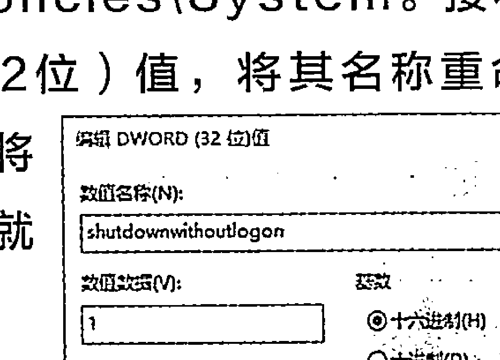

##### 这个策略可以提高系统安全性吗

Q: 在系统的组策略里面，有一个名为“启用不安全的来宾登录”选项。那么请问关闭这个选项以后，是否可以提高系统的安全性能呢？

A: 傻博士觉得关闭这个选项并不会提升系统的安全性能。因为现在用户登录电脑的时候，都是通过管理员权限来操作的，而管理员的权限比来宾权限要大很多，所以黑客或者病毒往往都会获取到管理器权限后，再对系统进行破坏操作。

##### Windows 10系统无法正常更新

Q: 今天利用Windows 10系统的更新功能来打补丁，居然发现无法成功地进行操作，系统提示安装一些更新时出现问题，但稍后会重试，并且给出了一个错误的编号。那么请问这个问题怎么解决啊？

A: 这个问题应该是用户安装的优化软件，将操作系统自己的更新服务给停止了，所以只需要将这个服务重新开启就可以了。首先打开系统服务的管理窗口，在列表中找到“Windows Update”这个服务。双击打开它的操作窗口后，将它的“启动类型”设置为“自动”即可。

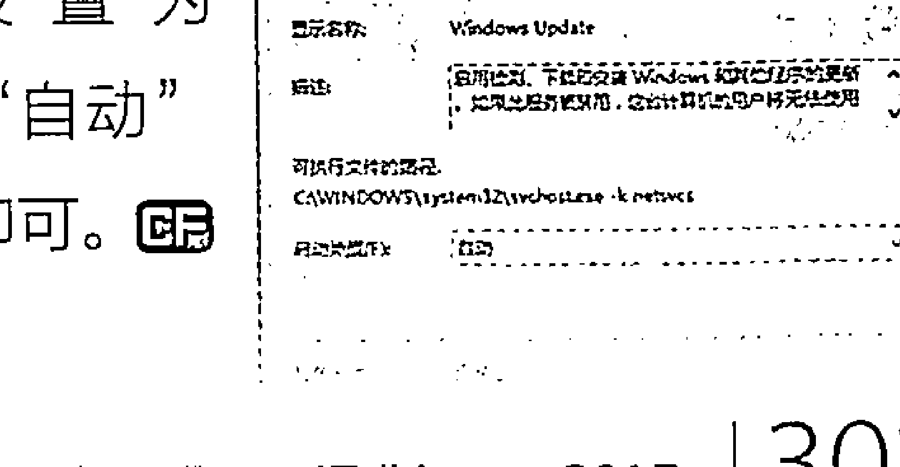

#### 解决Player插件已被屏蔽的问题

文|老万

Q: 今天打开网页浏览器的时候，网页提示“已屏蔽Adobe Flash Player插件”。那么通过什么方法可以解决这个问题，继续成功地访问视频网站中的内容？

A: 首先点击右上角的菜单按钮，在弹出的菜单里面点击“设置”命令。接着在弹出的选项窗口里面点击最下方的“显示高级设置”命令，在“隐私设置”里面找到“内容设置”选项。在弹出的对话框里面找到“Flash”选项，把该插件设置更改为“允许网站运行Flash”即可。

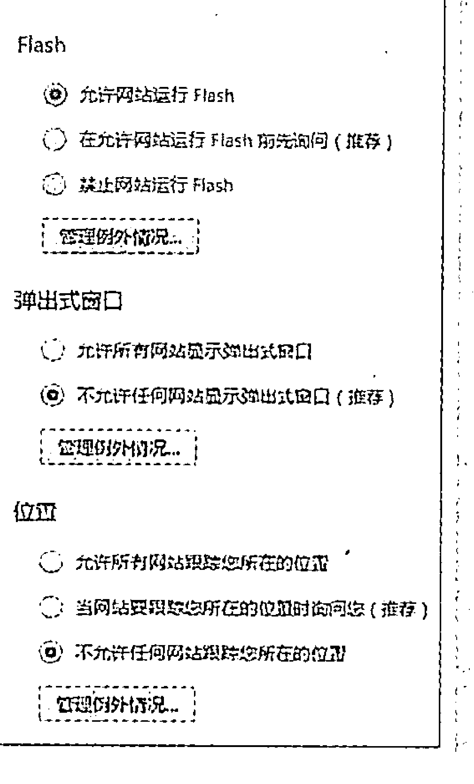

在地址栏输入`chrome://flags/#run-all-flash-in-allow-mode`，将这个选项修改为“已启用”选项。


#### 旺旺卸载后它的文件怎么也删不掉

Q: 之前在系统里面安装了一个阿里旺旺的客户端，最近将它卸载以后发现它的文件夹里面还保存有wwbizsrv.exe这个文件，可是怎么也删除不掉它。请问如何才可以将其进行删除？

A: 首先在系统的任务栏里面点击鼠标右键，在弹出的菜单中点击“任务管理器”命令。接着在弹出的进程列表中找到wwbizsrv.exe这个文件后，点击“结束任务”按钮结束其进程，最后再通过正常的方式将这个文件删除就可以了。

#### 为什么系统里面老是有这个文件

Q: 系统安装完成以后只安装了和办公相关的一些软件，比如办公软件以及企业版的QQ客户端等等，可是里面有一个名为KisIEProtector64.dll的文件，居然是金山公司的。那么请问为什么会出现这样的情况呢？

A: 出现这样的情况主要是企业版的QQ里面，使用了一些金山公司的功能模块造成的。如果用户不想使用这个模块的话，那么首先打开系统的服务管理器，在里面找到描述为“金山安全基础组件”的两个服务，将它们进行停止并禁用就可以了。

#### 有没有PDF转图片的软件推荐

Q: 电脑磁盘里面有很多的PDF文件，现在想把其中的一部分内容转换成图片文件。不知道有没有相关的软件可以推荐，而且最好是免费的软件？

A: 平时遇到的PDF文件都是由两种形式组成的，其中一种本身就是由图片文件组成的。如果要处理这类文件的话，其实只需要利用PDF文件的分割器，就可以将它分割成一张一张的图片了。如果用户遇到的PDF文件是文字内容的话，可以使用虚拟打印机来解决。

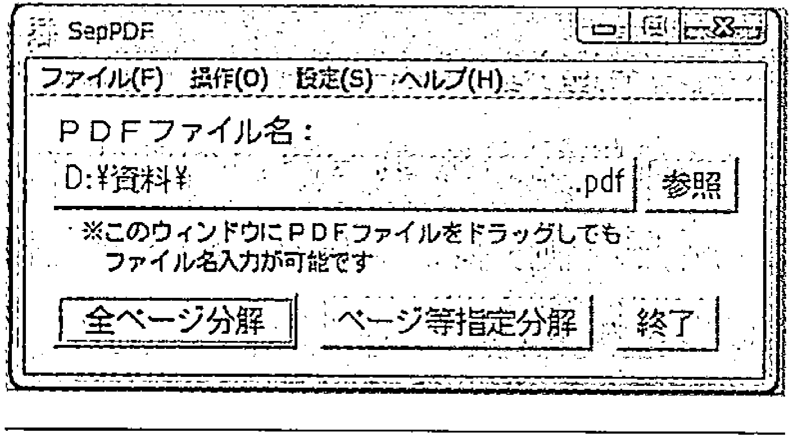

#### 播放器内置DXVA是开启还是关闭好

Q: PotPlayer这款播放器内置了一个DXVA功能，这个功能是开启好还是关闭好呢？

A: 其实常见的播放器里面都带有两种不同的解码功能，分别是利用软件进行视频的解码，或者是利用硬件进行视频的解码。利用软件进行视频解码最大的好处就是和系统的兼容性比较好，不容易出现相关的错误，而利用硬件进行解码则可以更好地发挥硬件的性能。所以用户可以根据自己的电脑配置来进行选择。

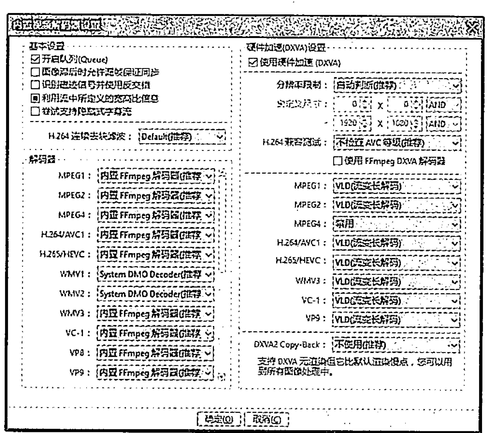

#### 自动在中英文之间加入空格

Q: 现在网络里面有一种全新的书写规则，就是在中英文之间添加一个空格，这样看上去会更加舒服。那么除了用户在输入的时候手动添加空格以外，有没有什么方法可以自动进行添加操作呢？

A: 如果用户使用的是谷歌浏览器或者其拓展版本的话，可以通过应用商店安装一款名为“为什么你们就是不能加个空格呢？”的扩展。以后在浏览器里面进行中英文书写的时候，扩展就会自动在中英文之间添加一个空格了。

#### 豆瓣电影直接跳转在线播放网站

Q: 常在豆瓣电影网站里查看一些新电影的影评介绍，然后根据用户的反馈去寻找下载这部电影，可是经常需要在不同的网站里面寻找，感觉非常麻烦。那么有没有更加简单快捷的方法呢？

A: 其实只需要给浏览器安装一个脚本，这样在查看某部电影介绍的时候，就会在其中显示出它对应的在线播放地址。首先通过浏览器登录https://greasyfork.org，搜索安装“MyDoubanMovieHelper”这个脚本，再登录豆瓣网就可以看到A站、B站等在线播放网站的快捷链接了。

#### 让浏览器的代理操作更加简便

文|老万

Q: 有的时候我们上网需要使用代理，可是不同的浏览器里面的代理设置是不一样的，有的甚至不支持某种协议的代理。那么如何让所有的浏览器都支持全部的代理协议，同时让代理操作起来更加简便呢？

A: 首先下载Sockscap64这款代理软件，在弹出的操作界面点击“代理管理器”按钮，从而添加一个自己使用的代理信息。接着点击工具栏中“程序”按钮，选择要进行代理操作的软件程序。以后浏览器不需要经过任何设置，通过这款软件就可以进行代理操作了。

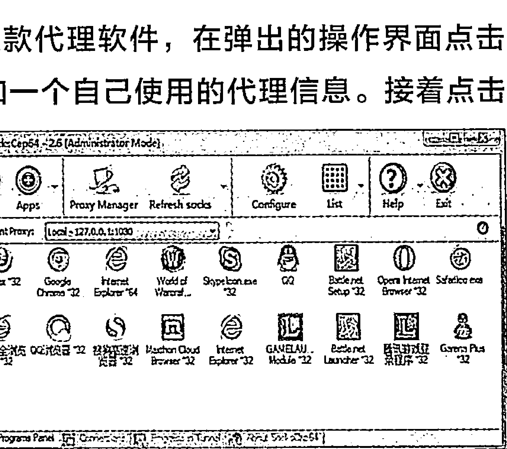

利用PAC规则也可以起到相应的作用。

#### 支持中文的GIF图片搜索网站

Q: 有的时候在网上或者QQ群里面，看到一些非常有意思的GIF图片。那么在哪里可以寻找到这些GIF图片并进行下载呢？

A: 通过“51GIF”这个网站(http://www.51gif.com/)，就可以搜索或查找到需要的图片信息。打开这个网站以后可以看到推荐的图片信息，而我们也可以通过搜索框输入关键字来进行搜索操作。

#### 利用FTP上传文件到网盘

Q: 现在很多的网盘运营商都是要求用户通过浏览器来上传文件的，可是要上传一个体积比较大的文件，如果通过浏览器进行上传的话可能会出现上传失败的问题。那么有没有通过其他方法进行上传分享的网盘呢？

A: 可以试一试“Sendit.Cloud”这个网盘(https://sendit.cloud/)，打开网站以后点击网页正中的图标，在弹出的对话框里面可以看到多种文件上传方式，其中就包括FTP这种方式。点击它以后获取FTP的链接和端口，这样就可以利用FTP客户端软件来进行文件的上传操作了。

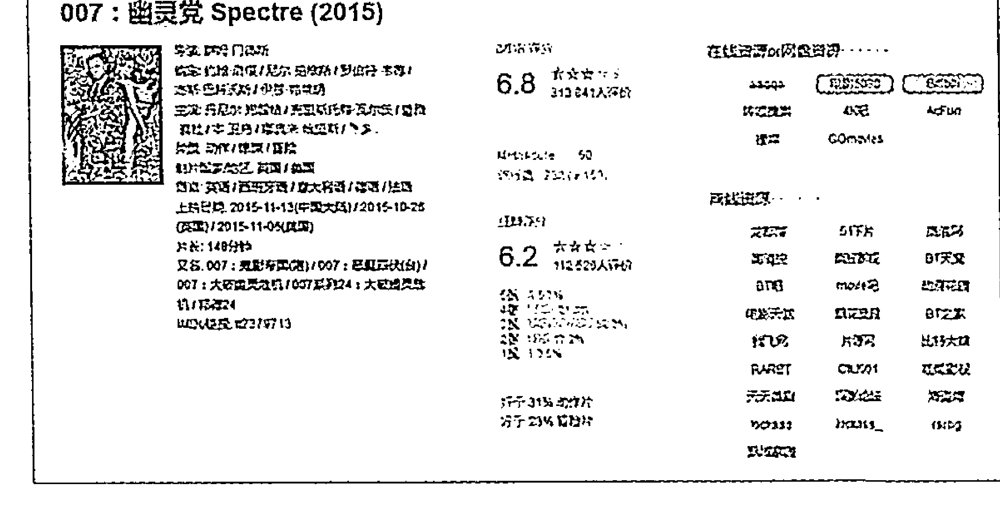

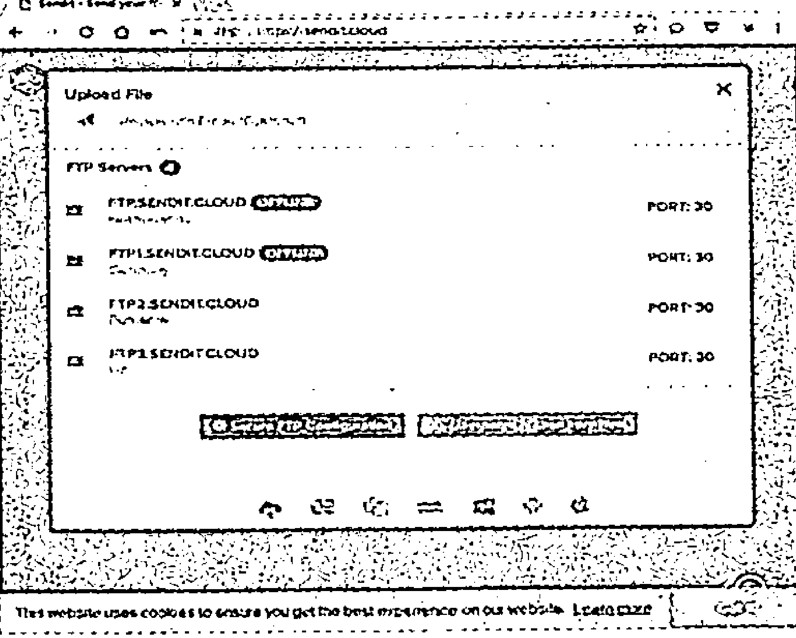

#### 悬挂缩进如何进行设置操作

文|老万

Q: 按照国人的惯用排版方式，会在每一个段落的首行进行缩进操作，也就是我们常说的抬头空两格。那么能不能反其道而行之，让第一行不进行缩进操作，而让下面的其余行进行缩进操作呢？

A: 这样的操作当然是可以的，而且它还有一个专有名词，叫做“悬挂缩进”。首先对要编辑的文字进行选择，接着点击“段落”右下角的按钮，在弹出的对话框中选择“特殊格式”列表中的“悬挂缩进”选项，最后在“缩进值”里面设置一个数值即可。

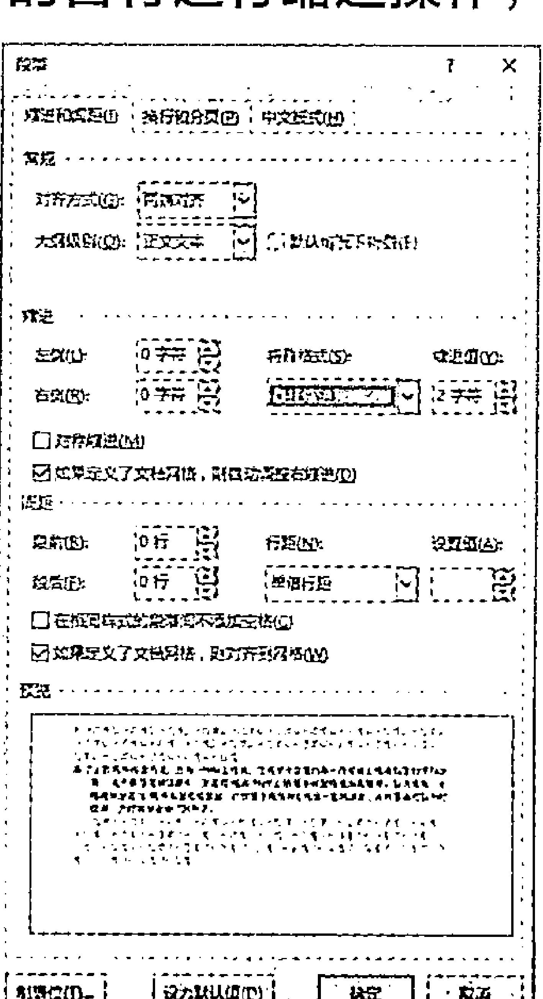

在这个对话框里面还可以进行其他的缩进操作。

#### Office为什么无法进行撤销操作

Q: 在编辑文档的时候如果发现出现了错误，我们往往都会利用办公软件的撤销按钮来进行删除。可是最近发现Office的撤销命令突然变成了灰色，从而导致无法撤销之前的操作。那么请问如何解决这个问题呀？

A: 其实很多用户都遇到了类似的问题，经过大家的排查发现问题主要出现在Windows 10自带的微软拼音上。所以用户要想解决这个问题，可以将系统版本升级到最新的测试版，或者可以安装一个第三方的输入法，在使用办公软件的时候调用第三方输入法来操作。

#### Excel的自动恢复功能如何设置

Q: 在编辑文档的时候，难免会遇到突然断电或者软件崩溃的情况，这个时候编辑的文档就会瞬间化为乌有。听说微软的Office办公软件里面有一个自动恢复的功能，请问这个功能应该如何启用啊？

A: 首先点击Excel左上角的“文件”按钮，在弹出的窗口中点击左侧的“选项”命令。接着在弹出的“选项”窗口里面，点击左侧的“保存”按钮，在右侧窗口选择“保存自动恢复信息时间间隔”选项，同时设置“自动恢复文件位置”的保存路径就可以了。

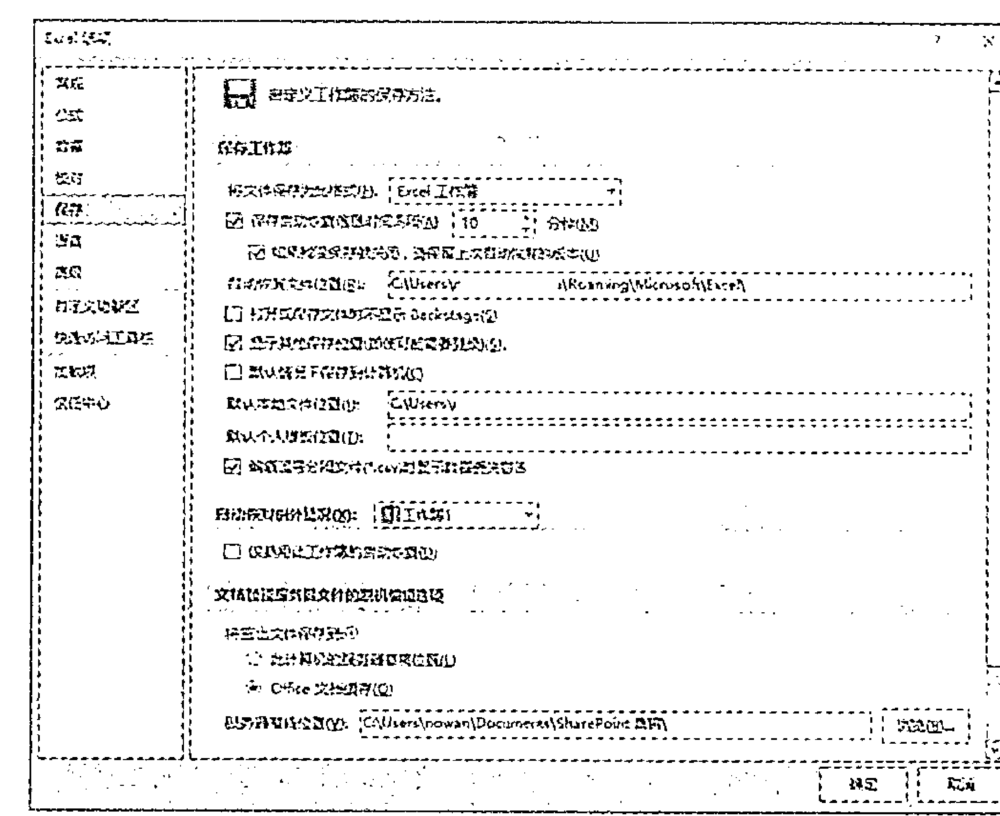

#### 实时监控表格重要数据的变化

Q: 在编辑表格的时候，有些数据是需要时时关注的，比如在进行求和操作的时候，求和的值就是我们关注的对象。那么如何才可以不用调整表格的位置，就能实时关注到特定信息的变化呢？

A: 首先通过软件打开表格文件，点击“公式”标签以后选择工具栏中的“监视窗口”按钮。在弹出的对话框中点击“添加监视”按钮，在弹出的询问窗口里面选中表格里需要实时监控的数值，设置完成后点击“添加”按钮即可。这样就可以在监视窗口里面，对指定的数字进行实时操作了。

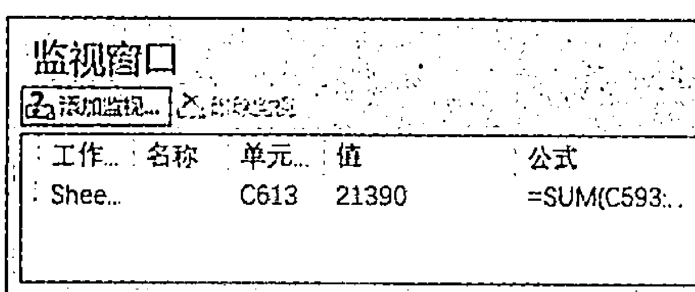

#### Word怎样才可以更好地进行阅读

Q: 在编辑完一篇文章以后，需要对这篇文章的内容逐字逐句进行检查，从而让这篇文章看上去更加优美，可是如果采用编辑模式读起来会非常累。那么如何可以更好地进行阅读呢？

A: 其实在Word里面自带有一个阅读模式，用户只需要点击“视图”标签中的“阅读模式”按钮，就可以将文章切换到更加舒服的阅读模式。点击“视图”菜单中的“文字间距”命令，就可以增加文字的间距，这样读起来会更加舒服。


#### 网络搜索怎样不用到处切换

文|老万

Q：平时要想查询东西的话会使用到各种各样的搜索引擎，比如查资料就会使用百度，查商品就会使用淘宝。如果要使用不同的搜索引擎的话，就需要在不同的应用之间进行切换。那么能不能通过一个应用就解决所有的搜索问题呢？

A：其实这个问题通过一款名为“摄取搜索”的应用就可以解决。打开这个应用以后点击搜索框前面的按钮，在弹出的对话框里面就可以看到很多搜索类型。从中选择一个需要的类型并选中它，然后在搜索框里面输入关键字，点击搜索按钮就可以完成操作了。

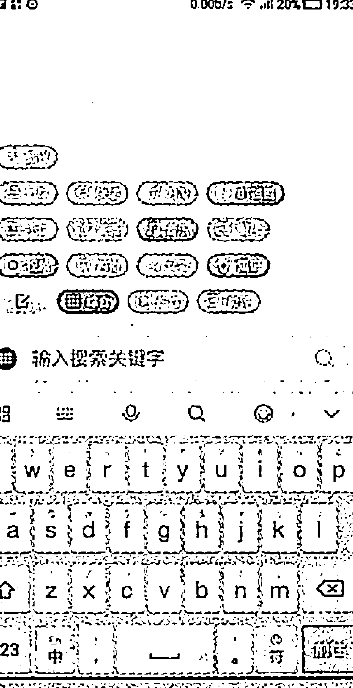

> 我们也可以将一些常见的搜索引擎，添加到浏览器的首页里面来操作。

##### 让系统强制使用Doze功能

Q：为了限制后台活动节省电量，Android引入了一个叫做Doze的机制，可是Doze机制设置得非常保守，经常出现熄灭屏幕后长时间没法休眠应用的情况。那么有没有方法强制启用Doze呢？

A：通过“强制打盹”这款应用就可以解决该问题，不过这款应用的使用需要ROOT才可以。启动这款应用以后，可以根据自己的需要设置每一个选项，然后点击打盹按钮就可以了。以后当设定的条件满足后，就会强制使用系统的Doze机制。

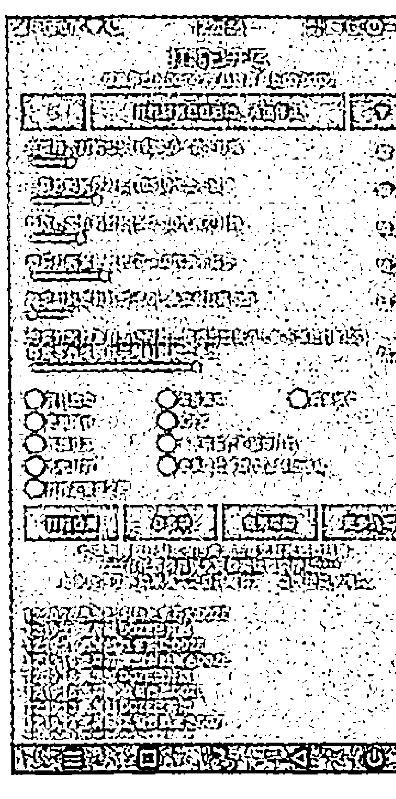

##### 自动关闭Wi-Fi实现省电

Q：现在的手机电池越来越不经用，经常一块电池只能使用一天，通过电源检测发现其实无线连接也非常耗电。那么有没有什么方法能根据不同的环境自动关闭或者开启无线连接呢？

A：首先下载安装一款名为“WiFi Auto-Off”的应用，启动这款应用后可以看到，它能根据不同的环境开启或者关闭无线连接服务。比如当用户解锁屏幕的时候或者设定一个特定的时间就可以开启无线服务，当屏幕关闭或者没有任何无线连接的时候就会进行关闭操作。

##### 如何禁用手机的照相功能

Q：由于夏天的天气比较炎热，所以往往穿的都比较随意。但是偶尔在玩手机的时候，会被手机的摄像头记录下自己的囧样。那么如何才可以禁用手机的摄像头功能，不让手机应用随意地调用它呢？

A：首先下载安装一款名为“镜头盖”的应用，启动运行应用后点击主界面中的“安装设备管理员”按钮，在弹出的对话框里面点击“继续”按钮，根据提示进行操作。操作完成以后返回主界面，点击“把帽子放在”按钮就可以关闭摄像头了。

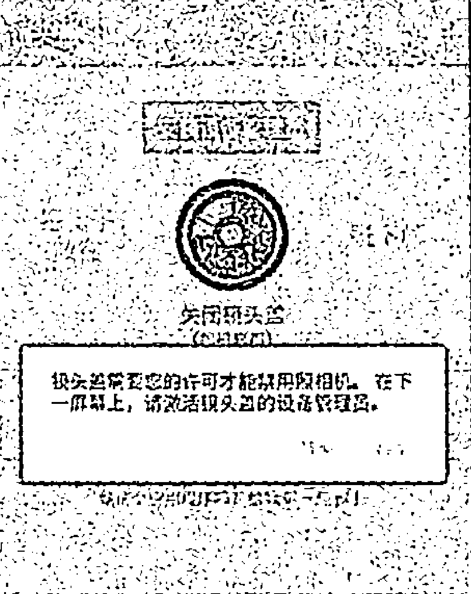

##### 利用微信回收二手手机

Q：现在手机更新换代的频率很高，买了新手机以后就打算将旧的手机卖出，可是现在的二手市场鱼龙混杂。那么有没有比较靠谱的二手手机回收方式呢？

A：其实利用京东或者微信的客户端，就可以很方便地完成二手手机的回收操作。比如打开微信，点击工具栏中的“我”，在弹出的菜单里面选择“钱包”。然后点击其中的“手机充值”按钮，在最下方就可以看到一个“旧手机换钱”的选项，根据向导就可以进行操作了。

#### Windows 10里面禁用快速用户切换

文/老万

> Q: Windows虽然是一款多用户的操作系统，可以方便不同用户进入自己的使用环境，但是如果有时在没有保存的情况下进行切换，就容易造成一些数据的丢失。那么有没有什么方法禁用这个功能呢？

A: 首先通过“gpedit.msc”命令启动系统的组策略编辑器，通过鼠标依次展开左侧列表“计算机配置→管理模板→系统→登录”，这样就可以在右侧窗口看到“隐藏快速用户切换的入口点”的项目内容。直接双击该选项打开它的配置窗口，在弹出的对话框中选择“已启用”即可。

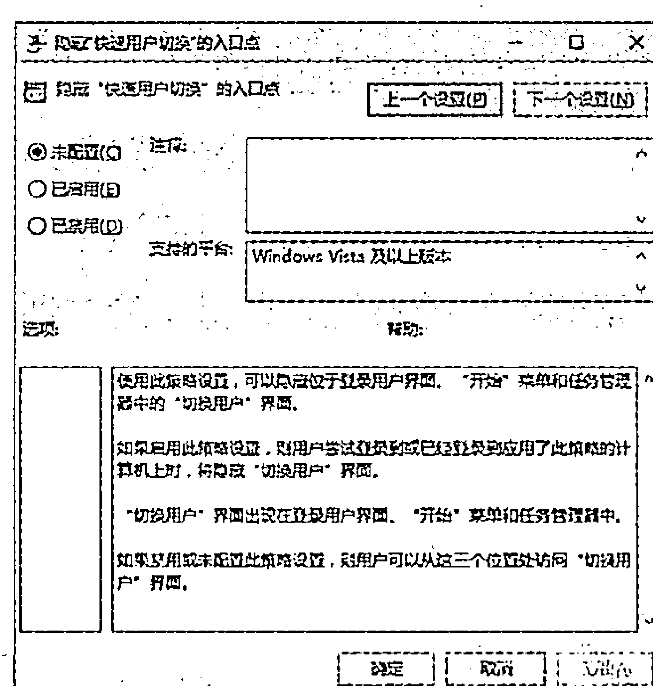

也可以打开注册表HKEY_LOCAL_MACHINE\SOFTWARE\Microsoft\Windows\CurrentVersion\Policies\System，在此项下新建一个名为HideFastUserSwitching的DWORD(32位)值，并将内容设置为1即可。

#### 禁用“唤醒定时器”功能

> Q: 我喜欢在长时间离开电脑的时候将Windows 10切换到睡眠状态，这样再使用电脑时只需要移动鼠标就可以快速将系统唤醒，但是最近发现进入到睡眠模式后，并没有移动鼠标就出现自动唤醒的情况。那么为什么会出现这个情况呢？

A: 首先在开始按钮上点击鼠标右键，选择菜单中的“电源选项”命令。接着点击当前使用电源计划右侧的“更改计划设置”选项，在出现的对话框中点击“更改高级电源设置”选项。在弹出的高级设置对话框里面，将“睡眠”下的“允许使用唤醒定时器”中的所有内容都修改为“禁用”即可。

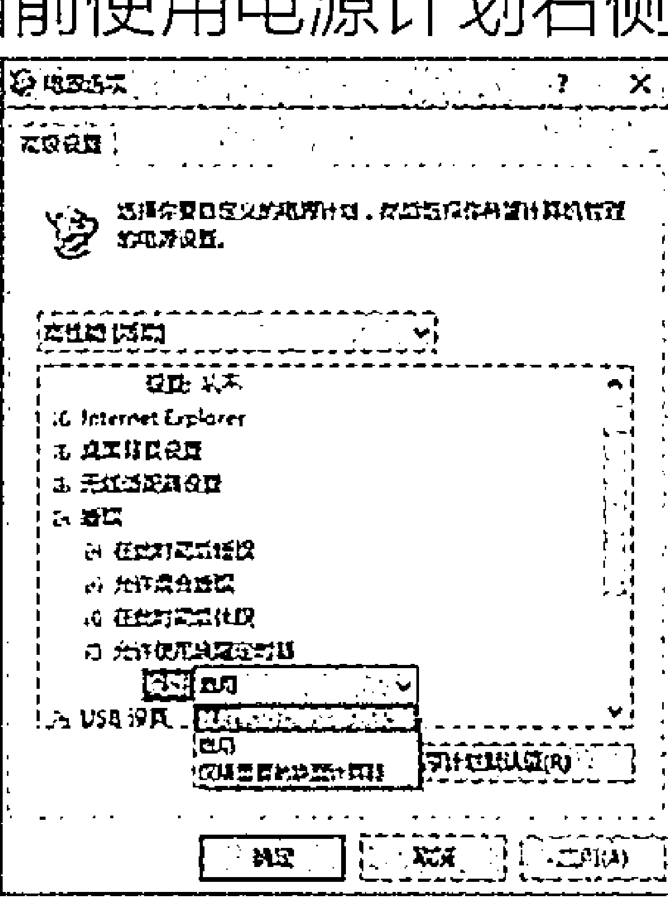

#### 插入的移动设备为什么会失效

> Q: 最近将自己的电脑系统升级到了最新的Windows 10，可是将移动设备接入到系统里面以后，发现这些设备再过一段时间后就出现失效的情况。那么这个问题是怎么造成的，应该怎么解决啊？

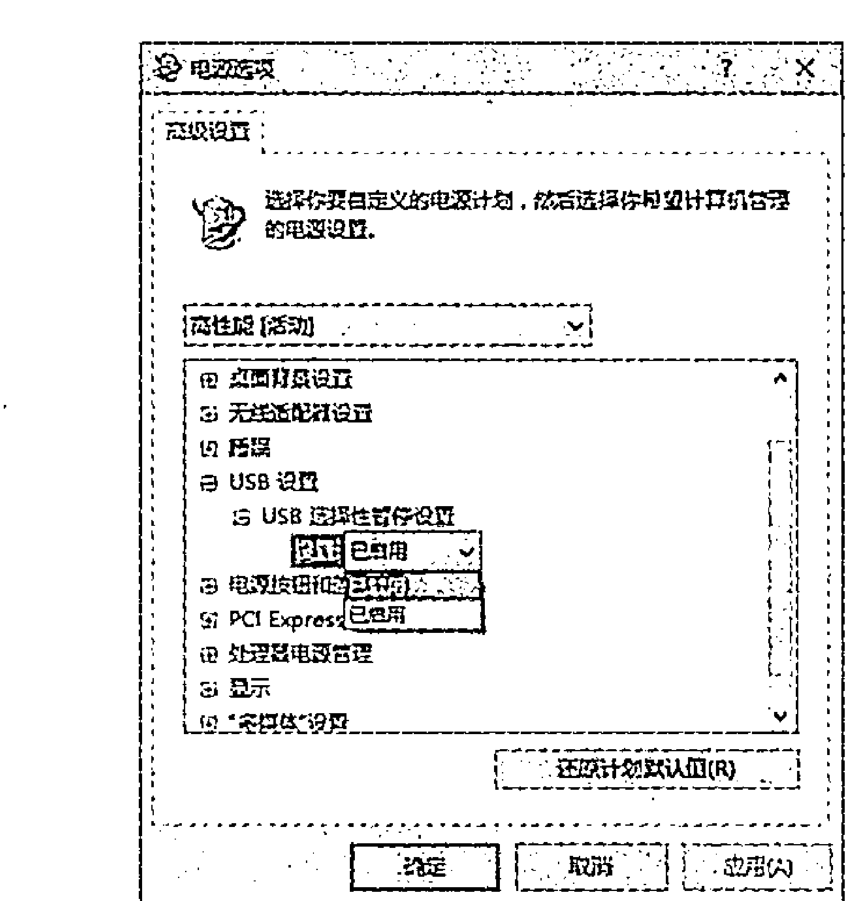

A: 出现这样的情况是因为，微软在最新的系统里面增加了一个名为“USB选择性暂停设置”的功能，所以要想解决这个问题，只需要将这项功能关闭就可以了。按照前面的方法打开电源的高级设置对话框，将“USB设置”下面的“USB选择性暂停设置”都设置为“禁用”就可以了。

#### 利用Win+R快速启动软件程序

> Q: 随着系统里面的软件程序越来越多，如果想快速启动的话变得越来越困难。比如将快捷方式放在桌面上，会占用大量的桌面位置；如果去开始菜单里面寻找，又需要大量的时间。那么如何可以快速地进行启动呢？

A: 首先将软件程序在桌面的快捷图标剪切到系统的Windows目录里面，接下来按下快捷键Win+R，在弹出的对话框里面输入相应的名称，就可以快速地进行启动操作了。

#### Ubuntu查看应用程序版本的方式

> Q: 使用过乌班图的用户都知道，即使是用户安装的最新的系统版本，里面的软件程序也不是最新的版本。所以用户要想使用最新的版本，往往需要自行进行安装操作。那么怎么可以快速查看到系统里面软件的版本呢？

A: 首先通过“Ubuntu软件”搜索需要查看的软件，接着在安装之前点击应用软件的图标，这样就可以在安装前查看到应用程序的版本。

#### 插入另外一份文档后自动跳转

文/老万

Q: 有的时候在制作PPT文档时需要插入另外一个PPT文档，可是通常情况下插入的PPT文档都是从第一页开始显示的。那么能不能让插入的PPT显示特定的页面呢？

A: 首先打开需要编辑的PPT文件，在弹出的窗口里面点击“插入”标签中的“超链接”按钮。接着在弹出的对话框里面选择需要插入的PPT文件，然后点击对话框右侧的“书签”按钮，在弹出的对话框里面选择需要直接显示的页面就可以了。

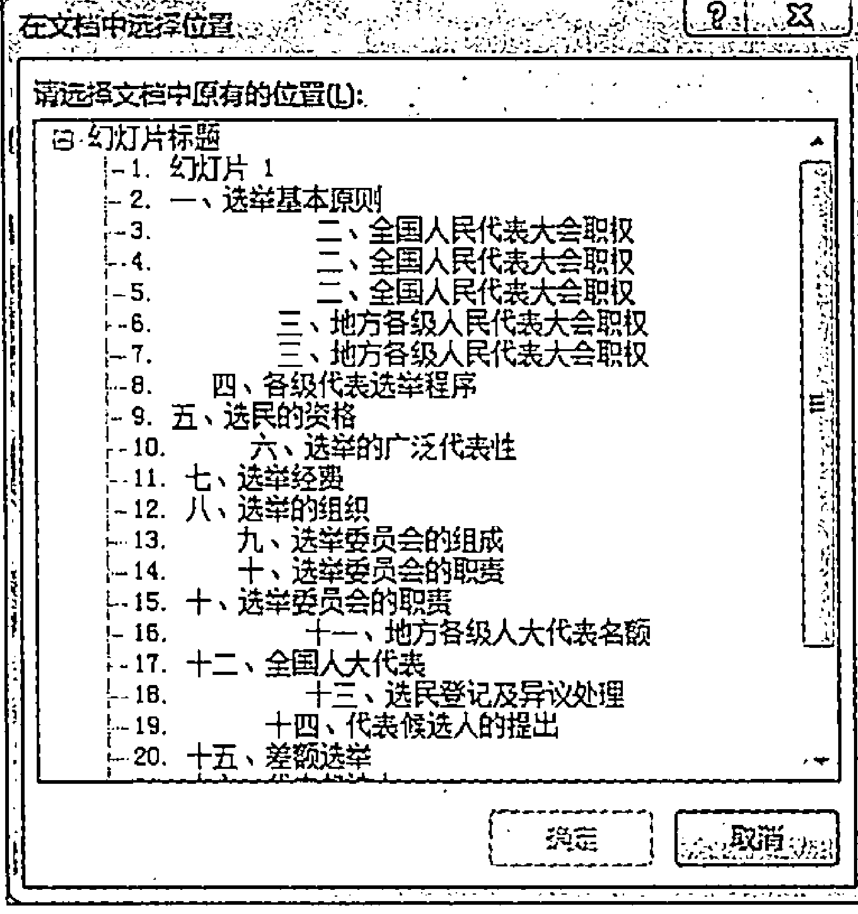


如果插入其他文档的话，也可以按照同样的步骤操作。

#### 照片导入PPT导致文件过大

Q: 用苹果手机拍摄了很多照片，现在想把这些照片导入到PPT里面，然后制作成一个PPT文件。由于苹果拍摄的照片体积比较大，所以导致整个PPT文件的体积就很大。请问如何解决这个问题呢？

A: 要想解决这个问题有两个方法。首先就是通过软件对照片文件进行压缩，接着再导入到PPT软件里面。或者打开PPT软件的设置窗口，点击左侧的“高级”选项后，在“图像大小和质量”中进行设置。这样PPT文件在保存的时候，就会自动对其中的图片文件进行压缩。

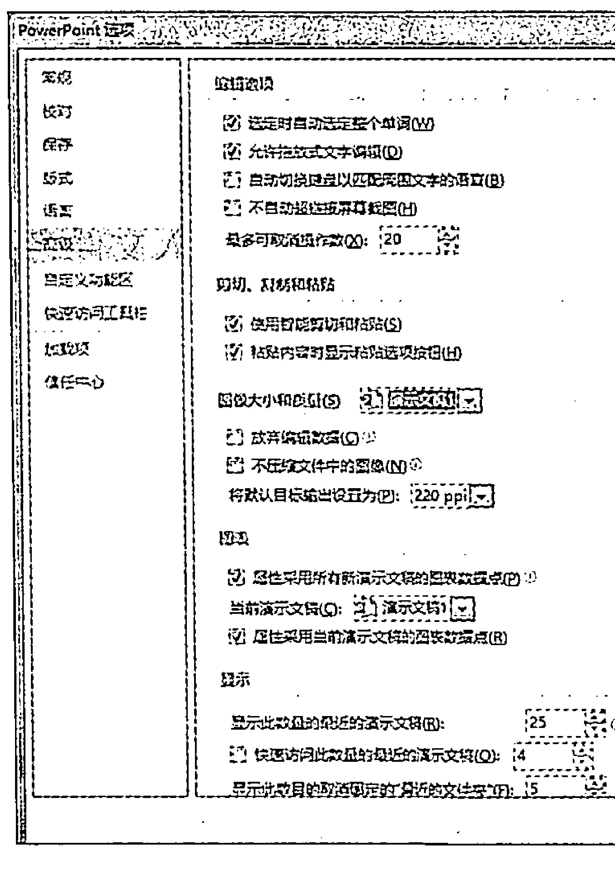

PPT文档的每个页面中，这样才可以一页页地进行正常显示。


#### 求JPG文件转换为Word的方法

Q: 一个图片文件里面拥有大量的文字信息，现在想将它转换成Word格式的文件。通过什么方法才可以实现这个转换操作？

A: 要想把图片里面的内容转换成数字信息，这里就必须使用到OCR这个功能。首先打开OneNote软件，接着插入需要识别的图片。接下来在图片上点击鼠标右键，在弹出的菜单里面选择“复制图片中的文本”命令，然后将文字粘贴到Word软件里面即可。

#### 有什么方法可以实现语音输入

Q: 个人觉得通过语音输入的方法比通过输入法直接输入的速度要快，但是常见的输入法语音输入的模块准确率太差。那么还有没有其他方法可以进行语音输入操作呢？

A: 如果用户的电脑安装有OneNote，那么可以通过“OneNote学习工具”这款插件来实现。首先创建一篇全新的笔记，接着点击“学习工具”标签，会在工具栏里面看到一个“听写”的选项。点击该选项下面的倒三角按钮，选择“中文（简体中国）”这个选项，然后点击“听写”按钮就可以了。

#### PDF插入到PPT文档的问题

Q: 将一个PDF文档插入到PPT文档里面后，发现PPT页面显示的只有PDF文档中的首页，其他的页面都没有正常地进行显示。那么如何才可以解决这个问题呢？

A: 要想解决这个问题，只有利用专业的软件，将PDF文件拆分成一页一个的文件。然后再分别插入到PPT文档的每个页面中，这样才可以一页页地进行正常显示。

#### 选择WinRAR软件界面的颜色

文/老万

Q：以前使用的是Windows XP，现在更换为Windows 10系统，可是安装WinRAR以后发现它的配色和以前大不相同，看上去非常不习惯。那么如何才可以解决这个问题呢？

A：由于在Windows 10系统里面，软件程序默认使用的是系统的颜色，所以就出现了这样的感觉。用户可以登录到WinRAR的官方网站（http://www.rarlab.com/themes.htm），从中选择和下载需要的皮肤文件，下载完成以后直接进行双击安装就可以了。

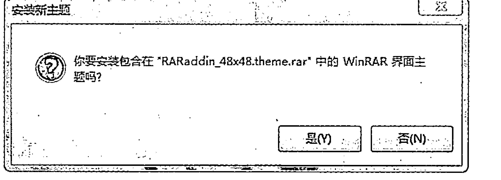

> 傻博士有话说

打开Windows 10的“颜色”设置窗口，去掉右侧窗口中的“标题栏”选项即可。

#### 什么免费软件可以实现视频转换

Q：手上有一个视频文件，现在想将它转换为音频文件，听起来是不是有些高大上呢。那么请问有没有什么绿色免费的软件，可以实现这样的转换操作啊？

A：其实很多音频播放软件都可以轻松实现这个目的，比如最常见的“千千静听”。首先将视频文件添加到播放列表，接着点击鼠标右键选择菜单中的“转换格式”命令，在弹出的对话框中选择音频的格式等选项，最后点击“立即转换”按钮进行转换。

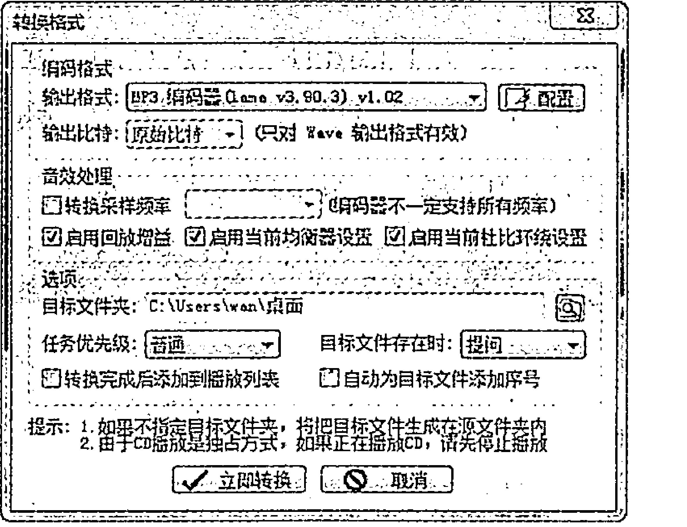

#### XMPlay软件如何安装各种插件

Q：平时使用的是XMPlay这款播放器，和其他的一些播放器一样，这款播放器也提供了大量的插件，可是和其他的播放器不一样的是，这款播放器并没有说明插件的安装位置。那么应该将插件安装在什么地方呢？

A：XMPlay这款播放器最大的特色，就是拥有极大的灵活性，安装插件自然也是如此。用户既可以将插件安装到播放器文件的同一个文件夹目录，也可以在文件夹目录下创建一个名为Xmp的子目录，从而将插件安装到这个位置。

#### GB收藏夹不显示网站小图标

Q：虽然现在网上有很多各式各样的浏览器，但是我还是使用的是GreenBrowser。现在有一个问题请教傻博士，就是添加到收藏夹里面的网址，怎样才可以不显示它的网站图标呢？

A：首先进入GreenBrowser的文件夹目录，打开其中的User\GreenBrowser.ini文件。找到其中一个名为MenuShowFavIcon的参数，将这个参数的数值修改为0就可以了。

#### 文件搜索工具推荐

Q：说到文件搜索软件，首先就会想到Everything。那么除了这款搜索软件以外，还有其他的搜索软件可以选择吗？

A：其实除了专业的文件搜索软件以外，很多的文件管理器都可以进行搜索，比如Total Commander等等。打开Total Commander这款软件后，点击工具栏中的“搜索文件”按钮。在弹出的窗口中输入文件名和搜索路径，这样就可以快速完成搜索操作。

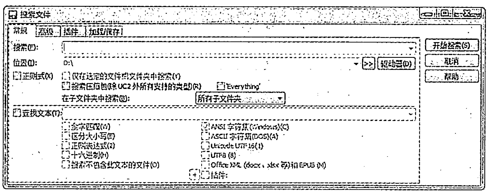

#### 为什么有的网站不支持拖拽上传

Q: 现在很多网站在上传文件的时候，都可以通过传统的方法以及通过拖拽的方式进行上传，可是自己访问的很多网站都无法通过拖拽的方式进行上传。那么如何才可以解决这个问题呢？

A: 要想让用户访问的网站支持拖拽上传，必须要满足两个条件才可以。首先就是网站使用了HTML5技术，其次就是浏览器支持HTML5技术。所以要想解决这个问题，最简单的方法就是用支持该技术的浏览器。

#### 我的超级会员是不是容易被盗

Q: 我是百度云的超级会员，因此有很多实用的特权。现在想将这个账号借给其他的人用，但是他们登录时需要手机验证。发给他们以后，如果他们拿这个验证信息修改我捆绑的手机，那么我的账号是不是就会被盗取啊？

A: 用户的这个担心是可能发生的，但是只可能对捆绑的手机号进行修改，并不会将捆绑的邮箱进行修改。因为在修改邮箱账号的时候，也需要进行验证操作才可以。所以不建议用户将账号给其他人使用，如果其他用户要下载某些资源的话，可以帮助他进行下载操作。

- 首页 密码修改 账号关联 账号安全
- 手机： 手机可以用来登录百度账号、找回密码、支付、账号安全、账号相关等功能
- 密保邮箱： 密保邮箱可以用来登录百度账号、找回密码、账号安全、账号相关等功能
- 密保问题： 密保问题可以用来找回密码、账号安全
- 安全中心手机版： 安全中心手机版可以用来管理账号
- 登录保护： 登录保护可以保护账号安全

#### 为什么脚本无法使用

Q: 安装了“解决百度云大文件下载限制”这个脚本，可是打开浏览器上的插件图标tampermonkey时，没有显示出百度云的相关信息。这个脚本要怎么样才能安装上去，并且显示出相关的信息呢？

A: 网络脚本的安装和使用其实都是有一个固定方法的，也就是首先需要在浏览器安装相关的插件，接着安装相应的脚本。接下来只需要登录到相应的网站里面，这个脚本就会在网页后台自动地起作用，用户并不需要进行其他的相关操作。

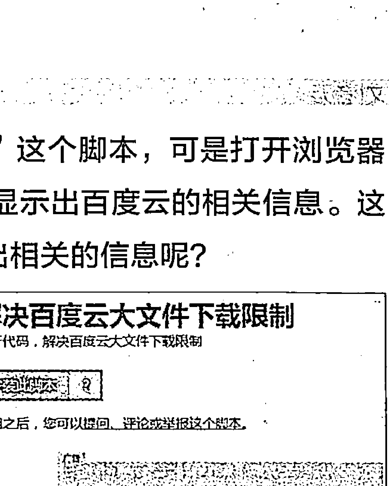

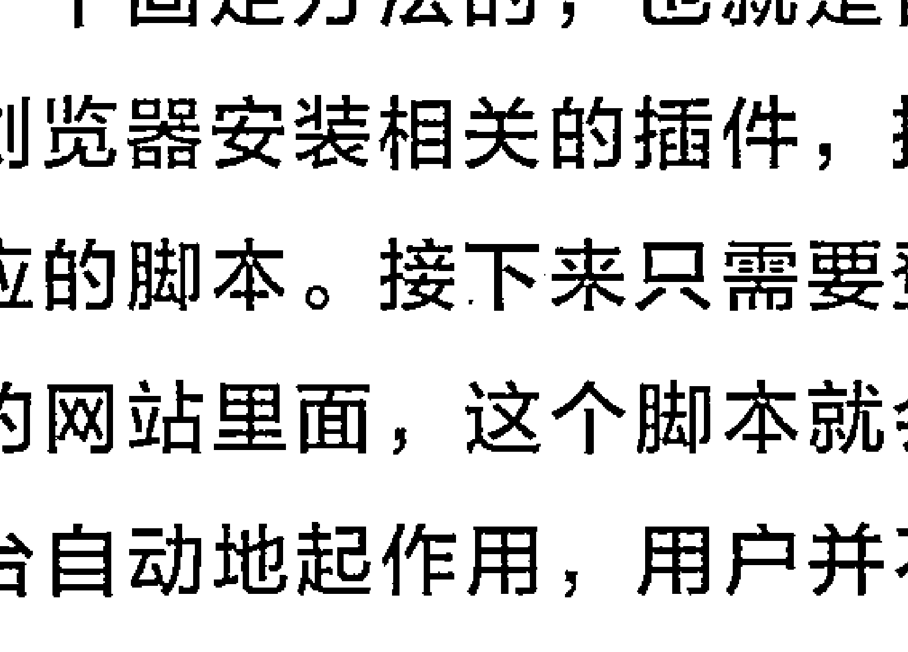

百度云屏蔽了软件下载的方式，所以只能通过浏览器进行下载。

#### 换上电信光纤后怎么测试速度

Q: 我是电信的老用户，最近电信搞活动进行宽带的升级，他们说将我的带宽升级到了50兆。那么如何才可以判断他们说的是真还是假呢？

A: 其实网络测速有两种比较常见的方法，第一种就是利用下载软件下载一个比较大的文件，看看它的下载速度能够稳定在哪个数值上，通常50M的理论下载速度为6.25MB/s。其次就是利用专业的测速网站来进行测速，比如http://www.speedtest.net/这个测速网站。

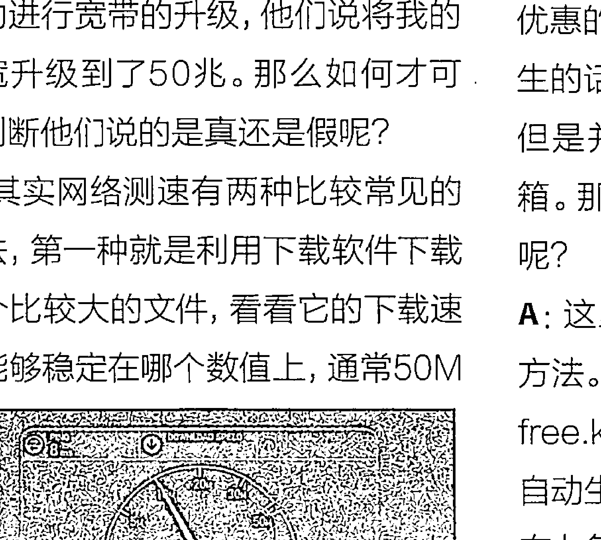

#### 如何才可以获取edu邮箱

Q: 很多软件商针对学生提供了不少优惠的政策，但是要想证明自己是学生的话，必须使用edu邮箱才可以，但是并不是所有的学生都有edu邮箱。那么如何才可以获得edu邮箱呢？

A: 这里有一个临时获得edu邮箱的方法。首先通过浏览器打开https://free.kirito.edu.rs/这个网站，它就会自动生成一个临时的edu邮箱，通过右上角就可以看到这个邮箱的地址。如果用户对默认生成的邮箱地址不满意的话，还可以对它的前缀进行自定义设置。

#### 新手机号为什么不能注册支付宝

文/老万

Q: 最近为了将家里的电视、宽带、手机业务调整为一个套餐，重新申请了一个手机号码，可是用这个手机号进行支付宝注册的时候，才发现居然无法进行注册操作。那么如何解决这个问题呢？

A: 出现这样的问题应该是这个手机号已经被其他用户申请过了支付宝服务，所以用户想要通过它注册支付宝的话，可以用一个变通的方法。首先通过自己的电子邮箱进行注册，注册完毕后登录到支付宝的后台，在个人信息里面将这个号码进行捆绑操作就可以了。


> 建议大家在更换手机号码之前，将主要服务捆绑的手机号解绑。

#### ◇有没有简便的笔记同步方法

Q: 现在有很多的笔记应用，但是如果只记录一些琐碎事情的话，觉得没有必要使用它们。虽然手机里面的便签也可以进行记录，但是它又没有同步的功能。那么如何做到两者可以兼得呢？

A: 其实很多知名的应用里面都带有记事本的功能，从中选择一个具有同步功能的就可以了。比如打开“QQ邮箱”，点击“更多应用”中的“记事本”按钮，然后就可以记录自己需要的内容了。接下来只需要在电脑里面打开QQ邮箱的“记事本”，就可以同步看到自己记录的内容了。

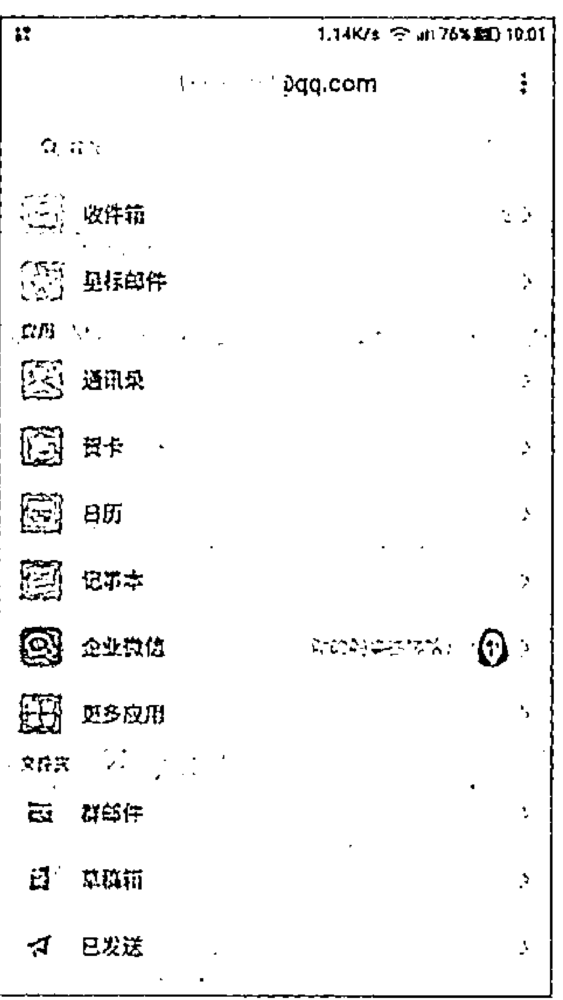

#### ◇不让手机应用被电源管理应用自动退出

Q: 现在手机里面自带的电源管理功能，会将长时间不使用的手机应用自动退出，从而可以更好地节约电池的使用，可是这样的话就收不到相应的推送信息。那么如何可以让指定的应用不被关闭？

A: 首先点击手机桌面中的“设置”按钮，在弹出的列表中找到“电池”选项并点击它，这样就可以看到一个“省电管理”的选项。在弹出的窗口里面点击“应用保护”按钮，在列表中找到不想被电池管理结束的应用就可以了。

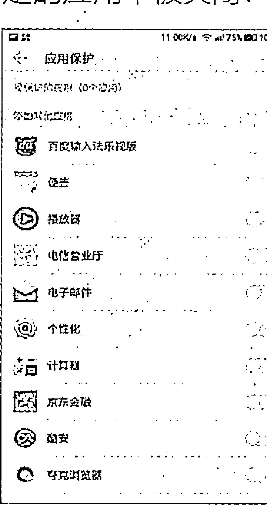

#### ◇如何确定手机的闪存规格

Q: 看了本刊的文章《如何鉴别手机闪存规格》，于是用手机下载安装了Androbench应用，检测到顺序读取速度为212MB/s，顺序写入速度为50.3MB/s。根据这个数据，请问这款手机的闪存怎样呀？

A: 其实通过数据就可以基本判断出闪存的好坏，如果设备用的是UFS 2.1闪存，那么持续读取的速度有800MB/s左右或者以上。如果用的是UFS 2.0，速度会有500多MB/s。如果速度测出来只有200多MB/s，那闪存规格很有可能只是eMMC 5.1。

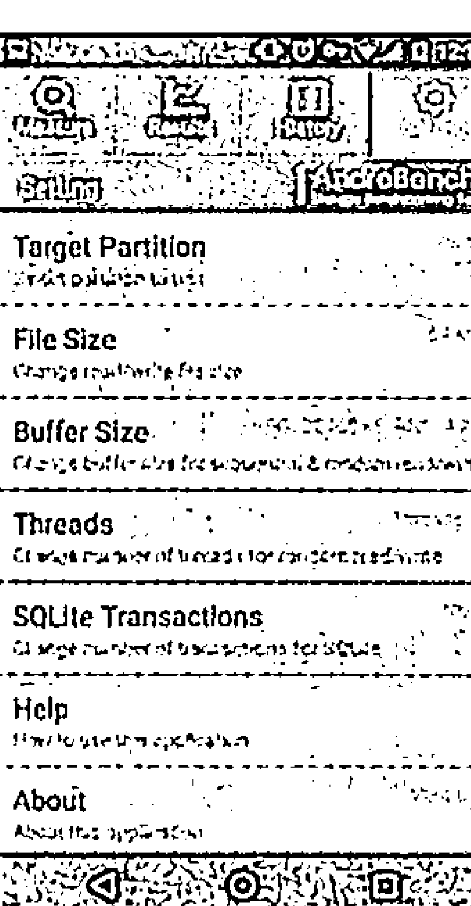

#### ◇怎么确定手机配置能不能玩VR

Q: 最近一段时间以来，VR服务都非常火爆，其中就有一个解决方案是通过智能手机来完成的，但是这对智能手机有一定的要求。那么如何判定手机能不能玩VR呢？

A: 最近鲁大师推出了一款VR性能测试应用，名叫“鲁大师VR评测”。当Android手机安装这款应用以后，点击手机屏幕就可以进行测试操作，测试完成以后就知道你的移动设备能不能玩VR了。

#### 在天气预报里查看农历信息

**Q:** 中国人查看农历信息是非常常见的，但是很多时候要想查看农历信息，也需要很繁琐的操作。而我每天都需要查看当地的天气预报信息，那么通过天气预报能不能查看到相关的农历信息呢？

**A:** 可以安装一款名为“行云天气”的应用，打开这款应用以后就会首先定位用户所在的区域，并显示出当地的天气预报信息。接下来只需要点击窗口右上角的分享按钮，在弹出的新窗口里面就可以看到相关的农历信息了。除此以外，还可以看到一些唐诗宋词的名言警句。

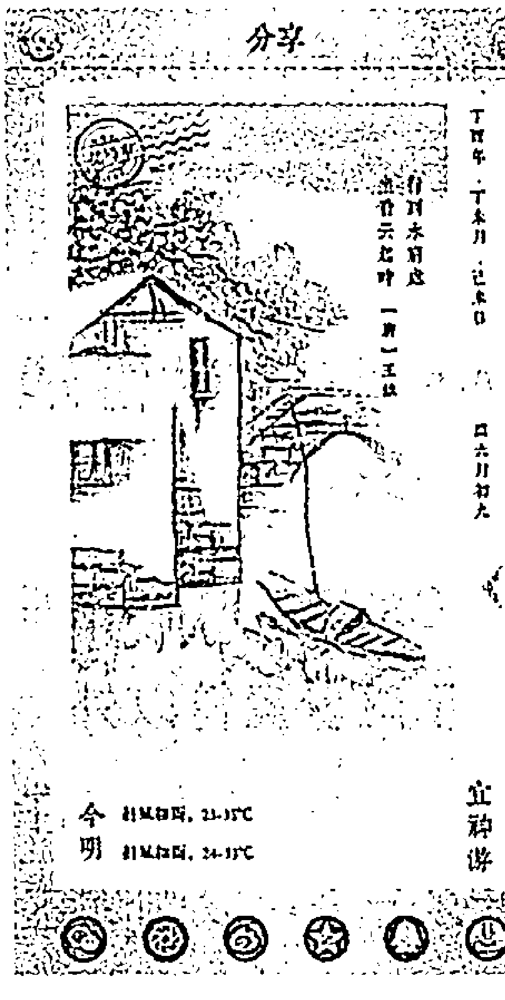

#### 检测手机屏幕供应商

**Q:** 现在手机屏幕的类型种类繁多，而且厂家也非常复杂，其中包括三星、天马或者其他品牌。那么有没有什么方法可以检测手机屏幕的品牌呢？

**A:** 如果用户的手机系统带有硬件抽检模式，那么进入到这个模式后就可以看到屏幕等相关信息。如果用户使用的手机系统没有硬件抽检模式，那么可以借助于兔宝宝、鲁大师等应用来进行检测操作。

#### 没有锤子手机也可以远程控制

文/老万

**Q:** 最新的锤子手机有一个“远程协助”功能，而之前的华为手机也有类似的功能。如果使用的不是这些品牌的手机，如何实现移动设备之间的远程控制操作呢？

**A:** 可以在控制设备和被控制设备里面，分别安装一款名为TeamViewer的应用。这样在被控制设备里就会创建一个相应的序列号，将这个序列号发送给控制设备之后，在客户端里面输入这个序列号信息，就可以对远程设备进行控制操作了。

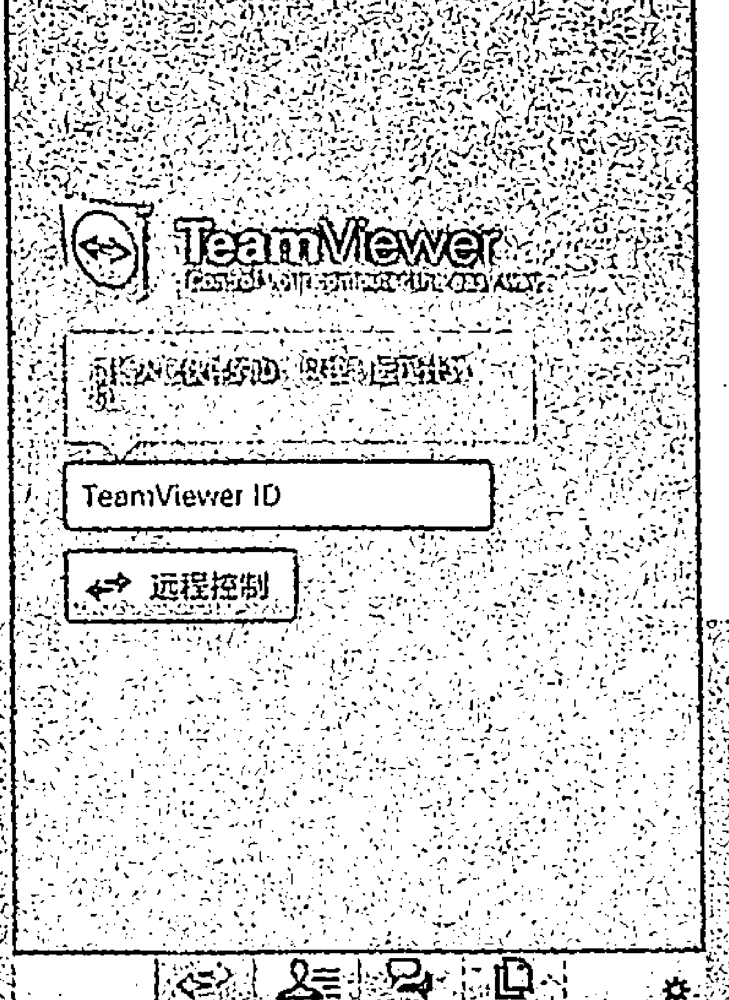


利用Inkwire这款应用，也可以实现类似的操作。

#### 综合各种功能于一身的翻译应用

**Q:** 现在网上有各种各样的翻译应用，但是不同的应用侧重点是不一样的，比如有的应用可以通过语音直接进行翻译操作，而有的应用可以对拍摄的内容进行翻译。那么有没有什么应用可以将这些功能合在一起呢？

**A:** 搜狗最近推出了一款名为“搜狗翻译”的应用，就是将这些常见的翻译功能集中在一起了。只需要安装并打开这款应用，点击“对话”功能就可以通过语音的方式进行翻译，而点击“拍照”功能就可以对拍摄的内容进行及时翻译。

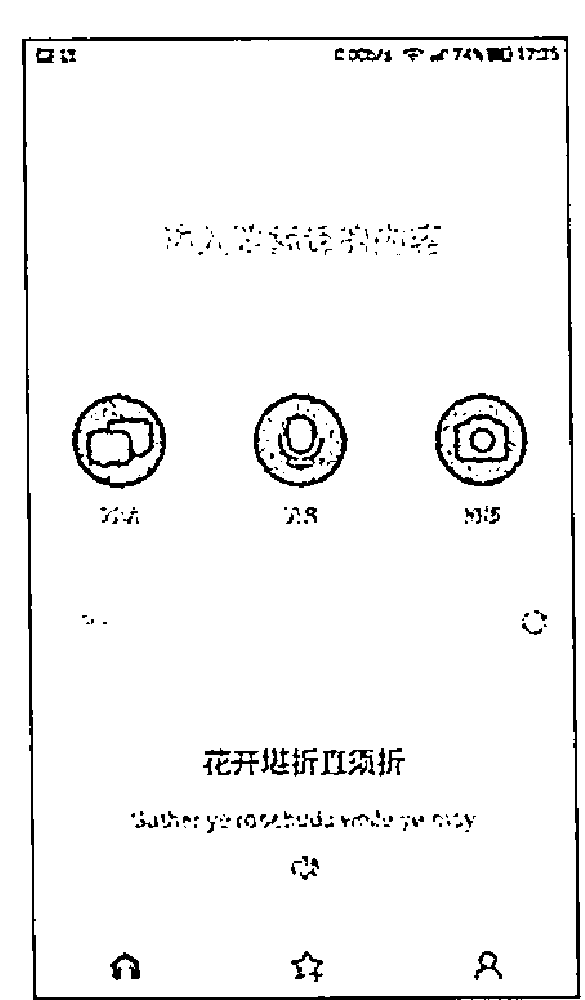

#### 如何详细了解传统的榫卯结构

**Q:** 我是一个学习建筑专业的学生，对传统的建筑工艺非常感兴趣，而榫卯结构就是其中的典型代表。那么通过手机能不能详细地了解榫卯结构的相关信息呢？

**A:** 网上正好有一款名为“榫卯”的APP，这款应用通过3D模型的方式，向用户介绍了榫卯的各种知识，包括木材的选择、工具的使用以及历史的述说等。而且通过手指对榫卯结构的拖动，可以给用户一种更加真实的感觉。

#### 添加Windows 10的时间同步服务器

文|老万

Q: 微软的系统都有一个时间同步的功能，可是它们的服务器都放在中国内地以外的地方，所以难免有的时候会出现时间同步错误的情况。那么如何在Windows 10里面添加其他的时间同步服务器呢？

A: 按Win+R打开“运行”框，输入regedit打开注册表，定位到HKEY_LOCAL_MACHINE\SOFTWARE\Microsoft\Windows\CurrentVersion\DateTime\Servers。接着在右侧窗口里面新建一个“字符串值”，然后在“数值名称”里面设置服务器的序号，在“数值数据”填写时间同步服务器的地址即可。

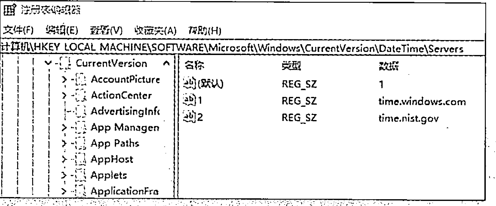

在“日期和时间”对话框里面修改同步服务器即可。

#### 使用FAT32格式化大于32GB的闪存盘

Q: 在Windows中默认是无法使用FAT32来格式化大于32GB空间的移动设备的。那么有没有什么办法可以使用FAT32格式化大于32GB的闪存盘呢？

A: 如果用户使用的是Windows 10操作系统的话，那么首先运行Windows Powershell，在命令行里面输入“format /FS:FAT32 X:”即可。其中的X就代表移动设备在系统里面当前的磁盘盘符。如果愿意使用第三方工具，那么可以试一试FAT32 Format。

#### 快速启用系统的“存储感知”功能

Q: 现在很多的电脑都开始使用固态硬盘，但是由于固态硬盘的容量通常比较小，所以拿来办公还比较合适，如果要进行视频编辑等操作的话，就会显得非常的捉襟见肘。那么有没有什么好的方法可以解决这个问题呢？

A: 要想解决这个问题，只需要启用系统的“存储感知”功能就可以了，它会在系统垃圾比较多的时候自动进行清理。首先打开系统的设置窗口，在设置窗口中点击“系统”选项，然后在左侧列表中点击“存储”，找到“存储感知”功能后，将它进行启动就可以了。

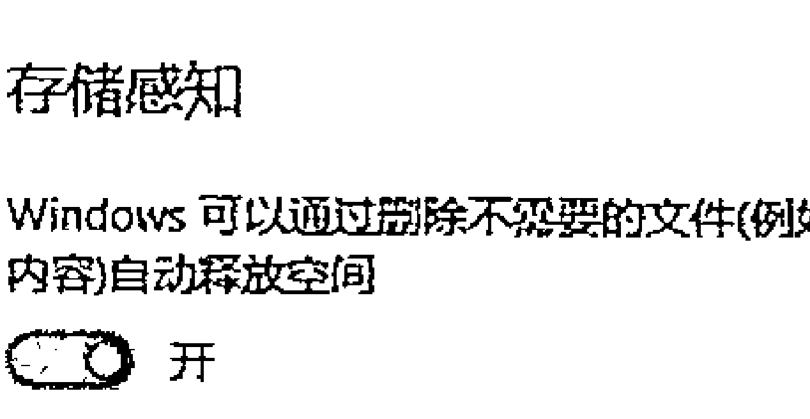

#### 使用Dism工具修复损坏的系统文件

Q: 定时进行系统文件的升级，可以防范黑客和病毒的入侵。如果升级文件出现问题的话，不仅会导致各种各样的系统功能出现错误，而且会造成无法进行系统文件的升级更新。那么如何修复存在问题的系统文件呢？

A: 首先通过管理员权限打开“命令提示符”窗口，在命令行里面输入“Dism.exe /Online /Cleanup-image /Restorehealth”这段命令后回车，就可以利用系统自带的DISM功能自动替换存在问题的系统文件，修复完成以后就可以进行正常的升级操作了。

#### 删除Windows 10文件管理器中的文档文件夹

Q: 在Windows 10系统的文件管理器里面，除了会显示磁盘盘符以外，还会显示“文档”、“音乐”等文件夹。那么有没有什么方法可以删除这些文件夹呢？

A: 首先打开注册表编辑器，定位到这个位置HKEY_LOCAL_MACHINE\SOFTWARE\Microsoft\Windows\CurrentVersion\Explorer\MyComputer\NameSpace。这样在右侧列表中就可以看到多个字符串，其中每一个字符串代表的就是一个文件夹，只需要将它们进行删除就可以了。

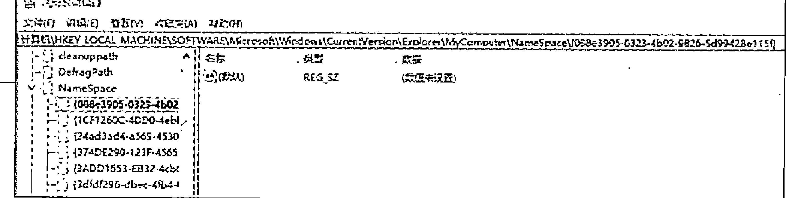

##### 如何将多列数据合并到一列

Q: 工作中经常会遇到这样的情况，就是在输入用户名称的时候要分别输入姓和名到不同的列中。那么如何将两列数据合并为一列数据，从而得到用户的完整名称呢？

A: 比如用户的姓和名分别在A1和B1的位置，在想要开始合并的某一行的空白位置，输入“=A1&B1”后，鼠标点击任意空白处就可以看到合并的结果。

##### 使文本框自动适应文字调整的大小

Q: 在Word中的文本框输入的内容，如果超过文本框的大小的话就不会进行正常的显示，重新对其进行调整后才可以进行显示。那么有没有什么方法可以让文本框自动适应文字大小呢？

A: 首先在文本框上点击鼠标右键，在菜单里面选择“设置文本框格式”命令。接着在弹出的对话框里面选择“文本框”标签，激活“重新调整自选图形以适应文本”选项，同时关闭“Word在自选图形中自动换行”选项即可。

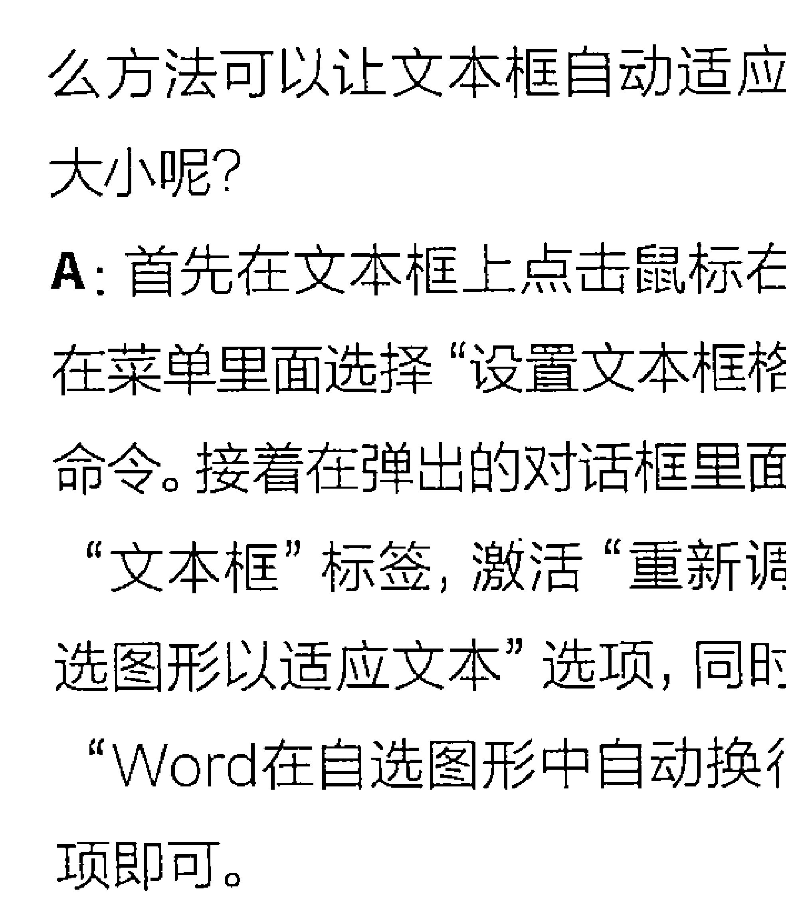

##### 利用Excel进行屏幕截图操作

Q: 以前基本都是利用QQ的截图功能来进行操作，随着微信的流行现在QQ用得越来越少。那么除了使用专业的截图软件以外，还有哪些常见软件可以进行截图操作呢？

A: Excel是我们平时最常使用的办公软件，现在它的里面就有一个截图功能。首先点击软件的“插入”标签，接着点击工具栏中的“屏幕截图”按钮，在弹出的对话框里面就可以显示出当前所有软件程序的窗口，从中选择自己需要截图的窗口，点击一下就可以完成截图操作了。

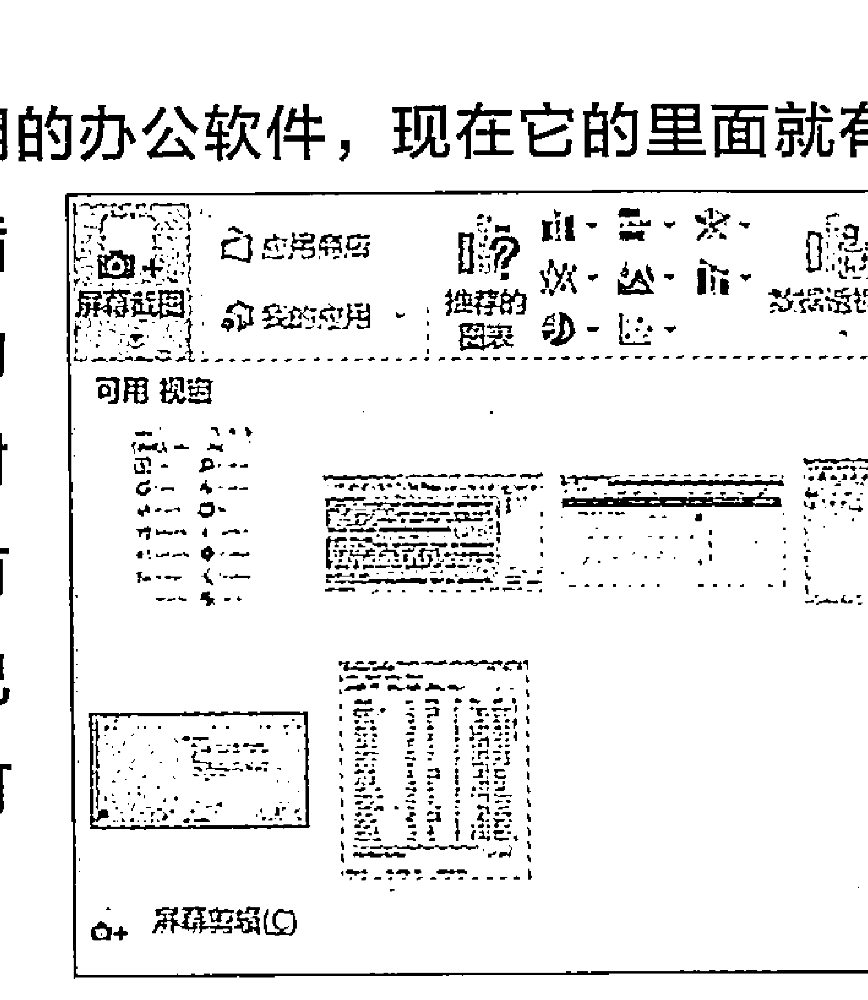


##### 在设置保护的工作表中自动筛选

Q: 最近公司的销售人员制作了一个销售表格，该销售人员对表格的数据进行了自动筛选后，设置了工作表的保护选项，可是之后再对数据表进行排序时就会弹出一个警告提示框。那么请问这个问题怎么解决啊？

A: 首先选定表格中的所有数据，点击“数据”标签中的“筛选”按钮。接着在数据上点击鼠标右键，选择右键菜单中的“设置单元格格式”命令，在弹出的对话框中选择“保护”标签，将“锁定”选项去除选择。接下来点击“审阅”标签中的“保护工作表”按钮，在弹出的对话框里面勾选“排序”和“使用自动筛选”选项后，确定退出就可以了。

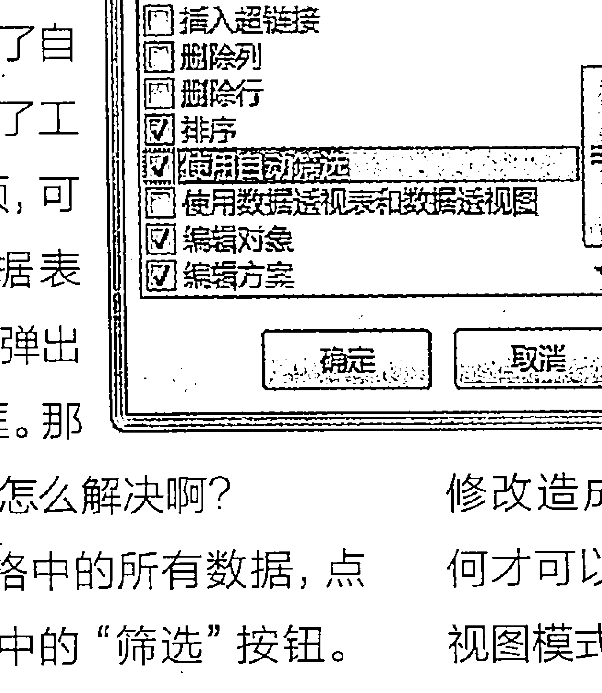

##### 将工作表改成“普通”视图模式

Q: 今天收到了公司上半年的年度利润表，其中有若干张工作表被设置成了“分页预览”的模式，这样就给数据修改造成了很大的不方便。那么如何才可以将它们一次性改成普通的视图模式呢？

A: 首先选择一个“分页预览”模式下的工作表，右键单击该工作表标签，在菜单里面选择“选定全部工作表”命令。接着点击“视图”标签中的“普通”按钮，即可更改全部工作表为“普通”模式了。

#### 程序如何被钉在桌面最上层

文|老万

#### 软件弹窗如何自动进行关闭

Q: 有的播放软件有一个功能，当它在播放视频的时候可以固定在系统桌面的最上层。那么能不能将其他任何的软件固定在系统桌面的最上层呢？

A: 首先下载运行Windows Topmost control这款软件，在系统托盘就可以看到它的图标。在图标上点击鼠标右键，在弹出的菜单里面点击Windows选项。这样就可以看到当前系统所有的窗口，要固定哪一个窗口就点击哪一个选项就可以了。

Q: 现在很多软件通过导流量的方式获得收益，于是在运行软件的时候就会出现各种各样的弹窗，这样非常影响我们对软件的使用。那么除了使用一些安全软件以外，还有没有其他的方法拦截这些弹窗呢？

A: 其实利用一些专业的小工具，比如CloseADs这款工具，就可以对弹窗进行拦截。这款工具默认已经设置了一些常见软件的弹窗，如果发现没有拦截的窗口，只需要点击“添加”按钮，拖动捕获图标到弹出窗口的位置上释放，就可以进行自动的捕捉和添加操作了。

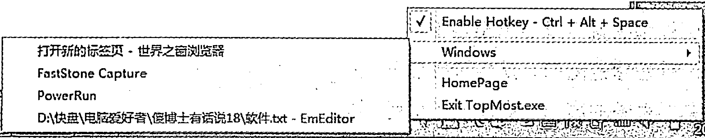

如果不想固定的话就取消某个窗口的选项，因为直接退出软件是无法取消固定设置的。

#### MPC-HC之后软件如何进行选择

Q: 平时使用的是MPC-HC这款播放软件，可是不久之前这款软件宣布停止开发了。那么有没有类似的软件可以推荐呢？

A: 这款播放软件有一个分支，名为MPC-BE，可以下载来使用看一看。不过这两款播放软件最大的区别就是，MPC-HC软件使用的是第三方的LAV Filters滤镜，而MPC-BE软件使用的是自身携带的滤镜。

#### 用管理员权限运行特定的软件程序

Q: 在使用命令提示符的时候经常都会被要求使用管理员权限，除此之外，很多软件在运行的时候都需要使用管理员权限，可是有的时候我们忘记启用这个权限。那么如何强行使用这个权限呢？

A: 首先下载运行PowerRun这款软件，接着点击工具栏中的“添加”按钮，在弹出的对话框里面选择要使用管理员权限的应用程序。以后当我们想要让软件程序用管理员权限启动的时候，那么只需要在软件列表中选择它，然后点击工具栏中的“运行”按钮就可以了。

#### 如何了解到软件版本的升级

Q: 通过软件管理工具可以及时对系统里面已经安装的软件版本进行检测，发现有新版本以后就会提示用户进行安装升级，但是并不是所有的软件都可以检测到。那么对于那些没有检测到的软件，如何发现它的版本升级呢？

A: 首先下载安装SUMo这款工具，安装完成以后点击对话框中的“自动检测已安装软件”按钮，这样就可以对系统里面已经安装的软件版本进行扫描。扫描完成以后，在窗口列表中就会用不同的颜色图标显示出软件版本的相关信息。对于绿色软件来说则需要手动进行操作，点击“添加”按钮选择绿色软件的主程序文件，然后进行分析扫描就可以了。

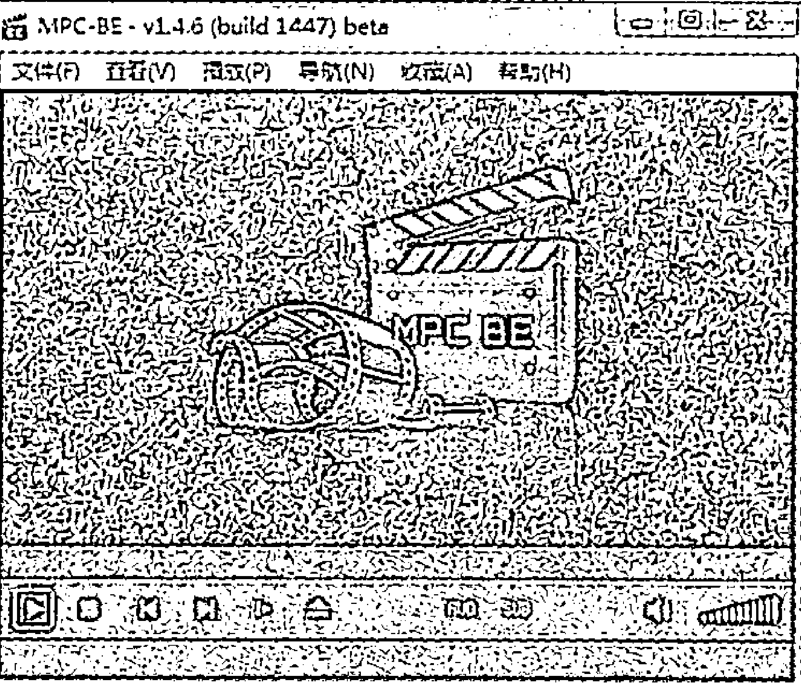

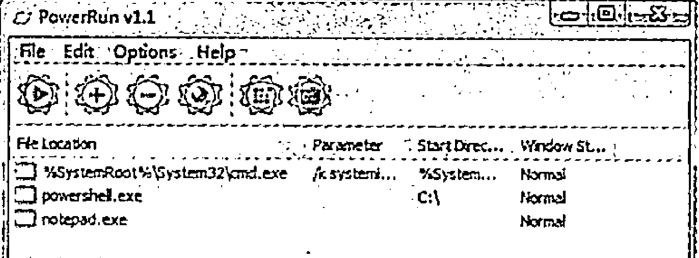

#### 为网页内容自动生成目录

Q: 浏览网页的时候会发现很多内容比较长，这样在内容跳转的时候就显得非常麻烦，如果能像办公软件那样生成一个文章的目录，跳转起来就方便多了。那么有没有什么方法可以实现这样的操作呢？

A: 如果使用的是谷歌浏览器或者其他拓展版本的话，可通过应用商店安装一款名为Smart TOC的扩展。以后遇到内容较长的文章时，就可以点击工具栏里面的这个扩展图标，该扩展就会在网页的右侧生成一个文章的目录，点击目录中的链接就可以快速实现跳转操作。

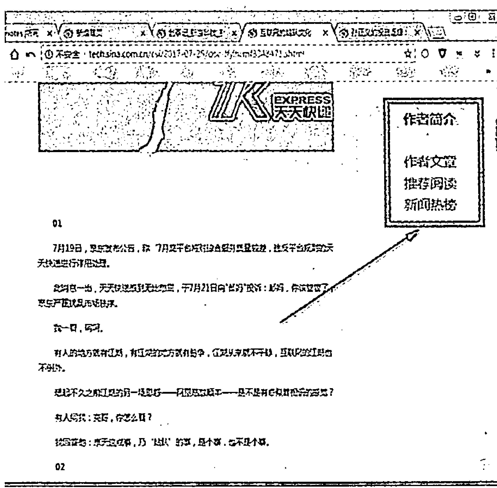

#### 快速登录MEGA网盘

Q: 经常使用MEGA这个网络硬盘，很多时候觉得它的登录非常繁琐，而且登录的时候还容易被别人截获登录密码。那么有没有更加安全快速的登录方法呢？

A: 首先通过谷歌浏览器的应用商店搜索安装MEGA这款扩展插件。安装完成以后要想登录MEGA的时候，只需要点击工具栏中的这个扩展图标，接下来浏览器就会自动登录到网盘的网页页面。

#### 家庭局域网安全与后门扫描

文/老万

Q: 现在很多家庭都是通过路由器来上网，然后连接上多台设备形成一个局域网，可是自从永恒之蓝病毒出现以后，怕家里的设备也受到这样的病毒攻击。那么如何才可以检测自己的网络设备是否存在问题呢？

A: 通过著名杀毒软件厂商比特梵德推出的一款名为Home Scanner的工具，就可以扫描局域网内是否有容易受到攻击的设备以及后门。安装运行这款工具以后，它就会对局域网里面的所有设备进行检测。检测完成以后如果没有发现问题，就会在设备后面用绿色的图标进行显示。如果发现有问题的话，就会通过红色的图标进行显示。

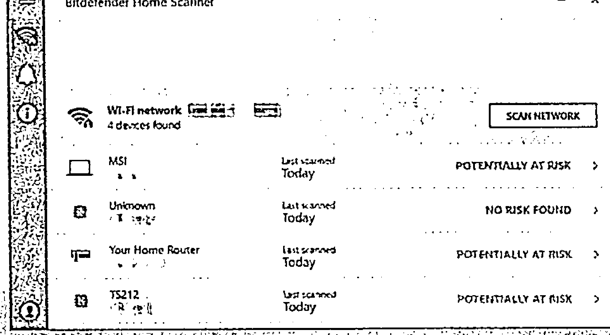


也可以利用一些端口扫描工具，对指定IP地址的端口进行扫描。

#### 打开爱奇艺HTML5资源占用太高

Q: 通过Vivaldi浏览器打开爱奇艺HTML5的时候，发现这款浏览器的系统资源占用非常高。但是同样一个链接换成谷歌浏览器的话，就不会出现这样的问题。那么如何解决这个问题啊？

A: 首先点击Vivaldi浏览器“工具”菜单中的“设置”按钮，在弹出的对话框里面选择左侧列表中的“外观”选项。接着在右侧窗口里面找到“窗口外观”中的“开启动画效果”选项，将这个选项勾选上并且关闭对话框就可以了。

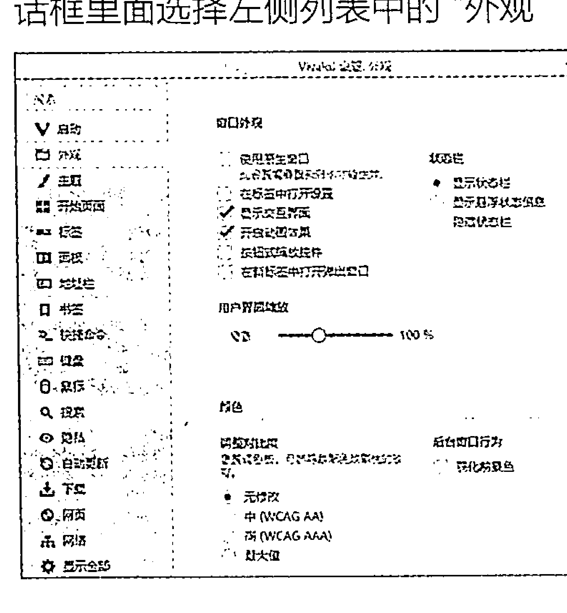

#### 最新版Chrome不能登录卡饭

Q: 使用Windows 10 64位专业版，用最新版Chrome谷歌浏览器作为主力浏览器，最近一直出现不能登录卡饭的情况。请问这个问题如何解决？

A: 登录卡饭论坛时，不仅需要输入账号和密码，更加重要的是还需要进行验证码的验证。无法登录应该是验证码这个环节出现了问题，建议打开浏览器的隐私模式，看看能不能正常登录。如果可以的话，说明安装的广告过滤扩展将验证码进行过滤了，建议更新广告过滤规则。

#### 昂达oBook11 Pro PK 酷比魔方MIX PLUS

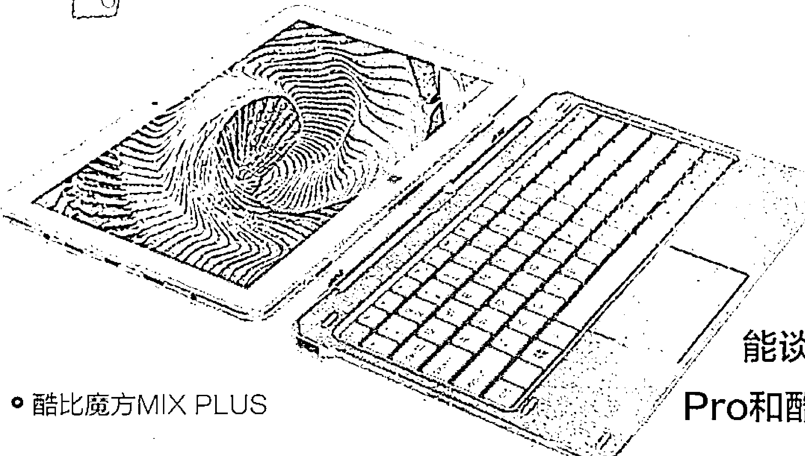

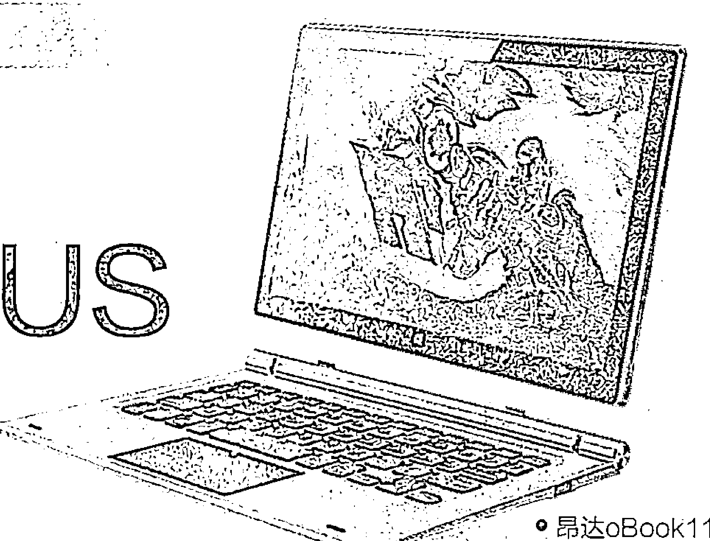

对需要经常出差或旅行的用户而言，轻巧的Windows 10平板电脑无疑是“减负”的保证，而唯有搭载酷睿M起步处理器的产品才能谈得上“生产力”。作为两款国产酷睿M平板的代表，昂达oBook11 Pro和酷比魔方MIX PLUS的价格都相对实惠，那么它们之间谁更适合你？

##### 酷睿M之芯

细心的读者可能发现了，目前国内Windows 10平板普遍以英特尔Cherry Trail平台（如Atom X5-Z8350）为主。原因很简单，除了Cherry Trail成本低廉以外，其发热量也相对较低，无需在散热设计上下太多工夫就能保证长时间的稳定运行。
问题是，对喜欢偶尔打一盘LOL，或是对性能要求较高的用户而言，Cherry Trail平台根本不够用，唯有酷睿M才能勉强应对复杂的娱乐办公环境。问题来了，酷睿M处理器发热量偏高，而且成本不低，所以它普遍被应用在一线品牌旗下的产品身上，价格鲜有低于4000元的情况。
昂达oBook11 Pro和酷比魔方MIX PLUS最大的特色，就是在更为低廉的价格段上就武装了酷睿M3-7Y30（图1）。这是一颗隶属于七代酷睿Kaby Lake平台的四核处理器，其基础运行频率为1.0GHz，可睿频加速至最高2.6GHz，集成的HD615核芯显卡也支持DirectX 12、OpenGL 4.4等游戏特效和4K HEVC 10-bit与VP9硬解码支持，在编辑或播放视频时更流畅、能耗更低。因此，我们无需为两款平板的性能担心，它们都足以应对日常的“折腾”。

| 参数对比 | 昂达oBook11 Pro | 酷比魔方MIX PLUS |
| :--- | :--- | :--- |
| 屏幕 | 11.6英寸IPS触控屏 (1080P) | 10.6英寸IPS触控屏 (1080P) |
| 处理器 | 酷睿M3-7Y30 | 酷睿M3-7Y30 |
| 内存/硬盘 | 4GB/64GB eMMC | 4GB/128GB SSD |
| 显卡 | HD615核芯显卡 | HD615核芯显卡 |
| 摄像头 | 前置200万像素 | 200万/500万像素 |
| 接口 | TF卡槽、USB Type-C、USB3.0、Mini HDMI、 | TF卡槽、USB Type-C、Micro USB3.0、耳机孔、充电孔 |
| 体积 | 287mm×180mm×8.95mm | 273mm×172mm×9.6mm |
| 电池/重量 | 38Wh/850g | 31.8Wh/686g |
| 参考价格 | 1999元（主机）、199元（键盘） | 2499元（主机）、399元（键盘） |

##### 差异在哪里

对Windows 10平板电脑而言，值得我们关注的细节有很多，比如便携性、扩展能力以及磁盘性能以及综合成本等等。
先来看看便携性，昂达oBook11 Pro由于拥有更大的11.6英寸视野，所以它的尺寸和重量自然要落后于酷比魔方MIX PLUS，但不足9mm的

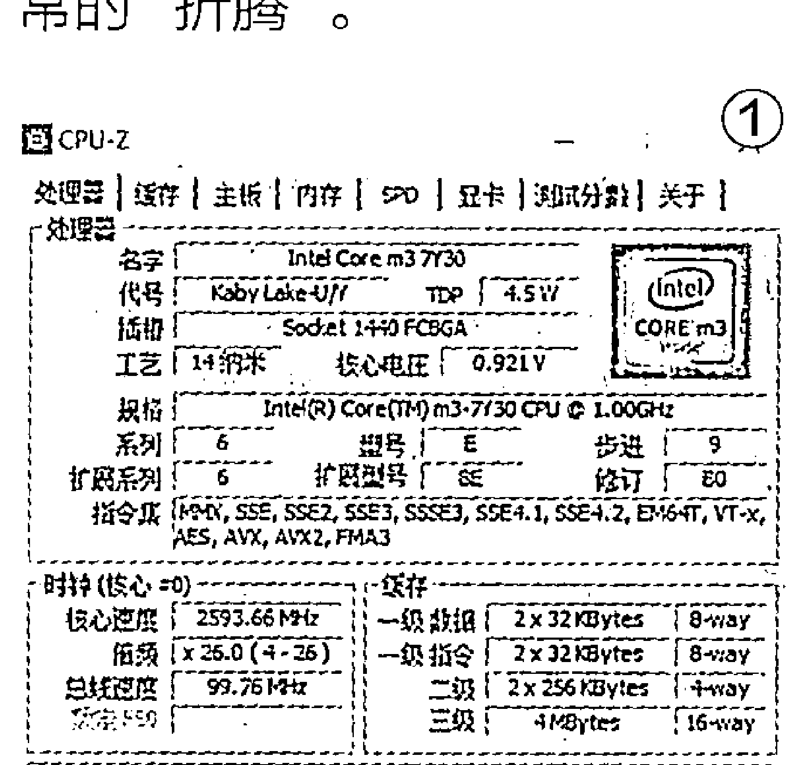

厚度和850g的重量依然完胜11.6英寸的传统笔记本，哪怕再加上键盘底座也不会给我们带来太大的负担。

酷比魔方MIX PLUS的屏幕尺寸为10.6英寸，理论上可以做得更轻巧一些。可惜，该产品延续了i7手写本的模具，只是外壳颜色不同，存在屏幕边框较宽的小遗憾。

在扩展能力上，也就是两款平板是否提供了丰富且实用的接口。其中，酷比魔方MIX PLUS配备了最新的USB Type-C接口（图2），并保留了Micro USB3.0接口，如果你想接驳闪存盘，需要使用Micro

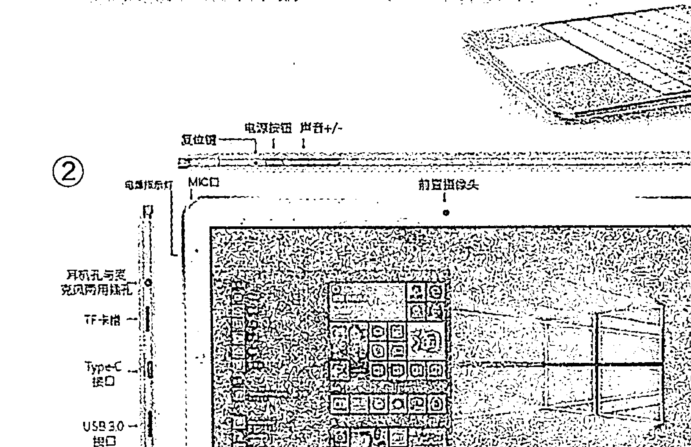

USB3.0转标准USB的转接头。可惜的是，MIX PLUS没有提供HDMI，如果你想将画面传输到更大的显示设备上，就需要借助Windows 10系统自带的无线投屏功能了。

昂达oBook11 Pro的扩展能力表现稍好，它身上的USB为标准接口，而且还配备了Mini HDMI（图3），可以通过有线的形式接驳显示设备，确保无延时和传输质量。好消息是，这两款平板电脑选配的键盘底座两侧也分别提供了一个

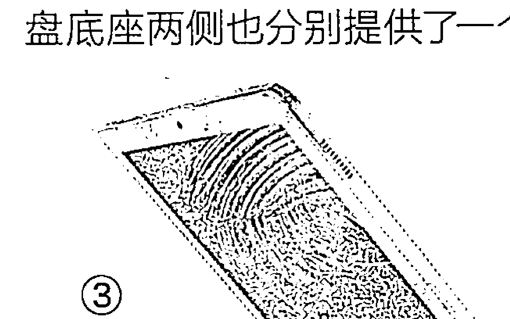

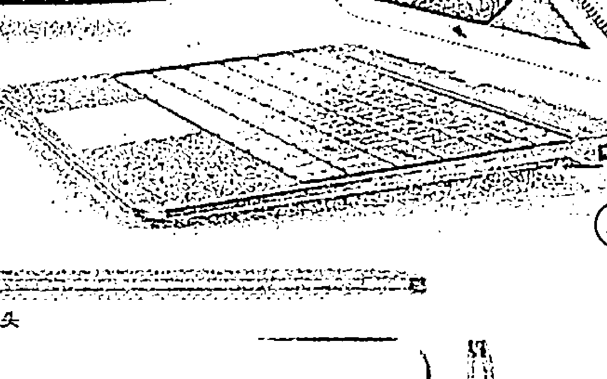

标准USB接口（图4），当与平板部分结合后可以获得媲美普通笔记本的扩展能力，其中oBook11 Pro的键盘底座还支持平板部分的双向结合（图5），可以获得类似Yoga笔记本的多模式体验。

接下来就是磁盘性能了。昂达oBook11 Pro标配64GB存储空间，可惜它的存储介质为eMMC，读写性能分别只有200MB/s和100MB/s左右。而酷比魔方MIX PLUS的优势在于，它不仅配备了更大的128GB空间，而且还是标准的SSD，磁盘性能至少是eMMC的两倍以上。

至于综合成本，也就是平板电脑和键盘底座以及周边外设的总价格了。昂达oBook11 Pro主机1999元，原装键盘199元，主动式触控笔79元，全部加起来需要2277元；酷比魔方MIX PLUS主机2499元，键盘399元，原装触控笔299元，共需3197元。需要注意的是，MIX PLUS的原装专用手写笔CEP01支持Wacom 1024级感压，可以获得更精准的手绘体验（图6），所以价格偏高也在情理之中。


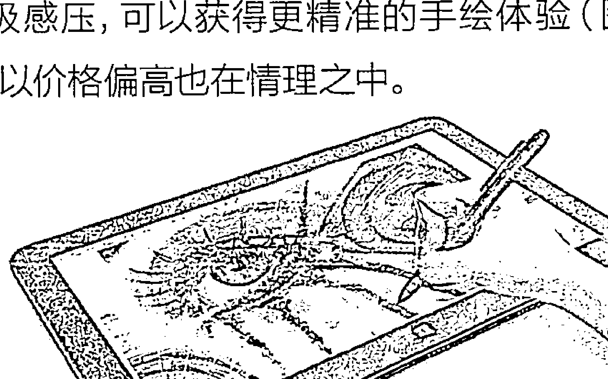

> ## 小提示
昂达oBook11 Pro内部预留了一个M.2插槽，支持2242规格（42mm长度）的M.2 SSD。只是自行拆机存在一定的风险，还会失去质保，因此想给其加装SSD，建议直接到官方客服中心寻求帮助。

作为同属酷睿M平板电脑的代表，昂达oBook11 Pro和酷比魔方MIX PLUS与一线品牌最大的差距就是内部工艺（比如有无飞线）和品控的把握。还好，酷睿M平台的集成度够高，日常使用出现硬件故障的几率并不大。就这两款产品而言，oBook11 Pro的优势在于更大的屏幕和更高的性价比，适合对价格极为敏感的用户选择。而MIX PLUS的优势则在于支持更高品质的触控笔，适合预算有限且从事设计类工作的用户考虑。

#### 惠普ENVY 15
PK 戴尔燃7000-15

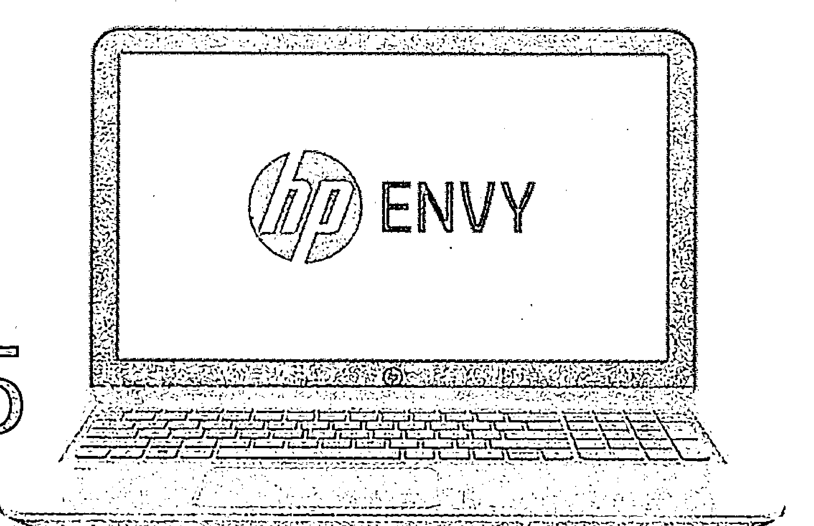

很多笔记本用户都希望在获得较大视野的同时，依旧保持较强的移动性，因此大尺寸轻薄本自然就要列入候选名单了。作为时下最具代表性的两款15.6英寸轻薄本，惠普ENVY 15和戴尔燃7000-15谁更适合你？

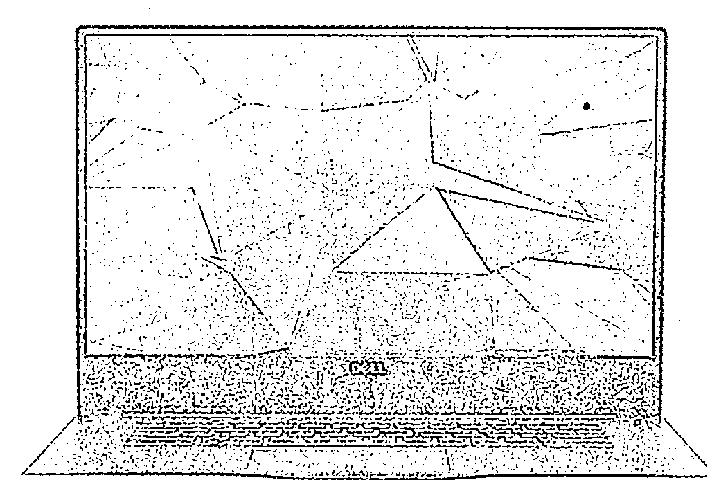

| 参数对比 | 惠普ENVY 15-AS108TU | 戴尔燃7000-15 |
| :--- | :--- | :--- |
| 屏幕 | 15.6英寸IPS触控屏 (1080P) | 15.6英寸IPS (1080P) |
| 处理器 | 酷睿i5-7200U | 酷睿i5-7200U |
| 内存/硬盘 | 8GB/512GB SSD | 8GB/1TB |
| 显卡 | HD620核芯显卡 | NVIDIA 940MX (4GB GDDR5) |
| 接口 | 读卡器、USB3.0×3、USB Type-C、HDMI、音频接口 | 读卡器、USB2.0、USB3.0×2、HDMI、RJ45、音频接口 |
| 机身 | 380mm×255mm×17.9mm | 358mm×247mm×19.5mm |
| 电池/重量 | 52Wh/2.13kg | 42Wh/2.0kg |
| 参考价格 | 5999元 | 5999元 |

##### 体型的对比

惠普ENVY 15和戴尔燃7000-15都采用了15.6英寸IPS屏幕，分辨率也都达到了1080P水准，我们无需为它们的显示细腻程度和可视角度而担心，只是惠普ENVY 15增加了一个可触控的属性，我们可以通过手指在屏幕上“指点江山”(图1)。需要注意的是，虽然屏幕尺寸相同，但两款产品整机的宽度还是出现了较大的差异，其中ENVY 15长约380mm，而燃7000-15则只有358mm，这是怎么回事呢？

原来，戴尔燃7000-15引入了“微边框”概念，将屏幕左、右、上边框的宽度压缩到了7mm(图2)，从而让燃7000-15拥有了和14英寸笔记本相似的体积。但是，也正是因为将机身宽度压缩得比较厉害，所以它的键盘两侧显得很空，没有配备数字小键盘。惠普ENVY 15虽然没能因缺少微边框而受益，但该产品却保留了数字键盘区域，对经常和数字打交道的用户而言意味着更高的输入效率。

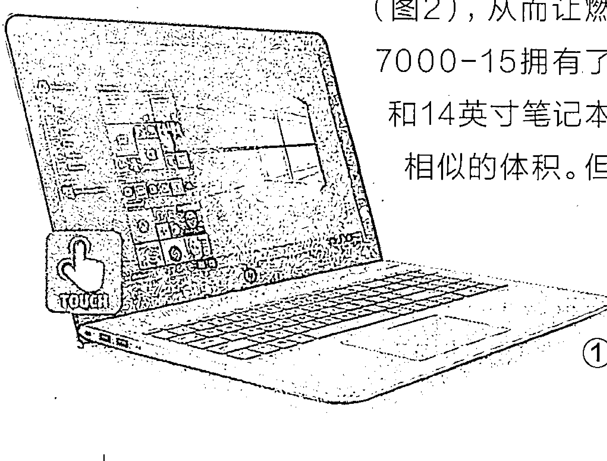

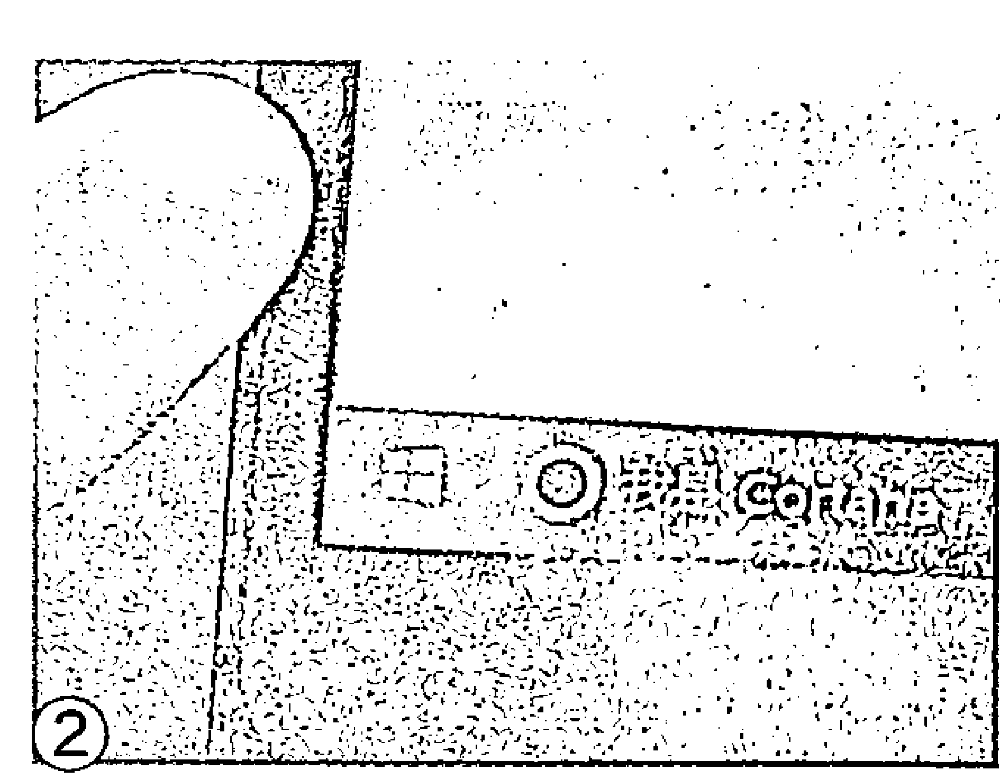

##### 机身材质有别

两款笔记本在设计上都引入了金属元素，差别是戴尔燃7000-15采用了一体化的顶盖（A面）和底盖（D面），C面掌托部分采用了类肤材质，而且表面似乎应用了新的涂层（图3），哪怕你手指出油时粘在上面也只是浅浅的痕迹，而且很容易擦拭。

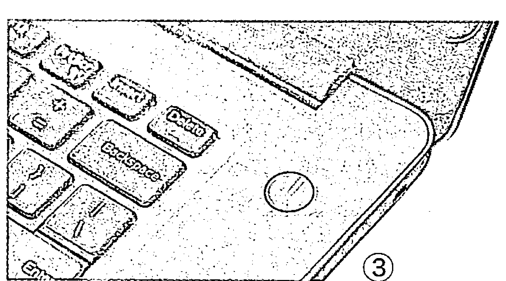

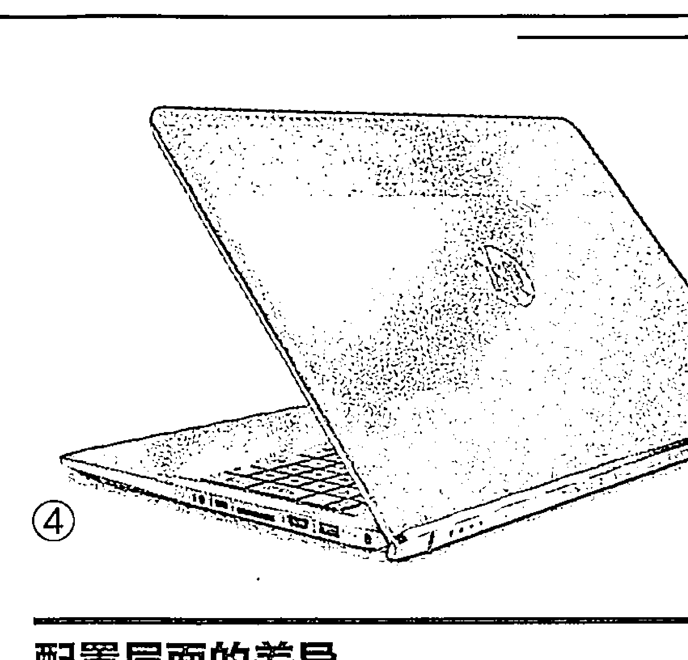

惠普ENVY 15除了B面屏幕边框，整个机身都采用了金属材质打造，楔形设计的机身也让它从侧面看起来显得更薄，屏幕尾部还采用镀铬材质装饰（抛光转轴），看起来非常个性（图4）。在屏幕开启后，屏幕尾部的抛光转轴还能起到支撑起键盘的作用，可以像支架一样增加笔记本底部的空气流通，提升散热效率。

##### 配置层面的差异

惠普ENVY 15和戴尔燃7000-15都基于英特尔第七代酷睿处理器平台设计，6000元左右的低配版都选用了酷睿i5-7200U和单条8GB DDR4内存的组合。只是，本文涉及的两款型号却在硬盘和显卡的搭配上存在较大的差异。其中，惠普ENVY 15标配512GB SSD，而且这个SSD还是走PCIe通道且支持NVMe协议哦，其持续读取速度可轻松突破1500MB/s大关，具备一流的磁盘性能。可惜，惠普ENVY 15并没有武装独立显卡，其集成的HD620运行《英雄联盟》级别的游戏基本无压力，但如果你想玩更大型的单机3D游戏，那惠普ENVY 15的表现可能就会让你失望了。戴尔燃7000-15选用了1TB机械硬盘，磁盘性能肯定是不如SSD的。好消息是，该产品配备了NVIDIA 940MX独显，而且还拥有4GB GDDR5显存，具备一定的游戏动力。需要注意的是，燃7000-15家族中也包含取消独显，仅保留HD620核芯显卡的版本，如果你注重3D性能，可千万不要买错型号哦。

> 扩展阅读：如果你钟情于15.6英寸大视野，并希望笔记本能拥有更为极致的性感身材，LG旗下的Gram系列不容错过，其重量仅有1kg左右，轻如鸿毛。如果你对游戏很感兴趣，那来自戴尔旗下的XPS15一定不会让你失望，该产品在搭载H系列七代酷睿处理器和配备GTX1050独显的同时，却将重量控制到了1.78kg，只是售价高达万元起步。

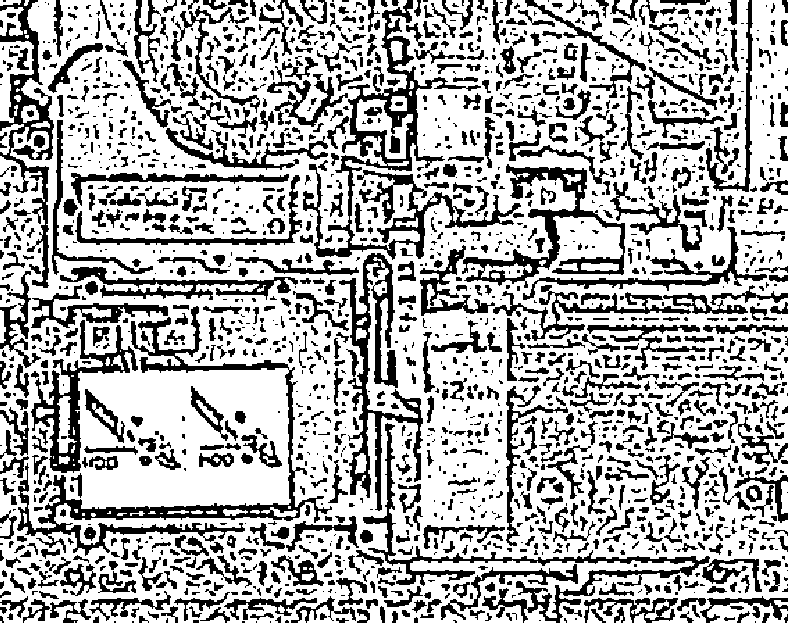


##### 看不见的内部竞争

惠普ENVY 15和戴尔燃7000-15的拆机难度都不高，拧下D面所有螺丝就能拆下底盖，只是惠普ENVY 15有几颗螺丝隐藏在了条状脚垫里面，拆机过程相对会繁琐一点。两款笔记本都提供了2个内存插槽，用户可自行升级双通道内存。二者的差异在于戴尔燃7000-15标配M.2插槽和标准SATA两个硬盘位，用户可随时升级到双硬盘模式（图5）。而惠普ENVY 15则仅配备一个M.2插槽，虽然在电池左侧预留了安装2.5英寸硬盘的空间，但内部却没有提供SATA接口（图6），意味着只能运行在一个硬盘的模式下。

> 作为15.6英寸轻薄本的代表，惠普ENVY 15和戴尔燃7000-15都是极具辨识度的存在。惠普ENVY 15拥有全金属机身和较高的颜值，触控屏幕的加盟也能提升Windows 10下的操作效率，唯一可惜的就是缺少独显的加盟，让它的游戏性能受限。而戴尔燃7000-15的优势则在于微边框换来的更小机身，以及独显和相对更强的扩展能力。

#### 拥抱未来
用触控显示器扩展视野

很多人都喜欢使用iPad一类平板电脑时那种“指点江山”的体验。那么，如何让Windows系统的老台式机和笔记本也获得类似的体验？直接购买一台支持触控的显示器也许就是最佳方案。

##### 触控应用的光明前景

##### 触控显示器并非新事物

CFan在2017年11期的特别话题中曾向大家介绍了微软最新的Windows 10 S操作系统，它不支持我们熟悉的EXE程序，而是仅能从微软官方应用商店下载和运行UWP应用（图1）。不要为Windows 10 S不支持.exe程序而感到遗憾哦，如果UWP应用能借这套系统而成为未来Windows系统的主流格式，将成为改善操作体验的一件幸事。

原因很简单，UWP应用耗费系统资源低（省电、省内存），同时还采用了更适合触控操作的简洁界面和大字体大图标的显示风格（图2），它更像是iOS和Android系统专用的APP。触控操作之所以没能Windows生态系统中普及，就是受.exe程序对触控支持极不友好的拖累。

触控显示器并非什么新鲜事物，早在Windows 8系统发布时市面上就出现过不少集成触控功能的显示器。只是当时很多产品都采用了光学式触控技术，即在屏幕对角线的四角安装红外发射器和接收器，用于识别用户手指在屏幕上的操作。可惜，光学式触控技术只能实现两点触控（图3），精准度也谈不上完美。

在触控显示器发展的早期，还出现过所谓的“智能显示器”，就是在传统显示器里塞进电视盒子的硬件，并预装Android系统（图4）。这种显示器平时可以脱离PC，扮演超大的Android平板电脑角色。通过机身上的HDMI也能接驳PC，从而还原显示器的本色。遗憾的是，这种产品缺乏后期的升级可能，很少有用户愿意为其智能化的部分而买单，花同样的钱反而不如购买普通显示器+电视盒子的组合。

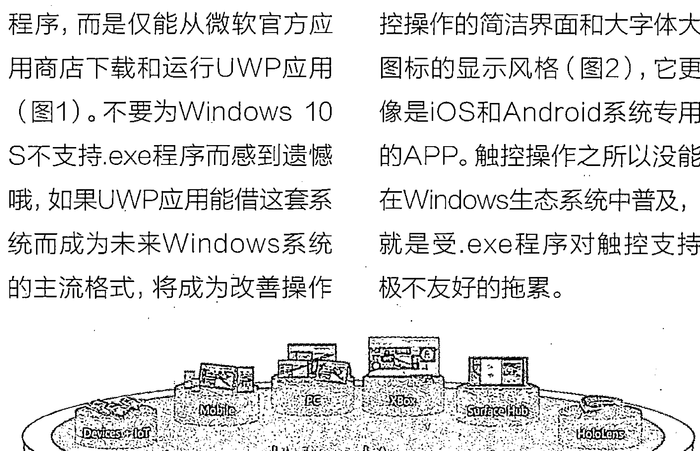

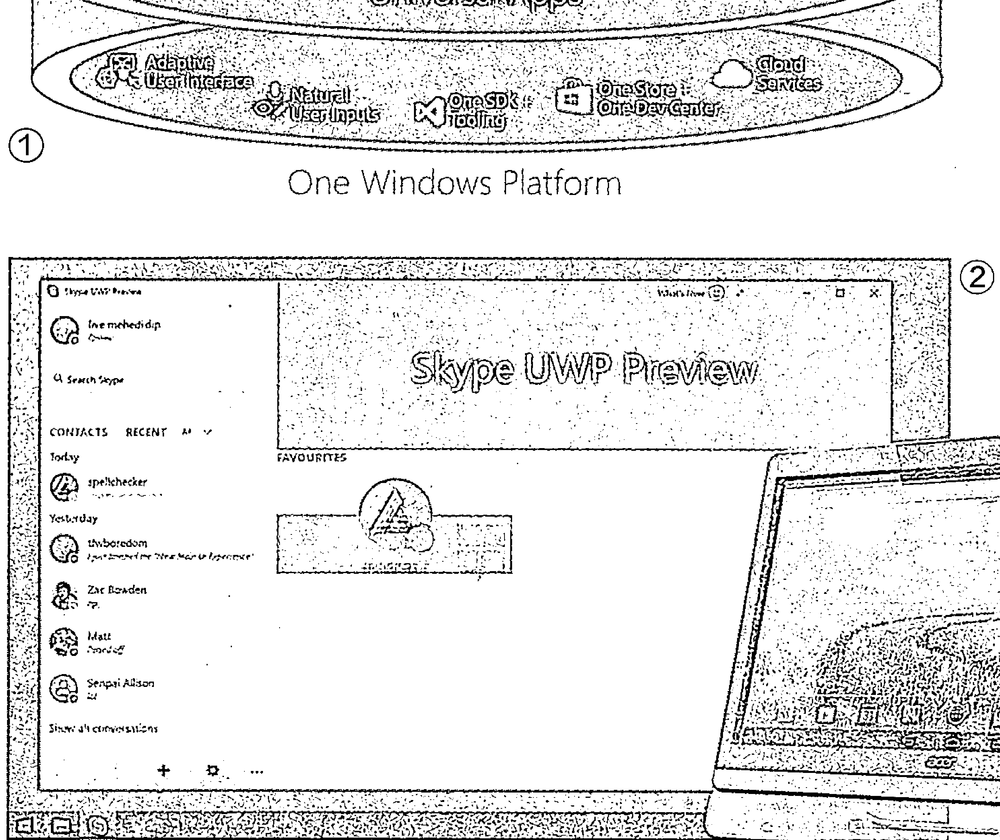

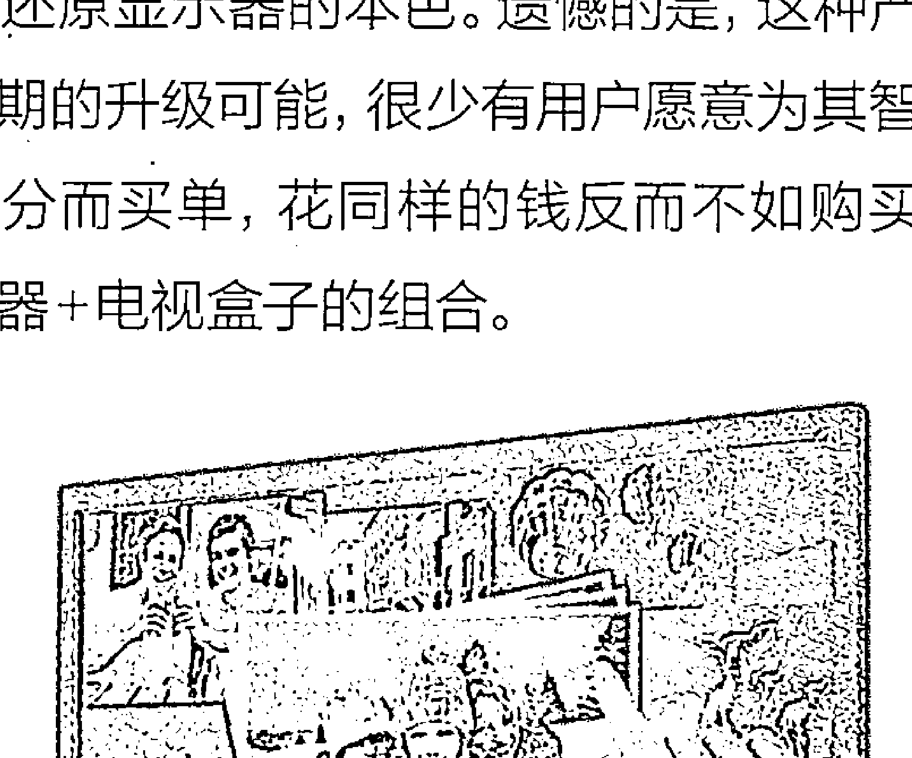

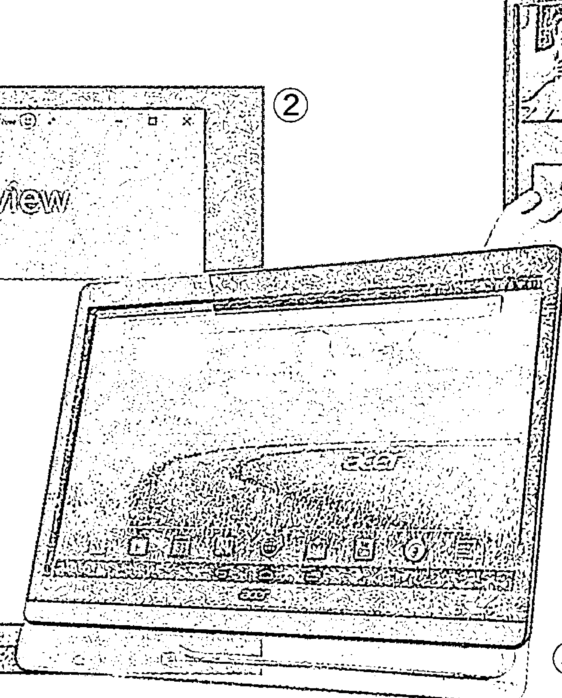

好消息是，经过几年的发展，触控显示器已经全面淘汰了光学式触控技术，而引入了和智能手机、平板电脑一样的电容式触控技术，可以实现十点触控，进行高效率精准的点选操作。此外，触控显示器的价格也不像当初那般高高在上，从1500元到2500元都能找到对应的产品。此外，触控显示器的使用也没有什么难度，以戴尔P2418HT为例，连上USB线与视频线后，Windows 10就会自动识别触摸设备，上手即用。

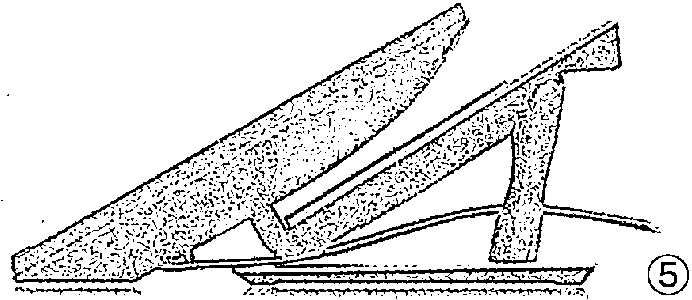

##### 触控显示器的角度问题

那么，在选购触控显示器时，我们又该留意哪些问题呢？除了传统显示器必须关注的屏幕面板、响应时间、对比度等参数外，支架的调节角度也应该成为我们关注的考察重点。一方面是用手指戳屏幕时支架是否稳固，不要出现戳屏幕就晃动的尴尬。另一方面，显示器可调的角度越大（图5），在触控时就能获得更好的输入体验（图6）。接下来，我们就来看看近期三款热门的触控显示器吧。


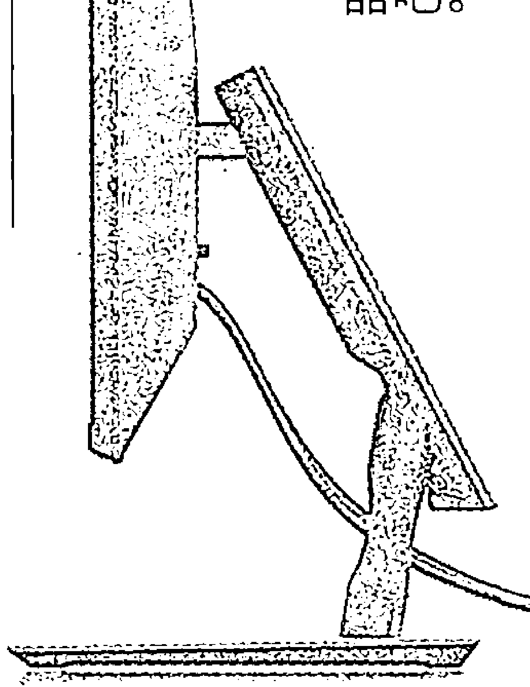

##### 戴尔P2418HT

-   * 屏幕：23.8英寸（1080P）
-   * 触控：电容式10指触控
-   * 亮度：250cd/m2
-   * 响应时间：6ms
-   * 静态对比度：1000:1
-   * 视频输入接口：DP、HDMI、VGA


戴尔P2418HT采用了窄边框设计，可以让23.8英寸屏幕显得更大。该产品的特色是铰接支架可从标准台式机显示器转至向下60度角的触控方向，同时它还支持扩展的倾斜和侧转功能，以便用户可以将屏幕调整到适宜的工作角度或更舒适的位置。P2418HT目前售价为2499元，算是一款颜值和性能兼顾的触控显示器。

##### 优派TD2230

-   * 屏幕：21.5英寸（1080P）
-   * 触控：电容式10指触控
-   * 亮度：250cd/m2
-   * 响应时间：5ms
-   * 静态对比度：1000:1
-   * 视频输入接口：DP、HDMI、VGA

优派TD2230采用了21.5英寸硬屏，表面采用黄宝石等级的强化玻璃，7H的硬度可提供安全与耐用的触控显示效果。这款产品的支架可调节俯仰角，当使用十点触控或多人使用时稳固的支架设计使屏幕不会因为触控碰触而产生摇晃。TD2230目前的价格为1899元，算是性价比较高的触控显示器。此外，优派还有更高端的TD2430，它采用MVA硬屏，视野面积更大，只是价格达到了2899元，没有性价比可言了。

##### AOC E2272PWUT

AOC E2272PWUT也是一款经典的触控显示器，它支持10点电容触控技术，独特的支架可以在15°到-57°之间倾斜，最大倾角非常适合站立时的触控操作体验。E2272PWUT的屏幕为TN材质，虽然可视角度略有下降，却拥有更快的响应速度，而不足1700元的售价也非常超值。如果你喜欢更大的视野，还可考虑2199元的AOC E2472PWUT（23.6英寸），它是E2272PWUT的“放大版”。

-   * 屏幕：21.5英寸（1080P）
-   * 触控：电容式10指触控
-   * 亮度：250cd/m2
-   * 响应时间：2ms
-   * 动态对比度：50000000:1
-   * 视频输入接口：VGA、HDMI

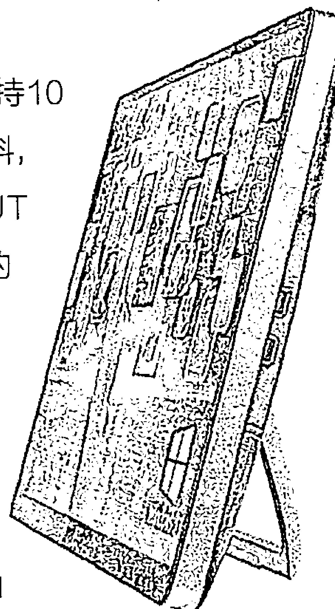


# # 性价比手机还得看昔日旗舰

无论是PC还是手机，决定其性能强弱的核心就是处理器。然而，在判断处理器的强弱时，很多用户却总喜欢遵循“唯新主义”教条，觉得新品就一定比老产品强。如果以骁龙835和骁龙820这种同级别的新老处理器对比自然是新品占优。但是，如果用新一代中端处理器和上一代高端处理器相比，孰强孰弱可就不一定了。

##### 昔日旗舰更有味儿

最近一个时期，高通骁龙660和骁龙630无疑是最受关注的中端处理器新秀，它们分别是骁龙65x系列和骁龙62x系列的接班人，生产工艺从28nm升级到了14nm，而且还采用了全新的内核架构和GPU，无论是性能还是功耗都要明显优于对应的前辈们。但是，如果拿骁龙660/630和高通上代旗舰级的骁龙820/821相比，其性能可就不够看了。

可能有读者会问了，骁龙660在Geekbench跑分软件里的测试性能已经超越了骁龙820/821啊？请不要忘记，Geekbench是测试纯CPU计算性能的，骁龙660是八核架构，骁龙820/821是四核架构，前者性能领先很正常。

问题是，我们不能忽略骁龙660和骁龙820/821在GPU性能上的差异。骁龙660集成Adreno 512，而骁龙820/821集成的GPU则是Adreno 530(图1)，就3D性能而言，Adreno 530至少要比Adreno 512强上2倍到3倍！假设骁龙660就是PC领域酷睿i5+GTX1050的组合，那骁龙820/821就是酷睿i3+GTX1070的组合，玩游戏哪家强？大家都知道吧？

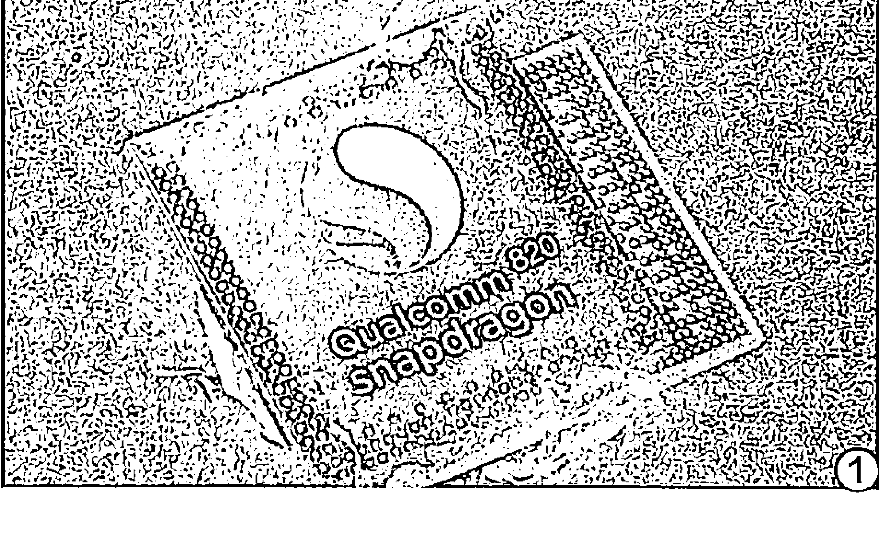

好消息是，如今很多搭载骁龙820/821的“老旗舰”都加入了降价大军，无数经典机型都跌到了底价，性能价格比远非“新秀”可比。如果你喜欢在最高画质下玩游戏，但却买不起搭载骁龙835的新款手机，这些昔日旗舰无疑就是最佳替代方案(图2)。

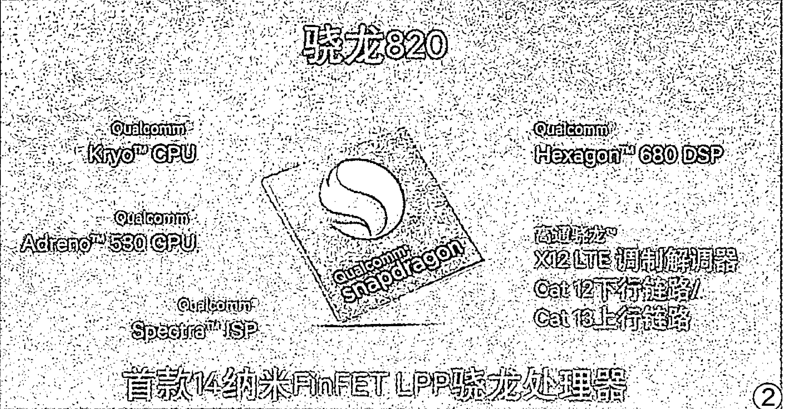

##### 骁龙820和骁龙821的差别

需要注意的是，昔日旗舰中包括搭载骁龙821和骁龙820两种处理器的版本。简单来说，骁龙821其实就是骁龙820的超频版，CPU和GPU频率略有提升，但核心架构没有变化，骁龙821的性能提升源于更高频率的增益效果。不过，骁龙821加入了对双摄像头对焦功能的底层硬件原生支持，并引入了高通All-Ways Aware技术，可更有效率地处理所有传感器所收集到的数据。总之，在价格相近的情况下，搭载骁龙821的手机更值得选择。

目前，搭载高通最新旗舰骁龙835处理器的手机最低也要2499元，而搭载骁龙660的手机也要2000元起步。性能介于骁龙835和骁龙660之间，但价格却只有新品的2/3甚至1/2的老款旗舰们，就是我们今天要加以推荐的产品了。

> 扩展阅读

骁龙660虽然3D性能弱于骁龙820/821，但它还是有着一项先天优势——更好的能耗比，翻译过来就是玩游戏时发热量没那么高，耗电量也比较低，对续航方面的优化更好。此外，伴随骁龙660/630而生的很多新品会改用更高档次组合的双摄像头，引入更炫酷的双玻璃材质机身，或者在其他功能上有所改善或突破，适合不追求顶级性能、注重颜值或新功能的用户考虑。

#### 努比亚Z11

-   - 网络：全网通（双卡双待）
-   - 屏幕：5.5英寸（1080P）
-   - 处理器：高通骁龙820
-   - 内存/存储：4GB/64GB（支持存储卡）
-   - 摄像头：800万/1600万像素
-   - 体积：151.8mm×72.3mm×7.5mm
-   - 电池/重量：3000mAh/162g

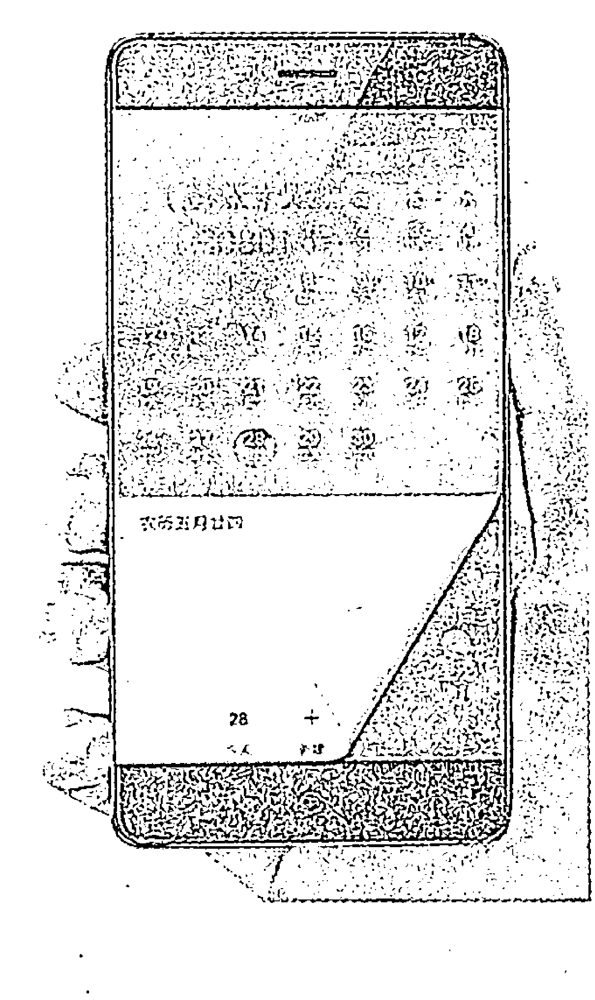

作为努比亚最新无边框旗舰Z17的“前辈”，Z11同样拥有无边框的震撼视界，通过FiT 2.0屏幕交互技术可以让屏幕边缘成为你操控手机的新维度。在骁龙820处理器的加持下，Z11依旧有着出色的性能表现，而2000元出头的售价也要比Z17更为亲民。

#### ZUK Z2

-   - 网络：全网通（双卡双待）
-   - 屏幕：5英寸（1080P）
-   - 处理器：高通骁龙820
-   - 内存/存储：3GB/32GB（不支持存储卡）
-   - 摄像头：800万/1300万像素
-   - 体积：141.65mm×68.88mm×8.45mm
-   - 电池/重量：3500mAh/149g

ZUK Z2在刚上市时就号称最便宜的骁龙820手机，如今该产品更是降到了千元出头，继续保持着最佳性能价格比的优势。ZUK Z2的特色还在于小巧的5英寸屏幕身材、U-Touch操作、支持红包提醒的实用功能等，非常适合预算有限的用户考虑。

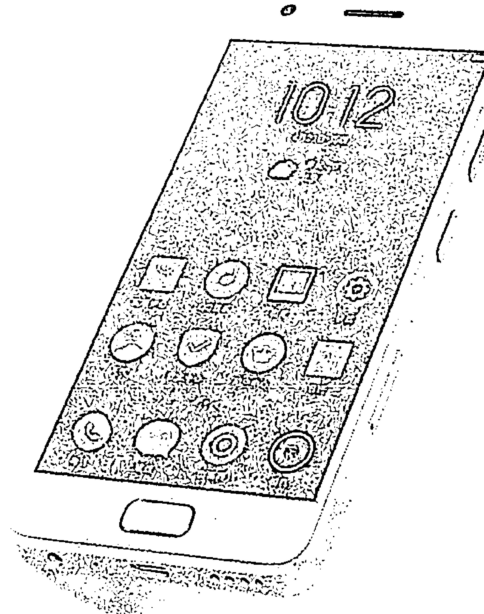

#### 乐2 Max

-   - 网络：全网通（双卡双待）
-   - 屏幕：5.7英寸（2K）
-   - 处理器：高通骁龙820
-   - 内存/存储：4GB/32GB（不支持存储卡）
-   - 摄像头：800万/2100万像素
-   - 体积：156.8mm×77.6mm×7.99mm
-   - 电池/重量：3100mAh/185g

乐2 Max是第一批上市的骁龙820手机，主打5.7英寸2K屏幕，“视界”非常震撼。如今该产品的价格已经跌破1400元，非常适合喜欢通过手机观看高清视频的用户。可惜，乐2 Max的电池容量只有3100mAh，续航能力是它的最大遗憾。

#### 小米5

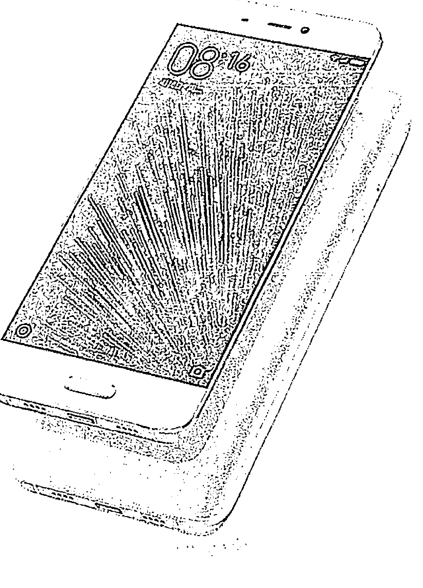

-   - 网络：全网通（双卡双待）
-   - 屏幕：5.15英寸（1080P）
-   - 处理器：高通骁龙820
-   - 内存/存储：3GB/64GB（不支持存储卡）
-   - 摄像头：400万/1600万像素
-   - 体积：144.5mm×69.2mm×7.25mm
-   - 电池/重量：3000mAh/129g

小米5是一款经典的小屏旗舰，它的特色在于引入了3D曲面工艺的玻璃后盖，支持四轴光学防抖、QC3.0快充技术、骁龙820和UFS2.0闪存的组合。值得一提的是，小米5还配备了全功能的NFC模块，可以实现刷银行卡和公交卡等功能，实用性一流。目前小米5高配版的售价约为1699元，适合喜欢单手操作的用户考虑。

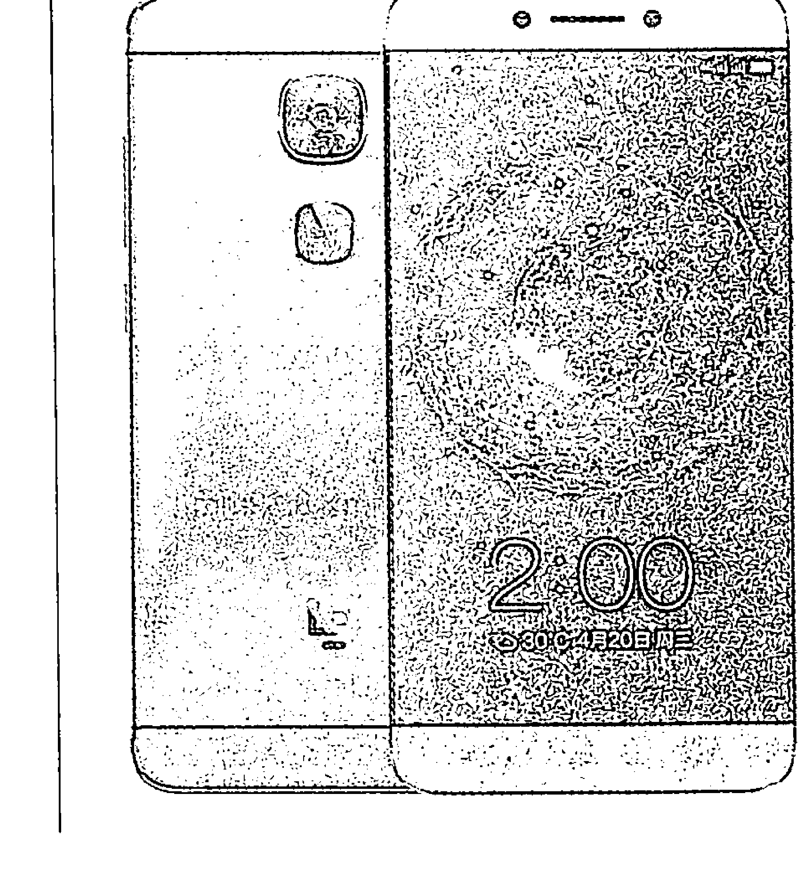

##### ZUK Edge

- 网络: 全网通 (双卡双待)
- 屏幕: 5.5英寸 (1080P)
- 处理器: 高通骁龙821
- 内存/存储: 4GB/64GB (不支持存储卡)
- 摄像头: 800万/1300万像素
- 体积: 142.9mm × 74.5mm × 7.68mm
- 电池/重量: 3100mAh/160g

作为ZUK品牌的“绝唱”，ZUK Edge是一款极具诚意的产品，它虽然没能引入全面屏元素，但却凭借压缩上下屏幕边框的宽度实现了86.4%的屏占比，视觉效果非常出色。配置方面，骁龙821和UFS存储单元的加盟也是性能的保证，再加上包括心率血氧检测在内的10种传感器加盟和1699元起的超低价格，让ZUK Edge成为了同价位最具卖相的骁龙821手机。

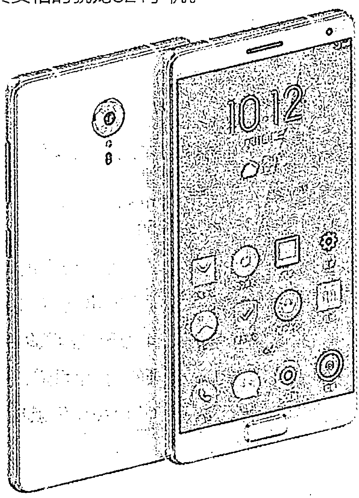

##### 乐Pro 3

- 网络: 全网通 (双卡双待)
- 屏幕: 5.5英寸 (1080P)
- 处理器: 高通骁龙821
- 内存/存储: 4GB/32GB (不支持存储卡)
- 摄像头: 800万/1600万像素
- 体积: 151.4mm × 73.9mm × 7.5mm
- 电池/重量: 4070mAh/175g

乐Pro 3是最实惠的骁龙821手机，它的特色还在于配备了双立体声扬声器，同时还塞进了4070mAh容量的超大电池，支持24W的QC3.0快充技术，续航能力在同类手机中表现出众。需要注意的是，乐Pro 3取消了3.5mm耳机孔，需要使用Type-C孔接驳耳机。至于价格，乐Pro 3官方售价1699元起，性价比非常突出。

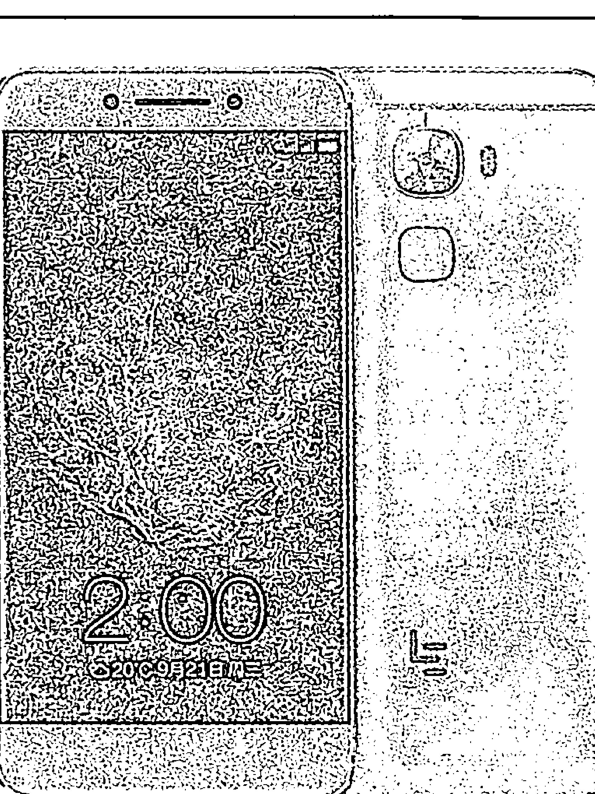

##### 酷派Cool Changer S1

- 网络: 全网通 (双卡双待)
- 屏幕: 5.5英寸 (1080P)
- 处理器: 高通骁龙821
- 内存/存储: 4GB/64GB (不支持存储卡)
- 摄像头: 800万/1600万像素
- 体积: 151.4mm × 73.9mm × 7.5mm
- 电池/重量: 4070mAh/175g

酷派Cool Changer S1的外观和规格与乐Pro 3很像，主打双立体声扬声器+双Smart PA+哈曼卡顿认证音频技术，声音表现力非常出色。可以说，Cool Changer S1是乐Pro 3的音频优化版，更适合喜欢聆听音乐的用户选择。这款产品目前售价多在1899元左右，性价比同样颇为出众。

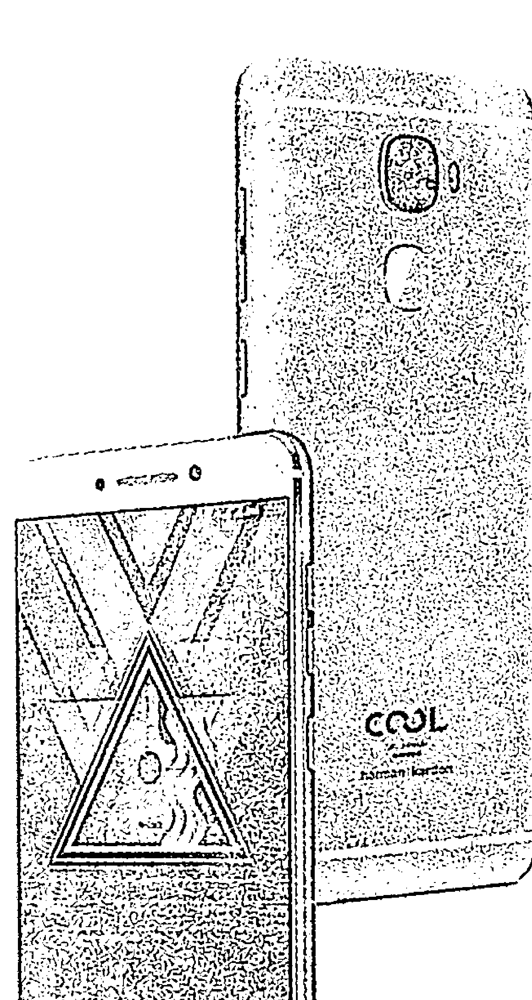

##### 锤子M1L

- 网络: 全网通 (双卡双待)
- 屏幕: 5.7英寸 (2K)
- 处理器: 高通骁龙821
- 内存/存储: 4GB/32GB
- 摄像头: 400万/2300万像素
- 体积: 158.66mm × 78.96mm × 8.32mm
- 电池/重量: 4080mAh/175g

锤子M1L是一款在工业设计上非常出彩的产品，配备了夏普2K超高分屏幕以及圆形的Home（集成指纹）键设计，在Android手机领域辨识度极高。该产品搭载满血的骁龙821处理器，性能非常出色，经过几轮调价后已经稳定在2000元左右的价格上。如果你喜欢小屏设计，还可考虑采用5.15英寸屏幕的锤子M1，售价还要更便宜。

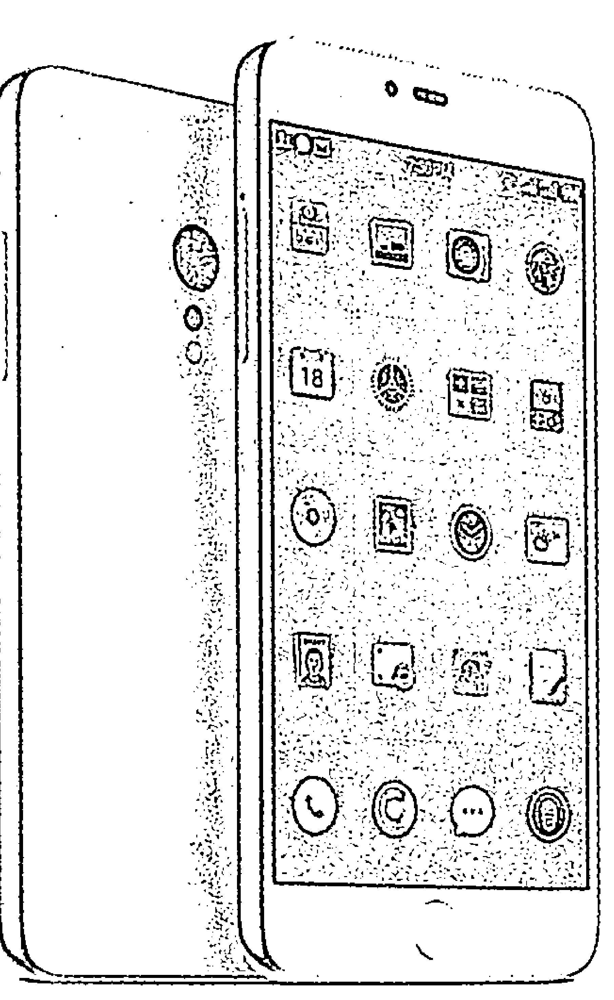

#### 从细节入手

##### 同配置游戏本为何价格不同

《电脑爱好者》在2017年第10期《不花冤枉钱 笔记本选购宝典》专题中向大家分享了1500元到5000元价位笔记本的选购方案。然而，依旧有很多读者邮件咨询5000元以上游戏本的选购思路。本文，就让我们将目光放在游戏本阵营身上，并解决游戏本“同配不同价”的问题。

##### 上不封顶的游戏本

如今5000元左右就可以买到搭载七代酷睿i5-7300HQ和NVIDIA GTX1050独显的游戏本了，它们无论是性能还是功能都足以满足绝大多数应用环境的需求，更高价位的产品其实就是诠释了“一分钱一分货”的真谛。你想获得顶级游戏体验，那就必须买GTX1070独显的笔记本，而价格至少要8000元起。此外，当游戏本武装GTX1080独显、GB容量的SSD硬盘、机械键盘甚至曲面屏等元素后，其价格甚至可以超过入门级的小轿车。

当然，这些动辄万元起步的顶级游戏本并非本文讨论的重点，我们今天的目标就是解决下面几个问题：明明是配置相同的几款游戏本，为啥价格可能存在很大差距（图1）？更高价的产品，要有哪些特色或改进才算是“值得”呢？

##### 扩展阅读 性价比非Ti不可

对追求性能价格比的用户而言，主流价位（5000元到7000元）游戏本最值得关注的就是GTX1050 Ti独显，它的性能已经超越了NVIDIA GTX970M，但TDP和发热量却仅比GTX1050高一点点。具体的选购思路，请参考本刊2017年第8期《非Ti不可 主流游戏本认准GTX1050Ti》这篇文章。

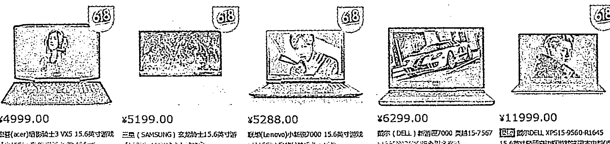

① 配置相似但价格不同的游戏本们

##### 设计：身材和用料的对比

同样是i5-7300HQ+NVIDIA GTX1050的同配置游戏本，有些不足5000元，有些却高达万元，造成这种云泥之别的价差往往是因工业设计引起的（图2）。

这应该很好理解。游戏本搭载i5-7300HQ处理器的TDP就要45W，武装GTX1050起步的独显功耗也不低。想把它们塞进更轻更薄的机身里自然需要更高的技术含量。所以身材保守的游戏本最低只要4XXX元，但像戴尔XPS15这种机器就敢卖万元左右。没辙，谁让XPS15能把厚度和重量控制到17mm和1.78kg（图3），足以让14英寸的轻薄本汗颜呢？

此外，低价游戏本的机身材质也大都以塑料为主，而更高价的产品则会引入金属甚至碳纤维等材质。但是，同样是引入金属也有很多讲究，比如有些游戏本只是在塑料框架上贴一层金属片。

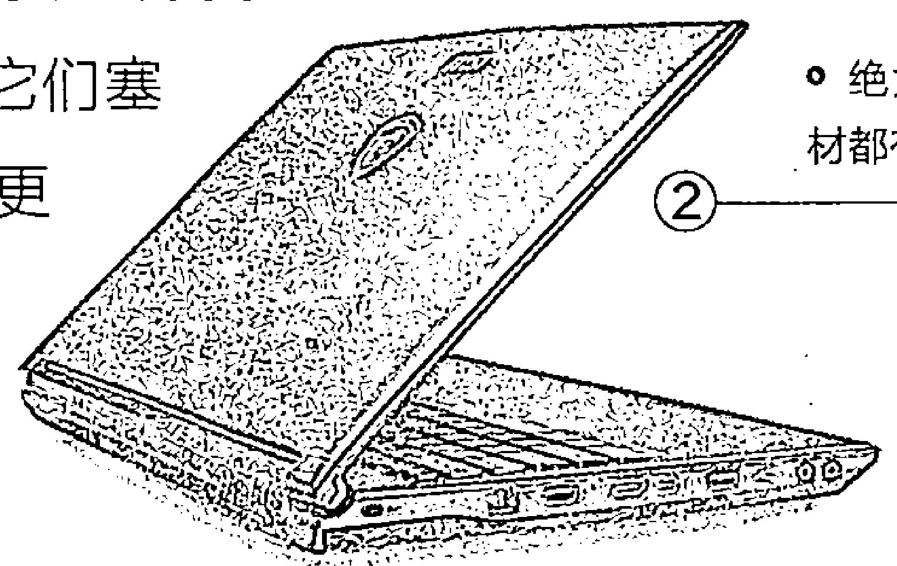

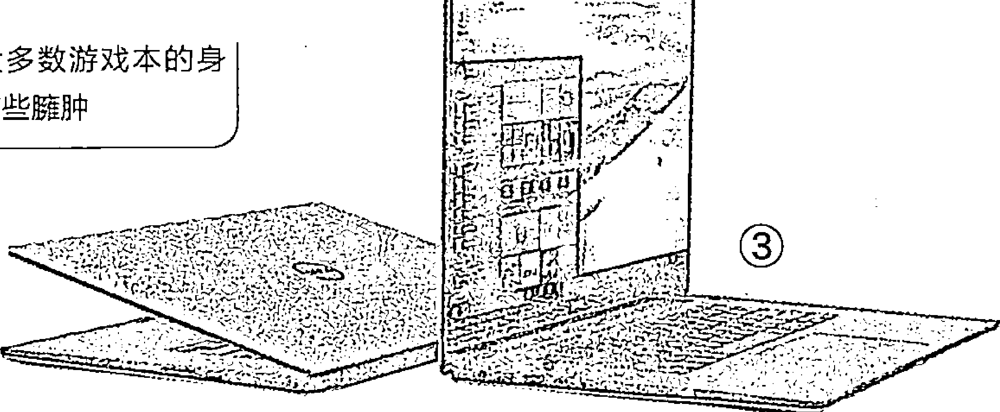

##### 屏幕：材质和色域有别

宏碁暗影骑士3和惠普暗影精灵II代Pro都是4999元起的超值游戏本，但很多玩家还是更青睐后者。原因就是暗影骑士3的屏幕为TN材质，而暗影精灵II代Pro则是IPS材质，可视角度更高。那么，同样是两款采用IPS材质的游戏本，它们的“视界”表现就没有差异了吗？

答案自然是否定的。影响笔记本屏幕显示效果的还有两个关键指标：亮度以及色域。比如，较高端的游戏本可能会配备拥有72% NTSC色域的屏幕，而更多的低价游戏本则仅搭配45% NTSC色域的屏幕，色域越高，所能显示的颜色也就越真实（图5）。至于亮度，我们可以参考手机屏幕，在阳光下是不是越亮越清晰？


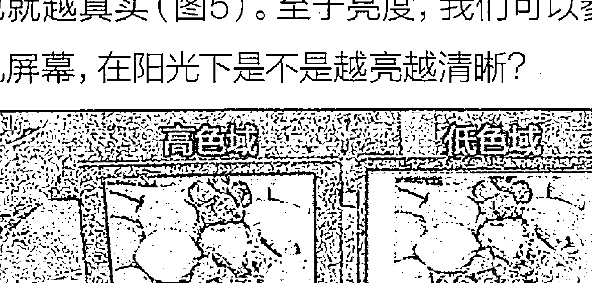

##### 键盘：手感和视觉特效

如今不支持键盘背光的笔记本都不好意思称为“游戏本”（图6）。只是，游戏本键盘背光的讲究也有不少，比如颜色是红色、白色还是蓝色？如果是蓝色则有伤眼的隐患。此外，键盘背光是否支持多段调节也很重要，比如在白天或使用电池时关闭背光，晚上使用最高亮度，关灯之后使用一般亮度来保护眼睛。

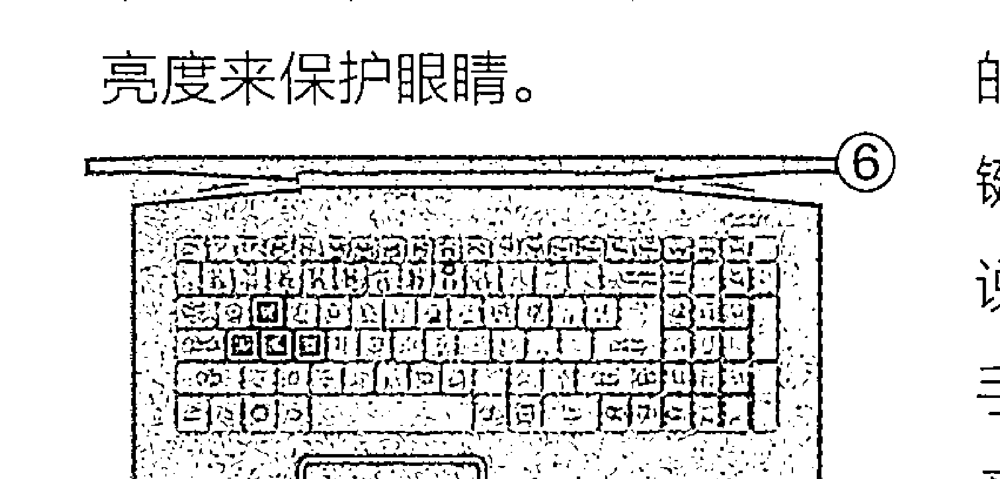

为了提升颜值和视觉震撼效果，很多游戏本开始配备RGB背光键盘，并在A面和掌托边缘部分也加入了背光灯装饰条，通过随机软件可以在成千上万种颜色搭配上进行区域定制（图7），实现类似“跑马灯”的背光特效，夜晚看起来非常炫酷（图8）。一些高端的游戏本，还会在RGB背光键盘的基础上加入赛睿键盘、机械键盘等元素，和外接键盘彻底说拜拜。更酷的背光、更好的手感，在游戏的过程中可以赋予玩家更多激情。

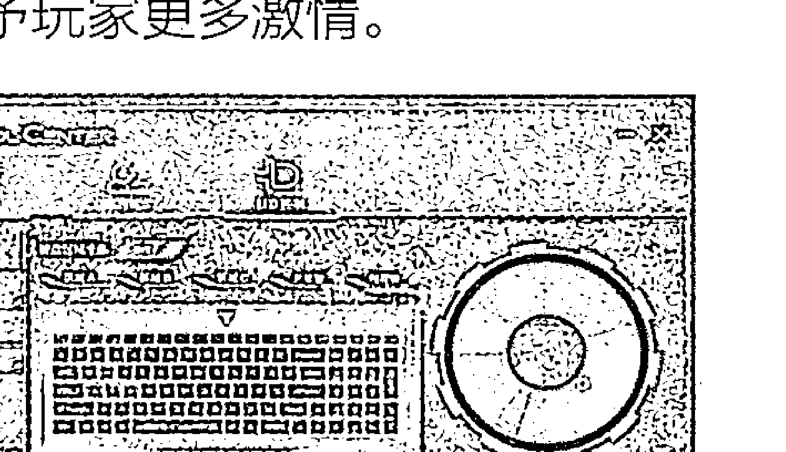

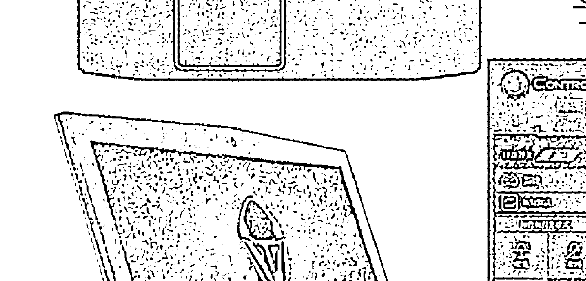

以Alienware和ThinkPad品牌为代表的顶配机型已经出现了OLED屏幕可选项，它可以赋予笔记本屏幕更宽广的色域和更出色的伽玛曲线，显示效果堪称完美。如果你对OLED显示屏的话题感兴趣，可参考本刊2017年第3期《笔记本屏幕的“进化论”》这篇文章。

##### 接口：关键看USB Type-C的功能

接口数量、种类是否丰富，也是游戏本较亮的项目之一。如今很多游戏本都会以标配USB Type-C为卖点（图9）。但是，这个USB Type-C到底是Gen1（USB3.0的马甲，速度为5Gbps）还是Gen2（真正的USB3.1，速度为10Gbps）标准？是否支持雷电3？这些都是容易被我们忽略的地方。

如果USB Type-C符合Gen2标准，那以后你用SSD移动硬盘时可以体验到飞一般的速度。如果USB Type-C还能兼容雷电3功能，那你以后还能通过外置显卡，让这款游戏本也能用上台式机的GTX1080显卡。当然，无论是Gen2标准还是雷电3，都需要额外付出成本，所以低价游戏本自然很难享受。


##### 拆机：影响后期维护难度

游戏本自然要来玩游戏，但风扇和散热鳍片被灰尘一堵，玩游戏时就容易因发热降频而卡顿。这个时候，能否简单地拆机，自己进行除尘清灰和涂抹硅脂的操作就显得尤为重要了（图10）。要知道，很多笔记本客服中心的拆机清灰是要收取80元到200元费用的。
一般来说，可以轻松拆下底盖、直接拆卸风扇和散热鳍片的游戏本才是好设计，而凡是需要将机器大卸八块后才能看到拆卸风扇鳍片的设计都是“耍流氓”！高端游戏本往往会采用更合理的拆机维护设计，稍有DIY经验的用户都可以独立完成。

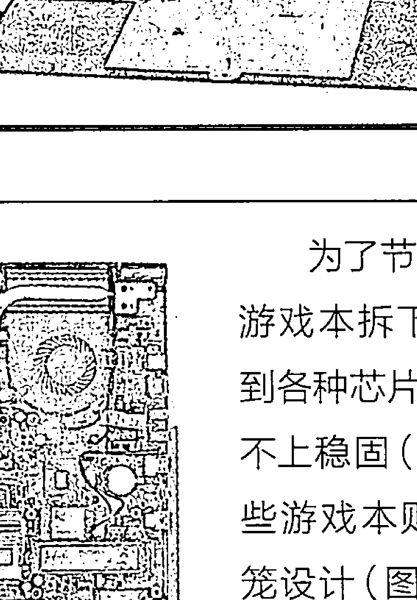

##### 结构：关键时刻能救命

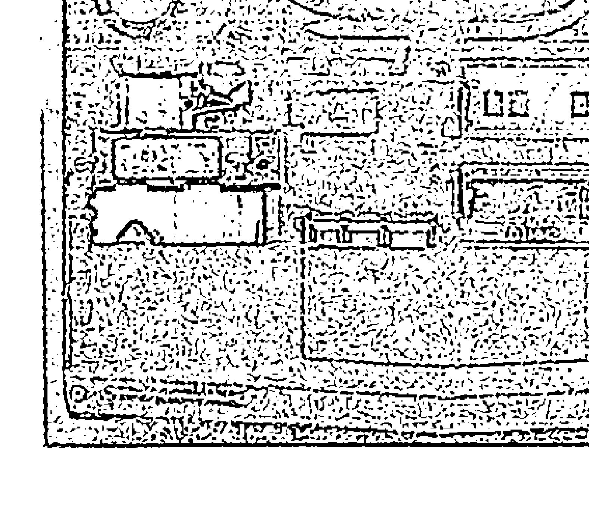

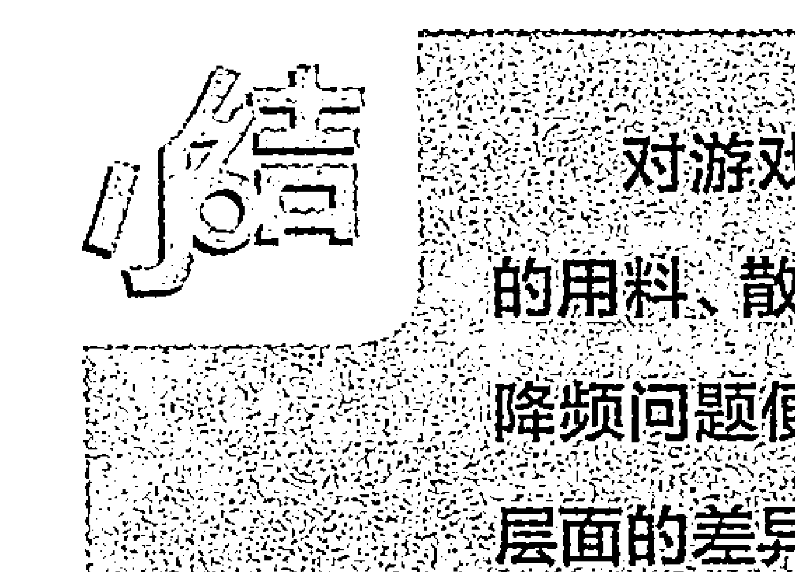

为了节省成本，很多游戏本拆下底盖就能看到各种芯片，机身结构谈不上稳固（图11）。而有些游戏本则会保留防滚笼设计（图12），将裸露的芯片和电容电路都保护在其中，尽可能提升抗冲击性和耐挤压性。这种设计虽然耗费成本，也会增加游戏本的重量，但真到了关键时刻（比如笔记本被挤压），它真的有机 会能救笔记本一命！

##### 散热：“鸡血模式”开关

这个还用多说吗？散热设计越豪华（图13），越能镇压CPU和GPU全速运行时的温度，使其远离温度墙，始终犹如“打鸡血”一般的满血运行。更高端的游戏本，普遍会选择更粗更多的热管、更大面积的散热鳍片和转速风量更大的风扇。

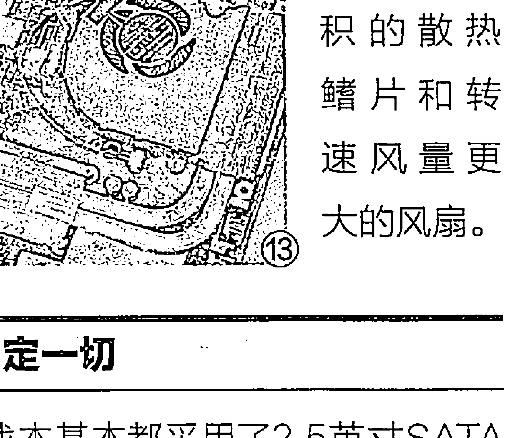

##### M.2：速度决定一切

现在的游戏本基本都采用了2.5英寸SATA硬盘位+额外的M.2插槽设计，可以支持SSD+HDD双硬盘组合。少数产品还会配备更多硬盘位（图14），实现进一步扩容。但是，M.2插槽有SATA和PCI-E通道之别，只有支持后者的M.2插槽才能用上NVMe SSD，享受超过2500MB/s的读取速度。如果M.2只支持SATA通道，那读取速度最多也就550MB/s上下。
可见，游戏本本身的M.2插槽是否支持PCI-E通道，对磁盘性能的影响不言而喻。需要注意的是，还有很多游戏本的M.2插槽明明支持PCI-E，但厂商却为了节省成本而采用SATA通道的M.2 SSD与其搭配。

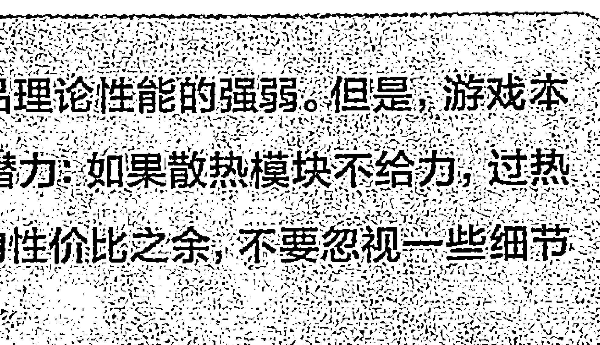

对游戏本而言，硬件配置只是最基本的考核指标，它能决定一款产品理论性能的强弱。但是，游戏本的用料、散热和供电线路的设计，则会影响CPU/GPU所能释放的全部潜力。如果散热模块不给力，过热降频问题便会接踵而来。总之，本文的初衷就是希望大家在对比游戏本的性价比之余，不要忽视一些细节层面的差异，好的功能或设计，同样值得我们加价买单。

#### 性价比之争

##### 360手机N5s PK 酷派酷玩6

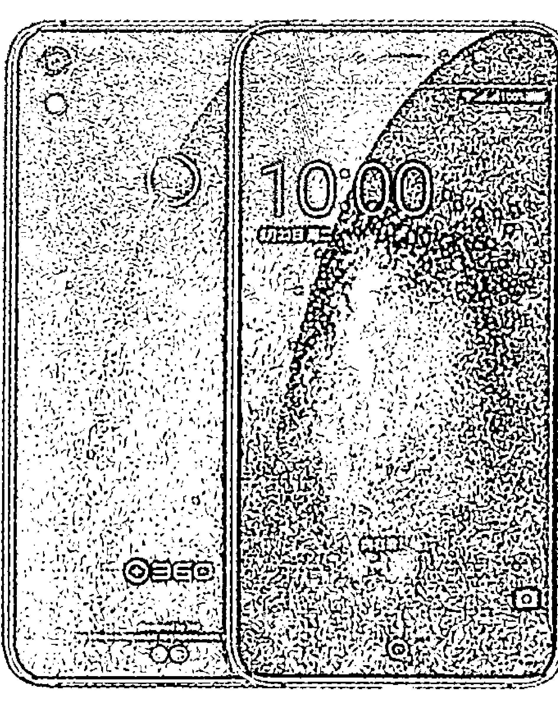

由于内存管理机制不如iOS成熟，所以Android手机对内存容量的追求总是“无止境”的。好消息是，如今配备6GB超大内存的手机已经趋于普及，而360手机N5s和酷派酷玩6就是现阶段最实惠的6GB双摄手机。那么，它们之间谁更适合你？

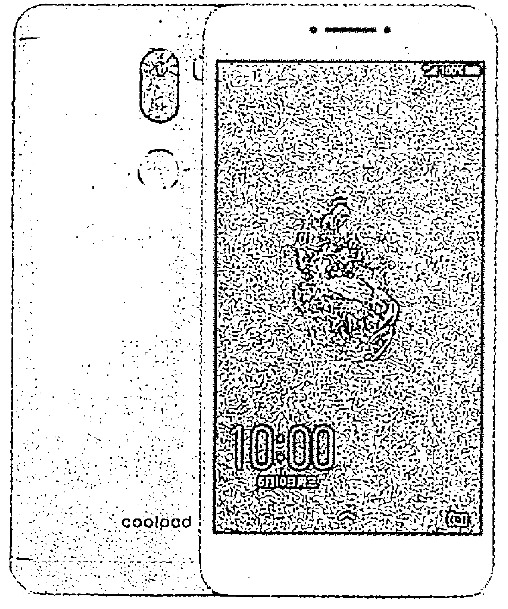

###### 工业设计存在差异

360手机N5s和酷派酷玩6都采用了5.5英寸屏幕设计，身材和重量相仿，可以带来较为震撼的视觉体验。然而，由于它们采用了两种工业设计思路，所以这就给我们带来了不一样的感官和持握体验。

其中，酷玩6的机身以金属为主要材质打造，只是为了控制成本，该产品的后盖并非全金属一体化机身，而是三段式组合：中框和后盖中间部分为金属，后盖上下两端则嵌入了塑料。还好，塑料同金属背板的衔接线条顺畅、上色把握到位，在视觉效果上还是可以带来一种“全金属”的效果(图1)。

360手机N5s采用了时下越发主流的金属中框加双面2.5D弧面玻璃的设计，并提供了幻影黑和深海蓝两种配色，后盖玻璃通过特殊的纹理覆膜工艺，在光线照射下可以呈现出类似水波荡漾的视觉效果(图2)。

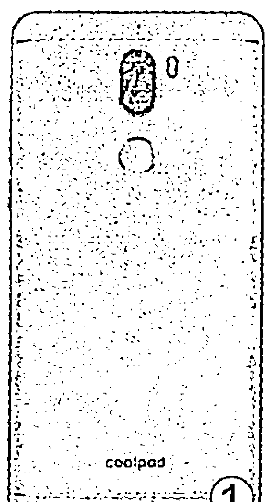

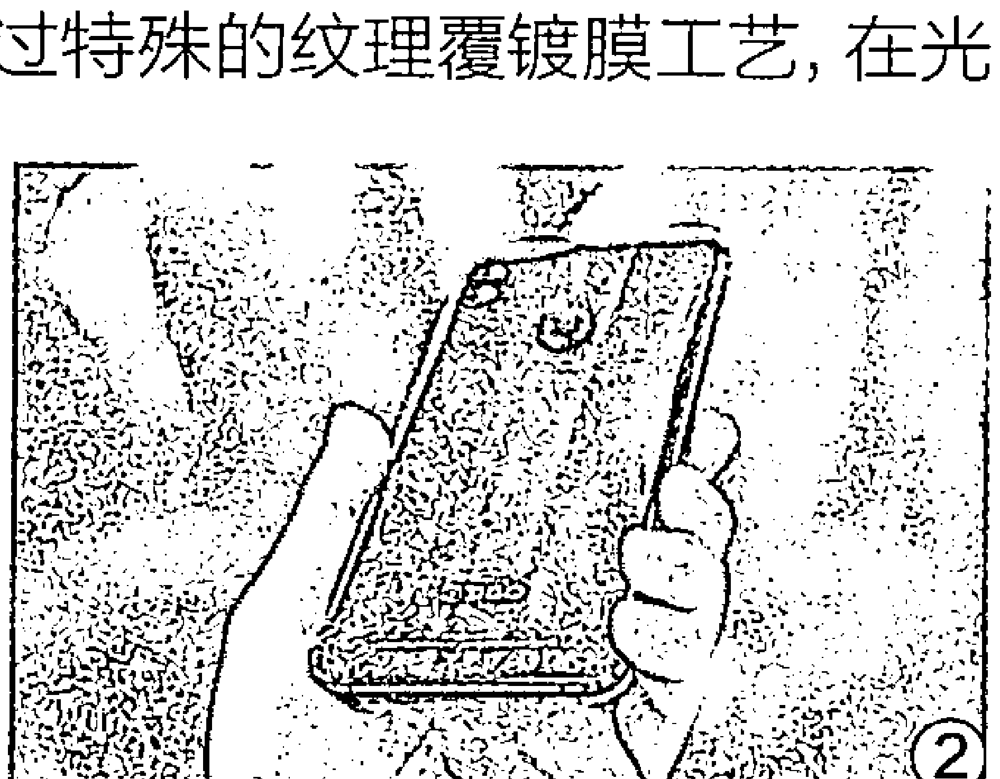

如今的智能手机正在逐渐向全金属和双面玻璃的工业设计之间转型，双玻璃具备更好的视觉特效，缺点是容易增加重量和成本更高。而金属手机的优势就是遇到磕碰时碎屏几率相对要小一些，缺点则是容易出现审美疲劳。总之，360手机N5s和酷派酷玩6代表了两类设计思路，但萝卜白菜各有所爱，如果你在外观上难以取舍，就得关注一下它们在配置和功能上的差异了。

| 参数对比 | 360手机N5s | 酷派酷玩6 |
| :--- | :--- | :--- |
| 网络 | 全网通 (双卡双待) | 全网通 (双卡双待) |
| 屏幕 | 5.5英寸 (1080P) | 5.5英寸 (1080P) |
| CPU | 高通骁龙653 | 高通骁龙653 |
| GPU | Adreno 510 | Adreno 510 |
| 内存/存储 | 6GB/64GB (支持存储卡) | 6GB/64GB (不支持存储卡) |
| 摄像头 | 1300万+200万/1300万像素 | 800万/1300万+1300万像素 |
| 体积 | 153.5mm×76.9mm×8mm | 152.4mm×75.2mm×8.45mm |
| 电池/重量 | 3730mAh/170g | 4060mAh/170g |
| 参考价格 | 1699元 | 1499元 |

###### 前置双摄VS后置双摄

双摄像头已经成为中高端手机彰显身份的标签，360手机N5s和酷派酷玩6自然不能丢失这个标志。不过，这两款手机在双摄的位置和搭配上出现了分歧：

360手机N5s采用前置双摄(图3)，分别为1300万像素主摄像头和200万像素的景深镜头，可以实现双摄虚化功能，在美颜自拍时可以更加突出人像主体。此外，N5s的前置1300万像素主摄像头还支持相位对焦技术，在自拍时可以迅速对焦提升拍摄效果。通过隐藏的柔光灯，在昏暗环境下自拍还能起到补光作用。

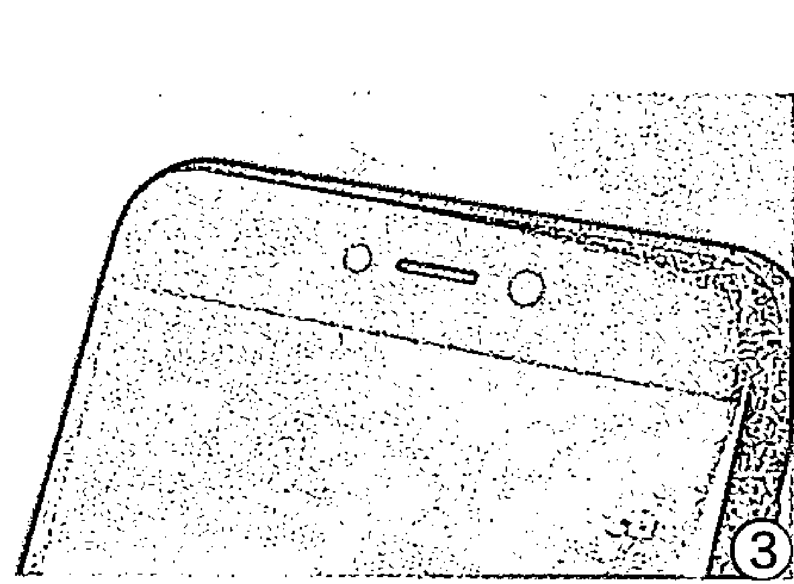

酷派酷玩6将双摄放在了后面，选用了1300万像素黑白和1300万像素彩色摄像头的搭配方案（图4）。在拍照过程中，黑白摄像头负责捕捉细节，而彩色摄像头则用来留住色彩，对最终成像可以起到很好的增益效果。可以说，两款手机虽然都配备了双摄，但N5s更加注重自拍体验，而酷玩6则主打拍摄眼前的风景。

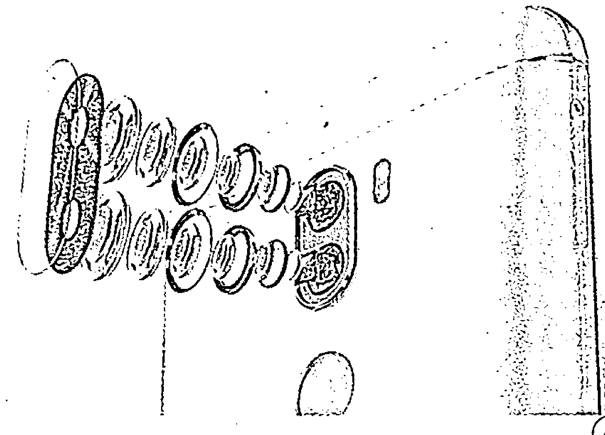

###### 相同的性能表现

360手机N5s和酷派酷玩6的硬件配置基本一致，它们都搭载了高通骁龙653八核处理器，集成Adreno 510 GPU，并标配6GB内存与其搭配。这种硬件组合足以应对Android平台下绝大多数3D大作，不存在性能上的瓶颈。

需要注意的是，虽然两款机器都标配64GB存储空间，但N5s却还能通过Micro SD卡进一步扩容，而酷玩6则不支持存储卡扩展。如果你对存储空间要求苛刻，酷玩6只能通过以OTG功能外接闪存盘的方式进行扩容。

此外，360手机N5s和酷派酷玩6的电池容量也存在差距。N5s标配3730mAh电池，而酷玩6则拥有4060mAh容量，考虑到两款手机硬件相同，理论续航能力还是酷玩6占优。

###### 系统和软实力的较量

在“软实力”方面，酷玩6引入了“酷玩助手”概念，可以一键开启内存清理、来电免打扰、锁定触控键并打开护眼模式等开关，玩游戏时可以更加忘我（图5）。而N5s的特色是继承了N5手机上的FastZone、Transform和Infinity三大黑科技，可以实现游戏启动加速、侧栏多任务切换和游戏多开等功能（图6），在6GB大内存的利用率上挖掘得更深且更人性化。

在系统层面，两款手机都是基于Android 7.1.1深度定制而来。其中，N5s预装的360 OS 2.0融入了包括财产系统、位置穿越、私密系统、红包提醒在内的特色功能，在安全性和可玩性上表现出色。而酷玩6预装的Journey UI 1.0则多少还保留了一些乐视EUI的味道，同样支持应用多开等功能。

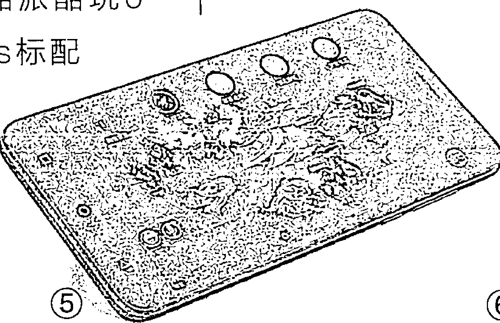


360手机N5s和酷派酷玩6应该是1500元上下性价比最高的代表产品。N5s的优势在于更高的颜值，前置双摄可以拍出背景虚化的美颜照片，对6GB内存的潜力发挥得更好等。而酷玩6的特色在于配备了Type-C充电接口，而且价格也要比N5s便宜200元，更适合预算有限的用户考虑。
步入2017下半年，8GB内存将成为旗舰手机的标配，而6GB内存将迅速变成中端主流市场的标准，这就让未来的Android手机新品在多任务环境下可以变得更为游刃有余。可以预见，10GB甚至12GB内存很可能将早PC一步，在手机领域实现全面普及。

##### 华硕灵耀S5100U PK 华为MateBook D

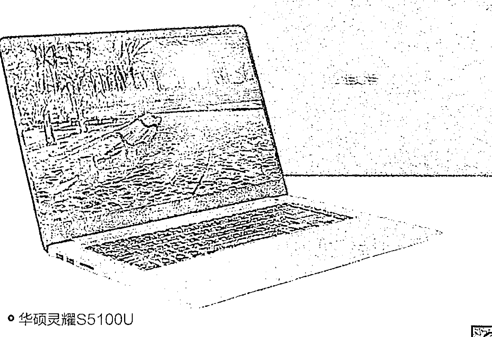

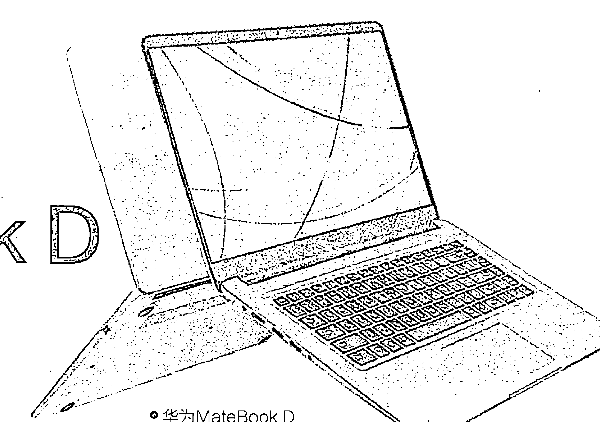

在15.6英寸轻薄本领域，如果说上期杂志介绍的惠普ENVY 15和戴尔燃7000-15是久经战阵的老将（上市已久），那华硕灵耀S5100U和华为MateBook D就是刚刚出炉（上市）的新兵。它们的配置相似，谁更适合你？

###### 又见窄边金属风

华硕灵耀S5100U和华为MateBook D都采用了15.6英寸大屏幕，而且都是具备超过170可视角度的IPS材质，我们不必担心从侧面观看屏幕或俯视仰视时的偏色问题。

好消息是，这两款产品全部引入了时下流行的超窄边框元素，其中灵耀S5100U的屏幕两侧边框为7.8mm（图1），而华为MateBook D两侧边框更是仅有6.2mm，所以别看它们的视野面积很大，但实际体积却仅和普通14英寸笔记本持平。为了避免窄边框可能带来的可靠性隐患（比如挤压、磕碰），灵耀S5100U和MateBook D的机身都采用了金属材质打造（图2），不仅提升了视觉和触觉的档次感，也有利于提升散热能力。

厚度更薄，只有16.9mm。而华硕灵耀S5100U的特色是重量更轻，比MateBook D少了200g。对笔记本而言，重量对肩膀的“减负”效果更为敏感，所以相对而言灵耀S5100U的表现要更为抢眼。

| 参数对比 | 华为MateBook D | 华硕灵耀S5100U |
|----------|----------------|----------------|
| 屏幕 | 15.6英寸IPS (1080P) | 15.6英寸IPS (1080P) |
| 处理器 | 酷睿i5-7200U | 酷睿i5-7200U |
| 内存/硬盘 | 8GB DDR4/256GB SSD | 8GB DDR4/256GB SSD |
| 显卡 | NVIDIA 940MX (2GB GDDR5) | NVIDIA 940MX (2GB GDDR5) |
| 接口 | USB3.0×2、USB2.0、HDMI | 读卡器、USB3.0、Type-C、USB2.0×2、HDMI |
| 尺寸 | 358mm×239mm×16.9mm | 361.4mm×243.5mm×17.9mm |
| 电池/重量 | 43.3Wh/1.9kg | 42Wh/1.7kg |
| 参考价格 | 5688元 | 6499元 |

###### 接口种类的对比

为了实现纤薄机身设计，华硕灵耀S5100U和华为MateBook D都舍弃了占用空间的RJ45网线和VGA接口。其中，MateBook D配备了2个USB3.0、1个USB2.0和HDMI视频输出接口。而灵耀S5100U则共计配备了4个USB，包括全新的USB Type-C (USB3.0)，此外还增加了读卡器插槽（图3）。

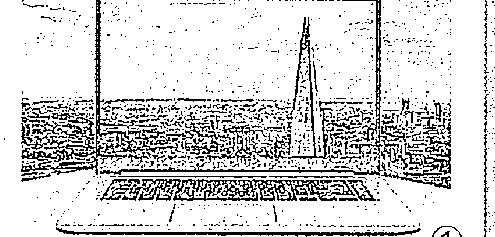

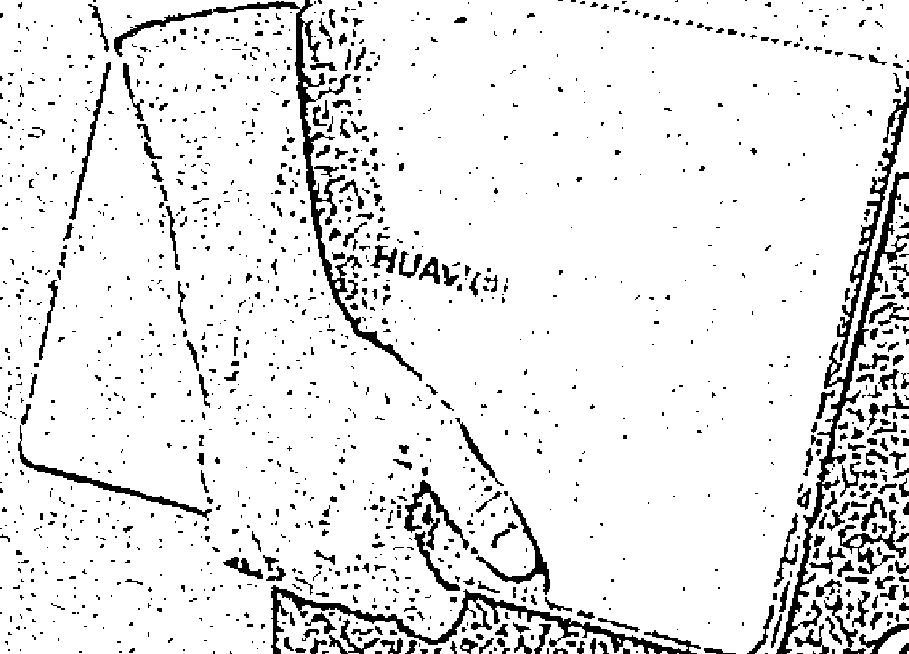

对笔记本而言，读卡器插槽的实用性还是蛮高的，特别是对使用单反相机的用户而言，直接通过读卡器传输数据的便利性要优于通过数据线将相机和笔记本相连时的拷贝模式。可以说，缺少读卡器是MateBook D在扩展能力上的最大遗憾。当然，我们也能通过USB外接多合一读卡器，只是会稍显累赘而已。

###### 几近相同的硬件配置

华硕灵耀S5100U和华为MateBook D定位于轻薄型的娱乐本，所以它们搭载的都是英特尔第七代U系列酷睿处理器，也就是TDP只有15W的酷睿i5-7200U或i7-7500U。同时，为了提升它们的游戏性能，这两款轻薄本都武装了NVIDIA GeForce 940MX独显，并搭配2GB GDDR5显存。这两种硬件组合，在1080P最高画质运行《英雄联盟》平均帧数可达90fps，1080P中画质运行《守望先锋》也能保持在40fps以上，足以满足主流的3D网游和早期的3D大作流畅运行所需。

需要注意的是，这两款产品都没有配备背光键盘，而且它们也都存在低配版。其中，灵耀S5100U的低配版价格为5599元，基本配置是i5-7200U+4GB+500GB HDD+940MX独显，但屏幕分辨率却降到了1366×768像素，而且还不是IPS材质。华为MateBook D的低配版价格为4988元，这个版本并没有配备独立显卡，而且内存和硬盘也分别换成了4GB和128GB SSD+500GB HDD的组合。

就本文涉及的两个型号来看，它们都标配256GB SSD硬盘，考虑到处理器和内存规格也完全一样，所以我们可以理解为它们有着相同的性能表现。在这种情况下，MateBook D的价格却要比灵耀S5100U便宜800元左右，性价比优势更为明显。

###### 全部支持双硬盘

虽然机身轻薄，但华硕灵耀S5100U和华为MateBook D都同时配备了2.5英寸SATA硬盘位和M.2插槽，除了标配的M.2 256GB SSD外，用户还可以自行加装第二块SSD或HDD硬盘，从而解决磁盘性能和容量之间的矛盾。

灵耀S5100U的拆机资料，只能根据官方参数进行判断：该产品应该采用板载4GB内存和1个标准的内存插槽的组合，最大只能支持12GB内存。

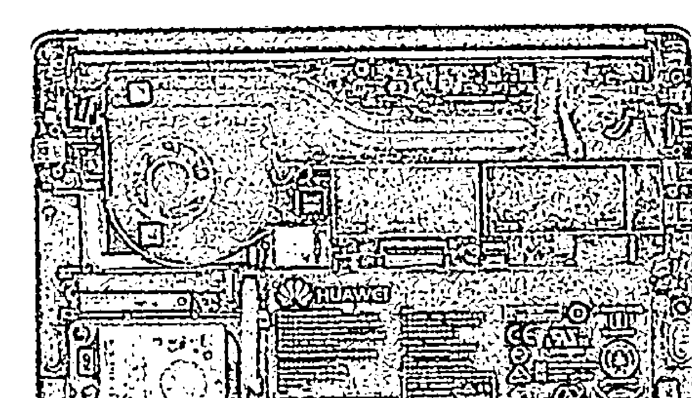

以华为MateBook D为例，拧下D面所有螺丝就能拆下底盖，对SATA或M.2硬盘位进行替换升级（图4）。该产品还配备2个标准的内存插槽（图5），而且表面还配有保护盖板，细节设计非常出色。而在本文截稿时，笔者还没能找到

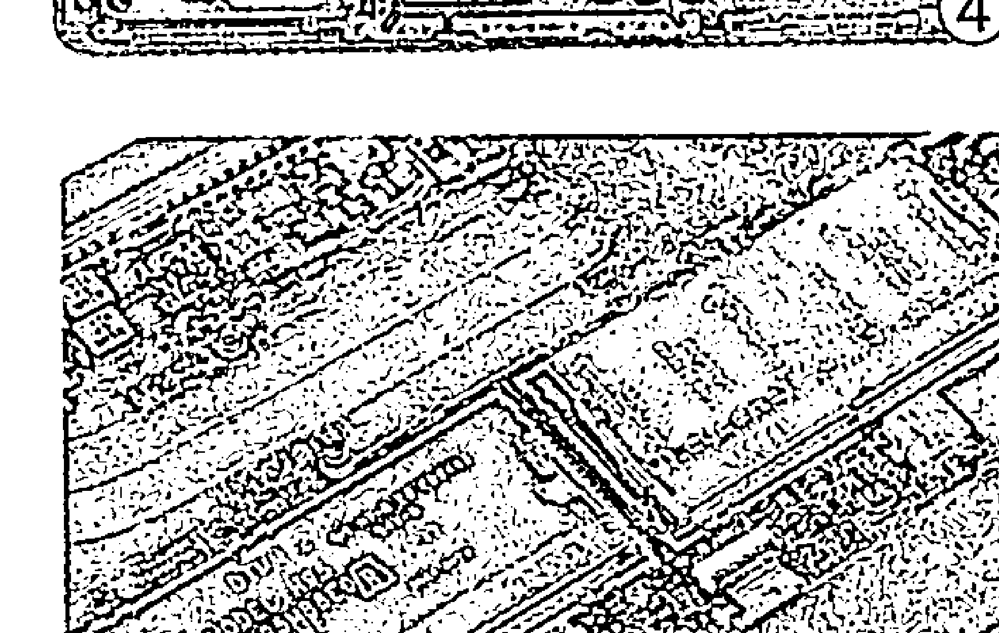

华硕灵耀S5100U和华为MateBook D都是6月份才量产上市的15.6英寸轻薄本的代表。灵耀S5100U的优点是重量更轻，华硕也针对其开发了电池管理程序（图6），可以通过充电阈值实现电池的保养（比如只有电量低于58%才充电，60%截止充电，可有效延长电池寿命）。MateBook D则是华为第二代笔记本产品，虽然缺少了读卡器稍显遗憾，但价格优势却更为明显，适合预算有限的用户考虑。

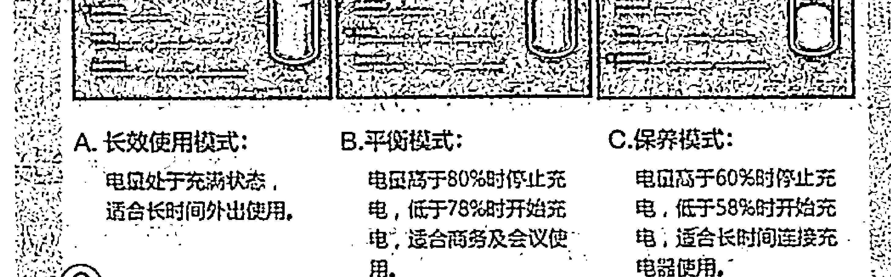

##### 颜值控的选择

###### 戴尔游匣Master 15 PK 惠普暗影精灵III代

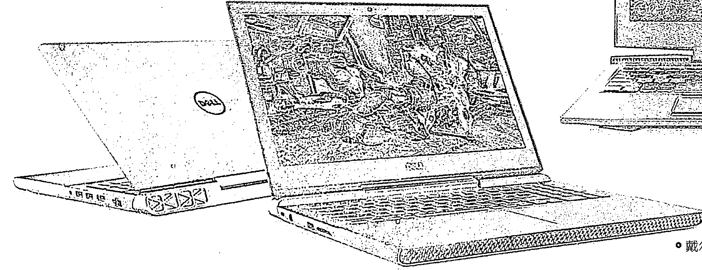

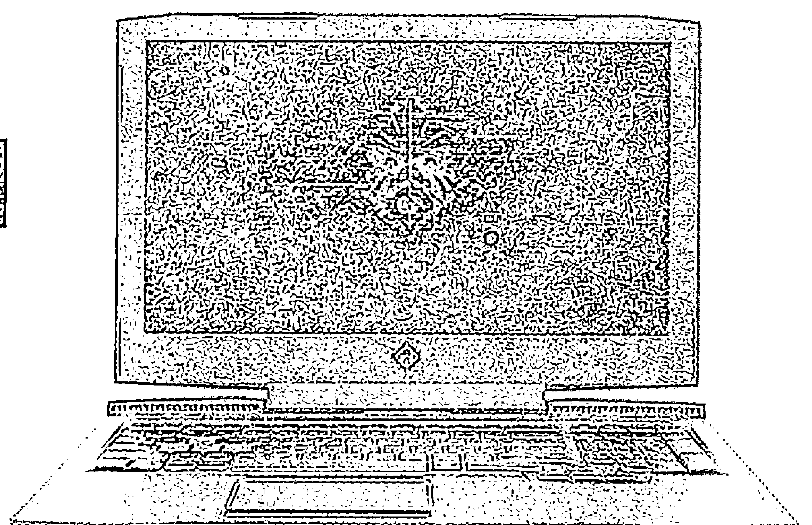

作为游戏本，搭载45W TDP的H系列处理器，武装GTX1050Ti级别的独立显卡必不可少。然而，为了让游戏过程更有激情，炫酷个性的外观设计自然也是不可或缺。而戴尔游匣Master 15和惠普暗影精灵III代则是近期颜值最高的游戏本代表，它们之间谁更适合你？

| 参数对比 | 戴尔游匣Master 15 | 惠普暗影精灵III代 |
|---|---|---|
| 屏幕 | 15.6英寸TN (1080P) | 15.6英寸IPS (1080P) |
| 处理器 | 酷睿i5-7300HQ | 酷睿i5-7300HQ |
| 内存/硬盘 | 4GB/128GB SSD+500GB HDD | 8GB/1TB HDD |
| 显卡 | GTX1050Ti (4GB GDDR5) | GTX1050Ti (4GB GDDR5) |
| 接口 | 读卡器、USB3.0×3、HDMI、RJ45 | 读卡器、USB3.0×3、Type-C、HDMI、mini DP、RJ45 |
| 尺寸 | 384.9mm×274.7mm×25.4mm | 388.5mm×275.5mm×24.8mm |
| 电池/重量 | 74Wh/2.65kg | 70Wh/2.62kg |
| 参考价格 | 6499元 | 6299元 |

###### 高颜值是怎样炼成的

市面上游戏本型号众多，但当你第一眼看到戴尔游匣Master 15和惠普暗影精灵III代时，它们都能给你留下极为深刻的印象。

其中，游匣Master 15在设计上参考了动感跑车的流线圆润元素，并采用红、黑、银的撞色设计。其机身后面的散热框体是游匣Master 15的点睛之笔，倾斜的切角让本来有点圆润感觉的机身也有了几分刚毅之感，两个“水”字型的栏栅后面就是被喷上红漆的散热鳍片(图1)，看起来非常个性。

此外，游匣Master 15还采用了游戏本中常用的红色键盘背光，但它却在WASD四个按键的边框上加入了一圈镂空处理，当红色背光亮起时，其他按键只有键帽上的标识可以透过红色炫光，而WASD的感觉则是被红光包裹，看起来更为醒目。

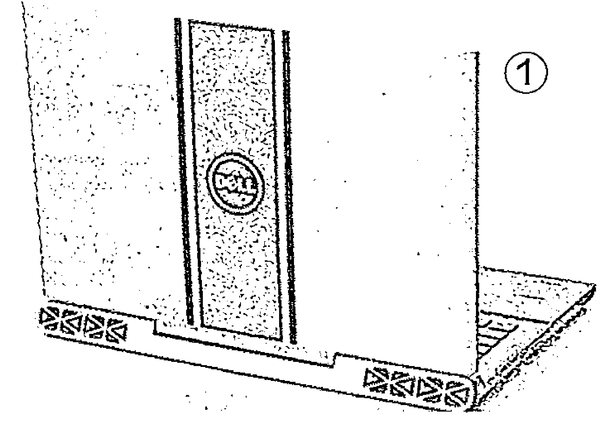

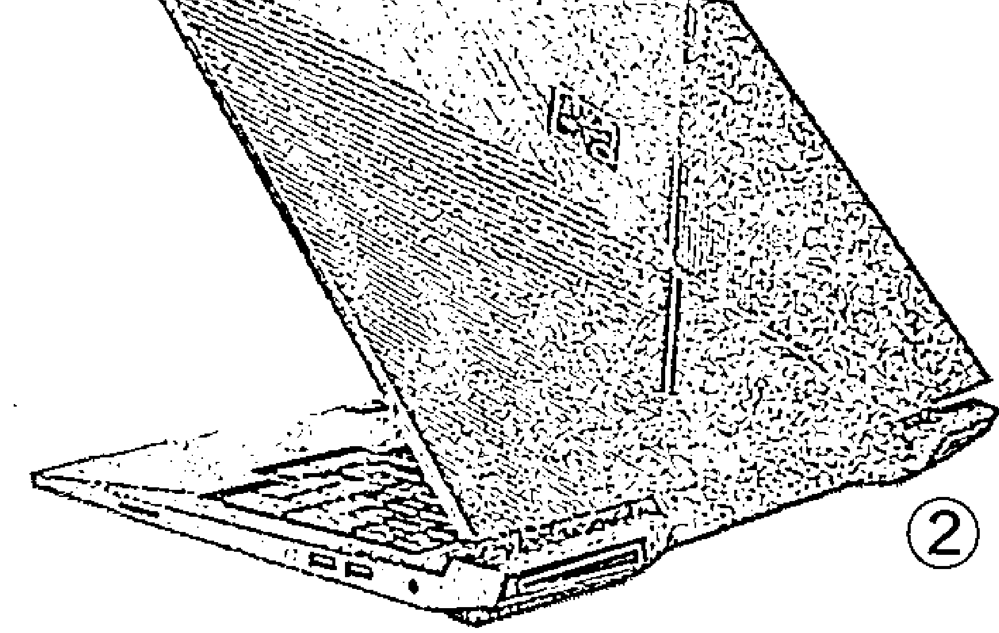

和游匣Master 15相比，惠普暗影精灵III代的外观设计更为激进。它在A面顶盖上引入了两种材质拼接的效果：拉丝金属和碳纤维纹理通过中间红色“X”条分割成四部分，提供了更为丰富且层次分明的视觉感受(图2)。同时，暗影精灵III代的D面也引入了“X”条元素，由不同材质和数量的“三角柱”立体结构拼接而成，让这款产品的整体视觉效果显得更具动感和立体。

为了突出最常用的游戏键，暗影精灵III代将WASD键帽设计为红底白字，并配以白色背光，而其他按键则均采用黑底红字，并配以红色背光。当暗影精灵III代开机后，你会看到两种颜色的键盘背光，而WASD键帽也被刻意突显了出来。

通过OMEN Command Center按键进入预装的指挥中心软件，这里可以用于检测系统的整体性能，并内置网络助推器，为游戏玩家提供专属的游戏网速（图4）。值得一提的是，该软件推出了一种名叫“双源力”的网速分配方案，它会帮助用户将高优先级的应用程序分配给以太网，同时将所有其他应用程序分配给Wi-Fi，确保游戏期间其他应用程序不会占用游戏网速资源。

###### 配置和功能的小差异

两款游戏本的核心配置相同，都搭载了英特尔七代酷睿i5-7300HQ，默认频率2.5GHz，最高可睿频加速到3.5GHz。同时，它们还都配备了GTX1050Ti独显，并拥有4GB GDDR5独立显存。在1080P高画质下，这两个硬件搭配可以保持50fps以上的帧数运行GTA5、看门狗2和巫师3等最新大型3D游戏，如果你没有外接2K或4K显示器玩游戏的需要，这套配置也足够你折腾了。

不过，6499元的游匣Master 15屏幕并非IPS材质，而且仅标配1根4GB DDR4-2400MHz内存，硬盘方面则选用了128GB SSD和500GB HDD的组合。对时下的Windows 10系统和相关的软件游戏环境而言，4GB内存明显不够用，而双硬盘的组合则较好地兼顾了磁盘性能和容量的关系。此外，游匣Master 15内置独立的低音炮单元（图3），在声音的表现力上颇为出色。

6299元的暗影精灵III代标配8GB DDR4-2400MHz内存和1TB 7200rpm转速的机械硬盘。8GB内存在容量上已经足够，但机械硬盘则会成为拖累系统和应用启动速度的瓶颈所在。

在功能上，暗影精灵III代可以通过独立的OMEN Command Center软件优化系统。

###### 看不见的较量

两款游戏本拆机难度都不大，内部都提供了1个2.5英寸SATA硬盘位和1个M.2插槽，而且它们都支持PCI-E通道的NVMe SSD。就散热模块来看，暗影精灵III代采用了双风扇三热管（一粗两细）的设计（图5），而游匣Master 15则是双风扇双热管，理论散热效果相差不多。不过，游匣Master 15提供了坚固的防滚架结构（图6），内部显得更为规矩，抗冲击能力也更强。

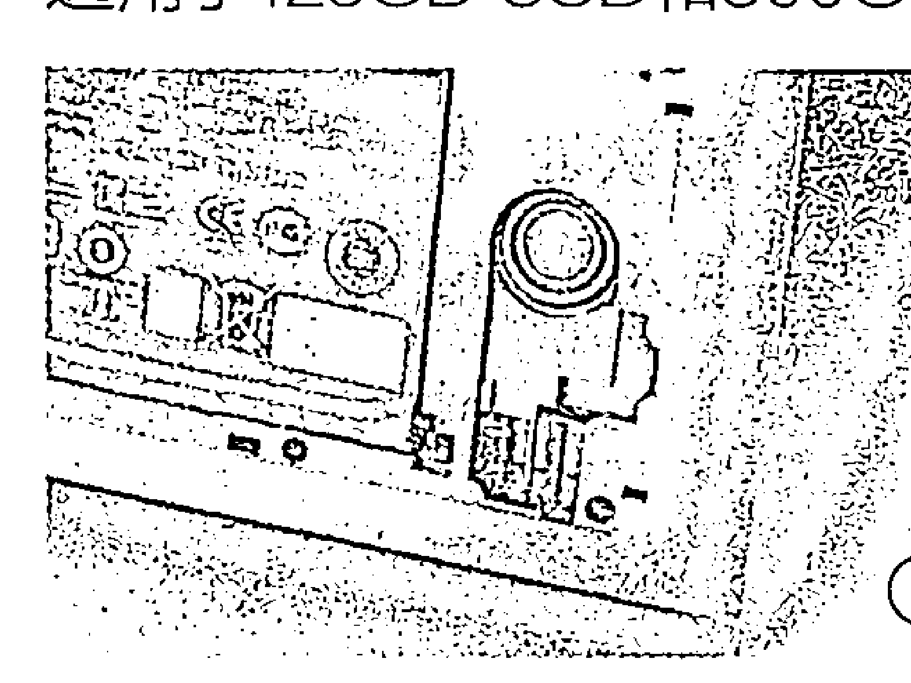

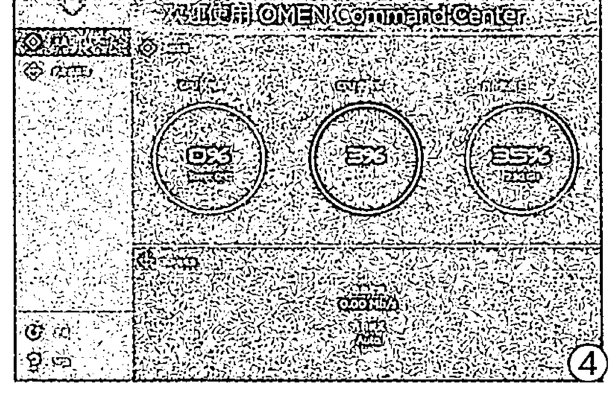

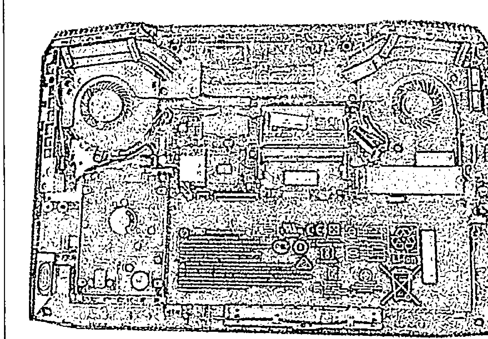

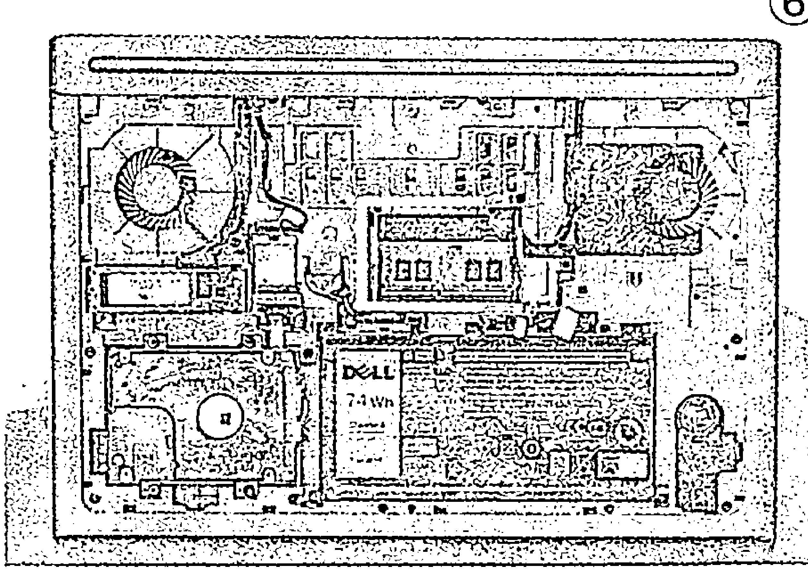

> 在6000元档位上，戴尔游匣Master 15和惠普暗影精灵III代都属于不可多得的高颜值产品，它们也都具备流畅驾驭常见3D大作的实力。游匣Master 15的优势在于标配双硬盘，在防滚架的帮助下质量更有保证。而暗影精灵III代的特色则在于IPS屏幕，且提供了更丰富的接口，价格也要实惠一些。

##### 小屏旗舰的对决

###### 荣耀9 PK 小米6

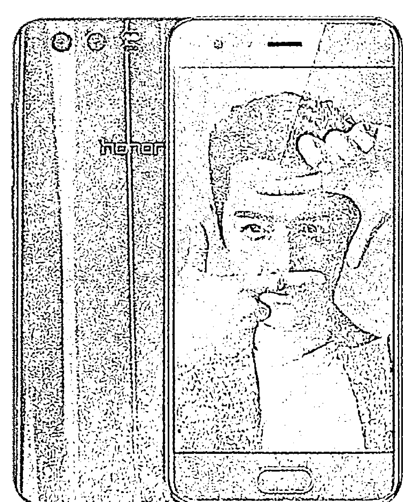

就以线上渠道为主的手机品牌而言，小米和荣耀的影响力毋庸置疑。而对追求性能价格比的用户而言，小米6和荣耀9则是两个品牌的“当家花旦”。那么，在不考虑能否抢到的情况下，两款产品谁更适合你？

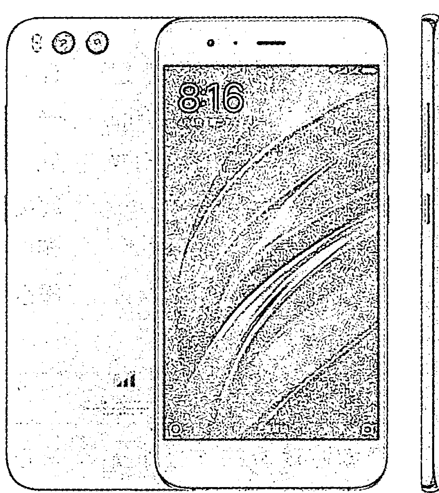

###### 玩转曲线和光影的设计

如果将小米6和荣耀9摆在一起并挡住Logo，总会给人一种“傻傻分不清楚”的感觉，因为两款产品采用了相似的工艺，长得实在是太像了。它们都采用了金属中框和双面玻璃设计，而且正面都是2.5D屏幕，背部的玻璃则拥有3D弧面特效，可以带来非常舒适的持握手感。

其中，荣耀9提供了魅海蓝、海鸥灰和琥珀金三种配色版本，它们都采用了15层工艺打造的3D曲面极光玻璃，在不同光线下可折射出炫美变化的极光效果(图1)。小米6拥有亮蓝、亮白、亮黑以及陶瓷限量版，它和荣耀9的区别是采用了不锈钢高亮边框，以及四曲面的玻璃机身(图2)，在光线照耀下同样可以出现流光溢彩的视觉效果。

| 参数对比 | 荣耀9 | 小米6 |
| :--- | :--- | :--- |
| 网络 | 全网通(双卡双待) | 全网通(双卡双待) |
| 屏幕 | 5.15英寸(1080P) | 5.15英寸(1080P) |
| CPU | 麒麟960 | 骁龙835 |
| GPU | ARM Mali G71MP8 | Adreno 540 |
| 内存/存储 | 4GB/64GB(支持存储卡) | 6GB/64GB UFS(不支持存储卡) |
| 摄像头 | 800万/1200万+2000万像素 | 800万/1200万+1200万像素 |
| 体积 | 147.3mm×70.9mm×7.45mm | 147.3mm×70.49mm×7.45mm |
| 电池/重量 | 3200mAh/155g | 3350mAh/168g |
| 参考价格 | 2299元 | 2499元 |

此外，小米6和荣耀9的屏幕尺寸都是5.15英寸，它们的Home键也都是不可按压式，并集成电容式的指纹识别传感器。值得一提的是，荣耀9的Home键还能充当返回、最近任务等导航栏功能，熟悉相关的手势功能可以提高操作效率。

虽然屏幕的分辨率都是1080P，但小米6屏幕的最高亮度却可达600尼特，最低亮度低至1尼特，NTSC高色彩饱和度也达到了94.4%。同时，小米6的屏幕还通过了国家眼科诊断与治疗工程技术研究中心的权威认证，长时间观看能有效降低对眼睛的伤害。

可惜，小米6在设计上有些激进，它整个机身仅提供了唯一的USB Type-C接口（图3），充电听歌都靠它。而荣耀9在配备USB Type-C接口的同时还保留了3.5mm耳机孔，听歌充电两不耽误。

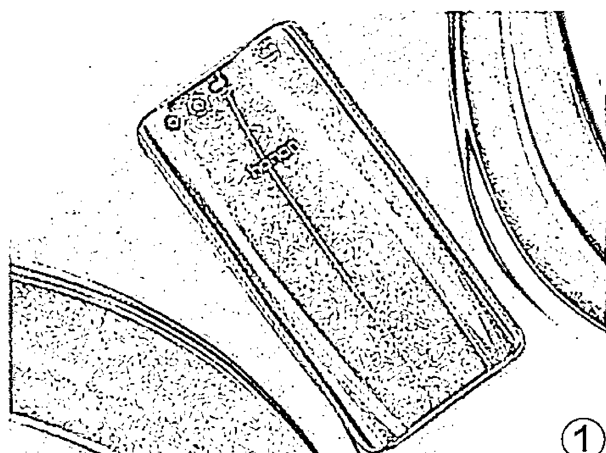

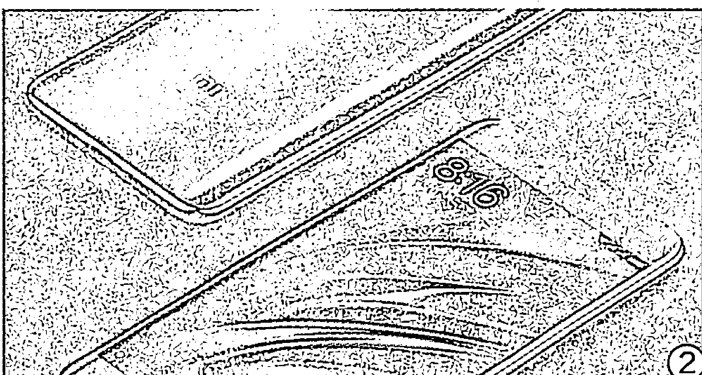

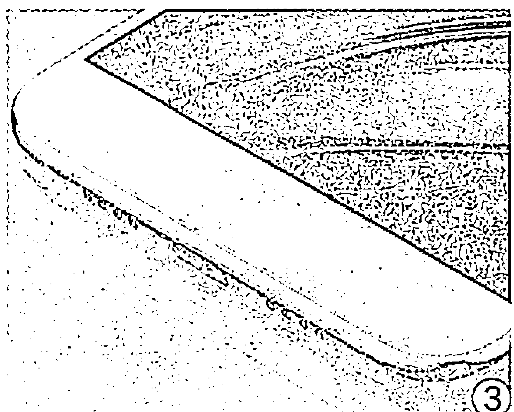

###### 性能差异较为明显

虽然小米6和荣耀9风格相似，但它们在核心硬件上却存在很大的差异。小米6选用了高通旗下最高端的骁龙835移动平台，它的特色在于最先进的10nm工艺，以及高通Kryo 280内核架构和强悍的Adreno 540 GPU。此外，小米6全线产品都标配64位双通道LPDDR4X内存，闪存也都是UFS标准。

荣耀9搭载的是华为自家的麒麟960移动平台，这是一颗2016年底诞生的芯片，它基于16nm工艺制造，首发Cortex-A73架构和Mali-G71MP8 GPU。可惜，虽然麒麟960支持最新的UFS2.1闪存，但荣耀9全线版本却都选用了eMMC 5.1闪存。

就性能而言，在CPU运算性能上麒麟960和骁龙835差别不大，但在GPU图形性能方面则是骁龙835遥遥领先。由于荣耀9没能武装UFS闪存，所以它在理论磁盘性能上明显落后于小米6（图4）。还好，这个差距只是停留在AndroBench等跑分软件上，实际操作的流畅度和APP启动速度还会受系统优化影响。

为了提升卖点，荣耀9内置了AKM Hi-Fi芯片，通过Huawei histen自研音频算法结合魔声耳机，可使用户享受3D超宽声场音效技术，带来3D沉浸式的环绕音效，复现声音三维空间感与距离感。

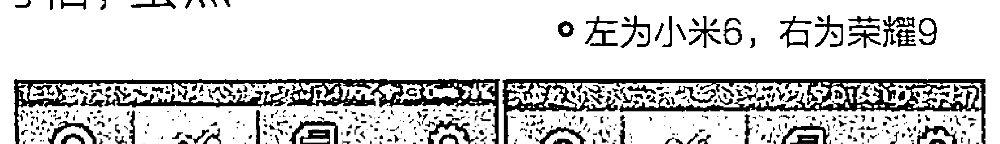

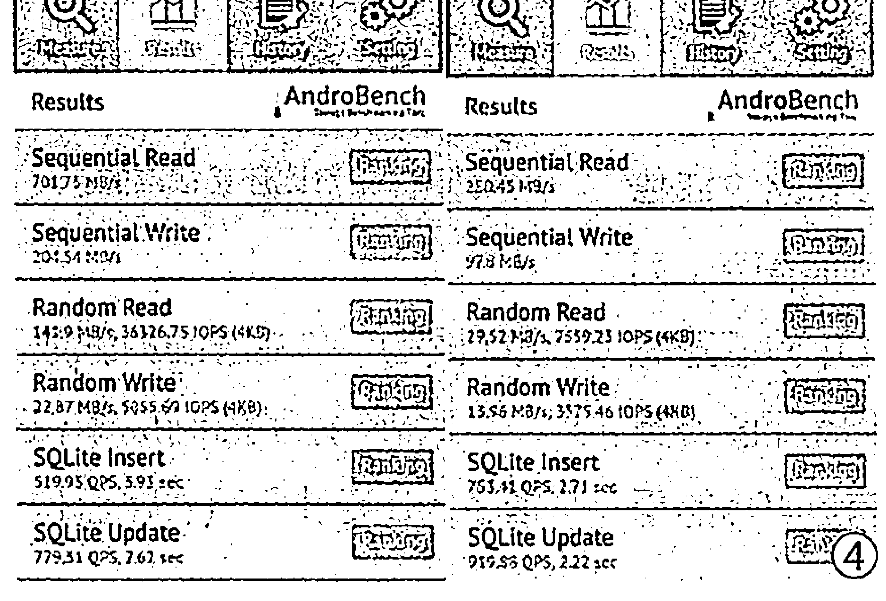

###### 两种双摄不一样

小米6和荣耀9都主打拍照，所以它们都武装了时下最流行的双摄像头设计。但是，小米6选用的是1200万像素广角和1200万像素长焦的摄像头的组合（图5），其中广角镜头还支持4轴光学防抖，它使用手机内部陀螺仪与加速感应器，高速检测8个方向的抖动，实时驱动微型马达调整姿态进行补偿抖动。

荣耀9采用的是1200万像素彩色和2000万像素黑白摄像头的组合，其成像原理是使用双摄进行合成，黑白摄像头捕捉细节，彩色摄像头只负责色彩捕捉，而后进行合成（图6）。值得一提的是，荣耀9增加了激光对焦模块，同时也能实现类似长焦镜头的两倍变焦功能，唯一可惜的就是缺少光学防抖技术。

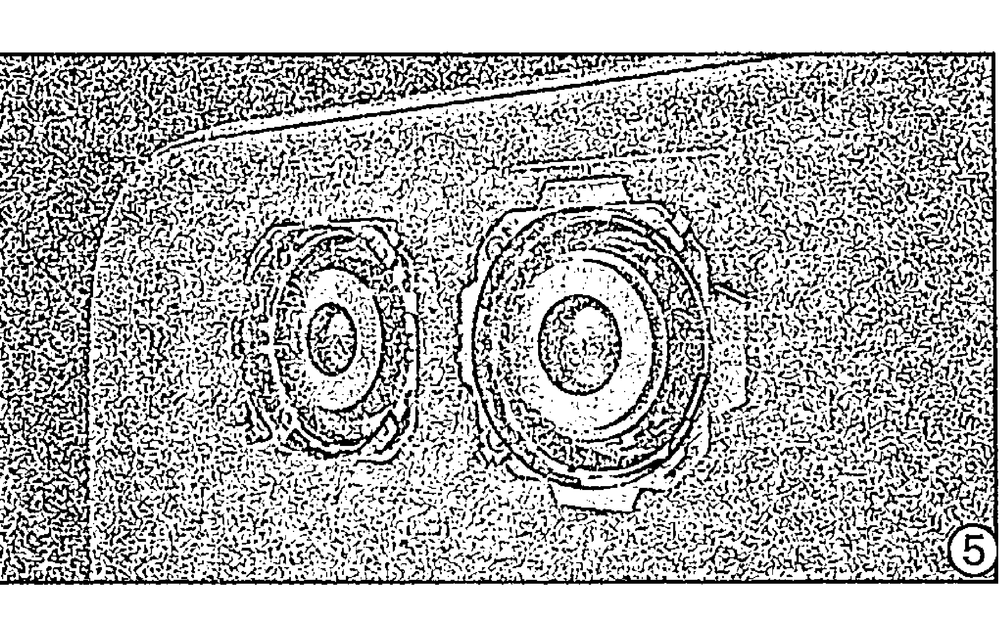


> 作为小米和荣耀家族的小屏旗舰之作，小米6和荣耀9都有着出色的颜值表现，它们最大的差异还是体现在实际性能层面。如果你注重跑分，武装骁龙835的小米6可以让你感受位列榜首的成就感。而荣耀9的优势则在于相对实惠的价格以及在音频领域的表现上，无论是保留的3.5mm耳机还是AKM Hi-Fi芯片，都有利于音乐爱好者聆听更好的歌曲。

#### 扩展潜力很重要：教你挑选双硬盘位轻薄本

随着NVIDIA GTX10系列独显的普及，如今游戏本的性能越加强悍。与此同时，随着超窄边框技术的兴起，轻薄本们也在不断刷新着我们的感官极限。问题来了，游戏本普遍都可同时享受SSD的高速度和HDD的大容量，而轻薄本能同时兼顾的产品就大打折扣了。今天，就让我们将目标指向支持双硬盘的轻薄本，随时体验磁盘性能和容量的平衡组合。

##### 速度和容量的矛盾

SSD和HDD之争由来已久（图1），前者的极致速度可以换来快速开机和应用程序的快速启动，而后者则凭借容量优势可实现海乃百川的存储梦想。可惜，大容量SSD的成本颇高，所以主流价位的轻薄本大都仅标配128GB或256GB容量的SSD，对喜欢收藏高清视频、备份手机拍摄图片的用户而言根本不够用。为了控制成本，还有不少轻薄本会标配HDD。虽然HDD容量都是500GB起步，但哪怕是7200rpm转速的型号，同样会拖累开机和系统程序运行的速度。在这种大环境下，唯有同时配备SSD+HDD双硬盘的“组合套餐”才符合消费者追求速度和容量兼顾的诉求。因此，我们在挑选轻薄本时，一款产品是否具备安装双硬盘的能力，自然就是非常关键的指标了。

> 如果你的笔记本只有唯一的2.5英寸SATA硬盘位，而你又希望磁盘性能和容量都达到一个不错的指标，现阶段可以考虑希捷FireCuda SSHD混合硬盘（图2），该硬盘内置8GB MLC闪存和更大的128MB缓存，可起到弥补机械硬盘自身读写碎片化文件能力不足的作用。FireCuda SSHD的价格只比同容量的纯HDD贵了100元左右，性价比还是很高的。

##### 双硬盘并非轻薄本标配

既然消费者有同时安装双硬盘的需求，那笔记本厂商在设计产品时直接加上两个硬盘位不就结了？话虽简单，但在产品设计阶段，笔记本厂商总会因结构设计和成本预算而加以妥协。比如，考虑到轻薄是当前消费者最为关注的参数，为了让轻薄本再薄0.1mm、再轻100g，很多产品已经不再配备传统的2.5英寸SATA硬盘位（图3），全面投入到M.2插槽的怀抱中来。原因很简单，同样是256GB SSD，M.2形态的SSD可能不足10g，而2.5英寸形态的SSD却有近40g的重量（图4），你说选谁减肥效果最好？此外，为了控制成本，还有不少轻薄本只配备了2.5英寸SATA硬盘位（图5），并没有集成M.2插槽。

M.2插槽同样面临只能在容量和速度之间必须取舍的难题。总之，在轻薄本领域可以标配双硬盘位的产品不足50%，只要你有着希望磁盘性能容量平衡的梦想，那就必须从这50%的产品范围中加以筛选。

当然，即使一款轻薄本支持双硬盘，但实际销售的版本可能却仅标配一块硬盘。好消息是，如今轻薄本拆机升级的难度并不高，普遍只需拧下D面所有螺丝就能拆下底盖，稍有DIY经验的用户都能自行搞定（图6）。何况自行升级双硬盘的成本，往往比直接购买标配双硬盘的型号更低呢。

> **扩展阅读**
> **留意新旧版本的扩展差异**
> 笔记本厂商总会隔段时间就会对热销型号进行升级，推出外观和配置有所变化的新款来吸引眼球。然而，并非所有所谓的“升级版”都能保持在扩展能力方面的特性。就拿华硕U4000UQ为例，该产品配备了2.5英寸SATA和M.2双硬盘位。作为U4000UQ的升级版，华硕最新推出的U4100UQ虽然更轻更薄，但它却取消了2.5英寸SATA硬盘位，只能安装一个M.2 SSD，通过牺牲扩展能力换取了更性感的设计。在轻薄本的迭代更新中，这种现象并不鲜见，大家要多加留意。

##### 联想小新潮7000

-   屏幕：14英寸IPS（1080P）
-   处理器：酷睿i5-7200U
-   内存/硬盘：8GB/128GB SSD + 1TB
-   显卡：NVIDIA 940MX（2GB GDDR5）
-   接口：读卡器、USB Type-C、USB3.0、USB2.0、HDMI
-   体积：327.4mm × 236.5mm × 19.3mm
-   重量：1.69kg

小新潮7000是一款以航空5系铝合金打造的轻薄本，它的屏幕边框仅有7mm，厚度和重量分别为19.3mm和1.69kg，在同类14英寸产品中属于非常轻盈的存在。这款产品的特色在于标配双硬盘，而且SSD还采用了PCI-E通道，磁盘性能非常出色。此外，小新潮7000还支持快充技术，1小时就能将电量充到80%。本文涉及型号的价格约为5499元。

##### 华硕灵耀U4000UQ

-   屏幕：14英寸IPS（1080P）
-   处理器：酷睿i5-7200U
-   内存/硬盘：4GB/256GB SSD
-   显卡：NVIDIA 940MX（2GB DDR3）
-   接口：读卡器、USB Type-C、USB3.0、USB2.0 × 2、HDMI
-   体积：323mm × 223mm × 18.85mm
-   重量：1.4kg

灵耀U4000UQ采用了铝合金材质，A面的同心圆纹理在光线的照射下反光效果非常酷。这款笔记本的特色在于6mm超窄边框，以及拥有72% NTSC和100% SRGB色域的屏幕，在5000元出头的价位上具有较强的视觉诱惑。

##### 惠普新Pavilion 14-BF046TX

-   屏幕：14英寸IPS（1080P）
-   处理器：酷睿i5-7200U
-   内存/硬盘：8GB/256GB SSD
-   显卡：NVIDIA 940MX（2GB GDDR5）
-   接口：读卡器、USB Type-C、USB3.0 × 2、HDMI
-   体积：324mm × 227.6mm × 19.9mm
-   重量：1.53kg

新一代的畅游人Pavilion 14引入了ENVY系列的元素，比如金属材质的机身、可作为支架的翘臀转轴和5.4mm的超窄边框设计等等。该产品的特色在于HP CoolSense功能可自动调节风扇转速，配备B&O品牌扬声器，键程深度为1.5mm的键盘可以带来更好的敲击手感。目前标配256GB SSD的Pavilion 14售价为5299元。

##### 华为MateBook D

-   屏幕：15.6英寸IPS（1080P）
-   处理器：酷睿i5-7200U
-   内存/硬盘：8GB/256GB SSD
-   显卡：NVIDIA 940MX（2GB GDDR5）
-   接口：USB3.0×2、USB2.0、HDMI
-   体积：358mm×239mm×16.9mm
-   重量：1.9kg

MateBook D是一款有着15.6英寸大屏幕的轻薄本，它两侧边框最窄处仅为6.2mm，有着83%的屏占比。该产品的特色在于全金属一体成型的外壳、支持护眼模式的屏幕、不足2kg的重量以及联合杜比研发的全新PC扬声器。本文配置的版本售价为5688元，适合喜欢大视野的用户考虑。

##### 戴尔灵越燃7000-14

-   屏幕：14英寸IPS（1080P）
-   处理器：酷睿i5-7200U
-   内存/硬盘：4GB/128GB SSD+1TB
-   显卡：NVIDIA 940MX（2GB GDDR5）
-   接口：读卡器、USB3.0×2、USB2.0、HDMI、RJ45
-   体积：323mm×227mm×18.95mm
-   重量：1.65kg

灵越燃7000-14采用了全金属一体化的A面和D面，C面掌托加入了类肤材质装饰，手感非常出色。该产品的特色在于屏幕左、右和上三侧都是7mm超窄边框，保留了在轻薄本领域少见的RJ45接口。以上配置的燃7000-14售价约为5299元，此外该产品还有集显版本，续航时间更持久。

##### 神舟优雅X4-SL5 S1

-   屏幕：14英寸（1080P）
-   处理器：酷睿i5-6200U
-   内存/硬盘：8GB/256GB SSD
-   显卡：HD520核芯显卡
-   接口：读卡器、USB3.0×3、HDMI、RJ45
-   体积：326mm×223mm×20mm
-   重量：1.5kg

神舟优雅X4系列采用了金属材质机身，在6.8mm窄边框的帮助下实现了瘦身，屏占比也超过了80%。该产品的特色在于可以开合到180度的屏幕，以及3899元的超低价格。虽然优雅X4-SL5 S1的处理器还停留在六代酷睿时代，但整体性能也足够日常的办公和娱乐所需。当然，优雅X4也有搭载七代i7-7500U的型号，只是5499元售价就没有太多性价比可言了。

##### 小米笔记本Air 13 指纹版

-   屏幕：13.3英寸IPS（1080P）
-   处理器：酷睿i5-7200U
-   内存/硬盘：8GB/128GB SSD
-   显卡：NVIDIA MX150（2GB GDDR5）
-   接口：USB Type-C、USB3.0×2、HDMI
-   体积：309mm×211mm×14.8mm
-   重量：1.3kg

指纹版起价不足5000元，它在外观上只能算是小米笔记本Air 13的小改款，在触控板右上角集成的指纹传感器，可以实现指纹解锁功能。而新版机器最大的特色则是将独显从NVIDIA 940MX换成了MX150，性能直逼GTX950M，游戏性能有了较大的提升。这款产品并没有配备2.5英寸硬盘位，不过却内置2个M.2插槽，其中一个还支持PCI-E通道，可升级NVMe SSD。

#### 为你挑选游戏台式机

虽然游戏笔记本的性能越来越强，但受制于功耗墙和温度墙，在面对顶级3D游戏大作时依旧面临降频和发热的隐患。对发烧级游戏玩家而言，还是稳定的台式机更靠谱。然而，在选择游戏台式机时，到底是DIY还是品牌机？这就是本文讨论的重点。

##### DIY的成本估算

什么样的台式机才能算是“游戏机”？支持睿频加速的酷睿i5处理器和NVIDIA GTX1060显卡必不可少（图1）。如果以此为基准，通过DIY打造一套平台的预算如表1，需要大约4500元的预算。当然，如果我们选择更便宜的主板、内存、硬盘和机箱电源，也有望将整体成本控制到4000元上下。
DIY的方式固然实惠，但却始终存在售后维修方面的隐患。比如当主机出现无法开机或不稳定的问题，我们首先需要自己辨别到底是哪个硬件出现了故障（图2），然后再将其拆卸，联系相关品牌的售后才能进行维修更换。问题来了，选择DIY方式的用户就都是DIYer吗？想让普通用户判断故障硬件，难度着实不低。

| 配件   | 型号             | 价格   |
| :----- | :--------------- | :----- |
| 处理器 | 酷睿i5-7400      | 1359元 |
| 主板   | 二线B250主板     | 450元  |
| 显卡   | GTX1060 3GB      | 1499元 |
| 内存   | 8GB DDR4         | 399元  |
| 硬盘   | 128GB SSD        | 399元  |
| 机箱电源 | 套装             | 399元  |
| 合计   |                  | 4505元 |

##### 品牌机的逆袭

之所以很多用户将品牌机排除在购机计划之外，大多是认为其“非常不值”。然而，如今很多品牌游戏台式机的价格却并不比同配置的DIY主机高多少。而品牌机的优势则在于更长的售后，以及1年~3年的免费上门维修服务（图3）。当使用期间电脑出现不稳定的现象时，一个电话就有专业人员上门检测维修，踏实省心。

##### 差距体现在后续升级

那么，当前DIY主机和品牌游戏台式机的差距还体现在了哪里？答案就是后续的升级和扩展潜力上。
为了提升竞争力，现在不少品牌游戏台式机都允许用户进行拆机升级。但是，这种拆机和升级都是有条件的：不允许动处理器和显卡，只能对内存、硬盘和光驱等硬件进行替换。想想也是，拆装处理器风扇存在一定风险，禁止对其升级也是为了规避风险。
品牌游戏台式机还存在一个通病，主板和电源规格多是“够用就好”。别看有些品牌游戏台式机的机箱硕大，但其内置的主板却依旧是M-ATX（图4），插槽数量和重量往往不够丰富。以时下最热的联想拯救者刃7000和惠普光影精灵580-056cn为例，前者采用的B250主板只配备2个SATA3.0接口，算上主板上的M.2也只能安装3块硬盘（理论上也足够用，但对闲置硬盘较多的用户而言就有些尴尬了）（图5）；而后者的标配的电源额定功率则仅有300W，未来想升级到更强的显卡？那就需要连电源一起更换，还要保证新电源和品牌机箱的兼容问题。

如果选择DIY的方式，很多用户都会为日后的升级留下足够的冗余空间。比如购买SATA接口数量更多和支持双显卡的标准型ATX主板，挑选额定功率更大的电源以备更高一个档次的处理器和显卡所需，留意机箱是否支持背部走线、能否加装辅助风扇、对显卡长度有无特别要求等细节。而品牌游戏台式机的问题就是，即便可以升级，也存在空间、供电和规格上的局限。

总之，随着品牌游戏台式机价格的不断走低，对懒得折腾和缺乏DIY经验的普通用户绝对是个利好消息，用额外的10%开销换取踏实省心的售后，相信绝大多数用户都可接受。但是，如果你骨子里就有着DIY情结，在挑选品牌游戏台式机前就需要做好功课了，通过网上已有的拆机体验或评测，观察它的电源和扩展能力是否可以满足你日后的升级诉求。

> > 下面，我们就来看看时下最为超值的几款品牌游戏台式机吧。

##### 联想拯救者刃7000

-   处理器：酷睿i5-7400
-   主板：B250
-   内存/硬盘：8GB/128GB SSD
-   显卡：GTX1060（3GB）
-   电源：400W

拯救者刃7000整机采用多面切割搭配碳纤铠甲风格，搭配“胜利之眼”游戏氛围灯，凸显电竞元素。该产品标配高速NVMe SSD和Realtek Dragon千兆低延迟电竞网卡，内置的GTX1060显卡还配有卡托，可避免机器在运送时发生折断，可谓贴心设计。该产品的最大特色就是引入了UIY概念，允许用户自主开箱升级，对内存、硬盘和光驱进行替换升级，而且不会影响后续的质保，有需要的用户还可选择酷炫风扇和灯光的官方套件升级。

##### 惠普光影精灵580-056cn

-   处理器：酷睿i5-7400
-   主板：不明
-   内存/硬盘：8GB/128GB SSD+1TB HDD
-   显卡：GTX1060（3GB）
-   电源：300W

惠普光影精灵580采用了简约的机身，前面板立体造型设计和类金属拉丝工艺使整个机身质感丰富。该系列主机还有搭配GTX1050的版本，但售价只比GTX1060显卡便宜200元，性能价格比显然不如后者。惠普同样允许发烧玩家对光影精灵580自行DIY，自行升级而去除机身上的封箱条，不影响该机器的原厂部件的保修。

##### 华硕G11飞行堡垒

华硕G11飞行堡垒采用了炫酷的堡垒式外观，红黑色明暗搭配，前面板交织的钢铁网格曲线纹路背光可使用软件调节伴随音乐节奏变换或随游戏环境改变。除了外观炫酷外，该产品还主打特色的游戏监控系统，比如在游戏开启时可智能提升内存和CPU性能，或是对游戏内容进行录制分享等。此外，华硕G11主板还集成USB3.1 Gen2接口，500W电源也具备足够的升级潜力。

-   处理器：酷睿i5-7400
-   主板：H110
-   内存/硬盘：8GB/128GB SSD + 1TB HDD
-   显卡：GTX1060（3GB）
-   电源：500W

##### 机械革命NX5-V631

-   处理器：酷睿i5-7400
-   主板：H110
-   内存/硬盘：8GB/128GB SSD + 1TB HDD
-   显卡：GTX1060（3GB）
-   电源：300W

机械革命NX5-V631的机箱采用了倒V字的渐变设计，顶部引入了跑车散热孔元素，很多细节上也融入了棱角式线条，看起来颇为个性。这款产品的最大遗憾依旧体现在标配电源的功率上，300W对GTX1060级别的显卡而言只能算是勉强够用。

##### 微星玛尔斯Codex B913

-   处理器：酷睿i7-7700
-   主板：不明
-   内存/硬盘：8GB/128GB SSD + 1TB HDD
-   显卡：GTX1060（3GB）
-   电源：500W

这款台式机采用了相对传统的塔式机箱设计，但却在机箱上半部分加入了三道红龙炫光灯效，彰显了其作为电竞游戏主机的身份。微星玛尔斯的特色还在于集成微星游戏中心应用，可以随时调整系统效能，获得更好的游戏体验。此外，该产品还标配500W电源，结合兼容性强和更大的机箱空间，后续升级能力有所保障。

##### 神舟战神K5-P63 D2

-   处理器：酷睿i5-7400
-   主板：B250
-   内存/硬盘：8GB/256GB SSD
-   显卡：GTX1060（3GB）
-   电源：350W

神舟战神K5-P63 D2的机箱配备了开合式的前面板和滑盖式的顶部面板，平时可以将光驱位和顶部的接口隐藏起来，保持主机的整体性。该产品的特色还在于机箱前面下方隐藏着LED呼吸灯，采用了技嘉B250M耐久系列主板。

##### 极限矩阵猛禽X3

-   处理器：酷睿i5-6400
-   主板：H110
-   内存/硬盘：8GB/128GB SSD
-   显卡：GTX1060（3GB）
-   电源：400W

极限矩阵猛禽X3最大的特色就是价格实惠，4299元就能享受到GTX1060显卡的澎湃动力。此外，该产品还注明了每一个硬件的具体型号，比如主板来自华擎H110M，显卡型号为索泰GTX1060 3GB版，电源品牌则是长城，让用户可以买得更为安心和放心。当然，价格实惠的缺点也比较明显，就是处理器停留在六代酷睿且机箱外观设计不够炫酷。

#### 一加手机5 PK 努比亚Z17

如今国内武装骁龙835的旗舰手机并不多，除了上期我们介绍过的小米6以外，一加手机5和努比亚Z17同样是两款极具诱惑力的超值旗舰。那么，这两款产品谁更适合你？

| 参数对比 | 一加手机5 | 努比亚Z17 |
| :--- | :--- | :--- |
| 网络 | 全网通（双卡双待） | 全网通（双卡双待） |
| 屏幕 | 5.5英寸AMOLED（1080P） | 5.5英寸（1080P） |
| 处理器 | 高通骁龙835 | 高通骁龙835 |
| 内存/存储 | 6GB/64GB（不支持存储卡） | 6GB/64GB（不支持存储卡） |
| 摄像头 | 1600万/2000万+1600万像素 | 1600万/2300万+1200万像素 |
| 尺寸 | 152.7mm×74.7mm×7.25mm | 152.6mm×72.38mm×7.6mm |
| 电池/重量 | 3300mAh/153g | 3200mAh/173g |
| 参考价格 | 2999元 | 2799元 |

##### 武装最强之芯

一加手机5和努比亚Z17最大的卖点就是武装高通2017年度的旗舰移动平台：骁龙835。它基于三星10nm制程工艺打造，采用Kryo280架构的八核心设计，由四核2.45GHz+四核1.9GHz构成。骁龙835集成Adreno 540 GPU，并可搭配业内顶级的骁龙X16 LTE调制解调器。可惜，无论一加手机5还是努比亚Z17，它们集成的调制解调器都是X12 LTE，最高仅支持下行Cat12和上行Cat13。

实际上，骁龙835作为一套移动平台，它的很多功能都是支持定制的。比如，骁龙835支持QC4.0充电技术（图1），但像小米5等骁龙835手机却仅支持QC3.0，而三星Galaxy S8+甚至还停留在QC2.0技术的水准上。目前唯一理论上支持QC4.0充电技术的手机只有努比亚Z17，最高可以实现5V/5.6A和9V/3A规格的28W充电功率。可惜，出于成本的考虑，努比亚Z17标配的充电器却仅支持QC3.0，如果你想体验QC4.0的更高效率，还需要以后自行另购支持QC4.0的充电器。

而一加手机5则直接取消了对高通QC充电技术的支持，而是继承了从一加3开始引入的Dash闪充，支持5V/4A即20W的快速充电能力。这种低电压大电流的快充方案与高通早期（如QC3.0）的高电压低电流方案相比，最大的优势就是亮屏时也能保持较高的充电功率，轻松实现边玩边快充。

在其他配置上，一加手机5和努比亚Z17处于相同的水准上。它们都内置6GB或8GB内存、64GB或128GB存储空间。最关键的是，两款手机的闪存都是最先进的UFS2.1规格，所以没有错买成eMMC闪存的顾虑。

##### 设计上的差异较大

一加手机5和努比亚Z17都采用了5.5英寸屏幕，只是前者屏幕材质为AMOLED，色域表现更好，在显示深色背景画面时也更省电（图2）。两款产品身材相近，但在设计的细节层面上却有着较大的差异。

其中，一加手机5采用了2.5D屏幕玻璃、一体成型的全金属机身和穹顶式U型天线设计。该产品的特色在于将指纹识别模块集成在了不可按压的Home键之上，后盖边缘采用了较大的弧度处理，视觉和触觉都能给人一种“机器好薄”的体验。此外，无论是屏幕表面的贴膜，还是金属材质的后盖机身，一加5都在表面涂抹了疏水疏油层，可以起到一定的防指纹效果，碰到液体时也能像荷叶一样聚拢水滴（图3），便于擦拭。

努比亚Z17同样采用2.5D玻璃和全金属机身，但它却采用了后置指纹设计，在Home键对应的位置上加入了努比亚标志性的红色小圆圈。该产品的特色是采用无边框设计，视觉效果更震撼（图4），并将天线条移到中框顶端，比起时下流行的U型天线隐藏效果更好。

此外，努比亚Z17的后盖还通过复杂的加工流程，将金属打磨出类似于玻璃的光泽质感，而官方也将其命名为“玻璃金属”。令人欣喜的是，努比亚Z17还支持户外防水（图5），它在听筒、USB Type-C接口等位置都经过了严密的防水处理，可以实现防泼溅，甚至短时间的浸水。

##### 相似的双摄思路

作为旗舰手机，一加手机5和努比亚Z17自然都少不了双摄的加持。其中一加手机5采用的是1600万像素广角镜头（IMX 398传感器）和2000万像素长焦镜头（IMX 350传感器）的组合。

而努比亚Z17的双摄则是1200万像素广角镜头（IMX362传感器）和2300万像素长焦镜头（IMX318传感器）组合（图6）。两款手机都支持双摄变焦以及模拟单反大光圈的背景虚化效果，可玩性很高。当然，拍照的水平主要还得靠相机APP和成像算法上的优化，所以建议大家时刻保持系统更新，说不定哪次更新过后照出的相片美颜或效果就更为出色了呢。

> 作为骁龙835旗舰手机，我们无需考虑一加手机5和努比亚Z17的性能，未来很长的一个时期里还没有它们跑不动的游戏。而真正值得我们关注的应该是两款产品在设计上的思路，包括指纹识别的位置、边框和持握手感的特色谁更符合你的口味。此外，两款产品的系统UI也应该列入考虑范围，一加手机5的H₂OS系统主打类似原生Android的体验，而Z17的Nubia UI 5.0则主打更丰富的功能。

综合来看，无边框、具备一定防水能力且更便宜的努比亚Z17优势更大一些，如果你重视性价比，6GB+64GB组合的Z17要比一加手机5更值得入手。但如果你追求顶配性能，8GB+128GB组合的一加手机5反而要比努比亚Z17便宜500元，性价比顿时逆反。

#### 高效更实用 选充电头不如买快充排插

如今的Android手机大都支持快速充电技术，而用惯快充之后很多用户再也无法忍受普通充电的龟速。 为了在家、学校、公司等场所都可享受快充的惬意，免不了另配一个支持快充的充电头。然而，从成本和实用性的角度来看，排插往往要比单独的充电头更值得选择。

##### 充电头功效太过单一

为了在工作、学习与生活的地方都能随时享用快速充电，仅依靠手机标配的（支持快充技术）充电头肯定是不够用的。特别是夏天，很难想象随身携带一个累赘的充电头上下班吧？此时，很多用户都会自行购买或原装或兼容的第三方充电头（图1），并将其放在某个固定场合备用。

而且还能同时帮助手机实现快充的排插呢？哪怕以后有出差旅行的需求，携带手机标配的原装充电头足矣，新买的排插依旧可以为家人或同事同学提供便利（图2）。

##### 快充方案的兼容难题

现在市面上打着“快充”卖点的排插有很多，但绝大多数产品单个USB接口的最大输出能力只有5V/2A~2.4A，充电功率只有10W~12W。而无论是高通QC、联发科PE还是华为FCP快充技术，充电功率起步都是9V/2A即18W，所以那些所谓的“快充”排插都是噱头，只有支持至少一种快充协议的排插才能算是真正的“快充排插”。

拿OPPO的VOOC闪充（图3）、一加手机3/5主打的DSAH闪充、华为高端机支持的Super Charger快充技术来说，在排插市场就仍属于真空地带。还好，华为Super Charger技术向下兼容华为FCP协议，但OPPO和一加手机如果不能和原装充电头搭配，最多只能使用10W左右的充电功率。

因此，如果你是OPPO或一加手机用户，在挑选排插时就不要有太多顾虑了，反正都不支持自家的快充协议，只要排插身上的插座数量和种类足够丰富，USB接口数量和功率足够即可。

##### 根据快充协议选排插

如果你使用的是华为手机，笔者推荐华为排插快充版AP35（图5）。这款产品的价格为99元，提供了3个5脚（2+3）国标混合插孔与3个USB接口。其中，3个USB中2个灰色的是5V常规输出口，最大支持5V/2A输出（共计10W，同时充电会被平分）；一个绿色的USB为指定的快充接口，支持华为FCP协议，最大支持9V/2A输出（独享18W）。

如果你的手机搭载了高通处理器且支持QC2.0/3.0快充技术，笔者推荐ROMOSS罗马仕旗下的FH60P（图6）。这款排插最大的特色就是支持QC3.0协议（向下兼容QC2.0），机身提供4个USB接口，包括一个独享18W输出功率的快充USB，其余3个USB则共享5V/2.4A（12W），售价方面同样不足百元。

如果你的手机搭载了联发科处理器且支持MTK PE快充技术，现阶段最值得选择的就是360最新推出的快充版安全插线板（图7），该产品的特色是同时支持QC3.0及MTK PE+2.0快充协议，3个USB中的快充接口最大支持24W输出功率，而其余2个USB则共享5V/3.1A（15W），单独使用则最大支持5V/2.4A。

此外，现在还有一种值得我们关注的产品形态，那就是通用性的USB充电器。以售价149元的青米（小米生态链企业）充电站为例，它是一款集成5个USB接口的Hub形态产品（图8），支持高通QC2.0快充技术，同时还具备了可为笔记本充电的潜质：通过双U的电脑适配线和6类不同型号插头（图9），可以给绝大多数不超过65W充电功率的轻薄本充电。

**扩展阅读**

如今很多排插上都会配备2~4个USB接口，它们共享一个最大的总输出功率。同时充电的手机数量越多，每个USB接口的输出功率就会被平均分配。比如某排插身上有3个USB接口，总输出功率为15W，给1款手机充电可实现5V/2A（10W）的效率，2款手机就变成了5V/1.5A（7.5W）；3款手机就变成了5V/1A（5W），充电速度会被延长3倍。有些排插为了避免类似问题，会给指定USB设定恒定的充电功率（图4），剩下USB接口平分余下的输出功率。

##### 要有派（Pad）！

#### 当下Android平板怎么选

受大屏手机的冲击，以iPad为首的平板电脑销量越发惨淡。因此，各大厂商针对平板电脑产品线的更新迭代速度也变得缓慢起来。不过，所谓“存在即有理”，如果你对Android平板感兴趣，如今都需要注意哪些问题，又有哪些产品值得考虑呢？

##### 无芯可用的尴尬

还记得Android平板电脑最为红火的那几年吗？依托于NVIDIA、瑞芯微和全志旗下的SoC（处理器）着实火了一大批产品（图1）。然而时过境迁，瑞芯微和全志早已放弃了平板电脑芯片的研发，而是转战电视盒子领域，英特尔针对Android系统定制的Atom产品线也被抛弃。于是，你会发现当前的Android平板领域竟然面临着无芯可用的尴尬境遇。

所以，更多的Android平板开始选择和手机同芯的应对方式，能耗比表现颇佳的骁龙625、骁龙435就成为了厂商眼中的香饽饽。此外，联发科也针对平板电脑定制了MT8176（高端）和MT8783（低端）处理器（图2），总算给了Android平板立足之地。

##### 平板存在的意义

平板电脑之所以陷入颓势，很大程度就是源于大屏手机和平板功能的重合。然而，当我们坐飞机时手机必须全程关机，而平板电脑则能用于打发乘机时间；用手机玩王者荣耀时一来电就意味着掉线，如果用平板玩游戏则不会影响手机通话……所以，在很多应用场景下，平板电脑依旧有着不可替代的作用。

只是，当手机已经随身必备且性能也越加强悍之际，我们留给平板电脑的投资和需求自然也会出现转变。

##### 挑选平板的思路

对苹果而言，iPad的配置一定优于同期的iPhone，或者CPU性能更强，或者具备更大的内存。而在Android平板领域，各品牌的Pad类产品在配置上肯定是逊色于同期高端手机很多的。比如2000元左右的华为（荣耀）手机最高可以配备麒麟960，但同价位的华为平板却还停留在麒麟950时代；联发科MT8176在平板领域算是性能一流的，但仍旧不及早已转战千元机领域的Helio X20（图3）。

因此，我们在挑选最新款Android平板时只需秉承“够用就好”的原则即可。如果你是大型游戏控，还是直接用手机玩得才痛快。请放心，如今千元起步的Android平板都已具备运行王者荣耀的实力，而且时下新品们也大都引入了窄边框元素，哪怕是9.7/10.1英寸的产品玩起来也不费劲。

此外，很多Android平板还常被厂商划分为Wi-Fi版和4G版，后者可以加装SIM卡实现4G上网和通话功能。如果你选择平板是为了在飞机上消磨时间，那就请放弃支持通话类的平板产品吧。何况现在智能手机都支持共享Wi-Fi热点功能（图4），当平板电脑需要网络时用手机临时客串一下路由器即可。当然，如果你看重的某款平板电脑只有4G版，或4G版和Wi-Fi版价差微乎其微，也是可以考虑的。

##### 联想P8

- 屏幕：8英寸（1920×1200像素）
- 处理器：高通骁龙625
- 内存/存储：3GB/16GB（支持存储卡）
- 摄像头：500万/800万像素
- 体积：209.5mm×123.5mm×8.6mm
- 电池/重量：4250mAh/330g

联想P8的售价不足千元，但它却配备了在手机领域口碑最好的骁龙625处理器，够用的性能和省电的14nm工艺，哪怕P8搭配的4250mAh电池容量偏小，但续航时间也是非常不错的。该产品还主打杜比全景声双扬声器，且能根据多媒体、儿童和阅读模式优化显示，适合预算有限的用户选择。

##### 华为M3 青春版

- 屏幕：8英寸（1920×1200像素）
- 处理器：高通骁龙435
- 内存/存储：3GB/32GB（支持存储卡）
- 摄像头：800万/800万像素
- 体积：213.3mm×123.3mm×7.5mm
- 电池/重量：4800mAh/310g

和华为M3标准版相比，M3青春版将处理器从麒麟950换成了骁龙435，虽然性能有所降低但价格也降到了1399元起，CNC金属机身、集成指纹识别功能的Home键、哈曼卡顿立体声扬声器和增强护眼模式也为其加分不少。如果你需要更大的屏幕，M3青春版还有10.1英寸的版本可选。

##### 小米平板3

- 屏幕：7.9英寸（2048×1536像素）
- 处理器：联发科MT8176
- 内存/存储：4GB/64GB（不支持存储卡）
- 摄像头：500万/1300万像素
- 体积：200.4mm×132.6mm×6.95mm
- 电池/重量：6600mAh/328g

小米平板3延续了前两代的设计风格，7.9英寸4:3显示比例视网膜屏幕和全金属一体化的后盖，只是该产品将处理器从上代的Atom换成了联发科MT8176，采用双核A72+四核A53架构，集成PowerVR GX6250 GPU，整体性能颇为给力。如果你需要一款做工精良、性能相对强大一些的Android平板，小米平板3不会让你失望。

##### 华硕ZenPad 3s

- 屏幕：9.7英寸（2048×1536像素）
- 处理器：联发科MT8176
- 内存/存储：4GB/32GB（支持存储卡）
- 摄像头：500万/800万像素
- 体积：240.5mm×163.7mm×7.15mm
- 电池/重量：5900mAh/430g

虽然华硕ZenPad 3s采用了9.7英寸大屏幕，但它却将重量控制到了430g，最薄处也仅有5.8mm，属于一款轻薄型的平板电脑。该产品搭载了小米平板3相同的联发科MT8176处理器，而且支持存储卡扩展，并集成了指纹识别模块（Home键），适合追求大视野和性能的用户选择。

##### 昂达V10 Pro

- 屏幕：10.1英寸（2560×1600像素）
- 处理器：联发科MT8176
- 内存/存储：4GB/32GB（支持存储卡）
- 摄像头：200万/800万像素
- 体积：250mm×164mm×9mm
- 电池/重量：6600mAh/576g

昂达V10 Pro的起价不足千元，但却配备了2K屏幕和联发科MT8176处理器，综合性能颇为强悍。该产品还引入了集指纹识别功能的Home键，同时支持硬盘底座，并实现了凤凰OS和Android 6.0双系统。当与键盘结合后可以进入凤凰OS，系统界面和我们熟悉的Windows很像，非常适合基础办公应用。

##### 酷比魔方飞漾X7

- 屏幕：10.1英寸（1920×1200像素）
- 处理器：联发科MT8783
- 内存/存储：3GB/32GB（支持存储卡）
- 摄像头：200万/1300万像素
- 体积：240mm×167mm
- 重量：535g

酷比魔方飞漾X7的特色在于支持4G上网和自动对焦的摄像头，屏幕内也集成了压力传感器，可以实现1024级压力感应，结合主动式电容笔可以实现出色的手绘体验。此外，该产品搭载联发科MT8783V处理器，其性能相当于骁龙425，性能表现一般。飞漾X7的价格约为1499元，谈不上便宜，仅适合对手绘有一定要求的用户选择。

##### 台电Tbook10 S

- 屏幕：10.1英寸（1920×1200像素）
- 处理器：英特尔Atom X5
- 内存/存储：4GB/64GB（支持存储卡）
- 摄像头：前置200万像素
- 体积：246.1mm×165.9mm×8.7mm
- 电池/重量：6000mAh/586g

台电Tbook10 S裸机价1099元，它是一款基于英特尔CherryTrail平台设计的平板电脑，该产品的特色是预装Windows 10和Android 5.1双系统，通过原装键盘底座可以实现多种使用模式。可惜，该产品Android系统版本较老，而且Atom处理器运行Android系统程序存在一些执行效率的问题。所以，Tbook10 S更适合主Windows办公、偶尔使用Android系统娱乐的用户考虑。

#### 纯运动已末路 选择智能手环要认准这些功能

还记得Jawbone吗？继Pebble之后，这个昔日智能穿戴设备领域的高端品牌也进入了破产清算程序，难道智能手环已经穷途末路了？如果仍有需求，又要如何挑选相关的产品呢？

##### 手机成为‘掘墓人’

在数年前，智能手环还是市场宠儿，更是众多互联网品牌在手腕上的兵家必争之地。然而，时至今日，所有主打运动概念的产品，哪怕它有着类似Jawbone品牌的时尚炫酷设计也难逃末路之困（图1）。原因很简单，手环的‘运动属性’恰好与新一代智能手机的功能重合，不再具备不可替代性。

至于什么是‘新一代智能手机’？它属于一种软硬结合的概念：在硬件端，配备加速度和陀螺仪等传感器，并在CPU内集成协处理器（图2），能以极低的功耗实时处理各项传感器反馈的信息；在系统端，可以从传感器反馈的数据中精准计步，并能和包括微信在内的无数APP联动（图3）。

要知道，在智能手环刚出现的时间段，很多智能手机（包括当时的运动类APP）还是通过重力传感器计步，准确度简直虐心，所以很多运动爱好者不得不购买专业的智能手环辅助计步。既然手机已经具备了智能手环处理运动信息的属性，为何还要再购买一个功能重叠之物呢？可能有人会说，智能手环还具备睡眠提醒、寻找手机或消息提醒等诸多功能。但是，这些并非用户所关注的重点，大家不妨问问身边的朋友，有谁在睡觉时还佩戴手环？

##### 来自于健康的机会

可以说，运动计步、各种提醒，只是智能手环的最初级功能，与手机功能重叠是其末路的首要因素。还好，随着消费者对自身健康的关注度越来越高，智能手环又有了新的突破口。

没错，这个突破口就是心率监测。如今市场上销量最好的智能手环，一定是集成PPG光电传感器的品类（图4），通过手环底部的传感器在运动之余还可以随时监测佩戴者的心率信息，以作出更为专业和准确的健康指导。

可能又有同学会说了，很多手机也支持心率监测啊？没错，但支持该功能的产品非常少，数来数去也不过三星Galaxy S/Note系列、魅族PRO 6Plus（图5）、金立M6s Plus、ZUK Z2 Pro等寥寥数款。可惜，随着ZUK品牌的消失，集成PPG光电传感器的智能手机变得越来越少，比如魅族最新的PRO 7就取消了前辈的这一设计。

在支持心率监测手机价格贵（普遍要2000元以上）且不好选的前提下，百元左右就集成这一功能的智能手环自然就更具诱惑力了。因此，如果你现在还有购买智能手环的打算，是否集成PPG光电传感器，势必成为第一选购要素，否则买回来也是可以被手机完美替代的产品。

> **扩展阅读**
> 手环健康功能也在不断改进
> 智能手环很容易在心率监测的基础上挖掘出更多健康功能。以米动健康手环为例（图6），它就在集成普通手环使用的PPG光电传感器的基础上还引入了ECG心电芯片，进一步提升了心脏监测水平，并能结合手机APP生成心电图（图7）。虽然我们不能指望它的ECG芯片检测结果真的可以达到专业医疗设备的水准，但用于日常的健康指导也是足够了，一旦多次出现异常也可作为就医的预警。

##### 来自于出行的机会

很多智能手机都以集成NFC功能为荣，有了它就能通过APP直接给公交一卡通充值，查公交/银行卡余额和刷卡记录等信息，免去了排队之苦。此外，还有少数手机则以集成“全功能NFC”为豪，可以开通虚拟公交卡（还包括信用卡），出行更轻松（图8）。可惜，如今支持NFC的手机很少，支持虚拟公交卡的型号更少，而我们也很难为了这一种功能而随意增加太多预算。此时，集公交卡功能的智能手环就派上用场了。

以荣耀手环3 NFC版为例，该产品就在提供心率监测的基础上还加入了模拟公交卡的功能（图9），支持通过绑定APP进行在线充值和熄屏快刷公交和地铁（目前支持北京、上海、深圳三地和Android系统，广州、武汉、西安等城市将陆续开放），哪怕在没电的情况下还能坚持刷手环乘车一天。此外，在支持公交一卡通消费的超市和商铺，也能使用此类手环进行消费哦。

如果你注重健康，有经常忘记携带公交卡出门的坏习惯，还没有更换支持全功能NFC手机的打算，此类携心率监测且支持公交卡的智能手环一定可以帮到你。当然，如果你对心率监测的健康类功能不感冒，直接选择仅支持刷公交的手环还会更便宜。

> **小提示**
> 如果你的手机支持NFC，哪怕不是全功能NFC，也能通过办理运营商的NFC-SIM卡实现刷公交的功能。只是，无论是虚拟公交卡还是开通NFC-SIM，都需要当地公交公司的支持，并非所有地区都能实现。

##### 来自于支付的机会

为了避免收到假币和找零的问题，几乎所有的交易场所都支持支付宝付款的形式。当全民在线支付已成习惯的当下，凡是能和支付捆绑在一起的智能手环，无疑可以给我们带来更多便利。

需要注意的是，目前只有小米（包括其生态链企业华米科技）和支付宝达成了相关协议，可以在支付宝的“设置→支付设置→智能手环”中检索到相关产品并激活免密支付功能（图10）。简单来说，当用户的小米手环和手机支付宝客户端完成绑定后，只要同时戴着手表和手机出门，在使用支付宝付款时就能免去输入支付密码的操作。其原理是支付过程中手环扮演了类似U盾的角色，通过蓝牙通信校验手环的有效性从而鉴定用户的身份，用手环取代了指纹识别的作用。

#### 智能手表强在哪里

和智能手环相比，还有很多用户喜欢智能手表的形态，因为它们不仅支持手环的所有功能，还能通过更大的屏幕显示更多的内容。那么，手表和手环之间谁更适合我们呢？

如今智能手表可以分为两大类别，一种是预装Android Wear系统，内置Wi-Fi模块可独立上网安装APP的产品。它们的价格较贵，续航时间也多以小时计算，并不适合普通用户；另一种则是采用简化系统，只是比智能手环增加了一面屏幕的产品，续航时间能以周计算，价格更实惠。

在功能层面上，智能手表和手环相比最大的改进就是有着离线支付功能的潜质。在支付宝“设置→支付设置→智能手表”中可以和产品绑定（图11）。以后哪怕你忘记携带手机出门，通过调出手表屏幕上的条码就能刷支付宝（图12），无需网络支持。以后出门跑步什么的再也不用带钱包和手机了，只戴着手表就可以了！

但是，智能手表和支付宝绑定时存在较大的安全隐患，那就是一旦手表丢失，捡到的人也能用它的支付功能购物，在款额不大的情况下无需任何形式的确认！所以，捆绑支付宝的智能手表丢失后的第一时间就是通过手机的支付宝客户端解绑（图13），让其快捷支付的功能失效。而运动手环则是通过蓝牙和手机联动，哪怕丢失了也不用担心盗刷问题。

总之，心率监测、公交出行和支付功能，让智能手环成为了智能手机的最佳搭档，在功能上可以相辅相成。如果你有着给手腕找伙伴的需求，这三大功能就是加分项。

#### 双摄才更酷

#### 小米5X PK 努比亚Z17 mini

继小米6之后，小米又推出了一款采用广角+长焦的双摄手机——小米5X，并主打线上线下同步销售，让消费者随时随处可买。而与其相似价位的，还有一款口碑不错的双摄手机——努比亚Z17 mini。那么，两款产品谁更适合你？

| 参数对比 | 小米5X | 努比亚Z17 mini |
| :--- | :--- | :--- |
| 网络 | 全网通(双卡双待) | 全网通(双卡双待) |
| 屏幕 | 5.5英寸(1080P) | 5.2英寸(1080P) |
| 处理器 | 高通骁龙625 | 高通骁龙652 |
| 内存/存储 | 4GB/64GB(支持存储卡) | 6GB/64GB(支持存储卡) |
| 摄像头 | 500万/1200万+1200万像素 | 1600万/1300万+1300万像素 |
| 机身 | 155.4mm×75.8mm×7.3mm | 146.65mm×72.5mm×7.45mm |
| 电池/重量 | 3080mAh/165g | 2950mAh/155g |
| 参考价格 | 1499元 | 1699元 |

##### 一大一小的金属秀

小米5X和努比亚Z17 mini都采用了一体化的全金属外壳和2.5D屏幕玻璃的设计，只是前者屏幕尺寸为5.5英寸，有着相对硕大的视野；而后者则选用了5.2英寸屏幕，身材显得更为苗条迷你。

两款产品的工艺相似，在外观上最大的差异主要体现在了纳米注塑工艺的信号条上。其中，小米5X采用了时下流行的穹顶式U型设计，将信号条转移到了靠近手机顶部和底部的边缘位置(图1)，颜色则很好的和背部配色融为一体，整体的观感很出色。努比亚Z17 mini的信号条则是两道直线，顶部信号条贯穿摄像头而过，同样有着和后盖相近的配色。

很遗憾，小米5X和努比亚Z17 mini都没有口碑最好的前置指纹设计，都是将圆形的指纹传感器安置在了手机后盖上，也因此缺少辨识度，容易被类似设计的茫茫机海所淹没。相对而言，努比亚Z17 mini更容易脱颖而出，因为它保留了Home键的红色小圆点，背部摄像头边缘也加入了一圈红色装饰(图2)，在颜色版本上也提供了黑金、香槟金、炫红、雅黑和极光蓝5种配色，比黑色、金色和玫瑰金3色的小米5X选择范围更大。

##### 双摄原理有差异

武装双摄像头，应该是小米5X和努比亚Z17 mini的最大卖点，虽然它们的后置双摄像素值相同，但在双摄原理上却有着较大的差异。

小米5X采用了1200万像素广角（1.25μm、F2.2光圈）和1200万像素长焦（1.0μm、F2.6光圈）镜头。在宣传上小米5X和小米6都在主打“变焦双摄、拍人更美”（图3），足见小米5X对于其拍照能力的重视，其支持“人像模式”，基于双目成像原理，虚化接近真实状态，还支持人像美颜3.0。有了长焦镜头的加盟，意味着小米5X还可以实现2倍光学变焦的能力，在记录远处风景时有着更大的优势。

努比亚Z17 mini采用了1300万像素彩色（IMX258）和1300万像素黑白（IMX258 MONO）镜头的组合（图4），结合NeoVision6定制版摄影系统研发的人像模式，通过算法可实现背景虚化效果，即先拍照后对焦。这种彩色+黑白的双摄组合虽然无法实现变焦功能，但却可以显著改善暗光下的噪点，对最终成像有一定的优化效果。

##### 性能和功能上的对比

小米5X和努比亚Z17 mini都标配4GB内存和64GB eMMC5.1闪存（Z17 mini还有6GB内存的高配版），二者的差异主要体现在CPU的选择上。

其中，小米5X搭载了高通骁龙625，它是一颗基于14nm制程工艺设计的八核处理器，由8个Cortex-A53核心构成，集成Adreno 506 GPU，最大的特色是节能省电。

努比亚Z17 mini选用的是高通骁龙652，它是由四个Cortex-A72和四个Cortex-A53核心构成的八核处理器，集成Adreno 510 GPU，在理论性能层面可以秒杀骁龙625。可惜，由于骁龙652的制程工艺还停留在28nm，所以存在发热量和功耗较高的隐患，在长时间负载时容易触发降频机制。

如果你喜欢以跑分软件论英雄，有着骁龙652加持的努比亚Z17 mini可以获得更好看的成绩；如果你追求更持久的续航时间，在骁龙625的帮助下小米5X的待机能力会更为抢眼。

值得一提的是，努比亚Z17 mini内置全功能型的NFC模块，不仅可以用于在线给公交卡充值，部分地区还可直接开通虚拟公交卡和银行卡，实现真正的电子钱包功能（图5）。NFC功能的缺失，则是小米5X在功能上的最大遗憾之处。

##### 小结

对手机而言，广角+长焦或彩色+黑白是口碑最出色的双摄方案。作为这两套方案的手机代表，小米5X和努比亚Z17 mini也都是同价位手机在工艺和性能上的佼佼者。小米5X的最大优势在于新品的身份，可以抢先体验MIUI9系统（图6），以及无需抢购就能随处原价购买的潜力。而努比亚Z17 mini的特色在于便于持握的苗条机身、性能更强的处理器以及可玩性更高的NFC功能，足以抵消它与小米5X之间的200元价差。

#### 雷神911SE PK 宏碁暗影骑士3进阶版

对追求性能的玩家来说，武装GTX1050 Ti或更高级别独显的产品才够资格称为“游戏本”，而雷神911SE和宏碁暗影骑士3进阶版则是6000元左右价位颇受关注的代表，那么它们之间谁更适合你？

##### 雷神911SE：熟悉的味道

看到雷神911SE时估计很多用户都会有种熟悉的感觉。没错，雷神911SE采用了和年初上市的雷神ST Plus相似的模具，只是911SE将A面橙色的背光灯改为了蓝色（图1），取消了1600万色的RGB背光键盘设计。但是，雷神911SE的价格却比ST Plus便宜很多，武装GTX1050 Ti独显和双硬盘的型号已经跌破了6000元大关。

##### 暗影骑士3进阶版：经典的延续

暗影骑士3也是宏碁年初推出的游戏本，主打炫酷的跑车外观和出众的性价比。顾名思义，暗影骑士3进阶版自然就是这款产品的升级款，它有着和前辈一脉相承的经典红黑配色和犹如跑车般线条流畅的外形，只是在出风口的样式和颜色以及接口布局上出现了较大的变化，整体造型没有暗影骑士3那么张扬（图2），显得更为内敛。

| 参数对比 | 雷神911SE | 宏碁暗影骑士3进阶版 |
| :--- | :--- | :--- |
| 屏幕 | 15.6英寸 (1080P) | 15.6英寸IPS (1080P) |
| 处理器 | 酷睿i5-7300HQ | 酷睿i5-7300HQ |
| 内存/硬盘 | 8GB/128GB SSD+1TB HDD | 8GB/128GB SSD+1TB HDD |
| 显卡 | GTX1050Ti (4GB GDDR5) | GTX1050Ti (4GB GDDR5) |
| 接口 | 读卡器、USB3.0×2、USB Type-C、USB2.0、HDMI、miniDP×2、RJ45 | 读卡器、USB3.0、USB Type-C、USB2.0×2、HDMI、RJ45 |
| 体积 | 378mm×267mm×26.9mm | 390mm×266mm×26.75mm |
| 电池/重量 | 62Wh/2.3kg | 48Wh/2.5kg |
| 参考价格 | 5999元 | 6599元 |

##### 外在的差异

雷神911SE和宏碁暗影骑士3进阶版在设计上有着不少相似之处，比如它们都采用了立体的A面外壳，有着两道凸起的斜纹；主机后部也有着颇为醒目的散热栅格窗口。

二者的不同之处在于，雷神911SE的表面引入了呼吸灯设计，选用了白色的键盘背光，并支持五个档位的亮度调节（图3）。而暗影骑士3进阶版则将屏幕转轴喷成了醒目的红色（图4），结合红色的键盘背光（WASD键还采用了高亮设计），可以带来一种激情四溢的感官体验。

此外，两款产品在接口方面也有着较大的差异。其中，雷神911SE有着更为丰富的接口种类和数量，配备了HDMI和2个miniDP，可以轻松实现多屏输出，进一步扩展视野。而暗影骑士3进阶版的表现就相对保守了，只有唯一的HDMI视频输出接口。

##### 配置上的异同

雷神911SE和宏碁暗影骑士3进阶版都采用了15.6英寸雾面屏，不存在反光眩光等问题，1080P分辨率也保证了显示的细腻程度。可惜，雷神911SE的屏幕材质并非IPS，垂直方向的可视角表现一般。如果你更重视显示效果，有着IPS材质屏幕加持的暗影骑士3进阶版显然更具诱惑。

在具体的配置方面，两款产品可谓‘英雄所见略同’，都搭载了英特尔七代酷睿家族的当家花旦i5-7300HQ和NVIDIA旗下性能级的GTX1050 Ti独立显卡，且配备了4GB GDDR5显存。在二者的结合下，可以在中高画质下流畅驾驭时下流行的绝大多数3D大作，标配8GB内存和SSD+HDD双硬盘也不存在存储速度和容量方面的瓶颈。

##### 内部结构的对比

作为游戏本，是否容易进行硬件的替换升级以及拆机清灰的难度自然也是需要我们重点考察的对象。就升级难易度而言，暗影骑士3进阶版的表现非常出色，它为2.5英寸SATA硬盘和内存插槽设立了单独的扩展仓，无需拆卸整个后盖就能对它们进行升级（图5）。

进一步拧下D面所有螺丝就能拆下整个底盖，看到双热管双风扇的散热模块，以及安装有128GB SSD的M.2插槽（图6）。

雷神911SE采用了可拆卸的电池设计，如果你平时都是在家里插电使用，担心电池因频繁充电而出现寿命耗损，可以随时取下电池，只要每隔一个月进行一次深度充放电即可。该产品也是拧下D面所有螺丝就能拆下底盖，从而对内存和硬盘进行替换。和暗影骑士3进阶版不同的是，雷神911SE的CPU和GPU分别独享一套单风扇单热管的散热模块（图7）。就散热效率而言，还是暗影骑士3进阶版优化缩短风道后的连体式散热模块表现更优。

好消息是，两款产品的M.2插槽都支持PCIe通道，可以升级到更高速的NVMe SSD。只是受制于定位和预算，它们标配的128GB SSD都还是SATA通道的产品。

> 雷神911SE和宏碁暗影骑士3进阶版属于配置均衡型的游戏本，GTX1050 Ti独显和双硬盘的组合，基本不存在性能上的瓶颈。如果你重视性价比和扩展能力，雷神911SE可以帮你节省更多预算；如果你需要更大的可视角度，采用IPS屏幕的暗影骑士3进阶版则不会让你失望。

#### 随我征战 手游伴侣细说选

文：墨汁做寿

随着手机性能的日益强大，应用能力也越来越强，加之移动网络的不断提升，手机越来越成为大家手中须臾不能分离的设备。有趣的是，在PC发展中出力巨大的娱乐，特别是游戏需求，同样也出现在手机的发展中，手游越来越成为手机性能增强、手机用户更新的动力。

##### 手柄

触控曾经是早期手游独特的优势，也造就了很多出色手游的独特体验，但近期流行的动作类、竞技类手游，却因为实际操作需求而大量采用了摇杆按键操控模式。虽然这些游戏采用的虚拟方向键和动作键也能让用户进行操作（图3），但手感显然不如物理按键，对速度和精准度造成影响。另外按键及放在画面上的手指，也肯定会对画面造成遮挡，所以对手柄有了更明显的需求。

但随着手机性能的提升，手机游戏已经不仅是满足碎片化、休闲化娱乐，很多高端手游在画面、游戏性等方面的表现已经可以媲美PC游戏，因此也成为了高端用户的最爱，甚至冲击到了PC游戏的传统市场和用户（图1、图2）。而和PC玩家的经验有些类似，这些高端手游的玩家会发现，即使拥有了最强大的游戏手机，也并不代表能获得最佳的游戏体验，精心选择和搭配一些周边的设备，才能让自己的游戏体验更良好、游戏表现更出色，甚至因此获得更好的游戏排名。


###### 北通阿修罗X1

北通手柄是很多PC玩家很熟悉的品牌，在手游热潮下，它当然也不会落后，已经推出了多款定位不同的手游手柄。它们均采用蓝牙连接，可兼容苹果和Android手机，甚至可以连接支持蓝牙手柄的PC、游戏机、机顶盒等设备。

在手游周边方面，既有与PC游戏类似的手柄、耳机，也有独具特色的流量套餐、无线路由、外接电源等。下面我们就简单地看一下目前的市场，看看有哪些表现出色、性价比也不错的产品。

阿修罗X1是北通最新的手游手柄之一（图4~图6），它并没有采用常见的仿主机手柄外形，而是在大家习惯的外形下进行了较大幅度的修改，外形比较扁平，在保持较好握持感和操控能力的情况下，携带更方便，黑白两种配色则可以适配更多颜色的手机。其中置可折叠式手机夹可支持3.5英寸~6.1英寸手机，这一设计不仅更加便于使用，而且也让按键偏向两边，双手的距离与在手机屏幕上操控更相似。内置高性能游戏引擎，以及出色的按键选材、壳体材质，让它拥有竞技级的手感和性能，以及很不错的寿命。阿修罗X1的2000mAh电池，不仅提供了较长的续航时间，而且还能向手机供电。

在北通的官网上，还能看到一些较早期的蓝牙手柄“环保版”产品，例如北通阿修罗NE蓝牙手柄环保版仅售68元（图7、图8），价格非常实惠。这些商品据称是京东的返修产品，不过有一些用户表示实际也能收到全新货，很可能是北通同时在消化库存。随同这些手柄还提供了附加支架，可以夹住手机，变成类似阿修罗X1的更“专业”的手机游戏手柄。

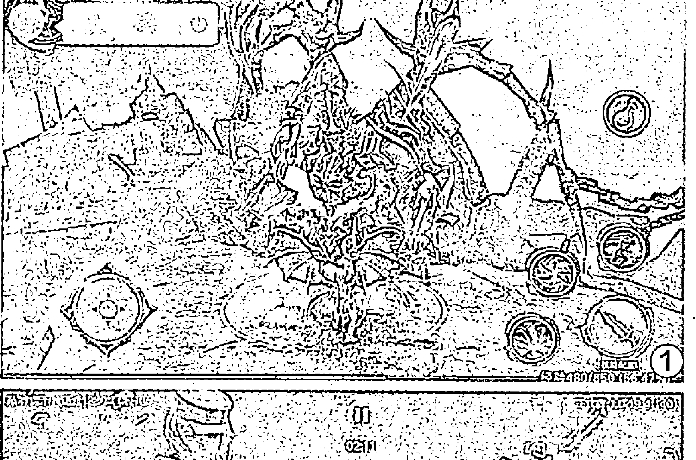

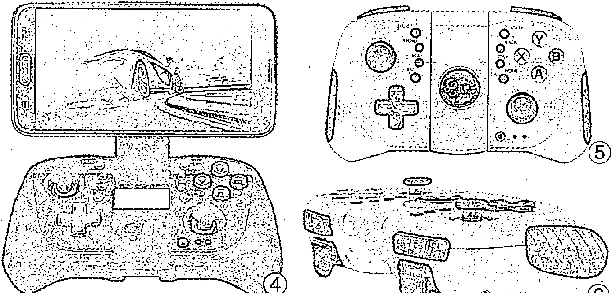

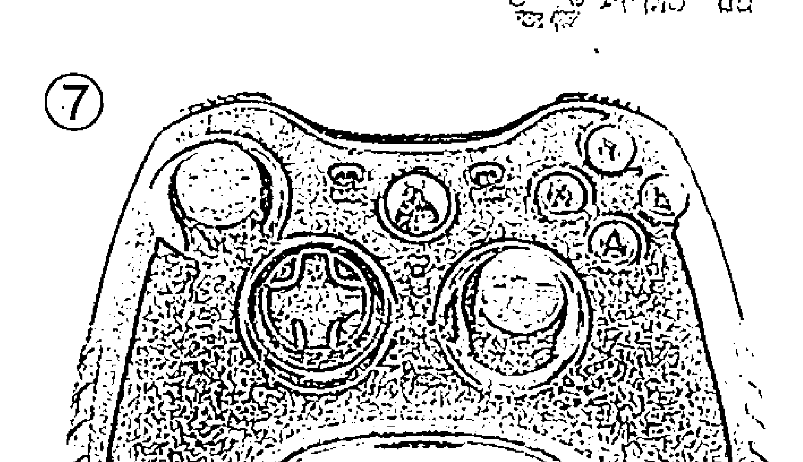


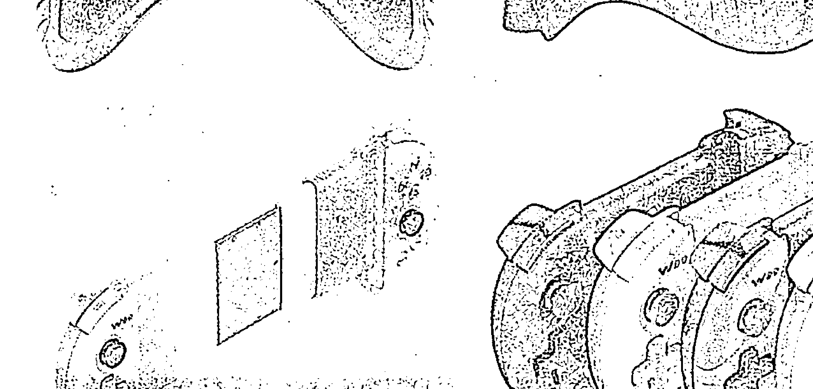

###### 飞智拉伸手柄

将按键布置在屏幕两端，应该是大家最熟悉的手持游戏设备设计，从PSP、PS Vita到Wii U、Switch，乃至一些专门设计的Android游戏手机，莫不如此，所以直接将按键附加在手机屏幕两端的手柄受到了很多人的欢迎。飞智（Wee）拉伸手柄就是采用手机两端按键模式的典型产品，它其实可以看作是一个大型的手机夹，可适应3.5英寸~6.33英寸的手机，两端的按键排布方式与Switch类似（图9）。

飞智拉伸手柄有多种颜色可选（图10），不过个性颜色型号的价格高10元，外壳为高抛光塑料材质，采用晒纹工艺增加握感，透明按键加上流线型边缘，外形时尚靓丽，缩至最小状态时长度不足15cm，非常便携（图11）。它内置300mAh电池，功耗很低，续航时长可达72小时以上。

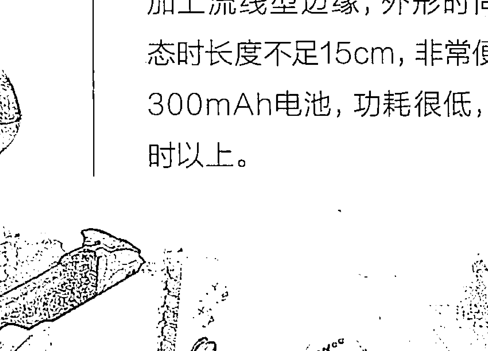

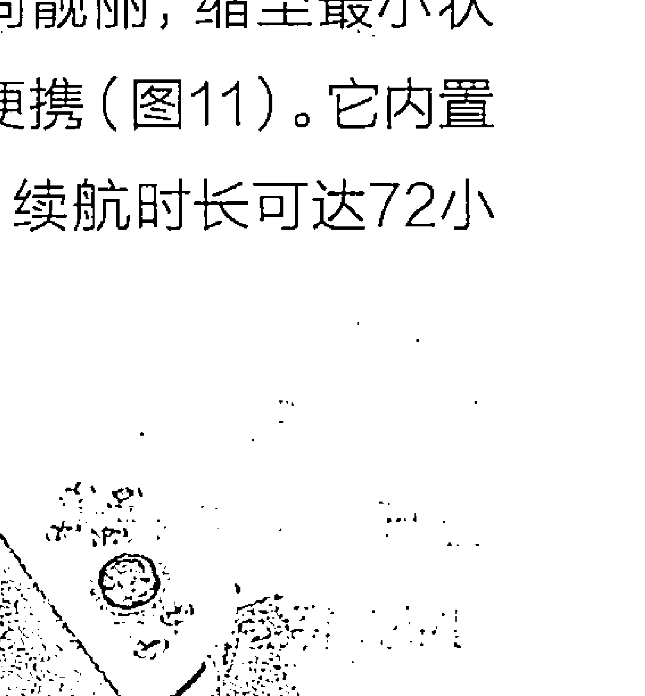

##### 耳机

目前高端化的手机游戏中，音效和背景音乐也和PC游戏一样越来越动听，甚至成为玩游戏时必须注意的，例如NPC的话语、组队游戏中的对话，以及一些提示性的音效等。很显然，对喜欢打这些高端游戏的用户来说，高质量的耳机是必备的，而静音打游戏则会损失很大的乐趣，甚至造成游戏能力的下降，所以不要在课堂上偷偷打游戏哦。

###### QCY QY5 plus音乐4.1无线蓝牙耳机

QCY是一个比较优秀的国产耳机品牌，其蓝牙耳机的性价比相当优秀。QY5 plus音乐4.1为双耳塞设计（图12），更适合炎热的夏季或者追求便携性的用户。虽然目前分离式的双耳塞式蓝牙耳机已经比较常见，但个人认为分离式双耳塞如果不使用便携盒非常容易丢失，而使用盒子的话，实际尺寸重量就超过了带连线的产品，同时价格也比较昂贵，所以并不推荐。

QY5 plus音乐4.1采用符合耳廓结构的耳翼增强佩戴的牢固度（图13），有黑、白以及黑白结合黄线的多种色彩可选（图14），外形靓丽简洁。从名称就可以看出，这款耳机采用较新的蓝牙4.1标准，续航时间为6~7小时，特殊的音腔和降噪设计使其具有较好的音质表现。

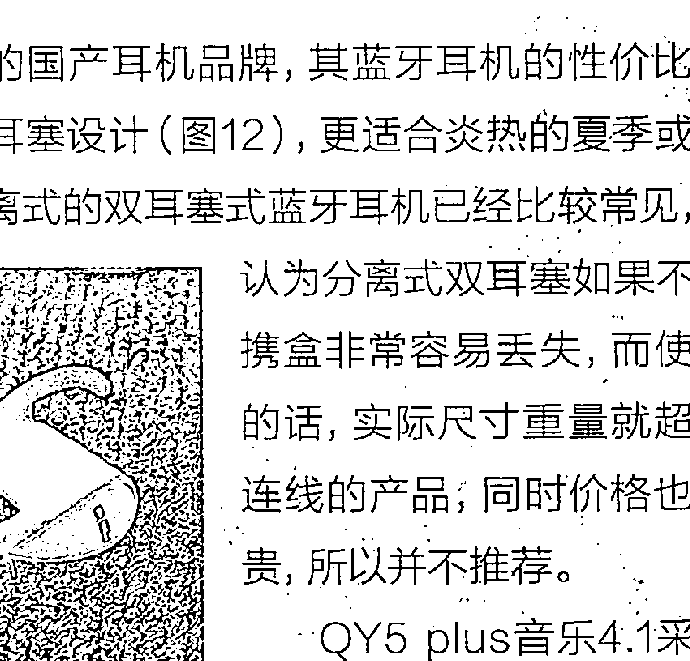

###### 蓝弦T2+涡轮2代加强版

包耳式耳机适合更好地沉浸在游戏中，或者……在寒冷的冬季使用。蓝弦T2+涡轮2代加强版就是一款外形出色、设计巧妙的头戴式包耳式耳机（图15）。它有黑、白、蓝、红色可选，耳罩部分可以旋转折叠收入框架内部，便携性不错（图16），在需要暂时露耳时也可以直接旋转耳罩，比其他头戴式耳机的半摘方式更方便舒适。

蓝弦T2+涡轮2代加强版采用57mm大驱动单元，阻抗16Ω，具有良好的音质，并且支持FM收音和音乐播放功能，可使用最大32GB的Micro SD卡扩展。它内置650mAh电池，采用蓝牙4.1连接技术，可持续听歌40小时、通话45小时，待机时长则达到了1600小时以上。在电池耗尽后，它还可以安装音频连线作为有线耳机使用，希望分享音乐的朋友也可以通过音频接口将音乐输出到另一个有线耳机中，实现双人听音。


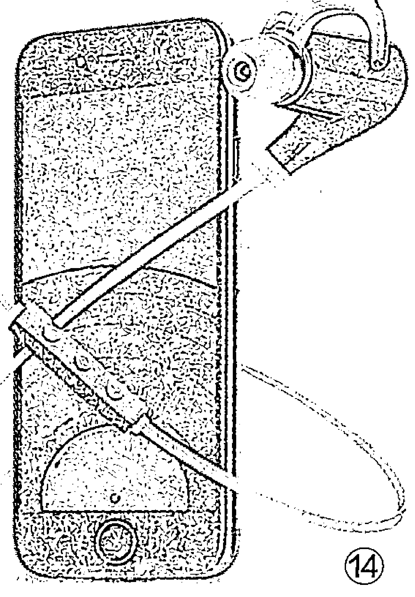

###### 小米活塞耳机清新版

有线耳机以其低廉的价格，仍然是内地很多玩家的首选。其实对手机玩家来说，选择有线耳机还有另一个原因，那就是蓝牙手柄占用了手机的蓝牙信号。手机游戏的音质还远没有达到多声道或Hi-Fi的水平，所以我们无需追求特别高端的有线耳机，外形出色、拥有多个个性色彩、性能也不错的小米活塞耳机清新版（图17）就是不错的选择。这款产品采用铝合金音腔、第三代平衡阻尼系统（图18），可提供较好的音质，附赠大小不同的奶嘴级硅胶材质耳塞套可以适合不同的耳型，配合设计独特的入耳部分角度，感觉舒适，且封闭性、稳固性都不错。

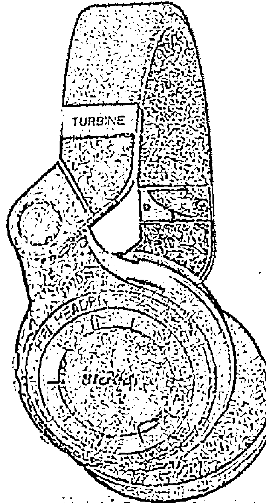

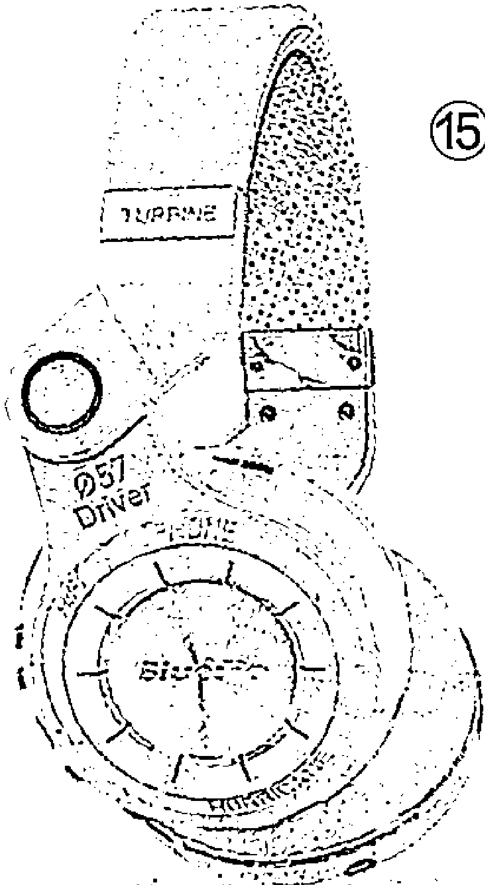

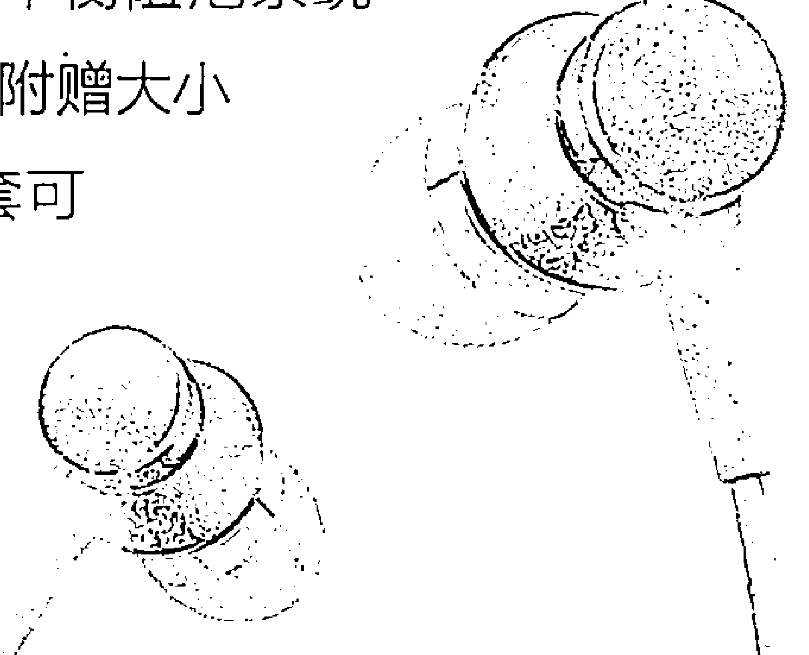

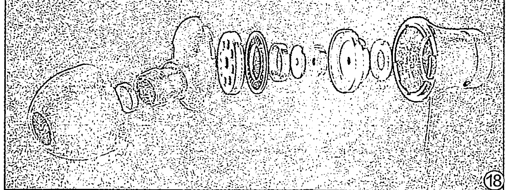

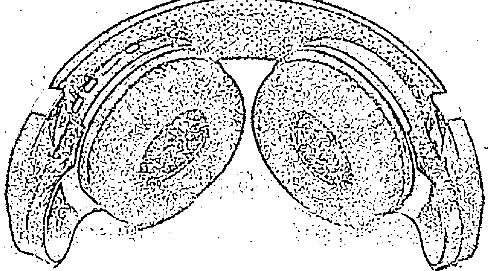

##### 背夹式充电器/充电外壳

考虑到玩游戏的手持方式，以及可能使用带手机夹的手柄的操控方式，在后备电源方面我们建议大家放弃拖着“长尾巴”的一般备用电源，采用背夹式充电器或充电外壳。由于这种产品需要符合手机的尺寸，所以之前在iPhone配件市场上比较常见，不过随着内地品牌“街机”的出现，针对这些销售量巨大的“街机”，也出现了不少对应的背夹式充电器（图19），相信大部分用户能够买到适合自己手机的背夹式充电器。背夹式充电器和充电外壳除了去掉麻烦的大辫子、融合式的色彩和外形（图20），还为手机提供了一定的防护，另外很多产品还有折叠式支架（图21）等附加功能。

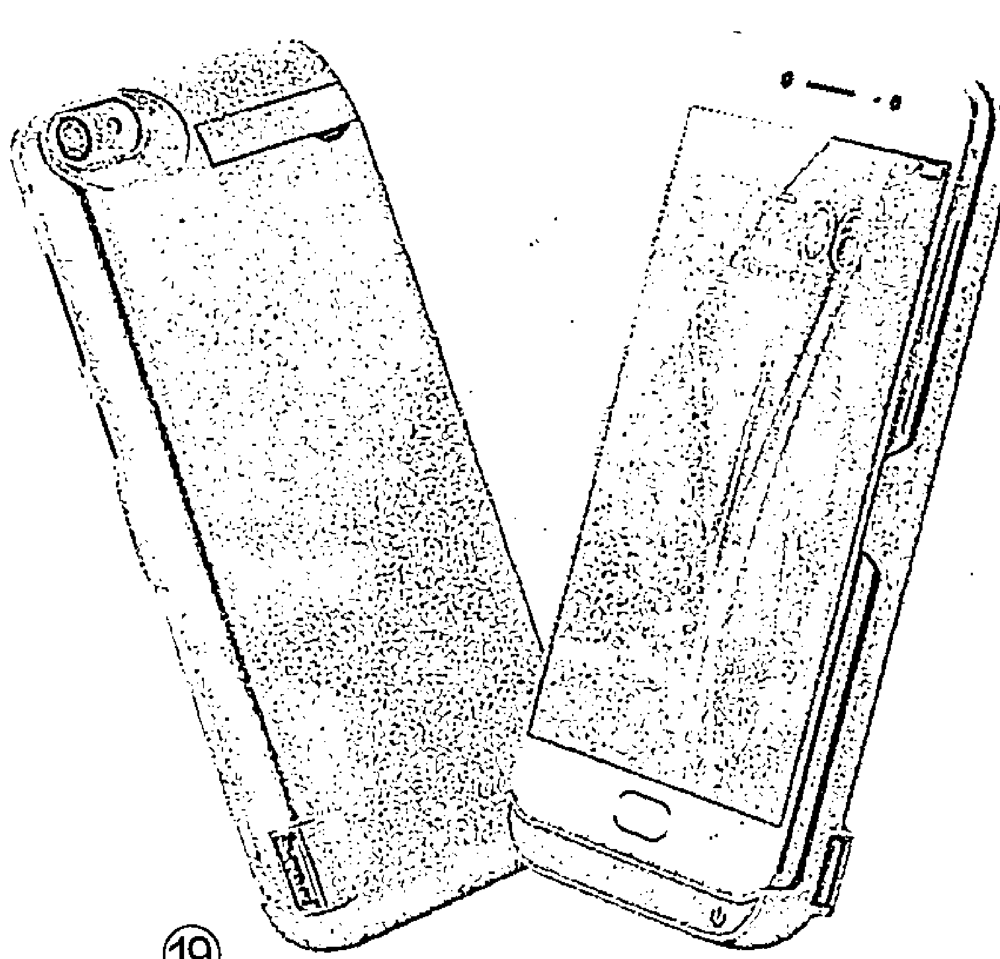

#### 网络相关

手机网游是目前非常流行的趋势，与人类交流或竞争的乐趣远远超过单打独斗，无论是与队友一起怒怼Boss，还是和网友对战，都希望网络能够给力，低延迟和连接稳定的网络在一定程度上比高性能的手机更重要。作为移动设备，手游不仅会使用室内Wi-Fi网络，还常常会使用手机网络，因此手游发烧友不仅应该拥有出色的无线路由器，还应该考虑使用足量的4G流量包。

##### 荣耀X1路由器

目前很多路由器也已经开始关注到了手游的需求，并为之进行优化，荣耀X1路由器就是其中的一款。这款路由器并没有追求超高的性能和大量的额外功能，而是为手游用户提供了更稳定的无线上网环境。其外形小巧而时尚，可以融入不同的家庭环境（图22），所以可以大方地摆到家中最显眼的位置，这实际上也避免了遮蔽，提升了信号的强度。

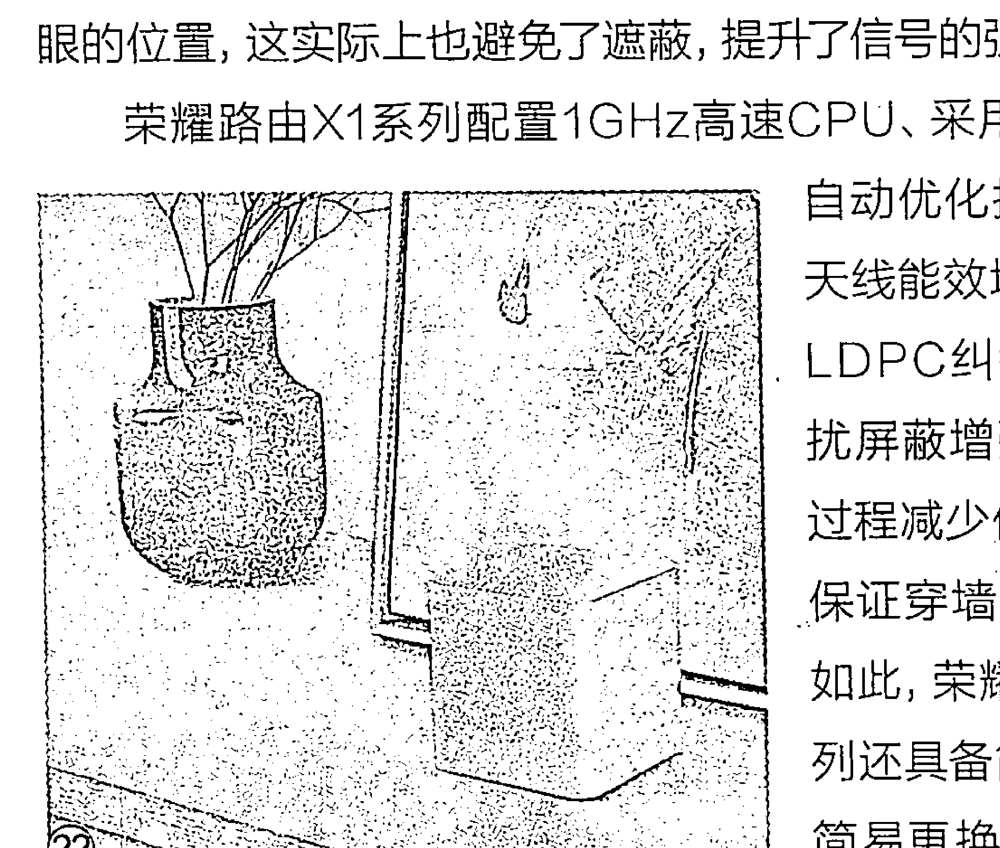

荣耀路由X1系列配置1GHz高速CPU、采用信道适时自动优化技术，通过天线能效增强技术、LDPC纠错算法、干扰屏蔽增强技术，全过程减少信号干扰，保证穿墙能力。不仅如此，荣耀路由X1系列还具备简易配置、简易更换路由、专属。

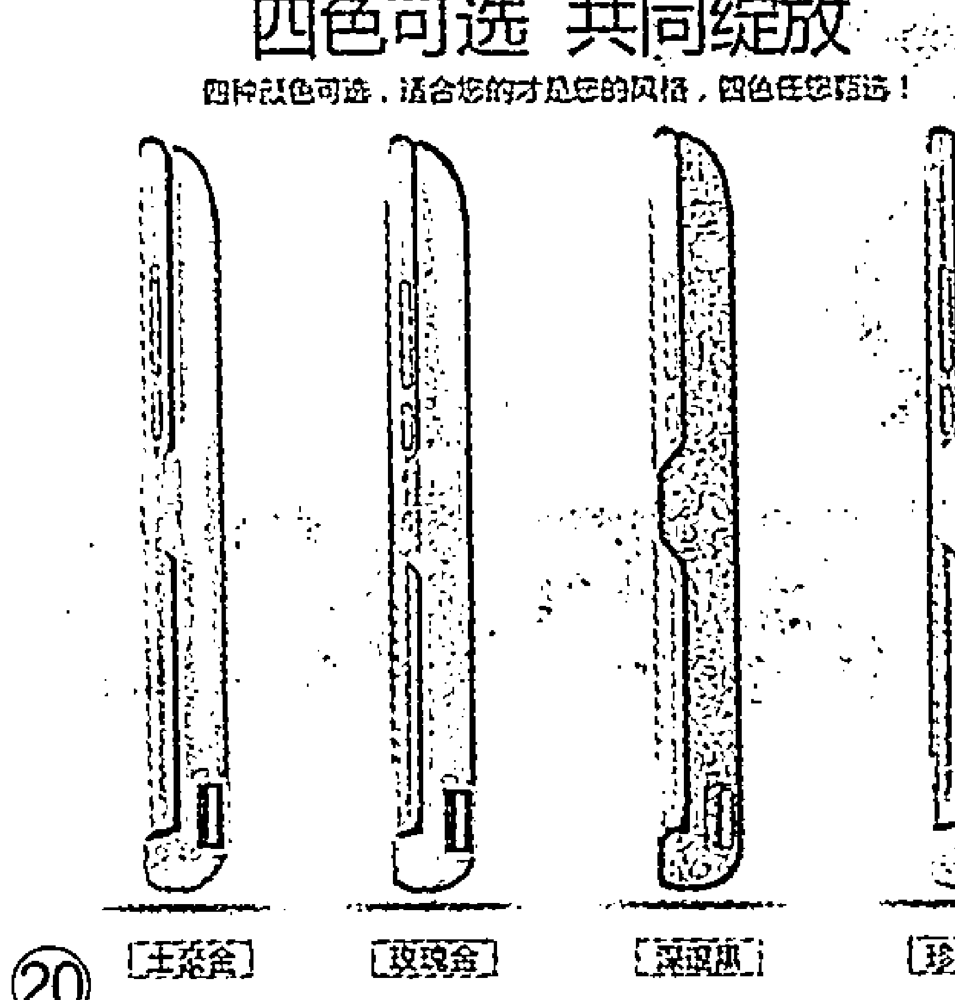


##### 服务套餐与流量包

一些大型网络服务商已经拥有了自己的移动网络服务能力，可以提供专为自家游戏和其他服务优化的套餐（图23）。这些套餐不仅包括流量，也有通话时长等内容，不过需要用户更换手机号码，或者安装到空闲的手机/SIM卡位上。对不准备更换常用手机号码，也没有空闲SIM卡位，更不准备在专用手机上玩游戏的玩家，可以选择这些游戏运营商与电信运营商合作提供的流量包（图24）。

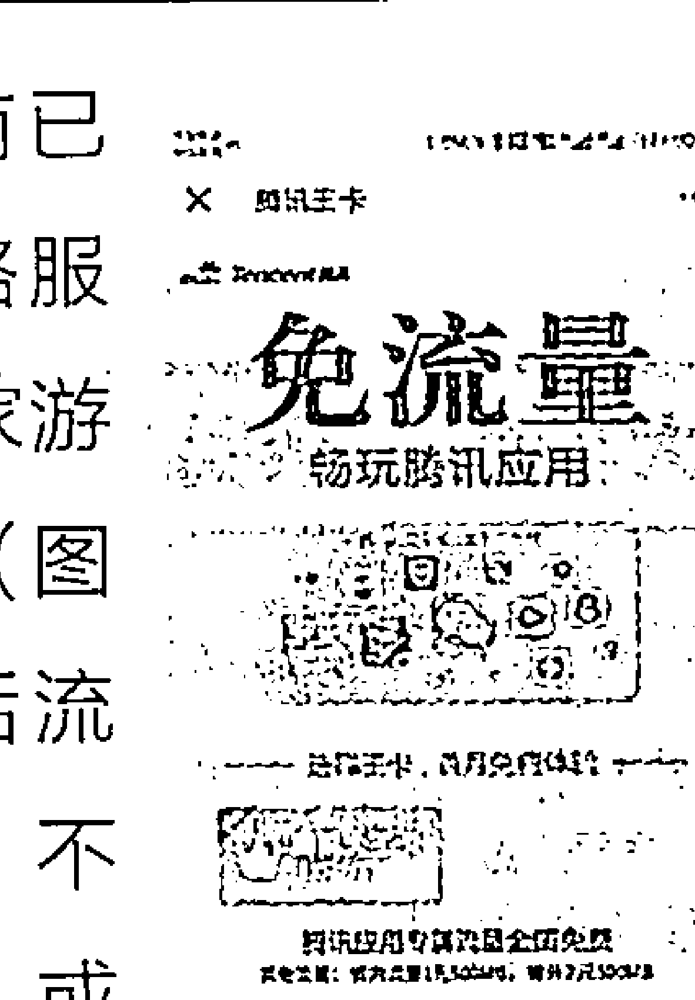

在购买服务套餐与流量包时，一定要注意其具体内容，如流量是否为全国通用等。例如在王者荣耀的内购流量包中就注明了不支持下载升级包所用，而这款游戏的升级又是非常频繁，且不升级会影响进入游戏。


#### 实用的选择

##### 华硕F556UQ PK 联想小新潮5000

对喜欢玩大型游戏的玩家而言，武装GTX级别独显的游戏本无疑是最佳之选。但是，对更多普通家庭用户而言，笔记本还是要本着“性能够用，价格实惠”的原则。而华硕F556UQ和联想小新潮5000则是4000元以内配置较为均衡的产品。那么，它们之间谁更适合你？

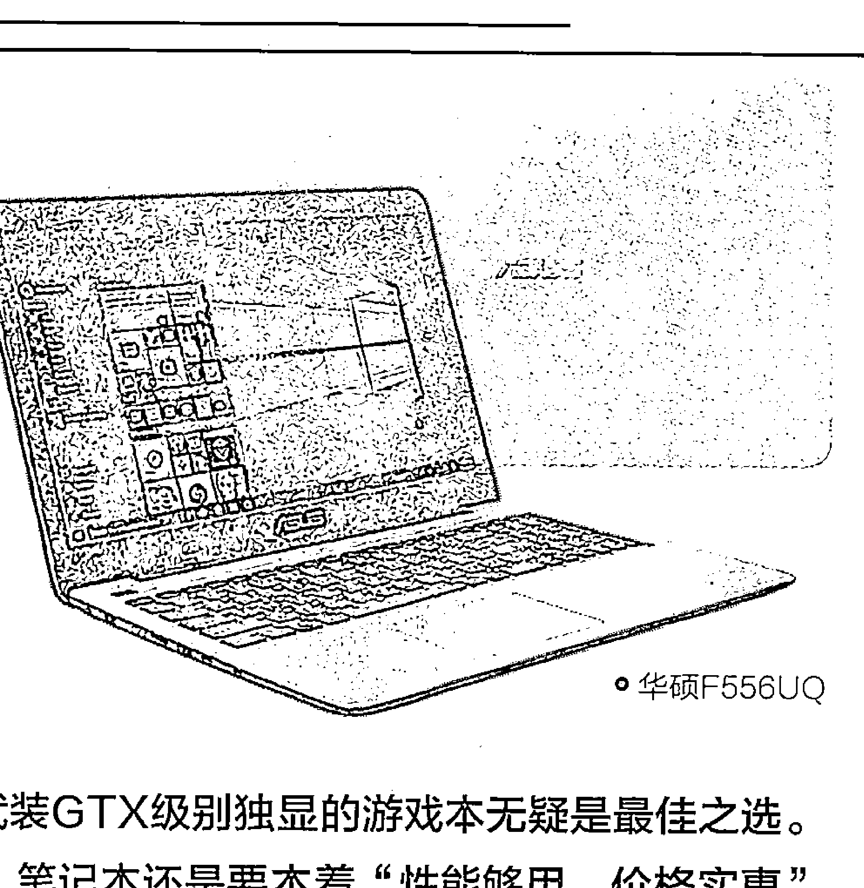


###### 大视野的亲民款

对家庭用户而言，如果没有经常携带笔记本外出的需求（如上班、出差），我们就无需过分考虑厚度和重量这两个参数。至于屏幕尺寸，则是15.6英寸为最佳。究其原因，是大屏幕可以带来更宽阔视野的同时，还有足够的宽度来安置数字小键盘，在某些游戏或财会等领域可以起到事半功倍的效果。

华硕F556UQ（又称“顽石战斗版”）和联想小新潮5000（又称“拯救者E520”）就是两款15.6英寸笔记本的代表，二者的差异在于分辨率。其中，F556UQ屏幕为标准的1366×768像素，而小新潮5000则达到了1080P级别，就显示的细腻程度而言后者占优。此外，小新潮5000的机身设计也更为（相对）轻薄，2.1kg的重量在15.6英寸笔记本里算是颇为轻盈的存在了。

| 参数对比 | 华硕F556UQ | 联想小新潮5000 |
|----------|------------|----------------|
| 屏幕 | 15.6英寸(1366×768像素) | 15.6英寸(1920×1080像素) |
| 处理器 | 酷睿i5-7200U | 酷睿i5-7200U |
| 内存/硬盘 | 4GB/1TB HDD | 4GB/1TB HDD |
| 显卡 | NVIDIA 940MX (2GB DDR3) | AMD Radeon R5 M530 (2GB GDDR5) |
| 接口 | 读卡器、USB3.0、USB2.0、USB Type-C、HDMI、VGA、RJ45 | 读卡器、USB3.0×2、USB Type-C、HDMI、RJ45 |
| 厚度/重量 | 25.5mm/2.3kg | 22.7mm/2.1kg |
| 参考价格 | 3899元 | 3899元 |

华硕F556UQ提供了红、蓝、金3种颜色的版本（图1），蓝色A面顶盖采用了同心圆纹理装饰、金色为拉丝工艺，红色为磨砂工艺，大家可以根据自己的喜欢加以选择。无论颜色如何，F556UQ的C面掌托部分都是拉丝纹理装饰，一体式的触控板也不怕缝隙会堆积污垢（图2）。联想小新潮5000则拥有银、蓝、白3种配色版本，A面顶盖采用磨砂质感工艺，C面则为拉丝纹理。就设计而言，小新潮5000在机身边角处的棱角更为分明，屏幕更是可以开合到180度（图3）。

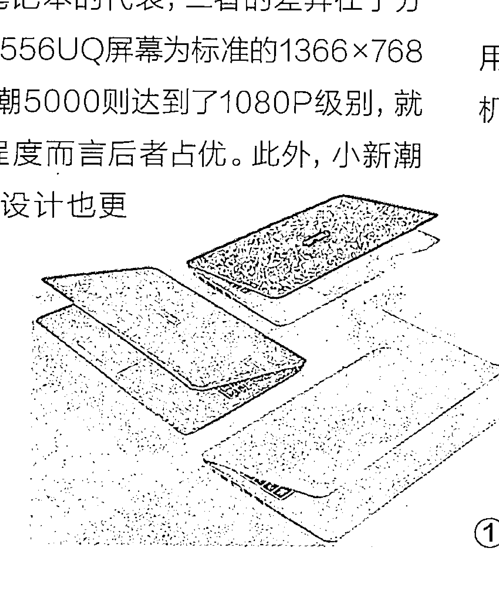

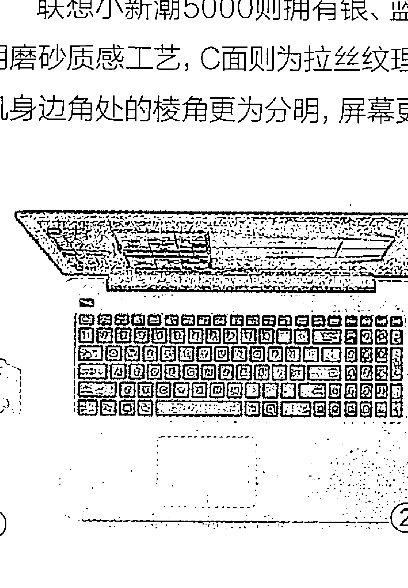

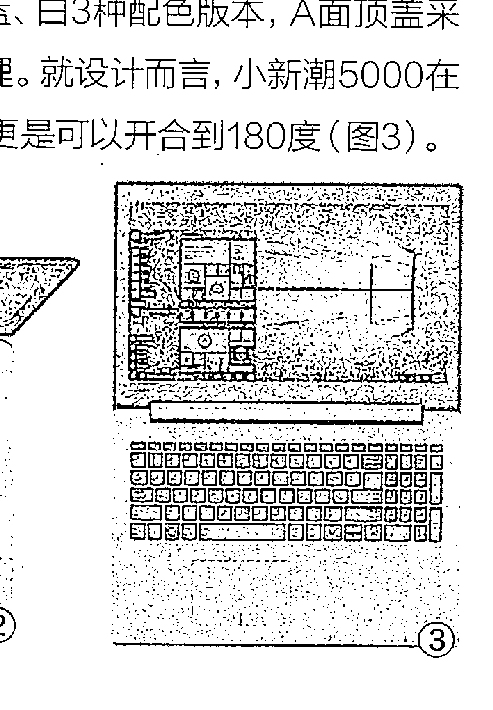

###### 来自显卡的差异

华硕F556UQ和联想小新潮5000都搭载了英特尔第七代酷睿处理器家族中的热门型号：酷睿i5-7200U，它是一颗双核四线程设计的低电压芯片，基于14nm制程工艺的Kaby Lake-U架构设计，TDP为15W，默认主频2.7GHz，睿频加速后最高可达3.5GHz，并拥有4MB三级缓存。

同时，两款机器都标配4GB DDR4内存，内置1TB机械硬盘。在配置方面，华硕F556UQ和联想小新潮5000最大的差异体现在独立显卡：前者选用了NVIDIA GeForce 940MX，而后者则配备了AMD Radeon R5 M530。

NVIDIA 940MX大家应该非常熟悉了，近两年3500元~5000元价位的主流笔记本到处都能看到它的身影，只是前不久才刚刚被NVIDIA GeForce MX150所取代。提到AMD Radeon R5 M530大家可能比较陌生，因为它是AMD近期才推向市场的中低端移动显卡芯片。

测试软件 | NVIDIA 940MX | AMD R5 M530
--- | --- | ---
3DMark-P | 2482 | 2183
3DMark-Fire Strike | 1587 | 1517
*测试仅取GPU子项分数

###### 内外扩展能力的对比

虽然两款笔记本都拥有硕大的机身，但接口设计却都谈不上完美，而这个不完美主要就体现在标准USB接口的数量上（图5）。具体来说，华硕F556UQ和联想小新潮5000都只提供了2个标准USB接口，其中F556UQ还是2.0和3.0各1个。虽然两款机器同时都还提供了最新的USB Type-C标准接口，但现阶段最普及的还是标准USB的闪存盘和数据线。如果能将（标准）USB数量增加到3个就更人性化了。

得益于相对厚实的机身，华硕F556UQ比小新潮5000额外增加了1个VGA接口，可以配合HDMI实现双屏输出，扩展出更大的视野（需外接显示器）。

在散热和内部结构设计上，华硕F556UQ与小新潮5000的表现基本相同，它们都将散热出风口放在了屏幕转轴内侧，也都是单风扇单热管的散热模块设计。此外，两款产品标配的都是2.5英寸的SATA硬盘，机身里也没有预留M.2插槽。好消息是，它们都预留了光驱扩展仓，可以借助光驱位的硬盘托架安装第二块硬盘（图6），从而实现SSD+HDD双硬盘的梦想。

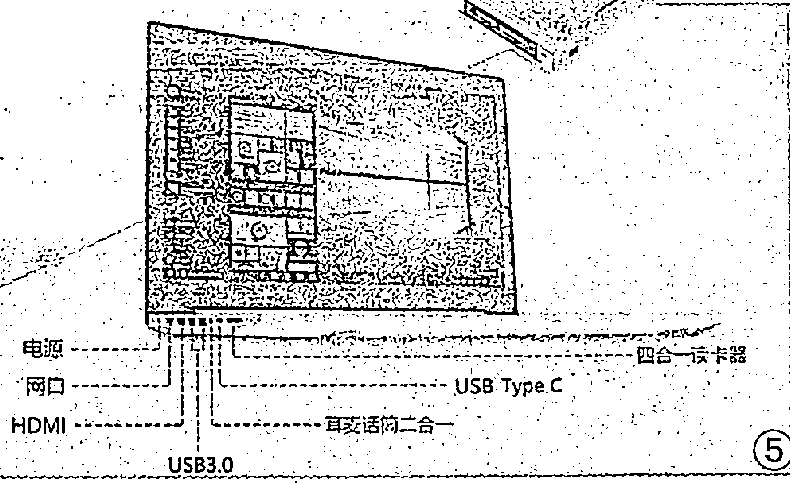

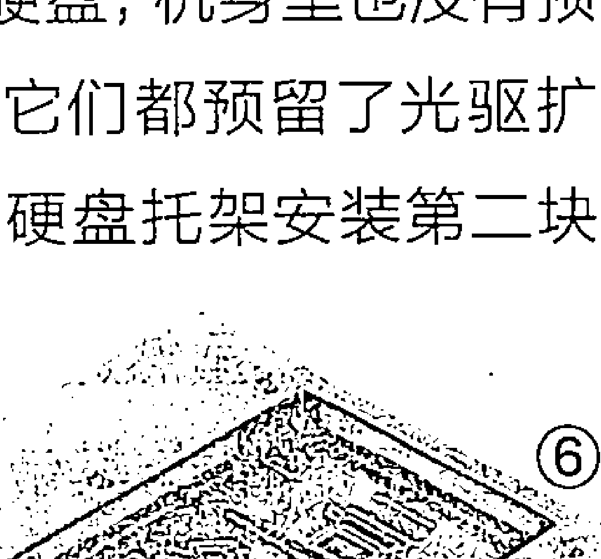

华硕F556UQ和联想小新潮5000是两款配置较为均衡的笔记本，别看它们的价格不高，但都提供了主流独显以及可实现双硬盘的扩展潜力。如果你青睐于更轻薄的设计，对屏幕分辨率要求较高，联想小新潮5000的表现不会让你失望；如果你有着多屏输出的需求，华硕F556UQ则可以更容易帮你达成目标。

#### 职场新人“生产力”适配手册

文/周之

选择笔记本电脑，便是为了选择性能和便携性的融合，如何调配这两个参数的比例，需要看我们选择阶段的需求是什么。在求学期间，为了携带方便我们往往会考虑购买性能笔记本，其同时兼顾的娱乐功能可以丰富我们的业余生活。毕竟，对于学生群体而言，强悍的性能才能满足娱乐生活的需求。

5000元左右的价位便可以选择配置NVIDIA GeForce GTX 950M等入门性能级显卡的笔记本电脑，给我们带来不俗的影音游戏体验，往往也有着炫酷的外形，对学生朋友的吸引力毋庸置疑。虽然这些笔记本自身沉重并附有巨大的充电器，但与其带来的娱乐效果相比却不足一提。毕竟学生群体虽然选择笔记本电脑，但是一般也就是在宿舍、教室间移动，需要长途携带的机会大概也就是每年的两次假期吧。

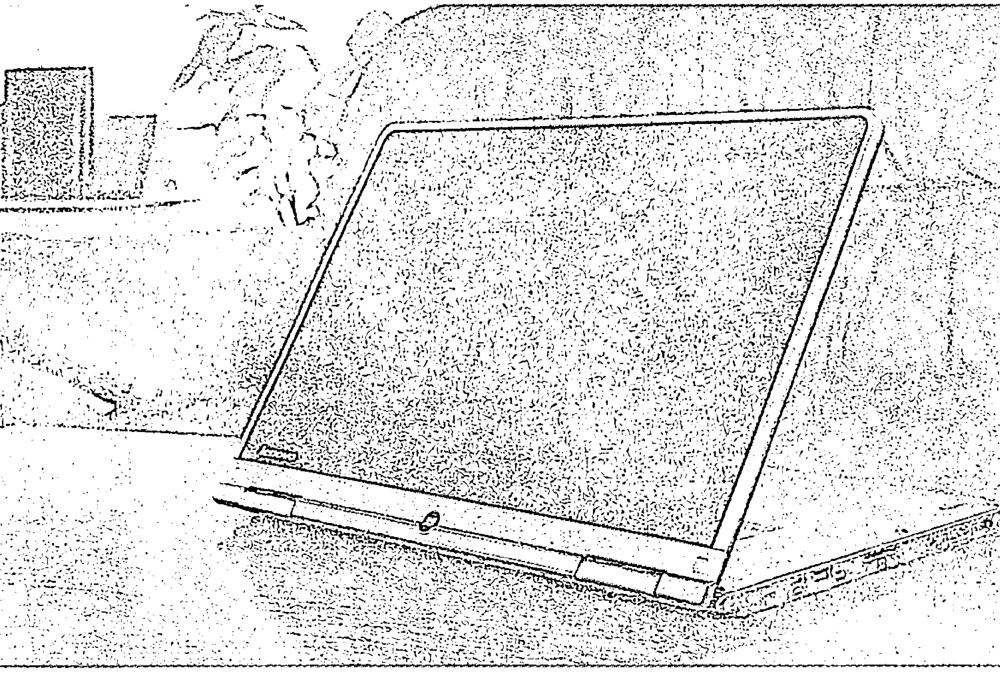

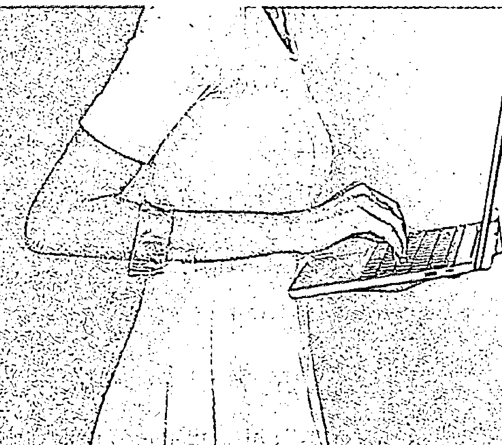

大学时期和工作后对轻薄本的印象，笑。

一旦脱离校园步入社会，往往会面临移动办公的问题，这时能带给我们出众娱乐体验的性能笔记本往往就显得有些累赘，如果不幸入职出差比较多的行业，携带电脑办公出差简直就是一种折磨。这时，以往不入学生特别是男学生们“法眼”的轻薄便携本就有了用武之地。

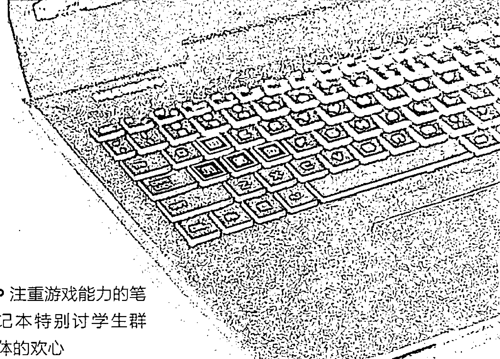

注重游戏能力的笔记本特别讨学生群体的欢心。

大多数轻薄便携的笔记本虽然不具备强悍的影音性能，但却凭借其外观、功耗、便携性方面的优势赢得众多办公用户的喜爱。毕竟对于移动办公来说，如何保持持续高效的生产力才是需要把握的重点。不可否认的是，厚重的性能级笔记本仍然代表着更高的生产力，但想想需要携带它们上下班挤车通勤几小时，或者时常跨越数百、上千公里出差，那么性能足够。

性能级笔记本的重量让大学生感觉正常，但会让白领感觉有些受不了

而体型轻巧的笔记本显然就成为了更好的选择。初入职场的新人如何选择适合自己的生产力工具？我们不妨将这些新人简单地进行分类。在此之前，先把筛选产品的一个重要标准“8GB内存”作为先决条件，这样可以保证选择的产品在未来的3年~5年内仍旧游刃有余，可以长期流畅使用。

##### 第一类: 普通白领

###### 小米笔记本Air

许多人认为PC行业已经是一片红海，“雷布斯”高调带领小米进入十分不智，不过现在看来似乎也没有多坏。据全球市场研究公司GFK统计显示，从2016年12月到2017年5月，小米在中国轻薄笔记本的市场份额接近15%，稳居第三位，仅次于联想和苹果，甚至超过了戴尔、HP、华硕等老牌PC品牌。

极简无Logo的设计及超高的颜值征服了不少想要选择轻薄本的用户，同时小米之家提供的个性化贴纸和免费激光雕刻也迎合了年轻用户喜欢特立独行的特点。

小米笔记本十分轻薄，且具有不俗的外观

13.3英寸小米笔记本Air经典独显版搭载了英特尔第六代Skylake酷睿i5处理器，配备了8GB内存和256GB固态硬盘，支持硬盘扩展，再搭配NVIDIA GeForce 940MX独立显卡，提供了一定程度的影音娱乐功能，足以流畅运行市面上的网络游戏，《魔兽世界》、《英雄联盟》、《DOTA》等都绝对不在话下。不过最开始宣传中出现的《秘境探险4》可能有点问题，毕竟其为PS4主机独占，PC不在其兼容范围之内。

小米笔记本Air重量仅有1.28kg，硼砂阳极工艺处理的外壳带来靓丽的外观也十分养眼，同时支持与小米手环连接免密解锁，为我们的日常使用增添了不少便利。其续航时间可以达到9.5个小时左右，足以支持我们在无电源环境下的办公。

作为实习生，日常的Office应用肯定少不了，不过若仅仅是我们也不必要去加钱选择具备独立显卡的小米笔记本Air了。日常中各种报表PPT总需要装饰，如果能在Boss或者主管面前露一手熟练的PS手艺，想必也会给我们带来加分，而PS在没有独立显卡时仅靠核心显卡力有不足，为了成功转正着想，独立显卡的钱省不了。性能级的独立显卡也不仅仅限于游戏影音，如果跨职业到影视行业需要做非编特效，虽然不必专业级独立显卡，性能显卡的体验总好过于集成显卡，可谓万金油的选择。

##### 第二类：程序员

###### 苹果MacBook Pro ( MF839CH/A )

作为一名新晋“程序猿”，编程将是日后工作的主流，为了能够同时给iOS、Android、LinuxServer、Windows开发程序，Mac就成为了最佳的选择。用Mac的一个很关键原因就是MacOS本身是一个Unix系统，可以很方便地模拟Linux服务器环境，Mac下写的C、C++系统程序一般情况下都可以直接移植到Linux下运行。配合Zsh和Ohmyzsh可以给编程工作带来极大的便利，更不要提那个可以极大提升生产力的OS X快捷键Command键。

MacBook Pro(MF839CH/A)配备Retina显示屏的MacBook Pro搭载Intel Iris Graphics 6100图形处理器，据说性能达到GT750M的水平。搭载英特尔14纳米Broadwell处理器i5-5257U，基础频率为2.7GHz，Turbo Boost可达3.1GHz，而内存虽然为8GB，但频率提高至1866MHz。内置SSD采用PCI-E接口，跑分可到1000MB/s，标配Force Touch，提高了触摸板的操作体验。

另外，作为一名程序员，如何摒弃外界诱惑才是重中之重，当选择Macbook Pro的时候就已经与热门的《英雄联盟》、《守望先锋》等游戏绝缘。没有了外界的诱惑，便能静下心来好好写代码，升职加薪不在话下。

*新一代Macbook Pro接口等设计略显激进，我们暂时并不推荐

##### 第三类：美术工作者

###### 联想Miix 5 (尊享版 )

由Microsoft带头研发的Surface系列无疑给广大厂商做出了二合一笔记本的优秀范例，其支持压感的触控笔让美术工作者省去购买数位屏的必要。最新一代的Surface Pro虽然重新提供了4096级压感笔的选购权，但其近万的价格却足以让新入行的美术工作者望而却步。联想MIIX5的出现可谓打破了这一局面。

对比其他Surface或iPad模仿者高昂的售价，联想MIIX5再一次用性价比将它们都甩在了脑后。尊享版的联想MIIX5售价仅为4999元，比同配置的Surface Pro便宜近3000块钱。同时它的键盘盖和4096级压感笔可以提供远超一般手写板的体验。

联想MIIX5采用12英寸显示屏，虽然分辨率为不太常见的1920x1200，但它支持十点触控并且是IPS广视角屏幕。机身厚度为9mm~12mm（加键盘盖），重量只有880g。后置500万像素和前置200万像素摄像头，电池续航时间理论可达8小时。介于平板和笔记本之间的混搭风格设计类似Surface，但采用了表链式结构而非Surface的多段式结构，可将键盘盖拆分以适应不同场合使用。尊享版配备英特尔酷睿i7 6500U双核处理器，配合8GB高速内存+512GB硬盘，完全能够胜任用户的日常使用，美术工作者常用的SAI、PS等都可以流畅运行。得益于Windows ink的全新启动技术，休眠状态下可一秒唤醒，随时随地开始创作。

##### 第四类：影视工作者

###### ThinkPad P40 Yoga（20GQA003CD）

一般而言，从事影视工作不会缺钱，但考虑到职场新人的负担能力，仍旧推荐在尽可能的范围内降低成本。Macbook Pro被很多人认为是影视工作者的“佳偶”，但真正能让影视工作者顺心使用的Macbook Pro机型一般都是中高配，价格相当可观。所以笔者认为，在没有充足情怀或预算的情况下，Windows平台加专业级显卡显然能发挥更强的实力，并不比Mac情怀加成差。

“专业”领域往往需要大容量显存，而因为某些原因，游戏性能显卡的显存受到了限制。合成软件Nuke/AE显卡的区别对于他们来说作用不是十分明显。在AE中更快的显卡会提升预览速度和预览质量，这一点游戏卡要比专业卡强大太多。在三维软件中最吃显卡的是Maya，其次是Cinema 4D，3ds max对显卡的要求最低，这时候专业卡的性能几倍于游戏卡。在剪辑软件PR等中，越好的显卡越快，专业卡强于游戏卡，但剪辑过程中不明显，渲染时间会有大幅差距。

联想ThinkPad P40 Yoga采用了分辨率为1920x1080像素的IPS屏幕，同时支持2048级的压感；作为Yoga家族的一员，其屏幕可以进行360°旋转，有更多的可用角度和使用方式；配备了一款可重复充电的ThinkPad Pen Pro手写笔，适用于描绘与写作。为了保证屏幕的精准度，联想与Wacom携手设计了一款独特的驱动，能够提供近似纸笔的使用体验。

在硬件配置上，ThinkPad P40 Yoga搭载了英特尔酷睿i7-6500U处理器；高达8GB的内存和256GB的SSD，2GB显存NVIDIA Quadro M500m+Intel GMA HD520独立显卡。该机还通过了军规级测试（MIL-SPECTested），并且拥有较长的电池寿命。

当然，要想成为一名优秀的职场人，仅拥有顺手的硬件设备还不够，好马需要配好鞍，一些软件和应用也可以大大提升我们的工作，是这些硬件设备的最好搭档。关于软件选择方面的经验，我们在以后的相关文章中与大家进行交流。

#### 主流品牌预算下的最超值游戏本

在预算充裕的情况下，CFan曾不止一次建议大家优先选择武装GTX1050 Ti独显的游戏本。然而，GTX1050 Ti的定位略高，注定与其为伍游戏本的起价就介于5500元到6000元之间。问题来了，如果我们的预算不足5000元，又该如何挑选游戏本？

##### 1080P雾面屏是底线

考虑到游戏过程中唯有更大视野才足够震撼（图1），所以15.6英寸屏幕和1080P像素分辨率是最基本的显示参数。此外，如果你担心屏幕反光问题，雾面屏也是必不可少的要素。至于广视角的IPS材质，在这个价位的游戏本中属于可遇不可求，在同配同价的前提下可以作为优先购买的加分项。

##### 认准新一代显卡

为了给新品让路，很多采用上代GTX950M或GTX960M独显的游戏本都打出了较低的价格。但从性能的角度来看，笔者还是建议大家优先考虑武装NVIDIA最新GTX1050独显的机型，毕竟GTX1050是媲美GTX965M的存在，可以秒杀同价位的GTX960M（图2）。此外，这个价位的游戏本领域也出现了不少基于AMD平台设计的产品，但其中只有AMD RX460才算是勉强符合游戏本标准“下限”的显卡。

##### 双硬盘位是必需的

对游戏本而言，唯有支持SSD+HDD双硬盘的产品才能保证使用体验。其中，SSD是确保开关机速度的关键，而HDD则是能塞进更多游戏的保证。可惜，低于5000元的游戏本普遍仅标配HDD机械硬盘，需要我们后续自行加装M.2接口的SSD。而在众多预留M.2插槽的游戏本中，M.2插槽数量越多、能支持高速PCIe通道的产品则可增加购买优先级（图3）。

##### 知名品牌的标杆推荐

如今游戏本的品牌型号众多，很容易“挑花眼”，所以笔者以品牌为单位，将知名品牌旗下可作为“起步标杆”的游戏本帮大家筛选了出来。比如，如果你比较信任联想的品质，本文涉及的小新锐7000就是该品牌游戏本的基准标杆，配置和定位比它低的产品就不符合“游戏本”这一身分了。反之，如果你预算较为充裕或对性能要求更高，则可考虑该品牌旗下配置和定位高于这一标杆的型号（比如拯救者系列），从而获得更好的工艺和游戏体验。

###### 神舟战神T6-X4D1

- 屏幕: 15.6英寸(1080P)
- 处理器: 奔腾G4560
- 内存/硬盘: 4GB/1TB
- 显卡: NVIDIA GTX1050
- 接口: 读卡器、USB3.0×3、USB2.0、HDMI、RJ45
- 厚度/重量: 31.7mm/2.5kg

神舟战神T6-X4D1的价格不足4000元，是最实惠的GTX1050独显游戏本之一。该产品还有一大卖点，那就是搭载了台式机专用的奔腾G4560处理器，日后可以升级到七代酷睿i3或i5级别的芯片。此外，T6-X4D1还内置2个M.2插槽，扩展潜力表现出色。

###### 戴尔游匣潘多拉5576

- 屏幕: 15.6英寸(1080P)
- 处理器: AMD A-10 9630P
- 内存/硬盘: 4GB/1TB
- 显卡: AMD RX460
- 接口: 读卡器、USB3.0×3、HDMI、RJ45
- 厚度/重量: 26mm/2.6kg

游匣潘多拉5576的售价不足4500元，其最大特色就是选用了AMD第七代APU，并武装少见的AMD RX460独显，红黑搭配的外观、内置低音炮和额外M.2插槽都是它竞争力的所在。不过，AMD移动平台的性能相对一般，A-10 9630P处理器的表现和酷睿i3持平，RX460独显性能介于GTX950M和GTX960M之间。如果你对戴尔品牌情有独钟，可以考虑配备酷睿i5和GTX1050的游匣1545，价格在5000元上下。

###### 华硕VX50I-U

- 屏幕: 15.6英寸(1080P)
- 处理器: AMD FX-9830P
- 内存/硬盘: 8GB/128GB SSD+1TB
- 显卡: AMD RX460
- 接口: 读卡器、USB3.0×2、USB2.0、HDMI、VGA、RJ45
- 厚度/重量: 31.7mm/2.45kg

VX50I-U隶属于华硕旗下的飞行堡垒系列，只是该产品采用了AMD FX-9830P处理器和RX460独显的组合，虽然性能达不到i5-7300HQ和GTX1050的水准，但其不足4500元的售价入手门槛更低。此外，这款VX50I-U还标配8GB内存和双硬盘组合，免去了后续升级的繁琐和开销。

###### 联想小新锐7000

- 屏幕: 15.6英寸IPS(1080P)
- 处理器: 酷睿i5-7300HQ
- 内存/硬盘: 4GB/1TB
- 显卡: NVIDIA GTX1050
- 接口: 读卡器、USB3.0×2、USB2.0、HDMI、RJ45
- 厚度/重量: 22.7mm/2.3kg

小新锐7000最大的特色就是相对轻薄，22.7mm的厚度在同配置游戏本中算是颇为性感的，并在4700元左右的价位上就提供了IPS屏幕和GTX1050独显的组合。值得一提的是，该产品除了标配1TB机械硬盘外，还预留了支持PCIe SSD的M.2插槽，有需要的用户可随时实现双硬盘提速扩容。

###### 惠普畅游人电竞版

- 屏幕: 15.6英寸IPS(1080P)
- 处理器: 酷睿i5-7300HQ
- 内存/硬盘: 4GB/1TB
- 显卡: NVIDIA GTX1050
- 接口: 读卡器、USB3.0×3、USB Type-C、HDMI、RJ45
- 重量: 24.1mm/2.2kg

畅游人电竞版是惠普旗下除了暗影精灵系列以外的又一个游戏本品牌，和暗影精灵相比，该系列拥有更为轻薄的设计，并采用了高颜值的金属拉丝和白色键盘背光设计，更具时尚气息。此外，畅游人电竞版还具备IPS屏幕，支持PCIe的M.2插槽和USB Type-C接口，不足5000元的价格也颇具性价比。

###### 宏碁暗影骑士3 进阶版

- 屏幕: 15.6英寸IPS (1080P)
- 处理器: 酷睿i5-7300HQ
- 内存/硬盘: 4GB/1TB
- 显卡: NVIDIA GTX1050
- 接口: 读卡器、USB3.0、USB2.0×2、USB Type-C、HDMI、RJ45
- 厚度/重量: 26.7mm/2.5kg

进阶版的暗影骑士3没有标准版那种张扬的跑车外观设计，但红黑撞色的外观依旧非常醒目。该系列产品哪怕是4900元左右的低配版也选用了IPS屏幕，GTX1050独显和i5-7300HQ的组合在性能上也绝对够用。而且暗影骑士3进阶版旗下还有武装GTX1050 Ti的高配版，只是价格超过了6000元，性价比不高。

###### 微星GL62M

- 屏幕: 15.6英寸 (1080P)
- 处理器: 酷睿i5-7300HQ
- 内存/硬盘: 8GB/1TB
- 显卡: NVIDIA GTX1050
- 接口: 读卡器、USB3.0×2、USB2.0、USB Type-C、HDMI、miniDP、RJ45
- 厚度/重量: 29mm/2.3kg

作为微星旗下最实惠的游戏本，GL62M起价不足5000元，但它的规格却颇为抢眼。该产品配备了手感出色的赛睿键盘，通过预装的龙盾控制中心也能随时了解主机运行的状态。值得一提的是，GL62M采用了双风扇六热管的豪华散热模块设计，用料十足，而HDMI和miniDP双视频输出接口也便于搭建三联屏显示平台。

###### 三星玄龙骑士

- 屏幕: 15.6英寸广视角 (1080P)
- 处理器: 酷睿i5-7300HQ
- 内存/硬盘: 4GB/500GB
- 显卡: NVIDIA GTX1050
- 接口: 读卡器、USB3.0、USB2.0×2、HDMI、RJ45
- 厚度/重量: 28mm/2.5kg

三星玄龙骑士起价不足4700元，并提供了游戏本领域少见的白色款，底部“龙鳞”风格的散热孔区域也格外醒目。该产品在细节上进行了很多优化，比如可以通过Fn+F10开启游戏屏显、Fn+F11激活录屏功能等。可惜，低配版的玄龙骑士标配硬盘只有500GB，对磁盘容量或性能有较高要求的用户可自行添加额外的M.2 SSD。

###### 机械革命深海泰坦X1

深海泰坦X1售价不足5000元，其特色在于相对轻薄的机身，以及机身底部隐藏的红色呼吸灯光源设计，结合可5级亮度调节的红色键盘背光显得格外炫酷。该产品采用了双风扇四热管的散热模块设计，通过预留的M.2插槽也可随时升级双硬盘。

- 屏幕: 15.6英寸IPS (1080P)
- 处理器: 酷睿i5-7300HQ
- 内存/硬盘: 8GB/1TB
- 显卡: NVIDIA GTX1050
- 接口: 读卡器、USB3.0×2、USB2.0×2、USB Type-C、HDMI、RJ45
- 厚度/重量: 27.5mm/2.3kg