# 电脑爱好者2017合订本（二）

计世传媒 荣誉出品

ISSN 1005-0043

2017年合订本（二）

邮发代号 82-528

零售价 29.80元


# 电脑爱好者

## 2017年合订本(二)

# 《电脑爱好者》2017年合订本(二)

主管 中国科学院
主办 北京《电脑爱好者》杂志社
中国计算机世界出版服务公司
编辑出版 《电脑爱好者》杂志编辑部
顾问 郭传杰

CCW MEDIA
计世传媒 荣誉出品

董事长 洪京一
副董事长 熊晓鸽
董事 万鹏远 许伟明 刘学义
社长 葛程远
出版人 许伟明
总编辑 西浩铭
副总编辑 张博
出版部 聂静（主任）

作者 《电脑爱好者》编辑部
发行总代理 北京爱好者文化传媒有限公司
杨波（发行总监）
办公地址 北京市海淀区翠微中里14号楼4层
通信地址 北京123信箱（《电脑爱好者》杂志社）
邮编 100036
广告客户部 010-88230595
读者服务部(发行) 手机短信：13801293315 电话：010-88230549
（周一至周五，9:30~11:30 13:30~17:00）
订阅 全国各地邮局（所）
国内发行 北京报刊发行局
邮发代号 82-528
中国标准连续出版物号 ISSN1005-0043
CN11-3248/TP
印刷 北京新华印刷有限公司
广告许可证 京海工商广字20170127号
出版日期 2017年6月30日
法律顾问 周涛律师
网站：www.zt148.cn 电话：13366185341

本书如有印刷或装订质量问题，我们负责调换。
图文版权所有，未经同意不得转载、翻印
定价：29.8元

## 特别话题

- MWC 2017 让我们看看移动设备怎么变 6
- 愚人并不娱己 那些“欺骗”了我们的IT产品 16
- 最后的瓶颈？解密存储性能 21
- 个性桌面不求人 桌面美化我来做 31
- 聚沙成塔 积少成多 省钱秘笈面面观 40
- 新的征程 锐龙AMD Ryzen 7处理器 51
- 不花冤枉钱 笔记本选购宝典 61
- 何为老鸟？看DIY中的细节 71
- 当Windows 10遇见S 微软携Surface Laptop踏上新征程 76
- 我们的未来 为孩子们准备个科技的童年 87
- 这个夏天 你的PC应该这样选 94
- 用什么迎接你 我的校园生活 104

## 系统应用

- 查找硬盘频繁读写的“元凶” 113
- 多种方法找回传统控制面板 115
- 维护好Windows多系统菜单 116
- 制作属于自己的Windows 10一键还原 118
- 找回多选文件右键菜单丢失选项 121
- 七个新变化 Windows 10悄悄在改变 122
- 运行更高效 命令行提速有高招 124
- 用好Glary Utilities 提速系统搜索 126
- 三招解决Windows 10浏览器无响应 128
- 巧用VHD文件 加速小文件的读写 130
- 屏幕键盘与任务栏冲突怎么办 131
- 一键直达 Windows 10注册表编辑高招 132
- 简单高效 玩转Windows 10防火墙设置 134
- 为安全 Windows 10必须使用强密码 136
- 便捷又安全 临时绕开权限限制 138
- 根治Windows 10反复更新失败 140
- 还原“真相” 用好任务栏 142
- 一劳永逸解决Windows 10难用的设置 144
- Windows 10免打扰 里外都有办法 146
- 让Windows 10延续透明效果 148
- 文件防丢 巧用位置重定向 149
- 一键实现 Windows 10操作不再烦 150
- 无损转换 轻松实现MBR To GPT 152
- 化繁为简 系统服务简单管理 154
- 如何删除顽固文件Thumbs.db 156
- 多种方法快速校验文件 158
- 网卡唤醒 远程开机不是梦 160

## 软网生活

- 无代码制作多媒体作品 162
- 音视频播放外问题巧解决 164
- 无水印好图自动来 166
- 不怕出差 QQ也能远程协作 167
- 吃小灶 每个程序独立设置运行权限 168
- 免费午餐 网址域名可以不花钱 170
- 磁盘省空间 “搜捕” 重复文件 172
- 深挖设置 PayPal改成银行汇率结算 174
- PNG图片也能动起来 175
- 百度网盘的几条使用秘诀 176
- PDF文件个性化巧处理 178
- 图片截取与分享一气呵成 180
- 双管齐下提取对话窗口文字 182
- 另类“关机”巧实现 183
- 快速取消微博海量恶意关注 184
- 复制/粘贴不走寻常路 186
- 一目十行 阅读就像“走马灯” 188
- 时光倒流 换回PotPlayer老图标 190
- OneNote让读写变简单 191
- DjVu电子书玩通透 192
- “云”中之事 微云一个就够 194
- 来回一“折腾” PDF大缩身 196
- 图片加工 另有简易之路 198
- 拒绝“全家桶” 软件安装下载有高招 200
- 用什么拿什么 提取已有好素材 202
- 默认浏览器锁定 我说了算 204
- 数据玩消失 安全最重要 206
- 图片横七竖八 一次自动分家 208
- Chrome随时截图随手搜 210
- 不用装软件 音乐直接线上编辑 212
- 小动作微调 让网页看上去更美 214
- 请个浏览器插件全能管家 216
- 用个记忆好“秘书” 217
- 文件图标 不能光会“看” 218
- 桌面不怕乱 请个守护神 220
- 不求第三方 用好微软新拼音 222
- BT我们还可以这么玩 224
- 无须切换 浏览器中直接摘录笔记 226

## 办公世代

- Word文档 高效分合有高招 228
- 交互式微课 这样制作更轻松 230
- 巧填固定格式的表或文档 232
- 事半功倍 PPT模板的那些事 234
- 一个HTML模板搞定连线题演示 236
- PPT创意设计3连击 238
- 数据核对“聚光灯”效果制作 241
- 无惧混乱 Word中快速排版网络文章 242
- 事半功倍 用Excel制作文件目录表 244
- 就地取材 PPT中制作画中画 246
- 表格反着查 办法多又巧 248
- 制作别致的表样式图表 250
- Word打印省钱有招 252
- 输入关键字智能创建下拉菜单 254
- 一劳永逸自制PPT模板 256
- 以假乱真 PPT中制作3D特效图 258
- 告别函数 用活Excel的快速填充 260
- 轻松制作故事演示作品 262
- 无惧混杂 中英文内容巧提取 264
- 用活Excel条件 特定数据轻松找 266
- 用活“形状”为PPT设计增光添彩 268
- 拒绝敲键盘 在Word中快速建立目录 270
- 对症下药 解决Excel“违规”数据 272
- 处理视频后期 不是专业你也行 274
- 高效如风 快速导出PPT中的资源 276
- 自定义备注 给任意文件建档案 278

## 移动新天地

- 不再是土豪专属 PC游戏大作手机VR照样玩 280
- 解决微信常见的2个小问题 281
- 温控拜拜 玩游戏告别卡顿 281
- 距离不是问题 手机轻松远程控制电脑 282
- 教你关闭手机的杂志锁屏 283
- 无线互联 让电脑变成手机的网络邻居 284
- 善用手机的免打扰模式 285
- 自己动手 屏蔽浏览器广告 285
- 指纹就是钥匙 给华为手机创建隐私空间 286
- 无法呼叫转移? 双移动卡可以这样尝试 287
- 微信如何一键禁止玩游戏 287
- 无ROOT查看手机的闪存版本 288
- 对手机中的账号密码进行管理 289
- 通过语音功能进行拍照操作 289
- 毫无难度 用手机轻松制作微视频 290
- 利用手机快速查询难检字 291
- 移动设备也可以玩云点播 291

## 傻博士

傻博士 292

#### CFan为你选

- 游戏本争锋 拯救者R720 PK 暗影精灵II代Pro 322
- 谁是千元新神器 荣耀8青春版 PK 红米Note 4X 324
- 雷电3接口 笔记本叫板台式机的底气之源 326
- 主流游戏本的碰撞 三星玄龙骑士 PK 华硕飞行堡垒 328
- 性价比之争 联想ZUK Z2 PK 360手机N5 330
- 不畏AMD锐龙 Intel 200芯片组有何过人之处 332
- 轻薄新选择 华硕U3000UA PK 宏碁Swift 3 336
- 双摄的魔力 荣耀V9 PK nubia M2 338
- 从八个角度入手 挑选智能手机从此不再求人 340
- 新国标来了 今年的排插你得这么选 343
- 微边框的诱惑 惠普Pavilion 24 PK 联想AIO 510S 346
- 中端实力派 三星Galaxy C5 Pro PK 华为nova青春版 348
- 小外设大情义 给笔记本找些最佳搭档 350
- 小心频段有别 正确认识全网通手机 353
- 有派（Pad）才够味 小米平板3 PK 华为平板 M3 356
- 超值商务派 戴尔Vostro 14 PK 宏碁TM X349 358
- 好事成双 如何挑选双摄手机 360
- 独显轻薄本的对决 小新潮7000 PK 华硕灵耀U4100UQ 364
- 不怕忘记密码 支持指纹功能的笔记本怎么选 366## 让我们看看移动设备怎么变

策划|《电脑爱好者》编辑部

如火如荼的MWC（世界移动通信大会）2017已经落幕，在此次大展上我们看到了千兆LTE、NB-IoT的飞速发展，全球无线网络的半只脚终于踏在了5G时代的门槛上。与此同时，移动终端领域也涌现出了很多“黑科技”。透过MWC 2017，我们可以更好地把握今年移动设备的发展脉络。

## 影响未来的技术

### 来自5G的惊鸿一瞥

8年前，我们很难相信手机可以进行视频通话；4年前，我们惊喜地发现手机也能流畅地播放在线高清视频，而这一切都是在没有Wi-Fi信号的前提下实现的。没错，2009年3G网络的开通，2013年4G牌照的发放，每一次无线通信技术的升级都让“梦想照进了现实”。这一次，轮到5G了（图1）。

#### 5G到底有多快

5G的出现让无线通信技术将有可能与印刷机、互联网、电力、蒸汽机、电报一样，作为一项“通用技术”而彻底改变人们的生活。要知道，通用技术经常是转型变革的催化剂，这些变革将重新定义工作流程并重塑经济竞争优势规则。

那么，业界为何对5G网络抱有如此之大的期望？俗话说“天下武功，唯快不破”。5G有望成为“通用技术”的天赋技能就是一个字——快（图2）。简单来说，5G的理论传输速率最高可达10Gbps，也就是100倍于现有的4G网络，下载速度将达到惊人的1250MB/s（表1）。换句话说，当5G网络成熟后，我们只需1秒就能下载1部GB级别的高清电影（图3）！

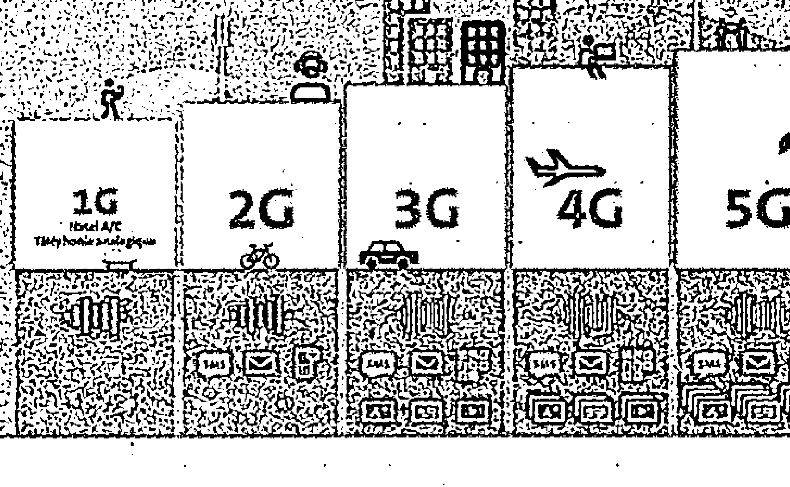

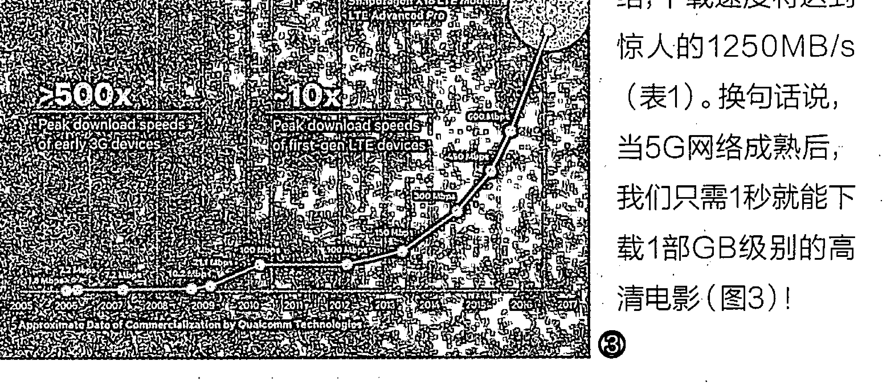

表1：历代无线通信技术的速度和功能对比表

| 网络制式 | 理论通信速度 | 理论下载速度 | 主要功能 |
| :--- | :--- | :--- | :--- |
| 1G | 无 | 无 | 仅限语音通话 |
| 2G | 20Kbps~200Kbps | 2.5KB/s~25KB/s | 增加了短信，低速数据传输功能 |
| 3G | 5Mbps~20Mbps | 625KB/s~2.5MB/s | 可处理图像、音乐、视频等多媒体业务 |
| 4G | 100Mbps | 12.5MB/s | 可实现高清在线视频流畅播放 |
| 5G | 10Gbps | 1250MB/s | 可满足物联网和车联网的低延时要求 |

#### 5G高速的意义何在

可能有读者会问了，现在4G网络已经足够快了，我对下载高清视频又没有特别的需求，5G要那么快的速度干什么？
实际上，5G最大的意义主要将体现在公共服务和一些尖端科技上（图4）。比如，在4G网络下，云端系统无法传输紧急指示让无人驾驶汽车穿过交通流；4G也达不到在远程会议中提供即时语言翻译的速度，更不必提在救死扶伤的手术之中遥控指挥手术刀——要知道，许多即时无线应用的最大延迟期不得超过1毫秒。而5G就没有这些疑虑了，极端的速度可以让它即时处理无人驾驶汽车周边的各种突发情况，而不足1毫秒的时延也足以确保远程控制手术刀的精准操作！
如果说过去的3G和4G网络都是“人事”（人与人），那5G网络将不再是“人事”，它将实现“人与物”及“物与物”之间的超高速连接，为“人”在感知、获取、参与和控制信息的能力上带来革命性的影响。


#### 5G时代何时来临

从1G、2G、3G到4G，历代无线通信网络技术在我国部署的时间分别较国外晚了8年、4年、8年和3年。而到了5G，我国对其的部署将会和全球同步，甚至是最先部署的国家。根据总体规划，我国5G试验将分两步走：2016年准备启动5G的标准研究，预计在2018年第一个版本的标准将完成，然后根据产品的成熟度，在2020年左右确定商业应用的起步时间。
换句话说，距离5G网络的正式运营还需要接近3年的时间。但是，在MWC 2017中我们却惊喜地看到了“准5G”终端——中兴千兆手机（Gigabit Phone）的出现（图5）。

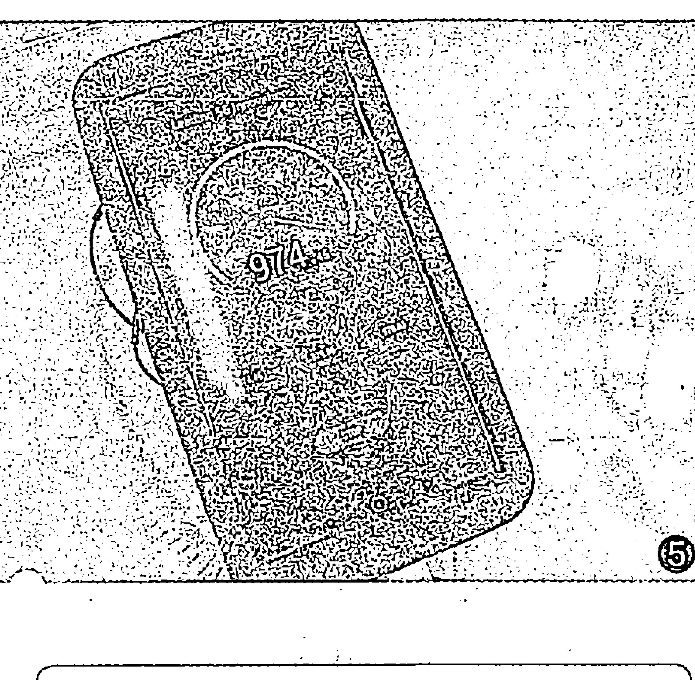

#### MWC 2017上的准5G终端

首先我们需要明确一个概念，何为“准5G”。简单来说，准5G就是不改变4G的空口标准，直接应用5G的部分无线技术和网络架构，从而获得数倍于现有LTE的系统容量。至于如何获得“准5G”的网络性能，就需要搭载最新的调制解调器（Modem，也就是我们常说的基带芯片）支持了。

> 小提示：
除了中兴千兆手机以外，索尼在MWC 2017上发布的Xperia XZ Premium同样搭载了集成X16调制解调器的骁龙835处理器并主打千兆网速（图7）。同时，高通也发布了支持符合3GPP 5G新空口全球系统的骁龙X50 5G调制解调器，将5G、4G、3G以及2G技术都嵌入到一个芯片上。可惜，骁龙X50需要等到2019年才能上市，现在还是停留在概念阶段。

好消息是，高通早在2016年2月就发布了骁龙X16调制解调器（支持Cat.16，将被集成在骁龙835处理器中）；主打可以媲美光纤的1Gbps网速（图6）。而在MWC 2017大放异彩的中兴千兆手机，就是骁龙X16调制解调器的受益者。这款手机在搭载骁龙835+X16调制解调器的基础上，通过载波聚合技术、4×4MIMO天线技术以及256 - QAM高阶调制技术相结合的方式，获得了十倍于第一代LTE终端的下载速度。

考虑到骁龙835处理器将成为2017年无数Android旗舰机的“标配”，必将加速准5G千兆手机的普及。在2020年真正的5G到来之前，这些产品将带给我们丰富的“5G预演”：比如可360度虚拟现实内容的实时传送和全景沉浸式体验；云APP的体验将出现质的飞跃；未来无需下载安装本地APP就能流畅地在线使用；通过云盘保存照片，其速度甚至可媲美本地闪存。

据悉，高通很快就要在骁龙X16调制解调器的基础上，推出第二代千兆级LTE调制解调器——基于10纳米FinFET制程工艺打造的骁龙X20 LTE芯片组（图8），能带来最高达1.2Gbps的LTE Category 18下载速度，带来距离5G更进一步的高速体验，让我们一起期待吧！

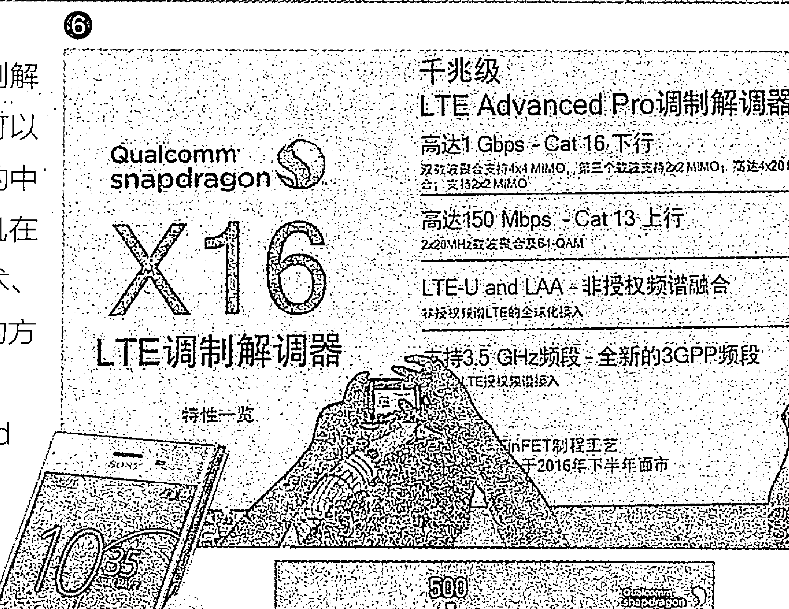

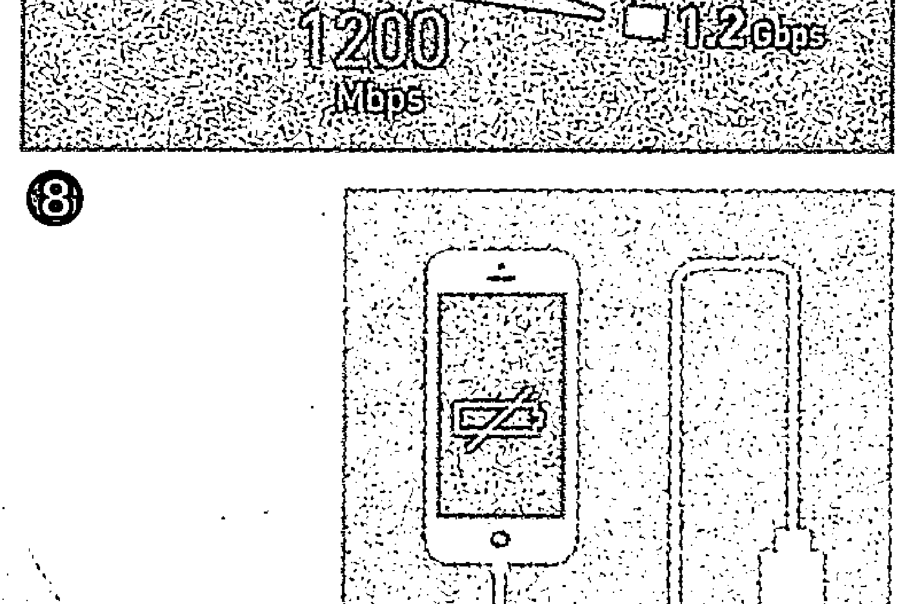

### 比快更快

#### 魅族带来快充黑科技

5G网络的愿景令人无限期待，准5G的表现也着实令人震惊。但是，更高的网速往往还需要相关的内容平台支撑才能释放激情，而这些却需要时间的积淀。因此，单就“快”字而言，MWC 2017上来自魅族的一项黑科技——Super mCharge同样值得勾起我们对快的向往。

#### 快充技术的分类以及瓶颈

快速充电在今天的智能手机领域并非什么新鲜的技术（图9）。从原理来看，快充技术可以划分为两种方案：
第一种是以高通Quick Charge（QC）和联发科Pump Express（PE）为代表的高压直充方案，可通过9V或12V高压实现最大24W的充电功率。
第二种则是以OPPO VOOC、一加手机3的DASH和华为Super Charge为代表的大电流低压直充方案，可在5V电压的基础上以4.5A的大电流实现22.5W的充电功率。此外，荣耀Magic更是能通过HUAWEI Magic Power达到40W（5V/8A）的充电功率。

但是，第一种方案存在转换效率偏低的缺陷。以高通QC3.0为例，其充电IC的转换效率约在89%左右。换句话说，当QC3.0以18W充电时会有2W转换成热量，24W时则接近5W。因此，你会发现采取这一方案的手机在快充时往往存在发热量偏高的问题（图10）。
第二种方案的转换效率相对好一些，比如OPPO的VOOC可实现95%的转换效率，22.5W充电时只有1.125W转换为热量（图11）。但是，大电流直充方案也存在先天缺陷。

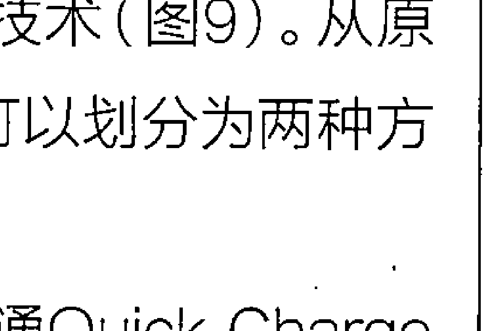

陷，那就是为了承载较大的电流，必须重新定制接口、数据线和充电器。随着USB Type-C的普及，接口的问题解决了，但要想传输超过3A电流的数据线，就需要在连接器上加入一个电子标记IC（安全芯片），成本相对高昂。

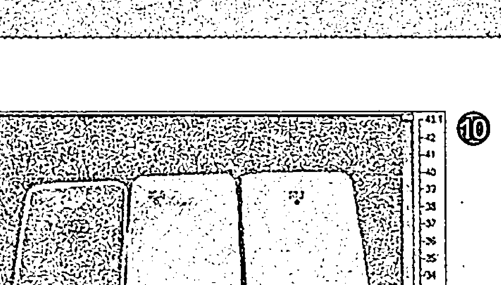

原本以为HUAWEI Magic Power的40W充电功率就已经是当前智能手机所能承受的极限了，然而MWC 2017魅族却打破了这个纪录，其提出的全新Super mCharge竟然可以实现史无前例的55W（11V/5A）！


#### 夸张的55W充电功率

魅族手机的快充技术素来以“mCharge”命名，第一代mCharge可实现18W快充，而到mCharge 2.0则可做到24W。可惜，mCharge从原理来看其实就是联发科PE快充的“马甲”，可以说魅族手机在快充领域始终缺少话语权。

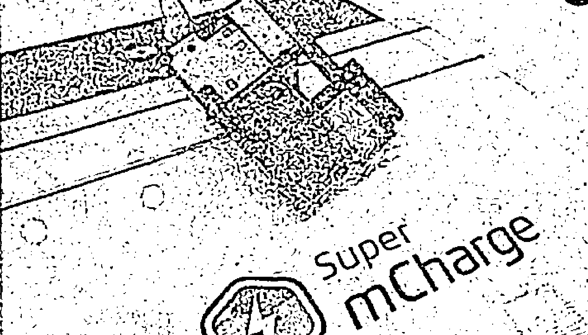

> 小提示
魅族Super mCharge采用的识别协议是USB P.D.，因此它和USB P.D.3.0加入的PPS协议并不冲突。如果你对PPS协议感兴趣，请参考本刊2016年第6期的《快充技术“大一统” 浅析USB PD 3.0充电技术》这篇文章。


然而，Super mCharge却是魅族与合作伙伴联合研发的成果，它采用了全新架构的电荷泵技术，其充电IC的转换效率从业界普遍的89%提升至98%，整整提升了9个百分点（图12）。不要小看这仅仅9%的差异哦，按照Super mCharge那98%的转换效率计算，当它以55W快充时只有1.1W转换成了热量！

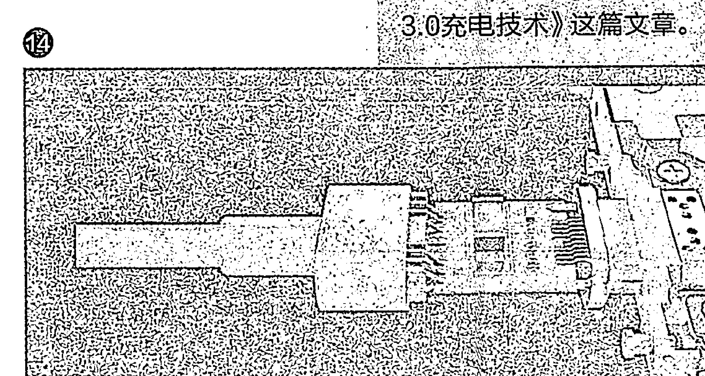

因此，虽然Super mCharge依旧隶属于“高压直充方案”，但它所产生的热量却比大电流低压直充方案还要低。在MWC 2017现场演示时，使用Super mCharge快充的手机温度竟然还不足37℃（图13）。为了提升安全系数，魅族针对Super mCharge的充电器和数据线都进行了重新定制，其拥有电压、电流监控调节等10重安全机制，可做到800次循环充放电后依然拥有80%以上容量。在数据线的选择上，魅族为Super mCharge选择了规格为20V/8A、最高可传输160W的电力，留足3倍安全余量的数据线，并在数据线内部嵌入了E-Mark安全芯片（图14），能够智能调节电流、电压，使其在充电过程中做到安全放心。

总之，虽然Super mCharge并没有带来颠覆式的创新，但它却通过电荷泵技术，在高压直充这条路上找到了新的出口，在太功率、低发热和高效率之间取得了平衡。现在我们要做的，就是期待这项快充技术能尽快被魅族旗下的手机所武装吧，最好还能在其他品牌之间推广。毕竟，在手机电池技术没有突破之前，减少充电时所需等待的时间，就是改善续航和待机性能的唯一选择了。

### 比远更远

#### 智能手机进入5倍无损变焦时代

提起光学变焦，一直是智能手机们心中的梦魇，也始终是数码相机们安身立命之本。在过去的几年中，智能手机曾不断为光学变焦功能而奋斗，但时至今日距离完美仍有几步之遥。终于，在MWC 2017中，我们看到了相对完美的光学变焦方案。

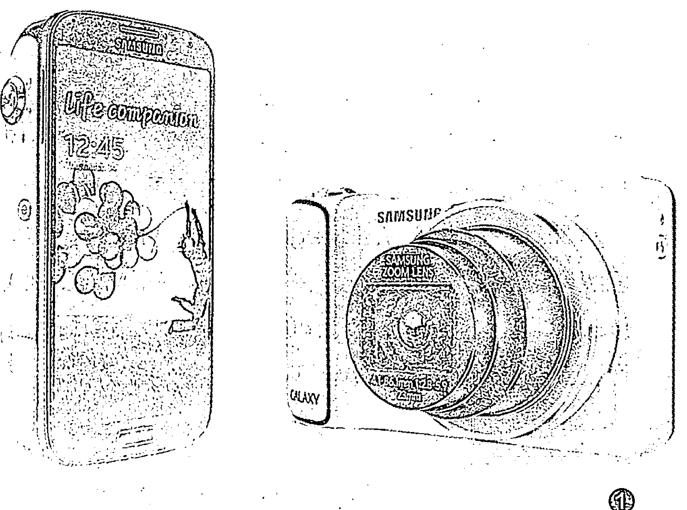

#### 智能手机的光变之困

所谓“光学变焦”，是指通过镜头、物体和焦点三方的位置发生变化而产生的接近无损的放大效果，也就是利用摄像头内光学镜片的移动来实现焦距的移动。光学变焦的倍数越大，就需要更多的光学镜片以及足够的位移距离。换句话说，为了给镜头物理位移留出足够的空间，光学变焦镜头模块的体积很难做得太小。

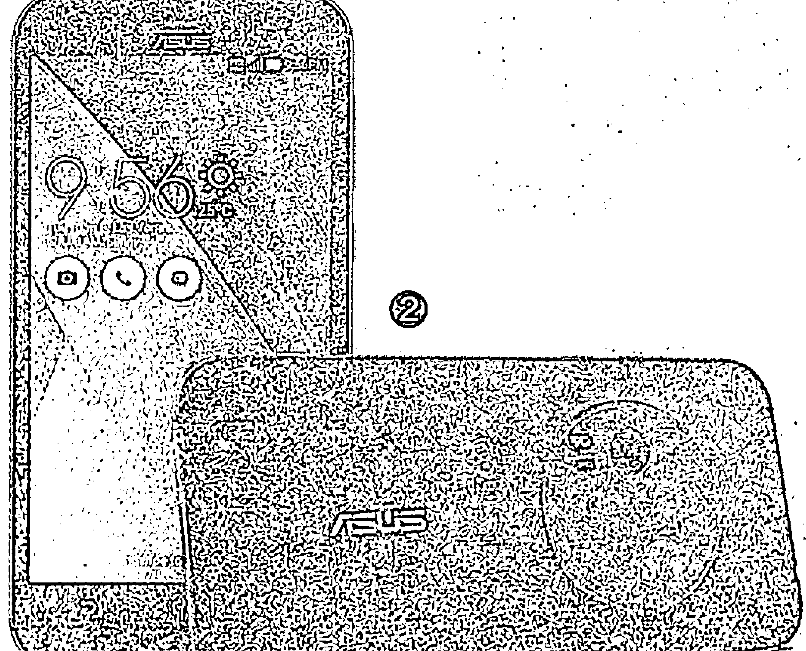

#### 光变方案的进化之旅

于是，我们便看到了硬塞进传统“伸缩式”镜头的三星Galaxy Zoom系列（图1），可惜Galaxy Zoom体积太过臃肿，配置也远逊于同期的标准Galaxy系列手机，因此它一直属于小众的存在，并逐渐被三星冷落，至今已退出了历史舞台。随后，华硕ZenFone Zoom试图以“潜望式”镜头加以改变光变智能手机的现状（图2）。“潜望式”和“伸缩式”镜头相比，其最大特色就是将纵向排列的镜片改为了横向排列（图3），从而实现瘦身目的。ZenFone Zoom在11.95mm厚度的身材下就塞进了10枚HOYA镜片，并获得了3倍光学变焦能力。

但是，和时下动辄仅有8mm甚至7mm的智能手机相比，ZenFone Zoom的身材还是难以令人满意。因此，华硕在下一代ZenFone 3 Zoom身上便果断放弃了“潜望式”镜头，改用了和iPhone 7 Plus类似的双摄变焦方案。简单来说，iPhone 7 Plus和ZenFone 3 Zoom都采用了1200万像素广角镜头+1200万像素长焦镜头的双摄模块。以iPhone 7 Plus为例，它的广角主摄像头采用了F1.8光圈和28毫米等效焦距，另一颗长焦副摄像头则拥有F2.8光圈和56毫米的等效焦距（图4）。在拍摄近景时使用广角镜头；拍远景

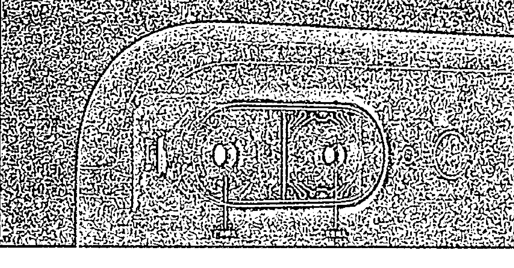


时则改换长焦镜头，从而实现2倍光学变焦功能。

需要注意的是，iPhone 7 Plus的这种“变”焦存在些许限制。比如，由于只有广角镜头配置了光学防抖，所以当系统检测到移动物体时，或者你移动拍摄时、距离对焦点太近时、光线太暗时，2倍变焦模式使用的依然是广角镜头。

前不久，华为在Mate 9和P10身上提出了全新的“2倍双摄变焦”概念（图5），其2倍变焦原理是先用黑白摄像头记录2000万像素的图像细节，再通过截取1200万像素的画面实现变焦效果，最后“填充”彩色摄像头记录的色彩信息输出1200万像素的样张。换句话说，华为手机的变焦是通过双摄像头配合+软件算法加以实现，其效果介于光学变焦和数码变焦之间。

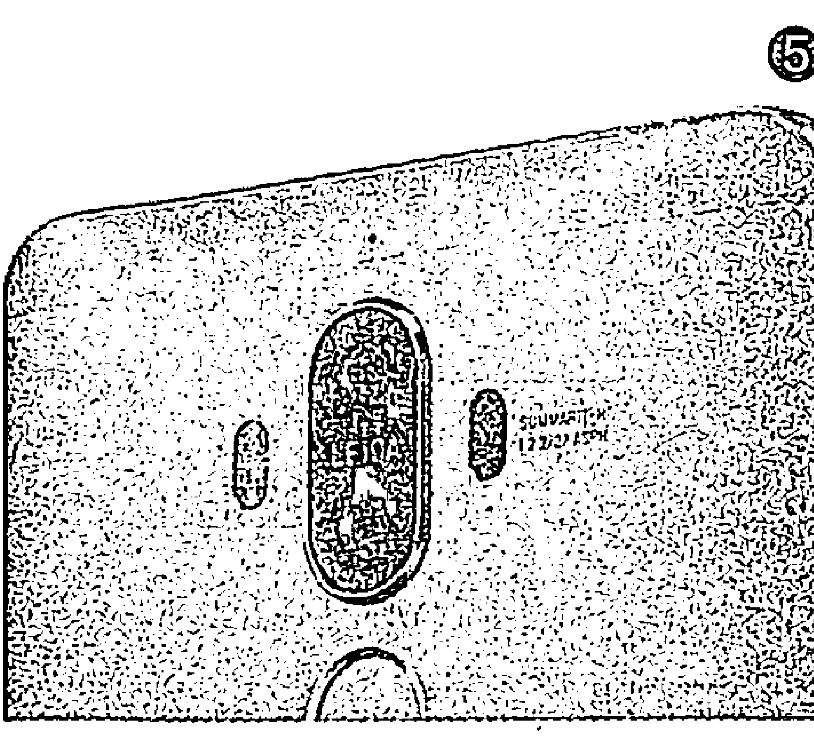

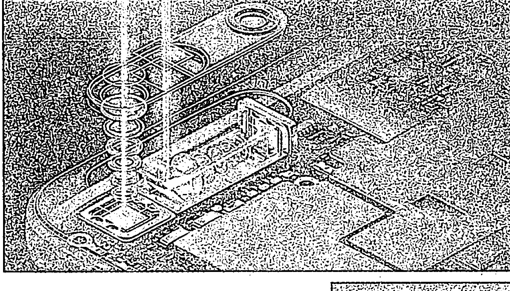

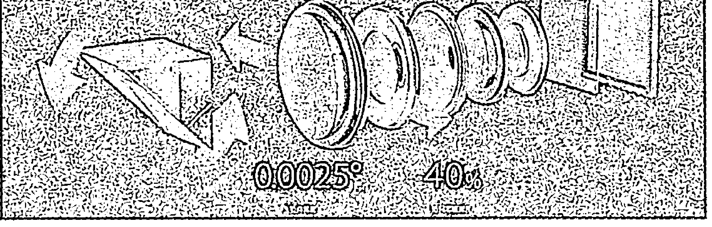


#### OPPO的双摄黑科技

“伸缩式”光变镜头太厚，可被智能手机直接PASS；广角+长焦的双摄光变方案会受制于光线和抖动的影响，而其工作原理也只是从广角切换到长焦，期间也没有镜头的物理位移，这种“变”焦多少有些折扣；通过黑白+彩色的双摄变焦对软件算法要求极高，最多只能实现2倍的无损变焦效果。那么，在追求纤薄的智能手机身上就无法承载更完美的光变方案了吗？

OPPO在MWC 2017上就发布了全新的“潜望式双摄镜头”，我们可以将该方案理解为前文提到的华硕ZenFone Zoom“潜望式”镜头和iPhone 7 Plus广角+长焦的双摄像头的有机结合。

简单来说，OPPO的“潜望式双摄镜头”模块中也包含类似iPhone 7 Plus的广角主摄像头和长焦辅摄像头，但OPPO却将长焦镜头改为横向排列（图6），与广角镜头形成垂直布局，由特殊的光学三棱镜让光像折射进入镜头组实现成像。这种结构可将潜望式镜头模块厚度压缩到极致（镜头模组仅有5.7mm，镜头总厚度也纤薄至7.8mm并拥有0.0025°的防抖精度），从而轻松塞进更薄的智能手机内，并保持潜望式镜头应有的3倍光学变焦范围。

需要注意的是，OPPO并没像iPhone 7 Plus和ZenFone 3 Zoom一样将光学防抖用在广角主摄像头上，而是被应用于最需防抖功能的长焦镜头，在进行光学变焦时可以避免因抖动而引起的画面模糊问题（图7）。

总之，OPPO的“潜望式双摄镜头”模块，通过特制的光学三棱镜和传统防抖模组的高效协同实现了效果更佳的光学防抖，最终可以获得高达5倍的画质无损变焦效果。

随着手机摄像头传感器技术的不断成熟（图8），高端手机的拍照效果很难在日光环境下拉开太大的差距，双摄像头模块的引入也仅能改进细节表现。因此，是否支持光学变焦，能更清晰记录下远处风景，并不受手抖、暗光等因素的影响，就将成为2017年乃至未来智能手机所追求的发展目标。继OPPO“潜望式双摄镜头”之后，下一款光变手机又能给我们带来哪些惊喜？让我们拭目以待吧。

### 梦想照进现实

#### 全面屏的最佳搭档终于来了

2016年10月小米推出的MIX让“全面屏”概念深入人心，而MWC 2017大会LG发布的年度旗舰G6也以“全面屏”作为主打卖点（图9）。可惜，无论是MIX还是G6，乃至于缺席MWC 2017的三星Galaxy S8，这些全面屏手机都为了打造超高屏占比而将指纹识别放在了机身背面。那么，全面屏就注定与正面指纹无缘了吗？

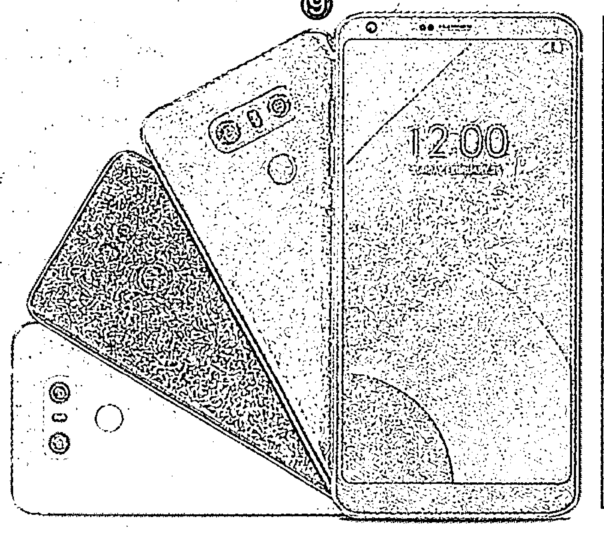

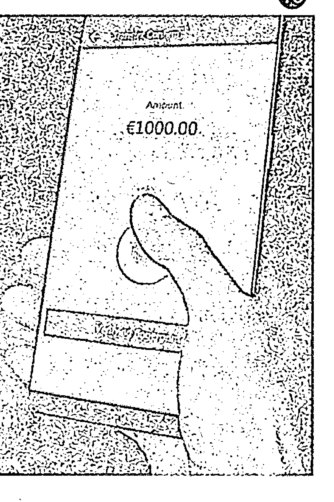

#### 光学指纹解决全面屏难题

自从iPhone 5s引入了电容式指纹识别技术之后，这种识别技术便迅速占领了智能手机的Home键，以及手机背面（背部指纹）或侧面（侧置指纹）。就受欢迎的程度而言，正面指纹的口碑最好。

但是，全面屏手机注定要大幅削减手机的“下巴”，意味着再也没有空间去安置集成指纹识别传感器的Home键。MIX如此，G6和S8亦是如此。没办法，电容式指纹识别必须依托于物理元器件，为了全面屏它就只能屈居于手机背部，与主摄像头做邻居了。

好消息是，汇顶科技在MWC 2017上发布了最新的光学指纹传感技术（图10），并可将其集成在智能手机或平板电脑的屏幕内，实现了“屏幕即指纹识别”的技术革新。相较于传统方案需要独立实体按键或虚拟按键进行指纹识别的设计，汇顶科技的显示屏内指纹识别方案依托于光学指纹，可以将传感器放在手机屏幕玻璃下面而无需开孔，从而大幅提高移动设备的屏占比，并为用户带来更酷的使用体验。据悉，这种指纹识别方案具备指纹传感器体积小、功耗低以及采用标准应用接口的优势，距离全面商业化应用只有一步之遥（已经达到了量产的水准）。

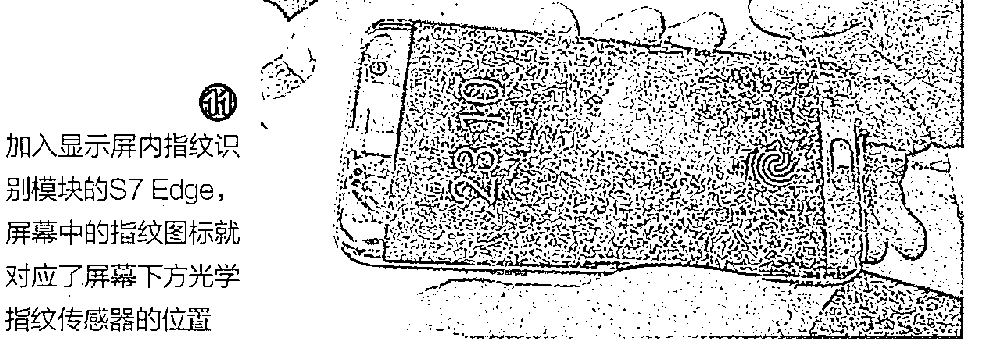

加入显示屏内指纹识别模块的S7 Edge，屏幕中的指纹图标就对应了屏幕下方光学指纹传感器的位置

#### 屏幕指纹解锁的硬件要求

针对显示屏内指纹识别方案，相信很多读者都会有所疑虑：我怎么知道屏幕里哪个部分用作指纹解锁？如果在屏幕里显示指纹解锁区域的提示，会不会影响日常的显示效果？

好消息是，汇顶科技的显示屏内指纹识别方案并不存在上述问题。原因很简单，这项技术是建立在OLED屏幕（或AMOLED）的基础之上，传统的LCD屏幕则无缘享用。

我们都知道，OLED屏幕的特色就是可以在待机（黑屏）状态下仅点亮部分像素，很多采用OLED屏幕的高端手机也借助这个特色推出了所谓的“熄屏显示功能”。显示屏内指纹识别方案同样借用了熄屏显示的特性，在黑屏或锁屏界面显示一个解锁的图标用于告知用户指纹传感器的位置（图11）。用户只要将手指放在指定的识别区域，光学指纹传感器就能透过OLED屏幕和表面的玻璃实现解锁，进入正常的系统界面后指纹提示的图标就会自动消失，光学指纹传感器部分不会影响屏幕内的正常显示。

随着全面屏和显示屏内指纹识别方案的普及，未来智能手机的设计将变得更为简洁，熟悉了正面解锁的用户也不用去改变习惯，被迫去接受指纹后置或侧置的妥协方案了。那么，你期待吗？

#### 柔性OLED国产化
曲屏手机普及即将加速

前面介绍的显示屏内指纹识别方案需要“寄生”于OLED屏幕之上，而在我们的印象里，OLED同时也是高端和小众的代名词（图12），普及度远远不如LCD。好消息是，MWC 2017中，国产OLED也受到了广泛好评，这意味着距离OLED全面普及的日子已经不再遥远。

#### 天马展示4种AMOLED面板

在手机屏幕的供应商中，“天马屏”的品质虽然不如三星和LG，但却凭借出色的性价比受到了很多国内中低端手机的青睐。此次天马在MWC 2017上一共展示了4块AMOLED面板，并已全部进入了量产标准。

其中最受我们关注的，则是5.5英寸FHD的柔性AMOLED面板。没错，柔性AMOLED面板就是用于打造三星Galaxy Edge系列（图13）、小米Note 2这种双曲面手机的屏幕。据悉，天马的柔性AMOLED面板可实现5mm曲率半径下弯曲的效果（图14），适用于双曲面手机、曲面显示终端、可穿戴设备、可伸缩显示设备等新兴领域。

同时，天马还推出了5.5英寸的常规FHD AMOLED面板（适合普通手机）、5.2英寸WQHD（2560×1440）AMOLED面板（适合移动VR设备）、1.2英寸的AMOLED面板（适合可穿戴设备）。

> 小提示
目前国内建有OLED项目的公司主要有天马微电子、京东方、维信诺、华星光电、彩虹、虹视、中显科技、信利、南京第壹有机光电等，但真正能在今年拿出实际OLED面板产品的，则只有天马和京东方等少数几家。

#### 国产OLED屏幕的春天就要到来

和LCD屏幕相比，OLED屏幕具备高色域（色彩艳丽）、自发光（不存在漏光问题）、显示黑色画面时几乎不耗电等优势。再加上曲屏设计和显示屏内指纹识别方案等趋势的影响，OLED在手机领域取代LCD已渐成趋势（图15）。

就OLED面板领域，三星AMOLED显示屏占据绝对的领导地位，但在全世界科技企业都急需OLED货源时，仅靠三星一家的AMOLED根本解决不了问题。在LG等韩系厂商在OLED领域没有建树，而日系品牌坚守LCD的情况下，国产OLED面板的崛起是可以预见的。

作为消费者，我们自然举双手欢迎这种趋势，这意味着未来更多主流价位的手机，都能依靠更实惠的国产OLED屏幕获得更好的显示效果。

### 又见伊人

### 情怀满满的诺记黑莓

在手机的发展历史中，诺基亚和黑莓都是不可磨灭的印记。可惜，在苹果通过iPhone重新诠释智能手机的定义之后，这两个最经典的手机品牌却昏招频出，最终都黯然退场。有趣的是，在本届MWC大会中，诺基亚和黑莓却又高调回归，情怀满满。

#### 黑莓全键盘回归

#### 诺基亚重造经典

诺基亚（准确来说是由诺基亚前员工创建的新企业HMD）在MWC 2017之前就在国内发布了Nokia 6（本刊2017年第6期有相关评测），着实令不少诺粉惊喜不已。在MWC 2017上，HMD获得了Nokia的授权，再度推出了Nokia 3、Nokia 5和Nokia 3310三款新机。可惜，Nokia 3和Nokia 5都是采用720P屏幕的低端机，虽然它们都有着Android 7.0智能系统的加持，但受关注程度却都敌不过Nokia 3310。

原因很简单，Nokia 3310是源于经典的复刻：在诺基亚全球销量最高的3310基础上（图16），引入更为圆润的机身设计、更富动感的色彩外壳、2.4英寸全彩屏幕以及时下流行的双卡双待技术（图17）。同时，新版Nokia 3310还具备最长25.3天的续航时间，并保留了经典的贪吃蛇游戏。

然而，新版Nokia 3310的特色也就如此了，它不支持Wi-Fi，没有GPS，更无法从应用商店下载APP，它仅仅是一款用于打电话和发短信的功能机而已。

MWC 2017上BlackBerry KeyOne也让不少用户感到了莫名的悸动，因为它是最后一款黑莓主导设计的手机，也是TCL拿到黑莓授权后制造的首款机型，更是一款见证黑莓命运变迁的手机。

KeyOne在设计上继承了家族传统，机身上半段为4.5英寸1080P触控屏幕，下半段则为QWERTY物理键盘（图18），空格键也集成了指纹识别功能。配置方面，KeyOne搭载骁龙625处理器，内置3GB内存、1200万像素索尼IMX378传感器以及3505mAh电池，属于Android手机中的主流水准（图19）。

诺基亚和黑莓新机虽然情怀满满，但在MWC大会期间还是引发了褒贬参半的议论。褒奖的是经典的回归，让记忆再现；而贬低的观点则更为现实：当用Nokia的人都渐渐不再年轻，所以这次Nokia发布的新品是要当做老人机吗？KeyOne的设计虽然满足了黑莓的忠实粉丝，但其性能却远不能满足现代手机的需求。

那么，你对MWC 2017中的情怀之作是持何种态度呢？

### 继往开来

#### 索尼Exmor RS CMOS 4系传感器来了

在过去的一年里，高端智能手机的摄像头几乎就是索尼Exmor RS CMOS 3系传感器的天下（图20）。随着索尼Xperia XZs和XZ Premium在MWC 2017中的亮相，Exmor RS CMOS传感器终于即将进入4系时代。

#### Exmor RS CMOS 3系一统江湖

2015年9月，索尼Xperia Z5首发IMX300 CMOS传感器。随后，中高端手机就进入了Exmor RS CMOS 3系传感器时代。和往年不同的是，如今的手机厂商更喜欢和索尼联合定制，从而获得独享的传感器资源。比如iPhone 6就独享IMX315，OPPO R9s系列则独占IMX398。此外，在IMX318、IMX338、IMX362、IMX376、IMX386等传感器量产时，谁能抢到“首发权”也被视为品牌实力的象征。

终于，索尼3系传感器之争告一段落，因为4系传感器已经被索尼自家的新一代旗舰手机所武装。那么，全新的IMX400传感器能为我们带来哪些改变呢？

#### Exmor RS CMOS 4系继往开来

从IMX400传感器的基本参数来看，它与上一代IMX378非常接近，CMOS都是1/2.3英寸面积。但是，IMX400在架构方面却较前辈们出现了质的变化，那就是在像素层和电路层之间新加入了DRAM层（动态随机存储单元）（图21）。

简单来说，DRAM层在整个CMOS模组当中充当缓存角色，用于存储像素层获取到的图像信息，因此大幅提升传感器处理数据的速度。根据官方的数据显示，IMX400可以在1/120秒内读取1930万像素的图片，这个速度比前辈们要快上4倍！同时，该传感器配合最新Motion Eye相机系统算法，可以实现960fps超慢速视频回放，可以做到不遗漏任何重要瞬间（图22）。与其相比，现有手机拍摄出的240fps慢速视频（可记录下针扎气球、水滴溅落的瞬间）就变成了渣滓。

如果DRAM层能成为所有Exmor RS CMOS 4系传感器的特色，那今年智能手机的拍照性能就非常值得期待了。当然，这也只是我们一厢情愿的想法而已，但类似的功能必然会被用于4系传感器家族中的高端型号，让我们猜猜哪款智能手机会成为继Xperia XZ Premium之后的第二款有能力实现960fps超慢速视频回放的产品呢（图23）？

### 小结

以上就是MWC 2017中值得引起我们关注的“黑科技”和趋势，2017年智能手机注定会因它们而改变，让我们一起期待吧。

### 愚人并不娱己

#### 那些“愚人”了我们的IT产品

#### IT产品

文/顽之左手

在绝大多数人的印象里，IT领域，特别是硬件领域，由于其高技术的特性，在技术开发、产品生产等方面无疑是相当严肃认真的。不过在商业社会中，IT硬件和其他商品一样，常常需要各种宣传和营销的“技巧”，加上高科技产品开发的风险性，就造成了很多“愚人节”式的硬件，让无数消费者曾经兴奋、雀跃、惊讶，最后大喊“坑啊”。虽然大家拿到这本杂志的时候，很可能就是那个任何话都不能相信的日子，但是有一点是可以相信，明天您拿起来阅读，本篇的所有图文都是不会变化，所以本文还是可以相信的（笑）。

#### PPT出的精品——BitBoy的GPU们

比较资深的硬件发烧友应该都知道，NVIDIA和AMD（ATI）在显示芯片市场上两强争霸格局的形成始于GPU（Graphics Processing Unit，图形处理器）概念的提出，代表产品就是NVIDIA的GeForce 256和ATI的Radeon 256。GPU的概念提出后，原本已经跟随得很吃力的大量显示芯片厂商如Trident、S3、Matrox，甚至3dfx，都被这两个领导厂商一年一代的更新速度彻底甩在身后，虽然也有S3 Savage、Matrox幻日、3dfx VOODOO 3/4/5等产品推出，但市场表现都相当差。不过在这些老牌厂商都只能拼命“挣扎”的市场上，却有一个新面孔，不时发布出让人精神振奋的消息，那就是BitBoy。BitBoy是在GPU出现的时候进入消费显示芯片领域的，因此其第一款芯片就与GeForce 256同等级，命名为Glaze3D，其后针对不同的GPU时代，还推出了Axe（图1）、Hammer等产品的……纸面规格。虽然这些GPU的纸面规格在当时的年代都惊人，但却因为开发困难、合作伙伴问题、资金问题等屡屡延误直至取消。BitBoy最终转向了移动设备3D开发，之后又被ATI收购，成为其移动显示战略的组成部分。

BitBoy的GPU也推出过样卡，例如图中的Axe样卡，但这些样品鲜有运行展示和评测数据

#### 似曾相识——GPU的改名热

在前几年的GPU领域，一种非常不好的风气却非常盛行，那就是将GPU改名后冠以新一代的编号进行销售。这种风气不仅让广大的消费者深恶痛绝，也让本人这样的硬件编辑感到非常头疼，因为解释GPU型号都变得更复杂了。

GPU改名售卖这一情况是多种因素导致的，包括处理器集成显示能力的挑战、制造工艺升级的缓慢，以及开发难度的迅速提升等。这些原因对不同型号的影响不同，而且常常是综合起作用的，例如改名GPU的重灾区——中低端和移动市场中，换名称不换设计的原因主要是因为处理器集成显示能力越来越强大，对低端独立GPU的需求越来越少；同时制造工艺相对于CPU的落后造成了低端GPU功耗和成本难以降低，也就使得购买和全周期使用成本提升，无法获得低端消费者的青睐；而上述原因造成的中低端独立GPU市场萎缩，也使得专门为低端市场设计GPU变得不划算（图2、图3）。而且在移动市场中，由于竞争压力，甚至还出现了采用马甲方式的高端型号独显（图4、图5）。

由于厂商的改名非常频繁，而且没有什么规律，媒体和消费者都不得不特别强调和关注GPU的核心，以确定其实际架构是新还是旧，这使得Kepler、Maxwell、Hawaii、Fiji等核心名称，以及NVIDIA、AMD独特的核心命名规律被越来越多的消费者所了解。尽管NVIDIA和AMD几乎同时推出了使用新一代制造工艺的GPU，终于有了全面更新GPU核心的希望，不过在更新一代芯片制造工艺又一次全面受阻的情况下，估计下一代GPU很可能再次出现大量的改名GPU，大家还是要做好心理准备哦。

同样采用GF108核心的两代低端独显GeForce GT440/530

出自同一核心的GeForce GTX780M/880M

#### 触不到的大屏幕——OLED显示器

OLED显示器，就是采用有机发光二极管（Organic Light Emitting Diode）面板技术的显示器。在21世纪10年代初期，厂商就已经宣称这一技术已成熟，在数年内即可普及，并且开始大量用于移动设备，但一直到2017年，OLED显示器却一直没有进入主流市场。

我们常见的LCD（Liquid Crystal Display液晶显示器）面板是由背板提供光源，每一像素均由三原色液晶格（Cell）组合而成，液晶格中的液晶分子和前置偏光板对背板光线进行过滤，来获得不同亮度的三原色，调节每一像素的色彩（图6）。从原理就可以看出LCD的显示模式会大量损失光源的亮度，且难以精确控制色彩，这也使得PDP（Plasma Display Panel，等离子显示器面板）通过像素自发光的优势与其在市场上纠缠了很多年。直到发光效率极高的LED光源出现，以及色彩更精准的广色域面板普及，PDP才因为功耗、尺寸限制等问题退出市场。OLED恰恰就是一种类似PDP的像素自发光屏幕（图7），而且能耗极低，还具有超薄、柔性、分辨率高、低成本等多种特性（图8、图9），因此是一种相当理想的平板显示技术。

OLED与主流显示器市场的“失约”，既有技术和成本的影响，也有厂商市场策略的原因。例如AMOLED（Active Matrix Organic Light Emitting Diode，主动矩阵有机发光二极管）技术很快出现，让原本的PMOLED（Passive Matrix Organic Light Emitting Diode，被动矩阵有机发光二极管）技术显得过时，相应产品失去市场机会；同时智能设备市场的高速崛起大量消耗了AMOLED的产能，这一市场的利润远高于主流显示器，因此厂商也就没有将OLED投入主流显示器市场的动力，只在少量价格非常高的专业显示器中使用了这一技术。

在最近的各种展会上，我们看到了国产OLED面板已经成熟并大量供货，作为IT产品价格杀手的中国厂商，是否能再一次“白菜化”OLED面板呢？我们当然非常希望它们能够完成这一目标。也许不久的将来，OLED会以更低的价格、更出色的性能出现在更多设备上，例如让各种小型化的手持设备通过折叠方式为我们展开更大的屏幕；让“曲面”显示器可以手动弯曲成更符合用户需求的样子，在各种不平整的表面上也能够完美嵌入显示面板等。

OLED面板可以呈现透明、柔性等很多新颖的特色

#### 不够坚定的支持——陨落的Rambus内存

与我们目前的DDR型内存通过多路并行来提升带宽不同，Rambus内存采用低位宽、高频率的方式，同样提供了巨大的带宽，在21世纪初，其带宽远超消费级市场中的主流——SDRAM，甚至是后来出现的第一代DDR-SDRAM。

Rambus内存技术先进、性能强大，不过成本过于高昂，配置也比较复杂（图10），所以它主要是与Intel合作，通过与奔腾4处理器捆绑的方式进行销售。但Intel的专情并没有持续Rambus内存必须成对使用，并在空槽位上安装C-RIMM（右侧绿色无芯片空条）

#### 停滞的想要——Intel第七代智能酷睿处理器

最新上市的第七代智能酷睿处理器，显然违反了Intel公布的“Tick-Tock”钟摆式升级规律，而且对习惯了这一规律的消费者来说，多少有点误导。其实未能按时完成制造工艺的升级并不是非常罕见的情况，笔者之所以要“怼”一下第七代智能酷睿，并不是嫌弃Intel未能如约推出新工艺，主要还是因为这款产品的“不老实”。我们前面已经提到，GPU厂商就曾经深受芯片代工厂工艺升级延迟的拖累，即使强大如Intel，在工艺进化到20纳米以内后，也感受到了巨大的阻力，其14nm工艺的开发就有明显延迟，未能按照规律于2014年完成。因此，在2014年，Intel虽然推出了改良高频版的Haswell-Refresh核心，以及主要增加了高速SSD支持能力的9系列芯片组，但并没有使用新一代智能酷睿的代号，仍然将这些处理器归入第四代智能酷睿家族中（图11）。这种市场规划显然比第七代智能酷睿要“老实”得多。从目前的各种测试也可以看出，第七代智能酷睿的性能提升幅度与频率提升幅度基本相同，可见其核心、显卡效率的提升也并不明显，甚至连新的芯片组也只是增加了少量的高速数据通道。从个人角度来看，现在的第七代智能酷睿核心真的应该叫做Skylake-Refresh，旗舰型号名称应该是i7-6790K，而不是现在的Kaby Lake核心与i7-7700K的型号名称。

酷睿i7-4770K与命名上很“老实”的i7-4790K处理器

#### 三世而斩——微软Surface(RT)

Surface系列是微软进入笔记本和平板电脑市场的主力产品，其中Surface Pro系列的逐渐完善我们有目共睹，其轻薄易用的特性也确实受到了很多用户的追捧。不过我们也发现，在Surface Pro 3、Surface Pro 4终于在市场上获得成功的同时，原本同样受重视，甚至可能更被微软看重的Surface(RT)系列（图12），却逐渐消失了。在“经典”的Surface中，搭载的是微软专门为Surface平板电脑开发的Windows RT操作系统，因此也被称为Surface RT，以便与使用标准Windows操作系统的Surface Pro进行区分。它不支持桌面应用，仅运行内置应用或从Windows RT应用商店下载的应用，这一点与苹果iOS系统非常类似。但从市场的表现可以看出，封闭的操作系统是微软操作系统的传统用户难以接受的，重新建立应用市场的难度也非常大，因此第一代和第二代Surface难以获得用户认可。第三代Surface开始使用标准Windows操作系统，可是不仅没有挽回局面，反而让前两代的用户感觉到被抛弃。2015年微软正式宣布Windows RT并不能升级为Windows 10，并且推送了最后一次更新后，应用市场的更新也基本停止，前两代Surface及Windows RT已经在事实上被淘汰了，此时Surface RT和Surface 2分别只推出了三年和两年。

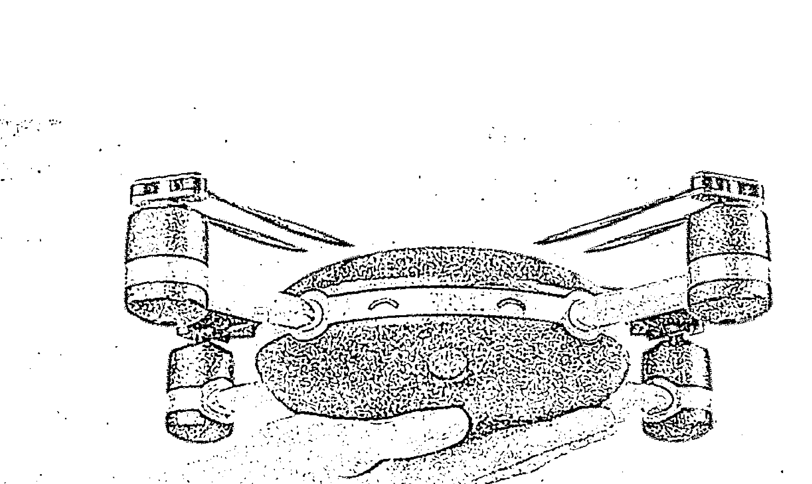

#### 智能硬件之“殇”——Lily无人机

就在不久之前，Lily无人机宣布倒闭，这个2015年刷爆朋友圈的自拍无人机项目曾吸引过无数眼球，获得过无数赞叹，也赢得过无数媒体的追捧（图13、图14）。Lily无人机的预购活动中，预订价从499美元一直涨到999美元，仍然获得了大量支持，最终获得了3400万美元的预售成绩。但消费者得到的是从2016年2月多次推迟至2016年12月的发货时间，以及最终的倒闭通知，好在Lily坚持不动用销售款项，因此可以为消费者完全退款。


在倒闭之后，Lily宣传片使用GoPro和大疆无人机拍摄、抛飞和降落存在问题（图15）、拍摄稳定性无法保障等大量负面消息，更让人感到惊讶不已。其实在智能硬件领域，类似Lily的事例还有很多，虽有美好的想法和创造的冲动，却常常无法获得满意的结局。另一个比较麻烦的问题是，大量智能硬件项目选择了众筹方式进行融资开发，这些项目的失败还可能会对用户造成更大的经济损失。


#### 总结

虽然本文中介绍的很多产品现在看来都成了愚人节的玩笑，其中确实有一些是厂商带有一定恶意的产物，但大部分还是因为市场的变化、技术不成熟等非主观原因造成的，对于这些产品，我们虽然有被欺骗的愤怒，但更多的还是遗憾。另外在我们提到的产品中，也有一部分，如Lily无人机等产品，在理念、技术等方面仍不过时，我们希望在技术和市场成熟后，能够完善并复活，完成它们的历史使命，满足粉丝们的愿望。


### 最后的拼图？解密存储性能

策划《电脑爱好者》编辑部


扫一扫，更多精彩内容立现！

无论是台式机、笔记本、平板二合一还是手机，磁盘性能始终是影响其性能的最关键短板。那么，对电脑类产品而言，我们应该如何挑选最匹配的硬盘弥补速度瓶颈？对手机类产品而言，什么样的存储模块才是最值得选择的存在？本期特别话题，就让我们全面了解不同类型硬盘的点滴吧。

#### 先从海纳百川的台式机谈起

3.5英寸台式机硬盘曾经是最热闹的DIY配件之一，希捷、西数、日立、IBM、三星、迈拓、昆腾、东芝、富士通等众多厂商争先斗艳。时过境迁，在经历多轮的并购之后，如今可供我们选择的品牌只剩下了西数和希捷。所以，本章节的内容我们就从这两个品牌旗下的台式机硬盘谈起吧。

#### 西数的颜色之惑

西数硬盘最大的特色，就是将旗下产品通过颜色加以区分。在HDD机械硬盘（包括3.5英寸台式机硬盘和笔记本用的2.5英寸移动硬盘）被细分成了蓝盘（WD Blue）、黑盘（WD Black）、红盘（WD Red）和紫盘（WD Purple）四个类别，分别针对不同的应用环境和人群（图1）。所以虽然西数硬盘面临颜色之惑，但只要搞明白不同颜色硬盘之间的差异（表1），就可以果断下单了。下面我们就以普及度最高的2TB硬盘为例，看看各颜色版本之间的规格差异。


##### 蓝盘：大容量且高可靠性

西数蓝盘适合与SSD固态硬盘搭配，SSD安装系统，而蓝盘则专供存储盘（图2）。因此，蓝盘并不追求性能，它的转速从台式机硬盘主流的7200rpm下降到移动硬盘的5400rpm级别，但也因此换来了更低的功耗。开机时间越长，它就能帮你省下更多的银子（电费）。

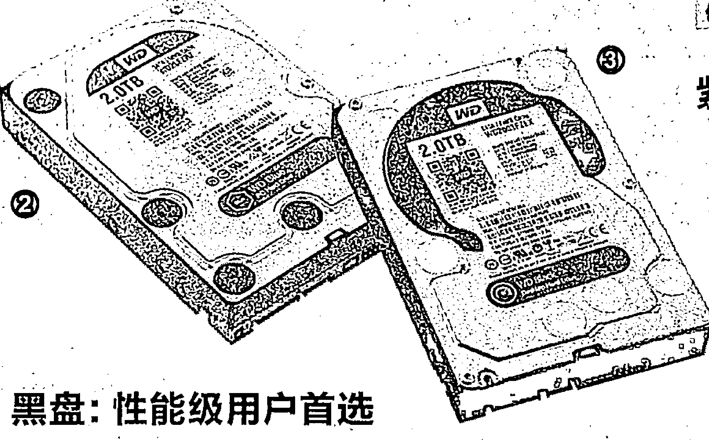

##### 黑盘：性能级用户首选

黑盘是性能的代名词，转速保持在7200rpm上，内置64MB~128MB的DRAM高速缓存，性能远超蓝盘，并可享受5年的质保（图3）。如果你是游戏控，觉得SSD空间不够用，想在HDD机械硬盘里安装数百GB或TB级别的游戏文件，那黑盘就是SSD的最佳搭档，只是黑盘的功耗也是西数所有硬盘中最高的。

**表1：西数不同版本2TB台式机硬盘规格对比**

| 参数对比 | 蓝盘2TB | 黑盘2TB | 红盘2TB | 紫盘2TB |
| :--- | :--- | :--- | :--- | :--- |
| 持续传输速度 | 147MB/s | 164MB/s | 147MB/s | 145MB/s |
| 高速缓存 | 64MB | 64MB | 64MB | 64MB |
| 磁盘转速 | 5400rpm | 7200rpm | Intel liPower | Intel liPower |
| 加载/卸载周期 | 300000 | 300000 | 600000 | 300000 |
| 运行功耗 | 4.1W | 9.5W | 4.1W | 4.4W |
| 空闲功耗 | 3.0W | 8.1W | 2.7W | 4.1W |
| 待机/睡眠功耗 | 0.4W | 1.3W | 0.4W | 0.4W |
| 厚度 | 26.1mm | 26.1mm | 26.1mm | 26.1mm |
| 重量 | 600g | 600g | 600g | 640g |
| 保修期 | 2年 | 5年 | 3年 | 3年 |

##### 紫盘：监控理想选择

PC用户可以无视紫盘，这个类别的硬盘是专为使用多达8块硬盘和32个摄像头的高清安全系统的7×24小时监控而打造，支持AllFrame技术与ATA流式传输技术分工协作，可减少普通台式机硬盘用作监控系统的存储设备时经常发生的像素错误和视频中断次数。

##### 红盘：高容量网络存储

这是专为1到8个盘位的NAS系统而设计的硬盘，适合7×24小时全天候工作环境，可满足家庭或小型办公NAS系统的苛刻要求。但是，如果拿红盘作为PC的存储盘则容易出现丢失数据的问题。

总之，西数硬盘对PC用户而言只有蓝盘和黑盘两种可选，由此就能大大缩小选择范围。至于不同容量和版本之间的更详细参数，可访问西数官网：http://t.im/1c7uu。

##### 硬盘的容量规格之异

问题来了，台式机硬盘容量基本从1TB起步，8TB容量和10TB也不是什么新鲜货。这么大的容量区间，不同容量的硬盘又有什么差异？我们在选购时又该留意哪些问题？

HDD机械硬盘主要是由磁头+碟片+马达+控制电路等部分构成，其中每1张碟片需要和2个磁头搭配，因此无论容量多少，硬盘的碟片和磁头的比例多是1:2的关系（图4）。目前台式硬盘主流的单碟容量多为1TB、1.33TB或1.5TB，硬盘容量越大，就需要更多的磁头和碟片，从而会影响到硬盘的厚度和重量，同时也意味着更高的功耗开销。

以希捷台式硬盘为例，1TB版本由于只有1张碟片，所以它也是TB级别硬盘中身材最为“苗条”的，仅有不足20mm厚和400g重。

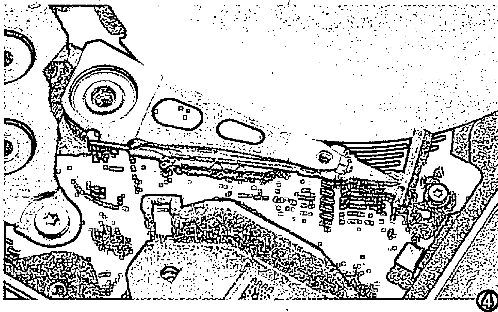

而从2TB容量开始，该系列硬盘就全员“增肥”到26.11mm，重量也是达到了600g甚至接近800g（表2）。

一般来说，磁头和碟片数量越多，意味着寻道时间越长，潜在故障率的可能性就越高，从而会影响硬盘的实际性能。但是，这也仅适用于同容量产品之间的对比。比如都是1TB，单碟型号性能就要优于双碟型号。对使用多碟结构的超大容量硬盘来说，它们会通过更大的高速缓存和相关技术确保性能，比如希捷6碟8TB硬盘的持续传输速度就要比单碟的1TB硬盘更快。

**表2：希捷不同容量台式机硬盘规格对比**

| 参数/对比 | 8TB | 6TB | 5TB | 4TB | 3TB | 2TB | 1TB |
| :--- | :--- | :--- | :--- | :--- | :--- | :--- | :--- |
| 碟片/磁头 | 6/12 | 6/12 | 6/12 | 4/8 | 3/6 | 3/6或2/4 | 1/2 |
| 持续传输速度 | 220MB/s | 220MB/s | 220MB/s | 180MB/s | 210MB/s | 210MB/s | 210MB/s |
| 高速缓存 | 256MB | 128MB | 128MB | 64MB | 64MB | 64MB | 64MB或32MB |
| 磁盘转速 | 7200rpm | 7200rpm | 7200rpm | 5900rpm | 7200rpm | 7200rpm | 7200rpm |
| 加载/卸载周期 | 300000 | 300000 | 300000 | 300000 | 300000 | 300000 | 300000 |
| 运行功耗 | 9W | 9W | 9W | 5.6W | 8W | 8W | 5.3W |
| 空闲功耗 | 7.2W | 7.2W | 7.2W | 4W | 5.4W | 5.4W | 4.6W |
| 待机/睡眠功耗 | 0.6W | 0.6W | 0.6W | 0.5W | 0.75W | 0.75W | 0.94W |
| 厚度 | 26.11mm | 26.11mm | 26.11mm | 26.11mm | 26.11mm | 26.11mm | 19.99mm |
| 重量 | 780g | 780g | 780g | 610g | 626g | 626g | 400g |
| 保修期 | 2年 | 2年 | 2年 | 2年 | 2年 | 2年 | 2年 |
| 参考价格 | 2699元 | 1599元 | ----- | 949元 | 599元 | 449元 | 349元 |
| 每GB价格 | 0.337元 | 0.267元 | ----- | 0.237元 | 0.199元 | 0.225元 | 0.349元 |

*价格取自京东自营3月28日报价

如果按照每GB的成本计算，现阶段3TB容量的硬盘性价比最高，1TB和8TB容量性价比最低。所以如果你追求性能价格比，可优先考虑3TB容量的版本。

> 小提示
和西数一样，希捷也有针对PC、监控、NAS和企业级等不同领域定制的子品牌（图5）。其中，PC对应酷鱼，监控对应酷鹰，NAS对应酷狼，企业级对应ES系列。

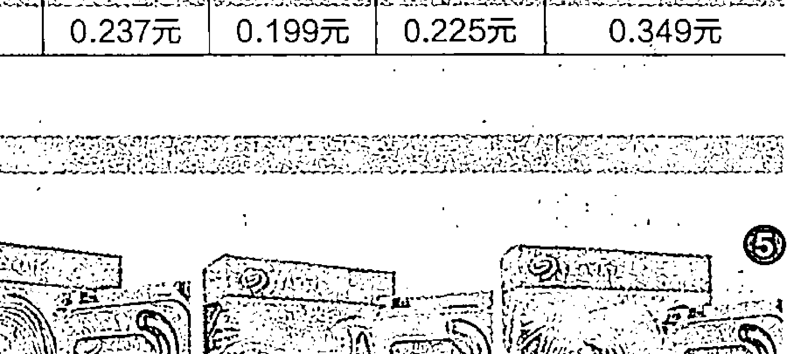

#### 台式机遇到固态硬盘

对台式机而言，哪怕是再迷你的机箱也足够塞进多块硬盘，而HDD机械硬盘容量虽大，但孱弱的性能却是它们的死穴。因此，给台式机添加一个SSD固态硬盘就是必然之选。虽然现在SSD价格不断走高，但这并不影响我们先来了解有关SSD的选购思路。

#### 添加SSD毫无门槛

相对于笔记本，台式机添加SSD几乎毫无门槛，哪怕是Intel NUC为代表的这种迷你电脑也大都至少配备了1个SATA和1个M.2插槽（早期产品采用了mSATA，但现在该标准已经趋于淘汰）（图6），一些高端迷你电脑甚至会配备2个M.2（图7）。对于ITX机箱或传统的塔式机箱，更是不愁没有安装SSD的位置。

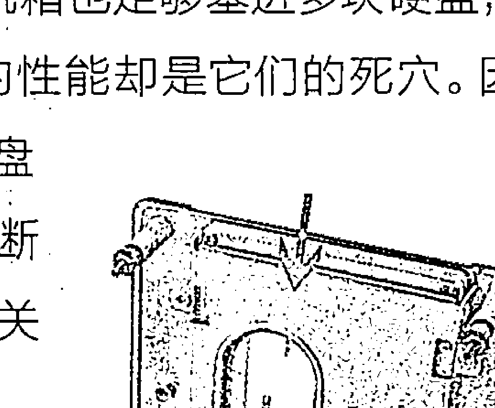

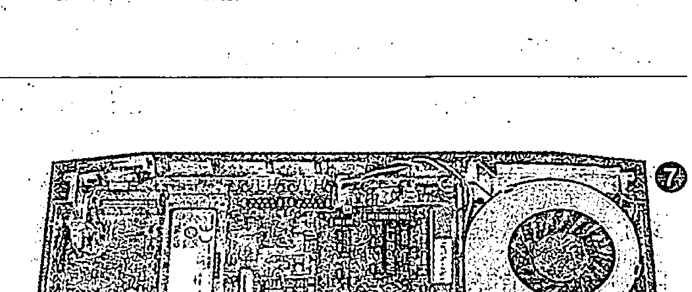

问题来了，给台式机准备什么样的SSD，才能获得最强的磁盘性能呢？

#### 选对SSD的种类很重要

台式机身上可以“安置”SSD的插槽种类有很多（表3）：首先就是最最标准的SATA，也就是用来安装HDD机械硬盘的插槽。

**表3：台式机所支持的SSD常见规格对比**

| 参数/对比 | SATA | mSATA | SATA Express | M.2 | U.2 | PCI-E |
| :--- | :--- | :--- | :--- | :--- | :--- | :--- |
| 理论速度 | 6Gbps | 6Gbps | 10Gbps/16Gbps | 6Gbps~32Gbps | 32Gbps | 32Gbps |
| 规格 | 2.5英寸 | 35mm~70mm | 2.5英寸 | 42mm~110mm | 2.5英寸 | 167mm |
| 传输通道 | SATA3.0 | SATA3.0 | PCIe 2.0×2<br>PCIe 3.0×2 | SATA3.0<br>PCIe 3.0×2/4 | PCIe 3.0×4 | PCIe 3.0×4 |
| 工作电压 | 5V | 3.3V | -- | 3.3V | 3.3V | 12V |

##### SATA接口的SSD

需要注意的是，采用SATA接口的SSD硬盘都是2.5英寸标准，和我们常说的“笔记本硬盘”一般无二（图8）。可惜，受限于SATA3.0那区区6Gbps的带宽限制，这种SSD的持续读取速度连600MB/s都达不到。SATA SSD的优势是价格实惠，没有任何兼容问题，新老台式机买来安装即用。

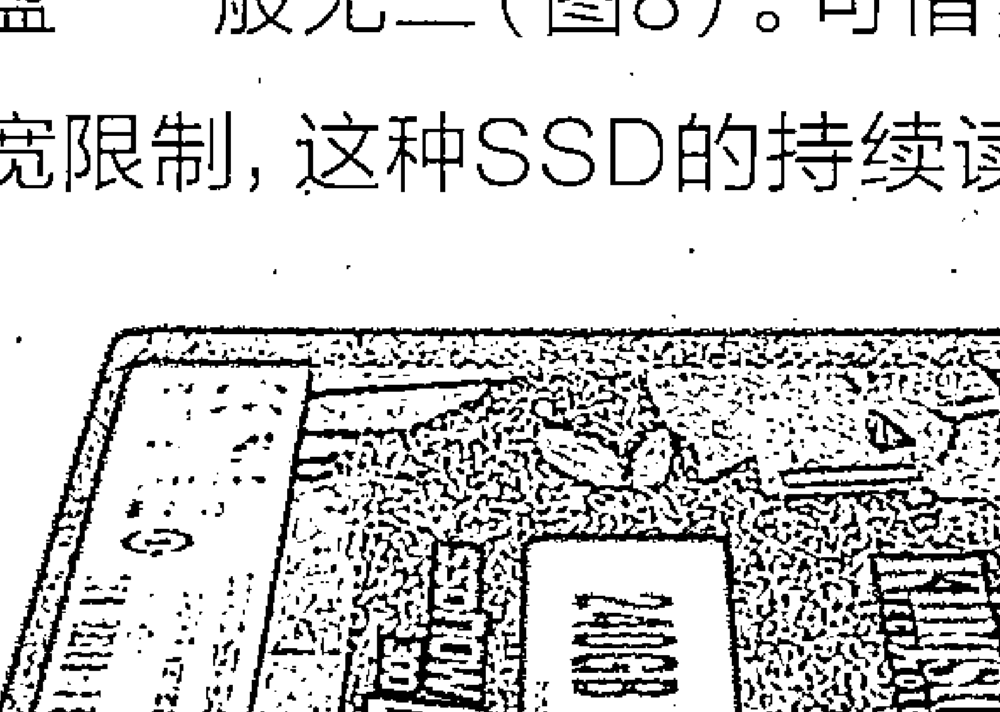

> 小提示
早期的部分台式机主板配有mSATA插槽，可用来安装mSATA标准的迷你SSD。可惜，mSATA SSD的速度依旧受限于6Gbps带宽，而mSATA接口在2年前就已被M.2代替。此外，还有一些早期的高端主板会配备SATA Express插槽，它改用了PCIe 2.0总线，带宽较SATA提升很多，只是该标准比mSATA还要小众，普及度较低。因此这两种接口的SSD我们就一笔带过了。

##### M.2接口的SSD

从六代酷睿处理器平台开始，M.2插槽就已经成为了100系列芯片组的“标配”，到了与七代酷睿处理器平台搭配的200系列芯片组主板，标配2个M.2插槽都不是什么新鲜事了。以华硕PRIME B250M-PLUS为例（图9），这款仅699元的主板就配备了2个M.2，其中1个同时支持SATA通道（又称总线）和PCIe通道的SSD，另外1个M.2则仅支持PCIe 3.0×4通道的SSD（图10）。换句话说，我们需要根据主板上M.2插槽所支持的通道选择匹配的SSD，否则就会出现兼容性问题。有关M.2接口的类型和两种通道的区别，我们会在后面的笔记本篇加以详细介绍。

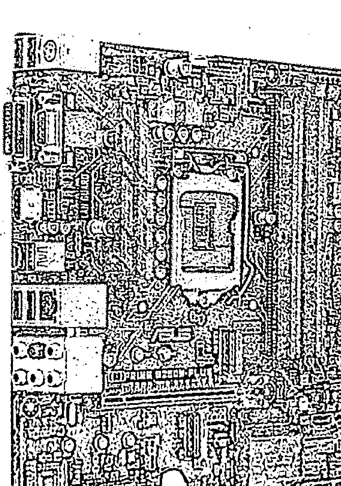

M.2 SSD的特色就是小，它们的体积仅和内存条差不多，可以直接插在主板上而不受电源/数据线的束缚（图11），所以深受高端用户的青睐。采用PCIe 3.0×4且支持NVMe协议的M.2 SSD可轻松达到2000MB/s的传输速度，也是提升台式机磁盘性能的不二之选。

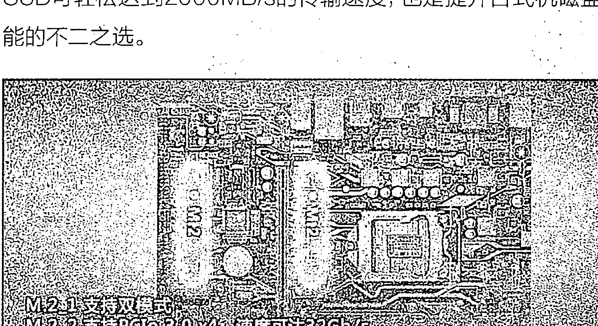


##### PCI-E接口的SSD

可能有读者会问了，我的电脑购买较早，主板上没有M.2插槽，又该如何享受超高速的存储呢？此时就轮到PCI-E SSD登场了。每个台式机主板，除了拥有安装显卡的PCI Express ×16插槽外，往往还会同时配备1个~2个PCI Express ×4插槽，此时我们可以通过PCI Express ×4接口的SSD用于给系统提速（图12）。以金士顿HyperX Predator系列固态硬盘为例，它就采用了主板上普及度最高的PCI Express ×4接口（图13），可以让老电脑也能拥有1400MB/s的读取速度和1000MB/s的写入速度。唯一可惜的是，这一类型的SSD价格较高，240GB容量的版本就要1499元，1.5倍~2倍于PCIe通道的M.2 SSD，相当于我们花钱额外买了个PCI-E扩展卡。

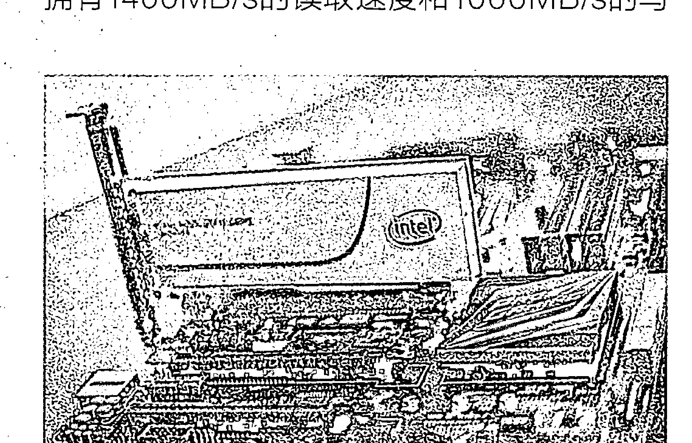

> 小提示
PCI-E SSD有两种组成结构，其一是像金士顿HyperX Predator这种通过M.2 SSD+PCI-E扩展卡的组合形式，理论上我们可以更换更大容量的M.2 SSD给其做后期容量上的升级。另一种则是像英特尔750 PCI-E SSD这种将闪存和主控芯片直接焊在板卡上的结构（图14），只能一步到位，无法后期升级。

##### U.2接口的SSD

U.2被很多人视为SATA和SATA Express的“接班人”，它融合了SATA和SAS接口的特点，中间用针脚填满了SATA接口留下的空缺，并预留了L型防呆设计，所以可以兼容SATA、SAS及SATA E规范（图15）。主板那一端则是mini SAS（SFF-8643）插槽，U.2传输线则是三头设计，分别接在U.2 SSD盘体、主板和SATA标准的15Pin电源供电口上（图16）。

U.2 SSD现在已经支持PCIe 3.0×4和NVMe协议，所以它的带宽也达到了32Gbps，追平了M.2。可惜，U.2 SSD暂时只有英特尔一家在做，400GB容量版本价格约2499元（图17），而U.2插槽在主板上的普及度也不高，竞争力远不如M.2和PCI-E SSD。

总之，如果你注重实惠，选择普通的SATA SSD给台式机升级就能获得（和HDD相比）立竿见影的速度提升。但如果你追求更高的极致速度，那就要根据主板是否配备了PCIe通道的M.2插槽和U.2插槽，再来考虑选择M.2、U.2或PCI-E接口的SSD了。

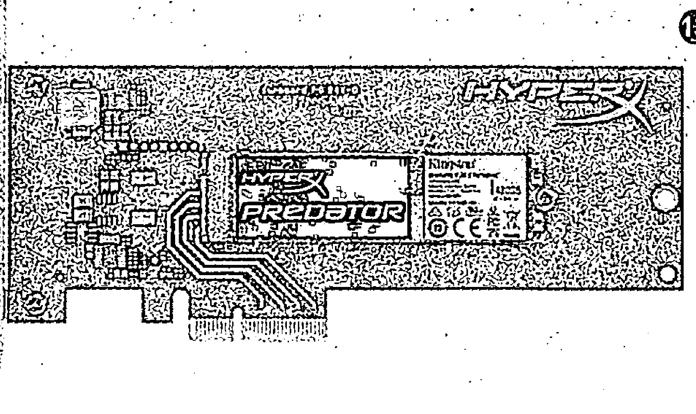

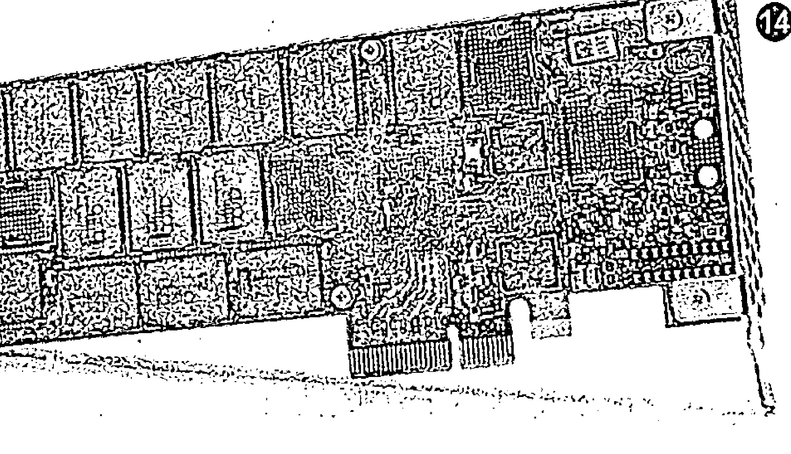

扩展阅读：
台式机还有更高速的存储方案

也许你觉得PCIe SSD就是最快的存储方案了？答案是否定的，因为台式机还有更极致的存储设备可选。比如，英特尔就针对第七代酷睿处理器和200系芯片组主板定制了一个名为“Optane Memory”（傲腾，之前也叫过一段时间“闪腾”），它可被细分为Optane SSD（纯粹的存储设备，速度是现有NAND SSD的1000倍）、Optane DRAM（类似内存的形态，超高速且数据断电后不会丢失）和Optane Memory（缓存盘）三种形态（图18）。有关傲腾技术的更详细资料，感兴趣的读者可参考本刊2017年第5期技术殿堂栏目内容。

此外，美光也在近期发布了名为QuantX的3D Xpoint技术存储品牌。和英特尔傲腾技术相比，美光QuantX也是旨在通过DDR式存储器来打破传统硬盘+内存之间的数据瓶颈（图19）。但美光自己并不生产QuantX产品，而是通过授权让第三方SSD厂商来使用自己的技术。据悉，基于QuantX的SSD最高支持1.4TB容量，采用PCI-Express 3.0/NVMe插槽，适用于X86和ARM平台。

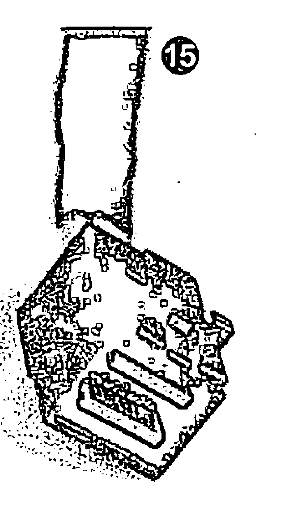

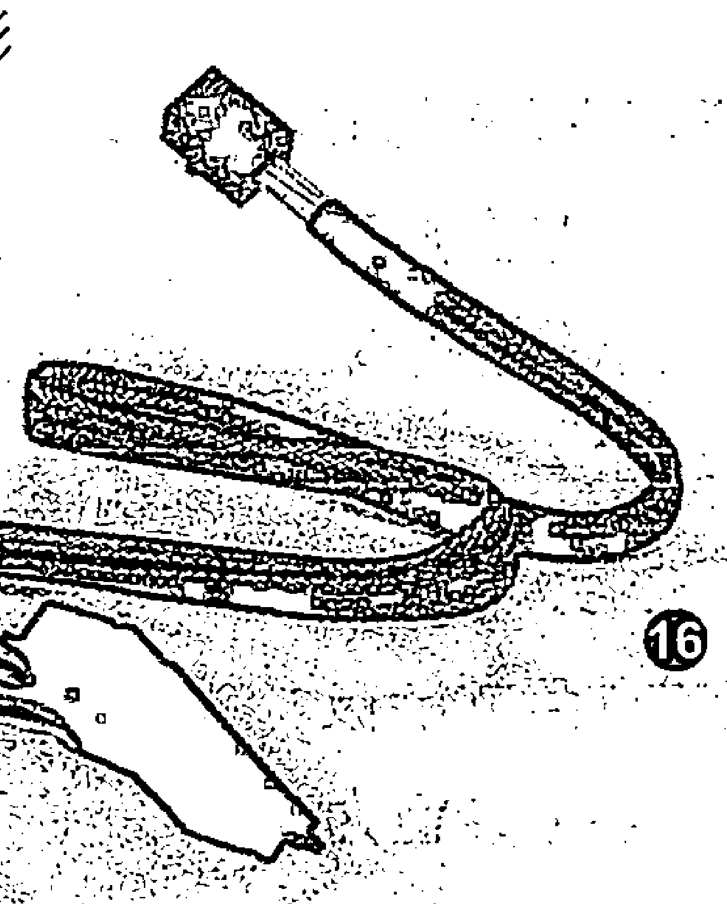

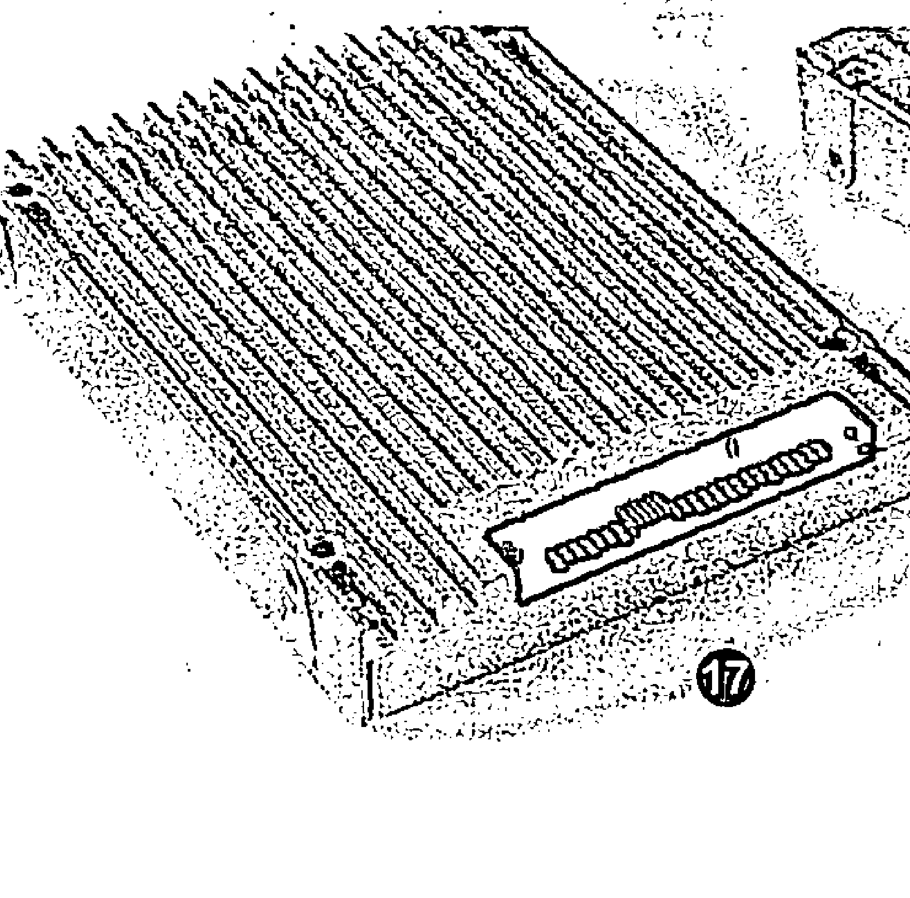

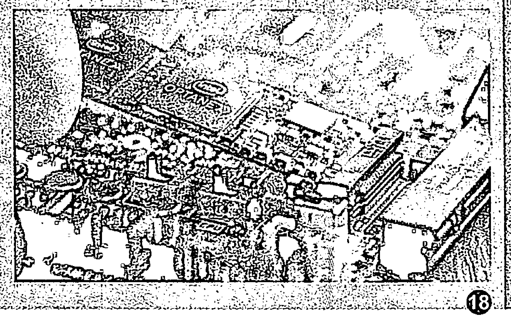

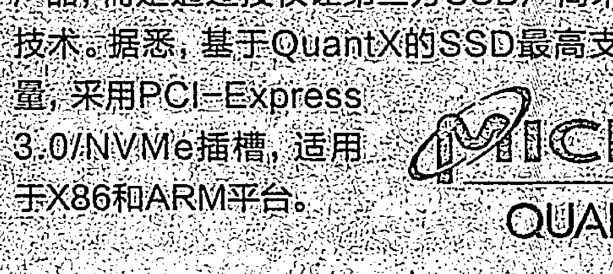## 妥协的艺术
笔记本的存储升级之道

和台式机相比，笔记本“小身板”的升级扩展空间着实有限，想提升存储性能的速度要因人（机型）而异。可以说，笔记本的存储升级之路上充满了妥协的味道，因此咱们有必要好好来聊一聊。

#### 机械硬盘：笔记本的存储仓库

在硬盘的搭配组合上，笔记本基本没有什么发言权，厂商给它设计了几个硬盘接口，将决定它能加装几块硬盘。就容量而言，首选HDD机械硬盘准没错。

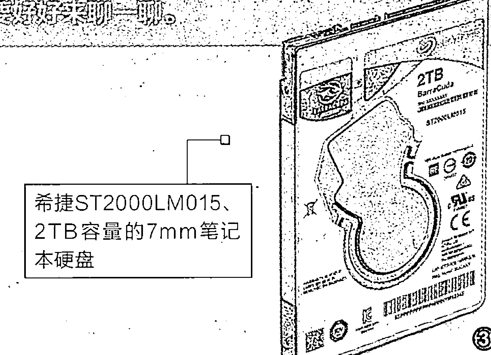

#### 容量和厚度的矛盾

很多人都习惯将2.5英寸硬盘和“笔记本硬盘”划上等号，但现实情况却是，笔记本（机械）硬盘肯定是2.5英寸，但2.5英寸的硬盘却不一定是笔记本专用（图1）。

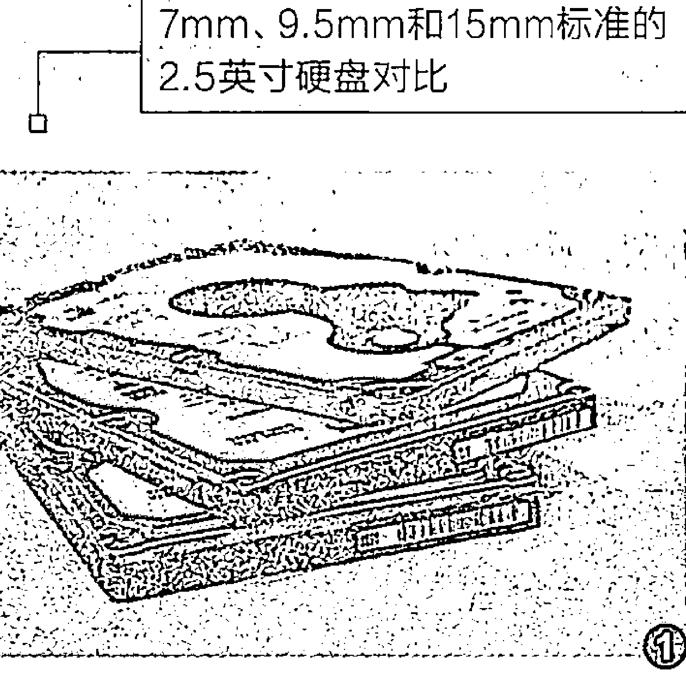

#### 不必考虑性能指标

在挑选笔记本硬盘时，我们无需像采购台式机硬盘那样有太多顾虑，因为笔记本硬盘之间的性能差异微乎其微。以主流的1TB容量为例，无论是希捷还是西数，它们旗下5400rpm转速的笔记本硬盘最大传输速度都在140MB/s上下，只是西数蓝盘的功耗更低一些，只要秉承谁便宜选谁的原则即可。

西数黑盘虽然凭借7200rpm的转速具有更好的理论性能，但它的厚度却达到了9.5mm，兼容性不如7mm厚的小兄弟，而其的价格也颇为昂贵（表1）。要知道，花更少的钱，我们就有机会让机械硬盘性能得到极大的改善。

原因很简单，除了五六年前的“古董级”笔记本，现在的笔记本大都仅支持9.5mm或7mm厚度的2.5英寸硬盘，一些主打轻薄的产品甚至仅支持7mm这么一种规格（图2）。从最近的趋势来看，9.5mm硬盘已经逐步退市，7mm凭借向上兼容（可安装在支持9.5mm厚度的笔记本里）的特性取代了9.5mm厚的老大哥。

表1：主流1TB笔记本硬盘参数对比

| 参数对比 | 希捷酷鱼 | 西数蓝盘 | 西数黑盘 |
| :--- | :--- | :--- | :--- |
| 具体型号 | ST1000LM048 | WD10JPVX | WD10JPLX |
| 转速 | 5400rpm | 5400rpm | 7200rpm |
| 缓存 | 128MB | 8MB | 32MB |
| 传输速度 | 140MB/s | 144MB/s | 未注明 |
| 运行功耗 | 1.7W | 1.7W | 1.75W |
| 空闲功耗 | 1W | 0.57W | 0.8W |
| 待机/睡眠功耗 | 0.45W | 0.18W | 0.2W |
| 厚度 | 7mm | 7mm | 9.5mm |
| 重量 | 90g | 90g | 115g |
| 保修期 | 2年 | 2年 | 5年 |
| 参考价格 | 349元 | 399元 | 699元 |
*价格取自京东自营3月28日报价

问题来了，现阶段只有2TB或更小容量的2.5英寸硬盘才能被压缩进7mm厚度的空间里（图3）。以希捷酷鱼系列2.5英寸硬盘为例，3TB、4TB和5TB容量的版本厚度都达到了15mm，而它们则是专门针对移动硬盘定制的存在。换句话说，如果你想让笔记本获得2TB以上的存储空间，只有同时加装2块硬盘才能实现。

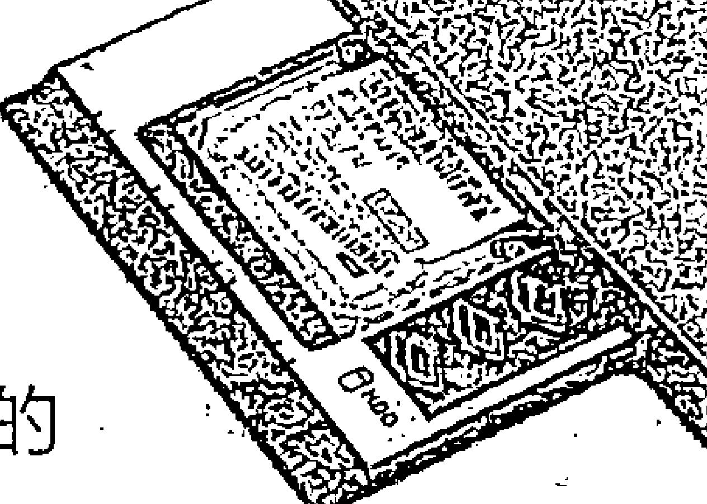

#### 混合硬盘跌落神坛

如果你的笔记本只能安装一块硬盘，而你又对存储容量要求较高，买不起大容量的SSD，笔记本又该如何提速呢？答案很简单，那就是选择SSHD混合硬盘（图4）。其实这种硬盘并非什么新鲜货，它早在几年前就开始流行了。但现在笔者想说的是，SSHD混合硬盘已经跌落神坛，非常适合作为笔记本升级的备选。

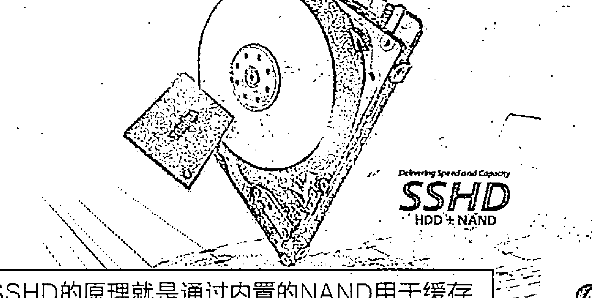

SSHD的原理就是通过内置的NAND用于缓存

希捷应该算是SSHD的“专业户”，目前希捷旗下的500GB（ST500LX025）和1TB（ST1000LX015）售价分别为369元和449元，比普通HDD机械硬盘贵了不到百元。作为SSHD，这两款硬盘最大的特色就是内部增加了一个8GB的NAND闪存和主控芯片，从而实现了随着运行次数的增加而不断提升读写性能的特性。使用SSHD一段时间后，你就会发现常使用的程序会被加速，达到了弥补机械硬盘部分读写碎片化文件能力不足的问题。总之，现在购买7200rpm的笔记本硬盘，不如直接选择价格相仿的SSHD。

#### 固态硬盘：笔记本的提速必选

虽然SSHD混合硬盘在很大程度上改善了HDD机械硬盘的不足，但它对性能的改善却是需要一个使用周期才能见效，并非立竿见影。如果你想获得即时的性能改进，那唯有SSD固态硬盘才能满足你的预期。


才能借助光驱位的硬盘托架，安装一个SATA接口的标准SSD升级（图5）。

一些中高端笔记本或游戏本都配备了1个SATA插槽和1个M.2（早期笔记本配备的是mSATA插槽），少数高端机型甚至会提供2个SATA或2个M.2插槽（图6），可同时安装更多的硬盘升级。

#### SSD的升级门槛并不高

SSD对笔记本的软硬环境有一点点要求，比如必须使用Windows 7或更高版本的系统（XP系统不支持Trim），笔记本必须支持AHCI模式（进BIOS中要有“SATA XXXXX Mode选项”），如果笔记本处理器单核性能太差（比如早期的上网本），会严重影响到SSD在4K读写上的表现。好消息是，近五六年的笔记本都符合使用SSD的硬件门槛，只是坚守Windows XP系统的用户就需要改变观念了。

#### 购买SSD的注意事项

你的笔记本想要升级SSD，首先就要看你笔记本预留了哪种规格的硬盘插槽（图7）。

#### 笔记本SSD的三种形态

笔记本升级SSD的最大门槛，体现在它实际的扩展能力上。比如4000元以内的主流价位笔记本，它们大都仅配备唯一一个SATA插槽，想升级SSD就必须替换下原有的HDD，性能提升了但容量却下降了，在SSD价格疯涨的今天，这种不可调和的矛盾基本无解：除非这款笔记本内置光驱，才能借助光驱位的硬盘托架，安装一个SATA接口的标准SSD升级（图5）。


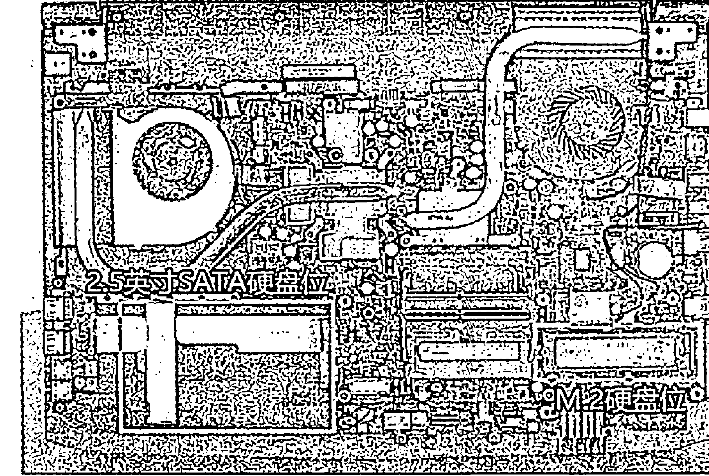

##### SATA SSD

对2.5英寸的标准SATA SSD而言，它也存在9.5mm和7mm之别，大家要根据笔记本所支持的硬盘高度加以筛选。这种SSD的存储介质多为TLC和MLC，后者的使用寿命和性能更强，但售价偏高。而TLC则主打相对实惠的价格，而且它们也能依靠优化主控、算法、ECC校验等方式改善可靠性，质保时间也实现了3年起步。此外，现在使用MLC闪存的SSD越来越少，所以只要价格足够实惠，我们也没有必要非MLC不娶，只能说价格相近的情况下首选MLC。

##### mSATA SSD

对mSATA SSD而言，它存在“全高”与“半高”之别，长度分别对应35mm和70mm（图8），大家要严格按照笔记本内mSATA插槽位置对应的长度选择。如果插槽位支持35mm，你购买了70mm SSD就会发现插不进去；如果插槽位支持70mm，但你买了35mm的SSD，则将面临无法固定的尴尬。由于SATA和mSATA插槽的理论传输速率都只有6Gbps，所以无论你购买的是什么品牌什么型号的SSD，它们的传输速度最多只能达到550MB/s的上限。

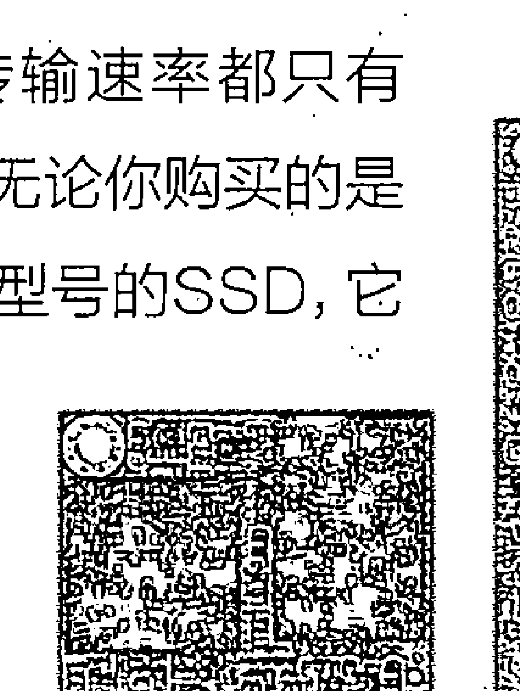

> 小提示
目前基于TLC闪存设计的SSD通常会在主控和固件层面虚拟SLC闪存工作模式，并设置OP冗余缓存，从而提升TLC SSD的性能和使用寿命。因此，你会发现几乎所有的TLC SSD容量都是240GB，哪怕是定位较高的三星850 EVO也仅为250GB，远远没有达到256GB的标准容量。

换句话说，只要你购买的是一线品牌旗下的SSD（如金士顿、三星、闪迪、东芝等），高低端产品的性能差距不会特别明显，至少在日常使用中是体现不出来的。至于容量，考虑到最近SSD价格波动很大，笔者也无法给出准确的建议。只能说如果采用SSD+HDD双硬盘的组合，买120GB/128GB的SSD就基本够用了；如果用SSD替换唯一的HDD，那就需要240GB/256GB容量起步了。

> 小提示
市面上有半高mSATA SSD转全高的扩展卡，有需求的用户可以考虑。

##### M.2 SSD

M.2 SSD应该是笔记本升级时的“捣乱分子”，因为它存在多种规格和兼容性方面的制约。先来看看规格，M.2 SSD存在多种长度版本，在笔记本领域最常见的则是42mm和80mm两种（图9），买错了就会出现和mSATA一样无法安装或无法固定的问题。

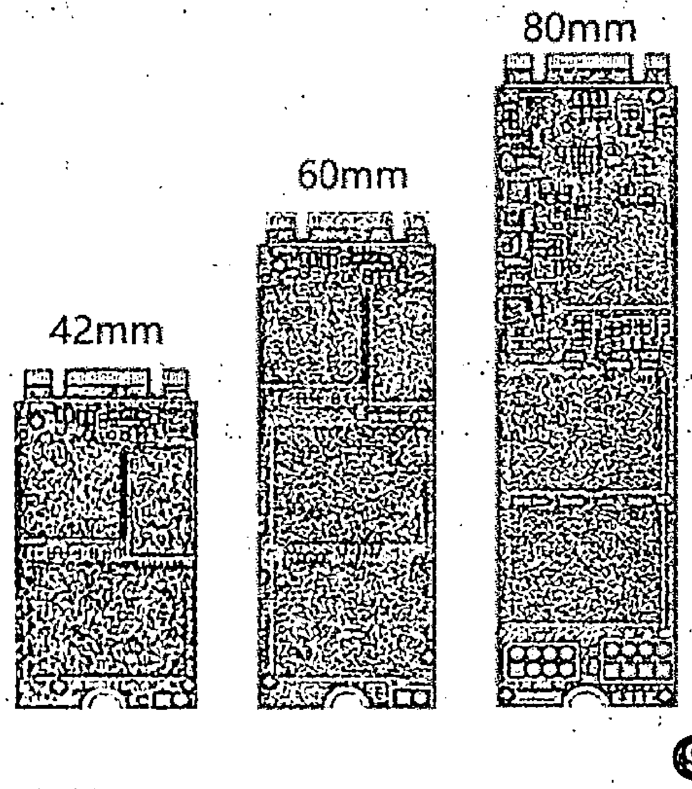

M.2插槽有B Key（又称Socket2）和M Key（又称Socket3）两种标准（图10），低端笔记本大都青睐B Key，而中高端笔记本则多选M Key。此外，在M Key下还存在SATA总线和PCIe总线两种类别，前者的速度最多只有6Gbps，而后者则能达到32Gbps。和台式机主板相比，笔记本上的M Key有着向下兼容的优势。比如某个笔记本M Key插槽支持PCIe总线，那它既可安装NVMe SSD（PCIe总线的高端SSD），也能安装SATA总线的M Key SSD，还能兼容B Key的M.2 SSD。哪怕有个别产品不支持向下兼容，在参数列表上也会明确标出。

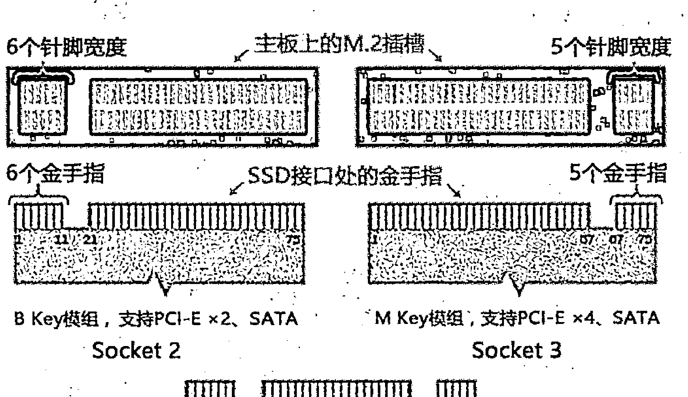

> 火速链接
如果你对M.2 SSD的兼容性和选购问题感兴趣，请参考本刊2017年第5期《解决最后的瓶颈 笔记本要怎么选择NVMe SSD》这篇文章。

### 不一样的闪存 手机存储性能的云泥之别

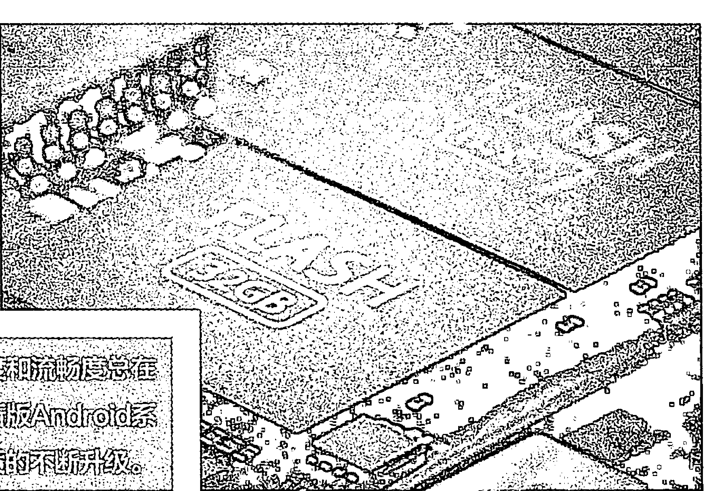

不知道大家有没有发现一个问题，智能手机的运行速度和流畅度总在不断提升。这背后固然有更强大的处理器和优化后新版Android系统的功劳，但最关键的核心，还是取决于手机存储介质的不断升级。

#### 存储性能的云泥之别

首先我们看一张早期智能手机持续读取速度的对比图片（图1），排名靠后的几款手机仅有100MB/s左右，而排名居中的手机则拥有2倍于前者的性能，至于iPhone 6s Plus更是拥有4倍性能，这就很能说明问题了：

Internal NAND - Sequential Read
256KB Sequential Reads in MB/s Higher is Better

| 手机型号 | 读取速度 (MB/s) |
| :--- | :---: |
| Apple iPhone 6s Plus | 402.35 |
| Samsung Galaxy S7 (FDE) | 233.27 |
| Samsung Galaxy S5 | 203.69 |
| Samsung Galaxy S6 edge | 203.69 |
| LG G4 | 181.79 |
| Xiaomi Mi Note Pro | 174.13 |
| Huawei Mate 8 | 127.25 |
| Google Nexus 5X | 116.15 |
| Samsung Galaxy S5 | 103.21 |
| Honor 5X | 107.99 |
| Huawei P8 | 100.19 |
| Google Nexus 6P | 66.74 |
| Google Nexus 6 | 57.03 |

*Nexus 6排名垫底的原因是开启了全盘加密，所以拖累了整体性能

我们在手机上安装APP的数据和缓存会保存在ROM（存储单元）里，ROM速度越快，APP加载和运行的速度自然也就越快。图1中手机间的存储性能之所以出现了云泥之别，就是因为它们的ROM采用了不同的存储介质。

#### ROM的存储介质之别

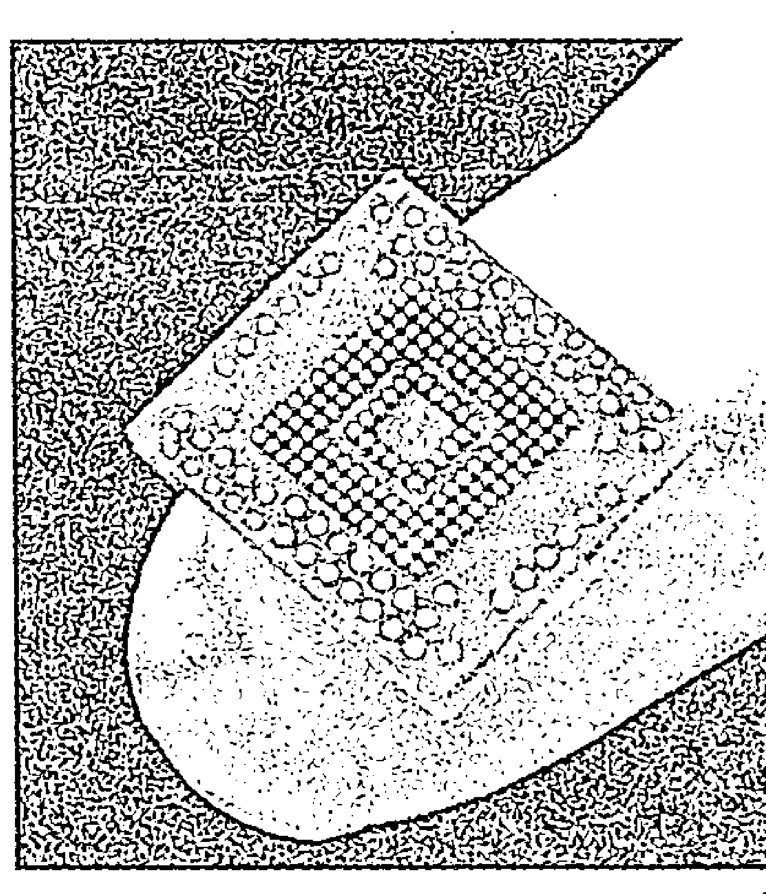

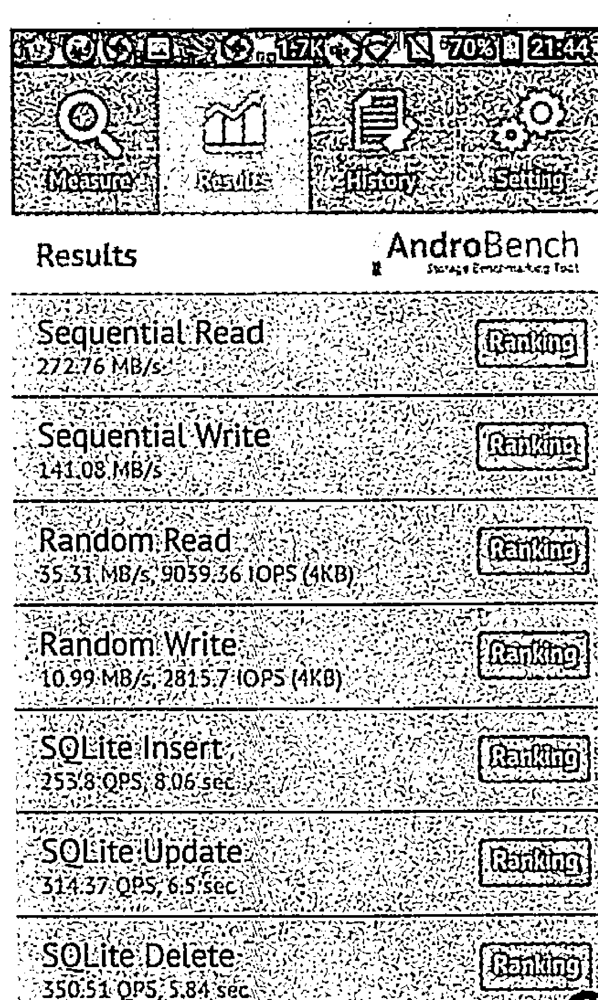

智能手机的存储芯片源于NAND闪存，只是存在eMMC和UFS两种存储介质。其中，eMMC（嵌入式的多媒体存储卡）是中低端Android手机的标配，我们可以将它理解为将NAND闪存、主控芯片封装在一起的闪存盘（U盘），并通过BGA封装的形式焊在了手机的主板上（图2）。想提升这个内置闪存盘的性能，只有不断改进eMMC的总线接口，于是就有了eMMC4.4、eMMC4.5、eMMC5.0和eMMC5.1的不断演进。问题是，eMMC的结构性质注定它不可能获得太强的性能。以最新的eMMC5.1为例，其实际持续读取速度也就在280MB/s上下（图3）。

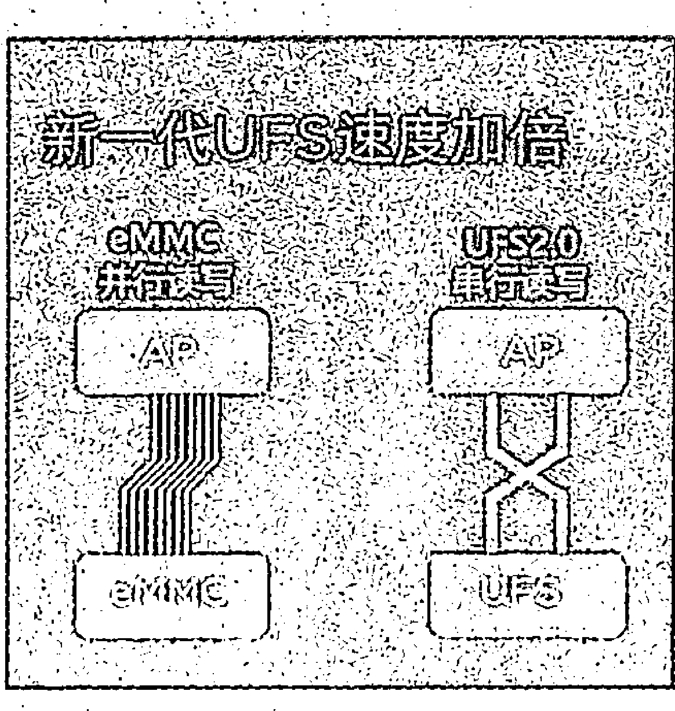

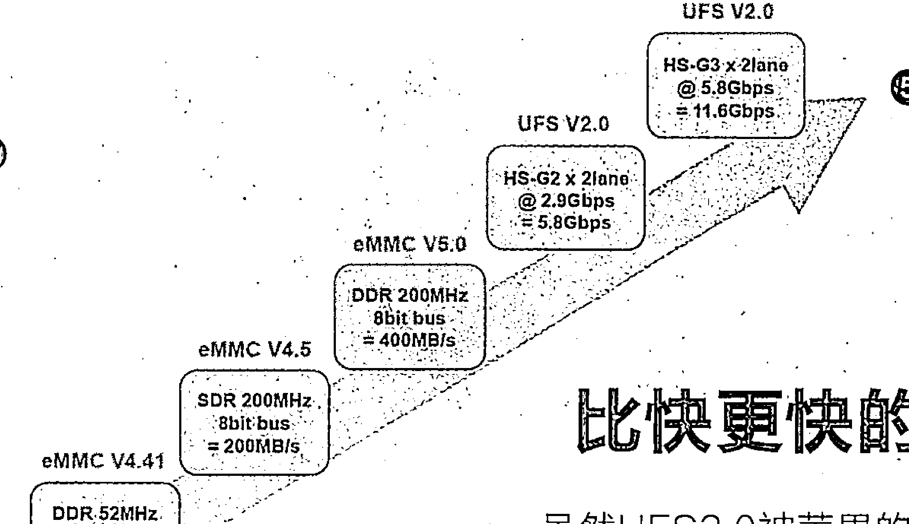

#### 比快更快的UFS2.1来了

参考PC领域存储设备的演进，既然闪存盘性能落伍，那换个SSD闪存盘不就结了？于是，UFS（通用闪存）便出炉了。简单来说，eMMC性能差是因为它只支持半双工运行（读写必须分开执行），而UFS则改用了全双工运行，能够同时读写数据（图4）。我们可以将UFS理解为SSD，虽然它和闪存盘都是由NAND闪存芯片构成，但不同的运行机制，导致两种存储设备的性能就有了云泥之别（图5）。

骁龙820/821、三星8890等上代旗舰处理器都支持UFS2.0，持续读取速度可轻松达到400MB/s以上（图6）。

问题来了，苹果iPhone 6s Plus貌似没有采用UFS，但它的速度为啥也能超过采用UFS2.0的一众对手？答案是，苹果在手机上引入了MacBook身上备受好评的NVMe协议，同样让以NAND为主的存储介质获得了媲美SSD的性能。

虽然UFS2.0被苹果的NVMe存储方案压着，但这种情况并没有维持太久。因为UFS 2.0共有两个版本，其中一个是HS-G2，也就是目前的UFS2.0。而另一个版本名为HS-G3，其理论传输速率可达到11.6Gbps，也就是UFS 2.0的2倍。而HS-G3现在也有了新的名字：UFS2.1，并被麒麟960处理器首发，华为旗下的Mate 9、P10和荣耀V9就是首批采用UFS2.1存储技术的手机。

随后，骁龙835、三星8895、联发科Helio X30等新一代10nm处理器也都会加入对UFS2.1的支持，从而实现存储性能的反超（相对苹果）。那么，UFS2.1在现实中到底能有多快？

CFan对Mate 9、P10和荣耀V9都进行过评测，其中荣耀V9的存储性能最出众，持续读取速度达到了738MB/s（图7）。究其原因，是因为我们评测的荣耀V9是128GB容量的高配版。和SSD类似，UFS技术也存在容量越高性能越强的增益特性。

#### 理性看待智能手机的涨价

| Results | Value |
|---------|-------|
| Sequential Read | 425.08 MB/s |
| Sequential Write | 165.27 MB/s |
| Random Read | 111.32 MB/s, 28499.92 IOPS (4KB) |
| Random Write | 15.8 MB/s, 4046.36 IOPS (4KB) |
| SQLite Insert | 402.91 TPS, 5.07 sec |
| SQLite Update | 578.53 TPS, 3.53 sec |
| SQLite Delete | 631.99 TPS, 3.24 sec |

| Results | Value |
|---------|-------|
| Sequential Read | 738.12 MB/s |
| Sequential Write | 175.11 MB/s |
| Random Read | 156.59 MB/s, 40087.44 IOPS (4KB) |
| Random Write | 127.05 MB/s, 32527.23 IOPS (4KB) |
| SQLite Insert | 2915.57 TPS, 0.69 sec |
| SQLite Update | 2938.96 TPS, 0.69 sec |
| SQLite Delete | 4062.25 TPS, 0.49 sec |

细心的读者可能发现了，最近半年来很多手机都出现了提价现象。而一些高端机型的32GB、64GB和128GB的不同容量版本之间的价差也较以往有了很大的提高。比如，去年某款旗舰手机32GB版本售价为2299元，那64GB版可能仅售2499元。但如今很多新品32GB和64GB版本间可能会出现500元甚至更高的价差。

我们需要理性看待类似的现象。一方面，近期各种原材料涨价是诱因，而新一代旗舰手机的存储模块已经都升级到了UFS2.0或UFS2.1，成本自然要比以前的eMMC贵上很多。想一想现在能达到100MB/s级别读取速度的32GB存储卡还要卖399元，速度已经突破400MB/s大关的手机存储是不是价值更高呢？

### 个性桌面不求人

#### 桌面美化我来做

策划|《电脑爱好者》编辑部
文|夜尽 红烧真人


每天不管是上班工作还是回家休息，打开电脑都是一件再普通不过的事情，但每次打开电脑面对一成不变的桌面难免会产生疲劳。简单的桌面调节可以鼠标右键点击个性化，更换壁纸、更换界面风格、调整鼠标指针、调整桌面快捷方式图标以及开关机音乐等，打开选项将自己准备好的文件选中替换即可。不过这种方法过于简单，整体风格固定，总有一种换汤不换药的感觉，而用360等软件自带的桌面管理插件又不太好看。怎样才能做一个充满创意与个性化的电脑桌面呢？本期专题将为大家呈现它们的全貌。

#### 简单入门好上手——SAO-Utils

说到SAO-Utils，不少看过动漫的用户可能会觉得熟悉，它来源于动漫刀剑神域，是英文写法Sword Art Online（以下简称为SAO）的简称。动漫里VRMMO（虚拟现实大型多人在线）游戏SAO中充满科技感的游戏菜单栏效果让人感觉非常惊艳，右手一划便可以调出菜单，精致的特效和方便的操作深深地吸引了笔者。如今热风CG工作室通过桌面启动器的形式成功地将SAO中的菜单搬上了电脑桌面。

启动器继承了SAO中游戏菜单的风格和过渡动画，顺滑而又无缝的切换方式在实际操作过程中很有科技的美感。只要按住鼠标向下轻轻一划，菜单便可以轻松调出，经典的白色背景和黄色阴影与动画里的界面十分相似。
SAO-Utils的默认打开方式为鼠标左键和右键同时长按下拉，在设置中可以进一步自定义打开方式。

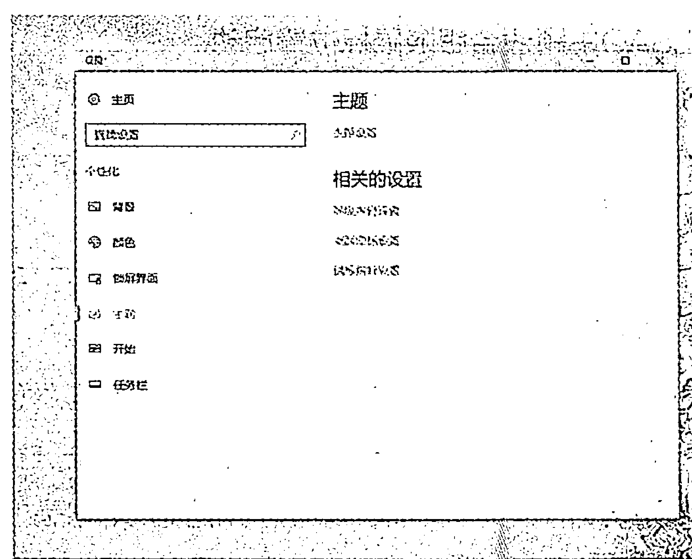

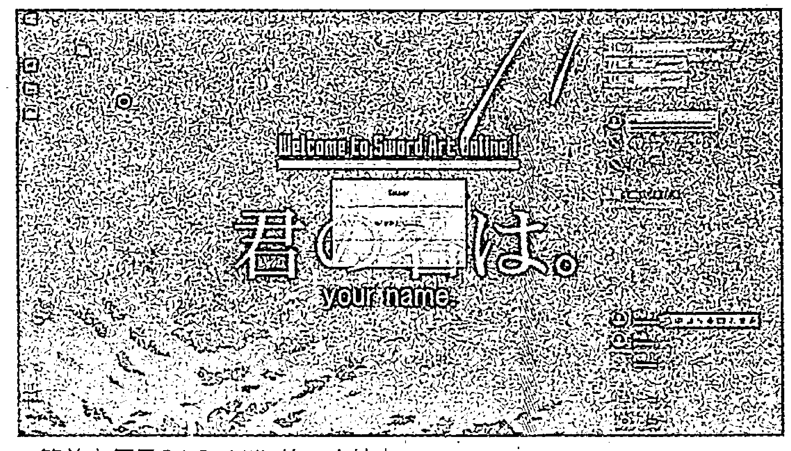SAO Utils主题不多，切换也不麻烦。看，我们可以通过选择年月来查询动画播出时间。这个插件对于日式动漫爱好者来说是一个再好不过的“福利”，不过目前该软件只能查找动漫，电视剧等推送目前还没有合作端口开放。

#### SAO由资源监视器与各种插件构成

SAO由资源监视器与各种插件构成，软件默认设置开机自启以及打开所有插件，默认情况下预装15个插件。软件有SAO、GGO和ALO三种主题风格，其中前两种比较常用。不同的主题有不同的插件，通过设置我们可以让这些插件一同使用。主题可以通过启动器“设置→Option→切换主题”来换成GGO主题。两者功能上是一致的，风格上SAO主题适合跟随鼠标位置启动，GGO主题适合在画面居中启动。

网页浏览器引擎和网页桌面挂件使软件能够在启动器里和桌面上打开网页。比较有意思的是，网页桌面挂件加入了一个实时在线交流的功能，可以像QQ一样聊天，不过只能聊天，名字无法保存，功能不是很完善。

MailBox插件可以绑定自己的邮箱，支持发送邮件和接收邮件，是一项很实用的功能。打开MailBox插件，系统会提示设置邮箱。填入个人的邮箱地址、POP3服务器和SMTP服务器的地址，安全链接选择SSL端口会自动显示，大家可以不必填写，用户名一栏也会在输入账号的同时自动填写，密码项是用户在各自的邮箱官网设置中开启POP3服务显示的密码。注意，这里的密码不是邮箱本身的登录密码，错把邮箱登录密码输入进去是不能成功登录的。全部填写完成后点击下方的测试按钮，如果填写的信息无误的话，按钮下方会显示连接成功。为了效率起见，将邮箱的刷新时间设置为1分钟，填写自己的用户名，点击完成。

#### 常用插件

默认设置下桌面右上角的几个条形图，除了熟悉的RAM（内存占用率）和HDD（硬盘占用率）外还有一个HP计量表挂件（空白插件）。所有的计量条的名字和功能全都可以通过右键点击进行添加和修改。唯一不可修改的是第一个计量条右下角的等级，它是根据当前电脑的开机时间自动进行升级，每次开机都会重置。作者描述这样的设计是为了防止用户恶意修改攀比。

邮箱设置不算麻烦。

此外还有音乐播放器支持、PDH数据库扩展、传感器数据库扩展、快捷键扩展、天气数据库扩展等扩展插件需要用户自己进入菜单后详细设置，在这里就不再赘述。

YUI-MHCP001是基于Cardinal的一个桌面辅助精灵，实际功能仅限于开机的时候弹出类似这样的对话框，每隔一段时间会弹出消息提供一些小提示或者是软件的更新进度。虽然功能聊胜于无，但是比起Siri和Cotana那种你有事才找它的工具式使用方式，这种动不动就“撩”你一下反而会觉得比较亲切。

Bangumi插件会显示当天更新的新动画，并且支持无缝式下载与在线播放，可以通过软件自带的HTML插件打开播放页并直接观看。

● 菜单栏很简洁，方便用户查找

#### 进阶设置

当然，想要更好地使用SAO-Utils少不了详细的调整。SAO-Utils有一个核心的设置就是启动器。在任意非全屏使用状态下鼠标左键+右键下滑、点击快速启动按钮、点击任务栏里的SAO图标或者键盘Win+S（此项Windows 10热键冲突）组合都可以调出启动器。五个图标完美还原创画设定，用户还可以用鼠标滚轮进行滚动，不过没有经过设置的启动器只是个摆设，我们需要进行详细设置。

调出SAO-Utils，我们能看到启动器默认的五个一级启动菜单，在最新版的更新中，Kirito菜单默认置顶并且自动展开到下一级子菜单，方便了菜单的查看，也有着很强的带入感。一级菜单目录从上而下来看分别是角色信息（Kirito）菜单、好友菜单（对应动漫）、邮箱菜单、地图菜单、设定菜单。需要注意的是，除了角色信息菜单和设置菜单，剩下的一级菜单并没有子目录。

目录编辑页中，支持自定义当前目录图标和重命名当前目录标题。子菜单选项是SAO-Utils的一大特色，选择子菜单选项的虚拟目录，可以在启动器上自己建立虚拟的目录菜单，并且定义菜单的功能。选择真实目录，可以链接到常用的本地文件夹，所有目录都会直接在启动器上显示，使用起来十分的方便简洁。并且在选择子菜单选项的情况下还可以在编辑页下半部分自定义介绍页面的描述文本和添加静态图片，介绍页面会在目录的左方弹出。

关闭子菜单选项，信息面板选项会变为动作选项，软件自动默认当前目录为子目录，动作选项中可以将当前目录设置为程序的快捷方式、文件或者文件夹。同样可以将当前目录设置为网页链接或者设置为一道命令，理论上讲，SAO-Utils支持CMD的命令集，具体可以在网上查找。

点开Kirito菜单，软件预设了Skill（技能）、Items（物品）、Equipment（装备）三个二级目录，这些名称和作用用户可以自行修改，目录下有不少方便实用的工具与快捷方式供用户选择。

● 插件可以自定义命名

Sitting（设置）菜单中预设了Option（设置）、Help（帮助）、Logout（登出）几个选项。设置菜单在最新的更新中集成了子目录的设置选项，方便了简单的设置操作。另外还添加了切换主题选项卡，软件预设了GGO的主题，切换之后便可以使你的SAO启动器瞬间变成GGO启动器。软件支持主题扩展，更多的主题可以在SAO-Utils官网下载。

同样我们可以点击常规选项卡进入设置界面。设置界面分为常规、外观、图形、音效、插件、关于六个选项，我们可以在常规选项卡中设置SAO-Ulits的打开方式，笔者建议中键下拉，可以防止在日常操作中的误触。常规选项卡从上而下的设置内容分别为热键、杂项与一些常用设置，有兴趣的用户可以研究一下。

外观选项卡中自上而下分别为启动器模式、启动器位置、背景浓度、通知图标位置、启动动画设置。图形选项卡中，可以选择显示器、显示模式，以及一些显示细节设置。启动器的3D模式就是在启动器调出的时候是否会跟随鼠标进行抖动，特效非常好看，不过3D特效最好把模拟色差和运动模糊关闭或者只设置成轻微，如果开得太高就像是摇着头看手机的感觉。虽然对于动漫原作的效果还原度非常高，但是用起来就比较痛苦了。

立体眼镜设置算是SAO-Utils的一大亮点，软件可以通过VR盒子和软件的VR输出信号来还原动漫中的感觉，是一个比较有趣的功能。目前VR项目处于实验阶段，默认软件不自带此功能，用户需要在官网下载SAO Utils Beta 1，并且自备VR盒子。音效选项卡中，可以设置不同的音效，软件预置了ALO的音效方案，可以在官网下载更多方案来进行替换。

在桌面就可以进行简单的插件管理。

作为一款入门级的桌面美化类型的启动器，SAO-Utils的表现可以说得上是可圈可点，但不足之处也很多。对于希望稍加体验一下简易美化功能的用户来说还是比较有趣的。

#### 全能强大绚丽多——Rainmeter

Rainmeter这款桌面美化软件相信很多人都有所耳闻。原本作为系统状态监视软件，不过经使用者一系列自定义插件和皮肤把它变成了一款较为完善的系统美化工具。相比SAO-Utils难度高很多，这里我们就来讲讲如何快速上手Rainmeter。

##### 一、下载与安装

Rainmeter是免费开源的，目前最新的中文稳定版本是3.2，更新比国际版（4.0稳定版）稍慢一些。安装分为“标准安装”和“便携式安装”，可以根据自己的需要选择，如果第一次接触推荐使用“标准安装”，安装时勾选“开机运行”。完成后会有默认的皮肤自动加载：日期和时间、系统状态、物理内存和虚拟内存的使用率、磁盘使用状况以及欢迎面板。官方默认的皮肤很实用，只是过于简约。想要达到美化桌面的效果，我们还需要安装皮肤包。

默认安装完的皮肤很简单。

##### 二、皮肤包

Rainmeter的皮肤包将各种实用插件和不同风格的面板封装在一起，是让用户获得最简单的美化效果的方法。Rainmeter的皮肤文件后缀名为ini，一些皮肤会单独发布，想要使用就需要单独下载并逐个加载进桌面。为了简化这一过程，有的作者将同一个主题的各个皮肤以及插件和脚本打包为皮肤包统一发布，这样用户可以很方便地获取同风格的皮肤并一次性加载，再根据自己的需要编辑皮肤定制自己的桌面。不同作者的打包方式不都相同，常见的皮肤包格式为rar和rmskin两种，它们配置完毕后效果相同。

rar格式解压后把里面的文件粘贴到软件根目录下skins文件夹里（桌面右下图标右击图标选择“皮肤→打开皮肤目录”可以直接找到），点击软件主界面“刷新全部”就可以读取。

rmskin是官方推荐的格式，如果在安装时选择了“标准安装”，Rainmeter会关联该文件格式。如果Rainmeter没有系统或者你想要手动安装皮肤，可以在软件根目录下找到SkinInstaller.exe，打开后选择你要安装的rmskin文件，点击install安装，完成后皮肤会自动加载。

##### 三、加载和关闭皮肤

皮肤文件准备好后，在软件主界面会以文件夹列表的形式显示出来，可以逐级打开。

这里以Dishonored主题为例。Dishonored文件夹下分为以下文件夹：Battery（电量）、CPU RAM（CPU和内存使用状况）、Launcher L/R（快捷方式布局左或右）、Network（网络状况）、Time and Date（时间和日期）。每个文件夹中有数量不等的ini文件（皮肤文件）。打开ini文件后会将皮肤加载到桌面，这时就可以自由拖动皮肤调整位置。再次双击同一文件则关闭该皮肤，也可以右键点击皮肤关闭。同一文件夹下通常都是相同作用的皮肤的不同规格，比如大小、方向、分辨率等，所以它们不可以同时加载。

到此Rainmeter的基础美化操作就算告一段落，用户可以在论坛和百度上寻找合适的皮肤下载安装。

##### 进阶操作

##### 一、编辑皮肤

###### 1.路径修改

这一部分是使用Rainmeter的重点，也是最容易出错的一部分，要想真正做到个性化的桌面定制，掌握皮肤文件的文本编辑是少不了的。这里还以Dishonored的主题为例。

第一次加载出这个皮肤，除了位置以外，我们发现右上的快捷方式和我们需要的不同，这里是作者的默认设置，而我们首先要做的是把它修改成适合自己的样子。

我们可以在该皮肤上“右键→编辑皮肤”，也可以在Rainmeter界面点击对应皮肤，然后在右边点击“编辑”按钮取得同样的效果。这时会弹出一个文本文件，默认是使用记事本打开的，记事本已经可以满足我们基本的需求了，但是为了看得更清晰以及修改方便，可以使用notepad+或UltraEdit等文本编辑软件，在Rainmeter主界面的“设置”选项卡可以修改默认编辑器。

打开文本后，通常可以看到明确的分布，这里通常是作者想让你看到的部分，所以第一部分一般是作者和作品信息，还有修改注意事项。Dishonored这个例子较为简单，修改过程也比较典型，所以我们逐行分析下去。

首先是Rainmeter节点，这个节点下是皮肤的一些一般性设置，通常不用修改。Update是Meter和Measure节点的更新周期，这两个十分重要。Update的单位是毫秒，默认是1000就是1秒，设定为-1就不会更新皮肤，只有在皮肤加载或者皮肤刷新的时候才更新。该选项通常用于CPU、内存或者硬盘状态皮肤，每个固定周期刷新一次皮肤，以实时地提供硬件的使用信息。Author是作品和作者的信息。LocalFont是皮肤的字体，这里是作者提供的默认字体，如果想要自己定义字体的话，将引号中的路径替换为你自己的字体文件就可以。“#ROOTCONFIGPATH#_Font”这段路径意思是这个皮肤根目录下的Font文件夹，这里的字体就是之前所说的皮肤包里自带的，亦即作者提供的默认字体。“LeftMouseUpAction”为左键点击音效。“MouseOverAction”鼠标经过音效与以上相同。

通常要修改的部分都在变量Variables节点下。这里的“L1、T1、B1”都是简写，如果作者没在说明中提到是什么意思，我们就要凭借经验猜测或者参照下面的具体代码。这里较为简单，我们可以判断出L代表的是路径，T代表想显示的文本，B代表显示的背景图片，也就是所看到的皮肤效果图。图片并不需要我们修改，只要将显示文本和路径改成我们需要的。这里的路径可以为程序位置、文件夹位置、网页快捷方式，通常不需要加引号。

修改完后，保存文件，刷新皮肤，操作与编辑皮肤相类似，右键点击皮肤或在Rainmeter主界面找对应按钮。

上文是针对一些作者发布的皮肤较为规范的情况，只需要进行简单的路径修改即可使用，而遇到编写不规范的还需要详细修改。

皮肤即.ini文件，它被分为几个部分，所有的一般性设置会放在[RainMeter]部分，详细信息将被放入[Metadata]节点，变量放在[Variables]节点下面。然后剩下的measure（用来收集检测数据的）和meter（用来显示数据的）。上面所有的节点的顺序可以自己随意编写，没有固定的约束，但是通常来说编写皮肤的顺序大致是[RainMeter]→[Metadata]→[Variables]→[Measure]→[Meter]。

Rainmeter节点和Variables节点我们已经介绍过了，再来看一下其他节点，还是使用上文提到的例子。

Metadata：可以看出这里大部分内容都留空了，也就是说这里的选项设置通常不影响皮肤的运作。这里要说的问题是Rainmeter中的注释符号，如果一行以分号“;”开头，那么这一行就被当做注释处理，没有任何效果，只是给编辑人员用作参考。这里的分号必须使用半角符号，也就是说编辑Rainmeter皮肤时要使用英文符号。

###### 2.基本节点

Measure和Meter：这两个节点的名字是需要自定义。这里要说明，一个皮肤可以只有一个[Meter]节点，而RainMeter、Metadata、Variables和Measure节点都可以不写。笔者使用的皮肤就只有Meter节点，没有Measure节点。Meter节点用于告诉皮肤该怎样显示和显示什么。每个节点的名称独一无二，如果名字相同，则文档下面的部分会覆盖上面的信息。

第一行Meter=XX是说明该Meter的类型，这包括Bitmap（位图）、Button（按钮）、Image（图像）、String（字符串）等。

Image类型的节点比较常见，主要就是为它提供地址，并设置XY坐标就能显示图片，也可以引用Measure节点让它在特定情况显示特定的图片。

Button节点需要的图片比较特殊，我们叫做三帧图，三个部分分别对应按钮的‘正常-按下-鼠标悬停’状态。ButtonImage就是按钮的图片路径，这里双井号‘##’中间的‘B1’就是之前我们在Variables中设置的，在这里引用即可获得Variables中B1的值。下面的ButtonCommand同理。‘!Execute’是Rainmeter中的bang命令，它表示执行后面的操作，虽然现在很少使用这种写法，但是仍然能发挥作用。MouseOverAction意为‘鼠标经过动作’，当鼠标经过时触发‘!Execute [!SetOption String1 FontColor 0,0,0,200] [!SetOption String1 x 310]’，就是执行‘!SetOption（把目标选项的值设置为XX）’，这里是把String1中的FontColor（字体颜色）设置为0,0,0,200（这是一种颜色代码，在String节点中讲解）。‘!SetOption String1 x 310’就是把String1的x设置为310，鼠标经过时就会有效果（颜色改变，图片变长，文本左移）。

```
D:\Rainmeter\Skins\Dishonored\Launcher R\Launcher.ini

[Rainmeter]
Update=100
Author=Artyom Dokolin
LocalFont="#ROOTCONFIGPATH#_Font\Benguiat Rus Regular.ttf"
LeftMouseUpAction=PLAY #ROOTCONFIGPATH#_Sound\dClick.wav
MouseOverAction=PLAY #ROOTCONFIGPATH#_Sound\dHover.wav

[Variables]

L1=shell:Desktop
T1=Desktop
B1=#CURRENTPATH#button1.png

L2=shell:DocumentsLibrary
T2=Documents
B2=#CURRENTPATH#button2.png

L3=shell:MusicLibrary
T3=Music
B3=#CURRENTPATH#button3.png

L4=shell:PicturesLibrary
T4=Pictures
```

[Metadata]
Name=
Config=
Description=Right sided launcher.
Instructions=
Version=1.0
Tags=
License=
Variant=
Preview=
;End of added Metadata

```
[Meter1]
Meter=BUTTON
X=0
Y=1
ButtonImage=#B1#
ButtonCommand=!Execute ["#L1#"]
MouseOverAction=!Execute [!SetOption String1 FontColor 0,0,0,200] [!SetOption String1 x 310]
MouseLeaveAction=!Execute [!SetOption String1 FontColor 255,255,255,200] [!SetOption String1 x 360]
```

> 不知道颜色参数？用QQ字体颜色设置就能看到

> 修改完效果很明显

不知颜色参数？用QQ字体颜色设置就能看到。
修改完效果很明显。

天气插件需要点开哦

String类型的Meter把操作者赋予的值用文字的形式表现出来。一个字符型的Meter不需要绑定一个Measure。仅仅使用“Text=”就可以显示一个静态文本。先来看与上述节点相同的选项：Meter、x、y，这里y=10r中的“r”代表在原有基础上增加10。还有一个类似的选项是Text="#T1#"，双井号的用法与之前相同，引用Variables中的T1的值。其他的选项即使看不懂也可以通过翻译软件查到意思：StringAlign（字符串对齐方式，这里是右对齐）、StringCase（字符串大小写，Upper是大写）、FontColor（字体颜色）、FontSize（字体大小）、FontFace（字体）、AntiAlias（反锯齿，1代表启用）。字体颜色的代码是RGB颜色值，可以通过QQ、画图或Photoshop等查找，也可以使用取色软件，前三个数字对应红、绿、蓝，后一个是透明度。

```
[String1]
Meter=String
x=360
y=10r
StringAlign=RIGHT
StringCase=UPPER
FontColor=255,255,255,200
FontSize=20
FontFace=Benguiat Rus
Text="#T1#"
AntiAlias=1
```

###### 3. @Resources文件夹

前面我们介绍过皮肤包多个文件夹用于存放不同作用的皮肤，而这些皮肤可能用到不同的素材，比如图片、字体、脚本等。为了方便各个资源的存取调用，Rainmeter官方提供了一个@Resources文件夹，在这个文件夹下面的皮肤文件夹（Clock、Date、HDD等）中皮肤可以使用“#@#”来代替Resources文件夹的路径。@Resources文件夹在扫描皮肤的时候会被忽略，而其中的所有文件都会迅速加载，将加快Rainmeter的加载时间。

##### 二、插件

插件是一种动态链接库，文件后缀为dll，里面存放一些代码用于实现特定功能。有些皮肤作者想要实现一些雨滴不具备的功能，就自己编写新代码，封装后将其放在指定文件夹中，皮肤文件就可以方便地使用这些新功能。皮肤作者通常会把那些自己用到的非官方插件放在皮肤包里打包安装。当你需要特定的插件时，可以前往Rainmeter中文论坛与开发爱好者讨论相关问题。

大部分插件会被皮肤包自动安装在根目录Plugins文件夹中，这里还存放官方插件，如果你需要添加新插件，只需要将类似于Plugin.dll的文件拷贝到Rainmeter安装目录下的Plugins文件夹即可。

##### 三、有关皮肤的一些问题

直接在桌面上查看未来的天气状况和控制音乐播放器可以方便我们的使用，Rainmeter已初步具备这样的功能，但还存在一些问题。

###### 1. 天气皮肤

前面介绍一些基于本地文件的功能，如果网络条件允许的话，Rainmeter也可以联网获取数据显示，比较典型的就是天气皮肤。但现因接口问题，天气经常不能正确显示。国内的皮肤插件较为稳定的是CNWeather，基于此插件的皮肤除了千变素描天气还有Clock and weather。

###### 2. 播放器皮肤

播放器皮肤普遍基于nowplaying.dll这个插件来编写，它可以用来控制各个播放器，并从中检索曲目数据，但该插件所编写的播放器皮肤并不完美地支持国产播放器。当前播放时间、音量显示和控制等都无法显示，有些还不支持歌曲名、歌手名显示。如果要使用播放器皮肤，需要修改配置文件中的PlayerName选项，这里使用的是专门代码，要根据使用的播放器进行修改。

其他美化类软件

##### 1. Wallpaper Engine

Wallpaper Engine是由Kristjan Skutta所开发的一款动态壁纸软件，区别于其他形式的壁纸软件，Wallpaper Engine可以让用户通过其引擎深度地自定义或编辑与创作出符合个人需求的壁纸样式。购买后如果自己制作有难度的话，直接从Steam的创意工坊下载他人制作的成品即可。

##### 2. TakeColor

这个软件是一款取色器，当你找到一个颜色却不知道它的代码时就可以使用这个方便的小工具，设置快捷键之后把鼠标移动到需要的颜色上按下就可以获得所需要的颜色信息。

##### 3. Adobe Photoshop

这就是平时常说的PS，想要真正让自己的电脑个性化起来，打造自己的专属桌面，学会用PS是很重要的。但如果你没有精力去学习这样一个软件，简单修改一下贴吧和论坛的作品适应自己的系统也足够（注意要申请获得修改版权哦）。

经过上面的讲解，你是不是对电脑美化有了新的认识呢？通过这些不复杂的方法就可以让电脑变得个性化起来。还不赶紧下载来尝试一番，给自己和朋友一个惊喜。

## # 手机省钱小技巧 省钱秘笈面面观

策划《电脑爱好者》编辑部

现在我们可以不用电视、不玩电脑，但手上却不能没有手机。可以说，掌上生活的时代已经悄然来临。问题来了，我们都希望花更少的钱得到更好的手机，尽可能减少每月持续性的话费消耗，通过实惠的配件外设解决各种问题。但是，这些省钱的门道你又了解多少？

## ## 省钱第一步 聚焦“流量卡”

购买手机的硬件成本只需一次开销，但后续的使用成本却是持续性的，而且与我们拨打电话的时间、上网消耗的流量成正比。因此，在不影响日常通话上网的前提下，减少每月的话费开销非常重要。

> 以拨号进行正常通话的形式有着专属“必杀技”，那就是不受3G/4G信号覆盖区域的限制。哪怕是在高速行驶的高铁上也不影响通话。而用微信语音聊天这种网络通话的方式，一旦所处区域没有3G/4G信号覆盖就无法使用了。

## ## 越来越全能的流量

国内的三大运营商都推出了价格不等的4G套餐，其中免费的通话时长，是决定不同档次套餐的关键指标之一。然而，在微信已全面普及的今天，有流量就等于有了通话时长，因为在微信的聊天窗口中，点击“视频聊天”就能弹出语音聊天的选项（图1），而语音聊天的效果和我们平时拨打电话是一样的（图2），只是每分钟会消耗200KB至300KB左右的流量，1GB流量足够持续通话50个小时以上。换句话说，只要你身处的环境有4G网络，就能随时借助微信语音聊天替代正常的电话。所以，流量越大，意味着我们就能进行更长时间的免费通话。在这个大环境下，刻意关注4G套餐的免费通话时长已经变得越来越没有意义。在街边的报亭或手机店里，总会打出1X元包1GB流量、XXX分钟通话的超值4G套餐（图3），它们比运营商公开发售的标准4G套餐便宜很多。此类低价套餐大都是包含4的号码段，并需要承诺24个月在网，同时从第二年起优惠力度会逐年变小。也就是说，这种非官方渠道的超值4G套餐，仅适合1年~2年内的短期使用，长期使用的成本也不算低。

好消息是，现在已经有越来越多的互联网公司认识到了流量的重要性，并携手运营商推出了专属流量卡，如果你想节省每月的持续开销，流量卡将是未来一段时间的最佳选择。

## # 当流量卡遇到互联网

百度、阿里、腾讯(俗称BAT)早在2016年底就和联通携手，在传统的手机SIM卡领域打出了互联网模式的组合拳，一时间大小王(腾讯)、大小神(百度)和大小宝(阿里蚂蚁)都被“放出来了”。步入2017年后，bilibili(携手联通)、新浪微博(携手联通，名为“V卡”)和优酷土豆(携手电信，名为“酷视卡”)也相继来袭。

那么，它们之间谁更适合你？

| 套餐名称 | 月费(元) | 套餐内容 | 超出套餐计费 |
| :--- | :--- | :--- | :--- |
| 大王卡 | 19 | 腾讯应用专属流量免费，国内接听免费 | 省内流量1元/500MB，省外流量2元/500MB，当日有效，自动续订；国内语音0.1元/分钟，短彩信0.1元/条 |
| 天王卡 | 59 | 腾讯应用专属流量免费，500分钟国内语音，国内接听免费 | 同大王卡超出套餐计费规则 |

## # 腾讯王卡

腾讯王卡暂时包含小王卡、大王卡和天王卡，主打腾讯自家应用免流量费的特性。其中，9元的小王卡比较特殊，它被细分为了视频小王卡(腾讯视频流量全免)和音乐小王卡(QQ音乐流量全免)；19元的大王卡则免包括微信、QQ、腾讯视频、QQ音乐、腾讯游戏在内的所有腾讯应用；天王卡则在大王卡的基础上，追赠了500分钟的国内通话时长(图4)。

需要注意的是，腾讯王卡没有提供固定的每月赠送流量，只要是运行了非腾讯应用，或是从腾讯应用跳转的网站(比如点击了微信视频中的广告，跳转到了其他网站或下载应用)，期间耗费的流量都要计算到“套餐超出”的部分。

还好，腾讯王卡在“套餐超出”流量的优惠很给力，省内1元500MB，省外2元500MB，当日有效(每天重置，不累计)，自动续订，不用不收费(图5)。换句话说，哪怕你每天都把500MB流量用完，一个月下来也只需39元(小王卡)或49元(大王卡)，可使用共计15GB流量，还不算腾讯自家应用的消耗。

至于腾讯王卡的办理方法，是需要在手机上安装QQ音乐，然后点击左上角，选择免流量服务，随后就能找到办理腾讯大王卡的入口了(图6)。

## # 蚂蚁宝卡

阿里流量卡的全称是“蚂蚁宝卡”，暂时分为大宝卡和小宝卡两种。其中，大宝卡月租费36元，包含2GB的国内流量和100分钟国内语音，套餐外的全国流量为10元/GB（图7）；小宝卡月费为6元，接听免费拨打无漫游，流量则是20元/GB。

和腾讯王卡免自家应用的流量不同，蚂蚁宝卡是鼓励用支付宝消费，单笔金额大于1元就能送20MB全国流量，每月最高送10笔，也就是10元可得200MB（图8）。至于蚂蚁宝卡的办理方法，是进入支付宝，点击全部服务项就能找到蚂蚁宝卡了（图9）。

## # 百度神卡

百度神卡包括大神卡和小神卡。其中，大神卡月租198元，包含20GB全国流量以及1000分钟全国通话时间，超出通话时间为0.1元/分钟，超出后国内流量价格为10元/10GB；百度小神卡月租28元，其中包含1GB全国流量以及100分钟全国通话时间，超出通话时间为0.1元/分钟，超出后国内流量价格为15元/1GB（图10）。

和蚂蚁宝卡、腾讯王卡相比，虽然百度神卡的门槛较高，但针对流量的优惠却非常给力，而且用户每月还能通过在百度地图签到获得500MB流量优惠。百度神卡的办理方法是安装百度地图APP，然后就能看到办理入口了（图11）。

## # 新浪微卡

新浪和联通合作的流量卡名为微博微卡，分为“V卡”、“大V卡”和“金V卡”三个版本，最大特色是访问新浪微博可以免流量。其中，V卡19元/月，包含1GB全国流量，超出部分12元/GB；大V卡包含3GB全国流量，300分钟通话时长，超出部分10元/GB；199元金V卡则和百度大神卡相似，包含20GB全国流量，超出部分10元/10GB（图12）。

新浪微卡的办理方式是通过微博APP，在“我”的设置界面上点击“免流量”就能看到办理窗口了（图13）。

| 套餐包含 | 套餐超出及其他业务收费 |
|----------|------------------------|
| 9元月租<br>优酷及土豆省内视频定向流量全免<br>来电显示<br>大陆境内接听免费 | 酷视卡特权<br>1元/500M省内流量<br>当日有效，自动续订<br>国内语音<br>0.1元/分钟<br>国内流量<br>0.1元/MB<br>国内短/彩信<br>0.1元/条 |

## ## 优酷酷视卡

酷视卡适合电信用户，它在价格上与腾讯视频小王卡类似，9元就包括优酷土豆视频免流、送来显、接听免费、通话0.1/分钟等优惠。超出部分1元/500MB省内流量，可惜没有全国流量，如果你在省外就要按照0.1元/MB计算流量了(图14)。酷视卡的申请入口在优酷视频里的流量商城里。

## ## bilibili专属免流量卡

bilibili流量卡提供了22元、33元和66元三种套餐，分别赠送1GB、2GB和4GB全国流量，bilibili专属流量免费。超出套餐部分则按照1元/500MB省内流量，2元/500MB省外流量计算(图15)。办理可在bilibili手机应用“我的”窗口中的免流量服务中申请。

## ## 按需选择专属流量卡

可以预见，未来会有更多互联网公司和运营商合作，推出专属的流量卡。而现阶段我们的选择态度，则应该是按需而选。如果你最常玩腾讯应用(如微信、王者荣耀等游戏)，那腾讯王卡就是首选；如果你最常用优酷看视频，那选择酷视卡准没错；如果你对流量的要求极高，那百度大神卡和新浪金V卡就最适合你。需要提醒的是，这些流量卡暂时都是限量发售，首次激活和第一个月还会赠送不等的免费流量和通话时长，在申请前大家可以多加留意一下。

| 套餐 | 包含内容 | 超出资费 |
|------|----------|----------|
| 22卡<br>22元/月 | 1G全国流量<br>国内接听免费 | 哔哩哔哩专属流量免费<br>依据国际通用的流量原则，哔哩哔哩卡套餐内外上网流量累计使用达到40G时自动关闭上网功能，次月自动打开<br>省内流量1元500MB，省外流量2元500MB<br>（省外不含国际及港澳台地区）<br>当日有效，自动续订<br>国内语音0.1元/分钟，短彩信0.1元/条<br>赠送来电显示 |
| 33卡<br>33元/月 | 2G全国流量<br>国内接听免费 | 同上 |
| 小电视卡<br>66元/月 | 4G全国流量<br>200分钟国内语音<br>国内接听免费 | 同上 |

## # 省钱有陷阱 你真的会“淘宝”吗

在各种数码产品中，手机更新换代的速度算是比较快的，这就让很多预算有限的用户很难始终体验最新款手机的魅力。于是，通过二手渠道选择自己喜爱的产品就是可选出路了。但是，你注意过淘二手手机中可能存在的陷阱了吗？

## # 最靠谱的官翻手机

对智能手机而言，“翻新”是绝对的贬义词，而翻新机也是让人谈虎色变的一种存在。然而，如果将“翻新”这个词改为“官翻”，情况就大不相同了。

## ## 小众的官翻机

所谓“官翻”即官方翻新，代表着信誉和质量保证。在智能手机的历史上，曾有很多品牌推出过官翻机，其中最具代表性的就是魅族。从2011年初的M9开始，魅族就提出了官翻机的概念，然后到魅族MX2、MX3等一众热门产品的官翻机都有着不错的销量(图1)。魅族官翻机都会打上“RE版”的标识，作为和新机的区隔。可惜，官翻机的消息沉寂了太长的时间，魅族也很久没有再推出RE版的机器了。就在我们以为官翻机要告别历史舞台时，三星Galaxy S7 Edge官翻机却出现在了京东二手交易网站“京东优品”(https://2.jd.com/)中(图2)。从介绍来看，这些官翻机都是正常销售15天内因出现质量问题而由三星电子直接回收并对此重新处理恢复正常的。

## ## 三星的官翻机

和全新机相比，Galaxy S7 Edge官翻机在包装上会注明“官翻良品机”的字样，在主机背面也会加上一个“R”字母以示区别(图3、图4)。在大家关心的售后方面，S7 Edge官翻机和全新机的差别不大(图5)，只是不享受购机15日内的换机服务而已。

价格方面，S7 Edge官翻机32GB/64GB版售价分别为3599/3699元，作为对比，全新的32GB版在京东售价为4888元。不过，全新的S7 Edge在一些渠道商的实际销售价格可能只有4000元出头，这样算来和官翻机的价差就不是特别明显了。

## ## 理性看待官翻机

官翻机的存在其实是有着积极的意义。从厂商的角度看，不管是评测机、工程机还是问题手机，回收来的手机如果堆在库房中或是销毁都是一种严重的资源浪费行为。哪怕是将这些机器分解，回收部分零件和贵重金属，同样很浪费。从环保的角度来讲，将可维修的机器维修，并以官翻机的身份重新投入市场，有着积极的作用。

站在用户的角度，只要官翻机品质有保证，售后无忧，价格和全新机能拉开合理的差距，何乐而不为呢？总比在市场上买到“翻新机”靠谱吧？因此，如果你注重成色、对售后有要求、预算有限，官翻机算是全新机和二手手机之间的有效补充。希望未来会有很多像S7 Edge官翻机一样的，由官方处理翻新的手机上市吧。

### 买二手机别只盯着闲鱼

有关二手手机的交易问题，CFan曾做过很多报道。只是，考虑到时下出现了很多全新的二手交易平台，有必要与时俱进和大家分享一下经验。

#### 如果不具备验机能力

绝大多数普通用户都不具备“验机”能力。所谓的验机，就是检查二手手机是否存在软硬件故障、是否被拆机维修过等等。如果你认为自己这方面的能力不够，那笔者建议你直接选择类似“京东二手优品”一类的交易平台选购。这种交易平台的优势是，所有出售的产品都具备一份检测报告（图6），会将存在的问题（比如成色、屏幕是否存在坏点）罗列清楚。如果出现纠纷，通过京东客服大都也能和平解决。

虽然这种交易平台中二手手机的价格可能谈不上特别便宜，但优势是售后有门，算是多花钱预防了后期可能出现的扯皮和风险（图7）。需要注意的是，京东二手优品中也包含京东二手自营和加盟性质的第三方二手商家，从安全的角度来看，还是京东自营的二手最靠谱。

#### 如果具备验机能力

如果你有着丰富的玩机经验，那类似闲鱼这种个人对个人的二手交易平台就是最划算的选择了。同样是95新成色的三星S7 Edge，京东二手优品的平均价格多在3500元左右，但如果和闲鱼上的个人卖家交易，你可能只需2600元就能拿下。

但是，在闲鱼上购买二手手机需要注意以下几个问题，否则非常容易遭遇“机财两空”的风险：

-   1. 请忽略价格明显偏低的二手手机，很多骗子都会通过低价钓鱼（图8），并只接受本地面交，结果你买到的不是翻新机，就是高仿机；
-   2. 尽量挑选芝麻分数高于700的卖家，并选择货到付款的方式交易。拿到机器验机24小时确认没有问题再确认收货和付款；
-   3. 点击卖家头像，看看他是不是经常发布二手手机的交易帖。如果是，那这个卖家不是发烧玩家就是商家。如果是商家（图9），水有多深你懂的；
-   4. 如果是本地卖家，优先选择货到付款的形式。如果对方死活不接受，那八成就是骗子；
-   5. 如果选择本地面交，可约好在手机品牌的客服中心面交。如果对方死活不接受，那八成也是骗子；
-   6. 本地面交前，请准备好存有安兔兔一类评测或验机APP的闪存盘，在二手机上安装测试一番，现在的智能手机都支持OTG，可以直接安装闪存盘中的应用。此外，在付款后注意手机别被掉包；

> 在短期内发布了多款价格明显偏低的手机，这种商家最危险

-   7. 如果是本地面交iPhone，尽量携带笔记本前往。iPhone二手机存在老款机型换壳改系统冒充新品的现象，比如用iPhone 5s硬改的iPhone SE，往往需要连接PC后才能识别。

### 卖手机换钱应注意什么

买二手手机可以节约成本，那将手头闲置的二手手机卖掉，则是一条赚钱之路。问题是，在哪卖？卖给谁才靠谱？

#### 害怕风险

现在有很多专业的二手手机（包括其他数码产品）的回收平台。比如爱回收、京东以旧换新、微回收（图10）等等。这些平台的回收价格可能偏低，但至少安全性还是很有保障的。

需要注意的是，同一款手机，在不同回收平台给出的报价也是存在高低差异的。以华为Mate 9为例（4GB+64GB，外壳有一点磨损，功能正常），在爱回收、京东和微回收的报价分别为1965元（图11）、2040元（图12）和2500元（图13），显然是微回收给出的价格更高。

但是，无论你选择哪个回收平台，都可能面临一个隐患：压价。当对方收到机器后，如果产品外观的磨损程度、屏幕的显示质量和个别功能与描述不符，在结款时都会进一步压低最终的成交价。其中，自然存在我们没有按手机实际情况而选错了成色和功能描述，但同样存在对方恶意找茬压价的可能。

因此，像爱回收这种交易平台，笔者推荐大家选择自己到本地的指定回收点验机交易，如果对方恶意压价就直接放弃交易。如果你选择快递的方式，在快递前要拍摄好产品的实物视频，记录下外观有无磨损、主要功能的演示、产品序列号等关键信息。一旦出现纠纷，这些视频就能作为证据维权。

#### 希望卖得更多

还是以上文提到的同一款华为Mate 9为例，如果选择卖给个人，成交价格多在2800元~3100元之间，视同期二手市场的供需关系而定。因此，如果你希望可以将二手手机卖到更高的价格，笔者推荐在闲鱼上进行交易。

在闲鱼卖手机，选择有信誉的交易对象最为重要。简单来说，就是只与芝麻分数高于700的买家交易（图14），同城的话可优先选择面交，不方便或外地交易请选择货到付款。此外，与买家的交流沟通都要在闲鱼APP内的聊天窗口中完成，在发货前切记拍摄产品的序列号、外观特征作为预防（图15、图16）。如果遇到退货掉包的问题，可以作为证据出示。

### 不花冤枉钱
#### 外设应该怎么选

总之，无论你是买二手还是卖二手手机，都是一种变相的省钱方案，但与选择全新机相比存在一定的潜在风险，需要我们根据自身的玩机水平以及预算加以取舍。

> 这是典型的交易纠纷

购买智能手机只是起点，我们后期往往还需购买很多外设与其搭配，而这种后续开销也需要引起我们的重视。比如，手机贴膜、保护套、充电头、数据线、耳机或移动电源等。考虑到版面有限，本章节我们就从贴膜和数据线两个环节着手，谈谈外设的选购思路。

#### 不该花的钱不能花

虽然智能手机大都用上了康宁等品牌的屏幕玻璃，但哪怕是最新的五代大猩猩（玻璃）在日常使用的过程中也难免遭遇划痕的侵袭（图1）。因此，给手机屏幕贴上一层保护膜就是必然的选择了。然而，手机屏幕贴膜从几元到上百元不等，我们是否要遵循“一分钱一分货”的准则呢？

##### 手机贴膜的分类

如今智能手机屏幕贴膜可以分为高清、磨砂、钢化和纳米四个类别。其中，高清膜的优势是价格便宜且超薄（图2），缺点是防划（伤）性较差；磨砂膜的优势是手感独特，缺点是会影响屏幕的显示效果。这两类贴膜大都是随保护套赠送，已很少有人会单独购买了。

钢化膜和纳米膜是现在最受欢迎的类别，同时也是带给用户最多困扰的版本。以钢化膜为例，就有普通款、蓝光款、3D款、游戏款等子分类（图3），价格也是从10元到百元不等；至于纳米膜，在商家的宣传里更是高端的存在，起价往往要45元，最贵的纳米膜甚至要199元甚至更高。
问题来了，钢化膜和纳米膜真的有必要买贵一点的吗？

#### 大跌眼镜的实际测试

前不久，南方都市报曾与广州威凯认证检测有限公司合作，对市面上价格不等的7张屏幕膜进行了对比测试，从而诠释了“不比不知道，一比吓一跳”的老话儿。

简单来说，7张屏幕膜包括4张钢化膜、3张纳米膜，价格则是从10元到199元。在对比测试之前，相信很多用户都会在潜意识里认为“越贵的屏幕膜质量肯定更好”，然而实际测试结果却表明纳米膜不一定比钢化膜好，高价膜不一定比低价膜好（表1）。

> **小提示**
现在新出了一种“全屏钢化膜”类别的产品，即屏幕上下边框的位置涂有颜色，覆盖范围更大（图4）。这种贴膜不太适合弧度较大的2.5D屏幕，容易出现边缘无法吸附翘起的问题，特别是在套上保护套时，贴膜翘起的边缘会和保护套发生剐蹭，从而影响视觉和使用体验。

没错，价格仅10元的7号钢化膜的表现竟然是最好的。究其原因，只能说在手机屏幕膜尚无国家标准的大环境下，生产7号钢化膜的企业比较自律，生产出了“合格”的产品并平价销售。
实际上，所谓的“纳米膜”就是在手机膜表面独有一个纳米级的涂层，从而获得更为耐磨、耐油脂、防指纹的属性。而很多钢化膜表面也已镀有防指纹的疏水涂层，其使用效果和纳米膜的差异不大（图5）。此外，所有正规电子产品出厂前都要通过蓝光测试，换句话说我们的手机都已具备了防蓝光功能，目前更多产品甚至在显示设置中加入了护眼模式，所以根本没必要再来买一张主打防蓝光的贴膜。

**表1：7张屏幕膜对比测试结果**

| 手机膜品牌 | 价格 | 耐磨测试 | 刀片测试 | 水珠测试 | 抗冲击测试 |
| :--- | :--- | :--- | :--- | :--- | :--- |
| 1号钢化膜 | 25元/张 | 无划痕 | 明显磨损，出现开裂 | 水珠完全散掉，不成形 | 钢珠40cm落下，手机膜开裂 |
| 2号钢化膜 | 25元/张 | 无划痕 | 有划痕 | 100.0°，有完整水珠形成 | 钢珠40cm落下，手机膜开裂 |
| 3号钢化膜 | 18元/张 | 无划痕 | 有很少划痕 | 105.4° | 钢珠30cm落下，手机膜开裂 |
| 4号纳米膜 | 45元/张 | 无划痕 | 有划痕 | / | / |
| 5号纳米膜 | 45元/张 | 有明显划痕 | 有明显划痕 | / | / |
| 6号纳米膜 | 199元/张 | 无划痕 | 轻微划痕，不明显 | / | / |
| 7号钢化膜 | 10元/张 | 无划痕 | 几乎无划痕 | 107.0° | 钢珠60cm落下，没有开裂 |

*资料来源：南都鉴定*

总之，手机膜绝对不是价高者优，物美价廉的贴膜大有人在，可惜我们缺乏有效的检测手段，只能通过买家的评价加以筛选。笔者的建议是，20元是给手机贴膜的价格上限，如果你有百元以上的预算，那我则建议你不如直接给手机购买碎屏险，这要比贴膜更安心。

#### 扩展阅读
##### 什么是9H硬度

很多钢化膜和纳米膜都会主打“9H硬度”的卖点（图6），而很多用户都会将其与9级的莫氏硬度划上等号。实际上，手机屏幕膜的9H硬度并非莫氏硬度，而是指铅笔硬度，单位是H（Hardness）。一般来说，只要是生产合格的钢化膜，其硬度都能达到9H，以此卖点大肆宣传的多为噱头。

#### 不该省的钱不省

手机贴膜没必要多花钱，那是不是手机的所有外设都可以遵循这种规矩呢？答案自然是否定的，比如最容易被我们忽视的数据线（充电线），就属于最不该省钱的部件。

简单来说，苹果为了把控生态系统（确保质量，获取利润），要求所有给其生产配件的企业都要进行MFi认证。而iPhone的数据线自然也逃脱不了MFi认证的步骤，具体表现就是在Lightning线接口端内嵌入一颗MFi识别芯片（图7）。

#### 比较特别的苹果数据线

苹果iPhone的原装数据线要149元，而大街上我们却能买到10元一条的兼容数据线。看起来苹果“太黑心”了，15倍的价差得赚多少黑心钱啊？相信这是很多苹果用户的第一感受。

如果按照正常流程，生产数据线的企业从苹果指定IT元器件分销商采购MFi芯片（图8），从硬件成本到流通成本，一条数据线的成本至少要高于15元人民币。至于10元的苹果数据线，用的大多是破解版的MFi识别芯片，存在用一段时间就无法正常使用的隐患（系统升级导致破解芯片失效），购买几次廉价Lightning线的开销反而不如一步到位选择正规渠道的产品。

但是，真正用过这种10元数据线的用户肯定还遭遇过一个问题：用了一段时间后就会出现无法继续充电，或是无法连接PC传输数据，只能用于充电等现象。这就是苹果“MFi认证”引发的悲剧。

因此，苹果用户在购买数据线时就不要图便宜了。

至少也要购买第三方品牌生产的符合MFi认证的数据线，价格同样要比原装数据线便宜很多。

#### Android用户也需警惕

虽然Android阵营没有类似MFi认证的这种生态圈限制，几乎不存在任何兼容性方面的问题，但笔者想说的却还是在选择数据线时不要一味地贪图便宜。

在街头我们花10元可以买到苹果用的Lightning数据线，可能只需5元就能买到Android手机通用的Micro USB数据线。但是，很多低价数据线为了降低成本，往往会在内部线芯数量和单股线芯的材质上大幅缩水，并取消了内部的全金属屏蔽层，从而导致电阻加大，无法承载太大的电流（图9）。具体的表现则是，会严重拖慢手机的充电速度，增加手机或充电器端的温度，长此以往存在一定的安全隐患。

问题又来了，难道Android手机也要学苹果，购买原装或价格更高的数据线使用吗？

比如华为的超级快充就需要支持5A电流的定制数据线

#### 何时才需高端线

答案是视你的手机型号而定。对不支持快速充电，或是仅支持联发科PE/高通QC快充技术（高电压+低电流）的手机而言，对数据线的品质要求不高。一般来说，只要是品牌数据线就能承载2A或更高的电流，20元以内的产品足矣，没有必要购买“品牌原装”或更高价的数据线。

如果你的手机支持OPPO VOOC、华为超级快充等快充技术（低电压+高电流，或高电压+高电流），就需要购买品牌原装，或是更高品质的兼容充电线了（图10）。原因很简单，这些快充技术需要数据线承载3A或更高的电流，需要对内部的线芯数量和单股线芯材质/粗细进行定制，市面上流行的低价数据线无法承载如此高的电流通过。

#### 如何避免数据线损坏

数据线在频繁的使用过程中，最容易损坏的部位就是接头部分出现断裂，导致里面的线缆裸露。如果你想避免此类问题出现，在插拔数据线时要尽量避免去拉拽数据线的线体，而是应该拉拔线头的位置。

作为英特尔在个人处理器领域唯一的挑战者，AMD曾经以多款非常出色的处理器为消费者带来了快乐的回忆。不过在英特尔进入酷睿时代后，AMD处理器由于基础架构已经较为老旧，所以效率方面的表现并不是很出色。虽然APU以独特的设计理念在运算能力方面有明显提升，但由于软件在异构计算方面的进展不够，能够充分发挥其能力的应用并不多。在这样的形势下，AMD还是决定研制效率更高的新型处理器内核，那就是“Zen”，而这一内核的首款产品就是今天我们的主角——Ryzen，中文名为“锐龙”。

扫一扫，更多精彩内容立现！

从基本规格上看，Ryzen系列将替代目前的AMD FX、Athlon等无内置显示核心的处理器。首批发布上市的Ryzen被称为7系列，包括Ryzen 7 1700/1700X/1800X等产品。这些产品均拥有8个核心，并且支持超线程技术，拥有16个线程，且全部不锁频。目前AMD已经公布了Ryzen 5系列，并且预计会有Ryzen 3系列的产品，Ryzen 7/5/3基本可以看作是对应英特尔的酷睿i7/5/3的产品，这些产品型号的意义可以参考下图（图1）。

##### ① 产品命名

从外形上看，Ryzen与AMD的FX和APU系列处理器没有太大差别，都采用金属壳体封装，且封装面积和高度都类似（图2），这是它与目前AMD处理器散热器完全兼容的基础。Ryzen采用AM4接口，针脚数大幅增加至1331个（图3），也借此大幅增加了通信能力和供电能力。

| 型号 | 核心/线程 | 智能超频 (GHz) | 总缓存 (L2/L3) | TDP | 是否锁频 |
| :--- | :--- | :--- | :--- | :--- | :--- |
| 锐龙AMD Ryzen 7 1800X | 8/16 | 4.0 / 3.6 | 4MB / 16MB | 95W | 否 |
| 锐龙AMD Ryzen 7 1700X | 8/16 | 3.8 / 3.4 | 4MB / 16MB | 95W | 否 |
| 锐龙AMD Ryzen 7 1700 | 8/16 | 3.7 / 3.0 | 4MB / 16MB | 65W | 否 |

### 核心探秘

锐龙AMD Ryzen处理器采用14纳米工艺制造，采用比较独特的CPU组（CPU Complex，简称CCX）架构（图4），这种结构有些类似现在的GPU设计方式，更便于进行扩展。例如首批上市的Ryzen 7系列处理器都内置两个CPU组（图5），更低端的Ryzen 5/3或更高端产品则进行了架构的缩减和提升。在每一个CPU组中，四个物理核心分布在周边，二、三级缓存虽然是跟随核心部署，但均位于CPU组的中央，便于其他处理器进行访问。其中三级缓存更是可以形成一个整体，成为整个CPU组的8MB共享缓存空间，可以进行快速数据交换（图6）。

Ryzen处理器内置内存控制器，可支持双通道DDR4 2400内存。它还内置了四条PCI-E 3.0通道、两个SATA 6Gbps接口控制器和4个USB 3.0接口控制器。由于这些直通处理器的接口性能显然会比通过芯片组转接更好，这也使得主板设计和设备安装有了更多的可选性，用户在使用时需要认清哪些接口是来自处理器内置通道（图7），更适合安装高速固态硬盘、PCI-E板卡、USB外设。

AMD SenseMI技术是AMD为新一代核心准备的最重要技术之一，从名称可以看出，这是以大量内置传感器为基础的技术，它能以1000Hz的频率对CPU的运行状态进行检测，并实时调整运行状态，让CPU全程保持在最适宜当前需求的最佳状态，提升性能并降低能耗比。AMD SenseMI包括精确功耗控制（Pure Power）、精准频率提升（Precision Boost）、XFR自适应动态扩频（Extended Frequency Range）、神经网络预测（Neural Net Prediction）、智能数据预取（Smart Prefetch）等技术。

精确功耗控制是通过分布式网络传感器精确控制处理器在不同负载下的功耗（图8），比单纯的功耗优化更加智能和高效。理论上讲，每一颗锐龙AMD Ryzen处理器根据用户需求和实际运行情况的不同，都会有完全个性化的电源管理策略。

锐龙AMD Ryzen同样会自动检测内部温度，并根据散热效果来确定处理器频率，在散热良好的情况下，会根据实际需要自...自动进行频率提升，甚至超过默认频率，这就是自适应动态扩频。这项技术完全不需要用户干涉，对拥有高端散热器，甚至使用水冷、液氮冷却的发烧级用户来说是一个福利。在散热条件良好的情况下，在运行高负载应用时，处理器完全可以一直使用最高扩频频率。Ryzen 7虽然默认频率并不算高，但其3.7GHz~4.0GHz的最高扩频频率，已经接近了对手高端处理器的普遍运行频率。

除了传感器的实时数据之外，锐龙AMD Ryzen还是一款相当智能、具有自主学习能力的处理器，其主要技术就是神经网络预测和智能数据预取。它们都是通过应用程序的行为而进行实时的学习，来预测处理器的下一步需求。神经网络预测是通过预测该程序的下一个动作，让处理器进行提前调整，保证随时处在工作的最佳状态。智能数据预取则是预计应用程序将需要什么样的数据，将这些数据预先加载到处理器的缓存中，在需要时快速执行，可以充分利用锐龙AMD Ryzen处理器的巨大缓存，提供更快的响应和计算能力。

精准频率的提升与功耗控制类似，是通过传感器了解处理器的负载、温度等运行状态，更精确地进行频率调整，调整幅度最小只有25MHz。更加精确的频率调整可以帮助处理器更好地达到理想的运行频率。

### AM4新平台

与新的处理器核心架构配合，AMD同时更新了已服役很久的芯片组/主板平台，用新的1131针脚AM4接口同时替代FX系列使用的AM系列接口和Athlon、APU使用的FM系列接口。AMD为新平台准备了三种芯片组，分别是面向发烧级用户的X370、面向主流用户的B350和面向入门级用户的A320。

目前各大主板厂商均已推出了AM4主板，其中X370主板的价位集中于1500元左右，B350主板基本占据了699元~1099元的主流价格段。目前市场中的A320主板非常少见，但随着价格更低的Ryzen 5和Ryzen 3处理器的上市，其数量和种类应该会逐渐增加。

| 2016 AM3+/FM2+ Consumer | 2017 AM4 Consumer | 2016 Competition |
| --- | --- | --- |
| 990FX, A88X (AM3+, FM2+) | AMD X370 (AMD "Promontory") | Intel Z170 Intel Q170 |
| 970, A78 (AM3+, FM2+) | AMD B350 (AMD "Promontory") | Intel B150 |
| 760G, A68H (AM3+, FM2+) | AMD A320 (AMD "Promontory") | Intel H110 |
| No Equivalent | AMD X/B/A300 (AMD "Nuvoton") | No Equivalent |

新一代芯片组均可支持最新的第二代USB 3.1接口等技术，不过只有中端以上的B350和X370可以支持超频，而只有X370可以提供2个PCI-E ×16通道，支持CrossFire和SLI双显卡互联技术(图9)。这些芯片组在USB 3.1接口、PCI-E通道数量等方面当然也有一定的差异，但对主流用户来说其实差异并不大。例如A320仅提供了1个第二代USB 3.1和2个第一代USB 3.1接口，而B350的两种USB 3.1接口均有两个，但主流用户正常常用的USB 3.0数量都是6个。

| Segment | Chipset | USB 3.1 Gen2 | SATA | GPP PCIe Express | OverClocking | CrossFire/SLI (2x PCIe x8) |
| --- | --- | --- | --- | --- | --- | --- |
| ENTHUSIAST | AMD X370 | Native Chipset Support | ✓ | ✓ | All AM4 Processors Are Unlocked | ✓ |
| MAINSTREAM | AMD B350 | Native Chipset Support | ✓ | ✓ | All AM4 Processors Are Unlocked | |
| ESSENTIAL | AMD A320 | Native Chipset Support | ✓ | ✓ | | |


### 实际测试

从价格来看, AMD的Ryzen 7 1800X显然是对应英特尔的发烧级处理器——至尊酷睿, 而Ryzen 7 1700X则对应至尊酷睿的低端型号和主流酷睿的高端i7处理器, 是面向更广大消费者的产品。

在实际测试中, 我们采用了类似的配置, 将Ryzen 7 1800X、Ryzen 7 1700X与至尊酷睿i7-6800K进行了对比, 具体配置见下表(表1)。在实际测试中, Ryzen 7 1700X的表现除了非常好的兼容性与稳定性, 并没有出现预想中的挑配件、BIOS设置繁琐、无驱动时性能较低等问题, 甚至在使用同一块SSD时, 能够直接使用从英特尔平台安装的Windows 10操作系统。另外AM4接口尽管在针脚数量上有较大变化, 但散热器扣具与FM2+、AM3+接口的规格完全一致, 用户和厂商都无需对散热器进行升级。

表1: 测试平台

| 组件 | 英特尔至尊酷睿i7-6800K@3.4GHz (最高睿频3.8GHz) | 英特尔酷睿i7-7700K@4.2GHz (最高睿频4.5GHz) | 锐龙AMD Ryzen 7 1700X@3.4GHz (最高智能扩频3.8GHz) | 锐龙AMD Ryzen 7 1700X@3.6GHz (最高智能扩频4.0GHz) |
|------|------------------------------------------------|---------------------------------------------|--------------------------------------------------|--------------------------------------------------|
| 处理器 | i7-6800K@3.4GHz (最高睿频3.8GHz) | i7-7700K@4.2GHz (最高睿频4.5GHz) | 1700X@3.4GHz (最高智能扩频3.8GHz) | 1700X@3.6GHz (最高智能扩频4.0GHz) |
| 主板 | 技嘉 X99-UD4 | 华硕ROG STRIX Z270F GAMING | 技嘉AX370-GAMING5 |  |
| 内存 | 金士顿HyperX SAVAGE 8GB DDR4-2400×2双通道内存 | 金士顿HyperX SAVAGE 8GB DDR4-2400×2双通道内存 | 金士顿HyperX SAVAGE 8GB DDR4-2400×2双通道内存 | 金士顿HyperX SAVAGE 8GB DDR4-2400×2双通道内存 |
| 硬盘 | 金士顿HyperX PREDATOR 480GB PCI-E/M.2 SSD | 金士顿HyperX PREDATOR 480GB PCI-E/M.2 SSD | 金士顿HyperX PREDATOR 480GB PCI-E/M.2 SSD | 金士顿HyperX PREDATOR 480GB PCI-E/M.2 SSD |
| 显卡 | 索泰GeForce GTX1080-8GD5 | 索泰GeForce GTX1080-8GD5 | 索泰GeForce GTX1080-8GD5 | 索泰GeForce GTX1080-8GD5 |
| 操作系统 | 64位Windows 10中文版 | 64位Windows 10中文版 | 64位Windows 10中文版 | 64位Windows 10中文版 |
| 电源 | Tt Smart SE 530M | Tt Smart SE 530M | Tt Smart SE 530M | Tt Smart SE 530M |

技嘉AX370-GAMING 5是技嘉的新电竞主板品牌——AORUS中的一员, 它采用了新型的AMD X370芯片组及AM4接口, 不仅支持锐龙AMD Ryzen系列处理器, 还可支持未来的新一代APU。未开机时, 主板上最显眼的就是主控芯片、供电模块, 乃至音效系统上的棱角分明、颇具科幻感的散热系统; 而开机之后, 散热部分、音频部分、内存部分和PCI-E插槽部分的RGB魔光系统就更加耀眼了。其中位于侧面的光线还可以进行置换, 并提供了用于机箱的灯光扩展接口, 这些灯光都可通过RGB Fusion应用程序进行调整(图插1)。

这款主板内置多个测温点, 支持第五代智能风扇技术, 可通过直观的软件界面, 让玩家自己定义风扇与测温点的连动方式, 配置出更好的系统冷却效果。而混合动力风扇插座设计, 可以智能地适应散热设备的电力需求, 无论是机箱风扇、高端风冷还是液冷系统, 都可直接使用。其板载双BIOS备份、切换拨杆(图插2)以及板载电源、超频、重启、清除CMOS开关（图插3）、板载LED DeBug灯（图插4）等设计，也为高端DIYer和超频用户提供了极大的便利。


技嘉AX370-GAMING 5为ATX大板型，采用了比较豪华的10相数字供电电路设计，不仅可以支持高端处理器，还可以让超频更稳定。4条内存插槽支持双通道DDR4内存，内存频率可达3000MHz甚至更高，为Ryzen以及未来的APU提供了更适合发挥的高带宽环境。它支持多显卡并联，且3条显卡插槽均采用加固设计，带有“合金装甲”和“金属加固锁”等设计，可以更好地承受高端显卡，另外3条PCI-E×1插槽也便于未来的扩展。这款主板的硬盘接口也相当前卫，除了8个SATA 3.0接口和1个M.2接口之外，还带有面向未来硬盘的2组SATA-E接口及1个U.2接口（图插5），并且支持多种RAID模式。


这款主板搭载了X-Fi音频系统、Killer游戏网卡等设备，为高端玩家或影音娱乐用户提供了更好的能力。其背部接口比较丰富，提供了10个USB 3.1接口（包括1个TYPE-C接口）、2个千兆网卡接口（Intel+Killer），1组高清音频接口、1个PS/2键鼠接口，还有1个搭载新一代APU后才能使用的HDMI视频接口（图插6）。


### 功耗与发热量实测

我们在测试过程中对不同工作状态下的系统功耗进行了监控（表2），从结果来看，处理器的实际功耗表现与标称TDP基本相同，同等工作状态下的实际功耗与发热量也确实比较接近。我们也可以看到，在使用全部内核与线程的情况下，Ryzen 7处理器的功耗明显较高，这应该说明了它并非特别关注功耗“优化”，而是根据使用状态、散热状态、处理器体质等进行了调整，由于我们的散热条件较好，在与对手温度类似的情况下，这款处理器适当放宽了运行功耗。在我们测试时，AMD还没有推出自家的多内核频率监控工具，我们无从得知在这一情况下其各内核的实际运行方式，不过从Fritz Chess Benchmark得分与功耗关系来看，其智能化的温控和功耗控制在多核管理方面很可能强于对手，让更多核心可以同时进行更高幅度的智能扩频，因此在单线程效率仍略有不足的情况下，明显提升了多线程运行效率。

| 项目 | 至尊酷睿 i7-6800K | 酷睿 i7-7700K | Ryzen 7 1800X | Ryzen 7 1700X |
|------|-------------------|---------------|---------------|---------------|
| 桌面操作平均功耗 | 67W | 60W | 67W | 67W |
| 桌面操作散热片温度 | 31℃ | 30℃ | 31℃ | 31℃ |
| 12/16线程CPU最高功耗 | 135W | N/A | 184W | 168W |
| 8线程CPU最高功耗 | 121W | 136.48W | 155W | 151W |
| 4线程CPU最高功耗 | 107W | 126W | 121W | 114W |
| 双线程CPU最高功耗 | 100W | 102W | 107W | 106W |
| 单线程CPU最高功耗 | 96W | 90W | 97W | 96W |
| CPU满负荷散热片温度 | 39℃ | 38℃ | 40℃ | 40℃ |

### CPU计算性能

#### 1.CPU-Z

CPU-Z 1.78已经可以正确识别锐龙AMD Ryzen 7系列处理器，我们可以看到其架构代号为K17，核心开发代号为“Summit Ridge”（这里顺便说一下，未来的Zen核心APU核心代号为“Bristol Ridge”），以及其生产工艺、工作电压、运行频率、缓存配置等信息。需要注意的是，我们发现锐龙AMD Ryzen 7 1800X与1700X相比，不仅频率较高，而且运行电压也是稍高的，而且两者的电压都高于英特尔酷睿处理器（图10、图11）。


| 项目 | 英特尔酷睿i7-6800K | 英特尔酷睿i7-7700K | 锐龙AMD Ryzen 7 1800X | 锐龙AMD Ryzen 7 1700X |
|------|-------------------|-------------------|---------------------|---------------------|
| 12/16线程 | 10359 | N/A | 18646 | 17731 |
| 8线程 | 8796 | 9512 | 13615 | 8613 |
| 单线程 | 1783 | 2216 | 2250 | 2175 |


CPU-Z自带处理器理论性能测试功能，并且可以和一些常见处理器进行对比，是比较方便的测试工具（图12）。
从测试结果可以看到，拥有16线程的Ryzen处理器不仅在多线程能力方面超越了英特尔对应产品，而且在单核性能、频率效能方面也毫不逊色。

#### 2.Fritz Chess Benchmark

在模拟人工智能计算的测试Fritz Chess Benchmark中，锐龙AMD Ryzen的单线程表现仍然与对手有较大差距，但多线程表现却非常好，开启线程越多，与对手的相对差距反而越小。在8线程测试中，双方差距已经缩小到10%以内，而双方都使用最高线程时，拥有更多线程的锐龙AMD Ryzen 1800X/1700X当然以很明显的优势取得了胜利（图13）。

| 项目 | 英特尔酷睿i7-6800K | 英特尔酷睿i7-7700K | 锐龙AMD Ryzen 7 1800X | 锐龙AMD Ryzen 7 1700X |
|------|-------------------|-------------------|---------------------|---------------------|
| 12/16线程 | 19447 | N/A | 22634 | 21322 |
| 8线程 | 17161 | 17854 | 16890 | 16329 |
| 4线程 | 11403 | 14069 | 9777 | 9300 |
| 双线程 | 6029 | 7117 | 5185 | 5063 |
| 单线程 | 3077 | 3568 | 2648 | 2544 |


#### 3.7-Zip

我们取7-Zip压缩解压测试的总体评分，可以看到在同样开启8线程的情况下，锐龙AMD Ryzen处理器的得分已经超过了对手，而在最高线程下，它们同样以更高的得分完胜对手（图14）。

| 7-Zip 总体评分 | 英特尔酷睿 i7-6800K | 英特尔酷睿 i7-7700K | 锐龙AMD Ryzen 7 1800X | 锐龙AMD Ryzen 7 1700X |
| :--- | :--- | :--- | :--- | :--- |
| 12/16线程 | 31328 | N/A | 39989 | 38398 |
| 8线程 | 25471 | 28257 | 29844 | 28883 |


#### 4.WinRAR

在WinRAR测试中不能设置线程数，我们只选取了多线程模式。在这一测试中，锐龙AMD Ryzen的成绩虽然比自家上一代产品有一定进步，但仍然明显低于英特尔处理器（图15）。

| WinRAR | 英特尔酷睿 i7-6800K | 英特尔酷睿 i7-7700K | 锐龙AMD Ryzen 7 1800X | 锐龙AMD Ryzen 7 1700X |
| :--- | :--- | :--- | :--- | :--- |
| 多线程 | 16951 | 12126 | 10894 | 9598 |


| PCMark8 | 英特尔酷睿 i7-6800K | 英特尔酷睿 i7-7700K | 锐龙AMD Ryzen 7 1800X | 锐龙AMD Ryzen 7 1700X |
| :--- | :--- | :--- | :--- | :--- |
| HOME | 4627 | 5513 | 4864 | 4820 |
| CREATIVE | 7563 | 8903 | 8189 | 8082 |
| WORK | 4901 | 5701 | 5158 | 5070 |

### 日常、工作能力

#### 1.PCMark8

在直接使用日常软件进行模拟测试的PCMark 8中（图16），锐龙AMD Ryzen处理器得分已经超过了至尊酷睿i7-6800K，不过采用更新架构和更高频率的酷睿i7-7700K表现更好一些，但也没能完全甩开Ryzen，差距只对比Ryzen 7 1800X和i7-7700K的PCMark-Work测试分项成绩，会发现两者得分差距几乎全部来自“Writing”和“Spreadsheet”电子表格测试两项，其他测试几乎没有差距。有10%左右。而从分项对比来看，我们会发现AMD的劣势特别集中体现在某些项目上，这应该与AMD处理器自身的完善程度或软件的优化有关（图17、图18），未来可能会有所改善。

#### 2. CINEBENCH R15 CPU性能

在图形处理方面，锐龙AMD Ryzen 7的多线程能力带来了巨大优势（图19），在测试处理器渲染能力时，多达16个同时处理的分块极大地加快了处理速度（图20），和对手8个或12个分块的处理方式相比，看起来也要更爽一些。

| CINEBENCH R15 | 英特尔酷睿i7-6800K | 英特尔酷睿i7-7700K | 锐龙AMD Ryzen 7 1800X | 锐龙AMD Ryzen 7 1700X |
|---------------|-------------------|-------------------|---------------------|---------------------|
| CPU           | 1103              | 992               | 1601                | 1507                |
| 单线程        | 150               | 195               | 158                 | 150                 |

#### 3. 3DMark CPU性能

在3DMark测试中（图21），AMD的新处理器也表现出了强大的能力，将对手大幅甩在身后，特别是基于DX12的测试Time Spy中，领先幅度最小也有25%以上。从相关测试成绩可以看出，锐龙AMD Ryzen 7是高端显卡相当不错的搭档。

| 3DMark | 英特尔酷睿i7-6800K | 英特尔酷睿i7-7700K | 锐龙AMD Ryzen 7 1800X | 锐龙AMD Ryzen 7 1700X |
|--------|-------------------|-------------------|----------------------|----------------------|
| Time Spy CPU分数 | 5304 | 5573 | 7863 | 7442 |
| Fire Strike Extreme物理分数 | 16843 | 14438 | 19088 | 17476 |

### 3D性能

#### 1. 3DMark

在强大处理能力的配合下，Ryzen处理器的3DMark测试总分也是比较不错的，但与对手没有拉开差距，与CPU测试成绩的差距显然不成比例（图22）。

| 3DMark | 英特尔酷睿i7-6800K | 英特尔酷睿i7-7700K | 锐龙AMD Ryzen 7 1800X | 锐龙AMD Ryzen 7 1700X |
|--------|-------------------|-------------------|----------------------|----------------------|
| Time Spy | 6955 | 7308 | 7727 | 7565 |
| Fire Strike Extreme | 10121 | 10208 | 10419 | 10135 |

#### 2. CINEBENCH R15

在CINEBENCH R15的OpenGL测试中（图23），我们得到了与CPU测试完全不同的结论，基于AMD平台的得分远低于英特尔平台。而对于这个特别强调显卡能力的测试，在以往的实践中，同一款显卡即使在性能差距较大的平台上得分也应该是类似的，因此我们还需要等待后续驱动程序的进一步优化。

| CINEBENCH R15 | 英特尔酷睿i7-6800K | 英特尔酷睿i7-7700K | 锐龙AMD Ryzen 7 1800X | 锐龙AMD Ryzen 7 1700X |
|---------------|-------------------|-------------------|----------------------|----------------------|
| OpenGL | 164.65 | 172.6 | 108.25 | 101.89 |

#### 3. 古墓丽影：崛起

在这款较新的游戏中，AMD的新处理器表现还算中规中矩，与英特尔高端处理器的成绩各有胜负。由于我们得到的测试成绩非常接近，多个数据在5%的测试误差范围内，因此可以认为这几款处理器在这款游戏中的表现基本是一样的（图24）。

古墓丽影：崛起帧率测试（单位：fps）

| 画质设置 | 酷睿i7-6800K | 酷睿i7-7700K | 锐龙7 1800X | 锐龙7 1700X |
| :--- | :--- | :--- | :--- | :--- |
| 1920×1080, Very High画质, DX11 | 117.81 | 118.82 | 120.21 | 115.97 |
| 1920×1080, Very High画质, DX12 | 116.95 | 122.89 | 117.25 | 110.97 |

### 测试总结

从最终测试结果看，越新、越专业的应用中，AMD锐龙处理器的表现越出色，例如在3DMark和专业应用能力测试CINEBENCH的处理器性能测试，及较新的游戏《古墓丽影：崛起》、《彩虹六号：围攻》中；而相对比较早或低端的应用和游戏，常常对多核多线程的优化不足，因此得分差异比较大，如DX11引擎测试工具《Unigine Valley》。

比较有趣的是，在我们的测试中，Ryzen大幅落后于酷睿i7的项目，集中在倚重显卡能力的测试，如VRMark、CINEBENCH的OpenGL性能等。这到底是因为NVIDIA的驱动优化问题还是Ryzen对GPU的支持问题，目前还无法100%确认，只能等待AMD自家的高端显卡——VEGA正式上市之后，才能了解Ryzen在这方面的真正实力。

### 总结及展望

无论从任何一个方面看，锐龙AMD Ryzen 7及其平台，已经完全具有挑战英特尔最强消费级产品的能力，将是未来玩家、专业用户相当不错的选择，终结英特尔在中高端PC市场近乎“无敌”的存在。

我们也看到，Ryzen系列的标准版桌面级产品功耗仅有65W，更在型号说明中为低功耗、移动版等产品留下了相当多的位置。也许在不久的将来，英特尔的另一重要优势领域——笔记本电脑市场，也将迎来AMD强有力的挑战。

在Ryzen的成功背后，笔者还非常关注AMD的另一款处理器产品——APU。Zen核心的多线程能力和效率已经在Ryzen中得到了确认，如果这一技术能与比较强大的内置GPU结合，配合异构计算能力，应该能造就另一款强大而高效的处理器产品。

### 不花冤枉钱 笔记本选购宝典

策划《电脑爱好者》编辑部

随着生活节奏的加快，笨重的台式机显然无法满足我们“移动办公”的梦想，而智能手机和平板电脑（iPad和Android系统）则存在输入效率低下、生产力不足的先天缺陷。因此，同时具备便携性和出众生产力的笔记本，以及PC平板二合一形态的产品，无疑就是更多用户选购PC的首要目标。

问题来了，每个人的预算和需求都存在差异。无论是你因贪图便宜，买来产品后才发现性能不济；或是脑袋一热就不在乎开销，导致买来的产品总是“性能过剩”，由此引发的尴尬和损失都是不容忽视的。在这里，CFan就结合时下笔记本、PC平板二合一设备的现状，为大家分析一下笔记本的选购思路。

### 1500元 两个平台把持局面

很多年前就总有读者给CFan发来邮件咨询：“预算1500元，能否买到性能均衡的笔记本电脑？”很遗憾，无论是当时还是现在，这个答案依旧是否定的。但是，所谓“均衡”也只是相对而言，如果你对游戏不感冒，只是需要一部“够用”的笔记本，可以搞定80%以上商务办公和基础娱乐的应用环境，那基于两个小平台设计的产品还真能满足你的需求。

#### 入门标配：Cherry Trail平台

提起Cherry Trail（在笔记本、PC平板二合一领域具体为Cherry Trail-T）大家应该很熟悉了（图1），这是英特尔在2015年推出的超低功耗移动平台，用来取代Bay Trail。Cherry Trail最大的特色就是引入了14nm工艺，将场景设计功耗(SDP)控制到了2W(TDP约4W）。没错，这意味着基于该平台芯片设计的产品无需风扇就能稳定运行，从而给设备瘦身奠定了基础（图2）。

#### Cherry Trail有多强

说实话，Cherry Trail平台的性能真的很一般，如果用它玩《DOTA》（魔兽3）级别的游戏毫无压力，但如果拿它玩《英雄联盟》就会感觉“亚历山大”了，平均帧数不会高于15fps。原因是Cherry Trail会因发热触发降频机制，从而导致游戏帧数频繁降到10fps甚至更低，面临极大的卡顿风险。

此外，Cherry Trail不支持SATA总线，也就是只能和eMMC存储模块搭配，标配容量大都是32GB或64GB，传输速度也多在150MB/s以内。考虑到Windows 10系统和相关软件的空间占用，我们还需要单独购买一块32GB或64GB的存储卡与其搭配才够用。

好消息是，Cherry Trail平台的多媒体性能真的不赖。它支持MPEG-2、H.264、VC-1、WMV9视频格式的硬件解码，看在线视频或播放本地高清视频毫无压力，至于Office等办公软件更是不在话下（图3）。

Cherry Trail平台还能安装Android系统，很多厂商甚至直接推出可Windows 10+Android双系统切换的平板电脑形态产品（图4），可玩性很高（图5）。

#### Cherry Trail都有谁

Cherry Trail在2016年下旬经历了一次更新，从Atom X5-Z8300、X5-Z8500、X5-Z8700升级到了Atom X5-Z8350、X5-Z8550、X5-Z8750，新版本处理器只是主频提升了80MHz~160MHz，其他方面差别不大。具体的差异上，Atom X5-Z83x0仅支持单通道内存（3D性能最差），X5-Z85x0可支持双通道（3D性能有所提升），X5-Z87x0集成GPU的执行单元从12个增加到了16个（3D性能最强）。

#### Cherry Trail要选谁

从表面参数来看，Atom X5-Z87x0看起来最强，但现在你根本就买不到基于该芯片打造的产品。X5-Z85x0性能适中，但搭载这颗处理器的产品价格却多在2000元以上，可以说是毫无性价比。因此，CFan建议大家将目标锁定到X5-Z83x0身上（价格相近时优先考虑X5-Z8350），千元左右就能拿下。

在产品形态上，千元价位的设备多为10.1英寸起步的平板电脑(加上键盘底座就能变成标准笔记本，只是键盘底座通常需要单独购买，成本在150元左右)或11.6英寸起步的标准笔记本。相对而言，CFan建议大家选择平板电脑形态的产品(图6)，因为X5-Z83x0发热量不高，做成平板形态可以将便携性发挥到极致，借助触控屏和触控笔可以进行手绘，只是建议一步到位选择4GB+64GB的版本。至于笔记本形态的产品，则建议留给接下来的另外一个“小平台”。

#### 进阶之选：Apollo Lake平台

Cherry Trail应该算是Atom在笔记本领域的“绝唱”，它的接班人Apollo Lake平台不再推出Atom产品线，而是都打上了奔腾或赛扬的标签。还好，Apollo Lake平台的奔腾和赛扬同样可以为笔记本或PC平板二合一形态的设备服务，提供了比Cherry Trail更优秀的能耗比(图7)。

#### Apollo Lake有多强

虽然Apollo Lake依旧延续了14nm制程工艺，但它的CPU却改用了更先进的Goldmont架构(Cherry Trail为Airmont架构)，GPU也升级到了和七代酷睿Kaby Lake相同的Gen9架构(Cherry Trail为Gen8架构)，同时将TDP放宽到了6W，所以运行频率更高，理论性能更强。

还是以《英雄联盟》为例，只要搭载的Apollo Lake的设备散热过关，最低画质下可勉强流畅运行(平均20fps左右)，同时它还支持最新的HEVC 10bit和VP9的硬件解码，看4K视频只是小菜。但是，如果你喜欢玩《守望先锋》级别的游戏，那就不是Apollo Lake平台和超低价位产品可以做梦的了。

对了，Apollo Lake有一个非常赞的先天优势，那就是它支持SATA通道。因此，很多基于该平台设计的产品虽然仅标配eMMC存储单元(降低成本)，但却预留了1个~2个M.2插槽，可以安装M.2 SSD扩容提速(图8)。

#### Apollo Lake都有谁

Apollo Lake针对移动设备定制的型号暂时只有奔腾N4200、赛扬N3450和赛扬N3350三款，其中最受1500元内设备青睐的就是赛扬N3450。这是一颗四核处理器，默认主频为1.1GHz，可睿频加速到2.2GHz，集成12个执行单元的HD500核芯显卡(图9)。

#### Apollo Lake要选谁

理论上，像赛扬N3450这一级别的Apollo Lake平台处理器也无需散热风扇就能塞进平板电脑形态的产品内。但是，哪怕是TDP仅有4W的Cherry Trail都存在过热降频的压力，TDP更高的Apollo Lake玩起游戏来更是“热情难挡”。因此，CFan不建议搭载Apollo Lake的平板电脑类产品，推荐选择更大屏幕标准笔记本形态的产品(图10)，借助相对宽裕的内部空间，缓解高负载下处理器的散热压力。

### 小结

如果你的预算上限只有1500元，那首先就要做好性能受限的心理准备。像联想、戴尔和惠普等一线PC品牌根本看不上这个价位的笔记本或PC平板二合一市场，我们所能看到的设备基本都来自昂达、酷比魔方和台电等国产品牌，在品质和售后(主要体现在维修点的覆盖范围)等方面稍显不足。

总之，我们不建议大家选择低价的8英寸Windows平板电脑，此类设备虽然便携性一流，但受限于视野和输入方式，生产力未比Android平板甚至智能手机提升太多。10.1英寸算是Windows平板电脑的屏幕下限，Cherry Trail平台可以提供够用的性能，而Apollo Lake平台则能进一步提升办公效率。至于玩游戏或更为复杂的渲染运算，那我们就得从3000元级别的笔记本谈起了。

### 3000元 最尴尬的价格门槛

既然1500元很难买到性能级的笔记本，那我们预算增加一倍，即3000元的时候总能买到一款符合心意的产品了吧？很遗憾，这个价位的笔记本应该属于最为尴尬的存在，它们的性能并不比上个章节的低价产品强多少，只是舞台的主力角色从二三线品牌变成了一线品牌而已。

#### 迷信品牌小心挖坑

一线品牌的笔记本注定很贵吗？答案自然是否定的，2000元上下我们能看到很多大牌产品。但是，如果你轻信此类产品可以带来更好的性能，那你可能就掉进了品牌挖的坑里面。

#### 熟悉的硬件平台

我们先来看看几款代表产品(图1)，惠普HP14-AQ001TU、华硕E200HA、联想V110-15和宏碁EX2519应该是一线品牌中最为实惠的存在。可惜，如果我们仔细分析一下它们的配置，也许就会让很多用户感到失望了。

先来看看惠普HP14-AQ001TU，该产品搭载赛扬N3060处理器，它隶属于14nm Braswell平台（图2），整体规格向Cherry Trail看齐，只是通过将SDP和TDP分别从2W和4W提升到3W和6W换来了更高的主频。就性能而言，赛扬N3060相当于Atom X5-Z8500，只能勉强驾驭《DOTA》级别的游戏。

华硕E200HA的处理器是我们在上个章节提到的Atom X5-Z8350，这款产品主打相对轻薄的设计，并存在很多先天缺陷：标配内存只有2GB，而且屏幕可视角度较差（TN屏），分辨率也仅有1366×768像素。实际上，图1中的其他几款产品同样也都是清一色TN屏幕，显示效果很难让人满意。

联想V110的表现稍好一些，它选择了英特尔Apollo Lake平台旗下的赛扬N3450。没错，还是我们上个章节提到过的处理器，可选14英寸或15.6英寸两个大小的版本，价格也都在2000元出头。宏碁EX2519的规格和联想V110接近，也采用了赛扬N3450处理器，只是换上了SSD硬盘，所以价格增加了不少。

总的来说，笔者不建议大家购买Cherry Trail和Braswell等上代平台的一线品牌笔记本，它们在体验上和千元左右的二、三线品牌产品相差无几，而且在便携性上往往也要落后于后者（受老模具拖累）。如果能在2000元价位上买到Apollo Lake平台还可以勉强接受，而且前提是你原本就没对性能抱有太大的期望。如果你想拥有一款可以流畅玩《英雄联盟》级别游戏的笔记本，那就得继续往下看了。

#### 最大优势就是散热

从惠普HP14、联想V110和宏碁EX2519身上，我们不难总结出一线品牌对低价产品的设计思路：沿用已有产品的模具，换上成本更低的超低功耗处理器平台，从而最大限度降低研发成本（图3）。因此，像赛扬N3450这种处理器原本可以轻松帮助14英寸笔记本“减肥”到18mm厚和不足1.5kg重，但市面上很多大牌产品却依旧保持着25mm以上的厚度和接近2kg的重量。

好消息是，沿用老模具也并非没有优点。那就是可以保留内置风扇设计（图4），让N3450这些原本无需风扇就能运行的处理器始终都可满血运行，无需担心过热降频，在玩游戏等高负载环境下减少卡顿感的产生（平时感觉不到差异）。

扩展阅读：AMD平台暂时并不推荐

虽然AMD Ryzen表现抢眼，但这仅限于台式机领域，现阶段AMD在移动领域的处理器性能还是落后于英特尔的。在3000元以内的价位区间里，AMD主打的处理器以AMD A8-7410、A6-7310、A4-7210和E2-7110等第六代APU为主（图5），更高价位则交给了A9-9410、A6-9210和E2-9010等第七代APU。然而，除了GPU性能稍占优势外，AMD APU（移动版）的整体性能还是不如同价位英特尔平台的产品，所以笔者建议大家还是优先考虑采用英特尔平台的笔记本。

怎样才算真入门级产品

可能有读者会问了，你这不让买，那不让买，我们到底应该选择怎样的机器？笔者的答案是，如果你家里已经有了台式机，买笔记本（或PC平板二合一）只是用于休闲，偶尔外出携带，那选择上个章节介绍的1500元内的产品足矣。如果你想买的笔记本就是家里唯一一部电脑，那就需要非酷睿系列不可了。

酷睿M是二合一设备的底线

和赛扬、奔腾系列相比，英特尔“酷睿”才算是性能级处理器的代言。其中，酷睿M算是这个家族的“另类”，它主打4.5W的超低功耗（图6），无需风扇零噪音的工作环境，可以塞进平板电脑形态的超轻薄设备里。如果你喜欢极致的便携性，同时对性能有一定要求，酷睿M平台就是必选了。

目前酷睿M已经先后推出了三代成员，分别为酷睿M-5Y30（隶属五代酷睿Broadwell-Y）、酷睿M3-6Y30（隶属六代酷睿Skylake-Y）和酷睿M3-7Y30（隶属七代酷睿Kaby Lake-Y）。由于这三代酷睿M都采用了14nm工艺且架构相近，所以它们之间的性能差距很小，只是最新的酷睿M3-7Y30优化了Speed Shift技术，睿频加速的响应时间更快（图7）。所以，在价格相近时，肯定是酷睿M3-7Y30的优先级最高，M3-6Y30次之，M-5Y30最次。

很遗憾，一线品牌中搭载酷睿M的笔记本或二合一设备价格都在3500元以上，只有二、三线品牌的产品才能将价格控制到2000元~3000元的区间内，比如昂达oBook11 Pro（1999元，11.6英寸+酷睿M3-7Y30+4GB+64GB）（图8）、酷比魔方MIX PLUS（2499元，10.6英寸+酷睿M3-7Y30+4GB+128GB）（图9），性价比都非常出色。

好消息是，现在已经有不少一线品牌推出了超低价位的酷睿M笔记本，比如联想小新Air 12，主打轻巧的机身设计（图10），市面上最低价约3000元。如果你对二合一形态产品不感冒，对品牌要求较高，那此类产品则可列入候选名单之中。

酷睿i3是笔记本形态的底线

酷睿M的理论性能很强，但它却存在一个不容忽视的缺陷：存在明显的“温度墙”，无论是一线还是二线品牌的酷睿M产品，在没有采用内置风扇设计时都很难长时间全速运行，降频现象很难避免。因此，如果你希望笔记本能具备稳定的性能输出，内置风扇且搭载酷睿i系列处理器的产品就是必选了。

目前3000元内的笔记本清一色都是被酷睿i3“统治”，只是同样存在i3-5005U（五代酷睿）、i3-6006U（六代酷睿）和i3-7100U（七代酷睿）三世同堂的格局。这三颗处理器都是14nm工艺和15W TDP，性能提升主要源于更高主频的增益。在性能上，这些酷睿i3都足以在中画质下流畅运行《英雄联盟》，只是在配置和价格相近时，自然是七代>六代>五代了。需要注意的是，在靠近3000元的价位里，我们已经可以看到一些武装独立显卡的产品了。比如华硕X540（2999元，15.6英寸+酷睿i3-5005U+4GB+500GB+NVIDIA 920M）（图11）和惠普HP346 G4（2999元，14英寸+酷睿i3-6006U+4GB+500GB+AMD R5 M430）（图12），有了独显的加持，它们的性能价格比就要优于搭载i3-7100U+集显的笔记本了。

小结

在3000元价位上，我们终于看到了独立显卡的影子。可惜，像NVIDIA 920M和AMD R5 M430这一级别独立显卡的性能和英特尔核芯显卡相比并没有质的飞跃，至少依旧无法流畅运行《守望先锋》级别的游戏。因此，如果你想拥有一款可以玩更多主流3D游戏的笔记本，预算就要再加上一些了。

5000元天空海阔凭鱼跃

价格、性能可能是种难以调和的矛盾，在不足3000元的价位里更是冲突连连。好消息是，当你再将预算调高后，就会发现眼前一片光明，从此天空海阔凭鱼跃。

最超值的娱乐本

在3000元价位内，我们只能买到搭载酷睿i3或是武装NVIDIA 920M这些入门级独显的笔记本，根本“不解渴”。然而，只要你再稍微提高一些预算，就会发现引发质变的娱乐本。

七代酷睿不可少

英特尔目前将旗下的酷睿处理器（移动版）划分为三大家族：至低功耗的酷睿M（4.5W，如M3-7Y30）、超低功耗的U系列（15W，如i5-7200U）和更高性能的H系列（35W，如i5-7300HQ）。其中，酷睿M我们已经有所介绍，而H系列则是游戏本的标配，在主流价位上与我们接触最多的，还是U系列产品。

940M独显才合格

七代酷睿处理器在搭配双通道内存时，其集成的HD620核芯显卡性能不会逊色于NVIDIA 920M太多，这意味着只有武装NVIDIA 940M（或940MX）级别的独显才有意义（图3）。

需要注意的是，笔记本厂商的“清库存”工作还未完成，所以在5000元以内你会看到五代、六代、七代酷睿同台竞技的热闹场面。考虑到笔记本处理器都是直接焊在主板上无法升级（图1），只能一步到位，所以笔者强烈建议大家认准七代酷睿平台（图2），而且要从支持睿频加速的酷睿i5-7200U开始起步。

请放心，现在很多选择i5-7200U+940MX独显的娱乐本价格普遍都是3500元起（六代i3+940MX更是只有3000元出头），它们的整体性能较3000元级别的小弟强的不是一点半点。如果你想在笔记本上流畅玩《守望先锋》，这多花的钱肯定值！当然，你不能指望这个价位的娱乐本能有太过性感的身材（图4），它们只是配置够劲儿，但在用料和便携性上只能算是一般，适合踏踏实实待在家里埋头工作。

至于原因，CFan在过去的杂志中已经解释很多次了。七代酷睿i5-7200U的性能就能媲美六代酷睿i7-6500U，价格更低性能还强，你给个不选的理由先？

渐入佳境的轻薄本

如果你觉得940MX独显就够用了，但你实在看不惯那些“傻大黑粗”的产品，此时只要你肯再添点钱，就能得到性能相同但便携性更为优秀的超薄本了。

当独显本开始减肥

在很多用户的印象里，独显本就注定很厚很重，而这个观念已经过时。如果你能将预算加到5000元，就可以很容易买到集轻薄和性能于一身的产品。

其中最具代表性的笔记本就是华硕灵耀U310UQ（图5）和联想小新Air Pro 13。这两款产品都采用了13.3英寸IPS屏幕，分辨率为1080P，选择酷睿i5-7200U+NVIDIA 940MX独显的组合，而它们同时还具备苗条性感的身材。以小新Air Pro 13为例，它的厚度和重量分别只有14.8mm和1.29kg，金属材质的机身结构也保证了轻薄前提下的坚固性。

此外，小米笔记本Air 13也是类似的产品，而且它还内置2个M.2插槽（图6），可以同时安装2块SSD，进一步提升了后期的扩展能力。可惜，小新Air Pro 13现在还停留在六代酷睿平台，建议大家关注其七代酷睿新版的上市。

色版510S系列（4399元，14英寸+i7-7500U+1.7kg）和宏碁蜂鸟SF3系列（4599元，14英寸+i5-7200U+1.5kg）等。

需要注意的是，无论是超薄型的独显本还是集显本，我们在购买前都需要做好一门功课：了解它们的扩展能力。原因很简单，超薄本为了压缩身材，有很大几率会选择板载内存的设计（图7），这意味着内存容量只能一步到位。如果你图一时的便宜，今后发现内存容量不够用时就只能更换新机了。

此外，超薄本的另一个缺陷就是普遍仅预留1个硬盘位（SATA或M.2），如果是M.2，大家可以关注这个接口是否支持PCI-E通道，这将决定它是否具备1000MB/s以上的磁盘性能（图8）。

更加实惠的集显超薄本

如果你对游戏不感冒，希望笔记本在搭载酷睿处理器的前提下具备更为优秀的便携性，或是希望尽可能节省购机开销，此时，你就能将目光放在那些没有独显、主打更轻更薄的集显超薄本身上了。比较有代表性的产品有联想小新出

品味更高的二合一

Windows 10增加了“平板模式”，很多应用也针对触控进行了优化。此外，很多从事设计类的用户也需要通过触控笔随时进行灵感的涂鸦，而笔记本是否具备触控屏幕就是最为核心的指标了。

和低价二合一的差别

和前面章节介绍的二合一设备相比，3500元~5000元我们可以买到更多一线品牌的产品，而它们在做工、性能和品质方面的表现要明显优于二、三线品牌旗下的产品。

就像一线品牌的二合一设备可以武装U系列的酷睿处理器，在生产力方面完胜那些搭载酷睿M平台的设备。此外，一体化全金属材质和微边框等元素的引入，也让这些产品更具“颜值”（图9），带出去也能让你倍儿有面子。

如果你青睐“翻转本”，惠普Pavilion X360（4599元，13.3英寸+i5-7200U+1.58kg）和联想YOGA 710（4699元，14英寸+i5-7200U+1.6kg）可以通过将屏幕翻转到不同的角度随时切换使用状态；如果你喜欢平板电脑形态的产品，那戴尔XPS12（4999元，12.5英寸+酷睿M3-6Y30）和宏碁SA5-271（4699元，12英寸+酷睿i3-6100U）也都是具备一定生产力的选择。

#### 雷电3是个门槛

二合一设备特殊的机身结构，注定它们不可能塞进太强的独立显卡，顶了天也就是NVIDIA 940MX规格的独显。如果你喜欢二合一形态的产品，还希望以后通过它们体验更多的游戏，那笔者就建议大家优先挑选配备雷电3接口的设备，通过雷电3接口可以通过外置显卡提升游戏性能（图10）。至于相关的兼容和使用问题，感兴趣的读者可以参考本刊2017年第7期《雷电3接口 笔记本叫板台式机的底气之源》这篇文章。

#### 迈入游戏本的门槛

对游戏爱好者而言，一款合格的笔记本必须采用H系列酷睿处理器，以及NVIDIA GTX级别独显的搭配。好消息是，在5000元的价格区间里，符合我们要求的游戏本已经蓄势待发。

#### 认准GTX1050

影响游戏本性能的根源在于显卡，而现阶段最值得我们选择的独显型号就是NVIDIA GTX1050（图11），这款独显功耗比NVIDIA上代GTX950M还小，但性能却直逼GTX965M。因此，只要你的预算在4500元以上，那就直接跳过那些配备GTX950M和GTX960M独显的老型号吧！

#### 游戏本的细节很重要

5000元价位的GTX1050游戏本不少，而我们筛选的准则就是首选IPS屏幕，能标配SSD也是加分项。此外，就是游戏本的外观设计是否符合你的品味要求了。

#### 小提示

现在很多武装GTX1050 Ti独显的游戏本已经跌到了5500元左右，笔者强烈推荐大家一步到位挑选配备这款独显的产品，其性能绝对不会让你失望！至于原因，请参考本刊2017年第8期《非Ti不可 主流游戏本认准GTX1050 Ti》这篇文章。

### 小结

5000元算是笔记本的一个关键门槛，这个价位内的产品足够满足绝大多数家庭用户日常的办公和娱乐所需。对轻薄本和二合一形态的产品来说，哪怕你将预算增加到10000元，在性能上也换不来质的飞跃，也仅仅是工艺和轻薄型上有所突破而已。

### 何为老鸟？ 看DIY中的细节

策划《电脑爱好者》编辑部 文|魔之左手

> 网络资讯的发达、产品设计的成熟和网商服务的发展，让DIY越来越容易。

| 组件 | 规格 |
|------|------|
| CPU | AMD Athlon II X4 641 |
| 主板 | MSI 880GMS-E41 |
| 内存 | 金士顿 4GB DDR3 |
| 硬盘 | 西部数据 1TB |
| 显卡 | 迪兰恒进 HD7750 |
| 电源 | 航嘉 多核WD300K |

DIY本身就是一个相当大的命题，其中的各种细节当然也多如牛毛，难以胜数，我们不可能在短短几页的文章中就全都讲清楚，在此我们只能讲解一些近期常见的，或者反应比较多，且容易理解的问题。虽然这些知识不一定能让新手直接Level Up（升级），但增加一些XP（经验）是没有问题的，假以时日，相信喜欢DIY的朋友们都会变成老鸟的。

### 主板容易忽略的秘密

#### ⊙网卡的小秘密

防雷击是很多人都忽略掉的一个功能，毕竟雷击是超小概率事件。图中这个东西叫做数据泵或者网络隔离变压器，它除了传输数据、增强信号外，还可以隔离不同电平，也就是对电压的异常波动具有一定抵抗能力。这一设计和相关元件在独立网卡时代并不是什么问题（图1），但目前普遍将网卡集成在主板上之后，受到成本和空间的限制，在网卡线路中不一定都有配置了。虽然相对于连接大量高功率用电设备的电力系统来说，数据网络中出现电涌、破坏性高压电的几率并不大，可是一旦出现，相关电路和芯片的抵抗能力却也比供电系统弱得多。我们建议南方多雨地区的朋友在购买主板的时候，最好还是看一下主板网卡是不是有防雷击设计，因为很多采用铜线传输的宽带网络线路也同样会被雷电袭击，可能将高压电流引入网络中。已经注意到了防雷问题，选择了防雷接线板，甚至住宅电路带有防雷电设计的用户，如果百密一疏，因为并不防雷的网络线路带来损失，就真的亏大了。当然了，网卡防雷击设计并不是100%判断主板好坏的标准，但是有一定程度的参考性（图2）。

#### ◎板载声卡因何而强

板载声卡虽然已经强势取代了独立声卡，成为绝大多数用户的PC音效选择，不过我们应该会发现，作为独立声卡廉价替代品的板载声卡，却成为了很多主板的宣传点。这是为什么呢？它们又有什么不同呢？

其实仔细观察这些对板载声卡音质有着自信的主板，常常有着类似的设计，如图3中，我们可以看到主板的背面有一条金色的线，把音效芯片及其配套电路，与主板的其他区域隔离开了？这种分区设计就是为了提高板载声卡音质的设计之一，因为主板上元件众多，线路复杂，会产生明显的电磁干扰，影响板载声卡输出信号的纯净。另外在独立的空间也便于对音效系统进行独立设计，例如将配套的芯片、电容、输出接口等更紧密地安装在音效芯片周围。所以隔离设计无论是从电磁屏蔽角度来说还是在线路优化设计上，都可以有效提升板载声卡的品质（图3）。

另外在这些“高调”的板载音效线路中，通常会见到很多电解电容，与这些主板大量采用的固态电容有明显区别。这些看似低端的电解电容并不是为了省钱，而是专门的音频电容。因为电解电容的性质使其比固态电容更适合用于音频处理，在声音表现上，专用的音频电解电容更是一般电容无法媲美的（图4）。

#### ◎数字vs模拟供电

主板的供电电路有数字供电和模拟供电之分，数字供电非常精准，可以通过软件在系统内进行电压调整，非常灵活，应该说是比模拟电路更好的选择。但在实际观察主板供电电路时，一般人很可能做出错误的选择，因为模拟供电虽然实际成本较低，但电路元件众多且庞大，“堆料”效果看着很唬人；而数字供电芯片，成本较高的数字供电电路却相对简洁，更因为元件较少，发热集中，所以常常被散热片覆盖，看起来缺少“霸气”（当然很多厂商也意识到了这一点，开始精心设计供电电路散热片）（图5）。

供电区分是不是数字供电有两个地方可以看，第一是看主板CPU插座附近有没有印刷DIGI+VRM字样，另一个就是看有没有使用数字供电芯片，有芯片必然是数字供电。当然了，通常情况下都是中高端主板使用数字供电模式，而且数字供电芯片很可能被散热片覆盖，实际观察可能比较困难（图6、图7）。

#### ①I/O扩展前面板


I/O接口扩展前面板，通常是一些高端主板配置的额外I/O接口连接方式，安装在5.25英寸或3.5英寸前面板位置，主要就是把音频输出接口、USB或者读卡器（通过USB接口）延伸到机箱前面板。其实我们会发现，很多机箱已经能提供I/O接口扩展前面板的类似功能，而使用这一面板，却会挤占原先用于机箱面板I/O接口的一些扩展针脚，因此除非对前面板接口数量特别在意，否则完全没必要选用带有这一附件的主板（图8）。


#### ②鸡肋接口

不少中高端主板的背部I/O接口中，都有一个带有塞子的方形接口，这就是光纤接口，也有些主板是将光纤输出集成在3.5mm的音频输出接口里，它可以输出纯数字信号到解码器等设备。不管什么样的方式，光纤输出是大部分用户根本用不到的设备——你必须有真正处理信号的设备，比如用于高端音响系统的解码器、MD播放器等等，但是，又有多少人用这个东西呢（图9）？

DVI接口曾经是很流行的数字视频输出接口，不过随着技术的进步，HDMI、DisplayPort等数字多媒体接口的实用性已经远超这一接口，而且安装更方便，空间占用也更小。对比之下，笔者宁肯选择有VGA接口的主板——毕竟纯粹的模拟显示输出还有点作用（图10）。

IEEE1394接口也曾经是比较流行的外部高速通用接口，不过随着USB接口的发展和成熟，以及其他更先进接口的出现，就摄像机和苹果电脑这两个IEEE1394接口的最坚定支持平台，也已经放弃了这一接口（图11）。

在主板上还有一些根本没有真正流行，也缺少相关产品的接口，如图12中位于IEEE 1394接口下方的E-SATA等，在某些高端主板上为了满足这些不差钱用户可能获得的怪异装备，也不惜成本地提供了，不过这些接口应该会很快淘汰，我们这里就不再赘述了。


USB 3.1 Type-C的设备，笔者现在也买不起，关键是用不到，在这个功能成为大路货全面普及的时候再考虑吧。更要命的是，很多Type-C接口的设备其实也只是普通USB 3.0设备更换了接口，除了可以显摆之外，性能并没有什么提升，反而因为接口而限制了通用性。相对于移动设备、轻薄型笔记本电脑来说，DIY台式机的接口要丰富得多，并不需要Type-C接口兼容雷电接口、负责视频输出、带有充放电等额外功能，所以不建议大家专门去追求，没有也行，一个足够，两个就纯属浪费了（图12）。

占用了USB位置，但已经没有什么用处的IEEE1394接口及其下方的E-SATA接口


这些无用的接口不仅占用空间，如IEEE1394这样的接口还需要增加芯片等配套设备，会增加整体成本，远不如选择USB接口更多的型号划算。


#### ◎X相供电 (X>4)

“主板采用12相供电，电力充沛保障超频性能！”很多主板都会宣传自己用了多么高端的供电模块、X相供电如何如何。实际上，一般处理器真正用到的也就是4相供电左右的样子，多余的真是纯粹浪费，即便是超频玩家，也不一定需要那么多路的电路设计——何况现在能超频的处理器价格也不便宜呢！其实与上文配合，我们就可以知道，这多相供电的设计，常常是为了让用户看到堆料的“诚意”而已(图13)。

#### ◎X条PCI-E (X>3) 插槽

4条全长PCI-E ×16插槽、3条PCI-E ×1插槽，听起来是那么高端，扩展性十足呀！但是过几年再打开机箱盖子看看？是不是只有一条PCI-E插槽插了显卡，其他插槽只是一直在吃灰？这就是一个十足的无用功能设计。即使对高端玩家来说，也只需要另一条PCI-E ×16插槽使用双显卡互联，或许再用一条PCI-E ×4（可兼容PCI-E ×1接口）来扩展新型板卡而已，这样看来3条以上的PCI-E插槽绝对是过多了。另外大量的插槽同样还代表着更大的板型，以及更高的售价(图14)。


#### ◎RGB LED


笔者本来很喜爱主板上的各种指示灯光，它们可是检测主板和配件运行状态、维修电脑时的好帮手，不过主板上的装饰性LED炫光显然不算是笔者喜爱的灯光。主板带有装饰灯，甚至是可自定义规律和色彩的RGB灯光，确实有助于提升“高档感”，但在实际使用时，如果不能配合透明侧板，那么就是真正的“明珠暗投”了，只能从夹缝中透出的一点点灯光实在没有什么意义。另外对我们最重要的读者——学生和一般家庭用户来说，过于明亮的装饰灯光对周围人的影响还是很明显的，可能会引起舍友、家人的反感哦。其实有心人应该会注意到，戴尔作为电脑炫光装饰方面经验最丰富的厂商之一，在Alienware电脑上的灯光虽然炫酷，但并不会特别耀眼和繁复(图15)。另外对笔者这种喜欢鼓捣电脑的人来说，过多的炫光效果也会影响我们通过板上灯光了解实际的运行情况和错误状态，是更加容易误事的设计。

### 正确认识中端处理器

一说到游戏PC，很多人在选择配件时第一条就会挑选英特尔高端处理器酷睿i7，以及与之类似的近期AMD推出的高端处理器Ryzen 7。其实这些更偏向于多核多线程设计的处理器并不一定适合日常应用和游戏，即使有很好的内部资源管理能力，这些空转或休眠的核心/线程还是会消耗一定的周边资源和电力。相反，频率同样达到3GHz以上的中端处理器如酷睿i5、Ryzen 5的表现在日常应用和与显卡配合的3D能力也并不弱，其核心/线程数量已经足够使用。

在一些相关测试中，我们可以看到在《孤岛危机3》、《GTA 5》、《古墓丽影：崛起》等较新的游戏中，i5-6500和i7-6700搭配GTX 1070显卡的帧速非常接近，以全高清分辨率、最高画质运行时的帧速差距都只有1帧、2帧。另外在这些测试中，使用i5和i7时的显卡负载差距也在3%~5%，i5处理器没有出现“喂不饱”显卡的情况。不过酷睿i3-6100与这两款处理器相比就要差得多了，不仅帧速差距较大，也出现了10%甚至更高的显卡负载差距，显然没有“喂饱”这款高端显卡。


需要注意的是，在“奇点灰烬”这款游戏中，使用酷睿i5和使用酷睿i7出现了较大的帧速差距，这应该与这款游戏的交战规模很大、“智能”单位较多、需要高性能处理器和大量线程进行处理有关(图16)。不过RTS游戏目前已经不是游戏的主流，在可预见的未来也没有大作的消息，除了特别喜爱这一类型游戏的玩家之外，在攒机时可以不予考虑。

### 中端显卡的存在意义

与中端处理器类似，中端显卡似乎在游戏PC中也并不是一个优秀的选择。其实目前1500元上下的中端显卡，对于使用全高清显示器的用户来说已经足够，这一档次的新架构显卡如NVIDIA GeForce GTX 1060 3GB或者AMD Radeon RX 580 4GB已经完全可以流畅(60fps+)地以出色的画质运行最新游戏。如果选择2000元价位的显卡，更可以使用最高画质或开启全屏抗锯齿等画面优化设置，同样可以流畅运行最新游戏，更可以搭配主流VR设备。其实3000元以上价位的新架构显卡，如NVIDIA GeForce GTX 1070等，是为最新的应用方式和输出设备设计，如高清晰度的VR、4K级显示器、多显示器并联等，如果不与这些设备配合，那么选购高端显卡就和我们前面提到的高端处理器一样，完全是浪费。

### 高速接口不一定高速

SATA接口虽然已经陪伴了我们很久，但随着SSD的发展，它的传输速度已经达到了极限，但对存储速度的需求是无止境的，因此为SSD准备的特殊PCI-E接口及其发展型M.2接口逐渐成为了主板上的常见配置。不过在选购M.2接口SSD时，我们会发现很多SSD的标称速度与SATA接口差别并不大，其实就是转换了接口的SATA或mSATA产品。如果要充分发挥M.2接口的速度优势，我们必须选择使用PCI-E控制器和高速NAND芯片阵列的SSD(有些标注为NVMe协议)，当然这些产品的价格也相对昂贵一些，不过只要资金允许的话，还是会让人感觉物有所值的(图17、图18)。


与之类似的还有很多其他配件，如前文提到的USB 3.1设备等，在选购时一定要注意。


### 当Windows 10遇见S
### 微软携Surface Laptop踏上新征程

策划|《电脑爱好者》编辑部

5月2日，微软发布了全新的Windows 10 S操作系统，
并同步推出了基于该系统定制的Surface Laptop笔记本电脑。作为微软2017年度首推的“一软一硬”
组合方案，它们对时下PC领域又能造成哪些影响？我们又是否应该对这套全新的软硬组合加以期待呢？


| 配置和功能 | Windows 10 S | Windows 10 家庭版 | Windows 10 专业版 |
| --- | --- | --- | --- |
| 非 Windows 应用商店中的应用程序 |  | X | X |
| 本地域加入 |  |  | X |
| Azure AD 低加入 | X |  | X |
| Windows 应用商店应用 (包括 Win32 Centennial 应用) | X | X | X |
| 将 Microsoft Edge 设置为默认浏览器 | X | 可配置 | 可配置 |
| 适用于企业的 Windows 更新 | X |  | X |
| 适用于企业的 Windows 应用商店 | X |  | X |
| 移动设备管理 (MDM) | X | 受限 | X |
| BitLocker | X |  | X |
| 使用 Azure AD 的企业状态漫游 | X |  | X |
| 共享的电脑配置 | X |  | X |
| 其他 | Windows 10 S | Windows 10 家庭版 | Windows 10 专业版 |
| Edge/Internet Explorer 默认搜索引擎、必应和指定区域的搜索提供程序 | X | 可配置 | 可配置 |

### 微软的教育家：Windows 10 S

我们都知道，Windows 10拥有家庭版、专业版和企业版等诸多版本，而微软显然希望可以“制霸”更多领域，于是就有了全新的“Windows 10 S”（图1）。其中的“S”既代表“Streamline”，也代表“School”。没错，它就是针对教育市场而生的简化版Windows 10 Pro。

### 当Windows 10遇见S

根据微软的定义，Windows 10 S是为安全性和卓越性能而精简的Windows全新体验，目标人群是教师和学生。它的前身是传说中的“Windows Cloud”，是专门用于“对飙”谷歌ChromeBook的存在。简单来说，Windows 10 S是介于Windows 10 Home和Windows 10 Pro之间的版本，它在很多特性上都向Pro版看齐，只是没有预装太多程序（但还是集成了必要的Office 365教育版，而且还是免费），并精简/限制了很多配置、服务和功能（图2），从而明显降低运行期间的系统负载，提高开关机速度和启动应用的响应时间。

Windows 10 S针对协作进行了诸多优化，比如学生们可以通过Office 365实时共同编辑文档，借助Microsoft Teams应用来实现全新的课堂体验。教师也能使用“Set up my School PC” APP创建一个USB密钥，插入后就可完成系统和软件的预加载，从而控制许多学生硬件的功能访问，比如迅速关闭全部学生的摄像头等。

但是，Windows 10 S真正最值得我们关注的特性，则是它将不再支持EXE格式文件的安装，所有应用程序必须通过应用商店统一下载（图3）。

### Windows RT的复活盛典？

Windows 10 S并不是第一个只允许从应用商店下载应用的Windows，上一个这么做的系统叫“Windows RT”。Windows RT发布于2012年，并被Surface RT和Surface 2所预装（图4），只是由于市场反响惨淡，微软在2015年初就宣布放弃了这一系统。

很多人都将Windows RT失败的矛头指向应用来源的局限性，并认为Windows 10 S也会因这一原因而折翼。实际上，Windows 10 S和当初的RT系统还是有着本质上的区别。

Windows RT是微软针对ARM架构处理器定制的精简版Windows，不支持X86架构处理器和无法运行Win32程序才是它失败的核心问题。而Windows 10 S不仅支持X86架构处理器，理论上它对ARM架构也进行了底层优化，并为未来武装高通骁龙系列处理器平台奠定了基础。

此外，Windows 10 S并非不支持Win32程序，只是该系统引入了类似Android系统的“未知来源”限制，只能通过微软官方的应用商店搜索并下载UWP或被应用商店收录的Win32程序（准确来说是Win32转换而来的UWP应用）。


### 限制来源是柄双刃剑

微软之所以限制Windows 10 S的程序来源，是为了确保该系统能始终保持一个干净高效的系统环境。我们都知道，很多通过.exe安装的Win32程序都是“全家桶”（图7），你明明只下载了一个浏览器，但安装之后却发现电脑上新增了杀毒软件、手机助手和某个页


### UWP和Win32应用的差别

UWP (Universal Windows Platform, Windows通用应用平台)是微软为了让所有形态的Windows设备(比如PC、平板电脑、XBox等)都有统一使用体验的应用格式，UWP程序最大的特色就是有着更大的字体和图标，更适合通过触控屏幕操作，其对系统资源的占用也要远远低于传统的exe格式的Win32程序。为了推广UWP应用，微软还推出了专门的Win32转UWP的转换工具。

以QQ为例，Win32版就是我们熟悉的从腾讯官网或网络搜索下载到的qq.exe安装包，功能一个不落(图5)；而UWP版的QQ则类似手机QQ，被精简了大量功能(图6)。和Win32应用只有运行和停止两种状态不同，UWP应用新增了挂起状态，允许应用在用户不使用时暂停运行，进入休眠模式并且释放系统资源。在挂起状态下，UWP应用可从休眠模式中原样恢复，不会有数据丢失。开发者如果能够正确利用该特性，将能够有效节省系统资源，并且提高电池续航时间。


Windows 10 S通过应用商店上架前的审核机制，彻底杜绝了“全家桶”现象，每一款UWP应用都是“纯净版”(图8)，相对Win32版本它们不仅轻便和易于管理，还能带来更少的资源占用和电量消耗。问题来了，微软应用商店中还是以UWP应用占主导地位，而我们熟悉的很多程序和游戏却都没有对应UWP的版本。比如各种输入法、英雄联盟、守望先锋等等。比如对购买了Windows 10 S系统的电脑且有运行Photoshop需求的用户而言，只能花费622元人民币从应用商店购买下载Photoshop Elements 15这么一条出路(图9)，即使你家里有正版的Photoshop CS等，其版本的exe也无法安装。此外，微软还曾表示Windows 10 S不允许用户自行修改默认浏览器和搜索引擎，这意味着你只能借助Edge/IE和Bing上网，哪怕你在应用商店下载了UC浏览器，安装后也无法更改为默认。总之，Windows 10 S现在面临的最大隐患就是，应用商店中没有收录太多我们熟悉的软件(比如没有WPS，没有射手影音播放器等)，至于游戏更是只有一些移植于手游的休闲游戏，可玩性并不理想。

### 最单纯的Windows

虽然Windows 10 S存在应用局限性的问题，但我们不要忘记它的定位：专注教育领域，作为教师和在校学生，自然也不会有太多强烈的游戏需求。只要应用商店中可以收录更多优质的学习


类UWP应用，就已具备与iPad和ChromeBook竞争的资本。

要知道，Windows 10 S系统对硬件的要求并不高，而且它的推广方式也是微软免费或以极低的成本开放给OEM客户，这有望大幅降低设备硬件的搭建成本。如今惠普和宏碁等电脑品牌已经紧随微软的脚步，在第一时间就发布了Windows 10 S新品。其中，宏碁TravelMate Spin B1是一款11.6英寸（1080P）的翻转本（图10），内置4GB内存和64GB存储空间，续航达13小时，起售价约合人民币2068元。惠普ProBook X360的价格与宏碁Spin B1持平，只是分辨率降到了1366×768像素。此外，惠普还准备了更低端的Stream 11 Pro，起价只需1300元人民币左右。只是，大家不要对上述产品的性能抱有太大的幻想，2000元或更低的价格，注定它们只能搭载英特尔Apollo Lake架构平台的处理器（如赛扬N3350或N3450等）。之所以微软不让Windows 10 S安装exe，也许就是考虑到Windows 10 S硬件平台很难驾驭我们熟悉


#### 扩展阅读

### 新平台如何系统降级

我们都知道，英特尔自第六代酷睿处理器（Skylake）和100系列芯片组开始移除了对EHCI主控的支持，而是换代XHCI主控。从表面上看是新技术的更替，但这种改变却带来了一个极为严重的问题：

### 新平台与Windows 7的缘分

由于Windows 7系统原生不支持XHCI主控，因此你会发现在搭载六代酷睿（或更新平台，包括Apollo Lake这种低端平台）都无法通过闪存盘安装Windows 7系统了！哪怕你做好了Windows 7安装盘，到了系统安装界面也会出现“缺少所需的CD/DVD驱动器设备驱动程序…”的提示（图13），就连USB键盘和鼠标也都失灵了，从而不得不中断系统的安装之路。此时，我们只能选择安装原生支持XHCI主控的Windows 8或Windows 10。像基于Windows 10 S系统定制的新设备，自然也存在无法“降级安装Windows 7”的问题。那么，如果你就是喜欢经典的Windows 7系统，如何才能让新电脑体验这个老系统呢？下面我们就以联想拯救之ISK14（搭载六代酷睿i7-6700HQ）为例，看看新电脑要如何安装Windows 7系统的基本流程吧。


### Windows 7启动盘制作USB驱动

首先，我们需要下载运行“Windows 7 USB DVD Download Tool”（微软# 电脑爱好者 2017年合订本(二)

的exe游戏吧？

当然，这只是说说而已，微软自然不可能将Windows 10 S卡在这么低端的定位上。比如微软随Windows 10 S推出的Surface Laptop(图11)，就是一款性能不逊于Surface Pro 4的生产力工具，而且微软也为Windows 10 S留有后门：允许Windows 10 S用户在2017年底免费升级到Windows 10 Pro (不可逆，升级后就无法降级了)，超过时限则需花费49美元(约合人民币337元的价格实现升级)。

### 小结

总之，Windows 10 S应该是近年来微软推出的最单纯的Windows，它保留了Windows RT锁死软件安装渠道的特性，并保留了兼容传统Win32程序的底蕴，对需求纯粹的教育市场，或很多需求简单的普通家庭用户而言颇具吸引力。


但是，国内针对Windows平台的教育市场并不成熟，很多学校和教育机构采购的“电脑”都是iPad或Android平板电脑，Windows 10 S能否在国内市场攻城拔寨，还得看微软应用商店中能否吸引更多优质UWP应用的入驻(图12)。

官方工具，也能用UltraISO等工具代替，下载地址请自行搜索)，将Windows 7的ISO镜像烧录到闪存盘中(图14)。

接下来，下载技嘉官网提供的“Windows USB Installation Tool”工具(下载地址：http://t.cn/1dkrm)，将新平台装Windows 7所需的USB驱动整合进系统安装盘。解压缩后运行“WindowsImageTool”，在窗口的第一个对话框中选择“None Add USB drivers”，第二个对话框选择刚刚烧录好ISO镜像的闪存盘目录(图15)。点击开始按钮后等待10分钟到20分钟(很慢，请耐心等待)，等USB驱动写入闪存盘后就能关闭窗口了。


做好笔记本C盘的备份后重启系统，按F2进入BIOS设置，依次将Boot选项卡中的“Boot Mode”选项修改为“Legacy Support”，“Boot Priority”改成“Legacy First”(图16)，然后进入Exit选项卡中的“OS Optimized Defaults”设定为“Disabled”，按F10选Yes保存退出BIOS即可。


按F12进入快速启动项，选择闪存盘对应的启动项就能进入系统安装界面了，现在你会发现USB键盘鼠标工作正常，也能顺利地选择将系统安装在任意磁盘分区中了(图17)。到了这一步，相信大家都能自己搞定了吧？


### 轻薄本的新“标准”：Surface Laptop

虽然Windows 10 S操作系统是被微软定位在超低价教育市场的存在，但与它一起诞生的Surface Laptop却绝对不是一个“低端货色”，它甚至有望成为2017年度轻薄本的新标杆，成为其他OEM厂商竞相追逐的对象（图1）。


### Surface一门四剑客

微软虽然身为“软件厂商”，但它在硬件领域的影响力也是毋庸置疑的。特别是Surface家族，就被公认为是各自领域的代表和标杆（图2）。抛开工业设计不谈，Surface家族产品总能在功能上与Windows完美契合，而这也是OEM厂商旗下产品所不具备的“后门优势”。

微软硬件的标杆效应为了避免和OEM合作伙伴“抢食”，微软Surface家族的定位总是高高在上，既提升了微软硬件的金字招牌，又能对OEM厂商起到指导作用：在Windows 8诞生伊始，微软觉得OEM总是无法发挥新系统对触屏的优化和理解，所以推出了Surface Pro系列，并一度成为（分体式）PC平板二合一领域的标杆；在看到有些用户总是吐槽二合一设备3D性能太差，无法运行大型游戏之际，微软再次操刀，推出了将独显塞进键盘底座中的Surface Book系列，再次指导起OEM厂商学会做热插拔独显二合一的方法；看到高端设计领域的广泛“钱景”后，微软祭出了Surface Studio系列一体机，通过Surface Dial模块带来了全新的输入互动方式（图3），让设计师、绘图师、漫画家、工程师在工作时可以获得更高的操作效率。


### 这一次轮到了轻薄本

虽然Surface Laptop顶着“Windows 10 S”系统的光环，但这款999美元起步的新品显然并不是单纯为了教育市场而生，它是Surface家族的又一款生产力工具，也是一款用于宣传Windows 10 S的“广告”和“名片”。要知道，在美国的校园中，谷歌Chrome Book和苹果MacBook才是最受欢迎的教育PC，Surface Laptop只是微软教育PC的代言人，随之而来的一大波由OEM厂商打造的189美元起的低价位教育版PC，才是微软看重的真正能够兴风作浪的生力军。在为Windows 10 S代言之余，Surface Laptop也诠释了微软对标准形态传统笔记本的理解：更精致的机身、更轻薄的设计、不妥协的性能以及更持久的续航（图4）。没错，Surface Laptop已然成为了新一代轻薄本的标杆。


### Surface Laptop的闪光点

微软Surface Laptop是一款采用13.5英寸(3:2显示比例)的标准形态轻薄本，它的体积为308mm×223mm×14.5mm，重约1.25kg。看到这里，相信有不少读者都会发出疑问：“Surface Laptop不轻也不薄，凭啥叫轻薄本的标杆？！”


#### Surface Laptop的身材之惑

很多人都会拿12英寸的MacBook作为Surface Laptop的竞争对手，而这个版本MacBook的厚度和重量分别为13.1mm和920g，再加上一罐330ml可乐的重量也才和Surface Laptop持平。此外，以三星和LG为代表的韩系厂商，更是推出了不足900g的轻薄本。单就便携性一项而言，Surface Laptop可以算是给轻薄本“丢人”了(图5)。

然而，更轻薄的轻薄本就一定是更好的轻薄本吗？微软通过Surface Laptop给了我们不一样的答案。


#### 刷新工业设计的极限

除了MacBook，绝大多数金属材质的Windows笔记本都是由多块金属“拼接”而成。中低端产品会采用塑料材质的机身框架，并在其基础上镶嵌上金属的顶盖、掌托和底壳；高端些的产品则会选择金属框架，而金属底盖则再通过螺丝固定在机身下方。

Surface Laptop在工业设计上的最大特色就是保持了金属材质的整体性(图6)：其整机找不到一颗螺丝，而且几乎没有开孔，整个屏幕面是一整块平整的玻璃，扬声器也被巧妙地放在了按键下方(图7)。这一设计让我们擦拭Surface Laptop机身和屏幕时再也不必担心清洁液会从各种孔隙流入机身内造成短路，其工业设计值得更多厂商借鉴。

#### 更富质感的掌托设计

微软在发布Surface Pro 4时曾推出过覆盖Alcantara织物材料的Signature Type Cover，而这种键盘的触摸手感也是好评不断。此次微软同样在Surface Laptop的掌托位置加入了Alcantara覆盖(图8)，在档次感和触感上的优势远非类肤材质的喷涂工艺可比。但是，Alcantara织物同样存在一个非常尴尬的缺陷：表面太容易脏了，而变脏了的Alcantara也难以清洁。


#### 将触控屏纳入标准

以微软的设计实力，设计出一款10mm左右厚的轻薄本应该不成问题，但Surface Laptop却有着14.5mm的“臃肿”身材(相对于10mm厚的轻薄本而言，其实小于18mm的机器就能被归类到轻薄本了)。究其原因，就是因为微软认定触控屏幕将成为未来轻薄本的“必选项”(图9)。


#### 确保生产力的性能

为了提供足够的“生产力”，Surface Laptop并没有搭载4.5W TDP的酷睿M平台处理器，而是选用了七代酷睿中的15W U系列酷睿处理器（图11）。同时，相对“厚实”的机身，也让Surface Laptop有着更充裕的空间改良散热模块，让处理器不会因为过热而触发降频问题。要知道，很多极致轻薄的笔记本，虽然搭载的也是U系列酷睿处理器，但CPU使用率一高就会降频，其实战体验不会高出酷睿M多少，实际的生产力会大打折扣。


需要说明的是，Surface Laptop采用了“最薄LCD触控屏”，但再薄的触控屏也需要一面坚固的保护玻璃，而这层玻璃和触控层就是Surface Laptop身材超标的主要原因。此外，Surface Laptop支持去年和Surface Studio同步推出的Surface Dial附件、触摸笔以及Surface Connect扩展坞，只是触控笔并非标配，需要用户自行购买。

#### 更持久的续航能力

Surface Laptop在结构上与Surface Pro、Surface Book等前辈最大的不同之处是，其主要硬件模块不再集中到屏幕背后，而是重新回到了键盘部分。同时，Surface Laptop的键盘里还塞进了更大的电池，可为其提供14.5小时的续航时间。

当然，这个续航时间是建立在Windows 10 S系统基础上的，如果我们将系统升级到Windows 10 Pro，还能否取得这个成绩就有待商榷了。同时，借助Windows 10 S该产品还能实现“instant on”（即时开启）功能，即掀开电脑屏幕的瞬间屏幕便即刻被点亮，让用户立即进入工作状态。

更大的电池，也是Surface Laptop体重超标的另一个因素，但它在换来续航优势的同时还有一个增益效果，那就是让Surface Laptop的重心完全集中在键盘部分，成为真正能够平稳放在膝盖上的笔记本电脑。这意味着我们可以单手轻松掀起屏幕（图10），在用手指或触控笔点触屏幕时也不会出现“晃荡”（头重脚轻）的感觉。

可惜，Surface Laptop的屏幕开合角度无法达到180度，实际用笔操作的应用场景受到了限制。所以说，Surface Laptop的触控屏更像是操作上的辅助，以及业余的设计环境。如果你需要更高精度和效率的手写/手绘体验，还是Surface家族的其他成员更适合你。


令人欣喜的是，Surface Laptop除了常见的酷睿i5-7200U（或i5-7300U）以外，还拥有酷睿i7-7660U（或i7-7560U）处理器的规格可选。和i5-7200U集成的HD620核芯显卡不同，i7-7660U集成的显卡型号升级到了Iris Plus 640，这可是足以媲美NVIDIA GeForce 940M独显的存在哦，在中低画质下足以挑战常见的3D游戏了，至于其他的3D设计应用也不在话下。


细心的读者可能发现了，Surface Laptop只提供了1个USB 3.0和1个miniDP，竟然没有时下最流行的USB Type-C接口(图12)。这的确是Surface Laptop的缺陷，如果用支持雷电3的USB Type-C替换miniDP才符合未来发展的趋势。

#### 小议轻薄本的底线

在Surface Laptop身上，我们不难感受到微软对轻薄本的期望，那就是“不妥协”。更精致的机身、更轻薄的设计、足够的性能以及更持久的续航，这些都是轻薄本理应具备的底线，绝不能因为追求轻薄而轻易妥协。

Surface Laptop在国外的销售价格是999美元(约合人民币6888元， i5/4GB/128GB)、1299美元(8956元， i5/8GB/256GB)、1599美元(11024元， i7/8GB/256GB)和1999美元(15161元， i7/16GB/512GB)。站在Windows 10 S系统教育本的角度来看着实不便宜，但如果将它视为轻薄本就显得理所当然了。

从教育市场的大环境来看，Windows 10 S想在国内推广和普及还需克服很多问题，但我们希望的则是，市场上可以出现更多的像Surface Laptop一样的不妥协的轻薄本(图13)，不是吗？


#### 留心笔记本的续航虚标问题

微软称Surface Laptop的续航时间为14.5小时，但还有很多品牌笔记本在宣传中也会打出续航达1x小时的标语。问题是，这些宣传上的参数真的靠谱吗？答案是靠谱的很少。比如，某笔记本号称拥有10小时的续航时间，但实际使用中也许不足4小时电量就消耗殆尽。那么，我们应该如何面对如此严重的续航虚标问题？

这个问题得从2个方面谈起，一种是恶意的虚标，一种是有条件的虚标。

恶意的虚标，指的是“瞎扯”，明明只有5小时的续航能力却硬打出10小时续航的卖点。有条件的虚标则属于行业内的“潜规则”，那就是在宣传续航的数据后面都加上一段注解(图14)，比如10小时续航是在关闭Wi-Fi、50%亮度下持续播放720P本地视频测试获得。

很无奈？没办法，笔记本的续航问题本来就是一种很难量化的指标。同一款笔记本，持续看视频可以坚持10小时，持续玩游戏可能就只有2.5小时。这个现象的背后是由于笔记本在处理不同应用场景时，所需耗费的CPU和GPU等硬件资源也是不同的。比如，看视频时使用CPU硬解码，GPU可以闲置，此时CPU只需5W功率的输出就足够了。但当我们玩大型游戏时，CPU和GPU都得满载，此时的耗电量会是观看视频时的数倍，续航时间因此严重缩水也就是必然的了。

相同的硬件配置和电池容量的两款笔记本续航就一定相仿吗？答案也是否定的，屏幕亮度、当前音量、是否开启键盘背光这些因素都会影响续航结果。此外，软件、系统和驱动层面的优化同样重要，比如用不同的浏览器播放相同的在线视频，续航时间可能会相差数个小时(图15)！


### 谈一谈Surface Laptop的替代方案

Surface Laptop固然出众，但接近7000元的起价依旧会“吓跑”不少普通用户。当然，你可以说Surface Laptop本来就不是为低消费人群准备的。但是，其背后的Windows 10 S的定位可是极为亲民的存在，那我们又该如何寻找Surface Laptop的替代方案呢？

#### Surface Laptop ≠ Windows 10 S

也许是微软的“标杆效应”，提到Windows 10 S可能大家首先就会想起Surface Laptop（图1）。实际上，Windows 10 S也是一个开放版本的系统，并非Surface Laptop“独享”。除了OEM厂商会推出预装Windows 10 S系统的产品以外，早前还有消息称Windows 10 Pro系统可以免费获取S版升级（或者说是“降级”更合适）。

相信随着Windows 10 S系统的正式登场，独立的安装镜像也会被提取并出现在各大下载网站，届时任何一款PC就都有机会享受到Windows 10 S的纯净和高效。在微软Build 2017大会期间，微软表示已经有接近1000个Win32桌面转制UWP应用程序上架到Windows应用商店，而这些应用都可以直接运行在Windows 10 S系统之上。可见，当我们真的用上Windows 10 S之后，该系统的“应用荒”肯定已有所缓解。


#### 谁可以与Surface Laptop一争高下

作为轻薄本的新标杆，Surface Laptop的优势是“相对完美”，它不是最薄，也并非最轻，还不是最强，但这些都不妨碍它对用户莫名的吸引力。而挡在它与用户之间的唯一阻碍因素就是——价格。

好消息是，在Surface Laptop之前的轻薄本领域的“标杆们”同样值得我们关注，如果你对轻、薄二字情有独钟，这些产品都能在一定程度上扮演Surface Laptop替代者的角色。

#### 更轻的选择

Surface Laptop的重量为1.25kg，说起来也算是很轻的存在了。然而，在轻薄本领域，比Surface Laptop更轻的产品却大有人在。

其中，最具代表性的就是三星Notebook 9 2017，该系列包含13.3英寸和15英寸两种尺寸的版本，重量分别只有816g和984g（图2）。你没有看错，哪怕是15英寸“大屏幕”的版本，其重量也不足1kg！当然，Notebook 9 2017的轻并非没有代价，那就是仅内置30Wh的电池容量，即便在系统层面做更多优化，续航能力也是最大的瓶颈所在。如果你在追求“轻”的同时还注重续航，那来自LG旗下的Gram超极本14Z970和15Z970绝对不会让你失望（图3）。14Z970是一款14英寸的商务本，整机重量只有970g，并配备了60Wh的

## 更薄的机身

轻与薄其实是一个矛盾体，改用更轻的材质(如塑料)就能减重，但却存在影响整机坚固性、容易因挤压而形变甚至破裂的可能。因此，材质的搭配、内部龙骨结构的优化，对轻薄本的要求极高。换句话说，更薄的产品往往比更轻的机型更具技术含量。 提到“薄”，现阶段表现最给力的就是宏碁Swift 7，这是一款13.3英寸的轻薄本，其最大特色就是厚度只有9.98mm(图4)，也是全球首款低于1cm厚的标准形态笔记本。可惜，为了做到最薄，该产品不得不选择4.5W TDP的酷睿M家族处理器，所以在性能上有所折扣。 来自华硕旗下的灵耀3同样是一款以薄见长的产品(图5)，它采用了12.5英寸屏幕，厚度和重量分别为11.9mm和910g，而且还搭载了15W TDP的酷睿i5/i7处理器，在性能上更有保证。


#### 更酷的外观


配备触控屏是Surface Laptop的一大特色，然而Surface Laptop屏幕的开合角度却限制了其触控和手写操作下的效率。如果你希望可以拥有一款能轻松驾驭UWP应用的轻薄本，屏幕可360度翻转的变形超薄本就是最佳选择了。 比如联想YOGA 5 Pro和惠普幽灵Spectre X360就是这种形态的代表(图6)，它们都采用了13.3英寸翻转屏幕，并搭载15W TDP的七代酷睿处理器。其中，YOGA 5 Pro的特色在于表链式转轴、14.3mm厚度和1.38kg重量、按压式指纹识别模块；Spectre X360的优势在于更窄的屏幕边框，以及相对更薄(13.79mm)的机身设计，而且它的价格也相对实惠一些。


#### 更强的性能

对喜欢玩守望先锋级别3D游戏的用户而言，只有集显的Surface Laptop还差点劲儿，因此需要独显加持的轻薄本才能符合需求。在这里，笔者向大家推荐14英寸屏幕的机型，相对13英寸独显版，这种机器内部空间相对更宽裕，有利于散热，避免撞上温度墙降频而影响性能发挥。 独显14英寸轻薄本的代表推荐华硕灵耀U4000UQ和联想小新潮7000(图7)，前者的优势是标配PCIe SSD+HDD双硬盘，而后者的特色则是更轻更薄。


| 价格 | 产品信息 |
| --- | --- |
| ¥1499.00 | 昂达(ONDA)小马415轻薄本电脑 (N3450 14英寸 4G 64G 光驱SSD) |
| ¥1799.00 | 中柏(Jumper) EZbook3 Pro 13.3英寸全金属轻薄本(Appolo N3450/6G+64G) |
| ¥1999.00 | 天宝 AIR 12.5英寸全金属轻薄本笔记本电脑 (英特尔N3450四核 1080P窄边框) |

#### 只论性价比

Windows 10 S原本就是为定位较低的教育领域笔记本定制的，只是Surface Laptop无形中拔高了该系统的整体形象。 如果你的预算有限，则可以考虑英特尔最新Apollo Lake平台的轻薄本，以昂达、酷比魔方、中柏、天宝为代表的国产品牌都推出了不足2000元的基于该平台设计的超薄本(图8)，而且它们都具备微边框、1kg出头的便携属性，整体性能流畅驾驭Windows 10 S也不成问题。


### 我们的未来

### 为孩子们准备个科技的童年

文|北京烤鸭

一说到儿童和电脑、手机、平板，相信大部分的家长甚至有年幼亲属的人们最多的反应就是不以为然，似乎对现在的儿童来说，这些IT设备就是洪水猛兽，严重影响儿童的身心健康，这种心态和年轻家长小时候，自己的长辈看自己与电视、网络、游戏、漫画的关系简直一模一样。有趣的是，和当年长辈管束当年的少年儿童——现在的年轻家长一样，也常常不得不用这些IT设备作为某种筹码来管教孩子。我们知道，当年那些一度被长辈认为会“毁掉”我们的洪水猛兽，最终变成了我们童年最珍贵的回忆，甚至成为了很多人投身其中的事业，更是国家发展的重点行业。与之类似，在高速发展的今天，下一代已经不可能脱离IT产品，与其徒劳地防范，还不如顺其自然，加以引导，为未来提前做好准备。

### 健康与保护

儿童在身体和精神上仍处在发育阶段，甚至有些机能还不健全，但大多数IT产品实际上是为成人打造的，并没有注意到儿童使用的问题，所以让儿童接触IT产品时，适当的管制也是必要的。让儿童使用IT设备时，除了使用的时长外，姿势、距离、音量、亮度等都需要注意，也要对应用和信息进行一定的“过滤”，另外，还要考虑到在“熊孩子”们面前设备本身的安全性。虽然IT产品的设计主要是针对成人，但也有一些产品可以将IT产品改造得更适合儿童使用，甚至本身就是针对儿童设计的，下面我们就介绍几种。


### 赛鲸常青藤手机支架

由于儿童的力量仍然较弱，所以使用支架而非让他们手持是使用平板、手机时更好的方式，而且考虑到身体协调性等问题，笔者更倾向于采用能够牢固固定手机的支架，以免手机、平板被孩子推落摔坏。

Adjustable clip height
Anti-slip silicone design
Big base for solid lock


360 degree rotation


赛鲸常青藤手机支架采用夹式固定方式，可以比较好地固定手机，底座也是螺旋固定夹设计，带有大型防滑硅胶垫，可以牢牢固定在桌面、床头等处，甚至是旅途中的小桌板上，这两种固定方式，可以大幅降低设备被孩子拿出或碰掉的几率。另外其夹头的设计让成人可以很省力地开启，同时孩子却难以触碰，可防止他们无意中按动。

其夹头可360°旋转，能快速切换横竖屏使用模式，软管采用铝镁合金内芯，相当耐用，顶端、低端和中端经常触碰的位置采用柔软护套，触摸更舒适。这款产品有85cm和95cm两种长度，以及配套的耳机、充电线夹可选。


### 绿联床头懒人支架

赛鲸常青藤手机支架的夹头只能支持最大6.3英寸的手机，如果希望使用平板电脑的话，可以考虑选择绿联床头懒人支架，其伸缩式夹头也同样牢固，而且支持3.7英寸（需使用附赠橡胶软垫）~10.6英寸的设备，几乎可以兼容目前所有的主流手机和平板电脑。

它的软管和底端设计与赛鲸常青藤手机支架类似，铝镁合金的内芯和带有防滑垫的螺纹夹保证了个性化场景的使用和足够的牢固度。其夹头也能进行360°旋转，且两端带有开口，便于连接耳机或充电线，用户甚至可以很方便地


Three Lengths for Select
Flexible Twist, Aluminium Alloy Stick for Firmness


将夹头部分和背部短支架取下，作为桌面支架使用（可选）。它没有提供多种长度的型号，而是直接将软管设计为三段，用户可以自由连接，获得60cm、90cm、120cm三种长度的软管。

### 闪魔防蓝光钢化膜

在屏幕发出的光线中，偏向高频电磁波段的蓝色光对人眼的刺激最为明显，虽然所谓致盲的说法并不那么准确，但更容易让人眼疲劳还是确定无疑的。对眼部比成人更脆弱的儿童来说，在使用数码设备时，适当降低屏幕的蓝光还是必要的，如果有可能的话，可以考虑调节色温等设置，而手机则可以增加防蓝光膜。除了考虑对眼睛的保护外，我们也注意到了自身的防护能力和出现损伤后的附带伤害问题，因此推荐价格完全可接受的钢化膜产品。这种产品可以提供较高的防护性能，即使因为无法抵抗的重击造成屏幕破碎，也可以粘住碎玻璃，避免飞溅，对用户特别是儿童提供保护。


由于目前各个品牌甚至同品牌不同型号手机的屏幕尺寸、类型以及扬声器、前置摄像头、前部按键等配置设计差别非常大，所以很多贴膜都采用了针对型号的设计，价格也略有不同。闪魔的防蓝光钢化膜除了较多的型号和比较好的产品口碑外，其提供的“贴膜神器”也让个人贴膜变得更加容易，是我们推荐的重要理由之一。

### 防摔手机壳

前面已经提到，将手机交给孩子使用时，必须考虑到设备自身的安全性，所以配置防摔外壳是很有必要的。现在的手机外形设计和外部按键、接口的布置非常多样，手机壳当然也是如此，其类型甚至比前面提到的贴膜还要多，因此在选购手机壳时需要根据自己的型号进行选择，所以这里不进行具体的推荐了。

孩子的破坏力是惊人的，笔者的一个朋友两岁的孩子竟然将野外使用的三防加固型手机砸坏，因此普通的所谓防摔外壳是难以抵御熊孩子“雷霆一击”的。虽然无法提供具体的推荐型号，但我们还是可以给大家一个参考，那就是针对苹果手机的OtterBOX Achiever手机壳，它采用内部软壳和外部硬壳的方式，对手机的保护能力更出色。当然类似产品的价格也比薄薄的单层“防摔”外壳要高一些，但绝对物有所值。

需要注意的是，防蓝光本身并不是很难的技术，不过有些产品为了让用户感受更明显，有些过度遮蔽屏幕光线，让用户不得不调高亮度来进行正常使用，加快了电池消耗，这就有些得不偿失了。


### 360儿童手表彩屏版

与成人使用的智能手表不同，儿童智能手表显然更偏向于个人保护。360儿童手表彩屏版是一款外形可爱、功能较全面的产品，它具有一定的防水能力，有多种颜色和表带可选，1.44英寸触控屏清晰易用。

这款产品支持一键呼救、通话、单向聆听功能，并且可以通过GPS、Wi-Fi、基站和重力感应进行定位，以15秒的间隔不断更新和汇报位置信息，能够绘制运动轨迹，并且可预设安全区域，一旦孩子走出安全区域就会自动报警。

### 寓教于乐

对于还没有展开自己人生的儿童，家长朋友们在意的一般不外乎两点，那就是成长和教育。其实在一切都能够电子化、数码化的今天，很多IT产品也具有寓教于乐的功能，其中除了手机、平板和电脑上的各种电教应用之外，也包括了不少数码玩具甚至教具。
需要注意的是，数码玩具虽然看起来大都有些“宅”，但也有一些是比较危险的。例如目前前方兴未艾的无人机，其螺旋桨一旦打中人体，对成人也至少会造成疼痛红肿，对低龄儿童的伤害就更大了，这些产品其实并不适合儿童使用。另外我们这里并没有介绍儿童平板、早教机等产品，因为相对于其服务来说，这些产品的价格有些过于昂贵了，其功能与普通平板电脑搭配早教软件和服务没有什么差别，只是要花比较大的功夫去寻找这些软件产品。

### Kano装机套件

Kano是一台可以由儿童自己“制造”的计算机，而且还支持简单的自行编程。孩子可以通过Snake、Pong、Minecraft等趣味游戏学习编程和制作游戏，创建属于用户自己的Kano角色，进入网络世界，学习和分享编码。

### Anki OVERDRIVE新手套装

这是一款可自行组装的智能竞速游戏平台，可打造8种不同的跑道。套装内含可通过iOS或Android设备遥控的跑车，各种跑车带有独特的虚拟智能武器系统和技术，可在跑道上进行虚拟战斗。玩家可向朋友或家人发起挑战，或在各种战斗或赛车模式中向虚拟指挥官直接宣战。其配套车辆可单独购买（单价360元左右），扩展性较好。


### The ONE智能钢琴

The ONE智能钢琴的61键发光力度键盘和智能跟弹功能让弹琴更轻松有趣，孩子无需识谱就可以学习弹奏，还有来自音乐学院的专业教学团队进行支持。它支持外接麦克风功能，可弹奏的同时一展歌喉。其重量仅有5千克，可安装电池供电，随身携带使用。


### Sphero SPRK+可编程玩具机器人

Sphero推出的星战球形机器人曾经是非常热门的数码玩具，而其最近推出的SPRK+除了球形、可爱/数码遥控等特征外，还增加了可编程这一特性。它采用透明的聚碳酸酯外壳，具有防刮擦、防水性能，最高时速为4英里（约合6.44千米），续航时间60分钟。

SPRK+并非仅仅是一款数码“玩具”，而是SPRK教育计划的第二代产品。这个计划是Schools、Parents、Robots和Kids这几个单词的缩写，旨在通过用更加生动有趣的方式来扩展现有的教育模式，其核心驱动力便是配套应用程序Lightning Lab。SPRK+可以对传感器和LED指示灯进行编程，有多种编程方式，最简单的只需要将不同的“代码块”从代码库拖拽添加至程序的执行流程当中即可。另外还可以使用其配套的Oval语言，还能进行深度自定义，在编程过程中可以随时运行程序来查看效果。通过编程可以让这款产品的应用能力大幅扩展，例如作为模型的“发动机”、使用多个SPRK+模拟太阳系星球运行等。

Oval是C语言的子集，与目前常用的Objective-C、Python、Java等编程语言有些类似，可以让使用者掌握一定的C语言基础。Sphero官方提供了很多编译好的程序，用户可以直接下载或根据步骤指引进行学习，用户自己的编程案例也可以上传分享到Sphero社区。另外它还为学校的老师们提供了包含课程目标、课时和教学内容等较为系统的教学规划，可以将其作为教具使用。


### Little Bits

Little Bits可以看作是更智能化和现代化的乐高玩具，它有从简单到复杂的多个版本套装，借助套装中的物件可制作出不同的作品，让孩子建立对原型、试验、简单机械和基础构造方法及概念的理解。用户还可以借助LittleBits移动应用深入探索，或与在线社区成员交流，了解其他用户的项目。

### 欢乐时光

作为非常珍贵的记忆，孩子的成长历程是很多家长非常在意的，在数码影像拍摄已经变得非常容易的今天，记录孩子的生活变得非常简单，也有一些数码影像设备，特别适合家长们用来记录、存储、展示这些记忆。

### 爱普生L130

尽管数码拍摄获得的照片已经可以通过智能数码设备、各种社交网站直接分享，但要作为照片进行留存和墙上装饰也是很实际的需求，而这一需求就需要家用喷墨式打印机来配合了。作为最廉价的墨仓式打印机之一，爱普生L130的打印质量与更高端的产品其实没有太大差别，打印速度也完全可以满足家庭用户的需求。

除了打印数码照片外，墨仓式打印机更低廉的打印成本也使其应用范围更广泛，例如家长可以在收纳玩具、鞋帽、衣物时拍照并打印，贴在收纳处或者装订成册，可以大大提升这些物品的收取效率。另外爱普生还提供了纸模打印资源，这些纸模也是不错的玩具/教具。

- 中国长城 (图下载)
- 首秀Star Tower (图下载)
- 香港钟楼 (图下载)
- 中国银行大厦 (图下载)

### 佳能LEGRIA HF R806/R86摄像机

手机是目前家庭拍摄的主流设备，不过好动的儿童却显然不是手机的好拍摄对象，具有快速变焦、高速快门的专用相机、摄像机能提供更好的拍摄效果。也正是因为这一原因，很多厂商推出了为相应市场优化的产品，例如内置婴儿模式的佳能LEGRIA HF R806/R86摄像机。


R806摄像机外形小巧简洁，支持全高清分辨率拍摄，它采用触控显示屏、32倍光学变焦镜头；R86的外形与基本功能都和R806基本一致，不过带有16GB内置存储空间，并且支持Wi-Fi无线连接。R806/R86的婴儿模式其实就可以看作是一种使用内置专用印章和动画的拍摄方式，注册生日之后，DV可以自动计算出生后的天数，拍摄时可选择在视频上添加出生天数印章及身高、体重印章，让家长愉快地观察和记录孩子的成长过程。利用Wi-Fi连接功能，R86还能够作为监控器使用，在孩子独处时也不用担心出现意外。

这里介绍的DPF101的分辨率仅有1024×600，市场中的其他产品多与之类似，只有少量产品达到了720P的标准，1080P的全高清分辨率相框非常少且大都是超大屏产品，价格也相对较高，例如价格为1000元、尺寸达到21.5英寸的影巨人网络数码相框。

### 爱国者DPF101数码相框

数码相框显然是在家庭中展示数码照片的最佳方式，其巨大的存储容量也远胜于传统相册。相对于其他数码产品，数码相框的定位更像是家居电器，不过总体上看，各个品牌和厂商的产品外形其实非常相似，用户可选择的只有尺寸和颜色。

爱国者DPF101数码相框采用10.1英寸16:9规格屏幕，与初期的主流主板电脑尺寸类似，更适合比较传统的数码用户。它自带8GB内存，支持32GB SD卡或闪存盘，可播放主流格式的图片、视频和MP3音频文件，可使用遥控器进行控制。


当然目前主流的数码相框有一个比较明显的问题，那就是分辨率都偏小，只适合远观或简单浏览，细节表现非常一般。

很显然，无论从实际生活上看，还是为了未来的成长，儿童与IT数码实际上是无法真正分割的，我们需要考虑的，是怎样选好用好这些产品。


### 这个夏天你的PC应该这样选

策划《电脑爱好者》编辑部

2017年第10期CFan向大家分享了不同价位笔记本的选购思路（详见《不花冤枉钱 笔记本选购宝典》）。问题来了，并非所有用户都对笔记本感兴趣，如何进一步挖掘现有旧电脑的潜力，或是青睐迷你电脑、一体电脑等类型设备的用户也不在少数。因此，本期特别话题就让我们换个方向，看看或大、或小、或新、或老的PC，他们应该如何选择和使用吧。


扫一扫更多彩内容立刻


### 老PC福音 换个系统带来新体验

如果你家里还有闲置的笔记本或台式机等任何X86平台的电脑，哪怕你对其已经看腻、玩腻，无需1分钱，只要给这个老电脑换上一种新系统，就能让它重获新春，带给你很多意想不到的惊喜。

### 当Android遇到PC

在PC上体验Android并非什么新鲜事儿，很早以前技德科技和超卓科技就推出了针对X86处理器平台定制的Android系统，也就是我们耳熟能详的“Remix OS”和“凤凰OS”（图1）。CFan在2016年第5期也对这两个系统进行了介绍：将这两种系统烧录至闪存盘中，插在台式机、笔记本、X86平板等形态的PC上就能引导运行，我们以后外出时只需带个闪存盘即可(图2)，在机场、酒店、网吧等环境的任意一台PC上使用闪存盘中的系统，从而实现说走就走的旅行。


可惜，闪存盘的读写速度会影响到Android系统的运行效率，而当时将“Remix OS”和“凤凰OS”装进硬盘中还涉及到分区和格式转换等复杂操作，存在一定的难度和风险。好消息是，如今这两个系统都推出了硬盘直装版，可以直接安装在PC硬盘的任意分区，解决了存储性能方面的缺陷。

### 将Android塞进硬盘

以凤凰OS为例，运行官网下载的安装程序会弹出安装类型的选项(图3)，点击“安装到硬盘”，选择全新安装并设定分区容量(图4)，等出现安装成功的提示后重启电脑就能看到双系统启动的菜单了(图5)。Remix OS的安装方式和凤凰OS一样，按照运行安装包时的文字说明操作就能轻松搞定(图6)。

需要注意的是，如果你的电脑使用了UEFI启动模式，需要提前进入BIOS中找到并关闭“Secure Boot”功能，关机后才能看到双系统的启动项。此外，首次进入Remix OS或凤凰OS时系统会创建Data.img，需要等待较长的一段时间。如果你的电脑运行在Legacy模式，从Windows重启进入Remix OS偶尔会出现有线网络无法被识别的现象，解决办法是从Windows彻底关机，然后冷开机进入Remix OS即可。

### 按键映射解决操作难题

可能有读者会问了，用X86平台跑Android，会不会存在执行效率有所折扣的问题呢？答案是肯定的，Android系统自然无法100%发挥X86处理器的所有性能，但哪怕是2013年笔记本领域主流级别的第四代酷睿i5-4300U处理器+集显也能在凤凰OS下跑出11000以上的(安兔兔)成绩(图7)，其性能已逼近骁龙820。所以说，只要你的PC配置比i5-4300U更高，那就可以流畅驾驭几乎所有的Android平台下的3D游戏了。

可能又有读者会问了，我的电脑屏幕不支持触控，难道你让我们用鼠标点选的方式操作Android下的游戏？太虐心了吧！

> > 除非硬盘空间紧缺，否则建议选最大的32GB用于安装更多APP


好消息是，无论是Remix OS还是凤凰OS，在最近的版本更新中都引入了按键映射功能。以Remix OS为例，激活按键映射功能后，在运行游戏时会在屏幕一侧半隐藏一个类似方向键的图标（图8），点击它就能看到按键映射的设置菜单。

针对不同游戏在屏幕上的虚拟按钮分配键盘按键（图9），比如《王者荣耀》就需要设定方向键、攻击键、技能键、技能升级键等，才能做到类似PC上《英雄联盟》的操作方式。Remix OS和凤凰OS早期版本的按键映射功能或多或少都存在一些延迟感，但最新版系统的体验已经接近完美了，至少打《王者荣耀》的非排位模式还是不成问题的（图10）。

### 小结

随着智能手机屏幕越来越大，好玩的APP越来越多，除非进行大量的文字表格编辑等工作场景，更多的用户已经习惯了“去PC化”的生活：听歌、看视频、玩游戏、购物等功能全部在手机上搞定。而当旧PC能与Android联姻后，将会给我们带来一种免费的增益体验，用更大的屏幕玩游戏，用按键映射功能解决操作难题，不必考虑续航问题，想想就是一件很惬意的事。不用买新PC就能获得另类的Android体验，你还不赶紧去尝试一下吗？


### 都是迷你派

### 感受将PC塞进口袋里的随意

将Android系统装进闪存盘虽然可以方便我们出行，但是用它却有一个前提条件：你落脚的地方必须要有一部PC。那么，如果你就钟情于将PC塞进口袋里的随意，迷你类的PC无疑是一种更靠谱的解决方案。

#### 迷你电脑棒

能将PC装进口袋里的“迷你派”大体可以分为电脑棒和迷你PC盒子，下面我们先来看看电脑棒的选购思路。


#### 显示设备的小伴侣

顾名思义，电脑棒就是一种装进了电脑的棒子，其产品形态好像超大号的闪存盘（图1），里面的主板上嵌有处理器、内存、eMMC（存储）、无线网卡（支持蓝牙）和其他硬件芯片，并预装完整的Windows 10系统和相关软件。电脑棒的一端通常都是HDMI输出接口，可以直接接驳在显示器、液晶电脑、投影仪等显示设备上。同时，电脑棒两侧也会预留USB和读卡器等插槽（图2），方便接驳键盘鼠标等扩展外设。还有一些电脑棒除了提供HDMI以外，还会添加USB Type-C接口，可通过转接器转成第二个HDMI，从而同时接驳两个显示设备实现双屏显示。电脑棒看起来非常高大上，毕竟它将一部完整的PC压缩到了闪存盘一般大小的存在。实际上，如果我们深入探究电脑棒的内部结构，你就会发现它也“不过如此”了。

#### 火眼金睛看电脑棒

无论是任何品牌旗下的电脑棒，它们所采用的处理器大都是Atom家族，包括22nm的Bay Trail平台（如Atom Z3735）和14nm的Cherry Trail平台（如Atom X5-Z8300），售价多在千元以内。当然也有例外，英特尔旗下的顶配Compute Stick电脑棒采用了酷睿M（Skylake）平台，只是价格就要2400元起步了。看到这些处理器平台有没有一种熟悉的感觉？没错，Atom是一种可以被塞进7英寸平板电脑中的存在，本来就是专门为无需风扇辅助散热的超轻薄PC量身定制的超低功耗平台。而电脑棒，我们则可将其理解为去掉了屏幕、电池、扬声器等部件，并将主板和其他芯片压缩到最小的平板电脑（图3、图4），技术含量也就那么回事。


#### 电脑棒要怎么选

决定电脑棒性能的核心就是其所搭载的处理器型号。时下可以买到的电脑棒几乎都搭载了Atom X5-Z8300或Atom X5-Z8350，后者的主频更高，性能略有增加。此外，电脑棒的内存多为2GB起步，更高价的产品则多以标配4GB内存为卖点。从体验来看，笔者也推荐大家选择4GB内存的型号，确保程序多开时系统的流畅度。就电脑棒这个形态的产品而言，笔者不建议大家遵循“以小为王”的选购思路。同样是Atom X5-Z8350，哪怕将它塞进11.6英寸的平板电脑里，在没有散热风扇的前提下也非常容易出现因过热而降频的问题。电脑棒内部的空间更小，在较高负载下的散热压力可想而知。因此，体型稍大一些的电脑棒意味着散热空间更充裕，很多品牌还会在电脑棒中加入一个超迷你的静音风扇（图5），可以提升电脑棒内部的空气流通效率，减少处理器过热而降频的机会。总之，在配置和价格相近时，额外配有散热风扇的电脑棒是更可靠的选择。


#### 迷你PC盒子

相信大家都用过电视盒子吧？采用同样的形态设计，并改用X86处理器平台和Windows系统的设备，就是迷你PC盒子了。它们的体型有大有小，小的可以塞进牛仔裤口袋（图7），大的通过挎包也能外出携带。无论如何，迷你PC盒子总是要比基于标准ITX主板打造的“小钢炮”们要轻盈小巧很多。


#### 入门之选：电脑棒的进阶形态

一套完整的PC平台既然可以被塞进闪存盘大小的空间中，容纳于类似电视盒子一般巴掌大小的空间里自然更是不成问题（图8）。迷你PC盒子可以藏在显示器或液晶电视背后，或是通过VESA背架直接固定在显示设备的后盖上，接上HDMI和键鼠就是一台标准的电脑。

和电脑棒相比，迷你PC盒子在硬件平台的选择上显得更为“活泛”，它们不仅可以选择以Atom X5-Z8350为代表的Cherry Trail平台，也能选用和Cherry Trail同一时期的 Braswell平台（如赛扬J3160），较新的产品则会搭载英特尔最新的Apollo Lake平台（如赛扬N3450），高端的型号能武装英特尔移动版中的U系列酷睿处理器（如i5-6200U），少数发烧产品更是将台式机处理器塞进其中。

当然，迷你PC盒子的硬件规格越高，它们的体积自然也会成倍增长（图9）。想获得巴掌大小且能藏于口袋的超迷你身材，那就只能选择超低功耗平台，以牺牲性能为代价实现瘦身；想获得媲美主流笔记本的性能，那就只能适当“增肥”，想外出携带就只能委身包包里了；至于想媲美台式机的性能？不是不可以，但就需要我们付出更多的开销了。

如果说选电脑棒可以不在乎性能，只是用于临时性的处理文档表格、上网冲浪等，那在选择迷你PC盒子时我们就需要对性能提出一定要求了，比如至少可以流畅运行《英雄联盟》(图10)。在这里，笔者向大家推荐搭载Braswell或Apollo Lake平台且标配4GB内存的迷你PC盒子，它们能将表面积压缩到和一款6英寸手机般大小，并把价格控制在千元左右。只是低于千元的产品大都选用eMMC作为存储模块，只有少数产品会预留SATA, mSATA或M.2插槽用于加装HDD/SSD扩容。
对了，如果你有拿迷你PC盒子打游戏的需求，请优先考虑内置散热风扇的产品(图11)，采用被动式散热模块设计(就是只有散热片无风扇)的产品都存在处理器易因发热而降频的隐患。

#### 主流之选：以NUC为标杆的产品们

如果你需要迷你PC盒子拥有不逊于笔记本的性能和扩展能力，TDP达15W的U系列酷睿处理器就是不可或缺的核心指标了。而这种性能级迷你PC盒子的代表，则是以英特尔NUC为标杆的产品们。

此类产品均配备至少2个硬盘扩展位，可自行升级内存、无线网卡等硬件(图12)，综合性能可以满足家庭和企业日常的娱乐和办公所需。只是为了容纳相对豪华的散热模组并为硬盘预留出足够空间，NUC类的迷你PC盒子体积至少都达到了2个手机包装盒般大小(图13)。但即便如此，它们也要比传统意义的笔记本和ITX主机更小巧别致，找个显示设备就能瞬间进入工作状态。


> 有关Cherry Trail、Braswell和Apollo Lake三大低功耗入门平台的规格和性能差异，请参考本刊2017年第6期特别话题。

NUC形态的迷你PC受限于体积，无法容纳独立显卡芯片，所以游戏性能始终是它们的硬伤。如果你比较看重3D图形处理能力，NUC旗下最新的NUC7i5BNK（搭载酷睿i5-7260U，15W TDP）和NUC7i7BNH（搭载酷睿i7-7567U，28W TDP）应该很适合你（图14），它们都集成了Iris（锐炬）Plus系列核芯显卡，性能不会逊色于NVIDIA GeForce 940M级别的独显太多。

当然，这种性能级的迷你PC也并非NUC的天下，以惠普幻系列Elite Slice和技嘉BRIX系列为代表的迷你PC同样具备一流的可靠性和较为强悍的性能（图15）。其中，惠普Elite Slice的特色在于在迷你身材中武装了台式机处理器（如酷睿i3-6100T，性能比七代U系列酷睿处理器更强），且具备模块化组合的能力：用户可以另购光驱和音频等模块，将它们与Elite Slice主机堆在一起获得更丰富的功能（图16）。

技嘉BRIX的特色则在于规格向NUC看齐（图17），同样存在从五代酷睿到七代酷睿处理器平台的诸多型号，可选范围很大，可以作为NUC之外的补充。好消息是，很多不太知名的国产品牌也纷纷推出了类似NUC的迷你PC类产品，而且起价普遍不足2000元。虽然它们大都选用了趋于淘汰的四代酷睿处理器（如i5-4200U），但性能也远非Apollo Lake平台可比，适合希望少花钱又不想妥协性能的用户考虑。

> 扩展阅读：
NUC是英特尔旗下的迷你PC品牌，也是此类产品的绝对标杆。NUC总能第一时间用上英特尔最新的处理器平台，也因此造成了型号多、规格混乱的问题。想辨别NUC版本其实很容易，其具体型号NUC7ixxxx就代表采用七代酷睿，NUC6ixxxx就是六代酷睿，NUC5ixxxx为五代酷睿。需要注意的是，官方版NUC属于准系统，即只提供板载处理器和无线网卡，内存和硬盘需要用户自行搭配。只是很多网商会直接提供已DIY好的NUC现货，可以买来即用。
此外，NUC同样有搭载超低功耗赛扬处理器的入门版，起价也只有千元左右，虽然性价比不如国产同价位的迷你PC盒子，但品质和质量更有保证，适合预算相对充裕的用户选择。

#### 顶级之选：不输台式机的存在们

前文提到了，迷你PC盒子中也有不逊于台式机的存在，足以流畅驾驭VR体验。这种发烧级迷你PC盒子的代表包括Alienware ALPHA系列和索泰Zbox Magnus系列，它们都拥有2L左右的（相对）小巧机身（图18），并搭载英特尔第六代台式机处理器（如i5-6400T）。其中，Alienware ALPHA的显卡可选AMD Radeon R9 M470X或NVIDIA GeForce GTX 960，虽然GTX960为台式显卡，但GPU和显存芯片都是直接焊在主板上的。索泰Zbox Magnus的特色则是显卡可选GTX1060或GTX1070，只是显卡采用了MXM插槽（属于笔记本用的移动版），性能较同型号的台式显卡略有缩水（图19）。

但即便如此，这两款迷你PC的性能也足够让绝大多数玩家满意了。唯一遗憾之处就是价格高昂，Alienware ALPHA起价5999元，而Zbox Magnus的准系统版起价（不包含内存和硬盘）就达到了6599元。


### 小结

看到这里，相信大家已经对迷你PC领域的产品们有了一个初步的认识。迷你PC的起价比笔记本更便宜，而性能又有机 会单挑台式机，是一种用于“补位”的PC类设备，非常适合家庭和企业用户选择。当迷你PC遇到任意一款显示器并藏于其背部，该显示器就能变身类似一体电脑的存在，可有效减少对桌面空间的占用。

#### 扩展阅读：

##### 稍大一点的游戏盒子

迷你PC虽然可以将身材压缩到极致，但却很难获得太过强悍的游戏性能。如果你喜欢此类形态产品的精巧别致，同时还能接受再大一些的“盒子”，那现阶段其实还有更多选择。


比如华硕M80飞行堡垒S就是一款稍大一点的“游戏盒子”，其体积约为5L，虽然比Alienware ALPHA和Zbox Magnus大了一圈，但结合2.2kg的重量依旧较为轻便。该产品的特色是搭载了移动版的七代酷睿i5-7300HQ和GTX1060独显（GPU直接封装在主板上），并拥有不逊于台式机的丰富接口（图20），售价为6499元。


此外，腾讯TGP BOX家族成员同样属于“游戏盒子”的定位。其中，刀锋X3/X5主打性价比，只是GTX750Ti的性能有些落伍，驾驭最新单机游戏会有些吃力。微星海皇戟和华硕ROG GR8Ⅱ则武装了GTX1060（图21、图22），而且还都是标准PCI-E接口的台式显卡哦，这意味着这两款游戏盒子日后可以自行升级同长度和功耗的新显卡，DIY潜力远非前文提到的迷你PC们可比。如果你想了解TGP BOX具体的涵义以及它与传统PC之间的差异，请参考本刊2017年第2期《腾讯的游戏盒子TGP BOX双模主机怎么选》一文。


##### 腾讯TGP BOX规格对比

| 型号 | 刀锋X3 | 刀锋X5 | 微星海皇戟 | 华硕ROG GR8Ⅱ |
| :--- | :--- | :--- | :--- | :--- |
| 处理器 | 酷睿i3-6100 | 酷睿i5-6400 | 酷睿i5-6400 | 酷睿i5-6400 |
| 内存 | 4GB DDR4 | 8GB DDR4 | 8GB DDR4 | 8GB DDR4 |
| 硬盘 | 128GB SSD | 128GB SSD+1TB HDD | 128GB SSD+1TB HDD | 128GB SSD+500GB HDD |
| 显卡 | GTX750Ti | GTX750Ti | GTX1060 | GTX1060 |
| 参考价格 | 3799元 | 4799元 | 5999元 | 6299元 |

### 更震撼的视野 体感可弯曲一体机

电脑棒和迷你PC盒子的出现，就是为了打响桌面整洁战役，将笨重呆板的台式机（箱）从桌面上赶下台。然而，小巧的电脑棒和迷你PC都需要借助显示设备才能使用，既然总绕不过显示器，那直接选择集屏幕和主机于一身的一体电脑岂不正好？

### 泾渭分明的两大阵营

一体电脑并不是什么新鲜事物，而且它们的迭代更新速度也是明显慢于笔记本等形态的PC产品，所以市面上在售的一体电脑可以用“N世同堂”的局面来形容。此外，时下一体电脑市场可以根据厂商性质划分为两大阵营：

#### 传统PC品牌

传统PC品牌也就是我们熟悉的惠普、戴尔、联想、华硕、宏碁等等，这些品牌的一体电脑有着出色的品控，很少出现售后纠纷。此外，传统PC品牌还有着无可争议的工业设计和体验上的优势，比如微边框、隐藏弹出式摄像头、更为流线的外观风格、支持精准的触控技术等（图1）。但是，传统PC品牌的一体电脑普遍存在一个问题：性能价格比很低。

比如，在2000元到3000元价位之间很多产品还停留在Braswell（或同级别）处理器平台之上，屏幕尺寸多以19.5英寸~21.5英寸大小为主，显示素质也相对一般。如果我们换个思路，选择1000元左右的迷你PC盒子和1000元的24英寸IPS显示器搭配（图2），最终获得的性能表现（包括画质）肯定要完胜这些低价位的品牌一体电脑。


中高端品牌一体电脑的处境稍好一些，它们会选择和英特尔移动版处理器（以U系列为主，如i5-6200U）或桌面版处理器（多以T系列为主，如i5-6400T）搭配，CPU运算性能得以保障。但是，出于长时间稳定运行的考虑，品牌一体电脑哪怕配备了独立显卡，也清一色是移动版GPU（比如NVIDIA 940MX）或板载的台式显卡芯片（如NVIDIA 930A），驾驭主流网游没什么压力，但面对单机大作就心有余而力不足了（图3）。

当然，品牌一体电脑中也有专为游戏打造的，但此类产品售价鲜有低于万元的，而且在显卡的搭配上也就是中端台式显卡，或中高端移动显卡的水准上，依旧很难满足游戏爱好者的需求。

#### 依托于PIO的品牌

既然迷你PC盒子+显示器≈简易的一体电脑，那如果直接将迷你PC和显示器原生结合成一体，不就是一套相对完美的一体电脑了吗？本着这一思路，PIO概念变得越来越热起来。

PIO的全称是“Parts-In-One”，我们可以将PIO理解为“空心”的一体电脑，它由尺寸不等的屏幕和各种转接线组成，用户可以根据预算和需求另行购买处理器、主板、内存、显卡、硬盘和电源，并将这些硬件以DIY的形式塞进PIO的体内（图4），从而搭建出一套完整的一体电脑。


目前设计生产PIO的厂商有很多，比如AOC、HEC、HKC、优派、梅捷等等。在京东、淘宝、天猫等电商平台中很多不知名的一体电脑品牌都是依托于这些PIO品牌而生。他们（品牌PIO）会从PIO厂商那里购买或定制PIO主机，然后自己再进行DIY，推出不同价位和配置组合的版本对外销售。

如果你有足够的DIY能力，可以直接购买PIO主机，再另配其他硬件自己攒机。如果你嫌麻烦或没有足够的动手能力，直接选择已攒好的PIO主机成品也是不错的选择。

### 什么样的一体电脑适合你

如果你注重外观设计，对性能不是特别感冒，选择品牌一体电脑足矣，哪怕日后真的出现质量问题，维修退货也不存在门槛可言；如果你追求性能性价比，希望在某个价位获得最好的性能表现，那品牌PIO自然就是首选了，5000元左右就能买到七代酷睿i5-7400和GTX1050独显的配置，性能可以超过万元以上的品牌一体电脑。


需要注意的是，品牌PIO的信誉参差不齐，也存在夸大宣传和售后维修方面的隐患。因此，建议大家不要贪图便宜，选择销量和口碑较好的品牌PIO旗下的产品。

此外，几乎所有的PIO都具备较强的DIY潜力。如果你预算有限，可以先购买低配版的PIO，待日后有钱了再进行后续升级。因此，如果你有类似需求就一定要着重考察PIO主机的可DIY潜力。

PIO的背后“凸起”空间很大（图6），支持PCI显卡插槽横置的主板，可以加装长度不等的台式机显卡（图7）。挑选此类游戏型PIO时，我们要注意其内置电源的额定功率是否足够，所支持的台式显卡和处理器风扇的长度和高度，并严格按照这种参数限制去挑选硬件组装升级。


比如，有些轻薄型的PIO主机仅支持集成显卡（图5），没有给独立显卡预留空间，显然不适合今后想体验大型游戏的玩家。有些


> 快速链接
> 有关PIO主机的更多技术原理和装机事项，感兴趣的读者可参考本刊2016年第8期《PIO：空间的艺术 聚焦可以DIY的一体电脑》这篇文章。

### 小结

5000元算是笔记本的一个关键门槛，这个价位内的产品足够满足绝大多数家庭用户日常的办公和娱乐所需。对轻薄本和二合一形态的产品来说，哪怕你将预算增加到10000元，在性能上也换不来质的飞跃，也仅仅是工艺和轻薄性上有所突破而已。

### 用什么迎接你
我的校园生活

文/魔之左手
策划/《电脑爱好者》编辑部

熬过了令人殚精竭虑的高考，相信高三的同学们都感到心情一下子就放松了，在拿到成绩并且填报了志愿后，相信我们绝大多数的高三读者朋友都会收到心仪学校的录取通知。即将走进完全不同的校园，开始全新的生活，甚至可以说是真正走上自己人生的第一步，一定会让大家感到非常兴奋，让这个暑假变成最为难忘的假期。

大学校园与大家之前的学习生活环境完全不同，其体现包括知识层次、生活方式等多个方面，所以在秋季开学之前，大家除了心理上的准备外，也要有更多物质上的准备。其实在大学里，无论是学习还是生活中，电脑、数码产品及其上的应用和网络确实都会变得非常重要，为了让大家的学习生活更加顺利、充实，不妨先来了解一下它们吧。

### ○学习生活好伴侣——笔记本电脑

在大学的课堂和图书馆中，笔记本电脑已经成为了很常见的辅助工具，在一定程度上替代了传统的课堂笔记、书面作业、专业书籍等传统学习工具，并且在网络的辅助下，开拓出了网络公开课等新的学习途径。另外笔记本电脑也是管理生活、了解世界、联络感情以及休闲娱乐的好平台，成为了大学生必不可少的伴侣。
当然对笔记本电脑的需求以及市面上的电脑型号都非常多，我们这里仅介绍一些具有代表性的典型需求和方案，希望能对大家的选择有一定的帮助。


扫一扫，更多精彩内容立现！

### 全能个性

对大部分男生和很多选择了理工科的女生来说，足够的性能是对笔记本电脑的首要追求。针对目前的实际应用情况，我们比较推荐拥有第六代酷睿i5以上处理器，8GB以上内存，采用中端独立显卡和全高清屏幕的产品，并且建议配置SSD。考虑到大学生生活需要一定的便携性，我们倾向于14/15.6英寸屏幕产品，需要更大屏幕的用户可以考虑在宿舍额外配置独立显示器。

根据大学课堂和宿舍的实际情况，我们还尽量选择了外形比较有个性，也可以说是比较“酷”的产品，不仅让朋友们带出去更有面子，彰显个性，在课堂和宿舍里也比较容易分辨，不易丢失或错拿。另外在接口数量与类型、屏幕质量、键盘背光等方面，我们也尽量为大家推荐最佳选择的产品。

#### 联想拯救者R720（i5精英白金版）

拯救者是联想整合其游戏产品电脑产品线的品牌，其最新一代产品R720是中端游戏本的代表产品之一。R720采用第七代智能酷睿i5/i7处理器，搭配GeForce GTX 1050/1050Ti显卡配置8GB内存和1TB硬盘，并可选配SSD。


拯救者虽然只有黑色版本，但在相对沉稳的设计之下，还是相当“闷骚”的，外壳的纤维纹理、棱线及前部斧刃设计等虽不起眼，但很耐看；掀盖后特殊的键帽形状及红色背光更是相当亮眼。其先进的USB Type-C接口、IPS屏幕、强壮的转轴和大型散热孔等设计，也使其颜值、应用能力、稳定性等方面表现都相当出色。

我们选择的i5精英白金版采用酷睿i5-7300HQ处理器，配有128GB SSD以及GTX 1050 Ti显卡，将更多的资金投入在更能明显提升日常应用和游戏感受，但价格提升并不多的SSD及显卡上，特别是其SSD采用了传输率远超传统SATA接口的PCI-E通道M.2接口（NVMe）。它采用的酷睿i5-7300HQ处理器拥有4个核心，基础/最大频率高达3.1GHz/3.5GHz，已经足以应对日常应用，且价格比酷睿i7要便宜很多。


#### 惠普暗影精灵Ⅱ代Pro

惠普虽然一直给人一种商务范满满的感觉，不过它新建立的游戏设备品牌“暗影精灵”获得了不错的口碑和市场反响。暗夜精灵Ⅱ代Pro游戏笔记本电脑外观比联想拯救者更加低调，价格也比较平易近人，特别适合“忽悠”对游戏有偏见的家长（笑）。

暗影精灵Ⅱ代Pro主体为黑色，外形规整，边角圆润，采用编织质感的壳体，加上较薄的体型，使它看起来很像是一般的商务本，所谓的“暗影红”和“精灵绿”两种配色主要体现在背部Logo和键盘的色彩/背光上。暗影精灵Ⅱ代Pro的配置与前述的拯救者R720类似，我们选择的型号实际配置也相似，不过其内置GTX 1050 Ti显卡的显存更大，达到4GB。


需要注意的是，它的所谓正常价格为6999元甚至更高，性价比并不高，但在不同的电商平台及其自有商城上，暗影红与精灵绿两款产品常常分别以5999元的价格进行促销，大家可以多多进行对比选择。


#### 雷神火星探路者ST-Plus (U5C)

我们还选择了一款比较偏重内容创建能力的全能型笔记本电脑，且具有相当出色的高性价比。雷神火星探路者ST-Plus系列全部采用第七代智能酷睿i7-7700HQ处理器，其中U5C使用纯SSD (256GB)配置的型号虽然采用3D游戏性能略低的GTX 1050显卡，但高性能处理器配合高速存储，加上3D性能尚可的独立显卡，更适合一些专业应用。

#### 雷神911SE

雷神游戏笔记本不仅性价比更加出色，而且外形也与前两款产品不同，相当张扬个性，例如911系列的外形设计灵感就来自超级跑车。雷神911SE采用黑色磨砂材质外壳，壳体棱角使其显得非常硬朗，A面Logo和肌理灯带辨识度很高。


雷神911SE同样采用新一代中端游戏本的主流配置，我们选择的“豪华版”的内部配置更是与前述的暗影精灵Ⅱ代Pro完全一致，且接口配置更先进，不仅拥有多达3个USB 3.1 (包括一个USB Type C)之外，还提供了两个Mini DP 1.2接口。


这款笔记本电脑采用15.6英寸全高清屏幕，便携性尚可，且可满足一些比较基本的专业应用，而与911SE类似的接口配置，让它可以方便地外接键鼠、高性能显示器。其外形同样相当硬朗，ST小钢炮的传统外形虽然没有911系列那样张扬，但同样配置了外壳灯带，特别是可自定义的彩色键盘，比同品牌的911SE等大多数游戏本更加“炫酷”。

当然其标配的8GB内存对专业应用来说略显不足，同学们在逐渐接触到更高端的专业处理时，应适当增加内存。

高性能笔记本电脑强大的性能使其完全可以轻松驾驭多屏使用方式，一个额外的大屏幕对专业应用、图文处理和玩游戏都有很大帮助。另外，更好的鼠标和更舒适的键盘，也分别对作图和文字处理以及游戏应用有很明显的帮助。不过这些配件或者不易携带，且需要与实际生活空间、应用类型、用户手感相配合来选购，所以我们更建议到校后根据实际情况选择购买。


### 雅致与情怀

我们前面提到的几款电脑虽然足够个性，但大都采用了硬朗的外形设计，虽然可以彰显自己的强劲，但除了一些课业需要或喜欢这种感觉的女玩家之外，其实并不适合女生。其实在市场中也有一些性能比较好、且外形时尚或可爱，轻薄便携、性价比也不错的笔记本电脑产品。


#### 三星910S3L

三星9系列超极本不仅外形轻薄靓丽，而且配置比较强大，是轻薄型电脑中比较受欢迎的一款，目前这一系列中的某些型号还提供了不错的性价比。售价与主流笔记本电脑相近的三星910S3L虽然并没有配置最新一代处理器，但因为它采用的第六代智能酷睿处理器与最新的第七代智能酷睿处理器的性能差距不大，且采用高性能大容量SSD存储，所以仍然是很值得选购的。

三星910S3L有黑、白、粉等配色，金属质感外壳，边角圆润，最大厚度仅有不足18mm，重量仅为1.34kg，外形精巧可爱。它采用13.3英寸全高清屏幕，内置酷睿i5-6200U处理器、8GB内存、256GB SSD，使用处理器核芯显卡，续航时间达到9小时以上。由于体型较小，因此其外部接口并不算丰富，但还是为用户保留了网线接口（Mini接口，需转接），让学生朋友可以连接更加稳定高速的有线校园网。


有趣的是，在一些电商平台上，黑色的910S3L可能因为不太受欢迎而有更优惠的价格。

#### 宏碁蜂鸟SF3


宏碁蜂鸟也是相当不错的超极本产品系列，其中最新的蜂鸟SF3是一款相当不错的14英寸产品，既可以满足女生对时尚便携的需求，也因为较新的配置和相对更大气的设计，适合一些追求便携性和时尚感的男生。

蜂鸟SF3采用全金属壳体，有“星光银”与“日耀金”两种色彩可选，其最大厚度也在18mm以下，重量仅有1.5kg。它采用酷睿i5-7200U处理器、8GB内存、256GB SSD，处理器内置核芯显卡，IPS全高清屏幕，还支持指纹识别，续航时间更可达10小时。其3个USB 3.0接口（含一个USB Type-C）与一个USB 2.0接口的配置让其具有不错的扩展性，但不具备有线网络接口，不便于使用有线网络，在购买前最好确认一下校园无线网的覆盖状况和连接速度。


### 数码时代

在数码时代，PC的应用方式也在发生着改变，直接触屏操作不仅成为很多人下意识的动作，也是适合多平台软件的操作方式。二合一笔记本电脑就是针对用户触控应用的这种变化推出的产品，其随需、易用、多用途的特性也很适合大学生的学习生活。

#### 戴尔新13英寸灵越二合一5000

戴尔灵越二合一采用可180°折叠的13.3英寸全高清IPS屏幕，支持10点触控。灵越二合一的配置与常见轻薄型笔记本电脑非常类似，我们选择的型号采用酷睿i5-7200U、8GB内存、256GB SSD、核芯显卡，性能完全可以满足日常应用，甚至是一些专业应用的需求。


这款产品比较明显的缺陷就是重量较大，达到1.75kg左右，且键盘不能拆卸，所以并不适合长时间手持，在平板触控状态也需要置于桌面或膝上使用。


#### 联想Miix 5尊享版

与比较专注于一种“变形”方式的戴尔不同，联想的二合一笔记本产品有多种方式，其中Miix 5是一款屏幕(主体)与键盘可分离的二合一笔记本电脑，当然这款产品在联想自家的产品定位中是Windows 10平板电脑而非笔记本电脑。

相对于采用第七代智能酷睿的Miix 5 Pro，我们选择的Miix 5尊享版虽然采用第六代的酷睿i5-6200U处理器，但与第七代酷睿i5-7200U的性能差距并不大，8GB内存和256GB SSD与最新产品的配置也没有什么差距。另外这款产品最大的特色就是默认配置触控笔，4096级压力感应能比较精准地还原手写体验，也更适合对手绘、签名等功能有需要的用户。


这款产品采用12.2英寸全高清10点触控屏幕，主体厚度仅有9.9mm，重量880g，完全可以手持使用，背部自带的多角度支架适应性更强。其附赠键盘在拥有轻薄体型的同时，提供了1.5mm的键程和较大的键帽，以及较大面积的触控板，提升了输入和操控手感。

### 电子化生活——必备软件

离开了为自己遮风挡雨的家庭、为自己安排各种琐事的父母，以及“圈养”式的高中生活，相信绝大多数的大学新生都会在新鲜之余感到有些不适应，甚至可能在学习生活等方面有些手足无措。好在这时候我们应该已经拥有了陪伴在身边的电脑、智能手机、平板电脑等设备，只需要安装一些相关软件，就可以很好地管理自己的学习生活，过上潇洒又轻松的日子。

#### 纷乱课表：课程格子/超级课程表

大部分大学的课程安排和上课方式都与传统高中有明显的区别，例如课程并非顺序安排，常常出现上午或下午没有课，或者前两节/后两节有课/无课的情况；另外由于教师常常有科研任务，或者需要一些专用设备等原因，各个课程常常在不同的教学楼中，且与不同的班级并班授课，甚至会临时通知更改/取消课程或地点。总之，与之前习惯的课程安排相比，大学的课程安排只能以一个“乱”字形容，所以需要使用课程表软件来管理大学课程。

其实纯粹的课程管理非常简单，自己用熟悉的制表甚至文本处理软件都能制作，不过目前流行的课程软件已经不仅是简单的课程管理，如课程格子和超级课程表，就加入了社交、时间管理、共享等功能，可以进行考试倒计时、共享笔记、同学信息查询及线上交流、跳蚤市场等功能。更与一些学校内部信息连接，可以自动导入校方课表、查询考试成绩、查询自修空教室、获取教务信息等。一定要注意的是，课程管理软件中的所谓点名几率计算个人非常不建议使用，从正面来说，笔者奉劝大家珍惜学习的机会；从反面来说……不说了，都是泪。


#### 珍惜小钱钱：随手记/圈子账本

虽然大部分学生家长都会为孩子准备比较充足的生活经费，但花钱总是很容易的事，如果不善加管理的话，很容易变成校园月光族或者期末要饭族的，此时一款管理生活费的软件就很重要了。

小钱钱是大家都很重视的东西，所以记账、管账软件非常多，不过很多更偏向于商务、家庭等应用场景，并不是很适合大学生。相对来讲，“随手记”与“圈子账本”因为相对适用，成为了目前大学生比较常用的记账软件。


“随手记”根据生活场景设计，便于随时随地记录花销，可以设置预算。它带有可与手机端同步的网页使用模式，向家长报账更加容易。尽管“随手记”使用简便，但功能并不简单，不仅可以和信用卡、支付宝等进行同步，还带有高端家庭用户需要的贷款、基金、股票、汇率等资金管理和信息发布功能，大学生的家长也可以更深入地使用。

大学同学们不再是简单的学习伙伴，还要融合成新的生活圈，一些互相间的资金往来就不可避免，其中最多的大概就是帮忙打饭吧，这种小额但频繁的资金往来记录和归还都比较麻烦。“圈子账本”就是一个解决生活圈子内频繁的算账、记账、转账等麻烦的账本应用。它引进了圈子的概念，用户可以通过微信邀请的方式请小伙伴一起来记账，使一个圈子内的每个成员都可以成为主体、记录账目，这种类似于共享账本的方式，让一些容易引起纷争的账目变得很清晰。另外它的AA记账功能也很实用，特别适合频繁聚会或组织活动的大学生朋友。

#### 学习工具：有道词典/超级计算器

在传统的学习过程中，除了课本之外，还需要一些工具，如词典和计算器，如今这些工具已经可以被软件所取代，而且功能更加强大。

有道词典是一款免费的语言翻译软件，完整收录了《柯林斯高级英汉双解词典》、《21世纪大英汉词典》等多部权威词典数据，确保了查词的准确。有道词典同时拥有网页端和移动端，可以随时随地进行查询。

超级计算器同样是由网易有道出品，界面简洁，能快速解决数学题。在现代数码设备的高性能与大屏显示能力支持下，其性能和实际应用表现比传统计算器要强得多。


#### 网上课堂：网易公开课/MOOC（慕课）

网络和共享已经成为现代人非常认可和习惯的生存方式，例如我们前面就提到课表、笔记和账本都可以共享。当然知识也是如此，网上的各种公开课越来越丰富，是课堂之外很好的专业知识补充。

“网易公开课”拥有大量全球名校视频以及公开课、公开演讲等内容，既有深入的专业课程，如外语、数学教学课程和考试问题解答，也有一些对大学生很实用的知识内容，如怎样掌控自由时间、怎样理解爱情等，更有年轻朋友喜欢的大牌演讲，如TED演讲、CEO访谈等。网易还有一个更偏向于实用技术教育的平台——“网易云课堂”，其上的内容对大学生的学习进步和未来发展也有很大好处，值得大学生朋友关注。另外我们也可以看到腾讯课堂、百度传课等类似的在线教育平台。


MOOC（Massive Open Online Courses，大型开放式在线课程）是一种集合多个高校在线教学资源的社区，目前有多个中文MOOC平台，如著名科普平台“果壳网”的MOOC学院、更偏向于内地高校课程的“中国大学MOOC”等，它们各有特色，甚至有些已经互相结成了联盟，大家可以根据自己的需要去观看。


#### 经验分享与扩展视野：知乎/豆瓣

大学可以说是从单纯的学生走向社会化公民之间的过渡阶段，加上陡然变得复杂的课程与人际关系，一定会让很多大学新生感到有些无助，需要获得其他人的经验。除了从辅导员、学长、老师那里获得帮助外，也可以求助于一些网络经验分享平台，另外这些平台上的已有内容，更是可以让学生朋友扩展自己的视野。

知乎大概是我们最熟悉的中文经验分享平台，其中的内容非常丰富，也聚集了一些专业或积极的答主。但必须注意的是，知乎也是争议非常多的平台，其用户并没有经过严格的认证、筛选制度，很多答案并不靠谱。

豆瓣最初是一个以图书、电影、音乐唱片的推荐、评论和价格比较为主的社区网站，虽然目前已经扩展到了话题讨论、消费产品，甚至电子商务方面，但其影响力最大也最成熟的，仍然是图书、电影、音乐方面的讨论板块。当然豆瓣中同样存在一些问题，例如有人认为笔者最关注的豆瓣电影部分评分有所偏颇。

类似的经验分享网站还有简书、十五言等，这些平台风格迥异，例如更类似分享博客而非问答或条目的形式等，但也有着和知乎、豆瓣类似的问题。

#### 出行辅助：百度地图/高德地图/携程

在自己的家乡，有着熟悉的乡音，在父母的扶持和朋友的帮助下，出行几乎完全不是问题，但很多大学生会跨地域求学，从简单的逛街到周边旅游，都不会有在家乡时的那份自信了，出行辅助工具可能也就因此进入了我们的手机中。

百度地图与高德地图是国内普及率最高的电子地图应用，由于两者竞争非常激烈，所以在功能上互相追赶，出现了一定的同质化现象，一般使用状况下，感受没有太大差别。两家地图均实现了较快的数据更新，对道路事故、拥堵、紧急事件等反应比较快，无论是搭车出行还是乘坐交通工具，都可以以此作为参考。对大学生朋友最常用的公交出行，两者也都做得比较好，路线规划较为合理，并且能提供部分公交车的实际位置。

携程的火车、机票查询、订购功能，以及较好的酒店订购功能和折扣，对每年需要多次来往于家乡与求学城市之间，或者希望在求学期间不仅“读万卷书”，还要“行万里路”的同学们，都是非常实用的。当然大学生朋友还是要注意一下，目前的出行APP中，无论是火车票还是景点门票，都基本不支持学生票折扣。


#### 舌尖上的新体验：大众点评/美团

与出行辅助类似，就餐在家乡就完全不是一个问题，即使出门在外，那些常常光顾的餐厅、排挡不仅提供了最喜爱的味道，甚至连价格都已经相当熟悉。不过在异乡我们会发现那些以前完全不了解的口味，或者完全不理解的价格，此时本地人的指点与分享就非常重要了。


大众点评目前虽然已经成为基于位置服务的全面消费指导软件，但对学生朋友来说，最实用的功能还是在差异最大的饮食上。从笔者的经验来说，作为口味与本地人有一定差异的学生朋友，在使用时应该更多注意点评区的外埠来客点评，可能更有借鉴意义，例如帝都的豆汁可能会让一些本地食客赞不绝口，但外地来客应该是难以咽的。

美团除了提供更多出色的价格外，在点评中也可以看到不少关于推荐菜品、餐饮质量、口味、服务、环境等方面的信息。其实美团与大众点评已经合并，在评论部分内容和折扣提供的力度等方面没有太大差别，但两者的着重点不同，美团显然更偏向于通过性价比挑选餐厅，而大众点评更倾向于根据餐厅水平选择就餐地点。

在本篇专题中，我们都更倾向于典型性和针对性，也许对很多读者朋友来说，一款最主流的笔记本电脑既实用也够用，价格更是让台式机都相形见绌，就可以满足大学学习生活的需求了，这其实也相当正常。当然在实际选购时，如果也根据大学生活场景进行功能、性能、配置的优化选择，就会获得更好的适应性和使用体验。

其实大家喜爱、常用甚至必备的软件与服务也远非我们介绍的这些，但绝大部分不是大家进入大学后才发现特别需要配备的，更并没有专门针对大学生活的设计，如电商应用、社交应用、电子支付工具、图文处理软件、影音播放工具、视频网站等。关于这些应用，大家都可以参考我们之前的相关文章，或期待我们未来的系统性介绍，这里就不再赘述了。由于互联网软件和服务的更新速度非常快，某些软件或服务的情况很可能在朋友们求学期间会发生较大的变化，读者朋友们应该根据自己的实际需求进行选择。


### 查找硬盘频繁读写的“元凶”

文|樱子

使用机械硬盘时，我们常会遇到因为磁盘读写占用高而系统被拖慢的情形；或虽使用了SSD硬盘，在用户无操作的情况下，也会发生硬盘灯频闪，甚至出现100%占用的情况。寻求帮助之后，即便一些看似很全面的解决方案也不一定能够灵验（图1）。其实，最根本的问题在于找到磁盘读写占用资源的真正“元凶”。

#### 资源监视 找出霸道真“元凶”

盲目地去关闭软件或进程，往往会造成本来不需要关闭的软件或进程给关掉了，却没起作用，而真正占有资源的却没有找到或没完全找到。实际上，从根本上解决问题的关键，是如何辨别到底是哪些软件或进程造成硬盘狂转或不停读写。

右键单击任务栏空白处，从弹出的菜单中选择“任务管理器”（图2）。

在随即出现的“任务管理器”窗口中点击“性能”选项卡，点击左侧列表中的读写资源高占用磁盘项目，接着点击窗口下方的“打开资源监视器”文字链接（图3）。接着在资源监视器窗口中，通过“磁盘”选项卡下的“磁盘活动的进程”，点击“读”和“写”标题栏，可将进程按各自占用高低进行排序，找到最占用磁盘资源的读写进程；通过“磁盘活动”窗格，则可以具体定位磁盘读写资源占用高的进程所对应的文件位置，从而可以确定引起磁盘资源高占用的具体程序（图4）。

如果发现磁盘高占用的进程是系统进程（如System进程），也可以进一步通过磁盘文件监视窗格，查看引起该进程资源高占用的具体程序或软件。这些程序有的可能是系统自带的，多数也可能是用户的应用程序（图5）。

经过如上过程判断，引起磁盘读写和资源高占用的源头就能找到了。

#### Win8.1系统下硬盘占用率100%的问题怎么解决

- 解决方法：
    - 关闭家庭组
    - 关闭虚拟内存
    - 关闭Windows 8快速开机功能
    - 服务进程superfetch
    - 系统下软件排除
    - 关闭window search

#### 1. 关闭家庭组

Windows 8系统的家庭组方便多人不用存储设备就能在局域网中的多台电脑间共享文件。然而对于家庭组的副作用：提升CPU占用率，硬盘会一直保持读写状态。


#### 进入后台 拖“后腿”杀无赦

找到影响磁盘读写的罪魁祸首后，接下来就是将其停用。如果引起问题的是正在运行的一款应用软件，而我们又不在使用它，只需将其关闭即可。但需要注意的是，许多软件在关闭之后，后台还留有与之相关的服务进程，正是因为这些进程才造成了磁盘的反复读写。因此，我们需要将这些进程也用如上方法一并找出并关闭掉。

既然已经知道即便是System这样的进程高占用，最终也是由一些系统自带的软件或用户的应用软件的后台运行引起的，那么问题就归结到了关闭后台应用软件上来了。这其中又包括了传统的普通应用软件的后台禁用和Windows 8或Windows 10系统自带Modern应用的后台禁用两个方面。

对于传统软件的后台进程关闭，在任务管理器的进程列表中，找到造成影响的进程，右键单击并选择“结束任务”即可（图6）。若涉及到相关的服务，可通过“服务”列表停用。

而对于运行于Windows后台的系统自带的Modern应用，有的也会频繁读写磁盘，需要按下Win+I组合键启动到Windows设置窗口，点击“隐私”选项（图7）；在隐私选项列表窗口左侧选择“后台应用”，然后在右侧窗格中通过将具体应用的开关置于“关”的状态，关闭系统Modern应用在后台的运行，从而防止它们对系统磁盘资源的读写占用（图8）。

> **小提示**

禁用软件后台进程，可能会对正在运行的软件造成影响。因此，在用如上方法判断具体引起资源高占用的进程时，需要确定此进程是否属于用户正在使用的软件，如果是则说明这种占用是一种合理占用，先不要关闭，等待任务处理完成后，看占用是否会降低。反之，与现在正在使用的软件无关，那么可以大胆关闭。当然，如果关闭进程或停止服务对电脑使用造成影响，一般重启系统或软件后，需要的进程或服务会自动重启恢复。


#### 多种方法找回传统控制面板

**文/樱子**

最新升级的Windows 10创意者更新的开始按钮右键菜单不再显示“控制面板”选项（图1）。传统控制面板不能用了吗？不是！虽然微软屏蔽了传统控制面板的这个入口，但仍可通过多种方法找回它。


#### 小知识：微软削弱控制面板用意何在？

大家可能已经注意到，在Windows 10的更新历程中，开始菜单的“设置”项目功能在不断加强，目的在于让用户逐步忘却传统“控制面板”，用更易操作、适用面更广的“设置”来代替“控制面板”。但是，由于目前的“设置”尚不能完全取代传统控制面板，因此多种设置入口还并存着。


#### 1 通过电源选项迂回找回

通过系统“设置→系统”进入“电源和睡眠”窗口，点击“其他电源设置”文字链接（图2）。
在随后出现的“电源选项”窗口中，点击左侧栏内的“控制面板主页”选项，熟悉的传统控制面板便出现了（图3）。

#### 2 通过命令提示符进入

藏在深处的传统控制面板，还可以通过命令提示符窗口直接调出。
按下Win+R组合键，输入并运行Control命令，之后便可弹出我们熟悉的控制面板窗口（图4）。

#### 3 通过小娜搜索呼出

点击小娜搜索按钮，输入“控制面板”关键词进行搜索，搜索结果中会有桌面应用“控制面板”，点击之即可进入传统控制面板窗口（图5）。

#### 扩展阅读

还可以自建快捷方式找回控制面板中的所有项目。
在桌面或任意文件夹下建立如下名称的文件夹：
控制面板.{ED7BA470-8E54-465E-825C-99712043E01C}
回车运行即可获得一个“控制面板”的快捷方式。

### 维护好Windows多系统菜单

文|樱子

同一电脑中安装不同版本的Windows系统（甚至相同版本的多个Windows），就构成了Windows多系统。多系统是通过多系统菜单来体现和接入的。如何生成多系统菜单，如何随意对其进行编辑，多系统菜单丢失后如何找回，这些都促使我们对Windows多系统菜单的了解和进一步掌握。


#### Windows多系统启动菜单巧生成

多系统菜单最直接的生成方法是在单系统中运行另一个更高版本的系统的安装程序，不要选择升级安装，将新系统安装到另外的分区中，安装完成后，会自动生成多系统启动菜单。以上方法虽然简单，但由于安装系统的过程采用了最传统的安装方法，因此过程比较缓慢，尤其是安装较低版本Windows的中间选择过程比较麻烦，用时也更长。此外，在已有高版本基础上安装低版本构成多系统会行不通。这时，需要改用第三方工具来辅助安装，如使用BOOTICE、BCDEdit、VHD_VHDX等辅助处理工具，添加多系统菜单。

例如，要将某个最新预览版的Windows 10的ISO安装包，用系统磁盘管理工具制作成一个VHD虚拟系统，希望将该系统添加到现有Windows系统，形成双系统启动菜单。这时，可以用BOOTICE添加。在BOOTICE的“BCD编辑”选项卡下选中“当前系统BCD”选项，点击“智能编辑模式”（图1）；在接下来的窗口中，依次点击“添加→新建VHD启动项”（图2）；随后设置启动设备类型为VHD，选择VHD文件所在的启动磁盘和分区的实际位置，输入VHD的实际路径和文件名，自定义菜单标题的名称，其他选项可选择默认或作适当修改，然后点击“保存当前系统设置”（图3）。这样，双系统菜单就生成了，重启系统便可选择进入新添加的系统，进行系统初始化设置的环节。添加非虚拟的实体系统或RamDisk类型的虚拟系统菜单，方法同上。只是选择设备类型为Partition或RamDisk，并作相应设置即可。


#### 用命令方式将VHD文件添加到启动菜单

先挂载VHD（假设挂载后VHD的被分配的驱动器是M，系统引导启动分区为C:），然后以管理员身份运行命令提示符或PowerShell，在其中运行如下命令：

```
BCDBOOT M:\WINDOWS /S C:
```

#### 2 多系统启动菜单的编辑与维护

Windows多系统启动菜单的编辑维护，主要包括菜单顺序的调整、个性化修改编辑、菜单丢失后的找回等。

多系统启动菜单顺序的调整可通过系统配置程序来完成。按下Win+R组合键并运行MSCONFIG命令，点击“引导”选项卡，在列表中可看到当前多系统菜单的情况，选中希望作为第一启动系统的项目，然后点击“设为默认值”按钮，即可将选定系统设置为默认的第一启动系统，设置之后点击“应用”按钮使调整生效（图4）。

上述方法仅能直接设置默认启动，若需要调整其他系统排列顺序多有不便。这时，可利用BOOTIC工具的BCD“智能编辑模式”，对菜单项目进行随意调整。选中一个菜单项目后，用“上移”和“下移”按钮，即可很方便地改变系统项在菜单中的位置（图5）。

除了添加新菜单项、改变项目顺序外，我们还可以对菜单的名称进行自定义。如果在Windows 10的基础上新安装了一个高版本的Windows 10，组成了多系统，倘若不留意对系统标题均命名成了“Windows 10”这一简单字符串，势必会造成启动后有两个Windows 10启动项，让人不能辨别两个Windows 10的版本。这种情况下，通过BCD智能编辑模式窗口，对“菜单标题”进行必要的修改，加上版本号，就可以让启动菜单能明确辨识不同版本的Windows 10了。

使用多系统可能会遇到的一个麻烦是系统菜单项甚至整个菜单丢失的情况。在安装了高版本系统之后又安装了低版本系统，或使用了不合适的第三方工具、手动安装或部署系统、用工具软件修改或删除多系统菜单文件等，均可能造成多系统菜单丢失或出错。另外，采用另一个启动盘启动系统后格式化原有系统盘的某个重要分区，也可能造成多系统菜单丢失。不管是哪种原因，只要与系统启动有关的文件没有受到破坏，而只是多系统菜单文件遭到破坏的情况下，均可以用上述工具以手动添加的方法找回丢失的菜单项。


> ▶ 小技巧
我们甚至可以将多系统中的一个系统的实际位置，从一个分区转移到另一个新分区。只需通过BCD编辑菜单，修改分区所在磁盘、启动分区、设备文件的位置即可。


> ▶ 小技巧：用命令方式备份/恢复多系统菜单
Windows多系统启动菜单备份，还可通过在管理员命令提示符窗口中执行如下命令来完成：
bcdedit /export D:\BCDbackup\BCDbackup
需要恢复时采用如下命令：
bcdedit /import D:\BCDbackup\BCDbackup


#### 3 多系统启动菜单的备份与恢复

为了便于在菜单丢失后找回，最好在正常情况下对多系统菜单内容进行备份，先将菜单文本导出，出现问题后用上述工具进行手动菜单编辑操作，这样就能更快速准确地找回系统菜单。

多系统菜单的备份可借用Windows VHD辅助处理工具的“查看BCD中的项目”选项来完成，点击该按钮后会在记事本中打开BCD菜单，保存此菜单内容为文本文件，为日后手动修改作参考即可（图6）。

### 制作属于自己的Windows 10一键还原

文|梁永福

对一般用户而言，品牌电脑最令人羡慕的并不是官方的售后服务，而是由官方预置在磁盘隐藏分区的一键还原系统，虽然我们也能够制作，但多少感觉差点意思。毕竟任谁都希望在每次还原后电脑可以立即使用，而不是再去安装驱动、下载软件，将之前的过程再来一遍。既然要做能够一键还原的Windows，那就做得彻底一些，让一键还原出符合你习惯的操作系统。

制作Windows的系统一键还原封装（本例以封装64位版本的Windows 10为例，其他版本操作步骤类似），需要做好以下的准备。

#### 1 完全的准备工作

首先我们需要准备好Windows系统的安装文件，ISO、ESD或WIM格式均可，需要封装在还原系统中的各种常用软件（根据大家的使用习惯），此外还要准备相关的制作软件，系统封装工具Easy Sysprep、万能驱动程序、用于系统安装引导的WinNTSetup、操作系统设置工具魔方电脑大师及操作系统精简工具Dism++。大家自行在网上搜索，在官方或正规网站下载最新版即可。

之后，我们需要在非系统盘符下建立Hotfix、USERS\Administrator两个文件夹，其中Hotfix文件夹用于存放操作系统的补丁文件，USERS\Administrator用于统一管理系统的桌面（文档、图片、音乐、视频、收藏夹），避免一旦系统还原而丢失资料，这一点至关重要，切记！对了，最后在现有硬盘上划分出一块空白分区出来，用于制作封装的恢复系统。

#### 2 安装操作系统及软件设置

运行WinNTSetup，先选择要安装的Windows镜像文件，然后选择之前划分好的硬盘分区，作为引导驱动器和安装磁盘的位置（图1）。

点击优化调整按钮，在弹出的对话框中勾选选项，设置完关闭此对话框（图2）。

点击开始安装，在弹出的对话框中选择选项后，按“确定”按钮开始安装，安装过程中需要输入能够激活的Windows序列号或账户密码（图3）。

系统安装完毕后激活Administrator用户，获得后续安装各种应用软件和系统设置的权限。方法如下：单击任务条上的“资源管理器”图标，然后在打开的窗口中鼠标右击“此电脑”，从弹出的菜单中鼠标左键点击“管理”，在弹出的窗口中依次点击“计算机管理→本地用户和组→用户”（图4），在右边窗格中先鼠标右击当前用户，在弹出的菜单中选择“删除”，然后选择“是”删除当前用户。

鼠标双击“Administrator”用户，从弹出的窗口中去掉“账户已禁用”的选项，点击“确定”（图5），然后依次退出，并重启电脑进入Administrator用户模式。

之后解除Administrator账户限制（Windows 7操作系统无需此步骤），这一点非常重要，否则一些系统软件可能无法打开，如Edge浏览器。解除的方法为：鼠标右击窗口左下角的“开始”，选择“搜索”，在搜索框键入“secpol.msc”，点击打开“本地安全策略”，并依次展开“安全设置→本地策略→安全选项”，将右侧窗格的“用户控制: 用于内置管理员账户的管理批准模式”，从“没有定义”设置为“已启用”，然后退出并重启系统（图6）。

之后鼠标右键选择窗口左下角的“开始”，选择“搜索”，在搜索框键入“编辑组策略”，点击打开编辑组策略，依次展开“本地计算机策略→管理模板→Windows组件→Windows更新”，然后鼠标双击右侧窗格的“Windows更新不包括驱动程序”，从“未配置”改为“已启用”（图7），依次退出，并重启操作系统。

安装驱动程序保证电脑能够连接网络后，获取当前系统的全部补丁程序并存放在之前就建立好的Hotfix（可以自行下载或使用360安全卫士等软件便捷归类整理）（图8）。

接下来就是设置中非常重要的一项步骤了。为避免还原系统将桌面等文件夹彻底删除，我们需要将它们转移到其他盘符位置上，上文中提到的USERS\Administrator文件夹就是做这个用的。

大家可以手动在系统中设置，也可以使用软媒魔方等工具进行该操作（图9）。如果大家选择了使用软媒魔方的话，就一同将多媒体优化（图10）系统安全、网络设置一起优化好，免得还要一一设置。然后就安装日常需要的常用软件吧，全部完成后，运行Dism++对系统进行精简瘦身，这样可使最后的镜像文件尽量小。从Dism++弹出的窗口中点击左边的“空间回收”，右边选项使用默认的即可。然后点击右下方的“扫描”，扫描完成后再点击“清理”即可（图11）。需要注意的是，扫描和清理时间都比较长，请耐心等待。

最后就是个选择题了，如果想保持封装的系统驱动是最新的（之后手动安装），可以在封装开始之前，卸载全部驱动程序再对系统进行封装。懒得折腾就直接开始最后一步。

#### 封装制作一键还原Windows

使用Easy Sysprep封装我们刚才安装、设置好的Windows操作系统，需要经过两个阶段。第一阶段是运行“EasySysprep”文件夹下的EasySysprep4.exe文件，在弹出的窗口中输入系统的安装序列号（图12），其他选项根据需要自行修改，然后点击“下一步→下一步”，完成第一阶段的封装，重启系统准备进入第二阶段的封装。

第二阶段则是用带WinPE的闪存盘启动电脑，继续运行“EasySysprep”文件夹下的“EasySysprep4.exe”文件，从弹出的窗口中输入相应的OEM信息（图13）。继续下一步，一直到“专用调用接口”选项，勾选右边窗格中的“万能驱动助理”（图14），然后点击“下一步”按钮，最后点击“完成”即可完成系统封装（图15）。

重启系统后，继续用闪存盘启动电脑，运行Ghost软件将封装完的系统做成.GHO镜像文件，最后把镜像文件拷到闪存盘备用。至此，Windows系统封装就算大功告成。

最后，为系统安装易数一键还原软件，并进行相关设置，当重启系统后根据提示按“F3”键，对系统进行备份。今后遇到系统崩溃等问题，就可以重启系统按“F3”键对系统进行还原操作，或使用制作好的.GHO镜像文件直接恢复系统到最佳状态。

### 找回多选文件右键菜单丢失选项
文|红烧真人

经常处理文本的用户可能经常碰到这样的情况，在文件资源管理器中一次选择多个文件（数量大于15个），那么选择后的鼠标右键插件就会少了许多菜单项目。虽然这个限制在微软官方网站技术区没有详细的解释，但是如果想要解除限制还是有办法的（图1、图2）。

按“Win+R”后输入“regedit”进入注册表编辑器，直接定位到HKEY_CURRENT_USER\Software\Microsoft\Windows\CurrentVersion\Explorer。

在右侧点击鼠标右键新建DWORD（32位）值，并将其命名为“MultipleInvokePromptMinimum”（稍微有点长，把它拆分来记，Multiple Invoke Prompt Minimum=多个调用提示最小值）。

然后双击修改“数值数据”，此处是重点，以往我们修改注册表时基本都是默认十六进制，但这次更改需要把数据格式改成“十进制”，然后输入需要鼠标右键同时操作的文件数量（也就是多少文件同时操作时，也能够完整显示鼠标右键菜单），设置完确定即可（图3）。

随后就能看到改变后的效果了（图4）。

这样虽然解除了系统内的限制，但大家也要量力而行，毕竟同时操作这么多的文件，对电脑的运行能力是个很大的考验。

此外，用批处理的方式制作多个文件夹也不算复杂，按照如下操作即可：

把下面这段命令复制到文本文档保存后，将文本文档的.txt扩展名改成.bat。

```
batch
@echo off
for /l %%i in (1,1,10) do copy a.txt a%%i.txt
```

将文本文档的.txt扩展名改成.bat，然后再新建一个名为“a”的文本文档，执行刚才做好的批处理文件就行。

其中，（1,1,10）中的10是制作文件的数量，可以随意更改。而后面的“a.txt a%%i.txt”，a就是范例中使用的模板，可以随时更改你想要的名字。如小编想同时新建20个名为电脑爱好者的文本文档，就要在文件夹中新建一个名为“电脑爱好者”的文本文档，然后将上面命令改成（图5）：

```
batch
@echo off
for /l %%i in (1,1,20) do copy 电脑爱好者.txt 电脑爱好者%%i.txt
```

执行后我们需要的就会出现了。CF

### 七个新变化 Windows 10悄悄在改变
文|万立夫

在刚刚过去的2016年里，Windows 10系统无疑吸引了很多人的眼球。而在今年的三月份，微软预计会推出全新的Windows 10系统版本，那么这个新版本有哪些变化呢？虽然现在微软还没有发布最新的系统版本，但是已经陆陆续续地推出了一些Windows 10系统的RTM版，与正式版相差无几。所以我们通过这些测试版本就可以窥探即将发布版本的一些新功能。

#### 1 展开注册表更容易

注册表是微软系统里面一个最核心的模块，系统里面的所有设置信息都保存在注册表里面。所以我们往往要对系统进行一些设置修改，都是通过注册表来完成的。可是以前我们要想使用注册表的话，需要在左侧一层一层地展开需要的内容，然后才可以对指定的键值进行修改操作。

不过最新版的注册表编辑器已经像浏览器那样加入了地址栏功能，这样我们就可以更加方便快捷地进行操作了。首先通过快捷键“Win+R”打开运行框，输入“regedit”打开注册表编辑器后，将需要展开的注册表地址信息粘贴到地址栏里面(图1)，然后按下回车键就可以快速地跳转到相应的注册表内容。这样操作起来是不是更加快捷方便了。

#### 2 农历查看更加方便

传统的农历对于中国人的重要性不言而喻，而现在国家也将一些农历相关的节日设为节假日。我们以前要查询农历信息的话，需要通过其他的方法才行，所以很多人一直都希望在微软的系统里面加入查询农历信息的功能。而最新的Windows 10版本里面则加入了这个让大家期待已久的功能，不过要使用这个功能的话需要设置才可以。

我们首先需要点击左下角的开始按钮，接着点击菜单中的设置按钮，在弹出的设置窗口里面点击“时间和语言”按钮。在弹出的操作窗口里面找到“在任务栏中显示其他日历”选项，然后从列表中选择“简体中文农历”就可以了(图2)。从此以后，我们要想查询农历信息的话，只需要将鼠标移动到桌面右下角的时间选项上，点击它以后，在弹出的对话框里面就可以查询到相关的农历信息了(图3)。

#### 3 蓝光过滤保护视力

在各种数码产品流行的今天，蓝光这个词对很多人来说已经不陌生了。如果用户长时间观看显示屏幕的话，由于蓝光的存在容易引起视力疲劳等问题，所以很多设备都以过滤蓝光来作为相应的卖点。而最新的微软Windows 10系统里面也加入了相关的一些功能，不过微软将其命名为“Night Light”。同样这项功能在默认情况下并没有开启，用户需要在设置窗口里面进行设置以后才能使用。

首先在设置窗口点击“系统”按钮，在弹出的窗口里面点击左侧的“显示”选项。接着在右侧窗口找到“夜灯”这个选项并将其开启，这样蓝光过滤功能就激活了。然后点击下面的“夜灯设置”选项，用户可以根据自己的需要来选择该功能的激活时间，以及夜间色温的颜色等(图4)。激活时间可以自动选择日出日落的时间，用户还可以自定义设置开启过滤颜色的时间段等等。成功开启这个功能以后，系统会自动减弱屏幕所发射的蓝色光波，以降低整个画面对于夜间使用者眼部的刺激。

#### 4 命令提示符找回来

微软一直就想用PowerShell这款工具替代系统中的命令提示符，而从微软的Windows 10系统发布开始，PowerShell这款工具就和命令提示符同时存在于系统之中。本来这两款工具都是井水不犯河水的，可在新版中右键点击系统左下角的开始按钮后，发现原来的命令提示符功能已经被这款工具所取代。那么我们如何重新找回习惯的命令提示符工具呢？

首先在系统桌面下方的任务栏上，点击鼠标右键，在弹出的菜单里面选择“任务栏设置”命令。接着就会弹出任务栏设置的窗口，从中找到一个“当我右键单击开始按钮或按下Windows键+X时，在菜单中将命令提示符替换为PowerShell”的命令，然后将这个选项调整为关闭即可（图5）。以后再在开始按钮上点击鼠标右键，就可以看到命令提示符的相关命令了。

#### 5 自动清理垃圾文件

其实从很早以前Windows系统里面就自带“磁盘清理”的功能，但是要想使用这个功能必须进行手动操作。如果用户要想自动检测磁盘空间并进行清理的话，那么就必须使用第三方的安全软件才可以。不过在最新版本的Windows 10系统里面，已经增加了自动清理磁盘的功能。

同样这项功能在默认状态下是被关闭的，如果用户要想使用这项功能的话，首先必须将它激活才可以。现在首先打开系统的设置窗口，点击其中的“系统”按钮。然后在窗口左侧的功能列表里面点击“存储”命令，这样就可以在右侧窗口里面看到一个名为“存储感知”的选项，将这个选项的开关激活就可以了（图6）。当Windows 10系统发现磁盘空间不足的情况，就会自动帮用户清理不需要的文件，其中包括不使用的临时文件以及在回收站内超过30天的文件。

#### 6 通过语音安装系统

Cortana可以说是Windows 10系统最大的亮点之一，通过该功能可以利用语音来执行很多相关的操作命令。而最新版本的Windows 10系统，则可以直接利用语音来安装系统。当系统进入到最后的安装配置步骤的时候，Cortana会开始通过提问的方式，通过向导来进行安装配置操作。用户则可以通过“YES”、“NEXT”等简单的语音信息进行互动，最终使用Cortana完成Windows 10系统的安装配置工作。当然如果用户不喜欢这个功能的话，可以随时通过窗口下面工具栏中的禁用语音设置，或者通过调整语音的音量大小来对其进行关闭。

#### 7 游戏模式自动调节

对于很多游戏玩家来说，Windows 10系统的效果远远好于以前的系统。不过为了让游戏运行得更加流畅，很多用户都使用了第三方优化软件的游戏模式。不过现在最新版本的Windows 10系统已经开始自带游戏模式，这样显然在功能及效能上比第三方软件更具优势。

我们首先打开需要运行的游戏，通过快捷键Win+G调出Game DVR，看到增加了一个全新的“比赛模式”按钮。用户在选择这个选项以后，系统会自动将当前游戏设置为最高优先级，将系统资源划分给当前的游戏来使用，同时降低其他软件程序的系统资源占用，从而保证游戏的运行更加流畅（图7）。

### 运行更高效 命令行提速有高招
文|俞木发

由于命令行的简洁、高效，平时很多操作我们都爱使用命令行来完成。不过系统自带的命令行使用起来有各种不方便，如很多命令自带Y/N开关，这些命令需要手动输入Y/N才能完成，如果自行安装的命令行则要进入安装目录才能运行等。下面一起来看看如何更高效地运行命令行。

#### 生疏也无惧 自动补全命令

命令行都是需要通过输入特定的命令才能完成操作，很多朋友对命令都不是十分熟悉，这样在实际使用时就会遇到各种问题，如只记得命令的前半段，无法记住完整的命令。现在我们可以通过自动补全的方法来实现命令的高效输入。

Windows 10已经自带命令自动补全功能，启动命令提示符只要输入命令的一部分，然后按下Tab键即可自动补全，比如输入“take”，再按下Tab键即可自动补全为“takeown.exe”命令（图1）。

不过如果相关的命令前缀很多，系统Tab键自动补全并不能让我们快速获取到相应的命令，要想自动补全常用命令，现在可以使用PYCMD进行更好的补全。比如net命令有很多，系统自带补全会将.dll文件也列出，而且是每按一次Tab键显示一个文件，Pycmd则是按一下Tab键，然后就将所有net开头的命令全部列出（前缀高亮标注），我们只要按自己实际需要的命令进行选择即可（图2）。

#### 向GUI靠拢 使用图形化界面命令提示符

命令提示符默认使用黑乎乎的命令行界面，这让很多习惯图形化程序的朋友不适应。比如我们经常要复制一些命令，在命令提示符窗口中并不能像在常规图形化程序（如Word、记事本）那样选中后右击选择“复制”，而是要选择后右击标题栏，在弹出的菜单中才能选择复制（图3）。

现在借助Powercmd，我们即可像在传统图形化程序窗口那样执行很多常见的操作。比如运行Powercmd后如果要复制其中的命令，选中后直接右击选择“复制”即可，还可以执行保存、添加新窗口等常见操作（图4）。

当然Powercmd还可以像浏览器那样使用多标签（甚至多窗口）启动命令，这样在执行多个命令的时候非常方便，而不像系统自带命令提示符窗口只能机械执行一个个命令（图5）。

#### 3 任何命令高速运行 自定义环境变量

大家知道系统自带的命令，我们可以在命令提示符窗口(或者运行框)下直接输入命令名称就可以启动，但是自己下载的命令行软件却无法这样快捷启动。如果要想自己下载的命令也可以像系统内置命令那样快捷启动，可以通过配置环境变量的方式实现。

比如上述的pycmd笔者是安装在“C:\Users\yumufa\Desktop\PyCmd”，现在要实现在运行框或者任意命令提示符窗口均可以直接输入“pycmd”启动。首先在任务栏搜索框直接输入“环境变量”，点击“编辑账户的环境变量”，选择其中的“Path”，点击“编辑”，然后在变量值处输入pycmd的安装路径(如果原来有值，则以英文分号隔开多个路径)(图6)。

这样以后我们只要在“运行”或者命令提示符下的任意路径输入“pycmd”，都可以快速启动该命令行了。用同样的方法我们可以将任意程序实现快捷启动(图7)。

#### 4 手动加参数 命令自动响应

如上所述，很多命令都有Y/N开关，默认需要手动确认才能完成命令的运行。这样如果我们要制作批处理，或者快速运行多个命令，就无法实现命令自动运行。对于此类命令，现在可以通过自行添加参数的方法实现。

比如对于Windows 10系统目录内的文件进行重命名，我们可以借助takeown更改文件所有权，然后再使用cacls获取完全控制权限，但是在使用cacls获取文件权限更改的时候，系统会弹出Y/N询问后才能完成操作(图8)。

如果要一气呵成完成文件所有者和权限的更改，我们可以使用“Echo y|”参数实现自动确认。比如需要获取“C:\Windows\system32\osk.exe”所有权限，启动记事本建立如下批处理
takeown /f C:\Windows\system32\osk.exe
ECHO Y|cacls C:\Windows\system32\osk.exe /g administrators:f

这样运行上述批处理的时候，由于这里使用通道符号“|”，把前面的命令执行结果信息发送到下个命令处理，这样cacls命令就可以直接响应Y运行了(图9)。


> 类似管道符这类参数还有很多，大家可以根据自己的需要灵活运用。比如我们需要使用dir命令将屏幕输出到文件，则可以使用“>”+文件名来实现，要再次输出结果，则使用“>>”实现。

- ④ 使用传统方法复制/粘贴


- ⑤ PowerCmd可以多标签（多窗口）浏览


- ⑥ 添加环境变量


- ⑦ 添加环境变量后可以快速启动命令


- ⑧ cacls命令行需要确认Y/N


- ⑨ 添加管道符后可以直接响应

### 用好Glary Utilities 提速系统搜索

文|樱子

Windows 10内置的必应搜索虽然功能强大，但用起来还是稍显不顺手，尤其是个性化搜索操作还不够给力。利用Glary Utilities系统优化套件中的“快速搜索”，可弥补这一短板。


> **小提示**
> 
> 由于“快速搜索”为Glary Utilities的一个组件，平时只在启动Glary Utilities后由用户主动运行才能提供搜索服务，因此需要将其设置为常驻模式，以便于平时搜索。为此，右击系统托盘“快速搜索”图标，选择“选项”命令（图2）；在选项窗口中选择“一般”项，选中右侧窗格中的“在Windows登录时自动启动”，确定后可将其设置为随系统自动启动（图3）。

#### 1 自动建立文件索引提效

要提高文件搜索效率，需要搜索软件有一个快速反应机制。Glary Utilities快速搜索的快速反应机制是通过建立文件高速索引来实现的。首次运行Glary Utilities快速搜索时，软件会先自动按照默认设置对本系统连接的所有有效存储介质进行文件索引。索引建立完毕后，在搜索窗口列表中会自动显示总共找到的有效搜索文件总数（图1）。


如果需要搜索的文件类别比较确定，利用“快速搜索”自动提供的分类搜索功能可以提高效率。“快速搜索”提供的自动分类功能有快捷方式、音乐、图片、程序、视频、压缩文件等几个大类，如果只希望在其中某个类别中搜索，只需点击相应的类别选项卡，这时搜索范围就大大缩小，搜索所用时间也会相应缩短。


#### 2 缩小磁盘选择范围提效

要搜索的文件如果明确局限于某个或某些存储器中，那么，大可不必使用软件默认的搜索范围。虽然“快速搜索”默认的搜索速度已经够快，但若通过选项窗口的“磁盘”分类目录进入磁盘选择窗格，只对其中要使用的存储器进行勾选（图4），就可以排除在无关驱动器上搜索浪费的时间，从而大大提高搜索效率。

#### 3 建立文件特定筛选提效

虽然文件分类搜索能够快速找到某类文件，但也不一定能够如愿。按照默认设定搜索，可能出现一种意外的错误情况——明明需要搜索一种图片，且这种图片文件也的确存在，但搜索结果中就是不出现这些文件。这是因为该种类别的图片没有被软件的默认分类所包含引起的。要解决这个问题，需要用户自定义文件分类搜索所包含的文件种类。为此，要在“选项→分类”窗格中先选中要搜索的文件种类，然后通过“添加”按钮添加新的文件类别到当前列表中(图5)。如此，才能真正实现所需文件存在即能被正确按类搜索到的目的。

> 小提示
> 
> 如果自己经常使用的某类文件仅是有限的几种，为了提高效率，也可在分类文件类别自定义窗格中，将平时不用的文件种类删除掉，这样对搜索效率的提高也有利。

#### 4 整合系统必应搜索提效

Windows 10的一大亮点就是搜索功能中不但包含了文件搜索，同时还能够搜索系统设置、应用、网络资源等。Glary Utilities快速搜索完全可以充分利用这种优秀的搜索特性，这样可以快速找到文件(图6)。要实现上述目的，只需保证在软件的“界面”选项设置中，将“显示必应搜索”和“显示应用程序搜索”两个选项选中即可。当然，如果仅希望用该软件作为文件快速搜索工具，则不需要选中以上两个选项，这样也有助于搜索效率的提高。


#### 5 排除无用搜索项目提效

影响文件搜索效率的一大因素是在与目标文件无关的无用文件的搜索上所浪费的时间。因此，对于一些系统隐藏文件和目录，一些用户搜索一般不会关心的二进制程序文件、运行库文件、回收站文件、系统卷信息文件等，不要列入搜索的范畴；此外用户明知不需要搜索的某些类别的文件，也不需要列入搜索的队列中。为此，可利用Exclude选项设置，排除系统、隐藏等类型文件，并添加必要的用户自定义排除文件类别(图7)。

### 三招解决Windows 10浏览器无响应

文|老俞

在使用Windows 10的过程中，有时会遇到Edge或IE浏览器网络访问全无反应的异常情况，这种情况往往是由于缓冲问题、插件问题，甚至是其他软件的干扰造成的，要全面排查才能解决。


#### 1 缓存造成的浏览器假死

浏览器长时间使用未清理，因缓存问题造成的假死现象常有发生。按下述图示步骤进行操作，可解除因缓存问题造成的浏览器假死。

右键单击开始按钮并选择“控制面板”，将查看方式切换到“小图标”模式，点击窗口中的“Internet选项”（图1）。

进入“Internet选项”窗口，点击“常规”选项卡下“浏览历史记录”组中的“删除”按钮（图2）。


在下级窗口列表中选中“临时Internet文件和网站文件”、“Cookie和网站数据”、“历史记录”三项，点击“删除”按钮（图3）。

```
Microsoft Windows [版本 10.0.10586]
(c) 2016 Microsoft Corporation。保留所有权利。
C:\Windows\system32>NETSH WINSOCK RESET_
```

右击开始按钮并选择进入命令提示符（管理员）窗口，运行“NETSH WINSOCK RESET”命令（图4）。


| 名称 | 发布者 | 状态 | 体系结构 |
|------|--------|------|----------|
| Microsoft Windows Third Party Application Component | Microsoft Windows | 已启用 | 32位 |
| Shockwave Flash Object | Microsoft Windows Third Party Application Component | 已启用 | 32位 |
| QQMiniDL Helper Class | Tencent Technology(S...) | 已禁用 | 32位 |
| AccountProtectBHO Class | Tencent Technology(S...) | 已禁用 | 32位 |
| Lync Browser Helper | 不可用 | 已禁用 | 32位 |
| Lync Browser Helper | 不可用 | 已禁用 | 32位 |

| 服务 | 制造商 | 状态 | 禁用日期 |
|------|--------|------|----------|
| Acronis Scheduler2 Service | Acronis | 正在运行 | |
| Acronis Nonstop Backup Service | Acronis | 正在运行 | |
| AMD External Events Utility | AMD | 正在运行 | |
| BaiduPinyinCore | Baidu, Inc. | 已停止 | |
| QPCore Service | Tencent | 正在运行 | |
| Acronis Sync Agent Service | Acronis | 正在运行 | |
| TeamViewer 12 | TeamViewer GmbH | 正在运行 | |
| TechSmith Uploader Service | TechSmith Corporation | 正在运行 | |
| WPS Office Cloud Service | Zhuhai Kingsoft Office Soft... | 已停止 | |
| 主动防御 | 360.cn | 正在运行 | |

#### 2 Flash插件造成浏览器假死

Flash插件不合适也是造成浏览器假死的一个重要原因，可通过下面的方法来解决。
在IE中按下Alt+X组合键显示“工具”菜单，选择“安全→ActiveX筛选”命令，这种方法只适合于IE浏览器(图5)。
此外，还可通过IE工具菜单下的“管理加载项”进入加载项管理窗口，选择控件“Shockwave Flash Object”，点击右下方的“禁用”，再点击“关闭”(图6)，它针对所有浏览器发生作用。这样，由此插件引起的所有浏览器的假死问题就都解决了。
此外，还可以完整卸载Adobe Flash Player插件后重新安装。由于Adobe Flash Player卸载快捷方式不会出现在系统“程序和功能”窗口，所以需要寻找专用卸载工具。通过百度搜索“Uninstall Flash Player”，找到并下载该工具后，借助该文件的“属性”窗口显示“详细信息”，从版权处确认其为Adobe官方卸载程序，即可放心地用该程序卸载Flash插件了。之后，再到Adobe官方网站下载安装最新版即可。

| 名称 | 发布者 | 状态 | 启动影响 |
|------|--------|------|----------|
| Realtek高清晰音频管理器 | Realtek Semiconductor | 已启用 | 高 |
| Internet Mail Client | Tencent Inc. | 已启用 | 中 |
| Eyes relaxing and focusin... | | 已启用 | 中 |
| Everything (2) | | 已启用 | 高 |
| EmEditor Tray Icon progr... | Emurasoft, Inc. | 已启用 | 低 |
| Chameleon Clock execution... | Softshape Dev. | 已启用 | 中 |
| BaiduYunGuanjia (2) | | 已启用 | 高 |
| BaiduNetdisk (4) | | 已启用 | 高 |
| Acronis Scheduler Helper | Acronis | 已启用 | 低 |
| 360安全卫士 安全防护中心... | 360.cn | 已启用 | 低 |
| Acronis TIB Mounter Mo... | Acronis International... | 已启用 | 低 |
| Acronis True Image Moni... | Acronis | 已启用 | 高 |
| Fresco Logic | Windows (R) Win 7 D... | 已启用 | 低 |
| Glary Utilities StartupMan... | Glarysoft Ltd | 已启用 | 中 |

#### 3 排除其他软件的干扰

如果在排查了以上两种原因后仍未能解决，则可以从系统中安装的第三方软件冲突方面考虑，并着手解决。这时，可先使用纯净系统启动模式启动系统，然后逐个排查。具体方法如下：
按下Win+R启动“运行”窗口，输入MSCONFIG命令运行，打开系统配置窗口，点击“服务”选项卡，勾选“隐藏所有的Microsoft服务”复选框，然后点击“全部禁用”按钮(图7)。接着点击“启动”选项卡，点击“打开任务管理器”，然后禁用全部启动项并确定(图8)。最后重启电脑。
系统启动后，若浏览器的使用均恢复正常，那么可着手一一启动其他应用程序后测试浏览器的启动情况，若某种软件运行后再启动浏览器又出现问题，则可证明是该软件与浏览器发生冲突，彻底卸载该软件即可解决问题。

### 巧用VHD文件 加速小文件的读写

文|老俞

对于数量庞大的小文件来说，如果用移动设备来管理，读写文件所用的时间会比大文件要漫长得多。若改用虚拟VHD的方式来管理成千上万的小文件，效率会大大提高。只要按以下方式做一遍即可。


#### 1 在移动设备上建立VHD文件

VHD文件可以用Windows 8或Windows 10的磁盘管理程序创建，为方便起见，也可以用第三方专用系统工具来创建，如BOOTICE X64版，在64位Windows 10系统下创建移动盘用的VHD虚拟文件。

启动BOOTICE，点击“磁盘镜像”选项卡，然后点击“创建VHD”按钮(图1)。


接下来，定义虚拟镜像文件的位置和文件名，注意存放位置定义为移动盘的某个VHD专存目录，这里设定为E:\WIN_VHD\MYFILES.VHDX，根据所需容量设定虚拟盘的容量(例如2GB或更大)，其余参数可沿用软件默认设置，然后点击“创建”按钮(图2)。

随后，软件提示成功创建VHD文件，在移动盘的相应目录中，可看到生成MYFILES.VHDX文件。以后所有的小文件都将被装在这个文件中，实际对移动盘的文件读写，仅以这一个文件出面进行，资源管理器中不会出现其他任何另外的文件名。


在BOOTICE软件的“磁盘镜像”选项卡下，点选“挂载/卸载VHD”按钮，然后选择挂载之前生成的VHDX文件，点击“挂载”按钮，文件挂载成功，随即生成一个虚拟盘(图3)。接下来通过系统磁盘管理器，对生成的虚拟盘进行初始化和格式化操作。

#### 2 对VHD文件进行快速操作

将数量庞大的小文件装在位于移动硬盘VHD文件的过程，也就是对虚拟VHD文件写入的过程，监测这个过程的速度如图上方所示。而如果不用虚拟文件操作，直接将文件拷入该移动盘中，监测到的速度如图下方所示(图4)。


显然，向同样一块移动硬盘写入同样的一些小文件，通过VHD文件来操作，速度要远远大于用传统直接拷贝文件的方法。

因此，对于管理大量小文件的用户(例如管理小图片、各类行业小文件)，用这种方法不仅易于管理文件，而且效率会大增，值得推广使用。

### 屏幕键盘与任务栏冲突怎么办

文|樱子

Windows 10屏幕键盘在紧急时刻可以为输入解困，但开启时会将任务栏死死地挡住，给某些操作带来不便。下面的两招可以解决这一难题。


> 扩展阅读
> 
> 在“运行”窗口中执行OSK命令，可呼出传统窗口键盘，它默认不遮挡任务栏，可拖动标题栏改变键盘位置，且可通过按最小化按钮将其缩于任务栏。

#### 1 手动操作法 移开屏幕键盘

右键单击任务栏空白处，在弹出的菜单中选择“显示触摸键盘按钮”选项。之后系统托盘处会显示屏幕键盘图标，单击启动屏幕键盘（图1）。

按下键盘标题栏拖动，这时发现该屏幕键盘窗口不像我们平时使用的普通窗口那样能够随便移动（图2）。

注意在该键盘右上角关闭叉号的左侧，有一个最小化模样的按钮，但这不是用作键盘窗口最小化用的，其实它是一个“关闭停靠”按钮（图3）。

点击关闭停靠按钮后，键盘变窄，这时再按下标题栏拖动试试，就变得可以挪动了，挡着的任务栏也就自然能够现身了（图4）。

#### 2 修改注册表 停靠自动解决

如果觉得每次用上述方法拖动移开稍显麻烦，那么可通过修改注册表，让屏幕键盘开启后自动避开任务栏，停靠在任务栏的上方，这样就可免去每次点击停靠按钮后移开的麻烦。

```
具体方法：在注册表中依次定位到“HKEY_LOCAL_MACHINE\SOFTWARE\Microsoft\”，然后依次建立如下三级选项“StigRegKey\Typing\TaskbarAvoidanceEnabled”（未安装任何第三方触摸板、手写板或多媒体键盘等第三方驱动程序的Windows 10是不会有这些选项的，按照上述地址依次建立相应的注册表项即可），在TaskbarAvoidanceEnabled下新建DWORD (32位)值，名称为Enable，修改数值数据为1（图5）。
```

完成上述操作后，再打开屏幕键盘，便会发现屏幕键盘已经自动处于任务栏的上方，不会再挡着任务栏了。

### 一键直达 Windows 10注册表编辑高招

文|俞木发

大家知道Windows 10很多高级操作都是借助注册表完成的，平时我们在网上也会看到很多关于注册表的技巧。不过常规的注册表编辑操作是按照文章的提示一步步展开相应的键值进行修改，如果键值路径较长，查找相应的键值费时费力。其实Windows 10注册表编辑还有更多简捷的方法可以使用。

#### 1 常用键值一键收藏

对于注册表中常用的键值，如注册表中的启动项、IE主页等经常需要进行查看或者编辑的键值。对于这类键值可以直接利用注册表编辑器自带的收藏夹进行收藏，这样下次需要使用时直接点击收藏的键值即可直达。比如[HKEY_LOCAL_MACHINE\Software\Microsoft\Windows\CurrentVersion\Run]，在注册表中展开相应的键值后，点击“收藏夹→添加到收藏夹”，然后将收藏的项目命名为“RUN启动项”（图1）。这样以后我们需要再次编辑这个键值时，同上在注册表编辑器收藏夹里直接点击“收藏夹→RUN启动项”就可以快速定位到上述键值了（图2）。


> > 小提示
> 上述方法中定位完全依赖复制的键值，键值不能使用类似HLCU、HKLM这类简写字符（应使用注册表编辑器中的完整字符，如HKEY_LOCAL_MACHINE），也不能是错误的（或者本机没有键值），否则错误键值只能打开注册表编辑器而无法实现定位。

#### 2 多层键值复制直达

当然收藏夹只能收藏常用的项目，对于一些不常用的键值，我们可以通过自制VBS脚本的方法实现复制直达。启动记事本输入下列的代码，然后将其保存为“regedit.vbs”放置在桌面备用（此脚本及下文的脚本，皆可下载获取：https://pan.baidu.com/s/1skWsA3j）：

```
'Created by Sergey Tkachenko
Dim objHTA
Dim cClipBoard
Dim WshShell
set objHTA=createobject("htmlfile")
cClipBoard=objHTA.parentwindow.clipboarddata.getdata("text")
Set WshShell = WScript.CreateObject("WScript.Shell")
WshShell.RegWrite "HKCU\Software\Microsoft\Windows\CurrentVersion\Applets\Regedit\LastKey", cClipBoard, "REG_SZ"
WshShell.Run "regedit.exe -m"
Set objHTA = nothing
Set WshShell = nothing
```

上述代码的作用是通过读取系统剪贴板的键值内容，然后根据复制的内容启动注册表编辑器，并定位到相应的键值。因此对于复杂键值修改，我们只要先复制相应的键值，然后再运行上述脚本即可。比如在网上看到某篇关于修改注册表的文章，打开后选择相应的键值，右击选择“复制”，复制其中的键值内容(不包括{})（图3）。然后运行桌面的“regedit.vbs”脚本，此时系统会提示启动注册表编辑器，按提示以管理员身份启动注册表编辑器，启动后就会自动定位到上述复制的键值了（图4）。

#### 键值编辑一步到位

除了展开相应的键值，很多注册表的修改还需要对相应的键值进行修改。上述方法只是实现快速定位，具体键值仍然需要手动进行修改。如果要实现键值一步到位的修改，我们还可以借助命令行来完成。比如病毒破坏资源管理器文件夹显示设置，如果要恢复默认设置就需要展开[HKEY_LOCAL_MACHINE\SOFTWARE\Microsoft\Windows\CurrentVersion\Explorer\Advanced\Folder\Hidden\SHOWALL]，并对其右侧窗格“CheckedValue”的键值进行修改。现在可以建立一个批处理保存为cfan.bat放置在桌面，代码如下：

reg add "HKEY_LOCAL_MACHINE\Software\Microsoft\Windows\CurrentVersion\explorer\Advanced\Folder\Hidden\SHOWALL" /v Checkedvalue /t reg_dword /d 1 /f

这样运行上述批处理后就会自动对“CheckedValue”的键值进行修改。如果要修改或者增加其他键值，请自行参考reg命令的使用（图5）。


> 很多注册表键值的修改还需要注销或者重启才可以生效，大家根据自己的需要添加 “shutdown -r” (重启电脑) 代码即可。


#### 聘请外援 使用第三方软件扩展

除了直接利用系统组件来实现对注册表的快速编辑外，大家还可以根据自己的需要安装其他软件扩展注册表功能。如使用“RegEditX”等工具，安装后直接运行，可以看到注册表编辑器增加了地址栏，我们可以直接在地址栏输入相应的键值快速定位（图6）。安装“Autoruns”，则可以在程序窗口相应的启动项上右击选择“跳转到注册表”，这样可以启动注册表快速定位到相应的键值（图7）。

### 简单高效玩转Windows 10防火墙设置

文|俞木发

大家知道Windows 10自带的防火墙功能已经足够强大，不过其设置也较为复杂。特别是对新手来说，一些专业术语更是让人似懂非懂。如何让大家都可以简单高效地玩转Windows 10防火墙设置呢？


直接选择程序即可限制其联网


> 火速链接
使用Windows Firewall Control轻松配置防火墙，Firewall App Blocker可以非常方便地帮助我们完成防火墙对程序连接的限制，如果要更简单、全面地对Windows 10防火墙进行设置，还可以使用Windows Firewall Control进行协助。具体操作请参考http://www.cfan.com.cn/2014/1114/113128.shtml的介绍。

程序可以阻止QQ登录

#### 1 入门：拖曳完成设置——使用Firewall App Blocker限制联网

在日常操作中，我们经常需要对某一程序联网进行控制，比如在Windows 10平板使用计费的移动WLAN联网，现在需要节省流量限制QQ、微信等程序联网。使用Windows 10防火墙当然可以完成限制，不过设置前我们得了解出站/进站规则这术语，而且还得学会怎样设置规则。觉得有些头大？现在借助Firewall App Blocker，我们只要动动手指就可以完成对程序的联网限制。

启动程序后点击“+”，然后选中QQ安装位置将其添加到列表（也可以直接拖动限制联网程序到列表），这样选择的程序就无法连接网络了，要恢复设置则点击“-”删除（图1）。

完成上述的设置后再启动QQ，此时在登录界面就会提示登录超时，检查本机防火墙的提示，QQ已经被防火墙成功拦截（图2）。

Firewall App Blocker并不会占用系统资源，实际上它就是帮助你配置Windows防火墙，只是一个第三方工具，本身不需要运行。在启用程序限制后点击“防火墙设置”，打开系统自带防火墙设置后可以看到，系统内已经增加了一条禁止QQ联网的出站规则。程序联网限制实际上是通过调用系统防火墙实现，但是极大地降低了用户使用难度（图3）。


#### 进阶：简捷高效——使用命令行快速配置防火墙

由于Windows 10防火墙默认设置比较繁琐，对于很多高手来说还可以借助系统自带的命令行实现更为高效的设置。Windows 10自带的netsh命令可以对防火墙进行快速配置。

#### 快速创建规则

Windows 10防火墙的一个重要功能就是用户可以自行设置规则来实现更强的安全防护功能。如我们可以在防火墙设置规则来对特定端口进行关闭或开启，不过系统防火墙端口设置比较麻烦，现在借助netsh命令，一条指令即可轻松实现。假设现在需要创建一个规则允许本地TCP的3389端口对外开放，以管理员身份启动命令提示符后输入

```
netsh advfirewall firewall add rule name=cfan dir=in action=allow protocol=TCP localport=3389
```

，这样在防火墙就创建了一个名为“cfan”的规则，这个规则允许开放本地3389端口（图4）。创建规则后打开Windows 10防火墙高级设置，展开“监视→防火墙”，在右侧就可以看到上述命令创建的规则和详细属性（图5）。

#### 重装不闹心 导出/导入配置规则

平时好不容易设置好防火墙的各种规则保护系统，可是Windows 10使用一段时间后总会出现各种问题需要重装系统。重装后还要再重新设置各种规则？NO！现在可以通过命令行快速导出/导入防火墙配置。首先在系统正常的时候启动命令提示符，输入

```
netsh advfirewall export "d:\advfirewallpolicy.pol"
```

，该命令会将防火墙当前的所有配置导出到“d:\advfirewallpolicy.pol”中保存（图6）。这样当我们重装系统完成后再次运行命令提示符，输入

```
netsh advfirewall import "d:\advfirewallpolicy.pol"
```

，即可快速将导出的各种配置导入到新系统中。当然对于同样版本的系统（如都是Windows 10 64位系统），我们可以将该配置文件共享给其他好友，让大家一起使用我们所设置的规则。

#### 更多命令行操作

netsh命令还支持很多的快捷操作，防火墙默认是按照专用网络、公共网络分别进行配置的，如果要在这些网络中更改不同设置，默认就需要分别进入修改。现在可以借助命令行一步完成所有更改。比如要在所有配置文件中设置默认阻挡入站并允许出站通信，只要输入

```
netsh advfirewall set allprofiles firewallpolicy blockinbound,allowoutbound
```

一条命令即可，其中blockinbound, allowoutbound分别对应入站和出站通信，还可以根据自己的实际需要添加更多参数完成批量设置。如果防火墙设置出现了紊乱需要恢复初始设置，以管理员身份启动命令提示符后输入

```
netsh advfirewall reset
```

，即可重新设置防火墙策略到默认策略状态。netsh advfirewall更多的使用可以参考其帮助。

> > **小提示**
对使用360杀毒的用户，当使用import导入规则的时候，360会进行拦截，请选择“允许”导入。


### 为安全Windows 10必须使用强密码

文|俞木发

大部分Windows 10用户都在使用密码登录方式，因此密码就成了Windows 10登录的安全保障。不过很多朋友日常在设置Windows 10登录密码的时候，经常还是在使用类似123456、asdfhg之类的弱密码，这类弱密码对Windows 10的安全保护形同虚设。今天就让我们来看看，如何让Windows 10强制使用强健密码。


#### 1 开启组策略 密码有保障

如何保证一个密码的安全，安全专家的建议是首先设置一个各种字符组合的密码，其次还要定期进行密码更换。如果Windows 10密码设置要实现这些要求，对于专业版以上的用户就可以使用组策略进行强制设置。

在搜索框输入“gpedit.msc”，启动组策略编辑器后依次展开“计算机配置→Windows设置→安全设置→账户策略→密码策略”，然后双击右侧的“密码必须符合复杂性要求”，将其设置为“已启用”(图1)。

返回设置窗口，点击“最短密码长度”，然后将密码长度设置为最少6位数字(图2)。

这样当我们再次为Windows 10账户设置密码的时候，如果再输入类似123456之类的简单字符时，系统就会弹出提示，要求我们必须设置密码复杂性，不是强健的密码是无法完成设置的(图3)。


弱密码设置会被系统拒绝

密码最长使用期限设置

强制密码历史设置

同样为了密码安全，还可以在上述策略中自行设置使用密码的天数(默认42天)，一般来说安全最佳操作是将密码设置为30到90天后过期，可以打开“密码最长使用期限”，自行设置密码使用期限(图4)。

这样临近使用期限的时候，Windows 10会弹出提示告知我们密码使用期限快到，只有重新设置新的密码才能继续使用Windows 10系统。不过即使经过上述设置，由于强健密码的记忆比较困难，一些朋友在到期设置新密码的时候，为了记忆方便会继续设置使用原来的密码。为了杜绝这个安全隐患，同上在策略窗口打开“强制密码历史”设置，将保留密码历史设置为“10”，意思是只有使用10次新密码后才能继续使用原来设置过的密码（图5）。

上述密码设置只是针对本地登录账户，而现在很多Windows 10朋友使用微软账户登录系统。对于这类账户，点击“开始→当前登录账户→更改账户设置”，在打开的窗口点击“管理我的Microsoft账户”（图6）。


在打开的网页使用自己的微软账户登录，成功登录后切换到“安全性→更改密码”标签页，点击“更改密码”，输入正确的登录密码后勾选下方的“将密码的有效期设为72天”。这样等到72天以后，Windows 10就会提醒你需要更改你的Microsoft微软账户密码了（图7）。


> 小提示

对于家庭版用户，因为没有组策略，如果希望设置账户密码的有效期，可以使用管理员身份启动命令提示符，依次输入下列的命令：

```
wmic UserAccount where Name='当前用户名' set PasswordExpires=True
net accounts /maxpweight:需要使用的天数
```

命令解释：
使用wmic命令强制将当前登录账户密码有效期开启，如果当前系统只有一个本地账户，或者你想设置所有本地账户的密码有效期，则输入“wmic UserAccount set PasswordExpires=True”。注意输入上述命令后会强制当前密码过期，需要你立即修改密码，请确保你记得住原来的账户密码。这样下次密码到期时，系统就会提示你修改密码了（图8）。


#### 2 一个不漏 设置更复杂的PIN码

为了更方便地登录Windows 10，对于新装系统用户，Windows 10都会建议用户设置一个PIN码用于登录系统。不过默认PIN码只是使用简单的数字组成，如果启用PIN码登录，显然这样简单的密码无法有效保护系统的安全，现在可以通过修改注册表的方法让PIN码设置更复杂。

同上启动组策略编辑器后展开“计算机配置→管理模板→Windows组件→Windows Hello for Business→PIN 复杂性”，这里可以根据需要启用相关的设置。比如想让PIN码要求包含大写字母，则打开相应的设置并设置为“已启用”（图9）。

这样当我们在“账户设置→PIN”，为系统添加PIN码的时候，密码字符就要求必须至少包含一个大写字母（默认是无法设置字母），否则无法完成设置，这样可以有效保护系统的安全（图10）。

### 便捷又安全 临时绕开权限限制

文|平淡

大家知道Windows 10使用了更为严格的权限保护，对于系统保护程序、文件（夹）的读取，很多时候我们即使以管理员身份登录也没有相应的权限进行读取或者更改。那么该如何绕开权限的限制，同时又不会对系统安全造成影响？


> 小提示：这里我们只是临时使用Administrator账户运行个别程序，为了阻止其他人使用该账户登录系统带来安全隐患，可以为其设置一个十分复杂的密码，我们则只要使用一次该密码即可。


#### 绕开UAC限制 借用Administrator身份运行

使用工具: runas命令行

Windows 10默认开启UAC限制，如果运行会对系统设置进行读取或者更改的程序，系统会弹出UAC拦截提示，我们必须点击“是”确认才能提权运行。UAC可以很好地保护系统的安全，不过一些确认是安全的程序，如注册表编辑器、命令提示符，运行这些程序时我们并不希望UAC拦截。常规的方法是关闭UAC提示，或者直接使用Administrator账户登录，不过这些操作都会给系统带来安全隐患。如何既不影响系统安全，又可以绕开UAC的限制？我们只要以Administrator身份运行指定的程序即可。


首先打开计算机管理工具，展开“系统工具→本地用户和组”，选中右侧Administrator账户打开，切换到“常规”，然后去除“账户已禁用”前的勾选，启用该账户，并为其设置一个复杂的密码（图1）。


在桌面空白处右击选择“新建快捷方式”，在键入对象的位置框输入“C:\Windows\System32\runas.exe /user:administrator /savecred cmd”，即以Administrator身份运行命令提示符（如果要运行其他程序，请自行更改程序名称），同时使用/savecred保存Administrator账户的密码，并将快捷方式命名为“命令提示符”（图2）。

这样以后我们需要以管理员身份运行命令提示符时，只要运行上面在桌面新建的快捷方式（首次运行需要输入Administrator账户密码，以后就不要输入），这样可以绕开UAC拦截，直接以Administrator身份启动命令提示符（图3）。

#### 2 换个浏览器 绕开系统账户限制

使用工具：7-Zip
对于重要系统目录如C:\Recovery，默认只有系统内置SYSTEM账户有读取权限，即使我们以管理员身份登录，试图对其访问，系统会弹出拒绝访问的提示，因为当前账户没有读取该目录的权限（图4）。

常规的解决方法是先获取该目录的所有权，然后再设置当前账户对该目录的完全控制权，只有这样才可以访问该目录。不过Windows 10既然设置权限保护，目的自然是为了更好地保护系统文件，人为更改系统目录的所有者和权限设置更容易带来安全隐患。如果我们只是想临时访问这些目录复制其中的文件，那么利用7-Zip文件管理器即可。在搜索框输入“7zip file Manager”，然后以管理员身份启动，在浏览器窗口按提示展开C:\Recovery，可以看到在这个文件管理器可以直接打开上述目录，按提示选中需要复制的文件，右击选择“复制到”，选择保存位置即可复制其中的文件了（图5）。这样完成文件操作后退出7-Zip，系统目录原来的权限并没有发生任何的更改。

#### 3 临时提权 轻松更改系统文件名

使用工具：WinOwnership
除了系统保护目录，系统目录如C:\Windows\System32下的程序，其默认的所有者和控制权限也只有系统内置的TrustedInstaller账户才完全拥有，当我们试图对其中的文件进行删除或者重命名时，系统也会弹出文件访问被拒绝的提示，一直点击“重试”也无法完成操作。但是很多时候又确实需要执行类似的操作，比如需要将cmd更改为osk.exe，以便在登录界面更改忘记的系统登录密码（图6）。

常规的解决方法同样是更改文件所有者和控制权限，这样操作也会带来安全隐患。现在可以借助WinOwnership临时获得完全控制权限。启动程序后在其窗口双击，然后选中需要操作的系统文件，如“C:\Windows\System32\osk.exe”，点击“Apply”临时获取完全控制权限（图7）。

现在打开“C:\Windows\System32\osk.exe”，右击选择重命名，系统会弹出需要提供管理权限才能操作的提示（注意提示窗口已经和之前不同），点击“继续”即可完成文件的重命名操作。完成操作后返回程序窗口，点击“Undo”即可撤销临时获取的权限（图8）。

### 根治Windows 10反复更新失败
文|樱子

在Windows 10日常更新或累积更新的安装过程中，有时会遇到一些更新无法执行到底、自动撤销、反复更新或重启也无法解决的问题。以往出现此类系统无法更新的现象时，只是针对某个不能进行的更新来搜寻非常具体的办法。但实际上，此类问题也有其共同特点和解决方案。

#### ① 删除Windows更新缓存文件

由于更新失败而留下更新缓存文件没有被系统自动删除，会造成下次更新依然无法成功的现象出现。为此，我们可以首先删除更新缓存文件，如果问题是由这方面引起的，则在清除缓存后，问题可以迎刃而解。

按下Win+X组合键，在弹出的快捷菜单中选择“命令提示符(管理员)”(图1)。

在命令提示符窗口中输入“net stop wuauserv”命令并回车，此时系统会提醒服务停止(图2)。

接下来输入“CD %windir%\SoftwareDistribution”命令并回车，这时便进入了SoftwareDistribution文件夹(图3)。

直接打开“X:\Windows\SoftwareDistribution”文件夹，删除其中Download和DataStore文件夹中的所有文件(图4)。

在命令提示符窗口中再次输入命令“net start wuauserv”并回车，此时会提醒服务重新开启(图5)。

```
net stop wuauserv
CD %windir%\SoftwareDistribution
net start wuauserv
```

完成上述系列操作后，在系统Windows Update窗口中再次尝试检查更新系统。

#### 2 开启BITS、Update等各项服务

若上述更新仍无法进行，再根据如下步骤，确认BITS、Windows Update、Windows Installer、Software Protection等服务设置是否开启，若未开启需要将其打开。按下Win+R组合键并输入运行“services.msc”命令。双击打开“Background Intelligent Transfer Services”服务（图6）。点击“常规”选项卡，将“启动类型”选择为“自动”或者“手动”选项，然后点击“服务状态”下面的“启用”按钮（图7）。接下来，用同样的方法对“Cryptography Services”、“Software Protection”、“Windows Installer”及“Windows Update”等服务项目进行启用操作。

#### 3 修复Windows Update

Windows Update功能故障也会造成上述更新问题。若如上步骤均不能解决，可再尝试修复Windows Update来解决无法安装Windows更新的问题。按下Win+X+A组合键快速打开“命令提示符（管理员）”窗口，然后输入如下命令并回车运行（图8）：

```
DISM.exe /Online /Cleanup-image /Scanhealth
```

等待扫描进度到100%（通常这一过程需要几分钟甚至更长时间）。若检测正常，则显示“未检测到组件存储损坏。操作成功完成。”接下来，输入以下命令并回车执行：

```
DISM.exe /Online /Cleanup-image /Restorehealth
```

同样等待进度到100%。如果中途遇到问题，则自动进行修复，显示“成功完成了还原操作。已修复组件存储损坏。操作成功完成。”完成以上修复之后，关闭命令提示符窗口。然后进入Windows设置窗口的“更新和安全→Windows更新”，重新运行Windows更新即可。

### 还原“真相” 用好任务栏
文|樱子

Windows 10任务栏是系统桌面操作最频繁涉及的组件之一。在任务栏的使用过程中，多人共用电脑或使用了其他设置软件，都有可能会造成固有的任务栏设置的改变，从而引起任务栏出现问题的“假象”。熟练掌握任务栏的设置方法，有利于顺利解决任务栏使用中出现的问题。

#### 1 任务栏跑偏无法恢复到原位

**问题：** 任务栏跑到了桌面左右侧或顶部，但无论怎么拖动，均无法移回到默认的屏幕下端。这往往是由于任务栏被锁定造成的，可按下法解之。

通过Windows 10开始菜单依次进入“设置→个性化→任务栏”，先将“锁定任务栏”开关置于“关”的位置（图1）。

在“任务栏在屏幕上的位置”选择列表中，将位置选择为“底部”（图2）。

> ### 小提示
任务栏本身空间也有不够用的问题。由于一次处理的任务太多，任务栏不能完全显示所有图标时，将任务栏设置列表中的“使用小任务栏按钮”开关打开，这样可以让同样的任务栏容纳更多的图标。与此同时，在“合并任务栏按钮”选项列表中选择“任务栏已满时”（图5）。

#### 2 不能在副显示器上控制任务

**问题：** 两部显示器采用扩展方式显示之后，第二个显示器上只有画面，没有了任务栏，这样要控制任务就必须在第一部显示器上操作，多有不便。需要开启第二个显示器的任务栏以实现对其上任务的控制。

在系统设置的“任务栏”设置窗口中，将“多个显示器→在所有显示器上显示任务栏”选项开关置于“开”的状态即可（图3）。

#### 3 任务栏占用空间无法释放

**问题：** 无论是切换到平板模式还是在桌面模式下，桌面底部的任务栏都常占空间，这对于小尺寸的显示屏来说非常不利于空间的利用。这部分空间能释放出来吗？只要将任务栏自动隐藏起来，就能腾出更多空间。

在系统设置的“任务栏”设置窗口中，将“在桌面模式下自动隐藏任务栏”和“处于平板电脑模式时自动隐藏任务栏”两个开关均置于“开”的状态即可（图4）。

### 系统·应用

#### 程序图标从系统托盘中消失

问题：系统托盘中的时钟、音量、网络、电源图标中的一个或几个消失了。在通知区域选择性地开启系统图标即可找回。

在系统设置的“任务栏”设置窗口中点击“通知区域→打开或关闭系统图标”。随后打开系统图标后面的开关即可（图6）。

此外，有的应用程序安装后会在系统托盘中生成快捷设置图标，但使用过程中也会发现图标消失的情况。可通过如下方法找回。

通过系统任务栏设置窗口的“通知区域→选择哪些图标显示在任务栏上”，将“通知区域始终显示所有图标”开关打开。如果托盘图标太多影响视觉，可在将“通知区域始终显示所有图标”开关关闭之后，再选择性地打开列表中的图标，其中就包括消失的应用程序图标（图7）。

> 系统本身的任务栏隐藏只能实现浮动隐藏效果。若要实现正在运行的程序图标在任务栏的真正隐藏，可利用软件Minime配合默认快捷键Ctrl+Shift+Z来实现。此外，若要隐藏任务栏上的所有图标，使用Hide Taskbar软件，只需点击快捷键Ctrl+Esc就能隐藏任务栏。

#### 任务栏右击开始菜单命令提示符丢失

问题：在“开始”按钮上单击右键或使用Win+X组合键，在弹出的菜单中不见了熟悉的“命令提示符”和“命令提示符（管理员）”选项。这是选项被PowerShell替换所致，可通过设置找回。

在系统“任务栏”设置窗口中，将“当我右键单击开始按钮或按下Win+X键时，在菜单中将命令提示符替换为Windows PowerShell”选项开关置于“关”的位置，传统的“命令提示符”和“命令提示符（管理员）”选项就会再现（图8）。

### 一劳永逸解决Windows 10难用的设置

文|俞木发

相信很多朋友都在使用Windows 10系统，新系统功能更加全面，但是新系统也带来很多新的变化。比如Windows 10默认的很多设置就显得不那么人性化，这给我们的日常使用带来不便。今天就为大家解析哪些Windows 10的默认设置不好用，又该怎么进行优化。

#### ①默认程序 非请误改

Windows 8开始引入了“应用”的概念，默认情况下很多常见的文件都是使用系统内置的应用来打开。比如在Windows 10中，音乐文件默认使用“Groove音乐”，图片使用“照片”等，而很多朋友则仍然喜欢使用Windows Media Play和图片查看器听音乐和看图片。虽然我们可以手动进行更改，但是每次系统更新或者内置应用更新后，Windows 10又会自作聪明恢复默认设置。如何一劳永逸修改Windows 10的默认程序？

现在借助“Stop Resetting My Apps”可以一键阻止Windows 10重置默认应用程序。程序启动后会将默认使用系统内置应用的图标排列，如网页(EDGE浏览器)、音乐(Groove Music)，比如要阻止Windows 10恢复音乐文件为默认Groove Music打开，只要点击相应的图标即可(图1)。

> 小提示：如果自己要更改Windows 10文件的默认打开方式，只要在特定类型文件上按Shift选择“打开方式→更多应用”，然后在应用列表选择自己需要的程序即可。

#### ②设置选项 自己定义

Windows 10引入新的“设置”组件，它可以实现系统很多设置，默认情况下只要点击任务托盘的“设置按钮→所有设置”，可以打开设置窗口进行各种系统设置。但是这种默认设置界面会给我们的使用带来不便，比如我们设置了家庭成员孩子账户的限制，现在不想让孩子点击“所有设置”看到其中的设置，以免他自行更改限制，借助组策略可以隐藏这些特定的设置项目。启动组策略编辑器后展开“计算机配置→管理模板→控制面板”，在右侧窗格中可以看到“设置页面可见性”策略项，打开后设置为“已启用”，在设置页面可见性输入“hide:otherusers”（即隐藏“家庭和其他人员”选项，格式为“hide:特定项目URI字符串”），点击“确定”(图2)。

重启后再次打开“所有设置→账户”，现在就看不到上述被隐藏的“家庭和其他人员”选项了，其他人自然无法进行设置了(图3)。

同样使用上述方法我们可以隐藏任意需要隐藏的危险项目，比如可以隐藏“电子邮件和账户”，阻止其他人添加登录账户，只要获取具体项目的URI信息即可。所有设置中更改每个项目对应的URI字符串即可，具体项目所对应的URL请登录http://www.cfan.com.cn/2017/0502/128593.shtml查看。

#### 3 Windows Defender扫描压缩文件

大家知道现在很多病毒都藏身在下载的压缩软件中，虽然Windows 10已经自带Windows Defender防护软件，但是默认情况下Defender杀毒软件在扫描时会忽略压缩软件。现在可以借助注册表修改实现Windows Defender扫描压缩文件。

启动注册表编辑器后依次展开[HKEY_LOCAL_MACHINE\SOFTWARE\Policies\Microsoft\Windows Defender]，接着在Windows Defender项下新建“scan”项，选中新建项，在右侧窗格右击选择“新建→Dword值(32位)”，并将值命名为“DisableArchiveScanning”，数值数据按默认的0即可（图4）。

**小提示**
通过上述方法可以将很多危险的Windows 10设置隐藏起来，但是这样也会给自己的使用带来不便。不过很多设置都是可以通过系统命令行完成，因此做好重要组件的隐藏后如果自己需要使用，则可以使用相应的命令行来完成。比如隐藏账户添加组件后，要新建新的账户，只要以管理员身份启动命令提示符，输入“net user cfan 123456 /add”即可新增cfan账户。

#### 4 不要默认 手动安装AHCI驱动

Windows 10内置很多驱动。默认情况下安装完Windows 10后就会自动识别并安装上硬件的驱动。不过Windows 10默认的驱动并非完美，比如很多SSD硬盘用户会发现在这些硬盘上安装好Windows 10后经常会出现卡顿、假死、蓝屏死机的故障，其中的原因就是由于Windows 10内置的AHCI驱动和SSD硬盘不兼容导致。解决问题的方法则是自己手动安装最适合的AHCI驱动。

首先在搜索框输入“设备管理器”，启动该组件后展开“IDE ATA/ATAPI控制器→标准SATA AHCI控制器”，打开其属性窗口，切换到“驱动程序”，如果这里显示驱动程序提供商是微软，那么安装的就是Windows 10自带的AHCI驱动（图5）。

如果你的SSD硬盘安装默认驱动后出现上述故障，那么就可以借助驱动精灵来手动安装自己主板芯片组的官方驱动。启动驱动精灵后切换到“驱动管理”，比如英特尔芯片组用户会提示安装“Intel芯片组快速存储驱动”，这个驱动包含所需的AHCI（图6）。

完成安装后重启系统，进入系统后再次打开设备管理器展开“IDE ATA/ATAPI控制器”，可以看到这里驱动已经由原来的“标准SATA AHCI控制器”变成了“Intel(R) Desktop/Workstation/Server Express Chipset SATA AHCI Controller”。

这样我们就手动安装了主板芯片的AHCI驱动，在安装了上述原厂AHCI驱动后顺利解决了原来SSD硬盘出现的各种问题。实际上类似的驱动问题还有许多，比如一些多功能键盘、无线网卡等组件，虽然Windows 10自带驱动可以让这些硬件工作，但是实际使用起来会有各种问题。大家在遇到这些问题的时候不妨自己手动重装一下原厂最新版驱动程序。

### Windows 10免打扰 里外都有办法

文|樱子

Windows 10系统虽然强化了信息免打扰功能，但在使用上还有一些不够人性化和不能尽如人意的地方。例如，无法直接设定免打扰时段，对非Windows应用商店安装的程序的打扰无法直接解决等。现在就让我们亲自动手，让免打扰功能随己所愿。

#### 1 随时开启 手动屏蔽系统弹出

如果想即时屏蔽由系统内部应用弹出的各种消息，用系统功能一键即可完成：右击任务栏通知图标，选择“打开免打扰时间”即可(图1)。或者也可以在点击通知图标后，在功能面板上点击“免打扰时间”按钮启用设置。

#### 2 自定时段 自动屏蔽系统打扰

上述方法比较“一刀切”。如果只是希望在某个时段屏蔽系统应用的消息，例如在看片或玩游戏的时候就有这种需求，这种情况下，可以通过修改组策略数据，达到届时自动屏蔽消息的目的。具体方法见下列图示操作。

按下Win+R组合键后输入并运行GPEDIT.MSC命令，启动本地组策略编辑器(图2)。

在打开的组策略编辑器内，逐级打开路径“用户配置→管理模板→开始菜单和任务栏→通知”，这时可在右侧窗格中看到关于免打扰时间设置的4个选项(图3)。

如果要在某个时间段执行重要任务，希望在此期间进入免打扰模式，先双击“设置每日的免打扰时间开始时间”，然后选择“已启用”选项，并在“午夜后(以分钟计)”选项输入开启免打扰的起始时间计数，例如要在1点30分玩游戏，那么输入数字90，点击“确定”(图4)。

接下来再用相同的方法输入“设置每日的免打扰时间结束时间”，假设打算2点30分结束游戏，输入数字150，点击“确定”(图5)。

> 小提示
Windows 10免打扰功能只能屏蔽来自Modern应用弹出的消息，对于非Windows应用商店安装的程序则不起作用。

#### 商店之外 其他程序弹出也屏蔽

虽然说Windows 10的免打扰功能只能屏蔽来自系统和Modern应用的弹出信息，但这并不表示我们对非Windows应用商店安装的程序的弹出就无能为力了。事实上，通过对相关弹出消息软件的设置，或通过弹屏管家类的软件，就可以轻松做到按需或全盘屏蔽弹屏消息。

在PC端的非商店应用程序，虽然各类软件的具体设置不尽相同，但方法大致相同——找到软件设置中心或设置选项窗口，逐个排查可能弹出信息的选项，并将其关闭即可(图6)。

此外也可以使用通用的弹窗拦截工具来处理。例如，可利用安全卫士中整合的弹窗管理工具来处理。“弹窗管理”工具位于安全通知窗口内，具体可通过在系统托盘中安全卫士图标的右键菜单中找到(图7)。在安全通知窗口中选择“弹窗管理”项，然后将安全防护中心的防护模式选择为“在运行游戏或全屏应用时不弹窗，自动处理检测到的问题”和“自动处理模式”(图8)。

对于一些顽固的和用普通方法难以解决的弹窗问题，还可通过安全卫士的“功能大全”页面进入，选择“电脑安全”类工具，选择添加“360弹窗拦截器”进行设置。如果选择为“一般拦截”，则可以将右下角弹窗、屏幕中间弹窗、网页弹窗均进行拦截；若一般拦截效果不佳或有“漏网之鱼”，则可开启“强力拦截”选项(图9)。

### 让Windows 10更变透明效果

文|樱子

有消息称，Windows 10的下一个版本将延续Windows 7的Aero Glass透明效果设置。不管消息是否属实，新版离我们还有段距离，在新版到来之前，能否在某种程度上让Windows更透明一些呢？让我们做一些探索。

> > 有关StartIsBack调节Windows透明度的具体用法，请参见 http://www.cfan.com.cn/2016/0620/126568.shtml 文章中的相关内容介绍。

#### Windows 10本身透明度调节的局限性

不同于早期的Windows 10版本，在目前最新的创意者版Windows 10中，系统提供了一些透明度选项。通过“开始”菜单进入“设置”窗口，选择“个性化→颜色”，在随后开启的颜色设置窗口中，将“透明效果”开关置于“开”的位置，然后选择在“开始菜单、任务栏和操作中心”以及“标题栏”显示主题颜色复选框(图1)。经过如上设置，包括开始菜单、任务栏、标题栏等在内的桌面主要部件，便可以显示一定程度的透明效果。

> > **小技巧**
若要进一步寻求透明效果的随机多变，可选中颜色设置窗口中的“从我的背景自动选取一种主题色”复选框，同时要将背景设置为变化的图片幻灯片。

#### 修改注册表 让Windows 10更“透明”

如上所述，Windows 10中虽然提供了一些透明度设置选项，但透明度还是非常有限。如果希望Windows 10任务栏变得更透明，可通过修改注册表的方式实现。按下Win+R快捷组合键打开“运行”窗口，执行REGEDIT命令打开注册表编辑器。依次定位到“HKEY_LOCAL_MACHINE\SOFTWARE\Microsoft\Windows\CurrentVersion\Explorer\Advanced”，在右侧窗格新建名为UseOLEDTaskbarTransparency的DWORD值(32位)，双击将其值设置为1(图2)。注销重新登录系统或在任务管理器中重启资源管理器，使透明效果设置生效。

> > **小技巧: 不关机重启文件资源管理器进程**
在文件资源管理器打开的情况下，右击任务栏空白处并选择开启任务管理器，在任务列表中找到资源管理器并右键单击，选择“重新启动”命令。

如果觉得Windows透明度调节的自由度不够，还可借助于一款小软件StartIsBack来实现调节(图3)。

### 文件夹走 巧用位置重定向

文|樱子

Windows 10下的文件默认会随系统一道保存在系统文件所在的分区中，虽然这样并不会影响到系统执行效率，但仍可能存在一个安全问题——如果系统分区损坏或重装系统时被完全格式化，其中的用户文件也会随之丢失。使用位置重定向技巧，可防止此类情况的发生。

> 扩展阅读
若觉得上述步骤繁琐，还可以借助于“个人文件转移工具”来一键自动设置改道。

为实现上述功能，一般需将硬盘分为至少C和D两个分区。当然，如系统只有一个分区，也可以通过系统磁盘分区管理功能借用空闲空间来另划出一个数据分区；或也可以使用USB3.0高速闪存盘来存储用户数据文件。

#### 1 桌面所有内容自动存入数据分区

打开“此电脑”，右键点击左侧导航窗格中的“桌面”，选择“属性”，打开“桌面 属性”窗口（图1）。切换到“位置”选项卡，点击“移动”按钮，在弹出的“选择一个目标”对话框中，选择数据分区中指定的一个系统盘位置，点击“选择该文件夹”并确定，系统会提示是否把文件移动到新位置，点击“是”即可把当前“桌面”里的文件全部移动到新的位置。如此一来，以后再在桌面上保存文件，实际存放路径就会变为此前设置的数据分区桌面文件夹（图2）。

#### 2 桌面指定内容自动转存数据分区

如果我们仅仅希望桌面的某个文件夹的位置指向数据分区，而不用整个桌面都存放在系统盘之外的数据分区，那么可以按如下步骤操作：首先在数据分区（例如D盘）建立一个文件夹（如“D:\我的文件”），然后将该文件夹发送到桌面快捷方式，这时在桌面上出现一个“我的文件”文件夹的快捷方式。之后，如果要保存文件，选择桌面上的“我的文件”存放位置并保存，其保存的文件就脱离C盘而被自动存放在D盘的“我的文件”文件夹中了。

#### 3 让应用软件存盘位置自动重定向

许多应用软件的默认存放位置也沿用系统默认的文件夹，比如视频、图片、文档、下载、音乐等会被分别保存在系统盘下“C:\Users\<用户名>”文件夹中的“视频”、“图片”、“文档”、“下载”、“音乐”等子文件夹中。如果希望这些保存位置改道为C盘之外的数据分区，只需在系统资源管理器中修改这些文件夹的保存“位置”属性，将其重新指向为数据分区即可。此外，也可以通过系统的“设置→系统→存储”，点击“更改新内容的保存位置”选项，在列表中选择新的分类文件的保存位置，将其设置到数据分区即可（图3）。

### 一键实现 Windows 10操作不再烦

文|樱子

Windows 10中有些操作还显繁琐复杂，例如关机前因多个程序阻止关机而造成的麻烦，系统维护需要进入安全模式时的繁琐操作等。为此，可设法将这些复杂的操作步骤，变为可一键实现的简单任务。

#### 1 程序阻止关机 一键“杀无赦”

急着下班或离开，下达关闭Windows的命令后，却有许多程序跑出来阻止关机，总免不了——“理喻”，然后才能离开。提前打造一个一键关闭所有程序的按钮，需要关机时先双击一下该按钮，马上自动关闭所有阻止关机的程序，这样就能快速关机了。

在系统桌面空白处单击鼠标右键，选择“新建→快捷方式”，打开“创建快捷方式”窗口，在“请键入对象的位置”文本框中输入如下格式的命令（注意其中的用户名要改为当前使用的Windows用户名）（图1）：

```
TASKKILL /F /FI "USERNAME EQ 用户名" /FI "IMAGENAME NE EXPLORER.EXE" /FI "IMAGENAME NE DWM.EXE"
```

在下一步出现的窗口中，给快捷方式命名（如命名为“一键关机杀无赦”），这样就生成了“一键关机杀无赦”桌面快捷方式，以后关机前，先点击该图标，就可省去麻烦了（图2）。

#### 2 进程无响应 右键一键关闭

顽固程序阻止关机，可以用上述办法解决，但若遇到程序的进程停止响应，那就又会遇到新的麻烦。这时，还可以用上述办法创建一个“无响应进程杀无赦”的快捷方式，该快捷方式执行的命令内容如下（图3）：

```
TASKKILL.EXE /F /FI "STATUS EQ NOT RESPONDING"
```

此外，还可以将该功能集成到桌面右键菜单中，这样使用起来也方便。编辑一个扩展名为REG、内容如下的注册表文件，双击执行即可给桌面右键菜单添加一个“无响应进程杀无赦”的右键选项，今后遇到无响应的进程，执行该右键命令即可（REG文件下载地址：http://pan.baidu.com/s/1gfmkW6n）：

```
Windows Registry Editor Version 5.00

[HKEY_CLASSES_ROOT\DesktopBackground\Shell\KillNotResponding]
"MUIverb"="无响应进程杀无赦"
"Position"="Top"

[HKEY_CLASSES_ROOT\DesktopBackground\Shell\KillNotResponding\command]
@="cmd.exe /K taskkill.exe /F /FI "status eq NOT RESPONDING""
```

#### 安全模式难进 打造一键入口

进入安全模式进行系统维护，这是Windows用户都知道的老技巧。但在Windows 10系统中，默认进入安全模式的方法比较绕弯子。为此，也可以打造一个一键进入安全模式的捷径。

进入安全模式进行维护分两种情况，一种是系统能够正常启动，另一种是系统无法启动到桌面，要分别对待。如果系统尚可正常启动到桌面，只需进入管理员命令提示符窗口，然后执行如下命令（图4），看到“操作成功”的提示即可：

```
BCDEDIT /SET {DEFAULT} BOOTMENUPOLICY LEGACY
```

这样，以后只需在启动系统时不停地按动F8键，即可让Windows 10进入含有安全模式选项的窗口，选择进入安全模式即可。

如果系统故障比较严重，连桌面也无法进入了，这时可通过Windows 10安装U盘启动系统，当进入语言选择界面时（图5），按下Shift+F10组合键，进入命令提示符窗口，然后执行上述命令即可。

若希望恢复Windows 10本来的启动界面，在管理员命令提示符窗口中运行一次如下命令即可：

```
BCDEDIT /SET {DEFAULT} BOOTMENUPOLICY STANDARD
```

> 小提示：若在后续的使用过程中发现F8进入安全模式的功能不再发生作用，可在电脑选项中关闭“快速启动”功能，这样F8功能就永久有效了。

#### 电源选项搬家 桌面一键管理

尽管Windows 10已经将电源按钮添加到了开始菜单的显眼之处，但若能在桌面任意位置的右键菜单中装一个电源按钮，可让电源控制更方便。通过注册表文件，可实现上述功能的添加。

下载自动修改注册表的文件“右键菜单添加电源按钮.reg”（下载地址：http://pan.baidu.com/s/1slTmKOX，密码：swr4），运行之后，在桌面空白处单击鼠标右键，就可以看到“电源”选项了（图6）。

如果要去掉这个选项，可下载运行另一个自动修改注册表文件“右键菜单去除电源按钮.reg”（下载地址：http://pan.baidu.com/s/1eSldQeA，密码：fvw7），运行即可。

### 无损转换 轻松实现MBR to GPT

随着大硬盘和Windows 10的普及，越来越多的朋友的硬盘分区在使用GPT形式，GPT可以很好地支持2TB以上的硬盘，并且能够给Windows 10带来更安全的引导。不过很多朋友在安装Windows 10时使用默认的MBR引导方式进行安装，这样就无法使用GPT，如果想强行进行转换又怕造成数据丢失。Windows 10升级到了最新的1703版后，增加了“mbr2gpt”命令行，可以让我们实现MBR到GPT无损转换。

**小提示**
/disk:1表示选择磁盘2（笔者的电脑里有两块硬盘，只有一块磁盘的用户选择disk:0），mbr2gpt命令行可以对1703之前的系统进行转换，比如双系统用户进入1703系统（只有此版本以上的Windows 10才内置该命令行），选择好需要转换的磁盘后使用上述命令进行转换即可。
/allowFullOS表示允许任何版本的Windows运行，默认该命令只能在PE下运行。

不过无损转换并非无条件转换，在执行转换之前请确认你的系统符合以下要求：

-   1. 首先要确认自己的Windows 10已经升级到了最新版本。查看版本的方法很简单，启动记事本后点击“帮助→关于记事本”，在打开的窗口就可以看到当前系统版本的详细信息，确保你的版本至少在1703（OS内部版本15063.138）以上（图1）。
-   2. 其次要确认你的硬盘引导使用的是MBR模式。只要在搜索框输入“计算机管理”，启动该组件后展开“存储→磁盘管理”，选中当前硬盘，右击选择“属性→卷”，在磁盘分区形式就可以看到当前硬盘的分区形式了（图2）。
-   3. 还要确保当前硬盘主分区少于4个。硬盘主分区不能为4个，因为MBR最多只能支持4个主分区，而在转换为GPT形式的过程中需要新增一个EFI引导主分区，这样会由于主分区超过限制而出现“Disk layout validation failed for disk 0”之类的错误提示。分区表中主分区的颜色是深蓝色，很好辨认（图3）。

**小提示**
由于分区转换为GPT后就只支持UEFI引导，一些一键还原软件由于不支持UEFI引导，转换后就无法使用。如果仍然需要这类软件，可以下载Ghost32.exe备用，这样可以在Windows 10下进入WinRE系统，然后运行Ghost32.exe进行备份和还原即可。

另外要确保你的主板支持UEFI引导。硬盘转换为GPT形式后，Windows 10就只支持UEFI引导。因此转换之前请确认你的主板支持UEFI引导，并且已经在BIOS设置中开启UEFI引导。同时对于桌面Windows 10系统，目前只有64位系统支持UEFI引导，请确保你当前的Windows 10是64位系统。

确认你的Windows 10符合上述要求，以管理员身份启动命令提示符。接着输入 “mbr2gpt /convert /disk:1 /allowFullOS” 命令，这样系统会自动将当前的MBR形式转换为GPT形式，当屏幕出现 “Conversion completed successfully” 则表明转换成功（图4）。

成功完成转换后再次打开磁盘管理组件，可以看到此时新增一个大小为100MB的EFI系统分区，查看磁盘属性后分区的形式则变为“GUID分区表（GPT）”，表明当前硬盘分区已经变为GPT形式了（图5）。

现在重启电脑进入BIOS设置，按自己主板的提示将UEFI设置为第一启动，很多主板在开机时按F12可以调出启动菜单，按提示选择带UEFI字样的启动项进行引导即可（图6）。

进入Windows 10系统后，在搜索框输入 “msinfo32”，在右侧窗格的BIOS模式已经变为UEFI，表明我们已经成功转换为GPT格式，并且使用UEFI引导Windows 10了。

#### 不是1703版本的Windows 10用户怎么办

由于“mbr2gpt”命令行只存在于1703以上版本的Windows 10中，如果你的系统没有升级到新版，那么还可以使用Diskgenius（需要使用专业版）进行无损转换。在Windows 10启动Diskgenius后，选中需要转换的硬盘，点击“硬盘→转换分区为GUID格式”，按提示进行转换即可。同样的，对于转换后无法启动的用户，可以进入PE系统后运行Diskgenius，点击“硬盘→转换分区为MBR格式”恢复原来的引导（图7）。不过要注意的是，Diskgenius转换过程中可能会导致数据丢失，Windows 10用户仍然强烈建议使用系统自带的“mbr2gpt”命令行进行转换。

> MBR和GPT互转## 化繁为简 系统服务简单管理

文|万立夫

对于Windows操作系统来说，系统服务是一项非常重要的功能。它可以根据用户的情况来管理系统里面的相关功能，从而让用户更好地使用操作系统。于是对系统服务进行有效的管理，就成为很多用户对系统优化的一个重点。通常用户都是利用安全软件里面的相关功能来进行管理的，但是这些安全软件的系统资源占用都比较大，所以我们可以换其他比较方便的管理方法。


> **小提示**
软件列表中的服务仅代表可以进行优化的服务，而不是操作系统里面所有存在的服务。

#### 1 一键完成系统服务优化

如果害怕“全家桶”一类的优化软件，那么一些简单绿色的优化软件也可以成为我们的选择。首先从“Easy Service Optimizer”软件的官方网站（http://www.sordum.org/）下载它的最新版本，解压后直接运行其中的可执行程序就可以了。正常情况下软件会自动识别出系统的语言类型，并将软件切换到相关的语音包里面。如果没有切换的话，那么点击“Options”菜单中的“Languages”命令，在弹出的子菜单里面选择简体中文就可以了。

当我们打开这款软件以后，在软件窗口的下方可以看到四个按钮，这四个按钮分别表示相关的优化级别。其中“默认”代表当前系统正在使用的服务状态；而“安全”则提供了最低级别的服务优化，它可以保证在优化后系统正常地运行；而“中等”则代表禁用了更多不必要的系统服务；“危险”则代表最高强度的服务优化，但是这样优化后可能造成某些功能无法使用。比如我们这里选择“中等”按钮以后，点击“文件”菜单中的“应用服务”命令就可以进行优化了。如果进行优化后发现系统的运行有问题，那么点击“恢复服务”按钮就可以恢复到之前的状态（图1）。


#### 2 手工调整服务启动选项

虽然利用“Easy Service Optimizer”软件默认自带的优化选项，可以快速进行自动的优化操作，但是大多数情况下默认的选项不一定都适合于所有的用户，所以有的时候我们还需要根据自己的使用情况对这些服务进行个别的自定义操作。因此我们可以在选择好任意一种优化模式后，在窗口列表中找到需要手动管理的系统服务；接着在该服务上点击鼠标右键，然后在弹出的菜单里面点击“编辑服务”按钮。

在弹出的“编辑服务”对话框里面，我们可以看到当前服务的所有信息，其中包括服务名称和服务描述等等，通过这些内容以及相关的风险级别提示，可帮助用

#### 3 删除不必要的系统服务

如果用户对软件列表中的服务进行认真的观察，就会发现它其中用不同的颜色分别标注了不同的服务状态。其中红色代表没有运行的系统服务，而绿色代表正在运行的系统服务，黑色代表并不存在的系统服务。那么为什么会出现黑色这种状况呢？那是因为每一个微软的Windows系统，都拥有诸如家庭版、专业版、企业版等不同的版本，而不同的版本拥有或多或少的服务差异，因此就会出现这样的状况。

如果用户不想要黑色的服务存在的话，那么可以点击“状态”栏对这些服务进行排序，然后勾选上不存在的系统服务，接着点击鼠标右键并选择菜单中的“删除服务”命令，就可以将该选项从列表中进行删除了（图3）。如果用户不想对某项服务进行优化的话，但是又怕对这些服务进行误操作，那么也可以按照类似的步骤进行删除。但是这样的操作只会将“Easy Service Optimizer”软件列表中的服务选项进行删除，而实际上并不会对系统自身的服务进行删除，因此不会对系统的正常运行造成任何的破坏。

> **小提示**
如果用户想要在系统里面删除某项服务的话，首先打开命令提示符窗口，接着输入“sc delete 服务名”命令就可以进行删除。不过大家千万不要用该命令删除系统自带的服务，因为这样会引起系统运行的不稳定。


#### 4 添加第三方软件的服务

虽然“Easy Service Optimizer”软件的操作非常简单，但是我们也发现软件列表中的服务都是系统自带的服务，而很多第三方软件安装的服务却没有出现在列表里面，这样我们管理起来也非常的麻烦。如果用户要想通过这款软件对第三方软件的服务进行管理的话，还需要用户自定义添加相关的服务内容才可以。那么如何才可以快速地添加第三方的服务信息呢？

首先按Win+R组合键打开“运行”框，输入“Msconfig”后回车启动系统配置功能。在弹出的窗口中选择“服务”标签，将左下角的“隐藏所有Microsoft服务”选项勾选上，这样在列表中显示的就是第三方软件安装的服务了（图4）。现在切换到“Easy Service Optimizer”软件窗口，点击工具栏中的“打开Windows服务”按钮，这样就可以打开系统自带的服务管理窗口（图5）。从列表中找到刚刚我们过滤出来的一个第三方软件的服务，点击鼠标右键后选择菜单中的“属性”命令，就可以看到关于该服务的相关信息（图6）。现在再一次返回到“Easy Service Optimizer”软件的窗口，点击工具栏中的“添加新服务”按钮，按照刚刚的属性窗口中的内容，分别输入服务名称、显示名称、描述等相关信息，然后再根据自己的需要设置“启动类型”等选项（图7）。设置完成以后点击“添加”按钮，这个第三方服务就设置完成了，以后我们利用软件就可以快速地对该服务进行管理操作了。

### 如何删除缩略图文件Thumbs.db

文件夹中不经意间出现了一个 Thumbs.db文件，删除之后又会自动产生，不少用户误以为一定是中了病毒。实际上，Windows在以缩略图的方式查看图片文件时，为了提高显示刷新速度，系统会自动生成缩略图的缓存信息，缩略图信息就被保存在这个Thumbs.db文件中。对于系统自动产生Thumbs.db文件的功能，我们既可以禁用它，也可以将产生的文件一次性删除，对系统实施全面净化处理。


#### 禁用缓冲功能 杜绝Thumbs.db产生

首先，我们都可以轻松做到的是通过系统本身的设置来禁用缓冲文件的产生。在Windows 10资源管理器中点击“查看”功能选项卡，然后点击“选项”按钮，在随后开启的“文件夹选项”窗口中点击“查看”选项卡，从高级设置窗口中找到并选中“始终显示图标，从不显示缩略图”选项，点击“应用”按钮，之后便不再写入新的缩略图信息，直至再次打开此项功能(图1)。


##### Windows专业版/企业版

如果使用的是专业版的Windows系统，要关闭Thumbs.db缩略图缓存文件，可以用组策略控制的方法来实现，该方法不涉及代码或字段，操作比较方便。运行GPEDIT.MSC启动本地组策略编辑器，沿着路径“用户配置→管理模板→Windows组件→文件资源管理器”，在右侧窗格中找到“关闭隐藏的thumbs.db文件中的缩略图缓存”项(图2)；双击该选项，在随后弹出的窗口中选择“已启用”，然后点击“应用”按钮使设置生效(图3)。启用此策略之后，文件资源管理器将不会再创建、读取或写入Thumbs.db文件。

##### Windows家庭版

如果使用的Windows是家庭版，由于该版本默认没有组策略控制功能，这时可改用通过编辑注册表的方法来解决。具体方法：在Windows中启动“运行”对话框，执行REGEDIT命令启动注册表编辑器，沿着路径“HKEY_CURRENT_USER\SOFTWARE\Microsoft\Windows\CurrentVersion\Explorer\Advanced”在右侧窗口中找到“DisableThumbnailCache”项(若无该项可创建一个)；双击该项，将其数值设置为1即可(图4)。


#### ② 彻底删除遗留的Thumbs.db文件

也许在我们的系统中会遗留有之前开启图片缩略图功能后产生的Thumbs.db文件，这些文件或多或少会占用磁盘空间，成为系统垃圾的一部分，不如将其统一删除。

若要删除某个分区中之前产生的所有Thumbs.db缩略图文件，可在管理员命令提示符窗口中执行DEL X:Thumbs.db /F/S/Q命令。具体操作时，将其中的X换为要操作的盘符即可。也可以建立一个批处理文件，对硬盘中所有分区中的Thumbs.db文件进行一次性清理。假设电脑中有从C:到F:四个硬盘分区，要一并处理，则可以用记事本建立一个“全面清理Thumbs.db文件.BAT”的批处理文件，内容如下（图5）：

```
@ECHO OFF
DEL C:Thumbs.db /F/S/Q
DEL D:Thumbs.db /F/S/Q
DEL E:Thumbs.db /F/S/Q
DEL F:Thumbs.db /F/S/Q
EXIT
```

参数解释：其中/F表示强制删除只读文件，/S表示删除各级文件夹下的指定文件，/Q表示不经确认安静删除。首末两行分别表示关闭信息显示和执行完命令后自动退出。

如果在采用如上方法之后，仍遗留了之前产生的部分Thumbs.db顽固文件难以删除，可利用系统优化软件的文件强力删除功能来解决(图6)。


> **小提示**
Thumbs.db文件只是为了加快缩略图的显示速度，删除它甚至关闭缩略图功能之后，图片文件仍然可以正常预览，只是显示文件缩略图时，会占用较多的系统资源，系统在关闭此项功能后，显示速度能被接受，那么可放心关闭此项功能并全盘清理遗留的所有Thumbs.db文件。

## 多种方法快速校验文件 文|樱子

在一些软件的下载页面，如微软MSDN订阅网站给出的Windows 10下载链接页面，我们常常会看到诸如SHA1、MD5、CRC32等代码（图1），这些代码是用来校验文件下载前后的一致性所用的文件校验码。我们可以通过一些专用软件，甚至通过挖掘操作系统本身命令的潜能，更快更准地使用这些数据。


> **小提示**
文件上网前若要给出校验值，可用此法生成校验码并粘贴于网上。同理，下载了文件后也可用此法获得校验码，与网上给出的校验码对比，可知文件内容的一致性。

文件校验常常是指用诸如MD5、SHA1、CRC32值等在内的一种或多种校验码，检验网站上的文件和下载之后的文件的一致性的过程。校验码一般由若干长度的字符串组成，这些由字符串组成的校验码是经过验证程序，从文件内容计算出来的。因此，只要文件内容固定，校验码也自然会是一个固定的串。同理，若文件被修改过，或下载、传送过程中产生了丢包或错误，那么下载或接收到的文件的校验码自然也会发生变化。例如：微软网站给出Windows 10试用版ISO的校验码，而某系统网站也提供微软该版本的系统ISO下载，但我们担心此网站提供的是否为微软原版ISO，这时就可以用下载到的ISO生成校验码，与微软提供的校验码进行核对，若一致就说明下载到的ISO属于原版了。下面我们讲述的就是生成和核对文件校验数据的几种实用方法。


#### 右键属性查看法

如果经常要对文件进行校验，可给Windows系统安装校验插件程序HashTab 4.0。安装之后，属性校验的功能将被集成到文件属性菜单窗口中，当右键单击一个文件并选择“属性”后，属性窗口中会增加一个HashTab选项卡，并显示正在校验此文件的进度条（图2）；根据文件长度，经过不同时间的等待后，在算法和哈希值列表窗口中，会显示出3种不同的校验值（图3）。

虽然文件校验默认显示的算法仅有如图所示的3种，但实际上，该软件所包含的校验算法绝不仅限于此3种。通过右键单击哈希值列表，选择进入选项窗口，可以从十多种算法中选择其他更多的校验方法（图4）。

#### 拖动计算属性法

如果不经常使用文件校验，就没必要装插件给文件右键属性增加负担。只需改用一款绿色校验软件Hash_V1.04，将要校验的文件拖动到该软件窗口，稍候即可自动生成文件的MD5、SHA1、CRC32等校验值(图5)。校验之后，可通过“复制”和“保存”按钮，方便地将校验值留存备用。


此外还有另一款类似软件Hash校验工具V1.4.2版，除可生成上述三种检验值外，另增一种更复杂的SHA256校验。用此软件可以将多个文件或文件夹一次拖放到窗口内进行校验；同时还能进行哈希值字符串查找，如果一次校验的文件较多，可通过此功能快速找到某文件对应的校验码或某校验码对应的文件(图6)。

> **小提示**
Hash校验工具V1.4.2版中暗藏有添加“右键菜单”、“发送菜单”、“窗口置顶”等功能，可实现更方便的操作。只需在软件标题栏上点击鼠标右键，在弹出的菜单中进行选择即可(图7)。


#### 使用PowerShell校验文件

在Windows 10中，还可以通过PowerShell窗口命令进行文件校验。PowerShell默认的命令行 “Get-FileHash 文件路径 | Format-List” 可给出文件的SHA256校验码。如果使用 “Get-FileHash 文件路径 -Algorithm 验证内容 | Format-List” 命令，将“验证内容”替换为SHA1、MD5等多种形式，则可以给出相应类型的校验码(图8)。注意文件路径中含有空格时需要加上半角引号，另外PowerShell文件校验不支持CRC32。

```
PS C:\Program Files\WinRAR> Get-FileHash "X:\Program Files\WinRAR\Winrar.exe" -Algorithm MD5 | Format-List

Algorithm : MD5
Hash      : 531600C4FCA51F3FD794304A4BF8495F
Path      : X:\Program Files\WinRAR\Winrar.exe

PS C:\Program Files\WinRAR> _
```

### 网卡唤醒 远程开机不是梦

文|俞木发

在日常工作中，我们经常要设定特定电脑的远程开机以便执行一些远程操作。比如到了公司后发现文档忘在家里的电脑上，需要通过远程桌面提取文档。不过远程关机很容易实现，但是无人值守远程开机却很让人头痛。因为关机时操作系统并没有运行，该怎么实现远程开机？现在利用网卡唤醒功能即可实现。


大家知道通过BIOS设置，电脑在电源待机的情况下我们可以通过键盘、鼠标实现开机。同样的，现在很多电脑也支持网卡唤醒，即远程唤醒Wake On LAN (WOL)，现在大部分网卡都支持这个功能。Windows 10用户只要打开"控制面板→网络和Internet→网络连接"，然后双击打开"以太网"，在打开的窗口切换到"属性→网络→配置"，在打开的属性窗口看是否有类似"Wake on Magic Packet"(通过魔术包唤醒)选项，如果有并将其值设置为"Enabled"即可支持远程唤醒(图1)。

那么MagicPacket(魔术包)是什么? 其实这是一种包含有连续6个字节的“FF”和连续重复16次的MAC地址数据包。对于支持“Wake on Magic Packet”的网卡，如果它能够接收到包含“FFFFFFFFFFFF”+连续重复16次的MAC地址的数据包，那么网卡就会自动唤醒电脑(类似鼠标开机，BIOS检测到鼠标移动讯息后会唤醒电脑)。MagicPacket可以在其他远程电脑借助Magic Packet Utility、WakeOnLanGui等软件发出，接收端则可以通过路由器实现，这样在路由器通过转发端口映射到指定电脑，假设为机器A，这样机器A的网卡收到MagicPacket数据包后就会唤醒电脑，这就是网卡远程开机的原理(图2)。

如上所述，被控开机电脑假设为机器A要实现远程开机，关键是其网卡要能够接收到远端电脑发出的包含“FFFFFFFFFFFF”+连续重复16次的MAC地址的数据包，因此需要在机器A上做如下设置。

其次远程唤醒还需要主板支持，首先需要查看主板是否支持Wake-up OnLAN (WOL)技术，根据自己的主板说明进入BIOS设置，查看是否有类似“Wake Up On LAN”的选项，将其值设置为“Enabled”，按F10保存退出(图3)。

最后将本机内网IP设置为固定地址，进入网卡属性设置窗口后，选择“使用下面的IP地址”，按照自己的实际网络环境设置好IP地址、子网掩码、网关、DNS地址等信息(图4)。

确保自己的网卡和主板支持远程唤醒后，接下来就要设置电脑网卡接收魔术包等信息。因为现在大部人的电脑都是处在路由器下的局域网内，因此要让机器A的网卡能准确接收到魔术包，还需要在路由器进行如下设置(这里以TP-Link路由器为例)。## 建立端口映射

展开左侧面板的“转发规则→虚拟服务器”，点击“添加新条目”，在打开的窗口添加一个新条目，服务器端口为77（可以任意设置，但是不要和其他默认端口重复），内部端口号留空，IP地址为上述设置的固定IP地址，协议为UDP，并使之处于“生效”状态。这样路由器收到魔术包后会转发到192.168.1.115这台电脑上，从而激活网卡远程唤醒功能（图5）。


### 设置静态IP

同上展开右侧面板“DHCP服务器→静态地址保留”，点击增加新条目，MAC地址输入本地网卡的地址，IP地址输入上述设置的固定IP地址信息，状态为“生效”，这样在电脑启动后确保可以获得192.168.1.115（图6）。


### 启动DNS功能

因为很多家用宽带都是动态IP地址，这样在其他电脑上向被控电脑发送魔术包时会带来不便，可以使用一个动态域名服务，确保可以通过动态域名访问路由器。切换到“动态DNS”，然后注册一个花生壳动态域名服务即可。完成上述的设置后，现在就可以在单位电脑使用“WakeOnLanGui”来进行魔术包的发送。启动软件后按提示输入下列信息，点击“唤醒”即可（图7）：

- MAC地址: 填写远程网络唤醒的网卡MAC（具体地址信息可以通过在命令提示符输入“ipconfig /all”获得）
- 网址(IP): 填写从花生壳获取的动态域名（可以直接填入本机外网IP地址，因为本机外网IP只有重启后才会变动，因此没有动态域名的用户可以直接进入路由器中查看，记住后路由器没有重启就可以一直使用）
- 子网掩码: 如果是通过互联网(公网/外网)唤醒，填写255.255.255.255
- 发送选项: 广域网
- 远程端口号: 上述路由器设置的端口号77

### 无代码制作多媒体作品

文|阿楠

在多媒体大行其道的当今，单纯的文字或图文作品已经表现得相对平淡无奇，而图文声像俱存的多媒体作品却会更加闪亮耀眼。但是，多媒体作品的制作往往需要借助或多或少的代码来完成，而这对于普通电脑用户来说无疑是一道不低的门槛。借助于媒体制作工具“名编辑电子杂志大师”，不需要任何代码或编程，就能制作出包含图文声像的多媒体作品。

下面我们使用“名编辑电子杂志大师”免费版，制作一些特殊的多媒体电子杂志。其中包含简易图片电子杂志，将PDF文件嵌入电子杂志中或直接转换为电子杂志，以及在电子杂志中嵌入背景音乐、Flash动画、视频和其他特效等。

#### 1. 图片电子杂志轻松制作

图片电子杂志的主要素材来源于相机或手机拍摄的照片，另外还有来自于各类电脑软件或网络的桌面或窗口截图。要将上述各类照片或图片做成电子杂志，可采用“名编辑电子杂志大师”轻松完成。

启动“名编辑电子杂志大师”软件，通过软件的向导菜单“导入图片”，或者也可以通过软件的“文件->导入图片”菜单命令进行图片导入（图1）。在导入的图片列表窗口中，通过“上移”或“下移”按钮将图片出现的顺序调整妥当；可根据第一张图片的长宽来设定相册图片尺寸，也可以“设定宽度和高度”参数框来指定自定义的像素（图2）。相册文件大小除了由图片像素大小决定外，还决定于图片质量的设置。画质设置的高低将影响到相册文件的大小，点击“质量设置”按钮，进入图片质量设置窗口，可选择设置画质档次，通过点击“质量详情”，可对选择的画质的具体参数进行了解。也可以自行重定义各级别质量参数（图3）。

设置好图片及其参数后，点击“导入”按钮，自动进入转换过程；


> **小提示**
> 如果只是转换PDF为其他类型电子杂志，则不需新建工程，直接导入PDF文件并按上述步骤转换即可。


> **小提示**
> 本文所用软件为免费版，有页数和功能限制。如果读者朋友们在学好之后要制作商业用途的作品，可按需选用正式的企业版，企业版拥有上述免费版所有的功能，输出不限制页数，不带任何Logo水印。

经过自动转换之后，点击“输出”按钮，然后对输出的文件类型（包括.html、.exe、.app、.fbr可选）、版本类型（包括Flash-HTML5、HTML5-Flash、网页版、手机版可选）进行选择，确定输出路径和文件名，定义HMTL标题，然后点击“转换”按钮即可生成所需的图片电子杂志（图4）。

#### 2. 将PDF文件转为电子杂志

我们还可以将现有的一些PDF文件作为素材，嵌入到电子杂志中。
在当前打开的电子杂志中点击“导入PDF”按钮，然后选择预览模式为Flash还是HTML5（图5）。接下来选择PDF源文件并定义页面画质和导入的页面范围，点击“导入”按钮即可导入PDF内容（图6）。
最后，按上述介绍过的输出方法，将杂志输出为某种自定义的格式即可。

#### 3. 自定义多媒体电子杂志

以上介绍的仅为两种简易的电子杂志的制作方法，其实如果要制作更为复杂的多媒体电子杂志，同样能够实现。
首先通过“文件”菜单新建一个项目，在模板窗口中选择一种模板并命名项目（图7），之后选择上述Flash或HTML5模式之一，导入PDF或图片。
若要为杂志添加目录，可通过+号按钮添加目录项，并指定标题、页面和URL网络链接即可（图8）。

要添加更多的媒体组件，先点击软件工具栏上的“页面编辑面板”按钮，启动页面编辑器，即可为杂志的每个页面添加其他多媒体文件。可添加的组件包括本地和网络视频、音乐播放器（背景音乐）、幻灯片、SWF动画等；或者还可以灵活添加包括热点、按钮、矩形框、打印区域甚至购物车等组件到电子杂志中，以丰富内容（图9）。

### 音视频播放外问题巧解决

文|馨居士

使用音视频文件，在播放之外，我们常常还会遇到另外一些问题，如播放设备存储空间紧张、个别媒体文件损坏不能播放、片段文件太过分散操作麻烦、文件中存在烦人的广告等多余信息希望去除等实际问题。所有这些问题，其实借助常用的媒体播放器外加一个格式工厂，就能轻松解决。

#### 1. 空间拮据 转文件压缩减肥

如果移动设备存储空间紧张，而又希望装入更多数量的音视频文件，可通过媒体文件进行压缩来释放空间。例如，希望用手机来播放高清视频文件，此类文件往往一个就有数GB的大小，这时完全可以将文件分辨率降低一档来播放，将1920×1080显示的文件分辨率，降低到1280×720，小尺寸移动设备播放，视觉上不会有太大的不适应。这时，通过格式工厂的“视频”菜单选择“移动设备”选项(图1)；接下来在设备列表中选择“移动设备兼容格式MP4”，然后选择“MP4 720p MPEG4”，点击“确定”按钮(图2)；最后，在文件列表窗口中点击“添加文件”按钮，添加需要处理的媒体文件，确定输出文件夹的位置，点击“确定”按钮开始压缩媒体文件(图3)。待文件压缩完成后，将压缩结果文件拷贝到移动设备中，这样原本紧张的空间就变得宽绰一些了。

对于音频文件引起的空间紧张，也可以通过格式工厂的音频格式转换，在转换过程中设定不同的文件格式，适当降低预设质量配置、采样率、比特率等，从而达到以缩小文件体积来换取相对更大空间的目的。

| 文件名 | 大小 | 持续时间 |
|--------|------|----------|
| 爱中国网络电... | 627K | 00:00:09 |
| 爱中国网络电... | 69.29M | 00:06:01 |
| 爱中国网络电... | 69.10M | 01:11:17 |
| 爱中国网络电... | 121.34M | 03:49:12 |
| 爱中国网络电... | 145.27M | 03:44:25 |
| 爱中国网络电... | 144.88M | 03:44:25 |
| 爱中国网络电... | 145.00M | 03:44:42 |
| 爱中国网络电... | 145.73M | 03:44:40 |
| 爱中国网络电... | 143.73M | 03:44:42 |
| 爱中国网络电... | 144.45M | 03:44:41 |
| 爱中国网络电... | 146.55M | 03:44:41 |


> 小提示
> 视频文件的压缩任务也可以用带有转码工具的播放器来完成。比如利用暴风影音或优酷视频播放器来完成。优酷视频播放客户端附带一个转码工具，可完成视频媒体文件的压缩减肥。点击“主页→转码”，在转码窗口中选择转码格式为MP4，然后选择自定义视频画面大小，将视频画面设定为低于原视频分辨率的一组数值，点击“开始转码”(图4)。


#### 2. 视频损坏 借转换一键修复

我们平时难免遇到一些因文件损坏而不能播放的音视频，这时可以巧借格式工厂的转换功能来达到一键修复的目的。将损坏无法播放的媒体文件加入到文件转换列表中，选择另外一种目标格式进行转换，完成转换后，或许原来不能播放的媒体文件就能够正常播放了。这是由于格式工厂能够在转换文件的过程中修复一些文件中的错误。但要注意，它也不是全能和万能的，如果媒体文件损坏严重，可能转换后也无法播放，甚至因无法识别而不能完成文件的转换过程。因此，遇到不能播放的媒体文件时，用它一试或许还有希望。

#### 3. 长短不适 剪辑或合并解决

如果一大段音视频文件中前后附加或中间夹杂了广告等多余信息，可通过剪辑去除。音视频媒体文件的剪辑可借用格式工厂，在转换的过程中完成剪辑设置，进而在转换的过程中完成剪辑工作。

在转换窗口中设定目标转换文件类型，点击进入转换窗口，加入需要剪辑的文件，然后点击“选项”按钮（图5）。进入片段设置窗口，拖动滑块到开始剪辑的时点，点击“开始时间”按钮；然后再拖动滑块到剪辑结束的时点，点击“结束时间”按钮，完成剪辑片段的定义；点击“确定”返回转换设定窗口（图6）；在转换设定窗口中点击“改变”按钮，指定剪辑输出的文件夹位置，最后点击“确定”按钮开始文件的剪辑操作。

> 小提示：在片段合并之前，如果其中含有无用信息，也可以通过窗口中的“选项”设置，对每段音视频中无用的片段进行剪辑处理，然后再执行合并操作。

若是通过现场采集，获得了许多分散的音视频文件，需要用合并的方法来将其合成一个完整的文件。音视频的合并则是通过从格式工厂的“工具集”，选择专用合并工具来完成。在“工具集”列表中根据需要分别选择“视频合并”或“音频合并”按钮（图7），然后进入相应的窗口进行操作。在合并窗口中，点击“添加文件”按钮添加需要合并的片段文件，输出配置选择“复制流”，点击“确定”按钮，即可完成文件的合并（图8）。

### 无水印好图自动来

文|阿楠

必应网站的图片很亮眼，用做桌面背景很酷。然而每次都上必应网站下载图片，再设为桌面，显得麻烦了些。利用“必应好壁纸”软件，可以让必应壁纸自动找上门来，成为你喜欢的桌面背景，同时收藏图片和自定义变图桌面也极为方便。

#### 1. 必应壁纸 随心更换

安装软件后会自动联网更换壁纸，如果更新了新的壁纸，桌面右下角会弹出信息显示“今日壁纸已经更新”。若需换张其他壁纸，只需鼠标左键单击位于系统托盘上的本软件图标，即可随时换图（图1）。自动更换壁纸默认间隔时间为10分钟，如果有必要，还可任意指定时间间隔（设置见后“个性定制”部分）。

> 小提示
> 如果软件安装后出现无法找到入口的错误提示（图2），是由于缺少vc_redist.x86.exe运行程序造成的，请通过微软网站https://download.microsoft.com/download/9/3/F/93FCF1E7-E6A4-478B-96E7-D4B285925B00/vc_redist.x86.exe下载该安装程序。此问题一般出现在低于Windows 7 SP1的系统上。

#### 2. 心仪壁纸 一键收藏

对于自己中意的壁纸，可以方便地收藏起来。本软件自动在电脑的“此电脑→图片→收藏的必应壁纸”路径中建立一个壁纸收藏文件夹。如果觉得当前桌面壁纸值得收藏，只需右键单击系统托盘的该程序图标，选择“收藏当前壁纸”，当前壁纸便会自动收藏在上述文件夹中（图3）。若不喜欢当前壁纸，可选择“删除当前壁纸”菜单项，将其删除。

> 小提示
> 通过必应官方软件设置壁纸，桌面壁纸右下角会有Bing的Logo图标。而使用该软件设置壁纸，不会有这个图标，桌面显得完美无瑕。但要说明，若将不带Logo的壁纸用在Windows桌面之外的其他场合，可能会引起版权问题，特此提醒读者注意。


#### 3. 个性用法 灵活定制

用鼠标右键单击系统托盘软件图标，选择“更多功能”菜单项，保证其中的“开机启动”选项被选中，才能起到自动更换壁纸的作用。通过调整“自动更换壁纸时间间隔”参数，可实现壁纸更换周期的自定义。而软件自动收集的所有壁纸，以及用户手动收藏的所有壁纸，都可以通过相应的“打开”按钮一键直达（图4）。
如果你收藏了一些别的壁纸，当把它们拷贝到本软件的“必应好壁纸库”文件夹后，该软件就会使用它们来作为更换的壁纸。

### 不怕出差 QQ也能远程协作

文|老万

为了和同事们完成一个文档的编辑，通常都是一位用户编辑完成后将文档传输给其他的同事进行修改，然后再回传给自己进一步进行加工。随着在线协同办公的出现，一群人编辑一个文档变得简单了起来。可是由于不同的人采用的是不同的办公软件，这样用户想要协同办公也是非常不容易的一件事。不过现在腾讯推出的最新TIM客户端软件，也许就可以帮助很多用户解决这个棘手的问题。

#### 创建协同办公文档

我们首先从官方网站下载最新版本的TIM客户端软件（http://office.qq.com/），安装完成以后根据提示输入自己的QQ账号和密码，这样就可以登录到这个全新的QQ客户端里面。接下来我们就可以在系统托盘里面看到该软件的图标，在图标上点击鼠标右键以后再点击菜单里面的“打开面板”命令，这样我们就可以看到TIM客户端的操作界面。


如果用户想开始进行协同办公的话，那么就点击操作界面中的“在线文档”按钮，在出现的新标签里面点击右上角“新建”按钮旁边的小三角（图1）。在弹出的菜单里面，根据自己的需要来选择是创建一个文档还是一个表格文件。比如我们这里就选择创建一个文档，这时就会弹出一个网页浏览器的窗口，这样我们就可以创建一个新的协同办公的文档文件了。

#### 分享文档协同编辑

首先在弹出的浏览器编辑页面的左上角，点击“无标题文档”这个按钮，这样我们就可以为新建的文档设置一个自己需要的名称。接下来我们就可以在编辑页面的正文里面，输入自己需要编写的文档内容。由于所有的编辑操作都是在云端进行的，所以用户的每一步操作都会被实时地进行保存，这样用户只需要专心编辑自己的文档内容即可（图2）。当我们需要编辑的部分创建完成以后，点击编辑页面右上角的“分享”按钮，这时会弹出一个提示框告诉用户，分享链接已经复制到剪贴板里面。

接下来我们就按照通常的方法，在TIM客户端的好友列表中找到需要协同办公的用户，将分享链接转发给他就可以了（图3）。当这个用户打开分享链接以后，就可以看到我们编辑完成的文档部分。如果他需要接着进行编辑的话，那么就需要点击编辑页面右上角的“登录”按钮，然后利用自己的QQ账户进行登录，登录成功以后就可以继续对这篇文档进行在线编辑了。当然用户在进行编辑的时候，还可以在QQ里面就相关的问题同其他的用户进行交流，这样就可以更好地完成协同办公的操作。当协同办公完成以后点击编辑页面工具栏中的“导出”按钮，就可以将刚刚编辑的内容以Word文档的形式进行下载。

### 吃小灶 每个程序独立设置运行权限

文/阿立

Windows系统里面会根据不同的用户来分配不同的用户权限，即使是同一个用户，在系统里面针对不同的软件和程序，也需要使用不同的运行权限才可以。比如有些程序可能用户希望它使用管理员权限来运行，有些用户则希望它只是使用普通用户的权限来运行。今天笔者就为大家介绍快捷地将普通应用程序分配不同使用权限的方法。

#### 利用计划任务来执行

由于微软的Windows操作系统可以创建多个不同的管理账户，而且这些账户可以赋予不同的管理权限。比如有的是管理员权限，有的则是普通用户的权限。因此如果要执行不同的权限，那么最简单的方法就是通过不同权限的账户进行登录，这样用户的相关权限就会受到不同的约束。但是有的时候我们必须要使用管理员权限才可以，而又不需要所有的软件都使用管理员权限，那么针对这种情况又应该如何进行操作呢？

这里要为清理软件CCleaner创建一个任务，所以这里名称就设置为CCleaner。

接下来点击“更改用户或组”按钮，在弹出对话框的“输入要选择的对象名称”中输入一个管理员账户的名称，或者输入系统自带的管理员账户Administrators。设置完成以后点击确定按钮返回到“常规”标签，最后再勾选上“使用最高权限运行”选项即可（图1）。然后点击窗口里面的“操作”标签，再点击下面的“新建”按钮。在弹出对话框的“操作”列表里面选择“启动程序”这项，然后点击“程序或脚本”选项后点击“浏览”按钮，在磁盘里面选择要用管理员权限运行的应用程序（图2）。所有的设置完成以后，点击“确定”按钮完成任务的创建（图3）。

其实我们只需要为使用管理员权限的软件程序创建一个特别的快捷方式就可以了。我们首先在Windows 10系统的搜索框里面输入“计划任务”关键词，在搜索出的列表里面点击控制面板中的“计划任务”，这样就会弹出计划任务的管理窗口。接下来点击窗口右侧列表中的“创建任务”命令，在弹出的“创建任务”窗口里面点击“常规”标签，接着在“名称”输入框里面创建一个任务名称。需要提醒大家的是，任务名称可以是随意设置的，但是最好是英文信息的。比如我们

#### 创建特殊的快捷方式

现在我们要检测一下刚刚创建的计划任务能不能正常地运行。首先在窗口的列表里面找到刚刚创建的那个计划任务，接着在这个计划任务的名称上点击鼠标右键。

> 小提示
> 如果用户使用的是老版本的操作系统，那么打开系统里面的控制面板后，点击其中的“系统和安全”选项，在弹出的窗口中点击“计划任务”命令即可。


#### 傻瓜工具更好管理

对于一些普通用户来说，手工操作肯定是比较麻烦的，所以我们可以借助于一款名为RunAsTool的小工具来进行操作。首先下载运行RunAsTool这款工具，由于这款工具涉及到权限管理，所以启动后需要根据提示在“加密管理员列表”中选择一个管理员账户，然后在下面的“管理员密码”中设置相应的管理员密码信息（图5）。

点击“应用”确认后就可以进入到工具的操作界面里面，接下来按照提示选择一个需要进行权限管理的应用程序，通过鼠标将程序文件拖拽到工具窗口的左侧里面释放，这样我们就可以将它添加到该工具里面。

与此同时，该工具会自动识别出这款软件的相关信息，包括软件标题以及对应的目录、软件图标等等。如果没有成功进行识别的话，那么用户可以在右侧窗口里面进行编辑修改。接下来就到了最重要的环节，用户可以指定该软件程序所需要的使用权限。其中RunAsTool为用户提供了系统管理员权限、默认普通权限以及限制用户权限等等，用户只需要根据自己的需要进行相应的选择就可以了。除此以外，还可以设置软件窗口的运行状况，以及“交互式登录”和“运行前检查文件大小”等选项（图6）。

以后当我们想用不同的权限管理运行软件程序的时候，只需要首先运行RunAsTool这款工具，接着在窗口列表中找到需要运行的软件图标，然后直接双击运行就可以了。

如果用户觉得这种方式比较麻烦的话，那么也可以创建一个特殊的快捷方式来执行。首先在RunAsTool这款软件的窗口列表中找到相应的软件图标，点击鼠标右键以后选择菜单中的“创建快捷键”命令。这时会弹出一个浏览窗口，我们这里选择系统桌面这个目录，然后输入一个快捷方式名称，点击保存按钮就可以了。


### 免费午餐 网址域名可以不花钱

文/老万

现在要想在网站搭建一些网络服务的话，网址域名则是不可缺少的一个环节。通常用户都是通过向服务商购买相应的网址域名，但是如果用户搭建的网络服务仅仅用于简单测试的话，那么花钱购买网址域名则没有必要了。其实在网上还有一些免费的网址域名可以供大家申请使用，这里就教大家如何申请。

#### 免费域名的申请

我们首先通过浏览器打开免费域名注册网站www.freenom.com，接着在网页正中的输入框里面输入自己想要的域名。比如我们这里就输入appwan，然后点击后面的“检查可用性”按钮，在弹出的新窗口里面就可以看到检查的结果（图1）。在“得到这些域中的一个。他们是免费！”列表里面选择一个喜欢的域名后缀，再点击该后缀下面的“现在获取”按钮，用户可以一次性选择多个免费的域名（图2）。选择完成以后点击网页右上角的“完成”按钮，然后在出现的确认页面里面找到域名后面的Period选项。该网站默认设定的是3个月的，也就是说用户可以免费使用3个月。现在我们在列表里面选择“12 Months @ Free”这项，这样就表示该域名可以免费使用12个月。修改设置完成以后，点击“Continue”按钮继续下一步（图3）。这时网站会让用户输入一个电子邮箱来获取注册链接，接着点击“Verify My Email Address”按钮来发送邮件。然后进入到自己输入的电子邮箱里面，点击域名服务商发来的确认链接。再在打开的网站页面里面输入自己的相关信息，需要提醒大家的是，“国家”这一项千万不要随便乱写。因为网站会根据你的IP地址来进行判断，如果用户随便填写造成国家和IP地址不匹配的话，就可能无法进行相关的注册操作。设置完成以后记得勾选我已阅读并同意条款和条件，最后点击“完成订单”按钮就可以了。完成订单后就会给出订单号，然后点击下面的“Click here to go to your Client Area”按钮进入客户中心页面。

#### 域名解析的设置

我们首先通过自己的注册邮箱和密码登录到域名服务网站的后台页面，点击“Services”选项中的“My Domains”命令，这样就可以看到自己刚刚申请的网站域名信息。现在我们要做的就是将域名信息解析到相关的服务器IP地址，这样当用户访问这些网站域名的时候，才可以跳转到相应的服务器里面。现在在列表里面点击一个免费域名后的“Manage Domain”按钮。


| Domain | Use your new domain | Period |
|--------|---------------------|--------|
| appwan.tk | Forward this domain or Use DNS | 12 Months @ FREE |
| appwan.ml | Forward this domain or Use DNS | 12 Months @ FREE |
| appwan.ga | Forward this domain or Use DNS | 12 Months @ FREE |
| appwan.cf | Forward this domain or Use DNS | 12 Months @ FREE |
| appwan.gq | Forward this domain or Use DNS | 12 Months @ FREE |

| Domain | Registration Date | Expiry date | Status | Type | Manage Domain | Get Code |
|--------|-------------------|-------------|--------|------|---------------|----------|
| appwan.tk | 06/03/2017 | 06/03/2018 | Active | Free | Manage Domain | Get Code |
| appwan.ml | 06/03/2017 | 06/03/2018 | Active | Free | Manage Domain | Get Code |
| appwan.ga | 06/03/2017 | 06/03/2018 | Active | Free | Manage Domain | Get Code |
| appwan.cf | 06/03/2017 | 06/03/2018 | Active | Free | Manage Domain | Get Code |
| appwan.gq | 06/03/2017 | 06/03/2018 | Active | Free | Manage Domain | Get Code |

> **Nameservers**

You can change where your domain points to here. Please be aware changes can take up to 24 hours to propagate.

- Use default nameservers
- Use custom nameservers (enter below)

Nameserver 1: lv3ns1.ffdns.net
Nameserver 2: lv3ns2.ffdns.net
Nameserver 3: NS03.FREENOM.COM
Nameserver 4: NS04.FREENOM.COM
Nameserver 5:

> **URL Forwarding**

URL Forwarding: www.appwan.net
Forward mode: Redirect (HTTP 301 forwarding)

按钮，在弹出的网页里面点击“Manage Freenom DNS”选项，这样就可以开始进行域名解析的修改配置了（图4）。

比如这里申请的免费域名为appwan.tk，而通常我们在访问的时候会使用appwan.tk和www.appwan.tk这两种方式。如果用户首先设置appwan.tk这种方式的话，那么首先在Name中填写域名记录@，接着在“Type”列表里面根据主机空间商提供的方式选择设置。如果空间商给用户的是一个独立的IP地址那就选A记录，如果是个ipv6的IP地址就选AAAA记录，如果是一个共享IP地址或者域名就选CNAME记录。然后在“Target”选项中填写主机空间商提供的IP地址或者域名，最后点击“Save Changes”按钮进行保存即可（图5）。接下来我们还需要设置www.appwan.tk这种方式，所以首先点击“More Records”按钮。在Name中填写域名记录www，其他的内容和前面一样设置就可以了。

#### DNS服务器的选择

要想用户快速访问一个网站的域名，域名解析的速度是非常关键的。所以当我们设定完成域名解析后，对DNS服务器的设置也是非常重要的一点。现在我们按照前面的步骤，点击“Services”选项中的“My Domains”命令，在出现的设置页面里点击“Management Tools”菜单中的“Nameserver”命令，在弹出的窗口里面可以看到网站默认选择的是“Use default nameservers”选项，而它默认使用的是www.Freenom.com网站自身的DNS服务器。如果用户要想使用第三方的DNS服务器的话，那么首先选择“Use custom nameservers (enter below)”这个选项，然后方便在“Nameserver 1”、“Nameserver 2”输入框里面自定义需要的DNS服务器信息。比如我们这里就修改为lv3ns1.ffdns.net、lv3ns2.ffdns.net等，这样可以加速国内用户域名解析的速度（图6）。

我们在测试网络服务的时候，往往会搭建多个不同的网络服务平台，这样可以对这些网络平台的性能进行测试和对比。但是当其中一个网络服务平台出现问题的时候，这样对应的域名就无法正常地进行访问操作。所以这个时候我们可以将这个域名跳转到另外一个域名里面，这样我们在访问该域名的时候就可以直接使用其他服务平台里面的信息了。那么如何进行网络域名的跳转设置呢？首先在设置页面里面点击“Management Tools”菜单中的“URL Forwarding”命令，在弹出页面的“URL Forwarding”输入框里面设置可以正常访问的域名，然后在“Forward mode”列表中选择“Redirect (HTTP 301 forwarding)”，最后点击“SET URL”按钮就可以了（图7）。

### 磁盘空间 “搜索” 重复文件

文/阿立

随着系统长时间的使用，里面或多或少都会产生一些垃圾文件，这样就会造成系统硬盘的过度占用，而且系统运算的速度也会大大的降低。通常我们通过一些优化软件，就可以将系统里面的垃圾文件进行清除。其实除了这些常见的垃圾文件以外，系统还有一些垃圾文件并没有引起用户的注意，这就是系统里面的重复文件。

#### 重复文件的搜索

说到重复文件有多种不同的归类方法，其中最常见的方法就是按照同样的名称来进行归类，也就是我们常说的重名文件。比如我们在安装软件的时候，为了保证软件程序可以正常地运行，在制作安装包的时候就会放入很多的模块文件。这样每一个软件都这么做的话，同样的文件就会在系统里面越来越多。那么我们如何找出系统里面的重名文件呢？

运行CCleaner这款工具，接着点击左侧工具栏中的“工具”图标，在出现的窗口里面选择列表中的“重复文件查找器”命令。然后在右侧窗口的“匹配”里面选择“名称”选项，再在下面的“忽略”区域中勾选上“系统文件”、“隐藏文件”和“只读文件”等选项，这么做是为了避免对系统文件的误操作而引起的系统问题。然后点击右侧的“添加”按钮，在弹出的列表里面选择需要查找的文件夹目录，选择完成以后点击“搜索”按钮，这样工具就可以搜索出系统里面的重名文件了（图1）。

搜索出来的重名文件都会在列表里面一组一组的显示出来，接下来用户根据自己的需要进行选择就可以了。如果用户不知道如何选择的话，那么建议大家通过列表里面的“创建日期”来进行判断，一般我们删除创建日期较前的文件就可以了。

当然有的文件同时出现在系统目录和软件的安装目录里面，这时建议大家将软件安装目录里面的文件进行删除。因为所有的文件只需要利用系统里面的文件，就可以保证正常运行了。现在从列表里面勾选上需要删除的重名文件，点击右下角的“删除”按钮，这时软件会弹出一个提示框询问用户是否进行删除操作，点击“是”按钮就可以进行删除了（图2）。

#### 相同文件的搜寻

虽然系统里面有很多的重名文件，但是如果用户仔细观察的话，就会发现这些文件的大小等属性其实是不一样的。之所以出现这样的问题，是因为文件的版本不相同，或者是文件中的内容不尽相同造成的。


> 小提示
其实通过Everything自带的一些搜索参数，也可以查找出系统里面的重名文件。用户只需要在搜索框输入参数“dupe:”，就可以在列表中显示出重复的文件名称。从列表中选择不需要的重名文件后，选择右键菜单中的“删除”命令，就可以将选定的重名文件进行删除（图3）。当然为了更加准确地进行搜索，这些搜索参数还可以和通配符进行配合。比如输入“dupe: *.mp3”命令，就只会在MP3文件中查找重名文件了。

可是现在有一种情况，则是文件的版本一切都相同，但是由于它们的名称不相同，这样在寻找的时候反而无法将它们从系统里面搜寻出来。那么如何才可以找出这类文件名称不同，但是实际内容完全相同的重复文件呢？

如果用户注意观察刚刚的CCleaner这款工具的话，就会发现在“匹配”里面有一个“内容”的选项，选择它以后就可以查找出内容完全相同而名称不同的文件。不过我们现在换用另外一款软件来进行操作，比如我们首先运行“重复文件扫描器”这款软件，接着点击“添加”按钮来选择要查找的文件夹目录。然后点击“扫描”按钮进行分析操作，分析完成以后同样会在列表里面一组一组的显示出相同的文件。展开一组相同文件前面的加号后，就可以看到有哪些文件和这个文件其实是同一个文件。然后根据文件的存放目录，用户可以判断哪些文件可以删除并将它们勾选上。如果用户不在乎删除哪一个文件的话，则可以点击“自动选择”按钮，这样软件就会自动选择出要删除的重复文件，最后点击“清理文件”按钮就可以将重复文件进行删除（图4）。

#### 相似文件的分析

其实除了名称相同以及内容相同的文件以外，还有一种情况很不容易引起用户的注意，那就是内容相似的文件。比如我们在一个旅游景点拍照的时候，往往害怕拍出的照片效果不甚理想，所以有的时候会连续拍摄多张照片。这样的话自然就会出现前面我们所说的内容相似的文件，可是随着日积月累的增加，这样的文件同样也会占用大量的系统磁盘空间，那么如何才可以分析出磁盘里面的相似文件呢？

在看图软件XnView中，点击“工具”菜单中的“查找相似文件”命令，在弹出的对话框里面点击右侧的“添加”按钮，从列表中选择需要进行分析的文件夹目录即可。如果这个文件夹目录里面还有其他的子目录的话，那么就需要勾选上“包括子目录”选项。接着在对话框的下方可以看到这款软件提供了三种不同的查找方法，其中包括“相同文件名”、“相同文件数据”以及“相似的图片内容”等等。其实前两种方法就是前面我们已经介绍过的内容了，下面我们自然就选择“相似的图片内容”这项，然后通过鼠标滑动相似处的滑块，最后点击“查找”按钮就可以了（图5）。

当图片信息分析完成以后，就会显示出分析的结果。在窗口左侧的缩略图里面会显示一张图片，接下来在下方的列表中就会显示出与这张图片相似的文件。而我们点击其中的任意一张图片后，就会在窗口的右侧以缩略图的形式显示出来，这样用户就可以很明显地对两张图片的内容和效果进行对比。如果不满意的话，在缩略图上面点击鼠标右键，然后选择菜单中的“删除选中的文件”命令，就可以进行文件的删除操作了（图6）。删除操作完成以后点击“下一个”按钮，就可以看到另外一组相似的文件，然后还是按照同样的步骤进行操作就可以了。


### 深挖设置PayPal改成银行汇率结算

随着互联网的快速普及以及物流的快速发展，现在想要在国外进行网购已经非常方便了，可是如何进行货款的结算反而成了一个问题。因为在国外进行购物的话，通常情况都是使用信用卡来进行结算，而国内很多用户还是使用存储卡，这时利用PayPal进行结算就成为了另外一种选择。可是有的用户在使用PayPal以后发现，这种结算方式的费率非常高。本文介绍如何降低它的结算费率，供大家参考。

#### 不同汇率结算的差别

之所以会出现结算费率过高的问题，是因为PayPal这项服务在进行外币兑换的时候，使用的是自家公司的汇率计算方法。比如用户购买一个5美元的商品，PayPal根据自己的汇率7.2x计算后得到人民币是36.xx，然后向用户的银行卡所在银行申请36.xx人民币。如果用户使用的是银行自己的汇率的话，同样购买一个5美元的商品，PayPal会直接向银行卡的银行申请5美元，然后银行根据银行的汇率6.8x计算得到34.xx人民币。这就是两种汇率之间的差别，这样1美元就会让用户无缘无故多掏几毛钱。这样自然就比当前的国际汇率高了不少，所以就会出现用户感受费率较高的情况。


#### 修改汇率结算的方式

其实PayPal这项服务在后台设置里面，可以切换汇率的使用方法。只是因为隐藏得非常深，所以很多用户不知道而已。下面大家就跟着我，看看如何将PayPal的汇率改变成银行汇率。首先打开浏览器登录PayPal的官方网站(https://www.paypal.com)，接着点击其中的“登录”按钮，在弹出的页面中根据提示输入自己的登录账号和密码，从而登录到网站的管理页面。现在点击界面右上角的“设置”按钮，在弹出的窗口里面点击其中的“付款”标签（图1）。这时我们就可以看到“预核准付款”这个选项，点击该选项下面的“管理预核准付款”按钮，就可以展现出当前需要准备付款的一些商品信息（图2）。

这个时候点击其中的“设置可用资金来源”选项，就可以看到自己捆绑的银行卡信息。在列表中任意选择一个银行卡信息后，点击银行卡账号后面的“兑换选项”链接，这样我们就可以看到PayPal可以使用的兑换方式（图3）。其中默认选择的是“用PayPal的兑换程序完成使用我的卡币种的交易”，现在我们将选项改成“在给我的账单中使用卖家列出的币种”，这样就可以让银行来结算美元，然后银行自己根据汇率兑换人民币（图4）。设置完成以后点击“提交”按钮，就会返回到上一个操作步骤。接下来点击另外一张银行卡后的“兑换选项”链接，重复前面的步骤修改结算方法，全部修改完成以后点击上个步骤中的“保存”按钮即可。从此以后，用户再去购买美元商品，就不会使用PayPal自己的汇率了。

当然了，以上方法也可能随着网站的修改或者汇率的变化而改变，所以大家操作时，应实时注意网站的当前规则及汇率情况。

### PNG图片也能动起来

文|磐居士

说起动画图片，一定会想到只能展现出256色的GIF或曾一度广受追捧的Flash文件，而对于PNG这样的图片，一般不会将它与动画挂起钩来。但实际上，在以PNG为扩展名的图片文件中，还包含着一种能动的PNG图片，这就是APNG（Animated Portable Network Graphics的简称）。作为PNG的动画扩展，其优势在于图像不失真、无毛边、无锯齿，现广泛应用在网络播放中。

#### 如何制作APNG动画

可以制作PNG动画的软件很多，这里以一款免费的“PNG图片编译器”为例为大家讲解吧。这款软件通过对离散的PNG文件进行汇编，产生一个动画PNG文件。

制作之前，我们可用传统图片制作软件如Photoshop，设计出所需的PNG系列帧文件，甚至可以将数码照片或截图转换成为PNG图片，然后用APNG编译器进行汇编，产生最终的PNG动画。除了支持PNG图片外，该软件还支持将TGA格式的图片导入到列表中，作为原始的素材文件。

至于制作方法，启动动画PNG文件编译器，点击“添加帧”按钮，将PNG文件添加到文件列表（图1）。列表中的每一帧图片均可通过右侧窗口进行预览，不合适的帧可点击“删除帧”按钮删除，同时可用“上移”或“下移”按钮调整顺序；对所选帧或全部帧的延时时间进行灵活设置；命名生成的动画文件名，扩展名采用默认的PNG格式。接下来，在右侧窗格中设置好压缩方式、调色板和颜色的优化选项、循环播放选项等。最后点击“开始编码”按钮，生成PNG动画文件（图2）。

> 小提示
PNG动画文件的扩展名仍旧是.PNG，但实际上它已经不再是图片。


#### 怎么播放APNG

如果一个看图软件的解码器不识别APNG格式，那么至少能够正常回放动画PNG文件的第1幅普通画面。因此你会认为这是一张静态PNG图片，但其实它是动画。在PC端，Windows本身不支持APNG的播放，但可以通过Firefox（火狐）浏览器解决。网页中内嵌了APNG格式的PNG文件或将图片拖动到火狐浏览器中，该浏览器可自动播放APNG动画（图3）。若使用Chrome浏览器，下载安装APNG插件进行播放即可。

而移动端呢，Android平台首选Firefox浏览器播放APNG。苹果设备在iOS 8之前只有用Firefox这款主流浏览器来支持该格式，而当系统升级到iOS 8之后，Safari开始了对APNG的支持。

### 百度网盘的几条使用秘诀

文|阿楠

免费网盘的相继关停让百度网盘成为大多数人的选择。然而，关于百度网盘的使用，下面的这几条技巧不知你可曾用过？

#### 1. 一个手机号使用多个网盘

你以前用邮箱注册的百度网盘，里边一定藏了不少有用资料，但某天很可能忽然会出现提示，告诉你网盘存在安全问题，要求用手机验证才能登录。但是，你自己只有一个手机号码，且该号码已经注册并关联了另一个百度网盘账号，这时该怎么办？难道网盘的文件就无法取出了吗？

通过下面的操作，可实现绑定手机号的临时借用。

首先登录绑定手机的百度网盘账号，点击用户账户名右侧的下拉菜单，选择“个人资料”（图1）；在接下来弹出的“账号设置”窗口上方工具栏点击“密保工具”，然后在绑定的手机号的右面点击“解绑”链接（图2）；之后系统会提示解绑后无法再用此手机找回密码并登录，不要理会，继续点击“下一步”，按照提示进行验证码等操作，直到完成本手机与原账户的解绑操作为止。

接下来，用解禁的手机号码去关联因安全问题禁登的另一个百度云盘账户，按照提示进行验证码和密码重置等操作，通过之后为该网盘设置新的登录密码。这时，该网盘便又可以用原申请的邮箱账号登录了。之后，用同样的方法解除该账号与该网盘的绑定，并将手机号码用前述方法绑回到原来使用的网盘中。

#### 2. 三重防护保护数据安全

文件不放在网盘中当然更安全，但从磁盘损坏丢失文件的风险这个方面来说，网盘可能比本地存储更安全。那么，如果遇到保密性比较高的文件来说，该不该放入网盘中？如何来协调这一矛盾呢？可通过三重安全防护来提高网盘中文件的安全级别，从而解决这个矛盾。

首先，可在本地对要上传的文件进行加密。例如对办公文档，利用办公软件自身的权限密码为文档设置密码；对于其他类型的文件，则可以利用WinRAR或好压等压缩软件带密码压缩功能进行压缩。

这样就为待上传的文件设好了第一重安全保护。


> 小提示
解绑之后，绑定手机的原账号仍然可以通过百度网盘账户名或邮箱登录，但安全性暂时降低。没关系，稍后会找回。

接下来，在复杂网盘登录密码设置的基础上，再设置百度网盘客户端的自动锁定。我们知道，百度网盘客户端如果处于开启状态，在离开电脑之后，或在电脑被别人远程控制后，别人可轻易看到网盘窗口中的内容，从而获取网盘中的信息。这时，通过网盘客户端“安全”设置中的“客户端锁定”选项，选择锁定热键组合，设定自动离开后锁定的时间间隔（图3）。这样，离开电脑前按下锁定热键，或即便忘了锁定，在离开几分钟后它会自动锁定。这是第二道保护。

在有了以上两道保护的基础上，网盘还面临一种安全威胁，那就是因某种原因造成的密码泄露。为应对这种意外的出现，可在百度网盘客户端中开启“隐藏空间”。在客户端主页上点击“隐藏空间”工具栏按钮，设置独立于网盘密码之外的另一组密码（图4）。随后，对于需要保密的文件，在网盘中单击右键并选择“移入隐藏空间”，文件便会以另一组密码保护的方式进入隐藏空间。这样，即便网盘密码被盗，没有隐藏空间密码，仍然无法获取其中的文件（图5）。此为第三重防护。

#### 3. 不用流量无线传输文件

在手机与电脑之间传输文件，你还在用这助手那工具吗？其实如果有百度网盘的话，传文件什么软件也不再需要了。在PC端百度网盘页面上点击“功能宝箱→数据线”项目，与此同时在Android手机端用相同账号登录百度网盘，进入“更多→更多工具→数据线”，点击“探测电脑”后，电脑上出现传文件窗口，将文件拖动到窗口中并点击“传文件”按钮，文件就被自动传到手机中了（图6）。电脑上支持多文件复选操作，拖动传送很方便。注意要保证手机和PC处于同一个局域网段中。

#### 小技巧：同步盘文件误删双向找回

如果使用百度网盘同步功能，本地同步盘误删文件，而且清空了回收站，与此同时云端文件也会同步删除。这时，虽然本地回收站也无法找回文件，但登录网盘后利用网络回收站还能找回这些文件。不过要注意，百度网盘回收站文件只有10天的期限，发现后要尽快去找。

同理，如果网络端文件被删，即便是清空了网盘回收站，若本地回收站未清空，还可以到本地回收站去寻找同步被删文件。


### PDF文件个性化巧处理

文|阿楠

在使用PDF电子书的过程中，我们往往会遇到种种版面或信息处理的问题。如：书中出现的个别倒置页面需要转过来，希望将个人版权信息添加到PDF中，切去多余的白边以供小尺寸阅读器阅读……摆平这些问题对提高阅读体验有很重要的意义。

用来处理PDF的软件有很多，这里选择一款非商业用途完全免费使用的PDF工具来进行具体操作。主要用到的是该软件的一个编辑模块——Modify PDF模块（图1）。

#### 1. 将倒置的页面转过来

在一些PDF文档中，有时我们会看到个别被误置了方向的页面，例如本来是正向的页面却头朝下了，本来应该是一个表头向内的横向表格却变成了表头向外了。若遇到这种情况，可以作如下处理：

首先从头到尾预览一遍该PDF文件，看看到底有多少页面出现这种情况，记下所有发生同一问题的页码号。若存在不同方向错误的多组情形，需要分组记录同类错误的页面，不能混为一谈。接下来启动Modify PDF模块，通过“文件→Open”命令或Add按钮添加要处理的PDF文件，随后点击Rotate选项卡。在对话窗口中选中Rotate复选框（表示旋转页面），在Degrees（旋转）下拉列表中选择本组页面到达正确位置所需旋转的角度。默认是所有页面都进行旋转（即Rotate all pages），一般不用这个选项，而是选择下面的Rotate selected pages（仅旋转选定的页面），然后在下方的文本框中输入此前记录下载的本组要旋转的所有页码。注意用半角逗号分隔多个不连续的页码，用半角减号连接某个连续页面区间。例如“1,3,5-10”表示对第1页、第3页和5到10页进行相同的转置处理。设置好之后，点击“处理”按钮进行页面转置处理（图2）。

之后，通过类似的步骤对其他各组页面进行转置处理即可。


> > **小提示**
> 虽然PDF Shaper软件对于个人来说可免费使用，但要处理的PDF文件可能是有版权保护的，所以要注意处理的过程中或处理之后的作品是否有侵权行为，不要对具有版权的PDF文件进行随意修改和传播。

有的阅读器本身具有切边功能，因此在PDF阅读过程中若发现白边严重需要处理，可先找一找阅读器中有无此类功能，如果有则执行一个命令即可自动切边。若没有该功能，再利用上述工具进行相应处理。

利用上述功能，不但可以删除PDF电子书中的广告文件，还可以完成章节抽取和节选等任务。比方说，只需要某本书的某一章，那么在删除范围文本框中输入本章之前和之后的所有页面范围代码，执行删除的“处理”命令之后，生成的PDF文件便是一章内容的抽取版PDF了。

要读取PDF中内嵌的版权信息，也可以先将该PDF文件打开，然后利用上述“元数据”选项卡进行查看。

#### 2. 为PDF添加版权信息

如果希望自己制作的PDF文件添加版权信息，比如作者、发布者、标题等信息，可先用Modify PDF模块打开已经制作好的PDF文件，然后切换到“元数据”选项卡。选中Update复选框之后，在其下方会出现包括作者、发布者、主题、标题、创建者、关键词等在内的版权标识字段选项，分别在这些选项的文本框中输入信息，然后点击“处理”按钮进行处理，即可将这些版权信息嵌入到PDF文件中(图3)。

同样，如果PDF中的版权信息弄错了或要清除PDF文件中的版权信息，可在该页面中选择“清除数据”复选框，然后点击“处理”按钮来处理，即可将数据清理掉。

#### 3. 切白边让大书变小书

平时我们在使用小尺寸屏幕的移动设备来阅读一些PDF电子书的时候，可能会遇到书的内页文字太小但页边留空太大的情形。在这种情况下，如果在阅读时作页面放大处理，在移动页面的过程中往往会因为大面积的空白边距而让移动大费周折。这时，如果能统一对所有页面作切边处理，则可以让版心图文与屏幕更加吻合，也许就用不着去缩放就能阅读了。

要达到上述效果，在Modify PDF模块中调入要处理的PDF文件，然后切换到“修剪”选项卡页面，选中Crop with margins（边缘剪切），根据具体情况确定上下左右四个边缘的剪切量（可通过尝试来确定具体的数值，尝试前先对源文件做好备份）。参数确定之后，点击“处理”按钮对整本书的页面进行剪切处理(图4)。

#### 4. 消除多余的页面

在我们阅读过的一些PDF电子书中，也会时常发现一些没有任何阅读价值的页面。此时，可以利用上述软件的Modify PDF模块中的Delete功能，将所有多余的页面清理掉。先通篇浏览PDF文件，记录下多余页面所在的页码或页码范围，接下来进入Delete选项卡，选中Delete pages复选框，并在下方的页面描述文本框中输入要删除的页码范围，规则同上所述。最后点击“处理”按钮，进行处理之后，所得的PDF即为不含无效页面的纯净版PDF了(图5)。

### 图片截取与分享一气呵成

文|老万

一般情况下我们要将截取的图片分享给其他用户，最常用的方法不外乎就是通过截图软件或者相应的插件，将图片截取完成并保存为图片文件，然后再通过即时通讯软件或者网络空间传递给对方。这样做看起来非常的快捷，其实也是需要消耗大量的时间和步骤的。下面就来介绍几种截图和分享一气呵成的便捷方法。

#### 浏览器扩展的上传分享

其实网上免费的图片分享网站有很多，Upload.cc就是其中非常不错的一个。和其他的图片分享网站一样，用户只需要通过浏览器登录这个网站以后，点击网站中间的图标按钮，在弹出的对话框里面选择需要上传的图片文件，就可以完成图片的上传和分享操作了(图1)。当然用户也可以利用鼠标将图片直接拖拽到网站首页进行释放，来完成相关的操作。不过这样就和传统的分享方式没有任何的区别，好在这个图片分享网站推出了自己的浏览器扩展，利用它就可以更加方便地进行操作了。

首先打开谷歌浏览器的应用商店，接着通过左上角的搜索框输入关键字“UploadCC”，找到以后按照提示进行安装操作，就可以使用了。以后当我们需要进行截图并分享的时候，首先点击浏览器工具栏中的扩展图标，这时会在网页窗口中显示出“Select Area”这样的提示信息。

现在我们只需要按住鼠标左键进行拖动，接着选择出需要截图的范围就可以了。当选取完成以后在浏览器的左侧会出现一个操作菜单，点击最上方的按钮就可以上传图片并且分享到Upload.cc的空间，与此同时会产生一个共享的访问链接。当然你也可以点击第二个按钮，将图片保存到自己的本地硬盘里面(图2)。如果一次无法拉出用户想要的区域，还可以利用选择框四周的调整点，来重新调整选择框的大小范围。

#### 系统快捷键也能操作

Upload.cc这项服务的使用虽然非常简单，但是也有一个比较明显的问题存在。那就是有的用户使用的并不是谷歌浏览器，或者使用的浏览器不支持功能扩展的安装，这样用户在使用这项服务的时候就会大打折扣。那么如果用户使用的是其他浏览器的话，还有什么更好的图片分享平台可以选择呢？

现在通过浏览器打开Snaggy这项服务的主页(https://snag.gy/)，点击页面右上角的按钮后根据提示注册一个免费的个人账户，注册完成以后我们就可以进行图片的上传分享操作了。这项服务的使用更加的简单快捷，不需要安装任何的浏览器扩展程序，只需要根据网页的提示进行相应的快捷键操作就可以进行图片的上传分享了。比如我们在微软的操作系统里面，最常见的就是按下键盘中的 “PrtSc SysRq”，就可以对当前桌面的内容进行截图操作（图3）。接下来我们进入到 Snaggy 网站以后，通过微软系统的粘贴快捷键（即 Ctrl+V），就可以把刚刚截取下来的图片信息粘贴到网页窗口里面，粘贴完成以后就可以自动把刚刚的截图上传到这项服务的服务器里面。上传完成以后，我们可以在网站页面中看到这张图片的预览效果，同时还可以自动给出这张图片的分享链接。

先点击 Snaggy 服务上方的 “Your images” 按钮，在弹出的窗口列表中找到需要进行裁剪的图片，点击它以后就可以在工具栏里面看到很多的编辑按钮。我们现在点击其中的裁剪按钮，通过鼠标选取需要进行裁剪的部分（图4）。没有问题的话点击工具栏中的确认按钮，就可以完成图片的裁剪操作了。如果选取有问题的话，既可以通过工具栏中的撤销按钮进行撤销，也可以通过拖动已有选择框中的调整点来进行调整。除此以外，利用工具栏中的其他按钮，还可以完成图片的文字输入等其他操作。


小提示
通过按键键盘中的Esc按钮，就可以撤销已有的选择框。


#### 和截图软件紧密配合

其实 Snaggy 这项服务的操作给了我们一个非常好的提示，那就是我们只需要首先将截取的图片发送到系统的剪贴板里面，然后再利用快捷键将其粘贴到网络服务器里面就可以了。既然我们已经了解到整个操作的环节，那么为什么我们不将它和传统的截图软件进行配合，这样既可以满足个性化的截图操作，又可以满足快速上传分享的需求，何乐而不为呢。既然要想将 Snaggy 这项服务和传统的截图软件进行配合，首先需要对传统的截图软件进行相应的配置才行，今天我们就通过 “FastStone Capture” 这款软件来进行操作演示。运行这款截图软件以后，首先在系统托盘里面找到该软件的图标，在图标上点击鼠标右键后选择菜单中的 “设置” 命令，在弹出的对话框里面选择 “自动保存” 标签，然后在新的窗口里面勾选上 “复制到剪贴板” 选项就可以了（图5）。

接下来我们在系统桌面找到该软件的工具栏，点击工具栏中的 “输出” 按钮，在弹出的菜单里面选择 “到剪贴板” 命令，这样整个设置也就完成了（图6）。从此以后我们按照通常的方法，利用 “FastStone Capture” 这款软件进行任意的截图操作。最后切换到浏览器的图片分享服务界面，通过快捷键 Ctrl+V 图片就会自动粘贴到服务器里面了。

### 轻松提取提示对话框文字

我们在运行软件程序的时候，偶尔会弹出一个软件错误的提示窗口，在这个提示窗口里面会给出相关的错误信息。通常需要把这些信息输入到搜索引擎里面查找软件出现错误的原因。如果错误信息比较少的话，直接输入还比较方便。如果错误信息比较多的话，其实我们可以直接将其中的文字提取出来，而不用一个字一个字重新输入。

#### 利用图标获取文字

既然提取文字是一种非常特殊的操作，那么当然也必须要使用特殊的软件才可以。我们首先下载运行GetWindowText这款软件的安装包（www.softwareok.com），由于它是一款绿色的软件，所以解压以后直接运行就可以了。打开软件以后我们可以在软件窗口的左上角以及右上角看到两个相同的图标，现在我们只需要通过鼠标左键按住左上角的图标，将其拖拽到需要提取文字的软件窗口上面。

当这个图标成功地捕捉到软件窗口中的文字信息以后，就会用一个黑色的矩形框显示出文字所在的范围。如果这个矩形框选择的正是用户需要的文字信息的话，那么用户就需要马上松开鼠标左键，这样矩形框中的文字就会被提取到GetWindowText软件窗口的文字框里面（图1）。

接下来用户只需要通过鼠标复制这些信息，就可以任意地粘贴到需要的位置上。

#### 窗口信息一网打尽

GetWindowText这款软件虽然操作起来非常的方便，但是它也有一些美中不足的地方，就是无法复制命令按钮以及软件菜单中的文字信息。那么如果用户遇到这样的信息需要提取的话，又应该如何解决呢？这个时候我们就需要更换另外一款名为Textify的软件程序（http://rammichael.com/textify），安装完成以后就可以看到这款软件的操作界面。和GetWindowText软件不同的是，它在使用之前需要进行简单的设置才可以。

Textify软件默认的快捷键是Shift键加鼠标中键，如果用户不喜欢默认的快捷键的话，那么也可以在“Mouse shortcut”选项区域里面，根据自己的需要来重新自定义一个快捷键。用户可以在Shift、Ctrl或Alt键里面，任意选择一个或两个按键，配合鼠标左键（Left mouse button）或者右键（Right mouse button）来进行操作。配置完成以后点击“Apply”按钮，就可以对刚刚的配置进行保存（图2）。

以后当我们遇到需要提取的文字信息的时候，首先将鼠标移动到文字信息的上方。接下来利用键盘和鼠标配合按下快捷键，这个时候文字所在的区域就会呈现出一个可编辑的状态（图3）。接下来利用鼠标选中需要提取的文字信息后，点击鼠标右键中的复制命令就可以将它们成功地复制出来，从而完成我们需要的文字提取操作。


### 另类“关机”巧实现

文|阿楠

有关系统关机的话题，此前我们多关心的是快速关机、定时自动关机之类的方向。但有时也希望阻止因某种原因出现的自动关机。此外，由于关机操作会在系统中留下记录，不留痕的关机方法也是有必要聊一聊的。

#### 1. 防止各种自动“关机”

这里的“关机”是一个泛指，包括Windows系统常常会出现的自动睡眠、升级自动重启、故障自动重启、自动关机等。然而我们从事的工作有时可能不允许中断，因此也就不希望上述事件的发生。要防止系统出现类似的情况，可使用Dont Sleep软件来阻止这些事件的发生。

> 小提示
Dont Sleep软件默认为英文界面，其实它有一个秘密汉化开关——界面右下角的一个不起眼小按钮，点击它可弹出语言选择菜单，选择“简体中文”即可将软件汉化（图1）。

要阻止因待机、睡眠、休眠、屏保等造成的系统关闭，只需在软件主界面点击Please Don't Sleep选项卡，然后在“阻止程序”组下将相应的几个选项选中即可。注意，要让程序发挥作用，需选中“启用”单选钮，然后点击“缩小到托盘”，让程序常驻运行（图2）。

上述操作是无条件全时限制设置，也就是说，只要系统处于运行状态，就会一直阻止这些行为的发生。如果希望阻止行为在某个时间点解除，可选中“计时器”分组下的“使用计时器”复选框，然后在上方的列表中选择阻止停止的日期和时间，并在下方列表选择“退出并停止阻止”选项，这一选项保证了用户对“关机”阻止行为的灵活自定义控制，能够更好地协调工作与节能之间的关系。其中可执行操作的选项有6种，应用场合也各不相同。例如，若需要在工作期间阻止一切“关机”行为，工作完成后自动关机，则选择“退出并关机”；若担心工作完成后有进程阻止关机，则选择“退出并强制关机”；若希望工作完成后解除上述禁用，同时让系统进入待机/休眠状态，则选择“退出并待机/休眠”。

#### 2. 实现不留痕迹的关机

快速启动是建立在关机保留内容的基础之上，也就是说关机前要在系统中留下包括操作记录痕迹和启动所需文件等。然而对于多人共用的一个系统账号来说，退出时不保留操作的任何痕迹，对保护个人隐私很有好处。要做到这一点，可通过修改组策略，达到让关机不留痕迹的目的。

先按下Win+R进入运行窗口，运行GPEDIT.MSC命令，启动组策略编辑器。依次选择“用户配置→管理模板→桌面”，在右侧窗格中可见“退出时不保存设置”，双击这个选项（图3）。在随后出现的设置窗口中，选中“已启用”选项并确定。这样，关机之前对系统桌面所作的某些位置、大小等设置不会被保留，下次开机看上去没有人操作过系统一样。

### 快速取消微博海量恶意关注

文|阿楠

如果微博账号被盗，可能会用你的账号关注许多根本和你无关的账号营销，成为别人的僵尸粉，若被关注的账号成千上万，在你找回账户密码之后，快速取消对这些微博账号的关注便成了问题。此外，还有一些人可能会参加各种各样的活动，关注了不少微博账号，某日忽然发现这些账号实在多余，该如何快速成批取消关注呢？

#### 1. 半自动批量取消处理

遇到上述情况，如果要取消的账号数量不太多，首先可以考虑利用微博自身的“批量管理”功能进行取消关注。但这一功能自动化程度不高，只能手动一一选择，且一次取消操作只能处理一页内容，多页内容需要进行多次选择和操作，能够取消的数量有限。具体操作如下列图示：

在微博主页中点击“关注”文字链接（图1）。

进入“全部关注”页面，点击“批量管理”按钮（图2）。

手动一一选择本页中需要取消的微博账号，被选择的账号右上角会出现一个对钩标志，选好本页后，点击“取消关注”按钮，本页中的已选账号将被一次性取消。之后，再按相同方法依次选择和取消后续各页中的无用账户（图3）。

#### 2. 用专用应用自动处理

上述处理方法因自动化程度不高，依靠手动选择为主，因而工作量会很大。为此，我们可选用“贝贝微助手”这样一款小工具来提高效率，该软件可批量自动删除新浪微博关注（图4）。软件虽然只可试用7天，但用它来完成删除关注这一任务，已经足够了。

注册并登录贝贝微助手，然后在贝贝微助手中添加微博账户，点击“删关注”进入后续操作（图5）。

设置自动删除的参数。由于软件删除速度为每小时100条~300条，所以按要删除的条数来计算和设置开始删除的时间，删除位置

> 小提示
也许你会担心这样成批删除会连你原先关注的有用账号也一并删除掉。这里，我们可以巧妙利用该软件只支持删除未分组账户的特性，先将要保留的关注分到其他组中，之后就可以放心地删除未分组中的所有账户了。

### 贝贝微助手

| 序号 | 微博用户名 | 备注名称 | 创建时间 | 备注日期 | 权限/级别 | 当前状态 |
|------|------------|----------|----------|----------|-----------|----------|
| 0 | c***@126.com [修改] | c*** | 2017-3-24 | 2017/3/24 | 权限/级别 | 正常 |

### 自动删关注 视频演示

- 开始时间: 0点 0分
- 删除位置: ○未分组 ○全部
- 删除至剩余数: 1500
- 删除间隔时间: 10秒
- 暂停时间: 10分
- 是否删除互粉: ○删除互粉 ○不删互粉
- 任务状态: ○自动运行 ○暂停运行
- 同步设置: □将本页设置同步到微博下所有分组

```javascript
//进入“批量管理”页面
$(.btn_link.S_txt1).click();

//选中本页中的全部账号
var lis=$(".member_li.S_bg1").parentNode.childNodes;
for(var i=0;i<lis.length;i++){
    lis[i].className="member_li S_bg1 choosed S_link1_br";
}

//激活“取消关注”的可点击状态
$(".member_li.S_bg1").click();

//执行取消关注动作并进行确认
$(".W_btn_a[node-type='cancelFollowBtn']").click();
$(".W_btn_a.btn_34px[node-type='ok']").click();
```

> > 由于新浪微博对最大关注人数的限制为2000用户，如果达到这个限制之后想关注更多的人，要么删除一些没用的关注账户，要么开通微博会员。微博会员拥有“关注上限提高”的特权，开通后24小时内关注上限即可提高，根据会员等级的不同，最高关注上限可增加至5000。对于我们普通人来说，一般不会有那么大的关注数量，因此也没必要去花钱升级VIP用户。只需按上述方法将无用账户挑选出来，一次删除即可。而对于被别人恶意利用加入的大量无用账号，用贝贝微助手可以根据电脑的开关机时间来安排开始删关注的时间，以及指定删除哪些关注，以确保其后顺利完成加关注任务。

### 更高级的删关注方法——代码修改法

还有一种利用网页代码修改来批量删除关注的方法。其主要方法是，在浏览器中登录微博账户，进入“关注”下的“未分组”，然后按下F12开发者工具热键，在底部弹出来的“开发者工具”中，点击Console切换到控制台栏，复制如图所示的代码到窗口中（图8）（代码下载地址：http://pan.baidu.com/s/1o8qHVNO，密码：v9gm），回车后便会取消30个账号的关注。连续批量删除会弹出验证码，再等10分钟后继续操作即可。

一定要选择经挑选后的确无用的“未分组”。删除的间隔时间不宜设置得太短，一般设置为10多秒比较合适，太短了容易出现验证码，从而中断删除过程。万一遇到验证码出现，要等一段时间才能恢复（一般为10分钟），因此“暂停时间”要设置在10分钟以上。还有一个“是否删除互粉”的选项，默认为“删除互粉”，当粉丝数少于关注上限的一半时，可以先选“不删互粉”。最后将任务状态设置为“自动运行”（若暂时不需要删除关注，可选择“暂停运行”，挂起设置）（图6）。

注意，在上述设置完成之后，还需要点击“更新微博账户”才能使设置生效。保存设置后让软件在后台运行，这样即可自动删除符合设置条件的微博账号（图7）。

### 复制/粘贴不走寻常路

文|俞木发

复制/粘贴是我们日常执行最为频繁的操作，但是系统自带的复制/粘贴功能却有诸多的限制。很多时候我们无法通过系统的复制/粘贴完成操作，有时想在记事本粘贴多次复制的内容，可是系统又只能保存上次复制的内容。诸如此类的复制/粘贴难题，现在我们可以通过很多优秀的第三方软件来解决。

#### 复制即存——复制内容直接存文件

平时浏览网络的时候，我们经常会复制其中网站的内容。常规的方法是打开记事本或者Word，复制粘贴后再保存，是不是觉得这种操作很麻烦？借助“Paste As File”，现在可以实现复制即保存。

软件安装后会在右键添加“Paste As File”菜单，以后只要进行了文件复制（可以是文本或者图片），完成复制后找到需要保存的位置如桌面，在桌面上右击选择“Paste As File”（图1）。

接着在弹出的窗口，软件会自动根据剪贴板内容设置好文件名称和类型，点击OK即可将复制的内容保存在桌面了（图2）。

#### 多次复制多次粘贴

上述软件解决了复制后还要手动保存的不便，不过对于复制一些比较零碎的内容（如网上摘抄的一些心灵鸡汤句子），如果每句话保存为一个文件，显然实际操作起来还是有些不便。系统默认的剪贴板则只能保留上一次复制的内容，现在可以通过“MultipleCopyAndPaste”实现多次复制、多次粘贴（类似Office简剪贴板）。

启动软件后点击“Option→show language”，切换到简体中文版。这样以后当我们在网上需要复制一些内容时，只要依次进行复制，程序的“自动剪贴板”会自动保存我们复制的内容，一次复制对应一个剪贴板内容（图3）。

这样完成多次复制后，我们可以再打开记事本或者Word，然后点击其中需要粘贴的内容即可。如果启用热键后，可以使用快捷键进行快速粘贴（图4）。

#### 无需打开——直接复制文本和图片

在日常工作中，我们经常要复制一些文本、图片文件内容到Word、QQ对话框中，常规的方法是打开文本文件或者图片，然后选择对象复制再粘贴。现在借助Copy Contents，我们可以无需打开文本（包括图片）进行复制，然后就可以直接粘贴到Word或者QQ中了。

程序安装后会直接在系统右键快捷菜单添加“Copy Contents”，比如现在要发送图片给QQ好友，打开图片所在的目录，右键选择“Copy Contents”（图5）。

打开QQ好友对话框，右击选择“粘贴”，这样就可以直接将图片发送给好友。如果选择的是系统默认的复制、粘贴，则是发送图片文件（需要离线或者在线发送，而不是直接粘贴图片发送）。Copy Contents复制是不是效率更高（图6）？

同样的对于文本文件也可以直接复制然后粘贴发送，比如QQ、旺旺用户可以设置一些快捷回复文本文件放在桌面，以后需要回复时，只要右击选择文本文件，然后按Ctrl+V粘贴即可快速发送（QQ默认快捷回复则有50字的限制，Copy Contents无此限制）。对于文件夹的复制，选择“Copy Contents”复制后，还可以自行定义文件夹中的文件（如选择全部图片）；这样一来Ctrl+V粘贴后就可以轻松提取指定文件类型的路径，如果可以用于批处理快速进行重命名等操作（图7）。

#### 模糊复制——特定条件复制批量文件

很多朋友都没有下载时对资源分类保存的习惯，这样下载的资源多了以后，对于资源的整理和查找就成了一个难题。比如现在想将迅雷、IE、QQ旋风（下载保存目录各不相同）下载的MP4电影复制到手机和移动硬盘上播放，常规的方法是先通过搜索功能找到这些文件，然后再将文件分别复制到指定设备。对于类似不同文件夹下指定文件要复制到不同设备，现在可以通过ExtremeCopy实现快速复制。

启动软件后在“源文件或文件夹”选择各大下载软件保存目录，点击“过滤”选择“*.MP4”文件，在目标文件下选择手机和移动硬盘设备（图8）。

点击“复制”即可完成上述文件的批量复制，软件还提供暂停、跳过等功能（图9）。ExtremeCopy安装后会自动成为系统默认复制功能，而且它的复制速度要比系统自带速度快，并且提供更丰富的复制功能。比如展开“更多”还可以对复制遇到的问题进行更多设置，如可以设置“如果源文件时间更新”那么覆盖，确保复制的都是最新的文件。或者设置一个完成后运行的关机命令行，确保长时间复制大文件后自动关机等。

### 一目十行 阅读就像“走马灯”

文阿立

每当我们打开一个网页链接的时候，在网页里面就会看到各种各样的信息。太多的信息往往会对用户的阅读造成影响，为了避免这样的情况发生，不同的用户也使用了不同的解决方法。如常见的就是广告过滤或者启用浏览器的阅读模式，但是这两种方法都有自己的一些弊端，那么除此以外还有什么更好的方法可以选择呢？

#### 文字滚动提高阅读速度

如果用户要想寻求一个全新的解决方法的话，可以考虑使用浏览器中的快速阅读扩展来解决。比如我们首先打开浏览器的应用商店，打开谷歌浏览器的应用商店，接着通过左上角的搜索框输入关键字“Spreed – speed read the web”。当我们查询到这个功能扩展以后，根据提示进行安装操作就可以了。安装完成以后，我们可以在浏览器的工具栏里面看到一个类似于图书的功能扩展标签。以后当我们打开一个网页链接的时候，就会在网页的右下角看到一个悬浮的提示按钮。其中的数字就会告诉用户，利用多长时间可以阅读完这篇文章的内容（图1）。

点击这个悬浮的提示按钮以后，这时就会弹出一个快速阅读的窗口。点击窗口下面的播放按钮后，“Spreed – speed read the web”扩展就会以类似于走马灯的形式，快速显示出网页里面的文字信息。这样不仅可以成功地过滤网页里面的广告图片等信息，还可以加快用户的文字阅读速度，从而有效地节省用户的阅读时间（图2）。如果用户对“Spreed – speed read the web”扩展默认的播放速度不太适应的话，那么可以通过快速阅读窗口上方的工具栏选项来进行调整，以达到自己认为满意的阅读效果。

比如“WPM”这个选项里面就可以调整每分钟文字出现的数量，其中数值越小也就代表出现文字的速度越低。而“Words at a time”这个选项则表示快速阅读窗口每次闪烁出的文字数量。通过“Font size”这个选项可以调整显示的文字大小。除此以外，该功能扩展为了让用户在阅读的时候感到更加的舒适，还提供了多种不同的背景显示方案，其中包括白色、黑色以及乳黄色。用户每次点击工具栏中的“Colors”按钮后，就会在不同的方案里面进行切换。另外点击“Highlight”按钮以后，就不会在文字中高亮显示一个文字信息了。

> 小提示
如果不想在所有的访问页面都激活这个功能的话，就可以在扩展的设置窗口里面创建一个白名单。首先在工具栏的扩展图标上点击鼠标右键，在弹出的菜单里面选择“选项”命令。然后在弹出的页面里面选中“Disable Spreed button on all sites”选项，再在输入框中设置需要过滤的网页链接，最后点击“Save list”按钮进行保存就可以了（图3）。

#### 自定义让阅读更加自由

虽然前面介绍的“Spreed - speed read the web”扩展使用起来也非常的简单，但是它在使用的时候会出现一个很小的问题，就是它会对整个网页中的文字进行加载和展示。我们知道网页里面除了正文信息以后，还有很多的文字广告信息，这样也会对用户的阅读进行干扰。那么如何才可以避免这样的情况发生呢？

这里我们在谷歌浏览器的应用商店里面，搜索并安装另外一款名为“Sprint Reader”的扩展。以后我们需要对网页中的正文信息进行阅读的时候，只需要通过鼠标选中这些信息内容，接着点击鼠标右键选择菜单中的“Sprint read selected text”命令即可（如图4）。这时同样会弹出一个快速阅读的窗口，点击窗口左上角的播放按钮以后，就会在窗口正中显示出选择的文字信息内容，这样用户就可以非常方便地对这些内容进行快速阅读了（图5）。当然用户在进行快速阅读之前，可以点击窗口下方的“Content”按钮，确认选中的内容是否是需要进行阅读的信息。除此之外，我们在内容窗口里面可以对复制的信息进行编辑，从而使得用户在阅读的时候更加的流畅。

如果用户对“Sprint Reader”扩展默认的设置速度不太满意的话，那么可以点击窗口下方的“Settings”按钮，然后在弹出的新标签里面，分别设置文字内容的字体以及字体的大小。当然在“Words per minute (WPM)”这个选项里面，设置文字滚动的速度以达到自己认为可以接受的数值。除此以外，通过“Color Scheme”选项列表可以设置阅读窗口的背景颜色等（图6）。如果用户选中“Auto close reader window on completion”这个选项后，就会在打开快速阅读窗口的时候自动进行文字的播放。当然在这个选项上方的输入框里面，还可以设置一个倒计时数字，这样在自动播放文字以前就会出现一个倒计时数字的提示信息，从而提醒用户可以开始快速阅读操作了。

通常情况下，一篇文章会通过逗号、句号乃至段落显示出整篇文章的一个完整结构。正是由于这些标点符号的存在，才可以清晰的对文章的内容进行断句。那么在快速阅读的时候，如何进行断句操作呢？其实只能通过不同时间的停顿，才可以实现这样的目的。首先点击窗口下方的“Advanced”按钮，在窗口左侧的选项里面就可以设置不同的符号所停顿的时间长短。另外在右侧窗口里面还可以设置文字显示的区域，最终达到自己所需要的阅读效果。

### 时光倒流 换回PotPlayer老图标

文|阿立

现在国内很多用户都喜欢使用PotPlayer这款播放器，最近这款播放器进行了一次大版本的更新升级。更新后用户发现，这款播放器原有的软件图标被换成了最新样式的软件图标，可是最新的软件图标实在是太难看了，所以有些用户想重新换回以前的蓝色图标。如果你和我也有同样的想法的话，那么下面就跟着我一起将图标改回以前的样子吧！

#### 移花接木换图标

首先运行程序资源修改工具Restorator，点击工具栏上的“打开文件”按钮，从弹出的窗口中分别选择PotPlayer播放器的新版本以及老版本的主程序文件。接着通过在Restorator的资源树下找到新版本主程序的资源内容，展开以后找到其中的“图标”这一项内容。然后点击鼠标右键选择菜单中的“删除”命令，这样做是将新版本原有的图标资源删除掉，为后面替换老版本的图标做准备。

现在在资源树下找到老版本主程序的资源内容，接着在资源内容中找到“图标”这个项目。然后通过鼠标选择并拖拽到新版本主程序的资源内容中释放，这样我们就成功地将老版本主程序中的“图标”项目“移花接木”到新版本主程序上(图1)。


最后选择PotPlayer播放器新版本主程序这一项，点击“文件”菜单下的“另存为”命令，就可以将修改的新版本主程序重新进行保存操作。

#### 提取图标来替换

上面这种方法操作起来虽然非常的简单，但是由于PotPlayer这款播放器的更新频率非常的快，所以即使是操作简单的方法，如果隔三岔五这样修改的话，也会让很多用户感到烦琐。那么有没有一种一次性就能彻底搞定的解决方法呢？

这里我们首先运行软件修改工具eXeScope，点击工具栏中的Open按钮，在弹出的对话框里面选择老版本的主程序文件。接下来我们就可以在窗口左侧的资源栏里面看到主程序文件的资源信息，点击展开其中的Resource这一项后，就可以看到Icon这个子选项，其中包括所有规格的软件图标选项。从中选择一个自己喜欢的图标分辨率，比如我们这里就选择的是48×48这个选项。然后点击工具栏中的Export按钮，就可以将这个图标保存到指定目录里面(图2)。

接下来在系统桌面找到这款播放器的图标，在图标上点击鼠标右键后选择菜单里面的“属性”命令，在弹出的对话框里面点击“更改图标”按钮。然后在弹出的“更改图标”对话框里面点击“浏览”按钮，在弹出的浏览窗口中选择刚刚保存图标的文件夹目录，从中选择我们需要调用的软件图标文件。这样就可以将这个图标文件在图标列表里面进行显示，最后连续点击“确定”按钮，就可以完成图标的更新操作了(图3)。

以后只要保证这个图标文件一直存在，用户即使进行了软件版本的升级操作，它还是依然会显示我们熟悉的老版本图标样式。

### OneNote让学习变简单

文|万立夫

OneNote是微软办公软件中的一个云笔记模块，可以帮助用户记录很多工作和生活中所需要的资料。而如果登录 https://www.onenote.com/learningtools，为OneNote安装一款“学习工具加载项”，还可以让OneNote变身一款学习工具。

#### 沉浸深入快速复习

现在我们在云笔记里面选择一篇需要进行阅读的文章后，点击“学习工具”标签中的“沉浸式阅读器”按钮，这时就会发现OneNote软件新弹出了一个阅读窗口，在这个窗口里面可以看到原本的笔记内容变成了专注于文字阅读的模式。而且文字内容也重新进行了排版，不仅字体看上去更加大，而且文字之间的间距也进行了加大，这种方式看起来和我们在浏览器里面使用的阅读模式非常相似。而且整个窗口是用全屏的方式展开的，这样就可以减少其他软件窗口对用户阅读的干扰，从而可以让用户在阅读内容的时候更加的专注。


> 小提示
由于Onenote软件自带有OCR的功能，所以可以轻易地识别出图片中的文字信息。如果笔记里面有插入的文字图片的话，当我们打开阅读窗口以后，学习工具就会将图片里面的文字给识别出来。接着以纯文本的形式展现在阅读窗口里面，这样不但可以更好地进行阅读操作，也可以方便地对图片中的文字进行朗读操作。

用户还可以像浏览器阅读模式那样，利用右上角的排版功能重新调整自己喜欢的文字属性信息。首先点击右上角两个A的按钮，在弹出的对话框中即可调整文字大小、间距及主题色彩等（图1）。

笔记。接着点击“学习工具”标签，可以在工具栏里面看到一个“听写”的选项。点击该选项下面的倒三角按钮，在弹出的菜单里面选择一个语音识别的选项。比如我们是进行中文信息的语音输入，就选择“中文（简体中国）”这个选项，然后点击“听写”按钮就可以了。

#### 直接朗读了解内容

“学习工具”自带朗读功能，当选择一篇笔记内容并打开阅读窗口后，点击下面的播放按钮即可通过普通话对内容信息进行朗读。由于每一个用户对信息内容思考的反应程度不太一样，因此对接收到语音信息的速度也有所不同。点击阅读窗口右上角的头像按钮，在弹出的对话框中拖拽“语音速度”的滑块，可以调整速度（图2）。我们还可以在“语音选择”列表中选择不同的语音方案，这样听的时候更加舒适。而在设置窗口中点击“区域和语言”中的“添加语言”，还能下载添加其他的语音方案，适应不同的需要（图3）。

#### 语音输入录入笔记

学习工具可以让用户通过声音输入的方式记录自己的所思和所想。首先在Onenote云笔记软件中创建一篇全新的笔记。

第一次使用这个功能的话会弹出一个对话框，要求用户输入自己的微软账号进行登录。登录成功以后，我们就可以在笔记窗口里面看到一个“正在聆听”的提示框。现在我们对着麦克风说出自己需要记录的语音信息，学习工具就可以通过云端服务器对它们进行识别和处理，然后将识别的结果返回到笔记窗口里面进行显示（图4）。经过测试我们可以看到，学习工具的语音识别准确率还是非常高的。用户只需要对极少的错误进行修改，就可以完成一篇笔记信息的录入操作。

### DjVu电子书玩通透

文|菲儿

想必你曾见过或用过DjVu格式的电子书吧，这种格式虽不及PDF使用广泛，但也被许多档案部门进行资料电子化时所采用。那么，如果你自己也要制作或处理这样的电子书，需要哪些方面的技法？若要转换成更常见的PDF格式供其他人使用，又该怎么做呢？

小知识：关于DjVu格式文件

DjVu格式的最大优势就是能够在高分辨率及较小的图像文件之间达成平衡。对于一些由图片转换为PDF的文件来说，如果大小为50MB上下，那么获得同样清晰度的DjVu文件大小可能仅需20MB上下。因此，若有大量的传统印刷资料需要进行数字化处理，使用DjVu格式将是一个好选择。也正因如此，我们可以见到许多档案馆用这种格式来将文献作数字化处理。在PC或移动平台上阅读DjVu电子书，目前有许多选择。PC平台上的WinDjView软件、苹果平台上的DjVu Book Reader和SoleDjVu、Android平台上的BookDroid等都可以直接打开DjVu文件。

#### 1. DjVu电子书的处理

制作和处理DjVu格式文件的软件和方法非常多，作为日常使用，我们要优先选择比较方便和全能的工具和方案。这里，以一款小巧而功能强大的DjVu处理工具DjVuToy来介绍DjVu文件的制作和处理。

要将权属范围内的原始资料扫描制作成DjVu电子文件存档，在DjVuToy窗口中选择“DjVu制作”选项卡，在窗口中选定制作原材料图片所在的文件夹、中间过程保存的临时文件夹、转换后目标DjVu存储的文件夹，点击“设置参数”按钮进行参数调整，最后点击“开始转换”按钮，稍等片刻便可获得一份DjVu文件（图1）。

若需要将散页的DjVu文件合并为一个整体的多页DjVu文件，或者将一个多页DjVu文件分成每页一个DjVu文件，可利用“文件合并”和“文件拆分”功能来实现。如果要将一份DjVu电子书的页面均变为图片使用，则只需选择“转图像”选项卡，然后定义图片的格式、质量等参数，点击“开始转换”按钮即可输出图片（图2）。

如果一本DjVu书的页面有需要调整的内容，点击“页面调整”选项卡后进入页面调整窗口，可进行插入、删除、移动、旋转页面的操作，多页DjVu中的页面调整非常方便（图3）。对于原始页面宽度不统一的情况，可借助于“页宽”选项卡页面，选择统一的标准和DPI设置进行统一调整。

利用“生成索引”功能，还能为分散的DjVu建立索引文件，打开索引文件后即可浏览全部散页文件，感觉上就像将散页文件合并成了多页文件一样。但是与多页文件不同，索引文件不能挂书签。而对于结构复杂的DjVu电子书，利用“文件结构”选项卡下的导出功能，可以将文件结构转存为TXT文本以利于管理。


> ▶ **小技巧**
如果配合Microsoft Office Document Imaging (MODI)的支持，还可以通过“文本”选项卡，将DjVu图书中的图片文字通过OCR技术转换为可以编辑的文本（图4），可导出纯文本、XML文本。


> ▶ **小技巧**
如果此前自己的资料是通过扫描做成了PDG电子书，如果要转换为PDF，可借助于DjVuToy的“PDG转换”功能，先将PDG转换为DjVu格式，然后再用上述方法转换为PDF即可。在处理之前，还可以通过“PDG压缩”功能，对清晰版PDG进行无损压缩，然后再行转换处理，这样可以使获得的PDF文件更小。

#### 2. DjVu电子书的转换

如果手头上有一些属于自己的DjVu电子资料，若要在合法的渠道内流通使用，为了更加方便，完全可以考虑将其转换为更加大众化的PDF格式文件。

要将DjVu转换为PDF格式，用上述DjVuToy工具，点击“转PDF”选项卡，读入DjVu文件，设置PDF参数，可一次性将整本DjVu转换成PDF，同时可以选择是否转换书签（目录）（图5）。

实在懒得安装转换工具，且只是作为一个临时转换任务，还可以通过网络在线将DjVu文件转换为PDF。登录到 http://go4convert.com/djvu-to-pdf 网站，拖动上传DjVu文件，执行在线转换即可（图6）。

> **扩展阅读: DjVu转PDF的其他方法**
安装Adobe Acrobat Professional软件后，同时也即安装了虚拟打印机Adobe PDF，此时用阅读软件WinDjView打开DjVu文件，然后打印到此虚拟打印机上，即可获得PDF文件。若没有Adobe Acrobat Professional，Office 2016也一样，同样可用WinDjView直接打印到Office的PDF虚拟打印机，输出为PDF格式。此外，用Irfanview看图软件打开DjVu文件，也可以直接另存为PDF格式。除了上述方法外，还可以利用专用工具STDU Converter、A-PDF DjVu to PDF等，进行DjVu文件至PDF的批量转换操作。

### “云”中之事 微云一个就够

文|阿楠

当前，在一些国产主流网盘纷纷关闭或收费运营的情况下，用户对于“云”的选择大大缩水。但是，作为人数最多的QQ和微信群体中的一员，实际上我们每天都在与另一个“云”打交道，那就是腾讯微云。如果能将腾讯微云的免费功能发挥得淋漓尽致，云端的事情其实有这一个也基本够用了。

#### 1. 不同环境下用好微云

在用QQ接收文件的过程中，如果担心在不同设备或平台的客户端上保存文件后，会对其他设备的访问造成不便，可以选择在接收文件的同时另存一份到微云端。但不少用户在将QQ中的文件转存到微云以后，不知道如何找出了。其实，只需通过QQ的主面板，点击右下角工具栏上的“应用管理器”，启动到应用管理器窗口，找到“微云”一项，点击进入微云窗口，便可以像访问本地文件管理器一样，访问远在微云云端的文件了（图1）。

在使用微信的过程中，如果要收藏照片、视频、公众号精彩文章等，虽然直接点击收藏也能进行，但这不仅容易丢失，且受到1GB的容量限制。这里，我们可以用“微云收藏”来解决问题。先在微信中添加朋友，搜索添加“微云收藏”，或者扫描微云收藏的二维码，将微云收藏功能加入到自己的微信列表中。之后，遇到需要收藏的内容，只需在微信附件栏内选择分享到“腾讯微云”即可（图2）。收藏的资料保存在微云的文档、图片、视频、笔记等文件夹中。

有时我们通过QQ邮箱来收发一些文件，而其中的重要文件需要收藏在云端以便在不同设备或平台上访问。这时，可直接在QQ邮箱内打开邮件附件，选择“转存到微云”（图3）。

> **小提示**
从2017年1月16日起，腾讯将给普通用户的免费微云存储空间调整为10GB。此前也许用户获得过大容量的微云空间（有的高达10TB），因而其中存储的数据可能已经远远超出10GB，但这毫不影响数据的下载使用，只是由于容量已经超限，若再上传新的文件，将会受到限制，此时只能删除旧文件腾出空间（或购买更大的存储空间）。


> 腾讯已于2016年5月27日关闭微云文件中转站功能。因此，在QQ邮箱中若需要将文件保存到微云，可直接用上述方法转存，不要再选择“文件中转站”转存。

#### 不装软件 Web微云来救急

有时临时需要将一些文件保存在云端，或者需要将一份文件在不同设备间传递，在没安装微云客户端的情况下，可以借助Web版微云来完成。通过浏览器进入微云首页（https://www.weiyun.com），用QQ或微信账号登录后，就可以进入自己的微云空间。点击“上传”按钮即可将本地文件上传到微云空间。在其他设备上，只需登录同一个账号，即可访问之前上传的文件。若需要将微云中的文件分享给他人，可选择文件后点击“分享”按钮，生成分享链接或二维码（图4）。

有时我们会在QQ聊天中收到一些重要文件，为防止过期或丢失，可以立即在聊天窗口中右键点击文件，选择“转存→转存到微云”，即可将重要文件保存到微云空间（图3）。

#### 走向前台 安装独立客户端

若觉得微云藏在腾讯各种软件的背后，没有一个集中管理的软件，使用上不够踏实，那么还可以在电脑中安装一个微云客户端。从腾讯网站下载安装最新微云PC客户端正式版，运行登录时一样提供微信扫描和QQ账号登录两种常用选择，还可以选择用关联的手机号、邮箱等其他方式登录（图5）。之后，就可以像使用其他云盘那样使用微云了。由于用户目前使用移动设备的机会更多，因此为了方便访问微云文件，可直接在手机平板等移动设备上安装相应平台的微云客户端软件。

#### 2. 不同需求下用好微云

有了微云客户端之后，你会发现微云不仅仅可当作一个网盘供上传下载文件使用，而且还可以充当许多日常的工具使用。例如可以作为剪切板传递信息、作为笔记本转存和记录信息、用作带有时间轴的网络相册等。如果要作为剪切板使用微云，只需通过在“发送消息”和“接收消息”两个窗口中粘贴或复制信息，就能实现在不同设备和平台之间交换文本信息。而微云作为笔记使用时，除了可在其中阅读此前从微信或网页中保存的图文信息外，还可以通过新建按钮即时新建笔记，新建的笔记可包含图片或文字信息，还可以进行文字段落排版，基本可以满足日常的文章记录需求。作为一个云端管理照片的工具，在微云相册中选择以“拍摄时间”进行预览，可以非常人性化地远程管理照片，实现本地存储空间的有效延伸（图6）。


### 来日一“折腾”PDF大瘦身

文|阿楠

大家也许遇到过一些个头很大但页码并不多的PDF扫描版文件。通常，一份几百页的PDF黑白扫描文件也就十到几十MB大小，但若眼前出现的PDF文件有上百MB大小，那可能就存在“虚高”的情况，用什么方法能将这类大块头的PDF进行缩身处理呢？其实，只需借助于PDF Shaper、XnShell等小工具，经过来回两次“折腾”，即可轻松实现PDF文件的“瘦身”。

#### 1. PDF转为图像 同时进行DPI压缩

从PDF Shaper主界面中选择“PDF转图像”模块，将图片类PDF文件中的页面按单一图片的形式分离出来（图1）。

进入PDF转图像窗口，首先点击Add按钮添加要处理的PDF文件；然后点击窗口中的“选项”选项卡，在其中选择要保存的页面图像格式（有JPEG、BMP、PNG、GIF、EMF、WMF、TIFF等七种常用格式可选）；通过对DPI参数的重设选定，设置能够保证阅读画质的尽可能小的DPI值。参数选定之后，点击工具条上的“转换”按钮，开始PDF文件到图像的转换过程，转换完成后给出转换报告（图2）。这样就完成了在提取图像的同时对图片进行压缩处理的任务。

#### 2. 尺寸重新定义 进行二次压缩

在如上所述的步骤中，虽然转换过程中对图像的分辨率进行了重新设置，降低DPI能够达到压缩图像文件大小的目的，但影响图像文件大小的另一个因素还有图像的幅面尺寸，如果是在小尺寸的显示屏上显示PDF，而原有的PDF中的图像尺寸太大，也会造成PDF体积臃肿。因此若将图像幅面尺寸减小，也便可以从另一方面来进一步降低图像文件的整体大小。

为此，可将分离出来的图像进行二次重新设定转换，利用的软件是Xnshell资源管理器看图插件。在资源管理器内选中所有要转换的图像，右键单击并选择“Xnshell→转换”命令（图3）；在随后弹出的转换窗口中，选择目标图片格式，选择“调整大小”选项，然后重新定义图片的尺寸参数，确定输出文件夹的位置后，点击“转换”按钮，进行图像的二次压缩转换处理（图4）。


> 小提示
DPI分辨率到底设定为多少合适呢？因为原始图片的质量不同，所以这没有一个统一的标准，用户要根据自己的PDF文件中的图片进行一次或多次试验，最终确定输出图片清晰度基本可满足自己的阅读需求即可。


[GIF CompuServe GIF] ……
- 调整大小 [定义尺寸]
- 自定义尺寸 [800] x [600]
输出文件夹：[F:\999\压缩]


小提示
图像的具体尺寸要根据目标设备的分辨率以及读者自己可以接受的清晰度进行选择。此外也与页面内容有关，若页面中没有高精度的图片或细节，则可以选择较小的尺寸，最终以保证不影响视觉效果即可。


#### 3. 图片“回归”版面 转换为PDF

当分离出来的图片经过DPI和幅面尺寸两方面的压缩处理后，图片的总体文件大小应该较原有文件大大减小。这时，就需要将图像文件进行再次合成，转换为PDF文件。

在PDF Shaper主窗口中选择“图像转PDF”模块（图5）；进入图像转PDF窗口之后，点击Add按钮添加转换后的图像系列文件（图6）；接下来，点击“选项”选项卡，若希望按照图片大小来生成PDF页面尺寸，则选择Keep original image size选项，若希望图片按照设定的页面大小进行缩放，则选择Scale to page (keep aspect ratio)（图7）。

上述设置完成后，点击“转换”按钮，设定转出文件的目录，自动进行图片到PDF的合成操作，最终获得体积缩小了的PDF文件。

扩展阅读
上面的方法仅仅是用两款简易小工具实现PDF瘦身的方法之一。实际上，由于PDF内容类型的不同，我们还可以选择PrimoPDF软件调低PDF的显示质量，以达到压缩PDF体积的目的。此外，还可以用在线转换的方式，在不安装软件的情况下即可完成转换（如通过https://smallpdf.com/cn/compress-pdf网站进行转换）。如果安装有专业版Adobe Acrobat PDF处理工具，利用“保存为其他→减小PDF尺寸”命令，直接压缩PDF文件；还可以利用该软件提供的“PDF优化”命令，直接进行PDF的优化压缩。除此之外，还一种可借助于Word进行二次转换，以达到压缩目的的巧妙方法——在Adobe Acrobat中选择将PDF文件另存为Word格式，通过Word自动对文档进行压缩，然后再通过Adobe Acrobat将Word文档转换为PDF。

### 图片加工 另有简易之路

文/阿楠

由于图片处理过程中会涉及到截图、抠图、修图、图片动画、图片特效制作等多项不同的任务，以往除了用Photoshop等专业的大块头软件外，往往还需要借助于一些不同功能的小工具来处理。现在，我们可以用一款免费的图片处理软件“图片工厂”来完成图片处理的几乎所有事务。

#### 1. 屏幕截图与抠图处理

如果要进行整个屏幕或某个区域的截图，可通过软件主界面选择“屏幕截图”进行，但更为方便的做法是利用Ctrl+F5组合键来执行截屏，这样可以避开本软件窗口对屏幕画面的影响，即便是软件处于最小化状态，也照截不误(图1)。该组合键在软件启动常驻后才生效，按下载图热键后，默认选中的是整个桌面，此时若使用鼠标左键按下拖动，则可以选取桌面任意一个矩形区域进行截图，非常灵活（图2)。截取选区动作完成后，下方会自动出现一个工具条(包括选取、线条文字、图案工具和文件操作工具)，可方便地完成对选区图片的编辑修改和存盘。

如果要抠取图片中的内容，请点击主界面的抠图按钮，加载要抠取的原图；然后先用绿色画刷涂抹出要保留的区域，再用红色画刷涂抹出需要去除的区域，同时可调整画刷的粗细；画好之后，执行“确定”按钮完成抠图操作。若中间有画错的地方，用橡皮擦工具擦除即可(图3)。

#### 2. 图片裁剪分割与拼接

我们常常还要将图片分割为矩阵形式，再重新组合。要实现这一需求，先在分割器中打开要分割的图片，点击“分割”选项卡，设定分割的行列数和宽度、高度，点击“保存”按钮完成分割。如果要裁剪图片，点击“裁剪”选项卡，然后从裁剪方式列表中选择“自由裁剪”或特定的比例裁剪，确定选区后保存即可(图4)。


> 小提示
值得一提的是，利用截图工具条上的“分割器”和“编辑器”按钮，可以直接进入图片分割和编辑环境，不用另行专门启动这两个工具。


图片拼接可利用分割出来的图片进行，也可以由另一些图片进行拼接。若是由分割而来的图片进行拼接，则直接通过分割窗口执行“导出到拼接”，将分割的图片直接导出到拼接窗口中进行。若是由别的图片来拼接，要通过主页图片拼接模块进入拼接窗口，打开要拼接的图片进行拼接。


#### 3. 图片编辑与特效制作

图片编辑往往在截图之后立即进行，或者是在现有的图片上进行编辑。若是截图之后进行，则按上述方法在截图工具条上点击图片编辑按钮进入编辑窗口；如果是编辑现有图片，则通过主页的“编辑器”模块进入编辑窗口，再打开图片进行编辑（图5）。

大家平时做得最多的图片处理任务要数对数码照片的编辑以及效果处理。用编辑器打开照片之后，通过“光和影”选项卡，可以实现对照片的各种光影效果处理，这时只需选择右侧窗口该选项卡下的相应光影工具，即可进行适当的调整和编辑。如果要实现照片特效，可通过右侧的“滤镜”、“素材”和“相框”选项卡，套用软件提供的丰富模板或素材，然后作相应的调整，即可获得应有的特效。

#### 4. 图片版面的设计处理

现在，拼版是一种很流行的图片展示方式。通过拼版模块进入自由场景拼图，添加多张需要拼图的图片，选择排列方式和是否加阴影、轮廓等。用“画布”工具对画布作出调整，用“文本”工具添加文字或注释（图6）。

还可以选择“场景拼图”，套用一些现成的场景作为图片背景环境。

另外，还可以选择“模板拼图”，从已有的特定模板中选择自己中意的模板，进行图片拼版的样式套用。这样可以极大地提高图片排版的效率。

#### 5. 图片动画的制作处理

将多张图片做成动画效果是一种流行的展示方式。此时，我们也不用再去寻找专门的图片动画制作软件，通过图片工厂的主窗口选择“图片动画”模块，启动图片动画制作窗口，就能很方便地通过图片生成动画了。

点击“添加”载入用来制作动画的图片，随后设定限制最大分辨率，设置帧的播放间隔时间，设置图片是否拉伸、图片的尺寸和是否保持宽高比等选项，之后点击“播放”按钮就可以看到动画效果了。如果满意，点击“保存”按钮保存动画文件即可（图7）。

### 拒绝 “全家桶” 软件安装下载有高招

文|平淡

大家知道现在很多软件的下载隐藏真实地址，安装程序都会捆绑各种软件，这样一不小心下载或者安装一个软件就会带来“全家桶”。如何才能有效避免这种情况的发生？下面就介绍一些识别和解决的妙招。

#### 下载地址轻松识别

我们平时在下载软件的时候，都会发现下载页面经常有各种名目繁多的链接，什么高速下载、点击下载，谁知道一点击却是下载到各种下载器、无关的软件。比如要在http://www.downza.cn/soft/214308.html下载“FlyHotKey 官方免费版v2.3.0.0”，打开上述页面可以看到该页面有“立即下载”、“高速下载”、“电信高速下载”等各种链接(图1)。

那么该怎么找到软件真实的下载地址？现在借助“批量提取网站超链接”可以快速提取真实下载地址。

首先在下载软件的时候，我们要知道下载软件名称、版本、大小这些信息，比如上述软件为“flyhotkey”，大小是1.76MB，了解这些信息后就可以使用“批量提取网站超链接”来提取下载地址。启动软件后粘贴上述网址，点击“获取”，软件会将当前页面所有链接提取。因为下载网站一般是将软件压缩保存，因此可以在提取文本框输入“.zip”(如果没结果则可以输入.rar、.exe)，点击“提取”，可以看到所有zip链接全部在右侧窗格提取出来(图2)。

通过链接可以看到文件名为“flyhotkey*****”，可以初步判断文件下载大体没错，在IE中复制上述地址后进行下载，在下载窗口可以看到文件大小为1.76MB，文件名和大小均与页面介绍的相符，这样就可以放心下载了(图3)。

当然这里我们只是以zip为例，在实际下载中我们还要根据实际情况输入.rar、.exe进行下载链接的提取。一般网站的下载器都是类似FlyHotKey_18@214308.exe、XXX@34_283562.exe的名称(名称大多带有@，大小一般在1MB以内)，我们在使用.exe进行提取时稍加注意即可避免下载到这类广告下载器。这样不要看下载页面的繁杂链接，通过“批量提取网站超链接”可以快速提取真实下载地址。


#### 一个不漏 使用组策略阻止全家桶

上述方法虽然简单，不过现在很多官方安装程序也会捆绑全家桶。如果要彻底防范全家桶的入侵，对于Windows 10专业版用户，现在还可以借助组策略来阻止常见广告程序的安装。比如笔者经常在华军软件园下载软件，但是该网站很多高速下载链接，下载到的实际上都是一款名为P2P下载器的软件，而且该下载器默认会自动下载很多推广软件(图4)。

无论是下载什么软件，点击高速链接都会下载到不同名称的下载器，但是打开下载器“属性→详细信息”查看，可以看到这些下载器其实是同一个文件，版本一样，公司的名称也是一样的(图5)。

因此要阻止这个下载器在我们的电脑中运行，现在可以借助组策略的软件限制策略。在华军上点击任意高速下载链接，下载一个P2P下载器备用，接着在搜索框输入“gpedit.msc”，启动组策略编辑器后依次展开“计算机配置→Windows设置→安全设置→应用程序控制策略→Applocker→可执行规则”，在右侧窗格右击选择“创建默认规则”，完成默认规则的创建后继续点击“创建新规则”(图6)。

计算机配置→Windows设置→安全设置→应用程序控制策略→Applocker→可执行规则

在右侧窗格右击选择“创建默认规则”，完成默认规则的创建后继续点击“创建新规则”(图6)。

在弹出的创建向导中依次设置“权限(选择“拒绝”)->条件(选择发布者)->浏览->选择上述下载的P2P下载器”，此时规则会自动读取阻止程序的发布者、名称和版本等信息，文件版本选择本版及其以上版本，剩余操作按屏幕提示完成(图7)。

完成上述规则的设置后重启生效，这样以后即使我们在华军不小心下载到了上述P2P下载器，这个下载器在本地也是无法运行，它会被上述创建的规则拦截。同上，我们可以将自己经常接触的下载网站的下载器全部添加到拒绝列表。因为规则是针对软件发布者创建，因此即使软件升级了新的版本也会被规则拒绝运行，自然就避免给本机带来各种全家桶了(图8)。

#### 用什么拿什么 提取已有好素材

文|闫智飞

无论是做平面设计、网站设计或者是PPT制作，经常需要用到各种图片素材，如果完全自己制作，会花费很多时间。其实我们可以采用取巧的方法，从网上为数众多的免费并具有专业设计水准的PSD文件、AI文件或CDR文件中，提取自己所需要的那一部分图片素材应用到自己的文档中。接下来，笔者就给大家介绍一下如何来实现。

##### PSD图片素材资源的提取

网上大多数平面设计素材都是PSD格式的文件，PSD文件是PhotoShop（以下简称“PS”）的专用格式，使用PS可以很方便地对其进行编辑。不过，由于PS具有体积大、上手困难等缺点，因此我们使用PS的“兄弟”——Fireworks Cs6（以下简称“Fireworks”），来提取PSD文件中自己用到的那部分素材资源。具体说来，其操作步骤如下。

首先隐藏不需要的素材资源。先运行Fireworks，单击菜单“文件→打开”命令，打开包含自己所需图片素材的PSD文件（图1），通过观察图1右边的“图层”面板，大家发现这个PSD文件包含许多图层；然后轻点某个自己不需要的图层左边的小眼睛，以使得该图层的图片素材在左边的图片预览窗口中隐藏；将所有自己不需要的图层素材隐藏后，就可以看到自己所要提取的图片素材了（图2）。

接下来导出所需要的素材资源。在图2中，点击左侧“选择”工具箱中的“‘部分选定’工具”按钮；然后选中预览窗口中的红色公鸡并右击之，在弹出的右键菜单中选择“编辑→复制”；接着单击菜单“文件→新建”命令，按照提示创建一个画布为透明的Fireworks文件；再在该Fireworks文件预览窗口的任意位置右击，选择“粘贴”，将刚刚复制的红色公鸡素材粘贴进来，并调整公鸡在画布中的位置，使得其能够完整地显示出来（图3）；最后单击菜单“文件→导出向导”命令，按照提示将复制的图片素材导出为背景透明的PNG格式的图片就可以了。

##### AI图片素材资源的提取

除了PSD文件以外，还有不少AI格式的平面设计素材，对于这类矢量素材来说，使用Illustrator Cs5（以下简称“Illustrator”），就可以提取AI文件里边所包含的


小提示：网上下载的PSD文件，为了减小其体积，往往会将所有的图层都隐藏，此时轻点图1“图层”面板“层”右边的小正方形，以使得小正方形内隐藏的小眼睛能够显示出来，就可以在预览窗口中看到已打开的PSD文件所包含的所有素材资源了。


小提示：在图2中，复制某图片素材，然后创建一个新的Fireworks文件，此时所创建的画布大小，默认和所复制的图片素材大小是相同的。此外，将复制的图片素材导出为背景透明的PNG格式的图片，添加到PPT中，可以和PPT已有的背景素材完美地搭配，从而使PPT文稿获得最佳的展示效果。


AI文件是矢量素材，这种文件所包含的各种图片素材，可以随意放大尺寸，而不会有任何失真的情形发生。


> 使用Illustrator导出PNG格式的图片素材时，有“PNG-8”、“PNG-24”两种选项可供选择。虽然选择后者，图片体积会大些，但是图片颜色会更丰富，图片的清晰度也会更好。

某些内容。下面就以提取图4中的卡通鲸鱼为例，介绍一下具体的操作步骤。

首先复制图片素材。先单击左侧工具面板中的“选择工具”按钮（图4），然后在右边的预览窗口中，用鼠标“划”出一个矩形，使得“划”出的范围正好包含整个卡通鲸鱼；接着选中这条卡通鲸鱼，并复制之；再单击菜单“文件→新建”命令，创建一个新的Illustrator文档，并将刚刚复制的卡通鲸鱼素材粘贴过来（图5）；最后单击左侧工具面板中的“比例缩放工具”按钮，根据自己的需求，将复制过来的卡通鲸鱼调整好大小即可。

现在我们来导出图片素材。在Illustrator的主界面中，单击菜单“文件→存储为Web和设备所用格式”命令，打开一个与之同名的对话框，接着在该对话框中，保存格式选择“PNG-24”，并勾选“透明度”复选框；然后单击“存储”按钮，按照提示将卡通鲸鱼保存为背景透明的PNG格式的图片就可以了。

##### CDR图片素材资源的提取

矢量图片素材，除了AI格式的文件以外，还有不少是CDR格式的。当然，对于CDR格式的矢量素材，使用CorelDRAW X4（以下简称“CorelDRAW”），按照以下步骤，我们就可以获得里边的某些素材。

先运行CorelDRAW，打开包含自己所需素材资源的CDR文件（图6）；接着单击菜单“工具→对象管理器”，调出该面板，此时就可以看到所打开的CDR文件所包含的所有图层了；此时选中其中某个不需要的图层，在右边的预览窗口中，就可以看到该图层所对应的图片元素，然后右击不需要的图层，将其删除就可以了。

重复上述步骤，直到将CDR文件中所有不需要的图层删除完毕（图7）；再选中预览窗口中已保留的所有内容，并调整其大小，以满足自己的需求；最后单击菜单“文件→导出”命令，将自己保留的素材内容，导出为PNG格式的图片即可。


> 如果某个分支下的多个图层无法删除时（如图6中的“图框精确剪裁矩形”分支），可右击该分支，然后选择“编辑内容”，此时就可以编辑这个分支下的所有图层了。


### 默认浏览器锁定 我说了算

文|阿楠

相信大家在使用Windows的时候，肯定不会局限于自带的IE或Edge浏览器，好用的第三方浏览器必不可少。但正因为如此，在设置和锁定默认浏览器上更容易出现问题。具体情况具体分析，锁定好默认浏览器，可分三个层次来解决。

#### 1. 系统默认设置 “全能”也有无奈

用Windows系统自身设置来更改默认应用最方便，以Windows 10为例，沿着“开始→设置→系统→默认应用”进入默认应用选择窗口，找到“Web浏览器”一项，若需要重新设回Windows的默认值，点击“重置”按钮即可。若要将别的浏览器改为当前系统默认设置，只需点击“Web浏览器”选项下的当前浏览器名称，就会弹出所有可选浏览器的选择列表，将想要的浏览器设为默认浏览器即可（图1）。

但是，这种设置并不是万能的，有时也会遇到尴尬，让设置无效。具体解决方法详见第3节的说明。

#### 2. 方便但“自私”的浏览器默认设置

多数浏览器会在安装后提示用户是否将此浏览器设置为系统的默认浏览器，这时若需要关联，直接确认通过即可。不同的网络浏览器自身，往往还会有设置为系统默认浏览器的菜单命令或选项。例如，搜狗浏览器可通过“工具→默认浏览器”菜单命令进行设置，也可以通过“工具→选项”（或Ctrl+Shift+S组合键）进入“基本设置”页，在“默认浏览器”设置项后点击“设为默认浏览器”按钮进行默认设置（图2）。

在选择了“启动时检查是否为默认浏览器”之类的选项后，则可以保证每次启动浏览器时，能对其他浏览器篡改系统默认浏览器设置的行为予以提醒。如使用QQ浏览器的过程中，别的浏览器对系统默认设置进行了更改，再次启动QQ浏览器时就会弹出是否设置为默认并锁定的提示（图3）。

#### 3. 第三方软件的“系铃”与“解铃”

虽然上述方法简单易行，但有时却会遇到浏览器


> **小提示 不要被提示吓倒**

在解除对浏览器的强行锁定时，防护中心可能会提示有风险，并提醒浏览器可能会被其他软件反复篡改（图7）。这时，只管确认解锁即可。

设置失败的问题（图4）。出现这种情况，往往是由于第三方系统设置软件对默认设置进行了更高层次的拦截所致。这时，首先要明确是哪款软件实施了这种拦截行为，进而采取必要的放行措施。

就目前的情况来看，造成设置失败和默认浏览器设置被拦截的第三方软件，最常见的有腾讯电脑管家、360安全卫士、百度卫士、金山毒霸、猎豹浏览器等第三方软件。

这就要看自己的电脑中具体安装了哪款工具，然后进行针对性的解锁。在本例图4中，安装搜狗浏览器的默认设置被拦截，经查电脑中安装有360安全卫士，进入其安全防护中心，点击“浏览器防护设置”，发现默认的浏览器被设置并锁定为“360极速浏览器”。而在“现支持锁定的浏览器”选项下方，有一个“其他浏览器”开关，这个开关处于关闭状态，也就是说不允许其他浏览器进行设置，这也是设置失败的原因所在（图5）。找到原因之后，将开关打开，然后将锁定默认浏览器为360极速浏览器的开关滑动到“关”的位置，这样就解除了对其他浏览器默认设置的强行限制（图6）。

为避免解锁之后默认浏览器出现被再次篡改的风险，只需在重设之后，用360防护中心的上述强力限制功能，将所设置的浏览器锁定为默认浏览器，即可达到安全使用不被修改的目的（图8）。

> **扩展阅读**

若第三方软件使用的是腾讯电脑管家，则需通过工具箱中的“浏览器保护”进行设置；若使用金山毒霸、百度卫士，则在“百宝箱”的浏览器保护中设置；另外猎豹浏览器虽然为浏览器，但却独有强力安全保护设置功能，可通过其窗口右上角的K形图标，进入安全中心页面进行设置。

### 数据玩消失 安全更重要

文|阿楠

稍有电脑常识的人都知道，设备中存放的文件或数据，并非在简单删除之后就能保证安全，“消失”的数据还可能被找回来。因此，如果有重要的文件或数据需要销毁，寻求安全的工具和方法至关重要，绝不能仅依靠简单的文件删除命令。

#### 1. 使用专用工具安全销毁文件

如果有保密电子文件需要销毁、尚可使用的磁盘需要报废，或有难以清理的恶意软件或文件需要删除，我们可以使用Blank And Secure这款软件，对不再需要保留的文件进行安全清理。

初次启动Blank And Secure后，软件界面为英文，点击窗口左上角的LNG菜单可选择汉化为简体中文版。从资源管理器中选择要彻底销毁的文件，然后拖动到Blank And Secure文件列表窗口，点击“删除”按钮，即可将文件销毁（图1）。由于该删除操作在删除文件的同时，会在原文件存放位置写入NULL数据，因此删除后文件内容无法恢复，这有别于在资源管理器中删除文件（只对文件做删除标记）。要重新处理别的文件，只需点击“重置”按钮，文件列表即会被清空，之后拖入新的文件即可。

为了提高资料删除的安全性，还可以通过重写次数菜单，指定删除时重写的次数（图2）。此外，为了给删除操作提供反悔的机会，可通过“延时”菜单指定文件删除的延时间隔。

用上述办法销毁盘中已有的文件固然简单、方便、安全，但如果硬盘中的许多文件已被删除，我们希望已经被删除的文件均不能被恢复，那又该怎么办呢？

> ### 小提示
> Blank And Secure覆写算法使用了美国国防部的安全标准，对付难以清理的恶意软件或文件照样管用。在遇到一些恶意软件和感染文件无法被删除时，也可借助该工具，用上述方法来清理。

此时，可利用Blank And Secure的另一项功能来完成——NULL填充所有空闲空间。点击软件Blank And Secure菜单，从中选择“用零添充空闲的硬盘空间”命令即可（图3）。由于硬盘剩余空间可能会很大，填充剩余空间所需的时间可能会比较长，我们不想其完成后让电脑白白费电，为此，可选择“用零添充空闲的硬盘空间+”或直接通过软件窗口的“Delete +”按钮菜单，选择填充后关机、退出程序、待机、退出程序并待机等选项，让任务完成后自动进入节能模式（图4）。

#### 2. 借用系统优化工具实现安全销毁

除了用专用销毁工具，还可以利用系统优化工具提供的文件销毁功能进行文件的安全删除。以系统优化工具Glary Utilities 5为例，通过“高级工具→隐私与安全”选择“隐私清除器”，清除自系统本身、系统IE浏览器和一些插件的隐私文件，若知道某项隐私文件的具体存储位置，还可以被恢复，这时可使用彻底不留痕的“文件粉碎器”进行清理（图6）。该粉碎器也可以用于磁盘空闲空间的擦除（图7）。对于整块磁盘的安全清理，可先进行格式化处理，然后使用“擦除空闲空间”功能进行安全擦除，可选择多次覆写。

> 小技巧：为便于使用，可以将该软件加入到系统的“发送到”菜单，这样有需要销毁的文件时，不用启动该软件，直接用右键发送就能完成销毁。为此，可单击Blank And Secure菜单，从中选择“Add to Send-To Shell-Context Menu”将该软件项自动加入右键“发送到”菜单。若需要取消该右键菜单，只需选择“Remove from Send-To Shell-Context Menu”即可（图5）。

老牌工具CCleaner Professional也具有驱动器擦除功能。依次点击“工具→驱动器擦除器”，选择要处理的驱动器，然后选择“仅限自由空间”擦除方式。安全级别从简单覆写（1遍）、高级覆写（3遍）、复杂覆写（7遍）、超复杂覆写（35遍）等四种方式中按需选择（图8），这样可在保留已有文件的基础上，对已删除文件作安全处理。对于当作二手或废品卖掉或者送人的硬盘，擦除方式选择“整个驱动器（所有数据都会被擦除）”即可。

### 图片横七竖八 一次自动分类

文|阿楠

拍照时，根据被摄目标，横拍和竖拍是常有的事情，但当开始整理这些图片就很麻烦了。如果要将大量混杂在一起的横竖幅面不分的图片，分别按横竖两种方向进行分离，该怎么办呢？

#### 1. 在系统资源管理器中进行分离

如果使用Windows 10系统，挖出文件资源管理器的“分辨率”选项，按分辨率进行排序，可直接进行图片的纵横分拣。
在Windows 10中将文件显示方式改为“详细信息”后，系统默认只显示名称、日期、类型、大小等排列项目，无法按分辨率排序（图1）。这时，在文件列表窗口的标题字段上单击鼠标右键，随后可见弹出菜单中的“分辨率”选项，将此项选中（图2）。之后，单击文件列表标题条上的“分辨率”标题项，图片便会自动按照分辨率的大小排序。再次单击此项，排序按反序进行。若需要分离出某种类型分辨率的图片，将同分辨率的连续区域文件选中，复制或剪切出来即可（图3）。

#### 2. 通过第三方资源管理器排序分离

在低版本的Windows环境下，不少用户习惯于使用第三方资源管理器（例如Total Commander），用该软件也可以进行图片按方向分类。不过需注意，实现此功能需借助于ImgSize插件。下载后解包到Total Commander的插件目录，通过Total Commander软件的配置窗口，点击“插件→内容插件→配置”按钮，选择下载的ImgSize插件，加载使用（图4）。
插件装好后重启Total Commander，在窗口中打开图片文件夹，在文件列表的标题栏上单击鼠标右键，然后选择“配置自定义列”，接着点击“新建”按钮，再点击“添加列”按钮，点击+号并选择“Imgsize→Width”和“Imgsize→Height“两项（图5），确定后在图片文件窗口中就会显示Width和Height两个项目。

#### 3. 借助图片预览软件分类分离

除了使用操作系统或第三方资源管理器外，某些第三方看图软件也自带显示图片宽度、高度属性的功能，可自动将图片按纵横方向集中排序和分离。

以使用看图软件XnViewMP为例，首先在XnViewMP的图片浏览窗口中打开要排序的图片文件夹，点击工具栏上的“查看方式”下拉列表框，从中选择“详细信息”，这时在右侧窗格的图片信息显示中，会沿横向提供数十个图片属性，但多数被隐藏未显示出来（图7）。

拖动文件列表下方的横向滑块，直至露出“宽度”与“高度”两个选项，点击二者之一，所有图片便会按此选项进行排序。这时，只需在列表中选中所有宽度大于高度的图片，复制或剪切出来，便从中分离出了横向的图片，剩下的图片便是纵向的了（图8）。反之亦然。

如果觉得图片列表中的项目太多，也可以先精简项目，只留下必要的文件名、高度、宽度等项目。具体方法：在图片预览窗口的文件名项目上右键单击，然后在弹出的菜单中选择“无”，接着仅选择“宽度”和“高度”两个选项，文件属性窗口中就只剩下文件名和宽度、高度3个选项了，这样就更便于操作了（图9）。此外，选用Irfan View Thumbnail等软件，同样能够按图片宽度或高度进行排序，将纵横不同方向的图片分离出来。

### Chrome随时截图随手搜

谷歌浏览器Chrome是目前使用非常广泛的一款浏览器，它和我们常用的其他浏览器最大的不同，就是它并没有将重点放在相关功能的开发上，而是更好地对浏览器的引擎进行不断的优化。这样虽然在浏览速度上得到了完美的提升，但是在用户的操作使用上却难免遇到各种各样的问题。对此，Chrome自有各种解决办法。

#### 用开发者工具截图

我们在进行网络浏览的时候，有时会发现一些有意思的内容信息，于是想将它们通过截图的方式保存下来。通常情况下要想进行截图操作，都需要使用专门的截图软件或者给浏览器安装上相应的功能扩展才可以。那么在没有截图软件或者扩展的情况下，能不能对网页进行相应的截图操作呢？

我们首先打开谷歌浏览器或者其衍生版本，接着打开需要进行截图的网页链接。然后点击谷歌浏览器右上角的“自定义及控制Google Chrome”按钮，在弹出的菜单里面选择“更多工具”命令，再从弹出的子菜单里面选择“开发者工具”命令。接着在弹出的“开发者工具”窗口里面，点击工具栏中的“Toggle device toolbar”按钮，这时在预览窗口中就可以通过鼠标任意调整成各种大小的尺寸。

通过点击工具栏中的“Responsive”按钮，在弹出的菜单里面也可以选择一些常见移动设备的尺寸，包括Galaxy、Ipad、Iphone等的各种型号，这样网页内容就会自动调整为这些设备的尺寸大小。如果用户对预览窗口的效果没有异议的话，那么点击预览窗口右上方的“...”更多功能按钮，在弹出的菜单里面点击“Capture screenshot”命令。这样谷歌浏览器就可以对预览窗口中的内容进行截图，截取完成以后就会以文件下载的形式，将截图文件保存到浏览器指定的文件夹目录里面（图1）。

#### 截图尺寸任意调节

如果用户只是仅仅截取网页中的一部分内容，那么通过上面的方法完全可以解决。如果用户想要截取整体的网页内容的话，那么由于窗口尺寸的大小限制等原因，就不能完全进行相应的操作。这个时候我们只能通过自定义窗口尺寸的大小，来进行截图窗口大小的调整操作。

首先点击预览窗口工具栏中的“Responsive”按钮，接下来我们就可以看到后面的尺寸选项处于可编辑的状态。在其中输入需要的尺寸大小后进行手工的调整，直到预览窗口里面显示出所有的网页内容为止。另外，如果用户刚刚选择的是移动设备的尺寸，需要在截图的时候加上移动设备的外壳。那么只需要点击“...”按钮后，在弹出的菜单里面点击“Device frame”命令，然后再进行相应的截图操作就可以了。

> 小提示：如果用户刚刚选择的是移动设备的尺寸，需要在截图的时候加上移动设备的外壳。那么只需要点击“...”按钮后，在弹出的菜单里面点击“Device frame”命令，然后再进行相应的截图操作就可以了。

此外为了适应不同用户的要求，还可以在缩放列表里面选择需要的缩放比例。当然点击“Rotate”按钮，还可以设定截图内容是横向还是纵向显示（图2）。总之经过这一系列的配置操作后，再进行截图的话就可以截取到所有的网页信息了。
除此以外，如果需要经常进行截图的话，那么还可以点击“Responsive”按钮。在弹出的菜单里面选择“Edit”按钮（图3）。在窗口列表里面已经显示出一些比较常见的移动设备名称，如果用户需要自定义一个分辨率的话，那么首先点击“Add custom device”按钮，在弹出的对话框里面首先设置一个名称，接下来分别设置截图范围的宽度和长度。然后在“Mobile”列表里面选择截图使用的是桌面模式还是移动模式，最后点击“Add”按钮进行添加就可以了（图4）。以后我们在截图的时候，直接套用这个尺寸大小就可以了。

#### 搜索引擎随意选择

虽然现在的谷歌浏览器都有搜索栏，但是每次只可以使用默认的搜索引擎。如果想要使用其他的搜索引擎进行操作，必须在搜索以前对默认搜索引擎进行修改。这样不停地切换难免觉得有些繁琐，不过好在现在只需要通过一个功能扩展，就可以在选择要查询的关键词的时候，快速选择想要使用的搜索引擎名称。
首先登录到谷歌浏览器的网上应用商店，搜索一款名为“Drag & Drop Search”的扩展并安装，安装完成以后需要对这款扩展进行设置。首先在浏览器的工具栏里面找到刚刚安装的扩展图标，接着点击鼠标右键选择菜单中的“选项”命令，在弹出的对话框里面就可以看到一个设置窗口。由于这是一款国外的功能扩展，所以它默认的搜索引擎也都是国外的，这样我们需要把它修改成自己熟悉的搜索引擎。比如我们在左上角的搜索引擎列表中选择百度，这样默认的搜索引擎就改成百度了。按照同样的方法，我们对其他几个搜索引擎进行修改就可以了，见图4。

其实除了在列表中可以选择搜索引擎以外，还可以选择打开网页链接、发送到剪贴板、保存为文本文件等一系列的命令。接下来在“Open new tab”选项中选择“After current tab”一项，这样搜索结果就会在当前标签页的后面打开搜索结果。然后在“Control + Drag”选项中选择“Opens in foreground”一项，表示在浏览器的前台打开搜索结果。所有的设置完成以后，点击“save preferences”按钮即可（图5）。以后当我们需要进行相关搜索的时候，只需要通过鼠标选择要查找的关键字信息，稍待片刻在鼠标的下方就会弹出一个对话框（图6）。在对话框里面点击想要使用的搜索引擎名称，就会在弹出的浏览器标签里面显示出搜索结果。

### 不用装软件 音乐直接线上编辑

文|万立夫

音乐可以说总是伴随在我们生活左右，平时除了播放自己喜欢的音乐以外，还可能会想对这些音乐进行一些编辑操作，截取其中的一段音乐作为自己的手机铃声，或者将一些音乐片段合成为一个完整的音乐文件。而一般用户都不会在电脑里面安装这些相关的音乐编辑软件，别担心，不用安装软件照样可以编辑音乐。

#### 登录云端切换中文界面

既然大家在电脑里面不方便进行操作的话，那么可以利用现在流行的云端服务来进行解决。首先运行自己常用的网页浏览器，在地址栏里面输入云端服务123apps的网址（https://123apps.com），按下回车键后就可以登录到这个云端服务的网页里面。通常情况下当用户登录成功以后，服务器会根据用户的IP地址来进行判断，从而将网页切换到用户熟悉的语言界面之中。如果用户发现语言没有切换到熟悉的中文页面，那么首先点击网页左上角的国旗图标，在弹出的列表里面选择“简体中文”后，这样就可以马上将页面转换成我们熟悉的中文界面了（图1）。与此同时，在网页的右侧就可以看到该云端服务的所有模块功能。

#### 在线编辑剪辑不要部分

前面我们已经提到过，有的用户喜欢将音乐的某个片段作为手机铃声或者其他的用途。那么如何对这个音乐文件进行剪辑操作呢？首先点击右侧窗口的“Audio Cutter”选项，在弹出的网页操作界面中点击“Open file”按钮，从而在弹出的对话框里面选择需要编辑的音乐文件（图2）。当然还可以从网盘里面，以及通过网页链接等方式来添加要编辑的音乐文件。

当需要编辑的音乐文件上传完成以后，就会在网页窗口中显示出这个音乐的音轨。首先点击左侧的播放按钮，将整个音乐文件播放一次，从而记录下需要截取片段的起始位置和结束位置。接下来拖动“Fade in”滑块到起始位置，然后拖动“Fade out”滑块到结束位置（图3）。设置完成以后再一次点击播放按钮，对截取的音乐片段进行试听。如果没有问题的话，那么就可以在下面选择音乐文件的输出格式。该云端服务提供了多种输出格式供用户选择，其中包括最常见的MP3格式、苹果设备独有的格式，以及wav、aac等其他的音乐格式。当我们选择完成以后，点击“Cut”按钮就可以进行音乐片段的截取操作。整个截取操作需要一定的时间，当截取成功以后网页会弹出一个提示页面。点击页面中的“Download”按钮后，就可以将截取的文件片段下载到本地系统里面了（图4）。

#### 在线转换音频文件格式

现如今很多用户购买了苹果的移动设备，但是由于苹果在音频格式方面限制非常严格，除了我们常见的MP3格式以外，只能使用苹果特有的格式文件才行。如果用户手上拥有其他格式的音频文件的话，那么只能通过转换操作才可以放到苹果设备里面进行使用。那么如何通过云端服务进行在线的转换操作呢？

点击123apps主页面中的“Audio Converter”选项，在弹出的网页操作界面中点击“打开文件”按钮，在弹出的对话框里面选择需要进行转换的音乐文件。当文件上传完成以后，我们在转换格式列表里面选择“iPhone铃声”这一项。接下来在“质量”选项中，根据自己的要求选择声音的质量标准，默认选择的是“良好”这一项。如果用户觉得还需要进行特别设置的话，那么可以点击“高级设置”按钮。在弹出的对话框里面可以分别设置采样率、比特率、通道等选项，同时还可以设置“淡入”和“淡出”的音频效果（图5）。

除此以外，为了让大家在收听音乐的时候更好地了解音乐信息，可以点击“编辑音轨信息”按钮（图6）。在弹出的对话框里面就可以设置“曲目”、“歌手”、“专辑”等相关信息，设置完成以后点击“转换”按钮，这样云端服务就开始进行音乐格式的转换操作了。转换完成以后点击提示窗口的“下载”按钮，就可以下载到本地硬盘里面。然后我们再通过其他方式传输到自己的苹果设备里面，这样就可以在苹果设备里面收听喜欢的音乐文件了。

#### 文件合并也能非常方便

有时候从网上下载的音乐演唱会专辑，发现是以每首歌一个文件的形式存在的，这样感觉就没有演唱会的那种韵味，所以最好的方法就是将这些歌曲串联成一个歌曲文件。那么如何才可以在线将这些文件进行合并操作呢？

这次只需点击云端服务中的“Audio Joiner”选项，在弹出的页面操作界面中点击“Add Tracks”按钮，在弹出的对话框里面选择需要进行合并的音乐文件即可。当文件上传完成以后，我们在窗口里面就可以看到这个音乐的音轨信息，接下来按照同样的方法添加其他的文件即可。除此以外，还可以在该功能的操作界面中看到一个麦克风的图标，点击这个图标以后我们就可以在线进行录音操作，录音完成以后就会生成一个全新的音轨文件。

任意选择列表中的一个音轨文件后，再点击其中的播放按钮就可以对这个音轨文件进行播放，接着用户可以根据自己的需要对这个文件进行编辑操作。另外通过点击每一个音轨后面的箭头按钮，就可以调整这些音轨的排列顺序。除此以外，在每一个音轨的前方和后方都有一个方框按钮，激活它的话就可以进行淡入淡出的操作。当所有的操作完成以后，点击“Join”按钮就可以进行在线的合并操作了（图7）。

### 小动作微调 让网页看上去更美

文|老万

现如今无论是生活还是工作，我们很多时间都是围着电脑在打转，时间一长就会发现眼睛非常的不舒服。其实造成眼睛疲劳的原因有很多，除了长时间的浏览以外，还包括显示器的亮度等。除此以外，还有一个原因可能很多人都没有意识到，那就是网页字体所体现出的效果。其实一个好的字体会给大家带来非常不错的体验，下面就一起看看如何修改浏览器网页中的字体吧。

#### 利用自身功能进行设置

其实很多浏览器里面都自带有相关的字体设置功能，用户只需要找到该功能进行设置操作就可以了。比如我们首先点击谷歌浏览器右上角的菜单按钮，在弹出的菜单里面点击“设置→显示高级设置”命令，在出现的网页设置窗口里面找到“网络内容”选项，点击后面的“自定义字体”按钮后，在弹出的对话框的“标准字体”列表里面选择自己需要的字体就可以了。接下来通过拖拽下面的滑块，对字体大小进行调整设置，这样就可以满足自己的需要了（图1）。

使用火狐浏览器的话，那么首先点击火狐浏览器窗口右上角的“打开菜单”按钮，在弹出的对话框里面点击“选项”按钮后，在弹出的对话框里面选择“内容”标签，这时在右侧窗口里面就可以看到一个“字体和颜色”的选项。在“默认字体”列表中选择想要使用的字体，然后在“大小”列表中选择需要的字体大小就可以了（图2）。如果用户觉得默认的选项功能太单一的话，还可以点击后面的“高级”按钮，这样就可以更加明确地设置各种各样的字体信息了。

#### 使用扩展调用更多字体

使用浏览器自带的功能虽然可以快速地进行字体的设置操作，但是也有几点不足的地方。首先就是只能对电脑里面已安装的字体进行选择，除此以外还有就是浏览器自带的功能比较单一。因此为了解决这个问题，有的时候浏览器会自动提示用户，下载安装相应的功能扩展来解决。如常见的谷歌浏览器以及它的衍生版本，就是这类浏览器的主要代表。我们首先通过谷歌浏览器的应用商店来搜索一款名为“Font Swap - for Google Fonts”的功能扩展，安装完成以后就会在工具栏里面看到这个功能扩展的图标，以后我们只需要点击这个图标就可以开启字体的相关设置功能了。

在这个扩展的选项设置框里面可以看到四个不同的参数选项，分别是粗细（Thickness）、倾斜（Slant）、宽度（Width）和样式（# of Styles）等。用户只需要根据自己的需求，勾选需要的选项并在右侧左右拖曳滑块，就会显示出各种不同的字体显示效果。除此以外，在设置框里面还可以选择字体的类型，用户只需要点击“All Categories”按钮，就可以在五种默认的形态里面进行选择（图3）。当然如果用户知道字体的名称的话，可以直接在设置框最下方的搜索框里面输入字体的名称进行检索查找，找到以后只需要点击下面的搜索链接，就会立即将字体套用到当前的网站页面，这样用户马上就可以看到最终的效果。

> 小提示
> 通过“Font Swap - for Google Fonts”扩展的名称我们就可以看出，这款扩展调用的字体都来自于谷歌字体网站。所以如果用户不知道字体名称的话，那么可以通过浏览器登录https://fonts.google.com这个网站，从中查询到自己喜欢的字体并记录下它的名称，这样我们就可以在这款扩展里面进行快速的搜索和调用了（图4）。

#### 脚本也可以来更改字体

如果用户使用的浏览器不支持安装功能扩展的话，那么也可以考虑使用脚本来加载更多的字体。首先通过浏览器访问https://greasyfork.org这个网站，这样就可以登录到一个专业的脚本网站。在网站的搜索框里面输入字体的名称，这样就可以找到相应的脚本文件。点击脚本链接打开介绍窗口，点击其中的“安装此脚本”按钮，将脚本文件下载到本地硬盘里面（图5）。

如果用户对查找到的某个字体非常喜欢的话，那么可以点击该字体后面的星号按钮，这样用户以后要查找起来就会非常的方便。通常我们在配置完成以后，所有的配置信息将套用到整个网页里面。如果用户只想要对网页里面某一部分的内容进行调整的话，那么只需要在“Apply to”选项里面进行修改就可以了。比如选择“Headers”选项的话，就表明只对网页标题进行修改操作。除此以外，这款扩展会记录下用户对这个网页的设定信息，如果以后用户再打开这个网页的时候，就会自动调用先前设置的信息。更换其他的配置信息，只需要点击“Reset Page”按钮重新进行设置就可以了。

接下来在操作系统里面安装Adguard软件，接着在图标上点击鼠标右键选择“选项”命令。在弹出窗口的左侧列表点击“扩展”选项，在右侧窗口首先选中“启用扩展”选项，再点击下面的“添加扩展程序”按钮。然后在弹出的安装窗口里面点击“浏览”按钮，在弹出的浏览窗口选择刚刚下载的脚本文件，然后点击“安装”按钮将其安装到Adguard软件里面（图6）。由于Adguard软件会利用钩子劫持浏览器的所有流量，所以下载的网页信息会经过Adguard软件并执行脚本文件后，最后成功地实现网页字体的修改操作。

### 请个浏览器插件全能管家

文|阿楠

各种网络浏览器一般都靠其自身的插件管理菜单来管理插件，操作入口和控制方法相对比较繁复和不统一，不利于快捷高效地使用。现在，我们请来一位浏览器插件管理专家——Wise Plugin Manager打理这一切，以实现一键管理主流浏览器的插件。

在其主界面的左侧栏内，显示支持包括Google Chrome、Internet Explorer、Mozilla Firefox和Opera在内的国际主流网络浏览器。对于当前系统内已经安装的浏览器，左侧栏内的项目会以加亮显示，而暗灰色显示的项目则是目前系统中尚未安装的浏览器（图1）。

#### 1. 弄清插件的来路和用途

在已经安装的众多插件当中，如果我们对某些插件的作用、来路等不明确，希望查明该插件是否有用、是否能删，可点击插件名后的“详情”按钮，之后会出现插件介绍和用户评论窗口（图2），以此可了解此插件的详细情况。

#### 2. 按需定制浏览器内插件

浏览器内的插件大致可以分为三类：功能增强的辅助对象、工具栏按钮、右键菜单命令等。对于辅助对象项目或工具栏上的每个插件按钮，都可以通过其名称后边的开关滑块和删除按钮进行开关或卸载（图3）。这样，就可以按需定制每个浏览器内的插件了。

#### 3. 浏览器右键插件项减肥

随着网络功能相关软件安装的增多，浏览器插件的安装也会自然增加，于是浏览器的右键菜单项会越来越多，甚至需要上下滚动才能找到。但实际上，其中有许多项目是我们从来不用的多余项目。这时，可通过Wise Plugin Manager管理器的“右键菜单”选项卡，取得浏览器右键菜单的列表，然后挑选那些不用的项目，点击垃圾桶按钮，将它们一一删除（图4）。

> Wise Plugin Manager还可以兼做默认浏览器设置器。通过插件管理器窗口左侧的浏览器列表选中一款浏览器，点击窗口右上角的“设为默认浏览器”，可将一款浏览器设为当前系统的默认浏览器。

### 用个记忆好“秘书”

文|阿楠

生活和工作中总有许多事情需要打理，然而人非圣贤，忘掉一些事情也属常事，但忘掉一件小事，却可能导致大的问题。使用Wise Reminder桌面“小秘书”，可实现待办事项的安排和提醒，让我们不再错失任何时机。

#### 1. 实现提醒“常驻”要放行

完成事务提醒需要Wise Reminder常驻后台运行，因此软件安装完之后，会自动设置为自动运行。若这时360等杀毒软件拦截了自动运行程序并要进行所谓的“优化”操作，切记放行处理，否则就起不到及时提醒的效果。软件运行后默认为英文界面，通过右上角设置菜单的Language项选择“简体中文”将其汉化（图1）。

#### 2. 提醒事项的建立和完善

软件不会猜人心思，需要提醒什么，得先告诉它。点击软件右上角的“+新建”按钮，添加新的提醒任务（图2）。在“描述”中填写提醒的要点文字，选择提醒的日期和时间、重复提醒的周期（可选择一次性提醒或按每日、每周、每月、每年提醒）。另外还可选择提示音，集体办公环境可只用文字提醒，选择“静音”；个人环境下可选择默认提示音，也可以选择自定义，指定一个MP3文件作为个性化提示音（图3）。这样，设定时间一到，软件就会自动弹出窗口（或兼有声音提醒），告诉你你要办的事情了。

> 小提示
> Wise Reminder对系统内存和CPU资源占用极少，与Windows 8.1和Windows 10各版本完全兼容，推荐给大家作为事务提醒常用工具使用。

#### 3. 两种提醒的类别转换

提醒事项被分为“有效提醒”和“历史提醒”两部分。对于已经完成的提醒项目，点击其后的对钩按钮，即可归入到历史提醒行列。而对于一条历史提醒，如果还有重复利用的必要，点击其后的圆环形箭头按钮，即可将其恢复为有效提醒，并可进入编辑状态进行修改再利用。对于不再可能有用的历史提醒，直接点击删除按钮将其清理即可。

### 文件图标 不能光会‘看’

文|阿楠

文件图标（包括各类文件图标、快捷方式图标和文件夹图标等），其主要作用是装饰文件外观或区别文件类型，因此，平常我们多是用之来识别文件，只是用来“看”罢了。然而，若对文件图标不满意，需要随心所欲地改变它，就需要学会对文件中的图标进行预览、提取、转换、替换、重组等操作。

#### 1. 文件图标的预览和更换

常见的文件一般含有一个或多个图标，即便个别不含有图标的文件，系统在显示文件时也会赋予其一个特殊图标。对于含有图标的文件，最常用的预览或修改图标方法，是利用文件“属性”窗口来完成。右键单击该图标并选择“属性”，在“快捷方式”选项卡下点击“更改图标”按钮，即可弹出图标选择窗口，如果该文件中含有多个图标，列表中会显示出所有图标供选择替换（图1）。

通过文件快捷方式属性窗口预览图标不够方便，借助一款Icon图片浏览插件IconViewer，给文件的属性窗口直接添加一个Icons选项卡，文件图标的预览操作将更加方便。装上IconViewer插件后，当右键单击一个含有图标的文件并选择“属性”后，文件属性窗口中多了一个Icons标签，点击进入可选择图标大小，查看到不同尺寸的图标样式（图3）。

#### 2. 中意图片转换为文件图标

由于许多图片的图案本身就很有代表意义，因此我们常希望直接用这样的图案来作为图标。为此，可用“图像转换图标”工具完成PNG、GIF、JPG、BMP等常见格式图片到ICO图标文件的转换。

点击软件中部的方形大按钮加载图片（或直接将要转换的图片拖动到该窗口），然后选择图标尺寸；若需要生成透明背景的图标（仅对PNG和GIF格式有效），选择“生成透明背景图标”复选框；最后点击“生成全部格式ICO图标”按钮，即可将图片转换为ICO图标（图4）。转换后的ICO图片自动生成在原图片文件所在的文件夹中，可到该文件夹下收取转换后的全套ICO图标文件（图5）。

> 如果觉得文件自带的图标不够酷，可通过“浏览”按钮指定一个别的含有图标的文件，从中借用图标。但要注意，如果被借用图标的文件被删除，那么下次用此方法更改图标，系统会显示“Windows找不到文件”的提示，并在随后自动给出系统文件“%SystemRoot%\system32\SHELL32.dll”的图标供用户选择（图2）。

#### 扩展阅读

| 图标缩略图 | 文件名 | 其他信息 |
| --- | --- | --- |
| (图标) | 1a00497a41135b509771170af05681a9142e8f4e8999d9ccba6... | ... |
| (图标) | 1abce939947a13a9e8e50c40a84af6ef4b32417f2d931e93f874... | ... |
| (图标) | 1afc73b90e5eae538139f0020f1f5068432b1f72b4fdec170e17... | ... |
| (图标) | 1b2a9d224566daaf80810c7cba5ed116f9ab7adbeb40ad38... | ... |
| (图标) | 1b33c9fce1084cbdf53a5f7f549ad55b1200febe765c513dc891... | ... |
| (图标) | 1be4541fd40d21e0d61cde1e6e5d090cf9450787265d44a8a5... | ... |
| (图标) | 1be4541fd40d21e0d61cde1e6e5d090cf9450787265d44a8a5... | ... |
| (图标) | 1be4541fd40d21e0d61cde1e6e5d090cf9450787265d44a8a5... | 项目类型: 君问王 ICO 图片文件<br>修改日期: 2017/04/10 13:13<br>分辨率: 28 x 28<br>大小: 3.23 KB |
| (图标) | 1be4541fd40d21e0d61cde1e6e5d090cf9450787265d44a8a5... | ... |
| (图标) | 1be4541fd40d21e0d61cde1e6e5d090cf9450787265d44a8a5... | ... |
| (图标) | 1be4541fd40d21e0d61cde1e6e5d090cf9450787265d44a8a5... | ... |
| (图标) | 1be4541fd40d21e0d61cde1e6e5d090cf9450787265d44a8a5... | ... |
| (图标) | 1beba52cdd789de02df181f7381cbda5634feba9706b035d9... | ... |

**小提示**

需要注意的是，64位Windows系统需要下载安装64位版本的IconViewer软件，32位的程序可安装通过，但无法显示图标。若有图标复用需求，可以用复制按钮进行复制，用存盘按钮将其保存为ICO、BMP或PNG格式的图片文件。

#### 3. 按需抽取文件中的图标

ICO图标藏身最多的文件是一些程序文件、动态链接库文件和ActiveX控件文件，因此，从这些文件中抽取图标是获取图标的一条捷径。利用Icons from File软件，即可方便地从这些文件中提取图标。将文件拖动到软件窗口后，会在上方窗格显示出文件所包含的所有ICO图标。之后，利用“保存”按钮菜单提供的丰富选项，将选中的图标保存为图标文件、各种类型的图像文件、HTML文档和DBF数据库文件等（图7）。

#### 扩展阅读

如果要改变一个文件夹的图标，可使用Change Icon来修改。启动该软件后选定要修改的文件夹，然后从中选择含有图标的文件，并从列表中选择要使用的图标。同时，还可以为该文件夹输入一条提示信息，用作当鼠标指向该文件夹时显示的信息（图6）。

#### 小技巧

若需要更换EXE文件的图标，可使用QIcon Changer软件，将EXE文件拖动到软件窗口左侧的APP图标上，将新图标文件拖动到软件窗口右侧的ICON图标上，然后点击Apply按钮，即可完成图标的更换。

#### 管理好你的桌面文件图标

将自己钟爱的图片设为桌面背景，但又为桌面上一团糟的各种图标不能去除而困惑吗？装个Stardock Fences软件，之后就可以简单地双击一下桌面，立刻藏起所有图标，只留下干净的桌面背景了。需要时，再次双击桌面唤回所有图标。这比通过系统自带的两层桌面右键菜单命令，去隐藏和显示桌面图标要方便不少。此外，桌面图标布置得好好的，却容易在不经意间搞乱，又该怎么办呢？运行一个绿色小工具IconRestorer，点击存盘按钮保存当前桌面布局，万一桌面弄乱了，点击“恢复最近一次保存的桌面布局”即可恢复。

### 桌面不整洁 请个守护神
文/阿楠

好不容易设置好的桌面布局，在使用了不同分辨率的显示设备（如投影仪或外接显示器）后，因分辨率设置改变，使得桌面变得混乱不堪。为防止这种情况再发生，我们可以借助DesktopOK等第三方软件，实现桌面内容的备份恢复（包括不同的图标位置和屏幕的不同分辨率方案）。此外还可以改变桌面图标的大小，随时隐藏和显示桌面图标等，达到多样化、多功能“护理”桌面的目的。

#### 1. 桌面图标布局一键保存

将桌面图标布局保存下来，是应对不测的一个好办法。运行DesktopOK软件后，每次按下工具栏上的“保存”按钮，就会在图表布局窗口中生成一条桌面图标布局的配置信息。这样一来，我们就可以建立不同时期的Windows桌面图标布局备份（图1）。

#### 2. 桌面图标布局选择还原

如果要将桌面图标布局还原到某个备份的状态，只需单击列表中的备份记录，在快捷菜单中选择“还原”即可立即还原。若选择“使用这个在Windows启动还原”，则可在下次启动Windows时将桌面还原为选择的方案（图2）。

#### 3. 实现多样化、自动化备份

上述只是一个简单的桌面布局保存和恢复的过程。实际上，窗口中的布局配置记录的多少，完全可以由用户来决定。我们可以选择默认的“保留全部”记录，也可以选择4个、8个、16个、32个，还可以选择只保留一个分辨率的设定。此外，如果要实现图标布局名称的个性化，可从布局名称的三个选项中选择是否将用户名、主机名、系统版本号等纳入到布局名称中。实现上述自动化和个性化，只需通过软件的“选项→保存选项”子菜单来选择即可（图3、图4）。保存桌面布局不仅可在任意时刻手动来完成，还可以实现自动化保存。依次点击“选项→自动保存”菜单命令，若需要以时间间隔来保存，选择从15分钟到6个小时甚至每天一次即可；还可以选择在Windows启动、关机时自动保存，或在本程序退出的时候自动保存一次（图4）。

#### 4. 超值附加 桌面管理更随心

除了对桌面图标方案实施备份和恢复之外，我们还可能需要对桌面窗口、图标间距、图标尺寸等进行自定义。点击DesktopOK窗口工具栏最右侧的蝴蝶图标，启动Windows-Metric窗口（图6）。通过拖动上端的两个百分比滑块，可对桌面图标和资源管理器视图的图标间距进行自定义；通过Desktop icon size选项下的列表框，则可以选择桌面图标的尺寸；而最下方的小滑块则可以定义Windows的边框宽度。

> 小技巧：随机排列怎么弄
如果你是一个寻求多变的人，希望桌面图标的排列每天一个样，那么靠Windows自身的桌面排列图标方法能做到吗？肯定不能自动实现。因为Windows默认只有那么几种排列方式可选，而如果借助于DesktopOK，只需点击主窗口中的“打乱图标（随机位置）”按钮，即可实现桌面图标的随机排列。

> 小提示
DesktopOK软件设置的桌面参数被保存在DesktopOK.ini文件中。如果使用的是安装版的DesktopOK软件，该文件被默认创建于系统的“%APPDATA%/DesktopOK”文件夹下（其中%APPDATA%为应用软件数据文件夹的默认位置）。若用的是绿色便携版的DesktopOK，则此配置文件被安置在DesktopOK的工作目录中。若需要编辑DesktopOK.ini文件，通过“选项→保存选项→编辑INI”菜单命令即可进入编辑环境。用记事本打开INI文件后，可一目了然地看到每一种桌面布局所包含的分辨率以及桌面图标名称、位置等信息（图5）。
- 回收站=13,2
- FastStone Image Viewer=88,210
- 腾讯QQ=13,106
- 办公图文=1213,210
- 常用工具=1213,106
- 网络工具=1213,104
- 影音工具=1213,522
- ! 杂志记事=1063,418
- ADC=13,522
- MP3GainGUI=238,418
- Mp3tag=238,210
- QQ群组照片=13,418
- 聚焦锁屏目录图片=13,314
- 两集音乐=13,626
- 千千静听百度音乐版=238,314
- 图片工厂=88,2
- 图片馆=88,106
- 微信=13,210
- 未完待续=313,2
- 现代广告学(西财).txt=88,418
- 现代广告学(校对后复制到Word中).docx=883,314
- 现代广告学+案例引用出处,确保无误.doc=88,522

> 扩展阅读
系统托盘也能更个性
平常我们使用电源选项只能通过开始菜单选择，查看内存或CPU占用只能通过任务管理器窗口查看资源使用情况，这多少都有些不便。这时，可借助于DesktopOK将电源选项、内存和CPU占用等按钮，全部安置在Windows系统托盘上。实现方法：依次点击“工具→系统托盘特点”菜单命令，然后将“电源选项”、CPU Usage、Memory Usage等三个选项选中即可（图7）。

### 无须切换 浏览器中直接摘录笔记
文|阿立

每天我们在上网的时候都会发现一些对自己有用的信息，于是就会通过不同的方式将这些信息保存起来。比如有的用户就是将这些信息保存到一个文本里面，而有的用户则将信息保存到笔记软件里面。其实无论用户采用的是哪一种方法，都需要在不同的软件之间进行切换才可以。而下面的方法则无须切换，直接在浏览器中就可以对信息进行摘录操作。

#### 利用自带的功能进行笔记

由于有些用户喜欢在浏览网页的时候一边浏览一边做笔记，所以有些浏览器自带有笔记的功能，老版本的Opera浏览器以及最新的Vivaldi浏览器都有类似的功能。运行Vivaldi这款浏览器后点击左下角的“显示面板”按钮，这样就会在浏览器的左侧显示出一个侧边栏。选中侧边栏中的“笔记”按钮后，就可以开始进行笔记操作了。
现在我们按照平常的方式通过浏览器进行网页的浏览，一旦发现自己需要的信息内容后，首先通过鼠标选择这些内容信息，将它们拖动到左侧的笔记面板里面进行释放，这样就完成了笔记的添加操作。当然我们也可以直接在选择的内容上点击鼠标右键，然后在弹出的菜单里面选择“复制到笔记”命令，也可以完成类似的操作（图1）。当我们在左侧面板里面选择刚刚添加的笔记后，在下面的预览窗口中就可以看到这条笔记的所有内容。与此同时，笔记功能还会对当前网页的内容进行截图保存，同时还会添加这条笔记所在的网页链接（图2）。
由于笔记功能在添加笔记后，默认的标题都是从笔记内容中截取的一段内容，这样看上去就非常的冗长。于是需要在一个笔记上点击鼠标右键，在弹出的菜单中选择“重命名”按钮，这样就可以对这条笔记的标题进行重命名操作了。接下来点击工具栏中的“新文件夹”按钮，按照不同的标签对文件夹进行分类。再将这些笔记拖拽到不同的文件夹里面，这样就可以像我们管理文件一样，对不同的笔记进行管理操作。以后只需要展开相应标签的文件夹，就可以找到需要的笔记了。双击这条笔记信息后，就会在浏览器中打开笔记所在的网页。

> > 小提示
> 由于笔记功能的截图是对当前页面进行完整的操作，如果用户只想突出某一个段落的重点部分的话，那么可以点击预览面板中的“添加所选区域截图到”按钮。接下来利用鼠标在需要的区域进行选择，选择完成后点击右下角的“标签选定”按钮，这样就可以完成这个截图操作了（图3）。

#### 用第三方扩展完成笔记

前面已经提到有的浏览器自带有笔记的功能，但其实直接在搜索栏中输入相应的关键词，按下回车后就可以检索出需要的笔记了。

如果用户需要收集视频信息的话，点击视频窗口左侧的“收集视频”图标，就可以将它收集到“方片收集”的侧边栏。

我们还可以为收集的信息添加标签，这样管理起来也可以更加的方便。首先同样点击右上角的“菜单”按钮，在弹出的菜单里面选择“分类”命令，这时用户只需要在弹出的对话框里面设置相应的标签就可以了。以后当我们需要查找标签的时候，只需要在侧边栏的搜索框里面点击一下，在弹出的列表里面就可以看到已经有的标签名称。点击其中的某个标签名称以后，就会出现和这个信息相关的摘录内容了。

是绝大多数浏览器并没有自带相应的功能，则可以通过一款功能扩展来进行解决。如用户使用的是谷歌浏览器的话，搜索一款名为“方片收集”的功能扩展，安装完成以后我们就可以利用它来进行相关信息的收集操作了。以后当我们打开一个网页链接的时候，在浏览器的左上角就可以看到一个箭头图标的标志，点击它以后就会在窗口左侧展开一个侧边栏，这样我们就可以将信息直接收集到这个侧边栏里面了（图4）。

“方片收集”扩展针对不同的信息采用了不同的收集方式。比如针对文字信息和图片文件的话，当用户展开左侧的侧边栏以后，只需要通过鼠标选中这些信息内容。然后通过鼠标将其拖拽到侧边栏里面进行释放，这样就可以快速完成信息的收集操作。但是如果用户使用的是笔记本电脑的话，鉴于屏幕比较小，用户展开侧边栏以后，使得有些信息无法全面地进行展示，这样就需要采取其他的收集方式。比如我们要收集一段文字信息的话，首先需要通过鼠标选取这段文字信息。这时就会在文字的左上角出现一个“摘”的图标，点击这个图标后就可以进行摘录操作了。或者在文字上点击鼠标右键，选择菜单中的“添加所选文本至方片”命令即可（图5）。

由于收集的信息都有一些碎片的味道，对这些收集的信息进行定时的编辑操作，才能在需要的时候快速地进行查找。那么如何对已有的信息进行编辑操作呢？首先我们在左边的侧边栏里面找到一个需要编辑的信息，在它的方片缩略图上点击右上角的“菜单”按钮，接下来在弹出的菜单里面选择“编辑”命令。这样在浏览器的右侧窗口里面，就会显示出一个正规的在线编辑界面，通过它就可以像编辑博客那样对其进行基本的管理操作（图6）。在编辑的时候还可以在左侧选择另外一个笔记方块，接着通过鼠标向编辑窗口进行拖动。这时会弹出一个询问窗口，这样就可以进行多个笔记的合并（图7）。

### Word文档 高效分合有高招

文|俞木发

在日常工作中，我们经常会遇到超大文档和零散文档，前者文件体积庞大，如果Word打开速度慢，就需要将其分离为较小的多个文档；后者则文件太小；内容很分散，又必要将其按需组合成一个较大的文档。对于文档的分离和组合，常规的方法是打开大文档，选择内容后另存为多个小文档；或者打开多个小文档，使用复制粘贴的方法组合为大文档。除了这些传统手段外，还有没有更为高效的方法呢？

#### 大型文档 按需分离有高招

一些超大文档，比如一些长篇小说文档，如果连载内容很多，整个文档的体积就变得很大，这样打开加载的速度极慢，而且对于配置不高的机器来说很容易引起死机。对于这类文档，我们可以使用VBA脚本进行自动分割。

首先在Word 2016中打开需要处理的文档，假设文档名称为“大文档”，接着按下Alt+F11组合键，打开VBA编辑器，选择菜单“插入→模块”；然后粘贴如图所示的一段代码（代码下载地址：http://pan.baidu.com/s/1miuhDJq）（图1）。

键入F5运行，此时脚本会自动将原来的文档按照一页一个文件的方法进行保存，当看到“文档分离结束！”对话框时，整个文档的分离就完成了。现在打开原来大文档的保存目录，可以在其中看到很多个类似“大文档_1”、“大文档_2”这样的小文件，每个文件内容是原来大文档的一页内容。现在打开这些小文档是不是快多了（图2）？

上述的方法只是将文档按页分离为小文档，如果需要将文档按照特定的章节分离，我们还可以使用Word的“拆分”功能完成。不过这

```
Sub SplitPagesAsDocuments()
    Dim oSrcDoc As Document, oNewDoc As Document
    Dim strSrcName As String, strNewName As String
    Dim oRange As Range
    Dim nIndex As Integer
    Dim fso As Object
    
    Set fso = CreateObject("Scripting.FileSystemObject")
    Set oSrcDoc = ActiveDocument
    Set oRange = oSrcDoc.Content
    oRange.Collapse wdCollapseStart
    oRange.Select
    For nIndex = 1 To ActiveDocument.ComputeStatistics(wdStatisticPages)
        oSrcDoc.Bookmarks("\page").Range.Copy
        strSrcName = oSrcDoc.FullName
        strNewName = fso.BuildPath(fso.GetParentFolderName(strSrcName), fso.GetBaseName(strSrcName) & "_" & nIndex & "." & fso.GetExtensionName(strSrcName))
        Set oNewDoc = Documents.Add
        Selection.Paste
        oNewDoc.SaveAs strNewName
        oNewDoc.Close False
    Next nIndex
    Set oNewDoc = Nothing
    Set oRange = Nothing
    Set fso = Nothing
    MsgBox "结束！"
End Sub
```

要求文档是按照标准目录格式撰写文档（常规文档需要自行设置目录格式）。同上法打开需要分离的文档，点击“视图→大纲视图”，可以看到这篇文章是由“前言”、“功能”和“附录”三部分组成的文档，目录结构是二级目录（图3）。

点击“显示文档”，将显示级别设置为“2级”，展开文档的二级目录，按照文档的实际要求将文档目录级别设置正确。接着全选一级目录内容，点击“创建”，创建子文档，然后再点击“拆分”，将文档按照一级目录进行拆分（图4）。

文档拆分完毕就会在当前目录下看到3个子文档，每个子文档对应一个一级目录的章节，这样一个大型文档就按照目录章节进行了分离（图5）。

故事就是一个文档，没用几秒就读完一则，再打开另一个文档，比较繁琐。为了方便阅读，现在需要将下载的这些小寓言故事整合成一个文档。

首先将需要整合的文档全部保存在一个目录中，启动Word 2016并新建一个文档，点击“插入→对象→文件中的文字”，然后在打开的窗口中按住Ctrl键选择需要整合的文档，点击“插入”（图6）。

这样，所有选择的文档都会被自动插入到新建的文档中。这里需要注意的是，默认插入的顺序是按照选择顺序依次插入。因此，如果要对整合的文件进行排序，可以对文件进行批量重命名，然后根据文件的名称序号依次插入（图7）。

不过由于每个文档的字体、颜色和格式都不相同，这样整合的文档可能就拥有多种格式，为了方便整合后的阅读，打开整合后的文档按Ctrl+A全选，点击“开始→清除格式”，将文档所有格式清除，然后再设置一个统一的格式并保存即可（图8）。

#### 查看拆分文档

#### 插入多个文档

#### 查看整合的文档次序

#### 通过清除格式统一样式

### 交互式微课 这样制作更轻松

文|马震安

现在网络中流行的新型教学模式微课虽然广受欢迎，但如果是我们自己尝试制作的话，会发现过程涉及的制作软件非常多，对于初学者来说无疑增加了一道无形的门槛。那有没有一站式解决方案呢？在此，笔者推荐大家使用Active Presenter，实现微课强大的交互能力（图1）。

#### 从微课片头开始

运行Active Presenter软件，点击“新建工程→空白工程”，输入工程名称，设置好保存位置及页面大小，点击“确定”。录制窗口的大小与开始时新建的工程大小有着直接的关系，所以在新建工程时一定要想好所要录制窗口的大小。

进入编辑窗口，在“主页”选项卡中，点击“空白幻灯片”，这时就会在编辑区添加一个空白幻灯片，窗口右侧是这个幻灯片的“属性”设置界面。通过属性界面设置幻灯片的背景色为灰色，点击“文本标题”，在幻灯片中插入一个文本框，输入所需要的标题，在右侧的属性窗口设置好它的入场动画、显示模式、样式及阴影等所需效果；点击“注释”选项卡中的“图像”按钮，插入所需要的图片，在右侧的属性窗口中，设置图片的入场动画等效果；在编辑区下方的时间轴上，通过拖动的方式来调整文本框以及图片出现、结束的时间点（图2）。

#### 添加交互性手势

对于交互式的幻灯片，需要添加一个操作提示。如想在点击Word图标时切换到下一张幻灯片，可在Word图标处添加一个手势提示，以提醒操作人员点击此处。点击“注释”选项卡“手势效果”中的“单击”，将出现的方框拖动到Word图标位置，调整好大小；在右侧属性窗口将它的“退出”效果设置成“没有”，并在时间轴调整好它出现、结束的时间点（图3）。

手势提示添加完成后，还需要添加一个按钮事件。点击“交互”选项卡中的“鼠标单击”，将出现的方框也拖动到Word图标位置，调整好大小与手势框一致，将正确、错误提示框删除，同样也在时间轴上调整好它的出现、结束时间点；右击这个“鼠标单击”框，选择“事件属性”，在弹出的事件编辑器对话框“鼠标单击”选项卡中，勾选“事件触发操作”，双击事件下“左键单击”所对应操作下的空白格，在弹出的“添加操作”对话框中选择“前进”，输入“1”张幻灯片。这样，当点击Word

#### 录制完整的微课内容

提前打开授课所用软件(如 Word), 点击“主页”选项卡中的“捕获幻灯片”, 在弹出的窗口中选择“录制软件演示”, 在出现的录制窗口中勾选“锁定应用程序”, 选择Word应用程序, 选择好音频输入设置, 点击红色的按钮就可以边演示边录制了(图5)。

录制过程完成后, 就会生成一张新幻灯片。同样, 可以设置这个幻灯片进入时的动画效果等。选定幻灯片中生成的视频, 设置它的动画效果、显示模式、光标效果、单击声音等。

在幻灯片中生成的视频也是可以编辑的, 比如为了突出显示某个场景位置, 可在合适位置添加一些聚光灯效果等。如果需要将这个完整的视频幻灯片进行分割演示, 只需在将时间轴上的播放头放在合适的位置后, 点击“分割幻灯片”, 就能将这个视频幻灯片进行分割, 生成新的幻灯片。

完成以上制作过程后, 点击“导出”选项卡中的“模拟HTML5”, 在弹出的窗口中设置好模板类型、操作模式及输入位置等, 导出演示作品。演示时, 点击相应的演示类型(如教程)就可以了。

> **小提示**
>
> 微课录制完成后, 还可针对该微课制作一些课后习题, 这是其他一些录屏软件所不能完成的。插入一张空白幻灯片, 选择“交互”选项卡, 根据需要点击试题类型, 如单选题, 输入题目、备选项, 通过点击“事件”来设置好正确答案以及正确、不正确时的响应等。在试题设置时, 可以勾选“通过选项得分”, 如设置正确选项时得1分, 错误选项时得0分。

### 巧填固定格式的表式文档

文|耿飞飞

在打印年检申报审核表时，需要将每个人的信息导出后再打印。人数少的情况下所费时间较短，但是人数达到成千上万时，那就会花费很长的时间，并且有可能出现重复打印及漏打的现象。为了解决这个问题，我经过多方查找资料，反复探索研究，终于获得成功。这个方法的思路是这样的，将Excel表的数据信息导入Access数据库中，然后再与Word文档链接，这样就可以享受成功的喜悦了。下面就来介绍一下我实战的过程。

首先新建Word表或文档，并放到一个文件夹中。这里以填“从业人员年检申报审核表”为例（图1），并放入名为“年检”的文件夹中。然后在年检软件中，将全部信息导出一张Excel表，并命名“年检申报表”存入“年检”文件夹中。为了方便下面的工作，将这张表复制一份到Sheet2中，并去掉表头。建议以部门排序，方便以后整理。由于年检申报表打印出来的日期格式是YYYY-MM-DD，而从年检软件导出的格式是YYYY.MM.DD，需要更改一下格式。以出生年月为例，在Excel表格中出生年月后插入F、G两列，将“=MID(E2,1,4)&"-"&MID(E2,6,2)&"-"&MID(E2,9,2)”输入到F2中，然后双击F2右下角，这样全列就填好了（图2）。再将F列复制到G列。选中F列→点击右键→复制，再选中G列→粘贴选项→值。右键点击G列→设置单元格格式→文本→确定，将格式不符的E、F两列删除。按照此方法依次对后面的合同签订时间、用工备案时间进行更改（图3）。

现在新建一个Access空数据库。点击“开始→所有程序→Microsoft Office 2013→Access 2013”，单击“空白桌面数据库”，在弹出的对话框中，选择要存入的位置“年检”文件夹，并将新建的空数据库取名为“年检数据库”，点击“创建”按钮。接下来导入数据。点击“外部数据→导入Excel电子表格”，打开“选择数据源和目标”对话框，在指定对象定义的来源点击“浏览”找到“年检”文件夹，选中刚才建成的“年检申报表”Excel表，点“打开”按钮。选中“将数据源导入当前数据库”，点“确定”。在导入向导对话框中，勾选“第一行包含列标题”，一路点击“下一步”，直到点击“完成”。

> **小提示**
>
> Excel表的第一行的标题最好将多行的改为一行，否则在导入数据库时不能识别（也可以在数据库表中再更改标题行）。

库的新表中”然后确定，进入“导入数据表向导”。选择Sheet2表，点击“下一步”(图4)。

选中“第一行包含列标题”，点击“下一步”，继续点击“下一步”，选择“不要主键”，接下来填入名称“年检数据表”，点击“完成”按钮，最后点击“关闭”按钮(图5)。

再接下来是合并数据。选择“外部数据→Word合并”，这时弹出一个“Word邮件合并向导”对话框(图6)。选择“将数据链接到现有的Microsoft Word 文档”，单击“确定”按钮。在“年检”文件夹中选择已经建成的“从业人员年检申报审核表”Word文档并打开。将光标放在需要填入姓名的位置，选择“邮件”中的“插入合并域”按钮，选择“姓名”字段，单击“插入”按钮；然后点击“关闭”(图7)，这样就插入了一项内容。用同样的方法将其他的内容依次填入表中(图8)。

这时可以单击“预览结果”按钮，查看合成的效果。也可以单击“上一记录”或者“下一记录”按钮查看其他记录。

最后，合并Word文档和数据源。一般常用方式有三种：第一种是单击“完成并合并”按钮中的“编辑单个文档”，它会产生一个单独的新文档；第二种是选择“打印文档”按钮，它会将结果输出到打印机中；第三种是选择“发送电子邮件”按钮。推荐第一种。单击“完成并合并”按钮中的“编辑单个文档”，弹出一个“合并到新文档”对话框，在这里可以选择需要合并的记录。

这里选择“全部”然后点击“确定”按钮，一个新的文档就会自动生成。打开这个文档，就可以随时随意打印自己想要的表格了。

笔者所在公司现有2100多人，将年检申报审核表全部打印出来，需要专人耗费十天左右时间，而现在只需半天的时间就可以完成了，工作效率得到了极大的提高。并且还留有电子格式的文档，便于查找、更改、携带、传送和保存。这种方法可以广泛地应用到有基础数据的各个部门，如果灵活应用将会有更广阔的用途。

### 事半功倍 PPT模板的那些事

文：王祖根

制作PPT时，模板是不能忽视的，它能让我们事半功倍，快速制作出高质量的PPT。那么对于普通用户来说，如何快速找到适合的模板？如何使用模板，甚至自制个性化的模板呢？本文就和大家聊聊PPT模板的那些事。

#### 找模板

模板的寻找肯定离不开网络，找到一款适合的模板，无疑为快速制作幻灯片提供了一条捷径。通常我们有以下两种方法找模板。

##### 从网络上找模板

不少人习惯用百度找模板，搜索结果比较杂乱，并且质量不会太高。因此笔者建议大家还是直接到专业的模板网站中搜索寻找。这里为大家推荐一些PPT精品模板网站。

Officeplus.cn：这是微软官方推出的Office模板网站，其中就包含了PPT（图1）。虽然PPT内置的模板不给力，但是官网上的这些模板可不是糊弄用户的，更给力的是这里的模板都是免费的。

51PPT模板网（www.51pptmoban.com）：该站致力于收集分享PPT模板和素材，基本上每件模板都向原作者申请过授权。

优品PPT（www.ypppt.com）：优品网可以说是国内PPT模板网站中的老字号了，除了模板以外，还有背景图片、图表、素材、教程等，只要与PPT有关的，基本上都有所涉及。

除了这些免费的PPT模板网站，还有国内的演界网，PPT大咖云集于此，制作了大量的原创精品模板出售。另外我们还可以在微信上搜索，因为不少PPT公众号整理收集了大量的精品模板，其中不乏网络上的一些收费模板。

##### 插件中的模板

一些PPT插件也包含了大量模板，比如PPT美化大师（http://meihua.docer.com），安装后会在PowerPoint中增加一个“美化大师”的选项卡，单击“新建文档”会弹出对话框（图2），这里将模板进行了分类，双击合适的模板即可使用。如果没有合适的，可单击“搜索更多”进行检索。另外登录美化大师后，可以将喜爱的或常用的模板收藏起来，这样以后使用会更加方便，并且美化大师可以进行批量更改行距、更换字体等操作。

#### 用模板

模板的选用绝不能“以貌”选择，我们要根据PPT主题、演示场景、观众人群等进行综合考虑，从而决定选择何种模板。比如：对于工作总结主题的PPT，模板要尽量简洁，不花哨，不要用太多动画；而对于新产品推介的PPT，则需要引起大家的注意，可选用有炫酷动画的模板，从而抓住观众的视线。另外我们还要知道演示场地的屏幕是宽屏还是窄屏，这样才能确定选择16:9或4:3的模板。

**版式的选择：** 有时打开下载的模板，你会发现只有一页，是不是有种上当受骗的感觉呢？其实只要右击页面选择“版式”，即可看到隐藏在这里的各种页面布局（图3），选择后即可使用。

**字体的处理：** 下载的模板如果包含特殊的字体，要想保持原状，则需要下载安装相应的字体（www.zhaozi.cn），如果无法获悉是什么字体，可到“求字体”网（www.qiuziti.com）上传图片识别所用字体（图4），再下载安装即可使用。如果模板中的字体不适合、找不到或者有版权等问题，可进行批量替换，切换到“开始”选项卡，单击“替换”按钮选择“替换字体”弹出对话框（图5），可以将已用字体替换为所需要的字体。在保存幻灯片时，可以将字体嵌入到幻灯片中，单击“开始”选择“选项”，切换到“保存”选项，勾选最下方的“将字体嵌入文件”，这样在其他电脑上放映时，即使没有该字体，文字也不会出现变形或乱码或无法显示等问题。

用这种方法替换字体会将所有的相关字体都进行替换，不是太灵活，而使用“美化大师”则可以有的放矢进行替换。如替换指定范围（某页到某页）中的某种字体，只替换标题中的某种字体亦或是表格中的指定字体，甚至还可以同时修改字体属性等。

**图片的修饰：** 模板中的配图不一定适合PPT的主题，在进行替换时最好不要直接删除再插入，可以右击图片选择“更改图片”，这样图片上的效果或超链接或动画都能保存着。如果右击图片没有“更改图片”命令，则右击选择“设置图片格式”，单击“填充与线条”（图6），单击“文件”按钮重新选择图片，这样就可以修改填充中的图片，在下方的左右上下偏移值中可以调节填充图片的位置。

**色彩的调节：** 模板中的多个页面想要调节配色，如果一个一个的手动设置，相当费时费力，此时就可以修改主题色（注：快速更改主题色的前提是页面元素已经使用了主题色）。切换到“设计”选项卡，选择“变体”再单击右侧下拉箭头选择“颜色”，单击“自定义颜色”按钮即可修改颜色。

对于图片的色调，如果与模板不符合，可选中图片切换到“格式”选项卡，单击“颜色”选择“其他变体”，再使用“取色器”选择适合的主题色即可。对于复制到当前模板中的图表，颜色一般会应用当前的配色，如果要保留图表的原始色，则复制后右击选择“保留源格式”即可。对于模板中的音乐视频，可以打开文件所在的文件夹，用同名的音乐或视频文件替换即可。

对于初学者来说，使用模板时，尽量不要改变模板中文字的字体、配色、行间距、大小等，主要以修改文字图片为主。特别要注意，文本要符合逻辑、语句通顺，不能为了迎合模板，为了版面美观，而去改变文本的意思，这样会本末倒置，让幻灯片达不到预期的演示效果。

### 一个HTML模板搞定连线题演示

文：钟情

对于中小学生来说，连线题是一种很常见的题目类型。在课堂上，如果老师能够根据所教内容，给学生出几道连线题，以调动他们的学习积极性，那绝对可以取得良好的教学效果。当然，使用Flash、PowerPoint等工具制作连线题，步骤繁琐不说，增减题目也不方便。其实，只需一个HTML连线题模板，就能搞定这个问题。接下来，笔者就给大家介绍一下如何来实现。

#### 模板的获取和分析

先从http://pan.baidu.com/s/1kVF04Dp下载“连线题.RAR”，然后将该压缩包解压到硬盘的任意位置（如D盘根目录下），再双击运行D:\canvasline目录下的Index.html，即可看到网页模板的效果（图1）。选中左边的某个问题选项（如“甘肃敦煌”），拖到右边某个答案（如“麦积山石窟”），在这两者之间，就会有一条线段相连。当然，如果觉得某个问题与答案连错的话，可单击其中的“撤销”按钮，撤销这一步的连线，然后重新连线即可。

#### 替换成自己的题目

通过上面的演示，相信大家对这个HTML连线题模板已经很熟悉了吧。下面，我们就可以根据自己的需求来编辑题目了，具体操作步骤如下。

-   1. 已有题目修改
    用记事本打开D:\canvasline目录下的Index.html，其中可以找到“<span class="showitem" data-id="L1">甘肃敦煌</span>”、“<span class="showitem" data-id="R1">云冈石窟</span>”这样的语句。通过和图1所示界面中的文字进行对比，可以发现“<!--左侧-->”下边的四个“<span……</span>”语句对应的是连线题左边的问题，“<!--右侧-->”下边的四个“<span……</span>”语句对应的是连线题右边的答案。在修改连线题目时，我们只需将图2“<span……</span>”八个语句中的汉字内容替换为其他所要添加的连线题的问题与答案就可以了。

-   2. 增加自定义新题
    通过观察页面及源代码，大家可以发现该连线模板包含四个题目，当然我们也可以根据自己的需要来增加题目。下面，以增加变成6个小题为例来进行说明。
    小提示：在图2中，数组变量“leftPair[0] = 0;”……“leftPair[3] = 3”分别对应图1左侧的四个问题。修改后，包含六个问题，所以要在“leftPair[3] = 3”的末尾添加“leftPair[4] = 4;”、“leftPair[5] = 5;”。

```
onLine - 记事本
文件(F) 编辑(E) 格式(O) 查看(V) 帮助(H)
...
function saveListPair() {
    var size = box.find(".showitem").size();
    var listPair = new Array(size);
    for(var i=0; i<size; i++){
        if(box.find(".showitem").eq(i).hasClass("addstyle") == true ){
            listPair[i] = box.find(".showitem").eq(i).attr("pair");
        }
        else {
            listPair[i] = null;
        }
    }
}
...
//生成连线题默认的答案
function newCanvas(){
    var leftPair = new Array();
    leftPair[0] = 0;
    leftPair[1] = 1; // left数组的值对应right数组的值，即左侧key连接右侧key
    leftPair[2] = 2;
    leftPair[3] = 3;
    leftPair[4] = 4;
    leftPair[5] = 5;
    var rightPair = new Array();
    rightPair[0] = 2;
    rightPair[1] = 4;
    rightPair[2] = 0;
    rightPair[3] = 5;
    rightPair[4] = 1;
    rightPair[5] = 3;
...
```

> 小提示

第3步的变量值的修改操作，可以用一句话来概括——如果左边第X个问题对应的是右边第Y个答案，那么就将这个答案对应的变量 'rightPair[Y-1]=' 等号右边的值修改为X-1即可。

复制源代码中的语句 '<span class="showitem" data-id="L4">甘肃天水</span>'，接着在该语句的末尾回车，执行一次粘贴操作，再在光标所处的位置回车，并再执行一次粘贴操作。仿照上述操作，复制图中的 '<span class="showitem" data-id="R4">莫高窟</span>' 语句，然后分别执行两次回车和粘贴操作即可。

接下来将粘贴的两个 '<span class="showitem" data-id="L4">甘肃天水</span>' 语句中的 'L4' 分别修改为 'L5'、'L6'，将粘贴的两个 '<span class="showitem" data-id="R4">莫高窟</span>' 语句中的 'R4' 分别修改为 'R5'、'R6'。完成这两步的操作之后，再将连线题目中的相关汉字，修改为自己所要的添加连线题的问题与答案就可以了。

#### 匹配正确的答案

完成连线题题目的添加之后，必须将问题与答案进行逐一匹配。只有这样，在课堂上演示时，才能够对学生的回答作出相应的判断。连线题问题与答案的匹配，其操作步骤如下。

```
首先用记事本打开 D:\canvasline\js目录下的JS脚本文件 onLine.js (图2)，接着查找唯一的字符串 'leftPair[3] = 3;'，然后在末尾按下回车键并添加以下语句:
leftPair[4] = 4;
leftPair[5] = 5;
仿照上一步的操作，在JS脚本文件onLine.js中查找唯一的字符串 'rightPair[3] = 0;'，在其末尾回车并粘贴以下语句:
rightPair[4] = 0;
rightPair[5] = 0;
这样一来，连线题的每个答案，也都有一个变量 'rightPair[0]'、... 'rightPair[5]' 了。
```

观察图3，因为左边第一个问题 '运算器' 对应的英文缩写是左边第三个答案 'AU'，且第一个问题对应变量 'leftPair[0]' 的变量值是0，所以第三个答案对应的变量 'rightPair[2]' 等号右边的变量值就应该修改为0。同样的道理，第二个问题，'非对称数字用户线路' 对应的英文缩写是 'ADSL'，所以第五个答案对应的变量 'rightPair[4]' 等号右边的变量值就应该修改为1。其他依此类推（图3）。

完成答案的匹配操作之后，双击运行D:\canvasline目录下的Index.html，就可以进行连线题的演示操作了。连线完毕后，单击 '答案' 按钮，还可以看到最终的答案（图4），从而方便纠正学生的错误。

### PPT创意设计3连击

文：马震安

虽然文字编辑是办公学习中最常使用的工具，但在以图说话、讲究轻松愉快的阅读体验和直观明了的逻辑思维新时代，只靠Word是行走不了天下的。所以笔者将PPT设计的三个创意闪光点总结成文，供大家参考有关设计的那些事。

#### 制作创意3D演示目录

利用PPT制作演示文稿时，为了使演示更有逻辑、更加清晰，人们往往会在幻灯片中插入一个目录幻灯片。简单的目录幻灯片一般都是通过文字目录进行链接，稍有创意者也不过是利用按钮进行链接，但这样的幻灯片比较乏味。利用PPT自选图形进行3D样式的设计，再与文字组合进行链接，可制作出让人耳目一新的目录幻灯片（图1）。

##### 1. 制作3D柱形

在PPT2016中新建一张空白幻灯片，设置好背景色。利用自选图形绘制出1个立方体，按住Ctrl键拖动它，复制出3个，并将它们罗列起来，设置好它们的填充色，选择无线条。

##### 2. 制作玻璃质目录背景

要实现玻璃质的背景，只需对自选图形进行必要设置即可。利用自选图形绘制1个“圆角矩形”，设置它的形状格式，在“填充与线条”面板，设填充为“渐变填充”，类型为“射线”，方向为“从左上角”，左光圈颜色为“深灰色,深色90%”、位置为0%、透明度63%、亮度-89%，右光圈颜色为“浅灰色,深色25%”、位置为100%、透明度78%、亮度-35%，无线条；在“效果”面板，阴影处颜色为“黑色”、透明度为13%、大小为100%、模糊为4磅、角度为45度、距离为12磅，三维格式的深度处颜色为“白色,深色15%”、2磅，三维旋转处X旋转为32度、Y旋转为25度、Z旋转为358度，这样玻璃质的目录背景就算完成了。当然，上述参数也可以按需作适当修改。复制这个背景，在复制出的背景阴影处设置角度为180度，三维旋转处X旋转为325度、Y旋转为30度、Z旋转为0度，这样另一个角度的背景也制作好了。根据需要分别复制这两个背景若干，对这些背景进行必要的叠加。

##### 3 制作目录展板及反光效果

如果将目录文字直接放置在目录背景上不是太漂亮，这时可以加入一个不透明的展板加以修饰。

复制目录背景，将其填充色更改为“纯色”，无阴影，这样一个不透明的展板就完成了。但如果直接使用它，就会显得没有什么3D效果，这时需要加入一个反光效果。复制这个展板，右击复制出的展板，选择“编辑顶点”，右击删除一些不需要的顶点，使其变成一个反光形状；设置这个反光形状，填充为“渐变填充”，类型为“线型”，角度为45度，左光圈颜色为“白色”、位置为0%、透明度70%、亮度100%，右光圈颜色为“白色”、位置为100%、透明度100%、亮度0%，无线条；在“效果”面板，无阴影、三维格式的深度处为0磅，这样反光效果就设置好了。将反光效果与展板进行叠加（图3）。

最后，在展板上加上文字目录并链接相应的幻灯片，这样一个别具一格的目录幻灯片就制作完成了。

#### 制作更酷的PPT异型立体图表

在PPT幻灯片中，人们经常利用图表来展示数据。一般的平面图表显得缺乏创意，即便是用了PPT自带的三维格式立体图表，也显得平淡无奇。难道利用PPT就不能制作出耳目一新、与众不同的图表吗？其实，利用PPT2016的自选图形，经过必要的修剪和装饰，也可轻松制作出炫丽、新颖的异型图表（图1）。

首先在PPT2016中创建空白幻灯片，在其中依次插入自选图形中的圆形、六边形，并将它们居中对齐；再插入一个圆角矩形，将其置于顶层，调整其填充透明度，使得可以看见其下面的圆形及六边形，并将它的边与六边形相应的边对齐（图2）。

接下来，先选中圆形，再选中圆角矩形，选择“格式”选项卡，点击“合并形状”中的“剪除”，就会得到一个图形。将剪切出的图形复制，对复制出的图形旋转一定的角度，并将其与原图形根据六边形的边对齐；选中这两个图形，同样进行剪除操作。选中最后剪切出的图形，复制出5个，填充为不同的颜色，将它们旋转一下角度，手动调整它们的位置，根据六边形的边将它们进行环绕。这样，基本的异型图表就制作完成了（图3）。

这里请注意，不要选定六边形，它只是一个辅助图形。但如果先选中圆角矩形再选中圆形也是不可以的，那样就不会剪切出图中的图形。

最后对图表进行一番修饰。选定制做好的基本图表将其组合，利用“格式”选项卡设置好它的样式，如形状效果中选择“预设”中的“预设4”。再利用文本框、小图标等进行必要的标注和装饰（图4）。这样，一个光彩夺目的异型图表就制作完成了。

> **小提示**
> 用自选图形相互间的联合、组合、拆分、相交、剪除，能够制作出许多异型的图表。如果在制作过程中更好地发挥自己的想像力，没什么效果不可能制作出来。

### 轻松制作时间轴幻灯片

不少单位每周都要公布一周的工作计划，星期几做什么，哪个时间点都有什么工作需要完成。这时，若用时间轴式幻灯片进行演示，效果会更好，但用PPT制作时间轴式幻灯片非常麻烦。为轻松起见，我们不妨改用iSpring Suite 8软件中的“时间轴”组件来完成（图1）。

首先编辑时间轴。运行iSpring Suite 8，点击“互动模组”下面的“时间轴”进入编辑窗口。点击“加入简介”按钮，在“简介标题”处输入“本周工作计划及目标”，在编辑区输入简介内容，设置好字体、字号及颜色等。点击插入图片按钮，插入所需要的图片（图2）。

在左侧的“事件”窗口，选中“期间1”，在“期间标题”处输入“星期一”，点击标题右侧的颜色选择器，设置好期间的颜色；在编辑区输入星期一的工作计划（图3）。

如果有需要标重点细化的问题，可以点击“新增事件”，在“事件名称”处输入“重点”，然后在编辑区域输入重点问题等（图4）。

点击“加入期间”按钮，期间标题更改为“星期二”，和上述一样进行编辑、加入事件，依此类推。最后，还可以给计划加上摘要等，在摘要中插入链接，可将文字链接到相应的时间节点，这样当点击链接时就会切换到相应的时间节点（图5）。

最后发布作品。点击“预览”按钮，看一下作品是否满足要求，如无问题，点击“发布”按钮，在弹出的窗口中选择所需要的发布格式（如Flash、EXE等）进行发布即可。


### 数据核对“聚光灯”效果制作

文|马震安

在Excel数据表中进行数据的查询核对时，如果行列都较多，看起来就会显得眼花缭乱。但是，如果在查询、核对记录的某项数据时，能够自动将数据所在的行、列进行颜色填充，达到一个聚光灯的效果，这样就能突出显示、行列分明（图1）。下面我们来看在Excel 2016中聚光灯效果的制作方法。

聚光灯效果的技术核心在于巧用条件格式。将工作表中的数据选定，点击“开始”选项卡“条件格式”下的“新建规则”，在弹出窗口的选择规则类型处选择最下面的“使用公式确定要设置格式的单元格”，在为符合此公式的值设置格式处输入“=cell("address")=ADDRESS(row(),COLUMN())”，点击“格式”，将填充色设置为黄色。这时，双击某个单元格，该单元格的填充色就会变成黄色（图2）。

同样，选择所有数据，新建规则，还是选择“使用公式确定要设置格式的单元格”，输入“=OR(AND(CELL("row")=ROW(),CELL("col")>COLUMN()),AND(CELL("col")=COLUMN(),CELL("row")>ROW()))”，点击“格式”，将填充色设置为蓝色。这样，被双击的单元格所在行、列就会填充为蓝色（图3）。

#### 公式函数解释
其中CELL("row")返回的是活动单元格的行号，CELL("col")返回的是活动单元格的列号，ROW()、COLUMN()则返回公式所在单元格的行号、列号。

#### 最后还要及时更新窗口
虽然上述操作基本实现了数据查询的聚光灯效果，但是当活动单元格发生变化时，并不能做到及时更新。这时，可以选择“开发工具”选项卡，点击“Visual Basic”，调出VBA编辑窗口，双击“This Book”，输入如图所示的三行VBA代码（图4）。

这样，当点击某个数据时，该数据所在单元格的填充色就变成了黄色，该数据所在的行、列的填充色就变成了蓝色。

图1 聚光灯效果示例表格

> 小提示
>
> 由于弹出的对话框没有公式提示功能，所以可以在某个单元格中输入公式，这样可以根据提示选择参数等，以减少繁琐的输入工作量。在单元格输入公式后，将公式剪切到弹出的对话框相应位置。


```
Private Sub Workbook_SheetSelectionChange(ByVal Sh As Object, ByVal Target As Range)
    Application.ScreenUpdating = True
End Sub
```

### 无惧混乱：Word中快速排版网络文章

平时我们经常会在网上复制一些精彩文章保存，不过网络文章格式非常紊乱。比如文章标点全角/半角混用、段落设计不合理、字体多种多样等，这给我们后续阅读带来极大的不便。如何快速将这些不规范的元素去除，形成一篇规范化的文章？其实只要借助我们常用的Word即可实现，下面以Word 2016为例。

#### 半角/全角一步替换

大家知道输入法分为全角和半角输入，网上很多文章在输入时都会在意全角/半角的区别，这样复制的文章经常半角/全角混用，全角字符占用更多字符，看起来也不够美观。如果复制的文章存在这种现象，我们可以使用Word的自带组件快速完成替换。

首先将复制的文档全部粘贴到Word，全选复制的文档，点击“开始→Aa(更改大小写)→半角”，这样文章中原来的全角字符即可改为半角（图1）。

在Word更改大小写菜单可以看到其还包含“句首字母大小写”、“每个单词首字母大写”等常用的英文书写规范，同样可以用它来快速规范文章格式。比如上述例子，很多单词首字母大写就没有规范，同上选择正文内容（不含http链接内容），点击“每个单词首字母大写”即可（图2）。

#### 快速删除乱码

一些网站为了阻止我们任意复制文章，从其中复制下来的文章粘贴到记事本后经常会出现很多不规则的乱码，这些乱码大多附在段落的最后（图3）。

不过这些乱码在Word中显示不明显，因为这些乱码字体的颜色被设置为白色（和Word底色一致）。对于这些乱码文字的删除，可以使用“查找替换功能”。在Word中按Ctrl+H打开“查找和替换”窗口，展开替换的高级功能，接着点击“格式”下的“字体”，在打开的“字体”窗口中，展开“全部文字”中的“字体颜色”内的“下拉菜单”，选择其中的“白色”（图4）。

返回替换窗口，替换为留空，点击“全部替换”，这样那些文后的乱码文件就可以全部删除了（图5）。

#### 删除多余空格和空行

网上复制的文章经常会包含大量的空格和空行，同样对于这类元素的删除也是通过查找和替换来批量删除。

对于空格的形成主要是由半角、全角和制表符造成的，我们只要使用相应的代码进行替换即可。比如制表符的空格，打开查找和替换窗口，单击对话框中的“高级”按钮，然后单击“特殊字符”，选择“制表符”，在“查找内容”框中会出现“^t”，然后替换为留空，这样即可删除制表符形成的空格（图6）。

对于空行的删除，点击两次“特殊字符”中的“段落标记”，“查找内容”框中将出现两个“^p”，替换为输入一个“^p”，再单击“全部替换”，文档中所有的空段全部消失（可以执行多次替换），可以看到替换前后的文章结构完全不同（图7）。

#### 中英文标点互换

网上很多文章都是中英文标点符号混用，这样我们需要对其进行统一转换。水平较高的用户可以自制宏来进行批量替换。普通用户则可以借助“Word必备工具箱”来实现批量替换。在Word中打开需要排版的文章，点击“工具箱→英文标点或者中文标点”，这样即可轻松完成转换（图8）。

当然我们还可以用它来实现更多排版操作，比如需要从网上复制很多文章保存，那么对于通用的替换则可以通过“Word必备工具箱”进行批量替换。点击“多文档查找与替换”，在弹出的窗口中输入需要查找和替换的内容，选择文档所在的目录，这样即可快速实现多个文档的替换（图9）。

#### 写在最后

可以看到Word进行排版的主要手段就是借助查找和替换表达式进行批量删除，由于每篇具体文章不同，大家可以根据实际情况使用更多正则表达式进行删除。比如删除两个非字母之间的半角空格，查找“([! a-zA-Z])^32([! a-zA-Z])”替换为“\1\2”，删除英文句号、中文句号、英文引号、中文引号后的段落标记，查找“([!。。””])^13”替换为“\1”即可。当然为了提高排版操作效率，还可以通过Word插件来完成更多批量替换操作。


> **小提示**
>
> 因为网上内容大多使用Html代码，为了实现更纯净的格式，在选择网页内容复制后，在Word中要使用“开始→粘贴→只保留文本”的方式粘贴纯文本内容，然后再执行下面的排版内容。

目前，使用U盘安装系统不但方便，而且速度快，受到很多人的喜欢。但统时，要事先将U盘变为启动工具才可以，下面就讲一下使用微PE工具的方法。

工具/原料[]U盘、微Pe软件方法/步骤

首先，使用百度搜索“微Pe工具”下载软件，此软件相对来讲比较小，只有11简单。微Pe工具制作U盘PE系统方法。2之后双击软件运行，在“安装至其它介质”后，选择第一个图标--安装PE至U微Pe工具制作U盘PE系统方法。3在弹出的第二个页面中，确认当前U盘，勾选“包含DOS工具箱”，之后点击立即安装进U盘。


#### 通过专业插件完成标点转换

平时我们经常会在网上复制一些新彩文章作为角/半角混用，段落设计不合理、字体多种多样等等不规范的元素去除，形成一篇规范的文档。下面以Word 2016为例。小提示：因为网上内容大多使用Html代码，为了实现这个目标需要使用“开始一粘贴-只保留文本”的方式粘贴内容。

##### 1 半角/全角一步转换


##### 5 通过字体颜色查找和替换


##### 6 删除制表符空格

##### 9 批量文档替换


### 事半功倍 用Excel制作文件目录表

文|平淡

大家知道，如果一个目录保存的文件多了以后，对于文件的查找和管理就变得比较麻烦。比如笔者的文档都是按照年份（主目录）、月份保存（每个月一个子目录），存储的文件多了以后，很多时候要查找其中一份文件就比较不便。如自己依稀记得某篇文档是2017年写的，为了找到具体文件就不得不打开2017年1月～3月目录，然后在其中依次查找。其实对于类似的查找，可以借助Excel进行管理，这样借助Excel制作文件目录表，我们在一个文件里就可以方便找到了。

```
Cd N:\2017\201701
N:
DIR *.* /B >目录.TXT
```

这样在N:\2017\201701下会生成一个名为“目录.txt”文件，打开后删除其中的“目录.txt”，剩余内容正是上述目录里的文件名称（图2）。

操作同上，继续生成201702、201703目录下的文件下的目录文件，打开Excel，依次将上述获得的目录文件内容粘贴到A列（每月文件用空行隔开）（图3）。

这样我们就将3个子目录的文件列表全部整合在一个文档中，接下来为目录文件添加超链接即可。选中B2，输入公式“=HYPERLINK("N:\090527\"&A1,A1)”，为B2添加超链接，链接地址是指向A2文件的实际地址，在B2将公式填充到B7，这样B2→B7就对应A2→A7的文件位置。操作同上，从B9开始插入公式“=HYPERLINK("n:\2017\201702\"&A9,A9)”，C19插入公式“=HYPERLINK("n:\2017\201703\"&A19,A19)”，完成所有文件的超链接插入（图4）。

这样以后我们只要在这个文件中点击相应的链接就可以直接打开对应的文件了，是不是方便多了（图5）？当然如果需要管理的文件很多，还可以在Excel中按下Ctrl+F，然后输入文件名称关键字进行查找，可以快速找到所需的文件。当然在Excel文档中的搜索速度要比系统搜索快得多（图6）。

如果是对图片文件的管理，我们还可通过建立批注预览超链接图片，这样在Excel中就可以非常方便地实现对图片的预览和查找。操作同上，先获得图片文件目录并在Excel中建立超链接（图7）。

由于在Excel中插入批注，当批注被填充为图片后鼠标悬停即可显示预览图。因此接下来只要将批注填充到A列中对应的单元格，并将填充图片对应为A列显示图片即可。批注批量添加可以通过宏来完成。

按下Alt+F11打开VB编辑窗口，点击“插入→模块”，然后在代码框里输入下列的代码（图8）：

```
Sub AddABunch()
    For Each cell In Selection
        Pics = "I:\090527\" & cell.Value & ".jpg"
        With cell.AddComment
            If Dir(Pics) = "" Then
            Else
                .Shape.Fill.UserPicture
                PictureFile:=Pics
                .Shape.Height = 300
                .Shape.Width = 200
            End If
        End With
    Next cell
End Sub
```

返回Excel文本窗口，选中A列需要插入批注的单元格，点击“视图→宏→查看宏”，在打开的窗口中选择“Sheet1.AddABunch”宏，点击“执行”（图9）。

这样A列所有单元格会插入图片批注宏，当鼠标停留在A列对应单元格的时候就会显示预览图片，这个图片来自获取目录里对应的图片。如果预览满意后要打开相应的图片，直接点击相应的超链接即可。这样即使有很多图片，我们也可以在一个工作表中进行管理（图10）。


> 小提示
>
> 左侧代码的意思是在需要插入批注的单元格，通过引用单元格名称的图片来作为批注。因此插入批注单元格名称一定要和指定图片目录里的图片文件一致。上述A列使用dir命令获取文件列表，Pics := "I:\090527"是获取图片目录，预览图片大小是300×200。


### 就地取材 PPT中制作画中画

在日常PPT文档的制作中，为了增加对比效果，我们经常要使用二张（多张）组合图片来实现。这种组合图片大多数是借助PS等专业软件来制作，其实利用PPT本身的组件就可以完成组合图片的制作。

#### 前后叠加制作画中画图片

在一些主题PPT中，为了更好地表达主题，我们经常使用组合图片来进行表达。比如要表达一个“忘记也得先记住”这样的主题，如果在PPT封面能用“Forget”和“get”组合图片，显然可以更好地表达这个主题。

首先在PPT封面点击“插入→形状→矩形”，插入一个合适大小的矩形，选中矩形点击“绘图工具→格式→形状轮廓→无”，然后在矩形中插入文本框，输入单词Forget，并设置好适合的字体、字号、颜色等。如果PPT默认字体大小不适合，我们可以直接输入自己想要的字号如125等即可（图1）。

选中矩形，右击选择“剪切”，点击“开始→粘贴→选择性粘贴→图片（png）”，将其转换为图片，这样才方便后续对图片进行处理（图2）。

继续在PPT中选中插入的图片（假设为图A），按住Ctrl拖动图片，复制一张大小完全一样的图片备用（假设为图B）。

选中图A，右击选择“设置图片格式”，在右侧窗格选择“效果→艺术效果→选择一种虚化效果”，接着还可以拖动“半径”，对虚化效果进行调整（图3）。

选中图B，将其重叠到图A，并且单词字幕要完全重合在一起。选中图B，点击“图片工具→格式→裁剪”，将For字母内容裁剪掉（图4）。

裁剪完成后，选中图A、图B，点击“格式→组合→组合”，接着在下方输入标题文字说明，并对幻灯片进行字体、背景色等美化处理。这样一幅组合图片就完成了，看看这样的组合图片是不是能够更好地表达主题（图5）？

#### 虚实叠加制作“你中有我”特效图

除了上述单词的叠加外，在日常文档制作中我们需要对纯粹两张（或多张）图片进行叠加，制造出一种你中有我的意境。比如一个宣传环保的心形主题海报，为了突出其中的心形，现在就可以通过图片的叠加实现。


在PPT中准备好心形环保图片，在幻灯片中插入所需的图片后，选中图片，然后按住Ctrl键复制一张大小一样的图片。为了叙述方便，同样将原图和复制图片分别命名为图A和图B。选中图A，点击“图片工具→格式→颜色→颜色饱和度”，重新为图A着色，选择一种饱和度较低的颜色效果（图6）。

选中图B，点击“图片工具→格式→裁剪”，然后上下左右裁剪只保留心形内容。要注意的是，为了方便后续图片精确组合，在裁剪的时候可以选择一个参考点，比如下方的裁剪标记可以以手指为界，这样组合时就可以获得更好的参考点（图7）。

为了更方便对图片组合，我们还可以将裁剪后的图片设置为透明，这样可以方便看到前后叠加的部分。点击“插入→形状→矩形”，插入一个和裁剪后图片大小一致的矩形。右击图B选择“剪切”，接着选中插入的矩形，右击选择“设置图片格式”，点击右侧窗格的“形状→填充→剪贴板”，这样裁剪后的图片会自动填充到矩形中，继续点击“格式→形状轮廓→无”（图8）。

选中填充的图片，然后将其叠加到图A上，选中图B，在右侧窗格菜单切换到“形状与填充”，拖动“纹理”菜单下的透明度滑块，将其设置为一定的透明度，这样叠加图片的时候就可以看到下方的原图，按提示将图A、图B精确重合在一起（图9）。

完成精确叠加后，将透明度重新调整为0，选中图A、图B，点击“格式→组合→组合”，接着在下方输入标题文字说明。这样一幅突出心形的组合图形就完成了，组合图片的主题是不是更突出了（图10）？

可以看到，在PPT中要制作出各种特效组合图片，这里主要是利用PPT自带的图片处理组件实现。举一反三，我们同样可以利用其他处理组件来完成更多的特效操作。比如可以利用“去除背景”的方法，将复制的图片去除背景，如上图可以仅保留心形（图11）。

当然也可以使用插入矩形，然后将图A填充，使用“透明”设置方法，将图A透明设置，这样叠加后可以突出图B的效果。大家可以举一反三去实现更多的特殊效果（图12）。

> 小提示
如果插入的图片较多，如果无法精确选择处理的图片，可以点击“开始→选择→选择窗格”，这样在右侧窗格即可方便选择图层。

CF

### 表格反查 办法多又巧

文|俞木发

我们经常要对Excel文档中的数据进行查询，举个例子，对股民来说，经常会在Excel中收集一些股票的信息数据，一般每只股票代码是和名称一一对应的。对于常规正向查询，如要通过代码查询股票名称，只要在需要查询的单元格使用VLOOKUP函数即可快速找到。但很多时候，需要通过名称来反向查询代码（因为股票名称比代码更好记忆），比如要在H2输入股票名称，I2显示出相应的代码和内容（图1）。这种反方向的查询，可通过如下多种方法实现。

#### 方法1：重组数据 逆向变正向

大家知道，VLOOKUP函数输入查询数据只能位于首列，本例需要输入查询的数据为B列。要实现使用VLOOKUP函数进行查询，我们可以通过数据重组的方法，将需要输入查询的数据列变为首列即可。数据重组借助IF函数实现，在H2输入公式“=VLOOKUP(H2,IF({1,0},B2:B10,A2:A10),2,0)”即可。

```
`=VLOOKUP(H2,IF({1,0},B2:B10,A2:A10),2,0)`
```

公式解释：这里先使用IF({1,0},B2:B10,A2:A10)函数，函数的意思是使用数组{1,0}进行判断，通过“1”返回B2:B10的数值，通过“0”返回A2:A10的数值，然后将数组重组，B2:B10变为第一列。这样符合VLOOKUP函数的查询条件，当我们在H2输入股票名称，函数就会在I2显示出对应的代码了（图2）。

#### 方法2：直接使用LOOKUP函数

由于这里是使用输入股票名称来查找代码，因此可以使用“LOOKUP(1,0/(条件),查找数组或区域)”的方式进行查找。在I2单元格输入公式“=LOOKUP(1,0/(H2=B2:B10),A2:A10)”。

```
`=LOOKUP(1,0/(H2=B2:B10),A2:A10)`
```

公式解释：这里条件就是“H2=B2:B10”，H2的数值是从B2:B10（即股票名称列）获得的一组逻辑值，再用0除以这些逻辑值，得到由0和错误值组成的内存数组，最后用1作为查询值，在内存数组中进行查询。查询数组内容为A2:A10中的代码，这样当在H2输入股票名称的时候，在I2就会出现相应的代码（图3）。
同样，对于J2，如果也要显现原来对应的D列（即占总股本比例）数值，可以在J2输入公式 `=LOOKUP(1,0/(H2=B2:B10),D2:D10)`，以此类推。这样即使原来股票的数据很多，只要记住股票名称，输入相应的名称后即可得到相应资料（图4）。

对于索引的引用也可以使用OFFSET函数，通过MATCH函数获取的行号，OFFSET函数进行偏移引用。同样在I2输入函数 `=OFFSET(A2:A10,MATCH(H2,B2:B10,)-1,0,1,1)` 即可（图6）。

#### 方法3：INDEX嵌套MATCH函数

因为这里是在H2输入名称，然后在I2显示代码，实际上是要在I2根据H2的内容引用A列的代码数据。因此我们可以使用INDEX函数进行引用，在I2输入公式 `=INDEX(A2:A10,MATCH(H2,B2:B10,))` 即可。

公式解释：这里我们先使用MATCH找到H2在股票名称列（B2:B10）的相对位置，然后将这个位置数据作为INDEX函数的索引值，在A列中找到对应的代码显示。比如在H2输入特定名称如“佳讯飞鸿”时，MATCH会将其定位到第7行（B7），同时以此为索引，INDEX就会找到B7对应的A7数据（即300213）（图5）。

从以上过程描述可以看到，上述查询实际上只是Excel中的一种条件查询技巧，我们可以根据自己的实际需要进行更多的查询。比如可以自定义一个查询数据库，如选择股票名称即实现对代码、市值的精确查询。选中H2，点击“数据→数据验证”，切换到“设置→允许→序列”，来源选择“B2:B10”（图7）。在I2输入公式 `=INDEX(A2:G2,MATCH(H2,B2:B10,))`，J2输入公式 `=INDEX(G2:G10,MATCH(H2,B2:B10,))`，这样我们在H2展开下拉列表选择相应的股票名称，在I2、J2即可快速显示所需的代码和市值数据了（图8）。

### 制作别致的表样式图表

文/马震安

常规的Excel数据表格不够生动形象，若能对其进行加工修饰，生成新颖别致的表样式图表，会更能引人注目。如在学生成绩表的制作过程中，通过对普通图表的不断改造而生成带有照片和成绩条的表样式图表，效果会非常直观（图1）。

首先需要准备数据。存在于Excel工作表中的原始数据，不能直接用做图表的源数据，需要重新准备数据。在源数据下添加一行，让这行的每个单元格的值都等于第1行标题的值；将原始数据复制到新的区域，将“姓名”、“学号”、“考核项目”三列都替换成数据，最好不要与“完成情况”（即主要图表数据）相差太多。同时，辅助数据要比源数据多一行（图2）。
接下来绘制背景图表。选定一个空白单元格，点击“插入”选项卡柱形图下的“簇状条形图”，这样就会插入一个空白图表区。选定这个图表区，在公式编辑栏输入“=series("背景",{1,0,1,0,1,0,1,0,1,0,1,0,1},1)”，回车后，空白图表区就会变成有条形图的图表。在条形图的横坐标上右击，选择“设置坐标轴格式”，将坐标轴选项边界处的“最大值”设置为“1”；在条形图上右击，选择“设置数据系列格式”，在系列选项中，将分类间距设置为0%；填充选择“纯色填充”，颜色为灰色，无线条；选中第1个条形图，由于它要作为标题行，所以将它的填充色设置得深些；删除横、纵坐标轴及网格线（图3）。

表样式的图表背景设置完成后，就可以向图表中添加数据了。右击图表，选择“选择数据”，在弹出的窗口中点击“添加”按钮，在弹出的编辑数据系列窗口中，系列名称选择辅助数据的“姓名”，系列值选择辅助数据“姓名”下的数据；右击图表中新添加的条形图表（即“姓名”数据图表，橙色条形图），选择“更改系列图表类型”，在弹出的窗口中将“姓名”图表类型由“簇状条形图”更改为“堆积条形图”，并勾选其“次坐标”；在“姓名”条形图上右击，选择“设置数据系列格式”，在系列选项中，将分类间距设置为20%；在形成的图表中，选中下边的横坐标，将其坐标轴的最大值更改为“1”（图4）。同样，将学号、相片、考核项目、完成情况都添加到图表中；分别选中上、下横坐标，在设置坐标轴格式的“坐标轴选项”中将“标签”展开，标签位置处选择“无”；同样，纵坐标的标签位置也设置为“无”；坐标轴的填充及线条都设置为无。这时，表样式图表的基本构型就完成了（图5）。记得还要添加图表标签。选定图表中表示“姓名”的那列图表，利用“XY Chart Labels”插件中的“Add Labels”按钮添加标签，在弹出的窗口中，点击“Select a Label Range”处的按钮，选择源数据中的A2:A14单元格，这样，就将图表标签添加成了姓名数据。同样道理，将编号、考核项目、综合得分的标签也进行添加。至于相片条形图的标签，只需要选中相片列的第1个条形图，右击选择“添加数据标签”，就会显示出“15”，将“15”更改成“相片”就可以了（图6）。最后有必要对图表作适当修饰。选中图表中的“姓名”列条形图，将它的填充设置为“无填充”，相应的“编号”、“考核项目”列的条形图填充也都设置为“无填充”，而“相片”、“综合得分”列只需要选中第1个条形图，将它的填充设置为“无填充”；将图表标题行的字体颜色设置为“白色”，其他需要设置成白色字体的也可进行设置（图7）。分别选中“相片”列条形图的每个条形图，设置填充为“图片或纹理填充”，选择相应的图片文件；利用图表工具中的“添加图表元素”为图表添加标题，设置好标题的内容及形状样式等（图8）。经过如上设置，一张融入了照片和进度条的图表就制作完成了。

### Word打印省钱有招

文|愚人

在办公耗材的支出中，打印成本是其中一个重要的支出，在日常文档打印中该如何节省纸张和墨水的损耗？今天就教大家几个妙招。

#### 就地取材用好Word设置省纸

平时大家都是在Word中编辑好文档后按部就班进行打印，其实在打印之前用好Word的一些设置就可以节省不少的纸张。

1.图片元素要调好
大家知道，Word中图片默认会占用大量的空间，因此打印之前可以对其进行调整。比如对于一些只是装饰的图片，我们可以在Word中选中，将其调整到合适大小，并且将默认的“嵌入型”更改为“紧密型环绕”，这样可以更好地节约空间（图1）。
此外还可以使用Word自带的其他图片处理工具进行处理以节约墨水。比如一些深色图片背景，如果文档里需要表达的只是前景内容，则可以选中图片后使用“图片工具→格式→删除背景”，仅保留前景内容，这样也可以节约图片打印时墨水的损耗。

2.字体字号设置好
平时我们都是使用默认的宋体五号编辑文档，而且很多人编辑文章时并没有设置好合适的间距，有些段落文章间距很大，特别是一些从网上复制的内容，这样默认打印也会比较耗费纸张。因此我们可以在打印之前对文章字体、样式等进行省纸设置。
按Ctrl+A全选文章，然后点击“开始→清除格式”，将文章中的多种格式全部删除，尽量使需要打印的文章保留一种统一的样式（图2）。
继续选中“开始→字体”，选择五号以上的字体（字体选择以打印后可以看清楚为好，全选文档，然后按“Ctrl+[”，每按一次，所有字体将在原来字号的基础上缩小0.5pt）。选中文字，然后右击选择“段落”，打开“段落”对话框，将段落间距调小，包括段前、段后、行距等。这样对于多页文档，进行字号、间距的调整（前提是不影响打印后的阅读效果），可以有效节约纸张的损耗（图3）。

3.多余元素要删除
很多人的文章都会随意增加空格、空行和段落，这些多余元素也是浪费纸张的元凶之一。对于这些无用的元素，我们可以使用批量替换的方法进行删除。以删除其中的空行为例，打开“查找与替换”对话框，“查找内容”输入“^p^p”，替换为输入一个“^p”，再单击“全部替换”，这样文档中所有的空段全部消失，可以让文章打印时更紧凑。其他空格、多余段落的替换操作类似（图4）。

> 小提示
对于需要长期省纸的用户，可以自行设置好最合适的字号、间距等参数，然后将其保存为样式，这样下次打印时直接套用即可。

> 小提示
对于Excel文档，可以单击“打印→页面设置→工作表”，勾选“草稿品质”，这样Excel会自动取消所有的图形图片，只将文字内容打印出来。

#### 精打细算 用好Word打印设置

除了上述的设置外，在开始打印之前还可以对打印进一步设置以节约纸张。

1.用好打印预览 省一张是一张
很多时候在打印一些文档的时候，通过打印预览经常会发现文档只要一张多点的纸张，对于这类情况可以使用打印预览模式来减少纸张的浪费。单击Word菜单栏的“文件→选项”，再单击“快速访问工具栏”，在“所有命令”中选择“打印预览编辑模式”，单击“添加”，将其添加到快速访问工具栏（图5）。
返回Word主窗口，在窗口上方的快速访问工具栏点击“打印预览编辑模式→减少一页”。这样Word打印出来的文档将减少一页，它在打印时自动将多出的文字调至其他页面，而原文档保持不变（图6）。当然对于不足一页的部分，我们也可以通过上述介绍的缩小字号、行距等将其缩减在一页打印。

2.只打印文字不打印图片
对于打印的一些工作文档，由于图片占用大量的空间，很多时候我们只需要打印其中的文字（但是对于电子文档还需保留图片）。同上点击“打印预览编辑模式→选项”，接着在打开的“选项”对话框中点击“显示”选项卡，将“打印选项”下的“只打印在Word中创建的图形”前的勾选取消掉，然后“确定”（图7）。
这样在Word中打印时图像位置只会保留一个空白框，可以节约空间和墨水，但是并不会影响我们对文档的阅读（图8）。

> 火速链接 更多省钱设置
2013年第7期《节能降耗 双面打印方法多》，介绍双面打印省纸方法
2014年第10期《节约型打印招数多》，介绍省墨打印、缩印打印省钱技巧
2016年第21期《列巧替换 实现省纸打印》，介绍如何将多列替换节约纸张

### 输入关键字智能创建下拉菜单

文|马震安

客服人员每天要接到许多业务咨询信息，需要对客户名称、咨询问题等逐一进行记录，在Excel工作表中已经存放了一些客户全称的情况下，如果想在记录时输入客户的部分名称后，能够在形成的下拉菜单中显示出包含该部分名称的所有客户的全称供选择，同时还要支持下拉菜单动态更新（即当在存有客户全称表中添加新客户名称时，下拉菜单也随之更新）（图1），具有这样功能的工作表如何才能实现？下面是Excel 2016中的具体实现方法。

#### 1. 实现下拉菜单动态扩展

在Excel工作表中，一般情况下制作下拉菜单需要选定相应单元格后，点击“数据”选项卡中的“数据验证”，在弹出窗口的“设置”选项卡中，“验证条件→允许”处选择“序列”，来源处选择相应单元格内容或输入所要显示的列表条目（列表条目用英文状态下的逗号隔开），这样制作的下拉菜单，当在所选单元格下增加新内容时，下拉列表并不会增加，这在实际使用中很不理想。要想使下拉菜单根据新增内容进行动态扩展，可以使用函数配合数据验证。首先，点击“公式”选项卡中的“定义名称”，在弹出窗口的名称处输入“客户全称”，在引用位置输入“=offset(客户名称!$A$2,,counta(客户名称!$A:$A)-1)”；然后，再选定相应单元格（如D2:D27），点击“数据验证”，在“验证条件→允许”处选择“序列”，将光标点到来源处，按F3键，在弹出窗口选择“客户全称”。这样，当在A列增加或删除客户名称时，下拉列表也跟着动态更新（图2）。

还有一种实现下拉菜单动态扩展的方法：首先，选择客户名称数据，点击“插入”选项卡中的“表格”，确定；再次选择客户名称数据，点击“公式”选项卡“定义的名称”中的“根据所选内容创建”，在弹出的窗口中只勾选“首行”，确定；同样，选定相应单元格（如D2:D27），点击“数据验证”，在“验证条件→允许”处选择“序列”，将光标点到来源处，按F3键，在弹出的窗口中选择“客户名称”。这样，当在A列增加或删除客户名称时，下拉列表也跟着动态更新（图3）。

#### 2. 智能获取当前输入内容

一般情况下，在记录客户名称时，不输入客户全称，这就需要工作表能够及时捕捉到输入的部分名称。

内容是什么。接下来说明工作表是如何智能获取当前输入内容的。在工作表的F1单元格输入“=CELL("contents")”，回车后会出现警告提示，直接确定，F1单元格的值就会变成0。这时，在任意单元格输入内容，F1单元格就会捕获到输入的内容（图4）。

3. 动态筛选提取数据

新建一个名称为“客户列表”的工作表，点击“公式”选项卡中的“名称管理器”，在弹出的窗口中点击“新建”，在新弹出窗口的名称处输入“客户列表”，引用位置处输入“=offset(客户列表!$A$2,,countif(客户全称,"*"&cell("contents")&"*"))”；选定“客户列表”这个工作表的A2单元格，在公式编辑栏输入“=INDEX(客户名称!A:A,SMALL(IF(ISNUMBER(FIND(CELL("contents"),客户全称)),ROW(客户全称),4^8),ROW(A1)))&""”，同时按下Ctrl+Shift+Enter，当弹出警告提示时，直接确定即可；将数组公式填充到A80（可根据客户名称中的记录估算筛选结果进行填充），这样就能将根据输入关键字在“客户名称”工作表中筛选出的客户全称添加到“客户列表”的A2单元格及以下单元格中（图5）。

函数解释：

```
“=offset(客户列表!$A$2,,countif(客户全称,"*"&cell("contents")&"*"))”
```

countif根据输入的内容在客户全称中统计符合包含输入内容的记录个数，offset是从客户列表中筛选出符合条件的记录；

```
“=INDEX(客户名称!A:A,SMALL(IF(ISNUMBER(FIND(CELL("contents"),客户全称)),ROW(客户全称),4^8),ROW(A1)))&""”
```

FIND是根据输入内容在客户全称中进行查找，如果找到就返回相应的位置，找不到就返回一个错误，为了兼容这个错误需要用ISNUMBER，即如果找到就返回TRUE，找不到就返回FALSE；ROW就是如果找到就返回到该记录相应的行；SMALL能够逐一提取找到的记录。

最后，在“来电记录”工作表中，选中“客户全称”这列，点击“数据”选项卡中的“数据验证”，在弹出窗口的“设置”选项卡中，“验证条件→允许”处选择“序列”，将光标点到来源处，按下F3键，在弹出的粘贴名称窗口中选择“客户列表”；在“出错警告”窗口中，去掉“输入无效数据时显示出错警告”前面的勾选（图6）。如此，就完成了整个智能化表格的制作。

一步万法自制PPT模板

精心制作的PPT，是不是用一次就了事呢？其实很多时候，同一类型的PPT可以重复使用的，比如工作总结、产品展销、旅游记事等，这些类型的PPT只要稍作修改，就能够二次使用。

幻灯片中提取模板

对于已有的PPT作品，我们还能够从中提取出相应的主题，然后可以用于新PPT中，非常方便。打开已有的PPT，切换到“设计”选项卡，单击“主题”旁的“其它”按钮(图1)，选择“保存当前主题”即可。打开其它PPT，单击“浏览主题”按钮选择保存的主题，即可应用到当前的PPT中。

从零开始制作模板

通常情况下，一个完整的PPT模板通常会包含：封面页、目录页、内容页、结尾页等，有时我们还会添加交互按钮、文字图片的占位符，这样在使用时会更加的便捷。

打开PowerPoint 2016，切换到“视图”选项卡，单击“幻灯片母版”，进入母版编辑状态(图2)，这里就是PPT模板的奥秘所在。首先要设定模板的大小，是16:9的宽屏还是4:3的标准屏，建议尽量用16:9的宽屏，视觉效果更好、更大气，单击“幻灯片大小”选择“宽屏”即可。如果是在超大屏幕前演示(如小米发布会所用的超大屏)，还可以选择“自定义幻灯片大小”，确保幻灯片的尺寸能保证演示时的清晰度。

模板的第1页是母版，该页面上的元素(背景、文字、图片等)属于公共素材，都会在下面的版式页面上显示，但是母版上的元素层次位于下方版式页面的下一层。右击母版选择“母版版式”弹出对话框(图3)，可选择要保留的占位符，也可以直接选中版面上的占位符，按Del键删除。在母版上右击选择“设置背景格式”，为母版添加一个合适的背景，背景图片的选择非常重要，尽量使用高清图片。背景图片很大程度上甚至能决定模板的风格(中国风、扁平化、商务风、小清新等)。

时就可以将翻页按钮添加在母版页面中。插入一个图形，然后右击选择“编辑文字”输入一个左箭头，再次右击该图形选择“超链接”弹出对话框（图4），单击“本文档中的位置”选择“上一页幻灯片”。用同样的方法制作下一页按钮，这样单击按钮就能实现上下翻页。我们还可以根据需要，确定是否需要添加“首页”和“尾页”控制按钮。

在母版上右击选择“插入版式”会增加一个新版面，右击该版面选择“重命名版式”，取名为“封面”（图5）。为了便于使用模板，最好能将模板中的每个版式都命名。由于封面一般不需要翻页按钮，可以将母版的背景图片插入并覆盖当前整个页面，这样模板上的按钮就不会显示在页面上。

进入封面版式，单击“插入占位符”按钮出现选单（图6），这里可以插入文本、图片、表格、视频等元素的占位符，文本可以设置好字体字号等，图片可以调整大小、添加特效。这样在使用版式时，直接输入文字就行了，图片只需要单击图片占位符就可以插入图片。

通过这种方法，我们可以插入多个版式，如过渡页、内容版式等（图7），这里预设的版式很丰富，特别是内容页版式，我们要尽量考虑周全，如纯图片版式、统计图表版式，完成后单击“关闭母版视图”按钮即可。后期使用时只需要输入文字、换换图片，非常方便。

保存做好的文稿，格式为“PowerPoint模板”。以后在使用时，只需要选择“文件→新建”，然后单击“自定义”按钮（图8），选择保存的模板，单击“新建”按钮即可创建新演示文稿。

在新建的演示文稿中，插入新页面后，右击该页面选择“版式”，即可看到做好的各种版式（图9），选择合适的版式即可使用，这样制作幻灯片就会非常快捷。有时我们从网上找到的一些模板，如果打开后什么都没有，就可以从这里查看相应的版式。

当然了，如果你技术过硬、审美超群，那么完全可以自制个性化模板，到演界网、猪八戒网等网站出售，说不定还能淘到人生的第一桶金呢。

以假乱真 PPT中制作3D效果图

文|平淡

在日常的PPT制作中，我们经常会通过一些3D效果来突出图片的表现力。制作3D效果图，很多朋友借助3DMAX等专业软件，其实很多3D效果利用PPT本身的组件就可以轻松完成了。

### 新手级：简单三维使用形状效果制作

PPT的图片处理中就自带三维效果设置，利用PPT预设的设置即可快速生成三维图形。比如在制作PPT时需要添加一个播放按钮，点击“插入→形状→圆角矩形”，插入一个圆角矩形，接着切换到“格式→形状效果→棱台→角度”，这样按钮就会变得突出带三维效果了。当然还可以切换到“设置形状格式→效果”，对顶部、底部棱台、深度等参数进行更多的个性化设置。最后在按钮上插入文本即可完成一个三维按钮的制作(图1)。

同样的我们可以使用上述方法插入其他形状，此外还可以使用“格式→形状效果”中的“三维旋转”、“阴影”等制作出更多的立体效果图形。

### 中级用户：使用阴影效果制作

一些PPT可以在图片边角增加一个阴影产生3D效果，这样使得图片之间层次感非常强。对于这种效果的制作，利用PPT自带的阴影设置可以轻松实现。

首先在PPT中点击“插入→形状→矩形”，插入一个矩形，选中矩形，右击选择“设置形状格式”，切换到“效果”，然后依次对透明度、大小、角度、距离等进行相应的设置，可以参照图中参数进行设置(图2)。

按住Ctrl键选中矩形复制一份，然后旋转180度。继续点击“插入→形状→矩形”，插入矩形后继续在其上插入一个文本框输入文字。将上述设置阴影效果的矩形分别拉到文字矩形上方并对齐(图3)。
依次选中带阴影的矩形，右击选择“置于底层→下移一层”，将影音矩形放置在下层，这样就可以看到形成的三维效果。这里是利用阴影效果来实现三维，当然还可以插入其他形状如月牙形、三角形等设置阴影效果，并且设置不同的参数可以获得不同的效果，大家可以依次设置以获得最佳效果(图4)。

高级用户：利用合并拆分制作3D效果图

一些有创意的PPT经常会插入一些3D视觉效果突出的图片，这种图片具有很强的裸眼3D效果，可以极大地吸引用户的注意力(图5)。在PPT中利用形状的“合并拆分”就可以制作出这样的图片。

首先选取一张背景纯色的背景图片，因为只有纯色背景才能突出添加的形状。如果选择的图片背景复杂，可以在导入PPT后使用“删除背景”工具将人物前景图提取出来。在PPT中插入纯色背景图片后单击“插入→形状→矩形”，选中插入的矩形，右击选择“设置形状格式→填充→设置合适透明度”，这样方便对插入的矩形进行调整，调整矩形大小使得矩形范围可以覆盖图像的1/2区域，这个区域作为三维图片顶层部分。继续点击“形状轮廓→无轮廓”，将矩形轮廓设置为无(图6)。

按住Ctrl键依次点击原图和插入的矩形(注意一定要先选择原图，这样合并拆分才是对人物图片的拆分)，点击“绘图工具→格式→合并形状→拆分”，使用矩形覆盖的部分将原图拆分为上下两部分(图7)。

继续点击“插入→形状”，再插入一个矩形，矩形的范围同样选择合适的范围。因为这里插入的矩形是作为三维图片的中间部分，因此选择的部分一定要覆盖原图拆分后剩余的区域(可以在后期手动调整)。选中插入矩形，同上点击“形状填充→无填充色”，点击“形状轮廓→轮廓→粗细”，选择合适的颜色，并将宽度设置为18磅(图8)。

点击“格式→选择窗格”，按提示删除不需要的部分，只保留插入的矩形和分离图片。这里可以看到两个图片(实际为拆分上下人物图)和矩形(即插入的第二个矩形)，按提示选中原来拆分的人物上部图片，点击向上按钮，将其上移一层，人物下部图片则下移一层。这样一张类似示例图的三维图片就做好了(图9)。

通过拉动图层图片可以发现这张三维图实际有三个图层，从上到下依次为拆分人物上部分图、插入第二个矩形、拆分后剩余的人物下部分图片。我们可以通过调整矩形的位置(矩形的下边框要覆盖拆分后剩余部分)来实现三维效果。如果要制作其他类似图片，大家只要选择好这三个图层的位置和大小即可(图10)。

告别函数 用活Excel的快速填充

文|愚人

我们知道Excel有个填充功能，不过大家平时只是用它来自动填充重复或者按顺序排列的数据。其实Excel的填充功能还有更多的用处，用活该功能可以实现很多原来需要函数才能完成的操作，极大地提高我们的工作效率。下面以Excel 2016为例。

精准提取指定数据

很多公司的HR在招聘员工时，为了节约时间，会将员工信息混杂在一起，比如直接将员工姓名、工作年限、毕业院校输入在一起。现在需要将上述信息分别提取到不同单元格。在B2输入员工姓名，回车后按下Ctrl+E快速填充即可提取姓名信息。操作同上，依次在其他单元格输入工作年限、毕业院校等信息，按下Ctrl+E快速填充提取即可（图1）。

可以看到对于类似的信息提取，自动填充的关键是源数据格式要一致，比如上例是“姓名、年限、院校”，这样我们在输入需要提取的信息源（如姓名）时，自动填充就会智能地根据相同的条件进行填充。因此要使用这个方法提取特定数据，可以预先对源数据稍加整理（比如年限要统一为“大写数字+年”，不能为大小写混杂），这样就可以快速进行特定数据的提取了。

合并让数据更简洁

平时工作中一些数据是按照一定的标准格式输入的，比如淘宝地址信息是严格按照省、市、区、街道分别输入，这样提取到Excel后是分段排列，现在需要将这些数据组合排列在一个单元格中（图2）。

在Excel中将B2:F2数据复制，然后粘贴到记事本中，继续复制后以纯文本格式粘贴到G2，按下Ctrl+E快速填充，不过此时Excel会提示没有看到填充的模式（图3）。

为什么会这样？原来对于较为复杂的数据，Excel的智能填充需要多学习一些内容。操作同上，继续复制B3:F3数据到G3，回车后切换到G4，此时再按下Ctrl+E快速填充就OK了。

最后再使用“查找与替换”，将原来分隔符使用留空替换即可完成与地址内容的合并了（图4）。

自定义合并

产品全称、简称对照表

转换格式

简称转换为规范的全称

整理不规范的数据

同样的如果要使用填充合并数据，这里也要求源数据格式一致。不过对于数据较多内容的合并，需要多输入一些示例让Excel学习。我们还可以根据自己的实际需要进行更为个性的合并。比如上例中的地址，现在我们只要简单的地址信息，如“福建省福州市晋安区新店镇观星街道11号”只要提取“福州市观星街道11号”即可（即略过省、区、镇信息），同上在H2、H3输入福州市观星街道11号和龙岩市319国道88号，再按下Ctrl+E快速填充即可(图5)。

的排序（如需要按时间先后排序）、计算（如需要计算前后间隔时间）等操作时就会带来很大的不便。这些不规范的数据如果手工整理费时费力，现在同样可以使用自动填充工具让其快速变为规范格式。
打开包含不规范格式的文本后，在B2输入标准日期格式“2017/3/12”，B3输入“2017/3/13”，再按下Ctrl+E快速填充即可，这样不规范的日期就变规范了(图6)。
上述例子是将不规范的数据转为Excel认可的规范数据，在实际工作中还有一些是自定义规范数据。比如很多公司的产品规范名称都是按照一定编号和规格组成，但是在日常工作中由于这些规范的名称很长不便记忆，很多员工在输入数据时是直接使用简称录入，现在可以使用快速填充将简称转换为规范的产品全称(图7)。

因为上图中名称是按照一定顺序排列，而在产品实际录入时并一定是按照这个顺序录入，因此我们需要对录入的原始数据进行排序。选中录入数据，点击“数据→排序→升序排列”，使得产品的排序和对应表顺序一致。接着在B2、B3依次输入产品的全称，按下Ctrl+E快速填充即可将简称全部转换为规范的全称了(图8)。
总之，Excel 2016的自动填充可以智能学习我们输入的数据，然后按照我们输入的格式进行智能的提取。完成填充的关键是原始数据的格式一定要预先整理为统一格式，这里格式可以根据实际情况进行自定义设置；也可以自行设置格式（如在字符之间手动插入“-”分割），这样即可使用快速填充实现数据的快速录入了。

轻松制作故事演示作品

文|马震安

旅行归来，总想将旅途中发生的故事以生动形象的形式展示给大家。制作这类作品，还用去找各种媒体制作软件吗？其实，Office家族中有一个成员——Sway，用它就能非常轻松地完成故事演示作品的制作。

使用Sway需要在Windows应用商店中搜索并安装。运行Sway，点击“新建”，创建一个新的项目。当然，也可以选择“从模板开始”下的模板创建项目。

首先确定封面主题。一个完整的作品需要有一个封面主题。进入项目后，在窗口中点击“添加Sway标题”，输入所需的内容，再通过“强调”、“突出”等对其进行修饰；点击“背景”，在“插入”选项卡中，点击“建议”下的“我的设备”，就可以从电脑中选择所需要的图片作为背景了。当然，也可以从“插入”选项卡的子选项卡中选择所需要的图片（图1）。

> > 小提示
> 如果对文字字体、样式等不满意，可点击“样式”选项卡，选择所需要的样式。当然，如果对给出的样式不满意，可以点击“自定义”，在窗口中自己设置所需要的样式（图2）。

添加文本故事

旅行后免不了有不少感想需要抒发出来，这时，可以切换到“布局元素”选项卡，点击左窗口卡处的“文本”（或点击“+”后选择“文本”），在编辑窗口输入所需内容，同样可以设置这个文本卡的样式（图3）。

### 添加图像故事

旅游途中拍摄了不少的照片或视频想与朋友分享，这时点击左侧窗口栏处的“图像”（或点击“+”后选择“图像”），就可以通过“插入”选项卡插入所需的图像了（图4）。

如果用上述方法插入图片，在播放时就会一个一个地按照顺序播放。当然，如果想按照景点将照片进行分组播放也是可以实现的。切换到“布局元素”选项卡，点击“分组”中的“自动”，在添加的组窗口中点击“添加内容”，再利用“插入”选项卡不断插入图片就可以了（图5）。

在选择分组时，也可以选择“堆叠”，这样在播放时图片就会层叠在一起，点击不同的图片时可以进行切换，在图片上点击时可以放大该图片（图6）。

> > 如果对选择的分组类型不满意，还可以在该组卡上点击“组类型”，在左侧窗口选择所需要的分组类型。视频的插入与图像的插入操作是类似的，在这里就不再赘述了（图7）。

如果是故地重游，在同一地方前后拍摄了两张照片，也可以对这两张照片进行比对。点击“布局元素”选项卡中分组处的“比较”，添加好图像，在播放时就可以通过鼠标拖动竖线进行仔细的比对了（图8）。

之后还需要选择播放布局。布局的选择直接影响播放时的画面效果，点击“布局”选项卡，按照播放时的需要，选择画面是横向还是竖向（图9）。

制作完成后，点击窗口右上角的“共享”，将网址复制发送给好友，这样好友就可以远程分享了。当然，也可以邀请其他人一起编辑这个作品（图10）。

### 无惧混杂 中英文内容巧提取
文|平淡

在日常的工作中，我们经常会遇到中英文混杂的各种数据，为了文本规范，需要将混杂的中、英文分别提取出来，常规的方法是分别复制其中的内容粘贴到新的单元格。如果需要整理的数据很多，比如某外贸公司员工都有中英文名字，但是在原始录入时是混杂在一起，现在需要分别提取出来（图1），该怎么办？

#### 1. 用活分列 快速分离中英文

本例要求实际上是将中、英文分列显示，因此我们可以使用“分列”工具实现。通过观察原始数据可以发现，中文和英文名称是通过一个半角的“(”隔开的，使用这个作为分列符号。首先将A列数据复制到B列，点击“数据→分列”，分隔符号选择“其他”→半角的“(”（图2）。

接着分列目标选择B列，点击“完成”即可完成分离。不过C列的英文仍会带个半角的“)”，最后再使用查找替换工具进行消除即可（图3）。

#### 2. 巧用函数 中英文自动提取

分列的方法需要中英文字符间有统一的分割字符，如果没有类似的符号，在Excel中还可以使用内置函数LENB和LEN自动进行中、英文字符的提取。选中B2，在其中输入“=LEFT(A2,LENB(A2)-LEN(A2))”，在C2输入“=RIGHT(A2,2*LEN(A2)-LENB(A2))”，然后将公式下拉填充即可（图4）。

公式解释：

这里LENB函数返回指定单元格的字节数，LEN函数则返回单元格的字符数（注意两者的区别，比如A1内容是“1台电脑”，那么字节数为“7”（数字1字节+三个汉字6字节），字符数为“4”（1、台、电、脑四个字符）。汉字和英文不同，1个汉字是2个字节（全角符号也是2个字节），1个英文字符是1个字节。假设某个单元格里有英文字母x个，汉字y个，那么LEN=x+y，LENB=x+2y，解方程后可以得到汉字个数 y=LENB-LEN，字母个数x=2*LEN-LENB。比如在上述实例中，“=LEFT(A2,LENB(A2)-LEN(A2))”，就是通过LEFT函数从左开始截取汉字个数，这里LENB(A2)-LEN(A2)=12-9=3，所以截取三个汉字“方力申”。同理，“=RIGHT(A2,2*LEN(A2)-LENB(A2))”函数中，2*LEN(A2)-LENB(A2)=18-12=6，即从右边开始截取6个字符“(Alex)”。因为半角和全角符号的字节数不同，这里要注意的是全角输入的符号（如小括号）等会被识别为双字节字符，因此像上述实例中小括号的符号一定要预先转为半角字符，否则提取会出错。由于最终提取出来的英文名称包含小括号，继续在E2输入公式“=SUBSTITUTE(SUBSTITUTE(D2,"(",""),")","")”，这个公式的意思是分别去掉左右括号，注意双引号中的括号是中文还是半角，可以用此公式分别去除半角、全角等相应的符号（图5）。上述实例中是前中后英混杂，如果是前英后中，则只需将LEFT和RIGHT函数对换即可。如果是这两种方式混杂在一起，则可以先使用排序方式，将中英文排序，然后分别使用上述方法进行提取即可（图6）。

上述公式如果要在多种情况混杂的中英文数据中提取数据，我们就需要预先进行排序才可以完成，这样需要分别根据不同的情况输入不同的提取公式。如果要实现更简单的操作，我们还可以借助VBA脚本实现快速提取。到 https://pan.baidu.com/s/1mioKSFu 下载所需的代码文件，然后按Alt+F11键快速打开Visual Basic编辑器，点击“插入→模块”，将下载到的代码复制到模块中（图7）。点击“保存”，将文件保存为“启用宏的工作簿”并启用宏设置。这样再次打开工作簿，在B2中输入公式“=SplitStringChs(A2)”，C2输入“=SplitStringeng(A2)”，这个公式就是我们上述脚本里制作的宏，这样向下填充后就可以在B、C中自由提取中英文字符了，无论是哪种混杂（图8）。

#### 3. 不分彼此按需提取中英文

> > **小提示**
>
> 分列的方法关键是找出原始数据中统一的分隔符号，如果原始数据已经有则直接引用（如上例），如果原始数据没有则需要手动添加，比如可以在中英文之间插入一个半角空格，并把其作为分割符号即可。

### 用活Excel条件 特定数据轻松找
文|愚人

在日常工作中，我们经常要在制作好的报表等文件中查找特定的数据。如查找报表中某一特殊品牌的销量，常规的方法是使用搜索功能或者函数。实际上对于类似的特定数据的查找，我们只要用好Excel内置的“条件格式”即可。

#### 查找更简单 直接使用预置规则

在商品盘点中，为了保证有效的库存，公司规定库存少于5个单位的商品都要单独列出并标识出来。对于这类特定数据的查找，现在可以直接在Excel中使用其内置的条件格式规则进行查找和标注。

首先选中数量列，点击“开始→条件格式→突出显示单元格规则→小于”，接着在打开的窗口中，小于以下数值中输入“5”，设置为选择“浅红填充色深红色文本”（即将符合条件的单元格填充为浅红色），数据列选择“数量”列（图1）。

点击“确定”后返回工作表，可以看到库存数量小于5的商品都会被自动填充为浅红色，这样是不是很醒目（图2）？

如果要将这些库存的数据排列在一起，点击“数据→排序”；在打开的窗口中，主要关键字选择“列D”，排序依据选择“单元格颜色”，次序选择填充的浅红色，这样所有库存数量小于“5”的商品都会自动排列在一起，按提示将其复制出来另存即可（图3）。

同样的我们还可以利用该规则下的其他选项进行筛选，如对于学生成绩统计，可以用“介于”设置一份分数范围。除了上述规则外，可以看到Excel的条件格式还预置了“项目选取规则”、“数据条”、“色阶”和“图标集”等规则，大家可以根据自己的实际情况直接套用。

比如“数据条”可以使用条状数据表示数据，这样在比较一些数量的时候，如销售量，通过数据条就可以很直观地进行表示（图4）。

#### 查找更灵活 自定义规则查找

使用条件格式预置规则可以很方便地进行条件查找，但是很多时候一些比较特殊的查找，我们可能无法直接利用内置规则完成查找，此时就可以根据实际情况进行自定义规则的查找。比如英语科目规定，成绩超过120分为优秀，超过90为一般，低于90为危险需要注意，对于这三类成绩，现在就可以自定义一个图标规则来直观表示。

点击“开始→条件格式→图标集→其他规则”，在打开的窗口中，规则类型选择“基于各自值设置所有单元格格式”，格式样式选择“图表集”，选择一个“X、！、√”图标组合作为分数段分别对应的图标，接着按照下图的设置依次输入各种图标对应的数值（图5）。

这样返回工作表后，每个学生的成绩前面就会自动添加上对应的图标，谁是优秀、谁需要注意一目了然。为了让图标更加醒目，可以将B列的字号设置得大一些（图6）。

对于不同的查询，我们可以在原有规则的基础上进行自定义设置，让条件查找更符合自己的实际需求。

#### 查找更高效 函数+条件格式灵活查找

自定义查找是在原有规则的基础上进行修改，不过很多时候如果数据种类很多，单纯依靠条件格式内置规则还是无法完成高效查找。此时大家就可以结合Excel中的强大函数进行查找。比如为了表彰销售部员工的业绩，现在需要将2月份、3月份销量均超过90万的员工挑选出来进行表彰，此时就可以使用函数进行筛选。

同上点击“开始→条件格式→新建规则”，在打开的窗口中，规则类型选择“使用公式确定要设置格式的单元格”，接着在“为符合此公式的值设置格式”处输入公式“=($B2>=90)*($C2>=90)”，这里的“*”表示同时满足两个条件，点击“格式”，将其单元格设置为填充红色（图7）。

这样返回工作表后，符合2月份、3月份销量均超过90万的员工所在的单元格就会被标注为醒目的红色显示了（图8）。

当然在实际使用中还可以结合更多的函数使用，比如需要在数据中查找特定关键字，则可以结合FIND函数。如公司中有“张三”同名的员工，现在需要将其查找出来并标记为红色，同上在公式栏输入“=FIND("张三",$A1)”即可。

为了能够达到更好的标识效果，我们还可以在其他单元格结合其他函数进行查询。比如对于2月份、3月份销量均超过90万的员工，使用红色标识出来后，还要在其后加上“给予表彰”的字样，在D2输入公式“=IF(AND(B2>90,C2>90),"给予表彰","需要努力")”，这里的AND函数也是表示同时满足两个条件，如果符合则显示“给予表彰”（否则显示为“需要努力”），这样“给予表彰”和“需要努力”的员工表现就一目了然了（图9）。

### 用活‘形状’为PPT设计增光添彩
文|平淡

平时在设计PPT的时候，经常要插入各种新奇图形以增强PPT的美感和表现力，不过很多朋友却不知道该去哪儿找这些图形素材。其实PPT本身已经自带丰富的图形资源，只要稍加动手即可让你的PPT更加光彩照人！

#### 形状+色块：用形状标注文本

在PPT中经常会有一些比较重要的内容需要突出标注，常规的方法是使用不同颜色的字体进行标注，但是这种效果比较突兀。如果要突出文本的重要内容，现在可以使用“形状+色块”标注的方法。

点击“插入→形状”，然后在需要标注的文本上插入一个大小合适的矩形，选中插入的矩形，切换到“绘图工具→格式→形状轮廓→无”，继续切换到“形状填充→选择合适的填充颜色”。最后选中插入的矩形，右击选择“置于底层→置于底层”，将其放置在最底层即可。这样使用色块填充的内容突出效果是不是更好（图1）？

#### 形状组合：制作特殊形状修饰内容

在PPT设计中，为了能够让观者耳目一新，我们经常需要在幻灯片中插入一些组合图形。比如笔者在制作一份关于中国传统文化的PPT时，为了突出传统，这里需要插入一个代表中国传统文化的太极图标。这个图标看似复杂，其实只要用好PPT的形状组合功能即可。

点击“插入→形状→椭圆”，然后左手按住Shift键，拖动鼠标画个正圆1，右击正圆选择“大小和位置”，将其高度和宽度均设置为12cm。同上继续在大圆内插入一个小圆2（高度和宽度均设置为6cm，颜色填充为白色），按住Ctrl键复制一个小圆2增加为小圆3，然后如下图所示将它们以内切方式排列在大圆内（图2）。

选中黑色大圆1，按住Ctrl键再选中两个小圆，点击“格式→合并形状→剪除”，这样会形成一个多边形。同上再插入一个矩形，使得插入的矩形能够挡住大圆的右边，即三个圆的圆心位置位于矩形的左边线上。按住Ctrl键依次点击多边形左侧、矩形，同上点击“格式→合并形状→剪除”，这样多边形（即组合圆）右侧的内容就被删除了（图3）。

同上在多边形上部区域继续插入一个大小为6cm的圆形4，填充为黑色后移动到半圆位置，选中多边形和圆形4，点击“格式→组合→组合”，这样就完成了太极左半部的设置。按住Ctrl键复制一份，并将其旋转180度，填充为白色后和太极左半部组合，即可完成一个复杂的太极图案的设置（图4）。

可以看到通过形状的“布尔运算”，我们能够获得不同组合的特殊图形，同样的通过这种方法我们可以用来制作更多的特效组件。比如在PPT制作中经常需要使用一些变形字来表现幻灯片的主题，借助“形状+字体”也可以制作出变形字。

同上在幻灯片中点击“插入→文本框”，插入一个需要变形的字体如“凉”字，切换到“开始→字体”，将字号设置为“96”，字体加粗。继续插入一个大小和字体一致的矩形，填充色设置为和字体颜色一致，无轮廓（图5）。

将矩形框覆盖到文字上面，依次选中文字和矩形，点击“格式→合并形状→相交”，这样文字就变为形状了。右击这个形状选择“编辑顶点”，可以看到现在文字就可以拖动顶点进行任意的变形了，效果就像是矢量文字（图6）。

比如PPT的主题是为了突出“凉”，那么可以通过对其偏旁的拉伸制作出夸张的变形以突出PPT的主题，当然大家还可以根据自己的需要任意进行更多的变形操作（图7）。

#### 形状联合制作图片蒙版

在PPT图片素材的设计中，为了突出图片上的人物等要素，我们经常会使用蒙版的方法虚化其他次要元素以突出图片人物。很多朋友是借助PS等专业工具来添加蒙版效果，其实借助“形状”就可以制作出蒙版效果，比如要制作出图中突出右侧美女图像的效果（图8）。

在PPT中插入原图，点击“插入→形状→矩形”，插入一个合适大小的矩形，并将矩形的右侧边缘调整到美女头部额角位置。点击“插入→形状→任意多边形”，将多边形的区域设置为美女头像和矩形之间的区域。由于多边形无法精确勾勒脸部区域，可以右击选择多边形“编辑顶点”，拖动鼠标将多边形的顶点编辑得和脸部区域尽量贴合（图9）。

选中插入的矩形和多边形，点击“格式→形状→联合”，将两个插入的图形联合。选中联合图形，将其轮廓设置为无，填充设置为“渐变色”，方向“向右”，透明度设置为0，这样就可以得到类似示例中的蒙版效果了（图10）。当然我们也可以通过填充其他颜色（如填充白色则只保留美女图片）来获得更多处理效果。

### 三色高效键能在Word中快速建立目录
文|愚人

大家知道，对于文章内容、结构比较复杂的文档，我们通过建立文档目录可以方便阅读者浏览，同时也便于后续对文章内容的查找和管理。不过很多朋友大多是在文章完成后，或者撰写之前手动撰写文章目录，这些费时费力的方法，用Word（2013及以上版本）中的自动创建目录功能就能解决。

#### 亡羊补牢：快速创建已生成文档的目录

对于一篇已经写好的文档，我们可以使用Word快速为其生成目录。首先在Word中打开需要生成目录的文档，然后切换到“视图→大纲”，在大纲视图的模式下，按住Ctrl键后依次选中1级大纲的文本内容，将选中的内容设置为1级，将显示级别设置为“1级”，这样所有1级文本内容会全部显示（图1）。

操作同上，继续按住Ctrl键选中2级大纲的内容，将全部选择文本设置为2级大纲。检查一下1、2级大纲的内容看看是否与原文的目录结构一致，如果没有问题，切换到“页面视图”模式，将鼠标定位到需要插入目录的地方。点击“引用→目录→自动目录1”，这样即可自动生成文章的目录内容了。以后需要查看具体章节内容时，我们只要按住Ctrl键，然后在特定目录页上点击即可快速切换到实际内容页中（图2）。

#### 未雨绸缪：自动创建自定义目录

通过上述方法可以看到，在文章内容已经撰写完毕的情况下要生成目录，我们必须要进行1、2级（如果有更多级别则需要进行更多子级别的设置）目录的手动设置，这样才能自动生成最终目录，而且如果目录的字体、字号等有其他要求还需要一一进行设置。显然如果原文的内容较多或者结构较为复杂，这种事后的设置操作起来费时费力。如果需要更快速地生成目录，我们可以预先进行样式的设置。比如某校论文格式要求是，一级标题：宋体三号，二级标题：宋体四号，正文部分：宋体五号，单倍行距。这时我们可以利用Word的样式快速生成符合要求的目录。

首先根据自己的论文结构设置好目录结构，建议使用记事本输入无格式文本，这里目录的文本内容可以使用大纲、简洁的结构，因为Word目录可以根据后续实小提示
对于后期内容需要多次更改的论文，这里的目录结构建议不要使用类似1、1.1数字序号排序，而是直接按照文本格式（各级大纲设置不同字体、字号区分即可，不要使用数字序号）。这样在后续文章的撰写中，如果目录结构需要增减，就可以直接添加而不需要对序号进行更改，最后同步更新目录即可，省去更改序号的不便。

际上文章进行同步更改，完成目录结构文字的输入后将文字全部粘贴到Word中（图3）。
同上切换到“视图→大纲视图”，然后依次设置好目录的1、2级目录（显然这里只有目录内容，所以设置起来要简便得多），返回页面视图，选中1级大纲的内容，切换到“开始→样式→标题”，右击选择“修改”，在弹出的窗口中，名称设置为“论文1级目录”，格式为“宋体三号”（图4）。
同上，选中2级标题，将其名称设置为“论文2级标题”，格式为“宋体四号”。随意输入一些内容，

选中“正文”样式，名称设置为“论文正文”，格式为“宋体五号”，点击“格式→段落”，将其行距设置为“单倍行距”（图5）。
这样我们就完成了论文所需格式的设置，在后续论文的撰写中，对于1级标题的文本输入，完成后按提示选中1级标题的内容，点击“开始→样式→论文1级目录”，即可快速套用，其他2级标题、正文套用类似（图6）。
同上点击“引用→目录→自动目录1”，生成目录。由于目录结构内容已经完成，后续我们只要按提示展开目录文本开始论文内容的撰写即可（图7）。

这里要注意的是，如果有新的章节，新章节的1、2级目录一定要按照上述方法进行设置，同样的对于删除的章节也要注意将1、2级大纲内容彻底删除。这样在最终完成论文的撰写后，点击“引用→目录→更新目录→更新整个目录”，就可以同步更新目录的内容了（图8）。
从上可以看到，要在Word中生成目录，首先要设置好目录文本的样式，接着输入目录的文本结构并设置好1、2级大纲，这样使用引用目录的方法即可快速生成目录，后续的修改直接使用更新目录的方法即可同步目录。

### 对症下药 解决Excel “违规”数据

文|俞木发

大家知道，Excel具备强大的数据处理能力，不过这个强大能力的前提是要在Excel中“合规”输入数据。但在实际工作中，很多用户会根据自己的习惯，“违规”输入很多数据，这样导致Excel在后期操作中无法发挥其强大的处理能力。那么，平时大家会在Excel中输入哪些违规数据？我们该怎么进行规避并合并有效数据呢？

#### 1. 单元格合并不规范

对于一些同类项目的输入，很多人为了表格的美观，经常会将一些单元格合并处理。这样做是美观了，但是在后期进行诸如排序、汇总的时候，却会带来很多不便。比如下表对其中的“产量”单元格合并，这样在排序的时候就会提示错误，提示“所有合并单元格的大小需要相同”，因为Excel将合并单元格看作一个“整体”，但是这个整体却包含其他单元格，所以导致排序出错（图1）。

##### 解决方案：使用跨列居中模拟合并单元格

对于横向单元格的合并，Excel提供“跨列居中”实现类似效果。因此要实现上述合并效果，可以先取消B1、C1的合并，接着选中B1、C1，右击选择“设置单元格格式→对齐”，水平对齐选择“跨列居中”，垂直对齐选择“居中”。这样就可以实现合并单元格的效果，同时又不会对后续操作带来不便。同样，纵向单元格也建议少用合并，比如上述“季度”可以分开在单元格中输入（图2）。

#### 2. 日期、货币单位输入不规范

对于日期的输入，很多朋友喜欢使用诸如“2017.5.8”之类格式；价格则喜欢画蛇添足地输入“元”。在Excel中，这类数据并不会被认为是日期或者数字，这样在后续的日期计算、排序中，同样会带来不便。比如销量统计就无法直接求和，因为“XX元”这类数据，Excel并不认为是数字而导致求和出错（图3）。

##### 解决方案：使用“查找与替换”快速转换

从上述输入可以看到日期中的年、月、日是通过“.”分隔，销量则是每个数字后都带有“元”。因此我们可以借助查找与替换进行批量替换。以日期为例，点击“开始→查找与选择→替换”，查找内容为“.”，替换为“-”（即Excel中日期正确分隔符），这样即可快速将违规日期转换为合规输入。销量数据替换类似（图4）。

#### 3. 字符输入不规范

在正常的情况下，英文使用半角输入，中文使用全角输入。但是在日常录入操作中，总是有很多朋友将英文全角、半角、中英文标点符号混用，这样文档就会显得不美观（图5）。

##### 解决方案：ASC和PROPER函数

ASC函数可以快速将指定单元格全角字符转换为半角，PROPER函数则可以将单词首字母转换为大写。进入Excel编辑窗口，在A列后插入一个辅助列B，选中B2输入函数“=ASC(A2)”，然后向下填充。继续插入一列辅助列C，选中C2，输入函数“=PROPER(B2)”，向下填充（图6）。对于中英文标点符号的混用，可以复制到Word中进行快速替换。

#### 4. 数量单位输入不规范

为了简便，在日常工作中，一些朋友在录入带单位的数据时（如桶、件等），经常将单位和数字混合输入，由于这些带单位的数据不是纯数字的数据，后期排序、汇总同样无法直接操作（图7）。

##### 解决方案：使用“分列”规范数据

可以看到，上述数据包含各种单位，现在可以使用分列将数量和单位分离出来。由于分列需要统一的分隔符，这里我们可以给单位添加“-”方式作为分隔符。点击“开始→查找与选择→替换”，查找内容为“部”，替换为“-部”（同样，将其他单位也改为“-单位”）的形式。这样每个数量格式就变为“数量-单位”的格式。选中B列数据，点击“数据→分列”，分隔符号选择“自定义→其他→-”，这样即可完成数据和单位的分离，让数据变规范（图8）。

CFanBoundEdition·2017 273

### 处理视频后期 不是专业你也行
文|马震安

对于需要经常制作宣传视频，要有片头、片尾，将多个视频进行剪辑、连接、加字幕等工作的方地方，没有“练过”的人肯定会觉得无从下手。但若使用AVS Video Editor来完成这项工作，就变得非常轻松了。

#### 1. 素材导入与片头制作

运行AVS Video Editor，在窗口中点击“媒体库”，再点击“导入”，选择所需要的图片、声音、视频等媒体文件，确定后就完成了素材的导入(图1)。

素材导入后，开始制作片头。将作为片头的视频或图片拖到“主视频轨”上，将鼠标分别放在素材的左、右两边，当鼠标指针变成左、右箭头时，拖动以改变视频或图片播放时间的长短。当然，对于主视频轨上插入的图片，也可点击“播放时长”，在弹出的窗口中输入时间。可通过选择“颜色”来校正视频或图片的颜色(图2)。

点击“文字”，在“所有文字类型”处选择所需的片头文字，将其拖动到“文字轨”，点击“编辑文字”，在弹出的文字窗口中双击，删除原有文字，输入所需内容，设置好字体、大小等，再通过“笔刷”、“阴影”、“边缘”等选项卡设置文字的样式，在“属性-文字动画”处设置好文字出现、消失时的动画效果(图3)。

> 小提示
选择“文字轨”上用于片头的文字，点击“播放时长”，将它的播放时间与“主视频轨”上用于其背景的图片或视频的播放时间设置一致。当然，其他动画字幕的添加操作与之类似，也是将文字拖放到“文字轨”上。

#### 2. 视频拼接

片头完成后，将需要在主视频中播放的媒体素材拖动到“主视频轨”上，这样素材就可以连续播放了(同样，可以改变每个素材的播放时间)。如果插入的视频需要编辑，选定该视频，点击“裁剪”，在弹出的窗口中设定好视频开始、结束的时间。

如果想让视频播放快些，点击“速度”，在弹出的窗口中设置视频播放的速度。同样，可根据需要点击“颜色”、“音频”等，对视频进行设置。

#### 3. 效果制作

先设置画面切换。按照需要将素材在“主视频轨”上依次排列好后，若不进行任何设置就播放，画面之间的切换就显得有些生硬。要想在画面之间出现过渡效果，可点击“故事板”，切换到故事板视图，点击“转场”，在所有转场处拖动所需转场效果到两个素材之间。这样，素材之间就有了切换效果（图4）。

> 小提示
运行AVS Video Editor后，不要在“为新项目选择源”处点击“导入媒体文件”，如果用这种方法导入素材，素材就会自动添加到各个相应轨道上，这样编辑起来就会有些零乱和费事。

然后加载画面效果。如果想给“主视频轨”上的画面加上一些特殊效果，点击“视频效果”，将所有视频效果处所需要的效果拖到“视频效果轨”，选定这个效果，点击“编辑效果”，调整该效果的各个参数。也可以设定该效果的播放时长（图5）。当然，还可以插入若干个视频效果，调整好它们的播放时长，使它们的播放时长与“主视频轨”上所需要的对应画面的时间相一致。

> 小提示
在整个视频作品中，可在“视频重叠轨”加入多个画中画效果。同样，也可对“视频重叠轨”上的视频进行播放速度、播放时长、颜色等效果的设置。

还可以制作画中画效果。点击“媒体库”，将所需图片或视频拖动到“视频重叠轨”，选定图片或视频，点击“编辑重叠”，在弹出的窗口中根据需要更改小视窗的大小，在“属性”选项卡中设置小视窗的边框、动画效果，在“轨迹”选项卡中设置小视窗的运动轨迹。当然，也可以自己调整小视窗的运动轨迹（图6）。

#### 4. 添加背景音乐

对于背景音乐的添加，只需要返回媒体库，将所需要的背景音乐拖动到“音频混合轨”即可。如果背景音乐和视频中的声音有冲突，可以在视频轨上右击，将视频中的声音设置为静音。当然，也可以点击“音频”，对背景音乐进行必要的设置。所有设置完成后，点击“生成”，选择“File”，根据需要选择视频格式，设置好视频大小，最后点击“创建”就可以生成作品了。

### 高效如风 快速导出PPT中的资源

文|俞木发

在日常工作中，我们经常需要导出PPT文档中的一些内容，如为了方便在微信中共享，需要将PPT导出为长拼图等。常规的方法是直接在PPT中复制相应的资源，然后粘贴提取。如果需要提取的资源很多，这种方法费时费力。其实针对PPT文档的特点，我们还可以有更高效的方法来快速提取PPT中的各种资源。

#### 巧用解压直接提取PPT媒体资源

很多PPT制作得图文并茂、声视兼备，如果要将PPT中的图片、音频和视频资源导出到其他文档中使用，现在借助解压软件即可实现。首先将PPT文档的后缀更改为“.zip”，然后使用7Zip打开，这样PPT中的图片、音频和视频文件会在“ppt\media\”中自动分列，按提示将需要的资源解压到合适位置即可（图1）。

#### Word相助快速提取PPT备注

大家知道对于一些比较复杂的PPT，为了防止在演示时遗忘演示进度或者演讲内容比较复杂，我们经常会在幻灯片下添加“备注”。不过为了正式演示时能够更流畅，我们应该更好地记住“备注”内容。为了增强记忆，比较简单的方法是将“备注”批量导出为文本，这样可以实现只要看到幻灯片图片就关联到“备注”内容。现在借助Word协助可以实现“备注”的批量导出。

在PowerPoint 2016中打开包含备注的文档，点击“文件→导出→创建讲义”，在弹出的窗口中选择“备注在幻灯片旁”，将PPT导出到Word中（图2）。
这样可以在Word中打开上述导出的PPT，文件的结构是一个表格形式，三列分别对应幻灯片序号、幻灯片和备注内容，按提示将序号和幻灯片内容列删除，只保留备注内容（图3）。
选中保留表格的内容，切换到“表格工具→布局→转换为文本→按段落标记”，将备注的内容转换为纯文本，这样以后我们只要依次记住相应文本的内容就可以记住PPT中的备注了（图4）。

#### iSlide插件一键导出长拼图

大部分PPT幻灯片使用图片来表达文意，为了能够在微博或者微信里直接共享这些PPT，最简单的方法是将所有幻灯片拼接为一张图片，现在利用iSlide插件可以一键导出长拼图。
首先在本机安装iSlide插件，完成安装后打开需要拼图的PPT文档，点击“iSlide→拼图”，在打开的窗口中可以按照自己的需要进行拼图设置，如大小、拼图的幻灯片、是否添加水印等（图5）。
点击“另存为”，将拼图保存。这样上述所选择的幻灯片就会被自动拼接为一张长图，无论是在微信还是任意电脑上，都可以通过图片浏览功能查看和打印这些PPT内容（图6）。

#### 各取所需 PPT一键变身

由于PPT需要安装相应版本的PowerPoint才能打开（PowerPoint 2007以上版本生成的.pptx无法在2003以下版本打开），在日常工作中为了在其他电脑上展示PPT，我们可以将PPT转换为其他类型的文档。

- PPTX一键转成PPT
- PPT转为PDF

如上所述，要实现.pptx在低版本PowerPoint上打开，可以借助“Batch PPTX TO PPT Converter”。启动软件后，在Source处依次导入需要转换的PPTX文件，在Target设置保存目录，点击“Convert”进行转换即可（图7）。
PDF文件默认可以直接在Windows 8以上系统打开，而且可以阻止用户编辑。借助“Batch PPT to PDF Converter”可以实现批量转换。启动软件后操作同上，依次导入需要转换的PPT进行批量转换即可，转换完成后Windows 10用户可以直接使用Edge浏览器浏览文档（图8）。

### 自定义备注给任意文件建档案
文|阿立

每天我们都会从网上下载大量的文件，有的文件使用以后就被用户删除了，而有的文件可能还需要继续使用因此保留下来了，可是时间一长难免就忘记了某个文件的作用，即使是通过文件名称也搞不清楚它的具体作用。下面这个方法，可以让你快速明白某个文件的相关作用。

#### 压缩文件注释的添加

要想快速了解文件的具体作用，有一个非常简单快捷的方法，就是给这个文件添加上相关的注释信息就可以了。说到注释信息很多人就会联想到压缩文件里面的一些注释信息，通常这些注释信息用于介绍文件的相关作用或者压缩文件的解压密码等内容。那么普通用户如何为压缩文件添加注释信息呢？

我们首先选择需要进行压缩的文件，接着点击鼠标右键选择菜单中的“添加到压缩文件”命令。然后在弹出的压缩对话框里面选择“注释”标签，这样就可以通过两种方法来进行注释信息的添加操作了。比如我们点击“从文件中加载注释”选项后的“浏览”按钮，在弹出的对话框里面选择一个文本文件，这样就可以将文本文件中的内容添加为注释信息了（图1）。除此之外，我们还可以直接在下面的“手动输入注释内容”输入框里面输入信息，这样也可以快速地导入自己需要的内容。设置完成以后点击“确定”按钮，这样就可以在创建压缩文件的同时，添加上自己需要的注释信息内容了。以后当我们双击打开这个压缩文件后，就可以在窗口右侧直接显示出注释信息的内容了（图2）。

#### 任何文件都添加注释

虽然通过压缩软件可以对指定的文件进行注释操作，但是这只针对于压缩格式的文件。如果用户想对其他的文件也进行注释操作的话，那么就需要想其他的办法了。好在我们利用其他的工具，可以很方便地解决这个问题。首先下载一款名为“File Note”的工具（http://pan.baidu.com/s/1jHGtmMM），解压以后我们可以在文件夹里面看见一个VBS脚本文件。直接双击运行这个脚本文件，它会弹出一个提示窗口，告诉用户会在目录里面生成一个注册表文件（图3）。点击是按钮以后，稍等片刻我们就可以看到一个名为reg.reg的注册表文件生成。

接下来我们再双击这个生成的注册表文件，同样它会弹出一个提示对话框，告知用户这个文件将被添加到系统的注册表里面（图4），我们直接点击是按钮就可以了。

> **小提示**
对于从网上下载的压缩文件，用户只需要双击打开这个文件，接着点击工具栏中的“注释”按钮。在弹出的对话框里面通过文件导入，或者输入注释信息就可以了。

> 小提示
> 并不是所有的压缩格式都支持数据流，所以用户在压缩的时候一定要注意。

> 小提示
> 由于注释信息是通过文件管理器来完成的，所以为了避免文件在移动的过程中出现丢失的情况，还是只能在该文件管理器里面进行操作。如果用户使用的是操作系统的复制移动功能的话，那么这些注释信息就会彻底消失。

此以后当我们需要对某个文件进行注释的时候，只需要通过鼠标选中这个文件并点击鼠标右键，再选择菜单里面的“File Note”命令就可以了。这时就会弹出一个文本框，里面包括了这个文件的文件名以及当前的文件大小等信息。现在我们只需要在文件大小的后面按几个回车，然后就像在文本文件里面编辑文本一样，输入自己需要的注释信息就可以了（图5）。操作完成以后像普通的文本文件那样，关闭编辑器窗口并进行保存操作。以后当我们要想查看这些注释文件的话，同样点击鼠标右键后选择菜单中的“File Note”命令，在弹出的文本框里面就可以看到了。

由于该工具采用的是ADS数据流来实现，所以必须要在NTFS格式的磁盘才可以。而且只要是在NTFS格式的磁盘里面，无论是进行复制、移动、重命名、编辑等操作，添加的注释信息都会完整地进行保留。如果用户将文件复制到闪存盘等非NTFS格式的磁盘里面，那么添加的注释信息将会彻底消失。如果用户非要将加入了注释信息的文件拷贝到其他格式的磁盘里面，那么可以在文件上加一层“保护壳”，这样就可以很好地保护相关的数据流信息。首先在磁盘里面选中需要拷贝的文件，点击鼠标右键后在菜单里面选择“添加到压缩文件”命令。接着在弹出的对话框里面选择“常规”标签，然后在“压缩文件格式”里面选择RAR或者RAR5。接下来再选择“高级”标签，在“NTFS选项”里面勾选上“保存文件流数据”选项。最后点击确定按钮，就可以在进行文件压缩的时候将数据流信息进行保存，这样也就是将我们的注释信息进行了保存。

#### 不受磁盘格式的限制

虽然上面这个方法可以为所有类型的文件添加注释信息，但是我们也看到它需要NTFS磁盘格式才可以。那么对于使用其他磁盘格式的文件来说，又应该如何进行添加操作呢？其实我们只需要使用第三方的文件管理器Total Commander，也可以快速地为任何文件进行注释信息的添加操作。

我们首先运行Total Commander软件，在磁盘列表中选中需要添加注释信息的文件。接下来通过键盘中的快捷键“Ctrl+Z”，就可以弹出一个注释信息的输入对话框。

在对话框里面输入自己想要添加的内容后，点击“确定”按钮关闭对话框就可以了（图6）。接下来我们在标签栏上点击鼠标右键，在弹出的菜单里面勾选上“文件备注”选项。这样凡是我们标注了注释信息的文件，就会在文件名后面的列表中显示出相应的注释信息，这样就可以方便用户进行快速的查看操作了（图7）。

## 移动新天地
### 不再是土豪专属
### PC游戏大作手机VR照样玩

相信很多人都有一个几十块钱的VR盒子吧，玩了这么久手机VR游戏也玩腻了，而市面上能够连接电脑的VR头盔至少要两三千元，那么该怎么用我们手上的VR盒子玩PC上的3A大作呢？

### 软硬件的前提条件

想玩PC游戏，那么电脑配置就要过关。首先你要有台性能较好的电脑(显卡在GTX 960以上，笔记本在GTX950M以上)和一台屏幕较大且能够塞进VR盒子的手机。此外，还需在电脑和手机端分别安装一个叫做TrinusVR的软件(下载地址：http://pan.baidu.com/s/1c1Aw0c4)。

需要注意的是，安装前应检查是否安装了NET Framework 4.5，若未安装请自行安装。如果你用的是Android手机，请将那个格式为apk的文件安装到你的手机上。如果你用的是苹果手机，请你用iTools等苹果设备管理软件把ipa文件安装到你的苹果手机上。

把APP安装到手机后，将电脑上的TrinusVR软件打开，进入软件窗口。接着，我们就要对软件进行设置以获得更好的视觉体验。

一般设置成像如图所示的参数就可以了(图1)，但有些设置需要结合自己电脑的情况来设置。如果你使用NVIDIA显卡，那就勾选下面那两个框，它们都是对英伟达显卡进行的优化，还要将“Fake3D”选项设置为“Enabled”(图2)。

- 但有些设置需要结合自己电脑的情况来设置。如果你使用NVIDIA显卡，那就勾选下面那两个框，它们都是对英伟达显卡进行的优化，还要将“Fake3D”选项设置为“Enabled”(图2)。

将电脑上的设置完成后，先让电脑和手机在同一个网络内，再打开手机上的TrinusVR这个APP(图3)，打开后再点中间的小三角，然后点击PC端右下角的小三角。如果你的手机出现了电脑上的画面，那么你就可以玩游戏了(图4)。

笔者建议大家将游戏设置为窗口化模式，并将游戏分辨率调整至1024×768像素，这样传输的手机的游戏画面不会被挤扁，同时也更流畅。使用Android手机的用户可以尝试开启USB调试模式以降低游戏画面的延迟。

但是，很遗憾地告诉使用苹果手机的用户们，由于免费版软件的限制一次连接只能玩十分钟，十分钟后它会自动切断连接，这时需要重新连接。做完这些后，把手机塞进你的VR盒子，就可以尽情地在虚拟的世界里遨游了。

### 手机玩VR的实战教程

下载完压缩包并解压后，你会发现有三个文件，先安装电脑服务端。

> 小提示
> USB调试模式存在于开发者选项中，而开发者选项默认是被手机厂商隐藏的。我们需要进入手机设置的关于手机选项，连续点击系统版本号才能激活开发者选项功能。

### 解决微信常见的2个小问题

如今微信已经不逊于甚至超越了QQ，成为必装且打开率最高的软件，但很多用户在使用微信的过程中总会遇到各种各样的问题。本文中，笔者就向大家介绍一下常见的2类问题的解决思路。

#### 拍摄的照片找不到

在微信聊天的过程中，遇到需要记录影像的时候，我们经常会直接点击微信聊天窗口的加号，使用其中的拍摄功能拍照或录像，然后第一时间发送给好友。但是，当我们事后需要再次用到此前拍摄的文件时，却发现怎么也找不到了。

遇到这个问题，大家可以进入微信的“设置→通用→拍摄”，手动打开照片和视频的“拍摄后自动保存”功能(图1)。实际上，这个功能的初衷是帮助微信“减负”的，目的是不让微信拍摄的文件占用手机存储空间。所以大家可以根据实际需求，对这个功能进行开或关。

#### 运动数据不同步

很多用户都喜欢在微信运动中晒每天的步数，为了争夺榜单第一而努力奋斗。但是，很多用户却发现微信运动与手机自带的运动APP记步数不一致的问题。

> 如果你平时喜欢用智能手环或智能手表计步，请打开手机的蓝牙功能与穿戴设备配对，进入微信运动的“设置→运动数据→添加数据来源”，再将数据来源设定为智能手环或智能手表。

可以先进入微信，打开微信运动的“设置→运动数据→添加数据来源”，让软件搜索一会后返回上级界面(图2)。

如果这样操作后问题依旧，我们就需要进入手机自带运动APP的设置界面，找到并点击类似“手动同步”的功能(图3)，然后再打开微信运动，是不是二者的数据变得一样了？

### 温控拜拜 玩游戏告别卡顿

如今手机游戏大热，但很多用户却遇到了一个无比尴尬的问题：朋友手机的配置明明比自己的手机低，但玩起某款游戏却十分流畅，而自己用更高配手机玩同款游戏却频繁遇到卡顿问题，这要怎么解决呢？

类似问题其实很好理解。Android手机系统层面会随时监控处理器的即时温度，并为处理器设定了一道温度墙。当系统监测处理器温度超过温度墙阈值后就会自动触发降频机制，用于控制发热，确保手机安全。

问题来了，像骁龙652这种28nm处理器虽然性能完胜14nm的骁龙625，但由于骁龙652的生产工艺相对落后，在玩游戏时很容易撞上温度墙而降频，所以在很多游戏实测环节上甚至不如骁龙625流畅。要想解决这种问题导致的卡顿，屏蔽或调高温度墙就是可选的方案之一。

如果你的手机搭载的是高通处理器，而且系统已经ROOT，那就可以考虑通过“温控拜拜”（下载地址：http://dwz.cn/5wkecF）一键关闭温度墙(图1)。和ROOT手机之后修改温控文件的方式相比，温控拜拜APP的优点是不需要第三方REC、无需解锁system、即时生效/还原、无需重启，只需要授予本程序ROOT权限即可(图2)。

需要注意的是，使用这款APP后，长时间玩游戏可能会造成手机温度更高的问题，因此在游戏的过程中尽量不要充电，避免温度叠加引起安全隐患。

### 距离不是问题 手机轻松远程控制电脑

文|镜花水月

远程控制并非什么新鲜的技术，只是以往想用手机远程控制电脑，往往需要较为复杂的设置步骤，对普通用户而言难度较高。今天，我们就来看看一种毫无门槛的远程控制方案吧。

#### 向日葵来帮忙

向日葵是国内比较知名的远程控制服务提供商，本文用手机远程控制电脑，就需要向日葵客户端的帮忙。首先在手机的应用商店中搜索“向日葵远程控制”（图1），找到这个APP后下载安装即可。

如果你的手机应用商店没有这款APP，那就需要登录向日葵官网（http://sunlogin.oray.com），下载手机端的APP以及电脑端的客户端软件并安装。在手机和电脑上安装客户端后，需要用手机号码注册一个账户，并分别在两个设备上用该账户登录，接下来就能进行远程控制了。

● 安装这个版本，下面的向日葵客户端是用来手机远程控制手机的

#### 超简易的操作方法

当电脑端的向日葵软件提示“连接服务器功能”后（图2），在手机上运行（并登录）向日葵远程控制就能看到电脑对应的IP地址图标了（图3），点击它就会弹出高级控制界面，其中桌面控制和桌面查看是免费服务（图4），其他功能需要付费购买。

点击其中的“桌面控制”，稍等片刻电脑屏幕上的内容就会映射到手机的屏幕上，而电脑屏幕上也会弹出一个提醒窗口，告知你有设备连接进来（图5）。此时我们可以通过手机屏幕对电脑下达指令，可远程编辑文档、运行程序、观看电影等。在手机屏幕上还能调出鼠标和高级菜单等功能，从而进行更为精准的操作和便于输入文字（图6、图7）。

此外，通过手机的向日葵远程控制还能进行远程关机、重启等操作。只是为了保证电脑重启后还能被手机控制，请提前在电脑端将向日葵客户端添加到自启动程序列表中。具体的方法很简单，按“Win+R”，在运行窗口中输入“shell:startup”就能进入启动文件夹（图8），将向日葵客户端的快捷方式拖拽进去即可（图9）。

### 教你关闭手机的杂志锁屏

文/镜花水月

如今很多Android手机都默认开启了杂志锁屏功能，即在锁屏界面随机显示下载的风景、资讯、美女和其他风格的壁纸和提示文字，也算是一种隐形的福利，让每次解锁界面都显得不再那么单调。问题来了，如果我们对这种杂志锁屏不感冒，又担心它会浪费流量，应该怎么关闭？

关闭杂志锁屏有两种思路，不同品牌手机的操作方法可能略有区别。以华为手机为例，第一种思路是进入主题APP，随便下载一个第三方的主题，在选择应用时会弹出一个是否保留杂志锁屏功能的提示（图1），选择不保留，杂志锁屏就会被自动屏蔽了。

第二种思路是进入手机设置界面，找到“锁屏与密码”（图2），进入“锁屏样式”，随便选择一个非杂志锁屏的样式即可（图3）。如果这里没有其他样式可选，需要我们提前下载好至少一个第三方的主题。

如果你只是担心杂志锁屏会浪费流量，那只需进入“锁屏与密码→杂志锁屏”中关闭杂志锁屏图片更新功能即可（图4）。

### 无线互联 让电脑变成手机的网络邻居

文|镜花水月

CFan以前曾经介绍过通过QQ客户端，让手机无线访问PC内所有文件夹的方法。只是这个方式需要手机和PC端都安装QQ软件，每次还都需要同时运行，稍显繁琐。那么，有没有无需或少用第三方软件，一劳永逸地让手机无线访问PC端内容的方法呢？

#### 文件共享解决问题

答案是有，而且很简单。只要手机和PC处于同一个网络环境下，将PC端的硬盘分区或文件夹设置共享，然后手机就能通过文件管理类的APP无线访问其中的内容了。下面我们就来看看详细的设置方法。

#### 添加新用户（可选）

如果你的PC预装的是Windows 7/8/10专业版，建议先用鼠标右键点击计算机/这台电脑，进入“管理”。然后在“系统工具→本地用户和组→用户”中新建用户，输入对应的用户名和密码即可（图1）。然后在PC上用鼠标右键点击需要共享的硬盘盘符/文件夹，在共享选项卡中点击共享，然后在弹出来的文件共享窗口中添加刚刚建立的新用户。

这么做的目的是和PC默认的账户加以区分，便于日后管理。同时，新建用户还能赋予其仅读取，或是读/写权限。如果你担心手机无线访问PC会误删重要文件，只需赋予该用户只读的权限即可（图2）。

如果你的系统为家庭版，在计算机管理界面是没有新建用户选项的，只能赋予默认账户访问共享文件夹的功能，拥有完整的读写权限。

#### 手机端的操作

如今很多Android手机自带的文件管理APP都集成了“网络邻居”功能（如果没有可安装ES文件管理器等第三方APP）。以荣耀V9手机为例，在网络邻居中就能搜到刚刚共享的PC文件夹（图3），点击它会弹出输入用户名和密码的认证窗口（图4），输入后就能看到共享文件夹里的内容了（图5）。

通过网络邻居功能，手机可以无线下载共享文件夹里的资料，同时也能将手机中的文件上传（复制）到PC的共享文件夹里，是不是很方便呢？

### 善用手机的免打扰模式

文|镜花水月

很多用户每天都在遭受无数骚扰电话/短信的袭击，并通过各种白名单、黑名单功能减少这种打扰现象。好消息是，如今绝大多数Android手机都已在设置中集成了“免打扰模式”，善加利用就能起到非常好的体验效果。

以OPPO P9s Plus手机为例，在设置中手动打开“免打扰模式”，就能根据时间或事件定制免打扰规则。比如工作日白天很累，晚上需要更高品质的睡眠，只要让手机将每晚10点到第二天早上7点作为免打扰的时间段（图1），这个期间所有的来电和信息（包括微信）就都会以静音对待，仅保留信号栏的通知提醒，而且该模式不会影响到闹钟的正常启动。

如果你担心因免打扰模式而错过家人或领导的重要电话，则可提前进入联系人界面，将家人和你认为绝对会“无事不登三宝殿”的联系人添加到收藏（图2），就能在免打扰界面的“允许打扰的内容”中将收藏联系人列入来电和信息的白名单了（图3）。

### 自己动手屏蔽浏览器广告

文|镜花水月

如今很多用户都习惯直接通过浏览器看新闻、查资料或看小说，但无处不在的页面广告却让人头痛不已，浪费（加载）流量不说，如果不小心点错还会自动触发下载某APP的操作。实际上，很多手机浏览器都自带屏蔽广告的功能，只是需要我们手动添加而已。

以UC浏览器为例，只需长按页面上的广告图，在弹出的菜单里就能出现“屏蔽该广告”的选项（图1），点击它后页面这个位置的广告就会消失不见。有些网页广告需要手动屏蔽几次才能彻底消失，大家不要嫌麻烦哦。

如果你不小心屏蔽了需要的网页广告或元素，可以进入浏览器设置（图2），在“广告过滤”中就能看到之前屏蔽的所有广告来源（图3），想恢复哪条点击它即可。

此外，如果你想尽可能减少UC浏览器对流量的消耗，还能在浏览器设置的“极速/省流”中，打开极速模式和云端模式，将图片质量调低到低彩，关闭网页预加速（图4）。

### 指纹就是钥匙 给华为手机创建隐私空间

文|镜花水月

很多用户都面临过要将手机借给家人、同事、朋友的情况，但我们的手机里总会保存一些比较隐私的内容，不希望在借出时被别人看到。因此，很多Android手机品牌都会加入“双用户”的功能。问题来了，很多品牌虽然提供了类似功能，但描述和设置却不够清晰。今天，我们就以华为手机为例，看看多用户的设置思路。

华为手机最大的特色就是预装EMUI系统，在EMUI 3.1之前都提供有访客模式，而EMUI 4.0版本后取消了这个功能。好消息是，华为最近1年推出的新手机都可升级到EMUI 5.0，而新系统则加入了更好用的多用户功能。

以Mate 9为例，依次进入“设置→高级设置→用户”，在这里就能看到添加用户和访客的选项（图1）。而我们的目的，是建立一个“干净”的系统，可通过不同指纹相互切换，所以必须选择另外一个新建“隐私空间”的选项（图2），用户和访客还无法达到我们的要求。


添加隐私空间，会提示我们起个昵称（随意）（图3），点击创建按钮后就可切换到隐私空间了（图4）。接下来的设置步骤同第一次开机差不多，按照向导一直点下一步就行。在录入指纹时，记得选择之前没有录入过的手指（假设为指纹B），和机主模式的指纹信息加以区别。

今后，在手机黑屏待机状态，我们通过指纹B就能直接进入隐私模式，通过其他指纹就能进入机主模式，两套系统虽然共用存储，但是数据是区分的，由此也就解决了隐私问题。


需要注意的是，新建隐私模式后，记得先切换回机主模式，重新回到“设置→高级设置→用户”，点击隐私账户，在弹出的窗口中关闭“允许使用通话和信息并共享通讯录”这个选项（图5），否则在隐私模式下是可以看机主模式里的通话记录和短信的。

总之，我们可以自己使用机主模式，将手机借给别人时选择隐私模式（或者将二者对调），从而就能轻松解决一机两用、隐私数据互不干扰的问题。


### 无法呼叫转移？双移动卡可以这样尝试

文|镜花水月

出于政策和未来发展趋势的原因，如今虽然除iPhone外的所有智能手机都支持双卡双待，但能实现“双通”功能的机器却已退出了市场。因此，对不少电话多的用户来说，都会再配一个备用机。但是，很多移动用户却总遇到主力机通话时备用机呼叫转移失败的问题（或备用机通话时主力机呼叫转移失败），这又该如何解决呢？

很多移动用户设置呼叫转移失败，并非手机硬件的问题，而是技术层面的原因。简单来说，移动的高清通话功能是在4G通道下完成的，而呼叫转移则是通过2G通道实现的，这两个功能在实际的应用中会相互冲突。

所以解决的思路有如下几种：

- 1. 拨打10086，人工设置呼叫转移，不要使用手机端的设置。
- 2. 将呼叫转移总是失败的卡放在手机的SIM主卡槽，并将其设置为4G流量卡(图1)。
- 3. 在通话设置中关闭“高清通话”(VOLTE)功能(图2)，如果问题依旧，可以拨打10086人工关闭高清通话功能。

怎么样，现在你的手机间是不是可以顺利地实现呼叫转移了呢？


### 微信如何一键禁止玩游戏

文|镜花水月

很多游戏都能通过微信账号登录，而微信平台里也入驻了很多休闲游戏。如果你的手机老被孩子或朋友借去玩耍，输了游戏可是要掉分的。此外，如果你有家人老是沉迷于微信游戏中同样让人苦恼。那么有没有方法可以轻松禁止他人使用微信玩游戏？

好消息是，最近腾讯游戏在微信里推出了名为“成长守护平台”的公众号，通过它绑定指定的QQ和微信，你就可以查看该账号的游戏时间以及消费记录，还能一键禁玩。

该公众号的初衷是协助家长帮助孩子培养健康的游戏习惯，但同样可以扩展到给男/女友套上禁玩游戏的紧箍咒的作用。简单来说，成长守护平台公众号下方按钮提供了丰富的监测和控制功能(图1)，点击它就能弹出需要绑定的QQ或微信账号了(图2)。需要注意的是，你同时还需知道对应账号在游戏中的密码和对方的身份证号才能进行下一步操作哦(图3)，如查看对方的游戏时间以及消费记录等(图4)。此外，我们对某账号激活了禁玩功能，对方在进入游戏时就会收到该账号已被封的提示(图5)。是不是很方便呢？


### 无ROOT查看手机的闪存版本

文|镜花水月

华为P10的“闪存门”无疑是最近手机圈最热的事件之一，从这一事件背后也让我们认识到了一个问题：为缓解供货压力而选择不同品牌和规格闪存的方式，已经成为了业内的通用手段。那么，在不ROOT系统和拆机的前提下，我们如何才能获悉自己的手机采用了哪个版本的闪存芯片呢？

#### 排查eMMC还是UFS

首先我们需要在手机上安装“终端模拟器”（下载地址：http://t.im/1dfua），通过在该软件的窗口中输出相关代码，就能返回与手机闪存芯片规格相关的信息。

比如，输入“ls /proc/fs/*”（注意ls和/之间有个空格），如果返回的结果为“mmcblk”开头的字符串（图1），那么恭喜你，你的手机采用的闪存介质为eMMC（现在多为5.1版本），属于中低端手机的专利。如果返回结果为“sd”开头，那么就是UFS介质，代表着更高存储性能。


#### 为UFS闪存把把脉

问题来了，现在UFS闪存包含2.0和2.1两个版本，我们又该如何对UFS闪存做进一步鉴别呢？

此时，我们可以在终端模拟器中输入“cat /proc/scsi/scsi”（cat和/之间也有个空格），如果你的手机采用的是UFS闪存就会返回一大串的字符（图2），其中Vendor后面紧跟着的是闪存品牌，Model后面的字符则为闪存的具体型号。


> 如果你的手机为eMMC闪存，输入“cat /proc/scsi/scsi”后不会返回任何结果。

| Capacity | Part Number | UFS Version | Max Data Rate (MB/s) | Supply Voltage (V) | Operating Temperature (°C) | Package |
|----------|-------------|-------------|----------------------|--------------------|----------------------------|---------|
| 32 GBytes | THGAF4G8N2LB4R | 2.1 | 1166 | 2.7 (1) 1.70/3.6 1.95 | -25 to 85 | 11.5x13x1.0 1.113-0.50 |
| 64 GBytes | THGAF4G9N2LB4R | 2.1 | 1166 | 2.7 (1) 1.70/3.6 1.95 | -25 to 85 | 11.5x13x1.0 1.113-0.50 |
| 128 GBytes | THGAF4G1N2LB4R | 2.1 | 1166 | 2.7 (1) 1.70/3.6 1.95 | -25 to 85 | 11.5x13x1.0 1.113-0.50 |


以闪存具体型号为关键字在浏览器中搜索，就能得到该闪存的具体版本了（图3）。比如“KLUCG4J1EB-B0B1”这个三星闪存就对应UFS 2.0（三星闪存B1结尾的都是2.0，C1结尾为2.1）（图4），但由于它采用了双通道结构，所以其性能并不比UFS 2.1差，持续读取速度可以达到800MB/s以上（图5）。

总之，同样是2个UFS 2.0或UFS 2.1芯片，不同品牌和单通道双通道结构，都会导致性能出现差异。而本文介绍的方法就是帮我们锁定手机内置闪存的真实型号，让你知道是赚了还是赔了。


### 对手机中的账号密码进行管理

现在很多用户都会在手机上登录大量的网络账号，可是账号一多难免让人出现记录方面的问题。那么，如何才可以有效地解决这个棘手的问题呢？

在这里笔者向大家推荐一款名为《账号本子》的手机应用（下载地址：http://dwz.cn/5SnQ7m），安装完成以后它会要求我们设置一个登录的密码（图1），以后要想查看账号密码的时候只有登录成功以后才可进行查看和管理操作。

接下来点击应用右下角的加号按钮，在弹出的对话框里面根据提示分别设置账号的名称以及对应的账号密码信息（图2），设置完成以后这个账号信息就会保存到应用的列表里面。以后当你需要查看相关账号信息的时候，只需通过查找功能进行搜索即可。搜索到账号信息后点击它，就可以看到帐号和密码的后面都有一个复制按钮（图3），通过它就可以将你的账号密码信息分别复制到对应的登录窗口里面。

> 如今手机都支持指纹保险箱功能，可以选择将密码保存在txt文档并将其加密的方式。而本文APP的优势在于便于检索，至于大家关心的安全问题也可放心，该APP没有联网权限，所以无需担心内部记录的数据有泄露的风险。当然，前提是不要下载到被二次编辑（植入了病毒密码）的APP版本。


### 通过语音功能进行拍照操作

用手机拍照时，总需要我们点击屏幕上的快门按钮才能进行拍摄，而这个过程很容易出现轻微的手抖状况，从而引起画面拍虚的尴尬。那么，如何才可以解决这个问题呢？

现在包括华为、小米、乐视等在内的很多手机，在它们的相机应用里面都加入了声音控制的功能，因此用户只需要说出相应的关键词就可以利用语音进行拍照操作了。

以乐视手机为例，首先启动系统里面的相机应用，点击左上角的齿轮按钮。在弹出的对话框里面我们就可以看到一个名为“语音控制”的选项，将这个功能进行开启就可以了（图1）。

以后当我们进行拍照的时候，只需要手持相机对准需要拍摄的物体，当对焦完成以后，我们只需要说出“拍照”或者“茄子”这样的关键词，相机就会自动进行拍摄操作。如果你只是偶尔需要使用一下这个功能的话，在相机应用取景框的右下角可以看到一个麦克风的图标，点击这个图标后就可以看到相应的操作提示，这时通过语音就可以进行拍摄操作了（图2）。


### 毫无难度 用手机轻松制作微视频

文|镜花水月

很多关注《电脑爱好者》微信公众号（微信号：cfan1993）的读者都在给我们留言，询问产品体验文章中的微视频（由静态图片构成，添加切换特效、音乐和字幕）是如何制作的，难不难？答案是非常简单，许多APP都能轻松制作出极具创意的视频内容。

#### 上手最容易的短酷

首先笔者向大家推荐“短酷”（下载地址：http://www.ku6.com/shortcool/），这款APP是酷6网提供的，可惜已经很久没有更新，只有最基础的编辑功能（图1）。但正因为此，该APP的上手难度才最低，运行后只需点击“制作短酷”，然后选择手机中的图片，就能进入编辑界面了（图2）。


如果你需要添加字幕，建议提前进入字幕或调整界面，从微视频计划中的最后一张图片开始添加，因为该软件每新添加一张图片都会排在首位（图3），无法调整顺序。此外，如果微视频插入的图片较多，短酷生成视频的时间会很长，中途可能给人一种APP停止响应了的感觉，此时千万不要关闭APP，否则之前的努力可就白费了哦。

#### 特效更多的乐秀

如果你对微视频的细节要求很高，那笔者就推荐使用乐秀视频编辑器（VideoShow Pro，请在应用商店搜索下载），这款APP在功能上要比短酷丰富得多。运行后点击“音乐相册”就能添加图片到视频片段（图4），点击“开始制作”按钮后就会进入高级编辑界面（图5）。

在这里，我们可以下载更多主题、背景音乐、特效，对视频的每一帧进行微调。比如，将封面图展示的时间从默认的1秒延长到5秒，每一张图片在视频展示时的字幕位置和字幕效果都有所差异，在某个人出镜时给他加上一个被雷劈的特效（图6），可玩性极高。

乐秀视频编辑器的缺点是如果上传的图片较多，在调整时间轴时底部预览小图会出现错乱的问题（图7），而且遇到PNG格式的图片也将无法正常显示，此时我们只能通过拖动时间轴，根据播放界面的内容再进行字幕和特效的添加。


### 利用手机快速查询难检字

文|天涯衰草

我们平时在手机上阅读的时候难免会遇到一些不认识的难检字，此时我们要么找本《新华字典》来进行查询，要么将这个难检字复制到手机浏览器中查询，后者虽然方便，但搜索结果却面临不够详细，或是需要翻页才能找到正确答案，好不麻烦。

实际上，我们只需在手机上安装《有道语文达人》(下载地址：http://dwz.cn/5WnnMM)就能实现随时查阅难检字的目的。启动这款应用以后，在查询框里面输入自己需要搜索的文字或者词组即可(图1)。

该应用为用户提供了多种文字输入的方式，比如拍照取词、手写输入以及按照偏旁部首进行查询等等。当查询结果出来以后，我们可以看到这个文字的相关信息，包括读音和书写笔画，以及结合词组给出的文字解释等等(图2)。

如果某个文字或者词组在一段时间需要经常查询的话，我们可以在查询窗口的右上角进行收藏，这样在需要的时候只需要点击工具栏中的“我的”按钮，在出现的列表中点击“我的收藏”命令，就可以查询到收藏的相关信息了。

需要注意的是，该应用在查询的时候需要连接到云端服务器，如果你害怕浪费流量的话可以安装离线的词库文件。点击“我的”列表中的“离线包管理”命令，在弹出的窗口里面根据需要，下载相应的词典文件就可以了(图3)。


### 移动设备也可以玩云点播

文|天涯衰草

最早观看视频我们都会选择先下载再播放的方式，随后电脑端有了相关的软件可以实现云点播的方式直接观看。如今移动设备使用率最高，有没有什么方法能实现类似的目的呢？

此时，我们只需在手机上安装“喵喵云点播”(下载地址：http://dwz.cn/5WnvrT)，打开应用后我们可以看到一个类似于B站客户端的操作界面(图1)。在对话框里面输入要观看的视频名称，或是直接点击主界面里面的热搜词都可进行检索。搜索到视频以后点击它，首先会看到该视频的相关介绍信息，接着点击其中的“相关资源”就可以看到很多关于该视频的磁链接了(图2)。

任意点击一个视频的磁链接，稍等片刻进行视频的缓存后就可以进行在线的播放了。如果用户有事需要暂停视频的播放，可以点击播放界面右上角的按钮，在弹出的对话框里面选择收藏或者缓存下载(图3)。以后当用户需要继续收看该视频的时候，只需要在主界面中向右进行滑动，并在出现的菜单里面点击“俺的收藏”或者“离线缓存”命令，这样就可以接着对视频进行观看了。


### 启动文件保护功能限制编辑区域

文|老万

Q: 我们在工作的时候常常碰到一个问题，就是把一份文件放在服务器里面，让大家填写其中相关的内容信息。但是很容易发生每个人填写的格式不同，而造成传回来的文档内容乱七八糟的情况。那么如何保证特定区域的内容不被修改呢？

A: 首先启动WPS的文字编辑模块，再导入需要编辑的文档文件。接着点击软件的“审阅”标签，再点击工具栏中的“限制编辑”按钮。然后在弹出的对话框里面选择“限制对选定的样式设置格式”选项，点击“设置”按钮以后根据自己的需要进行设置操作就可以了。


用户也可以把一些文件设置成文档模板，然后再上传到服务器里面供其他用户进行填写。


### 文档内容信息的快速搜索操作

Q: Everything是一款搜索速度非常快的软件，但是它只能按照文件的名称来进行搜索操作。而我们经常需要对文件的内容信息进行检索，那么通过什么方法可以快速地进行操作呢？

A: 虽然利用系统自带的功能就可以解决这个问题，但是用户可能觉得这个功能操作起来比较慢，所以可以使用“Super Finder”这款软件。安装完成以后点击软件上方的“高级”按钮，在窗口的“查找内容”里面输入要查找的文档信息，然后设置搜索的文件夹目录就可以开始进行搜索操作了。

### Excel文件怎么转换为Word文档

Q: 我们经常处理Excel表格文件和Word文档文件，有的时候则需要将Excel表格文件转换成Word文档文件。可是我不知道如何进行转换，所以请问傻博士有没有比较好的方法？

A: 首先打开表格编辑软件载入表格文件，接着点击软件里面的“另存为”命令，在弹出的对话框里面选择保存列表中的“单个网页文件”选项并进行保存。保存完成以后再利用文档编辑软件打开这个网页文件，然后再利用它的“另存为”功能将其转换成文档格式就可以了。

### Word文档怎么进行水印的添加

Q: 有的时候自己辛辛苦苦制作出的文档文件，在放到网上以后被人篡改得面目全非。听说添加水印可以防止这样的情况发生，那么如何为Office文档添加水印呢？

A: 首先打开WPS的文档编辑模块，载入需要进行水印添加的文档文件。接着点击上面的“插入”标签，在工具栏里面点击“水印”按钮。这时就会弹出一个对话框，在其中就可以选择自己需要的水印样式，然后点击“添加水印”按钮就可以了。

### Word文档和图片文件的转换操作

Q: 我现在经常处理Word文档，有的时候领导要求将文档转换为图片，然后上传到官方网站里面发布。可是利用常见的截图软件不好解决，那么有没有好的解决方法推荐呢？

A: 其实利用在线服务就可以很好地解决。首先通过浏览器打开www.ilovepdf.com这个网站，点击上面的“OFFICE & PDF”链接后，选择“WORD转换为PDF文件”命令。然后根据提示上传需要转换的文档，转换完成以后再通过“PDF转换为JPG图片”命令进行操作即可。

### Windows 10升级系统盘空间不够怎么办

Q：微软现在最新的Windows 10系统升级的频率已经大大的提高，所以用户经常需要进行系统的升级操作。可是这样的话就会面临系统空间不足的问题，那么如何才可以解决这个问题呢？

A：首先就是对系统盘的空间进行释放，删除一些不需要的文件；第二种方法就是直接下载系统的镜像文件来进行安装；最后还有一个方法就是可以使用外部的存储设备来帮助升级。只需要将大于8GB的闪存盘插入到电脑上，并且保持硬件不被移除的情况下就可以完成升级。

### Windows 10系统怎么禁止驱动程序更新

Q：我们知道现在系统在升级安装补丁的时候，也会对系统里面的驱动程序进行升级操作。可是驱动程序这种软件并不一定非要使用最新的版本，有的时候老版本反而更加稳定。那么如何才可以禁止驱动程序的更新操作呢？

A：首先通过“gpedit.msc”命令启动系统的组策略编辑器，通过鼠标依次展开左侧列表“计算机配置→管理模板→系统→Internet通信管理→Internet通信设置”，这样就可以在右侧窗口看到“关闭Windows更新设备驱动程序搜索”的项目内容。现在直接双击该选项打开它的配置窗口，在弹出的对话框中选择“已启用”即可。再将“数值数据”修改为No并重新启动系统就可以了。

### Windows 10中怎么启用和关闭管理员账户

文/老万

Q：我的系统使用的是Ghost的版本，于是安装完成后自动激活了系统里面的Administrator账户。由于这个账户的操作权限非常的高，所以我不想使用这个账户进行操作。那么请问如何关闭该Administrator账户呢？

A：首先在系统桌面左下角的开始按钮上点击鼠标右键，在弹出的菜单里面选择“命令提示符（管理员）”命令。接着输入“net user administrator /active:no”命令并回车，此时管理员账户就已经关闭。在开始菜单点击用户头像就能看到切换选项，接下来就可以利用其他的账户进行登录了。

傻博士有话说：输入“net user administrator/active:yes”命令并回车，就可以再次激活Administrator账户来使用。

### 系统磁盘占用率过高怎么清理

Q：我现在仍然还是使用以前的Windows 8.1系统，可是最近我发现这个系统的磁盘占用率比较高。请问这个问题应该如何解决啊？

A：首先在“运行”框输入“regedit”打开注册表，展开到HKEY_LOCAL_MACHINE\SOFTWARE\Microsoft\Dfrg\BootOptimizeFunction。然后在右侧窗口里面找到一个名为OptimizeComplete的项目值，最后将“数值数据”修改为Yes并重新启动系统就可以了。

### Windows 7输入法的顺序和热键调整

Q：我是希望默认是英文输入，然后通过Ctrl+Space在默认和搜狗之间切换。现在设置以后默认是英文，但是按Ctrl+Space后在默认和讯飞之间切换。那么这个问题到底错在哪里啊？

A：首先下载运行IMETool这款工具，接着将搜狗拼音输入法调整为第二项。然后在“切换输入法”列表里面选择相应的快捷键，最后点击“确定”按钮就可以了。

### 如何修改OneDrive的同步目录

文/老万

Q：现在微软的系统里面自带了OneDrive同步软件，可是这款同步软件默认只能同步到系统盘里面。可是我的系统盘空间有限，那么能不能修改这款软件的同步目录呢？

A：其实OneDrive这款软件是可以修改同步目录的。首先在系统托盘找到这款软件的图标，在图标上点击鼠标右键，选择菜单中的“设置”命令。接着在弹出的对话框里面选择“账户”标签，然后点击下面的“选择文件夹”按钮。最后在弹出的对话框中点击“更改”按钮，就可以修改同步目录了。

其实使用系统的“符号连接”功能，也可以解决用户的这个问题。

### Mcool在Windows 10卡机的解决

Q：我使用的是Mcool这款非常简洁的播放器，可是最近在升级到Windows 10系统以后，发现经常会在运行这款播放器的时候出现卡顿的情况。那么如何避免这种情况的发生呢？

A：出现这样的情况主要还是这款软件和系统之间存在兼容性的问题。所以可以在这款软件的图标上单击右键，在弹出的菜单中选择“属性”。接着在弹出的属性窗口里面，选择潜在的“兼容性”标签进行设置，选中“用兼容模式运行这个程序”选项即可。

### 去除IDM“发现新版本”的提示

Q：IDM这款下载软件的确非常好用，可是三天两头弹出“发现新版本”的提示，实在是让人受不了，网上搜了也没发现什么好办法。那么如何设置才能去除IDM的“发现新版本”提示呢？

A：IDM这款软件的新版本检测，是通过文件夹里面的一个名为IDMGrHlp.exe的文件来完成的。所以我们只需要利用Windows系统的防火墙功能或者安全软件，将这个文件的出站链接进行阻止操作就可以解决了。

### 现在什么清理插件的软件最好用

Q：现在很多软件在安装的时候都会给浏览器安装一些功能插件，这样随着安装的软件越来越多，系统里面的插件也随之越来越多，进而造成浏览器启动的缓慢。那么有没有比较好用的插件清理工具可以选择呢？

A：首先运行CCleaner这款工具，接着点击左侧工具栏中的“工具”图标，在出现的窗口里面选择列表中的“浏览器插件”命令，然后在右侧窗口里面就可以看到不同的浏览器里面已经安装的功能插件或者功能扩展。从列表里面选择不需要的插件名称以后，点击窗口右侧的“删除该项”按钮，就可以将这个插件进行删除操作了。

### PDB文件怎么才可以打开

Q：我今天从网上下载MPC-BE这款播放器的时候，发现它的列表里面提供了一个PDB后缀的文件。可是我第一次遇到这个文件，不知道应该怎么使用，请傻博士给介绍一下。

A：其实PDB文件对于普通的用户来说是没有任何使用意义的，因为PDB文件是在程序员编译软件的时候产生的，它是和对应的功能模块一起生产出来的。由于这款播放器是一款开源的播放器，所以作者提供这个文件是为了更好地让其他的开发者进行调试使用。

### 在Outlook里面同步其他的日历行程

Q：平时我在办公室里面都喜欢使用Outlook软件来管理行程，但是在平时的生活中我个人又喜欢使用谷歌日历来管理行程。那么能不能在同一款软件里，一起查看不同日历中的行程信息呢？

A：首先登录自己的谷歌日历网页版，接着在左侧的日历菜单中点击“设置”按钮，在弹出的设置窗口里面找到需要同步的日历信息，然后导出日历信息从而得到一个ICAL文件的链接，接下来打开Outlook软件将刚刚的链接添加到里面就可以进行同步操作了。

### 有没有专门收集游戏音效的网站

Q：平时我们在使用手机的时候，通常都是使用手机默认的声音效果，但是这样感觉有一些千篇一律。而我个人又是一个游戏迷，那么我想问问能不能寻找到电脑游戏的音效文件，然后将其下载到手机里面来使用呢？

A：其实现在在网络里面有专门的网站，可以提供电脑游戏的音效文件进行下载，如登录到https://gamesounds.xyz/网站以后，就可以看到各种分类的音效库，用户通过文件夹的名称就可以进行区分。点击BenSound之后，下方就会进行更加详细的分类，这样就可以轻易找到需要的音效文件，找到以后点击右上角的下载按钮就可以了。但需要注意的是，如果作为商业使用一定要注意版权问题。

### 如何查询IP地址对应的区域

文/老万

Q：我们每天上网都会由运营商自动分配一个IP地址，而很多网站也是根据这个IP地址来进行定位，然后给出天气预报等一系列相关的信息内容。那么请问普通用户通过什么方法，才可以查询到比较准确的IP地址对应信息？

A：最常见的方法就是登录百度，搜索IP就可以进行查询。如果用户想要比较准确的对应信息的话，那么就登录到www.ipip.net这个网站里面。接着在输入框里面输入需要查询的IP地址信息，然后点击后面的按钮就可以进行查询了。

傻博士有话说：利用纯真IP查询库软件，也可以进行相关的查询操作。

### 论坛悬浮回复框自动隐藏的问题

Q：我平时使用的是https://userstyles.org/styles/97023/2这个样式文件，可是我发现所有的悬浮回复框样式都有个问题，就是打字的时候会自动隐藏。那么能不能把它改成触发后不自动隐藏，按Esc后才进行隐藏操作呢？

A：由于您使用的是CSS样式文件，它是通过MOUSEMOVE事件来控制的，所以只要鼠标不移开不被遮挡就行了。至于想要的效果，通过CSS样式明显是不行的，需要使用其他的脚本配合才可以。

### 修改已收到的电子邮件的标题

Q：通常我们通过电子邮件的标题，就可以大致了解到电子邮件的主要内容，同时利用电子邮件的标题也可以更好地进行邮件的管理。可是有时候收到的电子邮件标题非常的不规范，那么能不能通过什么方法对其进行修改操作呢？

A：如果用户使用的是谷歌浏览器的话，那么首先安装一款名为“Rename Email”的功能扩展。接下来进入到自己的电子邮箱里面，就可以看到一个修改标题的图标，点击它以后就可以对你已经收到的电子邮件标题进行修改操作了。

### 一款手机应用替代多个手机应用

文/老万

Q：在手机里面要想实现不同的功能，就需要安装不同的手机应用才可以，比如要想查询单词的话，就需要安装词典应用。但是这些应用安装多了，寻找起来非常的麻烦。那么有没有一款软件，可以集中一些常见的手机功能呢？

A：这里给你推荐一款名为“一个木函”的手机应用，这款应用不仅包括词典、计算器、二维码等日常功能，还有Wi-Fi密码查看、短信伪造、网盘链接解析等玩机功能。用户运行这款应用以后就可以在主界面的列表里面看到所有的功能选项，需要使用什么功能直接点击打开就可以了。

首次使用这款应用的时候，它需要先下载一个2MB多的数据库。

#### QQ手机版和电脑版设置不同步

Q：每天当我打开手机里面的QQ应用的时候，就会弹出一堆群的消息提示。可是当我将这些消息内容屏蔽以后，对应的电脑版的群消息也被屏蔽了。那么有什么方法可以只屏蔽手机里面的群消息，而对电脑里面的群消息不进行屏蔽呢？

A：要想实现这样的目的，必须保证手机版的QQ和电脑版存在一定的版本差。也就是说电脑里面的QQ如果使用的是最新版本，那么手机里面的版本就要使用相对较老的版本才可以。如我们这里使用的是QQ轻聊版，点击它以后找到要屏蔽的群进行屏蔽操作就可以了。

#### 如何实现一边下载一边观看

Q：现在很多电脑里面的娱乐功能都已经被手机等移动设备所替代，可是最近我利用手机下载电影的时候，也遇到了一个非常让人痛苦的事情，就是下载的内容和种子标题不相符。那么有没有什么方法可以实现一边下载一边播放的操作呢？

A：首先在手机里面安装“xTorrent”这款应用，安装完成以后点击操作界面右下角的按钮，从中添加一个种子文件或者相关的磁性链接。当任务创建成功以后就开始进行文件的下载操作，当下载到一定程度的时候软件的播放按钮就会自动被激活。这样我们点击这个按钮以后，就可以对已经下载的内容进行观看。

#### 总统也能为你做推广

Q：自从美国新总统上台以后，网上就有很多相关的恶搞图片。那么我们通过什么方法也可以制作类似的图片呢？

A：首先在手机里面安装一款名为“唐纳德涂鸦”的应用，打开它以后根据自己的需要插入相关的图片或者输入相应的文字，然后点击下面的按钮进行处理就可以了。稍等片刻就可以在美国总统摊开的文件上看到我们输入的内容，这样恶搞的GIF动画图片就应运而生了，而且你可以将这个图片文件分享出去。

#### 定制个人专属的白噪音

Q：不知是不是工作性质的原因，我平时多多少少有一些失眠的情况。于是我在手机里面安装了一些白噪音的应用，可是使用以后发现这些应用的效果都千篇一律。那么能不能根据自己的需求定制白噪音呢？

A：首先在手机里面安装“Noisli”这款应用，启动以后可以在主界面里面看到它提供的16种大自然的背景声音。接着用户就可以根据自己的喜好，进行多种混合搭配操作了。

### 快速插入公司的固定信息内容

Q：对于一个公司来说，经常需要向外面发送一些邀请函，请一些相关人士来参加公司的活动，这样每次在邀请函下面就要加入公司的相关信息，比如公司的地址、电话以及其他内容等等，如果每次都重复输入的话会非常的麻烦。那么有什么方法可以快速操作呢？

A：首先将公司的相关信息在Word中输入一次，接着全选刚刚输入的所有信息，然后点击“插入”标签中的“文档部件”按钮，在弹出的菜单里面点击“自动图文集”中的“将所选内容保存到自动图文集库”按钮。这样在弹出的对话框里面点击最下方的按钮，最后在弹出的面板中点击“确定”按钮，自动图文集就制作好了。以后只需要输入公司的关键字，就可以自动完成其他信息的输入。

### 新建Word空白文档的显示问题

Q：新建一个Word空白文档后，我发现文档并没有正常的居中显示，而且也不是常见的百分百显示。那么如何恢复我所说的这种显示呢？

A：正常的情况下软件都是按照用户所说的这种方式进行显示的。如果没有居中显示的话，那么说明你的模板文件被人篡改了，所以创建新的模板文件才可以。除此以外，还有一个可能就是用户使用的显示器尺寸较大，这样在新建文档以后就会自动向左偏移，建议用户把软件的窗口缩小一下看一看。

### 快速转换数字信息为大写金额

文/老万

Q：对于一个财务人员来说，经常需要输入一些大写的金额，而这些汉字往往又比较复杂，所以输入起来非常的缓慢。那么有什么方法可以将数字信息快速地转换成大写的方式呢？

A：首先在办公软件里面输入需要转换的数字信息，接着点击“插入”标签中的“编号”按钮，在弹出的对话框中选择“编号类型”中的“壹、贰、叁……”这项，点击确定按钮以后，被选中的数字信息就会马上转换为大写的中文数字了。

### 利用快捷键调整文档文字的大小

Q：虽然办公软件Word自带了一个迷你小面板，能够快速调整文字的大小等信息，但是这些操作都是通过鼠标来完成的，不过我觉得这个操作起来不是很简单。那么请问有没有更加简单的方法来进行操作呢？

A：如果用户不喜欢使用鼠标的话，那么就可以利用Word软件自带的快捷键来进行操作。首先利用鼠标选中要调整的文字，然后分别利用快捷键“Ctrl+[”或“Ctrl+]”，就可以对相关的文字信息进行放大以及缩小的操作了。

### 在Word中如何插入满屏的背景图片

Q：有的时候我们需要在Word里面插入相关的背景图片，但是由于插入的图片大小存在着差异，所以这些图片并不能进行满屏的展开操作。那么通过什么方法才可以让这些图片进行满屏的操作呢？

A：首先打开需要编辑的文档文件，接着点击软件中的“插入”标签，然后点击其中的“页眉”按钮，选择其中的“编辑页眉”命令，并且插入需要的图片文件。当插入图片以后再点击“格式”标签中的“位置”命令，在弹出的菜单中选择“其他布局选项”命令，然后选择“文字环绕”中的“衬于文字下方”就可以了。

### Windows Defender无法启动的解决

文/老万

Q：我以前使用的是Windows 7操作系统，在升级安装Windows 10系统以后，发现内置的杀毒软件Windows Defender无法正常启动。那么通过什么方法才可以解决这个问题啊？

A：这类用户基本上都是从Windows 7系统升级而来，而且之前可能用过系统中的MSE。虽然MSE在正常情况下升级后会被清除，但也有清理不干净的情况，这可能导致出现Windows Defender启动的问题。所以首先以管理员身份运行命令提示符，执行C:\Program Files\Microsoft Security Client\setup.exe /x /disableoslimit命令后，选择“卸载”按钮并重启电脑即可。

也可以在系统服务管理窗口中，查看Windows Defender相关服务是否停用。

### 资源管理器开启新进程的方法

Q：谷歌浏览器拥有多个软件进程，这样可以在一个标签出现问题的时候，不至于出现软件程序的崩溃。可是系统里面的资源管理器偶尔也会出现崩溃的情况，这样就会造成系统桌面的丢失。那么能不能也为它创建多个进程信息呢？

A：首先在“运行”框输入“regedit”打开注册表，展开到HKEY_CLASSES_ROOT\Folder\shell\opennewprocess。接着在右侧窗口里面删除Extended这个字符串，然后新建一个名为Icon的字符串，最后再将“数值数据”修改为“imageres.dll,-5322”即可。

### 让Windows 10屏幕键盘不再遮挡任务栏

Q：有的时候我会使用系统里面的屏幕键盘来操作，可是我发现最新系统的屏幕键盘停靠时会遮挡系统的任务栏，这样让我在进行其他操作的时候很不方便。那么有没有什么方法不让它遮挡任务栏呢？

A：同样还是打开注册表编辑器，展开到HKEY_LOCAL_MACHINE\SOFTWARE\Microsoft\StigRegKey\Typing\TaskbarAvoidanceEnabled。接着在右侧窗口里面新建一个DWORD（32位）值，将其名称重命名为Enable，然后将“数值数据”修改为1即可。

### 如何添加‘混合现实’的设置项

Q：之前我在Windows 10系统里面发现了一个名为混合现实（Mixed Reality）的设置选项，可是最近更新到系统的预览版本后，发现这个项目好像没有了。那么如何才可以重新找回并添加这个项目呢？

A：首先按照前面的方法打开注册表编辑器，展开到HKEY_CURRENT_USER\Software\Microsoft\Windows\CurrentVersion\Holographic。接着在右侧窗口里面新建一个DWORD（32位）值，将其名称重命名为FirstRunSucceeded，然后将“数值数据”修改为1并重新启动系统就可以了。

### 用Bitlocker给C盘以外的磁盘加密

Q：我的系统最早是Windows 7旗舰版，对F盘启用了Bitlocker加密，后来更新到Windows 10专业版，发现右键菜单中的Bitlocker命令没有了。那么如何解决这个问题啊？

A：这个问题和上面的问题非常相似，也就是在系统升级的时候出现的问题。所以建议用户重新从网上下载系统的安装盘，然后对系统盘进行格式化操作以后，重新进行安装，看一看这个命令有没有找回。

### 免费图片的搜索和查找

Q: 有的时候在给公司做推广的时候，需要寻找大量的图片信息，可是通过传统的搜索引擎查找的图片效果都不好。那么请问有没有比较专业的图片搜索引擎推荐啊？

A: Everypixel就是非常专业的一个图片搜索引擎，它整合了50个全球顶尖免费的图库搜索引擎。首先通过浏览器访问https://everypixel.com/，在输入框里面输入关键字后回车，就可以搜索到相关联的图片信息了。需要提醒大家的是，这个搜索引擎查找的图片有一部分是需要收费的。如果用户只需要免费图片的话，那么需要点击上方的 “Only free images” 选项进行过滤才可以。


### 如何加速访问较慢的网站

Q: 有的时候我需要访问微软的网站来查询一些资料，可是访问的时候感觉网页打开特别的慢，经常一个网页半天都加载不了。那么有没有什么方法可以加快网站的打开速度呢？

A: 之所以出现网页打开较慢的情况，主要是由于网站在加载的时候需要连接很多的脚本文件，而这些脚本文件往往都存储在国外的服务器里面。所以要想解决问题，建议用户在浏览器里面安装一款名为“Local CDN”的扩展，该扩展就可以帮用户将常见的脚本文件劫持到国内的服务器里面，这样访问速度就会加快不少。

### VPS服务信用卡自动扣费的解决

文老万

Q: 最近我看到《电脑爱好者》中一篇搭建离线下载的文章后，到网上购买了一个VPS的服务。由于是第一次使用这种服务，所以只购买了一个月的时间，可是第二个月却发现被自动在信用卡里面进行了扣费。那么如何不让它继续自动扣费呢？

A: 首先进入到VPS服务商的后台里面，在服务列表中找到自己购买的VPS服务，接着点击该链接进入到该服务的介绍界面。这时就可以看到一个 “要求撤销（Request Cancellation）”按钮，点击它以后在 “撤销类型” 里面选择 “等待账单周期结束”，最后点击 “要求撤销” 按钮就可以了。


> 如果运营商没有提供这个按钮的话，那么可以将已有的信用卡信息，替换成一个虚假的信用卡信息。

### 通过PHP连接能够重启服务器吗

Q: 我在网上购买了一台服务器来使用，可是卖家没有提供相应的管理面板，但是允许用户通过PHP文件来进行远程控制。我想问问能不能通过PHP文件来重新启动服务器，因为有的时候感觉服务器的Windows系统资源占用比较高？

A: 用户直接利用PHP文件进行重新启动系统是不可能的，但是如果用户有权限可以执行命令提示符命令的话，那么就可以间接调用命令提示符中的 “shutdown –r” 命令来重新启动服务器了。

### 如何解决找不到服务器的DNS

Q: 最近我访问一些网站的时候，都无法进行正常的打开，而网页里面提示 “找不到xxx的服务器DNS地址”。请问这个问题怎么解决啊？

A: 如果用户使用的安全软件里面有网页防护功能的话，那么建议用户首先将网页防护功能进行关闭，然后看看这些网站能不能正常地进行访问。因为当安全软件检测到这些网页里面含有某些盗版内容的时候，也会对这些网站进行相应的屏蔽操作。


### 有没有清除缓存的插件推荐

文|老万

我平时使用的是谷歌浏览器，这个浏览器最大的问题就是没有办法自动清除缓存，所有的清理操作都需要手动进行。既然谷歌浏览器有那么多扩展，那么有没有类似的功能扩展可以推荐啊？

其实谷歌浏览器自带有类似的功能，首先打开浏览器的“开发者工具”，在弹出的对话框里面点击“Setting”按钮。接着在弹出的窗口中找到“Network”这个选项后，勾选上“Disable cache (while DevTools is open)”这个选项，最后按下F5键就可以了。


当然用户也可以通过“Click&Clean”这款扩展来操作。


### 如何更换PotPlayer的桌面图标

最近我将PotPlayer这款播放器升级到了最新的版本，可是我发现这款软件的图标也发生了改变，由以前的蓝色图标改成了现在的黄色图标。我觉得现在这个图标非常难看，那么如何改回以前的图标呢？

首先下载一个老版本的播放器文件，将它粘贴到这个软件的目录里面。接着在软件的桌面图标上点击鼠标右键，选择菜单中的“属性”命令后，点击下面的“更改图标”按钮。在弹出的窗口中点击“浏览”按钮并选择老版本的程序文件，最后点击确定按钮就可以了。


### 用什么软件浏览图片或者照片

现在Windows 10系统里面已经没有图片浏览器，而是用“照片”应用来浏览图片或照片。我不喜欢这款软件应用，那么有没有无广告且小巧的图片浏览器可以推荐啊？

用户可以试一试Imagine这款图片浏览软件，它不但非常的小巧，而且操作起来和我们最常见的ACDSee软件也非常相似。如果用户安装了其他的功能插件的话，那么不仅可以进行图片编辑等常规操作，而且还可以直接对压缩包里面的图片文件进行浏览。

### 批量对视频文件进行更名操作

我保存了一部分《大秦帝国》的视频，原来的名称是The.Qin.Empire.I.E01.2008.HDTV.720p.x264.AC3-CMCT.mkv。《大秦帝国》有39集，怎么把其从第一集更改为E01.2008，一直到的E039.2008啊？

首先打开Total Commander这款软件，在列表中选择需要更名的视频文件，点击工具栏中的“批量重命名”按钮。在弹出窗口的“重命名规则”输入框里面设置“E0[C].2008”，其他的选项保持默认即可，然后点击“开始”按钮就可以了。


### Office 2016卸载不要的组件

微软最新的Office 2016软件，安装的时候不能进行自定义操作，所以会将所有的功能组件安装到硬盘里面，这样就会占用大量的硬盘空间，可是很多功能组件用不到。那么有什么方法可以将不需要的组件进行卸载呢？

由于Office 2016软件有不同的版本，所以操作起来方法有所不同。不过还是建议用户首先将已经安装的版本进行卸载，接下来进行安装的时候配合“Office 2016 Install”这款软件，通过它选择需要安装的功能组件后，然后再自定义进行安装操作就可以了。

### QQ和微信中图片视频的清理

Q: QQ和微信是我们平时使用最多的社交应用，但是由于很多用户都喜欢发送图片和视频，这样就会产生大量的数据信息。如果简单粗暴地清除数据，就会丢失有价值的图片和视频。那么能不能更好地管理这些数据信息呢？

A: 首先下载安装“微痕迹”这款应用，打开以后它就会自动扫描手机里面QQ和微信的信息，然后把这些东西都一一罗列出来。这样用户就可以像对图库一样方便地进行查询，从中勾选上不要的内容信息后就可以进行删除操作了。


### 怎样才可以追到国外最新的影视剧

Q: 我周围很多朋友都有追美剧的习惯，但是国内很多美剧的更新都不太及时，而且很多美剧都分散在不同的网站发布。那么有没有什么方法可以在一个地方了解到最新的影视剧信息呢？

A: 推荐大家在手机里面安装SeriesGuide这款应用，安装完成以后首先设定用户使用的语言信息，接着根据需要输入影视剧的名称，既可以是英文也可以是中文。这样就可以了解到这个影视剧的相关信息，并且可以知道它的播放时间等内容。

### 如何查询诗词里面的生僻字

文/老万

Q: 不久之前看了一下“中国诗词大会”这个节目，发现里面有很多诗词的汉字不认识，所以我想在手机里面安装一款类似于字典的应用。不知道有没有好的可以推荐？

A: 傻博士也看了这个节目，当然也觉得非常的不错。如果用户想要查询生僻字的话，那么推荐安装一款名为“有道语文达人”的应用。这款应用可以通过拍照、手写等多种方式来输入需要查询的汉字，查询到以后就可以给出这个汉字的相关信息了。


用户也可以通过输入法的手写功能书写这个汉字，然后通过搜索引擎来进行查询。


### Android系统也可以以图搜图

Q: 很多时候我们看到一些非常有意思的图片，都想知道这张图片的出处，而利用搜索引擎就可以解决这个问题，但是这些操作都是在电脑里面完成的。那么有没有什么方法可以在手机里面也完成类似的操作呢？

A: 首先打开“搜图神器”的客户端应用，可以看到应用自身就收集了大量的图片。选择点击其中的搜图标签，选择需要使用的搜索引擎。然后点击操作界面中的按钮，从手机的图库里面选择需要进行参考的图片，最后点击搜索按钮就可以进行相关的查找操作了。


### 解决Smart Lock不能正常工作的问题

Q: Smart Lock是Android引入的一个智能解锁方案，据说它可以在信任的蓝牙和NFC设备实现免密码解锁，但是我在测试的时候发现没有那么好用。请问这是什么问题造成的啊？

A: 确实出现这样的问题，主要是第三方锁屏应用和Smart Lock不兼容造成的。因为第三方锁屏应用很多都是利用设备管理器来进行操作的，但是利用设备管理器来锁定屏幕，下次解锁Smart Lock功能会失效。所以要想正常使用Smart Lock，就不要使用第三方锁屏应用。

### 百度为什么老是提示当前上网被劫持

文/老万

Q: 最近在通过百度进行信息搜索的时候，它总是提示“当前上网设备使用的网络环境可能存在劫持”。那么为什么会出现这样的情况？我们又应该如何解决这个问题呢？

A: 出现网络劫持的情况有很多，比如电脑系统里面被安装了流氓软件，或者网络运营商进行了相关的劫持操作等等。如果用户要想解决这个问题的话，建议使用加密传输的百度搜索引擎，也就是在百度网址的最前面使用HTTPS这样的前缀。这样所有的信息都会经过加密处理，从而减少被网络劫持的可能。


另外建议用户使用第三方的DNS解析服务，比如114DNS、百度、阿里巴巴等等。

### 无法访问路由器上的共享文件

Q: 我的路由IP地址是192.168.1.1，路由器的系统是LEDE x64版本，以前使用Android手机的ES文件管理以及XP系统都可以看到共享的文件，可是使用Windows 8.1系统却死活都看不到。请问这是什么问题造成的啊？

A: 首先进入系统的控制面板，选择“网络和Internet”选项后进入“网络和共享中心”，在“网络和共享中心”里面点击左侧的“更改高级共享设置”按钮，在弹出的对话框里面将所有的选项进行启用就可以了。

### IP地址归属地动漫签名图生成器

Q: 经常在论坛里面看到有的用户的签名中会显示出我们访问的IP地址等信息，最近我又看到了有的签名里面还增加了一些动画的图片。那么请问如何才可以制作出类似的签名图啊？

A: 首先通过浏览器打开动漫签名图生成器（http://ip.ntrqq.net/），在弹出的网页里面根据自己的需要选择一个喜欢的背景图动画，然后输入自己的个性签名信息，最后点击“生成效果”按钮，就可以看到签名效果并给出相关的代码信息。


### 快速创建自己需要的网页信息

Q: 有的时候自己的手里有一大堆的素材内容，想通过它们来创建一些网页信息，这样就需要对不同的素材进行组合。那么如何可以利用这些素材来快速创建一些网页，并且查看到最终的效果呢？

A: 首先开启自己常用的电子邮件管理器，新建一封电子邮件并在收件人的输入框里面设置“page@ publishthis.email”。接着根据自己的需要加入相应的内容以及图片，还可以对内容中的文字进行相应的排版操作。然后发送这封电子邮件，稍等片刻就会收到一个回执邮件，点击邮件中的网页链接就可以看到制作完成的网页信息了。

### 有没有扫局域网内的端口工具

Q: 最近觉得单位的局域网非常的不稳定，所以想对局域网中的电脑端口进行一些扫描，看看有没有什么比较可疑的端口进行开放。那么有没有扫描局域网内的端口工具推荐啊？

A: 其实这种扫描网络端口的工具还是很多的，比如国内的X-Scan就是非常不错的一款工具。它不但可以对整个IP段里面特定的端口进行扫描，还可以对某个IP地址的所有端口进行全方位的扫描操作。


### Windows 10默认的文件关联为何总被修改

Q: Windows 10系统里面自带的应用非常不好用，所以我用第三方软件来进行替换。可是在进行文件关联修改以后，没多久这些关联又被替换成了系统的应用。那么如何防止这样的情况发生呢？

A: 如果用户对这些应用确实不喜欢的话，那么可以考虑将这些应用进行卸载。首先打开“腾讯电脑管家”，点击主界面中的“软件管理”按钮。在弹出的对话框中点击左侧的“卸载”按钮后，选择窗口里面的“Windows 10”标签。从列表中找到需要卸载的应用后，点击“一键卸载”按钮就可以将它卸载了。

### 如何恢复Hosts文件的system权限

Q: 今天我在对系统文件Hosts进行管理的时候，不小心把它默认的system权限给删除了，这样要修改Hosts文件中的内容就非常的麻烦。请问如何才可以将这个权限重新给恢复过来？

A: 首先在文件属性的“安全”标签中，点击其中的“编辑”按钮，在弹出的对话框里面点击“添加”标签。接着在“选择用户或组”的输入框里面设置system，点击“确定”按钮后，在弹出的窗口中选择“完全控制”权限即可。


### 让Windows 10任务栏继续透明显示

文|老万

Q: 任务栏透明是Windows 7系统最著名的一个特征，可是在之后的Windows版本中被取消了，但很多用户还是非常留恋这个特征。那么如何在新系统里面加上这个透明效果呢？

A: 正是由于很多用户都非常留恋透明的效果，于是有用户开发了一款小工具TranslucentTB，通过它就可以重新激活任务栏的透明效果。运行后该工具会在托盘里有一个图标，点击鼠标右键就可以选择相应的选项，其中包括半透明、全透明等等。


可能是微软听到了用户的呼声，所以在以后的版本里面会加入该功能。

### 如何关闭Windows 10系统的自动更新

Q: 现在的Windows 10系统更新步骤实在是太快了，前几天我刚刚要下班，结果系统自动重启，并且开始更新新版本的操作，这样弄得我有些手足无措。那么如何才可以关闭系统的自动更新功能呢？


A: 首先在开始按钮上点击鼠标右键，选择菜单中的“网络连接”命令。在弹出的窗口中点击“更改连接属性”按钮，然后在弹出的窗口里面就可以看到一个名为“按流量计费的连接”选项，将这个选项开启就可以了。

### 开机后一会儿就会出来错误提示

Q: 这段时间不知道怎么回事，每次开机后不久我的Windows 10 64位系统就会弹出一个提示框，说rundll32.exe这个文件出现错误。请问如何解决这个问题呀？

A: 出现这样的错误提示有两种可能，一种就是缺少相应的运行库文件，其次就是运行库的文件已经被破坏了。所以建议用户去微软的官方网站下载相应的运行库，由于用户的系统是64位的操作系统，所以需要把64位和32位的运行库都安装一遍。如果用户嫌麻烦的话，可以利用一些急救箱软件来进行修复操作。

# 怎样在Excel里面导入网页表格 文|老万

Q: 我最近用零花钱买了一些基金，想把基金每天的净值保存到一个表格文件里面。那么如何才可以快速地将网页里表格中的数据导入到Excel的表格文件里面呢？

A: 首先打开办公软件Excel，选择“数据”标签中的“自网站”按钮。在弹出的对话框里面输入表格文件所在的网页链接，点击跳转按钮后打开它，这时就可以看到这个网页。再点击下面的“导入”按钮，就可以将数据导入到办公软件里面了。

其实也可以通过鼠标选中表格信息，复制完成以后粘贴到表格里面即可。

### 批量输入Word文档表格的序号

Q: 通常在Excel的表格里面，都可以自动进行序号的填充，这样可以极大地提高工作效率。但是在Word文档里面有时也会插入一些表格信息，那么能不能在这里面也实现类似的功能呢？

A: 这个答案当然是肯定的。首先在文档里面找到表格，接着通过鼠标选中需要添加序号的列。然后找到“开始”标签中的“段落”区域，在其中找到“编号”这个按钮。点击旁边的下拉菜单后，就可以从弹出的对话框里面选择需要的编号形式了。


### 所有重复操作就点击F4按键

Q: 现在在办公软件里面都有一个格式刷的命令，这样可以快速地重复刚刚的文字编辑操作。可是在文档操作中并不是都在对文字进行编辑，还有其他一些重复的相关操作。那么有什么方法可以对这些操作进行快速重复呢？

A: 其实在办公软件里面隐藏了一个可以重复所有操作的按键，用户只需要点击键盘中的F4按键就可以重复前面的操作了。比如我们刚刚创建了一个表格文件，需要对每一行的表格间距进行扩大，那么只需要先选中第一行的表格进行调整，调整完毕后选中第二行的表格，然后按下F4按键就可以重复刚刚的操作了。

### Word文档如何才可以变成PPT

Q: 有的时候我们在Word里面创建了一个文档文件后，接下来我们想把文档文件中的内容转换成PPT格式的文件。我想了很多方法都没有搞

定，那么如何才可以进行相应的转换操作呢？

A: 首先点击“视图”标签中的“大纲视图”按钮，将文档的格式切换成大纲的格式内容。接下来将文档中的文字按优先程度设置为不同级别，然后打开PowerPoint软件模块。选择其中的“开始”标签中的“新建幻灯片”按钮，在弹出的菜单里面点击“幻灯片（从大纲）”，然后选择刚刚编辑过的Word文档即可。


### Excel如何才能清除文件打开记录

Q: 平时我都是通过表格文件来记录一些日常的花销，而办公软件都自带有一个历史记录的功能，可是我并不想让别人看到我的这个表格文件。那么如何关闭Excel的这个功能呢？

A: 首先点击Excel左上角的“文件”按钮，在弹出的窗口中点击左侧的“选项”命令。接着在弹出的“选项”窗口里面，点击左侧的“高级”按钮，在右侧窗口的“显示”中找到“显示此数目的最近使用的工作簿”选项，将其中的数值设置为0就可以了。

### 浏览器百分（Cent Browser）如何切换到IE内核

Q: 平时使用的是百分浏览器，感觉还非常的不错，不过由于这款浏览器使用的是谷歌浏览器的内核，因此和有的网页存在一定的兼容性问题。所以想问问如何将它切换到IE浏览器的内核？

A: 百分浏览器和国内的其他浏览器并不相同，因为它是一款单核的浏览器，并没有提供IE浏览器的内核，所以无法切换到IE浏览器的内核。不过这有一个变通的方法，就是通过快捷键“Ctrl+Shift+E”打开系统的IE浏览器。同时将浏览器的Cookie信息传递过去，这样用户就可以方便地进行浏览操作了。


### 解决谷歌浏览器和卡巴斯基的冲突

Q: 我在谷歌浏览器里面利用系统自带的输入法输入拼音的时候，会造成浏览器对应的进程使用率飙升，但是在关闭了卡巴斯基杀毒软件以后就没有这个情况了。请问这个问题怎么解决啊？

A: 首先打开卡巴斯基的设置窗口，点击左侧的“附加”按钮以后，在窗口里面找到“自我保护”选项。接着将“启用自我保护”前面的勾选去掉，然后点击“继续”按钮并将卡巴斯基软件进行退出。最后将软件目录中的klsihk64.dll重命名为klsihk64.dll.old，再重新启动卡巴斯基软件就可以了。

### 阿里旺旺的聊天记录如何备份

文|老万

Q: 最近打算重装一下操作系统，所以想将阿里旺旺中的聊天信息进行备份，这样在重装以后仍然可以浏览聊天记录。那么请问如何才可以对聊天信息进行备份操作啊？

A: 首先在阿里旺旺的图标上点击鼠标右键，在弹出的菜单里面点击“系统设置”按钮。接着在弹出的对话框里面点击左侧的“聊天设置”按钮，选中其中的“个人文件”选项，在右侧窗口里面就可以看到信息存放的目录。找到这个目录以后将这个目录全部进行备份，重装系统以后进行恢复就可以了。


阿里旺旺有一个数据同步的功能，可以对一年以内的数据信息进行同步操作。

### Yunfile网盘有没有下载工具可以用

Q: 我在Yunfile网盘里面有一个1GB大小的文件需要下载，可是下载了十多次都以失败而告终，网上也没有找到可以用的下载工具，只能通过另存为进行下载操作。请问这个Yunfile网盘有没有可以用的下载工具推荐啊？

A: 目前网上的的确确没有专门的Yunfile网盘下载工具可以使用，另外加上这个网盘对普通用户进行了限速处理，所以就会经常遇到下载错误的问题。这里给用户两个建议，第一就是开通这个网盘的VIP服务来进行下载，其次就是租用一台电脑来进行长时间不间断的下载操作。

### MPC-HC的字体横着是怎么回事

Q: 我平时使用的是MPC-HC这款小巧的播放软件，以前在播放视频文件的时候都没有遇到任何的问题，可是今天在播放视频的时候居然发现字幕文件的信息是成90度倒着的情况。请问这个问题怎么解决呀？

A: 出现这样的问题应该是字体的设置方面出现了错误，所以首先打开播放器的设置窗口，点击左边工具栏中的“调节”选项。在右侧窗口里面找到“OSD字体”选项，看看列表中选择的字体前面是不是有@这个符号，如果有的话，更换其他一个没有这个符号的字体就可以了。

### 手机应用可将图片做成PPT

文|老万

Q: 有的时候为了给客户介绍一下自己的产品，需要制作PPT文件，当手里并没有现成的办公软件时，利用移动终端能不能快速地制作一个PPT文件呢？

A: 首先通过微信搜索一个名为“微软小蜜”的应用，打开它以后按照提示选择需要制作PPT的图片文件，这样就可以将文件上传到服务器的空间里面。然后输入相应的文字信息，就可以快速生成相应的PPT文件了，而且生成的PPT文件可以通过二维码以及电子邮件的方式分享给其他的用户。


### 如何查看被撤回的微信信息

Q: 我这个人好奇心比较强，如果遇到有用户撤回了发出的微信消息，那么一定想知道他到底发了什么信息，可是网上很多类似的应用都需要ROOT系统才可以。有没有不进行ROOT就可以查看的应用啊？

A: 首先下载运行“微信撤回查看”这款应用，接着根据应用的提示开启需要使用的系统服务即可。以后当用户撤回发送的微信消息后，应用就会记录下来并且将相关的信息以提示框的形式显示出来。


### 手机里面如何清除DNS的缓存

Q: 以前只是在电脑里面发现运营商耍流氓的情况，最近发现手机里面有的应用也会出现类似的情况，所以想将已有的DNS缓存进行清除。那么请问如何才可以快速清除已有的DNS缓存呢？

A: 其实最简单的方法就是把手机消息栏向下滑动，在弹出的对话框里面找到“飞行模式”选项。然后开启这个选项，稍等片刻以后再关闭这个选项，那么DNS缓存信息将自动进行清除操作。

### 如何检测手机电池的损耗程度

Q: 最近一段时间手机电池非常不经用，经常一天都用不到就没有电了，所以想检测一下手机的电池损耗情况。请问如何才可以准确地得出一个检测结果？

A: 用户可以下载安装一款名为“精准电量”的应用，下载安装后首次运行这款软件的时候，它就会自动检测手机电池的容量信息。不过这个过程大概需要几分钟的时间，而且在检测的过程中不要进行任何的使用以及充电操作，当检测完成以后就可以看到相关的检测信息了。

检测的过程中不要进行任何的使用以及充电操作，当检测完成以后就可以看到相关的检测信息了。


### 直接用嘴就可以进行记账操作

Q: 每当月底钱包空空的时候，都会想一个问题，自己的钱到底去哪儿了呢?于是有过来人告诉我，不如你把每一笔开销记录下来，月底总结一下就有眉目了。那么有没有简单易用的记账应用啊？

A: 其实这类应用已经有好多了，如果要选择一个简单易用的，那么可以试一试《多多记账》这款应用。它最大的特色，就是可以利用语音输入的方法来进行输入。用户打开这款应用以后，只需要像微信发送语音那样点击操作界面下方的按钮，说出自己的消费内容后松开按钮，将消费信息发送出去就可以了。

### 阻止流氓应用在后台唤醒其他应用

Q: 国内的手机应用使用起来问题很多，比如会给用户推荐自己厂商的其他应用，而且还互相互唤醒这些应用，从而造成手机系统资源的大量占用。那么如何才可以阻止这样的情况发生呢？

A: 首先需要下载安装一款名为“黑域”的应用，接着在“开发者选项”里面开启“USB调试”选项。然后在命令提示符窗口打开ADB，根据应用的提示来执行相关的命令。最后重新启动手机系统，打开“黑域”点击需要阻止的程序，在弹出的菜单中选择“自动阻止”即可。


### 离线查看蓝牙设备的剩余电量

Q: 最近给老爸买了一个小米手环，但是他经常忘记充电，这样以至于设备无法正常运行。那么有没有什么方法可以在手机里面直接查看到所连接的蓝牙设备的剩余电量呢？

A: 首先在手机里面安装一款名为BatON的应用，当蓝牙设备连接到手机系统以后，点击这款应用就可以看到连接设备的相关信息，其中就包括它的剩余电量信息了。另外每次在设备电量下降的时候，还会在屏幕下方进行提示。

### 是否有实用的拍照翻译应用推荐

文|老万

Q: 谷歌翻译应用里面有一个非常有用的功能，就是当用户用手机摄像头对准一个英文单词的时候，它会立即在屏幕上显示出对应的中文翻译。那么除了谷歌翻译应用以外，其他的一些应用有没有这个功能呢？

A: 其实很多翻译软件和词典软件里面都加入了类似的功能，比如我们熟知的“有道词典”。打开这款应用以后点击输入框旁边的拍照按钮，在弹出的窗口里面选择下方的“拍照取词”选项，将摄像头对准需要翻译的内容并按下拍照按钮，这样摄像头就可以提取所有的英文单词。现在点击其中的一个英文单词，就可以看到翻译的结果了。


### 如何锁定支付宝的付款选项

Q: 通常我们在淘宝里面购物的时候，可以通过多种方式来进行付款。比如可以从银行卡进行划款，也可以从余额宝里面进行划款。那么如何可以固定从银行卡进行划款，而不影响到余额宝里面的金额呢？

A: 首先点击支付宝右下角的“我的”按钮，在弹出的窗口中点击右上角的“设置”按钮，在设置列表中点击“支付设置”选项。这样就可以看到一个“扣款顺序”的选项，点击它以后关闭“系统自动选择”选项，然后在下面调整自己的付款方式就可以了。


#### 根据天气情况自动修改闹钟信息

Q: 为了避免自己上班迟到，我每天都设定一个闹钟，但是天有不测风云，如果遇到不好的天气，上班迟到也会发生。那么有没有可以在出现不好的天气时提前让我们起床的方法呢？

A: Easy Riser就是一款集成了闹钟和天气预报功能的手机应用，用户在使用的时候需要设定一些条件，比如用户出行的方式和遇到不好天气的内容，以及包括提前叫醒用户的时间。经过设定这一系列的条件信息后，如果应用收到不好天气的天气预报，就会提前叫醒用户赶紧去上班了。

### Office 2016 Install为什么无法使用

文|老万

Q: Office 2016办公软件不可以进行自定义安装，不过听说通过Office 2016 Install这款软件可以解决，但是我下载以后发现没有效果。那么这到底是什么原因造成的啊？

A: 出现这样的情况，应该是用户的操作步骤有问题。首先下载Office 2016的镜像文件进行解压，接着将Office 2016 Install这款工具也进行解压。然后将解压得到的Office文件复制到Office 2016 Install中的Files文件夹里面，最后运行Office 2016 Install的主程序文件进行选择即可。


由于Office 2016 Install不会自动判断软件的版本，因此用户必须在“框架”里面进行自行设置。

### 不让OneNote的剪切功能随机启动

Q: OneNote是Office办公软件里面的一个云笔记软件，它自身带有一个内容剪辑的功能模块，可是这个功能模块每次都会随机启动。那么通过什么方法可以不让它自动运行啊？

A: 首先运行CCleaner这款软件，点击左侧工具栏中的“工具”图标，在出现的窗口里面选择“启动”命令。接下来在“Windows”标签里面就可以看到“发送至 OneNote.lnk”这个选项，选择这个选项后再点击旁边的“删除该项”命令就可以了。


### 如何关闭Word软件的自动校对功能

Q: 在Word软件里面输入文字信息以后，无论输入的是中文信息还是英文信息，软件都会对它的语法进行检测。如果软件觉得语法有问题的话，就会用一些红线进行标注，这样的话我觉得非常的不好。那么如何关闭这个功能呢？


A: 首先点击Word软件左上角的“文件”按钮，在弹出的窗口中点击左侧的“选项”命令。接着在弹出的“选项”窗口里面点击左侧的“校对”按钮，在右侧窗口找到“在Word中更正拼写和语法时”区域，将里面的所有选项都关闭掉就可以了。

### Excel表头斜线如何进行绘制操作

Q: 很多的表格文件为了显示得更加清晰，都会在表头里面增加一些斜线，从而指向表格文件里面的不同项目。可是有的时候项目比较多，自然需要的斜线也比较多。那么如何绘制出复杂的斜线啊？

A: 首先打开需要编辑的表格文件，通过鼠标选择要编辑的表头后，点击Excel中的“插入”标签。然后点击工具栏中的“形态”按钮，在弹出的菜单里面选择“线条”中的第一个选项。最后通过鼠标进行拖动绘制，这样就可以制造出需要的斜线了。

### 用Office如何打开WPS格式的文件

Q: 最近收到同事发来的几个文件，结果一看居然是WPS软件的格式，而我平时使用的是Office软件。那么通过Office软件能不能打开WPS的文件啊？

A: 如果用户使用的是新版本的Office，直接通过鼠标拖拽到窗口释放，就可以打开这些文件了。如果使用的是Office的老版本，只需要把文件的后缀名修改为Office软件的后缀名，接着通过Office就可以成功运行了。

### Everything的两种选项有什么区别

Q: 在安装Everything这款软件的时候，我发现它的安装提示里面有“安装Everything服务”以及“以管理员身份运行”这两个选项。请问这两个选项是干什么用的？

A: “安装Everything服务”选项是通过系统服务的方式，在系统启动的时候运行这款搜索软件。而“以管理员身份运行”这个选项的意思是，以管理员的身份运行这款软件，这样可以索引系统里面部分高权限的文件夹目录，从而使得查询的信息更加准确。


### 安装VMware Tools重启不能用

Q: 我的虚拟机使用的是VMware 12这个版本，安装系统后可以正常地运行，但是在安装了VMware Tools这款软件以后，根据提示重启系统就发现无法与系统主机进行文件交换，也就是说VMware Tools这款软件没有起到实际的作用。那么请问这个问题怎么解决啊？

A: VMware Tools这款工具的使用，必须和虚拟机的版本进行匹配，比如你用的是VMware 12这个版本的虚拟机，那么就需要对应VMware Tools 12版本的工具才可以。如果工具的版本安装没有问题的话，那么可以考虑在系统里面共享一个文件夹，然后在虚拟机里面访问这个文件夹来进行文件的共享操作。

### 不让浏览器获取位置信息

文|老万

Q: 现在我们在访问网上一些网站的时候，都会对我们的地理位置进行定位操作，可是我觉得很多时候这些定位操作都是没有必要的。那么如何才可以避免网站对个人位置信息的获取呢？

A: 首先打开谷歌浏览器的设置窗口，点击最下方的“显示高级设置”按钮。在弹出的对话框里面点击“隐私设置”中的“内容设置”按钮，在弹出的对话框里面找到“位置”选项，选中其中的“不允许任何网站跟踪您所在的位置”就可以了。


对于那些必须要获取位置信息的网站，我们可以将它们添加到“管理例外情况”列表里面。

### 浏览器里面的PGO是个啥东西

Q: 最近在谷歌浏览器以及Opera浏览器的“关于”里面，看到每个浏览器的介绍里面都提到了PGO这项技术。那么请问这项技术是干什么用的？

A: PGO是Profile Guided Optimization的缩写，它是谷歌浏览器开发的一项优化技术。我们知道谷歌浏览器以前的版本会占用较多的系统资源，而且启动也非常的缓慢。而使用了这项技术以后，这些方面都有了极大的提升，同样使用谷歌浏览器内核的浏览器也有同样的效果。


### 世界之窗安装过程中不停地闪退

Q: 世界之窗一直是工作中的备份浏览器，今天重装系统以后，我发现下载的安装包一点击安装就自动闪退。那么如何解决这个问题呀？

A: 首先用户要确定自己下载的安装包是否完整，如果下载的安装包不完整的话，那么就会出现闪退等各种各样的问题。如果下载的安装包没有问题的话，那么可以利用压缩软件7-Zip对其进行解压，解压以后运行文件夹里面的程序文件就可以启动浏览器程序了。

### 如何创建一个虚拟信用卡的卡号

文|老万

Q: 前段时间我在网上购买了一个互联网的服务，结果使用了一下感觉不太满意，于是就放在那里没有管它了。后来发现每一个月都会自动扣除服务费用，听说只需要更改一个自己注册的信用卡号即可。那么如何创建生成一个虚拟的信用卡卡号呢？


A: 首先通过浏览器打开http://www.tool.la/CreditCard/这个网页链接，在“Choose Pattern”列表里面选择一个信用卡的服务商，接着点击下面的“生成”按钮，就可以创建一个虚假的信用卡卡号了。另外利用这个网页链接里面的内容，还可以对信用卡卡号进行相应的验证操作。


### 有没有支持文件加密的网盘

Q: 我经常在本杂志里面看到可以免费使用的网络分享服务推荐，这些服务虽然操作也非常的简单，但是这些服务很多都不支持文件加密的功能，这样在传输一些私密文件的时候就比较麻烦。那么请问有没有支持文件加密的网盘呢？

A: pCloud是国外一款知名的网络硬盘，最近它推出了一个名为“pCloud Transfer”的服务，通过它用户就可以进行免费的文件分享操作。当用户打开这项服务的网络链接以后(https://transfer.pcloud.com/)，通过鼠标将要传输的文件拖拽到浏览器页面中，然后点击左上角的“Encrypt Your Files”选项，就可以对传输的文件进行加密操作了。


### 通过网站档案馆查询网页信息

Q: 有的时候我们需要查询一些资料，结果会发现曾经访问过的那个网页链接已经不存在了。那么除了通过搜索引擎的快照功能找到这些失去的网页以外，还有其他的什么方法可以找到这些网页信息呢？

A: 通过浏览器打开被称为“互联网档案馆”(https://archive.org/)的网站，只需要在网站的搜索框输入需要查找的网页链接，它就会自动跳转到该网站的存储页面，就可以快速查找到需要的信息了。


### 如何可以监控到苹果应用的价格

Q: 我周围有不少的用户使用的是苹果手机，但是苹果手机里面的一些应用需要购买才可以，好在苹果应用有的时候会推出打折的服务。那么我们如何才可以实时监控到应用的价格变化呢？

A: 不久以前IFTTT刚刚推出了两个和苹果手机相关的服务，其中就包括“App Store”这项。所以我们只需要登录IFTTT服务的页面，点击其中的“App price dropped”这项后，根据提示设定相关的条件内容就可以了。

### 共用路由器会传播病毒吗

Q: 通过路由器连接的几台电脑，最近其中的一台电脑感染了病毒。那么我想问问，通过路由器其他电脑会被病毒感染吗？

A: 电脑病毒分为很多类型，有一种电脑病毒会通过网络进行传播，当然通过路由器搭建的局域网，也属于它传播的范围之内。所以建议用户及时更新杀毒软件的病毒库，对已有的电脑病毒进行彻底的清除操作，从而避免它对其他电脑的破坏。

### 如何解决系统盘不够用的烦恼

Q: 平时我都喜欢将一些常用的文件堆放在系统桌面上，这样文件一多自然就会造成系统盘空间的紧张。那么除了增加系统盘的容量以外，如何才可以非常简单地解决这个问题呢？

A: 首先打开系统的资源管理器，在左侧的磁盘列表中找到“此电脑”中的“桌面”选项。接着在这个选项上点击鼠标右键，选择菜单中的“属性”命令。在弹出的窗口中点击“位置”标签以后，就可以将桌面的存储位置移动到其他的磁盘里面了。


### 为什么提示Ping不是内部或外部指令

文|老万

Q: 本想通过Ping命令来测试一下网络的情况，结果在命令提示符窗口里面操作后，提示Ping不是内部或外部指令。那么怎么会出现这样的问题？如何才可以解决这个问题啊？

A: 首先打开系统的属性窗口，点击其中的“高级”标签以后，点击下面的“环境变量”选项。在弹出的窗口里面找到Path这个参数以后，点击下面的“编辑”按钮。然后在编辑环境变量窗口点击“新建”按钮，输入“%SYSTEMROOT%\System32\WindowsPowerShell\v1.0\”这个路径就可以了。


### 升级15063版本后很多应用无法启动

Q: 最近我将Windows 10系统升级到15063这个版本，可是发现升级完成以后系统里面自带的很多应用都无法正常启动，比如浏览器、计算器、日历等等。那么有什么方法可以修复一下呢？

A: 首先在开始菜单里面找到一个无法正常运行的应用，在图标上点击鼠标右键后，选择菜单中的“卸载”按钮，就可以将这个应用卸载掉。接下来点击任务栏中的应用商店图标，重新搜索安装这款应用后看看能不能正常地启动。如果还是不行的话，那么只有重新安装系统了。

### Windows的某个系统服务无法启动

Q: 今天我发现系统里面的“Windows Media Player Network Sharing Service”服务无法启动，通过搜索引擎查了半天也没有解决这个问题。那么请问傻博士能不能给一个解决方法啊？

A: 用户所说的这项系统服务，在运行的时候需要依赖于“Windows search”和“HTTP service”这两项服务的支持才可以。所以首先在服务列表中查看这两项服务是否正常运行，如果没有的话，将这两项服务启动以后，再看看能不能激活你所说的这项服务。

### 如何彻底关闭运行的系统进程

Q: 有的时候我们在系统运行比较缓慢的情况下，都会打开任务管理器看看哪些进程占用较多的系统资源，然后将这些进程进行关闭或者结束掉。可是如果是系统进程的话，通过任务管理器就无法将其关闭。那么通过什么方法可以解决这个问题呢？

A: 其实这个问题并不非得使用任务管理器来解决，应用一些进程管理器软件就可以解决这个问题。比如Process Explorer这款软件就是非常有名的进程管理器，运行它以后就可以看到当前系统所有的进程信息，如果发现占用系统资源较多的进程，点击工具栏中的红色按钮就可以将它结束。

### 换种方式打开Windows 10的控制面板

文|老万

Q: Windows 10系统里面的控制面板功能越来越多地被移到设置面板里面，可是有的时候仍然需要打开控制面板进行操作，虽然通过小娜可以进行控制面板的开启，但是有的时候小娜实在是不那么好用。那么除此以外还有其他的开启方法吗？

A: 首先打开系统的设置面板，点击面板中的“个性化”按钮，在弹出的窗口里面点击左侧的“主题”选项，然后点击右上角的“桌面图标设置”按钮。这时会弹出一个对话框窗口，勾选上“控制面板”选项后这个图标就出现在桌面了，以后就可以直接调用打开控制面板了。


如果用户需要经常使用控制面板中的某个命令选项，那么可以在该选项上点击鼠标右键来创建一个快捷方式。


### 输入法为什么总是显示为英文状态

Q: 我现在使用的是系统自带的微软拼音输入法，可是非常奇怪的是，这款输入法在默认状态下总是显示的是英文输入的状态。那么如何才可以将它切换到我们常用的中文状态下呢？

A: 首先在系统托盘的输入法提示图标上点击鼠标右键，在弹出的菜单里面点击“设置”按钮，这样就可以打开微软拼音输入法的配置窗口。点击窗口中的“常规”按钮以后，在其中找到“选择输入法默认模式”选项，然后在列表中选择“中文”这项就可以了。


### Windows 10无法打开JAR文件的解决办法

Q: 现在许多网站都会使用Java来提供相关的功能，由于Java具有很好的系统兼容性，所以Java和Java应用程序也可以在Windows系统上运行。但是最近发现JAR文件在Windows 10上不能打开，那么如何才可以解决这个问题？

A: 由于Java应用软件的运行需要Java运行库的支持才可以，所以建议用户首先从官方网站下载最新的运行库来进行安装。其次当安装完成以后在Java应用程序上点击右键，将Java应用程序和运行库软件进行关联操作后，看看能不能解决这个问题。

### 安装补丁后如何避开自动重启时间

Q: Windows 10系统好是好，但是有一个问题非常让人恼火，就是在每次更新完补丁后它就会自动进行系统的重启操作，这极大地影响了我们的日常工作。那么能不能通过什么方法不让它自动重新启动呢？

A: 首先打开系统的设置面板，点击面板中的“更新和安全”按钮，在弹出的窗口中点击左侧的“Windows更新”选项。接下来点击右侧窗口中的“更改使用时段”选项，分别设置一个开始时间和结束时间，在这个时间段里面，它就不会自动重新启动电脑了。


### 有什么硬盘装系统的软件推荐吗

Q: 我的一个朋友有一台配置比较老的电脑，只能安装Windows XP操作系统。那么请问通过硬盘安装的方法，能不能进行这个系统的安装操作？

A: 用户可以首先安装一个“通用PE工具箱”，接着利用工具箱里面的虚拟光驱软件来加载下载的系统镜像光盘文件。加载成功以后运行里面的setup.exe文件，这样就可以利用它进行硬盘的安装操作。

### 便捷生活

#### 快速查询公交车的相关信息

文|老万

Q: 我们在赶公交车的时候，如果错过了最近的一趟公交车，那么就需要寻找另外一条线路来搭乘，可是自己并不了解还有哪些线路可以搭乘。那么如何快速查询到周围的公交车信息呢？

A: 首先打开微信客户端，点击“我”以后选择列表中的“钱包”选项。接着在“第三方服务”里面点击“滴滴出行”后，就可以看到一个名为“公交”的小标签。点击它以后程序会自动给出附近所有的公交车车次，这样用户就可以选择其他的线路进行搭乘了。


#### 删除手机照片里面不要的杂物

Q: 现在利用手机拍照变得越来越方便，但是由于取景等各个方面的原因，我们在拍照的时候难免会在镜头中出现一些不必要的物品。那么如何才可以将这些内容删除掉，从而让照片看上去更加干净呢？

A: 首先下载安装“Touch Retouch”这款应用，安装完成后根据应用的向导选择需要处理的照片文件。接着点击工具栏中的“删除物体”按钮，然后利用手指在物体上进行涂抹。最后点击GO按钮，就可以将不需要的物体进行删除了。


如果微信里面查不到用户的城市，那么还可以安装专业的公交应用来查询。

#### 根据天气情况自动修改闹钟信息

Q: 随着天气越来越热，我们吃饭的时候想吃一些清淡的东西，但是又不知道这些东西该怎么制作。那么有没有什么好的应用可以推荐呢？

A: 现在网上教人做饭的应用已经很多了，但是如果想强调清淡口味的话，那么可以试一试“爱料理”这款应用。打开这款应用以后，可以看到主题推荐、编辑精选等栏目，从中就可以选择自己喜欢的菜谱。当然用户可以根据自己的食材来检索相关的菜谱信息。

#### 直接使用Safari进行稍后阅读

Q: 在遇到没有阅读完的文章时，我们可以通过稍后阅读的服务来进行定制，当有时间的时候再继续对这篇文章进行阅读。可是要想使用稍后阅读服务的话，首先需要安装相关的应用才可以。那么如果不使用第三方应用能不能解决这个问题呢？

A: 其实很多浏览器都自带有类似于稍后阅读服务的功能。比如用户使用的是Safari这款浏览器的话，当打开一篇需要稍后阅读的文章后，首先点击工具栏下方的“分享”按钮，然后在弹出的对话框里面选择“加入阅读列表”命令，这样在需要的时候就可以重新进行阅读操作了。


#### 通过手机如何查询汽车的限号

Q: 由于现在城市里面的汽车保有量越来越多，因此有的城市开始了汽车的限号。可是有的时候搞不清楚自己的车是否限号，那么如何查询自己的汽车今天是否在限号的范围里面呢？

A: 首先安装“百度地图”这款应用，安装完成以后点击左上角的个人信息按钮，接着根据提示输入自己的车牌信息等内容。以后当用户启动“百度地图”的时候，该应用就会自动给出当日汽车是否在限行范围的提示。

### 快速查看网站服务器的存放地址

文|老万

Q: 有的时候我们在访问一个网站时会发现访问速度非常的缓慢，所以就想了解一下这个网站的服务器是放在国内还是国外。那么如何才可以快速查询到这个服务器的存放地址呢？

A: 首先打开谷歌浏览器的应用商店，安装一款名为 “Yet another flags” 的功能扩展。安装完成以后，每当用户访问一个网站的时候，该扩展就会显示出服务器所在国家的国旗，点击国旗图标后就可以看到包括IP地址等更加详细的信息内容。


### 一个非常奇怪的网络IP地址

Q: 以前用的网络是联通的，后来改用电信的了，在使用的时候发现一个非常奇怪的现象，就是平时下载东西的速度一般，如果目标IP变成了1.2.3.99的话，下载速度就非常的快。那么为什么会出现这样的结果呢？

A: 这是因为电信拥有大量的缓存服务器，这些服务器会对热门的资源进行存储，从而有效地降低运营成本。所以你访问的这个IP地址，其实就是电信的缓存服务器的IP地址，正是由于这样的原因，于是下载速度被大大地提升了。

### 为什么对外点对点传输只有几百KB

Q: 通过测速软件检测过公司的网络速度，检测结果是上传速度在2MB左右。可是为什么无论是上传到网盘里面还是进行点对点的文件传输，所有的速度都只有几百KB呢？

A: 你测试出来的网络上传速度，是整个公司网络总共的上传速度。通常为了避免某个电脑过多地占用网络资源，都会对每台电脑的网络速度进行限制，所以最终就出现了你所遇到的这种情况。当然还有另外一种情况，就是网盘服务器方面对上传速度进行了限制。

### 在谷歌浏览器如何查看网站证书

Q: 不知道从哪个版本的谷歌浏览器开始，查看网站的安全证书就变得非常的麻烦。以前只需要点击地址栏前面的小图标就可以进行查看操作，现在点击后会出现相关的安全介绍。那么如何才可以让查看安全证书变得更方便呢？

A: 首先点击谷歌浏览器右上角的“自定义及控制Google Chrome”按钮，在弹出的菜单里面选择“开发者工具”命令。接着在弹出的“开发者工具”窗口里面点击工具栏中的“Security ”按钮，然后在弹出的窗口里面找到“View certificate”选项，点击下面的按钮就可以进行查看操作了。


### 如何批量复制网页里面的电驴链接

Q: 有的时候我喜欢从网上下载一些电视连续剧来看，这些电视连续剧有的有很多集，如果一集一集复制下载链接的话会非常麻烦。那么通过什么方法才可以批量复制这些视频链接呢？

A: 如果用户使用的是谷歌浏览器的话，那么首先通过应用商店安装一款名为 “Ed2k&Magnet链接复制助手” 的扩展。以后当访问含有下载链接的网页的时候，这个扩展就会自动检测出网页里面的下载链接。用户只需要点击工具栏中的扩展图标，就可以对下载链接进行批量的复制操作了。


### ASS字幕的位置如何设置在黑边上

Q: 看美剧使用字幕是必需的，但是有的时候我发现下载的ASS字幕显示在视频的内容上面，而我希望它们可以显示在画面下方的黑色边框上。那么如何才可以解决这个问题呢？

A: 首先用记事本打开需要调整的字幕文件，在其中找到一个名为“Styles”的参数，在下面就可以看到很多的字幕信息。现在只需要调整倒数第2个数字就可以了，比如加大这个数字就表示字幕向上方移动，而减小这个数字就是向下进行移动。

```
[V4+ Styles]
Format: Name, Fontname, Fontsize, PrimaryColour, SecondaryColour, OutlineColour, BackColour, Bold, Italic, Underline, StrikeOut, ScaleX, ScaleY, Spacing, Angle, BorderStyle, Outline, Shadow, Alignment, MarginL, MarginR, MarginV, Encoding
Style: Default,方正黑体简体,21,&H00FFFFFF,&H000000FF,&H00000000,&H00000000,0,0,0,0,100,100,0,0,1,2,1,2,5,5,134
[Events]
Format: Layer, Start, End, Style, Name, MarginL, MarginR, MarginV, Effect, Text
Dialogue: 0,0:00:04.48,0:00:05.85,*Default,NTP,0000,0000,0000,,{\fn方正黑体简体\fs14}{\b0}{\c&HFFFFFF&}{\3c&H2F2F2F&}{\4c&H000000&}Hy
Dialogue: 0,0:00:07.98,0:00:11.50,*Default,NTP,0000,0000,0000,,
```

### Rolan升级后数据库无法使用

Q: 平时都是通过Rolan这款软件来管理其他应用程序和启动它们的，但是最近将这款软件升级到最新版本以后，发现以前的配置信息无法成功地显示。难道只有重新进行配置操作才可以使用这个软件的新版本吗？

A: Rolan软件的最新版本采用了全新的配置文件格式，所以对老版本的配置文件格式不兼容。如果用户想要成功地进行过渡操作的话，那么需要首先安装1.x版本的最后一个版本。安装运行后它就会进行配置信息文件的转换操作，当成功转换完成以后再下载运行软件的最新版本，这样就可以读出配置文件信息了。

### 总觉得完美解码音量偏小

文|老万

Q: 我平时都是使用完美解码来进行播放操作的，但是一直以来总觉得它的音量有点小，找了半天也没发现可以在哪增加音量增益。难道只能通过调整系统音量的方式来解决吗？

A: 如果用户使用的是“完美解码”的老版本的话，那么首先打开该软件的设置中心，点击“音频设置”选项标签以后，勾选上“音量规格化”选项，再点击确定按钮就可以了。如果用户使用的是新版本的话，那么直接在设置中心勾选上“音量规格化”选项就可以了。


> > CheVolume可以分别实现对每个程序音量的单独设置。

### WinRAR设置问题的解决方法

Q: WinRAR是一款最常见的压缩软件，以前我通过鼠标选择几个文件后，点击鼠标右键就可以进行压缩包的创建，同时生成的压缩包也会创建在当前的文件夹里面。后来不知道碰到了哪个选项，生成的压缩包被固定到某个文件夹目录。请问这个问题怎么解决？

A: 首先打开这款压缩软件，点击“选项”菜单中的“设置”命令，在弹出的设置窗口里面点击“压缩”标签。这样就可以看到一个名为“创建压缩文件的默认文件夹”选项，将这个选项里面的内容进行删除就可以了。


### 压缩包病毒是如何实现攻击操作的

Q: 压缩文件包括常见的传统压缩文件以及自解压文件两种，除了自解压文件以外，听说通过传统的压缩包也可以传播病毒。那么这种病毒是如何在解压的过程中进行病毒传播的呢？

A: 出现用户所说的这种病毒有两种可能，一种就是由于压缩软件存在某种漏洞，病毒正是利用这种漏洞来进行攻击操作的。除此以外，还有一种可能就是这个文件本身是一个可执行文件，但是通过某种方式将后面的后缀名进行了隐藏，这样就给用户造成一种传统压缩文件的错觉。

### 多人如何共同编辑一个表格文件

文/老万

Q: 最近要周期性地收集和更新每个人的信息，目前只能采用比较原始的方法，就是群发电子邮件信息，搜集每个人的电子表格，然后手工填到一个电子表格中。这种做法实在是太低效了，还有什么更好的办法吗？

A: 最好的方法当然是利用在线编辑的方式，对这个电子文档信息进行共同的编辑。好在现在无论是微软的办公软件还是国内金山的办公软件，都有协同办公的功能。如果用户使用的是其他办公软件的话，还可以使用腾讯最新推出的TIM客户端，通过它也可以在线进行编辑操作。


#### 将单调的数据加上图像信息

Q: 在处理表格文件的时候，经常由于看到大量的数据而使人感觉头疼眼花，由于这些数据过于单调，所以有的时候还容易弄错。那么能不能将图形和数据进行有效的整合呢？

A: 首先在Excel里面选中要处理的数据列表，点击“开始”标签中的“条件格式”按钮。接着在弹出的菜单里面选择“新建规则”按钮，然后在弹出的对话框里面选择“基于各自值设置所有单元格的格式”。最后在“格式样式”列表中选择“数据条”，点击“确定”按钮就可以了。


#### 使用定位符号完整对齐上下文

Q: 平时在编辑文档的时候，为了使上下文的内容更加整齐，我们往往会不停地按键盘中的空格键，可是有的时候明明看着已经对齐了，打印出来发现还是没有对齐。那么有没有更加可靠的方法来对齐上下文呢？

A: 首先选中文档中的所有内容，接着按键盘上的Tab键，从而使文档编辑更加方便。接下来在编辑软件的标尺栏里面点击鼠标右键，从而设置一个对齐符号。这里需要多少对齐部分，就设置多少个对齐符号。设置完成以后将鼠标移动到每一行没对齐的句子前面，一个一个地按Tab键，就会使所有的内容成功地对齐了。


#### 打印成虚拟文件的时候出错

Q: 微软最新的操作系统里面自带了虚拟打印机的功能，这样就可以非常方便地将一些文件转换成PDF文件。以前我在使用这个功能的时候都好好的，可是不知道最近为什么这个功能老是出错而无法使用？

A: 用户无论是进行真实的打印操作还是虚拟的打印操作，都和操作系统里面的打印服务相关，所以首先需要看看这个服务是否开启。按快捷键“Win+R”打开“运行”框，输入“Services.msc”后回车启动系统服务管理器。接下来找到一个名为“Print Spooler”的服务，在属性窗口中将该服务启动类型设置为“自动”即可。

#### Word 2010搜索特定词就死机

Q: 我使用的办公软件是Word 2010，通过它搜索一些特殊词汇的时候，就会出现软件假死甚至死机等情况。不知道这个问题是如何造成的，通过什么方法可以解决啊？

A: Word 2010这个版本出现这样的问题已经很多次了，直到现在微软也没有给出一个比较官方的说明。估计还是因为软件存在一定的缺陷而造成的，所以现在只能建议用户升级到其他版本的Word来解决这个问题。

### 如何找回原版Windows Defender

Q: Windows 10系统最新的版本最大的一个改动，就是将杀毒软件的操作界面进行了修改。修改后的操作界面看上去非常的复杂，没有原版本看上去那么简洁。那么请问如何可以恢复到老的操作界面呢？

A: 首先打开系统的资源管理器，在资源管理器的地址栏里面输入C:\Program Files\Windows Defender\，按下回车就进入到杀毒软件的安装目录里面。在其中找到MSASCui.exe文件后，直接双击它就可以看到以前的操作界面了。


### Windows 10关闭系统后电脑不断电

文|老万

Q: 现在用的是最新的Windows 10系统版本，之前使用都好好的，可是最近出现了一个问题，就是按照传统的方法进行关机操作后，系统看上去已经关闭了，但是主机的电源灯还在不停地闪烁。请问这个问题怎么解决啊？

A: 首先点击控制面板中的“电源选项”按钮，在弹出的对话框里面点击左侧的“选择电源按钮的功能”选项，然后在新弹出的窗口中点击“更改当前不可用的设置”选项，点击它以后就可以看到“启用快速启动”选项可以操作了。将这个选项前面的勾选去掉，最后点击保存修改按钮，就可以解决这个问题了。


如果问题解决的话，按照前面的操作步骤，再将“启用快速启动”选项选中并保存就可以了。

### 找出Windows 10系统隐藏的壁纸

Q: 微软最新的Windows 10操作系统用起来还是非常不错的，但是它的桌面壁纸实在是太难看了。那么除了手工下载新的桌面壁纸以外，还有没有什么方法可以更新系统桌面呢？

A: 首先通过系统的应用商店下载安装一款名为“SpotLight Viewer”的应用，这款应用就会从系统的锁屏壁纸文件夹找到其他的桌面壁纸。

点击左上角的“今天”或者“历史”按钮后，就可以查看到系统已经下载的锁屏壁纸，点击下方的按钮就可以设置成桌面壁纸了。


### 如何清除Windows 7的可靠性历史记录

Q: 最近几个版本的操作系统里面都有一个“可靠性历史记录”的功能，在最新的Windows 10版本里面可以非常方便地清除这些历史记录，可是在以前的Windows 7版本里面却不知道怎么进行清除。请傻博士给讲解一下。

A: 首先在磁盘列表的系统盘上点击鼠标右键，选择菜单中的“属性”命令，接着在弹出的对话框中点击“磁盘清理”按钮，然后再从弹出的对话框里面点击左下方的“清理系统文件”命令，最后点击确定按钮就可以了。

### 为系统窗口加上多标签选项

Q: 最近看了一个新闻报道，说Windows 10系统最新的版本将加入多标签页的功能。那么如果现在想使用类似功能的话，如何才可以实现相关的目的呢？

A: 用户可以下载安装一款名为“WindowTabs”的软件，安装完成以后系统里面所有的程序都会加上标签页的功能，其中包括资源管理器以及我们常用的Office办公软件等等。除此以外，通过鼠标还可以自由地拖动，来进行窗口标签的合并以及分离操作。

### PotPlayer为什么不能宽屏显示

文|老万

Q: 有的时候用PotPlayer播放器打开下载的一个电影文件，发现这个播放器是用传统的4:3的格式来显示的，而我们现在的电影都是宽银幕的。那么到底是什么问题让它不能显示成宽银幕的样式呢？

A: 出现这样的问题可能是用户下载的视频网站在编码的时候有一些配置错误。用户可以试着点击播放器左上角的菜单按钮，在弹出的菜单里面选择“屏幕”中的“1倍屏”命令，看看能不能将画面大小调整为宽银幕的样式。


也可以通过视频文件的属性窗口，来查看这个文件的相关参数，从而了解它是否是我们需要的宽银幕的数据。

### Foobar 2000到底能不能提高音质

Q: 以前老是听说Foobar 2000这款播放器可以提高音乐的音质，可是最近在网上看到了一篇文章说这款软件根本无法提升音乐的音质。那么到底谁说的正确呢？

A: Foobar 2000这款播放器的的确无法提升音乐的音质，之所以出现各种各样的传闻，是因为很多人没有将“音质”和“音效”搞清楚。由于这款播放器可以安装很多的音效插件，所以在启用这些插件以后就可以将诸如低音的效果进行放大处理，从而就可以得到相对于其他播放器更好的音乐效果。

### 安装影子系统后还需要安装杀毒软件吗

Q: 现在有一种叫做“影子系统”的软件，听说它可以有效地保护系统的安全。那么是否安装了这款软件以后，我们的系统就不需要再安装杀毒软件了呢？

A: 其实这种说法并不对，因为“影子系统”最重要的功能，就是保护系统里面的文件不被病毒所破坏。但是现在网络里面的病毒类型有很多，如有些木马后门并不会对系统的文件进行破坏，而是针对网络游戏等账号进行窃取，这样的话“影子系统”就无法进行有效的防护，因此安装杀毒软件还是必要的。

### IrfanView有没有查看磁盘目录的方式

Q: IrfanView这款看图软件非常不错，但是和其他的看图软件相比，这款软件最大的区别就是在主界面里面没有我们常见的磁盘目录树。那么在这款软件里面，有没有相关的功能可以查看系统的磁盘目录呢？

A: 首先启动IrfanView这款看图软件，点击“文件”菜单中的“缩略图”命令，在弹出的窗口里面就可以看到用户需要的磁盘目录结构。在左侧点击要访问的磁盘目录后，在右侧窗口里面就会显示出相关的文件。如果是图片等多媒体文件的话，还会以缩略图的形式进行显示。


### 能不能把Excel文件变成可执行文件

Q: 经常用办公软件Excel来进行一些计算操作，但是有的时候在别的电脑里面却发现没有装Excel，而我又不懂编程，所以只能用Excel软件进行操作。那么能不能把Excel文件转换成可执行文件呢？

A: 暂时还没有任何的方法进行转换操作，如果用户想在其他没有办公软件的地方利用表格来进行计算的话，那么只能利用一些在线编辑表格的系统来进行操作。或者从网上下载一些便携版的办公软件，将它们放到闪存盘里面，可以随时随地进行操作。

#### 为喜爱的B站动画添加RSS地址

Q: 平时喜欢在国内的B站看动画片，但是由于不同的动画片更新的频率不太一样，所以经常都需要登录网站去查看有没有更新。那么有没有更好的更新通知方式进行选择呢？

A: 其实可以通过RSS这种方式进行订阅，用户首先通过浏览器访问动画片的首页，并且将网页链接地址记录下来。这个时候就可以在链接后面看到一个ID数字，现在将这个ID数字粘贴到https://bilibili2rss.bid/anime/这个链接后面，并进行访问就可以完成订阅操作了。


#### 京东网站自动跳转到推广地址

Q: 最近一段时间不知道怎么回事，在访问京东网站的时候，浏览器总是不自觉地跳转到带有推广链接的京东主页上。用了很多杀毒软件查杀都没有任何中毒的情况，所以现在不知道是网络运营商还是电脑里面存在其他的病毒造成的？

A: 如果是突然出现的这种状况，可能是用户新近安装的某些软件造成的。如现在很多广告过滤软件，在用户访问特定网站的时候，就会对流量进行劫持，从而通过流量分成来获利。建议删除新装软件或用安全软件检查电脑中的DNS，解决上网被劫持的问题。

#### 利用网页在线进行图片的编辑操作

文|老万

Q: 通常情况下都是利用系统自带的软件来进行相关的操作，比如看图片的话就利用的是系统自带的图片查看器，可是有的时候我们需要对图片进行一些简单的管理操作，如果下载一些比较庞大的软件的话又觉得非常的不方便。那么有没有其他的解决方案可以推荐一下呢？

A: 如果用户不想使用客户端软件进行操作的话，那么就可以利用云端服务来进行操作。首先登录http://www.iloveimg.com这个网站，可以在其中进行一些常见的图片管理操作，比如说图片格式的转换、图片的裁剪、图片大小的调整以及图片的压缩等等。


当然大家也可以利用XnView这类专业看图软件来解决。

#### 不能调用阿里旺旺怎么解决

Q: 平时使用的是谷歌浏览器，以前通过它在访问淘宝网的时候，都可以正常地激活阿里旺旺客户端，可是最近不知道怎么回事，通过它无法进行激活操作了。请问这个问题怎么解决啊？

A: 这样的操作都是通过注册表调用相关的软件控件来完成的，可能用户在清理注册表的时候，将相关的信息删除掉了。所以只需要在阿里旺旺的安装目录中找到AllIMSSOLogin.dll、AllMX.dll和AllMX_64.dll这几个控件，然后利用regsvr32命令重新注册一下就可以了。


#### 访问淘宝天猫网站出现问题

Q: 这两天在访问淘宝网的时候发现加载特别的慢，其中的图片加载特别慢不说，有的时候评论都打不开。除此以外，在访问天猫的时候老是提示网络环境异常，需要输入相关的验证码信息才行，但是在访问其他网站的时候都非常的快。那么这个问题怎么解决啊？

A: 这个应该是淘宝网相关的CDN服务器出现了问题，这种情况用户是无法自行解决的，只有等到CDN服务器自行解决。当然用户也可以换别的DNS服务地址来试一试，看看能不能解决相关的问题。

### 如何鉴别手机闪存的规格

文|老万

Q: 前段时间国内某款手机在内存上出现了一些问题，因为有人发现它们的不同批次产品里面使用了不同规格的内存产品。那么通过什么方法才可以鉴别出手机使用的内存型号，判断厂家是否在欺骗消费者？

A: 首先下载运行 “Androbench” 这款应用，点击主界面中的 “Micro” 按钮就可以了，通过它就可以测试闪存的持续读写速度等项目。如果设备用的是UFS 2.1闪存，那么 “Sequential Read” 的速度大约在800MB/s左右。如果用的是eMMC 5.1，速度只有200MB/s左右。


建议大家在未启动其他程序的情况下测试，以得出更加准确的结果。

### 如何制作微信的九宫格拼图

Q: 微信朋友圈里面经常有用户分享图片，通常情况下这些图片都是单一的图片，但是最近发现一种情况，就是看上去九张图片没有关系，而认真观察的话这九张图片合在一起其实是一张图片。那么请问如何制作出类似的效果呢？

A: 首先下载安装一款名为 “9Cut” 的应用，安装完成后根据提示导入需要进行分割的图片，当分割完成以后图片会保存到相应的图库里面。接下来只需要打开微信朋友圈，按照以前的方法选择这九张图片进行发布就可以了。


### 制作声音特效来进行恶搞

Q: 周围有个同事最喜欢搞恶作剧，所以身边的很多人都被他捉弄过，因此我们也想弄点恶作剧来恶搞一下他。听说通过手机可以实现变声等操作，那么这个操作是如何实现的呢？

A: 首先下载安装一款名为 “特效变音魔术师” 的应用，安装完成以后根据提示录下一段自己需要的音频信息，录制完成以后就会跳转到一个列表里面。从这个列表中就可以选择各种各样的音频特效，选择完成以后可以点击播放按钮来播放试听，如果满意的话点击后面的按钮进行分享操作就可以了。


### 选择专业的吃药提醒应用

Q: 这段时间不知道怎么回事，家里的人连续出现生病的状况，这样就必须时刻提醒他们按时服药，可是由于每个人吃的药并不相同，所以有的时候难免会出现混淆。那么如何才可以提醒他们按时吃药呢？

A: 虽然网上有很多提醒类的手机应用，但是由于吃药这件事非常的重要，所以马虎不得。因此这里建议用户安装 “Mr. Pillster” 这款手机应用，它可以分别设定服药人的姓名以及相应的药物名称和数量等相关信息，这样就可以做到万无一失了。


### 手机QQ聊天记录如何进行恢复

Q: 最近将手机恢复到了出厂模式，于是里面的相关信息都被删除掉了。那么有没有什么方法可以恢复以前的QQ聊天记录呢？

A: 由于QQ现在都有聊天记录漫游的功能，所以只需要点击一个QQ列表中的好友，接着在出现的聊天窗口里面向下滑动，然后松开手指。稍等片刻以后，就可以看到最近一段时间的聊天记录信息了。

### 怎么给Word中的汉字添加拼音

Q: 最近开始教小孩学习唐诗，但是由于小孩还比较小，所以需要通过汉语拼音进行辅助阅读。可是从网上下载的唐诗都没有汉语拼音，那么自己如何给唐诗加入汉语拼音呢？

A: 首先选中需要标注汉语拼音的汉字，接着找到“开始”标签中的“字体”区域，在其中找到“拼音指南”这个选项并点击它，在弹出的对话框里面就可以看到系统默认的选项以及预览结果。用户可以根据自己的需要对其中的选项进行调整，满意后点击确定按钮就可以了。


### 在Word里面进行相关文字的隐藏

Q: 平时在Word文档的编辑过程中，有时候觉得一些文字或者段落暂时不需要，但是又怕以后会使用到它们。那么除了新建一个文档备份以外，还有其他什么样的解决方法吗？

A: 其实有一个方法就是将不需要的内容暂时进行隐藏。首先通过鼠标选择需要进行隐藏的文字，接着在“开始”标签找到“字体”区域，在这个区域的右下方有一个“字体”按钮。点击它以后，在弹出的对话框里面选择“效果”中的“隐藏”选项，最后点击确定按钮就可以了。

### 如何修复磁盘中损坏的压缩文件

Q: 今天从网上下载了一个压缩文件，在解压的时候提示压缩包有问题，压缩文件无法成功地进行压缩，如果重新去下载的话又觉得非常麻烦。那么通过什么方法可以对这些文件进行修复操作呢？

A: 下载运行“DiskInternals ZIP Repair”这款软件，点击“Corrupted file”右下角的“Browse”按钮，在弹出的对话框里面选择要修复的压缩文件。接下来在“Repaired file”设置修复文件的存放位置，最后根据向导一步步地进行操作就可以了。


### 如何将表格内的行与列内容进行互换

Q: 今天在处理一个表格文件的时候，错误地将行和列中间的内容搞反了。那么如何才可以快速地将行和列中间的内容进行互换，从而避免重新制作表格的麻烦呢？

A: 首先通过Excel打开这个表格文件，全选表格中的所有数据后，接着点击鼠标右键将这些数据进行复制操作。然后再到空白的地方点击鼠标右键，在弹出的菜单里面选择“选择性粘贴”命令。接下来在弹出的对话框里面选择“转置”选项，最后点击确定按钮就可以解决问题了。


### 如何使用最新的思源宋体的字体

Q: 除了Windows操作系统自带的字体以外，我们还有其他的字体可以选择吗？如果有的话，请问如何进行这些字体的下载安装操作啊？

A: 最近Google和Adobe一起发布了一款名为“思源宋体”的字体，用户可以通过https://github.com/googlei18n/noto-cjk进行下载。由于这个字体有124MB大小，如果怕它占用过多的系统资源，可以在字体文件上点击鼠标右键，选择菜单中的“作为快捷方式安装”命令来安装。

#### CFan为你选


### 游戏本争锋

#### 拯救者R720 PK 暗影精灵II代Pro


随着七代酷睿和NVIDIA GTX1050独显的全面普及，主流价位的游戏本凭借它们实现了性能的再度飞跃。作为时下最热的基于上述硬件打造的两款游戏本，联想拯救者R720和惠普暗影精灵II代Pro谁更适合你？

#### 免费的性能提升大餐

拯救者和暗影精灵都是在游戏本领域极具盛名的家族，在第七代智能英特尔H系列酷睿处理器（Kaby Lake）和NVIDIA Pascal架构GTX1050移动显卡解禁之后，这两个家族也纷纷祭出了最新的成员：拯救者R720和暗影精灵II代Pro，它们最大的变化就是在保持前辈价格不变的基础上，性能有了进一步的飞跃。

先来看看拯救者R720。它的家族前辈为拯救者ISK-15，目前搭载六代酷睿i5-6300HQ处理器和GTX960M独显的版本京东报价为5799元，搭载六代酷睿i7-6700HQ和GTX960M独显的高配版价格为6599元。

再来看看惠普暗影精灵II代Pro。它的家族前辈暗影精灵II代低配版采用了六代酷睿i5-6300HQ和GTX960M独显的组合，售价为4999元。搭载六代酷睿i7-6700HQ和GTX965M独显的高配版售价为7999元。

之所以花费笔墨介绍两款产品的“前辈”，就是为了彰显新品的性能价格比优势。英特尔七代酷睿处理器的性能较六代酷睿提升了5%~10%，NVIDIA全新的GTX1050独显就能媲美GTX965M，而GTX1050Ti的性能更是超过了GTX970M！目前拯救者和暗影精灵的老型号和新品之间几乎不存在价差，所以笔者强烈建议大家跳过旧型号，而是直接选择CPU和GPU纷纷升级的最新家族成员产品。

| 参数对比 | 联想拯救者R720 | 惠普暗影精灵II代Pro |
|---|---|---|
| 屏幕 | 15.6英寸IPS<br>（1920×1080像素） | 15.6英寸IPS<br>（1920×1080像素） |
| 处理器 | 酷睿i5-7300HQ | 酷睿i5-7300HQ |
| 内存/硬盘 | 8GB/1TB HDD | 4GB/1TB HDD |
| 显卡 | GTX1050（2GB GDDR5） | GTX1050（2GB GDDR5） |
| 接口 | 读卡器、USB3.0×2、USB2.0、<br>Type-C、HDMI、RJ45、<br>音频接口 | 读卡器、USB3.0×2、USB2.0、<br>HDMI、RJ45、音频接口 |
| 厚度/重量 | 25.8mm/2.5kg | 24.5mm/2.5kg |
| 参考价格 | 5799元 | 4999元 |

#### 变与不变的外观设计

作为新品，惠普暗影精灵II代Pro有些“偷懒”，因为它延续了上代暗影精灵II代的模具，所以在外观上新旧产品没有任何不同。简单来说，暗影精灵II代Pro拥有精灵绿和暗影红两种配色的版本，表面加入了碳纤维纹理（图1），提高了档次感和手感，不足25mm厚的机身也显得格外纤薄。

拯救者R720则采用了全新的外观设计，A面的三条脊梁更为突出，让整个A面的俯视呈现五边形特征，官方将其称为教主斧刃式前冲设计，颇具气势。拯救者R720的外壳表面也从上代产品的类肤材质换成了仿碳纤维工艺，A面留指纹成为过去时。

拯救者R720的触控板从过去规矩的长方形变成了倒梯形与左右按键拼接（图2），鼠标按键表面还引入了镜面效果，提升了C面的立体感和侵略感。此外，该产品内置的散热风扇不再是左右各一个，而是偏向一侧，所以它的散热通风孔集中在了转轴后部正中位置，而转轴两侧的空间则留给了扬声器。

总的来说，惠普暗影精灵II代Pro的设计经典，而拯救者R720则可以给用户带来更多的新鲜感，前者以光影效果吸引用户，而后者则以棱角分明的设计博得眼球。


#### 内部设计对对碰

联想拯救者R720和惠普暗影精灵II代Pro的拆机难度都不高，拧下D面所有螺丝就能拆下底盖（图3）。两款产品的内部结构其实有着很多共性，比如它们都标配1TB HDD机械硬盘，同时还预留了M.2插槽，可以手动升级额外的M.2 SSD（中配和高配版都标配SSD）。此外，两款产品都提供了2个内存插槽，可以组建双通道的内存模式。

两款游戏本都采用了双风扇双热管的散热模块设计，只是拯救者R720的热管宽度和散热片看起来面积更大（图4），理论散热效果更为优秀。实际上，无论是七代酷睿处理器还是GTX1050系列显卡，它们的发热和功耗表现都较上代产品有所改进，特别是GTX1050显卡，其性能高于GTX965M，但TDP功耗却仅和GTX960M持平。所以，我们不必为两款游戏的散热能力而担心。


#### 性价比分析

联想拯救者R720和惠普暗影精灵II代Pro的性能持平，所以价格也就成为了最值得我们关注的指标。从这方面来看，惠普暗影精灵II代Pro优势较大，它的起价仅有4999元，虽然内存容量只有4GB，但我们可以等日后内存和SSD价格回落后自行升级，综合成本更低。

两款游戏本都包含武装GTX1050Ti的型号。其中，拯救者R720（i5-7300HQ+8GB+1TB HDD+128G SSD+GTX1050Ti）的版本售价为6599元，而暗影精灵II代Pro同配置版本则仅售6299元，依旧是后者占优。

不过，考虑到各大电商平台不定期都会进行特价促销活动，所以如果你对这两款游戏本感兴趣，不妨及时关注最新的价格波动变化，或是在天猫和线下寻找更实惠的供货渠道购买。

> 游戏本的春天已来，全新的GTX1050已经具备了驾驭VR的能力，而GTX1050 Ti则可让你更惬意地驰骋在游戏战场。如果你更在意游戏性能，强烈推荐咬咬牙购买标配GTX1050 Ti的版本。拯救者R720和暗影精灵II代Pro的不同主要体现在外观和价格上，外观看眼缘，而波动的价格也存在很多不确定性。所以，谁更适合你，就得看你中意哪种设计风格，以及所在地区实际产品的售价几何了。

### 谁是千元新神器

#### 荣耀8青春版 PK 红米Note 4X

无论任何时期，千元机市场都是兵家的必争之地，而如今的千元机要想获得市场的认可就必须拥有过人之处，比如颜值，比如续航。而荣耀8青春版和红米Note 4X就是近期千元机市场最热的新品，它们之中谁更适合你？


| 参数对比 | 荣耀8青春版 | 红米Note 4X |
| :--- | :--- | :--- |
| 网络 | 全网通（双卡双待） | 全网通（双卡双待） |
| 屏幕 | 5.2英寸（1080P） | 5.5英寸（1080P） |
| CPU | 麒麟655（四核2.1GHz+四核1.7GHz） | 高通骁龙625（八核2.0GHz） |
| GPU | ARM Mali T830MP2 | Adreno 506 |
| 内存/存储 | 3GB/32GB（支持存储卡） | 3GB/32GB（支持存储卡） |
| 摄像头 | 800万/1200万像素 | 500万/1300万像素 |
| 三围 | 147.20mm×72.94mm×7.60mm | 151mm×76mm×8.45mm |
| 电池/重量 | 3000mAh/147g | 4100mAh/165g |
| 参考价格 | 1099元 | 999元 |

#### 荣耀8青春版：颜值担当

作为荣耀8的“小弟”，荣耀8青春版同样主打高颜值。它采用了双面2.5D玻璃和背部一体化设计，可以带来温润如玉的手感。青春版的特色是在背面玻璃的最外层镀了一层anti-finger镀膜，可最大限度避免沾留指纹。此外，这款手机还采用12层镜面打造工艺，可犹如镜面一般反射光线（图1），带来水漾流光的视觉效果，无论是正面屏幕玻璃的边框还是整个背面玻璃，在光线的照耀下都炫酷十足。考虑到荣耀8青春版的定位较低，所以它在细节设计上也进行了一些取舍。比如，将金属中框换成了塑料材质，玻璃背壳下面的3D光栅纹理也被移除，将USB Type-C接口换回了Micro USB。还好，这些取舍只是用于节省物料成本，对荣耀8青春版的颜值没有影响。因此，1099元起的这款手机，依旧可以被冠以同价位颜值担当的称号。

#### 红米Note 4X：续航优异

作为红米Note 4的接班人，红米Note 4X延续了前辈的设计风格。但是，Note 4X的材质却从全金属一体化机身换成了三段式金属机身，上下两端嵌入了塑料材质用于信号的溢出，只是红米Note 4X对这部分区域进行了喷涂处理，在视觉效果上让它们看起来和中框的金属材质相同。此外，红米Note 4X还新增了初音未来专属配色和樱花粉的版本（图2），对女性用户有着较大的吸引力。


红米Note 4X将处理器从红米Note 4的联发科Helio X20换成了高通骁龙625，在性能上有了一定的缩水。但是，骁龙625却凭借最新的14nm工艺，拥有更低的功耗和发热表现。再加上这款手机内置了4100mAh超大电池，可以提供连续看18小时电视剧的续航能力。

| 测试软件 | 荣耀8青春版 | 红米Note 4X |
| :--- | :--- | :--- |
| 安兔兔 | 58213 | 61786 |
| Geekbench 4.0-单核 | 786 | 867 |
| Geekbench 4.0-多核 | 3326 | 4492 |
| GFXBench-曼哈顿离屏 | 4.7fps | 6.2fps |

#### 性能层面的差异有多大

荣耀8青春版和红米Note 4X除了设计风格不同外，内置的“芯脏”也是主要差异。其中，荣耀8青春版搭载了华为自家的麒麟655八核处理器（图3）。这颗CPU基于16nm工艺制造，采用了四核Cortex-A53(2.1GHz)和四核Cortex-A53(1.7GHz)的大小核设计，集成ARM Mali T830MP2 GPU。

红米Note 4X搭载的骁龙625采用了八核Cortex-A53(2.0GHz)设计（图4），八个核芯都可以火力全开。因此，红米Note 4X的CPU运算性能要在荣耀8青春版之上，特别是多核性能的表现更为抢眼（见表）。至于GPU，依旧是骁龙625集成的Adreno 506小幅领先，但整体而言依旧是同一个档次的存在。换句话说，红米Note 4X能玩的游戏荣耀8青春版也都能玩，荣耀8青春版跑不动的游戏，红米Note 4X也别想流畅。

#### 系统层面的对比

红米Note 4X预装MIUI 8，提供了非常丰富的功能。比如，隐私双系统功能，用不同的解锁手势进入不同隐私系统，照片、应用、数据独立保存，可更有效地保护隐私（图5）。还有锁屏画报、万能遥控器、应用双开、防诈骗等，你能想到的功能MIUI 8大都已集成其中。

荣耀8青春版预装了EMUI 5.0，它针对Android 7.0系统内核进行优化，让应用加载/切换、图像浏览、数据库查询等操作更流畅，特别是F2FS智能文件系统可主动整理手机碎片，配以IO存储优化技术，号称使用500天后依然不卡顿，独立的纯净空间还可保证移动支付的安全（图6）。


荣耀8青春版和红米Note 4X是近期千元机中最具辨识度的新品。荣耀8青春版的特色在于双面玻璃和荡漾的流光效果，而红米Note 4X的优势则体现在超持久的续航能力上。不过，受限于价格定位，两款产品都谈不上完美：荣耀8青春版的缺陷在于没有了金属的那种冷峻质感，3000mAh的电池容量谈不上太大；而红米Note 4X的缺陷则是不支持快速充电技术，想将4100mAh电池充满需要耗费更长时间。但所谓瑕不掩瑜，颜值和续航，就是这两款手机“一力降十会”的必杀技。

### 雷电3接口 笔记本/平板/台式机的底气之源

游戏玩家之所以青睐台式机，就是看中了它们可以通过DIY不断升级硬件，从而面对最新游戏大作的挑战。而笔记本若想获得挑战台式机的游戏潜力，雷电3接口也许就是最为关键的钥匙。

#### 外置显卡接口大一统

在笔记本领域，外置显卡并非什么新鲜事，早在2008年华硕就曾推出过笔记本专用的外置显卡XG Station，而Alienware旗下的Graphics Amplifier则是当前最具盛名的外置显卡模块（图1）。

可惜，以XG Station为代表的早期外置显卡受制于传输接口的效率低下，而Graphics Amplifier这种外置显卡则仅适用于Alienware而没有通用性。好消息是，随着雷电3的普及，外置显卡的春天就要来到了。

简单来说，雷电3可通过4条PCIe 3.0通道来传输信号，其数据传输率达到了惊人的40Gbps，这就为其与外置显卡进行高速的数据交互奠定了基础。此外，雷电3得到了包括英特尔、AMD和NVIDIA等主要硬件厂商的一致认同，并将其作为外置显卡的通用接口，用户只需安装相应的驱动程序即可使用。换句话说，只要你的笔记本、平板电脑配备了雷电3接口，那你就有机会将它与GTX1060或更高端的台式机显卡联姻（图2），从而获得驾驭最新大型3D游戏的能力。


#### 外置显卡都有哪些选择

目前已经有多家厂商推出了基于雷电3接口定制的通用外置显卡，比如华硕ROG XG Station2、AKiTiO Node、Razer Core、迪兰恒进Devil Box等等（图3）。这些外置显卡模块都支持安装NVIDIA GeForce及AMD Radeon台式显卡，自带电源适配器，机身上还提供了额外的USB和RJ45等扩展接口，可以同时充当Hub的角色。

相对而言，笔者推荐大家优先考虑AKiTiO Node。AKiTiO是一家来自中国台湾的厂商，Node在内地的入手价格只有2000元出头，标配400W SFX电源。要知道，像ROG XG Station2和Razer Core等外置显卡都是5000元左右的存在，而Devil Box在内地还无法买到。


#### 外置显卡怎么用

基于雷电3接口的外置显卡使用起来还是蛮方便的。以AKiTiO Node为例，在里面安装好台式显卡接好电源线（图4），就能通过雷电3传输线与笔记本相连了。


在笔记本上安装Thunderbolt Software (英特尔雷电应用程序及驱动)，当弹出检测到新插入设备的提示后选择“始终连接”(图5)，设备管理器就能识别出连接的外置显卡型号了。接下来就是熟悉的安装NVIDIA或AMD台式显卡驱动的步骤，装好重启后就能正常使用了(图6)。外置显卡还支持热插拔，不想使用时只需点击任务栏右下角的GPU图标选择“断开GPU”，然后拔掉Akitio Node就可以了，非常简单。


部分标配雷电3的笔记本要想使用外置显卡，可能需要最新版BIOS的支持，需要拿到客服中心进行BIOS升级。

#### 外置显卡间差在哪里

#### 哪些笔记本有雷电3接口

不同品牌的外置显卡价差很大，那它们之间的差异主要体现在哪里？除了品牌溢价的因素外，外置显卡所支持台式显卡的最大长度、最大功率(适配器规格)、提供了多少额外的USB或Type-C接口等等(图7)，这些都是影响价格的因素。此外，以联想MIIX 5 Pro这款平板二合一设备为例，它的雷电3接口同时也是电源接口，意味着在使用外置显卡的过程中无法充电，导致CPU无法长时间运行在满血状态而拉低性能。

像Razer Core这种较为昂贵的外置显卡设备，在与MIIX 5 Pro接驳后，它本身还能为MIIX 5 Pro供电，可以长时间正常全速跑大型游戏。因此，Akitio Node并不适合只有1个雷电3接口，且雷电3接口还需同时用于充电的笔记本或平板电脑。当然，像苹果新MacBook Pro这种标配4个都可充电的雷电3接口的产品则不在此列。

很遗憾，雷电3在今天的笔记本领域依旧属于相对奢侈的存在。没办法，虽然雷电3接口长得和USB Type-C一样，但它背后却需要独立的识别管理芯片和授权费用，所以主打性价比的产品大都放弃了对这种最给力接口的支持。至于如何识别，我们可以观察笔记本本身的USB Type-C接口，如果旁边有一个闪电的图标(图8)，那它就肯定支持雷电3，反之就是不支持。

此时，就是考验外置显卡的隐藏实力的时刻了。Akitio Node这种实惠的外置显卡受制于成本，并不支持雷电3的菊花链属性，它必须直接插在MIIX 5 Pro的雷电3接口上(使用雷电3拓展坞时将无法正常使用)，而其本身也无法为MIIX 5 Pro供电。


以下是标配雷电3接口的部分笔记本名单，包括：戴尔新XPS12、新XPS13、新XPS15、Latitude 13 7000等；ThinkPad X1 Carbon、P50、P70等；华硕灵焕3平板二合一、灵焕3 Pro变形本、灵耀3等；联想MIIX 5 Pro(搭载七代酷睿处理器的型号)等。


作为消费者，我们自然是希望雷电3接口能早日成为中高端笔记本的标配，有了足够大的用户基数，基于雷电3的外置显卡设备才会从奢侈品变成流行品，并让更多普通用户也能在笔记本的基础上通过台式显卡流畅运行喜爱的游戏。以后出门笔记本，回家就接外置显卡，笨重的台式机就让它成为历史吧。

### 主流游戏本的碰撞

#### 三星玄龙骑士 PK 华硕飞行堡垒


“玄龙骑士”是三星游戏本的首秀，而“飞行堡垒”则是华硕游戏本中的老将。这两款产品都采用了七代酷睿和GTX1050独显的组合，并主打较为出众的性能价格比。那么，它们之间谁更适合你？

| 参数对比 | 三星玄龙骑士 (NP8500GM) | 华硕飞行堡垒二代 (FX53VD) |
| :--- | :--- | :--- |
| 屏幕 | 15.6英寸广视角 (1920×1080像素) | 15.6英寸 (1920×1080像素) |
| 处理器 | 酷睿i5-7300HQ | 酷睿i5-7300HQ |
| 内存/硬盘 | 8GB/128GB SSD +500GB HDD | 4GB/1TB |
| 显卡 | GTX1050 (2GB GDDR5) | GTX1050 (2GB GDDR5) |
| 接口 | 读卡器、USB3.0、 USB2.0×2、HDMI、RJ45 | 读卡器、USB3.0×2、 USB2.0、Type-C、HDMI、 RJ45、DVD刻录光驱 |
| 厚度/重量 | 28mm/2.5kg | 30mm/2.5kg |
| 参考价格 | 5599元 | 5299元 |

#### 低调的玄龙骑士

Odyssey是三星在今年CES上首次推出的游戏本，并针对国内市场起名为“玄龙骑士”(NP8500GM)。和其他品牌的游戏本相比，三星玄龙骑士的设计相对低调，并没有夸张的线条，也没有流行的跑车元素。但是，玄龙骑士却拥有黑白两种配色。没错，作为游戏本，玄龙骑士竟然拥有清新的白色，意图就是吸引更多喜欢简约时尚的女性用户关注。

#### 经典的飞行堡垒

本文涉及的华硕飞行堡垒二代隶属于FX53VD系列，它延续了前代产品的外观设计，30mm的厚度略显超标，但好处就是有空间用于安置DVD刻录光驱，让它成为了时下非常稀罕的可以刻盘的游戏本。

FX53VD的特色也体现在细节层面，比如A面通过两道斜纹将A面划分为3个区域并融入了红色的线条装饰，C面引入了不规则的凸起纹路，让原本纯平单调的掌托显得更为立体（图3），D面也保留了神秘的玛雅纹路。

三星玄龙骑士在设计的细节上有着很多亮点，比如A面正中嵌入了一个硕大的背光Logo，D面专门设计了名为“龙鳞”的散热孔区域（图1），而C面的触控板则采用带有灯光效果的菱形造型，十分新颖（图2）。


#### 差异在哪里

三星NP8500GM和华硕FX53VD的配置可谓“英雄所见略同”，都搭载了英特尔第七代酷睿i5-7300HQ，以及NVIDIA最新的GTX1050独显组合。这两个搭档应该算是6000元内游戏本的绝配，i5-7300HQ的性能较六代酷睿i5-6300HQ提升了5%~10%，而GTX1050的性能则可超越GTX965M，几乎能在1080P+中高画质下流畅运行所有的大型3D游戏。两款产品的最大差异体现在屏幕上，三星NP8500GM采用了广视角屏幕，仰视、俯视和左右两侧观看屏幕不会出现偏色现象，只是色彩没有更高端的NoteBook 9系列那般艳丽。华硕FX53VD虽然也是15.6英寸1080P屏幕，但屏幕材质却是最普通的TN，最大问题就是上下可视角度一般，除非正对屏幕否则容易出现泛白偏色问题。


在其他配置方面，华硕FX53VD的优势在于增加了DVD刻录光驱，如果你没有刻盘需求可以将其拆卸，通过光驱位的硬盘托架安装2.5英寸SATA硬盘（SSD或HDD均可）（图4）。同时这款产品的USB3.0接口要比NP8500GM多，还额外增加了1个最新标准的USB Type-C接口。至于三星NP8500GM的优势，除了屏幕表现更好以外，就是标配了128GB SSD+500GB HDD双硬盘，实现了磁盘性能和容量的兼顾。

#### 拆机扩展潜力对比

作为游戏本，是否方便拆机进行后期的除尘清灰很重要，就拆机难度而言，三星NP8500GM要小于华硕FX53VD。用户只需拧下NP8500GM底部“龙鳞”上的3颗螺丝就能拆下扩展挡板（图5），对内存和M.2 SSD进行替换升级，并能直接拆卸2个散热风扇，对扇叶进行清灰操作（图6）。但是，如果你想升级HDD，或是对散热鳍片进行除尘操作，还是需要继续拧下D面所有螺丝，拆下整个底盖框架才能进行。


FX53VD的拆机难度较高，主要是因为它将一颗螺丝藏在了脚垫下的橡胶垫内，如果你忘了将它拧下来，暴力拆机不可逆的损伤哦。和NP8500GM相比，FX53VD内部增加了光驱位，可以通过它以及标准硬盘位和M.2插槽，安装最多3块硬盘（图7）。

两款游戏本内部结构的最大差异还体现在散热模块的设计上，三星NP8500GM采用了双风扇双热管设计，并在CPU和GPU表面覆盖了面积较大的铝制散热片。而华硕FX53VD则采用了单风扇双热管设计，虽然涡轮风扇的尺寸较大，但就散热效率而言还是要落后NP8500GM一些的。


作为5000元~6000元价位区间的游戏本，三星NP8500GM和华硕FX53VD属于相对内敛的选手，它们都没有采用太过夸张的造型，但白色的NP8500GM却能为女性游戏玩家带来一股清新之风，标配双硬盘的设计也免去了用户自行升级的繁琐。华硕FX53VD则凭借可安装3块硬盘的潜力，以及更为实惠的价格，对有着DIY情结的玩家有着莫大的吸引力。

### 联想ZUK Z2 PK 360手机N5

ZUK Z2在上市之初就以“最便宜的骁龙820手机”为卖点，受到了很多预算有限的发烧友的青睐。而360最新发布的N5同样主打性能价格比，在1399元的价位就提供了骁龙653和6GB内存的组合。那么，这两款热门手机谁更适合你？


| 参数对比 | 联想ZUK Z2 | 360手机N5 |
|---|---|---|
| 网络 | 全网通（双卡双待） | 全网通（双卡双待） |
| 屏幕 | 5英寸（1080P） | 5.5英寸（1080P） |
| CPU | 高通骁龙820 | 高通骁龙653 |
| GPU | Adreno 530 | Adreno 510 |
| 内存/存储 | 4GB/64GB（不支持存储卡） | 6GB/32GB（支持存储卡） |
| 摄像头 | 800万/1300万像素 | 800万/1300万像素 |
| 体积 | 141.65mm×68.88mm×8.45mm | 157mm×77.5mm×8.25mm |
| 电池/质感 | 3500mAh/149g | 4000mAh/156g |
| 参考价格 | 1399元 | 1399元 |

#### 小与大的竞争

虽然联想ZUK Z2和360手机N5都以性价比著称，但二者在设计上的差异还是蛮大的，首先就是屏幕尺寸。ZUK Z2主打轻巧，该产品采用了5英寸小屏设计；机身宽度不足70mm，单手持握和操作的压力不大。只是为了确保续航时间，Z2塞进了5英寸手机中少见的3500mAh电池，也因此增加了厚度。

360手机N5则选用了更主流的5.5英寸屏幕，提供了更大的视野，并同时配备了4000mAh大容量锂电池，156g的重量还算轻盈。当然，更大的屏幕意味着单手操作是不可能了，要手感还是视野，还得根据你的实际需求而定。

#### 机身材质的异同

联想ZUK Z2并没有引入时下流行的金属元素，而是采用了高强度玻璃纤维中框和双2.5D玻璃设计，特别设计的恒色涂层，也让白色款Z2的机身不那么容易弄脏；可始终保持干净整洁（图1）。

360手机N5在设计上颇为取巧，它采用了连体式的塑料边框和框架结构，中间则嵌入了一整张金属背板。由于N5塑料部分的表面采用了细腻的金属色喷漆和磨砂工艺处理，所以看起来也是金属韵味十足，所以才会给人一种“全金属”打造的错觉（图2）。这种塑料与金属搭配的设计可以在颜值和成本间取得平衡，还能起到降低手机重量的效果。


#### 操作逻辑有别

联想ZUK Z2和360手机N5都支持指纹识别，只是指纹模块的位置不尽相同。ZUK Z2将指纹传感器集成在唯一的Home键上（图3），需要通过轻触、长按和左右滑动等手势实现返回和最近程序等功能。此外，我们甚至可以自定义指纹解锁时是需要轻触Home键还是按下Home键，这种可以让用户根据习惯自行设置的细节，也是ZUI人性化的体现所在。

360手机N5的指纹识别模块被安置在手机背面，而正面Home键两侧的最近任务键和返回键则以一个小点示人。考虑到每个用户的使用习惯都有不同，所以我们可以在“设置→系统→按键”中自定义单击最近任务键/返回键，或长按最近任务键和Home的功能，同样非常人性化。


#### 性能之外的差异

联想ZUK Z2和360手机N5在配置上的最大不同，就是两款产品分别搭载了骁龙820和骁龙653处理器。就性能而言，ZUK Z2搭载的骁龙820有着毋庸置疑的性能优势。360手机N5的处理器虽然稍逊一个档次，但该机却武装了更大的6GB内存，并在系统层面对超大内存进行了针对性的开发优化，即FastZone、Transform和Infinity三大功能。

以Transform为例，这一种全新设计的多任务应用切换栏，它平时可以隐藏在系统界面的右侧（可自定义位置且上下移动），就像一个侧边程序的弹出按钮。平时只需点击它就能在屏幕侧边上弹出一列后台程序的图标，点击图标就能进入对应的程序（图4）。这种交互逻辑简单直白，切换的效率非常高，可以说是目前Android手机中最合理的多任务应用切换方式。

此外，360手机特色的“黑科技”也被N5继承了下来，比如一卡多号、红包提醒、位置穿越等功能，极大地提升了手机的可玩性。N5同时保留了私密系统和财产系统，前者可以用于安置你不希望被他人看到的联系人、图片、文件或APP等内容（图5），而后者则适合用于更安全的网络支付，避免财产的损失。

可惜，360手机N5的系统版本还停留在Android 6.0.1上，而联想ZUK Z2在系统上的最大特色，就是已经可以升级到Android 7.0系统，在提升流畅性的同时，还新增了红包助手（图6）、分屏显示、位置穿越、微信聊天/文章界面快捷切换浮窗以及录屏等新功能。


作为两个时期最具性价比的手机代表，联想ZUK Z2主打同价位最强的性能，骁龙820可以让你安心再用几年而不用担心性能不够用的尴尬，5英寸的小巧机身设计符合喜欢单手操作用户的心理预期。360手机N5虽然性能稍逊一筹，但骁龙653的性能也足够强悍，6GB内存和相关的优化可以让你畅享游戏多开的乐趣，可玩性更高。

### Intel 200芯片组有何过人之处

文|周之

近年来，随着大众消费水平的提高以及国内游戏市场的开放，品牌机已经不具备当初物美价廉且性能够用的优势。得益于此，主机DIY市场也在回暖。谈及主机DIY市场，毫无疑问英特尔就是CPU领域唯二的厂商中当之无愧的霸主，毕竟速龙64 X2的时代已经远去，我们只能从故事中听到AMD碾压英特尔的故事。


虽然近期锐龙AMD Ryzen7处理器重新靠着无可比拟的性价比强势扳回了一部分市场，但因其定位过高，其实并不吻合大众消费者的需求。虽然锐龙AMD Ryzen7 1700/1700X/1800X整体性能超越英特尔酷睿 i7-7700K，但单核性能低的弱势依旧明显，而对于大众用户和游戏玩家而言，多核多线程的优势并不明显。


上至i7、下至奔腾都已经完成铺货，良品率和产量都有所保障，货源比较充足，价格也日趋平稳。与之前的Intel 100系列主板对比，英特尔将默认内存频率由2133MHz调高至2400MHz，同时增加了对Intel Optane磁盘技术的支持。虽然暂时并没有采用Intel Optane技术的产品上市，但其强大的性能还是值得期待一下的。如果为了不多的差价选择了Intel 100系列主板，则无法使用该功能，未来可能会留下遗憾。

我们或许可以期待未来锐龙AMD Ryzen5在中端市场的表现，但近期的主机DIY市场，适合我们的或许仍旧是英特尔芯片平台，其中当之无愧的便是最新的使用Intel 200系列芯片组的主板以及英特尔第七代酷睿处理器。关于处理器的选择大部分人都会有着自己的见解，而搭载处理器的主板则往往被忽略，主板的好坏关系日后的使用与升级，其实才是万万不可马虎的！


英特尔第六代CPU和Intel 100系列主板自2015年8月开始已经服役了将近一年半，虽然英特尔依旧维持了“挤牙膏”的做法，但也因此使得新主板的价格不会高开，与旧主板相比价格差距不会那么明显且还附带新功能。如果不是资金太过紧张，本着“买新不买旧”的原则也应该选择英特尔200系列主板。

英特尔在今年年初正式发布了7代酷睿Kaby Lake和配套的全新200系芯片组主板，Intel 200系列主板主要有三个芯片组，分别是Z270、H270以及B250。其中Z270与H270大家相对比较熟悉，分别对应高端市场和中端市场。而B系列原本的定位作为商用系列，历代B系列的规格都低于Z系列和H系列，但却有着Z系列和H系列无可比拟的价格优势。

#### 200系同代主板规格参数对比

| 芯片组 | Z270 | Z170 | H270 | H170 | B250 | B150 |
|---|---|---|---|---|---|---|
| CPU接口 | LGA1151 (6/7代酷睿) | LGA1151 (6/7代酷睿) | LGA1151 (6/7代酷睿) | LGA1151 (6/7代酷睿) | LGA1151 (6/7代酷睿) | LGA1151 (6/7代酷睿) |
| 内存频率 | 默频2400MHz | 默频2133MHz | 默频2400MHz | 默频2133MHz | 默频2400MHz | 默频2133MHz |
| 超频功能 | 支持 | 支持 | 不支持 | 不支持 | 不支持 | 不支持 |
| PCIe 3.0总线数 | 24×PCIe 3.0 | 20×PCIe 3.0 | 20×PCIe 3.0 | 16×PCIe 3.0 | 12×PCIe 3.0 | 8×PCIe 3.0 |
| M.2接口 | 3 | 3 | 2 | 2 | 1 | 0 |
| 磁盘阵列 | 支持 | 支持 | 支持 | 支持 | 不支持 | 不支持 |
| Intel Optane磁盘技术 | 支持 | 不支持 | 支持 | 不支持 | 支持 | 不支持 |


#### 铭瑄MS-B250MD4 Turbo

铭瑄MS-B250MD4 Turbo可谓Intel 200芯片组入门作品中的冰点价，而铭瑄在低价位主板领域也算口碑不错，虽然与技嘉、微星、华硕相比，在做工和品控方面稍有欠缺，但正因为此才擅长下价格“猛料”来赚取市场。

铭瑄MS-B250MD4 Turbo主板搭配七代酷睿时能使用双通道2400MHz内存，比Intel 100系列主板搭载第六代酷睿的内存带宽高不少，让B250使用核显时有更强的性能表现，对系统整体响应速度也有改善。虽然只有两条DDR4 DIMM内存插槽，但对于这个价位的用户来说已经够用。家用办公娱乐用机可以选择单条8GB内存，为以后升级留下空间，游戏和高端应用则可以选择构建双通道来进一步提升效率。

兼容性更强、升级性更好、内存速度更快、价格足够触底，已经几乎找不到选择其他H110、B150的理由了！

#### 微星B250M MORTAR

在低价位主板领域，微星主板与华硕、技嘉相比更加稳定，与七彩虹、铭瑄相比，做工和品控又更加出众，因此是低端用户不错的选择。

微星B250M MORTAR是一款Micro ATX板型的Intel B250芯片组主板，LGA 1151的CPU插槽可以使其支持第七代/第六代Core i7/i5/i3/奔腾/赛扬处理器。虽然不支持超频，但仍采用六相供电，保证了系统的稳定，同时四条DDR4内存插槽足以保证未来一段时间内的升级问题。

微星B250M MORTAR有两个PCI-E ×16全尺寸插槽，其中第一槽加装了金属装甲，在安装厚重的高端显卡时可以保护插槽安全，另有两个PCI-E ×1插槽用来连接其他硬件模块。虽然并非ATX大板，但在存储方面仍搭载了1个M.2接口以及6个SATA3接口，可谓“麻雀虽小五脏俱全”。

它板载Intel219V千兆网卡，并集成Realtek ALC892 8声道音效芯片，日常的工作娱乐都完全可以满足。

凭借优秀的规格和低廉的价格，微星B250M MORTAR在京东商城的销量领先于对手，而京东银牌会员目前更可享受会员价619元并赠送散热器。


#### 技嘉H270N-WIFI

作为主板领域的老牌厂商，技嘉以“堆料王”著称，在千元级市场更是远远甩过了华硕和微星。比如这款技嘉H270N-WIFI，虽然是Mini-ITX板型的主板，却板载双Intel千兆网卡，直接支持802.11a/b/g/n Wi-Fi标准、2.4/5GHz无线双频和蓝牙4.2功能。

2×DDR4 DIMM最大32GB的内存容量支持能力可以满足高端用户的需求，M.2接口以及6个SATA3接口更是提供了丰富的存储空间。除了2个USB2.0接口用来适配键鼠或老式设备外，技嘉H270N-WIFI主要提供的是新一代USB接口，如USB3.1 Type-C以及6个USB3.1接口（2内置+4背板），USB3.1设备再也不愁没有用武之地了！

虽然H270N-WIFI集成的Realtek ALC1220 8声道音效芯片不足以支持Hi-Fi，但依旧有着出众的音质效果。用它搭配银欣ML08B-H TPC机箱，一个便携的小钢炮便将诞生。


#### 华硕ROG STRIX H270F GAMING

ROG Strix H270F Gaming猛禽系列主板是华硕ROG（Republic of Gamers, 玩家国度）家族的新贵，融合了大胆年轻活力的明亮色调与出色的性能、创新和品质，为游戏玩家提供更好的游戏体验与截然不同的游戏风格，配有Aura Sync RGB LED灯效技术，可以在远低于Z270主板的价格中获得足够炫酷的“信仰之光”，英特尔千兆以太网卡、LANGuard网络安全防护、以及GameFirst游戏低延迟技术可以有效提升使用过程中的用户体验。板载双M.2插槽提供不输给Z270系列的拓展空间，背部I/O接口中提供了这个价位的Z270主板不会提供的USB 3.1 Type-C接口。

2×PCI-E X16显卡插槽、4×PCI-E ×1插槽已经可以满足中高端玩家的拓展需要，虽然比Z270主板少了一条PCI-E ×16插槽，但一般用户单显卡足够使用，对双路SLI的需求本就不大，更别提三路SLI了。

总之，如果想要使用高端主板，又没有超频和SLI的需求，完全可以选择ROG STRIX H270F GAMING，毕竟它完全不输给Z270，除了不支持SLI和超频。


#### 华硕ROG STRIX Z270F GAMING

谈及中高端主板领域，就不得不提到华硕ROG。虽然在不足千元的中端主板市场，华硕常显得用料不足诚意缺失，但华硕的BIOS却是几家里面最为出众的。只要跨过千元这个门槛，华硕的用料也会变得十分扎实。

STRIX系列主板作为华硕高端品牌ROG（玩家国度）旗下的热门产品，一经推出就赢得不少玩家的喜爱，而新的ROG STRIX Z270F GAMING更是全面升级。

#### 华硕ROG STRIX Z270E GAMING主板

GAMING主板则是在新发布的200系列主板上将个性化元素进一步拓展。该款主板支持自己设计3D打印部件进行装饰，并有着炫酷的呼吸灯。

华硕ROG STRIX Z270E GAMING主板搭载Z270系列芯片组，可以很好地支持第七代酷睿系列处理器的超频操作，10相数字供电可以保证超频稳定，内存方面最高可以支持到DDR4 3866MHz的频率。

这款主板的3个PCI-E ×16显卡插槽中有两个搭载了安全装甲，以支撑大型显卡的稳定使用。它支持NVIDIA SLI双路交火技术和AMD CrossFireX三路交火技术，让3D性能上限进一步提升。另外四个额外的PCI-E ×1插槽可以方便扩展其他硬件设备，双M.2高速硬盘插槽可以支持目前所有尺寸的M.2 SSD，满足了用户对高速读取的需求。

华硕ROG STRIX Z270F GAMING的4个DDR4 DIMM的内存插槽可以支持从双通道2133MHz最高到双通道3733MHz的内存选择，并且最大支持64GB的内存容量。

#### 华硕ROG MAXIMUS IX FORMULA

要说极具代表性的旗舰级Z270，仍然要选择华硕玩家国度系列的旗舰级产品。看到ROG MAXIMUS IX FORMULA的第一眼，就能让人感到惊艳——覆盖了整块主板正反面90%以上区域的黑色ROG装甲，并且配备了CrossChill EK II水冷模块。和普通的MOS管散热器不同的是，它可以同时兼顾风冷和水冷散热系统，轻松连接各种定制水冷散热器。

ROG MAXIMUS IX FORMULA同时配备了华硕独家专利的一体化I/O背板，并且支持华硕独家AURA SYNC信仰灯效技术。支持AURA SYNC灯效的华硕硬件（包括华硕的键盘鼠标等外设）、合作厂商的RGB灯带配件都可以实现灯效联动，一起制造光“污染”。

#### 扩展阅读 Intel Optane技术

Intel 3D XPoint被视为内存存储时代的一次全新革命，因为它既能做成SSD固态硬盘，也能做成DRAM内存，大大提高系统性能的同时，编程和应用也会更加简单，尤其是在企业和服务器领域。

该技术会首先以SSD硬盘的方式现身，即Intel Optane技术，因为做成硬盘比做成内存难度要低很多。毫无疑问，Intel Optane高速存储技术会极大地提升PC性能，即使不尝新，为几年后旧机升级留有空间也是应当考虑的问题。

ROG MAXIMUS IX FORMULA的BIOS中有个叫做Extreme Twerker的功能，在此页面可以直接选择预设的超频选项，这些选项档案经过华硕工程师调试和验证，成功率很高。

ROG MAXIMUS IX FORMULA主板提供了2条带SafeSlots金属装甲的灰色PCI-E 3.0 ×16/8插槽、1条黑色的普通PCI-E 3.0 ×16插槽，此外还有3个PCI-E 3.0 ×1插槽供扩展使用。

背板I/O接口部分共有4个USB 2.0端口（包含USB Flashback和Key Bot接口）、4个USB 3.0端口、1个USB 3.1 Type-A、1个USB 3.1 Type-C、LAN端口、SPDIF、CMOS Clear和BIOS Flashback按钮、Wi-Fi天线接口、7.1声道音频插孔、HDMI和DP显示接口，配置堪称豪华，足可以满足高端用户的需求。

### 轻新选择 华硕U3000UA PK 宏碁Swift 3

如今的笔记本正在朝着两个极端发展：性能更强的游戏本，以及更加便携的轻薄本。如果你需要经常背着笔记本上下班或是出差，显然唯有超薄本才能胜任帮你肩膀减负的工作。而华硕新灵耀U3000UA和宏碁蜂鸟Swift 3就是时下最热的超薄本，它们的价格都不足5000元，谁更适合你？

| 参数对比 | 华硕灵耀U3000UA | 宏碁蜂鸟Swift 3 |
| :--- | :--- | :--- |
| 屏幕 | 13.3英寸IPS（1920×1080像素） | 14英寸IPS（1920×1080像素） |
| 处理器 | 酷睿i5-7200U | 酷睿i5-7200U |
| 内存/硬盘 | 4GB/256GB SSD | 4GB/256GB SSD |
| 显卡 | HD620核心显卡 | HD620核心显卡 |
| 接口 | 读卡器、USB3.0×2、Type-C、Micro HDMI、音频接口 | 读卡器、USB3.0、USB2.0、Type-C、HDMI、音频接口 |
| 机身 | 323mm×222.3mm×13.65 mm | 341mm×236.6mm×18mm |
| 电池/重量 | 57Wh/1.2kg | 48.9Wh/1.5kg |
| 参考价格 | 4999元 | 4699元 |

#### 金属成就纤薄机身

笔记本做薄之后最大的隐忧就是机身强度变弱，为了弥补这个缺陷，全金属一体成型的机身就成为了轻薄本们的必然选择，而华硕灵耀U3000UA和宏碁蜂鸟Swift 3就是这么两款“金属疙瘩”。

其中，华硕灵耀U3000UA将机身厚度压缩到了13.6mm，机身最薄处仅有3mm（图1），整机重约1.2kg，在轻薄程度上要优于蜂鸟Swift 3。此外，该产品还拥有金、灰两种配色，并在A面加入了同心圆纹理，视觉效果显得更为高档。

但是，也正是因为机身太薄，所以华硕并没有为U3000UA配备背光键盘，对不会盲打的用户而言在夜间不开灯使用时会略显尴尬。

宏碁蜂鸟Swift 3采用了全铝机身，外壳表面拥有电镀喷砂工艺，不仅能提升触摸手感，同时也能大幅降低指纹的粘留，令机身长时间保持整洁。和灵耀U3000UA相比，蜂鸟Swift 3采用了更大的14英寸屏幕，所以它的机身尺寸也略有提升，厚度方面也达到了18mm。好消息是，蜂鸟Swift 3的中高配版本配有背光键盘（低配无）（图2），而且还在键盘右下角添加了按压式指纹识别模块（图3），提升了解锁效率和安全性。

> **小提示**
> 华硕U3000UA的早期版本（搭载六代酷睿处理器的部分批次）和本文涉及的U3000UA模具不同，老模具机身的厚度和重量分别为19mm和1.42kg，而且接口布局也有变化，没有USB Type-C，但多了miniDP。大家在购买前要多加留意。

#### 一些细节上的差异

华硕灵耀U3000UA和宏碁蜂鸟Swift 3都标配1个最新的USB Type-C接口，同时还保留了2个标准的USB。只是蜂鸟Swift 3的这2个USB分别为3.0和2.0标准（图4），而灵耀U3000UA的2个USB则都是3.0标准。此外，还由于灵耀U3000UA机身太薄，所以它配备的HDMI为非标准的Micro类型（图5），需要转接器或单独购买Micro HDMI线才能外接显示设备。

#### 如出一辙的配置

两款笔记本的硬件规格毫无差异，都搭载了英特尔最新的七代酷睿i5-7200U，内置4GB内存和256GB SSD固态硬盘。其中，酷睿i5-7200U的默认和睿频加速频率分别为2.5GHz和3.1GHz，和第六代酷睿i7-6500U持平，性能上也和后者非常接近。考虑到市面上还存在搭载六代酷睿i6-6200U的灵耀U3000UA和蜂鸟Swift 3，且价格和新品基本持平，所以大家在购买时千万不要选错版本！

就性能来说，酷睿i5-7200U足以流畅运行LOL级别的网络游戏，驾驭日常的办公娱乐不成问题。需要注意的是，两款超薄本都为了追求纤薄而放弃了内存扩展，都采用了板载内存的形式（内存颗粒直接焊在了主板上，日后无法升级）。因此，如果你平时的工作和需求对内存容量的要求较高，那就请一步到位购买8GB内存的中配或高配版。

以宏碁蜂鸟Swift 3为例，该产品只需拧下D面所有螺丝就能拆下底盖。它采用了双小风扇和一根热管的散热模块设计（图7），“镇压”15W TDP的酷睿i5-7200U处理器的发热压力不大。由于英特尔U系列处理器和内存都是固化在主板上的，所以Swift 3整个主机内部就只有M.2 SSD这么一个可供升级的硬件。

> 扩展阅读
> 还有更酷的选择
> 除了本文介绍的两款超薄本，现在5000元价位还有很多类似轻薄且配备了独立显卡的产品，比如联想小新Air 13 Pro、小米笔记本Air 13、华硕U4000系列等等。如果你在追求笔记本纤薄的同时还希望流畅玩更多游戏，那这种配备独显的超薄本也可列入你的选择名单。

> 从便携性上来看，华硕灵耀U3000UA有着更为轻薄的机身设计，也有着更持久的续航潜力。但是，宏碁蜂鸟Swift 3虽然便携性稍微落后，但它却拥有更大的视野面积，而且价格也要便宜300元左右，用性价比换取便携，相信也能吸引不少用户的注意力。

### 双摄的魔力 荣耀V9 pk nubia M2

如今中高端Android手机纷纷引入了双摄像头来提升拍照实力，让我们可以更准确地还原路上的风景。在双摄手机中，黑白 + 彩色的组合方案已渐成主流，而荣耀V9和nubia M2就是采用这种双摄方案的手机新品。那么，它们之中谁更超值？

| 参数对比 | 荣耀V9 | nubia M2 |
| :--- | :--- | :--- |
| 网络 | 全网通(双卡双待) | 全网通(双卡双待) |
| 屏幕 | 5.7英寸LTPS(2560×1440像素) | 5.5英寸AMOLED(1920×1080像素) |
| CPU | 麒麟960 (四核A73@2.4GHz+四核A53@1.8GHz) | 高通骁龙625 (八核A53@2.0GHz) |
| GPU | ARM Mali-G71MP8 | Adreno 506 |
| 内存/存储 | 4GB/64GB(支持存储卡) | 4GB/64GB(支持存储卡) |
| 摄像头 | 800万/双1200万像素(黑白+彩色) | 1600万/双1300万像素(黑白+彩色) |
| 机身尺寸 | 157mm×77.5mm×6.97mm | 154.5mm×75.9mm×7.0mm |
| 电池/重量 | 4000mAh/184g | 3630mAh/168g |
| 参考价格 | 2599元 | 2699元 |

#### 设计层面的差异

荣耀V9和nubia M2都采用了高档的全金属一体化机身，在用料和工艺上都属于非常高的水准。二者的差异主要体现在配色和细节上，比如nubia M2只有香槟金和黑金两种配色，而荣耀V9则提供了包括极光蓝和魅焰红在内的四种颜色可选。

此外，nubia M2将纳米注塑天线条移到了手机上下两端呈U型设计（图1），保证了后盖金属感的整体性，同时还在边框的边缘应用了CNC抛光，显得更亮。荣耀V9的纳米注塑信号条则呈直线设计（图2），机身边缘更为圆润，可以带来更好的持握手感。在厚度上，两款手机都实现了7mm左右的纤薄身材，由于nubia M2的屏幕和电池稍小，所以它的三围和重量更具优势。

在指纹模块的设计上，荣耀V9和nubia M2采用了迥异的态度。其中，荣耀V9为标准的后置指纹，其特色在于可以一键启动华为Pay，方便进行支付等操作。而nubia M2则将指纹传感器集成在了Home键上（不可按压），并在Home键中间添加了一个红色的小圆圈（图3）。这个小红点是nubia历代手机的独特ID，只是将它放在Home键上多少有些别扭，如果将Home键做成红色包边也许会更好看。

#### 一边倒的性能和功能差异

荣耀V9和nubia M2的配置差异很大。荣耀V9的屏幕为5.7英寸，分辨率更是达到了2K标准，非常适合用于VR体验。nubia M2的5.5英寸屏幕特色在于采用了AMOLED材质，色彩显示更鲜艳，对比度更高，黑色背景耗电量极低。

在处理器的选择上，荣耀V9搭载了麒麟960，这是一颗足以媲美高通骁龙820的旗舰级八核处理器，它采用了ARM最新的Cortex-A73架构作为大核(图4)，同时还集成了Mali-G71MP8 GPU，支持双通道的LPDDR4-1800MHz内存和UFS2.1存储介质。值得一提的是，荣耀V9还内置全功能的NFC，可以模拟银行卡和公交卡功能。

反观nubia M2，它选用的处理器是高通骁龙625移动平台，这是一颗定位主流市场、主打能耗比的八核芯片，它采用了ARM省电级别的Cortex-A53架构，集成的Adreno 506 GPU也谈不上强悍。

就跑分成绩而言，荣耀V9足以秒杀nubia M2，更适合用于大型游戏体验。而nubia M2也并非没有优势，那就是骁龙625的发热量和功耗更低。虽然nubia M2的电池容量没有荣耀V9的大，但其续航时间却在对手之上，这就是主打能耗型处理器所带来的增益效果。

此外，nubia M2引入了全新的NeoCharge双协议闪充技术(图5)，支持5V/5.2A即26W的充电功率。反观荣耀V9，其标配的充电器最大仅支持18W快充，就“补电”能力而言又被nubia M2反杀。

#### 黑白双摄模块的异同

荣耀V9和nubia M2都采用了黑白彩色双摄像头模块(图6)，其中荣耀V9为双1200万像素，和上代荣耀V8相比新增双摄3D建模，并保留了3D动态全景、流光快门、大光圈、延时摄影、慢动作等多种拍摄特效。

nubia M2采用了双1300万像素摄像头，并支持PDAF相位对焦+反差对焦组成的混合对焦模式，通过智能降噪+3D降噪双重降噪方式可降低夜间拍照时的噪点。

此外，nubia M2内置全新的NeoVision 6.5 M2定制版摄影系统，支持DNG相机2.0、克隆相机2.0、微距2.0、黑白相机、立体相机、电子光圈等个性化功能，摄影体验变得更有趣。

> 扩展阅读 关注系统体验
> 荣耀V9预装基于Android 7.0定制而来的EMUI5.0系统，主打使用500天后依然不卡顿的特性。nubia M2预装基于Android 6.0深度定制的nubia UI 4 M2定制版系统，其中的FiT2.0边缘手势功能是其最大特色。

> 作为新一代双摄手机，荣耀V9和nubia M2在设计和工艺上没有什么可挑剔的。两种指纹模块的位置是否符合你平时的使用习惯就是需要重点考虑的环节。由于两款手机的处理器差异很大，所以荣耀V9更适合对性能要求较高、喜欢跑跑成绩以及玩大型游戏的玩家选择。而nubia M2在相机APP的优化上表现更好，骁龙625和NeoCharge闪充技术也强化了它的续航表现，更适合看重待机能力的用户考虑。

### 挑选智能手机从此不再求人

和电脑相比，智能手机更新换代的速度总是很快，而每个手机品牌每年都要发布至少1款旗舰机、多款主流机，这就给我们的选择留下了太多的顾虑：“什么手机最超值”、“哪款手机处理器更先进”等问题总是接踵而来。本文，就让我们帮大家简单梳理一下选购手机的基本思路，掌握之后就不怕多花冤枉钱了。

#### 手感之源：屏幕大小和机身尺寸

智能手机到底采用多大的屏幕才算合理？从iPhone的屏幕变迁我们不难找到答案：iPhone从“千年不变”的3.5英寸逐步向4英寸、4.7英寸和5.5英寸过渡就说明了一个道理：今天的用户已经不再迷恋所谓的“单手操作”了(图1)。

此时，“单手持握”时的手感就成为了更多用户挑选手机时的关注重点：当你单手握紧手机时，是否会感到“撑手”？长时间持握时虎口是否会感到酸麻？从这个角度来看，现阶段最适合女生的手机尺寸是4.7英寸~5.5英寸，而男生们则可提升到5.5英寸~6英寸。此外，手机屏幕边框和黑边的宽度越小，就越能帮助手机“瘦身”，进一步降低“撑手”的感觉。同时，手机两侧边缘如果能采用大角度的曲面圆弧收边，也能起到贴合手掌、改善持握感的作用。

总之，手机屏幕越来越大是趋势，而窄边框、曲面屏、全面屏等设计和技术的兴起，则可降低更大屏幕对手感的不利影响。从这个角度来看，我们应该以发展的眼光对待手机屏幕的大小，不要局限于“非XX寸不买”、“超过XX寸不买”的固有思维中。

#### 视觉之惑：屏幕分辨率和材质

还记得最早智能手机屏幕的分辨率是多少吗？iPhone 1代是480×320像素，随后逐步进化到940×640像素、1136×640像素、1334×750像素和1920×1080像素。Android手机同样是从480×320像素起步，并逐步衍生出800×480像素、854×480像素、1280×800像素、1280×720像素、1920×1080像素、2560×1440（2K）像素和3840×2160（4K）像素。

在屏幕尺寸不变的基础上，分辨率越高，ppi越大，意味着显示效果更为细腻。但是，更高的分辨率也会带来更高的功耗，对续航时间的影响不可忽视。很难理解？我们不妨回想一下玩PC游戏时，分辨率设定在720P和1080P下对系统资源的占用肯定是不同的。

如何弥补更高分辨率带来的电量耗损？答案就是改用OLED（AMOLED）材质屏幕（图2），利用其深色背景几乎不耗电的优势改善续航潜力，而且OLED的色彩显示也更为艳丽。但是，大家也不要过于迷信OLED，虽然OLED在黑色背景下耗电量极低，但是在显示白色或其他亮色背景时，其耗电量却要明显高于IPS(LCD)，反而会影响续航。

总而言之，现阶段的智能手机没有必要追求4K，而2K屏幕只有和OLED材质搭配才算完美，至于1080P则是主流。如果你有体验VR的需求，那就尽量优先挑选配备2K分辨率屏幕的手机，因为1080P在运行VR时存在明显的颗粒感，影响视觉效果。

#### 澎湃之心：CPU和GPU

和PC不一样，手机的CPU和GPU是捆绑在一颗芯片里的SoC（图3），是“焦不离孟，孟不离焦”的关系，所以只有一步到位而没有后悔药可吃。

现阶段手机CPU的性能大都处于过剩状态，看视频、聊微信、拍照片，千元机和数千元的手机在体验上几乎没有差异。但你要想确保玩所有游戏都能无比流畅，就需要更强劲的GPU加以支持了。换句话说，现在的高端手机处理器比的就是GPU。

就CPU而言，性能取决于架构、工艺、核芯数量和主频。比如，架构的强弱关系是Cortex-A73>Cortex-A72>Cortex-A53。像苹果、高通和三星这种有较高技术底蕴的厂商，会在旗舰处理器上应用自主架构的CPU内核，在性能上会优于ARM同期的原生内核。

我们可以将工艺视为刺激CPU性能发挥的兴奋剂，工艺越先进（比如14nm就要比28nm先进），意味着CPU可以稳定运行在更高主频，尽可能减少发热和功耗带来的降频风险。高通2015年的旗舰处理器骁龙810就是因为受到了工艺的拖累，导致发热和降频严重。

至于GPU，在Android手机领域，最强的就要数高通骁龙821/820集成的Adreno 530，接下来是三星Exynos 8890集成的ARM Mali-T880MP12，再下面则是华为海思麒麟960集成的Mali-G71MP8。

再往后，就是Mali-T880MP4（麒麟950、Helio X20）>Adreno 510（骁龙650/652）>Mail-T880MP2（Helio P20）>Adreno 506（骁龙625）>Mali-T860MP2（Helio P10）>Mali-T830MP2（麒麟655）。

因此，虽然麒麟960的CPU性能优于骁龙821，但在实际游戏的体验中就要逊色一筹了，这就是更强GPU所带来的增益效果。如果你属于游戏发烧友，挑选武装最强GPU的处理器准没错。如果你对性能不感冒，更注重续航，挑选最先进工艺的中端处理器才是王道。

#### 神经中枢：存储技术

很多玩家在挑选手机时就光看处理器了，但如果想让手机运行得更流畅，内存（RAM）和存储芯片（ROM）同样需要引起我们的重视。

就内存来说，目前有LPDDR3、LPDDR4与LPDDR4X三种，性能依次增强。此外，中高端处理器和低端处理器的差异还体现在前者支持双通道内存模式，而后者仅支持单通道。至于存储芯片，目前有eMMC和UFS两种可选，前者类似PC里的机械硬盘，后者则是PC里的SSD固态硬盘，读写性能相差很大。此外，eMMC也有eMMC5.0、eMMC5.1，UFS也有UFS2.0和UFS2.1，后缀数字越大存储性能越强(图4)。

可能有读者会问了，更强的存储性能有啥用？答案是，从我们点击某个APP图标到进入这个APP的操作界面所需的时间、进行数十张最高分辨率的快速拍照所等待的时间、进行4K视频录制后的生成时间，这些都受到存储性能的影响，存储性能越强，所需等待的时间也就越短。因此，支持UFS存储技术和双通道LPDDR4/LPDDR4X的手机更值得期待。

#### 印象之记：摄像头和成像算法

如今的智能手机已经取代了数码相机（卡片机），用它进行记录精彩瞬间，美颜自拍已经成为了很多用户的最爱。

那么，谁在影响手机的拍照水平？答案不是摄像头的像素值哦，而是取决于摄像头的传感器型号、光圈大小以及相机APP的成像算法。为了改善拍照质量，现在很多手机都改用了双摄像头技术（图5），甚至因此获得了光学变焦能力。但是，大家也不必过于迷信双摄对成像效果的增益。就拿采用单摄像头的三星S7/S8系列为例，它们依旧能将很多采用双摄的手机斩于马下，原因就是S7/S8系列传感器和成像算法的优化匹配很相宜。

#### 重生秘籍：电池和快充技术

无论手机性能有多强，拍照有多优秀，如果用着用着就没电了那肯定是无法被我们接受的尴尬。所以，续航时间也必将成为今后智能手机的考察重点。

更省电的处理器、系统层面的节能优化虽然都能延长待机时间，但这些细节上的改进远不如直接塞进更大的电池实在（图6）。就时下的软硬件技术来看，5英寸手机配3000mAh电池，5.5英寸配3500mAh电池、6英寸手机配4000mAh电池是确保一天一充的底线。可惜，更大电池意味着增加厚度和重量，所以现在有了一种可以解决电池容量偏低导致续航缩水的“解药”，那就是快速充电技术。

时下主流的快充技术包括QC3.0/2.0、MTK PE+2.0/3.0、FCP、SCP、VOOC、AFC、SFCP、PD2.0等，而它们又能被划分为高压低电流和低压高电流两种技术流派之中。相对而言，低压高电流是未来快充的发展趋势，OPPO、vivo、一加、华为、nubia旗下的高端机都凭借其实现了更高效率且发热低的充电实力。

#### 体验之谜：UI系统

一款手机好不好用，在很多不在性能，而在它们预装的操作系统。就Android手机而言，虽然大家的系统都来自谷歌，但却可以根据厂商对用户习惯和行为的理解，对原生Android系统进行功能和组件上的删减。比如去除国内无法使用的谷歌服务套件，将应用商店等应用换成自家或合作伙伴的APP，增加类似红包提醒、应用分身、分屏显示、微信垃圾清理一类的功能。

我们得感谢Android的开源，智能手机才能在硬件同质化的今天在系统层面出现了差异化，比如小米的MIUI、华为的EMUI、魅族的Flyme OS、OPPO的Color OS等（图7），在UI风格和操作体验上都有着些许不同。至于哪一种适合你，建议大家还是直接去体验店体验一番，再为自己做决定吧。

#### 难跨之门：价格

说来说去，我们都知道采用曲面屏或全面屏设计的手机看着更酷，搭载最新工艺最强GPU的处理器性能最牛，配备最顶级传感器的手机拍照最优秀，集大电池和快充技术的手机续航无忧。但是，越是完美的手机注定价格也就越高，但我们用于购买手机的预算却是固定的。此时，就需要我们对上面的这些选购点进行取舍了。

### 今年的排插你得这么选

排插（接线板）是普及度最高的小电器之一，它承载“1托N”的供电任务，也因此成为了与其连接的家用电器、笔记本、平板电脑和手机等移动设备的“第一道防线”。从4月14日起，排插的新国标就开始强制实行，那我们今后在选购此类产品时又该注意哪些问题呢？

#### 被忽略的最后几米距离

排插是电力传输末端与各种电器之间不可或缺的桥梁，而从墙体插座到电器插头之间的几米距离，却是最容易被我们忽略的存在（图1）。很多用户觉得只要排插外观好看、插孔数量足够多、价格便宜就足矣，却很少有人探究它的安全性。

实际上，排插配线过细、绝缘材料不阻燃、没有添加地线、插孔没加入安全门，这些小小的细节都存在极为严重的安全隐患。都说“水火无情”，而因排插质量问题而引起的安全事故，同样值得我们警醒。

好消息是，有关排插的安全问题很早就得到了有关部门的重视。早在2008年国家质检总局和国家标准化管理委员会就重新修订了排插的国家标准，从2010年6月1日开始推行到距离最近一次的排插国标更新已经有了近7个年头。步入2017年，排插的“新国标”GB 2099.3-2015和GB 2099.7-2015也已于4月14日强制实行，只要你新买的排插符合新国标，那在安全性方面就不存在太多顾虑了。

那么，新国标有了哪些新要求？我们又该如何选择符合新国标的排插产品呢？

> 根据国家规定，从2017年4月14日起，凡是未获得产品认证证书、未标注强制性产品认证标志的，不管是什么时候生产的排插都禁止销售；4月14日前生产的符合GB2099.3-2008的产品允许销售至2018年10月13日，可以理解为企业清理库存。所以，4月14日后，我们还会面临很长时间新旧国标排插同时销售的境遇。

#### 新国标的四大改进要求

简单来说，新国标对排插提出了更多要求，但最值得我们留意的则是四个方面的改进，下面我们就来一一介绍。

#### 必须获得CCC认证

想识别某款排插是否符合新国标，最简单的方法就是查看它的产品铭牌，看看有没有CCC认证（又称3C认证）的标识。但是，符合CCC认证只是新国标排插的第一步，因为很早以前一线品牌的部分排插产品就已经通过了CCC认证，只是新国标将其纳入了强制认证，有利于规范中小品牌对质量安全的测试。

换句话说，以后再看到价格实惠的不知名的小品牌排插，只要它有CCC认证标识(通常位于线缆、插头和排插主体背后)，那它至少在安全性上就有了一定的保障。当然，前提是你碰到的不是假冒或高仿的产品。如果你还是不放心，可以通过http://cx.cnca.cn/网站进行在线查询国家3C产品认证目录的方式进一步求证。

#### 防止意外的安全门

很多和排插有关的事故都是小孩子淘气，用手或金属材质的物体探入了排插孔的内部，从而导致触电事故(图3)。在过去的很长一段时间里，唯有一线品牌的高端型号、部分带USB接口的排插产品才引入了安全门设计：通过内部的拨片开关，防止小孩子误触内部的铜件。

此次新国标将安全门也纳入了强制规范，意味着未来市面上销售的所有排插都必须加入这道“防线”(图4)。而且不仅是三项插座哦，而是排插上所有的插座孔(包括两项插座)都需要添加安全门才能上市销售。

有些排插的安全门只能起到简单的闭合作用(图5)，如果用硬物探入插座的某一个插孔，安全门的挡板还是会滑动打开露出里面的铜件(图6)，从而丧失保护作用。

需要注意的是，安全门是由卡扣、弹片或者弹簧等物理元件组成，根据厂商投入的研发/物料成本和安全意识，安全门的防护效果也是有差异的。换句话说，哪怕排插都添加了安全门，但依旧会分为三六九等。

而有些安全门的设计则非常巧妙，将安全门做成了类似跷跷板的结构(图7)，内部挡板从上下滑动的挡板改为了左右滑动。当插座某一个插孔有物体探入时，跷跷板单边受力开始下沉，下沉后的跷跷板会被突起槽阻挡而不能横向滑动，进而达到唯有所有插孔同时插入时才能开锁的目的。

充电头网站就曾对很多排插的安全门进行了对比测试，总之，安全门虽小，但它的设计也算是一种技术活。如果你家有淘气的“熊”孩子，就需要避免购买单边插入就能解锁的产品，而将目标放在只有双边插入才能解锁的安全门设计。

#### 材料阻燃等级有所提升

新国标规定，排插的材料要能通过750℃明火针焰测试并且离火后可以自动熄灭(图8)。很多用户在购买排插时光顾看它的插座数量而忽视了材料的阻燃性能。一般来说，排插普遍可以承受2000W~2500W的总功率“压榨”。但是，由于不同品牌型号排插用料不一，耐受高温的性能就会出现差异。

我们都知道，金属导体都是有电阻的，当它通过电流时会发热，阻值越大发热越严重。此外，如果你在排插上同时接驳了电热水壶、电暖气、电饭锅，此时的总功率很容易接近或超出排插的功率设计峰值。于是，一些采用传统的ABS材质的排插面板就会因高温融化，从而引起火灾或更严重的安全事故。

按照新国标的标准，排插只有改用PP或者PC等材质才能通过更为严格的明火认证，杜绝起火现象的发生。因此，如果你经常在家使用大功率的电器，新国标排插就是必需的选择了。

#### 电源线进一步加粗

仅提升排插材料的耐燃性还是不够的，让排插电源线可以通过更大的电流，降低负载时的发热量也是相辅相成的关系。在新国标中规定，5米以内10A排插使用的电源线（排插电源线通常是由多股线芯绞合而成）导体横截面积不得低于1平方毫米（图9），之前这个数值为0.75平方毫米。至于30米内10A排插以及5米以内16A排插不得低于1.5平方毫米，30米内16A排插需要达到2.5平方毫米。

加粗电源线内的导线，可以提供更加大的耐受上限、更低的负载热量，抗弯折劳损能力更高，哪怕长时间进行大负载的工作，也很难出现电源线变软、发烫等问题。至于如何判断电源线是否达到了新国标标准，我们可以检查线缆上的文字，普通家庭用的排插都是5米线10A标准，也就是线缆上必须有3×1平方毫米的标识（图10）。

> **扩展阅读 USB设备得以规范**

在过去的很长一段时间里，带USB接口的排插或通过USB供电的部分电器没有相应的标准认证，而新国标也将此类产品纳入规范。从即日起，无论是USB排插还是使用USB供电的台灯等电器，都需要获得CCC认证后才能出厂销售。

#### 根据需求选择新旧排插

从安全性和可靠性上来看，符合新国标的排插既是趋势，也是首选。但是，新国标要求排插身上改用五孔插口或和二孔插口搭配设计（图11），而不再是我们熟悉的圆孔、扁孔、两头、三角等多种形态的组合，这意味着完全不支持英标插座。如果你的笔记本、手机等电器并非国行版，使用原装充电器就会面临插不进去的尴尬问题。因此，如果你家的电子设备较多，特别是非正品行货一定要注意。

总之，新国标给排插产业树立了更高的门槛，能将一些不符合资质的小厂扫地出局。而未来新国标排插之间也将在特色功能方面展开角力，比如添加更好的防雷击能力、提供更高功率或快充协议的USB接口、融入Wi-Fi模块的智能组件等。无论产品高低贵贱，至少在最基本的安全层面，新国标排插都能让我们用起来更安心。

### 微边框的诱惑
#### 惠普Pavilion 24 PK 联想AIO 510S

在智能手机和笔记本领域“微边框”（超窄边框）并非什么新概念，并已帮助不少产品减肥成功。如今，微边框设计已经逐渐“入侵”更多领域，比如一体电脑中，惠普Pavilion 24和联想AIO 510就是引入微边框的代表成员。那么，它们之间谁更适合你？

#### 微边框成就视野诱惑

智能手机融入微边框可以提升屏占比，笔记本加入微边框可以进一步瘦身，而一体电脑在微边框的加持下，则可以呈现一个更为震撼的“视界”：没有边界的视觉体验更能让人沉浸在当前播放的精彩视频中。

惠普Pavilion 24是一款23.6英寸的一体电脑，它的屏幕边框约6mm宽，IPS面板也能带来178度的可视范围，屏幕支架的调节角度可在-5°~25°之间无级调节(图1)，能稳定固定在任意角度之上。在屏幕下方，惠普Pavilion 24设有一块很多镂空开孔的区域，2W功率的B&O认证的扬声器系统就隐藏在这里，可以带来较为出色的视听体验。

| 参数对比 | 惠普Pavilion 24 | 联想AIO 510 |
|----------|-----------------|-------------|
| 屏幕     | 23.8英寸IPS(1080P) | 23英寸MVA(1080P) |
| 处理器   | 酷睿i3-7100T(3.4GHz) | 酷睿i3-6100T(3.2GHz) |
| 内存/硬盘 | 4GB/1TB         | 4GB/1TB     |
| 显卡     | NVIDIA 930MX (2GB GDDR5显存) | NVIDIA 940MX (2GB GDDR5显存) |
| 接口     | 读卡器、USB2.0×2、USB3.0×2、USB Type-C、HDMI(输出)、RJ45 | 读卡器、USB2.0×2、USB3.0×2、USB Type-C、HDMI(输入)、RJ45 |
| 参考价格 | 5499元          | 5499元      |

联想AIO 510一体电脑采用了23英寸屏幕，同样是可视角度极佳的MVA面板，而该产品的屏幕边框更是被压缩到2mm，“视界无边”的效果更为震撼。联想AIO 510的屏幕支架可在-5°~30°之间无级调节，扬声器和摄像头都被隐藏在屏幕下边框的镂空开孔区域内(图3)。就边框宽度而言，联想AIO 510的表现要比惠普Pavilion 24更极致，而且在2mm边框与屏幕LCD之间还嵌入了一层缓冲区，发生磕碰的时候可以有效保护屏幕。需要注意的是，联想AIO还有510S系列，这个系列也采用了和Pavilion 24类似的隐藏式摄像头设计，只是被放在了屏幕的下边框内，在设计上要比AIO 510更加讨好用户。

> > 联想AIO 510的版本很多，比如有包含21.5英寸更小屏幕的型号，也有改用英特尔笔记本处理器（如i5-6200U/i5-7200U）的型号（AIO 510S），还有搭载AMD APU的机型。如果你看中性能，请优先考虑搭载i3-6100T/i5-6400T这类台式机处理器的版本。

#### 两代处理器平台的配置差异

惠普Pavilion 24和联想AIO 510在配置上的最大差异，就是处理器平台存在新旧关系。其中，惠普Pavilion 24已经升级到了英特尔最新的第七代酷睿处理器平台，比如5499元的版本就搭载了i3-7100T，主频可达3.4GHz。而5499元的联想AIO 510却还停留在六代酷睿i3-6100T（3.2GHz），所以就处理器性能来说，Pavilion 24处于领先状态。

在显卡的搭配上，两款产品都选用了笔记本专用的移动显卡。这一次，则是联想AIO 510以NVIDIA 940MX占优了，性能较Pavilion 24配备的930MX提升10%左右，刚好可以弥补处理器上的性能劣势。因此，两款产品的综合性能还是处于势均力敌的状态，所以接下来我们还得看看惠普Pavilion 24和联想AIO 510在其他细节上还有什么差异。

#### 被忽略的光驱设计

两款一体电脑都采用了内置式的光驱设计，只是联想AIO 510出于成本原因，没有内置光驱，只是用一个减重模块堵住了光驱位的“窟窿”。而惠普Pavilion 24则保留了内置光驱，可以方便用户随时读取或刻录DVD光盘。光驱位其实还有一个隐藏功能，那就是可以用于安装SATA硬盘，只需要在淘宝买一个与内置光驱规格匹配的光驱位硬盘托架即可。

笔记本用户对通过光驱装硬盘的方式应该非常熟悉，一体电脑的原理其实也是相通的。只是，笔者并没能在网上找到Pavilion 24的拆机图片，所以只能以联想AIO 510为例简单谈谈一体机的拆机升级思路了。

联想AIO 510采用了免工具拆机设计，使用撬棒就能直接拆下背部下方的挡板，从而方便进行硬盘或内存的替换升级（图4）。需要注意的是，笔者找的图片是AIO 510高配版，标配128GB M.2 SSD（图5）。而本文涉及的低配版AIO 510身上的M.2插槽为虚焊状态，也就是无法安装M.2 SSD，这一点需要特别留意！此时拧下AIO 510上方后盖的固定螺丝，就能将整个后盖拆下来，看到主板、风扇和光驱位。该产品预留了光驱位的SATA2.0接口（图6），如果你想自行安装光驱位的硬盘，需要自己买SATA线，并想办法将硬盘（或托架）固定在光驱的位置上。考虑到光驱接口为SATA2.0，所以笔者建议光驱线接机械硬盘，原硬盘位的SATA则接SSD固态硬盘。

#### HDMI接口的差异

两款一体电脑的接口种类和数量几乎一致，但仍有一个细节需要注意：联想AIO 510的HDMI为输入接口，而惠普Pavilion 24的HDMI为输出接口。这意味着联想AIO 510的屏幕可以充当其他电脑、笔记本或手机的显示器，而Pavilion 24的HDMI只是能将Pavilion 24屏幕的画面传输到其他更大的显示设备上，就实用性而言显然是HDMI输入更加给力。

> > 微边框的出现，让一体电脑在工业设计上可以向时尚再迈进一步，无边的视界可以带来非常震撼的视觉冲击力。就本文涉及的两款一体电脑而言，惠普Pavilion 24拥有更苗条的机身和隐藏式的摄像头，卖相更佳；而联想AIO 510的优势则在于更窄的边框和便于DIY的设计，适合喜欢动手的玩家选择。

### 中端实力派

#### 三星Galaxy C5 Pro PK 华为nova青春版

虽然如今大屏Android手机越发火爆，但依旧有很多用户青睐单手持握，对手感要求极高。此时，5英寸上下的“小屏”手机就是最佳之选。而三星Galaxy C5 Pro和华为nova青春版就是最近小屏手机领域中颇受关注的代表，它们之间谁更适合你？

● 华为nova青春版
● 三星Galaxy C5 Pro

| 参数对比 | 三星Galaxy C5 Pro | 华为nova青春版 |
| :--- | :--- | :--- |
| 网络 | 全网通(双卡双待) | 全网通(双卡双待) |
| 屏幕 | 5.2英寸AMOLED (1080P) | 5.2英寸IPS (1080P) |
| CPU | 高通骁龙626 | 华为麒麟658 |
| GPU | Adreno 506 | ARM Mali-T830MP2 |
| 内存/存储 | 4GB/64GB (支持存储卡) | 4GB/64GB (支持存储卡) |
| 摄像头 | 1600万/1600万像素 | 800万/1200万像素 |
| 尺寸 | 145.7mm×71.4mm×7mm | 146.5mm×72mm×7.2mm |
| 电池/重量 | 2600mAh/145g | 3000mAh/146g |
| 参考价格 | 2499元 | 1999元 |

#### 迥异的设计风格

三星Galaxy C5 Pro和华为nova青春版的相同点是都采用了5.2英寸屏幕，机身宽度只有70mm左右，体重也仅有145g上下，单手持握和操作时毫无压力。此外，两款产品还主打色彩诱惑，其中Galaxy C5 Pro拥有碧湖蓝、蔷薇粉、枫叶金三种时尚配色，而nova青春版则提供了魅海蓝、樱语粉、珍珠白、铂光金和幻夜黑五种颜色，对女性用户的吸引力极大。

虽然身材相似，但三星Galaxy C5 Pro和华为nova青春版却采用了迥异的用料设计。比如，Galaxy C5 Pro选择了全金属一体化的机身结构，同时引入了微缝天线概念（MSA，信号条为三道细线），边角设计圆润顺滑，表面也经过了喷砂处理，看起来颇上档次（图1）。

华为nova青春版是华为品牌旗下首款双面2.5D玻璃机身手机，其中樱语粉和魅海蓝版本采用了拥有专利的流光水波纹设计：机身玻璃底部附着一层0.1mm的炫彩膜片，背部玻璃则采用17层光学工艺处理，在不同光线下将会变换出多样的流光溢彩的视觉效果（图2）。对颜值要求较高的用户而言，具有流光水波纹元素的nova青春版吸引力十足。

#### 屏幕材质有别

Galaxy C5 Pro最大的特色就是采用了三星自家的Super AMOLED屏幕，拥有非常高的色域表现，而且不存在漏光隐患，可显示完美的纯黑色彩，还具备省电特性。和其相比，nova青春版则采用了IPS屏幕，只是华为通过14颗LED背光灯和独立的背光芯片，可以实现更高精度的亮度调控。

#### 源自“芯”的差异

两款手机在配置上的最大差异就是“心脏”不同。Galaxy C5 Pro搭载了高通最新的骁龙626八核移动平台（处理器），和我们熟悉的骁龙625相比，骁龙626将主频从2.0GHz提升到了2.2GHz，而14nm工艺、Adreno 506 GPU、基带芯片等规格则保持不变。得益于频率的增加，Galaxy C5 Pro在安兔兔测试中可以取得66000左右的分数（图3）。

华为nova青春版搭载了自家的麒麟658八核移动平台，和麒麟650/655相比，我们同样可以将麒麟658理解为“超频版”，它由4颗2.1GHz的Cortex A53核心+4颗1.7GHz的Cortex A53核心构成。nova青春版在安兔兔的测试中可以取得60000左右的分数（图4），就性能而言略逊于骁龙626，只是这种差距只能体现在理论跑分数据上，在实际体验上还是很难感受出来的。

#### 摄像头追求不同

三星Galaxy C5 Pro和华为nova青春版的摄像头参数差异较大。Galaxy C5 Pro追求高像素和大光圈，前后摄像头都具备1600万像素和F1.9大光圈属性，在确保高解析度的同时，更强化暗光环境下的成片效果。

华为nova青春版的前置摄像头只有800万像素，不过华为为其加入了与单反类似的大光圈背景虚化功能，在自拍时可以更好地突出人物头像。

nova青春版的主摄像头主打1.25μm的单像素面积（图5），在暗光环境下同样可以实现快速对焦并提升细节表现。总之，手机拍照不能全看像素值，后期的相机APP成像优化同样至关重要。

#### 价格与功能成正比

三星Galaxy C5 Pro的售价为2499元，而华为nova青春版则只卖1999元，从表面上看似乎nova青春版更超值。实际上，Galaxy C5 Pro价格虽高，但它的确具备一些独有的功能优势。比如，Galaxy C5 Pro支持NFC功能（图6），通过三星Pay可以进行快捷的支付。此外，该手机还支持实时耳返，在与唱吧和K歌达人等APP配合时可以实现耳返自己的声音，有利于提升你的K歌水平。

当然，华为nova青春版同样存在功能上的亮点，比如它支持18W快充（Galaxy C5 Pro为9V/1.67A约15W），而且电池容量也比Galaxy C5 Pro更高，在续航方面的表现更好。

> 作为新一代时尚型小屏手机的代表，三星Galaxy C5 Pro和华为nova青春版都拥有非常的高颜值表现，只是分别以质感金属和炫光玻璃示人。如果你的预算比较充裕，喜欢金属材质的冷峻手感，想尝试NFC带来的便携支付体验，那三星Galaxy C5 Pro就是首选，而华为nova青春版则适合希望以更低开销获得相似性能和长续航的用户。

### 给笔记本找出最佳搭档

如今越来越多的家庭用户在挑选PC时已经放弃了笨重的台式机，而是青睐于让更小巧便携的笔记本作为家中唯一一部PC。原因很简单，在不玩大型游戏不搞专业设计的前提下，笔记本的性能已经足够，旅游出差时还能随身携带，便利性远非台式机可比。但是，如果你想让笔记本用起来更惬意，这些搭档不容错过。

#### 外出搭档

如果你经常需要背着笔记本上下班、旅游出差，首先要考虑的就是如何避免笔记本在外出途中因意外的磕碰和挤压而损坏。每天在上下班高峰期坐地铁的用户肯定深有体会：每次上地铁都是被“挤”进去的。如果你的笔记本恰好是身板薄弱的轻薄本，外壳被挤压变形甚至屏幕碎裂都不是什么新鲜事。

因此，笔者建议大家为笔记本准备一款表面覆盖硬壳的电脑包，比如Alienware“敢死队”系列电脑包、雷神“铠甲”系列电脑包等等。以雷神铠甲背包为例，它可以承受75公斤的冲击力，可以为里面的笔记本提供更好的保护（图2）。

#### 装甲硬壳包

很多电商平台或线下卖场在售卖笔记本时都会附赠电脑包，但这些赠品往往都是手提形式的帆布包（图1），或是软布材料的双肩背。虽然它们都能装进15.6英寸或以下尺寸的笔记本中，但却几乎起不到什么保护作用——特别是遭受挤压时还是由笔记本的外壳受力。当然，如果你每次带笔记本外出时都开车或打车，这类电脑包也完全够用，但如果你需要乘坐公共交通就要承担很大的风险了。

#### 内胆包

如果你不喜欢过于厚实的硬壳包，还是喜欢时尚的帆布软包，那我们则建议你为笔记本准备一个内胆包——先将笔记本塞进内胆包中（图3），再装入普通的电脑包里。内胆包可以起到防震、防水（视具体产品）、防（被笔记本包里的硬物）剐蹭、耐冲击等作用，可谓小身材大作用。

#### 存储搭档

轻薄本普遍只有一个硬盘位（SATA或M.2）（图4），游戏本则大都配备两个硬盘位（SATA和M.2），少数产品还能通过光驱位再添加一块硬盘。但无论如何，笔记本就硬盘的扩展能力是远不如台式机的，所以会经常面临存储空间告急的问题。以前我们可以选

> 小提示
> 笔记本电脑包的好坏还取决于面料是否防水、透气性、和用户身体接触的背面和背带是否配有海绵提升舒适性、有没有夜行荧光（反光）装饰条和足够多的收纳口袋等。

#### CFan为你选

择网盘将文件传至云端，但随着大量网盘关闭和开始收费，显然不如为笔记本找个专属的存储搭档靠谱（图5）。

#### 大容量移动硬盘

如果你对存储空间要求较高，那笔者建议你选择一款大容量的移动硬盘。问题来了，多大容量的移动硬盘性价比最高？

为此我们整理了希捷（图6）和西数（图7）旗下销量最高的移动硬盘的规格和价格对比表（见表）。通过分析，现阶段3TB移动硬盘的性价比最高，每GB容量折合人民币仅0.26元。如果你的预算相对充裕，优先考虑3TB容量绝对不会后悔。

需要注意的是，希捷1TB/2TB和西数1TB容量的版本都是基于7mm厚的2.5英寸硬盘设计，所以都非常轻薄，而西数2TB版本则内置15mm厚度的2.5英寸硬盘。至于3TB版本，希捷和西数的规格一致，都是内置最厚的硬盘。

此外，希捷新睿翼下还有内置3.5英寸台式硬盘的版本，3TB容量的价格要比2.5英寸版便宜100元。是否要用接近4倍的重量提升换取100元的优惠？就要看你是否经常带着移动硬盘外出了。如果移动硬盘平时都放在家里，大一些就大一些，便宜是王道；如果经常带着外出，则是轻薄一些更省力。

#### 二合一闪存盘

如果你对容量的要求不算太大，并担心移动硬盘磕碰摔一下就“夭折”，那一个大容量的闪存盘也是不错的选择。可惜，最近一个时期SSD、闪存盘和内存等基于NAND颗粒设计的产品价格都出现了暴涨，所以并非入手闪存盘的最佳时机。

至于选择闪存盘的思路，笔者的建议是挑选一个“二合一（双头）闪存盘”（图8），除了标准USB3.0外，另一个接口只要和你正在使用的智能手机一样即可（如果你的手机和笔记本都带USB Type-C接口就最方便了）。这样可以便于手机和笔记本之间互传数据，哪怕身边没有笔记本也不耽误手机从闪存盘中获取数据。

#### 扩展搭档

如今很多13英寸轻薄本都能做到1kg左右的重量，便携性是媲美平板电脑了，但它们的扩展能力同样也开始向平板电脑看齐，普遍只有2个USB接口，少数产品甚至仅留下了唯一的一个USB Type-C，还得和充电口共用。此时，一款USB Hub就是提高扩展能力的必备外设了。

#### USB Hub

有关USB Hub《电脑爱好者》在以前曾做过详细的解读，在购买此类设备时我们无需追求通过一个USB3.0引入更多USB3.0接口的数量。因为USB Hub都是拓扑结构，带宽会被同时接驳的USB设备平分，比如一些USB Hub配备了7个或10个USB3.0接口，但真正能跑出USB3.0速度的却只有其中的3个而已。

一般来说，USB Hub只要能实现“一拖四”即可，如果你的笔记本上没有RJ45（网线接口）和读卡器，那能同时提供USB、RJ45和读卡器的USB Hub就是最佳选择（图9）。

#### Type-C转接器

现在越来越多的笔记本都开始配备USB Type-C接口了，而市面上USB Type-C转接器的种类也是非常丰富，有通过USB Type-C转出USB3.0+读卡器+HDMI+RJ45+Type-C充电接口等更多种类的，也有转出更多纯USB接口的。如何筛选，还要从我们的笔记本自身说起。

据笔者了解，除了苹果MacBook和少数高端Windows轻薄本身上的USB Type-C接口集成视频输出、充电和数据传输以外（图10），绝大多数笔记本的USB Type-C仅保留了数据传输功能。这意味着你买了一款为MacBook打造的转换器，插在自己的笔记本上只能使用其中的USB和读卡器，其他接口都用不了！

#### 美容搭档

如果你属于“完美控”，不希望笔记本（键盘、掌托和触控板等位置）出油，一看到外壳上的划痕就心疼，就需要考虑给笔记本找来美容搭档了。

#### 键盘膜

键盘膜是避免键帽表现出油、按键缝隙内掉进碎食残渣的利器，只是为了避免影响到敲击手感，请大家优先考虑超薄型且针对具体机型键盘设计定制的键盘膜（图11），不要选择纯平面的通用型键盘膜。

#### 贴纸

如果你担心键盘膜影响散热，希望将笔记本的整个机身都保护起来，那就可以选择整机贴纸了。一些热门笔记本在网上都能找到定制化的全身贴纸，而且大都是3M和AVERY这种长时间使用后再揭下来时不会留下胶水/胶渍的不干胶，可放心使用（图12）。

> 在笔记本的使用过程中，其实还有很多非常实用且必备的搭档，比如游戏玩家青睐机械键盘的手感，追求灵敏度更高的鼠标、色彩更真实的外接显示器、带来更震撼音效的耳麦。只是这些可说的地方太多了，CFan会在以后的杂志中加以推荐。

### 小心频段有别

#### 正确认识全网通手机

提起“全网通”，其字面的意思就是支持移动、联通和电信三大运营商的网络标准（图1）。然而，全网通并非表面看起来那么简单，在它的背后还隐藏着更多秘密。

#### 全网通的进化之路

曾几何时，“双卡双待”是山寨机的最大卖点，而如今除了iPhone，国内哪款手机要是没有提供2个SIM卡插槽都不好意思抛头露面。双卡手机在全网通的进化之路上，曾先后出现过1.0、2.0和3.0标准（见表）。可惜，这些全网通标准只体现在不同的SIM卡槽对三大运营商网络的支持情况，并没有涉及具体的频段要求。

比如全网通1.0时代的智能手机，4G卡只能做主卡，副卡不能支持4G和电信网络；全网通2.0开始不再限制主副卡；全网通3.0时代，当联通卡为副卡时，在GSM网络覆盖不佳的地区可使用3G网络提升语音通话质量。但是，现阶段双卡手机仍然没能解决同时使用两张电信卡的问题（图2），所以如果你有两张电信卡，还是需要准备两部手机。

问题来了，从2016年下半年开始，几乎所有新上市的手机都符合全网通3.0标准。从表面上看起来，各款手机之间应该不再存在网络性能和兼容性上的差异了。然而，就使用4G网络时的下载/上传速度以及出国使用时，不同的全网通手机依然会出现迥异的使用体验。

#### 谁在影响网络速度

全网通手机只要求支持三大运营商的4G网络，但对网速没有特别限制。而影响智能手机网速（4G下载/上传速度）的，则是集成在SoC（处理器平台）上的基带芯片（Modem）和射频天线。问题来了，基带芯片的技术含量极高，而且还涉及到很多基础专利门槛，这就是智能手机间网速有别的核心问题。

比如，高通的基带技术就是行业的标杆，其最新骁龙835的X16 LTE基带支持Cat.16级别（图3），理论传输速率可达1Gbps；高通820/821、三星Exynos 8890和麒麟960等高端处理器平台的基带技术则为Cat.12，理论传输速率为600Mbps；至于联发科Helio X2x/P2x，其基带还停留在Cat.6的水平上，理论传输速率仅有300Mbps。要知道，上述处理器都主打全网通，但理论网速的差距却有着2倍到3倍的差异，这就是基带技术的重要之处。虽然手机实际能达到多少下载速度取决于运营商（基站）开放的带宽（比如Cat.12在很多地区就还处于英雄无用武之地的境遇），但花同样的价格我们自然希望手机能具备更强的网络性能潜力，待运营商开放支持时可第一时间享用。

#### 源自于频段的忧忧

一款主打全网通的手机就真的是“全网通”吗？在国内也许是，但是一旦你走出国门，在某些国家可能就会面临没有信号的尴尬。这又是怎么回事呢？

#### 5模、6模和7模

在双卡手机的发展过程中，曾出现过“5模”、“6模”和“7模”的功能描述。这里面的5、6、7就将决定智能手机对运营商网络的兼容性能。

其中，“5模”包括TD-LTE（移动4G）、FDD-LTE（联通/电信4G）、TD-SCDMA（移动3G）、WCDMA（联通3G）、GSM（2G）；

“6模”在5模的基础上增加了CDMA 1X（电信2G）；

“7模”则是进一步支持CDMA2000（电信3G）。

因此，5模手机就是所谓的“移动联通双4G”，而6模和7模才是“全网通”。需要注意的是，如今电信已经将2G和3G整合在了一起，所以今后再也没有“7模”这个概念，“6模”就意味着对（三大运营商）所有网络制式的全兼容。

#### 从12频到32频的频段差异

网络模式只代表手机支持哪些网络制式（如TD-LTE和WCDMA等），但不同国家和地区同一个网络制式却存在无数频段可选，如果你的手机不支持指定频段，全网通也只是一个笑话。

简单来说，频段（Band）就是网络制式的补充，每种网络制式里都可分为不同的频段，而频段的划分可以从Band 1、Band 2……一路飙到Band 44，总之是一种非常复杂的对应关系。

比如，曾经流行一时的移动联通双4G手机就都主打“5模13频”，5模前面已经介绍了，而13频则包括TD-LTE Band 38/39/40、LTE FDD Band 7/3、TD-SCDMA Band 34/39、WCDMA Band 1/2/5和GSM Band 2/3/8， 3+2+2+3+3=13个频段。

全网通手机的最低限度是符合“6（或7）模17频”标准，其中的17频则在13频的基础上增加了TD-LTE Band 41、LTE FDD Band 1、WCDMA Band 8和GSM Band 5这4个频段，从而实现了对电信网络的支持和更好的兼容性（图4）。

除了17频，现在还有手机可以实现6模22频（如ZUK Z2）（图5）甚至6模32频（如华为P9、Mate 9和P10）。频段支持得越多，在漫游时就总能用上最好的信号，非常适合“多多益善”。

**全网通1.0、2.0和3.0标准对比**

| | 上网 | 打电话 | 备注 |
|---|---|---|---|
| 全网通1.0 | 移动4G/联通4G/电信4G | 移动2G/联通2G | 副卡不支持电信 |
| 全网通2.0 | 移动4G/联通4G/电信4G<br>移动4G/联通4G | 移动2G/联通2G<br>移动2G/电信2G/联通2G | 副卡支持电信<br>两张电信卡不能同时使用 |
| 全网通3.0 | 移动4G/联通4G<br>电信4G | 移动2G/电信2G/联通3G<br>移动2G/联通2G | 当上网卡为移动联通时，副卡可用联通3G改善通话质量<br>支持4G+和VoLTE<br>两张电信卡不能同时使用 |

**希捷和西数主流移动硬盘规格对比表**

| 型号 | 希捷新睿翼系列 | | | 西数新元素系列 | | |
| :--- | :--- | :--- | :--- | :--- | :--- | :--- |
| 容量 | 1TB | 2TB | 3TB | 1TB | 2TB | 3TB |
| 标准 | 2.5英寸 | 2.5英寸 | 2.5英寸 | 3.5英寸 | 2.5英寸 | 2.5英寸 |
| 厚度 | 14.8mm | 14.8mm | 20.9mm | 36.6mm | 15mm | 21mm |
| 重量 | 170g | 170g | 238g | 950g | 130g | 230g |
| 价格 | 419元 | 619元 | 899元 | 799元 | 419元 | 629元 |
| 每GB价格 | 0.4元 | 0.31元 | 0.28元 | 0.26元 | 0.4元 | 0.31元 |

**4G网络**
支持移动、联通、电信4G/3G/2G，
支持带内载波聚合的4G+网络
网络说明：

支持移动、联通、电信4G/3G/2G，支持带内载波聚合的4G+网络。当主卡为移动、联通4G时，副卡支持联通3G网络语音电话。2张电信卡无法同时使用；同时使用时一张卡可使用4G网络，另一张卡将不能注册网络。

支持频段：
GSM B2/B3/B5/B8
WCDMA B1/B2/B5/B8
TD-SCDMA B34/B39
CDMA2000 1X BC0
FDD-LTE B1/B3/B5/B7
TD-LTE B38/B39/B40/B41(2555-2655MHz)

④ ● 红米Note 4X网络参数截图

**全网通3.0，通讯更畅快**

Z2 支持双 Nano SIM 卡智能盲插，采用 7 模 22 频的设计全面覆盖三大运营商 4G、3G、2G 网络制式，支持 4G+ 网络业务。通过 ZUK 独创的全球驻网技术，结合 360 度自适应天线设计，全面推升联网速率。支持 4G 高清语音技术 VoLTE，提供高清的语音视频通话，内置 80 多个国家和地区的数据漫游服务，无需开启国际漫游服务也可以低价格享受畅快的数据网络。

全网通7模22频  境外数据漫游服务  VoLTE语音技术全网通”的选购原则。此外，相同的网络制式（如LTE FDD），不同国家和地区使用的频段可能存在差异，6模17频虽然可以在国内实现全网通和漫游，但当你到了某个国家可能就会出现没有信号的问题了。现阶段6模32频代表了智能手机的最佳网络性能，可以覆盖200多个国家地区全球漫游，从而可脱离“全网通”的范畴，成为真正意义上的“世界通”（图6）。

#### 为什么不多增加频段

既然频段越多越好，为什么时下绝大多数手机却还停留在17频的标准上呢？答案很简单，就是成本。首先，手机支持多少频段和处理器集成的基带有关，但更和射频天线有关。比如华为Mate 9和荣耀V9处理器都是麒麟960，基带芯片也都是一样的，但荣耀V9却仅支持最基本的17频（图7），而Mate 9却做到了32频（图8）。原因就是支持更多频段需要对射频天线进行改良，需要投入更多成本（包括可能的授权费用）。既然5模17频就够用，为啥非要多花钱搞个32频？

| 网络 | 4G网络制式 | 3G网络制式 | 2G网络制式 | 网络制式 |
| :--- | :--- | :--- | :--- | :--- |
| | 移动4G(TD-LTE)/联通4G(TD-LTE/LTE FDD)/电信4G(TD-LTE/LTE FDD) | 移动3G(TD-SCDMA)/联通3G(WCDMA)/电信3G(CDMA2000) | 移动2G(GSM)/联通2G(GSM)/电信2G(CDMA 1X) | 支持移动/联通/电信4G/3G/2G。备注：卡槽1、卡可任意切为主卡、副卡；不支持同时使用2张电信卡 |

**SIM1:**
FDD-LTE: Band1/2/3/4/5/7/8/9/12/17/18/19/20/26/28/29
TDD-LTE: Band38/39/40/41(100M)
UMTS(WCDMA)/HSPA+/DC-HSDPA: Band1/2/4/5/6/8/19
TD-SCDMA: Band34/39
CDMA（主副卡二选一）: BC0(800MHz)，仅限中国电信（中国大陆+澳门）
GSM/EDGE: 850/900/1800/1900MHz

**SIM2 (仅语音):**
UMTS(WCDMA): Band1/2/4/5/6/8/19
CDMA（主副卡二选一）: BC0(800MHz)，仅限中国电信（中国大陆+澳门）
GSM/EDGE: 850/900/1800/1900MHz

备注: 支持盲插，SIM1和SIM2都可以设置为主卡或副卡

> 小提示
中国联通和中国电信在前不久宣布将携手推广6模22频标准的制订和推广，从而可以兼容全球410个运营商的网络，支持多CA、双卡双VoLTE以及智能短信等功能，支持双卡盲插自由切换。可以说，未来的全网通手机都会主打全球漫游，在国外用不了的尴尬将得到有效改变。

#### 切忌选择定制手机

如果你不是通过运营商渠道选择预存话费换手机的活动，那在挑选智能手机时就要切忌选择“定制机”（合约机）。一款本应支持全网通的手机，公开发售的渠道版和运营商定制版在网络支持上可能存在极大的差异。比如某运营商就曾在终端白皮书中要求双卡手机必须支持“网络优选”，即手机仅支持自家SIM卡做数据主卡、登录4G网络，其他运营商的SIM卡只能做副卡使用，只能2G上网甚至无法登录4G网络！以华为P10为例，这原本是一款几乎支持全球所有频段的全网通手机，但其“移动全网通定制版”就只支持中国移动的4G（图9），联通和电信则只能上2G。同理，iPhone 7也存在仅支持移动联通双4G的版本，并在苏宁易购平台悄然开卖。之所以笔者不推荐大家选择定制机，是因为现在“流量卡”已经逐渐流行。如果你每天玩机时间很长，运营商提供的标准4G套餐的流量根本不够用，而以腾讯王卡、百度神卡、阿里蚂蚁宝卡、新浪V卡、优酷酷视卡等为代表的流量卡都能提供动辄数GB的流量和优惠。如果你选择的是移动定制机，那就无法享受这些建立在联通（或电信）4G网络基础上的流量卡了。


> 小结
全网通手机虽然普及，但我们依旧应该关注全网通背后的网络性能。如果你只在国内“转悠”，选择6模17频的全网通手机就已经足够；但如果你是经常飞来飞去的商务用户，需要频繁出国，那我们则建议你优先考虑支持22频或32频段的全网通手机。

## 有派(Pad)才够味

#### 小米平板3 PK 华为平板M3

虽然饱受大屏智能手机的冲击，但平板电脑依旧凭借更震撼的视野和出众的续航能力坚守阵地，只是新品迭代的频率和性能提升的幅度没有以往那般激进而已。在不足2000元的价格段中，小米平板3和华为平板M3是性能价格比较高的代表，它们之间谁更适合你？


| 参数对比 | 小米平板3 | 华为平板M3 |
| :--- | :--- | :--- |
| 屏幕 | 7.9英寸 (2048×1536像素) | 8.4英寸 (2560×1600像素) |
| CPU | 联发科MT8176 | 海思麒麟950 |
| GPU | IMG GX6250 | Mali-T880MP4 |
| 内存/存储 | 4GB/64GB | 4GB/32GB |
| 摄像头 | 500万/1300万像素 | 800万/800万像素 |
| 尺寸 | 200.4mm×132.6mm×6.95mm | 215.5mm×124.2mm×7.3mm |
| 电池/重量 | 6600mAh/328g | 5100mAh/310g |
| 参考价格 | 1499元 | 1888元 |

#### 引入窄边框元素

窄边框在智能手机领域已经算是标准的设计元素了，但在平板电脑领域，边框可以跑马(超宽)的产品却依旧占主流趋势。好消息是，小米平板3和华为平板M3就都引入了窄边框元素，也因此将机身宽度压缩到了一个比较合理的水准，最大限度降低了单手持握时手掌的压力，而且华为平板M3还在窄边框的基础上加入了时下流行的指纹识别模块(图1)。

除了机身宽度变窄外，两款平板还进行了“瘦身运动”，其中8.4英寸的华为平板M3将厚度控制到了7.3mm，而小米平板3更是压缩到了6.95mm，比很多智能手机还要薄，在视觉效果上可带来更为性感的冲击力(图2)。

在工业设计上，小米平板3采用了一体化的全金属材质机身，将屏幕玻璃包裹在其中。华为平板M3的机身同样以金属材质为主，只是在后盖上下两端加入了纳米注塑工艺的天线条(顶部还有一条复合材质的装饰，摄像头嵌入其中)。就金属的整体性而言，小米平板3的质感会更为浓郁一些。


此外，两款产品虽然都配备了双扬声器，但小米平板3却将它们都安置在了机身底部，而华为平板M3则将两个扬声器分别设计在机身两侧(图3)，通过内置的AKM芯片和哈曼卡顿的声音调校，在立体声效果的表现上要更为出众。


#### 追求不同的屏幕比例

小米平板3延续了前辈们经典的4:3显示比例，屏幕分辨率为2048×1536像素，整体感觉和苹果iPad mini类似。华为平板M3则采用了16:10显示比例，屏幕分辨率高达2560×1600像素。这两种显示比例各有优缺点，小米平板3的屏幕可以带来比同尺寸宽屏更大的视野面积，而华为平板M3的屏幕则可实现更为纤瘦的机身，利于持握。

#### 硬件平台的差异表现

华为平板M3搭载了和Mate 8、荣耀V8一脉相传的麒麟950，它是由四个2.3GHz的Cortex-A72核心和四个1.8GHz的Cortex-A53核心构成的八核处理器，集成ARM Mali-T880MP4，和联发科Helio X20、骁龙652等处理器处于同一个水准(图4)。
小米平板3放弃了颇受争议的英特尔Atom处理器平台，而是改用了联发科针对平板电脑定制的MT8176，这是由两个Cortex-A72核心和四个Cortex-A53核心构成的六核处理器，最高主频为2.1GHz，集成IMG PowerVR GX6250 GPU(图5)。
就性能而言，麒麟950的综合表现要在联发科MT8176之上，原因是麒麟950采用了16nm工艺，而且CPU主频更高。反观联发科MT8176，它则是由28nm工艺打造，其整体性能逊色于联发科自家的手机处理器Helio X20，自然也就落后于麒麟950了。
需要注意的是，小米平板3和华为平板M3的性能差异也仅停留在理论跑分上，在实际的使用过程中它们都能保证流畅的效果，也都能流畅运行Android平台常见的3D游戏大作。


#### 针对阅读的两种体验

考虑到很多用户都会借助平板的大屏幕进行阅读(图6)，如何缓解长时间观看屏幕对眼睛造成的压力，这些都是平板电脑厂商需要在系统层面加以优化的课题。华为平板M3的解决思路是，引入ClariVu3.0技术过滤蓝光，背光也能进行高达4096级的调节，夜晚能以低至6nit的亮度进行显示，柔和不刺眼。
小米平板3同样提供了护眼模式，可降低屏幕蓝光并将屏幕调整为更呵护眼睛的浅黄色，从而减少视觉上的疲劳感。此外，该产品还引入了全新的黑白模式，让读书、看报、看新闻都变成白纸黑字的样子，可带来更沉浸的观看体验。


小米平板3和华为平板M3都是集颜值和性能于一身的产品，它们能在智能手机的基础上带给你更为震撼的感观体验。其中，小米平板3标配就达64GB存储空间，价格更是只有1499元起，在可以买到的前提下性价比最高(可惜经常缺货，第三方销售渠道往往加价卖到了1699元)。至于华为平板M3，则适合对声音效果要求更高的用户，而且该产品还拥有LTE版，可以安装SIM卡实现上网和通话功能，可玩性更高。

### 戴尔Vostro 14 & 宏碁TravelMate X349

商务本注定是“傻大黑粗”的存在吗？答案自然是否定的，随着纤薄风在整个笔记本领域的普及，定位商务的产品也纷纷展开了“瘦身之旅”。而戴尔Vostro 14和宏碁TravelMate X349，则是5000元以内颇具性价比的轻薄选手。


| 参数对比 | 戴尔Vostro 14 | 宏碁TravelMate X349 |
| :--- | :--- | :--- |
| 屏幕 | 14英寸（1920×1080像素） | 14英寸IPS（1920×1080像素） |
| 处理器 | 酷睿i5-7200U | 酷睿i5-7200U |
| 内存/硬盘 | 4GB DDR4/256GB SSD | 8GB DDR4/256GB SSD |
| 显卡 | HD620核芯显卡 | HD620核芯显卡 |
| 接口 | 读卡器、USB3.0×3、HDMI、VGA、RJ45 | 读卡器、USB3.0、USB2.0、USB Type-C、HDMI |
| 体积 | 340mm×240mm×18.5mm | 346mm×248mm×17.9mm |
| 电池 | 42Wh/1.66kg | 49Wh/1.53kg |
| 参考价格 | 4699元 | 4699元 |

#### 轻薄金属秀

商务用户免不了背着笔记本出差洽谈，所以能否为肩膀“减负”就成为了选购商务本的核心要素之一。就便携性而言，戴尔Vostro 14和宏碁TravelMate X349的表现都堪称优良。其中，戴尔Vostro 14将身材控制到了18.5mm厚和1.66kg重，而宏碁TravelMate X349更是进一步实现了17.9mm和1.53kg的苗条身材。请放心，为了解决纤薄机身可能引起的脆弱隐患，两款产品的A面、C面和D面都是金属材质(图1)，内部元器件都被金属“包裹”其中，结实程度毋庸置疑。


#### 源于屏幕的差异

虽然两款产品都是14英寸屏幕，且分辨率都达到了1080P，但二者的视觉体验还是存在差异哦。具体来说，宏碁TravelMate X349的屏幕为IPS材质，所以可视角度比Vostro 14的TN材质屏幕高出很多，而且它的屏幕可以开合到180度(图2)，方便商务用户的演示之用。

#### 融入生物识别功能

作为商务本，如何最大限度提升数据的安全性自然是需要着重考虑的环节。两款产品的解决方案基本一致，都在掌托右侧加入了指纹识别模块，结合Windows 10系统可以实现指纹登录解锁，不仅方便快捷，也提升了破解难度。


需要注意的是，宏碁TravelMate X349的指纹识别模块为触摸式（图3），就好像时下的智能手机，手指按一下就能识别解锁。而戴尔的Vostro 14指纹识别模块还停留在刮擦式（图4），即需要将手机在表面滑动才能识别解锁。所以就效率而言，还是宏碁X349的表现更加出色一些。

#### 几近相同的性能

#### 容易被忽略的细节

从严格意义上来讲，戴尔Vostro 14和宏碁TravelMate X349都不算是新品，所以这就导致市面上存在同时搭载六代酷睿和七代酷睿两种处理器平台的版本。以宏碁TravelMate X349为例，采用七代酷睿i5-7200U的新版本售价为4699元，搭载六代酷睿i7-6500U的型号则卖5499元，我们应该买谁？
答案很简单，自然是配备i5-7200U的新版。由于七代酷睿处理器大幅提升主频，并在工艺和架构的细节层面进行了些许优化，所以i5-7200U的性能基本和i7-6500U持平，昂贵的后者自然就没有选购的必要了。同理，戴尔Vostro 14也是需要优先考虑新处理器平台的型号。
在具体的配置上，4699元的戴尔Vostro 14和宏碁TravelMate X349都搭载了i5-7200U和256GB SSD，二者的区别在于内存分别为4GB和8GB。就性能价格比而言，依旧是TravelMate X349占优。

两款商务本的拆机难度都不大，拧下D面所有螺丝就能拆下底盖，而它们的内在设计，也是需要我们留意的细节所在。
比如，宏碁TravelMate X349为了瘦身，采用了板载内存的设计（图5）。无论你买的是4GB低配版还是8GB中高配版，内存都是无法自行升级的。而戴尔Vostro 14虽然标配4GB内存，但内部还预留了1个内存插槽（图6），对容量有要求的用户可以随时升级到8GB或12GB。
此外，戴尔Vostro 14除了标配的M.2 SSD以外，还保留了2.5英寸SATA硬盘扩展位，可以自行升级到HDD+SSD的双硬盘模式，解决磁盘容量和速度的平衡问题。
值得一提的是，戴尔Vostro 14家族还有配备NVIDIA GeForce 940MX（2GB GDDR5）独显的高配版，在不影响便携性的同时具备更强的娱乐动力。本文涉及的拆机图6就是独显版Vostro 14的内部结构，集显版GPU部分是虚焊状态，所用的热管也更细。


作为时下最新商务本的代表，戴尔Vostro 14和宏碁TravelMate X349都能满足用户外出办公和基础娱乐的需求。只是TravelMate X349凭借标配8GB内存和IPS屏幕，更适合喜欢“一步到位”的用户选择。而戴尔Vostro 14则凭借更为强大的扩展能力，可满足有DIY情结的用户的期待。

### 如何挑选双摄手机

好事成双

自苹果和谷歌重新定义智能手机之后，智能手机的“军备竞赛”就一直没有停歇过：从更大和更高分辨率的屏幕，到更多核心和更高主频的处理器，再到普充到快充的技术革新，每一次的改进都能为我们带来体验上的惊喜。步入2017年，从单到双的摄像头模块，即将成为下一个趋于普及的闪光点，而本文中我们就将探讨如何挑选最适合自己的双摄手机。


#### 双摄模块渐成趋势

对绝大多数普通用户而言，更快更强的处理器技术远没有提升续航时间来得实在，何况像《王者荣耀》、《阴阳师》一类的手游对系统资源的要求并不苛刻，主流级别的高通骁龙625、联发科Helio P20、麒麟655等处理器平台的性能也已够用。

随着支持快充的充电宝价格“崩盘”（不足百元），以及共享充电宝服务的兴起，智能手机的续航隐忧得到了有效的缓解。在这种情况下，能记录下更真实精彩瞬间的拍照能力（图1），已然成为了消费者选购手机的又一个核心诉求。

那么，如何进一步改善智能手机的拍照水准？没错，此时就轮到双摄像头技术登场了。如今，除了三星Galaxy S8依旧傲然“耍单（摄像头）”以外，包括苹果在内的其他手机厂商都在高端或旗舰机身上用上了双摄技术，只是其中包含普通+景深镜头、黑白+彩色镜头、广角+长焦镜头等多种组合形态，通过“二打一”的手段提升竞争力。

需要注意的是，虽然双摄渐渐普及，但这并不代表双摄就一定要比单摄强。比如Galaxy S8 (1200万像素IMX333或S5K2L2传感器) 的实际拍照效果不逊于iPhone 7 Plus (双1200万像素) 和华为P10 (2000万黑白+1200万彩色) 等对手。真正影响手机成像的关键参数，还是源于手机有没有引入单位像素更大的传感器（图2）、更大的光圈（图3），是否引入光学防抖和双核对焦等技术和功能。

此外，双摄手机对相机APP后期的成像优化提出了更高的要求，对缺少足够研发实力的品牌来说，武装双摄最终却出现“负优化”的案例也并不鲜见。


# 软硬平台已做好准备

好消息是，如今智能手机的软硬件环境都已对双摄模块加入了原生支持。比如高通从骁龙625开始、联发科从Helio X20/P20开始、海思从麒麟950/655开始，新一代的主流（包括高端/旗舰）处理器平台都集成了双ISP图像信号处理器（图4），再加上Android 7.x也针对双摄进行了优化，这就大大降低了手机厂商后期的研发/调校成本，为双摄的普及进一步铺平了道路。

那么，现在市场上都有哪些热门的双摄手机呢？接下来就让我们一起简单地盘点一下吧。


#### 双摄入门型：普通+景深

普通+景深的双摄像头模块俗称“一大一小”或“一高一低”，即通过高（大）像素的主摄像头负责成像，低（小）像素辅摄像头负责记录景深信息的组合形态，也是历史最为悠久的双摄技术。这种方案成本最低，可以在一定程度上提升对焦速度，并实现先拍照后对焦的玩法，能拍摄出有背景虚化效果的照片。

可惜，景深镜头对最终成像并没有增益效果，它的存在只是增添了趣味性和可玩性，主摄像头自身素质的至关重要。

##### 红米Pro

-   主摄像头：1300万像素
-   副摄像头：500万像素
-   其他参数：5.5英寸OLED + Helio X20 + 3GB + 32GB + 4050mAh

红米Pro的优势在于1099元价位就搭载了性能较强的联发科Helio X20十核处理器，全金属材质的机身颇有档次，4000mAh的电池也保证了续航能力。


##### 荣耀畅玩6X

-   主摄像头：1200万像素
-   副摄像头：200万像素
-   其他参数：5.5英寸 + 麒麟655 + 3GB + 32GB + 3340mAh

荣耀畅玩6X起价1299元，通过双摄模块可实现F0.95到F16的数码光圈调节，可带来更自然的背景虚化功能，麒麟655的性能和骁龙625相近，不存在性能上的瓶颈。


##### 中兴Blade V8

-   主摄像头：1300万像素
-   副摄像头：200万像素
-   其他参数：5.2英寸 + 骁龙435 + 4GB + 64GB + 3000mAh

中兴Blade V8价格为1499元，标配4GB内存和64GB存储空间，提供了前置指纹识别和柔光灯，功能和设计比较抢眼。可惜该产品所搭载的骁龙435处理器性能一般，拖累了性能价格比。


##### vivo Xplay 6

-   主摄像头：1200万像素
-   副摄像头：500万像素
-   其他参数：5.46英寸AMOLED曲面屏 + 骁龙820 + 6GB + 128GB + 4080mAh

vivo Xplay 6是一款售价为4498元的高端机型，它采用了曲面柔性屏幕，而骁龙820处理器、6GB内存和128GB存储的组合也堪称豪华。


#### 双摄进阶型：黑白+彩色

黑白+彩色方案，应该是现在最热门，也是普及度最高的双摄技术了。这种双摄方案的优势是两颗镜头可以“协同作战”（见图），由彩色镜头负责图像色彩收集，而黑白镜头负责亮度、轮廓和细节的收集，通过双ISP将两者的信息汇总成像，可以提升细节表现力和暗光/逆光下的效果。


绝大多数采用该方案的双摄手机都采用了像素相同的黑白和彩色传感器，比如都是1200万像素或都是1300万像素。但是，为了进一步挖掘黑白+彩色双摄方案的潜力，华为在Mate 9和P10系列身上应用了1200万像素彩色和2000万像素黑白双摄像头组合。通过这种像素值不对等的双传感器设计，让模拟2倍光学变焦的效果成为了可能：先用黑白镜头记录2000万像素的图像细节，再通过截取1200万像素的画面实现变焦效果，最后“填充”彩色镜头记录的色彩信息再输出1200万像素的样张。


##### 酷派cool1 dual

-   双摄像头：1300万像素+1300万像素
-   其他参数：5.5英寸+骁龙652+3GB+32GB+4060mAh

酷派cool1 dual售价不足千元，但它却搭载了性能较强的骁龙652，较大的电池也缓解了续航压力，是目前性价比最高的黑白+彩色方案的双摄手机。


##### 乐Pro3 双摄AI版

-   双摄像头：1300万像素+1300万像素
-   其他参数：5.5英寸+Helio X23+4GB+32GB+4000mAh

乐Pro3 双摄AI版起价1799元，其最大的特色是引入了更为智能的语音助手，可以识别并执行APP（包括第三方）二级菜单功能的语音助手，可以带来君子动口不动手的惬意体验。


##### 荣耀V9

-   双摄像头：1200万像素+1200万像素
-   其他参数：5.7英寸2K+麒麟960+4GB+64GB+4000mAh

荣耀V9起价2599元，主打更细腻的2K屏幕，以及麒麟960处理器，在性能上稳居Android手机的第一梯队，全功能的NFC也可实现虚拟公交卡和银行卡，实用性极高。


##### 努比亚Z17mini

-   双摄像头：1300万像素+1300万像素
-   其他参数：5.2英寸+骁龙652+4GB+64GB+2950mAh

起价1699元的努比亚Z17mini是一款采用5.2英寸屏幕的小屏双摄手机，适合追求单手操作的用户选择，其配置的亮点在于骁龙652处理器并标配4GB起步的内存和丰富的拍照模式。


##### 华为Mate 9

-   双摄像头：2000万像素黑白 + 1200万像素彩色
-   其他参数：6英寸 + 麒麟960 + 4GB + 32GB + 4000mAh

之所以推荐Mate 9而不是P10，是因为后者最近深陷闪存门事件，而且低配版Mate 9在有些销售渠道已经跌破了3000元大关。和荣耀V9相比，Mate 9具备更出色的拍照效果，并支持更多国家和地区的网络频段，不用担心出国没信号的问题。

#### 双摄趋势型：广角+长焦

如今的智能手机用户已经不能满足于拍出一张好照片，而是希望能准确记录并还原更远距离的风景。此时，是否具备光学变焦和无损变焦功能就显得尤为重要了。在Android手机领域曾出现过基于伸缩式和潜望式结构的光学变焦手机，只是此类产品受限于镜头模块的臃肿，很难做轻做薄，最终逐渐被以广角+长焦为代表的双摄方案所取代。

需要注意的是，这一双摄方案的“2.x变焦”只是一种比喻，因为它们激活变焦功能时并没有镜头内镜片的物理位移，只是将拍照的执行权从广角镜头切换到了长焦镜头而已，在任何时候都会只开启一颗摄像头工作，广角+长焦无法“协同作战”。

此外，手机厂商通常都会将光学防抖功能集成在广角镜头上，所以在室内或暗光环境下，哪怕你激活了2.x倍的光学变焦模式，其实也只是通过广角镜头进行了2.x倍数码变焦的拍照而已。


##### 小米手机6

-   广角：1200万像素，等效焦距27mm
-   长焦：1200万像素，等效焦距52mm
-   其他参数：5.15英寸 + 骁龙835 + 6GB + 64GB + 3350mAh

小米手机6应该是目前最实惠的骁龙835手机，而且哪怕是2499元的低配版也内置6GB内存，且支持全功能的NFC。此外，该产品还拥有更为流光溢彩的外观设计、从1nit到600nit亮度调节的屏幕，唯一的遗憾就是需要抢购。


##### 华硕鹰眼 3

-   广角：1200万像素，等效焦距25mm
-   长焦：1200万像素，等效焦距59mm
-   其他参数：5.5英寸 + 骁龙625 + 4GB + 128GB + 5000mAh

华硕鹰眼3顶配版售价为3699元，其最大特色是内置5000mAh超大电池，骁龙625虽然性能一般但省电特性却是毋庸置疑的。此外，该产品还提供了TriTech+新三混对焦系统，抓拍能力一流。

##### 扩展阅读：潜望式双摄

无论是华为Mate 9/P10的两倍双摄变焦，还是由广角+长焦镜头模拟的光学变焦，它们的实际效果与真正的光学变焦始终存在差距。比如最大只能实现2.x倍，没有镜头伸缩的过程等等。好消息是，OPPO曾在MWC2017上发布了潜望式双摄镜头技术，在不增加厚度的前提下实现3倍光学变焦和5倍无损变焦能力。有关该技术的原理，感兴趣的读者可参考本刊2017年第7期特别话题中的《比远更远 智能手机进入5倍无损变焦时代》这一文章。


### 独显轻薄本的对决

#### 小新潮7000
PK 华硕灵耀U4100UQ

如今越来越多的用户都青睐轻薄形态的笔记本，而且希望通过独立显卡的加持，让这些能帮肩膀减负的机器依旧具备较强的娱乐动力。而联想小新潮7000和华硕灵耀U4100UQ则是目前独显轻薄本中的最新代表，它们之间谁更适合你？


#### 轻薄的较量

作为轻薄本的代表，联想小新潮7000和华硕灵耀U4100UQ在14英寸同类产品中都属于“轻盈”级别的选手，只是后者的身材更为“性感苗条”。

| 参数对比 | 联想小新潮7000 | 华硕灵耀U4100UQ |
|---|---|---|
| 屏幕 | 14英寸IPS (1080P) | 14英寸IPS (1080P) |
| 处理器 | 酷睿i5-7200U | 酷睿i5-7200U |
| 内存/硬盘 | 8GB/1TB+128GB PCIe SSD | 4GB/256GB SSD |
| 显卡 | NVIDIA 940MX (2GB GDDR5) | NVIDIA 940MX (2GB DDR3) |
| 接口 | 读卡器、USB3.0、USB2.0、USB Type-C、HDMI、音频接口 | 读卡器、USB3.0、USB2.0、USB Type-C、Micro HDMI、音频接口 |
| 体积 | 327.4mm×236.5mm×19.3 mm | 324mm×225mm×15.9 mm |
| 电池/重量 | 52.5Wh/1.69kg | 50Wh/1.25kg |
| 参考价格 | 5299元 | 5399元 |

先来看看小新潮7000，我们可以将它视为小新Air Pro 13的大屏版，主机A面和C面都选用了航空5系铝合金打造，结合细腻的玻璃珠喷砂工艺，呈现出了更好的金属质感（图1）。这款产品提供了白色、金色和粉色外观，19.3mm的厚度和1.69kg的体重也颇为轻盈。小新潮7000瘦身的秘诀，就是采用了7mm超窄屏幕边框设计，硬是将更大的屏幕压缩进了13英寸产品的模具里。


CFan曾推荐和评测过华硕灵耀U4000UQ，虽然U4100UQ和它仅差1个数字，但U4100UQ在设计上却出现了质的变化：该产品在继承14英寸屏幕和超窄边框设计的前提下，进一步将机身厚度压缩到了15.9mm，重量更是控制到了1.25kg，比很多13英寸屏幕加超窄边框的产品还要轻薄。此外，U4000UQ提供了四种色彩可选（图2），铝合金外壳和同心圆的纹理也能带来不俗的质感。


两款产品都选用了IPS材质的屏幕，可视角度都能达到178度，所以无需考虑显示偏色的问题。其中，灵耀U4000UQ的屏幕素质更为出众，拥有100%的sRGB色域，可显示更为真实的色彩。

#### 配置的对比

就便携性而言，华硕灵耀U4000UQ优势明显，但随之也会带来些许遗憾。比如，由于U4000UQ机身太薄，所以华硕改用了Micro HDMI标准的视频输出接口，这意味着不少用户需要单独购买Micro标准的线缆才能连接显示器。

此外，U4000UQ的纤薄机身还带来了扩展能力的缺失，这一点从两款产品的配置对比就能展现出来。比如，小新潮7000标配更大的内存，而且还同时配备了1TB HDD机械硬盘和128GB SSD固态硬盘的组合。其中，小新潮7000的SSD还是PCIe通道的版本哦，持续读取速度可以超过2000MB/s!


小新潮7000相对宽裕的内部空间，该产品保留了一个2.5英寸SATA硬盘位、一个M.2插槽和一个DDR4内存插槽（图3），这三个位置都可以自行替换升级，具备一定的DIY潜质。

灵耀U4000UQ就不具备什么扩展资质了，它采用了板载内存的设计，唯一可供我们替换的就是M.2插槽的SSD（图4）。此外，该产品标配的256GB SSD为SATA通道，持续读取速度只有550MB/s左右。可以说，扩展潜力和磁盘性能，就是灵耀U4000UQ的最薄弱之处，也是因追求轻薄而付出的必然代价。


在其他配置上，两款笔记本都搭载了英特尔最新的七代酷睿i5-7200U，并武装NVIDIA 940MX独显（图5）。需要注意的是，小新潮7000为940MX独显准备了2GB的GDDR5显存，而灵耀U4000UQ的显存则为标准的DDR3，所以就3D性能而言还是小新潮7000占优。


#### 特色功能的比拼

灵耀U4000UQ的特色功能源于安全性，借助触控板内置的指纹传感器和Windows Hello（图6），每次登入时无须输入密码，只要轻触一下就能迅速登入。此外，U4000UQ搭载矩阵麦克风，即使在嘈杂环境中也能便于个人智能助理Cortana执行我们的语音命令。同时，该产品还内置Harmon Kardon扬声器和华硕SonicMaster美声大师音效技术，双频802.11ac Wi-Fi也能带来更快的网络连接速度。

小新潮7000的特色在于它支持快速充电技术，充电1小时就能充进80%的电量，这对于经常忘记充电而赶时间外出的用户而言是个利好消息。此外，小新潮7000还配备了键程达1.5mm的键盘，键盘的敲击手感非常出色，而它的扬声器同样来自Harmon，具备较好的声音表现力。


> 作为新一代独显超薄本的代表，联想小新潮7000和华硕灵耀U4100UQ有着相近的性能，足以驾驭守望先锋级别的3D游戏。它们的差异在于，小新潮7000通过双硬盘解决了存储空间和速度之间的矛盾，而且价格更为实惠；灵耀U4100UQ则拥有更为性感的身材，适合追求极致轻薄的用户选择。

### 不怕忘记密码

### 支持指纹功能的笔记本怎么选

曾几何时，指纹识别功能是顶级商务笔记本的专利。如今，这种生物识别技术已经在全价位笔记本领域普及的趋势（图1）。如果你习惯了智能手机指纹解锁的效率，希望笔记本也能获得类似的高效体验，一款集成指纹识别的笔记本自然不可或缺。


#### 忘记密码的尴尬

在Windows 7或XP时代，很多用户都没有“微软账号”这个概念（图2）。从Windows 8到Windows 10，“微软账号”则成为每个用户必须接受的事物，因为没有它你将无法在应用商店下载UWP应用，无法使用OneNote，还无法设置系统登录密码。


问题来了，微软对账号密码的要求比较多，太简单不成，包含特殊字符也不成。如果你图安全而设定了较为复杂的密码，一旦忘记就会非常麻烦。要知道，微软、暴雪这类国外厂商的找回密码之路颇为繁琐麻烦。

笔记本作为移动性较强的设备，免不了在公共场所中“抛头露面”。为了确保个人数据的安全，为其设定密码几乎是所有笔记本用户的共识。那么，如果你既希望将密码设定得较为复杂，又希望不会出现忘记密码的尴尬，此时配备指纹识别模块的笔记本就一定可以满足你的相关需求。

#### 指纹都能干什么

如果你安装的是Windows 10系统，那么恭喜你，无需安装任何软件，你都能通过系统集成的Windows Hello功能实现指纹登录的目的。

需要注意的是，隐藏在“设置→账户→登录选项”中的Windows Hello默认是不可选的状态，需要我们事先设定账户密码，重启并输入一次密码登录系统后才能变成可选状态（图3）。


在Windows 10中录入指纹的方法和智能手机类似，根据界面提示，用手指的不同区域反复按在指纹识别模块上（图4），直到系统提示录入成功为止。用指纹代替密码，自然就不用担心密码的复杂性，以及将其忘记的小尴尬了。


很遗憾，在Windows 10系统中，指纹暂时就只有登录系统这么一项基础功能。如果你希望更多，就只能将希望寄托于笔记本厂商能否推出针对指纹的第三方应用。以联想笔记本为例，通过Smart Fingerprint程序可以添加10个指纹信息(图5)，并能指定每个指纹打开对应的应用或网站，极大地提升了指纹识别在Windows系统中的潜力。此外，ThinkPad甚至可实现用指纹解锁BIOS的功能。可惜，现在配备指纹识别功能的笔记本越来越多，但针对性开发指纹软件的厂商却并不多。如果非常在意指纹功能的拓展，不妨多关注一下这方面的用户体验信息。

#### 笔记本的指纹分类

笔记本身上的指纹识别技术主要分为刮擦式和轻触式(按压式)两类。其中，刮擦式的形态就是一道长条(图6)，录入指纹和识别指纹时都需要用手指按住它，进行从上到下的刮擦动作，需要用户掌握指纹扫过的速度、力度以及指头的干湿程度。这种方案的优势是技术成熟、成本相对更低，而轻触式的形态则是或方或正的一个凹槽或凸起，表面为镜面效果或金属效果，内部则集成了电容式指纹识别传感器，其识别指纹的准确性和灵敏度都要优于刮擦式(图7)。如果你还是不能理解，那就看看手机身上的指纹识别模块吧，它们也都是电容式的传感器，相当于今天的笔记本将智能手机Home键或背后指纹识别装置转移到了自己身上。如果你喜欢更高的指纹解锁效率，那就认准配备轻触式指纹识别模块的笔记本准没错。


#### 不要过于迷信指纹

虽然电容式指纹识别技术比刮擦式指纹先进，但这种方案却存在一个安全隐患，那就是容易被指纹膜制作工具所攻克。在淘宝上，大约50元就能买到一套电容硅胶指纹膜制作工具(指纹套)，其原理就是将果冻状的模具加热后与手指接触，忍受几秒钟的灼烧痛苦之后我们的指纹信息就会“粘在”模具上(图8)，任何人拿着这个指纹套就能骗过设备上的指纹识别模块，直接进入操作系统。这种破解方式在手机领域已经非常流行，理论上拿到笔记本领域也是一样。想防范这种破解手段，只有在指纹识别模块的基础上增加活体检验技术，也就是将指纹和心率传感器合二为一。而民用笔记本上的指纹模块还没有集成心率传感器的先例，所以我们要对电容式指纹识别模块的这种漏洞有所认知。笔记本现有的指纹识别技术最大的用途还是快速登录系统，在一定程度上提升系统的安全性和易用性。但如果你对数据安全极为看重，笔者还是建议大家在设定系统登录密码之余，对重要的文件或文件夹进行二次加密。网上有很多相关的第三方软件，嫌麻烦的话可以利用压缩软件的解压密码方式对文件进行加密。


> 我们用手接触过的任何物体都会留下指纹，理论上不法分子将其提取后都能制作成“假指纹模具”。此外，刮擦式指纹同样也并非无法攻克，指纹识别技术只能帮笔记本提升安全性，但包括它和其他生物识别技术都不能100%保证无法破解。

#### 支持指纹识别技术的笔记本推荐

##### 联想扬天V310

- 屏幕：14英寸（1080P）
- 处理器：酷睿i5-7200U
- 内存/硬盘：4GB/1TB
- 显卡：AMD R5 M430
- 厚度/电池/重量：22.7mm/32Wh/1.6kg


扬天V310是一款定位商务的笔记本，采用刮擦式指纹识别模块，售价不足4000元，主打可180度开合的屏幕，以及可通过光驱位可加装第二块35Wh模块化电池的扩展潜力。如果你不喜欢商务本的沉稳风格，还可考虑联想旗下的小新Air Pro 13，它主打轻薄独显以及电容式指纹识别模块，价格在5000元左右。

##### 戴尔新成就5000-15

- 屏幕：15.6英寸（768P）
- 处理器：酷睿i3-7100U
- 内存/硬盘：4GB/1TB
- 显卡：NVIDIA 940MX
- 厚度/电池/重量：19.2mm/42Wh/1.98kg


这个配置的具体型号是成就5568R，售价不足4500元，主打金属材质机身、七代酷睿i3、940MX独显和刮擦式指纹识别模块，有需要的用户还能自行加装M.2 SSD，综合配置比较均衡。

##### 惠普Probook 430 G4


- 屏幕：13.3英寸（768P）
- 处理器：酷睿i5-7200U
- 内存/硬盘：4GB/500GB
- 显卡：HD620核芯显卡
- 厚度/电池/重量：19.8mm/48Wh/1.49kg

Probook 430 G4是一款13英寸轻薄商务本，售价4399元，主打刮擦式指纹识别模块、七代酷睿i5、不足1.5kg的重量以及可以安装HDD+SSD双硬盘的扩展潜力。

##### 昂达小马31

- 屏幕：13.3英寸IPS（1080P）
- 处理器：赛扬N3450
- 内存/硬盘：4GB/64GB eMMC
- 显卡：英特尔核芯显卡
- 厚度/电池/重量：21mm/38Wh/1.35kg


小马31是一款售价不足2000元的轻薄本，主打轻触式的指纹识别模块、IPS屏幕以及1.35kg的重量。需要注意的是，这款产品内置的硬盘不是SSD，而是eMMC，磁盘性能只是略优于机械硬盘。

##### 宏碁蜂鸟Swift 3

- 屏幕：14英寸IPS（1080P）
- 处理器：酷睿i5-7200U
- 内存/硬盘：8GB/256GB SSD
- 显卡：HD620核芯显卡
- 厚度/电池/重量：18mm/48.9Wh/1.5kg


蜂鸟Swift 3是一款金属材质的轻薄本，起始价为4699元，拥有18mm的厚度和1.5kg的纤薄身材，同时还配备了IPS材质的屏幕，以及静态按压式的指纹识别模块。