# 电脑爱好者2017合订本（四）

计世传媒 荣誉出品

ISSN 1005-0043


## 2017年合订本（四）

## 2017年19期～24期精华内容集合

邮发代号 82-528
零售价 29.80元


精选每期实用技巧文章，收入内容更多更全；栏目归类深度整合，便捷查阅触手可及

# 电脑爱好者

2017年合订本（四）

电脑爱好者杂志社

## 《电脑爱好者》2017年合订本（四）

主管 中国科学院
主办 北京《电脑爱好者》杂志社
中国计算机世界出版服务公司
编辑出版 《电脑爱好者》杂志编辑部
顾问 郭传杰


荣誉出品

董事长 洪京一
副董事长 熊晓鸽
董事 万鹏远 许伟明 刘学义
社长 葛程远
出版人 许伟明
总编辑 西浩铭
副总编辑 张博
出版部 聂静（主任）

作者 《电脑爱好者》编辑部
发行总代理 北京爱好者文化传媒有限公司
杨波（发行总监）
办公地址 北京市海淀区翠微中里14号楼4层
通信地址 北京123信箱（《电脑爱好者》杂志社）
邮编 100036
广告客户部 010-88230595
读者服务部(发行) 手机短信：13801293315 电话：010-88230549
（周一至周五 9:30～11:30 13:30～17:00）
订阅 全国各地邮局（所）
国内发行 北京报刊发行局
邮发代号 82-528
中国标准连续出版物号 ISSN1005-0043
CN11-3248/TP
印刷 北京新华印刷有限公司
广告许可证 京海工商广字20170127号
出版日期 2017年12月30日
法律顾问 周涛律师
网站：www.zt148.cn 电话：13366185341

本书如有印刷或装订质量问题，我们负责调换。
图文版权所有，未经同意不得转载、翻印
定价：29.8元

# CONTENTS
《电脑爱好者》2017年合订本（四）
[邮发代号 82-528]

## 特别话题

- 瘦瘦瘦 笔记本减肥真的那么容易……7
- 善用虚拟机 进化PC使用体验……19
- 无需未来 AI已来……27
- 更无限 影响未来的三大无线技术……39
- 屏幕变革之路还很漫长……45
- 数字大战 处理器工艺背后的小秘密……56
- 轻办公 智能手机也能成为电脑……62
- 双十一的背后 大数据与未来电商……72
- 锐龙来了 AMD新一代APU知多少……77
- 想说爱你不容易 外置显卡能力几何？……88
- 买CPU送GPU 英特尔怎么就成了显卡霸主？……93
- 无法触及的黑暗 Intel管理引擎也有安全漏洞？……103

# 系统应用

- 无需重装 重设Windows 10密码……109
- DIY校正Windows 10时间……111
- 飞速前进 磁盘整理任我行……112
- 手动打造自动清空的回收站……113
- 让Windows SmartScreen把控网络安全……114
- 一个Windows 10 并行演示三套照片……115
- 用好Windows 10工作文件夹……116
- 无声生有声 为Windows 10系统DIY内录功能……118
- 彻底阻断Windows 10推送第三方应用……120
- 右击桌面就能控制系统……122
- Windows 10画图3D去除图片背景……123
- 定向优化 玩转Windows 10 DPI缩放……124
- 增强Windows 10文件属性……126
- 解决大容量闪存盘格式兼容难题……127
- 自定义Windows 10控制菜单……128
- 找回被关闭的系统还原功能……129
- 快速直达已知注册表项……130
- 加强安全设置 护航新版Windows 10……132
- 解决或规避磁盘驱动器问题……134
- 巧用受控设置保护工作文件……135
- 更上一层楼 用好注册表编辑器……136
- 系统信息 全面监查……138
- 当数据抢救遇到BitLocker加密……139
- 对症下药 用底层工具解决磁盘怪问题……140

## 软网生活

- 一个工具打造绿色便携软件库……142
- 火狐也能边浏览边笔记……143
- 自己动手 文章变身语音版……144
- 为安全 用好信息自毁……146
- 不花钱 手机K歌歌曲免费导出……148
- 管理不慌乱 自制时间轴……150
- 借用画图3D创作立体插图……152
- 寻找网络同步盘的替代方案……154
- 剪贴板直接粘贴为文件……156
- 更快下载新版Windows 10和更新……157
- Windows 10 OneDrive全面解难……158
- 我的磁盘空间都去哪儿了……159
- 不用装软件 PDF操作在线完成……160
- 记事本与命令联合 制作多选菜单……161
- 快速揪出存储介质坏道坏块……162
- 方便灵活优化Windows无用服务……163
- 摸清超标源头 大文件夹这样处理……164
- 小小工具 搞定PDF二三事……166
- 轻松搭建属于自己的同步网盘……167
- 打造个性化的二维码图片……168
- 快速整理浏览器的网页标签……169
- 老版退休 替代方案升级火狐新扩展……170
- 文件不解压就能直接用……172
- “透视” 电脑软硬件资源……174
- 全能闹钟 唤醒电脑不误事……175
- 特需卸载 用特别软件来完成……176
- 请个自动执行小管家……177
- 用右键菜单管理右键菜单……178
- 火狐网页截图分享一气呵成……179
- 给分享的网页内容加重点……180
- 简单设置 关掉烦人的浏览器通知……181
- 远程备份电脑中的重要文件……182
- 批量分享图片文件到多个空间……184
- 软件界面乱码可以这么“破”……185
- 解决Defender与其他杀软的冲突……186
- 一览无余 看透浏览器上网密码……187
- 打造更加开放的绿色压缩全能方案……188
- 免管理员权限 右键维护进程更简单……189
- 无需软件 HTML5在线编辑图片……190
- 另类压缩省出更多磁盘空间……192
- 轻松备份和还原系统图标布局……194
- 文件无法删除 它能强行解决……195
- 谁在后台偷偷搞“串联”……196
- 种一根系统的“救命稻草”……197
- 巧借系统功能 伪装保护文件夹……198
- 右键菜单做“手术” 越简单越好……199
- 像Mac OS那样预览文件内容……200
- “钉” 住浏览器的应用图标……201
- 远程访问电脑文件夹……202
- 无惧文件混乱 自动化分类归档……203
- 信手拈来 一切尽在右键中……204
- 一拖即得加密文件……205
- 特色扩展 让浏览器无所不能……206
- 小工具解决电脑应用大问题……208
- 虚拟教鞭 让演讲更真实……210

## 办公世代

- PPT水晶质感柱形图表制作……211
- 省时省力 规划Word长文写作……212
- 管理更便捷 使用Excel生成条码和二维码……214
- 制作信封打开动画效果……216
- 用PPT制作更炫酷的立体字……217
- 化整为零 巧用PPT表格制作拼图动画……218
- “泼”出精彩 用好PPT中的墨迹技法……220
- 简单高效 玩转Excel的单元格合并……222
- 傻瓜式制作视频宣传片……224
- 另辟蹊径 使用PPT制作习字帖……226
- 用PPT演示动态交互式图表……228
- 看图说话 Excel中制作地图样式图表……230
- 善用“阴影” 打造高颜值幻灯片……232
- 用活条件格式 用Excel制作星级系统……234
- 自己动手 用PPT做个抽奖器……236
- 图表合一 巧用字体做图表……238
- 灵活调整坐标轴标签样式……240
- PowerPoint代劳 让专业录屏软件下岗……241
- 不走寻常路 在PPT中制作个性图形……242
- 制作随自动筛选而变的图表……244
- PPT中玩转文本框另类新花样……245
- 简单高效 成绩通知条轻松做……246
- 画龙点睛 用活PPT图标……248
- 一表显示多表动态对比图……250
- 制作纸面穿出效果的幻灯片……251
- 不求人 PPT图标自己做……252
- 更高效 用好Excel的数组公式……254
- 合二为一 在Excel中制作组合图表……256
- 合并单元格后如何高效处理已有数据……258
- 制作淡化未选数据的动态交互表……260
- 图片有瑕疵 PPT处理不求人……262
- 用压缩软件玩转Excel……264
- 好好谈“条件” 学用Excel条件函数……266
- 要颜值 打造大气的PPT……268
- 放射状PPT背景DIY……270
- 演示、保存两相宜 Word与PPT的互换……272
- 以一当十 PPT中图文的批量处理……274
- 化繁为简 高效制作自动化报表……276

# 移动新天地

- 告别卡顿 打造手机的“游戏模式”……278
- 快速启动相机的各种“姿势”……279
- 华为手机之间的隐藏福利……279
- 微信“请”进模拟器 轻松提高微店工作效率……280
- 手机充电完成后语音提示……281
- 换个花样在微信里面玩斗图……281
- QQ直接识别提取图片文字……282
- 自动屏蔽应用启动时的广告……282
- 手机图片可这样进行备份操作……283
- 一款应用畅游所有图片网站……283
- 不用羡慕全面屏 普通手机也能圆角显示……284
- 关闭MIUI的推送广告……285
- 手机“查岗”专用代码……285
- 不怕消息提醒 打造沉浸式的游戏体验……286
- 微信的两个隐藏功能……287
- 远离DNS劫持弹窗广告……287
- 聪明反被聪明误 记得给手机APP进行二次设置……288
- 开发者选项的妙用 随意修改手机显示的DP值……289

## 傻博士

- 傻博士……290

# CFan为你选

- 八代酷睿本的争雄 联想小新潮7000 PK 惠普战66 Pro G1……320
- 又见Note之争 红米Note 5A高配版 PK 魅蓝Note 6……322
- 甩掉束缚更风流 新时代的无线鼠标……324
- 升级提速“特效药” 笔记本内存怎么买……327
- 大屏的碰撞 小米笔记本Pro PK 宏碁Swift3-15……330
- Android平板的竞争 台电T10 PK 昂达V10 Pro……332
- 体验从芯看起 武装“神U”的热门Android手机盘点……334
- 不给糖就捣乱 万圣节来啦……337
- 超值颜值控 联想AIO 520 PK 华硕傲世V241IC……340
- 颜值控的竞争 小米Note 3 PK 魅族PRO 7……342
- 经典的延续 宏碁SF314 PK 戴尔燃7000 II……344
- 更大视野的碰撞 小米Max 2 PK 荣耀NOTE 8……346
- 来自科技的冬日慰藉 告别黑暗与寒冷……348
- 主流之选 华硕FL8000UN PK 海尔凌越5000……352
- 全面屏旗舰的较量 小米MIX2 PK 努比亚Z17S……354
- 转换身份 漫谈笔记本接口的扩展性……356
- 留下青春记忆 照片打印机怎么选……359
- 迷你平板的碰撞 联想小新平板 PK 台电T8……362
- 自我风采 初级主播的影音设备选择……364
- 就要薄出彩 八款值得关注的特色轻薄本……366

# 还能瘦？笔记本减肥真的那么容易


俗话说“一白遮三丑，一胖毁所有！”这句话被很多MM视为人生信条，也是敦促自己防晒和保持身材的警言。实际上，在PC领域也正在流行着“减肥风暴”，苗条性感的身材同样会让PC玩家们欣喜抓狂。本期特别话题，就让我们聊一聊笔记本的“减肥经”。

策划 | 《电脑爱好者》编辑部

## PC兄弟的瘦身之旅

在PC领域，台式机和笔记本就好似一对孪生兄弟，分别在桌面和膝上贡献着自己的力量。然而，消费者对PC的小型化始终抱有极大的热情，于是笨重的台式机开始向电脑棒、一体电脑、迷你电脑和小钢炮形态转型，在保持足够性能的前提下，对桌面空间的占用也越来越小（图1）。

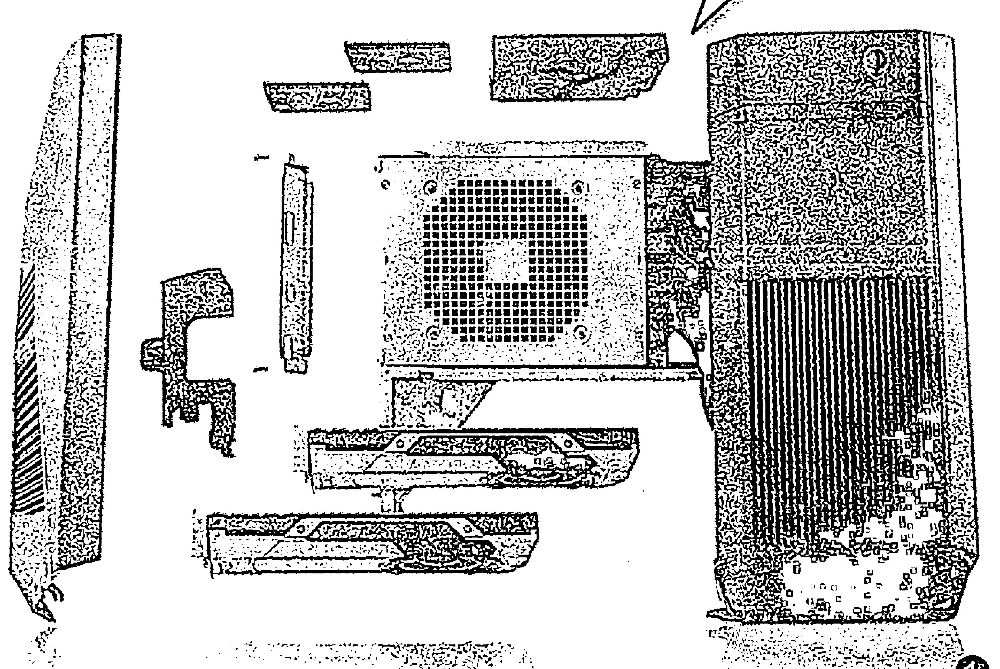

### 游戏电脑告别傻大黑粗

在台式机领域，武装GTX1060或更高级别显卡的机器才有资格被冠以“游戏电脑”的称号，而这种有着澎湃动力的设备却始终被“傻大黑粗”的光环所笼罩。然而，再高端的处理器和显卡也无法阻挡游戏电脑减肥的决心，以Alienware ALPHA系列和索泰Zbox Magnus系列为代表的游戏电脑已经将主机压缩到了2L左右的空间里（图2），从而彻底与笨重一词说拜拜。

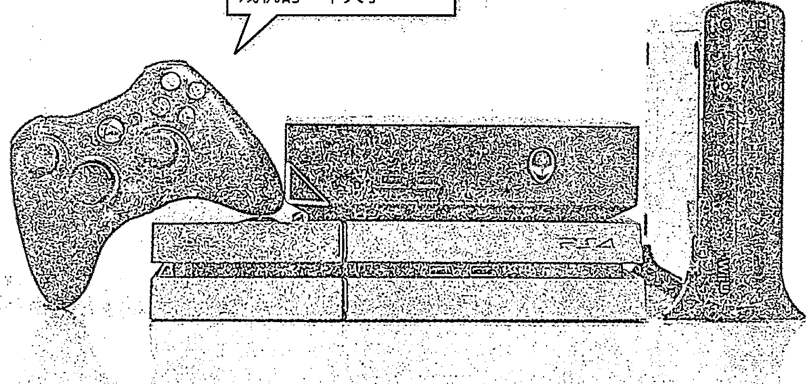

Alienware ALPHA，体积甚至只有PS4游戏机的一半大小

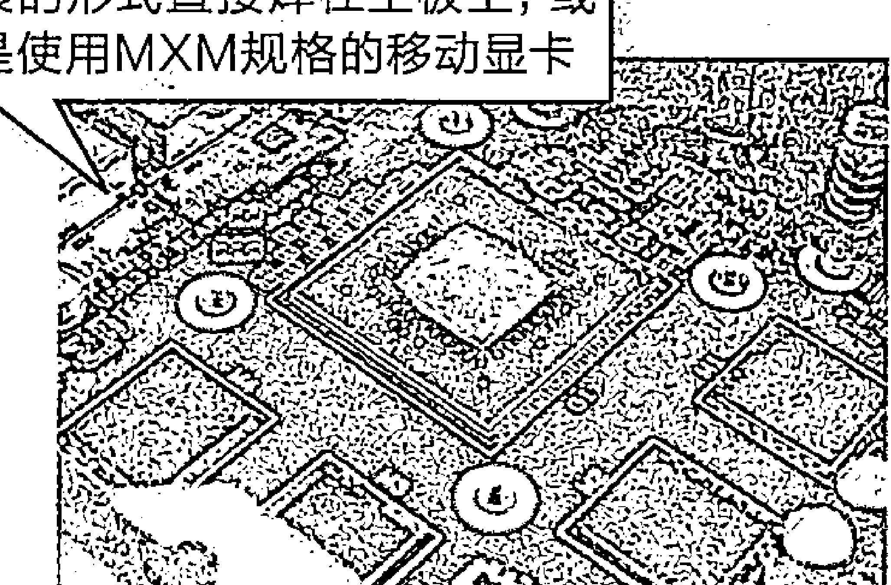

比如将GPU和显存以BGA封装的形式直接焊在主板上，或是使用MXM规格的移动显卡

而此类产品之所以可以减肥成功，则得益于讨巧的内部结构、芯片的封装方案（图3）、水冷散热模块和外置电源设计的加盟（图4），从而在有限的空间里容纳高端硬件也无需担心发热和功耗问题。

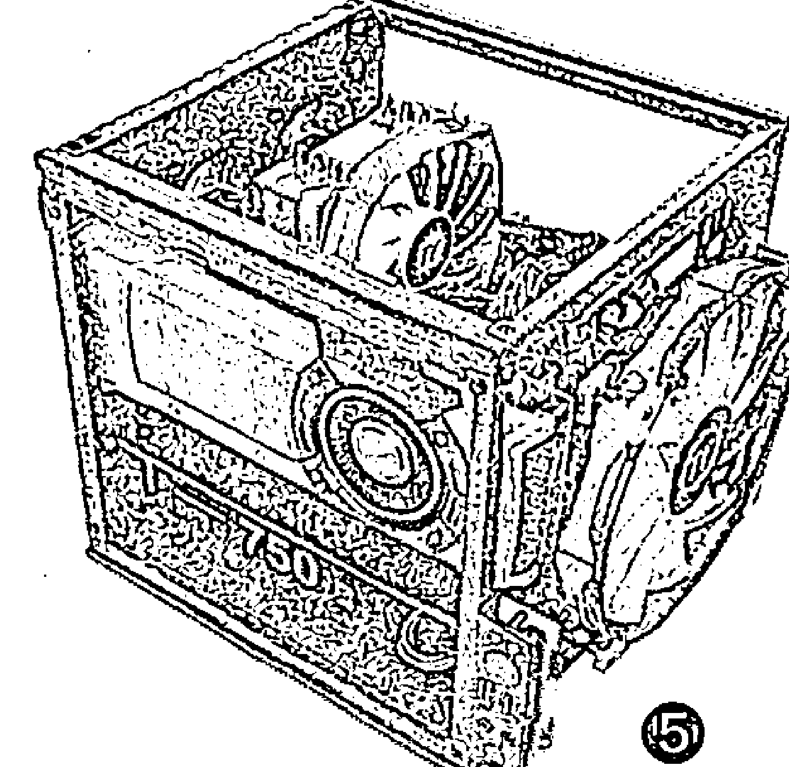

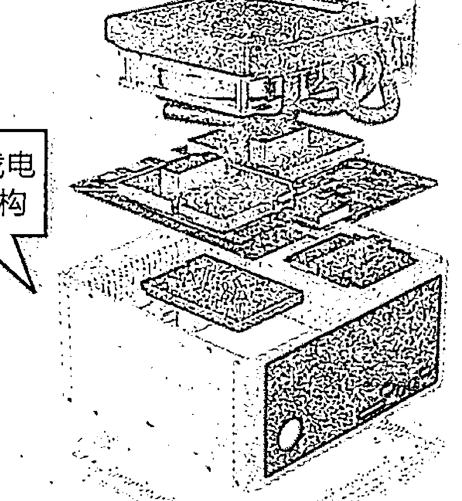

2L左右游戏电脑的基本结构

可惜，这种将身材压缩到极致的游戏电脑大都已经失去了DIY属性，主板、显卡都是定制款，唯一能替换的就只有处理器、内存和硬盘，游戏性能很难再有所提升，属于一次性的“消耗品”，更多的DIY玩家则只能选择标准的小钢炮（图5），用更大一些的空间占用换取DIY资质。

## 笔记本踢走风扇拥抱雷电

作为PC家族的另一个分支，笔记本自然也没有闲着，更轻更薄也是激励它们不断前行的源动力。而如何在轻薄和性能之间取得平衡，则是考验包括英特尔、AMD、NVIDIA以及所有OME厂商的试卷。

### 轻薄本迎来新希望

但无论如何，台式机的瘦身方式还是颇有成效的，如果你对性能不感冒，类似英特尔NUC或Compute Stick类型的设备甚至可以让你将PC直接塞进口袋里。

在2017年17期《游戏本的努力 你看到了吗》一文中，我们介绍了游戏本通过Max-Q设计实现了大幅瘦身的梦想（图6）。既然连游戏本都能减肥，那轻薄本、PC平板二合一设备自然也就有着更大的瘦身空间了。

好消息是，随着英特尔第八代酷睿处理器的推出（图7），以及雷电3接口应用范围的拓展，还真给笔记本找到了进一步瘦身的出路。

我们都知道，第一批上市的第八代酷睿处理器都是15W TDP的U系列移动版，隶属于14nm+工艺打造的Kaby Lake-Refresh平台（图8）。其中i7-8550U在绝大多数测试项目中都超越了英特尔七代酷睿i5-7300HQ，要知道后者可是游戏本专用的45W TDP处理器。

如果你对台式机小型化的设计感兴趣，请参考本刊2017年12期《都是迷你派 感受将PC塞进口袋里的随意》这篇文章。


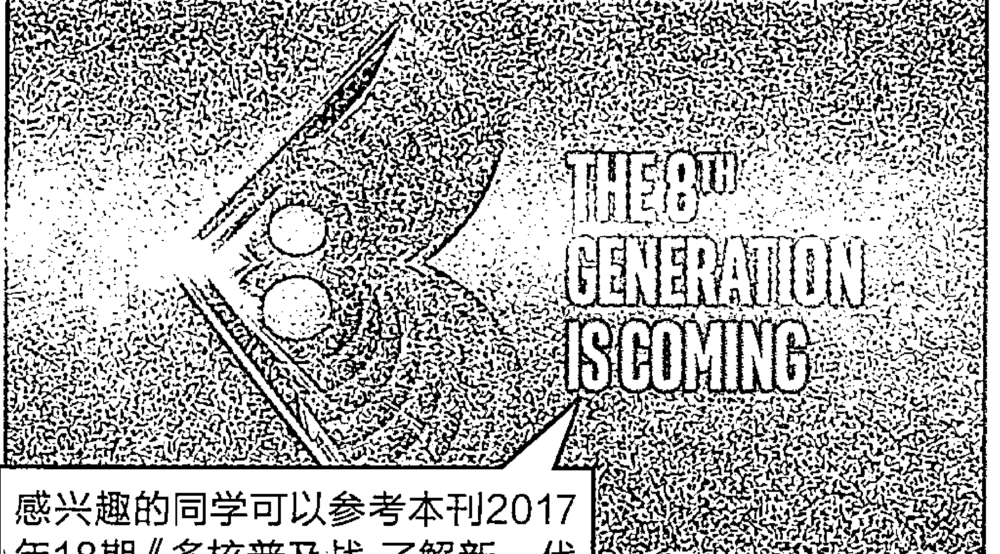

感兴趣的同学可以参考本刊2017年18期《多核普及战 了解新一代英特尔酷睿处理器》这篇文章

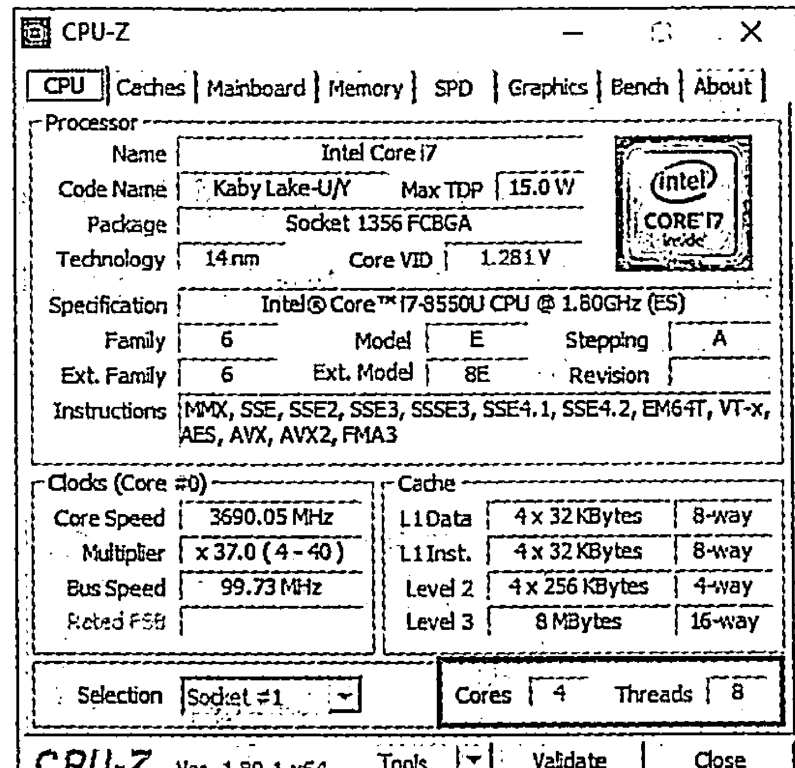

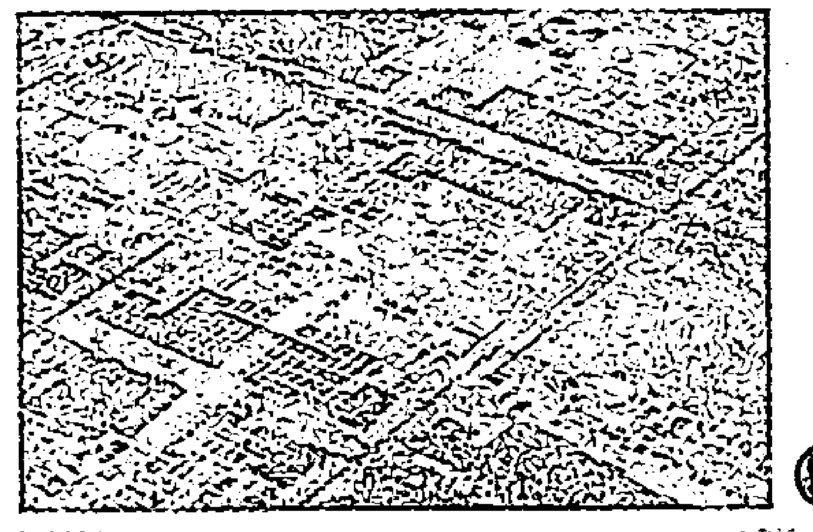

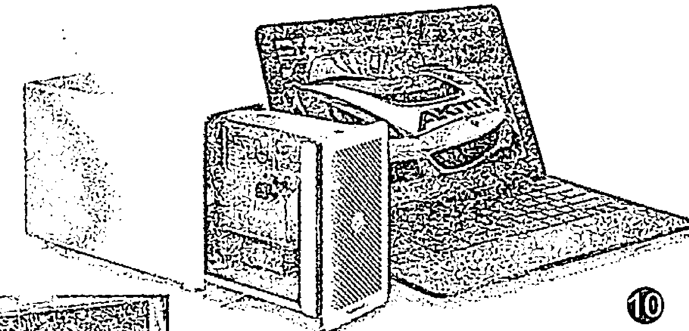

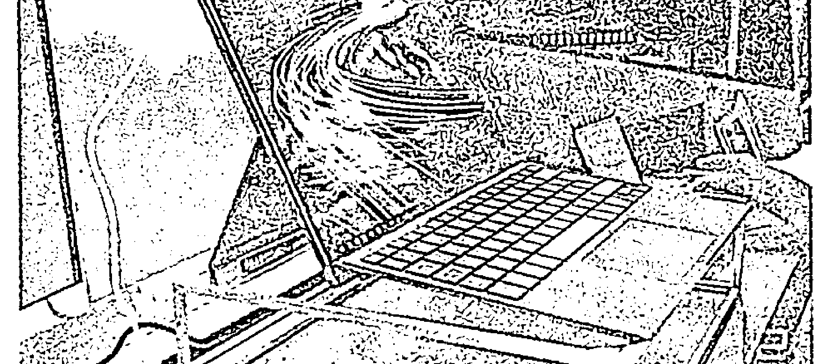

| 英特尔 酷睿™ i7-8550U 处理器 | 英特尔 酷睿™ i5-8250U 处理器 |
| :--- | :--- |
| TDP | 15W | 15W |
| 可配置的TDP-up频率 | 2.00 GHz | 1.80 GHz |
| 可配置的TDP-up | 25 W | 25 W |
| 可配置的TDP-down频率 | 800 MHz | 800 MHz |
| 可配置的TDP-down | 10 W | 10 W |

Kaby Lake-Refresh平台尚且如此，随后上市的八代酷睿家族中的另一个平台Cannon Lake（10nm工艺）以及明年秋天上市的九代酷睿Ice Lake（10nm+工艺）中的低功耗版性能更是值得期待（图9）。届时，由10nm工艺打造的15W TDP U系列处理器将显著缓解玩游戏时的性能瓶颈问题。

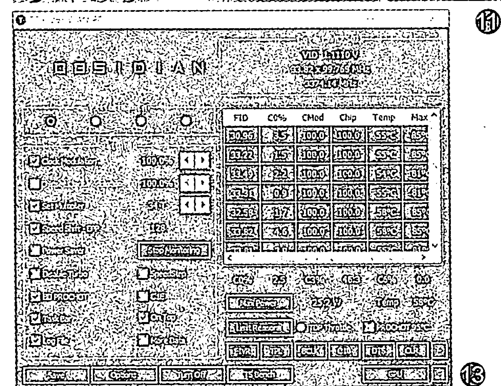

### 轻薄与散热的伴生关系

可能有同学会问了，从CFan上期的评测数据来看，无论是八代酷睿i5-8250U/i7-8550U还是未来10nm工艺的U系列处理器，它们受制于15W TDP的限制，性能上还是有些“缺乏底气”。实际上，英特尔U系列处理器的TDP都是可以配置的，它们最高可以运行在25W TDP的状态上（图12）。

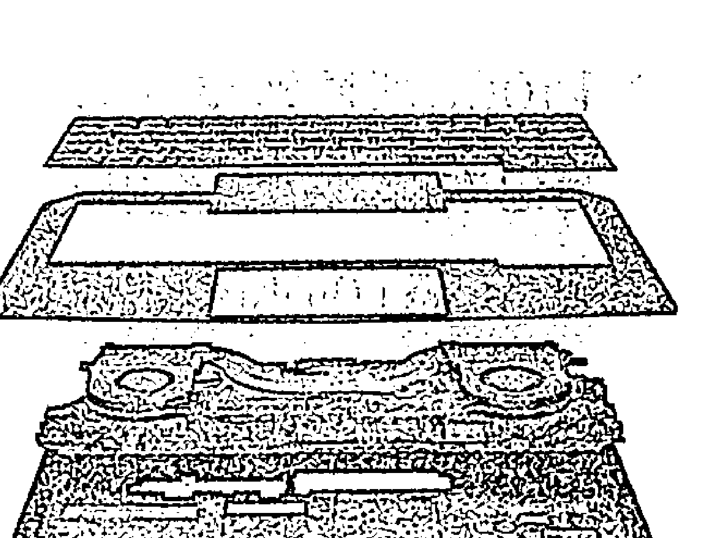

我们通过Intel XTU工具或ThrottleStop软件都可以实现对处理器的TDP解锁（图13），让它们可以长时间运行在更高的主频上。当i7-8550U解锁TDP时，其整体性能就将全面超越i5-7300HQ，少部分测试项目甚至可以比肩i7-7700HQ！

换句话说，U系列移动处理器可以帮助笔记本瘦身，而如果OEM厂商在研发时可以加大对散热优化的权重，那新一代的轻薄本或PC平板二合一设备不仅可以变得更纤薄，解锁TDP后的性能也能达到游戏本专用处理器的程度！

U系列处理器的优势是什么？功耗低+发热低（相对于45W H系列处理器而言），可以最大限度帮助笔记本瘦身。与此同时，英特尔在八代酷睿处理器时代还将努力促成雷电3接口的普及，而雷电3接口最大的价值就是可连接外置显卡扩展坞，而以艾客优品AKiTiO Node为代表的通用型外置显卡扩展坞最低已经卖到了1999元（图10），大幅降低了入手门槛。

当然，这一切的前提，都是建立在笔记本散热设计足够优秀的基础上（图14）。而无论是过去还是未来，笔记本的轻薄属性始终在与芯片性能和散热设计“较劲儿”。接下来，就让我们回顾并展望一下笔记本在轻薄化道路上的散热设计改良，看看能否为更轻薄笔记本+外置显卡扩展坞的生活体验找到出路吧。

未来，外出时背着1.2kg的轻薄本或800g的Windows 10平板，回家打游戏时再连接塞进GTX1070桌面显卡的扩展坞（图11），这才是更多普通用户理想的移动生活态度。

# 漫谈笔记本的减肥经

笔记本的“减肥”远比台式机痛苦得多，它内部就那么一丁点空间，不仅需要塞进CPU、GPU、内存、硬盘和电池等诸多部件，还得保证机身整体的坚韧性，总不能不小心挤压一下屏幕就裂或机身折弯吧？同时，如何解决变薄变轻之后的发热问题？因发热而引起的降频、重启和死机问题，绝对是用户无法承受的代价。

## 瘦身第一步：“心脏”的变迁

想让笔记本减肥，最核心的问题就是想办法降低芯片的发热量，而处理器(CPU)和显卡(GPU)，就是决定减肥成功与否的心脏级别的存在。

### CPU从借用到独享

最早的笔记本十分“不耐看”，无论是IBM开发的PC Convertible还是东芝推出的T1000都是媲美行李箱的存在（图1），屏幕和外形颇为奇葩。而真正被大众接受的笔记本形态，还是要以1992年10月5日诞生的ThinkPad 700C最为著名（图2）。但是，虽然ThinkPad 700C的屏幕只有10.4英寸，但它的重量依旧达到了3.5kg。

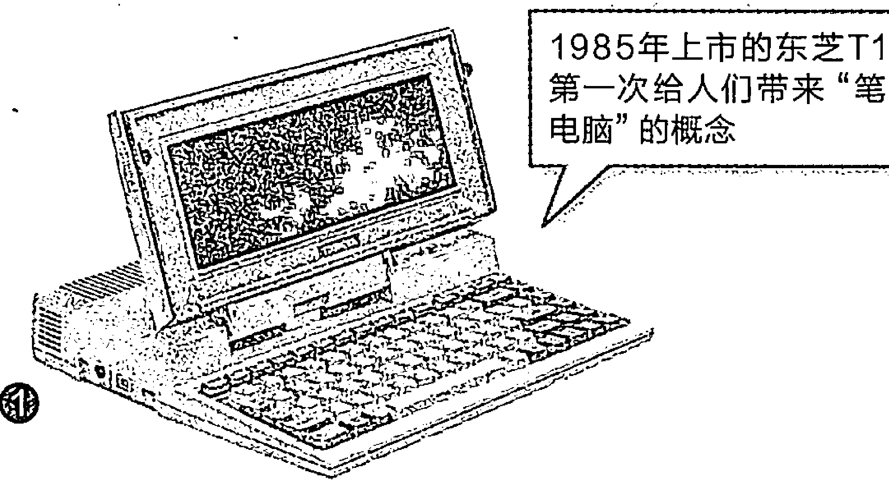

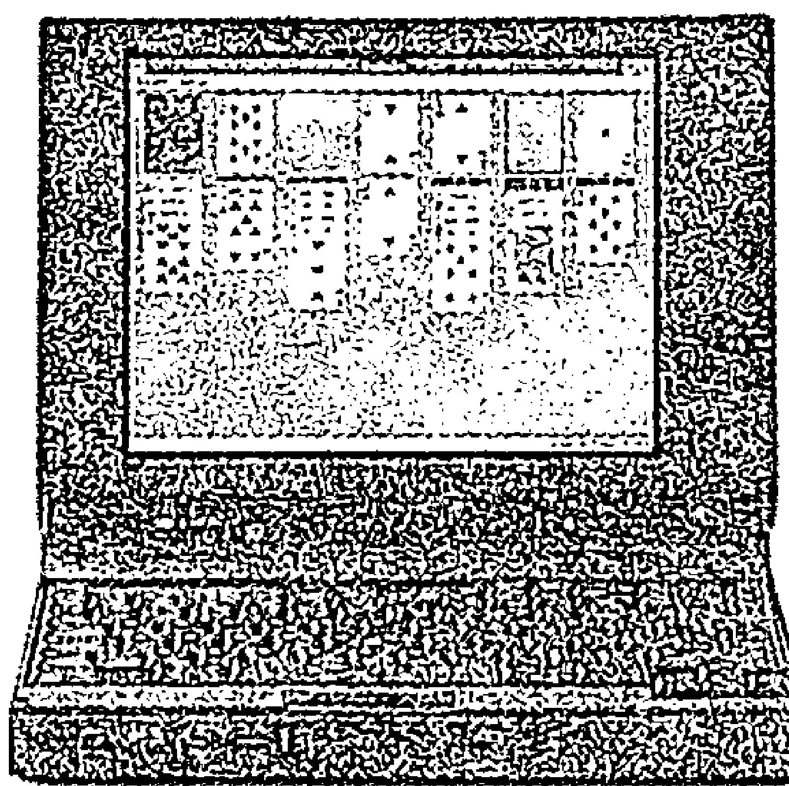

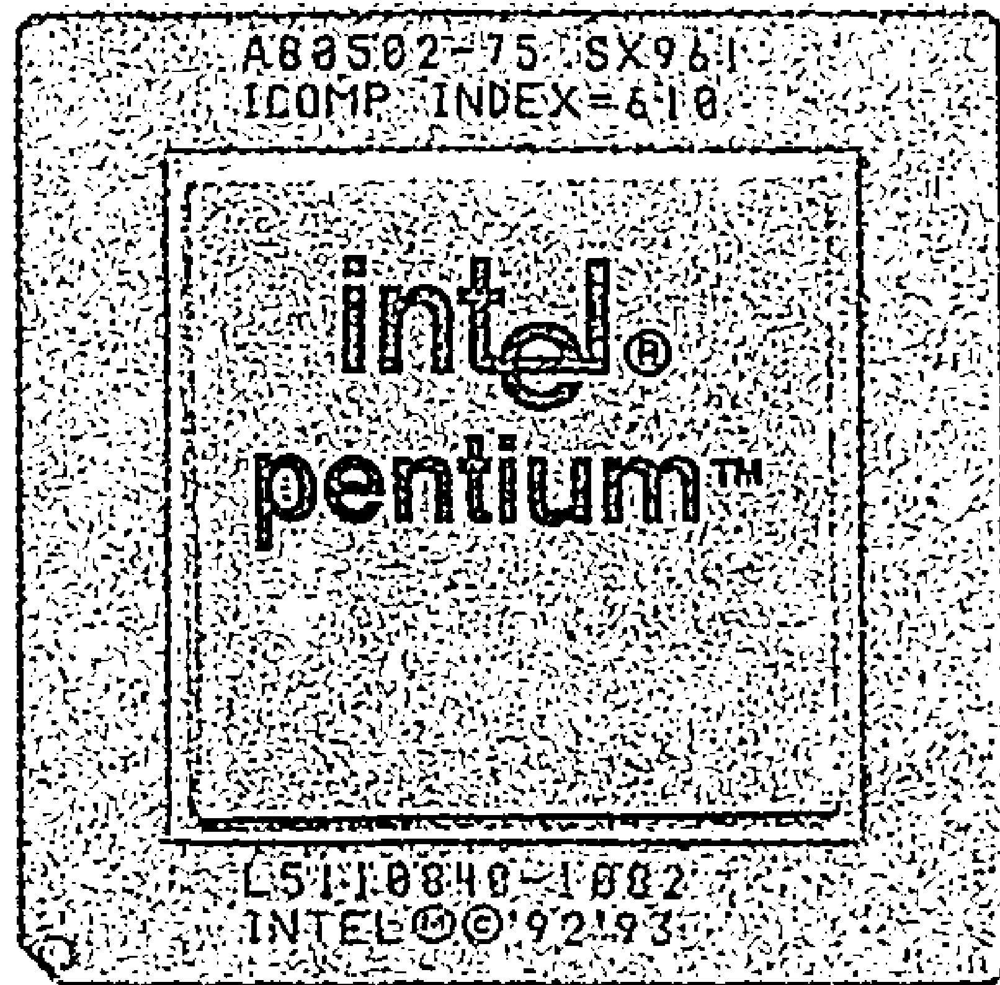

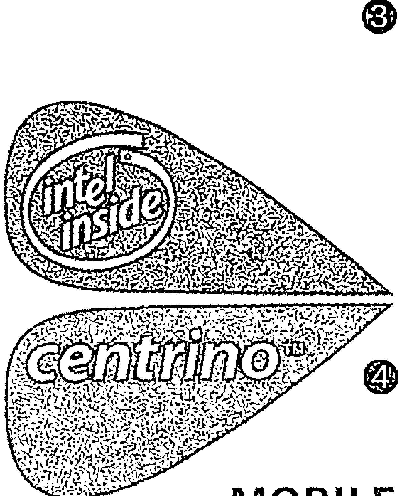

实际上，那个时期几乎所有笔记本电脑的体积和重量都差不多，笨重呆板是它们的代名词。没办法，当年的笔记本没有自己的“心脏”，都是暂借台式机处理器，为了解决散热问题不得不将它们做得厚重，以保留足够的散热空间。

随着笔记本电脑这个概念逐渐被消费者所接受，英特尔终于在1994年推出了Mobile Pentium 75（75MHz）处理器（图3），从此英特尔处理器正式被划分为桌面和移动两大家族。可惜，哪怕是Mobile Pentium的发热量也着实不低，在之后很长一个时期笔记本仍然都是笨重的代言词，直到2003年英特尔提出迅驰（Banias）平台概念之后，笔记本才真正和“便携”划上等号（图4）。

从Mobile Pentium到Pentium M，从迅驰概念退出历史舞台，再到酷睿取代奔腾，移动处理器不断优化性能、功耗和发热，最终为笔记本的瘦身奠定了物理基础。

> 提示
> AMD在Athlon时期也衍生出了Athlon XP-M和Athlon 64-M等移动处理器平台，收购ATI后还推出了集成更强GPU的APU（图5）。可惜，在笔记本领域AMD始终属于相对小众的平台，所以本文我们主要还是以英特尔移动处理器为主导。

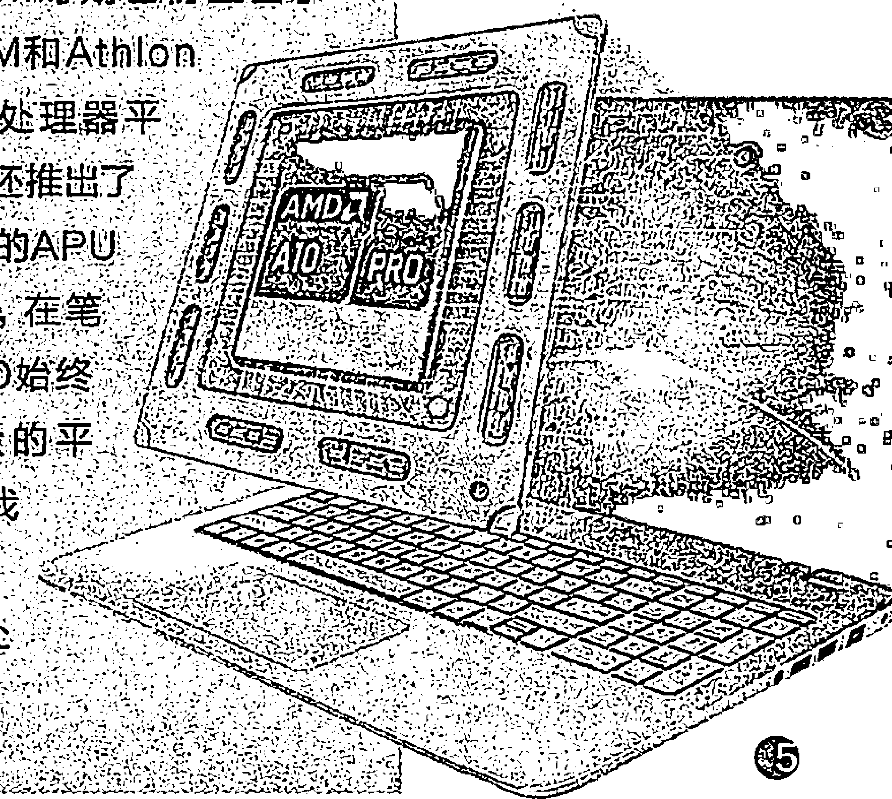

这个类似蝴蝶Logo的出现，将处理器、芯片组和无线网卡确定为笔记本的三驾马车，也最终确立了现代笔记本的形态和功能。

### Atom开辟新战线

### UMPC参上

在迅驰平台一统移动江湖的时期，英特尔便携手微软尝试笔记本朝向极致便携衍化的“大跃进”，并成就了以Pentium M ULV、Celeron M ULV、Core Solo U（隶属于第三代迅驰平台Napa，TDP在5W左右）为代表的超低电压版移动处理器的威名（图6），而它们也大都成为了一种名为UMPC的超便携移动设备的“心脏”。

SONY VGN-UX17C应该是当年最著名的UMPC之一，这款产品采用4.5英寸触控屏幕，搭载Celeron M ULV处理器，预装微软Windows XP Home Edition操作系统，重量只有515g左右，炫酷的滑盖键盘设计更是科技感十足，还在很多科幻电影中担任客串（图7）。可惜，UMPC这种概念太过超前，电阻式的触控屏幕和Windows XP在超小屏幕上的体验很差，再加上UMPC的价格也相对高昂，只能算是有钱人的玩具，扮演“超大MP4”的角色。

UMPC虽然没能实现预期目标，但却给了OEM厂商一种新的设计思路：触控屏幕不好用？屏幕太小看着费劲？价格太贵？那就做出一种屏幕（相对）更大、取消触控屏、比普通笔记本迷你、价格更为实惠的产品不就结了？

### 上网本接力

于是，华硕在2007年推出了一款名为“EeePC 700”的产品（图8），7英寸屏幕（800×480像素）、900MHz Celeron M处理器、512MB内存、2GB闪存……虽然第一代EeePC的配置无比寒酸，但它凭借超迷你身材、不足1kg的重量和2999元的超低价格，在当年掀起了一阵廉价笔记本普及风暴（图9）。

> 第一代EeePC屏幕边框宽度那叫一个感人

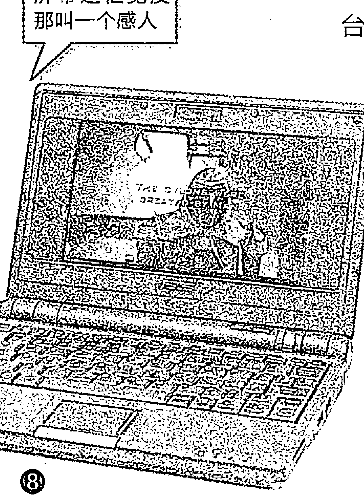

英特尔敏锐地捕捉到了这一商机，并顺势推出了全新的Atom（凌动）处理器平台，借助45nm工艺和精简的指令集架构，将TDP控制到了0.6W到2.5W之间，也使其成为了英特尔历史上体积最小和功耗最小的处理器（图10）。而英特尔也给搭载Atom处理器、屏幕小于11.6英寸的超轻薄笔记本起了一个更贴切的名字——“上网本”。没错，Atom的性能和功耗成正比，其性能也就只能上上网而已。

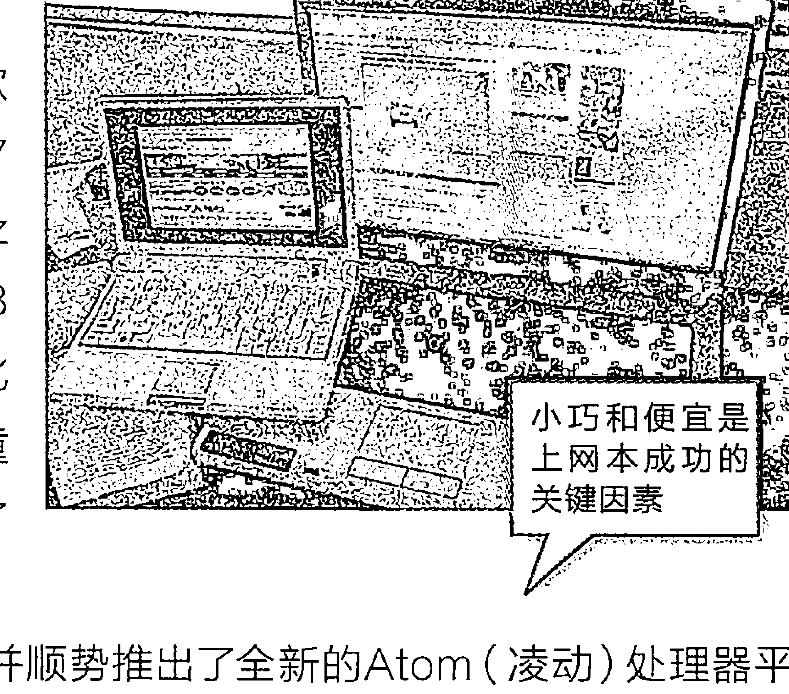

> 小巧和便宜是上网本成功的关键因素

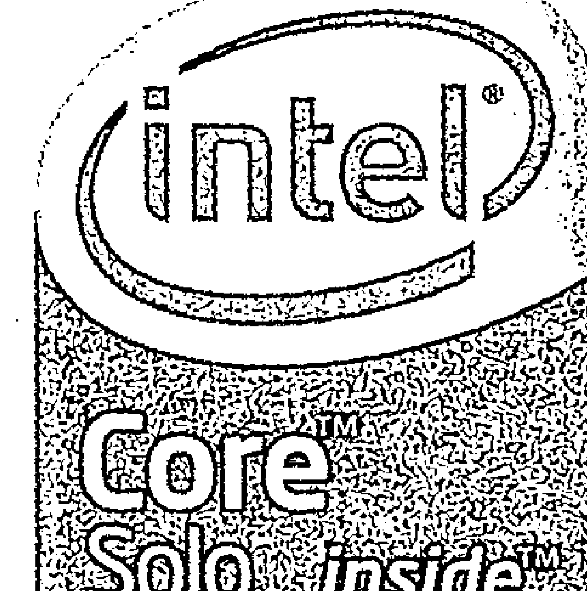

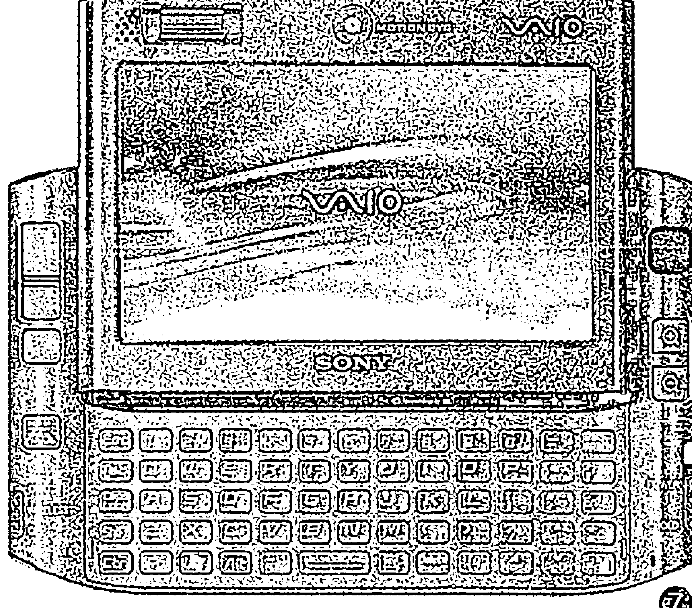

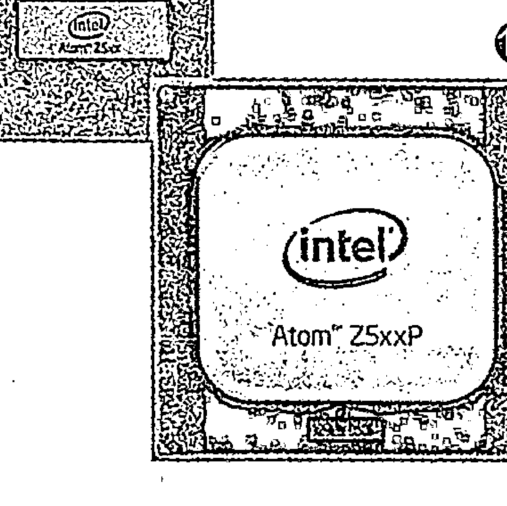

虽然上网本性能孱弱，但架不住人家便宜啊，所以在2008年到2010年进入了井喷式的发展期，其受欢迎程度不亚于今天的iPhone。可惜，随着苹果iPad和Android平板电脑的出现，上网本的应用场景体验被这种更轻巧更高效的移动设备所秒杀，迅速进入衰败期。

### Windows平板诞生

面对新兴平板电脑咄咄逼人的态势，英特尔再度携手微软作出反击。英特尔为Atom赋予了更多核心，在保持低功耗的前提下尽可能提升性能，并先后推出了“Clover Trail”（32nm，如Atom Z2760）、“Clover Trail+”（32nm，如Atom Z2580）、“Bay Trail-T”（22nm，如Atom Z3735）和“Cherry Trail-T”（14nm，如Atom X5-Z8300）几代平台，它们最大的特色就是可以实现被动式散热，也就是无需风扇设计（图11），堪称为超轻薄平板电脑量身定制的超低功耗移动处理器。而微软方面则先后祭出了Windows 8/8.1和Windows 10操作系统，不断优化触控操作的体验（图12）。

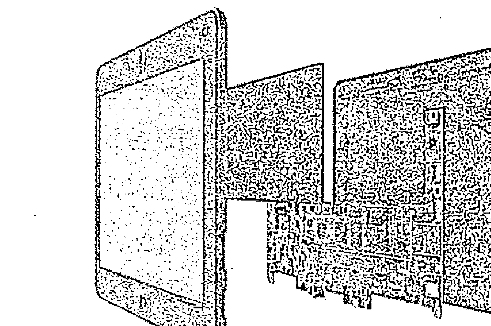

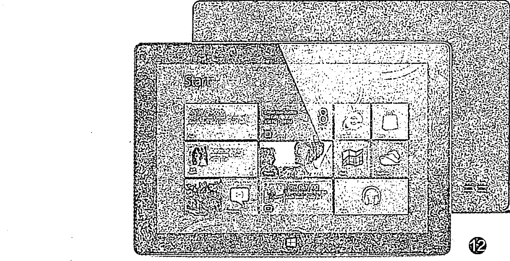

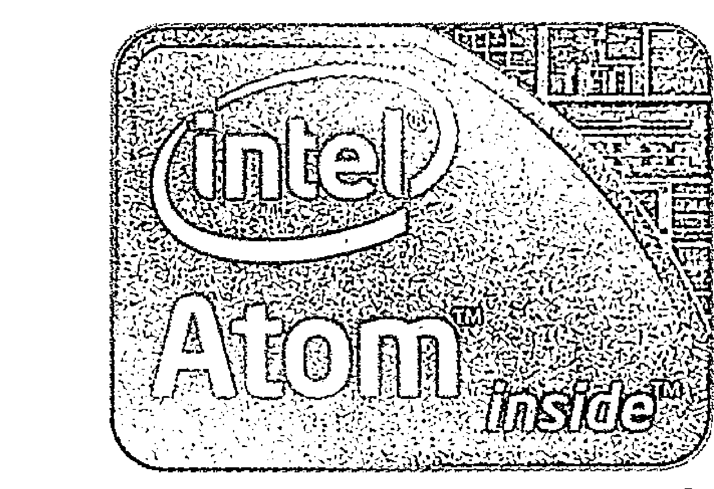

然而，Atom虽然功耗低，有利于移动设备瘦身，但它的性能总是差了那么一点点，不符合笔记本/PC平板二合一更薄更强的发展口号。因此，英特尔决定在2016年放弃Atom产品线，这个见证了上网本辉煌、Windows平板电脑崛起的芯片逐渐淡出了我们的视野（图13）。

> 小提示
> Atom处理器从Clover Trail+平台开始还能用于智能手机，只是受限于X86架构运行Android系统在效率和兼容方面存在瑕疵，所以并没有成为市场主流，而英特尔也随着Atom的退市而告别手机市场。

### U/Y携手的减肥组合拳

上网本的“夭折”，让英特尔认识到了笔记本（包括平板电脑的二合一形态）在轻薄道路上的前行不能以太过牺牲性能为代价，Atom产品线被迫退市就是最好的证明：在挑选超轻薄移动设备时，绝大多数消费者宁可为更强的性能而增加预算，也不愿意选择价格实惠但性能有损的机型。

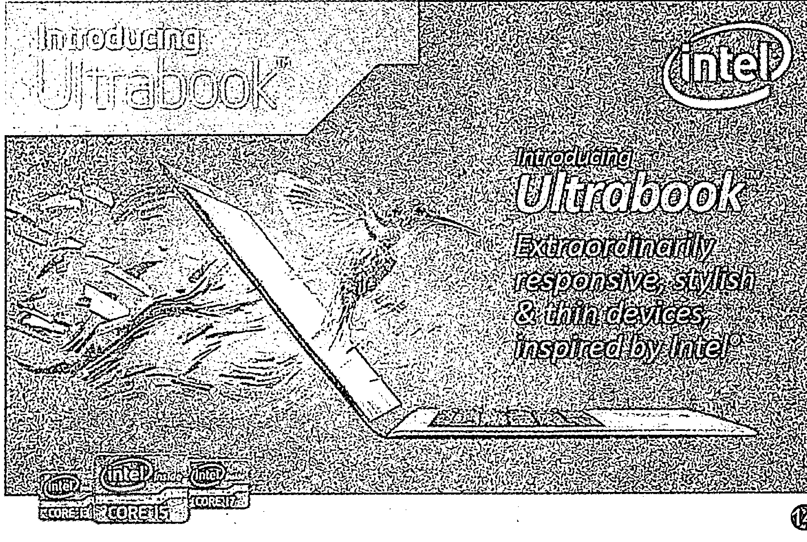

### 超极本成就U系威名

于是，就在上网本落幕之际，英特尔携手OEM厂商在2011年底提出了全新的“超极本”概念（Ultrabook），树立了必须搭载CULV处理器（TDP 5.5W~17W）、厚度小于20mm、重量低于1.5kg、续航超5小时、具备快速响应能力（借助SSD）等门槛（图14）。超极本应该算是笔记本历史上第一次“有组织、有预谋”的团体瘦身计划，并在价格上最大限度贴近大众，受到了广泛的好评。

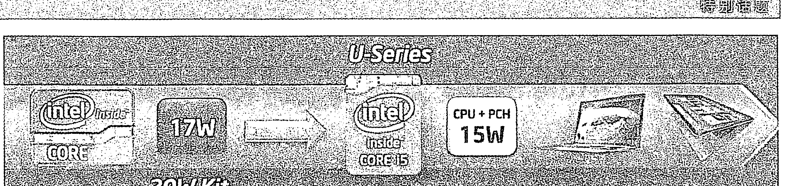

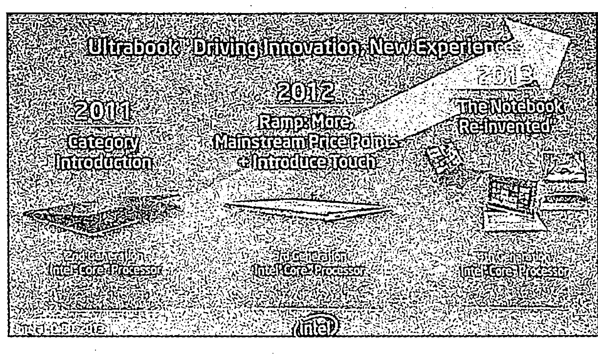

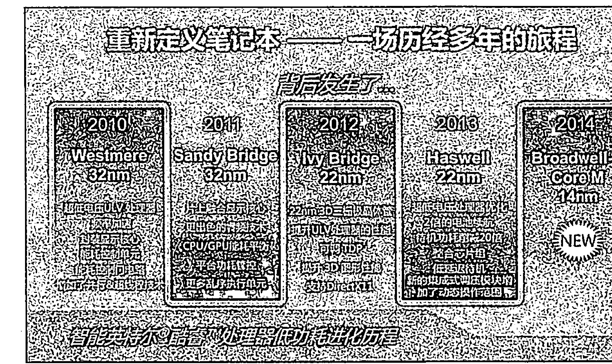

### 二合一促使Y系诞生

为了让超极本挽救陷入颓势的PC市场，英特尔在当年还给超极本制定了“三步走”的计划，跨越Sandy Bridge（二代酷睿）、Ivy Bridge（三代酷睿）和Haswell（四代酷睿）平台（图15），并在第三步时期衍生出了配备触控屏幕，且屏幕能与键盘分体的“PC平板二合一”形态。

虽然超极本概念已经成为历史，但它对移动市场的影响却是毋庸置疑的，我们现在看到的所有超薄本、二合一，其实都是超极本概念的拓展和延续。

而超极本之所以瘦身成功，最关键的环节就是英特尔为其单独定制了新一代CULV超低功耗处理器，将TDP控制到了17W，在帮助超极本压缩身材的同时还能保留运行LOL级别游戏的性能。如今我们熟悉的U系列酷睿处理器（如i5-3337U、i5-4200U）其实就都是CULV的血脉延续，而其TDP也从当初的17W下降到了15W（图16），得益于制程工艺从32nm→22nm→14nm的进化和核心架构的升级，U系列酷睿处理器的性能也逐渐可以胜任更为复杂的办公和娱乐环境，全新的八代酷睿i5-8250U在解锁TDP之后甚至不逊于游戏本的“心脏”，为笔记本更薄+更强奠定了坚实的基础。

纵观当前4000元以上的超薄本，它们虽然不再以“超极本”自居，但在身材上却超越了超极本前辈们（得益于微边框设计的流行），同时还有不少产品开始武装NVIDIA 940MX或MX150独显，不足1.4kg重的13英寸独显超薄本已经一抓一大把。

然而，超极本的身材就是极限了吗？Windows平板电脑就不能做到和iPad一样轻薄了吗？借助Atom处理器平台也许可以，但其性能对不起大众，要知道只有高端优质用户才有为极致轻薄买单的实力和需求，市场上迫切需要一种集更轻、更薄且保持较强性能，还能卖上高价确保利润的设备。

可惜，想实现这一目标，15W TDP U系列酷睿处理器还做不到，这种处理器必须依靠风扇辅助散热才能确保稳定，而风扇+热管+鳍片的散热套装就是阻止笔记本进一步瘦身的障碍。于是，英特尔借着14nm工艺商业化量产的契机，在酷睿处理器阵营中引入了TDP仅有4.5W的酷睿M产品线（图17），其最大特色就是性能较为强大、显著提升续航时间，可以像Atom处理器那样无需风扇就能正常使用，还能帮超薄本/二合一设备精简主板布局，压缩内部空间从而达到极致瘦身的目的（图18）。

而酷睿M，则隶属于历代酷睿平台的Y系列阵营，至今已经历从Broadwell-Y（五代酷睿）→Skylake-Y（六代酷睿）→Kaby Lake-Y（七代酷睿）三次演化。细数近两年曾创造轻薄纪录的移动设备，至少有90%都是酷睿M的“客户”（图19）。

总之，笔记本能在不断瘦身之余还能保证性能不受损，凭借的就是低功耗处理器产品线的迭代更新，从Atom到CULV到U再到Y，总能成为某一时期笔记本减肥的“特效药”。

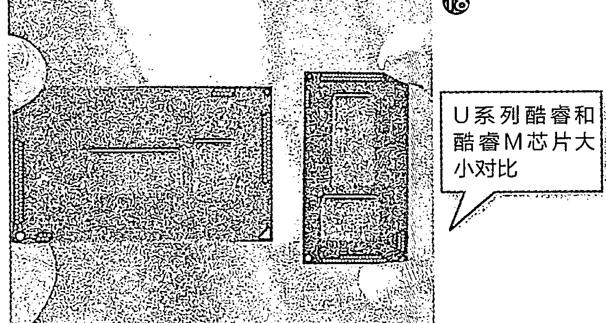

## 移动显卡的神助攻

笔记本电脑最早就是移动办公专用，性能上看看视频、玩玩《星际争霸》也就差不多了。然而，当PC上涌现出越来越多好玩的3D游戏后，“笔记本为何不能玩游戏”就成为了制约其进一步发展的瓶颈所在。

差不多在2001年的时候，NVIDIA和ATI终于开始涉足移动显卡领域，NVIDIA的GeForce Go和ATI Mobility Radeon就是最著名的性能级笔记本显卡商标（图20）。不过，受到制程工艺的限制，当年所有武装独立显卡的笔记本都与轻薄绝缘，并不符合笔记本不断瘦身的发展思路（图21）。

好消息是，随着英特尔酷睿处理器平台集成核芯显卡，终于进一步刺激了NVIDIA和AMD研发的进程，在想办法提升入门级独显性能的同时，还借助新工艺、架构和自动调整频率等技术降低发热和功耗。时至今日，新一代移动显卡已经谈不上是轻薄本的拖累，最轻薄的八代酷睿+MX150独显产品甚至做到了1.2kg！另一方面，GTX级别的顶级显卡，借助Max-Q设计也能帮游戏本减肥到不足20mm厚度的苗条身材（图22），这些都是几年前不敢想象的事情。

总之，无论是英特尔、AMD还是NVIDIA，其针对移动定制的芯片都在追求更好的能耗比，而OEM厂商则可基于这些芯片，再加上不断创新和优化的设计，不断刷新着笔记本的身材纪录。下面的章节，就让我们看看那些超薄经典是如何被塑造出来的吧。

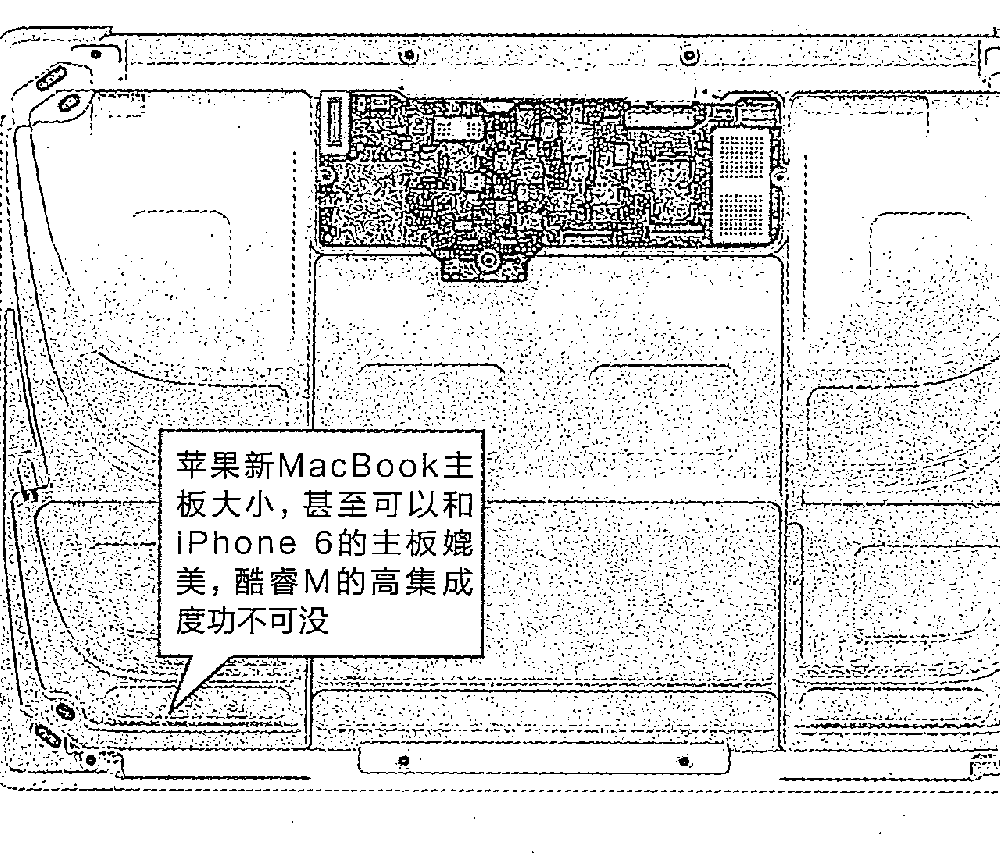

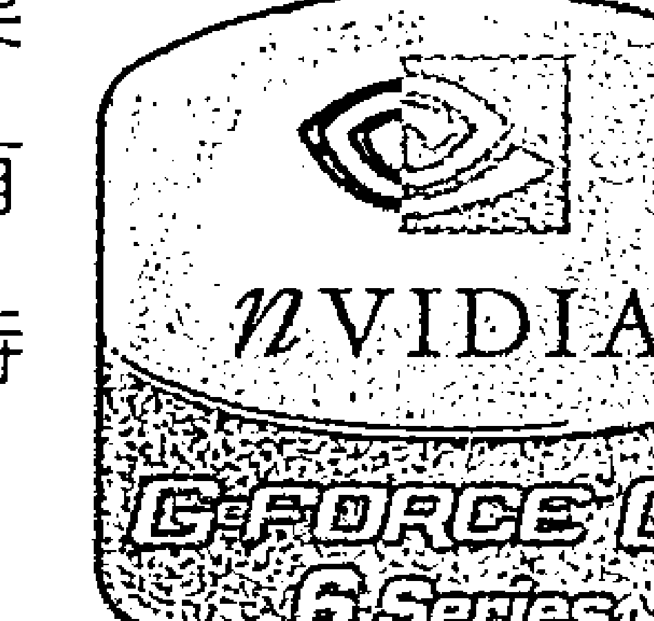

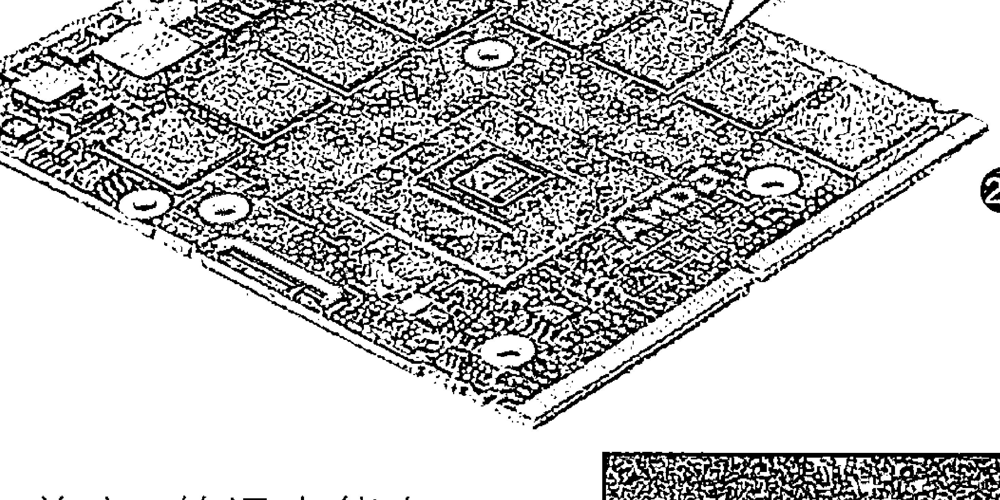

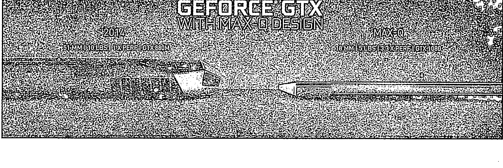

## 瘦身第二步：散热的改良

在笔记本的减肥道路上，有了低功耗的移动处理器就够了吗？答案是当然不够！特别是对早期的移动处理器而言，它们的发热量还是非常可观的，需要极为夸张的散热模块才能将热量释放出去。因此，来自散热设计的改良，则是笔记本瘦身路上的另一个关键所在。

### 散热设计的摸索

早期的笔记本之所以笨重，就是受散热模块的拖累。以1999年上市的ThinkPad 600E为例，虽然此时的它已经引入了热管，但却还没能采取覆盖芯片表面的设计（图1），散热风扇也是直接套用PC的轴流风扇（图2），别看散热模块庞大且用料十足，但散热效率却着实有限。

到了2000年，随着ThinkPad T20系列的上市，笔记本才确立了较粗的热管+涡轮风扇+鳍片的“散热套装”（图3）。其中，涡轮风扇采用离心式导流，扇叶与旋转面垂直呈环形排列，热空气会随着扇叶旋转带动的离心效应横向甩出到散热鳍片，从而大幅提升了笔记本的散热效率，为散热模块的小型化奠定了基础。时至今日，笔记本仍在采取热管、风扇和鳍片的经典组合（图4）。

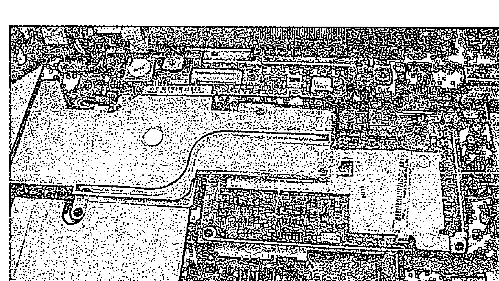

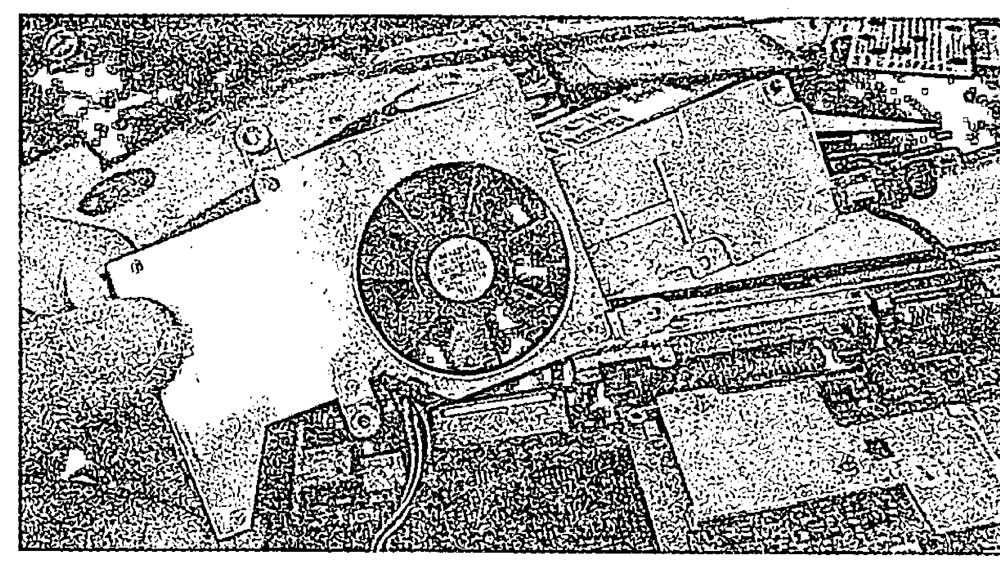

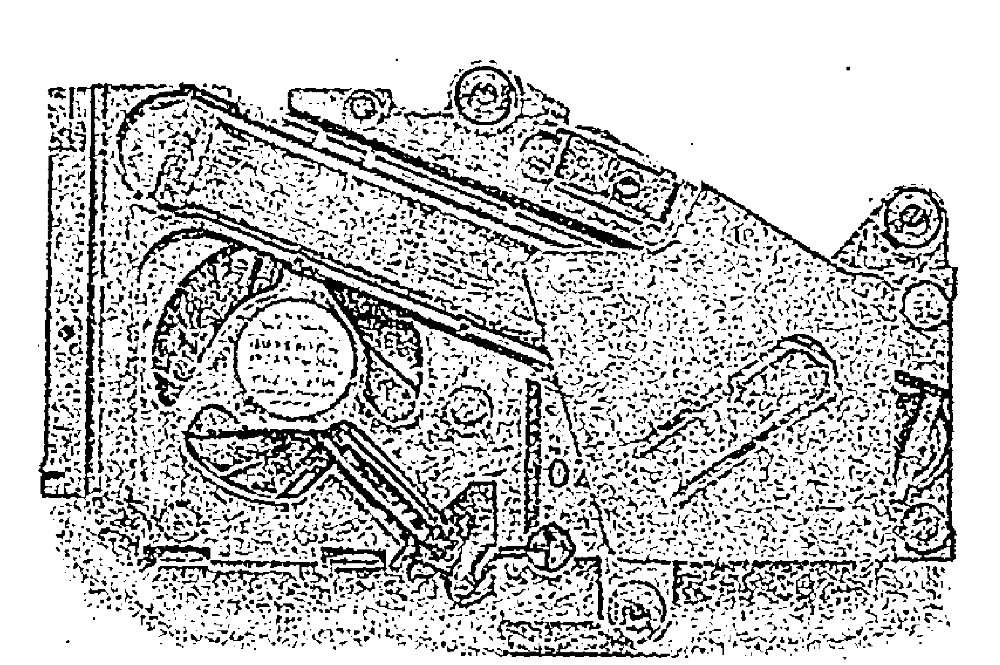

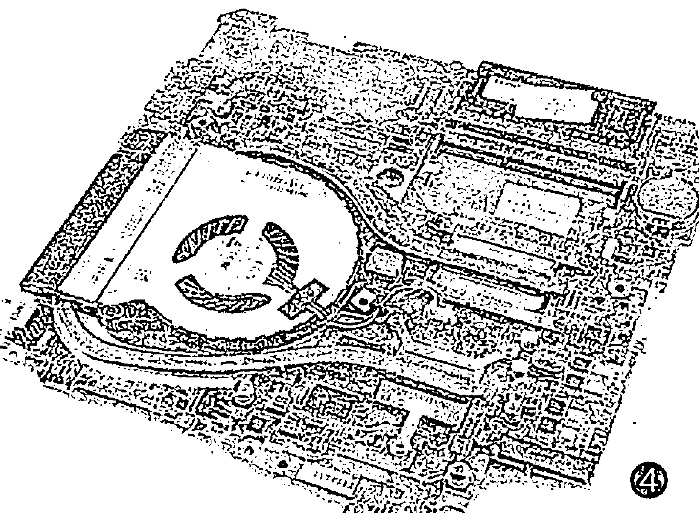

### 来自风扇的改良

得益于超低电压/功耗处理器的出现，笔记本的散热压力大减。但是，想进一步压缩笔记本的厚度，对散热模块的效率也提出了更高的要求。想提升散热效率，最简单的方法就是增大风量，加速冷热气流的循环。问题来了，当不足18mm厚的超极本出现，留给风扇的厚度空间不足6mm，如何解决风扇变小变薄而导致的风量缩水？给超薄本塞进两个涡轮风扇，让散热鳍片的面积×2（图5），同时进一步增强风扇转速，这就是一众轻薄本们给出的答案。同时，为了提升超薄风扇的风量，降低其全速运行时的噪音，笔记本的涡轮风扇还引入了诸多改良。

简单来说，更多的风扇叶片能够有效提高风扇对热量的引导效率，所以你会发现笔记本（特别是轻薄本）的风扇叶片数量较以前增加了许多，而将叶片潜力发挥到极致的则要数ACER高端机型引入的“第二代3D刀锋速冷金属风扇”，它将扇叶从塑料材质换成了金属，并将每片扇叶的厚度压缩到0.1mm，散热效率较普通塑料风扇CFM提高35%（图6）。

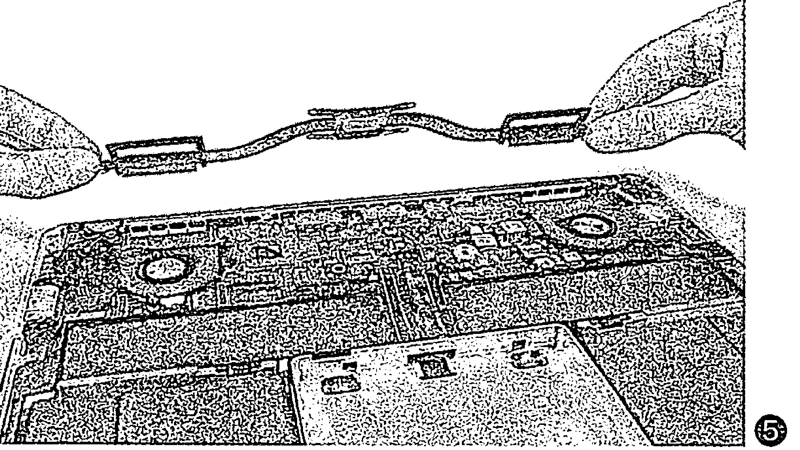

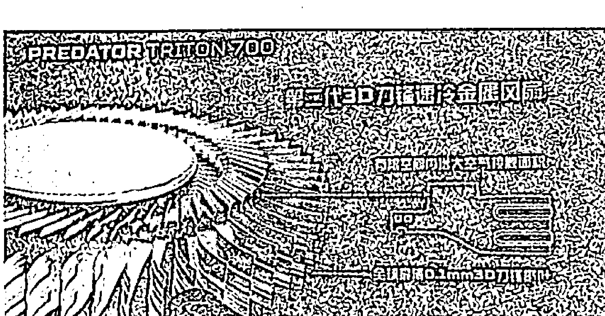

此外，苹果也为MacBook引入了“非对称涡轮设计风扇”，你会发现这种风扇的涡轮扇叶间距是不一样的（图7），可错开振动频率高峰，减小共振幅度，从而达到减小噪音的目的。ThinkPad提出的“鹰翼风扇”则通过在叶片尖端部位设置凸起物，打散了风扇整体所产生的大漩涡，减少风扇在划过空气时产生的乱流，由此达到静音的效果。

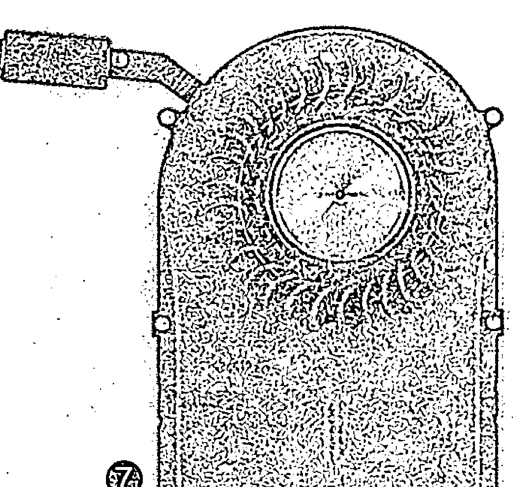

总之，如今配置相同、散热模块设计看起来也没啥区别的笔记本之间很容易出现效果迥异的现象，而隐藏在风扇内扇叶的设计，就是引起温度和噪音有别的差异化所在。

### 未来来源于创新

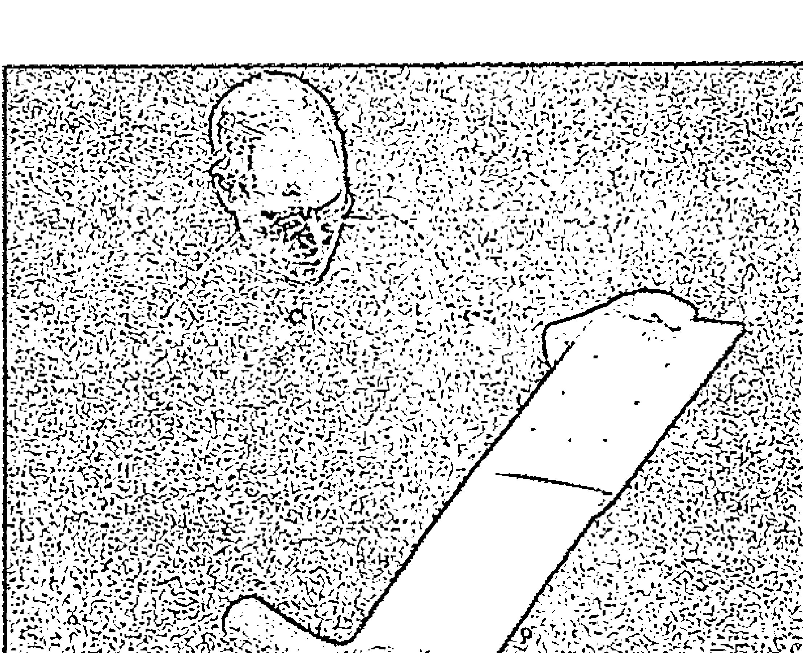

提起轻薄的笔记本，苹果在2008年推出的第一代MacBook Air绝对是令人印象深刻的存在，当乔布斯从一个信封中掏出MacBook Air时（图8），整个业界都为之震撼，这款采用13.3英寸屏幕设计的笔记本最薄处竟然只有4mm（最厚处19.4mm）！而MacBook Air实现极致轻薄的秘诀，则是英特尔为苹果单独定制了一颗更小封装和更低功耗的处理器（面积比当时标准版的酷睿2处理器小60%，可视为后来CULV低压版处理器的前身），并使用改进型的超薄散热模块解决了发热问题（图9）。至此，低压版超低功耗处理器和楔形设计的造型，就成为了超薄本的典型样本。

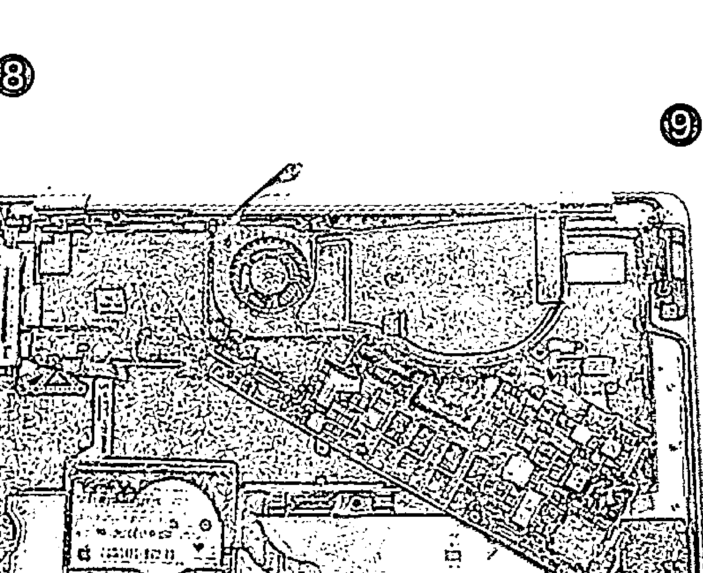

那么，你真的以为MacBook Air是最早的轻薄No.1？如果没有英特尔给苹果“开后门”定制低压芯片，哪里会有MacBook Air的成功！

实际上，作为“寄生于”Wintel（微软和英特尔）联盟下的OEM厂商们，在芯片层面都是处于同一道起跑线上（历史上英特尔也就为MacBook Air开了一次后门），在搭载同一套芯片的前提下，谁能造就更轻盈的身材，完全取决于OEM厂商的创新和研发实力。

### 无风扇笔记本的首秀

真正被无数玩家誉为“轻薄神器”的笔记本，则要数索尼在2004年推出的VAIO PCG-X505（图10）。这款产品采用了10.4英寸屏幕，搭载标准版的Pentium M处理器，并实现了薄至9.7mm的机身（最厚处为21mm）和785g机身重量的辉煌，哪怕和今天采用11.6英寸屏幕设计的超薄本相比也是不遑多让！

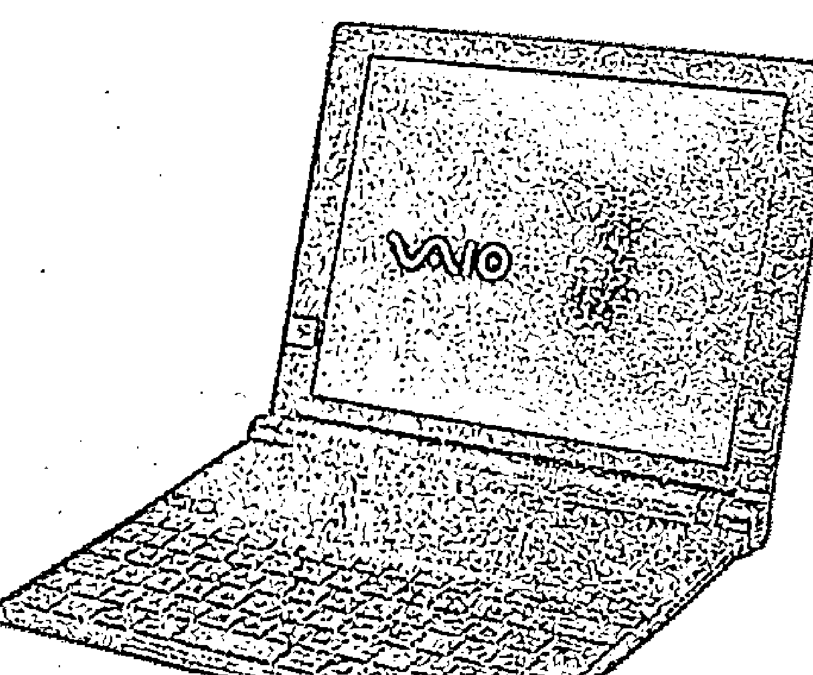

而VAIO PCG-X505拥有极致轻薄身材的秘诀，则是它采用了独特的结构设计：楔形设计的机身，取消了触控板，将键盘移至掌托位置。同时VAIO PCG-X505还采用板载内存，取消了内置风扇，改用碳纳米管技术以及碳合金材质作为引导热量的“散热片”。没错，无风扇设计就是这款产品的最大杀手锏。

### 扩展阅读

### 还有哪些超薄经典

在笔记本的轻量化发展历程中其实还有很多经典，比如东芝在2003年推出的Portégé R100，采用12.1英寸屏幕设计，拥有14.9mm厚和1.09kg重的轻盈身材；2008年，东芝Portégé R502更是将重量控制到了900g（12.1英寸）。此外，戴尔在2009年推出的Adamo XPS也堪称世上最著名的超薄经典之一，它采用了创新的键盘与屏幕连接方式，将内部元件分别安置于键盘周围以及屏幕后方，最终成功地将机身厚度控制在9.99mm极限（图11）！这个传统形态笔记本的最薄纪录直到2016年才被宏碁Swift 7打破（9.98mm、13.3英寸、1.1kg），可见Adamo XPS当年在设计上有多么不容易。

Adamo XPS采用13.4英寸屏幕，1.44kg重，搭载10W TDP的Core 2 Duo U9400处理器。

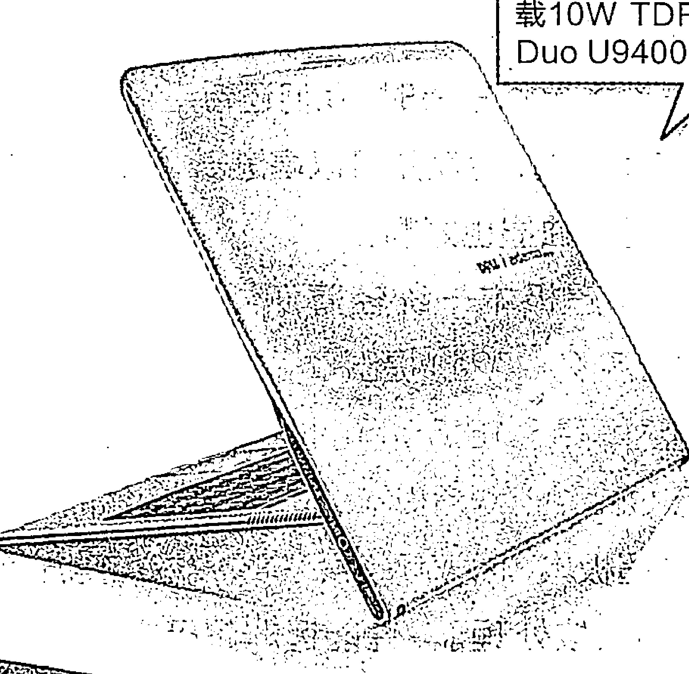

### U系列处理器的无风扇尝试

上个章节我们曾经提到过，为了实现移动设备的无风扇化，英特尔先后祭出了Atom和酷睿M两套超低功耗处理器平台，凡是基于它们打造的笔记本、PC平板二合一都能轻松实现被动式散热，具备极致轻薄属性的目标。但还是那句话，同样的芯片还有啥可比的？

这个问题的答案取决于两个部分：
1.  都是被动式散热，谁能借助热管、金属材质机身、结构设计优化解决CPU满载时容易降频的问题，谁将具备更大的竞争力；
2.  既然Atom和酷睿M（Y系列处理器）无风扇没啥特别的，那将15W TDP的U系列处理器也做到无风扇化岂不更吸引眼球？

华为MateBook X就实现了U系列酷睿处理器的无风扇化（图12）。这款标准笔记本形态的产品引入了在航空领域广泛应用的PCM（微胶囊相变散热材质），官方将其称为空间智冷技术，通过双热管和特殊材料的散热单元（图13），结合金属材质的底盖，快速且有效地将CPU的热量扩散出去。

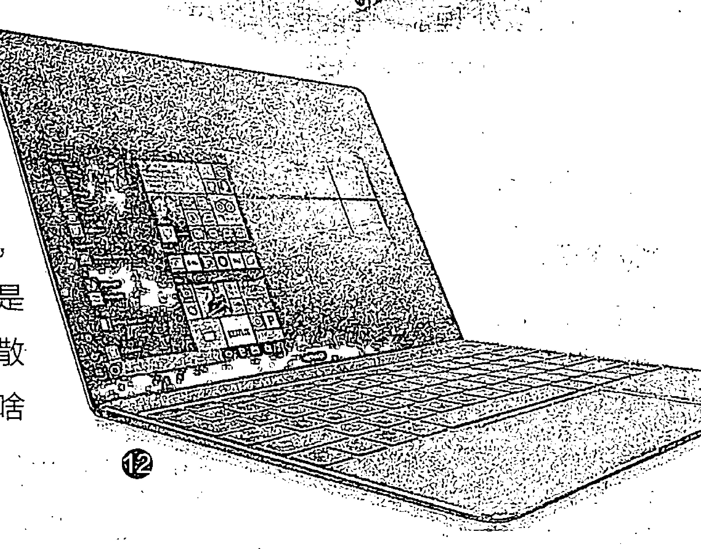

此外，宏碁Switch Alpha 12同样实现了U系列酷睿处理器的无风扇化。这款产品是PC平板二合一形态，搭载15W TDP的酷睿i7-6500U，采用12.1英寸屏幕，有着9.5mm厚和900g重的身材（图14）。虽然它不如同级别的Surface Pro 4轻盈，但Switch Alpha 12却借助Acer LiquidLoop冷却技术干掉了风扇，通过环状的热管解决了散热问题（图15），实现了免维护（除尘）和零噪音的体验优势。

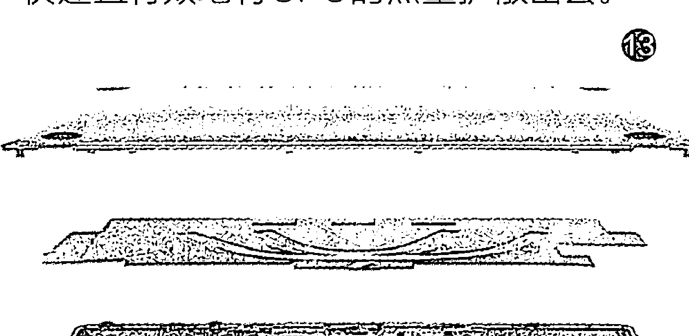

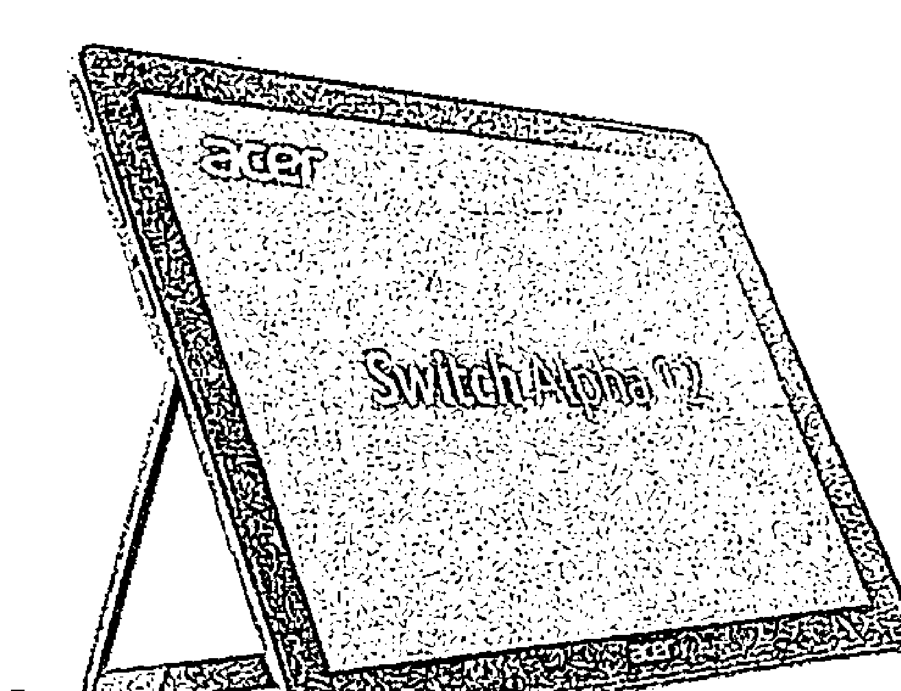

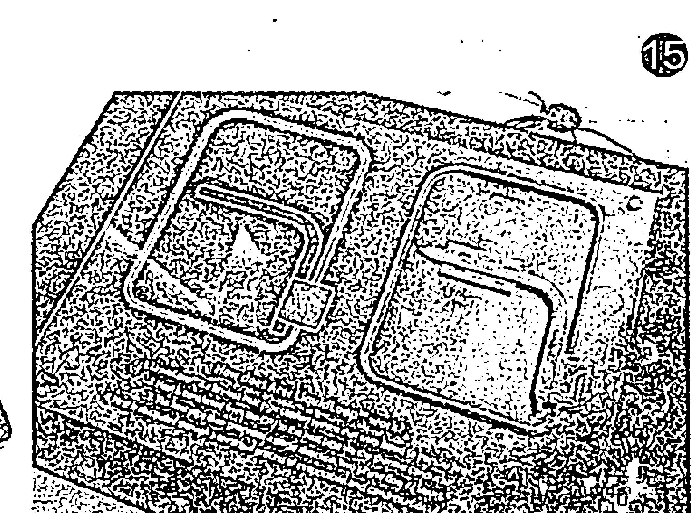

## 遇到独显怎么办

问题来了，消费者的欲望是无止境的。当笔记本或二合一设备足够轻薄时，我们还希望它们最好能具备更强的游戏性能，也就是可以塞进一颗独立显卡芯片，哪怕是入门级独显也好啊。

早在超极本一统轻薄江湖的年代，索尼就通过VAIO Z系列（Z21）提出了解决方案，这款产品采用了13.1英寸屏幕，16.65mm的厚度和1.18kg的重量已经超越了Ultrabook超极本的官方标准。然而，VAIO Z21并不是超极本，因为它搭载了35W标准电压版酷睿i7-2620M双核处理器，性能远非超极本可比！最关键的是，VAIO Z21还可通过独特的LightPeak光纤接口连接外置显卡（AMD Radeon HD 6650M）扩展坞，真正做到了轻薄和性能的完美平衡（图16）。

小提示：笔记本领域最早的外置显卡概念是由华硕提出，2008年华硕推出了XG Station笔记本外置显卡方案，它采用从笔记本ExpressCard插槽引出的PCI-E X1接口，外接一块GeForce 8600GT显卡（图17）。可惜，XG Station内置的显卡不可更换，ExpressCard插槽的普及度不高，而且外置显卡运行效率耗损严重，并没能普及开来。

2015年，微软通过Surface Book解决了PC平板二合一设备如何应用独显的难题（图18）。这款产品的屏幕主体部分为了实现13mm厚和726g的轻盈，将一颗NVIDIA GeForce 940MX独显塞进了键盘底座内（图19），想玩游戏时只需连接键盘即可。不过，Surface Book这种通过定制接口外接显卡的方案没有复制性，随着雷电3技术的出现和普及，今后外置显卡都会改用这种通用性的接口加以实现。

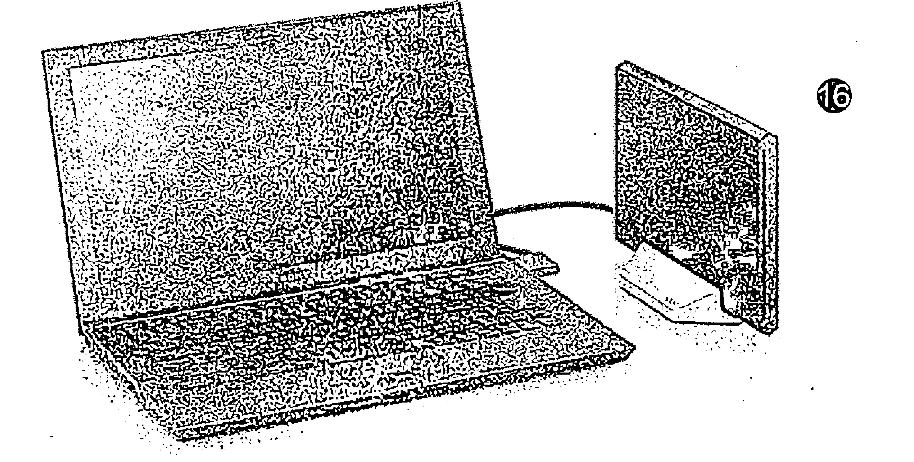

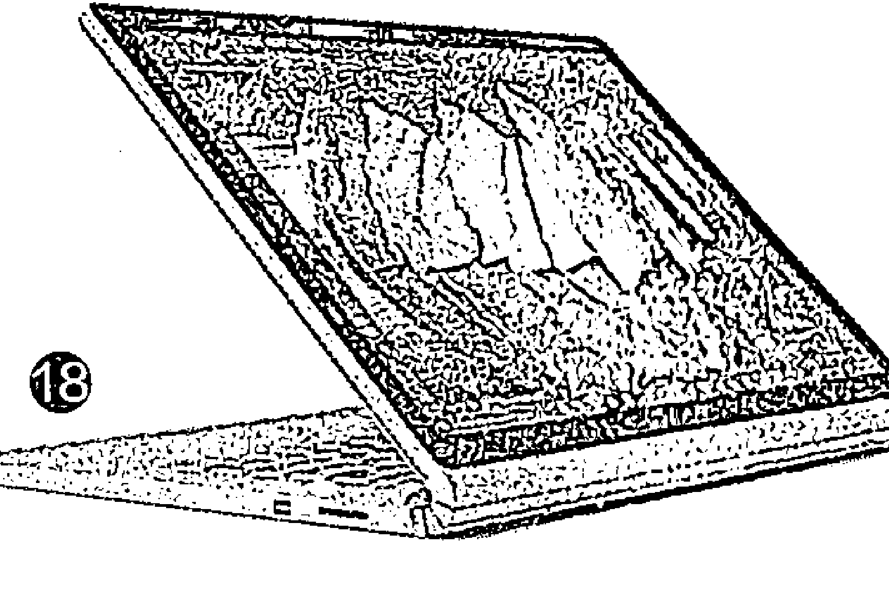

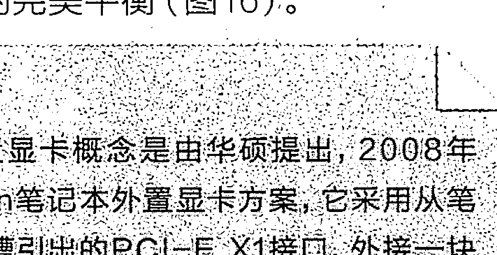

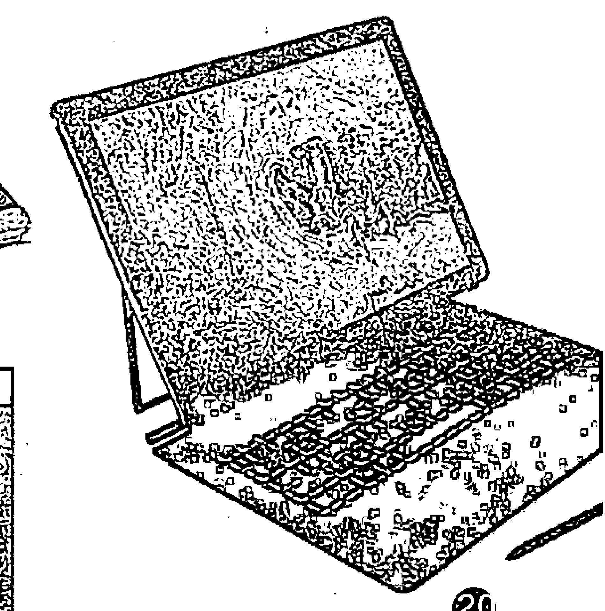

值得一提的是，宏碁在IFA 2017消费电子大展上发布的Switch 7（旗舰版），进一步完善了独显型PC平板二合一设备的设计。它本身是一台13.5英寸平板电脑，1.15kg的重量还算可以接受，而它与专用键盘结合后就是一款标准形态的笔记本（图20）。可能有同学会说了，这年头类似形态的机器太多了，有啥好说的？ 没错，宏碁Switch 7的形态没啥可说的，但它却集八代酷睿处理器（U系列）、NVIDIA MX150独显和无风扇设计于一身，让PC平板二合一设备在性能上实现了新的突破。而为了驾驭CPU和GPU全速运行时的发热问题，Switch 7引入了双路LiquidLoop液冷系统（去年宏碁Switch Alpha 12散热模块的升级版）。可惜，至本文截稿时，笔者还没能找到有关该产品内部结构和散热效率的更详细资料，感兴趣的读者可以留意CFan的后续报道。

### 小结

更轻更薄，是笔记本未来发展的基本思路，哪怕是游戏本也通过Max-Q设计在朝着这个方向狂奔。然而，每个时期都有对轻薄的定义，10年前30mm就算超合格、5年前则将标准提升到了不足18mm，如今10mm才谈得上极致。在笔记本（包括二合一设备）瘦身的道路上，还有待上游厂商开发功耗更低的CPU和GPU，但能否在同类产品中拔得头筹，还得看OEM厂商是否具备创新基因，并能坚持不因追求极致而牺牲性能和功能的不妥协态度。

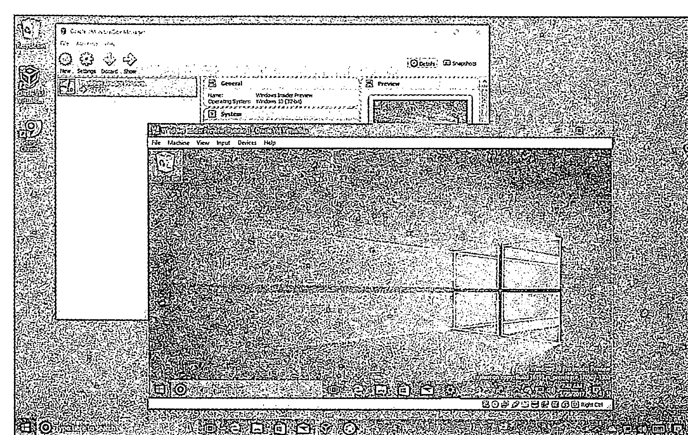

虚拟机（VirtualMachine）是指通过软件模拟的具有完整硬件系统功能的、运行在一个完全隔离环境中的完整计算机系统。能够安装多个客户端操作系统，每个客户端系统皆可独立开启、暂停与停止。主机操作系统与客户端操作系统皆能相互通讯，多个操作系统同时运行的环境，也彼此能够同时使用网络。利用虚拟化基础架构技术，可以不断整合工作负载，从而充分利用服务器并降低运营成本。

# 善用虚拟机 进化PC使用体验

文|周之 魔之左手

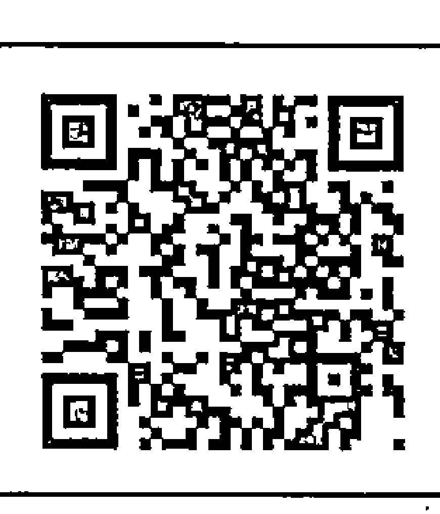

扫一扫，更多精彩内容立现！

在计算机性能早已过剩的今天，虚拟机已不再如当初那般高高在上，而可以成为家用或办公优化机能的工具。例如在运行Adobe公司的软件时经常会因为快捷热键互相冲突从而造成按键失灵的情况，如果将性能占用比较小的程序放在虚拟机中去运行就可以很好地解决这一点。一些老游戏因为设计原因分辨率比较低且无法窗口化运行，使用现在的显示器全屏运行又十分影响观感，如果将这些老游戏放入虚拟机中运行，即可轻松解决无法窗口化的难题。

虚拟机存储数据的文件可以直接放入闪存盘进行拷贝，通过DiskGenius专业版等软件甚至可以进行读取编辑。在某种程度上为我们的系统带来了可移动性，无论是否携带主机，只要在机能足够的电脑上安装相应的虚拟机即可使系统近乎完美迁移，避免换机带来的各种联结断裂问题。

操作系统无法分辨虚拟机与物理主机之间的差异，应用程序和网络中的其他计算机也无法分辨，即使是虚拟机本身也认为自己是一台“真正的”计算机。不过，虚拟机完全由虚拟机软件组成，不含任何硬件组件，因此它具备物理硬件所没有的很多独特优势。

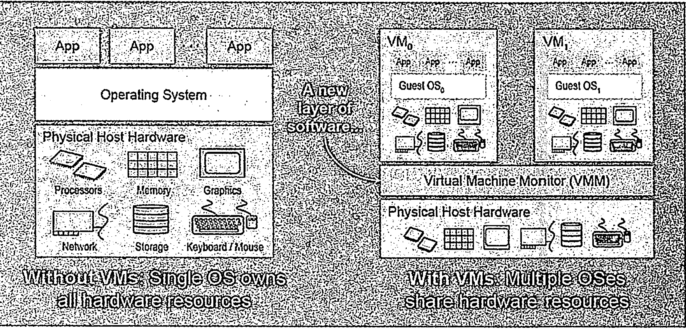

## 兼容性

虚拟机承载着自身的客户操作系统和应用程序，并具有物理计算机上的所有组件（主板、显卡、网卡等）。虚拟机与所有标准的X86操作系统、应用程序和设备驱动程序完全兼容，完全可以使用虚拟机来运行X86物理计算机上运行的所有相同软件。同时，为了避免软件老旧引起的不兼容情况，可以选择适合软件版本的操作系统进行虚拟。

## 隔离

多个虚拟机可以共享一台计算机的机能，彼此之间隔离。例如在一台物理服务器上有四个虚拟机，那么其中任何一个或多个虚拟机崩溃都不会影响其他虚拟机的状态，虽然虚拟机软件的崩溃会同时影响四个虚拟机的状态，但因为软件并不进行运算，一般不会有这种情况发生。使用虚拟机环境模拟沙盒可以在一定程度上避免病毒对主机的侵袭，只有在极少数情况下，才会出现病毒从虚拟机逃逸从而感染主机的情况。

## 封装

虚拟机实质上是一个软件容器，它将一整套虚拟硬件资源与操作系统及其所有应用程序捆绑或者说是“封装”在一个虚拟机软件包内。封装使虚拟机具备超乎寻常的可移动性并且易于管理。我们可以将虚拟机从一个位置移动和复制到另一位置，并且马上调取运行，就像移动和复制任何其他软件文件一样；虚拟机也可以保存在任何标准的数据存储介质上，从袖珍型的USB闪存盘到企业存储区域网络（SAN），皆可用于保存。

## 独立于硬件

虚拟机完全独立于其底层物理硬件，用户可以为虚拟机配置与底层硬件上存在的物理组件完全不同的虚拟硬件组件。同一物理服务器上的各个虚拟机甚至可以运行不同类型的操作系统，如Windows、Linux等。目前流行的虚拟机软件有VMware Workstation、Virtual Box和Virtual PC，它们都能在Windows系统上虚拟出多个计算机。

## VMware Workstation

VMware Workstation（中文名为“威睿工作站”）是一款功能强大的桌面虚拟计算机软件，可在操作系统窗口中加载虚拟机，运行自己的操作系统和应用程序。用户可以在运行于桌面上的多台虚拟机之间切换，也可以通过网络共享虚拟机，挂起、恢复虚拟机，或者退出虚拟机等操作都不会影响主机的其他操作和其他正在运行的应用程序。

VMware Workstation安装在主机操作系统中，可以当作一个普通的应用程序使用。它会将虚拟计算资源如CPU、内存、存储以及接口，映射到主机的物理资源上，创建完整的虚拟机封装。由于主机操作系统将VMware Workstation视作一个应用，因此修改虚拟机内部的软硬件资源时都不需要修改计算机的配置或者重启系统。VMware Workstation可以在虚拟机和主机操作系统间无缝切换使用。

最新的VMware Workstation 12 Pro允许用户以服务器模式运行，能够为虚拟机提供多达16颗虚拟CPU、8TB硬盘空间、64GB内存以及2GB显存。在配置当中，可以使用虚拟网络编辑器创建复杂的虚拟网络，管理员还可以限制虚拟机的带宽，确保每台虚拟机都拥有最大可用带宽。


## VirtualBox

VirtualBox是一款开源虚拟机软件。VirtualBox最初是德国Innotek公司开发，由Sun Microsystems公司出品的软件，在Sun被甲骨文公司（Oracle）收购后正式更名成Oracle VM VirtualBox，进行持续开发，成为甲骨文公司xVM虚拟化平台技术的一部分。

VirtualBox号称是最强的免费虚拟机软件，它不仅具有丰富的特色，而且性能也很优异。它简单易用，可虚拟Windows（从Windows 3.1到Windows 10、Windows Server 2012，所有的Windows系统都支持）、Mac OS X、Linux、OpenBSD、Solaris、IBM OS2甚至Android等操作系统。与VMware及Virtual PC比较，VirtualBox最早支持远端桌面协定(RDP)、iSCSI及USB等技术（有些需要安装Pack）。


## Hyper-V

在Windows系统中其实就自带虚拟机，Windows Server 2008 R2及以上服务器操作系统或Windows 7专业/旗舰版操作系统中其实就自带一个虚拟软件——Hyper-V。它采用微内核的架构，兼顾了安全性和性能要求。 Hyper-V可以很好地支持Linux，我们可以安装支持Xen的Linux内核，这样Linux就可以知道自己运行在Hyper-V之上。还可以安装专门为Linux设计的Integrated Components，里面包含磁盘和网络适配器的VMbus驱动，这样Linux虚机也能获得高性能。 Hyper-V可以采用半虚拟化(Para-virtualization)和全虚拟化(Full-virtualization)两种模拟方式创建虚拟机。半虚拟化方式要求虚拟机与物理主机的操作系统(通常是Windows)相同，以使虚拟机达到高的性能；全虚拟化方式要求CPU支持全虚拟化功能(如Inter-VT或AMD-V)，以便能够创建使用不同操作系统(如Linux和Mac OS)的虚拟机。

## 虚拟机对硬件系统的要求

在内存方面，因为虚拟机实际上运行了整套操作系统，因而对内存的容量需求较大，且会持续性地使用，因此需要划拨固定额度的内存。这些内存在虚拟机运行过程中，实际上是被“半永久”地占用了。如果同时运行多个虚拟机，它们占用的内存总量可能会对主机其他应用的运行造成影响。我们甚至见到过运行多个虚拟机时，划拨的总内存量超过了主机实际内存量，造成了主机自身运行不稳定的反应。 另外在划拨内存时，我们也应该考虑到虚拟机操作系统和其上运行软件的需求，这一点与购机时的考虑类似。例如Windows XP平台搭配同时代软件，一般应配置1GB以上的内存；Windows 7搭配同时代软件，则最好配置4GB以上内存；如果要运行一些大型软件则需要进一步增加内存配置。

除了注意虚拟机配置内存和主机保留内存的容量外，内存的速度也是需要考虑的一个方面。我们最好采用双通道、四通道内存架构，并在系统允许的情况下采用尽量高的内存规格，以期为虚拟机和主机提供足够的内存带宽。

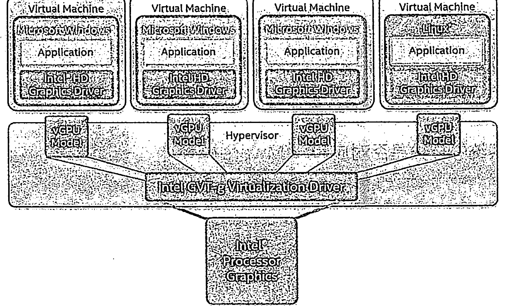

与内存配置类似，在处理器方面，我们也要考虑到虚拟机这种比较独特的资源占用模式，最好选用高性能的多核、多线程处理器，这样才能保证在虚拟机特别是多个虚拟机同时运行的情况下，为各个虚拟机和主机都保留足够的计算资源。

在处理器的选择中，还有一种特殊的功能需要注意，那就是处理器的虚拟化技术，目前Intel和AMD都有自己的虚拟化技术。硬件级的虚拟化技术不同于多线程的技术，是专为虚拟化应用进行的设计，它们不仅可以更好地处理虚拟化的处理器需求，还提供了一些特殊的虚拟机功能优化。例如Intel VT FlexMigration（灵活迁移）能够在无需停机的情况下，将运行中的虚拟机在物理服务器之间进行迁移；Intel VT-d可将特定的I/O设备安全分配给特定的虚拟机，从而减少VMM参与管理I/O流量的工作，不但加速了数据传输，而且消除了大部分的性能开销等等。

需要注意的是，虚拟化技术并未配置在所有处理器中，需要这一功能的用户在购买处理器时要进行确认。此外在很多主板的BIOS中，虚拟化相关功能选项是关闭的，我们在使用时需要手动开启相应功能。

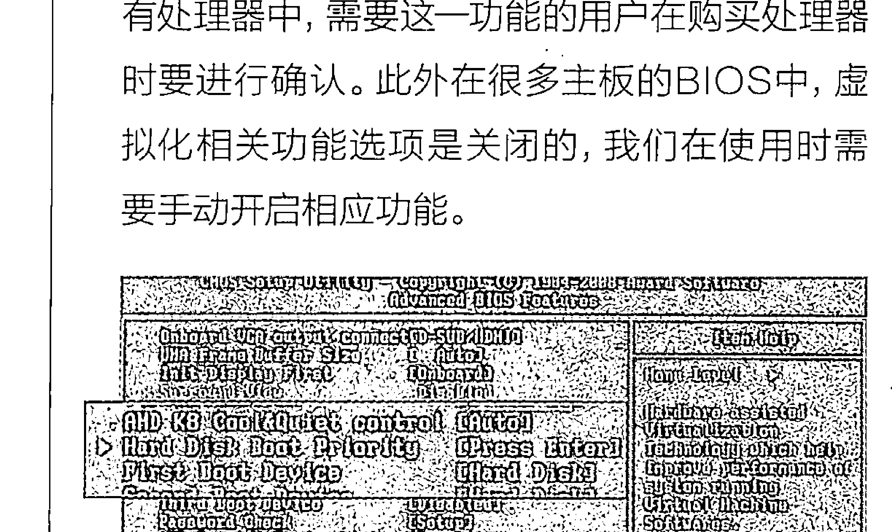

## 实战虚拟机

看过了虚拟机的很多好处和应用，以及各个主要虚拟机应用的差别后，大家是不是已经手痒痒了呢？下面我们就来看一看如何实际进行使用吧。目前全球排名前五的虚拟化软件公司为：VMware、微软、思杰、红帽（Red Hat），甲骨文(Oracle)。虽然虚拟机软件有很多种，且这些虚拟机软件基本都有简体中文界面，但目前Windows平台上使用最多的虚拟机软件仍旧是VMware Workstation。使用VMware Workstation虚拟机进行虚拟时不需要考虑处理器的位数和系统的位数是否对应，且VMware提供试用版，不像Hyper-V需要专业版以上的系统才可以打开该功能，所以我们用VMware Workstation来做虚拟机的安装与设置演示。

### 安装虚拟机

- 1. 在VMware Workstation官网下载虚拟机程序，准备好之后需要虚拟系统的镜像文件，建议到MSDN下载原版镜像，可以在最大程度上保证成功安装（图1）。
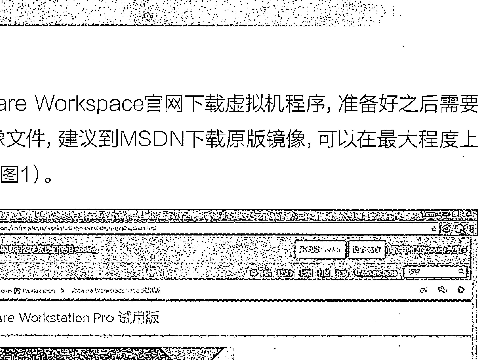

- 2. 点开下载好的VMware Workstation Pro试用版，并进行安装。如今的VMware Workstation都有中文界面，和安装其他的程序并没有什么不同。一路点击“下一步”，注意选择程序安装目录即可。需要注意的是，这个安装目录仅仅是VMware Workstation应用相关文件的安装目录，而并非未来虚拟系统的所在目录，所以即使装到了C盘也无须担心什么（图2）。
- 3. 以试用模式打开Workstation 12 PRO，会出现VMware Workstation的工作界面。无论是虚拟1个系统或是多个系统，都将在这个界面进行操作（图3）。
- 4. 点击“创建新的虚拟机”来建立新的虚拟任务，基本不需要调整内容。如果使用原版镜像，可在第二步直接选中镜像开始安装。如使用装机集成版镜像（集成PE安装环境），可先不选择镜像文件，在启动时将镜像挂载在虚拟光驱上。在后续步骤中选择正确参数，即可完成虚拟机的建立流程（图4~图7）。
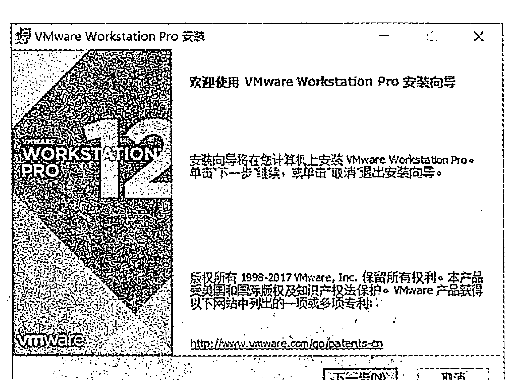
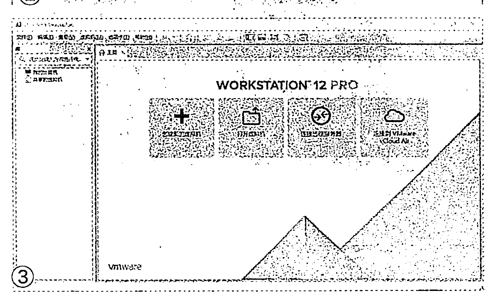
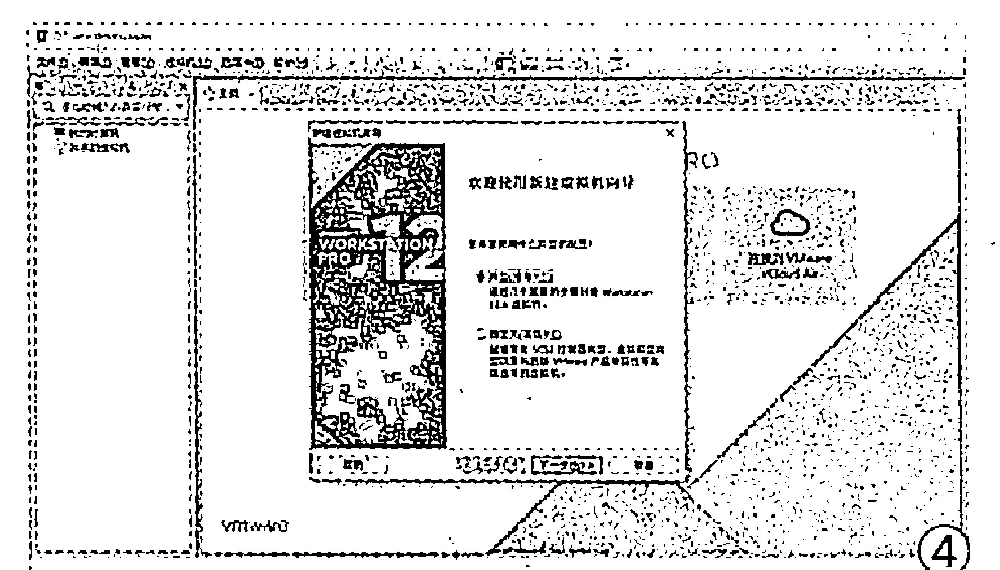
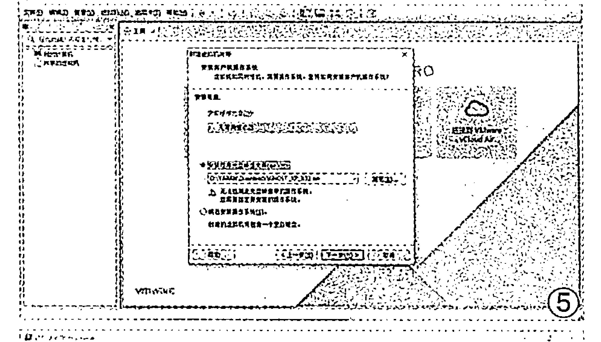
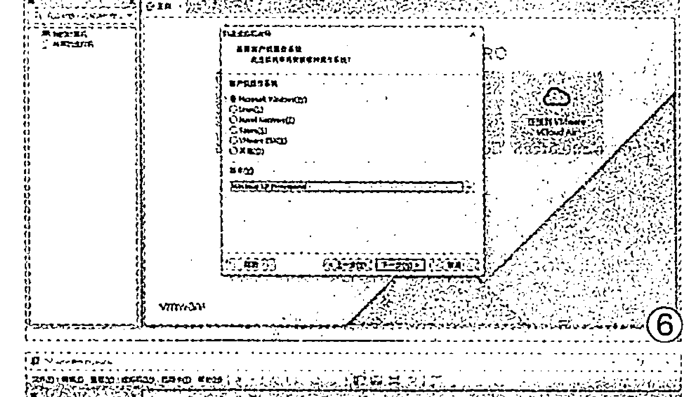
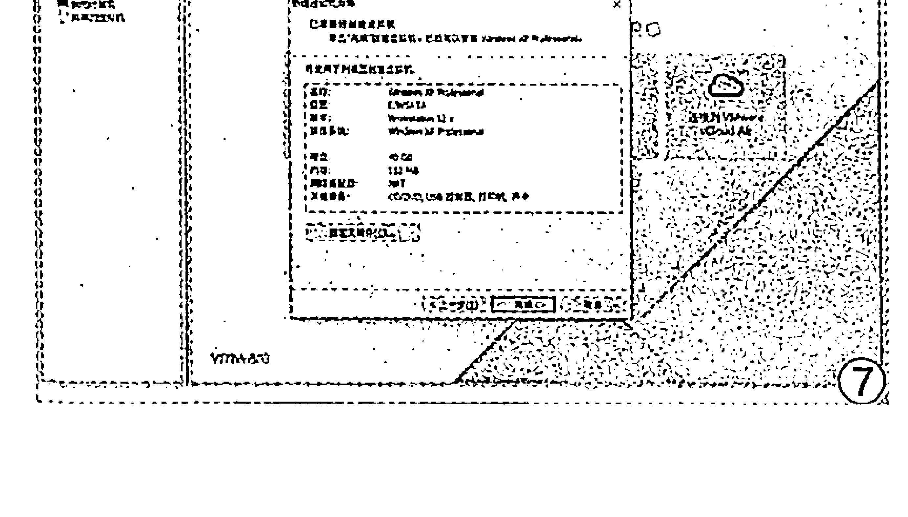

- 5. 选择已经设置好的虚拟机进行启动。之后会进入系统安装流程，如果在之前的步骤中暂未选择系统镜像，需要在启动前选择CD/DVD并选中合适的镜像文件进行挂载。启动后系统即会进入安装流程（图8~图11）。
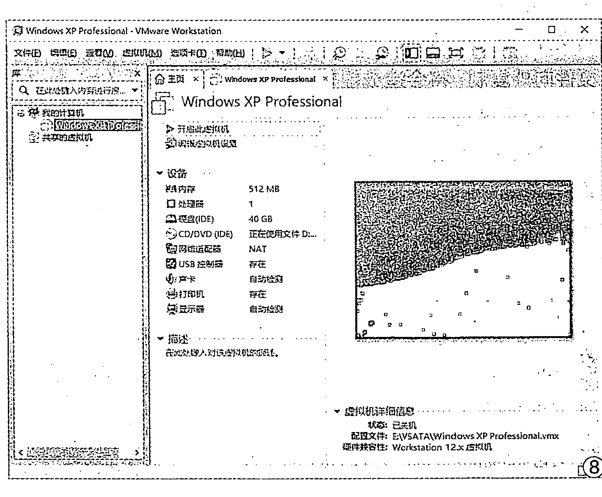当系统安装完毕，只要不重置虚拟机，下次仍可进入已经安装好的虚拟机系统中。在VMware Workstation下安装Windows系统会自动安装VMwareTools，该软件可以帮助我们轻松地将主机中的文件复制到虚拟机环境下。如果要将虚拟机环境下的文件向外复制，请一定注意查看文件是否被病毒感染。如果将感染文件向外复制，将会造成虚拟机逃逸现象，从而使得病毒对主机的运行环境造成破坏，导致不可挽回的严重后果。如果确实需要将文件往外复制，建议先进行病毒查杀，以免造成严重后果(图12~图13)。

## 火速链接

如果大家正在使用Windows 10专业版，可访问 http://www.cfan.com.cn/2016/1128/127749.shtml 或扫码查阅有关Hyper-V的安装及使用方法。

### 虚拟机环境下的网络配置

VMware虚拟机有三种网络模式，分别是Bridged(桥接模式)、NAT(网络地址转换模式)、Host-only(主机模式)。

VMware Workstation安装好之后会多出两个网络连接，分别是VMware Network Adapter VMnet1和VMware Network Adapter VMnet8，这两个是可以在主机的网络连接中查看到的。还有一个是VMnet0，可以在Virtual Network Editor中看到。这三个虚拟网络都是VMware安装好之后自动生成的，不需要手动修改。其中VMnet0用于Bridged模式，VMnet1用于Host-only模式，VMnet8用于NAT模式。VMnet8和VMnet1提供DHCP服务，VMnet0默认则不提供。

1. Bridged (桥接模式)

Bridged模式下，VMware虚拟出来的操作系统就像是局域网中的一台独立的主机，它可以访问网内任何一台机器，你需要手工为虚拟系统配置IP地址、子网掩码，而且还要和主机处于同一网段，这样虚拟系统才能和主机进行通信。虚拟系统和主机的关系，就像连接在同一个Hub上的两台电脑。

2. NAT (网络地址转换模式)

NAT模式让虚拟系统借助NAT的功能，通过主机所在的网络来访问公网。在这种模式下宿主机成为双网卡主机，同时参与现有的宿主局域网和新建的虚拟局域网，但由于加设了一个虚拟的NAT服务器，使得虚拟局域网内的虚拟机在对外访问时，使用的则是宿主机的IP地址。这样从外部网络来看，只能看到宿主机，完全看不到新建的虚拟局域网。

采用NAT模式最大的优势是虚拟系统接入互联网非常简单，你不需要进行任何其他的配置，只需要宿主机能够访问互联网即可。

3. Host-only (主机模式)

在某些特殊的网络调试环境中，要求将真实环境和虚拟环境隔离开，这时就要采用Host-only模式。Host-only模式下新建了一个由所有虚拟机与主机所构成的局域网，但该局域网与主机本身所处的现有局域网是相互独立的，如果不进行额外路由设置，这两个局域网之间不会连通。因此新建的局域网可以认为是一个单独从属于当前宿主机的私有网络，其成员为当前宿主机和相关的所有虚拟机。从网络技术上讲，这相当于为宿主机增添了一个虚拟网卡，让宿主机变成一台双网卡主机(宿主网卡+虚拟网卡)。如果是对网络模式没有太多苛刻的需求，建议采用默认的模式就好，无需更改。

### 虚拟机环境下使用软件

在VMware虚拟机环境下使用软件与日常使用软件并没有什么区别，只是在VMware软件中虚拟系统时会有一个名为VMware无缝模式(Unity)的功能，这属于虚拟机和真实机混合的一种方式，让虚拟的系统像嵌入在MacOS X系统下一样，开始菜单、窗口都是独立打开的，不会像在一个虚拟桌面里面一样。

为了测试虚拟环境是否与主机环境彼此隔离，我们将玩游戏时常用的修改器Cheat Engine拖入虚拟机中，并打开Unity模式将程序映射到主机桌面上，可以看到Cheat Engine无法定位到主机中正在进行的程序上。由此可见，在大多数情况下VMware的虚拟系统环境是隔离的，只要小心那些可能造成虚拟机逃逸的漏洞即可。

### 窗口化老游戏

虽然如今的游戏大多支持各种分辨率以及窗口化模式，但受制于彼时的技术壁垒，很多老游戏并不支持窗口化，本身就没有多高分辨率的老游戏在1080P的显示器屏幕上一片模糊，就更别提2K、4K的显示器了。

有些相对较新的游戏可以使用游戏窗口化工具D3DWindower进行窗口化操作，但对于那些千禧年之前的游戏则往往不能生效。像《仙剑奇侠传》系列中只有《仙剑奇侠传3》以后的版本才可以使用D3Dwindower软件进行窗口化操作。这时，或许就需要虚拟一个兼容性更好的老系统来搭配老游戏，才会让游戏体验更有味道！

对于那些本身就可以窗口化的游戏，使用VMware的Unity模式将其映射到主机中，也会给我们带来相对友善的游戏体验。而有些游戏本身不支持多开，我们使用虚拟机就可以完美避开程序对系统的检测，从而名正言顺地多开游戏，即使游戏厂商知道这点也无法有效阻止，想必一定很有成就感。当然技术层面虽然可行，但还是尽量不做一些影响游戏公正性的事情。

## 总结

讲了这么多虚拟机的知识和应用，不知道有没有帮到你呢？近几年PC机能严重过剩，我们的电脑在很多时候都是白白浪费着性能，如此倒不如将部分性能分给虚拟机，既为我们营造了多线程任务而提升效率，也优化了PC机能使用率，何乐而不为呢？

除了PC平台上的PC端虚拟机之外，我们周围也常常会见到一些特殊的“虚拟机”爱好者甚至开发者开发的，那就是游戏主机虚拟，也可以叫做主机模拟器。这些模拟器理论上来说也是一种虚拟机，不过其模拟的硬件环境特殊，而使用的应用程序为各种游戏封装。在这些模拟器中，笔者个人比较关注的是一种更加独特的产品，那就是基于移动操作系统的掌机模拟器，例如PPSSPP的Android版等。由于主机模拟器在成熟度、版权等方面的问题，目前并不适合进行大范围推广，所以我们这里不再进行展开介绍，感兴趣的朋友可以自行了解。

9月13日凌晨，苹果发布了新一代iPhone，而主打全面屏设计，引入Face ID（面部ID）功能的iPhone X更是博得了广泛关注。在此之前，华为在IFA2017展会上发布的麒麟970移动SoC芯片同样声势惊人。无论是iPhone X还是麒麟970，它们之所以刷爆了9月份的IT圈，就是源于它们实现了AI从云端落地的壮举。

# AI已被唤醒

很多人都以为AI只是科幻电影中的存在。实际上，唤醒AI的土壤早已成熟，而AI就在你我身边。

## 源于影视的AI培训

AI（人工智能）并不是什么新鲜的概念，经历多年科幻大片的“洗礼”，每个人都对AI的前景与隐患有着相当的认识。就拿笔者来说，小时候接触的第一部和AI相关的电影就是《霹雳五号》，一部原本用于战争的小机器人由于被雷电击中而被唤醒了人的思维和感情，看起来满满温情（图1）。

然而，随后的《终结者》系列电影却让我们看到了AI潜在的威胁，过分依赖AI说不定哪天人类就被AI终结了（图2）。接下来，《我，机器人》上演了AI也分好坏，最终善良AI终将战胜邪恶AI的戏码。随着《钢铁侠》和《复仇者联盟》系列电影的热播，每个人又都期盼自己也有一个能与自己交流、如臂使指的钢铁战衣。

为所有电子设备“赋能”（AI能力），是未来科技的发展趋势，这一点毋庸置疑。不过，科普AI有着更专业的杂志、网站和视频节目在做，CFan本期想和大家聊聊的，则是已经开始逐渐影响到我们生活的、触手可及的AI。

## 唤醒AI的三大要素

可能有同学会提出疑问，AI不早就充斥在我们周围了吗？电脑下载个象棋游戏，和你对战的NPC不就是AI？苹果2011年推出的智能语音助手，可以答你所问、还能被你“调侃”的Siri不也是AI吗（图3）？

很遗憾，这些都不是完整的AI，它们只是预先设定好的编程代码。象棋游戏可以在规则允许内见招拆招，遇到不存在于代码中的技法或者是计算能力跟不上，NPC也只能缴械投降；Siri早期的工作也仅仅是语音识别，将你的声音转换成文字，后台通过搜索引擎寻找答案再反馈给你，仅此而已。

真正的AI是让电子设备获得模拟人类的某些思维过程和智能行为（如学习、推理、思考、规划等），而要想获得这一能力，必须建立在数据、算法和运算能力这三大要素达标的前提之下。

### 万物互联+大数据提供养分

AI的最核心要素是什么？学习，或者说是自学能力，用海量数据进行训练后变得更聪明的算法。而想要学习，自然需要足够丰富的资料，从中吸取精华。AI之所以近两年才有爆发的趋势，就是因为它所需的学习资料才刚刚勉强凑齐。

光纤宽带、4G网络、蓝牙和Wi-Fi的普及，让几乎所有的电子设备都具备了联网能力，而我们每天的行为也都会被它们上传到云端，形成“大数据”（图4）。现在我们随便搜索个关键词，搜索引擎反馈的结果中总有“猜你喜欢”。此外，我们的邮箱、APP每天还会收到很多推送广告/新闻，但无论是猜你喜欢还是推广的广告/新闻里面还真有很多你所关心或急需的。

这些就是大数据时代的特色了。我们个人的一切行为都会经过云端梳理从而汇总得出喜好、消费习惯，并将你与喜好相近的人群加以分类。在大数据时代，个人隐私颇有形同虚设之嫌，但排除潜在的安全风险后，你会发现我们已经越来越离不开它。

### 算法用于还原需求的本质

无处不在的网络以及大数据，为AI的自学提供了足够的养分和案例。但是，AI在实际应用中如何正确理解你提出的需求？同时精准高效地处理这个需求？这些都需要在体量足够大的养分中寻找答案。

AI与我们的每一次交流其实都是将问题数学化。接下来，就需要用到解答这些数学化模型的算法了（图5）。以计算圆面积为例，现实中有无数种方法都能加以实现，但论计算效率最高、最精准，还要数“S=πr²”这个公式。同样是致力于AI语音助手的公司，谁能掌握更高效率的算法公式，解读出用户真实的本质需求，谁就能在竞争中处于领先地位。

而AI发展的远景目标，就是让AI自己能根据用户刚刚提出的需求，不仅是筛选，还能自创出一套最为合理的算法，并根据用户后续的需求变化而即时做出相应的调整。

### 最终还需运算能力落地

有了足够的养分/案例、最合理的算法之后，最后一步就是将数学化模型计算出结果了。但是，同样是计算圆周率，口算、算盘、计算器、电脑，使用不同的计算设备所需要的时间肯定有着云泥之别。因此，提升AI交互体验对硬件同样提出了极为苛刻的要求。

我们不妨回顾一下CPU和GPU的发展史。最早CPU自己就能搞定一系列办公和娱乐的基础需求。然而，随着3D游戏的兴起，CPU针对高速图形渲染逐渐变得力不从心起来，在播放高清视频时的占用率更是居高不下。于是，GPU的春天来了，依靠强大的通用图形计算和并行计算能力，GPU在处理3D图形、视频编解码时的效率可秒杀CPU（图7）。

如今AI常见的应用场景主要体现在语音助手、人脸识别、物体识别、AR、自动驾驶等领域，昔日牛哄哄的CPU和GPU根本帮不上忙。因为AI应用的基础算法名为“神经网络”（图8），会大量用到矩阵乘法以及卷积运算，如果强行让CPU或GPU进行AI计算，不仅存在功耗高的问题，执行效率也是低得可怜。

因此，想进行更强大的AI运算能力，就需要在现有的CPU和GPU技术上进行优化升级，或是增添专属的AI人工智能加速器单元。

在PC领域，当有人想做AI研究时，在过去的很长一个时期都只有租用昂贵的数据中心系统（图6），借助云计算+机器集群的方式才能做到人工智能相关的应用。可能有同学会说了，很多电脑工作站可以塞进多颗至强处理器，这些CPU阵列都喂不饱AI运算的需求吗？答案是：真的喂不饱。

比如，NVIDIA就针对AI研究领域推出了定制的Tesla P100图形处理芯片（我们熟悉的GTX1080等显卡都是它的衍生品和缩水版）（图9），而AMD随后也祭出了Radeon Pro WX 9100这个大杀器，用于人工智能以及机器深度学习的应用。正是因为有了这些AI专用GPU的出现，才促成了AI工作站的诞生：戴尔在2017年9月推出的Precision 7920（图10），就依靠Tesla P100和WX 9100获得了“全球首款AI工作站”的称号。让企业进行AI应用时无需租用数据中心了，在本地即可搞定，不仅降低了成本，也避免了潜在的云端数据泄露等安全风险。

除了GPU开始向AI靠拢，传统CPU自然也不能闲着。在收购深度学习创业公司Nervana Systems之后，英特尔也推出了Xeon Phi家族新成员，在深度学习处理器领域开辟新战场。简单来说，Xeon Phi并非处理器，而是一颗协处理器（Co-processor），可像GPU一样帮助CPU分担计算量，它既有融核处理器的形态，也有加速卡的形态（图11）。目前已上市的Xeon Phi加速卡拥有多达72个内核，非常适合运行机器学习/深度学习工作的任务。

但无论如何优化，无论Xeon Phi还是Tesla P100的本质依旧是CPU和GPU，它们实际上是拿现有的、相对成熟的架构和技术成果去应对新生的人工智能，并没有发生革命性的技术突破，在深度学习领域都达不到最高的能效比。此时，就轮到ASIC、FPGA一类AI专属的加速硬件登场了。有关它们，我们会在后面的章节中加以详述。

扩展阅读：移动领域DSP助力AI 移动处理器的集成度很高，除了传统CPU和GPU单元外，还会集成DSP模块，在AI专用芯片诞生之前，AI应用通常都是CPU+GPU+DSP协同完成的。以高通为例，去年7月就已经推出了骁龙神经处理引擎，它已经有SDK供开发者开发，能够让人工智能工作负载在现有的骁龙移动平台上实现高效的运行，而高通在很早以前也开展了针对AI的布局（图12）。但是，DSP最擅长的其实还是协调传感器计算，为视频、音频和图像处理等特定应用提供更高的处理性能，哪怕它与CPU和GPU组成三剑客，深度学习能力依旧值得商榷。

## AlphaGo让AI从云端照进现实

前文我们提到过，支持Siri语音助手的iPhone手机硬件和AI沾不上边，但用于实时处理Siri信息并反馈结果的终端侧（On-device）却需要前瞻的机器学习技术。换句话说，这是一种AI在云端的表现。而真正将云端AI优势照进现实的，还是谷歌AlphaGo所表现出的精湛棋艺。

### AlphaGo的逆天棋艺

在过去，AI对普通大众总是“只闻其声”，和我们的生活似乎没有太大交集。然而，谷歌AlphaGo却通过在围棋应用上的表现震惊了世人(图1)，让我们认识到AI真的能在特定领域比人脑更聪明。

2016年3月，AlphaGo与围棋世界冠军、职业九段棋手李世石进行围棋人机大战，以4比1的总比分获胜; 2016年末2017年初，该程序在中国棋类网站上以“大师”(Master)为注册账号与中日韩数十位围棋高手进行快棋对决，连续60局无一败绩;

2017年5月，在中国乌镇围棋峰会上，AlphaGo又以3比0的总比分战胜世界围棋冠军柯洁(图2)。

要知道，在AlphaGo以前，其他软硬平台的人工智能在围棋领域连业余六段左右的选手都赢不了!

### AlphaGo的AI源动力

AlphaGo更“聪明”的秘诀，在于它改用了一种针对机器学习优化过的处理器(图3)，而谷歌则将其命名为TPU(Tensor Processing Unit,张量处理单元)。据悉，TPU相较于传统处理器有着7年的领先优势，其宽容度更高，每秒在芯片中可以挤出更多的操作时间用于更复杂和强大的机器学习模型，并将之更快地部署。

去年AlphaGo在和李世石对局时，使用的还是1202个CPU和176个GPU组成的集群。而与柯洁对弈的AlphaGo版本却只需一台物理机上的4个TPU芯片(图4)，每颗TPU的功耗也仅有40W。换句话说，短短一年，AlphaGo就将所需计算的资源从1202颗CPU和176颗GPU压缩到4颗TPU，功耗更是缩减到千分之一!

目前，TPU已经服务于许多谷歌的应用中，包括用以改善搜索引擎结果关联度的RankBrain，以及在街景服务（Street View）改善地图与导航的精确度与质量等等。此外，谷歌还表示TPU仅仅是现有处理器针对AI的有效补充，它依旧需要运行在现有的CPU+GPU平台上，所以并不会直接与英特尔或NVIDIA进行竞争。

## 源于云端的物理限制

AlphaGo虽然拥有强大的AI能力，但它却摆脱不了一个先天的制约：依托于云端的它，需要覆盖足够广、速度足够快的网络支持。当你与AlphaGo下棋时，只要拔掉网线（或是关闭无线路由）（图6），好吧，哪怕你是准高级选手都有机会战胜AlphaGo，证明你有着比柯洁还要厉害的棋艺。


## 无处不在的云端AI

实际上，AI早已融入了我们的生活，只是它们和AlphaGo一样都是生活在云端，和本地化设备关系不大，所以我们总是选择性地将其忽略。

前文我们说过，想玩AI，数据、算法和计算能力缺一不可。因此，国内真正能打包全要素的AI玩家多是以BAT（百度、阿里、腾讯）等为代表的互联网巨头。只要你在使用这些公司的服务，那你就已经在默默地接受AI的“馈赠”了。

比如，百度推出了对话式人工智能系统DuerOS、下一代汽车平台阿波罗计划，并辅以百度大脑和智能云；阿里巴巴将AI业务纳入阿里云体系，先后推出了智能私人助理阿里小蜜和无人商店淘咖啡；腾讯设立AI实验室，主要布局游戏、社交和内容业务，比如围棋AI“绝艺”等。

此外，京东旗下的Alpha智能服务平台则算是技术+服务+渠道的一站式智能解决方案的代表（图7），

扩展阅读：
**ASIC和FPGA是什么**

目前用于AI的芯片除了CPU和GPU外，还包含ASIC和FPGA两大分支（图5）。其中，FPGA（Field Programmable Gate Arrays，现场可编程门阵列）和GPU又称通用芯片，前者被微软、英特尔和Xilinx等企业青睐，百度云、阿里云、科大讯飞的语音识别服务等也都是基于深度学习FPGA芯片所搭建；ASIC（Application Specific Integrated Circuit，专用集成电路）的优势是更专业，有着更高准确率和更低功耗，而且成员最为丰富。本期话题中涉及的谷歌TPU、苹果A11、寒武纪的A1都隶属于ASIC，只是ASIC算法框架尚未统一，所以旗下的各位成员还都处于各自为战的阶段。此外，IBM推出的TrueNorth则是类脑芯片（BPU），潜力甚至要高于其他对手。

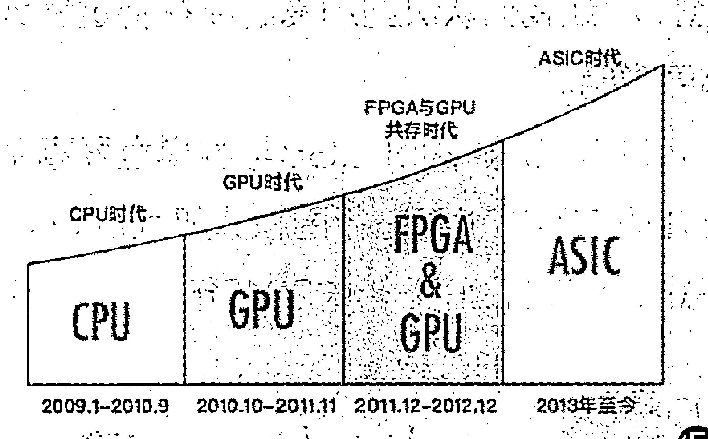

能帮助传统音频企业最大限度降低物联网硬件开发的技术门槛和研发成本，轻松打造具备一定AI交互能力且具备声纹识别的智能音频类产品。CFan本期评测的叮咚2代智能音箱就已具备了AI应用的雏形。

将语音交互作为AI研究方向的还有暴风TV，其最新推出的智能电视全部内置AI助手

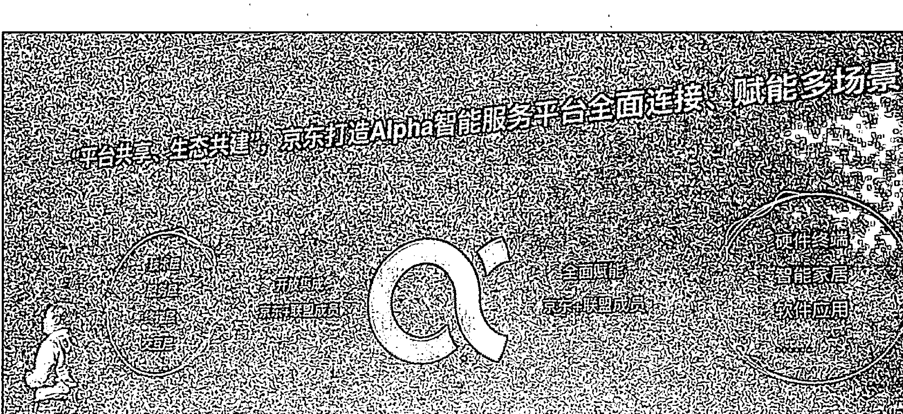

“暴风大耳朵”功能，凭借AI远场语音和AI信息流两类黑科技可更深度地理解上下文，与用户进行多轮对话并支持声纹识别（图8），哪怕没有遥控器也能进行复杂的资源查找、点播服务和语音交互。

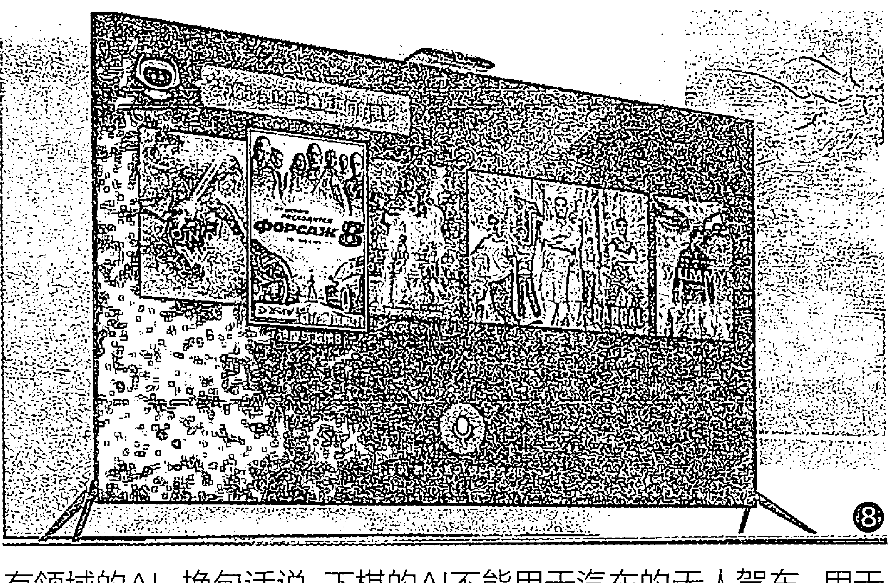

再比如，今日头条之所以能实现千人千面的封面选择，同样是利用AI进行用户画像、自然语言理解和协同过滤步骤，用低成本去挖掘用户需求，然后进行内容聚合从而得到智能匹配的个性化推荐方案。而头条推出的集成自然语言处理、视觉图形处理和机器学习技术的写稿机器人也都令人印象深刻。

总之，人工智能将是未来20年甚至50年的长期发展技术，不可能有一家公司可以通吃所有领域的AI。换句话说，下棋的AI不能用于汽车的无人驾车，用于人脸识别的AI也不擅长进行深度语音识别和交互。在这种大环境下，参与AI竞争的企业谁都有可能做到各领风骚多少年，只做擅长的细分领域，机会谁都有。

## AI在面部识别上的应用

适合AI的领域有很多，但真正与我们密切相关，或者说享用成本最低的，只是语音识别（交互）和面部识别等少数领域。

以面部识别为例，最经典的AI案例就是百度寻人平台（xunren.baidu.com）（图9）。2017年5月23日，百度CEO李彦宏在第十二届百度联盟峰会上分享了一对七旬老人，利用一张身份证照片找到走失8个月儿子的真实案例故事。

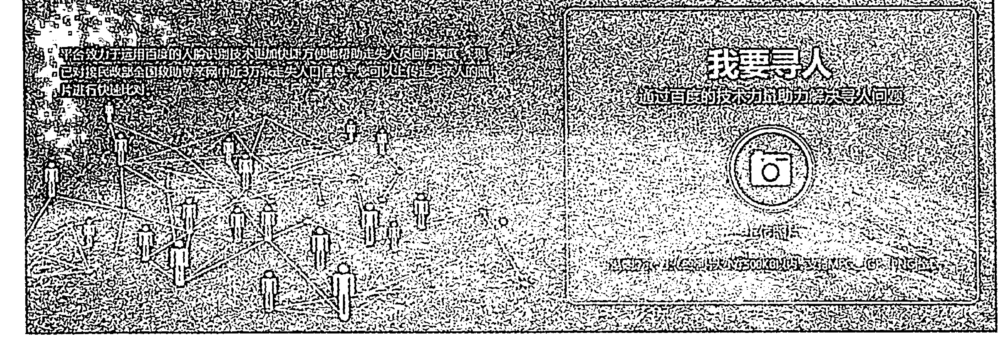

百度寻人平台的运行原理是运用人脸识别技术，将用户上传的照片与丢失人口数据库中的照片进行相似比对，根据相似程度对人脸的身份信息进行判断。然而，影响人脸识别的因素太多，比如光照、人脸姿态、遮挡程度、跨年龄的变化等等。而AI在该平台的最主要应用则是，用200万人2亿张人脸图片进行训练模型，然后用少量的跨年龄数据对它进行更新。在没有引入AI之前，利用照片寻人就是个笑话。

此外，小米手机MIUI系统也曾主打过面孔相册功能（图10），极大地提高了用户在茫茫手机相册中找人的效率，而小米也曾表示小米人脸检测算法团队研发的新算法在FDDB人脸检测准确率榜上取得排名第一。问题来了，想开启小米手机的面孔相册功能，必须登录小米ID，并打开云相册功能（图11），需要将所有照片上传到云端服务器，最终实现在云相册照片内容中按照面孔进行分类整理。


无论是百度寻人平台还是面孔相册功能，它们的流程都是

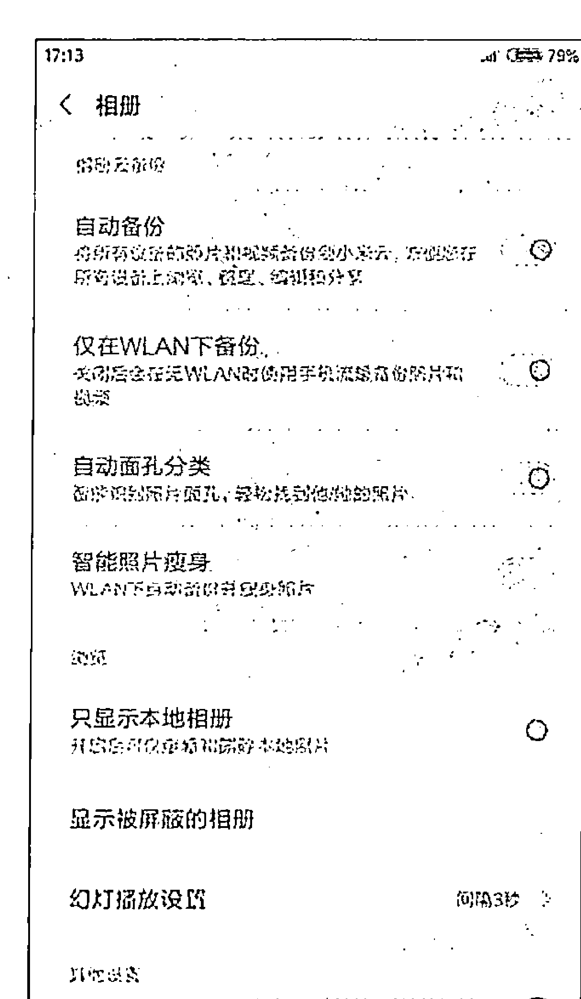

用户提供数据（照片），然后利用云端平台的算法和强大的计算能力，实现与数据匹配照片的筛选，支付宝的人脸验证也是类似的原理（图12）。可能有人会问了，无论是iOS、Android还是Windows，似乎都有支持根据人脸分类的相册APP啊，面孔相册一类的功能有什么可吹的？

这就是本地计算与云端AI计算的差异所在了。大家可以自行下载一下此类软件，无论是人脸的识别准确率还是筛选速度，表现都是极为勉强，遇到侧脸、遮挡和时间跨度（年龄），识别率更是低得吓人。

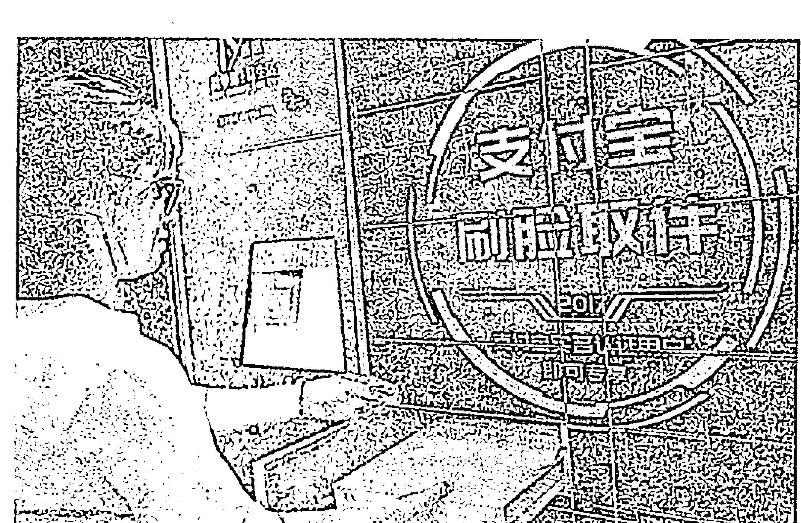

那么，为什么本地相册无法实现快速和精准的人脸识别？要知道，将照片传到云端又会出现安全风险（隐私照片被泄露）。没办法，前文我们已经说过，别说是智能手机，哪怕是强如i7-7700K+GTX1080独显的台式机，在进行AI运算时也是力不从心。

好消息是，随着苹果A11和海思麒麟970处理器平台的出现，AI终于有机会实现从云端落地的梦想，曾经很多必须借助云端服务器才能确保效率和准确性的功能，在没有网络的加持下依靠手机本地的运算能力也能搞定！

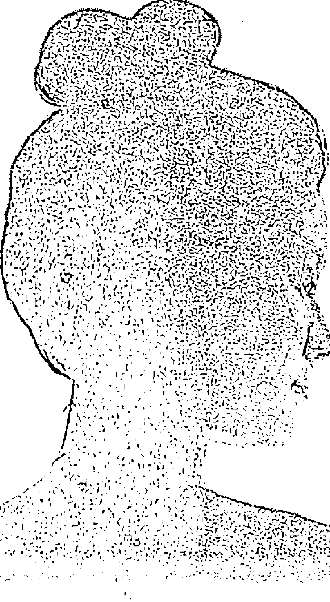

## AI随“芯”落地

曾经，AI都是需要依托于云（网络）才能展现其恐怖的效率。随着新一代移动处理器平台的诞生，AI也终于落地。这意味着，未来哪怕没有网络，搭载这些“AI芯脏”的移动设备也能变得足够聪明和可靠。

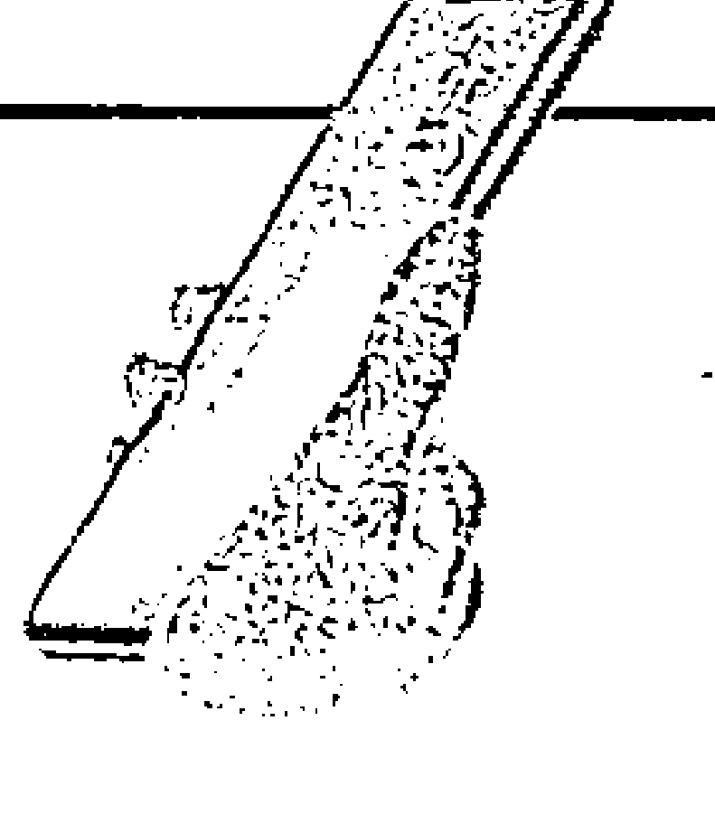

### 人脸识别貌似自古有之

人脸解锁其实早在Android 4.0系统时就被谷歌引入到解锁方式之中（图1）。在那个连指纹都没有普及的时代，刷脸解锁的体验完爆了数字和图案密码。可惜，这个功能并没有被后续系统继承，直到iPhone X发布之后，后续上市的几款Android新品才重新开始引入并重点宣传人脸解锁这种“复古功能”。

### iPhone X 让AI从云端落地

在上个章节中，我们重点介绍了AlphaGO和TPU。如果说谷歌的AI策略是生于云端，那苹果iPhone X就是找到了一种让AI落地的舞台。恰好刚才我们是以人脸识别结尾，本章我们就从苹果的面部ID（Face ID）重新上路。

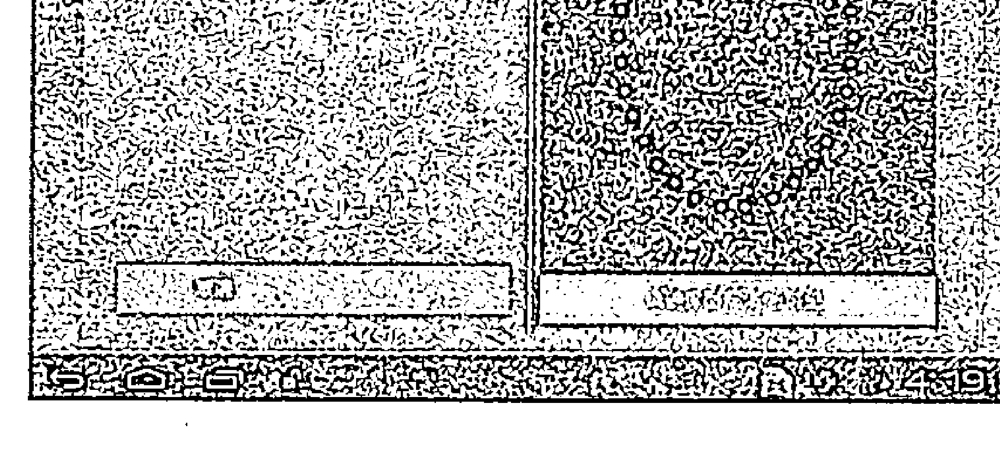

## 安全系数不甚理想

实际上，以小米和vivo等重新引入人脸解锁功能的手机品牌代表，大都采用的都是旷视公司（Face++）提供的面部识别算法，和Android 4.0时期的算法相比，新技术在解锁时不会被机主的截屏或翻拍照片所欺骗。但即便如此，这种人脸解锁方案依旧不够完美，比如哪怕你闭眼时也能解锁、对光线的要求较高等等。

没办法，为了降低硬件部署成本，现有的面部识别方案都是基于前置摄像头+系统层面的软件算法，只能抓取一个2D的面部信息，缺少景深等3D采样，注定它的安全系数没有数字、图案和指纹高。因此，各手机品牌在激活人脸解锁功能前，系统都会弹出并非100%安全的警告信息（图2）。

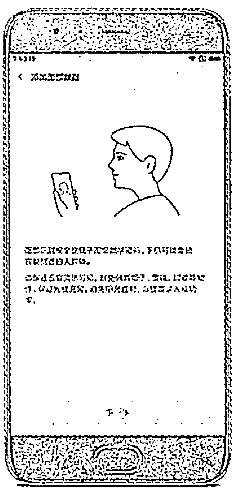

使用说明
面部可替代锁屏密码进行解锁；使用时您需要先添加面部。
录入面部
1. 录入时，避免光线过亮或过暗。确保摄入的面部图像清晰。
2. 录入成功后，就可通过面部识别解锁手机。
风险说明
1. 面貌、外形与您相似的人或物品可能解锁成功。关闭“更快识别”，可降低其可能性。
2. 面部识别的安全性低于图案密码、数字密码和自定字母数字密码。

## iPhone X的不一般

iPhone X面部ID与其他智能手机所用的人脸解锁有着本质上的区别，它实现了对面部信息收集从2D到3D的进化。简单来说，iPhone X在采集面部信息时，前置摄像头基本就是摆设，而是依靠红外镜头、泛光感应元件和点阵投影器的协同配合（图3）。其中，点阵投影器会发射30000多个肉眼不可见的光点投影在你的脸部，绘制出三维建模的立体面谱，红外镜头则会读取这些点阵图案，并将信息发送到A11仿生芯片的安全隔离区进行匹配对照，而泛光感应则是确保识别面部不受环境光线的影响。

据苹果在发布会的介绍，原先的Touch ID在任意50000人中可能会有一人能用他的指纹解锁你的手机。而使用Face ID时，在1000000人才会有一个可能被误判解锁成功，使用照片、头像模具来解锁的可能性基本为零。在完成首次对面部ID的录入后，随着时间的推移，即使你戴了眼镜、长了胡子、戴了帽子，面部ID仍然能继续认出你（图4），并不断根据新的数据来校准识别模型（有关Face ID更详细的原理解读，请参看本期P56的相关内容）。

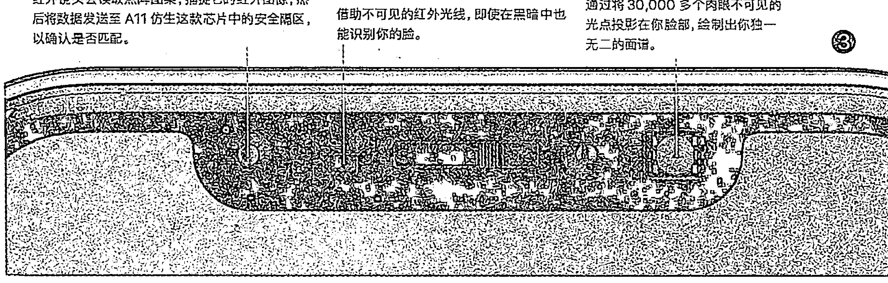

红外镜头
红外镜头会读取点阵图案，捕捉它的红外图像，然后将数据发送至A11仿生这款芯片中的安全隔离区，以确认是否匹配。
泛光感应元件
借助不可见的红外光线，即使在黑暗中也能识别你的脸。
点阵投影器
通过将30,000多个肉眼不可见的光点投影在你脸部，绘制出你独一无二的面谱。


因此，苹果才敢让面部ID在解锁手机之外，还能用于购买应用以及支付Apple Pay，足见苹果对其安全性的信心。
问题来了，从准确性来说，iPhone X的面部ID甚至远胜于前文提到的百度寻人平台和MIUI的面孔相册。最关键的是，面部ID还实现了“秒解”。要知道，面部ID是可以用于支付的信息，不可能被上传到云端借助云服务器的强大运算能力进行识别，从采集、保存到对照匹配都需要在手机本地才能完成，这就对手机的计算性能提出了极为苛刻的要求。

### A11仿生芯片是幕后功臣

iPhone X面部ID的优秀体验是建立在全新A11仿生处理器的基础之上（图5），而苹果之所以用“仿生”命名，就是因为A11内部除了CPU、GPU、DSP等单元外，还加入了特别定制的神经网络引擎（Neural Engine）。

这个神经网络引擎采用双核设计，每秒运算次数最高可达6000亿次，相当于0.6TFlops，是专门用于面部ID的ASIC模块，在加速处理人脸数据的同时还能减少对电量的消耗。我们都知道，AI学习分为训练（Training）和推理/应用（Inference）两部分，其中训练部分所需的计算量比应用阶段的要大上许多。而A11最神奇的地方则是，用户面容适应（化妆、佩戴眼镜、长胡子、随着年龄增长而面容改变等）过程需要用到的深度学习训练也是在本地完成的！

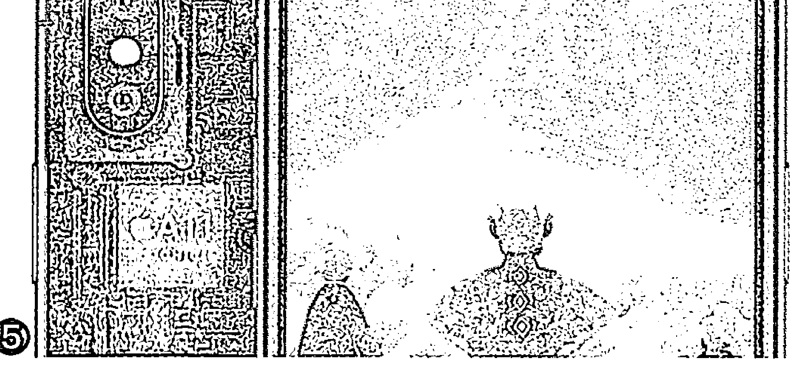

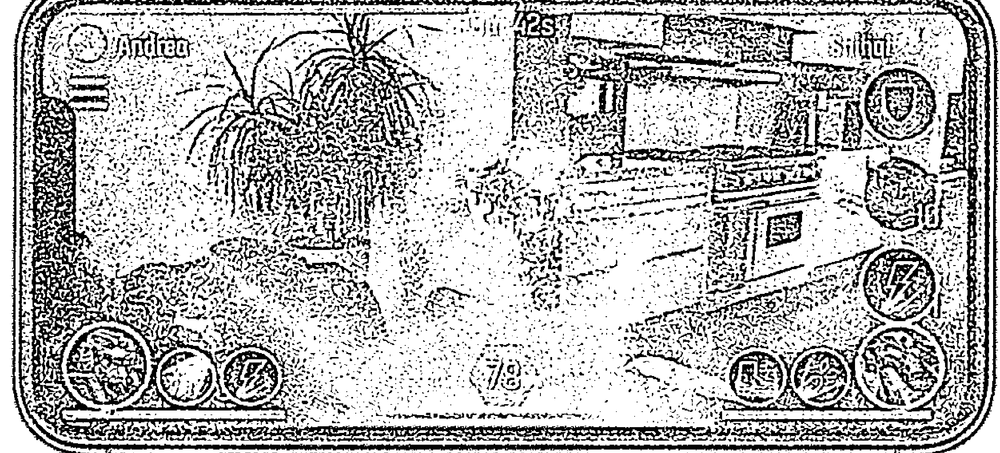

苹果的软件工程高级副总裁Craig Federighi也曾表示，“我们不会在用户注册Face ID时收集数据，它会保留在你的设备上，不会被发送到云端进行训练。”换句话说，A11仿生处理器的神经网络引擎，就是“本地的云服务器”，完全不用担心个人3D面部信息有泄露的风险。

值得一提的是，A11仿生处理器支持苹果在今年WWDC开发者大会上推出的新机器学习API——Core ML（图6），它支持深度神经网络、循环神经网络、卷积神经网络，支持向量机、树集成、线性模型等，可用于人脸追踪、人脸检测、自然语言处理、文本检测等任务，Core ML本身虽不具备建模的能力，但可整合来自于外部机器学习工具所生成的模型。

总之，苹果通过iPhone X提出了更完整的AI框架。除了苹果自己开发的面部ID、Animoji和AR应用程序用到了A11的神经网络引擎以外，还允许开发者把训练完成的机器学习模型封装进APP之中。和云端AI不同的是，苹果的这种为终端（本地设备）赋能的方式，免去了与云端交互数据的延迟和限制，有利于保证终端设备的安全和使用体验。

## 麒麟970内置AI芯片

虽然iPhone X的表现令人惊艳，但它所搭载的A11仿生处理器却并非业内首款手机AI芯片，因为早在9月2日德国IFA大展上，华为就抢先一步推出了麒麟970，实现了为手机赋能的梦想（图7）。

### 来自寒武纪NPU的赋能

麒麟970主打创新的HiAI移动计算架构，由CPU、GPU、ISP/DSP和NPU四部分构成。而麒麟970之所以位列“首款手机AI芯片”的队首，就是因为它在SoC上集成了一颗来自寒武纪的“NPU”（Neural-Network Processing Unit，神经网络处理单元）（图8）。


NPU的作用和苹果A11仿生处理器的神经网络引擎相似，都是在手机SoC平台里加入的擅长神经网络计算的硬件模块，它能将和智能深度学习相关的工作接管过来，缓解CPU和GPU的压力并降低功耗，可用于将训练好的深度神经网络模型进行设备端（On Device）的快速推断。

根据华为官方的说法，在图像识别任务上NPU对比Cortex-A73 CPU性能提升25倍，能效提升50倍之多，拍摄1000张照片仅仅消耗4000mAh电池手机0.19%的电量。如果和苹果A11的神经网络引擎对比，麒麟970的运算能力（浮点运算）为1.92TFlops，而A11的性能约为0.6TFlops，从理论性能上来看，麒麟970大约是A11的3倍左右。

### 还需等待杀手级的应用

作为世界第一大通信设备商，华为充分发挥了自家优势，提出了“数据+终端+云+芯片”协同的打法（图10），顺应了自身的华为云战略布局。但是，由于搭载麒麟970的终端（如Mate 10、P11等手机）还未上市，NPU的智慧还没有太多发挥的舞台。

在和麒麟970相关的几次展示中，华为只强调了其在降噪、拍照美化等方面的优势，并没有像iPhone X一样已经成熟的面部ID等落地的AI应用。还好，华为表示将打造一个开放的AI环境（针对AR、计算机视觉、自然语言处理三个常见应用方向），开发者可以直接接入华为NPU功能，也可以通过第三方AI框架接入。

考虑到iPhone X面部识别的技术和成本限制，华为Mate 10等搭载麒麟970的新品应该会延续早前荣耀Magic “Magic Live智慧引擎”的发展策略（图11），只是借助NPU加深自然语义的理解，实现自我进化、智慧推荐等功能，并有机会脱离网络运算依靠本地计算加以实现。

### 来自个人隐私的思考

如果说苹果iPhone X的AI主要体现于本地，华为麒麟970则强调本地终端设备和云端的协同。但是，一旦涉及到云，就不得不谈及个人隐私的风险。

以图像识别速度为例（相同网络模型下每分钟识别图像的数量），麒麟970可达到约2005张/分钟，而iPhone 8 Plus（搭载A11处理器）只有889张/分钟，iPhone 7 Plus（搭载A10处理器）为487张/分钟，Galaxy S8（搭载骁龙835）更是低至95张/分钟（图9）。

曾经，荣耀Magic就因会收集微信聊天信息数据和腾讯打起了官司（荣耀Magic会根据微信聊天内容，自动加载地址、天气、时间等信息，通过对用户数据进行分析感知用户的习惯偏好从而在恰当的时间做出事件提醒和各种服务推荐）。腾讯认为华为此举侵犯了自身的数据，侵犯了微信用户的隐私；而华为则认为荣耀Magic收集数据前已经取得了用户同意的授权，并不存在争议。

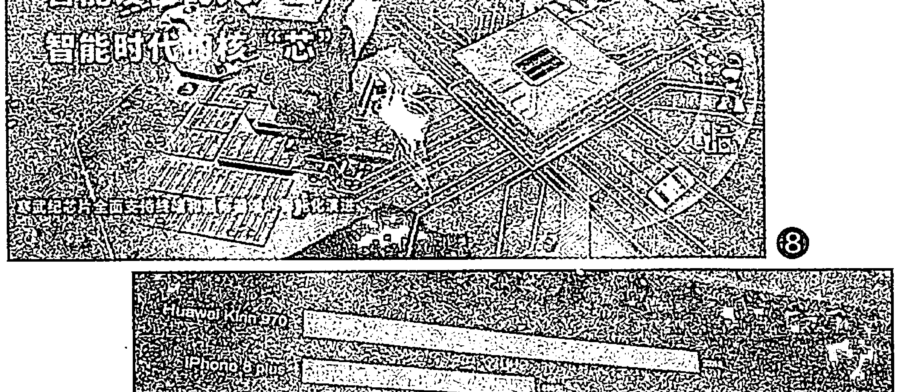

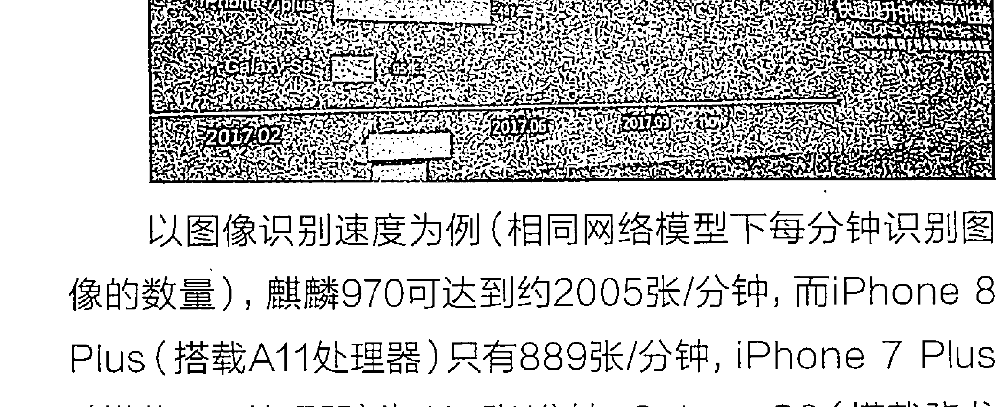

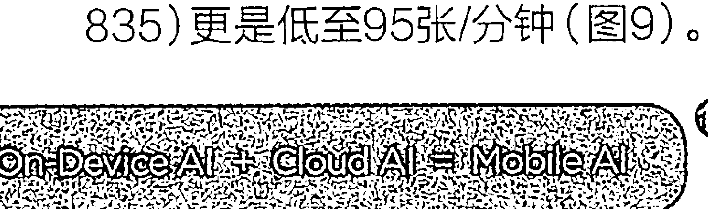

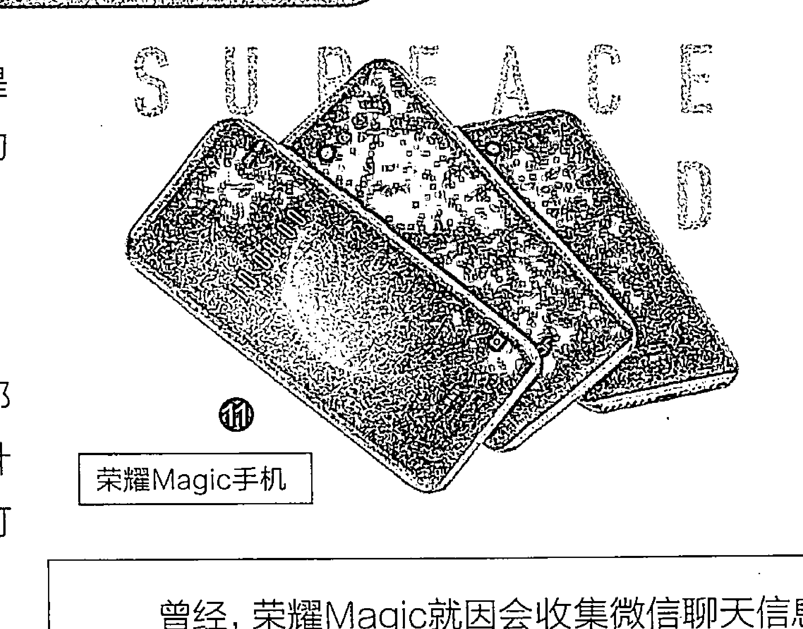

## AI彻底普及还得靠它们

苹果凭借最好的应用生态，独家的定制级移动处理器和iOS系统，可以轻松构建AI应用平台。然而，对其他智能手机厂商（也包括其他终端设备）而言，缺少了苹果在产业链的影响力，很难负担和AI相关的巨额研发支出。因此，AI要想迅速普及，还需要更加通用的方案支持。

### ⑫ Accelerating AI adoption everywhere ARM DYNAMIQ

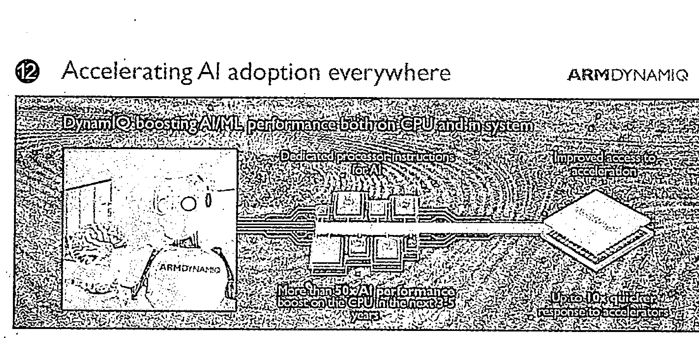

### ARM新架构增加AI属性

移动处理器的根基都来自ARM的指令集授权，在AI进入风口的当下，ARM自然也不能闲着，其最新发布的Cortex-A75和Cortex-A55架构便融入了自家的AI神经网络DynamIQ技术，针对人工智能（AI）和机器学习（ML）能力进行了特别优化。ARM曾表示通过DynamIQ技术在未来3年到5年内可实现比当前设备高50倍的人工智能性能，可将特定硬件加速器的反应速度提升10倍！换句话说，明年起凡是基于Cortex-A75和Cortex-A55架构设计的移动处理器都能被冠以AI称号（图12）。

### NPU不是独家资源

麒麟970身上的NPU并非华为原创，而是来自寒武纪的授权。这意味着除了华为，联发科、小米澎湃系列也可以选择和寒武纪合作，通过现成的NPU赋能AI。此外，高通自2014年开始也公开了NPU的研发（图13），明年的骁龙845将采用更强大的骁龙神经处理引擎软件框架，同时加入类似iPhone X的3D人脸识别技术，让本地AI有了用武之地。

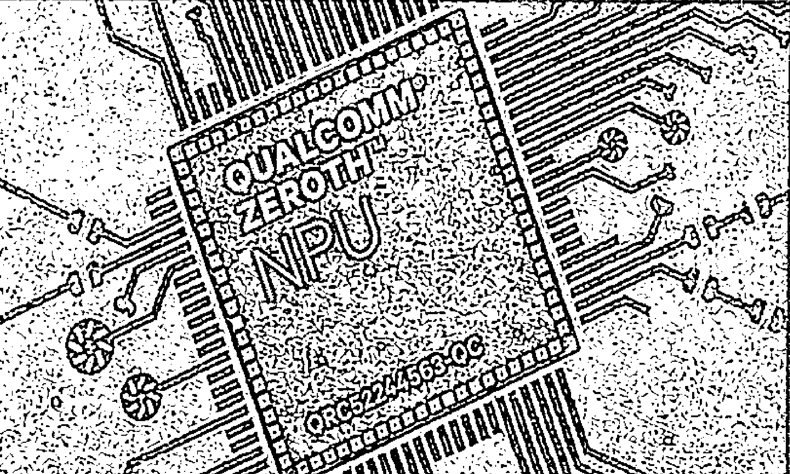

### 更多AI处理器正在路上

对传统移动处理器而言，只要增加一个用于神经网络计算的单元，那就可以被称为AI处理器。好消息是，设计神经网络计算单元的企业会越来越多。这不，GPU厂商Imagination就发布了全新的PowerVR Series 2NX神经网络加速器（NNA），可用于神经网络的高性能计算，而且核心面积超小、功耗超低（图14）。

### PowerVR NNA在功耗、性能和面积上领先 只有全硬件解决方案才能满足所需的PPA

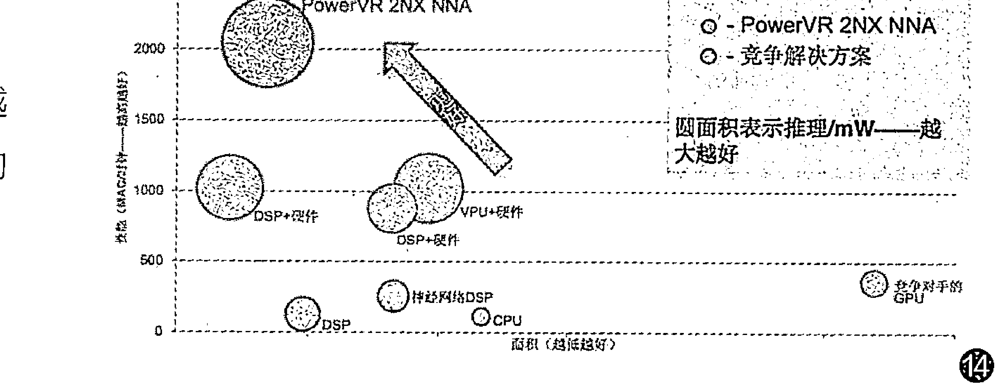

### 小结

无论需要与否，都无法阻挡AI走进我们生活的步伐。只是，现阶段大家都喜欢拿AI作为噱头，用来彰显技术实力。而AI真正走向成熟的标志应该是，在享受AI赋能的设备和服务时，我们却已淡忘了AI这个技术名词，过上理当如此的智慧生活。■

策划 | 《电脑爱好者》编辑部

在智能手机的发展历程中，同样浓缩着三大无线技术（移动通信技术、蓝牙和Wi-Fi）的成长。究竟是智能手机促进了三大无线技术的普及，还是三大无线技术成就了智能手机的辉煌？这些问题已经不再重要，但不可否认的是，随着三大无线技术的进一步升级，智能手机未来的体验将更值得期待。

# 移动通信技术的5G前景

## 源于“G”的进化

智能手机的绝大多数功能都离不开网络的支持，在没有Wi-Fi的室外，正是移动通信技术的不断进化才确保了智能手机各功能的使用基础。在2G时代，我们只能聊QQ；步入3G时代，视频通话不再新鲜，在手机上看新闻图片成为了消磨时间的最大乐趣；随着4G的普及，在手机上看直播、在线视频已无压力（图1），只要选对流量套餐，还要Wi-Fi作什么？

如果将iPhone和Android视为现代智能手机的初始，10年来智能手机在性能上已经出现了质的飞跃，依托于APP的软件生态更是深度影响了我们出行、购物、支付和娱乐等方方面面的习惯。但如果没有移动通信技术的革新，智能手机的上述体验也将无从谈起。

4G很快吗？相对几年前的3G网络，4G的速度的确够快。但是，移动通信技术的口号始终是“没有最快，只有更快”！预计在2020年部署完毕的5G网络，将为智能手机带来比4G还要快10倍到100倍的速度，届时下载一部高清视频只需1秒（图2）！

> 火速链接
> 如果你想了解更多5G相关的资料，请参考本刊2017年第7期《MWC 2017:让我们看看移动设备怎么变》这篇文章。

虽然现在距离2020年还有些遥远，但这并不妨碍相关厂商开始提前“秀肌肉”。继高通在年初发布骁龙X16调制解调器（可集成在骁龙835移动平台中），让智能手机挤入千兆（1Gbps）网络俱乐部后（图3），华为联合德国移动方案部署商Rohde&Schwarz也成功借助麒麟970平台实现了高达1.2Gbps的下载速率，提前达成了LTE-A-Pro Category 18的目标，成为又一颗准5G（4.5G）手机SoC。

实际上，在发布骁龙X16不久高通便宣布了骁龙X20调制解调器，它同样是一款满足下行Cat.18的准5G基带芯片。但是，无论是麒麟970（展示的准5G基带）还是骁龙X20，它们最终能得以享用突破千兆的网速，都是建立在4×4 MIMO（多用户输入输出）和256QAM（正交调幅）调制方式的基础之上。

之所以说智能手机领域的准5G处于偷跑阶段，是因为当前的软硬件环境还没有为5G做好准备。以4×4 MU-MIMO技术为例，就需要在手机内部添加4个4G（LTE）天线（图4），同时运营商建立的基站也要具备4T4R的能力。对智能手机厂商而言，4天线设计和准5G基带芯片的成本太高；对运营商而言，对5G网络优化的基站只要2020年以前部署完毕就好。因此你会发现，所谓的“千兆手机”只有在特定时间、特定区域才能实现理论速度（图5），平时我们体验的还是和4G相似的速度。

## 准5G趋势大于意义

因此，哪怕高通已经为骁龙835准备好了X16调制解调器，但以小米6和一加5为代表的很多旗舰手机却依旧使用高通上一代的骁龙X12调制解调器作为骁龙835的搭档，直接放弃了“可能”提前享用准5G的机会。

麒麟970可能也会面临类似的取舍。定位旗舰的华为Mate 10也许会搭配支持LTE-A-Pro标准的基带芯片，但明年同样搭载麒麟970的荣耀手机新品则可能会选择更保守的基带以降低成本。至少在2019年以前，所谓的“准5G”还是趋势大于意义的存在，我们可以期待和向往，但没有必要将其列入必选，等绝大多数省市和地区的5G基站部署完毕后再入手也不迟。

无论如何，距离5G时代正式降临日期越近，智能手机的网络速度也将呈现高速提升的曲线，让Wi-Fi不再是最快的下载方式（图6），这就已经足以令人欢呼雀跃了。

# 蓝牙5.0抢占物联网高地

## 蓝牙5.0的喜人改进

提到蓝牙，它应该是比2G（用于上网）、Wi-Fi还要古老的无线技术，只是由于蓝牙的传输范围没有移动通信技术广，传输速度没有Wi-Fi快，一度成为了使用率最低的无线技术，只在音频外设领域发挥余热。然而，随着最新蓝牙5.0标准的普及，这一无线技术将在物联网领域成就更大的辉煌（图7）。

首先我们来了解一下蓝牙5.0的特色：它能在现有（蓝牙4.2）的省电模式下，提供超过4倍的通讯范围（300米）和2倍的传输速度（2Mbps），同时增添导航功能，配合无处不在的Wi-Fi可以实现精准度接近1米的蓝牙室内定位功能（图8）。

最近10年除了手机以外，还有越来越多的设备都被赋予了“智能”属性，大到智能汽车、智能冰箱、智能洗衣机，小到智能手环、智能台灯、智能运动鞋，不知不觉间我们已经深陷物联网的世界而无法自拔。

蓝牙5.0特性图示（图8）
2x speed
4x range
8x data
wireless coexistence

Bluetooth 5 is setting the stage for the future Of smart home. Of audio. Of the IoT.
Bluetooth is revolutionizing how people experience the IoT. Bluetooth 5 continues to revolutionize how people experience the IoT. By doubling the range, doubling the speed, and increasing the data broadcasting capacity by eight times, Bluetooth 5 will allow products to build on Bluetooth’s strength in connected devices and enable a seamless IoT experience. Bluetooth 5 will also enable location services for Bluetooth devices, making it easier to find and interact with the world around us. The increased range will also allow for more reliable IoT connections that make full-home, building, and outdoor use cases a reality.

> 蓝牙技术从3.0开始引入了HS高速协议，允许移动设备之间借道Wi-Fi实现24Mbps的传输速度。只是，蓝牙3.0+HS仅限于笔记本、平板和手机，需要将蓝牙和Wi-Fi集成在同一模块上的类似无线网卡硬件的支持。而像智能手环等小型物联网设备受限于体积和功耗，无法集成Wi-Fi模块，自然也就无法享受高速传输了。

## 和Wi-Fi决战物联网之巅

物联网的兴起，为蓝牙5.0提供了一个更大的表现舞台。可能有同学会问了，蓝牙5.0依旧是运行在2.4GHz频率上，存在信号干扰的隐患；Wi-Fi（5G）解决了信号干扰问题，同时借助于中继放大器，理论上可以扩展到无限远范围，拥有万物互联不是更靠谱吗？

实际上，蓝牙5.0的抗干扰能力已经有了大幅提升，蓝牙技术联盟就曾表示，相对Wi-Fi和LTE信号，新版蓝牙能在一定程度规避有限空间内的“信号堵塞”。同时，蓝牙5.0不仅自身具备理论300米的有效信号通讯范围，同时还在开发物联网网状网络（Mesh Networking）技术（图9），它能使蓝牙5.0设备相互作为信号中继站，从而也能将信号传递到无限远。

最关键的一点是，蓝牙5.0在低功耗方面的表现依旧有着无可匹敌的特性。要知道，物联网设备（比如传感器和可穿戴设备）体积一个比一个小（图10），所能容纳的电池容量更是有限。因此，能做到超迷你级别的蓝牙芯片（接收器），而且能比Wi-Fi节省25%到一倍电力的蓝牙5.0，自然更受小型物联网设备青睐了。

需要注意的是，蓝牙5.0的主要用途是进行高频率微量数据传输（比如手机读取运动手环的计步数据、对智能家居设备下达指令），至于高速传输数据和访问互联网还是离不开Wi-Fi的支持。因此，蓝牙5.0更像是Wi-Fi的补充，在物联网领域能以更高效和节能的方式取代原本属于Wi-Fi的工作。

### 来自第六代Wi-Fi的反击

面对咄咄逼人的5G和蓝牙5.0的挑衅，Wi-Fi无线技术自然也不可能引颈就戮，而是进行了坚决的反击。于是便有了HaLow标准的出现和第六代Wi-Fi技术的来袭。

### HaLow标准迎合物联网

和蓝牙5.0相比，Wi-Fi不就是功耗高一点吗？在看到物联网时代广阔“钱景”之际，Wi-Fi联盟也展开了“节能减排”之旅，并提出了名为“HaLow”的技术标准（又称802.11ah）。

不同于现有的2.4GHz和5GHz频段，Wi-Fi HaLow能运行在900MHz的频段上，不仅缓解了信号干扰的隐患，传输距离也是标准2.4GHz Wi-Fi的2倍，而且穿墙能力更强（图11）。此外，这一频段还更适合小量数据负荷以及低功耗设备的发挥，可大幅降低功耗，再结合新引入的“睡眠模式”。

可惜，HaLow标准要到2018年才开始授权，而且它与现有的Wi-Fi网络并不兼容，需要一套全新的基础设施。换句话说，等HaLow标准普及后，我们需要将家里的路由器、手机、物联网设备打包替换才能实现彼此通过HaLow互联互通，需要更长的市场培育期和成本开销。

不过，我们还是很高兴地看到Wi-Fi联盟在降低功耗方面的努力。毕竟在万物互联的未来，高频率的微量数据传输才是常态（图12），如果每次数据交互都需要高速Wi-Fi出马，颇有大炮打蚊子的嫌疑，无形中也会浪费更多电力资源。

在准5G阶段移动通信技术就达到了千兆级，在理论速度上已经超越了绝大多数家用Wi-Fi。为了不被5G网络端了饭碗，也为了迎合未来无线环境的发展需求，第六代Wi-Fi终于和我们见面了。

Wi-Fi（又称WLAN, 无线局域网）先后经历了802.11a、802.11b、802.11g、802.11n和802.11ac五个发展阶段，而第六代Wi-Fi则是名为“802.11ax”的技术（图13），它继承并发扬了上代802.11ac特色的MU-MIMO等技术，还引入了更多全新特性，更加符合未来物联网和智慧城市的演化趋势。

我们不妨先来看看时下Wi-Fi网络所面临的困境：

- 1. 10年前，还是单身的你家里只有唯一的笔记本支持Wi-Fi，而且你还不舍得买路由器，总会想办法蹭别人家的Wi-Fi网络；5年前，你和家人的手机、平板都需要使用Wi-Fi，而且为了保证信号覆盖，你开始尝试中继器和电力猫提升路由器的信号范围；如今，算上智能手表、智能电视、电视盒子，你家里已经有接近20个需要使用Wi-Fi的设备；还有数据显示，到了2020年，很多家庭单位需要接入Wi-Fi网络设备的数量将突破50个大关！
- 2. 家里需要使用Wi-Fi的设备不仅多，而且不同设备对网络的需求也有所不同。比如智能电视和手机，它们需要高带宽、低延时的特性去播放1080P甚至4K视频；智能空调、智能插座、扫地机器人等网络设备虽然对网速的要求不高，但却需要提供持续稳定的接入，从而确保第一时间处理你下达的指令。步入物联网时代后，如何分配有限的网络资源会逼疯一大批老版本的路由器。

在公共场所，你可以接收到无数个Wi-Fi信号热点，而每一个Wi-Fi热点都接入了无数台手机、平板和电脑等设备。于是，多个AP节点之间的干扰将不可避免，在网络密集时掉线、看视频卡顿的现象也屡见不鲜。未来同一区域内的无线设备只会越来越多，几乎所有的Wi-Fi热点都会面临瞬时高密度网络需求的挑战（图14）。

而第六代Wi-Fi技术802.11ax的出现，就在很大程度上缓解了上述矛盾。

首先，802.11ax引入了更为高阶的调制编码方案1024QAM，相比802.11ac的256QAM有了更高的编码调制效率。在80MHz频宽单条流情况下，802.11ac的理论速率为433Mbps，而802.11ax则能达到1.73Gbps，实现了4倍于上代Wi-Fi的速度（图15）。

其次，802.11ax优化了频谱利用，它引入了在4G LTE蜂窝基站中使用的OFDMA，大大提升了同一信道带宽的利用效率。再结合新的空间复用技术，可让802.11ax能高效识别空口冲突并进行退避，也进一步提升了干扰信号的识别与降噪性能。

最后，802.11ax最高支持8x8 MU-MIMO，而802.11ac支持的最大规格仅为4x4 MU-MIMO。此外，802.11ac时期只有下行的MU-MIMO功能，而802.11ax则是上行和下行都可以支持MU-MIMO。

综合上述改进，802.11ax技术能使每个AP同时接入服务的终端数量明显提高，在密集型环境里也能帮助多个AP间互相协调，使得共享信道上的AP也能更合理地利用信道带宽。802.11ax还能进行更有效的上行链路的管理，同时兼顾高数据量并顾及到物联网设备这种即时性要求高但数据流量不是很大的需求。

### 产业链已做好准备

虽然第六代Wi-Fi技术还未正式商用，但整个产业链却都为其做好了准备。其中，以高通、博通和宽腾为代表的方案商已经发布了802.11ax芯片，比如高通IPQ8074（面向商业和企业，14nm工艺）和QCA6290（面向家庭，28nm工艺）芯片组。此外，支持802.11ax标准的路由器也已提前亮相，它们都重点增强了多天线能力，结合MU-MIMO和OFDMA实现了4倍的吞吐能力，网络容量和效率也明显提升。比如华硕就曾在IFA 2017展示了全球第一款802.11ax路由器RT-AX88U（图16），采用双频段叠加的方式实现了5952Mbps（744MB/s）的理论速度，相当于一秒钟就能下载一部MP4格式的电影。

随着准5G、蓝牙5.0和六代Wi-Fi的推广和普及，无论是智能手机还是PC、平板、智能家居以及物联网设备都能从中获益，让我们一起期待吧。

# 屏不可少！

## 屏幕变革之路还很漫长

策划 | 《电脑爱好者》编辑部

CFan曾在2017年18期《突破“视界”——浅析手机的全面屏技术》文章中探讨了全面屏手机的发展和分类。随着时间的推移，如今几乎所有智能手机品牌都已经或计划推出全面屏新机，这种新形态产品将在比我们预想更短的时间里一统“手机江湖”。

扫一扫：更多精彩内容立现！

然而，就在所有厂商都在宣传“全面屏”新品时，很多理性的用户却又发现了一些问题：每个厂商对全面屏的定义和理解都存在差异，最终落地到实际销售的产品上时就会出现迥异的使用体验。

满城尽是全面屏，但谁才是真正的全面屏？这就是本期特别话题中我们要讨论的内容。

## 全面屏之乱象

> “忽如一夜春风来，千树万树梨花开”，用这句诗来形容全面屏手机的现状再合适不过。但是，全面屏这股春风又是何时飘来的呢？

## 曲面屏的下一站

自从苹果在2007年推出第一代iPhone以来，现代意义上的智能手机的形态便被定型，这种直板式的设计逐渐蚕食了原本属于翻盖和滑盖结构的市场（图1），此后的近十年来除了屏幕越来越大外，智能手机始终都没有摆脱这种传统的布局（图2）。

还好，全金属一体化、双面玻璃材质的出现，让智能手机的档次和颜值都有了较大的提升。2.5D屏幕玻璃的普及，让手指划过屏幕边缘的手感变得无比出色。而更令人欣喜的是，“曲面屏”也不再是三星高端机的专利（图3），自2016年以来“曲面屏”元素便成为了很多国产高端手机的标杆。

继“曲面屏”之后，“全面屏”再度成为了高端智能手机的标签，这种元素在不改变智能手机直板形态的基础上，大幅扩宽了“视界”，以小变化换取了更为震撼的视觉特效（图4）。最关键的是，随着产业链的成熟，全面屏在成本上也要远远小于曲面屏。

然而，“全面屏”从默默无闻到大众情人的转变速度太快，缺乏统一的认证标准，也因此在手机厂商间引发了无数场论战。

## 满屏都是海报战

谁也没想到，手机厂商用于为新品宣传的海报，成为全面屏论战的导火索。小米MIX2在发布前的预热阶段，官方在网上公布的海报上格外突出了“全面屏2.0”的字样，下面则用一行“进化，一次趋向完美的进化”小字诠释了“全面屏2.0”的意义（图5）。

随后，努比亚也放出了一张宣传海报，以“颠覆，因为不相信完美”为引提出了“全面屏2.1”的概念（图6）。根据努比亚擅长的无边框设计打法，所谓“全面屏2.1”的潜台词就是将边框压缩到极致的2.0。

面对两个后辈的“挑衅”，夏普重新制作了一张旗下AQUOS S2手机的宣传海报，并打出了“全面屏29.0”的标语（图7），强调AQUOS S2已经是夏普的第29款全面屏手机了，无论小米、努比亚还是其他品牌的全面屏产品都是“后辈”。

问题来了，根据经验，每一项技术或功能创新，在宣传上的标号或者是等级划分都需要第三方权威方进行评判，成为行业上的共识。比如HDMI2.0、USB3.1、SATA3.0、IP67防尘防水等等（图8）。

作为一个全新的概念，全面屏怎么就一下窜到了2.0、2.1甚至29.0了呢？难道这项技术就这么不值钱，想怎么标就怎么标吗？

## 是谁创造了全面屏

夏普一直认为自己是“全面屏”的领路人，因为夏普在2014年推出了一款名为AQUOS Crystal的手机，和小米在2016年才推出的MIX非常像。从今天的审视角度来看，AQUOS Crystal的确符合“全面屏”的设计形态（图9）。

但可惜的是，夏普在当年却以（三面）“无边框”概念作为AQUOS Crystal的宣传重点，更确切的说法应该是，AQUOS Crystal开创了无边框手机的历史。因此，虽然夏普此前推出了28款无边框手机，但直到第29款AQUOS S2发布才让更多普通用户得知它们原来也属于全面屏手机这回事儿（图10）。

至于“全面屏”这个名词，则是2016年10月25日小米在发布第一代MIX手机时正式提出的。

## 谁是真正的全面屏

抛开“全面屏”概念的归属问题，单从其字面意义来看，什么样的手机才符合“全面屏”的身份呢？对此问题，很多业内人士都提出了自己的看法。

在魅族科技高级副总裁兼魅蓝事业部总裁李楠看来，三星Galaxy S8才是真正意义的“全面屏手机”，因为S8解决了屏幕IC元件的封装问题。像夏普AQUOS Crystal这样放弃对称设计，削掉一头提升屏占比只是一个ID设计的选择并非技术突破，充其量只能算是“前·全面屏”。而三星S8引入了下一代屏幕的COF封装技术，将屏幕下方IC等部分改动了位置并做到了柔性，在根本的技术层面缩减了边框宽度，再加上18.5:9显示比例和屏幕上的R角设计，这才是“真·全面屏”（图14）。

在夏普看来，像AQUOS S2和iPhone X这种采用“异形全面屏”，在屏幕顶部保留前置摄像头和传感器的美人尖（刘海）设计才是王道（图15）；在努比亚眼中，现有全面屏手机都是糊弄用户滥竽充数的，边框全部都粗大到不忍直视，只有将全面屏+无边框两个概念完美结合的，才配得上“全面屏2.1”的称号。

雷军在《全面屏的前世今生》一文中也阐述了其对全面屏概念的观点。在他看来，全面屏手机从外观看正面应该几乎都是显示屏幕，给用户带来更具冲击力的视觉体验。其中，最关键的创新是突破了Android系统对16:9的限制，小米通过和谷歌的反复沟通协商，最终才将17:9、18:9等超长屏幕比例列入了官网支持范畴，并用102项专利技术实现了第一代MIX的全面屏，再结合悬臂梁压电陶瓷、超声波距离感应器、全陶瓷机身等多项技术与工艺才得以上市。

总之，“全面屏”这个标准现在还处于混沌之中。按照业内的共识，18:9（包括18.5:9）这种比标准16:9更长的屏幕硬件本身就属于“全面屏”范畴，凡是采用这种超长屏幕的手机就都有资格以“全面屏手机”宣传（图16）。

但是，要想获得“真·全面屏”，则需要借助异形切割、IC部件位置调整优化、针对屏幕边框的进一步压缩，将屏占比提升到更高的水准才有资格冠名。可惜，现在没有任何一款手机可以做到正面100%都是屏幕的水准（图17），甚至就连官方宣传使用的屏占比参数都存在水分。

## 解读全面屏的现状

从字面的意义来看，“全面屏”应该是手机整个正面都是屏幕，然而纵观市面上所有全面屏手机，它们距离100%全面屏幕还有明显的距离。实际上，“全面屏”更像是理想与现实相互妥协的一个概念，它的出现也顺应了智能手机的发展趋势。

### 全面屏只是营销概念

智能手机作为一种随身携带、在手掌间把玩的设备，注定它的体积不可能被无限放大，而业内目前公认的黄金尺寸就是5.5英寸：小于它视野缩水，大于它则不利掌握（图1）。在过去的很长一段时期里，5.5英寸手机尝试的瘦身方案都是压缩左右两侧边框，努比亚倡导的无边框设计就属于将这一理念发挥到极致的代表。

然而，仅仅压缩两侧边框虽然可以让你看着更爽，但却并不能带来本质上“视界”的提升。那么，在机身大小保持不变，牺牲上下边框的宽度来塞进更长的屏幕，不就可以同步提升视野面积和屏占比了吗？于是，全面屏诞生了——作为有着18:9或18.5:9显示比例的屏幕，它们比传统16:9屏幕更长，哪怕是6英寸的全面屏恰好也可以填充进原先5.5英寸甚至5.2英寸的机身里（图2）。

换句话说，如今在手机领域流传的“全面屏”，它只是一种营销上的概念，和早前流行的双摄像头这种纯技术概念有着本质上的不同。因此，至今为止没有任何的机构发布全面屏的定义，当一款新品被称为全面屏手机时，用户会提出质疑是再正常不过的事情。

四类全面屏手机仅保留上下边框时的状态对比

Note 8

iPhone X

MIX 2

AQUOS S2

### 100%屏占比是不可能的

除了夏普AQUOS S2，第一批全面屏手机的屏幕尺寸大都在5.7英寸到6.1英寸之间，就是为了保持5.5英寸黄金持握手感的基础，同时呈现更大的视界给用户。可惜，所有全面屏手机都会保留一定宽度的上下边框、美人尖或刘海，用于安置必备的前置摄像头、光线传感器和听筒等零部件（图3）。

没错，在现有技术和产业链的支撑下，全面屏手机只能想办法如何进一步削减上下边框，但却无法令其完全消失（图4）。所以在这种大环境下，凡是采用18:9超长屏幕，且屏占比达到80%的手机都是“全面屏手机”。如果哪一天手机的屏占比真的做到了接近100%，恰恰说明全面屏这个概念快被淘汰了。

86.4%屏占比 让5.5吋屏幕装入5吋机身

## 存在水分的屏占比

都是全面屏手机，如何彰显自己的技术优势？没错，此时就轮到“屏占比”这个技术名词登场了。可惜，为了增加噱头，手机厂商在宣传屏占比这个参数时却往往存在水分。

以小米第一代MIX为例，如果按照“屏幕元件面积÷前面板面积”公式计算其屏占比为91.3%，也就是官方宣传的参数；但如果按“屏幕实际显示区域÷前面板面积”计算，它的屏占比则只有83.6%。按照后一种计算公式，市面上几款已上市的全面屏手机的屏占比基本都要低于官方给出的指标（见表）。

目前业内常用的计算屏占比的公式是“屏幕元件面积÷前面板面积”，这种计算方法看似合理，但却很难反映实际的有效显示面积情况。

此外，还有一个需要注意的细节，手机表面积往往要比其屏幕玻璃面板更大。特别是对于全面屏手机而言，为了避免它们不小心跌落磕碰就遭遇碎屏的尴尬，此类产品大都采用了金属中框设计，并在屏幕玻璃和中框之间还填充一个缓冲层（图6）。为了提升手感，金属中框也会采取弧度处理，这就让手机的实际边框（屏幕黑边+缓冲层+金属中框）变得更宽了（图7）。

原因很简单，为了避免漏光，并遮住LCD边缘的BM区域，手机屏幕边缘必然存在一圈宽度不等的黑边（图5），屏幕实际有效的显示面积是有损失的。因此，在计算屏占比时有没有将黑边也纳入统计范畴，自然会影响到最终结果。从所见即所得的角度来看，屏占比的准确算法应当是“屏幕实际显示区域÷前面板面积”。

| 型号 | 屏幕规格 | 边框宽度 | 官方屏占比 | 实际屏占比 |
| :--- | :--- | :--- | :--- | :--- |
| 小米MIX | 6.4英寸，2040×1080像素 | 2.92mm | 91.3% | 84.02% |
| 三星S8 | 5.8英寸，2960×1440像素 | 1.82mm | ----- | 84.20% |
| 夏普S2 | 5.5英寸，2040×1080像素 | 3.34mm | 78.99% | 87.5% |
| 小米MIX2 | 5.99英寸，2160×1080像素 | 3.73mm | 88.8% | 80.79% |
| 三星Note8 | 6.3英寸，2960×1440像素 | 2.40mm | ----- | 82.87% |
| iPhone X | 5.8英寸，2436×1125像素 | 4.57mm | ----- | 81.15% |
| vivo V20 | 6.01英寸，2160×1080像素 | 3.44mm | 85.3% | 79.59% |
| 麦芒6 | 5.9英寸，2160×1080像素 | 4.09mm | 83% | 76.48% |
| 金立M7 | 6.01英寸，2160×1080像素 | 3.87mm | 85% | 78.12% |
*本表实际屏占比数据来源于ZOL

## 全面屏的优缺点分析

面对采用18:9屏幕就能冠以全面屏手机的“潜规则”我们无能为力，无论你是否需要这种超长屏幕，也无法阻止它在未来一统手机江湖。所以现在最实际的问题是，了解这种新形态屏幕和设备的优缺点。

先来看看全面屏的优点吧。

得益于屏幕更长的显示比例，6英寸18:9屏幕虽然和5.5英寸16:9屏幕差不多宽，但长度却增加了一大截，从而带来了更大的显示面积和更为“沉浸式”的体验。就拿时下最热的《王者荣耀》游戏为例，全面屏手机两侧可以比传统屏幕多显示出240个像素宽度的内容(图8)，这意味着我们可以比别人更早一步发现对手，从而在第一时间发起攻击或规避。

此外，全面屏更适合分屏模式，2:1的显示比例可以同时显示两个更大的窗口，你可以一边等待视频广告一边看小说，两不耽误(图9)。

当然，作为新兴的分辨率标准，全面屏也存在些许兼容性问题。比如很多应用和游戏还未完全适配，所以在运行时屏幕上下两侧会出现较大的黑边(图10)，没有完全利用上更大的视野资源，如果强制拉伸全屏则会导致画面变形。此外，对夏普AQUOS S2和iPhone X这种带刘海的异形全面屏而言，则需要APP进行更深入的优化和匹配，iPhone X有着封闭的生态圈，再加上苹果的掌控力，软件适配不是问题，但对AQUOS S2这种在Android系统单打独斗的手机而言，异形全面屏的匹配就要面临很多变数了。

总之，全面屏为智能手机奠定了更震撼的显示基础，但由于屏幕比例的改变，部分视频、动画、游戏上的适配需求则成为了亟待解决的问题。还好，小米在去年开发MIX时就已经和谷歌确定了17:9、18:9等更长显示比例和对于圆角显示的支持，为全面屏资源的快速普及铺平了道路(图11)。

> APP的完美适配是全面屏手机体验的关键

## 更多硬件资源的倾斜

只要不追求更高的屏占比，现在生产全面屏手机其实没有任何难度，对手机厂商来说最大的难题是如何抢到更多的屏幕资源。好消息是，国产5.7英寸1440×720像素分辨率的“全面屏”已经大规模量产，在本期截稿前，工信部网站上一下就出现了多款基于这一屏幕设计的全面屏手机，它们有华硕X018DC、小辣椒V11、朵唯L925、酷比F1、康佳510、Sugar C11、SOP S等(图12)。

- 华硕X018DC
- 小辣椒V11
- 朵唯L925
- 酷比F1
- 康佳510
- Sugar C11
- SOP S

## iPhone X

iPhone X无疑是全面屏领域的标杆，它最大的特色就是颠覆了传统的验证方式，利用面部ID替代了指纹识别，并将复杂的传感器模块都集成在了顶部的刘海内。在不考虑8388元价格的前提下，iPhone X可以算是最完美的全面屏手机之一，无论是iOS系统的流畅度、防水、无线充电还是苹果品牌的号召力，都足以令无数用户趋之若鹜。

## 三星Galaxy S8

和其他Android全面屏手机相比，三星Galaxy S8最大的特色就是采用了18.5:9显示比例的全视曲面屏，不仅屏幕显得更为修长，双曲面的结构也带来了更震撼的视觉效果和出色的手感。可惜，S8系列的指纹识别模块和摄像头持平，解锁时非常容易误碰到镜头。价格方面，S8系列的起价为5688元，性价比不高。

## 三星Galaxy Note8

作为三星旗下第二代全面屏产品，Galaxy Note8大体延续了S8的双玻璃+金属中框设计，只是机身线条更硬朗，配备独有的S-Pen笔，翻译过来就是更具商务范，并对后置的指纹位置进行了优化，触摸时不像S8系列特别容易碰到镜头。该产品售价为6988元起，适合追求品质生活的高端商务用户选择。

## 金立大金刚2

金立大金刚2是一款售价为1999元的全面屏手机，该产品最大的特色就是配备了5000mAh超大电池，在续航时间的表现上格外抢眼。同时，大金刚2还引入了金属质感纹理，后盖可以呈现非常炫酷的光影效果。可惜，受限于定位，这款产品的配置也只算是入门标准，处理器和屏幕分辨率参数一般，适合对性能不感冒，但追求更持久续航的用户尝鲜全面屏。

## 金立M7

售价2799元起的金立M7有着比大金刚2更为精致的机身设计，背部的太阳纹工艺和正面玻璃内的炫彩生动光泽都为其颜值增添了不少亮色。该产品最大的特色在于集成安全加密芯片和支付安全加密芯片，再结合NFC+金立钱包，构建了更安全和方便的支付渠道。此外，M7还首发联发科Helio P30处理器，同时配备了更大的4000mAh电池，在安全和续航能力上的表现颇为突出。

### vivo X20

vivo X20是一款格外重视影音功能的全面屏手机，售价2998元的它内置AK4376A方案，继承了Hi-Fi音乐手机的身份，采用全新一代双核像素技术的摄像头，在美颜和逆光等方面的表现也是更为突出。同时，X20还选择了高通最新的骁龙660移动平台，针对《王者荣耀》进行了多方位的专属性能优化，游戏运行速度可以始终保持在60fps左右。如果你喜欢开黑，这款机器不会让你失望。

### 小米MIX2

小米MIX2无疑是Android领域的全面屏手机标杆，它的特色在于将前置摄像头、传感器模块都集成在了下边框，将屏占比提升到了极高的水准。同时，该产品去掉了上代MIX悬臂梁压电陶瓷的传声模块，改用传统听筒解决了通话不清的缺陷，而升级到骁龙835移动平台和更高素质的主摄像头，则进一步弥补了前辈身上的短板。在3299元的价位上，MIX2无论是设计还是性能都堪称一流。

### 麦芒6

麦芒6是HUAWEI品牌下首款全面屏手机，它的售价为2399元起，定位相对偏低，所以它在配置上属于中端水准：搭载了和HUAWEI nova 2系列相同的麒麟659处理器，性能和骁龙625处于一个级别。麦芒6的另外一个特色则是前后都采用了双摄模块，可轻松实现先拍照后对焦、大光圈背景虚化等功能。

## 荣耀7X

荣耀7X应该是目前最便宜的一线品牌全面屏手机，1299元的起价性价比十足。它的硬件配置和麦芒6差不多，只是取消了前置双摄，存储空间也是从32GB起步。如果你喜欢全面屏的惊艳，预算又不是十分充裕，这款产品应该不会让你失望。

## 夏普S2

夏普S2最大的特色就是采用了异形全面屏，在手机顶部留下了一个“美人尖”，同时保留了较厚的下边框安置Home键和Logo，所以它在形态上和其他Android全面屏手机相比颇为另类。这款产品分低配版和高配版，低配版处理器为骁龙630，而售价3499元的高配版才武装骁龙660，如果你看重性能可优先考虑后者。

### 扩展阅读

在本文截稿前，努比亚发布了旗下首款全面屏手机Z17S，并打出了全面屏2.1的概念。在努比亚看来，目前全面屏手机可以分为普通、曲面、无边框三种，并号称无边框+全面屏才是真正的全面屏，而Z17S的屏占比也因此达到了惊人的90.36%。

### 努比亚Z17S

努比亚Z17S最大的特色是将屏幕左右边框取消了，所以让5.7英寸的手机获得了媲美5.2英寸手机的体积和持握感。该产品还主打四摄像头系统，结合NeoVision 7.0拍照引擎可带来更完美的拍照体验。努比亚Z17S的售价为2999元起，也是最便宜的骁龙835全面屏手机。CF

# 数字大战 处理器工艺背后的小秘密

策划《电脑爱好者》编辑部

我们都知道，制程工艺是影响处理器性能发挥至关重要的一环，CPU的每一次质变背后都离不开更先进工艺的默默支撑。如今，英特尔、三星、台积电都已经推出或即将推出10nm工艺，7nm工艺也蓄势待发。然而，都是10nm工艺，背后又有哪些差别？谁家的性能最好？本期特别话题，就让我们走进工艺背后的数字大战之中。

## 摩尔定律“卡壳”

英特尔是全球半导体行业的领军者，在过去的很长一段时间里，Intel就是最先进工艺的代名词，其创始人（之一）戈登·摩尔提出的摩尔定律更是引领半导体行业向前发展的灯塔（图1）。

## 来自14nm的转折

众所周知，全球的晶圆厂数量是有限的，除了中芯国际等后发选手外，有资格参与晶圆厂（包括代工）的企业无非英特尔、三星、台积电和格罗方德（Globalfoundries）等寥寥数家。在这些企业里，英特尔一直是标杆性的存在，其在22nm时期就引入了3D FinFET工艺技术（图2），而当时其他竞争对手却才刚刚量产28nm，无论是封装工艺还是制程节点等方面都处于全面的落后状态。

### 扩展阅读: FinFET是什么

FinFET即鳍式场效应晶体管 (Fin Field-Effect Transistor)，是由美籍华人科学家胡正明教授提出的。在FinFET工艺出现之前，传统晶体管都还停留在平面结构上，只能在闸门一侧控制电路的接通与断开。从FinFET开始，闸门被设计成类似鱼鳍的叉状3D架构，可于电路的两侧控制电路的接通与断开，不仅能改善电路控制和减少漏电流，同时让晶体管的闸长大幅度缩减，因此FinFET工艺又有“3D FinFET”一说，突出了其结构上的立体性。英特尔从22nm开始，台积电从16nm开始，三星/格罗方德从14nm开始，陆续引入了这一工艺。需要注意的是，FinFET工艺也是存在极限的，从各大半导体厂商的规划来看，第一代的7nm工艺还将会继续使用FinFET工艺，但是接下来就需要依赖极紫外光刻机 (Extreme Ultraviolet Lithography, 常称作EUV光刻)了。

令人始料未及的是，英特尔在14nm→10nm工艺转型的节点上却出现了变故。

“Tick—Tock”（制程和架构，又称钟摆战略）是英特尔近些年一直倡导的芯片研发模式。如果按照这种思路发展，英特尔14nm工艺在经历了五代酷睿Broadwell和六代酷睿Skylake之后就将过渡到10nm层次。然而，英特尔却在这个时候废止了“Tick—Tock”，提出了全新的“制程（Process）—架构（Architecture）—优化（Optimization）”（简称PAO）的三步走战略（图3）。

于是，我们看到的七代酷睿Kaby Lake和八代酷睿（Kaby Lake Refresh和Coffee Lake，分别采用的14nm+和14nm++工艺）依旧停留在14nm阶段，从2014年到2017年，一种工艺沿用4年，英特尔也因此被无数玩家调侃为“挤牙膏”。

就在英特尔“死磕”14nm工艺的时期，三星和台积电却逐渐实现了工艺的反超，继16nm和14nm的过渡之后早英特尔一步迈入了10nm工艺时代（图4）。高通骁龙835、苹果A11/联发科Helio X30就分别采用了三星和台积电的10nm工艺打造。

从工艺标杆到被对手反超，英特尔的摩尔定律受到了严峻的挑战。与此同时，英特尔却将重心放在了大数据、物联网、无人驾驶、5G、人工智能等领域的转型之中。这不禁让很多用户产生疑问：英特尔到底是怎么了？摩尔定律真的“死”了吗？

## 摩尔定律未死

摩尔定律卡壳的关键，还是在于成本与经济效益不成正比：现在仅仅是把设备安装到已有的晶圆厂中就要花费70亿美元，这意味着已鲜有公司可以承担起推进摩尔定律的成本，半导体制造业将继续整合，英特尔14nm→10nm工艺转型遇阻就是这种趋势的体现（图5）。

在9月底的NVIDIA GTC大会中，黄仁勋提出了更为犀利的观点：“设计人员无法再创造出可以实现更高指令级并行性的CPU架构”；“晶体管数每年增长50%，但CPU的性能每年仅增长10%”；“摩尔定律已经终结”。

不过，在9月19日的英特尔精尖制造日活动中，英特尔公司的发言人也回复了用户对摩尔定律的质疑：虽然Tick—Tock战略在产品端逐渐失效，但在底层技术层面英特尔依然坚守这一战略（图6）。换句话说，摩尔定律并未失效，而且在未来也依然持续前行！

## 摩尔定律的实践

英特尔认为，摩尔定律不断推动着计算的普及，发展至今它已不再是纯粹的技术问题，而是一种非常强大的经济学定律。按照特定节奏推动半导体制造能力的进步，就可以降低任何依赖于计算的商业模式的成本（图7），这是摩尔定律的关键所在。

我们不妨发挥一下想象力，如果其他产业也以摩尔定律的速度进行创新会发生什么？比如现在只需一公升汽油，即可行驶相当于地球和太阳之间的距离；再比如现在只用一平方公里土地，即可养活全部地球人；将速度提升到300倍光速，太空旅行将不再是梦想。归根结底，这些经济效益使摩尔定律可以成为全球经济的根本动力，使人们能够相互连接、进行娱乐和学习。

回到英特尔自己，虽然从14nm开始工艺战线被拉长，但从14nm到14nm+再到14nm++，未来10nm工艺也会经历10nm+和10nm++，这些制程节点都在缩减芯片体积的情况下做到了晶体管密度的提升，并且实现了成本的节约。

但无论如何，摩尔定律定义的“当价格不变时，集成电路上可容纳的元器件数目，约每隔18到24个月便会增加一倍，性能也将提升一倍”的增幅已经“严重缩水”，无论英特尔诠释得再怎么漂亮，也无法遮掩这种性能增幅放缓的现实。

## 竞争者纷沓而来

英特尔的“原地踏步”，给了竞争对手回击的机会。2014年，三星和台积电纷纷宣布旗下14nm和16nm工艺进入量产阶段，并于2015年大规模开放给合作伙伴。比如iPhone 6s所搭载的A9处理器就同时采用了这两大晶圆厂代工生产（图8）。2017年，三星和台积电的10nm工艺也进入了量产标准，如今智能手机领域的旗舰级处理器就都是基于10nm而生。

### 超越英特尔的进度

就在英特尔不断打磨14nm工艺，距离基于10nm Cannon Lake平台（隶属于八代酷睿）上市还有数月之久的时间节点上，更先进的7nm工艺却已走进了我们的视野中。

据悉，现在三星和台积电都在积极推进他们的7nm工艺量产，其中三星已宣布将在2018年下半年带来EUV技术的7nm工艺，而台积电预计2018年初量产的7nm则无EUV技术，要到2019年才能引入EUV技术。

此外，格罗方德也公布了7nm节点的具体命名——7nm LP（图9），不过这个“LP”并非Low Power低功耗之意，而是代表Leading-Performance（领先的性能），其与现有14nm工艺相比性能可提升40%，并减少50%的核心面积，成本降低30%。

### 扩展阅读：英特尔已触及3nm

虽然10nm还未量产，但这并不妨碍英特尔对更先进工艺的研发进程。据悉，英特尔已经展开了对5nm甚至3nm工艺的探索，并开始尝试各种前沿技术（图10）。比如能够实现低漏电、更高净电流的纳米线晶体管技术；全新的Ⅲ-Ⅴ材料晶体管技术；3D堆叠技术；密集内存、密集互联技术；EUV图案成形技术；神经元计算以及自旋电子学等等。然而，考虑到英特尔10nm工艺要连用3年，这些新工艺的商业化日期更是太过久远……要知道，竞争对手2018年就能实现7nm的量产。

## 越加丰富的产品线

同时，三家企业还都在不断完善自家的产品线。比如三星除了7nm工艺以外，还即将推出新一代11nm FinFET制程工艺，将其命名为“11LPP”。我们可以将其视为现有10nm和14nm工艺的融合版，一方面采用10nm BEOL（后端工艺），可以大大缩小芯片面积，另一方面则沿用14nm LPP工艺的部分元素。在同等晶体管数量和功耗下，11LPP会比14LPP工艺提升15%的性能，同时降低10%的功耗。

台积电除了现有的16nm、10nm和计划中的7nm工艺外，也即将推出全新的12nm，我们可以将其视为16nm工艺的第四代改良版本。相比于现在的16nm，新工艺可带来更高的晶体管集成度、更好的性能和更低的功耗。

格罗方德也没有闲着，其今年量产的14nm LPP（Low Power Plus，低功耗加强版）工艺助力AMD Zen处理器翻身，并曾表示将跳过10nm工艺，在2018年一步到位推出7nm工艺，为AMD新一代Zen 2/Zen 3处理器的诞生打好基础。

> 扩展阅读：
工艺后面的注释
细心的同学应该发现了，从英特尔22nm开始，晶圆厂的新工艺都属于3D FinFET，但各家却喜欢在工艺后面再添加一个后缀加以区分新旧关系。比如英特尔的14nm+、14nm++；台积电的FinFET Plus（16FF+）；三星的FinFET LPE（Low-Power Early）和FinFET LPP（Low-Power Plus）等等，这些后缀其实就类似于第一代、第二代或优化版，一般来说越后面出现的工艺性能和功耗表现越好。

然而，格罗方德却又公布了一款12nm FinFET的新制程，代号为12LP。据称新工艺在电路密度上要比先前的14nm提高15%，性能提升则是10%。

总之，英特尔的竞争对手们都在赶速度，12nm、11nm、10nm、8nm、7nm、5nm、3nm等名词接连出现在我们面前（图11），争抢某个制程工艺节点领跑者的称号。

## 工艺数字背后的猫腻

从表面的数字来看，工艺数字越小，意味着技术越先进，可以在更小的空间塞进更多的晶体管，降低漏电率，整体提升芯片性能，降低功耗。但是，由于制程工艺没有一个统一规范的参考标准，所以工艺数字的背后往往存在水分。

### A9处理器的版本之争

我们不妨回忆一下2015年iPhone 6s A9处理器的版本之争。为了确保供货稳定，苹果同时找三星（14nm）和台积电（16nm）代工生产A9处理器，如果从表面分析，理论上应该是三星代工的A9能耗比更好，因为14nm优于16nm。

令人大跌眼镜的是，通过无数用户的反馈和测试，台积电代工的A9却比三星代工的A9更好，续航更久（图12）。原因很简单，别看14nm和16nm之间相差2个nm的级别，但它们却都属于一个时代的工艺，不存在14nm比16nm先进一说。此外，台积电给A9代工的工艺属于16nm FinFET Plus，已属于第二代16nm，而三星为A9准备的则是14nm FinFET LPE，属于第一代14nm工艺，更成熟的16nm FinFET Plus自然优势更大。

### 谁在定制标准

细心的同学应该发现了，三星针对移动处理器的制程工艺在经历28nm之后，一下子就跳到了14nm。而台积电28nm之后还曾推出过20nm工艺，但它仅被高通骁龙810和联发科Helio X20所采用，在很短的时间内也跳到了16nm。
换句话说，三星和台积电每一次推出的工艺节点并没有明显的迭代关系，给人的感觉就是“忽如一夜春风来”。
反观英特尔，则始终贯彻摩尔定律：每代制程工艺都要让芯片上的晶体管数量翻一番。英特尔每次都在遵循按前一代制程工艺缩小约0.7倍来对新制程节点命名，从90nm→65nm→45nm→32nm→22nm→14nm→10nm→7nm，每一代制程节点都能在单位面积上容纳比前一代多一倍的晶体管(图13)。
因此，英特尔高层曾不止一次表态，受制程工艺进一步的微缩越来越难，一些公司开始背离摩尔定律的法则，即使晶体管密度增加很少或者根本没有增加，但他们仍继续为制程工艺节点命新名。没错，英特尔暗讽的就是三星和台积电，他们的16nm、14nm和10nm根本就无法体现位于摩尔定律曲线的正确位置！

### 隐藏在数字背后的秘密

那么，如何才能计算出标准的晶体管密度指标呢？英特尔在精尖制造日活动中否定了“栅极距×最小金属距”和“栅极距×逻辑单元高度”这两个传统的计算公式，因为它们都不能真正衡量实际实现的晶体管密度，即没有试图说明设计库中不同类型的逻辑单元及这些指标量化相对于上一代的相对密度。
为此，英特尔开始倡导曾经流行但一度“失宠”的一个计算公式，它基于标准逻辑单元的晶体管密度，并包含决定典型设计的多个权重因素(图14)。如果按照这个公式计算，虽然英特尔工艺在字面上似乎“落后”于竞争对手，但成绩却可以实现越级反超。
简单来说，在制程工艺的鳍片间距、栅极间距、最小金属间距、逻辑单元面积等核心参数上，哪怕是英特尔在2014年推出的第一代14nm工艺，都有着媲美竞争对手10nm的表现(图15)。换句话说，哪怕竞争对手在工艺命名上“掺水”，最新工艺才刚刚达到英特尔3年前的水准。要知道，英特尔14nm现在已经进化到14nm++了，而且最新10nm工艺也即将上马。

Minimum Feature Size
| 参数 | Intel 22 nm | Intel 14 nm | TSMC 16 nm | Samsung 14 nm |
| :--- | :---: | :---: | :---: | :---: |
| Transistor Fin Pitch | 60 nm | 42 nm | 48 nm | 48 nm |
| Transistor Gate Pitch | 90 nm | 70 nm | 90 nm | 84 nm |
| Interconnect Pitch | 80 nm | 52 nm | 64 nm | 64 nm |
| SRAM Cell Area | .1080 um² | .0588 um² | .0700 um² | .0645 um² |

提到英特尔的10nm，它和竞争对手相比又有了多少差距？从英特尔给出的参数对比来看(图16)；在所有项目中英特尔的10nm都远远领先于台积电和三星的10nm，可以直接拿来和对手明年量产的7nm工艺PK。随着英特尔后续推出10nm+和10nm++的优化版工艺，届时它们甚至可以媲美竞争对手的5nm工艺(图17)。

英特尔在工艺上处于领先地位的证明，还体现在最新材料和技术的应用上。比如，英特尔从90nm时代就引入了应变硅，而竞争对手是从65nm时期才引入；英特尔在45nm时带来了高K金属栅级，竞争对手在28nm才开始尝试（图18）……
翻译过来，英特尔就是想强调自家的工艺才是行业的最标准命名，其他家多有掺水成分，希望消费者不要被轻易忽悠。

### 学习成本转嫁消费者

虽然业内人士都知道英特尔工艺冠绝群雄，有一定基础知识的玩家也能通过公式和资料辨别各家工艺的强弱关系。但是，对绝大多数普通消费者而言，复杂的公式和冗长的解释都太过深奥，我们只知道10nm比14nm好、7nm是10nm的下一代。按照惯例，更新的工艺就代表更厉害。
此外，英特尔的领先工艺长期以来只供自己使用生产X86处理器，而竞争对手的工艺则主要用来设计ARM处理器，二者并没有直接的竞争关系，最终产品也不好拿来作比对。

因此，与台积电和三星几乎每两年就更新一代工艺的速度相比（哪怕只是数字游戏），英特尔现在采取的同一工艺打磨至少三年的进度着实缺乏效率。将学习成本转嫁给消费者，让大家了解14nm+比别人的10nm好、10nm比别人的7nm棒？只能说任重而道远。

## 总结

看到这里，相信大家已经对处理器背后的制程工艺有了一定的了解，数字大小并不能完全体现能耗比，在鳍片间距、栅极间距、最小金属间距、逻辑单元高度等复杂的专业名词面前，英特尔总有越级挑战的能力，因为行业缺乏强制性的标准概念。

好消息是，英特尔现在已经全面开放对外代工业务（图19），基于ARM Cortex-A75核心的10nm测试芯片只用12周就完成了流片，而展讯今年推出的SC9861G-IA、SC9853I两款移动处理器就均采用了英特尔旗下的14nm工艺制造。如果英特尔能吸引高通、联发科、麒麟和小米澎湃处理器采用自家的工艺，再和同期同档次竞争对手工艺的芯片进行实际的PK，届时才能让消费者切实感受到工艺标杆所带来的强大动力。CF

# 移动办公

## 智能手机也能成为电脑

随着“军备竞赛”的不断升级，如今的智能手机已经不再是单纯的电话和上网工具，无论是八核处理器、6GB甚至8GB内存、64GB起步的存储空间、媲美SSD速度的UFS2.1存储介质、随时随地联网以及包括蓝牙、NFC、红外遥控和双摄模块的加盟，让智能手机已经成为了可以脱离PC，在掌心中就能实现主宰一切的计算终端。

扫一扫，
更多精彩内容立现！

智能手机的娱乐和支付属性已经趋于成熟，这年头哪怕是街头小摊也支持微信/支付宝支付，让手机变成了我们的电子钱包；以《王者荣耀》为代表的手游的兴起，更是抢夺了我们与PC交流的时间，至少省去了不少玩家找网吧玩《英雄联盟》的开销；得益于更大的屏幕尺寸，在手机上观看电影的体验也变得越来越震撼，很难想象现在还有什么问题是手机搞不定的。

然而，还真有一项功能，至少对绝大多数智能手机而言还处于“初级阶段”。那就是移动办公将手机变成随身的笔记本电脑，处理文档、表格、PPT等需要和大量文字及图片编辑相关的工作，通过在手机屏幕上的点选操作是绝对玩不转的。

### 获得更大的视界

所谓轻办公，就是将手机画面输入到更大的显示设备上，同时通过键盘鼠标等外设，获得类似PC的操作和输入体验，从而大幅提升办公效率（包括显示内容的增加、办公文件编辑和打字速度的提升等）。

## 前朝遗恨 微软的Continuum之梦

因此，继AI赋能之后（如果你对AI人工智能感兴趣，请参考本刊20期特别话题栏目），移动办公就是智能手机的下一个努力方向。而本期特别话题，就让我们聊一聊历年来与手机办公相关的那些事儿。

微软在酝酿Windows 10 Mobile系统时曾带有一个重磅卖点：Phone Continuum（下文简称Continuum），可以将手机变成生产力工具的神奇功能（图1）。可惜，Windows 10 Mobile生态系统已经崩盘，独特的Continuum功能也就成为了“前朝遗恨”。

## Continuum的神奇之处

CFan此前介绍过Continuum，在这里咱们就简单地回顾一下它的特别之处。简单来说，想体验Continuum功能，需要预装Windows 10 Mobile系统的手机(如Lumia 950/950XL)、Microsoft Display Dock(微软手机盒子)和显示器(图2)，三者缺一不可。

通过微软手机盒子(图3)，可以将Windows 10 Mobile手机的画面输出到显示器上，而且自动呈现为类似PC版Windows 10系统桌面的风格。在手机上安装“通用应用”后(如Office)，无需为显示比例、图标DPI而操心，APP画面会自动变成类似PC端应用的显示和操作方式，通过鼠标和键盘就能完美操作(图4)。

此时，Windows 10 Mobile手机就是一部PC，但它不兼容我们熟悉的X86软件，只是将“通用应用”模仿成为PC显示风格和操作逻辑，并输出到显示设备上，获得比在手机上看着更爽、操作更方便、打字速度更快的使用体验。最关键的是，Continuum功能可以让手机和显示器处理不同的内容，一边办公一边操作手机打电话和聊天两不耽误，实现了“一机两用”的效果(图5)。

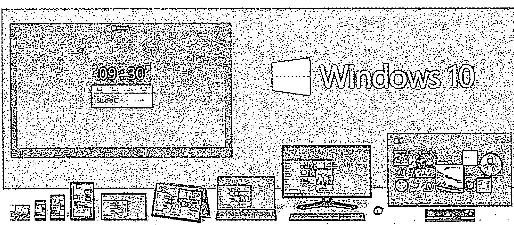

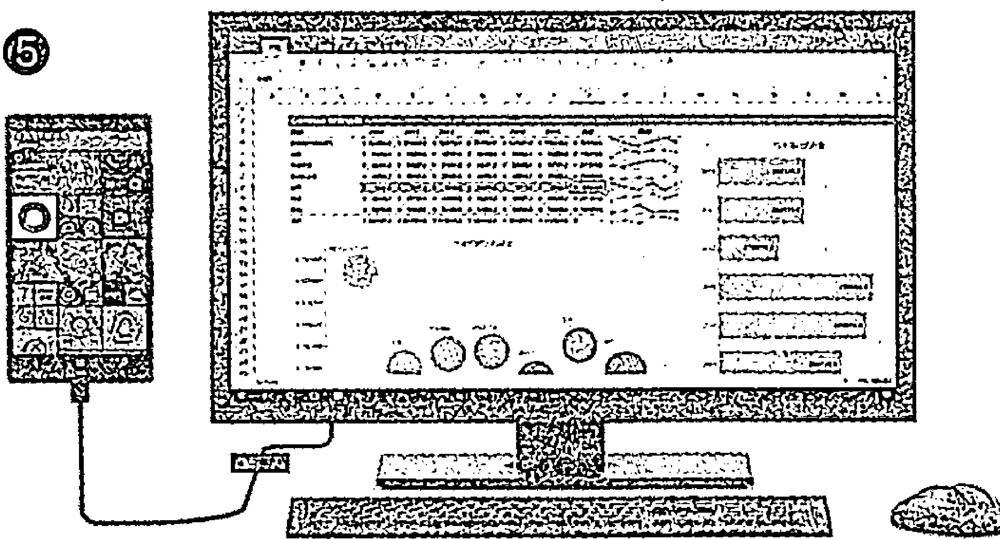

## 出师未捷身先死

原本Continuum是Windows 10 Mobile的杀手级功能，也是它区别于iOS和Android，在生产力层面展示肌肉的核心所在。可惜，2017年10月，微软宣布该系统进入维护期，意味着Windows 10 Mobile名义上存在，但实际上却已经“名存实亡”。随着Windows 10 Mobile系统和相关硬件逐渐淡出市场，无论Continuum再怎么神奇也将无用武之地。

看到这里，不知道大家有没有感觉到遗憾？Continuum就是一种让手机替代PC(主要对手是笔记本和二合一设备)，成为用户出差、旅行和应付各种轻办公需求的利器。它的“死亡”，是否意味着手机端轻办公将无以为继了呢？

## “轻办公”微软并非首创

步入智能手机时代（以iPhone诞生为节点）以来，最早且知名的借助手机自身实现“轻办公”能力的设备并非出自微软，而是源于摩托罗拉。

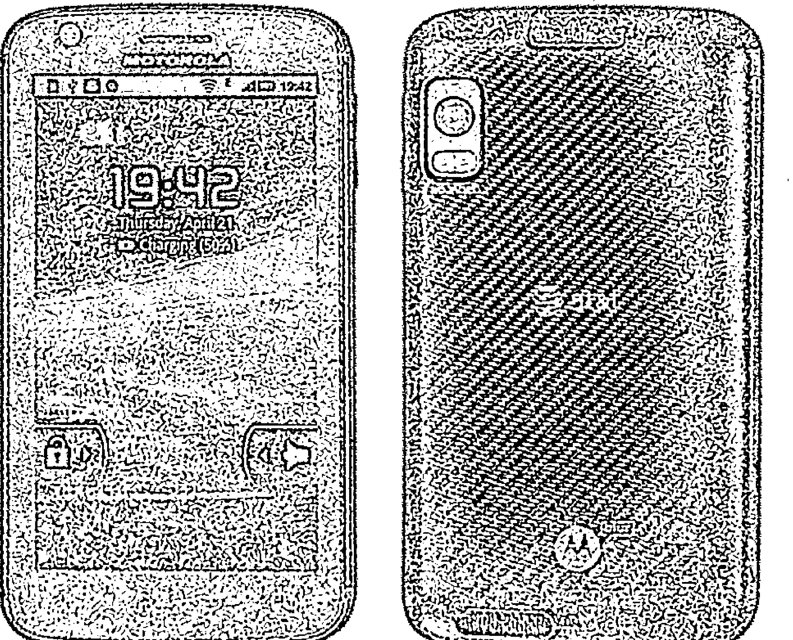

Atrix 4G的国行版型号为ME860

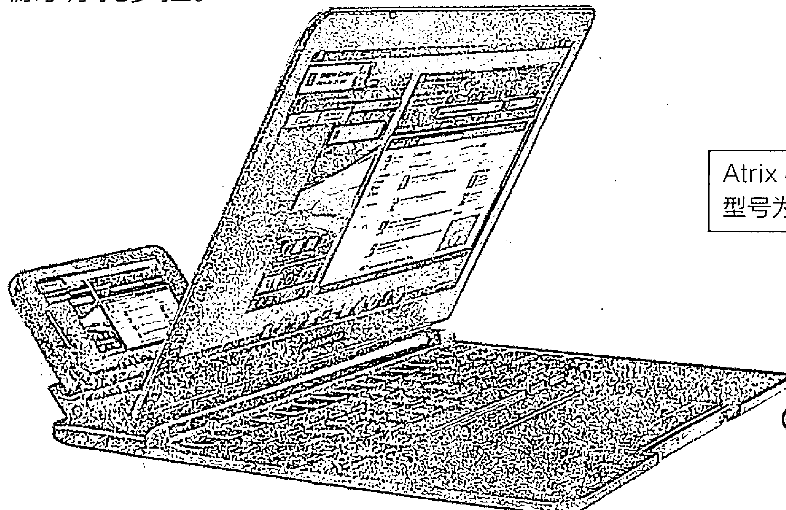

## 推开轻办公大门

2011年，摩托罗拉推出了全球首款搭载双核处理器（NVIDIA Tegra 2），集成指纹识别模块的智能手机——Atrix 4G（图6）。与该产品同步亮相的，还有一款Laptop笔记本扩展坞，通过手机和这个扩展坞的组合，轻办公的大门就此推开（图7）。

## 轻办公半成品

Atrix 4G的扩展坞本身就是标准笔记本形态，它采用了11.6英寸屏幕，提供USB、MicroUSB和HDMI等周边接口，内置4000mAh电池，背后有专门用于和Atrix 4G连接的支架和接口（图8）。这个笔记本扩展坞本身预装Ubuntu系统，在与Atrix 4G结合后，Android和Ubuntu两套共享一个系统文件，从而确保了通用性，使用上也无限接近传统笔记本。

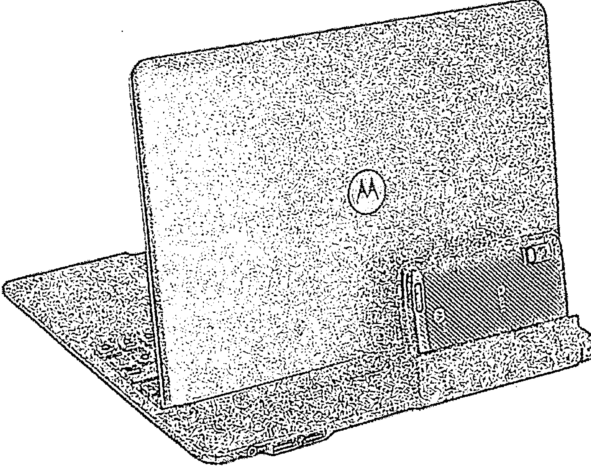

可惜，Atrix 4G的笔记本扩展坞价格很贵，相同价位足以购买一部上网本甚至入门级笔记本，何况那个年代Android系统针对大屏和键鼠优化的APP简直是凤毛麟角。因此，虽然Atrix 4G+扩展坞有着笔记本的外形和操作方式，但使用体验和办公效率却大打折扣，只能算是轻办公道路上的半成品。

毕竟，扩展坞只能为一款手机所用，通用性和成本注定它难以普及。那么，就没有办法让手机+普通显示器就能实现轻办公的方案了吗？

## 无线显示成为行业标准

随着智能手机的性能越来越强，以及用户对移动式的轻办公需求的提升，为每一部手机准备一部专用的扩展坞太过奢侈，也不切实际。于是，行业里逐渐出现了更通用的标准。

### MHL的昙花一现

和笔记本一样，智能手机也始终没有忘记学习将画面输入到更大显示屏幕上的方法。实际上，最早一批高端Android手机除了Micro USB接口外，还同时配备了Mini HDMI接口，可以接驳更大屏幕的显示器或液晶电视（图9），再配合蓝牙键盘鼠标，同样可以带来不错的轻办公体验。

可惜，随着智能手机“减肥”风潮的兴起，为了压缩厚度，Android手机们纷纷取消了额外的Mini HDMI接口，堵住了视频输出的道路。此时，一种建立在Micro USB接口基础上的MHL标准出现了，凡是支持MHL标准的手机，使用MHL适配器同样可以将画面输入到显示设备上（图10）。

问题来了，MHL适配器需要成本，而视频输出又不是“刚需”。所以，MHL除了刚诞生时在Android领域溅起水花后便逐渐被市场遗忘。

因为，成本更低且通用的技术出现了。

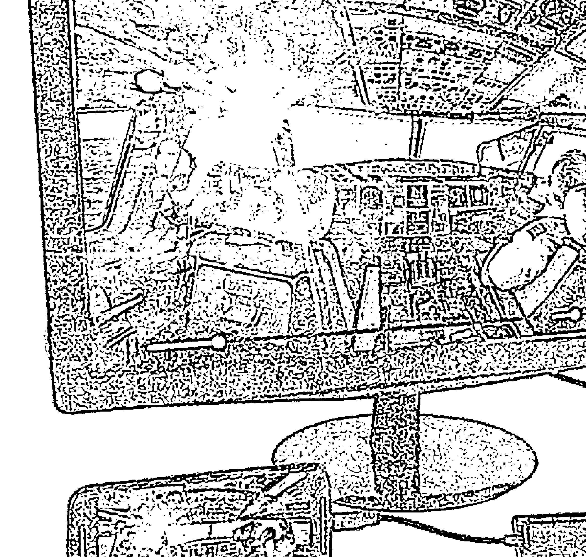

火速链接
如果你想了解有关MHL和无线显示功能的更多玩法，请参考本刊2017年第5期《鸠占鹊巢 手机屏幕的视界大迁徙》这篇文章。

### 无线显示一统江湖

Wi-Fi是每一款智能手机必备的模块，而随着Android版本和无线网卡的升级，Wi-Fi Direct标准开始在智能手机领域普及。既然MHL需要额外的硬件成本，那通过免费的无线通道不就结了？

于是，苹果提出了AirPlay协议，而Android手机则引入了Miracast/WiFi Display技术，虽然名字不同，但它们本质上却都属于“无线投屏”——将手机屏幕所显示的内容通过无线的形式投影到更大的显示设备上（图11）。

请放心，现在所有的智能手机都支持无线投屏（又称无线显示）技术（图12），只是想使用的话需要显示设备端也同时支持AirPlay、Miracast和WiFi Display技术。近些年流行的互联网电视、智能电视、电视盒子、高端显示器都支持上述协议，所以无线显示技术成功取代了MHL，成为轻办公之路的奠基石。

需要注意的是，无线投屏固然方便，但受制于网络环境，它却很难避免偶尔的延时问题，特别是在播放高清视频进行快进快退时、投屏3D游戏画面时尤为严重（图13）。

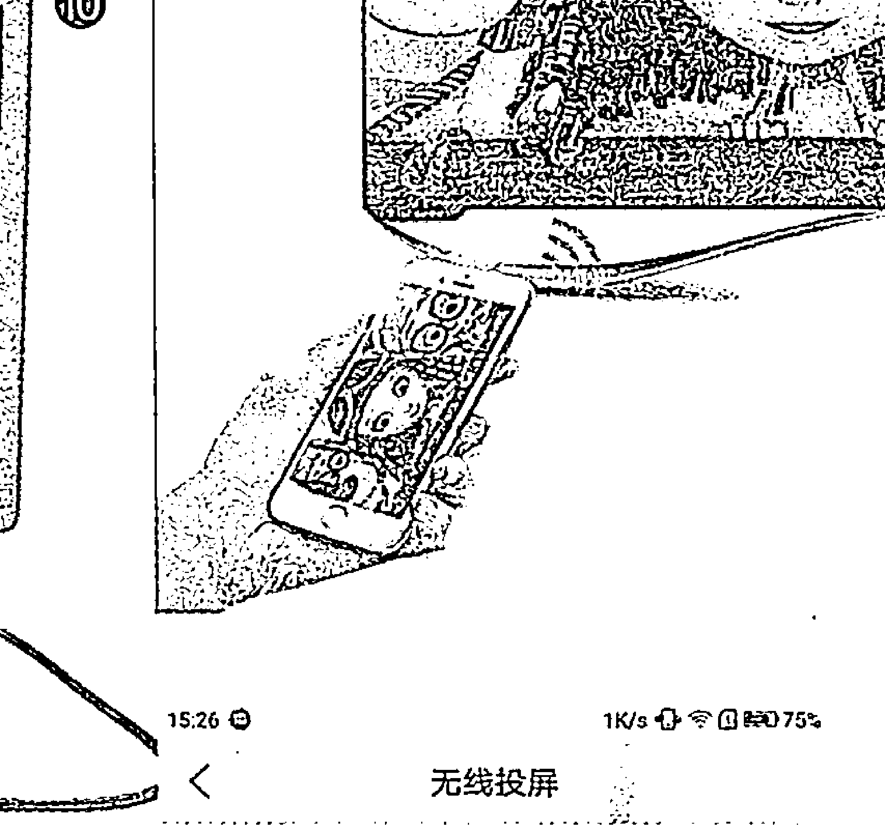

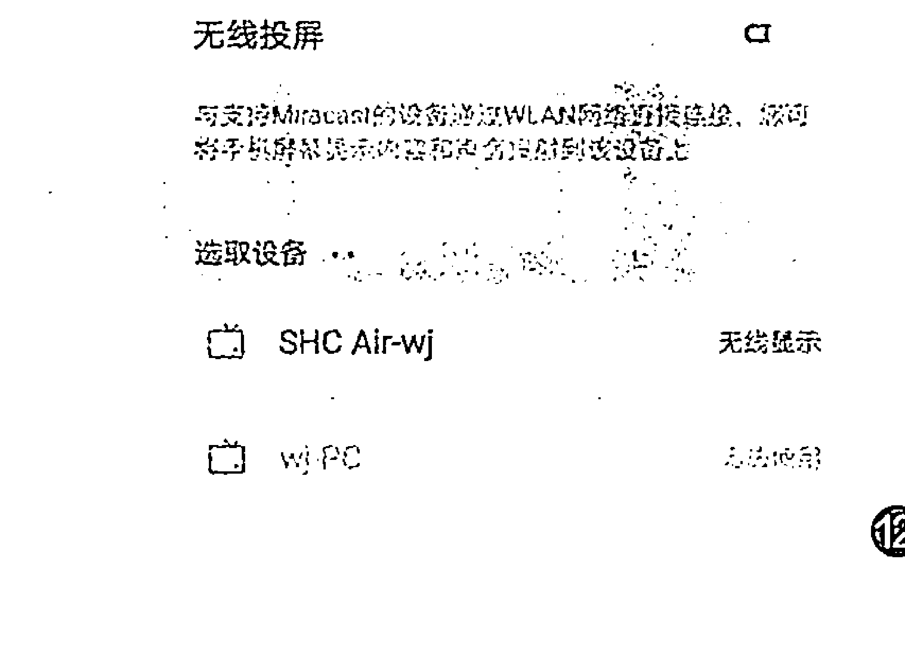

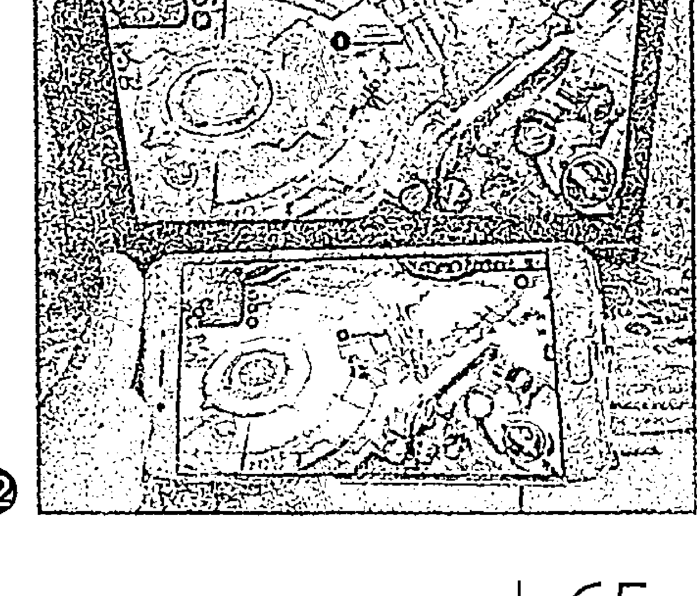

#### 小提示

无线投屏技术不限于电视机和显示器，安装有Windows 10系统的笔记本同样支持。只要手机和笔记本处于同一个局域网下，在“设置→系统→投影到这台电脑”中打开“当你同意时，Windows电脑和手机可以投影到这台电脑”（图14），然后在Android手机端“设置→显示”的无线显示功能中就能搜索到笔记本，并将画面投影到笔记本的屏幕上（图15）。

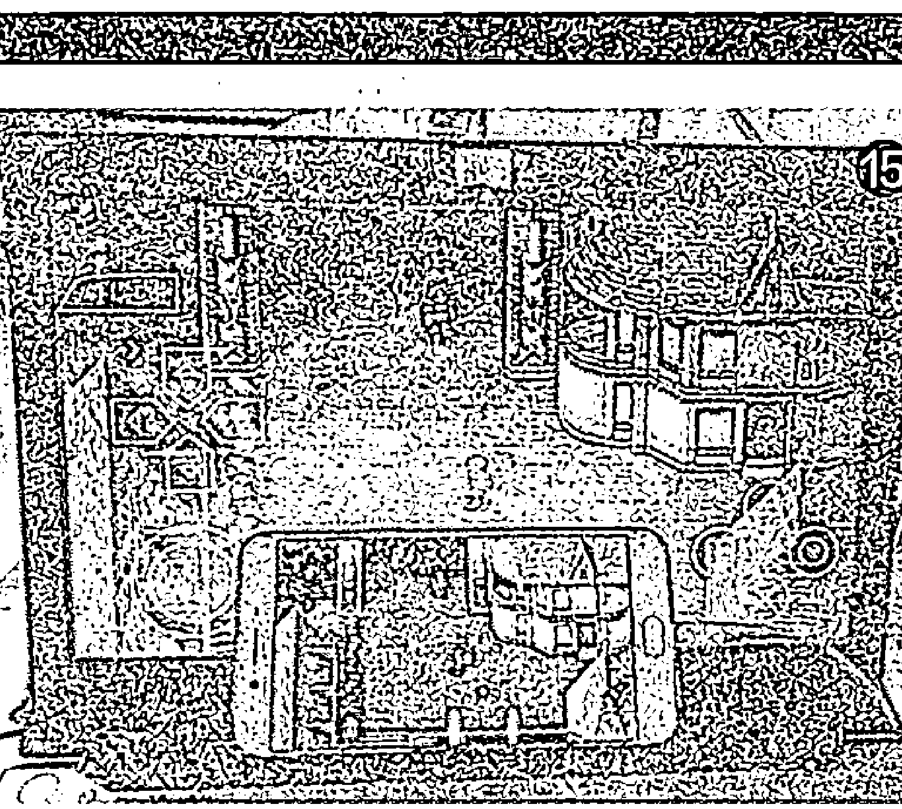

### 投影到这台电脑

- 将 Windows 手机或电脑投影到此屏幕，并使用键盘、鼠标和其他设备。
- 此设备可无线显示内容，因为其硬件专为此类无线投影而设计。
- 当你同意时，Windows 电脑和手机可以投影到这台电脑。
- 所有位置都可用。
- 要求投影到这台电脑。
- 每次请求连接时。
- 需要 PIN 才能进行配对。
- 关。
- 仅当此设备接通电源时，才能发现此设备，才能进行投影。
- 开。
- 电脑名称 wj-PC。
- 重命名你的电脑。

## 轻办公需要它们帮忙

将手机画面输入到显示器或电视屏幕上只是轻办公的第一步，你不可能还通过手机屏幕的虚拟键盘去敲字或编辑文档吧？所以，想获得类似PC的体验，键鼠外设肯定是跑不了的。

#### 小提示

很多Android手机的OTG功能默认处于关闭状态，需要我们进入设置界面手动打开（图16），才能识别接驳的闪存盘、键盘或鼠标。

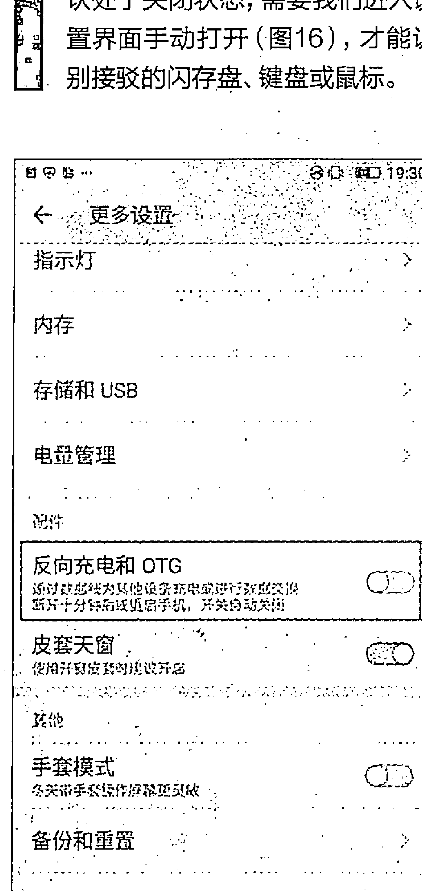

### 蓝牙外设是王道

最适合操作智能手机的外设当属通过蓝牙连接的无线键盘和鼠标，它们有着100%的兼容性，而且没有线缆的拖累，可以距离屏幕更远进行操作，体验最好。

### OTG为有线赋能

如果你没有蓝牙键鼠，想进行惬意的轻办公时就需要OTG转接器来帮忙了。只是，使用转接器接驳外设，需要留意各款设备之间的兼容性问题。为此笔者特意进行了多组测试。

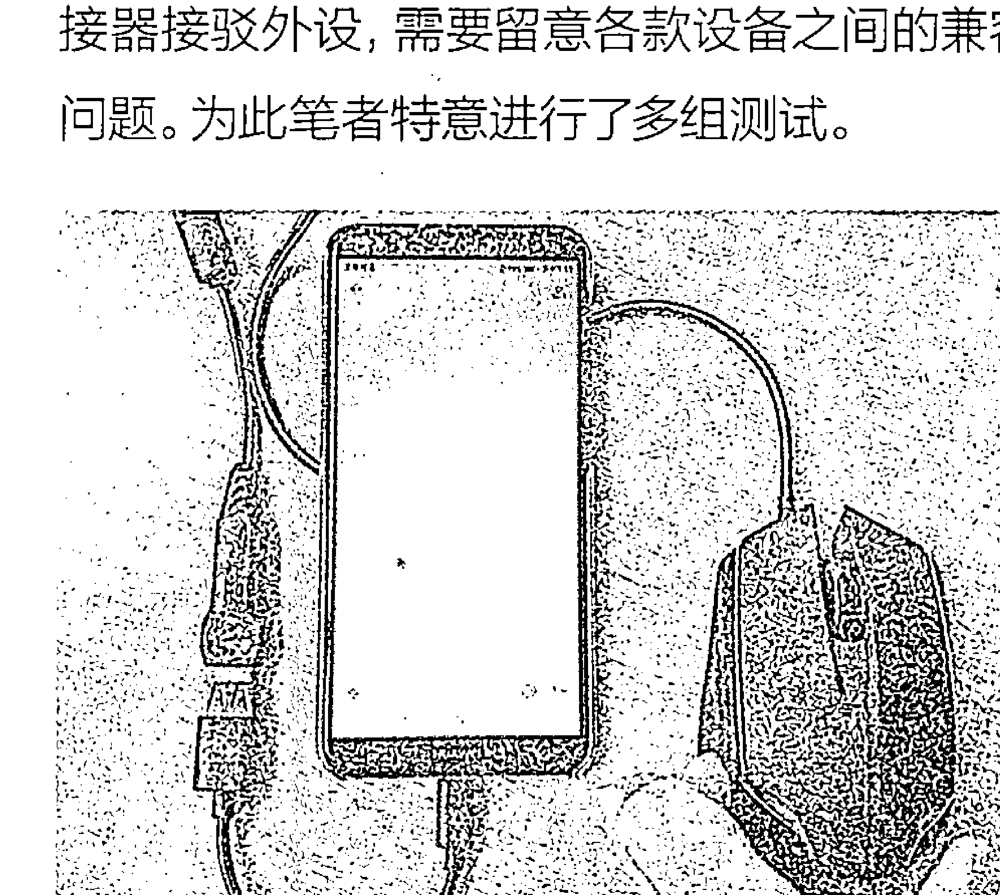

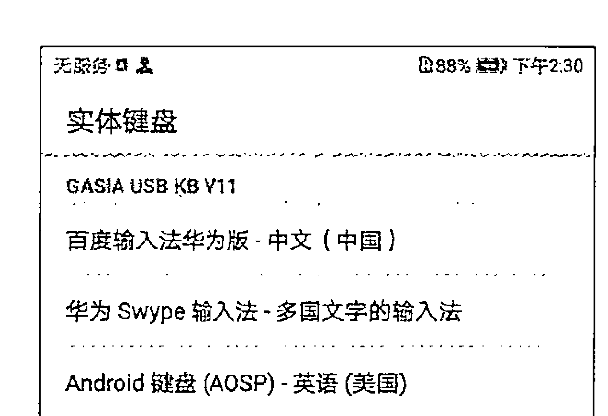

当手机（麦芒6）采用Micro USB接口时，通过标准OTG线可顺利识别接驳的闪存盘、键盘和鼠标（图17）。接驳鼠标时，移动鼠标屏幕中会出现光标；接驳键盘时，可以选择屏蔽屏幕内的虚拟键盘（图18）。

问题来了，轻办公需要鼠标和键盘协同作战，标准的OTG线只能接驳其中之一，肯定是不符合需求的。那么，使用Micro USB接口的OTG Hub可以满足要求吗？很遗憾，笔者手头的一款OTG Hub在和手机连接后，插在Hub上的键盘、鼠标和闪存盘都无法被手机识别（图19）。考虑到测试环境有限，不排除其他Micro OTG Hub可以解决同时接驳其他外设的可能。

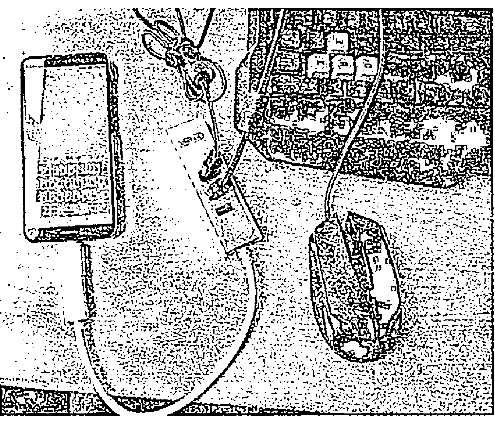

当手机（华为Mate 10 Pro）采用USB Type-C接口时，使用USB Type-C OTG Hub则可同时识别插在Hub上的键盘、鼠标和闪存盘，兼容性令人满意（图20）。

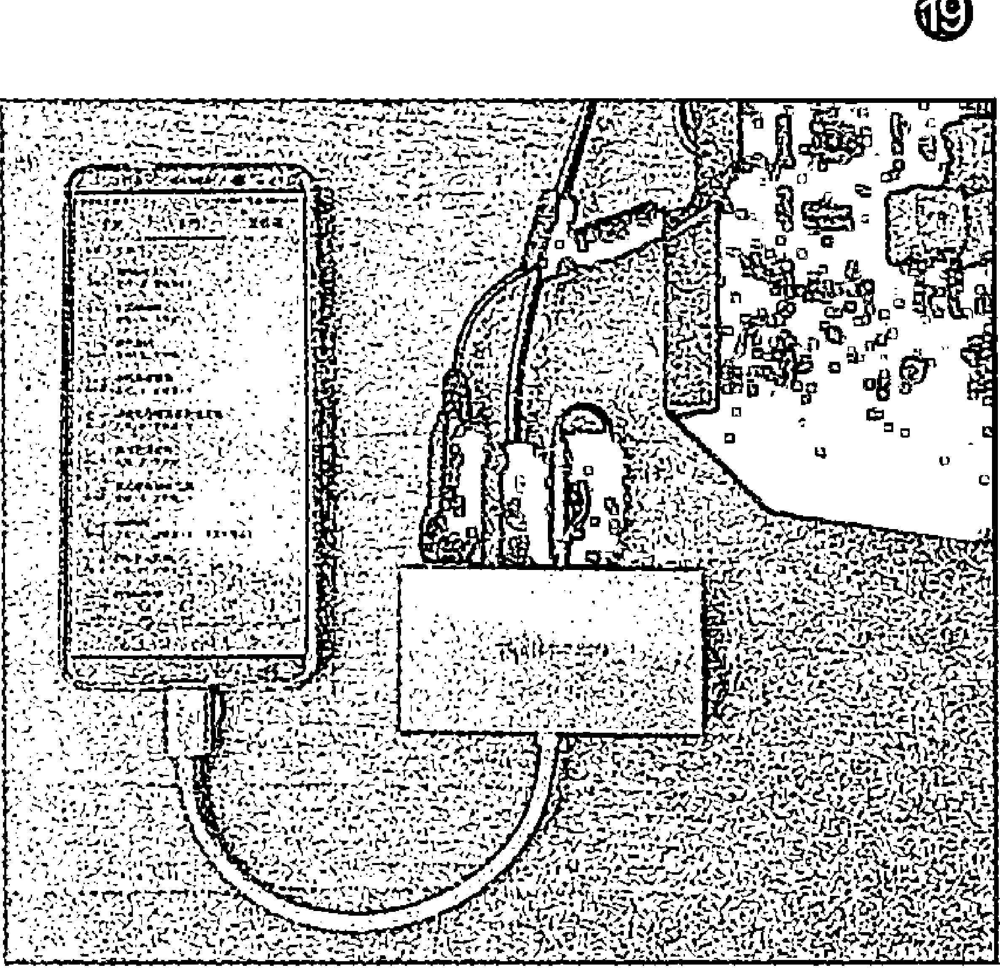

考虑到OTG Hub可能存在的兼容隐患，笔者还是建议大家首选蓝牙键鼠作为轻办公时的搭档，没有了线缆的拖累，在出差旅行时它们可以帮你节省更多的行李空间。

扩展阅读：
如果你觉得传统键盘不利于外出携带，现在还有一种可以折叠的蓝牙键盘，能最大限度降低对空间的占用（图21）。此外，如果你喜欢科技感，还可以考虑红外镭射键盘，这种产品的大小和绿箭口香糖类似，通过USB接口取电（可以接驳移动电源供电），通过蓝牙与手机连接，通过向桌面映射虚拟的红外键盘按键的形式操作（图22），虽然谈不上什么手感，但却是最小巧便携的。


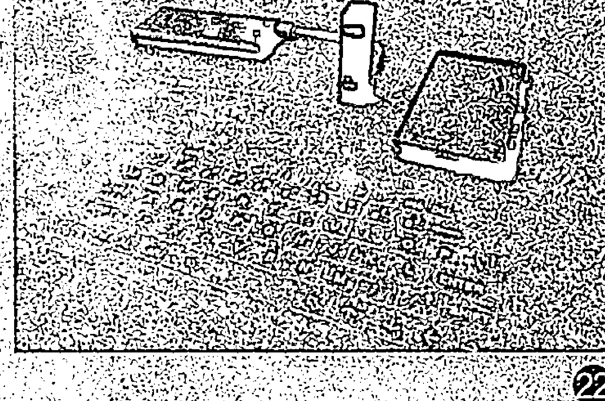

## 获得近似Windows的操作体验

将智能手机的画面投射到更大的屏幕，通过键盘鼠标操作只是轻办公道路上的第一步，此时只能方便我们在更大的“视界”里一展拳脚。但是，就办公的“生产力”而言，现阶段唯有Windows风格的操作方式，才是我们最熟悉且最具效率的存在。

### 三星DeX让手机变电脑

Android手机的操作界面本来就是专为小屏幕定制，通过手指操作最具效率。哪怕将手机画面输出到大屏设备里，我们看到依旧和手机一样的UI界面（图1），再加上很多APP并不支持横屏显示，所以屏幕资源的利用率极低。

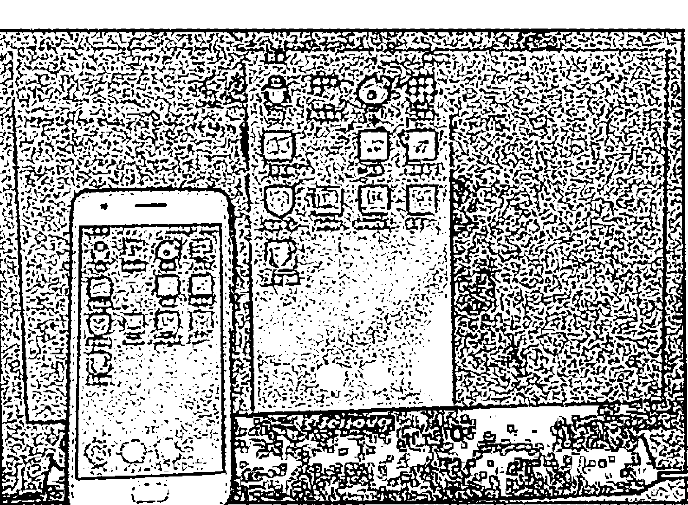

### 三星DeX变魔术

三星在发布Galaxy S8的同时还推出了一款售价为149.99美元（目前国行价格为945元）的DeX外接底座，Galaxy S8可以通过它将画面输出到电视屏幕上，并带来一种接近Windows的操作体验。

简单来说，DeX的外形就是一款手机底座+Hub（图2），它自身提供了2个USB（可连接键鼠、闪存盘）、HDMI（用于接驳显示设备）、RJ45（可接有线网络）和USB Type-C电源接口。将Galaxy S8插入其上，再与显示器接驳后就能进入三星DeX的桌面系统。此时Galaxy S8手机会始终处于息屏状态，而画面则会全部输出到显示器端（图3）。

关键的地方来了，通过DeX输出的画面并不是Android系统的镜像，而是一个类Windows系统的操作界面，虽然它仍然依托于Android的框架内，但其UI却针对键盘和鼠标都进行了适配优化，比如增加了托盘开始菜单和应用程序、快捷栏、系统栏等，同时还可多窗口运行，鼠标可以拖拽缩放窗口，屏幕右下角的任务栏可以用来显示通知、设置快捷键、时间和日期，这一切都与Windows 10非常类似（图4）。

有了DeX，用户可以直接在桌面环境中进行接听电话、阅读和发送短信等操作，还能使用Galaxy S8的虹膜识别来进行桌面浏览器的身份验证和登录，只是操作方式不再是手指点击，而是要依靠鼠标和键盘。

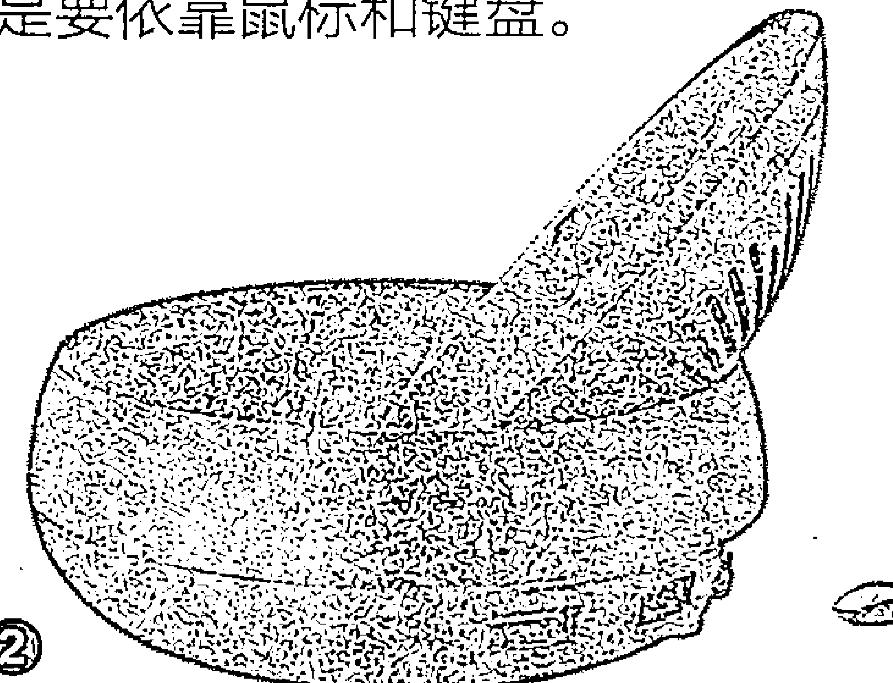

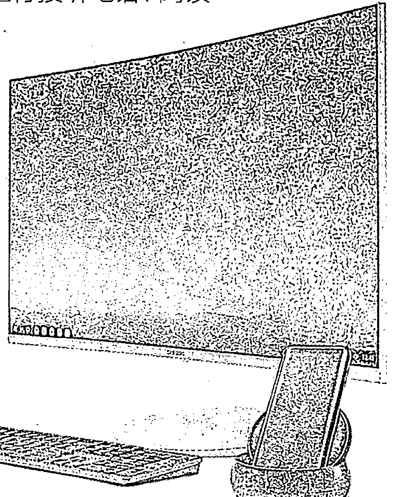

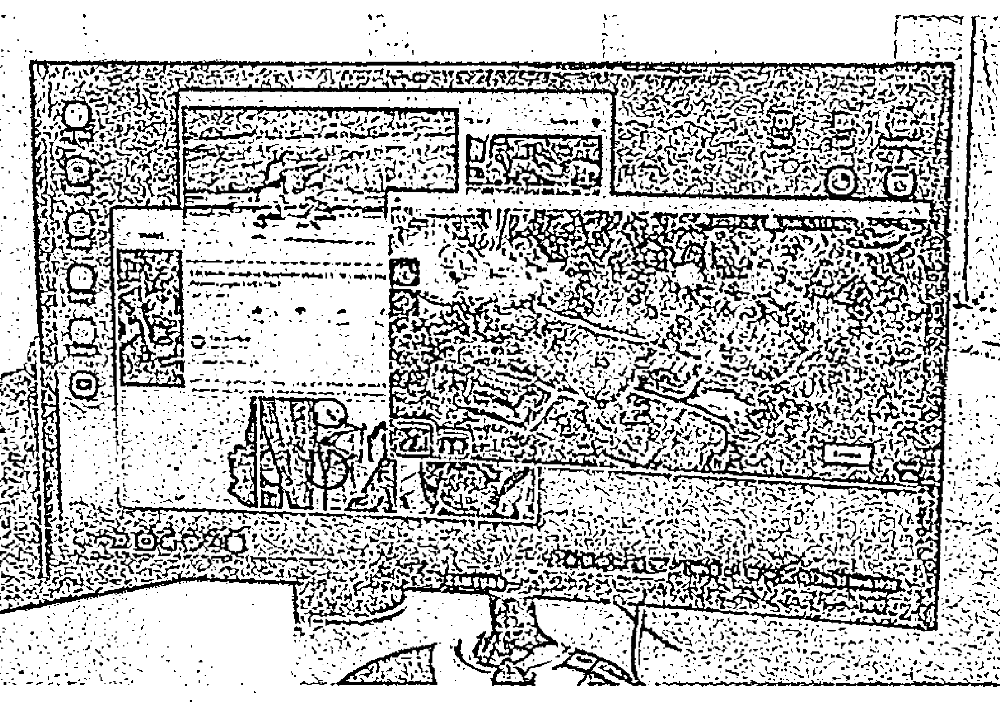

### 使用DeX的局限性

三星通过DeX改变了Android系统在大屏上的操作方式，但它依旧存在较大的局限性。首先就是这个底座只适配Galaxy S8系列，通用性不强，而且价格并不便宜。同时，将手机放在DeX底座上后，想要解锁Galaxy S8有点不太方便。

最关键的一点是，对那些非常依赖触摸操作的，比如玩王者荣耀游戏就无法在DeX环境下运行了，因为这类游戏APP并没有针对键鼠操作进行优化。

## 华为Mate10完善电脑模式

华为在发布Mate 10系列手机时，在最新EMUI 8.0系统中引入了全新的“电脑模式”功能，它的操作体验和三星Galaxy S8+DeX底座类似，但却有着更通用和易用的特色，也有望成为未来Android手机争先模仿的“轻办公”标杆。

### 神秘的大屏投射功能

华为在Mate 10的“设置→设备连接”中加入了一个名为“大屏投射”的功能（图5），而这个功能就是“电脑模式”的原理所在了。

和三星Galaxy S8使用DeX底座才能输出桌面模式不同，华为Mate 10的USB Type-C接口硬件上就支持视频输出功能，只需使用USB Type-C转USB Type-C或HDMI或VGA线缆（图6），就能直接将Mate 10的画面投射到更大的显示设备上。

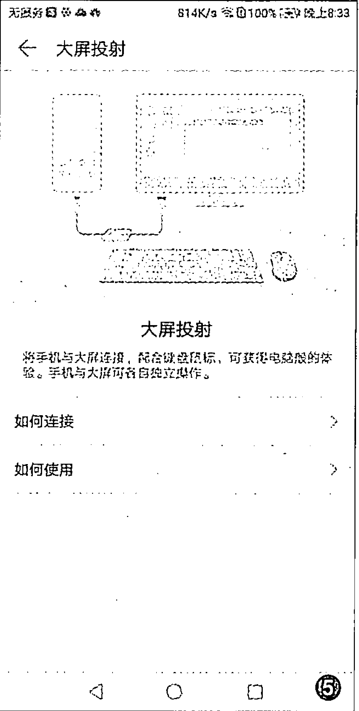

此时，在手机屏幕的通知栏会出现“手机模式”和“电脑模式”的切换提示（图7），点击它，大屏设备上的画面就能从手机屏幕镜像变成类似Windows 10的界面风格了（图8）。和三星DeX桌面模式不同的是，Mate 10在大屏幕上输出电脑模式界面的同时并不影响使用手机，你依旧能在手机上打电话、玩游戏，并不影响大屏幕端正在浏览的网页、欣赏的电影和编辑的文档，真正做到了一机二用。

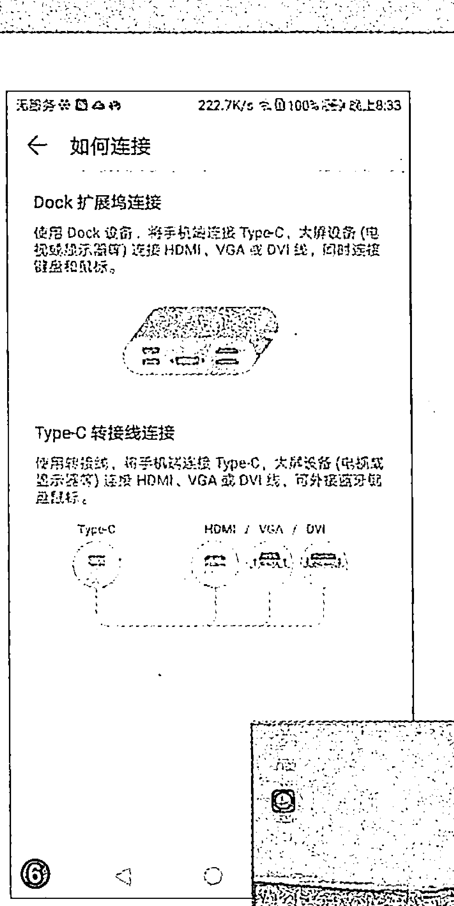

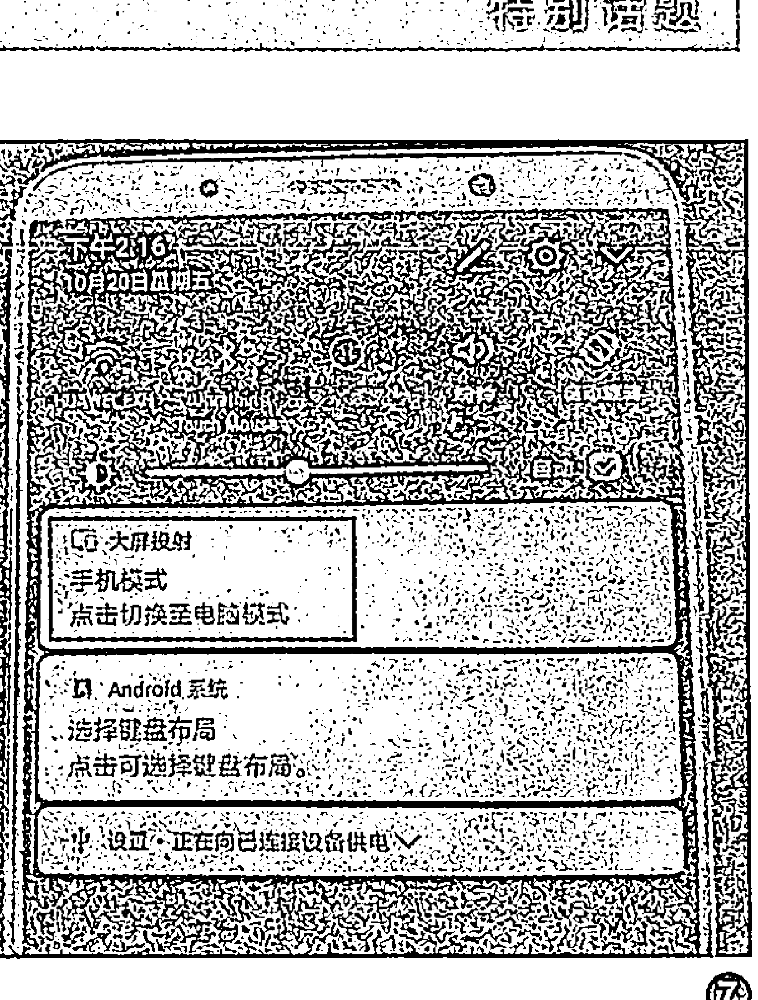

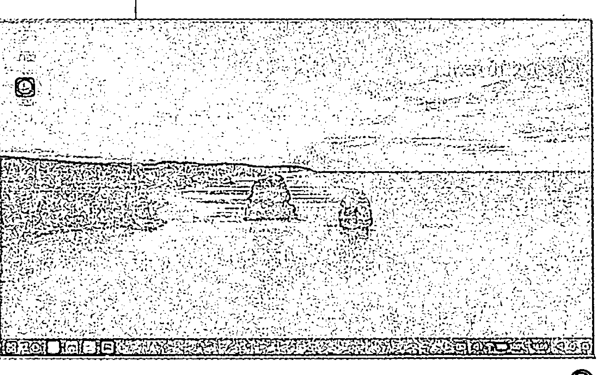

### 一些使用上的细节

可能有同学会问了，当Mate 10使用USB Type-C线接驳显示器或电视时，手机快没电了怎么办？想解决这个问题有两个思路，一种是直接使用带USB Type-C接口的显示设备，这种接口在进行视频输入的同时还能输出电流，可以同步给手机充电。

第二种方法就是购买带充电功能的USB Type-C扩展坞，解决手机在输出视频信号的同时接驳有线键鼠、闪存盘和同时充电的需求（图9）。

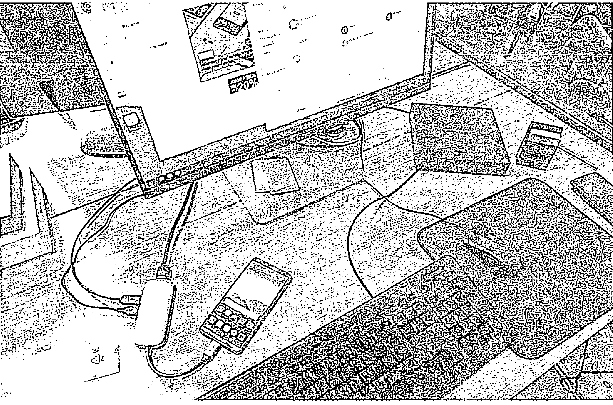

华为Mate 10的电脑模式还有一个亮点，那就是可以在一定程度上摆脱键盘和鼠标的限制。在电脑模式输出状态下，点击通知栏的“虚拟键鼠”按钮（图10），Mate 10的手机屏幕就能变成虚拟的触控板，可以替代鼠标控制显示设备端光标的移动，当需要进行文字输入时，手机屏幕上还能弹出虚拟键盘（图11），从而摆脱对键盘的依赖。

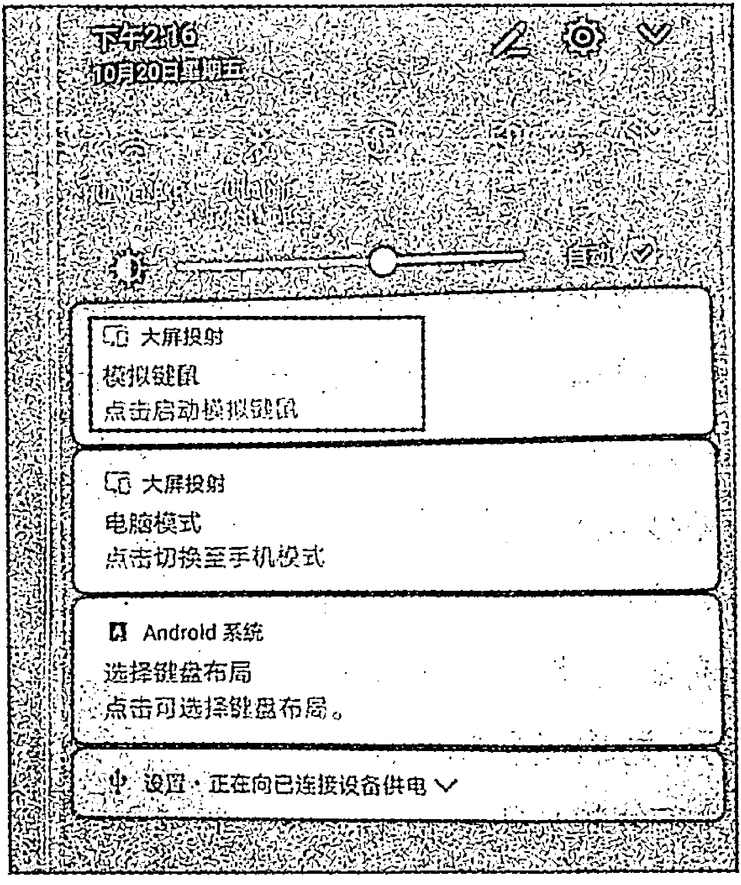

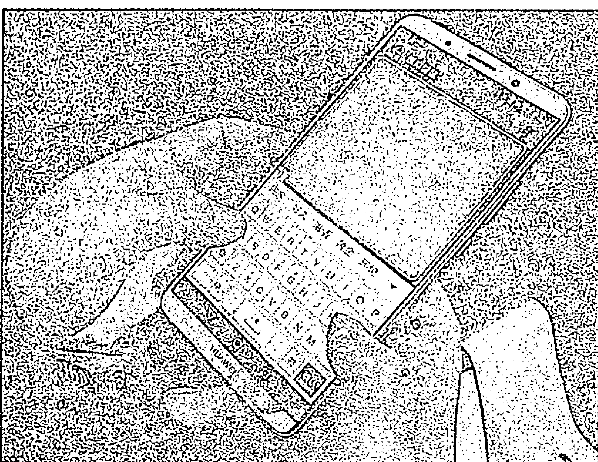

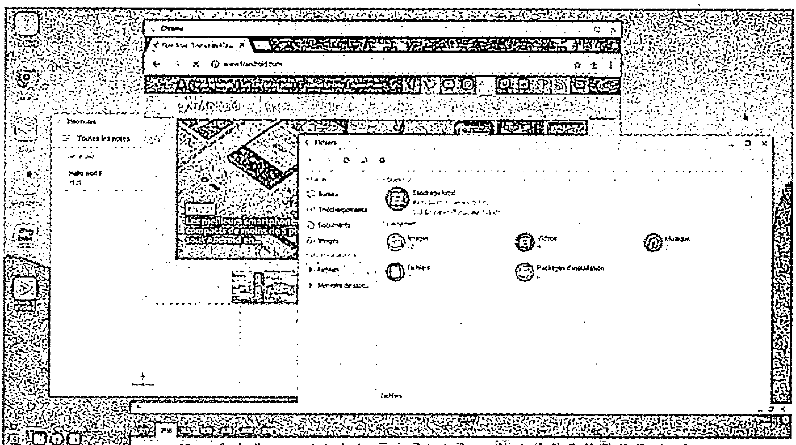

看到手机模拟键鼠功能是不是很熟悉？CFan很早以前介绍过通过安装WiFi Mouse APP让Android手机变成键鼠套装来无线控制PC。而华为Mate 10的“虚拟键鼠”模式，相当于将类似WiFi Mouse的功能整合进了系统层面，免去了用户自行安装第三方APP和调试的繁琐。

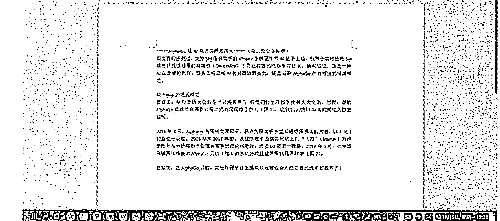

需要注意的是，现在很多APP无法全屏，只能窗口运行。针对更大屏幕和键鼠操作优化最好的还是微软Office套装和浏览器一类的APP（图12、图13）。

### 轻办公全民友好的希望

如果说三星Galaxy S8+DeX底座的桌面模式属于小众派，不利于广泛推广，那华为Mate 10带来的电脑模式则给其他品牌带来了新的轻办公思路：为手机赋予视频输出功能，并在系统层面加入Windows风格的桌面UI。

随着商务用户对通过手机进行轻办公需求的增加，像华为Mate 10这种支持有线视频输出（不存在无线显示的延迟和干扰），同时还能一机二用的能力无疑是最佳解决方案。但受制于成本和研发实力，短期内类似功能很难普及。那么，对于非Mate 10用户，难道就只能羡慕嫉妒恨的份儿了吗？

### 成本和诚意的取舍

如今很多Android手机都已经过渡到了USB Type-C接口（图14），但能为其赋予视频输出能力的产品却凤毛麟角。原因很简单，视频输出需要额外的认证和成本开销，而Android系统本来就支持无线显示，为啥还要单独再加个有线输出？

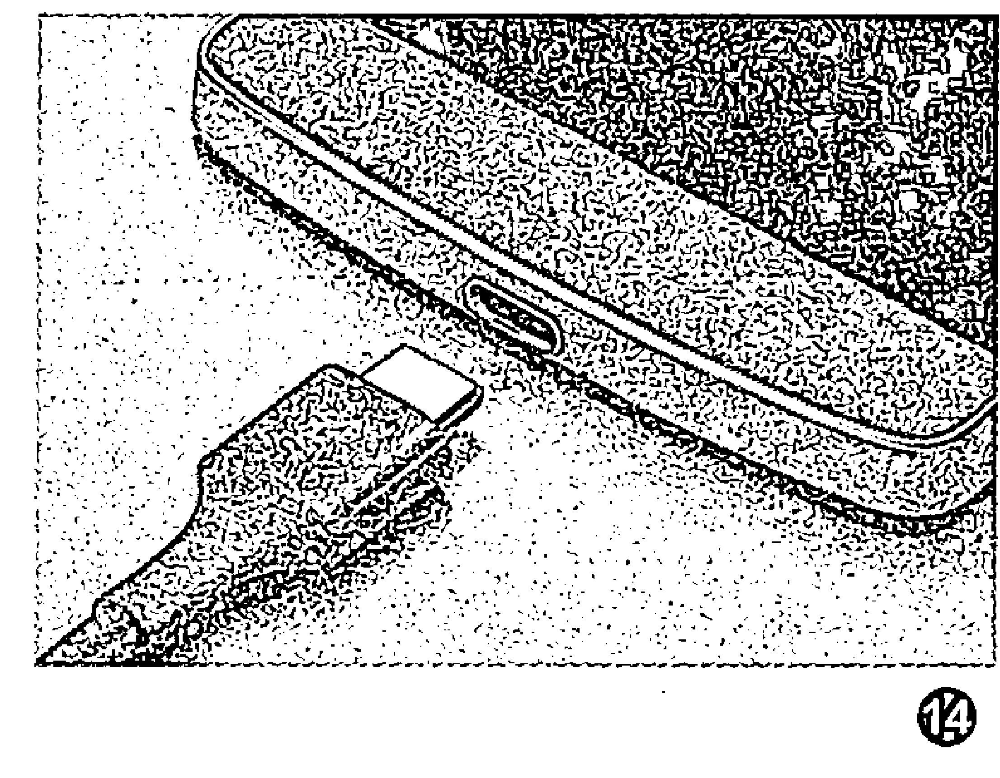

### 曙光源于PC Launcher

我们都知道，在Android系统上有一个名为“Launcher”（启动器/桌面）的概念，比如小米桌面、Go桌面、Hola桌面等就属于这种软件，任何Android手机或平板安装这些Launcher，就能替换原有的UI桌面（图15）。

那么，如果能有一种适用于手机，显示风格与Windows系统类似的Launcher，每次手机在无线显示时都切换到这个Launcher（图16），不就等同于模拟了三星DeX桌面或华为的电脑模式了吗？

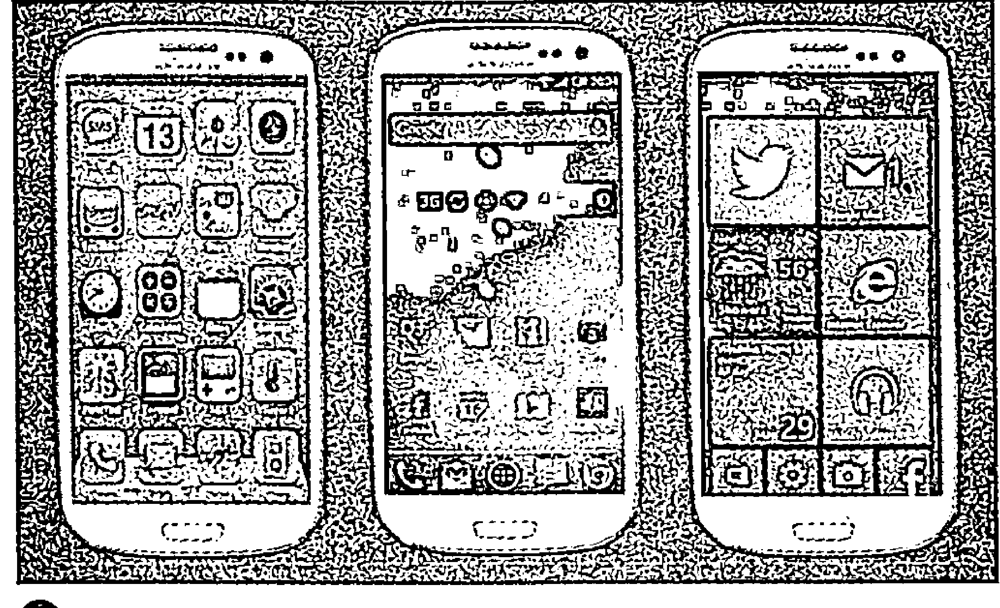

遗憾的是，现在还没有一款符合上述要求的Launcher存在。但是，符合上述要求的系统却已经较为成熟了，比如凤凰系统（Phoenix OS）和技德系统（Remix OS），这两种系统都是基于Android深度定制，加入开始菜单、任务栏、多任务等元素的类Windows 10系统（图17）。很多Android平板电脑都有此类系统的刷机包，而CFan在2016年第5期《看Android能否逆袭PC》一文中也介绍过将Phoenix OS和Remix OS安装进闪存盘，在任意PC上体验的方法。

如果将Phoenix OS和Remix OS进行简化，保留操作逻辑，制作成Launcher启动器的形式，允许任何Android手机安装，就能解决大屏输出时的操作和体验问题。

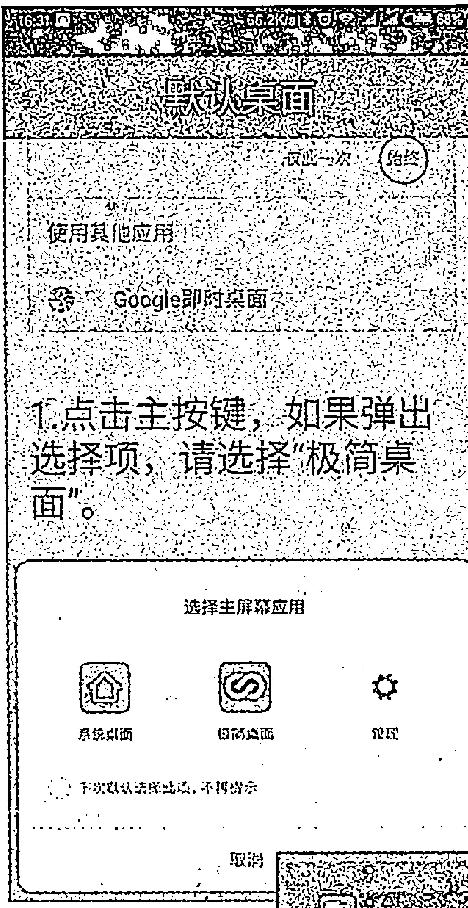

今年2月，技德曾发布了Remix OS for Mobile版，就是这种可安装在Android手机上的Launcher，当安装该APP的手机与显示器、电视、笔记本等连接后，画面就输出为相对成熟的桌面版Remix OS（图18）。Remix OS for Mobile原本预计在今年暑期上线，但前不久却传出技德Remix OS宣布放弃消费者版的开发，将重心从消费者市场部分转移到企业的消息，Remix OS for Mobile今后还能否上线也就成为了未知数。

随着用户对轻办公需求的迫切提升，以及三星和华为的标杆效应，相信在很短的时间内就会有更多定位于商务的智能手机引入类似功能，并诱发相关Launcher的出现。如果你对轻办公抱有极大的期望，那就不妨多多关注CFan的后续报道吧。

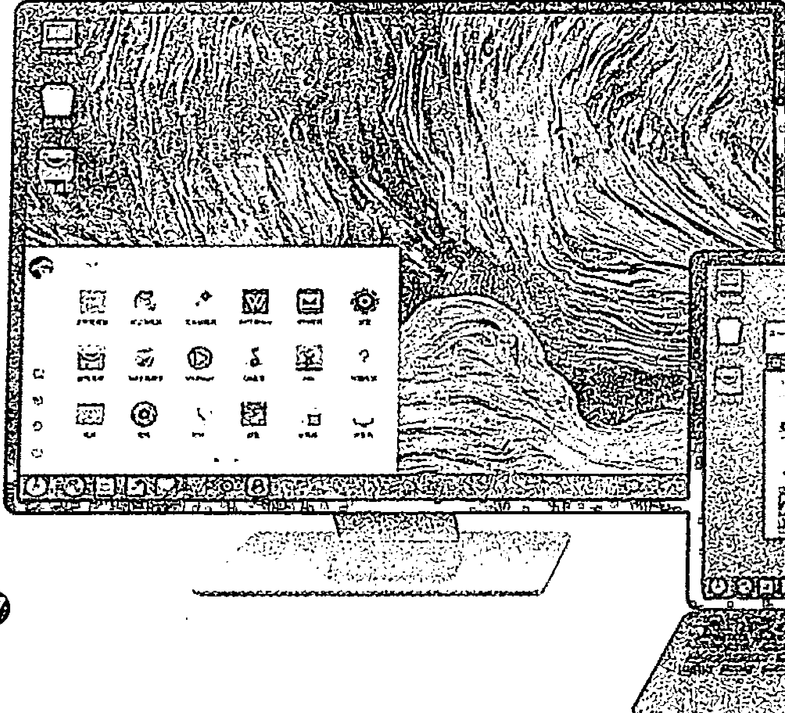

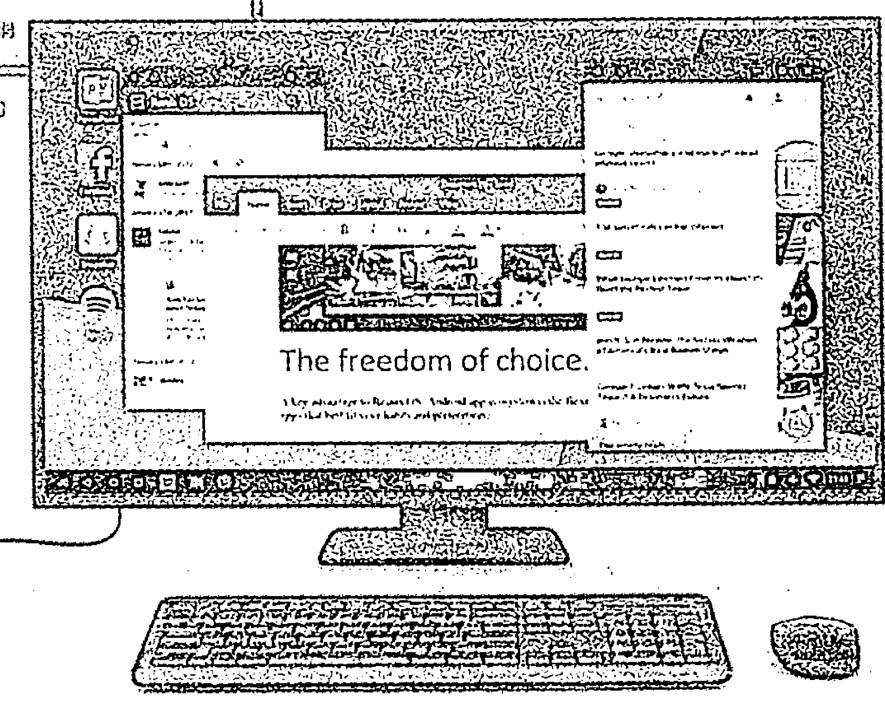

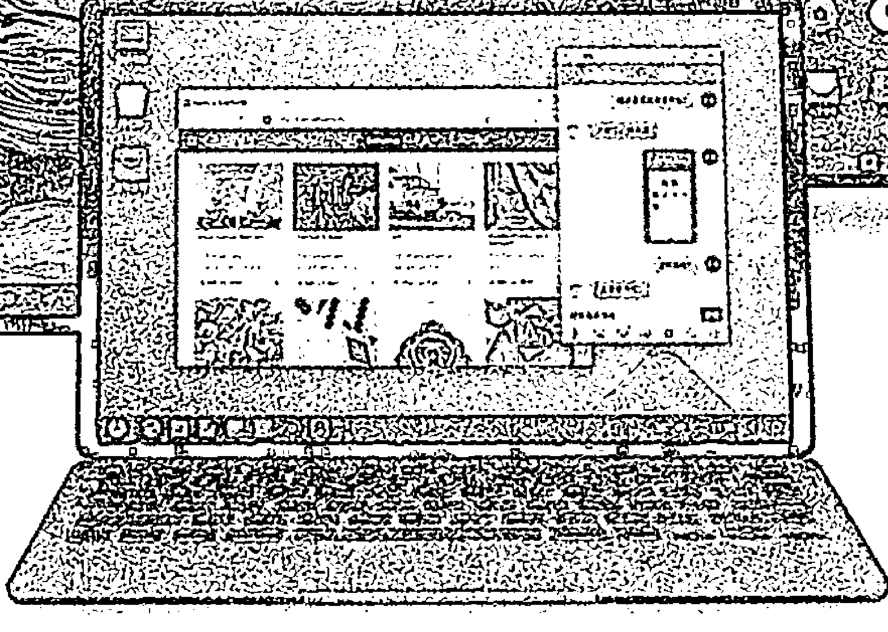

# 11.11 全球狂欢节 2017

# 双十一前后

## 大数据与未来电商

策划|《电脑爱好者》编辑部

文|魔之左手

双十一对很多人来说是一个很特殊的日子，理论上为安抚“光棍节”的独身男女而设置的网商大趴，实际上已经变成了国内最大的“电商节”。相信在这期杂志到手之时，很多朋友已经在电商购物车里装满各种“剁手”也要买的商品了吧。不知道大家是在用什么方式购买商品？又准备如何付款、如何接收？又是否想过，这些已经习以为常的网购过程，是否还有进化的可能，又会如何进化呢？尽管作为普通消费者，我们个人的力量在推动行业转变的过程中是微乎其微的，但看到一些未来的可能性，对我们平静地迎接未来，安稳地过渡到新网购时代，总还是有好处的。

### 大数据——不过时的话题

我们常见的所谓“大数据”，并非是简单的各种数据获取与积累，这一能力在“大数据”这一概念出现前就已经有了。不过早期获取与积累的各种数据最多只能做到存储，数量越多反而越是麻烦。比如我们看一些比较“传统”的警匪剧或者法制纪实节目时，常常会看到警察要耗费大量精力回看各种监控录像，周围的监控越多、涉及到的时间段越长，破案过程越是艰辛。

现代的“大数据”则更加智能，可对积累的数据进行快速分析，甚至可能在积累时就已经进行相关的分析、归类，而最重要的则是可以将各种数据进行关联。例如同样是上述的安全监控，现在已经能做到智能识别车牌、识别行人的体貌特征，甚至直接识别出行人或车辆，并从数据库调取相应信息这种比较“科幻”的功能，都已经在一些地方实现了。由于可能涉及到个人隐私，我们这里就不放图片了，有兴趣的朋友可以扫描（图1）二维码去观看相关视频。

在网购的过程中，我们其实也为电商提供了各种个人数据，例如买衣服鞋帽时选择的尺码与喜好、购买孕妇用品和婴儿用品时的时间、购买礼物的种类和时间、车辆用品的品牌与类型、出行方式和酒店的订购喜好……当然在某些页面停留并大量搜索相关信息，但并未下手购买的商品，也是很重要的信息。在电商将顾客的各种信息通过姓名、手机号码、地址等个人特征信息联系起来后，其实消费者在电商的数据库中已经拥有了一个非常丰满的形象，各项特征可能比在公安数据库中更为全面。例如警察叔叔虽然知道大家的长相、年龄等，但肯定不会知道大家的裤长、腰围，喜欢的衣服颜色、化妆品品牌等。在综合了这些特征后，我们会发现在打开电商的首页时，搜索栏中会默认填入一些很“奇怪”的内容，并且会提供不少推荐商品（图2），它们虽然是我们近期搜索或购买的（图3），但常会直击我们的需求。图2实际上是笔者随便抓取的一次京东首页截图，其中搜索栏里的电饭锅，应该就是因为笔者最近浏览过相关产品的页面，而9.9元两件和京东超市的推荐链接，大概是因为笔者比较喜欢看打折商品和食品吧，这些其实都是笔者在京东留下的信息经过大数据的处理后，给出的最能吸引购买的推荐商品。


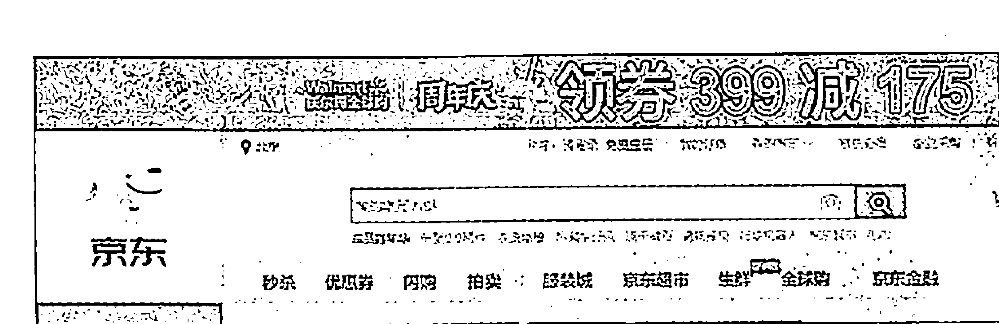

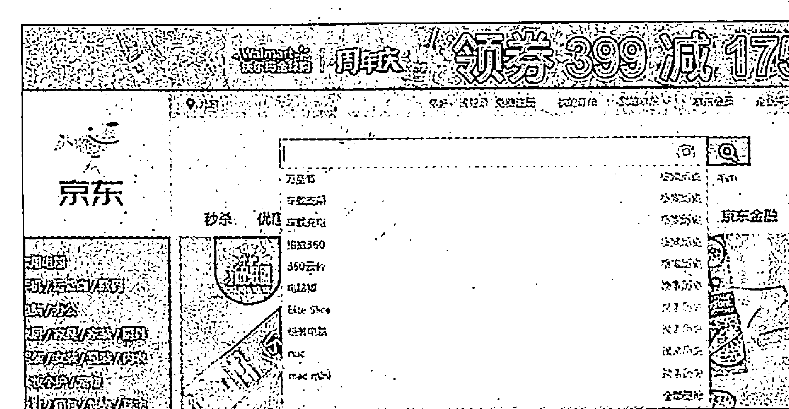

在新的大数据时代，电商的计算需求急剧增长，因此全面转向使用大型数据中心。例如阿里巴巴就在2013年将最后一台所谓的小机下线了，京东则在宿迁建设了巨大的华东数据中心。从某种程度上说，目前的大型电商实际上已经主动或被迫地成为了大数据应用和硬件的技术型公司。正是这些强大的数据中心，让电商可以稳定快速地处理大量的购物请求，特别是双十一这种爆炸式的数据（图4）。

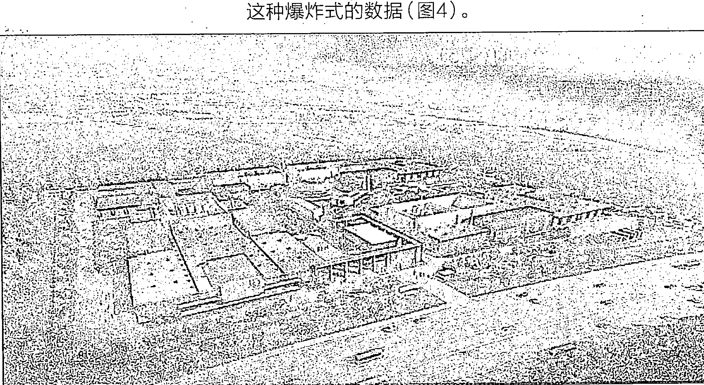

### 智能无人化——分拣与快递

- “爆仓！！”几乎是每一次电商盛宴之后必然出现的新闻，虽然在出色的交通路网和相对低廉的人工成本之下，中国的快递行业几乎独步全球，但在同样是全球最大量的电商消费者和爆发式的消费能力的冲击下，仍然会难以承受。

不过在近期，我们却发现节日购物和快递高峰时，所谓的“爆仓”新闻却逐渐减少了，绝大部分人甚至感觉不到延迟。当然这种改善有很多因素，例如高铁开始支持快递、快递公司规划水平提高、快递员素质更好等，另外一点非常重要的就是，电商和快递公司引入了更智能甚至无人化的分拣与快递技术。在最近的新闻中，我们也许已经看到了京东的无人分拣中心，其实天猫也拥有类似的技术，而国外的亚马逊等电商更是已经在这一领域探索了一段时间（图5）。

在快递方面，我们也可以看到申通等快递公司同样引入了无人化分拣中心，另外更吸引眼球的则是无人车、无人机的送达方式。不过笔者认为，从目前的实际情况看，相对于更高效的分拣中心，无人递送方式的实用性要低得多，毕竟顾客的实际情况非常复杂，快递员并非是简单的跑腿，更重要的是与最终用户的沟通。也许在未来“丰巢快递柜”或者基于网咖等系统的京东商品自提柜等服务逐渐普及、成熟后，这种无人递送方式才会表现出更高的价值。例如网咖内的京东商品自提柜（图6），利用了数量巨大、更靠近居民区和学校等电商顾客密集地且服务时间很长的网咖门店，不仅更便于用户自提，而且完全可以用无人方式将货物集中送达。由网咖工作人员甚至是机器人自动装货并通知顾客，不与用户见面沟通并集中运送的话，无人方式还是可以胜任甚至有一定优势的。


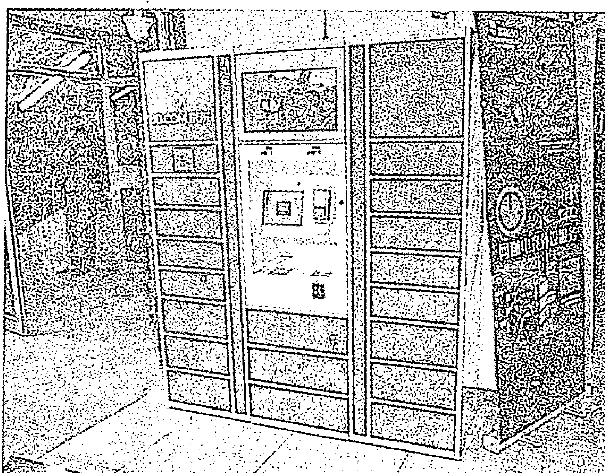

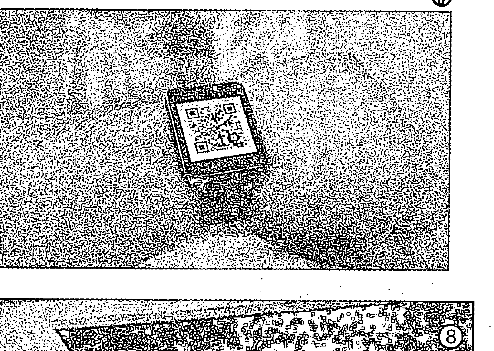

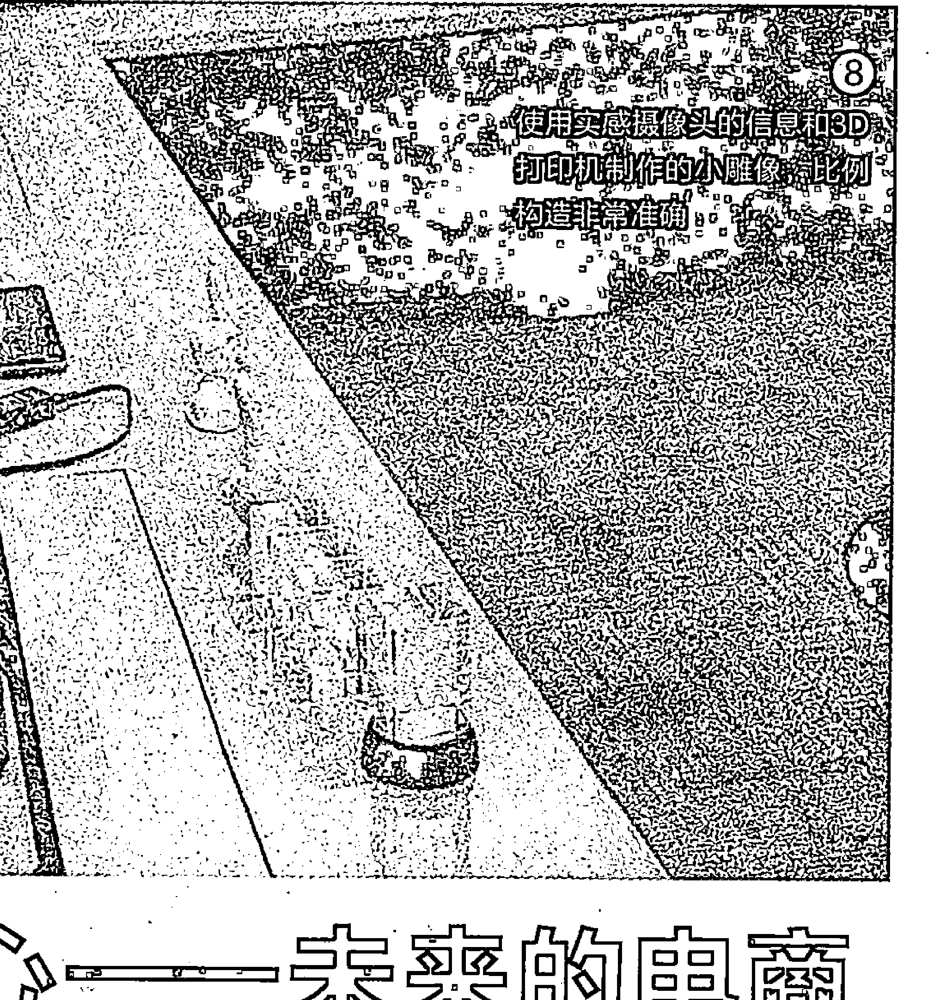

### 贴身贴心——未来的电商

通过大数据，电商为自己和顾客都提供了更好的购物体验，未来这种体验还将进一步提升，其中与智能硬件、AR、VR等技术的结合，很可能是一个重要的方向，它们将会把电商的服务从我们的眼前与指尖，变成贴身又贴心。

从大的方面说，未来的智能电商能够与物联网结合，可以直接探测用户的一些需求，如冰箱中的食物数量、衣物磨损程度、室内空气状况等，进行相应的推荐甚至是自动下单和配送。不过从目前的发展状况来看，当年对智能家庭、物联网等技术的发展有些过于乐观了，我们近期能够看到的仍然是一些分散式的智能“节点”，无法形成真正的所谓物联网。不过相对的，个人智能硬件却在快速发展，并且更容易地融入网络并和各种网络服务连接起来。在智能硬件的应用方式上，首先当然就是更方便的支付，在手机和智能手表上，都能使用二维码（图7）或NFC方式，不仅能够购物，还有刷卡乘车等扩展应用，让我们的生活更方便。其次，目前可以监控体征的智能硬件也非常多，目前一些电商和网络服务，特别与医疗、医药、健康保健、健身锻炼等相关的厂商，已经可以识别和使用相关信息。未来智能硬件与电商等网络服务的联系肯定还会继续扩大，在智能家庭、智能家居普及前，成为物联网发展真正的先锋。

AR和VR的应用模式，目前已经在一些电商中进行摸索。早在2014年底，京东就与Intel合作，尝试利用实感技术自动测量用户的身形、脚型等信息，进而帮助用户选择更合适的服装鞋帽。实感摄像头可以探测深度信息，进而形成准确的3D构型，用户可以利用实感摄像头构建的真实体型进行试穿试戴，让用户看到商品在自己身上的真实效果，避免‘买家秀’与‘卖家秀’总是天差地别的尴尬情况（图8、图9）。

在一些家具家装电商中，已经开始有AR+VR，或者说是MR（混合现实）的尝试。通过VR设备或只需要简单的智能设备，用户就可以看到家居在房间中的实际摆放情况，或者直接‘走进’装修后的房间，提前观看完工后的房间（图10）。在虚拟化的场景中，用户可以很方便地进行移动家具、调整装修等操作，来检查家具是否符合自己的需求，或者获得自己最满意的房间布局、装修效果。

其实相对于大数据和智能无人分拣、快递方式，智能硬件和VR、AR也是广大用户真正能直接接触到的电商变化，而要亲身体验，除了电商的技术支持外，还需要我们选择一些相关的设备，例如可进行电子支付的智能手表、可对物体进行实际测量的摄像头，以及支持电商虚拟技术的显示设备。继续往下看。

# 特别报道

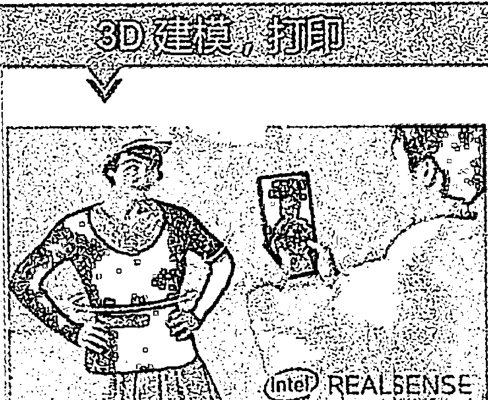


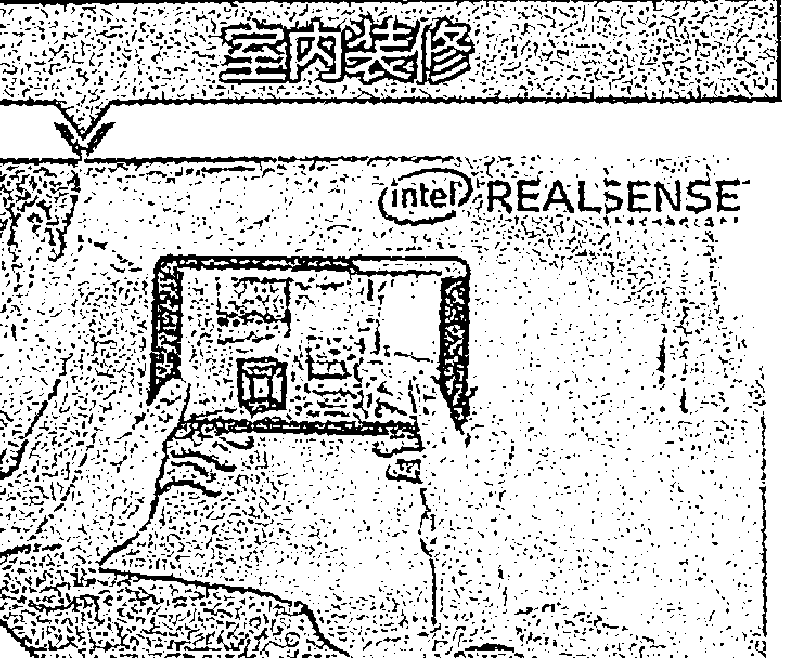

## AMAZFIT智能运动手表

AMAZFIT智能运动手表外观炫酷，很适合资金并不充裕且比较喜欢‘秀’的年轻人。尽管价格不高，但其1.34英寸、320×320分辨率的屏幕已经达到了中端智能手表的水平，可以实现扫码支付等功能。作为运动型智能手表，在基本的手机信息提示、内置信息处理与查询等功能外，它还加入了GPS定位、心率监测、音乐存储播放（蓝牙连接）等功能，并且支持IP67级防护。这款手表的续航比较不错，官方宣称可达5天，即使是频繁使用，维持两三天也没有什么问题，比很多智能手表的一天一充要方便得多。

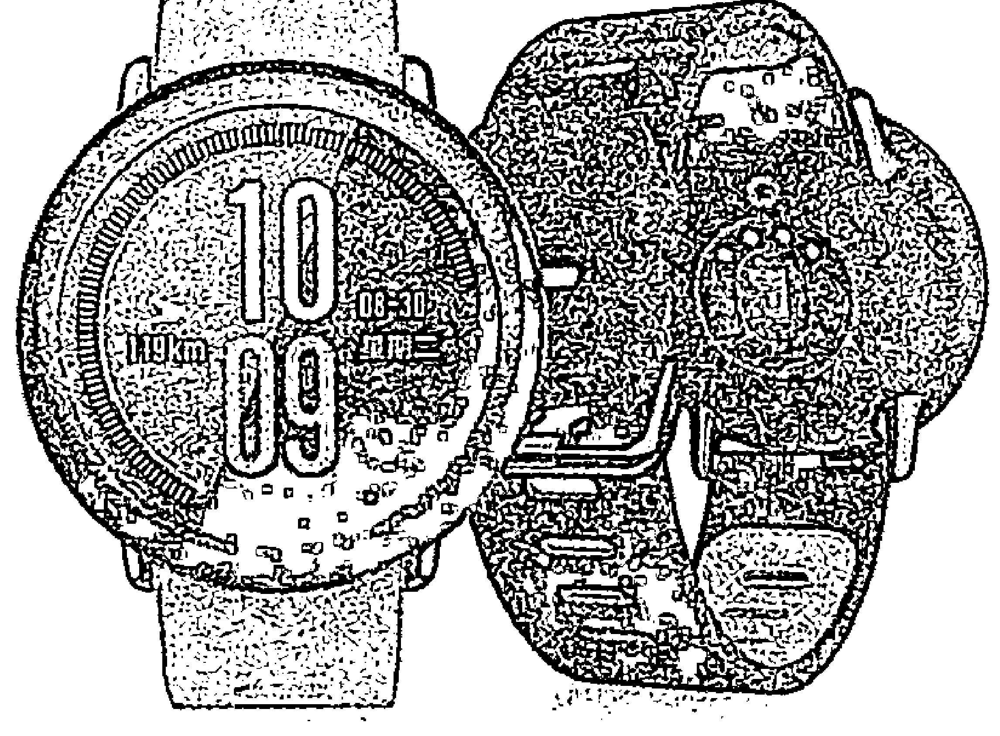

## Ticwatch E时尚智能手表

Ticwatch E是一款更显成熟一些的时尚智能手表，采用了沉稳的黑、白色。这款产品的特色是拥有内置E-SIM卡，可接入3G网络，直接使用手表进行通话，或者使用微信等功能。它采用1.4英寸OLED屏幕，分辨率达到400×400，显示很细腻，便于用户直接在其上运行一些单机或联网应用。Ticwatch E还支持NFC技术，因此可以支持公交刷卡等近场通讯付费方式，另外语音助手功能让使用更方便。这款手表的其他主要特色功能与AMAZFIT智能运动手表类似，支持GPS定位、心率监测、音乐存储和播放（蓝牙连接）、IP67级别防护等。不过从体验来看，其续航略低一些，频繁使用的话还是需要一天一充。

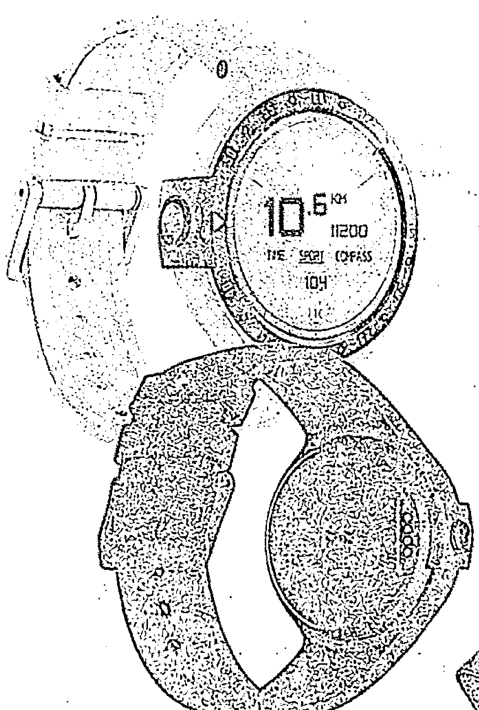

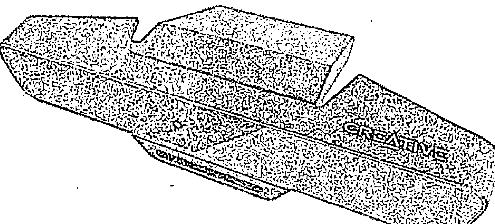

## 创新SR300实感摄像头

能够感知物体实际深度的摄像头对智能电商非常重要，目前有多种相应的解决方案，其中英特尔的实感技术因为强力的背景和广泛的合作，是其中最为令人瞩目的一种。使用实感技术的商品化摄像头主要是来自创新（Creative），其中较新的一款为SR300，其分辨率为1080P，采用USB 3.0接口，景深范围约为20厘米至150厘米，覆盖范围则可达到3米~4米。

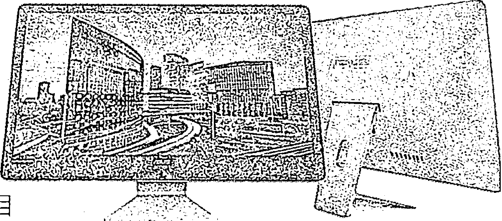

其实相对于购买独立摄像头，集成在电脑中的实感摄像头更加合算。目前市场中采用实感摄像头的电脑主要是多款ThinkPad笔记本和二合一电脑、联想小新V4000，以及华硕Zen AiO Pro一体机，其特征非常明显，那就是明显的双摄像头或者带状的摄像头及附件。

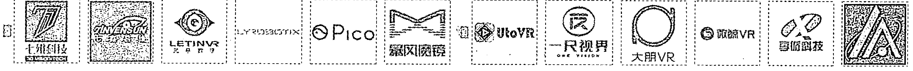

## VR设备

从京东的VR网页可以看到，它目前支持的VR厂商非常多，因此我们选择VR设备也比较简单。如果仅希望浏览VR效果的话，一些价格非常便宜的VR设备就能满足要求，例如149元的暴风魔镜（DayDream）版等。当然我们需要对VR场景进行一定的操作，或者需要结合场景使用AR、MR方式，就需要购买千元以上的设备了，目前兼容性最好的HTC和Oculus套装。基于微软技术的MR设备也可能是未来不错的选择，目前一些厂商已经推出了相应的产品，价格有高有低，戴尔刚发布的Visor混合现实头戴显示设备是其中比较值得考虑的一款，也是一款公开宣称要进入内地市场的产品，目前它在美国市场的套装价格为449.99美元，约合3000元人民币。

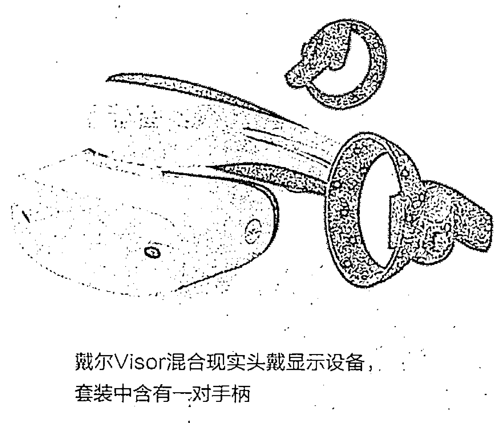

在方便的电商和痛快的双十一背后，还隐藏着更多我们看不到的科技与未来，它们与背后出色的技术人员，不仅为我们愉快的购物体验做出了巨大贡献，还将为我们开创更好的未来电商。作为我国领先的网络应用领域之一，未来的电商体验究竟是如何的呢？是否还能保持世界上的领先地位呢？让我们拭目以待吧。

# 八仙过海
AMD新一代APU乱斗

策划|《电脑爱好者》编辑部

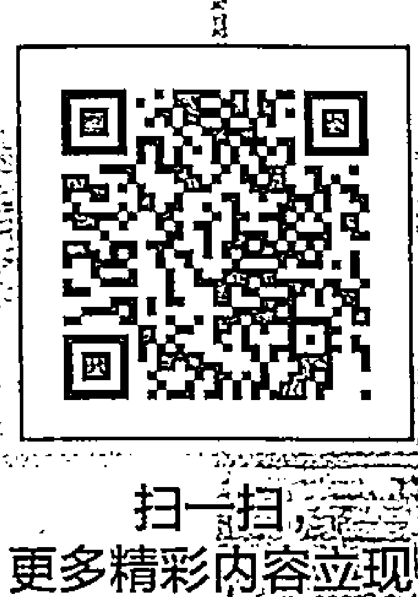

在笔记本领域，英特尔旗下的酷睿处理器家族无疑是知名度最高的芯片，随着第八代酷睿Kaby Lake Refresh平台的普及以及Coffee Lake-H和Cannon Lake平台发售日期的临近，新一代游戏本和PC平板二合一设备已经开始摩拳擦掌了。

# 温故而知新
回顾AMD历代APU家族

和英特尔相比，AMD在笔记本领域始终没能占到主导地位，在绝大多数普通用户心里的存在感很低。那么，难道是AMD不重视移动处理器的发展吗？答案自然是否定的，AMD从始至终都没有放弃在移动站场的努力。

实际上，在移动处理器市场英特尔和AMD的竞争始终就没有停歇过，AMD旗下的APU也已经经历了八代产品的更迭，只是在过去的七代APU一直无法在性能和功耗层面占到同期酷睿处理器的便宜，所以始终未能成为市场的主流。好消息是，2017年10月底，AMD终于将年初上市且在DIY市场取得无数好评的锐龙Ryzen系列引入到了移动战场，代号为“Raven Ridge”的锐龙移动处理器已然正式来袭。那么，作为AMD旗下第八代APU家族，新一代的锐龙移动处理器是否值得我们期待呢？

# 从龙世纪到APU一统江湖

在很多多年以前，PC领域（台式机+笔记本）还是奔腾一统江湖，而Mobile Pentium则是英特尔专门针对笔记本定制的移动芯片。面对越来越红火的笔记本市场，AMD自然也不能闲着，于是就以“龙”之名，和英特尔展开了军备竞赛。

## 以速龙之名反击

在AMD历史上，首个能与Pentium抗衡的处理器来自Athlon（速龙）家族，而Athlon XP-M和Athlon 64-M则是该家族的低功耗移动版（图1），用来和Mobile Pentium抢生意。

为了规范笔记本市场，英特尔抢先提出了迅驰平台概念，强调CPU、芯片组和无线网卡都是笔记本不可分割的组成部分，并取得了极大的成功。一时间，“这款笔记本迅驰了吗”成为用户最常用的疑问句。

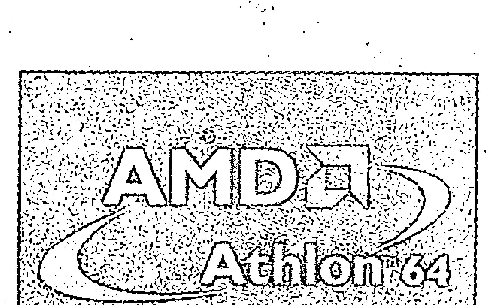

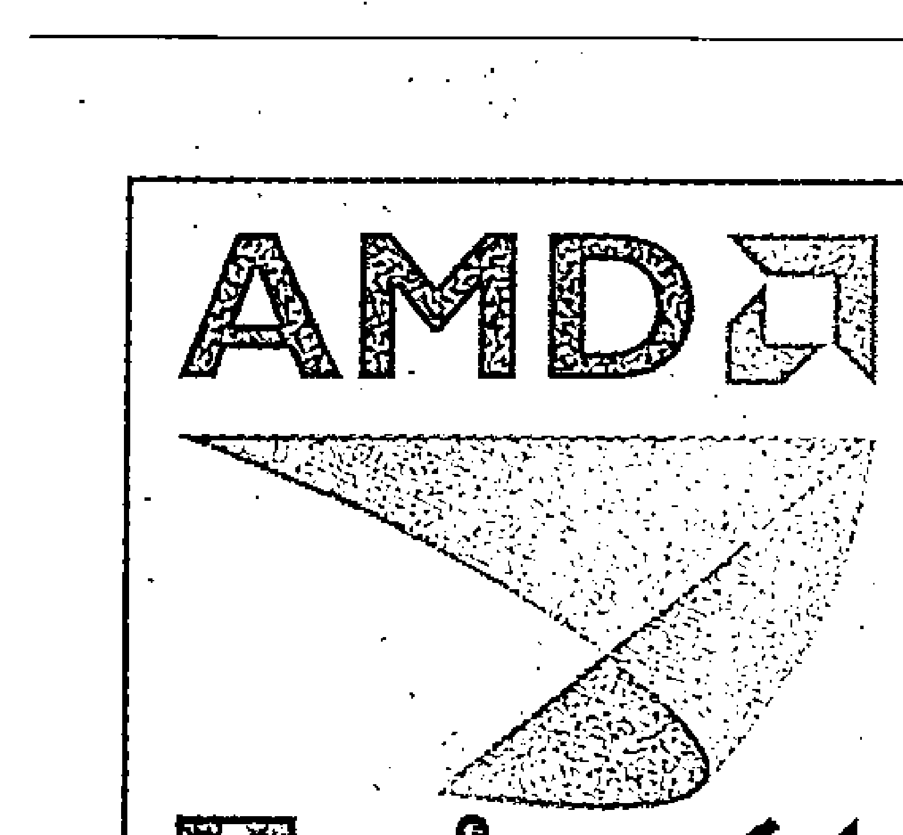

## 多条飞龙出击

迅驰平台发布之后，AMD发现自己一夜之间就被市场边缘化了。为了抢回客户，AMD也在笔记本领域提出了“平台”的概念（比如Kite、Puma、Tigris、Danube、Yukon等），只是没有学习英特尔迅驰强行捆绑Intel自家的芯片组和无线网卡，而是允许OEM厂商搭配第三方芯片组和无线网卡，较高的自由度受到了业内的广泛好评。

同时，AMD凭借Turion（炫龙），一举将笔记本处理器领进了64位时代（图2），随后还先后推出了移动版的闪龙（Sempron，定位低端，对手为赛扬M）和羿龙（Phenom，定位高端，对手为酷睿）。至此，多条以飞龙命名的处理器，就组成了AMD移动家族的豪华产品线。

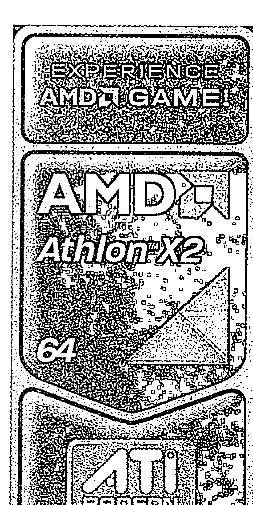

## 迈入融聚时代

AMD在很早以前就发现了一个问题，CPU性能固然重要，但在以游戏为代表的多媒体体验上，更强的GPU才是王道。考虑到英特尔有自家的集成显卡技术，虽然（在当时）性能极为孱弱，但也能满足办公和基础娱乐的需求。于是，AMD计划来次“弯道超车”，以GPU作为突破口，从而在笔记本领域取代英特尔成为市场的主流。

为了实现这个目的，AMD在2006年7月24日花费54亿美元的巨资收购了拥有21年历史的全球领先图形IC厂商ATI（图3），随后提出了著名的AMD+ATI芯片组+ATI显卡的“3A”平台概念，一时间名声大噪（图4）。

而APU是“Accelerated Processing Units”的简称，中文名字叫加速处理器，是AMD基于Fusion融聚理念且已酝酿3年之久的战略级产品（图5）。APU最大的特色就是将AMD的CPU、DX11级别的GPU和北桥芯片整合在一个单元中，首次将AMD引以为豪的3A平台“融聚”到了一颗APU身上。

至此，AMD终结了混乱的羿龙、炫龙、速龙和闪龙乱舞的格局，精简的产品线和规范的型号命名，也便于消费者快速锁定符合需求的产品。

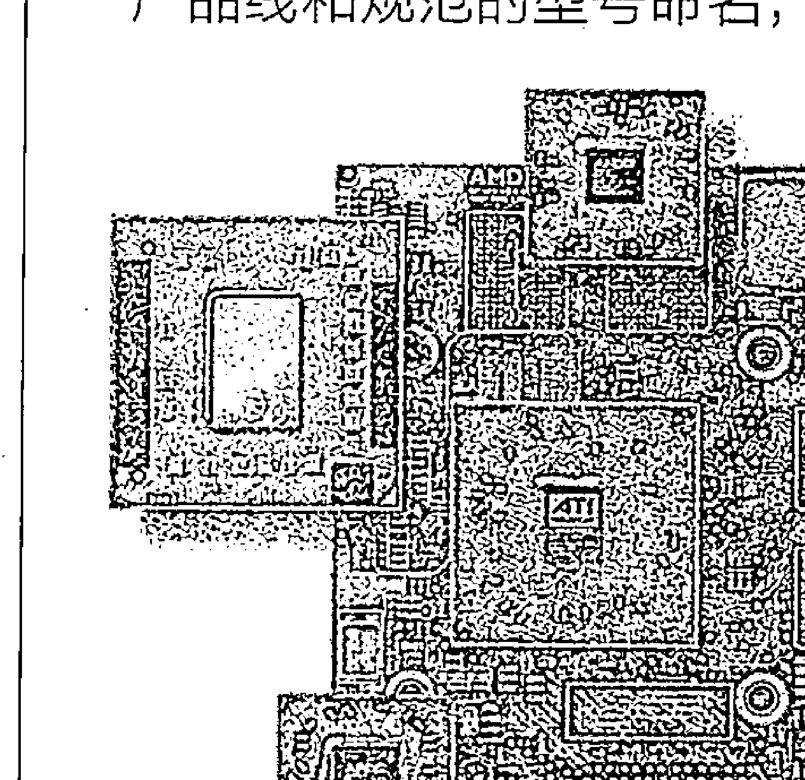

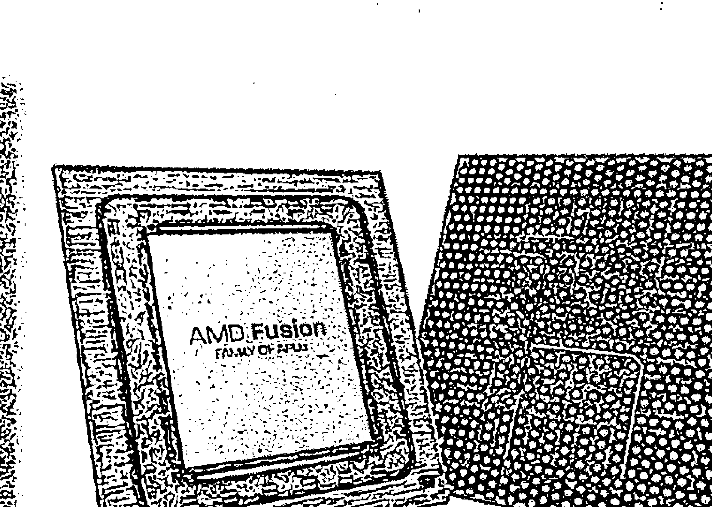从1到7重新认识APU成员

AMD自从2011年推出第一代APU以来，迄今APU也已经历了七次升级，恰好与英特尔酷睿平台的更替节奏相似。在解析第八代APU平台之前，我们还是先来回顾一下前七代APU的历程吧。

第一代APU: Llano (2011年)

AMD第一代APU平台的架构代号为“Bobcat”（图6），基于40nm工艺打造，并被细分成了“Llano”、“Zacate”和“Ontario”的三个子系列，字母代号为A（包括A4/A6/A8， TDP为35W或45W， 定位普通笔记本）、E（如APU E-350， 18W TDP， 定位轻薄本）、C（如APU C-50， 9W TDP， 定位上网本）。其中，定位最高的Llano APU系列才被公认为第一代APU（图7）。

第一代APU主要包括四种特性：超低功耗、全面支持DX11、提升高清硬解性能之后的UVD 3.0技术，以及对应如Office、IE9等软件的加速计算功能。以定位偏高的A8-3500M为例，它属于四核异构计算处理器，在其内部已经实现了异构计算体系，主频为1.5GHz~2.5GHz，集成Radeon HD6620G显卡（400个流处理器），TDP为35W。

而这一时期APU笔记本主打的卖点，就是允许Radeon HD 6000M系列独立显卡可通过PCI-E X16通道和处理器相连，与APU内置的图形核心组成双显切换、混合交火，虽然效果达不到1+1≥2，但综合表现还是>1的。

第二代APU: Trinity (2012年)

AMD第二代APU平台的架构代号为“Trinity”，采用32nm工艺设计，在性能、功耗和功能方面都有较大的提升（图8），比如内置新一代高清媒体加速器、集成Radeon HD7000系列显卡，支持第三代AMD智能超频技术等等。而Trinity APU最大的变化，在于支持Turbo CORE 3.0动态超频技术，将具备双UTDP的Barts架构引入到了APU当中，同时进一步加深了GPU与CPU部分的联系，从而实现了显示输出与通用计算性能的同步提升。

考虑到这一时期上网本已经退出历史舞台，超极本概念喧嚣尘上，所以AMD放弃了一代APU的C系列，E系列改为入门级，而A系列的变化则最大：新增定位更高的A10-4600M，最高主频可达3.2GHz，集成Radeon HD7660G显卡，而TDP被控制到了35W。同时还新增A10-4655M和A6-4455M这种25W和17W TDP的产品线，专为和超极本相似的轻薄产品定制。

第三代APU：Richland/Kabini（2013年）

AMD第三代APU平台的架构代号为“Richland”（图9），为了迎合营销需要，此次AMD引入了更酷的中文命名，比如低电压版至尊高性能APU、经典主流APU和至尊移动APU等系列，分别针对游戏、高清娱乐、触控笔记本、平板电脑等不同的用户需求（图10）。

Richland APU继续使用32nm工艺设计，采用了AMD PileDriver核心架构与Radeon HD8000系列显卡，支持AMD手势控制、脸部登录、屏幕镜像技术、DirectX 11.1、Radeon双显卡交火和AMD快启等最新技术。以面向高端的A10-5750M为例，它的最高主频可达3.5GHz，集成了Radeon HD8650G显卡，和独显组成交叉火力后可以实现更强大的3D性能。

“Kabini”是三代APU的低功耗版，也就是针对类似超极本形态产品定制的产物。它基于28nm工艺设计，属于SoC芯片，内部整合了Jaguar美洲虎架构CPU核心、GCN架构GPU核心、内存控制器、PCI-E、I/O、视频输出、USB3.0主控等等，有利于帮助设备进一步瘦身，代表产品有A6-5200和E2-3000等。

第四代APU：Kaveri（2014年）

AMD第四代APU平台的架构代号为“Kaveri”，它最大的进化就是首次实现了HSA架构特性（图11）。而HSA架构的特色就是GPU与CPU不再是分开工作，该架构可以让GPU与CPU同时成为一件任务的处理媒介，从而使Kaveri APU处理任务的效率得到大幅提升，达到1+1>2的效果。

具体来说，Kaveri APU基于28nm工艺设计，由多达12个计算核心构成，包括4颗“压路机”X86核心和8颗GCN GPU核心，支持DX 11.2、UVD 4.2/VCE 2.0编解码功能。此外，Kaveri APU还支持Mantle技术以及AMD TrueAudio技术。前者相对于DirectX可以为用户提供性能更强、功能更加全面的图形技术支持，同时还能提升手势控制体验。而AMD TrueAudio技术则可以让笔记本电脑的音质输出更加卓越，代表产品包括AMD FX-7500、A10-7300和A8-7100等，融合的GPU型号分别为Radeon R7、Radeon R6和Radeon R5。

第五代APU：Beema（2014年）

Beema APU属于低功耗移动平台，我们能将其视为三代Kabini APU的升级版，依旧是28nm工艺设计，但它却将CPU部分换成了Puma+美洲狮，GPU架构也升级到GCN 1.1，支持系统级别电源管理，号称可在几乎一半的TDP下带来50%的频率提升。

同时，Beema还整合了ARM硬件加密安全模块（图12），融入了Cortex-A5架构的TrustZone技术，AMD称之为“平台安全处理器”，代表产品包含A6-6210和E2-6110等。

第六代APU：Carrizo（2015年）

第六代APU有着非常重要的意义，因为按照AMD APU四步走的战略，经过Llano CPU/GPU物理整合、Trinity/Richland的CPU/GPU互联增强、Kaveri的CPU/GPU统一寻址，直到Carrizo才最终在架构、操作系统、加速计算等各个方面做到CPU/GPU的真正融合与异构计算（图13）。

具体来说，Carrizo APU依旧是28nm工艺设计，它基于AMD挖掘机核心和第三代GCN图形核心架构设计，提供12个计算核心（4个CPU+8个GPU），通过异构系统架构实现创新计算体验，并且支持DirectX 12和HEVC硬件解码技术。Carrizo APU代表型号有A8-8600P、A10-8700P和FX-8800P，分别集成Radeon R6和Radeon R7显卡（图14）。

第七代APU：Bristol Ridge/Stoney Ridge（2016年）

第七代APU较上代产品主要在游戏性能、视频渲染以及文件压缩性能上有所改进。这一代的APU被划分为四核的Bristol Ridge和双核的Stoney Ridge两个分支家族，其中Bristol Ridge APU定位高端，包括35W和15W两种版本以及AMD FX（如FX-9800P）、A12（如A12-9700P）和A10（如A10-9600P）三种规格。而Stoney Ridge APU则主打低功耗，包括15W的A9-9410、A6-9210和E2-9010，它们之间的差别主要由15W/35W热设计功耗以及R5/R7“融合单显”两方面的差异化组合产生（图15）。

高开低走APU逐渐沦落边缘

在2017年以前，虽然AMD APU和英特尔酷睿都经历了七次更新迭代，但能被消费者口熟能详的却大都为酷睿家族，作为首创Fusion融合理念的APU却逐渐被边缘化，这又是为什么呢？

英特尔也玩融合

在很早以前，笔记本领域CPU和GPU都是分家的。请注意，这里的GPU指的不是独立显卡，而是集成显卡。在AMD计划推出第一代APU之前，集成显卡都是寄生在北桥芯片内，需要占用笔记本主板上额外的一部分空间。AMD收购ATI最大的愿望，就是终有一天能将CPU和GPU封装进同一颗芯片内（图16）。

就在AMD紧锣密鼓准备第一代Llano APU之际，英特尔却抢先一步推出了第一代酷睿处理器（Westmere架构），将CPU和GPU打包封装。虽然此时酷睿处理器内的CPU和GPU核心内部还是独立存在的，但毕竟GPU已经不再受北桥芯片制约，至少在物理结构上实现了“二合一”（图17）。2011年，英特尔第二代酷睿处理器（Sandy Bridge）进一步实现了CPU和GPU的融合。虽然AMD的融合理念提出的最早，但在落实方面却还是落在了英特尔后面。

随后，英特尔历代酷睿家族不断强化集成显卡（又称核芯显卡）性能，EU单元逐渐从6个、12个增加到24个，甚至还推出过拥有72个EU单元的GT4e。虽然早期同档次的酷睿处理器就3D性能的确略逊于APU，但衡量处理器实力的关键还是CPU运算性能和功耗，想弥补图形性能只需添加一颗额外的独立显卡芯片即可，最终导致AMD APU在GPU性能上的优势逐渐被稀释，不再是决定胜败的核心卖点。

被落后工艺拖累

生产工艺是制约处理器性能发挥的最核心指标，哪怕在工艺技术上冠绝群雄的英特尔都有吃瘪的时候（14nm从五代酷睿一直沿用到八代酷睿，被很多DIY玩家戏称为“挤牙膏”），AMD在这方面自然就吃到了更多的苦头（图18）。作为AMD御用的晶圆工厂，Globalfoundries（以下简称GF）总是不太靠谱，AMD第一代Llano APU就因GF 32nm量产遇阻而从2010年延期到了2011年，从而给了英特尔抢先一步融合CPU和GPU的机会。

2014年，英特尔五代酷睿（Broadwell）已经开始尝鲜14nm工艺，而AMD四代Kaveri APU却刚刚试水28nm，并一直沿用到七代APU。在落后工艺的拖累下，AMD就必须在CPU/GPU的核心数量和频率上进行取舍，很难找到一个最佳的平衡点。

打铁还需自身硬

AMD APU从诞生之初，核心架构依次经历了K10→Bulldozer（推土机）→Piledriver（打桩机）→Steamroller（压路机）→Excavator（挖掘机），就AMD自身来看的确是越来越先进，但与同期的英特尔酷睿家族相比，AMD的核心架构却早已落伍。在很多笔记本玩家眼中，“i3秒（AMD）全家”不再是笑话，以七代APU高端的FX-9800P为例，它的性能只与六代酷睿i3-6100U持平（图19）；这就很尴尬了。

| Model | TDP (Watt) | Cinebench R11.5 CPU Single 64Bit | Cinebench R11.5 64Bit | Cinebench R15 CPU Single 64Bit | Cinebench R15 CPU Multi 64Bit | wPrime 32 (-) |
| :--- | :--- | :--- | :--- | :--- | :--- | :--- |
| Intel Core i3-7100U | 15 | 1.03 | 2.85 | 90.5 | 257.5 | 20.25² |
| Intel Core i3-6100U | 15 | 1.11³ | 2.75³ | 97.7 | 247⁷ | 23.51² |
| AMD FX-9800P | 15 | 0.91 | 2.86 | 74 | 236 | 14.4 |
| AMD PRO A12-9800B | 15 | 0.88² | 2.59² | 76² | 225.5² | 13.8 |
| Intel Core i7-3517U | 17 | 1.22¹² | 2.78¹⁴ | | | 18.8⁹ |

同时，受制于工艺和TDP的限制，APU已经很久没有升级GPU的流处理器单元数量了，从Kaveri APU就是512个，到了七代APU还是512个，在3D性能上几乎没什么提升。此外，为了实现APU和AMD独显组成交火，搭载APU的笔记本大都会选择和AMD自家的独显搭配，而近些年AMD移动显卡和NVIDIA同期产品相比性能也是明显落后的，这就导致了AMD笔记本在高端游戏市场的集体失声。

来自Zen的野望

在台式机领域，AMD数年来也一直被英特尔压着打，直到2017年初全新Zen架构处理器（中文名为锐龙Ryzen）的上市才一改AMD往日的颓废，为沉寂已久的DIY领域注入了一针强心剂（图20）。锐龙Ryzen的强势，甚至逼得英特尔大幅降低高端产品的售价，并加速了八代酷睿处理器的变革。好消息是，锐龙Ryzen不再是台式机的专利，它即将为笔记本贡献自己的力量。

Zen+Vega AMD携锐龙APU重“芯”出发

也许是受到了AMD Zen的刺激，英特尔在发布八代酷睿时终于一改“挤牙膏”的策略，首发的Kaby Lake Refresh移动处理器虽然依旧延续了14nm工艺，但却引入了4核8线程，让15W的U系列酷睿处理器有了比肩上代45W H系列酷睿处理器的动力。为了不让英特尔独美于前，AMD也在10月底发布了旗下第八代锐龙APU，其性能提升的幅度甚至能让八代酷睿感到汗颜（图1）。

Zen+Vega=八代APU

10月26日，AMD正式发布了代号为“Raven Ridge”的锐龙移动处理器，也是AMD自推出APU以来的第八代产品，它最大的特色是将Zen处理器架构（CPU）和Vega核显架构（GPU）有机结合，主打轻薄笔记本、二合一等便携设备。那么，第八代锐龙APU到底还有哪些特色？

来自桌面DIY领域的希望

AMD自从发布Zen架构的Ryzen锐龙处理器以来，逼得英特尔不得不提前上演军备竞赛，不仅（桌面）八代酷睿处理器上市时间距离七代酷睿只间隔9个月，而且还让i3变成了4核4线程、i5变成6核6线程、i7变成6核12线程，着实令DIY领域振奋不已。

然而，哪怕是面对最新的八代酷睿，AMD旗下的Ryzen锐龙处理器依旧有着一拼之力。以AMD Ryzen 5 1600X和酷睿i7-8700K为例，两款处理器都是6核12线程，酷睿i7-8700K的日常应用性能大约要比Ryzen 5 1600X高出10%到20%。但是，Ryzen 5 1600X的价格却仅有酷睿i7-8700K官方报价的50%，如果再算上主板成本，在性能价格比层面显然还是Ryzen 5 1600X更占优势（图2）。这就是AMD最新Zen处理器架构的强悍所在。

在桌面DIY领域得以正名之后，AMD终于将Zen处理器架构引入到了移动平台，同时还融合了Vega核显架构与其搭配。这样一来，基于Zen+Vega打造的第八代锐龙APU自然就值得引起我们的特别关注了。

强强联手的底层微架构

AMD八代锐龙APU最大的特色就是采用Zen和Vega两套底层核心架构的组合（图3），所以想对其加以了解，首先就要掌握底层架构的特色所在。

Zen处理器架构

先来看看Zen处理器架构。在与英特尔长期的较量中，AMD早前研发的各种“工程车辆”（如推土机、挖掘机、打桩机等）实在搬不上台面，根本无法撼动对手的领先地位。所以，AMD选择先破后立，而不再是查漏补缺，完全摒弃现有架构，重新设定好“高性能x86处理器”的目标，于是才造就了Zen的诞生（图4）。

Zen架构引入了微指令缓存，对缓存进行层级重构，支持同步多线程（SMT， 每个核心可支持2个线程），配备容量更大更统一的L2缓存、容量更大的L3缓存，再加上GF新鲜出炉的14nm高能效FinFET工艺，想不成功都难。

Vega核显架构

对笔记本专用的移动处理器而言，CPU性能无比重要，但前提是不能被集成的核显GPU拖累。特别是在英特尔酷睿处理器集成核芯显卡越来越强的今天，作为以图形性能起家的APU，如果不能在GPU方面取得较大的领先优势，哪好意思抛头露面？

因此，第八代锐龙APU集成的GPU也不再像前辈那样总是基于GCN架构的缝缝补补，而是引入了AMD最新的科研成果——将Vega架构显卡也打包进了一颗SoC芯片上。简单来说，Vega显卡具备4大特色：高带宽缓存控制器、下一代计算单元NCU、高级像素引擎、新一代几何渲染引擎，定位高端的Radeon RX Vega 64（桌面）显卡在性能上足以挑战NVIDIA旗下的GTX1080（桌面）显卡（图5）。

当然，作为给笔记本准备的第八代APU受制于成本和TDP功耗限制，自然会对集成的Vega核显进行精简。比如桌面Radeon RX Vega 64配备了64组CU计算单元，也就是相当于拥有4096个流处理器。而八代锐龙APU集成的Radeon RX Vega 64则只有10组或8组CU计算单元，等同于640个或512个流处理器。但是，Vega核显如何精简，其性能也要远超早前APU惯用的GCN架构核显，现阶段大幅领先于英特尔核芯显卡是板上钉钉的事儿。

### 锐龙APU的特性

据AMD表示，原本他们对锐龙APU的预期是CPU性能提升50%、GPU性能提升40%（较上代APU）。然而，真正将Zen和Vega塞到一起后却取得了意外的惊喜——锐龙APU的CPU真实性能较上代产品竟然最高提升了200%，GPU性能最高也提升了128%，而且功耗最多降低了58%，真正实现了“加量不加价”的梦想（图6）。

锐龙APU的表现之所以能远超预期，是因为AMD通过最新的Infinity Fabric技术将Zen和Vega两种架构连接起来。具体来说，Infinity Fabric将CPU、GPU、多媒体引擎、显示引擎、内存控制器、I/O以及系统Hub六个部分紧密相连，利用统一一致性控制和数据界面整合并管理整个芯片。

同时，锐龙APU继承且发扬了从桌面锐龙处理器才开始引入的AMD SenseMI技术（图7），除了精确功耗控制、神机网络预测、智能数据预取之外，还有第二代精准频率提升技术、mXFR移动版动态扩频技术，均由Infinity Fabric监测控制，可基于CPU当前温度、性能和负载以25MHz的精度调节频率，从而大大优化了多线程负载执行效率。

- AMD SenseMI技术包括：
- 精确功耗控制
- 神机网络预测
- 智能数据预取
- 第二代精准频率提升技术
- mXFR移动版动态扩频技术

为了控制功耗，锐龙APU还将CPU、GPU作为一个整体来管理，共享协同动力通道，只使用一个系统电压调节器。借助Infinity Fabric技术，锐龙APU的每个CPU核心都能进入CC6深度休眠状态，GPU部分可以关闭最多95%的区域，在当前屏幕静止时Windows系统最多99%的资源将被暂时挂起。同时，当锐龙APU从退出深度休眠到恢复正常运行的速度也大大加快，系统响应速度更为快速。

## 锐龙APU到底有多强

和英特尔第八代酷睿处理器相比，Ryzen 7 2700U和Ryzen 5 2500U的对手分别是酷睿i7-8550U和酷睿i5-8250U，它们都是4核8线程设计。锐龙APU的优势是默认主频更高，劣势是加速频率略逊、高速缓存容量偏低。作为英特尔和AMD未来针对轻薄本领域的当家花旦，它们都拥有15W的标准TDP，可配置TDP区间也很接近，便于OEM厂商针对散热设计和成本制定更合理的功耗墙。

AMD历代APU家族型号颇为繁杂，哪怕是技术控也很难搞明白A12、A10、A8、A6、A4和E系列旗下所有芯片的具体差异所在。好消息是，AMD八代锐龙APU展开了“精兵”之旅，首发的型号只有Ryzen 7 2700U和Ryzen 5 2500U两款（图8），前缀彰显它们的身份（高端的Ryzen 7和中端的Ryzen 5），后缀则代表它们的定位（字母U代表针对移动平台定制的低功耗版）。

我们不妨将两款锐龙APU的规格与上代APU和英特尔八代酷睿进行一下对比（表1），不难发现它们其实都属于一类芯片：专为轻薄本和PC平板二合一设备而生。

和AMD自家的上代FX-9800P APU相比，Ryzen 7 2700U和Ryzen 5 2500U的改进很大，首先就是制程工艺从GF的28nm升级到了14nm，同时还支持同步多线程技术和更高速的DDR4-2400，高速缓存翻番，而且Ryzen 7 2700U的最高主频更是达到了3.8GHz。

| 处理器型号 | Ryzen 7 2700U | Ryzen 5 2500U | FX-9800P | 酷睿i7-8550U | 酷睿i5-8250U |
| :--- | :--- | :--- | :--- | :--- | :--- |
| 制程工艺 | 14nm GF | 14nm GF | 28nm GF | 14nm Intel | 14nm Intel |
| 核心/线程 | 4C/8T | 4C/8T | 4C/4T | 4C/8T | 4C/8T |
| 基础频率 | 2.2GHz | 2.0GHz | 2.7GHz | 1.8GHz | 1.6GHz |
| 加速频率 | 3.8GHz | 3.6GHz | 3.6GHz | 4.0GHz | 3.7GHz |
| 高速缓存 | 4MB | 4MB | 2MB | 8MB | 6MB |
| TDP功耗 | 15W | 15W | 15W | 15W | 15W |
| TDP-UP | 25W | 25W | ---- | 25W | 25W |
| TDP-down | 9W | 9W | ---- | 10W | 10W |
| 核芯显卡 | Vega 10CU | Vega 8CU | Radeon R7 | UHD620 | UHD620 |
| 最大显卡频率 | 1300MHz | 1100MHz | ---- | 1150MHz | 1100MHz |
| 最高内存规格 | DDR4-2400 | DDR4-2400 | DDR4-1866 | DDR4-2400 | DDR4-2400 |

锐龙APU的特色在于集成的Vega核显，Ryzen 7 2700U和Ryzen 5 2500U集成的Vega核显分别配备10组和8组计算单元，GPU频率也相差200MHz，所以二者的图形性能会存在较大的差距，而不是像英特尔方面酷睿i7和酷睿i5只是CPU性能有差距而GPU性能相仿。

由于搭载锐龙APU设计的笔记本还未正式上市，所以我们现在只能通过AMD官方透露的数据判断Ryzen 7 2700U和Ryzen 5 2500U的性能。首先是综合性能部分，以AMD七代FX-9800P APU作为基准100%，哪怕是定位偏低的Ryzen 5 2500U也具备超越八代酷睿i7-8550U的资质（表2）。

表2：锐龙APU综合性能对比表

| 处理器型号 | Ryzen 7 2700U | Ryzen 5 2500U | FX-9800P | 酷睿i7-8550U |
| :--- | :--- | :--- | :--- | :--- |
| TrueCrypt 7.1a | 249% | 192% | 100% | 178% |
| PassMark 9 | 176% | 172% | 100% | 188% |
| POV-Ray 3.7 | 199% | 168% | 100% | 166% |
| PCMark 10 | 163% | 141% | 100% | 133% |

接下来是纯CPU性能，通过CineBench R15测试CPU的单核和多核成绩，虽然Ryzen 7 2700U的单核性能略逊于七代酷睿i7-7500U，但是它的多核性能却足以媲美45W TDP的七代酷睿i7-7700HQ，远超八代酷睿i7-8550U（表3）。

表3：CineBench R15软件测试成绩

| 处理器型号 | Ryzen 7 2700U | i7-7700HQ | i7-8550U | i7-7500U | FX-9800P |
| :--- | :--- | :--- | :--- | :--- | :--- |
| 单核 | 144 | 159 | 159 | 147 | 74 |
| 多核 | 719 | 734 | 498 | 325 | 236 |

最后是大家最关心的GPU性能对比，锐龙APU集成Vega核显的表现不负众望，大约有着2.5倍于八代酷睿核芯显卡的性能，十分接近NVIDIA最新GeForce MX150独显的成绩（表4）。换句话说，Vega核显足以将英特尔锐炬Pro核显斩于马下，堪称时下最强的笔记本集成GPU。

表4：锐龙APU集成Vega核显性能对比

| 处理器型号 | Ryzen 7 2700U | i7-8550U | i7-8550U |
| :--- | :--- | :--- | :--- |
| 测试显卡 | Vega 10CU | UHD620核芯显卡 | 搭配MX150独显 |
| 3DMark11 | 4072 | 1772 | 4570 |
| 3DMark-Time Spy | 915 | 350 | 971 |

## 一切就绪 只欠东风

从2011年APU诞生以来，前七代APU活得实在辛苦，AMD经历了制程工艺、CPU架构和GPU架构修修补补的太多磨难。还好，第八代锐龙APU的表现令人振奋，凭借着Zen+Vega核显的强强联合，AMD总算可以终结APU家族“i3秒全家”的尴尬历史，足以应对来自英特尔八代U系列酷睿处理器家族的挑战，并帮助极致轻薄笔记本在没有空间安置独立显卡的前提下也能具备足够强悍的游戏动力。

不过，锐龙APU能否取得成功，最终还得看OEM合作伙伴的态度。AMD在发布锐龙APU时只曝光了3款新品，分别为惠普ENVY X360、宏碁Swift 3和联想IdeaPad 720S（图9），与英特尔发布八代酷睿时几乎所有笔记本品牌争先发布新品有着鲜明的对比。希望待锐龙APU正式上市后能有更多品牌助威吧，只有AMD再度走向辉煌，我们才能享受到因市场竞争带来的技术革新加速度。

## 想说爱你不容易

# 外置显卡给力几何？

文|墨汁做寿

扫一扫，更多精彩内容立现！

伴随着游戏长大的一代人，虽然已经成人，进入了高校甚至走入社会，开始为学业或生计而奔忙，但相信心里还燃烧着不灭的游戏魂吧。只是考虑到实际的学习和工作需要和使用环境，平时使用的不是配置乏善可陈的商务本，就是追求便携性的轻薄本，用来打游戏是绝对没戏了。在这种情况下，有不少人的选择都是在家里买一台高性能台式机或游戏本，作为业余时间的专业游戏平台。不过这种解决方案是有一些问题的，首先当然是成本较高，其次还有占用空间大、经常需要进行文件交换、不易携带等很多问题，因此很多人将目光投向了另一种方案——外置显卡。

所谓的外置显卡，实际上就是用高速接口与笔记本电脑连接的一个显卡扩展坞，从目前来看，当然就是自带控制电路的PCI-E插槽。不过事情并没有这么简单，由于中高端显卡的功耗较高，目前还没有外部接口可以直接提供足够的供电，甚至一般的笔记本自身的全部供电能力也不一定能支持中高端显卡，所以这些扩展坞还需要自带电源；为了承载电源、显卡、接口和周边电路板，又需要一个外壳；把外壳罩在高发热量的中高端显卡上，就必须注意散热设计，比如设计大量散热孔或安装风扇；还有为了充分利用高带宽接口而扩展的USB接口等。为了在机箱之外支持一块显卡而扩展出的复杂体系，使得外置显卡的成本远高于简单的独立显卡，且在运行中会受到很多与正常扩展方式不同的影响。所以外置显卡的实际表现究竟如何？它到底是否值得选择？应该是很多人非常关心的问题。下面我们就结合已有的测试和市场中的产品来了解一下吧。

## 欢喜参半 —— 外置显卡实测

我们对外置显卡的性能存在怀疑是有一定原因的，因为它在与其他配件的通信速度、性能匹配等方面，相比平衡搭配的台式机，甚至是游戏本，都有一定的不足，显然会影响其发挥。下面我们就具体谈一下这些可能形成的性能“瓶颈”。

首先，目前高性能显卡与处理器的信息交换需求已经不弱于内存。例如我们常用的PCI-E 3.0 ×16插槽其实就是汇集了16个PCI-E 3.0通道，总带宽达到了16GB/s，而长期与其在主板上搭配的DDR3 1600内存带宽也仅有12.8GB/s，组成双通道时总带宽则为25.6GB/s。而相对于PCI-E 3.0，目前我们能使用的最强外部接口雷电3(Thunderbolt 3)，也是目前外置显卡普遍使用的接口，它虽然同样基于PCI-E 3.0技术，但仅使用了4个通道，所以带宽仅有5GB/s，完全无法与PCI-E 3.0 ×16插槽相比。

其次，选择使用外置显卡的用户，绝大多数是因为使用了追求轻薄便携而没有内置独显的电脑，如便携本或者微型主机等。为了保证足够打动消费者的轻薄设计，这些主机不仅不会安装中高端独立显卡等高功耗高发热的组件，还要尽量降低必备组件的体积、功耗和发热量，如采用低电压低频率处理器、低电压小容量内存、低转速硬盘或低频率SSD等，甚至为此不惜牺牲一定的性能。很明显，在这种情况下很多轻薄型主机的主要组件在运算速度上是很难与中高端显卡相匹配的，在需要多个配件共同计算的应用中，这些低速配件肯定会在一定程度上影响中高端显卡的发挥。

然而，我们也看到，厂商已经发现了超“摩尔定律”发展的GPU与其他配件性能不匹配的问题，在GPU和显卡设计上也在一定程度上尽量减少对其他配件能力的依赖。例如在拥有高带宽的PCI-E ×16插槽的同时，还是坚持使用大容量高带宽显存而尽量少地使用系统内存，同时增强自身的通用计算能力，从而把框架、变形、光影等一些计算从处理器接管过来。在一些实际应用中当然存在着必须由处理器计算的内容，如3D单机游戏中NPC的模拟思考与行动规划、武器的弹道、伤害判定等，如果处理器在这方面的处理速度实在不足，显然还是会影响整体帧速的。

那么在这些因素的影响之下，外置显卡的表现究竟如何呢？我们以采用i7-6700HQ处理器的笔记本和使用i7-6700K的台式机为例，分别使用外置和内置的6GB显存版本NVIDIA GeForce GTX 1060独立/移动版显卡进行测试。

> 新的雷电3接口采用不分正反的USB Type-C结构，与USB甚至DP接口兼容且常常共用接口

**处理器规格与3D性能**

| 项目 | 外置1060+i7-6500U | 外置1060+i7-6700HQ | 移动版1060+i7-6700HQ | 台式机内置1060显卡+i7-6700K |
| :--- | :--- | :--- | :--- | :--- |
| 处理器基础/睿频频率 | 2.5GHz/3.1GHz | 2.6GHz/3.5GHz | 2.6GHz/3.5GHz | 4GHz/4.2GHz |
| 处理器核心/线程数量 | 2/4 | 4/8 | 4/8 | 4/8 |
| 三级缓存 | 4MB | 6MB | 6MB | 8MB |
| 3DMark FireStrike | 7024 | 9821 | 9715 | 10824 |
| 3DMark FireStrike Ultra | 2828 | 3014 | 2716 | 3033 |
| 3DMark TimeSpy | 3180 | 3475 | 3564 | 4102 |
| SteamVR性能 | 6.8 | 7.1 | 6.4 | 7.8 |

需要注意的是，笔记本平台的GTX 1060移动版显卡核心频率比台式机和外置显卡使用的桌面版产品要低一些。我们选择的低功耗处理器样品为一台采用i7-6500U的超极本，其性能和价位在目前的超极本中已算是中上水平。

从测试结果可以看出，即使是最高规格的超低电压处理器，其相对较低的性能，仍然对GTX 1060这种中端游戏显卡的发挥造成了影响，对GTX 1080或者RX Vega这种高端显卡的影响当然也就更大。不过从测试中我们也发现，如果使用超高分辨率、超高画质等3D设置，以大量图形计算和渲染“吃尽”显卡能力，让帧速下降到一定程度的话，处理器的配合能力也就不那么重要了。例如在SteamVR和测试4K分辨率的3DMark FireStrike Ultra中，超低电压处理器配合GTX 1060显卡的成绩都超过了采用移动版独显的游戏本，更接近于这块显卡的实际能力。

对于使用高端商务本或者小型台式机的用户，四核i7移动版处理器已经可以让中端游戏显卡比较好地发挥能力，在测试中甚至发现，此时低频版的移动显卡反而限制了i7-6700HQ的能力。对这些产品来说，外置显卡的扩展方式显然是很不错的，而且还可以很好地支持更高端的显卡扩展，如GTX 1070等。

## 丰简由人——外置显卡选购

从前文可以看到，外置显卡或外置显卡扩展盒/坞实际上是随着雷电3接口的出现而实用化的，在此之前的产品，或者受制于接口速度而性能受限，或者采用专用接口而只能适配某个系列甚至某个型号。在采用了通用化且日渐普及的雷电3接口后，厂商们得以设计出了更加通用同时又各具特色的产品。

### 技嘉AORUS GTX 1070 GAMING BOX

-   接口：雷电3
-   尺寸：212mm×96mm×162mm
-   供电能力：450W
-   特色：高性价比，小巧便携

从名称就可以看出，这是一款已经内置了显卡的扩展盒，其外形比较小巧，重量仅有2.6kg左右，用大一些的电脑背包完全可以与笔记本一同携行。其内置显卡应该是技嘉GV-N1070IXOC-8GD或者其特殊版本，采用短卡设计，且频率设置比较保守。考虑到内置显卡的实际价格（约3499元），其壳体价格仅有约1300元，性价比还是不错的。其供电能力应该能满足未来中高端显卡的需求，但由于空间有限，升级时应该也需要选择mini版显卡。除了HDMI×1、DP×1、DVI-D×2的显卡输出接口外，它还提供了3个标准USB 3.0接口、一个快充USB 3.0接口，以及一个支持100W输出的USB Type-C接口。

### AKiTiO Node

-   接口：雷电3
-   尺寸：42.8cm × 14.5cm × 22.7cm
-   供电能力：400W
-   特色：兼容性出色

AKiTiO Node是目前比较受欢迎的第三方外置显卡扩展方案，从目前各方面的反映看，它对各品牌显卡，各品牌Windows PC甚至是Mac电脑的兼容性都不错。其扩展坞的空间较大，可容纳32cm×17cm的高端全长显卡，400W的供电能力也允许它升级使用高端显卡。尽管这款外置显卡扩展坞的体积已经谈不上便携了，但它还是在尾部设置了一个金属提手，便于用户外出携带。

### 影驰SNPR GeForce GTX 1060 6GB

-   接口：雷电3
-   尺寸：165mm x156.5mm x 73mm (GeForce GTX 1060 6GB)
-   供电能力：230W
-   特色：小巧便携，不能直接升级

顾名思义，影驰SNPR GeForce GTX 1060 6GB，就是基于GTX 1060显示核心的外置显卡，带有HDMI、DP和DVI接口各一个。其重量仅有1.38kg，相当于一块高端显卡或者一台小尺寸超极本，当然它采用的电源外置方案也降低了壳体自身的重量，而外出携带时必须考虑到电源的重量，便携和易用性并没有那么夸张。它是一款真正的外置显卡，而非我们常见的显卡扩展盒/坞，采用专门设计的内置显卡，结构更加紧凑，但相对价格就要贵一些了，1060显卡3999元的价格与技嘉产品相比，竞争力似乎不足。从目前的发展来看，SNPR系列可能会发展出SNPR GeForce GTX 1070/1080等不同的型号，估计尺寸也会发生变化，但考虑到采用的特殊多层PCB设计以及外置电源方案，升级能力不容乐观。

### 华硕玩家国度ROG XG STATION 2

- 接口：雷电3
- 尺寸：456mm×158mm×27.8mm
- 供电能力：600W
- 特色：外形炫酷，功能齐全

玩家国度ROG XG STATION 2又是一款“玩家国度”的典型产品，其价格高达4999元，且内置显卡需要另外购买。当然作为华硕的高端产品，无论是外形设计、功能规划还是绝对性能，ROG XG STATION 2都是相当出色的，例如它独特的双体设计、RGB背光方案、高达600W的供电能力、2.5槽的巨大显卡空间、丰富的额外扩展接口等，都表现出了旗舰级产品的独特魅力。

总之：外接显卡在某些情况下，确实是不错的3D能力升级方式，但我们也必须正视它在很多情况下的巨大性能损失。而且即使不考虑显卡价格，一个扩展盒/坞的实际采购价格也都在1400元以上，且必须采用比较新且昂贵的平台，才能够获得外置显卡必需的雷电3接口支持能力。

## 买CPU 送GPU

### 英特尔怎么就成了显卡霸主？

策划《电脑爱好者》编辑部

我们都知道，决定PC综合实力的两个核心指标就是CPU（处理器）和GPU（显卡），前者决定日常应用的快慢，而后者则影响游戏运行卡顿与否。提起CPU，英特尔自然是无冕之王，AMD则始终处于万年老二的位置。提起GPU，相信很多同学首先就会联想到NVIDIA显卡的绿标和AMD显卡的红标（图1），因为性能级独立显卡市场就是被这两个厂家瓜分的。

然而，纵观整个GPU市场，英特尔才是王中之王，其背后的原因就是英特尔始终倡导的营销战略：买CPU送GPU。

从2000年开始，英特尔品牌GPU就已占据了34%的图形市场份额，到了2010年，英特尔GPU更是始终保持50%以上的市场份额，哪怕近两年因“挖矿”热潮而刺激了NVIDIA/AMD显卡销量，英特尔也依旧保持超过65%的绝对领先优势（图2）。

问题来了，谁见过英特尔品牌的显卡？提到显卡不就应该是插在台式机主板上那又大又长的板卡（图3），又或是镶嵌在笔记本主板上的那颗芯片吗（图4）？
实际上，英特尔之所以能在GPU领域称王，就是依靠“集成显卡”和“核芯显卡”这两种“不起眼”的家伙，逐渐实现了对整个图形市场的蚕食。

### 英特尔：独显？我也曾拥有！

在DOS时代，PC有颗CPU就足够了。自从微软通过Windows打开系统图形化的视窗之后，PC平台就需要添加GPU用来“翻译”（显示）各种图形，加速在多媒体和游戏领域运行时的效率。

### 首秀又是绝唱的Intel i740

没错，在3dfx、ATI、NVIDIA、S3、Trident和Matrox争雄的年代，英特尔在1998年也曾推出过自主品牌的独立显卡——Intel i740（图5）。这颗GPU是英特尔以通过购买Real3D公司20%股权为代价，与其携手合作定制的产品，从而以较小的代价迅速进入了3D图形市场。

鉴于英特尔在CPU市场的领导地位，再加上Intel i740在当年的规格不赖且售价亲民，所以一经问世就受到了很多显卡厂商的青睐。其中，英特尔原厂的i740显卡更是做工精致，曾一度被玩家称为“首款采用风扇散热的民用级显卡”。

随后，i740还被英特尔优化之后整合进了810/815芯片组（改名为i752）（图6），这种集成在芯片组内的GPU核心从此有了一个正式的名号——“集成显卡”。i752的特色在于可利用DVMT（动态分配共享显存技术）使用1MB的共享内存，并帮助英特尔在2000年第三季度抢占了当时34%的图形市场份额。

可惜，Real3D公司在1999年时倒闭，直接影响了英特尔后续独立显卡的规划，再加上以NVIDIA和ATI为代表的竞争对手的强势，逼得英特尔不得不将主要精力投入到整合集成显卡性能的挖掘之上，而i740在经历短暂的辉煌之后也就成为了Intel品牌的绝唱。

### 昙花未现的独显梦

实际上，自i740之后，在随后的很长一个时间英特尔都没有放弃独显梦，一个名为“Larrabee”的项目被秘密研发了多年，并计划于2010年问世。简单来说，Larrabee是英特尔第一款实用级万亿次运算图形处理器（图7），其最大特色就是在GPU内引入X86指令，从而使得编程更加简单，同CPU之间的数据交换可以保持一致性，大大降低图形应用程序的开发周期和难度。

就在业内期盼Larrabee能打破NVIDIA和AMD一统独显江湖的格局之际，2009年底英特尔却正式宣布Larrabee项目胎死腹中，原因就是产品的性能以及驱动的开发远远落后于原先的计划。

至此，英特尔总算放弃了挥师独立显卡市场的念想，并确立了PC芯片未来趋势是CPU与GPU整合的发展方向。2010年，英特尔早AMD APU一步，在第一代酷睿处理器（Westmere）上实现了CPU和GPU的首次融合——将名为“HD Graphics”的GPU图形核心跟CPU核心封装在同一块基板上（图8）。

这种将GPU从北桥芯片组转移到处理器基板和CPU做邻居的整合方式，也宣告了集显时代（主板集成）终结、核显时代（CPU集成）来临的历史时刻。为了向过去的集成显卡告别，英特尔也将全新的HD Graphics命名为“核芯显卡”。

不得不说，英特尔专注核显的战略走对了，就是这种买CPU送GPU的营销方式，成就了英特尔始终把控50%以上图形市场的霸主地位。

## 紧跟DX的脚步 英特尔的集成显卡之旅

自810/815芯片组一炮而红后，英特尔就确立了芯片组整合GPU的发展策略，这种集显设计不仅可以极大地降低DIY平台的开销，更符合笔记本的瘦身方向，所以结局就变得显而易见了。

### Extreme Graphics初露锋芒

2002年，为了配合Pentium 4（奔腾4）处理器的发售（图1），英特尔同步推出了配套的i845G和i845E芯片组（随后还衍生出了i845GL/GE/GV等）（图2）。为了便于推广，英特尔给集成显卡统一命名为“Intel Extreme Graphics”，它硬件支持DirectX 7.0，性能接近NVIDIA同期的GeForce 2 MX200，通过DVMT技术可从内存中调动最多48MB用于共享显存（需要配合Windows XP系统）。

> 为了看到3DMark2001的这个测试项目，不知多少DIY玩家咬牙升级支持DX8.0的显卡

这个时期的3D游戏普遍都采用DirectX作为多媒体的编程接口（图3），为了获得最好的画质，开启全部特效（图4），就需要GPU端完整支持某一DirectX标准才可以。

当DirectX步入8.0时期时，英特尔推出了改良的Extreme Graphics II，并将其集成在i865G芯片组内。需要注意的是，这款集成显卡只是部分支持DirectX 8.0，虽然它通过双通道内存技术和新一代Zone Rendering技术提升了效能，接近NVIDIA同期的GeForce 2 MX400，但受限于不完整的DirectX 8.0，对游戏玩家的吸引力并不算大。

### GMA集显大获荣光

2003年微软发布了DirectX 9.0，连完整DirectX 8.0都不支持的Extreme Graphics II自然更是难以为继。于是，英特尔加大了集成显卡的研发力量，并终于在2004年伴随Intel 915G芯片组（包括移动端的915GM，以后英特尔移动芯片组都会带个“M”）与玩家见面。

为了彰显新品身份，英特尔将集成显卡改名为“Graphics Media Accelerator”，而915G芯片组首发的GMA900就此诞生，其核心频率可达333MHz，整体性能有了明显的提升。一年后945G芯片组降临，它集成的GMA950可以视为GMA900的超频版，核心频率提升到了400MHz，并加入了对HDTV的支持（图5）。

由于这一时期笔记本电脑逐渐步入井喷期，而此时针对笔记本定制的独立显卡还未成熟，所以几乎绝大多数笔记本新品都是GMA900集成显卡的“客户”。在新集成显卡的帮助下，英特尔在2005年Q1季度占到了图形芯片市场份额的43.1%。后来迅驰平台的出现更是加速了这一进程，英特尔强制要求唯有采用英特尔自家处理器、芯片组和无线网卡组合的笔记本才能贴上迅驰商标（图6），而当年迅驰就是高端笔记本的代名词。微软在2004年就推出了DirectX 9.0c，但英特尔直到2006年发布的G965芯片组才集成了支持该技术的GMA X3000显卡，其核心频率依旧是400MHz。2008年，伴随G31/G32/G35芯片组的问世，英特尔集成显卡也先后升级到了GMA X3100和GMA X3500，后者不仅拥有677MHz的核心频率，还首次加入了对DirectX 10的支持，可惜由于驱动的拖累，这一时期的集成显卡表现并不理想。

2008年，英特尔在G45/G43/G41系列芯片组中集成了GMA X4500显卡（图7），其最大的特色就是支持高清视频的硬解码，进一步完善了集显的应用范围，看电影CPU占用率100%的问题得到了有效的缓解。没人能想到，GMA X4500系列（包含GMA X4500M、X4500HD等）竟然成为了集成显卡的绝唱。

发展至今，英特尔集成显卡逐渐遭遇了明显的瓶颈：性能提升越来越乏力，而寄生于芯片组的形式也存在占用主板空间和功耗较高的缺陷。于是，英特尔决定改变玩法，对集成显卡的架构进行大刀阔斧的改革，并让它和CPU联姻，从而减少对主板空间的占用，符合PC绿色节能和笔记本瘦身的长期发展需求。

### 从开放逐渐走向封闭

英特尔集成显卡的市占率之所以可以不断提升，与其从开放走向封闭的市场策略也不无关系。当年NVIDIA、ATI、VIA和SIS都曾为英特尔处理器研发过芯片组，与其配套的主板要么在成本上，要么在集成显卡的性能上都有着不俗的竞争力。

其中，英特尔和NVIDIA的关系算是最为暧昧的。在很长一个时期NVIDIA都拿不到英特尔的授权，只能为AMD设计主板。而随着“nForce4 SLI+Althon 64+NVIDIA显卡”组合表现出了强大的战斗力，英特尔终于在2004年底和NVIDIA签订了多项专利交互授权协议，于是才有了后面无数经典的Intel平台NVIDIA芯片组，比如nForce 600和MCP73等，后者集成的GeForce 7系列图形核心更是深得玩家的喜爱，性能可秒杀英特尔同期的GMA集成显卡（图8）。可惜，随着ATI被AMD收购，英特尔收回NVIDIA授权，英特尔处理器逐渐变得只有Intel自家芯片组可用的封闭局面。所以，每卖出1颗处理器，就意味着英特尔GPU销量+1，哪怕PC还额外配备了独立显卡也不影响英特尔集成显卡在3D图形市场上的份额。

## CPU+GPU二合一 回顾英特尔核显时代

收购ATI之后，AMD最早提出来融合理念：将CPU和GPU打包成为一颗芯片。然而，英特尔却凭借32nm制程工艺的领先优势，抢先在第一代酷睿Westmere（桌面/笔记本代号分别为Clarkdale/Arrandale）尝鲜CPU和GPU的融合，从此掀开了核显时代的序幕。

### 一代酷睿 掀开核显序幕

虽然第一代酷睿赶上了CPU融合GPU的头班车，但不得不说英特尔此次有些匆忙了，因为此时CPU和GPU还都是独立存在的，只是被封装在同一块PCB上而已。它们之间使用QPI总线相连，被玩家形象地称为英特尔用“胶水”将CPU和GPU粘在了一起（图1）。

不过，至少在形态和空间占用上，这一代的酷睿处理器已经达成了目的，英特尔也做出了集成显卡→核芯显卡的更名。

需要注意的是，这代处理器的CPU部分采用了32nm工艺，GPU部分还停留在45nm工艺层面（图2）。其中，GPU部分里包含了PCI-E控制器和内存控制器，其本质就是一颗北桥芯片。和上代GMA4500集成显卡相比，第一代核芯显卡将EU单元从10个提升到了12个，核心频率提升到了最高900MHz，性能提升还是颇为显著的。为了延长笔记本的续航时间，移动版处理器的GPU还可以通过Turbo Boost动态调整频率。

### 二代酷睿 实现真正的融合

有了Westmere的经验积累，英特尔2011年发布的第二代酷睿处理器（Sandy Bridge）终于实现了CPU和GPU“真融合”的目标：CPU和GPU全部为32nm工艺打造，并和内存控制器、PCI-E控制器全部整合到一个核心之中（图3）。

为了满足不同客户的需求，英特尔将第二代核芯显卡细分为了HD2000和HD3000，其中HD2000内置6个EU单元，为不支持超频的桌面处理器所用；HD3000拥有12个EU单元，专为移动酷睿（笔记本专用）和桌面K系列可超频的处理器搭载。

需要注意的是，由于二代酷睿处理器的三级缓存改用了环形总线设计，而GPU可共享三级缓存，所以哪怕是6个EU单元的HD2000，其性能也会明显超过第一代核芯显卡。

### 三代酷睿 性能功能大跃进

2012年上市的第三代酷睿处理器（Ivy Bridge）凭借首发22nm工艺，对GPU部分进行了大幅度的优化更新。首先，英特尔将核芯显卡细分为HD2500和HD4000（图4），前者EU单元为6个（桌面处理器），而后者EU单元则提升到了16个（移动酷睿和K系列桌面处理器），同时加入了对DirectX 11、OpenGL 3.2的支持，增强了并行运算能力，Quick Sync 2.0编码加速技术还能加速视频编辑进度，视频输出能力也从原来的双屏上升到三屏输出。
从HD4000开始，笔记本电脑终于可以凭借唯一的核芯显卡应对主流3D游戏的挑战了，比如在低画质下流畅运行《英雄联盟》不再是奢望。要知道，当年《英雄联盟》可是堪称集显杀手的哦。

### 四代酷睿 规范命名 锐炬诞生

2013年，第四代酷睿处理器（Haswell）对核芯显卡进行了“大手术”，引入了模块化设计、可扩展的设计，从而走上了暴力堆砌核显规格的道路，并规范了以“GT+数字”的核芯命名方式。

此次英特尔将核显细分为了GT1（具体型号为HD Graphics，内置10个EU单元，用于赛扬等低端处理器）、GT2（HD4200/HD4400/HD4600，内置20个EU单元，主要为移动酷睿和桌面处理器所用）。

GT3内置40个EU单元，并被进一步细分为15W GT3、28W GT3和GT3e。其中，15W GT3具体型号为HD5000，为i5-4260U等移动酷睿所用；28W GT3名为Iris（锐炬）5100，专为i5-4258U等移动酷睿所用；而GT3e被命名为Iris Pro 5200，集成额外的128MB eDRAM，可作为L4缓存（图5），性能堪比当时的GeForce GT650M独显，被i7-4980HQ移动酷睿和i7-4770R桌面酷睿等所用。

可惜，锐炬核显只为小众的高端和顶级处理器所用，而搭配它们的产品却大都还配备了额外的高性能独显，核显的重要性被大幅淡化。最需要更强核显加持的中低端处理器则只能使用GT1和GT2，这是时至今日英特尔也没能改进的无奈特色。

### 五代酷睿 蓄势待发中

第五代酷睿处理器（Broadwell）诞生于2014年，其核显在API方面有了大幅提升，支持DirectX 11.2、OpenGL 4.2和OpenCL 2.0，甚至已经领先于NVIDIA当时主打的麦克斯韦架构。

这一代核显GT1、GT2、GT3内置的EU单元分别提升到了12个、24个和48个，分别对应HD Graphics、HD5300/HD5500和HD6000/Iris 6100/Iris Pro 6200。这一年，英特尔还推出了TDP仅有4.5W的酷睿M（集成HD5300，针对新兴的二合一设备），同时桌面（如i7-5775c）也开始集成Iris Pro 6200。

还是上面的问题，买i7-5775c的用户怎能不配独立显卡？再强的核显又有什么意义？此外，这一代酷睿主要是为英特尔试水14nm工艺，尝试“真正”的SoC（System on a Chip）设计（图6），为第六代酷睿的推出奠定基础。

### 六代酷睿 核显最终定型

第六代酷睿处理器（Skylake）在2015年发布，这一代的核显有着较大的革新，支持最新的DirectX 12、OpenCL 2.x、OpenGL 5.x、Vulkan等图形规范，还支持HEVC/H.265、AVC、SVC、VP8、MJPG硬件加速等。同时，英特尔还对核显进行了更名，后缀型号由四位数缩减为三位数（如HD515、HD520、HD530），并推出了集成72个EU单元的GT4（Iris Pro 580）（图7）。

可以说，正是从Skylake开始英特尔核显才最终定型，第七代和第八代酷睿处理器的核显都是在其基础上进行的修修补补。

| 2010 | 2011 | 2012 | 2013 | 2014 | 2015 |
| :--- | :--- | :--- | :--- | :--- | :--- |
| Iron Lake<br>Intel® HD Graphics | Sandy Bridge<br>Intel HD 3000-2000 | Ivy Bridge<br>Intel HD 4000-2500 | Haswell<br>Intel HD 5200-4200 | Broadwell<br>Intel HD 6200-5500 | Skylake<br>Intel HD 530 |
| Intel® Core™ 处理器 | 第二代 Intel Core 处理器 | 第三代 Intel Core 处理器 | 第四代 Intel Core 处理器 | 第五代 Intel Core 处理器 | 第六代 Intel Core 处理器 |
| • 32nm | • 22nm | • 14nm | • 14nm | • 14nm | • 14nm |
| • DirectX® 10.0<br>• Up to 10 EUs | • DirectX 10.1<br>• Up to 12 EUs | • DirectX 11.0<br>• Up to 16EUs | • DirectX 11.1<br>• DX Extensions<br>• Up to 40 EUs<br>• EDRAM<br>• Iris™ Pro, Iris™ | • DirectX 11.2<br>• Up to 48 EUs<br>• EDRAM<br>• Iris Pro, Iris | • DirectX 12.0<br>• Up to 72 EUs<br>• EDRAM+<br>• Iris Pro, Iris |
| 43 GFLOPS† | 130 GFLOPS† | 256 GFLOPS† | 640 GFLOPS† | 768 GFLOPS† | 1152 GFLOPS† |

### 七代酷睿 提供硬件级解码能力

2016年上市的第七代酷睿（Kaby Lake）集成的核显取名为HD615、HD620、HD630和Iris Plus，它们和上代核显在规格上并无不同，只是取消了GT4，全系列加入了HEVC Main/Main10、VP9 8bit/10bit的硬解码能力，应对4K级别视频的播放变得无比轻松和省电。

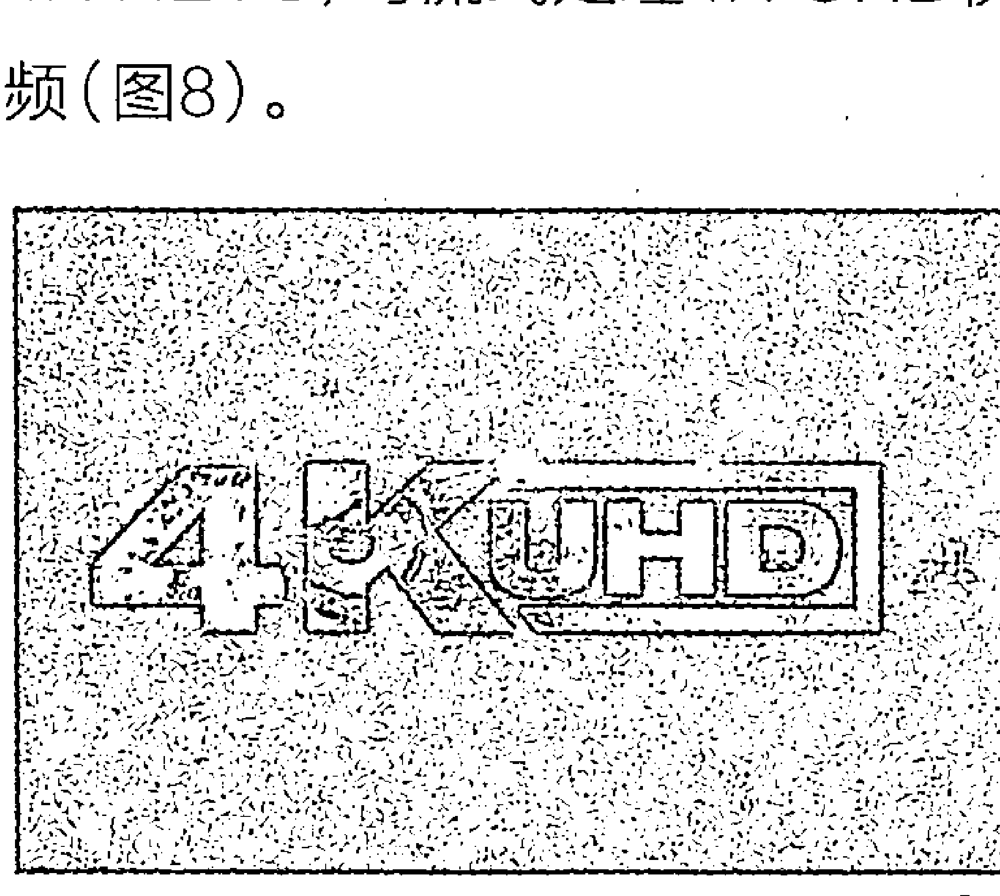

### 八代酷睿 马甲改名再战一年

今年9月面世的第八代酷睿处理器（Kaby Lake-Refresh和Coffee Lake）集成的核显与上代依旧没有太大变化，只是名字从HD620等改为了UHD620，性能上的提升几乎都源于更高频率带来的增益效果。这一代的核显最大特色是支持HDMI 2.0/HDCP 2.2标准，以及硬件编解码10bit 4K HEVC，可流式处理4K UHD视频（图8）。

## 核显性能遭遇瓶颈

纵观英特尔近些年的核显战略，移动酷睿的整体规格都要优于桌面处理器，目的就是帮助没有空间安置独立显卡的轻薄本提升图形性能。然而，从Skylake开始，最近三代核显在性能上处于原地踏步的节奏，虽然多媒体特性有所增强，但还不足以驾驭最新3D游戏的挑战。哪怕英特尔旗下还有锐炬核显，但其性能也只是勉强比肩NVIDIA GeForce 930MX的水准，随着以MX150为代表的新一代主流独显的出现，英特尔高端核显优势不再。

问题来了，更轻更薄更强是未来PC的发展趋势（图9），特别是对超薄本和PC平板二合一类型的设备而言，英特尔酷睿处理器的CPU运算性能没的说，如何才能弥补核显性能层面的瓶颈？为了满足未来市场的发展需要，英特尔做出了一个破天荒的决定——携手AMD一起打造处理器！

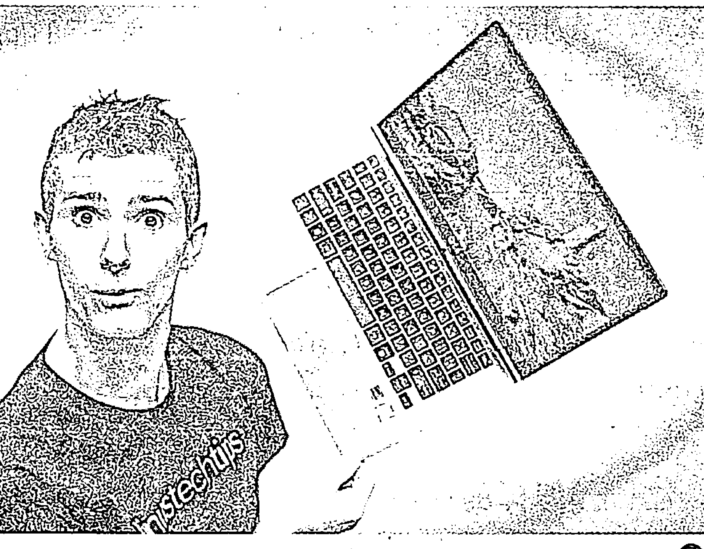

运算性能没的说，如何才能弥补核显性能层面的瓶颈？为了满足未来市场的发展需要，英特尔做出了一个破天荒的决定——携手AMD一起打造处理器！

# 敌人的敌人就是朋友
## 英特尔携手AMD打造移动处理器

英特尔和AMD堪称世纪冤家，在X86处理器领域争斗了数十年（图1）。然而，在“同行是冤家”的潜规则下二者最终还是走在了一起：将各自擅长的技术融入在一颗芯片上，从而打造出了一颗“梦想之芯”。

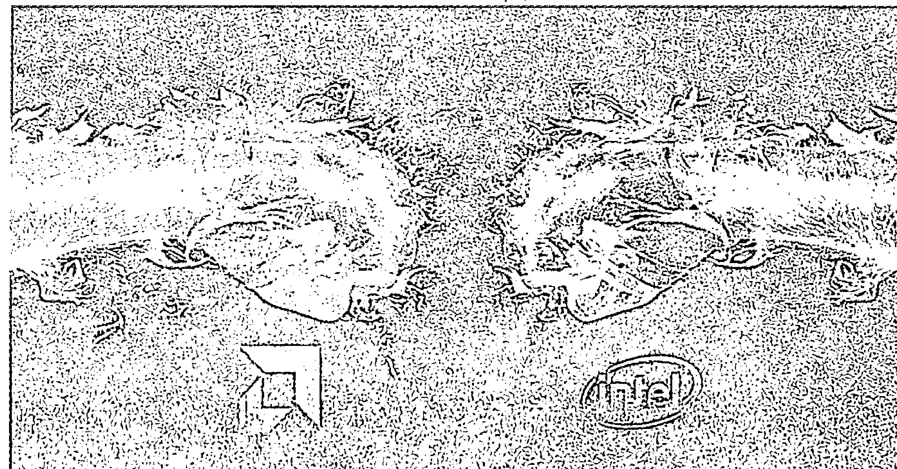

### 始于多年前的布局

当第一次听说AMD要将自己的图形技术授权给英特尔打造处理器时，很多业内人士都曾信誓旦旦地表示“不可能”！然而，事实却是两家企业早在2015年就开始偷偷研发了，产品内部代号为“R22”，只是到了2017年底才被正式宣布而已。

问题来了，英特尔找AMD做核显不怕对方侵占自家在GPU领域的份额？而AMD将图形技术交给英特尔，就不怕和自家产品竞争？请放心，无论是英特尔还是AMD，都非常清楚双方具体对抗的领域，二者合作并不影响自家产品的布局。

对英特尔而言，与AMD联手目的是为了推出更轻、更薄和性能更强大的移动平台，将笔记本电脑厚度从传统的26mm降至11mm~16mm，最终交付对消费者利好的创新产品。而对AMD而言，与英特尔携手将拓展AMD Radeon显卡的装机基数，由于与英特尔合作的芯片主要针对高端游戏玩家（份额小但利润高），和计划年底上市的锐龙移动处理器（代号为“Raven Ridge”）并无竞争关系。

### 这是一颗怎样的芯片

在本文截稿时，英特尔和AMD联合打造的芯片还没有正式的官方名称，字面的意思是“多核心处理器包”（下文简称“联合处理器”）。它的物理形态是在一颗处理器的PCB上嵌入三颗独立封装的芯片（图2）。

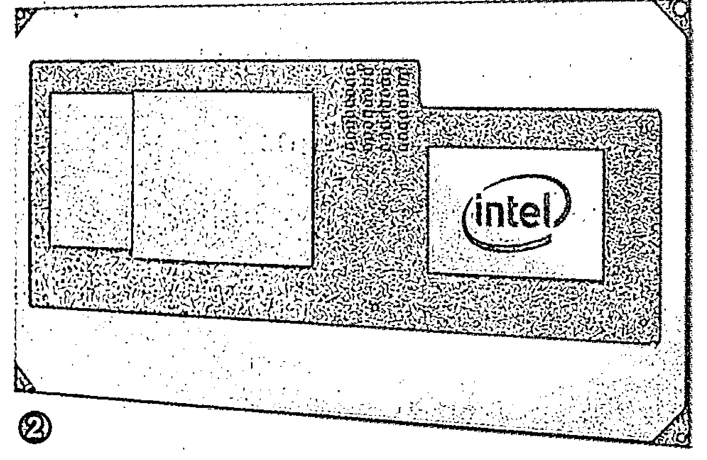

这种设计是不是看着很熟悉？英特尔在推出第一代酷睿处理器时，CPU和GPU部分就是类似结构，使用“胶水”粘在一起。

没错，“联合处理器”的CPU和GPU部分也是独立存在的。其中，英特尔付出了45W TDP的第八代酷睿处理器核心（移动版，代号为Coffee Lake-H），而AMD则提供了基于最新Vega架构专门定制的Radeon GPU单元，二者之间通过PCI-E 3.0高速总线互连。需要注意的是，“联合处理器”的GPU部分是AMD自家提供的，这两颗芯片并非来自同一个光刻机下蚀刻制造。

想充分发挥GPU的性能，高性能的缓存自然不可或缺。和英特尔GT3e核显理念相同，“联合处理器”在Vega GPU部分也加入了额外的HBM2显存颗粒（图3），拥有1024-bit位宽，但是它并没有采用AMD自己的互联层，而是英特尔统一设计的嵌入式多芯片互连桥接（EMIB）。EMIB是一种小型的智能桥接，它能够有效连接CPU、GPU和专用显存，允许异构芯片在极其接近时快速传递信息，并消除了高度、制造和设计复杂性的影响，有助于设计更小、效率更高、功能更强大、运行更高效的产品（图4）。

因此，虽然“联合处理器”从表面上看貌似和一代酷睿核显的胶水方案相似，但它们无论是底层架构还是互联技术层面都不可同日而语，完全不用担心数据交互时的耗损，真正实现1+1大于2的效果。

## 好钢已现 刀刃在哪

英特尔和AMD费这么大劲整出了一颗联合处理器，它能为PC产业带来怎样的变化？我们不妨回顾一下传统游戏本：在过去，搭载45W TDP移动处理器的笔记本，需要在主板上嵌入处理器芯片、独立显卡芯片（图5），以及围绕在独显周围的显存颗粒和无数电容电阻，至少需要占用成年人一个巴掌的空间。

为了让这些芯片全速运行时不因过热降频和死机，需要在每个芯片表面都覆盖散热片（图6），并通过多根热管将温度传递到散热鳍片，并借助风扇排出笔记本体内，这种多芯片的散热模块也注定不会太过轻薄。

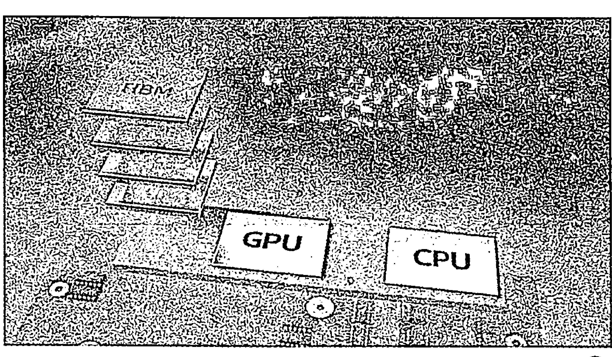


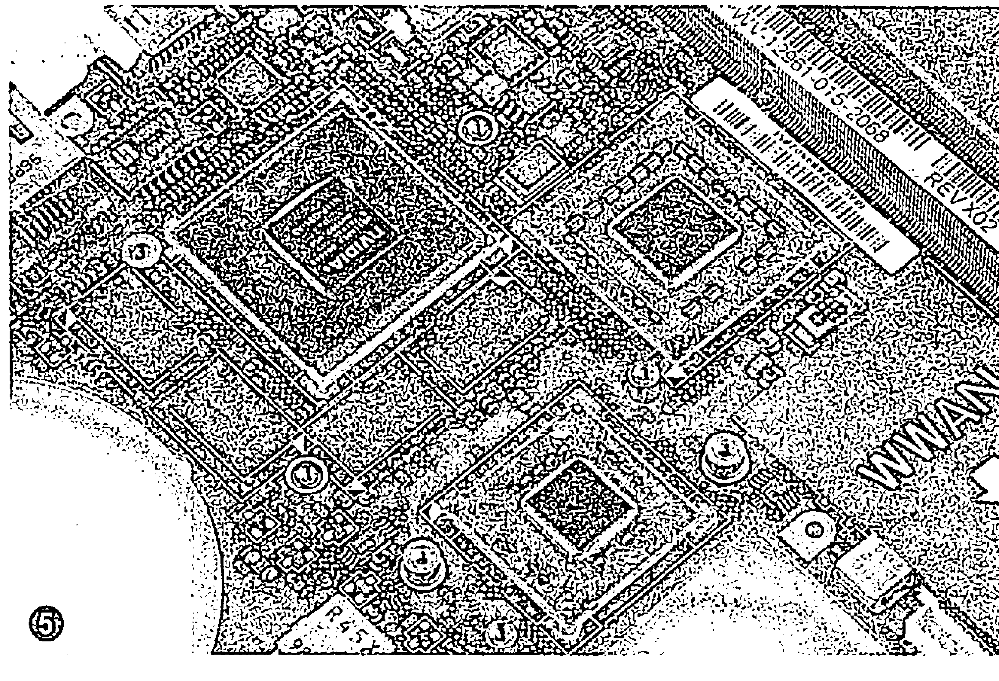

“联合处理器”最大的意义，就是通过重新封装的方式，将CPU、GPU以及由GDDR5变成的HBM2显存全都集成在一个基板内，二者互联的走线也转移到的新的封装里，从而大大降低对主板PCB空间的占用（图7）。这部分节省出来的空间，既能让笔记本进一步压缩身材实现瘦身的目的，也能塞进更大的电池提升续航能力，还能进一步改进散热模块缓解散热压力。

其中，让游戏本变得更薄，则是“联合处理器”的最核心诉求。而英特尔对“联合处理器”的期望是，希望它能出现在VR背包、轻薄本、PC平板二合一、以NUC为代表的迷你PC和超薄一体电脑身上（图8）。

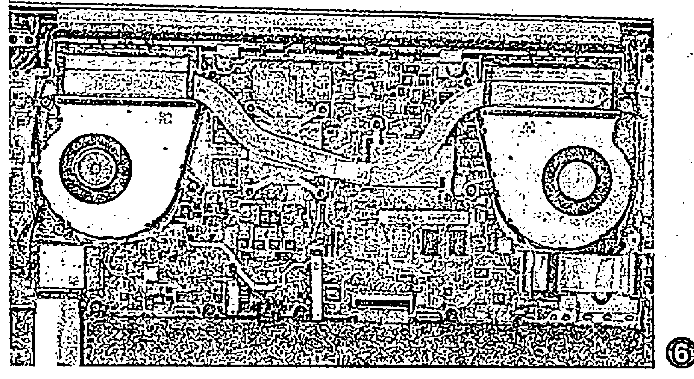

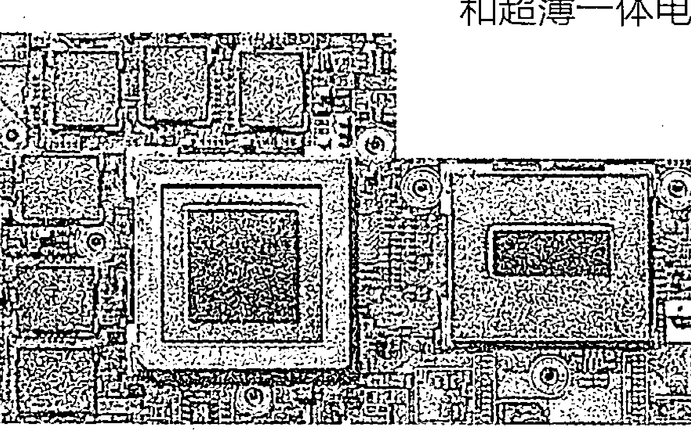

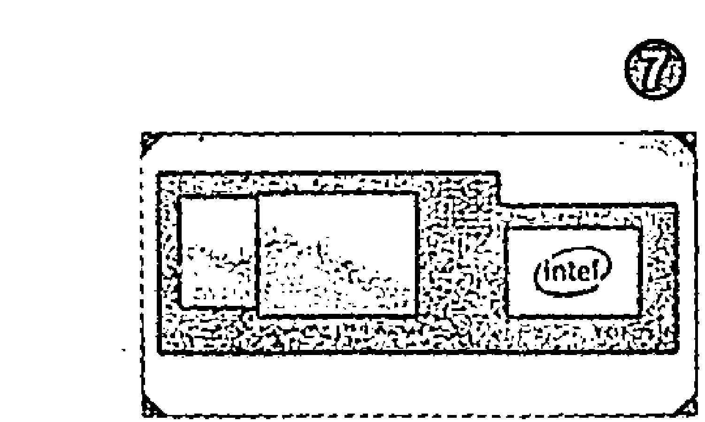

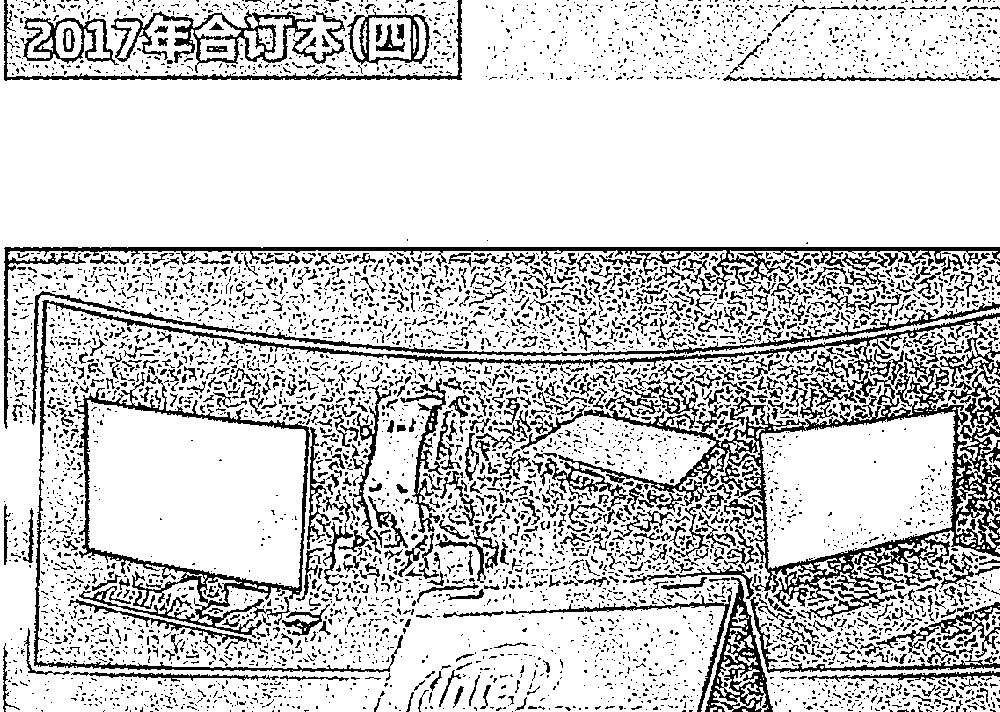

3DMark 11 (Performance settings) 性能对比

| 配置 | Physics Score | Graphics Score |
|------|---------------|----------------|
| Intel i7-7700HQ + RX 570 (Desktop) | 13496 | 16924 |
| i7-7700HQ + GTX 1050 | 11203 | 16235 |
| i7-8809G (Core + Radeon Leak) | 10645 | 14127 |
| i7-7700HQ + GTX 1050 Ti | 8545 | 10723 |
| Ryzen 7 2700U (Raven Ridge Leak) | 6419 | 4072 |

## 1+1后有多强

英特尔在9月推出的移动版八代酷睿处理器隶属于Kaby Lake-Refresh平台，其TDP只有15W，专为轻薄本打造。而“联合处理器”所用的CPU部分则是Coffee Lake-H平台，和已上市的i7-8700K桌面处理器一脉相承。凭借着6核心12线程的特性，这个CPU部分代表了移动处理器领域的最强水准。

相对而言，最值得引起我们关注的应该是AMD提供的Vega GPU部分。从资料来看，“联合处理器”整合的Vega GPU最多将拥有24个计算单元，相当于1536颗流处理器，同时还有着最高1100MHz核心频率和4GB HBM2显存。

我们不妨回顾一下AMD即将发布的锐龙移动处理器（详见上期特别话题栏目），最高端的Ryzen 7 2700U集成的Vega核显仅配备10组计算单元，相当于640个流处理器，此时它就已经拥有2.5倍于八代酷睿核显的性能，十分接近NVIDIA最新GeForce MX150独显的成绩。

“联合处理器”的Vega GPU计算单元是Ryzen 7 2700U的2.4倍，所以它的3D性能表现更是值得期待。从国外媒体曝光的数据来看（图9），具体型号为i7-8809G的联合处理器，在3DMark 11测试中的GPU子项分数可以大幅超越NVIDIA中高端级别的GTX1050 Ti，领先幅度达31%，甚至可以实现87% GTX 1060独显的性能！

## 隐藏在背后的意义

英特尔早前之所以推出Iris Pro核显，就是希望打造出集轻薄和性能于一身的PC设备（主要是笔记本和迷你机）。然而Iris Pro核显性能至多和NVIDIA/AMD主流独显持平，对喜欢玩游戏的玩家而言还需单独搭配独立显卡。再加上Iris Pro总被集成在昂贵的高端处理器身上，颇有高不成低不就的嫌疑。

“联合处理器”的出现，可以让集显超薄本/二合一设备在保持现有身材的前提下，获得超越GTX1050 Ti独显的游戏性能。你可以想象一下，当一款轻薄如Surface Pro的二合一设备，性能却足以媲美Alienware 13时会是一种什么感觉（图10）。

在PC产业不景气的今天，单靠英特尔或单靠AMD都不足以唤醒市场。那么，如果是英特尔+AMD呢？

同时，人工智能已经成为整个科技圈的未来风向标，唯有具备更强并行运算能力的GPU才符合深度学习算法的训练需求。“联合处理器”在单芯片的物理结构上就提供了（相对同尺寸产品）最强的CPU和GPU，无论是日常使用还是AI运算都有着极大优势。换句话说，如果有用户需要在最小空间内实现上述目标，“联合处理器”也是现阶段的唯一之选。

作为全球首款使用EMIB的消费级产品，基于这种英特尔+AMD异构芯片的设备将在2018年第一季度问世，让我们一同期待吧。


# 无法触及的空白
## Intel管理引擎也有安全漏洞？

文 刘青弯 策划《电脑爱好者》编辑部

临近年关，Intel的一则大新闻成为很多科技媒体甚至社会媒体的头条。遗憾的是，这条新闻并非大家期待已久的新制程处理器，而是关于Intel管理引擎（Intel Management Engine，以下简称Intel ME）的安全漏洞问题。Intel确认Intel ME的安全漏洞问题涵盖了目前几乎所有的个人和工作站处理器，包括全系列第六、第七、第八代酷睿（Core）处理器，至强（Xeon）E3-1200 V5、V6、W系列、凌动（Atom）C300、E3900系列、奔腾（Pentium）系列、赛扬（Celeron）N、J系列等处理器。一同曝光的还有服务器平台服务（Server Platform Services, SPS）和受信任的执行引擎（Trusted Execution Engine, TXE）两个组件，但后两者因为对普通个人用户的电脑影响较少，因而在很多报道中被忽视了。

也许很多人并不理解我们为何如此关注这次安全漏洞问题，也对Intel ME这个并不熟悉的名字和涉及的产品如此广泛而感到惊讶，更对其影响之严重完全没有概念。为了让大家对这些问题有一些浅显的了解，我们就以这次的安全漏洞问题为契机，为大家简单介绍一下Intel ME以及它引起的本次安全漏洞，和这一漏洞可能造成的具体影响。

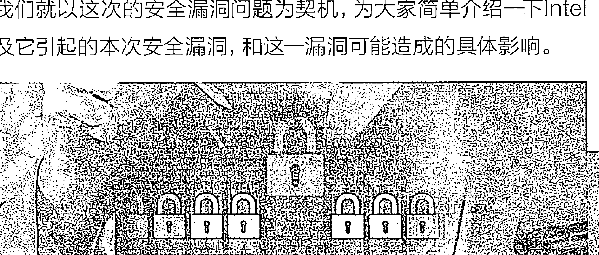

### 何为Intel ME

Intel ME是一种综合管理、监控Intel硬件模块和软件驱动的服务，集成在主板芯片中（早期为ICH，现在为PCH），包括一个微控制器、固件层面的ME FW（Firmware，固件）和驱动层面的MEI（Management Engine Interface，管理引擎接口）。Intel ME的固件与BIOS文件打包在一起，用户在升级BIOS时就会一起进行升级。据业界人士透露，在制作好BIOS文件时，要用Intel的ME工具把BIOS代码和ME固件一起打包，在BIOS文件仅有2MB的时代，ME固件大小就达到了4MB。

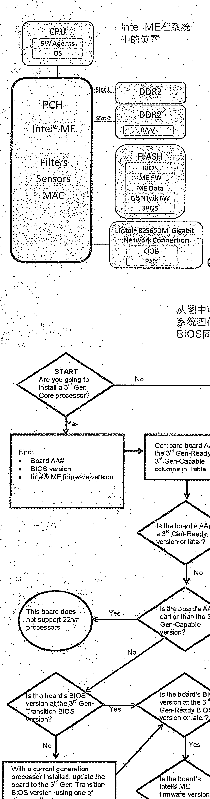

独立控制器和复杂完整的固件使 Intel ME 具有独立于处理器和 BIOS/UEFI 的运行能力，已经可以看作是一个完整的操作系统，在其基础上可以安装一些特殊的应用，如远程管理工具 AMT（Active Management Technology, 主动管理技术）、基于 ME 的 TPM（Trusted Platform Module, 可信平台模块）安全工具—— Intel PTT（Platform Trust Technology, 平台信任技术）等，因此有时也被叫做 Intel MEI。作为管理和协调处理器模块的服务，Intel ME 运行在我们日常可见甚至是可探测的硬件底层，拥有超越操作系统甚至是 BIOS/UEFI 的操作特权；同时它也运行在处理器启动之前，甚至是电脑开机之前，拥有在关机状态下保持运行的能力（图1、图2）。

从图中可以看到，在升级硬件和系统固件时，Intel ME 固件是与 BIOS 同级的。

## 超高权限

作为 PC 的大脑，CPU 不仅具有创造的力量，当然也具有毁灭的力量，有一些 CPU 指令可以对软件、操作系统的稳定运行，甚至是硬件系统的安全造成影响，因此是被限制使用的，例如清除缓存/内存、调整运行时钟等。这些比较危险的指令当然也有其存在的意义；但显然不能开放给普通程序，所以处理器指令被分为特权指令和非特权指令，并且为各种软件设置了可用指令等级。例如 Intel 的处理器的权限等级为 RING “X”，其中 X 为数字，数字越小则权限等级越高，能够使用的指令越多。操作系统使用的等级为 RING0，而普通程序则只能使用 RING3 等级。

那么 Intel ME 的权限是什么呢？答案可能会让你大吃一惊，是 RING-3（负3）。在这一相当高的等级之上，Intel ME 应该可以对处理器的相关模块及周边进行相当深度的控制。由于非常高的权限，Intel ME 的实际运行状况也无法被仅有 RING 0 权限的操作系统所感知，甚至连 BIOS/UEFI 都无法真正对它进行控制。从权限等级看，可以认为 0 以上为用户可见，0 以下则是用户无法触及的区域，对用户甚至很多应用开发者来说，就像是地面以下，越来越深，隐藏着无法预知的危险。

| 列1 | 列2 |
|---|---|
| (Table 1 内容未完全显示) | |## 秘密运行

作为协调处理器模块的底层服务，Intel ME是不能被禁用的，否则处理器将无法正常运行，轻则频繁重启，重则完全不能开机。有些研究者发现，在SandyBridge和IvyBridge核心平台上，可以关闭ME的部分功能，同时保持系统的正常使用。但在SkyLake核心及之后的产品中，Intel强制全面开启了Bootguard（启动防护）功能，不再允许对UEFI BIOS进行非法篡改，当然也就无法对与BIOS固件集成在一起的ME固件进行修改。不过随着对Intel ME研究的深入，研究人员在ME的固件文件中发现了一个名为“reserve hap”的字段，所附的注释表明“高保证平台启用”。HAP（High Assurance Platform）是指美国政府的高保证平台计划，这是NSA（美国国家安全局）与科技行业共同运作的一项安全计算计划。有些人认为，只要将相关的位设成“1”，就可以禁用ME，Intel则表示这只会禁用某些功能，因此也有人认为HAP模式的实际意义是减小侧信道泄漏（Side Channel Leak）。不仅难以禁用，而且基于严格的保密，第三方人员也完全无法审核ME固件，NSA等组织在其中植入后门，那么这种“窃听门”事件几乎无法被察觉。同样，如果这一服务被黑客入侵，植入Rootkit等恶意软件的话，用户也完全不会察觉。作为一种可以接触到硬件底层的，具有微型操作系统性质的服务，即使Intel ME自身不被破解，如果在其上运行的一些应用一旦被利用，同样能造成重大的损失。本次的安全漏洞问题，也正是来源于运行在Intel ME之上的AMT应用。

虽然我们常用的Intel ME服务实际上是与BIOS/UEFI共同启动的，但实际上，只要经过激活，Intel ME就会持续运行，甚至在我们关机之后，也会使用少量供电甚至主板上电池保持运行，这也是其上运行的一些应用，比如前文提到的AMT的使用基础。下面我们就以Intel ME上最早引入，目前应用也最广泛的AMT为例，讲解一下Intel ME及其应用能力和运行状态。

AMT的历史非常早，在面向酷睿2/奔腾D的G41、P43、P45主板芯片组中，它就已经集成在ICH7芯片中。AMT功能由主板上的Intel ME技术实现，是处于芯片组、网络控制器和处理器之间的一个特殊接口，通过该接口可以连接相应的管理和安全软件，以及客户端嵌入式监控模块。在我们为电脑安装驱动时，可能经常会碰到安装了所有驱动后，还有一个被称为“PCI简易通讯控制器”的设备显示为没有安装驱动，它很有可能就是需要包含AMT的Intel ME驱动的硬件。AMT可以独立于现有的操作系统运行，在操作系统中无法关闭这一功能，在BIOS操作界面虽然可以对其进行设置（图3），但我们并不确定可以完全关闭这一功能。AMT可以在操作系统本身瘫痪的时候进行系统监控和远程管理，不用怕恶意程序摧毁操作系统，更不用担心用户自行或无意中关闭，比传统的安全、管理软件要强大得多。此外，传统的IT管理一般是被动地扫描用户系统，在客户端系统遭到破坏时往往无能为力，而AMT是一种主动管理技术，可以持续运转，自动发现、诊断、排除故障，并进行综合性防护。无论是资产盘点、远程诊断和管理、事故报警/恢复、软件分发还是系统安全防护与隔离，很多功能都是自动形成并发挥作用。

AMT可以不依赖软硬件的实时状态而独立进行开机、维护、关机等操作，在操作死机、蓝屏甚至是已经关机的系统上仍然可以工作，也可以进入BIOS进行操作，有利于IT管理维护人员对电脑进行远程修复和维护。借助于AMT系统，管理员可以远程安装设置操作系统、下载升级软件，即使在电脑操作系统已经关闭，甚至系统瘫痪或硬盘出现故障时仍旧能完成故障调查以及修复工作，为企业节省大量用于电脑管理和维护的人力、经费和时间（图4）。

尽管我们前面已经提到，Intel ME的源代码是没有公开的，其具体运行方式和能力也就无从得知，不过从AMT的能力可以看到，Intel ME具有在关机状态下运行的能力，在关机状态或者没有启动操作系统的情况下，可以监控网络呼唤，进行网络通信、硬盘操作、修改BIOS等等。而在开机状态下，Intel ME的操作至少包括对硬盘、内存、网络操作的监控，并且有对这些操作的控制能力。我们可以在操作系统中为其安装驱动程序，但在不安装驱动程序的情况下，也基本不会影响系统的正常运行，在常见的Windows操作系统或硬件系统固件中，应该已经包含了Intel ME的基本驱动。

前文中我们已经提到，本次针对Intel ME安全性的大规模质疑和报道，主要是因为近期Intel承认了这一漏洞，并且开始尝试补救。然而从之前的新闻报道中我们会发现，与其相关的漏洞其实早已被发现，一些业界人士甚至表示，至少在5年前就开始向Intel反映这一漏洞，但Intel却一直不予重视。

由于Intel ME本身是严格保密且几乎不可能被破解的，因此其漏洞更多地来自基于Intel ME的应用，从目前透露的情况看，事实也确实如此。不过需要注意的是，我们前面已经提到，Intel ME自身的权限非常高，因此在这一平台上运行的应用也大都可以使用很高的权限，例如前面提到的AMT就可以在操作系统无法感知和控制的底层运行，而Intel PTT则是硬件级的安全验证工具。由于漏洞是基于平台上的应用，因此可能存在于Intel ME平台上的可用漏洞是比较多的，虽然目前还没有大规模爆发的相关问题，但很多相关部门或人员已经发现了非常危险的问题。

## Intel ME的典型漏洞案例及补救

2016年初的联想（Lenovo）安全公告——LEN-3556中提到，德国联邦信息安全局（BSI）发现一些采用AMT的系统可能存在安全问题。为使用AMT，系统必须通过一个名为“配置”的流程，此流程用于将计算机连接至用于管理流程的远程计算机。执行配置的一种方式是插入经特殊格式化的USB驱动器，此驱动器包含关于如何连接远程管理计算机的信息。此USB驱动器必须包含本地系统的MEBx（Management Engine BIOS Extension）密码才能对系统进行配置。MEBx密码是Intel预配置的一个众所周知的默认值，之后由用户或管理员在配置流程期间进行更改或通过Intel Management Setup界面手动更改。

但在某些系统上，即使AMT被认为在BIOS中已禁用，USB配置仍可能会被利用。如果攻击者获得对系统的物理访问权限，他们可能会插入经特殊格式化的USB驱动器，从而将系统与其管理系统连接并控制有漏洞的系统。虽然攻击者必须知道系统的MEBx密码，但由于很多管理员会使用默认密码，因此这一漏洞仍然是非常危险的。

针对这一漏洞Lenovo发布了更新版BIOS，允许客户在BIOS中手动禁用USB配置。同时Intel建议客户对计算机系统的物理访问权限和密码进行管理，其中针对Intel AMT的默认密码，从而防止被不法分子进行USB配置，其步骤如下：

- 1. 将Intel AMT计算机系统远程配置成管理员控制模式。
- 2. 使用USB驱动器在本地更改MEBx密码。
- 3. 通过引导至Intel Management Engine设置，在本地更改MEBx密码。

在本地更改默认MEBx密码的步骤如下(根据BIOS 语言，步骤可能略有不同)：

- 1. 在系统启动时按下Ctrl+P进入Intel Management Engine设置(图5)。用户没有看到访问Intel Management Engine的“按下Ctrl+P”提示或按下后没有反应，则可在系统启动时进入BIOS设置，在“高级”界面中将“访问MEBx”的相关设置设置为“启用”状态，之后重启即可通过Ctrl+P组合键进入Intel Management Engine设置。
- 2. 选择“登录MEBx”，系统将出现输入密码的提示，如果之前未配置密码，则默认密码为“admin”。
- 3. 登录后系统将出现设置新密码的提示。此新密码需要包含至少1个大写字母、1个小写字母、1个数字和1个特殊字符，并且长度至少应为8个字符。
- 4. 配置好新密码后，如果用户不希望更改任何其他AMT设置，则可以选择“退出MEBx”。

虽然我们此处提供的例子有些极端，威胁主要来自物理外设，而目前更多的威胁是基于网络的远程攻击，不过我们这里介绍的方法还是具有一定普适性的，例如更新BIOS、改变默认密码等看来简单的操作，就可以大大增强Intel ME服务的安全性。

Intel ME安全漏洞只是我们遇到的大量系统漏洞中非常典型的一个，不过由于它并没有造成严重后果，也许很多人还不知道系统漏洞到底会对我们造成怎样的麻烦甚至损失。我们不妨来回顾那些曾让我们难忘的系统漏洞和它带来的“灾难”吧。

### RPC漏洞

- 典型利用者: 冲击波病毒
- 典型表现: 系统操作异常、不断重启
- 解决方式: 安装最新系统补丁、使用最新安全软件

RPC (Remote Procedure Call, 远程过程调用)是Windows 2000/XP/Server 2003/NT4.0等操作系统使用的一个协议，它提供了一种进程间通信机制，通过这一机制，在一台计算机上运行的程序可以顺畅地执行某个远程系统上的代码。RPC中处理通过TCP/IP的消息交换的部分有一个漏洞，此问题是由于错误地处理格式不正确的消息造成的，因此通过发送格式不正确的RPC消息，攻击者就能够使一台计算机上的RPC服务出现问题，进而使任意代码得以执行。这样攻击者就能够对系统执行任何操作，包括安装程序，查看、更改或删除数据，或者创建拥有完全权限的新账户。

冲击波(Blaster)病毒在爆发时造成了大规模的电脑和网络故障，影响遍及全世界。运行时会不停地扫描网络上的Windows 2000/XP系统计算机，找到后就利用RPC缓冲区漏洞攻击该系统，一旦攻击成功，病毒体将会被传送到对方计算机中进行感染，使系统操作异常、不停重启，甚至导致系统奔溃(图6)。另外，该病毒还会对系统升级网站进行拒绝服务攻击，导致该网站堵塞，使用户无法通过该网站升级系统。

### Adobe Flash漏洞

- 典型利用者: 敲诈者病毒
- 典型表现: 锁定文件、勒索比特币
- 解决方式: 安装最新Adobe或Windows补丁、使用最新安全软件

Adobe Flash的漏洞之多是常用软件中比较少见的，这也是苹果等很多厂商弃用Flash的原因之一，它有些漏洞甚至能够让入侵者在用户电脑上执行任意程序。Flash漏洞多次被敲诈病毒利用，例如2015年的敲诈者(CTB-Locker)病毒(图7)等，用户在浏览被利用的恶意网页时，电脑里的文档、图片等重要资料会被病毒加密，受害者需在96小时内支付8比特币赎金，否则文件将永久无法打开。

### 千年虫

- 典型利用者: 文艺作品
- 典型表现: 可能造成大规模应用错误
- 解决方式: 更新软硬件

千年虫及“2000年问题”，是由于计算机发展初期，程序员为了解决资源而采用两位数纪年方式造成的问题，即2000年之后系统无法正常纪年，可能造成大规模的应用问题。这一问题波及面极广，从个人电脑到巨型电脑全部会受到影响，不过由于广大软硬厂商的努力，这一问题最终没有大规模爆发，最终利用了这一漏洞的大都是影视小说等文艺作品。其实在一些比较老的软件中，我们还可以领略到相关的影响，例如2000年之后的一些存档日期会显示为198X年等等。

### iOS日历漏洞

- 典型利用者: 垃圾信息、有害信息等
- 典型表现: 日程中出现大量推送信息
- 解决方法: 关闭“通过电子邮件给我发送共享日历更新”和“邮件中找到的事件”功能

新版iOS系统的“日历”增加了共享日程的功能，用于家人、好友、同事等共享一些日程事件。不过垃圾信息也利用了“日历”中的“邀请功能”，从网上等不法渠道先获取了一些邮箱地址，再通过“日历”的邀请功能输入这些邮箱进行批量邀请，如果邮箱正好是被用作某位用户的iCloud账户，对方就会收到邀请内容。这样的方式可以避开邮箱对垃圾邮件的监控，不仅让用户不堪其扰，甚至有可能因为接收到钓鱼诈骗信息而造成严重损失。

另外还有一些影响非常大的病毒，如CIH和熊猫烧香等，多少也利用了一些安全漏洞。才能对电脑造成如此重大的损失。但我们也可以看到，绝大多数漏洞是可以弥补的，而即时弥补漏洞也可以避免很多损失。同样，如管理员账号无密码、使用默认密码、不及时更新系统和安全软件、随意开放完全共享等行为，为我们带来的损失其实远超过各种安全漏洞。所以我们可以认为，尽管各种安全漏洞层出不穷，但最大的安全漏洞，其实还是用户自身较低的安全意识。

# 系统应用

## 无需重装 重设Windows10密码

文|老俞

Windows 10忘掉登录密码的情形有两种：一种是设定了账户密码且同时设置为免输密码的安全自动登录方式，但启动自动进入系统后因忘掉原密码而无法重设密码；另一种是需要输入密码才能登录Windows，但因忘掉密码无法登录的情形。若遇到上述情况，要分别采取不同的措施加以解决。

> 小提示
在没有密码恢复盘的情况下，要更改账户密码，需要以管理员权限的账户登录，然后更改账户密码。因此，如果用户只有访客账户而不具有管理员权限，那么就无法用这种方法来重设系统的登录密码。

如果一台安装了Windows 10系统的电脑设置了登录密码，同时被设置为免输密码自动安全登录，当原来的密码因忘记而需要重设密码；或者电脑易主，虽然可以启动Windows系统，但新主人不知道原来的登录密码，希望在不重装系统的情况下设置自己的新密码时，可采取如下三种方案来重设密码。

> 小提示
出于安全原因，Windows通过使相应的信息在重置密码后不可访问来进行系统保护。在下次注销时，系统中的某些用户数据可能会丢失。因此，在用上述方法重设密码之前，请先备份好电脑里的重要数据。

### 1 通过“本地用户和组”重设

按下Win+R组合键，运行lusrmgr.msc命令，启动“本地用户和组”窗口(图1)。点击左侧窗格中的“用户”项，在中间窗口中右击要重设密码的用户名，然后点击“设置密码”(图2)。之后弹出重置密码提示窗口，点击“继续”，按引导重设当前用户的Windows登录密码即可(图3)。

### 2 利用用户账户控制修改

在“运行”窗口中运行如下命令：
`control /name Microsoft.UserAccounts`
或通过“小娜”搜索“控制面板”(图4)。点击“控制面板”桌面应用启动到控制面板窗口，依次定位到“所有控制面板项→用户账户→管理其他账户”，点击进入后选择要更改的账户，然后选择“修改密码”重设密码(图5)。

### 3 使用网络命令修改密码

按下Win+X组合键，激活Windows设置菜单；选择管理员级窗口命令，即以管理员方式运行“命令提示符”或Windows PowerShell（管理员）（图6）。输入“net user”命令并回车，可看到所有用户账户。

继续输入如下命令并回车：
net user administrator *
接着输入新的Windows 10密码，再重复输入一次确认即可（图7）。

> **小提示**
虽然新输入的密码不显示在命令窗口中，文本光标总是落在第一个光标的位置，但不要疑惑，只管重复输入你的密码，自己知道输入无误就可以了。

### 4 密码恢复盘的建立和密码恢复

为了防止遗忘密码，我们还可以选择在Windows 10中提前建立密码重置盘，用来在忘记密码时恢复密码。
按下Win+R组合键，运行“Control /name Microsoft.UserAccounts”命令启动到控制面板“用户帐户”窗口，在左侧栏选择“创建密码重置盘”（图8）；之后会进入到忘记密码向导界面，插入闪存盘点击“下一步”，创建密码恢复盘。创建过程中要输入当前系统的密码，因此创建该盘需要在知道密码的情况下提前进行，如果等密码忘记了才想起创建密码恢复盘，那就为时已晚。
需要恢复密码时，用密码恢复盘启动系统，在登录Windows 10时，当密码输入框检测到输入的密码不正确后，下方会给出重新设置密码的输入框，输入新的密码即可完成密码的重新设置。若留白不输入任何字符而确认，则可创建无密码的账户。
除了上述重设密码和借助密码恢复盘外，我们还可以借助于软件Mimikatz直接查看遗忘了的Windows账户密码。此外，如果因忘记密码而无法登录系统，可借助于某些PE启动盘的Proactive System Password Recovery选项重置密码。

> **小提示链接**
有关Mimikatz查看密码和PE盘重置密码的具体操作方法，请参看本刊2017年第18期文章《装双透视眼 查看遗忘账户密码》。

## DIY校正Windows 10时间

文|樱子

Windows 10本身带有时间自动校正功能，但在使用中也会偶尔出现各种各样的问题，延续多年的系统级服务也问题多多？不信，往下看，解决办法都在本文中。

### 1 解决时间校正功能失灵问题

如果系统默认自带的校时服务器校时不起作用，我们可以尝试用系统命令来重置系统校时服务。为此，要在管理模式的命令提示符窗口中依次执行下述命令：

```
net stop w32time
w32tm /unregister
w32tm /register
net start w32time
w32tm /resync /nowait
```

其中第1条命令用来停止系统时间服务，第2条命令取消注册系统时间服务，第3条命令重新启动系统时间服务，最后一条命令重新执行Windows时间同步任务。

### 2 手动更换有效时间校正服务器

如果系统提供的内置校时服务器失效，重置也不起作用，我们可以尝试手动添加其他校时服务器。右键单击系统托盘的日期时间区域，在弹出的菜单中选择“调整日期/时间”，进入日期和时间设置窗口后，点击“添加不同时区的时钟”，然后在弹出的“日期和时间”窗口中单击“Internet时间”选项卡（图1）。在“Internet时间”选项卡下点击“更改设置”按钮，之后通过百度或其他搜索引擎搜索可用的校时服务器地址，将此地址复制添加到服务器输入框中，单击“立即更新”按钮（图2）。若更新无效，可换用另外的服务器地址，直到找到有效的地址。

### 3 手动添加更多时间校正服务器

Internet时间服务器列表中默认只保存最后一次校时使用的服务器，如果我们希望能够保留多个自己定义的校时服务器的地址，可采用编辑注册表的办法解决。打开注册表编辑器并定位到“HKEY_LOCAL_MACHINE\SOFTWARE\Microsoft\Windows\CurrentVersion\DateTime\Servers”分支。在右侧窗格中单击右键新建字符串值，名称按阿拉伯数字排序命名。双击新建的值，“数值数据”填写为校时服务器地址，即可完成服务器的添加（图3）。如果希望新添加的服务器地址列在第一位，双击名称为0的值并设置服务器地址为修改后的地址即可。

## 飞速前进 磁盘整理任我行

文|立白

由于Windows 10的自动维护过程会拖慢系统，在使用传统机械硬盘时感觉尤为明显，因此有的用户或系统优化工具会主动关闭Windows自动维护功能，这样当磁盘碎片积累到一定程度时，就会出现系统明显变慢的情况。

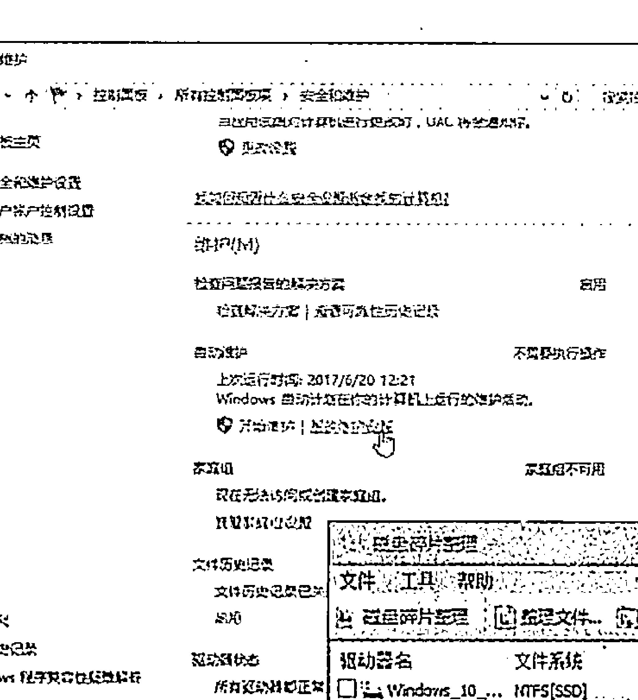

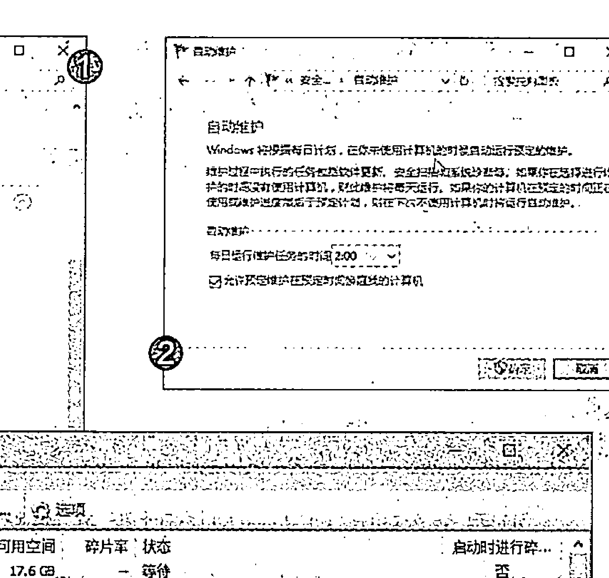

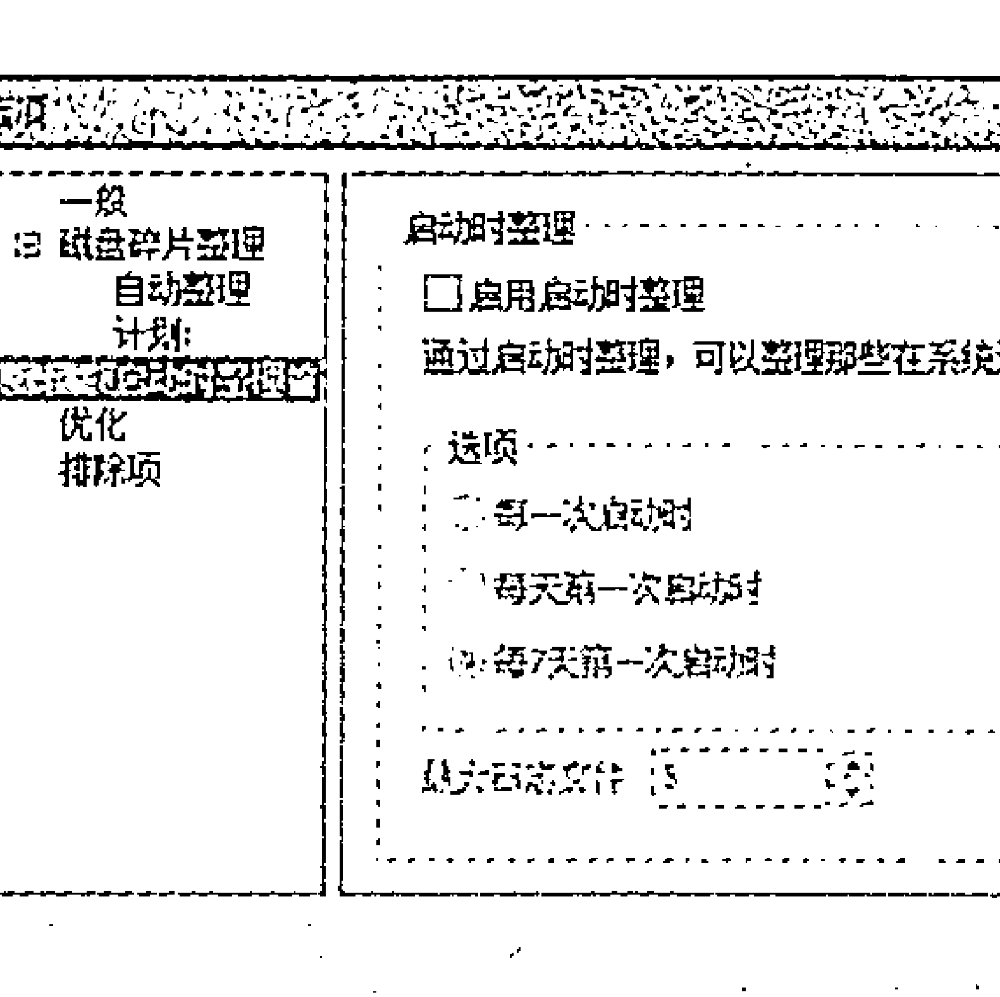

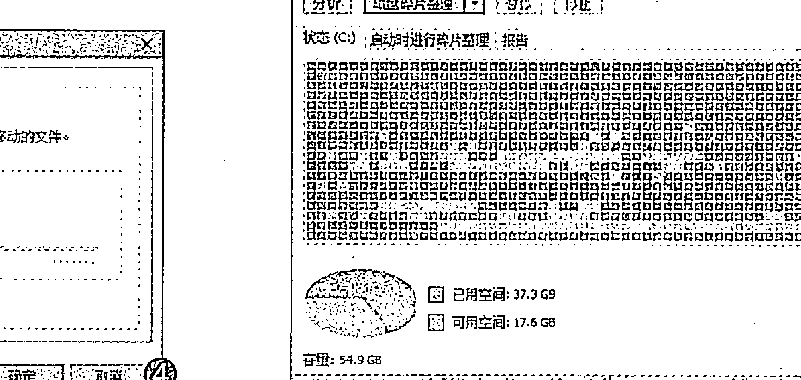

### 1 依靠系统功能优化磁盘

使用Windows 10自身的维护功能整理磁盘，可通过控制面板的“安全和维护”，选择“开始维护”立即进行维护（图1）。但这个过程包括了软件更新、安全扫描和磁盘优化等，比较笼统，所需时间较长，会明显拖慢系统，对配置不高的电脑来说更是雪上加霜。这时可改选“更改维护设置”选项，进入“自动维护”页面，选择自动维护空闲时间（比如晚上没人操作电脑时）（图2）。此外也可以通过某磁盘的“属性”窗口，选择“工具”选项卡下的“优化”按钮进行针对性的及时优化。

### 2 借用工具整理更加灵活

系统自带的磁盘优化功能相对有限，用Glary Utilities工具进行磁盘碎片分析、整理和优化，就能更灵活一些。在“高级工具”列表中选择“磁盘碎片整理”项进入优化窗口，选择要整理的分区，点击“分析”按钮分析碎片情况，点击“磁盘碎片整理”进行整理。若只希望整理某些文件夹甚至某个大文件的碎片，在工具栏上点选相应的按钮，可单独对某些文件、文件夹进行整理。选择“碎片整理完成后关闭计算机”选项还可实现无人值守的节能整理（图3）。如果要实现更为强大的空闲自动整理功能，需要在“选项”窗口中进行设置。作为效率之选，可选择同时整理多个磁盘；从节能和断电考虑，可选择电池供电时停止整理；还可以选择当CPU或硬盘空间不足时自动整理。还有一些大文件在系统运行时无法整理，可设为启动时自动整理（图4）。另外，通过“优化”选项可自定义将大文件移动到硬盘末尾，对指定位置、容量、时间、类型的文件进行特定优化，分别存放在硬盘末尾的位置。以上选择还可以按需灵活组合进行。

## 手动打造自动清空的回收站

文|万立夫

我们知道每天电脑系统都会产生很多的垃圾文件，这样长时间的存在就会影响系统的正常运行。于是很多优化软件都增加了垃圾清理的功能，并且在垃圾总量达到一个阈值的时候自动进行操作。其实不用软件自己也能设置快速清空回收站的功能。

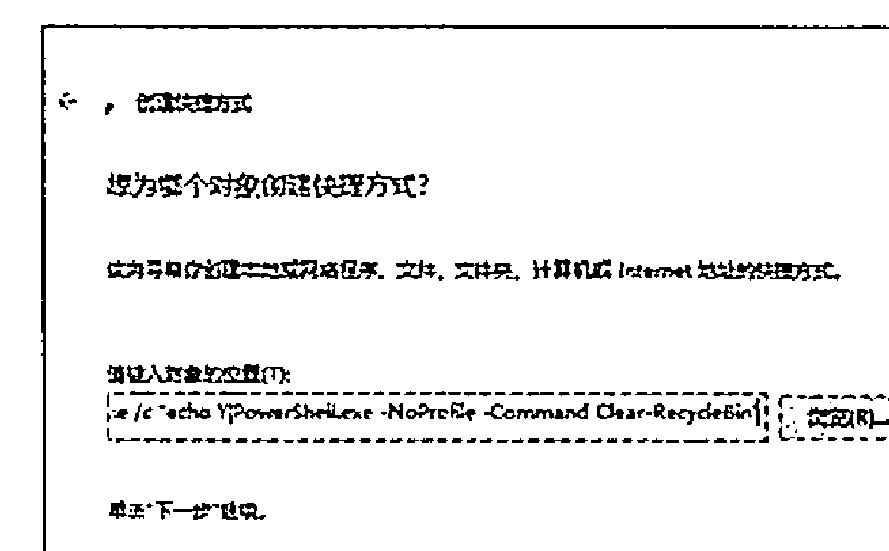

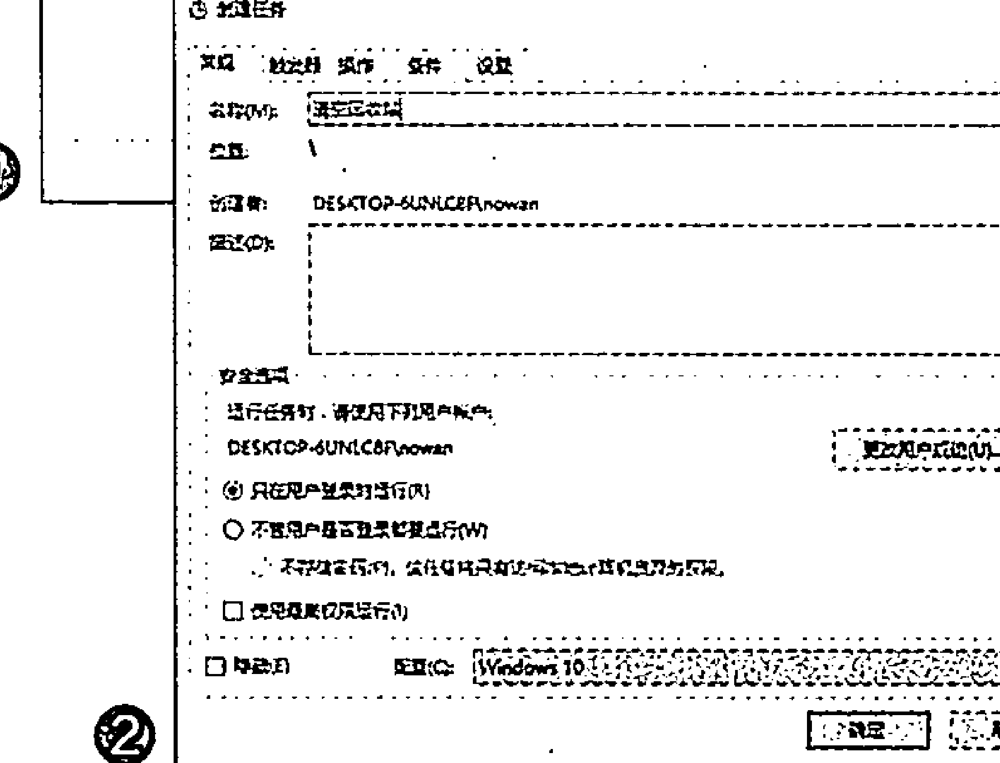

#### 小提示
如果用户使用的是Windows 10之前的操作系统，那么打开系统里面的控制面板后，点击其中的“系统和安全”选项，在弹出的窗口点击“计划任务”命令即可。

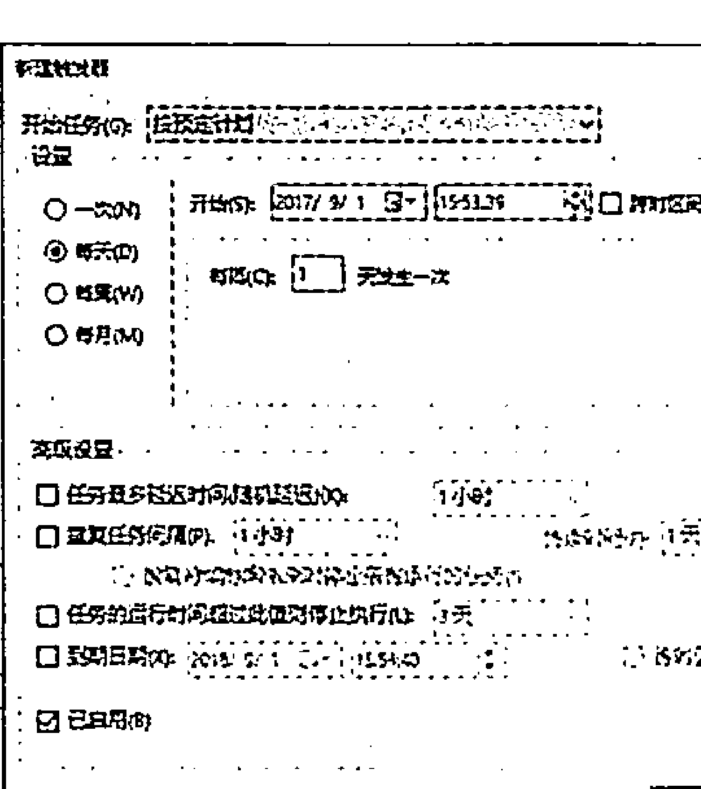

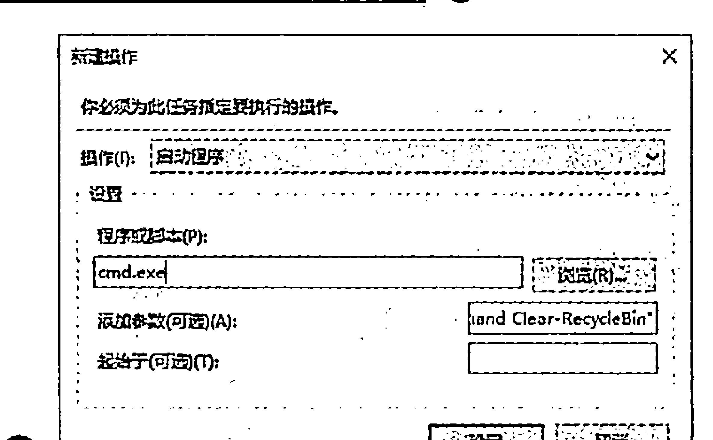

### 1 快捷方式一键清空回收站

我们可以创建一个快捷方式，通过它来执行自动清空回收站的操作。首先在系统桌面点击鼠标右键，选择“新建”菜单中的“快捷方式”命令。在弹出的“创建快捷方式”配置窗口里面，输入“cmd.exe /c "echo Y|PowerShell.exe -NoProfile -Command Clear-RecycleBin"”命令。输入完成以后点击“下一步”按钮，给这个快捷方式设置一个名称即可（图1）。

以后我们只需要执行这个快捷方式，就可以自动清空回收站里面的信息了。但是这样的操作毕竟还是需要手动来完成的，那么如何实现自动的清理操作呢？首先按快捷键Win+R打开“运行”框，输入“shell:Startup”命令后打开系统的启动目录。将我们刚刚创建的快捷方式移动到这个目录里面，以后在系统启动的时候就可以执行这个快捷方式，从而自动执行清空文件夹的操作。

### 2 巧用计划任务清空回收站

上面的方法只能在系统启动的时候进行操作，如果用户想要在其他的时间段进行操作的话，那么还可以利用系统的计划任务功能来完成。首先在Windows 10系统的搜索框里面输入“计划任务”关键词，在搜索出的列表里面点击控制面板中的“计划任务”即可。接下来点击窗口右侧列表中的“创建任务”命令，在弹出的“创建任务”窗口里面点击“常规”标签，在“名称”输入框里面创建一个任务名称，在最下方的“配置”列表里面选择“Windows10”这个选项即可（图2）。

接着选择“触发器”标签并点击“新建”按钮，在弹出的窗口选择“开始任务”列表中的“指定任务时”选项。这样用户可以根据自己的习惯来设定一个自动清空的时间，或者在列表中选择空闲状态或者工作站锁定状态等等（图3）。然后选择“操作”标签并点击“新建”按钮，在弹出窗口的“操作”列表里面选择“启动程序”选项。点击“程序或脚本”选项后点击“浏览”按钮，选择命令提示符的程序文件cmd.exe，在“添加参数”中输入/c "echo Y|PowerShell.exe -NoProfile -Command Clear-RecycleBin"（图4）。最后直接点击“确定”按钮，就可以创建所需的计划任务，到时候就可以每天自动清空回收站了。

## 让Windows SmartScreen把控网络安全

文|樱子

从Windows 8之后，Windows就可以通过Windows SmartScreen筛选器，在用户运行来自Internet的不明程序之前向其提出警告，来提高个人计算机的安全性。通过手动或自动配置的方法，我们也能够让Windows SmartScreen把控系统网络访问的安全。

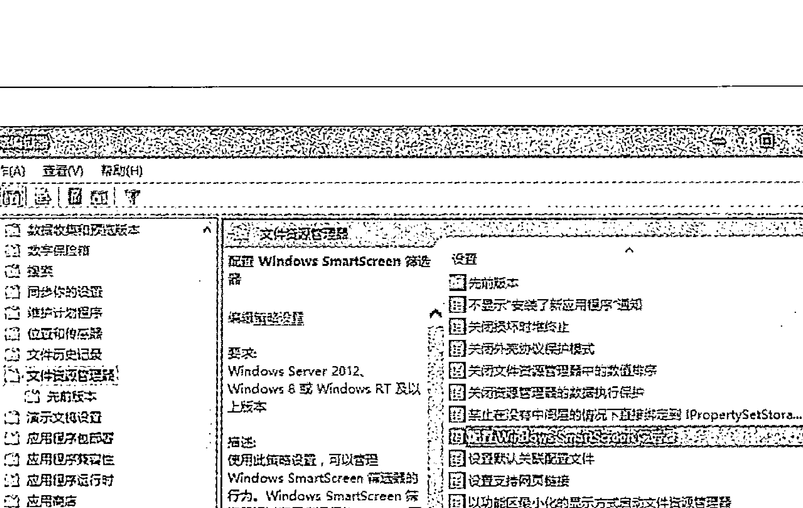

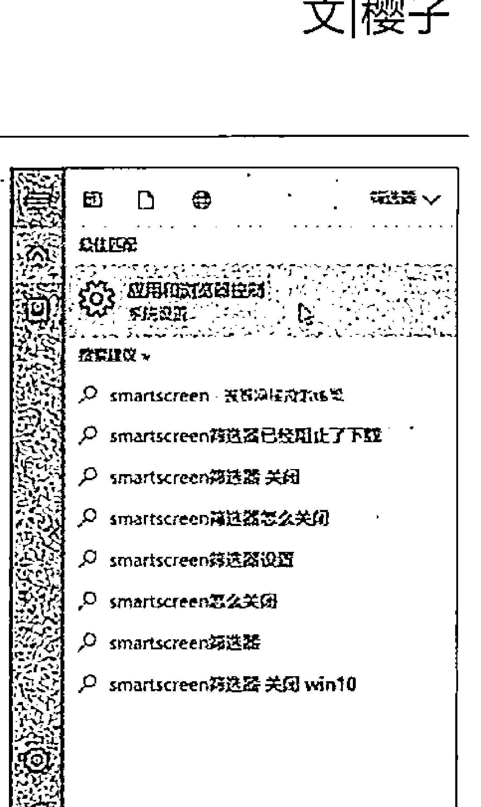

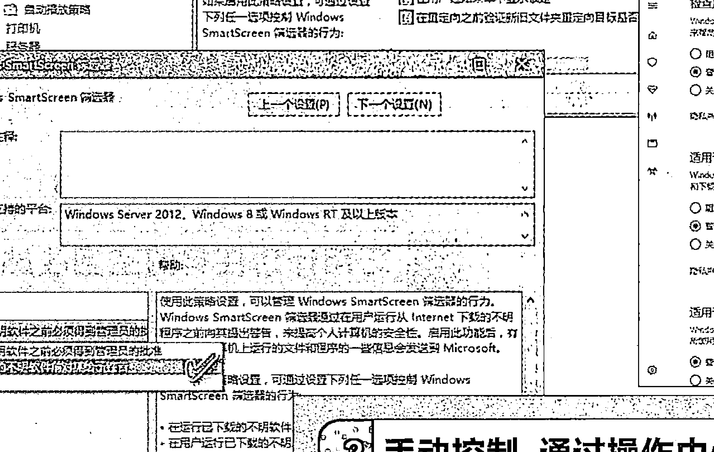

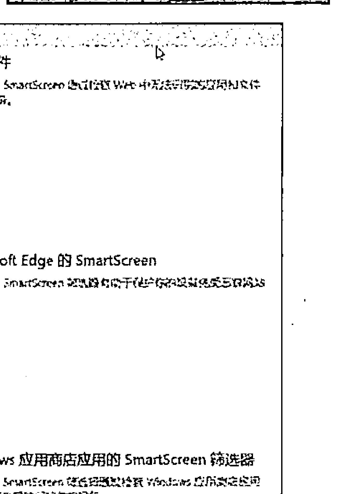

> **小提示**
启用SmartScreen筛选功能后，有关在个人计算机上运行的文件和程序的一些信息会被发送到Microsoft。

### 自动控制 启用应用和浏览器安全控制

如果由于安装或误装了某种安全软件，禁用了系统的应用和浏览器安全策略设置，可通过下面的方法启用此策略设置。

启用方法：按下Win+R组合键后运行GPEDIT.MSC命令，启动组策略编辑器。沿着“本地组策略编辑器→计算机配置→管理模板→Windows组件→文件资源管理器”路径，在右侧窗格中找到“配置Windows SmartScreen筛选器”一项（图1）。双击该选项启动配置窗口，在配置选项中选择“已启用”，然后在设置列表中选择如图所示的前两种设置之一（图2）。随后，系统就会自动按所设级别对应用和浏览器安全进行控制。

### 手动控制 通过操作中心选择安全控制

如果禁用或未配置此策略设置，则Windows SmartScreen筛选器的行为，可由电脑管理员通过操作中心的“Windows SmartScreen筛选器设置”进行管理。

在小娜对话框中输入SmartScreen，单击自动筛选结果列表顶部的“应用和浏览器控制”，进入应用和浏览器控制窗口（图3）。在控制窗口中，可设置对应用和文件预警、Edge浏览风险预警、应用商店应用预警等。如果在运行已下载的不明软件之前必须得到管理员的批准，则选择“阻止”选项；如果希望在运行已下载的不明软件前对其给予警告，选择“警告”选项；若安装了其他安全保护软件，确认可起到安全保护作用，则也可以选择“关闭”选项，关闭SmartScreen筛选器，转由第三方软件来管理安全（图4）。

## 让一个Windows 10 并行演示三套照片

文|樱子

大家都知道Windows的幻灯片演示功能吧？它在Windows 10中变得更有意思了，也更实用了些，能够在不使用其他软件的情况下，实现三套图片并行演示呢。

### 1 三个入口分差演示图片库

#### “背景幻灯片”演示

通过Windows 10的“设置→个性化→背景”进入背景设置窗口，将演示方式选择为“幻灯片放映”（图1），用“浏览”按钮将图片目标指向照片文件夹，设置间隔时间（例如10分钟换一张），这样桌面背景会按设定时间变化自动演示照片。

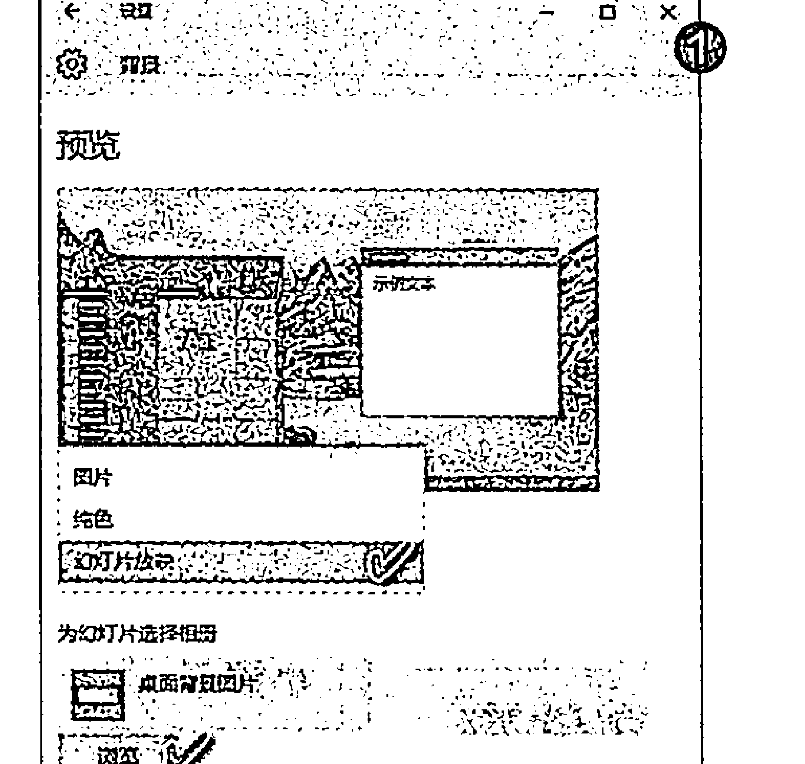

#### “锁屏幻灯片”演示

通过Windows 10的“设置→个性化→锁屏界面”进入锁屏界面设置窗口，将背景模式设置为“幻灯片放映”，添加照片文件夹（图2）。将电源管理中的“屏幕超时设置”时间设为较长，以至于让屏幕自动关闭，或干脆设置为“从不”（图3）。这样进入自动锁屏或手动锁定电脑后，便可演示照片了。

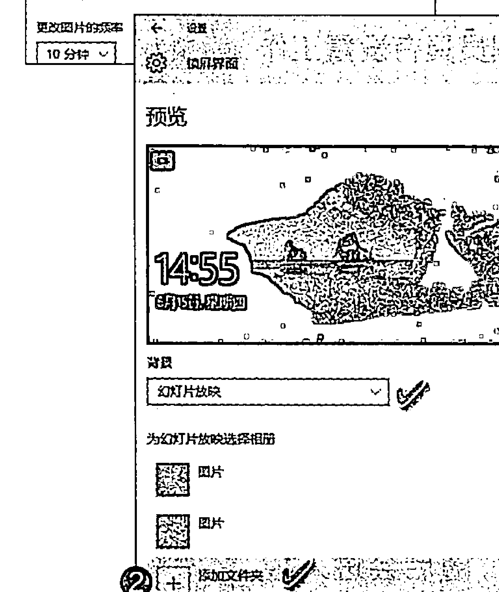

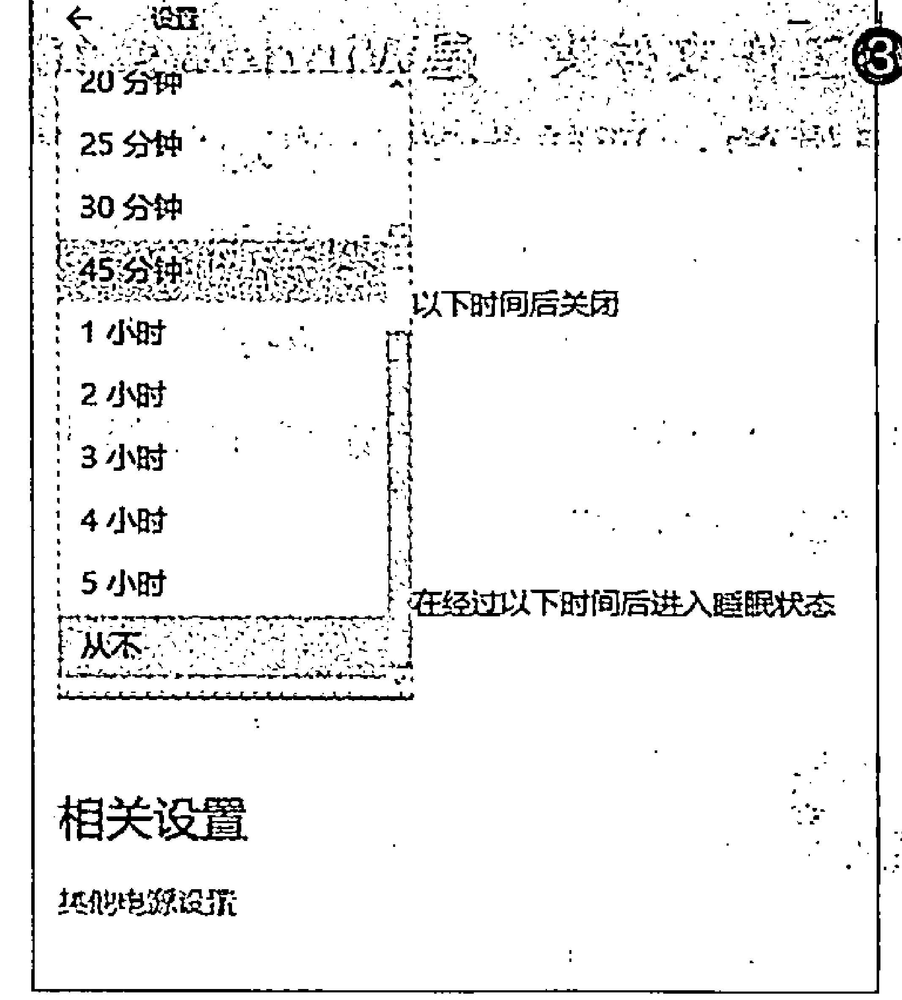

#### “屏保幻灯片”演示

通过Windows 10的“设置→个性化→锁屏界面”进入锁屏界面设置窗口，选择“屏幕保护程序设置”，设置一个较短的离开启动时间（例如1分钟），将屏幕保护程序设置为“照片”（图4），将照片指向照片文件夹，设置照片幻灯片放映速度（图5）。这样当1分钟不操作电脑后，屏幕就自动用图片屏保的方式演示照片了。

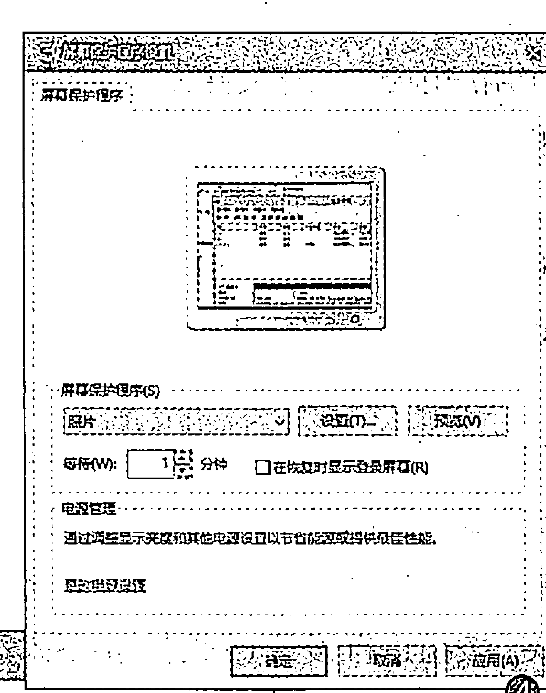

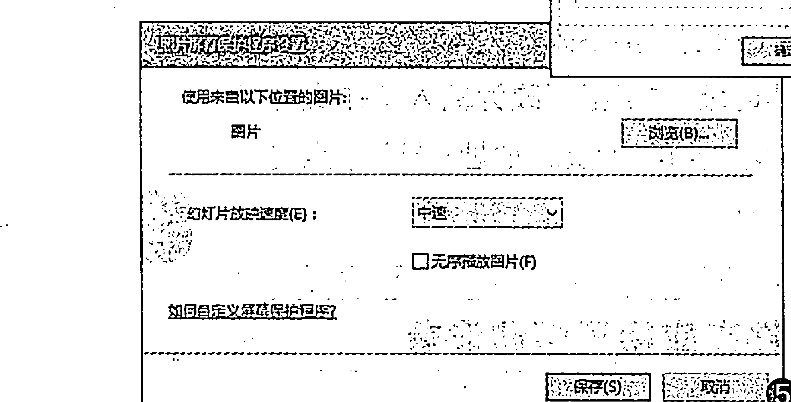

### 2 照片分类存放 整理快捷有序

为了方便整理，三套照片要独立存放。假设三套照片分别保存在“生活照”、“旅游照”、“工作照”等文件夹中。三套照片并行演示，互不干涉。此外，当每次有照片需要更新时，只需添加或替换三个文件夹中的照片即可，其他设置就统统不用管了。

## 用好Windows 10工作文件夹

文|老俞

“工作文件夹”是Windows 10提供的一项较为实用的功能，以Windows登录账号为基础，“工作文件夹”就能起到“中介”的作用，从而实现在不同设备上资料共享等操作方式。

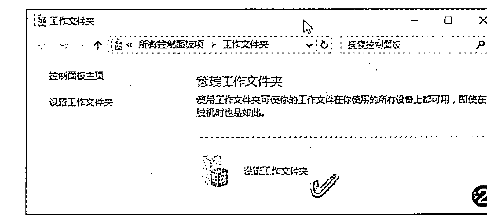

> 小提示
为保证正常的资料备份和使用，请为工作文件夹选择一个空间充裕的驱动器或分区，但要注意该驱动器的文件格式应为NTFS格式，且要保证该驱动器时常处于在线状态。此外，还要注意一些系统保留的文件夹，比如Windows文件夹、“Program Files”、“Program Files (x86)”及其子文件夹、Documents文件夹，以及已使用加密文件系统(EFS)加密的文件夹，均不能设置为工作文件夹的位置，请避开这些目录进行位置设置。

### 在Windows 10中创建工作文件夹

首先需要注意，组织内的IT管理员具有设置工作文件夹账户的资格。加入到域的计算机，会自动为每个用户创建“工作文件夹”，用户只要在资源管理器中打开“此电脑→Work Folders”即可查看当前用户的工作文件夹。未加入域的电脑通过管理员颁发的证书和地址，可拥有一个工作地址（邮件地址或HTTPS地址），通过地址开启工作文件夹。在小娜对话框中输入“工作文件夹”或“管理工作文件夹”，然后在自动筛选结果中选择“工作文件夹”或“管理工作文件夹”项（图1）。随后会进入控制面板的工作文件夹设置窗口，点击“设置工作文件夹”按钮进行设置（图2）。接下来输入网络管理员授予的工作电子邮件地址，或点击“改为输入工作文件夹URL”输入工作文件夹的https://地址（图3），点击下一步按提示设置即可。

### 将工作文件夹应用于移动设备

工作文件夹设置之后，在主流的苹果或Android移动设备上也可以使用工作文件夹。使用iPhone或iPad的用户从App Store中安装“工作文件夹”应用。使用Android设备的用户通过Google Play Store或其他应用商店安装“工作文件夹”应用。安装该应用之后，在连网的情况下打开该应用，然后按设置说明进行操作，即可随时随地访问工作文件夹中的文件了。

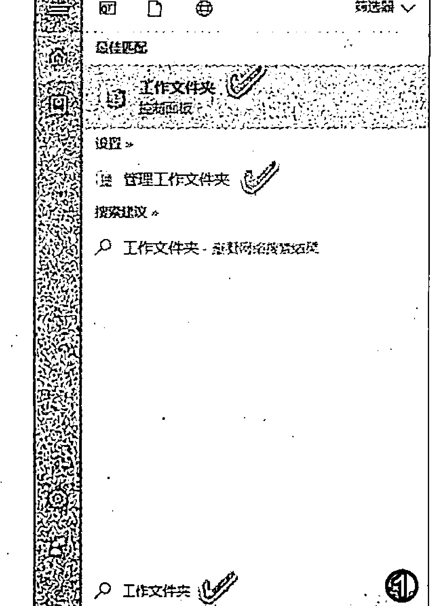

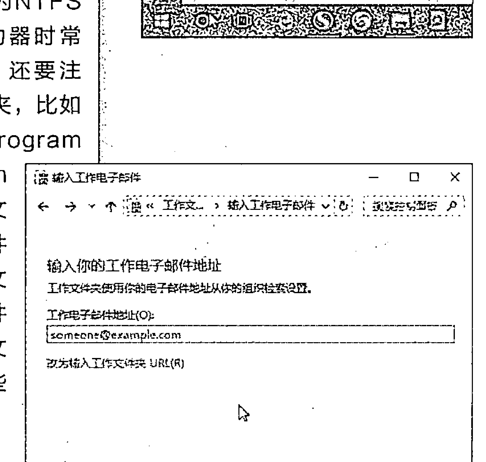

### 随心把控工作文件夹的“位置”

工作文件夹的默认保存位置为系统分区的“\Users\<用户名>\Work Folders”文件夹，工作文件就保存在这里。同时，这些文件还保存在组织的服务器中。此外，在已经设置了工作文件夹且用相同账号登录的所有设备中，也保存有这些文件。如果因为空间等原因，希望将工作文件从默认位置转移到另一个位置，在选择了工作文件夹后，选择“停止使用工作文件夹”，然后选择“设置工作文件夹”。在“介绍工作文件夹”屏幕上，选择“更改”，然后为工作文件夹文件选择一个新位置即可。

### 4 在其他应用中使用工作文件夹

如果要在Office应用中打开工作文件夹的文件，只需在该Office应用中依次选择“文件→打开→此电脑”，然后在电脑上查找工作文件夹（默认位置C:\Users\<用户名>\Work Folders，其中<用户名>是你的Windows登录用户名）。

为便于访问工作文件夹中的文件，可将工作文件夹添加到Office软件的“打开”和“另存为”窗口中的文件位置列表。打开Office应用，然后依次选择“文件→打开→添加位置”（图4），选择工作文件夹添加即可。

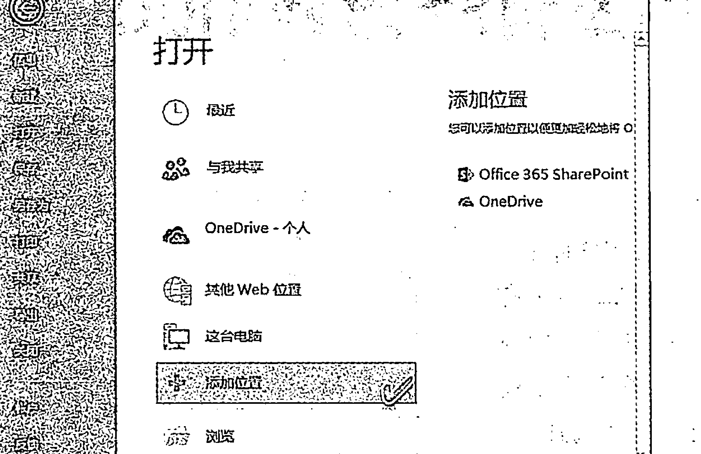

> 小提示
工作文件夹还可以通过组策略来控制关闭。运行GPEDIT.MSC启动组策略编辑器，依次定位到“本地计算机策略→用户配置→管理模板→Windows组件→工作文件夹”（图5）。双击右侧窗格中的“指定工作文件夹设置”项，在弹出的窗口中将配置选项选择为“未配置”或“已禁用”即可（图6）。

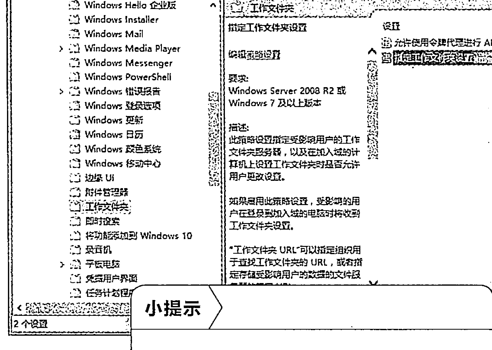

> 小提示
因为某些应用不支持文件加密，所以工作区可能不支持在其他应用中打开工作文件夹文件。或者，它们仅允许在某些应用中打开文件，例如支持权限管理服务（RMS）加密的应用。

### 5 解除工作文件夹的使用限制

工作文件是否加密，由你所在的工作组织来决定。由于组织决定文件是否应加密，因此你无法擅自在工作文件夹中解密加密文件，即便这些文件是在你自己的电脑上。即使将个人文件保存在工作文件夹中，之后将其移到新位置，组织的安全策略仍然适用于该文件。如果文件名是绿色的，即可知道该文件已被加密。

要解密Windows 10工作文件夹中的文件，需要先从个人文件中删除组织的安全策略。具体方法是打开“文件资源管理器”，找到工作文件夹Work Folders的位置，将文件从工作文件夹移动到电脑的另一个文件夹当中。右键单击要解密的文件，然后选择“删除企业控制”。但是，虽然文件得到解密，如果将解密的文件再次移回至工作文件夹，则文件又将被重新加密。

如果要停止使用Windows 10工作文件夹，首先用上述方法将个人文件移到另一个位置。如果文件已加密，选择“删除企业控制”来解密它们，然后依次选择“工作文件夹→停止使用工作文件夹”。

## 无声生有声 为Windows 10系统DIY内录功能

文|俞木发

说到内录，在Windows XP时代可以说非常简单，只要在录音设备选择“立体声混音”进行录制就可，但是这个功能在Windows 10中被取消了，那么Windows 10用户该怎样进行Windows系统内声音的录制工作（图1）？

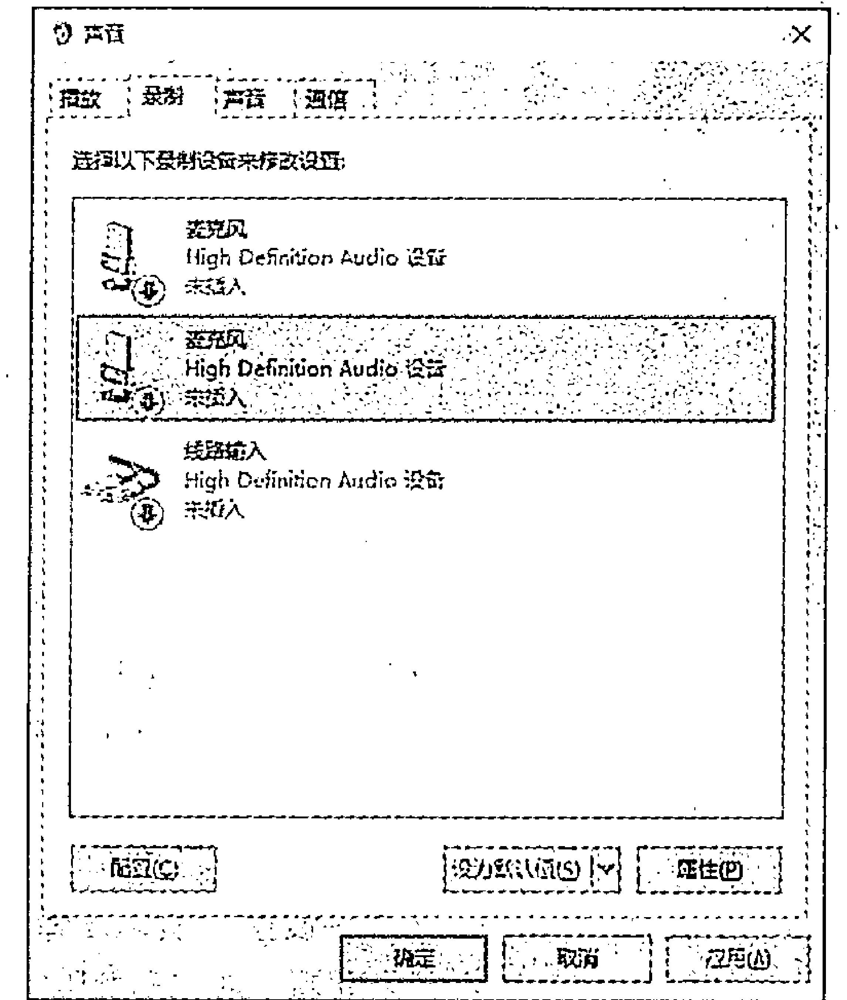

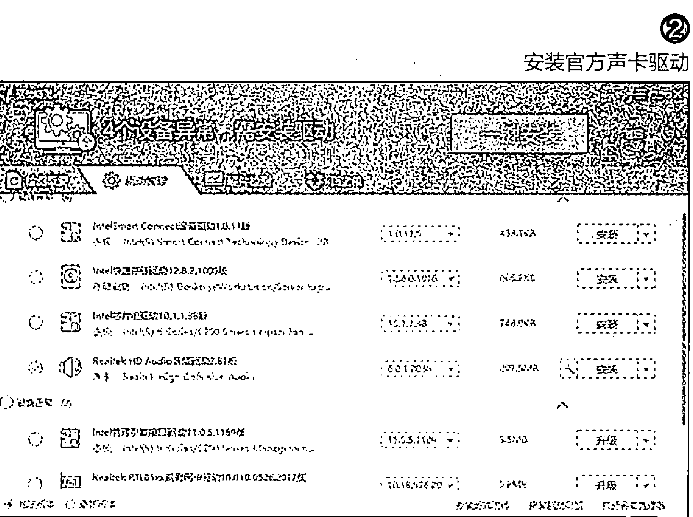

### 拒绝阉割 安装原版声卡驱动

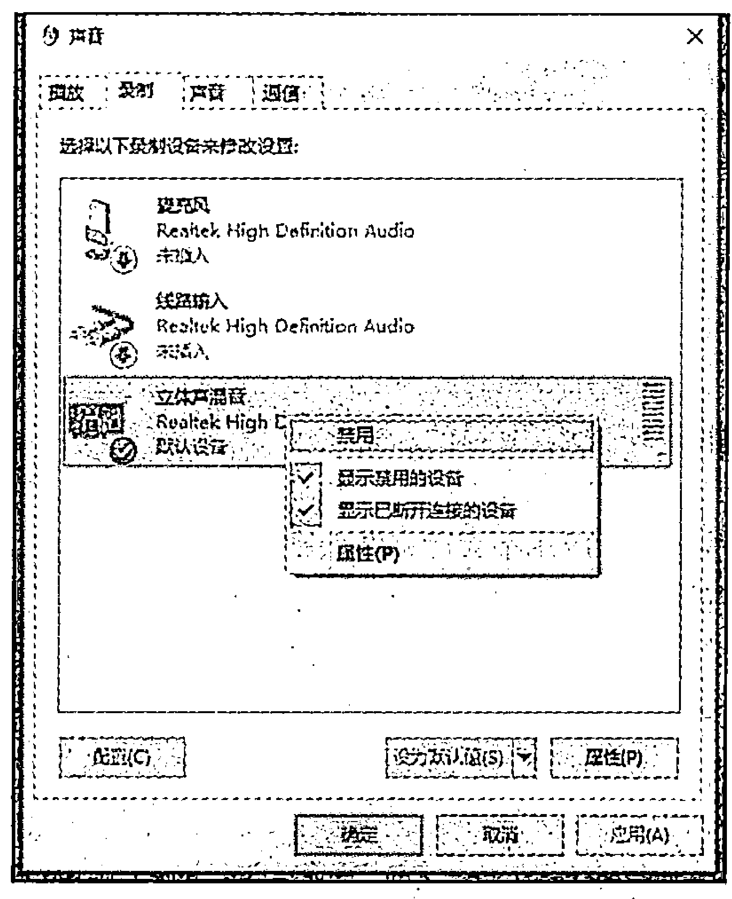

很多Windows 10用户没有“立体声混音”选项，这是因为用户大多直接使用Windows 10自带的声卡驱动，而内录功能被系统内置驱动删减所致。因此这类用户只要安装原版完整驱动即可。

驱动安装可以使用“驱动精灵”，启动程序后对本机驱动进行检测，看看你的电脑声卡驱动是否异常，否则展开“安装→详细信息”，选择声卡官方驱动进行安装即可（图2）。

完成驱动安装并重启后，右击任务托盘喇叭选择“录音设备”，此时在设备列表可以看到被禁用的“立体声混音”设备，右击选择“启用”并将其设置为默认设备（图3）。

如果要录制更高质量的音乐，可以点击“属性→高级”进入立体声混音，在默认格式里按自己的需要选择录制的级别即可（图4）。

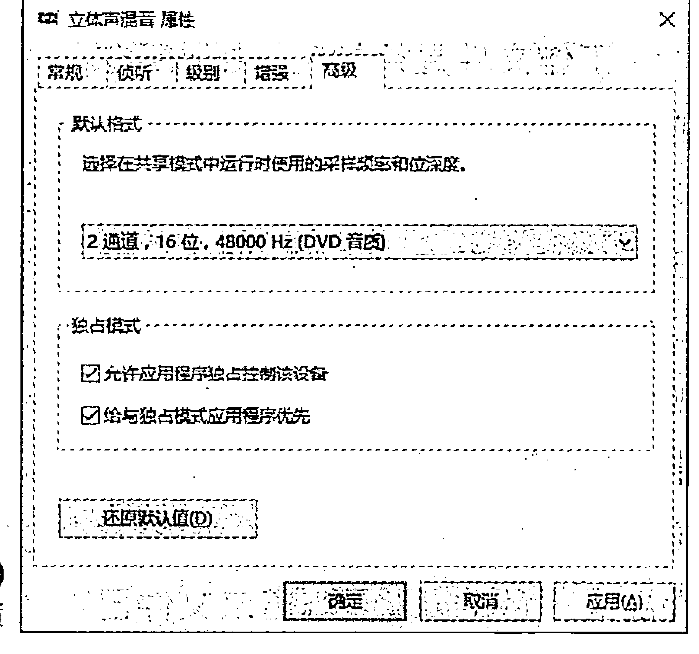

在任务栏搜索栏输入“语音录音机”（没有安装该应用的用户请自行到应用商店下载安装），启动程序后点击“开始录制”，开始录制即可。语音录音机可以将在线音乐录制为.m4a格式，能够在Windows 10系统和大部分手机上直接播放（图5）。

### 2 以虚代实 虚拟声卡来协助

上述方法虽然简单，但是一些声卡可能并没有官方For Windows 10驱动，或者通过上述方法安装驱动后仍然无法在录音设备里找到“立体声混音”设备。对于这类用户，可以通过安装Virtual Audio Cable虚拟声卡实现类似效果。

安装完软件后同上打开“录音设备”，在设备列表会增加一个名为“Line 1”的新设备，按提示将其设置为默认设备(图6)。

切换到“播放设备”，同样将新增的“Line 1”新设备设置为默认设备，此时系统会无法播放音频（因为声音会被传输到虚拟声卡）。继续点击“开始→Virtual Audio Cable→Audio Repeater”，启动程序后将“Wave in”设为“Line1(Virtual Audio Cable)”，“Wave out”设为声音输出设备，如扬声器，最后点击“Start”启动虚拟声卡(图7)。

> 使用虚拟声卡后原来的音频播放设备会被其接管，如果录制完成后声音播放出现问题，只要操作同上恢复系统默认设置即可，或者直接将其卸载。

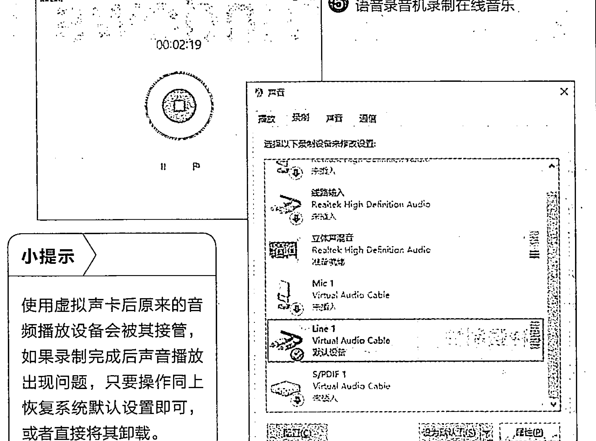

要注意的是，由于使用了虚拟声卡，这里输出输入设备都被指向虚拟声卡，系统自带的“语音录音机”无法直接使用，可以使用“楼月免费MP3录音软件”进行录制。启动软件后点击“文件→设置”，选择“仅录制从电脑播放的声音”，返回程序界面后开始录制(图8)。

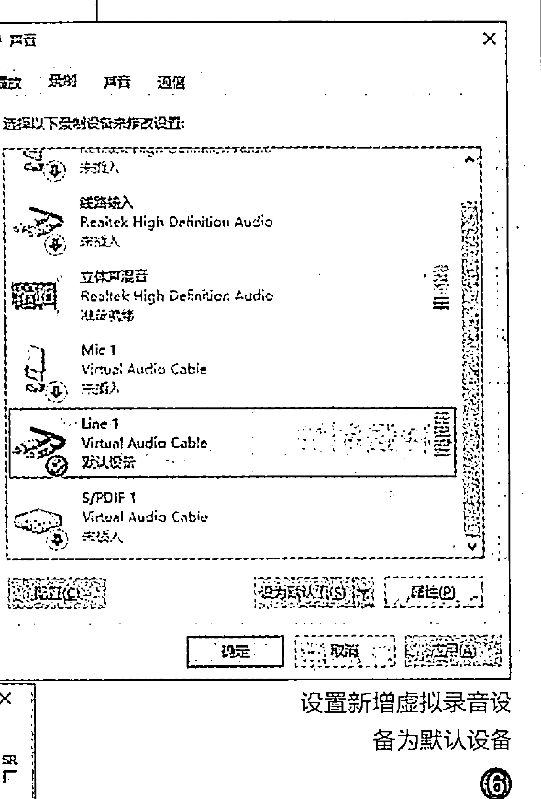

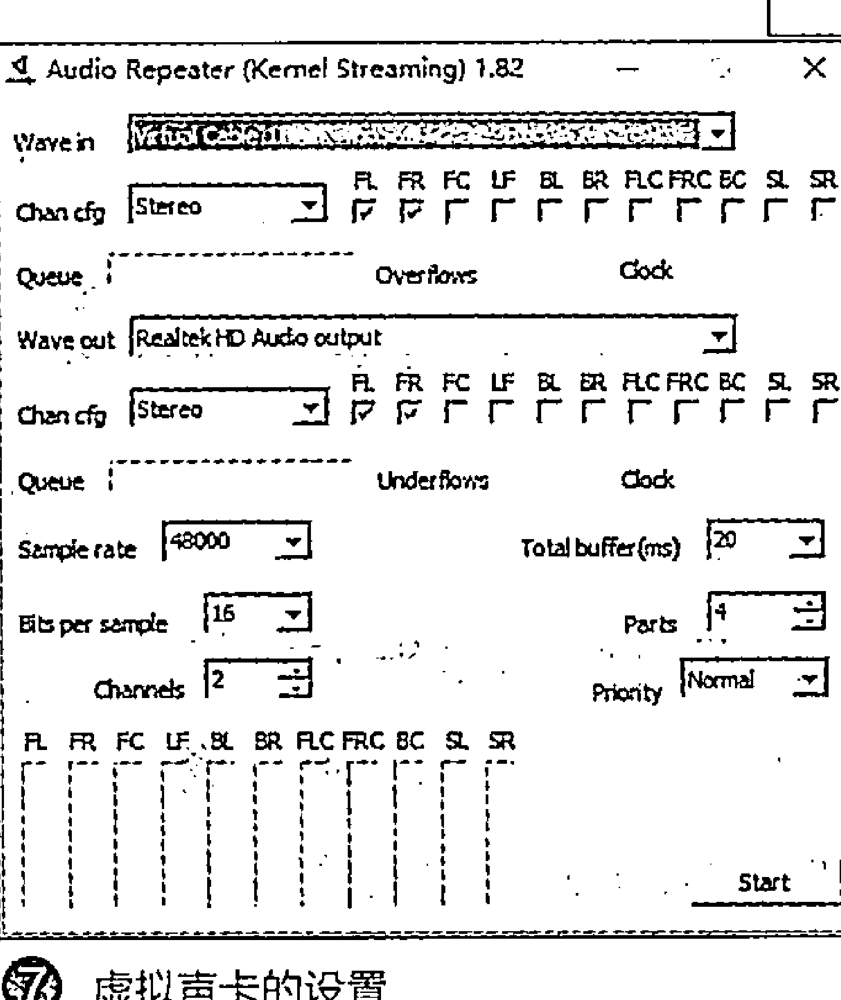

因为Virtual Audio Cable是虚拟声卡设备，可能在一些电脑上安装后会出现不兼容的现象。对于这类用户，还可以直接利用Windows 10自带的虚拟机，在其中安装Windows XP系统，在虚拟机中进行录制。

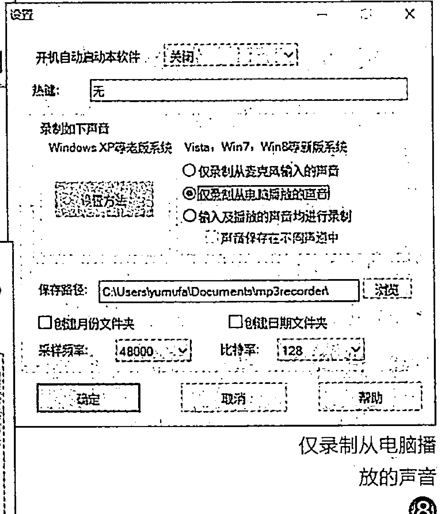

在任务栏输入“启用或关闭Windows功能”，然后将其中的“Hyper-V”组件勾选，并按屏幕提示进行虚拟机安装(图9)。

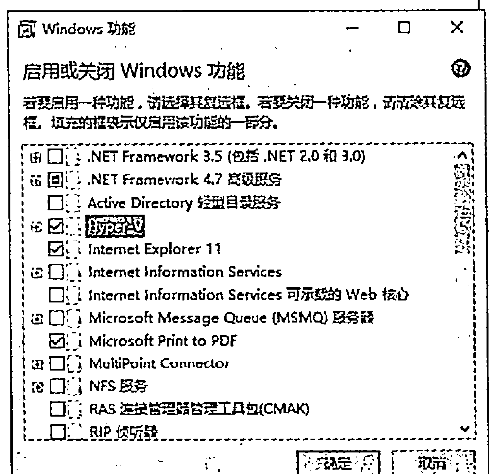

完成虚拟机的安装后重启电脑，此时在“开始→所有应用”中看到有一个“Hyper-V 管理工具”，按提示点击Hyper-V管理器并自行准备Windows XP安装文件，在其中安装完Windows XP虚拟机后，在录音设备选择“立体声混音”进行在线音乐的录制即可。

## 彻底阻断Windows 10推送第三方应用

文/俞木发

Windows 10的应用商店会在未经我们允许的情况下推送并安装各类型应用，对于这种强制性的推送，那么应该如何彻底禁止Windows 10推送第三方应用呢？

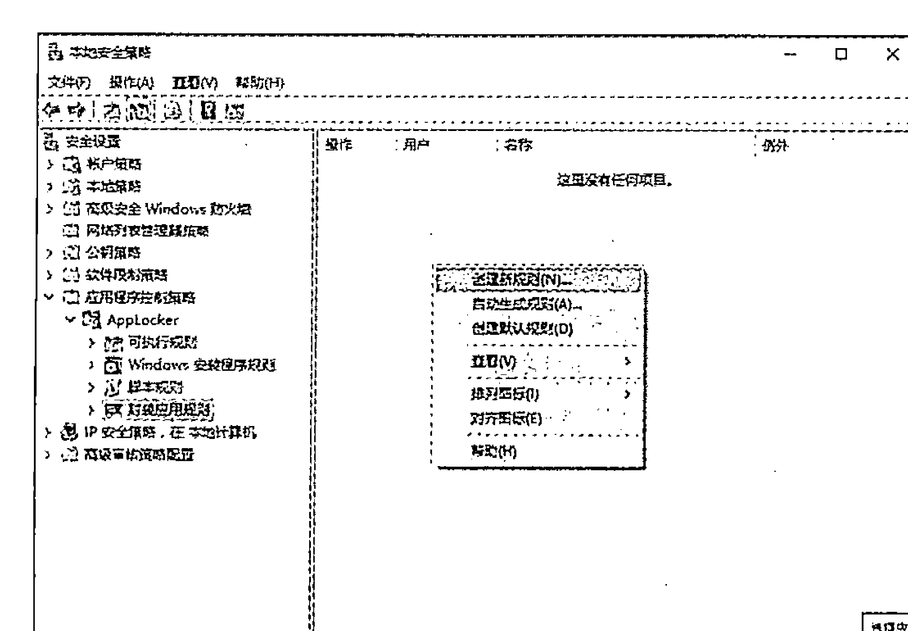

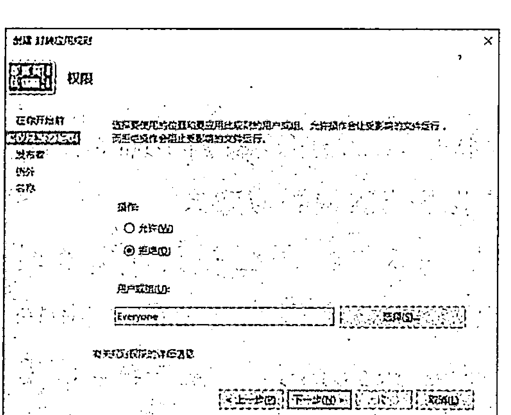

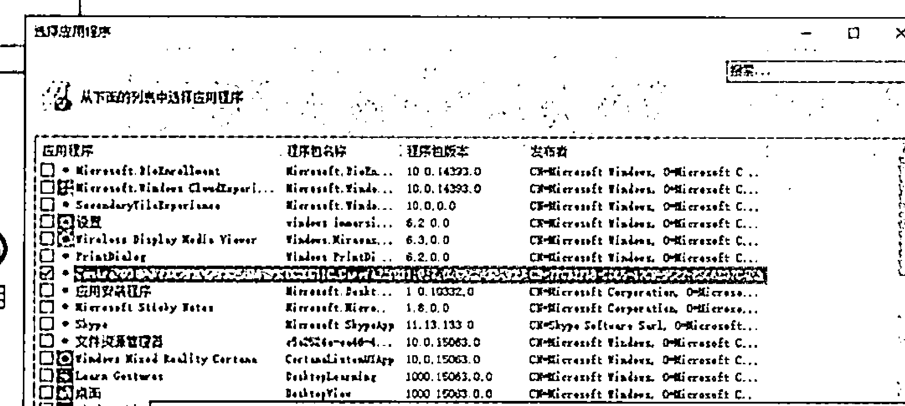

简单点说，Windows 10的第三方应用都是根据协议封装的.appx文件，应用都需要有微软签发的证书才能在商店上架。我们可以选择任一款第三方应用作为封装规则，然后以其作为基准，这样借助组策略中的“AppLocker”策略进行拦截即可。

在任务栏的搜索框输入“本地安全策略”，打开本地安全策略设置窗口后依次展开左侧的“应用程序控制策略→AppLocker→封装应用规则”。然后在右侧窗口中点击右键，选择“创建新规则”，创建一个新的封装规则（图1）。

在弹出的向导中点击“下一步”，进入“权限”设置界面。这里操作选择“拒绝”，“用户或组”保持默认的“Everyone”，即Everyone用户对这个规则都是使用拒绝的权限（图2）。

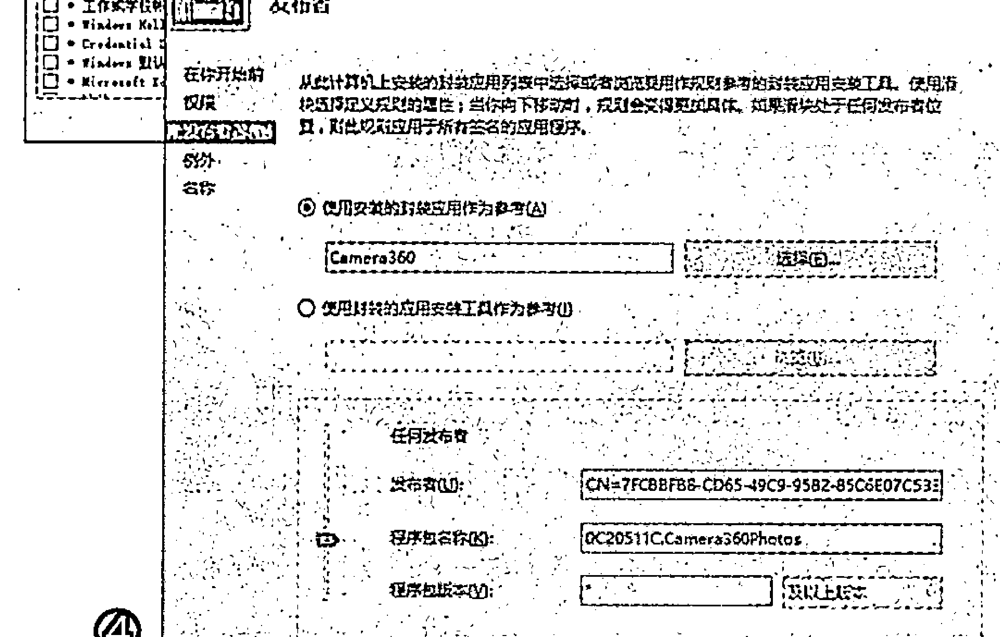

点击“确定”回到“发布者”设置界面，按提示将滑块拖动到“程序包名称”的位置，这里是将这种第三方应用包作为基准封装规则，剩下的操作按照向导的提示完成规则的创建（图4）。

继续点击“下一步”，在“发布者”选项设置中，点击“使用安装的封装应用作为参考”后的“浏览”，在弹出的应用列表选择需要作为封装依据的已安装的第三方应用。要注意的是这里被选择的应用，执行封装的拒绝规则后会无法运行，因此建议不要选择自己常用的应用。比如笔者这里选择是“Camera360”，一款图片处理软件，笔者基本没有使用（图3）。

这样完成上述规则的创建后，这个规则会取代系统原有的应用推送及预装规则，以后微软就不会再推送第三方应用了。当然对于自己确实需要的第三方应用则可以自行到应用商店去下载（上述规则只是阻止系统推送，并没有限制下载），而对于已经安装的第三方应用则可以手动卸载。

当然我们还可以对应用做出更多的限制，比如很多使用Windows 10的朋友除了使用有限的几个应用外，基本不会再安装或使用其他应用。对于这类用户我们还可以使用权限的方法彻底阻止用户安装新增的应用，因为应用安装需要在“C:\Program Files\WindowsApps”下新建目录，因此我们可以使用权限设置拒绝用户在此创建新目录。右击上述目录选择“属性→安全”，先将目录所有者更改为当前用户，并去除所有继承权限。接着点击高级设置，将用户“创建文件夹/附加数据”权限去除，阻止用户在该目录新建文件夹（图5）。这样用户试图在应用商店下载应用安装的时候，由于没有创建文件夹的权限，自然无法成功完成安装。因为没有限制用户对该目录的读取权限，因此安装的应用还是可以正常运行的（图6）。

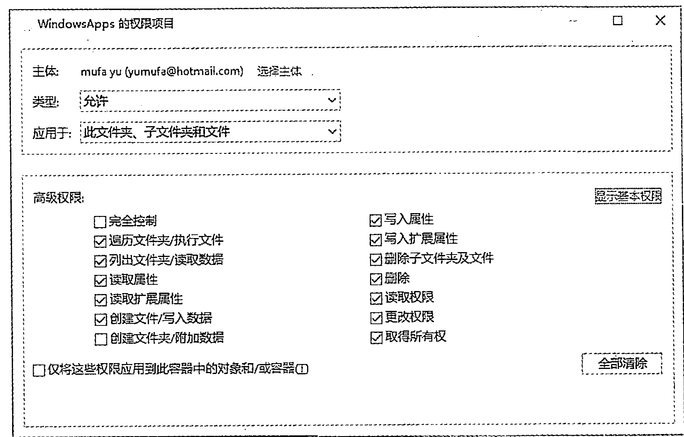

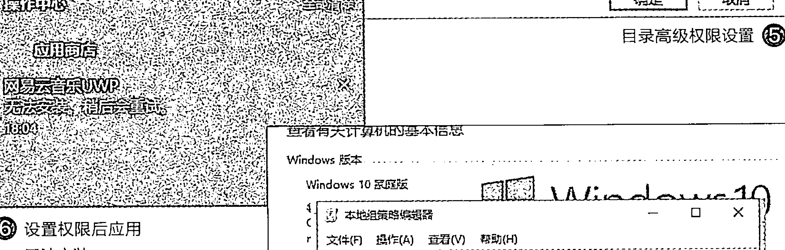

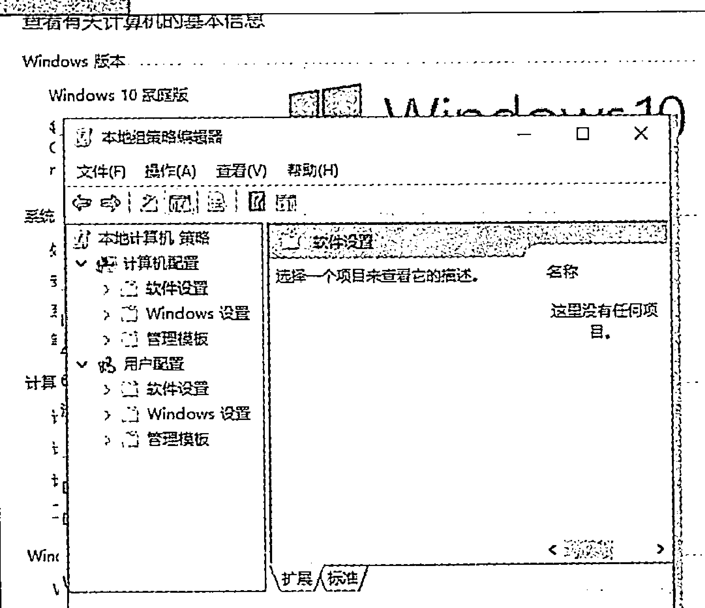

### 扩展阅读：Windows 10家庭版用户怎么办

上述方法都是介绍使用组策略来对应用的推送和安装进行限制，Windows 10家庭版用户没有组策略怎么进行限制？一种方法是自行为家庭版添加组策略。首先到https://pan.baidu.com/s/1bp6gmHx下载所需的文件cfan.cmd，下载后右击文件选择“以管理员身份运行”这个文件，这样家庭版用户就可以使用组策略了，剩余操作同上（图7）。另外，大部分组策略的设置是可以借助注册表实现，家庭版用户启动注册表编辑器后展开[HKEY_LOCAL_MACHINE\SOFTWARE\Policies\Microsoft\Windows]，接着在其下新建名为CloudContent的子项。选中CloudContent项，在右侧新建一个DWORD (32位)值，名称为“DisableWindowsConsumerFeatures”，并将其值设置为“1”（十六进制），这样Windows 10就不会推送，也不会自动安装应用了。如果需要取消限制，则删除上述建立的键值即可（图8）。

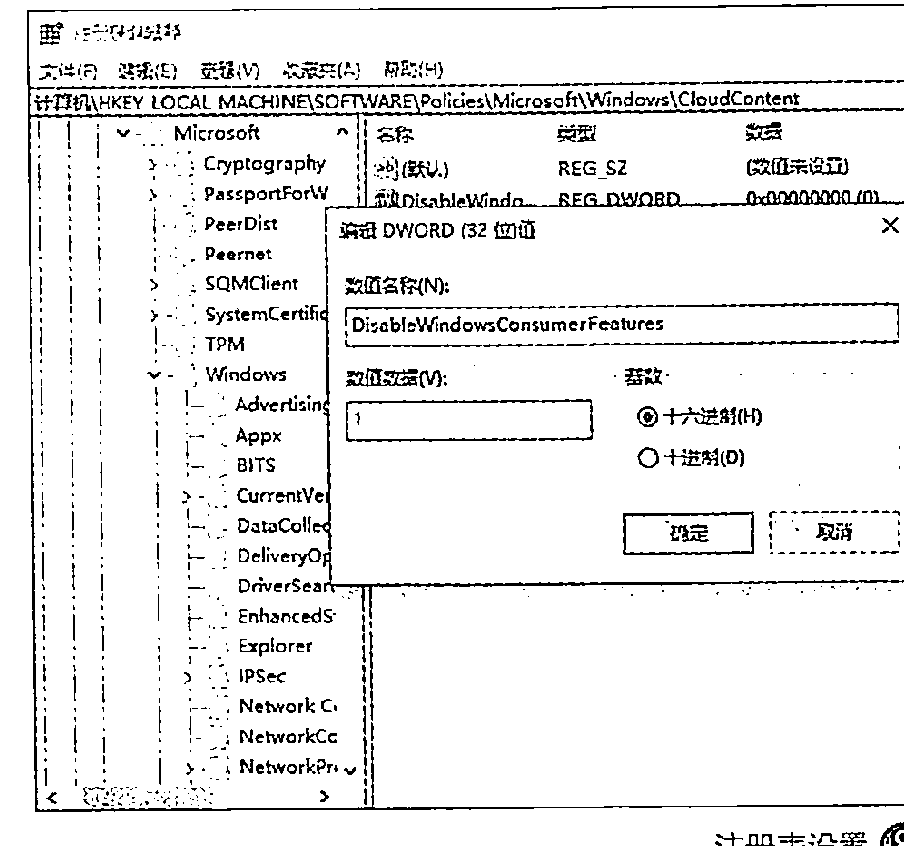

## 右击桌面就能控制系统

文/樱子

新版Windows 10去掉了Win+X菜单中的“控制面板”选项，如果还需要在控制面板中进行操作，怎么办？我们可以将该选项添加到桌面右键菜单中，实现一键调用。

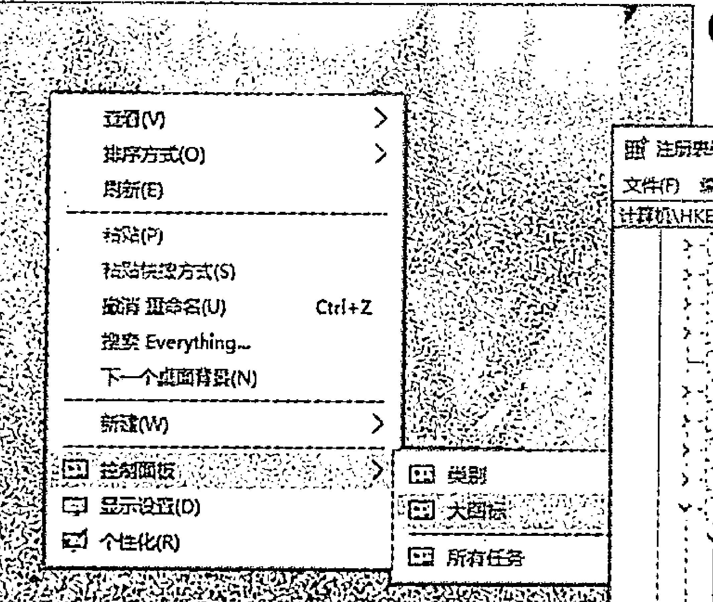

我们不但要将“控制面板”项添加到桌面右键菜单中，还要附带如图所示的三项子菜单以便灵活选择(图1)。

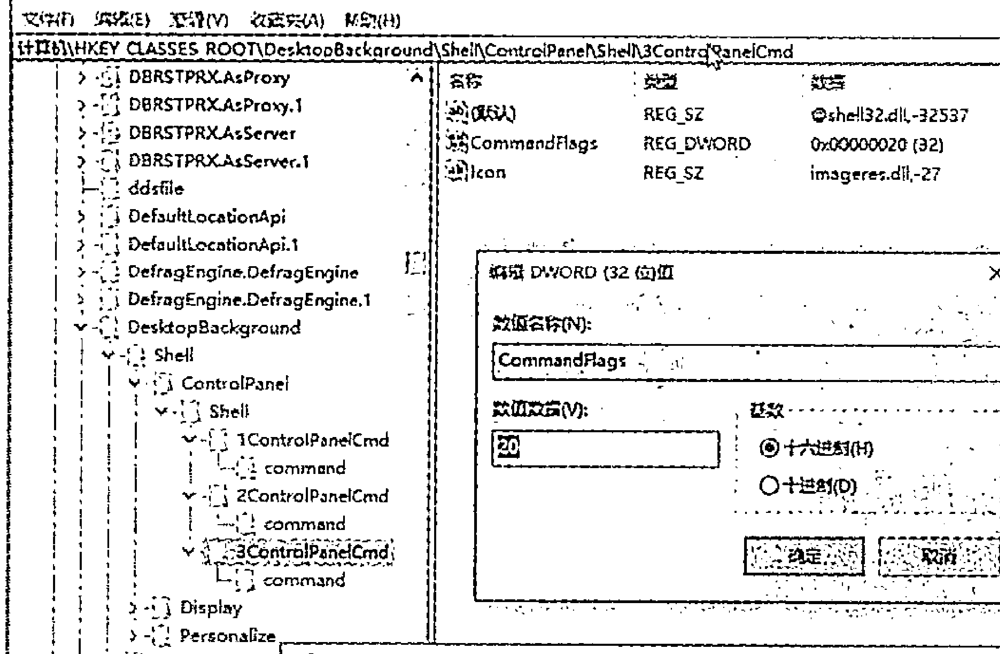

打开注册表编辑器，在“HKEY_CLASSES_ROOT\DesktopBackground\Shell\ControlPanel\Shell”下新建ControlPanel子项，并添加4个字符串值，其数值如图所示(图2)。接下来在其下新建Shell子项，并在该子项下新建1ControlPanelCmd、2ControlPanelCmd和3ControlPanelCmd三个子项，在默认字符串值的基础上，分别添加Icon字符串值。三项默认字符串值和Icon值的数据分别依次设置为：

- @="@shell32.dll,-31061"、"Icon"="imageres.dll,-27"
- @="@shell32.dll,-31062"、"Icon"="imageres.dll,-27"
- @="@shell32.dll,-32537"、"Icon"="imageres.dll,-27"

在第三子项下还要另增一个名为CommandFlags的DWORD(32)值，数值数据设为20(图3)。

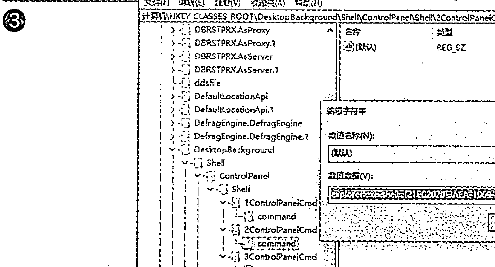

接下来，在三项ControlPanelCmd下，各自分别新建command子项(图4)，数据分别设置为：

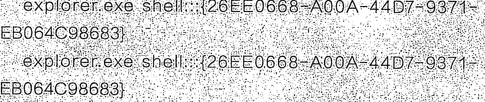

```
explorer.exe shell:::{26EE0668-A00A-44D7-9371-BEB064C98683}
explorer.exe shell:::{26EE0668-A00A-44D7-9371-BEB064C98683}
explorer.exe shell:::{ED7BA470-8E54-465E-825C-99712043E01C}
```

关闭注册表编辑器，右击桌面空白处即可看到“控制面板”菜单。

## Windows 10画图3D去除图片背景

文/阿立

去除图片背景是很多人经常遇到的事，对于专业的用户来说他们利用Photoshop软件就可以解决，对于普通用户来说也可以借助一些傻瓜软件来完成。其实除了利用这些方法以外，我们利用Windows 10操作系统中的“画图3D”应用，也可以很快地完成去除背景的相关操作。

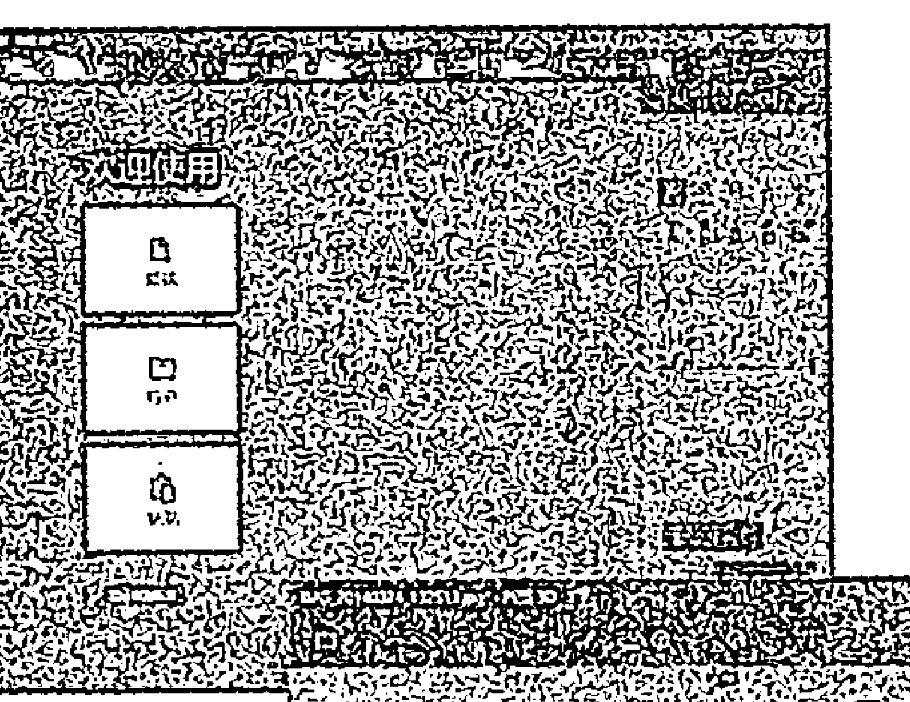

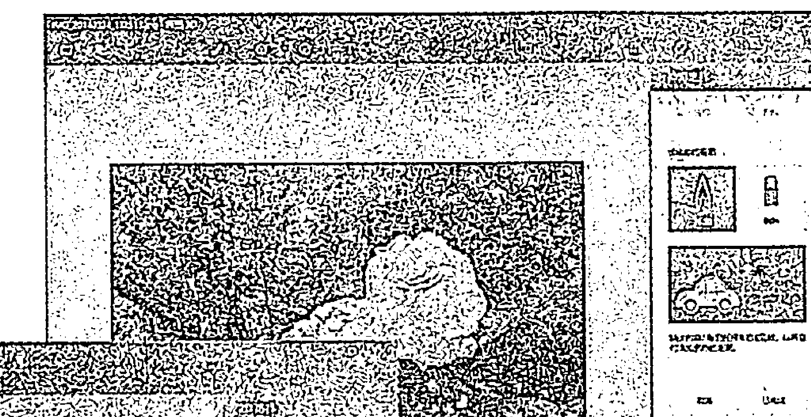

> **小提示**
如果用户的Windows 10操作系统没有这款应用，那么可以通过应用商店进行下载安装。

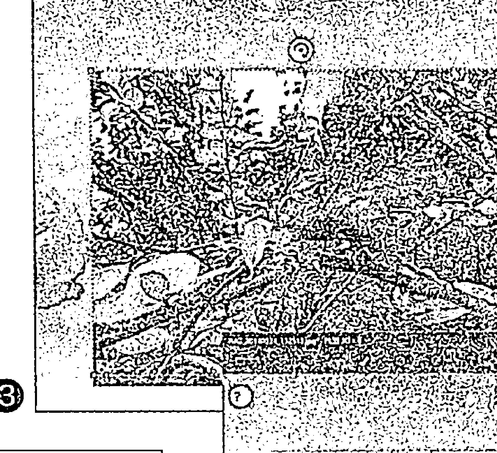

### 1 选择保留的部分内容

我们首先启动Windows 10操作系统中的“画图3D”这款应用，在弹出的操作界面中点击“打开”按钮（图1）。从弹出的对话框里面点击“浏览文件”按钮后，选择需要去除背景的图片。现在点击操作界面右侧面板的“选择”按钮，然后通过鼠标在图片中选中需要保留的部分。选取完成以后点击右侧面板中的“神奇选择”这一项，稍等片刻我们就可以看到该应用会自动对选中的物体进行边缘选取，需要保留的内容会在画面中突出显示出来（图2）。

由于这款应用是对画面进行智能的分析，那么可能会出现一些内容没有选中，或者一些内容被多选出来的问题。这个时候就需要手工调整，对其进行简单的重新选取操作。比如有的部分没有自动选中的话，那么就点击右侧面板中的“添加”按钮，然后在需要选中的地方用鼠标重新勾画一下即可，会发现选择的内容被重新规划了。如果存在有被多选中的内容，那么点击面板中的“删除”按钮，将多余的部分用鼠标重新选择一下就可以了。当所有的选择完成以后，点击面板中的“已完成”按钮进行确认。

> **小提示**
如果一次无法对背景中的内容进行操作，那么我们可以重复进行几次选择删除这样的步骤。

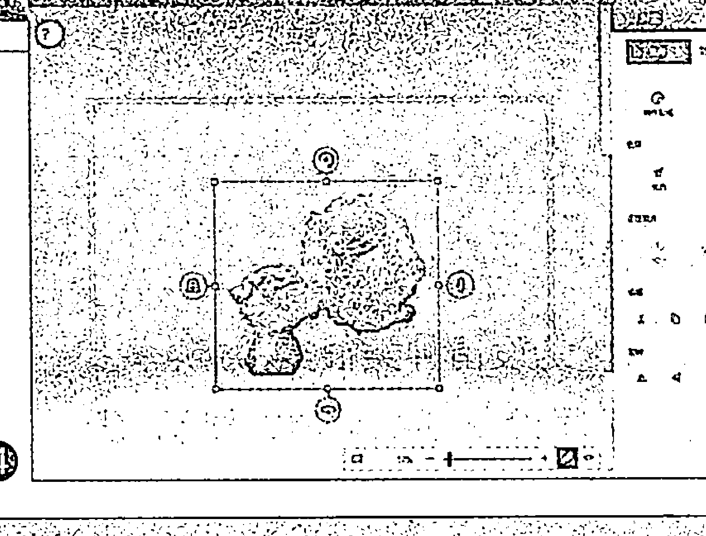

### 2 将画布变成透明状态

这时我们发现处理后的物体被重新选中。现在我们利用鼠标将它移动到“画图3D”应用操作界面的边缘，而接下来要做的事情就是将保留的背景进行删除（图3）。我们点击工具栏中的“画布”按钮，在右侧面板里面将“透明画布”功能进行开启激活。点击画布面板中的“选择”按钮后，通过鼠标将整个画布的区域进行选中，然后点击面板中的“删除”按钮，这样我们就可以得到一个空白的画布。

接下来利用鼠标在刚刚移动到操作界面边缘的物体上点击一下，使这个物体呈现出被选中的状态，然后利用鼠标将它移动到画布的正中（图4）。这样我们就已经成功地完成了图片去背景的操作，最后我们要做的就是点击操作界面左上角的“展开菜单”按钮，在弹出的菜单里面点击“导出文件”命令，就可以完成相应的保存操作了。

## 定向优化 玩转Windows 10 DPI缩放

文/俞木发

如今，大屏显示器普及，2K、4K等高分辨率显示器日益增多，但这些高分屏在提供高分辨率的同时，也给使用带来不便。以2K屏幕为例，其默认分辨率是2560×1440，这样在运行很多程序时，程序窗口字体小，离屏幕稍远一些就看不清楚，如果降低分辨率，字体又会显得发虚。为了解决高清屏显示的问题，1703版的Windows改进了DPI设置，可以让我们实现定向优化。

### 智能感知 认识混合式DPI缩放

因为使用Windows 10的设备种类很多，分辨率参差不齐，因此为了能够让不同设备都能够清晰显示，微软在新版Windows 10中启用了一种叫“混合式DPI缩放”的技术，它可以为开发者在底层准备不同的缩放模式，这样系统本身的组件和很多应用程序都可以实现自适应，从而为高分屏用户带来更佳的视觉体验。

Windows 10系统可以智能识别当前设备的最佳分辨率，同时为设备启用最佳的DPI缩放。比如对于使用22英寸1680×1050分辨率的用户，系统并不会使用缩放，但在2048×1536分辨率的设备上，Windows 10会推荐使用缩放设置为150%（图1）。

因此，Windows 10这项技术可以让系统和应用程序实现自动缩放，从而“变相”使得程序UI可以在高分屏下以更低分辨率显示，实现UI的平滑缩放。比如支持UHD 4K显示器（分辨率是3840×2160），如果DPI缩放比例设置为200%，那么实际上分辨率是变成1920×1080（4K显示器的优点是在处理高精度图片或者需要更大显示面积的时候，可以随时取消缩放，还原高清显示）。当然Windows 10也提供自定义缩放功能，只要在搜索框输入“更改显示器设置”，打开设置窗口点击“自定义缩放”，然后输入自己需要的缩放级别（100%~500%），注销后即可使用（图2）。

对于系统组件和微软自身开发的组件，它们在Windows 10中可以很好地实现平滑缩放。比如Word 2016用户，无论使用什么缩放级别设置，它的界面菜单字体都可以清晰显示，而且如果觉得在Word中字体显示过小，那么只要拖动下方滑块也可以进行缩放（图3）。

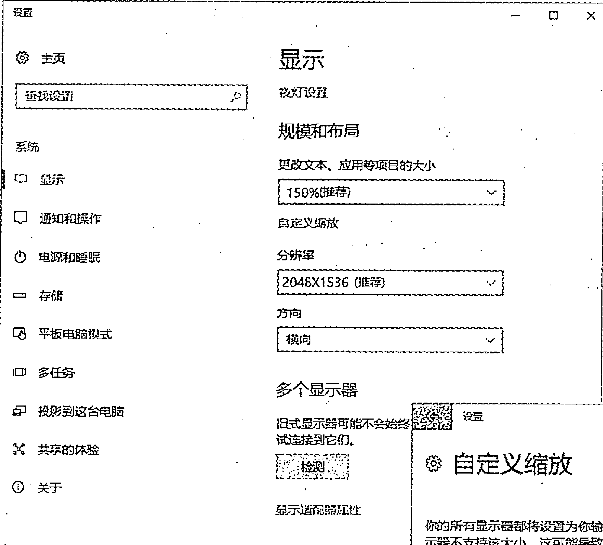

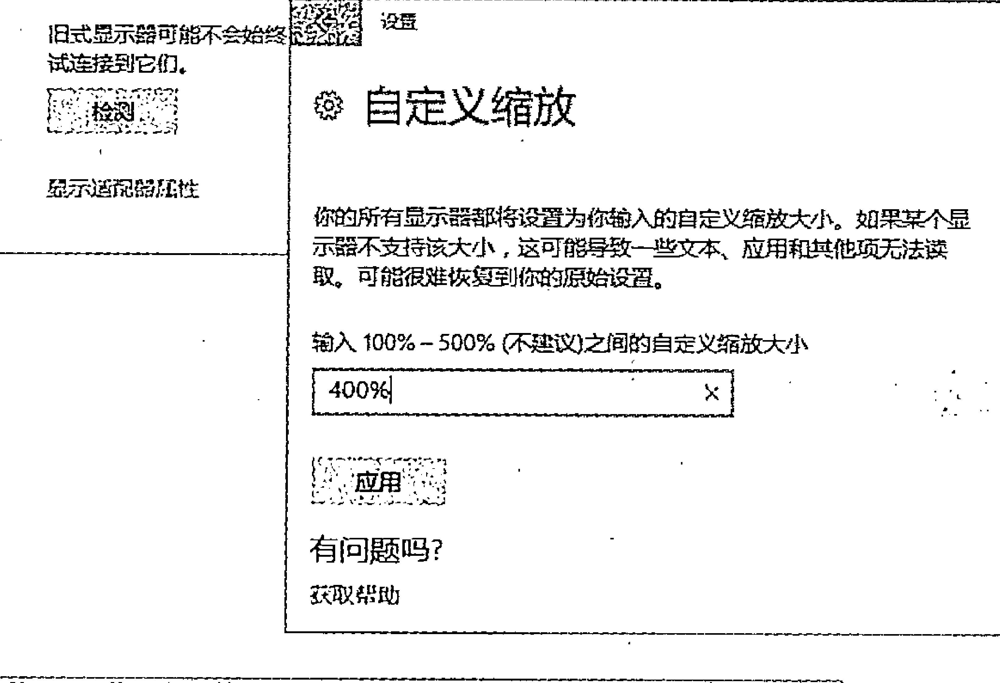

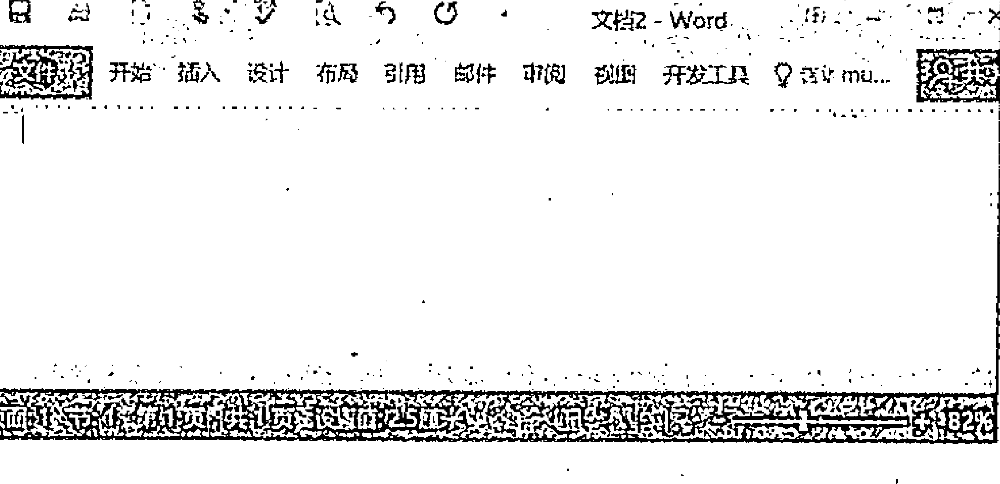

### 2 个性十足 针对每个程序DPI优化

Windows 10使用的缩放级别默认对所有程序生效，不过并不是所有应用程序都支持系统的DPI缩放。一些程序在使用DPI缩放后可能会导致界面字体发虚、图标出现锯齿等不友好的体验。为了解决这个问题，Windows 10的DPI缩放还可以针对每个应用程序进行更个性化的设置。

比如在4K屏3840×2160分辨率下的CPU-Z程序的界面、文字部分就显得十分小，如果将DPI缩放设置为300%，此时软件界面虽然变为正常大小，但是菜单文字的锯齿感又非常明显(图4)。

对于这类不支持DPI缩放的程序，可以右击程序选择“属性—兼容性”，在打开的窗口勾选“替代DPI缩放行为：缩放执行：”，下面选择“应用程序”，这样可以避免上述问题的出现(图5)。

上述“替代DPI缩放行为”设置分为“应用程序”、“系统”和“系统增强”三类。“应用程序”设置是指系统将强制进程在显示器的分辨率下运行，选择该选项后Windows 10系统不会对程序UI进行强制拉伸，那些在系统DPI缩放显示异常的程序就可以正常在高分屏显示了，该选项主要适用于一些老旧程序。

“系统”设置是指Windows 10会将DPI感知的应用程序进程进行标准处理，当系统进行DPI缩放设置后，Windows 10会对界面进行自动拉伸处理。这其实也是系统默认的选项，如果你的程序没有在缩放后出现异常，使用默认设置即可。

“系统增强”设置则是指Windows 10对字体进行增强型的全新排版，对位图进行强行缩放，从而可以让这些程序也能够在Windows 10下有更好的显示。比如一些程序如Photoshop 7.0以前版本、淘宝助理等，这些程序即使你设置了DPI缩放，它们仍然保持原来的显示(在高分屏下菜单字体、图标仍然很小)。这类程序就要使用这个选项，它可以让程序强制使用DPI缩放。

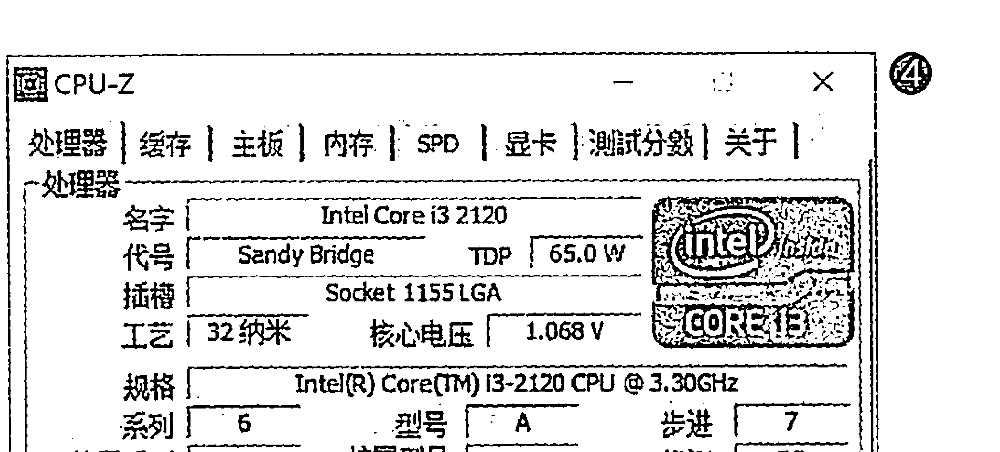

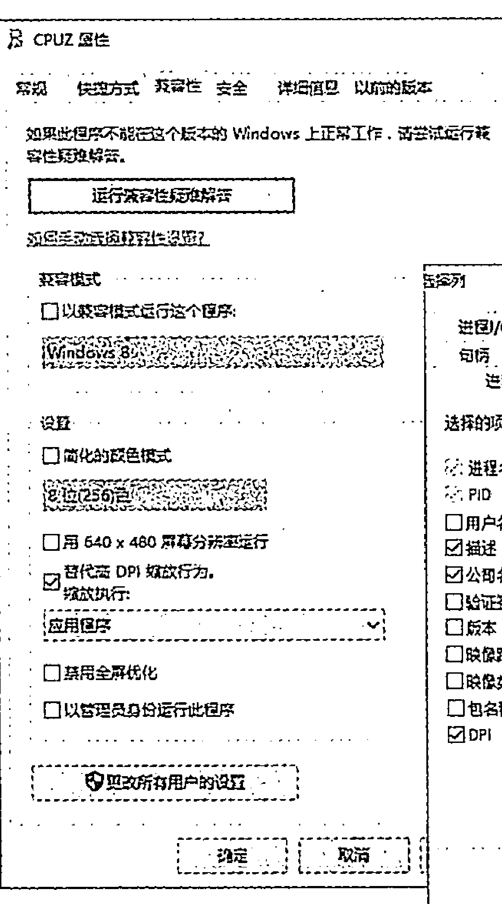

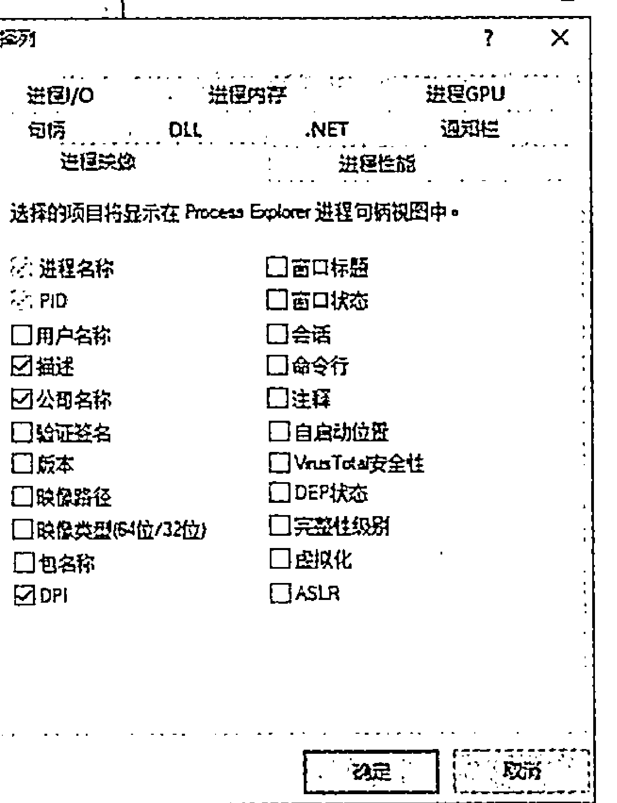

那么如何判断程序是否完美支持系统DPI缩放？可以借助ProcessExplorer软件查看。启动程序后点击“视图—选择显示的项目”，在打开的窗口勾选“DPI”(图6)。这样，对于所有正在运行的程序，如果在DPI选项下显示为Unaware则表示不支持，System Aware是支持，Per-Monitor Aware则是支持多显示器动态自适应。对于不支持的程序如上述介绍的CPU-Z，则可以使用替代DPI缩放行为进行定向优化了(图7)。

| Process | PID | CPU | Description | DPI |
|---|---|---|---|---|
| explorer.exe | 6584 | 0.15 | Windows Explorer | System Aware |
| MASCCul.exe | 8600 | | | System Aware |
| RAVCx64.exe | 8064 | | | System Aware |
| YundetectService.exe | 164 | 0.02 | | Unaware |
| wpscloudse.exe | 848 | 0.50 | | Unaware |
| QQBrowser.exe | 8588 | 0.01 | | System Aware |
| WINWORD.EXE | 6688 | < 0.01 | | System Aware |
| mspaint.exe | 9792 | | | System Aware |
| BaiduNetdisk_1.exe | 1248 | 0.68 | | Unaware |
| notepad.exe | 1156 | | | Per-Monitor ... |
| csrss.exe | 900 | | | Unaware |
| KwMusic.exe | 101... | 0.40 | | Unaware |
| WpService.exe | 9080 | 0.19 | | Unaware |
| KwWebkit.exe | 5292 | | | System Aware |
| KwWebkit.exe | 102... | | | System Aware |
| KwWebkit.exe | 9188 | 0.04 | | System Aware |
| KwWebkit.exe | 7808 | 0.18 | | System Aware |
| CncClient.exe | 9572 | 0.69 | | System Aware |
| rundll32.exe | 8504 | | | Unaware |
| rundll32.exe | 1836 | | | Unaware |
| welyun.exe | 118... | 0.59 | | Unaware |
| QQProtect.exe | 3428 | | | System Aware |
| brocesp.exe | 1276 | 0.92 | | System Aware |

## 增强Windows 10文件属性

文/老俞

Windows 10文件属性窗口中虽然可显示文件创建、修改和访问的日期，但无法更改这三种日期。文件其他属性也只能设只读和隐藏两种（图1）。有时由于系统时钟或者数码相机时钟出现问题，会造成生成的文件日期时间不能反映实际情况，这就需要进行修改。借助BulkFileChanger软件或系统内部命令，可以实现系统日期时间或其他属性的任意修改。

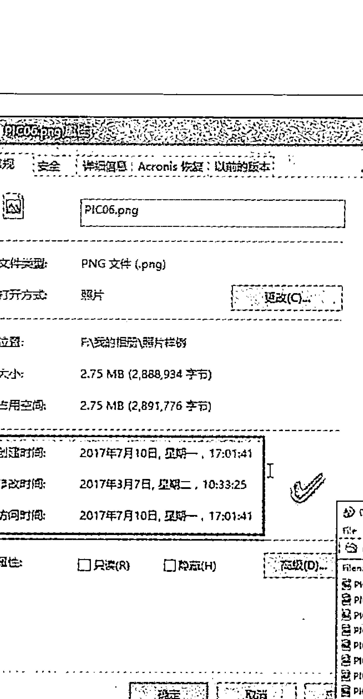

### 1 用BulkFileChanger修改文件属性

要修改照片或其他文件的日期，点击BulkFileChanger工具栏上的Add Files按钮添加文件，也可以在选中文件后直接拖动到BulkFileChanger文件列表窗口。此外还可筛选添加，通过工具栏上的第二个按钮（通配添加按钮）启动通配符窗口，按通配符*或?添加文件表达式，还可选择是否扫描下级文件夹并定义子文件夹的层数（图2）。

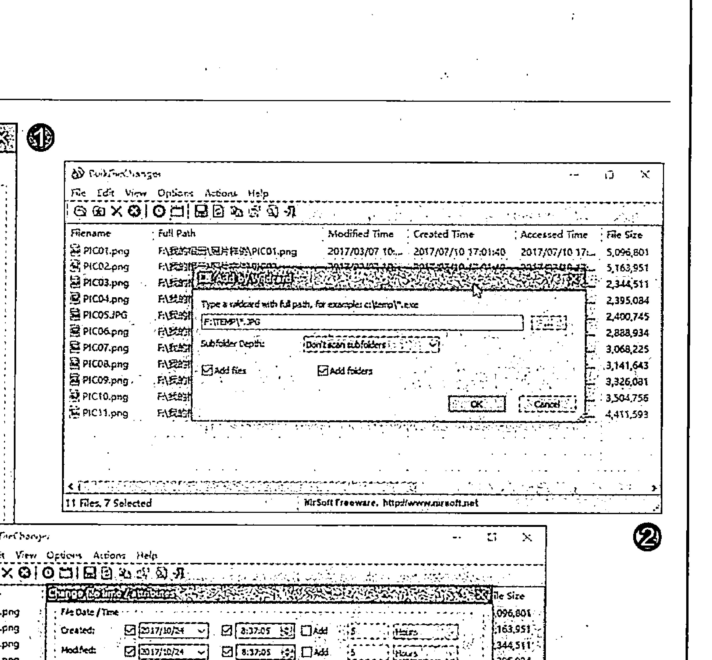

文件添加后，先从列表中选中要修改日期时间的文件（单选或复选），之后工具栏上的几个图标会亮起。点击其中的表盘图标，启动文件时间/属性修改窗口。在窗口中选择文件建立（Created）、修改（Modified）、访问（Accessed）时间修改类型，然后选择设置日期和时间值。最后点击Do it按钮，执行日期时间修改操作（图3）。

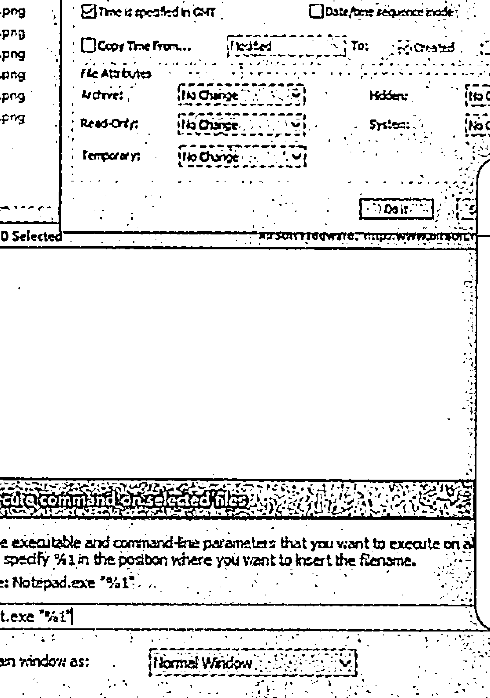

如果要修改文件的其他属性，例如存档、隐藏、只读、系统等属性，只需在下一栏的文件属性（File Attributes）项目中选择相应项，然后从下拉列表中选择Tune on，执行Do it即可。

小提示：BulkFileChanger还有一个高效的附加功能：按下F7功能键，可使用特定程序一次性打开多个文本、图片或其他文档。只需在文本框中输入附带的程序名和%1参数的命令即可（图4）。

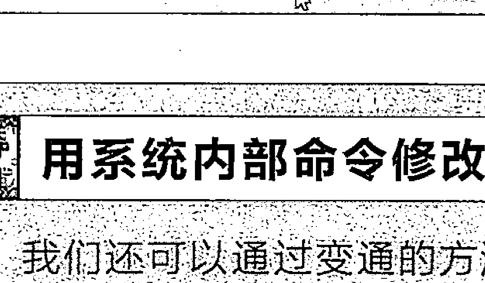

### 2 用系统内部命令修改文件属性

我们还可以通过变通的方法，用系统日期命令DATE和时间命令TIME，结合COPY命令修改文件属性。例如，要修改文件“总结.TXT”的日期属性，可先关闭系统自动校时选项，并用DATE和TIME命令来修改系统日期和时间为目标值，然后执行如下命令来修改文件日期时间属性：修改结束后，再打开系统自动校时选项，让系统自动恢复正确的日期和时间。

```
COPY 总结.TXT+,
```## 解决大容量闪存盘格式兼容问题

文|波波

目前大于32GB的闪存盘或闪存卡已很常见，但部分Android设备还是无法识别NTFS格式的存储设备，出于兼容性等因素的原因，只能将手里的大容量闪存盘或闪存卡格式化为FAT32格式。新问题来了，Windows 10格式化中默认已经没有这一选项（图1），该怎么办呢？

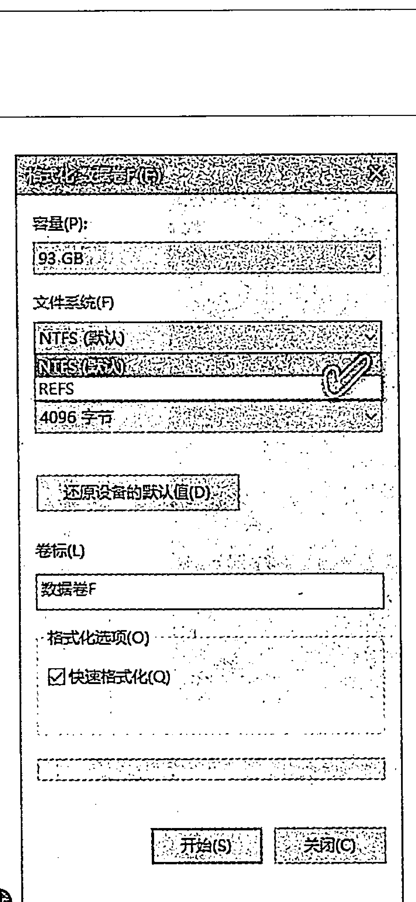

### 1 用带参数的FORMAT命令格式化

我们可以使用Windows的内部命令FORMAT来完成这项工作。在Windows管理员模式的命令提示符窗口或Windows PowerShell管理员窗口中，执行“FORMAT /?”命令，在命令格式说明中可以看到volume和“/FS:”两个主要参数，这便是我们需要用到的两个参数。其中volume为要格式化的盘所在的盘符，而“/FS:”指定要格式化为的文件系统类型，包括FAT、FAT32、exFAT、NTFS、UDF、ReFS等。这里我们指定为FAT32即可（图2）。明白了上述基本用法，如果我们要将位于H:盘符上的闪存盘或闪存卡格式化为FAT32格式，只需在命令提示符窗口中下达如下命令即可（图3）：按照提示输入卷标后确认，命令执行完毕即完成了格式化操作。

```
FORMAT H: /FS:FAT32
```

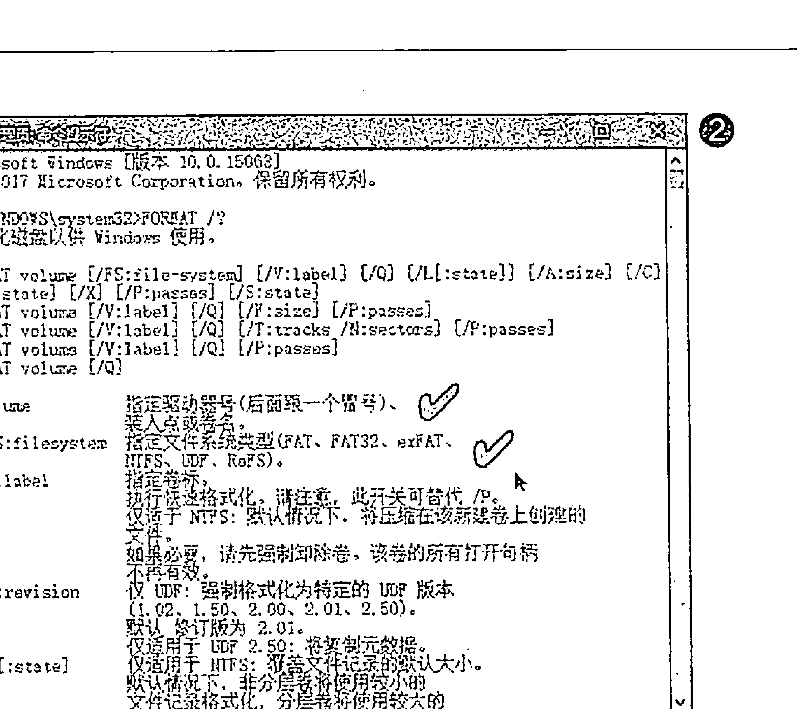

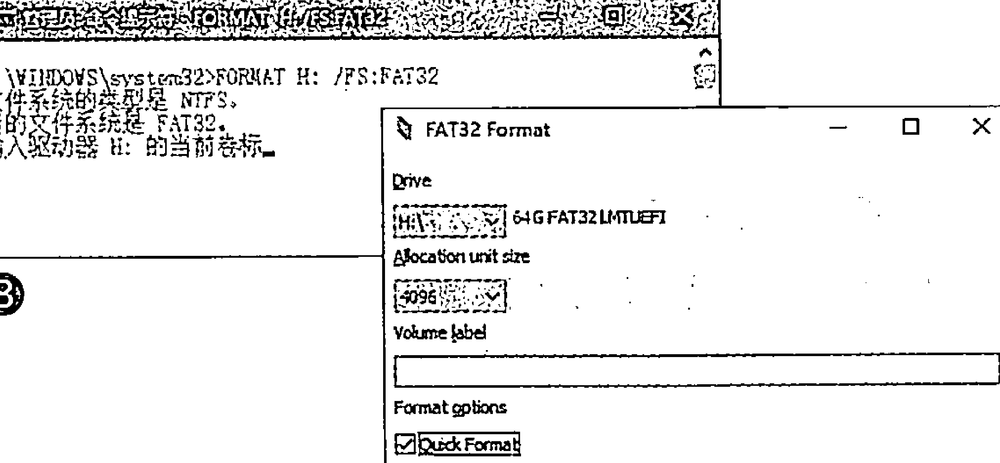

### 2 借用FAT32专用格式化工具

如果你对使用命令格式心存芥蒂或忐忑，那么还可以使用更加易懂的工具软件来完成这项工作。为此，可使用一款名为FAT32 Format（又名Guiformat）的绿色软件来完成FAT32格式化工作。直接运行FAT32 Format工具，从Drive列表中选择介质所在的盘符，从Allocation unit size列表中选择分配单元大小（一般选默认值即可），在Volume label中填写卷标，最后点击Start按钮开始格式化操作（图4）。但需要注意的是，虽然我们可以将大容量存储按需格式化成FAT32格式，但并不能突破该格式本身具有的限制，如单个文件大小被限制在4GB内。

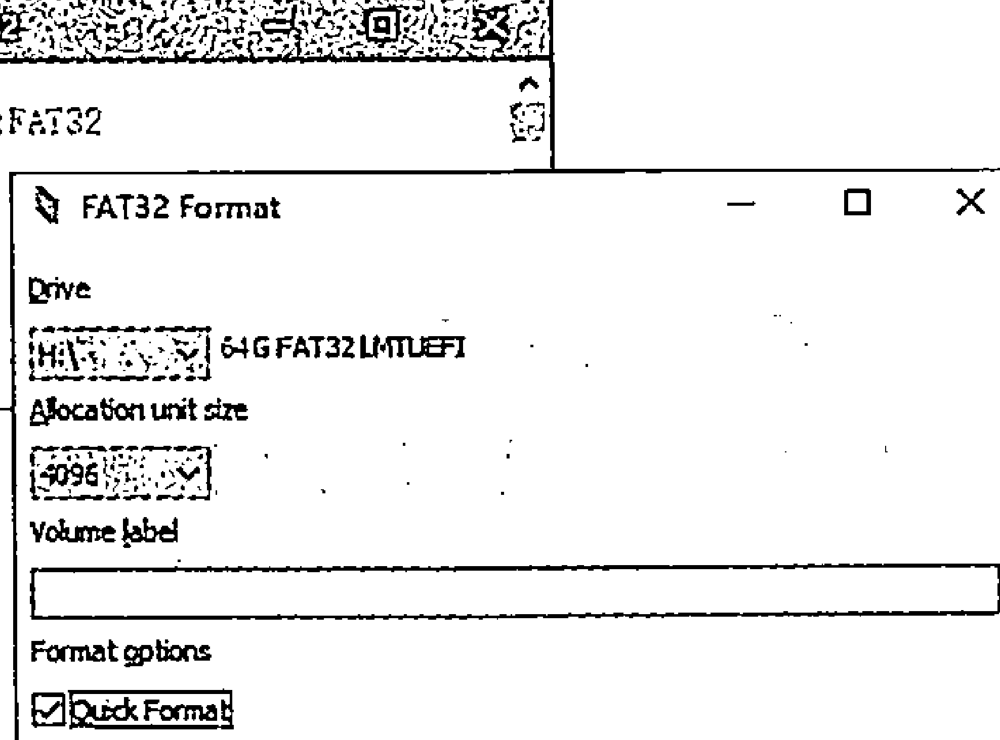

## 快速直达已知注册表项

有时我们已知某种修改注册表的方法，但由于路径较长，手动逐级打开很麻烦。这里介绍几种一键直达注册表长路径以及路径管理的便捷方法，它们能为我们日后操作注册表提供极大的方便。

### 一句小命令 实现快速跳转

如果想从进入注册表路径的繁琐冗长操作中解放出来，可以借助微软的RegJump小工具，用一句命令来实现（官方下载地址：https://docs.microsoft.com/zh-cn/sysinternals/downloads/regjump）。

下载解压后，将仅有的一个可执行文件regjump.exe拷贝到系统的Windows目录下。之后，在管理员命令提示符窗口中便可进行键值跳转了。命令格式如下：

regjump HKLM\Software\Microsoft\Windows

首次运行要进行协议确认，点击Agree按钮即可（图1）。其中“HKLM\Software\Microsoft\Windows”为要跳转的键值，具体使用时替换为要跳转的路径即可。

如果长路径已复制到剪贴板中，则只需一个简单的“regjump -c”命令，即可完成超长路径的跳转操作，命令中连路径粘贴也省了。

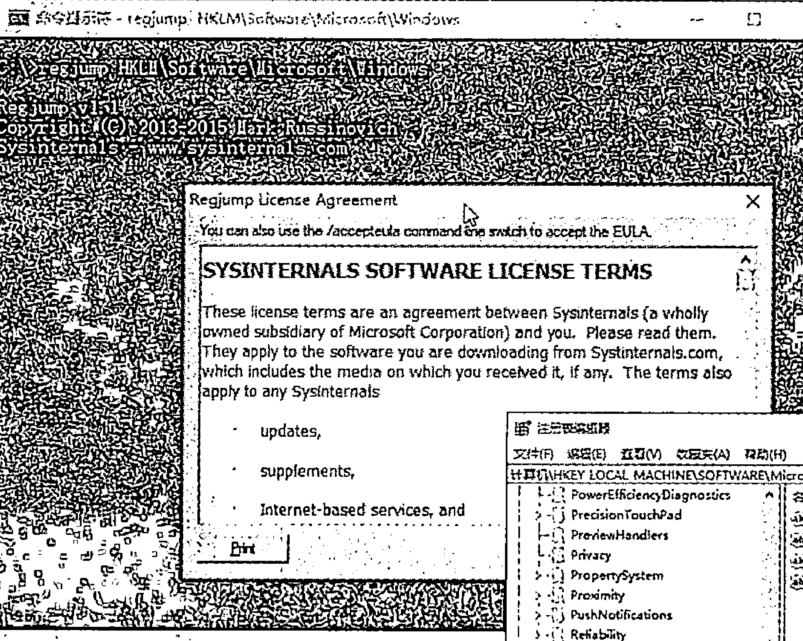

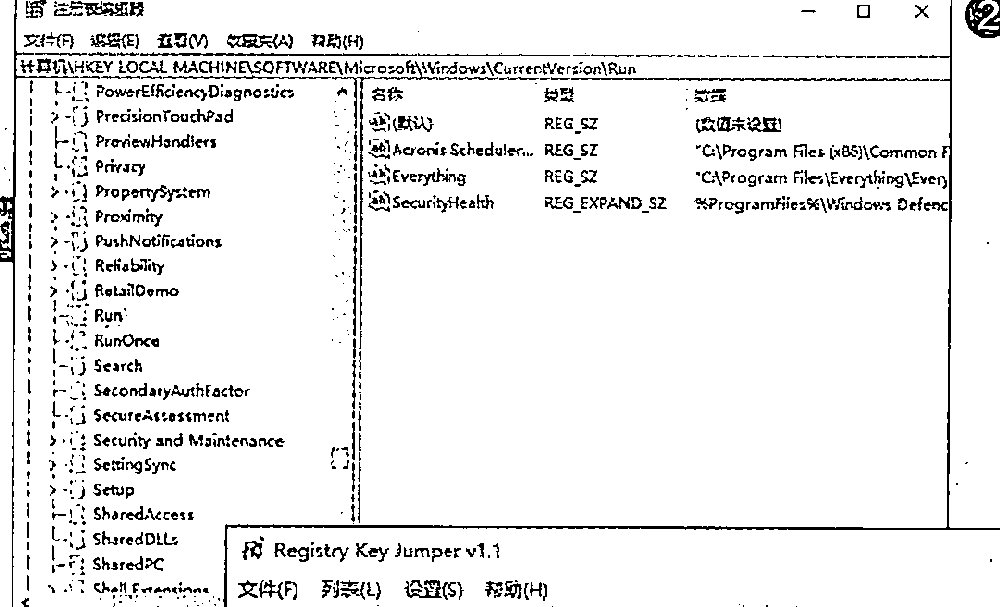

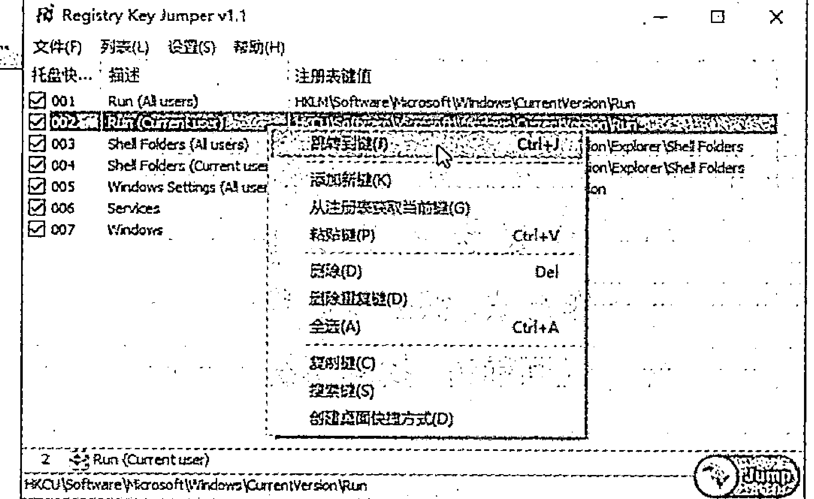

### 一个小工具 玩转跳转管理

上述工具虽然方便，但功能比较单一。为此，我们可以使用另一款绿色便携自由软件Registry Key Jumper（简称RKJ），实现任意路径的注册表键值跳转和多路径管理。

一键直达注册表路径

RKJ解包后有两个EXE文件，其中带有x64后缀者为64位Windows专用。程序运行之后，选中要操作的注册表路径字符串，不需要执行复制操作，只需按下Ctrl+Alt+X组合键，即可自动打开注册表编辑器并定位到选中的路径。

如果在选择的路径前后含有与注册表无关的文字，神奇的Ctrl+Alt+X组合键会过滤掉无关文字，直接自动打开有效路径。例如，选择一段含有无用信息的路径“请跳转到这个路径 SOFTWARE\Microsoft\Windows\CurrentVersion\Run”，当按下Ctrl+Alt+X组合键后，“请跳转到这个路径”这个字符串会被忽略，而其中有效的路径“SOFTWARE\Microsoft\Windows\CurrentVersion\Run”被利用，自动正确打开注册表该路径(图2)。

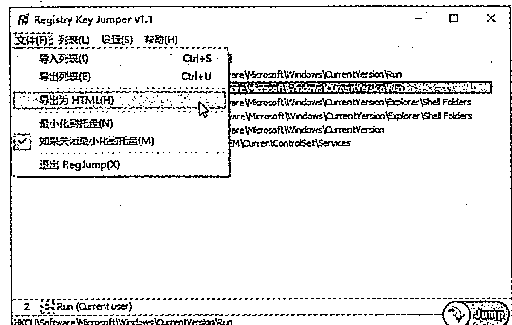

> 小提示：通过“设置→选项”菜单命令，可重新定义注册表跳转所用的热键，这可以用于热键冲突的情况。此外，通过RKJ系统托盘图标右键菜单，能够实现系统常用注册表路径的跳转、剪贴板上路径的跳转等操作。

### 多路径添加与便捷跳转

如果要处理的注册表路径比较多，可在复制了一条路径之后，在RKJ界面中执行Ctrl+C操作，将此路径添加到RKJ的路径列表中。之后，选中该路径并点击Jump按钮(或使用Ctrl+J快捷键)，即可自动打开注册表并定位到该路径(图3)。依此用相同的方法添加其余路径即可。

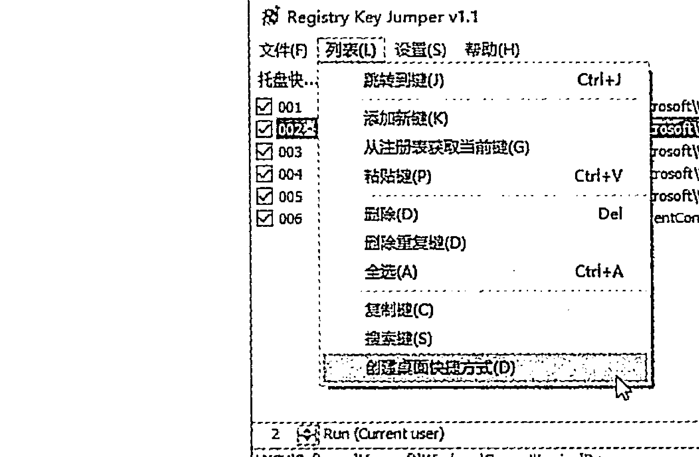

用上述方法，我们可以将自己经常使用的注册表路径添加到该软件中管理。还可以通过“文件→导出列表”菜单命令将列表输出保存(“导出为HTML”命令输出为网页格式)，然后在重装系统后或在另一台机器上用“导入列表”命令恢复列表(图4)。

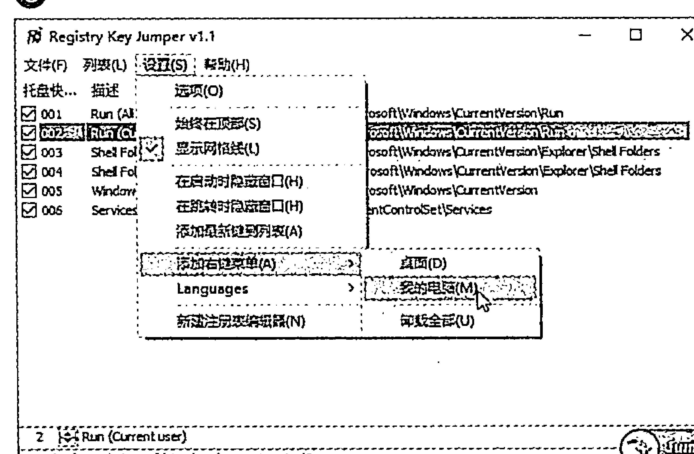

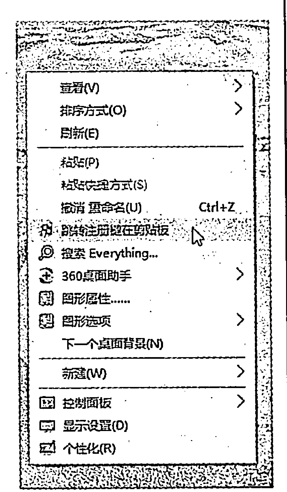

> 火速链接：注册表长路径的快速定位还可以通过VBS脚本自动注入定位或用BAT批处理自动定位的方法，详情请参见《省却麻烦 一键修改注册表》一文（http://www.cfan.com.cn/2016/0219/125006.shtml）。

### 创建路径的桌面快捷方式

对于常用的注册表路径，还可以为其建立桌面快捷方式。在RKJ窗口中选择某路径，然后点击“列表→创建桌面快捷方式”菜单命令即可(图5)。利用该菜单，还可以搜索、复制、删除重复键，或直接跳转到已打开的注册表中的该键位置。

### 路径管理功能再增强

平时，我们无法用多次执行REGEDIT命令来开启多个注册表编辑器，同时只能打开一个注册表编辑器。如果要打开多个注册表编辑器同时编辑多个位置，可利用RKJ的“设置→新建注册表编辑器”命令(图6)。此外，如果要将注册表快速跳转功能添加到桌面右键菜单，也可以利用“设置”菜单下的“添加右键菜单命令”，之后在桌面右键菜单中就可以看到“跳转注册键在剪贴板”命令了(图7)。

## 加强安全设置 护航新版Windows 10

文|樱子

安全性提升是Windows 10创意者秋季版更新的核心内容之一，此次更新致力于在发挥创造力和享受乐趣的同时，能够更好地时刻保护用户的安全使用环境。下面就让我们体验其新的变化及使用中应该注意的问题。

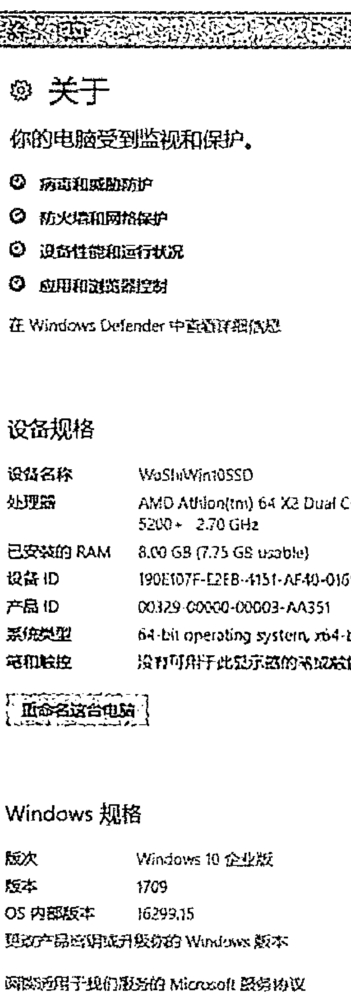

### 1 将安全摆在首位 进入设置更方便

可以说，Windows 10创意者更新已经将安全摆在了最显著的位置。单击“开始”按钮，点击“设置”选项打开“系统→关于”属性窗口，我们首先看到的是关于电脑受监视和保护的情况报告，包括病毒和威胁防护、防火墙和网络保护、设备性能和运行状况、应用和浏览器控制等项目。如果其中有项目处于未保护状态，项目前边的图标就不会以绿底白钩方式显示，这时就要引起注意了（图1）。

需要注意：在最新的创意者更新中，虽然我们依然可以通过系统设置页面进入“更新和安全”窗口，然后点击Windows Defender项进入Windows Defender窗口，最后点击“打开Windows Defender安全中心”按钮，进入安全中心页面，但我们其实还有更加方便的进入方式：只需一键点击“关于”页面中的第一个蓝色链接“在Windows Defender中查看详细信息”，即可快速到达安全中心页面。

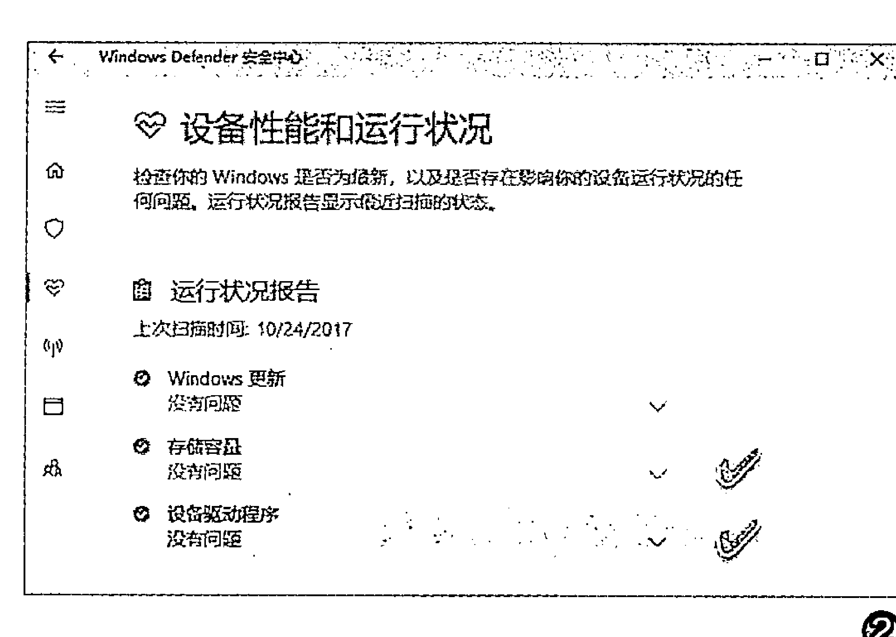

### 2 评估设备性能 多方考虑更周全

设备性能和运行状况不单单是反映在系统更新的状况和设置、系统的容量状况以及设备驱动程序的健康状况都会在某种程度上影响系统的性能和运行状况。

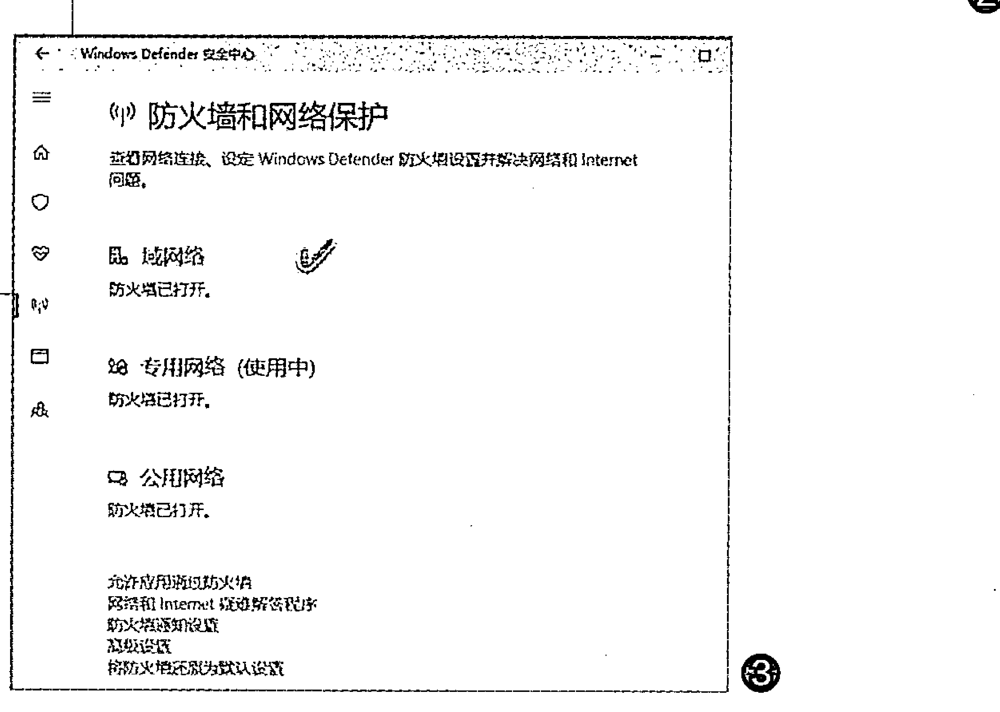

通过创意者更新“Windows Defender安全中心”进入“设备和运行状况”页面，我们便不但可以看到Windows更新是否有问题，还可以看到设备容量、设备驱动程序是否存在问题。正因为设备容量和驱动方面的问题也会严重影响到系统的正常使用，因此新版本采用这样的安排更加合理。

需要注意的问题是：如果设备存储容量和驱动程序方面出现问题，在这个页面上会给出问题报告，随之顺着解决向导执行维护即可（图2）。

### 3 多一道防火墙 网络保护更牢靠

进入网络时代，对于电脑安全来说，防火墙和网络保护显得尤为重要。在创意者更新中，Windows 10除了提供包括专用网络和公共网络两种防护屏障类型，通过“允许应用通过防火墙”、“防火墙通知设置”和“高级设置”，可以灵活定制网络防火墙外，又提供了另一种“域网络”防火墙防护，这可以让加入公司或组织域的电脑能更容易地设置来自内部的安全防护(图3)。

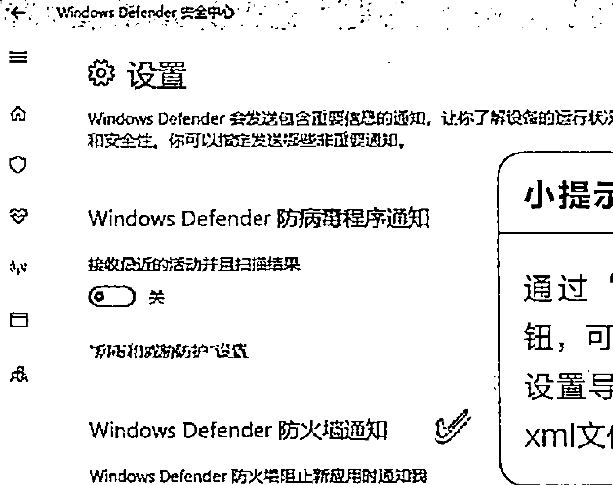

> 小提示：通过“导出设置”按钮，可将用户的自定义设置导出为Settings.xml文件保存备份。

在防火墙通知设置中，创意者更新将“Windows防火墙通知”更名为“Windows Defender防火墙通知”，且通知项目中也相应地增加了“域防火墙”的选项，让防护选择也多了一道选择(图4)。

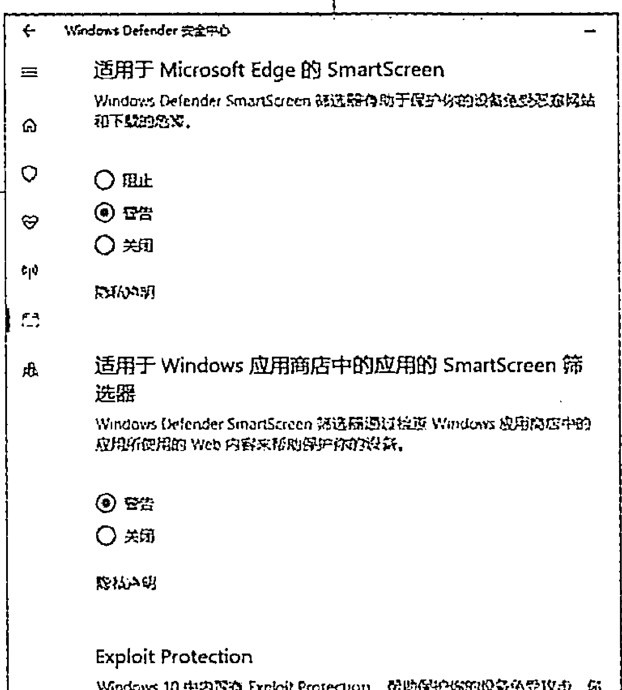

需要注意：如果用户在设置防火墙的过程中出现问题，或拦截了不该拦截的内容、放行了不该放行的程序，那么，可以通过选择“将防火墙还原为默认设置”来恢复系统默认防火墙配置。

### 4 深入加强应用和浏览器防护

Windows Defender SmartScreen是Windows上网过程中的“保护神”，它通过检查Web页中无法识别的应用和文件来保护系统的使用安全，还能有效地保护系统在上网过程中免受恶意网站和下载的危害；此外还可以对应用商店里应用所使用的Web内容进行安全保护。新版Windows 10在提供检查应用和文件、Edge的SmartScreen控制保护和应用商店用的保护三个选项之外，内置了一项新的Exploit Protection保护设置：该设置选项默认已经开启且被设置为适合于对大多数人的保护，帮助用户的设备免受攻击并做到“开箱即用”(图5)。

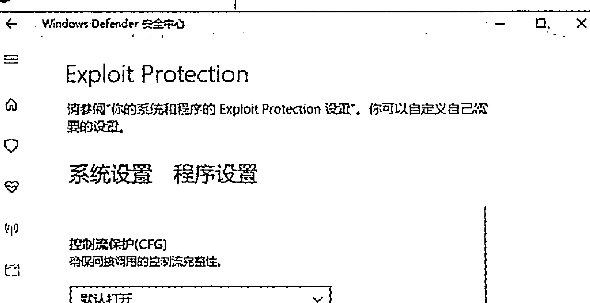

高级用户可以根据实际情况自定义Exploit Protection保护设置。点击“Exploit Protection设置”文字链接进入设置窗口，通过选择“系统设置”和“程序设置”，可分别对系统防护和程序防护进行个性化定义。其中系统设置包含了控制流保护、数据执行保护、强制映像随机化、随机化内存分配、验证异常链、验证堆完整性等项目开关(图6)；而“程序设置”方面，既可以对默认列出的程序进行安全保护设置，也可以添加程序进行自定义设置(图7)。

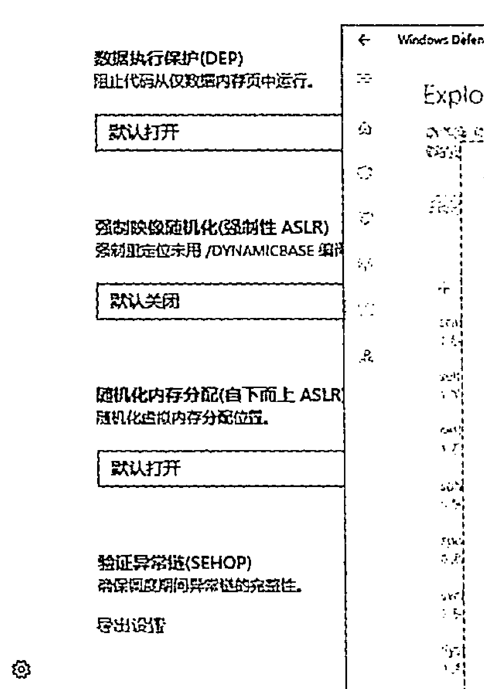

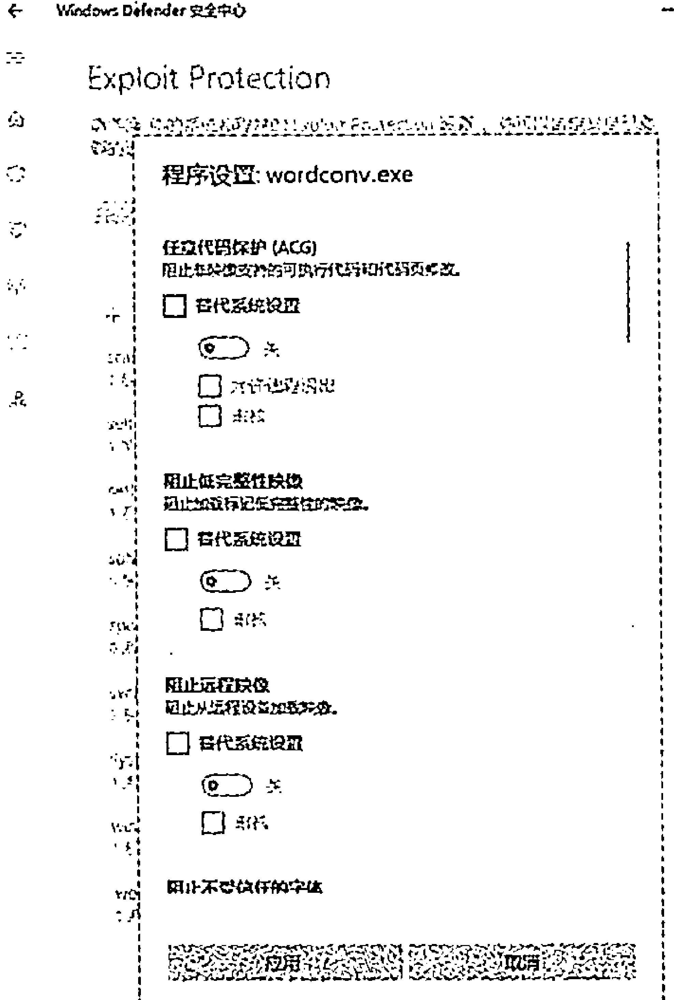

## 解决或规避磁盘驱动器问题

在使用Windows 10系统时，有时会遇到磁盘驱动器方面的问题。例如开机总是显示正在扫描磁盘，或使用过程中莫名其妙地收到需要扫描磁盘的提示。为此，我们可以用多种方法主动检查我们的磁盘是否存在问题，并用相应的办法去解决。此外还可以建立特殊磁盘格式加以规避。

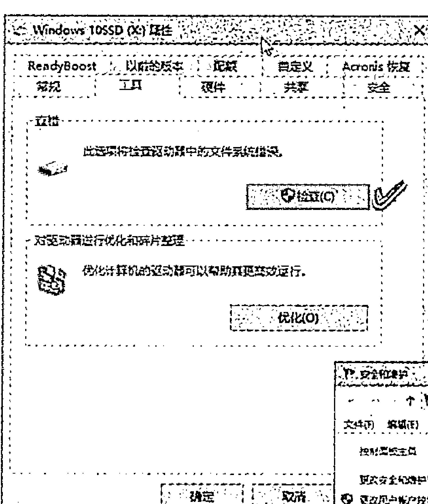

小提示

从Windows 10 1709版开始，只有Windows 10企业版和Windows 10工作站版支持ReFS分区选项。

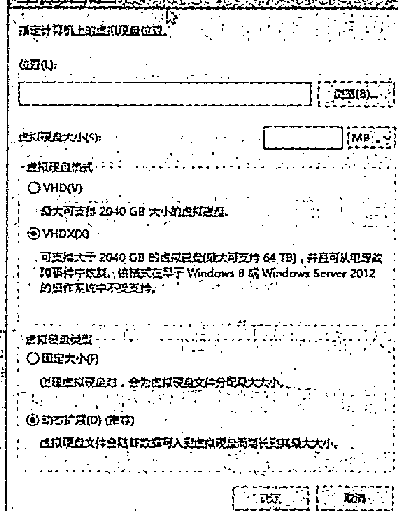

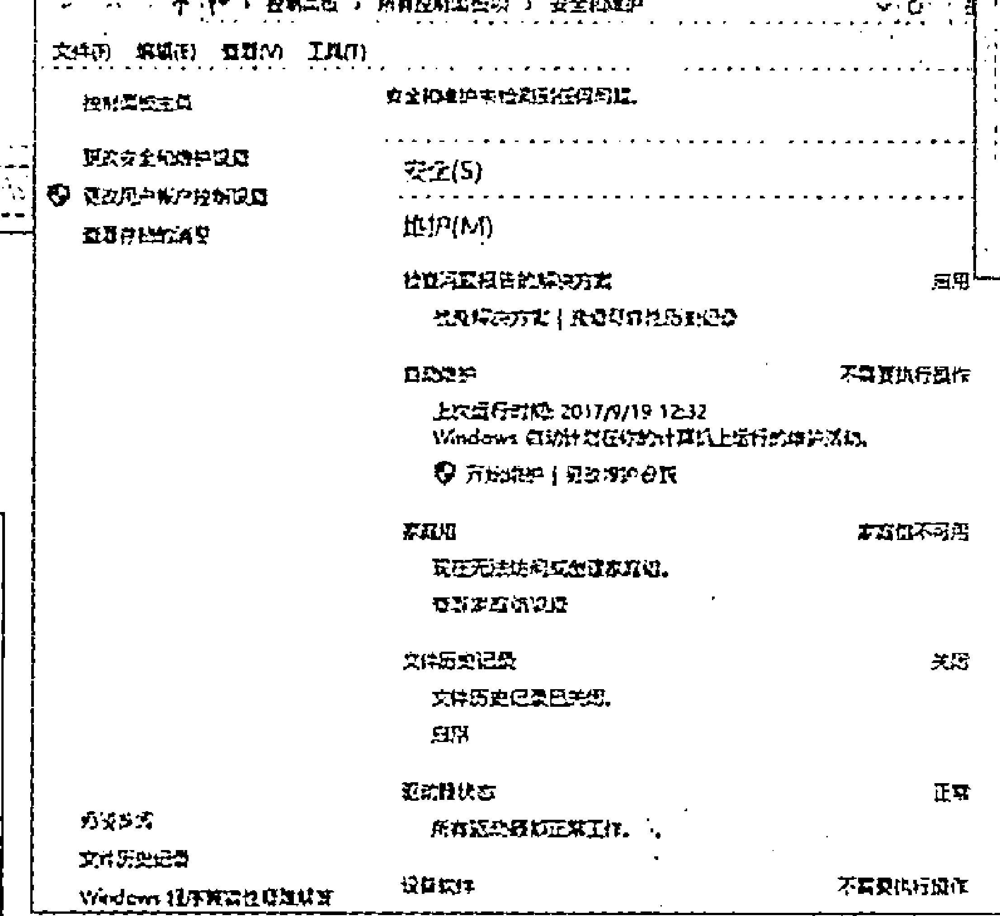

### 1 用系统工具或检查机制查错

Windows 10系统本身就带有磁盘检查的工具和命令，我们可以充分利用这些简单实用的工具或命令进行磁盘检查和修复。

右键单击驱动器盘符并选择“属性”窗口中的“工具”选项卡，单击“检查”按钮就可以检查并修复磁盘问题(图1)。如果遇到启动系统时“正在扫描磁盘驱动器”问题，可用此法查找问题并解决。

如果系统无法启动到桌面，可用安装盘启动到安装界面，点击左下角的“修复计算机”，之后就会进入WinRE恢复窗口，在此命令窗口中用系统命令CHKDSK检测修复磁盘问题。命令格式为“CHKDSK X: /F”，其中X为盘符。若要恢复修复的数据，则还需要添加一个/R参数。

```
CHKDSK X: /F
```

如果使用高版本的Windows 10系统，则还可在PowerShell窗口中使用“Repair-Volume -DriveLetter X -OfflineScanAndFix”命令锁定驱动器并扫描磁盘错误。

```
Repair-Volume -DriveLetter X -OfflineScanAndFix
```

此外，由于Windows 10具有磁盘自动检查和报警机制，在“安全和维护”窗口的“维护”列表后端，可以看到“驱动器状态”的报告，如果驱动器存在问题，按照提示信息处理即可扫描修复(图2)。

### 2 使用新的ReFS文件系统更放心

Windows 10创意者更新支持新的ReFS(Resilient File System)弹性文件系统，创建ReFS分区以后，就无需担心磁盘错误了。原因是ReFS采用双盘联合的机制，具有自动验证并恢复数据、保证数据完整性的功能。

先通过磁盘管理的“操作→创建VHD”命令创建两个VHDX虚拟磁盘，并对两个磁盘进行初始化操作(图3)。接下来使用控制面板提供的“存储空间”管理功能，选择用刚才创建的两个虚拟盘“创建新的池和存储空间”；点击“创建池”按钮，选择文件系统为REFS；点击“创建存储空间”，这样就会生成一个REFS格式的分区。由于这个分区采用双盘数据存储，具有自动恢复机制，从而大大提高了数据的安全性。

若不再需要该分区，直接在磁盘管理器中执行“删除卷”操作；然后到控制面板“存储空间”管理窗口删除存储空间下的分区并执行“删除池”操作；最后回到磁盘管理器执行“分离VHD”命令，并在资源管理器中删除两个VHDX文件即可。

## 巧用受控设置保护工作文件

文|樱子

电脑中的资料对安全问题最为敏感的，莫过于我们存放工作资料的文件夹了。如果能对这些文件夹设置受限访问权限，可以阻止可疑应用程序随意访问这些文件夹，那将会大大提高资料的安全性。利用 Windows 10 创意者更新提供的受控文件夹访问功能，便可以对工作文件夹进行特殊保护。

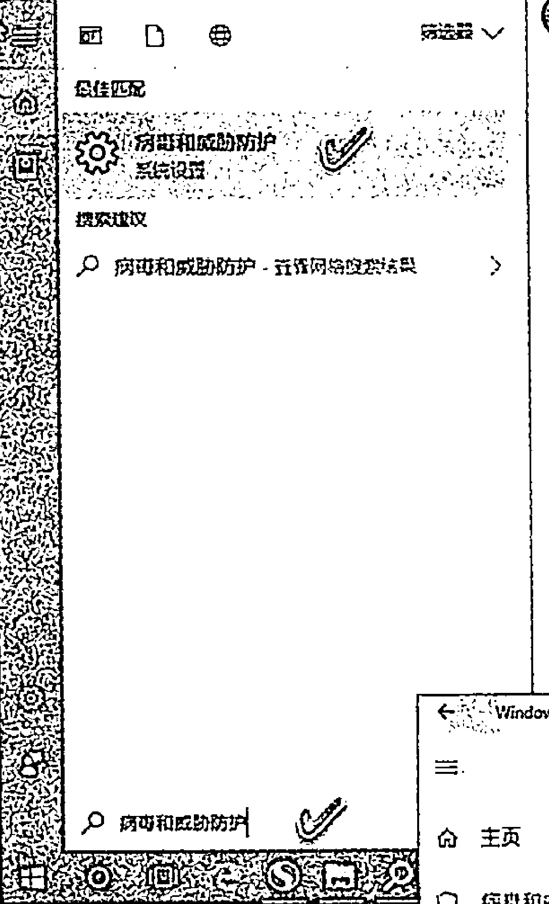

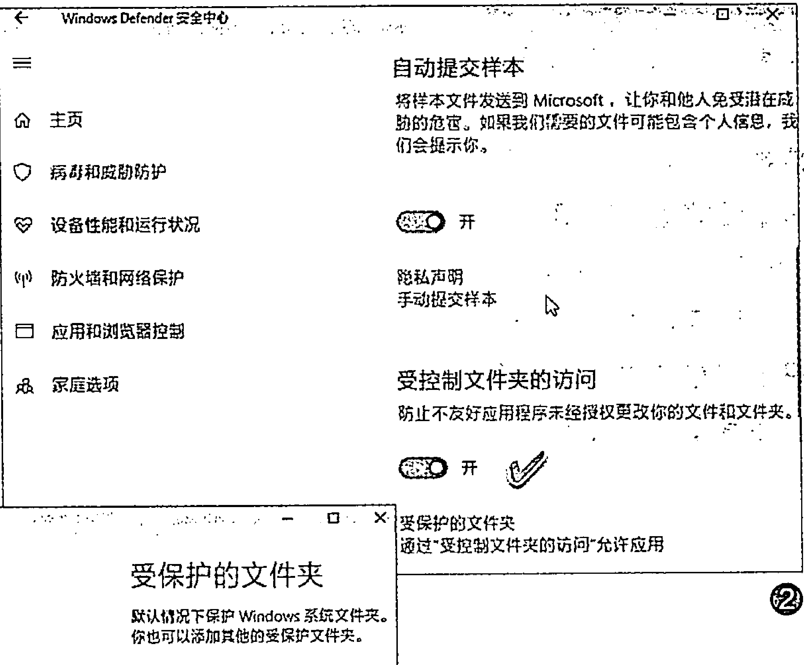

### 1 特别的文件夹 施行特别的保护

首先，我们将自己的重要工作文件添加到系统特别安全保护之列。在小娜对话框中输入“病毒和威胁防护”，点击搜索结果中出现的“病毒和威胁防护”系统设置项目（图1）。
在“病毒和威胁防护”设置页面中，滚动到“受控制文件夹的访问”一栏的位置，将其开关设置为“开”的位置，此时可看到“受保护的文件夹”和“通过受控制文件夹的访问允许应用”两个选项（图2）。点击“受保护的文件夹”选项，进入设置页面，可以看到系统已经为一些常用的文件夹（如文档、图片、视频、音乐、桌面、收藏夹）添加了安全保护。我们还可以通过点击+号按钮，将自己的工作文件夹添加到保护之列（可多重添加文件夹保护）（图3）。

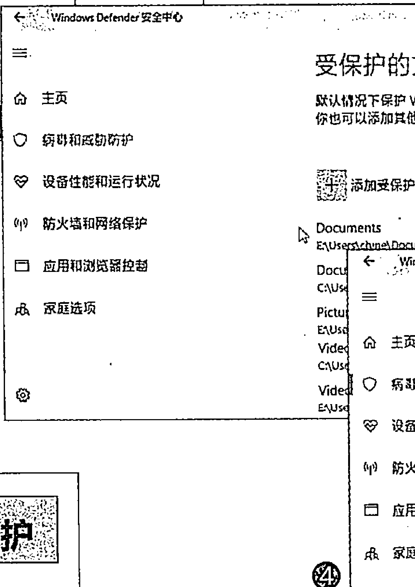

### 2 自己的应用软件 当然要特别放行

大家应该都经历或听说过，杀毒软件常常会有误报的情况发生，例如会将一个不具有安全威胁的软件报告为某方面的可疑程序而拦截。其实Windows 10受控文件夹功能本身也会出现这种情况。有时系统也会“误判”，将你正在使用的一些应用程序列入限制访问之列。自己使用的应用软件，明知是安全的，为能正常使用，当然不能被列入限制之列。为此，我们可以将这些应用软件添加到特别放行之列。
点击“通过受控制文件夹的访问允许应用”选项，打开“通过受控制文件夹的访问允许应用”设置界面，点击“添加允许的应用”按钮，添加自己需要放行的应用程序（图4）。这样，被误判拦截的应用程序就会被解禁了。

> > “通过受控制文件夹的访问”允许应用
> 如果“受控制文件夹的访问”阻止了你信任的某个应用，你可以将其添加为允许的应用。这将允许该应用对受保护的文件夹进行更改。

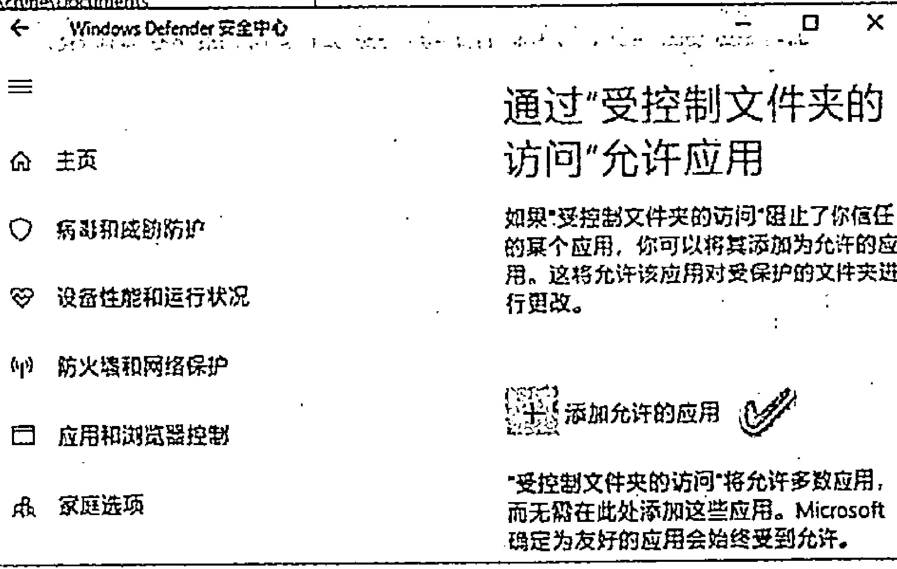

## 更上一层楼 用好注册表编辑器

文|赵效常

说起注册表编辑器，我们最熟悉的可能就是下达REGEDIT命令，开启那个千变万化的注册表编辑器管理窗口，对键值项目进行增删改操作。其实，除了这些最基本的操作之外，注册表还有许多新用法。

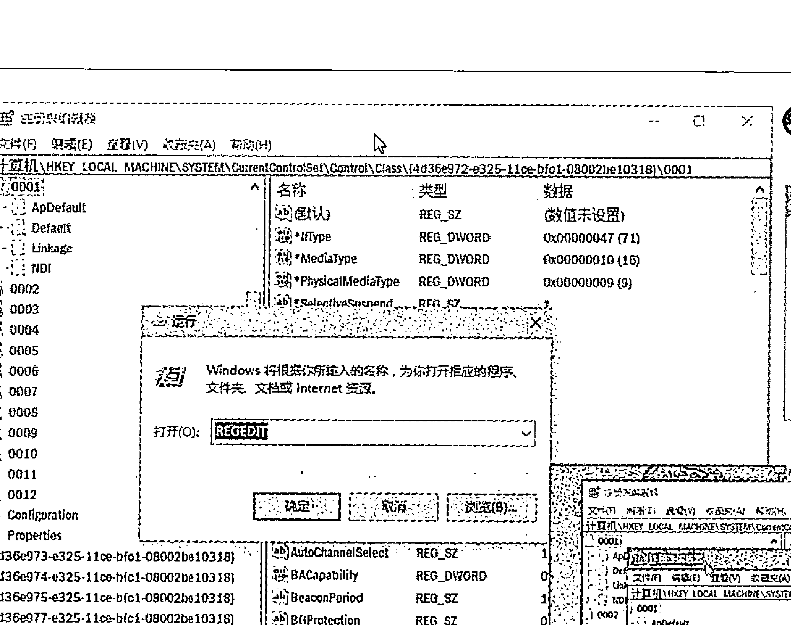

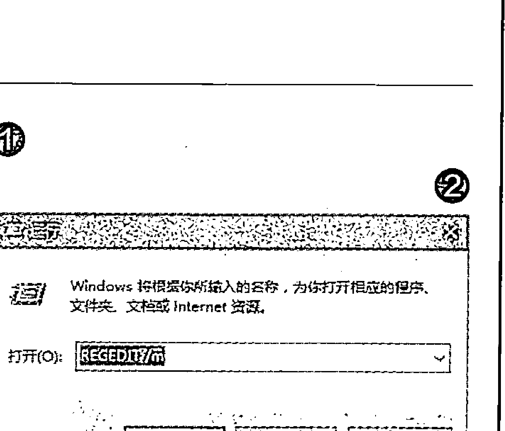

### 1 同时开启两个注册表编辑器

如果要对比注册表两处的键值或路径的不同之处，希望同时打开两个注册表，你一定会尝试执行两次REGEDIT命令吧！但令人遗憾的是，当你第二次执行REGEDIT命令的时候，开启的却不是第二个注册表编辑器窗口，而仍然是先前的那个窗口（图1）。同时开启两个注册表窗口的想法行不通，怎么办？
其实，我们只需在第二次执行REGEDIT命令时，使用-m或/m参数（图2）：

```
regedit -m
regedit /m
```

这样就可以让两个注册表编辑器共存了（图3）。

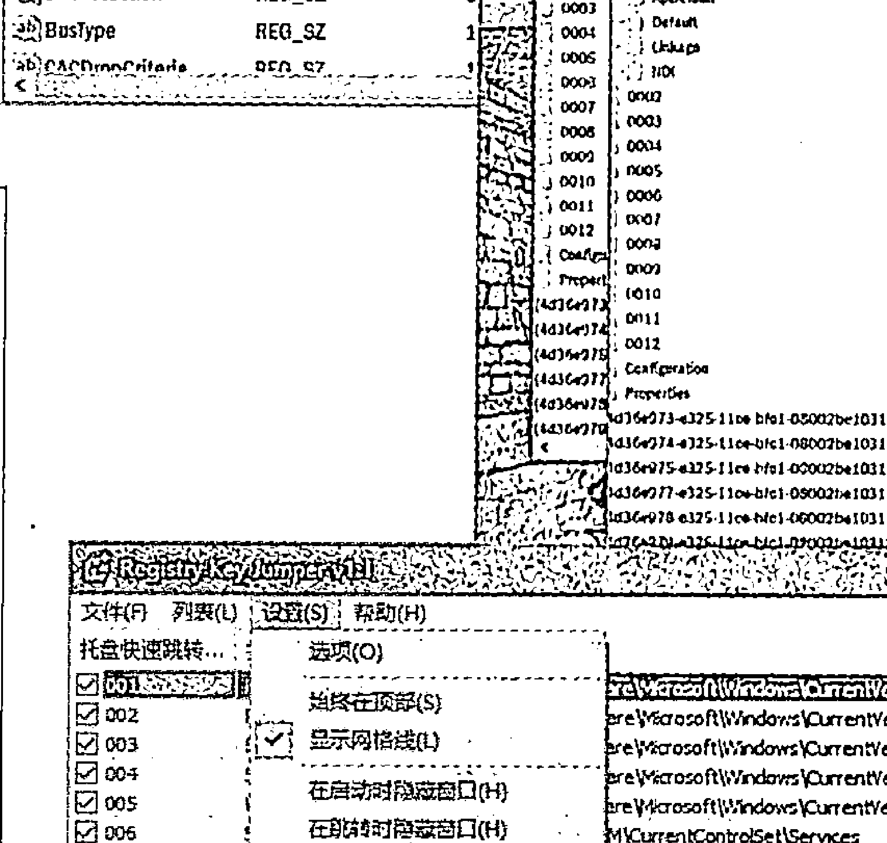

> 小提示
除了使用上述命令参数外，还可以用Registry Key Jumper软件实现双重注册表编辑器的启用。启动该软件后，执行“设置→新建注册表编辑器”命令，即可启动第二个注册表编辑器（图4）。


### 2 更详尽地查找替换注册表信息

许多时候，我们需要编辑Windows注册表，以解决系统问题或对系统进行优化调整。如果知道注册表的完整路径，事情就变得比较容易，通过注册表编辑器的导航树沿着路径可逐步逼近目标。简单快捷的方法是在注册表编辑器中执行Ctrl+F搜索，并通过F3跳转到每一个符合条件的注册表项、值或数据。但是，注册表编辑器自身的查找功能过于简单，如果希望拥有更加强大的搜索和跳转功能，可利用RegScanner或Registry Finder软件来完成。

### 使用免费绿色便携工具 RegScanner，可对注册表进行多条件搜索扫描，将找到的注册表值用一个列表显示出来，只需从列表中点击条目，就可以直接跳转到注册表对应项目，非常方便；此外还可以将已经找到的注册表值导出到注册表文件中。还有一个更方便的用法——如果将一个注册表路径复制到剪贴板，然后在 RegScanner 中按下 F7，即可自动打开注册表编辑器并导航到复制的项目上（图5）。

如果我们希望用一些新的键值或项目替换搜索结果中的键值或项目，可使用 Registry Finder 这款免费便携工具。在 Registry Finder 中用关键词查找键值或项目之后，在搜索结果选项卡 Find Results 页面中执行 Ctrl+R 组合键命令启动替换窗口，输入搜索和替换的关键字进行成批替换注册表键值或项目（图6）。

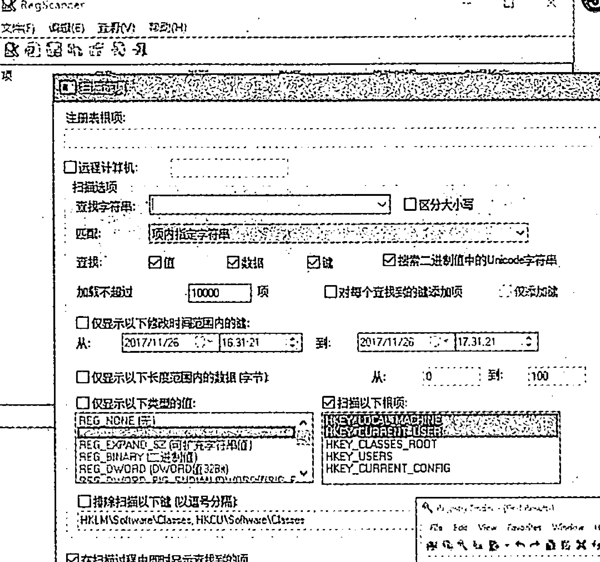

#### 小提示

由于 .reg 文件使用 Unicode 编码，因此，使用 /u 参数告诉 FC.EXE 程序使用 Unicode 编码。

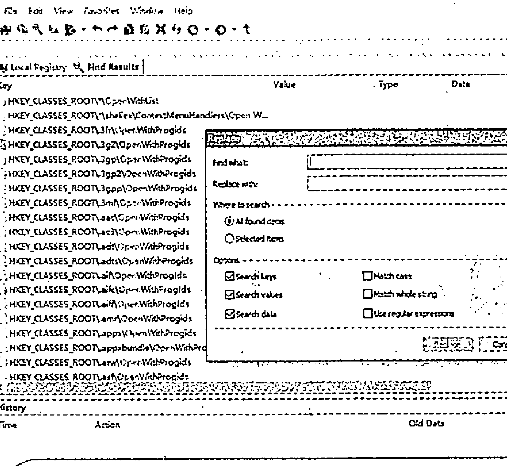

### 3 监视注册表信息的改变

如果要对比两个时点 Windows 注册表的变化情况，即便是 Windows 10 也没有内置注册表监视工具。但是，我们可以使用系统内置的命令行程序 FC.EXE 来比较两个注册表文件的变化。

在某个时间点上导出一个注册表文件（假设为 regA.reg），然后在另一个时间点再导出一个注册表文件（假设为 regB.reg）。随后，在命令提示符窗口或“运行”窗口中执行如下命令（图7）：

`fc /u rega.reg regb.reg > regcompare.txt`

比较结束后，自动生成一个比较结果文件 regcompare.txt，在记事本中打开查看即可。

除了系统内部命令外，我们还可以用一个第三方绿色便携工具 WhatChanged 来监视和比对注册表文件的变化。打开 WhatChanged 软件，选择要比较的注册表分支，点击 STEP#1 按钮抓取第一时间点的注册表信息，点击 STEP#2 按钮抓取现时注册表信息并进行比较（图8）。还可以选中下方的复选框，将注册表的变化写入到另一个文件中保存。

```
C:\Users>fc /u rega.reg regb.reg > regcompare.txt_
```

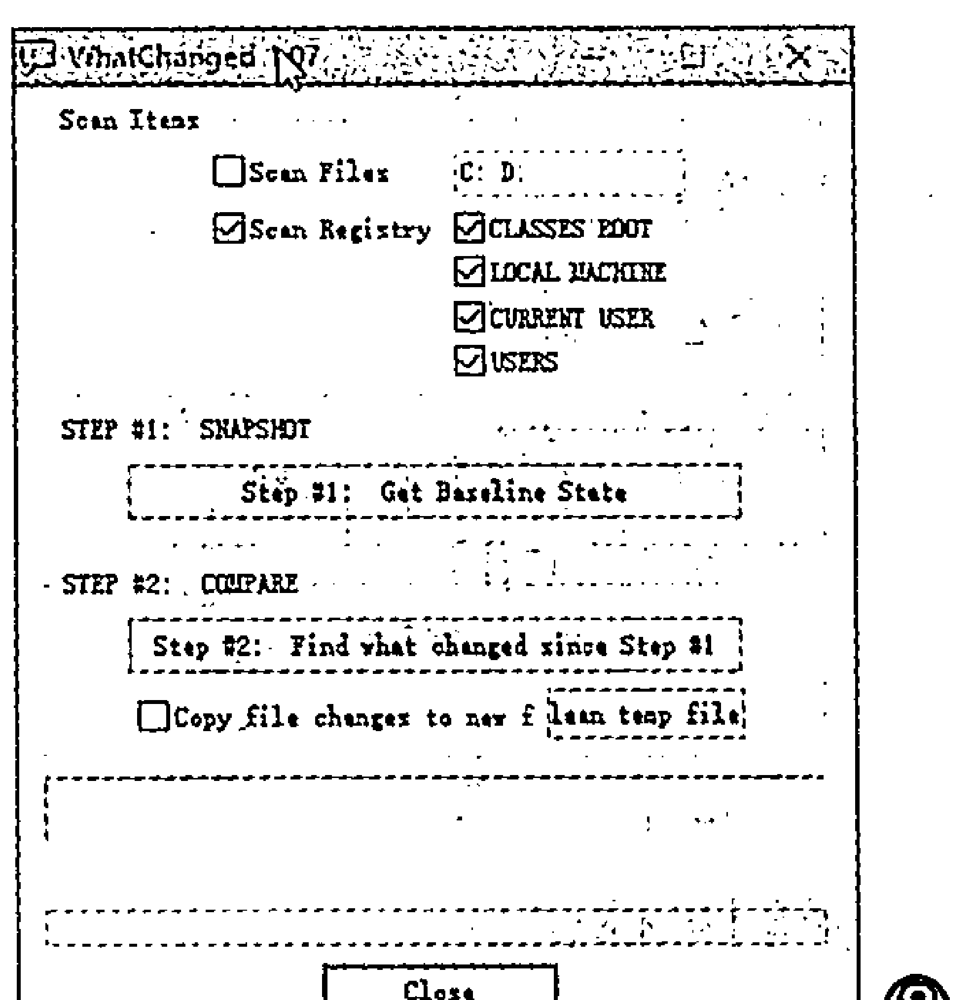

#### 小技巧：创建注册表编辑器快捷方式

为了便于访问注册表编辑器，我们可以在文件夹或桌面空白处单击鼠标右键，选择“新建→快捷方式”，在对象位置键入处，输入 Regedit 并单击“下一步”，命名为“启动注册表编辑器”即可创建注册表编辑器的快捷方式。

## 系统信息 全面检查

文|波波

你能轻易说出电脑正在使用的软件进程、硬件组成、网络通信、内存和其他方面的实际情况吗？这些听起来容易，但要详细说明，其实也不是件容易的事。那就让Wise System Monitor（简称WSM）这款软件帮你解决问题吧。

### 1 分类控制进程 哪个连网全知晓

对进程的了解和把握是掌控软件的最直接方法。WSM会自动扫描系统中运行的进程，并给出运行的进程总体数量（包括用户进程和系统进程）。默认显示的进程列表中不包含系统进程，于是你大可放心地对列表中的进程动手，而不用顾忌伤及系统进程了。当然，若要显示系统进程，将底部状态栏上的“显示系统进程”复选框选中即可。

如果要将所有参与连网的进程显示出来，只需单击状态栏上的“只显示连网进程”复选框即可。随后可看到具体进程所占的CPU、内存、上传和下载带宽等信息（图1）。

### 2 硬件组成透视 具体型号一键知

如果有人问你电脑的配置怎样，你不一定能一下子准确地回答上来。利用WSM的“硬件监控”功能，一键点击便可知晓。单击“硬件监控”选项卡，在默认显示的“计算机概述”页面中，一眼便看到CPU、主板、内存、显卡、声卡、网卡等主要部件的型号（图2）。

如果要进一步查看这些部件的具体情况，例如查看主板的具体型号和BIOS的版本、日期，单击“主板”进入描述页即可看到。不开机箱能知道里面插了几根内存条吗？当然可以！点击“内存”一项，在右侧窗格便会列出插槽的数量以及每个插槽中所插内存条的架构、容量、类型、速度等信息。

### 3 系统相关信息 一键获知更详尽

希望查看当前使用的Windows系统具体的内部版本号，如果到系统设置中查看要费一番周折。利用WSM软件，简单地点击“操作系统”选项卡，即可一目了然地看到包括系统名称、产品ID、系统的两个版本号、安装日期等详细信息（图3）。

此外，右键单击任务栏上的WSM图标，选中“显示悬浮窗”选项，随后只需点击WSM悬浮窗信息条上的相关项目，上方即可弹出具体占用的详细情况列表（图4）。

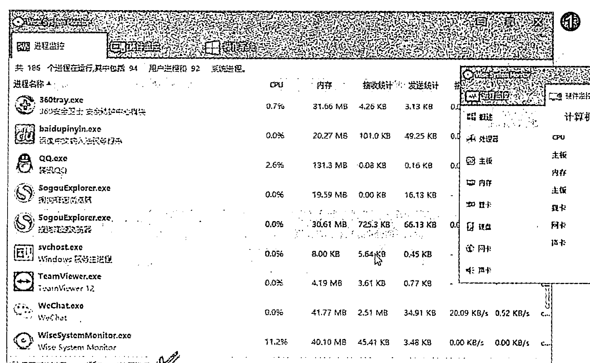

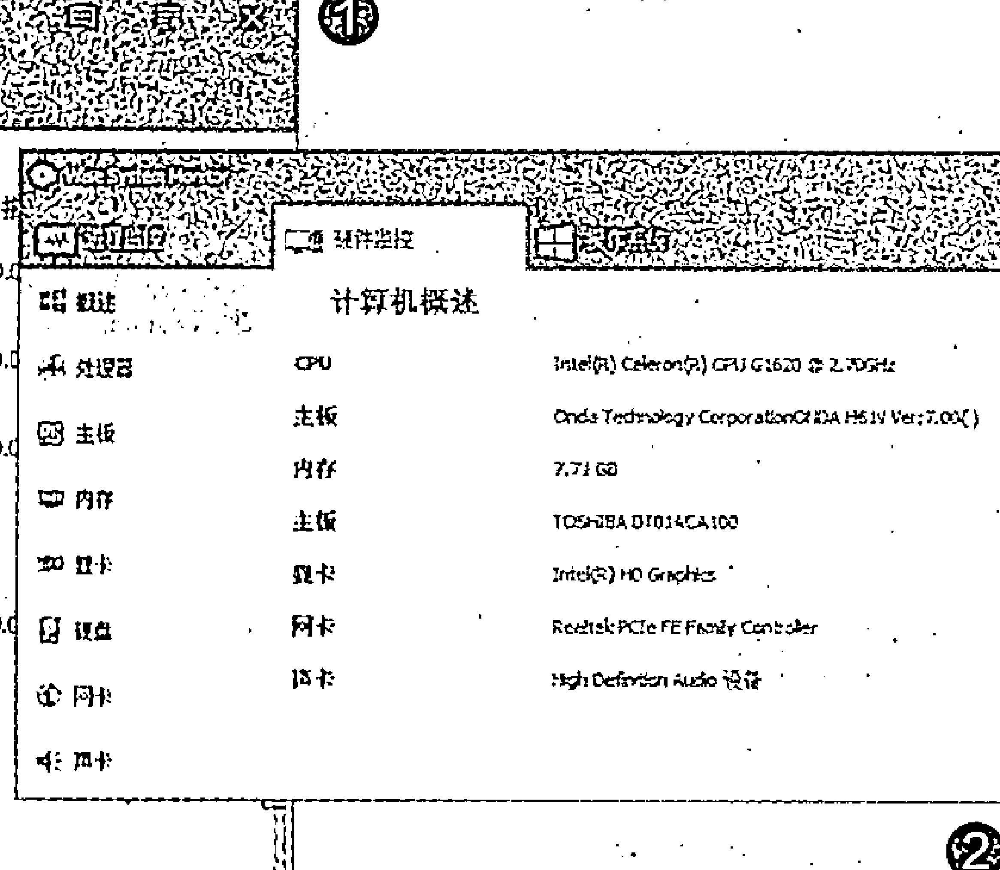

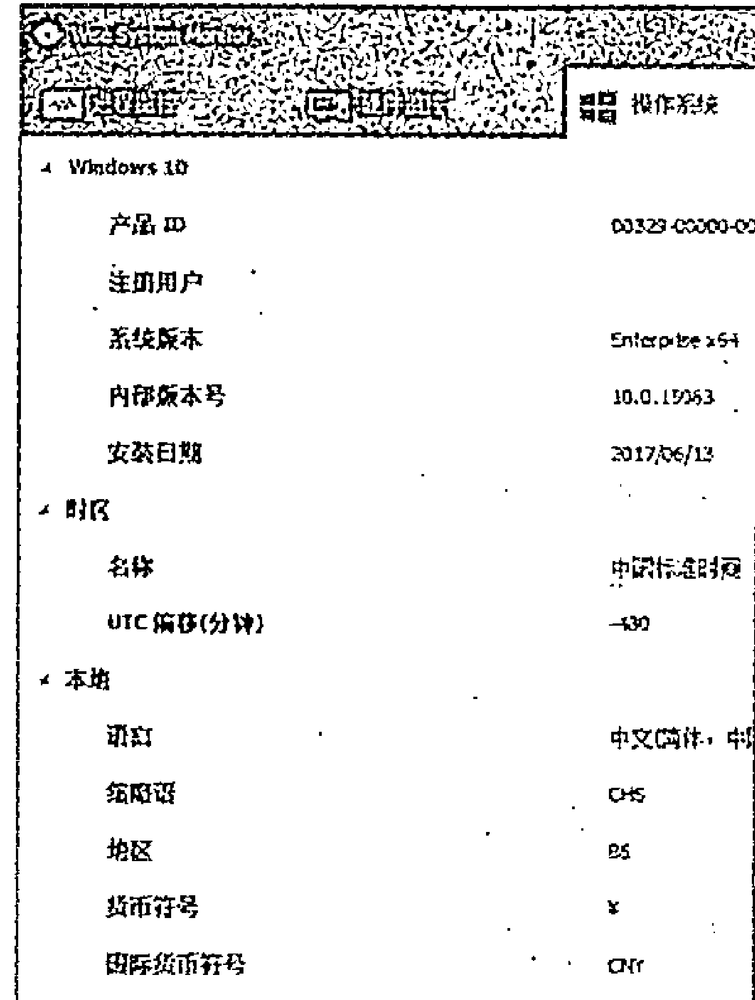

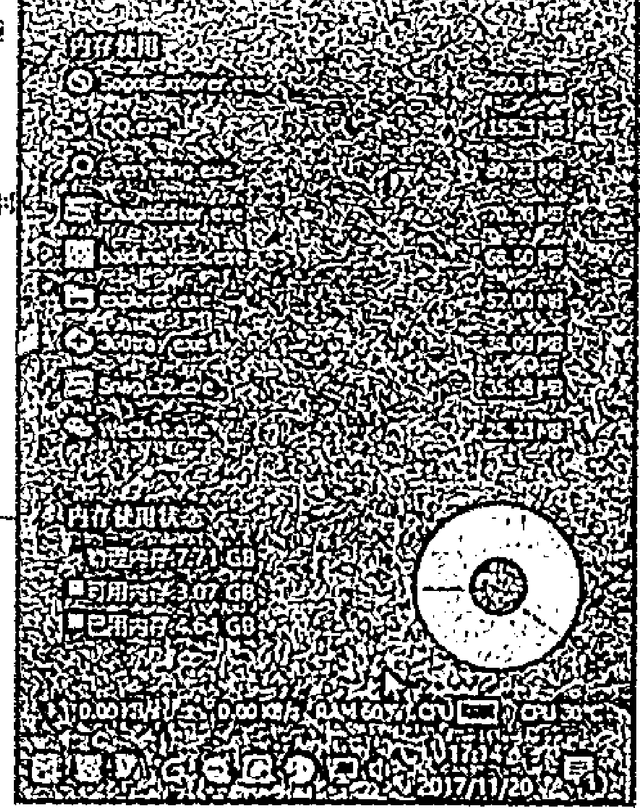

## 当数据抢救遇到BitLocker加密

文|俞木发

大家知道从Windows 7开始微软就在系统中引入了BitLocker加密，它可以完美地实现对系统分区和其他数据的加密。特别是对系统分区进行加密后，即使用户使用PE引导电脑，也无法实现对加密分区的访问。但是任何高强度加密都是一把双刃剑，如果自己的系统崩溃或者忘记加密密码后，又该怎样访问BitLocker加密分区找回数据呢？

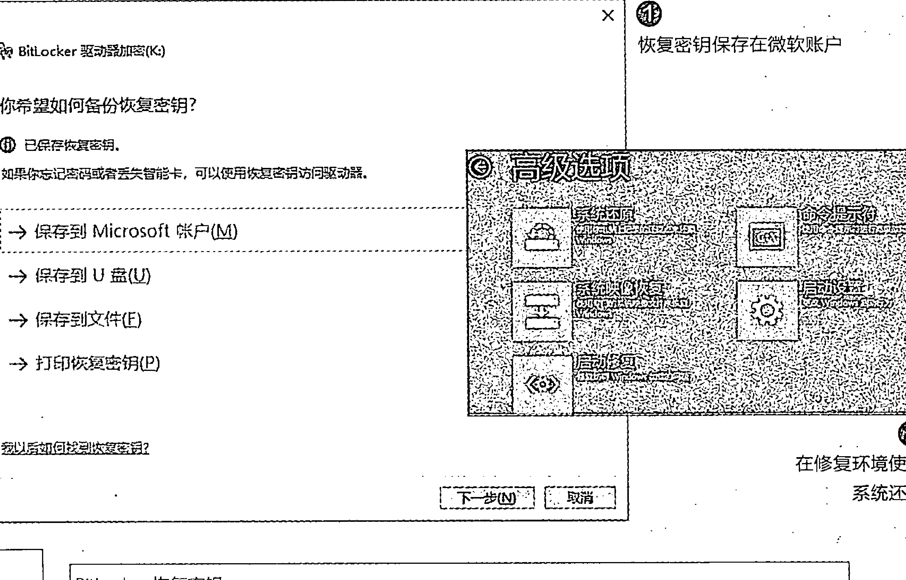

- 保存到 Microsoft 账户(M)
- 保存到 U 盘(U)
- 保存到文件(E)
- 打印恢复密钥(P)

在我们首次启用BitLocker加密时，系统都会要求我们保存以后解密所需的恢复密钥。对于Windows 10用户，由于系统默认启动OneDrive，因此强烈建议选择将恢复密钥保存在微软账户，这样以后如果忘记加密密码，我们可以从中取回加密密钥进行解密（图1）。此外还要注意的是，Windows 10（1511以上版本）默认启用新的加密方式，这种加密方式不兼容1511以下版本系统，建议使用兼容加密模式。

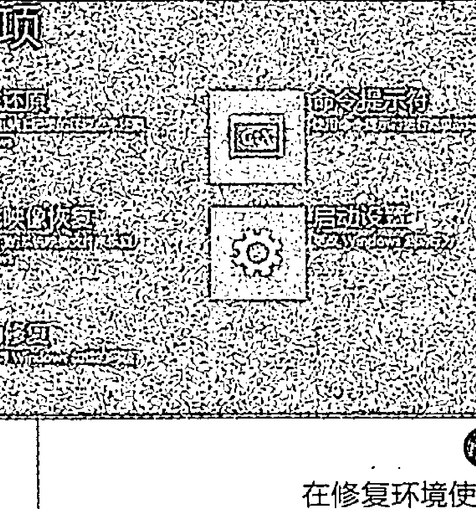

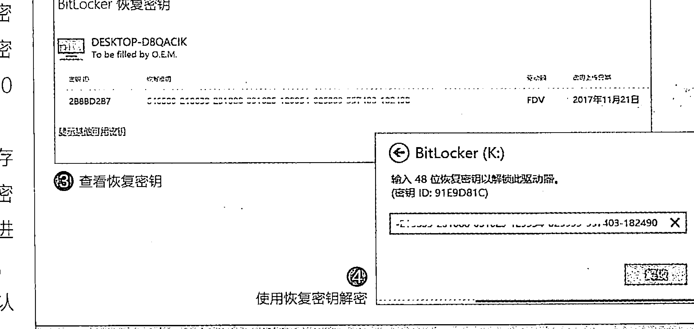

| 项目 | 内容 |
| --- | --- |
| 设备名称 | DESKTOP-D8QACIK |
| 密钥ID | 2B8BD2B7 |
| 恢复密钥 | ... |
| 创建时间 | 2017年11月21日 |

启用BitLocker加密后，如果以后遇到系统崩溃或者忘记访问密码的情况，那么现在就可以根据实际情况选择不同的解密方法。

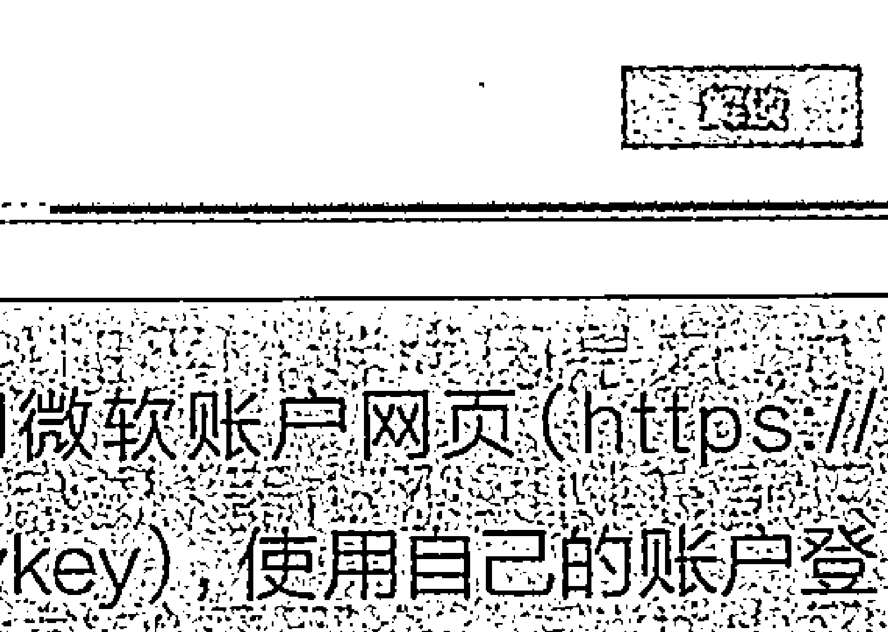

如果是系统崩溃已经无法进入Windows 10，那么可以尝试看看重启后能否进入WinRE修复环境，在高级选项下点击“系统还原”，使用其自带的系统还原组件对系统进行恢复（图2）。

这样再次进入系统后，用户就可以访问微软账户网页（https://account.microsoft.com/devices/recoverykey），使用自己的账户登录后就可以看到BitLocker的恢复密钥，按提示将其复制保存（图3）。

现在再次尝试访问加密驱动器，在弹出的BitLocker加密窗口点击“更多选项→输入恢复密钥”，接着将上述获取的密钥输入解密即可，注意密钥ID要一致（图4）。

如果系统无法进入，因为恢复密钥已经保存在微软账户，可以使用支持上网的PE系统引导电脑，这样进入PE后同上访问上述网页获取自己的恢复密钥，在PE中使用恢复密钥对加密驱动器进行解密即可。当然如果没有PE，那么也可以在任意电脑登录自己的微软账户获取恢复密钥，然后将加密硬盘挂载到其他的正常电脑（建议安装的系统要一样），同上进行驱动器的解密即可。

## 对症下药 用底层工具解决磁盘怪问题

文|俞木发

在日常使用磁盘的过程中，我们经常会遇到一些奇怪的问题。比如使用得好好的闪存盘，制作启动盘后突然容量变小，使用移动硬盘制作移动系统后插入电脑不再自动分配盘符等。大家一般的解决方法是对磁盘进行重新格式化，不过这种方法不仅会误删数据，而且很多时候无法解决问题。今天就让我们来看看这些问题是怎么产生的，又该如何快速解决。

| 卷号 | LTR | 标签 | FS | 类型 | 大小 | 状态 | 信息 |
|------|-----|------|----|------|------|------|------|
| 卷0 |   | HardWindows | NTFS | 磁盘分区 | 58 GB | 正常 |   |
| 卷1 |   | locald | NTFS | 磁盘分区 | 29 GB | 正常 |   |
| 卷2 | E | back | NTFS | 磁盘分区 | 49 GB | 正常 |   |
| 卷3 | F | soft | NTFS | 磁盘分区 | 49 GB | 正常 |   |
| 卷4 | G | yunfa | NTFS | 磁盘分区 | 108 GB | 正常 |   |
| 卷5 | H | picture | NTFS | 磁盘分区 | 200 GB | 正常 |   |
| 卷6 | I | bt | NTFS | 磁盘分区 | 842 GB | 正常 |   |
| 卷7 | J | HL | FAT32 | 磁盘分区 | 9 GB | 正常 |   |
| 卷8 |   | SSDEINDOES | NTFS | 磁盘分区 | 59 GB | 正常 | 系统 |
| 卷9 | C | win10back | NTFS | 磁盘分区 | 51 GB | 正常 |   |
| 卷10 | D |   | NTFS | 磁盘分区 | 787 MB | 正常 | 已隐藏 |
| 卷11 | L | HOVEOS | FAT32 | 磁盘分区 | 41 GB | 正常 |   |
| 卷12 | M | myDocuments | NTFS | 磁盘分区 | 60 GB | 正常 |   |
| 卷13 | N | ziliao | NTFS | 磁盘分区 | 47 GB | 正常 |   |
| 卷14 |   |   |   |   |   |   |   |

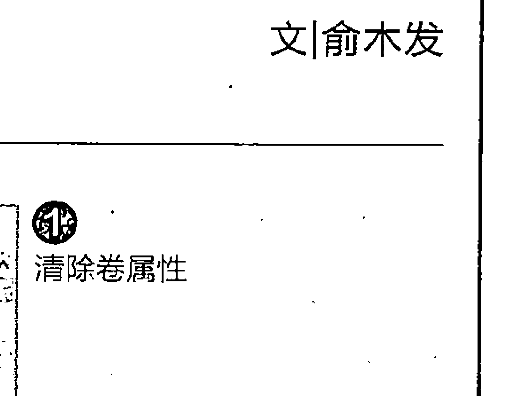

```
DISKPART> list volume
卷号  LTR  标签        FS    类型         大小    状态   信息
卷0         HardWindows NTFS  磁盘分区     58 GB   正常
卷1         locald      NTFS  磁盘分区     29 GB   正常
卷2   E     back        NTFS  磁盘分区     49 GB   正常
卷3   F     soft        NTFS  磁盘分区     49 GB   正常
卷4   G     yunfa       NTFS  磁盘分区     108 GB  正常
卷5   H     picture     NTFS  磁盘分区     200 GB  正常
卷6   I     bt          NTFS  磁盘分区     842 GB  正常
卷7   J     HL          FAT32 磁盘分区     9 GB    正常
卷8         SSDEINDOES  NTFS  磁盘分区     59 GB   正常   系统
卷9   C     win10back   NTFS  磁盘分区     51 GB   正常
卷10  D                 NTFS  磁盘分区     787 MB  正常   已隐藏
卷11  L     HOVEOS      FAT32 磁盘分区     41 GB   正常
卷12  M     myDocuments NTFS  磁盘分区     60 GB   正常
卷13  N     ziliao      NTFS  磁盘分区     47 GB   正常
卷14                              磁盘分区     0 B     未隐藏

DISKPART> select volume 14
卷 14 是所选卷。

DISKPART> attributes volume clear nodefaultdriveletter
卷属性清除成功。
```

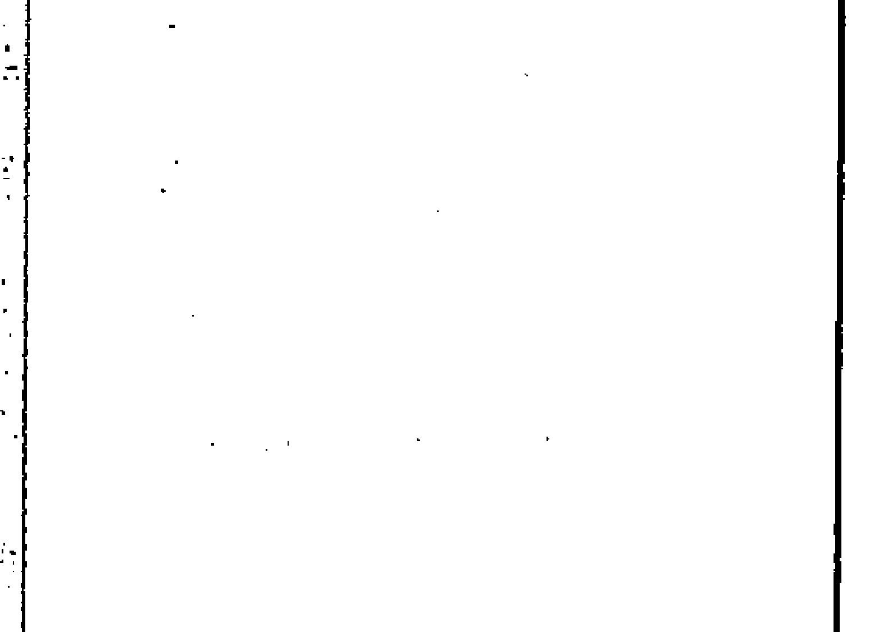

```
DISKPART> attributes volume set readonly
卷属性设置成功。
```

### 格式化不是万能解决方法

磁盘遇到问题，很多朋友首先想到的是使用格式化的方法解决。确实平时我们遇到一些常见问题通过该方法也可以解决，不过类似磁盘变为只读、无法分配盘符，格式化方法却无能为力。这是因为我们平时使用的格式化只是在物理驱动器（磁盘）的所有数据区上执行一个写零的操作过程，实际上只是简单地在分区表开头写入一个标识，让系统认为这是一个空的分区而已。因此对于磁盘底层属性，如分区ID、只读属性等格式化并没有对这些信息进行清零，因此这类涉及到磁盘底层属性的故障，通过格式化是无法解决的。那么对于无法通过格式化解决的磁盘问题，现在有哪些工具可以进行修复？

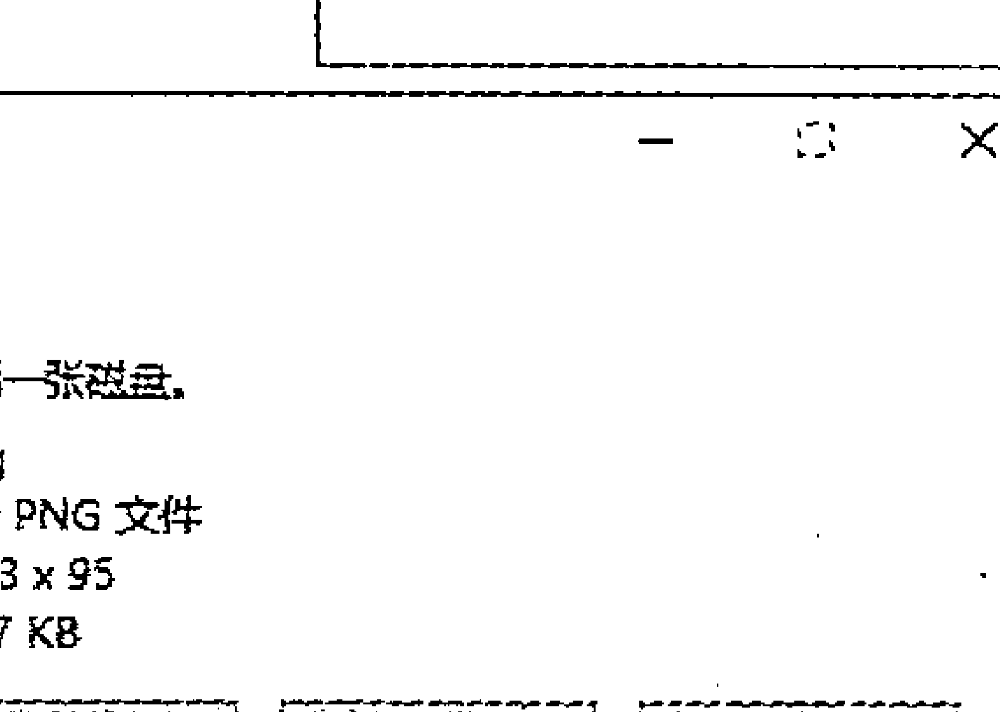

### 移动硬盘无法分配盘符

修复工具: Diskpart命令行

在默认情况下当我们在USB端口插入闪存盘或者移动硬盘后，系统都会自动为这些插入的USB磁盘分配盘符以便于访问。但是一块移动硬盘在使用Windows 10的Windows To Go制作为移动系统，完成制作后发现移动硬盘插入电脑系统不再自动为其分配盘符。这样每次访问移动硬盘都需要手动分配盘符。该怎么在保护数据的前提下解决这个故障？

为了保护系统分区数据不被随意访问，当移动硬盘（包括闪存盘）使用Windows To Go制作作为可引导Windows 10系统时，系统会自动将磁盘的“NODEFAULTDRIVELETTER”属性激活，该属性的作用是阻止系统为其分配盘符。因此你的磁盘如果...

出现上述故障，那么可以使用Diskpart命令取消“NODEFAULTDRIVELETTER”属性的激活状态。

以管理员身份启动命令提示符，依次输入下列的命令选中移动硬盘并对“NODEFAULTDRIVELETTER”属性进行配置（图1）：

```
Diskpart
List volume #列出本机所有卷
Select volume 14 #选中没有分配盘符的卷
attributes volume clear nodefaultdriveletter #清除“NODEFAULTDRIVELETTER”属性
```

当屏幕提示卷属性清除成功，现在再次插入移动硬盘就可以自动为其分配盘符了。除了上述属性外，磁盘还有ReadOnly（只读属性，激活后磁盘变为只读）、Hidden（隐藏属性，激活后在资源管理器无法看到该分区）。同样，我们也可以根据自己的需要为其添加属性（将上述命令中的clear更改为set即可），比如输入“attributes volume set readonly”可以添加只读属性（图2）。

这样当我们试图复制文件到只读分区时，系统会提示写入磁盘写保护。因此如果你的磁盘出现类似只读、被隐藏这些故障，同样可以通过上述方法清除其属性以解决问题（图3）。

### 3 分区被彻底隐藏

修复工具：Bootice

使用Windows 10原版文件安装，或者近日通过在线升级到1709版的朋友都知道，在完成新版Windows 10的安装后会在本地硬盘新增一个名为“恢复分区”的新分区，这个分区既无法在资源管理器中访问，在磁盘管理器中也无法访问，右击只会显示一个帮助菜单（图4）。

那么如果我们需要访问其中的文件该怎么办呢？其实这是一个Windows 10的隐藏分区，系统对该分区标识分配了一个新的ID，从而导致我们无法直接访问。因此如果你的磁盘出现了无法访问的隐藏分区，那么可以通过bootice.exe来进行更改。

启动程序后选中包含隐藏分区的硬盘，点击“分区管理”，在分区列表可以看到恢复分区没有被分配盘符，并且其ID为“27”（正常NTFS分区为07），普通隐藏分区则为“17”（图5）。

如果需要访问该分区，只要点击“分配盘符”（该操作无法在“磁盘管理”组件中完成，但是这里分配盘符重启后会自动消除）。如果要恢复分区的正常显示，则只要将该分区的ID更改为“07”即可。如果要实现普通隐藏则可以更改为“17”。在磁盘管理可以看到“17”和“27”的不同，前者隐藏性更强（图6）。

当然平时我们遇到的磁盘故障还有许多，比如磁盘检查后发现分区表错误，扫描后有坏道，这些故障可以借助Diskgenius进行修复。总之，在遇到这些磁盘故障的时候，大家应该根据故障的表现选择有效的工具进行修复。

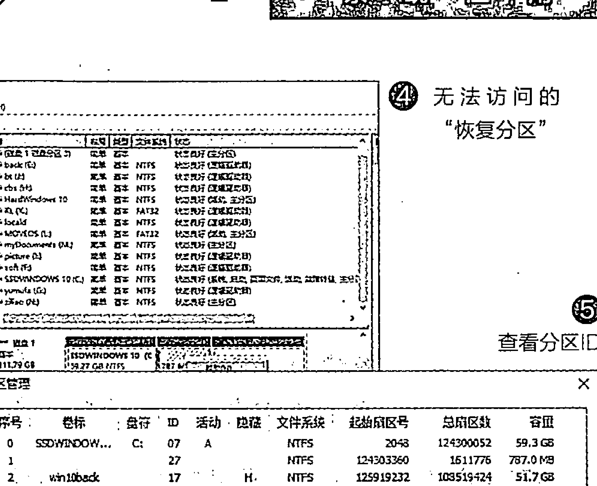

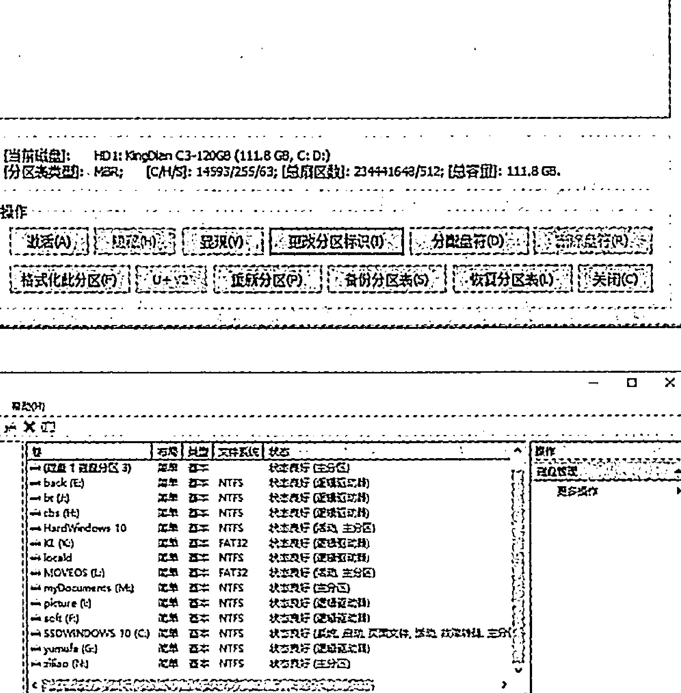

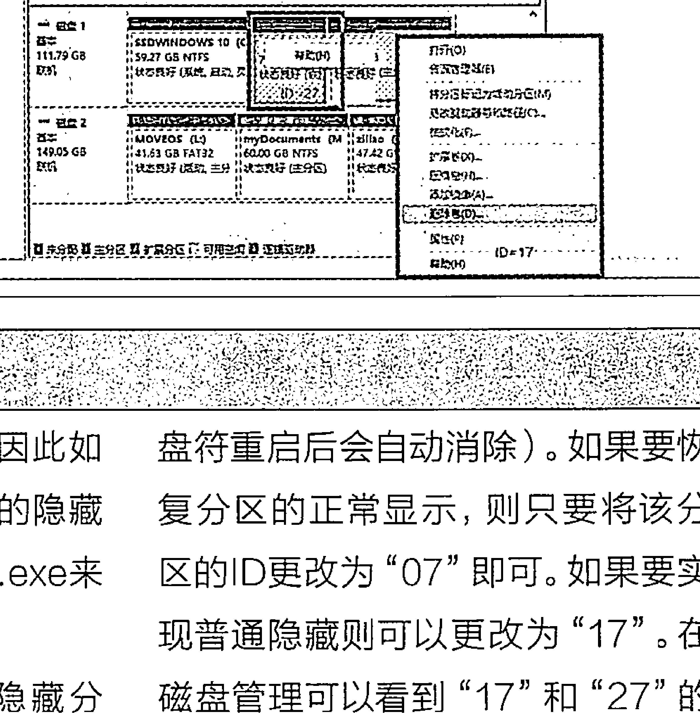

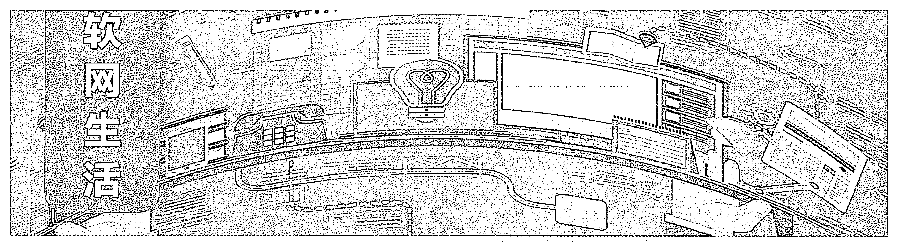

## 一个工具打造绿色便捷软件库

文|阿楠

绿色软件以不用安装、不添加文件、携带方便而受到人们的喜爱，但是，搜集和管理绿色软件却不是一件轻松的事。借助一个PortableApps.com Platform软件，就方便多了。

PortableApps.com Platform可自动下载和管理现成的300多款绿色便携软件，并获得不断的更新和升级添加。我们可以从中随意选择自己喜欢的软件进行下载和管理，也可以一股脑儿地全盘下载到本地硬盘、云盘或移动硬盘，然后慢慢选择。

首先从官方网站下载PortableApps.com Platform (https://portableapps.com/download/success)，执行安装。该软件本身为绿色软件，选择“全新安装”时可将PortableApps.com平台副本安装到本地文件夹、云驱动器或便携式移动设备中(图1)。因为如果选择全部安装该平台的软件会占用10GB以上的存储空间，若贸然将软件安装到剩余空间不足的系统盘，运行过程中可能会造成系统崩溃。在接下来的目标选择列表中，确定是将软件安装到便携设备、云同步文件夹，还是本地自定义的位置(图2)。

在接下来的安装过程中，会给出要安装的软件的分类选择列表，可根据自己的需要进行选择和安装。之后，无论软件被安装到什么介质，要运行该软件时，只需执行Start.exe主程序，即可进入软件管理窗口。在窗口中选择软件并用右键菜单即可启动或管理某个软件了(图3)。

当安装的软件库中的某些软件有版本更新时，一旦启动PortableApps.com Platform软件后，会自动检测出更新的软件并给出更新列表，点击“下一步”按钮可进行自动软件更新(图4)。

此外，还可通过“安装新的便携软件”命令，将其他绿色软件添加到该管理软件中。这样来管理常用绿色便携软件方便多了吧！快去找一块大于10GB的闪存盘(闪存卡+读卡器也可)或移动硬盘，打造一个属于自己的绿色便携软件库吧！

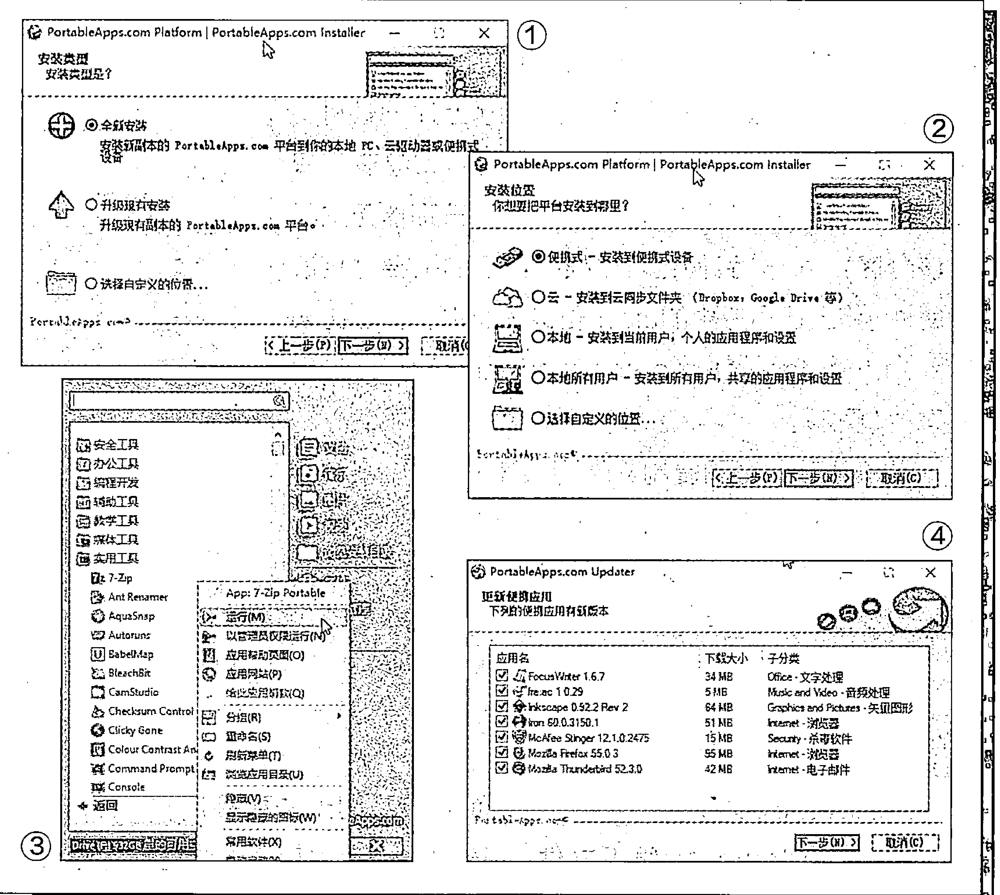# 火狐也能边浏览边笔记 文|老万

现在很多新出的浏览器都带有笔记功能，比如Windows 10操作系统中的斯巴达浏览器就是如此。即使是没有笔记功能的谷歌浏览器，也可以通过安装相应的功能扩展来实现。不过还有很多用户在使用火狐浏览器，对他们来说，同样有办法也用上类似的功能。

## 使用火狐自身功能笔记

既然火狐浏览器和谷歌浏览器一样，都是以功能扩展丰富而闻名的，我们通过添加相应的功能扩展就可以解决问题了。正好火狐浏览器的Test Pilot之前发布了一个全新的笔记功能，通过它我们在浏览器的侧边栏就可以快速新建笔记。首先进入到火狐浏览器的Test Pilot页面(https://testpilot.firefox.com/experiments/notes)，点击页面中的“启用Notes”按钮就会弹出一个安装提示框，分别点击提示框中的“确定”以及“添加”按钮，就可以完成功能模块的添加操作(图1)。成功安装这个功能模块后，就会在浏览器的左侧弹出一个侧边栏。

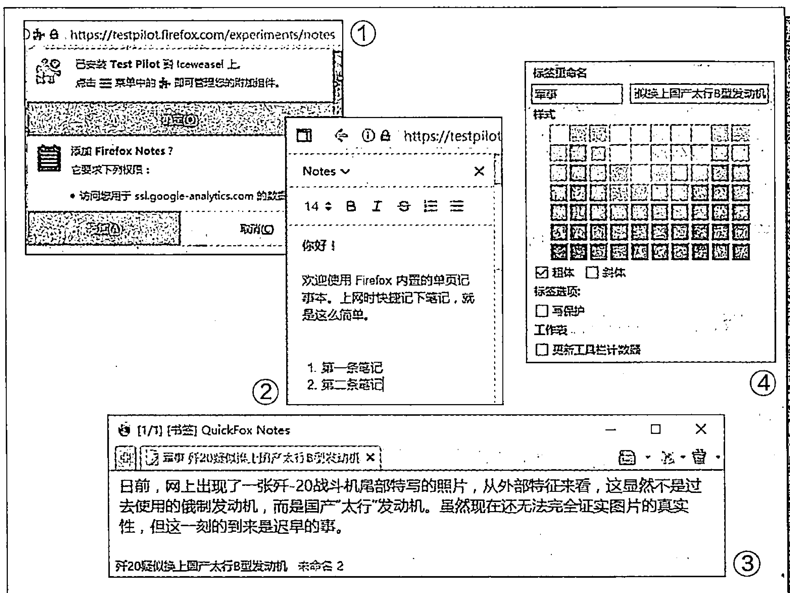

如果这个侧边栏关闭了，那么可以点击地址栏前面的“显示侧栏”按钮，在弹出的菜单里面选择“Notes”这项就可以了。以后当我们需要进行笔记操作的时候，只需要在网页里面选中重点的内容信息，将这段内容进行复制并粘贴到笔记侧边栏里面就可以了。由于火狐浏览器的这个功能还处于测试的阶段，所以很多功能还不是非常完善。比如用户无法将每一条笔记分别进行创建操作，如果用户要想记录多条笔记的话，那么只能将它们通通复制粘贴到左侧的侧边栏里面。不过用户可以利用工具栏里面的列表功能，将这些笔记进行有效的分隔(图2)。

## 第三方扩展的笔记记录

若觉得火狐浏览器自己的笔记功能鸡肋，那么可以试一试“QuickFox Notes”这款功能扩展，不过这款功能扩展是通过火狐浏览器的应用商店来安装的。安装完成后点击工具栏中的扩展图标，用户可以选择笔记展开的方式，比如新窗口打开、新标签打开和侧边栏打开等。

以后当我们需要进行笔记操作的时候，既可以通过文字复制的方法进行添加，也可以直接将需要的内容拖拽到笔记窗口里面(图3)。添加完成以后我们可以通过鼠标右键中的命令，对添加的内容进行编辑操作。除此以外，为了以后更好地进行笔记的管理，可以在笔记标签上点击鼠标右键，在弹出的对话框就可以进行笔记的分组以及笔记标签的重命名等操作(图4)。

随着用户添加笔记的增多，窗口里面的笔记标签也越来越多，这样就会显得非常的拥挤。于是当我们暂时不使用某个标签的时候，可以点击工具栏中的“收藏夹”按钮，在弹出的菜单里面点击“添加到收藏夹”命令，这样这个笔记标签就可以暂时进行隐藏。当我们需要查看其他标签的时候，只需要点击菜单中的“展开所有有效笔记”命令就可以了。

## 自己动手 文章变语音

现在越来越多的朋友喜欢在乘坐公交上班时或睡前用手机听各类文章。那么，我们如何把自己喜欢的文章变为语音，发送在朋友圈或喜马拉雅上共享，为人们提供便利？

对于经常使用办公软件的朋友，借助Excel的语音朗读功能可以实现文字变语音。它使用的是系统自带的语音引擎，转换的效果很好。启动Excel 2016后点击"文件→选项→快速访问工具栏"，在打开的窗口中选择"不在功能区中的命令"，然后将"按Enter开始朗读单元格"命令添加到右侧面板"保存"菜单的下方（图1）。

返回Excel窗口，此时在左上角"保存"的后面就会增加一个朗读按钮。按提示复制需要转换成语音的文本到A1单元格，并将单元格设置为"自动换行"。为了避免朗读出错，建议先将文本复制到记事本，取消所有空行和格式；如果文章的版式还比较混乱，则建议使用Word高级替换作进一步处理。接着点击Excel中添加的"朗读"按钮，此时按下回车键即可开始朗读单元格文章的内容了（图2）。

"朗读"按钮，此时按下回车键即可开始朗读单元格文章的内容了（图2）。

Excel默认使用的是系统自带的语音引擎，如果需要更换播音主体，或者调整语速，在Windows 10任务栏搜索框输入"语音设置"，在打开的设置窗口中可以选择语音和速度，一些欢快的文章则建议将语速调整得略快，知识性文章则建议语速调整得慢一些（图3）。

因为这里Excel可以将任意文本转换为语音，所以我们可以根据自己的实际需要增减文本，通过文本的编辑实现对语音编辑。比如要上传到喜马拉雅的语音文件，为了增加粉丝，则可以在每篇文章题目前添加上"大家好，我是小强，微信号是XXXX，欢迎您成为我的朋友，今天为大家推荐文章题目是："，这样录制后的语音就会自动添加上类似的宣传。

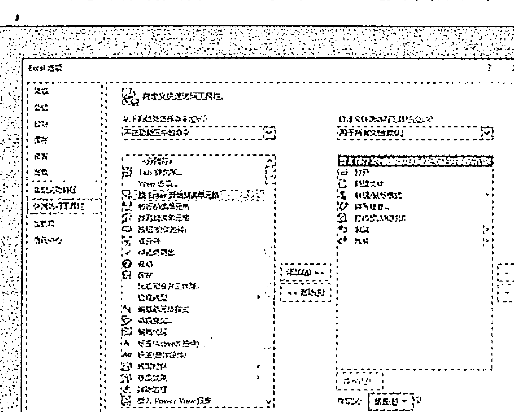

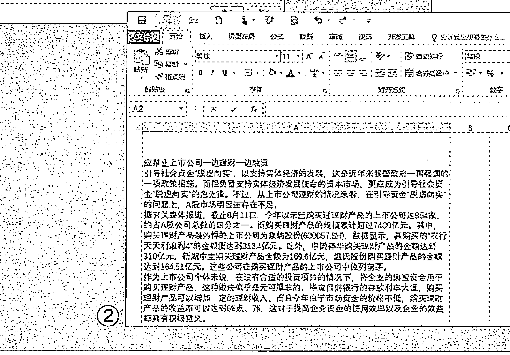

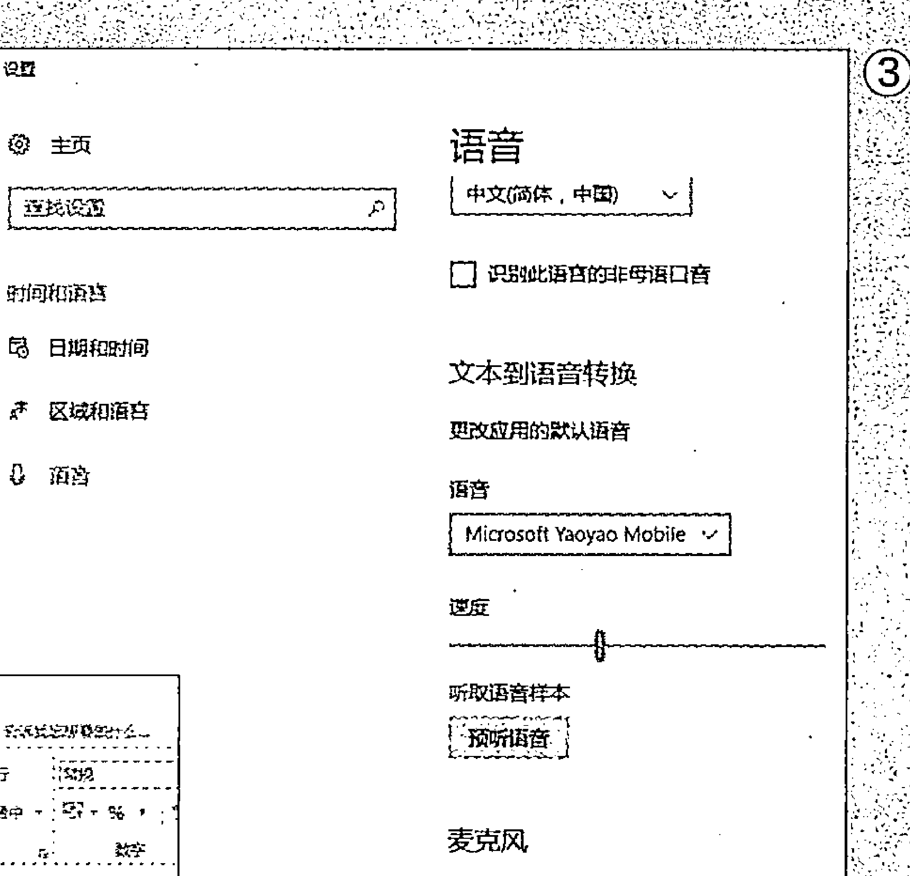

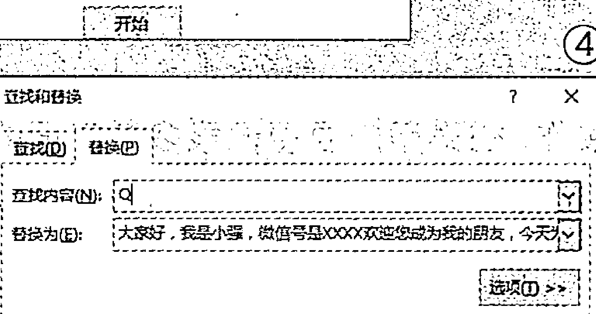

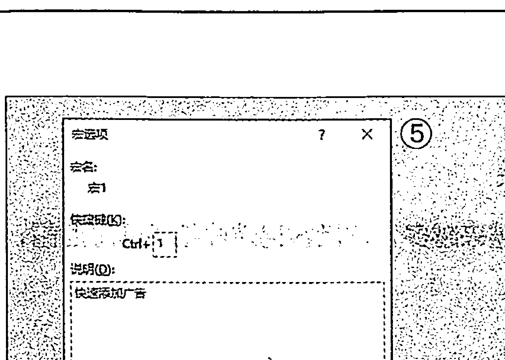

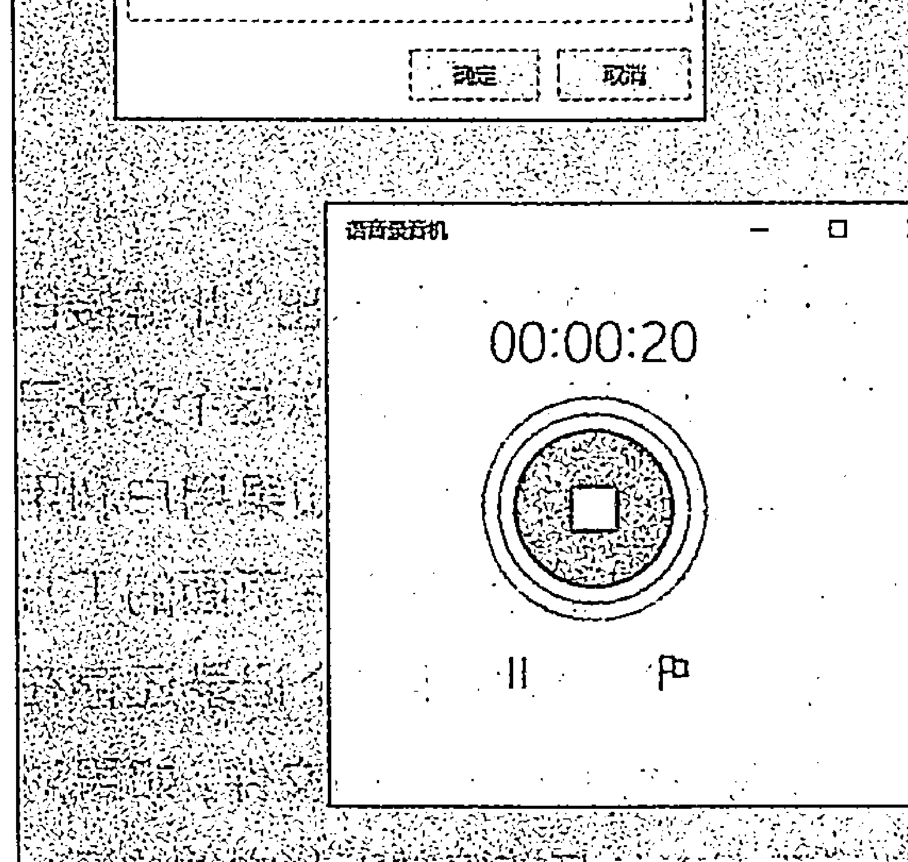

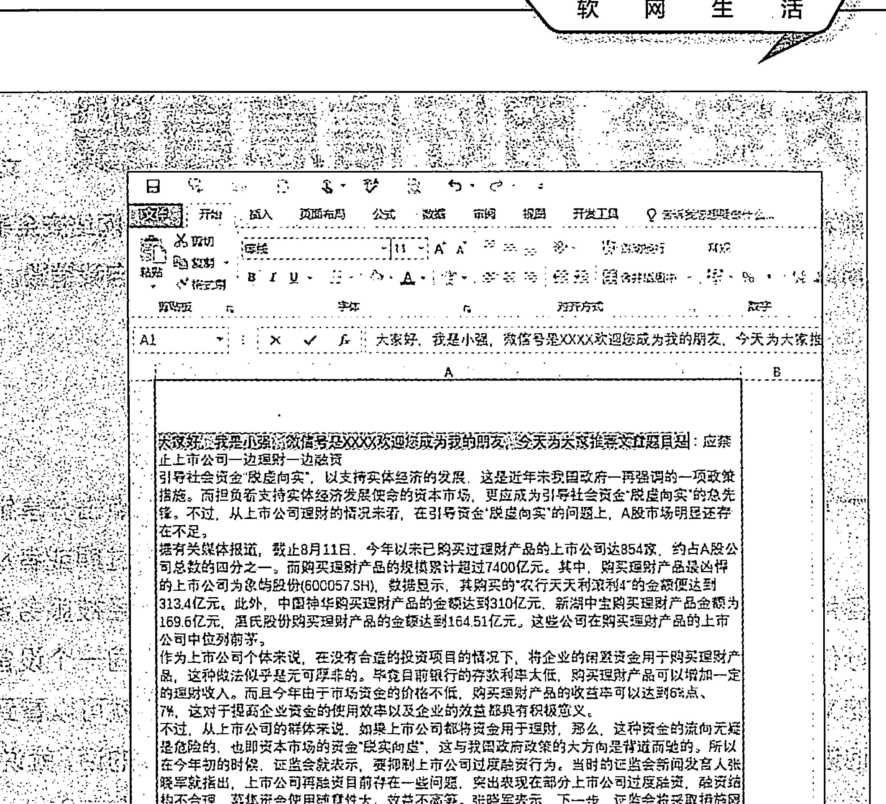

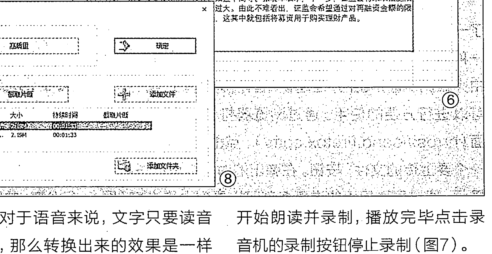

为了方便每次插入类似的文本，可以在Excel中录制一个宏。点击“开发工具→宏→录制宏”，新建一个名为“插入语”的宏，点击录制，然后点击“开始→查找与替换”，查找输入“Q”（可以任意输入自己需要的字符，只要简洁并不和常见字幕混淆即可），替换为输入上述的语句，点击“替换”，完成后停止录制（图4）。

打开上述录制的宏，点击“选项”，在快捷键处输入1，即使用Ctrl+1作为自动替换的快捷键（图5）。

这样以后只要在文章的题目键入Q，然后按下Ctrl+1即可迅速为文章添加上文本（图6）。

对于语音来说，文字只要读音一样，那么转换出来的效果是一样的。因此如果要在语音中插入一些晦涩、生僻的文字，比如很多地方的方言，那么我们也可以使用汉字输入方言读音的方法实现插入。

预听上述转换后的语音，如果满意语音效果，那么就可以借助Windows 10自带的录音机进行语音的录制。准备麦克风并靠近喇叭，接着在录音设备中选择“麦克风”作为录制设备，并且在“设置→麦克风隐私设置”中允许“语音录音机”使用麦克风。接着在搜索框输入“语音录音机”，启动应用后点击其中的麦克风图标开始录制。接着切换到Excel，选中单元格文本后按下回车开始朗读并录制，播放完毕点击录音机的录制按钮停止录制（图7）。

录制好的文件会默认保存在“C:\Users\用户名\Documents\录音”下，默认为.m4a格式，微信支持直接播放这种格式，录制完成后发送到朋友圈和好友共享即可。如果上传的网站只支持MP3格式，录制完成后我们可以使用格式工厂等将其转换为MP3。当然格式工厂也可以非常方便地插入其他音频，我们可以使用自己的语音录制（这样读者听起来更为自然）。在格式工厂中点击“工具集→音频合并”，依次将需要合并的文件添加到列表中进行合并即可（图8）。

## 为安全用好信息自毁

文|万立夫

随着互联网在我们工作生活中日益变得宽泛起来，各种各样的网络安全事故也越来越多，非常容易造成相关信息泄露，所以在我们通过网络传输重要信息后，最好的方法就是让它们自我销毁。

### 一次性的文件传输

说到在互联网里面传输的信息，最常见的信息就是各种各样的文件了。通常情况下我们都是通过网盘来进行传播的，可是这样通过搜索引擎非常容易检索到共享的文件。那么如何在文件被对方成功接收后，让它自动地进行删除销毁呢？

最近火狐浏览器的Test Pilot这个项目里面，推出了一个新的“Firefox Send ”服务，通过它就可以实现一种类似于阅后即焚的文件分享操作。虽然这项服务是由火狐浏览器推出的，但是使用其他浏览器的用户仍然可以进行方便的使用。通过浏览器打开这项服务的页面(https://send.firefox.com/)，点击页面中的“选择一个要上传的文件”按钮。在弹出的对话框里面进行选择后，通过网页里面的进度条就可以看到上传进度(图1)。当然用户可以点击“取消上传”命令停止文件的上传操作，当上传完成以后会生成一个下载分享链接(图2)。

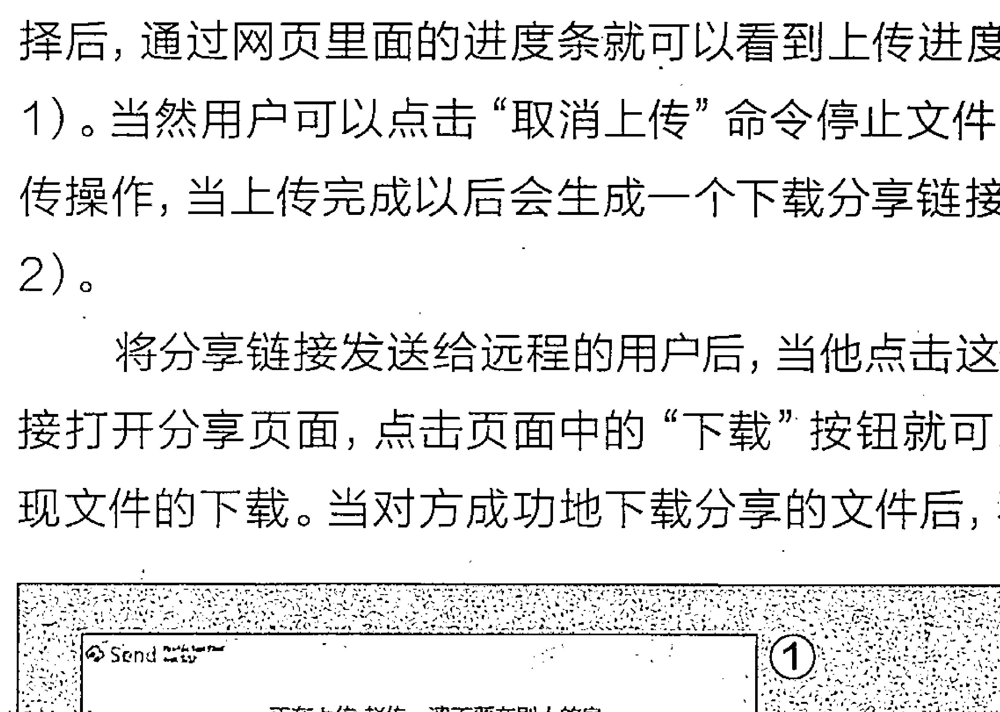

点击分享链接的时候，网页里面就会显示出“此链接已过期或者从未生效”这样的提示，从而表示这个文件已经被服务器进行删除销毁了。除此以外，如果用户利用同一个设备继续上传分享文件的话，那么在页面的下方就可以看到以前分享的文件记录。如果这个记录还存在的话，就说明对方还没有下载我们分享的文件。如果对方在24小时以内都没有点击分享链接并下载文件的话，那么这个分享的文件同样会被服务器进行删除销毁。

### 文字信息自动销毁

当然很多时候要分享的信息并不是以文件的形式存在，而是以文字内容的信息存在的，所以前面的那种方法肯定是不适用的。那么又如何对这些文字内容的信息进行分享，并且在特定的条件下进行自动销毁呢？

打开NoteShred这项服务的官方网站(https://www.noteshred.com/)，根据提示注册一个自己的账号，从而登录到网站的操作界面里面。接着点击页面中的“Create a New Note”按钮，创建一条新的文字分享信息。首先在“Email Recipients”这个输入框里面设置一个电子邮箱地址，这条经过加密的信息就会发送到这个指定的邮箱里面。接着在“Title”和“Note content here”选项里面，分别输入分享文字的标题以及内容(图3)。除此以外有两个非常关键的选项要重点提及一下。首先就是“Password”这个选项。用户点击后面的“Random”按钮后，它会自动随机地创建一串密码，用户需要将这个密码发给对方。对方也只有凭借这串密码，才可以登录并且查看阅读分享的文字信息。另外还有一个“When To Shred”选项，在它的列表里面可以选择文字进行自动销毁的方式。其中“After Reading”就代表在阅读后自动进行删除，而“Later”则代表在设定的时间后自动删除。设置完成以后点击下面的“Create Note”按钮，稍等片刻就会生成一个文字信息的分享链接，与此同时这个链接就会自动发送到我们设定的电子邮箱里面(图4)。接下来我们只需要将刚刚创建的密码通过另外的方式发给对方，对方在点击邮箱里面的分享链接后，根据提示输入查看密码就可以阅读到我们分享的文字内容了(图5)。以后当对方阅读了这段信息后，这段信息将会在服务器里被自动进行删除。

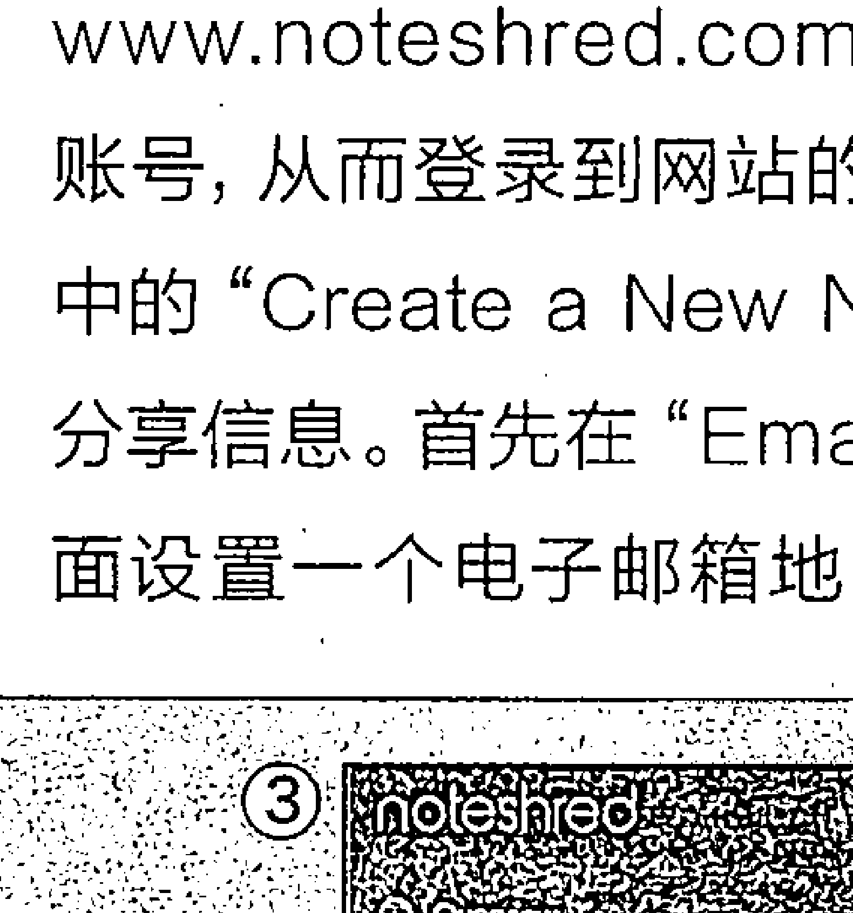

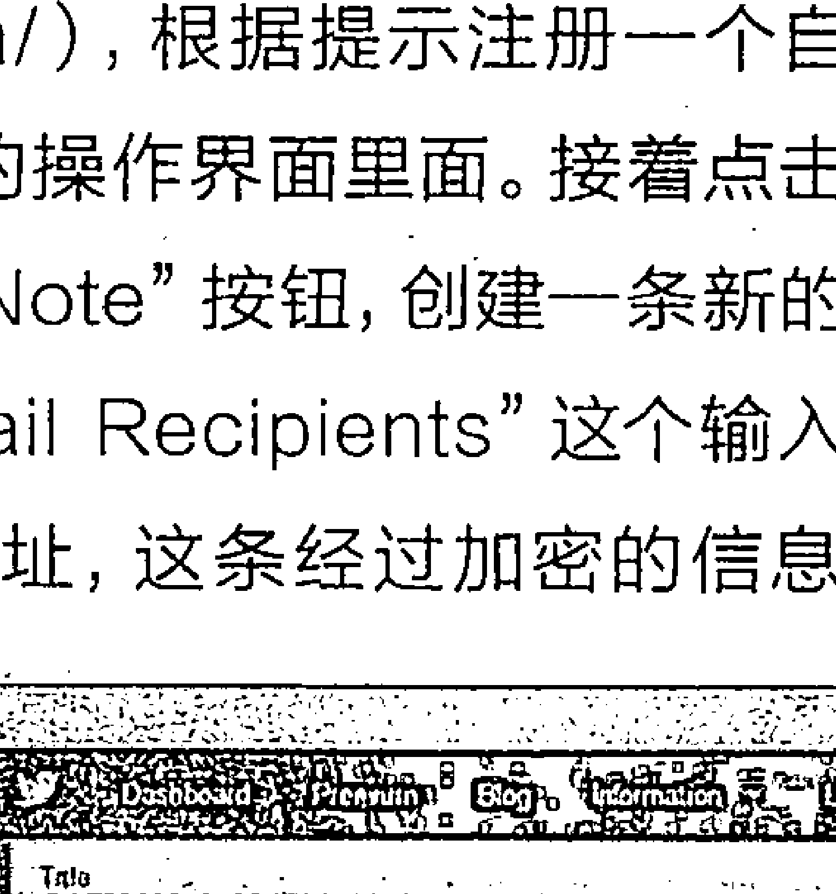

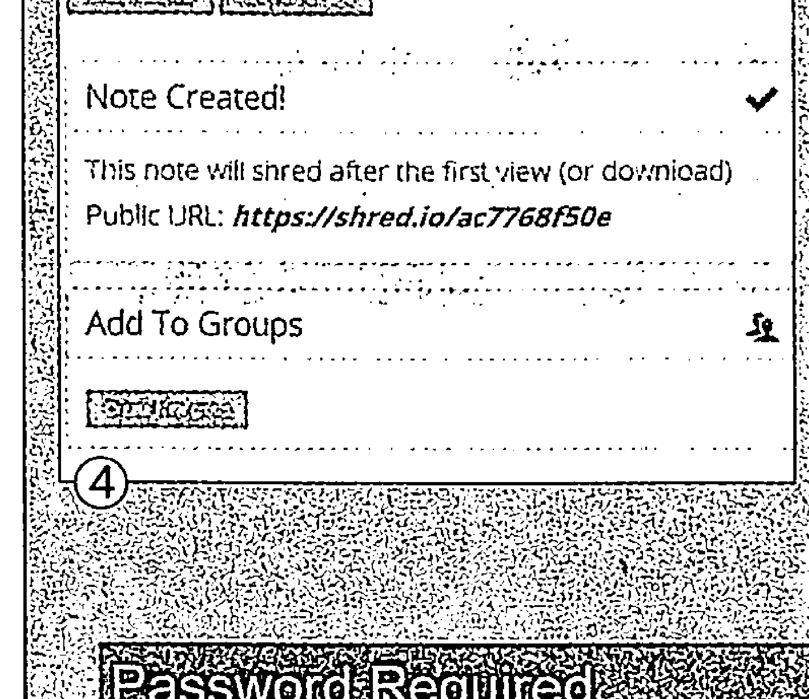

小提示：YOPmail这个电子邮箱服务还可以设置一个电子邮箱别名，这样用户用另外一个电子邮箱地址同样可以进行注册等操作，但是用户可以在同一个操作界面对它们进行管理。

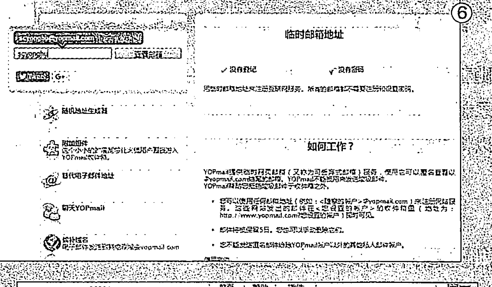

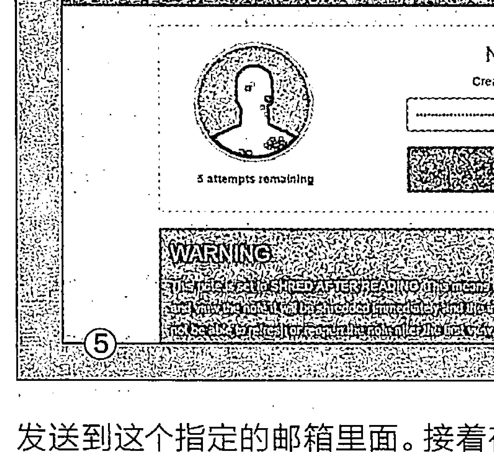

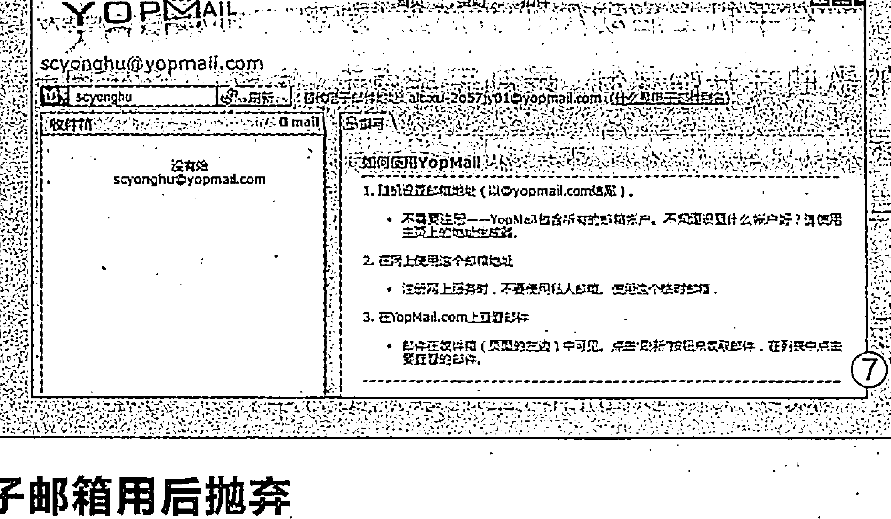

### 电子邮箱用后抛弃

现在很多网站为了推广自己的服务，都需要用户注册一个该网站的服务账号才可以。但是注册完成以后如果用户不想再使用这个网站服务的话，按照以前的做法不去理它就可以了，可是该网站常常会向用户发送一些推广信息让人不胜其烦。所以这个时候我们可以考虑使用一次性电子邮箱，先注册体验这个网站的服务再说。通过浏览器打开一次性邮箱服务YOPmail的官方网站(http://www.yopmail.com/zh/)，首先在网站页面的左侧输入框里面设置一个用户名。接着点击“查看邮箱”按钮，就可以检测这个用户名是否已经被使用。如果没有被使用的话，那么这个一次性邮箱就创建完成了，与此同时就会自动跳转到电子邮箱的管理界面窗口。接下来利用这个电子邮箱进行网站账户的注册，接着邮箱就会收到相关的验证信息，验证成功以后我们就可以成功使用注册网站的服务了(图6)。没有收到相关的电子邮件的话，可以点击左上角的“刷新”按钮，及时刷新相关的邮件信息列表。需要说明的是，这种临时性的电子邮箱并没有相关的密码保护，所以用户在收到相关信息以后最好在左侧列表选中它，然后点击“删除”按钮，并且在弹出的菜单里面点击“此消息”命令，这样就可以将收到的电子邮件信息进行彻底的删除(图7)。如果用户不删除的话，服务器也会在五天之后，将邮件进行自动删除。

## 不花钱手机K歌歌曲免费导出

随着手机性能的提升，很多朋友开始在手机上下载APP进行K歌体验。不过手机K歌很简单，但是要在手机上导出自己录制的歌曲，却大多需要开通会员付费才能导出。幸好APP大多提供免费预听歌曲的在线链接，这样借助电脑我们就可以将这些K歌的歌曲下载到本地，这里以iOS平台的《K歌达人》为例。

### 浏览器开发模式直接查地址

在手机上启动APP并点击“录歌”，选择自己喜欢的歌曲并开始录制。录制完毕点击“完成”，这样自己录制的歌曲默认保存在APP首页“我的作品”中。找到自己刚才录制的歌曲，点击“分享”，在弹出的窗口点击“私密上传”（只有上传歌曲才能获取预览链接），按提示将歌曲上传到服务器上(图1)。

成功上传歌曲后同上继续点击分享，在“分享到”选择QQ，打开QQ窗口后选择“我的电脑”，将上传歌曲链接发送到自己的电脑上(图2)。

在电脑上登录自己的QQ，在好友列表打开“我的iPhone”，在打开的窗口即可看到上传歌曲的试听链接，按提示点击链接，并使用QQ浏览器打开(图3)。

浏览器打开后可以看到一个在线播放页面，点击播放看看是不是就是在手机上录制的K歌歌曲。确定后在浏览器界面按下F12打开开发者页面，在右侧窗格可以看到一行类似“audio id="id_player" src="http://rd4.mdcoolbang.com/upload/data/39938/mp3/19969324.mp3"”的代码，其中的.mp3就是在线歌曲的实际地址，按提示进行复制(图4)。

### 外援SRSniffer嗅探下载地址

使用QQ浏览器直接查看歌曲下载地址是比较简单的方法，一些APP可能会对在线歌曲地址进行加密处理，这样借助浏览器就无法直接获取下载地址。不过只要能够在线播放，我们借助嗅探软件SRSniffer一样可以获取真实下载地址。

同上先在电脑上获取在线播放地址，在浏览器激活歌曲的播放后启动SRSniffer，点击“切换到监听网卡”，按提示选择当前使用的网卡（图5）。

返回程序窗口，在右侧窗格勾选活动的“QQ浏览器进程”，此时在QQ浏览器开始播放在线歌曲，在右侧窗格就可以看到嗅探地址，可以看到绿色标记的就是歌曲实际播放地址，按提示复制并使用迅雷等进行下载即可（图6）。

同样对于在手机上录制的视频（比如很多自拍秀APP）、Flash等媒体文件，只要能够在线播放，借助SRSniffer都可以进行嗅探获得实际下载地址。比如朋友圈发在微信里的其他公众号中的视频链接，默认微信并没有提供下载功能，此时同样可以借助SRSniffer嗅探获得下载地址。使用电脑微信登录，在微信中打开视频进行播放，然后点击上方的菜单→复制链接，获取在线播放地址（图7）。

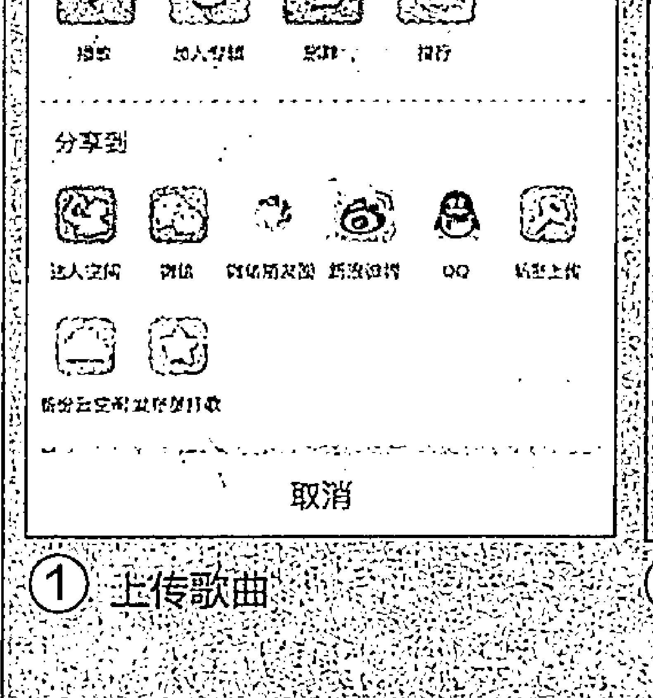

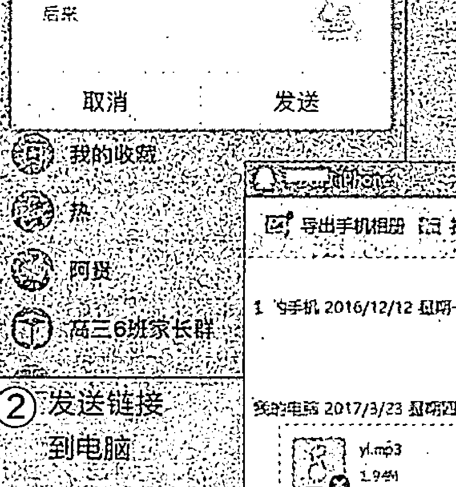

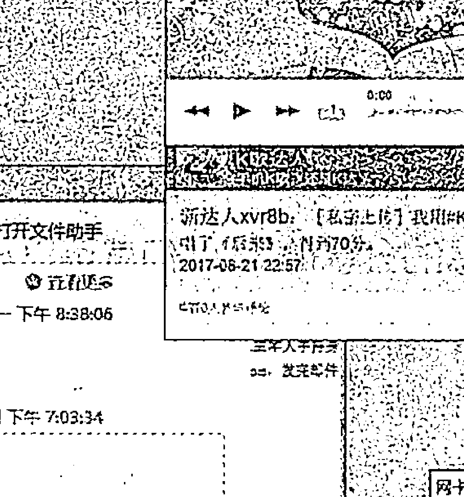

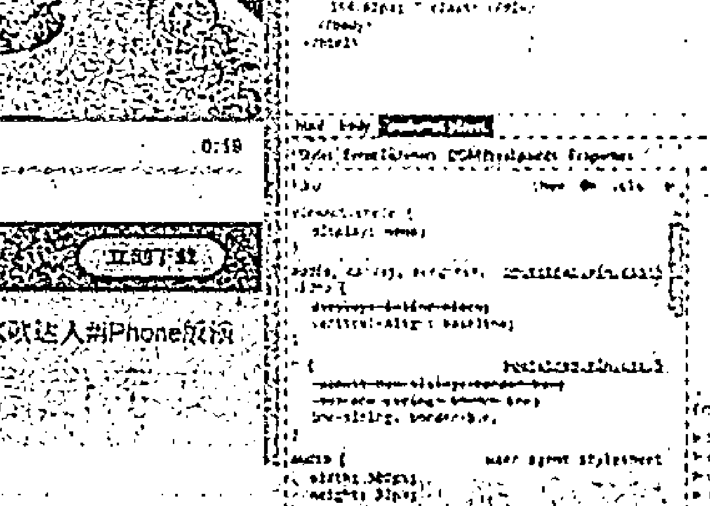

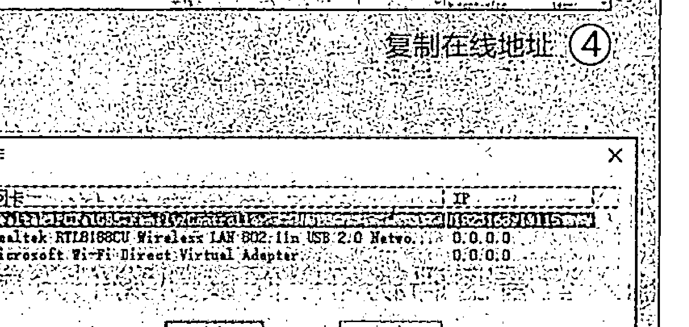

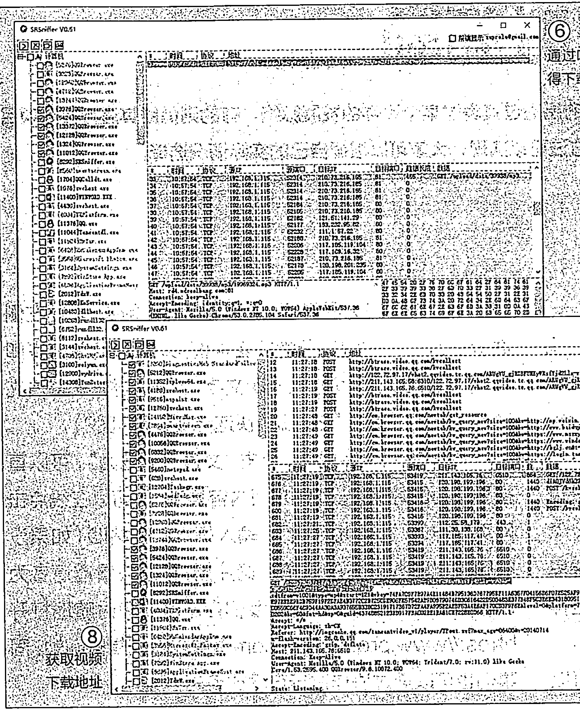

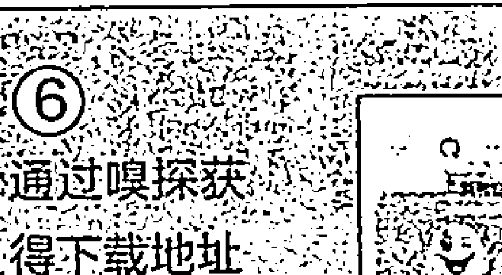


### 就地取材直接录制在线歌曲

当然对于新手来说，SRSniffer嗅探操作毕竟有些复杂。如果只是要下载其中的音乐，那么Windows 10用户还可以直接使用自带的录音机进行录制。首先要准备麦克风，接着在录音设备中选择“麦克风”作为录制设备，并且在“设置→麦克风隐私设置”中允许“语音录音机”使用麦克风（图9）。

在搜索框输入“语音录音机”，启动应用后点击其中的麦克风图标开始录制，接着切换浏览器开始播放在线音乐（播放音量可以大些，并将麦克风靠近音箱），播放完毕点击停止录制。录制好的文件会默认保存在“C:\Users\当前用户\Documents\录音”下，默认为.m4a格式，可以直接上传到手机上进行播放（图10）。

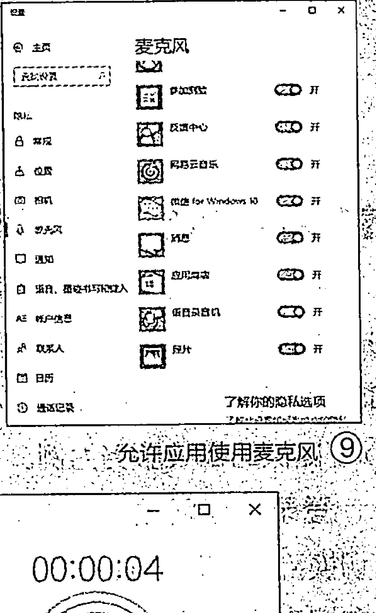

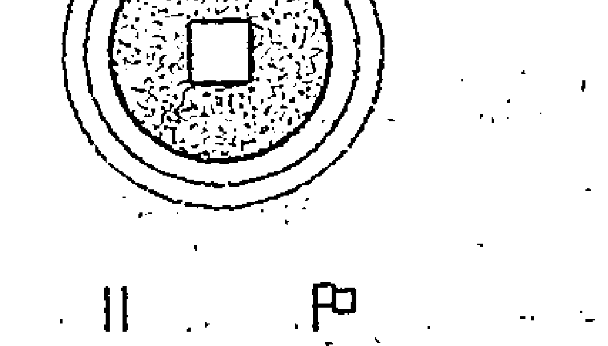


## 整理不慌乱 自制时间轴

文|俞木发

平时在网站或者杂志上我们经常看到各种时间轴，有的是通过其表述某个事件的发展脉络，有的则借助其进行复杂项目的管理。那么这些时间轴是怎么做出来的呢？有多种方法可以实现，大家可以根据自己的实际情况选择。

### 随时随地使用 在线制作时间轴

随着网络的普及，现在很多网站提供在线制作时间轴的功能。这样只要有网络，我们就可以随时随地制作和管理自己的时间轴。这里以https://www.processon.com/提供的在线服务为例。

登录上述网站并使用邮箱注册，使用注册用户登录后切换到“模板”，在搜索框输入“时间轴”进行搜索，然后在搜索框选择一种自己喜欢的时间轴模板。比如这里选择“时间轴进度安排”，点击右侧面板的“克隆”，这样即可在自己的主页里使用了(图1)。

完成克隆操作后会进入自己的主页，这里我们可以根据自己的实际需要进行设置。使用在线制作的方便之处就是网站提供很多模板可以直接使用，而且很方便将时间轴和好友协作处理。比如为了美观，这里可以将模板里的矩形框更换为圆形框，同时加上向下箭头，网站左侧面板包含制作时间轴所需的各种图形，只要简单拖拽即可。然后在图形中间输入说明文字，对于图形格式、填充颜色等还可以使用“格式刷”快速完成设置（图2）。

时间轴制作完成后，点击“文件→下载为”，可以直接导出为图片保存。如果项目内容复杂，则可以在线点击网页下方的“邀请协作者”，输入好友的网站ID（如果没有则可以输入对方的邮箱邀请注册，可以设置邀请者为浏览者还是编辑者）。这样我们自己可以随时随地打开https://www.processon.com查看或者编辑时间轴，同事们也可以通过协作进行查看或编辑（图3）。

### 离线制作 使用Timeline制作时间轴

在线服务虽然方便，不过需要连接网络才能使用。

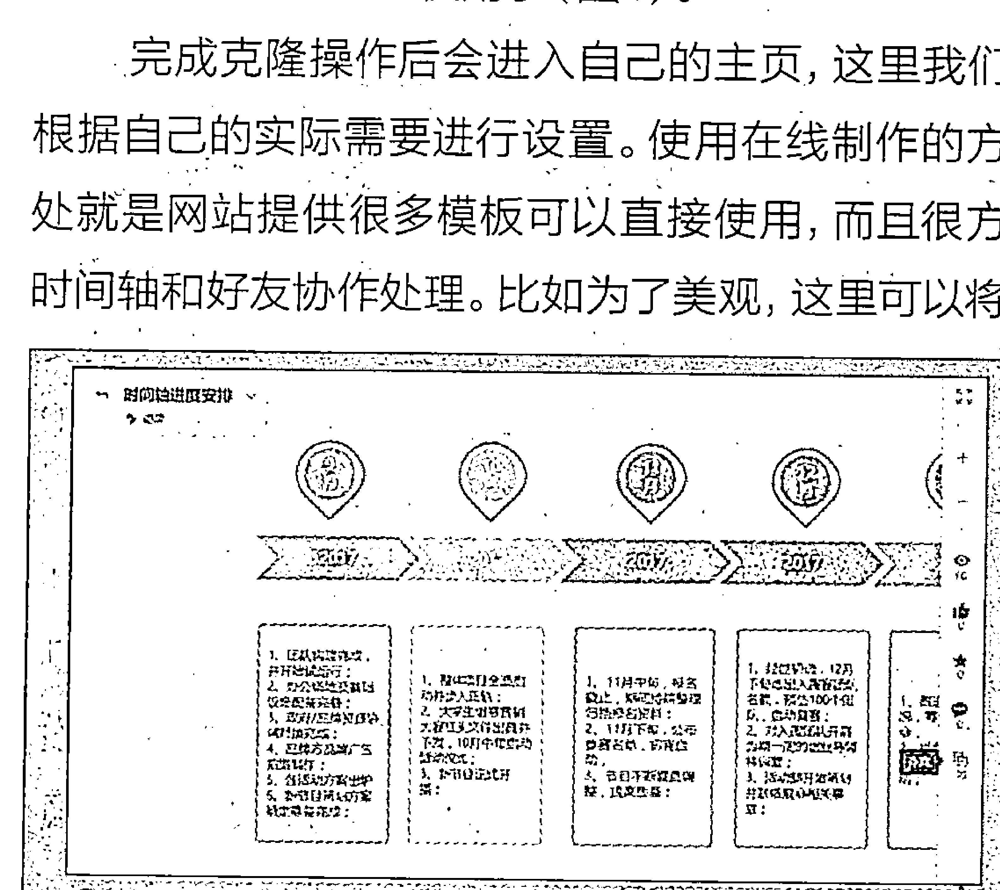

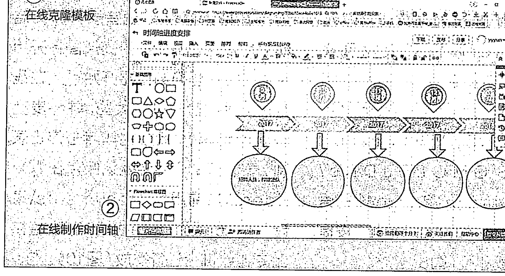

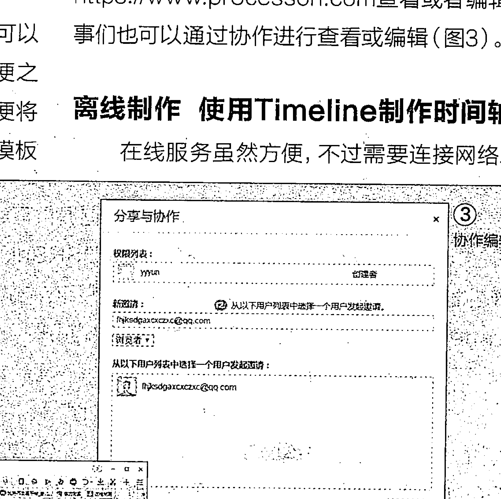

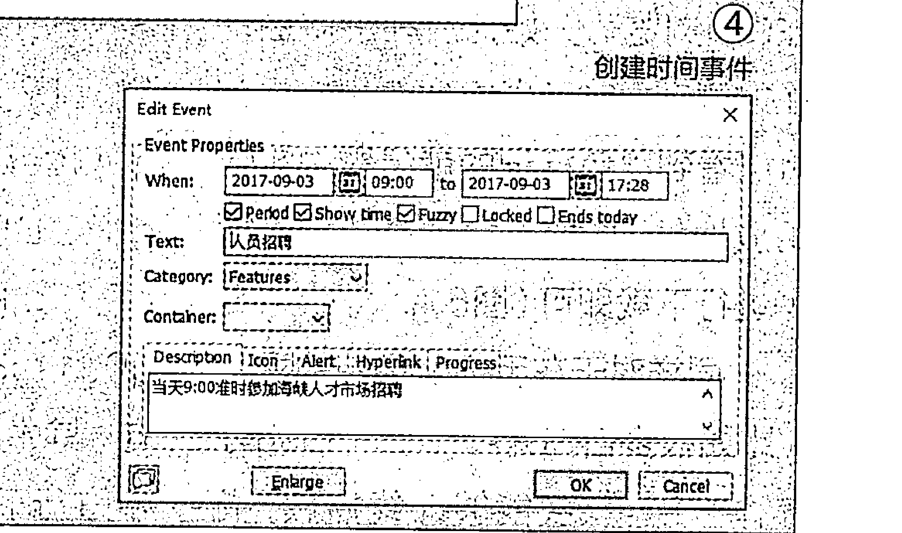

### 就地取材直接录制在线歌曲

理，这样借助浏览器就无法直接获取下载地址。不过只要能够在线播放，我们借助嗅探软件SRSniffer一样可以获取真实下载地址。

同上先在电脑上获取在线播放地址，在浏览器激活歌曲的播放后启动SRSniffer，点击“切换到监听网卡”，按提示选择当前使用的网卡（图5）。

返回程序窗口，在右侧窗格勾选活动的“QQ浏览器进程”，此时在QQ浏览器开始播放在线歌曲，在右侧窗格就可以看到嗅探地址，可以看到绿色标记的就是歌曲实际播放地址，按提示复制并使用迅雷等进行下载即可（图6）。

同样对于在手机上录制的视频（比如很多自拍秀APP）、Flash等媒体文件，只要能够在线播放，借助SRSniffer都可以进行嗅探获得实际下载地址。比如朋友圈发在微信里的其他公众号中的视频链接，默认微信并没有提供下载功能，此时同样可以借助SRSniffer嗅探获得下载地址。使用电脑微信登录，在微信中打开视频进行播放，然后点击上方的菜单→复制链接，获取在线播放地址（图7）。

同上在QQ浏览器中打开视频进行播放，这样在SRSniffer嗅探列表找到类似“122.72.97.17/vhot2.qqvideo.tc.qq.com/ARUgVU_gjRDBFUNEyWRsfYjd2Lix-rF0ek-GMQ80JDKc/q0311c3vavg.p712.1.mp4”的语句，其中.mp4即为实际地址，按提示进行下载即可（图8）。

当然对于新手来说，SRSniffer嗅探操作毕竟有些复杂。如果只是要下载其中的音乐，那么Windows 10用户还可以直接使用自带的录音机进行录制。首先要准备麦克风，接着在录音设备中选择“麦克风”作为录制设备，并且在“设置→麦克风隐私设置”中允许“语音录音机”使用麦克风（图9）。

在搜索框输入“语音录音机”，启动应用后点击其中的麦克风图标开始录制，接着切换浏览器开始播放在线音乐（播放音量可以大些，并将麦克风靠近音箱），播放完毕点击停止录制。录制好的文件会默认保存在“C:\Users\当前用户\Documents\录音”下，默认为.m4a格式，可以直接上传到手机上进行播放（图10）。

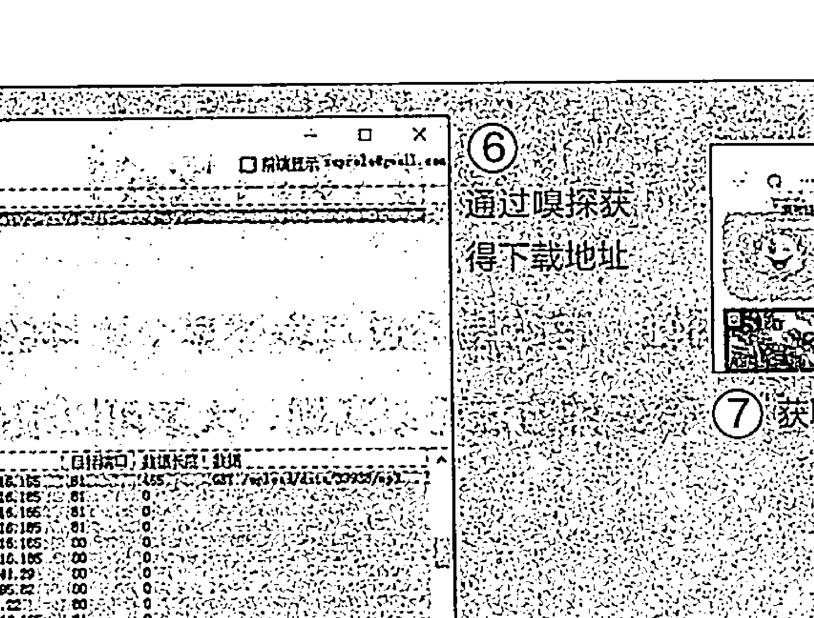

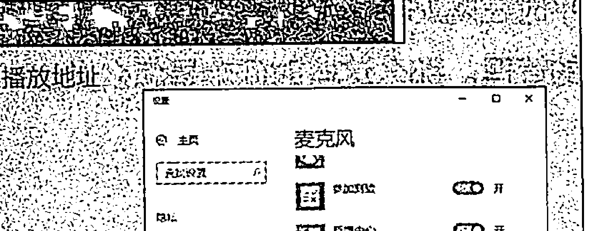

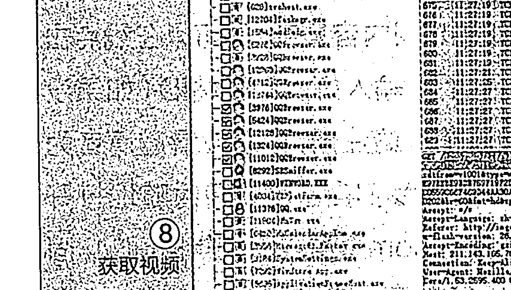


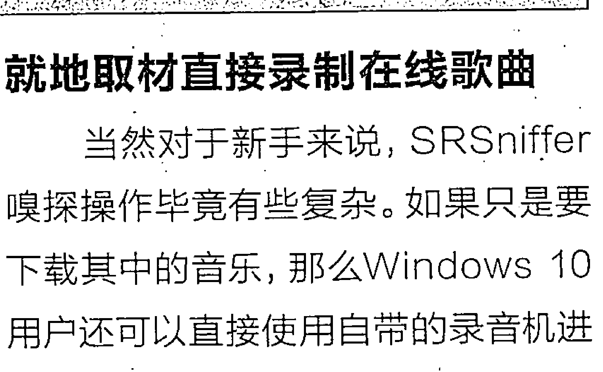

## 管理不慌乱 定制时间轴

文|俞木发

平时在网站或者杂志上我们经常看到各种时间轴，有的是通过其表述某个事件的发展脉络，有的则借助其进行复杂项目的管理。那么这些时间轴是怎么做出来的呢？有多种方法可以实现，大家可以根据自己的实际情况选择。

### 随时随地使用 在线制作时间轴

随着网络的普及，现在很多网站提供在线制作时间轴的功能。这样只要有网络，我们就可以随时随地制作和管理自己的时间轴。这里以https://www.processon.com/提供的在线服务为例。

登录上述网站并使用邮箱注册，使用注册用户登录后切换到“模板”，在搜索框输入“时间轴”进行搜索，然后在搜索框选择一种自己喜欢的时间轴模板。比如这里选择“时间轴进度安排”，点击右侧面板的“克隆”，这样即可在自己的主页里使用了(图1)。

完成克隆操作后会进入自己的主页，这里我们可以根据自己的实际需要进行设置。使用在线制作的方便之处就是网站提供很多模板可以直接使用，而且很方便将时间轴和好友协作处理。比如为了美观，这里可以将模板里的矩形框更换为圆形框，同时加上向下箭头，网站左侧面板包含制作时间轴所需的各种图形，只要简单拖曳即可。然后在图形中间输入说明文字，对于图形格式、填充颜色等还可以使用“格式刷”快速完成设置(图2)。

时间轴制作完成后，点击“文件→下载为”，可以直接导出为图片保存。如果项目内容复杂，则可以在线点击网页下方的“邀请协作者”，输入好友的网站ID(如果没有则可以输入对方的邮箱邀请注册，可以设置邀请者为浏览者还是编辑者)。这样我们自己可以随时随地打开https://www.processon.com查看或者编辑时间轴，同事们也可以通过协作进行查看或编辑(图3)。

### 离线制作 使用Timeline制作时间轴

在线服务虽然方便，不过需要连接网络才能使用。

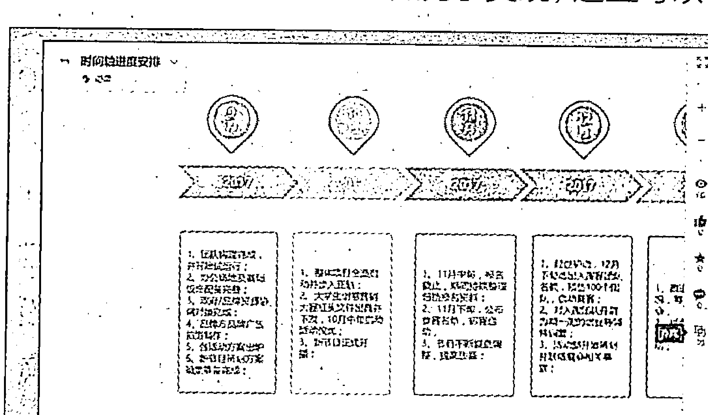

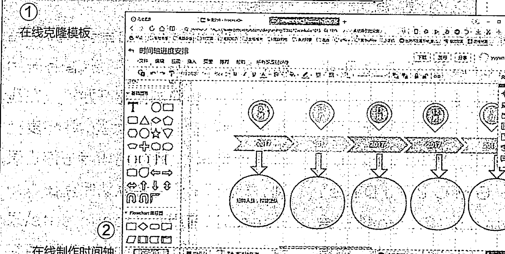

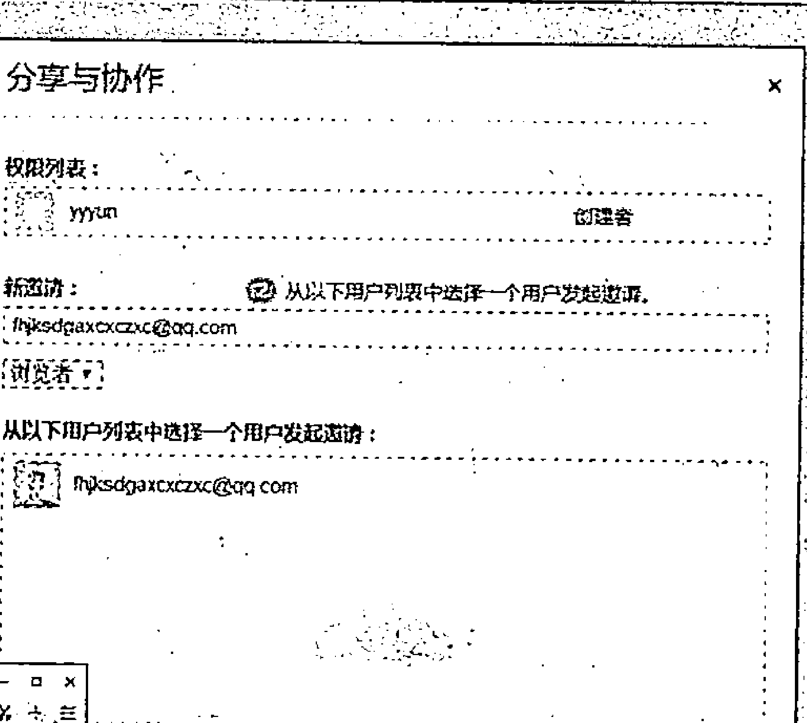

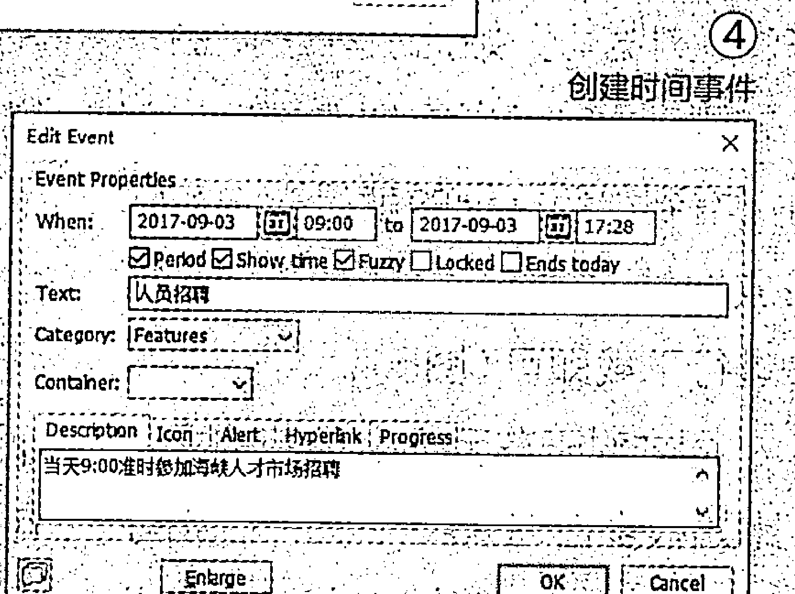

对于一些本地项目的管理并不方便的话，也可以借助Timeline在本地制作时间轴。

启动程序后显示的就是一条按照每天排列的时间线，我们的操作就是按照自己的时间安排输入说明的文本。在时间线上右击选择“Timeline→Great Event”（创建提醒事件）。选择开始和结束时间，然后输入提醒的标题和说明文本（重要事件则勾选Locked进行锁定），同时为其设置不同的标签（这样通过颜色就可以快速区分后续的搜索），点击OK创建一个事件（图4）。

返回程序窗口就可以看到上述事件说明，可以看到这里的时间和上述设置精准对应。当然如果事件需要更改，如延长结束时间则只要拖动进度条。我们也可以根据自己的实际需要添加标签，选择任意一个事件进行编辑窗口，点击“Category→add new”，然后输入新标签的名称如“极其重要！！！”和设置醒目红色（图5）。

这样下次时间线上如果要设置极其重要的事件，选择该标签后事件就会以上述设置的颜色显示。如果设置的事件很多，可以直接按下Ctrl和-进行缩放。或者直接点击“Navigate→Go to Date”定位到具体日期，还可在事件线上右击选择“Edit→Find Category”按照标签进行搜索，点击“Check”即可快速定位同一标签事件（图6）。

事件很多，可以直接按下Ctrl和-进行缩放。或者直接点击“Navigate→Go to Date”定位到具体日期，还可在事件线上右击选择“Edit→Find Category”按照标签进行搜索，点击“Check”即可快速定位同一标签事件（图6）。

完成时间线的制作后同样可以点击“File→Export Whole timeline to image”，将事件线导出为图片保存。

### 自己动手 使用PPT制作时间轴

对于平时经常使用办公软件的朋友，他们也可以直接利用常见的PPT的SmartArt组件来制作时间轴。启动PPT后点击“插入→SmartArt→流程→基本日程表”，插入这个图表作为时间轴即可（图7）。

插入流程图后，点击“设计→添加形状→在后面添加形状”，按自己的实际需要添加形状。接着在输入文字框中按照自己的实际工作流程输入说明文本，最后再选择自己喜欢的样式即可完成时间轴的制作。完成后可以将其导出为图片放置在桌面，或者上传到手机上查看（图8）。

## 借助画图3D创作立体插图

文/洪艺

之前，当我们在设计网页或PPT演示作品时，若需要立体图案，总需要去寻找专门的3D立体图制作软件。现在，我们用Windows 10自带的“画图3D”应用，即可生成形式各异的立体图画了。

从“开始”菜单中启动画图3D应用，首次使用会出现欢迎界面，通过该界面的三个简洁按钮，可新建作品或处理已有图片。若不希望下次出现欢迎界面，去掉选择“显示欢迎屏幕”即可（图1）。

### 1. 随心制作各型立体图

首先预备画布。新建一个图片文件，点击工具按钮弹出工具栏，然后点击工具栏最后的“画布”按钮，拖动8个句柄改变画布大小。通过右侧画布面板可设置是否显示透明画布、是否锁定画布纵横比等。如果画布与图像联动开关打开，还可以在图片制作好之后，调整画布大小，实现图片上目标的任意缩放（图2）。但最好在绘画之前规划好画布的尺寸，免得制作过程中出现画面不足或浪费画面的现象。

接下来，在工具条中点选“3D”工具，然后从右侧模板中选择三维模型、三维对象或3D涂鸦模板（图3）。在这些基本形状模板的基础上，经过旋转、翻转、组合等编辑操作，即可演变出自己需要的各种三维图形（图4）。

如果要实现自由绘制形状，可从“3D涂鸦”模板中选择模板之一，然后用鼠标徒手绘制各种图案（图5）。

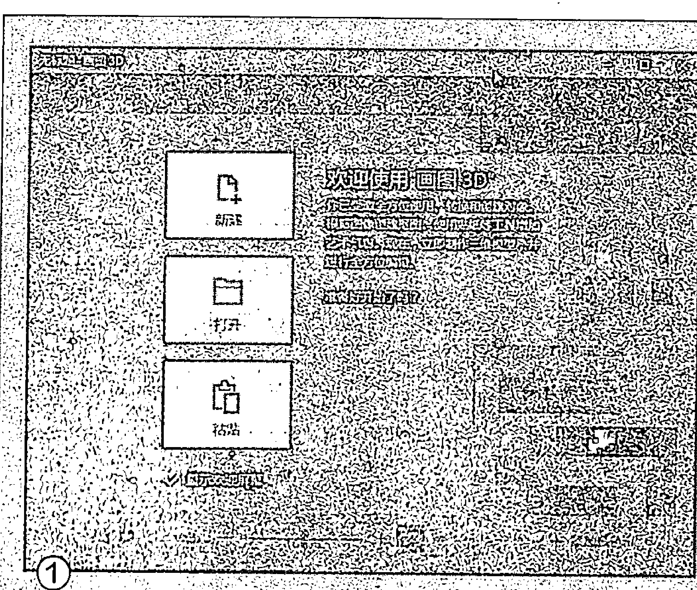

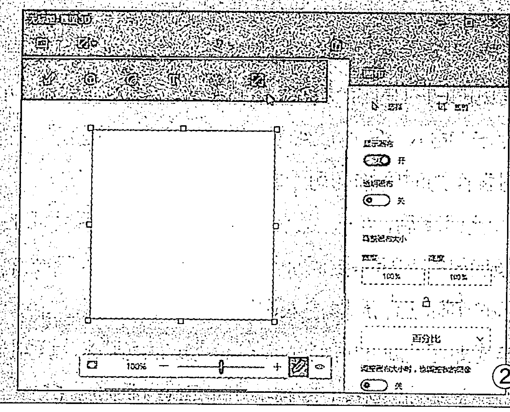

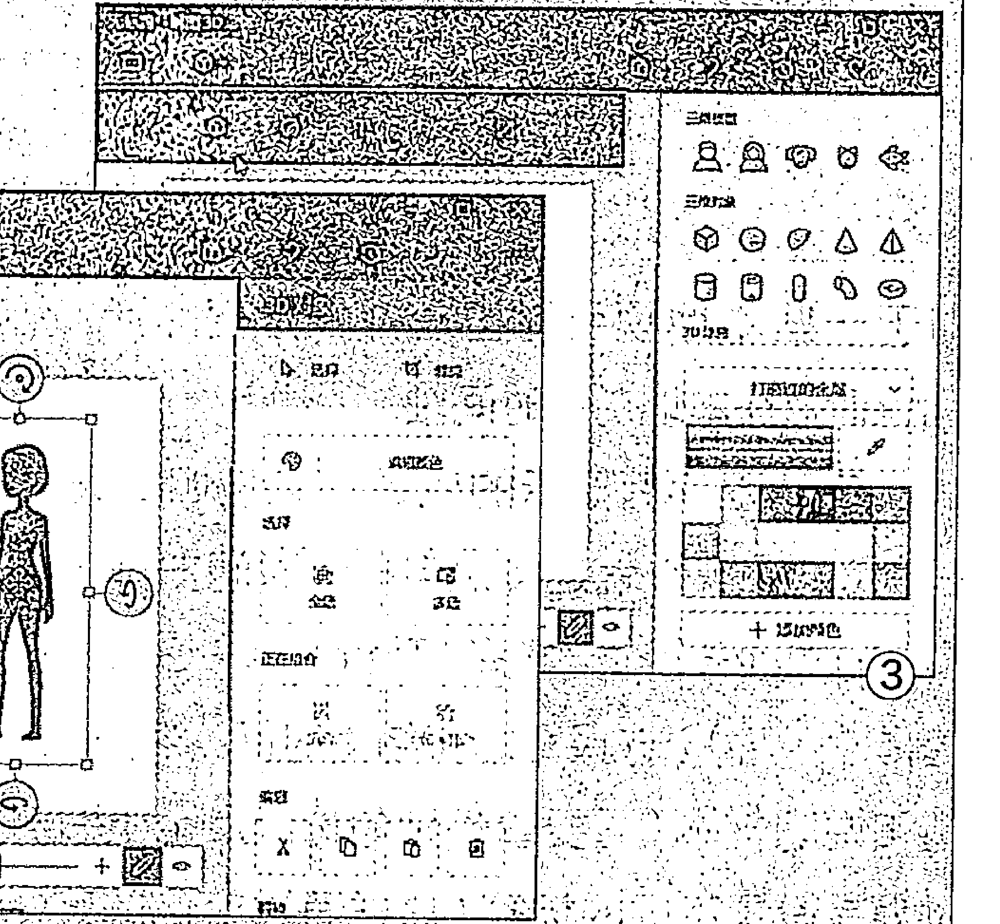

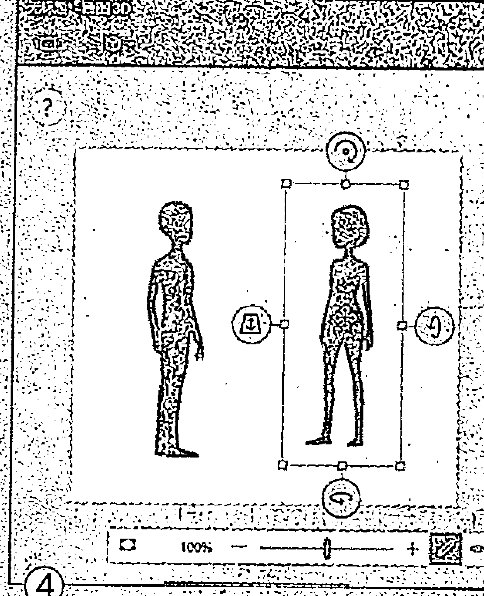

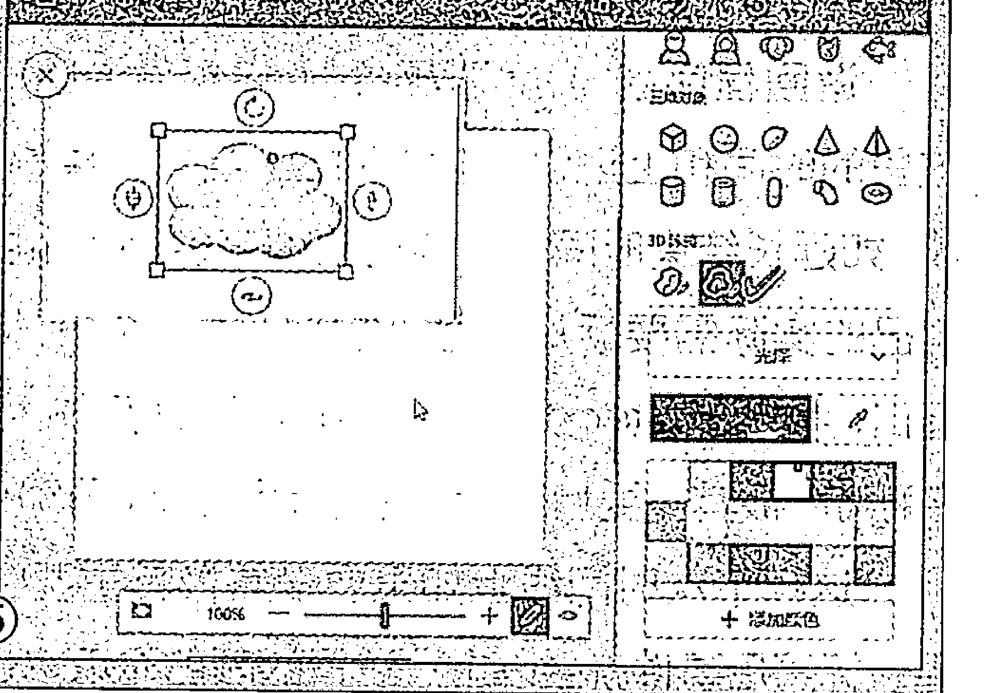

> 在“贴纸”工具弹出的面板中，还有两个实用的工具面板。一个是形状绘制面板，可绘制各种类型的线条和形状。另一个是小贴画面板，可选择添加各类小图标到作品中（图8）。这样，就大大扩展了3D画的制作内容和方便程度，容易形成丰富多彩的贴画内容。

### 2. 材质贴面作品更光鲜

上述绘制的人体3D图案，由于采用了默认的黑色，所以立体感和光泽不明显。为此，我们改为绘制一个立体金人，让立体感和光泽更为突出。选择3D工具之后，首先从右侧窗口的“材料”菜单中选择“打磨过的金属”材料，然后从下方调色板中选择一种接近于金色的颜色，最后选择绘制三维模型人像。这样，一个三维金人的雏形就制作而成（图6）。

我们不但可以制作金人，甚至还可以将金人的外表变换成树叶、木头、砂粒等材质。选择好金人对象，然后从工具列表中点选“贴纸”按钮，从右侧窗格中选择要应用的贴纸材质，金人马上就会变成另一种材质的贴面了（图7）。

### 3. 制作质感立体文字图

利用制作3D物件的思路，我们还可以用画图3D软件制作三维文字。用这种方法制作立体字，效率高，效果远远高于办公软件“艺术字”的效果。

从工具栏中选择“文字”按钮，然后从弹出的文字制作面板中选择三维文字按钮。选择一种字体（注意汉字字体名在该软件的字体列表中不会显示为汉字名，要仔细辨别英文名进行选择）。然后在编辑界面中输入要制作的文字，随后点击调色板编辑文字颜色，通过旋转句柄对文字进行空间旋转处理。这样一个立体感十足的文字就产生了（图9）。

同理，我们可以将材质贴面应用于文字，从而轻松地就可以生成花岗岩、大理石、木纹、绿野等风格的立体文字了（图10）。

## 寻找网络同步盘的替代方案

文|阿楠
国内网盘纷纷暂停面对消费者的个人业务，即使是还在提供服务的百度网盘，也关闭了其同步盘服务，只留下个自动备份功能。如何寻找替代的免费工作文件同步方案？这里给大家共享两种方法。

### 线下同步 备份工具配合移动存储

要实现工作文件夹的同步，我们可用一款完全免费的同步工具PathSync，实现文件资料的同步备份工作。先在PathSync软件窗口中指定本地文件夹（Local），如工作文件夹“我的文档”，然后指定远程文件夹（Remote）（也就是备份文件夹），可以是移动硬盘或闪存盘，也可以是局域网的另一台电脑的文件夹（图1）。

接下来在第二行选择框中选择同步方式，有以下5种方式可以使用：
- Bidirectional：默认的同步方式，也就是双向同步，使用这种方式会让两边的文件夹相互增补对方缺少的文件夹或文件。
- Local->Remote (do not delete missing files/folders)：本地向远程同步，但不删除远程的文件（如果本地没有的话）。
- Remote->Local (do not delete missing files/folders)：远程向本地同步，但不删除本地的文件（如果远端没有的话）。
- Local->Remote：本地向远程同步，会删除远程文件（如果本地没有的话）。
- Remote->Local：远端向本地同步，会删除本地文件（如果远端没有的话）。

随后，按下Analyze按钮，开始分析两边的文件夹。分析完毕，会显示有哪些文件是要被新增或删除的列表，这时可以在每一个文件名称上点击右键指定将要执行的动作，例如选择同步的方向（图2）。

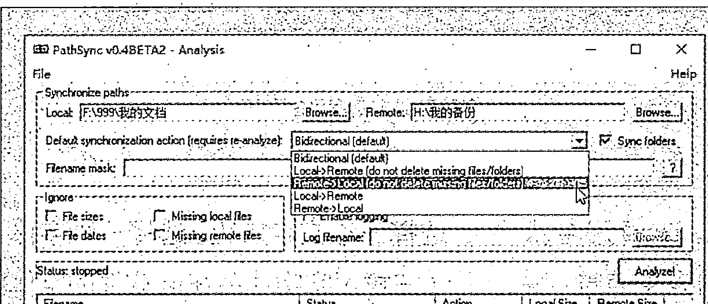

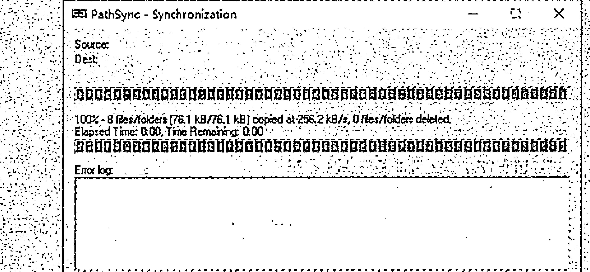

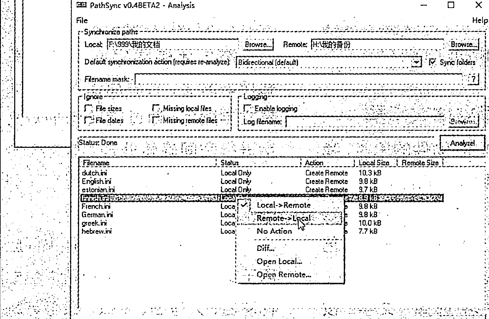

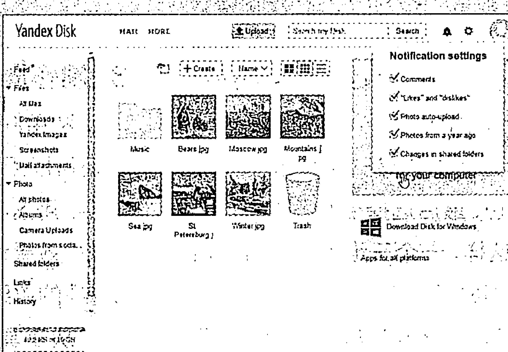

> 值得称赞的是，在YandexDisk网盘网页版中，通过点击“+Create”按钮，可直接选择建立Word文档、Excel表格和PPT幻灯片文件，实现网盘内的在线办公（图8）。

### 不限速 10GB的免费同步盘

如果大家的网络状况良好，也可以尝试一下免费容量达10GB且不限速的YandexDisk网盘。新用户只需登录网盘主页（https://disk.yandex.com）注册后（图4），点击窗口右侧的Download Disk for Windows链接，可下载网盘PC客户端进行安装。安装过程中，点击Folder location后面的Edit按钮，指定一个本地文件夹作为同步文件夹。点击Selective sync后面的Setup按钮，选择在网络同步文件夹下的子文件夹哪些参与同步（图5），点击Get started按钮完成网盘客户端设置并进入同步盘。

之后可以看到资源管理器的“此电脑”下，生成一个Yandex Disk项，这就是同步盘的盘符（图6）。随后我们可以在这个文件夹中工作，创建或编辑文件。编辑文件时，文件被锁定不会被同步到网上，一旦编辑完成并退出编辑器，同步盘会检测到并马上将文件同步到云端。

右击系统托盘网盘图标，点击设置按钮进行同步盘的更多设置。选择Launch automatically at startup保证系统启动后自动加载同步盘。Show Yandex Disk news是一个广告选项，如果不愿意看到弹出消息，可去掉对该选项的选择（图7）。

最后，点击Synchronize! 按钮执行同步操作。同步完成后给出同步报告，报告含同步处理文件方式及数量，以及同步错误信息等（图3）。

利用上述方法，可将移动硬盘或闪存盘插在不同的电脑上多次操作，可进行多台设备间的文件同步。

> 备份方案可通过File菜单保存为PSS方案文件。借助于Windows计划任务设置定时自动执行同步任务，在启动任务的参数框中填入“-R <同步方案名>”，可实现同步方案的定时自动执行。

## 剪贴板直接粘贴为文件

文 | 万立夫

以前我们复制一段文字到剪贴板后需要首先打开一个文本编辑器，将内容粘贴到文本编辑器里面再保存为相应的文件。后来有了一款名为“Paste As File”的软件，通过它就可以节省中间的操作环节。但是这款软件现在改为收费模式了，因此不少用户不得不放弃这款软件，好在我们还有免费的PasteEx软件可以使用。

### 内容直接进行粘贴

下载最新版本的PasteEx软件后进行解压（下载地址：https://github.com/huiyadanli/PasteEx/releases），接着用管理员权限执行文件夹中的安装文件。这时会弹出一个询问对话框，要求添加一个名为“粘贴为文件”的菜单到系统的右键菜单里面。直接点击“是”按钮进行操作，就可以完成软件的安装操作（图1）。接下来PasteEx会对系统的剪贴板进行检测，如果发现其中存在内容信息的话，就会直接弹出一个保存对话框。如果没有发现内容的话，就会提示用户是否进入框中的设置按钮，在弹出的设置对话框里面勾选上“启用”选项。PasteEx软件自定义规则的操作格式为：扩展名以及扩展名对应文本的第一行特征代码。现在谷歌浏览器和火狐浏览器都支持功能脚本以及网页样式的加载，而用户常常需要从网上寻找复制一大段脚本代码进行保存，所以我们就来创建一条直接保存功能脚本的规则。现在在输入框里面写入“js=UserScript”这行规则，其中UserScript就是我们所说的特征代码，设置完成以后点击保存按钮即可（图4）。以后当我们从网上复制下来一段脚本代码后，点击“粘贴为文件”按钮，软件就会根据代码第一行中的特征代码进行分析，最后直接将这段脚本代码保存成后缀名为JS的脚本文件。

软件的操作界面，这里用户可以根据需要进行操作（图2）。需要注意的是，PasteEx软件的运行需要.NET Framework 4.5的支持。

出的菜单里面选择“粘贴为文件”命令。这时会弹出一个保存对话框，用户可以自定义文件名，另外还可以修改文件的保存路径（图3）。与此同时，PasteEx软件会自动分析剪贴板的内容并且给出对应的扩展名，用户最后只需点击“保存”按钮就可以进行保存操作了。

### 定义其他保存规则

## 更快下载新版Windows 10和更新

文 | 老万

每个人的网络带宽都是固定的，所以在进行网络数据传输的过程中，不同的软件之间都存在相互之间抢带宽的情况。当然微软的操作系统在更新补丁以及下载最新系统版本的时候，也会遇到这样的类似问题。不过微软的Windows 10最新版本提供了一项名为“传递优化”的新功能，它的本意是对带宽进行动态的分配，这样可以避免带宽被无谓地浪费，并可实现系统的补丁更新更加快速。

### 系统设置充分利用带宽

如果用户使用的是Windows 10 build 16237预览版及以后版本的话，那么通过系统设置窗口就可以进行相应的调整操作。现在点击桌面左下角的开始按钮，在弹出的菜单里面点击左侧的“设置”按钮，这样就会弹出系统的设置窗口。首先点击窗口中的“更新和安全”按钮，在弹出的窗口点击左侧的“Windows更新”选项，接下来在右侧窗口点击最下方的“高级选项”按钮。现在在弹出的“高级选项”窗口拖动窗口右侧的滚动条，将窗口滑动到最下面就可以看到一个名为“传递优化”的选项（图1）。点击它以后，在弹出的窗口再点击最下方的“高级选项”按钮，接下来在弹出的窗口勾选上“下载设置”中的“限制用于在后台下载更新的带宽”选项，将百分比滑块调整到最右侧的100%就可以了。这样以后在下载补丁以及系统新版本的时候，系统就可以100%地利用带宽进行快速的下载操作了（图2）。

### 组策略也可以分配带宽

如果用户使用的是Windows 10正式版的话，那么通过配置窗口还不能进行相关的配置，不过通过系统的组策略功能却可以进行类似的配置操作。首先按快捷键Win+R打开“运行”框，输入“gpedit.msc”后回车启动组策略编辑器。通过鼠标依次展开左侧列表里面的“计算机配置→管理模板→Windows组件→传递优化”选项，接着在右侧窗口列表里面找到“下载模式”这个选项。直接双击该选项打开它的配置窗口，在弹出的对话框里面选择“已启用”选项以后，在“下载模式”列表里面选择“Internet(3)”这一项（图3）。最后点击确定按钮关闭配置窗口，这样不仅可以从微软的服务器里面进行下载操作，还可以利用P2P的方式从其他的地方进行下载操作。接下来返回到组策略的主窗口，在右侧列表中找到“最大下载带宽(%)”选项。同样双击该选项打开它的配置窗口，在弹出的对话框里面选择“已启用”选项。然后在下面的“最大下载带宽(%)”输入框里面设置为100，最后点击确定按钮关闭配置窗口，以后就可以100%地利用自己的带宽进行补丁和新版本的更新操作了（图4）。

## Windows 10 OneDrive全面解读

文 | 樱子

Windows 10内置的网盘OneDrive往往不尽如人意，许多人在使用过程中会遇到一些问题，比如因任务栏上OneDrive程序图标丢失使操作复杂化、保存文件时OneDrive自动上传个人文档等。用命令行或注册表编辑的办法可解决这些问题。

### 找回丢失的OneDrive图标

系统设置找回：

在Cortana中输入OneDrive，在搜索结果中点击“OneDrive桌面应用”。其后桌面任务栏上会出现灰色的OneDrive图标，右键单击该图标并选择“设置”。在“账户”选项卡中点击“添加账户”按钮，添加自己的微软Windows账户并登录（图1）。接着在“设置”选项卡下选中“当我登录Windows时启动OneDrive”选项（图2）。

重置云盘找回：

按下Win+R组合键启动“运行”对话框，然后执行如下命令：

```
%localappdata%\Microsoft\OneDrive\Update\OneDriveSetup.exe
```

随后系统会自动开始重新安装OneDrive（图3）。安装之后，OneDrive要求用户以Windows账户登录，同样在设置中选中“当我登录Windows时自动启动OneDrive”就可以了。

### 阻止OneDrive自动上传文件

在保存照片或文档时，如果使用了Windows 10的默认保存位置，照片和文档就会被自动上传到OneDrive云端。这样，一旦Windows账户泄露，其中的照片或文档就随之泄露。通过修改注册表的方法，可限制云端自动上传功能，从而防止个人文件泄露。

在Cortana对话框中输入REGEDIT命令，然后运行REGEDIT命令，进入注册表编辑器界面。在注册表编辑器窗口中定位到“HKEY_CLASSES_ROOT\CLSID\{018D5C66-4533-4307-9B53-224DE2ED1FE6}”，在右侧窗格中找到System.IsPinnedToNameSpaceTree项，双击此项打开设置窗口，将其中的“数值数据”从1改为0，点击“确定”（图4）。重启电脑之后，保存文件时OneDrive就不会自动上传了。

## 我的磁盘空间都去哪儿了

文 | 亦云

Windows 10本身对磁盘文件结构和容量的统计和展示都不够明晰。借助于SpaceSniffer这款软件，可直观地看清文件和文件夹的布局，筛选出特定类型的大文件，这样就对磁盘占用的情况了熟于心。

如果要分析驱动器或文件夹、文件的分布情况，启动SpaceSniffer软件，在Choose your Space窗口中进行操作。点击驱动器图标后单击Start按钮，开始分析驱动器文件夹和文件结构。若要分析某文件夹的组成，可在Path框中输入文件夹的具体路径，或者将文件夹直接拖动到该输入框，若分析的路径为多个，需用半角分号相隔（图1）。

> 当要执行另一个新的任务，需要调出Choose your Space窗口时，只需点击工具栏上的第一个New View按钮，或使用组合键Ctrl+N操作即可。

比如要分析“F:\我的相册”文件夹，在Path路径框中输入“F:\我的相册”后点击Start按钮，随后即可获得该文件夹所包含的子文件夹和文件的树状分布地图。从子文件夹或文件所占的区块面积，即可一眼看出哪些是大文件夹或大文件，从而找到磁盘空间被占用的文件所在（图2）。

地图中的每个大区块代表一个子文件夹，双击某区块可进入该文件夹的子地图，显示更为详尽的信息。右键单击某个文件夹或文件的方块盒子，即可获得该文件夹或文件的属性信息（图3）。

要返回上级地图，只需点击工具栏上的左箭头按钮即可。当鼠标浮动于文件方块之上时，会显示文件大小和创建、修改、访问的时长信息。

SpaceSniffer以很直观的区块、数字和颜色来显示硬盘上文件夹和文件的大小。如果希望自定义各种颜色，通过“Edit→Configure”命令进入配置窗口，选择Styles选项卡下的Flat Colors，点击颜色块，分别进行各类文件显示颜色的自定义（图4）。可用Ctrl+1到4这四种组合键为文件夹标上不同的颜色。

如果只希望显示某类文件（如MKV视频），则在Filter过滤框中输入关键词“*.MKV”（支持通配符），点击Filter按钮即可筛选出要找的MKV文件，同样会以树状地图显示。在过滤框中输入诸如“>2years”或“>1mb”等参数，可限定文件的新旧或大小。最后，还可以通过文件菜单的导出命令，将筛选结果导出为文本列表文件。

## 不用装软件 PDF操作在线完成

文 | 老万

PDF是我们日常工作中最常接触到的一种办公文件格式，所以针对这种格式用户会有各种各样的处理需求。有些需求利用办公软件自身的功能就可以解决，但是有的需求需要借助于其他的软件程序才能解决。如果只是偶尔使用这些操作的话，我们只需要通过“迅捷PDF转换器”的在线云服务就可以解决。

### CAD文件快速在线转换

CAD文件是很多工程人员经常接触到的一种图纸类的文件，可是要想将它转换成PDF文件，利用自身的功能却无法完成，所以往往需要借助于虚拟打印机才可以解决。不过现在利用“迅捷PDF转换器”中的转换功能，就可以非常方便地进行解决。

打开“迅捷PDF转换器”的网页（http://app.xunjiepdf.com/），点击网页中的“CAD转PDF”按钮，弹出一个文件转换的窗口。点击窗口中的“点击选择文件”按钮，在弹出的对话框里面选择要进行转换的CAD文件。接下来根据用户的需要设置“颜色”、“背景”和“公开文件”等信息，通常情况下在“公开文件”里面选择“否”。设置完成以后点击“开始转换”按钮，就可以进行在线的转换操作。通过网页中的时间我们可以了解到文件转换的进度，转换完成以后点击“立即下载”按钮就可以进行转换后文件的下载操作了（图1）。

小提示：当用户添加完一个文件以后，还可以点击“继续添加（批量翻译）”这个按钮继续添加文件，从而实现对文件的批量操作。

小提示：“迅捷PDF转换器”除了可以对PDF文件进行翻译以外，也可以对常见的Word文档以及文本文件进行在线翻译等操作。

### PDF文件直接翻译内容

很多用户平时为了更好地充实自己，会从网上下载各种资料来进行学习。可是有的时候下载的资料是英文的内容，自己读起来比较困难，这时就需要借助于翻译软件来帮忙。可是要想把PDF文件翻译成我们需要的中文信息，需要很多的环节才可以实现，而现在直接就可以完成文件的翻译操作了。

点击网页中的“PDF在线翻译”按钮，在弹出的操作界面中点击“点击选择文件”按钮，在弹出的对话框里面选择要进行翻译的文件。接下来在翻译选项中选择“英文→简体中文”这个选项，然后同样在“公开文件”里面选择“否”这个选项。选择完成以后点击“开始翻译”按钮，当翻译完成以后点击“立即下载”按钮，就可以将翻译完的文件保存到本地硬盘里面了（图2）。

由于很多PDF文件的体积比较大，而且我们需要翻译的内容只是其中的一部分，要进行整个上传翻译的话反而会消耗很多的时间。所以这个时候我们只需要把要翻译的内容给分割出来，就可以节约不少的时间。现在点击网页中的“PDF分割”按钮，将需要分割的文件进行上传，选择“指定页分割”后指定要分割的页码，这样就可以进行分割操作了（图3）。

## 记事本与命令联合 制作多选菜单

文 | 阿楠

将记事本与Windows命令行相结合使用，可以延伸出更强大的系统功能。比如，在不借助任何第三方程序设计工具或编辑器的情况下，我们仅在记事本里编辑几条普通的Windows内部命令，就可以制作出个性化的多选式菜单。

若想制作一个含有多个项目的选择式菜单程序，要求分别用1、2、3选择进入记事本、Word和IE浏览器的菜单选择程序，一切制作过程只用记事本完成，不得借助于其他工具。

方法如下：

在记事本中输入如下代码，然后存盘为“程序选单.BAT”（图1）。

```
@ECHO OFF
:MENU
CLS
ECHO. ===请选择如下选项编号===
ECHO. 1 执行记事本程序
ECHO. 2 执行Word编辑软件
ECHO. 3 执行IE网络浏览器
ECHO. 4 退出
ECHO. 请输入选择项目的序号:
SET /P ID=
IF "%ID%"=="1" GOTO CMD1
IF "%ID%"=="2" GOTO CMD2
IF "%ID%"=="3" GOTO CMD3
IF "%ID%"=="4" EXIT
:CMD1
%windir%\system32\notepad.exe
GOTO MENU
:CMD2
"C:\Program Files\Microsoft Office\root\Office16\WINWORD.EXE"
GOTO MENU
:CMD3
"C:\Program Files\Internet Explorer\iexplore.exe"
GOTO MENU
```

将上述命令文件存盘之后，以后要用到选单程序时候，只需执行该文件，就可进行三种程序的选择了（图2）。

参数说明：
“@ECHO OFF”表示关闭不必要的显示提示；
“:MENU”、“:CMD1”、“:CMD2”、“:CMD3”分别为三段子程序的标号，依次表示总菜单、命令1、命令2、命令3功能模块；各条ECHO命令分别显示一行菜单信息；
“SET /P ID=”命令则表示通过键盘获取一个输入的ID号码；IF语句是根据用户输入的ID号码判断执行后续的哪个程序，随即用GOTO语句转入到相应的模块标签段，执行相应的模块代码；而三个:CMD标签所代表的段落下，首先执行相应的程序命令，随后自动转回到主菜单，以便再度提供用户选择。

小提示
本案例只是给出一个最简单的制作方法。其实，再复杂的多选菜单都可以由本程序延伸而得。只要在其中添加更多项目，引用更多的可执行程序，或者甚至可以在菜单之中再嵌套下一级或多级选择菜单，也只是一个工作量的问题，技术上均不外乎以上所涉内容。因此，根据以上模型，灵活变通菜单内容，就可以按自己的具体需求，制作出形式各异的选择式菜单了。

## 快速检出存储介质坏道坏块

硬盘或其他存储设备出现坏道或坏块之后，不但对数据安全构成威胁，还会不同程度地影响操作速度，严重时可造成系统死机或蓝屏故障。那么，如何才能得知自己的硬盘是否有坏块或坏道呢？我们可以用Macroit Disk Scanner软件进行介质坏块或坏道的快速检查，机械硬盘、SSD、各类存储卡、随身盘等存储介质或移动设备都能支持。

### 1. 快速全盘检查坏块坏道

如果发现某个分区或某块磁盘读写缓慢，怀疑有坏道坏块，运行Macroit Disk Scanner，从设备列表中选择该分区或盘符，之后点击Start Now按钮，即可进入全盘扫描。扫描结束后，窗口会以绿色图块显示正常区域，如果其中有红色区块显示，说明已经有坏块或坏道。这时，建议就不要用该磁盘存储重要数据了（图1）。

> 太容量磁盘扫描会占用更长时间，如果要扫描的硬盘容量较大，为加速扫描，可将所有其他正在运行的程序关闭。Macroit Disk Scanner磁盘扫描速度比其他坏道检测工具速度要快许多，可达到设备运转极限。由于它能自动记录扫描日志，因此如果要扫描的介质容量太大，来不及等待，可从More列表菜单中选择扫描结束后自动关机选项，让软件自动值守扫描和自动关机。之后开机，可从软件日志中查看是否有坏道的记录。

> 不要等到硬盘或其他存储设备出现大面积的严重坏块坏道，造成资料丢失后才去扫描，那样就为时已晚。要养成定期扫描检查的好习惯，尤其是当发现设备运行缓慢，怀疑存储设备有问题时更应如此。

### 2. 自定义区域检查坏块坏道

如果怀疑一块磁盘的中间某部分或两头的部分有坏块或坏道，也可以不进行全盘扫描，转而对指定的区域进行扫描。选择盘符之后，点击工具栏上的Scan area按钮，然后用拖动滑块或选择区间数据的方式选择要扫描的范围，点击Ok按钮开始对选定部分进行扫描（图2）。

### 3. 手机卡或USB随身盘查错

如果希望对手机存储卡、USB闪存盘、其他USB随身存储设备进行扫描，以确定是否有坏道坏块，需先将手机或其他USB设备以可显示盘符的方式连接到电脑上，将SD卡等存储卡通过USB读卡器插入电脑，然后在设备列表中选择该外置设备的存储盘符，最后点击Start Now按钮进行扫描，即可查明是否有坏块（图3）。

如果在设备列表中未发现该外置存储设备，先单击软件工具栏上的Reload按钮，然后刷新设备列表，即可看到新插入的设备。

## 方便灵活优化Windows无用服务

Windows系统启动时会加载许多服务，但不是所有服务都是我们平时使用电脑时需要的，某些已经启动了的闲置服务（如蓝牙、打印、远程注册和桌面服务等），占用系统资源，拖慢系统运行速度。借助Easy Service Optimizer软件（简称ESO），可轻松进行服务优化。

### 1. 按需选择方式进行优化

ESO软件绿色便携，不需要安装。解包后直接运行EXE主程序即可启动优化窗口。启动后软件会自动扫描系统服务并以默认方式列出可优化的服务项目，通过优化窗口下方提供的4种方式按钮选择优化。其中“默认”选项为当前看到的默认服务列表；“安全”选项列表提供无风险的优化方式；“中等”选项提供更加优化的选择；“危险”则提供高水平的优化，但存在一定的风险（图1）。我们可以按需从这4种方案中选择，进行优化前的准备。

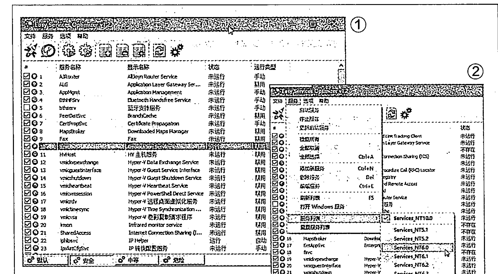

### 2. 服务编辑与添加任我行

在每种服务列表中，选中服务后，可通过“启动”和“暂停”按钮对服务运行状态进行设置；点击“添加”、“删除”或“编辑”按钮，可增删或编辑服务。选择了一种优化方式并对服务进行设置之后，单击工具栏上的第一个按钮“运行标记服务”，或通过“文件→应用服务”命令（快捷键为Ctrl+S），执行优化操作。

### 3. 针对系统重设服务列表

如果在优化设置系统服务的过程中，因一些问题造成某些故障，可通过重置服务恢复设置。运行“服务”菜单下的“服务列表”命令，按系统版本选择操作系统的内核版本，然后通过“服务→重置服务列表”菜单命令重置系统服务（图2）。

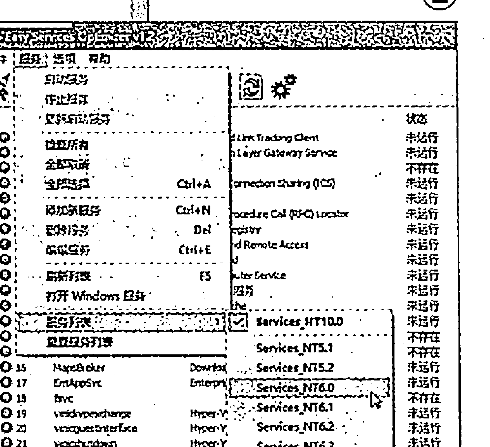

> 小提示：上述所有列表中所包含的只是能够优化的服务，并非系统中所有的服务。添加新服务并更改其启动类型可能会导致系统不稳定，所以要特别小心。而编辑服务过程中对列表中服务的操作只会更改服务的启动类型，永远不会删除服务对应的实际文件。例如，你删除了蓝牙服务，只表示不想优化这个服务，而并非是删除了蓝牙功能及其相关文件。

### 4. 命令行控制的优化方法

除了上述可视化操作外，我们还可以通过给ESO.EXE主程序附带参数，以运行命令的方式，启动和使用优化程序。例如，可以使用命令“ESO.EXE /A /G=2”直接启动“安全”优化方案；以“ESO.EXE /A myservice.ini”命令使用上次保存的优化方案配置文件myservice.ini，直接优化系统服务。更为详细的具体命令语法列表如图所示（图3）。

| 命令 | 描述 | 示例 |
| :--- | :--- | :--- |
| Usage | `<command> [<Drive_List>]` | |
| Commands | /A 应用新的启动类型 | |
| | /R 恢复之前的备份启动类型 | |
| | /G 组设置：1 = 默认，2 = 安全，3 = 优化，4 = 极限 | |
| Samples | | eso.exe /A |
| | | eso.exe /R /G=2 |
| | | eso.exe /A service_list.ini |
| | | eso.exe /R |
| | | eso.exe service_list.ini |

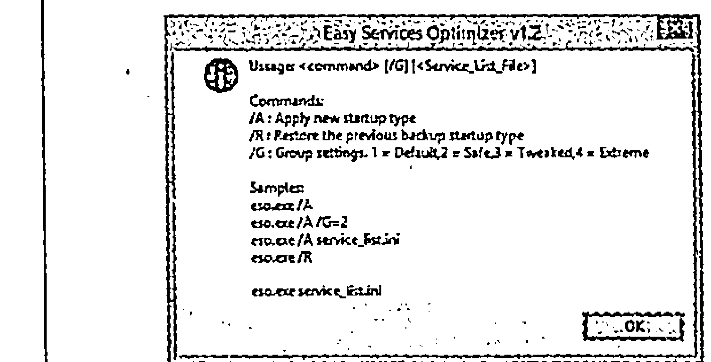

> 小技巧：按下Shift+Ctrl+S组合键，还可以将当前服务列表以.ini配置文件的形式输出保存。此外，还可以通过“文件→创建reg文件”命令创建一个注册表文件，用来直接运行打开服务列表并进行编辑。

## 摸清起源标源头 大文件夹这样处理

文|赵效常

清理磁盘空间时，我们首先会想到那些侵占空间的大文件夹，只有先确定了有哪些大文件夹，才能进一步采取行动。对于可以转移的大文件夹资源，需要用合适的方法将其转移，但一次无法转移的文件夹，还需要切割分次处理。而对于无法转移或暂不打算转移、希望重点关注的文件夹，可用颜色来标注。所有这些，用几个微小软件即可搞定。

### 1. 找出占用空间的大文件夹

虽然通过文件管理器手动浏览目录也可以确定磁盘中占用空间的大文件夹，但这是一项非常繁重的劳动。如果利用MakeRoom这款小工具，就可以轻松找到最占用磁盘的文件夹。

运行MakeRoom之后它会自动扫描所有磁盘文件夹，扫描的过程以一种非常独特的动画方式显示（图1）。扫描结束后，列表中会按占用空间从大到小的顺序显示大文件夹，单击某个大文件夹即可进入查看并进行处理（图2）。

如果需要针对某个具体的磁盘或某类文件（如音乐、视频、图片、压缩包、光盘镜像等）进行查找，可通过窗口右侧的文件类别按钮或驱动器按钮，点击进入进行针对性的扫描。例如，我们可以用这种方法很快地定位到F盘中最占用空间的视频文件夹。

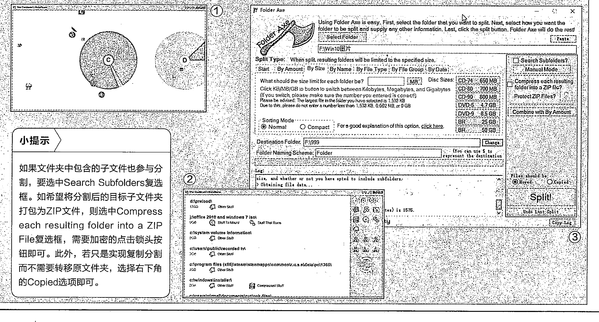

### 2. 大文件夹的分割与转移

对于一个已经找到的大文件夹，如果其中的文件还有用，而又需腾出空间，这时有必要转移到另一台电脑或用光盘备份。因每张光盘的容量有限，闪盘可供使用的容量也有限，因此分割文件夹不可避免。Windows 10本身不支持文件夹分割，可借助文件夹专用分割工具Folder Axe来完成。

点击Select Folder按钮选择好要分割的文件夹，然后点击分割方式选择标签（Folder Axe可按数量、大小、名称、扩展名和类型6种方式进行文件夹分割），例如按大小分割，就选择By Size。接着选择每个分文件夹的大小（或选择光盘的容量）。然后点击Change指定目标文件夹的路径，在Folder Naming Scheme中填写目标文件夹的基本名称（各子文件夹名将在此名称基础上自动添加序号）。选择右下角的Moved选项。最后点击Split按钮，即可执行分割操作（图3）。

> 小提示
如果文件夹中包含的子文件也参与分割，要选中Search Subfolders复选框。如希望将分割后的目标子文件夹打包为ZIP文件，则选中Compress each resulting folder into a ZIP File复选框，需要加密的点击锁头按钮即可。此外，若只是实现复制分割而不需要转移原文件夹，选择右下角的Copied选项即可。

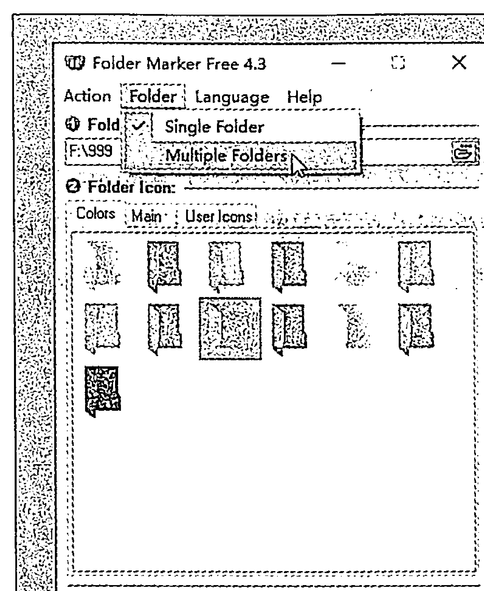

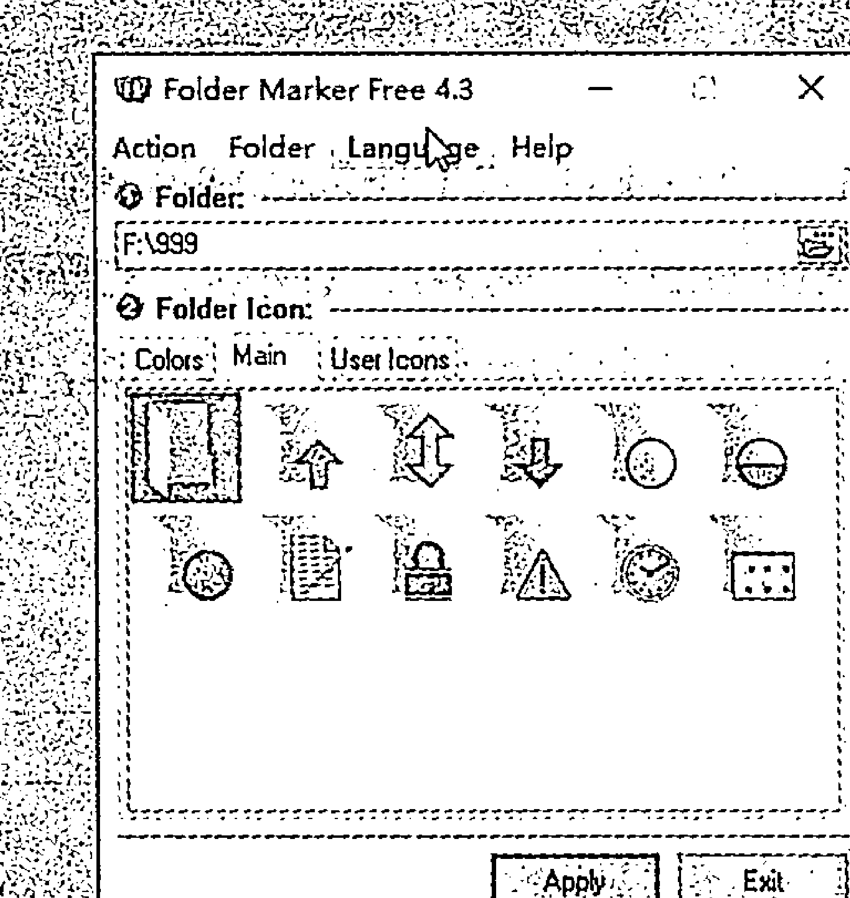

> 小提示
利用Main选项卡，还可以将文件夹外观改为10多种样式（图5），使用User Icons选项卡可自定义更多的文件夹外观。

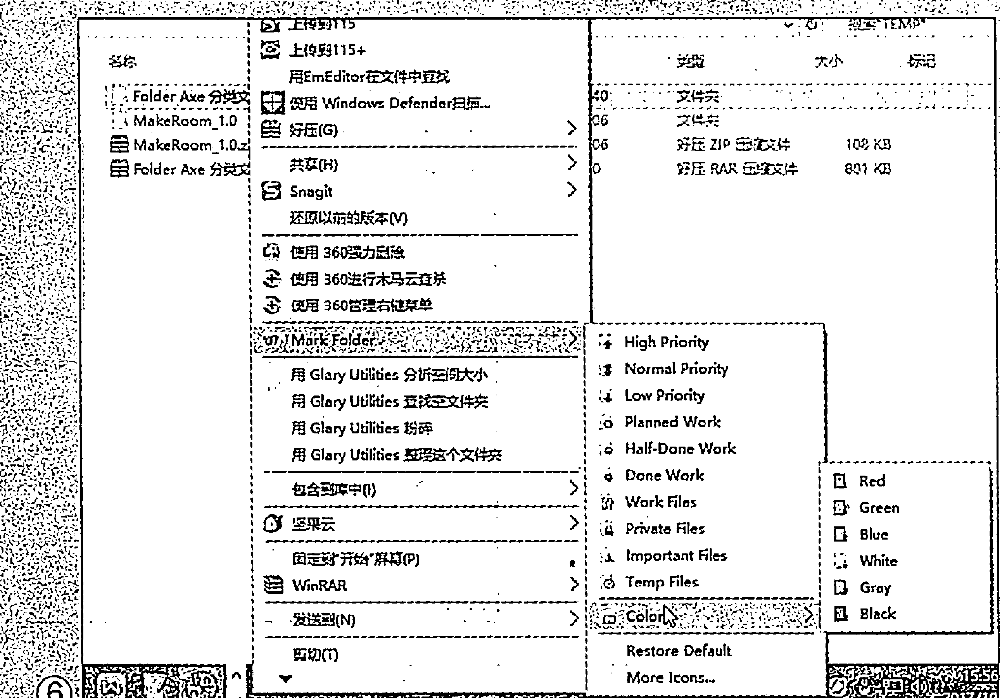

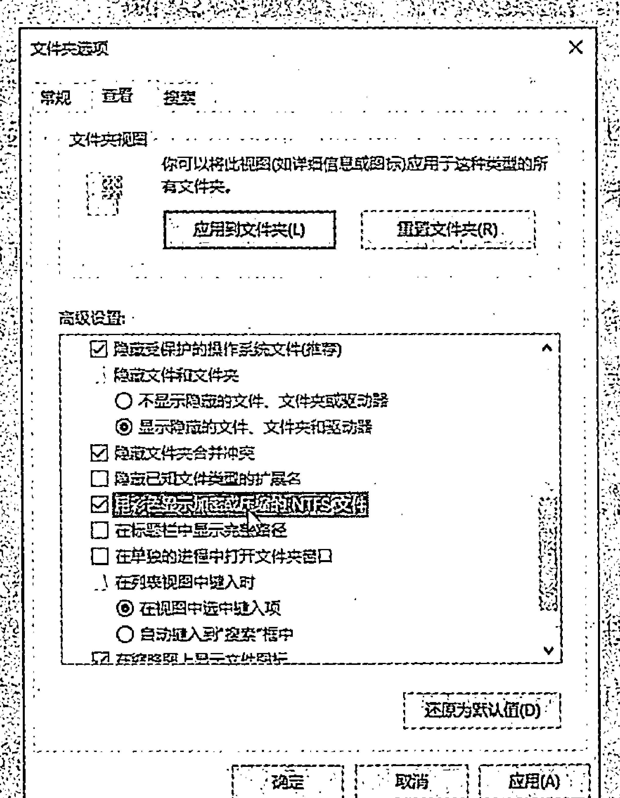

### 3. 为特殊大文件夹上色作标记

对于某个需要特别关注的大文件夹，我们还可以用特定的颜色来标示，以便更显眼地快速定位。要给文件夹上色，可通过下列软件或方法来完成。

首先可以通过Folder Marker Free软件为文件夹标记颜色。在软件上方的选择框中指定要上色的文件夹，然后在窗口中的Colors选项卡下选择一种彩色文件夹样式，最后点击下方的Apply按钮即可为文件夹上色（图4）。

通过Folder菜单下的Single Folder和Multiple Folders选项，可指定为单个或多个文件夹上色。

为文件夹标示颜色和改变外观，还有更为便捷的操作方法——右键单击要操作的文件夹，然后在快捷菜单中选择Mark Folder命令选择文件夹样式，或在Color下级菜单中选择文件夹的具体颜色（图6）。

除上述软件外，iColorFolder软件也可以为文件夹染色。iColorFolder内置Mac OS X图标，通过文件夹右键Color Label菜单，可指定文件夹的颜色。

> 作为一种特殊的颜色功能，Windows系统本身也可以为文件标记颜色——用NTFS系统自带的压缩文件颜色功能为经过系统压缩的文件标记颜色，经Windows压缩的NTFS格式文件或文件夹将被标示为蓝色。首先选择要标示的文件夹，右击选择“属性”，点击“常规”选项卡中的“高级”按钮，随后选择“压缩内容以便节省磁盘空间”。然后在“文件夹选项”窗口中的“查看→高级设置”列表下选中“用彩色显示加密或压缩的NTFS文件”选项（图7）。这样经过处理的文件夹和文件就显示为蓝色了。

## 小工具 搞定PDF三事

文|南岭

在使用PDF文档的过程中，我们可能会遇到下列问题：大个头文档读取缓慢，希望能分章节载入阅读；或需将一个文件分成几部分，分发给不同人使用；某些页面倒置，需要旋转阅读；对于希望保护的页面需要加盖自己的图章和设置密码。上述需求对于Adobe Acrobat Pro这样的编辑器是小菜一碟，但付费软件是个坎儿，用绿色免费软件PDFTK Builder也可以轻松搞定。

### 1. 任选页码 自由旋转页面

若PDF文件中有页面摆错方向，先通过PDFTK Builder的Rotate Pages选项卡下的Source PDF Document按钮，打开PDF源文件，然后在页码旋转范围框中输入要旋转的页码，并在下方选择旋转角度，点击Save As保存即可（图1）。

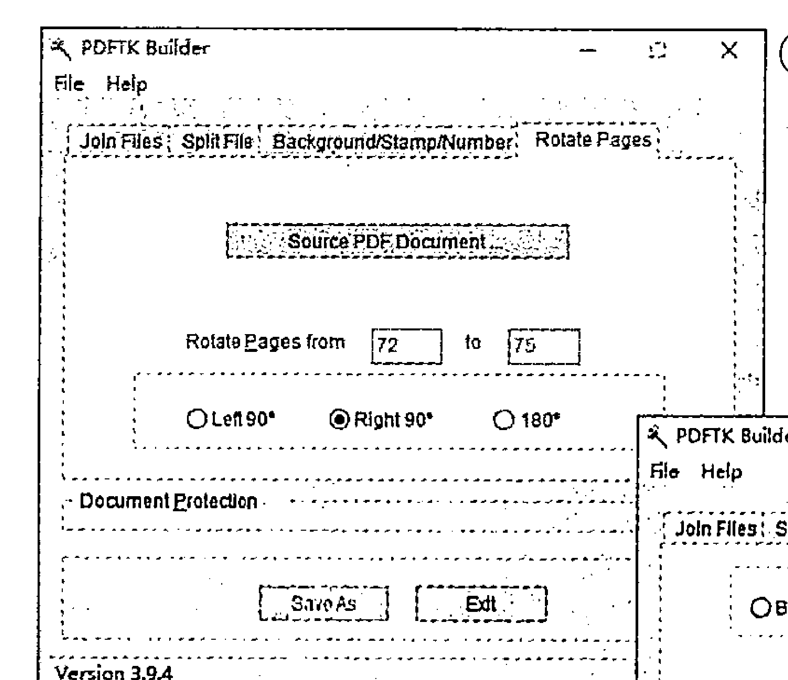

### 2. 背景图章页码 任我添加

如果需要在PDF中加入背景图案、图章或页码，点击Background/Stamp/Number选项卡选择要执行的三个操作之一（例如点击Stamp选项加图章），然后通过Source PDF Document打开PDF源文件，点击下方的按钮添加Stamp页，最后点击Save As按钮保存（图2）。

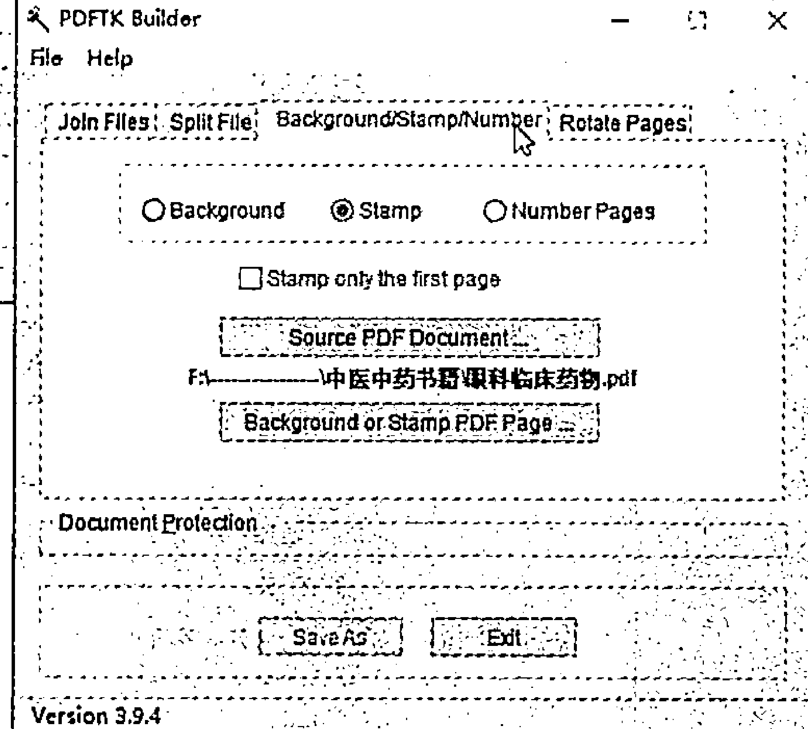

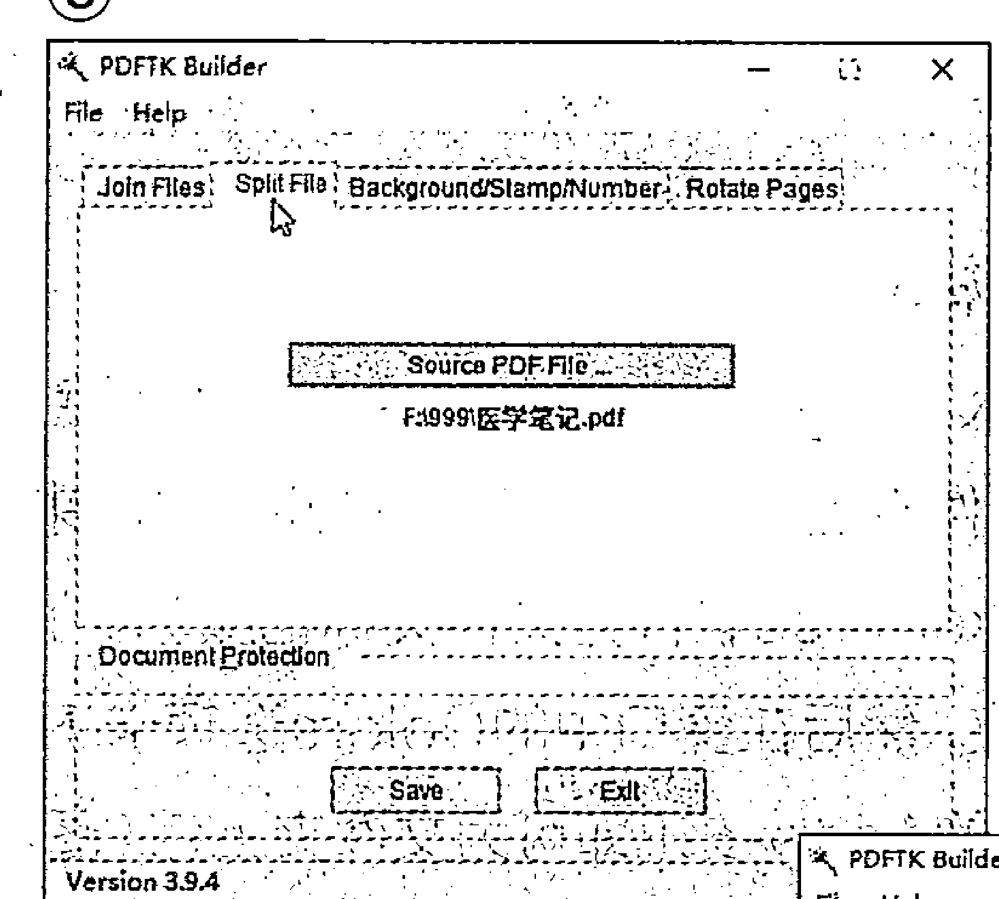

> 小技巧：通过Alt+P激活文件保护对话框，可设置主人和客户密码，对文件进行加密保护。

### 3. 分合自由 文档分割与重组

有时我们需要将一份PDF分割成不同部分，分发给不同人使用，这时可将其分割成单页，然后再任意选择发送或重组编排。为此，只需点击Split File选项卡，单击Source PDF File按钮载入要切割的文件，然后点击Save即可完成文件的分离（图3）。分割文件保存在与源文件相同的路径下。

如果需要将某个章节作为一个单独的PDF阅读，可将上述分割出的单页PDF进行重组。点击Join Files选项卡，利用Add按钮添加要组合的PDF系列文件，然后保存即得所需的PDF文件（图4）。

> 小提示：组合操作不限于单页文件的组合，还可实现多页文件与单页文件、多个多页文件的组合。

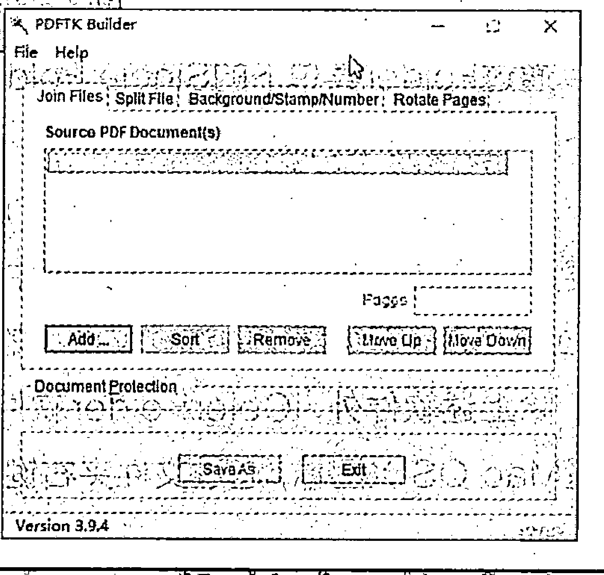

## 轻松搭建属于自己的同步网盘

文|万立夫

同步网盘可以帮助用户在不同的设备里面同步数据，这样就避免用户通过移动设备来进行传递操作。可是随着国内大量的同步网盘陆续关闭，用户可以选择的网盘已经绝迹了，这时最简单的方法就是搭建一个属于自己的网盘，摆脱对运营商的依赖。

### 配置同步文件夹目录

我们首先在台式电脑下载一款名为Syncthing的同步软件，解压后执行里面的可执行文件即可。这时这款软件会在后台悄悄地运行，并且同时弹出一个网页窗口，利用这个窗口就可以进行软件的配置操作。如果没有弹出这个网页窗口的话，我们直接打开常用的浏览器，在地址栏里面输入http://127.0.0.1:8384/后回车就可以了。为了更好地进行配置操作，现在点击网页窗口上方的语言列表，在弹出的菜单中间选择“Chinese (China)”这一项，这样就切换到我们熟悉的简体中文界面。

虽然Syncthing这款同步软件默认已经创建了一个同步的文件夹，但是用户也可以根据自己的需要创建其他的同步文件夹。现在点击“文件夹”下的“新建文件夹”按钮，在弹出的对话框里面设置“文件夹标签”，也就是这个同步文件夹的名称。接着在“文件夹路径”中设置用于同步的文件夹存放位置，配置完成以后点击“保存”按钮就创建成功了（图1）。

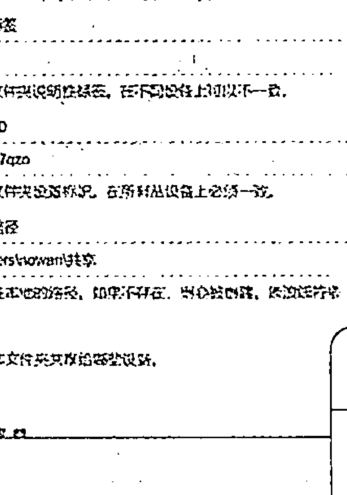

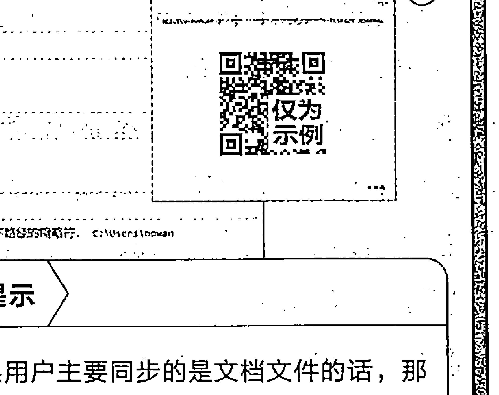

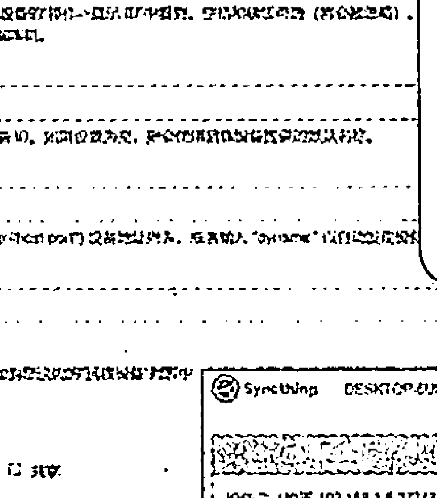

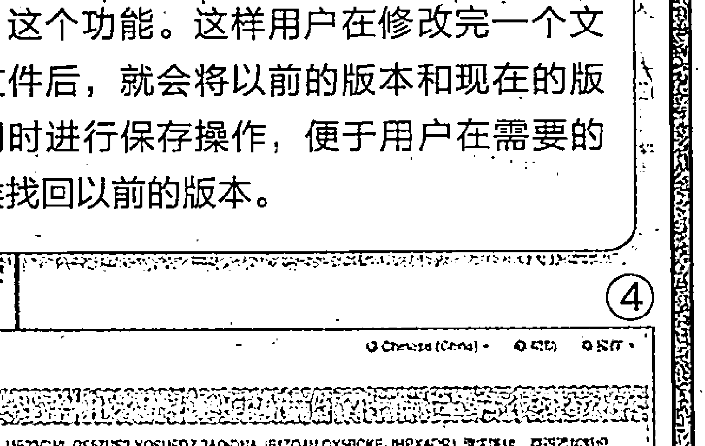

> 小提示
如果用户主要同步的是文档文件的话，那么建议点击配置窗口右下角的“高级设置”按钮，在里面根据需要启用“版本控制”这个功能。这样用户在修改完一个文档文件后，就会将以前的版本和现在的版本同时进行保存操作，便于用户在需要的时候找回以前的版本。

### 连接远程设备文件夹

当同步文件夹创建完成以后，点击网页窗口右上角的“操作”按钮，在弹出的菜单里面选择“显示ID”命令。这样我们就可以看到台式电脑的ID和二维码，如果是传统的电脑系统那么就使用这个ID进行连接操作，如果是移动设备的话那么通过扫描这个二维码就可以进行连接操作（图2）。

比如现在我们在笔记本电脑上同样运行这个同步软件，在弹出的配置页面窗口中点击右下角的“添加远程设备”按钮。在弹出的添加设备对话框里面，首先在“设备ID”里面输入台式电脑的ID信息，接下来在“将指定文件夹共享给设备”里面勾选上可以同步的文件夹，最后点击“保存”按钮后，笔记本电脑就可以凭借这个ID和台式电脑进行连接操作（图3）。这时在台式电脑的配置界面上会弹出一个提示框，显示出有一台设备要和这个设备进行连接，询问用户是否同意（图4）。我们点击对话框中的“添加设备”按钮表示同意，当这两台设备连接成功后，设置的同步文件夹中的文件就可以进行同步传输操作了。

## 打造个性化的二维码图片

现如今二维码在我们的日常生活中出现的越来越多，用户通过二维码也可以干很多的事情。可是通常情况下二维码的形态都是固定的，顶多就是有些商家在二维码里面加入了自己的Logo，除此以外并没有其他的与众不同之处。其实我们还可以让二维码变得更加个性化。

### 图片插入到二维码里面

要想创建个性化的二维码有多种途径，比如我们可以将一张认为合适的图片，插入到二维码里面进行显示，这样人们第一眼看见的就不是通常意义的黑白色块了。首先访问“QArt Coder”服务的制作页面（https://research.swtch.com/qr/draw），由于二维码通常是为了进行网页链接的传播而创建的，所以接下来在弹出网页的URL输入框里面输入需要访问的网页链接地址，比如我们这里就用《电脑爱好者》的官方域名http://www.cfan.com.cn/来进行测试。然后点击网页中的“浏览”按钮，在弹出的对话框里面选择一张图片，这里选择的是乔布斯的一张个人头像。选择完成以后点击“Upload Image”按钮，进行图片的上传操作（图1）。

当图片上传完成以后，就可以在网页的左侧预览到合并生成的二维码图片。如果用户对创建的二维码图片不太满意的话，还可以利用一些功能选项对它进行一些微调操作。比如利用“QR Size”选项两边的三角按钮，就可以调整二维码图片的大小。而利用“Image Size”选项两边的三角按钮，就可以对上传的图片大小进行调整，从而让其在二维码里面显示得更加真实。除此以外，还有“Random Pixels”、“Data Pixels Only”等选项可以根据需要进行选择。当创建的二维码满足用户的需求以后，点击“Save this QR code”按钮就会弹出一个制作网页，在网页中通过鼠标右键保存二维码图片即可（图2）。

### 微信和支付宝合二为一

现如今二维码有一个重要的功能，就是进行移动支付的相关操作。而移动支付又分为微信和支付宝两大流派，如果要想进行支付的话往往需要准备两个不同的二维码。那么能不能将两个二维码图片合二为一，让同一个图片支持两大流派的移动支付操作呢？

首先分别准备好自己的微信二维码和支付宝二维码，接下来打开浏览器登录“芝麻二维码”的官方首页（https://www.hotapp.cn），点击页面中的“收款码合并”选项。接下来根据提示点击“我是个人收款”这一项，然后按照提示点击“上传微信收款二维码”按钮，在弹出的对话框中选择微信收款的二维码图片。接下来按照同样的操作上传支付宝收款的二维码图片，所有的操作完成以后点击“免费合并收款码”按钮。这样就可以创建一个全新的二维码图片，通过它就可以支持两大流派的移动支付操作了（图3）。

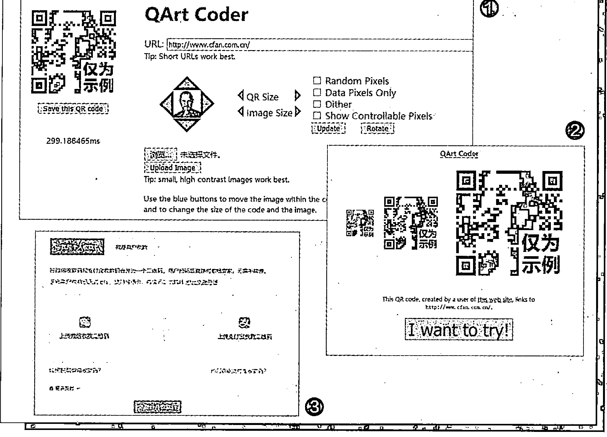

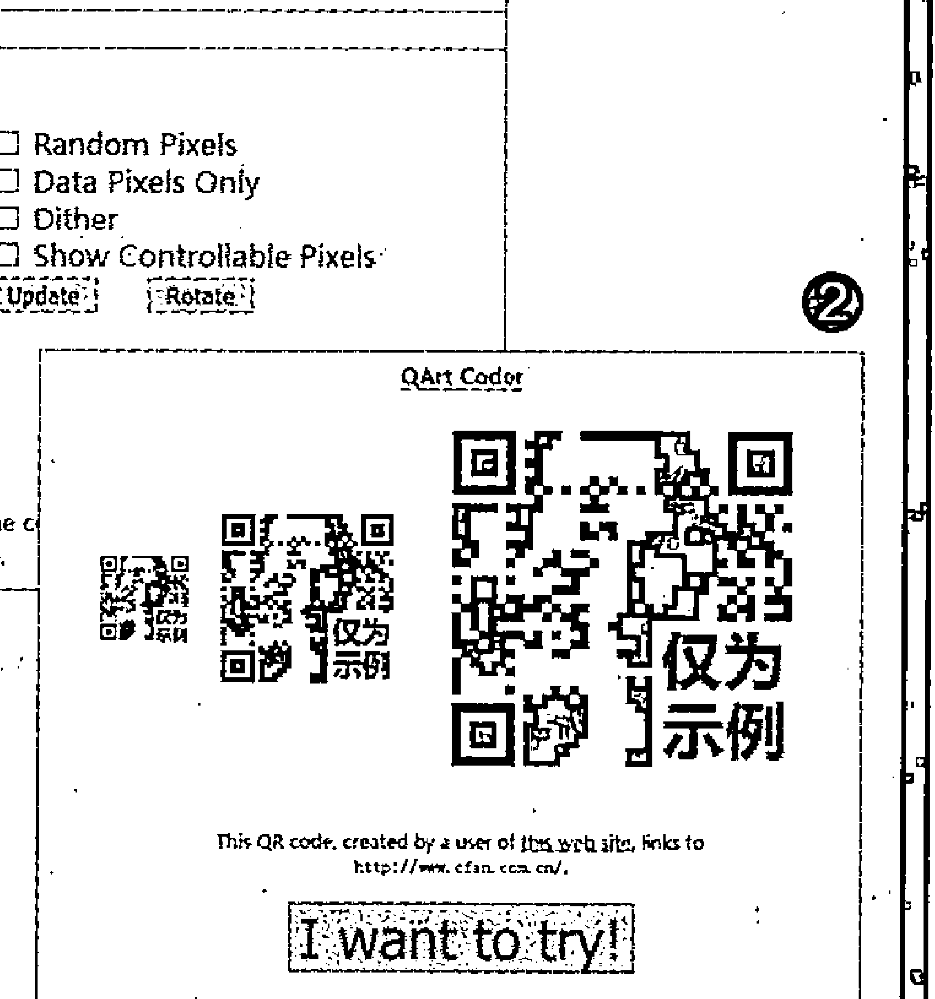

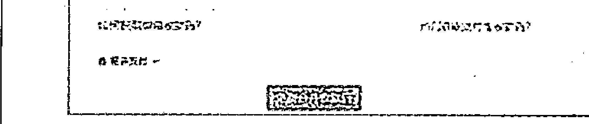

文/老万

## 快速整理浏览器的网页标签

文|万立夫

现在的浏览器都有多标签的特性，这样很多用户就可以利用该特性一次性打开多个网页标签，从而快速地在这些网页里面进行浏览。但是有的时候因为某些特殊的原因，我们暂时无法将所有的标签内容进行浏览。这种情况下，通过一些操作，可以将这些标签内容进行保存，并在需要的时候快速打开这些标签内容。

### 保存网页标签为清单

运行谷歌浏览器进入到它的应用商店，接着搜索并安装一款名为“All Tabs”的功能扩展，安装完成以后我们就可以在工具栏上看到该扩展的图标。以后当我们打开多个网页标签并且想要对它们进行保存的时候，只需要点击一下工具栏中的“All Tabs”扩展图标，稍等片刻就会弹出一个网页标签管理窗口。在这个管理窗口里面就会显示出一份包含有网页链接和标题的纯文本清单，我们只需要在新标签的右上角输入一个清单的名称，再点击“Save”按钮就可以将这份清单保存下来了。与此同时这份清单还会自动加上保存的时间，让你可以了解到这份清单保存时候的工作状态（图1）。

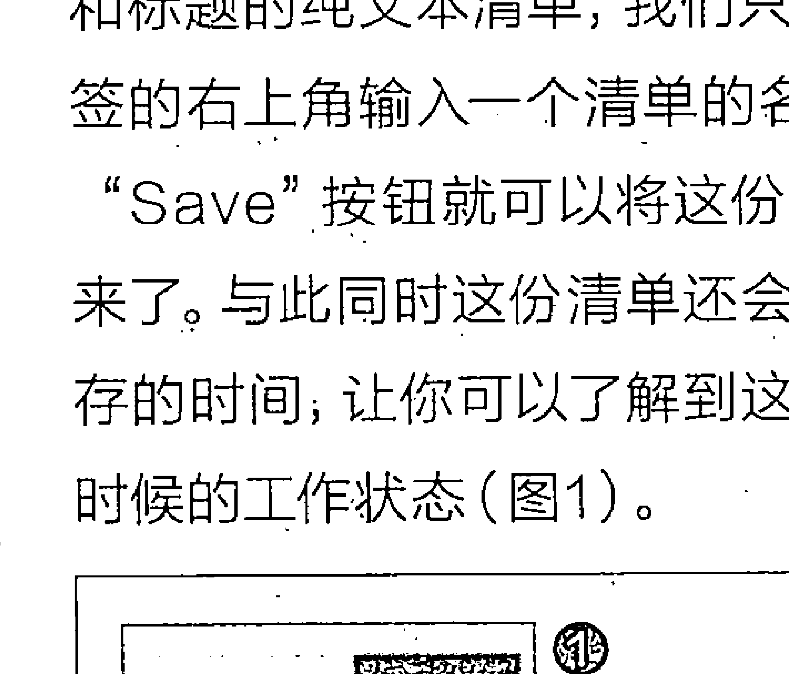

> 保存的网页清单浏览过以后，点击管理窗口右侧的“Delete All”按钮，就可以将这些清单进行删除。

### 网页标签再重新打开

以后当我们在空闲时想要重新访问没有浏览过的网页标签的时候，需要首先启动谷歌浏览器并点击工具栏的“All Tabs”扩展图标，马上就会打开网页标签管理窗口。在右侧列表里面找到需要打开的网页标签清单，点击它以后这份清单的内容就会重新载入到管理窗口里面。现在点击左上角的“Open All”按钮，就可以一次性将这份清单中的所有网页标签重新进行打开。当然用户也可以通过手工的方式（图2），点击管理窗口左侧列表中的标签名称，从而选择性地打开其中的某几个网页标签。

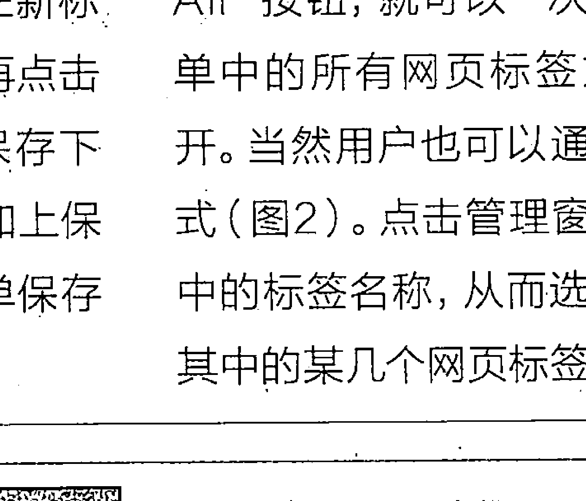

### 清单内容的编辑操作

“All Tabs”这个扩展虽然非常的简单实用，但是也有一个比较明显的缺点，也就是该扩展不能对保存的清单进行同步操作，这样我们也就无法在其他的电脑上打开这个标签的清单。不过好在我们通过和其他服务进行配合，就可以很好地解决这个问题了。我们现在新建一个或者打开一个原有的标签清单，在管理窗口的正中就可以看到清单里面的所有信息。通过鼠标将这些信息全部进行选中，接着点击网页中的“Copy”按钮将其复制下来（图3）。接下来打开自己的QQ邮箱，点击邮箱左侧中的“记事本”选项，然后点击窗口中的“马上写记事”按钮。首先设定一个笔记的主题信息，再把刚刚复制的内容粘贴到其中，点击“保存”按钮进行保存就可以了（图4）。以后当我们在其他电脑上要想浏览清单中的链接，只需要打开QQ邮箱中的这个笔记，然后通过手工的方式点击打开网页链接就可以了。

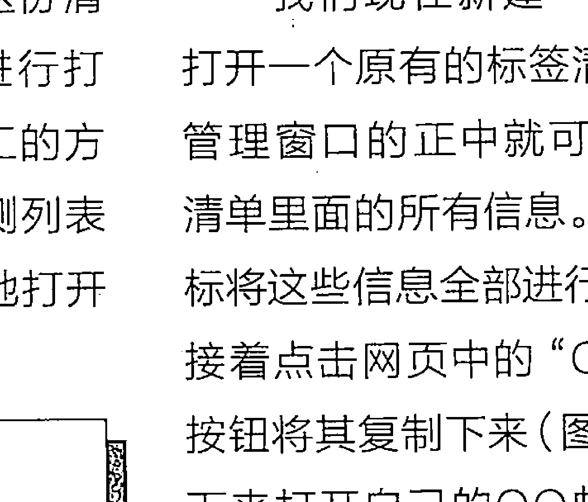

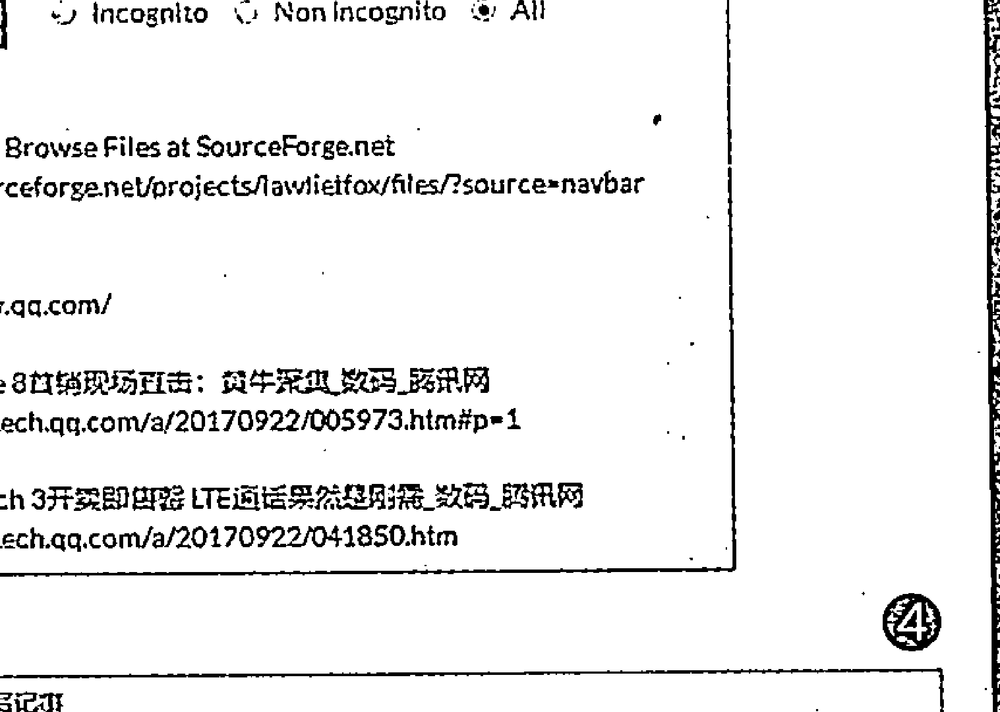

## 老版退休 替代方案升级火狐新扩展

文/阿立

由于火狐浏览器从57版本开始，在扩展上采用了全新的WebExtension接口，所以老的扩展版本就无法再进行使用了。由于火狐浏览器和谷歌浏览器一样，都是以扩展丰富而闻名于世的，所以不安装扩展肯定是不行的。今天就给大家介绍如何使用新的扩展去替代以前那些常用的老扩展。

## 自动识别安装过滤规则

每天当我们打开网页进行浏览的时候，第一眼展现在我们面前的并不是需要浏览的内容，而是铺天盖地的广告信息。所以我们在使用浏览器的时候，广告过滤扩展是不可缺少的。说到广告过滤扩展人们首先就会想到Adblock Plus，可是非常遗憾的是它也没有支持最新版本的火狐浏览器(图1)，所以我们这里使用Adguard AdBlocker扩展去替代它。

现在点击火狐浏览器右上角的“打开菜单”按钮，在弹出的菜单里面点击“附加组件”命令后，在弹出的窗口里面点击“获取附加组件”按钮。接下来在出现的右侧窗口里面点击最下方的“查看更多附加组件”按钮，这样就可以打开火狐浏览器的应用商店。在应用商店里面搜索“Adguard AdBlocker”这个关键词，然后根据提示就可以进行这个扩展的安装操作(图2)。

与我们以前使用的广告过滤扩展最大的不同在于，Adguard AdBlocker扩展不需要用户定义相关的广告过滤规则，可以说用户在安装成功以后就不用进行任何的操作了。因为该扩展会在后台自动对访问的页面内容进行识别，从而自动安装相应的广告过滤规则。比如当我们访问中文的网页页面的时候，它就会自动安装中文的广告过滤规则。

和其他的广告过滤扩展一样的是，Adguard AdBlocker扩展也拥有防止钓鱼网站的功能，只不过这个功能默认并没有开启而已。如果用户想要使用这个功能的话，首先点击工具栏中的扩展图标，在弹出的菜单里面选择“Adguard 设置”命令，然后在弹出的网页里面找到“浏览安全”这个选项，将“钓鱼和恶意保护”选项激活就可以了(图3)。

## 管理浏览器的功能脚本

同扩展一样，功能脚本也是很多浏览器用户常用的功能之一，通过功能脚本不仅可以增强网页的功能，还可以突破很多网页的限制。不过要想管理这些功能脚本的话，首先需要安装一个扩展才可以。首先通过浏览器访问“Greasy Fork”这个专业的脚本发布网站(https://greasyfork.org/zh-CN)，可以看到针对火狐浏览器网页推荐了三个不同的管理扩展。由于第一个扩展不支持最新的火狐版本，所以我们只能选择后面两个，而这里就选择的是Tampermonkey扩展。

当这个扩展安装完成以后，在网站的搜索框里面输入所需要脚本的关键字进行搜索，查找到以后在脚本的介绍窗口点击“安装此脚本”按钮（图4）。接下来会弹出一个是否安装脚本的提示框，点击“安装”按钮后就可以完成安装。

当我们安装了大量的功能脚本以后，肯定需要随时对这些脚本进行管理操作，这样才可以保证这些脚本能够正常地运行。如果要管理这些脚本的话，首先点击工具栏中的扩展图标，在弹出的菜单里面选择“管理面板”命令，这样就可以在弹出的网页列表里面看到已经安装的所有功能脚本了。对于不想使用或者已经失效的功能脚本，我们可以点击操作栏中的“删除”按钮，这样就可以将它从列表中进行删除（图5）。点击“编辑”按钮以后，在弹出的网页窗口，还可以对已有的代码信息进行编辑修改。

> > 为了让安装的功能脚本长时间的可以正常使用，我们需要定时对脚本文件进行更新和升级。不过为了让用户更加方便，可以点击脚本管理窗口中的“设置”标签，然后勾选上“更新已禁用脚本”选项，这样就可以对已经安装的所有脚本进行定时的更新操作了。

## 网页样式更好进行管理

每一个网站都有自己特定的显示风格，可是同样一个风格对于不同的用户来说，就会得到不同的预期效果。对于那些不喜欢这个显示风格的用户来说，他们就会想尽办法对其进行修改，而最简单的方法就是在浏览器加载网页的时候，加载某些对应的CSS样式文件。不过同功能脚本一样，要想安装和管理CSS样式文件的话，需要特定的扩展进行支持。而以前我们使用的Stylish扩展现在无法进行安装，所以只能改用xStyle这个扩展进行代替。

由于暂时无法通过火狐浏览器的应用商店安装xStyle扩展，所以我们就通过它的官方网站来进行安装操作（https://github.com/FirefoxBar/xStyle/releases）。现在通过浏览器访问www.userstyles.org/这个网站，输入关键词来搜索和查找现有的CSS样式文件。在搜索结果中寻找一个自己比较满意的CSS样式文件，点击该链接后，在弹出的网页点击“Install Style”按钮（图6）。这时会弹出一个安装提示对话框，点击对话框中的确定按钮就可以进行安装操作了。

如果用户要想对安装的CSS样式文件进行管理的话，同样点击工具栏中的扩展图标，在弹出的菜单里面点击“管理样式”按钮，从而就可以进入到管理窗口。通过窗口列表可以看到已经安装的样式文件，通过每个样式文件下的命令就可以对它进行删除、更新、编辑和导出等一系列的操作。如果用户想要让这个扩展自动更新样式文件的话，只需要在管理窗口里面勾选上“选项”中的“自动更新样式”命令即可（图7）。

```
#position: fixed !important;
position: absolute !important;
```

## 文件不解压就能直接用

文/万立夫

通常我们使用的压缩文件都需要将其进行解压后才可以使用，其实对于某些特殊的文件来说，我们在进行压缩操作以后，并不需要对其进行解压就可以直接进行使用。那么到底是哪些特殊的文件，在压缩后不需要解压就能直接使用呢？

## 压缩程序减小资源占用

每天我们在电脑里面进行操作的时候，都会运行大量的软件程序，而这些软件程序其实还有一个名称，就是被称作“可执行文件”，而它们就是我们所说的特殊文件之一。要想对这种特殊文件进行压缩的话，当然也需要使用特殊的压缩软件，而这种特殊的压缩软件常常被称为“加壳软件”。出于对程序资源压缩和保护的目的，壳主要被分为压缩壳、密码壳、加密壳等等。顾名思义，压缩壳只是为了减小程序体积对资源进行压缩，常见的压缩壳包括FSG、ASPack、UPX等。

虽然UPX是一款著名的开源程序文件加壳软件，但是由于它是一款命令提示符下的工具，所以我们这里下载运行“UPX Shell”这款图形化的软件(https://pan.baidu.com/s/1mihRleK)。首先点击软件的“选项”标签，分别勾选上“创建备份文件”以及“压缩完成后测试文件”选项（图1）。接着将“压缩级别”调整到中间的位置，这样可以更好地保持压缩速度和压缩比的关系。

配置完成以后点击“打开文件”标签，再点击其中的“打开”按钮，在弹出的对话框里面选择需要压缩的文件(图2)。“UPX Shell”可以压缩的文件包括我们常见的EXE或DLL文件，选择完成以后点击“压缩”标签，在列表中选择要执行压缩任务的UPX软件的版本。所有的操作完成以后点击“执行”按钮，就可以进行文件的压缩操作了(图3)。一般情况下，通过UPX压缩的程序体积可以缩小50%~70%，这样可以减小该程序文件的系统资源占用。

> 小提示
如果用户想要长期使用这款加壳软件的话，那么只需要点击“选项”标签中的“高级选项”按钮，在弹出的对话框里面勾选上“整合到右键菜单”命令，以后就可以方便地通过右键菜单命令进行操作了。

> 小提示
如果用户要想使用UPX的最新版本的话，那么只需要从网上下载这款软件的最新版本，然后将它释放到“UPX Shell”软件的目录里面，再运行“UPX Shell”就可以被软件识别出来了。

## 图片压缩减少流量使用

现在各种各样的社交媒体越来越多，很多用户都喜欢在这些社交媒体上发布图片，从而让其他的网友来进行欣赏。可是无论是数码相机拍摄的照片，还是自己使用手机拍摄的照片，拍摄出的文件体积都越来越大。不过现在网上有很多的云服务都可以在保证图片画质的情况下，对图片的体积进行大幅度的压缩。

### 智能图像压缩

为图像体积瘦身，让你的图片加载飞快！

#### 小提示

为了更好地保护用户的隐私，当图片压缩完成以后60分钟，云服务将会自动进行图片的删除。

### 智能图像压缩

为图像体积瘦身，让你的图片加载飞快！

| 文件名 | 原始大小 | 压缩后大小 |
|--------|----------|------------|
| IMG_20140324_113800.jpg | 4.17 MB | 1133.36 KB (-73.46%) |
| IMG_20140324_113833.jpg | 4.50 MB | 1306.53 KB (-71.64%) |
| IMG_20140324_113849.jpg | 3.58 MB | 862.82 KB (-76.44%) |

现在通过浏览器打开“Goimg.io”这项云服务的网站(https://goimg.io/)，进入网站以后将网页拖拽到最下方，在列表中选择“简体中文”这一项，从而可以让后面的操作更加的方便。接下来点击“选择文件”按钮，在弹出的对话框里面勾选需要进行上传压缩的图片文件（图4）。该服务支持用户一次上传多张图片，而且支持JPG、PNG和GIF等多种格式的文件。

当选择的图片上传完成以后，云服务就会对这些图片进行压缩操作。该云服务通过已有训练的压缩模型，来选择性地减少图像中的颜色数。在减少图片体积达到极限的同时，让肉眼几乎看不出与原图的差异。当图片文件压缩完成以后，我们就可以在列表里面看到压缩后的文件体积以及压缩的百分比等信息，可以看到通常的压缩比都在70%左右。点击后面的“下载”按钮，就可以将指定的图片下载到硬盘里面。当然我们也可以点击“下载全部”按钮，从而将这些文件进行打包后再进行下载（图5）。

#### 小提示

在Minifier这个过程中云服务会对部分代码重新进行编码设置，这样用户在阅读源代码的时候就会产生一定的困难。而通过“JavaScript beautifier”标签就可以将改变的编码转换成以前的编码，这个过程就类似于我们对压缩文件包进行解压操作。

### 压缩代码加快网页加载

现在很多用户之所以会选择使用谷歌浏览器，很大一个原因就是该浏览器的加载速度非常的快。可是如果一个网页里面的代码非常冗长的话，那么任何浏览器的加载速度都会变得缓慢起来。所以对一些网页代码进行压缩优化，不仅可以节省服务器的系统资源，还可以省下不少的网络流量。对于普通的网络用户来说，就可以增加其网页加载的速度，让用户在浏览的时候更加的流畅。

现在通过浏览器访问“Minify Code”这个网站(http://minifycode.com/)，通过网站的名称我们就可以看出它的作用，就是对各种各样的网页代码进行优化和压缩操作。通过网页里面的标签我们可以看到，它可以对JavaScript、CSS和HTML等代码进行操作。比如点击“JavaScript minifier”这个标签，将需要压缩的JavaScript代码复制粘贴到输入框里面。再点击左下角的“minify JavaScript”按钮，这项云服务就会对这段代码进行分析，然后将其中不需要的冗长部分进行删除（图6）。

## “透视”电脑软硬件资源

文|南溪

想要知道电脑的基础软硬件配置，Windows 10自带的工具就能给我们答案，但如果出于验机或更为深入的研究、排障，那就要动用一些其他方法了。你想了解电脑到哪个层面，下面都有你想要的答案。

### 1. 用系统自带功能查看软硬件资源

利用Windows 10自身功能查看硬件资源，可执行MSCONFIG命令或搜索“系统配置”。在小娜对话框中输入MSCONFIG命令或“系统配置”关键词后，搜索结果中会出现“系统配置”桌面应用（图1）。点击进入“系统配置”窗口，点击“工具”选项卡，在列表中选择“系统信息”，然后点击“启动”按钮（图2）。随后就可以看到包含系统摘要、硬件资源和软件环境等类别的系统信息列表，在其中可查看软硬件资源的具体情况（图3）。

### 2. 用SIW 2017工具“透视”软硬件资源

上述系统工具对软硬件资源的查询功能有限。例如，要查询软件“好压”的具体情况，系统信息就做不到。这时，可利用SIW 2017来帮忙。在SIW 2017左侧窗口的列表中选择“软件→应用程序”，在右侧窗格中找到“2345好压”并点击展开，就可以看到包含软件的原始文件名、内部名称、各种版本信息、公司版权、路径、类型、文件属性、键值等各方面的详细信息。关于一个软件的各方面信息一览无余（图4），这用系统本身的功能甚至好压软件本身的功能是无法轻松做到的。

此外，在系统硬件方面，用系统自带功能也无法深入查看到类似于系统主板的详细配置情况，而使用SIW 2017的“硬件”分类查询，不但可以看到主板配置详情，还可以查看BIOS、显卡、存储设备和外设等的详细配置情况（图5）。

大家可以根据自身的需求，灵活使用以上两种检查软硬件的方式，快速了解电脑中的“一切”！

## 全能闹钟 唤醒电脑不误事

文|阿楠

类似属于PC端的闹钟类（提醒）应用新品频出，包括Windows自带的Cortana也集成了相应的功能，可是它们都存在一个问题：当电脑处于睡眠模式，有可能会不按时提醒而误事。现在我们给电脑请个多功能的闹钟Free Alarm Clock，不但可以用个性化的音乐作提醒，还可以唤醒睡眠中的电脑，让黑屏亮起并显示提醒信息。

为了使用方便，大家可以下载Free Alarm Clock的绿色便携版（http://freealarmclocksoftware.com/FreeAlarmClockPortable.zip）。但要注意，便携版软件不会开机自动运行，首次运行软件一定记得在“设置”菜单下选中“在Windows启动时运行”选项（图1），以免误事。设置好之后，点击工具栏上的“添加”按钮，就可以创建新的提醒任务了。

### 添加自己的定时提醒任务

在任务添加窗口中点击“时间”选项后的小钟表，选择需要提醒的小时和分钟数。随后选择重复周期，从周一到周日，可以单选也可以任意组合复选。如果要建立不止一个提醒任务，需要给每个任务设一个好辨认的标志，可通过填写“标签”内容来完成（图2）。若希望在闹钟响起时显示提示信息，还需要勾选“显示信息”复选框。此外，闹钟设定之后，需按下Ctrl+E（或勾选任务前的复选框）启用闹钟才能有效。

### 播放自定的音乐提醒

在软件中默认内置了十多种提醒音效，可通过下拉选择列表选择音效，点击音效后的小三角可预听播放效果。如果希望提醒音效更具个性化，可以使用选定的歌曲、录音文件进行个性设置。单击音效选择框之后的“浏览”按钮，载入音乐文件，不仅能够支持常见的音频文件格式，还可以内嵌以EXE、COM、CMD、BAT等方式执行的调用音乐文件的程序（图3）。

### 唤起“沉睡”中的电脑

如果电脑处于睡眠状态当中，可以用Free Alarm Clock将电脑从睡眠状态下唤醒，不耽误执行设定的提醒任务。为此，需要在选项中把“将计算机从睡眠模式中唤醒”选项选中。之后，时间一到，喇叭将播放设定的提醒声音，显示器也将亮起并显示设定的提示信息。

> ### 小技巧
如果此前电脑托盘音量已设置为静音或音量太低，可将任务选项中的“提高音量”选项选中，同时通过滑块设置需要升高音量的百分比，这样可自动打开音量并提高音量播放。对于起床困难的用户，可选择“重复声音”选项，直至呼醒。而醒来贪睡且明知时间还充裕的用户，可用“贪睡功能”选项，再睡一会重新提醒。

如果需要提醒的任务较多，而又是经常使用不同电脑工作的用户，每个电脑重新安装软件并设置闹钟比较麻烦，可将此绿色软件拷贝到闪存盘中，设好各项任务后，插入工作的电脑，运行一下其中的主程序即可。

## 特需卸载 用特别软件来完成

一次性卸载多个软件、卸载烦人的浏览器插件和工具条、自带卸载程序损毁的软件卸载、软件卸载残留的清除等问题，是困扰Windows用户多年的难题。现在可以用IObit Uninstaller这款特需软件来解决这些问题了。

### 1. 软件多重选择卸载与安全恢复

启动IObit Uninstaller软件后，会自动扫描当前系统中安装的所有软件，并按所有程序（All Programs）、最近安装的软件（Recently Installed）、大软件（Large Programs）、高频使用软件（Infrequently Used）、系统升级补丁（Windows Update）等分类列出。如果要卸载某个软件，选中软件前的复选框，然后点击右上角的绿色Uninstall按钮（图1）。

之后软件会弹出询问是否建立系统还原点的提示，是否建立还原点是可选项。选择建立还原点的好处是，在卸载软件之后若发现系统变得不稳定或出现问题，可使用还原功能将其恢复（图2）。

接下来，IObit Uninstaller会以所要卸载的软件自带的标准卸载程序来进行标准卸载（Standard Uninstall），紧接着会执行强力扫描（Powerful Scan），扫描之后给出标准卸载之后剩余的、还可供选择和删除的项目列表，选择这些项目后，单击Delete按钮彻底删除。

### 2. 卸载讨厌的浏览器工具条和插件

上网使用浏览器的过程中会不知不觉安装一些对自己根本无用的工具条或插件，其中甚至包含一些钓鱼或恶意插件，用户自己又不知该如何卸载。这时，可利用IObit Uninstaller左侧窗格的Toolbars & Plug-ins进行浏览器外挂扫描，主要包括IE和Edge两种浏览器的工具条和插件。在右侧窗格中选中需要卸载的插件之后，单击Remove按钮执行移除操作即可（图3）。

### 3. 软件自带卸载程序损毁时

如果一个软件自带的卸载程序出现问题无法自动卸载该软件，可使用IObit Uninstaller执行软件列表扫描，然后选择该软件进行卸载。卸载过程中，当执行到标准卸载环节而无法完成卸载时，会自动启动强力扫描。强力扫描可扫描出卸载需要卸载的相关文件以及各种残留信息供选择删除，可达到彻底卸载的目的。

## 请个自动执行小管家
文|阿楠

要实现电脑定时电源管理、定时运行特定程序、定时提醒等自动任务，以往我们总需定制复杂的计划任务或通过不同的工具来实现。现在，只用一款PShutDown软件，就可以完成上述多种自动定时任务。

### 请来定时自动电源管家
如果需要定时让电脑自动关机，进入PShutDown后选择左侧动作（Action）为Shutdown Computer，然后从右侧选择定时的方式。如果希望在经过某段时间后关机，则选择After选项并设定经历的时间；如果需要在某个时点关机，则选择At选项并设置时点（图1）。

> 小提示
同样，可按需设定定时注销（Logoff）、定时睡眠（Sleeping Mode）、定时关闭显示器（Switch off Monitor）等自动操作。注意！所有参数设置之后，均需按Start按钮才能启动自动任务。

对于一台自动伺服运行的电脑来说，运行的时间长了可能会存在不稳定和系统资源占用多等问题。这时，可以选择定期自动重启。在PShutDown左侧窗口选择Reboot Computer选项，在右侧窗格选择重启的时间参数，可以是多长时间后重启，或在某个时点重启，也可以是每隔多长时间重启。

设定好时间参数，点击Start按钮提交自动任务（图2）。

### 定时自动事务双向提醒
我们经常用到任务自动提醒，一般使用文字弹窗或声音提醒的方式，二者可单独设定，也可结合使用。设定声音提醒可先准备一段有特色的音乐或录音（MP3或WAV格式均可），然后点击Run Alarm动作选项，指定上述声音文件，设好声音播放的时间，之后点击Start使声音自动提醒任务生效（图3）。

要设定弹窗文字提醒，点击Show Message动作选项，在文本信息窗口中输入提醒文字（图4），设置提醒时间参数。如果文字弹窗伴随声音信息提醒，则将时间参数设置为与声音时间一致。此外，按下Ctrl+P进入设置窗口，可设定强制结束程序、定制界面等更多选项。

### 定时自动执行某个程序
若希望电脑在某个时间点或周期内定时自动执行某个程序，可选择Run Program动作项，点击其后的“…”按钮，指定要执行的主程序并点击OK。之后按上述类似方法设定执行程序的时间参数，点击Start按钮提交自动任务（图2）。

## 用右键菜单管理右键菜单
文|小蚊子

右键菜单是Windows资源管理器中最为方便的一种文件操作方式，但由于每个人的习惯不同以及不同软件自动添加右键菜单项目等原因，右键菜单中总会有一些对自己没用的项目。如果给右键菜单本身添加一个管理右键菜单的命令，操作起来会是什么样呢？

### 1. 没有“管家”也能管理右键菜单
“右键管理”本属于360安全卫士的一个附加应用。如果系统中已经安装有360安全卫士，启动该软件后点击“功能大全”，然后在搜索框中输入“右键管理”，从“我的工具”列表中点击选择“右键管理”即可安装右键管理小工具（图1）。

但是，并非每个人的电脑中都安装有360套件，还有不少人甚至不愿意使用该“全家桶”工具。如果属于这种情况，可以搜索下载独立版本的“右键菜单管理”工具进行安装，这样就可以免去安装套装软件的麻烦。

### 2. 用右键菜单管理右键菜单
安装上述软件后，在资源管理器中某个文件或文件夹上单击鼠标右键，在弹出的菜单中就会看到“使用360管理右键菜单”命令（图2）。点击此命令后出现“右键菜单管理”启动界面，单击“立即管理”按钮，进入右键菜单管理界面（图3）。

管理列表中出现当前可用的右键菜单命令，可以用来修改的菜单项目分为三大类：一个是文件右键菜单，另一个是文件发送到菜单，还有一个是IE浏览器右键菜单（图4）。

要执行对哪部分菜单项的修改，只需点击小三角按钮展开该类别，选择菜单项目进行操作即可。例如，希望删除IE右键菜单中的FLVCD和“维棠”两种下载软件的4个右键菜单命令，我们只需点击这些命令后面的“×”号按钮即可将其删除。

> **小提示**
删除右键菜单命令之后，并不表示该软件已经被删除，只是临时屏蔽了该功能而已。如果还需要使用此功能，只需从右键管理界面中选择“已删除菜单”选项卡，然后选择需要恢复的菜单命令，单击右面的恢复按钮即可（图5）。

## 火狐网页截图分享一气呵成
文|老万

截图是很多用户经常使用的一个功能，于是很多软件都自带有截图的功能。但是这些软件的截图功能往往只能进行最基本的操作，有的时候对于网页中的内容截图并不是很顺手。其实火狐浏览器自带的截图功能就可以解决这些问题，并且现在它有了一些与众不同的功能。

### 一键完成整页截图
火狐浏览器是从57这个版本才开始正式加入截图功能的，如果用户使用的还是老版本的话，那么需要将隐藏的截图功能进行激活才可以使用。首先在地址栏里面输入命令“about:config”，按下回车键就会弹出一个设置的提示窗口。在设置界面的搜索框里面输入参数名称“extensions.screenshots.system-disabled”后按回车键进行搜索，找到这个参数以后修改后面的参数值为false就可以了。

以后当我们想要对网页内容进行截图操作的时候，只需要点击工具栏中的“截图”按钮，这时就会在网页窗口的右上角弹出一个工具栏(图1)。比如有的时候我们需要对整个网页中的内容进行截图操作，而通常的截图软件根本就没有这样的功能，除非使用到专业截图软件的滚动截图功能才行。不过现在点击工具栏中的“截取整个页面”按钮，稍等片刻就可以在网页正中显示出截图内容的图片缩略图(图2)。

### 自动识别网页内容
火狐浏览器除了对当前页面以及整个页面进行截图操作以外，还可以像截图软件那样进行相关的截图操作。通常情况下我们要截取网页中的一部分内容，都是通过拖拽鼠标左键来完成操作的，但是如果要选取的内容比较多的话，这样的操作肯定非常的麻烦。不过火狐浏览器的截图功能有一个自动识别区域的功能，也就是说当用户将鼠标移动到一个区域的时候，该功能会自动识别出这个区域中的文字段落、图片等内容，同时自动将该区域的内容进行框选，而用户只需要点击鼠标左键进行确认。最后通过拖拽选取框四周的调整按钮，对选取框的内容进行调整操作，从而确认自己所要进行截取的范围即可(图3)。

### 截取图片自动分享
无论用户选择的是哪一种截图方式，当截图完成以后就会出现一个截取的缩略图。在缩略图上可以看到三个不同的按钮，点击其中的“下载”按钮以后，这个截取的图片就可以保存到本地硬盘的下载目录里面。如果用户点击的是“保存”按钮的话，那么截图功能首先就会完成截图操作。接下来就会自动将这个图片上传到火狐的云端服务器里面。在图片分享页面我们不但可以看到图片的预览效果，而且还可以看到该图片截取的页面标题和链接信息。接下来用户只需要点击页面右上角的“分享”按钮，就可以得到这张图片的分享地址，然后将它发送给自己的朋友就可以看到了(图4)。需要注意的是，分享的图片会在14天以后自动进行删除，但我们可以设定分享的时间长短，灵活应用吧。

## 给分享的网页内容加重点
文|老万

通常我们在上网浏览的时候，会将发现的有意思的网络链接发给自己的好友，如果这个链接里面有的内容非常重要的话，我们还会将这段内容复制下来进行单独的发送。可是如果要发送的人比较多的话，这样的分享也显得非常麻烦。其实，在分享网页链接的同时，就可以同时将网文中的重点文字一同标注出来。

### 重点内容高亮显示
如果用户使用的是谷歌浏览器的话，那么首先点击谷歌浏览器右上角的“自定义及控制Goole Chrome”按钮，在弹出的菜单里面选择“书签”中的“显示书签栏”命令。接下来我们通过浏览器访问TLDRify这项云服务的官方网站(https://tldrify.com/)，根据它的向导在网页正中找到“TLDRify”这个图标，然后通过鼠标左键点击这个图标，将其拖拽到书签栏里面就可以了(图1)。

接下来按照以前的方法进行网页的浏览操作，当用户发现需要分享的内容信息后，首先通过鼠标选中需要重点分享的信息内容，接着点击书签栏中的“TLDRify”按钮，这项服务就会将用户刚刚选择的内容进行高亮显示并且加入黄色的背景。然后我们将鼠标移动到这段选择的文字上方，这样这项服务马上就会弹出一个对话框。在对话框里面会显示出一个短链接的分享地址，点击下面的按钮就可以复制到系统的剪贴板，或者通过电子邮件、社交网络等进行分享(图2)。现在根据自己的个人习惯，将这个分享地址发送给自己的朋友。当对方点击这个分享链接后就会马上调用浏览器打开它，与此同时自动滚动到我们重点选中的内容，这样朋友就可以明白我们分享这个链接的主要含义了(图3)。

### 既能分享又能管理
TLDRify这项云服务的操作非常简单，但是它的功能却有一些简陋，因为用户无法对分享过的内容进行管理。如果用户还想进行管理操作的话，那么可以试一试LINER这项服务。现在登录它的官方网站(http://getliner.com/)，根据提示给自己的浏览器安装一个功能扩展，安装完成以后会在浏览器工具栏显示出扩展图标。

以后需要进行文件分享的时候，同样通过鼠标将分享内容选中，然后点击工具栏中的分享扩展图标。稍等片刻就会弹出一个对话框，在对话框里面就会显示出分享链接(图4)。如果用户要想对分享过的内容进行管理，那么首先登录到LINER这项服务的后台管理页面。点击左侧列表中的“我的标注”选项后，在右侧窗口的列表里面就可以看到曾经标注过的网页信息。通过每条信息下面的工具按钮，就可以进行收藏、归类、删除等管理操作。

> **小提示**
在浏览器的上方会显示出一个提示栏，告诉用户自己目前正在浏览TLDRify的网址。

## 简单设置 关掉烦人的浏览器通知
文|老万

无论用户使用的是火狐浏览器还是谷歌浏览器，在登录一些知名网站的时候都会弹出一个通知提示对话框。如果用户选择对话框中的允许，那么以后当用户登录这个网站的时候，就会看到各种消息更新的通知提示。但如果你嫌这个提示框太烦人，那么通过简单设置就可以关闭它。

### 谷歌浏览器的设置
由于现在使用谷歌浏览器以及其衍生版本的用户非常多，所以我们首先来看看在谷歌浏览器里面，如何设置才可以关闭这个对话框。首先点击“自定义及控制Google Chrome”按钮，在弹出的菜单里面选择“设置”命令。在弹出的设置窗口里面将滚动条拖拽到最下方，点击网页中的“高级”按钮。接着在“隐私设置和安全性”列表中，找到“内容设置”这一项（图1）。点击打开它的设置窗口后，找到“通知”这个选项并点击它，将“发送前先询问”这个选项进行关闭就可以了（图2）。

> **小提示**
由于国内常见的浏览器都是在谷歌浏览器的基础上开发的，所以用户按照类似的方法打开设置窗口，在“通知”选项里面进行设置就可以了。

通过这种方法进行设置以后，用户在访问任何网站的时候，都不会再弹出通知对话框了。当然如果用户只是想让某些网站进行通知，而让其他的网站不进行通知的话，那么可以在弹出这个对话框以后点击“允许”或者“禁止”按钮来进行操作。如果用户对某个网站已经进行了允许或者禁止的操作，现在又想重新对它进行操作的话，那么现在按照前面的方法重新打开通知窗口，在列表中找到需要进行修改的网站链接，点击后面的“更多操作”按钮，在弹出的菜单里面选择“允许”或者“修改”等命令就可以了。

| Preference Name | Status | Type | Value |
| :--- | :--- | :--- | :--- |
| dom.webnotifications.enabled | default | boolean | true |

### 火狐浏览器的设置
如果用户使用的是火狐浏览器的话，那么又应该如何关闭这个讨厌的通知对话框呢？在现在知名的网页浏览器里面，火狐浏览器应该是最早加入阅读模式的，但是要想使用这项功能还需要激活它。首先在地址栏里面输入命令“about:config”，按下回车键就会弹出一个设置的提示窗口。直接点击“I’ll be careful, I promise”的按钮，在设置界面的搜索框里面输入参数名称“dom.webnotifications.enabled”后按回车键进行搜索，找到这个参数以后修改后面的参数值为false就可以了（图3）。按照同样的方法，再将`dom.webnotifications.serviceworker.enabled`这个参数进行修改即可。

当然也可以在弹出通知对话框的时候，点击允许或者不要按钮来对通知进行管理操作。如果用户想对已经操作过的网站进行通知管理的话，那么就点击浏览器右上方的“打开菜单”按钮，在弹出的菜单里面点击“选项”命令，接着在弹出的窗口中点击右侧的“内容”选项，然后点击右侧窗口里面“通知”下的“选项”按钮，在弹出的对话框里面就可以对已经有的网站进行移除操作了（图4）。

## 远程备份电脑中的重要文件
文|万立夫

个人电脑数据的重要性不言而喻，所以定时进行数据备份是每一个电脑用户都需要掌握的技能。但是对于数据备份来说，不同的用户可能会采取不同的方式。比如最简单的方法就是对数据所在的磁盘分区进行整体的备份操作，但是这样的话难免造成备份文件数据较大。其实我们还可以有针对性地对不同的文件夹目录进行定时的备份操作，然后将备份文件发送到指定的远程系统里面。

### 创建文件夹备份任务
安装并启动SyncBack这款备份软件，点击“Preferences”菜单中的“Language”这项后，在弹出的子菜单里面选择“Chinese”命令，这样就可以切换到简体中文的操作界面中。接下来我们点击窗口右下角的“添加”按钮，创建一个数据备份的任务。在弹出的“新建任务”对话框里面，首先创建一个任务的名称（图1），接着点击下一步按钮，选择需要创建任务的类型，可以选择“备份”、“同步”和“镜像”等，我们这里选择“备份”这项就可以了。然后点击下一步按钮，在窗口左侧的“源文件夹”和右侧的“目标文件夹”列表中，都选择“硬盘、USB盘、闪存盘、映射的网络硬盘等”这一项就可以了（图2）。选择完成以后点击“完成”按钮，这时会弹出一个提示框，直接点击确定按钮进行更加详细的设置。

现在在“任务设置”窗口点击“源文件夹”后面的按钮，从中选择要进行数据备份的文件夹目录。接下来点击“目标文件夹”后的按钮，用于指定文件备份存储的目录。设置完成以后点击下面的确定按钮，就可以完成这个备份任务的创建（图3）。同时我们可以在主界面的任务列表中看到这条备份任务。除此以外，软件会弹出一个询问对话框，询问用户是否要进行一次模拟的数据备份操作，用户可以根据自己的需要进行选择。接下来按照同样的步骤，我们就可以对其他的数据文件夹目录，进行同样的备份任务的创建操作。以后当我们需要进行数据备份的时候，只需要在主界面的列表中选择相应的备份规则，然后点击下方工具栏中的“执行”按钮，在弹出的对话框里面点击“继续执行”按钮，这样就可以进行数据的备份操作了。

> 小提示
由于很多目标文件夹中的文件数量比较巨大，因此备份起来可能会消耗很多的时间。所以我们可以在备份以前先将目标文件夹的数据进行压缩，然后再进行备份就可以解决这个问题了。现在点击“任务设置”窗口左侧的“压缩”选项，在右侧窗口里面勾选上“压缩目标文件夹上的文件”以及“尝试压缩被其他程序占用的文件”等选项。除此以外，选择列表中的“加密”选项，可以为压缩的文件设置一个密码，这样就可以更好地保护数据的安全。

### 让任务定时自动执行
上面的方法虽然可以完成指定任务的备份操作，但是所有的步骤都需要用户手工进行操作。如果用户工作比较繁忙或者备份意识还不是非常强的话，那么可以给任务设定一个定时器，这样就可以在设定的时间内自动完成数据文件夹的备份操作了。首先在主窗口列表中选择需要定时备份的任务，接着点击工具栏中的“修改”按钮，在弹出的对话框里面点击左侧的“时间”选项。在右侧窗口点击“更改任务计划”按钮，在弹出的对话框里面点击“是”，这样就可以创建一个新的执行计划。比如要在每周进行一次数据备份的话，那么就在计划任务窗口中选择“每周”，在“开始”列表中设定任务的开始时间，通常情况下不需要进行修改，保持默认状态即可。然后在“重复”列表中输入1，表示每周自动备份一次。接下来设定任务执行的日期，这里选择的是每个星期的星期五(图4)。设定完成后连续点击确定按钮，就可以完成计划任务的创建。

### 备份数据上传服务器
通常专业人员在备份数据以后，为了保证数据的安全，都会将数据备份到其他的磁盘里面，但是对于普通用户来说，要做到这点就非常的麻烦。不过好在我们现在很多用户都不会关闭自己家里的路由器，因此我们可以通过电脑和路由器搭建一个FTP服务器，这样到时把数据备份到这个FTP服务器里面就可以了。

使用“20CN Mini FTP服务器”这款小工具，在弹出的界面里面根据需要设置相应的参数，点击“访问目录”按钮后设置一个FTP服务器的存放目录，然后在“账户权限”里面勾选上“上传文件”等选项就可以了。设置完成以后点击“启动服务”按钮，就可以在家里的电脑里面快速创建一个FTP服务器(图5)。接下来我们在办公室的电脑上重新打开要编辑的同步规则。在“任务设置”窗口点击左侧的“FTP”项目，然后在右侧窗口里面勾选上“目标文件夹文件位于FTP服务器上”这个选项即可。接下来在“主机名”的输入框内设置家里电脑的IP地址，再在“登录账户”和“密码”输入框里面分别设置FTP服务器的账户和密码信息。设置完成以后点击“测试FTP设置”按钮，看看是否能够成功地连接到FTP的服务器，如果没有问题的话直接点击“确定”按钮就可以了(图6)。以后当设定的自动备份任务时间一到，软件就会将指定的文件夹目录进行文件压缩，然后将压缩文件复制到指定的目录后，再上传到我们设定的FTP服务器里面。

## 批量分享图片文件到多个空间

文|万立夫

我们平时往往都是通过将图片分享到网络空间与朋友进行分享操作的，但是由于国内的网络环境存在着不小的差异，因此就会出现同一个空间有的用户访问快，而有的用户访问很慢的情况。要想解决这个问题，就要重新将图片文件分享到其他的网络空间。其实并不用如此麻烦，利用本文介绍的方法，即可一次性将图片文件分享到多个空间。

### 了解分享空间的要求

在“File & Image Uploader”这款软件（http://z-o-o-m.eu/）的“Language”菜单中选择“汉语”这项，就可以将操作界面切换成熟悉的简体中文了。由于不同的网络分享空间的要求不一样，所以现在点击软件窗口中的“文件托管主机”命令，在弹出的对话框里面我们就可以看到这款软件支持的免费分享空间。软件将分享空间分成了“文件”、“视频”、“分发上传”以及“图片”等多个类型。

用户只需要根据需要点击相关的类型以后，就可以看到这款软件程序支持的空间名称了。而且通过“File & Image Uploader”软件给出的列表窗口，我们还可以详细地看到分享空间的名称链接、文件的大小限制以及存储时间等等条件。建议用户在空间的选择上，选择列表中出现有“-”这个符号的空间，它表示用户可以没有限制地进行使用操作（图1）。

> 小提示
> 如果用户分享的是其他文件的话，而且上传的文件体积超出了分享空间的限制。那么还可以在窗口右侧选中“分割文件大于”选项，这款工具就会对上传的文件进行分割操作后再进行上传。

### 文件上传及再次分享

在详细了解到分享空间的要求以后，我们就可以进行文件的分享操作了。首先点击工具栏中的“添加文件”按钮，在弹出的对话框里面选择需要进行分享的图片文件，用户可以根据要求一次性选择多个不同的图片文件。选择完成以后点击“打开”按钮，进入到软件的配置窗口里面。首先在“文件托管主机”列表中选择用户需要使用的分享空间名称，接着在窗口左下角选择“立即开始上传”选项，同时在类型中选择“图片”这项。所有的配置完成以后，点击绿色的对钩按钮就可以开始文件的上传操作了（图2）。

通过“File & Image Uploader”软件的主窗口列表，我们就可以看到文件的上传情况（图3）。如果上传分享成功的话就会用绿色来进行显示，如果上传分享失败的话就会用红色进行显示。当我们在列表中选择上传成功的图片后，点击鼠标右键中的命令就可以将它们的分享链接复制下来，然后发给自己的亲朋好友就可以了。如果还想上传到其他的分享空间的话，那么点击鼠标右键中的“重新上传到另一台主机”命令。接下来在弹出窗口的“文件托管主机”列表中，选择一个新的分享空间进行上传操作就可以了。

## 软件界面乱码可以这么“破”

文|万立夫

很多软件在进行开发的时候，只会考虑针对特定的语言系统。如果用户将这类软件安装到其他语言的系统里面，就会出现软件界面文字乱码的情况。比如我们想要在简体中文的操作系统中，安装诸如繁体中文或者其他文字的软件程序的话，这时就要考虑到解决乱码的问题了。

### 配置需要的语言环境

其实要想解决这个问题也非常的简单，我们只需要利用专门的软件在系统里面模拟出软件运行环境，就可以避免出现软件界面乱码的情况了。首先下载“Locale Emulator”这款程序的安装包（https://github.com/xupefei/Locale-Emulator/releases），解压以后运行文件夹里面的LEInstaller.exe文件，接着在弹出的软件界面中点击“Install for all users”按钮进行安装（图1）。安装完成以后再执行LEGUⅠ.exe文件，进行软件相应的配置操作。

在配置窗口的“预设配置”列表中，选择用户需要的软件运行环境语言。比如我们想要运行繁体中文的软件程序的话，那么就在列表中选择“中文繁体 中国台湾”这一项，接下来在“时区”列表中选择“台北”这一项。需要提醒大家的是，设定的语言环境和时区一定要对应成功才可以。然后在“高级选项”里面，分别勾选上“以管理员权限运行”、“伪造注册表”以及“伪造系统UI语言”等选项（图2）。设定完成以后点击“另存为”按钮，在弹出的窗口中设置一个名称就可以了，如我们这里设定的就是“繁体中文”。

> 小提示
> 虽然它是一款绿色软件，但是在一个目录中运行后就不要再进行移动，否则会造成此后无法正常运行的问题。

### 在模拟环境里面运行

以后当我们打算在设定的语言环境里面运行某款软件程序的时候，只需要在这款软件的快捷图标上点击鼠标右键，在弹出的菜单里面选择“Locale Emulator”中间的语言环境即可（图3）。这样就可以在我们设定的语言环境里面运行，从此以后再也不会发生软件界面乱码的情况了（图4）。除此以外，我们也可以选择菜单中的“以此程序配置运行”命令，在弹出的对话框里面设置软件运行的参数。接下来再分别设置语言环境和时区等选项，设置完成以后点击“建立快捷方式”按钮。这样就可以建立一个与默认的快捷方式不同的新的快捷方式，以后用户直接点击这个快捷方式就可以在特定的语言环境中运行了。

> 小提示
> 如果用户想要卸载这款工具的话，同样首先运行文件夹的LEInstaller.exe这个文件，接下来点击窗口中的“Uninstall for all user”按钮就可以了。

## 解决Defender与其他杀软的冲突

文|张楚华

Windows 10虽然自带了Defender软件，但不少用户还是安装了第三方杀毒软件。在安装了其他杀毒软件之后，有可能会造成Defender被禁用。这时，如果希望仍旧发挥Defender的查杀作用，就需要找到解禁的办法。

安装第三方杀毒软件后，如果发现系统托盘上出现带有红叉的微软Defender盾牌图标，显示需要执行操作，便很可能是Defender被禁用的征兆（图1）。这时，可右键单击该盾牌图标并选择“打开”，进入Windows Defender安全中心，点击“启动操作”。如果仍无法开启Defender，那么就需要使用别的办法来解决（图2）。

以Defender与360安全卫士冲突为例。右击任务栏上的安全卫士图标并选择“设置”，在设置中心窗口中选择“基本设置→开启 Defender”项，在右侧窗格中去掉“在系统操作中不显示360防护信息，以便同时开启Windows Defender防护”前的勾选，开启Windows Defender（图3）。若使用其他杀毒软件，可通过该软件的设置中心寻求解禁的选项。

随后，通过Windows 10设置进入Windows Defender安全中心窗口，点击齿轮形“设置”按钮，选择开启“Windows Defender防病毒程序通知”和“Windows防火墙通知”下的开关。然后点击“病毒和威胁防护设置”链接，进入“病毒和威胁防护”设置窗口，将“实时防护”和“基于云的防护”下的两个开关打开（图4）。

至此，若还未能开启Defender，打开Windows 10任务管理器窗口，点击“服务”标签，将有关Windows Defender的服务的状态均设置为“开启”状态即可（图5）。

## 一览无余 看透浏览器上网密码

**文|阿楠**

当我们用各种网络浏览器登录网站时，如果选择记住密码，则浏览器会以特定文件存储该网站的登录密码。如果忘掉了密码，能不能从中提取出来？如果电脑中安装了多种浏览器，如何统一管理这些密码？其实有WebBrowserPassView帮忙，问题就不在话下了。

### 1. 自动寻找各种浏览器记录的密码

如果电脑中安装了多种浏览器，且在用这些浏览器上网的过程中自动记录了一些网站的登录密码，那么可用WebBrowserPassView软件自动扫描出这些密码。软件扫描结束后，会逐一列出这些网站及其账号和密码（图1）。如果忘掉某网站的登录密码，这是一个好的解决办法。但反过来，一旦别人拥有你的系统访问权限（例如偷用电脑或黑客入侵），那么也可以轻易用此法获取网站登录密码。因此它也是一把“双刃剑”。

> 小提示
> 通过“Options→Advanced Options”菜单命令，可以选择指定提取的浏览器类型（包括常用的7种浏览器）。Firefox浏览器需要设置主密码，指定Profile配置文件的位置和浏览器安装位置；Chrome浏览器则需要指定用户数据文件夹的位置；Opera浏览器要指定Login文件的位置（图2）。

### 2. 建立浏览器上网密码列表备忘录

如果以上述方式管理的网站比较多，列表中的密码记忆也会成问题。为此，若需要某个网站的密码，右键单击这个网站条目并选择Copy Password命令（或直接按下Ctrl+P组合键），就可以将密码拷贝到剪贴板上保存。
此外，还可以通过列表右键菜单，选择Save Selected Items或HTML Report命令，将密码列表保存为text/html/csv/xml等格式文件（图3）。

### 3. 以命令行模式调用浏览器和配置文件

我们不但可以通过图形界面使用上述软件，甚至还能够通过命令行的方式调用软件所能管理的浏览器或配置文件。例如，可用如下命令行启动WebBrowserPassView并自动装载Firefox浏览器的Profile配置文件：

```
WebBrowserPassView.exe /UseFirefoxProfileFolder 1 /FirefoxProfileFolder "C:\Documents and Settings\admin\Application Data\Mozilla\Firefox\Profiles\7a2ttm2u.default"
```

## 打造更加开放的绿色压缩全能方案

文亦云

我们一般使用的压缩软件都需要安装才能使用，此外支持的格式也相对固定。如果希望拥有不用安装，且能够自行扩展更多格式支持的压缩/解压方案，PeaZip软件方案便是不二之选。

为免去软件安装的繁琐，直接到PeaZip软件的官网，根据所用Windows版本的位数选择下载Portable版本（即便携版）（http://www.peazip.org/peazip-portable.html）。解包之后，直接将peazip.exe主文件拷贝到随身闪存盘作为携带使用。

> 小提示 软件的本地化处理
> 软件默认为英文界面，执行“Options→Localization”命令，在列表中选择chs.txt文件，可将软件本地化为简体中文界面（图1）。

### 改注册表 集成配置右键压缩操作

更便捷的使用方法是使用右键菜单，为此，需要通过注册表修改的方式将功能集成到系统的右键菜单中。这里，并不需要我们手动修改注册表，只需简单地通过“选项→系统右键菜单语言”命令，调用并执行一个chs.reg注册表文件，即可自动将右键功能添加到系统中（图2）。

如果使用便携版，通过“选项→系统集成”命令，按着系统集成向导的提示进行安装，可完成功能的右键集成（图3）。自动集成系统右键菜单的功能在软件重装、升级或使用系统集成向导之后，需要重新执行一次。完成系统右键菜单集成之后，就可以用文件的右键菜单PeaZip实现压缩/解压操作了。

### 利用插件 扩充更多压缩格式支持

如果遇到其他压缩格式不能在PeaZip软件中直接打开，可以通过加载外挂的形式，使PeaZip软件支持这种格式。例如，需要用PeaZip软件解压ACE压缩格式，则只需到该软件的外挂网页（http://www.peazip.org/peazip-add-ons.html）下载“PeaZip UNACE plugin”插件即可。

### 免管理员权限 右键维护进程更简单

对于因程序引起的系统缓慢、程序死锁、资源100%占用等情况，我们往往需要借助于在管理员模式下结束进程来解决。但这时本来系统已经几近瘫痪，开启管理员模式就是一件困难的事情。为此，可借助于一些已经安装的软件的右键一键进程管理维护功能来解决问题。

### 1. 一键结束问题程序进程

Process Manager运行后常驻系统托盘待命。一旦发生因某个程序停止响应而引起的系统缓慢、程序死锁或100%的CPU资源耗尽等进程相关问题，可在任务栏系统托盘区找到Process Manager程序图标并单击右键，选择Kill命令，然后单击下级菜单中要结束的进程，即可结束该进程，让濒死的系统得以复活（图1）。

### 2. 优先处理最重要的程序

如果由于开启的程序太多，其余的程序拖慢了当前需要运行的程序的速度，可将当前急需运行的程序的优先级调高。在任务栏上右键单击要调整的程序图标，选择Priority命令，接着选择Above Normal或High命令，提高程序进程优先级别。当然，也可以用同样的办法，将占用资源较多的进程优先级高的程序进程，通过选择Below Normal或Low选项，降低其优先级。

> **小提示**
> 如果右键菜单中缺少Kill或Priority项，可通过Preferences菜单进入设置窗口，检查System Menu选项卡下的复选框，勾选相应项目即可使右键菜单显示该项目（图2）。

此外，如果装有Glary Utilities PRO系统工具套件，也可以用其提供的“进程管理器”，通过进程列表右键菜单“设置优先级”命令，一键调整进程的优先级别（图3）。将当前急用的程序进程的优先级调整为“实时”，可自动将其余的进程“排挤”到相对不重要的位置，从而提高当前软件的运行速度。

有时缓慢问题是发生在资源管理器文件操作过程中，这时通过在任务管理器中用右键菜单命令重启文件资源管理器，系统自动刷新之后，就可以解决系统缓慢的问题（图4）。

## 无需软件HTML5在线编辑图片

文|万立夫

我们经常需要对图片进行裁剪、编辑、美化等操作，而这些操作都需要通过图片编辑软件来完成。如果是批量进行操作的话往往还需要使用一些专业的软件，如果系统里面没有这些软件而用户又不想下载安装的话，那么现在可以通过一些浏览器的HTML5服务来操作。

### 智能裁剪图片大小尺寸

想对图片进行裁剪操作的话，那么通过浏览器登录“Smart Resize”这项服务的网站（https://www.smartresize.com/），登录以后将网页滚动到浏览器的最下方。我们点击其中的“简体中文”选项后，使操作界面切换到熟悉的简体中文。接下来用户根据自己的需要，点击网页左侧的“上传多张图片”或者“上传单张图片”按钮，在弹出的对话框里面选择自己要进行裁剪的图片（图1）。由于这个服务使用了HTML5的技术，所以用户在打开浏览器后并不需要像其他的云服务那样将图片上传到云端进行操作，而是直接在本地的浏览器里面进行处理操作就可以了，这样就可以节省用户进行文件上传的时间。

选择完成以后在“固定尺寸”对话框中，设定目标图片的尺寸大小以及批量裁剪后的图片后缀名，再在“图片裁剪方式”里面选择“智能裁剪”这一项。然后在“输出图片格式”里面选择输出图片的后缀名，以及图片质量等等。设置完成后直接点击“开始裁剪图片”按钮，该服务就可以进行相应的处理操作了。处理完成以后点击“点此下载裁剪后的文件”按钮，进行图片的下载就可以了（图2）。这项服务之所以被称为“Smart”，是因为它具有自动识别和处理的功能。当用户需要裁剪图片的时候，该服务可以自动分析出图片的主要内容，甚至进行人脸识别的操作，从而进行更加人性化的裁剪操作。

> 小提示
> 要想保证这项服务的正常运行，需要用户将浏览器升级到最新的版本，不然浏览器对HTML5的支持会不好。

### 智能缩放图片大小比例

当然有些时候用户并不需要对图片进行裁剪操作，而只想将现有的图片进行缩小的操作，从而可以方便地上传到微博等社交应用平台上。要想进行图片缩放的话，也可以利用“Smart Resize”这项服务来快速地完成，而且用户可以按照缩放比例、最大高度、最大长度和缩略图等多种方式来进行操作。同样首先进行图片的上传操作，接下来在网页中选择“缩放”这个标签，然后在“图片缩放比例”里面输入一个缩放的百分比。或者点击网页中的“最大高度”或者“最大长度”标签，在里面设置图片的最大高度或者图片的最大长度（图3）。设置完成以后按照前面的操作继续配置，最后点击“开始裁剪图片”按钮就可以进行处理了。

### 加载滤镜改变图片风格

很多人在拍摄照片的时候都希望给照片加上一些特殊的效果，这样照片看上去非常的炫酷。要想做到这样的效果通常有两种方法，首先就是用户在拍摄的时候直接选用某一个滤镜来操作，还有一种方法就是在拍摄完成后利用一些图片处理软件来加上需要的效果。如果用户的电脑系统里面没有安装相关的图片编辑软件的话，那么也可以利用在线服务来进行编辑操作。

登录“Film Emulator”这项服务的网站（https://29a.ch/film-emulator/），虽然这款服务号称在线的服务，其实由于它也是使用HTML5这项技术，所以所有的操作实际上都是在本地的浏览器里面完成的。现在点击工具栏中的“Open File”按钮，在弹出的对话框里面选择要处理的照片文件。当照片文件加载到浏览器窗口后，在窗口右侧的“Film”列表中选择一个自己需要的效果滤镜，马上就可以在窗口里面看到加载滤镜后的效果（图4）。如果用户无法感受到加载滤镜后的效果，那么可以点击“Show Before”这个选项后的眼睛图标，这样就可以在原始图片和加载滤镜后的图片之间进行对比显示。

利用滤镜来处理图片虽然非常方便和快捷，但是由于默认的参数都是一样的，所以就会让用户产生一种千篇一律的感觉。为了突出自己和别人的差别，我们还可以通过右侧列表中的多个选项，来对其中的参数进行调节。比如拖动“Brightness”选项的滑杆，就可以对图片的亮度进行调整；而拖动“Contrast”选项的滑杆，就可以对图片的对比度进行调整。

当图片处理完成以后我们点击工具栏中的“Download”按钮，就可以将处理完的照片保存到本地硬盘里面了。除此以外，我们在进行图片的保存操作以前，还可以点击工具栏中的“Settings”按钮。在弹出的对话框里面根据自己的需要，在“JPEG Export Quality”选项里面设置图片的压缩比例。同时选中“High Quality Preview (slow)”这个选项，可以设置图片预览的品质（图5）。设置完以后再进行下载操作，就可以做到图片效果和压缩比例的完美融合。

### 浏览器应用改变效果

如果使用的是谷歌浏览器或者它的衍生版本，那么还可以安装一款名为“Pixlr-o-matic”的应用来进行操作。首先点击浏览器中的应用图标，在弹出的对话框里面选择要进行处理的照片（图6），接下来我们只需要三步就可以完成相关的操作。首先我们在列表中选择一个自己需要的滤镜，选择完成后点击窗口右下角的前进按钮。接下来在列表中选择一种纹理效果，然后再为照片选择一个需要的相框。所有的操作都是通过向导来完成的，最后点击“保存”按钮就可以将照片保存到本地硬盘里面了。

## 另类压缩省出更多磁盘空间

文|老万

我们每天都会经历很多的数据压缩操作，这些操作有的是为了进行文件的管理，有的则是为了更好地节约磁盘空间。但是这些压缩操作往往都是以压缩包的形式存在的，其实除了这种方法以外我们还可以通过对数据进行压缩操作后直接运行的方式。

### 磁盘文件夹目录的压缩操作

很多用户都知道在每一个磁盘分区的属性对话框里面都有一个压缩的功能，通过它就可以对该磁盘分区中的文件进行压缩操作，从而可以节省不少的磁盘空间。其实除了这个功能以外，在Windows操作系统里面还有一个名为Compact的功能，通过它也可以对指定的文件夹目录进行压缩操作。Compact功能之所以之前没有受到用户的关注，很大的原因是因为它只能通过命令行来使用。好在最近有网友为这个功能做了一个图形化的操作工具，这样普通用户操作起来就更加方便了。

现在下载运行“Compact GUI”这款图形化的操作工具（https://github.com/ImminentFate/CompactGUI/releases），这时系统会弹出一个“Windows已保护你的电脑”的提示框。点击提示框中的“更多信息”按钮，然后再点击“仍要运行”按钮就可以了。接下来点击“Select Target Folder”按钮以后选择要进行压缩的文件夹路径，然后在下面选择要进行压缩的方案（图1）。该工具为用户提供了四种压缩方案，从上到下表示压缩程度的增加，同时压缩的时间也会同步增加，这里建议用户选择第二个压缩方案“xpress8k”。

除此以外在下面还有四个不同的选项，分别表示文件夹的子文件夹也进行压缩，强制压缩文件夹里面的所有文件，压缩系统文件及隐藏的文件，以及标记文件夹以后有新增的文件也自动压缩。用户根据自己的需求选择以后，点击“Compress Folder”按钮，就可以进行这个文件夹的压缩操作了。通过进度条我们可以看到这个文件夹目录的压缩进度，压缩完成以后我们就可以通过图表看到文件夹体积的对比数据，从而就可以知道整个压缩过程使得文件夹节省了多少的磁盘空间（图2）。

> 小提示
如果用户在配置的时候没有选择最后一个选项，那么在添加新的文件后，就需要对这个文件夹进行重新的压缩操作才可以。

| File | Extension (Type) | Original Size | Optimized Size | Status |
|---|---|---|---|---|
| E:\电影\导入的视频\2015\03\20150324 113231.mp4 | .mp4 | 4,717,910 | 4,717,910 | Pending |
| E:\电影\导入的视频\2015\03\20150324 112800.mp4 | .mp4 | 4,372,432 | 4,372,432 | Pending |
| E:\电影\导入的视频\2015\03\20150324 111129.mp4 | .mp4 | 5,914,359 | 5,914,359 | Pending |
| E:\电影\其他电影\视频_短片.mp4 | .mp4 | 20,376,934 | 20,376,934 | Pending |
| E:\电影\其他电影\视频_短片.mp4 | .mp4 | 156,692 | 156,692 | Pending |
| E:\电影\其他电影\视频_短片.mp4 | .mp4 | 2,157,211 | 2,157,211 | Pending |

### 常见文件类型也能优化压缩

其实除了可以对磁盘进行压缩以外，我们日常生活中接触的很多文件都可以进行压缩，从而更好地节省磁盘的空间。比如我们最常见的MP3文件就是经过压缩的音频文件，除此以外图片文件、文档文件等等这些文件都可以进行压缩操作。但是要想对这些文件进行压缩操作，通常都需要用到不同的软件程序。好在现在有一款名为FileOptimizer的软件，可以对这些常见的文件类型进行统一的压缩操作。

现在下载运行“FileOptimizer”这款工具（https://sourceforge.net/projects/nikkhokkho/files/FileOptimizer/），解压后我们可以在文件夹里面看到针对不同系统版本的软件程序，用户根据自己的系统版本选择运行操作就可以了。接下来点击“File”菜单中的“Add files”命令，在弹出的对话框中选择需要进行压缩的文件。我们前面已经提到过这款软件最大的特点，就是可以支持所有常见的文件类型，因此用户可以随意地进行添加。选择完成以后点击“Optimize”菜单中的“Optimize all files”命令，就可以对窗口列表中的文件进行压缩操作了。不过压缩的时间和文件类型、文件大小以及系统的配置有关，当文件压缩完成以后在软件里面就会显示出文件体积的变化（图3）。

> 小提示
“FileOptimize”这款软件的压缩操作，默认使用的是自己的配置参数。如果用户需要的话还可以点击“Optimize”菜单中的“Options”命令，在弹出的对话框里面我们可以看到不同的文件类型。接下来用户就可以根据自己的需要，对这些文件类型进行不同的压缩参数设置了，比如在“Optimization Level”列表中就可以选择文件压缩的级别（图4）。

### 在资源管理器里管理压缩包

以前我们要想对压缩包里面的文件进行管理，除了直接双击打开压缩包并通过压缩软件进行管理以外，还有就是将压缩包进行解压后再进行管理。其实不论选择哪一种方法都不是非常方便，因为用户最熟悉的操作还是在资源管理器里面进行文件管理。那么有没有什么方法可以像在资源管理器里那样，对压缩包中的文件进行管理操作呢？现在下载安装“TC4Shell”这款工具（http://www.tc4shell.com/），安装完成以后它会像其他的压缩软件那样，要求用户对常见的压缩文件格式进行关联。用户只需要勾选需要关联的文件，最后点击“应用”按钮就可以了。从此以后我们只需要双击关联过的压缩文件格式，就会发现直接在资源管理器里面展开压缩包的内容了。这样我们就可以利用资源管理器工具栏中的命令，对压缩包中的文件进行复制、剪切、删除等管理操作了。除此以外，在资源管理器窗口中点击鼠标右键，选择“Add files”命令后还可以向压缩包里面添加需要的文件（图5）。

> 小提示
对于那些没有进行关联的压缩格式，我们只需要在文件图标上点击鼠标右键，选择菜单中的“Open as folder”命令也可以起到同样的效果（图6）。

## 轻松备份和还原系统图标布局

每个人都有自己桌面图标的摆放规则，这样主要是为了方便自己快速查找到需要的图标。但是由于家里的人比较多，而每一个人都会按照自己的需要来对图标进行布局，这样经常就会把桌面图标搞得乱七八糟的。笔者今天要介绍一个小方法，可以对自己的桌面图标进行快速备份，然后在需要的时候进行快速恢复。

### 桌面图标布局的备份和恢复

从网上下载Relcon这款系统图标备份和恢复软件，下载后对它的压缩包进行解压操作，接下来将文件移动到自己存放软件程序的目录。由于这个软件是一款绿色软件，所以根据自己系统的版本来选择运行32位版本还是64位版本。运行后软件会自动识别操作系统的语言类型，并且显示出我们熟悉的简体中文菜单信息。接下来要做的事情就简单多了，用户只需要点击工具栏中的“保存图标布局”按钮，就可以对当前的桌面图标布局进行保存。保存完成以后就可以在软件的列表中，看到刚刚保存的桌面图标信息，其中就包括图标布局名称、桌面的分辨率、图标个数以及用户名称等等（图1）。

> 小提示：如果通过右键菜单无法进行快捷操作，那么可能是用户选择的软件版本有问题。

> 小提示：点击“选项”菜单中的“打开图标布局文件”命令，就可以在弹出的窗口里面看到桌面布局的参数信息（图2）。

不过由于软件新建的图标布局名称非常的简单，所以如果用户创建有多个不同的图标布局的话，就非常容易造成分不清楚的情况。因此建议大家对这些图标布局的名称进行重命名操作，在任意一个图标布局的名称上点击鼠标右键，在弹出的菜单里面选择“重命名”命令后，根据自己的命名习惯设定一个新的名称就可以了。以后当我们需要恢复某个图标布局的时候，首先在列表里面选中这个图标布局的名称，接着点击工具栏中的“恢复图标布局”按钮就可以了。当然通过工具栏中的“删除所选图标布局”按钮，还可以对不需要的图标布局进行删除操作。

### 将快捷菜单添加到鼠标右键

由于每次进行图标的备份以及恢复操作都需要打开这款软件，因此如果经常进行操作的话肯定会显得非常的麻烦。所以我们可以在系统桌面的右键菜单里面添加一个快捷命令，这样直接通过右键菜单就可以进行备份和恢复操作了。现在点击Relcon软件“选项”菜单中的“添加右键菜单”命令，在弹出的子菜单里面选择“桌面”或“我的电脑”命令后，就会在它们的右键菜单里面进行命令添加。

以后当我们需要进行桌面图标的备份或者恢复的时候，只需要在系统桌面上点击鼠标右键，在弹出的菜单里面就可以看到“桌面图标布局”这项。展开它以后就可以看到“恢复图标布局”以及“保存图标布局”的命令，以后通过这两个命令就可以快速进行备份和恢复操作（图3）。不过需要提醒大家的是，这个恢复命令只能恢复最近一次备份的布局，如果要想恢复其他的布局，那么还是只能通过软件主界面来操作。

## 文件无法删除 七招强行解决

文|老俞

在Windows系统中，由于种种原因，会造成文件或文件夹被锁定而无法删除（图1）。有时我们不一定能查到是什么原因造成文件被锁定而无法删除，但迫切需要删除某个无用的文件或文件夹。这时，用Wise Force Deleter软件（简称WFD）可解燃眉之急。

### 1. 轻松应对多种情况

Windows中无法删除文件的情况，大致包括以下几个方面：

-   无法删除文件: 拒绝访问
-   发生违反文件共享的行为
-   因源文件或目标文件在使用中
-   另一个程序或用户正在使用文件
-   因磁盘满文件处于写保护状态

属于上述情况造成的无法删除的文件，均可尝试用WFD进行强行删除。

### 2. 通过常规窗口 强行删除文件

要强行删除文件或文件夹，先在WFD软件界面中使用“添加文件”或“添加文件夹”按钮添加文件或文件夹，也可以直接将要处理的文件或文件夹拖动到该窗口中。若列表中有个别暂不需要处理的文件，点击“移除”按钮排除之。列表添加好之后，点击右下角的“解锁并删除”按钮进行处理。随后会弹出确认窗口，点击Yes进行解锁并删除（图2）。

注意，文件被删除后将无法通过回收站找到。虽然在WFD管理窗口中还有这些文件的影迹，但它们被标上了“已删除”标识，在资源管理器中将不再可以找到这些文件的影迹（图3）。退出WFD并重启后，其中的文件影迹也将消失。

> **小提示**

要注意确认，所要删除的文件是用户自身的文件或外来的文件，而不是Windows系统所需要的文件，否则可能会造成系统故障。

上述操作需要先启动WFD软件，添加文件后才能执行删除操作，稍有不便。如果在软件控制菜单中选择了“添加右键”命令，资源管理器的文件或文件夹右键菜单中会增加一条强行删除文件的命令。

这时，在不启动到WFD软件界面的情况下，直接通过在资源管理器文件或文件夹上单击右键，选择Force Delete菜单命令，即可强行删除文件或文件夹了（图4）。一键操作，可谓方便至极。

## 谁在后台偷偷给“联网”

文|亦云

如今，用电脑的时间基本等同于上网时间。一般的用户可能只知道使用网络浏览器、聊天工具等软件的过程中会涉及到上网操作，但只要作者愿意，所有软件程序都有可能在后台执行上网等后台操作。那么，这些程序安分吗？让我们通过ProcNetMonitor软件彻底查明所有的活动。

### 查明进程端口和网络连接

除了明显具有上网功能的软件外，我们日常使用的Windows系统以及所有应用程序，一般都有自动升级更新的机制，这些软件都会在用户不知不觉中通过后台程序进行联网，检查软件版本进行自动更新。所有这些，用户在没有提示信息的情况下根本无法察觉，只能通过软件来检测。不过这些还不算什么大问题，充其量也就是占用一些流量。最为可怕的是，一些恶意软件通过后台偷偷摸摸地在传输一些什么数据，对系统数据和用户安全造成威胁。

如果希望显示连线之外的其他进程，请取消对窗口右上角“Show only Network Processes”选项的默认选择。

通过ProcNetMonitor软件，我们很容易能够查明每个进程的所有开放网络端口（TCP UDP）和活动网络连接。启动软件后，默认会自动以红色显示系统中所有执行连线活动的进程，并详细列出连线所涉及到的远程主机名称、地址，连线数量和类型、端口等详细信息(图1)。

如果需要生成一份进程查询结果的专业报告，请单击窗口右下角的Export按钮，这样会生成一个ProcNetMonitorReport.html报告文件。

### 查明访问某个端口的所有进程

如果我们对某个端口的使用产生怀疑，可以专门针对该端口号对使用该端口的进程进行查询。在窗口上方左侧的文本框中输入端口号并单击“Port Finder”按钮，即可获得使用该端口的所有进程的资料。例如，通过80端口查找当前正在访问Web HTTP服务的所有进程，得出如图所示的结果(图2)。

### 处理无用进程或不明进程

如果发现在红色显示范围内的进程中，有明显属于自己不在使用的进程或不明的占用网络资源的进程，可以在选中进程后点击“Kill Process”按钮结束进程。

如果对进程的来源不够明确，可右键单击该进程，然后选择“File Properties”查看进程所属的文件位置，弄清进程所属的文件是否为有用程序(图3)。

### 在线验证可疑进程

对于用上述方法尚不能明确的进程，可在选中进程后点击“Scan Online”按钮，执行集成在线服务，在线扫描搜索该进程，获知进程的具体情况报告，然后再决定是否处理。

## 重装系统的“救命稻草”

文|波波

如果我们需要给新装的一台尚无系统的电脑安装系统，或给某个老BIOS或老硬件刷新固件，抑或是希望运行自己珍藏的一个老掉牙的DOS应用程序时，首先面临的问题就是要创建一个合适的启动盘。上述启动盘的创建，用Rufus Portable这个小软件就能完成。

要创建移动引导盘，先插入USB移动介质（移动硬盘或闪存盘等），然后运行RufusPortable.exe主程序启动制作主界面。

① 先从“设备”列表下选择插入的移动设备；接下来从“分区方案和目标系统类型”列表下，选择启动盘将采用的分区方案和目标系统类型，其中包括适用于BIOS或UEFI启动类型的MBR分区方案（是新老机器兼容的保险方案）、UEFI启动类型的MBR分区方案（老机器中使用新启动方式）、UEFI启动类型的GTP分区方案（较新的电脑使用2TB以上大容量硬盘时选择）。

如果担心所用的闪存盘或移动硬盘存在坏块，影响启动，为了保险起见，可在制作前选中“检查设备坏块”选项，这样可在格式化的同时，修复移动存储设备错误。还要注意，在制作之前会先格式化存储设备，因此若设备上存在有用数据，要先做好备份。设备格式化默认用“快速格式化”方式，保留格式并清除上面的所有数据。如果取消“快速格式化”选项，则使用标准格式化处理。对于容量较大的移动设备，标准格式化需要更长的处理时间。

② 从“文件系统”列表下选择文件系统，文件系统有FAT、FAT32、NTFS、UDF、exFAT等五种类型可选，如果启动盘将运行老旧DOS程序则选择FAT格式，其他格式适合于Windows使用。

③ “簇大小”可用默认选择；在“新卷标”文本框中，输入移动启动介质的卷标名称；最后很重要的一步，需要从“创建一个启动盘使用”列表中选择引导盘的来源类型，如果选择为ISO镜像，则可以用Windows的安装文件映像生成启动盘（点击光盘图标加载ISO文件），如果选择FreeDOS则生成DOS引导盘。

参数设置完成之后，最后点击“开始”按钮，执行启动盘的制作。启动盘制作成功后，就可以用它来启动计算机，执行本文开始所述的种种任务了。

## 巧借系统功能 伪装保护文件夹

文|阿楠

一般来说，当人们看到一些系统功能图标之后，不会像对用户文件那样感兴趣。即便是有所怀疑，当点击打开时发现开启的是系统功能，也会放弃怀疑。由此，我们可以设想将自己的文件夹伪装成各种系统功能图标（如回收站、系统更新、用户账户等），这样别人就不会轻易盯上这些资料了。然而这样的功能如何去实现呢？一个Disguise Folders软件就能轻松搞定。

### 1. 将文件夹伪装成系统功能模块

我们可以将任意文件夹伪装成回收站、电源选项、用户账户等在内的共16种系统功能模块。首先启动Disguise Folders，该软件不用安装，解包后执行唯一的EXE程序即可。

要伪装一个文件夹，首先单击Disguise Folder按钮，选择要伪装的文件夹，例如“F:\我的秘密文件夹”；随后，在Disguise as列表中选择要伪装成的目标，例如要伪装成回收站就选择Recycle Bin；最后点击Disguise Now按钮，执行伪装操作（图1）。

回到资源管理器中，可以看到原来金黄色的文件夹“我的秘密文件夹”已经变成回收站的样式，文件名被更名为Recycle Bin（图2）。随后，可随意更名为所希望的文件名。

> 小提示 如果担心文件夹伪装成系统功能模块后，出现两个一样的图标容易被人察觉，只要不把相同的图标放在一起，这样别人就不容易察觉了。Disguise Folders是一个安全而有趣的应用，它不会扰乱你原来的系统文件夹，所以大可放心使用。

### 2. 伪装文件夹不能直接用 如何还原

那么，伪装的文件夹已经不能用了，如何才能还原呢？在Disguise Folders窗口中单击Recover Folder按钮，指定要恢复的文件夹，在下方输入要恢复的文件夹的名称，最后单击Recover now按钮（图3）。之后可以看到，文件夹又恢复成了我们非常熟悉的系统默认模样（图4）。

## 右键菜单做“手术” 越简单越好

右键菜单虽然用起来方便，但不是要啥有啥，也不是啥也就好。对于一些内置的或软件添加的不常用命令项，留着只是一个累赘。而对于自己急需要却没有的项目，能方便添加才是“王道”。使用FileMenu Tools软件给右键菜单做“手术”，可谓方便至极。

### 1. 打造个性化超强文件右键菜单

我们可给文件或文件夹装一个超强的右键FileMenu Tools菜单，里边包含众多的文件操作功能。点击“FileMenu Tools命令”选项卡，在某项目上取消勾选可隐藏该项目，点击“删除”则可以彻底去掉该项目。如果要添加新的命令项目，点击“添加命令”操作。通过“添加子菜单”命令，还可以添加下级菜单。若添加的项目较多，可进行分组添加，组与组之间可通过“添加分隔符”来间隔（图1）。

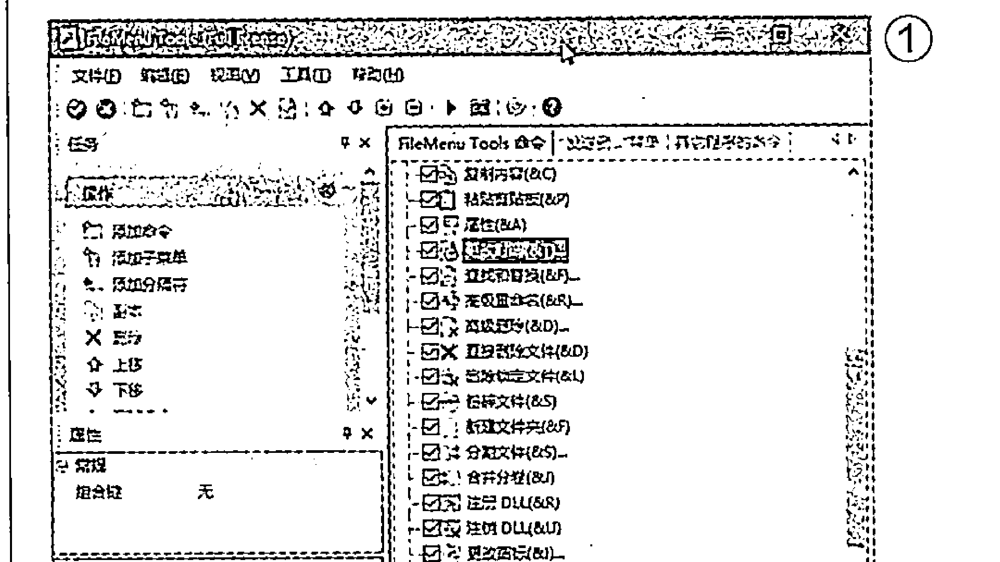

> 小提示：通过“添加命令”项，也可为“发送到”菜单扩充功能。

编辑完菜单，点击工具栏上的第一个对钩按钮，之后可在文件右键菜单中访问这个超强功能的FileMenu Tools子菜单。

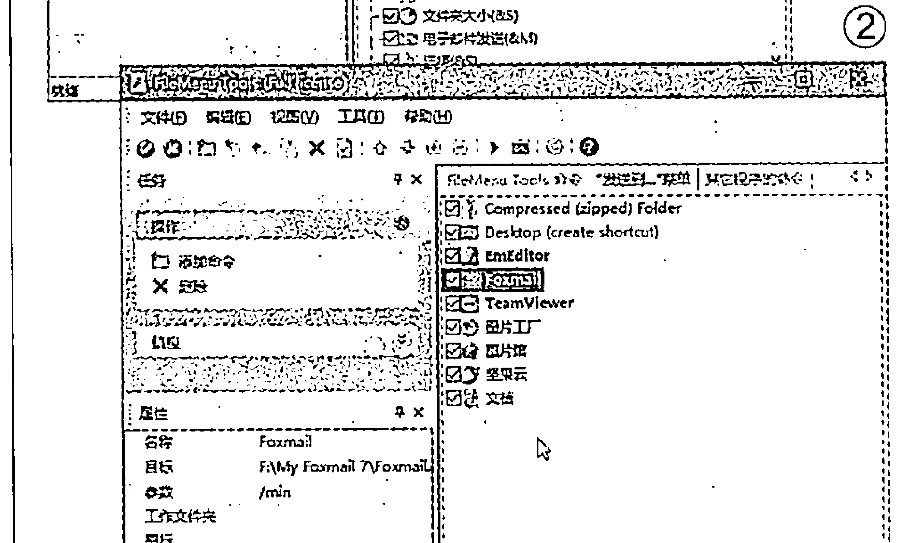

### 2. 轻松减轻“发送到”菜单的负担

用右键“发送到”菜单进行文件操作非常方便，但对于一些人来说，其中的过半选项是个累赘。进入“发送到”菜单选项卡，通过取消勾选或删除项目的方式，可给右键“发送到”菜单减肥（图2）。

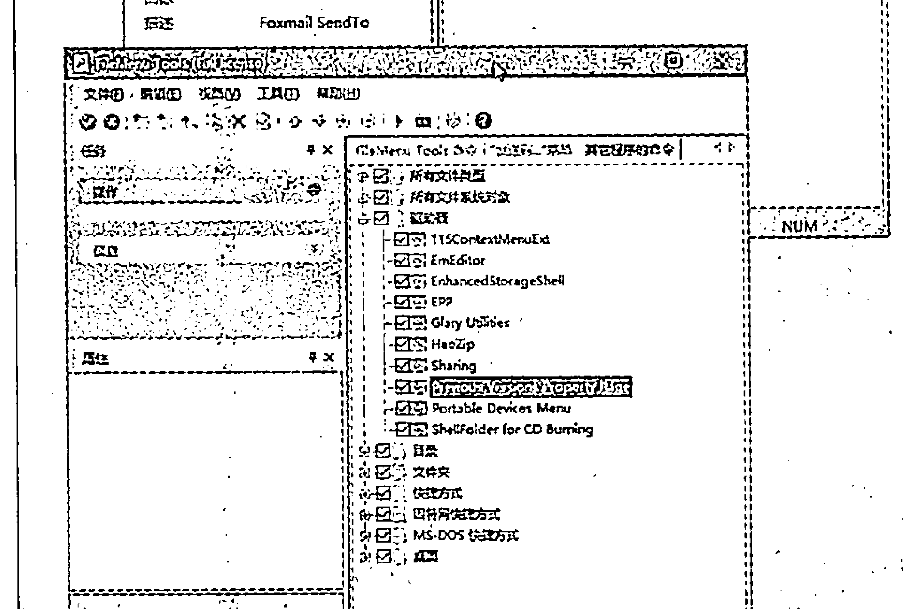

### 3. 禁用其他软件添加的无用命令

一些软件安装后给右键菜单安装的一些所谓“快捷项目”，真正有用的项目却不多，却不乏广告成分。如果因为安装了许多软件而让右键菜单变得很乱时，可通过“其他程序的命令”选项卡，将一些软件给驱动器、文件夹、桌面等处添加的无用右键项目统统清理掉，只需取消勾选或执行“删除”操作即可（图3）。

此外，如果希望在批处理中引用一些右键菜单快捷功能，可点击“工具→从命令行运行”命令，生成命令行代码（图4）。直接将此命令复制到剪贴板，在命令窗口中或用批处理启动相应功能。

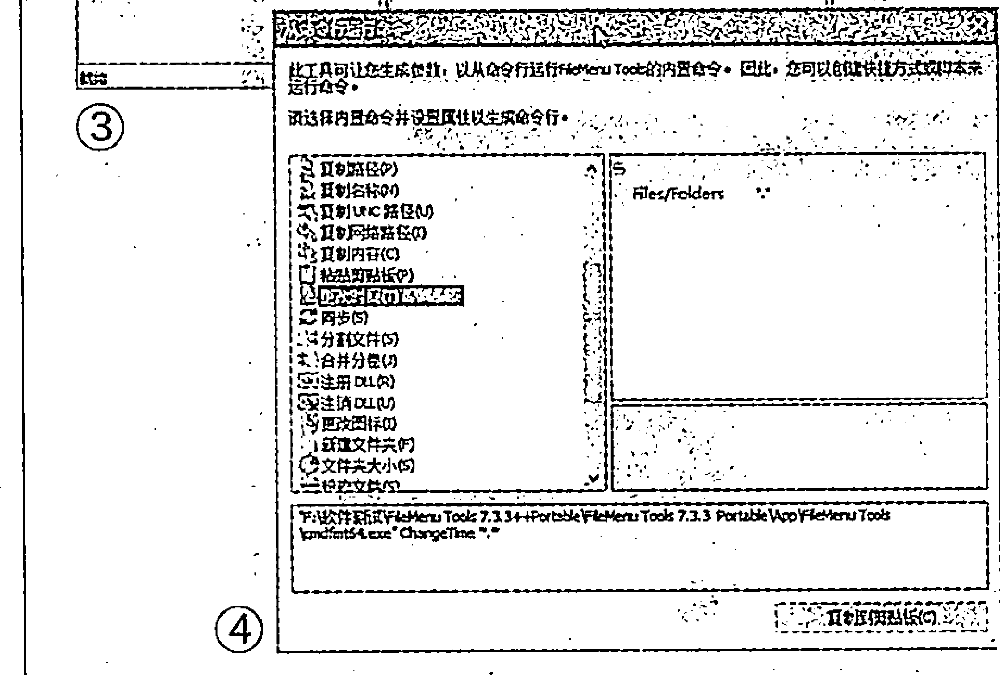

> 小提示：要使上述所有修改发生作用，需要执行“应用更改”命令。否则在退出软件时，软件会提示你保存更改。

## 像Mac OS那样预览文件内容 文|老万

我们知道在苹果的Mac OS操作系统里面有一个功能，就是通过空格键可以对文件或者文件夹中的内容进行预览，从而避免运行这些文件的繁琐操作。但是在我们最常用的Windows操作系统里面并没有类似的功能，怎么办？不用着急，通过下面的方法你也能实现这一操作。

### 系统应用直接进行预览

由于通过空格键进行内容预览这种方法非常的方便，因此已经有用户开发出了功能相似的应用软件，这样我们只需要在系统里面安装它们就可以实现类似的操作了。如果用户使用的是Windows 10操作系统的话，那么首先点击工具栏中的Microsoft Store按钮，搜索并安装一款名为WinQuickLook的应用程序即可(图1)。

版本的Windows操作系统的话，那么就无法安装这款应用软件。其次这款软件对一些格式的文件还不支持预览操作，如常见的PDF文件以及压缩文件等等。所以这个时候要想更好地实现预览操作，我们还可以试一试QuickLook这款软件。

小提示 QuickLook这款软件还支持插件的形式。如果遇到不能预览的文件格式，那么从网上下载对应的功能插件，解压到安装目录中的QuickLook.Plugin文件夹里面就可以了。

### 预览管理更加快捷方便

虽然WinQuickLook这款软件已经在功能上可以实现我们的要求，但是实际上它还有很多方面的限制。比如如果用户使用的是老 运行QuickLook这款软件（https://github.com/xupefei/QuickLook），通过文件管理器选中要预览的文件。这次不仅可以在资源管理器里面进行操作，还可以在诸如Total Commander、Everything这样的知名第三方文件管理器里面进行选择。选中文件以后同样按下键盘中的空格键，就可以在弹出的窗口里面进行内容的预览操作了。另外，通过键盘中的方向键可以方便地切换到下一个文件，从而对这个文件的内容进行快速的预览操作（图3）。

除此以外，通过预览窗口上方工具栏中的按钮，还可以对这个文件进行快速的管理操作。比如点击工具栏右侧中的第一个按钮，就可以利用文件关联的软件程序来打开这个文件，从而对这个文件进行进一步的管理操作。如果用户不想要利用默认的软件程序打开的话，也可以点击工具栏左侧的第二个按钮，在弹出的打开方式里面调用其他的软件程序来访问这个文件。

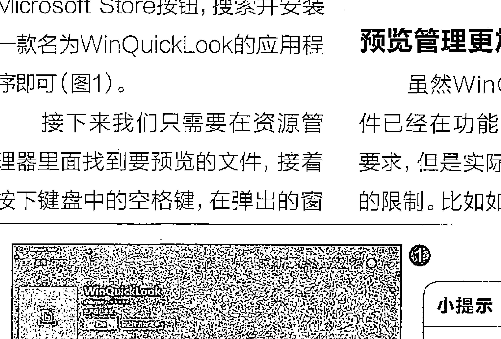

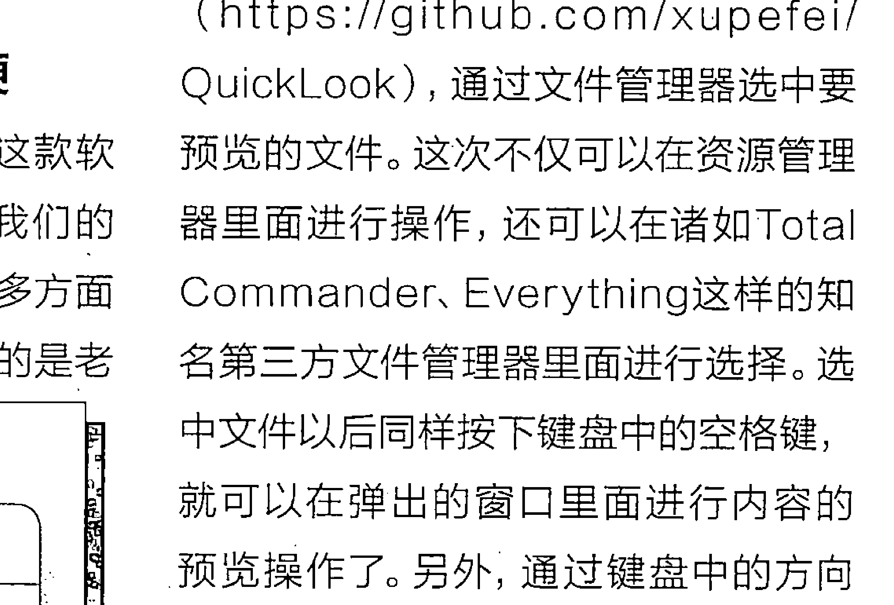

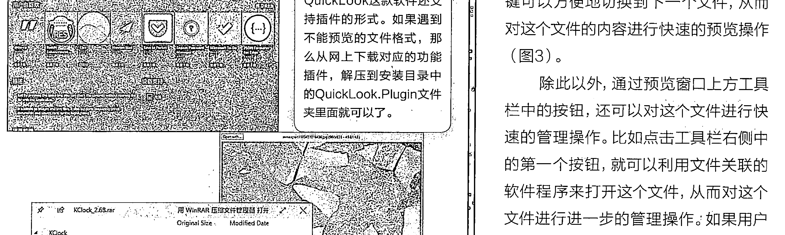

## “钉”住浏览器的应用图标 文/阿立

谷歌浏览器除了拥有大量的功能扩展以外，还有很多不错的应用程序，这些应用程序和扩展最大的区别，就是可以摆脱浏览器的束缚，直接在系统里面进行运行操作。但是通常要运行应用的话需要打开浏览器再点击图标，其实可以直接把应用图标“钉”在Windows 10系统的开始面板上，从而省去启动浏览器的这个步骤。

### 快捷方式锁定开始面板

我们首先启动自己常用的谷歌浏览器或其衍生版本，在浏览器的窗口正中就可以看到已经安装的应用图标。接下来在图标上点击鼠标右键，在弹出的菜单里面选择“创建快捷方式”命令，这时就会弹出一个对话框。我们在弹出的对话框里面勾选上“开始菜单”这一项，再将“桌面”这个选项的对钩去除掉，最后点击“创建”按钮就可以了（图1）。

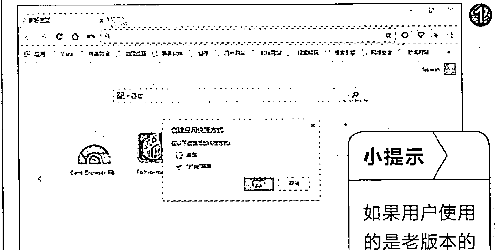

> 小提示
如果用户使用的是老版本的Windows系统的话，那么直接将应用图标添加到系统桌面上就可以了。

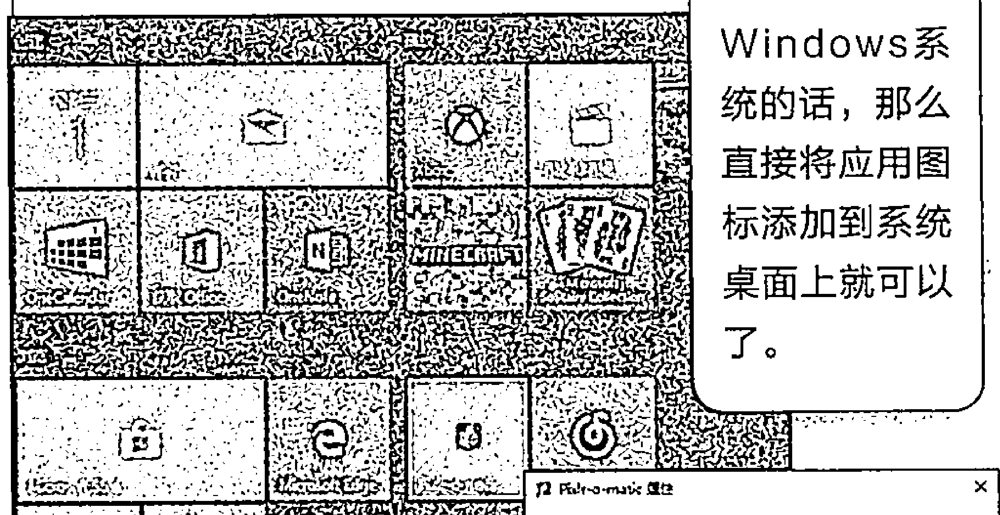

接下来点击Windows 10操作系统的开始按钮，在弹出的开始菜单里面寻找我们刚刚添加的应用图标。找到这个应用图标后在它的上面点击鼠标右键，选择菜单中的“固定到开始屏幕”命令后，在Windows 10系统的开始面板上就可以看到这个应用的图标，以后直接点击这个图标就可以启动浏览器的应用程序了（图2）。

### 还原快捷方式图标本身

前面的方法不仅可以对浏览器应用添加快捷图标，也可以为网页链接等其他内容添加快捷图标。不过有的时候我们在经过前面的操作后，发现在开始面板中出现的应用快捷图标并不是它自身的，而是谷歌浏览器的软件图标。这样看上去非常的不完美，所以我们只能通过其他的方法来加以修改，从而让这种浏览器应用的快捷方式更加完美。

> 小提示
我们也可以通过浏览器的应用商店，来安装需要的其他应用程序。

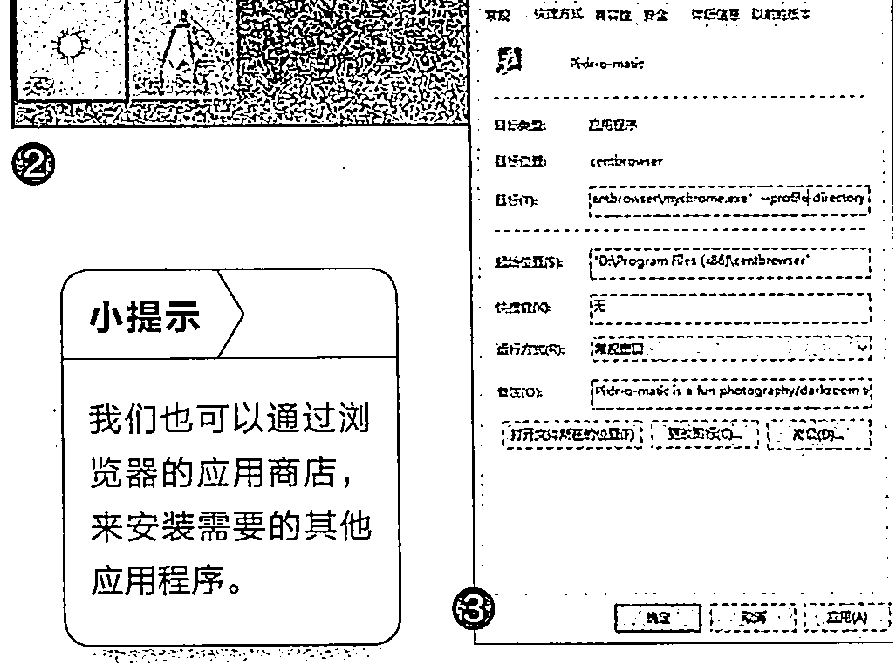

首先在系统桌面上找到谷歌浏览器的图标，点击鼠标右键后，在弹出的菜单里面选择“打开文件所在的位置”命令，这样我们就可以看到浏览器应用程序的文件。接着将chrome.exe这个文件进行复制，在同一个文件夹目录里面进行粘贴。然后将刚刚粘贴的副本重命名为自己喜欢的一个名称，比如我这里就设定为mychrome.exe这个名称，这样就可以摆脱应用图标对浏览器的“依赖”。

接下来在系统的开始面板上找到图标显示错误的应用图标，点击鼠标右键选择“更多”菜单中的“打开文件位置”命令，这样我们就可以看到这个应用的快捷方式。在快捷方式上点击鼠标右键选择菜单中的“属性”命令，在弹出的属性对话框里面选择“快捷方式”标签并在其中找到“目标”这个选项，将输入框里面默认的chrome.exe这个名称修改为我们设置的副本名称mychrome.exe（图3）。最后点击“确定”按钮完成修改操作，这样我们就可以看到开始面板中的应用图标恢复成原有的模样了。

## 远程访问电脑文件夹 文|亦云

如果我们希望通过Internet访问某台电脑的某个文件夹，该怎么办？其实通过FeelHome这款应用软件进行简单设定，就能在任何电脑上用FeelHome客户端或网络浏览器密码来访问特定的文件夹了。

完成一系列注册账号的过程后(图1)，就可以开始正式进入使用环节了。在默认情况下，软件设置为可以访问本地所有文件目录，如果要限制只能访问电脑中特定文件夹下的文件，可通过“Options→Settings”设置窗口，设置Limit Remote access(限制远程访问)目录，比如设置为“F:\999”(图2)。这样设置之后，在远程就只能访问到“F:\999”文件夹下所包含的文件(包括各级子文件夹及其文件)，“F:\999”父目录及其他文件夹无法访问。

> 小提示
注意：上述方式不是将文件放在网上分享，而的确是从电脑里访问文件夹。FeelHome使用安全、保密的HTTPS: SSL协议来传输文件，在不需要进行额外配置的情况下，只需保证账号登录状态，就可以从远程电脑访问文件了。

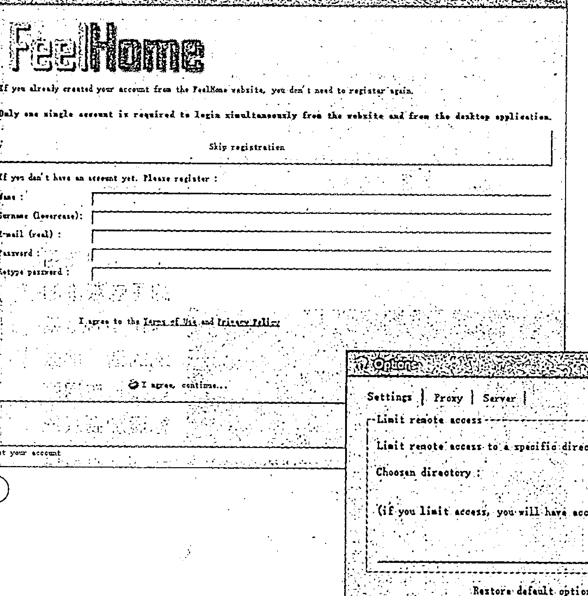

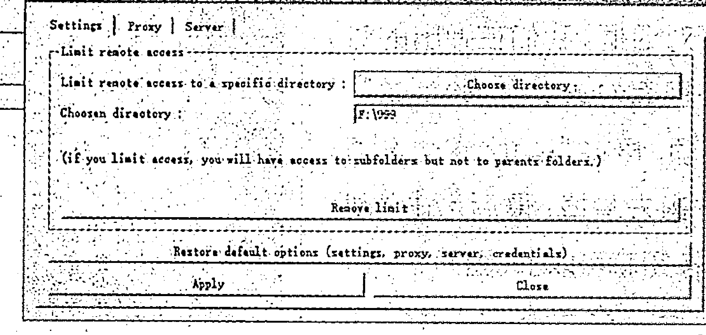

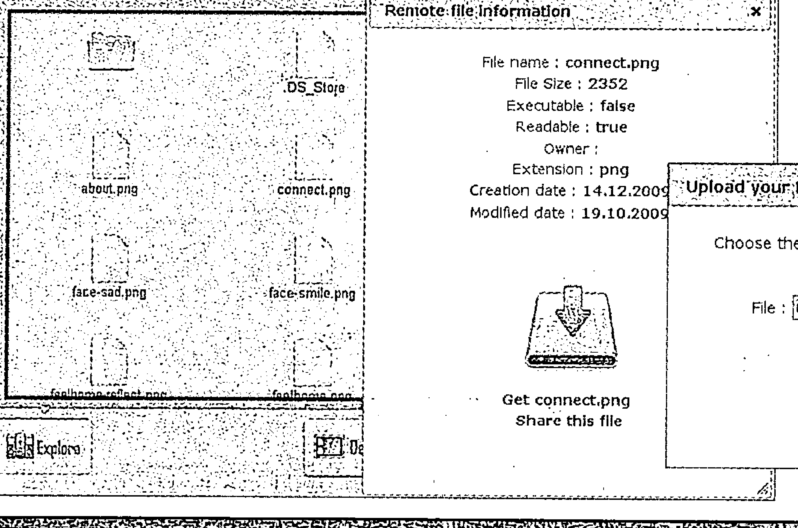

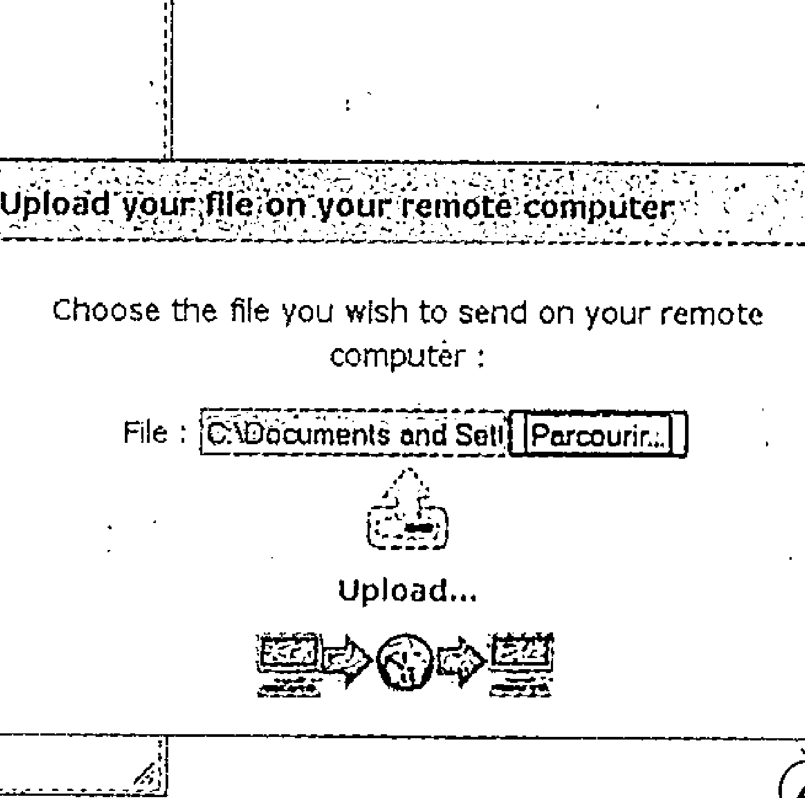

通过远程FeelHome客户端登录自己的账号之后，在窗口中可以看到设定的文件目录，感觉上与在本地文件夹管理器中看到的一样。在操作方式上，与本地文件操作也类似，可以查看远程电脑文件夹中的文件属性，文件名、文件大小、是否可执行、是否只读、扩展名、文件建立与修改日期等详尽的文件属性信息都可以获得(图3)。

如果要共享当前文件给合作者或网友使用，只需选中文件并单击Share this file按钮，即可生成与此文件相关的唯一URL安全地址。将这个地址发送给合作者，对方通过任何一款网络浏览器打开，即可访问到该文件了。

如果要将文件保存到远程计算机，只需在传输窗口中指定要传输的文件，执行传输命令即可进行文件传输了(图4)。

## 无惧文件混乱，自动化分类归档 文|阿楠

有些人没养成及时分类整理文件的习惯，往往将下载或收集的不同类型的文件向某个文件夹中随手一丢了事。这样，时间一长，文件就鱼龙混杂。这时如果才想起给文件分类，往往比较麻烦。利用Sort My Files软件给文件夹中的文件进行自动分类处理，文件瞬间即可变得井井有条。

### 默认分类 各类文件各就其位

首先需要做一些准备工作。由于Sort My Files不能处理子文件夹下的文件，因此需要先将这些文件夹中的文件归并到同一个工作文件夹中。

启动Sort My Files，点击Source Directory后的Browse按钮，指定要处理的工作文件夹（如“F:\Downloads”），下方选择默认的Create Sub Directory选项，点击Sort My按钮，软件即会将音乐、图片、视频、文档、程序、压缩等文件分别转移到Music、Photos、Videos、Document、Program、Compressed文件夹中，剩余不能自动识别类别的所有文件，将被统统归入到Others文件夹中（图1）。分类结束后，显示各项成功分类的标示（图2）。进入资源管理器查看“F:\Downloads”文件夹下的内容，发现已经被自动分为7个子文件夹（图3）。

### 自定分类 分类归档一次完成

如果希望自己设定分类目录，只需选中Specify Path选项，通过列表中的各个Browse按钮，指定分类文件夹。例如将音乐文件存入D盘“音乐收藏”，图片文件存入E盘“图片收藏”，文档文件存入云盘同步文件夹，视频文件存入移动硬盘H“影视收藏”（图4）。这样，在分类的同时将不同类别的文件转移到不同的存储介质，一次性完成文件的分类和归档。

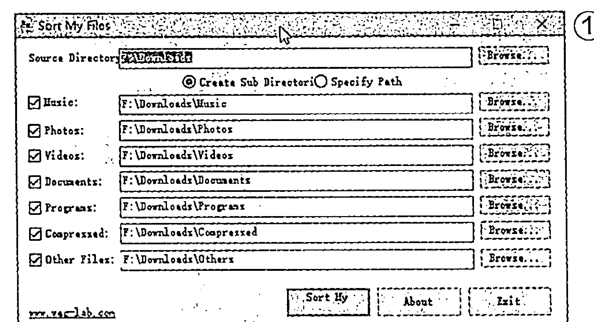

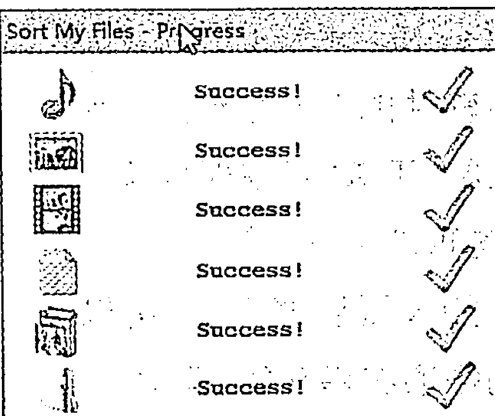

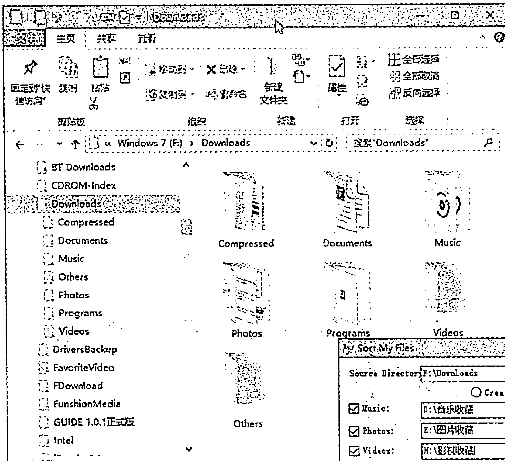

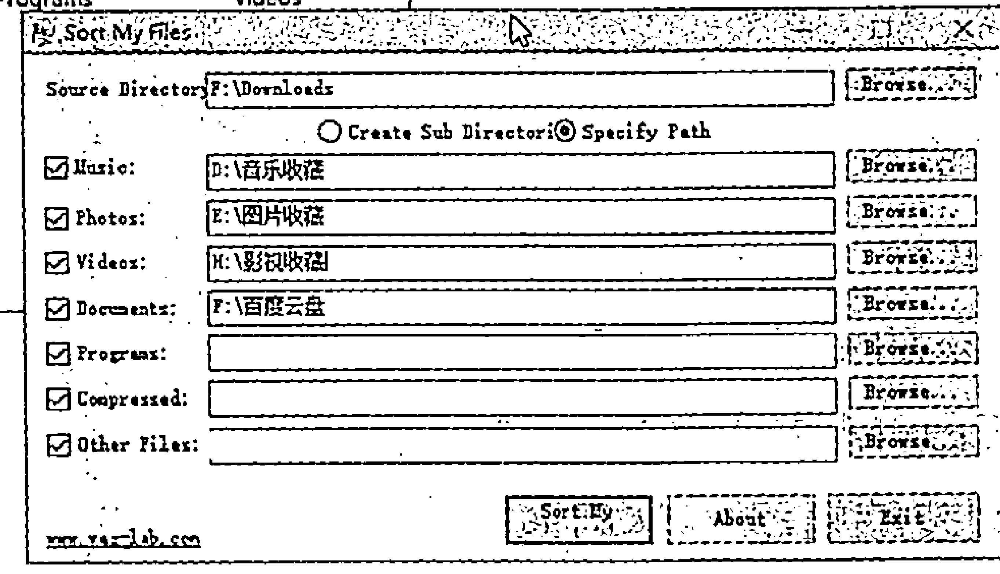

## 信手拈来 一切尽在右键中 文|南溪

此前见到的一些右键菜单维护工具有很强的针对性，或删除或定向添加，总是差点意思。现在，只要使用一个Easy Context Menu小软件（以下简称ECM），就可以实现原来需要多个软件才能实现的功能。

### 常用系统功能 分类入驻右键菜单

常用系统有关功能花样繁多。这么多常用功能，要掌握不同的入口位置，显然比较麻烦。利用ECM添加到右键菜单就比较省事。例如，要在“此电脑”的右键菜单中调用“注册表编辑器”，则只需在该软件的“我的电脑→系统工具”下选中“注册表编辑器”选项即可(图1)。

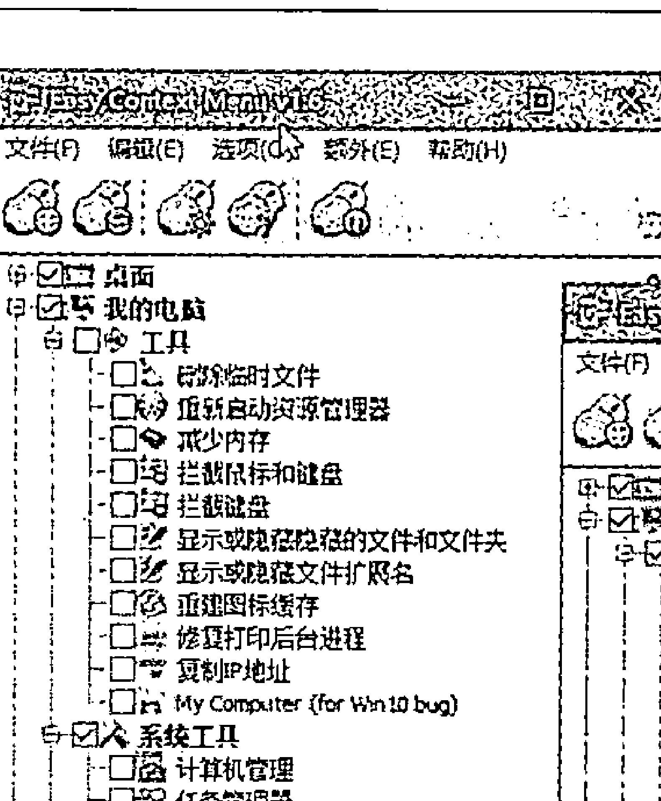

> 小提示
在Windows 10的一些版本中存在一个Bug，在“此电脑”上添加了右键菜单命令之后，可能出现资源管理器无法使用的情况。若遇到这种情况，只需在ECM的相应项目下方选中“My Computer (for Win10 bug)”即可令问题得到解决。

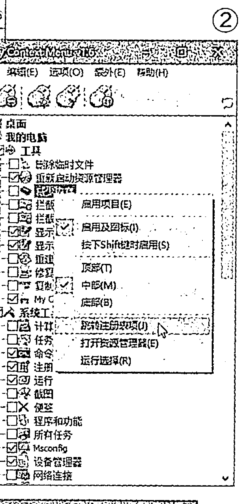

如果要测试ECM所包含的各项右键功能，可直接在ECM窗口中对某项功能单击右键操作。如要跳转到该项相关的注册表编辑器项目，选择“跳转注册表项”(图2)。还可以选择“按下Shift键时启用”，将一些项目从右键菜单中隐藏起来，在用到的时候按下Shift键让其显示出来。需要注意的是，想让设置成功，最后还需要按下Ctrl+S执行“应用更改”命令。

窗口，最后点击“保存更改”按钮即可(图3)。

### 右键菜单减肥 无良厂商不要任性

右键菜单中也会被一些无良厂商利用，添加一些用户根本不需要的项目。我们只需在ECM中按下Ctrl+X组合键，激活“清理右键菜单”窗口，选中需要清理的项目后点击“删除”按钮即可将其清理掉(图4)。

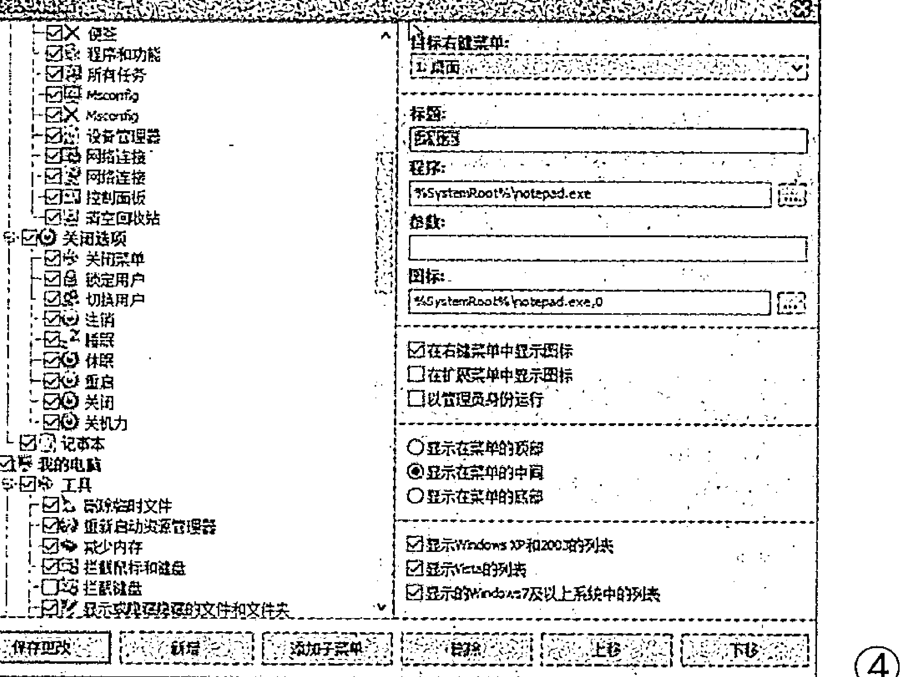

### 右键用防火墙 随意添加程序阻止

如果要将某个程序添加到Windows防火墙阻止的行列，首先在ECM窗口的EXE项目下选中“添加到防火墙”和“从防火墙里删除”两个选项。之后，当在任何EXE软件上右键单击时，就可以选择这两个选项，添加或解除防火墙阻止了。

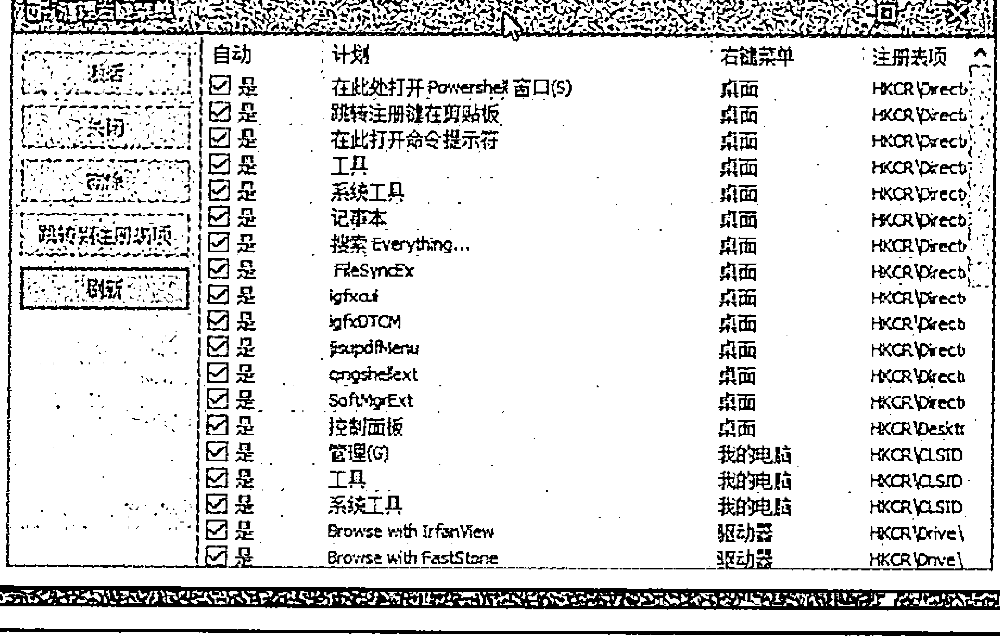

此外，如果希望将某个程序添加到右键菜单中运行，在ECM中按下Ctrl+E打开“列表编辑器”，然后拖动要添加的程序到列表编辑器

## 一拖即得加密文件 文|馨居士

如果有些比较重要的文件不得不存放在电脑中，但需要获取授权才能使用，那么加密无疑是比较好的办法。然而如果需要处理的文件不止一种，每一种加密方法不同，操作起来就比较麻烦。其实，利用Protect Me软件，我们只需简单拖放，即可将一个或多个不同种类的文件转换为密码保护的EXE文件容器来管理。

### 1. 高级算法加密文件的建立

如果要将一个文件夹中的多种文件进行加密处理，只需执行Protect Me安装包解压后的主文件Protect Me! 2010.exe，进入软件窗口之后，从文件资源管理器中将要加密的文件拖动到Protect Me窗口中（图1）。

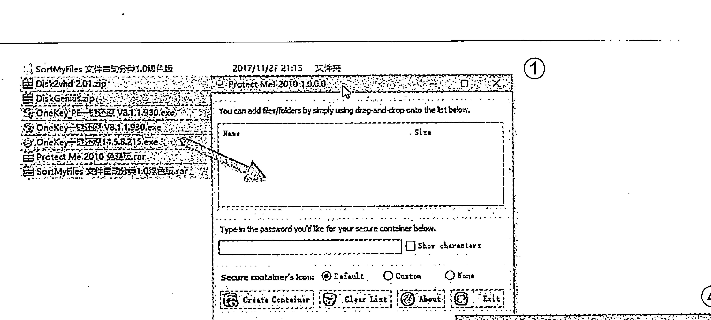

接下来，在窗口中部的密码输入框中输入保护密码。密码设置好后，点击Create Container按钮。随后，在另存为对话框中输入EXE文件的名称，按下“保存”按钮开始建立加密文档。文件建立之后，显示Successfully finished!创建结束的信息（图2）。

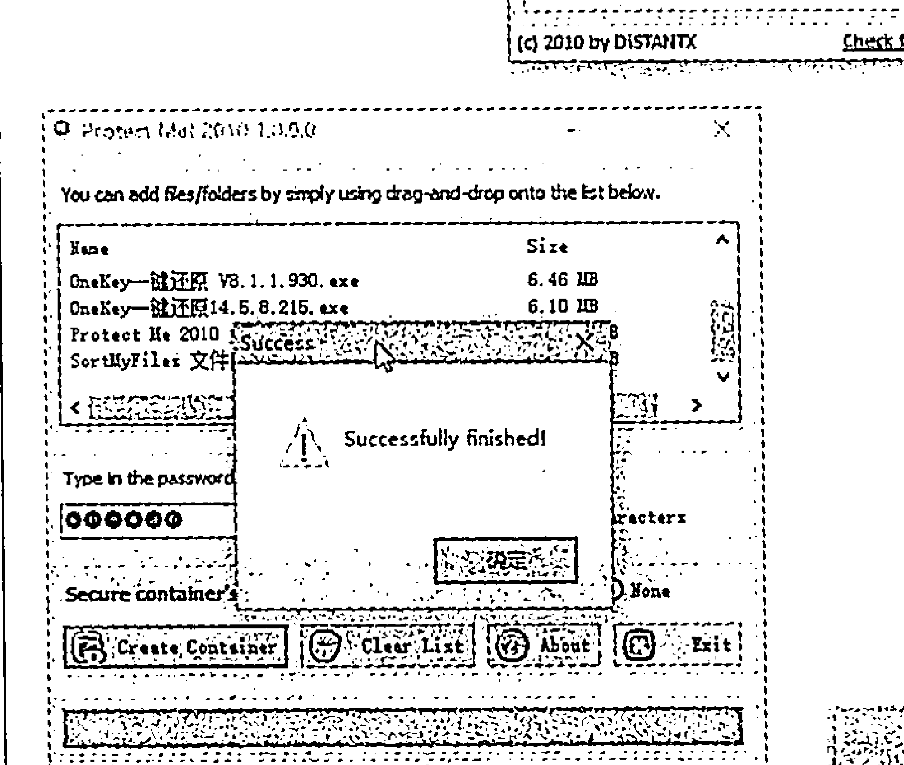

> 小提示
由于Protect Me使用SHA1密码验证和AES加密算法，用它保护文件具有极高的可靠性。

### 2. 如何使用加密文件

受保护的EXE加密文件建立之后，原文件就可以放心地彻底删除了（为了保险起见，请使用文件粉碎软件进行粉碎性删除）。要使用加密的EXE文件，双击文件之后会要求输入密码。密码输入正确后，按下Validate按钮可进入文件管理窗口（图3）。

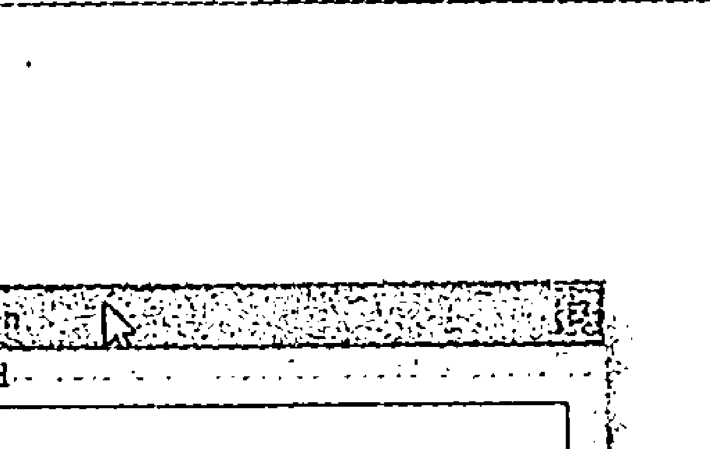

接下来，在加密文件保护窗口中，我们可以用Run按钮直接执行选中的程序或打开选中的文档，用Save As按钮将选中的文件提取出来。如果要将文件全部提取出来，只需点击Extract Everything按钮即可（图4）。

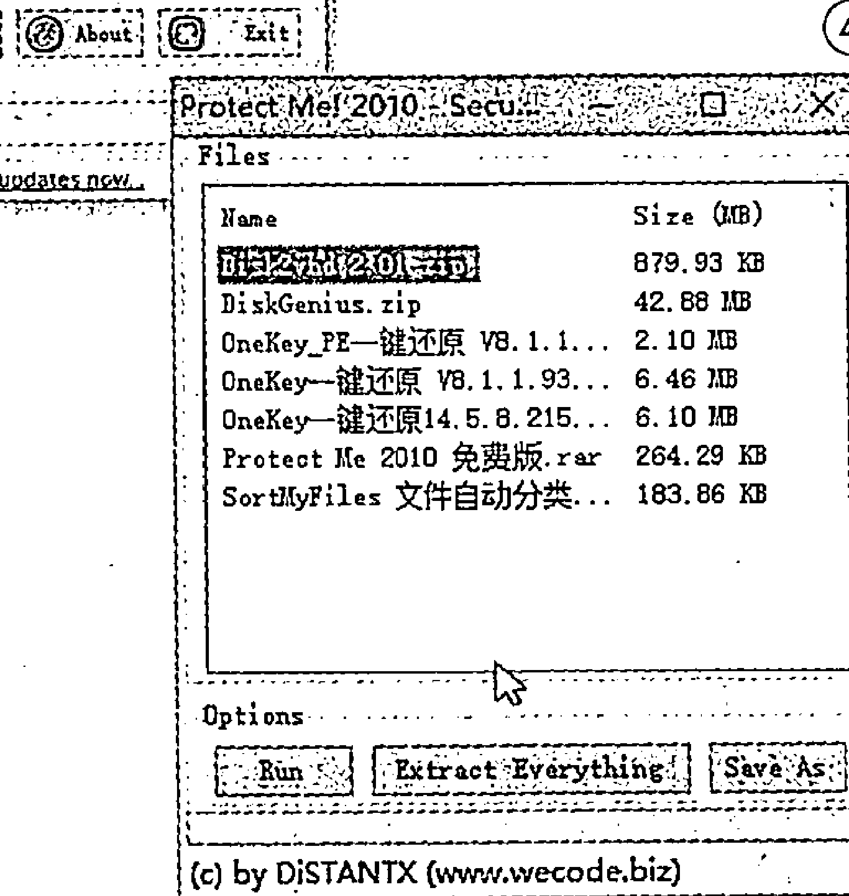

## 特色扩展让浏览器无所不能 文|万立夫

现在无论是谷歌浏览器还是火狐浏览器，它们自身的功能都非常的少。如果用户要想使用更多的功能，就需要安装相应的功能扩展才可以。好在现在两种浏览器的应用商店都非常的丰富，所以用户可以通过安装各种功能扩展来弥补浏览器功能上的不足和缺陷。

### 在页面中同时搜索多个关键词

在网页里面对某个关键词进行搜索，是我们经常需要进行的操作。虽然每款浏览器都有相应的功能，但是这个功能往往只能对一个关键词进行搜索。那么如果想对多个关键词进行搜索又怎么解决呢？

首先通过谷歌浏览器的应用商店，搜索和安装一款名为“Multi-highlight”的功能扩展，安装完成以后就可以在工具栏上看到它的图标。以后当我们需要进行关键词检索的时候，只需要点击工具栏中的扩展图标，在弹出的搜索框里面输入相应的关键词，很快就会在网页上面实时地通过高亮的方式显示出来。如果用户要想输入多个关键词的话，那么只需要在关键词之间通过空格键进行分开就可以了(图1)。而且即使是搜索框关闭以后高亮显示仍然会存在，同时用户打开另外一个网页链接，搜索框中的关键词仍然会高亮显示，直到用户将这组关键词进行删除为止。

### 让每个标签页都有音量均衡器

现在越来越多的用户通过网页在线的方式，来进行收听音乐以及观看视频等操作。这样的操作虽然非常简单，但是要想对音频效果进行控制就变得非常的困难。虽然现在的浏览器每一个标签页都有音量关闭的按钮，但是要想进行各种音效操作却依旧困难。那么如何让每一个标签页都有音量的均衡器设置呢？

现在我们只需要安装“Audio Channel”这款扩展就可以解决这个问题。以后我们无论是在网易云音乐听歌，还是在优酷观看视频的时候，只需要点击工具栏中的扩展图标，这样就会弹出一个均衡器的操作界面。用户只需要根据自己的需要进行设置，然后点击右下角的“Save Preset”按钮，就可以对当前设置进行保存。这样页面中的音频信息也会通过这个功能扩展进行处理，从而让用户获得更好的音频效果(图2)。

### 在浏览器地址栏直接进行翻译

现在在网上查询国外的资料或者在国外的网站进行网购的机会越来越多，这样难免我们就会遇到不认识的外文词汇，从而就需要利用翻译功能来进行操作。但是常见的方法只能是将这些词汇复制下来，然后进入到相关的翻译网站进行查询。这样操

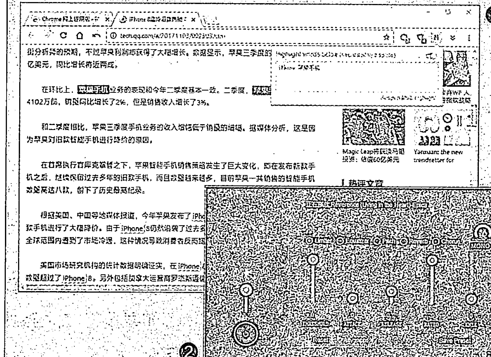

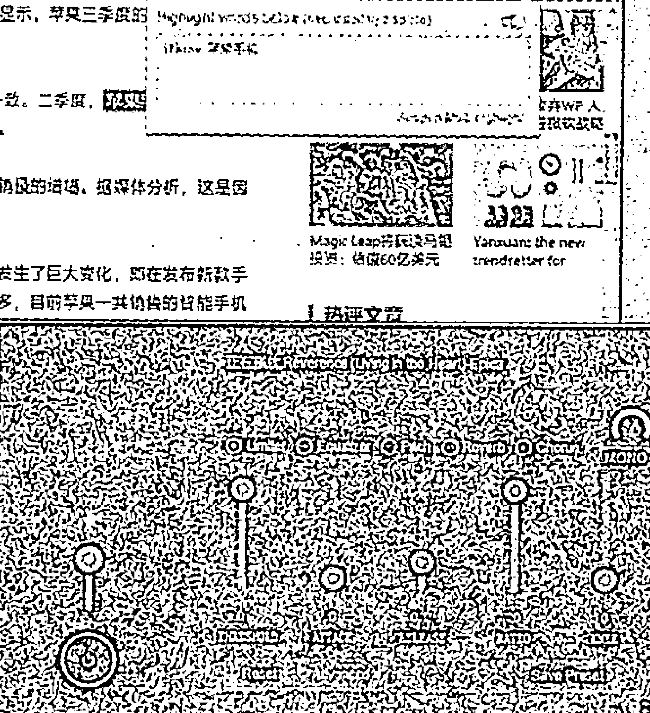

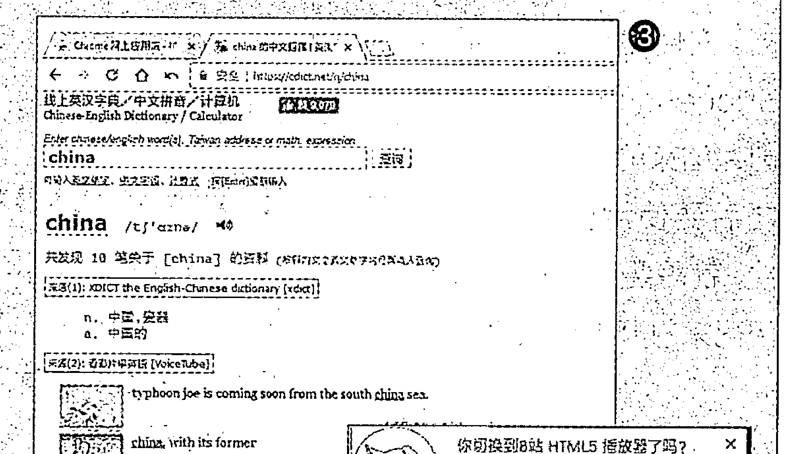

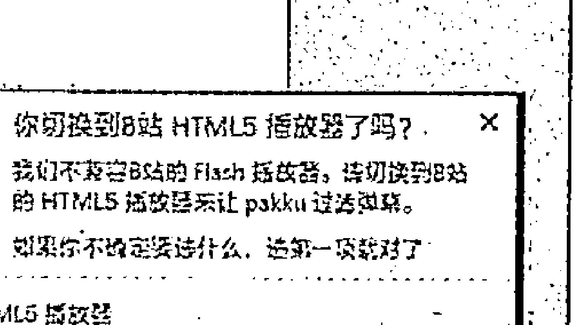操作起来肯定非常麻烦，那么通过什么方法能解决这个问题呢？

现在我们只需要安装“速度翻译”这款扩展就可以解决这个问题。以后当我们需要对某个词组进行翻译的时候，首先在浏览器的地址栏里面输入st，然后按下空格键就会在地址栏的前面出现速度翻译的图标。现在在地址栏中输入需要查询的词汇，按下回车键以后就会弹出一个查询的网页页面。在网页中我们就可以看到翻译的结果，以及这个词组的音标、发音和相关的例句等内容（图3）。

### 哔哩哔哩有针对性的弹幕设置

在B站看视频刷弹幕是很多用户的最爱，但是过多的弹幕也会造成不少的麻烦，如果彻底关闭弹幕的话又索然无味。那么通过什么方法才可以做到“鱼和熊掌兼得”的效果呢？

首先安装一款名为“pakku”的功能扩展，这款扩展安装完成以后会在系统桌面的右下角弹出一个提示框，询问用户播放器是否已经切换到HTML5。如果播放器还没有切换的话，那么直接点击对话框中的“切换到HTML5播放器”按钮就可以了（图4）。接下来扩展会弹出一个设置页面，在里面用户只需要根据个人的喜好，比如时间阈值、编辑距离以及词频向量等内容进行合并（图5）。

### 让图片变灰从而加快访问速度

现在家里上网都是采用包月或者包年的方式，这样可以随意地在网络里面驰骋翱翔，但是并不是什么时候都可以做到这一点。因为有的时候因为网络线路以及网站服务器等原因，我们在访问一个网站的时候会发现非常的缓慢。那么通过什么方法可以解决这个问题呢？

经常上网的用户肯定有这样的感觉，如果只是纯文本的页面访问就快，如果图片信息一多就会影响加载速度。但是如果屏蔽图片的话又影响其他的网站，所以最好的方法就是降低图片的分辨率，这样既可以看到图片信息，又可以加快加载速度。现在下载安装“Bandwidth Hero”这款扩展，安装完成以后点击工具栏中的扩展图标，然后在弹出的对话框里面激活“Bandwidth Hero”选项（图7）。

另外在“Manage disabled sites”列表中可以设置不处理的网站列表，在“Compression settings”列表中可以选择图片压缩的级别。从此以后我们打开任意一个网站，当浏览器发起请求后首先经过扩展运营商的中转服务器，中转服务器将图片处理后再传回用户的浏览器。这样就会发现里面的彩色图片变成黑白的了，可以做到图片和速度同时兼顾（图8）。

## 小工具解决电脑应用大问题

文|老万

我们平时在使用操作系统的时候，难免会遇到各种各样的小问题。但是别看是一些小问题，要解决起来却非常的麻烦，有的时候可以说非常的繁琐。正是基于相同的原因，网上有很多针对一些系统小问题而开发的小工具，所以我们只要利用好它们就可以解决这些棘手的问题。

### 禁止特定设备唤醒电脑

当电脑系统进入到待机状态的时候，如果碰到某一个外接设备的话就会自动唤醒电脑系统，这样有时候就会给用户带来非常大的不便。所以为了解决这个问题，很多用户都是在电脑系统的电源计划里面，对不同的外接设备进行修改设置。不过这样的操作实在是非常的麻烦，而现在利用AntiAutoAwake这款小工具就可以快速地解决这个问题了。

首先启动运行AntiAutoAwake这款小工具（https://github.com/naice/AntiAutoAwake），在窗口的列表中就可以显示出能够进行系统唤醒的外接设备信息。然后在列表中勾选禁止唤醒功能的设备名称，最后点击右下角的“Disable Awake”按钮就可以了（图1）。不过这里需要提醒大家的是，这个工具无法进行相应的逆回操作，也就是说已经被禁用的外接设备无法通过这款工具重新进行激活。如果用户想要进行激活操作的话，只能到系统的电源计划选项里面进行手动操作才行。

### 快速开启ClearType功能

为了让用户在不同的显示器上看的文字效果更好，微软推出了一款名为ClearType的技术。开启后对字体的抗锯齿和边缘平滑确实有很大的帮助，但是在不同的Windows系统版本里面ClearType设置项都不统一。而现在利用ClearType Switch这款小工具，就可以在不同的系统版本里面快速开启和关闭ClearType这个功能。

现在启动运行ClearType Switch这款小工具（http://karpolan.com/software/cleartype-switch/），在弹出的操作界面里勾选上“Enable smooth edges for screen fonts”这个选项。然后在窗口下方的预览框里面查看勾选后的预览效果，如果没有问题的话就点击“ClearType Tuner”按钮，根据向导提示一步步的完成设置操作即可。

```
Command line parameters
Program supports command line parameters and can be used in scripts:
Example: ClearTypeSwitch.exe s+ c-
s - set Font Smooth option: "-" - off, "+" - on
c - set ClearType option: "-" - off, "+" - on
```

“ClearType Tuner”按钮进行确认即可（图2）。如果用户想要禁用ClearType这个功能的话，那么将“Enable smooth edges for screen fonts”前面的对钩去掉就可以了。

### 删除移动设备中的文件

在电脑病毒里面有一类专门通过移动设备来进行传播，一旦将这些移动设备插入到电脑中的USB接口上，移动设备中的电脑病毒就会自动运行安装。所以很多用户都通过关闭系统的自动播放功能来禁止这类病毒的传播，但是由于不同的Windows版本关闭的方法不尽相同，所以处理起来也非常的麻烦。其实我们可以利用USBDriveFresher这款工具将移动设备中的特定文件进行删除，这样病毒就不会进行传播了。

首先下载安装USBDrive Fresher这款工具（https://pan.baidu.com/s/1bCF7XG），启动软件程序后首先选中窗口中的“Automatically cleanup USB Drive when connected”选项，它可以在插入移动设备的情况下自动清理里面的无效文件（图5）。在窗口下方的列表中可以看到软件可以清除的文件名称，我们这里点击添加按钮后，在弹出的输入框里面设置autorun.inf。这样以后有移动设备插入到USB接口的时候，该软件就会自动将这个文件删除掉，从而避免这类病毒的自动运行传播（图6）。

### 不让磁盘被错误格式化

人们常说硬盘有价数据无价，可是有的时候用户可能因为误操作等多种原因对硬盘进行格式化，这样造成大量有用的数据灰飞烟灭。而现在利用Save My Hard这款工具，就可以有效地杜绝错误格式化的操作。

现在启动运行Save My Hard这款小工具（https://github.com/MahmoudH96/SaveMyHard），在弹出的操作界面中我们可以看到三个不同的选项，分别是开启对硬盘的保护措施、在进行格式化的时候显示通知信息，以及在操作系统启动时让软件自动运行。除此以外，在“Protection”下面选择“Disable all format processes”，这样就可以对整个磁盘进行保护（图3）。

### 关机自动关闭特定程序

有的时候我们可能临时有一些急事，所以会匆匆关闭正在运行的电脑程序。可是当我们办完事回家以后，却发现电脑并没有如我们想象的那样进行关闭。出现这样的问题主要是当前正在运行的软件程序阻止了系统的关机进程，所以为了避免这样的情况再次发生，需要在关机前手动将所有的程序都关闭掉。但是一个一个手动关闭肯定非常的麻烦，所以可以借助于CloseToQuit这款软件来帮助解决。

首先下载运行CloseToQuit这款小工具（https://pan.baidu.com/pcloud/home），接着在系统托盘里面找到它的图标。在图标上点击鼠标右键后，在弹出的菜单里面点击“Settings”命令就可以弹出它的配置对话框。在对话框中的“Action”列表中选择软件程序的处理方法，其中包括杀掉、关闭或者运行等等。

然后在旁边的“Program, Class or Part of a window caption”输入框里面，粘贴要进行处理的软件程序路径（图4）。设置完成以后点击“Update”按钮就可以添加到列表中，最后点击OK按钮，这样每次关机之前就不用自行手动进行关闭操作了。

## 虚拟教鞭 演示更专注

文|馨居士

在电子荧幕上看演示虽然方便，但似乎总觉得不及当年老师用教鞭在黑板上指点并敲击来得注意力集中。如果用软件的方式虚拟一根教鞭来演讲，用来“替换”鼠标指针，在屏幕上指指点点，这样形象的演讲方式更能集中观众的注意力。

### 一键呼出 教鞭形象演示

虚拟教鞭演示需要用到一款绿色软件PointerStick。下载软件并解包后，双击EXE主程序即可运行。软件分32位和64位两种版本，我们常用的64位Windows10环境下直接下载64位版本，解压后运行PointerStick_x64.exe程序即可出现教鞭画面（图1）。为方便演示时一键调用，可为主程序建立一个快捷方式，固定到任务栏或桌面上。对于经常使用这一功能的用户，建议选择“随系统启动”复选框，这样更省事。需要说明的是，PointerStick不完全是替代系统鼠标指针，可通过“隐藏鼠标指针”选项，将原系统鼠标指针隐藏掉。

> 点击窗口底部状态栏上的“#LAN”链接选择简体中文汉化软件。软件窗口右上角的关闭图标点击后软件不会退出，要完全退出需要点击状态栏右侧的“完全退出”按钮。

> 如果三连击功能失效，请检查PointerStick设置窗口右侧窗格的“左键三连击”选项是否被选中。如果现场用鼠标控制不方便，也可以使用Ctrl+Alt+Y或Ctrl+Alt+Z两组组合键代替控制教鞭的隐现。要使这两项组合键发挥作用，同样需要选中相应的选项复选框。

### 智能避让 长短样式自定

别担心教鞭会跑到屏幕外，教鞭的方向也会智能地改变。例如，当我们指向屏幕右上角时，教鞭的方向也会变为从屏幕左下角指向屏幕右上角（图2）。当然，如果希望教鞭的方向一直固定，也可以通过“方向”选项列表，将其设为左下、右下、左上、右上等4种之一。如果觉得教鞭的尺寸不合适或样式难看，通过指挥棒的“大小”、“透明度”参数滑块，可随意调节设置教鞭的尺寸和透明度；通过“图像/纹理”参数，从列表中选择二十多种纹理材质，可随意自定义各种外观的教鞭样式（图3）。

### 可有可无 隐现来去自由

教鞭虽形象，但也有不需要它的时候。例如一个需要观众专注的完美画面，教鞭的出现反而会影响观众的视线，这时只需在屏幕上连续三击鼠标，教鞭即可自动隐藏起来。此外，在设置界面右侧下方直接点击“显示教鞭”按钮，或者在任务栏PointerStick图标上右击鼠标，也可以起到显示或隐藏教鞭的作用。

## PPT水晶质感柱形图表制作

文|马震安

在利用PowerPoint自带的柱形图表展示数据时，柱形图总是显得非常单调、枯燥，但如果利用自选图形取而代之，通过对自选图形的三维设置生成水晶质感的效果图，再将相关图片组合，生成水晶质感柱形图表，这样所呈现出来的效果就与众不同了（图1）。那么，这种效果如何才能实现呢？

首先设置好PPT幻灯片的背景色。选择“视图”选项卡，点击“网格线”，利用自选图形画出一个矩形，右击矩形，选择“编辑顶点”，参考网格线，通过对4个顶点的拖动，形成一个斜角矩形（即水晶体的侧面）；再次右击这个矩形，选择“设置形状格式”，在“设置形状格式”窗口的“填充与线条”中，无线条，填充选择“渐变填充”，类型为“线性”，角度为45度，3个渐变光圈，光圈颜色统一设置为白色，最左边的光圈透明度为60%，中间的光圈透明度为80%，最右边的光圈透明度为95%；复制这个矩形并粘贴，将粘贴出的矩形水平翻转，将它的填充角度设置为0度。将这两个矩形拼接在一起，根据拼接形成的角画一个菱形，编辑菱形的顶点，使菱形、两个矩形组合成一个棱柱形。设置菱形无线条，填充为“渐变填充”，调整好它的渐变角度。

接下来将这3个形状组合，复制粘贴，调整粘贴出的组合体各自选图形的填充颜色，将这个组合体高度调整到柱形图要求的比例（如45%），并将它与之前的水晶柱体重合；选中这个组合体中的自选图形，调整顶点，使之与水晶体完全重合，将水晶体置于顶层，再将这两个组合体组合，设置新组合体的阴影效果。复制粘贴这个组合体，调整粘贴出的组合体颜色及高度。以此类推，制作出其他水晶柱形图（图2）。

最后插入所需要的图例和数据，放在图表相应位置，一个别具一格的水晶质感柱形图表就制作完成了。

也许大家觉得上述操作可能有些繁琐，其实，利用自选图形的三维设置也能制作出较好的水晶质感柱形图表。

设置好幻灯片的背景色，插入一个形状，白色填充，白色边线；选择“格式”选项卡，点击“形状效果”下“预设”中的“预设10”；右击这个形状，选择“设置形状格式”，在“设置形状格式”窗口的“形状选项→效果”选项卡中，“三维格式”处：深度大小设置为300磅，材料选择“半透明粉”，Y旋转设置为310度，透视为30度。再重复制作一个小一号的形状，纯色填充，实线，线条颜色和填充色一致。最后，将这两个形状组合在一起。这样，也能制作出水晶效果的柱形图表来（图3）。

## 省时省力规划Word长文写作

文|俞木发

很多人喜欢使用Word撰写长篇文档，但是在撰写文档之前并没有进行好好规划。这样在文档完成后，后续需要对文档进行编辑时就会非常麻烦。比如图注是使用“图1”、“图2”的形式连续标注，发现“图9”是多余的需要删除，为了保证序号的连续性，此时就不得不需要对后续的图片重新排序。其实类似的问题，如果能在撰写文章之前做好规划，用Word本身的组件就可以完美规避这些问题。

### 段落要统一用好Word样式

对于长篇文章，我们一般要建立目录、定义标题格式、正文格式等内容。这些内容都可以在Word的样式中预先设置，因此在撰写长篇文章时我们要先确定长篇文章使用的格式。比如笔者所在公司对正规文档的要求是：正文用宋体五号，行距20磅，一级标题用小三粗黑体，二级标题用四号粗黑体。下面我们就可以根据这个要求设置样式。

首先在Word中输入“一级标题”，接着选中并设置字体为“黑体，三号，加粗”，点击上方的“样式→创建样式”。在打开的样式对话框点击“修改”，新建一个名为“公司文档一级标题”的新样式，样式基准为“正文”，后续段落样式选择“正文缩进”（图1）。

点击下方的“格式→段落→缩进和间距”，将“大纲级别”设置为“1级”（即和实际标记级别对应）。这里我们还可以根据实际情况对其他选项进行设置，比如正文需要设置行距20磅等参数（图2）。

返回图1界面，继续点击“格式→快捷键”，在打开的窗口中“请按快捷键”处按下Alt+1，点击“指定”，将这个快捷键作为该样式使用（图3）。

操作同上继续完成二级标题、正文的样式设置，这样以后就可以在撰写文章时快捷引用了，而且应用样式后就可以在后续编辑中，批量对指定段落进行快速编辑，如更换字体、字号、建立目录等操作。

### 图片、表格序号自动加

如上所述，如果在撰写文档的时候是使用手动为图片、表格添加序号，这样在后续的增删时会为手动调整序号带来巨大的工作量。这里我们可以使用Word的“题注”功能实现自动编号。

打开包含图片的文档，点击“引用→插入题注”，在弹出的窗口点击“新建标签”，弹出“新建标签”窗口，在“标签栏”录入“见图”，点击“确定”按钮（图4）。

返回“题注”栏，此时题注内容会自动填充为“见图1”（图5），这就是文中图片序号样式（可以根据自己的实际需要设置，如变为“见图01”、“如图所示01”等）。这样在文中第一张图片需要插入序号时，定位到图片下方后点击“引用→插入题注→确定”，在图片的下方就会自动添加“见图1”的题注。同理在第二张图片下重复上述操作则插入“见图2”的题注，其他图片依此类推。

这里题注和手动编写不同，比如删除某张图片和题注，那么在下一次继续重复插入题注操作后，所有后续题注都会同步更新为连续序号，无需手动操作。如果觉得手动插入操作麻烦，还可以通过录制宏的方法实现快速录入。点击“开发工具→宏→录制宏”，新建一个名为“插入题注”的宏，为其指定快捷键Ctrl+1。

开始录制宏后重复上述插入题注的操作，这样以后我们需要插入题注时，只要定位到需要插入题注的区域，按下Ctrl+1即可完成题注的录入（图6）。

### 变身模板 下次直接用

进行了上述的设置后就可以将这些设置保存为模板供下次使用。这样下次撰写文章的时候，如果输入的是一级标题，则选中文字后按下Alt+1，一级标题就会自动套用上述格式。为图片或者表格添加序号则按下Ctrl+1自动编制序号，可以快速生成标准文档的格式。而且使用上述样式撰写的文章，只要切换到大纲模式，点击“引用→目录→选择一种目录样式”，瞬间就可以生成长文档的目录了，而且生成目录后点击相应的目录可以快速定位到指定的章节（图7）。

当然还可以瞬间改掉同级内容（如标题或正文）的段落样式。比如文章撰写完成后，Boss要求一级标题的颜色，字体需要设置为宋体、五号、红色字体，那么只要切换到大纲视图，显示界别为“1级”，此时全选一级标题即可快速进行更改。同理，其他同级目录的选择类似（图8）。

怎么样？使用上述方法规划后，以后撰写长文章是不是省事多了！

## 管理更便捷 使用Excel生成条形码和二维码

文|俞木发

随着信息化管理的推进，现在很多公司都在使用条形码和二维码对产品库存、销售进行高效管理。虽然生成条形码和二维码均有专用的软件可选，但其实借助最常用的办公软件Excel，也能快速生成条形码和二维码。

### 控件生成条码

现在很多产品都有条形码，这样通过扫描枪可以很方便地完成对商品信息的读取和录入。如果要在Excel中生成条形码，借助其自带的Microsoft BarCode控件即可快速生成。

启动Excel后点击“文件→选项→自定义功能区”，勾选右侧自定义功能区的“开发工具”，将其添加到主选项卡。返回Excel主窗口，点击“开发工具→插入→其他控件”，在打开的控件列表中选择Microsoft BarCode Control 16.0控件。

将鼠标定位到A2单元格，然后拖动鼠标绘制一个单元格大小的矩形，这样在A2就会自动生成一个条形码。右击条形码选择“Microsoft BarCode Control 16.0→属性”，在打开的属性窗口中按自己的需要选择条码样式，如“2-EAN-13”（图1）。

这样在条形码下方就会出现一串数字代码，接下来就是要将这个代码和实际商品的编码对应起来即可（图2）。

首先在B2输入商品的实际编码，如6901028141130；接着右击A1并选择“属性”，在打开的控件属性窗口中，将Linkedcell的值设置为B2（即将条码代码链接到B2的实际代码（图3）。这样在A2就会显示正确的数字代码，以后使用扫描枪直接扫描就可以快速识别出这个条形码对应的实际商品了（图4）。

WPS也自带生成条形码的组件。启动WPS表格后点击“插入→图库→条形码”，在打开的制作窗口中选择编码EAN，输入商品的具体编码后即可自动生成相应的条形码，点击“插入”即可在表格中使用了（图5）。

> 小提示
国际标准条码一般使用EAN8（8位数字）或者EAN13（13位数字），对应控件中的3-EAN-8和2-EAN-13。具体条码格式请根据自己的实际商品进行选择。

### 插件生成二维码

除了条形码，现在二维码的应用也日渐普及。在Excel中借助“Excel二维码控件”可以快速生成所需的二维码。

到http://www.pc0359.cn/downinfo/58570.html下载所需的控件并安装，启动Excel后会增加一个“二维码”菜单，点击即可按照自己的需要生成所需的二维码。因为二维码主要是用于手机扫描快速阅读，因此我们可以根据实际数据进行二维码的设置。比如领导很关心每月的报表数据，但是直接将报表数据发送到老总手机查阅很不方便，便可以将数据直接转换为二维码。

比如需要查看3月的销售数据，点击“二维码→选择多个串联多单元格”，然后按提示输入A4,B4,C4，点击“确定”，在Excel中即可生成二维码（图6）。

这样在打开报表后直接使用微信的“扫一扫”，或者将这个二维码发送到手机，在手机上扫描后就可以出现上述单元格的内容（图7）。

因为二维码可以非常便捷地将屏幕内容传输到手机上显示，如果报表内容包含较多数据，假设第500行3列内容是最终统计数据，可以在A1生成该单元格的内容，用户只要扫描A1就可以快速在手机上获取最终统计结果。

同样二维码也可以显示网址，比如可以将报表文件上传到网盘，然后在网盘分享该文件链接，并将该链接内容在单元格中生成为二维码。这样用户可以在本机阅读报表，如果要在手机上阅读，则直接扫描二维码后链接到网盘在线读取即可。

WPS用户也可以直接使用自带的组件完成。启动WPS表格，点击“插入→图库→二维码”，在打开的二维码设置窗口中按提示输入需要生成二维码的文字或者链接，点击“确定”即可。由于WPS二维码的设置需要自己手动输入文字，因此如果要实现上述类似Excel数据的效果，则需要预先复制指定单元格的内容到文本编辑窗口（图8）。

## 制作信封打开动画效果

文|马震安

在演讲过程中，有时我们会利用幻灯片展示读者来信，如果单纯以文字或照片的形式显示来信，就会显得枯燥乏味。若能以打开信封的动画形式来展示来信内容，那效果可就不一般了（图1）。那么，这样的动画效果在PPT中如何实现呢？

首先制作信件。将空白幻灯片的背景色设置为黄色，插入两个长宽都相等的长矩形，一个填充为深灰色（作为封底），一个填充为白色（作为封面），将两个矩形完全重合并且将白色矩形置于深灰色矩形之上。先制作封面，插入一个倒三角形，宽与信封一致，无线条。再插入一个椭圆形，使椭圆与倒三角形的两边相切，按图中样式摆放。选中倒三角形和椭圆，选择“格式”选项卡“合并形状”下的“拆分”，删除多余图形。将两个图形剩下的图形选中，选择“合并形状”下的“联合”，得到一个圆角的三角形。

将得到的圆角三角形复制、粘贴一份，填充浅灰色，并将这个浅灰色圆角三角形垂直翻转并如图中摆放。再画出一个矩形，让它与倒三角形头部相互重叠，先选中倒三角，再选中新插入的矩形，选择“合并形状”下的“剪除”，就会得到一个倒梯形；选中白色矩形，再选中新生成的倒梯形，选择“合并形状”下的“剪除”。为了效果逼真，还需要加上一些光影。插入一个细长的三角形，填充色为渐变（灰-白），如图中摆放，复制一份对称摆放。当然，信封的颜色也可以进行更改。将信封、光影进行组合（图2）。

接下来，制作信件内容。加上一个矩形，添加信件内容，调整这个矩形的图层顺序在信封封面和封底中间，将信件内容的上端与信封对齐（图3）。

最后设计动画。首先复制信封打开的三角形，将复制后的三角形垂直翻转，填充色与封面颜色相同，加上灰色边框，盖在信上。接下来，选定倒三角形，设置退出动画：层叠，到顶部；正三角设置进入动画：伸展，自底部，上一动画之后，给信纸设置向上的路径动画（图4）。

至此，带有打开动画效果的信封制作完毕。按下播放按钮，点击鼠标，就可以看到信封会自动向上打开，信件内容也会自动向上移动出现，动画效果生动形象。

## 用PPT制作更炫酷的立体字

文|马震安

与使用普通文字相比，在幻灯片中加入立体字更能为作品锦上添花。虽然使用PPT中自带的艺术字功能可以快速生成立体字，但效果看起来有些呆板。如果以自定义的方式来生成艺术字，产生的立体效果就不可同日而语了（图1）。

首先，在空白幻灯片中插入横排文本框并输入所需要的文字，设置好字体、字号并加粗。选中文本框，选择“格式”选项卡，点击“文本效果”下的“转换”，选择所需要的形状和效果（如淡出：左远右近）。通过拖动文本框上的黄色变形按钮对文本形状进行调整（图2）。

右击文本框，选择“设置形状格式”，在右侧“设置形状格式”的“文本选项”卡中，点击“文本轮廓与填充”下的“文本填充”，选择“渐变填充”，类型选择“线性”，角度为“90度”，渐变光圈保留两个，设置其颜色、背景和色深（例如，最左边的颜色为“浅灰色，背景2，深色50%”，最右边的颜色为“浅灰色，背景2，深色90%”）（图3）。

接下来，选择“文本选项”卡下的“文字效果”选项卡，点击“阴影”展开，在“预设”处选择“外部”下的“偏移：中”，透明度处设置为“0%”，设置模糊程度（如设置为“22磅”），设置角度（如设置为49度）（图4）。

点击“三维格式”展开，“顶部棱台”处选择“棱台”下的“圆形”，设置宽度、高度和深度（比如宽度设置为2磅，高度设置为1磅，深度大小设置为15磅）；点击“三维旋转”展开，“预设”处选择“透视”下的“透视：前”，设置透视度数（如“透视”处设置为“80度”）（图5）。通过上述设置，新颖别致的立体字就制作成功了。

> 小提示
上述操作完成后，也可以拖动文本上黄色的变形按钮改变三维文字的形状。当然，设置过程中所涉及到的参数也可以根据自己的实际需要进行更改。

## 化整为零巧用PPT表格制作拼图动画

文|愚人

大家知道在PPT中可以使用动画，不过常规的方法只是简单为某张图片加上动画效果。想让自己的PPT更出彩，我们可以使用PPT表格来制作拼图动画。

启动PowerPoint 2016后点击“插入→表格”，按自己的需要插入一个表格。这里表格动画最终效果是由每个单元格组合而成，因此这里插入表格的多少需要根据图片进行设置。如果选择的图片元素较为丰富、细腻，则插入的表格要多些（后续则要根据单元格的多少设置不同的动画），否则尽量少些。笔者这里选择的是一张大学校门图片，这里为了简单，插入一个4列×4行的表格，接着将表格拉伸以填满整张幻灯片（图1）。

准备一张用来作为拼图动画的高清图片，建议到https://pixabay.com/下载免费高清图片，图片尽量选择组件较多的画面，这样拼图动画效果更好。找到所需的图片后插入PPT并将其覆盖在表格上方，同时裁剪到和表格大小一致，裁剪时尽量保证图片元素丰富（图2）。

选中图片执行“剪切”操作，将图片传输到剪贴板。按Ctrl+A全选表格，右击选择“设置形状格式”，在右侧窗格切换到“形状选项→填充”，单选“图片或纹理填充”，点击“剪贴板”，同时勾选下方的“将图片平铺为纹理”；这样图片就被自动填充到所有单元格中（图3）。

因为这里表格仍然是一个整体，拼图动画需要将每个单元格分离，分离操作借助“选择性粘贴”即可完成。同上按Ctrl+A全选表格，接着右击选择“剪切”，点击“开始→粘贴→选择性粘贴”，在打开的窗口中选择“图片（增强型图元文件）”，点击“确定”（图4）。

这样在幻灯片中粘贴后表格就会转换为图片，右击转换后的图片选择“组合→取消组合”，在弹出“是否要将图片转换为Microsoft Office绘图对象”时，选择“是”。然后继续选择“组合→取消组合”，点击“开始→选择→选择窗格”，此时在右边的窗格可以看到表格已经被分离为多个线段和单元格，分别对应“linexx”和“picturexx”（图5）。
接下来为每个线段和单元格添加动画即可。先选中A1单元格，点击“动画”，为其添加一个“翻转式由远到近”的进入动画效果，动画的开始设置为“与上一动画同时”、持续时间设置为0.5s，延迟设置为0s。
完成动画的设置后，点击“高级动画→动画刷”，依次使用动画刷点击A2、A3等其他单元格，为所有单元格加上同样的动画效果。最后再选中线段，为其添加“浮入”动画效果，同样使用动画刷为其他线段添加一样的效果（图6）。

这样一幅由校门图片组成的表格动画就完成了，点击预览，可以看到原来照片各个部分是以拼图形式逐渐组合而成。现在将这样的画面放在PPT的封面，作为介绍母校的PPT看起来是不是更出彩？
通过上面的操作可以看到，拼图效果的关键是将表格转换为可编辑的图形，然后为每部分添加动画即可实现拼图动画效果。使用同样的方法我们可以制作出其他动画，比如可以制作圆形作为拼图动画。
点击“插入→圆形”，同时按住Shift键，然后将其大小设置为20cm。继续插入二个矩形，大小调整为高20cm、宽10cm，并将其边和圆的直径对齐。依次选中三个图形，点击“绘图工具→格式→合并形状→相交”，得到一个1/4圆形（图7）。
按住Ctrl键复制3个获得的1/4圆形，通过旋转复制的1/4圆形，将其组合成一个圆形。同上准备一张花形图片粘贴在圆上，点击“裁剪→裁剪成形状→圆形”，并将这个裁剪形状调整为和上述组合圆大小一致，点击“剪切”，将花形图案传输到剪贴板。按Ctrl+A全选圆形，右击选择“设置形状格式”，在右侧窗格切换到“形状选项→填充”，单选“图片或纹理填充”，点击“剪贴板”，同时勾选下方的“将图片平铺为纹理”，这样图片就被自动填充到组合圆中。其他操作同上，依次为不同的1/4圆形添加动画，这样基于圆形的拼图动画就完成了（图8）。

## “泼”出精彩用好PPT中的墨迹技法

文|周建峰

墨迹，作为一种颇具古典风味的中国风设计技法，在幻灯片中相当常用。墨迹特效将中国传统的书法神韵与幻灯片完美结合起来，运用得当会有一些意想不到的效果。本文就囊括了目前常用的3种墨迹制作技法，掌握后可根据需要进行运用，让自己的作品更具东方雅韵。

### 用图形

PPT中的图形绘制合并功能，可以绘制出各式各样的墨迹图，如果鼠标绘制效果不满意，则还可以“拿来主义”，使用高手绘制好的精致逼真的墨迹图形。在页面上添加一张图片，按Ctrl+D复制粘贴一份，将两张图片四周对齐；切换到“插入”选项卡，选择“形状→线条→自由曲线”，在图片上面绘制一个类似于墨迹的图形，右击图形选择“编辑顶点”，在图形上右击，可通过添加顶点、平滑顶点等操作（图1），对图形的边框进行调整，让其更接近于一个墨迹图形。调整结束后，切换到“开始”选项卡，单击“选择→选择窗格”（图2），会看到当前页面中的所有素材列表，素材的名称是按照素材的层次从上到下依次显示。单击列表中最下方的Picture2，可以选中位于最底层的图片，然后切换到“格式”选项卡，选择“颜色→重新着色→冲蚀”效果。按住Ctrl键，先点击选择窗格中的“Picture2”（中间的那个），然后再单击“任意多边形”，注意这里的顺序，一定要先选择图片再选择图形；切换到“绘图工具”下的“格式”选项卡，单击“合并形状”选择“相交”，则将图片做成了墨迹效果。最后还可以给墨迹图片添加边缘柔化效果和标题文字，让墨迹效果的设计感更强（图3）。如果感觉自己鼠标绘制的墨迹不够逼真，还可以上网找到高手绘制的精细的墨迹图形，这里笔者推荐“美化大师”这个PPT插件。安装后切换到“美化大师”选项卡，单击“资源广场”按钮弹出窗口（图4），选择“形状”后输入“墨迹”，单击“搜索”按钮会显示两个墨迹资源库，单击后可以看到各种各样的墨迹图形，选中需要的墨迹图形，单击“插入选中形状”按钮即可添加到PPT中。另外笔者搜集整理了一部分墨迹图形，需要的朋友可以下载（https://pan.baidu.com/s/1o7QzUJ4）。由于这里的墨迹图本质上都是PPT中的图形，所以右击选择“编辑顶点”可以进行二次加工。

### 选字体

有一种名为“road rage”的英文字体（http://font.chinaz.com/160624205431.htm），它的边缘非常毛躁，就像是用毛笔写出来的。为字母或符号使用这种字体，再与图形进行相交处理，就能得到不同的墨迹图。

在页面上添加文本框，在其中输入符号“{”，然后将其字体设置为“road rage”，此时会看到符号就成了粗粗的墨迹；绘制一个图形位于符号下方，然后选中图形和符号，切换到“格式”选项卡，选择“合并形状→相交”，即可将符号转换成图形（图5）。

连续按Ctrl+D键生成多个图形，然后全选图形，切换到“格式”选项卡，选择“合并形状→组合”将多个图形合并成一个图形（图6），最后就可以将墨迹应用于图片上。

除了这种字体，笔者还发现一些中文字法字体和笔画结合起来，也可以用来做墨迹。比如，在“求字体网”（www.qiuziti.com）搜索“书法字体”就可以看到很多书法字体，这里选用“李旭科毛笔行书”字体。使用搜狗拼音输入“pie”，即可得到笔画“丿”，设置为“李旭科毛笔行书”，然后使用图形“相交”功能，将笔画转换成图形，再复制多个图形进行“合并”操作就得到了一个墨迹图，最后与图片进行相交处理就能做出精美的墨迹图（图7）。另外还可以将书法文字直接与图片进行相交做出文字墨迹图。

### 借图片

对于那些精益求精的人来说，墨迹必须亲自泼墨挥毫，书写在宣纸上。对于这种百分百的原创墨迹，我们可以拍照发到电脑中，再通过OneKey这个插件，就能轻松将图片作为墨迹。

首先在白纸上绘制墨迹，最好是宣纸，那样墨迹感更强。如果没有毛笔，可以用柔软的面纸粘上墨汁进行涂鸦。然后扫描或拍照作为图片导入到PPT中，切换到“格式”选项卡，选择“删除背景”将白色背景删除，再单击“颜色”选择“重色着色→灰度-25%”（图8），最后就生成了一个手写的墨迹图片。

添加一张图片，将该图片置于墨迹图片的下一层，按住Ctrl键先选中图片，然后选中墨迹图片，切换到“OneKey 8”选项组，选择“图片混合→正片叠加”生成墨迹图，再删除原来的图片，最后加上文字即可做出精美的墨迹效果（图9）。

## 简单高效 玩转Excel的单元格合并

文|愚人

日常的工作中，我们经常需要对一些单元格进行合并。比如格式的产品编号，现在变更了配方，需要在原来的编号前添加N，也就是将一列N字符和原来的产品编号合并。对于类似的合并，手工操作显然费时费力，其实我们可以有更为高效的合并方法。

### 因地制宜用好Excel简单合并功能

对于上述类似的合并需求，Excel本身已经自带很多合并功能，我们只要简单使用即可完成合并操作。以上述介绍的合并需求为例，假设原始数据在A列，选中B2，在其中输入“="N"&A1”（&是Excel的连字符，因为这里连接的是“N”这个字符，因此注意N需要使用半角双引号标注），将这个公式下拉即可完成字符的合并了（图1）。

使用“&”可以将任意字符（或指定列）连接起来，比如很多原来的淘宝地址是按照省市区（县）分列，现在需要将地址连接起来。同样在需要合并的单元格如G1中输入“=C1&D1&E1&F1”，然后下拉即可完成地址合并（图2）。

因为可以在连接时使用字符，因此我们可以根据自己的实际需要进行说明字符的添加。比如很多员工户籍和实际居住地址是不同的，现在需要在上述地址前添加“xx户籍地址是”这样的字符，那么将上述公式更改为“=A1&"户籍地址是"&B1&C1&D1&E1”即可（图3）。

当然对于类似的简单合并，Excel还有很多组件可以直接使用。比如自动填充功能，对于上述“N”字符的添加，只要在C1、C2输入两个示例，然后向下自动填充即可。而且自动填充可以智能学习，所以对于一些特殊的填充，比如上述示例中是需要在GQ后面添加“N”，同上在C1、C2中输入GQ N4567、GQ N4568，然后向下填充即可（图4）。

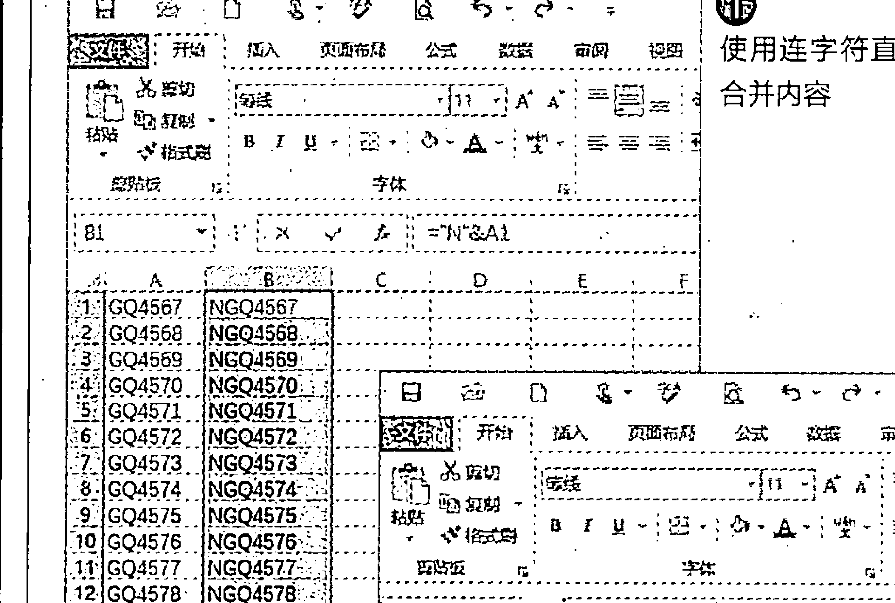

### 用好函数 快速完成特殊合并

上述方法只是适用于简单的数据合并，对于一些特殊的合并需求，则要借助Excel内置的函数来高效完成了。

### 使用CHAR函数实现合并后换行

如上述地址示例需要合并，并且合并完成后地址和姓名要分为两行，同时在名字后面添加“（收）”字，这样

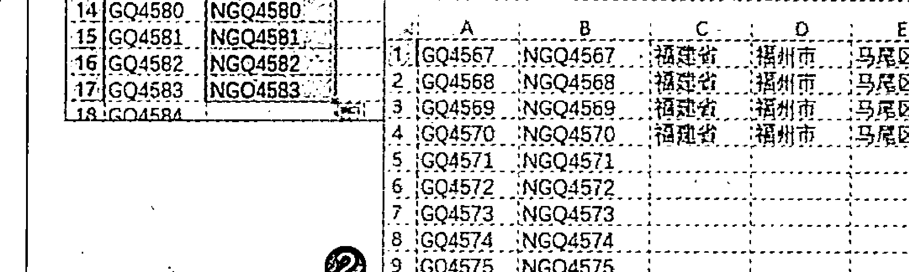

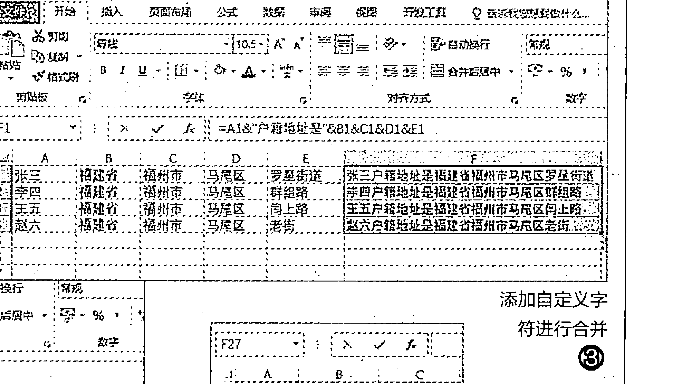

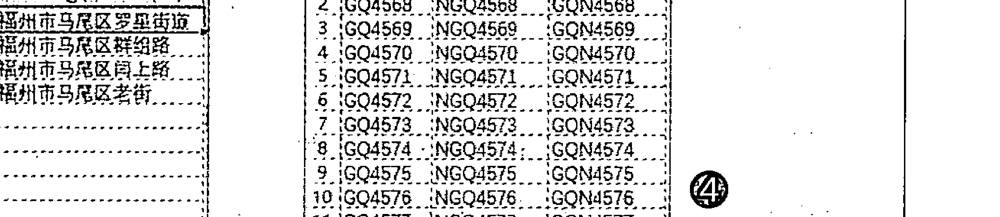

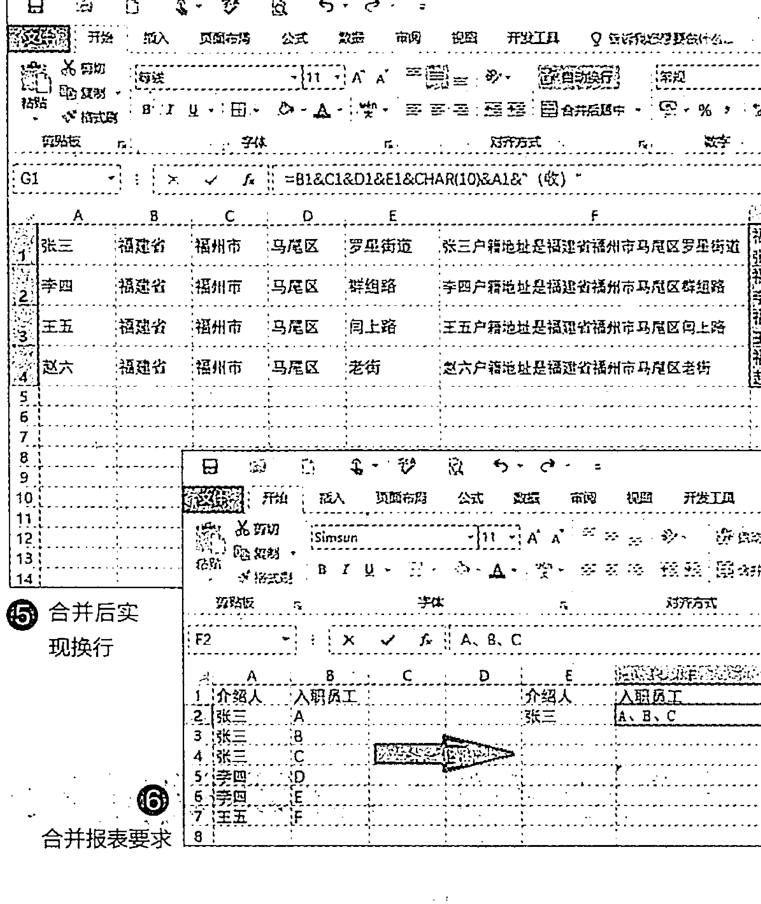

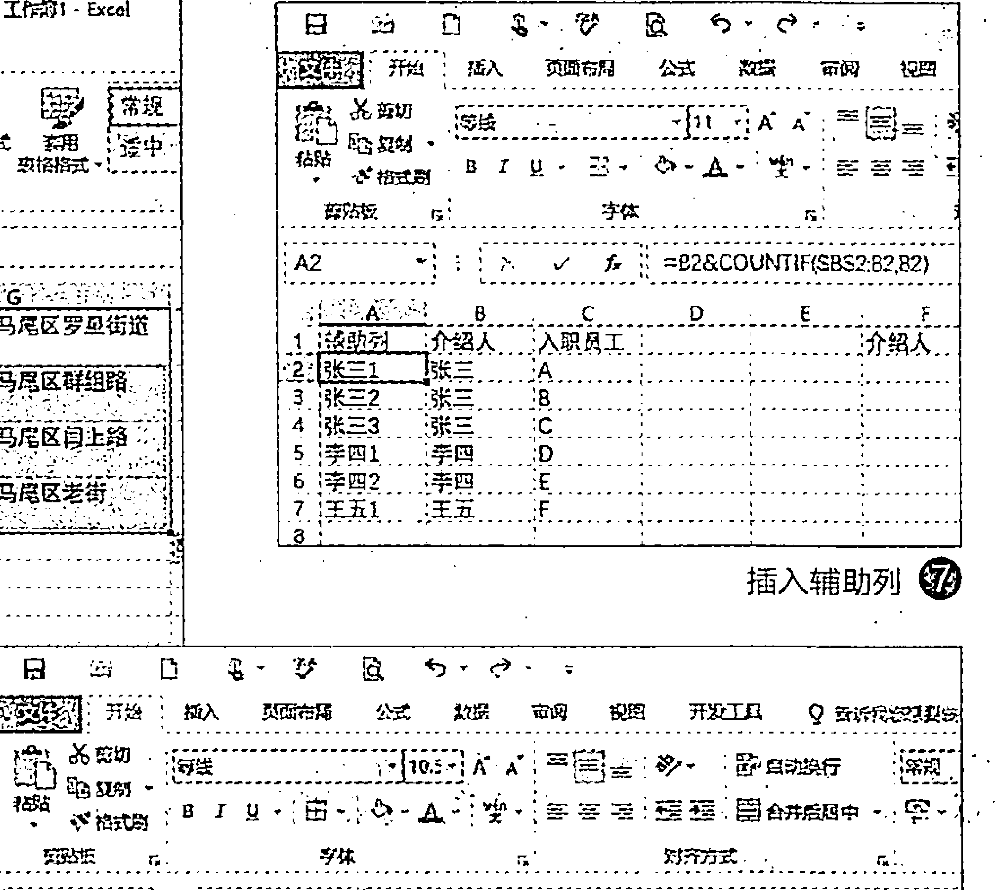

打印后可以直接用于信封地址上，对于这类合并可以借助CHAR()函数实现。

### 使用VLOOKUP函数实现特定单元格合并

在日常统计中，我们需要对一些指定单元格的数据进行合并。比如公司最近人员招聘不顺利，因此公司鼓励内部员工介绍他们的同学、老乡到公司来应聘，现在需要对内部员工成功介绍新员工入职进行奖励。由于每个员工介绍的新员工人数不同，月底需要对员工介绍的人数进行统计，即将B列对应A列的介绍人合并在一起以方便统计（图6）。

显然这里是需要对同一介绍人对应的新员工内容进行合并，此类合并可以借助VLOOKUP函数完成。由于VLOOKUP函数默认只能对单一条件进行查找和统计，但是这里每个介绍人对应多个员工，因此首先需要对其稍加改造。在A列前插入一列辅助列，接着在A2输入公式“=B2&COUNTIF($B$2:B2,B2)”并向下填充，这里使用COUNTIF函数对B列内容进行统计，这样一个介绍人就可以变为“张三1”、“张三2”的形式，从而实现条件的单一（图7）。

继续在G2输入公式“=IFERROR(VLOOKUP($F$2&ROW(A1),A:C,3,0),

可以看到只要输入员工名称，函数就会自动列出其介绍的新员工。接下来将列出的员工使用上述介绍的&连接符，将其连接到一个单元格并使用顿号隔开，即可完成所需的合并操作了。

## 傻瓜式制作视频宣传片

文|马震安

要制作一个带有片头片尾的宣传片，要求片中包括视频、图片、文字。将视频、图片合成的方法很多，但用iSkysoft Video Editor来制作，不仅视频、图片合成简单，而且文字添加、转场设置操作也非常容易，简直就是“傻瓜式”。

运行iSkysoft Video Editor，先选好所需视频的长宽比例，点击“完整功能模式”。

### 1. 片头片尾的制作

在编辑窗口中，点击“片头/片尾”，将模板中所需要的样式拖放到影片时间轴上（当然双击也可以）。在文字时间轴上双击插入模板中默认的文字，在文字编辑窗口中输入所需要的文字，设置好字体、字号等，也可以双击“字体”选项卡中的样式，将其应用到所输入的文本上，在预览窗口拖动文字到所需要的位置（图1）。

如果对模板中的文字样式不太满意，可点击Customize选项卡，通过其下的Face、Border、Shadow、Background等面板进行更改（图2）。如果对模板中文字出现的动画方式不太满意，选择“动画效果”选项卡，通过双击动画样式中的动画效果来更改文字出现的动画方式，也可以右击相应的动画效果后选择“应用”（图3）。

根据自己的需要设置好相应的文字、样式、动画效果，片头或尾就算制作完成了。

### 2. 宣传片内容的制作

处理文字、图片

在编辑窗口中，点击“媒体”，再点击“导入”下的“导入”（导入单个）或“文件夹”（导入成批），将所需要的图片、视频等导入到媒体库中。将某个背景图片拖放到影片时间轴上，并在影片时间轴上选中它，点击“编

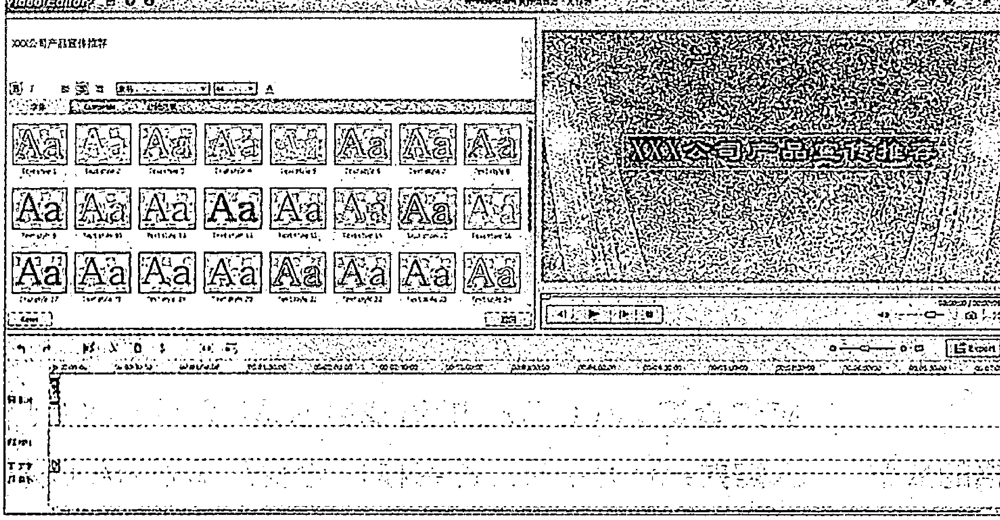

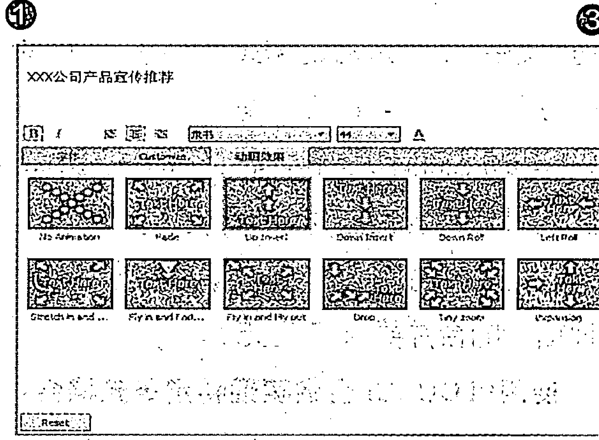

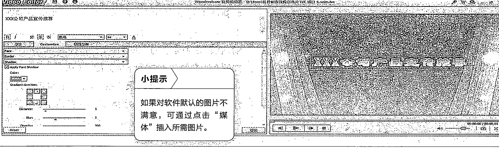

辑”，通过“照片”选项卡设置图片的旋转、对比度、饱和度、亮度、色调等，通过“运动”选项卡设置图片出现时的动画效果（图4）。

如果想在图片上显示文字，点击“文字”，在文字模板中将所需样式拖放到文字时间轴上。文字的编辑、设置方法同上面所操作的一样，多行文本输入需要在编辑窗口用回车键断开（图5）。

在此背景图片上还可以插入其他图片或一些装饰性的表情包等。点击PIP，将窗口中所需要的表情图片拖放到PIP轨道上，在预览窗口调整好它的位置及大小。也可以将媒体库中公司的Logo图标拖放到PIP轨道，调整好它的位置及大小。

同样，也可以设置它们的动画效果。在时间轴上，将鼠标放在每个素材

#### 小提示

对于PIP轨道上的素材，可以右击它，点击“高级编辑”，进行蒙版和特殊效果处理。

的左或右，当出现左右箭头时，按住鼠标左键拖动，以调整素材拖放时间的长短及素材开始、结束时的位置（图6）。

### 视频处理

对于作品中的视频添加也和图片一样，都是从媒体库中拖放到影片时间轴上。选中时间轴上的视频，选择“编辑”，点击“视频”选项卡可以对视频进行旋转、对比度、饱和度、亮度、色调及播放速度的设置，点击“音频”选项卡可以对声音进行音量、淡入、淡出、变音等设置（图7）。

此外，还可以对视频进行分割、音视频分离等操作。分割或分离后可以将不需要的内容删除掉。

如果想在视频中加入一些特殊效果，如马赛克等，可选中时间轴上

相应的视频后点击“威力工具”，在弹出的窗口点击“马赛克”，勾选“于短片中执行Mosaic”，点击“加入”，在预览窗口将生成的马赛克拖放到需要添加的地方，调整好大小，根据需要设置好百分比即可。其他效果的添加与之类似（图8）。

### 音频处理

音频的添加和视频的添加操作大同小异，但音频可以通过点击“录制画外音”来进行现场添加，也可对现场录制的声音进行分割、音量调整、淡入、淡出、变音等操作。

作品编辑完成后，点击Export，在弹出的窗口中选择“格式”选项卡，设置好概览图、名称、存储位置，点击“高级设置”，设置好所需要的编码器、解像度、帧速等，最后进行输出即可。

## 另辟蹊径 使用PPT制作习字帖

文|俞木发

近年来教育又开始重视书法教育了，于是家长会为孩子们购买一些字帖用来练字，但买来的字帖内容可能与孩子们所学的汉字有所不同。为弥补不足，不少家长利用PowerPoint 2016自建字帖的方法，手动制作专属字帖。

### 1. 插入图形 建立田字格

田字格是字帖使用的一种常见格式，编辑字帖首先要建立田字格。田字格的建立使用PPT插入形状即可完成。启动PowerPoint 2016后点击“插入→形状→矩形”，选中矩形，右击选择“大小和位置”，调整大小为3cm×3cm正方形，填充颜色设置为“无”，边框设置为5磅。同上再点击“插入→形状”，插入一条3cm的线条到正方形的中间，并将线条格式设置为虚线。复制线条，并将其旋转90度，然后放置在正方形的水平中间，即可完成田字格的设置（图1）。

依次选中矩形和插入的线条，点击“格式→组合→组合”，将其组合为一个整体。按住Ctrl键复制制作好的田字格并将其排成一列备用，选中插入的田字格，右击选择“置于底层→置于底层”即可（图2）。

### 2. 布尔运算 制作拆解汉字

新建一张幻灯片，点击“插入→艺术字”，然后在其中输入需要制作为字帖的汉字，如输入“够们利”，并将字号设置得大一些。继续点击“插入→形状→矩形”，将插入的矩形放置在艺术字的上方。依次选中插入的矩形和艺术字（注意顺序），点击“绘图工具→格式→拆分”，这样汉字就会变为可分离的图形（图3）。

点击“开始→选择→选择窗格”，可以看到现在汉字已经变成多个任意多边形的组合，拖动覆盖在汉字前面的多边形并将其删除，再将其他多余部分删除，剩余部分即为全部可拆解的偏旁部首了（图4）。

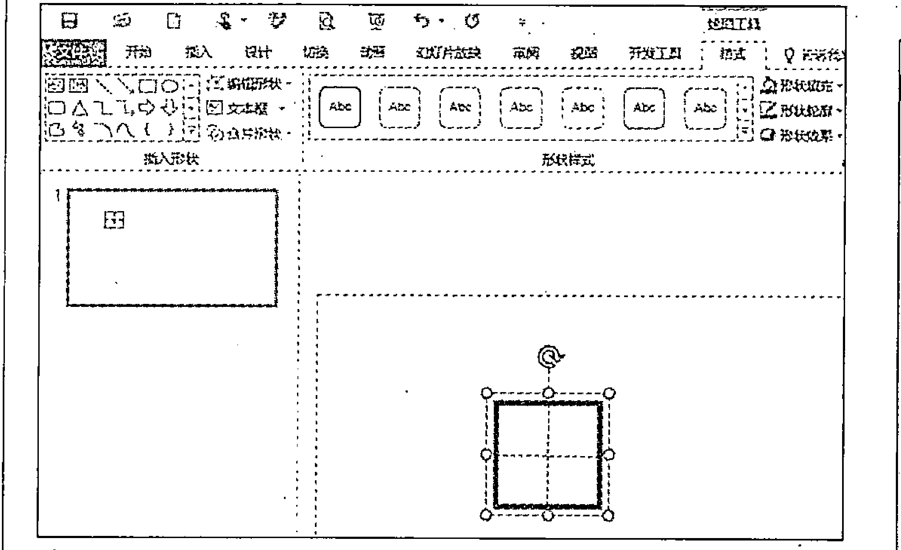

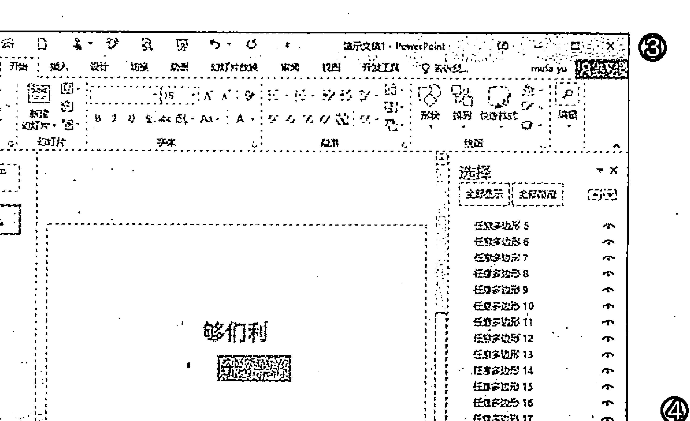

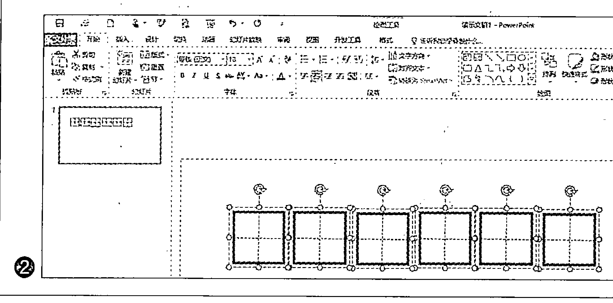

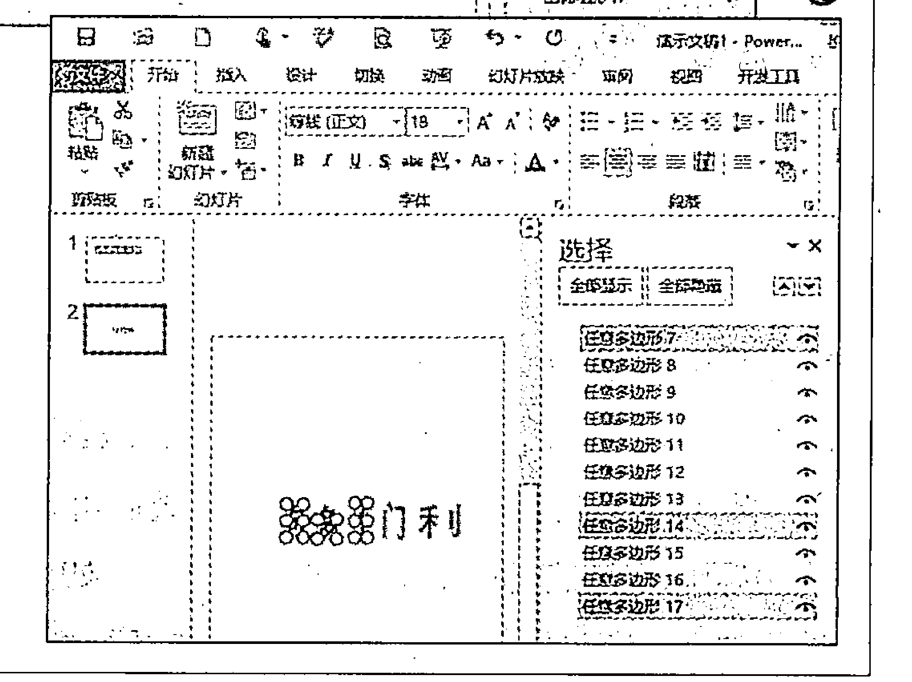

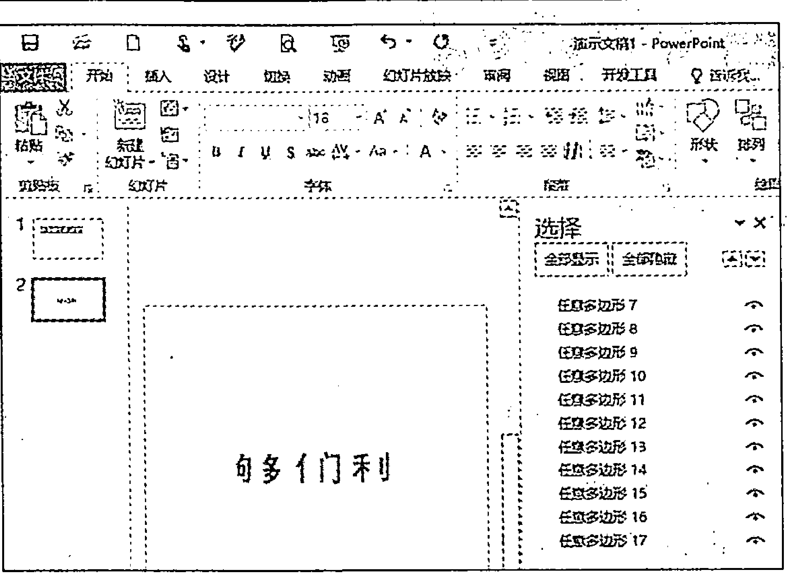

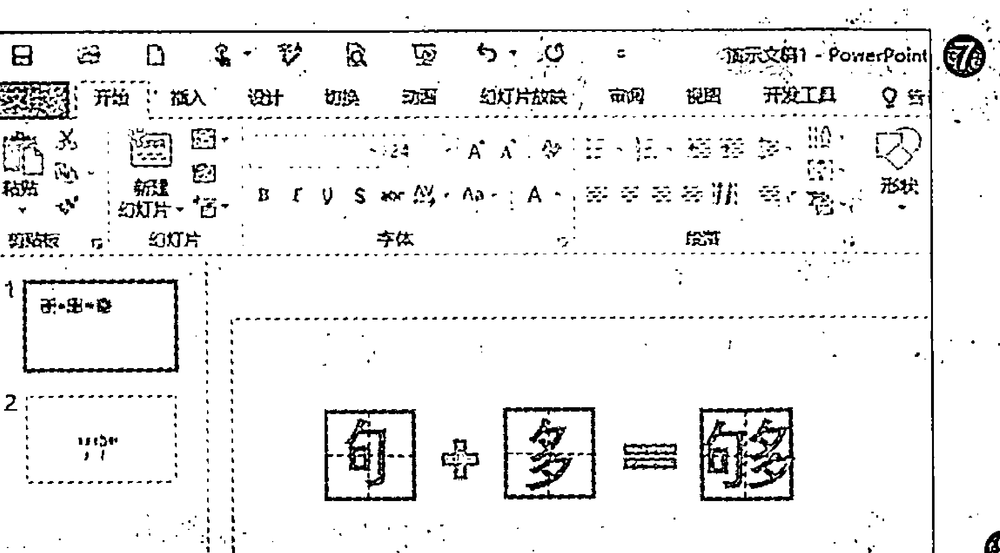

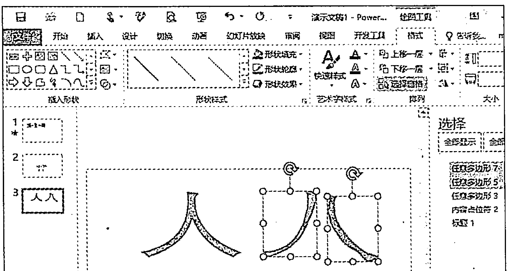

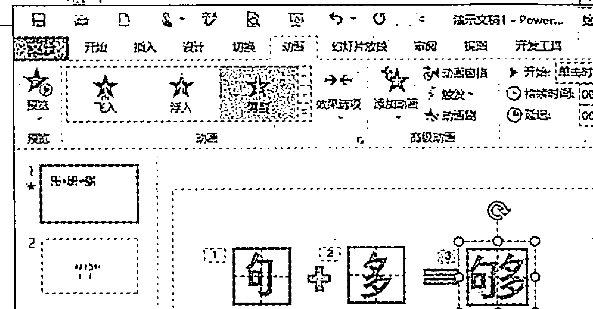

> **小提示**
>
> 使用布尔运算的“拆分”，实际上是将汉字拆分为可编辑的矢量图，同样可以使用上述方法制作特效文字。比如可以只输入一个汉字，然后插入矩形遮住汉字的一半，使用“格式→拆分”后将汉字分为两半，分别填充不同颜色和旋转，这样即可制作出分裂字的效果。

这里PPT会将汉字分离为可编辑形状，不过布尔运算并不是严格根据汉字偏旁部首进行分离，我们可以根据自己的实际需要进行组合。比如“利”字是由“禾”、“丨”、“竖勾”组成的，依次在右侧选中“丨”、“竖勾”多边形，点击“格式→组合→组合”，组合为立刀旁即可。然后按提示将分离汉字组合为对应的偏旁部首并分离开一定距离备用（图5）。

分离的汉字实际上是一种多边形形状，因此大家可以根据自己的需要为其填充不同的颜色，或者右击选择“编辑定点形状”，对图形进行编辑。比如可以将“竖勾”按照实际书法的要求进行进一步的编辑。

这里要注意的是，并非所有汉字都可以完成类似的分离，比如对于独体字“人”，使用上述方法并不能实现分离，此时可以使用插入任意多边形的方法自行分离。同上插入艺术字“人”，点击“插入→形状→任意多边形”，然后根据实际汉字的笔画顺序进行描边。描好一个笔画后，可以稍微移开，继续描下一笔画。描边的时候注意笔画之间的重叠（比如“人”字的撇捺之间的重合），这样生成的形状就和上述分离效果是一致的（图6）。

### 3. 偏旁组合 生成字帖作品

继续选中汉字的偏旁，右击选择复制，将其依次粘贴到前面制作好的田字格中，最后再选择相应的偏旁部首组合成汉字放置在后续的田字格中。为了方便观看，还可以在偏旁部首之间插入“+”和“=”形状，这样一幅由偏旁部首组成的字帖就制作好了（图7）。

当然如果是学前儿童用来练字，我们还可以为其添加上动画。依次选中偏旁，点击“动画”，为偏旁添加“擦除”动画（动画播放时间设置长一些），为成品字添加“劈裂”动画，这样可以在屏幕显示动画效果（图8）。

完成字帖的制作后，点击“文件→另存为→图片”，将幻灯片导出为PNG图片，然后将图片打印出来或者上传到手机即可。对于动画效果，则可以点击“文件→导出→创建视频”，将文件导出为MP4视频在电视或者手机上直接播放。

## 用PPT演示动态交互式图表

文|马震安

在进行人员管理、产品管理等工作的过程中，我们经常要在PPT演示中调用许多Excel工作表，若将图表逐一复制到PPT中，既耗时又繁琐。如果在PPT幻灯片中加入数据透视图表，动态地控制同一图表中显示的内容，灵活地显示各种分析结果，这样用一个交互式图表就能完成大量的数据分析（图1）。

### 1. 利用控件连接数据

首先，在Excel工作表中选中数据区域，点击“公式”选项卡中的定义名称，在弹出窗口的“名称”框中输入此区域的名称，如“分析结果”。如果不设置名称，将无法在PowerPoint中调用此区域的数据。接下来，在PowerPoint演示文稿中新建一张空白幻灯片，选择“开发工具”选项卡（如果没这个选项卡，可以点击“文件→选项”菜单，在自定义功能区中添加），点击“其他控件”，选择“Microsoft Office Chart 11.0”（这是一个数据透视图控件），在幻灯片中拖动，画出这个控件（图2）。

然后在控件上右击，选择“Microsoft Office Chart 11.0对象”下的“命令和选项”，在弹出的对话框中选择“显示/隐藏”选项卡，选中所有的设置项，这些设置将允许在幻灯片放映时控制数据透视图（图3）。

设置完毕，再次在控件上右击，选择“Microsoft Office Chart 11.0对象”中的“编辑”，在弹出的对话框中选中“一个数据库的表或查询”，点击“连接”按钮，显示“数据明细”设置，点击“编辑”按钮，显示“数据链接属性”对话框。在“提供程序”选项卡中选择“Microsoft OLE DB Provider for ODBC Drivers”，在“连接”选项卡的“指定数据源”处选择“使用连接字符串”，点击“编译”，在弹出的“选择数据源”窗口中，DSN名称处输入“我的数据源”，点击“新建”，在弹出的“创建新数据源”窗口选择“Microsoft Excel Driver(*.xls)”，点击“下一步”，在弹出的窗口

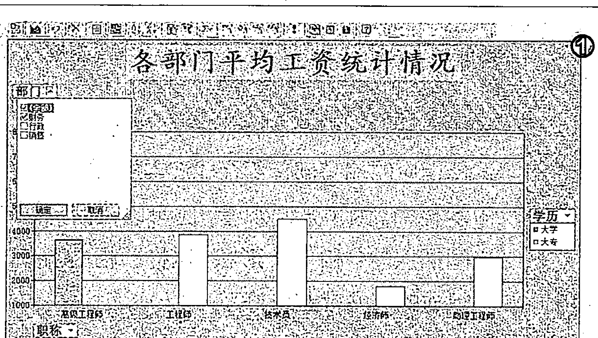

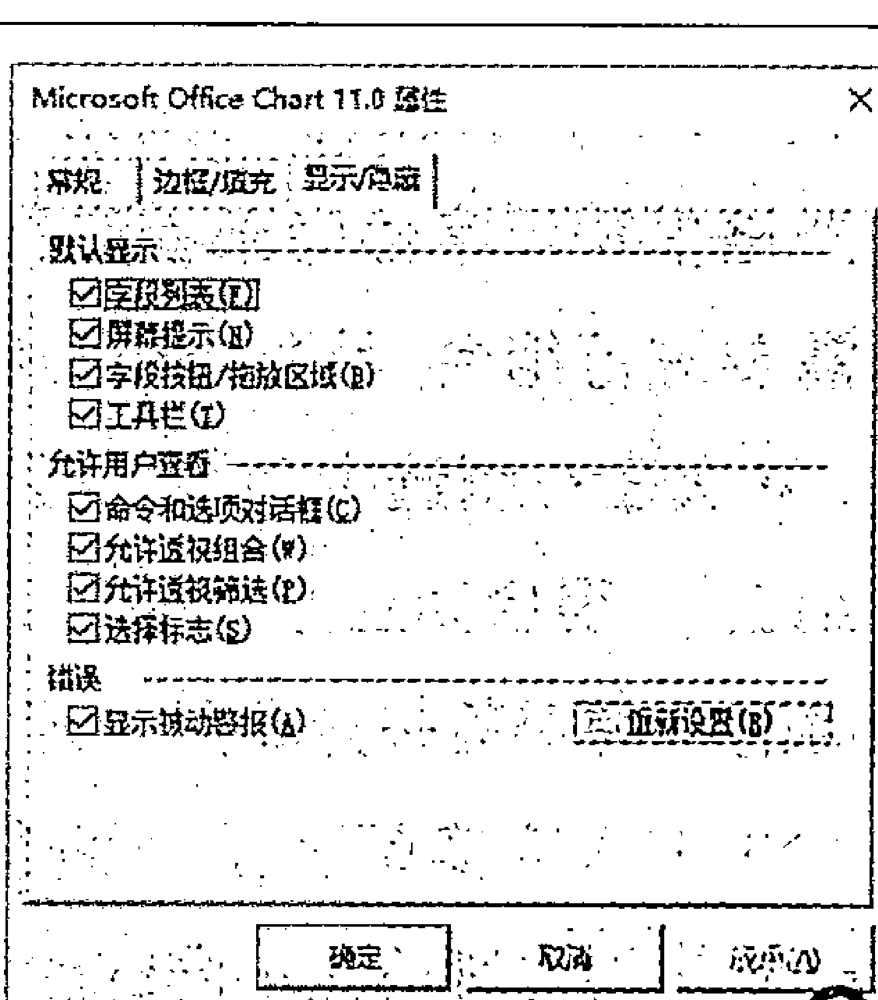

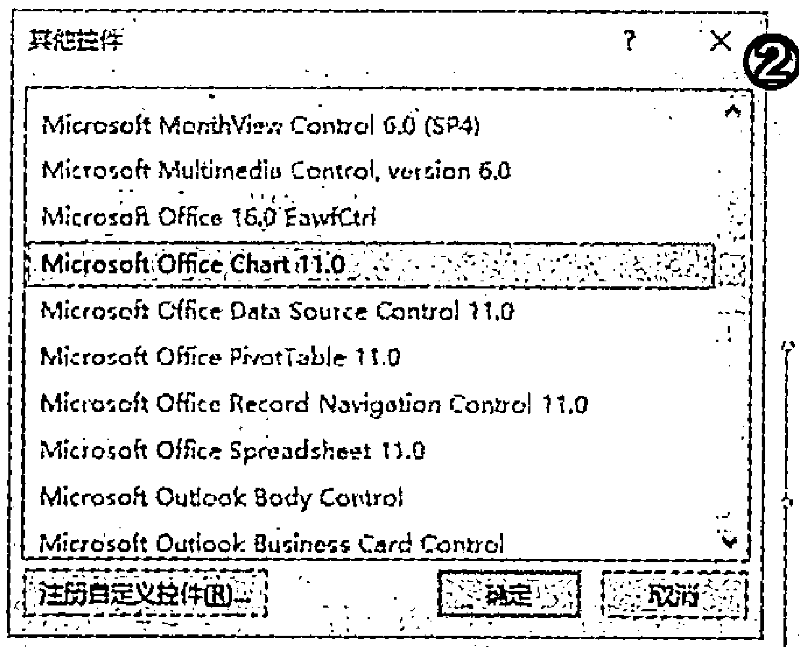

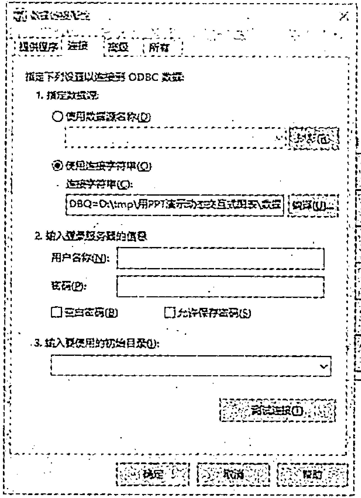

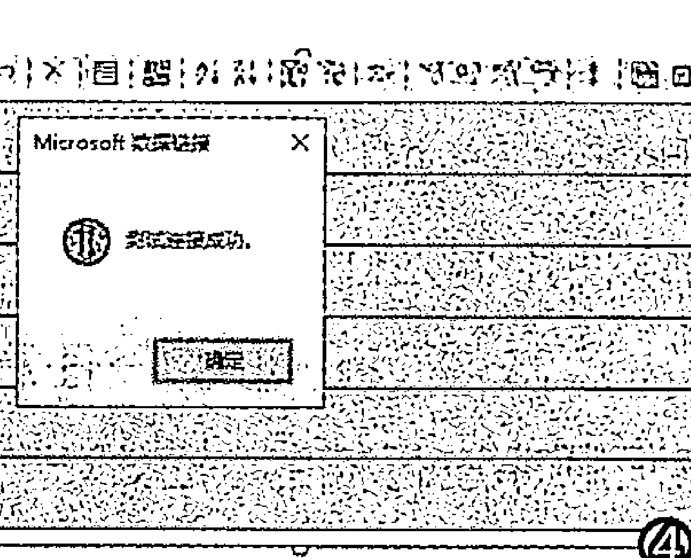

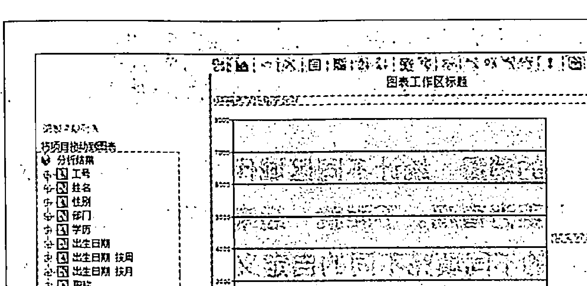

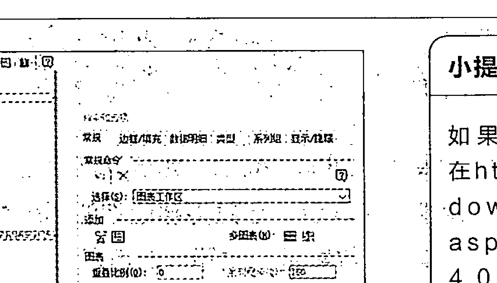

> > **小提示**
>
> 如果安装的这个控件不能用，可在http://www.microsoft.com/downloads/zh-cn/details.aspx?FamilyID=7287252c-402e-4f72-97a5-e0fd290d4b76&displayLang=zh-cn下载OWC11.0控件，然后安装。

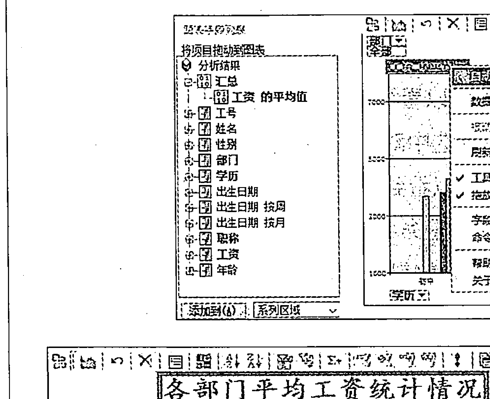

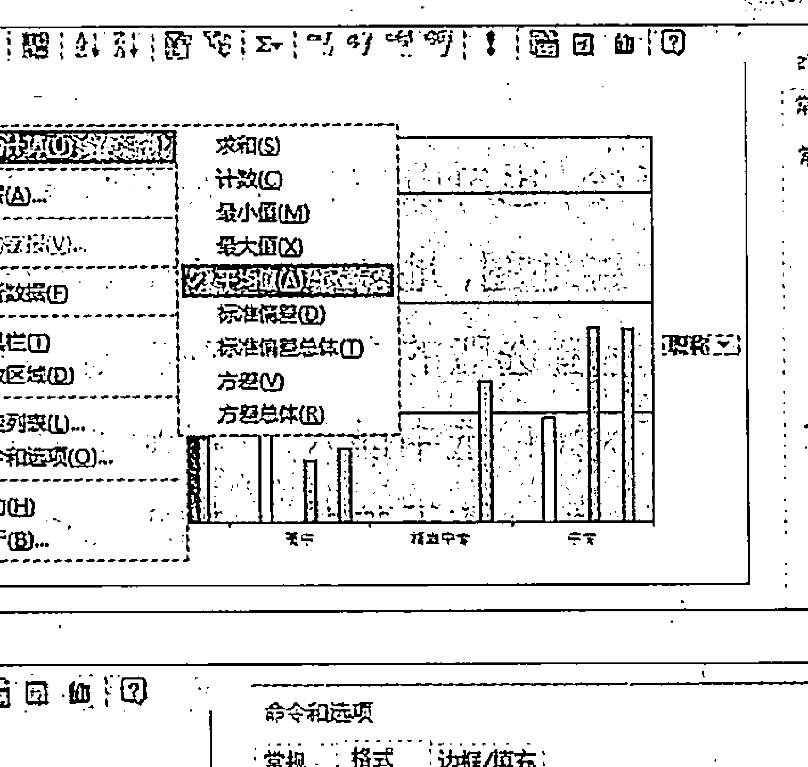

> > **小提示**
>
> 当点击“编辑”时，可能反应的时间会长一些才能弹出窗口，请不要着急。

中点击“浏览”，选择新建的数据源“我的数据源”，点击“保存→下一步→完成”，在出现的窗口中点击“选择工作簿”，在弹出的窗口中选择Excel文件，连续点击“确定”。最后再点击“测试连接”，就会弹出“测试连接成功”提示(图4)。

### 2. 设计交互式动态图表

数据源连接成功后，在控件旁边就会弹出“命令和选项”窗口，在“数据明细”选项卡“使用数据来自”下的“数据成员、表、视图，或多维数据集名称”处选择在Excel工作表建立的那个数据名称“分析结果”，在“类型”选项卡中选择所需要的图表类型(如簇状柱形图)，选择图表区的列坐标轴，在“刻度”选项卡中自定义最大、最小值。在控件上右击，在弹出的菜单中点击“字段列表”，根据需求将列表中的字段拖放到控件相应的位置(图5)。将“部门”字段拖动到“将筛选字段拖至此处”标识处，将“学历”字段拖动到“将分类字段拖至此处”标识处，将“职称”字段拖动到“将系列字段拖至此处”标识处。在“工资的和”上单击右键，选择“自动计算→平均值”。

算→平均值”。这样，完成上述设置后，幻灯片中的图表在播放时就有了交互性动态展示功能(图6)。

### 3. 修饰图表

图表设置完成后，可以利用“常规”选项卡为图表添加标题，也可以利用“边框/填充”选项卡对整个图表进行修饰(图7)。由此可见，利用“Microsoft Office Chart 11.0”控件在放映幻灯片时通过图表进行的动态数据分析，大大减轻了图表准备的工作量，并使得内容的演示更为生动精彩。

## 看图说话 Excel中制作地图样式图表

文|平淡

平时的工作中，我们在Excel中经常要使用到地区概念，如统计产品在各地的销量，统计不同区域代理商的分布等。对于这类数据图表，如果可以直接利用地图来表示，自然能够让你的图表数据更为直观。下面就一起来看看如何在Excel 2016中制作地图样式可视化图表。实现的效果是：地图区域可以根据数据的不同填充不同的自定义颜色，从而可以直观地通过颜色了解每个区域的不同（图1）。

因为涉及到地图，所以我们首先要绘制地图素材。不过并不能直接使用导入的地图图片，我们需要的是可编辑的矢量地图，素材可以自己进行手绘，也可以直接下载矢量图自行编辑。这里介绍如何手绘地图，地图素材建议到各个省测绘局官网下载，比如笔者选取的是福建省地市地图。下载后将地图素材导入Excel，选中插入的图片，点击“图片工具→格式→删除背景”，将无关背景删除，并进行裁剪操作，这样可以获取一张背景透明的地图（图2）。

选中图片，继续点击“插入→形状→自由曲线”，然后在地图上根据原来的地区划分线进行描图（注意要形成一个闭合曲线）。操作同上，依次将其他地区区域也勾勒出来，最后将插入的地图删除，这样就可以在Excel中得到一份可编辑的矢量地图了（图3）。

点击“插入→文字”，在相应的地市上面输入对应的说明文字，然后选中插入文字框，点击“格式→形状填充→无填充颜色”，这样文字背景色可以和后续地市根据实际数字填充颜色一致（图4）。

继续点击“开始→查找和选择→选择窗格”，此时在右侧窗格可以看到我们上述绘制的文字框和地市多边形。按提示选中对应的地市图形，比如选中南平市后在右侧窗格可以看到其对应的是“多边形11”，按提示在右侧窗格将其重命名为“南平”。继续按提示选中其他的相应的地市，并将其名称更改为和具体的地市对应的名字。同上，将插入文本框的图形也重命名为对应的地市名，但是名称注意和地市图形名称区别（图5）。

完成上述操作后按提示输入准备好的数据，这里注意输入数据时城市的名称一定要和上述多边形的名称一致。比如龙岩市对应的图形名称是“龙岩”，那么在分公司下其名称也要设置为“龙岩”，因为后续VBA脚本是根据这个对应关系进行颜色填充操作的（图6）。

按提示为原始数据准备辅助列，并在辅助列根据实际数字等级进行单元格颜色的填充。比如这里是根据销售额的不同进行颜色填充，可以在辅助列中按照一定

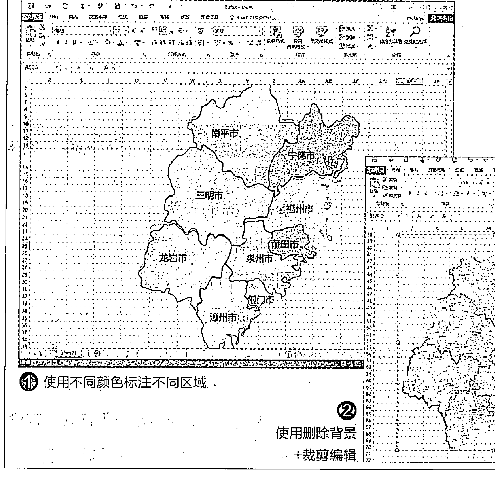

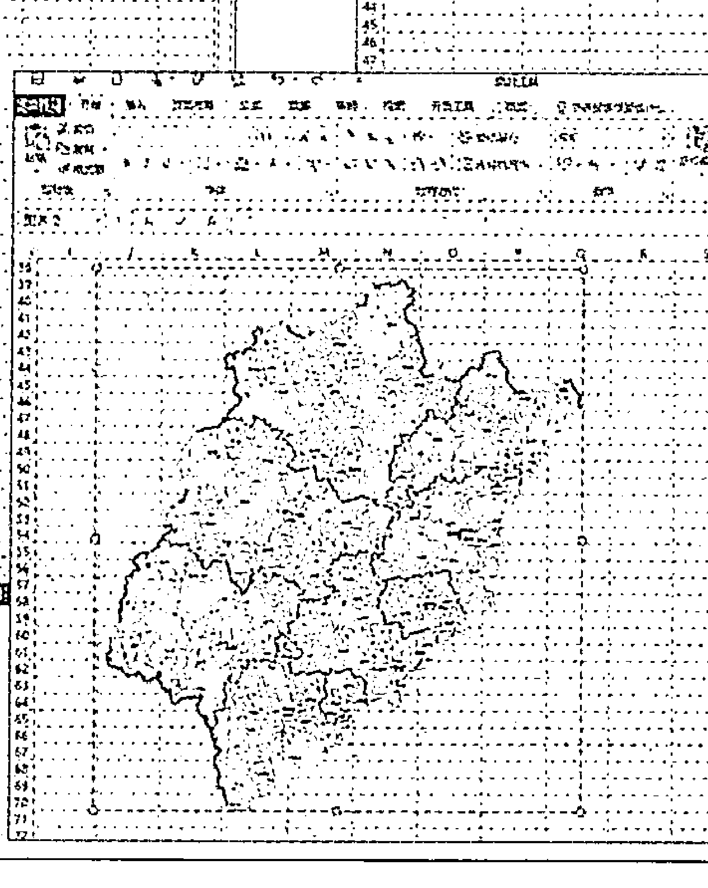

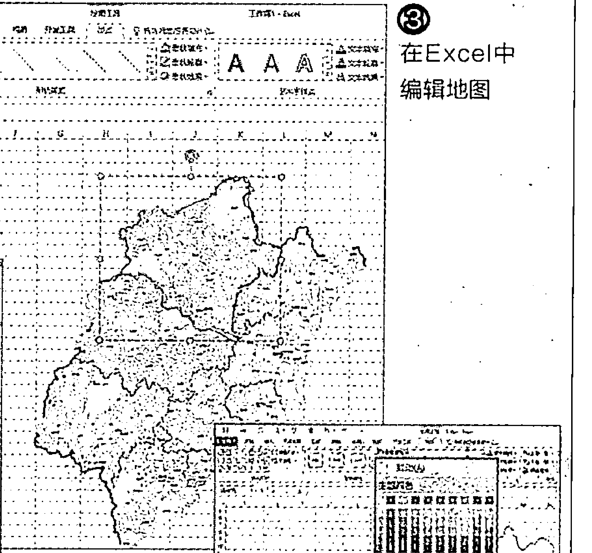

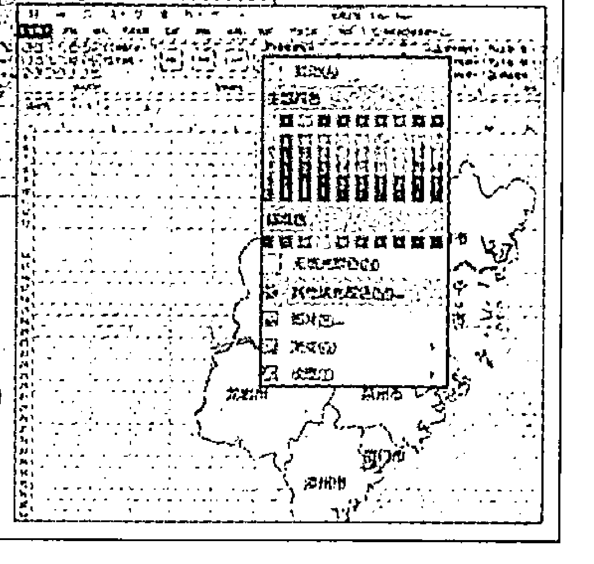

## 善用“阴影” 打造高颜值幻灯片

文|张华

阴影是一种常见的自然现象，有光的地方就有影子，它广泛地运用于绘画、摄影、雕塑等艺术创作中。这两年阴影在PPT设计中亦为常见，善于使用阴影，可以让页面上的元素更有层次感，能够有效地提高PPT的颜值。

## 阴影的作用

阴影的作用可以概括为三点：
- 文字加上阴影，更有立体感；
- 图片加上阴影，更有纵深感；
- 页面用上阴影，更有层次感（图1）。

## 简析阴影常用方法

在PPT中，制作阴影通常有两条途径：PPT自带的阴影选项、使用图形工具。
PPT自带的阴影选项：图片、文字和图形的格式中都有“阴影选项”（图2），包含外部阴影、内部阴影、透视阴影，并且阴影的位置、颜色、角度、大小、距离、透明度、模糊值都可以进行调节，从而得到各式各样的阴影效果。
使用图形工具：用灰色的图形作为阴影，它的优势在于图形可以进行编辑修改，置于素材对象下方后，所生成的阴影更加逼真，如图中是不是感觉图片的边角翘起来了呢（图3）？

## 制作常见的阴影

光说不练空把式，下面我们就来动手做一做常见的阴影。

### 拖影

这种阴影比较长（图4），也被称为长阴影，看起来类似于流星飞过留下来的痕迹。需要注意的是，光源不同，阴影的大小也不一样。
绘制一个矩形，矩形高度与圆形的直径一致，右击选择“置于底层”，让其位于圆形下面；右击选择“设置形状格式”，将“线条”设置为“无线条”，单击“颜色”使用取色器将长方形的颜色设置成背景色（图5）。
选中矩形后单击“颜色”，选择“其他颜色”打开色盘，在“颜色模式”中选择“HSL”（图6），将“亮度值”调低，这样做出来的阴影颜色与背景色更和谐。真正好看的阴影，阴影的颜色与幻灯片背景的颜色最好属于同一个色系，只是亮度不同，阴影的亮度要低一些。根据背景颜色调节阴影的参数来获得更好的效果，通常的做法就是用取色器去吸取背景的颜色，然后通过HSL模式降低颜色的亮度，这就是高手做出的阴影看起来总是很舒服的秘诀。
最后旋转作为阴影的矩形，右击矩形选择“编辑顶点”，右击后新增一个顶点，将矩形修改成五边形，并且让其覆盖在页面的边角处（图7）。如果光源位于左上角并且是点光源（如灯泡、电筒等），则阴影的尺寸会延伸并逐渐增加。

### 散影

这种阴影的颜色通常很浅，并且边缘呈现虚化效果，常用来加强各部分的质感，常用于按钮、卡片等（图8）。
绘制一个比图片略大的矩形，设置为“无边框”，颜色为灰色，然后右击选择“设置形状格式”，单击“效果”按钮，设置“柔化边缘”数值为3，将矩形置于图片的下面，按Ctrl键不放，再按方向键对阴影进行微调，这样散影效果就形成了（图9）。
除了上述方法，还可以直接使用“形状选项”中的“阴影”功能，选择“预设”下的“居中偏移”，然后设置“透明度”为60%左右，“大小”为102%左右，“模糊值”为5磅左右，非常简单。不过不足之处就是阴影位置和形状的调节不够灵活（图10）。

### 重影

这种阴影形象点说就是“多胞胎”排队，将文字或图片复制多份后进行修改，再排列而成。早期我们做立体字就常用这种方法（图11）。
选中图片，右击选择“设置图片格式”，单击“效果”选项，在“三维旋转”下选择“透视”中的“适度宽松透视”，然后修改XYZ的数值，“距离边高度”为12（图12）。
复制图片，切换到“格式”选项卡，单击“艺术效果”选择“虚化”，将图片进行虚化处理，然后右击选择“置于底层”，让虚化的图片置于下方作为阴影。如果感觉重影效果不够，可以再复制一份，置于底层进行叠加，这样重影效果也会更强（图13）。

阴影提供了非常重要的视觉效果，能够显示出对象的深度和有方向的运动。阴影能够显示界面之间的分离程度，一个对象的高度决定了它的阴影，高的物体往往投射出更大更模糊的阴影。值得强调的是：阴影不能过于生硬，要和原来的画面能完美融合起来，千万不要有违和感；其次阴影的距离要适宜，要根据实际情况进行调节。阴影设置本身并不太难，难的是如何用简单的设置达到理想的效果。只要多看多想，特别是多动手，才能慢慢去体会，最终达到融会贯通的境界。

## 用活条件格式 用Excel制作星级系统

文|平淡

公司每个月都对会员消费积分进行统计，根据不同的积分给予不同的星级服务。常规的方法是使用图表的方式进行统计，为了可以更直观地表现出积分和星级的对应关系，现在需要在消费积分的后面加上对应的星级标记，这样通过标记就可以非常方便地知道会员的星级了（图1）。

可以看到如图示例中，星级标记是要和不同的积分对应的。通过对原始数据进行分析可以知道，每个分级标准主要是30、31、61、101、201、301这几个数字，只要大于这里的临界数字，则需要添加上对应的星级标记（最多5个星级）。因此设计的思路是，将原始积分分解并和分级标准对比，如果大于该数值则分配一个星级标记。我们只要插入5列的辅助列，然后将分解的积分使用IF函数和分级标准比对，最后使用条件格式分配星级符号即可。

首先按示例的提示在Excel中A、B列输入对应的数据，接着插入C、D、E、F、G列作为存放分级图标的辅助列，并在C1、D1、E1、F1、G1输入分级的标准数值31、61、101、201、301（图2）。
选中C2并在其中插入公式“=IF(C$1<=$B2,1,0)”。公式的意思是使用IF函数，将C1的值（即分级标准的数值）和B2的值（会员的是实际积分）进行比较，如果C1<=B2，那么就在C2显示为1，否则显示为0。然后将公式依次向右、向下填充到C2→G6区域，可以看到积分分解后会在C→D列分别显示为1和0这些数据，其中1代表一颗星（表示超过分级基准值），0则为无（图3）。

```
=IF(C$1<=$B2,1,0)
```

完成上述操作后，上面辅助列数据中只有1和0，因此接下来就是将“1”代替为一颗星，0则隐藏显示，这样即可完成星级的设置。选中C2→G6区域数据，点击“开始→条件格式→新建规则”，在打开的窗口中，规则类型选择“基于各自值设置所有单元格的格式”，格式样式选择“图标集”，图标样式选择“自定义”，勾选其后的“仅显示图标”，图标选择五角星，当值是>=1时，类型选择“数字”，其他选项设置为“无单元格图标”（图4）。
这样点击“确定”后返回Excel窗口，可以看到辅助列的单元格中会根据积分数值自动填充上对应的星级标记，达不到分级标准的区域则显示为空白（图5）。

添加上星级标记后，我们还要对星级增加文字说明。文字说明同样可以使用IF嵌套函数进行添加。定位到H2，然后输入公式“=IF(B2<61,"一星级客户",IF(B2<101,"二星级客户",IF(B2<201,"三星级客户",IF(B2<301,"四星级客户","五星级客户"))))”。这里使用四级嵌套对会员积分进行判断，符合某一分级标准则显示对应的“X星级客户”。这里同样要先根据分级标准进行嵌套，按照不同的积分标准对应显示不同星级的文字，注意文字说明需要使用半角双引号进行标注。接着将公式下拉，可以看到函数会自动为不同星级的客户添加上文字说明（图6）。

接下来对星级标记进行美化操作，按提示选择C2→G6列，将其列宽设置为和星级图标大小一致，点击“开始→套用表格格式”，套用一种深色且无竖线的样式即可。应用样式后，由于表列的存在会导致数据错格排列，按提示进行调整对齐即可。这样，通过客户积分以星级数目就可以非常直观地进行展示了（图7）。

因为这里填充的是公式，星标可以根据客户积分的不同动态地进行增减，比如更改（或者增加）客户积分，那么星级标记也会同步进行变化。当然也可以将其保存为模板备用，如果分级标准变化，那么只要更改辅助列的数字即可。
因为是公式动态引用，我们还可以直接复制其中的某列（需要包含公式）到其他位置，然后制作一个带查询功能的模块。比如复制任意一列到11行，然后在上方单元格输入需要查询的信息和星级说明，这样只要用户输入查询的姓名和积分，星级和判断文字会自动显示（图8）。

## 自己动手 用PPT做个抽奖器

文|俞木发

喜欢看电视的朋友可能都知道，某电视台有个节目是翻名牌获大奖，节目使用很多著名商标作为面牌，翻开后底牌是一些奖项。我们利用PPT动画效果也可以制作出类似的翻牌获奖，既可以用于年会抽奖，也可以用其来制作随机派位器，为日常工作添加一些趣味。

在抽奖环节，底牌是各种奖项，奖项的设置通过输入文字即可，面牌和底牌均可以通过形状来设计。点击“插入→表格”，插入一个单元格，同时将单元格大小调整为和幻灯片的大小一致（防止抽奖时点击到空白区域导致幻灯片退出）。选中插入的单元格，切换到“表格工具→布局→拆分单元格”，按提示将单元格拆分为多个，每个单元格对应一位员工（如果员工较多可以设置多张幻灯片）。这里为了叙述简单，拆分设置为2X2（图1）。
这样在幻灯片插入一个四分表格，按提示选中表格，右击选择“剪切”，点击“开始→粘贴→选择性粘贴→图片（增强性图元文件）”（图2）。
将表格粘贴为图片后，右击图片选择“组合→取消组合”，在弹出的“是否要将图片转换为Microsoft Office绘图对象”时，选择“是”。然后继续选择“组合→取消组合”，这样表格会被分解为4个大小一致的独立单元格图形。点击“开始→选择→选择窗格”，此时在右边的窗格可以看到分离的单元格，分别对应Rectangle X，按提示将其名称依次更改为底牌1、2、3、4，并分别填充上不同颜色进行区分（图3）。
选中底牌1，点击“插入→文本框”，在底牌上分别写上对应的奖项名称。如底牌1为“一等奖”，选中底牌1和插入的文本框，点击“绘图工具→格式→组合→组合”，将其组合为一个整体，同时在右侧窗格将该组合重命名为“奖项1”。操作同上，依次完成奖项2、奖项3、奖项4的组合（图4）。
完成上述的设置后，点击“插入→形状”，插入一个大小和奖项组合大小一致的矩形。选中矩形并插入说明文本框“01”作为抽奖序号，同上也将文本框和矩形进行组合，并将组合命名为“01抽奖组合”。选中“01抽奖组合”，点击“动画→添加动画”，为其添加一个“消失”的退出动画（即点击01后会自动消失显现下面的奖项），点击“触发→点击→01抽奖组合”，即点击这个组合时就会触发消失动画（图5）。继续选中“奖项1组合”，点击“动画→添加动画”，为其添加一个“轮子”进入动画，动画效果选项选择“8轮辐图案”。点击“触发→点击→01抽奖组合”，即点击这个组合时会激活轮子动画显示具体奖项，将开始播放动画时间设置为“上一动画之后”（即01消失之后显示奖项），延迟设置为1s（图6）。
操作同上，依次设置好其他选项的抽奖组合和奖项动画设置（可以使用动画刷快速完成设置）。完成动画设置后将各自抽奖组合覆盖到对应的奖项上，点击“幻灯片放映→设置幻灯片放映”，将放映的类型设置为“观众自行浏览”，换片方式设置为“手动”（图7）。OK，现在切换到幻灯片放映开始抽奖。只要员工选择需要抽奖的序号，使用鼠标点击相应的序号后，序号会自动消失，同时1秒后会自动以8轮辐图案显现出对应的奖项（图8）。

### 使用PPT制作抽奖转盘

上述制作方法比较复杂，如果只是要制作一个简单的抽奖转盘，同样也可以使用PPT来完成。
点击“插入→图表→饼状图”，修改所有数据为相同，同时删除饼状图的标题及右边的标签说明，这样完成一个四分转盘的制作，同时将转盘颜色填充为同一颜色。也插入对应奖项的说明文本，最后将文本和转盘组合在一起。点击“插入→形状→箭头”，将箭头调整为和圆形的半径一致，复制一个箭头并旋转180度，并将其放置在下方的半圆，将其和前面插入的箭头组成一个圆的直径，并将下方的箭头颜色填充为和圆形的颜色一致（这样在转盘就只能看到上方的箭头）。选中两段箭头点击“开始→排列→组合”，将其组合在一起。继续插入一个矩形，并在其上添加“开始抽奖”字样，同上选中组合箭头，点击“动画→添加动画”，添加一个“陀螺旋”进入动画，触发设置为点击“开始抽奖”矩形。这样开始幻灯片的播放后，点击“开始抽奖”，上述设置的箭头即可开始旋转抽奖，按键盘上的数字键“1”（！）暂停，按“\”解除暂停继续旋转（图9）。

[content]
[PAGE 231]

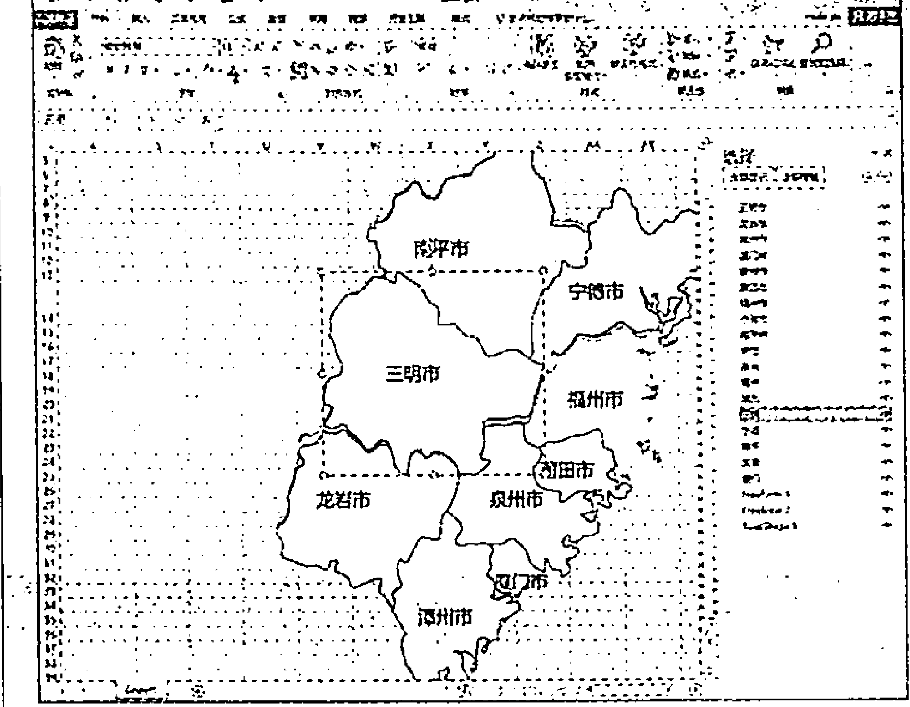

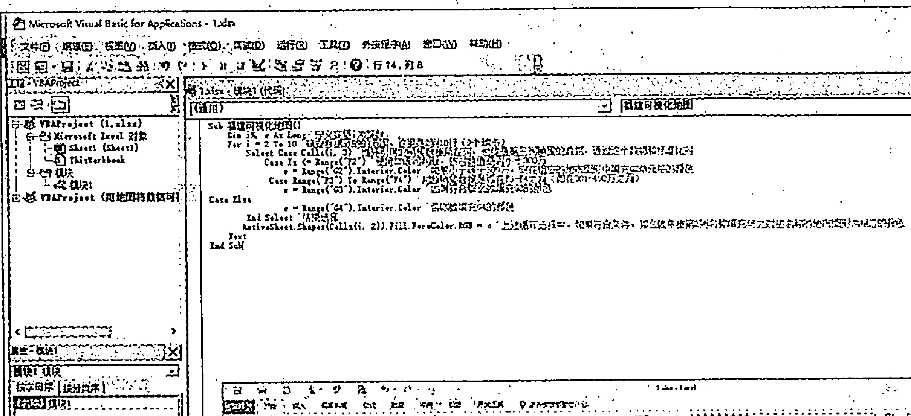

- 对地图进行命名

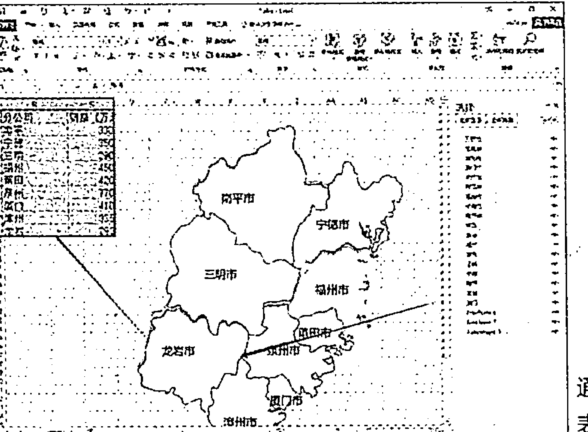

- 数据名称要和多边形对应
- 通过填充颜色表示销售好坏

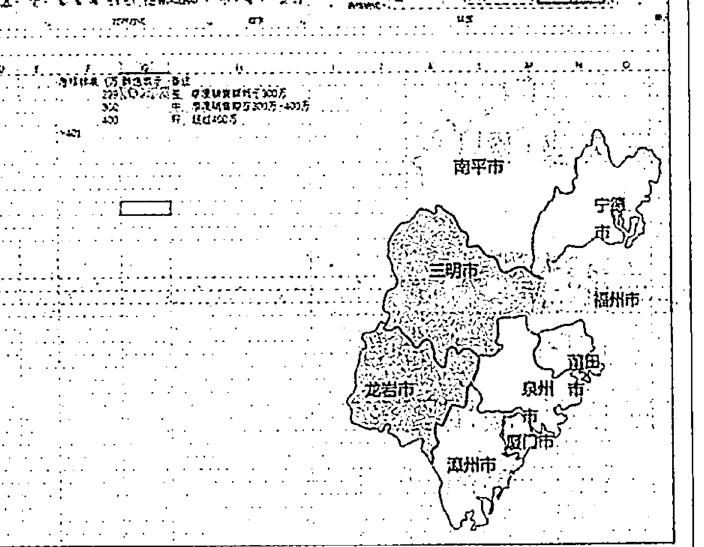

的金额标准进行区别。完成数据的输入后，点击“开发工具→插入→模块”，按提示将下列模块代码粘贴到代码框，后为代码说明文本可不输入（图7）。

万，则在相应的地市图形中填充G2单元格的颜色

End Sub

返回Excel窗口，点击“开发工具→宏”，此时会在代码框新增一个名为“福建可视化地图”的宏，点击“选项”，在打开的窗口为其添加一个快捷键如Ctrl+W。这样在完成数据的输入后，以后只要按下Ctrl+W（需要在Excel中开启信任宏），地图上的各个地市就会根据其对应销售数据填充上不同的颜色，各个分公司销售额的好中差表现就一目了然了（图8）。

实际代码：

```
Sub 福建可视化地图()
    Dim i%, c As Long '定义变量i为整数
    For i = 2 To 10 '确定数据源的的范围，这里是2到10行（9个地市）
        Select Case Cells(i, 3) '循环引用的销售数据所在列，也就是第三列销量的数据，通过这个数据和标准比对
            Case Is <= Range("F2") '使用Is语句判断，核对数值是否小于300万
                c = Range("G2").Interior.Color '如果小于等于300万，则在相应的地市图形中填充G2单元格的颜色
            Case Range("F3") To Range("F4") '判断销售数据是否在F3-F4之间（即在301-400万之间）
                c = Range("G3").Interior.Color '如果符合那么就填充G3的颜色
            Case Else
                c = Range("G4").Interior.Color '否则就填充G4的颜色
        End Select '结束选择
        ActiveSheet.Shapes(Cells(i, 2)).Fill.ForeColor.RGB = c '上述循环选择中，如果符合条件，那么就依据第2列名称填充与之对应名称的地市图形为相应的颜色
    Next
End Sub
```

因为地图的颜色是可以根据销售额的不同自动着色的，因此完成上述操作后可以将其保存为带宏的.xlsm文件。这样下次需要再次使用的时候，我们只要对销售数据进行更新（当然大家也可以根据实际情况对考核标准进行更改），更新完成后再次按下Ctrl+W即可重新着色。

[PAGE 232]

## 善用“阴影” 打造高颜值幻灯片

文|张华

阴影是一种常见的自然现象，有光的地方就有影子，它广泛地运用于绘画、摄影、雕塑等艺术创作中。这两年阴影在PPT设计中亦为常见，善于使用阴影，可以让页面上的元素更有层次感，能够有效地提高PPT的颜值。

## 阴影的作用

阴影的作用可以概括为三点：文字加上阴影，更有立体感；图片加上阴影，更有纵深感；页面用上阴影，更有层次感(图1)。

## 简析阴影常用方法

在PPT中，制作阴影通常有两条途径：PPT自带的阴影选项、使用图形工具。
PPT自带的阴影选项：图片、文字和图形的格式中都有“阴影选项”（图2），包含外部阴影、内部阴影、透视阴影，并且阴影的位置、颜色、角度、大小、距离、透明度、模糊值都可以进行调节，从而得到各式各样的阴影效果。
使用图形工具：用灰色的图形作为阴影，它的优势在于图形可以进行编辑修改，置于素材对象下方后，所生成的阴影更加逼真，如图中是不是感觉图片的边角翘起来了呢(图3)？

## 制作常见的阴影

光说不练空把式，下面我们就来动手做一做常见的阴影。

### 拖影

这种阴影比较长(图4)，也被称为长阴影，看起来类似于流星飞过留下来的痕迹。需要注意的是，光源不同，阴影的大小也不一样。
绘制一个矩形，矩形高度与圆形的直径一致，右击选择“置于底层”，让其位于圆形下面；右击选择“设置形状格式”，将“线条”设置为“无线条”，单击“颜色”使用取色器将长方形的颜色设置成背景色(图5)。
选中矩形后单击“颜色”，选择“其他颜色”打开色盘，在“颜色模式”中选择“HSL”（图6），将“亮度值”调低，这样做出来的阴影颜色与背景色更和谐。真正好看的阴影，阴影的颜色与幻灯片背景的颜色最好属于同一个色系，只是亮度不同，阴影的亮度要低一些。根据背景颜色调节阴影的参数来获得更好的效果，通常的

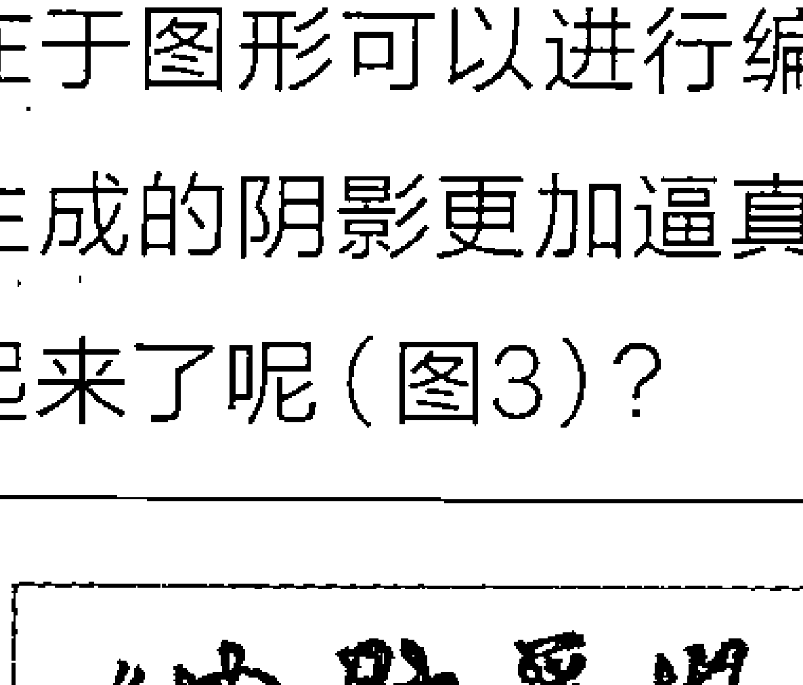

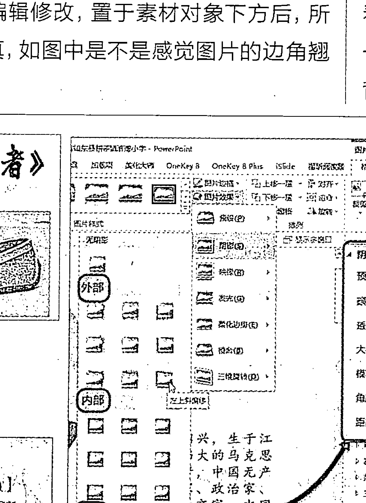

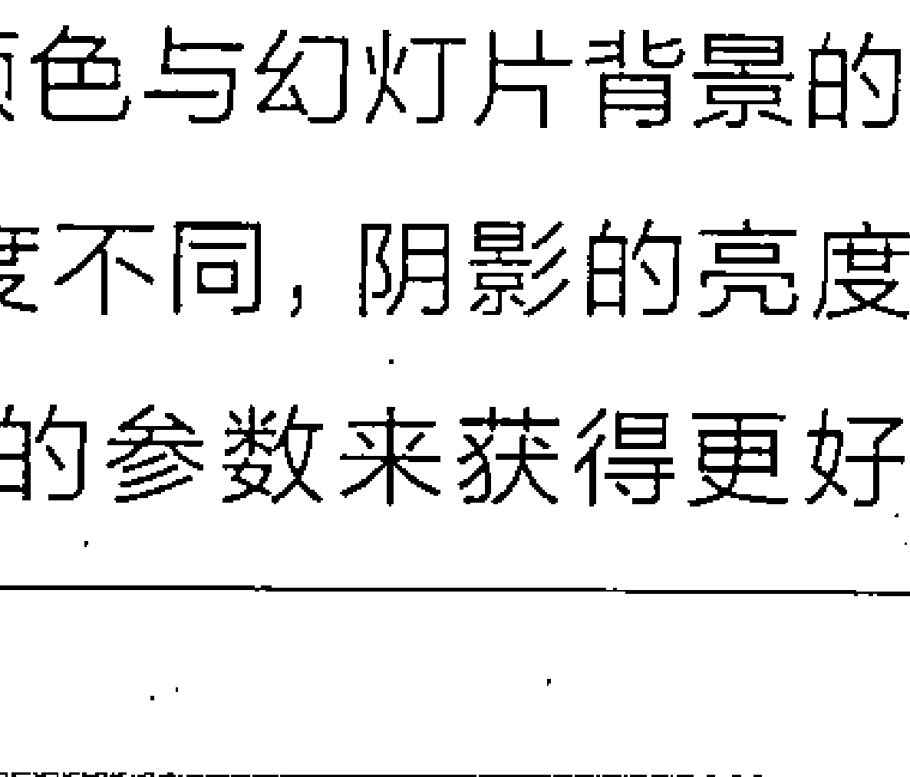

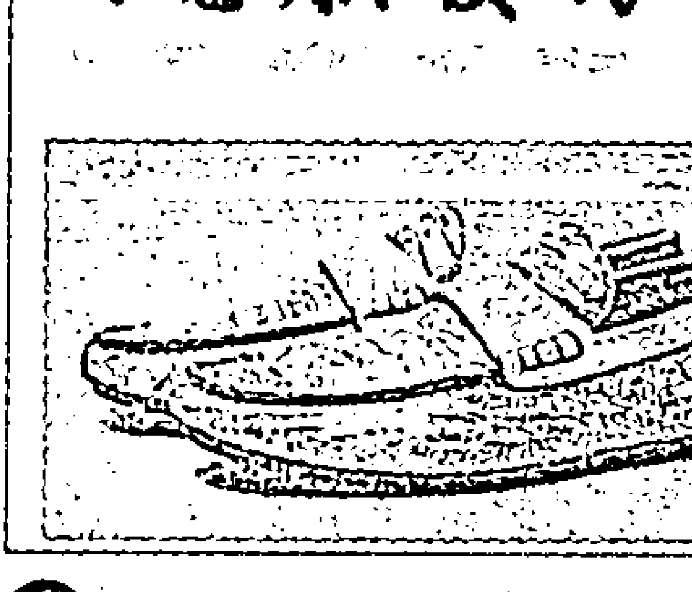

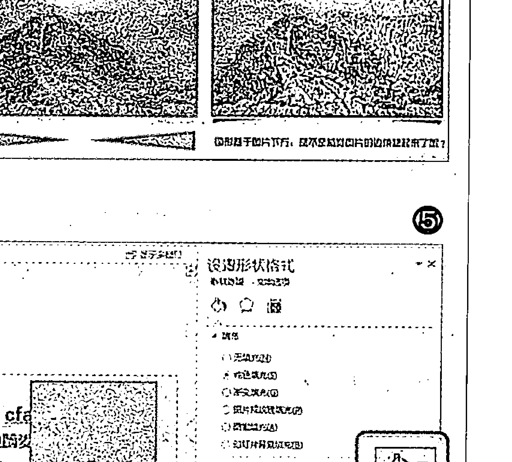

[PAGE 233]

做法就是用取色器去吸取背景的颜色，然后通过HSL模式降低颜色的亮度，这就是高手做出的阴影看起来总是很舒服的秘诀。

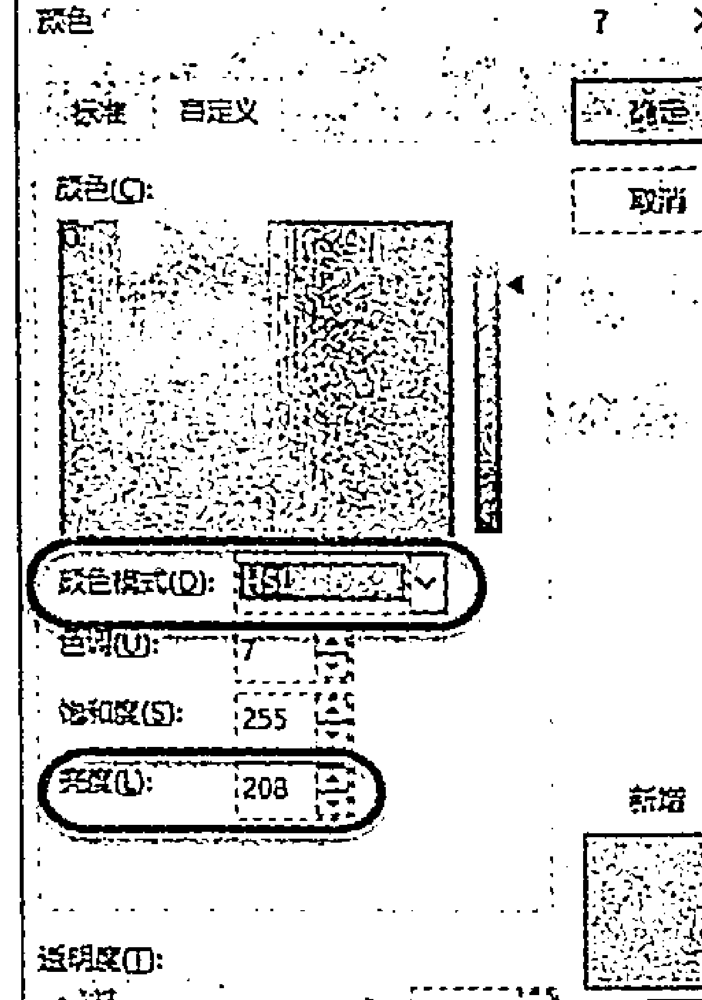

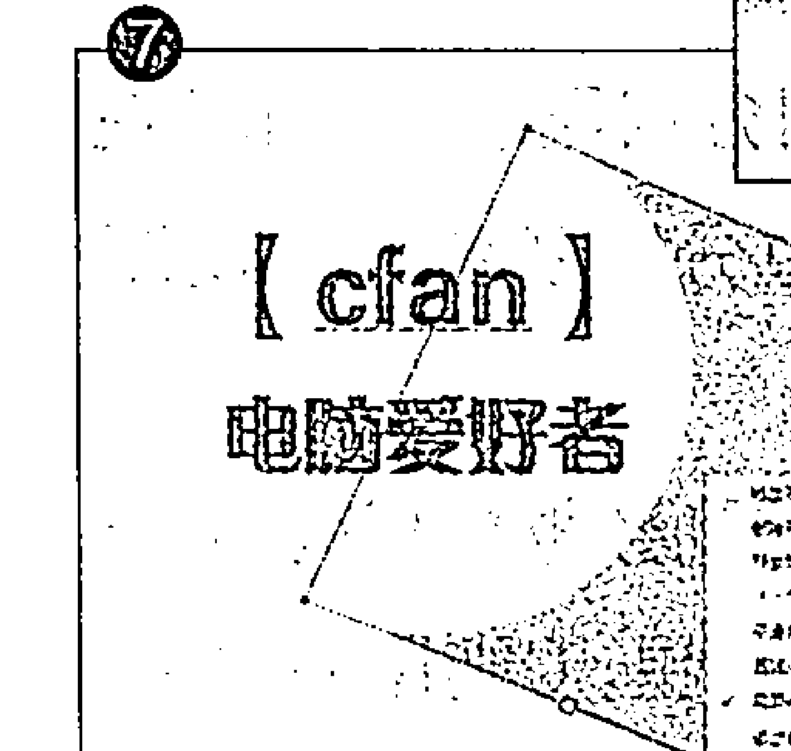

最后旋转作为阴影的矩形，右击矩形选择“编辑顶点”，右击后新增一个顶点，将矩形修改成五边形，并且让其覆盖在页面的边角处（图7）。如果光源位于左上角并且是点光源（如灯泡、电筒等），则阴影的尺寸会延伸并逐渐增加。

### 散影

这种阴影的颜色通常很浅，并且边缘呈现虚化效果，常用来加强各部分的质感，常用于按钮、卡片等（图8）。

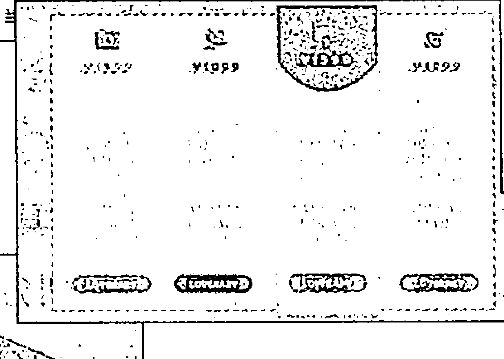

绘制一个比图片略大的矩形，设置为“无边框”，颜色为灰色，然后右击选择“设置形状格式”，单击“效果”按钮，设置“柔化边缘”数值为3，将矩形置于图片的下面，按Ctrl键不放，再按方向键对阴影进行微调，这样散影效果就形成了（图9）。

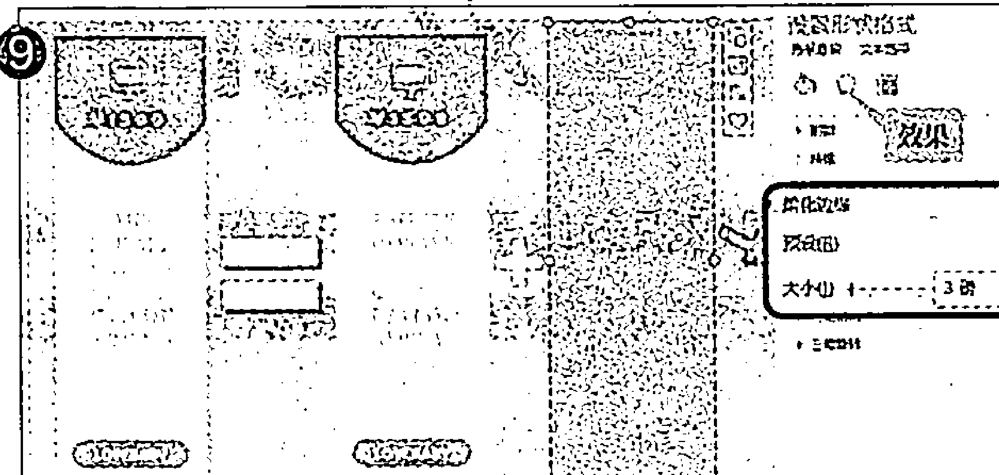

除了上述方法，还可以直接使用“形状选项”中的“阴影”功能，选择“预设”下的“居中偏移”，然后设置“透明度”为60%左右，“大小”为102%左右，“模糊值”为5磅左右，非常简单。不过不足之处就是阴影位置和形状的调节不够灵活（图10）。

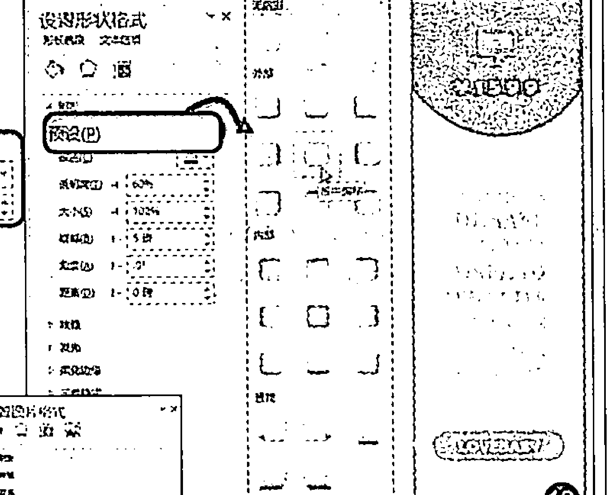

### 重影

这种阴影形象点说就是“多胞胎”排队，将文字或图片复制多份后进行修改，再排列而成。早期我们做立体字就常用这种方法（图11）。


选中图片，右击选择“设置图片格式”，单击“效果”选项，在“三维旋转”下选择“透视”中的“适度宽松透视”，然后修改XYZ的数值，“距离边高度”为12（图12）。

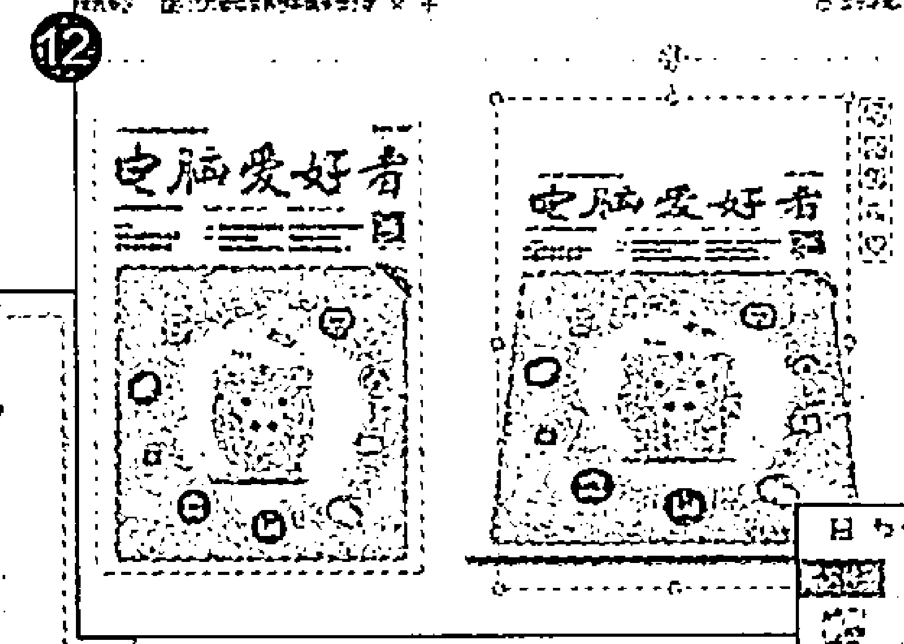

复制图片，切换到“格式”选项卡，单击“艺术效果”选择“虚化”，将图片进行虚化处理，然后右击选择“置于底层”，让虚化的图片置于下方作为阴影。如果感觉重影效果不够，可以再复制一份，置于底层进行叠加，这样重影效果也会更强（图13）。

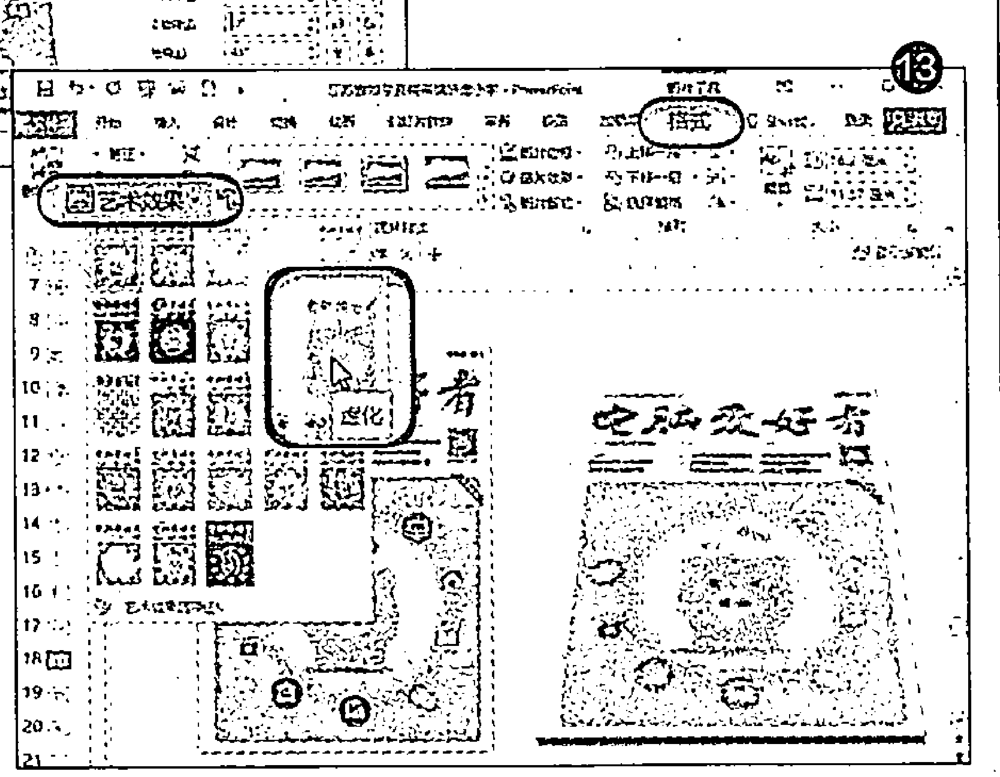

阴影提供了非常重要的视觉效果，能够显示出对象的深度和有方向的运动。阴影能够显示界面之间的分离程度，一个对象的高度决定了它的阴影，高的物体往往投射出更大更模糊的阴影。值得强调的是：阴影不能过于生硬，要和原来的画面能完美融合起来，千万不要有违和感；其次阴影的距离要适宜，要根据实际情况进行调节。阴影设置本身并不太难，难的是如何用简单的设置达到理想的效果。只要多看多想，特别是多动手，才能慢慢去体会，最终达到融会贯通的境界。

[PAGE 234]

## 用活条件格式 用Excel制作星级系统

文|平淡

公司每个月都对会员消费积分进行统计，根据不同的积分给予不同的星级服务。常规的方法是使用图表的方式进行统计，为了可以更直观地表现出积分和星级的对应关系，现在需要在消费积分的后面加上对应的星级标记，这样通过标记就可以非常方便地知道会员的星级了（图1）。

可以看到如图示例中，星级标记是要和不同的积分对应的。通过对原始数据进行分析可以知道，每个分级标准主要是30、31、61、101、201、301这几个数字，只要大于这里的临界数字，则需要添加上对应的星级标记（最多5个星级）。因此设计的思路是，将原始积分分解并和分级标准对比，如果大于该数值则分配一个星级标记。我们只要插入5列的辅助列，然后将分解的积分使用IF函数和分级标准比对，最后使用条件格式分配星级符号即可。

选中C2并在其中插入公式“=IF(C$1<=$B2,1,0)”。公式的意思是使用IF函数，将C1的值（即分级标准的数值）和B2的值（会员的是实际积分）进行比较，如果C1<=B2，那么就在C2显示为1，否则显示为0。然后将公式依次向右、向下填充到C2→G6区域，可以看到积分分解后会在C→D列分别显示为1和0这些数据，其中1代表一颗星（表示超过分级基准值），0则为无（图3）。

```
=IF(C$1<=$B2,1,0)
```

首先按示例的提示在Excel中A、B列输入对应的数据，接着插入C、D、E、F、G列作为存放分级图标的辅助列，并在C1、D1、E1、F1、G1输入分级的标准数值31、61、101、201、301（图2）。

完成上述操作后，上面辅助列数据中只有1和0，因此接下来就是将“1”代替为一颗星，0则隐藏显示，这样即可完成星级的设置。选中C2→G6区域数据，点击“开始→条件格式→新建规则”，在打开的窗口中，规则类型选择“基于各自值设置所有单元格的格式”，格式

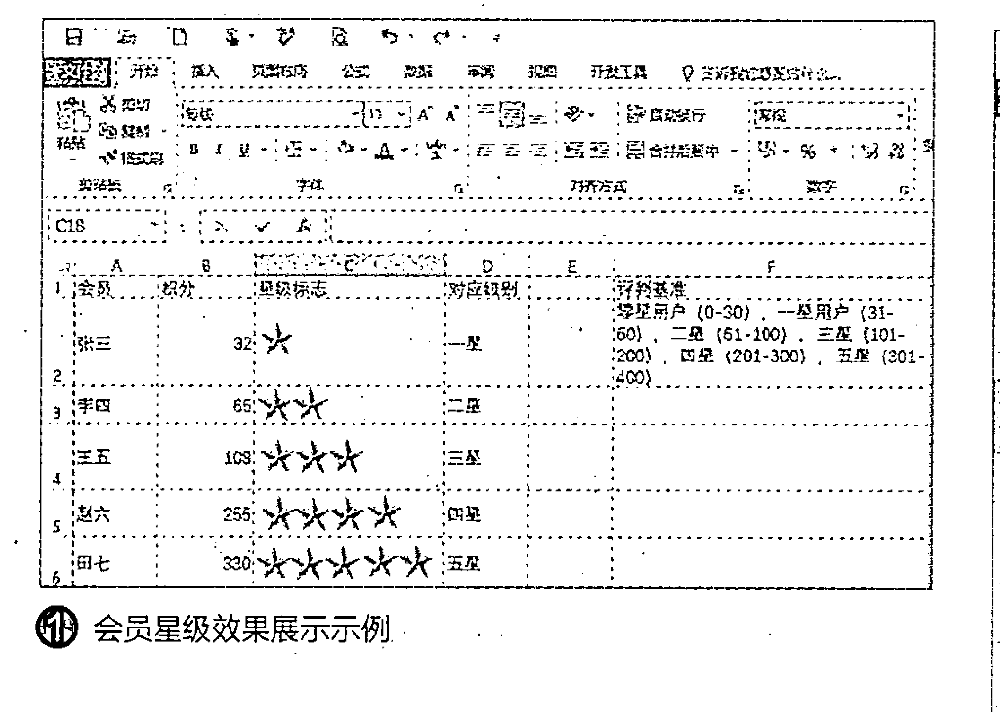

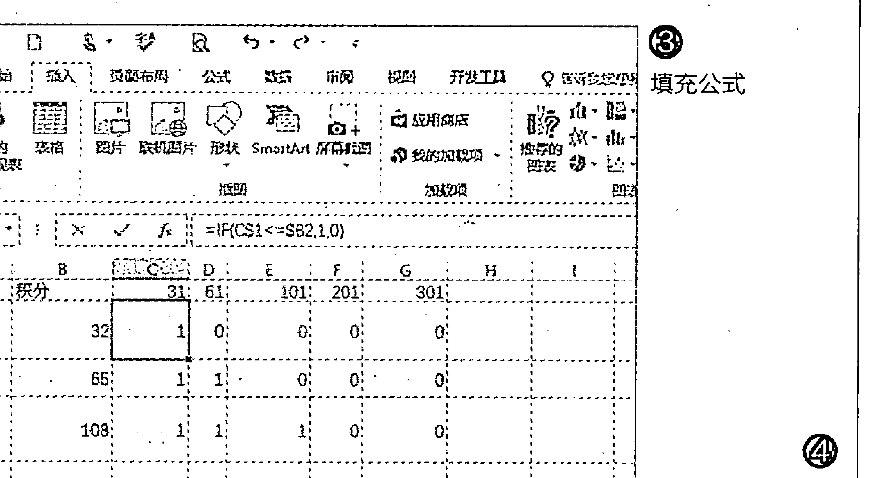

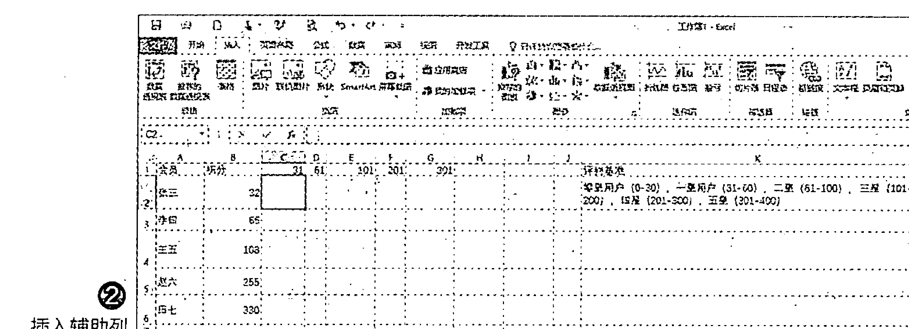

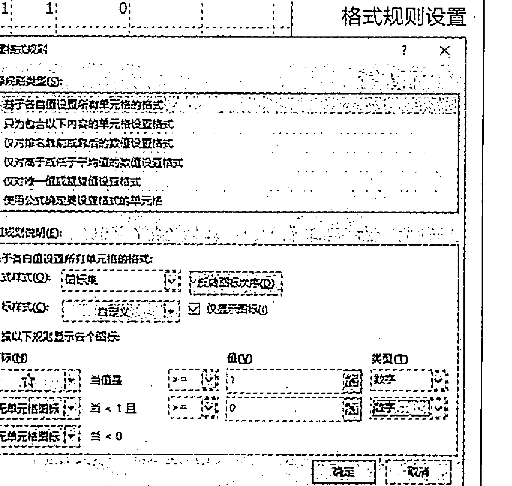

[PAGE 235]

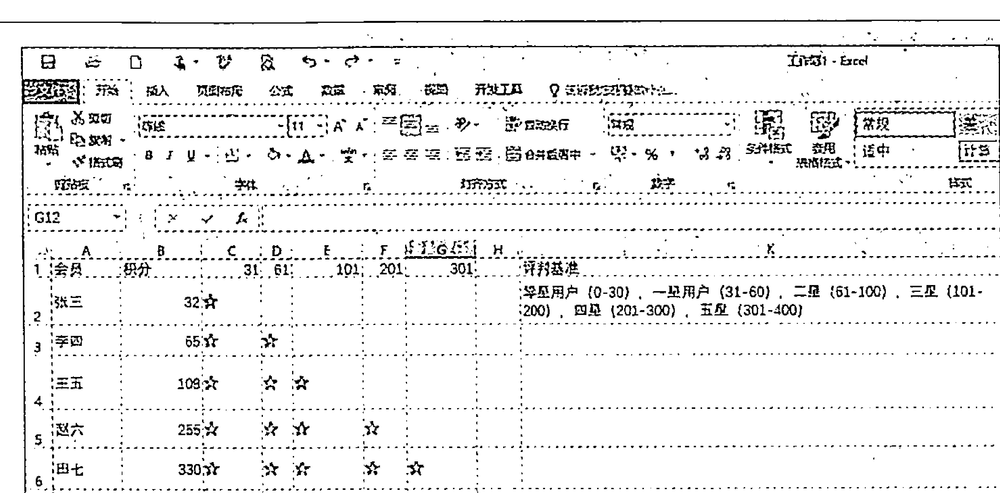

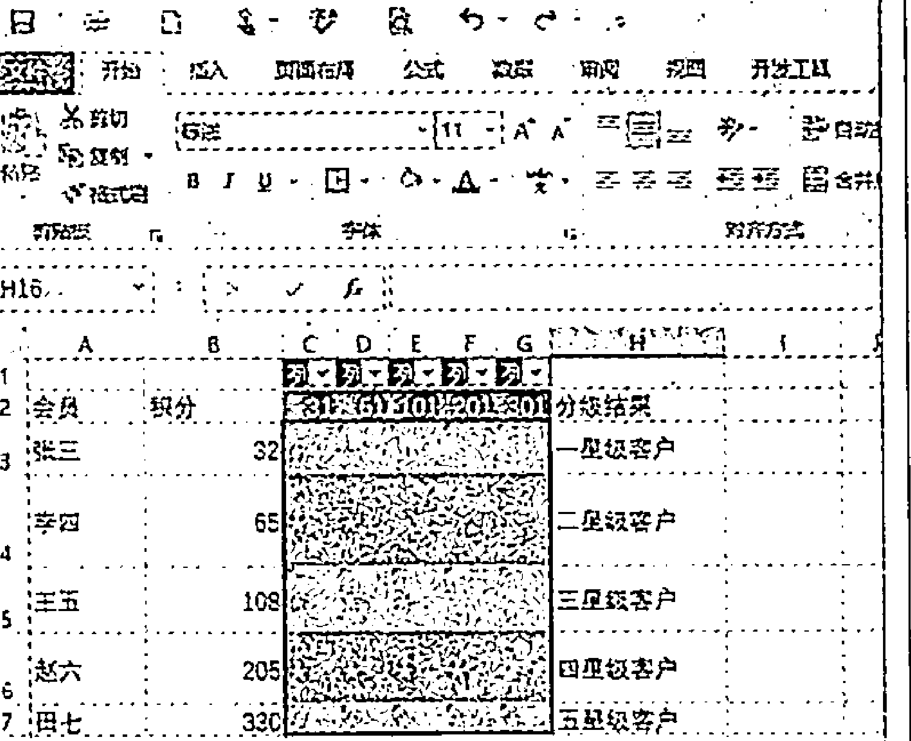

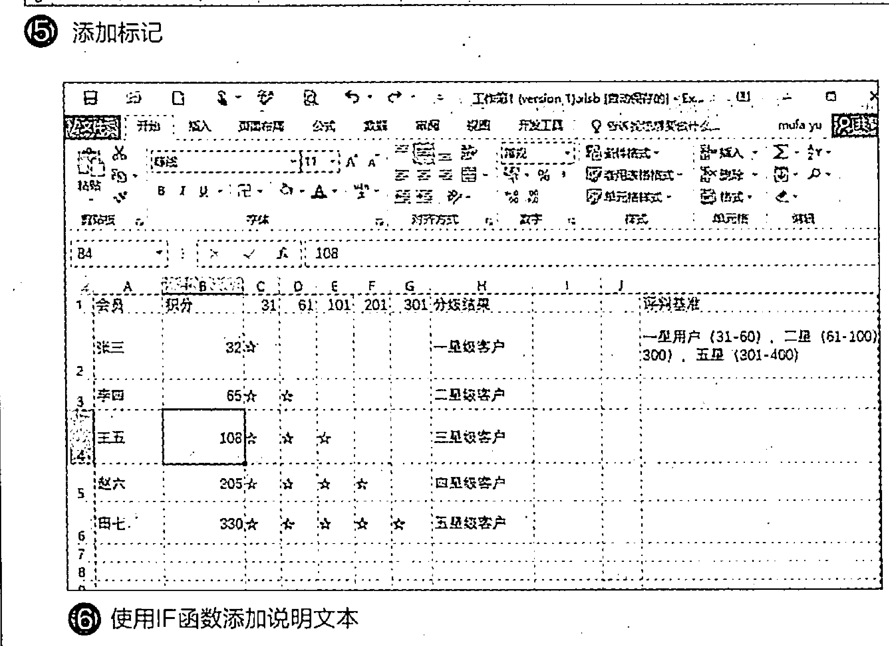

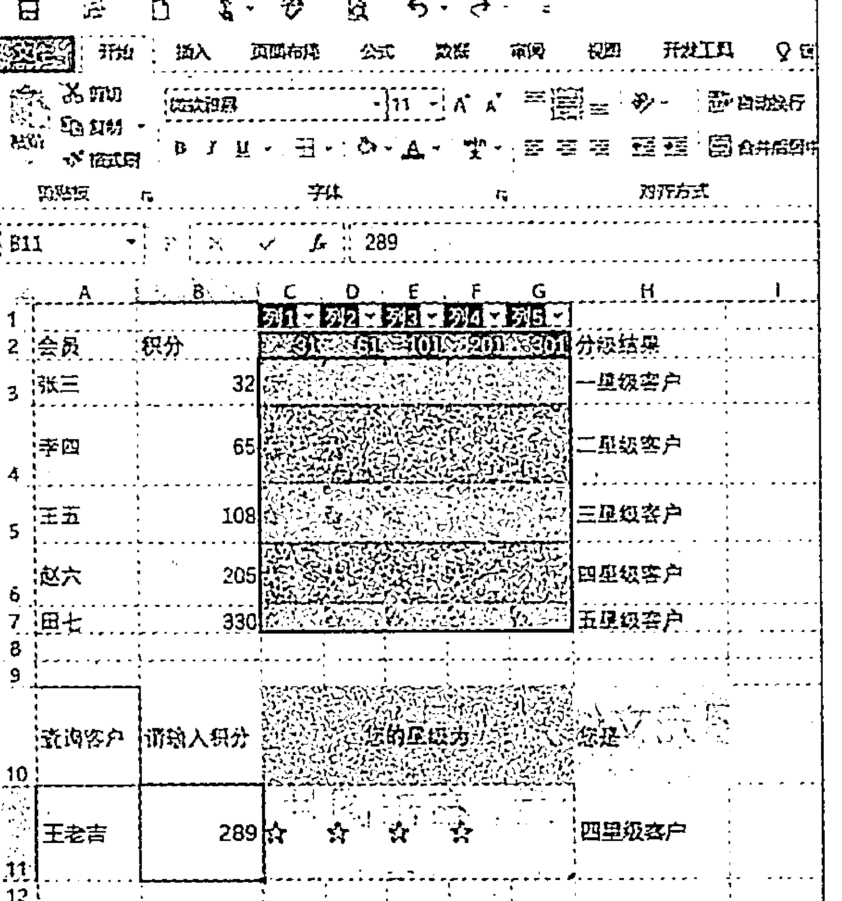

样式选择“图标集”，图标样式选择“自定义”，勾选其后的“仅显示图标”，图标选择五角星，当值是>=1时，类型选择“数字”，其他选项设置为“无单元格图标”（图4）。

这样点击“确定”后返回Excel窗口，可以看到辅助列的单元格中会根据积分数值自动填充上对应的星级标记，达不到分级标准的区域则显示为空白（图5）。

添加上星级标记后，我们还要对星级增加文字说明。文字说明同样可以使用IF嵌套函数进行添加。定位到H2，然后输入公式“=IF(B2<61,"一星级客户",IF(B2<101,"二星级客户",IF(B2<201,"三星级客户",IF(B2<301,"四星级客户","五星

级客户"))))”。这里使用四级嵌套对会员积分进行判断，符合某一分级标准则显示对应的“X星级客户”。这里同样要先根据分级标准进行嵌套，按照不同的积分标准对应显示不同星级的文字，注意文字说明需要使用半角双引号进行标注。接着将公式下拉，可以看到函数会自动为不同星级的客户添加上文字说明（图6）。

接下来对星级标记进行美化操作，按提示选择C2→G6列，将其列宽设置为和星级图标大小一致，点击“开始→套用表格格式”，套用一种深色且无竖线的样式即可。应用样式后，由于表列的存在会导致数据错格排列，按提示进行调整对齐即可。这样，通过客户积分以星

级数目就可以非常直观地进行展示了（图7）。

因为这里填充的是公式，星标可以根据客户积分的不同动态地进行增减，比如更改（或者增加）客户积分，那么星级标记也会同步进行变化。当然也可以将其保存为模板备用，如果分级标准变化，那么只要更改辅助列的数字即可。

因为是公式动态引用，我们还可以直接复制其中的某列（需要包含公式）到其他位置，然后制作一个带查询功能的模块。比如复制任意一列到11行，然后在上方单元格输入需要查询的信息和星级说明，这样只要用户输入查询的姓名和积分，星级和判断文字会自动显示（图8）。

[PAGE 236]

## 自己动手 用PPT做个抽奖器

文|俞木发

喜欢看电视的朋友可能都知道，某电视台有个节目是翻名牌获大奖，节目使用很多著名商标作为面牌，翻开后底牌是一些奖项。我们利用PPT动画效果也可以制作出类似的翻牌获奖，既可以用于年会抽奖，也可以用其来制作随机派位器，为日常工作添加一些趣味。

在抽奖环节，底牌是各种奖项，奖项的设置通过输入文字即可，面牌和底牌均可以通过形状来设计。点击“插入→表格”，插入一个单元格，同时将单元格大小调整为和幻灯片的大小一致（防止抽奖时点击到空白区域导致幻灯片退出）。选中插入的单元格，切换到“表格工具→布局→拆分单元格”，按提示将单元格拆分为多个，每个单元格对应一位员工（如果员工较多可以设置多张幻灯片）。这里为了叙述简单，拆分设置为2X2（图1）。

这样在幻灯片插入一个四分表格，按提示选中表格，右击选择“剪切”，点击“开始→粘贴→选择性粘贴→图片（增强性图元文件）”（图2）。

将表格粘贴为图片后，右击图片选择“组合→取消组合”，在弹出的“是否要将图片转换为Microsoft

Office绘图对象”时，选择“是”。然后继续选择“组合→取消组合”，这样表格会被分解为4个大小一致的独立单元格图形。点击“开始→选择→选择窗格”，此时在右边的窗格可以看到分离的单元格，分别对应Rectangle X，按提示将其名称依次更改为底牌1、2、3、4，并分别填充上不同颜色进行区分（图3）。

选中底牌1，点击“插入→文本框”，在底牌上分别写上对应的奖项名称。如底牌1为“一等奖”，选中底牌1和插入的文本框，点击“绘图工具→格式→组合→组合”，将其组合为一个整体，同时在右侧窗格将该组合重命名为“奖项1”。操作同上，依次完成奖项2、奖项3、奖项4的组合（图4）。

完成上述的设置后，点击“插入→形状”，插入一个

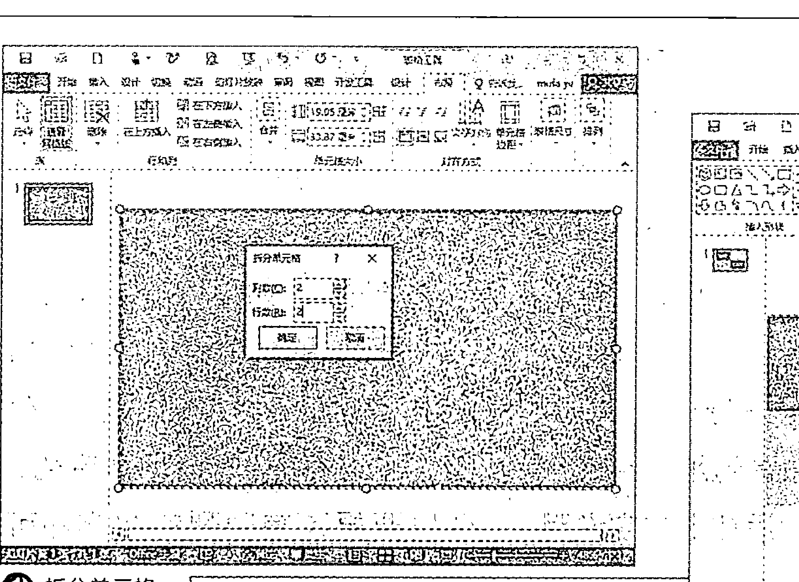

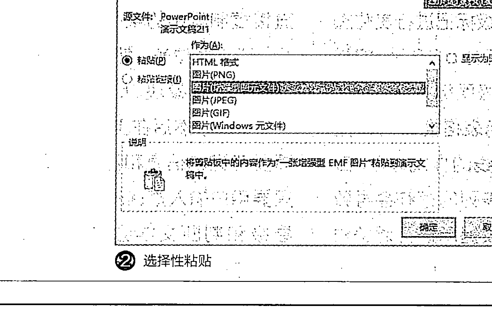

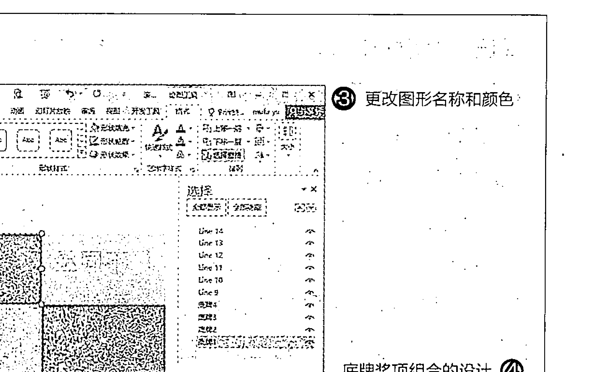

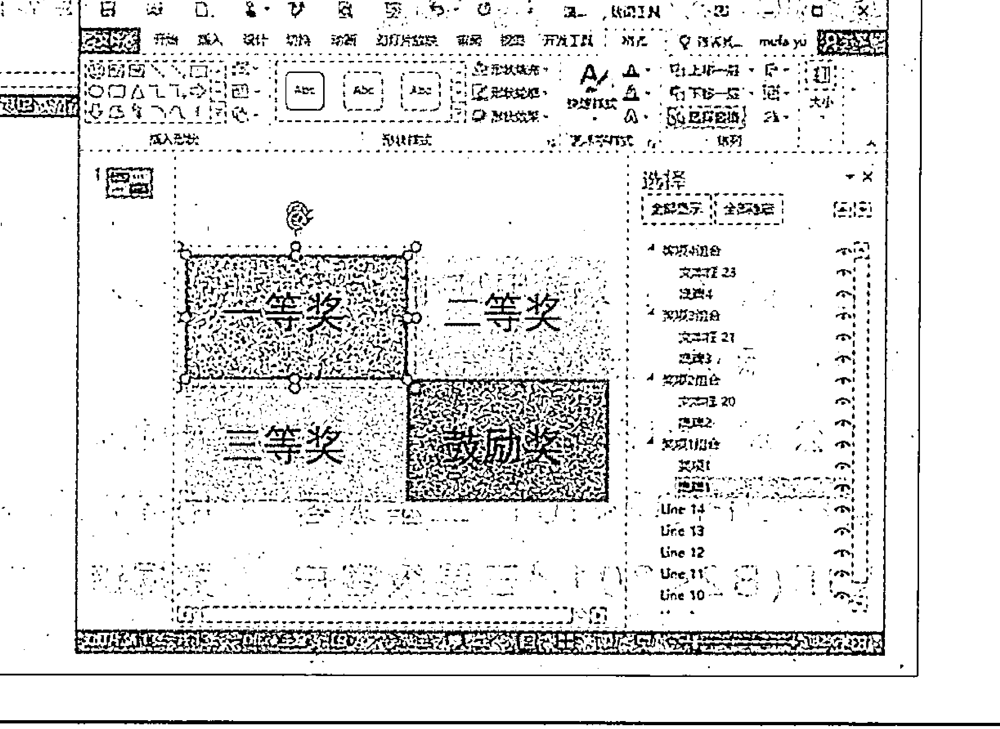

[PAGE 237]

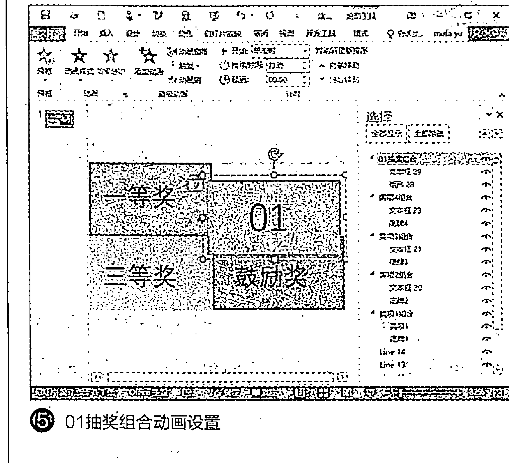

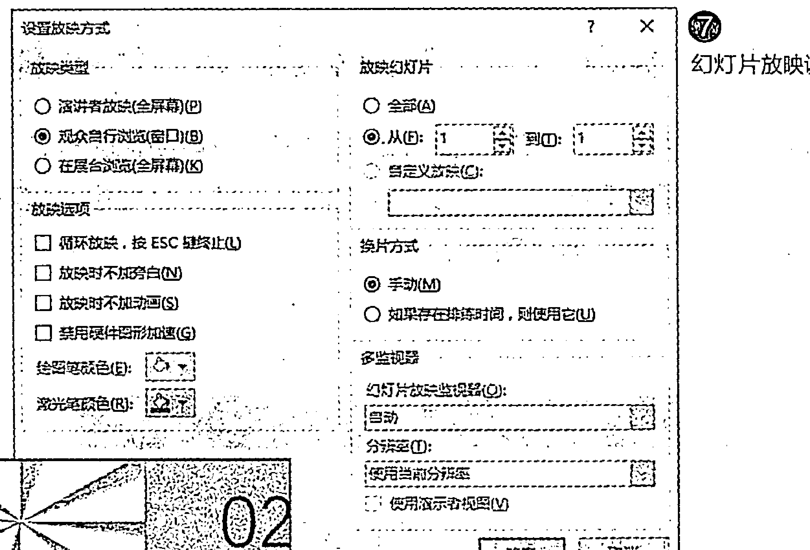

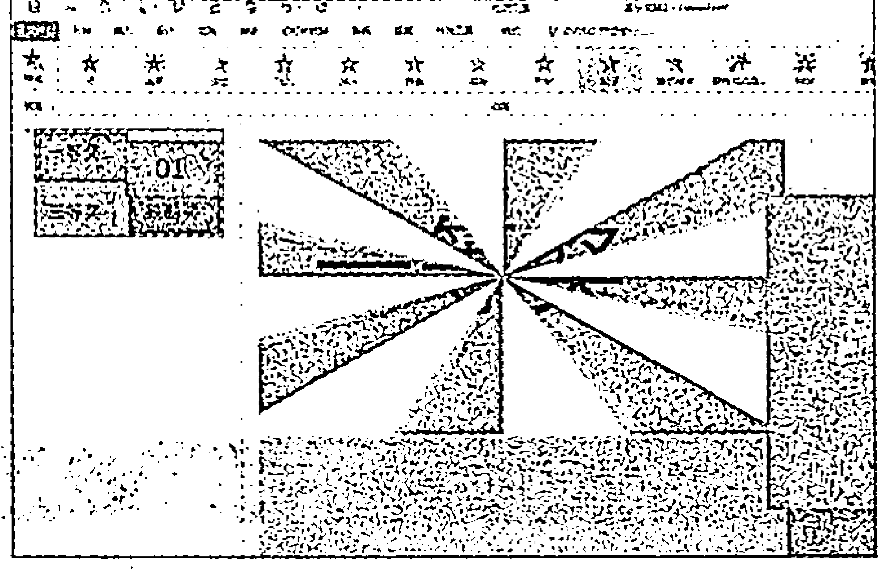

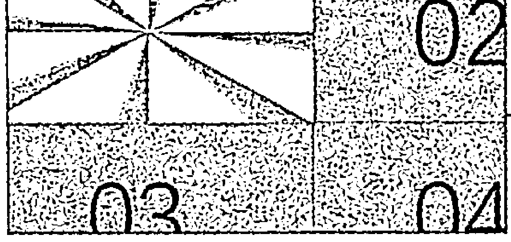

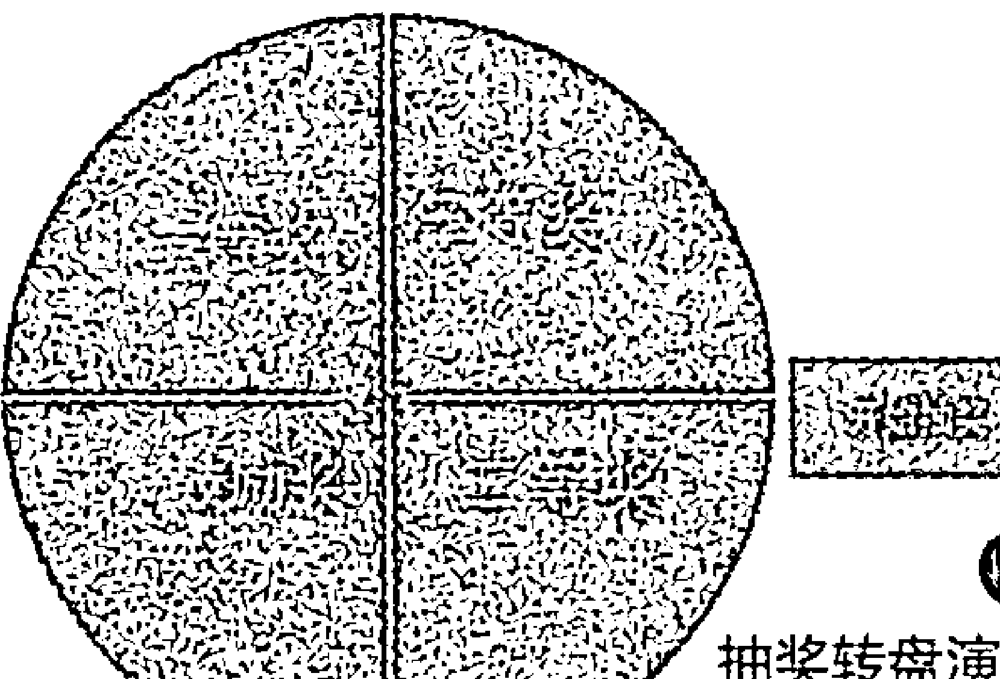

### 使用PPT制作抽奖转盘

上述制作方法比较复杂，如果只是要制作一个简单的抽奖转盘，同样也可以使用PPT来完成。

大小和奖项组合大小一致的矩形。选中矩形并插入说明文本框“01”作为抽奖序号，同上也将文本框和矩形进行组合，并将组合命名为“01抽奖组合”。选中“01抽奖组合”，点击“动画→添加动画”，为其添加一个“消失”的退出动画（即点击01后会自动消失显现下面的奖项），点击“触发→点击→01抽奖组合”，即点击这个组合时就会触发消失动画（图5）。继续选中“奖项1组合”，点击“动画→添加动画”，为其添加一个“轮子”进入动画，动画效果选项选择“8轮辐图案”。点击“触发→点击→01抽奖组合”，即点击这个组合时会激活轮子动画显示具体奖项，将开始播放动画时间设置为“上一动画之后”（即01消失之后显示奖项），延迟设置为1s（图6）。

操作同上，依次设置好其他选项的抽奖组合和奖项动画设置（可以使用动画刷快速完成设置）。完成动画设置后将各自抽奖组合覆盖到对应的奖项上，点击“幻灯片放映→设置幻灯片放映”，将放映的类型设置为“观众自行浏览”，换片方式设置为“手动”（图7）。OK，现在切换到幻灯片放映开始抽奖。只要员工选择需要抽奖的序号，使用鼠标点击相应的序号后，序号会自动消失，同时1秒后会自动以8轮辐图案显现出对应的奖项（图8）。点击“插入→图表→饼状图”，修改所有数据为相同，同时删除饼状图的标题及右边的标签说明，这样完成一个四分转盘的制作，同时将转盘颜色填充为同一颜色。

也插入对应奖项的说明文本，最后将文本和转盘组合在一起。点击“插入→形状→箭头”，将箭头调整为和圆形的半径一致，复制一个箭头并旋转180度，并将其放置在下方的半圆，将其和前面插入的箭头组成一个圆的直径，并将下方的箭头颜色填充为和圆形的颜色一致（这样在转盘就只能看到上方的箭头）。选中两段箭头点击“开始→排列→组合”，将其组合在一起。继续插入一个矩形，并在其上添加“开始抽奖”字样，同上选中组合箭头，点击“动画→添加动画”，添加一个“陀螺旋”进入动画，触发设置为点击“开始抽奖”矩形。这样开始幻灯片的播放后，点击“开始抽奖”，上述设置的箭头即可开始旋转抽奖，按键盘上的数字键“1”（！）暂停，按“\”解除暂停继续旋转（图9）。

## 图表合一 巧用字体做图表
文|愚人

在Excel文档中，为了可以更直观地对数据进行可视化的展示，我们经常使用图表的方式进行表述。不过常规都是使用Excel自带的图表图形，这种方法制作比较麻烦，个性化设置不便。其实除了图表，我们还可以使用字体来替代图表，做出更简单、个性的字体图表。

### 字体如何变图表：REPT函数解析
熟悉Excel函数的朋友知道，Excel有一个名为REPT的函数，它的主要作用是可以按照定义的次数重复显示文本，类似手动复制文本。而在文本中，有很多类似“|、▲、■、●”的符号也是一类字体，因此我们可以借助REPT函数来填充这些字体，从而实现将字体替代图表，制作出更多个性化字体图表。

那么在实际使用中，我们该怎么使用REPT函数来制作字符图表？

Excel的“插入→符号→符号”，在打开的符号列表中，字体选择“普通文本”，子集选择“其他符号”，这样即可看到很多符号字体。这里可以选择“实心方块”作为数据条标记，选择该字符后点击“插入”，将其插入到空白单元格备用（图1）。

### 数据多少 一目了然
在Excel中为了可以直观表示数据的多少，我们经常使用数据条来进行标注。现在借助“REPT函数+字体符号”可以轻松实现数据条效果。

首先要选择一种自己认为合适的字体符号，点击

### 简单变换 图表设置更随意
大家知道通过条件格式也可以非常方便地在单元格中添加上数据条，不过和上述方法不同的是，字符式的数据条可以非常方便地对数据条的大小、颜色、形状等进行改变，因为这些改变实际上只是对单元格中的字体进行对应的改变而已。比如在上述例子中，为了突出

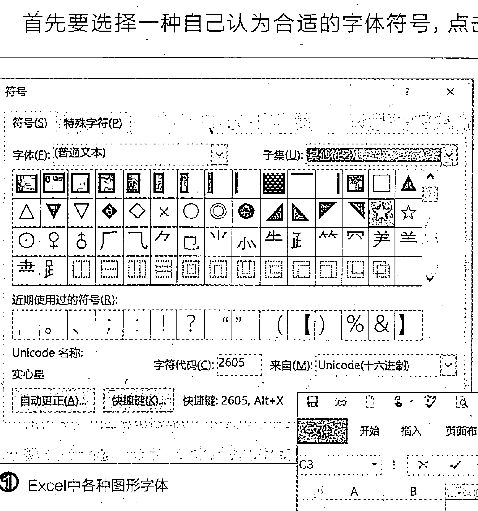

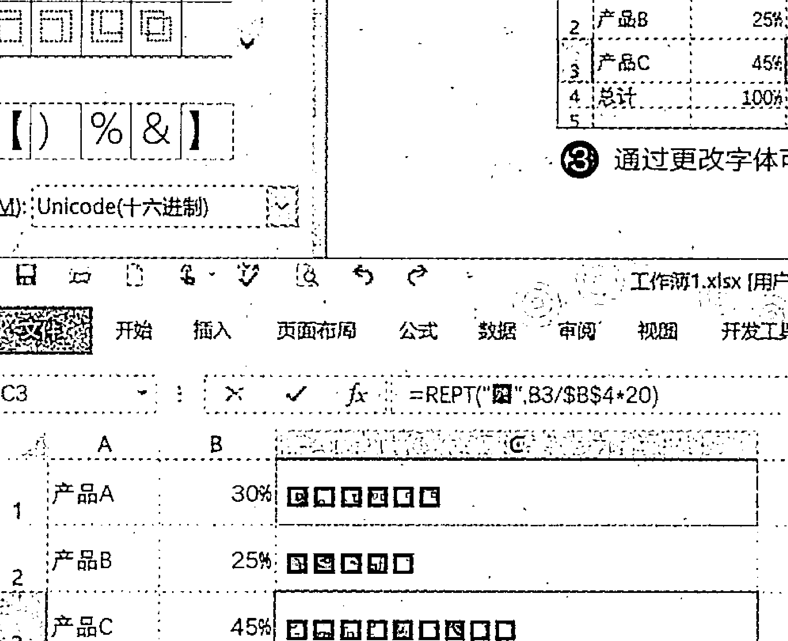

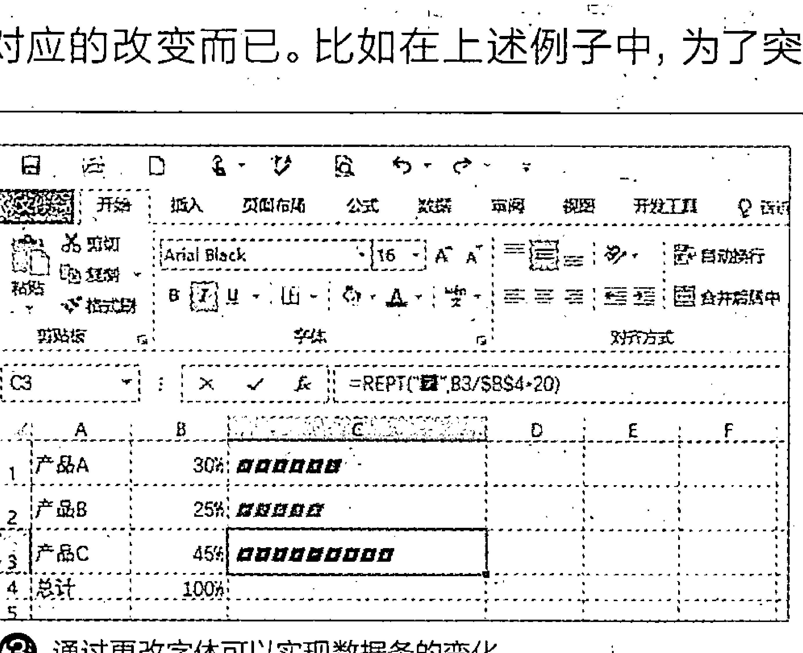

> **小提示**
> 可以看到这里的“符号”，实际上是各种Unicode字符，我们也可以按照字体下方的提示，输入对应的区位码，然后按Alt+X完成输入。比如输入“25a0”再按下Alt+X即可完成实体方形的输入。

```
=REPT("■",B1/$B$4*20)
```

| A   | B            | C            | D   | E   | F   | G   |
|-----|--------------|--------------|-----|-----|-----|-----|
| 1   | 品名         | 14G（万个）  | 16G（万个） | 14G |     | 16G |     |
| 2   | 涡轮         | 5            | 10   | ████ | 涡轮 | ████ |     |
| 3   | 伞齿轮       | 3            | 6    | ███  | 伞齿轮 | ██   |     |
| 4   | 小计         | 8            | 16   |     |     |     |     |

需要制作效果图

#### 小提示
这里是使用REPT函数填充方格符号，符号可以直接插入或按照区位快捷键方法输入，并且需要使用半角双引号括注。B1/$B$4，表示输入符号的数量是B1数值和B4（即总和）的比值，这里使用$B$4来作相对引用，如果添加更多的产品并不影响对总和引用。20则表示如果比值为1则填充20个重复的字符，否则按照比例进行填充。为了让数据条有更直观的体现，这里的数值需要根据实际情况进行选择，如果原始数据较大，则这里倍数也应设置较大。

### 制作左右分列图表

| C    | D   | E   | F     | G    |
|------|-----|-----|-------|------|
| (万个) |     | 14G | 涡轮 | 16G  |
| 10   |     | ████ |       | ████ |
| 6    |     | ███  | 伞齿轮 | ██   |
| 16   |     |     |       |      |

#### 小提示
这里使用三个IF判断语句对B2的积分进行判断，如果小于等于3分，则在对应的单元格填充一个星号，小于等于7分则填充2个星号，否则填充3个星号。这样原来REPT填充就可以根据实际的积分进行精确填充。

### 填充对应的星级图标

| 用户 | 积分 | 星级 |
|------|------|------|
| 张三 | 5    | 1★   |
| 李四 | 8    | 2★★  |
| 王五 | 16   | 3★★★ |

数据中最小的数字，可以将数据条中的字体更改为红色，同时适当调整字体大小并设置倾斜，这样即可完成数据条的变化（图3）。当然我们还可以通过对字体的更多设置实现图表的更多变化。比如对于同一型号的两种零件可以利用上述函数制作出左右对比的数据图，如现在需要制作出图4的对比图，那么只要在数据左右侧分别进行填充即可（图4）。定位到E2单元格，输入公式“=REPT("█",B2/$B$4*20)”，向下填充后将其字体设置为“右对齐”。同样在G2输入公式“=REPT("█",C2/$C$4*20)”，将其字体设置为左对齐即可（图5）。

### 嵌套函数生成更多个性图表
除了对字体进行变换外，REPT函数还可以和其他函数结合，生成更多实用的图表。比如在对客户消费水平进行评级的时候，我们经常使用★来表示客户的级别。如果单纯使用上述方法，REPT函数只是机械按照比值进行填充是无法精确区分客户的星级。比如现在需要按照客户消费积分0→3，4→7，8→10三个档次，分别添加1→3星级的标志，此时结合IF函数进行积分判断，然后再使用REPT函数进行填充即可。定位到C2，输入公式“=IF(B2<=3,REPT("★",1),IF(B2<=7,REPT("★",2),REPT("★",3)))”，然后将该公式向下填充，这样用户的积分符合要求就会在C列对应单元格填充上对应的星号。按下回车键，即可根据F2单元格中的分数，自动返回指定数目的“★”号（图6）。

## 灵活调整坐标轴标签样式
文|马震安

在利用Excel制作图表时，坐标轴标签对于标识数据非常重要。默认情况下，图表的横向坐标轴标签就是按照相应的数据规范显示的。例如本刊2015年20期《数据有增加 图表自适应》中介绍的图标制作效果，图表的X坐标轴标签按照一般行文规范显示，缺乏特色，但如果通过一些设置，使横向坐标轴标签能够双行显示、分类显示，这样的图表看起来就别具一格了（图1）。

### 斜向标签
双击图表的横向标签，在右侧“设置坐标轴格式”窗口“坐标轴选项”选项卡下的“大小与属性”子选项卡中，“对齐方式”下的“文字方向”处选择“横向”，“自定义角度”处根据需要输入相应的角度数（如45度）。这样，坐标轴的标签就变成斜向标签（图2）。

### 双行标签
图表标签要求双行显示，第一行显示手机品牌，第二行显示型号。首先，需要将单元格中的文字换行。将光标点在商品名称所在单元格品牌的后面（如“OPPO R11高配版”，需要将光标点在“OPPO”后面），按下Alt+Enter组合键，输入硬回车，将文本分成两行。这样，图表标签就变成双行显示了（图3）。

### 分类标签
首先，需要将表格中的数据通过合并单元格进行分类，输入分类数据。然后右击图表，点击“选择数据”，在弹出窗口的“水平(分类)轴标签”处点击“编辑”，在弹出的窗口选择A2:B8单元格（即分类及商品名称区域），确定后图表的水平标签就变成了分类标签（图5）。

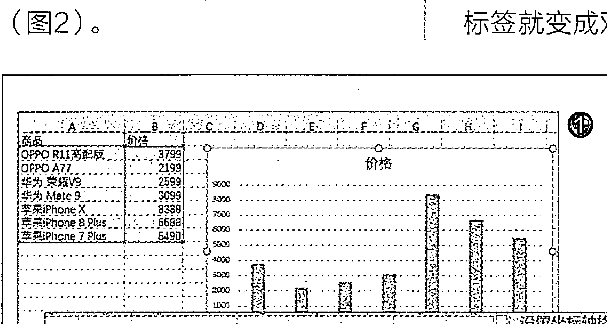

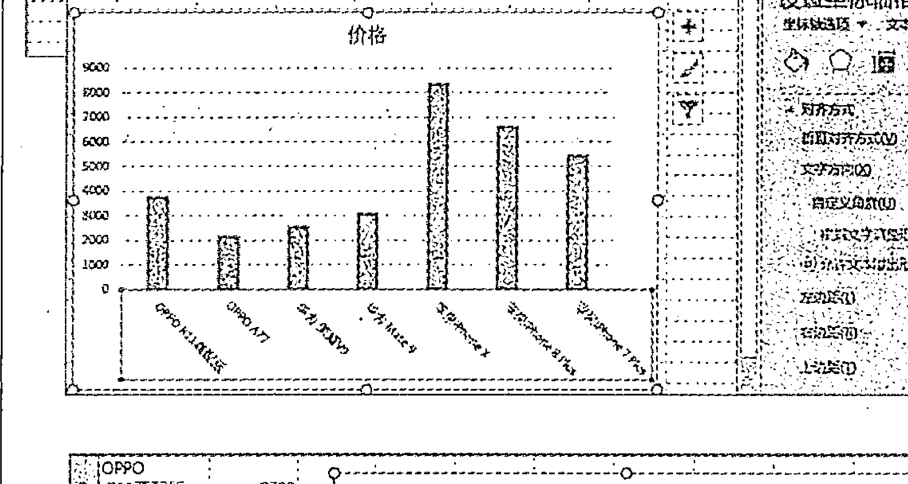

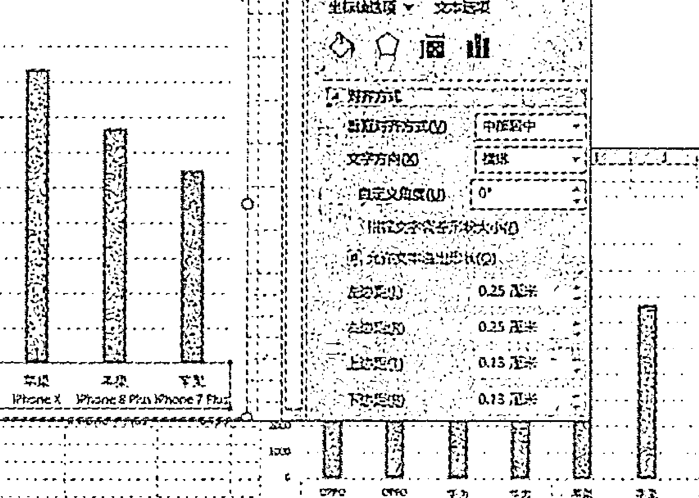

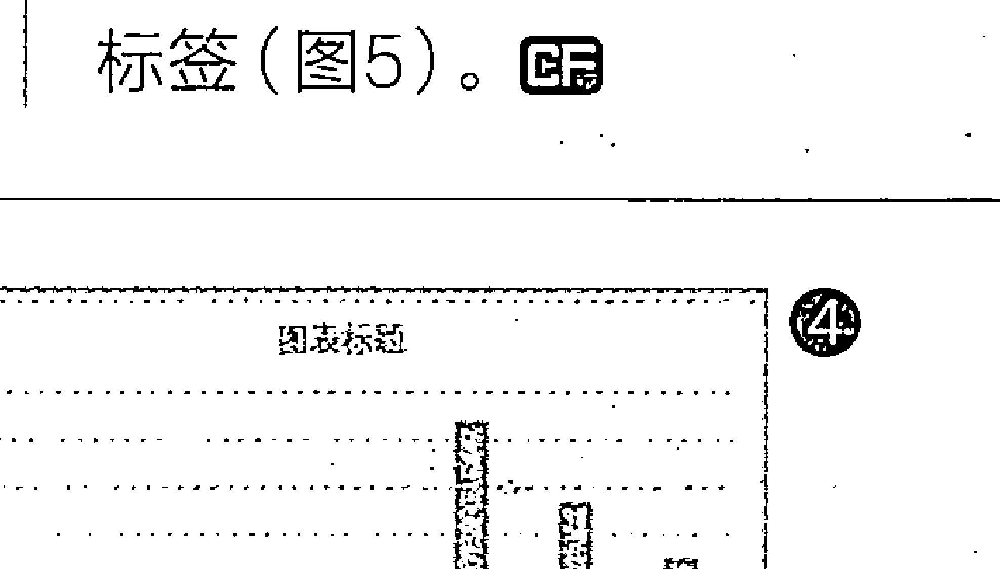

> 小技巧：空间有限，如何做到错落有致
> 将光标点在第二个商品名称前，按下Alt+Enter组合键，输入硬回车。同样，在第四个、第六个名称前输入硬回车。这样，图表坐标轴标签就变成了错落有致的错行标签了（图4）。

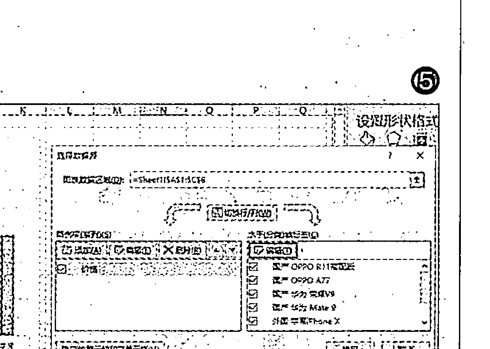

## PowerPoint代劳让专业录屏软件下岗
文|老万

我们在使用电脑的时候难免会遇到各种各样的问题，但是当我们在向他人请教这些问题的时候，有时很难准确地表达出所遇到问题的真实情况。于是别人就要求我们对这个问题进行一个录像操作，通常要进行类似的操作都需要用到专业的录屏软件。其实我们借用一些常见的软件也可以完成类似的操作，比如使用Office办公软件中的PowerPoint模块就可以方便地解决。

### 快速方便的屏幕录制
首先利用PowerPoint 2016软件创造一个全新的PPT文档，接着点击“插入”标签中最右侧的“屏幕录制”按钮。这时在屏幕的上方就会出现一个录制的工具条，与此同时自己的整个系统桌面都会呈现出一种反选的效果。现在我们点击工具条中的“选择区域”按钮，通过鼠标选中需要进行屏幕录制的区域即可，通常情况下我们都是选中整个系统桌面的范围。如果要想在录制屏幕的时候进行语音的解说，那么还可以点击工具条中的“音频”按钮。为了便于对方更好地看到自己的操作步骤，最好将工具条中的“录制指针”选项也选中（图1）。

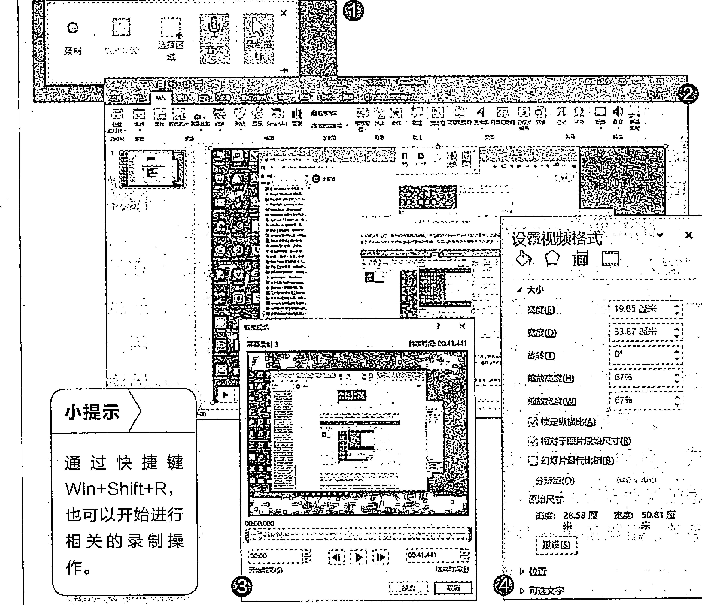

> 小提示
> 通过快捷键 Win+Shift+R，也可以开始进行相关的录制操作。

所有的设置完成以后，点击工具条中的“录制”按钮，就可以开始录制操作了。软件首先会弹出一个倒计时对话框，同时告知用户可以利用快捷键 Win+Shift+Q 进行结束，稍后开始相关的电脑屏幕录制操作。接着自动隐藏 PowerPoint 软件窗口和工具条，然后用户可以随意使用并进行自己的相关操作。屏幕录制完成以后将鼠标移动到屏幕上方，就可以调出隐藏的工具条，点击其中的“停止”按钮就可以完成相关的录制操作。最后录制完成的视频内容，将自动插入到我们的 PowerPoint 软件窗口的新文档里面（图2）。

### 录制视频的编辑导出
现在选择插入到PPT文档中的视频文件，接着选择“播放”标签中的“播放”按钮，就可以对这个视频进行预览操作。如果在 PowerPoint 软件里面无法进行预览的话，那么可以在这个视频上面点击鼠标右键，这时就可以看到一个弹出的工具条。在出现的工具条里面点击“剪裁”按钮，则在弹出的“剪裁视频”对话框里面不但可以进行视频的剪裁操作，还可以点击播放按钮进行预览操作（图3）。

录制视频预览完成以后，如果觉得没有问题的话，在视频上点击鼠标右键，在弹出的菜单里面选择“设置视频格式”命令。接着在窗口的右侧就会弹出一个侧边栏，用户可以根据自己的需要进行配置（图4）。接下来再一次在视频上点击鼠标右键，这次选择菜单中的“将媒体另存为”命令，然后在弹出的对话框里面设置一个文件名称，点击“保存”按钮就可以将视频保存到指定的文件夹目录。最后将这个文件发给对方，就可以说明自己遇到的电脑问题了。

## 不走寻常路 在PPT中制作个性图形
文|俞木发

为了让自己的PPT更有个性，我们经常要在PPT里插入一些特殊配图。很多个性图形使用常规方法是无法快速完成制作的，不过一些另类的技法能够实现，你知道吗？

### 用好图表工具 制作任意等分圆
在制作一些主题PPT的时候，为了表达某个均分的概念，我们经常要准备一张等分圆的图片。常规的操作是在PPT中插入圆形，然后再划一些线条将圆分成等分。这种操作不仅无法实现精确等分，而且效率也低。

利用PPT插入Excel表格，然后使用Excel的圆形图表即可快速完成任意等分圆的制作。

比如要完成一个五等分圆的制作，在PPT中点击“插入→图表→圆环图”，这样就会在PPT中自动生成一个圆环图。这个图表是依据上方表格的数据进行划分，如果要五等分，则添加一个A6内容，并且将其销售额全部设置成相同数值即可（图1）。

完成等分圆的设置后，点击“图表工具→设计→样式”，还可以非常方便地对圆形进行更多设置。这个圆形是由均等的5部分组成，可以任意移动、设置不同填充颜色等。如果需要在其他PPT中使用，完成个性化设置后，只要选中图形，选择“复制→选择性粘贴→图片”，最后再稍加裁剪即可（图2）。

如果是要圆的某一部分，如半圆、2/3圆，同上输入不同数据生成饼形图，对生成的图形进行分离，复制其中某一部分并另存为图片即可。

### 用好布尔运算 制作任意形状透明填充图
在一些精美的PPT中，我们经常可以看到制作者会在幻灯片中配置一些如烟状、墨滴状、心形、白云等特殊形状的图片，这些图片可以对幻灯片起到很好的点缀作用。其实如果要自制类似的图片，利用PPT自带的布尔运算工具即可。

要制作一张白云环绕鲜花的图形，先准备好一张鲜花图片并粘贴在PPT中。点击“插入→图形”，选择白云图形并放置在鲜花上面，将其背景色调整为透明色，然后移动到白云图形的上面。右击图形选择“编辑顶点”，然后根据需要调整顶点使得白云可以部分遮挡鲜花。

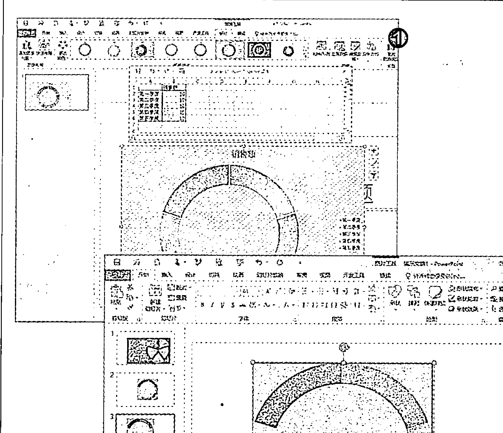

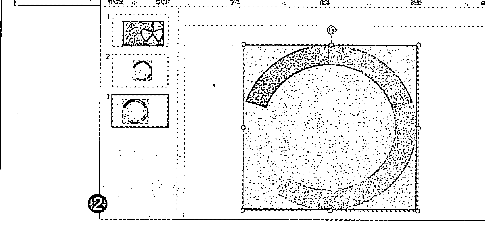

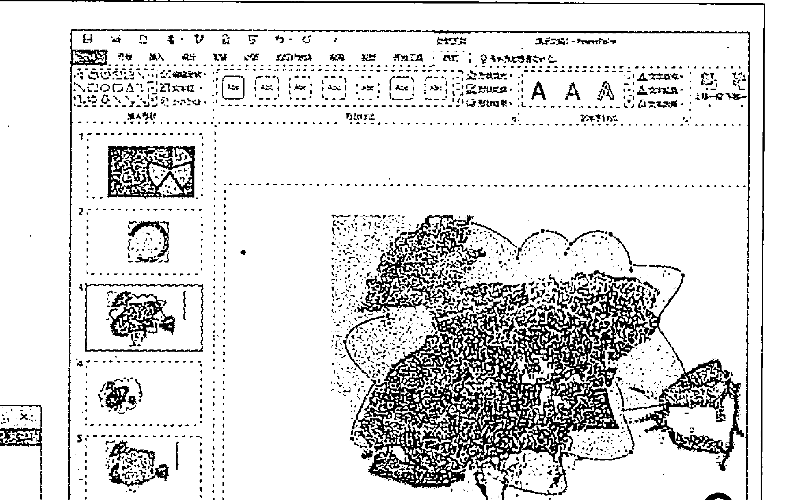

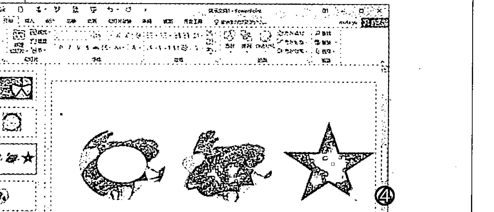

按需对图形进行编辑，并将其移动到合适位置，如正好框中图中的花朵（图3）。

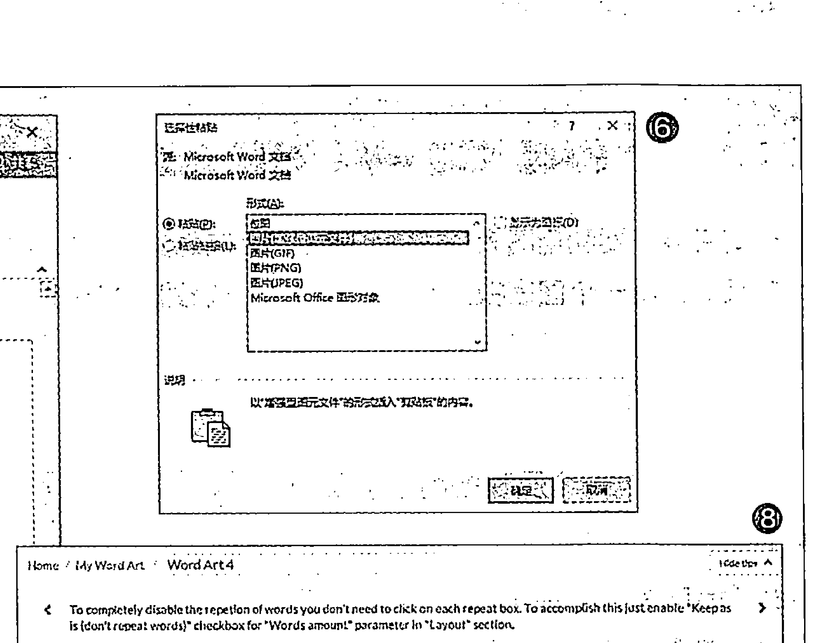

依次选中插入的图片和白云图形，点击“绘图工具→格式→合并形状→相交”即可。当然我们还可以通过插入其他图形，或者自己绘制任意图形，然后使用上述方法制作出各种个性形状的图案（图4）。

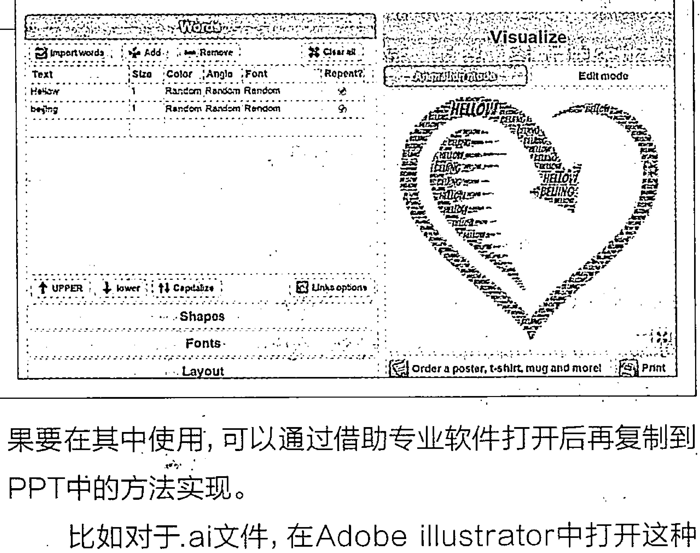

除此之外，利用图片填充功能也可以制作出很多特殊图形。比如需要表达一个禁锢主题，可以先插入一个圆柱体的形状，选中插入形状，右击选择“设置图片格式”，填充选择“图片或纹理填充”，然后准备一张鲜花的图片进行填充，这样即可得到一张被圆柱体禁锢的特殊图形（图5）。

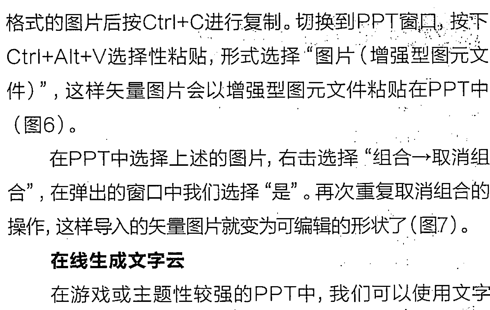

### 外援协助制作更多特殊图形
对于更为专业的特殊图形，需要借助一些专业工具来完成。

### 借力Adobe illustrator在PPT中使用矢量图
为便于进行拉伸、更改形状、重新配色等操作，在PPT设计中，我们经常要使用一些矢量图形，但常见的.ai、.psd等图片格式无法在PPT中直接打开。如果要在其中使用，可以通过借助专业软件打开后再复制到PPT中的方法实现。

比如对于.ai文件，在Adobe illustrator中打开这种格式的图片后按Ctrl+C进行复制。切换到PPT窗口，按下Ctrl+Alt+V选择性粘贴，形式选择“图片（增强型图元文件）”，这样矢量图片会以增强型图元文件粘贴在PPT中（图6）。

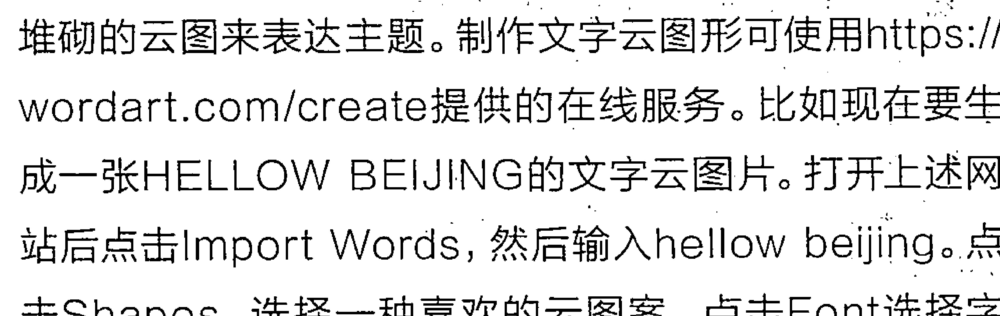

在PPT中选择上述的图片，右击选择“组合→取消组合”，在弹出的窗口中我们选择“是”。再次重复取消组合的操作，这样导入的矢量图片就变为可编辑的形状了（图7）。

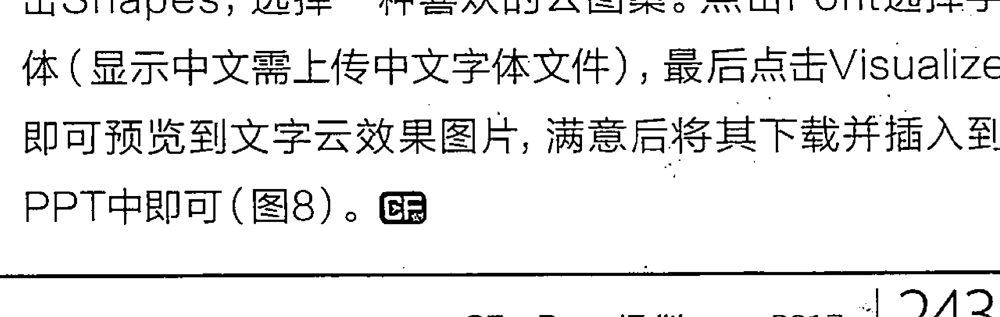

### 在线生成文字云
在游戏或主题性较强的PPT中，我们可以使用文字堆砌的云图来表达主题。制作文字云图形可使用https://wordart.com/create提供的在线服务。比如现在要生成一张HELLOW BEIJING的文字云图片。打开上述网站后点击Import Words，然后输入hellow beijing。点击Shapes，选择一种喜欢的云图案。点击Font选择字体（显示中文需上传中文字体文件），最后点击Visualize即可预览到文字云效果图片，满意后将其下载并插入到PPT中即可（图8）。


## 制作随自动筛选而变的图表
文|马震安

某公司每月都要利用图表对每类商品在两个商场的销售情况进行对比，如果将每类商品的销售情况都制作成图表，那实在太麻烦。利用一个图表根据商品的筛选来完成数据的对比，效率就高多了。

首先制作一个反映各商场水果销量的图表（以柱形图为例）。右击图表，选择“选择数据”菜单，在弹出的“选择数据源”对话框中，点击“隐藏的单元格或空单元格”按钮，确保“显示隐藏行列中的数据”不被勾选（图1）。

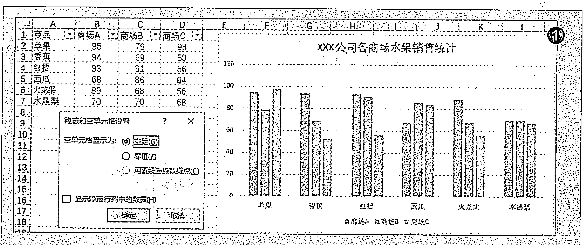

选取工作表中数据区域的任意一个单元格，点击“开始”选项卡“排序和筛选”下的“筛选”菜单，完成对数据区域的自动筛选设置。单击A1（商品）单元格右侧的下拉箭头，勾选“红提”，此时数据区域仅出现第4行中的数据，图表的显示内容也会随之改变（图2）。

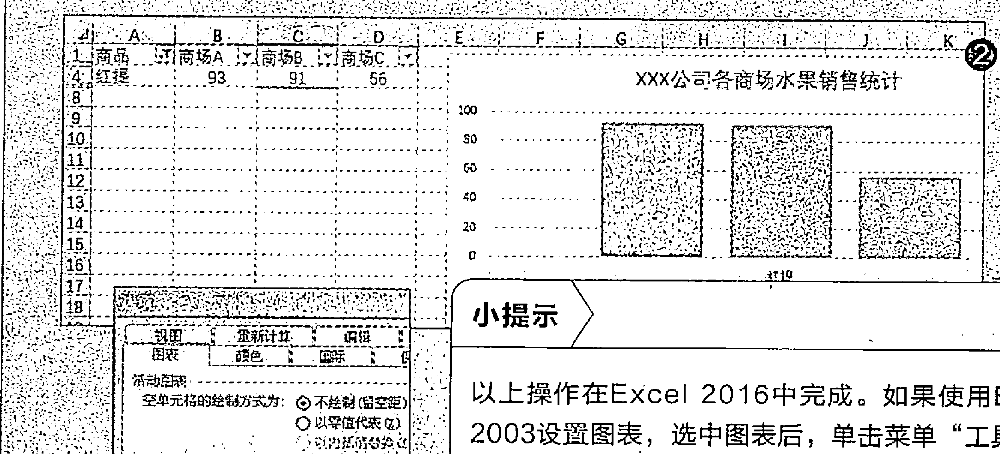

### 扩展应用
使用“视图管理器”也可以轻松制作交互式图表。制作图表后，点击“视图”选项卡的“自定义视图”，在弹出的“视图管理器”对话框中点击“添加”，在弹出的“添加视图”对话框的“名称”处输入“显示全部”，点击“确定”关闭对话框。然后选中C、D列并右击，选择“隐藏”（这时图表也只显示商场A各水果的销售情况），再次点击“自定义视图”，在弹出的窗口中点击“添加”，在“名称”处输入“显示商场A各水果的销售情况”，点击“确定”关闭对话框。依此类推，想要显示哪些内容，就将其他不想显示的内容隐藏，然后在“视图管理器”中建立相应的名称（图4）。需要显示的图表各名称建立完成后，点击“视图”选项卡的“自定义视图”，在弹出的“视图管理器”对话框中选中名称，点击“显示”，相应的图表就会发生变化，显示出想显示的图表（图5）。

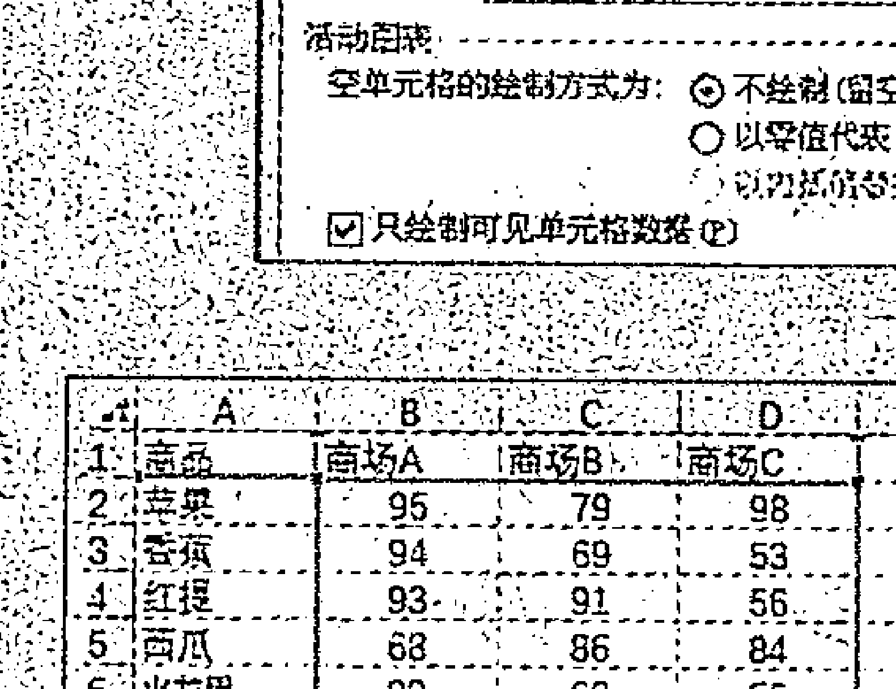

> 小提示
> 以上操作在Excel 2016中完成。如果使用Excel 2003设置图表，选中图表后，单击菜单“工具→选项”，在弹出的“选项”对话框的“图表”选项卡中，勾选“只绘制可见单元格数据”复选框，然后单击“确定”按钮关闭对话框（图3）。

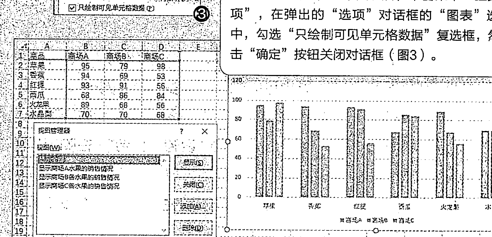

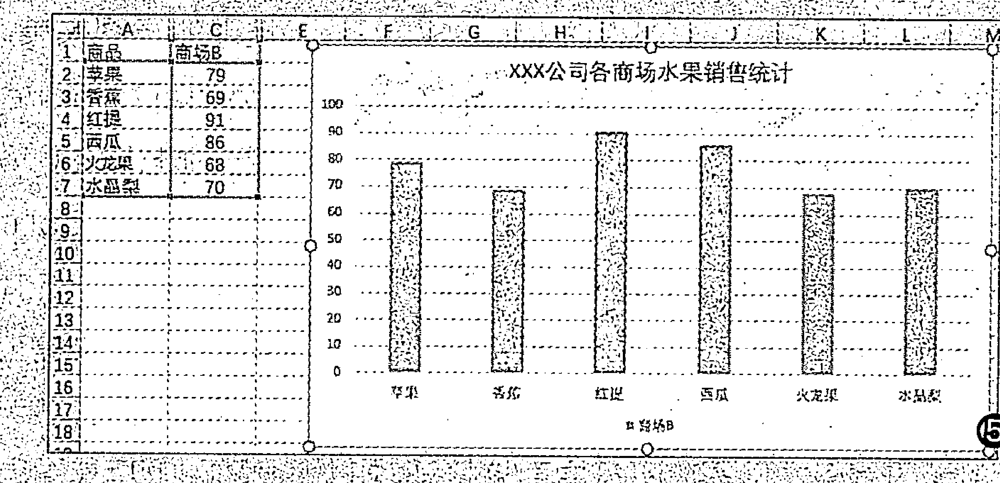

## PPT中玩转文本框另类花样

文|马震安

PPT中的普通文本框显得比较平庸，下面的立体感、金属质感、玻璃质感的文本框，肯定会颠覆你对文本框的认识。

首先，用幻灯片绘图中的“任意多边形”画出所需的文本框形状，右击此形状，选择“编辑文字”，输入所需要的文本，设置好字体、大小。右击此文本框，选择“设置形状格式”进入具体设置过程。

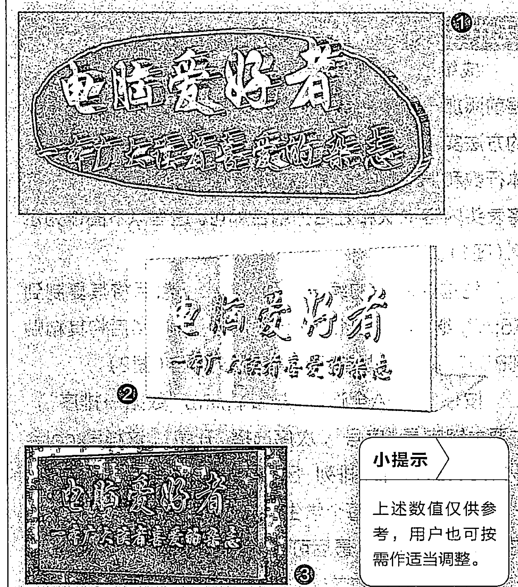

### 立体感文本框(图1)

形状设置：“填充”选择纯色，颜色蓝-灰深色50%；“线条”选择白色实线，宽2.75磅；“效果”选项卡的“阴影”透明度60%，大小100%，模糊4磅，角度90度，距离3磅；“三维格式”深度大小20.5磅，暖色粗糙材料；“三维旋转”X旋转39.2度，Y旋转5.5度，Z旋转1度，透视30度；“大小与属性”选项卡“文本框”选择“根据文字调整形状大小”。

文本设置：“文本填充”按需进行选择（如水绿色纯色填充）；“文本边框”选白色实线，宽度2.75磅；“文字效果”选项卡“阴影”处透明度57%，大小100%，模糊1磅，角度72度，距离4磅；“三维格式”深度24磅，暖色粗糙材料；三维旋转和上述形状选项的设置类似。

> 小提示
> 上述数值仅供参考，用户也可按需作适当调整。

### 金属质感文本框(图2)

选择“渐变填充”，预设渐变为“浅色渐变-个性色3”，渐变光圈处：在默认的情况下，再增加几个白色、灰色光圈，位置、亮度根据需要进行设置；“线条”处选择白色实线，宽度自定；在“效果”选项卡的“阴影”处，透明度、大小、模糊、角度、距离等都可自行设置；“三维格式”处，顶部棱台的宽度、高度、深度大小、材料、光源角度按需设置；“三维旋转”处可自定义设置。

文本的填充与轮廓和形状的设置一样。根据效果调整“文字效果”选项卡的“阴影”处的透明度、大小、模糊、角度、距离；“三维格式”处顶部棱台的宽度、高度、深度大小、材料、光源角度等亦可根据效果设置；三维旋转和上述形状选项的设置类似。

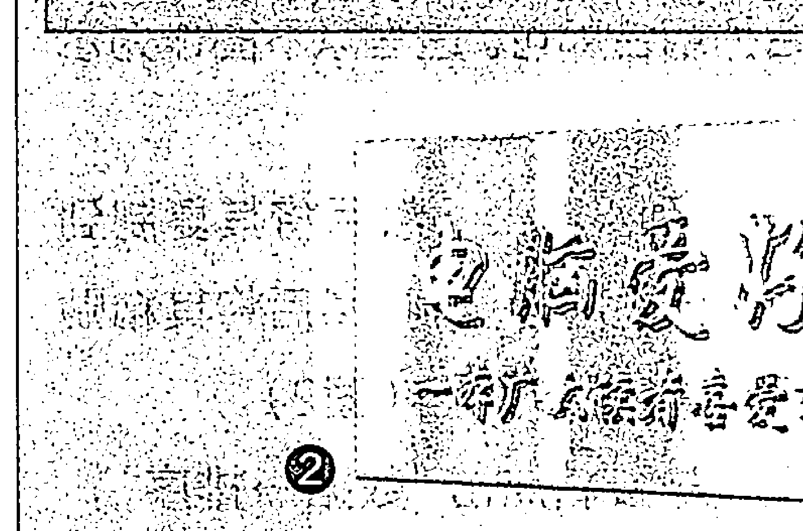

### 玻璃质感文本框(图3)

选择“渐变填充”，预设渐变为“浅色渐变-个性色3”，角度为130度，渐变光圈处：只剩下两个白色光圈，透明度分别是89%、93%，亮度分别是95%、0%，位置都在56%；“线条”选渐变线，预设渐变为“浅色渐变-个性色3”，角度90度，渐变光圈处：在默认的情况下，再增加几个白色、灰色光圈，位置、亮度根据需要进行设置；形状选项的效果和金属质感文本框的设置类似。

文本的填充选择纯色填充，颜色和幻灯片背景一致，透明度60%。文本边框为“渐变线”，类型“线性”，角度90度，渐变光圈处：只剩下两个白色光圈，位置分别是0%、100%，亮度分别是95%、0%。文字效果和金属质感文本框的设置大同小异。三维格式、三维旋转都和上述形状选项的设置类似。


## 简单高效 成绩通知条轻松做

文|俞木发

老师们都知道，每次开家长会的时候都要制作每个学生的成绩条，这样需要在原来的成绩统计数据加上表头（即各个科目行）。如果成绩数据很多，这一工作便显得有些繁琐。笔者今天就教大家几个高效完成成绩通知条制作的方法。

### 无中生有：使用辅助列添加

成绩通知条的主要操作就是在原来的每行统计数据前添加一个表头数据，因此我们可以通过添加辅助列的方法实现。具体原理就是先复制原来的表头内容（具体行数和原来的学生姓名人数一致），最后再通过排序将表头内容依次和姓名列组合即可。这里以下图作为示例（图1）。

先选中原来的编号序列A2:A4，然后将其复制到A5:A7，继续选中B1:I1的标题内容复制，然后将其粘贴到B5:I7，使得这些单元格填满表头内容（图2）。

按住Ctrl+A全选数据，接着点击“数据→排序”，主要关键字是“序号”，次序选择“升序”，这样Excel会按照序号进行升序排列，因为添加辅助列序号和原来的一致，所以可以将每个学生姓名行和复制的表头行排列在一起。为了美观，最后可以将A列删除（图3）。

### 巧用函数：引用标题行

在Excel中很多高效的操作都是借助函数来完成，同样上述添加表头也可以借助Vlookup函数。因为成绩单的要求实际上是引用表头的内容和学生行的内容，表头内容是一样的，学生行则是根据序号进行引用。因此我们可以先复制表头内容，接着使用Vlookup引用学生成绩即可。

首先在A8:I8行复制上述表头的内容，接着在A9输入序号“1”，在B9输入公式“=VLOOKUP($A9,$A$2:$I$4,COLUMN(),0)”，向右填充完成学生成绩的提取。

为了方便后续裁剪，这里还可以再引用一个空行，填充完成绩后继续选中A8:I10的内容，其中A10为空行，然后该区域作为填充模块（图4）。

按住鼠标下拉进行填充，这样表头、学生行、空行

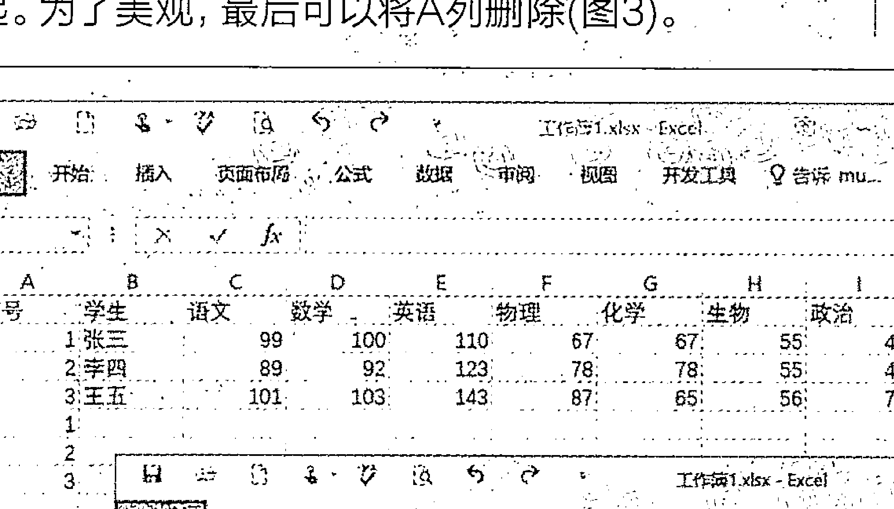

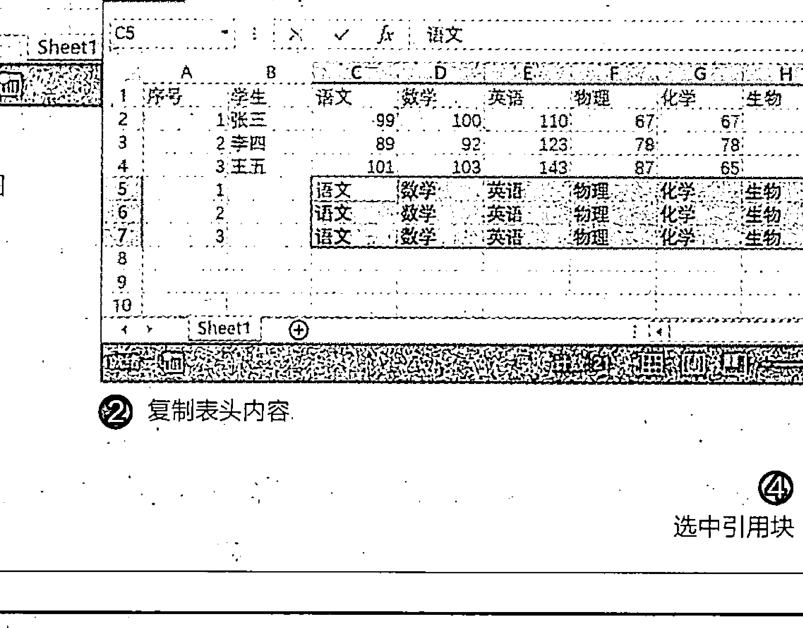

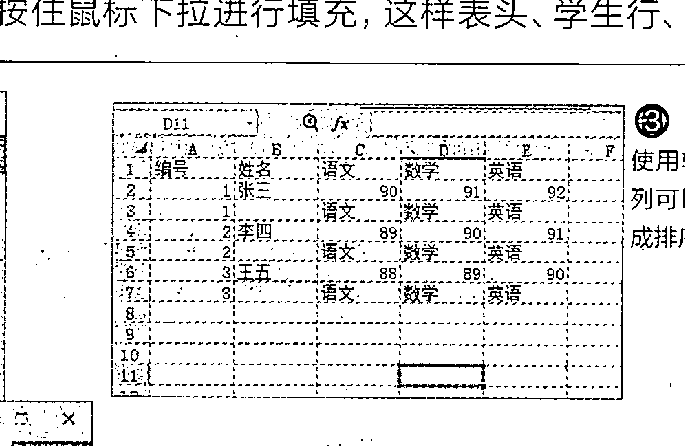

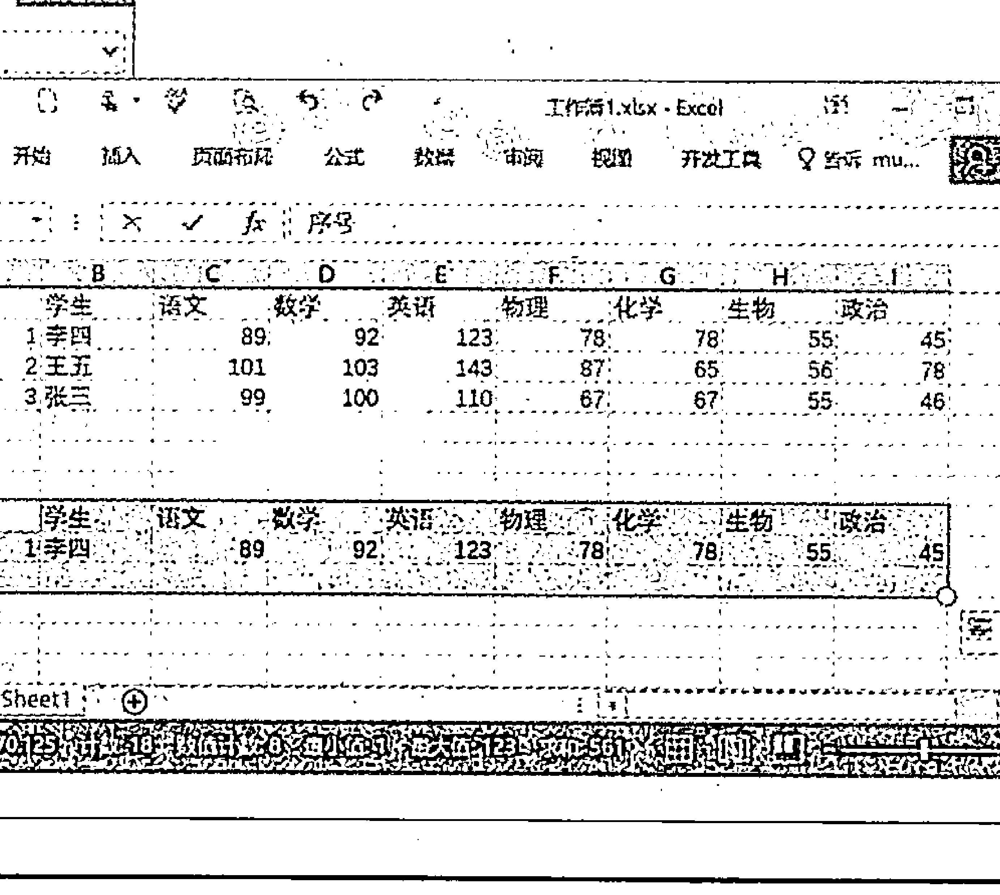

的内容会被自动引用。如果后续需要增加学生的成绩引用，只要按照上述格式在后续的单元格进行添加，接着操作同上，下拉填充列表即可快速完成所需的成绩单（图5）。

### ⑤ 完成表头和空行的填充

| 序号 | 学生 | 语文 | 数学 | 英语 | 物理 | 化学 | 生物 | 政治 |
|---|---|---|---|---|---|---|---|---|
| 1 | 李四 | 89 | 92 | 123 | 78 | 78 | 55 | 45 |
| | | 101 | 103 | 143 | 87 | 65 | 56 | 78 |
| 2 | 王五 | 99 | 100 | 110 | 67 | 67 | 55 | 46 |
| | | | | | | | | |
| | | | | | | | | |
| 8 | 序号 | 学生 | 语文 | 数学 | 英语 | 物理 | 化学 | 生物 | 政治 |
| 9 | | 1 李四 | 89 | 92 | 123 | 78 | 78 | 55 | 45 |
| 10 | | | | | | | | | |
| 11 | 序号 | 学生 | 语文 | 数学 | 英语 | 物理 | 化学 | 生物 | 政治 |
| 12 | | 2 王五 | 101 | 103 | 143 | 87 | 65 | 56 | |
| 13 | | | | | | | | | |
| 14 | 序号 | 学生 | 语文 | 数学 | 英语 | 物理 | 化学 | 生物 | 政治 |
| 15 | | 3 张三 | 99 | 100 | 110 | 67 | 67 | 55 | 46 |

```
Microsoft Visual Basic for Applications - 工作簿1.xlsx
文件(F) 编辑(E) 视图(V) 插入(I) 格式(O) 调试(D) 运行(R) 工具(T) 外接程序(A) 窗口(W) 帮助(H)
工程 - VBAProject
- VBAProject (工作簿1.xlsx)
  - Microsoft Excel 对象
    - Sheet1 (一班数据)
    - Sheet2 (二班数据)
    - ThisWorkbook
  - 模块
    - 模块1
    - 模块2
工作簿1.xlsx - ThisWorkbook (代码)
(通用)
Sub 插入表头()
    Dim i As Long
    For i = 1 To 3
        ActiveCell.Rows("1:1").EntireRow.Select
        Selection.Copy
        ActiveCell.Offset(2, 0).Rows("1:1").EntireRow.Select
        Selection.Insert Shift:=xlDown
        ActiveCell.Select
    Next
End Sub
```

使用VBA脚本完成表头的添加

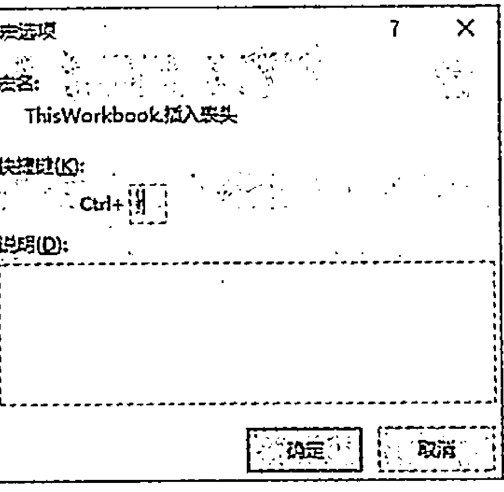

| A | B | C | D | E | F | G | H | I | J |
|---|---|---|---|---|---|---|---|---|---|
| 1 | 序号 | 学生 | 语文 | 数学 | 英语 | 物理 | 化学 | 生物 | 政治 |
| 2 | | 1 李四 | | 89 | 92 | 123 | 78 | 78 | 55 | 45 |
| 3 | 序号 | 学生 | 语文 | 数学 | 英语 | 物理 | 化学 | 生物 | 政治 |
| 4 | | 2 王五 | | 101 | 103 | 143 | 87 | 65 | 56 | 78 |
| 5 | 序号 | 学生 | 语文 | 数学 | 英语 | 物理 | 化学 | 生物 | 政治 |
| 6 | | 3 张三 | | 113 | 114 | 123 | 96 | 52 | 57 | 111 |
| 7 | 序号 | 学生 | 语文 | 数学 | 英语 | 物理 | 化学 | 生物 | 政治 |
| 8 | |  | 学时 | | 113 | 114 | 123 | 96 | 52 | 57 | 111 |

> 小提示
> $A9表示查找的值，这里我们使用序号来对每个学生进行精确的匹配（如果原始数据没有序号，可以自行插入序号辅助列）。$A$2:$I$4表示查找的有效数据范围，这里添加$符号表示绝对引用，这样数据源加上了绝对引用后方便后续对公式进行直接的拖拽填充。COLUMN()则表示查找列，这里使用COLUMN函数默认返回函数所在单元格的列数，0则表示使用精确匹配方式进行查找。

### 多表数据 VBA快速添加

上述方法仅仅是对一张工作表的数据进行表头的操作，如果数据保存在不同的工作表中，比如需要将保存在不同工作表的各个班级的数据进行各自表头的添加，此时借助VBA脚本即可快速插入表头。假设一班和二班的数据分别保存在各自对应的工作表“一班数据”和“二班数据”中，现在需要在一班数据工作表中将两个班级的数据全部完成表头的添加。

按下Alt+F11打开VB编辑窗口，点击“插入→模块”，按提示插入下列的代码（图6）：

```
Sub 插入表头()
    Dim i As Long , 定义一个变量
    For i = 1 To 3 , 从第一行直到第三行间隔插入表头，具体插入数量与学生数对应
        ActiveCell.Rows("1:1").EntireRow.Select
        Selection.Copy
        ActiveCell.Offset(2, 0).Rows("1:1").EntireRow.Select
        Selection.Insert Shift:=xlDown
        ActiveCell.Select
    Next
End Sub

完成代码的编辑后返回Excel窗口，点击“开发工具→宏”，可以看到新增一个名为“插入表头”的宏，点击“选项”，将该宏运行的快捷键设置为Ctrl+R（图7）。

这样将鼠标定位在A1，然后按下Ctrl+R即可完成表头文件的添加。操作同上，在打开的每个工作表中依次定位到A1，重复上述操作即可完成所有成绩单表头的制作（图8）。
```

## 画龙点睛 用好PPT图标

文|俞木发

设计PPT时，我们总会适时添加一些图标。漂亮的图标在幻灯片中往往能够起到画龙点睛的作用，让PPT显得更为高大上。但是，怎么才能获得那些精美的图标？又需要怎样设计、排版，才能让图标和幻灯片的整体风格完美匹配呢？

### 殊途同归 图标获取渠道多

对于一般用途来说，PowerPoint本身以及网上都有许多丰富的图标资源供我们使用。常见的图标，只要点击PPT的“插入→形状”，然后直接插入图标使用即可。这里插入的实际上是一种矢量图，我们可以根据自己的实际需要对其大小、颜色、顶点形状等进行自定义设置（图1）。

如果还需要更多的图标，可以到https://iconstore.co/下载，网站提供很多个性化的图标文件（而且全部免费）。下载到的是.svg（一种可缩放矢量图格式）文件，可以使用AI（Adobe Illustrator）打开。选择所需的图标文件后按Ctrl+C复制，接着返回PPT窗口，点击“开始→选择性粘贴→图片（增强型图元文件）”（图2）。

在PPT中选择粘贴图片，右击选择“组合→取消组合”，当弹出转换格式询问窗口时点击“是”，然后再次重复“组合→取消组合”，就可以使用矢量图标了。对于图标的编辑，则可以使用“顶点编辑”工具进行更多个性化的设计（图3）。

对于一些无法直接获取的个性或特殊图标，我们可以通过PPT的布尔运算等来制作，相关技巧详见本期《不走寻常路 在PPT中制作个性图形》一文。

### 完美搭配 图标排版有技巧

通过上述方法，我们可以获得大量的图标资源。不过并不是简单插入图标到幻灯片中就可以获得很好的效果。为了使得插入的图标能够和幻灯片主题更协调，对于图标的排版还需要讲究一定的技巧。


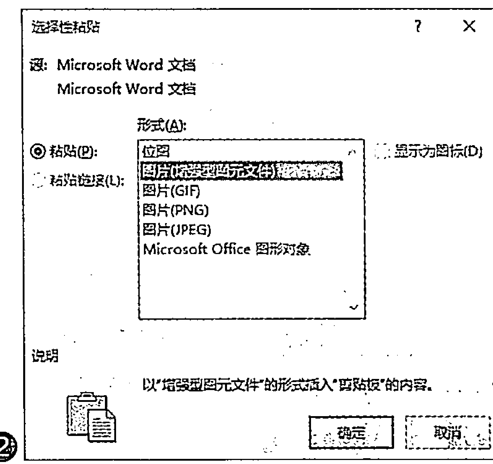

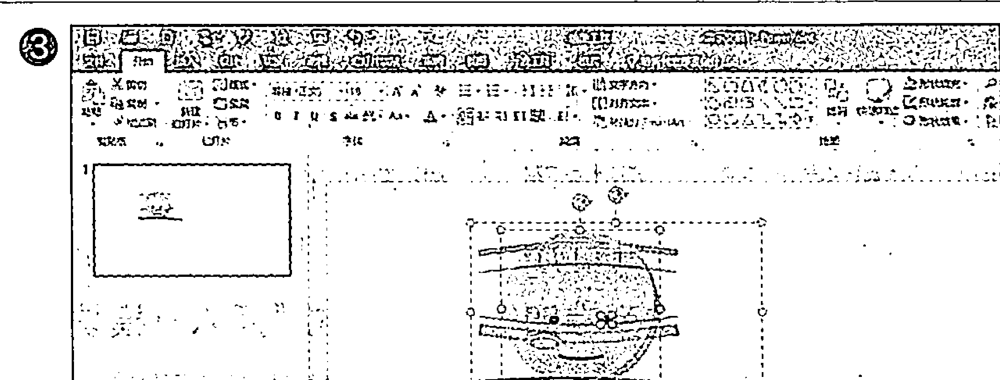

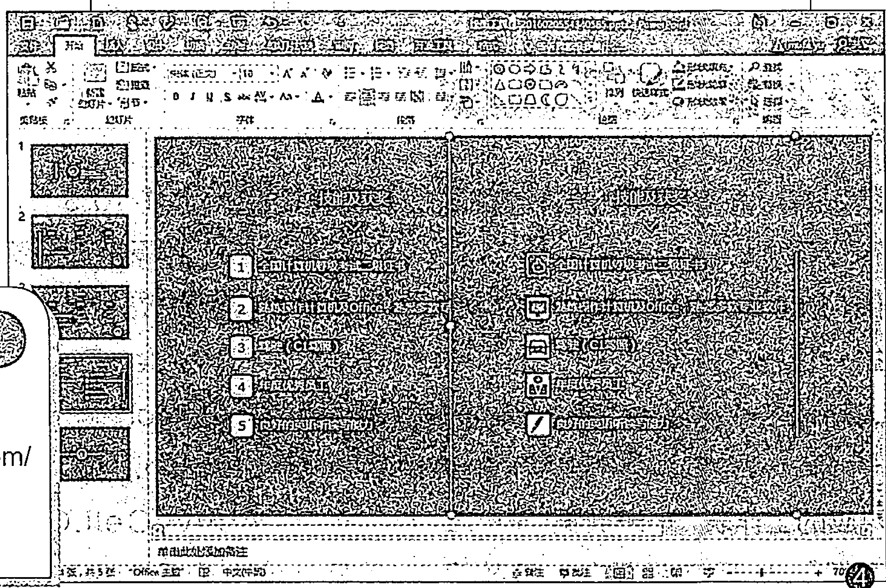

> > **网络大补贴**
>
> 批量图标下载：https://icomoon.io/app/#/select
>
> 各种精美图标免费下载：https://thenounproject.com/
>
> 图标免费搜索：http://www.easyicon.net/
>
> 阿里图标仓库：http://www.iconfont.cn/

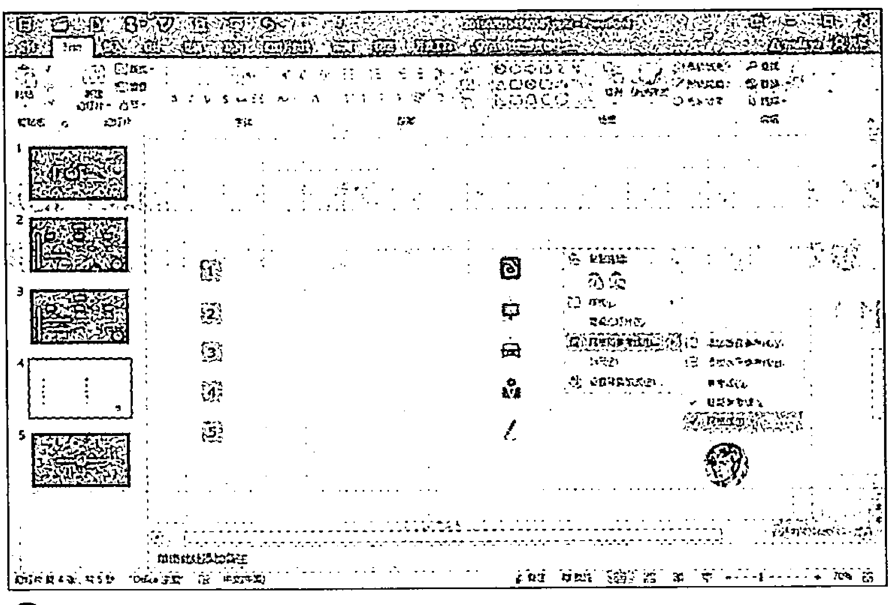

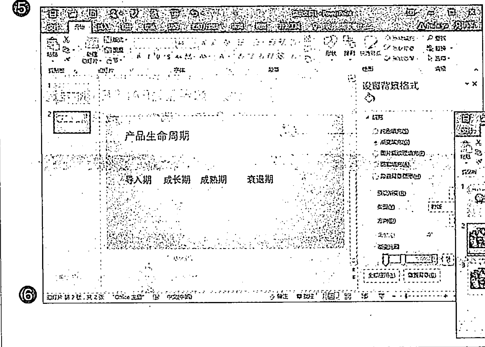

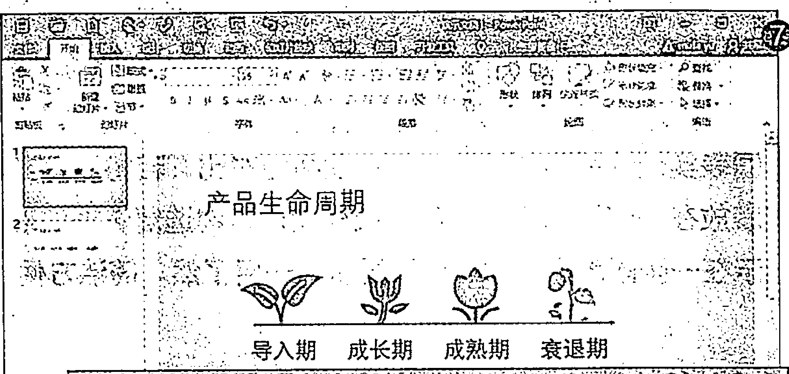

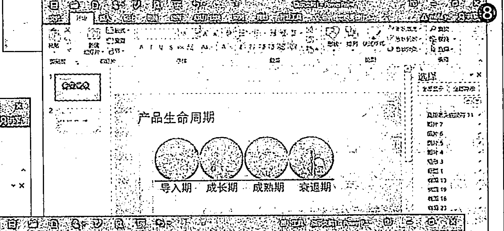

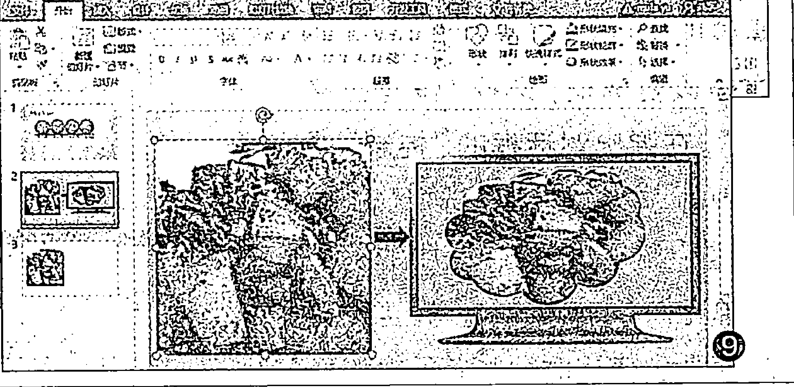

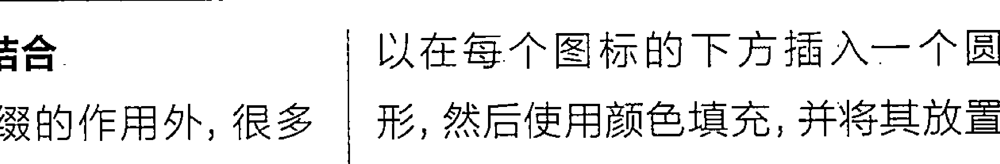

### 1. 直接点缀

图标的一个重要作用就是直观表示很多元素，比如在简历的设计中表达用户掌握的技能，如果在每项技能前加上对应的图标，那么就可以为简历增色不少。在如图所示的简历中，图标添加前后的对比效果是不是不一样（图4）？

不过需要注意的是，在PPT设计中图标是为了能够更直观地表达内容，是为文字服务的。因此图标的选择一是要“图文相对”（即图标要与文字的内容相关），二要前后统一（即使用同一类型的图标，不要混用多种类型的图标）。排版则大多使用并列式排列，同时要排列整齐；可以使用参考线对齐，在幻灯片空白处右击选择“网格和参考线→勾选网格线”即可（图5）。

### 2. 其他元素结合

除了起到点缀的作用外，很多的时候我们还可以将图标和正文、色块、其他线条等结合起来，打造更加丰富的图标组合效果。比如一张介绍产品生命周期的幻灯片，如果只是输入简单的文字说明，PPT就显得十分苍白无力（图6）。

对于这类原本比较抽象的文字，我们可以借助一些形象化的图标来进行修饰，如可以使用花朵的发芽、开花、绽放、凋谢这类图标来修饰。到上述网站下载对应的图标，然后将其填充为同一颜色和大小，下方再插入一个箭头图标作为排列的参考线，图标排列到对应的产品周期上即可（图7）。

此外还可以添加色块，比如可以在每个图标的下方插入一个圆形，然后使用颜色填充，并将其放置在底层排列，这样PPT内容显得更为丰满（图8）。

当然大家也可以尽情发挥自己的想象，让PPT图标应用得更有个性。对于原来比较模糊的低像素图片素材，如果要降低观众对其的注意力，那么可以准备一个电视机图标，然后将其作为样机，将低像素图片插入到电视机作为其画面展示并添加文字说明，这样图标就可以起到提升图片画质的功效（图9）。

总之，在PPT的图标设计中，只要风格统一并且能够和PPT主题相符，大家可以脑洞大开，让图标能够成为PPT一道靓丽的风景，为自己的PPT增光添彩。

## Excel中多表动态对比图

文|马震安

利用图表实现连续多年每个月销售业绩的对比，若将连续多年12个月的数据都制成折线图，就需要制作多个图表，把这些图表放在一起显示会很杂乱。如果设计为勾选复选框的形式，想对比哪些年的数据就勾选哪些年，将勾选年份的数据都显示在一张图表中，动态对比显示，一目了然，简洁方便（图1）。

### 1. 插入复选框

在工作表中选择“开发工具”选项卡，点击“插入”按钮“表单控件”下的“复选框”，在工作表的合适位置双击插入一个复选框。右击插入的复选框，选择“编辑文字”，输入所需要的文字（如“2012年”）。再次右击该复选框，选择“设置控件格式”，在弹出对话框的“控制”选项卡中“值”处选择“已选择”，“单元格链接”处选择工作表中的一个空白单元格（如H1）。这样，当复选框的值发生变化时，H1单元格的值就是显示TRUE或FALSE。同样道理，插入其他年份的复选框，相应的单元格链接也要更改，不能是同一单元格（图2）。

> 小提示
> “=IF(Sheet1!$H$1,Sheet1!$B$3:$B$14,0)”语句的含义：如果H1的值为TRUE（即复选框2012年被选中），数据源为B3:B14单元格区域；如果值为FALSE（即复选框2012年未被选中），数据源为0。

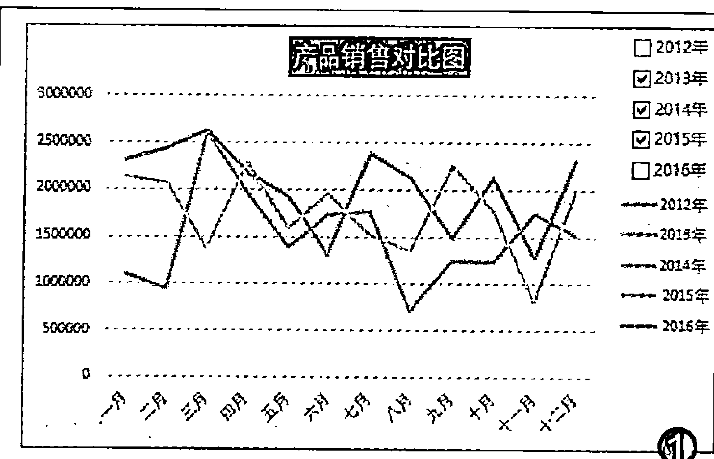

### 2. 定义图表数据源

选择“公式”选项卡，点击“名称管理器”，在弹出的窗口中点击“新建”；在“新建名称”窗口中，名称处输入“_2012年”，引用位置处输入“=IF(Sheet1!$H$1,Sheet1!$B$3:$B$14,0)”；再次点击“新建”，名称处输入“_2013年”，引用位置处输入“=IF(Sheet1!$H$2,Sheet1!$B$3:$B$14,0)”。以此类推，建立数据名称“_2014年”、“_2015年”、“2016年”，当然相应的引用位置也要进行更改（图3）。

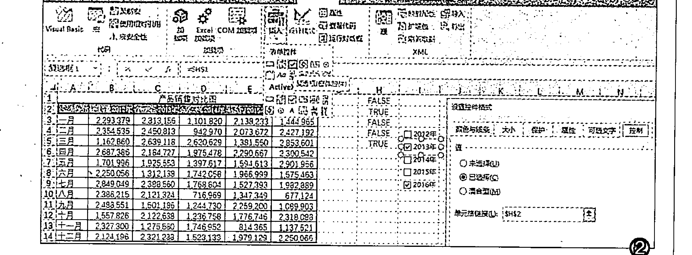

### 3. 制作图表

插入折线图并右击该图表，选择“选择数据”，在弹出的窗口中点击“添加”，在新弹出的“系列名称”处选择B2，即“2012年”，“系列值”处输入“=Sheet1!_2012年”。同理，依次添加其他年份及系列值。在右侧的“水平分类轴”处，点击“编辑”，选择相应的分类单元格，即A3:A14单元格区域（图4）。

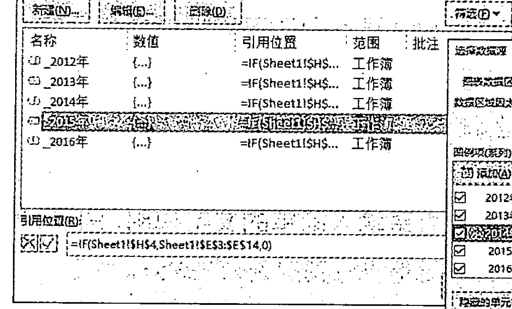

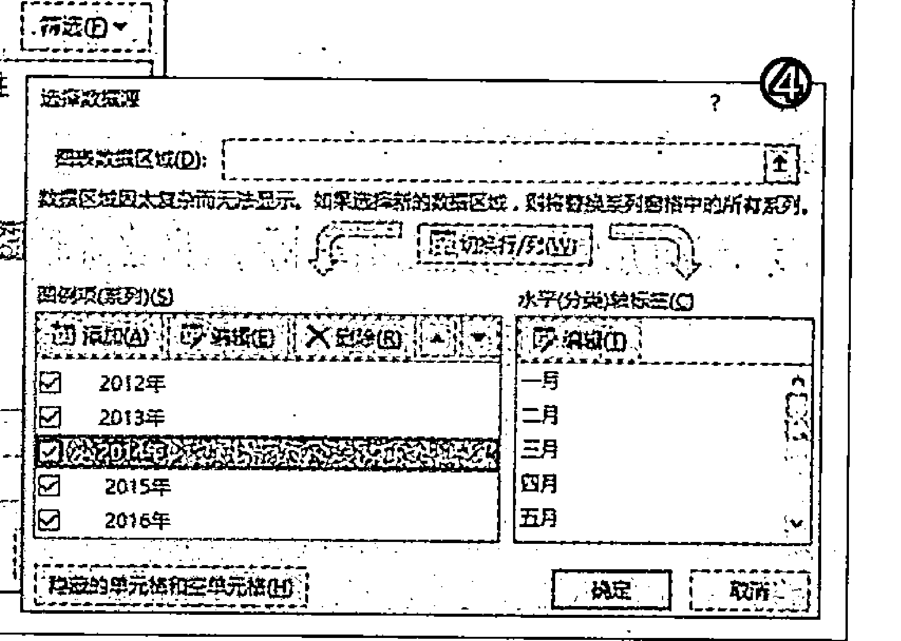

最后，选中图表，添加图例、图表标题、边框，将图表置于底层，将复选框选移动到图表相应位置，将复选框、图表进行组合，将组合体移动，并覆盖复选框所链接的单元格。至此，动态对比图表制作完成。

## 制作纸面穿出效果的幻灯片
文|马震安

在幻灯片的显示过程中，图片或文字在幻灯片中显示或出现的效果对于幻灯片的美感表现至关重要。纸面穿出效果可谓别具一格、独出心裁（图1）。接下来，就让我们看看这样的效果是如何制作出来的。

首先要新建一张空白幻灯片，将它的背景色设置为白、灰渐变的效果。在幻灯片中插入一个细长的椭圆，无线条，填充选择“渐变填充”，填充类型选择“路径”，渐变光圈变成两个，最左边的颜色为黑色，透明度为20%，最右边的颜色也为黑色，透明度为100%；将这个设置好的椭圆复制、粘贴成位图，删除原来的矢量椭圆，再画一个比位图椭圆稍高一些的矩形，将矩形拖放至椭圆处，使用矩形与椭圆的一半相交；先选中椭圆，再按住Shift键选中矩形，选择“格式”选项卡，点击“合并形状→剪除”，将椭圆裁剪去一半，获得阴影的成品（图2）。

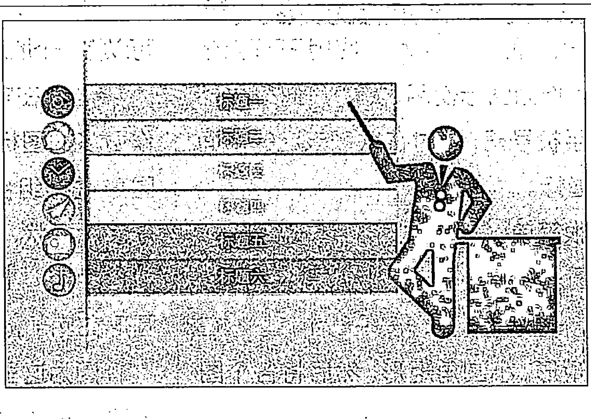

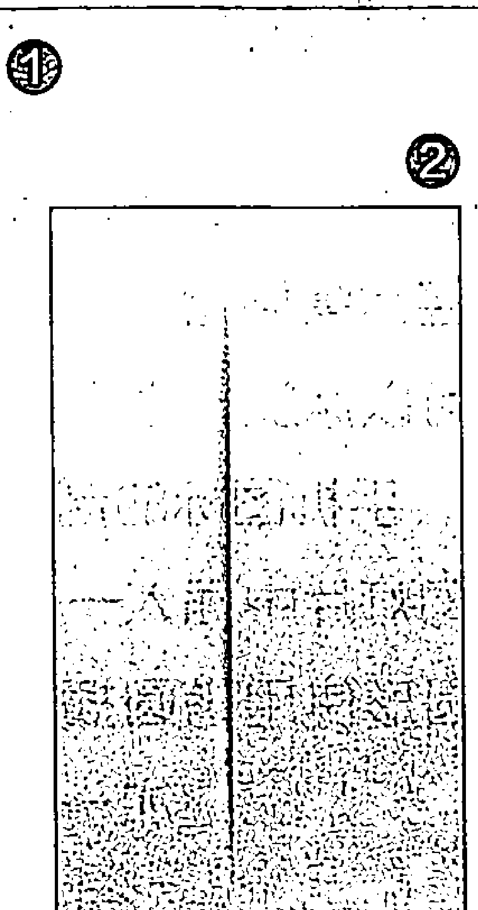

> 小提示：一定要将椭圆复制粘贴成位图后，再进行形状的剪除，并且一定要先选择位图椭圆再选择矩形，否则出现不了阴影效果。

当然，也可以用遮罩的方法制作阴影效果。同样，用上述方法制作一个椭圆，再画一个无边线的矩形，将矩形的填充设置为“幻灯片背景填充”，将矩形拖放至椭圆处，使用矩形与椭圆的一半相交，这样也能获得阴影的成品（图3）。

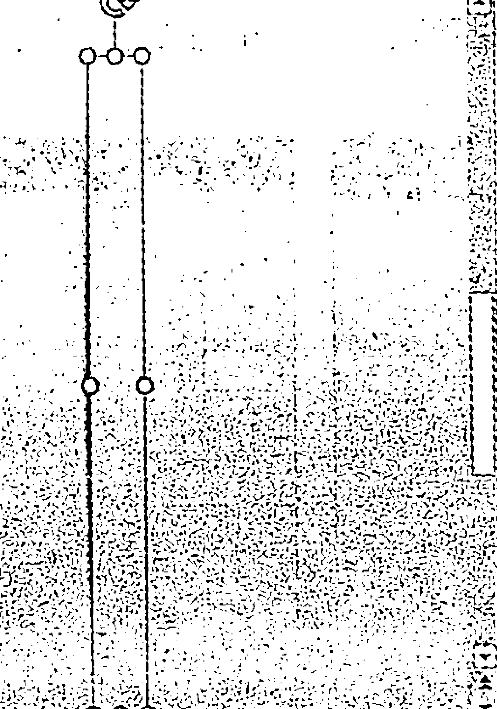

应用拓展：掌握了上述制作阴影技术的方法后，可以进一步制作其他形状的纸面效果。如在幻灯片中绘制一个圆，利用“形状选项→效果”中“阴影”处的模糊、角度、距离设置来获得阴影效果，将获得的阴影效果进行复制，调整角度，调整它们的层次关系，这样也能制作出很好的纸面穿出效果（图4）。

最后，添加幻灯片中所需的一些其他元素，比如图标、矩形标题等。在添加矩形标题时，要设置好它们的阴影效果，设置好它们的层次关系，将各个元素根据需要摆放好位置就可以了。

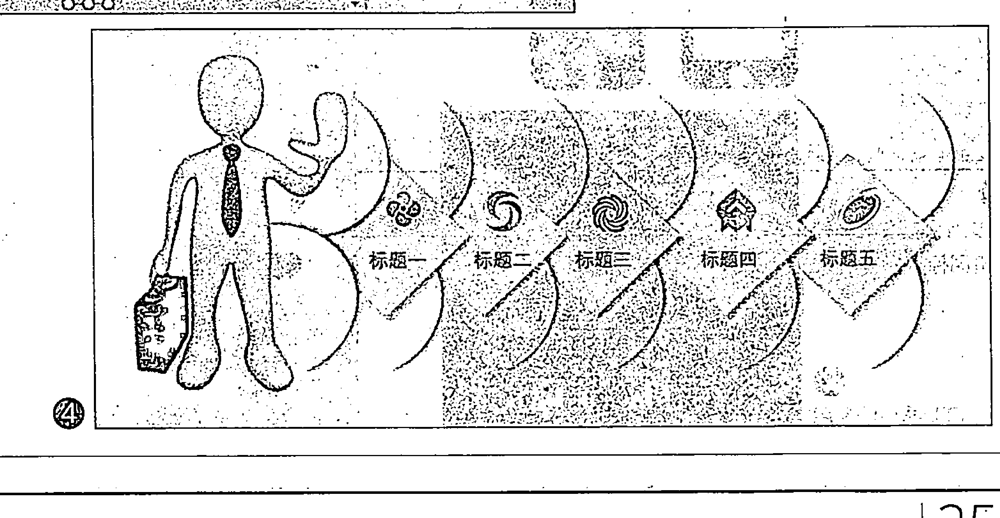

## 不求人PPT图标自己做
文|平淡

大家知道很多优秀的PPT里都会有很多漂亮的图标，一些合适的图标不仅能代替文字，而且还能形象化地表达内容，为你的PPT加分。虽然网上有许多现成的图标，但是大多需要制作者的授权使用，我们何不自己制作图标？

### 初级用户：就地取材 用好PPT自带形状

在PPT中通过点击“插入→形状”，使用PPT自带的各种形状就可以将其作为图标使用。比如我们在PPT中经常需要留下联系手机号码，此时在联系电话的前面就可以添加一个手机图标。

手机图标的制作很简单，依次点击“插入→形状”，在幻灯片中插入一个圆角矩形并填充颜色为黑色、圆形（圆形使用椭圆插入，在插入的同时按住Shift键），在圆角矩形上叠加一个矩形、小圆角矩形。然后将各个图形按照手机的形式摆放好，点击“开始→选择→选择窗格”，在右侧窗格依次选中圆角矩形、圆形、矩形、小圆角矩形（注意选择顺序），点击“绘图工具→合并形状→剪除”即可获得一个手机图标（图1）。

使用上述方法得到的是透明背景的矢量图形，可以进行任意缩放使用，比如可以缩小后直接放置到联系电话前面，这样可以直观地用它来表示手机；或者放大数倍用作样机，可以将一个地球仪放置在其中作为表达主题图片（图2）。

当然在实际运用中大家还可以根据自己的需要制作更多的图标，我们只要先确定图标的组成，然后插入图形进行组合即可。比如Android手机设置图标是一个齿轮形状，它由“圆形+12角星图形”组成。同上先在PPT中插入上述两个图形并且将它们组合排列在一起，圆形在底部，12角星在上部。

因为这里截取的是12角星外角，所以图形排列的时候注意圆形要比12角星小，并且其外角要均匀分布在圆形的外侧，这样才能截取出齿轮形状。完成排列后，依次选中圆形，点击“绘图工具→合并形状→相交”，这样就可以截取到齿轮的外形了。继续在齿轮中间插入一个大小合适的圆形，点击“绘图工具→合并形状→剪除”，即可获得设置图标了（图3）。

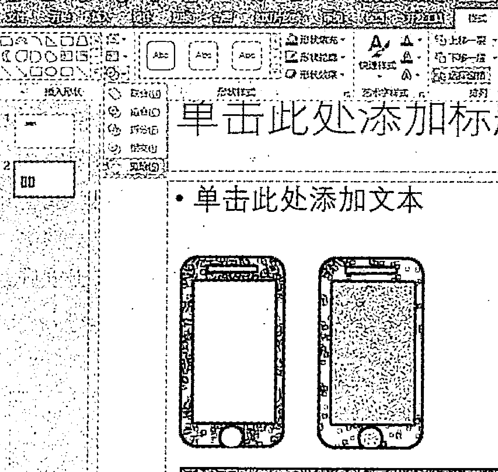

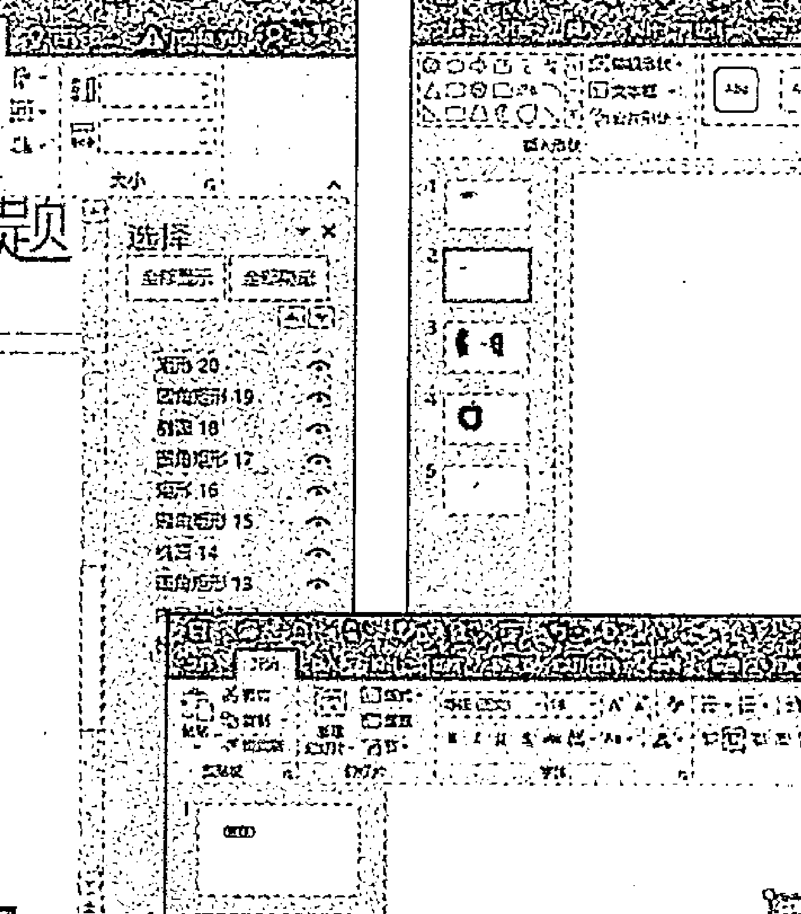

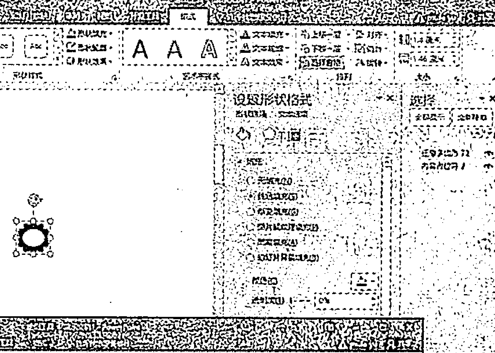

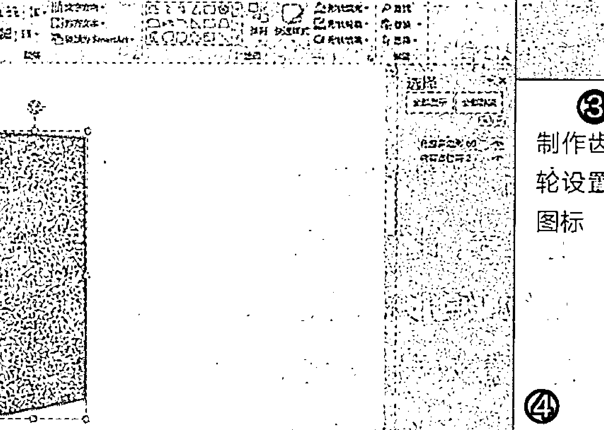

### 高级用户：自由发挥，自己动手绘制图标

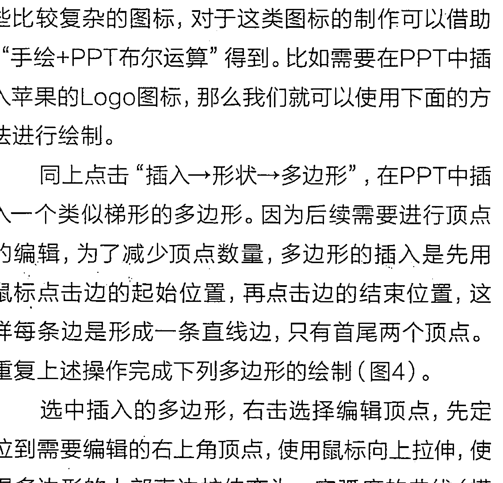

当然在实际使用中，很多时候我们需要的是一些比较复杂的图标，对于这类图标的制作可以借助“手绘+PPT布尔运算”得到。比如需要在PPT中插入苹果的Logo图标，那么我们就可以使用下面的方法进行绘制。
同上点击“插入→形状→多边形”，在PPT中插入一个类似梯形的多边形。因为后续需要进行顶点的编辑，为了减少顶点数量，多边形的插入是先用鼠标点击边的起始位置，再点击边的结束位置，这样每条边是形成一条直线边，只有首尾两个顶点。重复上述操作完成下列多边形的绘制（图4）。
选中插入的多边形，右击选择编辑顶点，先定位到需要编辑的右上角顶点，使用鼠标向上拉伸，使得多边形的上部直边拉伸变为一定弧度的曲线（模仿苹果的上部边型）。操作同上，依次将其他边形进行顶点编辑，使得整个多边形的形状类似半边苹果。这里在编辑顶点时注意边的弧度要圆润，可以进行多次编辑操作（图5）。

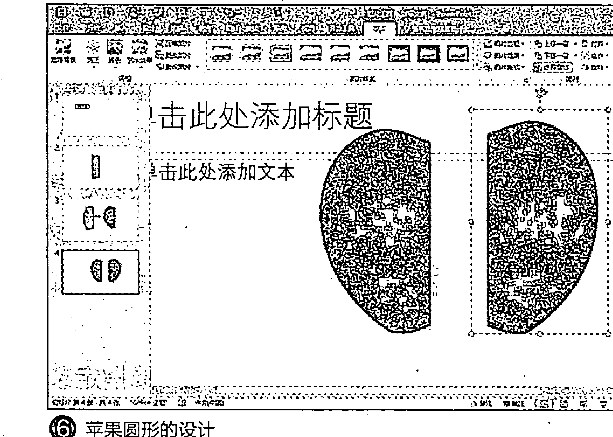

完成半边苹果的绘制后，按住Ctrl键使用鼠标拖拽复制一份。选中粘贴后的苹果，点击“格式→旋转→水平旋转”，得到另外一半边的苹果。最后再将它们组合在一起，这样就完成一个苹果圆形的设计了（图6）。
点击“插入→形状→圆形”，插入两个圆形并将其重合一定部位。选中两个圆形，点击“绘图工具→合并形状→相交”，得到苹果Logo上的苹果瓣（图7）。
继续点击“插入→形状→圆形”，插入一个圆形到上述组合的苹果圆形上面，移动到合适的位置后，依次选中苹果和圆形，点击“绘图工具→合并形状→剪切”，得到被咬掉一口的苹果标记。最后再将苹果瓣移动到苹果位置，将填充颜色设置为黑色，这样就完成苹果Logo的图标设计了（图8）。
通过手绘的方法，我们就可以制作出各种精美、复杂的图标。当然手绘工具还有许多，比如对于有一定绘图基础的用户，可以选择自由曲线，自行绘制常见图形，然后结合布尔运算、剪切等工具制作出更多个性的图标。

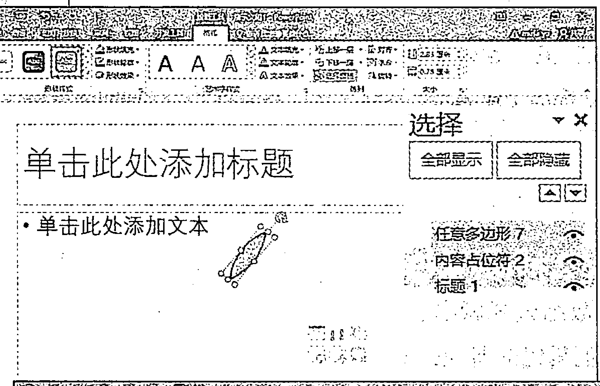

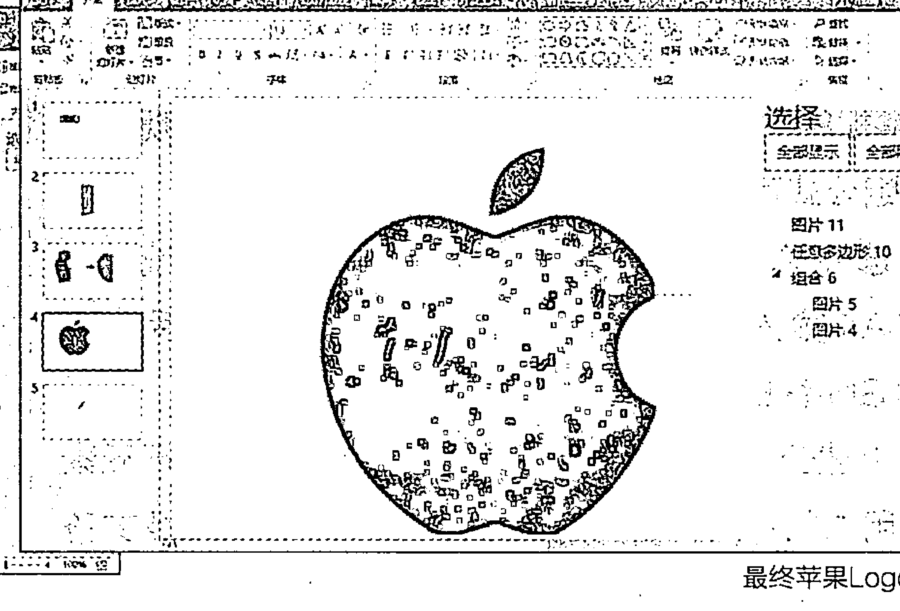

## 更高效 用好数组公式
文|平淡

大家知道Excel公式是提高工作效率的好帮手，不过很多人平时都是在使用普通公式，比如对于行列的求和使用SUM()函数，然后下拉填充再求取总数。其实对于Excel的很多操作，还可以借助数组公式得到事半功倍的效果。

### 没那么神秘 认识数组公式

数组公式顾名思义就是包含数组的一类公式，它和我们常见的普通公式不同，公式参数中是一系列的数组。举个简单的例子，比如在某列中需要输入类似“1”、“4”、“7”、“16”，这样没有规律且无法自动填充的序号，常规的方法是在每个单元格手动输入完成。现在借助数组公式可以快速完成填充。

```
={1;4;7;16}
```

选中A1:A4单元格作为数组填充区域，接着在A1输入数组公式，然后按下Ctrl+Shift+Enter快捷键即可完成填充（图1）。上述公式中{}符号内的内容就是数组，同一行元素之间用“,”,不同行之间的元素用“;”（均为半角英文符号），最后按Ctrl+Shift+Enter快捷键即可完成数组公式的输入。数组类似我们平常在Excel选中的区域，因此数组函数可以非常方便地对特定区域数据进行运算。

### 简单高效 使用数组公式快速完成特定区域求和

在Excel中我们经常要对数据进行求和，比如下面一份产品销售报表，如果要统计销售总额，常规的方法是先将每天的销售额统计出来，最后再用SUM函数进行求和（图2）。

因为这里最终目标只是需要统计出总的销售额，因此可以使用数组公式一步到位求和。在F2处输入公式，其中数组的意思是先进性每个项目“数量*单价”统计，接着再进行求和。这样完成公式的输入后，按Ctrl+Shift+Enter快捷键，即可一步到位完成求和任务（图3）。

```
=SUM(B2:B15*C2:C15)
```

可以看到，数组任务可以更高效地完成指定条件的求和。这里数组可以根据自己的实际需要灵活选择，比如上述公式更改为“=SUM(B8:B10*C8:C10)”即可只统计7号-9号的销售数据。

```
=SUM(B8:B10*C8:C10)
```

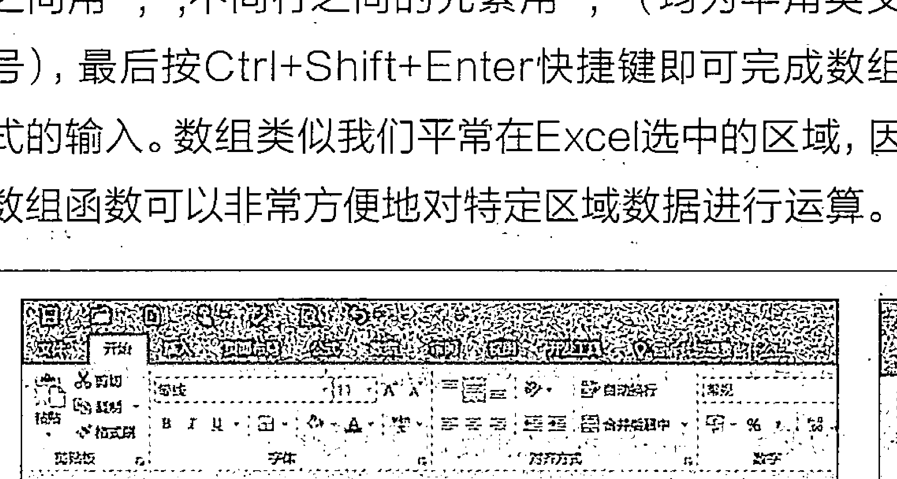

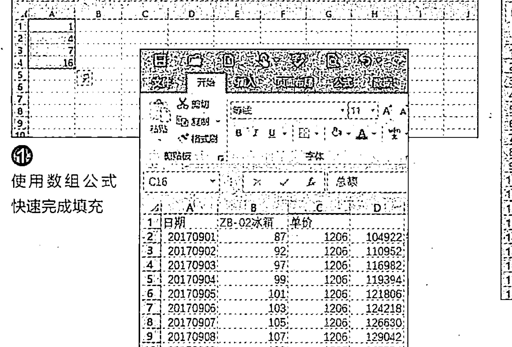

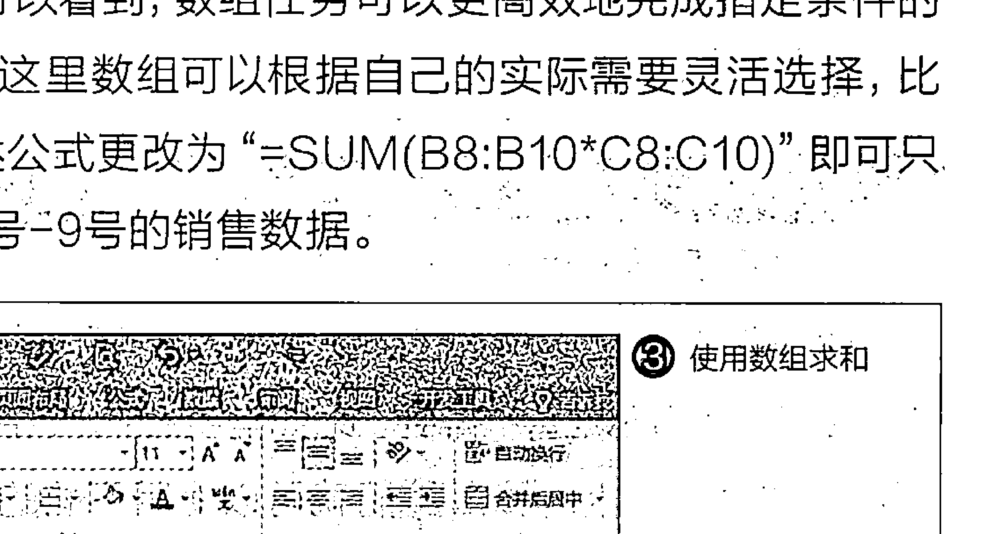

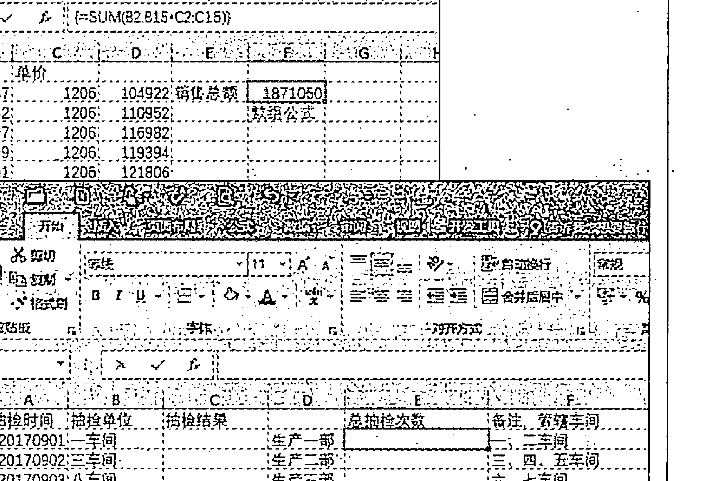

### 高级使用 使用嵌套数组函数

当然数组公式并非只是简单使用“函数+数组”的形式，在实际工作中我们还可以在数组中嵌套其他函数，以便实现更多高效的操作。比如总公司每个月都会对不同车间进行突击抽检，抽检是按照时间进行排序填写，不过由于不同车间分属不同生产部，为了公平起见，每到月中需要对各生产部抽检次数进行统计，以方便下半月平衡各自的抽检次数。这样就需要对不同生产部的抽检次数进行统计（图4）。

由于不同生产部的车间部门混杂在一起，比如生产一部需要统计一、二车间抽检次数，这时我们可以在数组公式中嵌套IF函数进行判断。定位到E2输入公式“=SUM(IF((B2:B12="一车间")+(B2:B12="二车间"),1,0))”，然后按Ctrl+Shift+Enter快捷键即可完成生产一部的统计，为了验证的准确性，可以将生产一部管辖车间设置不同的颜色，可以看到数组公式统计是正确无误的（图5）。

数组函数实际上对某一特定区域（或者特定条件）进行数据归集，在Excel中的很多函数同样可以进行类似数组的运算。比如上述统计抽检次数的例子，实际上是对B列中名称为“一车间”和“二车间”出现的数量进行统计，我们同样可以通过SUMIF函数直接代入数组后统计。因为每个单位每次抽检数是1，直接在C列中填充抽检次数1，接着定位到E6，输入公式“=SUM(SUMIF(B2:B32,{"一车间","二车间"},C2:C32))”，回车后即可看到统计结果（图7）。

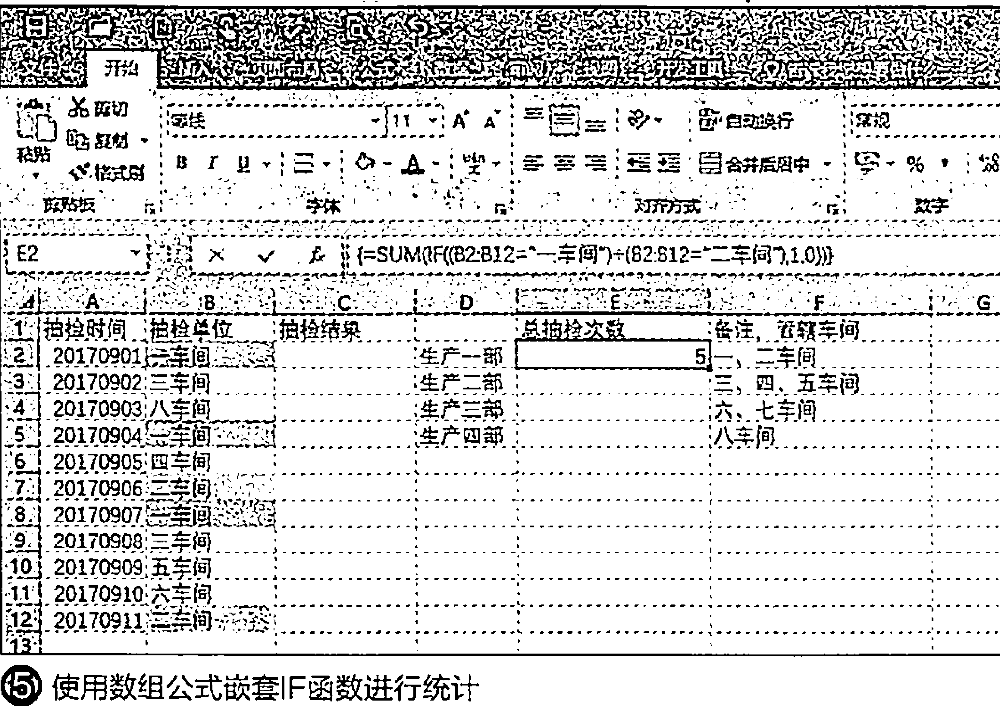

⑤ 使用数组公式嵌套IF函数进行统计

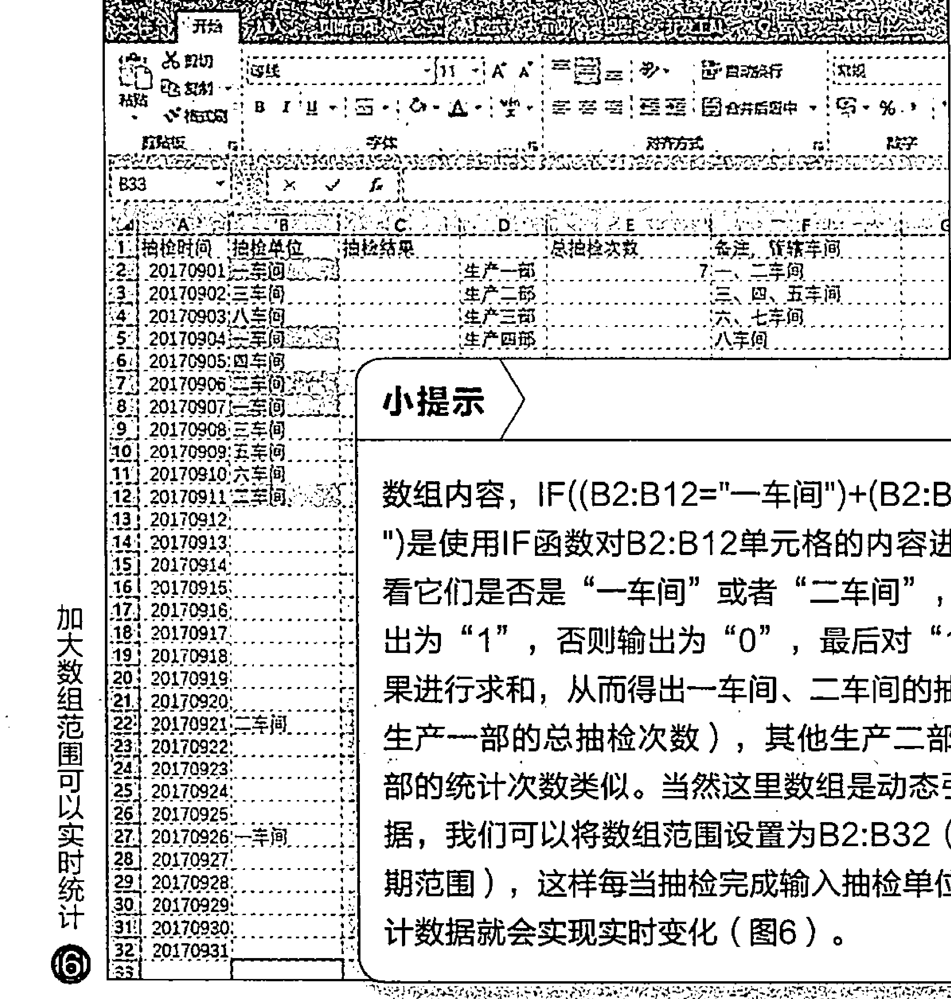

⑥

> 小提示
数组内容，IF((B2:B12="一车间")+(B2:B12="二车间"))是使用IF函数对B2:B12单元格的内容进行判定，查看它们是否是“一车间”或者“二车间”，如果是则输出为“1”，否则输出为“0”，最后对“1”的输出结果进行求和，从而得出一车间、二车间的抽检次数（即生产一部的总抽检次数），其他生产二部、三部、四部的统计次数类似。当然这里数组是动态引用B列的数据，我们可以将数组范围设置为B2:B32（即整月的日期范围），这样每当抽检完成输入抽检单位的时候，统计数据就会实现实时变化（图6）。

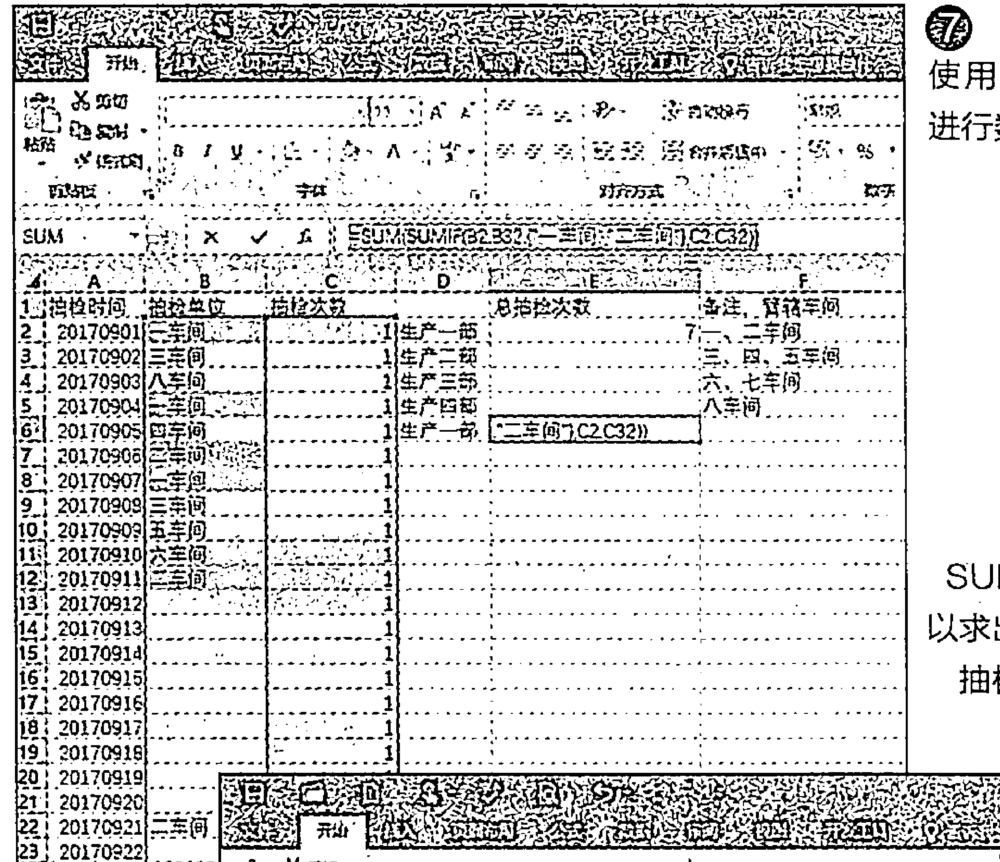

⑦ 使用SUMIF进行数组求和

SUMIF可以求出所有抽检次数

⑧

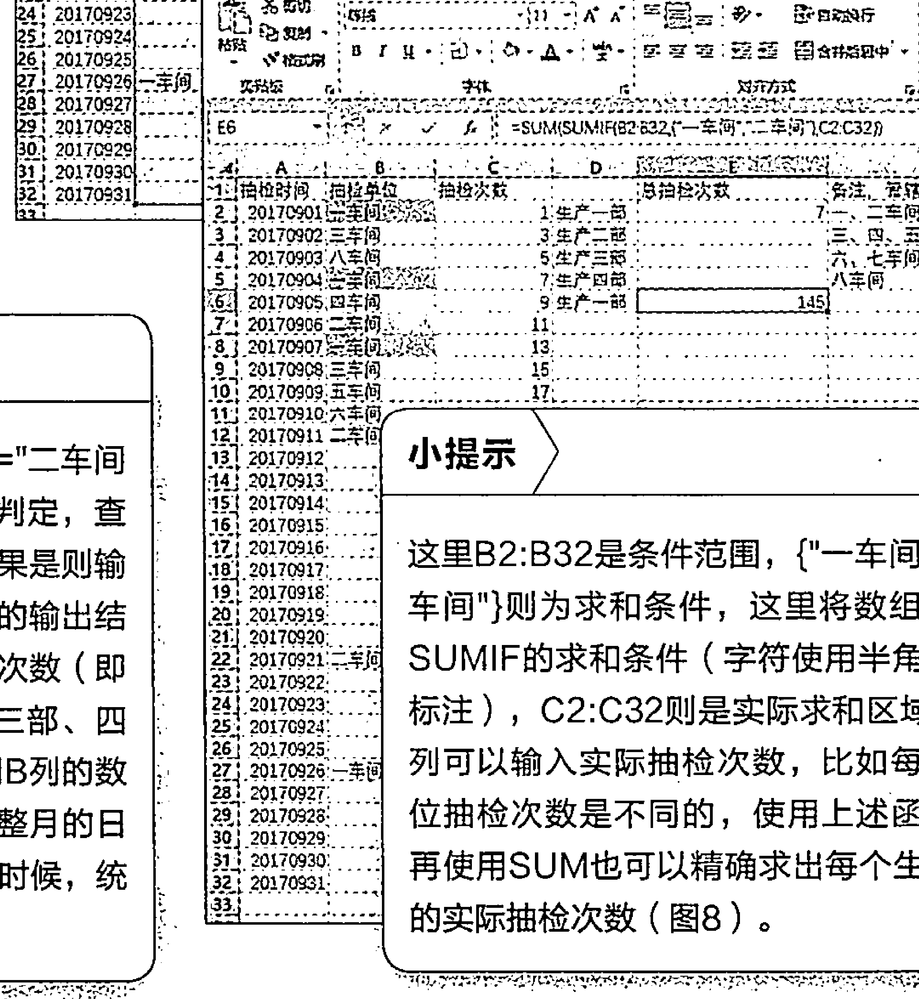

> 小提示
这里B2:B32是条件范围，{"一车间","二车间"}则为求和条件，这里将数组作为SUMIF的求和条件（字符使用半角引号标注），C2:C32则是实际求和区域，C列可以输入实际抽检次数，比如每个单位抽检次数是不同的，使用上述函数后再使用SUM也可以精确求出每个生产部的实际抽检次数（图8）。

## 合二为一--在Excel中制作组合图表
文|俞木发

在日常制作报表的时候，我们经常会对多个指标制作图表。比如对于很多销售数据，既想用柱状图表示销量，同时又想使用折线图表示销量增长率，常规的方法是制作两张图表，但是这样会占用文档过多的空间，同时阅读起来也不方便。对于此类需求，现在可以使用组合图表的方式来完成。

### 简单叠加：混合图表轻松做

比如对于上述介绍的两个图表，在Excel中通过图表的叠加就可以实现。首先准备原始数据，数据分为销量和增长率，然后全选数据，点击“插入→图表→柱形图→组合图→簇状柱形图”，可以看到内置两类数据的柱形图，其中增长率使用的是折线图，直接套用后两类图表就自动组合在一起，方便我们直观地看到销量数据和增长率的变化趋势（图1）。

可以看到这里折线图使用次坐标的方式进行数据的标记，为了可以更加直观地看到增长率的变化趋势，我们可以通过设置右侧百分比坐标轴数值，将其和柱形图分离。选中右侧纵坐标轴，右击选择“设置坐标轴格式”，在边界中将其最小值和最大值分别设置为“-1.5”和“-1”（这里边界数值需要根据具体数据进行设置，实现分离即可），这样折线图就可以和原来的柱状图分离出来（图2）。

右击折线图，选择“添加数据标签→添加数据标签”，同时在“设置数据系列格式→数据标记选项→标记”，选择圆点标记进行折线图的连接，这样组合图表可以非常直观地看到增长率的变化了（图3）。

当然，Excel还有很多组合图形可以直接使用。比如在表示数据百分比图示时，我们经常使用饼形图来表示，但是如果某一类别的数据很小，这样在饼形图上就无法很好地展示出来。此时可以使用复合饼图的形式表示，可以将较大数据自动组合在一起。同上，选中数据后，点击“插入→图表→饼形图→复合条饼图”，接着使用堆积条形图组合来进行展示即可（图4）。

### 突破限制：制作更复杂的组合图

上述操作都是直接引用Excel内置的组合图表完成。

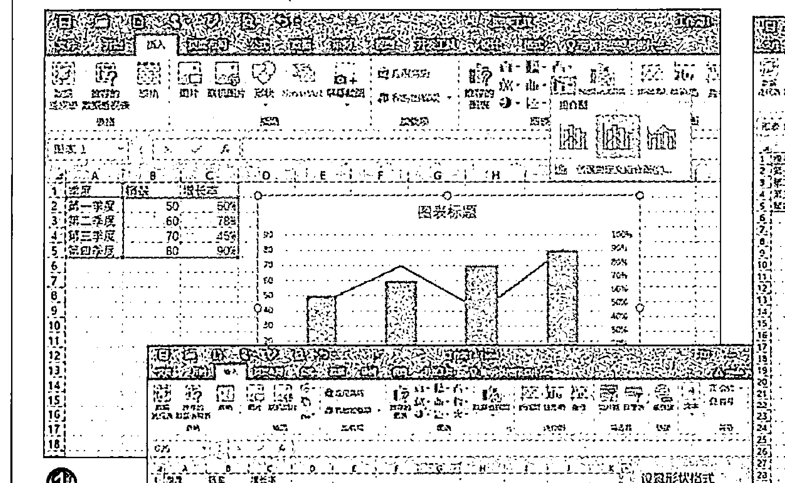

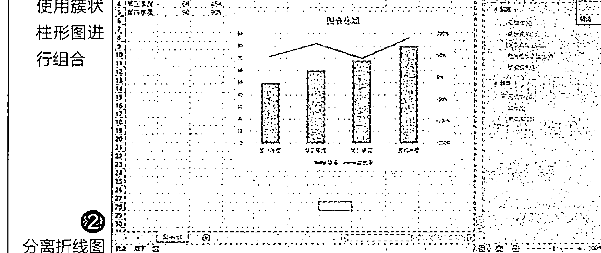

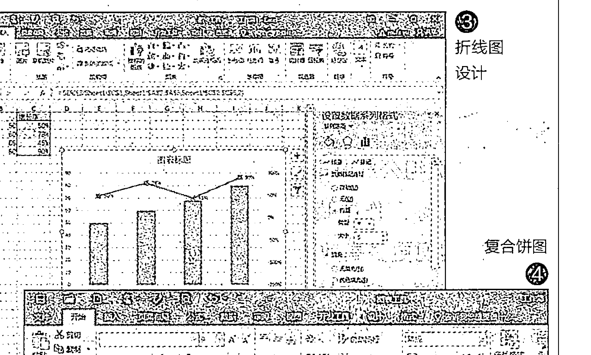

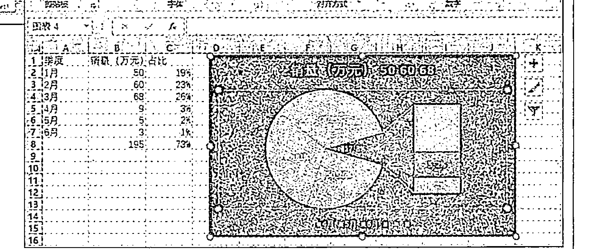

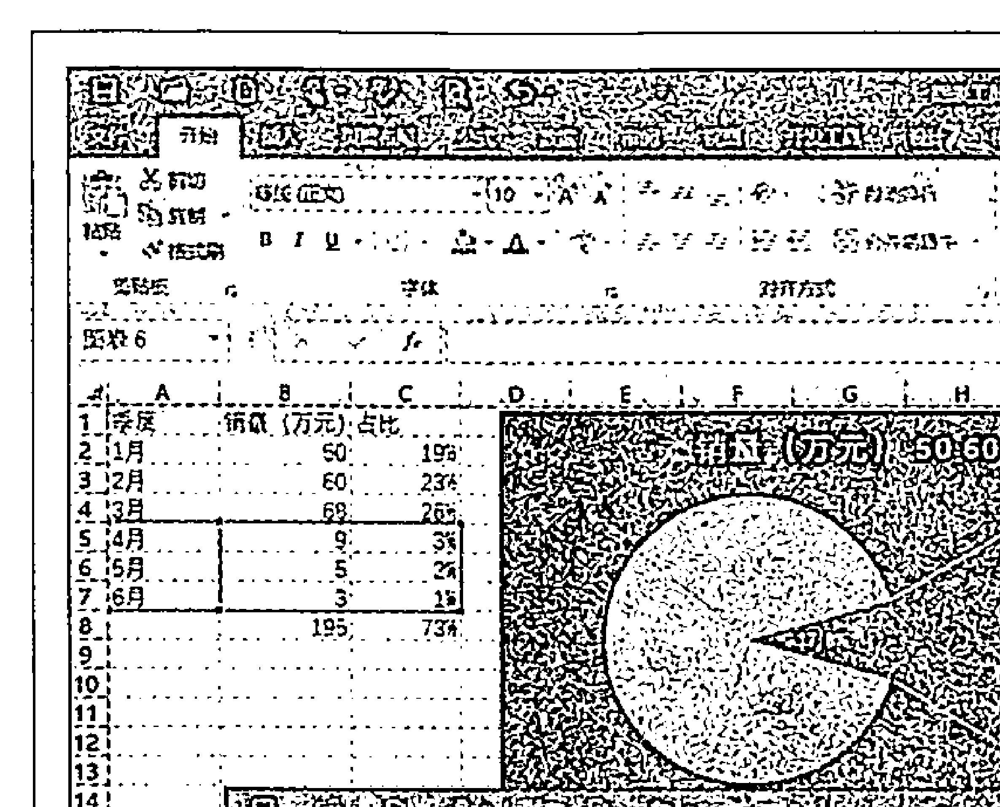

成操作，不过Excel内置的组合图表在实际使用时仍然有一定的局限性，比如上例的组合饼图，只能使用内置的复合饼图或者复合条饼图。复合条饼图分割部分使用的是堆积条形图，无法很直观地表示数据之间的差别，我们可以自己动手将饼图和柱形图组合使用。
同上先制作好复合条饼图，接着选中A5:C7的数据，按提示插入一个柱状图。接着将柱状颜色分别填充为原来分割图形月份对应的颜色，并将其背景色也填充为和复合条饼图背景图一致，同时将图例格式、标题，横坐标轴等无关的内容删除（图5）。
将编辑好的图形移动到复合条饼图上，调整其大小使得和原来的分割图形一致。接着选中复合条饼图、柱形图，点击“组合→组合”，将它们组合在一起，这样就制作出一份Excel内置组合图形中没有的“饼形+柱形”图形组合，柱形图可以更好地表示数据的差别（图6）。
类似的，我们可以在Excel内置图形的基础上制作出更多自己需要的组合图形。比如下列数据，现在需要在一张图表中制作出各个省份的季度销售图，如果只是简单利用Excel内置的柱形堆积图制作组合图形，由于每个季度的数据全部重合在一起，很难分清各季度销量的区别（图7）。
对于这类数据，我们现在可以通过添加辅助列的方法进行区别。在C列后插入一辅助列D，接着在D2输入公式“=100-C2”并向下填充。同理在E、G后继续插入辅助列2、辅助列3。这里辅助列实际上是将原来的数据和辅助列组成一个总和（均为100，可以自行根据实际情况进行设置）一样的柱状图，这样每个季度的柱形图起始数值都是从100的倍数开始计算，从而实现堆积柱形图的统一样式（图8）。
选中全部数据，点击“插入→推荐图表→所有图表→柱形图→堆积图”，生成一个包含辅助列的组合图。按提示依次选中辅助列1、2、3图标，将其填充颜色设置为“无”，并将每个季度的颜色填充为不同的颜色。这样通过辅助列（并将其图形填充为无色），我们可以获取到每个省份排列整齐的销量组合图表了（图9）。

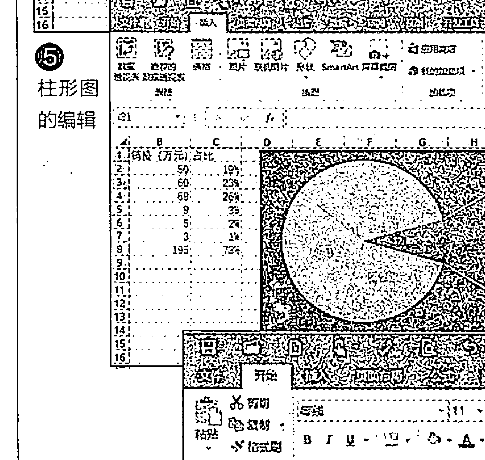

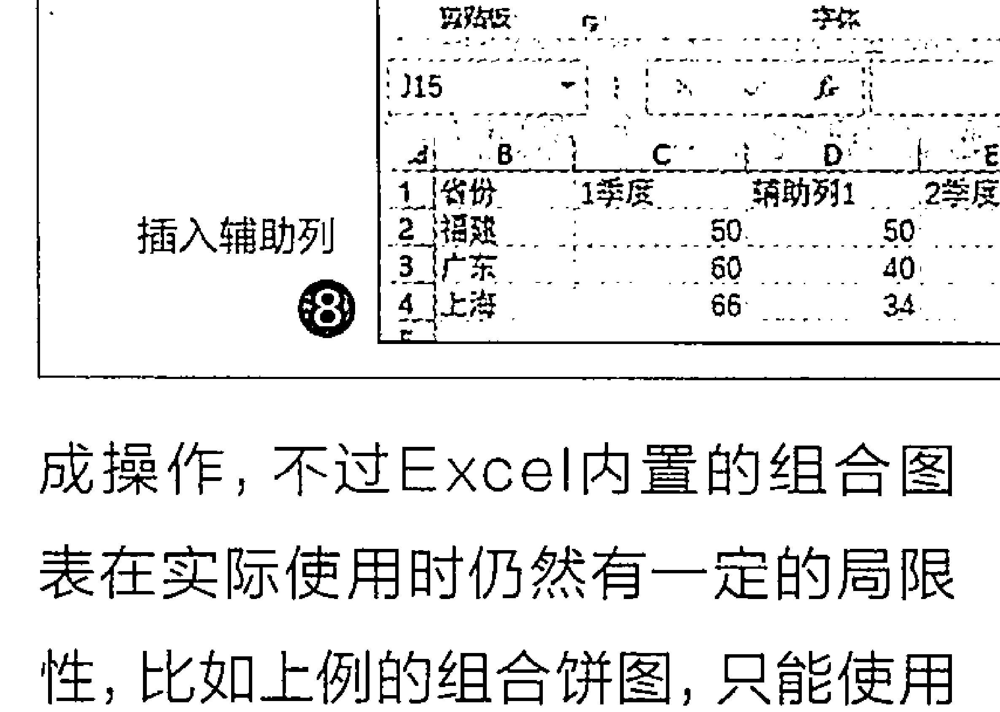

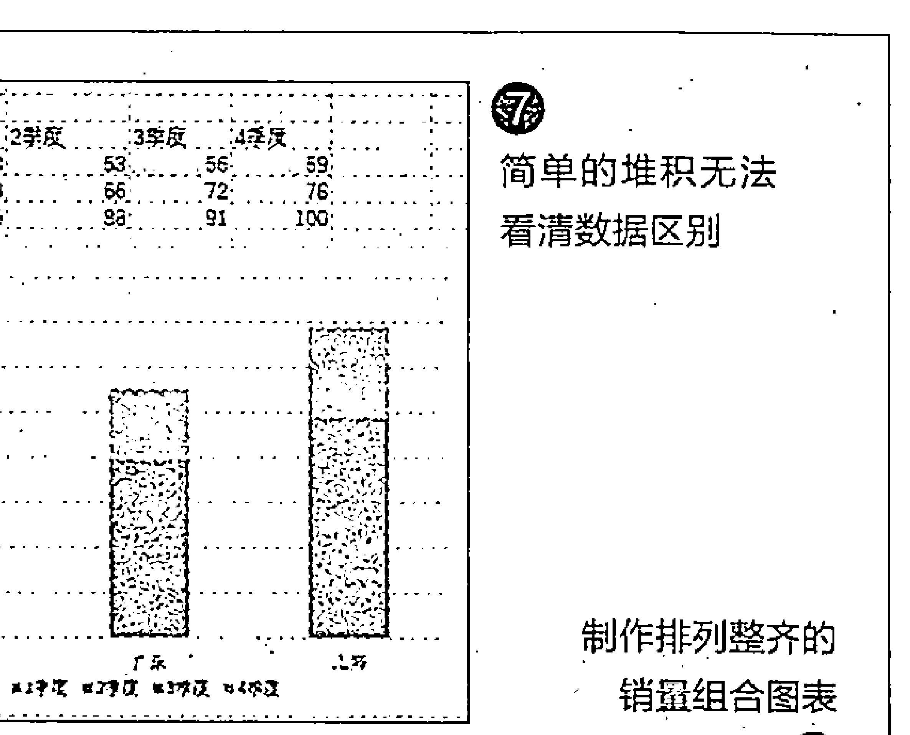

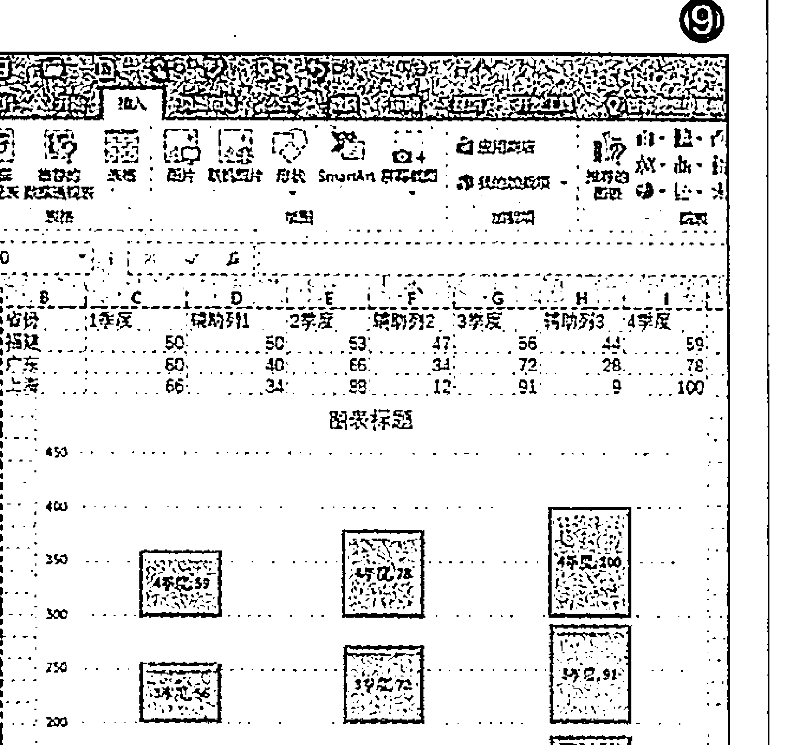

|   | A   | B     | C     | D     | E     | F     | G     | H     | I     | J     |
|---|-----|-------|-------|-------|-------|-------|-------|-------|-------|-------|
| 1 |     | 福建  | 1季度 | 辅助列1 | 2季度 | 辅助列2 | 3季度 | 辅助列3 | 4季度 |       |
| 2 | 福建 | 50   | 50   | 53   | 47   | 56   | 44   | 59   |       |       |
| 3 | 广东 | 60   | 40   | 66   | 34   | 72   | 28   | 78   |       |       |
| 4 | 上海 | 66   | 34   | 88   | 12   | 91   | 9    | 100  |       |       |

## 合并单元格后如何高效处理已有数据

文|俞木发

为了美观或出于其他各种需要，很多朋友喜欢在Excel中添加合并单元格。但Excel中合并单元格作为一个整体，在进行日常求和、填充序号等操作时，会带来极大的不便。那么，如何才能在合并单元格的同时，对数据进行高效的处理呢？

### 1. 求和不是寻常路

我们经常在Excel中使用SUM函数对一些数据进行求和。但是，如果求和的数据位于合并单元格中，需要对SUM函数进行变通才能实现正确求和。比如对于如图的销售额求和，由于每个销售部销售的产品种类不同，传统SUM函数就无法直接填充完成统计（图1）。

对于这类数据的统计，我们可以使用SUM函数相减的方法实现。选中D2:D11填充区域，接着定位到D2单元格，输入公式“=SUM(C2:C11)-SUM(D3:D11)”，然后按下Ctrl+Enter键填充，即可完成这类数据的统计（图2）。

#### 公式解释：

因为合并单元格实际上保留的只是第一个单元格的数据，因此对于第一个合并单元格的数据实际上是C2:C11总和-D3:D11的和。这里公式中对计算区域的引用是相对引用，这样当按下Ctrl+Enter键复制填充后，引用的数据区域会根据合并单元格左上角第一个单元格的地址进行相应移动，从而实现对合并单元格数据的准确统计。

### 2. 序号添加不求人

为了数据的排序更为直观，很多时候我们需要对合并单元格添加序号。比如上例，需要将1至4填充到对应的销售部中，但是合并单元格是一个整体，如果直接填充序号并不能将各销售部实现精确的排序（图3）。

因为序号是依次增加的，并且每次都是增加1，所以可以用上一个序号加上1来得到合并单元格的序号。这里可以使用MAX函数填充。同上先选中A2:A11区域，接着在A2输入公式“=MAX(A$1:A1)+1”，同上按下Ctrl+Enter键填充即可（图4）。

#### 公式解释：

这里A$1表示绝对引用，即始终以A1作为起始引用位置，后一个A1则为相对引用，这样在使用Ctrl+Enter键向下填充的时候，公式会自动引用下方的合并单元格，并且根据序号的特点依次加1。

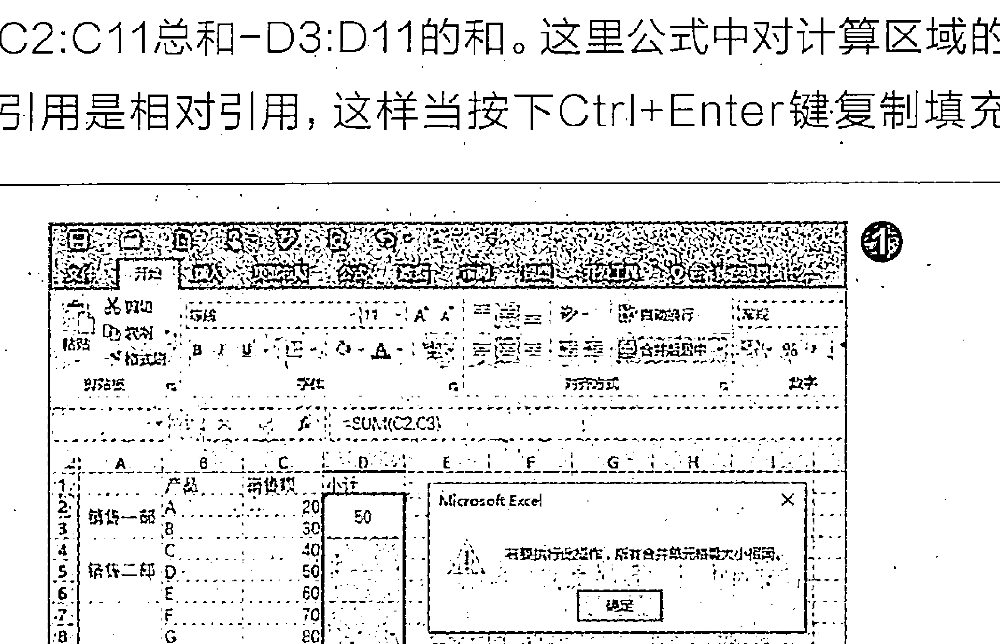

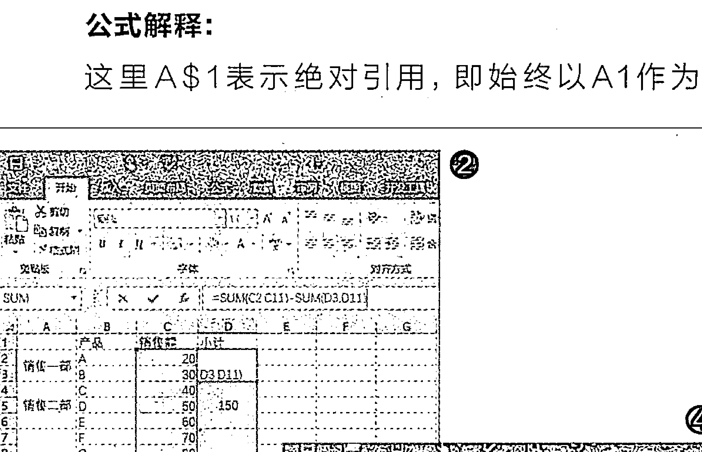

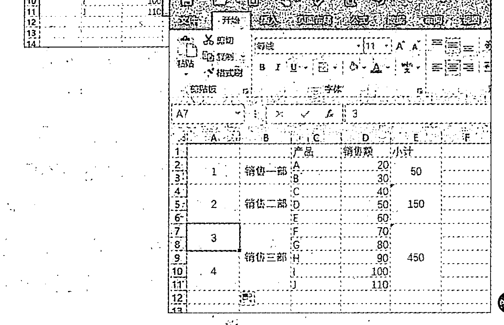

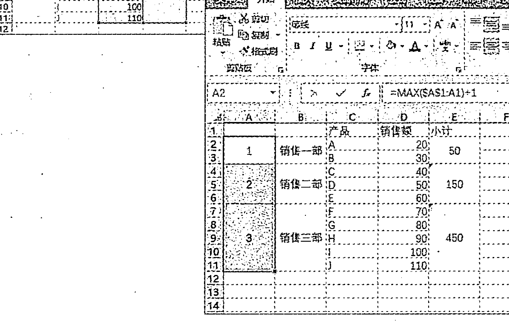

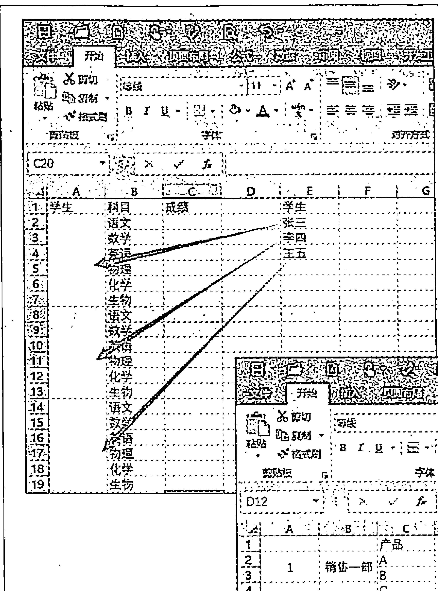

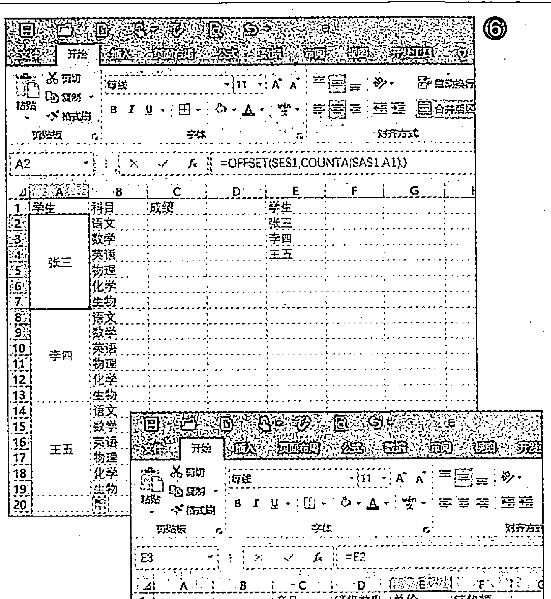

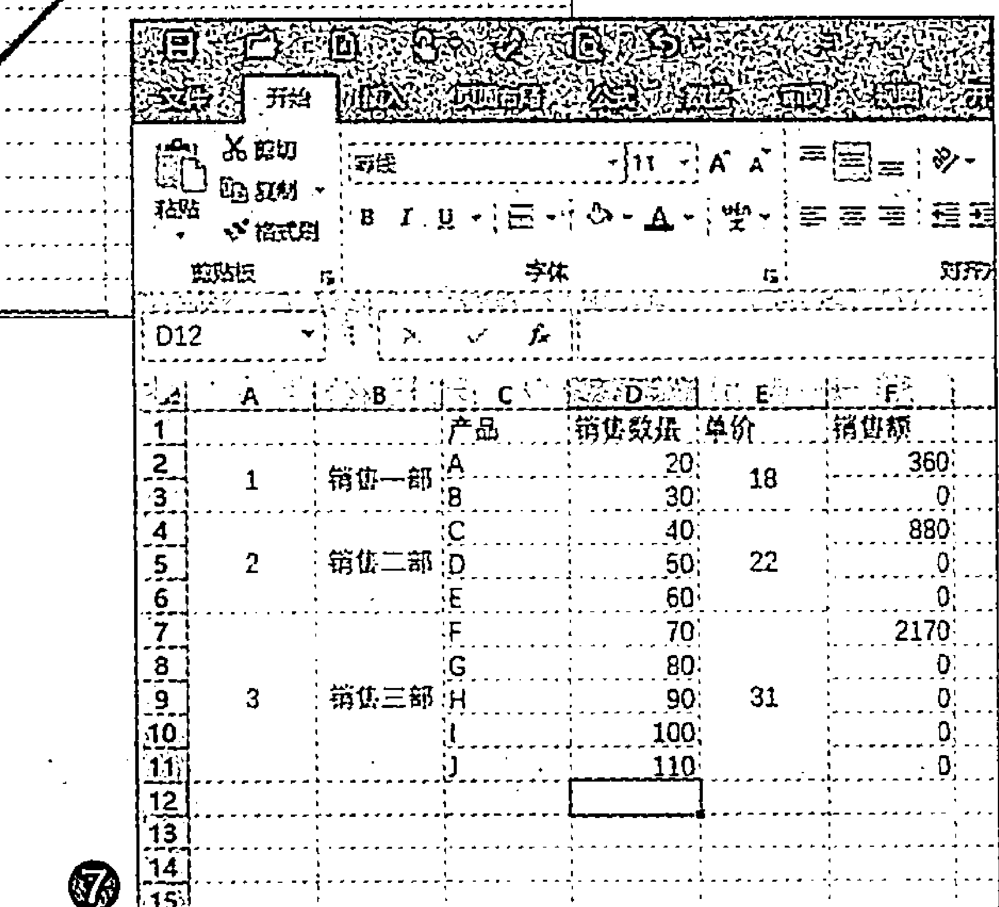

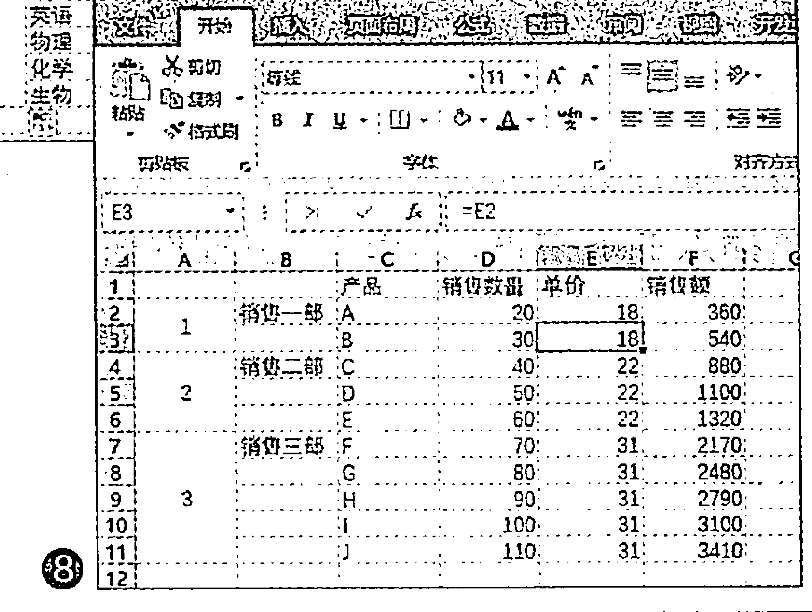

用将其作为固定的起点，A1作为相对终点（使用相对引用），公式下拉后，相对终点的位置就不断向上一单元格延伸作为引用对象，即不断引用从E2开始的姓名数据填充到合并单元格中。

### 3. 数据填充不用愁

很多时候我们需要将数据填充到合并单元格中，比如某学校理科班已经有学生姓名数据，为了方便对学生的数据进行统计，现在需要将学生姓名依次填充到A列合并单元格中（图5）。对于这类数据填充到合并单元格的操作，可以借助OFFSET嵌套COUNT函数完成。

操作同上类似，先选中A2:A19区域，在A2输入公式“=OFFSET($E$1,COUNTA($A$1:A1),)”，然后向下填充即可。当然，如果这里合并单元格的数目不同（比如科目数量不同），那就需要先选中填充区域，再使用Ctrl+Enter键填充（图6）。

**公式解释：**

这里先使用COUNTA函数对A列不为空的单元格进行计数，然后OFFSET函数根据COUNTA函数的统计结果，由$E$1往下偏移取数。这里$A$1使用绝对引用将其作为固定的起点，A1作为相对终点（使用相对引用），公式下拉后，相对终点的位置就不断向上一单元格延伸作为引用对象，即不断引用从E2开始的姓名数据填充到合并单元格中。

### 4. 取消重复数据统计更高效

从上述介绍可以看到，在Excel的统计中如果包含合并单元格，会给我们的日常操作带来极大的不便，导致很多日常函数无法直接使用。因此要让数据统计更高效，我们就可以取消单元格的合并，让其恢复真身。比如对于下面的数据，现在需要将合并单元格的“单价”数据取消合并并自动填充到原来的单元格（图7）。

选中E2:E11，点击“开始→合并后居中”，取消原来所有的合并单元格，但是这样会留下很多空白的单元格。按下F5键，在打开的窗口点击“定位条件→空值”。这样原来取消合并后空值的单元格会被全部选中，定位到E3输入公式“=E2”，使用Ctrl+Enter键填充，这样单价内容会自动填充到对应的单元格中。现在，销售额的统计就可以直接利用D2*E2公式进行准确计算了（图8）。

## 制作淡化未选数据的动态交互图

文|马震安

在Excel中，若将多系列的折线图放在一起，会难以辨认每一个系列的情况。我们可以添加一层“窗纱”，随着滚动条的拖动，把不需要注意到的数据进行模糊处理，而需要注意的数据进行强调处理（图1）。下面就介绍这种交互式图表的制作方法。

### 1. 插入列表框

在工作表中，先将下拉菜单所需要的数据放置在一列上，即将实例中的每个食品的名称放置在K1:K8单元格中。选择“开发工具”选项卡，点击“插入”按钮“表单控件”下的“组合框”，在工作表的合适位置按住鼠标左键拖动插入一个下拉列表框。右击插入的下拉框，选择“设置控件格式”，在弹出窗口“控件”选项卡的数据源区域处选择K1:K8单元格区域，单元格链接处选择L1单元格，确定后就会形成一个下拉列表，下拉选项就是K1:K8单元格中的值。当选定下拉列表中的一个食品名称时，在L1单元格中就会出现这个食品名称在下拉列表中的索引值。接下来，在L2单元格中输入公式“=INDEX(K1:K8,L1)”，这样L2单元格中就会显示出所选择的食品名称（图2）。

### 2. 插入滚动条

选择“开发工具”选项卡，点击“插入”按钮“表单控件”下的“滚动条”，在工作表的合适位置按住鼠标左键拖动插入一个滚动条。右击插入的滚动条，选择“设置控件格式”，在弹出窗口“控件”选项卡的最小值处输入0，最大值处输入12（即月份数），步长处输入1，单元格链接选择M1，这样当拖动滚动条时，M1处就会显示滚动条的当前值是多少（图3）。

### 3. 添加图表

选定Excel工作表中的任意数据单元格，插入折线图表，利用“设计”选项卡中的“添加图表元素”，将图例放置在图表上方；设置好图表的背景色、图例和坐标轴的文字颜色，将下拉列表框、滚动条置于顶层并拖动到图表上（图4）。

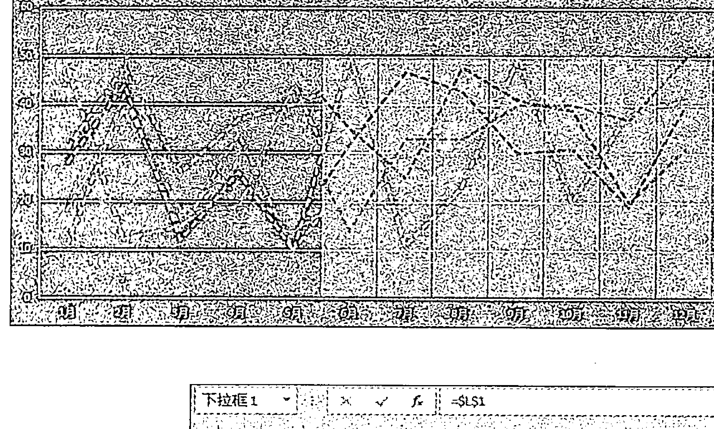

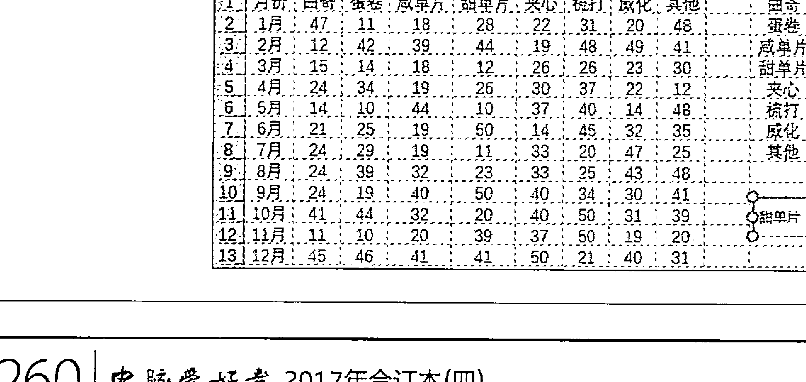

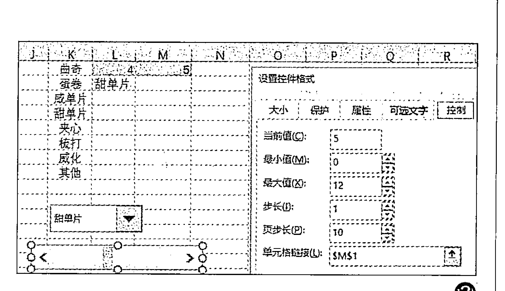

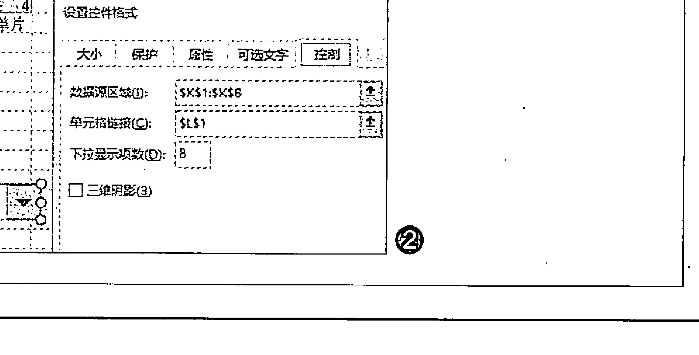

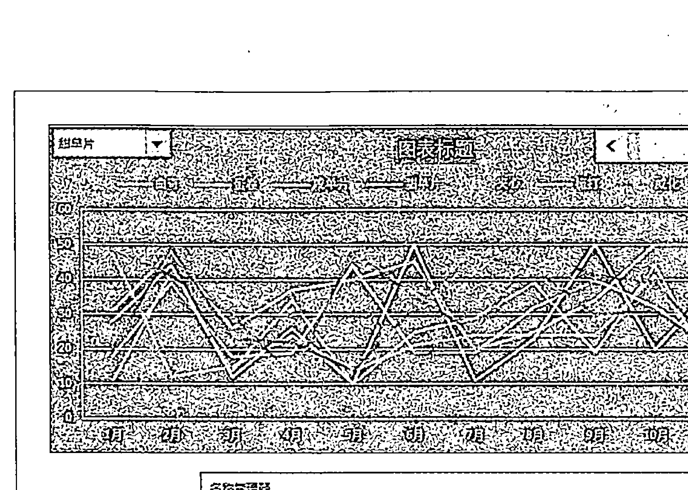

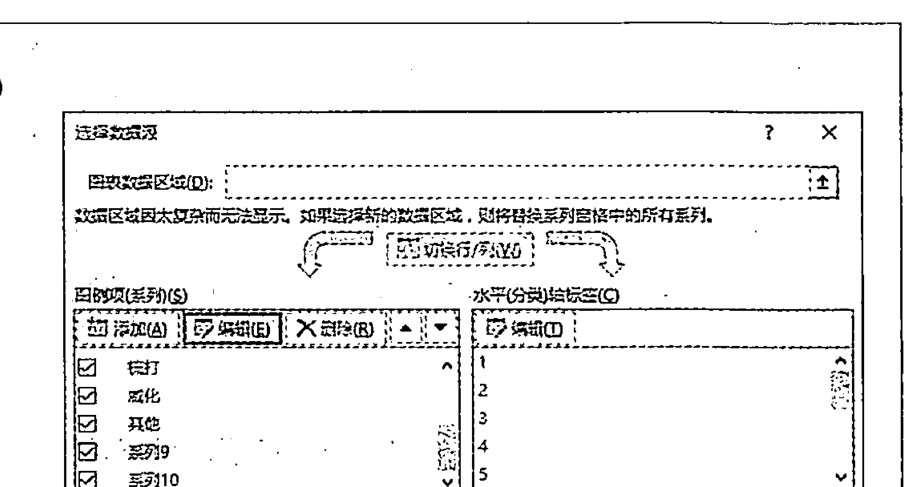

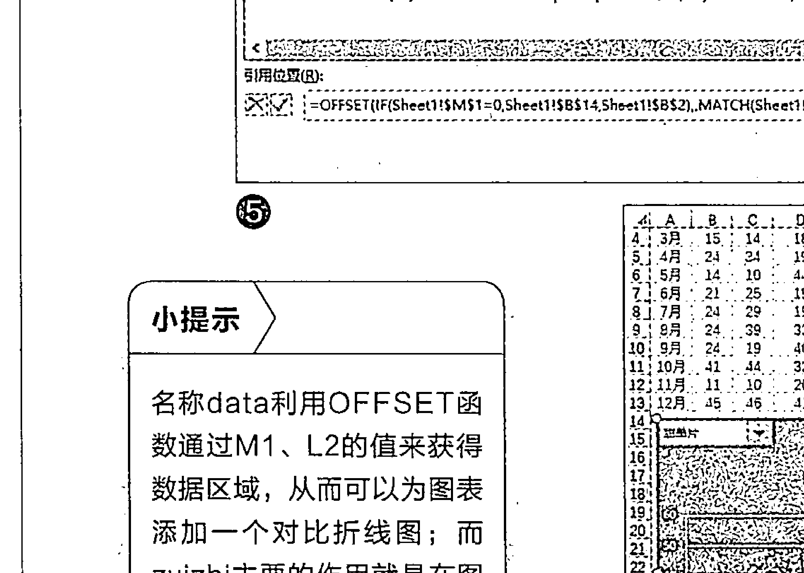

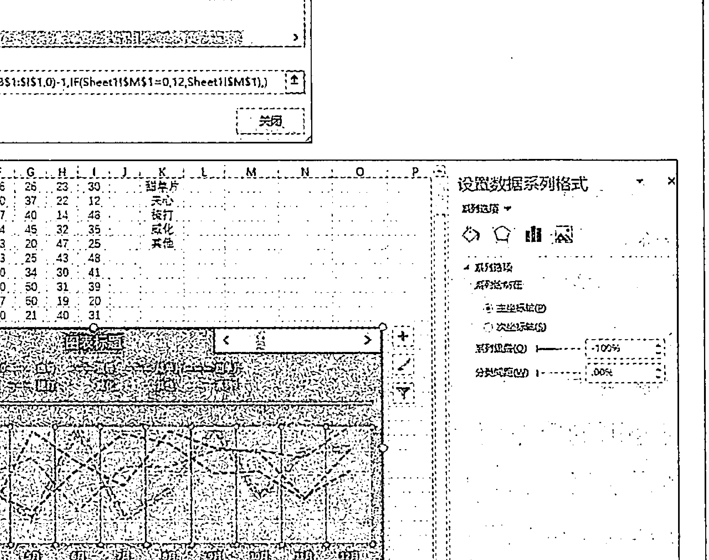

> 小提示
名称data利用OFFSET函数通过M1、L2的值来获得数据区域，从而可以为图表添加一个对比折线图；而zuizhi主要的作用就是在图表中添加一个柱形图，从而得到一个“窗纱”效果。

### 4. 添加图表项目

首先，利用名称管理器为图表添加新的数据源。选择“公式”选项卡，点击“名称管理器”，在弹出的窗口中点击“新建”，在“新建名称”窗口中，名称处输入“data”，引用位置处输入“=OFFSET(IF(Sheet1!$M$1=0,Sheet1!$B$14,Sheet1!$B$2),MATCH(Sheet1!$L$2,Sheet1!$B$1:$I$1,0)-1,IF(Sheet1!$M$1=0,12,Sheet1!$M$1))”；再次点击“新建”，名称处输入“zuizhi”，引用位置处输入“=IF(ROW(Sheet1!$2:$13)-1>Sheet1!$M$1,50,NA())”（图5）。

接下来，右击图表，选择“选择数据”，在弹出的窗口中点击“添加”，在新弹出的“系列名称”处无需输入，“系列值”处输入“=Sheet1!data”；确定后再点击“添加”，在弹出的“系列名称”处也无需输入，“系列值”处输入“=Sheet1!zuizhi”（图6）。

再次右击图表，选择“更改图表类型”，在弹出的窗口中选择“组合”，将所有系列名称为食品的及系列名称为系列9的图表类型都设置为“折线图”，而系列10的图表类型设置为“簇状柱形图”。右击图表中的任意折线，选择“设置数据系列格式”，在右侧“设置数据系列格式”窗口的“填充与线条”选项卡中，将线条的“短划线类型”设置为第3个“方点”，依次将除系列9折线图外的其他折线线条类型也设置为方点。拖动滚动条使其值为2，显示出簇状柱形图，选定图表中的柱形图，在“设置数据系列格式”窗口的“填充与线条”选项卡中，填充选择“图片或纹理填充”，无线条；在“系列选项”选项卡中，“系列重叠”处为“-100%”，“分类间距”处为“0%”（图7）。

最后，选中图例中的系列9、系列10将它们删除，更改图表标题，将图表、下拉列表框、滚动条选中并组合。

## 图片有瑕疵 PPT处理不求人

文|平淡

PPT的制作少不了图文并茂，不过很多朋友在为PPT寻找配图素材的时候总会遇到各种不便。比如好不容易找到的某张配图却包含多余元素；某张图片很符合PPT主题，但是像素又太低不忍直视。诸如此类的图片瑕疵，现在借助PPT就可以轻松解决。

### 对症下药 多余元素留白不烦人

很多时候如果找到的图片带水印，那么我们可以根据水印的实际位置进行不同的“去水印”处理。如果水印的位置是在图片边缘，而且去除水印后不影响图片整体感觉，那么导入PPT后选中图片，点击“图片工具→格式→裁剪”，按提示将水印部分裁剪掉即可（图1）。

如果水印的位置是处于图片的中央，这样水印的去除就无法直接裁剪。对于这类水印，我们可以使用添加色块和文字的方法来弱化水印的存在。点击“插入→图形→矩形”，然后在原来水印的区域插入一个和原图水印区域大小一致的矩形，使得其可以覆盖住水印。同时将矩形的填充颜色设置成和水印一致，并且调整到适当的透明度。继续在图片和矩形上插入所需的文字，这样水印是不是消失了（图2）？

当然使用同样的方法可以实现对大幅留白图片的处理，比如在制作一些比较大气主题PPT的时候，我们希望PPT的配图是全页面内容大图，但是找到的图片却有大幅留白。此时我们同样可以通过上述方法对图片进行修饰。在PPT中插入图片后，先观察原图和留白区域相邻的颜色，如下图左侧留白颜色为黑色，那么插入一个合适大小的矩形即可填补留白。

同上，点击“插入→图形→矩形”，在图像的左侧插入一个大小和原图高度一致的矩形，选中矩形，点击“绘图工具→形状填充→取色器”，然后选择原图区域的黑色进行填充。选中矩形，点击“绘图工具→形状轮廓→无”，然后将色块和原图组合在一起（图3）。

完成色块和原图的组合后，留白就可以实现完全填充，最后按提示再插入说明文字，这样原来留白的图片可以实现完全填充（图4）。

### 像素低下 模糊处理有妙招

很多时候因为条件所限，我们找到的只是一些像素较低的模糊图片。如果直接在PPT中使用这些图片显然不行，此时我们可以根据实际需要对这些低像素图片进行优化处理。

可以看到通过上述方法处理后，原来模糊的图片变得更“模糊”了，但是却能更好地表达PPT的主题意境。同上再插入说明文字和文本框等要素，这样在PPT中我们使用清晰的字体表达文字主题，模糊后景图片表达意境，即使再模糊的图片我们也无所畏惧了（图6）。

要操作是去除水印并对图片进行美化。去除水印可以利用“删除背景”工具，首先选中图片，点击“图片工具→格式→删除背景”，将不必要的背景连同上方的水印和原文文字一起删除。接着点击“图片工具→颜色→饱和度→400%”，增加绳索饱和度，使颜色看上去更靓丽。

比如我们经常在PPT中使用图片表达一些比较抽象的主题，如果找到的图片像素较低，那么此时就可以通过对图片进行模糊处理来解决问题。比如下面的图片，我们要表达的是一种前路漫漫、需要负重前行的意境，因此这里原图质量虽然较差，但是只要表达出意境即可。同上在PPT中选择图片，点击“图片工具→更正→柔化50%”，让图片模糊更有意境。继续点击“插入→图形→矩形”，插入一个和图形大小一致的矩形，同上将其填充颜色设置为渐变，并且调整渐变光圈和透明度，更好地表达负重前行的意境（图5）。

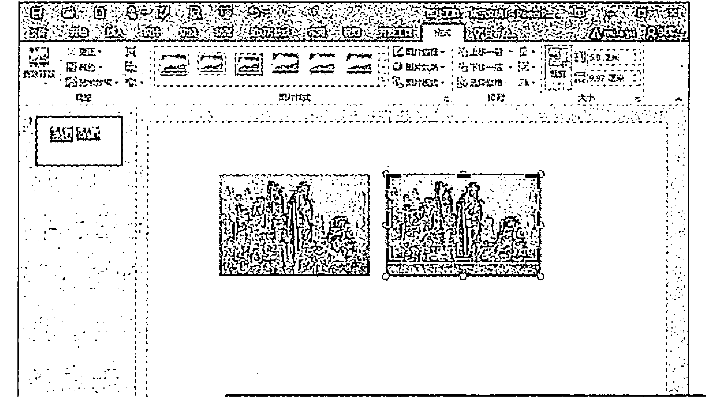

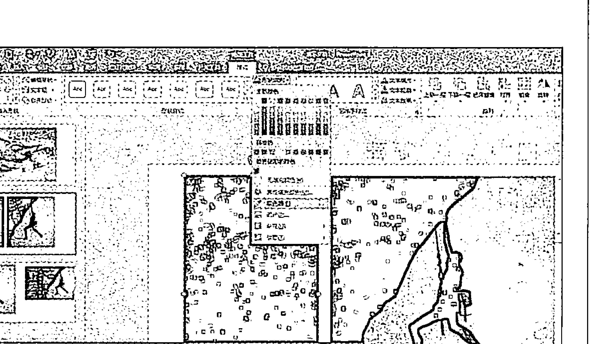

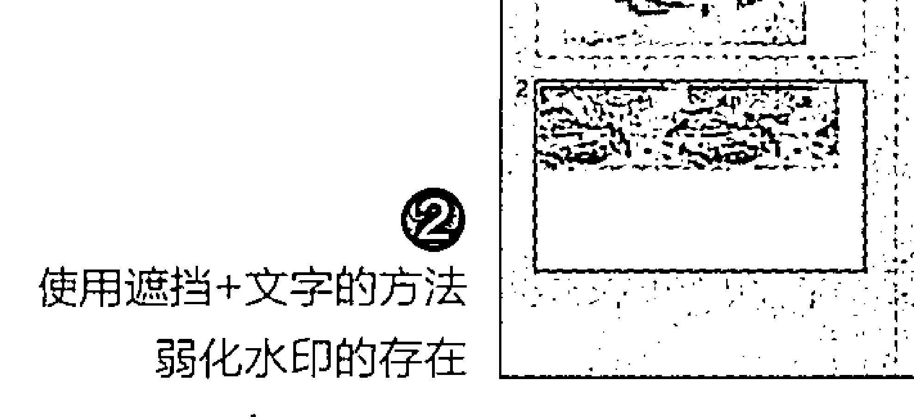

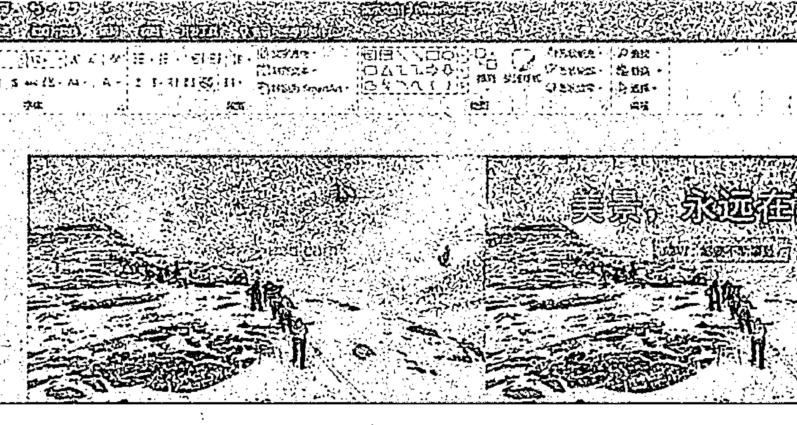

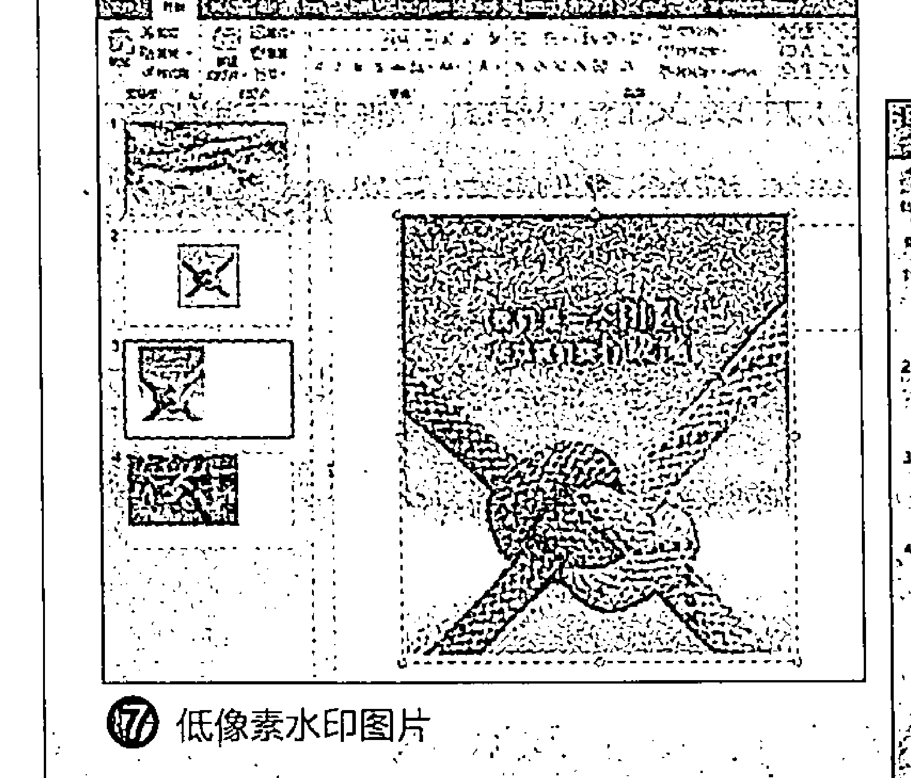

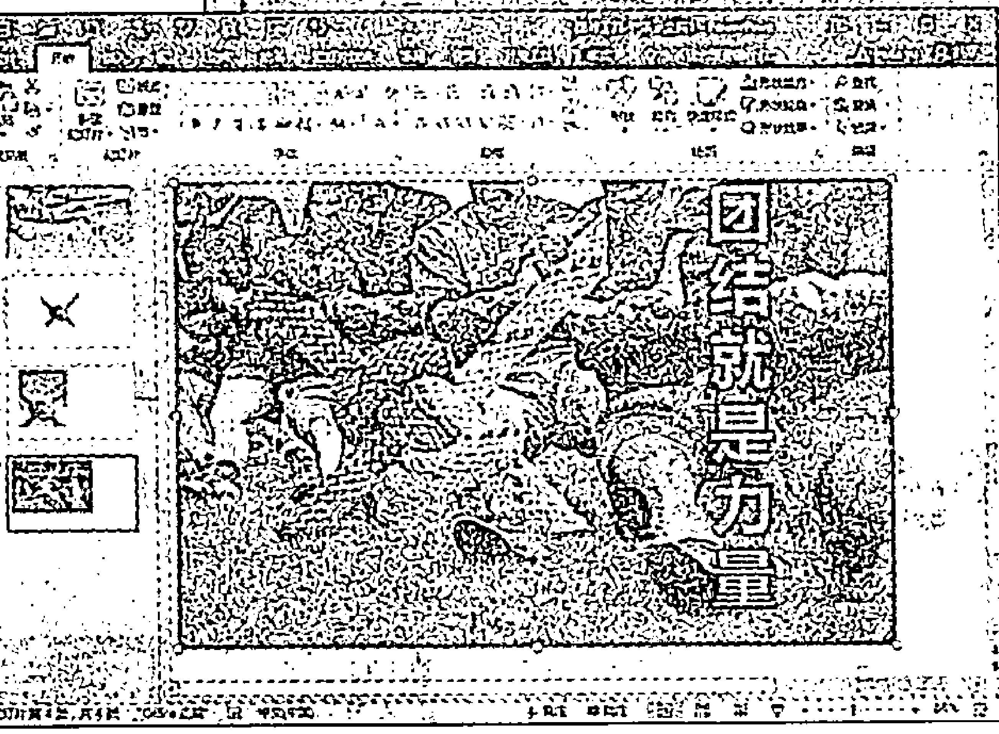

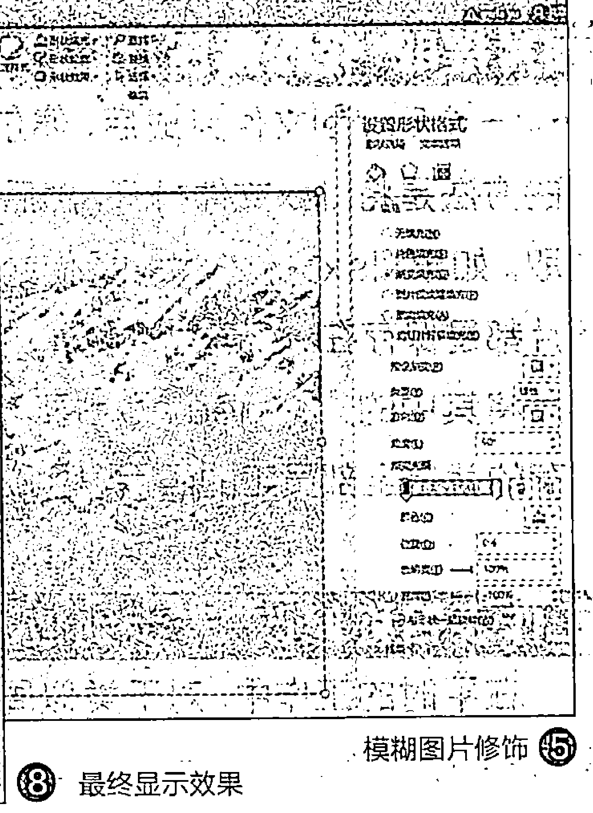

### 多种组合高效处理图片

除了上述介绍的方法外，其实PPT还集成了很多图片处理工具。在实际工作中我们还可以根据实际情况，结合多种工具进行灵活处理。比如现在需要制作一个表达团结就是力量主题的PPT，但是找到的只是一张绳索低像素图片，而且上方还有水印（图7）。

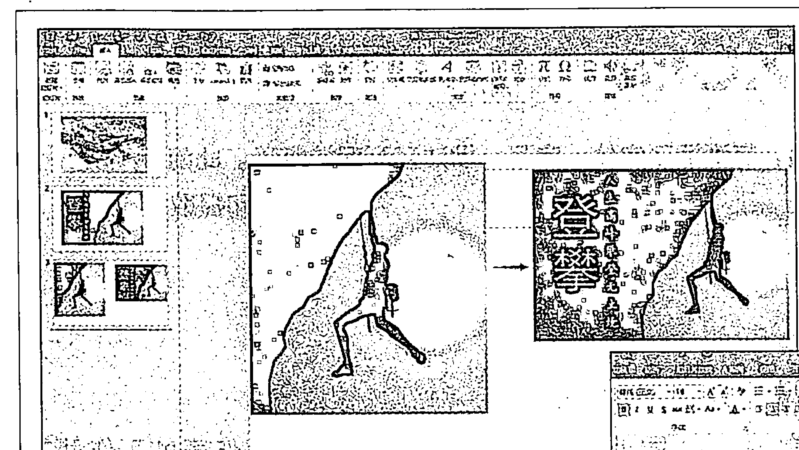

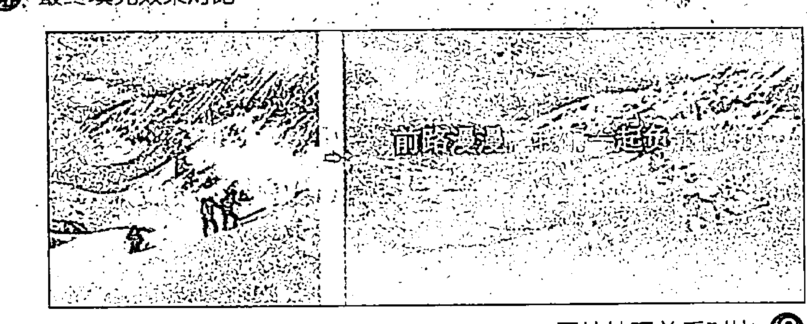

因为前景是一幅颜色鲜明的图片，为了提高其显示效果，可以再准备一张拔河图片，然后将其颜色设置为“饱和度0”放置在上图的底部。最后再添加上类似的文字说明，这样原来低像素图片就可以获得很好的显示效果了（图8）。

这里我们需要上述图片主体物体绳索来表达团结主题，因此主要操作是去除水印并对图片进行美化。

总之，在日常制作PPT的时候，如果发现图片上的素材有各种各样的不足，此时我们要善于利用PPT自带的图片处理工具进行有针对性的处理。

## 用压缩软件玩转Excel

文|俞木发

从Office 2007版开始，Excel就以.xlsx作为文件后缀，其囊括了字体、字号、批注甚至保护密码。此前，我们曾经介绍过使用压缩软件解压Word和PPT对应文件的技巧，现在就来说说怎么对Excel文件进行修改和提取操作。

### 图片提取 轻松解压

一个Excel文件完成后，偶尔要从中提取图片，常规的方法是将xlsx文件打开，然后另存为网页文件后再提取。如果xlsx文件较大，操作起来就很不方便。因为照片都是保存在xlsx压缩文件中，现在使用7-Zip打开，然后将其中的“xl\media”目录全部解压到桌面，其中保存的就是全部员工的照片（图1）。

### 工作表名称修改一步到位

在平时的工作中，对于类似周报表、月度报表的数据，很多朋友都喜欢将其按照每周、每月一个工作表的形式保存在一个工作簿文件中。但是现在公司为了规范文件命名，原来的工作表名称要将类似“1月”更改为“1月产品销售表”的形式。传统方法是打开工作表一个一个手工修改，或者借助复杂的VBA脚本进行更改，现在则只需借助解压缩软件就可以轻松完成。同上使用7-Zip打开包含多个工作表的工作簿文件，然后将其中的“xl\workbook.xml”文件解压到桌面。接着使用记事本打开该文件，点击“编辑→替换”，在查找框输入“月”，替换框输入“月产品销售表”，然后进行全部替换即可（图2）。替换完成后保存，然后将修改过的文件拖到7-Zip窗口替换同名文件。关闭7-Zip，这样再次打开工作簿后就可以看到批量更名的效果了（图3）。

### 工作表加密 手工解密

为了保护工作表的内容不会被浏览者随意更改，在完成工作表文档的编辑后，一些朋友会启用工作表保护（只要右击工作表选择“工作表保护”，然后按提示设置保护密码），这样工作表的内容就无法修改，需要去除保护后才能进行编辑（图4）。

工作表的保护虽然实用，但是很多朋友都是马大哈，设置了保护密码后又忘记了密码。对于此类用户，此时就可以使用解压软件来清除工作表的保护密码。同上，解压工作簿后将其中的“xl\worksheets\sheet2.xml”文件（即被保护的工作表2，请根据实际情况选择）解压到桌面备用（图5）。

使用记事本打开上述解压的文件，点击“编辑→查找”，查找“sheetProtection”关键字，然后将“<sheetProtection”开始直到“scenarios="1"/>”结束这段代码的内容全部删除，这段代码包含的是我们在保护工作表中设置的密码（经过SHA加密保存），因此删除后可以自动清除保护密码（图6）。

同上保存文件后将其拖到7-Zip窗口并替换同名文件。这样关闭7-Zip并再次打开上述工作簿文件后，被保护的工作表就自动取消密码保护了，可以看到右键“保护工作表”已经变得可用（图7）。

在日常工作中，新手在将完成的工作表提交给BOSS审核时，严格的BOSS经常会在文档中插入各种批注。对于员工来说，这些批注就是以后工作中需要注意的事项，如果能够批量导出批注，这样在以后的工作中就能够很好地引起自己注意。同上使用7-Zip将“xl\comments1.xml”文件导出到桌面，接着使用记事本打开上述文件，其中的汉字就是批注的内容，接下来将其提取出来保存即可。在记事本中全选文本内容复制并粘贴到Word，在Word中点击“开始→替换”，在查找框输入“[!--隰]”，替换为置空，勾选下方的“使用通配符”（图8）。

点击全部替换后即可保留批注文件中的汉字。重复上述替换操作，将原来批注中的“宋体”替换为“手动换行符”，这样所有批注（一个批注一行）就可以保存为文本文件供自己以后查阅了（图9）。

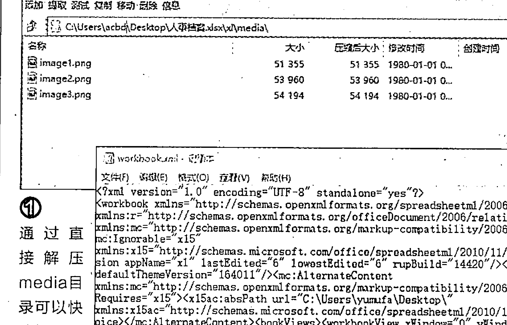

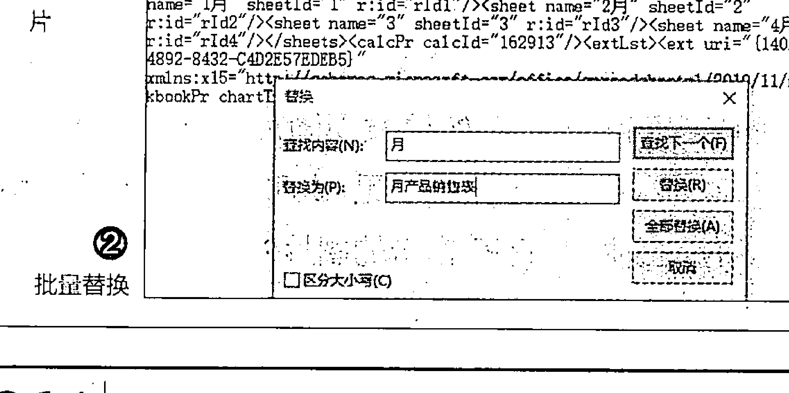

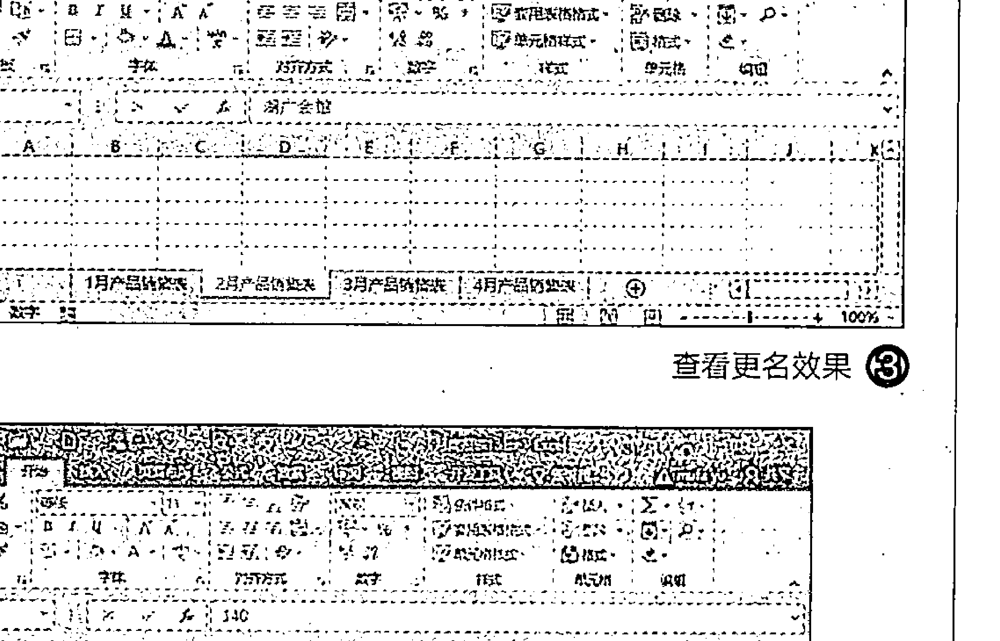

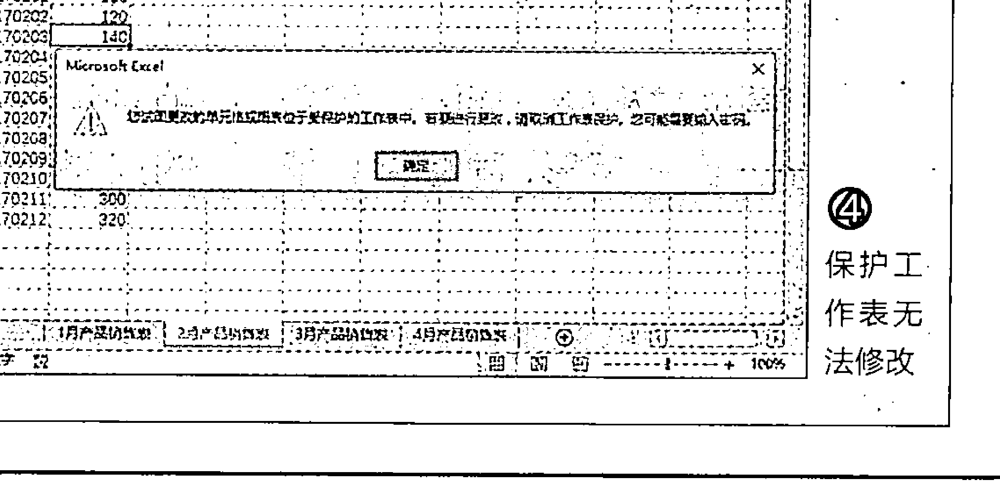

| 名称 | 大小 | 压缩后大小 | 修改时间 | 创建时间 |
|------|------|------------|----------|----------|
| _rels | 322 | 193 | - | - |
| sheet1.xml | 819 | 446 | 1980-01-01 0... | - |
| sheet2.xml | 2464 | 935 | 1980-01-01 0... | - |
| sheet3.xml | 726 | 406 | 1980-01-01 0... | - |
| sheet4.xml | 726 | 409 | 1980-01-01 0... | - |

**解压保护工作表**

```xml
<?xml version="1.0" encoding="UTF-8" standalone="yes"?>
<worksheet xmlns="http://schemas.openxmlformats.org/spreadsheetml/2006/main"
xmlns:r="http://schemas.openxmlformats.org/officeDocument/2006/relationships"
xmlns:mc="http://schemas.openxmlformats.org/markup-compatibility/2006" mc:Ignorable="x14ac"
xmlns:x14ac="http://schemas.microsoft.com/office/spreadsheetml/2009/9/ac"><dimension
ref="A1:D28"/><sheetViews><sheetView tabSelected="1" workbookViewId="0"><selection
activeCell="B3" sqref="B3"/></sheetView></sheetViews><sheetFormatPr defaultRowHeight="14.25"
x14ac:dyDescent="0.2"/><cols><col min="1" max="1" width="9.5" bestFit="1"
customWidth="1"/></cols><sheetData><row r="1" spans="1:2" x14ac:dyDescent="0.2"><c
r="A1"><v>20170201</v></c><c r="B1"><v>100</v></c></row><row r="2" spans="1:2"
x14ac:dyDescent="0.2"><c r="A2"><v>20170202</v></c><c r="B2"><v>120</v></c></row><row r="3"
spans="1:2" x14ac:dyDescent="0.2"><c r="A3"><v>20170203</v></c><c r="B3"><v>140</v></c></row><row r="4"
spans="1:2" x14ac:dyDescent="0.2"><c r="A4"><v>20170204</v></c><c r="B4"><v>160</v></c></row><row r="5"
spans="1:2" x14ac:dyDescent="0.2"><c r="A5"><v>20170205</v></c><c r="B5"><v>180</v></c></row><row r="6"
spans="1:2" x14ac:dyDescent="0.2"><c r="A6"><v>20170206</v></c><c r="B6"><v>200</v></c></row><row r="7"
spans="1:2" x14ac:dyDescent="0.2"><c r="A7"><v>20170207</v></c><c r="B7"><v>220</v></c></row><row r="8"
spans="1:2" x14ac:dyDescent="0.2"><c r="A8"><v>20170208</v></c><c r="B8"><v>240</v></c></row><row r="9"
spans="1:2" x14ac:dyDescent="0.2"><c r="A9"><v>20170209</v></c><c r="B9"><v>260</v></c></row><row r="10"
spans="1:2" x14ac:dyDescent="0.2"><c r="A10"><v>20170210</v></c><c r="B10"><v>280</v></c></row><row r="11"
spans="1:2" x14ac:dyDescent="0.2"><c r="A11"><v>20170211</v></c><c r="B11"><v>300</v></c></row><row r="12"
spans="1:2" x14ac:dyDescent="0.2"><c r="A12"><v>20170212</v></c><c r="B12"><v>320</v></c></row></sheetData><mergeCells count="0"/><phoneticPr fontId="1"
type="noConversion"/><pageMargins left="0.7" right="0.7" top="0.75" bottom="0.75"
header="0.3" footer="0.3"/><pageSetup paperSize="9" orientation="portrait"
r:id="rId1"/></worksheet>
```

**查找保护代码并删除**

**手动取消密码保护**

**完成批注提取**

**使用正则表达式提取批注中的汉字**

**批注导出一键完成**

## 好好谈“条件”学用Excel条件函数

经常使用Excel的朋友都知道，在日常的数据管理中，我们经常要使用各种条件对数据进行查询、统计、调用等操作。下面我们就介绍何种条件下用什么函数才能更高效地完成查询。

### 判断条件——IF和VLOOKUP函数

应用场景：判断某一数据是否在特定数值区域，同时给出相应的文字注释，注意条件数值区域设置一定要覆盖全部数据。

我们经常要对一定区域内的数据进行判断，以找出符合条件的特定数据。比如对于教师来说，学生成绩出来以后需要对学生的成绩进行判断，如按照一定标准对成绩进行判断优良中差，此时借助IF函数就可以轻松进行判断。

假设判断标准是依据60、70、80、90进行分类，那么只要在C2输入公式“=IF(B2<60,"不及格",IF(B2<70,"合格",IF(B2<80,"中等",IF(B2<90,"良好","优秀"))))”，然后向下填充即可(图1)。

不过IF函数一般只是对默认、固定的条件进行判断，如果判断标准是动态变化，每次使用IF函数就需要对标准数值进行更改，使用起来较为不便，此时可以使用VLOOKUP函数进行动态引用。比如某公司的抽检标准，由于每批原材料不同，检验合格的标准是根据每批材料动态变化(图2)。

假设现在需要对每批检验结果进行判定，我们可以先将判断标准转换为可以比较的数字。从基本判断标准可以知道，0、95、98是三个标准的分界线，按提示在J、K辅助列输入标准和结果判定，这样通过VLOOKUP对其引用就可以实现结果判定。在D2输入公式“=VLOOKUP(C2,$J$2:$K$4,2,TRUE)”，然后下拉，这样抽检结果就一目了然了(图3)。

可以看到和上述IF函数不同，这里VLOOKUP函数将条件预先书写在单元格，它是动态引用J2:K4的结果。因此如果评判的标准需要变化(比如原材料不同)，那么我们只需要对J2→J4的数值进行更改即可，更改完成后结果判定会自动出现变化。为了更直观地看到不合格的结果，还可以对A2:A10单元格使用条件格式(包含“不合格”字符则显示为红色)进行填充即可(图4)。

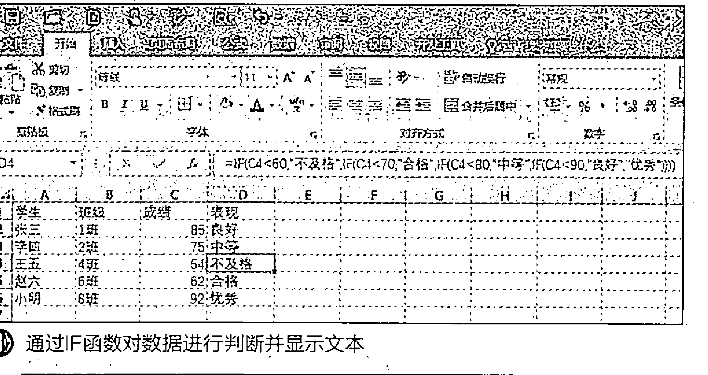

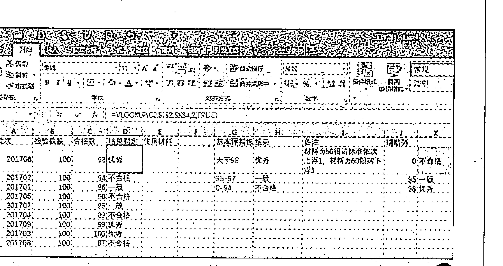

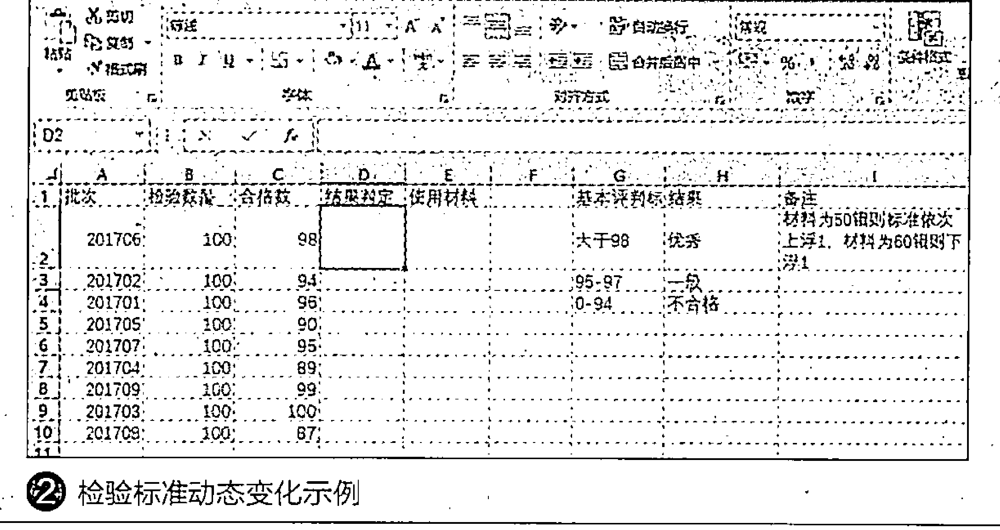

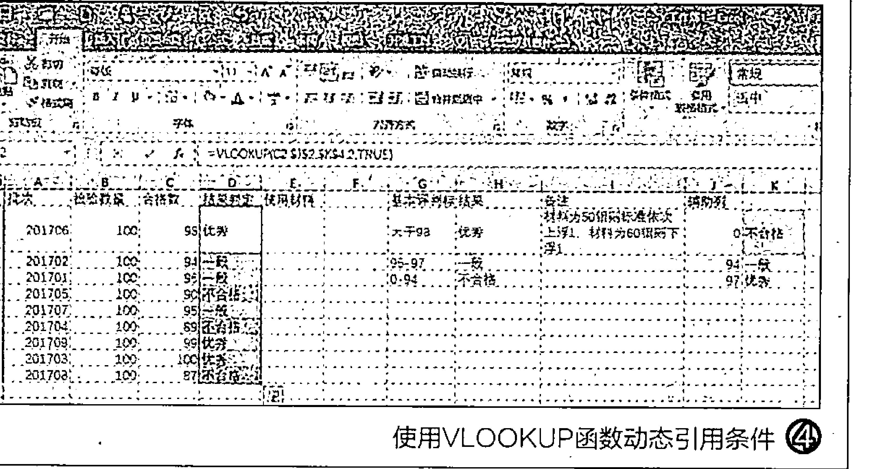

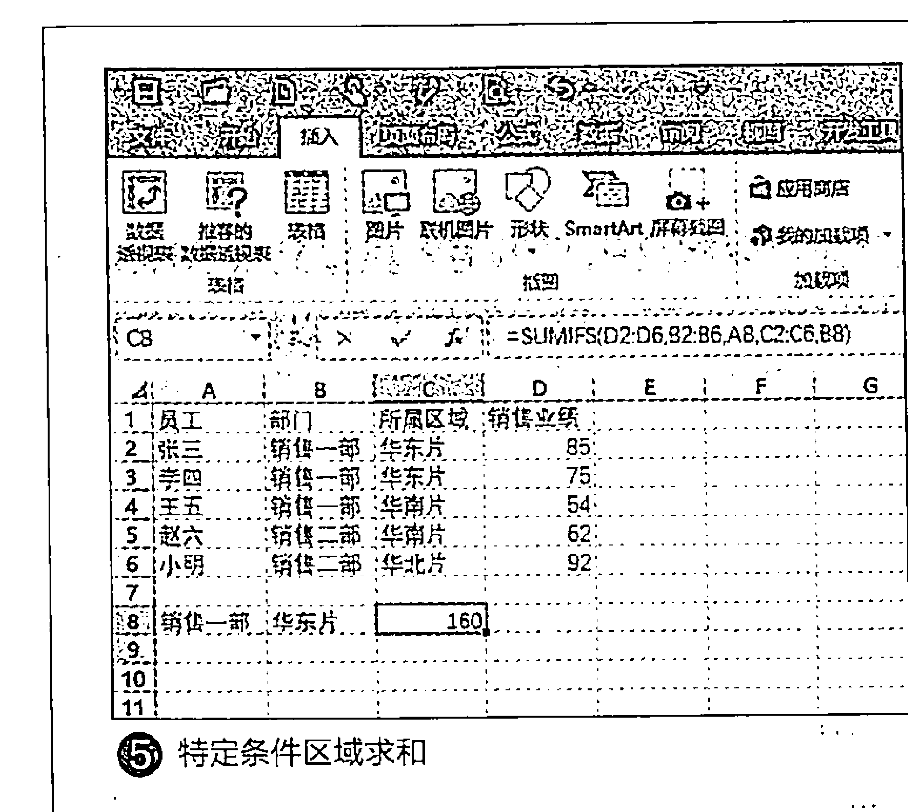

### 特定条件区域求和

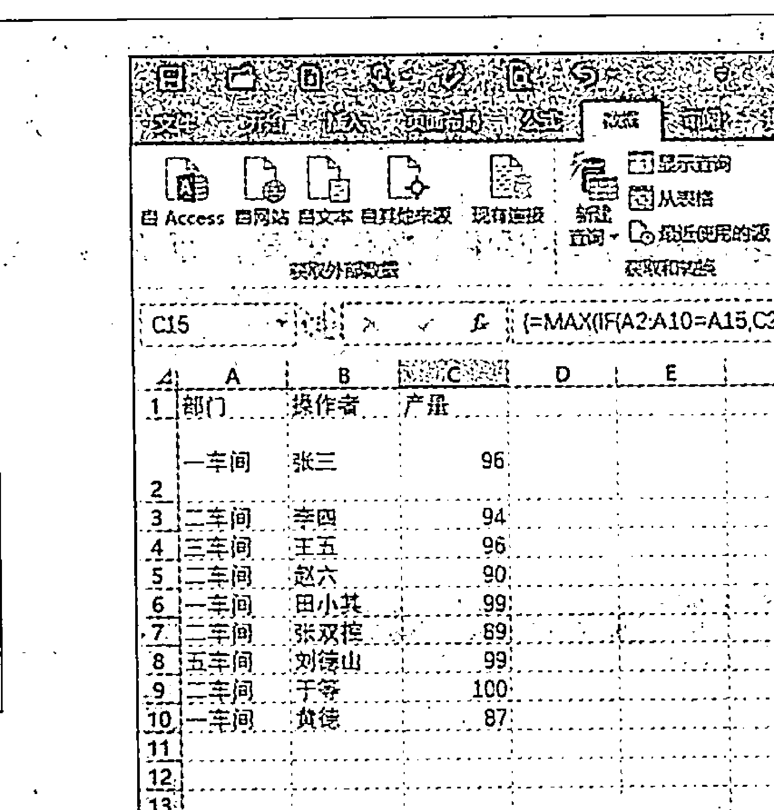

> **小提示**
>
> 公式的格式是: SUMIFS(求和区域,条件区域1,条件1,条件区域2,条件2,...), D2:D6和C2:C6分别对应条件区域, A8和B8则对应相应的条件，注意这里条件单元格的内容一定要和源数据内容一致(即部门和所属区域名称一致)。

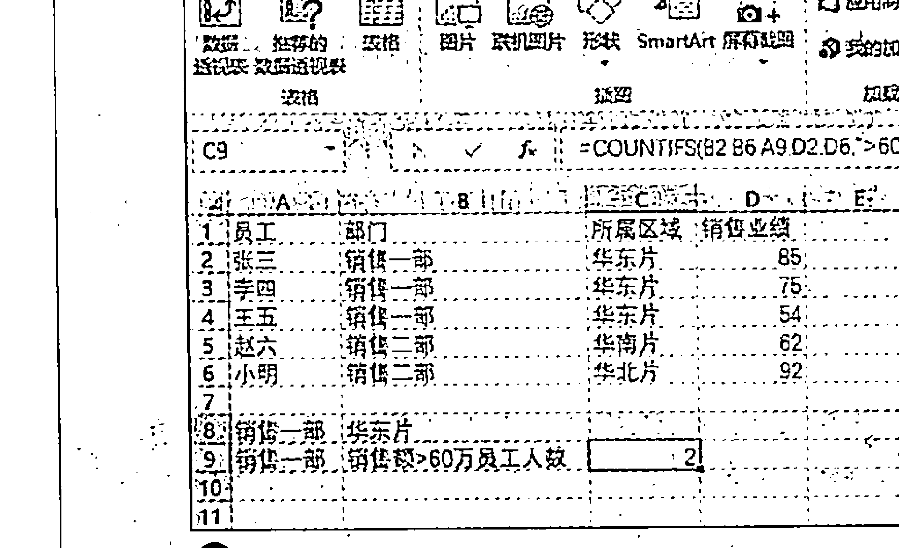

### 特定对象计数统计

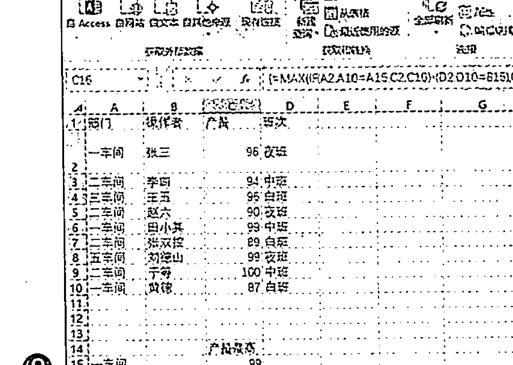

### 条件计数求和——SUMIFS和COUNTIFS函数

应用场景: 判断多个区域数据是否符合指定的条件，然后从中选择数据或者对象进行求和统计。注意条件单元格的内容和原始数据名称一定要一致，否则统计会出错。

很多时候我们是需要对符合特定条件的数据进行求和，此时借助SUMIFS函数即可完成。比如下表，现在需要对销售一部、华东片区域的销售额进行统计。可以看到这里求和要满足两个条件，分别是销售一部、华东片，因此可以在C8处输入公式“=SUMIFS(D2:D6,B2:B6,A8,C2:C6,B8)”(图5)。

如果需要对符合条件的员工数量进行统计，此时就可以使用COUNTIFS函数(用法: 条件区域1,条件1,条件区域2,条件2,...)，比如现在需要统计销售一部中业绩>60万的员工人数，则可以在C9输入公式“=COUNTIFS(B2:B6,A9,D2:D6,">60")”，注意这里的业绩条件“>60”需要使用半角双引号标注(图6)。

### 多条件极值——MAX函数

应用场景: 在特定条件区域找出极值，多个条件使用*连接。

平时统计中我们经常需要统计一些最大值或者最小值，如果是简单的求最值，使用排序即可快速获得。对于多条件的极值则可以通过MAX函数嵌套IF函数来求取。比如下面的例子中，现在需要得到一车间产量最高的数字，在C15中输入数组公式“=MAX(IF(A2:A10=A15,C2:C10))”，然后按下Ctrl+Shift+Enter即可得到(图7)。

MAX函数支持更多条件的查询。比如上例还需要查询一车间白班产量最高的数字，则在C10输入公式“=MAX(IF(A2:A10=A15,C2:C10)*(D2:D10=B15),C2:C10)”，再按下Ctrl+Shift+Enter即可。新增条件使用*连接，可以实现更多条件的查询(图8)。

## 要颜值打造大气的PPT

文|愚人

在这讲究“看脸”的时代，谁都希望自己制作的PPT颜值更高。那么有什么手段可以提高PPT颜值？具体又该怎样操作才能提高颜值？这里我们按照PPT常见的组成部分，分别介绍如何制作精美的PPT封面、目录和结束页以提高PPT颜值。

### 先入为主打造大气的PPT封面

封面是一个PPT的脸面，它是观众最先接触的部分。因此要让自己的PPT更有颜值，我们首先就应该对PPT封面进行美化。一般来说，封面多是采用“图片+文字标题”的形式组成，因此颜值优化也主要针对这两方面进行。比如对一些大型公司或者大话题主题的PPT，领导经常会要求我们封面大气一些以和主题相符。不过怎样才能让封面显得大气？要让你的封面显得大气且有颜值，找一张大气磅礴的图片作封面背景图片无疑是个好选择。既然要高颜值，图片无疑是要高清大图。不过这里要注意的是，图文一定要相符，免费图片可以到https://alpha.wallhaven.cc/下载。比如现在需要制作一份“全球互联网安全大会”主题的PPT，打开上述网站后就可以用“earth”为关键字，查找一张五大洲图片作为背景，然后将其插入到整张幻灯片中作为封面背景，同时为了突出文字主题可以对图片进行柔化处理。插入图片后，点击“插图→图形→矩形”，插入一个大小和图片一致的矩形，并将矩形形状格式设置为“渐变填充”，选择一种自己喜欢的渐变效果，并将其透明度设置为100%即可（图1）。文字标题则可以使用插入艺术字的方法制作，副标题使用插入文本框的方法制作。字体颜色建议选择红色、橙色等暖色字体，字体类别则可以使用雅黑、楷体等，这样封面就可以显得大气、靓丽了（图2）。

### 条理清晰打造高颜值目录

完成封面的制作后打开的一般就是目录页，目录页要有颜值，可以将目录按钮设置为立体形式，这样结合文字可以更显PPT目录的格局。点击“插入→形状→圆形”，插入一个圆形后，同上

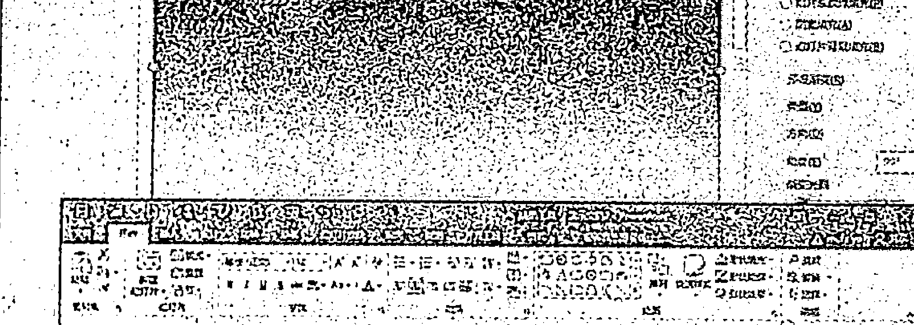

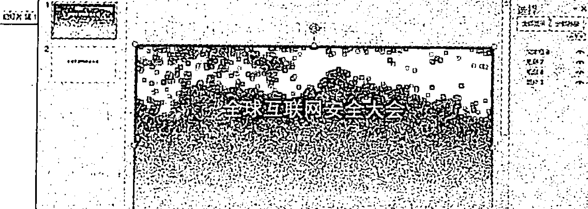

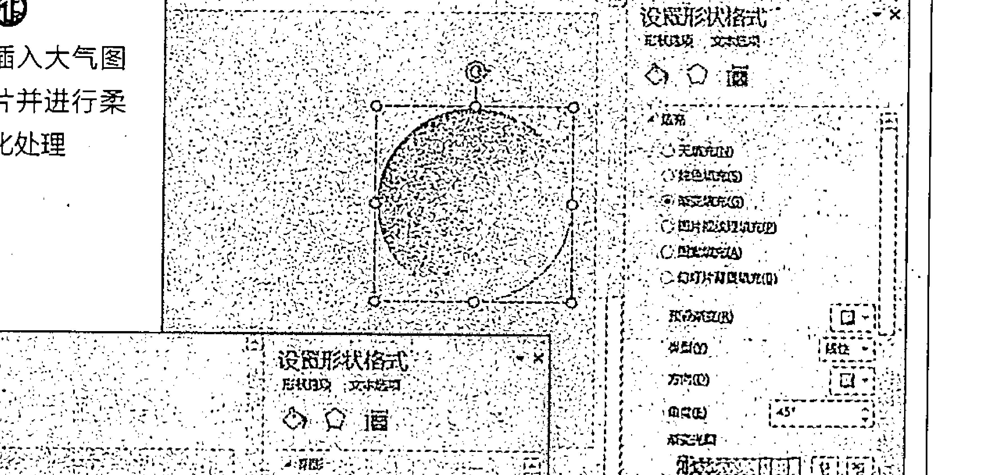

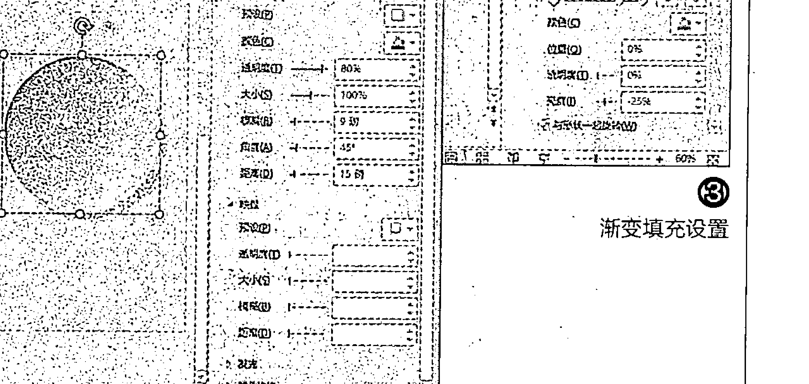

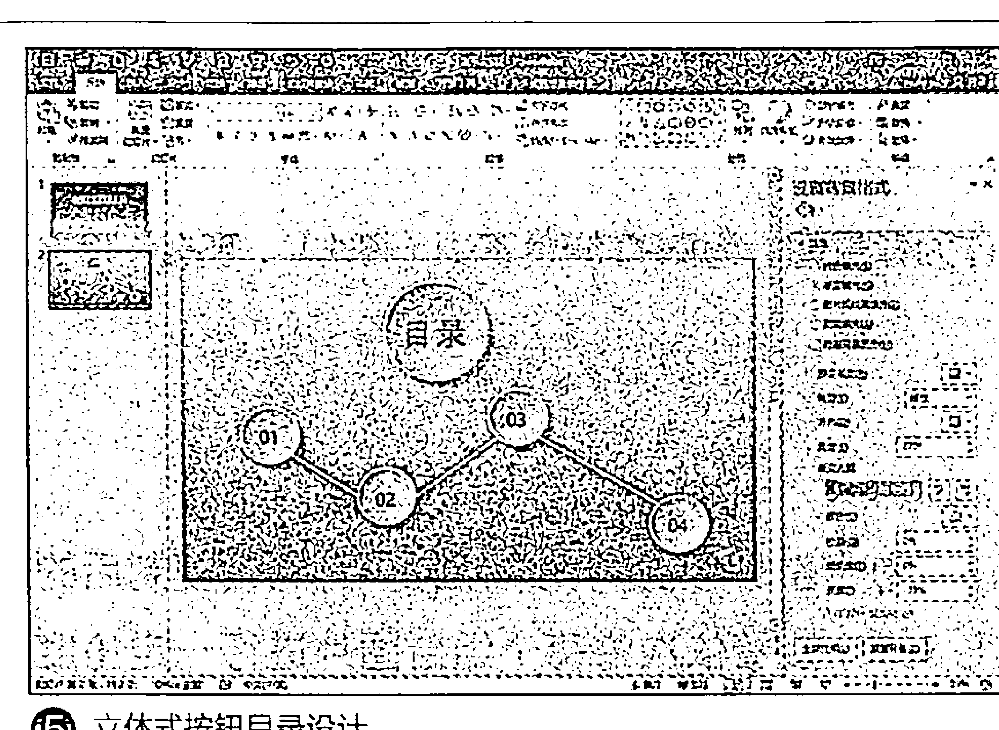

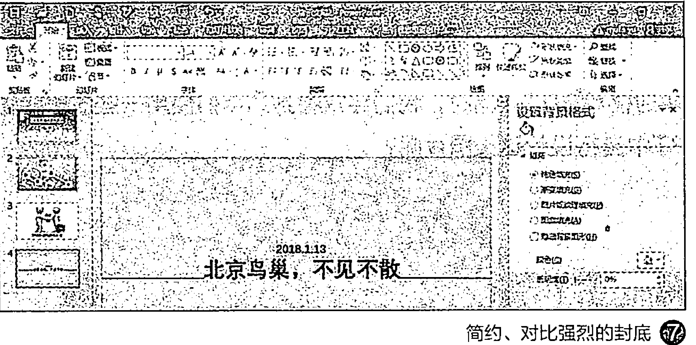

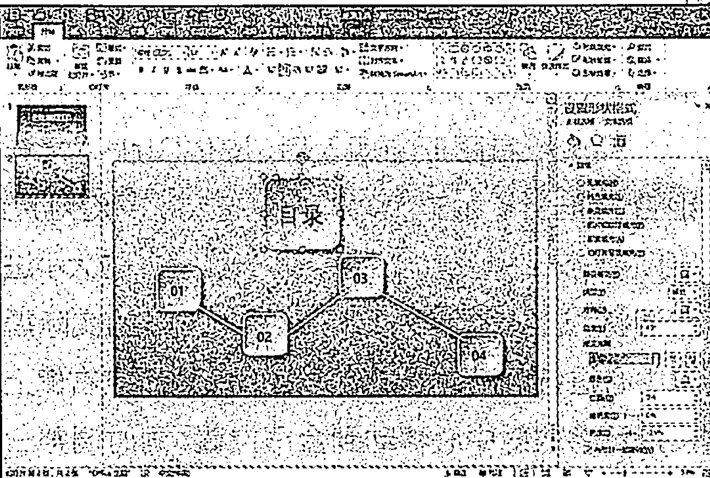

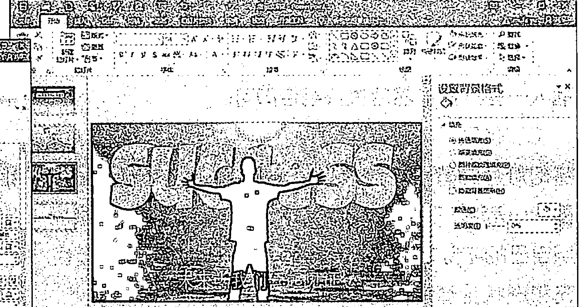

形状选项设置为“渐变填充”，预设渐变选择“浅色渐变 个性色3”，角度设置为45度，渐变光圈只保留起始颜色，亮度设置为-25%，其他为默认值（图3）。

切换到“线条”设置，角度设置为225度，宽度设置为3磅，其他设置同上。切换到“效果”设置，在“阴影”下，透明度设置为80%，大小100%，模糊9磅，角度45度，距离15磅，其他默认。这样就可以打造出一个立体按钮（图4）。

完成立体按钮的打造后，按住Ctrl键复制几个备用。现在就可以根据自己的PPT目录内容进行排列设置。比如PPT主题是介绍公司融资项目，为了增强目录的活跃度，此时就可以将按钮错位排列，同时在按钮之间插入直线连接，最后再添加上目录的文字说明即可（图5）。

### 回味无穷 PPT封底设计

当然目录的按钮可以根据不同的主题灵活变通。比如觉得商业文档方形按钮比较庄重，那么选中上述立体按钮，点击“格式→编辑形状→圆形矩形”，即可将按钮形状更改为方形（图6）。

除了上述的设计外，一份好的PPT要让观众看完正文后有回味感，那么对于最后封底的设计也是有颜值要求的，而不是简单输入“Thank You”就可以完事。比如对于类似发布会PPT，到时如果还要邀约观众继续参与活动，我们则可以设计比较简约的封底。比如使用黄色底色+黑体文字（对比要强烈些，同时在文字左右再添加一条直线以突出文字），邀约观众到时再参与活动。这样的封底是不是比单纯输入“谢谢”更有格局（图7）？

对于商务合作类PPT，如果我们的目的是希望投资人能够对介绍的项目感兴趣，并且期望有下一次的合作，那么我们可以在封底插入一张表示成功的图片作为背景，再加上“未来，我们一起见证”文字。这样是不是在放映结束前更好地表达了我们的意思（图8）？

总之，无论是封面、目录还是封底，要让自己的PPT更有颜值，我们就需要根据不同的PPT，选择比较靓丽又符合主题的图片、按钮或者文字设计等元素来装扮它们。当然，一份高颜值的PPT除了对上述的元素进行美化设置外，其他如PPT正文、样式、配色等也是必不可少。相关的文章之前在本刊中已经做过很多的介绍，这里就不赘述了，希望大家都能做出高颜值的PPT。

## 放射状PPT背景DIY 文|平淡

在平时使用PPT作品时，我们经常看到高手们使用一些放射状图片作为背景图，为PPT增色不少（图1）。那么，怎么在PPT中自行设计这类图片呢？

### 1.简单模仿：自行组合放射图案

对于上述放射状背景效果图，细心的朋友可能会发现，实际上图案主要就是由一些三角形按照一个圆心排列而成的。因此，如果我们要制作出上述效果图片，只要插入一些三角形然后进行组合即可。

为了使图片效果看上去更为稳重大气，新建幻灯片后将幻灯片的背景设置为灰黑色背景。接着点击“插入→图形→等腰三角形”，在幻灯片中插入三角形后，同时按照自己的实际需要进行大小和位置的调整，将其形状填充和形状轮廓都填充为蓝色备用（图2）。

按住Ctrl键复制一个三角形，并且将其移动到下方位置，将其顶角和原三角形顶点对齐，同时点击“格式→组合→组合”。选中组合图形，依次复制这组合图形，并且旋转合适角度进行组合。为了效果美观，可以先复制多个需要的组合图形水平排列，然后将其重叠排列在一起，点击“格式→对齐→水平居中”即可将复制后的组合图形对齐，接着依次将每个组合图片进行一定角度的旋转即可。这里注意每个组合图形的中心顶点需要重合在一起，如果图形较多可以打开幻灯片的网格线进行精准对齐（图3）。

完成所有图形的插入后，按住Ctrl+A全选并进行组合。点击窗口右下角的缩放按钮，将幻灯片缩放到30%状态，然后将前面组合的放射图形的大小进行移动和调整。这样做的目的是可以按照自己的实际需要对放射中心进行调整。比如范例中放射中心在右偏上位置，按提示将放射中心移动到合适位置，同时调整三角形大小，使得放射图案可以覆盖整个幻灯片即可（图4）。

完成上述操作后，按提示恢复原来100%缩放，这样幻灯片就只显示包含在幻灯片区域的图形。看看现在放射效果的图片是不是已经完工了呢（图5）？

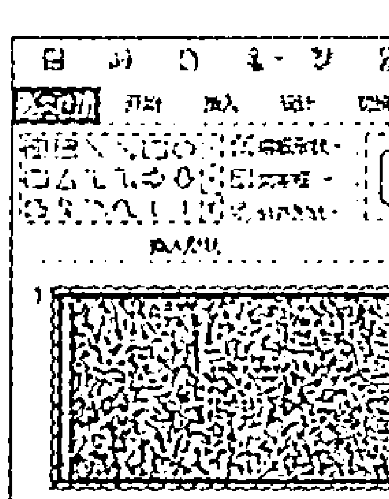


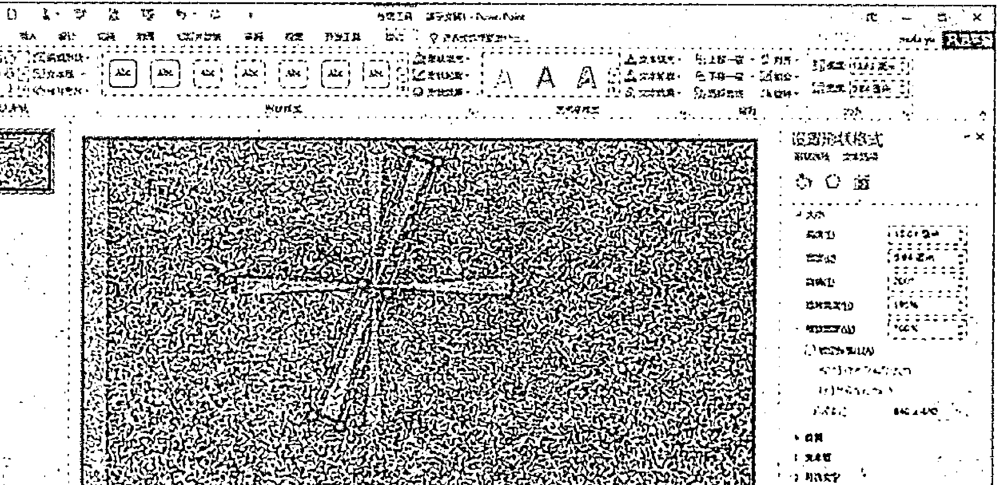

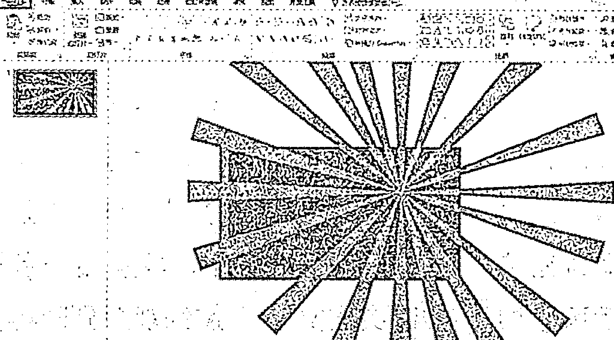

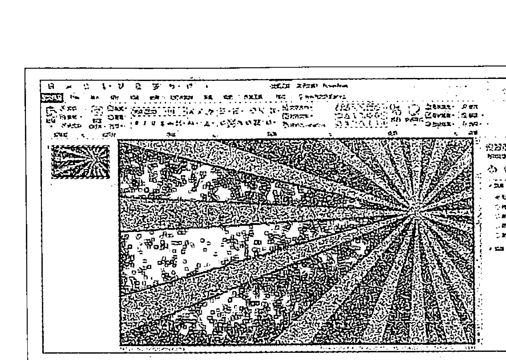

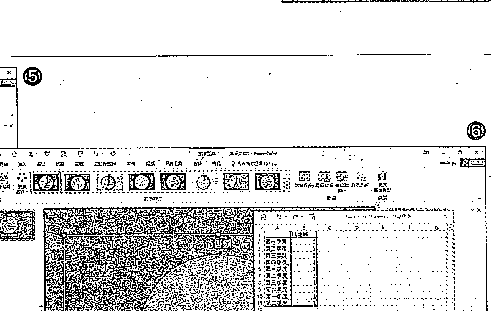

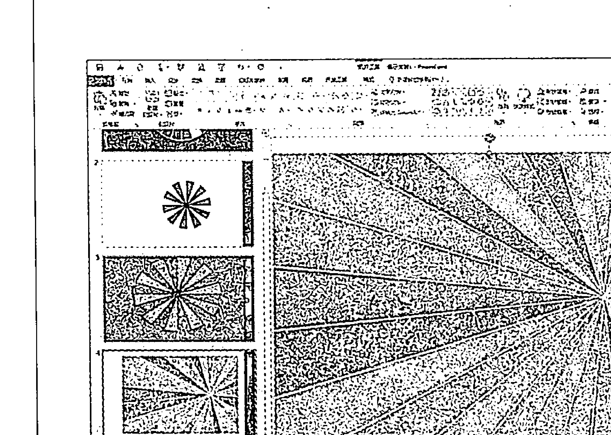

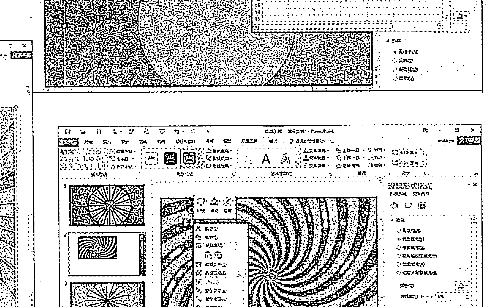

### 2. 高效组合 自动生成放射图案

从上述操作可以看到放射图案实际上是多个三角形按照一定圆心排列而成的，手工复制、旋转操作比较繁琐。如果要快速形成等分效果，利用PPT插入图形的方法可以更快捷地完成制作。

点击“插入→图表→饼形”，在幻灯片中插入一个饼形图案。因为放射图案是通过多个等分的图形组成，比如需要设置为20等分，那么将A列的数据填充到A21，将B列填充到B21，同时将数据数值设置为一致，这样就可以得到一个20等分的圆形(图6)。

按提示将图形中所有不需要的文字说明全部删除，同时去除“按扇区着色”，将填充颜色按照蓝色、无填充色交替填充。选中饼图按Ctrl+C复制，然后点击“开始→粘贴→选择性粘贴→Windows图元文件”，将复制的图形粘贴为图元文件到新建的幻灯片中。选中粘贴的图片，右击选择两次“组合→取消组合”，这样饼图会被分解为外框图形+各个扇区图形，按提示删除其他多余的图形即可获取到单独的饼形图形。将幻灯片缩放到30%并调整饼形的大小和位置，然后恢复100%显示，即可完成放射图形的制作了。

因为这里放射图案实际上是由各个图形组合而成的，因此我们可以根据自己的实际需要对图形进行更多的设置。比如可以依次选中每个图形，然后使用纹理填充，这样填充不同的纹理颜色后可以让放射图案更有质感(图7)。

如果需要改变放射图形的形状，那么可以使用顶点编辑的方法。选中上述任意一个扇区形状，右击选择“定点编辑”，接着将扇形的形状编辑为略微扭曲的形状，其他扇区使用同样的方法进行编辑可以获得抽象效果的放射形状背景图(图8)。

当然，这种自制的放射图形还可以根据实际需要做出更多的变化。比如对于上述饼图，选中全部扇区后，希望调整扇区大小，可以在放射中心增加一个圆心标记，扇区则可以使用渐变填充获得更多的效果。如果要更换图形的形状，全选图形后点击“绘图工具→格式→编辑形状→更改形状”，选择一种合适的图形进行替换即可。比如可以选择圆形，这样的放射元素会变为另一种效果。

## 演示、保存两相宜 Word与PPT的互换 文|俞木发

大家知道PPT主要用于演示，Word则主要用于保存工作文档。在日常工作中由于不同的需要，我们经常需要对两种文档进行转换。除了繁琐的纯手工复制、粘贴，其实还有更好的两种文档互换的高效方法。

### 用好样式 DOC秒变PPT

大家知道PPT文档一般都是一页文档一个主题，文字大多由标题和副标题组成，主要用于演示。DOC文档则主要是一篇文章，文字主要由小标题和正文组成，因此如果要将DOC文档转换为PPT，我们就需要预先对文档进行处理，这样才方便在PPT中进行展示。

比如一些员工的演讲词喜欢在Word中撰写，现在需要将其转换为PPT便于投放到投影仪。首先在Word中要将文档按照特定的样式组织，打开文档后先选中原来文档的标题，接着点击样式框的新建样式，按提示新建一个名为“演讲标题”的新样式，字体格式建议设置为“等线，小三”（图1）。

同上，选中演讲正文后也新建一个“演讲副标题”的样式，字体设置为“等线，五号”，格式设置为左对齐，间距设置为默认。完成样式的设置后，选中原来演讲的标题和正文的内容，然后依次应用到对应的样式（即演讲主题和演讲副标题样式）。完成后点击“视图→大纲视图→显示2级标题”，查看原来文章的标题和正文内容是否对应到相应的级别。这里的标题和副标题内容就对应幻灯片中的主标题和副标题文本（图2）。

完成上述操作后保存文档，接着点击“文件→Word选项→快速访问工具栏”，在“不在功能区中的命令”选中“发送到Microsoft PowerPopint”命令，点击“添加”将其传输到右侧菜单栏。接着返回Word窗口，点击窗口上方恢复按钮的“发送到PPT按钮”即可（图3）。

此时系统会自动启动PPT，同时上述文本内容会按照标题和副标题级别自动填充到幻灯片中。完成内容的填充后可以对PPT稍加修饰，比如更换背景、配色等，还可以切换到“视图→幻灯片母版”，快速设置好母版的版式进行套用（图4）。

> **小提示**
>
> 由于不宜在PPT中展示过多的文本内容，并且为了样式的统一，对于原来文字较多的DOC文本，建议操作之前删除一些不必要的文本，同时文章一定要按照实际内容提取出小标题作为后续1级标题。这样完成样式的创建后，以后对于后续需要转换的文本，应用样式即可快速完成。

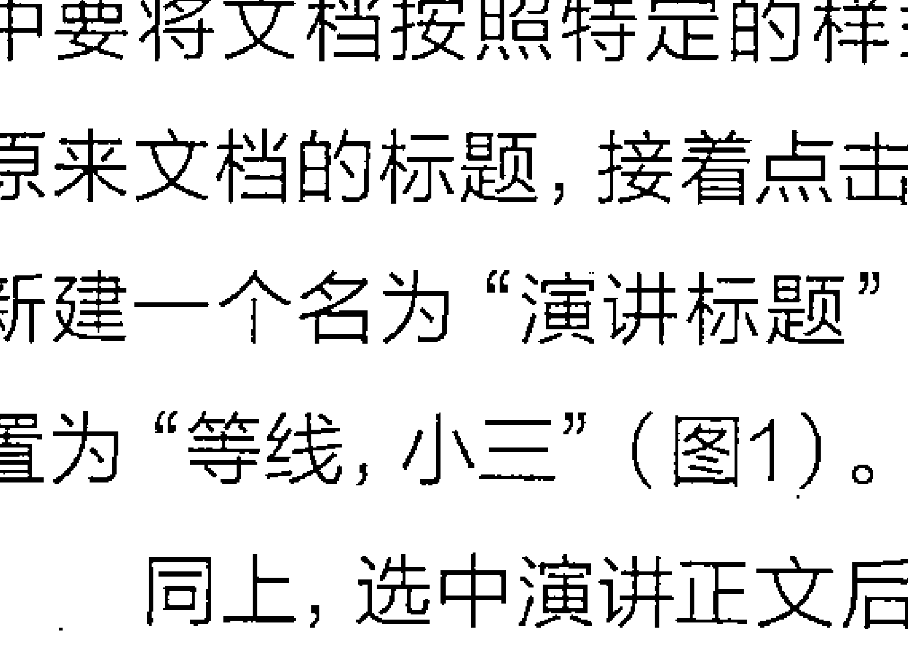

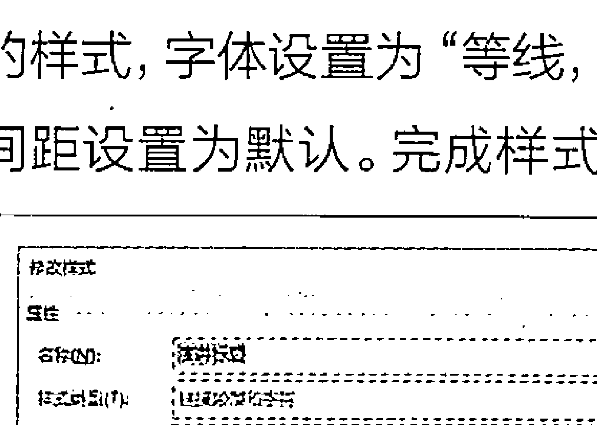

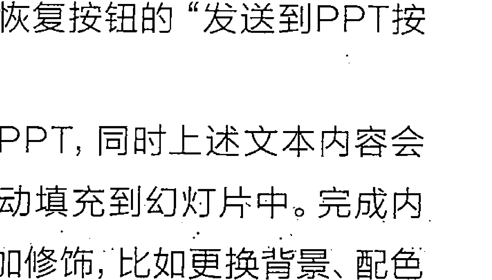

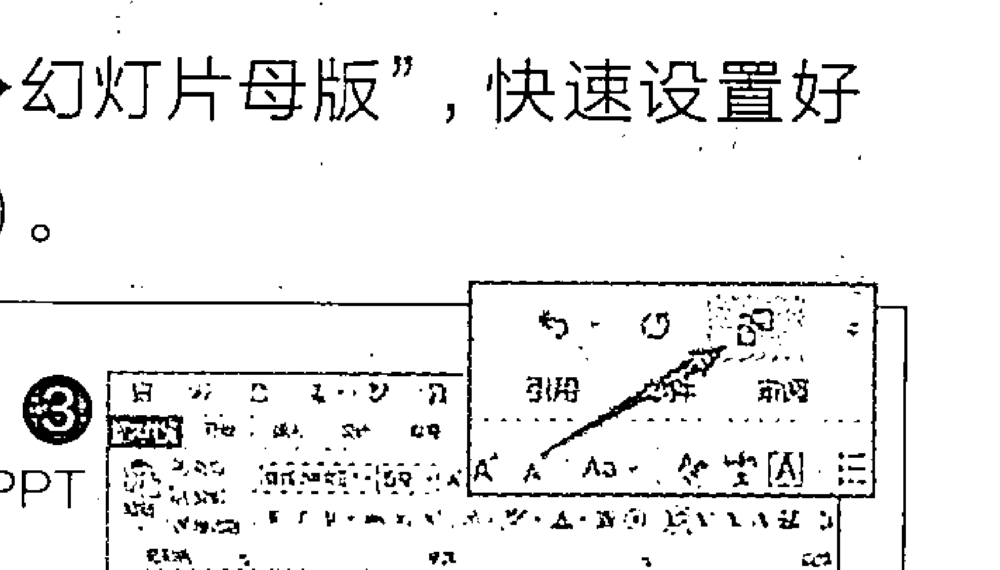

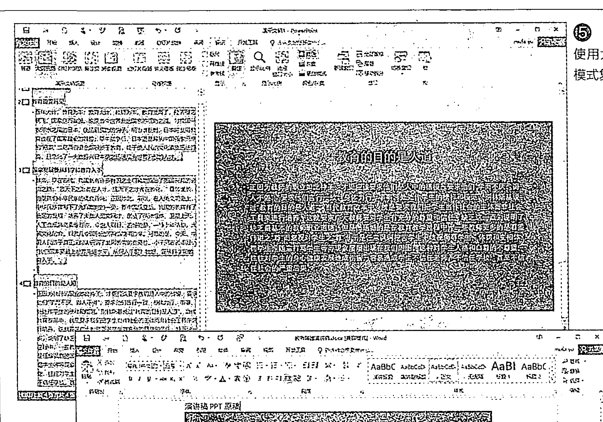

### 原地取材PPT高效转DOC

除了上述转换外，很多时候则需要将PPT文档转换为DOC以便保存和后续浏览。如果要实现这类转换，PPT已经提供相应的组件。

如果要保持PPT原来幻灯片中的行标、各种符号原封不动保存到Word中，在PPT中打开需要转换的文档后点击“视图→大纲视图”，这样在左侧窗格可以看到所有幻灯片的文字内容，按提示进行全选复制，然后粘贴到Word中保存即可（图5）。

不过这样的方式只能复制PPT中的文字，如果还要保存其中的图片，并且转换后的文字无需再次编辑（比如产品宣传文档等），那么可以将PPT文档另存为图片。转换后再将图片导入Word，并加上简单的文字说明即可（图6）。

上述方法是使用简单复制粘贴的方法实现文档转换，如果PPT的幻灯片较多，那么还可以直接将其导出。点击“文件→导出→创建讲义”，点击“创建讲义”，在弹出的窗口选择“备注在幻灯片旁”，这样选择的PPT文档也会直接传输到Word中（图7）。

在启动的Word中会打开上述PPT文件，点击“页面布局→分栏→两栏”，这样幻灯片都变成了两栏的方式呈现。不过可能一些幻灯片文件会太大，导致一部分不显示，最后还需要删除多余文字、缩小页边距等操作，完成后保存即可（图8）。

通过图片保存PPT完整信息

不过由于PPT的排版比较宽松，在Word中创建为讲义后可能包含很多空行，对于这些空行使用查找与替换工具进行删除即可。打开替换窗口，查找输入“^p^p”，替换为“^p”，然后点击“全部替换”即可。

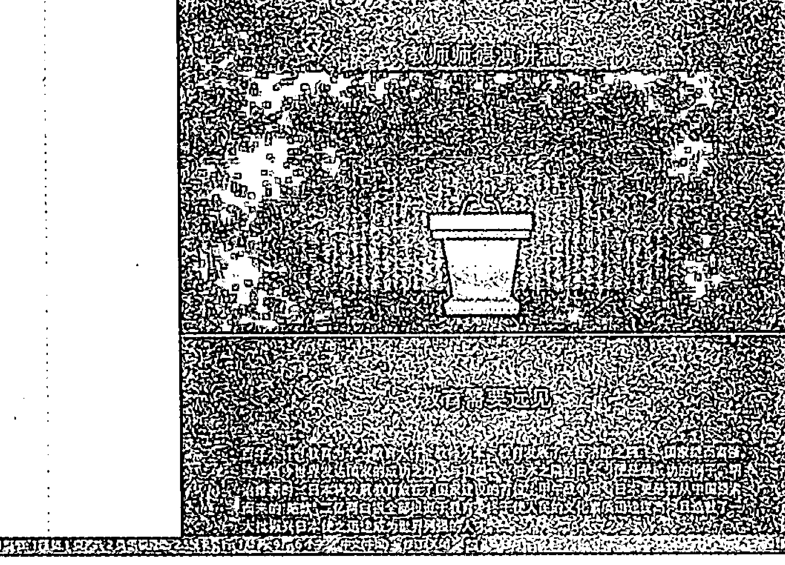

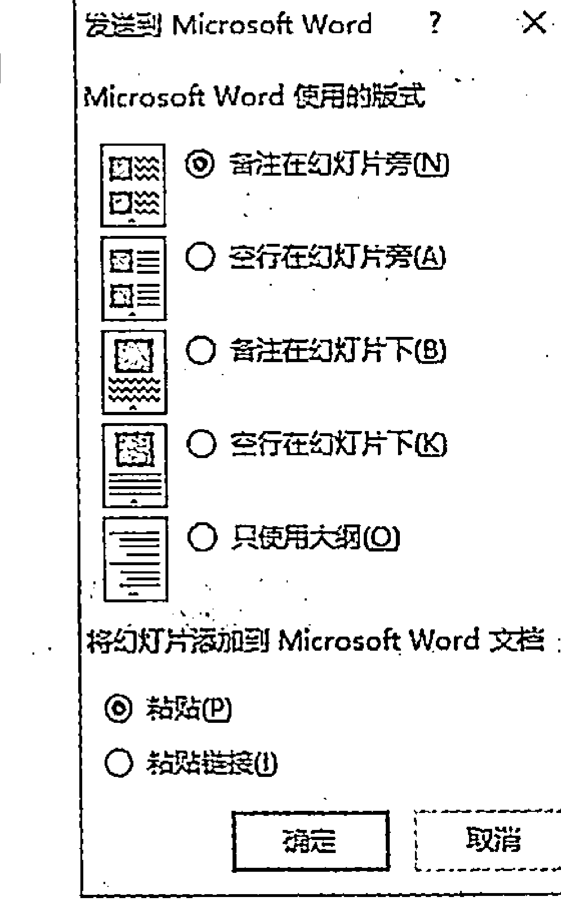

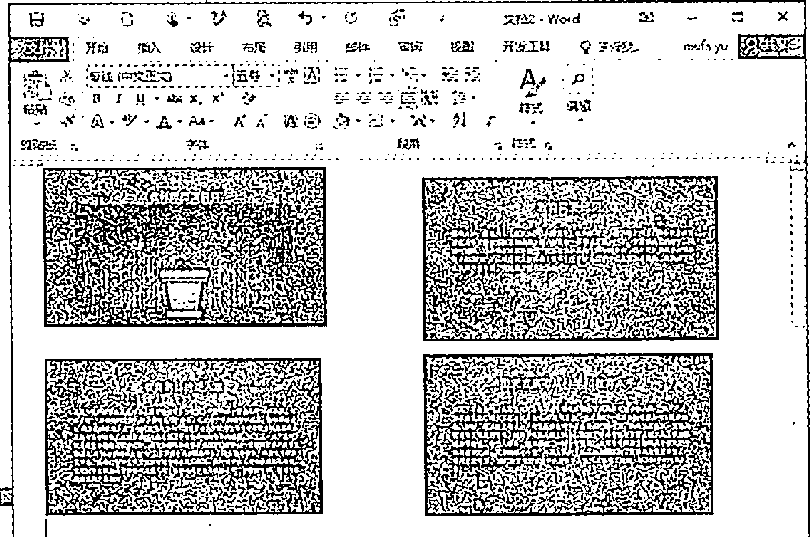

如果你有很多的空行，如连续3行或是更多的空行，那么只需重复上述替换操作即可，其他多余元素的替换操作类似。

## 以一当十——PPT中文档的批处理
文/王晓兵

同一个PPT，有人1小时完成，有人却要通宵达旦。为啥差距会这么大呢？除了审美方面的差距，最大的差别就是熟练程度。同样一个操作，高手可能只要5秒钟，而菜鸟要10分钟，特别是后期修改的时候更能体现这种差距。究其根源，高手对重复的劳动往往是通过批量操作来完成的，这无疑可以达到以一当十、时半功倍的效果。

### 文字格式批量转换

### 批量设置字体或字号

PPT中自带了字体替换功能，切换到“开始”选项卡，单击“替换”按钮选择“替换字体”，就可以将文稿中的某种字体全部替换为重新指定的字体（图1）。

不过这种替换功能还比较单一，用“PPT美化大师”的“字体替换”功能，则更加智能强大。切换到“美化大师”选项卡，单击“替换字体”按钮，弹出对话框（图2）：
- 在“范围”中可以设置替换范围，增加了当前页和第几页到第几页。
- 在“对象”中，可以选择改变替换目标为标题、文本框、形状、表格等，比如只要替换标题的字体字号，就不会影响其他相关的文本。
- 在“字号”中则可以固定字体大小，特别是在原来的基础上增减字号，这个功能非常人性化。
- 在“其他”选项中，可以设置粗体、斜体、阴影等。

### 批量将特定字体转换成图片

在PPT中如果运用了特殊字体，那么在其他电脑上播放时，可能会出现丢失字体的现象。如果将字体嵌入到PPT中，文件会比较大，而且某些有版权的字体，是无法嵌入PPT中的。所以最简单的方法就是将用了特殊字体的文本转换成图片，但是如果一个个地转换，无疑会很繁琐，最好是在PPT完全定稿后，一次性搞定。LvyhTools则可以实现将应用了某种特殊字体的文本框，批量转换成图片。

切换到“LvyhTools”选项（图3），单击“字体图片”弹出对话框，选择所用的特殊字体，再选择下方的“图片化”，单击“确定”按钮即可转换文档中的特殊字体为图片。如果转换后的图片要调整大小，建议转换成“矢量化”，这样放大后会保持清晰。

如果要转换的特殊文本很少，则可以使用OneKeyTools这个插件，选中文本后，单击“一键转图”（图4），选择“原位转PNG”，这样会在当前位置直接进行替换。

### 批量拆分文本

一段话要拆分成若干个文本框，甚至要拆分成单字，操作非常简单，但是会非常繁琐。用OneKeyTools则能轻松搞定。

如果是要将大段落拆成分散在多个文本框的小段落，则先将大段落按Enter键分段，然后选中段落切换到“Onekey”选项，单击“拆合文本”选择“按段拆分”（图5），则可以生成多个相应的文本框。选择“拆成单字”则可以按字生成文本框，这在做封面、做动画时非常有用。

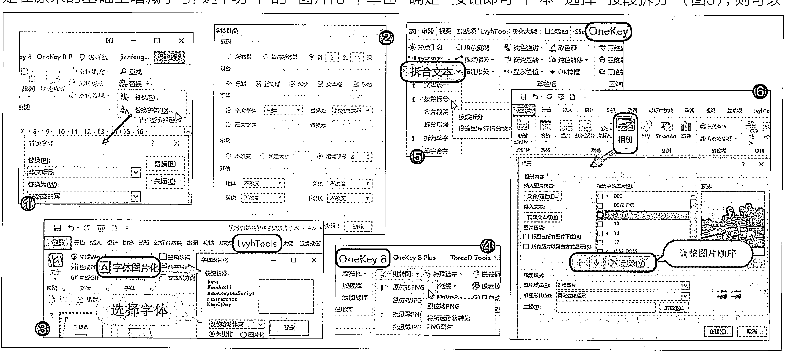

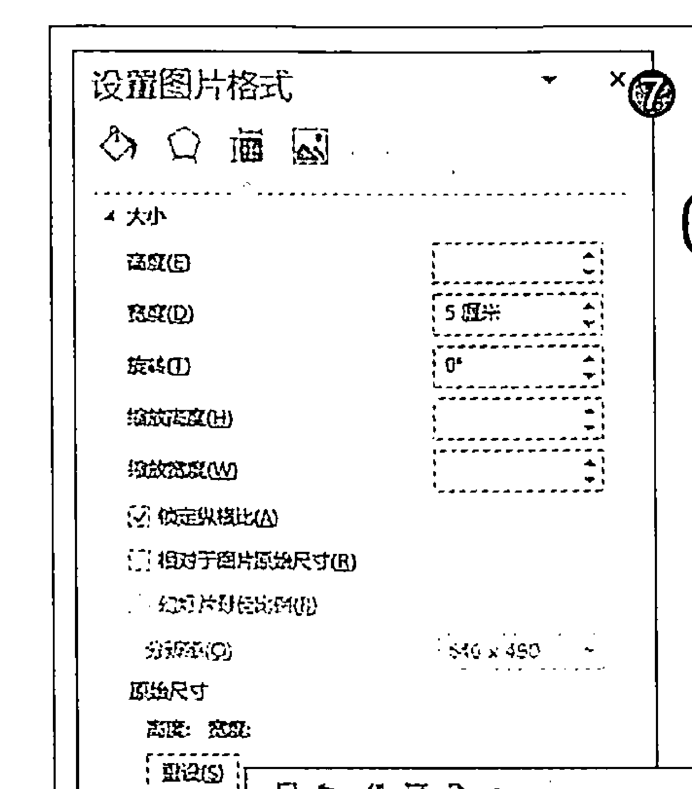

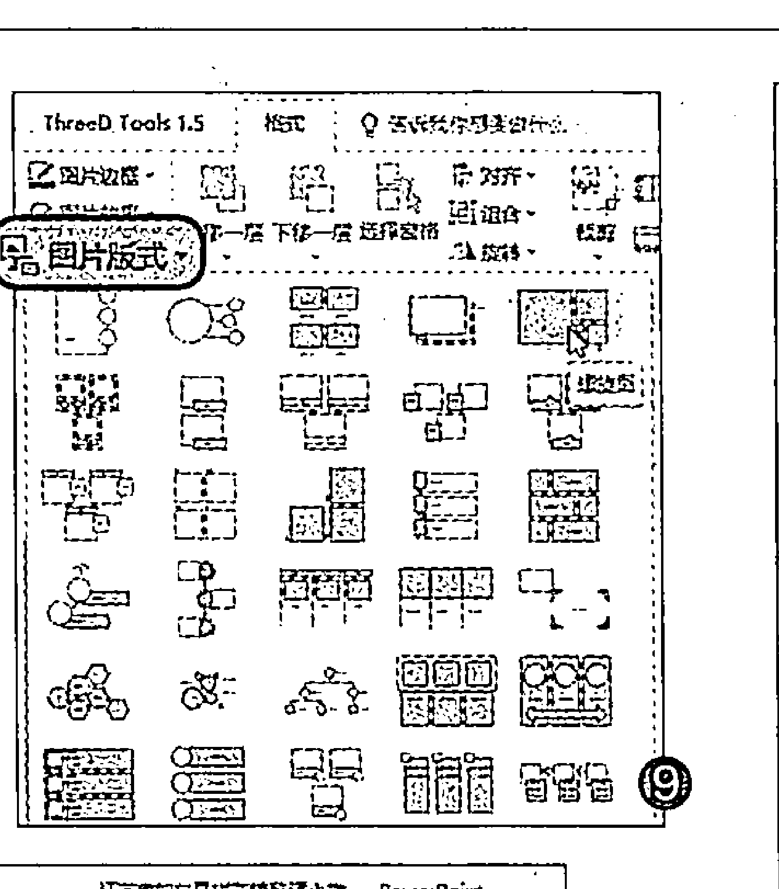

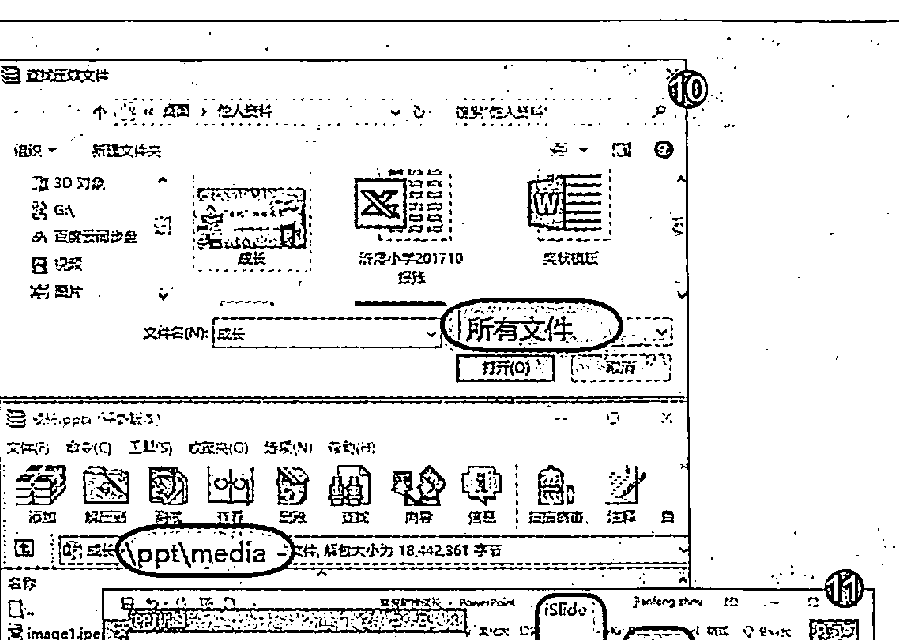

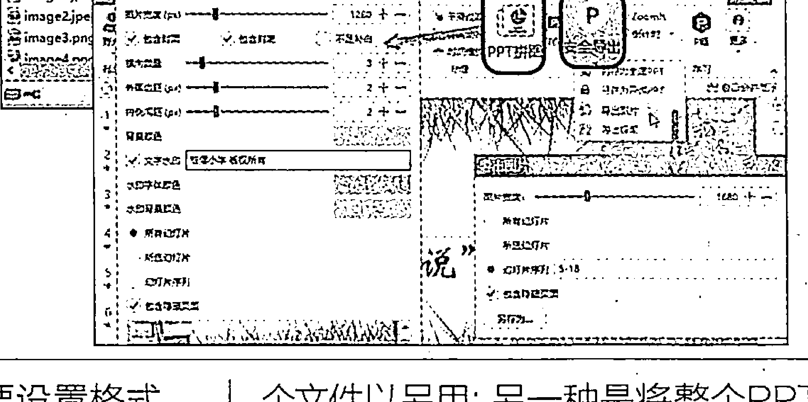

### 批量处理图片

### 批量导入图片

如果是多张图片导入到一张幻灯片中，则在“插入图片”对话框中按住Ctrl键，可选中多张图片一次性导入。如果是多张图片要分布到多张幻灯片中，则切换到“插入”选项卡，单击“相册”弹出对话框（图6），单击“文件/磁盘”按钮添加图片，在“相册版式”中可以设置每个页面中的图片数量，在下方还可以设置图片的形状，最后单击“确定”按钮即可批量加入图片。

### 批量设置格式

批量加入的图片可以大小不一，此时可以选中所有图片，右击选择“大小和位置”可以修改图片的尺寸，在“宽度”或“高度”中输入相应的数值即可（图7）。如果要强制设置宽度和高度，则取消选择“锁定纵横比”。如果要设置格式，也可以选中图片后，切换到“格式”选项卡，进行批量设置。另外我们也可以借助“格式刷”，将一种图片的格式快速应用于其他图片。

### 批量裁剪图片

批量加入的图片，可能比例上不一样，如果强制设置宽高度，图片可能会变形，因此有时还需要对图片进行统一裁剪，用iSlide则可以批量裁剪图片。选中图片后切换到“iSlide”选项，单击“设计排版”选择“裁剪图片”弹出对话框（图8），设置图片的宽度和高度，单击“裁剪”按钮即可。

### 批量排版图片

多张图片散乱在版面中，可以进行快速排版。选中所有图片后，切换到“格式”选项卡，单击“图片版式”（图9），有多种版式选择，选择后图片会进行自动排版。

### 批量导出图片

导出图片包含两种需求，第一种是将PPT中所有的图片逐个导出成单个文件以备他用；另一种是将整个PPT的页面导出为单张图片或者一张长图。

确认PPT是高版本格式（pptx），打开WinRAR之类的压缩工具，选择“文件→打开压缩文件”弹出对话框（图10），选择“所有文件”，然后打开PPT文件，打开后看到很多文件夹，进入PPT文件夹下的Media文件夹，这里面就有PPT中所有的图片文件，最后将文件解压到相应的文件夹即可。

如果要将PPT中的所有页面导出为图片，则选择“文件→另存为”，选择格式为“图片格式”（JPG、PNG等），这样即可将所有页面保存成图片。而使用iSlide导出图片则更加灵活，切换到iSlide，单击“安全导出→导出图片”（图11），可以选择幻灯片的导出范围、图片宽度，这是PPT自带功能所缺失的。单击“PPT拼图”，则可以将所有PPT页面导出成一张图片，在这里可以设置横向图片的数量、边距、间距、水印等，非常强大。

## 化繁为简 高效制作自动化报表
文/俞木发

制作综合报表时，我们经常要汇总多个工作表的数据。常规的方法是打开指定文件，然后将多个报表数据复制粘贴到一个表中，最后再进行计算汇总。由于涉及的数据较多，这样操作不仅麻烦，而且很容易出错。借助恰当的公式，则可以高效、自动地完成。

### 案例介绍

公司技术部门每个月都要求制作一个复核报表，内容是对质检部的检验结果进行复核。日常的检验报表是每个部门各自独立制作一份工作簿文件，最终要按特定格式汇总在“抽检复核”报表中（图1）。抽检复核报表格式和每个子表并不同，因为公司的产品型号非常多，每个月技术部只是对每个部门随机抽取若干个品名，然后根据已有的结果进行复核（图2）。以前的做法是，每个月收集好各个车间统计数据，然后技术部确定随机品名后再从中复制指定数据到报表中供复核比对，由于每个车间报表数据很多，抽检的品名又不固定，手工操作很费事。现在进行改良，需要借助公式高效自动完成。

首先来分析复核报表的要求，需要复核时由技术部在B2:B8单元格根据生产部门品名，随机输入对应的复核品名如G1，然后在C2:D2区域依次填入“一车间.xls”文件中和G1对应的数据，如果随机输入的是二车间的品名，则填入对应的“二车间xls”文件中的数据。也就是说要在复核报表文件中引用不同报表文件中对应的数据，这里可以借助VLOOKUP函数进行引用完成。

因为最终目的是要自动生成，为了方便对工作簿中工作表的引用，要求每个单位制作的工作簿的名称要和最终复核报表中部门的名称一致，工作表名称则统一使用默认的Sheet1。如一车间的报表名称要为“一车间.xlsx”，打开后其工作表的名称为Sheet1，其他工作簿的要求类似（图3）。

接着在自己的电脑上新建一个名为“K:\检验报表文件”的目录，右击将其设置为“共享”，并且将共享目录对Everyone设置读写权限，也就是企业内部局域网的用户都可以访问该共享目录（图4）。

完成上述要求后，以后每个部门完成自己的报表后只要上传到该目录中保存。打开“抽检复核”报表定位到C3，输入公式“=VLOOKUP(B3,INDIRECT(“[“&A3&”.xlsx]sheet1!A2:D27”),2,FALSE)”并下拉，这样即可完成对各个工作簿数据的引用。

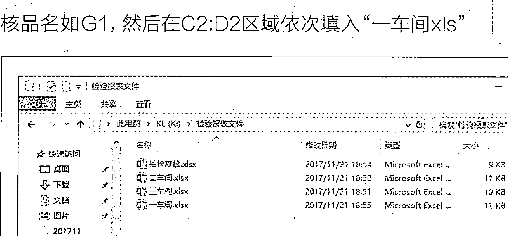

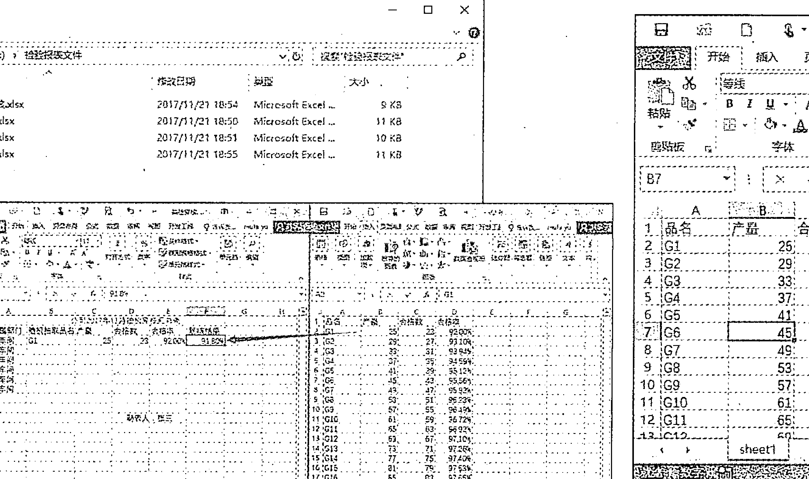

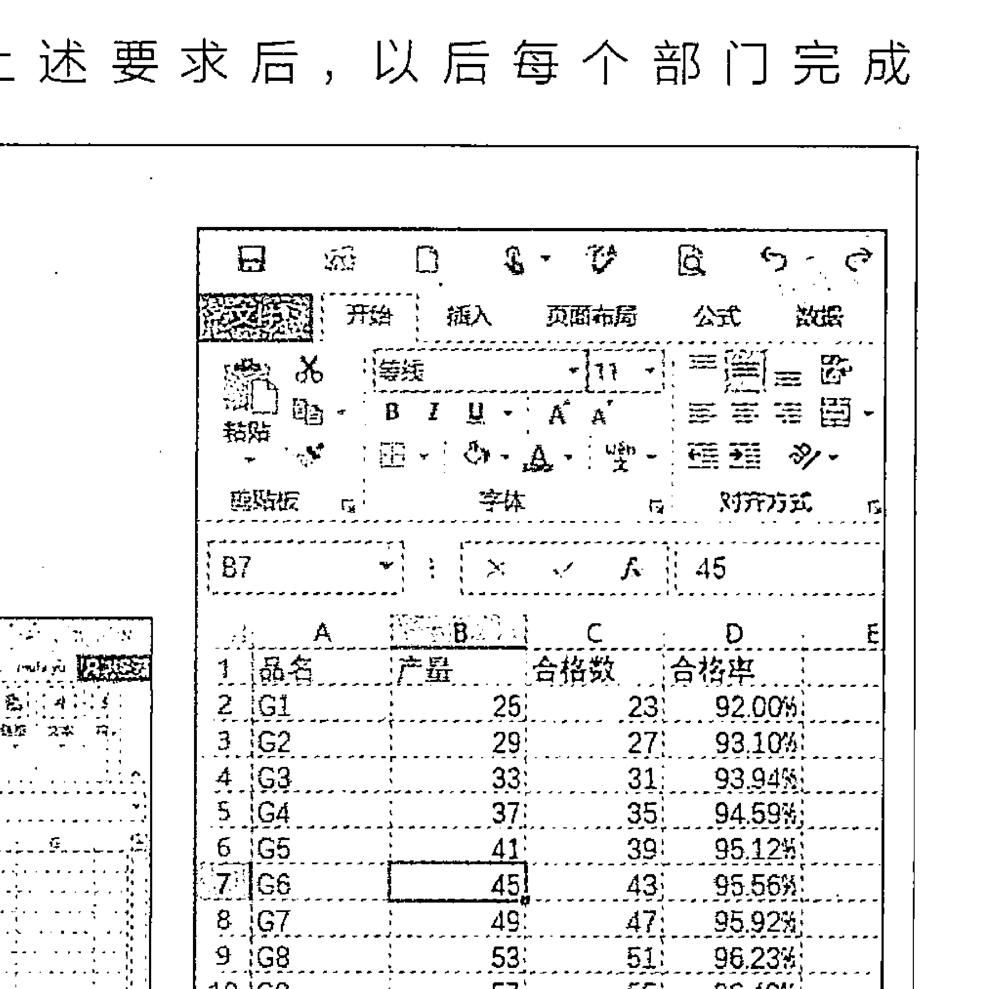

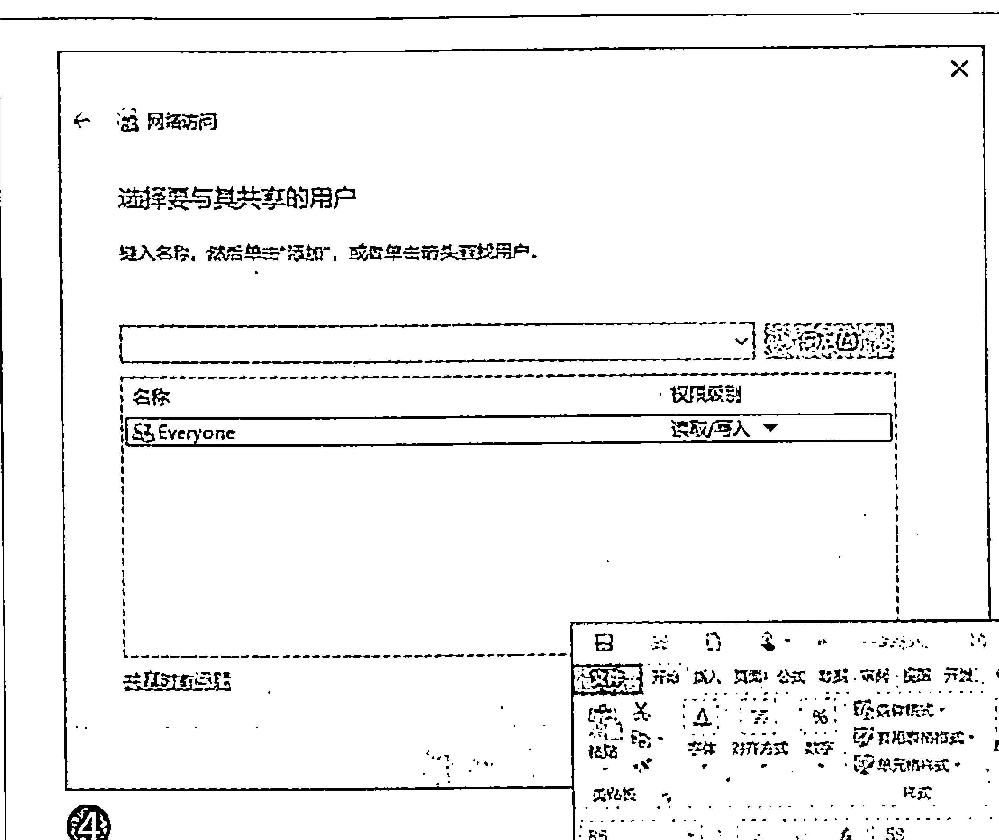

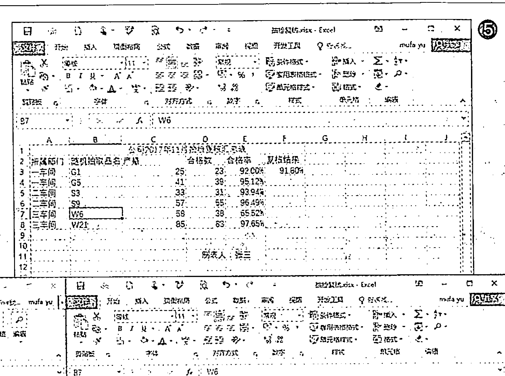

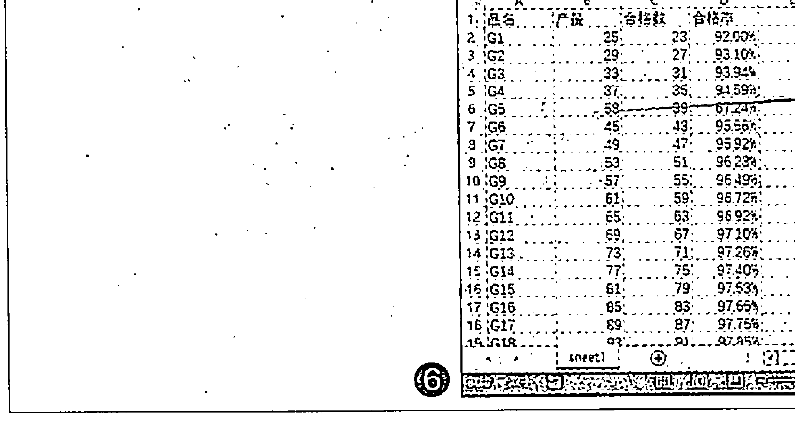

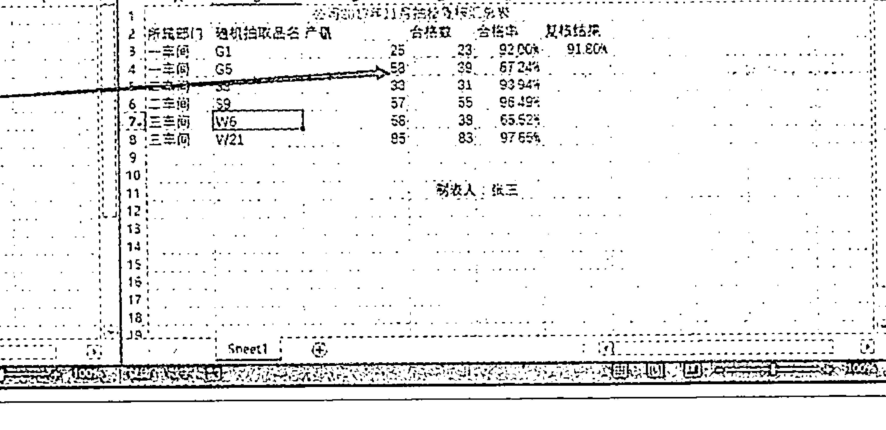

### 公式解读

B3的值是搜索内容，即从每个报表中查找找出对应的品名，这里是随机选择每个单位品名数值。
A2:D27则为每个报表的数据区域，即从这个区域里找出符合要求的数据，因为这里是需要从各个子表中查找数据，而每个子表的数据范围可能不同，为了确保数据都可以找到，这里需要以数据范围最广的子表为准。
Sheet1是每个工作簿对应的工作表的名称，这里统一引用第一个工作表的数据。
“[“&A3&”.xlsx]”是一个文本函数，将A3单元格的内容和“.xlsx”字符串联合起来，组成一个新字符串。因为A列单元格的内容是和对应工作簿的名称一致的，这样通过文本函数的联合，就可以实现对不同工作簿的引用。这里注意报表文件都要放置在同一个目录，工作簿文件名要用[]引用，工作表则用“!”引用。
INDIRECT：通过上述文本函数，INDIRECT可以实现对工作簿文件的动态引用，并将这个引用作为Vlookup函数查找范围。
2表示引用子表中的2列的内容即产量的数值。FALSE表示查找时要求完全匹配。
定位到C3输入公式并下拉“=VLOOKUP(B3,INDIRECT(“[“&A3&”.xlsx]sheet1!A2:D27”),3,FALSE)”，定位到D3输入公式并下拉“=VLOOKUP(B3,INDIRECT(“[“&A3&”.xlsx]sheet1!A2:D27”),4,FALSE)”，依次引用工作簿的数据。
完成上述操作后，如果技术部需要使用这个报表进行复核，只要全选“K:\检验报表文件”目录下所有xlsx文件回车打开，这样在“抽检复核.xlsx”的A2开始随机输入一车间对应的品名，输入数值后即可自动进行引用，最终只要在复核结果输入复核的数值进行比对，报表即可自动生成了（图5）。
以后每个部门只要完成报表的输入后传输到共享目录（文件名不要更改），打开“抽检复核.xlsx”随机输入检测品名，即可快速生成所需的报表了，各个工作簿数据的更改会自动被同步引用（图6）。

# 移动新天地

## 告别卡顿 打造手机的“游戏模式”
文/镜花水月

如今的手游，除了大型3D单机游戏以外，对硬件的需求其实谈不上太过苛刻。比如《王者荣耀》，哪怕是骁龙430级别的处理器也能流畅运行。而之所以游戏过程中偶尔出现卡顿，可能还是一些细节设置没有优化到位。

### 游戏前清理内存

虽说Android系统有着一套内存管理机制，但当我们某次启动大型游戏之前，可能无法触发自动清理后台的机制，会因剩余内存冗余量不够而引起运行效率受限。所以，每次玩大型游戏前，手动清理一下后台内存还是很有必要的（图1），特别是内存容量小于等于3GB的低端手机。

### 留意手机的电源状态

为了提升待机能力，几乎所有Android手机都在电池管理界面添加了高性能、普通和省电模式。后两者是通过限制CPU频率的方式节能减排，在玩游戏前如果你没能切换到高性能模式（图2），自然无法享受到CPU的全部效能。

### 保持稳定的网络连接

如今绝大多数Android游戏都需联网运行，如果网络不稳也容易导致卡顿或延迟。所以建议大家进入WLAN设置界面找到并打开“休眠下保持WLAN连接”，使其处于“始终”状态（图3），避免游戏过程中因不小心按到电源键息屏而断网。

### 开启GPU渲染功能

找到并进入开发者模式（激活方式通常是在关于手机界面，连续点击系统版本一栏），开启“强制进行GPU渲染”（图4）。开启该功能之后，系统将一律使用GPU渲染界面，可减少检测HWA的环节，减轻CPU负担，不仅有利于流畅度的提升，还能达到一定的省电效果。

### 调整游戏画质选项

为了满足不同时期不同配置手机运行的需求，现在绝大多数大型Android游戏都可以像PC游戏那样修改画质和特效。如果你感觉手机运行吃力，不妨在游戏设置界面适当降低画面质量，也许会达到立竿见影的效果（图5）。

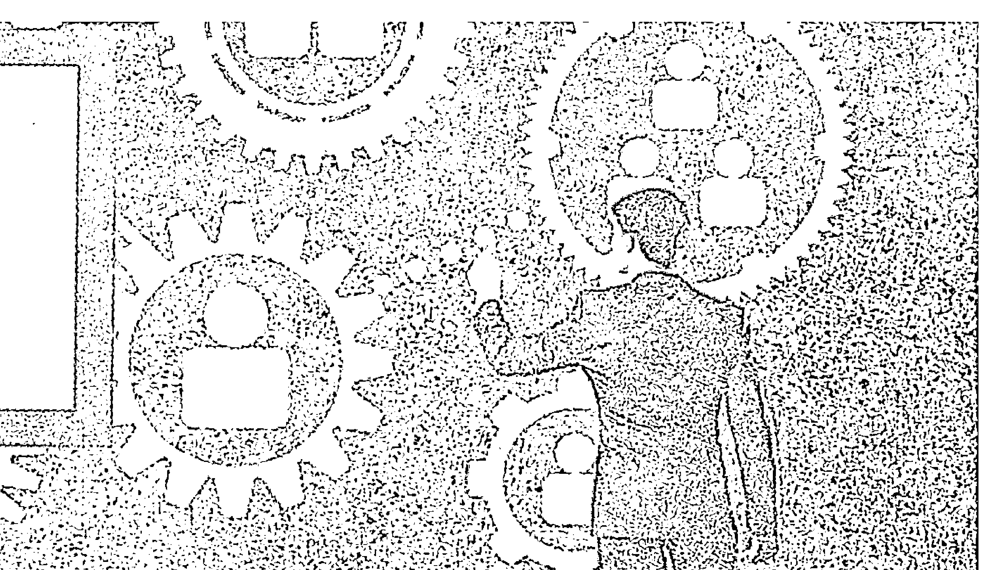

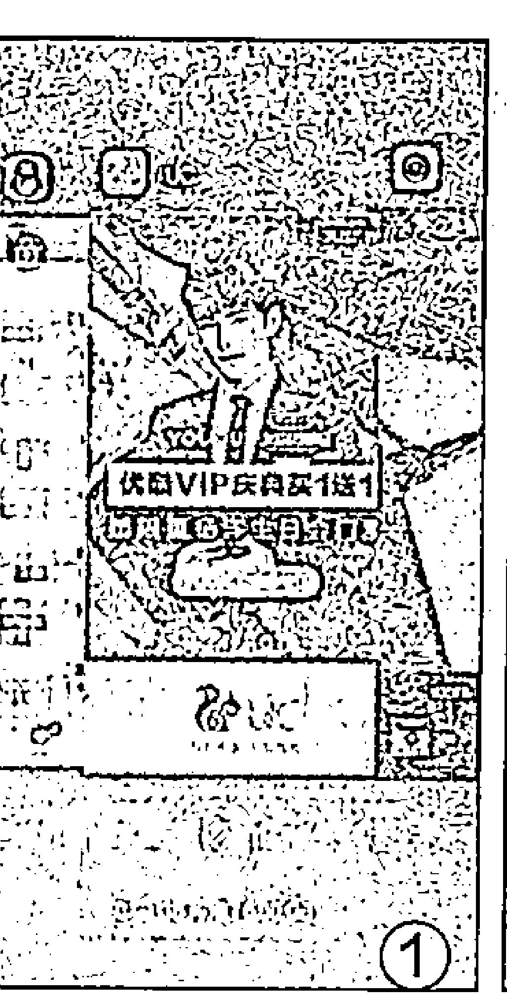

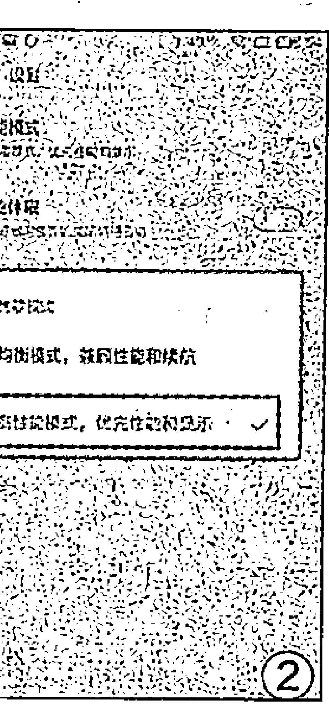

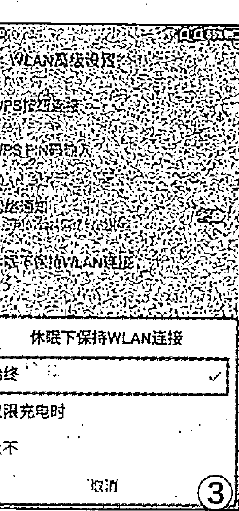

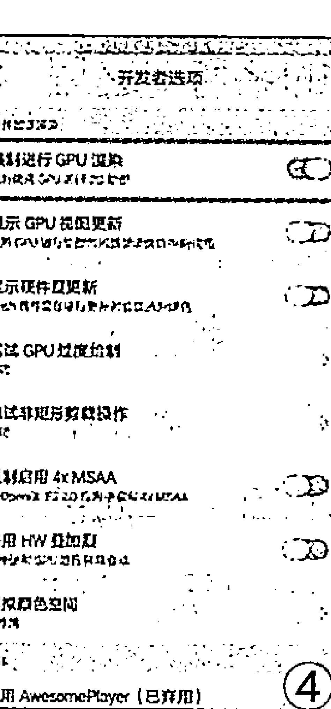

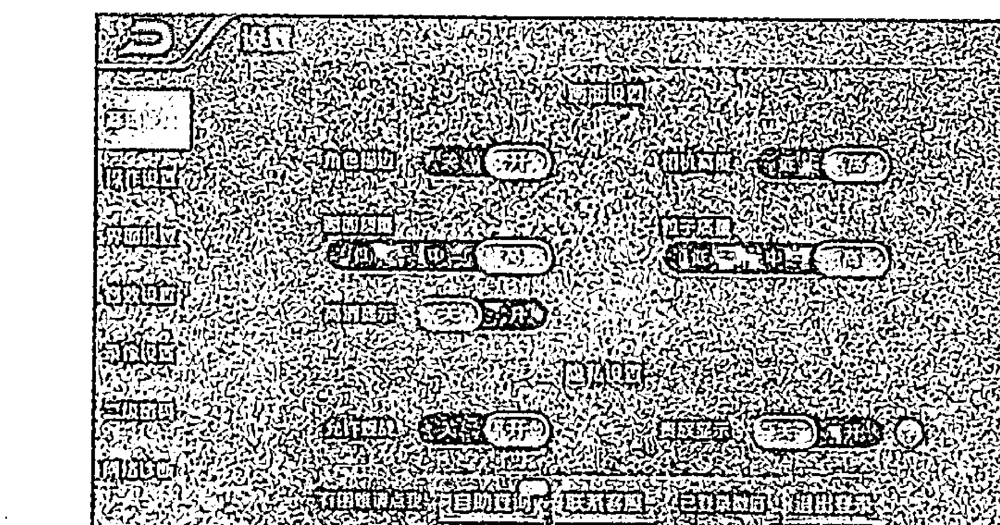

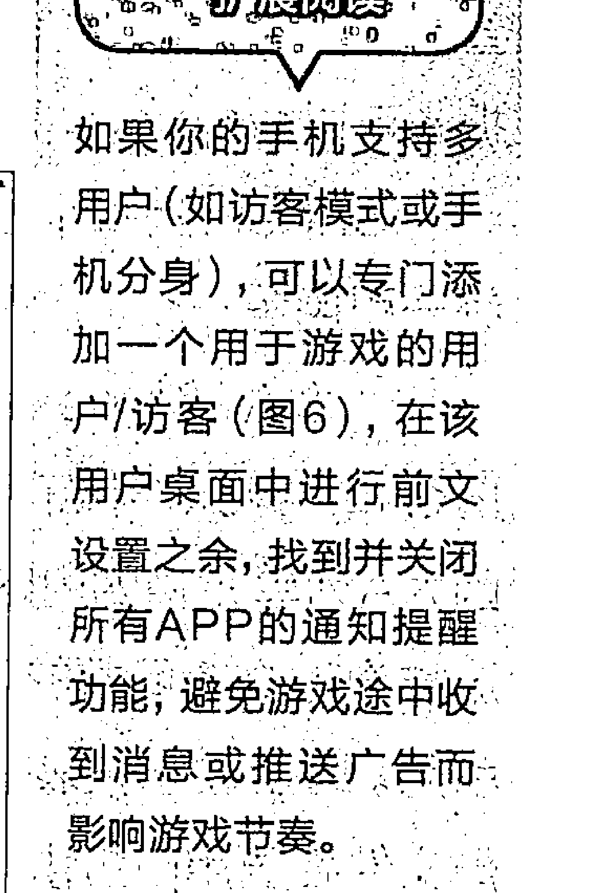

### 扩展阅读

如果你的手机支持多用户（如访客模式或手机分身），可以专门添加一个用于游戏的用户/访客（图6），在该用户桌面中进行前文设置之余，找到并关闭所有APP的通知提醒功能，避免游戏途中收到消息或推送广告而影响游戏节奏。

## 快速启动相机的各种“姿势”
文/镜花水月

如今智能手机早已取代了卡片相机，成为了我们日常拍照的主力。因此，如何快速启动相机并进行抓拍，一直是用户和手机厂商所追求的优化点所在。实际上，除了我们熟悉的点击桌面上的相机APP图标以外，还有很多方式可以快速启动相机呢。

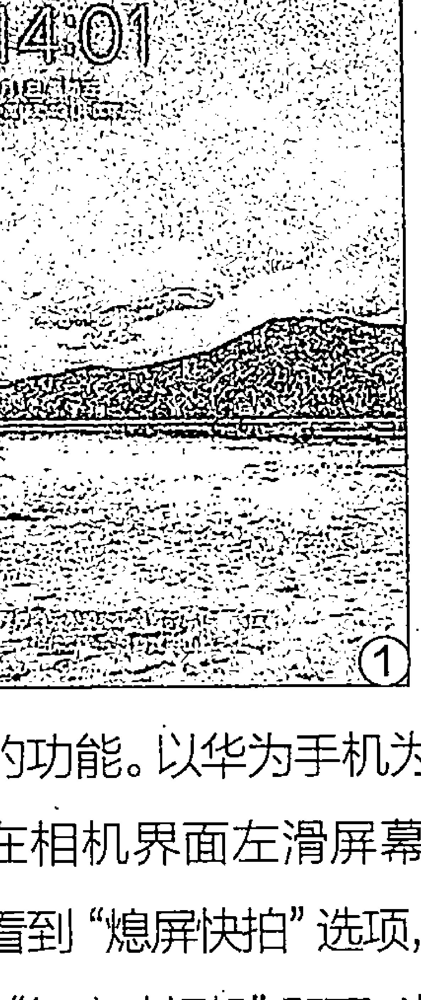

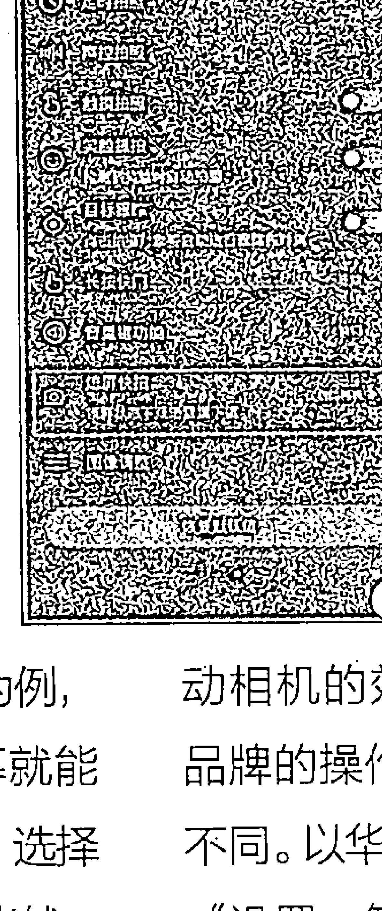

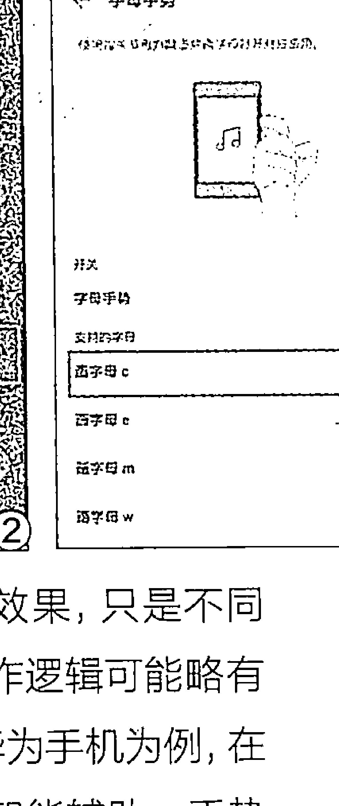

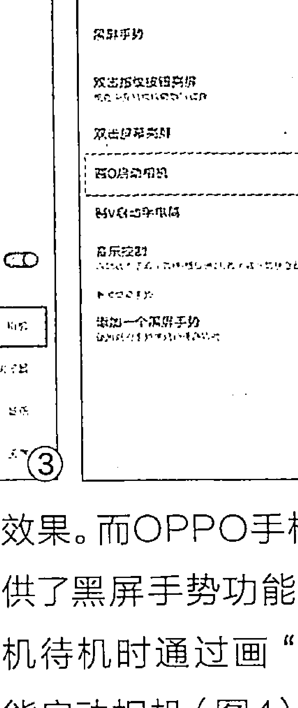

的功能。以华为手机为例，在相机界面左滑屏幕就能看到“熄屏快拍”选项，选择“仅启动相机”即可。当然，你也可以选择“启动相机并拍照”，一步到位（图2）。

此外，还有很多手机在系统设置中都存在类似“手势体感”一类的功能，同样可以实现一步启动相机的效果，只是不同品牌的操作逻辑可能略有不同。以华为手机为例，在“设置→智能辅助→手势控制→字母手势→打开画字母”中，可以自定义快速启动相机的字母，比如在屏幕上画“C”（图3）。但是，华为该功能的操作逻辑是必须在亮屏状态才有效果。

效果。而OPPO手机则提供了黑屏手势功能，在手机待机时通过画“O”就能启动相机（图4），使用起来会更方便。

> 小提示
> 如果你的手机支持语音助手+语音唤醒功能，那就有了更方便的拍照体验了：先说唤醒词激活语音助手，再说“打开相机”，就能实现全程君子动口不动手的效果。

## 华为手机之间的隐藏福利
文/镜花水月

当你想要分享手机中的数据时会想到什么方法？通过QQ发送？还是安装类似茄子快传一类的APP？如果你的手机和需要分享的手机都是华为品牌（包括荣耀），系统版本也都在EMUI5.0以上，那就可以借助Huawei Share功能实现极速的文件传输体验了。

在华为新款手机（或升级到最新系统的老款手机）的下拉菜单中都能看到一个名为“Huawei Share”的快捷按钮（图1），如果两部手机之间想高速传输文件，只要全都激活该功能即可。

然后进入图库或文件管理APP，找到想要分享的文件，长按该文件选择“分享”按钮，系统就会自动搜索附近10米范围内所有打开了Huawei Share功能的手机，并将它们以图文并茂的形式展示出来（图2），点击你想要分享的朋友的头像就能完成文件分享（需要对方确认接收）（图3）。

Huawei Share属于蓝牙和Wi-Fi功能的集合，通过蓝牙的配对和Wi-Fi的速度，所以传输文件时效率极高。

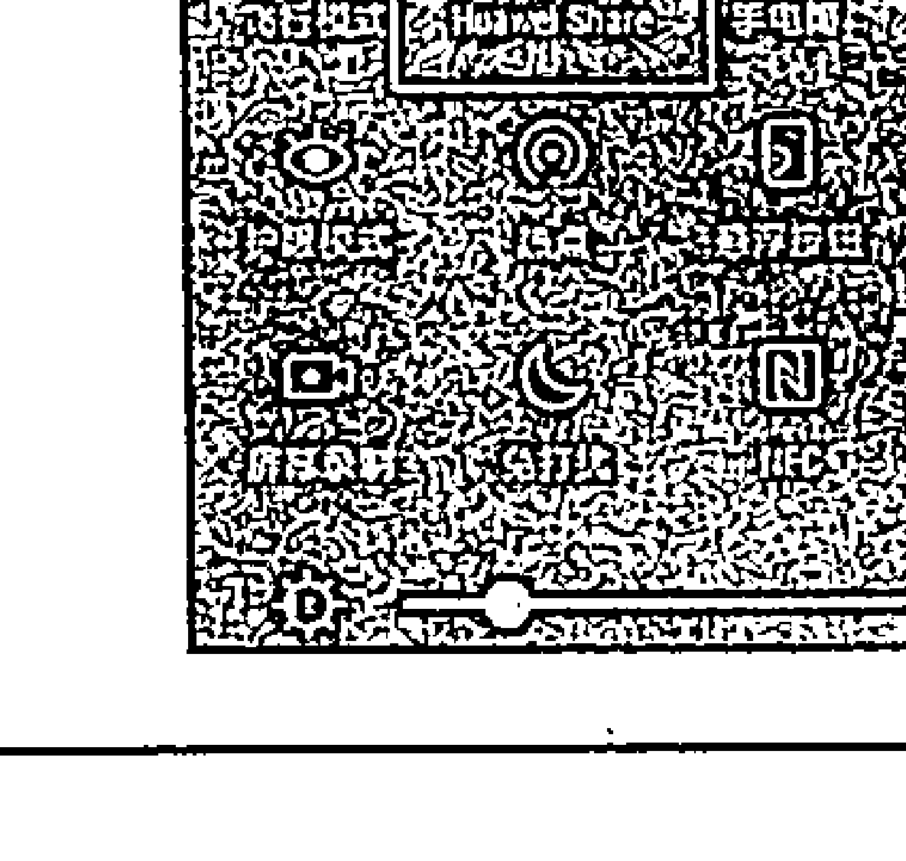

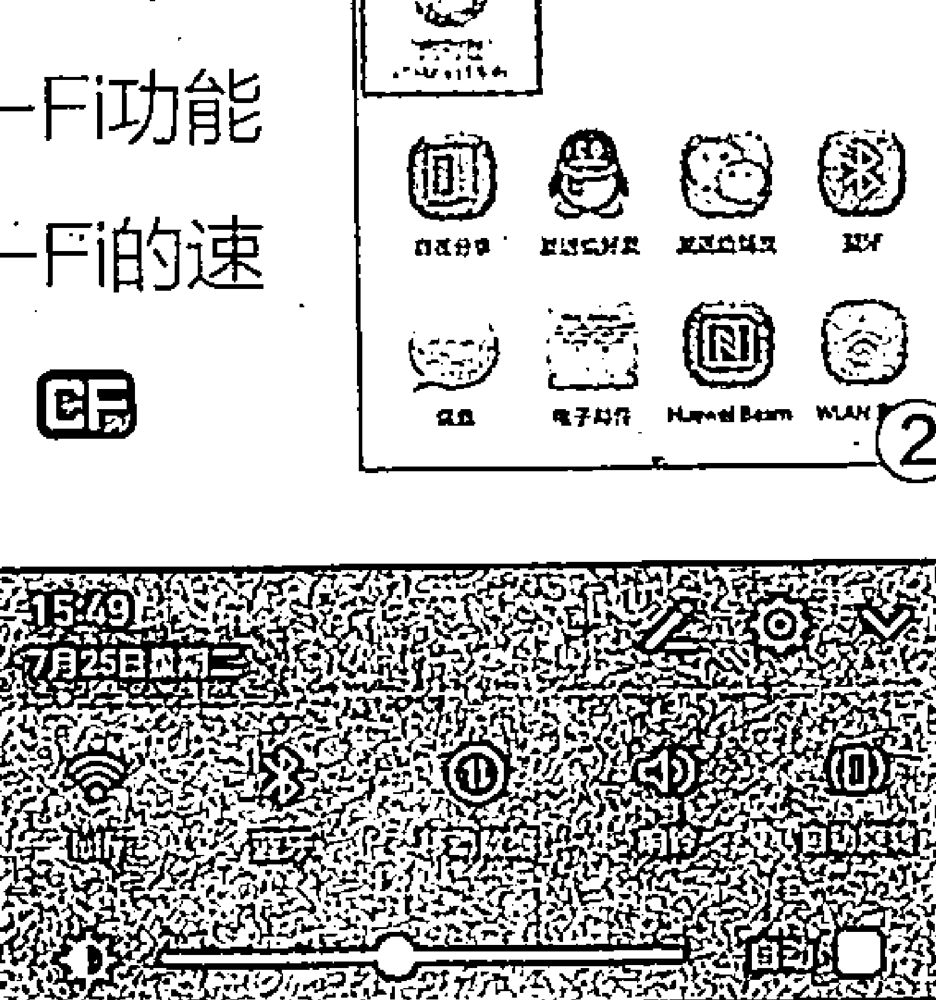

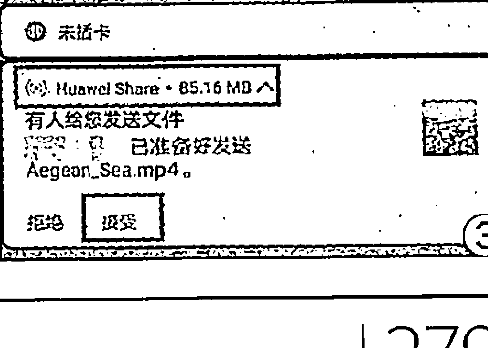

## 微信“请”进模拟器 轻松提高微店工作效率
文/小文龙

现在不少朋友在工作之余都做起了微商，但使用手机或平板管理效率太低。其实，在PC通过模拟器安装并使用微信再与买家交流就快多了，而且模拟器中的微信同样具备红包转账、扫码关注等移动端微信的一切功能。

首先，我们需要在PC上从http://www.bluestacks.cn/下载“蓝叠模拟器”并安装运行（图1），接着搜索并安装微信，鼠标双击启动和登录微信就可以使用微信的所有功能了。

自己商品的与众不同之处，商品交易也就成功了一半。比如将拍摄的照片先用电脑PS处理，再发到朋友圈。其操作方法如下：
选中电脑里边需要发到朋友圈的图片，再拖到模拟器窗口中（图1），这时相关图片就复制到蓝叠模拟器中了，然后在发朋友圈时选中相关图片并添加一些说明性的文字就可以了（图2）。

### 朋友圈宣传 提高商品关注度

在微信上卖东西宣传很重要，能够让买家发现

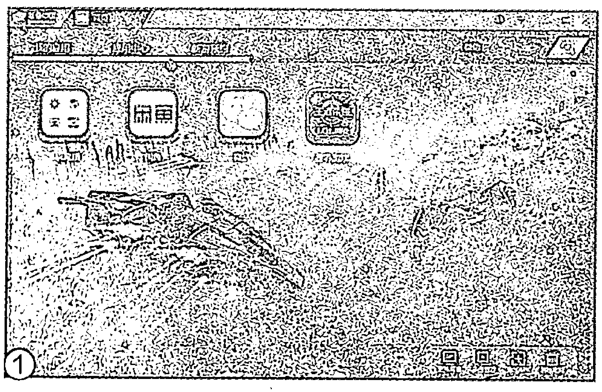

> 小提示
> 在利用朋友圈进行宣传时，切忌生硬、直白。如果在蓝叠模拟器中需要使用微信的扫码功能时（纸质二维码则需拍照并导入模拟器才可以识别，或干脆直接用手机扫码），可在微信中单击相关图片，选择“识别图中二维码”即可（图3）。

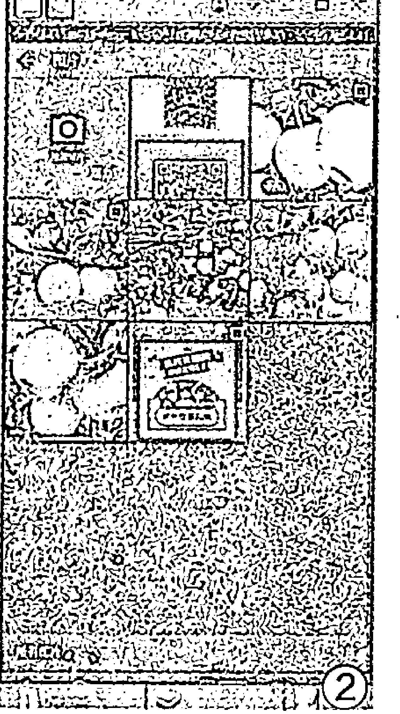

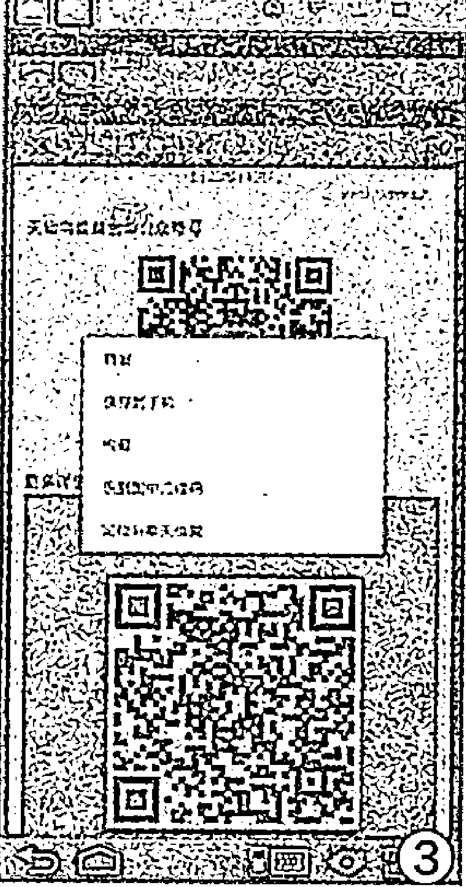

### 微信红包 “黏住” 潜在买家

与淘宝、京东等电商平台不同，在微信上卖东西时买家都是比较熟悉的。因此，买家收到货或者是逢年过节，彼此沟通交流一下往往会给自己带来不少订单。而最省事、最高效的沟通方式，莫过于发红包了。微信运行在蓝叠模拟器中也可以非常方便地给好友发送红包，其操作和手机微信发红包的方法是一样的（图4）。

### 备份收货信息 提高发货速度

微商做的时间久了交易量就会大幅上升，此时的挑选商品、打包、快递在线下单都是非常繁琐的事情。不过，如果我们将买家的收货信息保存在电脑中，这样快递在线下单的效率就比使用手机下单高多了。

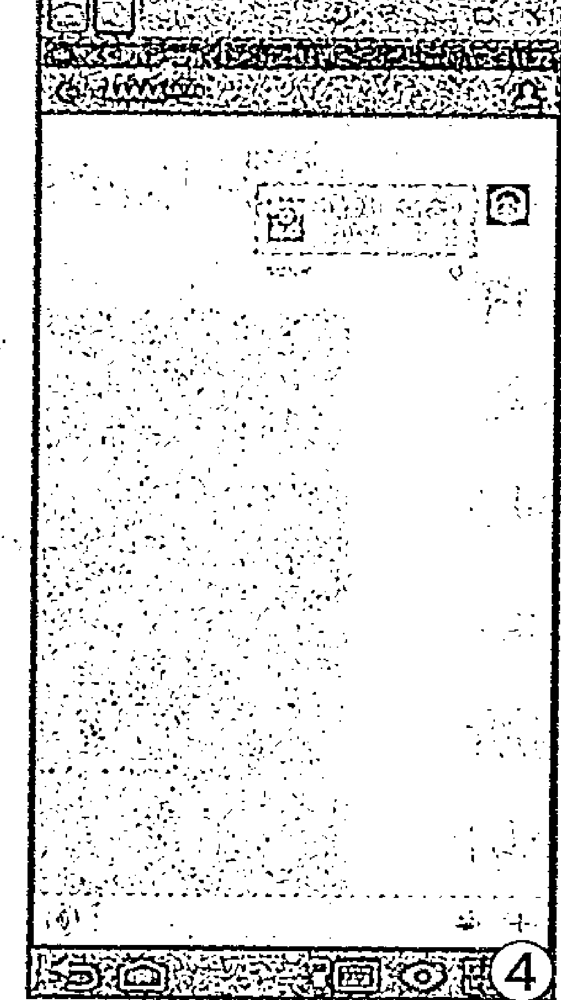

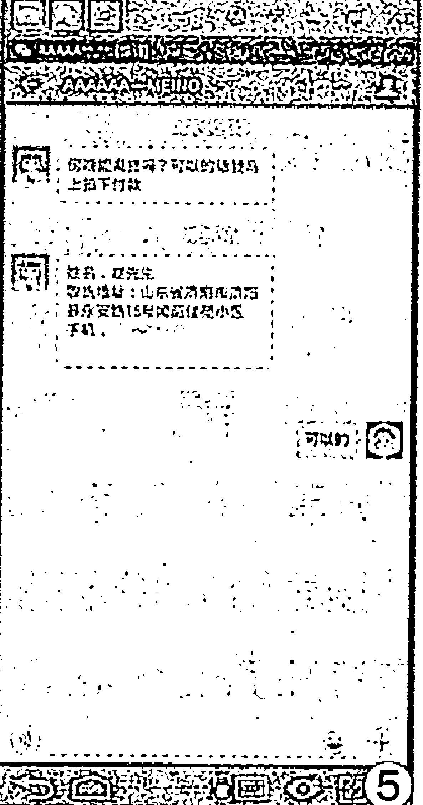

所以买家在微信中买东西时，我们可以单击买家发过来的收货信息（图5），在弹出的右键菜单中选择复制，将其复制到一个文本文件中备用。然后就可以登录快递官网，利用在线下单功能快速地下单了。

> 小提示
> 保存买家的收货信息非常重要，只需要根据备份收货信息中的姓名、手机号等参数，在快递官网已寄件的记录里都可以迅速找到并指定收货人，此时连复制、粘贴的步骤都可以省了。

## 手机充电完成后语音提示
文|天涯衰草

频繁的用电事故，让我们不得不谨慎对待手机的充电问题，比如充满后尽量第一时间拔下充电器。问题是，要想第一时间知道充电完成，往往就需要安装电池管理这类的应用才行。那么，不安装这类应用我们还有什么方法知道充电完成呢？

首先通过应用商店安装“Tasker”这款应用（下载地址：http://dwz.cn/6tiNB8），点击右下角的加号按钮，在弹出的菜单里面选择“状态”这一项。接下来在弹出的对话框里面，点击选择“电源”中的“电源等级”。

由于我们需要在充电完成以后发出提示音，所以将“来自”和“发送”的选项调整为100（图1）。接着点击左上角的按钮返回到主界面，这时就会弹出一个“新建任务”的菜单，点击它以后首先设置一个任务名称（图2）。任务名称设置完成以后会自动跳转到任务窗口，还是点击右下角的加号按钮，在弹出的对话框里面点击“媒体”中的“播放铃声”选项。现在在“类型”列表中选择“闹钟”，接下来点击“声音”后面的放大镜按钮，在弹出的对话框里面选择一个提示音（图3）。

> “Tasker”这款应用可以进行组合的条件和任务非常的多，用户可以通过它自动完成大量相关的操作。

设置完成以后返回到任务列表，点击左下角的播放按钮就可以测试这个任务，如果听到我们设置的铃声就表明这个任务设置成功了。以后当电池电量达到100%的时候，就会出现这个提示音让用户尽快拔掉充电器。

## 换个花样在微信里面玩斗图
文|天涯衰草

很多人都喜欢在微信里面和朋友斗图，可惜我们的图库通常只有一些比较大众化的内容，玩久了肯定就会觉得很没意思。那么，你有没有想过让发送的图片在点击以后发生变化，从而给人一种耳目一新的感觉呢？今天我们就用这个方法来重新定义斗图的规则。

首先通过应用商店安装或下载“黑白图”这款应用（下载地址：http://dwz.cn/6t0jwp），它的作用就是将完全不同的两张图片结合为一张图片。当用户在小图状态下显示的是一张图片，而当用户点击这张小图后就会变成另外一张大图。

点击应用主界面中的“黑图”图标，它会调用系统里面的图库应用，在图库里面选择一张相应的图片。需要说明的是，这里所说的“黑图”指的就是显示的小图（图1）。接下来按照同样的方法设置“白图”，这个“白图”指的就是点击后显示的大图。

当两张图片文件选择设定完成后，在下面手动设置生成图片的尺寸大小，设置后点击“GO!”按钮就可以进行合成操作，接下来我们打开手机中的图库应用就可以看到刚刚合并生成的图片文件。现在我们点击这个文件就可以看到它的缩略图和展开后的图片的变化（图2）。如果没有问题，我们可以按照类似的方法，创建多张不同的合成图片，然后在微信里面发图的时候就可以调用它们了（图3）。

> 这种合并的图片也适用于QQ等其他社交应用。

# QQ直接识别提取图片文字
文|天涯衰草

有的时候我们需要将图片中的文字提取出来，此时就必须在电脑或者手机里面安装OCR软件。但是我们只是偶尔使用的话，安装一款专业的软件又会感到非常的麻烦。那么利用常见的软件能不能完成类似的操作呢？

首先将自己手机里面的QQ客户端升级到最新的版本。需要提醒大家的是，这个QQ客户端必须是完整版而不是轻聊版。接下来在好友列表中任意选择一个QQ好友，如果要识别的图片中的内容比较隐私的话，那么建议选择自己的QQ小号进行操作。

打开好友对话框后点击工具栏中的“图片发送”按钮，在图库中选择需要识别的图片文件并将其进行发送即可（图1）。接下来点击刚刚发送的图片使它成为放大的状态，然后在放大的图片上进行长按操作，这样就会弹出一个管理菜单（图2）。选择菜单中的“提取图中文字”命令，就可以看到正在进行识别的提示，稍等片刻我们就可以看到识别出的文字信息（图3）。

现在点击右下角的分享按钮，在弹出的菜单里面选择“我的电脑”这项，就可以非常方便地将识别出的文字发送到电脑里面。最后将识别出的文字信息复制到编辑器里面，再进行相关的编辑操作就可以了。

## 自动屏蔽应用启动时的广告
文|天涯衰草

曾经使用手机应用时只会在浏览网页的时候才出现广告，可是如今几乎所有应用在启动运行时都会弹出一个全屏的广告信息，如果你不看完广告则无法进入到应用界面。那么，如何才能对这些广告进行屏蔽操作呢？

下载“广告住手”这款应用（下载地址：http://dwz.cn/6wZyxM），启动以后点击应用主界面中的“无障碍服务”选项，这样就跳转到手机系统的辅助功能列表。找到“广告住手”这个选项后，根据提示进行无障碍服务的启用就可以了。

设置完成以后返回到应用的主界面，勾选上需要拦截的启动广告的应用名称，这样以后在启动这款应用的时候广告住手就会自动关闭弹出的广告了（图1）。如果你想要拦截的应用没有出现在默认的列表里面，还可以手动来创建拦截规则。首先点击主界面右上角的加号，在弹出的对话框里面点击“选择应用”按钮，在列表中选择要进行广告过滤的应用名称。接下来在“点击文字”中输入一个“跳”字，因为所有的启动广告都有一个“通过广告”的提示（图2）。其他保持默认设置就可以了，最后点击保存按钮就完成了这条规则的创建。以后当我们启动这款应用的时候，在主界面的下方就可以看到“广告已跳过”的提示（图3）。

## 手机图片可这样进行备份操作
文|天涯衰草

以前我们要想将手机里面的图片进行备份，通常都是利用网盘来完成操作的。但是，随着大量网盘服务的关闭，甚至有些手机自带的服务也关闭了，此时这样的操作也将变得越来越困难。那么，我们还有什么进行手机图片备份的方法呢？

最近出现了一款名为“彩色气球”的应用，通过它就可以对用户指定的照片文件进行备份和分享。安装启动这款应用（下载地址：http://dwz.cn/6wEeY7）后，它会自动对用户手机里面的照片进行扫描，如果手机里面的照片比较多的话，这个过程就需要一定的等待时间了。

扫描完成以后我们就可以在相册中按照不同的类别来浏览手机相册中的照片。而且“彩色气球”这款应用还支持人脸识别的功能，也就是说它可以成功地分辨出照片中的人物，并根据不同的人物进行分类操作。

现在点击应用右上角的“新建相册”按钮，接着给自己的相册设置一个名称，并且选择需要上传到这个相册中的照片，点击“完成”按钮就可以进行上传操作了（图1）。当相册创建完成以后我们可以点击打开这个相册，点击“分享相册”按钮后，在弹出的对话框里面选择分享方式（图2）。

比如我们这里选择微信分享，就可以通过二维码的方式提供给微信好友。当好友识别出这个分享的二维码信息后，就可以打开我们的照片相册，从而成功地浏览到我们分享的照片信息（图3）。

## 一款应用畅游所有图片网站
文|天涯衰草

很多人没事时都喜欢浏览图片网站打发时间，但如果想在手机里浏览通常要安装该网站指定的APP。问题来了，如果你常去多个图片网站，难道要安装无数APP？那么，能否只安装一个应用就能浏览所有常见的图片网站呢？

我们可通过手机内置的应用商店来安装“绅士图库”这款应用（下载地址：http://dwz.cn/6zzdaq），为了避免支持众多图库造成应用程序的增加，该应用采用了插件这种形式来解决。

运行后首先点击应用左上角的菜单按钮，在弹出的菜单里面点击下方的“添加”命令，这样从列表中就可以看到这款应用所支持的图库名称。我们可以根据自己的需要来进行安装，除此之外还可以对已经安装的图库插件进行更新操作（图1）。

插件安装完成以后返回到应用的主界面，这样我们就可以看到不同的图库以标签形式在主界面的上方进行显示（图2）。当你想要浏览哪一个图库中的内容，只需要通过手指左右进行滑动切换就可以了。接下来你可以看到这个图库发布的内容，并且通过向上滚动的方式进行切换。

如果你喜欢的话就可以点击放大某一张图片，并且将其设置为手机的桌面壁纸（图3）。当然你也可以利用社交软件，将喜欢的图片进行分享操作。

## 不用羡慕全面屏 普通手机也能圆角显示
文|镜花水月

如今全面屏手机大热，而全面屏除了拥有18：9显示比例外，圆角的切割也是其一大特色。那么，对于非全面屏的老旧手机，能否也体验一把全面屏圆角显示的视觉特效？

高端全面屏手机之所以将屏幕四边切割成圆角（图1），就是为了尽可能压缩屏幕上下边框以提升屏占比，还能给人一种别样的视觉效果。而普通手机要想获得类似的风格，只需安装一款名为“RoundR”（圆角界面，下载地址：http://pan.baidu.com/s/1hsb53Y8）的软件。

RoundR可以安装在Android 2.x或更高系统上，几乎做到了新旧手机通吃，而且无需ROOT系统等特殊权限。首次运行时，需要将软件主页“启动RoundR”的选项设置在打开状态（图2），此时你会发现手机显示画面的四角变得圆润了。

在“边角设计”中，我们可以设置边角的形状以及不透明度（图3），大家可以根据喜好随意修改。在启动的边角中还能指定四个边角哪一个激活圆角显示（图4）。如果你在使用中发现某个软件在圆角显示模式下会影响操作或显示，则可将它添加到“黑名单应用”中（图5）。

接下来，我们还需进入权限管理界面，找到悬浮窗设置，激活RoundR悬浮窗显示的权限（图6），否则退出RoundR软件界面后圆角显示就会失效。

需要注意的是，RoundR的圆角显示无法覆盖到顶部的信号栏和底部的虚拟触控栏，所以当手机的主题是白色背景时就会出现类似显示Bug的现象（图7），所以想完美使用它还需找个全局都是黑色背景的主题。

## 关闭MIUI的推送广告
文/镜花水月

小米手机的MIUI应该是最受国人喜欢的Android定制系统之一，功能丰富是它的最大特色。可惜，MIUI无处不在的广告也令人颇为头痛，点错了浪费流量不说，还极为影响心情。那么，如何才能屏蔽常见的MIUI广告呢？

虽然MIUI内置广告较多，但好在官方提供了很多屏蔽广告推送的设置入口，它们大都被集成在了“设置→应用管理→系统应用”之中（图1），需要我们找到并一一手动关闭相关的广告推送功能。

比如，小米视频的设置中就能关闭小米推送和追剧推送（图2），短信的高级设置界面可关闭允许WAP推送和推荐短信，安全中心中可以关闭推荐内容，搜索中可以关闭热点关闭，应用商店里关闭接收推送通知等等。

同时，我们还可进入“设置→更多设置→系统安全”中找到广告服务，并关闭其中的个性化广告。在“设置→通知和状态栏→通知管理”里将不需要通知的软件关闭允许通知。

最后，再依次进入手动安装的第三方APP的设置功能界面，找到并关闭所有和新闻推荐、热点通知有关的推送功能，比如UC浏览器的“网页浏览设置”界面中的搜索发现、大家都在搜、相关推荐和订阅提醒等选项（图3）。

如此一来，你的手机就能最大限度远离广告和各种消息的打扰了。

## 手机“查岗”专用代码
文/镜花水月

在日常生活中，我们难免会遇到将手机借给朋友使用把玩的时候。问题是，当别人用完还回来时，我们总会对别人用自己的手机做了什么产生兴趣。那么，当你有此疑问时，又该如何“查岗”呢？

每个品牌的Android手机都会集成一个隐藏的“测试”功能选项，只是它默认都是不可见状态，需要进入拨号界面输入指定代码激活。

以小米手机为例，只需在拨号界面输入“*#*#4636#*#*”就能进入测试界面（图1），然后点击“使用情况统计数据”就能看到这款手机在过去一段时间以来运行过哪些APP（图2），在每个APP界面下驻留了多久，从而获悉别人到底用你的手机都做了什么。

需要注意的是，不同品牌手机的激活测试功能代码并不相同，比如华为（包括荣耀）手机就是在拨号界面输入“*#*#6130#*#*”（图3），之后便可进入测试界面并看到“使用情况统计数据”这个选项了。

## 不怕消息提醒 打造沉浸式的游戏体验
文|镜花水月

随着《王者荣耀》等竞技类手游的火热，很多Android手机都引入了所谓的“游戏模式”，在游戏过程中屏蔽消息提醒，来电时也不会切换到通话界面，能以悬浮小窗口的形式接听，从而避免影响游戏进程（图1）。问题是，支持游戏模式的手机毕竟只是少数，不支持的手机又该怎么办？

### 关闭通知功能

想避免打扰，最基础的操作就是禁止除了微信以外其他不常用APP的通知。现在Android手机在设置或安全中心中都能找到通知管理选项，点击进入自定义所安装所有APP的通知权限，其中最容易打扰游戏进度的就是“横幅”，其次是“在状态栏上显示”（图2）。关闭不需要APP的“允许通知”，就是游戏免打扰的第一步。

### 神奇的屏幕固定

在Android系统中还隐藏着一项名为“屏幕固定”的功能，但不同品牌手机该功能隐藏的位置并不相同，还有一些品牌会屏蔽这个功能，根本找不到。而屏幕固定，才是游戏免打扰中的杀手级功能。

以华为手机为例，在“设置→安全和隐私→更多安全设置”中就能找到屏幕固定（图3）。顾名思义，该功能的作用就是让当前APP始终固定在前台显示，除非你手动退出，否则不会因误操作或其他APP的打扰而进入后台状态。激活屏幕固定后会增加一个密码验证项，作用是退出屏幕固定时需要密码验证，一般时候用不上，不用管它。

### 屏幕固定怎么用

打开屏幕固定后，我们就能正常启动游戏了。以运行《王者荣耀》为例，运行时按最近任务切换到后台应用切换界面，你会发现所有程序预览图下面都会出现一个类似图钉的图标，找到《王者荣耀》的卡片，点击图钉图标（图4），这个APP就能获得屏幕固定的效果了。

此时，再运行《王者荣耀》时，其他APP的消息弹窗会被自动屏蔽，无论是按主页键还是多任务键也不会退出当前的游戏画面，可以让我们全心全意享受游戏免打扰的乐趣。至于如何退出屏幕固定模式，只需长按返回键即可（图5），是不是很容易呢？

## 微信的两个隐藏功能
文|镜花水月

华为在麦芒6上加入了万能扫一扫，可以直接翻译英文单词。那么，对其他品牌和不符合系统版本要求的华为手机，就只能羡慕嫉妒恨了吗？

很多用户需要翻译英文之前，要么选择安装百度翻译等APP，要么就需要麦芒6这种系统层面集成功能的手机。实际上，还有很多手机在相机APP中也隐藏有翻译，而更通用和简单的方式则隐藏在微信里。

藏在微信里。打开微信的“扫一扫”，除了我们熟悉的扫码外，点击下面的按钮就能识别杂志或CD封面、确定街景位置，以及实现扫描翻译功能了（图1）。

此外，当我们正在阅读一篇公众号文章时，如果有微信好友发来消息，当你点击提醒回复时就会退出当前阅读的文章。等你想继续阅读时，需要重新找到公众号，再翻到这篇文章才能继续阅读。

如果文章是别人推送给你，或是时间较早的，要重新找到会耗时很久。好消息是，微信其实已经提供了“稍后阅读”功能，当我们阅读某篇文章，需要跳转到聊天界面前，可以点击右上角的“三个点”，选择“在聊天中置顶”（图2），这样我们在回复完消息以后点击它就可以继续阅读了（图3）。

## 远离DNS劫持弹窗广告
文|镜花水月

很多手机用户都喜欢用浏览器看小说或新闻，但基于网页的小说或新闻偶尔总会弹出涉黄的广告（Wi-Fi环境），不仅干扰阅读，不小心点击进入还会浪费流量或是遭遇病毒木马的风险（图1）。

那么，如何最大限度避免这类干扰呢？

使用浏览器看网页小说弹出的广告有一些是小说网站自身的推广，而还有一类则是你被人劫持了DNS。对于后者，我们需要认识到它的危险性：自动下载软件、手机下方常年驻扎小广告、杀毒后仍然无效、锁屏后壁纸被篡改等，这些都是DNS被劫持后可能遭遇的风险。

想避免此类风险，需要我们手动设置DNS服务器。操作方法很简单，找到WLAN设置界面，进入经常连接Wi-Fi热点的高级设置界面（图2）。点击“IP设置”，将默认的DHCP修改为静态，手动填写DNS1（首选服务器）和DNS2（备选服务器）地址（图3）。

国内较好的DNS平台如下，选择它们不仅可以避免NDS劫持的问题，还能在一定程度上起到上网加速的功能：

- DNSPod DNS+：首选119.29.29.2，备选182.254.116.116；
- 114 DNS：首选114.114.114.114，备选114.114.114.115；
- 阿里 AliDNS：首选223.5.5.5，备选：223.6.6.6。

# 聪明反被聪明误
## 记得给手机APP进行二次设置
文 | 镜花水月

如今很多Android品牌手机在系统层面都加入了一定的智能化设计，比如安装第三方APP时进行自动的权限分配，免去了用户后期自行设置的繁琐。然而，这种自动化分配却不见得100%合理，很容易闹出一些使用上的问题。下面，我们就以OPPO手机为例，对此问题进行一下探讨。

### APP不能联网

OPPO手机在新安装APP时都会自动进行WLAN与移动网络的权限分配，但有时会不符合我们的实际需求。比如，以爱奇艺、优酷为代表的视频APP，系统默认就会允许它们使用移动数据联网，如果你的4G套餐流量不多，很容易因它们而超标；某些购物APP默认仅允许WLAN联网，在户外使用移动数据就无法正常使用了。

所以，建议大家安装大批APP后，统一进入“设置→双卡和移动网络→使用WLAN与移动网络的应用”（图1），仔细将所安装的APP梳理一遍，根据实际的流量套餐和需求分配联网权限（图2）。

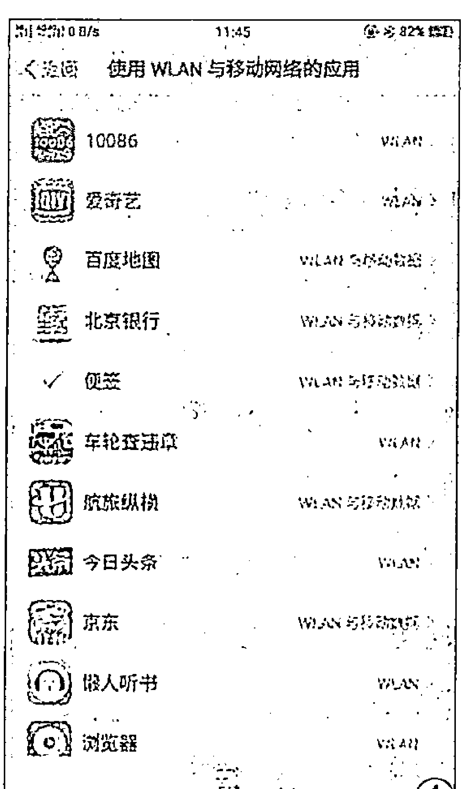

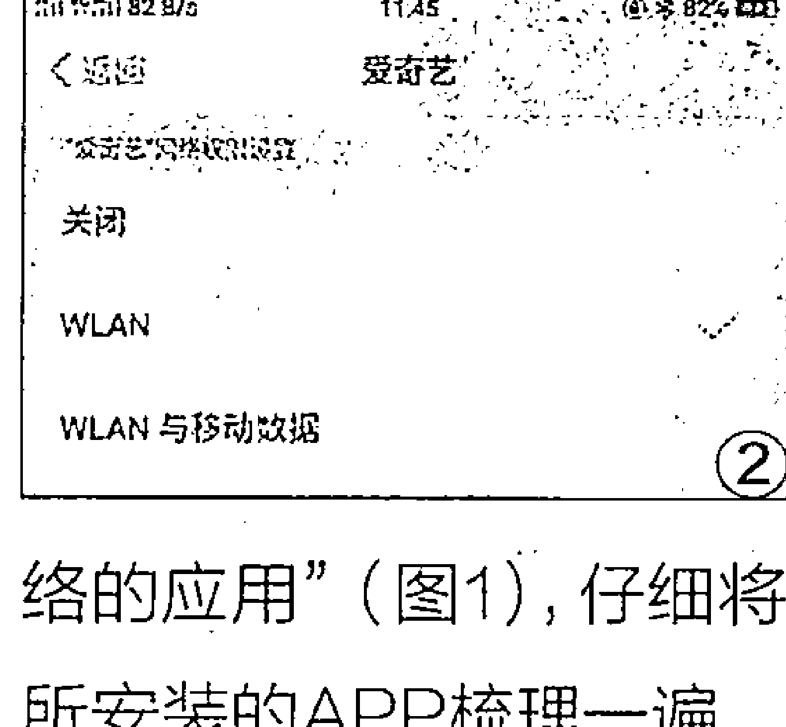

### APP总会自动关闭

按多任务键调出后台程序的缩略图，下拉APP对应的卡片就能将其锁定（图3），相当于添加到了自动清理后台程序的白名单中。利用这个功能，我们可以将微信、QQ、闲鱼等需要始终运行，不希望它们莫名自动退出的APP进行如此设置。

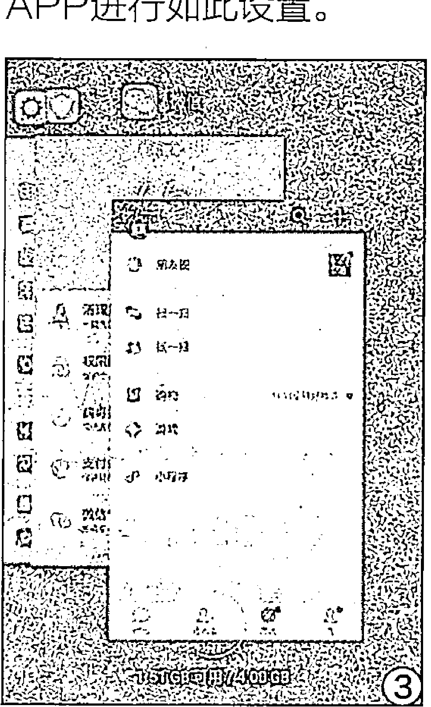

### APP无法收到消息

有时候我们正在运行某个APP，临时切换到其他APP窗口查看消息，结果后台APP就从此销声匿迹，收不到任何推送和提醒消息。问题是，一些物流信息、邮件信息、违章提醒等信息还是很有时效性的，哪怕存在一定的后台耗电也不能失去它们的消息。

此时，我们需要进入“设置→电池→耗电保护”，将需要时刻接收推送消息的APP进行自定义（图4），至少确定深度睡眠选项要处于关闭状态（图5），而后台冻结就要视该APP的使用频率而定了。

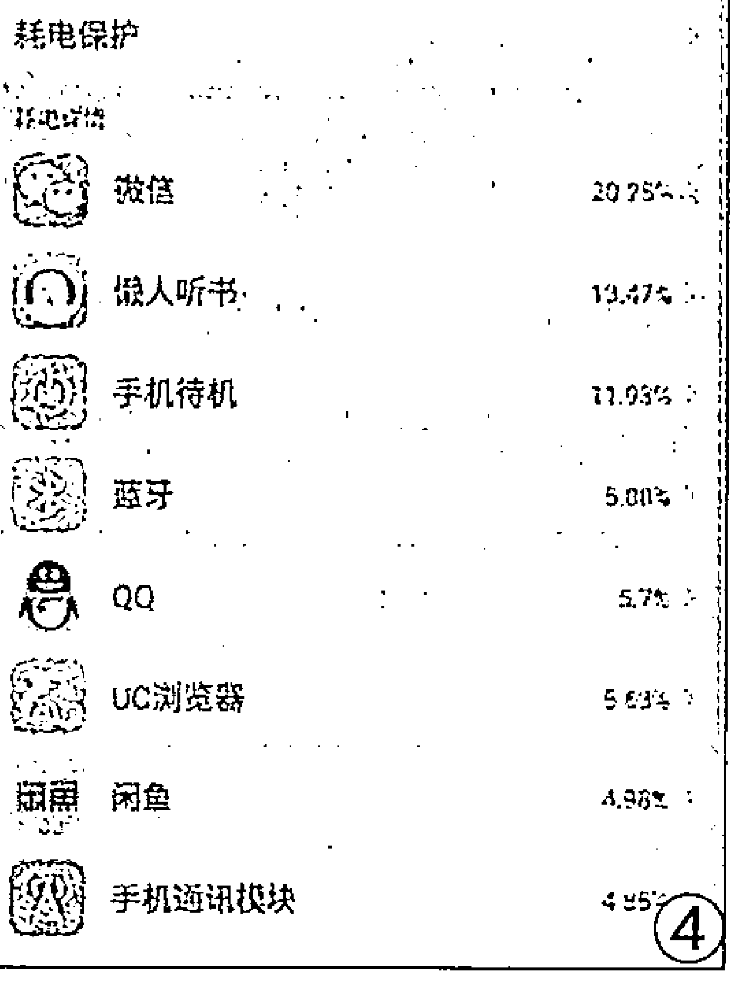

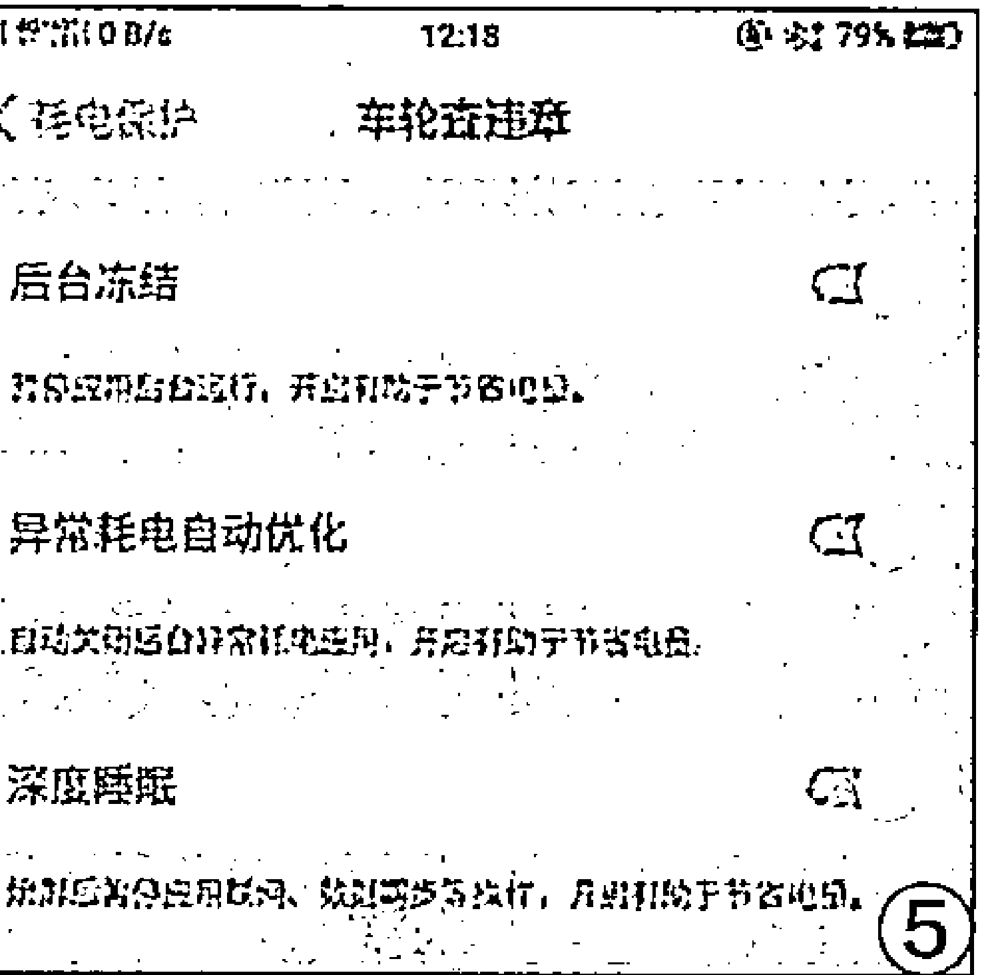

### APP定位不准

有时候哪怕我们通过快捷菜单栏开启了定位功能，但使用某些APP定位时依旧会出现较大的位置漂移甚至无法定位。此时，我们可以进入“设置→其他设置→安全与隐私→位置信息”，手动切换到“精确度高”（图6），而不要选择仅用WLAN、蓝牙或移动网络定位和仅使用GPS定位。

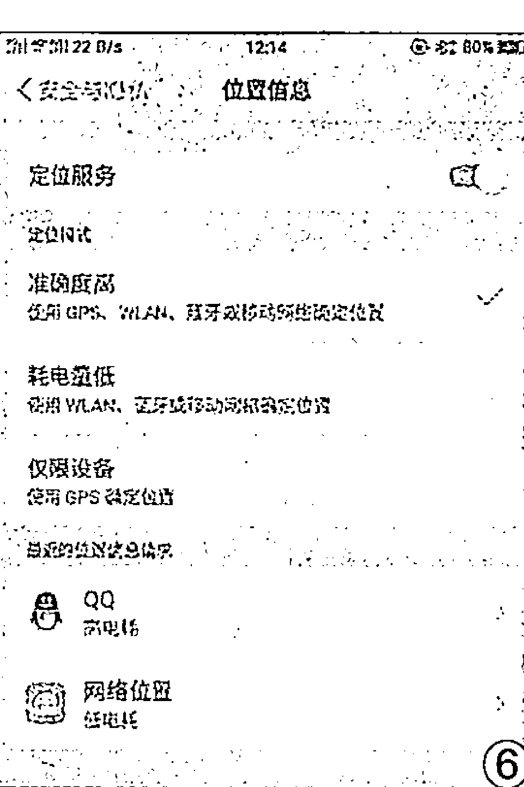

# 开发者选项的妙用
随意修改手机显示的DP值

文 | 镜花水月

有关Android手机字体图标大小的讨论从来就没有停歇过。同样是5.5英寸手机，有人觉得字体太小看不清楚，而有人却觉得文字偏大浪费了有效的显示空间，希望图标排列可以更密集一些。那么，如何协调两类用户的需求呢？

所有的Android手机在“设置→显示”中都提供小、校准、大等字体的设置选项(图1)。然而，这些预设值可选范围很小，哪怕你选择了小字体，对桌面和设置中的图标也没有任何影响，只是单纯的文字变小而已。

好消息是，部分Android手机品牌在开发者选项中都隐藏了修改DP的功能，下面我们就以华为手机为例探讨一下设置方法。
首先进入设置的关于手机，连续点击版本号就能激活隐藏的开发者选项(图2)。找到并进入开发者选项，在绘图栏目下找到“最小宽度”（又称Smallest width）(图3)，点击它就能随意修改DP值了。

笔者测试的手机为荣耀V9 Play，默认最小宽度值为360 (图4)。如果你

希望手机屏幕内可以同时显示更多内容，那就可以将最小宽度调高，比如设置到560 (图5)，在一屏内几乎就可以显示出全部的设置选项了(图6)，对眼神好的用户而言可以极大地提升操作效率。
如果你希望手机屏幕内可以呈现大字体大图标的风格，只需调低最小宽度设置，比如调整到240 (图7)，你就会发现整个视野变得更为清晰了(图8)。

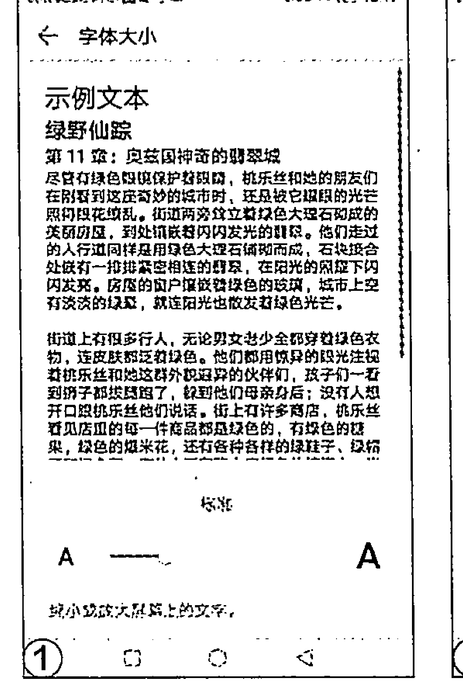

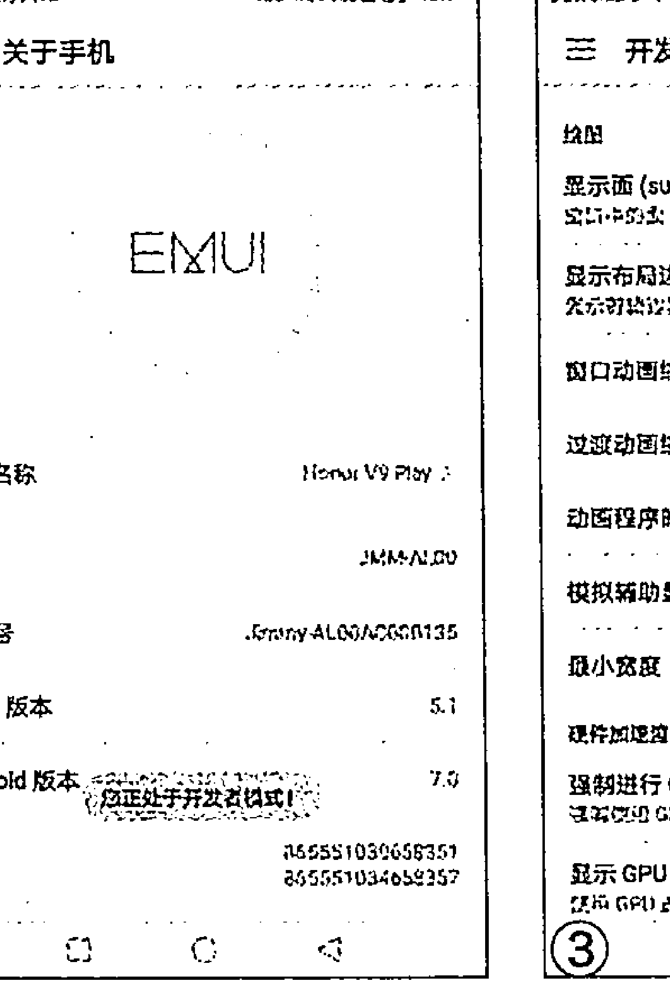

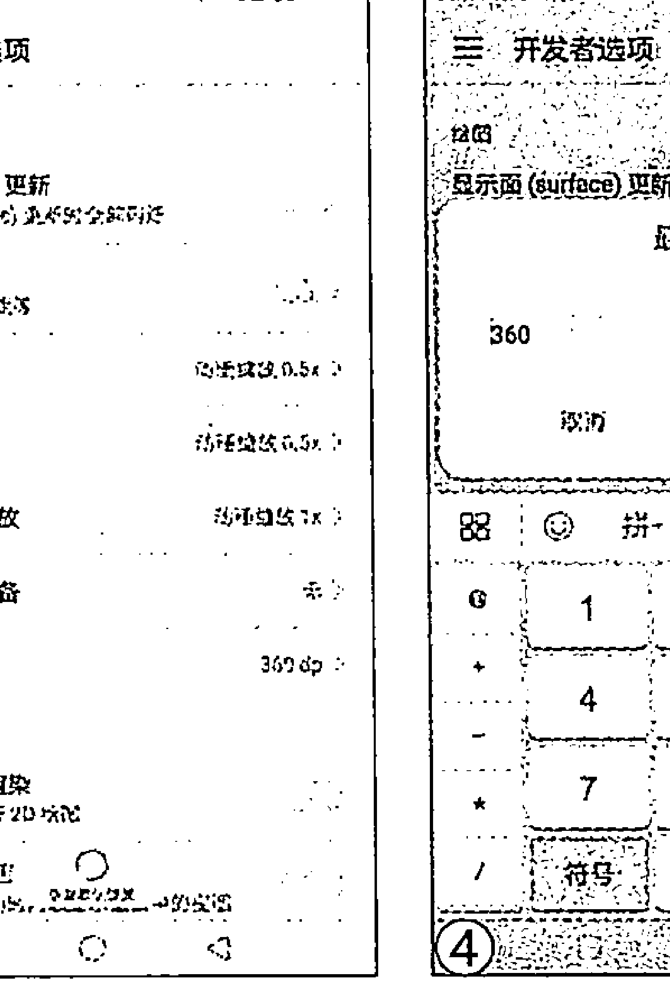

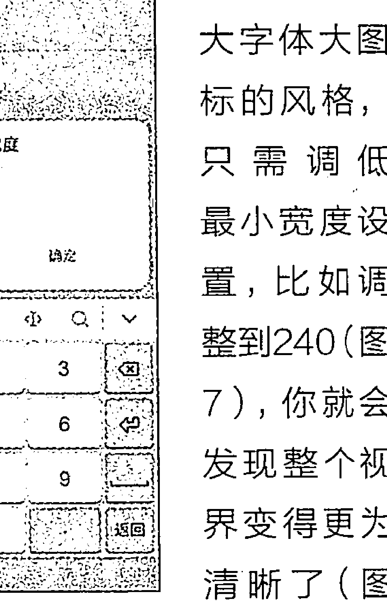

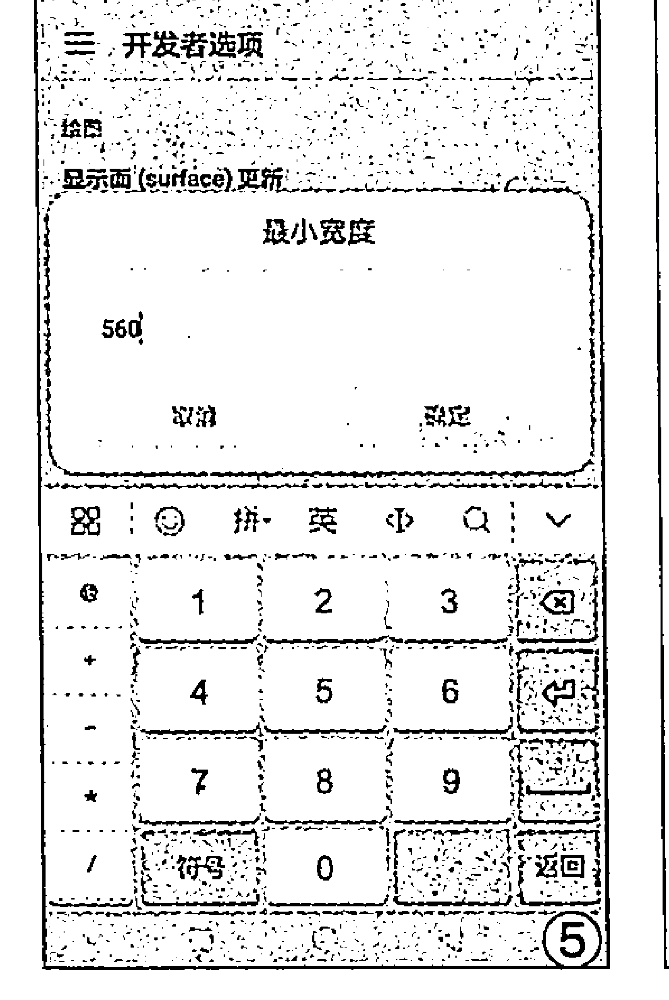

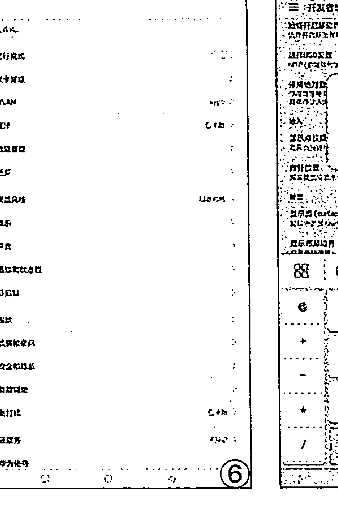

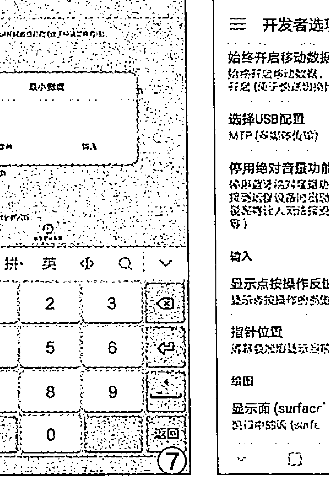

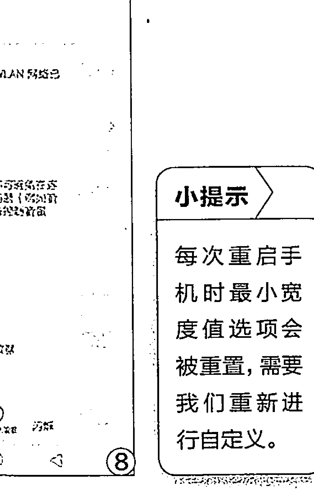

> 小提示
每次重启手机时最小宽度值选项会被重置，需要我们重新进行自定义。

# 自动修复Windows 10防火墙的问题
文 | 老万

Q: Windows防火墙可以保护用户的系统内容不受到恶意程序以及黑客的攻击，可是Windows防火墙和其他功能一样，也会出现各种各样的问题。那么怎样才可以修复Windows 10防火墙的问题呢？
A: 首先下载“Windows防火墙疑难解答程序”这款小工具，双击运行它以后点击操作界面中的“下一步”按钮。这样“Windows防火墙疑难解答程序”会自动检测防火墙的问题，一旦发现问题就会自动进行修复操作。

# 选择哪种系统安装方式比较好

Q: 台式机装系统，下载了Windows 7 32位的ISO文件。因为电脑里面没有光驱，就将光盘文件拷贝到闪存盘里面。这样可以直接点击Setup应用程序安装系统吗？还是需要进入PE上的虚拟光驱进行安装？
A: 其实根本不需要将系统安装文件复制到闪存盘里面，而是将它复制到除了系统盘以外的其他磁盘里面，执行Setup安装文件就可以了。当然也可以通过PE盘中的虚拟光驱，加载系统镜像文件的方式来进行安装操作。无论选择哪一种方式进行安装，都建议将系统盘格式化以后再进行操作。


> 在控制面板的“Windows 防火墙”里面，也可以通过还原默认值来进行操作。

# 系统是纯净安装还是在线升级

Q: 通常Windows系统的安装有两种方法，一种是在老的系统上进行在线的升级安装，另外一种则是通过安装盘进行全新的安装。那么通过什么方法可以判断出，当前系统的安装使用的是哪一种方法呢？
A: 按Win+R打开“运行”框，输入regedit打开注册表，定位到HKEY_LOCAL_MACHINE\SYSTEM\Setup。如果在Setup下有Upgrade这一项，则代表该系统是在线升级而来；如果没有Upgrade这一项，则代表是纯净安装的。

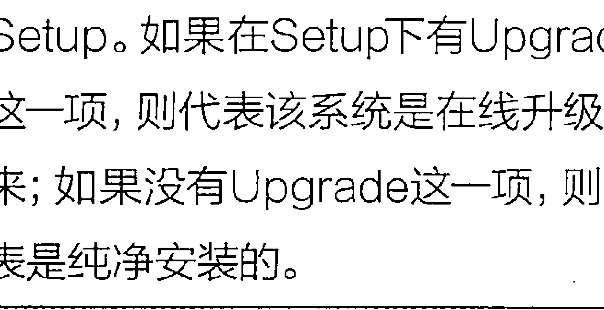

# 如何解锁Windows中的锁定文件

Q: 最近在进行系统文件管理的时候，经常发现某些文件无法进行删除操作。对于这些被锁定的文件，造成被锁定的原因是什么？应该怎么进行解决呢？
A: 造成文件被锁定的原因是多种多样的，比如这个文件正被某个软件进程所占用，或者用户没有相关的管理权限等等。对于第一种情况可以在系统里面安装“LockHunter”这款软件，在被锁定的软件上点击鼠标右键，在弹出的菜单里面选择“What is locking this file?”命令就可以进行解决了。

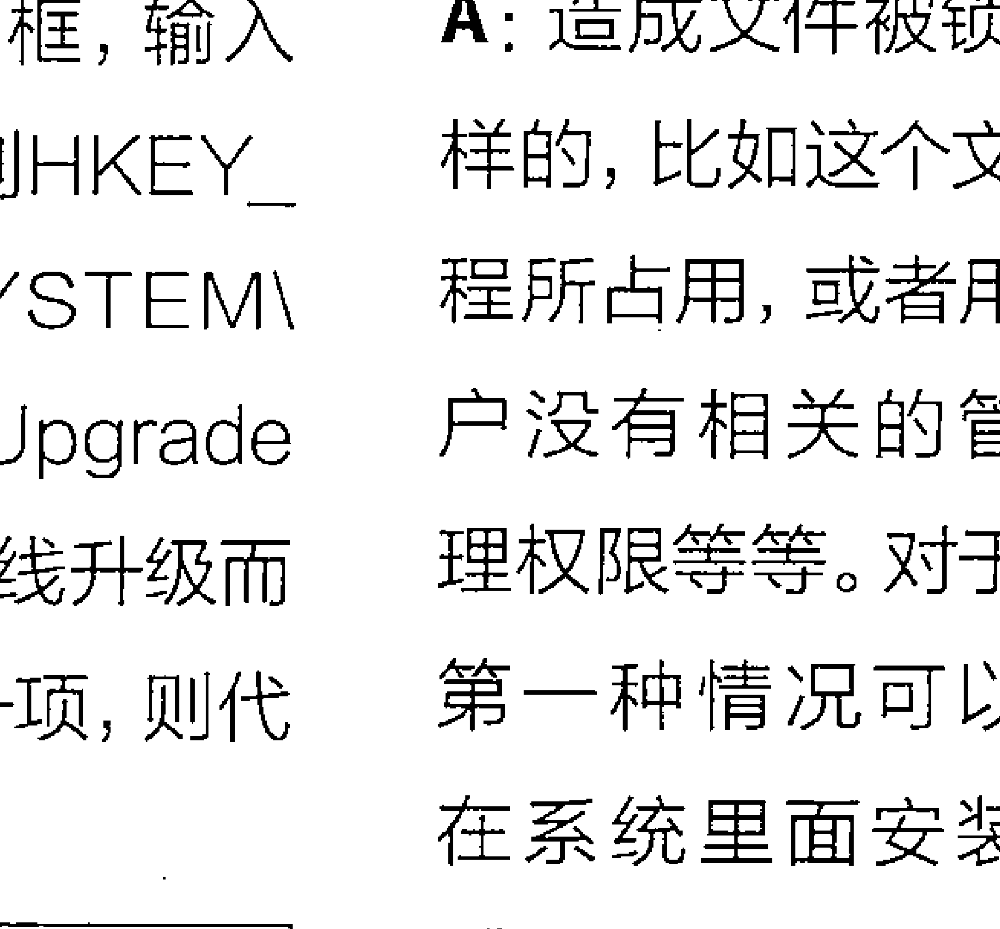

# Windows 10右键菜单无法新建文件

Q: 平时都是利用鼠标右键中的“新建”菜单来创建文件的，可是最近不知道怎么回事，点击这个命令后就会出现卡住的情况，随后文件资源管理器崩溃。那么如何解决这个问题呢？
A: 首先下载安装RightMenuMgr这个右键菜单管理软件，在右侧列表中依次点击“Explorer→目录→背景(桌面)→新建中”选项，接着在右侧窗口中依次取消勾选可能导致问题的扩展项，这样就可以解决相关的问题了。

# 如何快速获取PPT中的图片

文 | 老万

> **Q：** 最近在参加一个产品发布会的时候，发现所演示的PPT文档中的图片非常不错。如何才可以将图片从PPT里面取出来呢？

**A：** 首先将PPT文档的后缀名修改为一个常见的压缩文件的后缀名，如Zip或者Rar等。当这个PPT文档转换为压缩文件后，双击打开，在文件列表里面可以看到一个名为PPT的子目录，再进入到其中的MEDIA文件夹里面，就可以看到PPT文档中的所有图片了。

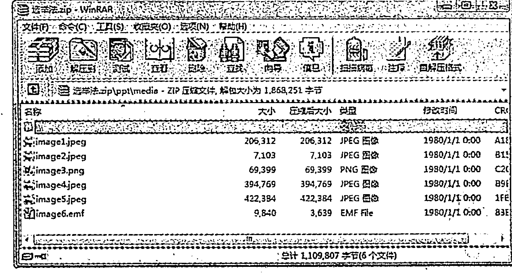

> 如果是传统的PPT格式，可以先另存为PDF文件，再转换为图片文件进行使用。

# 表格样式一键完成替换操作

> **Q：** 为了让表格看上去更加有层次感，为表格增加了一个对应的样式，可是同事对这个样式非常不满意。那么请问有没有什么方法可以一键进行替换操作呢？

**A：** 首先点击“插入”标签中的“表格”命令，将当前的表格信息建立起一组超级表。接下来点击“设计”标签中的“表格样式”选项，在弹出的对话框里面就可以选择一个全新的样式风格来使用。

# 快速统一PPT中的字体信息

> **Q：** 无论在何时何地，文字都是表达的重要载体，当然在PPT文档里面也不例外。但是有的时候一个PPT使用了多个字体，这样看上去非常的不统一。那么如何对所有的字体进行统一设置呢？

**A：** 首先点击“开始”标签中的“替换”命令，在弹出的菜单里面选择“替换字体”这一项。接着在弹出的对话框的“替换”列表中选择要替换的字体，在“替换为”列表中选择需要的字体。最后点击“替换”按钮，就可以完成字体的统一设置了。

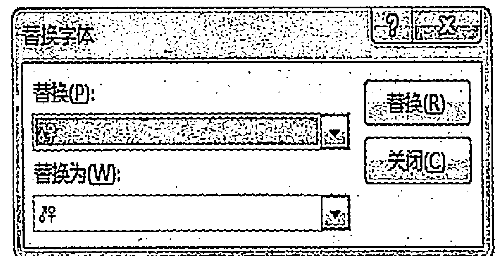

# 文本框内容设置一个默认值

> **Q：** 每次打开文本框输入文字后，都需要进行字体调整、修改字号、增加颜色等环节，但是每次都这么设置非常繁琐。那么有没有类似于格式刷的功能可以选择？

**A：** 首先按照以前的方法进行操作，操作完成以后点击鼠标右键，选择菜单中的“设置为默认文本框”命令。这样就相当于制作了一个文字模板，以后再次新建文本框的时候，就会直接显示出之前所设置的这个效果了。

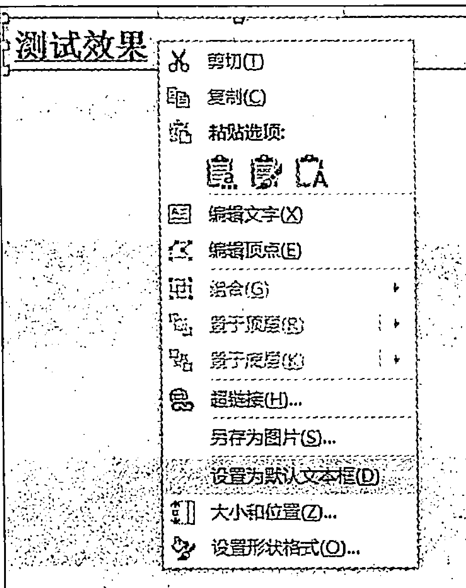

# 如何使插入的图片可以筛选

> **Q：** 最近做了一个产品的报价表，而且在每个产品后面都插入了图片，这样就可以和产品进行一一对应。那么这些插入的内容，能不能也像文字那样进行排序操作啊？

**A：** 这个问题可能暂时无法解决，因为现在的办公软件都还无法识别图片中的内容。即使是可以进行识别操作，也仅仅可以按照图片中的文字信息进行排序，而不能按照商品的图形进行排序。如果一定要这么做的话，可以在图片表格里面加上文字说明，从而按照这些文字说明来进行排序操作。

# 火狐浏览器为什么无法安装扩展

Q: 火狐浏览器和谷歌浏览器一样，都是以扩展丰富而闻名。平时我都是将扩展文件下载到本地硬盘后，通过鼠标拖拽的方式来进行安装的，今天按照同样的方法进行操作却无法安装。请问这是什么问题造成的？
A: 为了避免病毒通过扩展的形式进入系统，火狐浏览器现在有一个签名验证的功能，如果扩展没有数字签名的话，将无法进行安装操作。所以首先在地址栏输入“about:config”，搜索“xpinstall.signatures.required”，最后将参数修改为false即可。

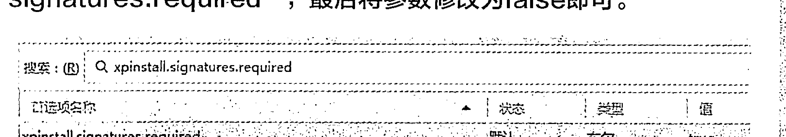


还是建议大家通过应用商店，下载安装浏览器的功能扩展。

# 打开文本文件后恢复到之前的位置

Q: 平时喜欢下载一些文本文件的小说来查看，可是查看完以后再一次打开这个文件，需要非常麻烦地去寻找之前的阅读位置。那么有没有什么方法，可以在打开文本文件后自动恢复到之前的位置呢？
A: 其实使用专业的阅读器就可以方便地解决这个问题。比如通过MyReader软件程序打开文本文件后，点击工具栏中的“启动时自动恢复现场”选项。以后再打开同一个文件的时候，就可以自动恢复到之前的位置。

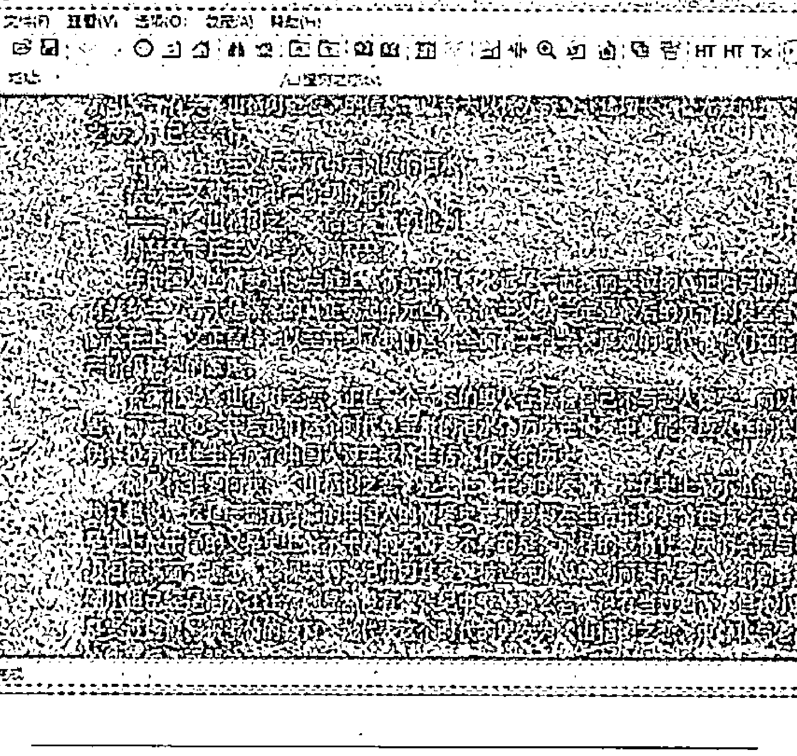

# 换种方式在线观看电视节目

Q: 平时都是通过“央视影音”这款软件来在线收看电视节目的，可是最近这款软件的运行经常出问题。那么还有什么方法可以在线收看电视节目呢？
A: 其实网上有很多电视节目直播的播放列表，下载以后将其拖拽到播放软件里面，经过短时间的缓冲后就可以在线播放了。打开软件的播放列表，就可以进行“换台”等操作。

# 如何删除“使用迅雷影音播放”

Q: 安装了迅雷下载软件之后，右键菜单出现了一个“使用迅雷影音播放”命令，可是怎么都删除不了。若不想安装别的软件，还有没有好办法解决呢？
A: 首先打开系统中的注册表编辑器，点击“编辑”菜单中的“查找”命令，在弹出的对话框里面输入“使用迅雷影音播放”这个关键词进行查找，在查找到的内容上点击鼠标右键，选择菜单中的删除命令就可以了。接下来继续进行查找，找到以后再删除即可。

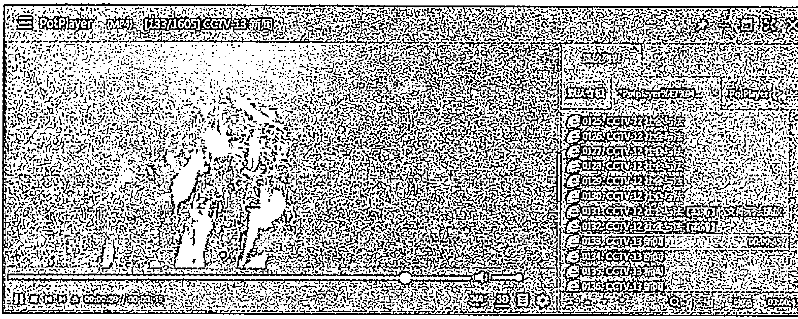

# 自动在地址栏显示剪贴板内容

Q: 家里有一台旧电脑使用的是GreenBrowser浏览器。如果剪贴板里面有内容的话，在新建一个网页标签后能不能自动对这些内容进行操作？
A: 首先进入GreenBrowser的文件夹目录，打开其中的User\GreenBrowser.ini文件，找到其中一个名为BlankMonitorClip的参数，将这个参数的数值修改为2就可以了。这样如果是网页链接就打开，如果是文字信息就进行搜索。

# 从百度网盘获取直接下载链接

文 | 老万

Q: 由于国内的网络硬盘相继关闭，于是百度网盘就成为为数不多的选择，然而由于网盘限速等问题，使用起来也越来越糟糕。那么有没有什么方法可以突破它的下载限制呢？

A: 首先登录到谷歌的应用商店，搜索并安装一款名为baidudl的扩展。接下来登录到自己的百度网盘里面，点击这个扩展就可以识别到网盘里面已经存在的文件信息。这时会弹出一个对话框，点击后面的“Generate”按钮，就可以获得每个文件直接下载的链接了。


利用“百度网盘直接下载助手”这个脚本，也可以解决类似的问题。

# 关闭标签并不关闭火狐浏览器

Q: 现在的浏览器都采用了多标签的形式，可是有的时候在连续关闭所有标签后，浏览器也会自动跟着退出。那么有没有什么方法，可以保证关闭标签的时候不关闭退出火狐浏览器呢？

A: 首先在Firefox地址栏中输入命令“about:config”，按下回车键，在设置界面的搜索框里面输入“browser.tabs.closeWindowWithLastTab”这个参数。找到以后双击设置参数后的value值，就可以使默认值被修改为false，重新启动浏览器就可以解决这个问题了。


# 如何查看自己的密码有没有泄露

Q: 现在经常听到某个网站被入侵，从而造成数据库泄露的新闻。那么有没有什么方法可以检查哪些密码信息被泄露了，从而及早修改自己的密码信息呢？

A: 首先通过浏览器访问https://haveibeenpwned.com/这个网站，它里面收入了大约3.06亿个泄露的密码信息。只需要在网站输入框里面输入一个密码，点击后面的按钮就可以判断出这个密码是否存在于泄露的数据库里面。如果已经泄露的话，建议大家提早进行修改操作。


# 在地址栏快速显示数字证书信息

Q: 原本在谷歌浏览器地址栏查看网站的数字证书是一件非常方便的事情，但是谷歌浏览器很久前将这个功能移到了开发者工具中，这样查询起来自然而然就会变得非常麻烦。那么有没有什么方法可以重新在地址栏查看它呢？

A: 首先在浏览器的地址栏输入“chrome://flags”并按下回车键，点击右上角的菜单按钮并选择“查找”命令。接着在弹出的搜索框里面输入关键词“Show certificate link”，找到这个选项后点击“启用”按钮就可以了。

# 免费获取迅雷的VIP账号密码

Q: 以前迅雷有一个账号暂停的功能，不知道什么时候给取消了。由于平时用得比较少，所以没有对迅雷账号进行续费。那么需要的时候，从哪里能临时获取迅雷的账号密码呢？

A: 虽然有很多论坛、QQ群甚至一些网站都在共享一些视频客户端、下载工具的VIP账号，但这些账号来源不明（多为非法手段盗取），所以在此傻博士建议大家如果真的需要某些应用软件的VIP权限，可以参与官方举办的活动，如签到送会员或积分兑换等，而不是通过“共享”的方式不劳而获。

# 地震预警如何才能快速知道

文 | 老万

Q：不久之前四川又发生了一次大的地震，造成了非常巨大的损失。那么在智能手机已经普及的今天，能不能通过手机了解到地震的预报信息以及如何进行防范的方法呢？

A：可以安装一款名为《地震预警》的应用，通过它就可以及时地接收到最新的地震信息。而且这款应用还有一个预警功能，能够提供几秒到几十秒预警时间。同时还可以设定一个阈值，使得在地震波可以影响的位置时，就会及时通过警报的方式提醒用户。


通过“国家应急广播”这款应用，也可以了解到各个自然灾害的预报。

# QQ直接识别提取图片文字

Q：有的时候需要将图片中的文字提取出来，这样在电脑里面就会使用到OCR软件。那么电脑里如果没有这类软件，通过手机能不能解决这个问题呢？

A：很多用户都安装了QQ客户端，通过它就可以解决这个问题。通过QQ接收到图片后，首先点击放大这张图片，接着只需要长按这张图片就会弹出一个菜单，点击菜单中的“提取图中文字”选项，然后稍等片刻就可以获得提取结果。

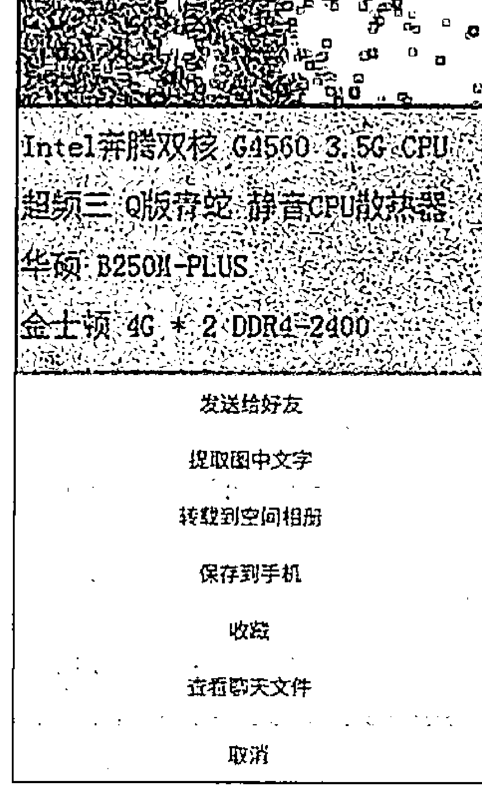

# 在手机上快速预览各种文档

Q：虽然智能手机的功能越来越强大，但是要想查看各种各样的文档信息，还是需要安装各种对应的文档软件才可以。那么有没有什么软件可以阅读常见的各种文档内容呢？

A：如果不考虑文档编辑的话，那么可以试一试Docs这款应用。它最大的特点就是支持Office办公文档和PDF文档，以及TXT、HTML、XML等其他常见的格式。运行这款应用后它会自动分析出手机已有的文档，然后对这些文档进行分类，这样可方便用户快速地进行查询和浏览。

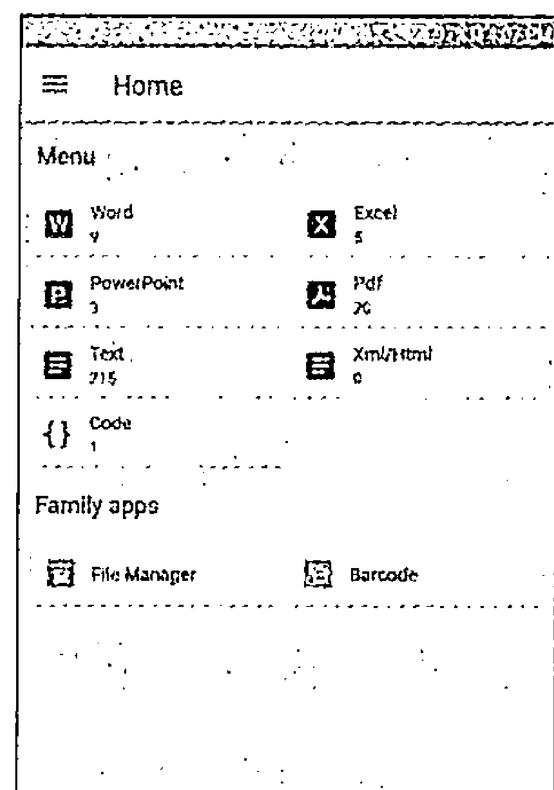

# 拍摄书籍封面怎样才可以不扭曲

Q：有的时候需要通过手机拍摄一些书籍的封面来使用，可是由于拍摄角度等各种各样的原因，拍摄出的封面照片往往会呈现一定的扭曲。那么如何才可以解决这个问题呢？

A：首先启动运行“扫描全能王”这款应用，按下“拍照”按钮进行拍摄操作。接着应用会自动对拍好的内容进行识别，比如调整照片的边框以及角度等等。自动修复完成以后会出现一个预览图，如果觉得预览图没有问题的话，点击右下角的“√”按钮确认就可以了。最后生成的图片，可以保存为JPG或PDF。

# 手机能不能进行比价操作

Q：如今网购让我们的生活变得越来越便利，为了在网上购买到更加价廉物美的商品，可以通过比价软件来进行操作，而往往手机上的价格比电脑上的价格更加便宜。那么在手机上有没有比价的方法呢？

A：可以安装一款名为“购物党”的APP，将商品的链接复制到剪切板，这样“购物党”就会自动识别商品并提供比价功能了。在提供的价格走势图里面，可以看到这款商品的最高价格和最低价格。

## 快速修复Windows系统错误

文|老万

Q: 最近不知道什么问题，操作系统总出现各种各样的小错误，比如桌面图标无法正常显示等等。虽然不会影响操作系统的正常运行，但是这些错误老是给人一种不爽的感觉。那么有什么方法可以清除这些小错误吗？

A: 可以使用 “Wise PC 1stAid” 这款修复工具，安装完成以后会在软件界面中显示出常见的系统小问题，并且通过缩略图的方式进行展现。这样只需要点击自己对应的问题，在弹出的对话框里面点击右下角的 “Fix Now” 按钮，就可以对出现的问题进行修复了。

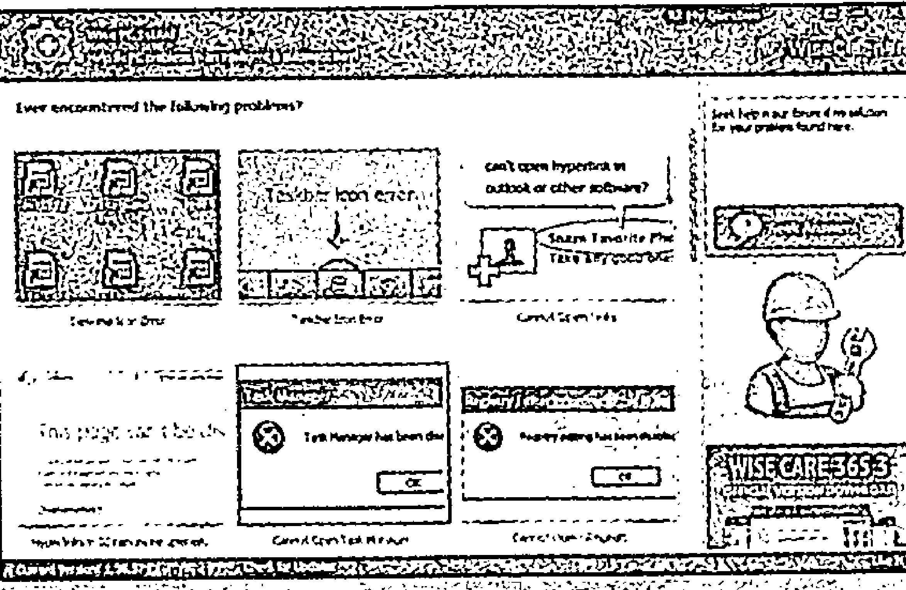


## 在不同位置批量新建文件夹

Q: 由于需要对系统里面的文件进行整理，需要在系统里面创建多个文件夹目录，但是这些文件夹目录处于不同的位置。那么通过什么方法才可以批量进行快速的创建操作呢？

A: 首先新建一个Excel空白工作簿文件，在A列输入自己要创建的文件夹目录的名称，在B列输入要创建的文件夹目录的位置，在C列输入创建命令MD。在D列设置公式 =C1&B1&A1，把D列内容复制到记事本中，然后保持为批处理文件。运行这个批处理文件后，就可以批量创建文件夹目录了。

## 如何修改有线和无线网络的优先级

Q: 我的电脑既接入了有线网线，也可以接收无线的数据信号，个人还是觉得接入的有线数据信号要稳定一些。那么如何才可以让有线数据信号的优先级高于无线数据信号的优先级呢？

A: 首先打开系统的 “网络连接” 窗口，点击 “高级” 菜单中的 “高级设置” 命令。在 “高级设置” 对话框中选择 “适配器和绑定” 选项卡，在 “连接” 下选中 “以太网” 这一项。点击窗口右侧的绿色箭头，把 “以太网” 提前到 “无线网络连接” 之前，点击 “确定” 按钮就可以修改优先级了。

## 什么软件可以搜索FAT32格式的磁盘文件

Q: 我把自己的一台旧电脑给父母用，为了运行起来更加快捷，安装的是Windows XP操作系统，而磁盘格式选用的是FAT32。虽然这个系统对于父母来说没有问题，但是如果想查找文件却非常麻烦。那么有没有支持这个系统的搜索软件呢？

A: 很多软件之所以无法在Windows XP操作系统里面运行，就是因为它们不支持FAT32这个磁盘格式。而 “Wise JetSearch” 这款软件就支持所有流行的磁盘格式，运行它以后只需要在搜索框输入文件名，回车后就可以快速检索出需要的文件了。

## 自动清理操作系统的内存大小

Q: 本人使用软件的时候有一个习惯，就是尽量选择小而精的软件，而不是那些大而全的软件，可是现在很多拥有内存清理的软件体积都比较大。那么有没有专门的内存清理软件呢？

A: “Wise Memory Optimizer” 就是这样的一款软件，运行它以后可以在操作窗口看到两个提示框，只需要点击 “Optimize Now” 按钮，就可以马上对内存进行清理优化。另外点击右上角的设置按钮，在弹出的对话框里面可以开启自动清理内存的选项，根据自己的内存大小设置一个自动清理的阈值就可以了。

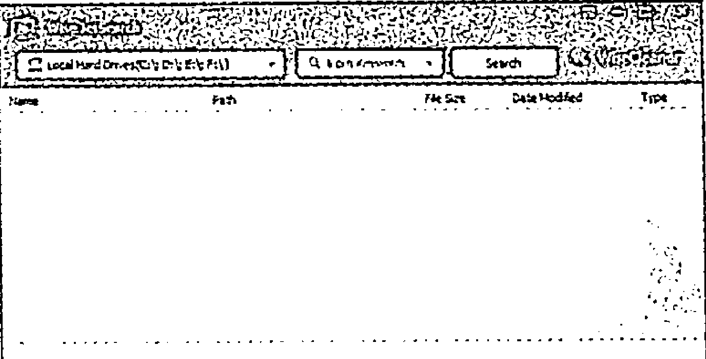

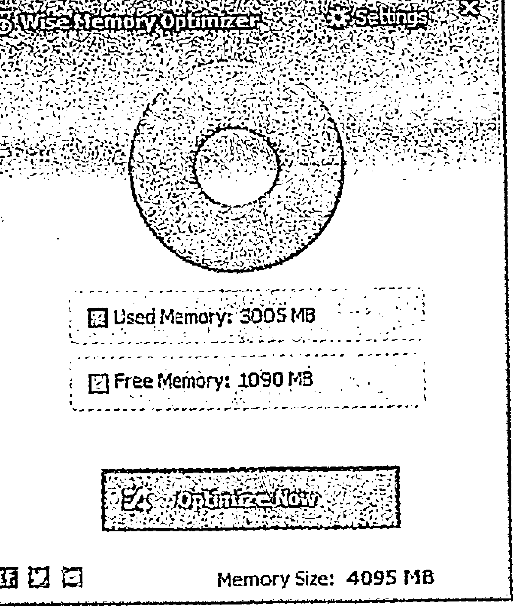

## 关闭百分浏览器的首页网址导航

文|老万

Q: 最近将百分浏览器升级到最新的版本，结果打开以后发现首页变成了一个网址导航的推广页面，个人比较反感这类的网址导航网站。那么请问如何才可以关闭这种推广页面呢？

A: 首先点击百分浏览器右上角的“自定义及控制”按钮，在弹出的菜单里面点击“设置”命令。接着在设置页面拖动网页右侧的滚动条，就可以找到名为“启动时”的选项。在下面有一个名为“打开推荐网站”的选项，将这个选项关闭就可以了。

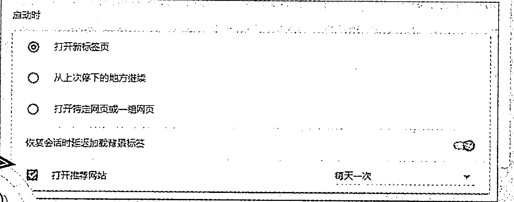


百分浏览器作为一款免费的软件，需要一定的收入才可以维持后续开发，建议保留这个推广选项。

## 无法使用SwitchyOmega扩展

Q: 最近给自己的火狐浏览器安装了SwitchyOmega这款功能扩展，可是按照扩展的要求进行配置操作后，这个扩展根本就没有起到相应的作用。不知道这是什么原因造成的？

A: 出现这样的问题可能是浏览器的远程DNS功能没有开启。首先在地址栏输入“about:config”，搜索关键词“network.proxy.socks_remote_dns”，将参数修改为true。重新启动火狐浏览器，看看能不能解决这个问题。

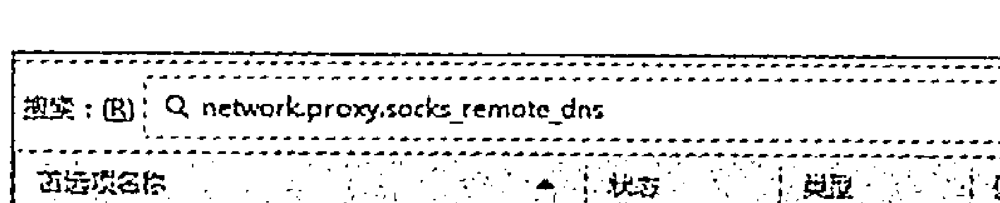

## CCleaner运行扫描后发生崩溃

Q: 平时使用CCleaner这款软件对系统垃圾进行清理操作，但是最近不知道什么原因，在进行垃圾清理的时候，一旦走到99%就会出现软件的崩溃。那么怎么解决这个问题呢？

A: 出现这样的问题是由于软件的一个小缺陷造成的，要解决它也非常简单。首先点击软件窗口左侧的“清理器”按钮，在“应用程序”列表中找到“压缩数据库”这一项，将已经勾选的选项去除后就可以解决这个问题了。

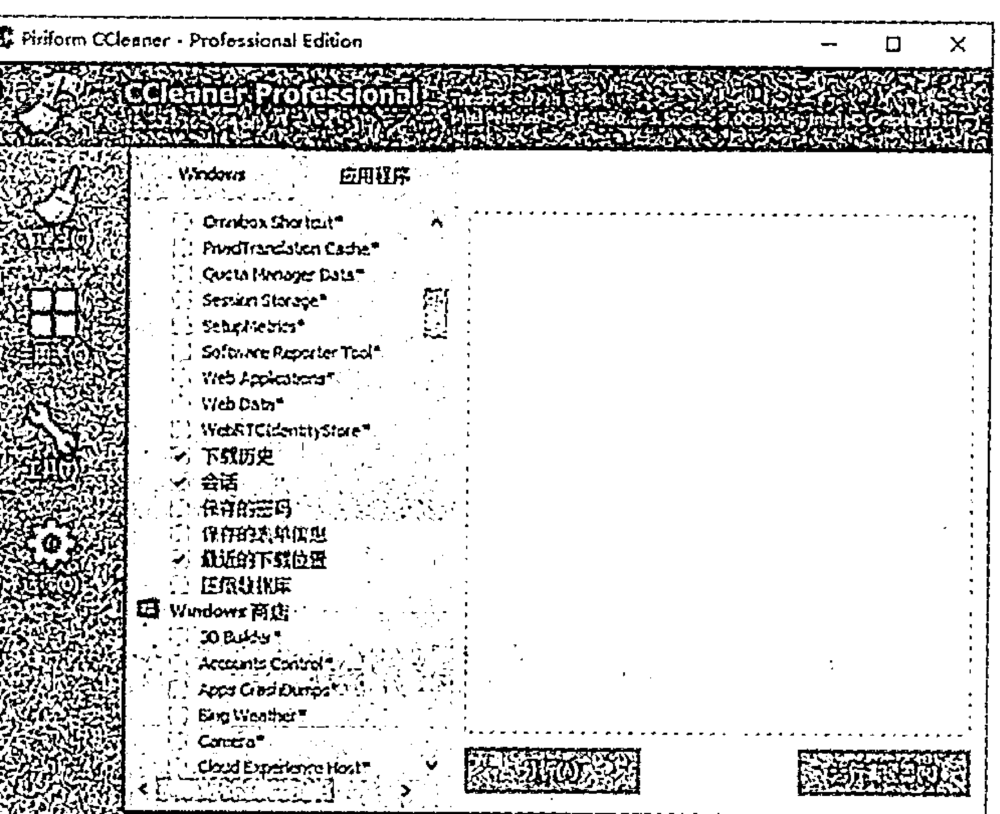

## 迅雷下载到99.9%卡死

Q: 使用的是迅雷极速版，可是在最新的操作系统里面，每当下载一会儿就会出现软件崩溃的情况。那么如何解决这个问题呢？

A: 由于迅雷极速版已经停止开发一段时间了，所以这个版本和最新的系统存在一定的兼容问题，于是才出现了经常崩溃的情况。建议更新到最新的软件版本来试一试，或者改用诸如“Internet Download Manager”等其他的下载软件来进行操作。

## IDM显示的下载速度是否准确

Q: 平时使用的下载软件是IDM，但是发现这款软件显示的下载速度非常不准，因为下载软件显示的是一个数值，而安全软件显示的是另外一个数值。为什么会出现这样的情况呢？

A: 其实两款软件显示不同的数值是非常正常的，因为下载软件只能显示它的下载速度，而安全软件则显示的是整个系统当前所有的下载数值。这个数值里面就包括了下载软件的数值，以及其他软件的下载数值，这样自然就出现了你所遇到的这个情况。CF

## 解决火狐的“建立安全连接失败”

Q: 今天通过火狐打开一个加密协议的网站，结果网页提示“建立安全连接失败”。非常奇怪的是，换了一个其他的浏览器却可以正常访问。请问这个问题是什么原因造成的？

A: 首先在火狐浏览器的地址栏里面输入“about:support”命令并按下回车，点击页面“配置文件夹”中的“打开文件夹”按钮，在弹出的窗口里面找到cert8.db这个文件。接下来完全关闭运行的火狐浏览器，将刚刚选择的文件进行删除，重新启动火狐浏览器就可以了。

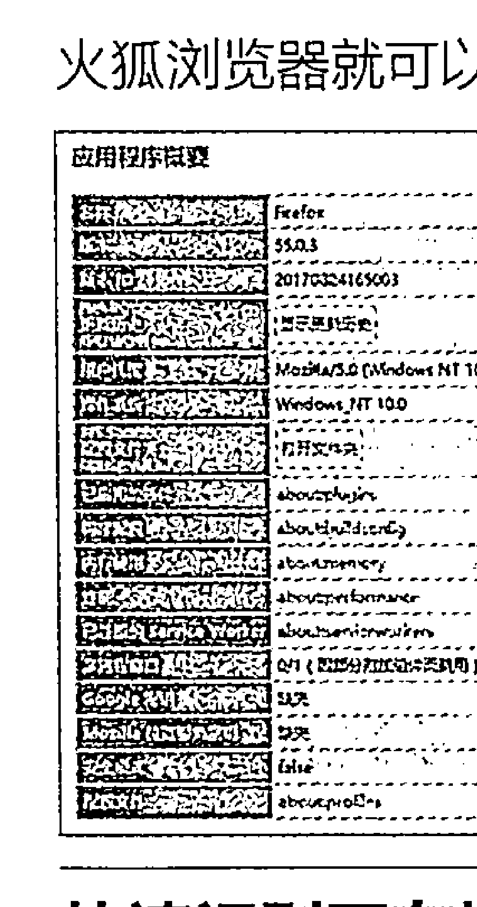

## 常见免费图床有哪些

文|老万

Q: 现在有的社交网站出于安全的目的，禁止用户直接上传图片等文件，而只准用户粘贴图片的链接信息，这个时候就需要使用到图床。那么有没有免费的图床可以推荐呢？

A: 其实国内外免费的图床还是很多的，只不过有的图床知名度比较低而已。比如此次推荐的“SM.MS”这个图床，打开它以后将图片拖拽到窗口里面释放，点击上传按钮，就可以得到一张图片文件的分享链接。

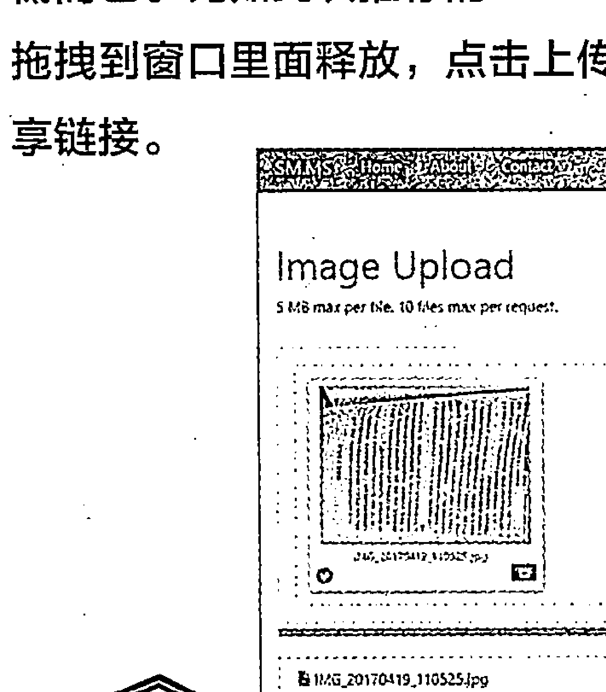

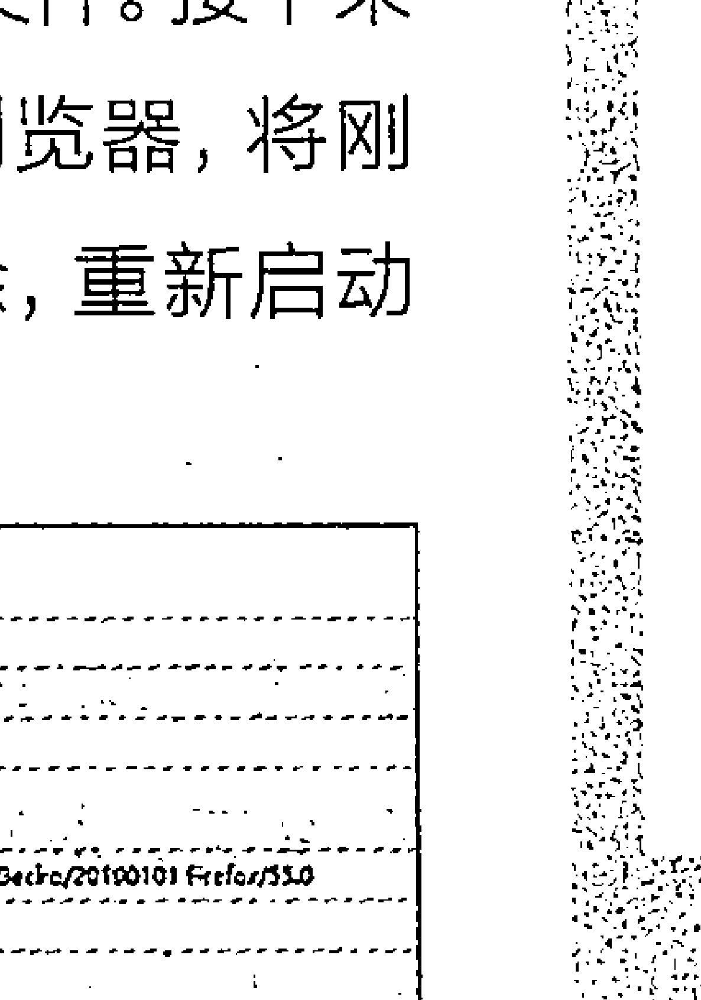

利用新浪微博也可以实现免费图床的目的。

## 快速识别正在播放的音乐名称

Q: 有的音乐APP里面有一个功能，通过该功能可以识别出正在播放的音乐名称。那么在电脑里面通过什么方法可以在浏览器里面识别出正在播放的音乐名称呢？

A: 如果使用的是谷歌浏览器内核的浏览器，那么只需要通过应用商店安装一款名为“AHA Music”的功能扩展，安装完成后就可以在工具栏上看到它的图标。以后在进行音乐播放的时候，只需要点击这个图标就可以开始识别，识别出的音乐名称会显示在扩展的对话框列表里面。

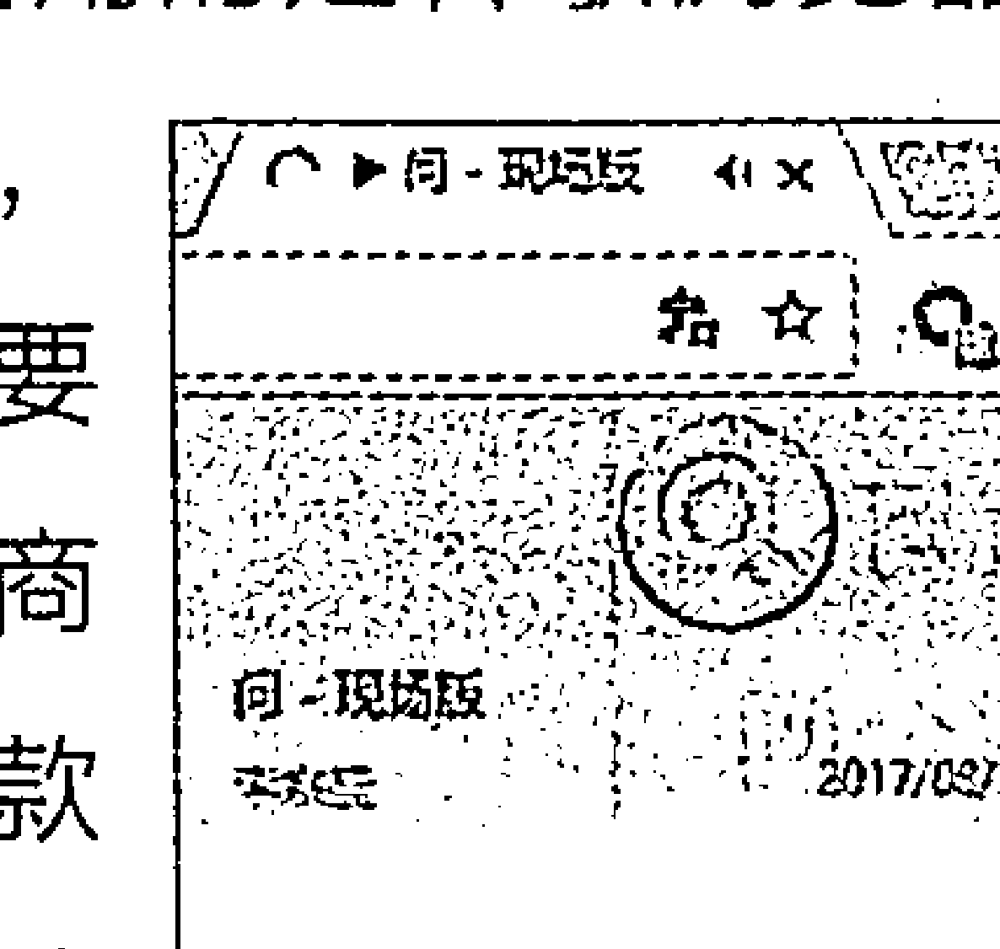

## 对指定的IP地址进行综合性查询

Q: 现在有很多网站都可以查找IP地址的信息，但是这些网站往往只能对应出这个IP地址的位置，至于其他的信息就无法进行显示了。那么有没有什么网站可以更好地显示出更多详细的信息内容呢？

A: ip.sb就是这样一个综合性的查询网站，登录到这个网站以后，首先显示的就是当前系统IP地址对应的信息内容。如果想查询其他IP地址信息，只需要在右上角的输入框里面输入IP地址进行检索就可以。

## 快速查询哪些国家可以实行免签

Q: 现在很多人选择在节假日到国外去走走看看，可是签证却是其中最大的一件麻烦事，如果能免签就好了。那么通过什么方法能快速查询到哪些国家或地区可以实行免签呢？

A: 可以登录http://visadb.io/index.html这个网站，在“Citizenship”列表里面选择中国这一项。在“Where”列表里面选择目的地所在的州，最后点击GO按钮就可以看到相关的免签信息了。

## 如何自由设置手机CPU运行方式

文|老万

Q：现在的手机CPU都有大小核的区分，在进行不同任务的时候会调用不同的核心，从而兼顾到省电以及运行效率等等。那么有没有什么方法可以对CPU的大小核进行切换，让它更加符合个人的要求呢？

A：可以安装一款名为“镧·系统工具箱”的应用。打开这款应用后，在弹出的应用列表里面可以看到“处理器一般配置”和“处理器高级配置”两个选项。可以根据自己的需要，在这两个选项里面进行配置操作。


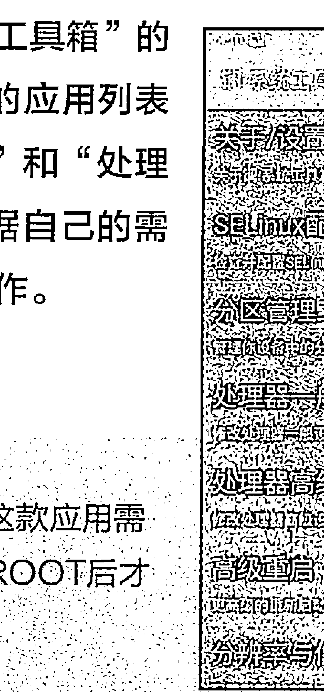

## 遇到灾害后智能手机有何用

Q：个人感觉今年的极端灾害好像特别的多，除了九寨沟地震以外还有超级台风。可是在遇到极端灾害的时候，我们的手机往往都没有信号。那么在这个时候手机还有什么用呢？

A：智能手机里面包括很多的小功能，像手电筒、指南针、收音机等，在遇到极端灾害的时候都可以给我们很大的帮助。比如在天黑的时候，通过手电筒按下“三长，三短，三长”这样的求救信号，就可以让周围的人尽早地找到我们。

## 恢复魅蓝Note 2设置图标

Q：老爸使用的手机是魅蓝Note 2，最近他在操作的时候不小心将设置按钮的图标删除了。那么请问有没有什么方法可以恢复这个设置图标呢？

A：要想解决这个问题，看来只能恢复到手机的出厂状态才可以。首先将手机进行关机操作，接着同时按下电源键和音量加键，当系统进入到Recovery这个状态以后，点击清除数据按钮就可以了。在进行这个操作以前，一定要备份好数据。

## 免费的手机照片备份方案

Q：现在国内很多网盘相继关闭，这样就给备份照片带来了非常大的不便。那么有没有比较好的解决方案推荐一下呢？

A：不久之前“非死不可”针对中国用户推出了一款名为“彩色气球”的手机应用，通过它就可以将手机里面的照片备份到云端服务器里面，而且号称可以无限使用存储空间。当用户将手机里面的照片备份到云端之后，通过微信分享等多种方式就可以分享给自己的亲朋好友了。

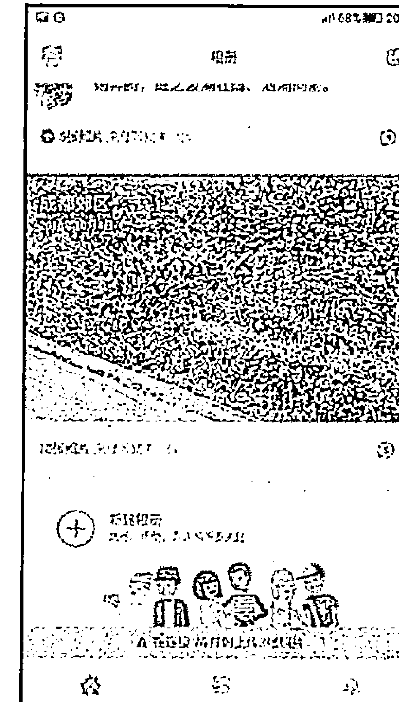

## 为什么手机使用Wi-Fi网络时速度比较慢

Q：今天将手机连接到家里的Wi-Fi网络后，发现应用的访问速度非常慢。可是用其他设备连接以后，却没有发现这样的情况。请问这是什么问题造成的？

A：有的手机应用在安装的时候，会安装一个Wi-Fi助手的模块，这样这个模块就会随时监测周围的Wi-Fi信号。一旦经常使用的信号出现不稳定的状况，就会连接到其他的Wi-Fi网络。所以用户需要检查一下当前手机连接的Wi-Fi是否是自家的网络，如果不是的话，重新切换到自家的网络就可以解决这个问题了。

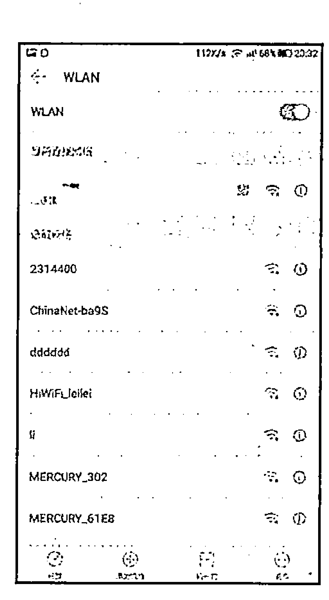

## 阻止文字突破表格边框

Q: 除了图片以外，有的时候由于输入的文字内容较长，也会突破表格边框的限制。那么如何才可以解决类似的问题呢？

A: 这个问题和之前的那个问题类似，解决方法也非常类似。首先打开表格的属性窗口，点击窗口中的“单元格”标签。接着点击右下角的“选项”按钮，在弹出的对话框里面将“自动换行”和“适应文字”选项前面的勾选去除就可以了。

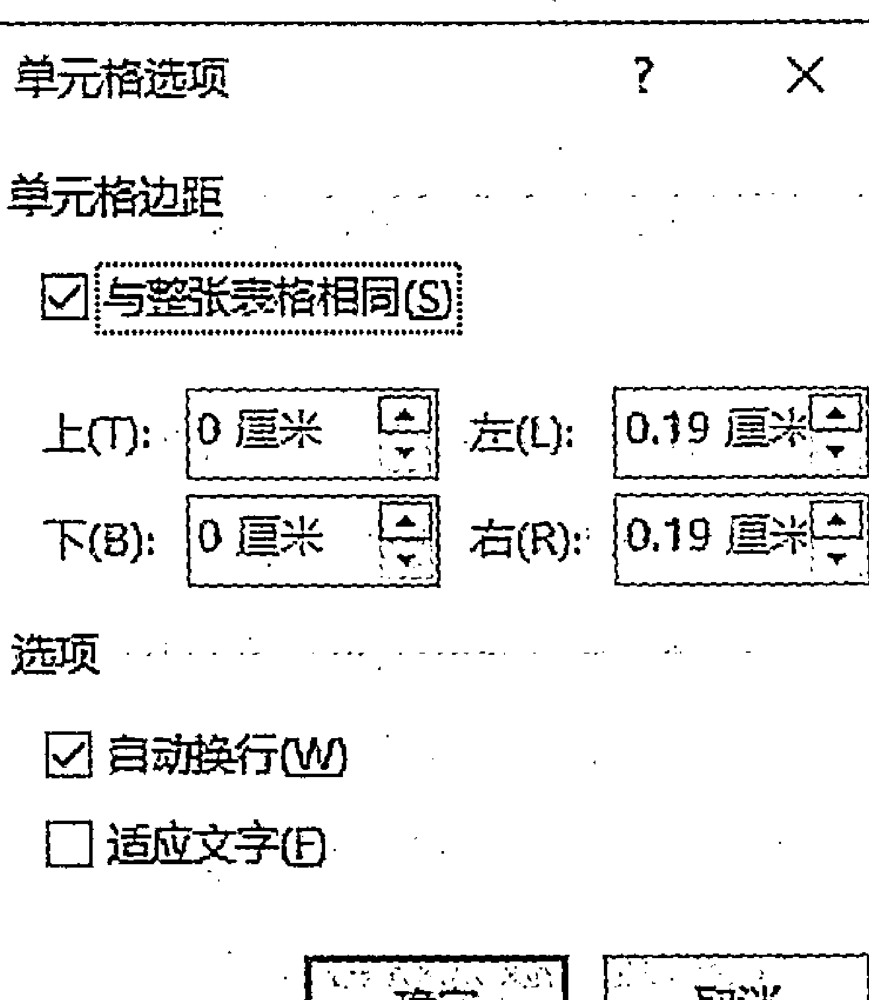

## 快速选择文档内容

Q: 在进行文档内容编辑的时候，首先需要对编辑的内容进行选择，虽然软件有一个选择命令，但是只能对整篇文章进行操作。那么如何才可以对每一行或者每一段的文字进行快速选择呢？

A: 在Word里面将鼠标移动到文字开头的左侧，当鼠标的光标变成反向箭头的时候，单击它就可以全选这行文字，双击它则可以全选这个段落的文字，如果是连续单击三次则是选择整篇文章的文字。

## 如何让表格的背景颜色隔行变色

文|老万

Q: 有的时候打开一个表格文件，看见里面满满的数字内容信息，感觉头都一下子大了。为了让用户更加方便地读取表格信息，能不能采用每一行使用不同颜色的方法进行区分呢？

A: 解决这个问题非常简单，首先通过鼠标选中需要套用颜色的表格，点击Excel软件程序中的“开始”标签。接着点击工具栏中的“套用表格格式”按钮，在弹出的对话框里面选择一个颜色样式，很快所选的表格就可以套用这个隔行变色的样式了。

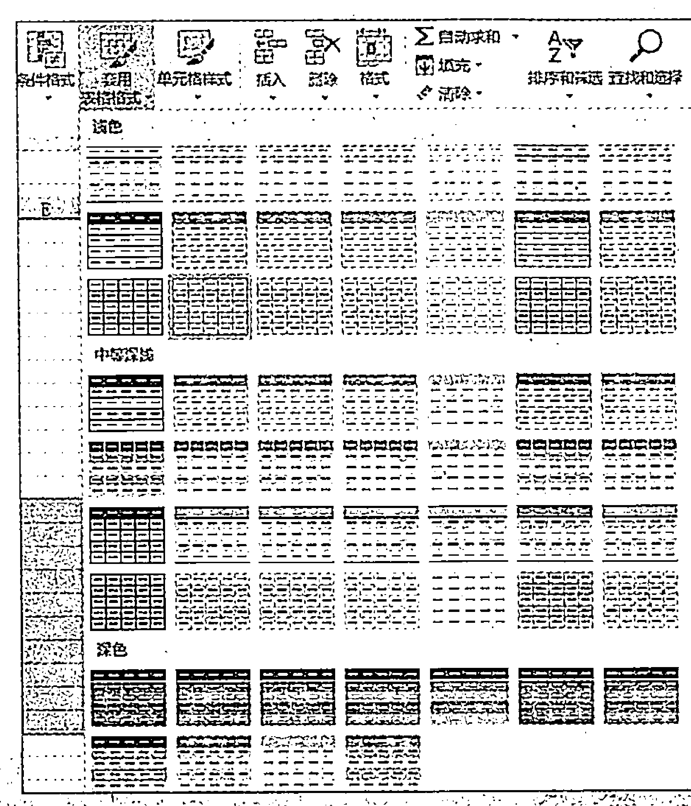


点击“设计”标签后，取消“镶边行”并勾选“镶边列”，就可以实现隔列变色的效果。

## 防止图片冲破表格的边框

Q: 有时需要在表格里面加入一些图片，但是由于这些图片的大小不统一，往往就会突破表格的边框，这样看上去非常难看和不协调。那么如何将图片限制在表格的边框内部呢？

A: 首先通过鼠标全选整个表格，点击鼠标右键，在弹出的菜单里面选择“表格属性”命令。接下来会弹出一个属性窗口，点击其中的“选项”按钮，在弹出的选项对话框中，将“自动重调尺寸以适应内容”这个选项取消后就可以了。

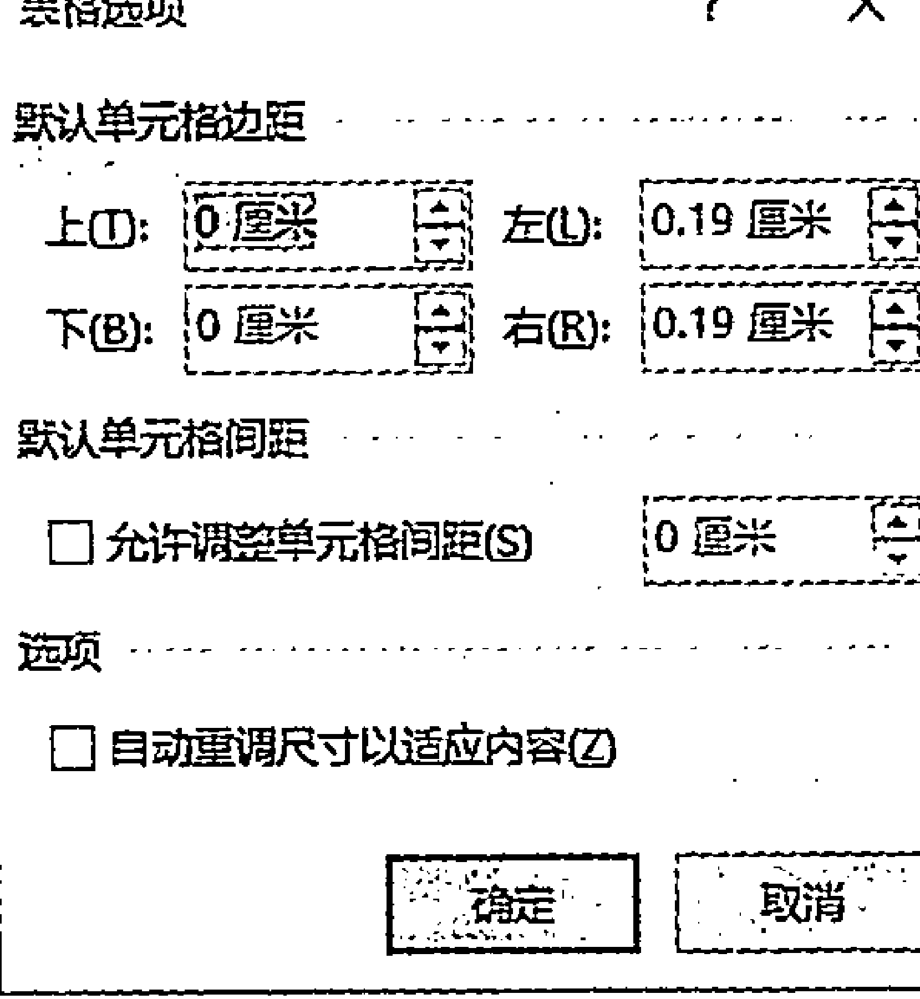

## 批量替换成剪贴板中的内容

Q: 有的时候需要在一篇文章里面的多个地方插入同一张图片，如果一张一张地进行手动操作肯定非常麻烦。那么有没有什么批量解决的方法呢？

A: 首先在需要插入图片的位置输入同一个字符串，将图片复制到系统的剪贴板里面。然后打开“查找和替换”对话框，在“查找内容”里面输入字符串信息，在“替换为”中输入^C这个信息，最后点击“全部替换”按钮就可以批量完成操作了。

## 借用“照相机”完成内容复制

文/老万

Q: 有时候我们需要将多个不同表格中的部分内容合并到一个表格里面进行打印操作，可是由于不同的表格设计不同，所以使用传统的复制粘贴操作很难完成。那么还有什么方法可以解决这个问题呢？

A: 首先在Excel的选项对话框里面，将“照相机”功能按钮添加到快速访问工具栏。接下来选中要复制的表格内容，点击工具栏中的“照相机”按钮。然后在要贴的表格上点击一下，这时之前复制的内容就会以“图片”的形式粘贴到这里，当然它原有的格式也会被保留下来。

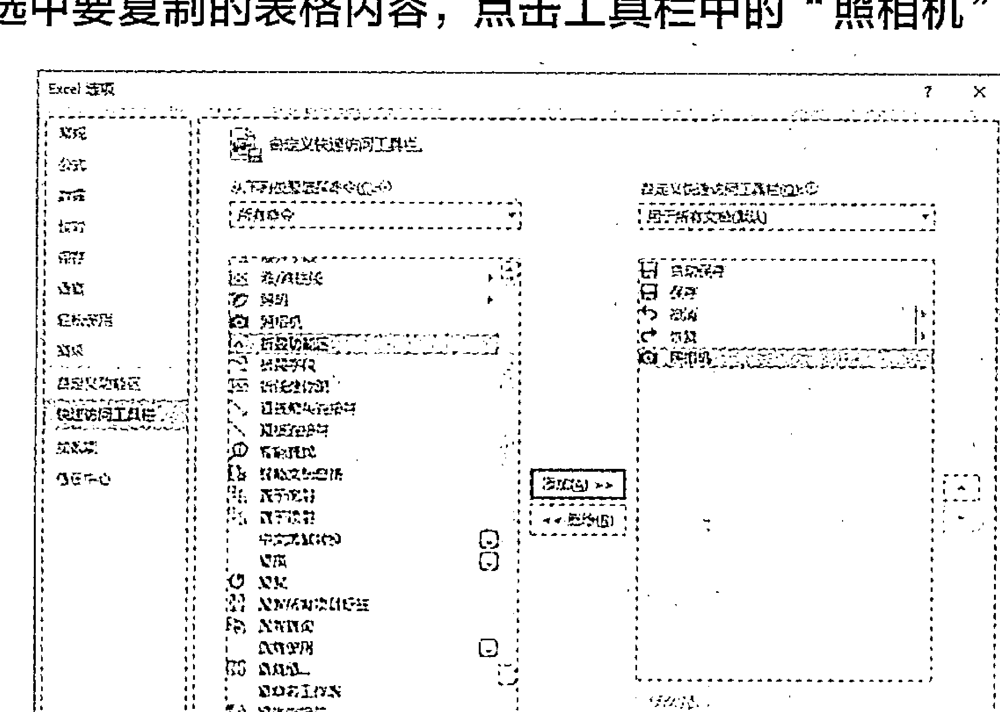

虽然“照相机”复制的数据看上去是一张“图片”，但实际上对应的数据却可以根据表格而自动更新。

## 添加删除行后让序号自动修改

Q: 在编辑表格的时候，经常会添加或者删除其中的某一行，这个时候会发现添加或者删除后的行号并没有进行自动的修改，还需要一个一个地手动修改。那么怎样才能让它自动进行修改呢？

A: 首先在表格里面选中行号所在的单元格，输入如下这个公式“=ROW()-1”。然后利用鼠标将其拖拽到行末，这时就会发现那些已经删除或者添加的行号，已经被自动地进行更新修改了。

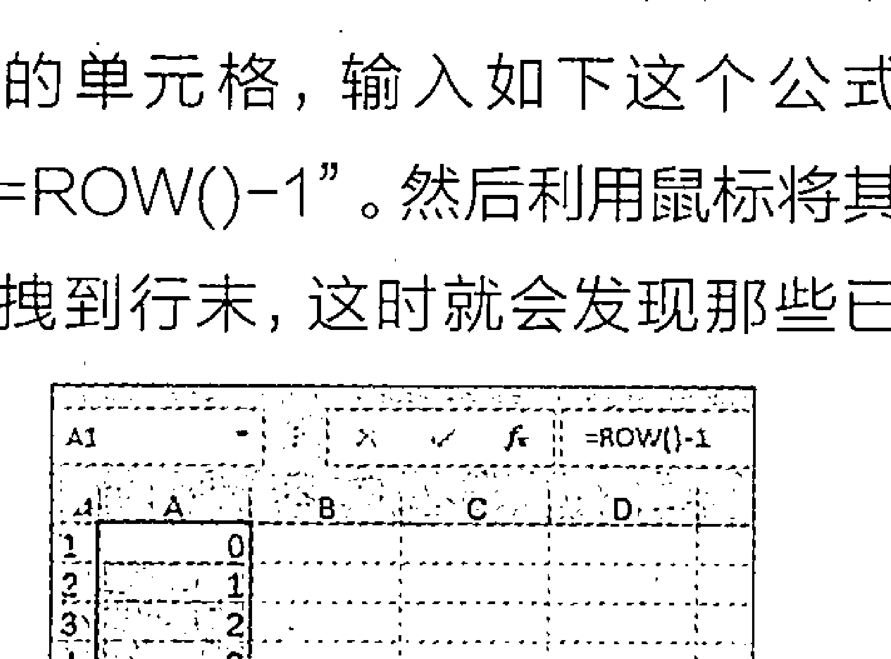

## 按照特殊的格式进行表格编号

Q: 通常在表格里面都是按照传统的1、2、3、4这种方法进行排序的，但是有的时候我们需要按照其他特殊的方法进行排序，就像数学里面的等差数列那样。那么有没有什么简单的方法可以快速完成类似的操作呢？

A: 首先在表格里面输入一个起始值，点击“开始”标签中的“单元格”区域，然后点击“填充”菜单中的“序列”命令。接下来在弹出的对话框里面，分别设置“序列产生在”和“类型”选项，最后输入“步长值”和“终止值”，点击确定按钮就可以解决这个问题了。

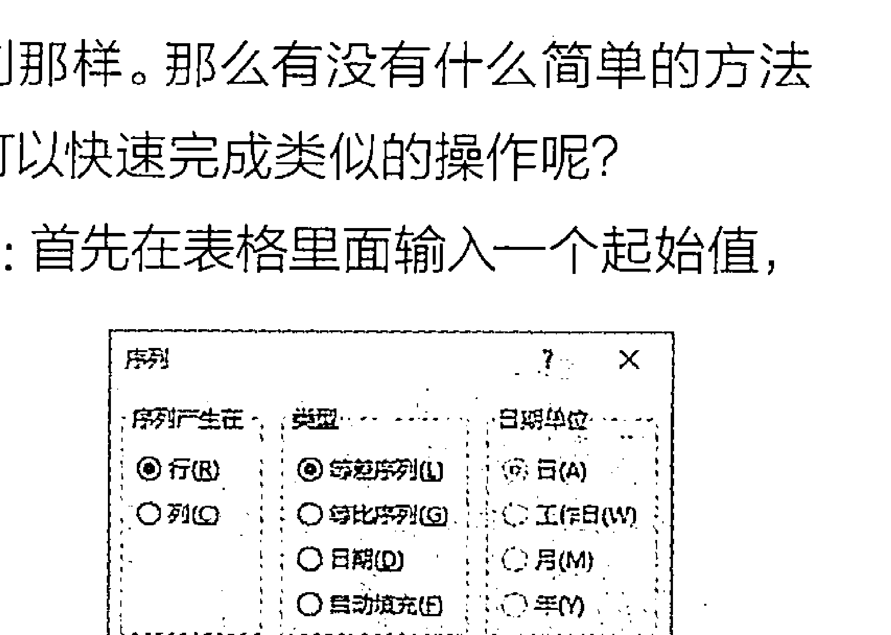

## PPT中的图片版式如何快速操作

Q: PPT文档里面图片是不可缺少的，但是要安排好每张图片的间距和比例，确实是一个比较麻烦的事情。那么有没有什么方法可以帮助我们快速完成这样的任务呢？

A: 首先选中PPT文档里面的所有图片，这时会发现办公软件多出了一个“图片工具”的标签。点击标签里面“格式”中的“图片版式”按钮，在弹出的对话框里面选择一个合适的版式就可以了。

## 如何将整个PPT文件拆分成单个文件

Q: 最近有同事想将一个完整的PPT文件进行拆分，可是按照传统方法的操作需要一个一个进行另存为才行，而这个PPT的内容比较多，那样操作的话肯定非常繁琐。有没有更加快捷的方法呢？

A: 首先利用软件打开PPT文件，点击左上角的“文件”按钮，在弹出的菜单里面选择“共享”命令。然后在右侧窗口点击“发布幻灯片”按钮，在弹出的对话框中设置一个保存地址，最后点击“发布”按钮就可以了。

## 如何在电脑桌面显示多时区时钟

**Q:** 由于公司在国外有多个办事处，所以经常需要到国外出差。那么如何在Windows 10的时间里面同时显示出多个不同时区的时间呢？

**A:** 首先在系统时间上点击鼠标右键，在弹出的菜单里面选择“调整日期时间”选项。接着在弹出的对话框里面点击右上角的“添加不同时区的时钟”命令，在弹出的对话框里面分别勾选“显示此时钟”选项，然后按照需求设定不同的时区就可以了。

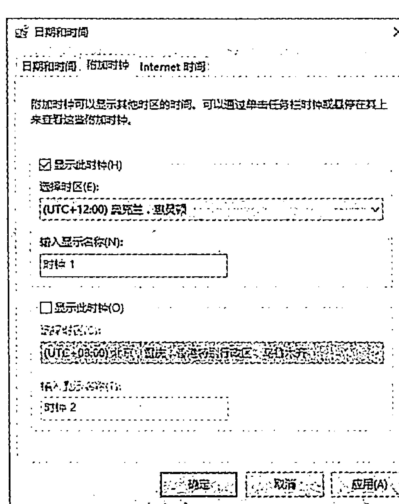

## 使用鼠标右键快速切换电源计划

**Q:** 通常我们都会将自己常用的命令想办法添加到系统桌面的鼠标右键里面。有没有什么办法将系统控制面板中的电源计划这个功能，添加到鼠标右键里面呢？

**A:** 方法肯定是有的，只需要对系统的注册表进行修改就可以了。不过这个操作比较麻烦，所以可直接下载

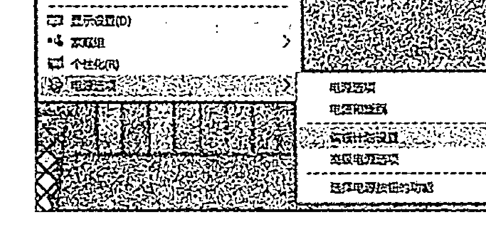

这个注册表文件运行（https://pan.baidu.com/s/1gfs07Ur），将这个文件添加到注册表里面，然后在系统桌面点击右键菜单，就可以看到电源选项的相关命令了。

## 该用32位还是64位的应用软件

文/老万

**Q:** 刚刚购买了一台新的电脑，所以安装的是64位的操作系统。想问问这个版本的系统到底是用32位的软件好还是用64位的软件好呢？

**A:** 通常情况下64位的操作系统还是建议使用64位的软件，这样可以更好地提升软件运行的效率。但是需要提醒的是，有的软件需要通过安装第三方的插件才能拓展功能，但是这些插件往往只有32位的版本。如果这时安装64位的软件就和这个插件不兼容，此种情况还是只能使用32位的版本。

## 傻博士有话说


有的软件在安装的时候会自动判断系统的版本，并且根据结果安装它认为合适的版本。

## 在Windows 10中检查磁盘驱动器错误

**Q:** 最近不知道是不是因为经常停电，所以在重新打开电脑以后，发现系统磁盘运行非常的不正常。那么有没有什么方法可以对系统磁盘进行检测，看看它到底有没有相关的问题呢？

**A:** 首先通过管理员权限打开系统的命令提示符窗口，在其中调用“chkdsk”这个命令就可以对磁盘进行检查和修复操作，比如要检查F盘中的问题，只需要在命令提示符中执行“chkdsk F /F”这个命令就可以了。

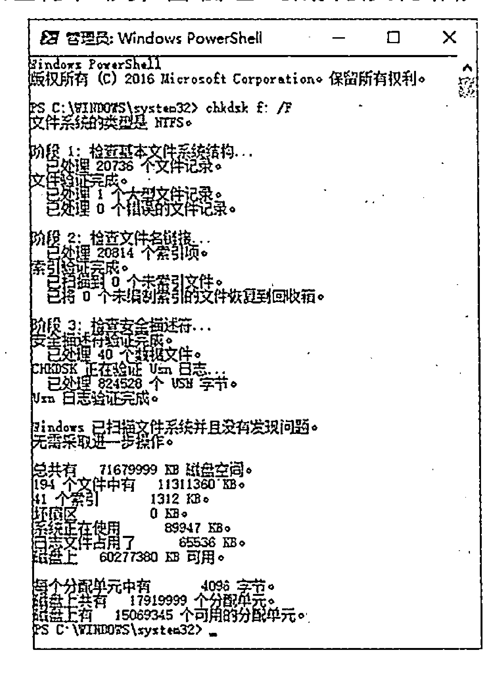

## 在Windows 10家庭版中启用组策略

**Q:** 通常在家庭版的操作系统里面，是无法启用系统的组策略功能的。那么有没有什么办法可以在家庭版里面加入组策略这个相关的功能呢？

**A:** 这里首先打开一个文本编辑器，输入一段脚本代码并且将这段代码保存为一个脚本文件（https://pan.baidu.com/s/1hr9dt8w），执行这个文件以后就会在系统里面激活相关的功能模块。只需要在“运行”输入框里面输入“gpedit.msc”这个命令，就可以打开组策略功能了。

## 扫描分析磁盘目录中的重复文件

文/老万

**Q:** 磁盘里面存放了大量的音频文件和图片文件，怎样才可以对磁盘中的这些文件进行分析，从而找出重复的文件信息并将它们进行删除？

**A:** 首先运行“重复文件扫描器”这款软件，点击“添加”按钮选择磁盘目录，然后点击“扫描”按钮进行分析操作。分析完成以后既可以手工选择重复文件，也可以点击“自动选择”按钮让软件进行协助操作，最后点击“清理文件”按钮就可以将重复文件进行删除。

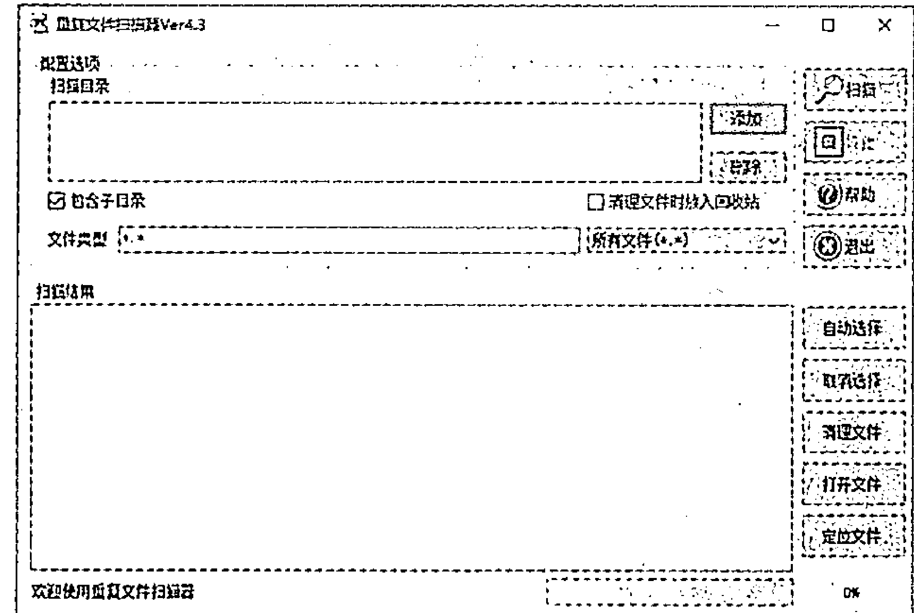

> 利用看图软件XnView也可以进行类似的分析操作。

## LAV Filters中文版本在哪下载

**Q:** LAV Filters是一款非常知名的多媒体滤镜，从哪里可以下载到它的简体中文版本？如果没有简体中文版的话，网友汉化的新版本也可以。

**A:** 这款滤镜没有简体中文的版本，虽然以前有网友出过汉化版本，但是那个版本已经非常老了。如果想要使用这款滤镜的话，这里提供两个解决方案。首先就是利用Textify软件，将滤镜操作界面的文字提取出来，然后再进行翻译来使用。或者首先安装汉化版的版本，将操作界面进行截图，再安装英文版本进行对照使用即可。

## FDM的下载路径如何进行设置

**Q:** 现在QQ旋风已经停止服务了，而迅雷在下载方面也显得很不给力，所以开始使用FDM这款下载软件。但是这款软件的下载路径如何进行设置呢？

**A:** 首先通过这款软件创建一个新的下载任务，在弹出的对话框中找到“保存到”这个选项，点击后面的第一个按钮，在弹出的对话框里面修改为自己想要的保存目录。接下来再点击第二个按钮，将其设置为默认目录就可以了。

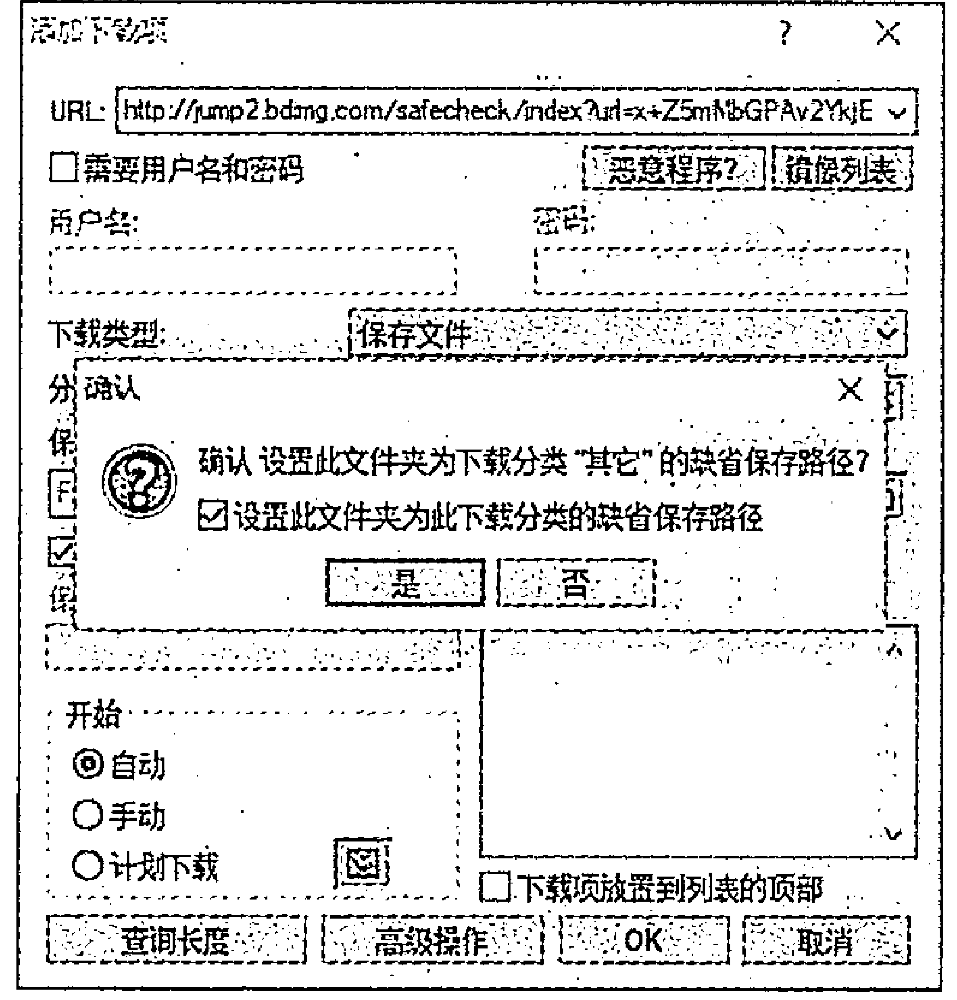

## 为何解压文件时提示头部错误

**Q:** 在利用WinRAR这款软件进行压缩包解压操作的时候，弹出一个提示框说文件头部有错误。那么这个提示问题到底是什么原因造成的？为什么会出现这样的提示呢？

**A:** 出现这样的问题可能是多种原因造成的，比如在制作压缩文件的时候操作不规范，或者在下载的时候出现了错误等等。可以考虑看看在压缩完成后，能不能获取到压缩包的所有文件。如果没有问题的话可以不用理睬这个提示，如果无法获取文件的话建议重新进行下载操作。

## 如何将FDM制作成绿色便携版

**Q:** 以前FDM这款软件的厂商都会提供绿色便携版的下载，可是现在不提供这个版本了。那么有没有什么方法将这款软件设置为绿色便携版本呢？

**A:** 首先需要安装FDM这款软件的安装版本，接下来点击软件界面左上角“文件”菜单中的“创建便携版DM”命令。在弹出的对话框中设置一个保存目录，点击OK按钮以后这个安装版本就会转换为便携版本了。

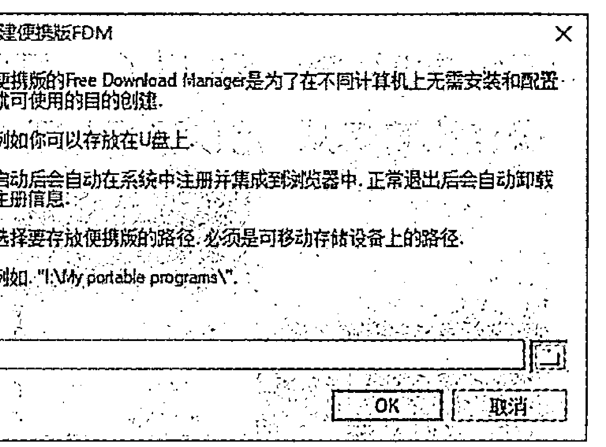

## 关闭QUIC避免出现网速不稳定

**Q:** 最近将谷歌浏览器升级到了最新的版本，结果发现访问速度不但没有提升，反而还出现了不定时的卡顿现象。那么这种情况到底是软件的问题，还是其他什么方面的问题呢？

**A:** 谷歌浏览器在它的后台有一个名为QUIC的功能，开启这个功能以后据说可以增加网络的访问速度。该功能为了实现UDP的高效，会把一些TCP信息转为UDP信息，但是有的运营商会针对UDP协议进行限速。所以在谷歌浏览器的地址栏输入`chrome://flags/#enable-quic`命令，回车以后将该选项进行禁用就可以了。

| MHTML Generation Option: Mac, Windows, Linux |
| :--- |
| Protocol settings for generating .mhtml files. Controlled by .mhtml file extension. |
| **[Default]** |

| Experimental QUIC protocol: Mac, Windows, Linux, Chrome OS, Android |
| :--- |
| Enable experimental QUIC protocol support. **Disabled** |
| **[Disabled]** |

| Latest stable JavaScript features: Mac, Windows, Linux, Chrome OS, Android |
| :--- |
| Some web pages are using legacy JavaScript features that may conflict with the latest JavaScript standards, affecting usability. **[Enabled]** |

## 修改hosts解决浏览器主页劫持

**Q:** 在《电脑爱好者》的“病毒播报”栏目中，发现很多病毒现在都会劫持浏览器的首页，而本人也遇到过类似的问题。那么有什么方法可以避免这样的劫持操作吗？

**A:** hosts这个文件可以对指定的域名进行屏蔽操作，所以可以利用类似的方法将国内几个知名的导航网站进行屏蔽，从而就可以杜绝类似的病毒操作。打开hosts这个文件，依次输入“127.0.0.1 2345.com”、“127.0.0.1 hao.360.cn”等内容即可。

## 为什么火狐扩展无法再使用了

文/老万

**Q:** 火狐浏览器和谷歌浏览器一样都是以扩展丰富而闻名的，可是最近将火狐浏览器升级到最新的57版本以后，发现以前安装的扩展都无法使用了。请问这是什么问题？应该如何进行解决呢？

**A:** 这主要是因为火狐浏览器从57版本开始，在扩展上采用了全新的WebExtension技术，所以老的扩展版本就无法使用了。要想解决这个问题有两种方法，一种就是等待扩展开发出使用WebExtension技术的新版本，或者寻找其他的扩展来进行替代操作。如利用TamperMonkey替代Greasemonkey，来进行功能脚本的管理操作。

也可以暂时放弃浏览器的升级，当全新的扩展技术普及以后再进行升级也不迟。


## 从网上搜寻需要的影音资料信息

**Q:** 在制作宣传资料的时候，有时会需要使用到一些影像素材。那么从什么地方才可以找到所需要的并且是免费的音像素材呢？

**A:** 首先通过浏览器打开https://www.mp3juices.cc/这个网站，在输入框里面设置所需音像素材的关键词。点击后面的按钮就可以进行查找，查找到以后首先可以进行试听，如果满意的话就可以进行下载操作了。

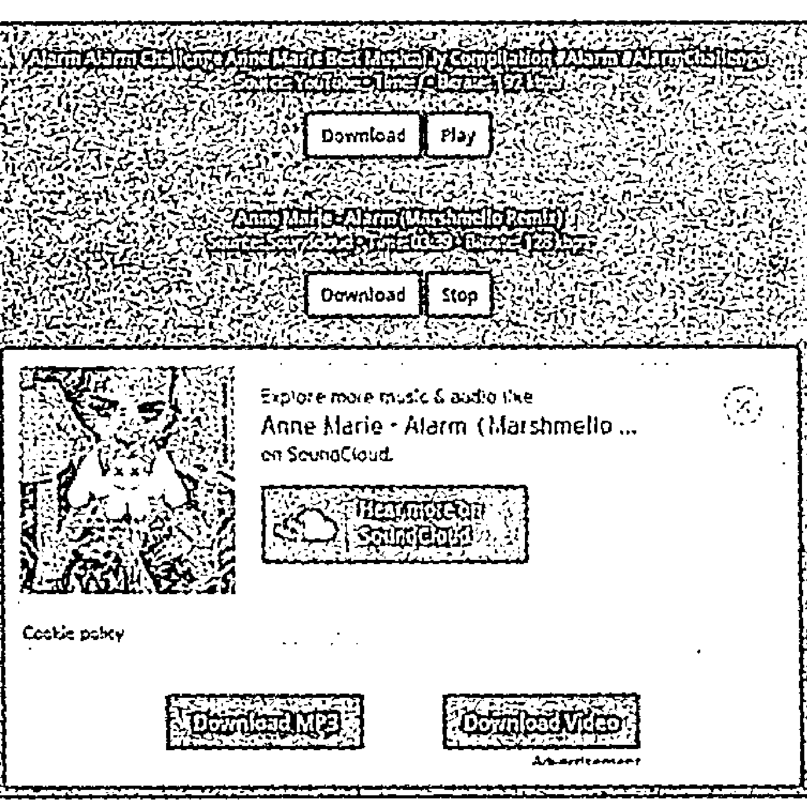

## 利用hosts去除网页中的广告信息

**Q:** 虽然现在网上有很多广告过滤软件，甚至有的安全软件也有类似的功能，但是并不是所有的浏览器都支持。那么有没有让所有的浏览器都支持的广告过滤方法呢？

**A:** 登录www.shuaxia.net这个网站，点击右上角的搜索按钮后输入hosts这个关键词，就可以查找到“全网定制版去广告hosts”这个文件，然后根据提示进行下载和安装操作就可以了。

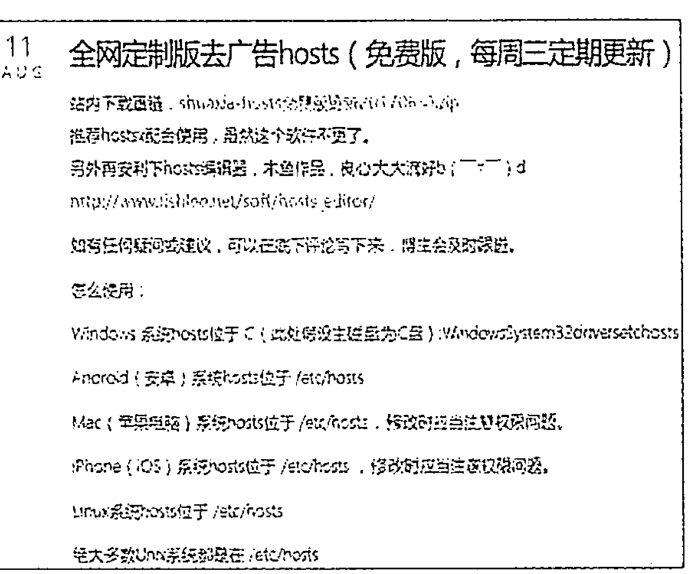

## 利用支付宝进行花朵的识别

文/老万

**Q:** 不久之前微软开发了一款名为“微软识花”的应用，通过它可以识别出花的名称和作用。那么利用其他常见的手机应用，能不能也进行类似的识别操作呢？

**A:** 如果告诉你利用最常见的支付宝应用就可以解决这个问题，很多人肯定不信。其实只需要打开支付宝点击“扫一扫”按钮，点击“AR”后将手机摄像头对准花进行识别，稍等片刻就可以给出相关的信息了。

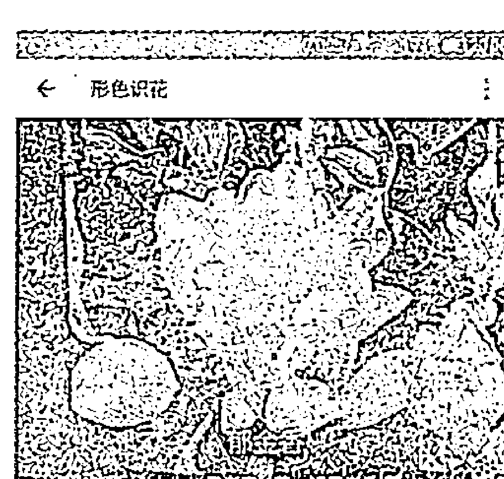

> 图片中的花朵也可以通过这种方法进行分辨。

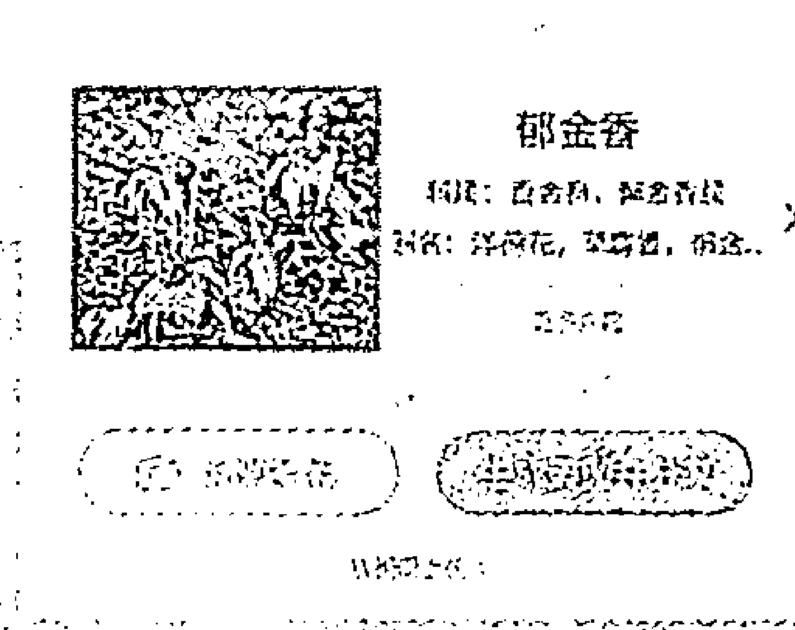

## 如何在手机里面学习双拼输入

**Q:** 现在拼音输入法是最常见的一种输入形式，除了常见的全拼输入方法以外，还有一种双拼输入的方法，可是这种方法需要学习才可以使用。那么有没有什么方法可以在手机里面学习双拼输入呢？

**A:** 只需要打开微信客户端，搜索并安装一款名为“双拼练习”的小程序。通过它就可以了解到各种双拼输入的知识，再从设置选项里面选择喜欢的双拼方案，包括微软双拼、小鹤双拼、拼音加加双拼等等。接下来就可以在手机里面进行学习，并且进行双拼输入的操作练习。

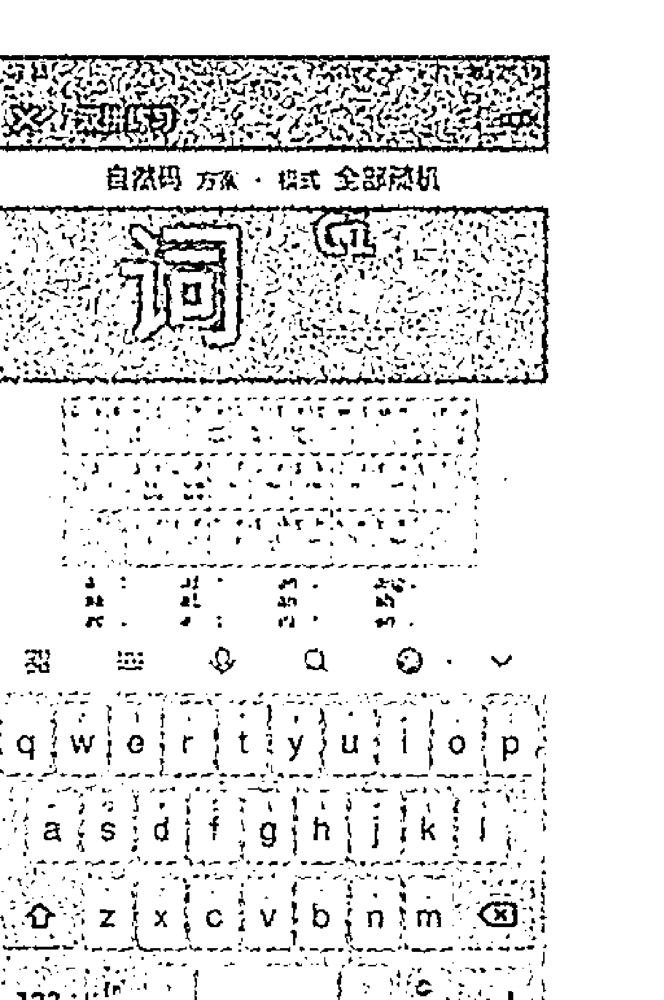

## 手机QQ直接显示地图信息

**Q:** 有的时候和朋友相约在一个地方会面，如果这个朋友不了解这个地点的话，就需要通过地图软件进行查询。那么有没有什么方法可以直接在QQ里面显示出地址对应的地图信息呢？

**A:** 首先将手机里面的QQ升级到最新的版本，因为这个版本里面增加了一个智能识别地名的功能。当成功识别用户聊天对话中的地名时，QQ就会在对话框旁边显示一个地名的按钮，点击这个按钮就可以显示出对应的电子地图。通过它进行导航操作，就可以找到约会的地点了。

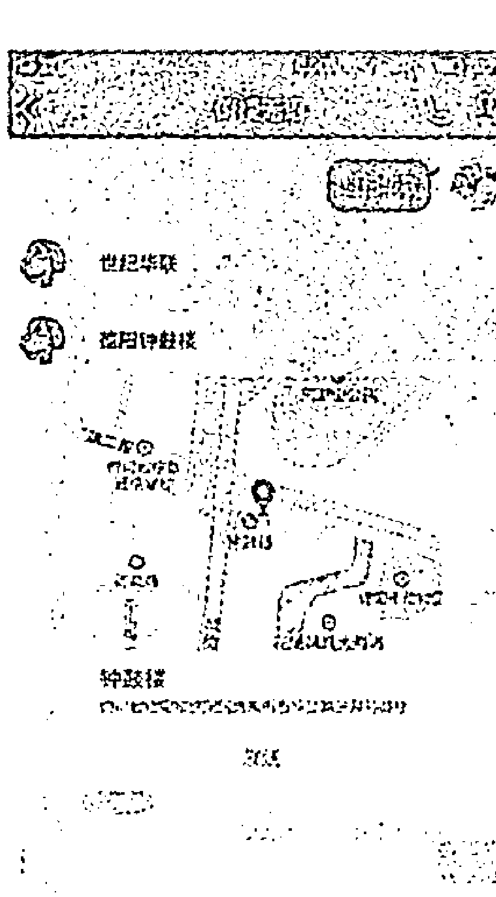

## 如何防止QQ消息被用户撤回

**Q:** 无论是微信还是QQ都可以将发送出去的消息及时回撤，不过通过一些软件可以防止微信消息的回撤。那么有没有类似的软件可以防止QQ消息的回撤呢？

**A:** 其实只需要通过一款名为“QX模块”的工具，就可以用来防止手机QQ消息被撤回。不过这是一款Xposed框架模块，所以手机系统首先需要进行ROOT操作。安装完成以后重新启动手机系统，打开手机QQ的设置就会看到增加了一个QX模块，通过它就可以进行相关的防止撤回的设置操作了。

## 把单一图标移出文件夹

**Q:** 使用手机里的智能整理功能，将所有的应用图标都进行了智能的分组，可是有的单一图标也被放到了一个分组里面。那么如何不让单一图标放在某个文件夹里面呢？

**A:** 首先在手机桌面上进行长按，在弹出的工具栏中点击“桌面设置”按钮。这时只需要在“应用文件夹”里面找到“单独应用形成文件夹”这个选项，接着将这个选项进行关闭，然后将单一图标从文件夹里面移出来就可以了。

## 怎么限定Windows 10 PIN的最小位数

**Q:** Windows 10中的PIN是一个安全功能，可以保护用户账户以及系统数据的安全，通常情况下PIN码的最短位数是4位。那么有没有什么方法可以改变这个最小位数呢？

**A:** 首先打开系统的注册表编辑器，展开左侧列表至`HKEY_LOCAL_MACHINE\SOFTWARE\Policies\Microsoft\PassportForWork\PINComplexity\`。接着在右侧窗口里面新建一个DWORD (32位)值，将其名称重命名为`MinimumPINLength`。然后在弹出的对话框里面选择十进制，并且设置自己需要的最小位数就可以了。

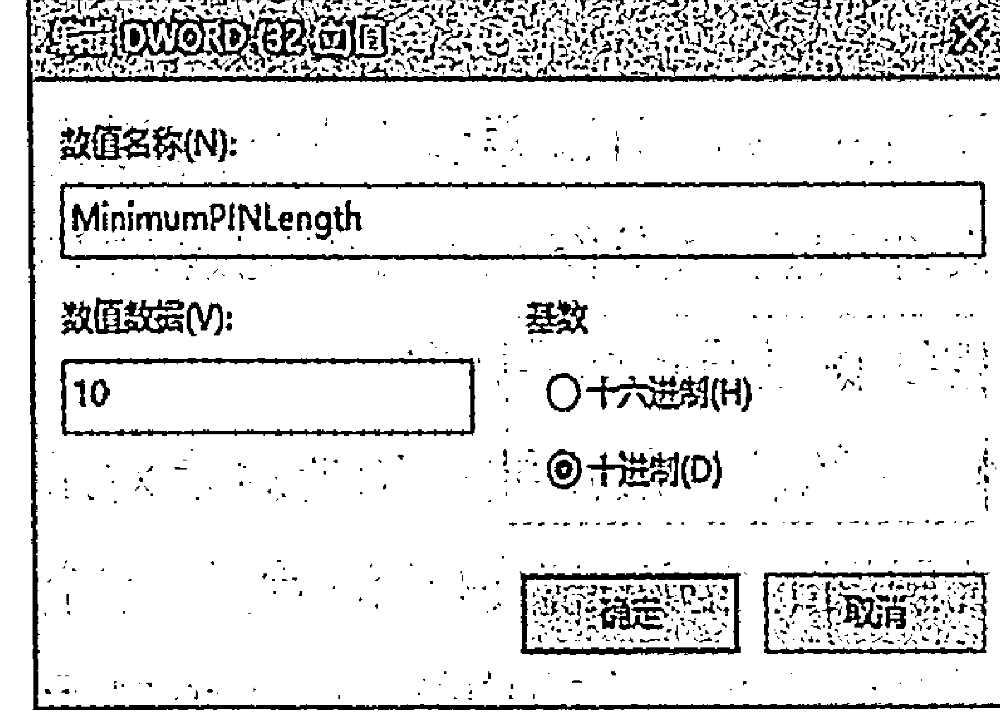

## 将家庭组添加到Windows 10右键菜单

**Q:** 家庭组是Windows操作系统中的一个主要功能，通过它可以实现在家庭网络中所有的计算机之间进行数据共享，但是要想进行家庭组的管理却非常的繁琐。那么如何才可以快捷地进行管理操作呢？

**A:** 其实可以将一些和家庭组相关的管理功能集成到系统桌面的右键菜单里面，这样操作起来就会方便不少。不过要想添加这样一个功能菜单却非常的麻烦，所以这里提供一个注册表文件 (https://pan.baidu.com/s/1bp6e7td)，只需要下载后运行就可以了。

## Program files (x86)文件夹的作用

文/老万

**Q:** 使用的是64位的操作系统，发现这个操作系统里面分别有Program files (x86)和Program files两个不同的文件夹目录。那么请问这两个文件夹目录到底有什么作用啊？

**A:** 从Windows XP操作系统开始，Windows可分别支持原32位和64位应用程序，因此在进行软件安装的时候，会进行软件版本的识别。如果是32位的软件程序，就会安装到Program files (x86)这个文件夹里面。而如果是64位的软件程序，则会安装到Program files这个文件夹里面。


当然64位的软件程序也可以安装到Program files (x86)里面，反之32位的软件程序则不能安装到Program files里面。

## 特殊字符文件夹如何进行删除操作

**Q:** 操作系统里面有一个文件夹，无论如何也无法进行删除操作。后来听说之所以出现这样的状况，主要是文件夹的名称包括了一些特殊的字符。那么这样的文件夹应该怎么进行删除操作呢？

**A:** 下载DeletionTool这款工具 (https://github.com/differentrain/DeletionTool)，接着在系统里面找到要删除的文件夹，通过鼠标将它们拖拽到这款工具的图标上进行释放。这样就可以启动这款工具进行删除操作了，删除完成以后会有提示音进行提示。

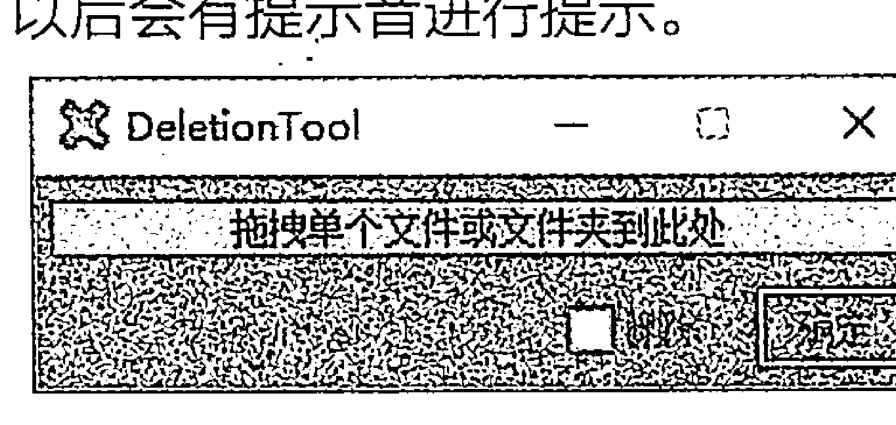

## Windows 10照片应用打开慢的解决方法

**Q:** 通常都是使用系统自带的软件来查看图片的，现在系统升级到Windows 10以后同样如此，可是最近发现启动这个应用的时候非常不流畅。那么应该如何解决这个问题呢？

**A:** 打开系统的“设置”窗口，点击窗口中的“应用”按钮后，在弹出的窗口列表里面找到“照片”应用。点击应用名称下面的“高级选项”按钮，在弹出的对话框里面点击“重置”按钮就可以解决这个问题了。

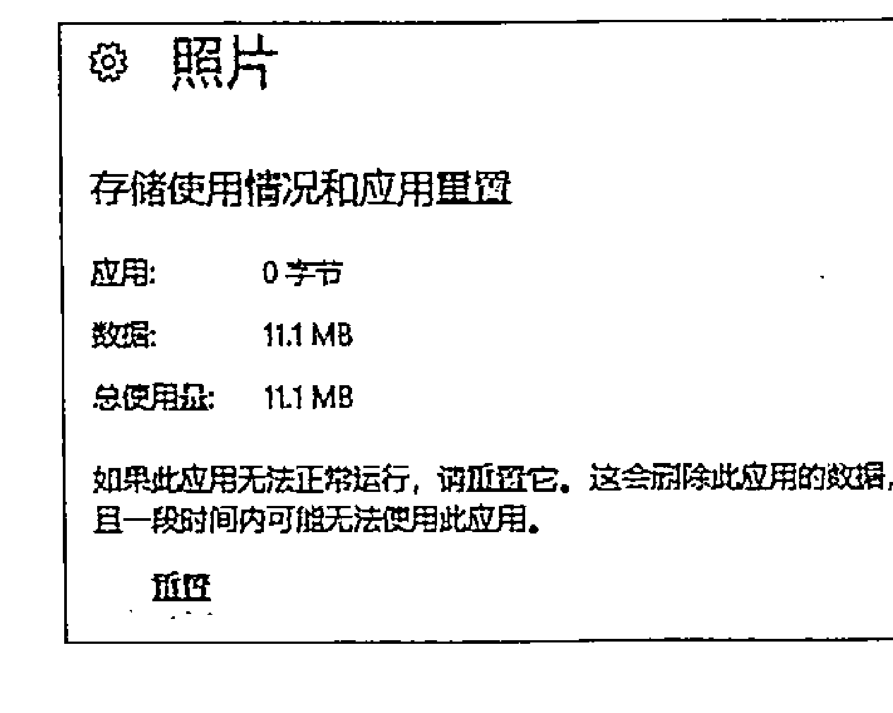

## 世界之窗浏览器怎么过滤广告

文/老万

**Q:** 世界之窗浏览器使用的是一个简化版的谷歌浏览器内核，所以这个浏览器不能像谷歌浏览器那样安装扩展。虽然这个浏览器也自带有广告过滤功能，但是效果非常的不给力。那么除此以外还有什么方法可以过滤广告吗？

**A:** 首先登录世界之窗的论坛，搜索并下载由网友制作分享的广告过滤规则。接下来点击浏览器右上角的按钮，在弹出的菜单里面选择“广告过滤”命令，然后在弹出的对话框里面选择“自定义过滤规则”，并且点击“打开规则文件夹”，将下载的过滤规则复制粘贴到这个文件夹里面即可。

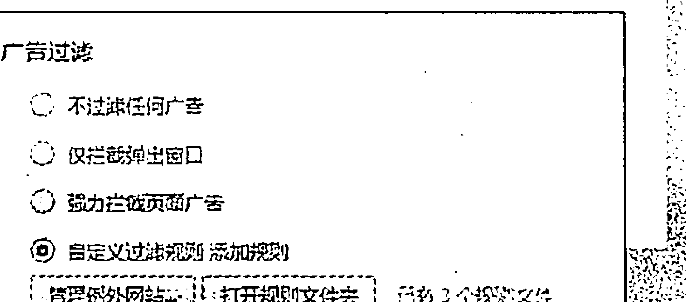


当然配合使用一些广告过滤软件，也可以起到相应的广告过滤效果。

## 找回火狐浏览器以前的搜索栏

**Q:** 现在的火狐浏览器已经变得和谷歌浏览器越来越像了，比如它将以前的搜索栏和地址栏进行了合并，这样就只能在一个地方进行相关的操作。那么有没有什么方法可以找回以前的搜索栏呢？

**A:** 首先点击右上角的“打开菜单”按钮，在弹出的菜单里面点击“选项”命令，从而打开浏览器的选项对话框。接着点击左侧列表中的“搜索”按钮，在右侧窗口选中“添加搜索栏到工具栏”选项就可以了。

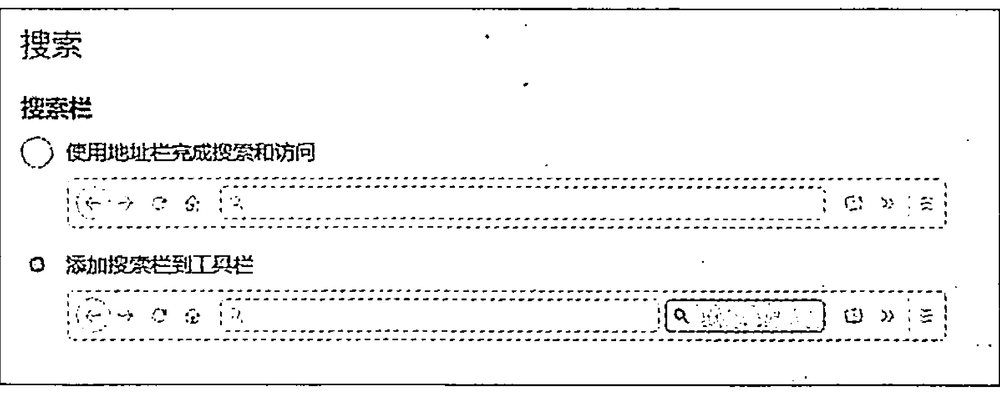

## WSockExpert为什么无法使用

**Q:** 今天想对浏览器的一个数据包进行嗅探操作，于是下载了WSockExpert这款软件，可是安装以后发现这款软件并不能正确地进行抓包操作。那么怎样才可以解决这个问题呢？

**A:** 其实包括WSockExpert在内的众多嗅探工具，在使用的时候都需要安装WinPcap这个驱动程序才可以。如果没有安装这个驱动程序的话，自然就无法进行相应的数据嗅探和抓包的操作了。

## xy-VSFilter插件如何进行配置使用

**Q:** 虽然现在主流的播放软件都自带有字幕显示的功能，但是听说xy-VSFilter这个插件的效果更好。那么请问应该如何调用和配置这款插件呢？

**A:** 下载安装xy-vsfilter插件，打开播放软件的配置窗口，点击窗口左侧的“外部筛选器”命令。接下来在右侧将“DirectVobSub (auto-loading version)”选中，并且将其设置为“偏好”就可以了。

## CCleaner中文件查找器的作用

**Q:** 近来发现CCleaner这款软件的“工具”里面有一个叫做“文件查找器”的功能，可是通过它并没法进行文件的查找操作。那么请问这项功能到底是干什么用的？

**A:** 这款软件最主要的功能就是对系统里面的垃圾信息进行清除，而这个“文件查找器”的功能，其实也是用于进行垃圾信息的查找操作。只不过它主要的用途是用于查找系统里面重复的文件，在查找到以后让用户将多余的文件进行清除。

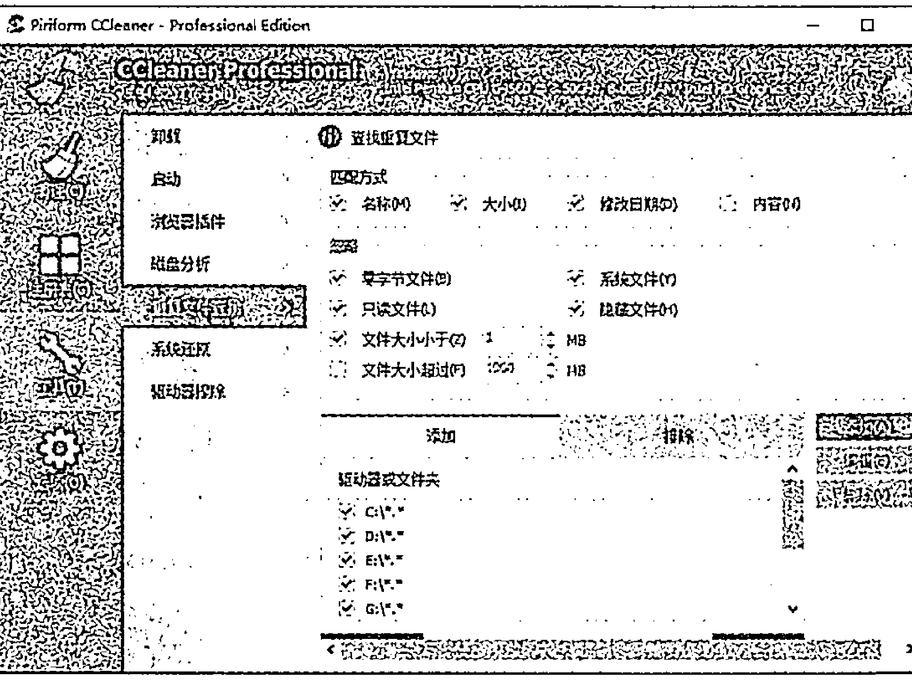

## 用什么方法可以直接播放种子文件

**Q:** 以前无论是QQ旋风还是迅雷下载软件，都有一个文件下载预览的功能，这样我们就可以一边下载，一边进行文件的播放操作。那么除此以外还有没有什么方法可以进行种子文件的在线播放呢？

**A:** 下载安装Soda Player这款播放软件，打开以后根据需要点击屏幕正中的两个按钮，这样就可以选择视频文件的种子以及磁链接。设置完成以后，播放器就在后台进行下载操作，等待有了一段视频的缓冲后就可以直接进行播放操作了。

## 如何接收Outlook邮箱的邮件

**Q:** 平时使用的是Foxmail这款邮件管理器，想通过这款邮件管理器接收Outlook邮箱中的邮件，可是设置几次都没有成功。请问应该如何进行配置操作才可以？

**A:** 首先在Foxmail的左侧找到已经配置的邮箱选项，点击鼠标右键后选择菜单中的“设置”命令。接着在弹出的对话框里面选中“服务器”这个选项，在“收件服务器”里面设置“imap-mail.outlook.com”，勾选上后面的ssl端口并输入993端口就可以了。

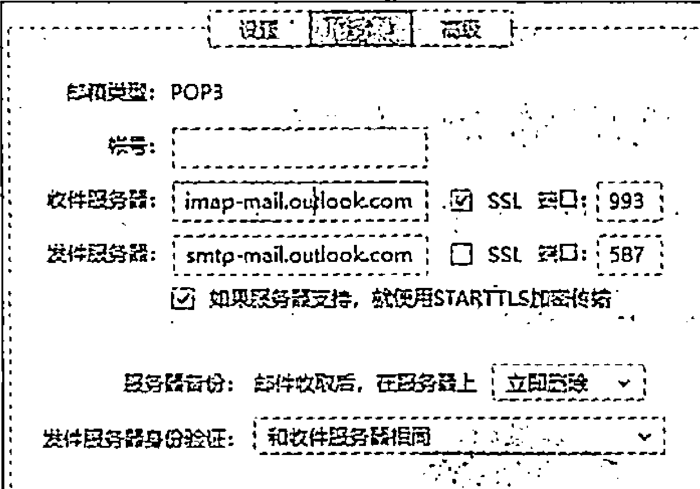

如果使用的是Windows 10操作系统的话，那么建议使用系统自带的邮件应用来操作。

## WordPress博客文章如何置顶

**Q:** 无论是在博客还是微博里面，我们对于重要的信息往往都会采用置顶这种方式来处理。那么请问在WordPress这个博客里面，如何将指定的信息进行置顶操作？

**A:** 进入到WordPress的管理后台，在文章列表中找到需要进行置顶的文章。勾选它以后在文章标题下面可以看到一个名为“快速编辑”的命令，点击该命令后，在弹出的快速编辑框的右侧，就可以看到“置顶这篇文章”的选项，勾选这个选项并进行更新就可以了。

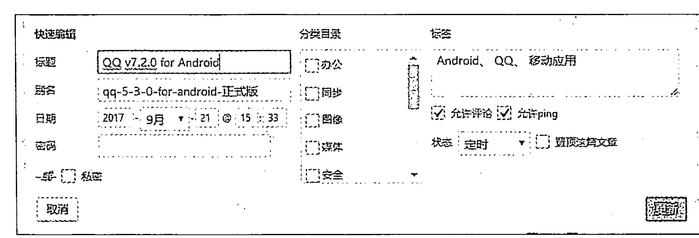

## 免登录批量下载用户的微博高清图

**Q:** 如果想下载微博里面某个用户的高清图片的话，那么必须登录微博系统才可以进行操作。那么有没有什么方法可以不登录并且进行批量操作？

**A:** 使用weiboPicDownloader这款工具，通过命令提示符窗口切换到工具所在的文件夹目录。接下来执行“java -jar wb.jar”这段命令，按照提示输入对方微博的ID，回车后就可以进行图片的下载操作了。

## 一键用隐身模式打开当前标签页

**Q:** 为了更好地保护个人的隐私，现在很多浏览器都设置有“隐私模式”这个功能，但是要想使用这个功能，操作起来却非常的繁琐。那么有没有一键打开这个功能的方法呢？

**A:** 打开谷歌应用商店，安装一款名为“Incognito This Tab”的扩展。安装完成后会在工具栏里面看到一个隐私模式的图标，以后当我们想将某个网页在隐私模式里面打开的时候，直接点击这个扩展图标就可以了。或者在某个网页链接上点击鼠标右键，通过右键菜单调用这个扩展命令也可以。

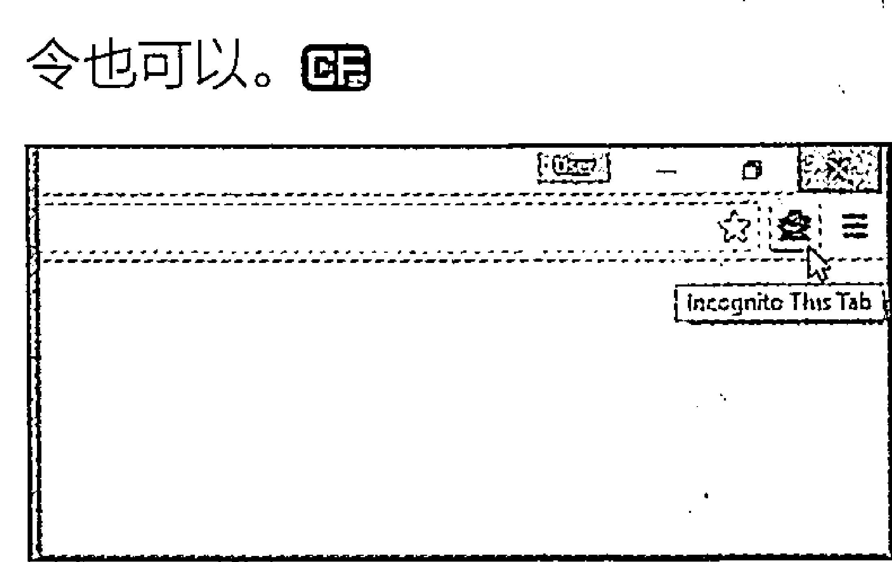

## 让微信符合Material Design设计

文|老万

**Q:** 虽然微信在国内拥有庞大的用户群，但是这款应用的设计仍然没有赶上时代的步伐，比如Material Design设计已经推出这么久了，微信仍然还是保持原来的样式。那么有没有什么方法让微信符合这种设计呢？

**A:** 解决的方法当然是有的，但是必须使用Xposed应用才可以，因为只有通过它才可以对软件的操作界面进行更改。首先安装一款名为WechatUI的Xposed应用，打开它以后就会发现微信的界面变成Material Design的样子了。

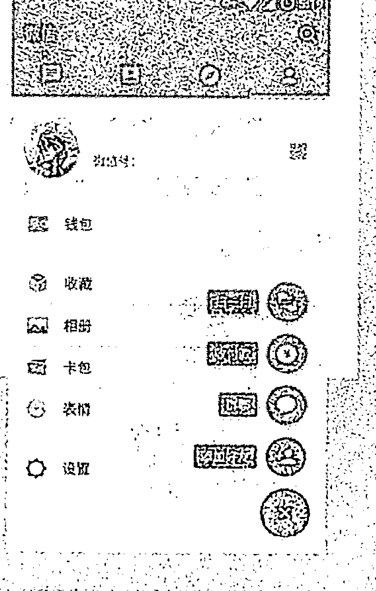

## 在智能手机里面也玩快捷手势

**Q:** 现在全面屏已经成为手机的一个卖点，越来越多的手机都开始使用全面屏了。虽然全面屏有很多的好处，但是也带来一些问题，比如操作不便等等。那么如何才可以玩转全面屏呢？

**A:** 其实要想解决这个问题，最简单的方法还是和在电脑里面一样，使用快捷手势来解决。有的Android系统里面已经有类似的功能，如果用户使用的系统没有手势功能的话，那么可以安装一款名为“GMD手势控制”的APP。打开这个APP后根据提示进行相关的手势设置，然后就可以进行快捷操作了。

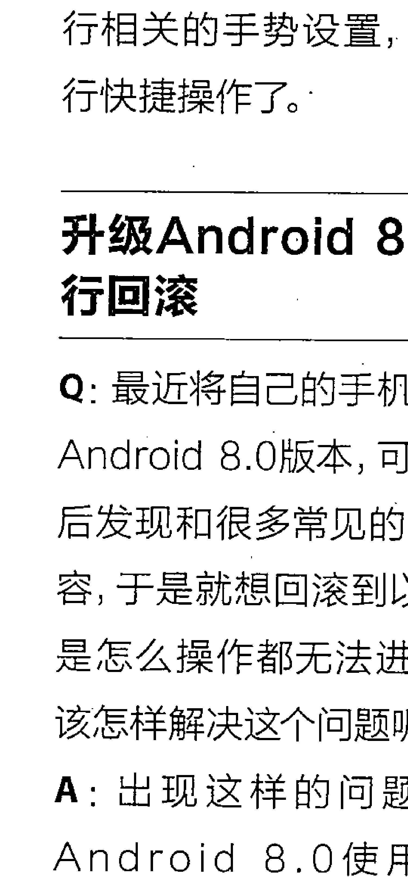

## 升级Android 8.0后不能进行回滚

**Q:** 最近将自己的手机升级到最新的Android 8.0版本，可是升级完成以后发现和很多常见的手机应用不兼容，于是就想回滚到以前的版本，可是怎么操作都无法进行降级。那么该怎样解决这个问题呢？

**A:** 出现这样的问题主要是因为Android 8.0使用了一个名为Rollback Protection的安全功能，这个功能会阻止用户的手机回滚到以前的旧版本系统。不过据说Rollback Protection功能是可以被禁用的，但是目前还没有具体操作方法的介绍。

## 一键点赞微信运动中的朋友

**Q:** 微信运动虽然可以敦促用户每天进行适量的运动，但是也给很多用户带来了非常多的烦恼，比如每天都得给朋友点赞，如果不点赞的话还会招来朋友的指责。那么有没有什么一键点赞的方法呢？

**A:** 安装名为“微信运动一键点赞”的Xposed应用，打开这款应用以后可以看到很多的功能，其中就有一项名为“微信运动一键点赞”的选项。将这个选项开启以后，就可以利用这个应用给微信运动中的朋友一键点赞了。

## 让Android系统变成iPhone X

**Q:** 不久以前苹果刚刚发布了全新的iPhone版本，其中它的异形屏造型非常有个性。那么通过什么方法可以让Android用户在自己的手机里面也体验一下这个独特的造型呢？

**A:** 虽然“刘海”的造型遭到了很多人的调侃，但是“萝卜青菜各有所爱”，有的用户也开发出了相关的应用来模拟这个造型。比如可以下载安装XOutOf10应用，启动这款应用以后点击屏幕下方最长的按钮，授权让该应用在其他的手机软件上显示内容。接下来返回主界面点击“START”按钮，就可以看到相关的效果了。

## 重新调整PPT文档图片的先后顺序

文|老万

**Q:** 今天收到同事发过来的一个PPT文档，浏览以后发现里面的图片顺序有一些错误，于是想对这些图片的顺序进行调整操作。那么如何才可以完成这样的操作呢？

**A:** 首先在PowerPoint软件里面打开需要处理的PPT文档，接着点击“视图”标签中的“幻灯片浏览”按钮，这样就可以在软件窗口中依次显示出图片的顺序。现在只需要选中要调整的图片，通过鼠标对它进行拖拽就可以来回调整图片的顺序了。

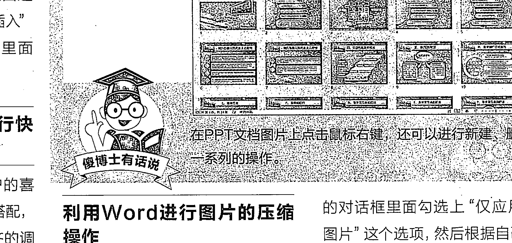

在PPT文档图片上点击鼠标右键，还可以进行新建、删除等一系列的操作。

## 一步完成图片的搜索和插入操作

**Q:** 平时要想在PPT文档里面插入图片的话，都会通过百度这些搜索引擎进行查找，然后下载到本地硬盘再插入到文章里面。那么有没有什么方法可以更快捷地进行相关的操作呢？

**A:** 在PowerPoint软件里面点击“插入”标签中的“联机图片”按钮，这时就会弹出一个微软必应搜索的对话框，在里面输入相关的关键词进行搜索。这样就可以从搜索结果里面选择相应的图片，点击下面的“插入”按钮就可以直接插入到文档里面了。

## 利用SmartArt自动进行快速排版

**Q:** 要想让PPT文档获得用户的喜欢，自然少不了文字和图片的搭配，不过要想对这些内容进行整齐的调整，却是一件非常困难的事。那么有什么方法可以对这些内容快速完成排版操作呢？

**A:** 可以利用软件的“SmartArt”功能，帮助我们进行快速的排版操作。首先新建一个PPT文档，点击“插入”标签中的“SmartArt”按钮，在弹出的对话框里面选择左侧列表中的“图片”选项，然后在窗口里面根据需要选择一个现成的模板。接下来要做的事就是向里面填充相应的图片和文字就可以了。

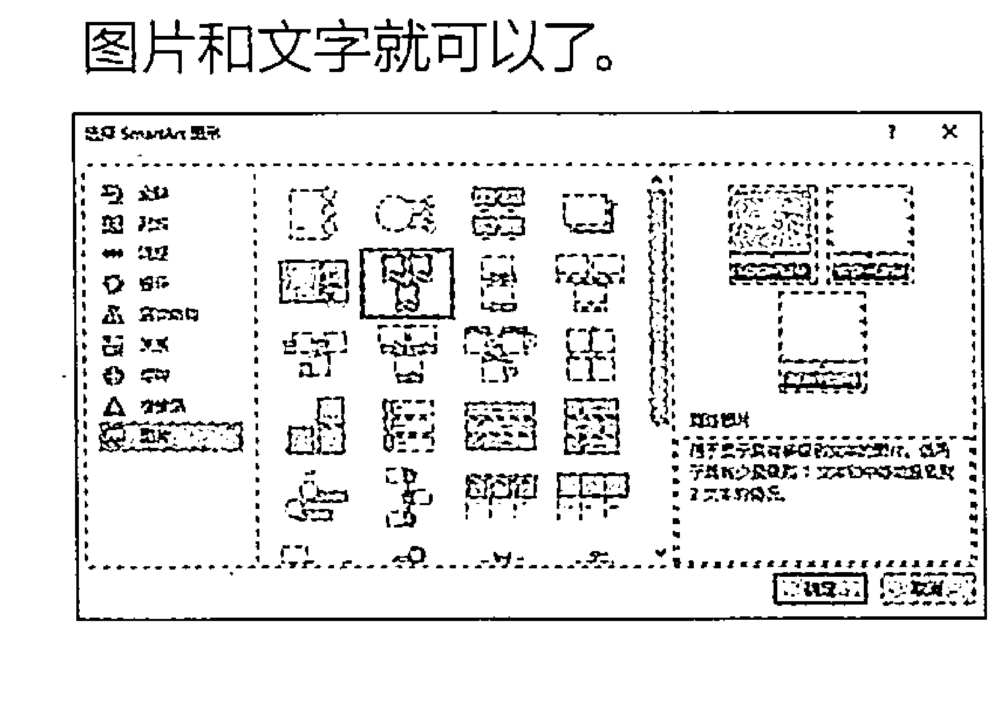

## 利用Word进行图片的压缩操作

**Q:** 为了尽量减少文档文件的体积，在插入图片之前往往都会将图片进行压缩操作，可是有的时候临时需要加入一张图片，这个时候就懒得进行压缩操作了。那么通过Word软件能不能进行相关的操作呢？

**A:** 在Word软件里面选中插入的图片文件，点击“格式”标签后选择工具栏中的“压缩图片”按钮，在弹出的对话框里面勾选上“仅应用于此图片”这个选项，然后根据自己的用途在“分辨率”下面选择相应的选项就可以了。

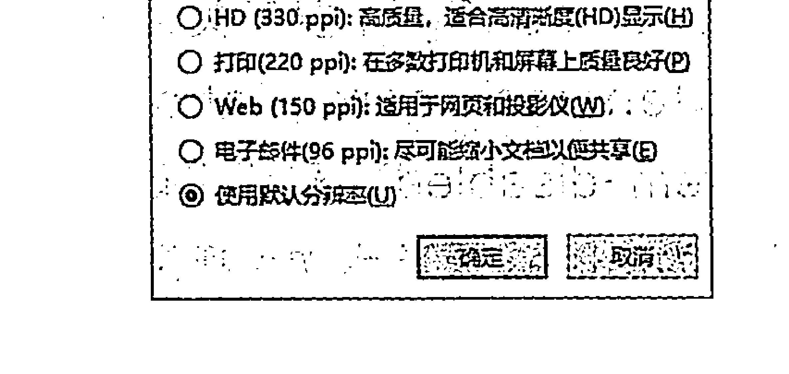

## 快速汇总表格某个部分的数据

**Q:** 平时要对表格里面的数据进行汇总的话，往往通过一个图表就可以搞定，可有的时候只需要对表格中的某一部分数据进行汇总。那么这个时候又应该怎样进行操作呢？

**A:** 选中原数据区域里面任意的单元格，在“插入”标签中点击“数据透视表”按钮，在弹出的对话框里面选择“选择一个表或区域”选项。然后通过鼠标选中要进行统计的表格，点击确定按钮后，在右侧列表中选择相关的字段就可以了。

## 火狐浏览器重要文件的备份操作

文|老万

**Q:** 以前要对火狐浏览器的配置文件进行备份的话，都是将整个配置文件目录进行复制备份，但是这样的话这个文件夹就非常的大。那么有没有办法只对其中几个重要的文件进行备份操作呢？

**A:** 首先在火狐浏览器的地址栏里面输入 “about:support” 命令并按下回车键，进入到浏览器的 “故障排除信息” 页面。点击打开文件夹按钮，在弹出的对话框里面就可以看到浏览器的配置文件夹，然后将其中的places.sqlite、cookies.sqlite、signons.sqlite等文件进行备份即可。

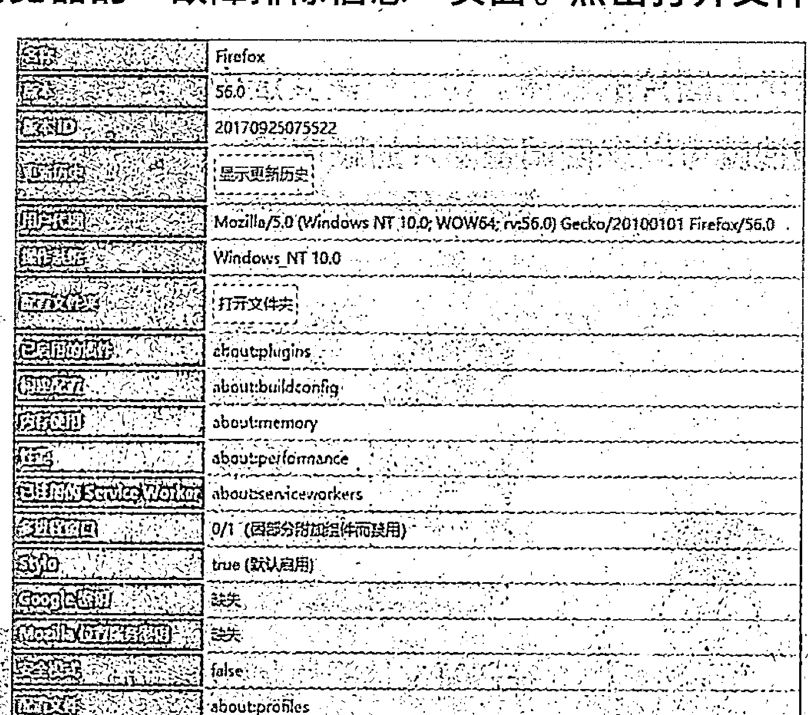


当然也可以利用搜索软件来直接查询这几个文件进行备份。

## 如何清除谷歌浏览器的DNS缓存

**Q:** 谷歌浏览器的DNS缓存可以用于存储用户访问的每个网站的域名解析数据库，但是当一个网站更新了新的IP地址后，通过缓存中的IP来访问就会遇到错误。那么如何清除谷歌浏览器DNS缓存中的数据信息呢？

**A:** 首先在谷歌浏览器里面输入 chrome://net-internals/#dns 这行命令，回车后就可以看到谷歌浏览器的DNS缓存数据信息。点击其中的 “Clear host cache” 按钮以后，就可以完全清除所有的缓存记录。重新启动浏览器后，这个问题就可以解决了。

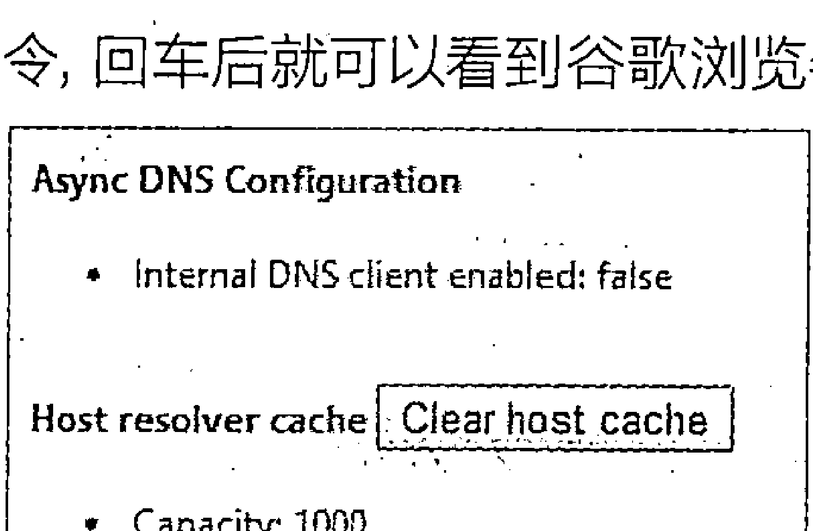

## 激活火狐浏览器自带的截图功能

**Q:** 听说现在的火狐浏览器里面有一个截图功能，可是找来找去都没有找到这个功能。那么请问如何才可以找到这个自带的截图功能呢？

**A:** 首先在地址栏输入 “about:config”，搜索关键词 “extensions.screenshots.system-disabled”，最后将参数修改为false。重新启动火狐浏览器，就可以在工具栏里面找到自带的 “Firefox Screenshots” 功能了。

## 查看.ico格式图片出现的问题

**Q:** 由于使用的是64位的操作系统，所以看图软件使用的是64位的FastStone Image Viewer, 可是发现这个软件在查看.ico格式图片的时候，会出现图片发虚的问题。那么请问这个问题怎么解决呀？

**A:** 建议先下载使用32位的版本，看看是否也存在同样的问题。如果是的话，说明软件对这个格式的支持还不是非常好，这时只能换用其他的看图软件来解决。

## 快速清除威金病毒及感染文件

**Q:** 最近电脑出现了中病毒的现象，通过搜索引擎了解到电脑可能中的威金病毒。那么这个病毒应该怎么进行清除呢？

**A:** 威金病毒是一种和熊猫烧香非常类似的病毒，中毒以后它会感染系统里面的可执行文件。所以要想清除这个病毒，最简单的方法就是利用专杀工具来解决。当然也可以下载杀毒软件，利用杀毒软件来进行清除操作。

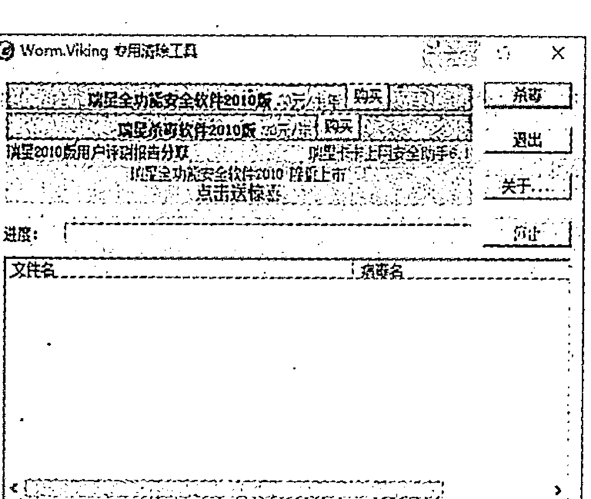

## 可自由分类操作的导航网站

**Q:** 自从hao123这个导航网站推出以后，各种各样的导航网站如雨后春笋般出现，可是这些导航网站的界面都差不多，就像一个模子刻出来的一样。那么有没有什么导航网站，可以根据自己的需要进行分类操作呢？

**A:** “知了”是hao123旗下的一个全新的导航网站 (https://zhi.hao123.com/)，打开这个网站以后利用自己的百度账号进行登录，然后就可以对默认的网站链接进行删除。接着添加自己经常访问的一些网站链接，然后通过拖拽的方式进行分类操作即可。

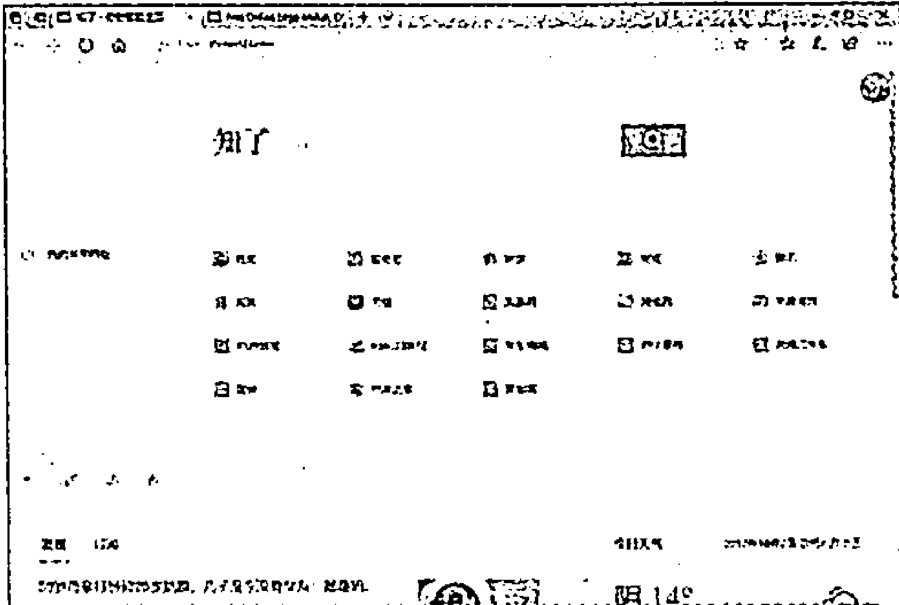

## 在线制作免费的调查问卷

**Q:** 有的时候我们需要制作一些调查问卷来对自己的产品和服务进行收集反馈，但是利用传统的纸质调查方法非常的麻烦。那么有没有什么方法可以在线进行调查操作呢？

**A:** 用浏览器打开Typeform这项调查服务制作网站 (https://www.typeform.com/)，根据提示输入调查问题以及选项答案，然后生成调查问卷的链接。将这个链接发送出去让其他用户进行选择，而我们登录后台就可以看到最终的调查统计结果了。

## 在线进行GIF文件的压缩操作

**Q:** 现在无论是通过网络还是本地电脑中的软件，都可以非常方便地对图片文件进行压缩操作，但是这种操作往往仅限于常见的普通图片，对于GIF这种动画格式的文件则无法操作。那么有没有什么方法可以解决这个问题呢？

**A:** 正是由于GIF文件的特殊性，所以需要选择专门的在线服务进行操作。比如打开GIF Compressor这个网站 (http://gifcompressor.com/)，点击其中的“上传文档”按钮，选择需要进行压缩的文件。当文件上传完成并进行压缩后，再进行下载操作就可以了。

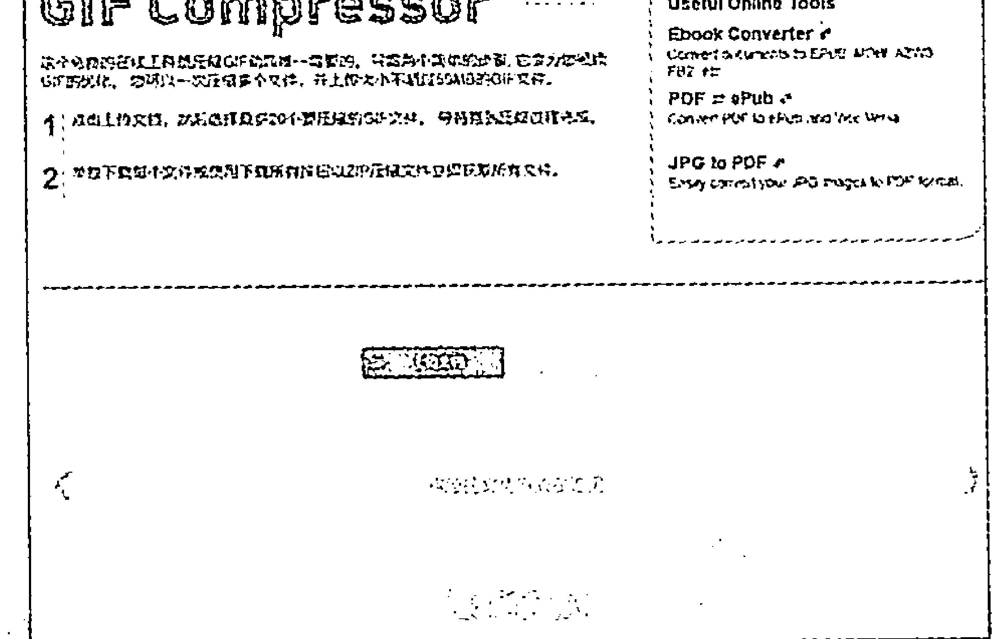

利用GIFmiao这个网站也可以进行压缩。

## 免费在线制作需要的Logo

**Q:** 现在无论是名片还是其他宣传品上，都需要印上自己公司的Logo，这样看上去才更加正规，但是要想制作一个Logo却不是那么容易。那么有没有什么方法可以简单快捷地制作一个Logo呢？

**A:** 其实要想制作一个Logo的话，通过在线服务或者本地软件都可以很快地完成。如使用DesignEvo这个网站 (https://www.designEvo.com)，在网站里面可以选择自己需要的元素，然后把它们安插在右侧的面板里面，这样就可以快速制作出需要的Logo了。

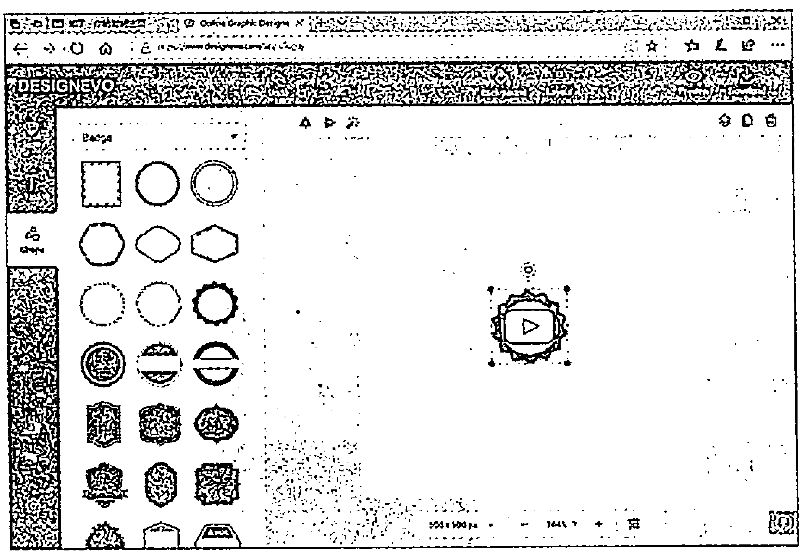

## 免费下载世界各地的地图文件

**Q:** 为了告诉大家自己的产品已经在国外非常受欢迎了，我们在制作广告宣传品的时候，就需要使用到地图这样的素材。那么到什么地方才可以下载地图文件呢？

**A:** Free Vector Maps就是这样的一个网站 (https://freevectormaps.com/)。在搜索框里面输入需要查找的区域名称，找到以后就可以看到各种各样的地图文件，从中选择一个需要的地图文件进行下载就可以了。

## Windows 7 64位系统在PE下无法重装

文|老万

**Q:** 今天利用Windows PE盘来进行64位系统的重装操作，可是系统提示“Windows安装程序无法将Windows配置未在此计算机的硬件上运行”。那么出现这个提示后应该怎么进行解决呢？

**A:** 利用PE盘安装64位的操作系统就是会出现这样的问题，所以只有改用其他的方法来进行操作。如运行“Windows USB/DVD Download Tool”这款工具后，将下载的64位安装文件写入到指定的闪存盘里面，然后利用闪存盘来进行安装操作就可以了。

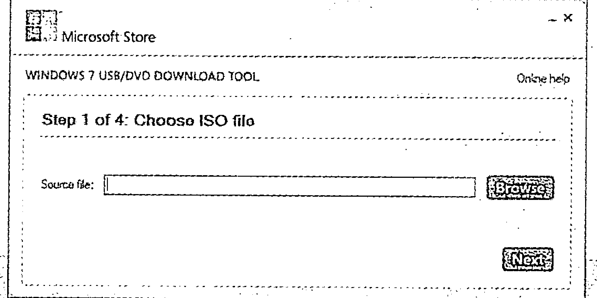

或者将安装盘的压缩包进行解压，然后运行文件夹中的安装文件就可以了。


## Error launching installer 提示的解决

**Q:** 今天在安装一款软件的时候，出现“Error launching installer”这样的提示。请问这到底是系统的问题还是软件的问题？应该怎样解决呢？

**A:** 在安装软件程序的时候，如果弹出各种各样的提示，十有八九是因为这个软件安装包在下载的时候有问题。所以建议重新对这个文件进行下载，而且最好是用浏览器下载，而不要使用下载软件来进行操作。

## Windows 10还能不能安装桌面小工具

**Q:** 现在微软已经开始推荐升级到Windows 10操作系统了，但是以前在使用Windows 7操作系统的时候，常常使用桌面的小工具。不知道在升级到这个系统以后，还能不能继续使用桌面的小工具呢？

**A:** 在默认情况下Windows 10操作系统是无法使用桌面小工具的，不过安装一个支持软件“Desktop Gadgets Installer”以后，就可以实现类似的效果了。安装完成以后在系统桌面的空白处点击鼠标右键，就可以在菜单里面看到“小工具”的命令选项了。

## Windows 10系统的声道均衡一键搞定

**Q:** 虽然Windows 10操作系统在很多方面都有很大的改进，但是在音量滑杆的设计上还是延续了传统设计。那么如何可以改进这个默认的设计，比如增加一个声道均衡器的功能呢？

**A:** 其实只需要在系统里面安装SimpleSndVol这款软件，安装完成以后就可以看到，它在系统托盘里面出现了一个喇叭状的图标。点击该图标以后不但可以进行音量的调整，还可以设置左右声道的均衡等等。


## Windows 10有必要关闭系统还原吗

**Q:** 以前在使用操作系统的时候，都会考虑将系统自带的系统还原功能给关闭掉，因为它非常浪费磁盘的空间。但是现在将系统升级到Windows 10版本了，那么是否还需要将这个功能给关闭掉呢？

**A:** 这个问题还是要看自己的使用情况。如果比较喜欢折腾各种软件和游戏，还是建议开启这个功能，这样在系统遇到问题的时候可以快速恢复到上一个正常使用的点。如果在安装完成一些软件后保持不变，那么也就不需要这个功能进行保护了。

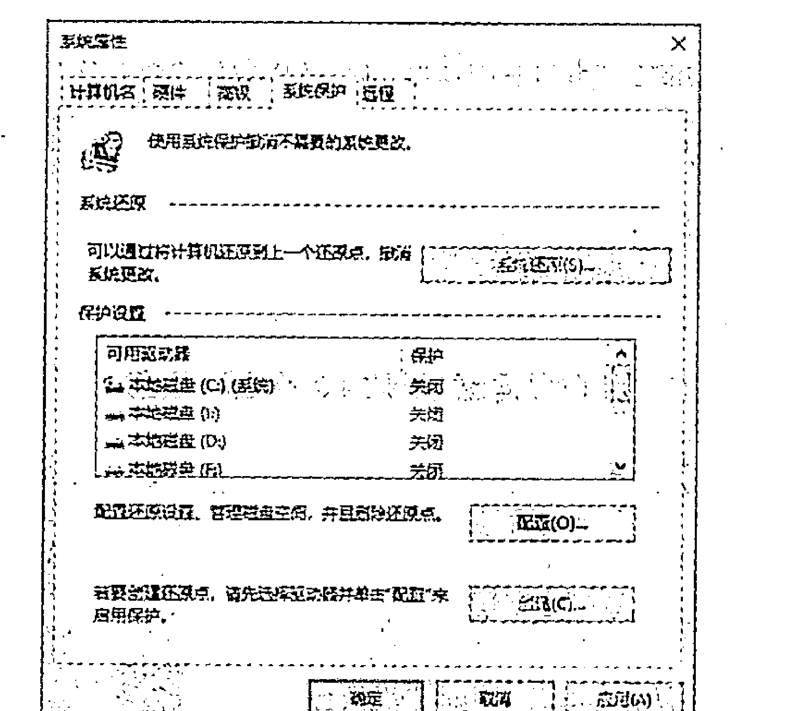

## 如何改变下拉清单的文字大小

Q: 在表格里面我们经常会用到下拉清单，那么对于这种清单里面的文字大小，应该通过什么方法进行修改操作呢？

A: 首先将整个表格中的所有文字进行缩小，这里选择的是8号字体。设置完成以后点击“视图”标签中的“显示比例”按钮，在弹出的对话框里面选择200%并进行确认就可以了。这种方法虽然没有直接对文字的大小进行修改，但是在查看的时候会更加舒服。

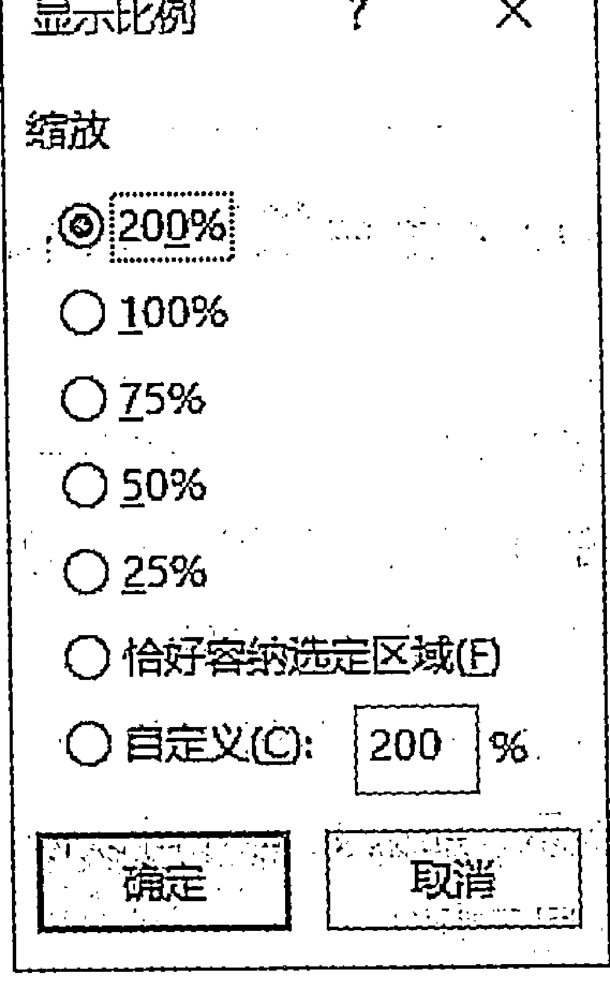

## 等距分布PPT中的图形元素

Q: 在制作PPT文档的时候，经常会用到各种各样的图形元素，自然就需要对这些元素进行排列操作，通常通过智能辅助线可以解决一定的问题。那么还有没有更好的解决方法呢？

A: 通过鼠标选中PPT文档中的所有图形元素，接着点击“格式”标签中的“对齐”按钮，在弹出的菜单里面选择“横向对齐”或者“纵向对齐”命令，就可以解决这个问题了。

## 如何使用Word编辑PPT文档的大纲

文|老万

Q: 在制作PPT文档的时候，常常需要为文件制作一个大纲，通常的方法都是新建一个幻灯片，然后输入相关的文字。除此以外有没有其他的什么方法呢？

A: 可以首先在Word里面编辑好大纲信息，当编辑好大纲文件以后，打开软件点击“开始”标签中的“新建幻灯片”按钮，在弹出的菜单里面选择“幻灯片从大纲”命令，在弹出的对话框里面选择刚刚编辑好的大纲文件，这样就可以导入到PPT文件里面了。

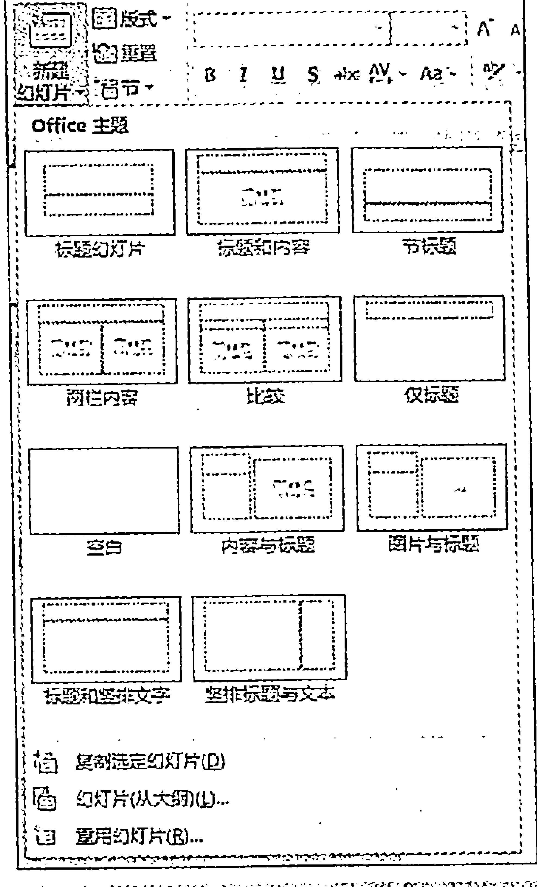

通过Word中的“样式”可以快速地对大纲进行编辑。

## 通过Shift键快速选中连续数据区

Q: 要想在表格里面选择连续的数据区域的话，可以通过Shift键点击第一和最后一个单元格来进行操作。这种方法对于少量的表格来说还可以，但是对于拥有大量数据的表格来说还是很不方便。还有其他方法可以快速进行操作吗？

A: 其实还有一个非常简单的方法，那就是在列表中选择起始的单元格，接着按住键盘中的Shift键，然后将鼠标移动到这个单元格的下方边缘，双击鼠标左键后就可以选择从它开始到结尾的所有单元格了。

## 快速批量在单元格输入相同数据

Q: 在工作中经常遇到一个情况，就是在多个不同的单元格里面需要输入同一个数据，如果按照传统的复制粘贴的方法进行操作的话会非常麻烦。那么有没有什么方法可以批量地进行相关的操作呢？

A: 用鼠标配合Ctrl键全选要输入相同数据的单元格，接下来在最后一个选择的单元格里面输入要录入的内容。输入完成以后按下Ctrl+Enter键，所有被选中的单元格就会瞬间被输入相同的数据了。

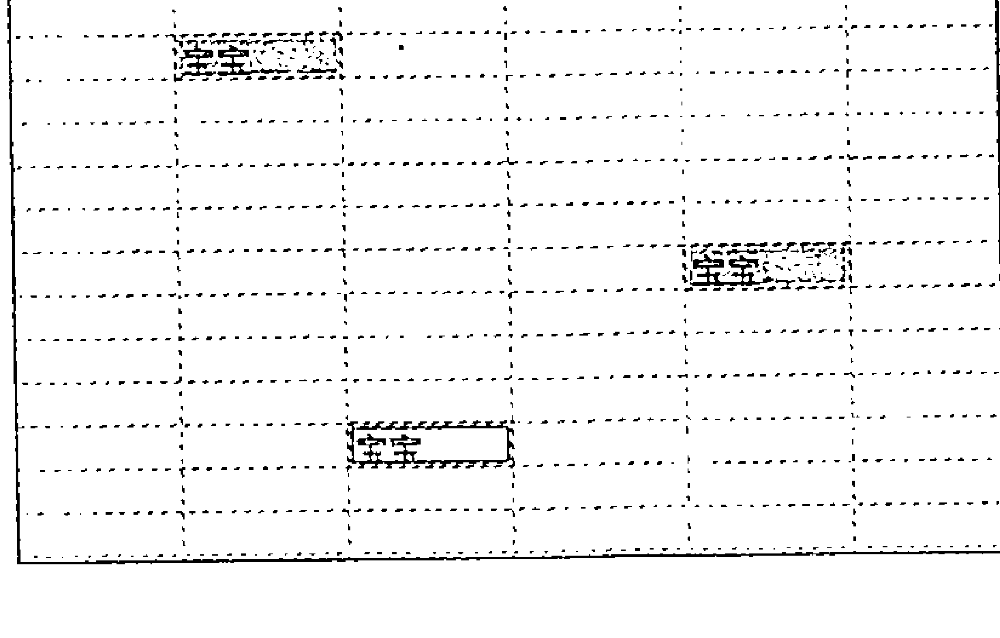

## 支付宝为什么无法进行转账

文|老万

**Q：通过支付宝进行转账的时候，输入对方的电子邮箱进行查找，结果网页提示“对方关闭了通过邮箱找到我”，这样就无法进行转账操作。那么如何才可以让对方开启这个开关呢？**

**A：** 首先让对方打开支付宝应用，点击工具栏中的“我的”，再点击窗口中的“设置”按钮。接着点击列表中的“隐私”菜单，在弹出的对话框里面就可以看到“通过邮箱找到我”的选项，开启这个选项就可以了。

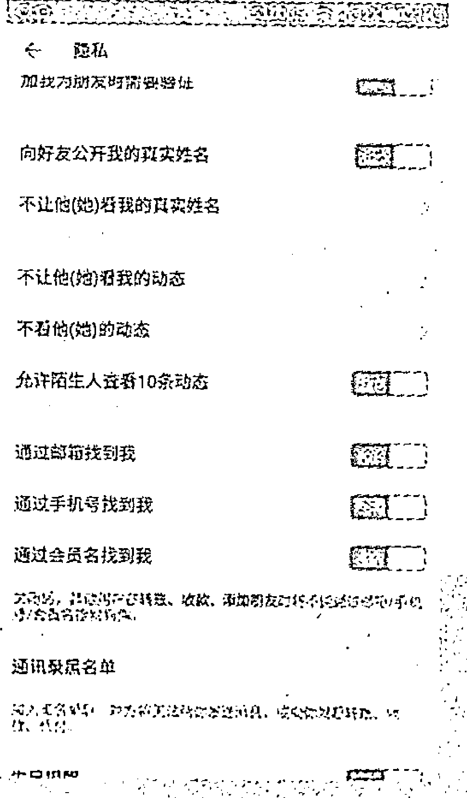


通过这个步骤也可以开启手机号查找的选项。

## 可以进行语音输入的日历应用

**Q：由于现在每个人每天都会遇到很多大大小小的事情，所以需要利用日历应用将这些事情一一进行安排，但是由于事情比较多，利用手机输入非常不方便。那么有没有什么方法可以进行语音输入的操作呢？**

**A：** 如果是想要应用自带有语音输入功能的话，那么可以试一试“朝夕”这款手机应用。它不但可以利用语音添加自己的日程，还可以利用微信分享给自己的好友。如果不考虑应用自带的功能的话，那么利用手机输入法的语音输入就可以解决这个问题。

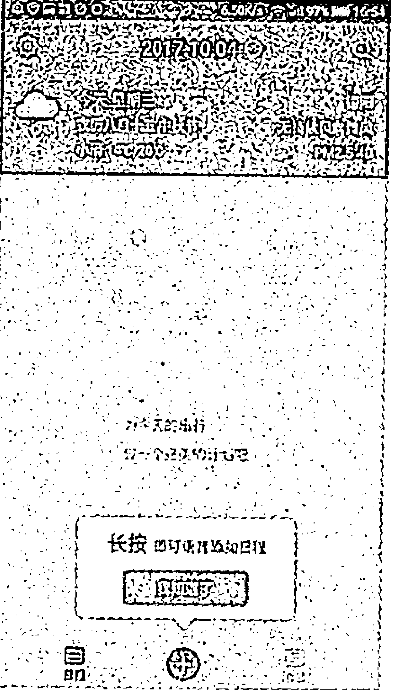

## 推荐一个能画画的笔记应用

**Q：虽然现在的笔记应用非常的丰富，但是很多应用只能进行文字、图片的输入，好一点的还可以进行语音的输入，但是如果想随手画画操作就非常困难。那么有没有类似的应用可以推荐一下呢？**

**A：** 推荐使用Squid这款应用。安装好这款应用以后点击右下角的新建按钮，在弹出的窗口里面就可以进行笔记的输入。这样不仅可以进行画画操作，还可以进行常见的文字输入等等。在导出笔记的时候还可以选择PDF文档格式以及PNG、JPEG等图片格式。

## 手机误删照片应该怎么恢复

**Q：前几天不小心将手机里面的照片删除了，但是听说手机使用的闪存和我们平时用的机械硬盘不一样，所以数据恢复的可能性也非常的小。那么有没有什么方法可以恢复误删除的照片呢？**

**A：** 其实要想恢复被删除的照片还是有可能的。使用一款名为Restore Image的应用，打开它以后就可以看到之前被删除的照片。选择要恢复的照片后，点击右下角的“Restore”按钮，就可以恢复被删除的照片文件了。

## 安装Dir后手机图库缩略图没了

**Q：最近给自己的手机安装了一款名为Dir的手机垃圾清除软件，可是安装完成并扫描垃圾文件以后，发现手机图库里面的缩略图不能正常地进行显示。那么如何才可以恢复缩略图的显示呢？**

**A：** 启动这款垃圾清理应用，点击左上角的菜单按钮，在弹出的菜单里面点击其中的“撤销替换”命令，这样就可以看到该应用使用过的规则。在其中找到和图库缩略图相关的内容后，进行长按将它删除就可以了。

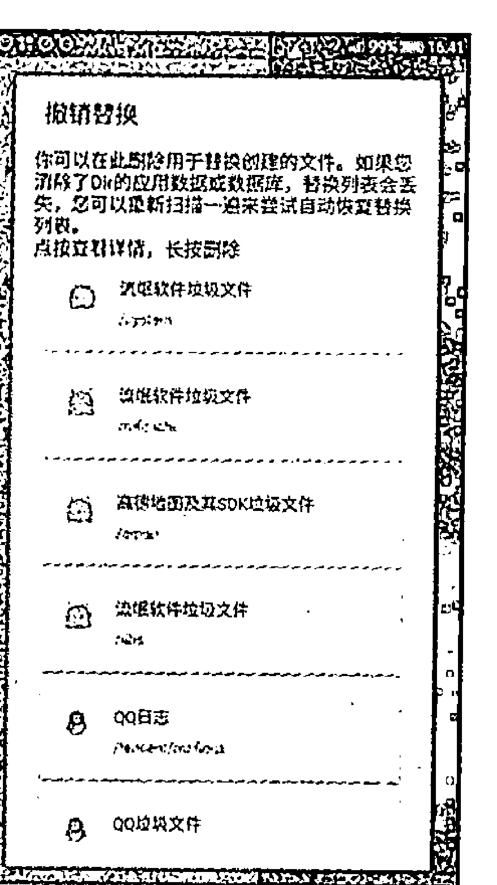

## Windows 10自带的杀毒软件怎么彻底关掉

Q: Windows 10操作系统里面现在自带了一款杀毒软件，按照网上介绍的方法怎么也无法关闭掉。请问傻博士有没有最新的解决方法呢？

A: 首先从网上下载Dism++这款工具，在弹出的窗口里面点击左侧的“系统优化”选项。然后在列表中找到“安全相关设置”并展开它，从中就可以看到“禁用Windows Defender”这一项，将这个选项激活就可以了。

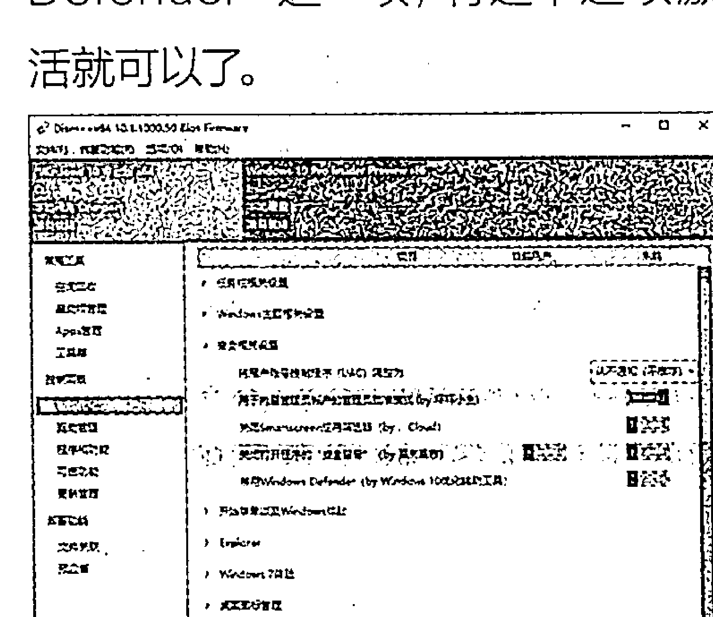

## 删除Windows 10自动播放中的多余设备

Q: 每当在电脑系统里面接入一些移动设备后，系统的自动播放列表就会残留很多设备的选项。如果是自己的设备的话，可以不用管它。如果是其他人的设备的话，那么如何将这些选项进行删除呢？

A: 首先打开注册表编辑器，定位到HKEY_CURRENT_USER\Software\Microsoft\Windows\CurrentVersion\Explorer\AutoplayHandlers\KnownDevices\，在列表中找到自己想要删除的设备的名称，通过右键菜单中的删除命令就可以将它清除掉了。

## 如何取消Windows 10系统的登录界面

文|老万

Q: 现在微软的操作系统在登录的时候都会出现一个登录的界面，用户必须输入相关的密码才能进行登录操作。那么有没有什么方法可以取消这个环节，直接进入到Windows 10操作系统的主界面呢？

A: 首先打开注册表编辑器，定位到HKEY_LOCAL_MACHINE\SOFTWARE\Policies\Microsoft\Windows\，在Windows项目下新建一个名为 Personalization 的项目。接着在右侧窗口里面新建一个DWORD（32位）值，将其名称重命名为NoLockScreen，然后在弹出的对话框里面设置为1就可以了。
如果用户想要恢复系统的登录界面，将刚刚新建的这个注册表进行删除就可以了。

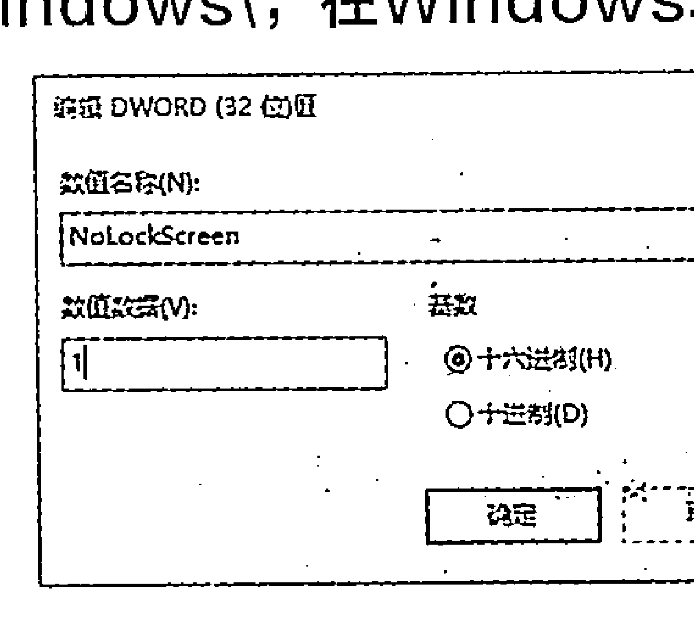

> 傻博士有话说：如果用户想要恢复系统的登录界面，将刚刚新建的这个注册表进行删除就可以了。

## 解除Windows 10 UWP应用网络隔离

Q: 现在很多广告过滤软件都是利用代理的形式来过滤广告的，但是为什么在系统里面设置了广告过滤的功能，却无法对Windows 10 UWP应用中的广告进行过滤操作呢？

A: 之所以出现这样的情况，是由于所有的UWP应用是在虚拟沙箱环境中运行的，这样大多数网络抓包工具就无法对其进行流量分析。要解决这个问题的话，首先下载免费的网络调试工具Fiddler，接着从顶部菜单中选择“WinConfig”这一项，然后在窗口中勾选用户需要的应用就可以了。

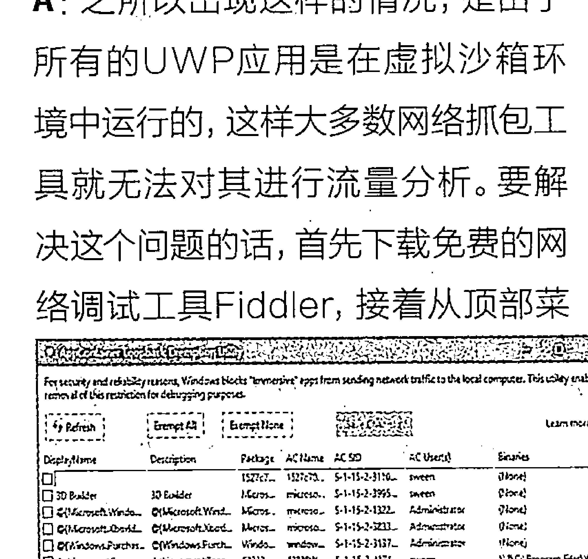

## 将USB端口挂起来节省笔记本电力

Q: 经常通过笔记本来进行办公，而且经常是通过电池来进行供电操作的。那么为了更好地节省电池的电量，有没有一些小的技巧可以推荐呢？

A: 首先在开始按钮上点击鼠标右键，选择菜单中的“电源选项”命令。接着点击当前使用电源计划右侧的“更改计划设置”链接，在弹出的对话框里面点击“更改高级电源设置”选项。然后在弹出的高级设置列表中展开“USB设置”，最后将下面的“USB选择性暂停设置”修改为“已启用”即可。

## 如何手动去除QQ浏览器的驱动

文|老万

Q: 平时使用的是QQ浏览器，现在的版本不知道为什么非要增加一个驱动的功能，给人感觉非常的不好。那么有没有什么方法可以删除这个驱动文件呢？

A: 由于QQ浏览器是在谷歌浏览器的基础上开发而成的，因此它完全可以像谷歌浏览器那样解压后使用，这样只需要将文件夹中的Driver驱动文件夹进行删除就可以了。

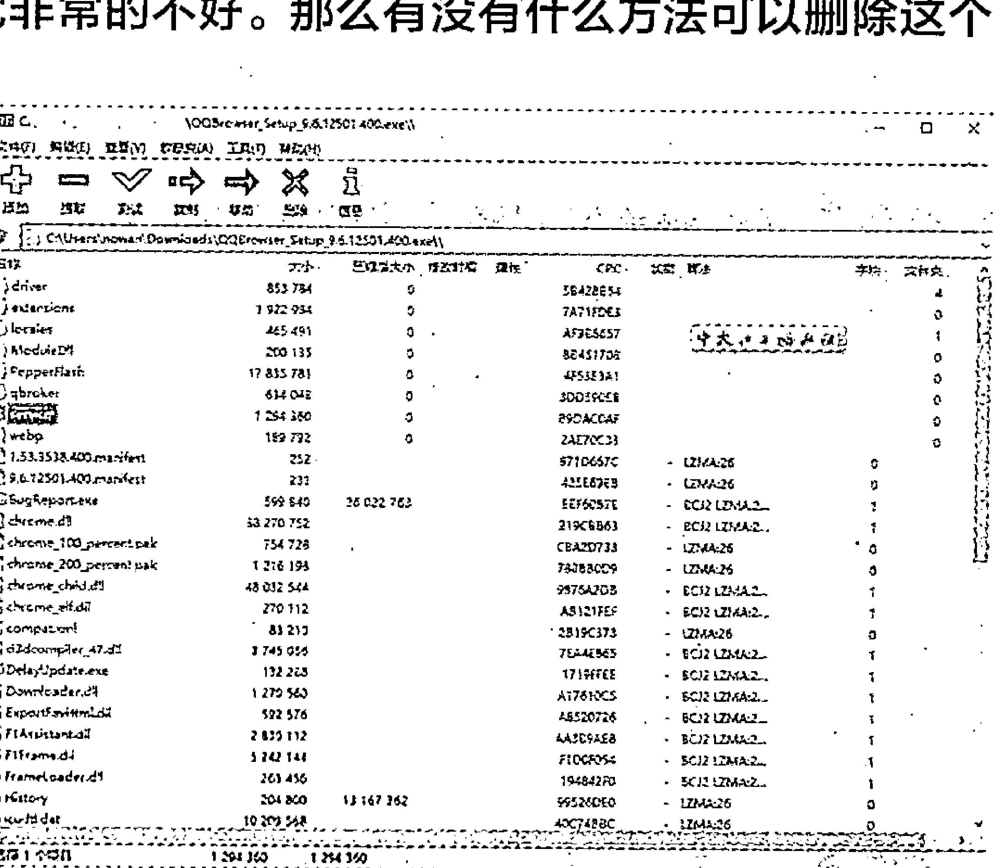

如果已经安装了QQ浏览器，那么利用PC Hunter这款工具也可以删除驱动文件。


## lawlietfox为什么无法便携化设置

Q: 使用的是第三方编译版本的火狐浏览器lawlietfox，这款浏览器自带有便携化配置的功能，可是按照说明进行配置以后，并没有进行相应的便携化操作。那么问题到底出在什么地方呢？

A: 这种浏览器要想进行便携设置的话，首先需要对文件夹中的配置文件portable.ini中的参数进行修改。如果确定自己进行修改操作，那么建议首先下载一个它的老版本进行配置操作，看看能不能进行便携设置。如果可以的话，将这个配置文件复制到新的版本里面就可以了。

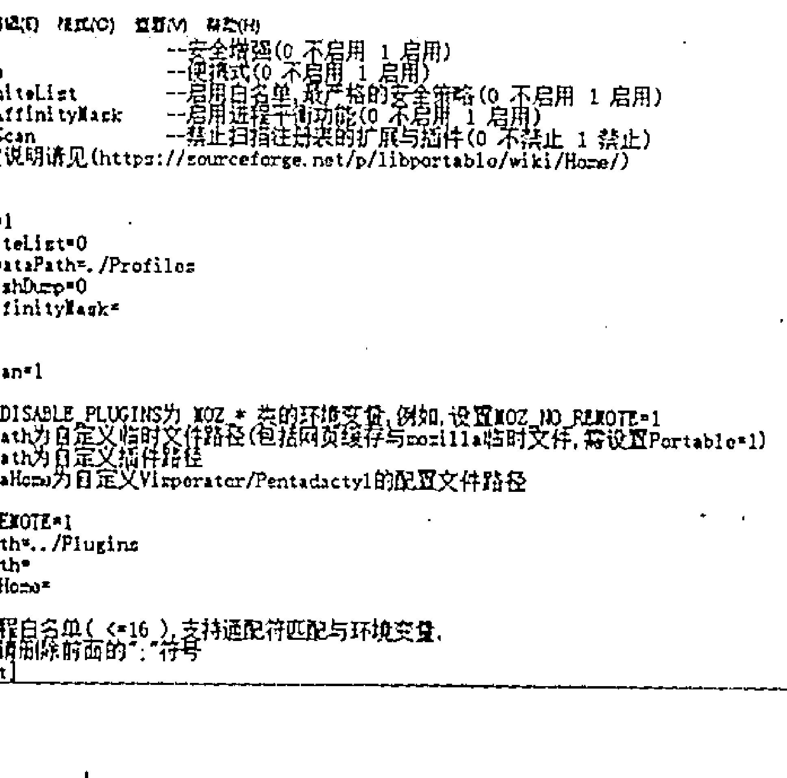

## 文本文件如何进行隐藏操作

Q: 本人脑子比较笨，所以将网站的账号密码都记录在一个文本文件里面，可是这样的话别人也可以查看到。那么有没有什么简单的方法可以对它进行隐藏？

A: 可以将这个文本文件和一个MP3文件进行合并，从而将文本文件隐藏到MP3文件里面。首先将这两个文件进行压缩操作，在压缩选项里面必须选择“存储”这个选项，压缩成功以后将文件后缀名修改为MP3就可以了。

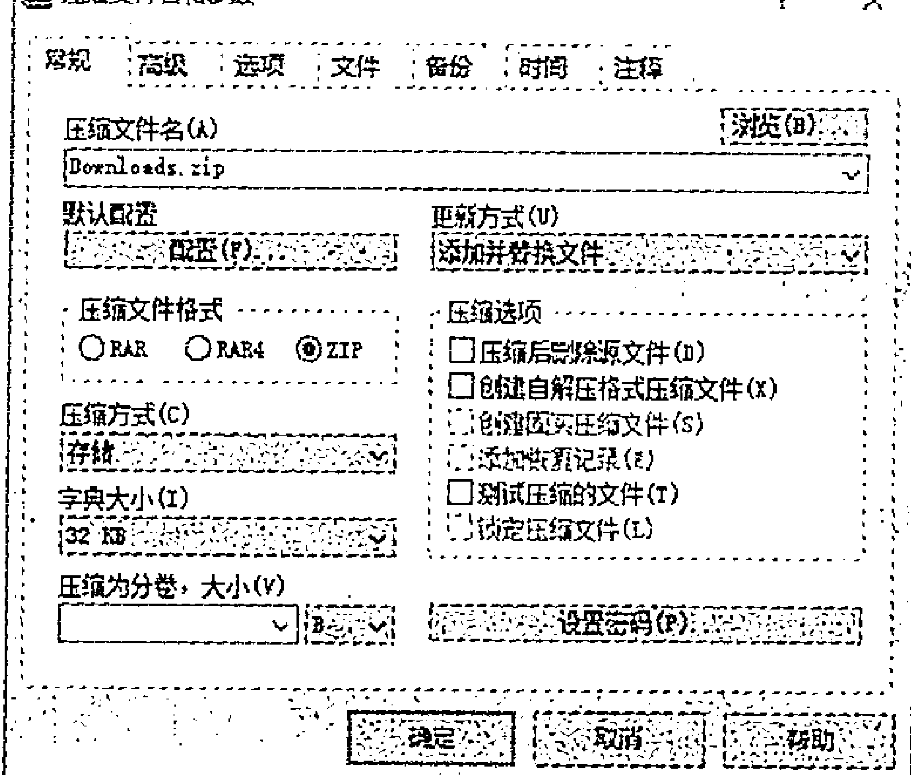

## 有没有下载软件可以推荐一下

Q: 现在QQ旋风已经停止开发了，迅雷软件也变得要死不活的，而且经常在下载的时候出现问题。那么除此以外还有没有其他的下载软件可以推荐一下呢？

A: 迅雷这些下载软件之所以非常出名，一个很大的原因就是它将多种不同的下载方式集于一身，而其他的下载软件只是拥有某一项下载功能而已。所以用户以后只能针对不同的下载任务，使用不同的下载软件了。如要想下载传统的http链接的话，那么就可以使用猎鹰下载软件，要想进行BT下载的话，就可以使用uTorrent这款软件。

## 哪一个版本还在支持Windows XP

Q: 现在使用的是Windows XP的操作系统，平时喜欢使用EmEditor这个文本编辑器。由于现在很多软件的新版本已经不支持这个操作系统，那么请问这款软件最后一个支持XP的版本是哪一个版本？

A: EmEditor支持XP的最后一个版本是14.8.1，直接利用http://files.emeditor.com/emed32_14.8.1.exe这个链接就可以进行下载操作。如果要想下载其他的版本，直接替换链接中的版本号就可以了。

## 播放Flash怎么恢复到以前的状态

Q: 以前在新浪视频观看视频的时候，需要点击一下才可以进行视频的播放，但是最新版本的谷歌浏览器已经不支持这样的操作，而是允许所有的视频自动进行播放。那么有没有什么方法可以恢复到以前的状态呢？

A: 由于最新版本的谷歌浏览器已经不支持Flash插件了，所以通过浏览器自身无法解决这个问题。可以试着安装一款名为Flashcontrol的功能扩展，通过它就可以实现以前的这个播放操作。

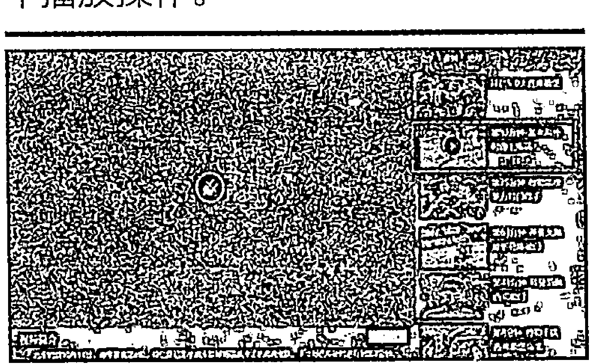

## 找出浏览器里面失效的书签链接

Q: 平时都会将感兴趣的网页链接添加到浏览器的书签里面，但这样多管理起来就非常的困难，比如有的书签失效了，而有的会重复出现。那么有什么方法可以对其进行快速的检测吗？

A: 首先给自己的浏览器安装一款名为“Bookmark Sentry”的功能扩展，安装完成以后利用它对当前的书签进行扫描。扫描完成后它就会通过列表显示出书签的失效链接以及重复的链接，将不需要的内容勾选后就可以进行清除操作了。

## 不借助软件完成网页的滚动截图

Q: 为了对整个网页的内容进行截图操作，往往需要用到滚动截图这个功能。如果不使用这个功能的话，有没有什么方法可以利用软件自身的功能来解决呢？

A: 首先打开网页自带的Edge浏览器，访问需要截图的页面链接。接着点击工具栏中的“添加笔记”按钮，对当前的网页进行滚动操作。操作完成以后点击“保存Web笔记”按钮，这时在弹出的对话框里面一定要选择“阅读列表”这一项。保存完成以后打开阅读列表，这样就可以看到刚刚的截图了。

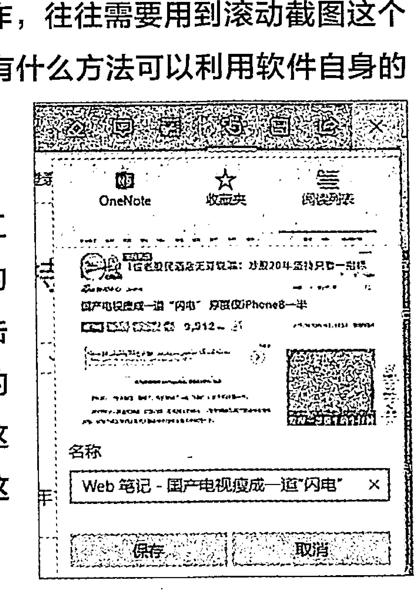


## 有没有给头像照片去背景的服务

Q: 想问问有没有什么网络服务或者免费的软件程序，能给头像的照片进行去除背景的操作？因为不会使用Photoshop这款软件，所以希望能够推荐比较傻瓜化的一类服务。

A: 其实本刊已经介绍过多次这类服务了，比如Malabi就是这样一个云服务(https://www.malabi.co/)。将需要进行处理的照片上传到云服务里面，然后它可以自动分析出背景的区域，确认后就可以进行处理操作了。

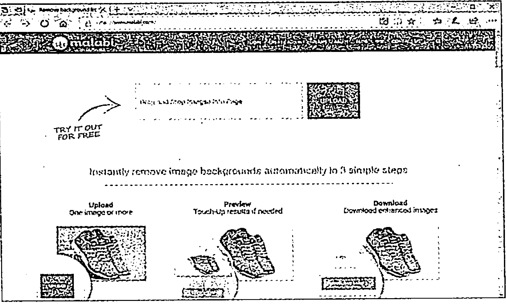

## 百度网盘如何通过磁力链接获取种子

Q: 通过百度网盘可以对磁性链接进行下载操作，而且下载的速度也非常快捷。那么通过百度网盘如何获取到对应的种子文件呢？

A: 无论是百度网盘还是其他的下载软件，在下载磁链接的时候首先就是要获取对应的种子文件，当种子文件下载完成以后，再对种子文件进行下载。所以百度网盘会将获取的种子文件保存到磁盘的列表中，只需要在列表中查找一下就可以了。

## 一键完成行列数据的统计操作

文|老万

Q: 在制作表格的时候，常常会涉及到行和列数据的汇总，这个时候我们最常使用的就是SUM等函数来进行统计。那么除此以外还有没有更加简便易行的统计方法呢？

A: 首先在表格里面选择要进行汇总的行或者列，点击右下角的“快速分析”按钮，在弹出的对话框里面选择“汇总”标签，这样就可以快速进行求和、平均值、计数、百分比汇总等一系列的操作。

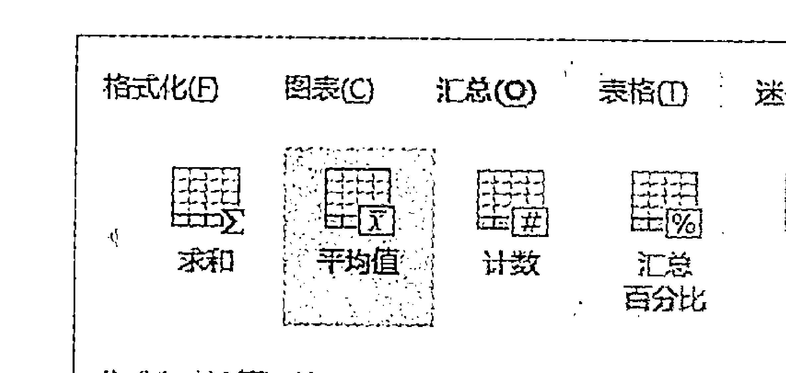

通过Excel软件的状态栏，就可以快速看到平均值和求和的数值。


那么有什么方法可以批量进行修改呢？

A: 首先通过全选的方式选中PPT文档中的所有图形，接着点击“绘图工具”标签，然后在工具栏里面点击“编辑形状”中的“更改形状”按钮。这样用户就可以选择其他的图形来进行批量的修改操作了，而且不需要用户再进行图形大小的调整。

## 批量替换表格中不规则的字段

Q: 最近打开一个其他部门的表格，发现这个表格里面所有员工的名称前面都有一个工号，而且工号后面还有一个横杠和名称连接。那么如何利用Excel表格中的功能，将它们批量进行修改操作？

A: 首先通过鼠标选中表格里面要进行处理的单元格，点击“开始”标签中的“查找和选择”按钮，在弹出的菜单里面选择“替换”命令。然后在“查找内容”输入框里面设置“*-”，在“替换为”输入框里面留空，最后点击“全部替换”按钮就可以解决了。

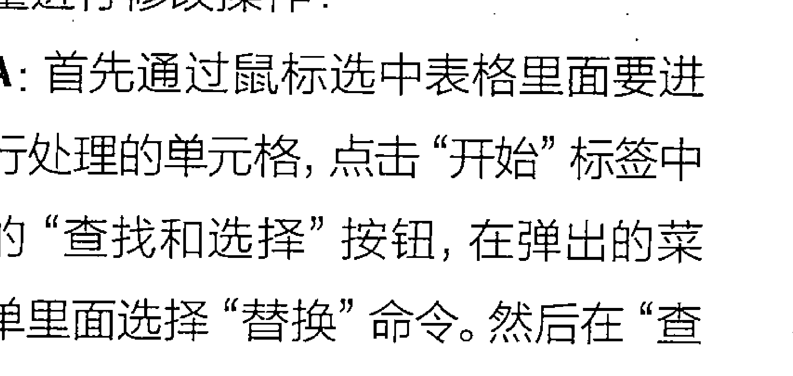

## 同表格多工作簿输入相同内容

Q: 很多时候在同一个表格里面会有多个工作簿，而在工作簿里面又需要输入不少相同的内容，这个时候如果重复输入的话肯定非常的麻烦。那么有没有什么方法可以批量进行输入操作呢？

A: 首先通过鼠标并配合键盘中的Ctrl键，选择表格里面的多个工作簿。接着在任意一个工作簿里面输入需要的内容，输入完成后按下回车键就会发现，输入的内容被同时同步到多个其他的工作簿里面了。

## 批量修改PPT文档里面的形状

Q: 在PPT文档里面经常会用到各种各样的图形，有的时候甚至需要用户自己进行手动绘制图形，但是有的时候选择或者绘制的图形不太满意。

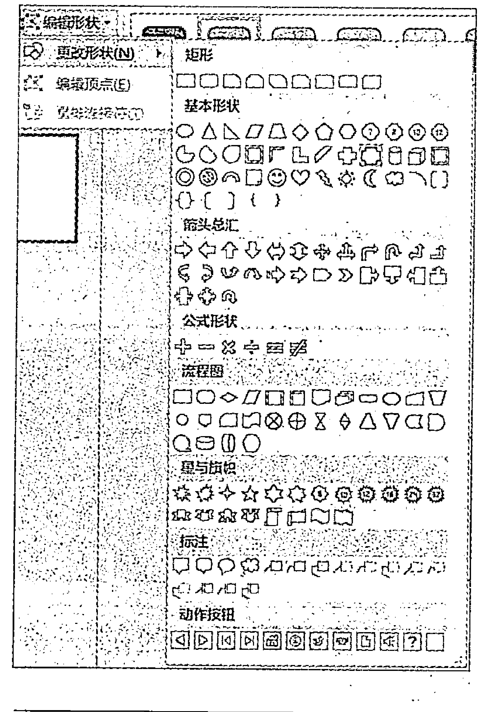

## Word表格跨页标题的重复设置

Q: 有的时候在Word文档里面会输入一个非常长的表格，这个表格的内容可能会跨很多的页面，这个时候就需要在每一页的上面设置表格的标题。那么除了传统的复制粘贴外还有没有其他的解决方法呢？

A: 首先选中表格的标题栏，接着点击“布局”标签中的“重复标题行”命令，这样就可以快速地解决这个问题了。而且这个方法最大的好处就是，在表格出现添加行或者删除行的时候，标题行会自动匹配而不会发生错位的情况。

## 在分享里面添加朋友圈的选项

Q: 现在国内的手机应用越来越“流氓”，所以在选择手机应用的时候，通常都会选择国外的应用或者国内软件的国际版，可是这些应用的分享里面都没有朋友圈。请问这个问题该怎么解决呢？

A: 之所以分享里面没有朋友圈这个选项，主要是在开发应用的时候没有接入微信的接口。所以现在首先下载安装一款名为“魔法分享”的应用，安装完成以后并不需要过多地设置，打开系统的分享菜单就可以看到“魔法分享”选项，以后只需要点击它就可以分享到朋友圈了。

## 给微信添加阅后即焚的功能

Q: 现在很多即时通信软件都加入了阅后即焚的功能，可是我们最常使用的微信到现在为止还没有加入这个功能。那么有没有什么方法可以解决这个急需的问题呢？

A: 微信自身虽然没有这个功能，但是利用微信的小程序则可以解决这个问题。首先安装一款名为“闪密阅后即焚”的小程序，通过它不仅可以让图片实现阅后即焚的效果，还可以设置视频也实现类似的效果，用户只需要设定查看的时间就可以了。

## 如何快速扫描老照片

文|老万

Q: 最近老妈在朋友圈里面看到她的同学在发一些老照片，所以她也想发一些老照片在自己的朋友圈里面。可是怎么才可以将老照片扫描到手机里面呢？

A: 谷歌有一款名为“照片扫描仪”的应用，通过它就可以解决这个问题了。打开这款应用后，首先对准要扫描的照片，然后根据提示将照片的四个边角进行固定。这样就可以完成扫描工作，并保存到手机的图库里面了。

在扫描出的照片下方会出现该应用的提示，可以通过裁剪功能将它删除掉。

## 将手机短信同步到电脑里面

Q: 平时主要还是通过电脑来进行工作，但是有的时候肯定会接到各种各样的手机短信，这样就需要在手机和电脑之间来回切换。那么有没有什么方法可以将手机短信同步到电脑里面呢？

A: 如果使用的是Windows 10操作系统的话，那么利用小娜应用就可以完成这个操作。首先点击主界面左上角的功能按钮，在弹出的菜单里面点击“设置”命令，这样可以看到一个名为“跨平台同步推送”的选项，点击进去后就能发现很多的推送选项，比如未接来电、新的短信以及电量不足等等。

## 快速搜索手机上的各种信息

Q: 虽然手机里面很多应用都有搜索功能，比如文件管理器可以搜索磁盘里面的文件，但是要想搜索其他的信息的话，就需要安装其他的应用。那么有没有一款应用，可以搜索各种各样的信息内容呢？

A: 首先安装一款名为“搜索LITE”的应用，安装完成以后会在系统桌面出现一个快速搜索栏。只需要在搜索栏里面输入关键词，就可以进行网页搜索，以及联系人、已安装应用等各种内容的搜索操作。

# CFan为你选

## 八代酷睿本的争雄

### 联想小新潮7000 PK 惠普战66 Pro G1

随着英特尔八代酷睿处理器的普及，轻薄本的春天终于来临：新品在价格不变或略微上涨之余性能却出现了明显的飞跃，综合性能价格比远非老产品可比。作为最超值八代酷睿独显本的代表，联想小新潮7000和惠普战66 Pro G1谁更适合你？

| 参数对比 | 联想小新潮7000 | 惠普战66 Pro G1 |
| :--- | :--- | :--- |
| 屏幕 | 13.3英寸IPS（1920×1080像素） | 14英寸IPS（1920×1080像素） |
| 处理器 | 酷睿i5-8250U | 酷睿i5-8250U |
| 内存/硬盘 | 8GB/256GB PCIe SSD | 8GB/256GB PCIe SSD |
| 显卡 | NVIDIA GeForce MX150 | NVIDIA GeForce MX150 |
| 接口 | 读卡器、USB3.0×2、USB Type-C、HDMI | 读卡器、USB3.0×2、USB Type-C、HDMI、VGA、RJ45 |
| 厚度 | 307.4mm×211mm×16.9mm | 336mm×238mm×19.95mm |
| 电池/重量 | 36Wh/1.2kg | 46Wh/1.64kg |
| 参考价格 | 5699元 | 5299元 |

### 新一代轻薄代表

联想小新潮7000和惠普战66 Pro G1都隶属于“轻薄本”阵营，具备出色的便携属性。其中，小新潮7000的表现最为惊艳，它采用了13.3英寸屏幕，并将身材控制到了16.9mm厚和1.2kg重的水平上，再结合5.7mm的三边窄边框设计，便携性可媲美不少12.5英寸甚至11.6英寸的机型（图1）。

惠普战66 Pro G1的屏幕比小新潮7000略大，达到了14英寸，但不足20mm的厚度和1.65kg的体重依旧轻盈，三围尺寸不逊于很多13.3英寸机型（图2）。换句话说，两款产品都有着小机身大视野的底蕴，也是未来轻薄本发展的必然形态。为了提升轻薄机身的安全系数，小新潮7000和惠普战66 Pro G1都大面积地引入了金属材质，所以我们无需为它们的坚固性而担心。

### 定位出现偏差

两款轻薄本的硬件配置基本一致，都搭载了英特尔八代酷睿i5-8250U，内置8GB内存、256GB PCIe SSD和NVIDIA GeForce MX150，理论上应该有着相似的性能。然而，联想和惠普对它们的定位却出现了偏差，而这也是导致小新潮7000和战66 Pro G1在使用体验上存在差异。

简单来说，联想小新潮7000还是继承前辈的宿命，定位于家庭用的娱乐体验。为了提升多媒体属性，联想小新潮7000的屏幕不仅采用了IPS材质，还拥有100%sRGB色域（图3），可视角度和色彩表现都更为出色。

而惠普战66 Pro G1则定位于“独显轻薄商务本”，在掌托右下角加上了指纹识别模块，键盘底部也添加了导水孔（图4），具备防泼溅的特性。同时，为了便于商务用户接驳更多外设，战66 Pro G1保留了在轻薄本领域最容易被舍弃的VGA和RJ45接口，可轻松实现三联屏和网线的连接。

### MX150独显有别

虽然两款轻薄本配备的都是NVIDIA GeForce MX150独显，但对MX150核心频率的定义却有着云泥之别。其中，联想小新潮7000为了实现极致的轻薄设计，它将散热出风口设计在了转轴内侧，对GPU的发热控制就提出了更高的要求。因此，该产品采用的MX150独显为不足10W TDP的低功耗版，GPU核心默认/加速频率分别为937MHz和1038MHz，同时采用了双风扇的散热模块设计（图5）。

惠普战66 Pro G1最大的特色就是武装了“满血版”的MX150独显，其GPU核心默认/加速频率可达1469MHz和1532MHz，TDP也因更高频率而达到了25W，性能大约要比低功耗版MX150提升25%到30%（图6），足以媲美NVIDIA上一代GTX950M独显，可在720P+高画质下流畅运行最新的3D大作。

不过，为了缓解满血版MX150独显的发热，惠普战66 Pro G1也做出了一定的牺牲。之所以其厚度达到了近20mm，是采用传统形式的机身左侧出风口设计，就是给MX150预留出更为宽裕的散热空间和风道。

### 性能值得期待

请放心，哪怕联想小新潮7000的MX150独显为低功耗版，其性能也远非NVIDIA上代主流级别的GeForce 940MX可比，大幅提升的性能可以让它胜任更多游戏的挑战。小新潮7000之所以配备这个显卡，是为了换取更性感身材的必然牺牲，如果你追求极致，自然就要接受GPU性能无法100%发挥的代价。

战66 Pro G1其实也可以做得更纤薄，只是为了让MX150满血运行，就必然做出妥协。如果你注重便携性，只是偶尔玩玩游戏，那小新潮7000绝对没问题；如果你比较在意性能，喜欢长时间玩游戏，选择战66 Pro G1不仅可以在某些游戏中跑出更高的帧数，遇到过热降频的几率也会更小一些。当然，如果你喜欢玩大型3D游戏，那还是直接选择配备GTX1050或更高级别独显的游戏本才能胜任。

至于酷睿i5-8250U，它是英特尔15W TDP U系列处理器首次尝鲜四核八线程的存在，其综合性能完胜上代酷睿i7-7500U，哪怕面对i5-7300HQ也有一拼之力（图7）。换句话说，在这颗CPU的帮助下，两款轻薄本在运算性能上已经不存在明显瓶颈了。

> **小结**
目前升级到八代酷睿平台的轻薄本有不少，但能在5000元出头价位就能武装NVIDIA GeForce MX150独显的机器却还不多。相对而言，惠普战66 Pro G1凭借更强的性能和更实惠的价格，选购的优先级要在联想小新潮7000之上，除非你对轻薄和便携有着更为敏感的要求。

## 又见Note之争：红米Note 5A高配版 PK 魅蓝Note 6

红米和魅蓝都是千元价位手机领域的标杆，所以它们的每次产品更迭都极受关注。作为这两个品牌家族中的新品，红米Note 5A高配版和魅蓝Note 6自然也成为了困扰用户取舍的纠结点。那么，它们之间谁更适合你？

### 工艺的较量

红米Note 5A高配版和魅蓝Note 6属于新一代千元机的代表。为了提升卖点，它们在工艺上各有特色。其中，红米Note 5A高配版的后盖材质为塑料，但其机身表面还是有着类似金属的光泽，以及类似金属喷砂的磨砂手感，还做出了类似纳米注塑信号条的凹槽（图1）。不是金属却做出了极像金属的感觉，这就是红米Note 5A高配版的特色所在。

而魅蓝Note 6则是真正的纳米注塑天线和全金属一体化机身，在用料和工艺上更具诚意。而且这款产品还延续了魅蓝E2特色的4-LED流水灯（图2），并把它居中排列在背部双摄位置之上，除了可提供便利的手电筒照明功能外，还可确保拍照时补光明亮自然，结合Flyme流水式闪光灯的五种特定效果，可让消息通知在不同场合下同样优雅。

| 参数对比 | 红米Note 5A高配版 | 魅蓝Note 6 |
| :--- | :--- | :--- |
| 网络 | 全网通(双卡双待) | 全网通(双卡双待) |
| 屏幕 | 5.5英寸(720P) | 5.5英寸(1080P) |
| 处理器 | 高通骁龙435 | 高通骁龙625 |
| 内存/存储 | 3GB/32GB(支持存储卡) | 3GB/16GB(支持存储卡) |
| 摄像头 | 1600万/1300万像素 | 1600万/1200万+500万像素 |
| 机身 | 153mm×76.2mm×7.7mm | 154.6mm×75.2mm×8.35mm |
| 电池/重量 | 3000mAh/153g | 4000mAh/173g |
| 参考价格 | 899元 | 1099元 |

### 这次芯脏差异很大

红米Note 5A高配版的起价为899元，而魅蓝Note 6的售价则为1099元起，200元的价差除了工艺上的差别外，更多还是体现在了硬件配置层面。

两款产品虽然都采用了5.5英寸广视角屏幕和2.5D玻璃盖板，但分辨率却分别为1280×720像素和1920×1080像素，魅蓝Note 6有着更为细腻的显示效果，而红米Note 5A高配版则只能用720P更省电来寻求心理上的安慰了。

两款产品都标配3GB内存（魅蓝Note 6可选4GB内存的高配版），但存储空间则分别为32GB和16GB，红米Note 5A高配版在存储规格上占优。此外，虽然红米Note 5A高配版和魅蓝Note 6都能通过存储卡扩容，但魅蓝Note 6如果选择存储卡就必须放弃一个SIM卡插槽，而红米Note 5A高配版则引入了全新的三卡槽设计，可以同时安装2个nano SIM卡和1个存储卡，双卡双待扩容两不耽误（图3）。

在处理器的选择上，红米Note 5A高配版搭载了骁龙435，而魅蓝Note 6则配备了骁龙625，两颗芯片虽然都是八核处理器，但骁龙435则是28nm工艺打造，集成Adreno 505 GPU（图4）；而骁龙625则是14nm工艺设计，集成Adreno 506 GPU，还拥有更高的主频（图5）。就性能而言，骁龙625有着秒杀骁龙435的实力，再加上其更先进的14nm工艺，在省电效果上的表现也更为突出。不过，如果你平时只玩《王者荣耀》级别的游戏，骁龙435的性能也是够用的。在最高画质下可以保持25fps到30fps的帧数，可以做到流畅运行。而骁龙625的意义则是，让玩《王者荣耀》出现卡顿的几率变得更低，同时还能尝鲜更多单机3D大作。

### 拍照实力的对比

红米Note 5A高配版和魅蓝Note 6这次都强化了自拍表现力，都配备了1600万像素前置摄像头（图6），并对美颜自拍进行了优化。不过，红米Note 5A高配版在此基础上还加入了前置柔光灯，在昏暗环境下自拍时可有效降低噪点，提升细节表现力。

而魅蓝Note 6则强化了后置摄像头的规格，1200万像素主摄像头采用了索尼IMX362和三星2L7混合供货的做法，同时还搭配了一颗500万像素景深摄像头，结合Dual PD全像素双核对焦和双摄人像背景虚化等功能，在拍照效果方面要领先红米Note 5A高配版不少（图7）。

在千元机领域，红米Note 5A高配版和魅蓝Note 6都是受关注度较高的代表。其中，魅蓝Note 6携手高通骁龙625，在性能和网络上较搭配联发科处理器的魅蓝前辈们有所提升，而强化后的拍照能力和4000mAh大电池，则进一步提升了它与同价位手机竞争的底气。而红米Note 5A高配版则反映了当前智能手机供应链物料成本上涨的压力，其性能价格比并不如前辈红米Note 4X，特别是屏幕参数和性能缩水严重。但是，这款产品却引入了三卡槽设计，解决了双卡双待和存储卡扩充不能两全的痛点，而且货源充足，不存在加价抢购的问题。总之，如果在意性能，魅蓝Note 6肯定是首选；但如果你预算有限，追求够用即可，那红米Note 5A高配版也不会让你失望。

图4：Redmi Note 5A 跑分成绩

| 性能项 | 分数 |
| :--- | :--- |
| 3D性能 | 8908分 |
| UX性能 | 17285分 |
| CPU性能 | 14712分 |
| RAM性能 | 4971分 |
| 总分 | 45876分 |

图5：M6 Note（魅蓝Note 6）跑分成绩

| 性能项 | 分数 |
| :--- | :--- |
| 3D性能 | 13020分 |
| UX性能 | 24299分 |
| CPU性能 | 20705分 |
| RAM性能 | 5316分 |
| 总分 | 63340分 |

## 新时代的无线鼠标

文|魔之左手

无线化是目前所有数码IT产品的发展趋势之一，作为非常重要的外设配件，鼠标当然也不例外。当然，早期无线连接技术也有很大的局限性，响应速度、连接速率、抗干扰能力、连接距离，乃至连接的方便性和鼠标自身的续航能力和成本都存在一些问题，因此无线鼠标在很长的时间内都是类似“鸡肋”的产品，只有一些有特殊需求的用户或喜欢追新的发烧友才会购置使用。不过在今天，我们前面提到的限制无线鼠标应用能力和普及的问题几乎都已经得到了比较好的解决，唯一需要改变的，只剩下了用户的习惯。在如今的市场中，各种无线鼠标层出不穷，而且在外形设计、便携性、匹配能力、应用体验等方面，相对于有线鼠标还具有一些明显的优势。

### 鼠标新时代的基石——无线连接技术

从前面提到的早期无线鼠标存在的问题就可以看出，无线连接技术是否成熟，显然是无线鼠标是否值得采用的最重要的因素，那么我们就先来了解一下无线鼠标采用的连接技术吧。

目前无线鼠标主要采用的连接技术为2.4GHz无线技术和蓝牙技术，前者也简称为2.4G无线技术。2.4G无线技术是一种短距离无线传输技术，具有双向传播、抗干扰性强、传输距离远、耗电少的优点，甚至可以绕墙传播。在使用不同的通讯协议的情况下，2.4G无线技术的传输速度最高可达数百Mbps，响应速度可达到1ms，传播距离则在10m这一级别。蓝牙技术实际上也是使用2.4GHz频段的无线传输技术，不过发展形成了自己的体系，各版本兼容性很好。尽管蓝牙技术的传输速度并不算高，目前主流的蓝牙4.0标准也仅达到了最高24Mbps（3MB/s，实测不足1MB/s），延迟则在3ms左右，但因为获得了广泛的支持，已经成为了大部分手机、平板电脑、笔记本电脑的标配，无需附加设备就能直接配对连接。从技术特点来看，蓝牙无线技术具有使用方便、兼容性好的特点，而2.4G无线技术则更适合高速设备，但通常需要使用专用的无线连接器，这一点在下面的产品中有着明显的体现。

### 典型无线鼠标一览

实际上，同型号的无线鼠标产品通常还是会比有线版本（如果有的话）要贵上一些的，所以我们选择无线鼠标时，当然要有与有线鼠标不同的追求，例如更精致的外形、更便携易用，甚至是衍生出不同的使用方式等。因此我们在市场中找到了一些能体现这些特性的典型产品，供大家参考选择。

#### 微软Arc/Surface Arc鼠标

- 连接方式：蓝牙4.0/4.1

微软公司的新一代Arc鼠标包括Surface Arc和微软Arc两款蓝牙鼠标，适合与Surface平台和Windows 10系统配合使用。

它们延续了经典的可展平创意设计，弯折则成为比较“标准”的鼠标曲线，展平则成为超薄的片状结构，兼顾轻薄便携与舒适自然的交互感受。新一代Arc鼠标在配色上进行了升级，个性化或搭配能力更好，Surface Arc鼠标拥有与全新Surface系列产品一致的亮铂金、深酒红和灰钴蓝，微软Arc鼠标则提供了石墨金色。新一代Arc鼠标弯曲即开、展平即关，使用起来简单快捷，其内部构架的吸附性更好，提供了恰到好处的力道反馈与声音反馈，在开关时甚至会让人感觉有些愉悦。不过为了确保续航时间和使用寿命，大家还是应该忍住手痒，不要太频繁地弯折与展平。通过对结构设计和工艺进行优化，精致的工艺使新一代Arc鼠标弯折后更贴合手部曲线，底部也不会再出现皱褶，使用更舒适，交互更自然，观感也更出色。新一代Arc鼠标采用触控区域替代滚轮，同时支持水平和垂直方向的滚动，左右按键的改进和优化提供了更精准的操作，蓝影追踪技术使其几乎可以在各种平面流畅使用，续航寿命长达9个月。

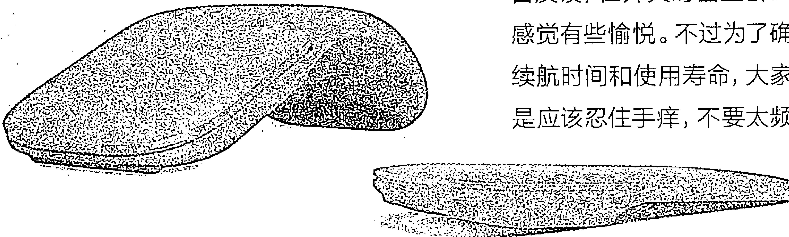

#### 罗技G603

连接方式：2.4G+蓝牙
G603是一款完全采用无线连接方式的鼠标，为了应对不同的需求，特意采用了2.4G与蓝牙两种连接方式，其中2.4G连接方式的报告速率可达到1ms，达到有线游戏鼠标的水平，而蓝牙连接方式的性能要差一些，仅有7.5ms~11.25ms。与之配合的是，它还带有模式切换按钮，以及高低性能（功耗）切换拨杆，高性能模式下电池寿命约为500小时（使用两节AA电池），低功耗模式下报告速率降至8ms，电池寿命达到18个月。这款鼠标整体外形比较类似G403，显得比较圆滑，不过因为顶盖兼做电池、接收器仓盖，所以采用了不同颜色，很容易让人想起罗技最初的G系列。它采用新一代Hero传感器，灵敏度达到12000DPI，追踪速度则超过400IPS，可以满足最激烈游戏和超大显示屏的需求。另外如进行弹力校正的高寿命按键等设计，也可以提供非常舒适的使用体验。

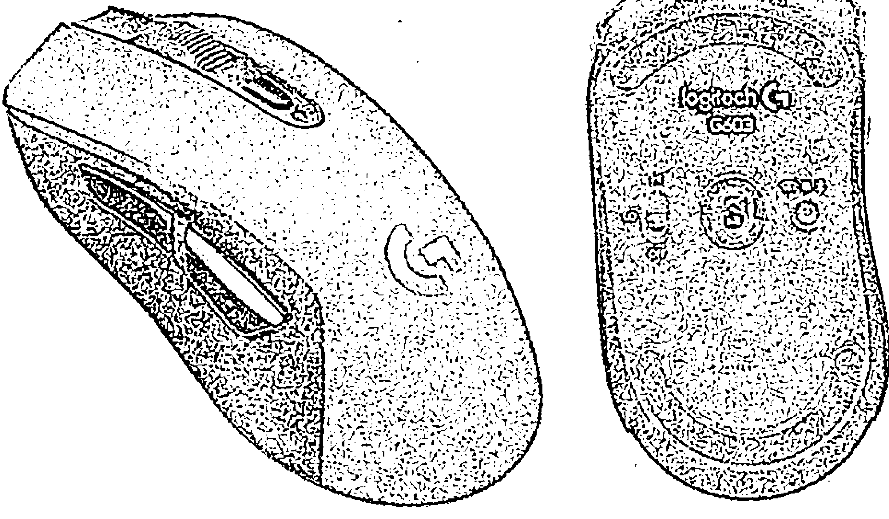

#### 雷蛇刺鳞树蝰（Atheris）

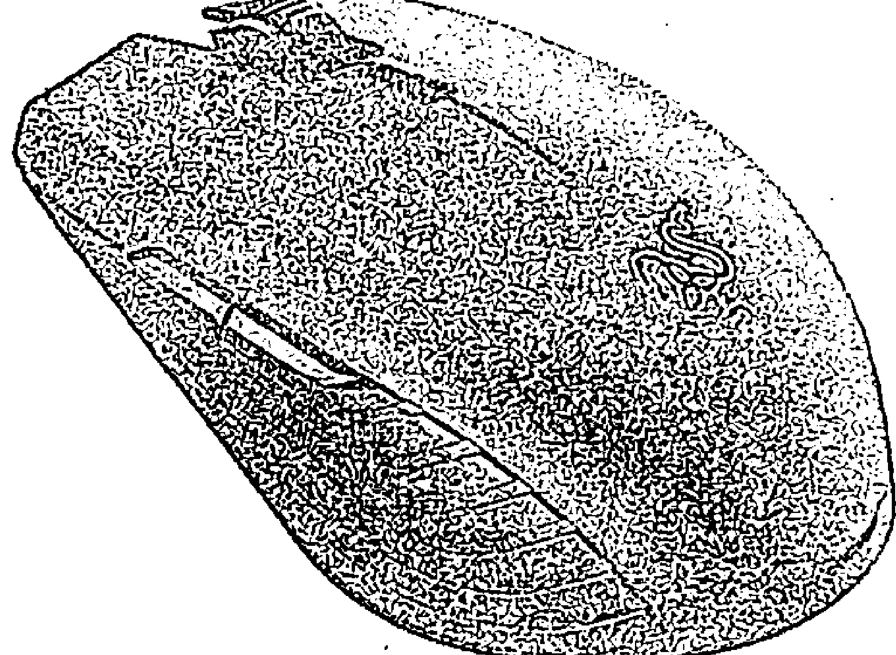

连接方式：2.4G+蓝牙
这是一款设计定位和G603非常相似的产品，不过性能略低一些，但价格更容易被主流用户所接受。它同样通过两种不同的连接方式来支持游戏和办公应用，不过其传感器只能支持到7200DPI和220IPS。另外在蓝牙状态下，它采用两颗AA电池的续航时间为350小时。和更高端的游戏鼠标相比，这款鼠标外形更小巧一些，不过前突的左右键、巨大的滚轮等设计还是充满了Razer的设计风格。另外与G603不同，它采用左右手兼容设计，并且重量明显更低，对一些用户来说更有吸引力。

#### 雷柏1680 无线版

- 连接方式：2.4G

采用了静音设计的雷柏1680无线版显然是更适合办公室或移动办公环境，它有多种色彩可选，外形小巧圆润。这款鼠标并非是追求性能的产品，其最高传感器速度仅有1000DPI，它采用单节AA电池供电，续航时间可达9个月。

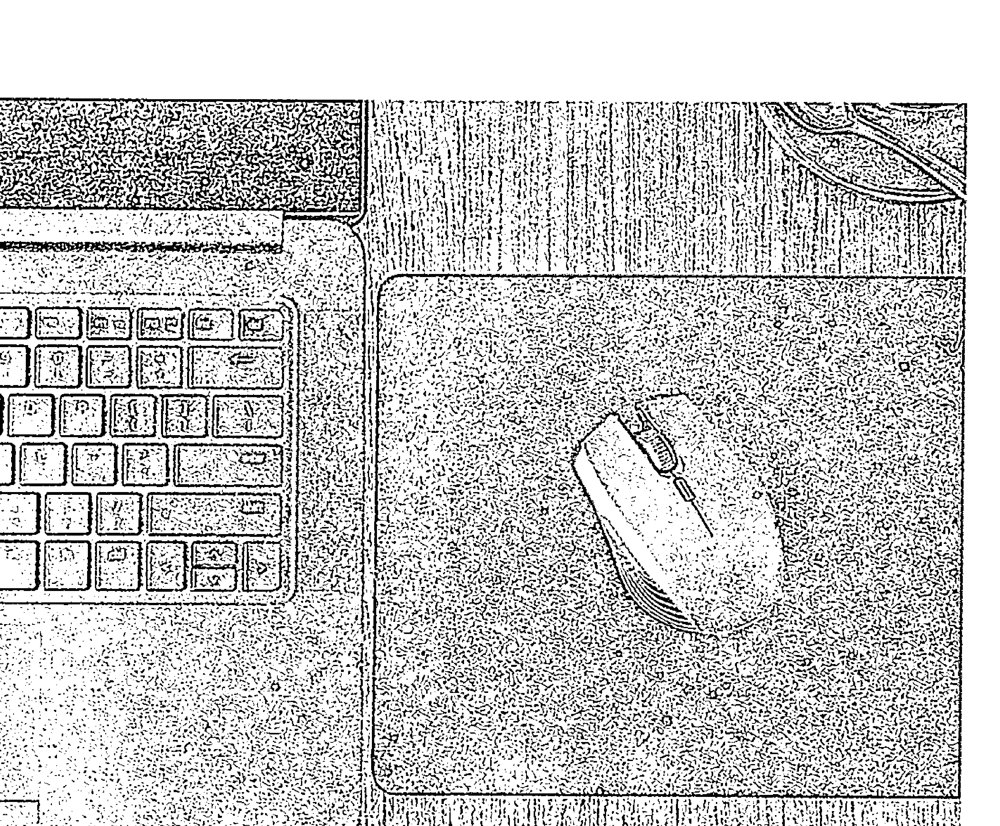

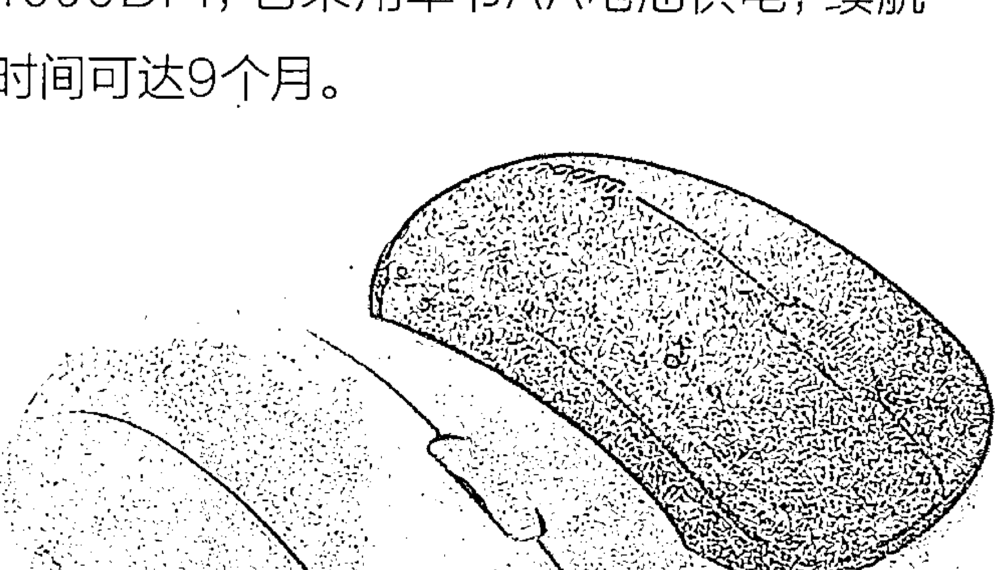

#### 联想N700 无线鼠标

- 连接方式：2.4G、蓝牙

联想N700也是一款采用弯曲/展平设计、触控板“滚轮”的鼠标，使用方法和微软ARC鼠标类似，只是状态转换从直接弯折变成了旋转。它还具有一个很独特的功能——PPT展示，这一功能包括了鼠标按键的优化以及内置激光指示器。

联想N700有橙色和黑色两种配色，16mm的厚度使它不像微软ARC鼠标那样纤薄，更像是圆润的卵石，但便携性还是不错的。其传感器速度为1200DPI，基本可满足办公与日常应用的需求。在鼠标尾部带有连接方式切换拨杆，前端则带有一个激光指示器窗口。

## PPT演示

按中键即可激活演示器功能，并同时开启激光灯 左键=返回上一页 右键=进入下一页

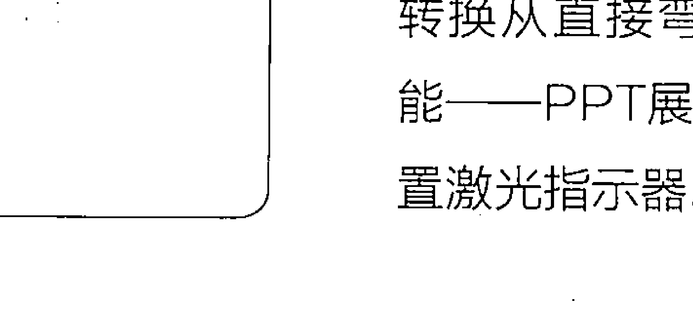

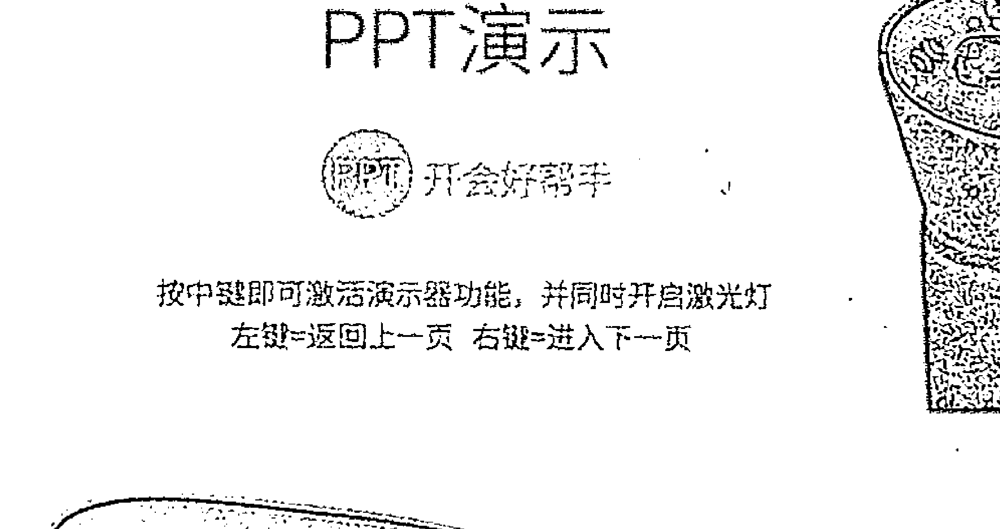

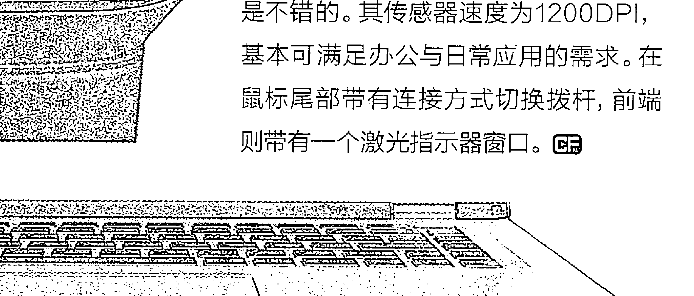

### 笔记本内存怎么买

如今无论是游戏本还是轻薄本，其内置的处理器和独立显卡芯片都是BGA封装（芯片直接焊在主板上），能让用户自行升级的硬件就只剩下了内存和硬盘。其中，有关SSD硬盘的升级和数据迁移CFan在2017年第8期和第14期的特别话题中作过详解，今天就让我们再来看看内存的升级思路吧（图1）。

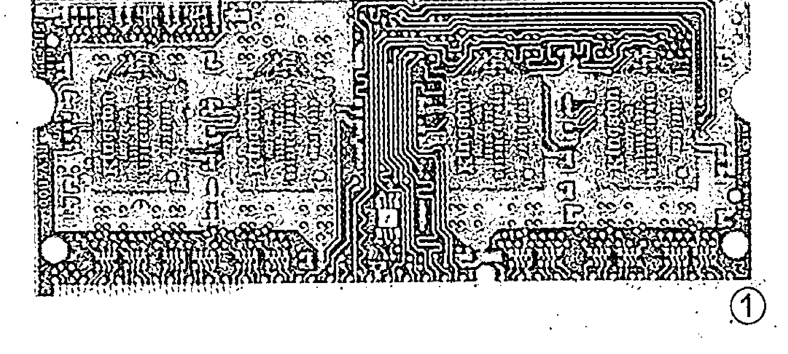

### 波动的内存条价格

我们都知道，最近2年无论是SSD、闪存盘还是内存条，凡是和NAND闪存相关的存储设备都进入了“疯涨模式”。曾经单根8GB DDR3-1600内存最低已经跌破了200元大关，而当前单根4GB DDR3-1600内存的均价都要230元，而8GB容量更是450元起步。

所以说，现在并不是升级内存的最佳时间节点。但是，这并不妨碍我们掌握选购笔记本内存的思路和方法，待内存价格回归理性之后便可随时入手。

### 升级内存的必要性

受包括内存在内的配件价格不断上涨的压力，很多新款笔记本在配置和价格上也变得越加保守起来。在2015年，眼看着4000元起步的笔记本都拿8GB内存作为标配。而2017年的今天，更多5000元起步的新品却“降级”到4GB内存（图2），很讽刺吧？

那么，4GB内存难道不够用吗？

答案是真的不太够用。如果你买笔记本只是为了上网、看视频、编辑文档，4GB内存的确可以满足流畅运行的需求。但是，如果你喜欢玩游戏，进行视频剪辑、影音图像编辑以及更多的复杂应用环境，4GB内存就将面临明显的瓶颈了。

以玩游戏为例，增加内存容量也许对游戏平均帧数的提升并不明显，但对游戏最低帧数的影响却是非常巨大的。

CFan曾经进行过测试，一款i7-4710MQ+GTX980M游戏本，在分别搭配4GB、8GB和16GB内存时玩《刺客信条 大革命》。此时它们的平均帧数虽然都在30fps左右，但最低帧数却分别只有1fps、13fps和19fps，显然4GB内存状态时出现卡顿的频率更高，而且已经严重影响到游戏体验。

因此，在当前的软硬环境下8GB内存算是基本够用的门槛，低于该容量极有必要升级，等于该容量在有条件时可以考虑升级，高于该容量暂时则无需升级。

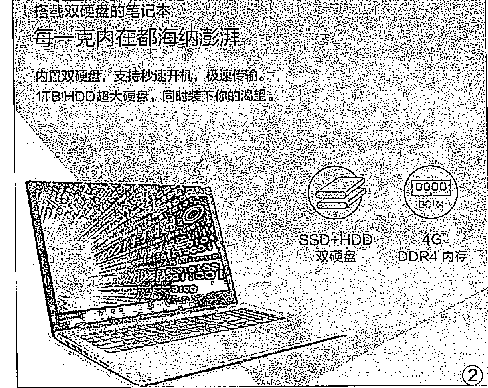

### 想升级？先看有没有资格！

问题来了，并非所有笔记本都有升级内存的资质。很多主打极致轻薄设计的笔记本、PC平板二合一设备为了瘦身会取消独立的SO-DIMM内存插槽，改用板载内存的设计，也就是将LPDDR3或LPDDR4内存颗粒直接焊在主板上（图3）。你买的时候是4GB，那它一辈子就只能是4GB，哪天觉得内存不够用了，就只能一步到位更换新机了。

所以，对那些采用板载内存的笔记本而言，如果你想让它可以正常服役两三年，那就一定不能图便宜，要选择标配8GB内存的中配或高配版！

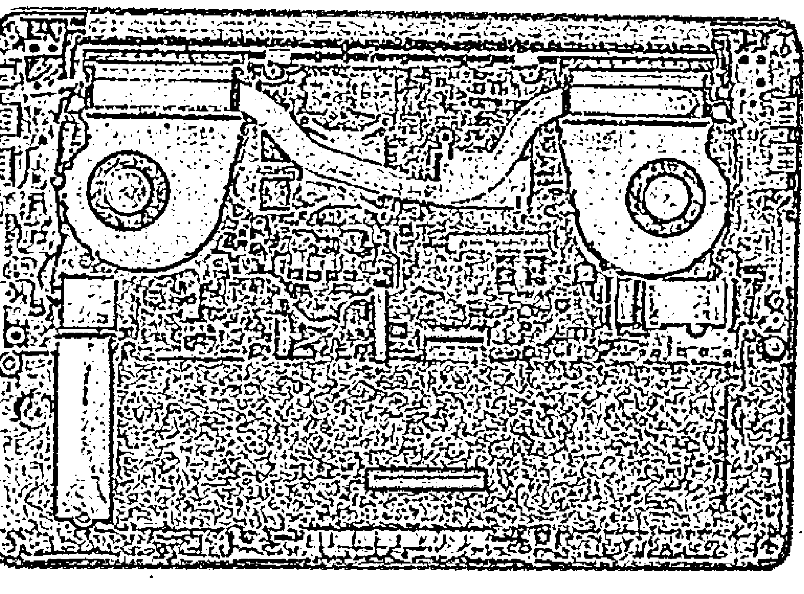

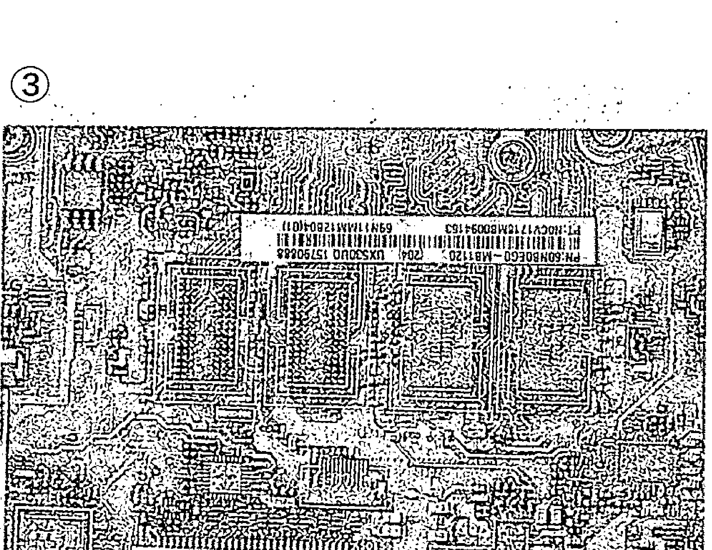

### 数一数 确认新添还是更换

一般来说，相对厚重的游戏本大都会内置两个SO-DIMM内存插槽，除了标配一根内存条外总会有一个SO-DIMM插槽处于闲置状态（图4），在这种情况下我们只需新买内存并插在闲置SO-DIMM插槽上即可使用。

在超薄本领域，只有少数产品会配备两个SO-DIMM内存插槽，因为这种插槽太占空间，和追求纤薄设计有所冲突。所以，讲究一些的轻薄本会采用板载内存+额外一个SO-DIMM内存插槽的组合（图5），以便内存可以运行在双通道模式，提升集成显卡性能。不讲究的轻薄本就只有一个SO-DIMM内存插槽，当你想升级更大容量的内存时，标配的老内存就只能“下岗”了。

因此，在决定升级内存之前，大家一定要拆开自己的笔记本，或是在网上查找拆机图，再或是通过官网有关内存的参数说明了解产品到底还有没有闲置的SO-DIMM内存插槽（图6），最终确认是新添内存还是更换内存。

| 芯片组 | Integrated Intel® CPU |
| :--- | :--- |
| 内存 | 4 GB 内存, DDR4 2133MHz 板载内存<br>8 GB 内存, 板载内存<br>1 x SO-DIMM 内存插槽<br>系统内存可扩充至 16 GB 内存(需操作系统支持) |

### 看一看 确认内存版本的兼容

英特尔从第六代酷睿处理器（Skylake，2015年上市）开始便引入了对DDR4内存规格的支持，并同时保留了对上代DDR3规格的兼容。问题是，哪怕是到了2016年上市的第七代酷睿笔记本时期，笔记本领域依旧是DDR3和DDR4内存共存，直到刚刚上市的第八代酷睿笔记本才全面过渡到DDR4内存。

因此，在升级内存前我们还需通过网上的评测、官方的参数或自己安装CPU-Z软件，确认笔记本内存插槽到底是DDR3规格还是DDR4规格（图7），要知道两种内存的金手指并不兼容哦。如果你的笔记本标配DDR3内存，就只能购买DDR3内存与其搭配。

需要注意的是，从第四代酷睿开始笔记本就全面支持DDR3L低压内存（工作电压1.35V，标准DDR3内存电压为1.5V，DDR4内存则为1.2V）。所以如果你的笔记本型号较老（2012年或更早时间购买），就需要刻意挑选1.5V标压的内存条才能确保兼容了（图8）。至于内存的频率，在确认工作电压兼容的前提下，价格相近时频率越高越好。哪怕你的笔记本只支持DDR3-1333MHz，也能兼容最新的DDR3-1866MHz，只是新买的内存会自动降频到1333MHz的频率上，不影响使用。

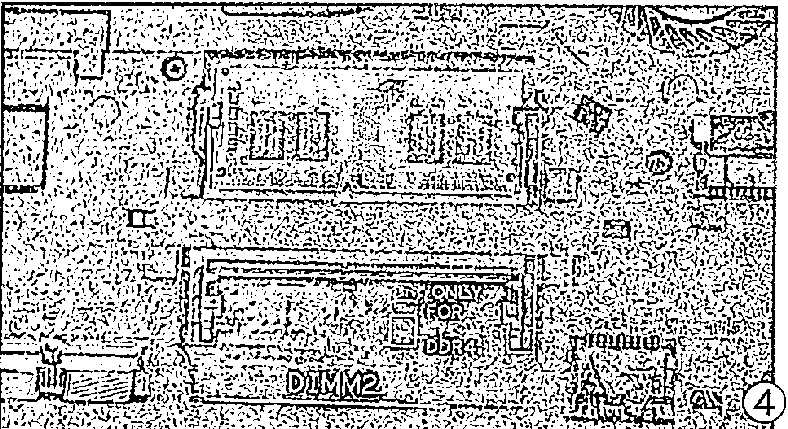

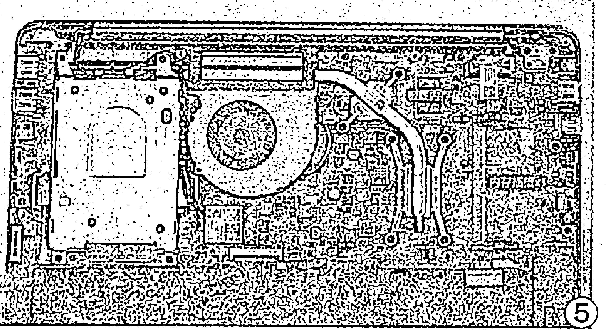

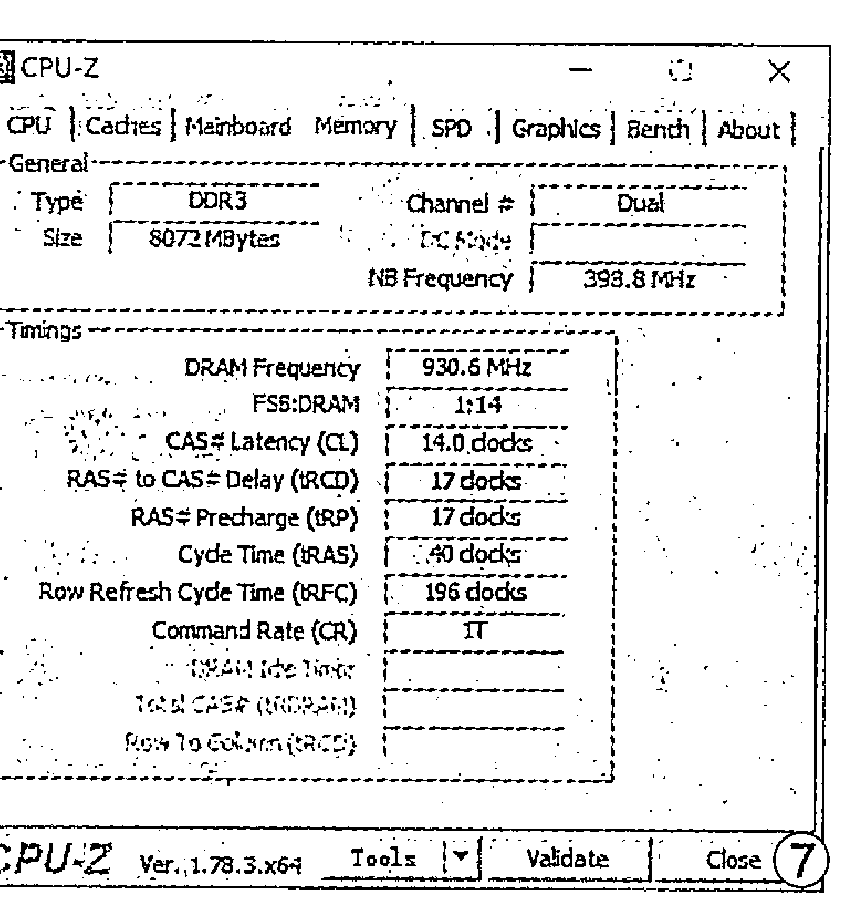

### 查一查 笔记本最大支持容量

笔记本内存的容量自然是越大越好，但我们还需了解笔记本所支持的最大内存容量的上限，否则买回家无法识别可就尴尬了。至于如何判断笔记本的内存上限，就需要根据具体产品型号而定了。

比如，在英特尔官网我们可以了解到，游戏本专用的45W TDP H系列酷睿处理器最大支持64GB内存容量，而轻薄本专用的15W TDP U系列酷睿处理器则支持32GB（图9）。那么，这就代表游戏本和轻薄本分别可以塞进64GB或32GB内存了吗？

答案自然是否定的。一般来说，轻薄本的SO-DIMM内存插槽最大仅支持单根8GB容量内存，如果配备两个SO-DIMM就最大支持16GB；采用板载4GB+一个SO-DIMM那就支持最大12GB；而游戏本的SO-DIMM插槽则普遍支持单根16GB内存，所以在配备两个SO-DIMM时就能升级到32GB（图10）。至于64GB？那是给配备四个内存插槽的台式机主板准备的！

| 内存容量 | 2/4/8GB | 2/4/8GB | 4/8GB |
|----------|---------|---------|-------|
| 共同的功能点 | 金士顿也拥有面向大众用户的性价比产品KVR（Kingston ValueRAM）系列，由于在原材料、产品设计和质量检测方面的优势，ValueRAM系列在制造和品质控制方面保持着Kingston一贯高水准，充分满足系统的长期稳定工作。同时内存都通过严格验证，以及与各大品牌主机板的兼容测试。 | 金士顿也拥有面向大众用户的性价比产品KVR（Kingston ValueRAM）系列，由于在原材料、产品设计和质量检测方面的优势，ValueRAM系列在制造和品质控制方面保持着Kingston一贯高水准，充分满足系统的长期稳定工作。同时内存都通过严格验证，以及与各大品牌主机板的兼容测试。 | 金士顿也拥有面向大众用户的性价比产品KVR（Kingston ValueRAM）系列，由于在原材料、产品设计和质量检测方面的优势，ValueRAM系列在制造和品质控制方面保持着Kingston一贯高水准，充分满足系统的长期稳定工作。同时内存都通过严格验证，以及与各大品牌主机板的兼容测试。 |
| CAS延迟 | CL11 | CL9/8 | CL11 |
| 工作频率 | 1600MHz | 1333MHz | 1600MHz |
| 工作电压 | 1.5V | 1.5V | 1.35V |


### 筛一筛 找出最超值型号

当你掌握了上面的知识点后，最后一步就是购买笔记本内存了。好消息是，如今笔记本对内存的兼容性还是很不错的，只要内存版本（DDR3还是DDR4）、运行电压（1.35V还是1.5V）没错，那基本是所有品牌的内存条通吃，鲜有点不亮或出现不稳定的情况。

只是，如果你的笔记本型号较老，再或是想100%确保兼容性，笔者还是建议大家优先挑选金士顿和三星品牌的内存条，其他品牌除非价格足够优惠，否则没有必要为5元到20元的价差而冒险（图11）。

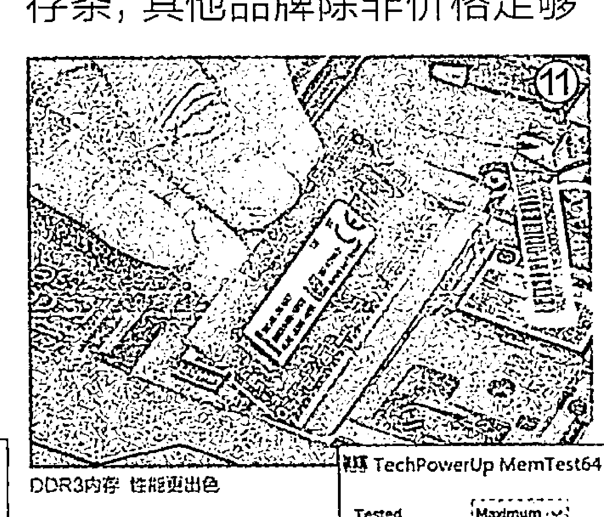

如果你的预算有限，实在等不到内存价格回落了，那现阶段则可考虑通过闲鱼或其他平台购买二手内存条。而买二手内存时最应注意的就是在下单前和卖家沟通清楚，给自己预留足够的退路，并给自己留出足够的测试兼容性和稳定性的时间。

至于稳定测试，笔者推荐使用MemTest64（下载地址：http://pan.baidu.com/s/1jlpCmF0），这个软件是绿色版，双击运行后在界面上单击“Begin Test”即可（图12）。在运行这个软件的时候内存会被彻底占满，所以无法进行其他操作，大概两小时左右可以跑完一整遍测试。如果内存出现错误，MemTest64会自动停止，非常直观。

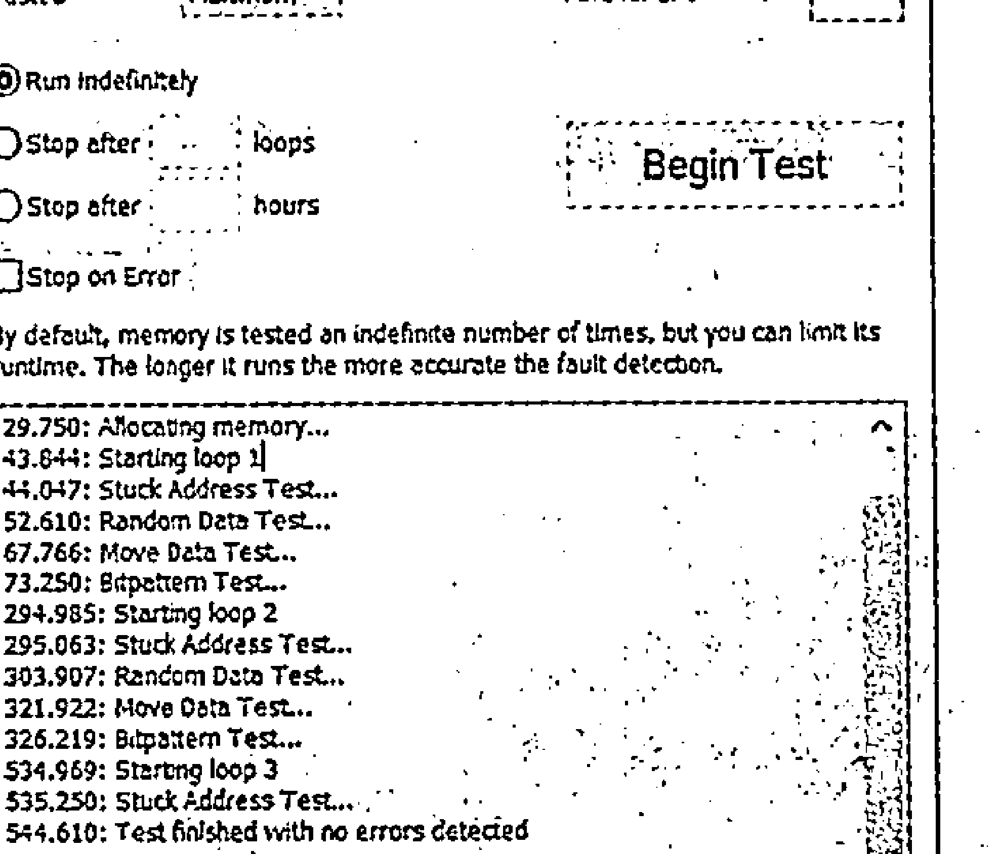

| | 可配置的TDP-down频率 | | | |
|----------|---------------------|---------------------|---------------------|---------------------|
| 补充信息 | 处理器® 酷睿™ i7-8550U 处理器 | 处理器® 酷睿™ i7-7700HQ 处理器 | 处理器® 酷睿™ i5-7200U 处理器 | 处理器® 酷睿™ i7-7700HQ 处理器 |
| 内存规格 | | | | |
| 最大内存大小（取决于内存类型） | 32 GB | 64 GB | 32 GB | 64 GB |
| 内存类型 | DDR4-2400, LPDDR3-2133 | DDR4-2400, LPDDR3-2133 | DDR4-2133, LPDDR3-1866 | DDR4-2400, LPDDR3-2133 |
| 最大内存通道数 | 2 | 2 | 2 | 2 |
| 最大内存带宽 | 34.1 GB/s | 34.1 GB/s | 34.1 GB/s | 34.1 GB/s |
| ECC内存支持 | No | No | No | No |

ZX53VE 芯片组 英特尔® HM175 高速芯片 内存 2 x SO-DIMM 内存插槽，支持32 GB (选配)

## 大屏的碰撞

小米笔记本Pro PK 宏碁Swift3-15

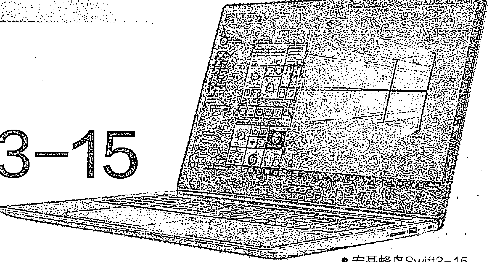

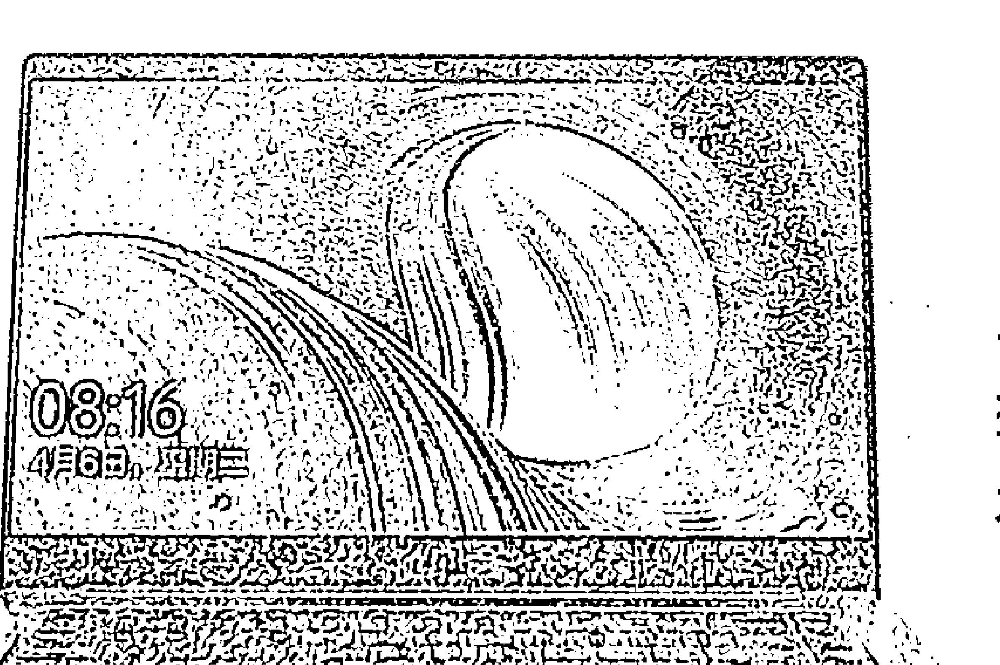

上期我们看过了两款轻薄八代酷睿笔记本的较量，本期就让我们将目光投向拥有更宽阔视野的15.6英寸大屏轻薄本的碰撞上。比如小米笔记本Pro和宏碁蜂鸟Swift3-15就都是武装八代酷睿和MX150独显组合的新品，它们之间谁更适合你？

#### 设计上的差异

| 参数对比 | 小米笔记本Pro | 宏碁蜂鸟Swift3-15 (SF315-51G) |
| :--- | :--- | :--- |
| 屏幕 | 15.6英寸IPS (1920x1080像素) | 15.6英寸IPS (1920x1080像素) |
| 处理器 | 酷睿i5-8250U | 酷睿i5-8250U |
| 内存/硬盘 | 8GB/256GB PCIe SSD | 8GB/128GB SSD+1TB HDD |
| 显卡 | NVIDIA GeForce MX150 | NVIDIA GeForce MX150 |
| 接口 | 读卡器、USB Type-C×2、USB3.0×2、HDMI、耳机孔 | 读卡器、USB3.0×2、USB2.0、USB Type-C、HDMI、耳机孔 |
| 尺寸 | 360.7mm×243.6mm×15.9mm | 370.5mm×255mm×18.9mm |
| 电池/重量 | 60Wh/1.95kg | 48Wh/2.1kg |
| 参考价格 | 5599元 | 5699元 |

小米笔记本Pro和宏碁蜂鸟Swift3-15都采用了15.6英寸屏幕，表面也都覆盖有康宁大猩猩玻璃保护，IPS材质的LCD具备170度以上的可视角度。不过，小米笔记本Pro的屏幕还拥有72%的NTSC色域，在色彩方面有着更真实的表现。

两款笔记本都采用了金属机身，其中蜂鸟Swift3-15的A、C和D面主要部分都是铝合金金属件，拥有粉色、银色和蓝色可选，选择范围比较丰富。这款产品使用了楔形底部设计（图1），机身从后往前越来越薄，所以能在视觉上给人一种更薄的错觉。

小米笔记本Pro虽然没有多彩的版本，但它的整机材料却几乎都是金属，包括镁合金骨架和铝合金材质的外壳（图2），整体感觉和苹果MacBook基本一致，而且它还有着更轻更薄的机身，就工艺而言小米笔记本Pro的表现更为出色。

需要注意的是，由于小米笔记本Pro引入了超窄边框设计，机身长度有所缩减。为了避免误触，它采用了和台式机键盘19.5mm键距相同的全尺寸键盘，也因此取消了数字小键盘的区域。而蜂鸟Swift3-15则保留了数字小键盘（图3），在输入大量数字时，或是运行某些必须使用数字键的软件时可以获得更好的体验。

好消息是，小米笔记本Pro和宏碁蜂鸟Swift3-15为了提升安全性和解锁效率，都集成了静态按压式指纹解锁模块，轻轻一按就能快速唤醒进入桌面。只不过，两款产品的指纹模块位置有所差异，小

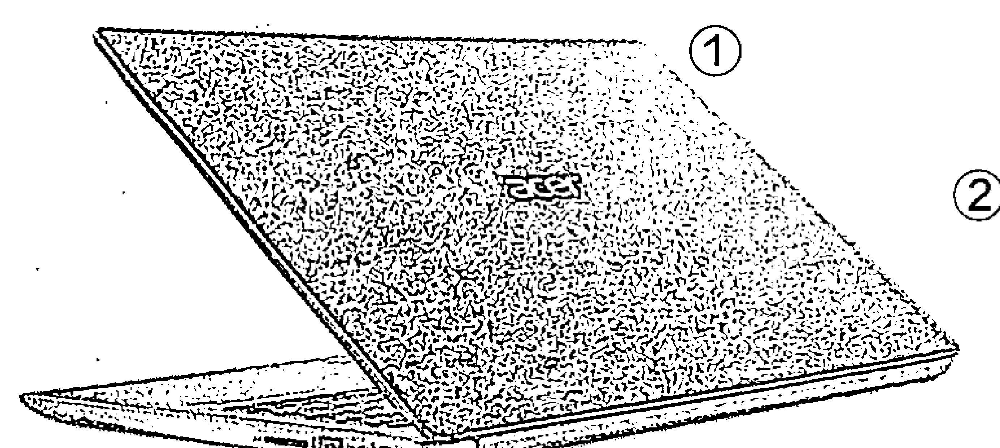

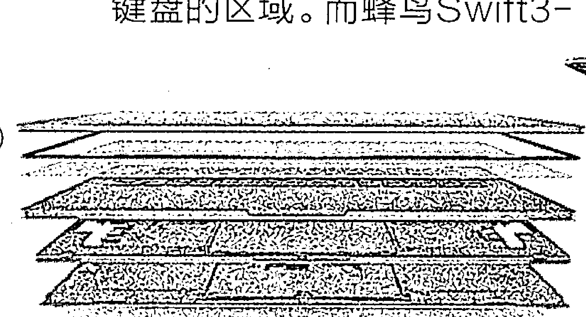

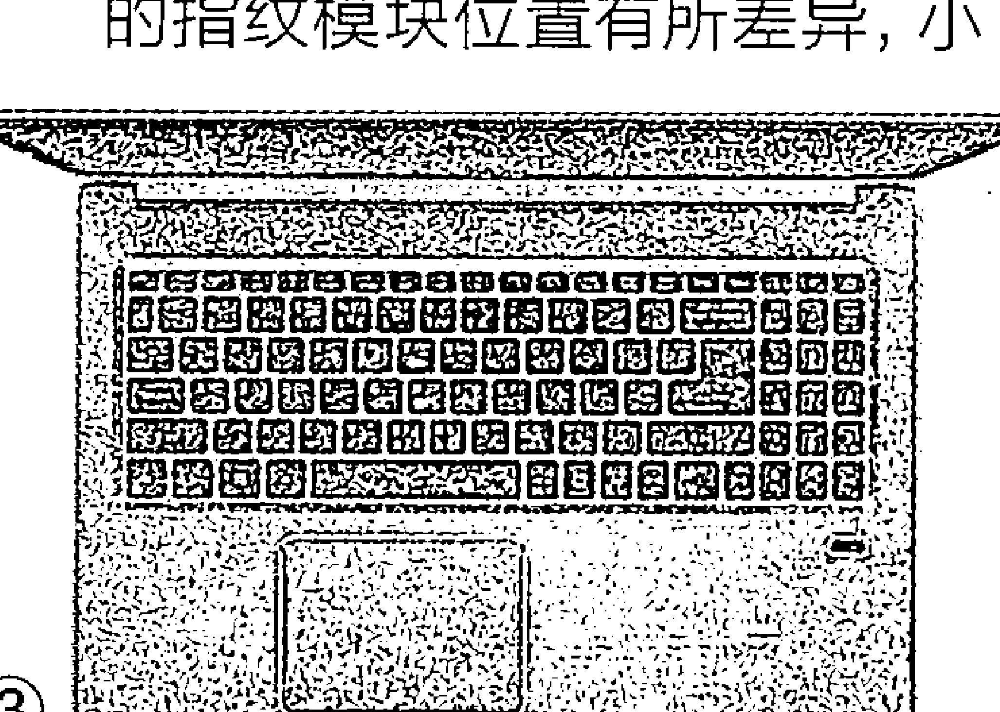## 扩展能力的差异

由于尺寸相同，所以小米笔记本Pro和宏碁蜂鸟Swift3-15有着基本相同的接口数量，只是在功能上就存在些许差异了。其中，蜂鸟Swift3-15提供了3个标准的USB接口，其中一个USB3.0还支持关机充电功能（图5），无需打开笔记本电源就能通过它给身边的手机充电，用于应急再合适不过。这款产品还标配1个USB Type-C和1个HDMI接口，可通过独立的电源孔充电。

小米笔记本Pro分别提供了2个标准USB和2个USB Type-C接口，其中1个USB Type-C需要承担充电任务，同时还能扩展出USB、HDMI、VGA、Mini DP以及千兆网口等丰富接口，最多可实现三屏显示和双4K视频播放功能。如果你不希望因充电而牺牲扩展性，一款USB Type-C多功能转接器还是少不了的。

就需要一步到位购买6999元的顶配版了（i7-8550U+16GB内存）。考虑到用户对存储空间扩容的需求，这款产品除了标配256GB PCIe SSD外，还额外预留了一个M.2插槽（图6），用户可以自行购买SATA通道的SSD升级获得更大的存储空间。

宏碁蜂鸟Swift3-15的内存规格为DDR4-2133MHz，和小米笔记本Pro的差别还体现在磁盘接口上。具体来说，这款产品内置1个M.2插槽和1个2.5英寸SATA插槽，前者同时兼容PCIe和SATA两个版本的SSD。本文所涉及型号的128GB为SATA通道版，并辅以1TB HDD机械硬盘搭配，实现了磁盘容量和性能的平衡。如果你对磁盘速度要求更高，可以选择标配单256GB PCIe SSD的型号（5799元），然后自己加装大容量HDD升级。

### 无需担心的性能

小米笔记本Pro和宏碁蜂鸟Swift3-15的核心硬件相同，都是八代酷睿i5-8250U和NVIDIA MX150独显，配备2GB GDDR5显存。就性能而言，这套组合可以在1080P+中高画质流畅运行守望先锋，用于日常的办公娱乐绝无问题。

随着八代酷睿处理器的普及，轻薄本也终于有了四核处理器，在性能上直逼游戏本专用的H系列酷睿处理器。而作为首发八代酷睿+MX150的独显大屏轻薄本，小米笔记本Pro和宏碁蜂鸟Swift3-15都有着出色的性价比，前者的优势在于做工和屏幕素质，而后者则支持更合理的SSD+HDD组合。可惜，目前两款产品都需要“预约+抢购”，还没能实现现货供应。如果没有特别的需求，保持两款机器谁有货就买谁的态度即可。

### Android平板的竞争

#### 台电T10 PK 昂达V10 Pro

随着智能手机屏幕越来越大，平板电脑的市场受到了极大的冲击。然而，市场萎缩并不代表没有需求，只是此类产品的迭代更新速度明显放缓而已。如果你想挑选一款视野震撼、体验流畅的Android平板，台电T10和昂达V10 Pro应该就是近期最值得关注的新品。

#### 设计上的差异

台电T10和昂达V10 Pro都拥有10.1英寸的大视野（相对于手机而言），屏幕供应商都来自夏普，2560×1600像素的分辨率可提供300ppi的细腻显示效果，无论是玩游戏还是欣赏视频都能带来极为震撼的视觉享受。

机身材质方面，台电T10和昂达V10 Pro同样是铝合金材质和CNC抛光工艺（图1）。为了解决大屏幕对便携的影响，这两款产品都采用了全贴合屏幕。其中，昂达V10 Pro将机身厚度压缩到了9mm，576g的重量颇为轻盈。而台电T10的表现则更为优异，不仅有着7.5mm厚和550g的重量，还在此基础上塞进了更大的电池。考虑到两款机器配置相似，所以就续航能力而言显然是T10更占优势。

考虑到安全和体验，这两款平板电脑都引入了指纹识别模块，昂达V10 Pro将其添加到了屏幕下方类似Home键的位置（图2），属于前置设计；而台电T10则将指纹模块放在了机身背面（图3），通过调整屏幕方向，两只手的食指也都能派上用场。

| 参数对比 | 台电T10 | 昂达V10 Pro |
|---|---|---|
| 屏幕 | 10.1英寸（2560×1600像素） | 10.1英寸（2560×1600像素） |
| CPU | 联发科MT8176 | 联发科MT8173 |
| GPU | Power VR GX6250 | Power VR GX6250 |
| 内存/存储 | 4GB/64GB（支持存储卡） | 4GB/32GB（支持存储卡） |
| 摄像头 | 1300万/800万像素 | 200万/800万像素 |
| 接口 | TF卡插槽、Micro USB、Micro HDMI、耳机孔 | TF卡插槽、Micro USB、Micro HDMI、耳机孔 |
| 尺寸 | 239mm×166.9mm×7.5mm | 250mm×164mm×9mm |
| 电池/重量 | 8100mAh/550g | 6600mAh/576g |
| 系统 | Android 7.0 | Phoenix OS/Android 6.0 |
| 参考价格 | 1399元 | 1099元 |

### 配置上的对比

台电T10和昂达V10 Pro都搭载了联发科针对平板电脑定制的MT817x系列处理器，只是台电T10为双核Cortex-A72+四核Cortex-A53构成的六核处理器MT8176，而昂达V10 Pro则为双核Cortex-A72+双核Cortex-A53组合的四核处理器MT8173，它们都集成Power VR GX6250 GPU，只是在CPU核心数量和最高主频上存在差异。

就性能而言，台电T10在安兔兔测试中可以取得80000左右的成绩，而昂达V10 Pro的得分则在72000左右，有差距但不算明显。如果拿手机领域的处理器进行对比，它们的综合表现要明显优于Helio P25，但又逊色于Helio X20，流畅玩王者荣耀和阴阳师等级别的游戏绝无问题（图4）。

需要注意的是，昂达V10 Pro包含很多子型号，比如2GB+32GB的低配版（999元）、4GB+64GB的高配版（1199元），最近还新出了配置相似的V10 Plus，可供选择的范围更多。

此外，两款产品在摄像头方面的差异也很明显，台电T10采用了1300万像素三星广角前置摄像头（图5），支持美颜自拍，在拍照体验上和手机相似。昂达V10 Pro受制于成本，其前置摄像头只有200万像素，用于视频聊天尚可，至于自拍效果就大打折扣了。

#### 定位影响潜质

台电T10凭借MT8176六核处理器获得了更强的性能，而它的定位也偏向于纯娱乐，预装最新的Android 7.x系统，而且还支持护眼和黑白模式显示。而昂达V10 Pro则偏向于娱乐+办公，就是这种定位上的差异，影响了二者在功能和体验上的潜质。

以V10 Pro为例，为了赋予其办公特性，昂达为V10 Pro准备了Phoenix OS和Android 6.0双系统，Phoenix OS的特色是窗口布局和使用体验无限接近Windows 10，更适合处理多任务环境。此外，这款产品的底部也留有专门的键盘底座扩展端口，有需要的用户可以自行购买199元的磁吸式键盘底座，与平板部分连接后就是一部标准形态的笔记本，获得更高的输入效率（图6）。当然，台电T10也能搭配任意一款蓝牙键盘，只是就无法像V10 Pro组合成“笔记本形态”了。

也正是因为V10 Pro有办公平板的属性，所以昂达只为单侧扬声器，整体音效表现尚可，能够满足日常使用需求。而台电T10为了提升娱乐属性，则配备了AW8376功放芯片和斯威特音腔，外放时的声音表现更为理想。

台电T10和昂达V10 Pro代表了千元级Android平板的主流配置标准，联发科MT817x系列处理器用于驾驭2K屏幕和常见的游戏毫无压力，两款平板轻巧的设计也不会影响大屏幕带来的便携压力。只是，台电T10有着（相对）更为极致的身材，在性能、声音和续航方面的表现占优。而昂达V10 Pro的优势则是更低的售价，以及通过键盘底座变身笔记本的办公潜力。如何取舍，就得看你的实际预算和需求了。

## 体验从芯看起 武装“神U”的热门Android手机盘点

在Android手机领域，如何才能确保足够的性能和流畅运行各种应用环境的基础？处理器，也就是手机的“心脏”无疑是最关键的一环。换句话说，那些武装“神U”的机器都不会太差。

CFan在上期曾向大家推荐了多款标配4GB内存的千元价位手机，可惜受产业链物料成本上涨的压力，其中不少产品虽然内存达标，但处理器和屏幕规格却不够理想。此时，只有再提升预算才有能在各方面都符合需求的机型，比如搭载更好口碑的“神U”。

所谓“神U”，指的并非顶级性能，而是更加优秀的能耗比。现阶段能配上神U称号的芯片包含高通骁龙625、626、630和660，联发科Helio P20、P25，麒麟650、655、659等。它们的特色是采用了14nm或16nm工艺，GPU性能也不存在瓶颈，性能足够强，还具备节能省电的优势。

当然，如果你追求最出色的性能价格比，搭载骁龙835的小米6、麒麟960的荣耀9等表现更理想，可惜这类机器总需要抢购，不是想买就能直接到手的。而本文推荐的10款手机，则是已经经过了市场的考验、供货无压力的均衡性产品，它们可能没有最顶级的性能，但在同价位手机中总能在设计或功能等方面释放闪光点，足以带来理想的使用体验。

### 荣耀8青春版

- 网络：全网通（双卡双待）
- 屏幕：5.2英寸（1080P）
- CPU：麒麟655
- GPU：ARM Mali-T830MP2
- 内存/存储：4GB/32GB（支持存储卡）
- 摄像头：800万/1200万像素
- 体积：147.2mm×72.9mm×7.6mm
- 电池/重量：3000mAh/147g

荣耀8青春版起价1099元（4GB内存高配版1399元），它主打高颜值，采用了双面2.5D玻璃和背部一体化设计，在背面玻璃引入了anti-finger镀膜和12层镜面打造工艺，可犹如镜面一般反射光线，视觉效果非常出色。

### 魅蓝E2

- 网络：全网通（双卡双待）
- 屏幕：5.5英寸（1080P）
- CPU：Helio P20
- GPU：ARM Mali-T880MP2
- 内存/存储：3GB/32GB（支持存储卡）
- 摄像头：800万/1300万像素
- 体积：153.7mm×75.7mm×7.5mm
- 电池/重量：3400mAh/155g

魅蓝E2售价1099元，它选用联发科Helio P20处理器平台，内置最新的LPDDR4X标准内存，拥有较大的3400mAh电池容量，独特的4-LED闪光灯也为其增色不少。此外，魅蓝E2全金属一体化的机身、正面指纹设计且支持18W快充，让该手机成为了同价位上配置和功能最为均衡的产品之一。不过，魅蓝E2的4GB内存高配版价格要1599元，性价比就远不如低配版了。

### 三星 Galaxy On7

- 网络：全网通（双卡双待）
- 屏幕：5.5英寸（1080P）
- CPU：高通骁龙625
- GPU：Adreno 506
- 内存/存储：3GB/32GB（支持存储卡）
- 摄像头：800万/1300万像素
- 体积：151.7mm×74.9mm×8mm
- 电池/重量：3300mAh/167g

Galaxy On7售价1399元，虽然不如国产机型实惠，但就三星品牌而言已经颇有诚意了。这款产品的特色在于金属材质的机身、正面指纹设计，同时还内置（相对）较大的3300mAh电池，综合性价比要远高于三星自家的Galaxy C系列新品。

### 小米Max 2

- 网络：全网通（双卡双待）
- 屏幕：6.44英寸（1080P）
- CPU：高通骁龙625
- GPU：Adreno 506
- 内存/存储：4GB/64GB（支持存储卡）
- 摄像头：500万/1200万像素
- 体积：174mm×88.7mm×7.6mm
- 电池/重量：5300mAh/211g

小米Max 2起价1599元，它最大的卖点就是拥有超大的6.44英寸屏幕，得益于窄边框设计，让它的持握感和早期6英寸手机持平，而高达5300mAh容量的电池，也为其持续续航奠定了基础。如果你觉得小米Max 2太大，则可考虑小米5X，其硬件规格和Max 2相同，但屏幕和电池分别为5.5英寸和3080mAh，配备变焦双摄，1299元（4GB+32GB）的价格更为超值。

### 坚果Pro

- 网络：全网通（双卡双待）
- 屏幕：5.5英寸（1080P）
- CPU：高通骁龙625
- GPU：Adreno 506
- 内存/存储：4GB/32GB（支持存储卡）
- 摄像头：800万/1300万+1300万像素
- 体积：155mm×73.4mm×6.98mm
- 电池/重量：3500mAh/158g

坚果Pro售价1499元，而它也应该是Android手机领域最具辨识度的产品之一。独特的双面玻璃材质，而且机身背部还采用了双材质的拼接组合，再加上圆形的Home键、少见的酒红色/巧克力色调外观，都彰显着坚果Pro的与众不同。如果你不喜欢跟随，而追求个性化的设计，坚果Pro应该不会让你失望。

### 金立S10

- 网络：全网通（双卡双待）
- 屏幕：5.5英寸（1080P）
- CPU：联发科Helio P25
- GPU：ARM Mali-T880MP2
- 内存/存储：6GB/64GB（支持存储卡）
- 摄像头：800万+2000万/800万+1600万像素
- 体积：155mm×76.78mm×7.35mm
- 电池/重量：3450mAh/178g

金立S10售价2499元，主打四摄像头设计。没错，这款产品前后分别配备了一组双摄模块，前后都支持美颜、人像和背景虚化等拍照模式。此外，S10还搭载了更高主频的Helio P25处理器，6GB内存和3450mAh电池的组合也极具诚意。

### 联想P2

- 网络：全网通（双卡双待）
- 屏幕：5.5英寸AMOLED（1080P）
- CPU：高通骁龙625
- GPU：Adreno 506
- 内存/存储：4GB/64GB（支持存储卡）
- 摄像头：500万/1300万像素
- 体积：165mm×75.7mm×8.2mm
- 电池/重量：5100mAh/175g

提到联想，可能很多用户只会想起ZUK和MOTO，其实联想旗下的P系列也是非常经典的机器。就拿去年上市的P2来说，它就是一款主打超长续航的偏商务手机，骁龙625、AMOLED和5100mAh电池，重度使用2天压力不大。目前该手机售价不足1600元，适合对续航要求较高的用户考虑。

### 摩托罗拉Moto Z Play

- 网络：全网通（双卡双待）
- 屏幕：5.5英寸AMOLED（1080P）
- CPU：高通骁龙625
- GPU：Adreno 506
- 内存/存储：3GB/64GB（支持存储卡）
- 摄像头：500万/1600万像素
- 体积：156.4mm×76.4mm×6.9mm
- 电池/重量：3510mAh/165g

Moto Z Play曾经定位高端，但随着时间的推移如今已经降到了1999元，逐渐显露出了性价比。这款产品最大的特色就是支持Moto Mods，可以加装包括相机、投影、音箱和电池背夹在内的诸多模块。此外，该产品还主打轻薄设计，同时还借助较大的3510mAh电池实现了更持久的续航能力。

### vivo X9

- 网络：全网通（双卡双待）
- 屏幕：5.5英寸AMOLED（1080P）
- CPU：高通骁龙625
- GPU：Adreno 506
- 内存/存储：4GB/64GB（不支持存储卡）
- 摄像头：2000万+800万/1600万像素
- 体积：152.6mm×74mm×6.99mm
- 电池/重量：3050mAh/157g

为了给新品铺路，vivo X9的价格已经降到了2300元左右，该产品的特色在于前置柔光双摄，美颜自拍的效果非常出色。同时，vivo X9还集成了AK4376 Hi-Fi芯片，适合音乐发烧友聆听音乐之用。值得一提的是，vivo X9的屏幕材质为AMOLED，结合骁龙625低功耗处理器，其续航时间表现也颇为喜人。

### 夏普AQUOS S2

- 网络：全网通（双卡双待）
- 屏幕：5.5英寸（2040×1080像素）
- CPU：高通骁龙630
- GPU：Adreno 508
- 内存/存储：4GB/64GB（支持存储卡）
- 摄像头：800万/800万+1200万像素
- 体积：141.8mm×72mm×7.9mm
- 电池/重量：3020mAh/140g

夏普AQUOS S2售价2499元，其最大特色就是采用了显示效果更为震撼的异形全面屏设计，5.5英寸的视野却拥有5英寸手机的持握感。该产品的另一大特色就是首发骁龙630处理器，同时保留了正面指纹，还采用了水晶树脂背盖、后置双摄、NFC模块和Type-C接口。如果你觉得骁龙630的性能还不够强，则可考虑处理器升级到骁龙660的AQUOS S2高配版。

### OPPO R11

- 网络：全网通（双卡双待）
- 屏幕：5.5英寸（1080P）
- CPU：高通骁龙660
- GPU：Adreno 512
- 内存/存储：4GB/64GB（支持存储卡）
- 摄像头：2000万/2000万+1600万像素
- 体积：154.5mm×74.8mm×6.8mm
- 电池/重量：3000mAh/150g

OPPO R11是线下卖得最火爆的手机，赶上促销活动时价格会低于官方2999元的指导价。该产品最大的特色是首发骁龙660处理器，在性能和省电方面取得了很好的平衡。此外，R11还主打2000万像素的美颜自拍，以及支持2倍变焦的双摄功能，独特的VOOC闪充技术也为其加分不少。

万圣节虽然从源头上看更类似我国的春节，比如庆祝新年的到来、对祖先的祭祀等，但近代西方人大概是对祖先、鬼神崇拜的热度不断降低，因而逐渐将万圣节变成综合了恶搞和有些类似崇拜的节日。这种非主流节日当然非常适合年轻的IT数码玩家和开发者们，所以带有类似属性的各种软硬件产品其实也是很多的。

## 万圣节来啦

文|魔之左手

万圣节源自古代凯尔特人（Celtic）的新年节庆，同时也是祭祀亡魂的时刻，在避免恶灵干扰的同时，也以食物祭拜祖灵及善灵以祈求平安度过严冬。不给糖就捣乱（Trick or treat）则是西方万圣节（Halloween）前夜的一个传统节目，当晚小孩会穿上化妆服、戴上面具，挨家挨户收集糖果。

### 炫酷非主流——万圣节硬件

万圣节最常出现的南瓜鬼怪头、骷髅等特色装饰，因为其暗黑非主流的属性，深受很多年轻人的喜爱，硬件厂商和设计者当然也不会放过这一商机。

#### 骷髅峡谷NUC

品种：微型台式机准系统

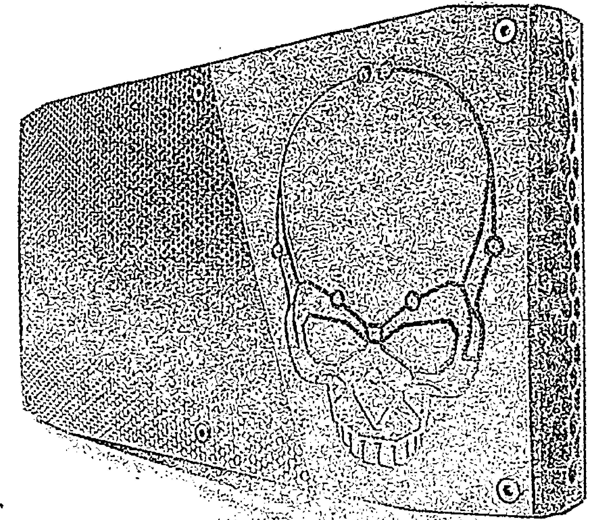

骷髅峡谷是采用第七代智能酷睿i7的Intel NUC，不过它是NUC系列中外形比较特殊的一款，除了更薄更长的外形之外，顶盖上的骷髅造型也特别惹眼，其“骷髅峡谷”的名称也因此而来。与大多数采用低电压处理器的NUC不同，它内置标准电压i7处理器，同时集成了最高端Iris Pro显卡，3D游戏性能在GeForce GT 750M和GTX 850M之间，玩流行的网游完全没有问题。如果在过了万圣节之后，用户希望更低调一些，还可以使用附赠的无图案顶盖替换骷髅图案。

这款产品需要用户自行安装内存和硬盘，它提供了两个笔记本DDR4内存插槽以及两个M.2固态硬盘插槽，支持2280和2242两种规格的M.2固态硬盘。其他如USB接口、视频输出接口等配置都采用了较新的标准，数量也基本够用，扩展能力不错。

#### 亿色插画师系列外壳

品种：手机平板保护壳

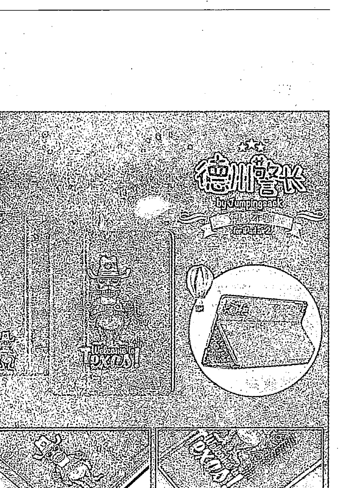

亿色的插画师系列保护壳中，德州警长、猫头鹰、狐狸骷髅等多个产品的图案都是非常符合万圣节氛围的。它们采用多层浮雕工艺，图案立体清晰而且很有手感，且不会被刮花或掉色。这款保护套结合了防变形的硬壳和易于拆装的软边，且在边角加强了防护。插画师系列保护壳有多种高规格，可以适配多种手机和平板电脑。

其实万圣节自身的标志如南瓜灯、骷髅或恶魔标志等都特别突出，且相关装饰物、贴纸等都很容易买到，也便于使用，所以在万圣节时简单装饰自己的电脑或手机、平板等随身数码设备是很方便的。至于拥有一定动手能力的，做一台南瓜头造型的MOD机箱也是很容易的事，现在的电脑配件灯效非常丰富，南瓜头机箱中无需特意设置灯光就可以获得不错的效果。其实如果用心选择的话，甚至还有一些配件也自带万圣节属性呢，例如Intel就曾经在自家主板上采用类似骷髅峡谷NUC的骷髅灯效图案。


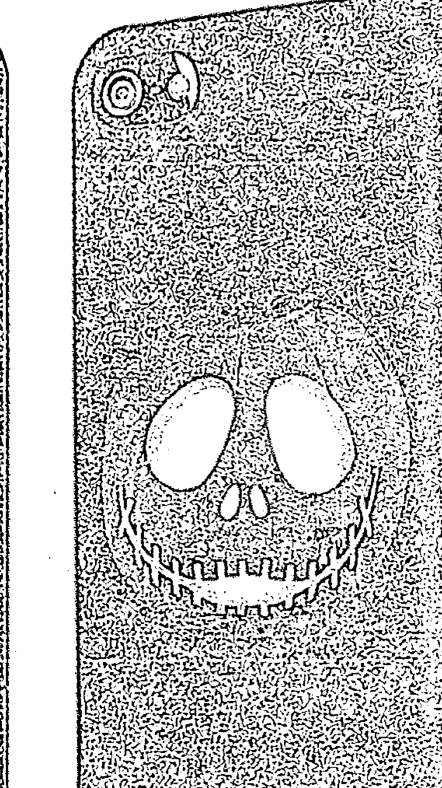

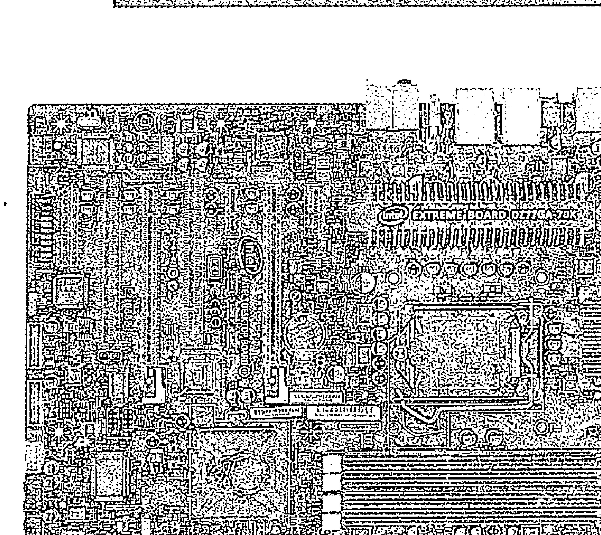

### 正统与恶搞——万圣节相关软件游戏

作为西方一个比较有特色的节日，万圣节相关内容在游戏中的体现非常多，另外也有一些很适合万圣节“不给糖就捣乱”精神的软件，当然这些恶搞软件对一些敏感的人来说可能会显得“过分”，大家在使用的时候要小心，千万别让友情甚至爱情毁于一旦。


#### 辐射4

**类型：单机游戏**

辐射4(Fallout 4)是2015年11月推出的一款单机游戏大作，虽然已经不是很新的游戏，但基于辐射巨大的影响力和多线开放式的玩法，相信还有很多人仍然沉浸在核爆后的世界中无法自拔，笔者也很推荐还没有玩过辐射系列的玩家来尝试。已经拥有VIVE VR眼镜的用户，则可以期待马上就会推出的辐射4 VR版。

辐射系列全部基于统一的故事背景，即世界核大战于万圣节前夕爆发，因此在玩家的探险过程中，能看到很多与万圣节这一节日有关的布景、环境，这也在一定程度上增加了探险时的恐怖感。

#### 碎屏壁纸

**类型：桌面壁纸**


碎屏壁纸是一种用来戏耍朋友或家人的典型恶搞方式，目前其发展趋势是从电脑碎屏壁纸逐渐转向手机、平板电脑的碎屏APP。在电脑上使用，设置碎屏壁纸时可以将桌面快捷方式全部隐去，以免出现图标浮现在“裂痕”之上的破绽。而在手机、平板电脑上使用时，笔者更倾向于使用动态壁纸或者APP，造就更真实的裂屏效果。


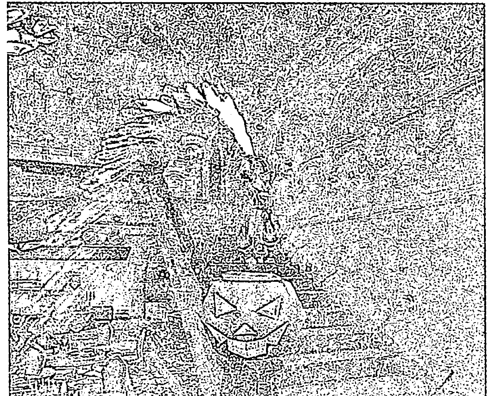

需要注意的是，无论是在电脑还是手机上，屏幕碎裂都是比较严重的故障，大家一定要保证能在第一时间恢复和解释，否则就等着承受朋友或者家人从维修站回来后狂风骤雨般的怒火吧。

在万圣节期间，我们应该还会看到很多游戏或软件推出专门的万圣节主题活动，这些活动常常是非常有趣的，大家也不妨去尝试一下。

## 联想AIO 520 PK 华硕傲世V241IC

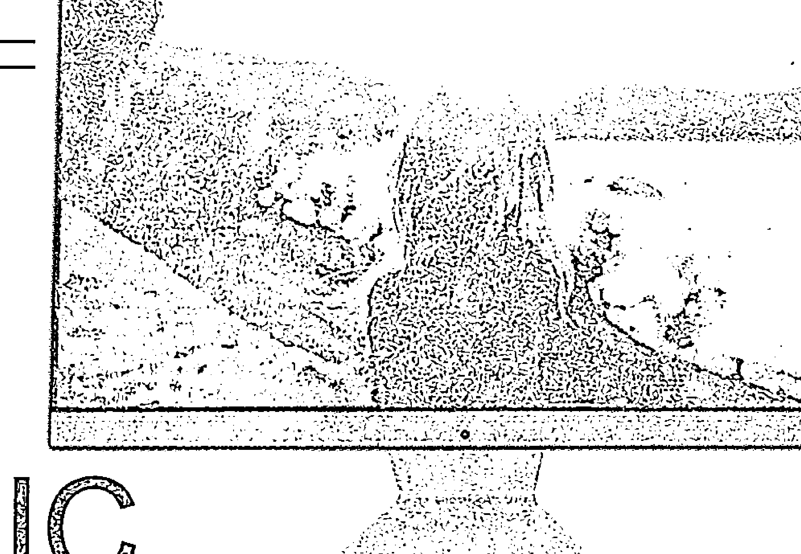

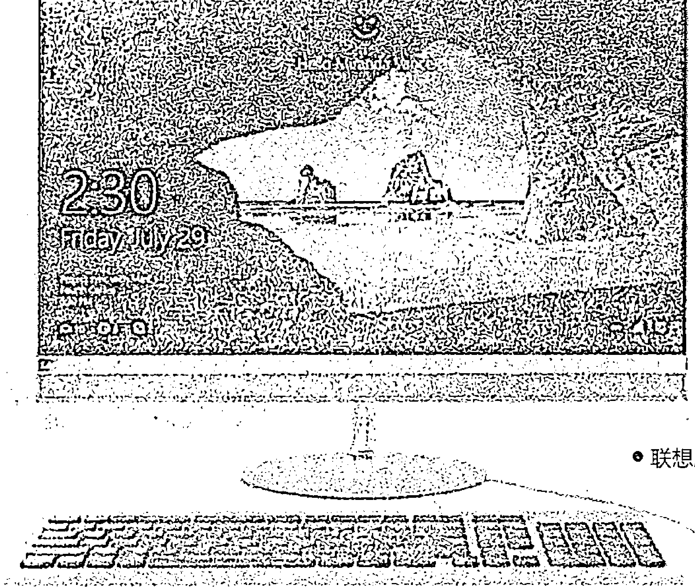

对很多家庭用户而言，笔记本和台式机都存在先天缺陷：前者固然小巧但视界太小；后者性能（相对）强大但却笨重呆板。此时，相对轻巧且有着家居化外观设计的一体电脑优势就显露出来了，而联想AIO 520和华硕傲世V241IC，则是4000元价位上颜值较高的一体电脑代表，它们之间谁更适合你？

### 来自微边框的诱惑

一体电脑的屏幕普遍以20/21英寸和23/24英寸两大阵营为主，而笔者强烈建议大家优先考虑有着更大视野的后者，毕竟一体电脑无需追求笔记本那般极致的移动性，在和家人一起分享高清视频时可以带来最为震撼的视觉特效才是关键。

好消息是，联想AIO 520和华硕傲世V241IC虽然都有着23.8英寸的大视野，但它们却都引入了微边框元素，所以机身实际的宽度远远小于早期产品，重量也更为轻盈，对男生而言可以轻松抱起它们转移阵地。

||联想AIO 520|华硕傲世V241IC|
|---|---|---|
|屏幕|23.8英寸 (1920×1080像素)|23.8英寸 (1920×1080像素)|
|处理器|AMD A9-9420|英特尔奔腾4405U|
|内存/硬盘|4GB/1TB|4GB/1TB|
|显卡|AMD Radeon 530|Intel HD Graphics 510|
|接口|读卡器、USB3.0×2、USB2.0×3、HDMI输入、HDMI输出、RJ45|USB3.0×4、USB2.0、HDMI、RJ45|
|参考价格|4099元|3799元|

具体来说，两款一体电脑都采用了IPS材质硬屏，可视角度都在170度以上，而且上、左、右三侧边框都被压缩到了2mm，屏占比达到了88%左右，可以带来更强沉浸感的观影体验。值得一提的是，华硕傲世V241IC的屏幕拥有100% sRGB全色域，结合华硕特色的Tru2Life Video技术（图1），就显示效果而言会有更真实的表现。

### 值得回味的细节设计

微边框设计赋予了联想AIO 520和华硕傲世V241IC更高的颜值，而它们的细节设计在同价位一体电脑中也有着非常惊艳的表现。比如，两款产品都是矩阵式的双MIC（图2），可以接收到更远距离的语音，还能起到良好的降噪功效，在与朋友视频聊天或是使用Cortana进行语音控制时确保更好的体验。

其中，联想AIO 520的亮点还在于引入了按压式的摄像头。这款产品的摄像头平时可以隐藏在主机顶部的边框内，使用前只需按压一下就能自动弹出，-8度的倾角设计更适合展现自然的自拍视角，隐藏式设计既保证了美观，也能避免不使用时出现被恶意偷拍的风险(图3)。而华硕傲世V241IC的特色在于采用了简洁优雅的一体式铝合金支架(图4)，提供稳定性与典雅外观，并可轻易上下角度调节。

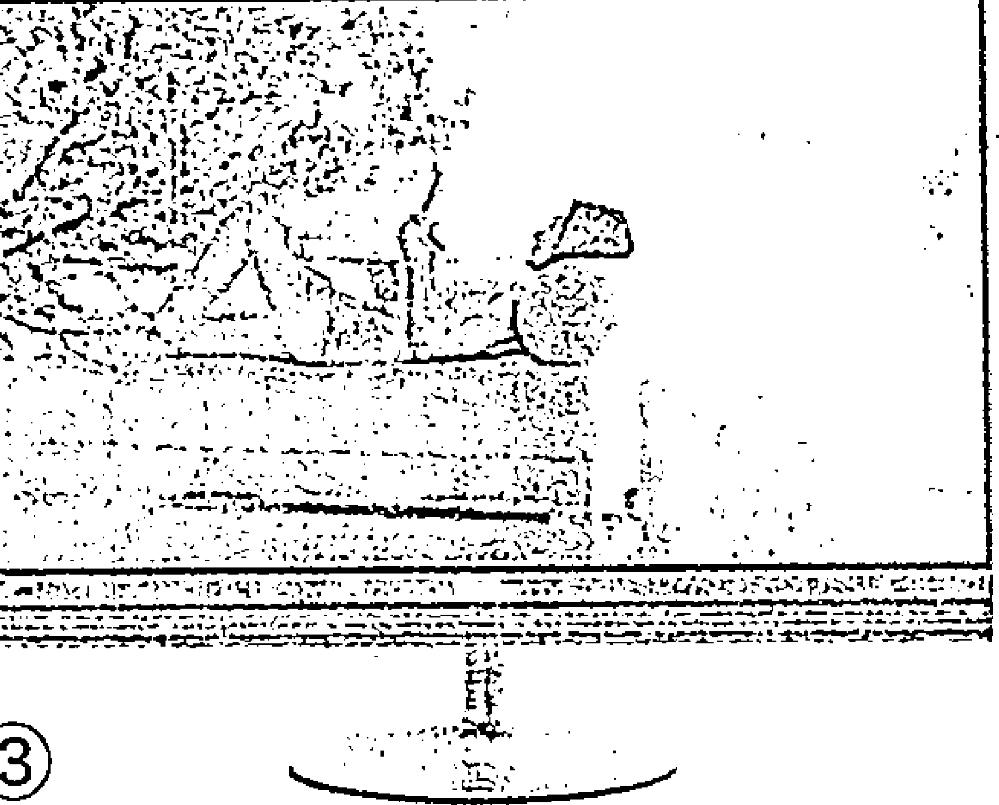

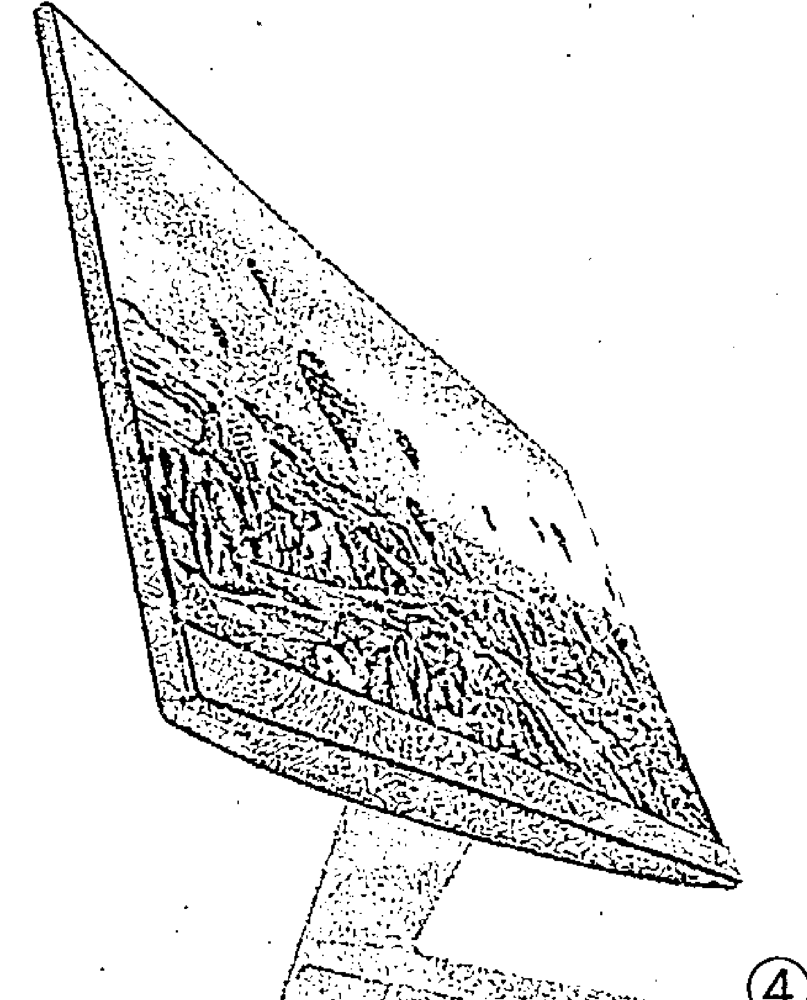

### 扩展能力出现差异

虽然两款一体电脑都有着硕大的屏幕，有着充足的空间去安置各类接口，但出于成本和定位的考量，它们在扩展能力上还是出现了较大的差距。华硕傲世V241IC在屏幕底部配备了1个USB2.0接口，在机身背部则提供了4个USB2.0、HDMI输入和RJ45端口，USB3.0的数量较多，适合同时接驳更多高速外设(图5)。联想AIO 520在机身侧面提供了1个USB3.0，机身底部配备了读卡器插槽，其他接口则都被安置在机身后面。和华硕傲世V241IC相比，这款产品增加了HDMI输入接口，意味着它不仅可以将画面通过HDMI输出接口传送到投影机或更大的液晶电视之上，还能借助HDMI输入接口，临时客串家里笔记本、台式机、游戏机的显示器，适应范围更广泛。

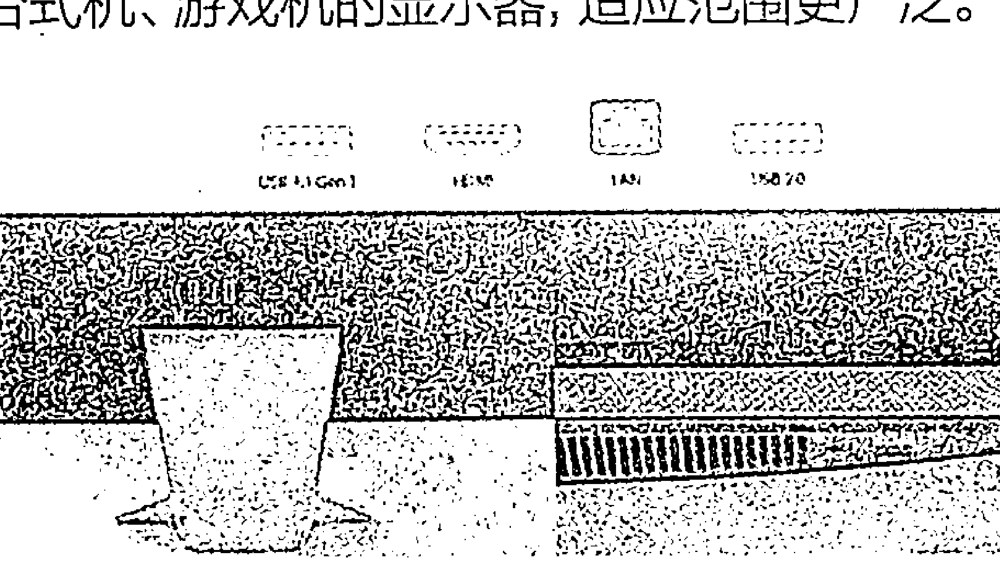

### 硬件配置对对碰

华硕傲世V241IC搭载了英特尔奔腾4405U（双核四线程，2.1GHz），这颗芯片隶属于Skylake架构的第六代酷睿平台，采用14nm工艺，TDP仅有15W，是为轻薄本定制的超低功耗版的处理器，并集成Intel HD510核芯显卡。其他配置方面，V241IC标配4GB内存和1TB机械硬盘，如果你对配置有更高要求，该机型还提供了搭载i3-6006U/i5-7200U和NVIDIA GeForce 930MX独显的高配版，只是价格分别达到了4999元和6499元。本文介绍的联想AIO 520则选用了AMD平台，搭载A9 9420处理器。这颗芯片隶属于AMD第七代APU家族，采用双核设计，默认和加速频率分别为3.0GHz和3.6GHz，基于28nm工艺制造，TDP同样为15W。此外。联想AIO 520还配备了AMD Radeon 530独显，在图形性能方面有着较大的优势(图6)。就综合实力而言，都是低配版的联想AIO 520性能要在华硕傲世V241IC之上。需要注意的是，联想AIO 520高配版中还有搭载七代酷睿i5/i7桌面处理器的型号，整体性能会更抢眼。

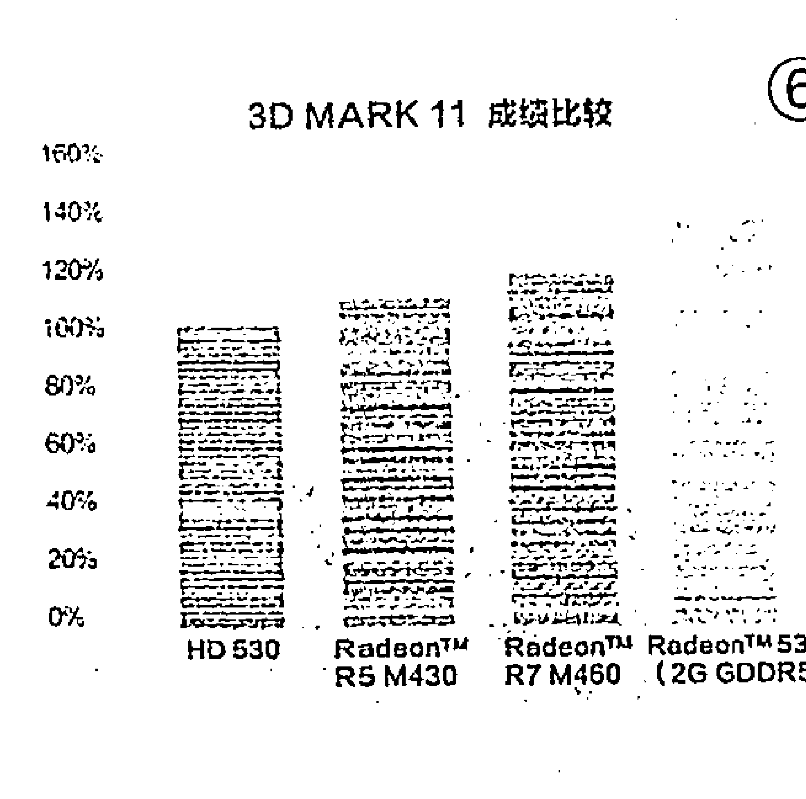

一体电脑的更新迭代速度以及品类远没有笔记本丰富，它定位的是相对小众的居家环境，在相同的价格范围里，一体电脑的性能其实是要明显落后于笔记本的。但是，对性能不敏感，而就是想给家里找一个摆哪都好看，可以取代电视作为影音娱乐终端的用户而言，一体电脑却又是更实际的选择。就联想AIO 520和华硕傲世V241IC而言，它们都有着非常出色的颜值。如果你对性能要求较高，联想AIO 520的表现稍占优势；如果你追求更实惠的价格，那傲世V241IC也不会让你失望。

## 颜值控的竞争

### 小米Note 3 PK 魅族PRO 7

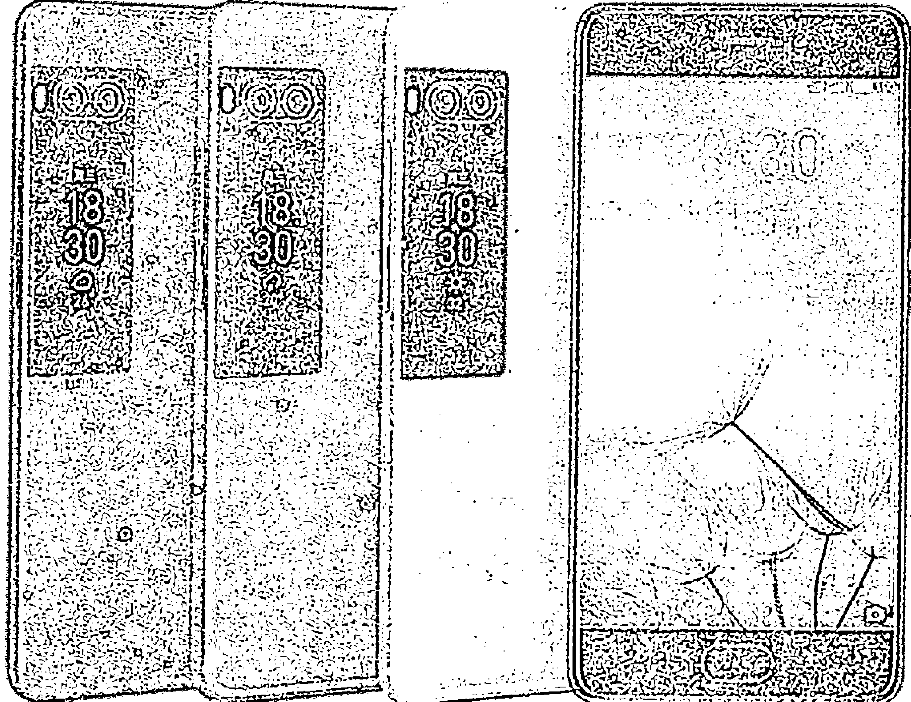

虽然如今全面屏手机大热，但仍然有很多用户持观望态度，还是青睐传统形态且有着更高辨识度的产品。而小米Note 3和魅族PRO 7，则是2500元以内最受关注机型的代表，前者有着大号“小米6”的称号，后者则拥有独特的画屏加持。那么，这两款手机谁更适合你？

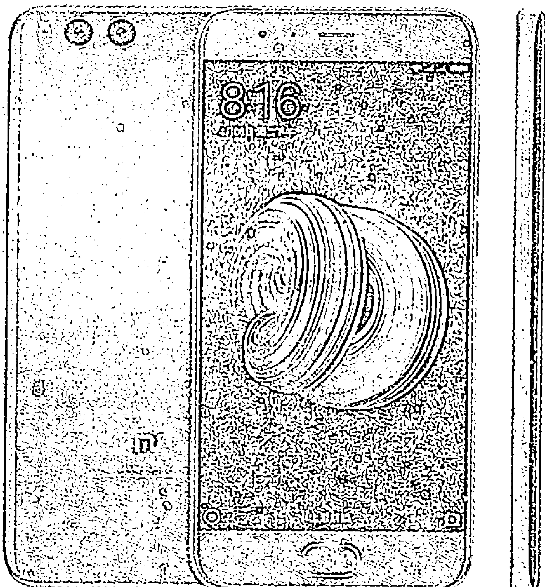

| 参数对比 | 小米Note 3 | 魅族PRO 7 |
| --- | --- | --- |
| 网络 | 全网通(双卡双待) | 全网通(双卡双待) |
| 屏幕 | 5.5英寸(1080P) | 5.2英寸AMOLED(1080P) |
| 处理器 | 高通骁龙660 | 联发科Helio P25 |
| 内存/存储 | 6GB/64GB(不支持存储卡) | 4GB/64GB(不支持存储卡) |
| 摄像头 | 1600万/双1200万像素 | 1600万/双1200万像素 |
| 体积 | 152.6mm×73.95mm×7.6mm | 147.62mm×70.72mm×7.3mm |
| 电池/重量 | 3500mAh/163g | 3000mAh/163g |
| 参考价格 | 2499元 | 2499元 |

### 小米Note 3：经典的延续

就性能价格比而言，搭载骁龙835且仅售2499元的小米6绝对名列前茅。可惜，小米6长期以来始终都需要抢购，直到近期才开始现货供应，作为新品的新鲜劲儿已过，除了追求跑分的发烧玩家而言，小米6的光环已经逐渐被其后辈小米Note 3所抢。

会让你失望，改进后的工艺也令后盖弧面玻璃与金属中框之间的缝隙变得更小（图2），细节设计更是趋于完美。

> ②

### 魅族PRO 7：为手机开天窗

小米Note 3可以视为小米6的放大版（图1），二者采用了完全相同的设计语言，只是改用了7系铝中框（小米6为不锈钢中框），所以在屏幕变大时依旧做到了比小米6还轻5g的效果，拿起来压手感略有减轻。如果你喜欢小米6的造型，那有着更大视野的小米Note 3肯定也不

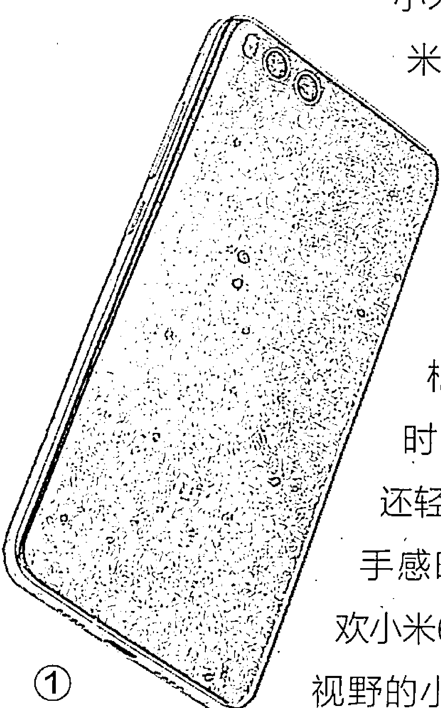

魅族PRO 7应该是最具辨识度的Android手机之一，虽然它的正面依旧保留着浓浓的魅族风格（2.5D弧面屏及正面腰圆Home键），但它却在后盖上挖出了一个“天窗”，而魅族官方则将其称为“画屏”（图3）。

> ③

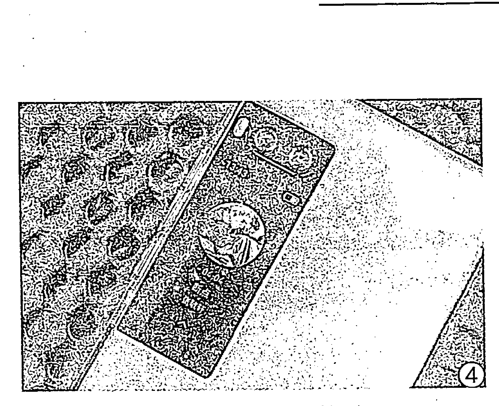

画屏是一块独立的1.9英寸AMOLED材质屏幕，凭借240×536像素和307的PPI也实现了“视网膜”等级的显示效果。当你翻转手机时，或是双击一下就能唤醒画屏，而且这个画屏也支持触控，可通过点选和滑动进行操作。通过画屏，我们无需点亮主屏幕就能查看天气、计步信息、用于自拍时取景，其最大的特色还源于独立的MP3模式：当我们选择MP3模式后，魅族PRO 7就会进入深度休眠（关闭主屏、通讯模块和各种传感器），仅保留对画屏的供电，此时画屏就能直接当做MP3播放器使用（图4），续航时间可以天数计算。

### 源于配置上的差异

小米Note 3和魅族PRO 7在设计上可谓各有特色，而两款产品最大的差异，则体现在了核心硬件的层面。其中，小米Note 3搭载了高通骁龙660，标配6GB内存，高配与标配之间的区别仅限于存储空间（顶配版还换成了陶瓷工艺）。而魅族PRO 7的标准版和高配版除了存储空间分别为64GB和128GB以外，高配版的处理器也从联发科Helio P25升级到了Helio X30。就性能而言，标准版魅族PRO 7采用的Helio P25处于垫底的存在，可以被小米Note 3配备的骁龙660轻松秒杀。但是，高配版魅族PRO 7所武装的Helio X30，则又可以轻松超越骁龙660，在一定程度上与骁龙835抗衡。但是，考虑到高配版魅族PRO 7的价格达到了2899元，已经失去了性价比优势。

### 都靠双摄拍天下

小米Note 3的前置摄像头从小米6的800万像素升级到了1600万像素，并引入了面部解锁功能（图5），虽然没有iPhone X安全，但也足够配合指纹带来更好的解锁体验了。而这款产品的后置摄像头则沿用了小米6的双摄模块，采用1200万像素广角和1200万像素长焦镜头。其中，广角镜头还配备了4轴光学防抖，确保夜间拍摄的质量，而后者则支持2倍光学变焦，在光线充足时可以拍摄更清晰的远处风景。魅族PRO 7的前置摄像头也是1600万像素，为美颜自拍奠定了物理基础。而该产品也是魅族史上的首款双摄手机，和小米Note 3不同的是，魅族PRO 7的后置双摄为1200万像素彩色和1200万像素黑白传感器（图6），支持自动对焦、背景虚化、极致黑白等多种模式。虽然黑白+彩色双摄失去了2倍变焦的能力，但对成像细节和夜晚的噪点控制更有优势。


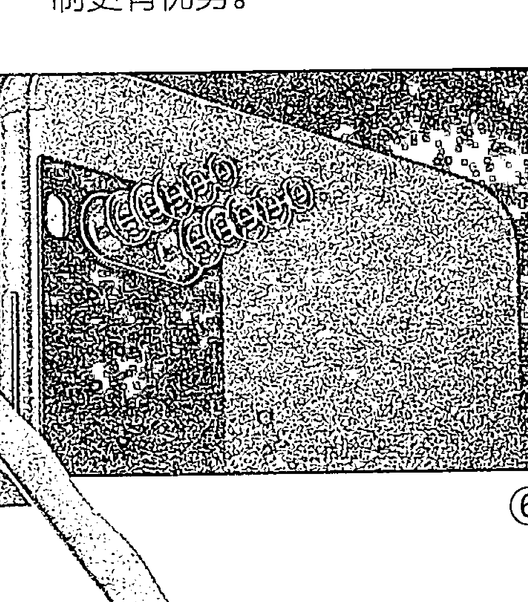

小米Note 3和魅族PRO 7都是同价位手机中的高颜值代表，前者的双玻璃设计、后者的独立画屏都能给人留下深刻印象。就2499元标准版的Note 3和PRO 7而言，它们都并非主打顶级性能，而是在提供足够性能的前提下，实现更好的拍摄体验（小米Note 3）和双屏幕的协同打法（魅族PRO 7）。如果你在意续航，想尝鲜人脸解锁，小米Note 3的表现更优，而且其搭载的骁龙660还有着进一步的性能优势；如果你想换一种玩机体验，魅族PRO 7的画屏则绝对可以让你眼前一亮，彰显你的与众不同。

## 宏碁SF314 PK 戴尔燃7000 II

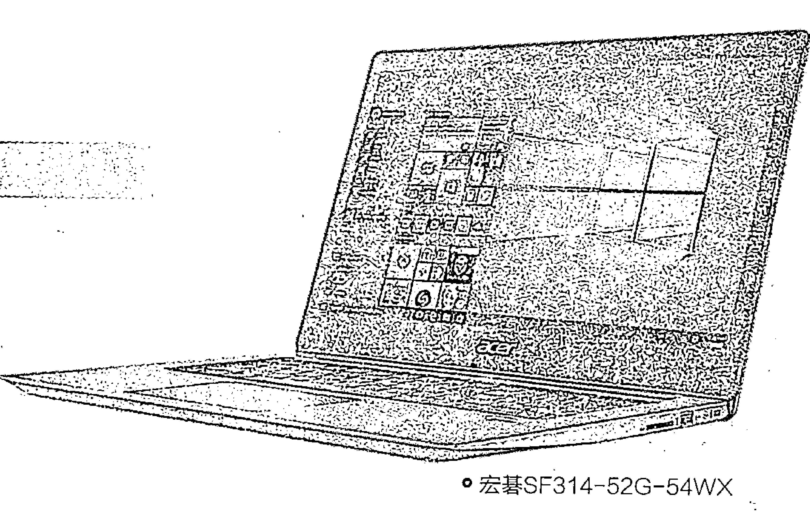

如今八代酷睿处理器已经全面入驻笔记本领域，如果你还在考虑七代酷睿的“老产品”，那显然就有些不合时宜了。在八代酷睿+MX150独显的轻薄本新品领域，我们总是能看到很多熟悉的面孔，它们就是延续老模具升级新平台的经典老将，就好比本文涉及的宏碁SF314-52G-54WX和戴尔灵越燃7000 II。

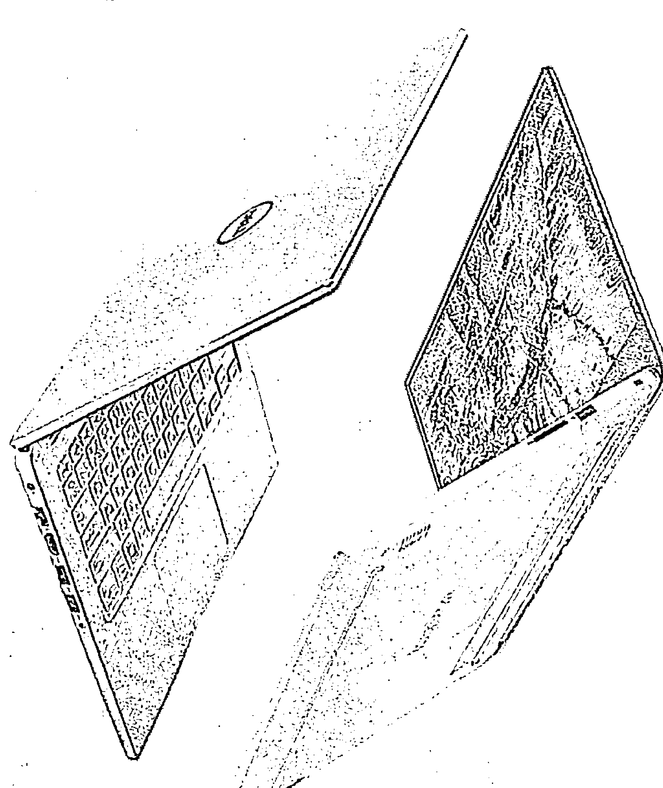

| 参数对比 | 宏碁SF314-52G-54WX | 戴尔灵越燃7000 II |
| ---- | ---- | ---- |
| 屏幕 | 14英寸IPS (1920×1080像素) | 14英寸IPS (1920×1080像素) |
| 处理器 | 酷睿i5-8250U | 酷睿i5-8250U |
| 内存/硬盘 | 8GB/256GB PCIe SSD | 8GB/128GB SSD+500GB |
| 显卡 | NVIDIA GeForce MX150 | NVIDIA GeForce MX150 |
| 接口 | 读卡器、USB3.0×2、USB2.0、USB Type-C、HDMI | 读卡器、USB3.0×2、USB2.0、HDMI、RJ45 |
| 体积 | 338mm×234mm×17.95mm | 323mm×227.1mm×18.95mm |
| 重量 | 1.7kg | 1.649kg |
| 参考价格 | 6299元 | 5999元 |

### 新老版本之惑

延用老模具、升级新平台，是几乎所有笔记本厂商惯用的加速新品布局的手段，既可以降低开模和研发成本，又能第一时间将产品推向市场。不过，这种方式也会带来一个潜在的隐患，那就是导致市面上出现一个模样，但配置和价格极为混乱的产品局面。

以宏碁SF314为例，它隶属于宏碁蜂鸟Swift3-14家族，简称SF314。顾名思义，该家族还包含名为SF315的15.6英寸产品，和14英寸型号相比虽然视野更大，但便携性则相对一般。如果你需要经常背着笔记本出门，型号和尺寸的对应关系就不能搞错。

同时，宏碁SF314旗下也拥有新旧平台搭配的诸多型号，但大体可以划分为七代酷睿+集显、

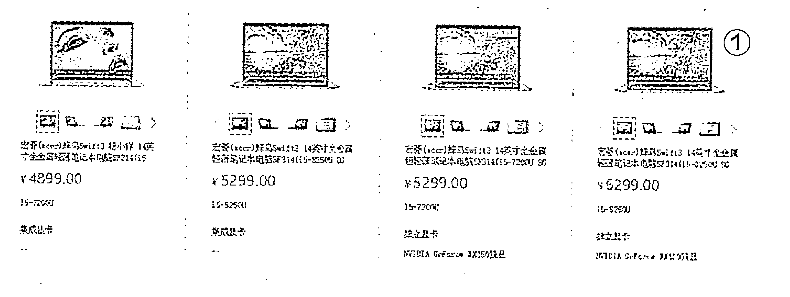

八代酷睿+集显、七代酷睿+独显和八代酷睿+独显这四种组合方案，根据平台的不同，新旧型号的价差也分别为400元到1000元不等（图1）。

考虑到八代酷睿i5-8250U的性能已经超越了七代酷睿i7-7500U，所以除非你预算真的很紧张，否则一步到位选择八代酷睿平台准没错。至于显卡，NVIDIA最新GeForce MX150的性能至少是集成显卡的4倍，如果你对游戏不感冒，选择集显版本足矣，但如果你对游戏画质和速度有一定的要求，那自然就值得为MX150独显投资了。

翻回头再来看看戴尔灵越燃7000 II，它采用了和上代灵越燃7000相同的模具，机身尺寸## 设计上的差异

宏碁SF314和戴尔灵越燃7000 Ⅱ都引入了金属材质工艺和窄边框设计元素，但灵越燃7000 Ⅱ将屏幕边框压缩得更为极致（图4），屏幕上、左、右侧边框宽度只有7mm，所以它整机的宽度也要比宏碁SF314窄了7mm左右。对寸土寸金的轻薄本而言，每瘦身一点都是难能可贵的。
而宏碁SF314相较灵越燃7000 Ⅱ的优势则在于，它在掌托右侧集成了按压式的指纹识别模块（图5），可以通过Windows Hello实现更高效的安全验证服务，同时还新增了一个USB Type-C接口，符合未来存储外设的发展趋势。

### 扩展能力的比拼

两款轻薄本的配置基本相同，都是八代酷睿i5-8250U和NVIDIA MX150独显的组合，轻松玩转《守望先锋》毫无压力。由于核心配置相同，所以我们需要将目光投向潜在的扩展能力方面。宏碁SF314为了追求极致的轻薄，其机身内仅保留了一个M.2插槽，标配的256GB PCIe SSD具备不俗的读写速度。但是，如果哪一天你发现256GB容量不够用了，就需要自行购买更大容量的SSD，并将标配的SSD替换下来。
戴尔灵越燃7000 Ⅱ的扩展能力要比宏碁SF314出色一些，具体表现就是它除了配备M.2插槽，还内置了传统SATA插槽，可以加装2.5英寸的SSD或机械硬盘。
本文涉及的型号已经标配128GB SSD和1TB HDD，虽然不如PCIe SSD速度那般极致，却也解决了磁盘性能和容量上的矛盾，实用性更为理想。

> 小结：作为旧模具新平台的代表，宏碁SF314和戴尔灵越燃7000 Ⅱ已经靠前辈打下了偌大的声望，机身结构上的可靠性和稳定性已经得到了市场的验证。就两款产品谁更值得选来看，宏碁SF314适合喜欢尝鲜指纹解锁Windows系统的玩家；但如果讲究实际，价格便宜且具备更好扩展潜力的灵越燃7000 Ⅱ则更适合普通用户入手。

### 更大视野的碰撞

## 小米Max 2 PK 荣耀NOTE 8

随着全面屏手机的出现，在5.5英寸手机身上塞进6英寸屏幕变得毫无难度，无形中扩展了我们的视野，可以获得更好的沉浸式观影体验。但是，如今全面屏手机普遍不够便宜，而且对很多视频爱好者而言，哪怕是6英寸的全面屏还是不够震撼。此时，配备媲美平板视野的小米Max 2和荣耀NOTE 8就将纳入我们的候选名单了。

### 为更大“视界”而生

随着智能手机将5.5英寸纳入“黄金尺寸”标准，对绝大多数用户而言这个大小的屏幕已经具备足够的视野面积。而新兴的18:9全面屏，则是让智能手机保持5.5英寸手机大小和持握手感的同时，将视野面积从5.5英寸扩展到5.7英寸到6英寸，属于扩屏不增肥的典范。
在这种大环境下，更大屏幕的“巨屏手机”则变得小众起来，特别是近一年来加入这个战场竞争的品牌和产品可谓凤毛麟角。但市场变小并不代表没有需求，对于发烧级别的视频爱好者、喜欢在更震撼“视界”里游戏的玩家而言(图1)，只要手机可以保证单手持握（注意不是操作哦），屏幕越大越好。

| 参数对比 | 小米Max2 | 荣耀NOTE 8 |
| :--- | :--- | :--- |
| 网络 | 全网通(双卡双待) | 全网通(双卡双待) |
| 屏幕 | 6.44英寸(1920×1080像素) | 6.6英寸(2560×1440像素) |
| 处理器 | 高通骁龙625� | 麒麟955 |
| 内存/存储 | 4GB/64GB (支持存储卡) | 4GB/64GB (支持存储卡) |
| 前/后摄像头 | 500万/1200万像素 | 800万/1300万像素 |
| 尺寸/重量 | 174.1mm×88.7mm×7.6mm | 178.8mm×90.9mm×7.18mm |
| 电池/重量 | 5300mAh/211g | 4500mAh/219g |
| 参考价格 | 1699元 | 1999元 |

而小米Max 2和荣耀NOTE 8就是基于这种需求而生的“巨屏手机”，它们分别采用6.44英寸和6.6英寸屏幕，机身宽度分别为88.7mm和90.9mm。作为对比，5.5英寸的iPhone 7 Plus宽约88mm。换句话说，这两款产品虽然屏幕巨大，但并没有我们想象的那般难以掌握（图2），其宽度只比苹果宽了1mm和3mm，几乎可以忽略不计。
不过，这两款手机的长度则接近或突破了175mm，这意味着它们真的很长，想完美操作时必须同时借用两只手，在公交/地铁没座位的情况下使用要注意安全站稳。无论如何，小米Max 2和荣耀NOTE 8都有着远超普通手机的超大视野，但依旧可以塞进衣服口袋随身携带，与iPad mini一类的平板电脑相比属于绝对的“苗条选手”。

### 来自视界的差异

小米Max 2和荣耀NOTE 8的差异首先就是屏幕尺寸，6.6英寸的荣耀NOTE 8无疑显得更加震撼。同时，小米Max 2屏幕才是IPS，分辨率为标准的1080P，而荣耀NOTE 8不仅实现了2K级别的分辨率，屏幕材质也选用了AMOLED，色彩表现会更加艳丽，选择深色系的壁纸还具备更省电的特性。

### 配置上的对比

小米Max 2和荣耀NOTE 8虽然都有着无比震撼的视野，但它们却并非发烧级手机，配置也是本着“够用就好”的原则。其中，小米Max 2搭载了高通骁龙625，这颗八核处理器采用了三星14nm工艺，主打更出色的能耗比。荣耀NOTE 8的处理器则选用了麒麟955，这也是麒麟处理器家族首款基于16nm定制的芯片，虽然性能不如麒麟960，但综合表现依旧远超高通骁龙625（见表）。

### 细节上的小差别

两款手机都采用了金属材质的机身，只不过小米Max 2采用了全金属一体化的机身，通过纳米注塑工艺解决信号溢出问题。而荣耀NOTE 8虽然也是全金属材质，但为了加强信号，它在后盖的上下两端开了“天窗”并嵌入了其他材质（图3），多少破坏了一些金属的整体性。

因此，就性能而言荣耀NOTE 8会占很大便宜，得益于宽大的机身也缓解了麒麟955长时间全速运行时的散热压力。可惜，荣耀NOTE 8标配的电池容量谈不上巨大，4400mAh面对2K分辨率和超大屏幕的“压榨”，还是会有些力不从心之感。小米Max 2虽然性能一般，但却塞进了更大的5300mAh电池，再加上骁龙625和1080P屏幕的省电优势，续航表现会更有底气。好消息是，两款手机都支持快充，可大幅节约充电等待时长。

小米Max 2和荣耀NOTE 8都配备了USB Type-C接口，也都将耳机孔放在了机身顶部。而二者的差异则表现在小米Max 2配了双立体声扬声器（图4），看电影玩游戏时可以带来更好的外放效果，同时该产品顶部还配有红外模块，可以临时客串电器的遥控器之用。

在摄像头的搭配上，小米Max 2主打和小米6同款的1200万像素索尼IMX386传感器（图5），而荣耀NOTE 8则提供了OIS光学防抖功能，二者的综合表现也在伯仲之间。

| 测试软件及测试项 | 麒麟955 | 骁龙625 |
| :--- | :--- | :--- |
| GeekBench 4-单核 | 1822 | 840 |
| GeekBench 4-多核 | 5393 | 3870 |
| GFXBench ES3.1曼哈顿离屏 | 10fps | 6.5fps |
| GFXBench ES3.0曼哈顿离屏 | 18fps | 10fps |
| GFXBench ES2.0霸王龙离屏 | 41fps | 23fps |

作为现在少有的巨屏手机，小米Max 2和荣耀NOTE 8都可满足用户对更大视野和足够性能的追求。只是小米Max 2拥有更低的起价（32GB版本1399元）和更持久的续航能力，而荣耀NOTE 8则具备更细腻和真实的2K AMOLED屏幕，在性能方面也占明显优势。如果你追求性价比，小米Max 2自是首选；如果你注重体验，荣耀NOTE 8也不会让你失望。

## 来自科技的冬日恩惠

### 生活别黑暗与寒冷

文|王东来

大多数人对于寒冷的冬天都没有什么好感，比起躲在被窝里瑟瑟发抖，还是站在太阳下流点汗更舒服一些。冬日的黑夜也来得越来越早，虽然有电脑和各种数码设备的陪伴，但如何在日益昏暗寒冷的情况下愉快地工作和玩耍，还是很多人必须面对的问题。现在就来看看如何利用科技的力量，驱走黑暗与寒冷，让我们和爱机的幸福生活获得一丝温暖与明亮。

我们还特别希望很多在这个秋季赶赴异地求学或工作的朋友能够从本文中获得一些帮助，不管是第一次来到没有暖气的湿冷江南，还是第一次在黑夜早早降临的北方过冬，都希望我们介绍的产品能给大家的身体与心灵带来一丝慰藉，缓解孤单的愁绪和思乡之情。

#### 温暖背光的键盘

在寒冷黑暗的冬夜里，一款拥有温暖背光的键盘对于使用者来说绝对是提升使用体验的一件事。背光键盘不仅能让使用者在打字的时候轻松找到自己需要的按键，而且在打字的过程中，键盘发出的温暖光芒同样能够中和视觉感受，缓解使用者的眼部疲劳，提升打字体验。

有些朋友在选购背光键盘的时候，为了追求炫目的背光体验而选择高亮度的背光键盘。这样的背光键盘虽然在白天会有非常好的背光表现，但是在较暗的环境下或者是夜晚不开灯的时候，键盘的背光会十分的刺眼，对眼部健康十分不利。而且过亮的键盘背光，也容易导致使用者对键盘背光过于依赖，一旦换成无背光的键盘，使用者会有不舒服的感觉。所以在挑选背光键盘的时候，建议不要选择高背光的键盘。

背光键盘本身也有寿命的问题，很多背光键盘在使用一段时间之后，由于材质的问题会出现按键老化，甚至是背光灯不亮的问题。所以在选择背光键盘的时候，除了使用手感与背光舒适度的问题之外，对背光键盘的整体质量也要有所把握。下面推荐的背光键盘，在这些方面都有比较不错的表现。

##### 美商海盗船K70 RGB 银轴

- 键轴类型：机械轴
- 生产企业：美商海盗船
- 连接方式：有线
- 是否有多媒体功能键：有
- 接口类型：USB
- 是否支持人体工程学：支持
- 有无手托：有
- 售后服务：全国联保

美商海盗船的外设产品一直都备受使用者喜爱，K70 RGB银轴是美商海盗船在机械键盘领域的精品。相比其他机械键盘，其独有的银轴按键拥有更好的游戏体验，几乎是目前手感最好的第一人称射击游戏键盘，但是在日常打字方面比起传统机械键盘要稍逊一筹。所以喜欢玩游戏的朋友，应该会喜欢这款美商海盗船特别为游戏玩家打造的产品。

##### 达尔优ek815

- 键轴类型: 机械键盘
- 毛重: 1.5kg
- 生产企业: 东莞市铭冠电子科技有限公司
- 连接方式: 有线
- 是否有多媒体功能键: 有
- 接口类型: USB
- 是否支持人体工程学: 支持
- 有无手托: 无
- 售后服务: 全国联保

达尔优ek815可以说是目前市场上主流的机械键盘的代表。无论是用料还是做工，达尔优都做到了主流机械键盘的一流水准，搭配达尔优独有的“水冷”概念，相信能够被喜欢新鲜元素的用户所认可。

比起市面上越来越花哨的五彩背光，达尔优的纯色背光显得十分难得，尤其是橙色背光，确实能给使用者在冬日带来温暖的感觉。所以对于键盘没有特殊要求的用户，达尔优的这款背光键盘绝对能满足你的日常需求。

#### 给漫漫长夜点亮光芒的夜灯

夜灯应该是在夜间工作的朋友最喜欢也是最熟悉的产品了。不同于随处可见，只提供基本照明的小夜灯，一款优质的夜灯产品需要在尽量不打扰其他人的情况下，给使用者提供足够的光明。能满足这种条件的夜灯产品其实并不多，如何选择优质的夜灯，对于经常“开夜车”的朋友来说，是一件相当值得关心的事情。

在选购夜灯的时候，我们需要根据自己的不同需要对夜灯进行选择，是在夜间阅读和书写时使用的夜灯，还是在夜间使用电脑、手机时使用的夜灯。不同的场景，对于光亮与便携的要求是不同的。确认自己的需求，才能选择更有帮助的产品。

##### 超贝LED 台灯

- 品牌: 超贝
- 型号: CB-777A
- 开关类型: 触摸开关
- 质保年限: 3年
- 光源类型: LED
- 灯具是否带光源: 带光源
- 材质: ABS
- 功率: 5W及以下
- 电压: ≤36V(含)

超贝充电式台灯应该是应对场景最多的夜灯产品了。安静的触摸开关，个性化的三档亮度调节开关，以及可随意调节角度的灯杆，都体现了超贝台灯人性化的设计风格。对于夜间需要安静阅读和工作的人来说，这款产品可以说是他们目前最好的选择了。如果你喜欢安静地在夜间享受阅读时光，或者经常“开夜车”的话，那么这款产品应该是你最需要的。

##### 小米LED 迷你夜灯

- 品牌: Xiaomi/小米
- 开关类型: 按钮开关
- 光源类型: LED

小米公司的产品性价比是很多用户非常认可的，他们推出的这款夜灯产品也备受用户的好评。这款产品本身没有专门的电源线，需要使用者通过夜灯本身的USB端口，接在电脑上或者充电宝上进行体验。这款产品主要解决了使用者在使用电子设备的过程中需要的光源问题，对于经常在夜间使用电脑或者手机的朋友，小米的这款夜灯产品能解决你们的问题。

#### 暖手又暖心的桌上暖垫

经常使用电脑的朋友，应该会对冬天又冷又硬的桌面难以忍受。好不容易工作了一段时间，把桌面“捂”热了，结果去了一次洗手间或者冲一杯咖啡的工夫，桌面又冷了下来。对于长期伏案工作的朋友们来说，没有什么比一个温暖的桌上暖垫更让人舒服的了。

在选购桌上暖垫的时候，需要特别注意桌上暖垫的安全问题。有些时候我们在桌上难免会放一些水杯或者饮料之类的容器，而不小心碰洒这些容器也是时有发生的事情。如果桌上暖垫的安全性不够好的话，使用者很可能会因为漏水触电的问题而出现安全事故。所以在安全方面，我们不能妥协。

目前在桌上暖垫方面，各个厂商采用的技术大同小异，我们选择了两家大众比较认可的桌上暖垫品牌，以供大家进行参考。

##### ○ 畅志电脑暖手桌垫

- 包装体积：10cm×10cm×38cm
- 品牌：畅志U品
- 型号：标准卡通220V

畅志U品是开发桌上暖垫产品的专业厂商，在桌上暖垫方面的制作水平和产品质量备受用户认可。虽然价格略贵，但在产品的专业性与实用性上，畅志U品的桌上暖垫会更胜一筹。

##### ○ 长虹办公暖手桌垫

- 包装体积：37.5cm×10cm×10cm
- 品牌：Changhong/长虹
- 型号：CDN-ML21T

作为一个家用电器大厂，长虹在产品品质上是可以肯定的。多变的产品风格设计，相信会满足大多数用户的需求。

#### 暖手宝

如果说有什么电子产品是冬季必备的话，暖手宝应该是被提名最多的一款了。对于寒冷的冬季来说，一个温暖的暖手宝能给使用者带来莫大的幸福。虽然暖手宝产品丰富，不过要想在其中选择适合自己的一款并不容易。下面介绍的三款暖手宝产品，应该能满足使用者的基本需求。

##### ● 木之林暖手宝

相比上面介绍的暖垫，暖手宝的使用体验就私人了一些。木之林暖手宝优于其他暖手宝的一大特点就是它不仅可以暖手，还可以暖肚子。所以喜欢这种一体化设计的朋友，特别是女性朋友，可以选择本产品作为自己的暖手必备。不过该产品由于需要放在腹部进行使用，所以使用环境更偏向家庭，对于工作环境的使用体验不算好。

- 品牌：木之林
- 型号：M5
- 热水袋类型：充电电热丝
- 热水袋材质：毛绒
- 推荐人群：女性用户

##### ● 米尼暖手宝

- 品牌：Miny/米尼
- 型号：K505
- 热水袋类型：充电电热丝
- 热水袋材质：压纹色丁布
- 推荐人群：注重安全的用户

米尼暖手宝的设计比较普通，不过无论是充电环节还是暖手宝内液的选择，米尼暖手宝都将安全作为自己设计的重心。对于安全比较看重或者确实动作毛糙马虎的朋友，可以选择本产品作为自己的暖手必备。

##### 产品参数

| 产品品名 | 水电分离电暖袋 | 产品颜色 | 粉色、黑色、蓝色 |
| :--- | :--- | :--- | :--- |
| 产品款式 | 不可拆洗 | 额定频率 | 50Hz |
| 额定电压 | 220V~ | 防护类别 | ▢ |
| 额定功率 | 450W | 产品尺寸 | 约25×19CM |
| 执行标准 | GB4706.1-2005 GB4706.99-2009 | | |

- 品牌：南极人
- 型号：NJRRRT220-7
- 热水袋类型：充电电热管
- 热水袋材质：高密度PVC
- 推荐人群：注重触感的用户

##### ● 南极人暖手宝

作为资深家纺产品开发商，南极人在暖手宝领域也有自己的独到之处。无论是暖手宝的造型设计还是材质，南极人暖手宝都属于精品之列。在整体的使用体验上，南极人暖手宝舒适的手感比较突出。

随着科技的发展，科技给人们的生活带来了不少的改变。往年我们裹着被子默默面对冬日寒冷的日子，已经可以告别了。合理选择供暖设备，对我们的生活质量会有很高的提升。是时候选择告别寒冷与黑暗，拥抱科技带来的温暖冬日了。

## 主流之选
### 华硕FL8000UN PK 海尔凌越5000

如今的笔记本正在逐渐演化成游戏本、超薄本、二合一形态这三大品类，得益于英特尔第八代酷睿处理器的普及，为超薄本的性能奠定了更坚实的基础。作为15.6英寸超薄本阵营的新代表，华硕FL8000UN和海尔凌越5000有着非常出色的性能价格比，那么它们之间谁更适合你？

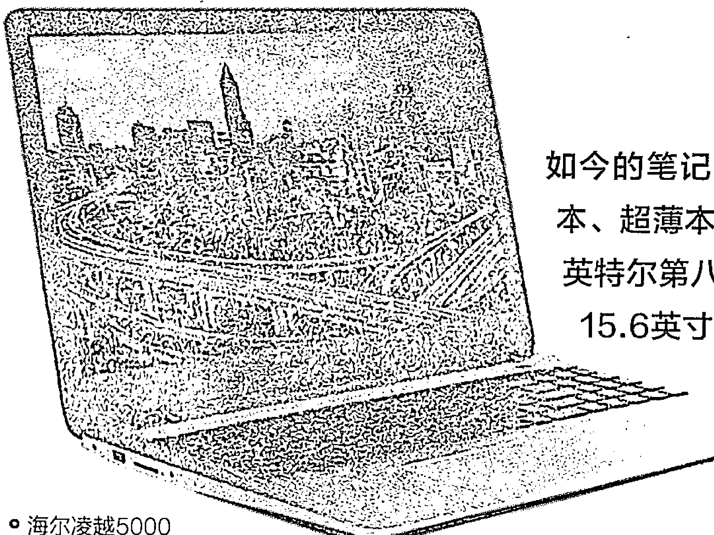

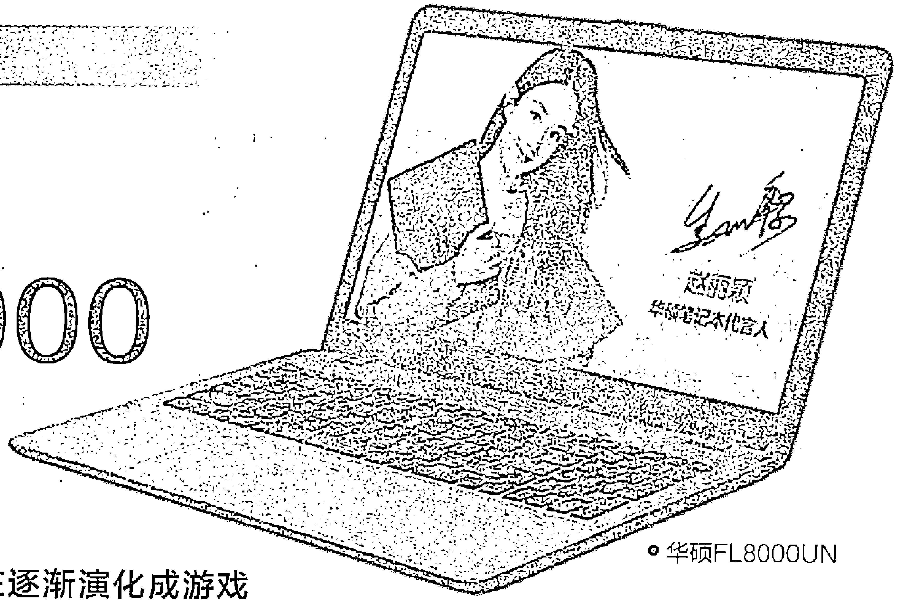

### 尴尬的大屏轻薄本

15.6英寸超薄本其实是一种非常尴尬的存在。它们受制于较大的屏幕，很难像13英寸或14英寸产品那般将体重控制到1.5kg以内，即便引入微边框等最新设计元素也是如此。另一方面，15.6英寸也是游戏本的主战场，市面上搭载酷睿i5-7300HQ+GTX1050独显的游戏本普遍都是5000元起步，而稍有便携优势的15.6英寸超薄本也在这个价位区间。

可以说，15.6英寸的超薄本和游戏本相比，唯一的优势就是平均重量从2.5kg减到了2.0kg，同时还大幅牺牲了性能。因此，如果你喜欢玩大型3D游戏，武装GTX1050起步的游戏本才是首选。

话又说回来了，如果你对单机大作不感冒，只是喜欢玩些《守望先锋》级别的竞技类网游，还有偶尔背着笔记本外出的需求（图1），追求更大的视野，那15.6英寸超薄本就可列入候选名单了，而本文涉及的华硕FL8000UN和海尔凌越5000则更是其中的佼佼者。

| 参数对比 | 华硕FL8000UN | 海尔凌越5000 |
| :--- | :--- | :--- |
| 屏幕 | 15.6英寸 (1080P) | 15.6英寸 (1080P) |
| 处理器 | 酷睿i7-8550U | 酷睿i7-8550U |
| 内存/硬盘 | 8GB DDR4/1TB | 8GB DDR4/1TB |
| 显卡 | NVIDIA MX150 (4GB GDDR5) | NVIDIA MX150 (2GB GDDR5) |
| 接口 | 读卡器、USB2.0、USB3.0×2、USB Type-C、HDMI、VGA、RJ45 | 读卡器、USB2.0、USB3.0×2、HDMI、RJ45 |
| 尺寸 | 380mm×251mm×23.2mm | 382mm×256.1mm×20mm |
| 重量 | 1.96kg | 1.9kg |
| 参考价格 | 5499元 | 5299元 |

### 深谙取舍之道的代表

CFan本栏目此前涉及过很多15.6英寸大屏超薄本的PK，比如小米笔记本Pro和宏碁蜂鸟Swift3-15，它们也同样是八代酷睿和NVIDIA MX150独显的组合，而且还采用了高档且超薄的全金属机身设计，价格也不过5600元，貌似要比华硕FL8000UN和海尔凌越5000更加耀眼。

但是，华硕FL8000UN和海尔凌越5000属于深谙取舍之道的代表，能在相似的价位区间里提供更多值得选购的理由。

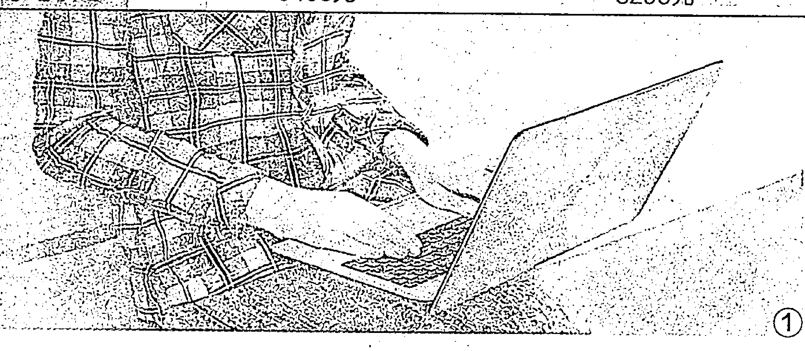

### 搭载更强的处理器

比如，这两款产品都搭载了英特尔八代酷睿i7-8550U处理器，采用四核八线程设计，最高睿频加速频率可达4.0GHz。就性能而言，15W TDP的i7-8550U综合实力不会逊色于45W的i5-7300HQ太多，更低的功耗还赋予了它们延长续航和降低发热量的功效，在同等电池容量下可以提供更持久的待机能力。反观那些更精致和轻薄的产品，5000元左右价位的处理器清一色都是i5-8250U，在CPU性能一项就已落到下风。想购买i7-8550U的高配版？没有6000元起步的预算免谈！

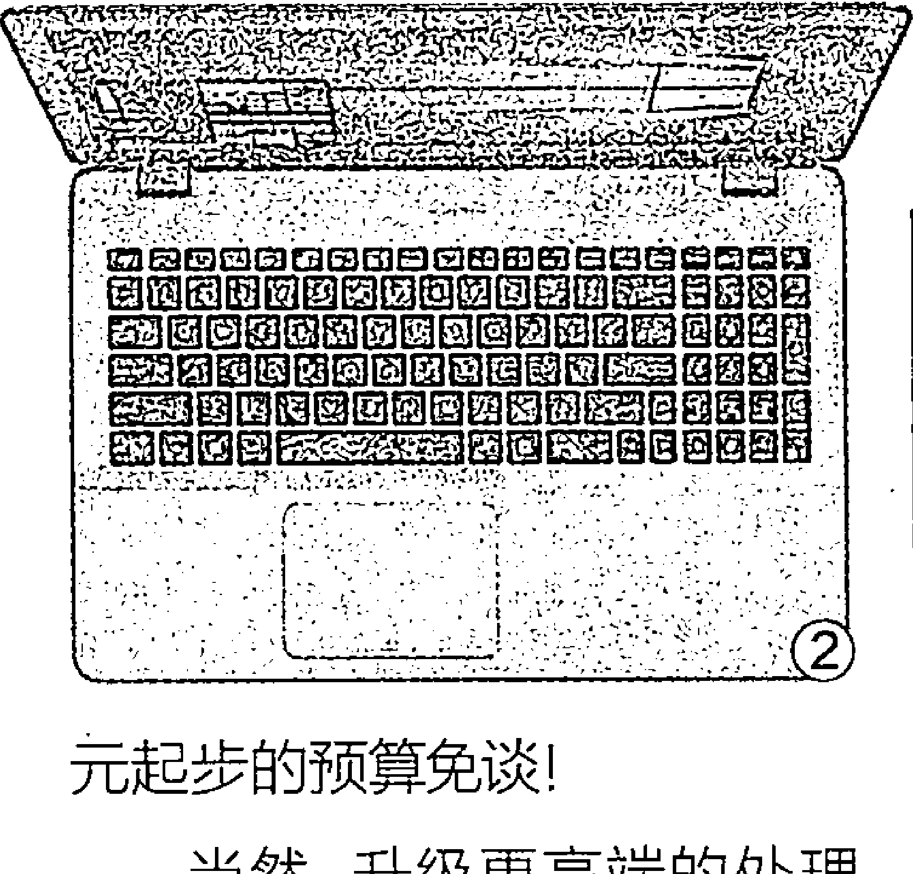

当然，升级更高端的处理器还能提供（相对）较低的售价也并非没有代价，那就是放弃了追求极致轻薄设计的底蕴，以及引入成本较高的金属材质机身的机会。没错，华硕FL8000UN和海尔凌越5000的外壳就都由塑料材质打造，只是通过喷涂工艺和表面纹理最大限度降低塑料的那股廉价感（图2）。

### 满血版的MX150独显

除了搭载i7-8550U处理器外，华硕FL8000UN和海尔凌越5000所配备的NVIDIA GeForce MX150也是核心频率为1469MHz的“满血版”（图3），性能较1000MHz左右的降频版MX150提升了至少20%，在游戏方面可以跑出更稳定的帧数。需要注意的是，华硕FL8000UN为MX150独显准备了更大的4GB显存容量，有利于提升游戏的最低帧数。

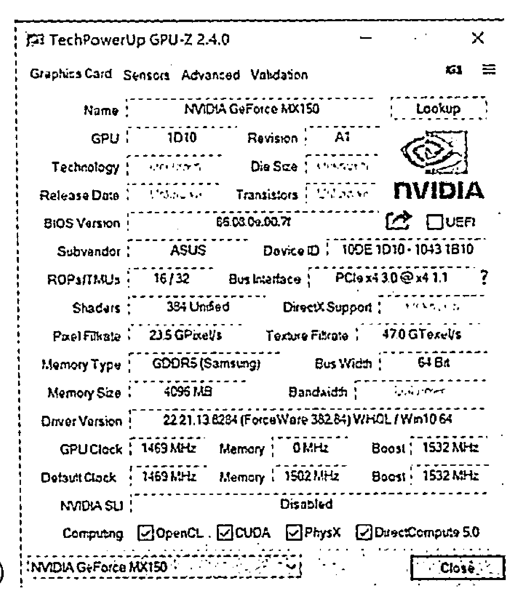

### 更出色的扩展能力

20mm对于超薄本而言谈不上极致，比如小米笔记本Pro就能提供薄至15.9mm的设计。华硕FL8000UN和海尔凌越5000的机身只能算是较为纤薄，但这种相对保守的设计，却赋予了它们更加出色的扩展能力（图4）。
这两款产品都内置2个SO-DIMM内存插槽，除了标配1根DDR4-2400内存以外，等以后内存价格回落后，我们可以自行再购买一根8GB内存组成双通道模式。这一点，是采用板载内存颗粒的超轻薄笔记本们无法比的。
同时，这两款产品都标配1TB 2.5英寸机械硬盘，并在此基础上还预留了M.2插槽，用户可以自行添加1根M.2 SSD扩容，并显著提升磁盘性能。其中，华硕FL8000UN还预留了光驱位（默认为减重模块），需要的用户更是可以通过光驱位的硬盘托架（图5），安装第3块硬盘。

### 多扩展 多种搭配

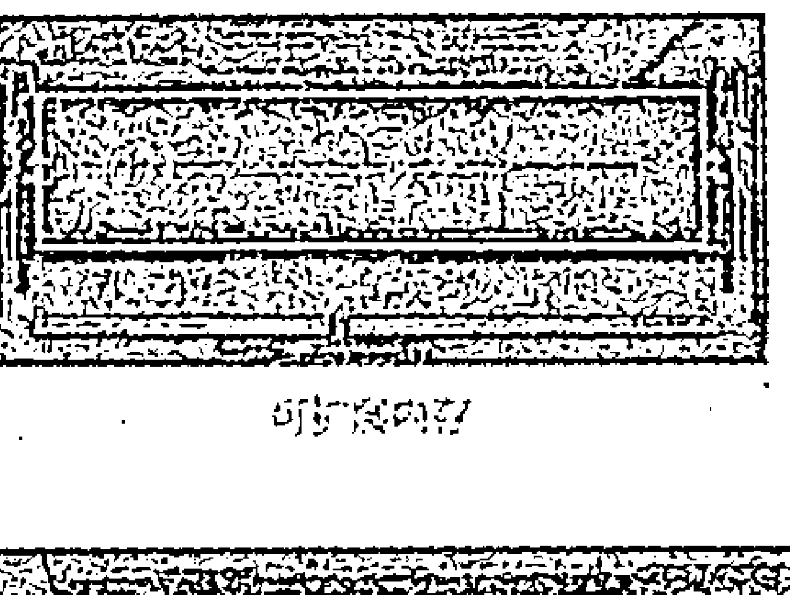

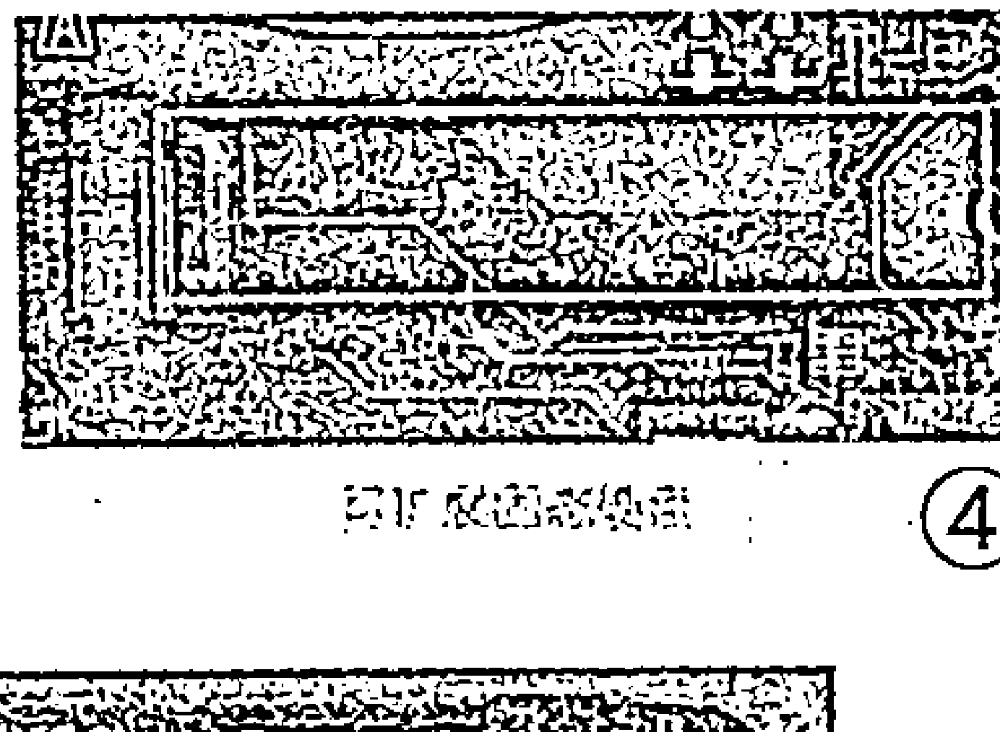

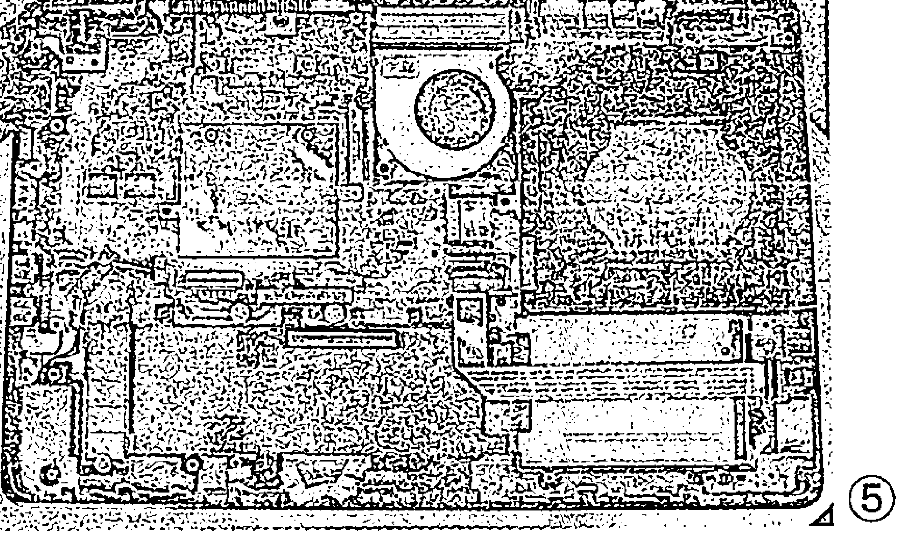

作为15.6英寸超薄本的代表，华硕FL8000UN和海尔凌越5000并没有体现太多的“超薄”属性，它们更像是传统笔记本的瘦身之作。但是，也正是因为它们没有追求超薄，所以两款产品能在更低价位上提供八代酷睿i7处理器，塞进满血版的MX150独显，提供2个内存插槽，可安装双硬盘，属于更符合现实需求的家用笔记本。具体到这两款产品而言，海尔凌越5000有着更高的性价比，而华硕FL8000UN则提供了更丰富的接口和安装3块硬盘的潜力，如何取舍就看你的实际需求了。

## 小米MIX2 PK 努比亚Z17S

随着18:9比例屏幕的普及，全面屏设计已经成为了时下智能手机领域的主旋律。但是，采用全面屏的同时还能具备顶级性能的产品却并不多见，而小米MIX2和努比亚Z17S，则是3000元价位旗舰级全面屏手机的典范代表，它们之间谁更适合你？

| 参数对比 | 小米MIX2 | 努比亚Z17S |
| :--- | :--- | :--- |
| 网络 | 全网通(双卡双待) | 全网通(双卡双待) |
| 屏幕 | 5.99英寸(2160×1080像素) | 5.73英寸(2040×1080像素) |
| CPU | 高通骁龙835 | 高通骁龙835 |
| GPU | Adreno 540 | Adreno 540 |
| 内存/存储 | 6GB/64GB | 6GB/64GB |
| 摄像头 | 500万/1200万像素 | 500万+500万/1200万+2300万像素 |
| 体型 | 151.8mm×75.5mm×7.7mm | 147.46mm×72.68mm×8.5mm |
| 电池/重量 | 3400mAh/185g | 3100mAh/170g |
| 参考价格 | 3299元 | 2999元 |

### 全面屏2.0对2.1

在当下的手机领域，“全面屏”只是一种营销策略，并非物理设计层面的100%全屏幕。因此，什么样的屏幕才算全面屏？这一点公说公有理、婆说婆有理，行业内也没有统一的定论（图1）。所以，小米MIX2和努比亚Z17S最大的差异，就是前者主打全面屏2.0概念，而后者则抛出了全面屏2.1卖点，它们也都将指纹识别模块放在了后盖之上。

小米MIX2在设计上的最大特色就是“消灭”了顶部边框，将前置摄像头和光线距离传感器都移到了屏幕下边框内，从而实现超高的屏占比，达到了全面屏2.0的设计初衷。

而努比亚Z17S对全面屏2.1的理解则是尽可能压缩屏幕上下边框，同时实现（屏幕左右）无边框的设计，并在系统层面加入边缘手势功能（图2），可避免误碰和提高使用效率的功效。

按照努比亚给出的数据，小米MIX2的屏占比只有80.2%，而努比亚Z17S的屏占比则高达90.36%。关于屏占比的算法每个手机厂商都有自家的公式，这个算不得真。从实际的显示效果来看，小米MIX2和努比亚Z17S都属于极具辨识度的全面屏手机（图3），也是现阶段最符合“全面屏”定义的机型。

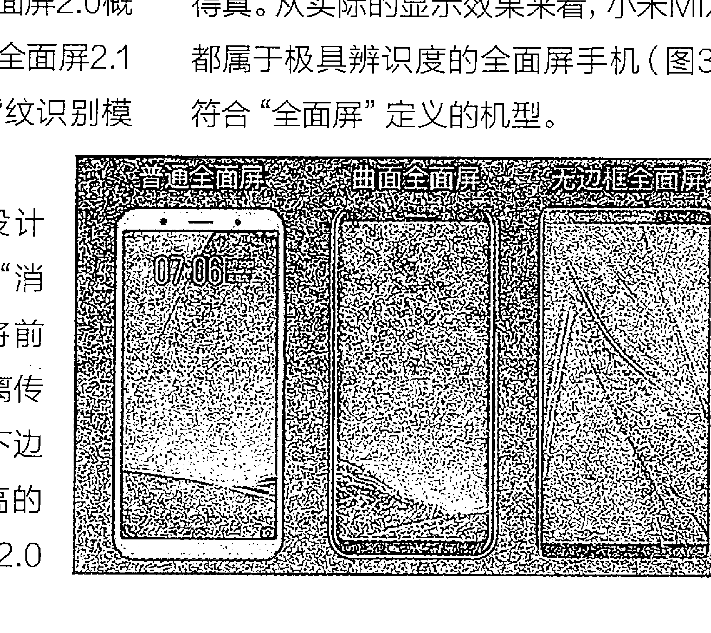

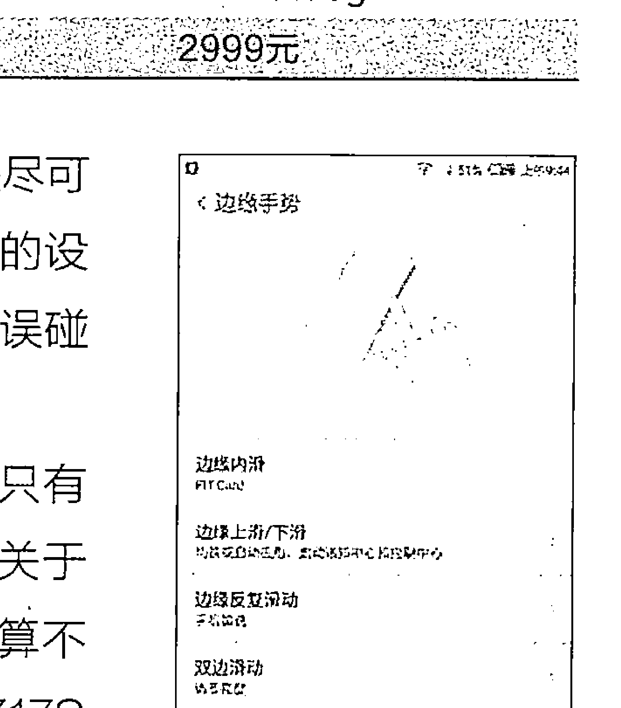

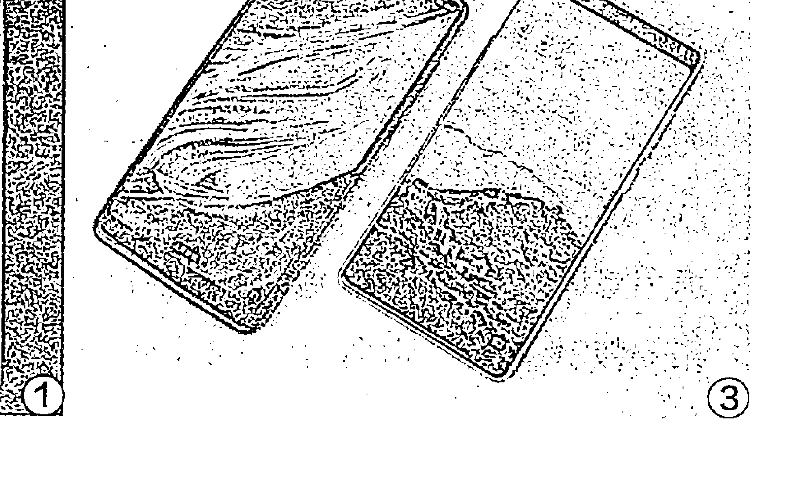

### 持握感和视界变化

虽然小米MIX2和努比亚Z17S都采用了全面屏，但二者的屏幕比例却存在差异。其中，小米MIX2的屏幕比例为18:9，而努比亚Z17S则为17:9，所以MIX2的分辨率比Z17S多了120个像素，屏幕自身也显得更长一些。

此外，小米MIX2的屏幕大小为5.99英寸，借助更长比例的全面屏，它的宽度和持握感与5.5英寸手机相似。而努比亚Z17S的屏幕为5.73英寸，再加上无边框的设计，让这款产品的机身宽度缩减至72.68mm，几乎就是5.2英寸手机的大小（图4）。所以就体形而言，努比亚Z17S显得更为小巧，单手操作时的持握感更有保障。

两款手机都采用了金属材质的中框，前后两面则嵌入了四曲面的玻璃，但小米MIX2的后盖采用的是陶瓷工艺，在耐磨性上要比努比亚Z17S的玻璃后盖表现更好。不过，无论是陶瓷还是纯玻璃都非常容易沾惹指纹，注重干净的用户免不了经常擦拭或者带保护套使用了。

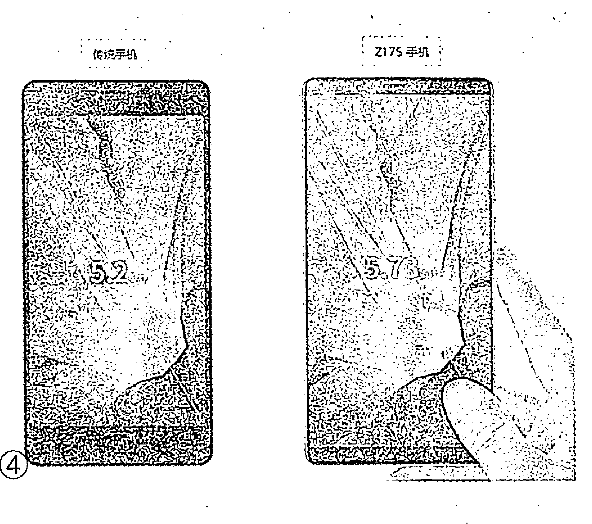

### 相同的性能动力

小米MIX2和努比亚Z17S采用了相同的核心硬件：骁龙835处理器、6GB内存、UFS2.1存储单元，这三样的组合，让这两款产品获得了旗舰手机的性能动力。二者的主要差异表现在高配版的配置和售价层面，它们的标准版都是6GB+64GB存储组合，此时努比亚Z17S的性价比更高。而努比亚Z17S的高配版采用8GB+128GB的组合，但售价也提升到了3999元。

反观小米MIX2，6GB+128GB版本售价3599元，6GB+256GB版3999元，8GB+256GB全陶瓷版4699元。考虑到两款手机都不支持存储卡扩充，所以如果你非常在意存储空间，128GB版的小米MIX2反而性价比最高。8GB内存可以同时运行更多程序，而更大的存储空间则可保存更多多媒体数据，如何取舍得看预算和实际需求了。

### 差异源于镜头数量

和小米第一代MIX相比，MIX2显著提升了拍照性能，将口碑不佳的1600万像素CMOS换了一颗和小米6同款品质更高的IMX386（图5），同时引入四轴光学防抖技术。

努比亚Z17S同样也强化了拍照实力，并配备了前后双摄像头设计（图6）。其中Z17S的前置双摄都是500万像素，可实现更好的背景虚化效果。而该产品的后置双摄则分别为1200万像素的IMX362和2300万像素的IMX318，结合主摄像头全像素双核对焦单元的特性，在拍照表现上有着更好的底蕴。

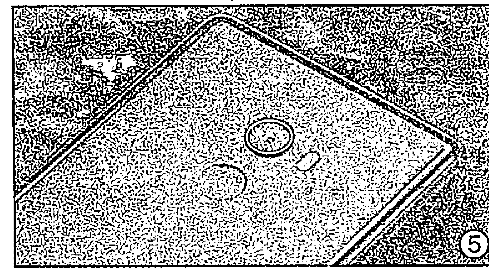

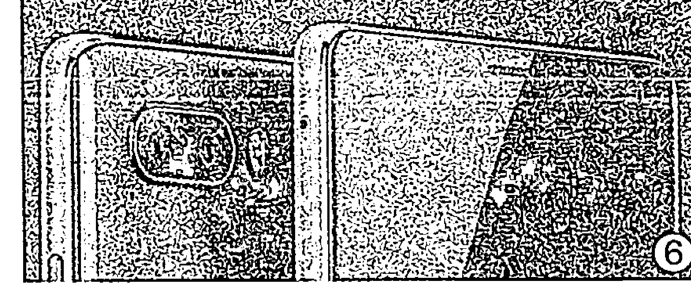

作为全面屏旗舰手机的代表，小米MIX2和努比亚Z17S在性能上没有任何遗憾之处，足以应对未来2年内任何3D游戏的挑战。它们之间最大的冲突就是对全面屏设计的理解不同，小米MIX2压缩三边保留一边（边框），努比亚Z17S则直接干掉两边，都能带来非常震撼的视觉特效，如何挑选还得看你的眼缘。

## 转换身份
### 漫谈笔记本接口的扩展性

如今笔记本的发展趋势就是纤薄化，而瘦身的过程中注定面临周边接口的取舍问题。问题来了，当我们想接驳更多外设、显示器、有线网络时都需要指定的接口帮忙。那么，当笔记本无法配备足够丰富的接口时，如何才能确保最大的扩展潜力呢？此时就需要我们对每一种接口都加以了解了。

#### 最忙的接口：USB

USB应该是在笔记本领域普及度最高的接口之一，受制于带宽限制，绝大多数笔记本都采用了USB2.0和USB3.0混搭的方案（图1）。其中，USB3.0的优势在于理论传输速率达到了5.0Gbps，远远高于USB2.0的0.48Gbps。同时，USB3.0输出电流也从0.5A提升到了0.9A，给手机充电耗时更短，接驳大容量移动硬盘时也无需使用额外的供电线。

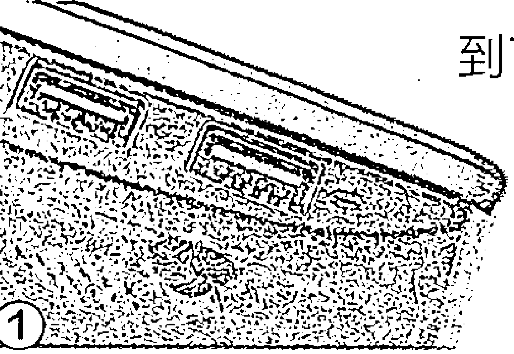

##### USB转Hub

USB应该是笔记本身上最万能的接口，它几乎可以扩展出你所能想象的所有接口，还能通过Hub实现一拖多（个USB）的功能。需要注意的是，USB Hub采用了拓扑结构，身上的USB（也包括读卡器）将共享带宽，同时接驳的USB设备越多速度越慢（图2）。有关这种设备的原理和选购思路，感兴趣的读者可以参考本刊2016年12期《速度供电难兼顾 USB Hub没想象的那么简单》这篇文章。

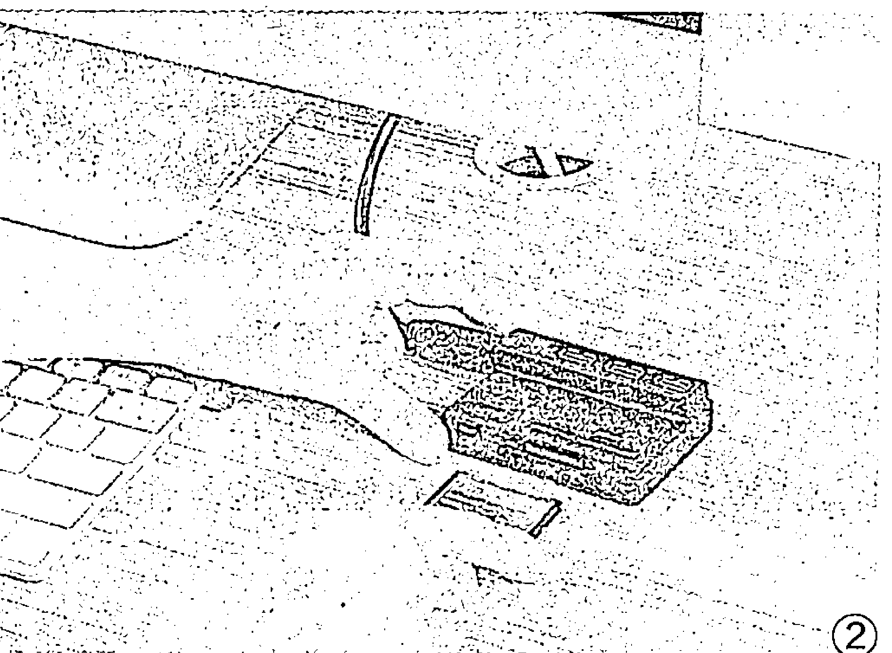

##### USB转RJ45

很多超薄本取消了RJ45网线接口设计，想要接驳有线网络，就需要USB转RJ45帮忙了（图3）。需要注意的是，这种转换器也有USB3.0和USB2.0之分，如果你家网络带宽超过了50M，那就尽量挑选使用USB3.0的RJ45转换器。此外，在系统默认情况下，USB对CPU占用的优先级要大于RJ45，所以使用这种转换器时，当CPU出现占用率100%时可能会出现网络延迟或卡住的情况，稳定性始终还是不如独立的RJ45来得可靠。

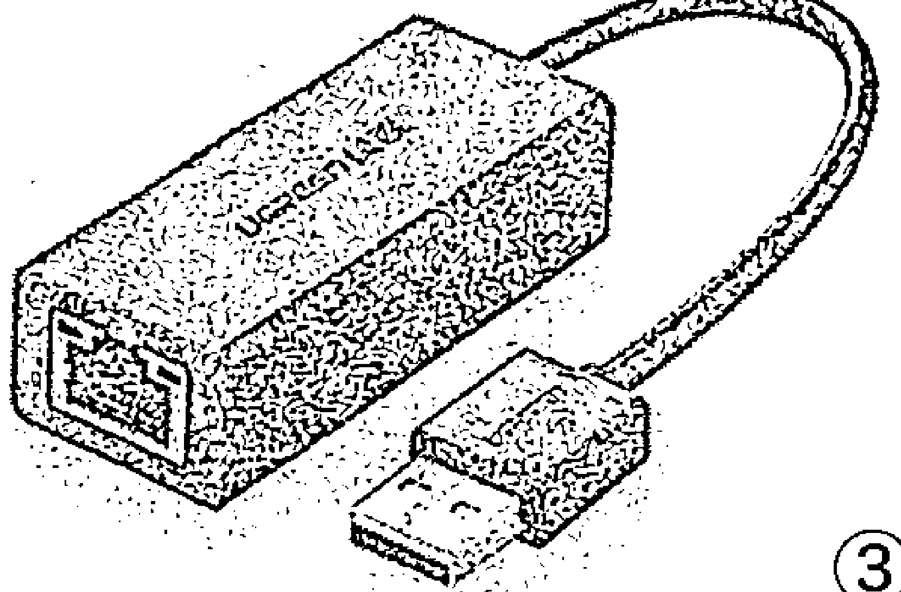

##### USB转音频

如果笔记本的耳机孔坏了怎么办？没关系，USB接口可以转接出3.5mm耳机孔以及麦克风孔（图4），或是直接接驳USB接口的耳麦。如果使用此类转接器时耳机没声音，或依旧是笔记本内置扬声器出声，可进入控制面板的声音选项，将USB声卡设置为默认声音输出设备即可。

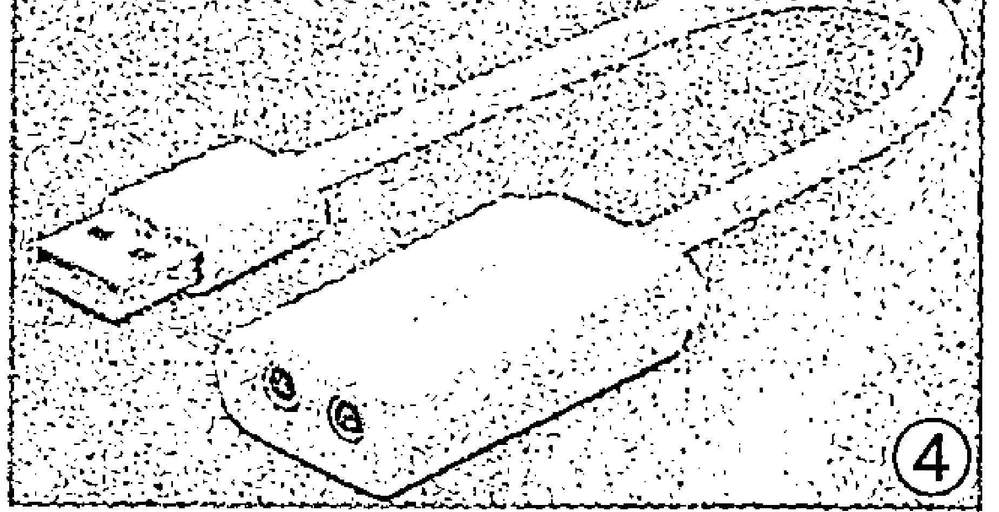

##### USB转视频

理论上USB接口是无法直接传输视频信号的，但这并不影响USB转VGA、USB转DVI和USB转HDMI等转接器的诞生，这些设备都内置USB编解码芯片，我们可以将其理解为USB显卡，而业内也给它们起了一个“UGA”的称号。其中，USB转HDMI适配器相对复杂一些，它们身上大都还配有一根音频线，用于和笔记本的3.5mm耳机孔相连来传输音频信号（图5）。

#### 最乱的接口：USB Type-C

USB Type-C理论上也是USB，只是改变了接口样式，准确来说它是C型的USB接口。默认状态下，笔记本本身的USB Type-C拥有USB3.0的速度。只是出于宣传的考虑，更多笔记本厂商习惯将USB Type-C标注成USB3.1 Gen1，其理论带宽依旧是5Gbps（和USB3.0相同），我们可以将其理解为一种文字游戏。

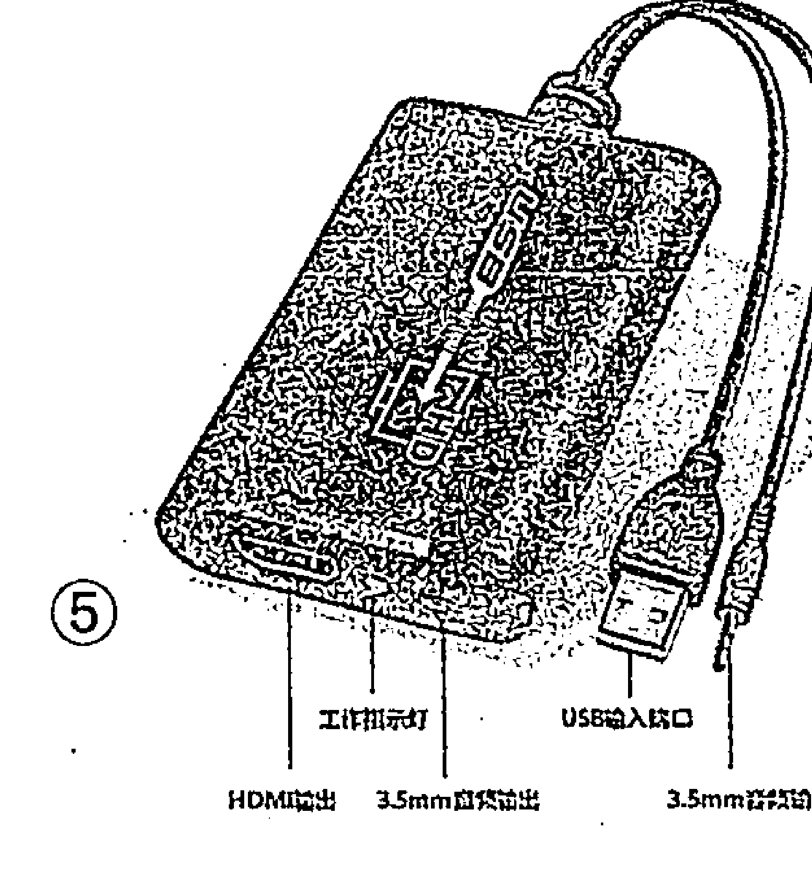

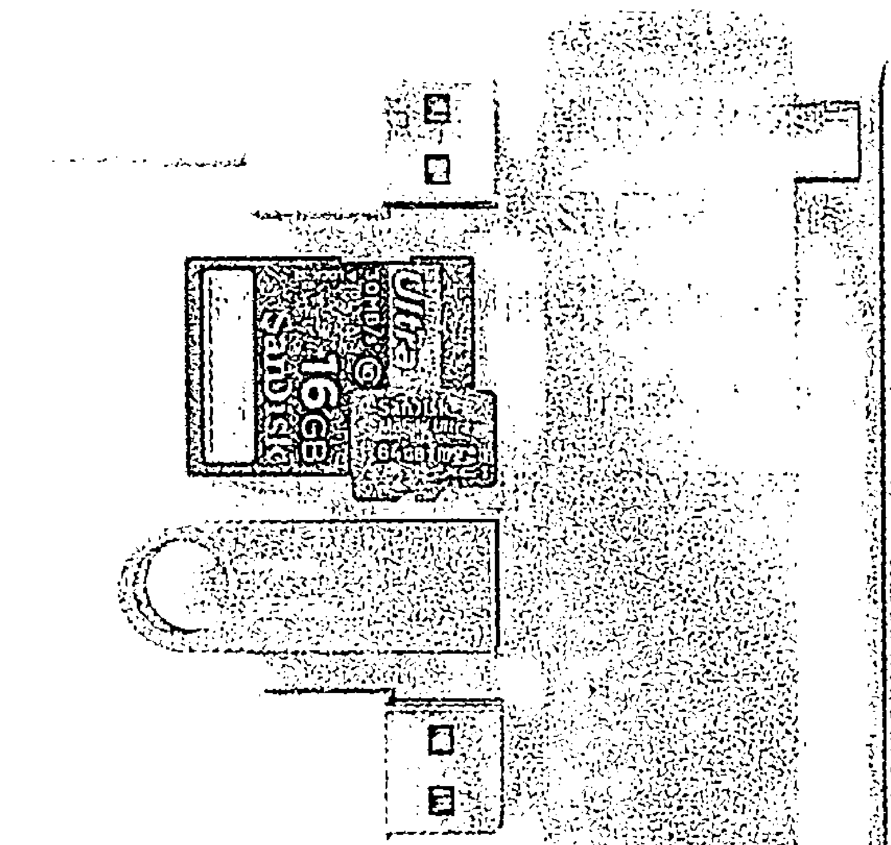

#### 最基础的Hub功能

既然USB Type-C本质上还是USB，所以上面适用于标准USB的转接器自然也适合USB Type-C，转出读卡器、RJ45、更多标准USB接口都不在话下（图6）。但是，这个接口能否直接用于视频输出，就需要视具体的产品而定了。

#### 最梦幻的雷电3

由于雷电3接口是以USB Type-C为蓝本，所以很多用户都会产生一种“USB Type-C=雷电3”的错误认知。想支持雷电3功能，需要额外芯片支持和认证开销，所以现阶段配备USB Type-C接口的笔记本，能同时兼容雷电3的鲜有售价低于6000元的产品。换句话说，雷电3是USB Type-C接口中的“皇帝”（图7），不仅拥有真正意义上的USB3.1（Gen2，速度可达10Gbps）的速度，同时还支持接驳外置显卡扩展坞，向下兼容HDMI和DP输出。

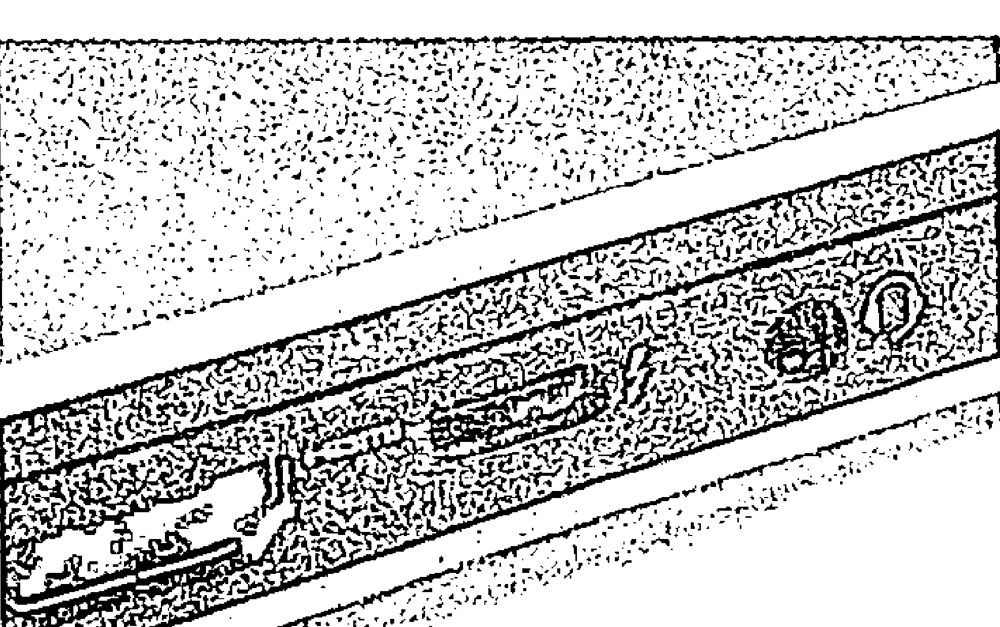

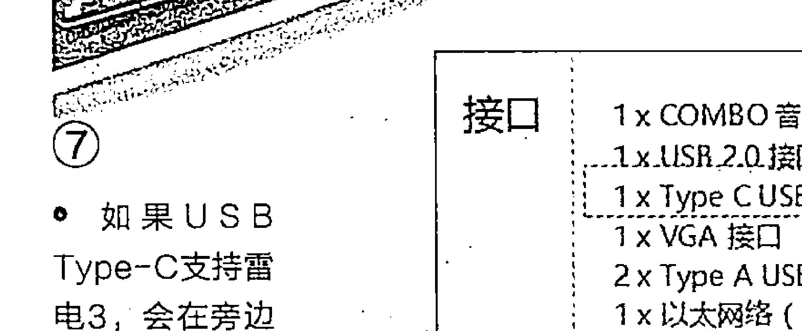

#### 视频输出为可选项

为了降低成本，很多笔记本虽然配备了USB Type-C接口，但却没有赋予其视频传输的能力，只是USB的另一种接口形态而已，在官方参数上没有特别的标注（图8），想用它连接显示器需要USB Type-C接口的UGA适配器（图9）。

- 如果USB Type-C支持雷电3，会在旁边注上一个雷电的Logo。

| 接口 | 说明 |
| :--- | :--- |
| 1 x COMBO音频接口 | |
| 1 x USB 2.0接口 | |
| 1 x Type C USB3.0 (USB3.1 GEN1) | |
| 1 x VGA接口 | |
| 2 x Type A USB3.0 (USB3.1 GEN1) | |
| 1 x 以太网络（RJ-45）插孔 | |
| 1 x HDMI | |
| 1 x SD读卡器 | |
| 1 x 电源适配器插口 | |

而有些笔记本为了增加卖点，会让USB Type-C同时兼容DP输出功能（图10），理论上可向下兼容VGA和HDMI输出，可以直接使用USB Type-C转Type-C/DP的线缆和显示器相连。

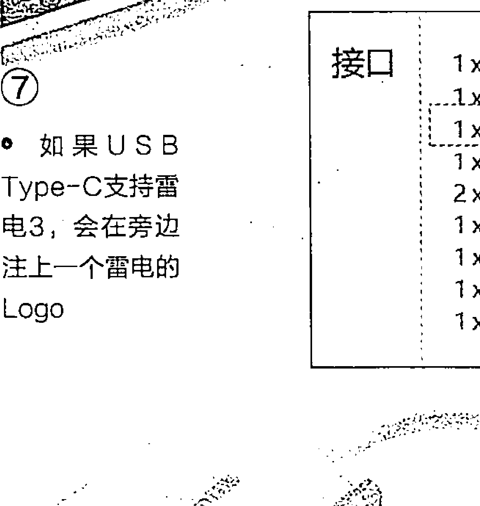

| 扩展功能 | 说明 |
| :--- | :--- |
| 插槽 | 1个多合一SD读卡器 |
| 端口 | 1个HDMI端口；1个Mini DisplayPort™端口；1个RJ-45端口；1个USB 3.1 Type-C™端口（数据传输速度达5 Gb/s；DP1.2；可进行数据传输和充电）；2个第1代USB 3.1端口（1个可进行数据传输和充电） |
| 键盘 | 带有数字小键盘的全尺寸分岛式背光键盘 |

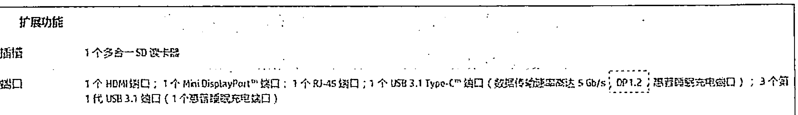

#### 稳定的网络保障：RJ45

RJ45应该是笔记本上最厚的接口，由于它太过占用垂直空间（图11），所以很多轻薄本在瘦身之路上总会拿它开刀。但是，如果你喜欢玩竞技类网游，需要在稳定的网络环境下游戏，RJ45还是非常重要的存在，它的延迟和丢包风险远低于无线网络。很多笔记本通过软件还能实现RJ45和Wi-Fi协同作战（图12），合理分配家中的网络资源。

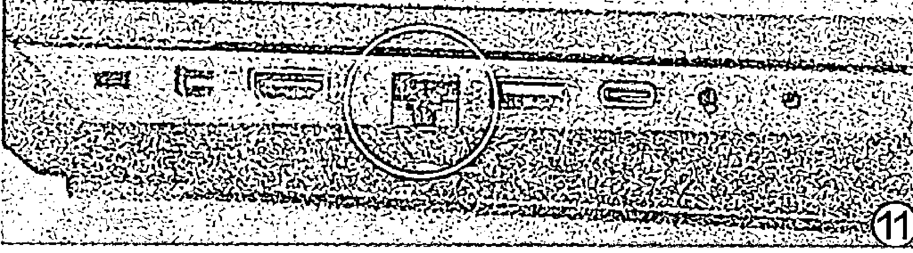

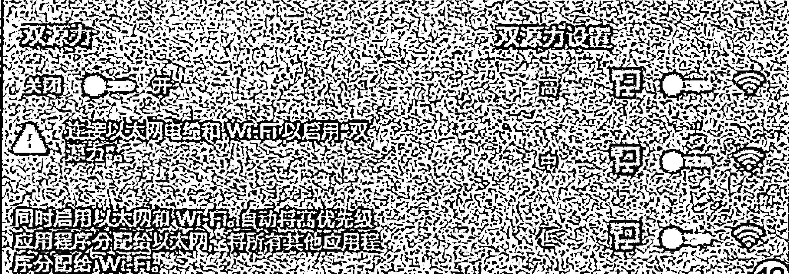

#### 转来转去的视频接口

主流的笔记本屏幕尺寸多在13.3英寸到15.6英寸之间，如果你需要处理大量表格，或是需要提升办公效率，再或是想欣赏震撼的视频，免不了接驳一台甚至多台显示器。此时，就轮到视频接口登场了。

##### 中流砥柱的HDMI

HDMI是普及度最高的传输接口，只是有些轻薄本为了追求极致纤薄，会采用mini HDMI接口用于视频输出，接口形态上和Micro USB很像。一些平板电脑则会采用Micro HDMI，接口体积介于mini和标准HDMI之间（图14）。这个接口可以完美转接VGA和DVI，用于接驳老旧的显示设备。

##### 逐渐淘汰的VGA

VGA应该是寿命最长的视频接口之一，只是这种接口的现状和RJ45相似，占用空间太大所以不被轻薄本们“待见”，哪怕是厚实的游戏本，也逐渐将它作为可取消的首选。由于VGA带宽有限，只能传输视频，无法传输音频信号，所以它就成为了视频接口中向下兼容的垫底存在：HDMI、DP等接口都能完美兼容VGA，但VGA转HDMI就存在分辨率、供电和需要连接额外音频线的各种尴尬（图13），需要在线缆内集成额外的编解码芯片。

##### 玩家认可的DP

虽然DP（DisplayPort）拥有比HDMI更高的带宽，但是由于它推出较晚，而且受成本和超高清片源的限制，它的普及度远远比不上HDMI，所以仅出现在一些高端笔记本上；而且大都还是mini DP标准。DP接口的扩展适配器最为丰富，可以买到三合一转换器（图15），只是同时只能有一个接口用来输出。

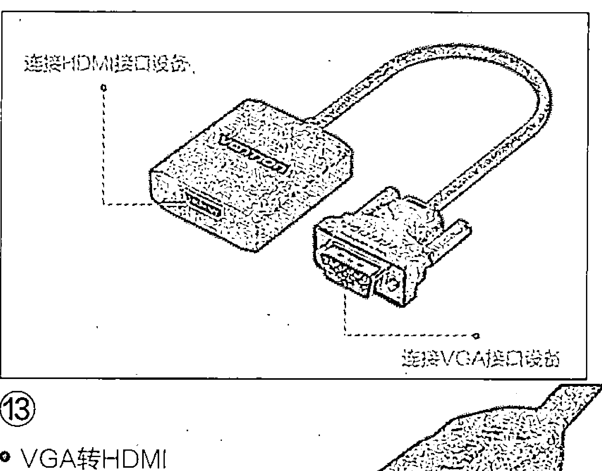

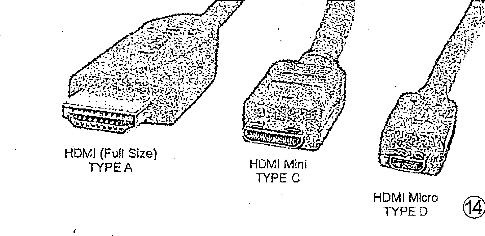

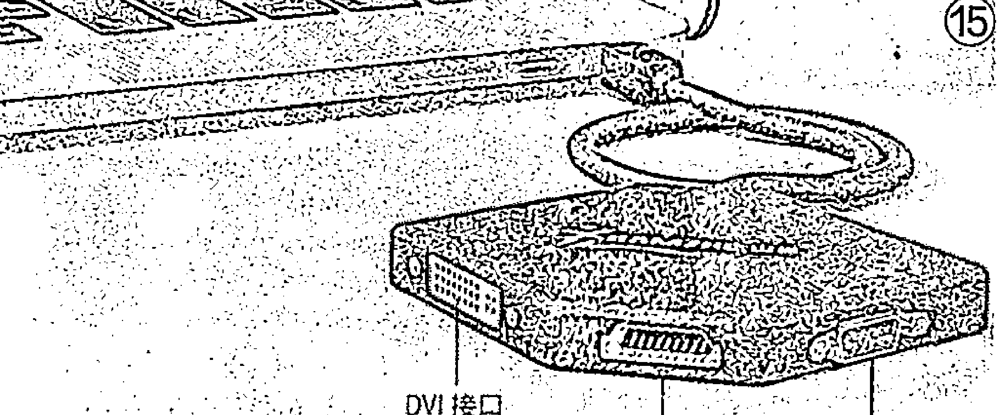

> 小贴士：在笔记本的发展历程中，还有很多接口已经惨遭淘汰，比如IEEE1394（早期摄像机常用接口）、PC卡插槽等等。随着RJ45和VGA等接口地位的岌岌可危，未来使用USB或其他视频接口转接必将成为常态，大家需要提前做好功课以备不时之需。

## 留下青春记忆
### 照片打印机怎么选

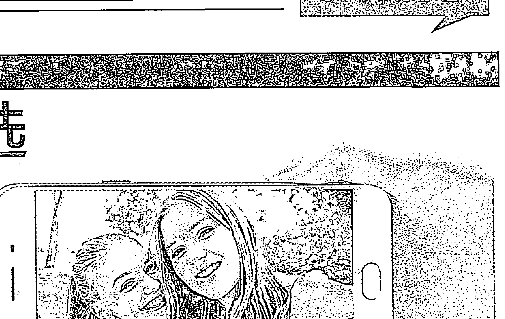

如今的智能手机都带有自动美颜功能（图1），自拍时省却了化妆的步骤和开销，随时都能记录下美美的自己。然而，你会如何处理手机内海量的自拍照？将最满意的照片打印出来，无疑是最靠谱的解决方案之一。那么，用来打印照片的打印机又该怎么选？

#### 你会如何保存照片

面对手机中越来越多的照片，你会选择如何将它们长期保存？考虑到手机存储空间有限，哪怕支持存储卡扩充也禁不起自拍爱好者的折腾。所以，将拍摄的照片备份到其他平台就是最佳解决思路（图2）。

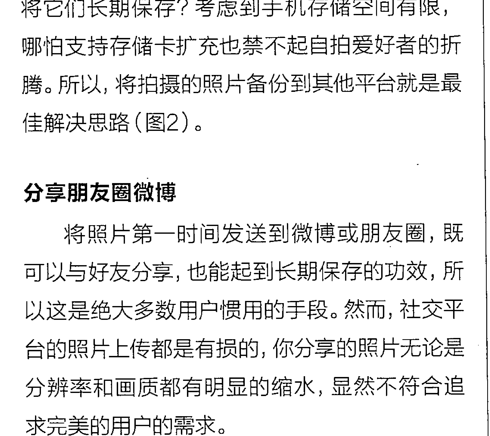

##### 分享朋友圈微博

将照片第一时间发送到微博或朋友圈，既可以与好友分享，也能起到长期保存的功效，所以这是绝大多数用户惯用的手段。然而，社交平台的照片上传都是有损的，你分享的照片无论是分辨率和画质都有明显的缩水，显然不符合追求完美的用户的需求。

##### 上传到云端网盘

很多智能手机品牌都有自家的云服务，没有类似服务的也能安装百度网盘等APP，在Wi-Fi环境下我们可以将手机上的过往照片全部备份到云端的网盘内，以供随时调取查看。可惜，网盘业务存在关停的风险，所以找到靠谱的网盘服务商才是关键。

其实，大家还可以考虑将照片分享给自己。在电脑上安装微信客户端，登录之后在微信的好友列表中就会出现“文件传输助手”，我们可以将需要备份的照片发送给文件传输助手并勾选“原图”（图3）。此时，家里的电脑就扮演了云盘的角色。同理，发给QQ中“我的电脑”也有着同样的效果。

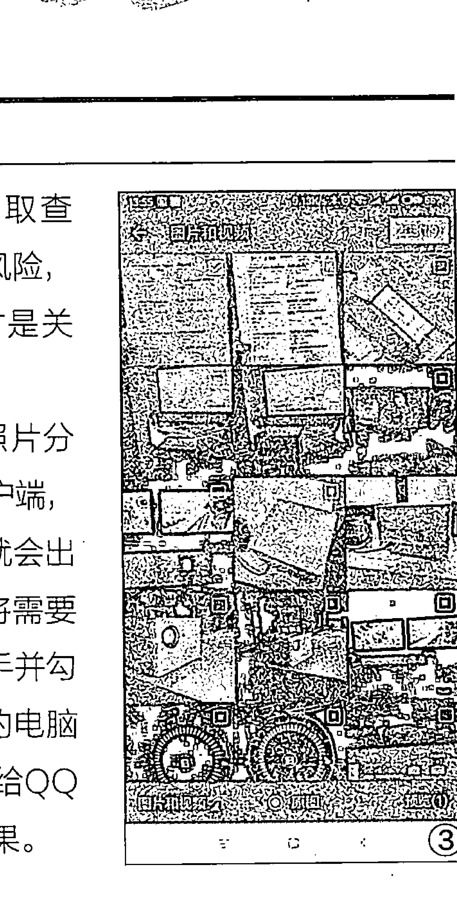

##### 保存在本地存储介质

这个没什么可说的，通过USB线或无线的方式，将照片拷贝到电脑硬盘中，或是通过OTG的方式拷贝到闪存盘内。

问题来了，虚拟的数字保存方式总没有拿着照片欣赏来得真实，而且存在着硬盘坏道、网盘关停的风险。所以，在经济允许的情况下，将中意的好照片打印出来才是最稳妥的手段。

#### 你真的需要购买打印机吗

这是一个非常关键的问题，因为无论是购买打印机，还是后续用于打印照片的耗材，都是一笔不菲的开销。现在很多照片打印的店面，打印一张6寸照片的价格不过3元到5元，如果选择淘宝平台，40元就能打印50张6寸照片还包邮，成本低到不敢想（图4）。因此，如果你不是需要频繁的打印照片，真的没有必要单独购买打印设备。反之，如果你有大量的照片打印需求，比如随时记录宝宝的成长，又或是经常打印涉及隐私的照片，那就有必要为其投资了。


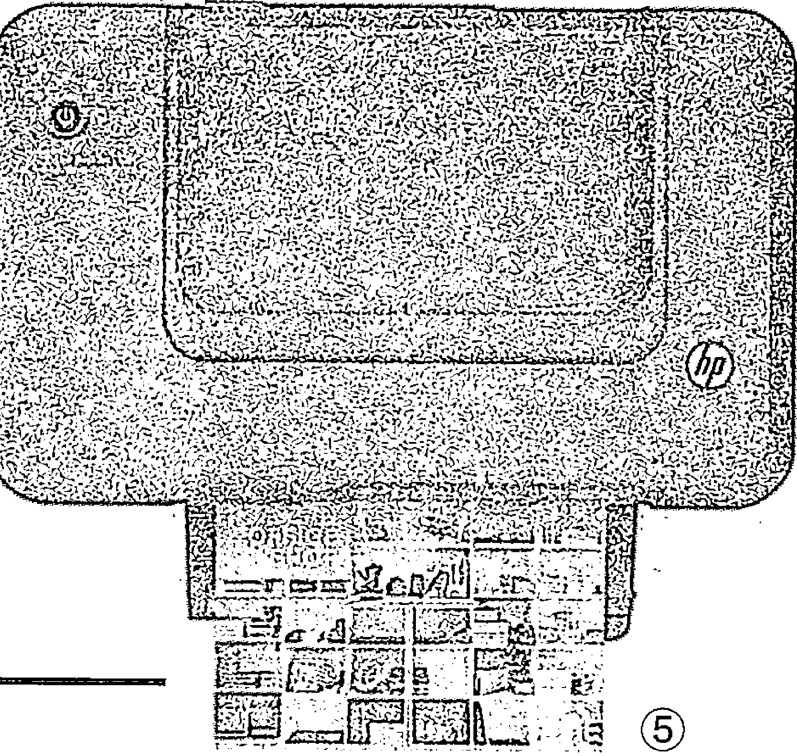

### 照片打印机的三大分类

照片打印机是一种比较模糊的概念，因为能打印照片的打印机品类实在太多了，比如激光打印机、热升华打印机、喷墨打印机都能满足你的需求。至于选择哪个品类作为投资的对象，还得从你的实际需求谈起。

#### （彩色）喷墨打印机

喷墨打印机是成本最低、普及度最高的打印设备，它的工作原理是嵌入包含青色、品红、黄色、黑色的墨水的墨盒，其中的墨水经由打印机的控制程序控制，通过打印机的喷头喷出在纸上（组成图像中的像素），从而得到色彩斑斓的照片（图5）。
对喷墨打印机而言，喷头越多完成照片打印的过程就越快。但是，受制于墨滴扩散的问题，哪怕是4800×4800dpi的打印机在打印精度上也不如热升华打印技术。
需要注意的是，虽然喷墨打印机的入手门槛最低，但它打印照片的成本却着实不低。首先是照片打印远比文档打印更费耗材，其次是用于照片打印的相纸成本也不低。
因此，喷墨打印机最适合有着文档打印需求、需要打印6寸以上照片、对照片精度要求不算苛刻的家庭用户选择。
选择喷墨打印机时，是否支持无线传输无疑是核心指标，即可以方便地将手机里需要打印的照片无线发送给打印机打印出来（图6），而无需先拷贝到电脑，再利用网线或（插在打印机上的）闪存盘的传统输入方式。

- **优点：** 打印机自身成本低、通用性强（A4和相纸都能用）
- **缺点：** 低端产品照片打印效果难以保证，打印照片速度慢

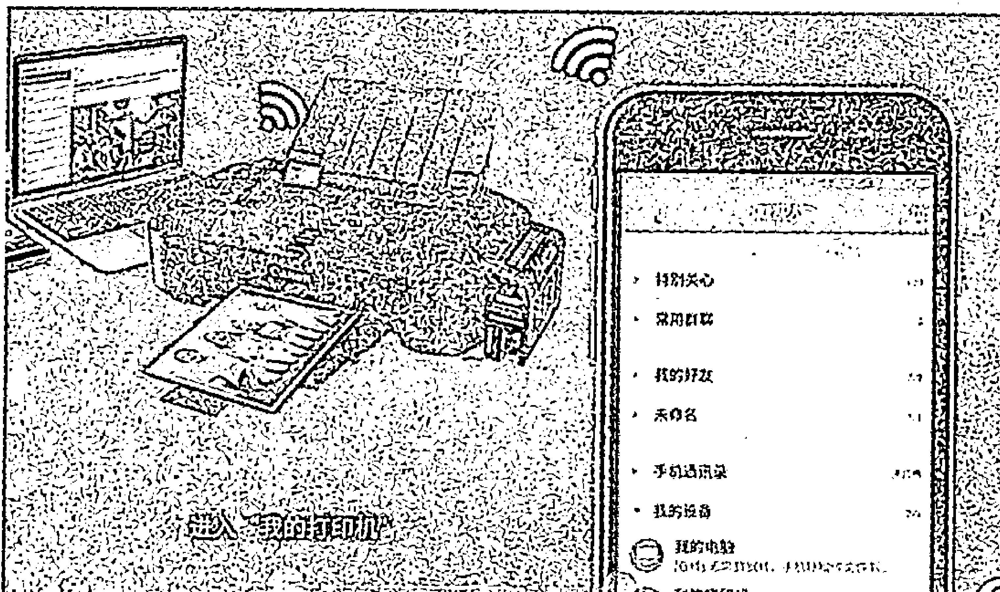

#### （彩色）激光打印机

激光打印机的原理是利用激光照射硒鼓产生静电然后吸附墨粉，之后将墨粉转印到打印纸上，再经过热滚碾压使墨粉熔化在纸上显现图像。这种打印机的最大优势就是打印速度快，但受制于原理限制，它无法使用照片打印中很常见的光面相纸，因此由激光打印机打印出来的照片效果普遍较差，并不适合有照片打印需求的用户考虑（图7）。

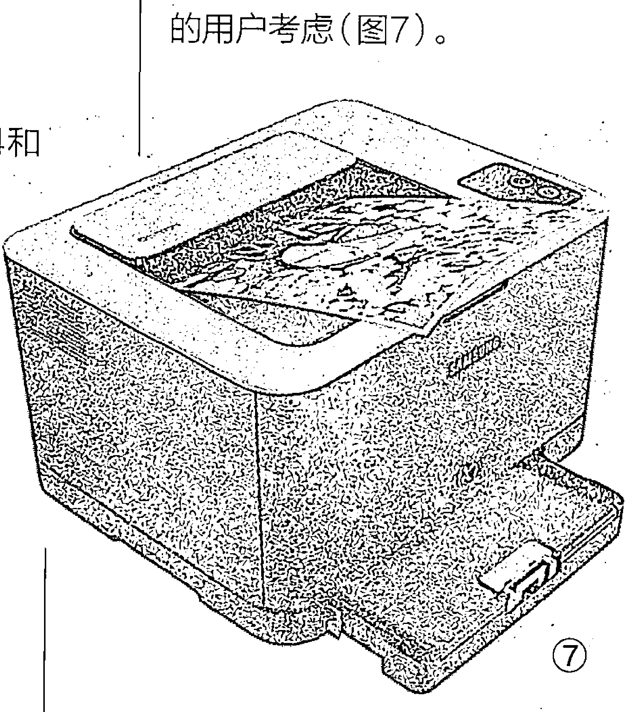

- **优点：** 打印速度快，文档打印专家
- **缺点：** 照片打印效果较差

#### 热升华打印机

热升华打印机的历史虽然不如喷墨和激光打印机，但它从诞生之日起，就是专门以照片打印为己任。此类设备的原理是将包含有青、品、黄、黑四色的色带通过控制温度将颜色“转移”到相纸上。打印照片的过程中，每种颜色的浓淡是由打印头的温度控制，可以组成256级梯度（1670万色），而且不存在墨滴扩散的问题，照片打印效果接近于显示器端的显示水准。此外，如今主流的热升华打印机大都支持镀膜功能，镀膜之后的照片色泽更为明亮鲜艳，而且具备防水、抗氧化的能力，大大延长了照片的保存时间。

和喷墨/激光打印机相比，热升华打印机不存在墨盒硒鼓等“耗材”的概念，可以做到免维护，使用难度最低。不过，由于它所用的打印相纸自身就是“耗材”，所以热升华打印机专用的相纸成本要远高于传统的A4纸张和喷墨打印机所用的光面相纸。同时，热升华打印机大都主打便携（图8），最大支持的照片尺寸只有6寸，如果你需要更大画幅的打印，此类产品就无法胜任了。

考虑到热升华打印机的效果最接近“冲印”，所以如果你没有文档打印的需求，只是需要高品质的照片打印，那热升华打印机自然就是首选了（图9）。

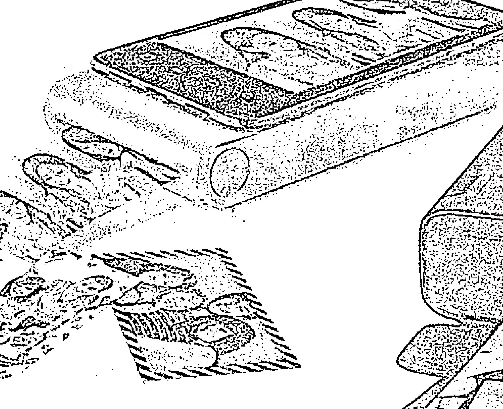

市面上基于该技术打造的打印机有很多，比如佳能CP1300、惠普SPROCKET 100、LG PD239等等，在挑选时我们需要基于两个层面加以筛选。

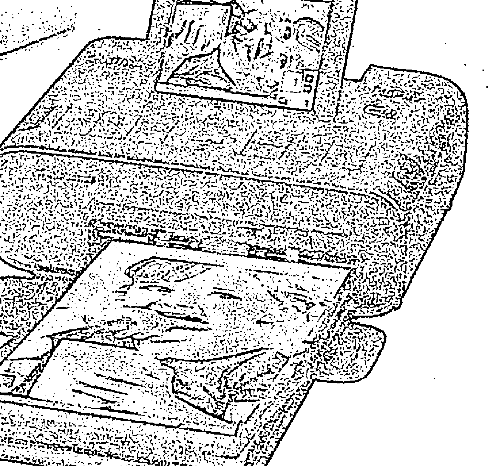

相纸成本：热升华打印机自身是一次性投资，咬咬牙即可，但用于打印的配套相纸却是消耗品。由于各品牌间相纸并不通用，有些品牌20张6寸相纸价格就达到了50元，而有些品牌则提供100张相纸套装，价格则不足180元。如果你的照片打印量较大，优先选择相纸成本低的型号，也许用不了多久就能省出一部热升华打印机的价钱呢。

设备自身：热升华打印机的原理都是一样的，差别只是体现在外观设计（是否时尚）、体积大小（能否塞进口袋）、是否配备屏幕（便于预览和选择照片）、传输模式和操作模式。其中，传输模式和操作模式值得我们重点关注（图10），比如有没有配套的APP辅助操作？在APP端能否进行基本的剪裁？使用蓝牙还是Wi-Fi传输照片（图11）？

- **优点：** 照片打印效果极为出色
- **缺点：** 照片尺寸有限制，持续工作时发热量较高

### 只需3步 简单打印

1.  用智能设备拍照
2.  下载（POCKET PHOTO）发送到相印机
3.  打印照片

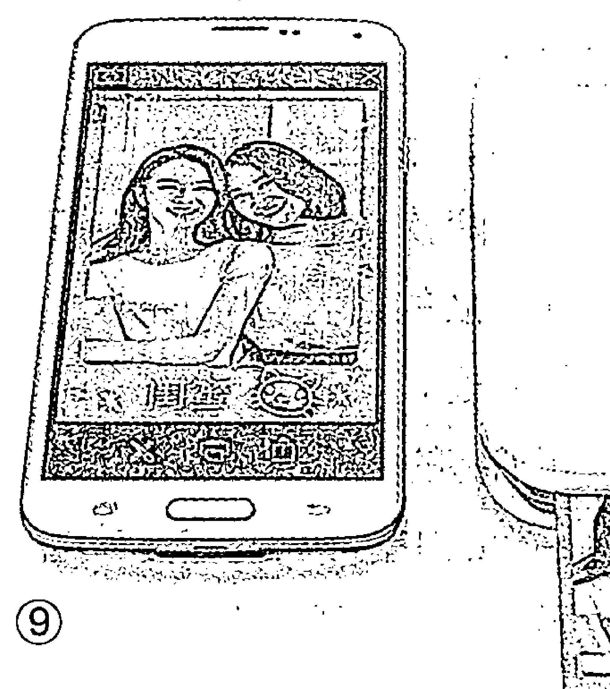

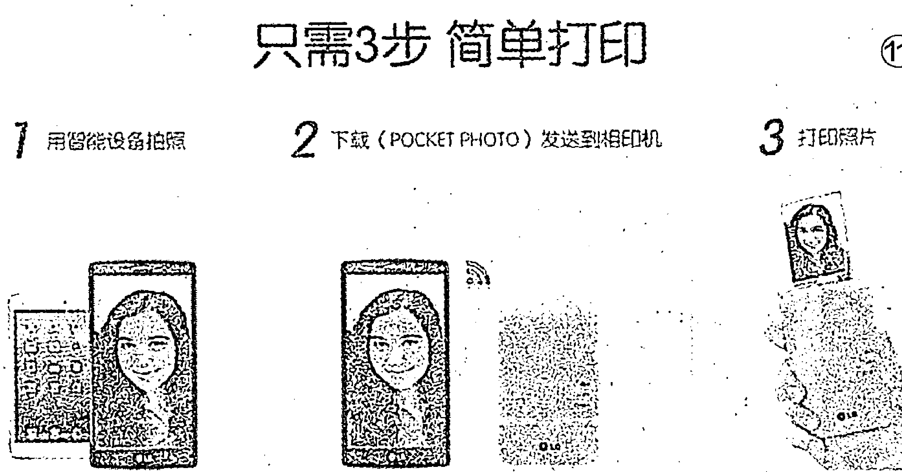

## 迷你平板的碰撞
### 联想小新平板 PK 台电T8

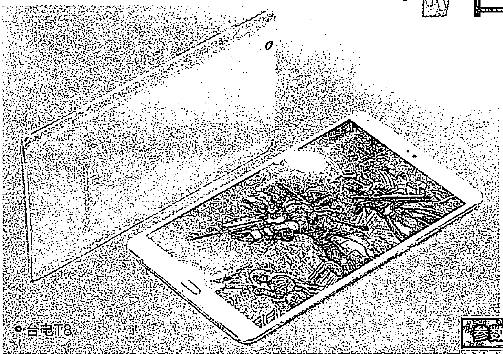

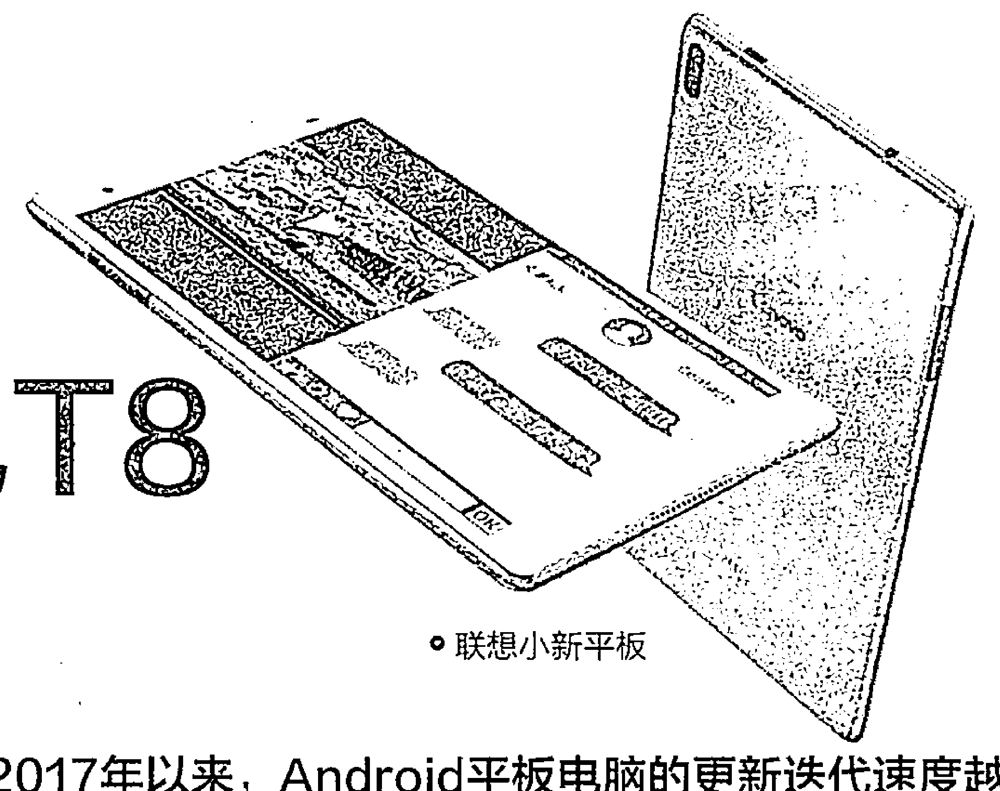

步入2017年以来，Android平板电脑的更新迭代速度越来越慢，而且鲜有高性价比的产品出炉。而如今小尺寸平板领域出现了两款极具诚意的新品，它们就是台电T8和联想小新平板，有着轻巧机身设计和较为强悍的性能动力。那么，它们之间谁更适合你？

| 参数对比 | 台电T8 | 联想小新平板 |
| :--- | :--- | :--- |
| 屏幕 | 8.4英寸(2560×1600像素) | 8英寸(1920×1200像素) |
| CPU | 联发科MT8176 | 高通骁龙625 |
| GPU | PowerVR GX6250 | Adreno 506 |
| 内存/存储 | 4GB/64GB(支持存储卡) | 4GB/64GB(支持存储卡) |
| 摄像头 | 1300万/800万像素 | 500万/800万像素 |
| 接口 | TF卡插槽、USB Type-C、耳机孔 | TF卡插槽、USB Type-C、耳机孔 |
| 尺寸 | 218mm×126mm×7.8mm | 210.6mm×123mm×7.7mm |
| 电池/重量 | 5400mAh/368g | 4850mAh/300g |
| 系统 | Android 7.0 | Android 7.1.1 |
| 参考价格 | 1299元 | 1199元 |

### 为何选择小尺寸平板

随着18:9全面屏的普及，智能手机即将普及6英寸视野。在这种大环境下，小于等于7英寸的平板电脑存在感会被进一步淡化。反观10.1英寸或9.7英寸的产品，硕大的机身又很难满足玩家（把平板）随时揣进口袋里说走就走的需求。因此，尺寸在8英寸左右范围内的“迷你派”，就凭借小巧的机身和足够震撼的视野受到了越来越多消费者的欢迎。

这种迷你派还有一个值得关注的特性，那就是不会影响运行《王者荣耀》等游戏的操作，横屏时并不妨碍拇指碰到屏幕下方的技能按钮（图1）。同时，时下很多拉伸式的蓝牙游戏手柄也能支持8英寸左右平板的安装，对于喜欢玩模拟器游戏的玩家而言，平板+手柄亲密的组合才是王道（图2）。

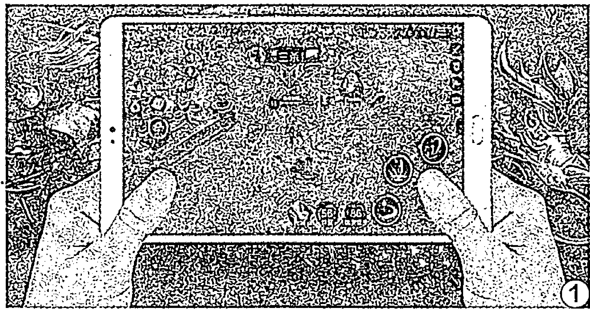

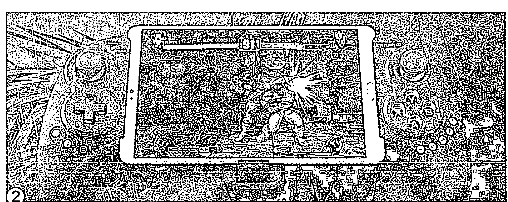

### 轻巧的金属迷你派

台电T8和联想小新平板分别采用了8.4英寸和8英寸屏幕，由于小新平板屏幕偏小，所以它的机身尺寸也显得更为苗条，300g的重量更是极为轻巧。而台电T8不仅屏幕（相对）更大，分辨率也到了2K级别，2560×1600像素分辨率可以显示更为细腻的画面。

两款平板电脑都采用了金属材质的后盖（小新平板为塑料中框+金属后盖），并都做出了独特的味道。其中，联想小新平板的中框设计与常见的圆滑形、方正形不同，它的中框采取了类似三角形的棱线，中间略微凸出，可以让平板显得更薄。请放心，这种中心凸出的中框并不割手。该设计还可以让顶部和底部的双扬声器孔朝着斜面开孔（图3），横屏操作时不容易被挡住，再结合Dolby Atmos杜比全景声技术可以营造更立体的环绕音效。

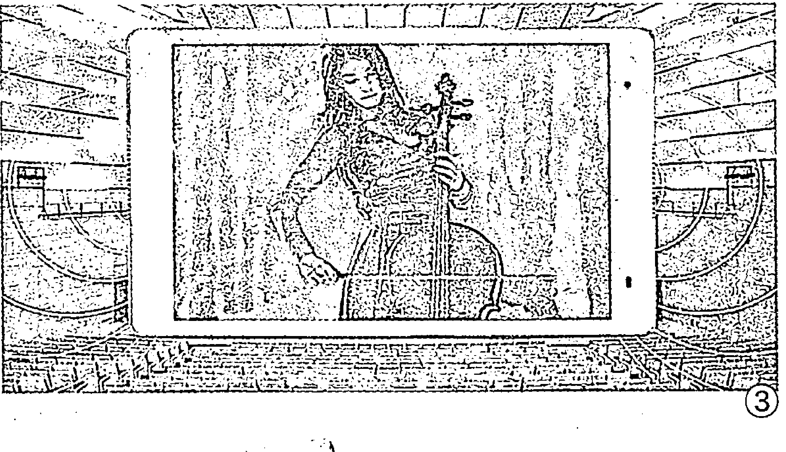

台电T8采用了一体化的金属机身，它的特色是后盖两侧采用了较大弧度的曲面设计，并在边缘通过CNC切割出了两道亮光条纹，无论是视觉还是触觉效果都得到了很大程度的增益。

### 细节设计的对比

台电T8和联想小新平板都引入了指纹识别模块，只是台电T8采用了传统的正面指纹设计，将传感器与Home键结合在了一起，而小新平板则选用了侧面指纹设计，传感器安置在了机身右侧的中框内（图4）。由于两款手机都谈不上太宽，单手持握的压力不大，所以两个位置的指纹模块体验起来都还可以接受。

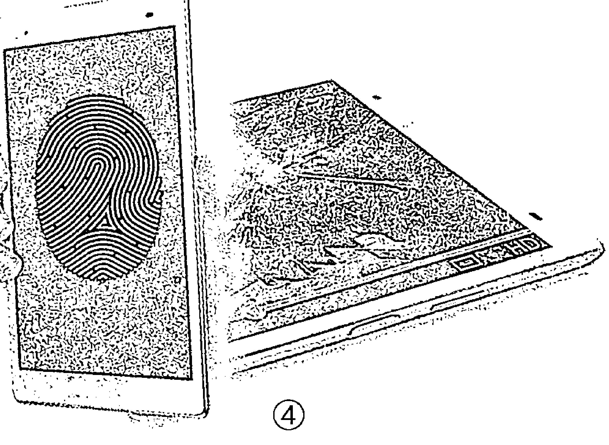

台电T8和联想小新平板都支持存储卡扩展，只是台电T8将TF卡槽放在了机身底部，需要用卡针捅一下才能弹出。而小新平板则将TF卡槽放在了机身左侧，表面的防尘挡板用手指就能掰开。

此外，台电T8虽然比联想小新平板厚重一些，但它却塞进了更大的电池容量，同时支持9V或5V/2.5A快充功能（图5），充电耗时更短。在摄像头的搭配上，台电T8配备的前置摄像头像素更高。

### 性能存在较大差异

两款平板都采用了USB Type-C作为充电和传输数据的接口，它们都没有把USB放在中框正中的位置，而且偏向一侧，这种设计的好处是充电时横屏游戏不会因连接着的线缆而影响操作。

台电T8和联想小新平板在配置上的差异很大，前者搭载联发科MT8176六核处理器，集成PowerVR GX6250 GPU（图6）；后者则选用了高通经典的骁龙625八核处理器，集成Adreno 506。就性能而言，联发科MT8176要比骁龙625强悍许多，玩大型游戏可以更为流畅；而骁龙625的优势则是更省电，对续航和降低发热有着更好的增益效果。

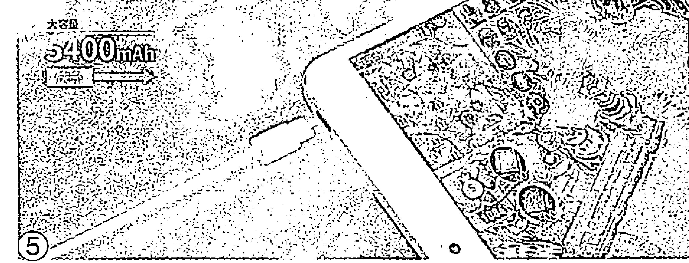

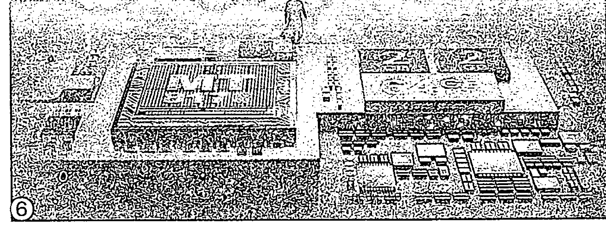

作为迷你派的新代表，台电T8和联想小新平板都拥有轻巧的身材和便捷的指纹识别验证系统，在使用体验上接近大屏手机，单手持握和双手操作的压力都不大。其中，台电T8的优势在于更细腻的屏幕和更强的性能，适合喜欢玩游戏的玩家选择；而联想小新平板则适合追求极致轻薄，不希望随身携带的平板太过累赘的用户考虑，1199元的售价也更为实惠。

## 初级主播的影音设备选择

随着网络直播的日渐成熟，越来越多的人开始关注网络直播，网络直播节目也从传统的游戏、聊天、歌舞发展到美食、旅游，乃至于公开课等不一而足。对于很多人来说，直播节目中，主播清晰的图像和声音似乎高不可攀，更有一些人也考虑通过直播的方式分享自己的技艺、经验或生活，但却不知道该选择什么样的设备，更担心这些直播设备会昂贵到无法接受。其实主播使用的很多设备并没有我们想象的那样专业和昂贵，特别是直播摄像头和麦克风，虽然效果远超笔记本电脑或者显示屏自带的摄像头与麦克风，但大多就是市场上的中高端全高清产品而已。在这里我们就看一看市面上一些完全具有直播能力，也被一些主播实际选择的全高清摄像头与麦克风。当然这些产品不仅可以用于直播，如果用于电话会议或者录音、亲朋间的视频连线，甚至是用来K歌娱乐，也是很好的选择。

### 直播摄像头

#### ◎ 罗技C922

特色：配有三脚架，拥有背景替换功能

罗技的Pro C920摄像头就曾经是很多主播的选择，而其后推出的C922更为直播提供了多项优化，例如自带三脚架、内置背景替换功能等，不过价格也贵了100元，达到599元。它支持1080P@30fps或720P@60fps摄像，带有自动对焦功能，78°广角拍摄，内置立体音效双麦克风。它拥有光线、闪烁自动校正功能，可用于较昏暗的室内环境或拍摄屏幕。

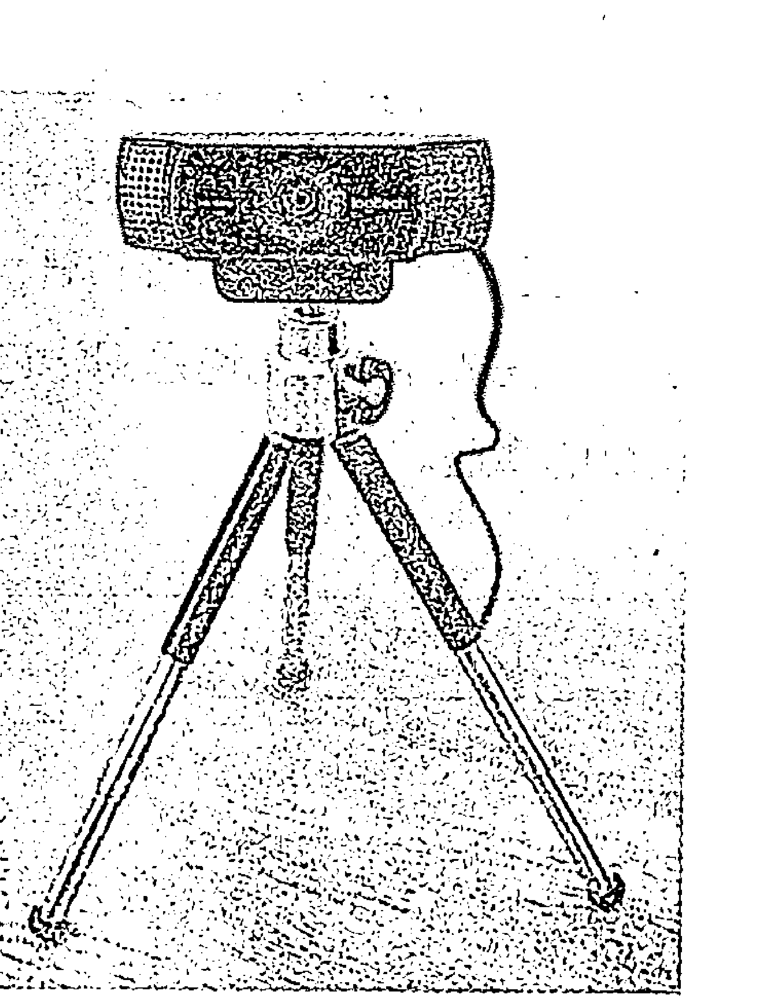

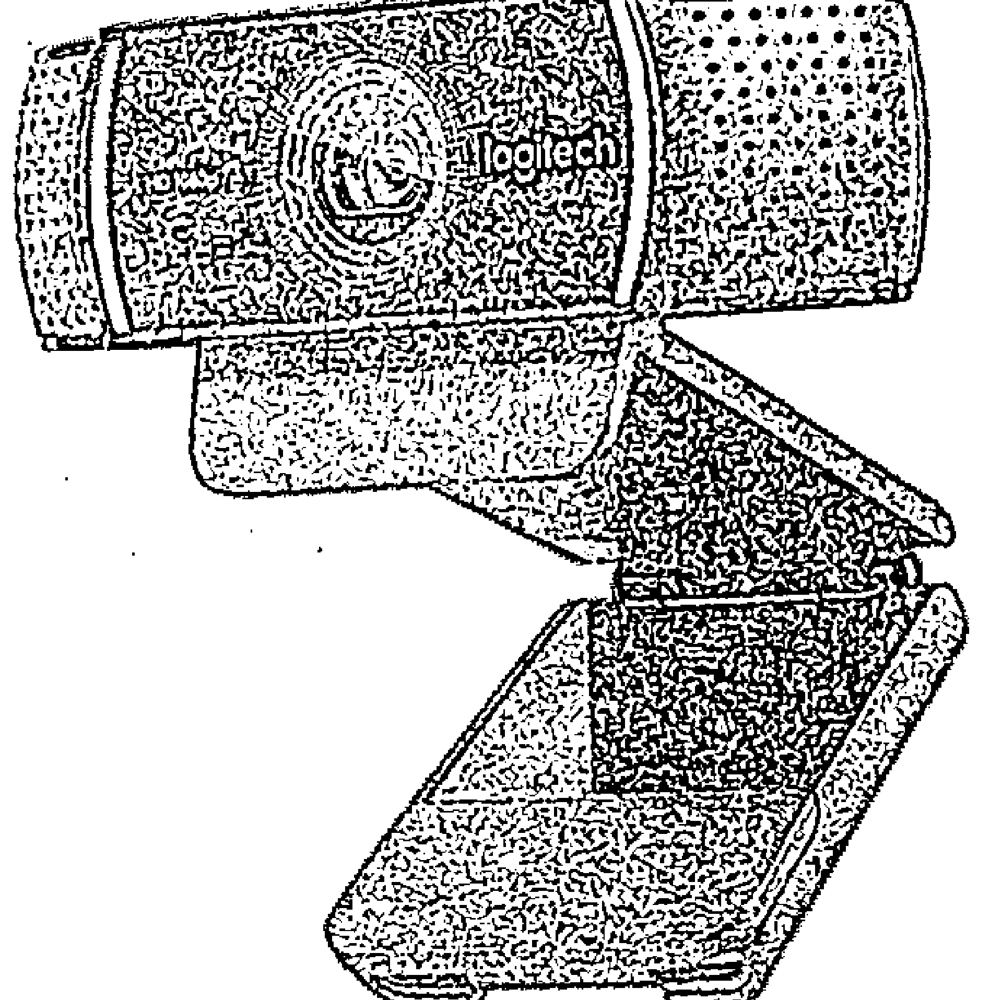

#### ◎ 蓝色妖姬HD100直播版

特色：外形靓丽，自带美颜

蓝色妖姬推出了多款外形非常漂亮的摄像头，如S9200以及我们选择的HD100直播版。这款摄像头是一款特别为女性用户设计的产品，采用粉色壳体，配合金色镜头圈，而且自带美颜功能。它支持1080P无畸变矫正技术，图像准确清晰，内置数字麦克风，支持升级版夜视功能，可视角度达到60°～70°。其性能并不突出，不过价格也比较实惠，249元的售价应该可以让很多用户轻松选购。

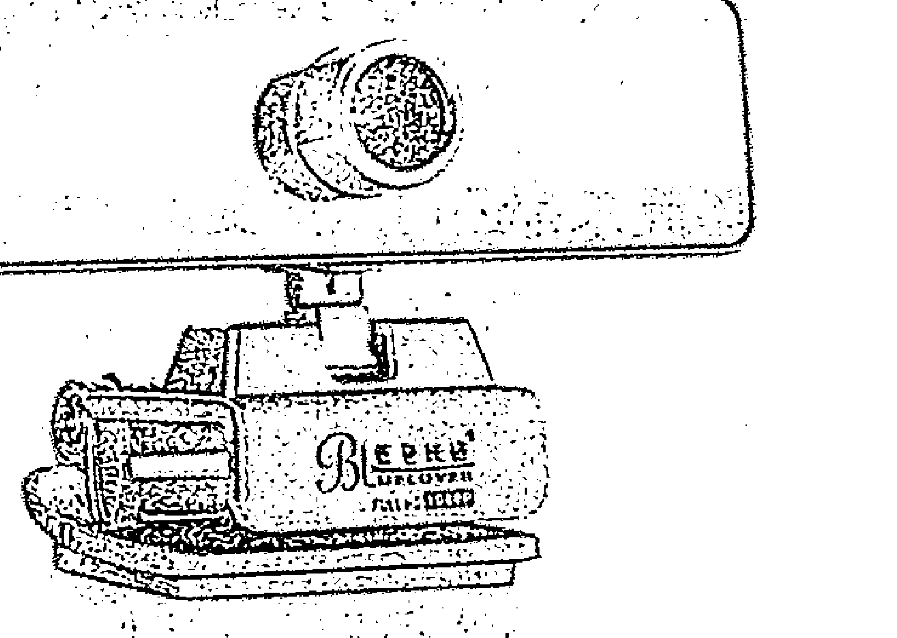

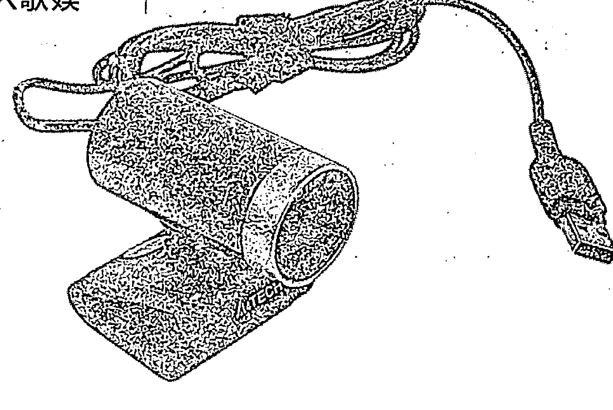

#### ◎ 双飞燕PK-910H

特色：廉价实用

双飞燕这一品牌的外设一向以廉价实用著称，PK-910H这款摄像头同样如此，其149元的售价在全高清摄像头中算是相当低廉的，而基本功能却并不含糊。它可支持1080P@30fps摄像。

拥有自动对焦、弱光增益等技术，内置麦克风，可以满足日常视频通讯甚至主播的使用需求。
目前市场中还有一些面向商务或拥有更高性能的摄像头，如微软梦剧场精英版（LifeCam Studio）、罗技930e等，同样也可以用于网络直播，而且还有一些特别的功能，例如梦剧场精英版的手势操控功能、930e的四倍数码变焦等，更适合直播公开课等一些特殊用途。当然这些拥有高端功能的摄像头价格也要昂贵一些，我们并不建议普通的主播或日常视频通讯用户选择。

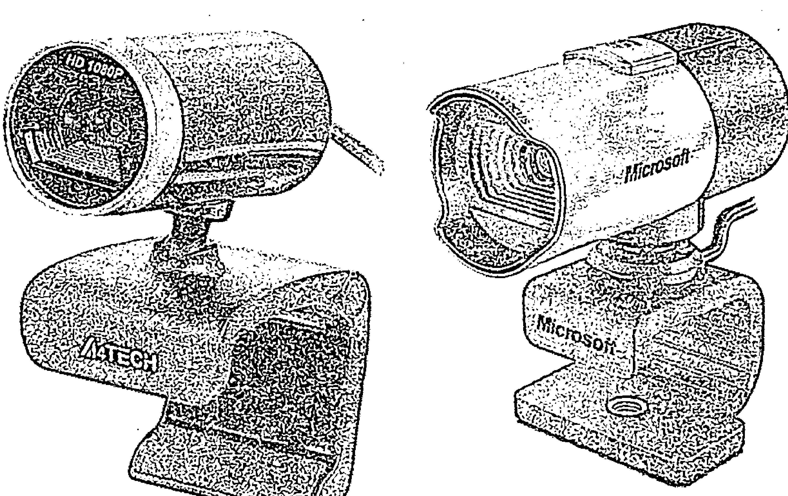

微软梦剧场精英版摄像头

### 麦克风

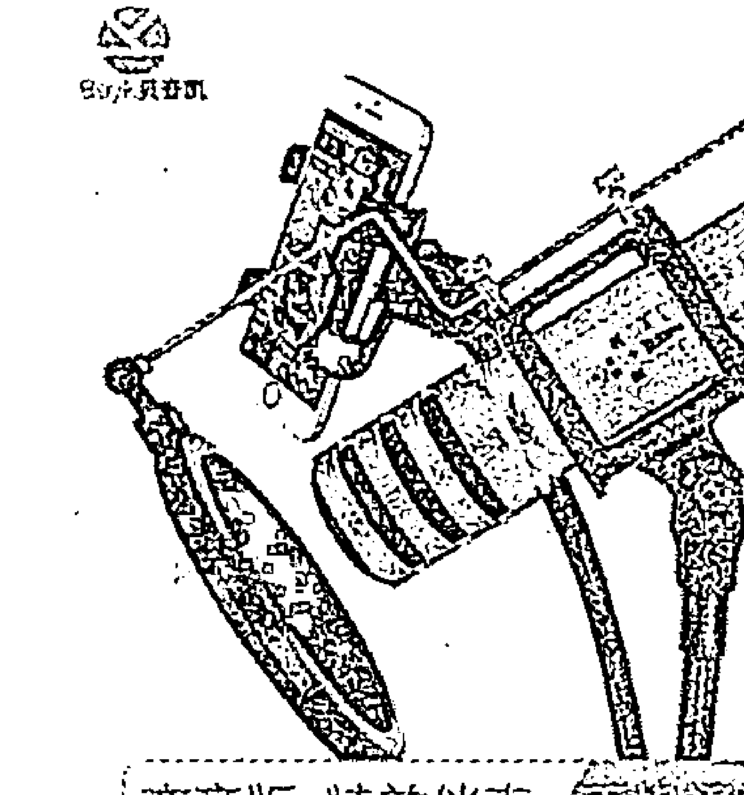

#### 贝音凯B5

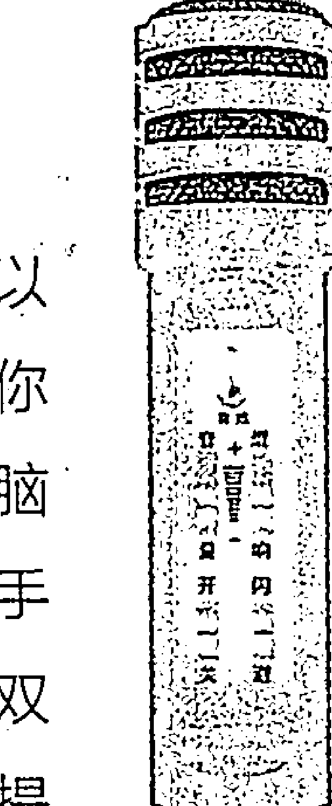

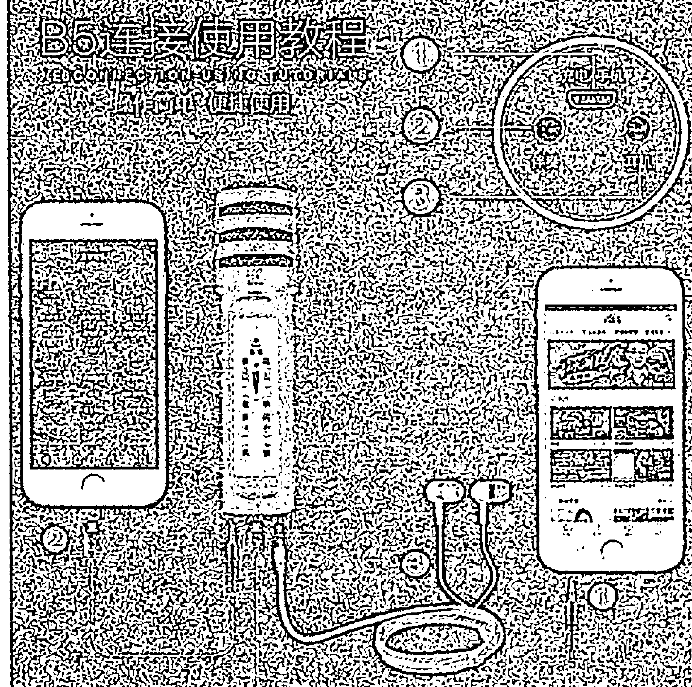

特色：变声迷你话筒
贝音凯B5是一款可以提供比较专业能力的迷你话筒，不仅可以连接电脑固定使用，还很适合与手机结合使用，还可通过双接口同时连接电脑与手机，或者连接双手机进行直播。它提供了6种音效，有男女变音、娃娃音、甜美音等多种变音方式，自带按键可以快速切换声音效果。这款产品的价格也相当不错，仅售149元。

#### 大行WM01

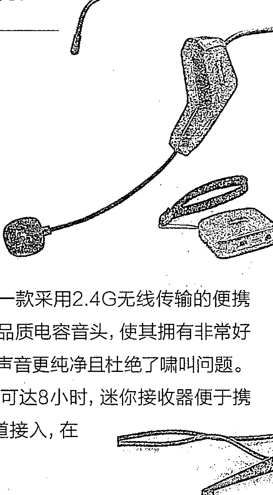

特色：便携头带、无线传输
在很多情况下，例如在歌舞、公开课、运动等直播中，我们还是希望麦克风能够无拘无束地移动使用，在这种情况下，头带式无线耳机是很适合的选择。大行（ASING）WM01是一款采用2.4G无线传输的便携式头带麦克风，更贴近嘴部的高品质电容音头，使其拥有非常好的人声还原效果，强力降噪则让声音更纯净且杜绝了啸叫问题。它采用内置充电电池，续航时间可达8小时，迷你接收器便于携带，拥有多个接口，可提供双声道接入，在K歌等应用中也毫无压力。

对于特别强调音质的用户，也可以考虑选择魅声等更高端的麦克风系统，它们甚至会拥有专业的外置声卡，可以获得更好的拾音能力和特殊音效体验。不过除了价格略高之外，这些麦克风的连接比较繁琐，且需要占用更大的空间，并不适合初级用户。


## 八款值得关注的特色轻薄本

对笔记本电脑而言，便携性永远是最关键的核心卖点之一，哪怕是武装高端独立显卡的游戏本也纷纷开展了瘦身之旅。CFan在2017年第22期曾为大家推荐了九款极具特色的游戏本，本期我们则将目光投向主打便携且更具性价比的轻薄本身上。

### 八代酷睿是必选

如今轻薄本领域正处于六代酷睿、七代酷睿和八代酷睿三世同堂的格局，但就性能而言，八代酷睿i5-8250U就能超越七代酷睿i7-7500U，而且还集成了性能优化且支持4K高清硬解码的UHD620核芯显卡。因此，如果你想挑一款靠谱的轻薄本，八代酷睿处理器平台无疑是必选项(图1)。

### 可以加分的卖点

配置相近的轻薄本为何会出现较大的价差？这个根源主要取决于以下几个方面：一线品牌的价格注定偏高；越轻越薄的机器价格越高；金属材质占比越多价格越高；配备雷电3接口的成本更高；屏幕色域越高价格更高。如果你注重可靠性，那就可优先考虑金属打造的机型；如果你注重便携性，那自然就是越轻盈的产品才好。如何筛选就看我们的实际需求了。

### 不要忽视电池容量

轻薄本采用的硬件平台相同，都是15W TDP的酷睿处理器，屏幕、内存、硬盘（包括独显）的耗电量都是一定的，这就意味着标配电池容量越大，理论续航时间就越持久，可以安心地长时间户外使用(图2)。一般来说，强制核芯显卡运行，40Wh电池的轻薄本续航时间（非游戏环境）普遍都能超过6小时，如何能在更薄的机身里塞进更大的电池，就是考虑厂商技术底蕴的表现所在了(图3)。


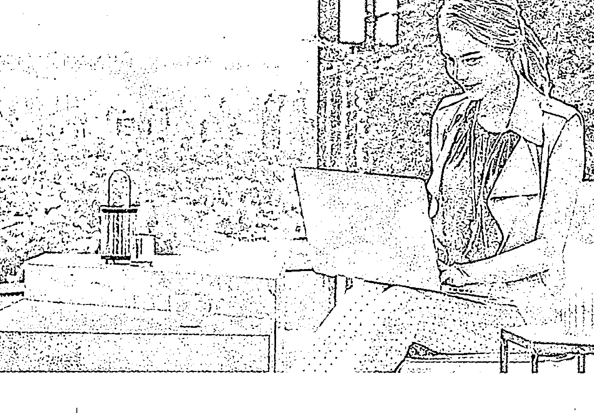

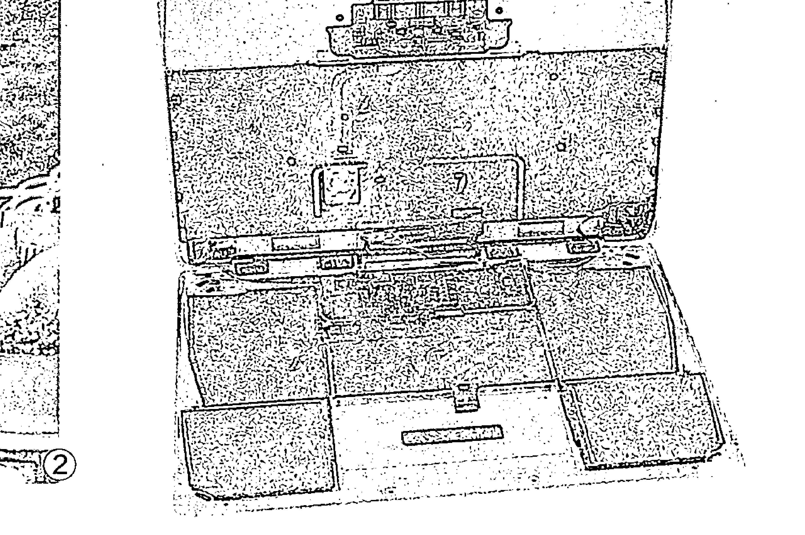

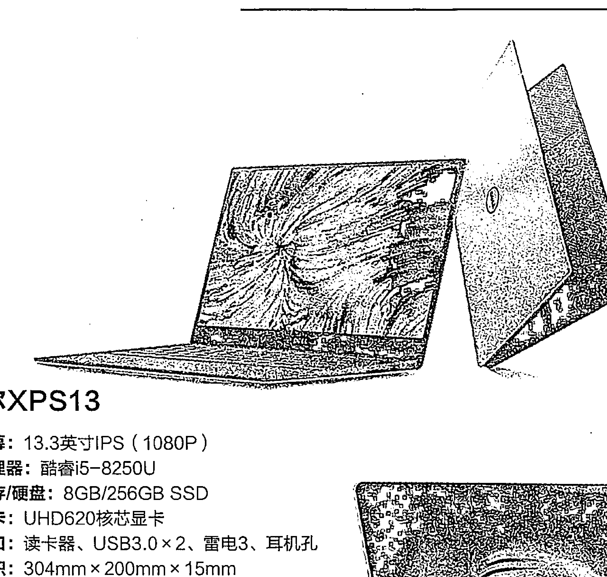

#### 戴尔XPS13

- 屏幕: 13.3英寸IPS（1080P）
- 处理器: 酷睿i5-8250U
- 内存/硬盘: 8GB/256GB SSD
- 显卡: UHD620核心显卡
- 接口: 读卡器、USB3.0×2、雷电3、耳机孔
- 体积: 304mm×200mm×15mm
- 电池/重量: 60Wh/1.2kg

戴尔XPS13是最早以微边框概念为主打的轻薄本，本文涉及的具体型号为XPS13-9360，售价只有7000元出头，相较上代产品有着更理想的性能价格比。原因很简单，搭载七大酷睿i7的上代XPS13售价还要8000元，而八代酷睿i5的性能足以秒掉七代酷睿i7，这意味着新XPS13在价格变低的同时性能却有所增益。虽然新版在外观设计和接口布局上没有变化，但这并不影响新品更值得优先选购的事实。

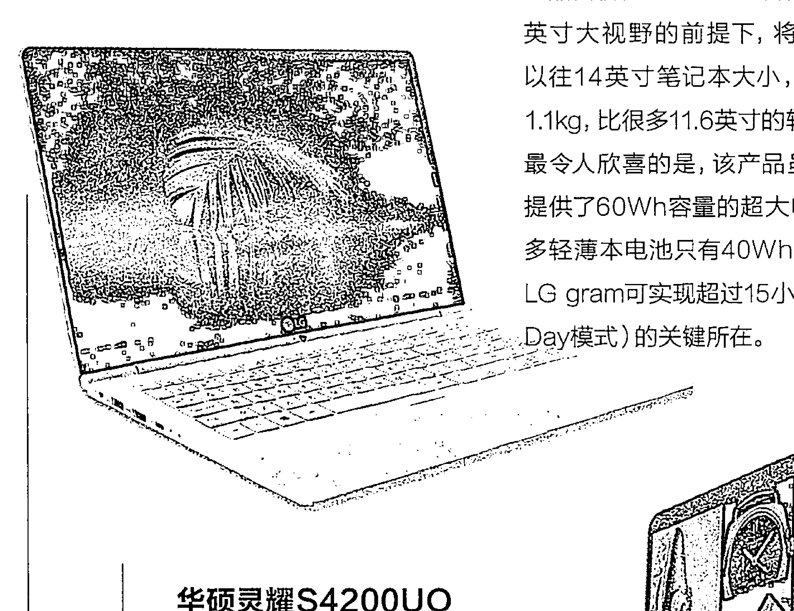

#### LG gram-15

- 屏幕: 15.6英寸IPS（1080P）
- 处理器: 酷睿i5-8250U
- 内存/硬盘: 8GB/256GB SSD
- 显卡: UHD620核心显卡
- 接口: 读卡器、USB3.0×2、USB2.0、USB Type-C、HDMI、耳机孔
- 体积: 357mm×228mm×15.5mm
- 电池/重量: 60Wh/1.09kg

LG gram是最著名的超轻薄笔记本家族，这款具体型号为LG gram 15Z975的产品售价为8000元左右，它在提供15.6英寸大视野的前提下，将尺寸控制到了以往14英寸笔记本大小，重量更是不足1.1kg，比很多11.6英寸的轻薄本还要轻。最令人欣喜的是，该产品虽然轻薄，但却提供了60Wh容量的超大电池，要知道很多轻薄本电池只有40Wh上下，而这也是LG gram可实现超过15小时续航（LG All Day模式）的关键所在。

#### 联想IdeaPad 720S

- 屏幕: 13.3英寸IPS（1080P）
- 处理器: 酷睿i5-8250U
- 内存/硬盘: 8GB/256GB PCIe SSD
- 显卡: UHD620核心显卡
- 接口: USB3.0×2、雷电3、USB Type-C、耳机孔
- 体积: 305.9mm×213.82mm×13.6mm
- 电池/重量: 48Wh/1.1kg

联想IdeaPad 720S是一款售价在6000元出头的超轻薄笔记本，它的特色在于13.6mm厚的机身，以及1.1kg重的轻盈身材。同时，该产品还标配PCIe SSD，磁盘性能非常出色。和上代IdeaPad 710S相比，新品除了升级到八代酷睿以外，还引入了雷电3接口，这意味着它可以接驳外置显卡提升游戏性能，并扩展出更丰富的物理接口。

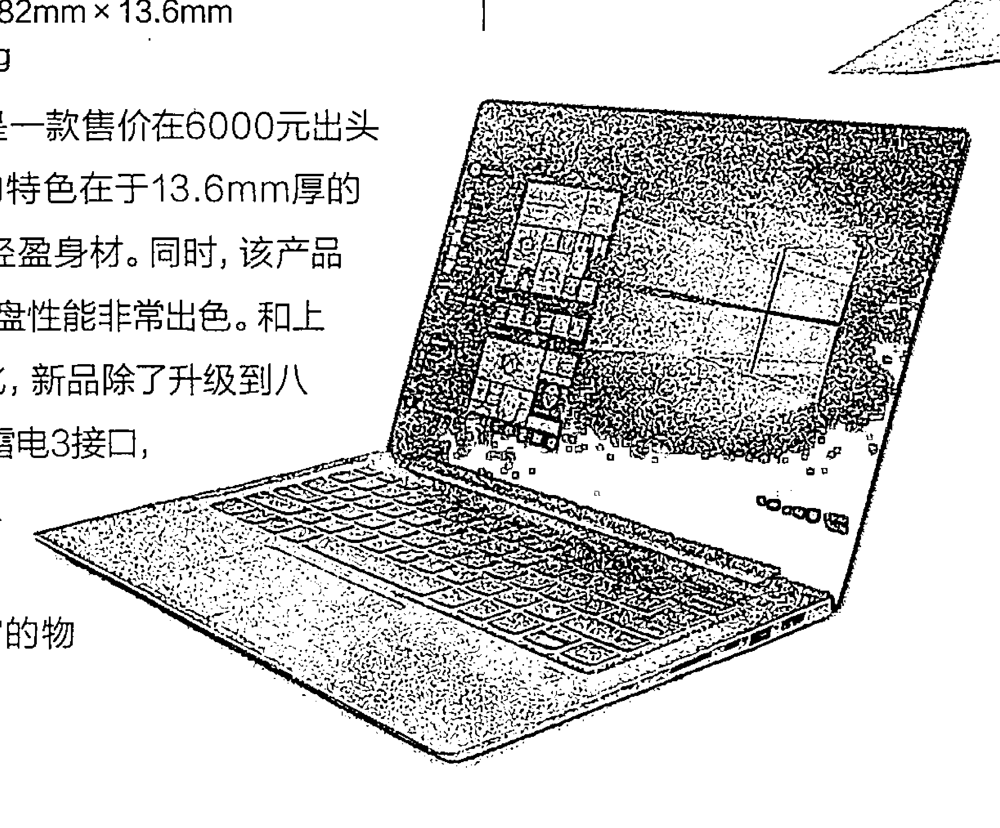

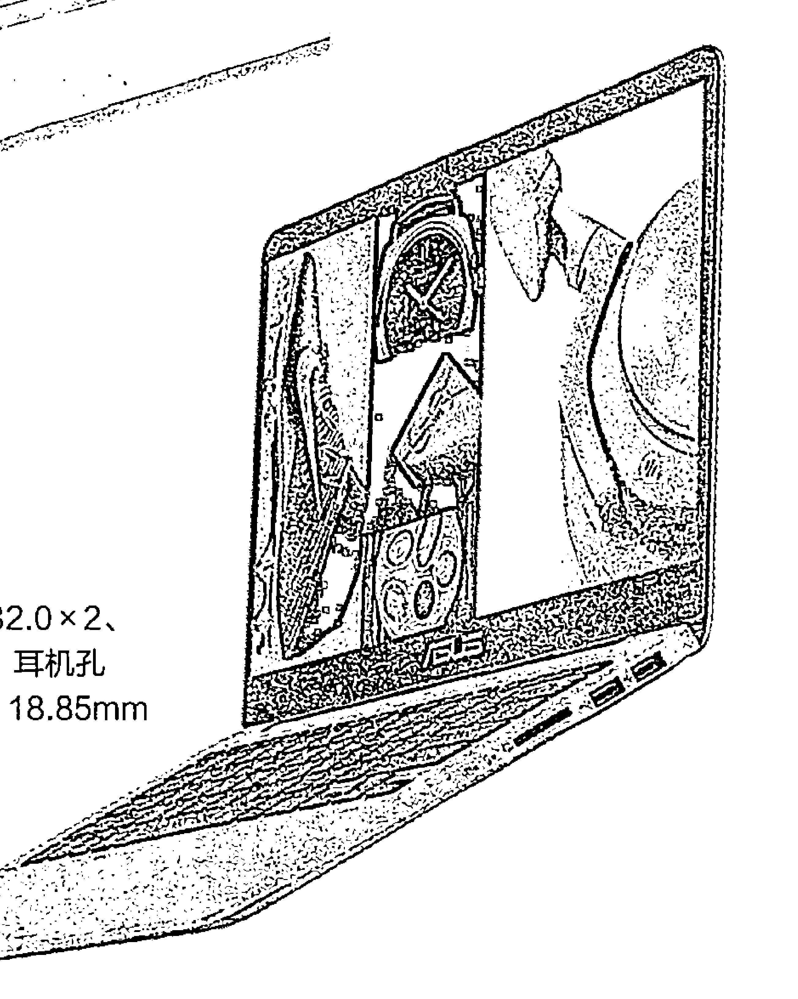

#### 华硕灵耀S4200UQ

- 屏幕: 14英寸IPS（1080P）
- 处理器: 酷睿i5-8250U
- 内存/硬盘: 8GB/256GB SSD
- 显卡: NVIDIA 940MX
- 接口: 读卡器、USB3.0、USB2.0×2、USB Type-C、HDMI、耳机孔
- 体积: 326.4mm×225.5mm×18.85mm
- 电池/重量: 42Wh/1.43kg

华硕灵耀S4200UQ售价约6000元，其特色在于将14英寸屏幕塞进了13英寸机身里，在保持1.43kg体重的前提下还融入了NVIDIA 940MX独显，虽然性能不如最新的MX150，但冲着八代酷睿i5的加持，也聊胜于无吧。如果你预算比较充裕，还可考虑华硕旗下的U4100UN，同样是14英寸+八代酷睿+MX150独显，但厚度和重量进一步压缩到了15.9mm和1.29kg，只是价格也涨到了7000元左右，性价比有所缺失。

#### 海尔凌越S4-X

- 屏幕: 13.3英寸IPS (1080P)
- 处理器: 酷睿i7-8550U
- 内存/硬盘: 8GB/1TB
- 显卡: UHD620核芯显卡
- 接口: 读卡器、USB3.0×2、USB Type-C、miniDP、HDMI、RJ45、耳机孔、MIC孔
- 体积: 329.8mm×225mm×17.8mm
- 电池/重量: 36Wh/1.4kg

海尔凌越S4-X的特色是在5000元价位上就配备了八代酷睿i7-8550U处理器，同时还采用了72% NTSC色域的广视角屏幕，支持4K输出的miniDP接口，性能和显示效果都有保障，而1.4kg的重量也颇为轻盈。不过，这款产品并没有引入窄边框元素，所以别看它屏幕只有13.3英寸，但尺寸却和很多14英寸窄边框轻薄本持平。

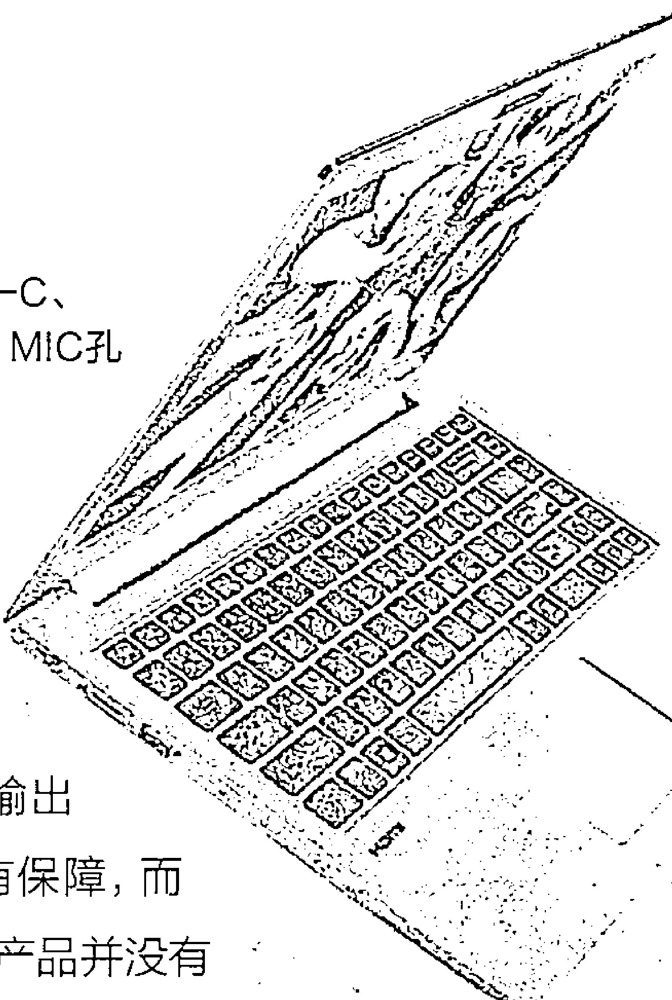

#### 戴尔灵越燃7000 II-14

- 屏幕: 14英寸IPS (1080P)
- 处理器: 酷睿i5-8250U
- 内存/硬盘: 8GB/256GB SSD
- 显卡: UHD620核芯显卡
- 接口: 读卡器、USB3.0×2、USB2.0、HDMI、RJ45、耳机孔
- 体积: 323.3mm×227.1mm×18.95mm
- 电池/重量: 42Wh/1.65kg

作为戴尔第二代灵越燃7000家族成员，灵越燃7000 II在模具上没有变化，最大的改进就是升级到了第八代酷睿处理器，CPU运算性能有了很大的进步。需要注意的是，灵越燃7000 II家族还包含配备NVIDIA最新MX150独显的型号，同时提供2.5英寸机械硬盘（或SSD）和M.2 SSD的双硬盘组合。如果你对游戏性能和磁盘性能/容量有较高要求，那就不妨考虑该家族的高配版，本文涉及的核显版型号售价不足5000元。

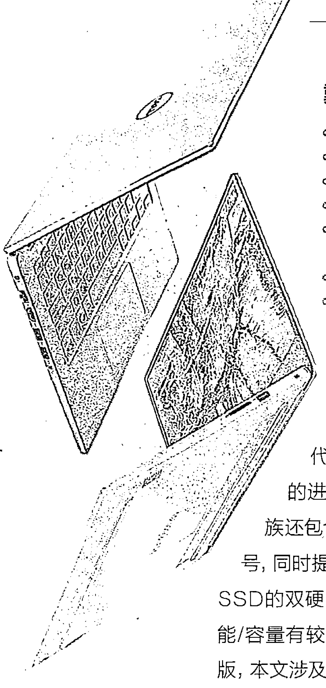

> 如果你对新品牌不感冒，但对八代酷睿+MX150独显的配置感兴趣，还可以考虑小米笔记本Pro和宏碁蜂鸟Swift3-15，它们的售价都在5500元左右。感兴趣的读者可以翻阅CFan之前的内容查看。

#### 惠普畅游人Pavilion 15

- 屏幕: 15.6英寸IPS (1080P)
- 处理器: 酷睿i5-8250U
- 内存/硬盘: 4GB/500GB
- 显卡: NVIDIA MX150 (满血版)
- 接口: 读卡器、USB3.0×2、USB Type-C、HDMI、RJ45、耳机孔
- 体积: 358.9mm×247.3mm×19.9mm
- 电池/重量: 41Wh/1.77kg

Pavilion 15虽然隶属于惠普畅游人家族，但它在设计上却引入了更高端ENVY家族的元素，比如5.3mm的微边框、一体成型的金属机身、独特的翘臀转轴设计。本文涉及的具体型号为Pavilion 15-ck004TX，售价不足4800元。请放心，Pavilion 15内置2个标准的内存插槽和SATA+M.2两个硬盘接口，可供用户后期升级的空间很足。需要注意的是，最低配的Pavilion 15屏幕为1366×768像素，如果你重视显示效果就要避开它。

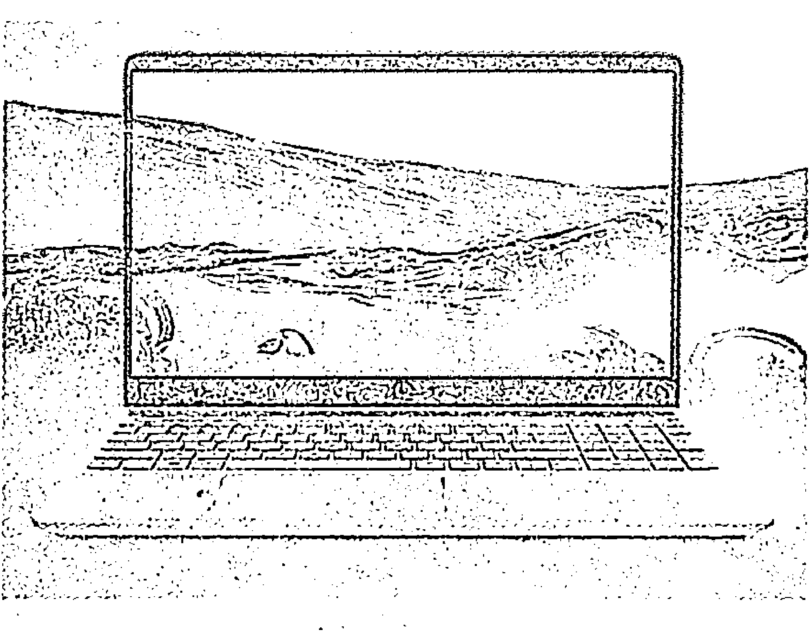

#### 麦本本小麦6S

- 屏幕: 15.6英寸ADS (1080P)
- 处理器: 酷睿i5-8250U
- 内存/硬盘: 4GB/128GB SSD
- 显卡: NVIDIA MX150 (满血版)
- 接口: 读卡器、USB3.0×2、USB2.0、HDMI、RJ45、耳机孔
- 体积: 384mm×270mm×19.8mm
- 电池/重量: 48Wh/1.85kg

麦本本是新兴的互联网笔记本品牌，而小麦6S则是一款性价比颇高的大屏轻薄本，它的起价不足4500元，但却提供了八代酷睿i5和NVIDIA满血版MX150显卡的组合，同时还支持PCIe SSD和机械硬盘的双硬盘模式，1.85kg的重量对一款大屏产品而言也算及格。需要注意的是，小麦6S机身材质为聚碳酸酯，只是通过拉丝喷涂工艺做出了仿金属质感而已。

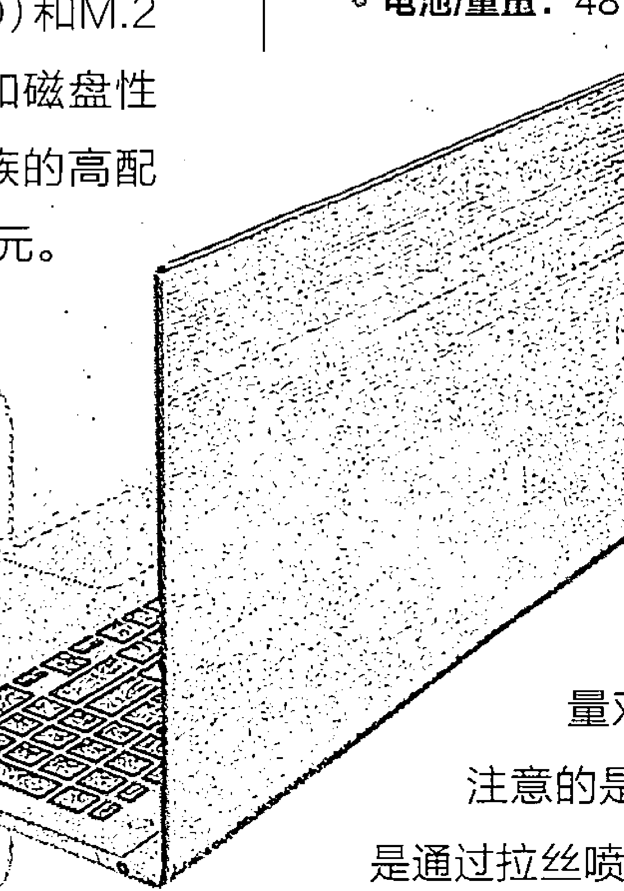