# 电脑爱好者2018合订本（一）

### 2018年1期～6期精华内容集合

邮发代号 82-528
零售价 36.00元

精选每期实用技巧文章，收入内容更多更全；栏目归类深度整合，便捷查阅触手可及

# 电脑爱好者

2018年合订本（一）

## 《电脑爱好者》2018年合订本（一）

- **主管**: 中国科学院
- **主办**: 北京《电脑爱好者》杂志社， 中国计算机世界出版服务公司
- **编辑出版**: 《电脑爱好者》杂志编辑部
- **顾问**: 郭传杰

- **董事长**: 洪京一
- **副董事长**: 熊晓鸽
- **董事**: 万鹏远 许伟明 刘学义
- **社长**: 葛程远
- **出版人**: 许伟明
- **总编辑**: 西浩铭
- **副总编辑**: 张博
- **出版部**: 聂静 (主任)

- **作者**: 《电脑爱好者》编辑部
- **发行总代理**: 北京爱好者文化传媒有限公司
  杨波 (发行总监)
- **读者服务部(发行)**: 手机短信/电话: 13801293315
  (周一至周五 9:30~11:30 13:30~17:00)
- **上门订阅杂志地址**: 北京市海淀区曙光花园智业园A座16D
- **订阅**: 全国各地邮局 (所)
- **编辑部地址**: 北京市海淀区翠微中里14号楼4层
- **邮编**: 100036
- **国内发行**: 北京报刊发行局
- **邮发代号**: 82-528
- **中国标准连续出版物号**: ISSN1005-0043 CN11-3248/TP
- **印刷**: 北京新华印刷有限公司
- **广告经营许可证号**: 京海工商广字20170127号
- **出版日期**: 2018年3月31日
- **法律顾问**: 周涛律师
- **网站**: www.zt148.cn 电话: 13366185341

本书如有印刷或装订质量问题，我们负责调换。
图文版权所有，未经同意不得转载、翻印
定价: 36元

## CONTENTS 目录

## 《电脑爱好者》2018年合订本（一）

[邮发代号 82-528]

## 特别话题

- 注定不凡 高通骁龙会改变什么 7
- 科技向前看 展望2018 17
- 不止网速快 技术会改变什么 23
- 回忆杀 用模拟器怀念老游戏 34
- 跳动的心 解读移动处理器性能差距之源 43
- 即插即用加即走 移动外设大点兵 54
- 透过CES2018 把脉移动PC市场 60
- 选Pad看心情 Android平板电脑用的都是什么芯 70
- 除了迅雷我们还能用什么 主流Windows下载软件简测 82
- 无解难题? 手机为何越来越慢 94

## 系统应用

- 要雅致 让你的回收站搬搬家 104
- 四个案例掌握Windows命令用法 106
- 解决Windows 10创意者更新的两个小问题 108
- 安装Windows 10创建分区错误怎么办 109
- 多途径有效拦截Edge广告 110
- 创建隐藏式桌面右键菜单 112
- 免第三方 创建密码保护文件夹 114
- Windows 10文件预览步步高 116
- 集中管理 快速找到Windows 10设置 117
- 用好Windows 10家庭组 118
- 文件或文本无法拖放巧解决 120
- 用好Windows 10存储感知 121
- 五条技巧帮你快速使用Windows 10 122
- 微软工程师帮助系统运行更快速 124
- Windows 10多系统菜单怎么玩 126
- 跟踪监视系统或文件的细微变化 128
- 排查故障 如何开启引导日志 130
- 巧借系统路径 管理绿色软件 131
- 建立与解读笔记本电池健康报告 132
- 解决WMI进程资源占用的问题 133

## 软网生活

- 营造专心致志的写作环境 134
- 给系统防火墙找一个好帮手 135
- 超强密码的产生与记忆 136
- 高清数码照快速网用不失真 137
- 绝对无捆绑 系统优化一条龙 138
- 不用装软件 网页浏览器快速划词翻译 140
- 一键清除照片中的“电灯泡” 141
- 应用程序直访坚果云文件 142
- 巧用照片库进行产品推广 144
- 扩展无限 让资源管理器“下岗” 146
- 由明转暗 BAT批处理瞬间变身EXE 148
- 快速预览Photoshop格式文件 150
- 另类方式调整系统音量大小 151
- 多快好省 图片批量压缩和转换 152
- 聚合搜索需要的网络音乐 153
- 系统内存优化就这么简单 154
- 借扩展“管”好浏览器的标签页 156
- USB随身盘变身电脑锁 157
- 资源管理器直连Android文件夹 158
- 文件处理“多对一”或“一对多” 160
- 卸掉难缠的显卡驱动程序 162
- 图片压一压 在线传更快 163
- 打造安全战线 密码从创建到管理 164
- 用好Windows 10的TimeLine 166
- 我的百度网盘我说了算 167
- PC端快速搭建分享系统 168
- 双管齐下 过滤Windows 10广告 169
- 屏幕视频免费录制 170
- 禁用一切 优化无限 172
- 为出借的论坛账号保护隐私 173
- 快速获取系统软件图标 174
- 在线录像就这么简单 175
- 清晰透视 文件夹大小一眼看清 176
- 串通一气 不同浏览器共享收藏夹 177
- 增强删除 文件清理自动化 178
- 打造最顺手的工作文件夹菜单 179
- 浏览器维护 一举三得 180
- 绿色安全 全面清理广告 181
- 快捷组合+特殊插件 解决纯文本处理难题 182
- 火绒扩展解决系统大问题 184
- Windows 10也能制作多媒体相册 186
- 请个函数计算器 超级迷你还免费 187
- 借助外援 加强Windows 10进程管理 188
- 文件有变化 设置提醒早知晓 190
- 分享图文限制多 多平台制作工具来帮忙 192
- 装驱动要快 但不要附加条件 194
- 清晰透视 磁盘使用情况一目了然 195
- 用幻灯片方式播放PDF 196
- 离机管理 文件资料方便查 197
- 云端同步文件巧管理 198
- 全新下载软件的另类下载 199
- 快速找回闲鱼网页版的搜索框 200
- 自动推送与网站匹配的脚本 201

## 办公世代

- 不走寻常路 制作“字中字”特效图 202
- Excel中轻松制作员工档案查询 204
- 再杂也无惧 在Excel中高效提取数字 206
- 五颜六色 使用PPT制作霓虹效果 208
- 分合相宜 透视报表生成分页和汇总报表 210
- 就地取材 使用PPT制作Cinemagraph图片 212
- Excel免代码汇总文件档案目录 213
- 制作更炫酷的下拉菜单 214
- 制作Excel滑珠式图表 215
- 酷炫到底 玩转PPT的3D动画 216
- 另辟蹊径 快速设置PPT动画效果 218
- 再多也不乱 制作按需显示的折线图 220
- 查哪显哪 制作高亮显示查询单元格 222
- Excel巧设置 拒绝零显示 224
- PPT中跷跷板动画巧实现 226
- 用PPT制作玻璃质感字 227
- 巧用边框底纹制作别样插页 228
- 使用更便捷 私人定制Word菜单 230
- 特殊问题特殊符号解决 232
- 轻松制作酷炫柱形进度图表 234
- Excel多工作表汇总简单实现 235
- 不用图表控件 制作条形图表 236
- 高效如风 Excel表格批量导入图片 237
- PPT图表也能实现交互效果 238
- 制作模糊查询效果下拉菜单 240
- 一列转多列 轻松制作表彰名单 241
- PPT中制作仿窗口弹出效果 242
- PPT中粒子动画巧制作 243
- 制作Excel多重交互式图表 244
- 若明若暗 制作PPT高光效果 246
- PPT中线条的那些套路 248
- 在PPT中制作浮雕字与流光字 250
- PPT中巧制七彩荧光字 251
- 用好WPS多维度复合排版 252
- 不走寻常路 玩转PPT的Logo设置 254
- 虚拟打印意料之外的妙用 256
- 对症下药解决公式出错难题 258
- 用下拉菜单选择定位单元格 260
- Excel数据区域巧美化 261
- 让Excel图表对比更轻松 262
- 小巧装饰物件 PPT轻松制作 263
- Excel自动筛选有高招 264
- 用布尔运算为PPT添特效 266
- 不再怕字多 玩转文字型PPT排版 268
- 不用控件也能制作交互式图表 270
- 温度计式图表巧制作 271

## 移动新天地

- 挖掘潜能 让微信成为生活小助手 272
- 华为手机故障 四种自救方法不容错过 273
- 聪明反被聪明误 WLAN为什么不等于Wi-Fi 274
- 错误设置引发尴尬 教你修复负一屏的功能 276
- 恢复华为手机的“游戏助手” 277
- 不会拼音？打字用说的就成了 277
- 教你查看通过QQ/微信登录的网站和应用 278
- 快速将视频转换成漫画样式 279
- 谷歌应用让Android系统运行更加稳定 279
- 防范手机被盗账号丢失 280
- 用标签来管理手机图片 282
- 为自己的图片添加个性水印 282
- 快速收录自己需要的信息内容 283
- 在手机通知栏批量查看未读微信 283
- 扫描翻译记录 一款APP全部搞定 284
- 告别繁琐的验证 语音也能登录微信 285

## 傻博士

- 傻博士 286

## CFan为你选

- 二合一的较量 联想MIIX520 PK 戴尔魔方7000 316
- 高端全面屏新机的较量 荣耀V10 PK 一加手机5T 318
- 什么值得买 该入手巨屏笔记本吗 320
- 八代酷睿的对手来了 AMD锐龙笔记本应该怎么选 323
- 笔记本里的“小钢炮” 雷神ST PK 戴尔游匣7000-14 326
- 均衡全面屏新秀的较量 手机N6 PK 红米5 Plus 328
- 都是全面屏手机 差别在哪里 330
- 升级派的较量 华为MateBook D PK 惠普Pavilion 15 334
- 主流之争 国美U7 PK 华为畅享7S 336
- 线下买全面屏手机 选绿OPPO还是蓝vivo 338
- 游戏之争 拯救者R720 PK 微星GL62VR 342
- 安全和时尚的较量 金立M7 PK 华为nova 2S 344
- 不要忽视细节 选购笔记本的六项注意 346
- 拒绝平庸 这些手机都有无法抗拒的诱惑 349
- 满血MX150的诱惑 宏碁炫6 PK 神舟战神X5 352
- 性价比之争 魅蓝S6 PK 荣耀9青春版 354
- 逆水行舟 盘点超值16：9屏幕的传统手机 356
- 用好身材迎接春天 健身小帮手 359
- 锐龙遇到酷睿 联想720S PK 小米Air 13四核版 362
- 微边的艺术 寻找“性感”的一体电脑 366

# 王者不凡！高通骁龙会改变什么

策划 《电脑爱好者》编辑部

2017年底，高通在美国夏威夷召开了第二届骁龙技术峰会。这一次，高通不仅携手微软、惠普、华硕和Sprint等产业链合作伙伴推出了主打“Always Connected PC”的笔记本，欲与英特尔分羹移动PC领域的蛋糕，还正式发布了具备更强性能动力的骁龙845移动平台，为2018年度的智能手机带来了无限可能。

官方称为“骁龙移动平台”

可以说，如果你想提前了解2018年移动PC和智能手机的风向标，从这一届骁龙技术峰会中就不难看出端倪。本期特别话题，就让我们透过峰会一探究竟吧。

## Always Connected PC

### 骁龙牌笔记本欲乘风破浪

高通公司诞生于1985年，这一年英特尔（1968成立）已经17岁了。两家企业一个始终维持着对PC半导体芯片领域的绝对统治，一个见证并引领着移动通讯市场走向辉煌，原本是两道很难交集的平行线，却最终将在移动PC市场展开激烈的碰撞。

### 高通的下一站：移动PC

提起高通，大家肯定会想到智能手机领域最著名的骁龙处理器（图1）。那么，作为在手机领域呼风唤雨的高通，为何要挤进已经陷入颓势的PC领域呢？

### 高通的红利受到挑战

对高通而言，其主要的盈利来源就是骁龙移动平台的销售，以及在CDMA、3G/4G通信技术方面的专利授权费用。然而，随着智能手机在全球范围的普及，无论是欧美还是我国都进入了换机量微涨的时代，除了部分发展中地区还有潜力可挖，智能手机销量增幅已现瓶颈。

同时，苹果、三星、华为（麒麟）、联发科和小米（澎湃）也都在研发移动处理器（图2），而高通按照整机收取专利费用的方式也遭遇了很多企业的不满，比如苹果就逐渐用英特尔的调制解调器取代高通芯片（图3），减免自认不合理的专利开销。在这个大环境下，高通的盈利模式已经触及天花板，所以急需寻找新的生财之道。

在新兴的智能家居、穿戴式设备、物联网、车联网等设备形成规模之前，成熟的移动PC市场（主要以笔记本和二合一设备为主）就成为了高通锁定的目标。

## 特别话题

### 从概念到现实的产品

根据很多第三方调研机构的数据显示，国内外笔记本用户的最大痛点就是随时随地接入互联网，同时拥有真正全天候级别的续航时间。为了实现这个目标，微软在2016年底就找到了高通，联合开发了一套全新的X86模拟器，并在骁龙820移动平台上安装Windows 10操作系统，完美运行《坦克世界》、播放4K视频、运行Office 2016等应用。

经过近一年的时间准备，“骁龙牌笔记本”已经从概念过渡到了现实阶段（图4），在骁龙技术峰会上，华硕和惠普终于正式推出了基于高通骁龙835移动平台和Windows 10 S系统设计的笔记本电脑NovaGo以及Envy X2，从这两款产品身上我们不难把脉出未来“骁龙牌笔记本”的特性。

### 华硕NovaGo：翻转视界

华硕NovaGo是一款屏幕可翻转360度的笔记本（图5），产品形态和联想Yoga、惠普X360等X86平台变形本相似。NovaGo是华硕首款千兆级LTE网络二合一笔记本，它集成了骁龙X16调制解调器，支持Nano SIM卡和eSIM卡，利用4×4MIMO、4载波聚合以及256QAM调制技术，下载速率可达千兆。

ARM架构的骁龙835可以让NovaGo获得22小时的超长续航时间，或长达30天的待机能力。此外，华硕NovaGo提供4GB+64GB和8GB+256GB两个存储组合版本，售价分别为599美元和799美元，约合人民币3963元和5286元，和市面上搭载英特尔酷睿M平台的二合一笔记本持平。

# 惠普Envy X2：分体打天下

惠普Envy X2是一款和微软Surface Pro相似的分体式二合一笔记本(图6)，其屏幕本身就是一款12.3英寸的平板电脑，采用超轻薄的CNC加工铝合金机身(6.9mm)和无风扇设计。与其配套的键盘则采用牛津布蓝色皮革质感外壳包裹，并集成可110度至150度调节的支架。这款产品同样支持千兆级的网络体验，内置最高8GB内存和256GB存储空间，续航和待机时间分别为22小时和29天。

## Always Connected PC诞生

“Always Connected”是骁龙笔记本主打的口号，意为“永远在线”（“始终连接”或“全时连接”）。高通并不是第一个提出这个概念的厂商，但却真正打造出了Always Connected PC设备(图7)。

## 永远在线PC的进化史

Always Connected是一个与时俱进的词汇。2003年，英特尔推出迅驰移动计算技术，将无线网卡纳入标准配件的目的，就是让笔记本可以摆脱网线，在更多场合都能保持Wi-Fi网络连接；随后，小巧廉价的上网本崛起，它可以让用户以更小的开销就能轻松携带设备享受上网冲浪的乐趣；超极本的诞生，对便携性、性能和续航时间进行了更严格的定义，也成为了现代超薄本、二合一设备的雏形。在手机还用2G上网的年代，支持Wi-Fi的轻薄长续航笔记本就算是永远在线了。

Lenovo Miix 520 Windows® 10 2-in-1 detachable

Miix 520 for the Consummate Professional When it comes to business professionals understanding and embracing digital technology. being slow-to-adopt is not an option. Digital technologies are no longer a nice-to-have, but a must-have business tool. Regardless of whether you own, manage, work for, or are considering starting a business, the Miix 520 is a powerful toolbox through which modern digital tools and trends can be tested, understood, and put to work. And its thin, 2-in-1 detachable form factor and optional, secure always-on LTE1 connectivity make it possible to access, produce and edit your work - in the PC and in the cloud - from any location.

Miix 520's optional LTE is designed for anywhere, always-on connectivity¹

而真正将“Always Connected”标准纳入规范的，则要数惠普Probook 400系列、三星Galaxy Book 12系列、联想ThinkPad L470/Miix 520系列、谷歌Pixel Book系列以及小米笔记本Air(LTE)等。这些设备有一个共同的特点，就是集成3G或LTE上网模块(图8)，可以在没有Wi-Fi的环境下使用数据流量上网，真正做到了“永远在线”。

但是，这种在线有个前提条件，那就是“在电池还有电的情况下”。在X86架构处理器一统PC江湖的时代，哪怕是TDP低至4.5W且集成度最高的酷睿M平台，也需要外挂3G或LTE上网卡，想保持轻薄身材，续航时间普遍还很难超过12小时大关。

## 来自骁龙之芯的骄傲

骁龙835是一颗真正的SoC，它直接整合了X16调制解调器，无需外挂基带芯片就能使用4G上网。同时，基于10nm工艺以及ARM架构先天的低功耗特性，让搭载骁龙835的笔记本可以完全丢掉散热风扇，只需要简单的热管结构就无需担心过热降频，超高的集成度可以进一步压缩PCB主板，节省出的空间可塞进更大的电池或选择进一步瘦身（图9）。

就以NovaGo和Envy X2为例，基于X86平台且和它们身材相似的产品并非没有，但超过20个小时的续航时间，以及接近一个月的待机能力（官方数据）却是X86平台设备只能仰望的存在。按照高通的描述，当PC遇到骁龙835，它们将获得如下增益：

- 屏幕即时使用（Instantly On）
- 永远在线（Always Connected）
- 数以周计的续航（Week of Battery Life）
- 新的工作模式（New Culture of Work）
- 更加安全（Better Security）
- 更低的花费（Lower Costs）（图10）

换句话说，骁龙笔记本将被赋予诸多智能手机的优秀特点，比如它能通过4G网络随时随地联网而摆脱Wi-Fi的限制；长期不使用时无需选择关机，合上屏幕进入待机即可，重新唤醒所需等待的时间就好比点亮手机屏幕，哪怕关机再开机时的启动时间也大幅缩短。

而这些，就是高通决定杀入PC市场的最大动力。高通认为，虽然笔记本市场正在萎缩，但对高通而言这却是一个100%增长的全新领域。同时，移动端SoC的制程工艺正在超越PC，而全球消费者在使用各种电子设备时的习惯也正深受着智能手机的影响，所以整个行业都需要重新思考PC端应该做出怎样的改变。在这个大环境下，高通想做的正是联合产业链合作伙伴，利用移动平台的技术优势和积累的用户习惯去反向影响PC，促使现代PC的使用体验发生变革（图11）。

Always Connected则是第一步，也是骁龙笔记本区别于X86平台设备的核心优势。

### ARM和X86架构

PC处理器都基于X86架构设计，其指令集叫做CISC（复杂指令系统计算机），指令系统非常丰富，对操作发出的指令具有针对性，执行效率更高；智能手机处理器基于ARM架构设计，指令集称为RISC（精简指令集计算机），特点是针对常用的命令进行优化，赋予了更简洁的执行环境。从根本上二者的出发点就不太一样，X86追求大而全，ARM追求小而精。就性能而言，X86远超ARM，但后者可以更容易针对常见需求进行优化调整，比如播放4K高清视频时，ARM在保证流畅播放的前提下还能不太耗电。

### SoC是趋势

为了迎合移动PC永远在线的发展趋势，英特尔也在加速移动处理器的SoC化。比如，在全新的14nm低功耗Gemini Lake平台，以及还未正式发布的10nm Cannon Lake和Gemini Lake平台上引入CNVi（Connectivity Integration Architecture）单元，即可将CPU、核显GPU、芯片组、Wi-Fi、蓝牙和调制解调器模块（3G/LTE）整合进一整套SoC，从而降低整体功耗、缩减主板布局、解放出更多PCIe和USB通道。随着英特尔10nm工艺和4G/5G调制解调器技术的成熟（图12），打造出一颗能实现Always Connected的X86低功耗芯片并非不可能。

## 骁龙笔记本的隐患

虽然骁龙笔记本有着低功耗和长续航的特色，但它能否在众多X86轻薄本和二合一设备前辈的围追堵截中杀出血路，还有着很多不确定的因素。

## Windows 10后面有个S

骁龙笔记本有一个非常鲜明的特色，虽然内置的骁龙835属于ARM架构，但却可以完美安装Windows 10，并非微软多年前为ARM处理器定制的Surface RT系统。这意味着，骁龙笔记本可以运行我们熟悉的Win32程序。

但是，细心的读者可能已经注意到了，在骁龙技术峰会上发布的NovaGo和Envy X2预装的操作系统都是Windows 10 S（图13），正是因为“S”这个后缀，对骁龙笔记本的前景产生了影响。

Windows 10 S是微软在2017年5月推出的新版系统，最早安装在Surface Laptop身上。我们可以将它视为针对教育市场而生的简化版Windows 10 Pro，它精简/限制了很多配置、服务和功能，从而明显降低运行期间的系统负载，提高了开关机速度和启动应用的响应时间。而该系统在体验上则有一个极大的限制，那就是不再支持Win32（.exe）格式文件的安装，所有应用程序必须通过应用商店统一下载UWP应用（图14）。

问题来了，很多我们熟悉的软件都没有被微软应用商店收录，骁龙笔记本如果不能像Surface Laptop一样将Windows 10 S升级到Windows 10 Pro，那其兼容性和可玩性将大打折扣。

### 执行效率有所折扣

在骁龙技术峰会上，高通承认骁龙835驱动的笔记本在运行速度上不如英特尔和AMD处理器，原因是ARM处理器在运行为X86架构处理器打造的Win32程序时需要通过微软开发的抽象层和模拟层（图15），无法实现100%的代码直接编译。ARM架构本来的性能就不如X86，再加上执行效率的耗损，实际表现更是雪上加霜。

高通表示，1.4秒相比1秒是落后了40%，但很多用户却难以察觉，所以这种执行效率上的差距并无大碍。不过高通也指出，对于敏感的消费者或者发烧玩家来说，这种体验上的差距还是比较明显的。所以想用骁龙笔记本替代传统X86平台的性能级笔记本是不太现实的，繁重的需要足够生产力的任务和游戏环境还是需要X86处理器和独立显卡完成，而轻量化和娱乐应用才是骁龙笔记本的主菜。

换句话说，骁龙笔记本的主要竞争者，是搭载酷睿M平台的追求极致轻薄设计的超薄本和二合一设备。

## 资费是最大门槛

永远在线固然是好事，但想安心享受这一待遇的前提是，需要办理足够的流量套餐。由于 Windows 10系统并没有集成智能手机领域早已普及的、可指定某个APP能否使用数据流量的功能，无论是系统更新、后台应用的联网消耗都是非常可观的。因此，如果骁龙笔记本在国内上市，建议大家选择每月至少 5GB以上的流量套餐，并在网络设置中勾选“设为按流量计费的连接”选项(图16)。

## 携手AMD 让移动锐龙也能随时在线

和英特尔X86架构的酷睿家族相比，高通ARM架构的骁龙835有着先天不足，很难染指更高性能的PC市场。那么，高通就只能眼睁睁地放弃吗？答案自然是否定的，因为高通找来了一个好盟友，英特尔的“万年死敌”——AMD。

## AMD的大动作

在沉寂多年后，AMD在2017年可谓惊喜不断，Ryzen处理器和Vega显卡的出现让英特尔和NVIDIA深感压力，锐龙移动处理器(第八代APU)也终结了“i3秒全家”的尴尬历史。同时，AMD还展开了一系列令人瞠目结舌的合作，比如和英特尔携手打造“联合处理器”：英特尔贡献Coffee Lake-H架构的处理器核心，而AMD则提供了基于最新Vega架构专门定制的Radeon GPU单元，二者之间通过PCI-E 3.0高速总线互连，让轻薄本和二合一笔记本实现CPU和GPU的完美平衡。

## 你出芯 我出网

既然AMD都能与英特尔合作，其与高通携手就更在情理之中了，毕竟敌人的敌人就是朋友。在高通骁龙技术峰会上，AMD正式宣布要与高通合作生产Always Connected Ryzen Mobile产品。简单来说，AMD和高通要携手打造随时在线的高性能笔记本平台。其中，AMD提供高性能的锐龙移动处理器，而高通则贡献最新的骁龙LTE调制解调器解决方案(图17)。

锐龙移动处理器由Ryzen CPU和Vega GPU构成，性能足以比肩同档次的英特尔第八代酷睿处理器(U系列)，在性能上不留遗憾。而骁龙LTE调制解调器则可带来最新的无线网络技术支持、超快的LTE下载速度、信号较弱时的卓越速度和更低的耗电，让基于锐龙移动处理器打造的笔记本(包括二合一设备)在联网过程中也能获得更持久的续航能力。

总之，如果你期待笔记本电脑能够全天候待命，并能在全球都享受到最快的LTE连接，那么骁龙笔记本比任何笔记本都更适合你；如果你需要永远在线，还需要更强的性能动力，基于锐龙移动处理器和骁龙LTE调制解调器的产品则不会让你失望。

## 全面进化 骁龙845立Android新标杆

除了骁龙笔记本，高通在骁龙技术峰会上还释放了一枚重装炸弹，它就是骁龙845，一颗注定成为2018年度Android领域新标杆的“心脏”（图1）。那么，和我们熟悉的骁龙835、麒麟970相比，高通的最新旗舰特色何在？下面就让我们走进骁龙845的世界。

## 性能升华 骁龙845的翻天变化

作为骁龙835的升级版，骁龙845将承载高通未来一年所有的移动梦想，所以它从工艺、架构、网络、安全到功能等模块都进行了优化升级（表1）。

| 项目 | 骁龙845 | 骁龙835 |
| --- | --- | --- |
| 制程工艺 | 三星10nm LPP FinFET | 三星10nm LPE FinFET |
| 核心架构 | 四核Kryo 385 (2.8GHz)<br>四核Kryo 385 (1.8GHz) | 四核Kryo 280 (2.45GHz)<br>四核Kryo 280 (1.9GHz) |
| GPU | Adreno 630 | Adreno 540 |
| 内存/存储 | LPDDR4X/UFS2.1 | LPDDR4X/UFS2.1 |
| ISP | Spectra 280 | Spectra 180 |
| DSP | Hexagon 685 | Hexagon 682 |
| 视频采集 | 4K UHD@60fps | 4K UHD@30fps |
| 视频回放 | 4K UHD@60fps | 4K UHD@60fps |
| 快速充电 | QC4.0+ | QC4.0 |
| 调制解调器 | X20 LTE<br>1200Mbps下行<br>150Mbps上行 | X16 LTE<br>1000Mbps下行<br>150Mbps上行 |

## 工艺和架构的进化

和骁龙835相比，骁龙845借助三星第2代10nm LPP工艺的优势，将最高主频从2.45GHz拉高到了2.8GHz，同时核心架构也从由Cortex A73/A55魔改而来的Kryo 280升级到了由Cortex A75/A55魔改而生的Kryo 385（图2）。此外，骁龙845通过全新的DynamIQ丛集技术取代了传统的ARM CCI互联，现在每颗核心都有了独立的L2二级缓存，还可直接共享三级缓存进行信息交换（图3）。
按照高通的数据显示，骁龙845的CPU大核性能较骁龙835提升了最高30%，小核性能提升了15%，功耗降低10%。在GPU层面，骁龙845从Adreno 540升级到了Adreno 630，官方给出的整体性能提升比例为30%。照此计算，骁龙845的整体性能应该可以战平苹果A11 Bionic，稳居Android处理器“一哥”的地位。

## 更好的多媒体表现

DxOMark的评分是业内普遍认可的评判手机拍照水准的数据，而高通希望更多的智能手机能在骁龙845的帮助下取得100分以上的DxOMark成绩，而高通的底气就源于全新的Hexagon 685和Spectra 280单元。
其中，Spectra 280支持捕捉高达64bit高动态范围色彩，还能进行最高1600万像素60fps的多帧合成，弱光拍照和拍摄UHD视频时的效果更加出色（图4）。而Hexagon 685不仅可以充当协处理器的作用（代替CPU做传感器数据记录等日常工作来降低功耗），借助第三代HVX（Hexagon Vector Extensions，向量扩展）技术可以进一步优化多张照片合成来提升画质的算法。

## 更完美的网络参数

继骁龙835实现千兆级下载速度之后，骁龙845集成了第二代千兆级X20 LTE调制解调器，可提供每秒1.2Gbps的下载速度，支持双卡双VoLTE、5CA载波聚合和4×4MIMO，网络规格短期内无人可比。骁龙845还支持最新的802.11ad Wi-Fi技术(图5)，而蓝牙也在5.0的基础上加入了高通自家的TrueWireless功能，支持一对多传输，最高可节省50%的功耗。

## 这一次 有了内置安全加密芯片

熟悉金立手机的读者朋友肯定非常熟悉一句广告：“金立XX，内置安全加密芯片”。这一次，骁龙845在SoC中也增加了独立的硬件隔离子系统——安全处理单元(SPU)。以后，凡是内置骁龙845的手机，潜台词就是“我已经内置了安全加密芯片”。

### 愈演愈烈的安全战

如今智能手机已经不再是单纯的电话、聊天、视频和游戏工具，现实中它还担负着银行理财、移动支付等与财产息息相关的重任(图6)。在过去，我们的解锁密码、指纹及其他敏感信息都属于软件层面的加密，理论上存在被黑客截取的风险。

### 内置安全加密芯片

为了保障移动支付的安全，骁龙845在CPU中传统的软安全区(HLOS)和硬安全区(TrustZone)之外还增加了全新的SPU(图7)，这是一颗与CPU、GPU、ISP和DSP单元同级别的模块，其自身具备独立的供电，拥有自己独立的运行OS、缓存甚至是电源管理系统，可于CPU和GPU之外进行独立运算。我们的指纹、虹膜、语音、人脸等生物识别信息，通过软件以及硬件双重加密后都被保存在SPU之中。由于SPU位于芯片本地，无需担心生物信息被云端读取，安全系数堪称无敌。

当然，SPU也支持Android 8.0的密钥储存，当我们对本地文档、APP和视频进行加密后，这些密钥也会保存在SPU里，相较传统的CPU软件加密、TrustZone加密具备更高的安全级别。此外，SPU还能对大量文档提供一个单独的密钥进行加密，进一步提升了破解的难度，即便是某一个文档被破解也不会对其他文档造成影响。

## AR、VR已过时？XR概念浮出水面

AR和VR并不是什么新鲜的概念，每年都在说“AR元年”或“VR元年”，但至今VR和AR也没能呈现真正的爆发之势，市面上最常见的VR眼镜也仅仅是初级应用而已。就在VR和AR风潮陷入低迷之际，高通却通过骁龙845带来了更新奇的XR体验(图8)。

### XR=AR+VR+MR

我们可以将XR理解为AR、VR和MR的集大成之作，它支持室内空间定位、六自由度和即时定位与地图构建系统，这也是目前移动设备首次支持这些虚拟现实技术，将能让虚拟物体产生更真实的交互效果。高通骁龙835算是第一款真正支持XR的移动处理器，而骁龙845则可带来更好的XR体验（图9）。

XR的体验比较抽象。怎么说呢，现在通过VR技术可以完全屏蔽现实视界，带上VR眼镜或头盔就能将你带到《王者荣耀》的战场；通过AR技术可以在现实世界的基础上呈现可交互的内容，比如让《王者荣耀》里的亚瑟出现在你面前。通过XR技术，能让你足不出户变身安其拉走进《王者荣耀》的战场，戴上眼镜随手一挥就能释放的二技能将眼前的亚瑟定住，双手一推释放大招将亚瑟打成渣。嗯，大体上就是这种感觉吧。

### XR在骁龙移动平台上逐代演进

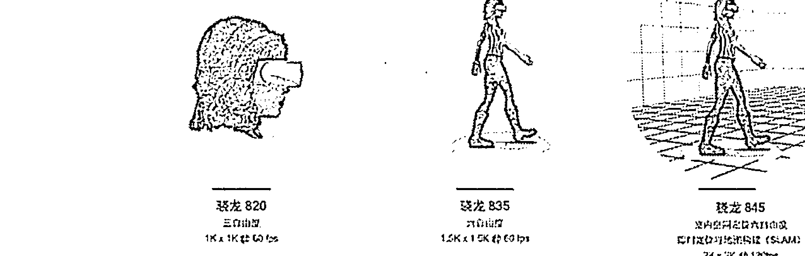

### 对沉浸式体验的优化

无论是VR还是XR，都对沉浸式体验提出了苛刻的要求，而骁龙845则进一步强化了体感操作以及视觉实现。在体感操作方面，骁龙845能独立实现类似于HTC vive那样的空间定位效果，从而在（头戴显示器）移动中避免与墙壁碰撞，并在安全的范围内实现精确动作捕捉。在视觉实现方面，骁龙845集成的Adreno 630 GPU能根据用户双眼的目光焦点进行不同程度的渲染，比如先将画面进行方块切割，随后对眼部注视的部分进行详细渲染，而其他部分则会逐步模糊。同时，这颗GPU还具备执行中断功能，比如在快速跳转画面时GPU会优先保证当前画面的处理，有选择地放弃已没有意义的渲染需求。

### 各种视觉技术盘点

提起新兴的视觉技术；AR、VR、MR、XR应该是最知名的“四兄弟”。那么，它们分别代表哪种技术，又有何特色呢？

- **AR (Augmented Reality, 增强现实)**: 一种可实时给出影像的位置及角度，并能够加上相应图像、视频、3D模型的技术；
- **VR (Virtual Reality, 虚拟现实)**: 一种可以创建和体验虚拟世界的计算机仿真系统，产品端以VR头显、手机VR头显以及VR盒子三种形式为主；
- **MR (Mixed Reality, 混合现实)**: MR=VR+AR，通过在虚拟环境中引入现实场景信息，在虚拟世界、现实世界和用户之间搭起一个交互反馈的信息回路，以增强用户体验的真实感，代表产品有微软的Hololens；
- **XR (X Reality, 拓展现实)**: XR=VR+AR+MR，XR的概念与MR很像，但它强调的不仅仅是沉浸式的娱乐体验，更希望借由高速的运算能力，将内容拓展到现实世界。高通认为，拓展现实的发展不会以PC为基础，而是以移动终端引领，头戴显示设备也终将取代智能手机，成为下一个计算中心。

## 没有神经单元 AI却无处不在

自从苹果在A11 Bionic内融入“Neural Engine”（神经引擎），麒麟970内集成独立的“NPU”（Neural-Network Processing Unit，神经网络处理单元），AI技术就成为了衡量旗舰芯片竞争力的关键一环（图10）。而骁龙845，却营造出了一种令人又惊又喜的冰火两重天的局面。

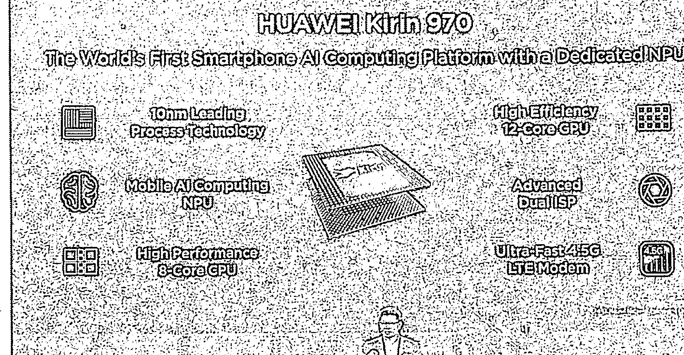

### 没有独立神经元

iPhone X依靠A11 Bionic内的Neural Engine单元让Face ID和Animoji等功能变得接近完美；华为Mate 10和荣耀V10依靠麒麟970内的NPU则可针对不同的拍摄场景进行自动优化，EMUI8.0也可利用NPU深度学习用户的使用习惯，从而让系统体验变得更加得心应手。

在骁龙845的构成图中，我们并没有看到类似Neural Engine和NPU的独立神经单元，这不禁让我们捏把冷汗：难道高通这次要放弃本地的AI运算了？

### 无处不在的AI

高通想通过骁龙845告诉消费者一个事实：谁说没有独立的AI模块就没有本地的AI运算了？！实际上，高通早在骁龙820时期就开始布局AI了，而骁龙845已经用上了高通的第三代AI平台。

高通将自家的AI平台称为NPE（Neural Processing Engine，骁龙神经处理引擎），虽然名字带有“Neural”，但它却没有独立的神经单元，而是选择将CPU、GPU和DSP联合打造成一种异构AI平台（图11），兼容Google TensorFlowLite、Caffe2、CNTK、MxNet等多个神经元架构。

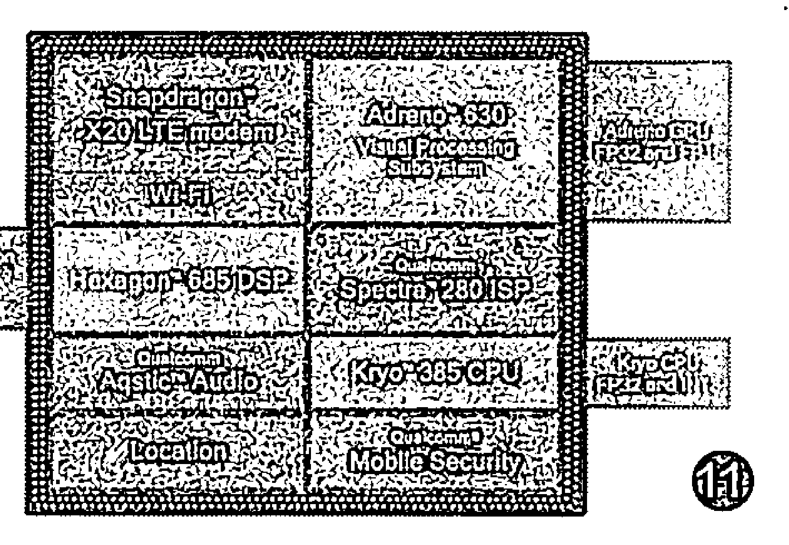

刻都在发生变化。与单一的依靠NPU集中执行人工智能任务相比，更加多样的、灵活的人工智能硬件才是目前的更优选择。NPE的异构AI平台能与优化库(libraries)、SDK和框架配合，充分调度每颗芯片的资源与能力，对不同的电压域和频率域进行匹配，最终实现最佳的性能/体验与最低的功耗/发热量的完美平衡。

总之，从骁龙845开始，AI将正式从云端走向终端，本地AI不存在网络延迟，消费者的隐私数据也会变得更安全。在高通的愿景里，伴随骁龙845的AI将无处不在，比如风格化滤镜不再是照片的专利，通过AI计算让视频也能获得实时风格化滤镜预览；哪怕手机只有一颗摄像头也能依靠AI计算出完美的背景虚化效果；NPE异构AI平台还能带来更精准的人脸识别算法，今后iPhone X主打的Face ID也将为骁龙845终端所用。

和麒麟970这种通过授权IP，借助NPU集中执行人工智能任务的方案不同，骁龙845的NPE异构AI平台将对人工智能的运算采取分布式调度的解决方案，根据CPU、DSP、GPU三种芯片的优劣和负载进行任务分配，最终为不同的应用场景提供解决方案。
高通认为，CPU、GPU、DSP和新兴的独立NPU，每一颗芯片都各有所长，但人工智能的需求和算法却每时每

### 性能虽强 但功能更令人惊讶

骁龙845的性能强悍，那它的功耗是不是也无比感人呢？得益于第二代10nm LPP工艺和由新一代ARM架构魔改而来的Kryo 385核心，以及Adreno 630的能耗优化，骁龙845的实际功耗令人欣喜。
在骁龙技术峰会现场进行的对比测试中，在播放1080P视频时骁龙660和骁龙835的参考机平均功耗分别为1560mW和1470mW，而骁龙845的平均功耗却只有1350mW；在GFXBench测试的曼哈顿OpenGL 3.1场景中，骁龙835拷机时的平均功耗为3790mW，而骁龙845的功耗只有2950mW！此外，骁龙845还支持改进的QC4.0+快充技术，15分钟就能充满50%的电量。

更强却更省电，这就是骁龙845(图12)，以及未来所有旗舰级SoC芯片的发展目标。

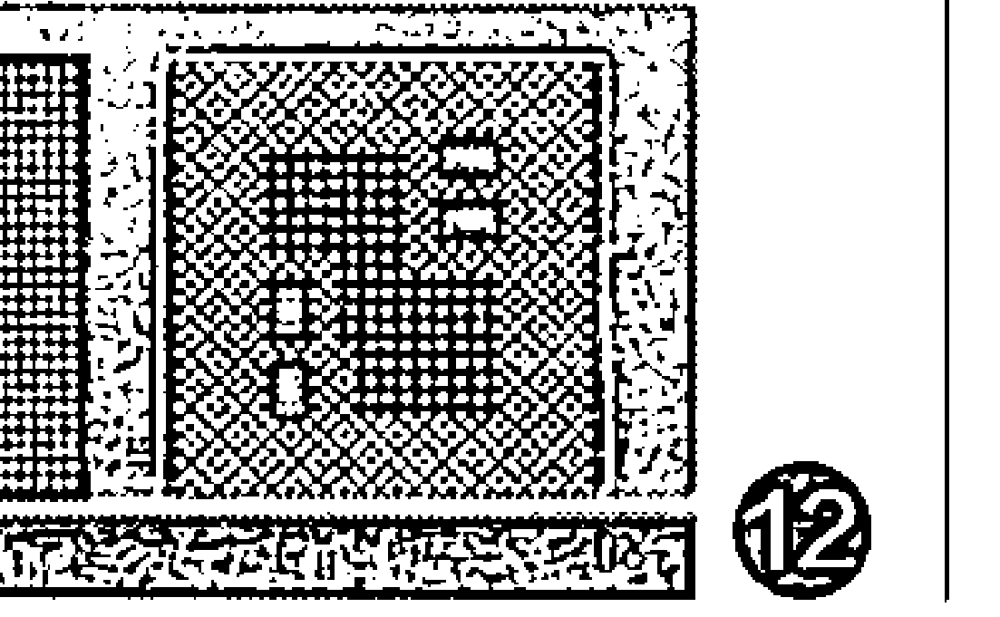

## 小结

通过高通骁龙技术峰会，让我们看到了未来笔记本和智能手机等移动设备的发展方向，并进一步缩短了我们与5G时代之间的距离，从而让昔日很多的不可能成为现实。至于5G能为我们带来什么？包括高通、英特尔、华为等企业的5G技术已经前进到哪一步？这又是下一个话题了。如果你对5G技术感兴趣，那就敬请期待CFan的后续报道吧。

## 科技向前看 展望2018

刘佳九州

> 扫一扫，更多精彩内容呈现

### 1 存储市场风满楼 混战时代即将到来

回顾2017年，不管是在我们生活中还是在科技圈都发生了很多有趣的事情。那些看起来遥不可及的科技实际就在我们身边，只是我们留心观察到的并不多。那么2018年又有哪些科技将发生并改变我们的生活呢？

科技的发展会让电子产品价格不断走低，最终让每个人都能得以体验。但就2017年的存储市场来说可就没这么好运，存储颗粒价格的大幅度升高让市面上的内存与固态硬盘价格飞涨。笔者使用的SSD年初时价格还仅500元，转眼之间就已经翻了一番有余，而随后内存条价格也一路水涨船高，金士顿8GB DDR4 2133内存条直奔千元大关，受此影响的还有手机平板等电子产品，价格都有一定程度的涨幅。

很多人都猜测是三星公司故意所为。众所周知，三星Note7的爆炸事件在全球范围内造成了不良的影响，从召回到停产给三星电子带来的损失可谓巨大。然而在2017年季度财务报表上，三星电子利润不降反涨，第二季度还在销量与利润上居于首位，超过苹果与英特尔，其主要来源就是芯片和屏幕业务。

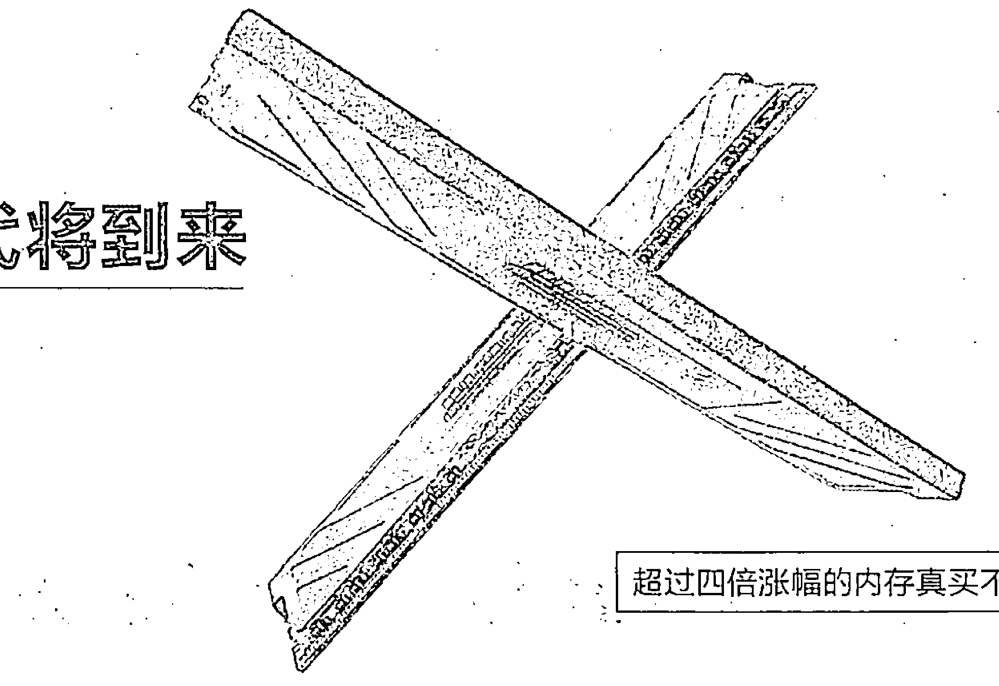


实际上，三星作为全球为数不多能自行设计生产内存颗粒与存储颗粒并带有自有品牌的厂商，在国际市场上有非常大的话语权。上游大厂除三星和海力士两个韩国厂商外，还有镁光与东芝。但是镁光因工厂受灾污染了大量的圆晶导致出货锐减，东芝则因为核电亏损不得不抛售存储颗粒，这让定价权落到了两家韩国厂商手中。加上各大厂商3D NAND

换代带来的产线停工，价格上涨也算是意料之内。不过从2018年起，内存价格会开始进入价格下调阶段。一方面因为3D NAND技术的成熟让更多的产品开始投产；另一方面则是由于紫光与新芯等中国厂商跟进，迫使三星电子将旗下一部分存储颗粒生产厂转为内存颗粒生产，妄图挤压刚成立的中国厂商。虽然国产厂商要真正进入量产阶段

段还需一到两年，但是届时给内存市场带来的波动将会是巨大的。至于固态硬盘，价格降低不但是一个较慢的过程，而且MLC产品价格还会继续提高。由于三星的QLC存储颗粒正式进入量产阶段，为了推广更加便宜的QLC产品，三星会降低MLC产品出货量来刺激市场购买QLC产品，而TLC则会替代前MLC的地位，成为新的高端产品。目前西数等厂商也表示跟进，等到年底QLC产品大量上市时，新的存储大戏将会正式上演。

### 2 新一轮牙膏大战 停滞不前的CPU与GPU

AMD推出的Ryzen处理器终于迫使英特尔挤了一大管牙膏，跟进推出多核产品，让万年双核时代终于成为了历史。但实际上，双方其实进入了新的牙膏大战。AMD新架构也只是刚刚追上英特尔的老旧架构，并没有给市场带来革命性的变化。而且Zen架构小毛病不断，芯片组支持也不够完善，就单核性能而言依旧无法

与Intel平起平坐。根据AMD公布的信息来看，2018年推出的Zen2架构也就是针对Zen架构进行优化与Debug。官方声称能提高15%的性能，不过“放卫星”的几率非常大。反观英特尔一边，全新架构也是一拖再拖，面对AMD的攻势仅仅是增加物理核心的方式来应对。这背后也是充满了难言之隐。

一方面7nm工艺难产，无法在现阶段继续扩大核心体积来提高性能，就连计划中的Cannonlake架构也都只能推迟发布；另一方面则是新的架构尚未设计完成

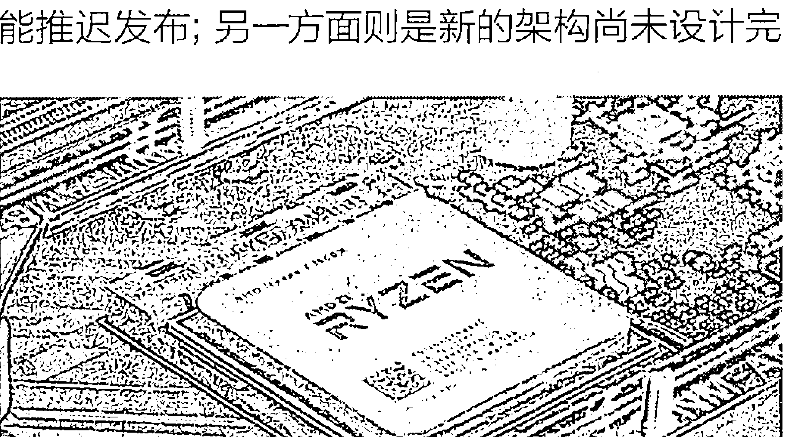

英特尔牙膏战略 步伐依旧

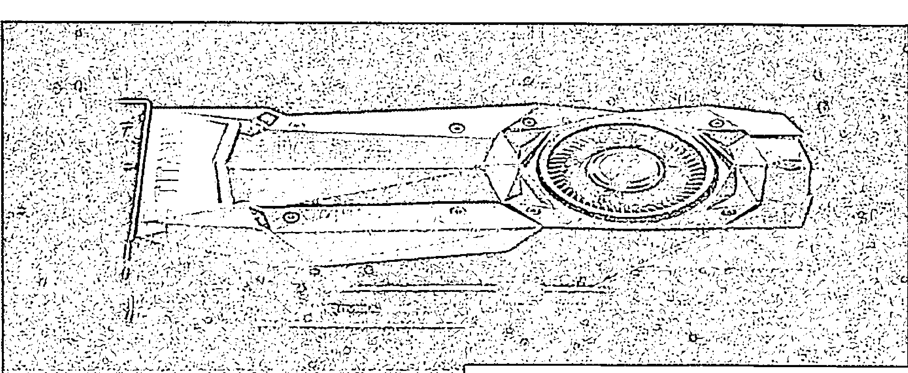

TITAN V的出现其实是计划外的产物

成,根据国外网站披露信息,等到2020年英特尔才会有新的架构推出。双方的新一轮挤牙膏大战才刚刚开始。

AMD很忙,不但要与英特尔挤牙膏,还要跟NVIDIA挤。

实际上从Fermi架构到Pascal架构,NVIDIA做得更多的也是优化与细分调整,每一次的新核心,无论是单元还是整体架构上的更新其实也相当有限,当然,这也与其需要保持对DirectX最好的兼容性有关。好在这一步步的微调,配合周边如显存的升级,使得每一代显卡性能提升还是明显的,加上游戏厂商的有力“配合”,这些年的NVIDIA牙膏对用户来说还算是挤得比较痛快。

记忆力好的朋友一定还记得,在2014年的发布会上,就展示了一张带有Volta架构的发展线路图,这就是2018年的NVIDIA GPU新架构,2017年底出现在我们的面前的GTX Titan V就是这一架构的首款显卡。NVIDIA宣称Volta能够提高50%的性能,不过Titan V这样的专业级显卡并不是标准的消费型游戏显卡,更像是为超级计算机的订单提前生产出来的编外产物。它采用的HBM2的带宽与价格仍未满足大规模装备的需求,芯片规格也显得过大,要做成游戏级显卡除了要受到GDDR6的带宽限制外,应该也会对内部配置进行阉割。

2018年NVIDIA的GPU产品线很可能在高端产品中采用Volta架构,中低端产品仍然使用Pascal架构,Volta架构的产品在价格上应该会比现阶段同定位产品贵上不少,不过仍然值得一买。

而AMD实在是太不争气,从HD7000定下的GCN架构直到最新推出的Vega上才略有起色,终于有跟NVIDIA旗舰显卡一争高低的实力。但甜点级市场还是NVIDIA一家独大,若不是矿工助力,AMD在2017年的显卡财报依旧不会太好看。Navi架构要等到2018年8月份才会正式曝光,之后低端可能会更改为Vega架构,Navi架构首先主攻高端。笔者预测

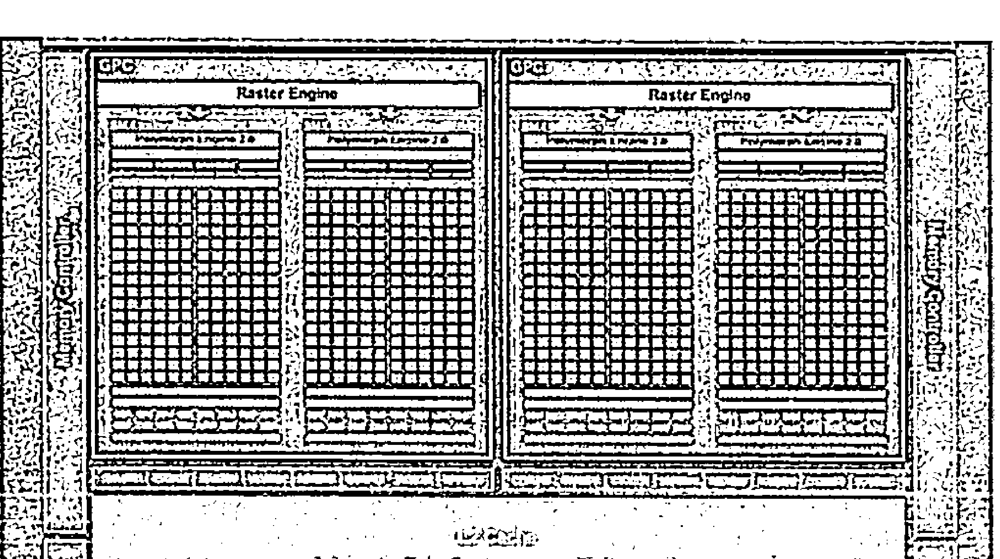

时隔七年, NVIDIA GPU的架构在整体上并没有什么大改变

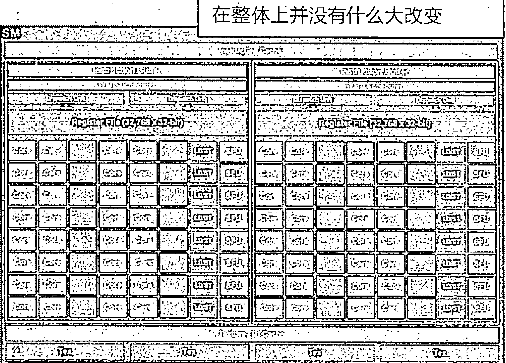

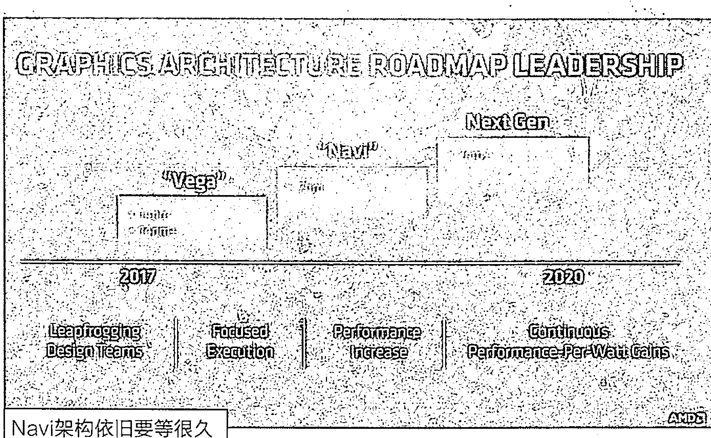

Navi架构依旧要等很久

未来的RX600应该会采用Vega架构，在性能上会稍强于Pascal核心，但是在功耗与发热上还有差距，价格倒不会提高。届时如果不想买旗舰显卡试水的用户大可买RX500、Pascal系列显卡，价格便宜，性能差距又不大。从商业角度来讲，AMD的GPU在2018年仍然很难对NVIDIA形成威胁，AMD前图形部门负责人Raja加入Intel，对于AMD的开发有一定影响，尤其是驱动优化方面，可能又要拉开很大距离。

### 3 “本”形态大不同

在笔记本同质化越来越严重的今天，想要在常规的商务笔记本与家用笔记本进行设计创新愈发困难，大量的技术投入与收效却不一定成正比，除了精简产品线，以明星代言推出全新的产品外，很难做到利润突破。因此越来越多的厂商把目光集中到了利润更高、销量更大的游戏笔记本上。

在NVIDIA提出的MAX-Q构造影响下，很多游戏笔记本走向了轻薄化路线，或者说越来越多的轻薄笔记本走向了游戏化的路线。对游戏本而言，MAX-Q并没有什么实际意义，通过限制功耗与性能填补了产品空白，尤其是MAX-Q1060的出现正好弥补了GTX1050Ti与GTX1060之间的空隙。而强行凑数的MAX-Q1080与标准的GTX1070性能相同，发热量与功耗差距也微乎其微，定位非常尴尬。MAX-Q更多的是给各大厂商推广新的超薄游戏本的宣传契机。不过反过来讲，确实有更多的旗舰级游戏本抛弃以往“傻大粗”的形象，对于大学生和对便携非常敏感的用户而言是个好消息。

真正有大变化的是主流超薄本。英伟达推出的MX150入门显卡与AMD的Ryzen APU给入门超级本带来了新的选择。从目前的测试结果来看，MX150标准版性能接近GTX960M，具备一定的游戏能力，低电压版的MX150性能也接近GTX950M D3，而Ryzen5 2500U集成的Vega8性能与低电压版的MX150相同，Ryzen7 2700U集成的Vega10性能已经接近标准电压MX150。在处理器性能上，Ryzen与8代i5 U版仍有一段距离，但是作为中低端入门本与超薄本来讲价格优势就非常明显了。如果没有意外，5000元左右的超薄本中，Ryzen5与i3+MX150LP版会平分市场，7000元左右的超薄本中，Ryzen7与i5+MX150标准版各占一半，而4000元以下的市场中则会Ryzen一家独大，到时用户将会有更多的可选产品。部分APU产品在未来还会搭载高通基带，支持4G甚至是5G通信，说不定会有更多有趣的产品出现。

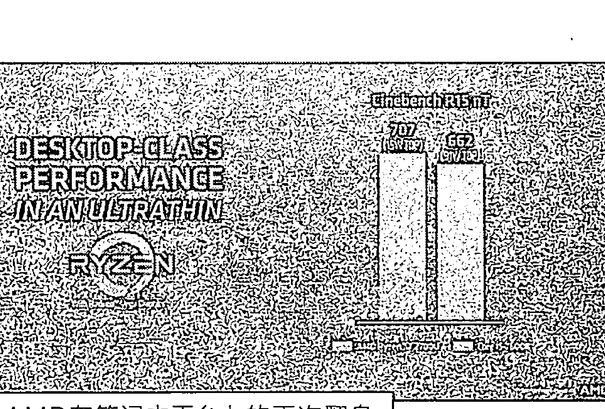

AMD在笔记本平台上的再次翻身对中低端市场冲击很大

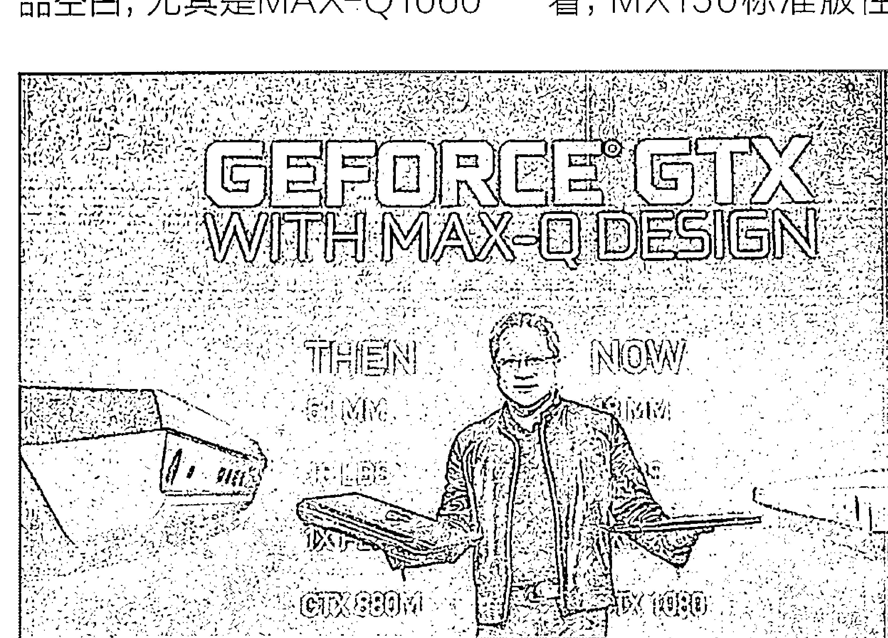

MAX-Q只是一个成熟的笔记本内部设计方案

不得不提的还有Always Connected PC的出现。在经历了Windows RT的失败后，微软携手高通又发布了新的Windows 10 S on ARM产品。在Windows 10 S上目前只能运行UWP应用，但是ARM平台笔记本在反应速度

以及执行效率上已经达到甚至超过X86产品，续航上也达到了22小时的超长时间，远高于12小时续航Surface Book 2。虽然目前价格略高，但是未来肯定会有更多平板带底座的产品将会采用骁龙835/845并装载Windows 10 S以及Android双系统，满足轻度娱乐以及重度娱乐办公的用户。

### 4 外设无线化 蓝牙5.0的全面革新

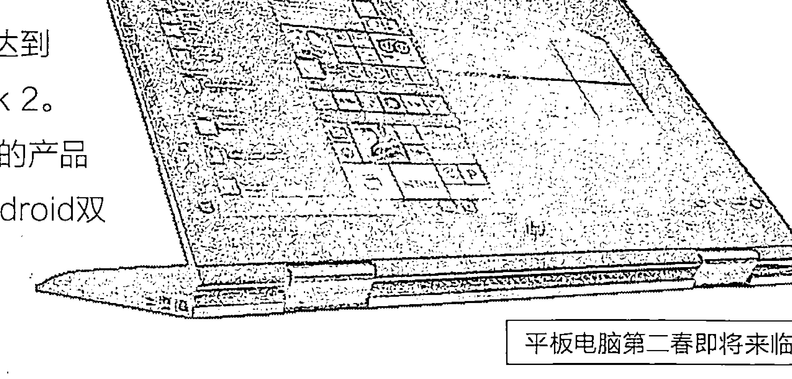

蓝牙抗干扰能力弱，传输延迟等种种问题下似乎有很大的局限性，但最近笔者和周围不少人却选择换掉有线游戏键鼠改用无线蓝牙产品。一方面蓝牙无线设备更为便携，容易携带；另一方面则是随着蓝牙技术的提高，专用的游戏外设越来越多。在市面上有很多的机械键盘就采用有线/蓝牙双模式，在不插线的情况下使用内置锂电池或者干电池工作，游戏时基本感受不到延迟。而且便宜的产品价格已经低到了200元左右，就算是买来作为外出办公用的便携键盘也非常方便。除了键盘，蓝牙游戏鼠标数量也不少，而且价位也比较亲民。像笔者现在使用的华硕蓝牙鼠标价格只有80块钱，但是反应速度很快，支持主流的1600DPI，不影响游戏体验。蓝牙游戏耳机目前来说较贵，数量也不多，不过随着iPhone带领的无线化趋势，2018年应该会有更多的蓝牙游戏耳机顺势出现。从三星Galaxy S8开

始，越来越多的设备支持蓝牙5.0技术。根据公布的数据来看，蓝牙5.0传输速度达到了3MB/s，解决了传输带宽问题。以前带宽不够时，如果同时连接键盘和耳机很可能会出现数据断流的情况，有了蓝牙5.0以后就不会再有这种问题了。另外蓝牙5.0的耗电量降低，可以让用户随时保持设备的蓝牙处于开启状态，方便及时唤醒。

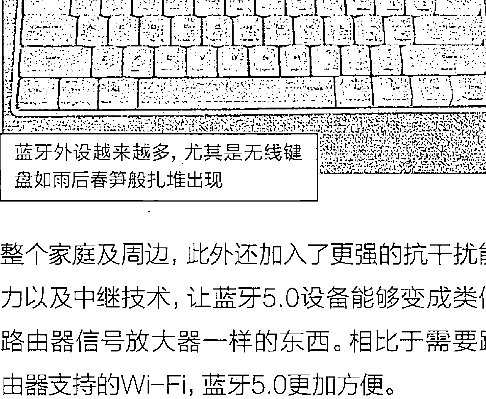

蓝牙5.0也加快了物联网的发展，目前Wi-Fi与蓝牙是最被看好的物联网与智能家庭核心通信技术。蓝牙5.0的信号范围可达300米，可以覆盖整个家庭及周边，此外还加入了更强的抗干扰能力以及中继技术，让蓝牙5.0设备能够变成类似路由器信号放大器一样的东西。相比于需要路由器支持的Wi-Fi，蓝牙5.0更加方便。

想象一下回到家中，打开家门，自己只要带着蓝牙手环，所经之处都会自动开灯，到了电脑面前就会自动开机的场景，那种才是真正的“Life Style”。不要以为这种生活方式很遥远，各大厂商对于智能家居的布局非常迅速，2018年将会有更多以蓝牙为基础的智能设备走进千家万户。

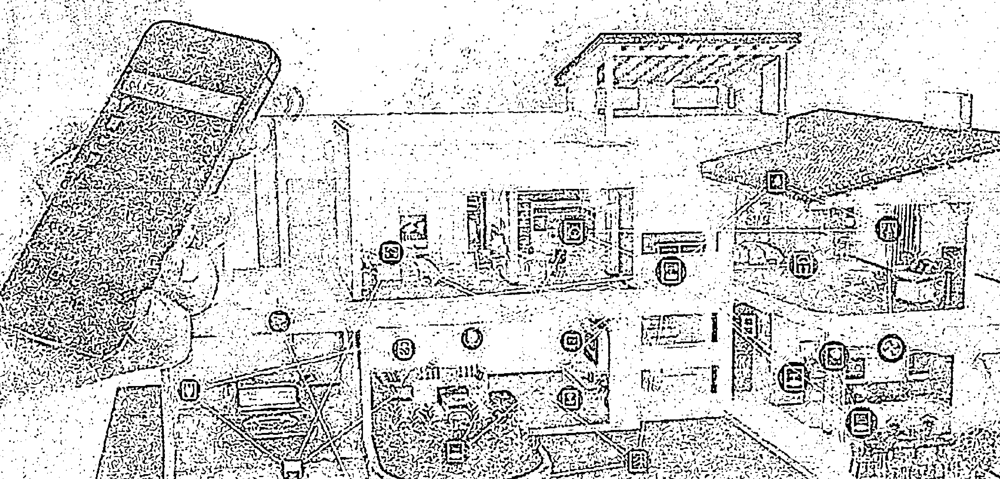

### 5 VR游戏进行时 AR MR何去何从

如今谈到VR(虚拟现实)很多人都会感觉是个非常落伍的技术，其实VR才刚刚迎来成熟的发展时期，目前PC上的VR游戏越来越多。从STEAM看，目前支持VR的游戏多达两千多款，其中有三百多款支持VIVE、Rift以及MR设备。除了辐射4VR、DOOM VR等传统大作外，还有类似ZhanDou、QuiVR、ONWARD这样的VR网游，虽然这些游戏还挂着先期测试的状态，但实际上可玩度已经非常的高。游戏主机上也有不少的VR游戏，但是就体验而言，这种没有针对VR进行优化的设备并不适合VR游戏，未来VR游戏的主力还将是PC平台。

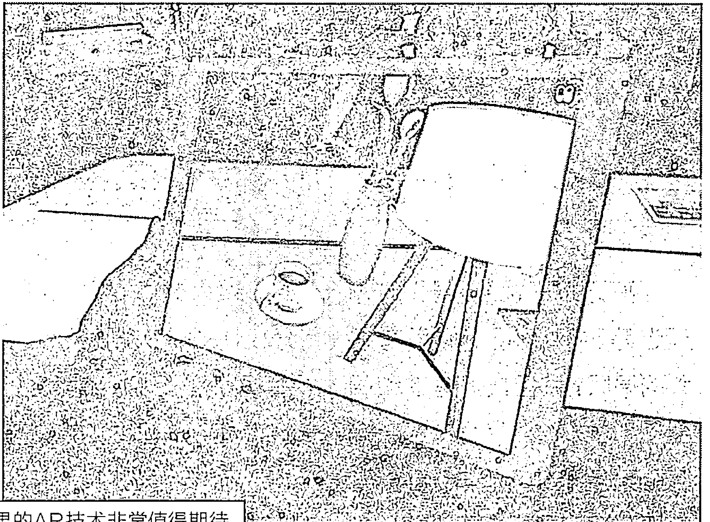

另外，作为VR发展的一个拐点，微软MR（混合现实）设备也有了少许进展。除微软自家Hololens外，三星、宏碁、惠普、联想、戴尔以及华硕都跟进推出了支持微软MR规范的产品，这些产品除了支持MR也兼容VR。不过微软的MR推广速度并不快，也缺乏实质性内容，2018年很难说能得多少关注。

谈到VR与MR技术，AR（增强现实）技术也自然少不了。苹果在iPhone 8上面采用了最新的A11Bionic，这款处理器的性能相比上一代A10Fusion提高了不少。不要以为这种提升是例行升级，更多的是在为AR做准备。在苹果的发布会上很多人就已经见过了基于iPhone的AR游戏，实际上在一些游戏开发者活动上，已经有很多的国内外知名游戏厂商参与到了iPhone的AR游戏开发中去。另外苹果在ARKit上提到了AR眼镜暂时还没有发售信息，不过猜测应该会在2018年内上市，但是可以肯定的是一经推出，市场上将会刮起一阵AR风潮。


2018年将会有越来越多有趣的科技产品不断推出，OLED、5G、AI计算、无人驾驶、图像识别等新型技术会进一步走入寻常百姓家。作为消费者的我们或许还能看到更多有趣的新产品。


## 5G不止网速快 技术会改变什么

策划《电脑爱好者》编辑部

除了“全面屏”以外，2018年手机行业即将迎来一个更热的关键词——5G（第五代移动通信技术）。在5G光环的加持下，不仅是手机，我们的生活也将出现翻天覆地的变化。在5G时代降临之前，就让我们深入探究一下5G技术的特色以及发展现状吧。

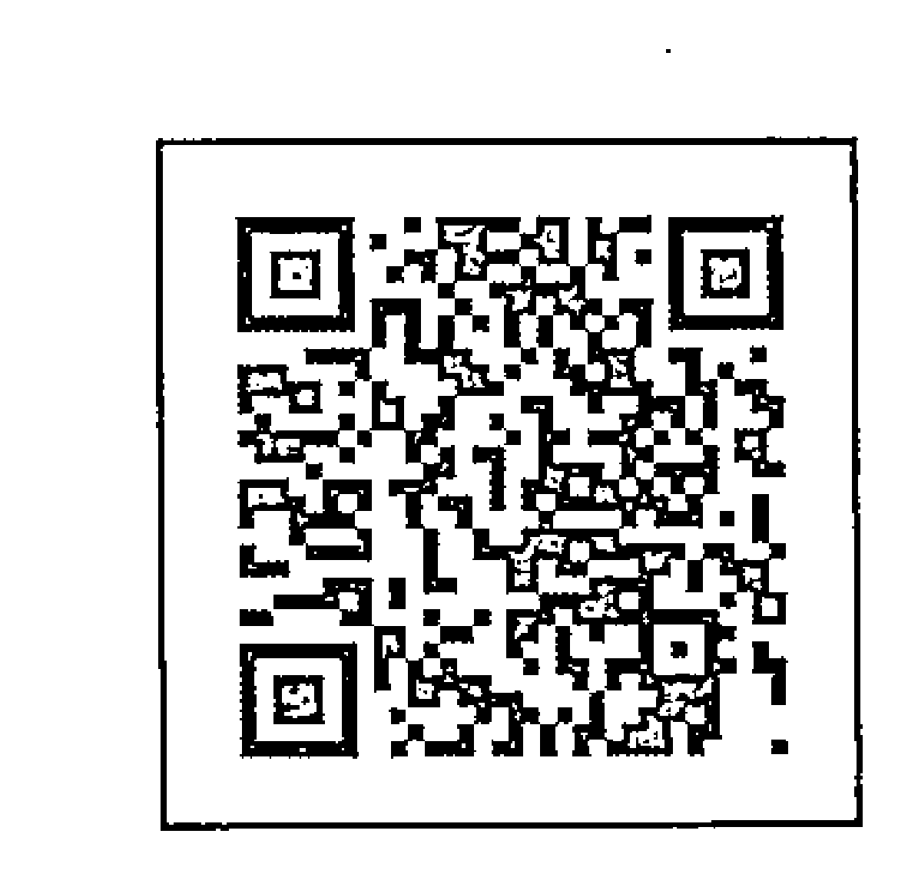

扫一扫，更多精彩内容立现！

### 触摸5G时代的大门

5G并不是什么新鲜的词汇，CFan早在2017年第7期杂志的《影响未来的技术 来自5G的惊鸿一瞥》一文中就对该技术进行了简单的介绍。只是，当时5G还停留在概念阶段，随着时间的推移，如今我们已经可以触碰到5G时代的大门了（图1）。

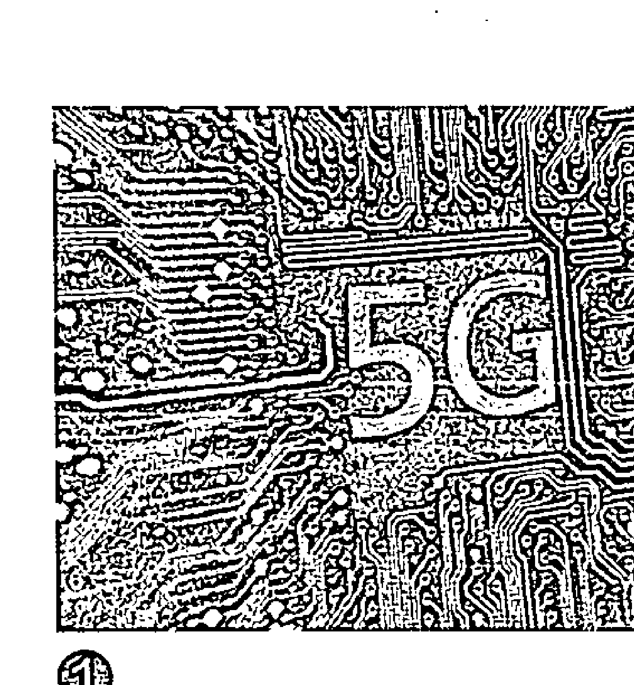

### 5G战略两步走

2017年年底，3GPP（移动通信的标准化机构）在葡萄牙首都里斯本正式签署通过了5G NSA（Non-Standalone，非独立组网）标准第一个版本。业内人士表示，5G标准NSA方案的完成是5G标准化进程的一个重要里程碑，标志着5G标准和产业进程进入实质性加速阶段，5G商用进入倒计时，而硬件厂商的设备开发工作终于可以从现在开始了（图2）。

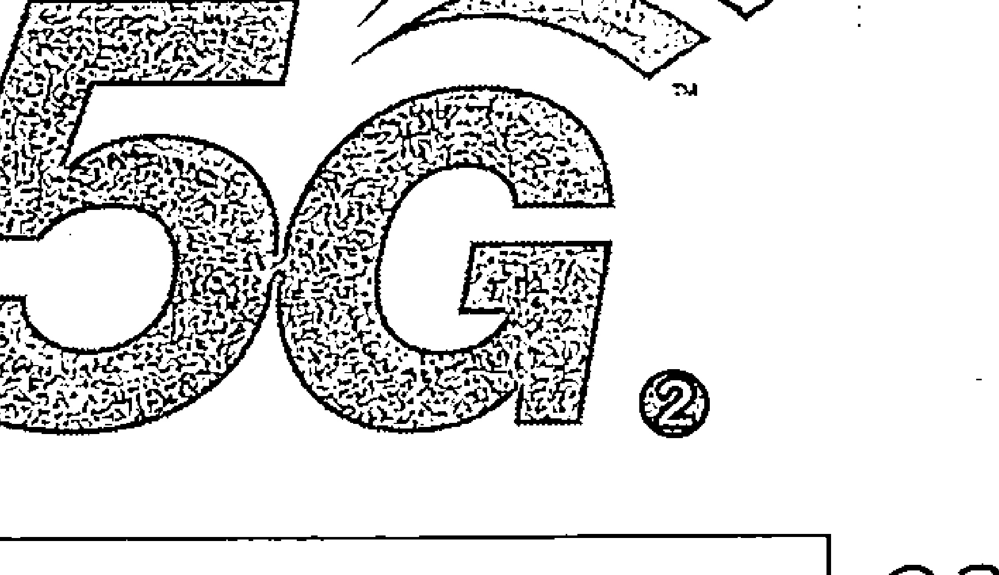

根据3GPP的规划，5G时代将被细分为NSA和SA（Standalone，独立组网）两个标准。其中5G NSA组网是一种过渡方案，它依托现有的4G基站和核心网工作，以提升热点区域带宽为主要目标。而SA独立组网才是业界公认的5G方案，只是3GPP预计在2018年6月才会正式发布SA标准。不出意外的话，5G的第一次较大规模室内外商用预演就将在今年韩国的平昌冬奥会上展开。

在2017年底的世界互联网大会上，高通基于面向移动终端的5G调制解调器成功实现了全球首次正式的5G数据连接（图3），与华为3GPP 5G预商用系统双双入选“世界互联网领先科技成果”（图4），而华为也正在北京、上海、首尔、米兰、东京、温哥华、多伦多、伦敦等地推进5G预商用。

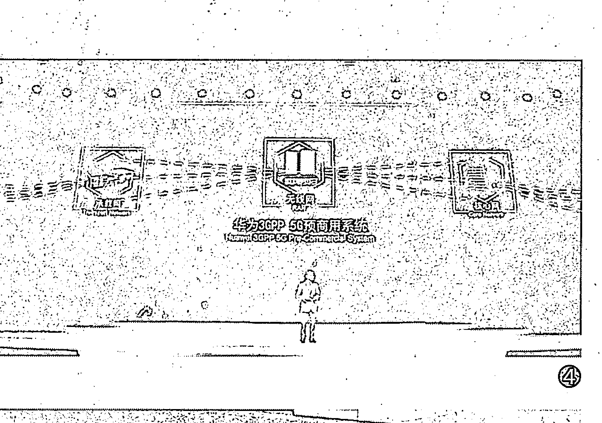

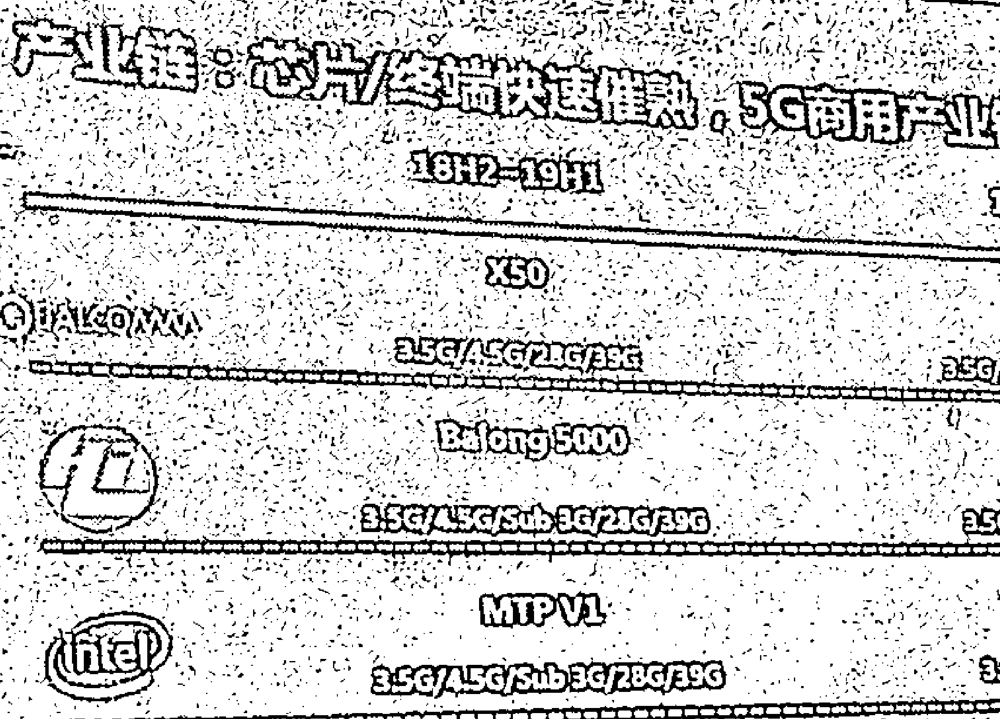

| 芯片厂商 | 16H2-18H1 | 19H2-2020 |
|----------|------------|------------|
| Qualcomm | X50 | X55 |
|          | 支持5G/4G/3G/2G | 支持5G/4G/3G/2G |
| Balong   | Balong 5000 | Balong 5000 |
|          | 支持5G/4G/3G/2G | 支持5G/4G/3G/2G |
| MTK      | MTP V1 | MTP V2 |
|          | 支持5G/4G/3G/2G | 支持5G/4G/3G/2G |
| Samsung  | SS100 | SS101 |
|          | 支持5G/4G/3G/2G | 支持5G/4G/3G/2G |

这意味着，在经历2G的跟随、3G的突破、4G的同步发展，我国在5G时代终于实现了引领。据悉，我国的5G技术研发早已完成了第二阶段试验，中频段频率规划率先发布，网络架构等技术成为国际标准，2018年将完成第三阶段测试，推动形成全球统一的5G标准。

### 至于正式支持5G网络的手机什么时候会出现？

高通确认2019年上半年才会有首款基于5G骁龙芯片的智能手机问世，而华为也计划在2019年推出支持5G的麒麟芯片，并同步推出支持5G网络的智能手机（图5）。因此，在2018年度中，智能手机市场迎来的将是一大批“准5G”新品，它们会通过千兆级调制解调器（Modem，又称基带）让我们提前感触准5G时代的高速。

### 准5G的门槛是千兆

还记得手机最早与网络结缘时使用的是哪一种网络吗？没错，那还是诺基亚和多普达一统手机江湖的年代（图6），Symbian和Windows Mobile系统可以通过2G网络联网，但速度只有区区的9.6kbps，谈不上有任何网络体验。

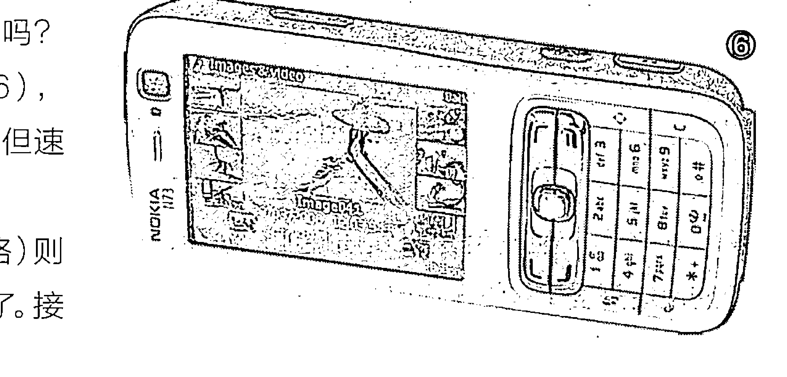

随后，2.5G（GPRS，同期还有相对小众的CDMA网络）则将网速提升到了171.2kbps，可以勉强打开网页看文字部分了。

下来的2.75G (EDGE) 与WAP技术的结合算是正式开启了手机移动上网时代的序幕 (图7)，手机QQ和电子书也是从这个时期才开始兴起的，384kbps的无线接入速度勉强够用。

3G时代我们迎来了TD-SCDMA、WCDMA、CDMA2000三种网络制式，在2008年借助北京奥运会的契机，部分手机已经可以享受到3Mbps左右的无线接入速度，成功实现了从Kbps到Mbps的转变，将近10倍的网速提升可以勉强搞定加载图片网页和视频通话的需求。接下来3.5G粉墨登场，在HSDPA、HSUPA、HSPA+等技术的加持下将网络无线接入速度一举提升到了72Mbps，为手游的兴起奠定了基础。

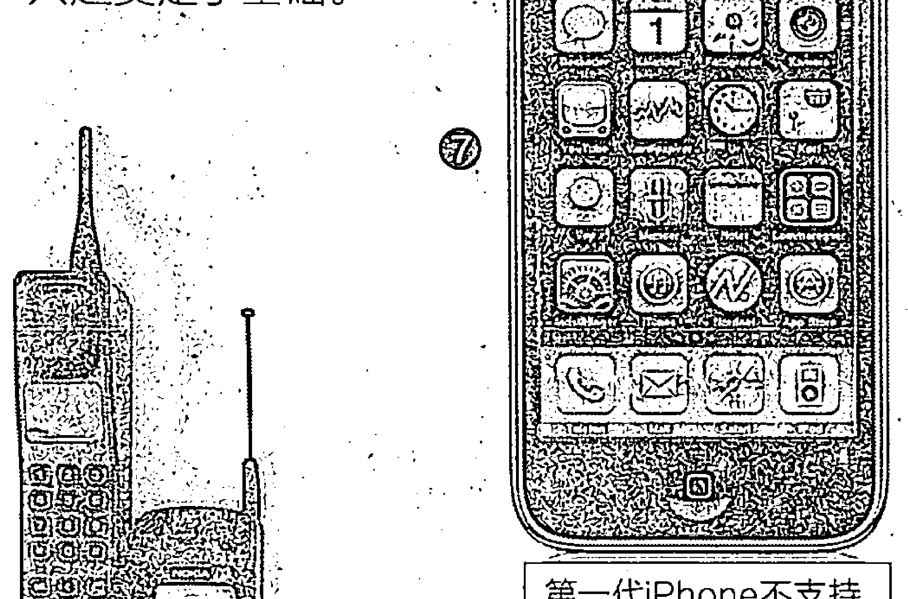

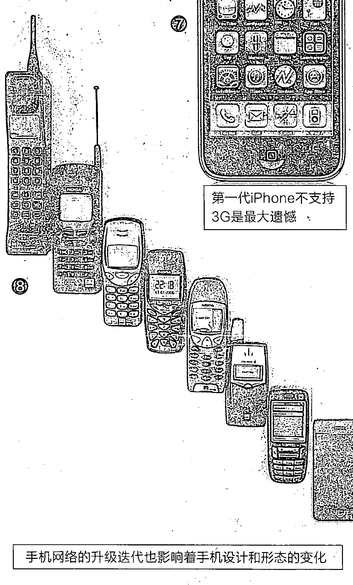

2014年，4G网络携TDD-LTE和FDD-LTE两大标准来袭，它们都能提供100Mbps的无线接入速度 (下行)。随着各大芯片厂LTE调制解调器的不断升级，下行峰值先后经历了150Mbps、300Mbps、450Mbps和600Mbps的提速。此时，手机LTE连接速度已经超越了绝大多数的光纤宽带，制约我们移动上网的瓶颈则变成了流量套餐的多寡和费用 (图8)。

2017年，智能手机领域迎来了一个关键的节点：当手机无线接入速度的下行峰值突破1Gbps千兆大关后 (图9)，就可以被冠以4.5G或准5G的称号，而有资格位列准5G阵营的已上市SoC则包括三星Exynos 8895 (1Gbps)、高通骁龙835 (1Gbps) 和麒麟970 (1.2Gbps)。那么，这些SoC的LTE调制解调器又是如何实现Mbps向Gbps级别的跨越呢？

无论是骁龙835还是麒麟970等，它们都选择从三个方向寻求突破：

首先就是载波聚合技术 (CA)，在4G发展的初期数据的传输全都是依靠一条20MHz频率载波，而载波聚合则相当于将数据传输从单车道增加到多车道，比如骁龙X16 LTE调制解调器 (骁龙835集成) 最高支持4×20MHz载波聚合 (4CA)，可将网络速率提高4倍。

其次就是天线规模与复杂度，比如4×4 MIMO技术 (4通道接收的天线设计)，用更多的天线提升信号强度、克服信道衰落、降低误码率、加速通信速率 (图10)。最后则是对256-QAM高级调制方式的支持，可以将每个数据流的带宽提升。

需要注意的是，支持准5G的手机要想获得突破Gbps级的速度，不仅需要在手机端部署4×4 MIMO，还需要运营商的基站端支持4T4R。可惜，运营商们认为市面上采用4×4

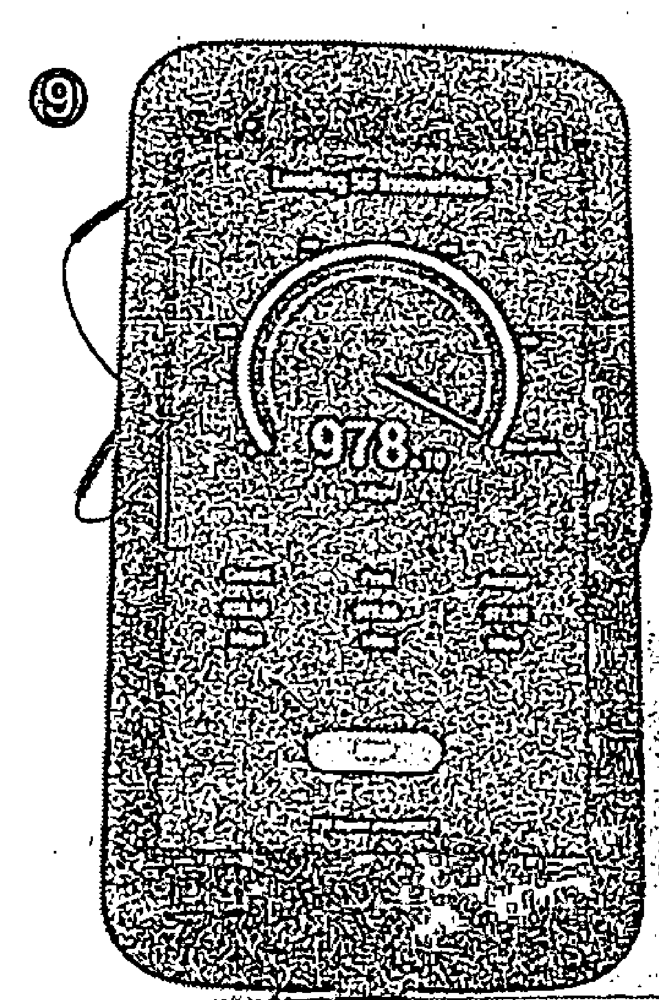

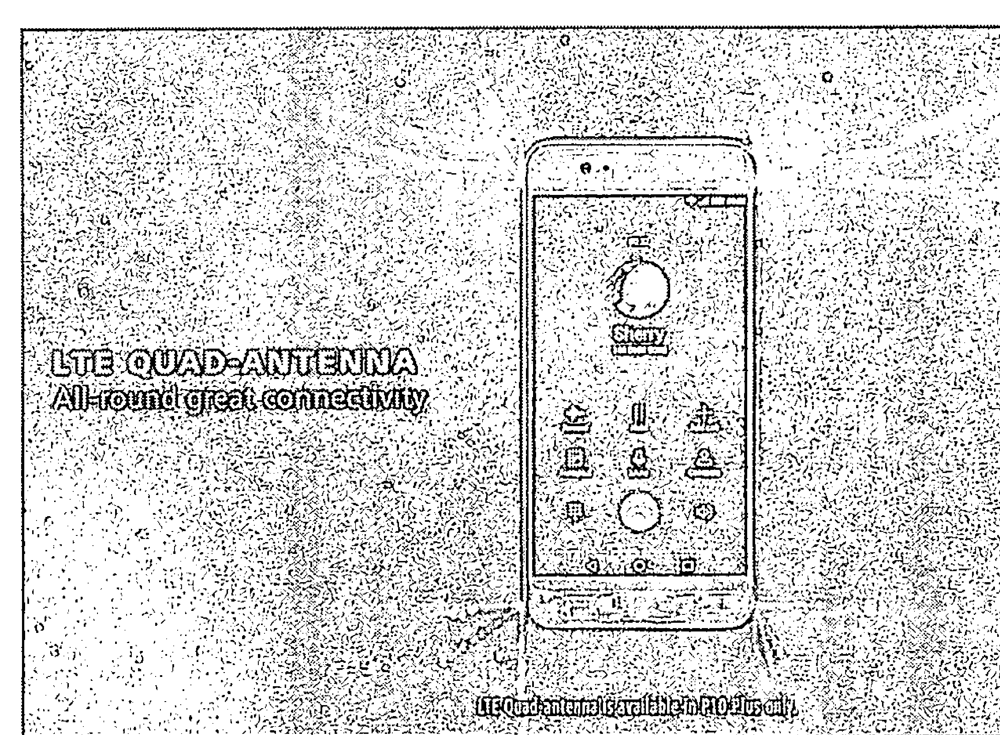

### 真5G又能有多强

在准5G时代，1Gbps的下行速率相当于128MB/s的下载速度，在理想的网络环境中缓存一部1GB的超清视频只需8秒的时间。既然准5G都能有如此速度，那真5G又能带来怎样的改变？

5G网络的最大特色就是快，其初始的下行峰值速度就能达到10Gbps（图11），而后还能进一步加速到20.74Gbps。这意味着什么？当你下载一部6GB的高清视频，只需眨眼的2秒功夫就已经下载完成。届时eMMC标准的闪存芯片就将成为手机硬件端的瓶颈，UFS2.1或更先进的闪存技术搭配才能释放5G的高速潜力。

5G的另一个特色就是延迟低于1毫秒。1毫秒是什么概念？当我们的手指被针刺中，需要大约100毫秒疼痛感才会传达到大脑。超低延迟和大数据文件的高速传输让5G能够像第六感一样近乎实时地获取周围环境的信息。比如无人驾驶的汽车可使用基于云的人工智能和数据，与路上其他汽车以及包括路灯在内的交通基础设施进行实时“沟通”；再比如远程手术中控制手术刀的精准操作等。


此外，未来的5G网络还将对“万物互联”和“智慧城市”提供最有力的支撑。在2G时代，电脑和电脑连接是常态；3G/4G时代过渡到了人与人之间互联的转变；步入5G时代后，人和人、人和物、物和物都将连成一体（图12），将构建成一个全新的信息化的基础设施，市场将迎来一个“真正意义上的融合网络”。

### 5G是如何实现上述特性的？

简单来说，5G调制解调器通过引入毫米波（mmWave）频段提供更大的带宽，从有限的几根天线改为多阵元天线阵列，使用波束成形和波束追踪技术，将毫米波的移动性和覆盖扩展到非视距范围，从而实现智能协同。

### 5G对普通用户的实际意义大吗？

答案是，绝大多数普通用户根本用不上5G网络大带宽、万物互联和低时延这三大特性。根据英特尔的预测，待2020年5G网络商用时，个人用户的手机/笔记本每天的平均数据量约1.5GB，而自动驾驶则将达到每天4000GB（图13）。现实中手机里没有足够的存储空间，流量套餐也不允许我们随意下载超清视频，因此5G网络的最大受益领域还是自动驾驶、AR/VR、自动工厂和智慧城市。

此外，即便5G正式商用后，我们所能买到的手机也都属于“多模设备”，它们可同时使用5G、4G和Wi-Fi连接，将确保5G无线网络分阶段顺畅部署，同时还能充分利用对4G和Wi-Fi的现有投资。

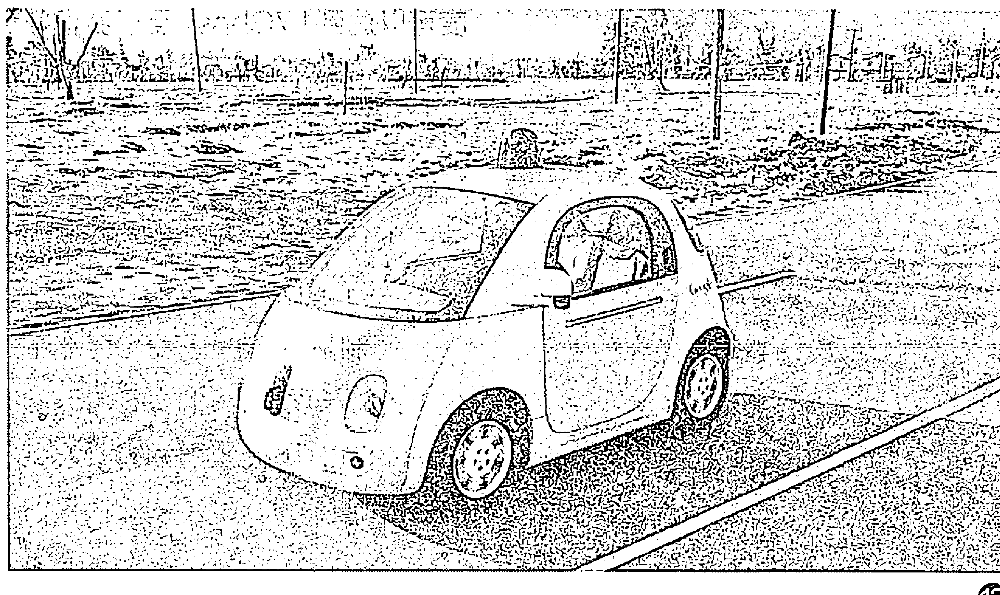

## 各大芯片厂的5G现状

步入2018年，各大芯片厂的5G产品布局达到了怎样的水平？相信这也是很多朋友想了解的信息，毕竟一款手机想要享用5G大餐，核心就是所搭载SoC内集成的调制解调器。

先来看看高通，2017年10月，高通在骁龙X50调制解调器的展示机上实现了第一个5G数据连接，利用28GHz毫米波频谱达到了千兆网速。可惜，高通称5G基带、射频、网络还需要1至2年调试时间，所以真5G手机要等到2019年上半年才能登场（图14）。而2018年将与我们见面的骁龙845，调制解调器将从骁龙X16升级到骁龙X20，下行峰值速度也从1Gbps提升到1.2Gbps。

再来看看华为，2017年11月华为先是联合德国电信正式宣布推出全球首个5G商用网络，随后又在中国移动全球合作伙伴大会期间发布了全球首款3.5GHz频段的小型化5G预商用CPE样机，并联合中国移动研究院基于5G端到端解决方案，演示了16路4K超高清视频实时点播业务，期间单用户峰值速率达到1.3Gbps以上。而2018年内最常与我们打交道的就是麒麟970，理论下行峰值速度和骁龙845一样，都是1.2Gbps（图15）。

英特尔虽然退出了手机芯片市场的竞争，但这并不影响英特尔品牌调制解调器的研发，未来的苹果iPhone就是英特尔的大客户。英特尔曾在CES2017上公布了英特尔XMM8000系列，这是一款多模、全频段的商用5G调制解调器（图16），预计于2019年中用于商用客户设备。在速度上，XMM8060可实现每秒高达1.6GB的传输速度（注意单位可不是Gbps哦）。在2018年英特尔主打的LTE调制解调器为XMM7660/XMM7560，前者支持1.6Gbps的传输速率，超过麒麟970的1.2Gbps，后者则可实现1Gbps的速度。

三星在2017年10月曾于东京附近的埼玉县测试5G服务，在速度约为每小时100公里行驶的火车上，网络的下载速度可以达到1.7Gbps。至于我们熟悉的Exynos芯片，即将与我们见面的Exynos 9810将采用支持6CA载波聚合和4×4 MIMO的调制解调器，最高下行速度达到1.2Gbps，为准5G铺平了道路。调制解调器的研发一直都不是联发科的长项，在其他中高端SoC纷纷将Cat.12（下行速率为600Mbps）纳入标配时，Helio X30却还停留在Cat.10（下行速率为450Mbps）。考虑到联发科暂停高端SoC的研发，联发科的5G进程令人堪忧。看到这里，相信大家已经对准5G和真5G有了更为直观的认识。不过，相信还是会有不少同学看不懂文章中的一些技术术语，所以下面的章节中，就让我们单独聊聊手机上网的核心部件——调制解调器的那些事儿。

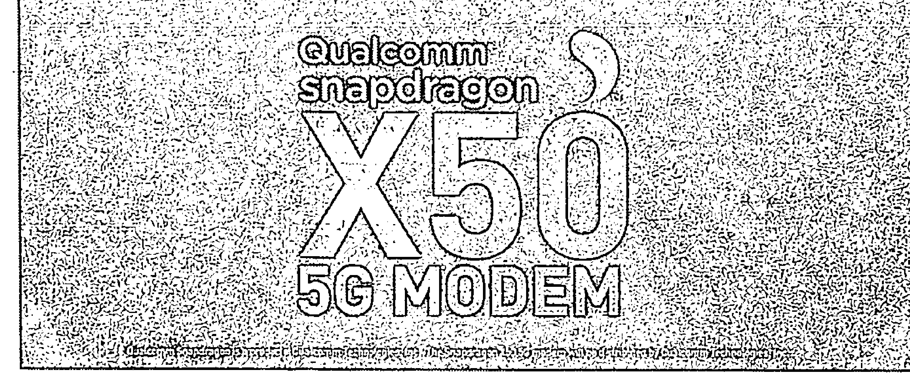

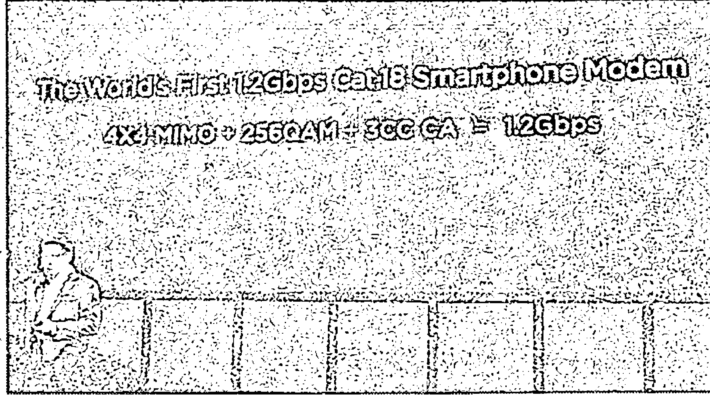

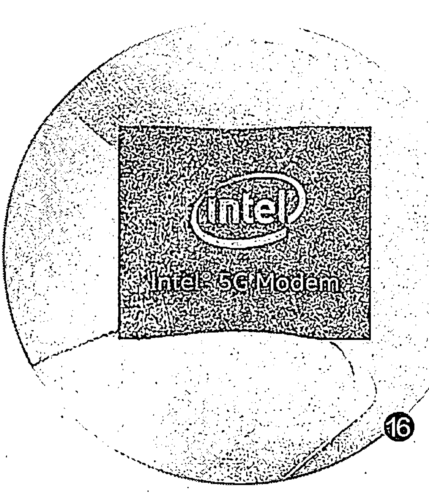

### SoC里住着一只“猫”
网络性能全靠它

对智能手机而言，它能达到哪个级别的网络性能，不仅取决于SoC中集成的调制解调器（Modem）型号，同时还要受到载波聚合和天线数量的节制。为了让大家可以更精准地把脉手机网络性能，就让我们走进“猫”的世界。

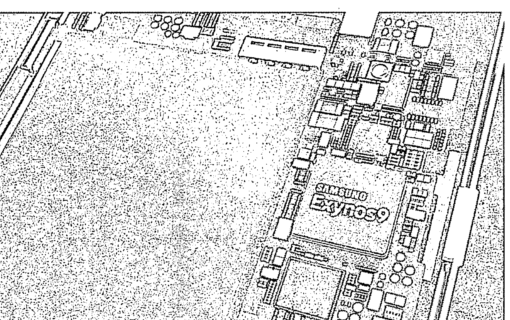

### 温故知新 搞懂基本参数

想要区分不同调制解调器的强弱，首先就要搞懂和其有关的各项参数。

### SoC

每一颗手机处理器在本质上都是完整的SoC（System-on-a-Chip，片上系统），除了我们熟悉的CPU和GPU外，还整合了ISP、DSP、协处理器等单元，而调制解调器也是SoC的重要组成部分（图1）。当然凡事都有例外，比如苹果A系列和三星早期的猎户座芯片就一直采用外挂基带的方式，弥补自家缺少调制解调器相关技术的不足。

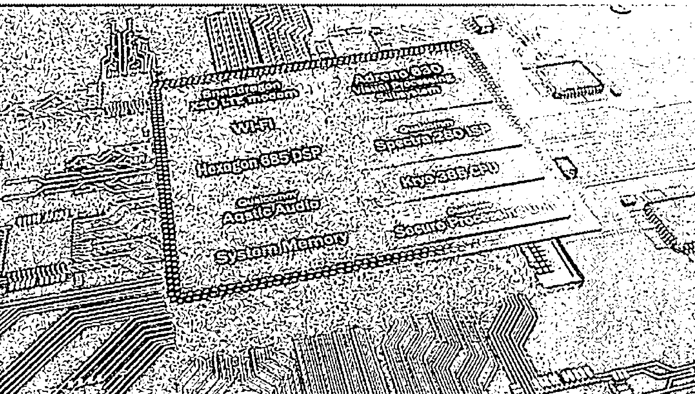

### 速率

速率（又称峰值带宽）是用来量化调制解调器性能的关键指标。从2G到准5G，经历了从Kbps→Mbps→Gbps的进化。以Mbps为例，Mbps=Mbit/s即兆比特每秒，这是一个表示传输速度的单位。不过，相信大家可能对MB/s这个单位更加熟悉，而Mbps和MB/s的换算方式是将Mbps前的数字除以8。比如300Mbps的理论速度就是37.5MB/s，而准5G的1Gbps速率，代表理论速度可达128MB/s。

### Cat.x

Cat是一个缩写，全称是UE Category，“Cat.x”是对调制解调器上行/下行峰值速率的一个分级。一般情况下，Cat.后面紧跟的数字越大，代表这款调制解调器的网络传输速率峰值就越高越先进（图2）。需要注意的是，上行Cat和下行Cat在速率上并不对等，而手机厂商在宣传时主要会以下行Cat等级为卖点，因为上行速率总是很慢。

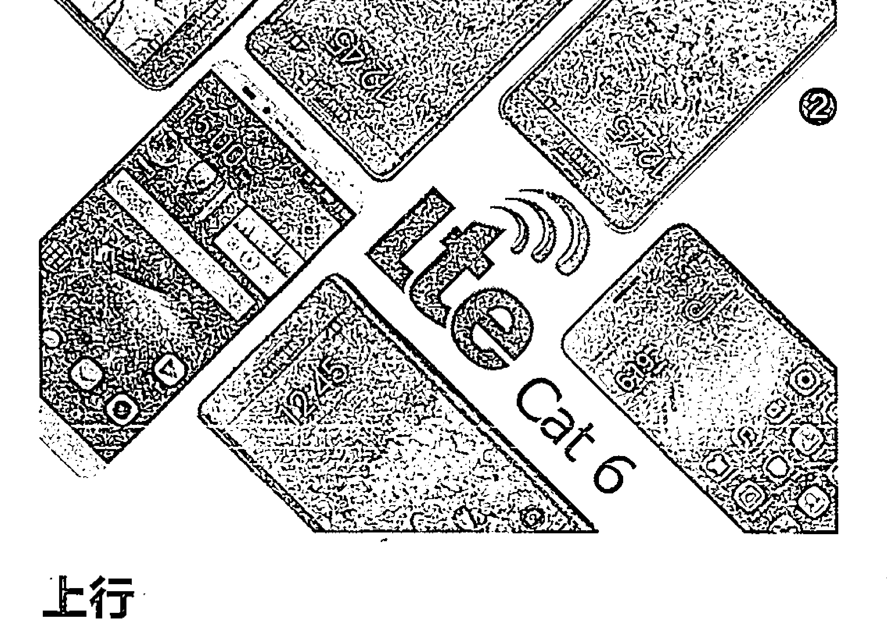

### 上行

上行指的是用户设备向网络端发送信息，而上行带宽峰值速率指的是手机在向网络发送数据时，固定时间内所被允许发送数据量的最大值。调制解调器支持的上行速率分级包括Cat.4（50Mbps）、Cat.5（75Mbps）、Cat.6（50Mbps）、Cat.7（100Mbps）、Cat.9（50Mbps）、Cat.13（150Mbps）几个等级，上行Cat.13代表了当前的最强性能。

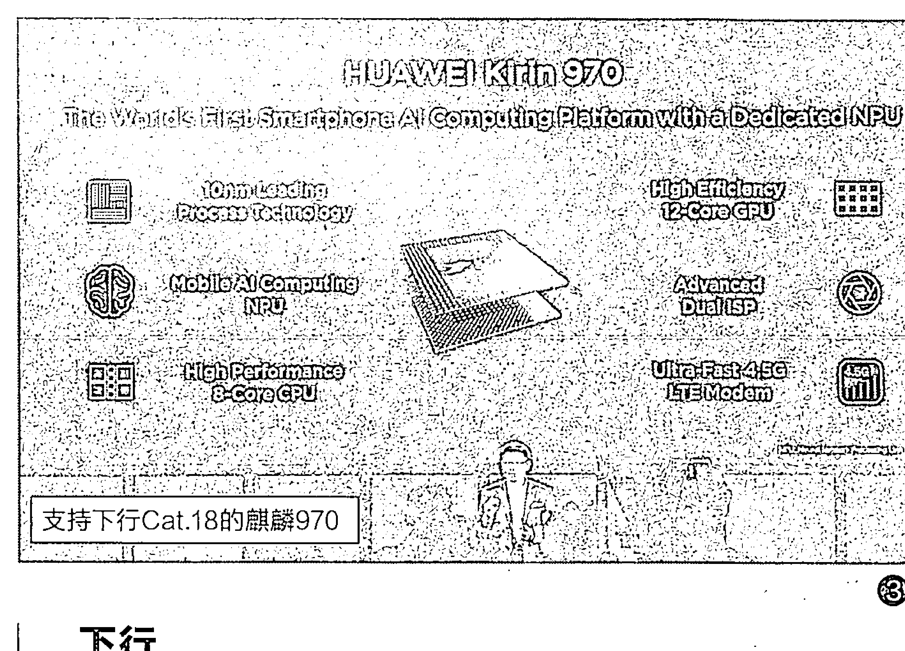

### 下行

下行指的是用户设备从网络端接收信息，而下行带宽峰值指的则是手机在从网络接收数据时，固定时间内所被允许接收的数据量的最大值，也就是我们常说的实际下载速度。调制解调器支持的下行速率分级同样以Cat.表示，包括Cat.4（150Mbps）、Cat.6（300Mbps）、Cat.7（300Mbps）、Cat.9（450Mbps）、Cat.11（600Mbps）、Cat.12（600Mbps）、Cat.16（1Gbps）和Cat.18（1.2Gbps）（图3）。

### 载波聚合

载波聚合简称CA（Carrier Aggregation），该技术可以将多个载波聚合成一个更宽的频谱，同时也可以把一些不连续的频谱碎片聚合到一起。得益于更宽的频谱，载波聚合后最直观的好处就是传输速度的大幅度提升，同时还能降低延迟，改善网络质量，提升吞吐量，使网络负载更加均衡，尤其是在负载较重的时候效果会更明显（图4）。调制解调器的下行和上行速度都能借助载波聚合提速，目前主流SoC（如骁...

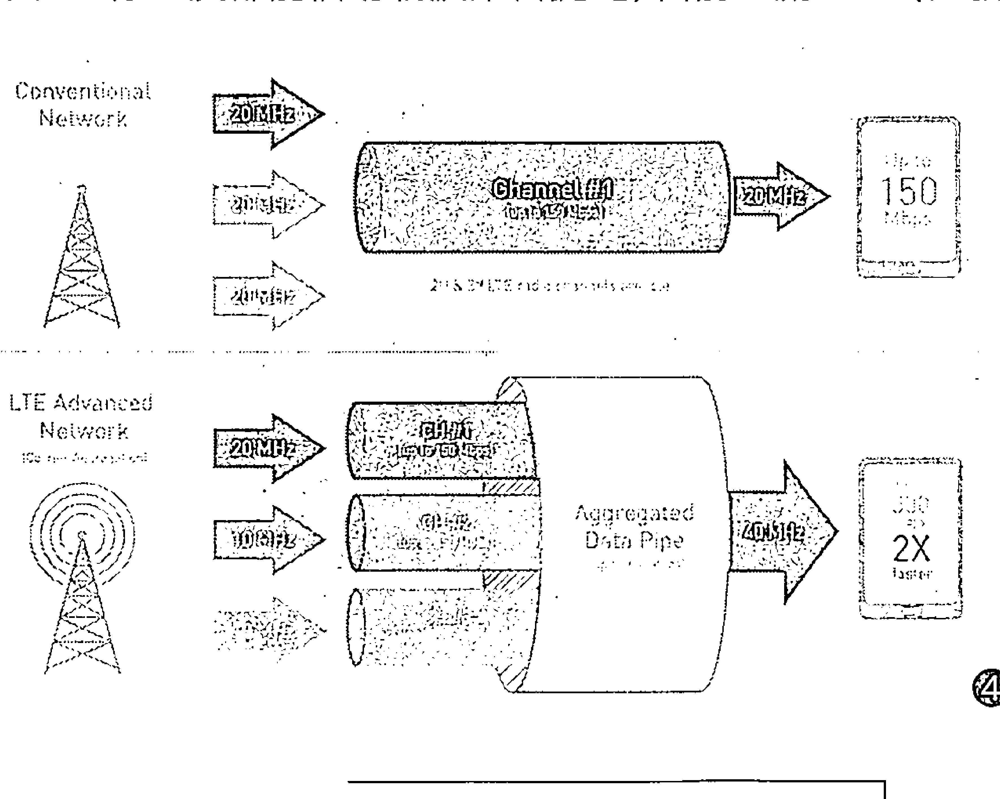龙625)普遍支持2CA (也就是2×20MHz)，麒麟970和骁龙845支持5CA (5×20MHz)，三星Exynos 9810更是可以实现6CA (6×20MHz)。

### QAM

QAM (Quadrature Amplitude Modulation, 正交振幅调制)是一种信号调制方式，我们只需要知道QAM前面跟的数字越大，其数据传输效率就越高。主流级别的SoC普遍仅支持64-QAM，而旗舰级SoC则可支持到256-QAM(图5)。

### x模x频

如今的智能手机都已支持全网通，而产品间较量的重心则转移到了x模x频这个参数上，比如5模13频、5模17频、5模32频等。其中5模代表最主流的5种网络制式，分别为TD-LTE、FDD-LTE、TD-SCDMA、WCDMA、GSM，而蜂窝频段的多少，将决定手机能否在国外正常使用。比如5模17频才能做到大部分国外漫游，但你要想通吃全球，只有选择支持32频网络的手机。以上就是我们需要温习的知识点，下面我们再以普及度最高的历代骁龙移动平台为例(表1)，将这些参数融会贯通。

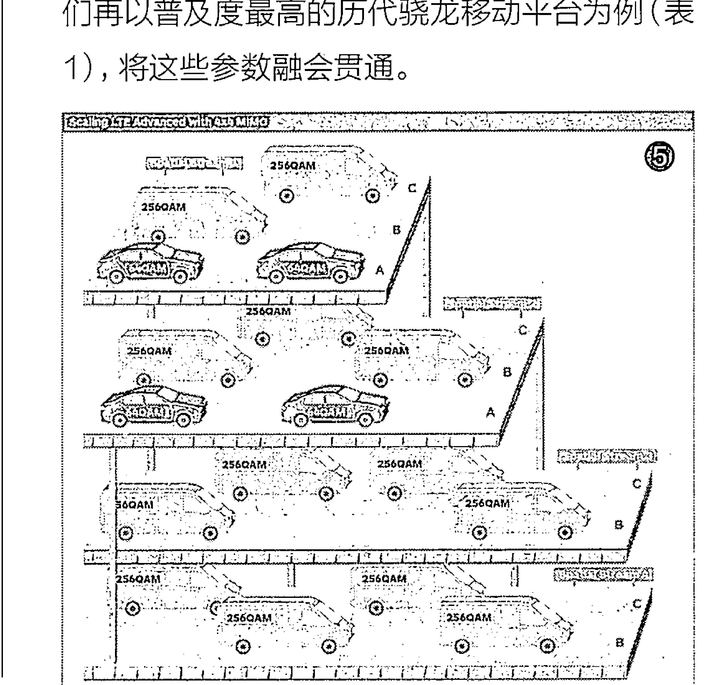

### 表1: 高通历代骁龙LTE调制解调器规格对比

| 骁龙型号 | X5 LTE | X6 LTE | X7 LTE | X8 LTE | X9 LTE | X10 LTE | X12 LTE | X16 LTE | X20 LTE |
|----------|--------|--------|--------|--------|--------|---------|---------|---------|---------|
| 载波聚合下行 | 2×10MHz 64-QAM | 2×10MHz 64-QAM | 2×20MHz 64-QAM | 2×20MHz 64-QAM | 2×20MHz 64-QAM | 3×20MHz 64-QAM | 3×20MHz 256-QAM | 4×20MHz 256-QAM | 5×20MHz 256-QAM |
| 载波聚合上行 | 1×20MHz 16-QAM | 1×20MHz 64-QAM | 1×20MHz 16-QAM | 2×20MHz 16-QAM | 2×20MHz 64-QAM | 1×20MHz 16-QAM | 2×20MHz 64-QAM | 2×20MHz 64-QAM | 2×20MHz 64-QAM |
| LTE级别下行 | Cat.4 | Cat.4 | Cat.6 | Cat.7 | Cat.7 | Cat.9 | Cat.12 | Cat.16 | Cat.18 |
| LTE级别上行 | Cat.4 | Cat.5 | Cat.6 | Cat.7 | Cat.13 | Cat.9 | Cat.13 | Cat.13 | Cat.13 |
| 峰值速率下行 | 150Mbps | 150Mbps | 300Mbps | 300Mbps | 300Mbps | 450Mbps | 600Mbps | 1Gbps | 1.2Gbps |
| 峰值速率上行 | 50Mbps | 75Mbps | 50Mbps | 100Mbps | 150Mbps | 50Mbps | 150Mbps | 150Mbps | 150Mbps |
| 代表SoC | 骁龙616 | 骁龙430 | Gobi 9x30/9x35* | 骁龙652 | 骁龙625 | 骁龙810 | 骁龙820 | 骁龙835 | 骁龙845 |

* Gobi 9x30/9x35主要应用于车载平台

### 不断进化的“喵星人”

作为SoC里的标配，调制解调器这个“喵星人”(下文我们就以“Modem”描述)自然也就居住在每一款智能手机体内。但是，不同Modem之间的性能和功能上的差距会非常大，而同一款Modem在不同的手机上也会出现极大的性能差异。


### 保持一切连接的桥梁

Modem是智能手机与外界保持一切连接的主要桥梁，包括GSM、CDMA、WCDMA、LTE、Wi-Fi、BlueTooth等在内的协议和标准都要经过它才能完成，所以Modem的优劣将直接影响到数据传输的效果。不知道大家还记不记得苹果曾推出过的iPod touch(图6)，它与同期的iPhone相比就是精简了Modem模块，所以它的价格就能比iPhone便宜数千元且更轻薄，由此可见Modem对手机的重要性。

### 有必要追求更高标准吗

如今很多互联网企业都会选择和运营商合作，推出各种王卡、神卡、宝卡、强卡，在流量和资费上极具优势，500MB/元省内流量足够我们随意折腾了。哪怕你没有办理新卡，为了维护老用户，很多地区的运营商每月也都会派送GB级别的免费流量包。在这种大环境下，更快的下载速度自然就能代表更好的上网体验了。

另一方面，国内三大运营商都在架设升级4G+网络（LTE-A Pro）（图7），其测试速度高达700Mbps，已经超过了Cat.12（下行）的峰值。换句话说，等4G+网络全面商用时，如果你的手机网速还在Cat.12以下就会瞬间落伍。同时，随着5G进程的加速，一些大城市还能提前享用1Gbps的极速，此时就只有支持Cat.16标准的手机才有机会享用了。

很遗憾，Modem的研发技术门槛极高，期间还会涉及到来自高通等企业的专利壁垒，哪怕是强如苹果也不得不选择SoC+外挂Modem的方式，至于Modem的供应商则来自高通和英特尔。那么，现在都有哪些SoC值得我们关注？


### 主流SoC网络性能对比

如今还在销售的智能手机，除了联发科早期的Helio P10和P20平台、麒麟65x系列以外，几乎都可支持上行Cat.13，即150Mbps的峰值速度。至于下行，只有骁龙660、麒麟960、三星Exynos 7885或更高级别的芯片才符合LTE-A Pro网络标准（表2），这意味着短期内绝大多数2000元以内的手机很难因运营商的基站升级而获益。

除了上下行速度以外，Modem还有一个值得我们关注的功能，它就是“双卡双4G+双VoLTE”（图8）。该功能突破了传统双卡设计的局限，实现了主副卡均可同时在4G网络上待机并支持高清语音通话，极大提升了双卡用户的体验。

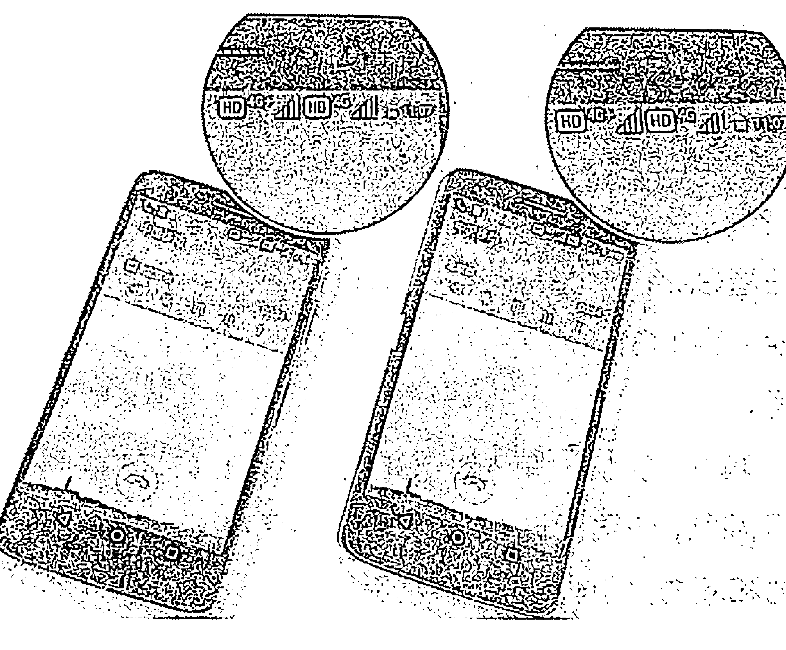

表2：主流SoC网络性能对比表

| 品牌 | SoC型号 | Modem型号 | 理论下行速度 | 理论上行速度 |
| :--- | :--- | :--- | :--- | :--- |
| 高通 | 骁龙845 | X20 LTE | Cat.18 1.2Gbps | Cat.13 150Mbps |
| | 骁龙835 | X16 LTE | Cat.16 1.0Gbps | Cat.13 150Mbps |
| | 骁龙660/630 | X12 LTE | Cat.12 600Mbps | Cat.13 150Mbps |
| | 骁龙625/626 | X9 LTE | Cat.9 300Mbps | Cat.13 150Mbps |
| 华为 | 麒麟970 | 不明 | Cat.18 1.2Gbps | Cat.13 150Mbps |
| | 麒麟960 | Balong 750 | Cat.12 600Mbps | Cat.13 150Mbps |
| | 麒麟95x | Balong 720 | Cat.7 300Mbps | Cat.7 100Mbps |
| | 麒麟65x | 不明 | Cat.7 300Mbps | Cat.7 100Mbps |
| 联发科 | Helio X30 | 不明 | Cat.10 450Mbps | Cat.13 150Mbps |
| | Helio P30/P23 | 不明 | Cat.7 300Mbps | Cat.13 150Mbps |
| | Helio P20/P25 | 不明 | Cat.6 300Mbps | Cat.6 50Mbps |
| 三星 | Exynos 8910 | 不明 | Cat.18 1.2Gbps | Cat.13 150Mbps |
| | Exynos 8895 | 不明 | Cat.16 1.0Gbps | Cat.13 150Mbps |
| | Exynos 7885 | 不明 | Cat.11 600Mbps | Cat.13 150Mbps |
| | Exynos 7872 | 不明 | Cat.7 300Mbps | 不明，理论为Cat.13 |
| 苹果 | A11 | Intel XMM7480<br>骁龙X16 LTE | Cat.16 1.0Gbps | Cat.13 150Mbps |

了传统双4G手机的限制，两张手机卡都能实现4G同时驻网（以往都是4G+2G），还能同时使用Volte高清语音通话。可惜，已上市的SoC中只有麒麟970、Helio P30/P23提供支持，即将量产的骁龙845和Exynos 8910也会将其作为标配。此外，是否支持蓝牙5.0，也是我们衡量新Modem或手机的考察项目。

### 同一个Modem 不一样的性能

对不同品牌型号的手机来说，当SoC和内置的Modem相同时，它们的网络性能就应该极为接近吗？很遗憾，因为两个常见的问题，造成了令人唏嘘不已的结局。

首先，SoC内置的Modem是可以定制的（图9）。以小米6为例，虽然它搭载了骁龙835，但其集成的Modem却是骁龙X12 LTE。实际上，搭载骁龙835且可实现1Gbps下行速率的只有三星Galaxy S8/Note8、HTC U11、Google Pixel 2和LG V30 等少数国际品牌机型的部分型号。

其次，哪怕没有对SoC内的Modem本身进行阉割，如果没能在天线设计上投入额外的财力和精力，同样会导致性能缩水。

前不久外媒PCMag就对iPhone X（外挂骁龙X16 LTE Modem），以及三星Note 8、Google Pixel 2、LG V30三款搭载高通骁龙835（集成骁龙X16 LTE Modem）的Android旗舰，在LTE Band 4频段分别为2×2 MIMO和4×4 MIMO两种网络模式下进行了对比测试。

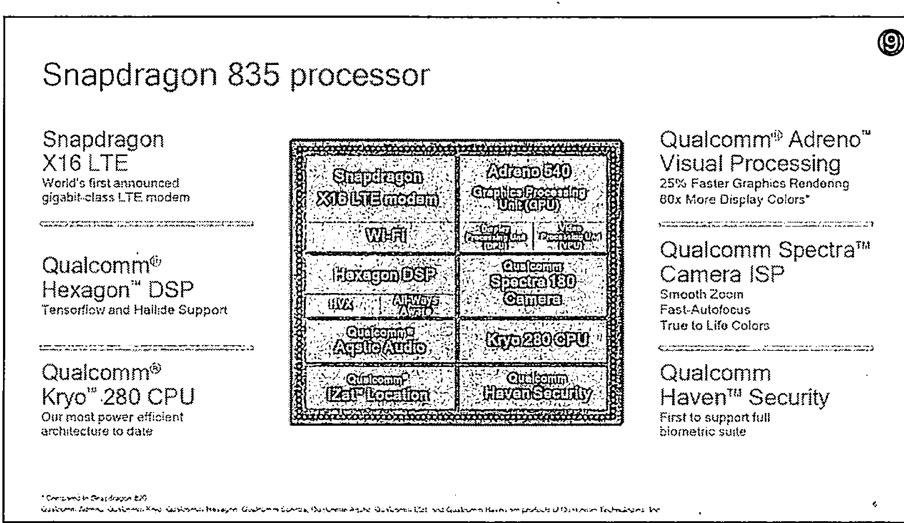

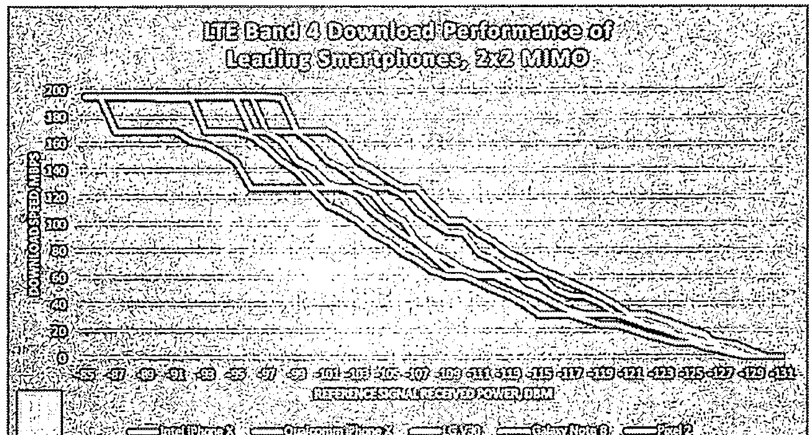

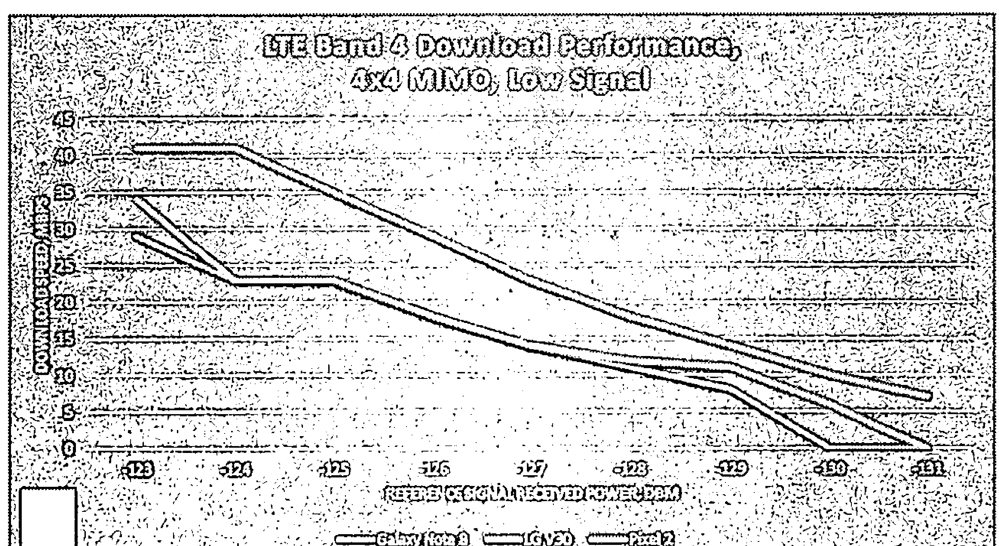

不出意外，iPhone X的成绩垫底（图10）。原因有二，第一是iPhone X不支持4×4 MIMO天线，第二是为了平均英特尔Modem和高通Modem的差距，苹果故意调低了高通骁龙X16 LTE Modem的性能表现。从4×4 MIMO的测试结果来看，在信号较好的情况下三款Android旗舰的表现相近，只有在信号最弱时才会出现明显的差距（图11）。

对准5G的Modem而言，要想实现千兆级别的速度，不仅需要Modem自身支持，还需要射频和足够的天线数支持（图12）。比如骁龙X16 LTE Modem就至少需要3根LTE天线，其中2根通过4CA载波获得接近800Mbps的速率，1根通过2CA载波获得接近200Mbps的速率，加起来正好接近1Gbps。为了降低成本（或者说认为国内运营商基站环境用不上），绝大多数国产旗舰机都只配有2根LTE天线，射频模块也被简化，所以只能支持Cat.12的速率，比如一加5T等。类似的情况也出现在麒麟SoC阵营中。华为Mate 10 Pro、Mate 10和荣耀V10都搭载了麒麟970芯片，但只有Mate 10 Pro采用了完整的4×4 MIMO，通过4根物理接收天线获得了Cat.18，也就是最高1.2Gbps的下行速率（图13）。Mate 10采用了4×2 MIMO，所以下行标准降到了Cat.16，但也有着1.0Gbps级别的下行速率。荣耀V10对天线做了进一步的精简，下行标准只有Cat.12，一夜回到了解放前，和搭载麒麟960的前辈们持平。总之，就单纯的网络性能而言，在智能手机领域基本算是诠释了“一分钱一分货”的道理。在普通用户看来，都是骁龙835平台，最低2499元，凭啥要买动辄5000元的？荣耀V10的配置看起来和Mate 10系列差不多，为啥要加1000元买更贵的？

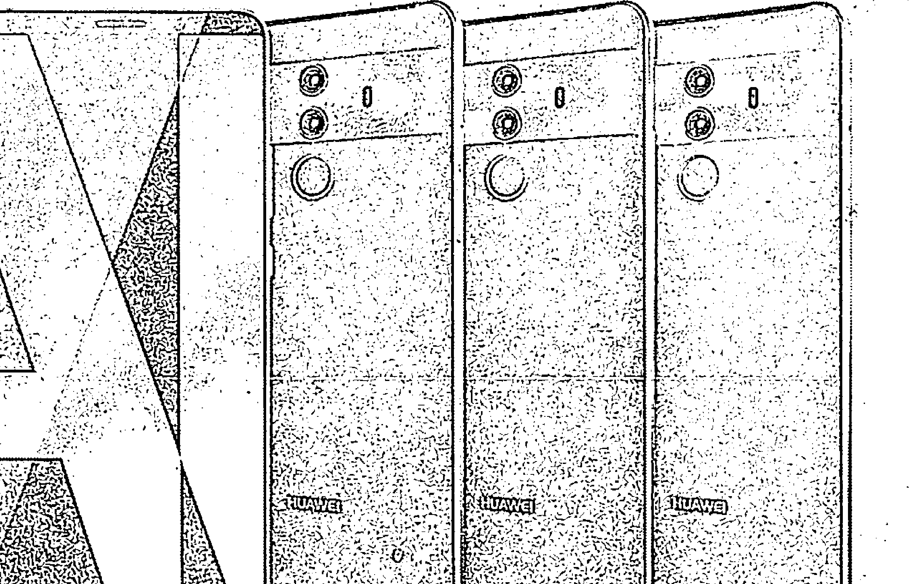

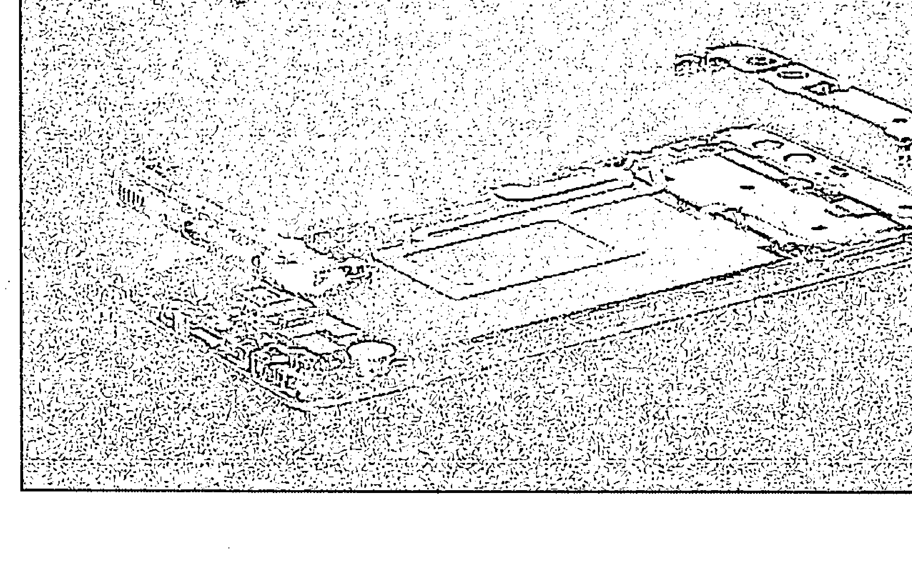

## 小结

当SoC集成Modem普遍达到Cat.12级别（下行）后，手机内置的天线设计就是品牌之间技术角力的舞台了。如果用通俗的话说，采用4×4 MIMO天线，再结合载波聚合和QAM技术的手机可以让你打《王者荣耀》时不卡机，玩《绝地求生：全军出击》类游戏时可以大吉大利今晚吃鸡（图14）。

不可否认的是，对（内部）寸土寸金的智能手机而言，如何在狭窄的空间之中塞进4根或更多天线，同时还需要安排复杂的CA组合、开关、可调电容和用于天线控制系统的阻抗调谐器等等部件，绝对是一件吃力不讨好的技术活。但是，随着LTE-A Pro和5G商用的日益临近，4×4 MIMO势必会成为未来中高端智能手机的标配。也许半年以后，在最新基站覆盖的区域中，你就能明显感受到满血Modem带来的极致体验了（图15）。

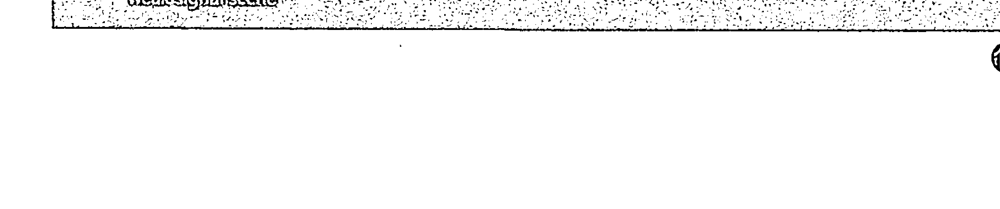

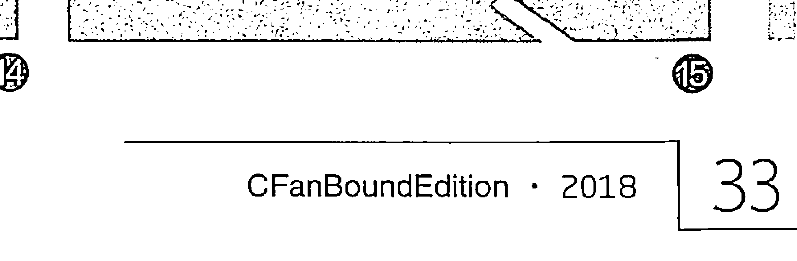

## 回忆

### 用模拟器怀老游戏

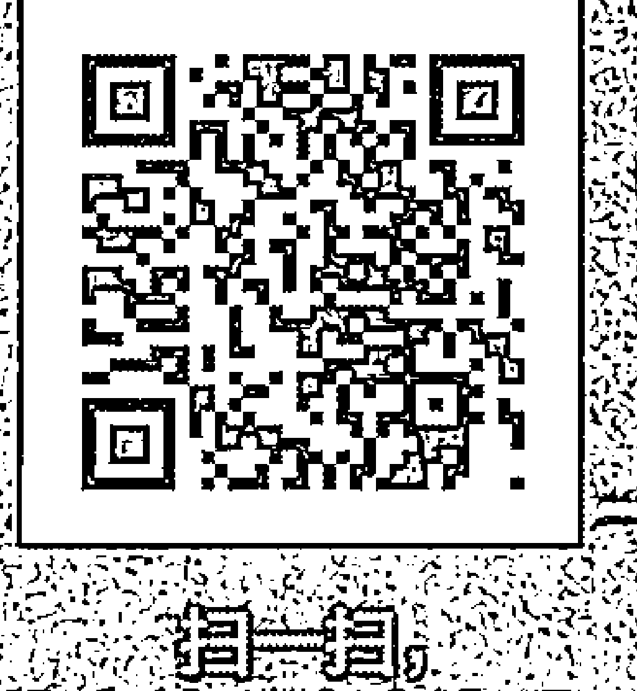

文|摸之左手 任九州

从魂斗罗的激烈战斗到FF7的凄美壮丽，不知道有多少朋友一谈起老游戏，就会情不自禁地陷入对青葱岁月的美好回忆。也许我们的父母并不理解，屏幕上呈现给我们的，并不比门外的世界逊色，甚至能带给我们更多感动。不过随着电脑的日益强大、主机的不断更新、手机的逐渐完善，我们却离这些初始的感动越来越远了。也许很多朋友还保留着当年的老“伙伴”，但能做的也只是偶尔拿出来抚摸感叹，它们大都已经无法连接、启动、使用了，更不要说去购买游戏。当然，技术的进步也带给了我们另一种重温旧梦的选择，那就是利用现在强大的硬件，模拟出老游戏的系统，让这些老游戏在现代平台上运行起来。

## 行走边缘——Lakka与主机模拟器

由于游戏主机大都采用专属硬件，甚至连最基础的指令集都是专属的，相应游戏更是拥有非常严格的版权，不仅不允许随意拷贝，还限定了可运行平台，就更不要说进行破解了。在如此严格的版权限制下，模拟器作者其实也是游走在法律的边缘，既能带给程序员荣耀的光环，也免不了被看成黑客的同类。这种特殊环境，造成了模拟器软件的定位尴尬，加上在不同的硬件平台上创作主机模拟器本身是一项相当具有挑战性的工作，会耗费大量精力、时间甚至金钱，因此模拟器很难做到完美，它们或者只能模拟部分游戏，或者模拟效果不佳，又或者只对某些硬件做了较好的优化，直接断更是常有的事。

针对这种情况，很多模拟器爱好者不得不安装多个模拟器以适应不同的硬件甚至专门针对某些游戏。好在随着PC硬件水平的提升，现代PC的性能已经非常强大，可以“强行”地模拟一些早期游戏主机平台的硬件环境，而不用担心性能不足的问题。因此针对早期主机，出现了一些多平台模拟器，例如最近在模拟器爱好者圈中非常火的Lakka。

### Lakka的前世今生

Lakka是一款同时支持Windows、MacOS和Android操作系统的主机模拟器，它实际上来自于另一个游戏模拟平台——RetroArch。


### RetroArch以同时支持多种主机著称

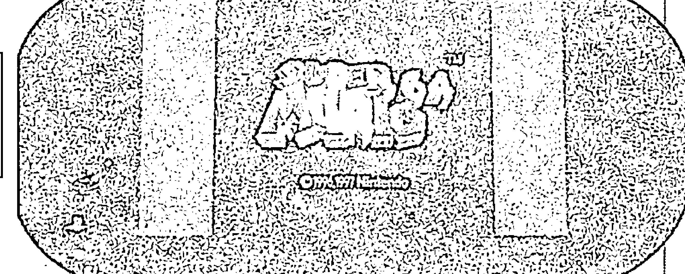

通过RetroArch在PSV上模拟其他主机的游戏

RetroArch的开发团队和系统内核都叫libretro，它对硬件的支持能力相当夸张；除了PC操作系统及Android、iOS两大移动操作系统之外，还包括浏览器端、黑莓系统，甚至支持PS3、PSP、PSV、Wii、GameCube、3DS、XBOX 360、XBOX等游戏机系统。

Lakka原本是作为RetroArch的Linux轻便版本推出，主要支持以树莓派（Raspberry Pi）为代表的Linux平台，不过后期也增加了对PC和Android系统的支持。Lakka在RetroArch的基础上进行了相当程度的简化，不过保持了RetroArch强大的多种主机模拟能力及出色的平台兼容性，对手柄的兼容性也很不错。除了兼容性之外，Lakka还拥有良好的运行高效率和出色界面，良好的中文支持能力更是吸引国内玩家的重要原因，其Lakka的文件体积很小，开关机和游戏载入速度都很快，类似PSP、PS3主机的XMB界面简单明了，只要在语言选项中直接选择中文，就能获得官方的全中文界面。

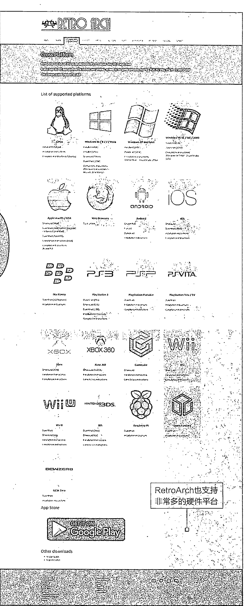

RetroArch也支持非常多的硬件平台

当然，不同的模拟主机和不同的平台，特别是不同的Android平台之间，适应性是有差异的，其主要支持的模拟主机及平台适应能力如下表，其中适应性最强的为A，其次为B，以此类推。需要注意的是，下表中的一些主机或街机版采用的是在欧美市场的名称，例如我们通常所说的红白机，在亚洲市场名称为FC（Family Computer），而在欧美市场则被称为NES（Nintendo Entertainment System）。此外，表格中只是其主要支持的主机产品和一些游戏，仅供大家参考，随着版本的升级，相信会有更多主机和游戏加入其中。

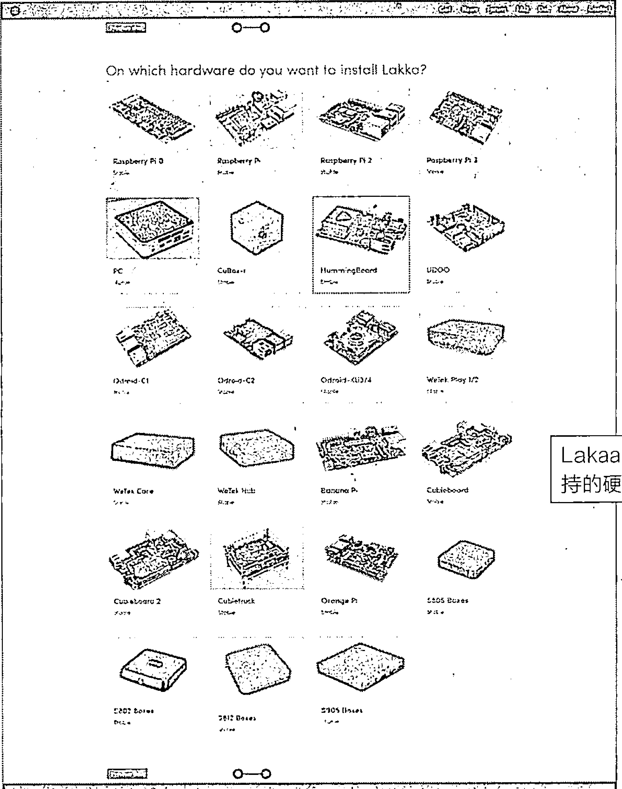

Lakaa主要支持的硬件平台

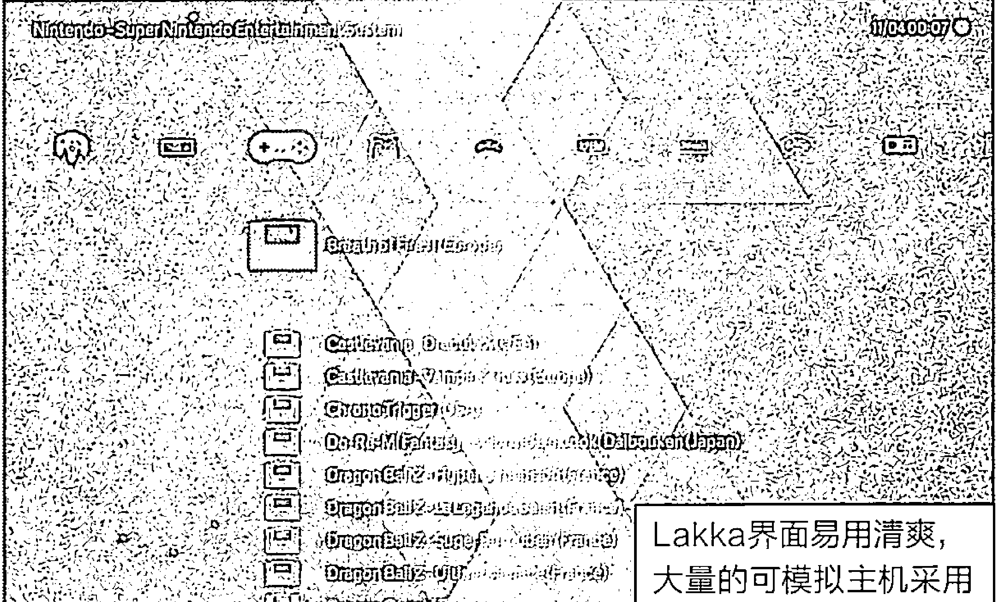

Lakka界面易用清爽，大量的可模拟主机采用其手柄的图标进行标识

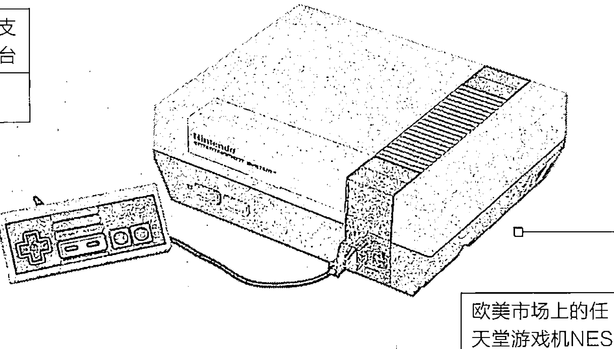

欧美市场上的任天堂游戏机NES

| 主机/平台 | RPi0 | RPi1 | RPi2 | RPi3 | c2 | x64 | C1 | XU4 | PC |
| :--- | :--- | :--- | :--- | :--- | :--- | :--- | :--- | :--- | :--- |
| 2048 | A | A | A | A | A | A | A | A | A |
| 3DO | - | - | - | - | - | - | - | - | A |
| Atari 2600 | ? | A | A | A | A | A | A | A | A |
| Atari 7800 | ? | - | - | A | - | - | - | - | A |
| Atari Jaguar | ? | ? | ? | ? | ? | ? | ? | ? | A |
| Atari Lynx | ? | A | A | A | A | A | A | A | A |
| Cave Story | ? | B | A | A | ? | A | A | A | A |
| Dinothawr | ? | A | A | A | A | A | A | A | A |
| Doom | ? | A | A | A | A | A | A | A | A |
| FB Alpha | - | C | B | A | ? | B | A | A | A |
| Ffmpeg | - | D | ? | ? | ? | ? | C | C | B |
| Game Boy | A | A | A | A | A | A | A | A | A |
| Game Boy Advance | C | B | A | A | ? | B | A | A | A |
| Game Boy Color | A | A | A | A | A | A | A | A | A |
| Game Gear | A | A | A | A | A | A | A | A | A |
| Gooitro | - | ? | ? | A | ? | ? | ? | A | A |
| Master System | A | A | A | A | A | A | A | A | A |
| Mega Drive | A | A | A | A | A | A | A | A | A |
| NES | A | B | A | A | A | A | A | A | A |
| Neo Geo Pocket | - | - | A | A | ? | A | A | A | A |
| Nintendo 3DS | - | - | - | - | - | - | - | - | A |
| Nintendo 64 | - | - | C | B | ? | C | C | B | A |
| Nintendo DS | - | - | - | - | - | - | - | - | A |
| Nintendo GC | - | - | - | - | - | - | - | - | A |
| PC Engine | A | A | A | A | ? | A | A | A | A |
| PC Engine CD | B | B | A | A | ? | A | A | A | A |
| PC-FX | - | - | - | - | - | - | - | - | A |
| PlayStation | - | - | B | A | ? | A | A | A | A |
| PSP | - | - | C | B | - | - | C | B | A |
| Sega 32X | ? | ? | A | A | ? | ? | A | A | A |
| Sega CD | ? | ? | ? | ? | ? | ? | ? | ? | ? |
| Super NES | C | C | B | B | B | B | A | A | A |
| Vectrex | A | A | A | A | A | A | A | A | A |
| Virtual Boy | - | - | - | - | ? | ? | ? | ? | A |
| WonderSwan Color | - | - | ? | A | ? | ? | ? | ? | ? |从表格中可以看出，其实大部分模拟主机，在大部分支持的硬件平台上，都得到了B以上的分数，应该说运行能力还是相当不错的。

### 其他模拟器

除了最新兴起的Lakka之外，其实也有一些很不错的主机模拟器，其中一些还可以很好地补充Lakka的不足，我们不妨来简单了解一下它们。

#### 1 Dolphin

Dolphin是一款NGC和Wii模拟器，可在目前的中等甚至低端配置PC上全速模拟绝大多数相应游戏，尤其可以支持原生Wii控制器。


#### 2 PPSSPP

PPSSPP模拟器与Dolphin有一定的关系，它是Dolphin开发小组主要成员之一hrydgard开发的一款跨平台、开放源码的PSP模拟器，支持Windows、Linux、Android、iOS等主流计算机与移动设备操作系统。


#### 3 SSF

SSF是目前最好的一款SS土星主机模拟器，也可以运行SS兼容街机版的一些游戏。这款模拟器推出时有个比较独特的要求，必须使用SSE2指令集处理器，这一点在当时就要求用户必须选用高端处理器，但目前除了一些过于古老低端的PC，都已经可以支持这一指令集了。


#### 4 PCSX2

PCSX2是一款PlayStation 2模拟器，免费且开放源代码，支持Windows和Linux操作系统。它不仅能还原PS2游戏，而且在使用DX10显卡时，可以自行提升画面品质，让玩家得到超越PS2的游戏效果。


## 一步即达——Lakka傻瓜教程

Lakka最主要的使用平台就是PC和Android盒子，由于其设计的便捷性，两者的安装其实都非常简单，不过由于系统设计的差异，安装、设置和使用过程还是有一些差别的，我们就分别针对PC及Android盒子进行一下说明。在设备需求方面，电脑配置要求很低，只要不是十年前的电脑，Android/Linux盒子则首选树莓派的最新型号，另外一些主流的教育或开发用板卡、盒子甚至是采用晶晨S802、S805、S812、S905芯片方案的电视盒都可以。


> 在Lakka的下载首页可以看到其硬件平台相对于RetroArch有了极大的精简

### PC平台

首先从Lakka官网下载PC版安装包，解压文件包，将PC版的Lakka映像文件准备好，再找一个闪存盘（大于2GB就行），然后启动压缩包内的win32diskimager，选中映像文件，确定闪存盘盘符无误（软件只显示闪存盘，硬盘自动排除）后，单击“Write”写入（图1）。


笔者这个时候说已经完成了，你会不会觉得很诧异？如果使用Live模式，这一步真的就是完成了。重启电脑，选择从闪存盘启动，启动界面如图所示。注意如果这个时候不按下任何按键，将直接进入Live模式，也就是不需要安装的，这样电脑拔掉闪存盘就是普通系统，非常方便。如果是想变成模拟器专用机，就在启动界面根据提示按下Tab键（图2）。


安装界面选择1“Quick Install OpenELEC.tv”，然后选择安装位置即可（笔者演示的系统没有安装硬盘，所以只有闪存盘一个盘符）（图3、图4）。


安装完成或者是Live模式启动成功后，Lakka就大功告成。如果闪存盘或者硬盘里有ROM，按下方向右键到最后一个，选择扫描ROM即可，自动添加到界面中就可以选择游戏了（图5）。


如果觉得英文界面不习惯，可以在主界面中按下方向右键，选择带有大小两个齿轮的图标，即Setting项，然后按下方向键到User上回车，选择Language项，然后按方向左右键选择中文就行了（图6、图7）。

### Android/Linux盒子

由于Lakka系统是从TF/SD卡启动的，所以首先盒子必须要有TF卡插槽，虽然有一些盒子也支持闪存盘，但为了保险起见，最好还是使用官方推荐的TF/SD卡方式。首先，我们将从Lakka网站下载适合设备的文件，解压缩出一个单独的映像文件，存储到TF/SD卡上。然后使用Windows的win32diskimager工具将影像烧录到卡上，直接插入盒子，并使用存储卡启动即可。

Lakka系统也可以在Linux下制作。在将存储卡插入盒子前后，通过`$ ls -l /dev/sd*`，可以看到盒子中的存储分区，装入后多出的存储分区就是TF/SD卡的盘符。使用`$ sudo dd if=Lakka-*.img of=/dev/sdx`命令，其中Lakka-*.img为解压出的映像文件，sdx为TF/SD卡盘符，即可将卡刷成Lakka启动系统。

第一次启动时按照插入TF/SD卡、连接电视、启动电视、连接网线、连接手柄、连接盒子电源的顺序连接线缆后开机，第一次启动大约需要30秒，之后Lakka的图标就会出现在显示屏上（图8）。


要安装游戏ROM时，将Lakka盒子与PC置于同一局域网中，在Lakka设备上选择Settings→Services，将SAMBA设为Enable状态，此时在PC的浏览器或文件资源管理器中，应该可以看到Lakka这一网络内的主机，打开Lakka设备，将ROM拷入设备的ROMs目录即可。在Lakka盒子上选择“+”图标，扫描相应的目录即可添加新拷入的游戏。

### 实战树莓派

在和大家介绍安装方法之前，先简单介绍一下树莓派吧。只有信用卡大小的它正式的名称是Raspberry Pi，专为学习计算机编程教育而设计的微型计算机。别看它小，可是“五脏俱全，接上显示器和USB键鼠，就可以开始独立工作了。之前只能运行Linux，但随着Windows 10 IoT和产品更新，现在最新版的2代B型和3代B型可以使用Windows进行操作了（图9）。


首先我们需要打开lakka官方网站(www.lakka.tv)，点击官网首页的“Get Lakka”，点击“下一步”后选择GNU/Linux一项，找到所对应的安装设备。不同的设备安装包并不相同，理论上芯片相同是可以支持互刷，但如果下错安装包会造成机器无法开机（图10）。笔者这里使用的演示机型为树莓派2型（图11）。

### 各代树莓派规格对照表

点击后会下载下来一个压缩文件，这个文件需要解压。解压后得到对应的img镜像文件。此时我们需要拿出一个作为系统盘使用的TF卡，插入读卡器。使用Win32 diskimager工具，选择之前解压出来的img镜像文件，将其写入TF卡当中。需要注意的是，Win32 diskimager只会识别TF卡等外置存储设备，不会识别出电脑硬盘。

| 型号 | A型 | A+型 | B型 | B+型 | 2代B型 | 3代B型 |
|---|---|---|---|---|---|---|
| SOC | Broadcom BCM2835 (CPU, GPU, DSP和SDRAM, USB) | 同A型 | 同A型 | 同A型 | Broadcom BCM2836 | Broadcom BCM2837 |
| CPU | ARM1176JZF-S核心 (ARM11系列) 700MHz | 同A型 | 同A型 | 同A型 | ARM Cortex-A7 (ARMv7系列) 900MHz (四核心) | ARM Cortex-A53 1.2GHz 64-bit quad-core ARMv8 CPU |
| GPU | Broadcom VideoCore IV, OpenGL ES 2.0, 1080p 30 h.264/MPEG-4 AVC高级解码器 | 同A型 | 同A型 | 同A型 | 同A型 | 同A型 |
| 内存 | 256 MB (与GPU共享，可以理解为集成显卡的显存与内存共享) | 同A型 | 512MB | 512MB | 1GB (LPDDR2) | 1GB (LPDDR2) |
| USB 2.0接口个数 | 1 (支持USB hub扩展) | 同A型 | 2 | 4 | 4 | 4 |
| 视频输入 | 15针头 MIPI 相机 (CSI) 界面，可支持树莓派相机或树莓派相机(无红外线版)使用 | 同A型 | 同A型 | 同A型 | 同A型 | 同A型 |
| 影像输出 | RCA视频接口输出 (仅B型有此接口)，支持PAL和NTSC制式，支持HDMI (1.3和1.4)，分辨率为640 x 350 至 1920 x 1200 支持PAL 和NTSC制式。 | 同A型 | 同A型 | 同A型 | 同A型 | 同A型 |
| 音频输出 | 3.5mm插孔, HDMI电子输出或PS | 同A型 | 同A型 | 同A型 | 同A型 | 同A型 |
| 板载存储 | SD/MMC/SDIO卡插槽 | MicroSD卡插槽 | SD / MMC / SDIO卡插槽 | MicroSD卡插槽 | MicroSD卡插槽 | MicroSD卡插槽 |
| 网络接口 | 无 | 无 | 10/100以太网接口 | 10/100以太网接口 | 10/100以太网接口 802.11n Wireless LAN Bluetooth 4.1 Bluetooth Low Energy (BLE) | 同2代B型 |

点击“Write”写入img镜像文件，大概需要等待一分钟左右，之后会弹出写入成功的提示。此时我们的TF卡名称会变成Lakka，并且只有500MB大小，剩下的容量被当作缓存保存区不可操作。这里建议采用16GB以上的TF卡，因为游戏最终还是要拷贝到TF卡中运行，如果太小就不能运行。如果写入完成时TF卡没有改变名称或者有容量改变证明写入失败，更换一个写入软件即可（图12）。


之后把TF卡取出插入树莓派背面的卡槽中，连上键盘、HDMI、网络接口（鼠标不是必要的）。在确认安装完成后插入MicroUSB供电线，供电时会自动开机。如果需要插入手柄等外接设备，请选择免驱产品，最好也不要使用蓝牙设备，可能会出现不识别的情况（图13）。


键盘上下左右键移动操作，进入子菜单右键改变项目状态，删除键回到上一个菜单，点击Esc键则会重启系统。游戏加载需要通过网络调动硬盘里面下好的游戏ROM，无法通过电脑直接拷贝到TF卡中。

我们要在设置里面找到服务项（Settings-Services），打开SAMBA服务，确保树莓派与有游戏ROM的电脑或者硬盘在同一个网络里面，这里还要求路由器支持SAMBA服务（图14）。

之后只需要在PC端的“网络和共享中心”中打开网络，就可以在网络中找到“LAKKA”这个设备，点开后找到“ROMs”文件夹，把电脑中的游戏ROM直接拖入到里面。传输完成点开树莓派，选中第一项的第二个子选项，开始扫描游戏，系统会自动识别到刚才拷贝的游戏，点击运行即可。

整个过程中需要保持树莓派处于联网状态，除了FC与SFC这种老游戏不需要装载BIOS外，PS、PSP等较新的主机模拟器需要等待系统加载预设BIOS，有时还需要在网上自动下载兼容补丁。

## 防不胜防——一些可能出现的问题

虽然Lakka是一款相当成熟的产品，不过也难免有一些Bug或者在使用中遇到问题，下面就是几个比较常见的问题及解决方法。

- 1.无法远程管理

使用Lakka系统的盒子经常需要使用PC进行远程管理，一般来讲，大部分的盒子在安装后直接联网即可出现在局域网的设备列表中。不过有时也会出现Lakka设备无法从局域网中看到的情况，这主要是因为SSH（安全外壳协议）的问题。一般设备的SSH都会设置为打开状态，但也有一些设备因为某些原因被设置为关闭状态，拒绝远程访问，我们只需要将Lakka设置里面的Services-ssh设置为打开即可。

- 2.显示画面花屏

这可能是输出与电视分辨率有冲突，我们可以使用SSH登录工具远程登录Lakka，输入命令fw_setenv hdmimode 1080p60hz && fw_setenv outputmode 1080p60hz（分辨率与刷新率可以根据实际情况修改），重启盒子之后显示应该就会正常了。

- 3.中文显示不完整

这可能是中文字体库的问题，我们可以先从Windows的Fonts文件夹里面复制一个中文字体，粘贴到Lakka设备的/Assets/xmb/monochrome/目录中，然后改名为font.ttf就行了。如果没有找到相应的文件夹就手动建立，完成后重启盒子，选择语言字体即可。

- 4.Wi-Fi密码输入问题

有些用户发现，在Lakka系统使用电脑键盘输入Wi-Fi密码时会出现界面卡死的问题，而使用手柄就没有这个问题。这一问题和Lakka版本有关系，如果无法确定版本，且没有手柄的话，就只能使用远程管理方式设置Wi-Fi了。


首先我们要用网线连接盒子，在PC的局域网界面中确定盒子的IP地址，假设盒子的IP地址为192.168.1.xxx，在PC端输入“ssh root@192.168.1.XXX”，在界面中输入盒子的默认密码，如树莓派的默认密码就是“root”，即可连接并对盒子进行远程操控。

在PC端输入“connmanctl” - “enable wifi” - “agent on” - “scan wifi” - “services”，此时可以看到扫描出的Wi-Fi名称，每个Wi-Fi名称后都带有“wifi-XXXX”这样的代号，要连接时必须使用这些代号，输入“connmanctl connect wifi_xxxx”即可开启Wi-Fi，再拔掉网线后盒子就能够以Wi-Fi方式连接了。

### Android与Linux盒子

相对于PC、配件、手机等产品，我们很少会介绍Android与Linux盒子，其实相关产品的应用非常广泛，例如绝大部分常见的智能电视盒，就是一种刷入了固定应用的Android/Linux盒子。在Lakka的支持下，这些原本用来进行编程训练或者只有单一用途的巴掌大盒子可以轻易变身为多功能游戏机，使其“身价”倍增，更加诱人。下面我们就介绍一些值得普通用户选购，与Lakka进行配合使用的相关产品。

### 树莓派3

树莓派（Raspberry Pi）是一款很典型的Linux教育、开发板，目前的主流版本为树莓派3 Model B，它采用4核64位ARM架构处理器，板载1GB内存，自带图像输出能力，并且可以使用多种扩展附件，如摄像头、触屏显示器等，使其可以作为各种智能设备的核心。作为一款非常流行的设备，它还拥有很多专用周边，如支架、各种传感器、漂亮的外壳等。


### S905W智能机顶盒

S905是中端Android智能机顶盒常用的方案，这款处理器同样为4核64位ARM架构，一般搭配1GB~2GB内存、16GB左右存储闪存，配有USB等标准外部接口。用于Lakka系统时，从存储卡启动要改写BootROM，因此在选择时要注意不能使用加密BootROM的盒子，最好索性将盒子刷成第三方Android通用固件。


### S805智能机顶盒

S805机顶盒大概是目前最常见的Android智能机顶盒了，它采用四核ARM架构处理器，一般内置1GB左右的内存和8GB左右的闪存，可支持全高清分辨率输出。其性能足以应对Lakka的需求，而价格只有120元~150元，只是前两种产品的一半甚至更低，而且我们甚至可以拿到一些免费的产品，例如各大通信公司为宽带视频附赠的电视盒就有不少采用S805这一方案。


## 总结：

作为一款充满情怀的软件，Lakka可以将我们带回曾经的岁月，重温过去的记忆，但在实际使用中还是应该注意版权等问题，避免纠纷。

## 跳动的心

### 解读移动处理器性能差距之源

策划|《电脑爱好者》编辑部

在手机专用的移动处理器领域，高通、三星、麒麟和联发科争相斗艳，不断为提升智能手机的性能而努力。然而，尴尬的事情出现了：无论Android手机处理器如何迭代，在它们面前总会呈现一座难以逾越的大山，它就是来自苹果的A系列处理器，其性能似乎每次都能领先于同期Android手机芯片，哪怕是高通还未正式发布的骁龙845也难以比肩苹果2017年下半年推出的A11 Bionic（图1）。

那么，为何苹果A系列处理器能上演“默秒全”的戏码？移动处理器之间的性能为何会存在如此大的差距？

## ARM——移动处理器背后的皇帝

提到芯片商，大家首先会想起谁？英特尔、AMD、苹果、三星、高通、联发科、麒麟……实际上，除了英特尔和AMD等少数混“X86圈子”的芯片厂外，其余厂商都是要看ARM脸色吃饭的。

### “ARM”的两层含义


“ARM”这个词汇包含两层含义（图2）。第一层，ARM是“英国芯片设计公司”的缩写（已于2016年被日本软银收购），是一家致力于半导体芯片设计研发的企业。

> 火速链接
有关ARM和X86之间的恩怨和异同，感兴趣的读者可以参考本刊2017年第3期《不再甘心移动 ARM染指PC千亿市场》这篇文章。

第二层，ARM是与X86平级的CPU架构，它和X86的差别是改用了RISC（精简指令集计算机），虽然整体性能不如X86架构特有的CISC（复杂指令集计算机），但却因主打“低成本”、“低功耗”和“高效率”这三手好牌，恰好迎合了包括智能手机在内的诸多移动设备的发展潮流，从而一统非PC领域计算设备的江山。

## 不一样的运营模式

ARM之所以默默无闻，主要就在于其独特的运营模式。作为全球最著名的半导体芯片厂商，英特尔总将芯片的IP设计、IC设计、晶圆制造和封装测试等环节大包大揽。

反观ARM公司，其只负责半导体芯片产业链中最初的IP设计部分，也就是研发ARM指令集、内核架构、图形核心和互连架构等，并将它们授权给其他芯片商完成从半导体芯片设计、生产到销售的其他流程（图3）。而ARM的盈利来源，则在于前期的授权费用，以及芯片厂后期销售时支付的提成费用。

> 如果套用一句流行的广告词，那就是“我们（ARM）不生产芯片，我们只提供一个芯片设计的Idea”。

可以说，作为一家不生产芯片的芯片厂商，ARM却在全球范围内支撑起了各种嵌入式设备、智能手机、平板电脑、智能穿戴和物联网设备的运行，只是ARM每年都会从构建上述设备体内的上百亿颗处理器中“抽成”，严格遵守薄利多销的运营模式。

有意思的是，随着时间的推移，ARM和X86的边界也开始变得模糊起来。比如，ARM现在就开始“入侵”传统X86架构处理器坚守的高性能计算终端市场了。首当其冲的就是服务器，AMD在2014年就发布了首款ARM架构处理器“Opteron A1100”，并于2016年部署到服务器领域（图4）。作为与英特尔平级的X86芯片供应商，AMD的“倒戈”也恰好印证了ARM架构的先天优势：拥有更高的灵活性、定制能力以及更低的开发费用和功耗。

AMD副总裁Andrew Feldman曾表示，研发完全定制化、采用ARM架构的服务器芯片目前仅需花费18个月的时间并耗资3000万美元，而研发基于X86架构的服务器芯片则需要花费3年到4年的时间并耗资3亿到4亿美元，孰优孰劣一看便知。

除了服务器市场，微软也联合高通推出了基于ARM架构处理器（骁龙835）打造的Windows 10笔记本（图5），并主打“永远在线”特性，而且很快就要与我们正式见面。对此类设备感兴趣的读者，可参考本刊2018年第1期《Always Connected PC 骁龙牌笔记本欲乘风破浪》这篇文章。

那么，就我们最关心的手机处理器而言，ARM给苹果、高通、联发科和麒麟等芯片商都提供了哪些帮助？

## Cortex

Intelligent Processors by ARM®

ARM Architecture: For Diverse Embedded Processing Needs

## ARM一门四剑客

最早被应用在智能手机身上的处理器，来自基于ARM v6指令集设计的ARM11架构，比如第一代iPhone搭载的三星S5L8900、HTC G1搭载的高通MSM7201就都是基于ARM11架构定制。随着消费者对智能手机性能的期望值越来越高，ARM从ARM v7指令集开始引入全新的“Cortex+X”冠名方式（图6），让手机处理器架构的定位和性能变得更加直观。

ARM Cortex架构系列可谓“能屈能伸”的典范，它能提供非常广泛的可扩展性能选项，设计人员有机会在多种选项中选择最适合自身应用的内核，从而获得更好的能耗比、灵活性和成本控制。

针对不同的领域，ARM将旗下的Cortex内核细分为三大家族：针对开放系统的“Cortex-A”、面向嵌入式系统的“Cortex-R”和主打各种微控制器的“Cortex-M”（图7）。同时，ARM还可以提供与Cortex架构配套打包的Mali系列GPU方案，共同构成了ARM旗下的一门“四剑客”。

| 系列架构名称 | 指令集架构 | 位宽 | 多核 | 是否支持big.LITTLE技术 | 备注 |
| :--- | :--- | :--- | :--- | :--- | :--- |
| Cortex-A75 | ARM v8.2-A | 64bit | 支持 | 支持，作为大核与A55搭配 | |
| Cortex-A73 | ARM v8-A | 64bit | 支持 | 支持，作为大核与A53搭配 | |
| Cortex-A72 | ARM v8-A | 64bit | 支持 | 支持，作为大核与A53搭配 | |
| Cortex-A57 | ARM v8-A | 64bit | 支持 | 支持，作为大核与A53搭配 | |
| Cortex-A55 | ARM v8.2-A | 64bit | 支持 | 支持，作为小核与A75搭配 | |
| Cortex-A53 | ARM v8-A | 64bit | 支持 | 支持，作为小核与A72/A73/A57搭配 | |
| Cortex-A17 | ARM v7-A | 32bit | 支持 | 支持，作为大核与A7搭配 | |
| Cortex-A15 | ARM v7-A | 32bit | 支持 | 支持，作为大核与A7搭配 | |
| Cortex-A12 | ARM v7-A | 32bit | 支持 | 不支持 | |
| Cortex-A9 | ARM v7-A | 32bit | 支持 | 不支持 | |
| Cortex-A8 | ARM v7-A | 32bit | 不支持 | 不支持 | |
| Cortex-A7 | ARM v7-A | 32bit | 支持 | 支持，作为小核与A15/A17搭配 | |
| Cortex-A5 | ARM v7-A | 32bit | 支持 | 不支持 | |

## Cortex-A

Cortex-A系列又称“应用处理器”(Application Processors)，它是面向移动计算，如智能手机、平板电脑和服务器市场定制的高端处理器内核，支持包括Linux、Android、Windows和iOS等系统必需的内存管理单元(MMU)，也是与我们接触最为密切的存在。

ARM Cortex-A存在4个关键时间节点(表1)：第1个节点是Cortex-A9开启了多核时代的大门，但同时也让Cortex-A9与高性能、高发热和高功耗划上了等号；第2个节点是Cortex-A7和Cortex-A15架构与big.LITTLE“大小核”技术的出现，造就了更灵活的“2+2”、“2+4”、“4+4”多核组建方式，可以让多核处理器更好地在性能和功耗之间取得平衡；第3个节点是Cortex-A72和Cortex-A53实现了从32bit向64bit的进化；第4个节点则是最新Cortex-A75和Cortex-A55架构的出现(图8)，它们都基于最新的ARM v8.2-A指令集构建，并针对人工智能(AI)和机器学习(ML)能力进行了特别优化，同时还带来了TrustZone安全防御技术、改进的DynamIQ big.LITTLE技术，综合性能格外抢眼。

## Cortex-R

Cortex-R系列又称“实时处理器”(Real-time Processors)，它是面向实时应用领域的处理器内核，如硬盘控制器、汽车传动系统和无线通讯的基带控制等。和A系列相比，R系列内核缺少了对页表的支持，软件端看到的地址就是物理地址，软件运行时中断响应速度都更快更稳定且容易预测。虽然Cortex-R系列内核不支持完整的Linux和Windows操作系统，但对大量的实时操作系统（RTOS）支持更加完美。

## Mali系列GPU

智能手机自然要具备出色的娱乐动力，所以合理的CPU+GPU搭配方案就显得尤为重要了（图9）。对ARM公司来说，如何让芯片厂缴纳更多的授权费？嗯，在授权CPU的同时，再打包一份GPU不就结了？

于是，和高通Adreno、Imagination Technologies PowerVR齐名的ARM Mali嵌入式图形处理器就诞生了。随着Cortex-A系列架构的不断升级，ARM Mali GPU也经历了从Mali-200、Mali-400、Mali-T600、Mali-T700、Mali-T800、Mali-G71到Mali-G72的迭代更新（图10）。而影响ARM Mali GPU性能的因素有二：其一是GPU版本越新越好，比如Mali-G72肯定就要比Mali-T880强；其二是ARM Mali GPU可以选配不定数量的计算单元，GPU相同时计算单元越多性能越强。比如集成20个计算单元的Mali-G71MP20（如Exynos 8895）就要比八个计算单元的Mali-G71MP8（如麒麟960）强很多。

总的来说，ARM Cortex架构将我们身边无数的电子设备串联了起来，大到汽车中控、智能电视，小到智能手机、运动手表，微到物联网设备中超低成本的无线传感器节点，几乎所有用电力驱使且具备一定计算能力的小伙伴都是ARM的客户（图11）。

## Cortex-M

Cortex-M系列又称“微控制器处理器”（Microcontroller Processors），它是面向单片机和深度嵌入式系统市场的处理器内核，比如智能电表这样的细分市场就是Cortex-M的主攻方向。

## Bifrost architectural refinements

## Mali-G71

- Introduced the Bifrost GPU architecture
- Index-driven position shading
- Clause-based execution
- Quads
- Fully coherent

## Mali-G72

- Refining the Bifrost architecture to address emerging use cases
- Arithmetic efficiency optimizations
- Increased complex graphics performance
- Enhanced scalability

> 小提示：ARM还有面向支付、电子政府、SIM卡等安全市场的SC系列，只是此类产品与普通用户关系不大，所以本文就不再涉及了。

## ARM Enable Scalability and Efficiency in a Connected World

From sensors to servers

ARM

## ARM灵活的授权方式

ARM的商业模型是“你交钱，我授权”，但是，根据缴纳授权费用预算的多少，以及芯片厂自身的技术实力，ARM还是提供了多种授权方案供客户选择（图12）。

### 指令集授权

这是ARM提供的最深度授权方式，芯片厂可以仅购买ARM的指令集（如ARMv7、ARMv8），ARM允许芯片厂对指令集进行扩展或缩减，然后由芯片厂自行搞定内核架构、图形核心和互连架构等一系列研发设计。苹果A系列处理器之所以强悍，就是采用了ARM指令集授权然后自研CPU架构的策略，从而获得了远超同期公版ARM Cortex-A架构的性能。

## ARM Business Model

- Innovative business model yields high margins
- Upfront license fee – flexible licensing models
- Ongoing royalties – typically based on percentage of chip price
- Technology suitable for multiple applications – can ship for decades

值得一提的是，高通早期的Krait架构也采用了ARM指令集授权方案，并先后经历了APQ8064（Krait 200）、骁龙600（Krait 300）、骁龙800/801（Krait 400）和骁龙805（Krait 450）共四代（图13）。三星从Exynos 8890开始也通过指令集授权的方式推出了自主架构“猫鼬M1”（Mongoose M1，只限大核部分，小核依旧是ARM公版的Cortex-A53）。

### 使用层级授权

考虑到很多芯片厂实力有限，所以ARM还提供了类似“交钥匙”的授权方案，客户可以根据自己的需要直接挑选公版Cortex-A架构使用。这种授权可以帮助芯片厂快速搞出产品，只是能自由发挥的空间不大，处理器的类型、工艺标准都是规定好的，同类产品之间很难在CPU性能上拉开差距，性能的强弱完全取决于主频、GPU模块等外围芯片。麒麟、联发科和小米澎湃系列（图14），就多以这种使用层级的授权为主。

## 骁龙845采用全新架构

支持全新水平的性能和电池续航能力

### BoC许可授权

BoC (Built on ARM Cortex Technology) 许可介于前面两种授权之间，ARM允许芯片厂基于公版Cortex-A架构的基础上进行“半定制化”。只是ARM仍然拥有并控制IP，但允许获得BoC授权的芯片厂对指令窗口大小、高速缓存等进行更改，并对芯片厂设计所要求的更改保密。
高通应该是全部经历三种授权的芯片厂代表。为了搭上64bit时代的首班车，高通在骁龙810时代采取了使用层级授权，直接套用ARM公版Cortex-A57+A53（图15），可惜受制于20nm工艺拖累深陷发热和降频的漩涡中，也成为了高通历史上口碑最差的骁龙处理器；在骁龙820时期，高通改用指令集授权方案，推出了自研的64位Kryo CPU核心，在运行效率上超过了同期的公版Cortex-A57，挽回了骁龙810丢失的声誉。
从骁龙835开始，高通又青睐于BoC许可授权，推出了分别基于Cortex-A73和Cortex-A53公版架构“魔改”而来的四颗大核Kryo 280和四颗小核Kryo 280。据悉，骁龙845高通还将沿用BoC许可授权，只是将核心换成了由Cortex-A75、A55魔改而来的Kryo 385（图16）。

## 小结

手机处理器的强弱很大程度上就取决于内核架构版本，苹果A系列处理器之所以强大，就是借了自研核心的光。问题来了，自研核心就一定优于ARM公版架构吗？有关这个问题将在下个章节中加以解读。

## 突破极限 自研架构是成神之路

虽然很不愿意承认，但苹果iPhone 8/Plus和iPhone X的确代表了当前智能手机领域的最强性能，哪怕是还未量产的高通骁龙845都难以撼动苹果A11 Bionic处理器的皇者地位。要知道，A11 Bionic明明只是一颗六核处理器（图1），它又是凭什么秒杀一众八核甚至十核竞争对手的呢？

### 追本溯源苹果之强并非先天

很多人只看到了今天iPhone在性能上的辉煌，认为它天生骄傲。实际上，早期的iPhone在性能上并没有领先Android阵营多少，(多核性能)甚至还曾一度落后过。

第二代iPhone 3G选择了原地踏步，它的硬件规格不变，只是加入了对新兴3G网络的支持，App Store的诞生则改写了智能手机的玩法。

同一时间，谷歌推出了Android系统，以HTC G1为代表的竞争对手在第一时间就实现了配置上的反超（图3）：搭载高通MSM7201处理器，集成Adreno 130 GPU，内置更大的192MB内存。也就是从这个时期开始，iPhone和Android手机间的军备竞赛正式拉开了序幕。

iPhone也曾随波逐流

还记得第一代iPhone带给我们的震撼吗？超大且支持多点触控的3.5英寸屏幕、可实现全时连接的2G+Wi-Fi网络、完整的Web体验，简直可以吊打当年的塞班和Windows Mobile系统的任何对手。要知道，当年塞班手机清一色还都需要用按键操作，Windows Mobile手机也需要触控笔才能谈得上体验。

那么，当时的iPhone性能很强吗？

的确很强，iPhone搭载了来自三星旗下的S5L8900处理器（图2），并集成PowerVR MBX-Lite GPU模块。这款芯片基于ARM11架构设计，拥有412MHz的主频，再加上128MB内存，堪称无敌配置。可惜，苹果第二代iPhone 3G选择了原地踏步，它的硬件规格不变，只是加入了对新兴3G网络的支持，App Store的诞生则改写了智能手机的玩法。

2009年，iPhone 3GS携代号为“蜂鸟”的三星S5PC110处理器来袭，这颗芯片首次尝鲜ARM最新的Cortex-A8架构，600MHz的主频，再加上PowerVR SGX535 GPU和256MB内存的组合，将智能手机的流畅度发挥到了极致。另一方面，在App Store中还涌现出了无数好玩的iOS独占游戏，至此，iPhone游戏多、更流畅，就成为了果粉抵制Android手机的绝佳理由。

那么，Android阵营是如何回击的呢？摩托罗拉推出的Milestone搭载德州仪器OMAP3430处理器（图4），同样集成了PowerVR SGX535 GPU并内置256MB内存；HTC从G2开始改用高通MSM7200A处理器，集成Adreno 200 GPU，内置288MB内存。也就是从这个时期开始，让玩家们认识到手机GPU和系统优化的重要性，因为HTC G2玩游戏没有Milestone快，而Milestone又不如iPhone 3GS。

| 型号 | CPU | 架构 | GPU | 内存 | 单核/多核 | 型号 | CPU | 架构 | GPU | 内存 | 单核/多核 |
|---|---|---|---|---|---|---|---|---|---|---|---|
| iPhone 4 | A4 | 1×Cortex-A8 | SGX535 | 512MB | 212/212 | Galaxy S | S5PC110 | 1×Cortex-A8 | SGX540 | 512MB | 240/240 |
| iPhone 4s | A5 | 2×Cortex-A9 | SGX543MP2 | 512MB | 223/410 | Galaxy S2 | Exynos 4210 | 2×Cortex-A9 | Mali-400MP4 | 1GB | 338/614 |
| iPhone 5 | A6 | 2×Swift | SGX543MP3 | 1GB | 720/1302 | Galaxy S3 | Exynos 4412 | 4×Cortex-A9 | Mali-400MP4 | 1GB | 424/1284 |
| iPhone 5s | A7 | 2×Cyclone | G6430 | 1GB | 1413/2552 | Galaxy S4 | Exynos 5410 | 4×Cortex-A15/4×Cortex-A7 | SGX544MP3 | 2GB | 739/2167 |
| iPhone 6 | A8 | 2×Cyclone | GX6450 | 1GB | 1634/2925 | Galaxy S5 | 高通骁龙801 | 4×Krait 400 | Adreno 330 | 2GB | 910/2806 |
| iPhone 6s | A9 | 2×Twister | GT7600 | 2GB | 2529/4412 | Galaxy S6 | Exynos 7420 | 4×Cortex-A57/4×Cortex-A53 | Mali-T760MP8 | 3GB | 1265/4519 |
| iPhone 7 | A10 | 2×Hurricane/2×Zephyr | 8XT | 2GB | 3500/5800 | Galaxy S7 | 高通骁龙820 | 2×Kryo/2×Kryo | Adreno 530 | 4GB | 2145/5477 |


#### 开启自研CPU之路

面对Android阵营咄咄逼人的进攻态势，苹果做出了一个重要决定：通过自主研发CPU，逐渐摆脱对于三星芯片方面的依赖。于是，从iPhone 4开始，苹果A系列处理器终于正式与我们见面了。

iPhone 4搭载Apple A4处理器，它基于ARM官方Cortex-A8架构设计，我们可以将它看做是三星S5PC110的定制版(图5)；从iPhone 4s的Apple A5开始，苹果A系列处理器跨入了双核时代，由Cortex-A9同步双核心架构组成，基本与同期Android阵营高端手机的规格持平。

步入2012年后，NVIDIA、三星和高通纷纷祭出了四核处理器，而苹果却不愿意盲目追随市场潮流，打算坚持既有产品设计原则的态度。为了让不让双核战四核输得太难看，苹果从Apple A6开始，才算进入了真正意义上的自研CPU之路。因为，Apple A6不再使用ARM公版的Cortex-A系列架构，而是改用苹果基于ARMv7s指令集自主研发的“Swift”架构核心（图6）。


苹果自研的架构有多强？我们不妨参考一下它与同期Android阵营标杆三星Galaxy S的跑分对比（表1），从Apple A6开始苹果处理器总能在单核性能上保持绝对的优势，只是受制于核心数量偏少以及核心调度策略（同一时间点上只有高性能核心或低功耗核心运行）上的先天缺陷，导致苹果A系列处理器在多核性能上就很难与同期的对手拉开差距。

但是，这已经足够说明问题了。苹果从Apple A6开始，在核心数量少、内存容量低的绝对劣势下，却能在CPU跑分层面保持一定的优势，可见ARM官方Cortex-A架构并没有挖掘出ARMv7/ARMv8指令集的全部潜力，而这就给了芯片厂商自研架构核心的空间。到了Apple A11 Bionic时代，更是成就了苹果处理器“秒天秒地”的威望，成为了一个似乎无法战胜的存在（表2）。

| SoC型号 | CPU规格 | GPU | CPU性能(Geekbench4 单核/多核) | GPU性能(Manhattan ES3.1) |
|---|---|---|---|---|
| 苹果A11 Bionic | 2×高性能核心<br>4×高能效核心 | 自研三核心GPU | 4274 / 10248 | 63fps |
| 苹果A10 Fusion | 2×高性能核心<br>2×高能效核心 | PowerVR 8XT | 3500 / 5800 | 52fps |
| 高通骁龙845 | 4×Kryo 385 2.8GHz<br>4×Kryo 385 1.8GHz | Adreno 630 | 2422 / 8351 | —— |
| 高通骁龙835 | 4×Kryo 280 2.45GHz<br>4×Kryo 280 1.9GHz | Adreno 540 | 2000 / 6400 | 42fps |
| 高通骁龙660 | 4×Kryo 260 2.2GHz<br>4×Kryo 260 1.8GHz | Adreno 512 | 1650 / 5630 | 15fps |
| 高通骁龙630 | 8×Cortex-A53 2.2GHz | Adreno 508 | 860 / 4210 | 9.6fps |
| 高通骁龙625 | 8×Cortex-A53 2.0GHz | Adreno 506 | 860 / 4200 | 6.4fps |
| 麒麟970 | 4×Cortex-A73 2.4GHz<br>4×Cortex-A53 1.8GHz | Mali-G72MP12 | 2000 / 6450 | 38fps |
| 麒麟960 | 4×Cortex-A73 2.36GHz<br>4×Cortex-A53 1.84GHz | Mali-G71MP8 | 1880 / 6019 | 25fps |
| 麒麟659 | 4×Cortex-A53 2.36GHz<br>4×Cortex-A53 1.7GHz | Mali-T830MP2 | 900 / 3500 | 4.7fps |
| 联发科Helio X30 | 2×Cortex-A73 2.5GHz<br>4×Cortex-A53 2.2GHz<br>4×Cortex-A35 1.9GHz | PowerVR 7XTP | 1740 / 5710 | 23fps |
| 联发科Helio P30 | 4×Cortex-A53 2.3GHz<br>4×Cortex-A53 1.65GHz | Mali-G71MP2 | —— / —— | 8.3fps |
| 三星Exynos 8910 | 4×Mongoose M3 2.9GHz<br>4×Cortex-A55 1.8GHz | Mali-G72MP18 | —— / —— | —— |
| 三星Exynos 8895 | 4×Mongoose M2 2.5GHz<br>4×Cortex-A55 1.7GHz | Mali-G71MP20 | 1960 / 6490 | 43fps |
| 三星Exynos 8890 | 4×Mongoose M1 2.3GHz<br>4×Cortex-A55 1.56GHz | Mali-T880MP12 | 1900 / 6000 | 26fps |


#### 苹果为何钟情于自研


智能手机是一种极为精密的电子设备，它的PCB主板是一个整体，除了处理器芯片外还要涉及到其他器件的布局和走线（图7）。此时，如果直接使用高通或三星的处理器，就必须按照对方的芯片规格设计PCB，一旦芯片厂的下一代产品发生较大变化，苹果方面也会因此而产生不必要的重新设计的成本。另一方面，苹果从很早以前就发现，现在根本就没有厂商在做自己所需要的处理器，苹果需要比竞品更强的性能，计划通过追求深度无序的执行和广泛的问题宽度来走向ARM不曾走过之路。于是，在HTC和摩托罗拉等品牌都在依赖高通提供的处理器时，苹果就展开了各种收购和组建自己工程师团队之旅，最终在Apple A4上引入了以早前收购为基础而开发出的专用芯片组和控制器。正如前文所述，Apple A6是苹果自研处理器道路上的关键节点，它虽然使用了ARM指令集，但却不再沿用现成的公版设计。凭借着资本优势，苹果在2013年发布了全球首款64位智能手机芯片Apple A7，同时还衍生出了配备更强大图形处理性能的X变种型号（应用在iPad身上）。到了A10 Fusion时代，苹果正式迈入了四核时代，在全新动态电压频率调节模式和性能控制器的帮助下，可更有针对性地对核心负载进行智能管理，比如做到让某些核心完全关闭，能耗管控能力远超Android阵营芯片（图8）。

#### 苹果的自研野望

不要以为苹果只专注于手机处理器的研发，第一代Apple Watch所搭载的也是苹果自主研发的Apple S1，一颗针对可穿戴设备量身设计的超微型芯片（图9），随后的Apple Watch 2则升级到了双核心的Apple S2，拥有2倍于前辈的图形性能。在AirPods无线耳机身上，我们还看到了革命性的超低功耗Apple W1芯片（图10），它解决了普通蓝牙耳机的断续情况，还可提供更好的音质和更低的功耗。总之，通过A系列处理器的研发经验积累，苹果已经奠定好了为旗下产品自主设计硬件“垂直整合”战略的基础。从Apple A11 Bionic开始，苹果更是抛弃了最紧密的合作伙伴Imagination Technologies，开始定制自主的GPU架构，一旦取得重大的技术突破，苹果自研的GPU无论是芯片面积还是性能，都能比之前Imagination Technologies提供的GPU内核更适合Apple A系列SoC整体芯片的结构设计。此外，苹果还展开了自主研发调制解调器的计划，从而摆脱高通和英特尔的掣肘。可以说，苹果未来的野望就是将整个SoC内全部模块的主动权都收集到自己手中，在恰当的时机甚至会将它们应用在Mac系列的PC领域，打通Mac OS和iOS系统之间的兼容壁垒，届时我们使用PC的习惯也将因此而产生质变。


#### 不让苹果独美于前 来自竞争对手的挑战

细心的读者不难发现，对手机处理器而言，只要核心架构相同、主频相近，它们在跑分性能上就很难拉开差距。为了不让苹果A系列处理器独美于前，以高通和三星为代表的芯片厂纷纷展开了反击。

#### 高通的BoC战略

在上个章节我们介绍过，高通旗下的Kryo内核在骁龙820时代就实现了完全自主的定制化，为何从骁龙835身上又改用BoC的半定制化战略呢？很简单，高通的每一代处理器，都会根据时间和市场需求来选择最合适的CPU设计。通过指令集授权而完全自主定制处理器不太经济，而高通又觉得ARM Big.LITTLE技术已经不符合实际应用环境的需求，所以才促成了基于BoC授权而生的骁龙835（图11）。

简单来说，骁龙835和骁龙820一样都是两簇核心，分别为四颗Kryo 280（2.45GHz）性能核心和四颗Kryo 280（1.9GHz）效能核心，与ARM官方架构遵循的Big.LITTLE大小核技术不同，这八颗核心均为大核心设计。高通认为，智能手机无时无刻都在与多媒体打交道，哪怕运行微信也会涉及到大量的文字、图片和视频处理，而公版Cortex-A53核心连乱序执行都没有，需要借助更高的频率才能满足微信突发的性能请求。高不成低不就的LITTLE小核心在处理社交类APP时经常面临吃力不讨好的尴尬局面，最终还是需要Big大核心登场。

于是，高通自行设计了骁龙835的内存控制器，保证了I/O性能并加大了二级缓存，可减少读取内存，在APP加载、网页浏览、VR下能提高20%的性能，手机应用中80%的任务可交由1.9GHz的效能核心处理，能耗比远在传统Big.LITTLE技术之上。


#### Qualcomm灵活的CPU策略

每一代处理器，我们都根据时间和市场需求选择最合适的CPU

| 810 | 820 | 835 |
|---|---|---|
| 原生ARM | 定制化 | 半定制化：基于ARM Cortex®的技术 |
| 快速部署64位 | 性能强劲 功耗出色 | 更强劲的性能 更极致的功效表现 |
| 有限的系统集成 | 紧密的系统集成 | 紧密的系统集成 |

对于即将量产的骁龙845，高通带来了全新的Kryo 385架构内核，从已知的资料来看，它应该是基于ARM最新的Cortex-A75和A55魔改而来，最大的特色就是引入了DynamIQ技术（图12）。和Big.LITTLE相比，DynamIQ重新定义了多核微架构，允许DynamIQ任意丛集中核心数量可以从单核到八核不等，并且还支持异构CPU之间的混搭。有了更灵活分配核心资源的DynamIQ技术的帮忙，高通才敢在10nm工艺不变的基础上，将最高主频从2.45GHz一下子提升到2.8GHz。

据悉，高通在2018年计划推出更多基于BoC授权的处理器，包括骁龙670、骁龙640和骁龙460（图13）。其中，骁龙670将采用四颗Kryo 360 Gold（Cortex-A75公版架构魔改）和四颗Kryo 385 Silver（A55魔改）组成的八核心架构，集成Adreno 620 GPU；骁龙640采用两颗Kryo 360 Gold和六颗Kryo 360 Silver（A55魔改）组成的八核心架构，集成Adreno 610 GPU；骁龙460由四颗高频Kryo 360 Silver和四颗低频Kryo 360 Silver核心构成（均由A55魔改），集成Adreno 605 GPU。

遗憾的是，从网上曝光的骁龙845性能来看，它的单核/多核性能分别为2422和8351，和公版Cortex-A75的理论性能相似，距离苹果A11 Bionic单核超4000、多核破万的成绩相比还很遥远。希望随着固件和驱动的优化，等骁龙845正式上市时能给我们带来性能上的惊喜吧。

特别话题

| SoC | Snapdragon 845 | Snapdragon 835 | Snapdragon 710 | Snapdragon 660 |
| --- | --- | --- | --- | --- |
| CPU | 4x Kryo 385 Gold (A75 derivative) @2.80GHz 4x256KB L2<br>4x Kryo 385 Silver (A55 derivative) @1.80GHz 4x128KB L2<br>2MB L3 | 4x Kryo 385 Gold (A75 derivative) @2.80GHz 4x128KB L2<br>4x Kryo 385 Silver (A55 derivative) @1.80GHz 4x128KB L2<br>2MB L3 | 2x Kryo 385 Gold (A75 derivative) @2.75GHz 2x128KB L2<br>6x Kryo 385 Silver (A55 derivative) @1.85GHz 6x128KB L2<br>1MB L3 | 4x Kryo 385 Silver (A55 derivative) @1.80GHz 4x128KB L2<br>4x Kryo 385 Silver (A55 derivative) @1.40GHz 4x128KB L2<br>— |
| GPU | Adreno 630 | Adreno 620 | Adreno 618 | Adreno 605 |
| Memory | 4x 16-bit CH @1866MHz LPDDR4x 29.9GB/s<br>3MB system cache | 3x 16-bit CH @1866MHz LPDDR4x 22.4GB/s<br>2MB system cache | 2x 16-bit CH @1866MHz LPDDR4x 14.9GB/s<br>1MB system cache | 2x 16-bit CH @1866MHz LPDDR4x 14.9GB/s<br>— |
| ISP/Camera | Dual 14-bit Spectra 280 ISP<br>1x 32MP or 2x 16MP | Dual 14-bit Spectra 280 ISP<br>1x 26MP or 2x 13MP | Dual 14-bit Spectra 280 ISP<br>1x 26MP or 2x 13MP | 14-bit Spectra 240 ISP<br>21MP |
| Integrated Modem | Snapdragon X20 LTE (Category 18/13)<br>DL=1200Mbps 5x20MHz CA, 256-QAM<br>UL=150Mbps 2x20MHz CA, 64-QAM | Snapdragon X16 LTE (Category 16/13)<br>DL=1000Mbps 3x20MHz CA, 256-QAM<br>UL=150Mbps 2x20MHz CA, 64-QAM | Snapdragon X12 LTE (Category 12/13)<br>DL=600Mbps 3x20MHz CA, 256-QAM<br>UL=150Mbps 2x20MHz CA, 64-QAM | — |
| Mfr. process | 10nm LPP | 10nm LPP | 14nm LPP | 14nm LPP |

三星的自研大核计划


三星从Exynos 8890开始就学习苹果展开了自研CPU的旅程，基于ARMv8指令集推出了名为猫鼬（Mongoose）的架构核心。从Exynos 8890、Exynos 8895到Exynos 9810，猫鼬架构也经历了不断的升级，即将随Galaxy S9与我们见面的，就是基于三星第三代自研架构——Mongoose M3设计的Exynos 9810（图14）。

简单来说，Exynos 9810基于10nm LPP工艺打造，由四颗Mongoose M3（2.9GHz）和四颗Cortex-A55（1.9GHz）组成的八核心架构，集成ARM Mali-G72MP12 GPU。据悉，Mongoose M3自研架构的性能极为强悍，在GeekBench 4跑分中单核成绩可达4000分，多核性能有望破万。如果属实，Exynos 9810将具备和苹果A11 Bionic分庭抗礼的实力。

可惜，三星从Exynos 8890时代起自研架构就仅限于大核部分，而小核总是套用ARM公版A53/A55架构。如果三星可以参考苹果和高通，将大小核全部换成自研核心（哪怕小核是BoC），相信综合性能还能再上层楼。

小结

对智能手机而言，更高的跑分成绩虽然并不具备什么实际意义，但对于新款手机而言，跑分成绩低却是万万不成的，而将CPU架构从公版换成自研，无疑就是一条捷径。除了高通和三星，有消息称华为也开展了自研内核计划，也许很快就会有相关的芯片与我们见面。

当然，我们也不鼓励盲目的自研，毕竟研发成本最终是要转嫁到每一个消费者头上，而且影响手机实际体验的，除了CPU部分外，还有GPU、ISP、DSP、调制解调器和AI相关单元（图15）。未来手机处理器的竞争将是综合实力的较量，自研CPU架构只能抢占先机，而最终结果还要受到SoC内的其他单元影响。


扫一扫，更多精彩内容立现！


## 即插即用加即走 移动外设大点兵

即插即用，是很久以前PC就强调的一种外设连接模式，随着USB、HDMI等接口的普及和Windows系统的完善，目前这一目标已经完全实现，从键鼠到显示器，几乎所有的外设都可以做到即插即用，当然要发挥最强的性能和最全的功能，可能还需要安装相应的驱动程序。

而在即插即用之外，很多外设还发展出了另一种能力——移动能力，这与移动计算的快速兴起有关，同时也符合了资源共享的趋势。可以在移动中使用，或者便于携带移动的设备已经从传统的移动存储逐渐发展到了移动显卡、便携打印机等新领域，而在所谓的传统移动领域中，也出现了无线化等新趋势。不过，移动外设如何兴起、采用了怎样的技术以及未来的趋势等，并不是本篇的重点，我们更关注的是，作为特别符合移动外设的一个场景——年假即将来临的当下，有什么值得我们关注的产品。至于大家是在心中“种草”还是拥有充足的资金直接“拔草”，就不是小编能掌控的了，不过“种草”太多以致心里痒痒得难受，可不要怪笔者哦。

### 移动存储

移动存储应该是最早符合即插即用的移动外设，是USB接口普及之初的最佳拍档。尽管它已经是大部分PC用户的老相识，但近期还是出现了一些值得关注的新面孔，它们不仅各具特色，还有可能代表着移动存储的新方向。

- 明基A50手机电脑两用闪存盘
  - 连接方式：USB 3.0、USB Type-C
  - 容量：16GB/32GB/64GB
  - 特色：外形小巧、手机电脑两用


这是一款非常典型的新形态闪存盘，它在小巧的体积内集成了标准USB接口，以及目前手机主流的USB Type-C接口，可以在PC与手机之间共享文件，另外也可以适应一些全面使用USB Type-C接口的轻薄型笔记本电脑、平板电脑。顾名思义，这是一款支持USB 3.0接口的产品，高速的传输能力，也使得通过它在不同平台转移文件时，比通过网络或手机连线共享、拷贝文件更快捷。

另外我们还可以看到设计基本相同、面向苹果用户的明基A50/60系列闪存盘，集成的是标准USB接口和Lightning Dock接口，也许是考虑到苹果设备无法扩展存储，因此更提供了最高128GB容量的型号。更有甚者，一些厂商推出了具有更多接口，可以同时适应不同设备的闪存盘，不过笔者认为这些产品的外形实在过于诡异，携带也并不方便，不值得推荐。


忆捷FU5指纹加密闪存盘

- 连接方式：USB 3.0
- 容量：32GB/64GB
- 特色：外形小巧、指纹加密

指纹识别因为其安全性和便捷性，已经成为用户最喜爱也是最习惯的加/解锁方式，并且出现在了一些闪存盘上，例如忆捷（EAGET）FU5指纹加密闪存盘。相对于之前通过密码加密的闪存盘，这款闪存盘只要按手指就可以解密数据的方式，显然要方便、快捷很多，而且也比常见的4位密码更安全。


闪迪欢欣畅享无线闪存盘

- 连接方式：USB 3.0、Wi-Fi无线
- 容量：32GB/64GB/128GB
- 特色：支持多设备同时连接

在无线数据传输已经成为大部分数码、IT产品标配的今天，通过无线网络直接分享数据显然也是比插插拔拔更方便，而且随着技术的进步，如今一些个子不大的闪存盘也实现了无线功能。闪迪（Sandisk）欢欣畅享无线闪存盘的外观与普通闪存盘相似，但可以变身为一个Wi-Fi无线AP，在45米范围内同时为3台设备进行无线数据共享，可直接播放其上的多媒体文件，其内置电池可支持4小时无线共享。


西部数据My Passport Wireless Pro无线移动硬盘

- 连接方式：USB 3.0、SD3.0、Wi-Fi
- 容量：2TB/3TB/4TB
- 特色：充电宝功能、高速Wi-Fi、读卡功能

支持无线共享方式的移动硬盘并不是什么新事物，不过随着时代的发展，其应用能力也在逐渐提升。例如西部数据（Western Digital）My Passport Wireless Pro就拥有反向充电能力，在数码设备电力不足的情况下，能够分享自身的电力，作为一个充电宝使用。这款产品还拥有高速SD读卡能力，特别适合影像设备用户。其无线共享能力也远高于前述的无线闪存盘，不仅支持高速的802.11ac标准，还可同时连接8台设备，无线共享时间也高达10小时。


ThinkPad TS900 SSD移动固态硬盘

- 连接方式: USB 3.0
- 容量: 256GB
- 特色: 高速传输、防震

在接口速度提升到480MB/s (USB 3.0)甚至更高之后，内置的机械硬盘已经成为移动硬盘的性能瓶颈，同时传统机械硬盘还存在运行噪声和振动大、发热量大、抗震抗压能力弱、性能提升空间小等问题。因此有些厂商开始将SSD引入高端移动硬盘，和在PC上的表现一样，SSD轻易克服了传统机械硬盘的这些问题，为用户提供了高速、安静而且更加安全的移动存储能力。在移动硬盘上，固态存储方案更体现出了体型轻巧、造型多样的特性，且因为数据刷新量小，寿命也不再是问题。ThinkPad TS900仅有信用卡大小，厚度为7.4mm，可以放入口袋中携带，传输速度高达430MB/s。它采用沉稳的黑色和闪亮的红色两种金属材质外壳，符合不同人群的喜好，且提供了良好的散热能力和防护能力。


便携式输入设备

当我们需要在移动设备上进行较复杂的输入时，再人性化的输入方式和反馈效果、精准定位能力，也无法与真正的键鼠相比，而需要在多地间使用不同平台时，也总希望有个手感熟悉的输入设备。便携式甚至是移动输入设备，就是为这些需要的用户准备的。

小米便携鼠标蓝牙版

- 连接方式: 蓝牙4.0、2.4G无线
- 特色: 外形小巧靓丽、双无线连接方式

小米(MI)便携鼠标是一款非常典型的无线便携鼠标，含两颗电池和2.4G接收器的重量仅有77.5g，厚度为23.6mm，不仅可以放在电脑包里，直接装在衣服口袋中携带也没有问题。这款鼠标采用铝合金外壳，可以防刮擦碰撞，简洁的外形和百搭的颜色设计可以与各种笔记本、移动设备搭配。它采用激光引擎，具有良好的平面适应性，蓝牙4.0则可以在较低的功耗下提供高速响应能力，对于不支持蓝牙的设备，还可以使用其自带的2.4G接收器，以2.4G无线连接方式使用。


双飞燕血手幽灵R80无线游戏鼠标

- 连接方式: USB、2.4G无线
- 特色: 有一定的游戏能力

双飞燕(A4TECH)的高性价比游戏鼠标受到很多用户的欢迎，在无线浪潮之下，它也顺应趋势，推出了自己的无线游戏鼠标——血手幽灵R80。这款鼠标采用2.4G无线传输方式，也可以使用USB连接并同时进行充电，其无线接收器带有延长线，可以放置到更合适的位置，避免无线传输的障碍和干扰。它采用对称外形设计，报告率、速度、左键点击方式均可调，且可以通过内存保留设置。其最高报告率为500Hz，最高速度为4000CPI，虽仍然达不到高端电竞游戏鼠标的水平，但也足以应对旅途中消烦解闷的各种单机游戏了。


罗技G903无线游戏鼠标

- 连接方式：USB、2.4G无线
- 特色：高端电竞游戏能力

G903是目前无线游戏鼠标中的顶级产品之一，它采用的LightSpeed无线技术，使其在无线状态下拥有和高端有线电竞鼠标一样的1000Hz报告率，并拥有最高12000DPI的速度。这款鼠标采用轻量化设计，本体重量仅有110g，更利于携带和高速甩动，喜欢沉稳手感的用户则可以加上罗技提供的10g配重。它拥有RGB灯光、电量指示、多档速度调节、机械轴按键、直线修正、平面校正模式等多种功能。


G903的满电使用时间可达32小时，可以满足长时间旅程或比赛期间的需求，如果配合无线充电功能（需配合罗技PowerPlay鼠标垫），用户甚至完全无需考虑连线充电问题。


雷蛇八岐大蛇

- 连接方式：有线、蓝牙4.0
- 特色：工作电竞两不误

价格相对较低的雷蛇八岐大蛇（Orochi）鼠标，采用了比较特殊的方式，在使用蓝牙模式时，其报告率仅为125Hz，可以用来进行日常使用，使用USB连线方式则可达到1000Hz的报告率，而配合8200DPI的速度，可达到高端电竞游戏鼠标的水平。其外形相对较小，易于携带，不含电池重量也仅有113g。它支持RGB灯效，可通过云驱动同步设置，无论在什么地方都能获得统一的使用手感并拥有同样的个性灯光。


罗技K480蓝牙键盘

- 连接方式：蓝牙3.0
- 特色：同时支持3个设备，带有手机平板插槽

罗技K480是一款既可以用于移动设备，也可以用于PC的键盘，甚至可以同时连接3台不同的设备，通过侧面的旋钮在各个设备间快速切换。它采用最新流行的复古圆形按键设计，顶部凹槽可插入大尺寸平板电脑或者同时插入多个数码设备，经过调校的中心设计使得它在连接较重的数码设备时也相当稳定。


新贵掌心宝TK-025无线数字小键盘

- 连接方式：2.4G无线
- 特色：专用数字扩展键盘

数字/数学小键盘是一些用户使用最为频繁的输入设备，当使用轻薄型笔记本电脑甚至是平板电脑等平台工作时，没有小键盘常常是最为烦恼的问题，此时便携的数字小键盘扩展方案，如新贵（Newmen）掌心宝TK-025就是最好的选择之一。这款数字小键盘采用与常见的笔记本电脑按键相同的“剪刀脚”设计，并以支架形成了舒适的角度，使用手感与笔记本电脑按键类似。它还有防溅水、电量警报等设计，并且可将无线接收器收纳在壳体中，使用和携带都非常方便。


移动显示方案

便携的显示扩展设备是很多用户一直憧憬的产品，也许很多人因此在期盼着可折叠OLED屏幕的成熟。其实目前市场中已经有一些便携甚至可以在旅途中直接使用的显示扩展产品，已经等不及OLED的朋友可以考虑选购。


澳典M9智能投影机

- 连接方式：Wi-Fi、蓝牙4.0、HDMI
- 显示尺寸：10英寸～200英寸
- 分辨率：1280×800

相对于体积很难缩小的液晶显示屏，便携式投影机可以有小得多的体型，投射出更大的画面。目前相应的产品已经非常多，在购买时建议大家选择分辨率达到高清（720P）以上，拥有高速Wi-Fi连接能力和较高亮度、基本画面校正能力的产品，才能获得良好的使用体验。澳典（Aodin）M9智能投影机就是这样的一款产品，它外形小巧，厚度仅有22mm，重量288g，携带非常方便。

澳典M9采用德州仪器DLP技术、LED光源，亮度可达1600流明，对比度2000：1，内置16GB/32GB存储空间和5000mAh电池，采用比较独特的触控板操控方式或红外遥控器操控，支持梯形校正等图像校正功能。这款投影机的两个版本均支持2.4G/5G频段Wi-Fi和相应的无线同屏功能，但16GB型号的HDMI为输出接口，可以将画面输出到其他显示设备，32GB型号则支持HDMI输入，也就是可以进行有线同屏显示。

华硕MB169C+

- 连接方式：USB Type-C（DP）
- 显示尺寸：15.6英寸
- 分辨率：1920×1080

从使用时的外观上看，采用自带保护套作为支架的华硕MB169C+很像是一台大尺寸平板电脑，不过它自身是没有任何计算设备的，用户需要将其连接到笔记本电脑、微型主机、平板电脑等设备上才能使用。这台显示器不仅外形类似平板电脑，而且尺寸重量也非常类似，其厚度仅有8.5mm，重量仅有800g，且使用USB Type-C（DP）接口作为电源/视频信号输入接口，能耗小于5W。它采用IPS面板，亮度为220cd/m²，对比度为700：1，响应时间5ms，除了面积略小之外，基本达到了目前主流显示器的水平。

## 其他

对习惯于随身携带多个数码设备的用户，还有一种比较特别的显示扩展方案，就是使用平板电脑作为扩展显示器使用。当然这需要安装专用软件，与本篇的“即插即用”原则不相符，这里就不进行介绍了，感兴趣的朋友可以自行研究。

另一方面，可以提升IT数码产品的移动产品应该还包括移动显卡，当然它主要是提升笔记本电脑的3D显示能力，也更偏向于短途移动而非携带旅行，与前面提到的显示设备有所不同。此外，移动显卡的相关产品我们也在此前做过相关介绍，所以这里就不再赘述了。

## 移动网络

虽然移动互联已经不是目前大家关注的IT界热词，但这并不是因为大家的需求消失了，而是因为它已经变成了最基本的需求，没有网络已经和没有电一样，成为所有IT数码用户的“梦魇”。对于旅途中的用户来说，虽然手机、PC都具有共享网络的功能，同样能为多台设备提供网络支持，但却会严重限制这些设备的实际使用能力，例如加快其耗电、限制其移动范围等，因此Wi-Fi路由器、AP等仍然是这些用户最好的选择。

### 华为随行WiFi E5573

当用户在户外活动时，4G路由器是让多个设备同时获得网络支持的最好方式，华为随行WiFi E5573就是目前销量最好的4G路由器之一。它外形圆润简洁，仅有12.8mm厚，重量为75g，不仅可以很方便地随身携带，放置在室内也可以与各种装饰风格很好地融合。这款路由器有多种制式型号，如联通/电信4G、移动4G，乃至一些海外制式等，需要在购买时根据使用地区、运营商等情况进行选择。随行WiFi E5573可同时连接10个无线设备和一个USB设备，无线速度可达到150Mbps，支持多种Wi-Fi模式和加密方式，可通过华为HiLink APP进行管理，内置1500mAh能提供约6小时的持续工作，待机时间则可达300小时。


### TP-LINK TL-WR800N迷你无线路由器

虽然如今大部分住宿服务者都会为顾客提供Wi-Fi网络，但也有一些设备比较陈旧的酒店、民宿、公寓等仍然只能提供有线网络，此时我们就需要一个便携易用的无线路由器，例如TP-Link迷你无线路由器的最新型号——TL-WR802N。这款路由器继承了702N的外形和基本功能，可支持AP、路由、中继、桥接等多种模式，但无线速度从150Mbps提升至300Mbps。它使用标准的5V电压和Micro USB接口供电，供电电流仅需0.5A，PC的USB接口或常见的USB变压器都可以很好地支持这一设备，因此用户无需为它额外携带变压器。


## 透过CES2018 把脉移动PC市场

策划|《电脑爱好者》编辑部


2018年初，全球近20万IT人士齐聚美国拉斯维加斯，只为一场最顶级的科技盛宴——CES2018。在本次大展中，vivo凭借首发屏下指纹识别技术而为国争光，无线音频技术确立为未来的发展趋势，以谷歌与亚马逊为代表的人工智能技术将战火蔓延至更贴近我们生活的边边角角，而英特尔和AMD也携手OEM厂商试图重新唤醒PC市场的激情。

> 本期特别报道，就让我们将目光锁定在CES2018上与笔记本相关的技术和产品，看看它们能为2018年的移动PC市场带来哪些改变吧。

### 轻巧无极限 薄出新境界的笔记本

在CES2018中，由于英特尔八代酷睿阵营（移动版）Coffee Lake和Cannon Lake平台的缺席，我们并没能看到OEM厂商上演军备竞赛，AMD则借机通过锐龙移动平台博得了更多客户的关注，而更轻更薄更持久，也同样成为了未来笔记本领域的发展潮流。

### 小提示
富士通早在2007年就提出过“轻·无边”（SlimEdge Design）的理念，先后推出了在13.3英寸机身中搭配14.1英寸屏幕的LifeBook S6510（图1），以及在10.6英寸机身中搭配12.1英寸屏幕的LifeBook P8010。可惜，当年富士通品牌主打高端商务市场，这种类似微边框的概念并没能在行业里掀起太大的波澜。

### 当经典模具加以升级


在轻薄本领域，戴尔XPS13占据着极为重要的历史地位，正是因为它的出现才掀开了微边框设计从小众到普及的序幕。可惜，从2015年诞生至今，历代XPS13除了配置升级和新增雷电3接口以外，在设计上并没有太大变化，很容易出现审美疲劳。

实际上，受制于整个PC产业的颓势，包括戴尔在内，几乎所有OEM厂商都逐渐放缓了为新机开模的节奏，所谓新品多是在经典模具上的小幅度升级。好消息是，戴尔在CES2018上发布的新一代XPS13终于不再吃老本，其引入的很多新设计都值得其他厂商加以借鉴。

新XPS13继承了前辈主打的全景微边框设计，并将其进一步压缩到4mm(图2)，从而获得了高达80.7%的屏占比，整机体积较上代产品缩小了24%。可惜，新XPS13的重量依旧是1.2kg左右，没有随着机身的缩减而变得更轻盈，同时电池容量也从上代XPS13的60Wh缩水到52Wh。究其原因，则是因为新XPS13在屏幕表面覆盖了康宁玻璃(避免划伤屏幕和缝隙进灰)，同时在机身内部还引入了航天级的隔热膜(满载运行时还能确保机身表面的清凉)，这些都是会增加重量的元素。

为了吸引女性用户，戴尔新XPS13还带来了一种全新的材质——白色层叠的硅纤维。和我们熟悉的碳纤维相比，硅纤维可以呈现更干净和简约的纯白色调(图3)，而戴尔也在表面上覆盖了Velvetcron SR-1防污涂层，据说经历了300天防污实验也不变色。

虽然新XPS13的硬件规格比较传统(八代酷睿i5-8250U或i7-8550U，支持PCIe SSD)，但更加极致的微边框和硅纤维材质带来的靓丽配色，是不是更符合千禧一代对时尚的定义呢? 相信随着新XPS13的上市，2018年轻薄本领域又将开展新一轮边框的歼灭战。

### 当笔记本与手机混血

三星Galaxy Note系列手机之所以能在Android手机领域混得风生水起，独特的S Pen和相关应用无疑是幕后功臣。继将S Pen移植到Android平板电脑领域后，三星在CES2018上正式将其引入到了Windows PC产品线，而首发代表就是名为Notebook 9 Pen的二合一笔记本(图4)。

Notebook 9 Pen是一款采用可180度翻转的13.3英寸触控屏幕、重量为995g的二合一设备，它搭载英特尔八代酷睿处理器，支持PCIe SSD并内置指纹识别模块和39Wh电池。该产品最大的特色就是在掌托右下角内置类似Galaxy Note手机可弹出式的S Pen(图5)，支持4096级压感能力，而三星也将Galaxy Note手机S Pen相应的功能搬到了Notebook 9 Pen身上，只要将手写笔拿出，S Pen的Air Command就会跳出，用过Galaxy Note手机的用户一定能找回熟悉的感觉。

打通智能手机与PC之间的操作逻辑，Notebook 9 Pen只是其中可选方向之一，华为去年发布Mate 10带来的电脑模式也是类似的思路，希望未来会有更多跨界的混血功能和技术出现吧。


### 当轻薄也能配以大电池

在本届CES2018中涌现了无数主打轻薄的产品，比如华硕UX331UAL(13英寸屏幕/13mm厚/985g)和宏碁蜂鸟Swift 7 (14英寸/8.98mm/1.1kg)，前者轻盈后者纤薄。但是，对绝大多数普通用户而言，还是希望续航能力不要因追求轻薄而缩水。于是，三星Notebook 9 2018和LG Gram Z980家族就成为了最大的赢家。

除了Notebook 9 Pen，三星在本届CES上还带来了13英寸和15英寸的非触控屏幕版本(图6)。其中，13英寸的Notebook 9厚度和重量为14.9mm和995g，搭载英特尔八代酷睿处理器；15英寸的Notebook 9厚度和重量分别是15.4mm和1.25kg，武装额外的NVIDIA GeForce MX150独显和雷电3接口。这两款产品最大的特色，则是在轻薄的机身里塞进了高达75Wh的锂电池，续航时间可以预期。

LG Gram Z980家族拥有13英寸(13Z980)、14英寸(14Z980)和15英寸(15Z980)三个版本，它们的重量分别为965g、995g和1095g，就轻薄指数而言还要在Notebook 9 2018系列之上(图7)。

LG Gram Z980系列轻薄本的特色有很多，比如机身材质升级为常用于飞机制造行业的纳米碳镁合金，并通过了MIL-STD 810G标准，甚至能经受1.6吨重汽车的碾压。此外，三款产品都重新设计了内部结构，除了自带的SSD之外还额外提供了第二个M.2插槽供扩展升级，14Z980和15Z980身上的USB Type-C接口还兼容雷电3功能，可通过外置显卡扩展坞获得更强的游戏动力。

关键的地方来了，LG Gram Z980家族的电池容量全部达到了72Wh，官方提供的续航参数分别为22.5小时(13英寸)、21.5小时(14英寸)和19小时(15英寸)，在X86笔记本领域堪称待机王。

从Notebook 9和LG Gram Z980身上，我们不难发现轻薄、性能和续航这三者真的有机会得以兼顾(图8)。15英寸版本的Notebook 9在武装独显和75Wh电池的前提下还能控制到1.3kg以内，而15英寸版本的LG Gram 15Z980更是只有1kg出头的体重，足以让很多配置相似但重量在1.6kg到2kg的15英寸轻薄本汗颜了。

当然，CFan也曾经评测过不少1kg左右的超轻薄笔记本，它们或多或少都有发热量大、CPU容易降频的缺陷。但是，考虑到微软Surface Pro 5和Surface Book2以平板电脑的形态还能实现无风扇设计(图9)，并在满载运行时温度可控且睿频加速始终有效，可见其他笔记本厂商在散热优化设计上还有努力的空间。

谁能在追求纤薄和长效续航之余，彻底解决发热降频的隐患？希望2018年会有更多可实现上述目标的产品出现吧。


### 当往日冤家也能携手

在《电脑爱好者》2017年24期《敌人的敌人就是朋友 英特尔携手AMD打造移动处理器》一文中，我们介绍了英特尔和AMD携手打造“联合处理器”的消息。在CES2018中，这对冤家的结晶已经从幕后走向了前台。

“联合处理器”隶属于英特尔Kaby Lake-G平台，它的CPU部分是由英特尔提供的酷睿Kaby Lake-H系列核心（并非早前流传的Coffee Lake-H），而GPU部分除了CPU核心内融合的HD630核芯显卡外，还捆绑了一颗由AMD定制的基于Vega架构而来的Radeon芯片，同时还集成了高性能4GB容量的HBM2显存(图10)。


具体来说，Kaby Lake-G平台包含酷睿i7-8809G、i7-8709G、i7-8706G、i7-8705G和i5-8305G五款成员(图11)。其中，酷睿i7-8809G和i7-8709G定位最高，除了主频优势外，集成的GPU也是最高性能的Vega M GH显示核心（1536个流处理器、800MHz核心频率），热设计功耗为100W。两颗处理器的差异是旗舰型号i7-8809G将全面开放超频，包括CPU、Vega GPU、核显和HBM2显存。而其余三款处理器集成的GPU则是Vega M GL显示核心（1280个流处理器、700MHz核心频率），热设计功耗也下降为65W。

那么，Kaby Lake-G平台的游戏性能有多强？根据英特尔给出的资料显示，搭载Vega M GH显示核心的酷睿i7-8809G处理器，对比Max-Q GTX 1060（6GB GDDR5显存）游戏本，性能提升了最高13%，这意味着它拥有比肩满血版GTX1060显卡的实力(图12)。以此估算，Vega M GL显示核心的性能应该也是和GTX1050 Ti处于一个档次的存在。

## 8th GEN INTEL CORE i7/i5 PROCESSORS
| 型号 | 规格 |
|------|------|
| i7-8809G | 4核8线程, 3.1GHz基础频率, 4.2GHz睿频, 100W TDP, Vega M GH 1536流处理器 |
| i7-8709G | 4核8线程, 3.1GHz基础频率, 4.1GHz睿频, 100W TDP, Vega M GH 1536流处理器 |
| i7-8706G | 4核8线程, 3.1GHz基础频率, 4.1GHz睿频, 100W TDP, Vega M GH 1536流处理器 |
| i7-8705G | 4核8线程, 3.1GHz基础频率, 4.1GHz睿频, 100W TDP, Vega M GL 1280流处理器 |
| i5-8305G | 4核8线程, 2.8GHz基础频率, 3.8GHz睿频, 65W TDP, Vega M GL 1280流处理器 |


戴尔除了新XPS13外，还在CES2018中发布了新款XPS15二合一笔记本(图13)，其最大的特色就是搭载了联合处理器中的i7-8705G和i5-8305G(图14)，同时还在键盘内部采用全新的“磁悬浮”技术（利用磁铁同极互斥的原理），可以模拟出更深的键程，75Wh的电池容量和1.95kg重量的身材也极具诱惑力。

总之，有了Kaby Lake-G平台的加持，让新XPS15二合一在保持原有性感身材和屏幕可翻转触控能力之余，还获得了更强大的游戏动力(相较上代配备的GTX1050独显)。而它的起价为1299.99美元（约合人民币8319元），如果国行版本能低于万元，其竞争力要远超前辈。


### 小提示
除了戴尔XPS15二合一，惠普Spectre X360-15也提供了Kaby Lake-G平台可选，84Wh电池容量和2.08kg体重不逊分毫。

### 当集显本可秒变游戏本

NVIDIA在很久以前就提出了“GeForce Now”的概念，在本届CES2018大展上，面向PC版的GeForce Now终于正式发布，这对笔记本用户来说绝对算是福音，它能让只有集成核显的轻薄本也有机会流畅“吃鸡”（图15）。

简单来说，GeForce Now属于游戏流媒体服务，订阅了该服务的玩家可以在NVIDIA服务器上通过Steam、Origin等游戏平台或运行Setup.exe的方式来安装游戏（游戏需要自行购买），通过云端服务器强大的运算性能，将游戏画面以60fps到120fps甚至更高的速度传输回玩家的电脑屏幕上，整个流程就好像通过客户端点播在线视频一样，你的笔记本就扮演了屏幕，而片源（运行游戏所需耗费的CPU/GPU资源）则全部由云端负责。

显而易见，制约GeForce Now这种游戏串流服务的关键核心就是网速。不要以为能流畅播放1080P高清在线视频，就一定可以流畅运行游戏串流服务，因为在线视频内容可同时由多人点播，所以附近的节点服务器都保留有缓存，从而起到提速效果。

问题是，每个玩家所需的游戏串流服务都是不同的，对网络的要求堪称苛刻。如果想完美体验GeForce Now，需要在每个城市都建立单独的服务器中心提供就近服务，比如北京的玩家就别指望位于上海的服务器了，除非北京本地也设有GeForce Now数据中心，否则你就只能看着别人“吃鸡”，自己面对频繁卡顿延迟的画面而泪流满面了。


NVIDIA表示，GeForce Now将支持市面上大多数3A大作（图16），但为了让玩家的延迟保持在30ms以下，该服务目前仅在北美和欧洲地区推出。至于国内，希望越早越好吧，等今后百兆光纤和支持5G网络的笔记本得以普及，类似的游戏串流服务将改写笔记本的定义，届时游戏本的生存环境堪忧。


### 当永远在线不再属于高通

高通在2017年底的骁龙技术峰会上展示了符合“Always Connected PC”（永远在线）概念的骁龙835笔记本，并在CES2018大展上找来了新的帮手。与此同时，英特尔也毫不客气，在本届大展上同样发布了主打“Always Connected PC”的新品回击。

先来看看骁龙笔记本家族的新成员，继华硕NovaGo和惠普Envy X2之后，联想也借CES2018推出了旗下首款骁龙835设备——MIX630，它的本体是一款拥有12.3英寸FHD视野、重量只有770g的平板电脑，与键盘底座结合后的总重量也只有1.33kg，内置最高 8GB LPDDR4X内存和256GB UFS2.1闪存，提供1024级压感笔（图17）。为了实现Always Connected PC的目标，MIX630可通过Nano SIM卡随时联网，内置的48Wh电池则可提供长达20小时的续航时间。

面对高通咄咄逼人的态势，英特尔自然要捍卫自己在PC领域的主权。于是，在CES2018上英特尔携手很多合作伙伴推出了同样具备永远在线特性的产品，它们的特色就是搭载Intel酷睿处理器、Intel XMM基带上网模块并可选嵌入式的eSIM卡，而英特尔则将此类产品统称为“全互联PC”。

此次亮相的全互联PC产品共有三款，它们分别是来自宏碁的Swift 7 (SF714-51T)，一款全球最薄的标准形态笔记本(图18)，其厚度只有8.98mm，搭载七代酷睿i7，内置LPDDR3内存和256GB PCIe SSD，续航时间约为10小时，能在全球48个国家免费提供1GB的上网流量，但只限一个月内使用。

第二款为惠普Envy X2，没错，除了骁龙835外，这款产品也可选择英特尔七代酷睿M处理器，它是一款类似联想MIIX630的PC平板二合一设备，平板部分厚度为7.9mm，重量为767g。由于酷睿M功耗较低，所以它的理论续航时间长达16.5小时。

第三款是戴尔灵越5280，它同样是一款PC平板二合一设备，12.3英寸屏幕部分重量为806g，与键盘底座结合后约为1.1kg(图19)。由于灵越5280已经在国内上市，所以我们不妨就以它为例，看看英特尔倡导的“全互联PC”应该怎么用吧。

简单来说，国行版戴尔灵越5280内置英特尔LTE无线网络模块，支持国内三大运营商的4G网络通讯与全球大部分LTE制式，并与京东/运营商合作，包装盒内赠送一张京东/联通4G SIM卡(图20)，自带2GB/月×2月的免费体验流量，还拥有丰富的流量套餐选择(2GB/月套餐29.9元、7GB/月套餐89.9元、叠加包1GB/19.9元)，如果用户在京东购物还能享受额外的流量赠送。

如果不出意外，在2018年高通骁龙835笔记本和英特尔全互联PC将展开正面对决。从性能来看，X86架构的英特尔处理器自然有着先天优势；但从发热和续航时间来看，骁龙835则更加无惧挑战。对咱们这些普通消费者而言，如果你对游戏不感冒，秉承谁更便宜就选谁的态度就没错。

> 小提示
除了CES2018展示的以外，市面上在售的全互联PC还包括支持快速手机网络共享(Instant Tethering)的谷歌Pixel Book、通过美国Verizon销售的三星Galaxy Book 12以及国内的小米笔记本Air 4G版。

## 小结

纵观本章节介绍的新品，大家不难发现它们都有一个共同的特点，那就是建立在更轻薄基础上的改进版。而为轻薄本赋予更持久的续航能力、更强悍的性能以及永远在线的属性，这就是2018年乃至未来的发展趋势。不知道你自己对哪方面的进化更为在意呢？

## 绝地反击 AMD高调挥师移动战场

AMD旗下的APU曾一度成为在移动PC战场对抗英特尔酷睿家族的利器，可惜过去的历代APU却陷入了“i3秒全家”的尴尬境遇，逐渐沦落到极为小众的市场区间。在CES2018大展上，AMD高调展示了移动端的锐龙Ryzen处理器及Vega显卡（图1），意味着英特尔（在笔记本领域）一家独大的市场格局即将改写。

### 移动锐龙APU终于补全

2017年对AMD来说绝对是扬眉吐气的一年，在隐忍多年后，终于凭借苦心研发的Zen核心架构赢得了市场的认可，并先后推出了桌面领域的Ryzen，以及笔记本领域的Ryzen APU和Ryzen Pro。本届CES2018，可以视为AMD正式吹响了反攻的号角。

### 移动Ryzen 3参上

在《电脑爱好者》2017年23期《Zen+ Vega AMD携锐龙APU重“芯”出发》一文中，我们介绍了代号为“Raven Ridge”的AMD第八代锐龙APU，它将Zen处理器核心架构（CPU）和Vega核显架构（GPU）有机结合，面向轻薄本、游戏本和PC平板二合一设备（图2）。
需要注意的是，鉴于Ryzen品牌的巨大成功，AMD在新一代锐龙APU的称呼上也有意淡化APU的概念，而是以“AMD Ryzen Mobile”（锐龙移动处理器）加以宣传。

继Ryzen 7 2700U和Ryzen 5 2500U之后，AMD在CES2018上发布了Ryzen Mobile处理器家族的其他成员（图3），分别为四核四线程的Ryzen 3 2300U，最高主频可达3.4GHz，集成Vega GPU拥有6个CU单元（384个流处理器）；以及双核四线程的Ryzen 3 2200U，其最高主频同样是3.4GHz，但集成Vega GPU的CU单元则下降到3个（192个流处理器）。
从四颗Ryzen Mobile处理器的规格对比来看，从Ryzen 3 2200U到Ryzen 7 2700U，无论是CPU性能还是GPU性能都将呈现断崖式的差异。作为对比，英特尔U系列酷睿i3、i5和i7虽然CPU性能差距很大，但由于它们集成的都是同规格的核芯显卡（只是频率上有小幅变化），所以GPU性能差异非常小。

因此，虽然AMD提供的资料显示Ryzen 7 2700U的GPU性能足以比肩GTX950M（图4），但Ryzen 5 2500U的GPU性能就将降到NVIDIA GeForce 940M和MX150之间，而最低端的Ryzen 3 2200U也就只能勉强优于八代酷睿i5-8250U的核芯显卡。换句话说，能取代入门级独立显卡的Ryzen Mobile处理器只限Ryzen 7和Ryzen 5，Ryzen 3想玩游戏的话还离不开独立显卡的加盟。

### Ryzen Pro入侵移动商务战场

在桌面领域，AMD在2017年就推出了主打商务、企业级市场的Ryzen Pro系列，除了延续Ryzen家族强大的规格和性能之外，Ryzen Pro系列还特别强调安全性、可靠性，从而满足商务市场更苛刻的计算密集型工作需求。

在CES2018上，AMD正式发布了针对移动商务市场的Ryzen Pro Mobile系列（图5），包括Ryzen Pro 7 2700U、Ryzen Pro 5 2500U和Ryzen Pro 3 2300U，它们的规格和不带Pro的消费级Ryzen Mobile处理器相同，但是引入了基于硬件的加密和安全技术，比如AMD Secure安全技术、AES-128硬件加密、Windows 10企业级安全特性、fTPM/TPM 2.0可信赖平台、TSM加密、安全启动、可信赖应用等等，保证商业用户的数据安全。

AMD宣称，Ryzen Pro Mobile处理器的性能相比英特尔八代酷睿移动版高出最多22%（图6），电池续航最长13个小时（高清视频播放最长9.2个小时）。我们可以将Ryzen Pro Mobile理解为支持vPro博锐技术的英特尔酷睿处理器家族，对普通消费者而言意义不大，但对安全诉求较高的商务用户却是属于量身定制般的存在。

### Ryzen笔记本正式来袭

AMD Ryzen Mobile处理器虽然闻名已久，但国内用户却只能通过国外网站的渠道加以了解。好消息是，当你拿到本期杂志时，在国内应该也会有数款武装锐龙移动处理器的新品上市了。

比如联想Ideapad 720S，它就是第一批国行版的锐龙笔记本。Ideapad 720S是联想旗下主打极致轻薄的笔记本家族，它采用13.3英寸屏幕和超窄边框设计，拥有100% sRGB色域（72% NTSC）、13.6mm厚度和1.1kg的性感身材（图7）。Ideapad 720S家族搭载英特尔八代酷睿i7-8550U和i5-8250U的型号售价分别为6699元和7499元(图8)。很多购买它们的用户都反馈称轻薄有余但游戏性能不足。

锐龙版Ideapad 720S可选Ryzen 7 2700U和Ryzen 5 2500U，预售价分别只有5599元和6099元，性价比堪称“炸裂”(图9)。要知道，Ryzen 7 2700U和Ryzen 5 2500U的CPU性能原本就不逊于酷睿i7-8550U和i5-8250U，而它们还相当于免费捆绑了GTX950M和940M独显，弥补了老版本Ideapad 720S游戏性能不足的缺陷。

可惜，在本文截稿时CFan还没有拿到锐龙版Ideapad 720S的体验样机。如果这款产品正式销售后价格保持不变，且散热足以应对锐龙移动处理器满血运行而不降频，那它们的竞争力将远超同价位采用八代酷睿+MX150独显的一众轻薄本们。

### Ryzen笔记本的众生相

在CES2018上，AMD还公布了来自宏碁和戴尔旗下的锐龙笔记本，再加上已在国内上市一段时间的华硕ROG Strix S7ZC，恰好为我们呈现了一副Ryzen笔记本的众生相。

先来看看宏碁NITRO 5系列，这是一款15.6英寸的游戏本(图10)，可选Ryzen 7 2700U和Ryzen 5 2500U处理器，并配备了AMD Radeon RX560独立显卡。RX560独显的性能介于NVIDIA GeForce GTX960M和GTX1050之间，优于Ryzen 7 2700U集成的Vega GPU，对运行游戏有所增益。

再来看看戴尔灵越5000系列，拥有15.6英寸或17.3英寸两种屏幕版本，可选Ryzen 7 2700U和Ryzen 5 2500U处理器，配备AMD Radeon 530独显(图11)。很搞笑吧？Radeon 530的性能也就是Ryzen 3核显的水平，它的加盟纯属于浪费主板空间和功耗。可以说，凡是给锐龙笔记本搭配入门独显的笔记本，都是在“耍流氓”，纯属噱头。

最后是华硕ROG Strix S7ZC(图12)，它并非是在CES2018上亮相的产品，但却依旧值得重点介绍。这款产品拥有17.3英寸超大屏幕，充裕的内部空间，让S7ZC有机会武装Ryzen 7 1700桌面处理器(通过降频将TDP控制到了65W)以及AMD Radeon RX580独立显卡(性能相当于NVIDIA GeForce GTX1060)(图13)，算是AMD冲击顶级游戏本的一次尝试。要知道，AMD移动锐龙处理器现在只有15W TDP的低功耗版本，既然桌面锐龙处理器都能塞进笔记本，后续而来的性能级移动锐龙处理器还会远吗？
现在困扰AMD的是，Radeon RX系列独立显卡（移动版）的性能始终落后于NVIDIA最新的GTX10家族。在CPU领域追平甚至反超英特尔酷睿处理器之后，GPU的短板如何弥补？

### Radeon RX Vega亮相

虽然AMD在锐龙移动处理器内已经融合了Vega GPU，但哪怕是Ryzen 7 2700U集成的GPU也只有10个CU单元（640个流处理器），GTX950M独显级别的性能已经很难满足最新3D游戏流畅运行的需要了。
为此，AMD在CES2018上介绍了首款基于Vega架构的移动Radeon Vega RX Graphics独立显卡解决方案（图14），该系列显卡的最大特色就是在1.7mm厚度的GPU芯片内集成了HBM2显存，无需再在PCB主板上占用显存颗粒空间（图15），从而有利于OEM厂商打造更小巧轻薄的游戏本和高性能工作站。
可惜，AMD并没有透露移动Radeon Vega RX独显的具体规格和性能，但考虑到新一代戴尔XPS15首发的Kaby Lake-G处理器，Radeon Vega RX独显肯定存在搭配24个CU单元（1536个流处理器）的型号，性能媲美NVIDIA GeForce GTX1060 Max-Q，当它与Ryzen 5 2500U处理器组成搭档后，无疑将让3A平台的锐龙笔记本更上一层楼，成为职业游戏玩家的随身装备。
同时，AMD还宣布通过即将发布的驱动程序，在Radeon Vega RX产品上支持HDMI2.1可变刷新率（VRR）技术。而育碧也已宣布Far Cry 5将支持Radeon Vega特有的功能，如Rapid Packed Math和Radeon FreeSync 2技术等。无论是驱动端还是游戏资源端都已经为Radeon Vega RX的诞生做好了准备，现在的问题是它们何时才能正式量产并应用在实际的笔记本产品身上。

扩展阅读：应对第九代酷睿的挑战
英特尔很快就会发布10nm工艺的八代酷睿处理器，而第九代酷睿也将在暑期降临。为了应付这些新品的挑战，AMD也将在今年4月推出第二代Ryzen桌面处理器（图16），架构上进化为Zen+，从硬件底层改进以提升缓存、内存速度并降低延迟，还有新的动态加速Precision Boost 2，加入新的多核心加速算法，可以为游戏和实际体验带来更高的性能。结合12nm工艺，足以应对九代酷睿的挑战。在GPU方面，AMD将在2018年试产7nm工艺的Radeon Instinct Vega，图形性能也将进一步提升。如果不出意外，今年年底我们就能看到移动版的第二代Ryzen桌面处理器，享受一系列架构和功能层面的增益效果。

## 选Pad看芯情

### Android平板电脑闹的都是什么芯

策划|《电脑爱好者》编辑部

从2009年以来，以iPad为代表的平板电脑经历了爆发式的增长，并终结了如日中天的上网本。但好景不长，自2014年起平板电脑便逐渐走向了下坡路，时至今日已难现往日的辉煌。所谓“存在即有理”，平板电脑凭借更震撼的视野，依旧对很多用户有着致命的吸引力。如果我们近期想找个Android系统平板搭档，该从哪些方面进行筛选取舍呢？

### 选平板从芯出发

虽然平板电脑颓势已现，但市面上相关的品牌和产品依旧丰富，想在其中筛选出最适合自己的型号，前提就是对平板电脑的“心脏”有所了解。因为，Android平板的性能和功能，基本就取决于芯片的具体规格和强弱。比如，如果你希望选一款可临时客串标准PC的平板，那暂时就唯有基于英特尔系列的产品才能胜任。

## 英特尔: Windows和Android的沟通桥梁

在平板电脑领域，英特尔的角色堪称“搅局者”，加速了Android平板的整体转型。

### 英特尔的搅局

高集成度的BayTrail-T芯片可以最大限度简化平板电脑主板的布局

2014年，英特尔为了抢占更多的移动市场，拿出了10亿美元的补贴，以近乎免费的成本将旗下X86芯片（BayTrail-T平台，如Atom Z3735D）提供给深圳的白牌平板企业（图1），而微软也提供了免费授权的操作系统。于是，价格低于千元，可以同时运行Windows 8和Android的双系统平板诞生了（图2）。得益于实惠的价格和双系统的特性，英特尔平板在一年内实现了近8倍的增长，全年出货量高达4500万台。

可惜，在英特尔芯片大量出货的背后则是42亿美元的亏损，最终导致其在2015年放弃了补贴政策。然而，英特尔的搅局已经破坏了Android平板芯片脆弱的生态体系：以瑞芯微、全志和晶晨为代表的方案商没有能力应对英特尔的疯狂补贴，只能避其锋芒，暂时放弃平板电脑市场转战电视盒子等领域。同时，以联发科为代表的方案商则推出了拥有通信功能的芯片，让Android平板也拥有了随时联网和通话的能力，算是一条曲线生存之路。

一时间，平板电脑芯片领域可谓“群魔乱舞”，而来自性能和兼容性方面的种种缺陷，却导致了Android平板口碑的整体崩塌。

### 英特尔芯的现状

在当下的Android平板市场，英特尔仍然占据着很大的市场份额（图3），而且还都具备Windows 10+Android双系统的特性。从“心脏”的角度来看，BayTrail-T平台早已淡出市场，Cherry Trail-T平台开始一统江山。

Cherry Trail-T是基于14nm工艺打造的超低功耗平台，包含Atom X5和X7两大产品线（图4），涉及到Atom X5-Z8300/Z8350、Atom X5-Z8500/Z8550、Atom X7-Z8700/Z8750等具体型号。其中，Atom X5集成的GPU拥有12个EU计算单元，而Atom X7的GPU则集成了16个EU计算单元。所以，该平台高端处理器除了主频高（CPU性能更好）以外，GPU图形性能也更具优势。

但是，由于Cherry Trail-T平台是基于X86架构而生，所以它对Android系统存在先天性兼容问题。很多专为ARM架构开发的APP在X86平台下运行时，会存在性能下降或闪退的现象。而那些千元级的Cherry Trail-T平板，往往只配备了2GB内存和32GB存储空间，且存储速度较慢。试想一下，如果将操作系统安装在eMMC存储卡，在读写速度上又会成为系统的拖累；2GB内存还想流畅运行Windows 10系统下的软件？谁给你的自信？

千元级Cherry Trail-T平板电脑的表现会好一些，它们会搭载Atom X5-Z8500或Atom X5-Z8700系列处理器，内置4GB内存和64GB起步的存储空间，并有着10.1英寸或更大的视野，可选配套的键盘底座，与平板电脑结合后就是标准的笔记本（图5）。没错，此类产品就是我们熟悉的“PC平板二合一”。的性能耗损和兼容性方面的缺陷。小米平板2算是Cherry Trail平台的代表（图6），在Android系统下也经常会遇到卡顿、没有响应或闪退等问题。要知道，论研发小米MIUI平板系统应该算是Android界的翘楚，就连MIUI都没能解决X86处理器在Android系统中的各种缺陷，其他品牌的Cherry Trail平板电脑在Android系统下的表现就更为糟糕了。而且由于平板厂商自身缺乏足够的研发实力，此类平板的Android系统版本也多为Android 5.1或Android 6.0，终生都难有跨越大版本的升级（比如从Android 6.0升级到7.0）。因此，如果你想挑选一款好用的Android系统平板，小编并不建议你选择Cherry Trail平板电脑。反之，如果你想购买一款可以作为办公/娱乐主力的Windows 10平板，此类产品则可帮你节省大量的开销，千元价位的产品无论是做工还是性能都有保障（图7）。至于第二个Android系统？权当它是免费附赠的彩蛋吧。

### 拓展阅读

### 英特尔的新平台

继Cherry Trail之后，英特尔还先后发布了Apollo Lake和Gemini Lake两套平台（图8），前者包含奔腾N4200、赛扬N3450和赛扬N3350，已被1500元或更高价位的PC平板电脑或二合一设备武装；后者则涉及到奔腾N5000和赛扬N4100和赛扬N4000，至今还没有正式产品出炉。Apollo Lake平台已经具备了较强的游戏性能，比如赛扬N3450就能在720P+中高画质下以35fps的平均帧数运行《英雄联盟》。可惜，自Cherry Trail平台以后，英特尔超低功耗平台不再支持Android系统，所以市面上在售的新平台平板二合一设备清一色都是Windows 10系统，想体验Android就只能是自行安装凤凰系统（Phoenix OS）的方式了，运行效率会大打折扣。


## 高通：沦落到小众的心情谁能懂

在Android手机领域，高通是无可争议的霸主（图9）。然而，就Android平板电脑阵营来看，高通却沦落成为了“小众”的代表。

### 骁龙820称王的怪现象

虽然高通骁龙845都要问世了，但在Android平板电脑领域称王的却依旧是骁龙820，也就是高通早在2016年初发布的旗舰处理器。至于2017年主打的骁龙835？它也被武装在了很多平板电脑身上，只是这些设备都是高通携手微软定制的Windows 10系统平板（图10），比如惠普Envy x2和联想MIIX630等，实现了ARM架构处理器（骁龙835）运行Win32程序的梦想。

### 失去话语权的高端市场

不知道大家还记不记得索尼Xperia Tablet系列平板？凭借搭载（同期）高通顶级处理器和防水特性（图11），该系列产品一直是Android平板领域的标杆，也是少数能与iPad抗衡的家族。然而，2015年上市的Xperia Z4 Tablet却成为了该家族的绝唱，“热情”的骁龙810也没能将Xperia Tablet拖出平板世界正经历的严冬季节。


截至目前，能与iPad开展竞争的高端Android平板就只剩下了三星Galaxy Tab S3，该产品在2017年3月发布，采用9.7英寸HDR AMOLED屏幕，搭载骁龙820处理器，内置4GB内存和32GB的存储空间，售价4999元起（图12）。如果一切顺利，当你拿到本期杂志时，搭载骁龙835的Galaxy Tab S4才刚刚发布。


问题来了，为何Galaxy Tab S3没能武装和Galaxy S8系列相同的骁龙835，而是选择了“过时”的骁龙820？难道平板电脑就这么不受“待见”吗？


答案很简单，平板电脑的用途太过单一，随着智能手机屏幕变得越来越大（图13），在很多应用环境中都足以取代平板电脑，而这也导致了平板电脑市场不断萎缩，销量逐年降低。


实际上，苹果比Android阵营更早感受到了平板电脑遭遇的酷寒，所以很早就做出了“壮士断腕”的举措：暂停iPad mini和标准iPad的更新，将重心全部放在更高端的iPad Pro家族身上（图14），用更高的利润率来弥补销量下滑带来的问题。但是，由于iPad处理器的技术完全掌握在苹果自己手中，所以iPad总能用上比同期iPhone更强的“X”系列处理器，比如第一代iPad Pro用的A9X，以及新iPad Pro武装的A10X（图15），它们较A9/A10有着更高的主频、更多的CPU/GPU核心数量，性能至少也会有30%的提升。反观Android平板阵营，最新的处理器总会被手机厂商抢破头，根本就没有多余的产能去照顾陷入颓势的平板兄弟。哪怕强如三星，也只能为旗舰级平板猎装高通上代旗舰处理器，这就让其在与iPad的竞争中陷入绝对的劣势。因此，虽然本文主要谈的是Android平板，但如果你不在乎开销，注重性能和体验，iPad Pro才是现今高端平板电脑领域的首选。除非你对iOS系统不感冒，非Android系统不用。

### 主流市场欠缺影响力

在主流市场，高通的影响力依旧欠缺。至于原因？我们不妨看看骁龙牌Android平板的配置和价格比：华为平板M3青春版，8英寸和10.1英寸版售价分别为1399元和2199元，但它们搭载的处理器却仅为高通骁龙435；1299元的荣耀平板2，搭载的处理器为骁龙616；售价2000元左右的三星Galaxy Tab A（2017），处理器却仅为四核心的骁龙425。看出问题了没有？这些中端主流价位的平板电脑所搭载的高通处理器都颇为孱弱，要知道2017年千元价位手机普遍都已经配备骁龙625级别的处理器，而这些更贵的平板电脑除了拥有更大的视野面积以外，在性能上连千元手机都比不过（图16）。哪怕用户买回家也只能作为大号的入门手机使用，而且还远不如操作手机来得方便。想玩游戏？不好意思，性能不够！

### 4G通话不再是刚需

和英特尔Cherry Trail平台相比，骁龙处理器不存在任何兼容性方面的问题，而高通特有的调制解调器技术，也能帮助平板电脑获得4G联网乃至通话功能。为了满足客户的需求，高通还会准备集成调制解调器和取消调制解调器的两种芯片版本，用于所谓的4G版和Wi-Fi版机型。比如三星Galaxy Tab A（2017）通话版搭载的就是标准的MSM8917（骁龙435），而三星Galaxy Tab A（2017） Wi-Fi版选择的则是APQ8917（取消基带和射频天线的骁龙435）。问题来了，既然APQ系列的骁龙处理器不支持4G联网，那只要平板电脑配备了标准的MSM系列骁龙处理器就一定可以4G和通话了吗？答案自然是否定的。想让平板电脑获得4G/通话功能，还需要加装SIM卡槽以及通讯联网所需的天线。对平板电脑厂商而言，这些都是需要额外的成本。


此外，由于智能手机都支持自建Wi-Fi热点功能，而如今很多用户手机每月的4G流量也多到用不完，户外临时共享网络给平板电脑上网不是问题（图17）。至于通话？现在微信语音聊天的效果已经不逊于实际的通话，只要有网络就能随时进行，此时你还觉得通话功能是平板电脑的刚需吗？

### 高通芯之外的对比

虽然市面上绝大多数搭载高通处理器的平板电脑都属于“低配高价”，但其中也不乏一些极具性价比的产品，比如联想旗下的P8和小新平板（图18）。而通过这两款产品之间的对比（表1），我们还能掌握更多选购平板方面的细节。

从表面来看，两款平板都是8英寸屏幕，外观设计相似，处理器也都是高通旗下口碑极佳的骁龙625。但是，两款产品之间却存在600元的价差，那我们又该如何取舍呢？

实际上，联想P8和小新平板的差异，也是时下平板电脑领域不同价位产品间的常态。小新平板价格更高，体现在更为精致和轻巧的外观设计，在塞进更大电池的同时还能得以瘦身，持握感和续航时间都更有保证；更大内存的意义不必多说，多任务运行时的刚需；平板电脑内置的存储芯片都是高速eMMC，其读写速度要远高于存储卡，所以安装在里面的APP和视频文件的加载速度更快；USB Type-C接口的好处是数据线插头无视方向，反正都能插；指纹识别模块的加盟（图19），则在安全加密的同时确保解锁的效率。

| 参数对比 | 联想P8 | 小新平板 |
|----------|--------|----------|
| 屏幕 | 8英寸（1920×1200像素） | 8英寸（1920×1200像素） |
| 处理器 | 高通骁龙625 | 高通骁龙625 |
| 内存/存储 | 3GB/16GB（支持存储卡） | 4GB/64GB（支持存储卡） |
| 摄像头 | 500万/800万像素 | 500万/800万像素 |
| 体积 | 209.5mm×123.5mm×8.6mm | 210.6mm×123mm×7.7mm |
| 充电接口 | Micro USB | USB Type-C |
| 指纹识别 | 不支持 | 支持 |
| 电池/重量 | 4250mAh/330g | 4850mAh/300g |
| 参考价格 | 899元 | 1499元 |

就这两款产品来说，如果你喜欢用平板玩游戏，小新平板可以带来更好的体验，哪怕价格贵点也值得投资。如果你买平板多是用来上网看在线视频，安装的游戏不多，那更便宜的P8也足够折腾了。

总之，选择高通芯的平板电脑大都来自一线品牌，在工业设计、质量和售后方面占据绝对的优势。但是，绝大多数高通平板又和性价比这个关键词绝缘，对想以更低开销获得更好体验的用户而言，值得出手的产品真的不多见。

## 联发科：趁势崛起 四面出击

放在多年以前，联发科在平板电脑领域的影响力着实有限，曾一度被晶晨、瑞芯微和全志等方案商压着打。随着英特尔的搅局，联发科凭借在手机圈积累的技术和经验趁势崛起，至今已经成为平板电脑圈中不可或缺的一股力量（图1），并开始四面出击。

### 了解联发科的平板芯

在低价平板电脑领域，联发科的“心脏”无疑是曝光率最高的，但联发科混乱的型号却非常容易让消费者“看蒙”。比如，399元的酷比魔方iPlay 8（7.85英寸1024×768像素，1GB+16GB）搭载了MT8163；599元的荣耀畅玩平板2（7英寸1024×600像素，2GB+16GB）选用了MT8127；799元的昂达V10 Plus（10.1英寸2560×1600像素，2GB+32GB）配备了MT8173；1399元的台电T10（10.1英寸2560×1600像素，4GB+64GB）武装了MT8176。

怎么样，有没有看晕的感觉？

为了方便大家了解联发科平板芯，笔者通过查询官网，将该品牌针对平板电脑定制的处理器制作成了表格（表1）。需要注意的是，为了满足不同客户和定位产品的需要，联发科旗下芯片可能会衍生出更多版本，比如MT8163V/A和MT8163V/B、MT8167A和MT8167B、MT8735B/P/M，它们之间的差别在于CPU和GPU频率，在这里我们就不再加以细分了。

从联发科平板芯的对比来看，MT8127和MT8321属于早期的32位处理器，用于电视盒子还不赖，但对平板电脑而言性能就不太够用了。而从MT8163开始，其性能就已经趋于主流，足以挑战高通旗下的骁龙425或更高档次的处理器了。MT8785和MT8735的特色在于集成调制解调器，虽然阉割了通话功能，但4G联网还是被保留了下来。

但是，考虑到平板电脑就是用来玩的，如果性能上达不到千元手机的标准，购买它们的意义将大打折扣。所以，如果你想在平板电脑上流畅运行《王者荣耀》和各种“荒野生存”类游戏，那就请认准联发科当前主打的MT8173和MT8176，也只有它们才能赋予平板电脑足够强大的性能。

简单来说，联发科MT817x系列处理器采用了ARM 64位大小核big.LITTLE架构，支持Corepilot 2.0及CPU及GPU间的异构运算。其中，MT8176是由双核Cortex-A72+四核Cortex-A53构成的六核处理器，而MT8173则是由双核Cortex-A72+双核Cortex-A53组合的四核处理器（图2），它们都集成Power VR GX6250 GPU，只是在CPU核心数量和最高主频上存在差异。从安兔兔V6的跑分来看，MT8176的成绩在80000左右，而MT8173也能达到70000，这种性能已经超越了手机领域主流的Helio P30和骁龙630级别处理器，应付Android系统主流的3D游戏毫无压力。

| 型号 | 大核 | 小核 | GPU | 特色 |
| :--- | :--- | :--- | :--- | :--- |
| MT8176 | 2×A72（2.1GHz） | 4×A53（1.7GHz） | PowerVR GX6250 | 支持双通道内存 |
| MT8173 | 2×A72（2.0GHz） | 2×A53（1.3GHz） | PowerVR GX6250 | ---- |
| MT8785 | ---- | 8×A53（2.0GHz） | ARM Mali-T860MP2 | 支持Cat.6 4G LTE |
| MT8783 | ---- | 8×A53（1.3GHz） | ARM Mali-T720MP3 | ---- |
| MT8735 | ---- | 4×A53（1.1GHz） | ARM Mali-T720MP2 | 支持Cat.4 4G LTE |
| MT8163 | ---- | 4×A53（1.5GHz） | ARM Mali-T720MP2 | ---- |
| MT8167 | ---- | 4×A35（1.5GHz） | PowerVR GE8300 | ---- |
| MT8127 | ---- | 4×A7（1.3GHz） | ARM Mali-450MP4 | ---- |
| MT8321 | ---- | 4×A7（1.3GHz） | ARM Mali-400MP2 | ---- |


#### 如何取舍是个问题

- 目前搭载MT8173的平板电脑包括999元起的昂达V10 Pro（10.1英寸2560×1600像素，2GB+32GB）和1099元起的酷比魔方Freer X9（8.9英寸2560×1600像素，4GB+64GB）等；
- 搭载MT8176平板电脑的代表则有1299元的台电T10（8.4英寸2560×1600像素，4GB+64GB）、1499元的小米平板3（7.9英寸2048×1536像素，4GB+64GB）、1699元的台电X3 Plus（10.1英寸1920×1080像素，6GB+64GB）、2199元的华硕ZenPad 3s（9.7英寸2048×1536像素，4GB+64GB）等。


上述平板电脑的屏幕尺寸覆盖面很大，从7.9英寸到10.1英寸不等。就实际体验来看，四核MT8173和六核MT8176差别不大，小尺寸产品更适合横屏玩游戏（图3），而大于9.7英寸的产品就要以影音体验为主了，因为硕大的屏幕在玩《王者荣耀》等游戏时，很难触控到屏幕中间的虚拟按键（图4）。

细心的“童鞋”可能还会注意到一点，那就是哪怕同品牌旗下的MT8173处理器平板，价格也存在数百元的价差，这部分开销到底体现在了哪里？我们不妨以昂达V10 Plus和V10 Pro为例，看看两类产品的差异所在。

#### 昂达V10 Plus和V10 Pro对比

昂达V10 Plus和V10 Pro都采用了10.1英寸2K屏幕，身材和接口也基本相同，支持和专用键盘底座组成“准笔记本”。但是，同样是2GB+32GB版本的V10 Pro之所以贵了200元，就是因为它引入了流行的指纹识别功能，并在Android 6.0的基础上引入了更适合鼠标键盘操作的凤凰OS（图5），在体验上更符合消费者对类Windows系统的期待值。

总之，是否支持专用的键盘底座、有没有加入指纹识别模块、在系统层面有没有独特的功能、设计做工是否更加精良，就是千元以下和千元以上联发科平板的差异所在，如何选择就得看你对设计和功能的要求了。


### 平板电脑遇到手机芯

既然Android平板电脑安装高通（手机）芯片可以获得通话能力，联发科（手机）芯片自然也能赋予平板电脑手机特色的双卡双待和全面通功能了。

如今最受平板电脑厂商青睐的联发科手机芯片就是MT6753，这款芯片是联发科通过VIA授权获得CDMA基带专利技术以后推出的第一代全网通处理器（图6），曾被用于魅蓝Note2和360 N4A等热门手机身上。而搭载MT6753的平板电脑代表则有799元起的昂达V10（10.1英寸1920×1200像素，2GB+32GB）、799元起的VOYO i8（10.1英寸1920×1200像素，2GB+32GB）、899元的酷比魔方Power M3（10.1英寸1920×1200像素，2GB+32GB）、899元的台电T8（10.1英寸1920×1200像素，2GB+32GB）等。

联发科MT6753基于28nm工艺制造，采用八核Cortex-A53架构，最高主频为1.5GHz，集成ARM Mali-T720MP3 GPU。在安兔兔V6测试中，MT6753可以取得38000左右的成绩，性能和高通早期的骁龙615/616持平。

说实话，以今天的眼光看联发科MT6753，其性能只能用相当孱弱来形容，除了能赋予Android平板电脑安装2个SIM从而随时4G联网和通话功能外（图7），很难确保主流3D游戏的流畅运行。考虑到智能手机的普及，此类平板的选购必要性真的可以忽略了。

好消息是，如今已经有平板厂商将主意打到联发科上代旗舰Helio X20身上了。比如VOYO i8Max就搭载了这颗十核处理器，并采用10.1英寸1920×1200像素屏幕，内置4GB内存、64GB存储空间，并支持4G全网通功能（图8）。这款产品在设计上参考了联想Yoga，屏幕背后自带表链式支架，可以和专用键盘底座结合扮演笔记本。就性能而言，Helio X20的表现要远远超过联发科针对平板定制的MT8176。所以如果你注重性能，同时还需要平板电脑也具备联网通话功能，这类产品可以纳入备选名单。


三星猎户座(Exynos)和华为海思麒麟(Kirin)也都是不可忽视的一股力量。其中，三星猎户座主要供自家Galaxy系列手机所用，少量产能则会留给魅族；而海思麒麟则仅供华为/荣耀手机自用。在平板电脑领域，这两种“心脏”同样采用了封闭的政策。


## 三星: 和平板芯渐行渐远

就Android设备而言，三星Exynos的口碑绝不逊于高通骁龙，很多国内用户也都希望能够买到Exynos处理器版本的Galaxy S系列手机(图10)。可惜，哪怕Exynos的口碑、性能再好，也难以阻挡它与平板电脑渐行渐远的决心。

怎么说呢，三星从2017年以来推出的平板电脑新品都已“倒戈”高通，市面上能买到搭载Exynos处理器的三星平板就仅剩下了Galaxy Tab S2和Galaxy Tab A 2016，两款产品分别在2015年和2016年上市，在今天来看都属于“半古董”了(表2)。

Galaxy Tab S2的处理器为Exynos 5433，这是当年和骁龙805同一时代的八核处理器。可惜，从今天的眼光来看，Exynos 5433的性能也就是联发科MT8173的水准，从而导致Galaxy Tab S2系列产品的性能价格比并不理想。如果你中意三星特色的AMOLED屏幕和工艺，搭载骁龙820处理器和SPen的Galaxy Tab S3也许会更适合你(图10)。

再来看看Galaxy Tab A 2016这款10.1英寸平板(图11)，它搭载的Exynos 7870处理器采用八核心的Cortex-A53架构，并集成Mali-T830MP2 GPU。可惜，由于其主频偏低(1.7GHz)，综合性能相当于手机领域的骁龙625、Helio P20和麒麟650，也谈不上太理想。


总之，如果三星不能在MWC2018中发布搭载猎户座的新平板，那我们只能认为三星也已经不再看好平板电脑的市场潜力了。


| 参数对比 | Galaxy Tab S2 (8英寸) | Galaxy Tab S2 (9.7英寸) | Galaxy Tab A 2016 (10.1英寸) |
|---|---|---|---|
| 屏幕 | 8英寸 (2048 × 1536像素) | 9.7英寸 (2048 × 1536像素) | 10.1英寸 (1920 × 1080像素) |
| CPU | Exynos 5433 | Exynos 5433 | Exynos 7870 |
| GPU | Mali-T760MP6 | Mali-T760MP6 | Mali-T830MP2 |
| 内存/存储 | 3GB/32GB | 3GB/32GB | 2GB/16GB |
| 摄像头 | 210万/800万像素 | 210万/800万像素 | 200万/800万像素 |
| 体积 | 198.6mm×134.8mm ×5.6mm | 237.3mm×169mm ×5.6mm | 254.2mm×155.3mm ×8.2mm |
| 电池/重量 | 4000mAh/272g | 5870mAh/392g | 7300mAh/525g |
| 参考价格 | 2699元 (Wi-Fi版) | 3288元 (Wi-Fi版) | 2099元 (Wi-Fi版) |

| 参数对比 | 华为平板M3 (8.4英寸) | 荣耀Waterplay (10.1英寸) |
|---|---|---|
| 屏幕 | 8.4英寸 (2560 × 1600像素) | 10.1英寸 (1920 × 1200像素) |
| CPU | 麒麟950 | 麒麟659 |
| GPU | Mali-T880MP4 | Mali-T830MP2 |
| 内存/存储 | 4GB/32GB | 3GB/32GB |
| 摄像头 | 800万/800万像素 | 800万/800万像素 |
| 体积 | 215.5mm×124.2mm ×7.3mm | 248mm×173mm ×7.8mm |
| 电池/重量 | 5100mAh/310g | 6660mAh/465g |
| 参考价格 | 1788元 (Wi-Fi版) | 1999元 (Wi-Fi版) |


## 华为: 逐渐提升自家芯片的占比

华为在平板电脑领域采取了“两手抓”的策略，在2017年先后推出了搭载高通骁龙的华为平板M3青春版和荣耀畅玩平板2，同时继华为平板M3，也引入了一款搭载自家麒麟659芯片的荣耀Waterplay，从而进一步丰富了产品线(表3)。

提起麒麟659相信大家应该不会陌生(图12)，华为/荣耀在2017年底推出的多款全面屏手机就都搭载了这颗芯片，它采用16nm工艺和四核Cortex-A53(2.36GHz)+四核Cortex-A53(1.7GHz)设计，集成ARM Mali T830MP2 GPU(图13)。

就性能而言麒麟659谈不上太强，但基于它设计的荣耀Waterplay则是一款极具辨识度的新品，它引入了在同价位平板电脑身上罕见的IP67级防水防尘能力(图14)，可以更安心地伴随我们在水边玩耍。同时，该产品还有4个扬声器单元，可以实现“四声道”的声音输出。

作为2016年上市的华为平板M3，它搭载了2015年底随Mate 8发布的麒麟950处理器，放在今天来看性能也是够用的。遗憾的是，整个2017年都没能看到M系列的新品，让华为平板彻底与高端市场绝缘。


好消息是，有业内人士爆料称华为将跳过M4，直接在MWC2018上推出MediaPad M5(图15)。这款新品将提供8.4英寸和10.1英寸2K屏幕的两个版本，并武装2016年底随Mate 8发布的麒麟960处理器。麒麟960是业内首发Cortex-A73架构的芯片，集成Mali-G71MP8 GPU，性能用今天的眼光来看也可纳入旗舰级阵营。

如果消息属实，2018年2000元价位附近终于算是出现了一款性能较强的平板电脑新品，但也仅限于性能较强而已。要知道，麒麟970才是华为的杀手级处理器，但其产能将全部留给华为P20和荣耀10等一系列手机新品。


## 瑞芯微&全志: 渐渐失声的昔日贵族

在2014年以前，国产Android平板电脑的芯片供应几乎都被瑞芯微、全志和晶晨(Amlogic)所把控。如今，提起晶晨，我们只能在电视盒子或智能电视领域看到它的身影，而基于瑞芯微和全志打造的平板电脑也逐渐沦落到了边缘化的位置。

### 全志: 低端市场刷存在感

全志虽然在平板电脑领域几近失声，但它却在人工智能的语音交互领域(智能音箱)混得风生水起。回到正题上来，全志现在针对平板电脑定制的处理器并不多，数来数去也就剩下了A63和A64可以摆上台面。

需要注意的是，虽然A64看起来数字更大，但它的定位却更低，被很多399元或更低价位的产品所武装。这是一颗四核Cortex-A53架构的处理器，集成Mali-400MP2 GPU，性能表现极为“寒酸”（图16）。而另一款A63同样是一颗四核Cortex-A53架构的处理器，但GPU却升级到了Mali-T760MP2，再加上主频最高可达1.8GHz，性能勉强及格（图17）。目前搭载全志A64的代表为昂达V18 Pro，采用10.1英寸2560×1600像素屏幕，内置3GB内存和32GB存储空间，售价为799元。


### 瑞芯微：缺少一个表现的机会

瑞芯微如今在平板电脑领域主打的处理器是RK3368-H，这是一颗采用28nm工艺、八核Cortex-A53架构（1.5GHz）并集成PowerVR G6110 GPU的芯片，在安兔兔V6.0测试中的成绩不足40000，性能谈不上太理想。台电P10是搭载RK3368-H的代表，该产品采用10.1英寸1920×1200像素屏幕，内置2GB内存和32GB存储空间，售价为699元。


实际上，瑞芯微旗下是有一颗足以媲美联发科MT8176的芯片，它就是RK3399（图18），采用两个Cortex-A72（2.0GHz）+四个Cortex-A53（1.5GHz）组成的八核处理器，并集成Mali-T860MP4，在安兔兔V6测试中可以取得超过80000的分数，应付时下热门的3D游戏不成问题。


可惜，瑞芯微RK3399虽然早在2016年4月就发布了，但时至今日也只有品铂P10一款产品曾搭载这颗处理器，该产品采用10.1英寸2560×1600像素屏幕，内置2GB内存和32GB存储空间，预装Android 7.1+凤凰双系统，目前起价约999元（图19），性价比还算不错。

看到这里，相信大家已经对Android平板电脑的“心脏”有了一定的了解，不考虑品牌因素，在其他配置接近时，“心脏”更强的产品可以带来更流畅的应用体验，所以懂得为芯片把脉，就是选购平板电脑的第一步。纵观时下Android平板的各种芯片，千元级产品最值得选择的就是联发科MT817x系列，而全金属的工艺、指纹识别和立体声音效等产品设计则可以作为加分项。至于更低或更高价位的产品，就要根据你的实际预算和对性能的预期加以筛选了。


# 除了迅雷我们还能用什么 主流Windows下载软件简介

文|任九州

得益于电脑性能的发展，我们日常使用的软件产品越来越新颖，功能越来越全面。像以前只能聊天的QQ现在既能截图又能发视频，功能更加强大。不过功能的增加也让软件的体积也大了不少，现在的软件动辄几百MB甚至是几个GB的容量，要是放在以前不到10MBps的ADSL“宽”带下是难以想象的。网速的加快确实让文件的下载速度得以提升，不过想要稳定快速方便地下载，还是离不开各种各样的下载软件。


从迅雷5开始，国内下载软件越来越完善

## 下载你了解吗

“知其然知其所以然”。我们经常在下载资料的时候能看到BT、磁力链等词语，这些词语到底是什么意思呢？


下载都会用，但是你了解吗

提到下载软件很多人的第一反应就是迅雷。从2003年发展到现在，迅雷在国内可以说占据了垄断地位，强大的下载功能以及方便的使用界面让很多用户爱不释手，但是过多的广告也让很多用户不愿意使用。最近有传言称迅雷公司打算从下载软件转向专注于其他业务，如果没有了迅雷，我们还能用什么下载呢？笔者好奇地查找了一下Windows系统上比较常用的几款下载器，没想到数量不少，那么它们又是否可靠，能否替代迅雷呢？


## BT下载

传统的下载模式是每个客户端从服务器拷贝文件，跟校园内常用的FTP一样。因为服务器宽带是一定的，所以下载的人越多下载速度会越慢。而现在使用的下载器情况正好相反，使用的人越多文件下载速度越快。这是因为现在的下载器普遍采用类似BT的下载方式。

人们常说的“BT下载”是由布拉姆·科恩创造的一种P2P的传输协议，中文叫比特流。听起来与比特币很像？这两者确实有相同点，都以去中心化为基础设计的程序，理论上不需要服务器，文件在个人之间相互传输。我们看到一些以torrent结尾的文件就是常说的BT文件。BT文件在上传时会被分成很多份，用户则需要一份一份地下载。下载软件使用期间已下完的文件会自动在所有需要下载的用户之间互相传输，这样下完的人越多，等到需要下载的时候速度就会越快，这就是为什么热门资源BT下载的速度会非常快的原因。


## 磁力链

我们在下载东西的时候有时会看到一个奇怪的链接，以magnet:?xt=urn:btih:”开头。这个链接就是我们常说的磁力链。磁力链是一种封装方式，其诞生比BT还早得多，是一种起源于KaZaA和ed2k的统一链格式。由于BT下载并没有达到真正意义上的去中心化设计，还需要通过BT Tracker服务器来为下载进行中继调节，而且BT种子作为一个文件也需要在网上有空间保存。为解决这个问题，一些解决方案被提了出来，其中磁力链是使用最为广泛的一种。磁力链通过编码解析之后可以找到下载的源文件和与其匹配的资源点自动进行下载。

## 电驴

电驴不是下载软件，而是一个共享软件，英文名为edonkey。我们见到一些开头为ed2k的链接就是基于edonkey2000软件创建的资源网络的共享链，这个网络更像一个大型局域网。2006年电驴因版权官司被迫关闭，但是这个局域网被保留了下来。现在大家多数使用的客户端是德国人基于电驴开发的eMule (电骡)，这是一款开源的非商业软件，更新速度很慢。因为是共享软件，所以eMule的下载支持能力很弱，好在软件开源，我们可以找到很多下载能力强大的MOD。电骡由于使用复杂且需要一定的知识基础，已逐渐退出国内舞台。

而我们用百度搜索电驴弹出的VeryCD则是国内一个商业化的ed2k文件整理站。VeryCD的客户端就是众多eMuleMOD中的一种，在原有基础上做了很多精简与限制，不过这款MOD因为闭源违反了GPL协议。而如今的VeryCD则因为盗版分享遭到起诉转型为一个音像服务网站，失去了ed2k资源站的功能。


> **小提示 P2P与PS2P**
>
> P2P是Peer to Peer的英文发音缩写，Peer在英文中是同辈、地位相同的意思，在网络中形容个人对个人的传输模式。这种模式不需要有服务器等中介端，用户之间资源共享，是互联网发展的基础与趋势。PS2P则是在P2P的基础上增加了一个服务器 (Servicer) 端，这个服务器将零散的网络资源整合在一起，从而让P2P的效率更高。目前迅雷下载器采用PS2P技术，将网络上一些零散的资源储存在自己的服务器之中，实现会员高速下载。


## 下载器

下载器顾名思义就是将文件从网络上复制粘贴到自己的电脑上面的工具，本质上跟我们看到的像DOS界面的黑底白字的批处理脚本差不多。这种下载软件仍然还有相当部分的人在使用，因为它们的扩展能力非常强大，比如aria2就是目前非常热门的全能下载工具，可以运用在多个平台上，不过没有一定的编程基础是无法使用的。

为了让更多的电脑用户可以简单地使用这些下载软件，程序员们经过编译与UI制作就有了我们常用的图形化界面的下载软件，我们只需要用鼠标点击下载按钮就可以使用了。此外，这些下载软件还加入了很多新的功能，比如断点下载与文件侦测以及多种协议支持等，进一步降低了使用难度，方便用户使用。像早期的迅雷下载器就只有像FTP的传统下载功能，而后增加了PS2P服务，支持BT与ed2k等下载协议后才成为我们现在所熟知的下载器。


说了那么多，相信各位对下载的相关知识有了一定的了解，这些知识有助于我们理解下载软件的一些开发规范以及使用方式。下面笔者就切入正题，来看一下那些常用的下载软件能否满足日常需求。

## 常用的八款下载软件介绍

### 迅雷9

版本号：9.1.46.998
更新时间：2018年01月02日
安装包：89MB 安装完成：364MB

迅雷9大家应该非常熟悉了，它是目前国内最强大的免费下载软件，支持多种下载协议，功能完善，还带有字幕搜索等辅助小功能。迅雷因为有自己的资源服务器，所以在下载主流资源的时候其表现能力理论上说应该会比别的软件要好很多。作为本次测试中的重点参照对象，迅雷9的下载表现值得期待。

### 迅雷极速版

版本号：1.0.35.366
更新时间：2016年11月27日
安装包：23.50MB
安装完成：243MB


作为上一代迅雷推出之后的精简版，它保留了很多迅雷8版本的元素，整体界面也非常清爽，支持换肤，磁盘缓存支持在最小2MB到最大256MB之间进行自动调整。

### 迅雷U享版

版本号：3.1.1.186
更新时间：2017年12月12日
安装包：28.3MB 安装完成：224MB

迅雷U享版是迅雷推出的付费下载工具，是本次测试中唯一的收费软件。U享版是基于迅雷9的一款精简版软件，只保留了下载功能。

> **小提示**
>
> BT吸血
>
> 不管是BT还是电驴都建设在“人人为我，我为人人”的分享精神之上，为了防范不自觉的用户，软件下载协议里添加了下载速度与上传速度对等的要求。但如迅雷等软件就通过信息欺骗的方式只下载不上传，让自己的下载速度变快，而不用迅雷的用户只上传也没有下载速度，这种骗取流量的方式就叫做BT吸血。为了防范这种行为，很多国外的BT网站与软件进行了屏蔽处理，这也是为什么很多国外资源迅雷下载经常没速度的原因。


很多软件针对恶意骗取流量采取了限制## 快车3

版本号: 3.7.0.112
更新时间: 2013年06月20日
安装包: 7.5MB 安装完成: 33.9MB

网际快车作为国产下载软件曾经最辉煌的产品之一，在过去有着现在迅雷一般的地位，然而其创始人因沉迷于魔兽世界，常年不更新，最后不得已卖掉。如今的快车3已经很久没有更新，但依然支持主流下载格式，不知道这款老软件如今还能不能发挥作用。

虽然很多页面已经不能打开，但是还可以正常使用

### 迅雷下载试用工具

版本号: v1.0.0.3
更新时间: 2015年11月19日
安装包: 5.36MB 安装完成: 14.5MB

迅雷在新版本上线之前推出的内核测试程序，因为超级精简而且支持迅雷的thunder://协议，被不少用户当作主力下载工具来使用。

### QQ旋风

版本号: 4.8.773.400
更新时间: 2015年11月19日
安装包: 9.49MB 安装完成: 33.9MB

虽然腾讯官方宣布放弃QQ旋风业务，但是并不代表这款下载软件就不能使用，就下载功能而言，这款软件还是能正常工作的。

### 比特彗星

版本号: V1.47
更新时间: 2017年12月28日
安装包: 1.54MB 安装完成: 33.9MB

比特彗星对于很多老网民来说也应该不陌生，这也是一款非常有年头的下载器，最开始很多人就是使用比特彗星制作种子文件。BT彗星作为BT种子文件重要的上传与分享软件，很大一部分BT下载时的资源就是从这里上传的。

### Free Download Manager 5

版本号: FDM 5.1.34
更新时间: 未知
安装包: 49.59MB 安装完成: 176MB

一款轻巧全面的国外下载软件，支持主流的格式，不足是界面有些过于简约，第一次使用可能会不知道从哪里下手，软件自带中文，不支持ed2k协议。

这种说精简也不精简的界面第一次用让人摸不到头脑

小提示
分享与盗版

资源共享作为互联网重要的精神之一已经渗透到了每一个用户的使用当中，很多时候我们经常需要其他人分享其保留的优秀资源。但是共享并不等于支持盗版，破解游戏、版权影视资源、盗版软件的分享属于违法犯罪行为，不但是对他人劳动成果的践踏，也会受到法律的制裁。我们在享受互联网资源的同时也要有足够的自我约束力，拒绝盗版行为。为了规避法律风险，一些软件干脆砍掉了BT协议与ed2k协议的支持能力，这也是为什么本次测试中一些软件不能实现全链接识别的原因。同样，国内迅雷也无法正常地在国外使用。

### 其他软件介绍

#### EagleGet

一款非常轻巧好用的国产下载器，与迅雷8风格比较相近，支持更换皮肤，对网页内的媒体文件有侦测下载功能，十分好用。不过这款软件不支持BT以及磁力链，所以很遗憾无法正式加入这次测试当中，只作为参照出现。

#### qBittorrent

qBittorrent是一款免费的下载器，其功能十分全面，没有广告，用户可以通过扩展按功能增加种子搜索数量，加快文件下载速度。不过可惜的是这款软件也只支持BT下载。

#### Persepolis Download Manager

PDM是在Aria2的基础上增加了交互界面的一个客户端，方便了那些不会编程的用户。这款软件在网上评价很高，不过对于大部分用户来说还是不够友好，没有中文界面，需要用户自己摸索，不支持BT文件导入，默认安装在C盘无法改动。本次测试中同样作为参照使用。

#### Internet Download Manager

Internet Download Manager是一款老牌下载工具，与EagleGet一样的功能一样的问题。该软件免费试用30天，之后需要付费购买。相比EagleGet，Internet Download Manager更为激进，安装之后会强制性地在浏览器中加入插件且无法关闭，不过侦测能力与下载速度也确实更加出色。很多用户把这款软件与Free Download Manager混合使用以达到最佳效果。

#### µTorrent

一款国外有名的BT下载器，对于BT下载功能非常完善，但是对于其他下载能力支持不足。软件本体免费，可以付费去除广告以及购买全部能力。µTorrent在安装过程中会无提示自动捆绑安装其他软件，被安全软件拦截取消后对正常使用没有影响。第一次打开的时候会自动下载中文语音。这款软件跟BitTorrent下载器除了图标一模一样，就连安装捆绑也都相同。

当然除了这些下载器，还有如WxDfast、PointDownload、uGet Download Manager等软件，因为不方便使用、停更时间过长就不再介绍，有兴趣的朋友们还可以在网上寻找体验。

### 测试介绍

#### 测试平台

- 处理器: i7-6770
- 内存: 16GB DDR4 2133
- 硬盘: 创见480GB TLC SSD
- 网络带宽: 100Mbps电信网络 (实测在90Mbps左右)

#### 测试方式

我们先通过Chrome浏览器下载软件，安装后通过几个文件的下载耗时进行对比。其中以迅雷9作为指标进行参考，最终结合文件下载最高稳定速度 (下文简称下载速度)、客户端下载速度、软件本土化设置、界面易用度进行综合评选。

#### 2007 Microsoft Office SP3简体中文版 352MB

微软官方的下载点遍布全球，一般会自动匹配距离最近、速度最快的下载中心以供用户下载，此项作为基础测速参照。

#### 战地之王客户端 5030MB

腾讯游戏作为国内最大的游戏运营商，为其运营游戏的安装包提供了足够的官方下载节点，以测试国内资源的下载能力。这里笔者选择了玩家热度较高之中安装包容量最小的《战地之王》进行测试。

#### Elephants Dream(大象的梦) 699MB

2006年由Blender基金会推出的世界第一部开源3D电影，笔者从网络上找到了一个12年的磁力链用于测试对老文件资源的寻找能力，预留一个ed2k协议种子进行备用。

#### Figureheads(机甲统帅)日服客户端 120MB

SE公司在日本发行的一款机甲射击类网游，用于测试对国外资源下载的支持能力。

## 测试过程

### 1.迅雷9

#### 安装阶段

笔者用浏览器下载迅雷9的安装包能保证在3MB/s左右的速度，软件在安装时会捆绑迅雷影音，在安装界面并没有任何提醒。通过安全软件拦截后提示安装失败，但软件仍可以正常使用，安装之后会自己固定在任务栏。

软件外观比较简约美观，支持换肤，自带浏览器。缺点则是弹窗广告较多，主界面就有不少广告宣传，让人看起来颇为不爽。磁盘缓存默认128MB。

#### 下载测试

Office补丁测试环节迅雷9下载速度非常快，保持10.9MB/s的下载速度，耗时34秒。这个成绩在测试中属于主流表现。而后在《战地之王》游戏下载中下载速度达到11.1MB/s，耗时7分38秒。《大象之梦》磁力链下载中，迅雷9仅仅是能识别出磁力链文件，无法寻找资源，而后换成备用的ed2k协议则可以继续下载，保持11MB/s的速度，耗时1分09秒。《机甲统帅》下载速度很快，10MB/s的速度耗时16秒就完成了。

迅雷9广告确实多到有些影响使用了

### 2.迅雷U享版

#### 安装阶段

与迅雷相同，迅雷U享版下载时在3MB/S左右，软件安装还会无提示地捆绑迅雷影音，拦截之后提示安装失败，点击图标仍然正常打开，自己固定在任务栏。

U享版相比迅雷9更为清爽，也更加“苗条”，除了下载功能其他的统统没有，弹窗广告也找不到了。磁盘缓存默认512MB。

#### 测试阶段

Office补丁保持11MB/s的下载速度，耗时34秒，《战地之王》保持11.3MB/s的下载速度，耗时8分03秒。《大象之梦》还是只能识别出文件信息但无法下载，就算是通过有次数限制的会员离线通道也毫无作用，最后只得切换ed2k协议，下载速度10.9MB/s。《机甲统帅》下载速度10.5MB/s，耗时19秒。

U享版并没因为多交钱而有更快的体验

### 3.迅雷极速版

#### 安装阶段

迅雷官方彻底下架了这款软件，通过一些论坛还可以下载到。最新版支持Windows 10系统，安装的时候没有捆绑，非常快速。迅雷9、U享版以及极速版三者只能同时开启一个，而且账号需要重新登录。

#### 测试阶段

极速版没有因为官网下架就出现问题，Office补丁下载速度11MB/s，耗时34秒，《战地之王》保持10MB/s的下载速度，耗时8分13秒，下载过程中出现了找不到资源的情况，暂停后再点击开始就恢复正常。《大象之梦》情况依旧，ed2k协议10.9MB/s的下载速度，耗时1分10秒。《机甲统帅》下载速度9.7MB/s，耗时24秒。从整体表现来看，迅雷极速版与其他两个版本没什么区别，而更清爽的界面以及没有限制的离线缓存功能反而更占优势。

极速版的下载表现还不错

### 迅雷下载试用工具

#### 安装阶段

这款软件毕竟只是作为测试使用，在迅雷9推出之后很快就被放弃了，目前只能在一些论坛里面找到。软件不需要安装，解压即可，运行程序需要用户在解压的文件夹里找，不过一眼就能看出来。软件精简到只有8个按钮，抛开所有需要和必要的只剩下一个意见反馈，软件不会在检测到链接之后弹出，需要用户手动打开下载窗口。

#### 下载测试

Office补丁下载速度11MB/s，耗时36秒，《战地之王》保持10.5MB/s的下载速度，耗时8分17秒。这款软件不支持磁力链以及ed2k协议，《大象之梦》测试环节直接跳过。《机甲统帅》下载速度10.1MB/s，耗时13秒。

试用版的效果仍然不错

### 4.快车3

#### 安装阶段

快车的官网仍存在，只是下载安装包速度非常缓慢，平均60KB/s。安装时捆绑一些来历不明的软件，杀毒软件弹出提示有病毒。界面充满Windows XP时代的风格，略微凌乱，不过也符合那个时候的普遍设计方案，软件内所有广告链接全部不能使用，反而清爽不少。磁盘缓存默认8MB，可在1MB~256MB之间选择。

#### 下载测试

Office补丁测试中快车3不支持https协议，在笔者删成http协议后才会识别，下载速度极不稳定，这可能跟微软服务器有关，但是由于未来https协议会越来越多，所以这项测试中快车3直接出局。《战地之王》的下载速度还比较满意，速度11MB/s，耗时7分45秒。在《大象之梦》这项测试中，快车3磁力链获取不到信息，而ed2k协议没有下载速度。《机甲统帅》下载速度10MB/s，耗时20秒。

### 5.QQ旋风

#### 下载阶段

笔者从腾讯软件中心下载，9MB的体积在一瞬间就下载完成了。安装阶段没有任何的捆绑，安装之后默认开机启动，需要用户自行关闭。由于官方停止更新，所以除了下载功能，其他的功能全部不能使用。界面过于简约，以至于在下载的时候略显凌乱。软件仍然支持简单的换肤，缓存可在4MB到256MB之间设置。

#### 下载测试

Office补丁测试速度10.3MB/s，耗时36秒，《战地之王》没有因为是自家产品就有所加速，耗时8分02秒，速度9.9MB/s。虽然支持磁力链，但是《大象之梦》连文件都没有读取出来，ed2k协议还没有下载速度，直接被淘汰掉。《机甲统帅》下载速度10.5MB/s，耗时18.5秒。

### 6.比特彗星

软件从官网下载只有一个迷你下载器，下载器首次打开弹出的是软件使用协议，点击“我接受”即可，而第二次会弹出推广软件，点击“我拒绝”即可。软件会自动安装到C盘，无法改变安装位置。从软件界面来讲，很难让人相信这是一款还在更新的软件，在笔者记忆当中与XP时代的外观没有什么改观，不过好在简单明了，使用上不麻烦。

#### 下载测试

Office补丁下载速度10.9MB/s，耗时33秒，《战地之王》保持10.2MB/s的下载速度，耗时7分45秒。磁力链虽然能识别但没有下载速度，而比特彗星又不支持ed2k协议，所以《大象之梦》测试环节又被淘汰掉。《机甲统帅》平均下载速度10.3MB/s，耗时14.3秒。

### 7.Free Download Manager 5

使用浏览器下载该软件只有4KB/s的速度，还多次下载失败，最后笔者只能用第三方软件下载。安装过程倒是一气呵成，没什么问题。

#### 下载测试

Office补丁下载速度11MB/s，耗时36秒，《战地之王》平均保持11MB/s的下载速度，耗时7分37秒。磁力链没有下载速度，不支持ed2k协议，《大象之梦》测试环节依旧被淘汰。《机甲统帅》下载速度10MB/s，耗时10秒。

## 测试总结

本次测试各软件对于网络带宽的使用都接近100%利用率，在资源稳定的情况下，下载器之间的差距非常小。而在一些冷门资源上它们的表现也是出奇的一致，不过从磁力链识别情况也可以看出一些差距。

迅雷会员真的能加速么？对于部分的缺失资源来说或许可以做到，不过在本次测试中并没有体现出会员与非会员之间的差距。笔者在使用迅雷9下载测试的时候故意退出登录，然而也没有影响正常的下载速度。从本次测试的四个不同版本的迅雷来看，这几款软件除试用版不支持ed2k协议以外，剩下的下载效果非常相近，应该说毫无差别。迅雷9的持续下载稳定性最高，其次是迅雷U享版，而后是迅雷极速版。而广告造成的体验差距却是大相径庭，迅雷的一家独大或许对商业发展有所帮助，但是从用户角度而言并不怎么让人高兴。

### 小提示 健康度

在文件下载时点开详细下载信息能看到一个健康度的百分比，一般这个百分比都会超过百分之百或者百分之一千。健康度是反映这个文件在互联网上被完整保存数量的参考值。百分比越高，证明这个文件在网上被完整保存的数量越多，下载成功的几率也就越大。如果这个文件的健康度低于百分之百就意味着这个文件无法完成下载。

不要以为高于百分之百就能成功下载文件，比如一个文件的健康度是百分之一百零一，其中有百分之二的不重复资源在一个你连接不到的电脑里，那就不可能完成下载。理论上百分之五百以上的健康度都可以快速地完成下载，低于这个健康度速度就不会很快，甚至无法完成。

测试中EagleGet凡是资源能成功下载的速度都要比迅雷9快上一倍。这款软件如果未来能推出国内版本或许能有与迅雷一争高下的能力，改变目前一家独大的局面，不过等到那时网页媒体嗅探能力是否还能保留就是个未知数了。而在网上评价很高的Persepolis Download Manager的表现却令人大跌眼镜，除了微软Office补丁外其他的测试都因为种种原因不能下载，加上没有中文界面以及整体UI设计不够方便，Windows版还不支持多种格式扩展，在国内的环境之下没有任何推荐的理由。

综合来讲，本次测试中最佳下载软件的奖项就颁给了迅雷极速版。较快的下载速度、简洁有效的操作界面、主流下载协议的支持能力以及较少的弹窗广告和仍然可用的会员功能确实让人找不到不推荐的理由。至于其他软件，因为或多或少的原因笔者不是很推荐，当然如能忍受那些缺点的话可选项还是很多的。

现在，让我们回到开头的问题。如果没了迅雷我们确实还有很多能用的软件，而且它们相比迅雷都有自己的优势所在。但是像迅雷这样简单好用的下载软件目前真是难以再寻，本土化建设不是朝夕之间就能完成的事情。而且迅雷现在正逐渐转变发展方向，未来的中心是否还会放在下载工具上也很难说得清楚，只能说且用且珍惜。

没人知道将来的迅雷会向哪里发展

EagleGet对有资源的带宽使用接近极限

小提示
WeGame与极速下载器

腾讯近几年为了整合推广推出了全新的WeGame平台，把所有游戏下载运行都整合到这里，并且把旗下游戏官网的其他下载方式逐步取消，只留下官方下载器。《战地之王》游戏官网就没有其他的下载方式，笔者通过推导才找到真正的下载地址。在测试的时候顺便测试了一下WeGame端下载速度与极速下载器速度，WeGame客户端下载速度还很正常，接近11MB/s的满速情况；但是官方下载器则只有不到2MB/s的速度，而且稳定性一般，经常在1.5MB/s左右徘徊。就实用性而言，这个所谓的极速下载器真是可有可无，为了推广WeGame，腾讯也确实是尽其所能了。

所谓的官方极速下载器一点也不快> 要打开 ThunderNewTask 吗？
记住我对 ThunderNewTask 链接的选择
[打开 ThunderNewTask] [取消]

## 迅雷专属下载链并不神秘

| 项目 | 内容 |
| --- | --- |
| 页面地址 | www1.tc711.com/tool/BASE64.htm |
| 功能 | 将代码以BASE64方式加密、解密 |
| 选项 | Base64在线编码解码GB2312<br>Base64在线编码解码UTF-8<br>PHP加密/解密 |
| 输入区域 | QUFodHRwOi8vcGF0Y2gyLjcqaWpvbS8yMDEzL0FMIjIzMS1HYW1lLUNvbW1vblJlZGlzdC1WMi1BTIyMTMucmFyWlo= |
| 操作 | [编码] [解码] [解码结果以16进制显示] |
| 输出区域 | AAhhttp://patch2.7jij.com/2013/ALI213-Game.CommonRedist.V2-ALI213.rarZZ |

## 编外测试


## 游戏常用运行库安装包(664MB)

除了常见的BT磁力链等下载协议，国内在迅雷的推广下，也有非常多的迅雷专用链。迅雷专用链并不是一个新的协议，只要把迅雷专属下载链接去掉开头的“thunder://”后用base64解码，去掉解码后开头的AA与结尾的ZZ就是真正的下载地址。迅雷专用链下载速度会比正常快吗？如果我们用解出的真正地址下载会有什么差距呢？于是笔者又做了一个小小的测试。

测试中有个有趣的地方就是迅雷专用链复制之后QQ旋风与比特彗星是可以直接识别下载的，而且与真正地址的下载速度别无二致。QQ旋风与四款迅雷软件对真实地址与迅雷专用链的下载速度几乎没有区别，下载速度也很相近。不过其他软件的下载速度就不太一样了，尤其是快车耗时达到了夸张的4分钟。而且在文件下载的时候每个软件的衰减速度都很奇怪，正常的情况应该是开头加速，到达带宽顶峰时稳定，接近结束时衰减，实际上就是迅雷9也是两次顶峰速度，而像比特彗星则是在快结束的时候开始加速。而后笔者又做了一些其他资源的测试，都要比迅雷慢得多，尤其是BT协议。不过除了迅雷以外，其他软件的下载速度非常相近。

由此我们可以猜测一下，迅雷专用链与真正下载地址没有任何区别，也不会因为迅雷识别到了专用链就会加速下载，专用链只是为了扩展市场的一种商业手段。至于为什么只要有迅雷下载的速度非常快，这可能是跟迅雷的P2SP技术有关。通过小流量的吸血BT以及迅雷服务器缓存和使用迅雷的用户之间专属互相传输通道来增加速度，实现高速下载。


2017年底，有网友爆料称iPhone 6s等老款手机被苹果限速，CPU主频和跑分成绩大幅缩水，也为老iPhone越用越卡找到了技术层面的原因。随后，这一问题的根源被证实是因电池老化引起，而苹果也通过多种举措逐步平息用户的怒火。然而，步入2018年后，老iPhone “降频门”事件却有愈演愈烈的趋势。同时，以三星为代表的Android阵营手机也因降速问题引发了诉讼。

## 元凶是电池？
手机为何越来越慢

策划|《电脑爱好者》编辑部

这不禁让我们感到焦虑：
为何智能手机总是越用越慢？
这真的是一道无解的难题吗？


扫一扫，
更多精彩内容立现！

## 苹果“降频门”的始末分析

在本刊2018年第2期《缘何影响续航安全和性能 聊一聊手机电池那些事儿》一文中，我们报道了苹果iPhone 6/6S/7/SE等老款手机会因电池耗损而触发CPU降频机制，导致性能骤降，只有更换全新电池后CPU才能回归满血状态（图1）。

这一问题随后得到了苹果的证实，而苹果也给出了弥补方案：大幅降低“涉案”iPhone更换原装电池的费用（图2），但这一举措依旧没能得到用户的广泛认可。因为在很多用户看来，苹果对老款iPhone的性能限制是“主观”故意，颇有强迫用户更换最新iPhone的意思。此外在美国参议院商业委员会公布的新消息中还指出，苹果早在2016年秋季就已经知道制造缺陷导致的电池问题。

面对质疑，有消息称苹果正在考虑向支付全额价格更换电池的消费者发放退款，同时还从源头着手，在系统层面将CPU是否因电池耗损而降频的确认权交到用户手中。


| iPhone 机型 | 保内或已有 AppleCare+ 全方位服务计划 | 保外 |
| :--- | :--- | :--- |
| iPhone SE | RMB 0 | RMB 218* |
| iPhone 6, iPhone 6 Plus | RMB 0 | RMB 218* |
| iPhone 6s, iPhone 6s Plus | RMB 0 | RMB 218* |
| iPhone 7, iPhone 7 Plus | RMB 0 | RMB 218* |
| iPhone 8, iPhone 8 Plus | RMB 0 | RMB 218* |
| iPhone X | RMB 0 | RMB 218* |
| 符合条件的所有其他机型 | RMB 0 | RMB 608 |
*截至 2018 年 12 月 31 日。对于符合条件的所有 iPhone 6 或更新机型，保外电池服务的费用为 RMB 218，每部 iPhone 可享受仅限一次定价为 RMB 218 的电池服务。

## 降频行使权的变更

随着iOS 11.3测试版系统更新的发布，苹果终于完成了给老iPhone机型加入了手动控制降频功能的承诺。

具体来说，包括iPhone 6/6S/7/SE等机型在iOS 11.3系统后可以在“设置→电池”中新增电池健康选项（图3），可从中查看设备当前电池的退化程度（图4），并提示你该设备是否已经激活了“性能管理保护模式”，也就是所谓的“降频模式”，开启该模式后系统就会动态降低CPU的速度，从而保证设备不会意外关机。

需要注意的是，如果我们此前选择停用性能管理保护模式，就无法再手动开启该功能了。只有当iPhone的电池出现了大幅衰退且发生一次意外关机后才会重新自动开启，再度出现手动禁用该功能的选项（图5）。

无论如何，苹果将CPU降频与否的权利交给用户，而不是简单粗暴地自动触发，这一举措多少可以弥补一下老iPhone用户心灵的创伤。


> 使用性能管理
在使用性能管理功能后，您会看到以下信息：
因为电池无法提供必须的峰值功率，导致此 iPhone 意外关机。为了防止此问题再次发生，已经采用了性能管理模式。停用…
请注意，如果您停用了性能管理功能，则无法再次手动启用该功能。只有当发生意外关机时，该功能才会再次自动开启。届时也会提供禁用该功能的选项。


## 为何换电池后依旧卡

然而，为何只有iPhone因电池老化而容易出现自动关机的问题，只有降频才能降低风险？要知道，很多使用多年的Android手机，电池老化后也不过是续航时间明显缩短而已。而更要命的问题是，很多老款iPhone在更换全新（原装）电池后（图6），虽然CPU主频恢复正常，但系统卡顿问题却没有解决。这又是怎么回事呢？

在苹果开放手动禁止降频功能前，曾有无数老款iPhone用户通过更换电池让CPU原地满血复活，跑分成绩也回归正常。然而，跑分成绩和系统流畅度却并不对等，至少大量iPhone 6/6S等机型的用户就表示换电池后操作流畅感并没有太大改善，而换过电池的iPhone 7用户却普遍反映流畅度表现要稍好一些。

## 技术层面的可能性分析

说到底，这可能还是跟手机的硬件有关。针对此问题，有业内人士就从程序员的角度发表了自己的看法：

软件界有个专门的术语“耦合程度”，来描述不同模块间的相互影响程度。苹果iOS为了最大限度发挥硬件性能，从一开始就采用了与硬件的高耦合方式接口，不像Android那样采用统一规范的接口框架。

因此，当硬件架构发生改变时，对高耦合方式的系统来说是个灾难。性能直跌可能性很高，甚至不做繁重修改工作的话系统根本就无法运行。正是因为耦合程度太高，对iOS阵营来说，维护多个型号的系统远比Android阵营麻烦。比如，Android手机如果系统降级到Android 4.4，安装最新版本的微信依旧可以正常运行。但是，iOS


专用的微信，现在却只能运行在iOS 8或更新的系统上（图7），更老版本的系统连最基本的安装都会受限。

## 那么，Android手机为啥也会越用越卡？

Android采取开放的统一规范化接口，软硬件间的耦合程度很低，卡顿通常是体量更大的更新包带来的，不是Android系统本身带来的，卡顿程度有限。而iOS的高耦合程度，则体现在新系统对旧硬件的“负优化”导致，以及与APP开发者（公司）发布的新版软件对旧硬件的优化有关。

总之，苹果iPhone手机的软硬结合程度最好，所以新品上市往往能带来一流的性能和流畅度。但是，高耦合方式的缺陷就是兼容性差，新iOS系统都是为新设备设计的，随着系统版本的升级对老硬件的兼容性和结合程度只会越来越低，老款iPhone升级新系统逐渐变卡就是这个问题引起的。从这个角度来看，无论是换电池还是关闭性能管理保护模式只能确保CPU运行的状态，iPhone 6S或更早时期的机型想要恢复流畅，只能降级到与其耦合度最高的某一老版本iOS系统才可以（图8）。

于是，很多玩家就此问题对苹果展开了调侃，其中最贴切的就是：2年前的iPhone流畅度可秒同期的Android手机；2年后两款手机再见面时，旧iPhone却被反杀……这就叫风水轮流转？

## Android手机“越用越慢”的真相

过去的3个月中，苹果深陷“降速门”不可自拔。有意思的是，除了苹果，三星手机也因为降速问题引发了诉讼：意大利反垄断机构（AGCM）在1月中旬就对三星手机因系统更新而导致老款手机降低运行速度而进行了调查。实际上，不止是三星，还有很多Android手机用户也经常抱怨：为啥手机总会“越用越慢”？

## 硬件端引起的降速

手机内部的处理器、内存和闪存等硬件单元都是通过不同类型的半导体和导体互联而成，长期使用就必然出现物理老化现象。比如，无论手机采用的是eMMC 5.1还是UFS 2.1，但这些存储单元的本质还是NAND闪存（图1），存在MLC和TLC混用的情况。其中，MLC的性能和可靠性优于TLC，但随着使用时间的增加，哪怕是MLC闪存也存在降速的问题（可参考电脑领域SSD的降速）。硬盘性能骤降，系统自然没有以前流畅了，这是所有电脑用户都懂的道理。

此外，还有很多硬件单元如果封装不好就会造成氧化现象，而手机不小心的磕碰跌落也有可能导致部分器件的损坏（图2），虽然不影响使用，但却容易引起相应的驱动


以及上层服务工作异常，而触点老化也易导致手机能耗提升，发热后触发CPU降频而导致系统变慢。

还好，硬件端引起的降速卡顿问题属于极为小众的现象，而我们遭遇的绝大多数手机变慢，则都是系统和软件端引发的“悲剧”。

## 手机卡顿的“三宗罪”

很多手机的配置相同，但流畅度却有着较大的差距。“卡顿感”是手机不流畅的表现形式，而这一现象则可被细分为3个层面，导致它们变卡的原因需要具体问题具体分析。

### 第1层：启动器卡顿

除了谷歌自主品牌Nexus和Pixel以外，几乎所有的Android手机品牌（特别是国产手机）都不会采用原生的Android系统，而是主打类似MIUI、EMUI、Flyme、ColorOS、Smartisan OS等自主“系统”（图3），并号称是由Android x.x版系统深度优化而来。


实际上，说它们是“系统”有失偏颇，它们都是在原生Android的基础上修修补补，比如精简谷歌服务、加入自家服务（如应用商店、云服务、邮箱）和第三方APP、广告等，并改变系统UI风格。行业内对它们有一个专属名词——启动器Launcher（图4）。

在绝大多数情况下，手机卡顿的表现就是Launcher变卡，也就是桌面滑动不流畅、下拉菜单时有延迟、进入系统设置功能切换时总会慢一拍等等。


这个层面的卡顿，通常取决于处理器的单核性能，这就让包含Cortex-A73/A72架构的处理器（如麒麟970/960、骁龙835/820/660），要比纯Cortex-A53架构处理器（如骁龙625/630、Helio P20/P23/P30）更有优势。

但是，哪怕是Helio P10、骁龙435这个级别的入门处理器，在排除第三方APP干扰时其性能也足以确保Launcher层面的流畅。如果你新买的手机存在Launcher层面的卡顿，那只能说明这个手机厂商系统研发团队的实力太逊了。弥补的方案只有更换第三方Launcher，比如Nova启动器（图5）、ADW启动器、Holo启动器等（又称某某桌面），看看能否提升操作流畅度了。

### 第2层: APP启动卡顿

智能手机的功能体现在安装的无数APP身上，但是从我们点击桌面图标到进入这个APP界面的时间却长短不一，耗时长的手机给人感觉自然也是系统变卡了。

这个层面的卡顿涉及到闪存性能（比如UFS2.1>UFS2.0>eMMC5.x>eMMC4.x）、内存带宽（LPDDR4X>LPDDR4>LPDDR3，高端处理器普遍支持四通道内存，而入门级处理器仅支持单通道）、系统文件系统优化（是否采用SDcardfs文件系统）（图6）。一般来说，配置越强的手机，启动APP的时间耗时就越短，软件优化很难弥补硬实力的欠缺。


此外，更大内存的手机在APP启动中也会起到点睛作用。更大的内存可以同时驻留更多的APP，从而实现APP之间的“秒切换”（图7）。而内存容量较低，驻留后台的部分APP很容易被内存管理机制而清理，想切换回这些APP时就等同于重新启动，速度自然不如从内存中直接调取迅速。


### 第3层: APP运行卡顿

引发这个层面卡顿的原因有很多，先来看看硬件层面。如今APP都对多核进行了优化，所以核心数量越多，性能越强的处理器，自然可以降低因CPU性能不足而引起的卡顿风险（图8）。对3D游戏而言，手机屏幕的分辨率、处理器集成GPU的性能则是更关键的指标，分辨率越低对渲染的要求就越低，GPU越强就能跑出更高的帧数。

魅蓝S6搭载的Exynos 7872集成的GPU型号是Mali-G71MP1，但它在玩《王者荣耀》时的帧数却不逊于很多高端手机，原因就是魅蓝S6屏幕分辨率只有HD+（1440×720像素），GPU的渲染压力远不如中高端手机配备的FHD+（2160×1080像素）屏幕。

然后就是系统和软件层面的匹配优化了。还是以玩《王者荣耀》为例，OPPO R11/R11s系列的体验要比其他搭载骁龙660甚至骁龙835的手机还流畅，可以始终稳定在60fps左右（图9）。但在玩《崩坏3》等游戏时，骁龙835处理器机器的流畅度则可超过OPPO R11/


R11s。这就是手机厂商和APP厂商联合优化的神奇之处。

此外，当手机发热量达到某个阈值后就会出现降频，如果你玩着玩着游戏突然卡顿，很有可能就是CPU/GPU降频引起的，冷却后再玩就能恢复正常。由于手机充电时会导致发热量增加，所以充电玩游戏会显著增加降频卡顿的几率。因此，大家在挑选高端Android手机时，发热量的高低也应纳入重点考核的项目中来。

## 手机越用越卡是化学反应

以上是新机之间流畅度和卡顿感的来源分析，但现实中最令我们感到困惑的，则是手机新买时操作流畅，但随着系统升级或使用时间的增加却越来越慢。旧手机越用越卡的问题，却是一种更为复杂的“化学反应”。

## 辨别系统负优化的方法

苹果通过系统更新降低旧iPhone的运行速度已被证明属实，旧iPhone在更换电池且iOS系统降级后大都能恢复流畅。所以，iPhone的“降速门”才被大家认为是苹果的阴谋：通过让旧iPhone越用越卡，来迫使用户更换新机。

根据谷歌每次系统更新的说明，从Android 4.x到Android 8.x，每一次大的版本升级都在主打更流畅的体验，理论上系统更新只会让系统越来越快。

所以，Android手机是否存在“降速门”的嫌疑其实也很好排除：升级到新系统后进行双清（也就是恢复出厂设置，这个操作不会降低系统版本，只是清除安装第三方APP和个人设置可能引发降速的嫌疑）（图10）。再与降级到旧固件+双清后的手机进行对比，如果前者系统流畅度不如后者，那就可以断定该手机的确在新系统中进行了“负优化”。

但现实中，不仅限于三星品牌，绝大多数品牌手机哪怕从未进行过系统升级，依旧遇到了手机越用越慢的情况。但是，这个“锅”在绝大多数情况下都要由个人使用习惯和第三方APP来背了。


## 混乱生态的必然结局

如果大家经常在Google Play Store下载国外应用，会发现这些APP大都是“小而美”的存在，一款APP就主打某项功能。反观国产APP，普遍追求“大而全”，很多应用都是集新闻推送、添加好友、看视频、发弹幕、购物等无所不包。

体量越来越大的APP，对老款手机的硬件压力也是越来越大，比如微信早期版本安装后可能只占150MB的空间、200MB内存，但如今最新版微信运行一段时间后却会占用数GB空间和600MB内存（图11）。换句话说，1年

前你的手机可以流畅地同时运行4款APP，如今再同时运行这4款APP的最新版，也许就会出现因内存不足而引起的卡顿问题了。

此外，Android手机用户肯定还遇到过一个问题：刚清理完后台程序，没一会就收到了今日头条的突发新闻、淘宝某店铺的促销广告、懒人听书的书籍更新、某银行APP的最新理财消息……问题是，我一直在玩微信，根本就没主动启动过这些APP！

没办法，APP厂商都是要盈利的，所以它们几乎都集成消息推送功能，需要将相关消息推送给更多的用户才能完成KPI指标。关于消息推送，苹果iOS的做法是：当APP关闭后，仍然可以走官方指定用来接收/推送消息的通道，流程清晰、安全环保。这就好像传达室，APP想要将“外卖”（推送消息）发给某个用户，需要将“外卖”交给传达室，然后统一由传达室分配给指定用户，外人根本进不来（APP无法自启耗电）。

谷歌其实也为Android准备了类似传达室的机制，可惜在国内谷歌服务功能受限，软件厂商要想在APP关闭时还能推送消息，就必须走上第三方推送消息的渠道（图12）。比如，某APP原本是选择百度外卖的小哥配送，哪怕你不允许百度外卖上门，但这个小哥却可以转交给美团或饿了么的小哥顺道配送（关联唤醒）……


## 用户习惯可以“延缓衰老”

Android手机越用越慢的主要原因，普遍是越发臃肿的APP（又称全家桶），以及各种关联唤醒和常驻内存的资源消耗。当你禁止不常用APP的通知、自启动和关键唤醒权限，你会发现系统的流畅度能有一个明显的提升。因此，所有能熟练使用绿色守护和黑域等APP的手机玩家，真的不觉得老款手机有多卡；如果你用的是水货版本的手机，只通过谷歌商店下载APP，时间久了你也不会觉得系统有多慢。

总之，只要你的手机处理器性能达到了骁龙450/联发科Helio P23/麒麟650级别、内存容量大于3GB、闪存版本高于eMMC5.1，在硬件层面就已具备不会卡顿的基因。

如此配置的新机如果刚买来就卡，那就建议大家果断“弃坑”，这个厂家的研发优化实力“没法玩”。如果是买来一段时间后变卡了，那就不妨继续看看后面的手动优化提速章节，让手机时刻保持更高的流畅度。

APP被后台关联唤醒的次数极为吓人


## 如何调教才能让手机恢复迅捷

通过前面章节的分析，我们不难知晓手机越用越慢多是体量更大的APP，以及APP之间相互唤醒而导致资源过度消耗引起的。所以，想让手机恢复高效率体验，就需要从掐断APP自启和相互唤醒的角度入手了。

## 善用手机已有功能

如今几乎所有品牌的Android手机都提供了通知管理和设定应用自启的功能，建议大家将除了微信和QQ等即时聊天应用以外的所有APP，都关闭它们的通知和自启权限，这样可以最大限度节省系统资源。

可惜，上述操作对APP之间的关联唤醒不起作用，而Android手机在系统上直接集成管理关联唤醒功能的型号却又屈指可数（暂时只有华为和魅族等少数品牌的部分型号支持）（图1），绝大多数用户只能眼睁睁看着系统资源被慢慢消耗。此时，大家不妨考虑通过第三方APP，切断侵占资源导致系统变慢的“咸猪手”。


### 小提示

本文涉及的黑域、冰箱，以及ADB工具和相关的代码笔者都已经打包上传到了百度网盘，地址为https://pan.baidu.com/s/1pMXqyr5（密码为pn5u），感兴趣的用户可以自行下载。这两个APP的最新版本，大家可以在酷安网下载。


## 将APP带入“黑域”

“黑域”和“绿色守护”是口碑最好的安全管理类应用，而本文笔者就以“黑域”为例，看看如何通过将APP关进黑域，不让它们互相唤醒消耗资源。

在手机上安装并运行黑域，在向导的使用界面点击“进入黑域”，此时会弹出提醒我们进入开发者选项并打开USB调试模式的窗口（图2），按照提示打开这些选项。

使用USB线将手机和电脑相连，在弹出的对话框中选择允许这台计算机调试手机（图3）。在电脑端的资源管理器进入ADB工具所在的目录，按住键盘的“Shift”键，然后用鼠标右键单击文件夹的空白处，此时弹出的菜单中有一个“在此处打开命令窗口”的选项（图4），点击它就能进入CMD命令输入窗口。

在CMD窗口中输入“Adb devices”并回车，


### 小提示

开发者选项默认是隐藏的，需要连续点击系统设置关于手机的系统版本一栏才能激活。与Windows 10系统相连时电脑会自动下载ADB驱动，其他Windows系统版本的电脑可以通过豌豆荚等软件安装驱动。

## 特别话题

如果返回的结果为一长串字符和devices提示（图5），说明Android手机已经成功地以USB调试的形式连接到电脑中。接下来输入“adb -d shell sh /data/data/me.piebridge.brevent/brevent.sh”并回车，如果出现类似图中的提示（图6），就说明黑域已经成功激活，而手机端的黑域APP也会自动进入高级设置界面。

黑域APP将应用分为“用户应用”和“系统应用”，我们可以限制所有非关键的APP（如新闻类、购物类、视频类和工具类）自启和关联唤醒。具体的方法是批量点击对应的APP图标，再点击软件右上角的禁止图标（图7），这些APP就全部被关进了黑域。

黑域这个APP的特点是，不会处理非“黑域清单”内的应用。但是，凡被列入黑域列表的APP，在使用完退出后（如按“返回”），黑域就会将它待机；当待机超时（时间可以自行修改）（图8），或是被我们彻底关闭后（如点击APP中的“关闭应用”按钮，或是在多任务窗口中划掉），黑域就会强行停止它。今后无论它被任何应用关联唤醒，黑域都会第一时间强行关闭它，除非是用户自己手动运行它。


问题来了，比如你正在闲鱼上卖东西，将闲鱼关进黑域不就无法第一时间收到买家的留言，影响交易了吗？没关系，如果有需要接收通知的APP被关进了黑域，只要点击它并设置为“允许同步”就好（图9）。打开“允许同步”的应用不会被待机；有通知或在后台运行时，不会被强行停止。

黑域支持Android 5.0到Android 8.1系统，无需ROOT手机，但重启/关机黑域功能就会被关闭，需要重新连接电脑运行一次ADB命令（ROOT后则无此限制）。此外，如果手机系统为Android 8.x，只要关闭“USB 调试”或更改USB选项黑域就会失效，连接电脑时要选择“仅充电”模式。


| 名称 | 修改日期 | 类型 |
| --- | --- | --- |
| adb.exe | 2013/2/13 23:34 | 应用程序 |
| AdbWinApi.dll | | |
| AdbWinUsbApi.dll | | |
| fastboot.exe | | |

注意：ADB工具所在路径中不能含有中文！


```
C:\Users\wj\Desktop\adb>adb devices
List of devices attached
P7C0217B30005587    device
```


```
C:\Users\wj\Desktop\adb>adb -d shell sh /data/data/me.piebridge.brevent/brevent.sh
checking for server...started, pid: 10415
checking for stable...success
If you find any issues, please report bug to https://github.com/brevent/Brevent/issues with log for crash, logcat -b crash -d
for brevent log, logcat -b main -d -s BreventLoader: BreventServer
C:\Users\wj\Desktop\adb>
```


| 应用 | 状态 |
| --- | --- |
| 用户应用 | 系统应用 |
| (无标题) | (从不启动) |
| 天气 | (从不启动) |
| 黑域 | (至2018/12/06 11:25:3) |
| 微博 | (至2018/06/06 09:10:0) |
| 浏览器 | (从不启动) |
| 相册 | (至2018/12/16 10:02) |
| 哔哩哔哩 | (至2018/12/14 18:09:1) |
| Google Play 服务 | (至1970/01/01 00:00:0) |
| 邮件 | (从不启动) |
| WPS Office | (至1970/01/01 00:00:0) |

## 将APP关进“冰箱”

对没有ROOT权限，特别是Android 8.x系统手机而言，黑域使用的限制比较多。如果你觉得麻烦，笔者还推荐大家尝试“冰箱”，新版本的冰箱同样无需ROOT，只需要将手机与电脑连接，按照上文使用ADB工具的教程，只是ADB命令变成了“adb shell dpm set-device-owner com.catchingnow.icebox/.receiver.DPMReceiver”。输入上述命令，只要返回字符串中包含“Success”就代表激活成功（图10）。

进行前面的操作后，没有ROOT的手机运行冰箱APP选择“设备管理员模式”即可（图11），我们可以将不常用或无法卸载的系统APP添加到冰箱冻结列表中（图12），此时这些APP的图标会从桌面消失，效果等同于卸载。如果你临时需要使用这些APP，只需重新运行冰箱，点一下冰箱里对应的APP图标就能解冻并运行（图13）。锁屏或回到桌面数分钟后，临时解冻的APP又会被自动冻结起来，这样就可以有效地防止它们在后台偷电偷流量。

和黑域相比，冰箱的免ROOT模式的优势是在USB调试执行命令后，只要不卸载冰箱，重启刷机都可以继续用，冻结APP后的效果比黑域还要彻底（无法收到通知推动）。但是，在你打算卸载冰箱之前，一定要记得提前解冻被冻结的APP（图14），否则会导致APP和相关数据丢失。

此外，冰箱是一款收费软件，免费状态时只能冻结12款应用，解锁全功能需要8.99元人民币，可以用支付宝付款。

```
C:\WINDOWS\system32\cmd.exe
C:\Users\wj\Desktop\adb>adb devices
List of devices attached
P7C0217B30005587    device

C:\Users\wj\Desktop\adb>adb shell dpm set-device-owner com.catchingnow.icebox/.receiver.DPMReceiver
Success: Device owner set to package ComponentInfo{com.catchingnow.icebox/com.catchingnow.icebox.receiver.DPMReceiver}
Active admin set to component ComponentInfo{com.catchingnow.icebox/com.catchingnow.icebox.receiver.DPMReceiver}
C:\Users\wj\Desktop\adb>
```


> 小提示
>
> 在手机上安装冰箱APP后，在连接电脑前要提前进入系统设置的账户界面，删除包括云服务和所有可见的账户（之后可以再登录回来）。此外，如果该手机曾设置过多用户或手机自带访客模式、应用双开等，也需要一并关闭或删除（之后可以打开），否则执行ADB命令时会报错。

## # 要雅致 让你的回收站搬搬家 文|老俞

回收站摆在桌面上，就像在大雅之堂显眼处放个垃圾桶。你可能不想让回收站影响你雅致的桌面，也许也不想把它钉在开始屏幕上，但是还想要轻松地访问它。其实我们完全可以在任务栏中显示它、将它添加到系统托盘区域，甚至还可以放在“此电脑”文件夹下。

### 1 回收站置身“此电脑”文件夹

如果想要将回收站放置在“此电脑”（或“我的电脑”）文件夹中，运行REGEDIT命令打开注册表编辑器，定位到如下键值（图1）：

```
HKEY_LOCAL_MACHINE\SOFTWARE\Microsoft\Windows\CurrentVersion\Explorer\MyComputer\NameSpace
```

在此处建立一个新的项

```
{645FF040-5081-101B-9F08-00AA002F954E}
```

。按下F5刷新注册表，退出注册表编辑器。你会看到回收站出现在“此电脑”文件夹下（图2）。

**小提示：** 如果要删除“此电脑”下的回收站，只需在注册表编辑器中删除上述路径下的{645FF040-5081-101B-9F08-00AA002F954E}项即可。上述招术在Windows 7、Windows 8与Windows 10系统中均适用。


### 2 回收站搬上系统工具栏

如果觉得在“此电脑”中访问回收站还有些不便，还可以设法将它请到任务栏上。也许你会试用右键来向任务栏固定回收站，但这种办法只能行不通。不过下面的技巧可以解决这个问题，共有两种解决办法。

第一种方法：右键单击任务栏空白处并选择“工具栏→新建工具栏”命令，在新建工具栏文件夹选择对话框中输入如下文件夹地址并回车：

```
%UserProfile%\AppData\Roaming\Microsoft\Internet Explorer\Quick Launch
```

之后在工具栏上便会出现一个Quick Launch菜单，现在拖动桌面上的回收站图标到Quick Launch菜单图标上，这样就在此菜单中建立了一个回收站的选项（图3）。

第二种方法：右键单击任务栏空白处，解除任务栏锁定。在桌面上创建一个新文件夹并重命名为“回收站”，随后将桌面上的回收站图标拖动到这个文件夹上，直到看到建立回收站链接的提示后再释放鼠标（图4）。之后，将这个“回收站”文件夹复制到系统“文档”文件夹下。右键单击系统任务栏空白处并选择“工具栏→新建工具栏”，在新建工具栏窗口中，从“文档”文件夹下找到先前建立的“回收站”文件夹（图5）。最后就可以通过工具栏上的“回收站”弹出菜单，使用“回收站”了（图6）。设置之后，删除桌面上的“回收站”文件夹。

上述添加的回收站文件夹图标位于任务栏右侧。如果要将其移动到左边，按住左键单击分隔线，并将其向左拖动，直到任务栏上的固定图标颠倒。以前固定的图标会自动移动到右边，从而使回收站位于任务栏左边。完成所有操作后锁定任务栏。

### 小技巧

在将回收站搬出桌面后，就可以去掉桌面的回收站了。具体方法：依次进入系统“设置→个性化→主题→桌面图标设置”，在桌面图标设置窗口中将“回收站”选项前的√取消并确认（图7）。此外，我们还可以通过系统“存储”设置中的“更改释放空间的方式”，开启“删除已放入回收站30天以上的文件”选项开关，设置系统自动对回收站进行清理（图8）。


### 3.回收站图标搬到系统托盘

回收站还可以进一步放入系统托盘区域，这要通过软件MinBin来实现。通过MinBin可以从系统托盘打开、清空或访问回收站（图9）。下载并运行这个免费便携软件，它的图标就会缩身于系统托盘。若要清空回收站，只需双击该图标即可。将该程序的快捷方式添加到系统启动文件夹，以便每次启动Windows时自动运行。MinBin允许用户自己选择图标，如果删除了文件夹中的empty.ico和full.ico文件，会得到一个不同的图标。用户还可以用自己的图标替代它们。

## # 四个案例掌握Windows命令用法 文|樱子

Windows命令是一种“古老”的系统操作方式，但由于其非常高效的特性，因此Windows 10非但没有舍弃这种方式，反而对其进行了加强。命令操作起来不如图形界面容易，但通过下面4个方面的实例，相信大家一定能掌握Windows命令的用法精髓。

> > **小技巧**
>
> 在特定环境下启动命令提示符
>
> 如果要在桌面或文件夹环境下启动到当前路径的命令提示符窗口，只需在按下Shift键的同时在桌面空白处或文件夹中单击鼠标右键，就能快速进入当前环境下的命令提示符了（图1）。命令提示符在新版本的Windows 10中已经被PowerShell窗口所取代，不过可以通过“任务栏设置”中的开关，将原先的命令提示符替回。


### 1 文件夹位置快速导航

管理员命令提示符默认的路径为“C:\Windows\System32>”，而不是普通命令提示符窗口的默认路径“C:\Users\Your_User>”样式（图2）。如果不想在默认的路径下工作，使用简单的命令CD（更改目录）即可在目录中执行前进和返回操作。形式如下：

```
> CD full_folder_path （进入特定的文件夹）
> CD.. （进入上一级文件夹）
> CD folder_name （打开当前位置的某名称文件夹）
```

例如，将位置导航到不同的驱动器F:，只需要写下相应的盘符并回车即可。如果不确定当前文件夹下有哪些文件或子文件夹，只需键入DIR命令即可获得所有文件和文件夹的列表。加一个参数/S表示各级子文件夹都参与列表（图3）。此外，也可以使用TREE命令将所有文件夹和文件以树形的方式罗列出来（图4）。


### 2 命令开关如何使用

命令开关可以让命令的功能变得更加强大。比如，我们在列一个较长的文件清单时，给DIR命令加上一个/P开关，就可以强迫该命令在显示到正好一屏信息后暂停，否则它会一直滚动显示到底。有了/P参数，就可以逐屏分析文件清单信息了（图5）。

/P命令开关只是DIR命令开关的“冰山一角”。其实，每个命令都有自己的一组开关，我们可以同时给一个命令施加更多的开关。如果不确定到底该给当前命令添加什么开关，以及如何组合使用它们，可以在命令之后使用/?开关来获得详细的使用说明（图6）。

### 3 文件和文件夹管理

光看文件列表是不够的，日常我们更需要对文件进行各种操作。比如，要在C:盘创建一个Media文件夹保存文件，之后又需要在将new.mp4文件移动到一个新位置F:\Backup后，删除原先的Media文件夹。

为此，我们需要先用MKDIR命令创建一个文件夹，基本命令格式为“MKDIR your_folder”。注意，your_folder必须是一个单词，如果多于一个要用"半角双引号"。但是，这个命令还可以用来在任何位置建立文件夹，只不过需要带上一个完整的路径。

“MKDIR C:\Media”和“MKDIR F:\Backup”命令可完成原始和目标文件夹的创建。随后要到C:盘Media文件夹中将new.mp4文件移动到Backup文件夹。这时需要用到MOVE命令，执行“C:\>MOVE C:\Media\new.mp4 F:\Backup\new.mp4”命令即可。

最后就该删除Media文件夹了。使用DEL Media命令只能删除文件夹的内容，而RMDIR Media命令连文件夹也能删除。

> ### 小提示
> 目标名称中若写入另一个文件名称，则文件将在移动时被自动更名。


### 4 驱动程序和进程管理

驱动程序和进程也能以命令行的方式进行管理。DRIVERQUERY命令能够报告系统中所有的驱动程序。当然，它不会根据硬件组件对它们进行分组，只是将它们全部显示出来。一些开关比如/FO Table、/FO List和/FO CSV可以用来以特定的格式输出显示驱动程序列表（图7）。

此外，上述DRIVERQUERY命令可将数据保存为文件，所需要做的就是在命令的尾部添加输出定向路径，例如：

```
C:\Program Files> SYSTEMINFO /FO Table > C:\Backup\Sysinfo.txt
```

进程的管理常在任务管理器中进行，但也可以在命令提示符窗口中进行操作。下达TASKLIST命令可以显示所有正在运行的进程，而使用/SVC开关会显示每个任务所关联的服务（图8）。

## 电脑爱好者 2018年合订本(一) 系统应用

## 解决Windows 10创意者更新的两个小问题

文|波波

Windows 10版本的不断更新让我们能够获得更加舒适的使用体验，然而也还会遇到一些不如意。笔者在使用Windows 10创意者更新版的过程中就遇到如下两个问题，但终归还是不借外部工具找到了具体解决办法。


> 小提示：微软为了从用户方面获取更多的使用数据，以帮助改进优化系统，因此开设了此选项。如果用户不允许系统获取这些数据，那么就无法修改上述相关设置，因而出现限制性提示。此外，在有些用户希望加入预览计划获取会员版本时，也可能会遇到“获取会员版本”下的“开始”按钮灰色不可用的情况，其实也是上述设置引起的。

### 1 解决“某些设置由你的组织来管理”问题

在使用Windows 10创意者更新版的过程中，也许你会发现，明明是以个人用户注册并登录了Windows，并未用组织或学校的账号，却在一些系统设置窗口中显示“某些设置隐藏或由你的组织来管理”。这样的信息甚至会出现在桌面壁纸或锁屏壁纸等“个性化”设置窗口中（图1）。遇到这个问题后，不少用户会误以为是域管理控制的结果，因此也不会去思考解决办法。其实这一难题可用本机的“隐私”设置来破解。


点击“开始→设置”，进入“隐私”设置窗口，单击位于窗口左侧栏下部的“反馈和诊断”选项，在右侧窗格的“诊断和使用情况数据”下，选择“向Microsoft发送你的设备数据”选项列表为“增强”或“完整”（图2）。这样就可以解除“某些设置由你的组织来管理”的限制了。


### 2 让视弱用户也能看清Windows的本来面目

作为一名视弱的Windows使用者，以往只能忍受“残缺”的视窗界面。现在，用Windows 10创意者更新版中的颜色滤镜设置，便可以看清Windows的本来面目。如果你也属于某种视弱用户，不妨用一下系统提供的这方面的“福利”。

进入“设置→轻松使用”设置页面，在左侧栏中点选“颜色和高对比度”选项，将“应用颜色筛选器”下的开关打开，之后马上就会感觉到窗口颜色的变化。由于其默认选择的筛选器为“灰色”，因此你所看到的就是依据灰色设置而产生的窗口效果。之后，可以根据自己的视弱类型，从筛选器列表中选择视弱类型（图3）。除了“灰度”外，还有颠倒、灰度颠倒、绿色、红色、蓝色等选项可供选择。

## 安装Windows 10创建分区错误怎么办

文|老俞

如果在安装Windows 10的过程中选择分区时，系统提示无法创建新分区，选择“格式化”甚至删除现有分区也无法继续进行（图1），这时该怎么办？下面的两种办法可以破解这一难题。


### 复制安装文件 规避安装错误

如果遇到上述情况，我们可以尝试先将Windows 10安装文件的主要文件和目录复制到要安装的系统分区中，然后再进行安装。具体操作如下：

将要安装系统的磁盘挂接在一个已有Windows 10或Windows 8.1的系统中，准备好要安装的Windows 10系统的ISO文件，右键单击该文件并选择“打开方式→Windows资源管理器”（图2）；随后，新打开的资源管理器窗口中会自动出现安装文件列表，这时选中boot和sources目录以及bootmgr文件，拷贝到要安装系统的磁盘分区中（图3）。

最后，再重启电脑，重新进入Windows 10安装界面，继续操作即可顺利完成安装过程。

### 转换分区格式 解决无法安装的问题

解决Windows 10安装过程中分区错误的另一种方法，是将安装分区转换为GPT分区。虽然用DISKPART命令可以解决分区转换问题，但对于普通用户来说，命令式的操作比较繁琐且容易出错，这时不妨可以使用简单易行的DiskGenius分区工具来完成分区格式的转换。

首先用含有DiskGenius工具的启动闪存盘启动系统，然后运行其中的DiskGenius分区工具。进入界面后选中要转换分区的硬盘，然后通过菜单命令“硬盘→转换分区表类型为GUID格式”，按照提示进行操作，即可将分区格式转换为GPT格式（图4）。

转换为GPT分区以后，再继续执行安装程序，进入分区格式化步骤以后，即可正常安装Windows 10系统，不会再出现“我们无法创建新的分区，也找不到现在的分区”的提示了。

## 多途径有效拦截Edge广告

文|波波

Windows 10的Edge浏览器可谓简洁高效。虽然浏览器本身很简洁，但毕竟我们所访问的网站来自各处，各种随之而来的广告会令我们心生讨厌。不过，我们可以通过三种手段将广告拒之门外，换来一个清净的世界。


> ### 小提示
> hosts文件用于存储计算机网络节点信息，负责将主机名映射到相应的IP地址。它的作用不止是用来拦截广告，还常被用来拦截恶意网站的请求，或者强制地将网站指向到正确的IP上，以便访问因某些原因而不能访问的网站。


### 1 利用Edge插件来屏蔽广告

现在新版的Edge已经支持插件功能，因此我们首先可用专用扩展来阻止广告。

打开Microsoft Edge浏览器，点击右上角的三点式按钮并选择“扩展”；随后点击“从应用商店中获取扩展”链接（图1）；进入扩展商店界面后，选择带有AdBlock名称的两个按钮之一，进行免费下载和安装（图2）；扩展安装之后，回到Edge扩展列表窗口，会看到“你有一个新扩展”的提示信息，点击“启用”按钮，即可正式启动广告拦截功能了（图3）。


### 2 修改hosts文件屏蔽广告

如果插件解决不够令人满意或有所遗漏，还可以利用Windows本身的hosts文件，通过编辑hosts文件来阻止广告。hosts文件可直接拖动到记事本中进行编辑，也可以使用专用的hosts Editor编辑器来编辑。简单介绍一下，Windows并不是通过网站名称来识别网站和域名，而是通过它们的网络地址进行识别。hosts文件负责这项任务，它可以用来阻止我们认为危险的网站和域，或者不希望访问这台计算机的其他用户。因此，对于网络广告来说，也就顺理成章地可以用类似的方式来封锁。

首先定位到系统文件夹“C:\WINDOWS\System32\drivers\etc”，复制hosts文件（没有扩展名）到一个安全的位置备份，以便在需要时原样恢复。接下来，使用记事本或专业的hosts文件编辑器编辑该文件。文件中前面有#号的是说明信息，不起作用。

现在我们将恶意网址和广告网址映射到本机IP地址，这样就不会出现弹出窗口了。具体方法是在hosts文件末尾添加类似下述格式的命令行（假设activation.acronis.com为我们要屏蔽的网站）（图4）：

127.0.0.1 activation.acronis.com

需要注意的是，Windows专业版用户的管理员账户可以直接编辑和修改hosts文件，而家庭版无论何种类型的账户在修改文件内容后均无法保存，所以可先将hosts文件拖放到其他文件夹内进行编辑，完成后再粘贴到C:\WINDOWS\System32\drivers\etc即可。

通常hosts文件变大会减慢计算机的速度，实验证明大于135KB时会明显变慢（图5）。但是有一种方法可以通过禁用DNS客户机服务来解决这个问题。按下Win+R，运行Services.msc。向下滚动直到看到DNS Client服务，然后双击它访问它的属性（图6）。从启动类型下拉菜单中选择“手动”，按“停止”按钮，点击“应用”和“确定”确认更改即可（图7）。

将所有干扰我们的网页地址加入到hosts文件之后，当我们上网使用Microsoft Edge时，横幅和其他类型的广告不再出现，广告被替换为一条消息，通知我们无法到达该特定页面。

```
# For example:
#
#   102.54.94.97     rhino.acme.com          # source server
#    38.25.63.10     x.acme.com              # x client host

# localhost name resolution is handled within DNS itself.
#
127.0.0.1       localhost
::1             localhost

127.0.0.1 activation.acronis.com
```

> 小提示
> 可以单击“名称”列标题按字母顺序进行排序，以便更容易地找到DNS Client服务。


> 小提示
> Adguard Web Filter依靠自身代理连接，可能使某些网页难以作出回应，这可以从网络和Internet的设置面板中禁用。切换到左侧面板上的代理，在手动代理设置下，确保“使用代理服务器”选项关闭。然而，这样做会禁用AdFender的功能，所以二者不能同时使用。

### 3 通过第三方工具阻止广告

不用插件和编辑hosts文件，用第三方的替代软件也可以阻止Edge广告。一种方法是安装Adguard Web Filter网页广告过滤器，它不但支持微软的Edge，还支持其他浏览器。软件很容易设置，运行后驻留在系统托盘中，不依附于Web浏览器。

另一个类似的应用是AdFender，它附带了一个标准免费版，足够基本的广告拦截。只要确保从托盘图标上调出主窗口，选择所有过滤器，就可以更好地阻止不必要的广告了。

## 创建隐藏式桌面右键菜单

文|吕梁

平时，我们所使用的程序图标往往是放在桌面、开始菜单或任务栏等处，这会占用桌面空间且不隐秘。如果在Windows桌面创建隐藏式右键菜单，将常用的程序组藏在一个隐秘的子菜单中，平时什么也看不到，需要时用“Shift+右击”便可显示并调用。


我们可以利用注册表这个万能的工具，创建一组属于自己的隐秘桌面右键菜单。这里，假设要给电脑中安装的三种常用网络浏览器Chrome、Firefox和Opera创建桌面隐含式菜单，只有当执行“Shift+右击”操作后才能显示如图所示的效果(图1)。


### 1 定义菜单项

首先按下Win+R组合键，输入regedit命令并回车，调出注册表编辑器。依次展开到“HKEY_CLASSES_ROOT\DesktopBackground\Shell”。右键单击Shell项，在弹出的快捷菜单中选择“新建→项”(图2)；给这个项起一个任意的名字，这里我们以SPDmenu为名，之后菜单项会从不同的值调用这个名字。点击新建的SPDmenu项，在右侧窗格的空白处右键单击鼠标，然后选择“新建→字符串值”(图3)；依次用这种办法建立4个新字符串值，名字分别命名为MUIVerb、SubCommands、Icon和Position(图4)。接下来定义这4个字符串值。MUIVerb字符串值指定出现在右键隐藏菜单中的子菜单名称，这里我们定义为CFan。SubCommands字符串值表示菜单中显示的项目及其顺序，可以用目标程序的名称来作为标识，这里使用Chrome、Firefox和Opera三个名称。记住这些名字，稍后需要用它们与命令相匹配。它们之间需要用半角分号来分割，还需要用半角“|”符号来添加视觉分隔效果。Icon字符串值定义子菜单文件夹显示的图标，它的数值需一个完整路径加上图标文件和ICO扩展名。这里使用Explorer.exe这个值，可以直接抓取文件资源管理器的图标使用。Position字符串值定义项目在右键菜单中出现的位置，其数值可以是Top(顶部)或Bottom(底部)，默认是显示在中间(Middle)。

### 定义程序命令子项

在注册表中依次导航到“HKEY_LOCAL_MACHINE\SOFTWARE\Microsoft\Windows\CurrentVersion\Explorer\CommandStore\Shell”，右键单击Shell项并选择“新建→项”命令（图5）。为Chrome、Firefox和Opera分别建立一个子命令项，名字定为这三个浏览器的名字（图6）。


右键单击每个新建的浏览器命令项，分别各自建立一个新的子项，名字都为Command。定位到每个新建的Command项，在右侧窗格空白处右击并新建一个字符串值，更改其数值数据为对应的程序路径加程序名，也可以直接指定该程序的主执行文件EXE，例如Firefox的命令项中输入其主程序名firefox.exe，其他两个程序的命令类似（图7）。


### 设置隐藏控制项目

到目前为止，我们成功地创建了一个桌面右键子菜单，其中包含了三个常用浏览器的应用程序名称。然而，这时它不具有隐藏功能。下面我们赋予其隐藏属性。

导航到注册表的“HKEY_CLASSES_ROOT\DesktopBackground\Shell”路径，打开先前建立的带有MUIVerb、SubCommands、Icon和Position字符串值的SPDmenu项，新建一个字符串值，命名为Extended。就是这个值，它可以让我们只有在按住Shift键时单击右键，才能显示菜单项目（图8）。

> 扩展阅读
> 我们还可以用第三方工具Right Click Context Menu Adder实现隐藏式右键菜单，虽然该工具不能创建如上所述的级联菜单比较遗憾，只能是一级目录，但也有Shift隐藏功能。只需在Option窗口中选中“Show Only When SHIFT Key”项即可实现此功能。

## 免第三方 创建密码保护文件夹

文|樱子

用第三方软件实现Windows文件夹的密码保护，这已经不是什么新鲜事了。然而，我们还可以用批处理的办法实现。当然，BAT文件只建一次就会一劳永逸。


首先创建一个文件夹，这其中将要放置以密码保护的子文件夹和用来处理的批处理文件。文件夹创建之后，在其中建立一个文本文件，名字任意，因为它只是一个临时的过渡文件，用完后我们会删除它。

在创建的文本文件中输入如下代码（图1）：

```
@ECHO OFF
CLS
title 文件夹上锁工具
if EXIST "Control Panel.{21EC2020-3AEA-1069-A2DD-08002B30309D}" goto JIESHUO
if NOT EXIST Locker goto WJCJ
:YON
echo 确认要锁定这个文件夹吗(Y/N)
set/p "cho=>"
if %cho%==Y goto SHUODING
if %cho%==y goto SHUODING
if %cho%==n goto END
if %cho%==N goto END
echo 无效选择
goto YON
:SHUODING
ren Locker "Control Panel.{21EC2020-3AEA-1069-A2DD-08002B30309D}"
attrib +h +s "Control Panel.{21EC2020-3AEA-1069-A2DD-08002B30309D}"
echo 文件夹已被锁定
goto End
:JIESHUO
echo 输入锁定文件夹的密码
set/p "pass=>"
if NOT %pass%==这里输入你的密码 goto WUXIAO
attrib -h -s "Control Panel.{21EC2020-3AEA-1069-A2DD-08002B30309D}"
ren "Control Panel.{21EC2020-3AEA-1069-A2DD-08002B30309D}" Locker
echo 文件夹成功解锁!
goto End
:WUXIAO
echo 密码无效
goto end
:WJCJ
md Locker
echo 文件夹已建立成功
goto End
:End
```

> 小提示
> 在存盘时要选择文件类型为“所有文件*.*”，否则仍会被保存为TXT类型文件，将不能执行（图2）。


```

ren "Control Panel.{21EC2020-3AEA-1069-A2DD-08002B30309D}"
Locker

:: 成功解锁信息显示
echo 文件夹成功解锁！
goto End

:WUXIAO
:: 设置输入无效提示模块
echo 密码无效
goto end

:WJJCJ
:: 创建文件夹的模块
md Locker
echo 文件夹锁建立成功
goto End

:End
:: 结束模块

### 代码简要说明：

带Control命令的字符串代表用控制面板创建一个不可见的文件夹；attrib命令带+h和+s参数，可将其设置为系统和隐含属性，这将更加隐秘；代码段中以冒号前置单词引导的每个分段，分别代表一个功能模块，如YON表示确认，SHUODING表示锁定，UNLOCK表示解锁，WJJCJ表示生成文件夹，SHIXIAO表示无效提示。

至此，任务即将完成。在需要将敏感文件夹设置为用密码访问时，打开上述文件，在代码中找到“这里输入你的密码”字符串，删除这个字符串，然后输入你自己设置的密码（如123456）。修改完毕后，将这个文档另存为“锁定文件.BAT”。删除原来的TXT文件，保留BAT文件以后使用。

双击创建的文件“锁定文件.BAT”，会立即自动创建一个名为“Locker”的文件夹，现在打开这个文件夹，然后将隐私文件保存进去（图3）。之后，再双击“锁定文件.BAT”文件，便可看到命令对话窗口（图4）。

键入“Y”并按Enter键后，将自动以密码锁定刚才建立的文件夹，同时该文件夹会从眼前消失，现在只能看到有一个批处理文件了。

> > **小提示**
> 请不要在存有重要数据的文件夹上测试上述技巧。可以先找一个空文件夹，放入一些没用的文件来测试，待测试通过并确认没有问题后，再利用它来加密你的重要文件夹。

> > **忘掉密码怎么办**
> 如果忘记了密码，只要右击“锁定文件.BAT”文件，选择“编辑”（图7），在打开的记事本文件中搜索“%pass%”，就可以看到自己设定的密码了。

如果希望再次看到这个文件夹，再双击一遍“锁定文件.BAT”文件。但这次运行的结果是，需要先输入先前设定的密码，然后按下回车（图5）。随后，我们看到保存隐私文件的“Locker”文件夹又出现了（图6）。

这样，我们就完成了免第三方软件、仅在Windows中用批处理以密码隐藏方式保护文件夹的任务。

## Windows 10文件预览步步高

文|波波

在Windows 10中预览常见图片或数码照片，还需要安装各种图片预览软件吗？也许你说你是摄影师，需要预览RAW格式，但那也没关系。其实，用Windows 10本身，或者借助于一个简单的UWP应用，也能实现一键预览图片或其他文档。

### 1 用好资源管理器的文件预览功能

Windows 10包含常用图片文件的预览功能，除了常见的JPG、PNG、BMP图片外，目前所有单反相机的RAW文件也可以直接预览。只是由于默认没有开启此预览功能，不为人们所知而已。

现在，就让我们开启它。打开图片目录，在资源管理器中切换到“查看”功能选项卡；接下来在功能面板“窗格”一组下单击“预览窗格”，即可在右侧窗格看到文件预览效果了（图1）。

> 小提示
通过预览窗口左上角的Open with按钮，可以指定当前预览文档的打开方式，即用指定程序打开当前选中的文档。

### 2 用第三方软件 实现以空格键预览文件

除了可使用系统自带的预览功能预览文件外，我们还可以使用一款WinQuickLook软件来实现选中图片后以空格键预览图片的功能，这类似于苹果电脑的操作。WinQuickLook是一个Microsoft Store应用，从微软应用商店中搜索到该软件后，点击“获取”按钮安装（图2）。

软件运行后仅以一个图标的方式驻留在系统托盘上。如果希望软件时常处于待命状态，只需在托盘图标右键菜单中选择Auto Start，即可让其每次随系统启动而自动运行。

之后，当我们需要预览图片时，只需在资源管理器中单击选中图片，然后按下空格键，即可显示图片预览窗口了（图3）。同样，如果要预览一个文本文件，选中后单击空格，即可显示TXT预览窗口（图4）。

有趣的是，该软件不但能预览文件，还能预览文件夹或不认识的文件类别。试着选中一个文件夹并按下空格键，这时可以看到关于文件夹所含目录数和最后修改时间的显示（图5）。对于不支持直接预览的文件类型，例如EXE或RAR等，该软件也会显示出其文件类型、大小和最后修改日期等信息。

## 集中管理 快速找到Windows 10设置

文|波波

大家知道，Windows 10已经将传统的控制面板移到了新式“设置”窗口。然而，对于使用者来说，其操作的方便程度丝毫没有增加，反而一些原本熟悉的控制项目不知道从何处去找了。虽然在Windows 10中依然可以调出传统控制面板，但其调用入口较以往更加隐秘，设置项目的切入比原来更“难找”了。现在，我们通过一款自由软件Quick Settings Launcher，可以在一个菜单之下管理所有系统设置选项，实现系统设置选项的高效管理和快速打开。

> **小提示**
列表窗口中的项目不是固定不变的，它们会随着用户所用的Windows版本的不同而不同。该软件不但适用于Windows 10的各种版本，同样也适用于Windows 8.1系统。

启动Quick Settings Launcher后，我们可以看到其主界面仅有的条形选择框和三个按钮（图1）。当点击左侧列表框的小箭头之后，可以看到原来在系统“设置”窗口中的各类项目被统一归集到了一个下拉菜单中。不过，这个菜单通过双线很清晰地进行了两级划分，我们可以很容易地通过第一类标识，查找到所需要的具体设置项目（图2）。

这里举个例子，假设我们要设置“隐私”选项中的“照相机”相关项目，只需定位到Privacy大类，然后点击Camera项目（图3）。最后，点击工具栏上的第一个按钮Go，即可快速切换到相机隐私窗口（图4）。类似的，其他各项控制选项的设置也是如此简单。

为了方便平常使用，我们可以将该绿色软件的快捷方式添加到系统自启动文件夹中让软件随系统一同启动，然后在平时不用时通过Tray按钮将其最小化到系统托盘中，需要使用时只需单击托盘图标或用托盘图标右键菜单命令，即可开启对控制列表的访问（图5）。

此外，由于该软件为绿色便携自由软件，不需要安装，因此可将它直接存放在闪存盘中，这样可以随时带着在任何Windows 10或Windows 8电脑中查看各项系统设置了。

## 用好Windows 10家庭组

文|刘英

家庭组用来在家庭成员之间或小范围局域网内共享使用文件资料或其他资源。用好家庭组的共享设置，将会给资源的共享和访问提供极大的方便。

> 小技巧
如果不再希望使用家庭组，或出于安全考虑需要关闭此功能，可在系统服务列表中找到“HomeGroup Listener”服务，双击设置为“停用”即可。

### 1 创建家庭组共享时需要注意的问题

创建家庭组共享可按系统提供的向导完成，但有如下几个问题需要注意。

要创建家庭组必须保证已建立TCP/IPv6协议。进入参与共享的所有计算机的网络和共享中心，启动网络“属性”窗口，选中“TCP/IPv6协议”选项(图1)。如果列表中没有，需要进行安装。

要创建和加入家庭组，必须将计算机的网络位置设置为“专用”，若当前网络不是专用类型，“创建家庭组”按钮将显示为灰色，此时需要点击“更改网络位置”(图2)，在随后的提示对话框中选择“是”，开启网络发现功能(图3)。接下来按向导操作即可完成家庭组的建立。

系统自动生成的家庭组密码比较难以记忆，也没必要专门记下来。此时，可以在家庭组设置窗口中，通过“更改密码”按钮，将其更换为自己认为更安全和易记忆的个性密码。

设置家庭组之后，家庭组中用户要共享文件资料，只需在要共享的文件夹上单击右键并选择“共享”，按共享权限选择共享方式或选定特定的用户共享即可(图4)。

### 2 操作更方便 用桌面右键访问家庭组

家庭组为文件资源共享提供了方便，但调用和设置却不太方便。为此，我们可以通过编写并运行一个自动修改注册表的reg小脚本，来实现为桌面右键菜单添加“家庭组”选项的目的。

第一步：先用记事本创建一个文件，并更改扩展名为.reg类型，文件全名更改为“添加家庭组桌面右键菜单.reg”文件。接下来在其中输入代码，具体代码如图所示(图5)。代码输入完成后保存文件。

```
Windows Registry Editor Version 5.00

[HKEY_CLASSES_ROOT\Directory\Background\shell\HomeGroup]
"Icon"="shell32.dll,-4175"
"Position"="Top"
"MUIVerb"="家庭组"

[HKEY_CLASSES_ROOT\Directory\Background\shell\HomeGroup\command]
"DelegateExecute"="{b455f56e-46cc-4d9e-8952-3387f273769a}"
```

第二步：双击运行此前保存的reg文件，出现注册表添加提示后点击“是”通过。
第三步：在桌面上单击右键弹出快捷菜单，就可以使用“家庭组”功能子菜单了（图6）。
如果需要移去家庭组右键菜单，只需运行另一个注册表文件“移去家庭组桌面右键菜单.reg”即可。该reg文件内容如下：

```
Windows Registry Editor Version 5.00

[-HKEY_CLASSES_ROOT\DesktopBackground\Shell\HomeGroup]
"MuiVerb"="家庭组"
"Position"="Bottom"
"Icon"="imageres.dll,-1013"
"SubCommands"=""

[HKEY_CLASSES_ROOT\DesktopBackground\Shell\HomeGroup\Shell\HomeGroupLocation]
"Icon"="imageres.dll,-1013"
"MuiVerb"="家庭组文件位置"

[HKEY_CLASSES_ROOT\DesktopBackground\Shell\HomeGroup\Shell\HomeGroupLocation\command]
@="explorer.exe shell::{B4FB3F98-C1EA-428d-A7BA-D1F5659CBA93}"

[HKEY_CLASSES_ROOT\DesktopBackground\Shell\HomeGroup\Shell\Windows.HomeGroupJoin]
"CommandStateSync"=""
"ExplorerCommandHandler"="{E4D582C-82A9-4363-8D02-8BA595200BCF}"
"Icon"="imageres.dll,-1013"

[HKEY_CLASSES_ROOT\DesktopBackground\Shell\HomeGroup\Shell\Windows.HomeGroupCPL]
"CommandStateSync"=""
"ExplorerCommandHandler"="{AAE2C5B-0B0C-4ECC-B32B-3935269E0588}"
"Icon"="imageres.dll,-5364"

[HKEY_CLASSES_ROOT\DesktopBackground\Shell\HomeGroup\Shell\Windows.HomeGroupPassword]
"CommandStateSync"=""
"ExplorerCommandHandler"="{C98F3822-3658-4D75-8A25-6621665ECD56}"
"Icon"="imageres.dll,-5360"

[HKEY_CLASSES_ROOT\DesktopBackground\Shell\HomeGroup\Shell\Windows.HomeGroupSharing]
"CommandStateSync"=""
"ExplorerCommandHandler"="{EDBC22CA-7722-464A-A522-7967ABF63C35}"
"Icon"="imageres.dll,-1010"

[HKEY_CLASSES_ROOT\DesktopBackground\Shell\HomeGroup\Shell\Windows.HomeGroupTroubleshooter]
"CommandStateSync"=""
"ExplorerCommandHandler"="{7B90DAE3-4AD0-4F0D-BE80-A26B296C3156}"
"Icon"="imageres.dll,-5365"
```

由于代码的输入比较费时，也容易出错，为此，可直接下载上述代码使用（地址：https://pan.baidu.com/s/1blMkvc，密码：vkeu）。

### 不能加入或创建家庭组 解决有办法

家庭组的使用过程中也可能会遇到一些问题。常见的现象有：在建立或加入家庭组时，显示“Windows无法在此计算机上设立家庭组”；或者无法启动Peer Name Resolution Protocol和Peer Networking Grouping服务，相关组件无法启动等。可用如下办法解决。
在小娜对话框中输入“管理高级共享”，在自动搜索结果中出现“管理高级共享设置”控制面板选项。点击进入网络和共享中心的“高级共享设置”窗口，依次选择启用“启用网络发现”、“启用文件和打印机共享”、“允许Windows管理家庭组连接”、“公用文件夹共享”等选项，关闭“密码保护的共享”选项（图7）。
接下来，在Cortana对话框中输入“服务”，点击最佳匹配结果中的“服务”桌面应用；启动到服务窗口后，依次双击并逐项检查，选择“启动”如下服务：

- Function Discovery Provider Host
- Resource Publication
- HomeGroupListener
- HomeGroup Provider
- Peer Name Resolution Protocol
- Peer Networking Grouping
- Peer Networking Identity Manager

这样，上述问题就会得到解决。

## 文件或文本无法拖放技巧解决

文|吕梁

有时，我们会忽然遇到桌面上的图标无法通过拖放操作改变位置，或者在文本编辑器中无法将选定的文本从一处移动到另一处的情况。此类情况一般是因错误操作、软件冲突，或因任务计划禁用了拖放功能而造成的，遇到后可以尝试用如下两种办法来解决。

> > **小提示**
> 特殊键Esc释放恢复的原理是，当用户错误地按下其他键，或者使用软件过程中软件按键或组合键冲突时，用户可能没有注意到或不可能知道上次或上两次执行的操作，但通过Esc连续两次进行取消操作，就可以将先前暗含的错误操作取消掉，从而恢复拖放功能。

### 1 用桌面特殊键或重启系统解决

在使用电脑的过程中，如果忽然发现无法拖动桌面或资源管理器中的文件，或者原本在文档编辑器中可以执行的文本或其他对象的拖放操作变得无效，且原因不明；最直接的办法是通过Esc特殊键释放键盘错误操作，或者重新启动系统的办法。一般是先利用特殊键Esc释放的方法，具体做法是连续快速按下两次Esc键。如果仍不能发挥作用，则尝试重新启动电脑，然后再试功能是否恢复。

> > **小提示**
> 上述技巧对目前正在使用主流Windows系统，包括Windows 10、Windows 8.1、Windows 7，甚至老系统Windows XP均可以适用。

### 2 依靠组策略修改禁止禁用解决

如果上述解决办法依然无效，则可能是计划任务中拖放操作功能被禁用造成的。这时，可以通过修改组策略的办法解决。同时按下Win+X组合键，开启Windows系统控制菜单，选择“运行”命令进入“运行”窗口，在对话框中输入GPEDIT.MSC并按下回车键，打开组策略编辑器（图1）。在本地组策略编辑器中，依次打开“用户配置→管理模板→Windows组件”分支，在右侧窗格中双击“任务计划程序”（图2）。在随后出现的窗口中，双击“禁止拖放”选项（图3）。在最后弹出的配置窗口中，选中“未配置”选项，点击“应用”和“确定”按钮即可（图4）。家庭版用户，请参阅本刊2016年第22期文章《功能不缺失找回Windows家庭的组策略》的介绍，找回组策略功能后再执行相关操作。

```

## 用好Windows 10存储感知

文|波波

存储感知是Windows 10的一个主要的新增加功能，它可以智能地为用户提供体贴的“空间问题”服务，比如防止因系统盘空间被逐渐占用而引起的系统性能下降。如何用好存储感知，让系统更加智能地运作，这将是本文为大家介绍的。


### 1 善用存储感知 避免盘满造成性能下降

将下载或软件新生的数据保存在Windows分区中，随着这些文件对磁盘空间的不断占用，超过一定数量后系统会变得越来越慢，甚至会影响到鼠标操作。利用Windows 10的存储感知，可避免这一问题的发生。

点击“开始→设置→系统”选项，进入“存储”设置窗口，打开“存储感知”开关。这样，当系统监测到剩余空间不足时，会提醒用户通过删除不需要的文件（如临时文件和回收站中的内容）自动释放空间（图1）。

具体释放哪些文件，存放多久的文件会被自动删除，这些都可以通过“更改释放空间的方式”选项来控制。在“存储感知”页面中，可以选择打开“删除我的应用未使用的临时文件”开关，还可以打开“删除已放入回收站30天以上的文件”开关。这样，在存储感知发挥作用时，便可以方便地按设定发挥作用了。当然，你也可以按下“立即清理”按钮，不等自动感知发挥作用，当下即可清理一番（图2）。


> “智能感知”虽然自动化程度高，但它只能解决空间紧张问题，而无法解决数据安全存储问题。为此，可通过“存储池”来解决。在“存储”窗口中选择“管理存储空间”，然后选择“创建新的池和存储空间”，之后便可将一块另外接入的存储介质作为“存储池”的一部分，与现有存储器构成一个完整的新存储空间，它能为文件数据提供类似于磁盘阵列（RAID1）的安全组合存储方式，一块磁盘出现故障也不至于造成数据丢失（图4）。


### 2 “智能感知”本身无法解决的问题

“智能感知”所能解决的问题主要是释放磁盘空间。然而磁盘空间释放的余地也是有限的。如果在通过“智能感知”功能实现磁盘清理之后，磁盘空间仍不足，可通过更改新内容的保存位置来解决。

在“存储”设置窗口中设置“更改新内容的保存位置”，按需分别将新的应用、新的文档、新的音乐、新的照片和视频、新的电影和电视节目、离线地图等保存到系统盘之外的其他分区，这样就可以减轻系统分区的负担（图3）。

## 五条技巧帮你快速使用Windows 10

文|汾水

Windows 10系统以其简洁实用的界面给我们以全新的体验。但是，如果我们仅限于用双击、单击菜单或点图标的办法操作，也只能将系统使用局限在一个较为基础的水平上。要获取更加极致的操作体验，还需要掌握一些更加快速的操作方法。

> ### 小技巧
如果“显示桌面按钮”功能失效，找回的办法是右击任务栏空白处，选择“任务栏设置”；随后在任务栏设置窗口中将“当你将鼠标移动到任务栏末端的‘显示桌面’按钮时，使用‘速览’预览桌面”开关置于“开”的位置即可（图2）。


### 1 一键搞定桌面访问

在Windows中执行多任务开启多个窗口后，如果要访问桌面，不少人往往用快捷键组合或借助于软件来实现所有窗口的最小化操作。其实，还有更简单的办法。

在任务栏上，有一个容易被忽视的区域，那就是最右侧日期时间栏或通知栏旁边那个空白小区域，这个区域被称为“显示桌面按钮”（图1）。这个按钮有两个作用。当需要在工作过程中临时看一下桌面上的内容时，只需将鼠标移动到该图标上，这时所有窗口都会隐去，桌面就会露出；撤掉鼠标，则桌面恢复隐藏。而当需要访问桌面上的具体程序或文档图标时，则只需点击该空白图标，然后桌面就会出现并变得可以操作；操作完毕后，再次点击此空白图标，桌面再次隐藏，而原先的工作窗口又会恢复显示。

在任务栏上使用桌面，还有一个简单方法：在任务栏空白处单击右键并选择菜单命令“工具栏→桌面”，这样会在任务栏上新增一个“桌面”菜单，点击该菜单即可访问桌面内容。之后，为了净化桌面，可以执行桌面右键菜单命令“查看→显示桌面图标”，藏起所有桌面图标。


### 2 善于使用无形搜索

平时我们要搜索文件或系统功能，总要先通过一个搜索框输入关键词。其实，用无形搜索更省事、更方便。

点开始按钮后直接输入“记事本”，记事本就会出现。将鼠标放在开始菜单的程序列表上，然后输入Po，PowerPoint程序会马上出现（安装过PowerPoint才会出现）（图3）。

在文件资源管理器目录树中，直接用输入类别法搜索文件，可省去选搜索功能面板菜单。例如，要定位到一个以“汉”打头的文件或文件夹，直接输入“汉”字即可定位（图4）。

在开始菜单的顶部栏点击“最近添加”标题右侧的空白处，便可以出现一个以字母和拼音排列的索引，它可让我们按字母点入，缩小搜索范围（图5）。

### 3 在托盘上一键使用软件驻留图标

许多软件都被藏在系统托盘的折叠菜单中，这样就需要点开菜单再找软件，有时还会错过软件提示消息。如果让托盘自动处于展开状态，一眼便可以看到并选择需要的软件图标。为此，只需在任务栏设置窗口中，点击“选择哪些图标显示在任务栏上”链接，然后将“通知区域始终显示所有图标”开关打开即可（图6）。


> 小技巧：我们还可将所有控制项目以按钮方式显示在桌面上。在创建桌面快捷方式向导窗口中输入“explorer.exe shell::{ED7BA470-8E54-465E-825C-42043E01C}”命令（引号），创建含控制项目的桌面快捷方式。


### 4 在桌面或任务栏一键访问控制面板

Windows 10将传统控制面板藏得很深，生怕别人知道似的，但老用户往往还需要它。我们可以将传统控制项目安置在桌面或任务栏上，这样访问时一键单击就可使用系统控制功能了。

首先，让控制面板图标显示于桌面上，依次点击“开始→设置→个性化设置→主题”，选择“桌面图标设置”，然后勾选“控制面板”选项，即可让控制面板图标显示在桌面上。

若将桌面控制面板或所有控制项目的快捷方式，用右键菜单命令固定在任务栏上，即可通过任务栏使用系统控制项目。

### 5 让系统设置项目调用更方便

拖动Windows 10设置窗口的左右两侧边框，缩小窗口到最小宽度，可拥有类似于手机操作界面的小尺寸PC设置屏幕，这样选择系统设置项目会更加一目了然（图7）。

对于自己常用的项目，还可以在设置项目上单击鼠标右键，然后选择“固定到开始屏幕”，将其固定在开始屏幕以便于随手访问。

> 火焰链接：此外，成批数码照片在桌面上也能手动切换显示。先将屏幕背景图片设置为照片幻灯片演示，然后在桌面右键菜单中选择“下一个桌面背景”即可。将照片设为桌面幻灯片演示的具体方法，请参阅本刊2017年第20期文章《一个 Windows 10 并行演示三套照片》的介绍。

## 微软工程师帮助系统运行更快速

文|万立夫

操作系统在运行了一段时间后就会出现运行缓慢的情况，接着用户往往会利用各种优化软件来进行优化操作，但是有时候运行优化软件以后反而造成系统更多的问题。而说到Windows操作系统，肯定没有人比微软的工程师更加了解。所以利用微软工程师所写的软件程序来操作，既可以对操作系统进行优化设置，又可以保证系统的安全运行。

> **小提示**
为了让Memory Cleaner可以更好地进行系统优化，建议用户让这款软件随电脑的启动而自动运行。

### 强化系统内存优化

说到系统优化首先我们就会想到内存优化，现在其实网上有很多关于内存优化的软件程序，但是这些软件程序所使用的原理并不相同。比如有的软件程序就是通过结束软件进程的方式来进行优化的，这样反而就会造成系统或者软件运行的问题。不过用户使用Memory Cleaner来进行优化的话，肯定就不会再遇到各种各样的问题了，因为它使用的优化方式只是对Windows系统里面内置优化方式的加强。

首先下载安装Memory Cleaner这款优化软件(https://www.koshyjohn.com)，在弹出的软件窗口中我们可以看到它能够对两类内存任务进行优化操作，分别是进程的工作集以及系统的缓存等。进程的工作集代表的是当前正在运行的软件程序和进程所使用的内存，随着工作集的增加内存的需要也会随之增加，所以缩减工作集就是对系统内存最大的优化设置。而我们要做的就是点击一下“Trim processes' working set.”按钮，稍等片刻我们就可以看见软件窗口中的内存占用大幅地降低了(图1)。


- Trim processes' working set when usage exceeds
- Clear system cache when usage exceeds 80%
- Trim processes' working set every 5
- Clear system cache every 5 minutes
- Start Memory Cleaner with Windows
- Do not run Memory Cleaner in the background


- Empty Recent Files Folder
- Delete Temporary Files
- Delete Crash Dumps
- Delete Diagnostic Logs
- Clear Explorer Caches
- Clear Remote Desktop Cache
- Delete Settings Sync Logs
- Delete CLR Logs
- Delete Tracing Logs
- Delete Windows Error Reporting Data
- Delete Microsoft Office Temp Files
- Clear Application Caches
- Scan User Registry Locations

如果用户平时工作比较繁忙没时间进行手动清除优化操作的话，那么也可以设置一个阈值让软件程序自动在后台进行优化操作。现在点击软件窗口中的“Options”标签，在弹出的窗口中我们可以看到有两种不同的自动优化方式。比如选择“Trim processes' working set. when usage exceeds 80%”这个选项的话，那么就会在工作集超过80%后自动进行优化操作，选择“Trim processes' working set. every 5 minutes”这个选项的话就会每五分钟自动优化工作集(图2)。

### 互动式的垃圾清除

我们除了进行系统内存的优化操作以外，还需要定时对磁盘空间中的垃圾文件进行清扫，从而避免这些文件过多地占用磁盘空间。可是有的清理软件在清理的过程中，会将一些有用的文件也进行清理操作。这样就会造成有些系统功能无法正常运行，用户最终不得不选择重装系统来解决，而现在用户可以通过DiskMax这款软件来避免这些问题的发生。

安装启动DiskMax这款软件程序后，我们可以在软件界面中看到“User”、“Users”、“System”以及“System+”这四个选项。这也是这款软件程序最大的特色，它可以通过不同的级别来对不同的垃圾文件进行清理，从而避免用户误操作造成系统的不稳定。其中“User”和“Users”选项主要用于清理用户级别的垃圾文件，而“System”和“System+”选项主要清理系统级别的垃圾文件，自然后面的级别清理垃圾会更为彻底(图3)。

当我们将鼠标移动到任意一个级别图标上以后，就可以在它的上方看到该级别能够清理的范围，这样用户就可以判断该使用哪一个级别来进行操作。不过对于普通用户来说，我们还是建议从最低的“User”级别开始使用。当我们点击所需的级别图标后，DiskMax会自动弹出一个配置向导窗口。点击“Next”按钮后会让用户手动选择要清理的选项，其中包括磁盘里面的垃圾信息还有注册表中的垃圾信息(图4)。再次点击“Next”按钮以后就开始对每一个选项进行分别的清除选择。首先出现的就是网页浏览器的清除内容，其中程序通过黄色信息特别提示用户，在清除某些内容的时候会关闭浏览器的进程(图5)。接下来再次点击“Next”按钮，而且在清除每一个关键信息的时候，会再次弹出提示框要求用户进行确认。如果这个时候用户不想进行清除操作的话，则点击对话框中的“No”按钮就可以了。如果的确要进行清除操作的话，直接点击“Yes”按钮就可以了。通过这样一步一步的互动操作，用户就可以安全放心地对垃圾文件进行清除操作，而不必担心清除的时候会删除重要的文件信息(图6)。


> 为了避免在清除文件的时候软件程序出现问题，建议用户首先将运行的软件程序进行关闭。


### 加快系统检索速度

除了在对系统进行优化中可能出现的问题以外，其实微软的操作系统还有很多让人诟病的地方，比如系统自带的检索功能就是如此。为此很多用户都利用第三方的检索工具来替代系统自带的检索功能，不过现在利用neoSearch这款软件程序就可以解决检索速度的问题了。

当我们第一次运行neoSearch这款软件程序的时候，它就会像Everything一样自动对系统中的文件进行检索操作，从而创建一个文件的检索数据库。当检索数据库创建完成以后，我们就可以对磁盘中的文件进行检索操作了。首先双击系统托盘中的软件程序图标，在弹出的对话框下方输入文件名单中的关键词，这样就可以快速地完成搜索操作了(图7)。为了进一步提高软件程序的检索速度，我们还可以在设置窗口里面对不需要进行检索的文件夹目录进行排除设置。

## Windows 10多系统菜单怎么玩

文|波波

在安装Windows 10的电脑中安装额外版本的Windows，就构成了Windows多系统。使用Windows多系统，多系统启动菜单是个绕不过的门槛儿……


### 快速设置新式多系统菜单

Windows 10中采用了不同于Windows 7的引导加载程序，我们可以通过如下方法来快速控制多系统引导菜单。

单击“开始”菜单的“电源”按钮，在不选择任何选项的情况下，先按下Shift键不放，然后选择“重启”项（图1）。

等待电脑重新启动，随后进入“选择一个选项”窗口。这时选择第二个选项“使用其他操作系统”（图2）。之后，按下Tab键跳转到“更改默认值”选项并按回车，在接下来的“选项”窗口中，选择更改默认启动的操作系统。与此同时，还可以改变计时等待时间（从5秒、30秒或5分钟之间选择）。

### 重回传统的多系统菜单

如果不喜欢这种新式的多系统引导菜单，还可以通过命令重返传统方式的多系统菜单。启动“管理员：命令提示符”窗口，输入如下代码（图3）：

```
bcdedit /set {default} BootMenuPolicy Legacy
```

看到“操作成功完成”的提示之后，关闭命令提示符窗口并重启电脑。这样就可以使用传统多系统引导菜单了。

如果需要返回到新式的多系统菜单，随时都可以在管理员命令提示符窗口中运行如下命令复原（图4）：

```
bcdedit /set {default} BootMenuPolicy Standard
```


### 桌面右键菜单控制多系统

如果没安装虚拟机，要迅速切换多系统比较麻烦。但若在桌面右键菜单中添加触发系统重启的快捷方式，则可以方便地启动加载选项，从而直接进入选定的操作系统。这项工作可通过注册表编辑器，在启动选项菜单中创建一个特殊快捷菜单来完成。按下Win+R启动“运行”窗口，输入REGEDIT并回车，启动注册表编辑器。依次导航到如下位置（图5）：

```
HKEY_CLASSES_ROOT\DesktopBackground\Shell
```

右键单击左侧窗格中的Shell项，选择新建一个项，并给它起一个合适的名字，例如Boot Loader。点击新建的Boot Loader项，在右侧窗格空白处单击鼠标右键，选择新建一个字符串值，起名为“SubCommands”。双击“SubCommands”字符串，在“数值数据”框中写入“safemode”，点击“确定”确认，但此时不要关闭注册表编辑器（图6）。

依次定位到“HKEY_LOCAL_MACHINE\SOFTWARE\Microsoft\Windows\CurrentVersion\Explorer\CommandStore\shell”，在Shell分支下新建一个名为“safemode”的项。选择“safemode”项，双击默认项，修改数值数据为任意你需要的名字，这个名字将出现在右键菜单中。此处我们将其命名为“重新启动”。

在“safemode”分支下新建一个名为“command”的新项。点击“command”项，打开默认字串。在数据数值区域写入“Shutdown -r -o -f -t 00”（图7）。关闭注册表编辑器，在桌面空白处点击右键，检查新的右键菜单项“Boot Loader→重新启动”，即可快速进入加载引导程序选择界面。


> 小提示
如果要移除右键菜单项目，只需删除建立的“safemode”和“Boot Loader”项即可。


### 用第三方工具托盘上选系统

上述用Shift加重启的办法选择默认启动系统虽然不算复杂，通过修改注册表添加重启选项进入多系统菜单也算一劳永逸，但更为省事的方法是使用第三方工具软件Reboot-To。安装运行Reboot-To后，它会常驻系统托盘，从托盘图标的右键菜单中，选择默认要启动的系统即可（图8）。这样，操控多系统中的默认启动系统，就更加简单方便了。

## 监视系统或文件的细微变化 文/汾水

当软件安装修改了系统设置，或当病毒入侵系统体内时，就会造成一些文件的增删或内容的变化。为了深入了解和掌握系统文件或用户文件的变化情况，我们有必要跟踪和监视系统设置或文件的变化情况。

我们知道，病毒防护软件不是万能的，它们往往或多或少带有一定的滞后性，杀毒软件对有的病毒可能无法做到实时预防。这样，自己动手监视系统或文件夹中文件的变化情况，也不失为一个预防的好方法。自己动手监视软件对系统或文件的修改，其思路是在系统稳定的情况下保存系统配置的快照，然后将其与当前系统的快照进行比较，从而查看软件对系统所做的修改。但遗憾的是，即便是最先进的Windows 10，系统自身并未提供这样的快照工具，我们需要另想办法。

## 微软工具监视系统

我们首先可以使用微软发布的应用程序Windows System State Monitor，来监视系统的变化情况。该程序可以监视的系统区域包括文件系统、注册表、服务和驱动程序等。安装时，根据不同的系统架构选择32位或64位版的应用程序，执行自定义安装，可看到包含Windows System State Analyzer和Windows System State Monitor两个选项，需都选上。安装结束后，在桌面上会生成4个图标（图1）。

如果要监视Windows系统的状态，用Windows System State Monitor模块。运行之后显示当前的计算机名称、用户名称、操作系统类型和当前日期。在下方的列表中，可选择文件系统（File system）、注册表（Registry）、服务（Services）、驱动程序（Drivers）等项目，选好之后点击Start monitoring按钮开始系统监视（图2）。监视操作开始后，将该软件窗口最小化，然后执行自己需要的任务；任务执行完毕后，按下Stop Monitoring按钮停止监视。最后，按下Create Report按钮，指定报告生成的位置，就会自动生成含有各种注册表分支增删改情况的Log文件、一份DriversAndServices.html报告文件和一份TestResult.html报告文件。其中DriversAndServices.html报告文件记录驱动和服务的变化情况，TestResult.html报告文件记录文件系统的详细变化情况（图3）。这些报告文件存放在一个以当前日期和时间命名的文件夹中。

如果需要比较两个不同时点的系统快照，运行Windows System State Analyzer模块。启动软件后可看到两个选项卡，其中Snapshot为快照拍摄，分左右两栏，按下Start按钮可分别拍摄两个不同时点的快照（图4）。

### 小提示
上述监视会跟踪记录系统的每一处更改。如果只需要对系统特定项目的更改加以监视，关注其中单个任务的变化情况即可。

在默认的比较项目中，包含所有驱动器、注册表分支、服务、驱动等选项，生成一份这样的完整快照需要很长时间。因此，除非要比较整个系统项目情况的变化，否则不要急于按下Start按钮生成快照。可先执行“Tools→Options”命令，进入选项设置窗口，通过Add或Remove按钮，定制比较所需要包含的项目信息（图5）。然后返回到软件主窗口，通过Snapshot name下拉列表按情况类别指定快照的名称，最后再生成快照。不同时点的两份快照生成完毕后，点击Quick comparison选项卡，查看两个快照的不同之处。

### 小提示
虽然生成完整的系统快照需要很长时间，但为了监视系统的变化情况，有必要在系统比较稳定时生成一份完整的快照，保存为BIN文件，以便在需要时进行加载并和当前生成的BIN快照文件加以比较。

## 第三方工具知晓改变

除了用上述微软工具来监视系统的变化外，我们还可以选择第三方工具完成对系统或文件夹情况变化的监视。如果希望能更容易地监视系统各区域的变化情况，可使用WinPatrol软件，它可以让我们有目标地着眼于系统启动程序、延迟启动、计划任务、服务、活动任务、Cookies、文件类型、隐藏文件、最近访问内容、系统注册表等方面的变化。若要监视某个文件夹中文件的变化情况，可使用FolderChanges View软件。该软件可选择监控包括子文件夹在内的文件变化情况，可进行文件排除设置，可设置要监控的文件大小范围，可按通配符以命令行的方式过滤要监控的文件，还可以设置当文件发生变化时以声音提醒等。此外，还可以指定每隔一定时间就将文件的变化输出到一个报告文件中，报告文件有多种格式可选（图6）。

## 排查故障 如何开启引导日志

文|波波

ntbtlog.txt作为Windows 10的引导日志文件，它能记录系统引导的全过程，因此可供我们排查系统引导过程中出现的问题。但是，若系统中没有发现这个文件，如何开启呢？

> 小提示：
如果此后想要关闭ntbtlog.txt文件记录，执行如下命令即可：
bcdedit /set {current} bootlog No

## 关于启动引导日志文件

当系统启动时在F8菜单中选择了“创建启动日志”模式，就会创建系统启动引导日志文件。该模式以普通的安全模式启动，同时将所有驱动程序和服务记录到ntbtlog.txt中。该文件位于%windir%（默认为C:\Windows\）目录中。启动日志可用来确定系统启动问题的准确原因。

- 使用系统命令开启ntbtlog.txt

我们首先可以使用BCDEdit命令来开启ntbtlog.txt。进入管理员命令提示符窗口，执行BCDEdit命令，记下Windows启动加载器的标识符{current}（图1）。

然后执行如下命令，显示“操作成功完成”之后，系统自动开启了ntbtlog.txt文件记录功能（图2）：

```
bcdedit /set {current} bootlog Yes
```

- 配置工具开启ntbtlog.txt

使用MSCONFIG系统配置工具，也可以开启引导日志记录功能。按下Win+R启动“运行”框，输入并执行MSCONFIG命令。在打开的系统配置窗口中，点击“引导”选项卡，然后选中“引导日志”复选框。如果是双系统或多系统，则选中Windows 10后，再选“引导日志”项（图3）。

- 通过ntbtlog.txt排除故障

查看和排除故障可通过ntbtlog.txt文件中记录的信息进行。若加载程序正常，会显示如图所示的“Loaded driver…”信息（图4）。如果程序或驱动未被加载，则问题可能出现在这里，可按照未加载信息的提示，重新安装驱动或软件（图5）。

## 巧借系统路径 管理绿色软件

文|吕梁

使用绿色软件，我们往往是直接执行其EXE主文件或为它创建一个桌面快捷方式。但过多的快捷方式又会让桌面显得拥挤不堪。其实，使用系统路径，可轻松地“运行”任何绿色软件。

- 巧借系统目录 绿软快速调用

我们知道，在Win+R激活的“运行”对话框中，可以执行系统内部命令（如CMD）或自带的工具（如REGEDIT.EXE和NOTEPAD.EXE）。对于系统内部命令，普通用户无法添加。但对于EXE文件，一般是位于系统的Windows目录中，我们完全可以将自编软件或绿色软件的快捷方式，植入到该系统的关键目录中来，实现通过“运行”框的自动调用。

以一个绿色软件ABC为例，首先创建ABC.EXE的快捷方式，将该快捷方式移动到Windows目录中。之后，在“运行”框中输入ABC并回车，即可轻松启动ABC软件（图1）。这样，以后就不用记忆该软件的存放位置了，也省去了图标对桌面空间的占用。

- 不用系统目录 也能自动调用

如果不将ABC软件的快捷方式放入Windows目录，在运行框中运行ABC会显示找不到文件的错误信息（图2）。那么，快捷方式一定要放入Windows目录吗？这就需要深入剖析系统路径变量。

实际上，Windows之所以能在“运行”中自动调用程序，是因其默认路径变量中已包含了程序所在的文件夹位置。在命令提示符窗口中执行PATH命令，可查看当前系统的当前默认路径（图3）。这些路径以半角分号间隔。如果将绿色软件的快捷方式图标放入路径变量所包含的任意一个文件夹中，都可以实现以“运行”框调用绿色软件。

PATH变量不是一成不变的，它既可以由软件安装时自动添加（例如上图中的搜狐影音的路径），还可以由用户手动添加。假设绿色软件位于F盘的“绿色软件”目录中，那么只需将“F:\绿色软件”添加到系统路径变量PATH中，就不需要复制快捷方式到系统文件夹中，从而实现软件在“运行”框中调用了。具体方法为执行如下形式的命令：

```
PATH [[drive:]path[;...][;%PATH%]]
```

其中“[[drive:]path[;...]]”为一个或多个新添加路径，用半角分号间隔，“%PATH%”为带上系统原有默认路径，这个不能少，否则会丢掉原有路径，许多系统文件将无法被调用。

具体来讲，我们要将上述“F:\绿色软件”添加到系统路径变量中，只需执行如下命令即可：

```
PATH F:\绿色软件;%PATH%
```

之后再执行PATH命令，可看到新路径已经加入到系统路径变量中（图4）。

## 建立与解读笔记本电池健康报告

文|波波

笔记本电脑在使用一两年之后，电池性能就会明显下降，最直接地表现为电池续航时间变短。那么，如何评估你的笔记本电池的健康情况呢？

### 1 一条命令 获取电池健康状况报告

电池健康检查报告是通过读取BIOS获取电池信息，分析笔记本电池性能的一个直接依据，可作为了解电池使用现状的有用参考资料。因此，我们要做的第一件事情就是生成笔记本电脑的电池健康状况报告。

首先，在Windows 10中以管理员身份运行命令提示符。通过Cortana搜索“命令提示符”，在搜索结果的命令提示符图标上单击右键，选择“以管理员身份运行”，即可启动到管理员命令提示符窗口。

进入管理员命令提示符窗口之后，输入如下命令并按下回车（图1）：

```
powercfg /batteryreport /output C:\battery_report.html
```

之后，便可在C盘根目录中生成一个网页文件battery_report.html，这就是我们需要的电池健康报告。

> ### 小提示
如果仅执行“powercfg / batteryreport”命令，则在当前目录下生成报告文件battery_report.html。命令中最后一个字段“C:\battery_report.html”为报告输出的路径和文件名，用户可按需改变。powercfg为电源配置命令，“/batteryreport”参数表示形成电池报告，“/output”参数后附路径和文件名表示以文件形式输出报告。

### 2 有理有据 解读电池健康报告参数

电池健康情况的解读，是通过阅读电池健康报告文件battery report.html来完成的。双击该文件或将该文件拖动到任一款网页浏览器中，打开报告进行解读。
电池健康报告分为多个部分，分别解读每个部分，可获得相应部分的情况说明。

版本等信息之后，接下来的已安装电池列表下，可以看到两个关键信息：电池设计能力（The Design Capacity）和最大充电能力（Full Charge Capacity）（图2）。从图中可以看出，本例电池性能已经有明显下降。
在报告文件之后的章节中，我们可以分别查看到最近三四天电池的使用情况（Recent usage）和

电池使用图表（Battery usage，本例最近3天未用电池，因此未显示曲线）（图3）、电池容量历史记录（Usage History，设计容量下降趋势）、电池寿命估计（Battery life estimates）等信息。
电池健康报告不仅可为我们提供电池状况的评估，也为是否需要换电池提供了比较科学的参考依据。

## 解决WMI进程资源占用的问题

文|吕梁

我们有时会遇到系统变慢的情况，查看资源任务管理窗口发现是WMI导致的CPU高占用所致。那么，WMI究竟为何物？能否解除由它导致的CPU资源占用？

## 查明WMI的来龙去脉

WMI是Windows Management Instrumentation的简称。这个进程到底是什么进程？它对应的文件在哪里？让我们通过任务管理器一探究竟。右键单击任务栏空白处并选择“任务管理器”，进入任务管理器窗口后，在“进程”选项卡下找到服务主机Windows Management Instrumentation并单击右键，选择“打开服务”（图1）。在服务窗口中找到该项目，即可看到其详细描述为“提供共同的界面和对象模式，以便访问有关操作系统、设备、应用程序和服务的管理信息”。右键单击并进入其属性窗口，可看到该服务对应的可执行文件路径为“C:\WINDOWS\system32\svchost.exe -k netsvcs”（图2）。

## 禁用WMI可能带来的不良后果

如果Windows Management Instrumentation服务被终止，多数基于Windows的软件将无法正常运行。如果此服务被禁用，任何依赖它的服务将无法启动。因此，即便是发生了因它而引发的CPU高占用现象，以终止或禁用该服务的方式来解决，可能会面临很大的风险，会导致诸如USB设备、触摸板、键盘之类的使用问题。

## WMI导致CPU高占用发生后怎么办

虽然禁用或终止WMI服务会有很高的风险，但我们可以利用重启的办法规避这一问题。在服务列表窗口中，右键单击WMI服务，然后选择“重新启动”（图3）。执行这一操作之后，CPU的使用率一般会有明显的下降。如果重启WMI服务后CPU占用率仍高，那么可通过运行Eventvwr.msc命令启动事件查看器，在“应用程序和服务日志”中定位到WMI-Activity，找到标记为“错误”的事件，查看详细信息中的ClientProcessId值，它所对应的就是发生问题的进程ID（PID）（图4）。最后到任务管理器中，根据查到的PID定位相应的进程，结束该进程即可。

## 营造专心致志的工作环境

文/馨居士

如果要用电脑专心写点什么，最怕的就是思路被打断，而现今网络环境下随意弹出的各种信息，将成为专心工作的大敌。为此，可借助于FocusWriter这款软件，营造一个专心工作的安静环境。

- 藏起无关部件 集中精力写作

干扰视线的首要元素是桌面上所有与写作无关的组件。对于Office或WPS这类的软件来说，要藏起软件的相关组件那是做不到的。但改用FocusWriter软件，启动后所看到的仅有纯木纹背景和白纸工作窗，只需打字录入就是了（图1）。如此藏起所有多余的组件，写作起来注意力就高度集中了。

- 聚焦特定目标 视点更加集中

如果将视线集中于当前工作的某部分，注意力将更加集中。为此，通过“设置→聚焦文本”菜单，可选择单行、三行、段落等三种文本聚焦方式。例如，当设置为段落时，当前光标所在处的段落文字将以更深的颜色显示（图3）。

通过“首选项→每日目标”选项卡，可设定今日的工作目标时间分钟数或者录入的字数。设定之后，可通过状态栏查看目标的完成情况。此外，通过“统计”选项卡，还能设定包括字数、页数、段落数、字符数等统计信息，并显示在状态栏中。

精力集中也不都是好事，有时潜心投入写作，往往会忘掉一些其他的重要事情。为此，可通过“工具→定时器”（图4），设定事件计时，以及及时提醒吃饭、睡觉或其他重要的生活事件。

### 小提示

如果要存盘、翻页、看文档结构或切换查看多个文档该怎么办？FocusWriter采用了边框组件自动隐藏的设计方法，当鼠标指针移动到上边框时，就会自动弹出我们所熟悉的办公软件菜单（图2）。移动到右侧边框显示文档滚动条，移动到左侧边框显示可折叠文档结构和过滤器，移动到下方边框时显示计划任务完成列表、多文档任务切换显示工具条等文档状态。

### 小提示

为了在工作中提振精神，制造打字音效，创造更逼真的感觉也很必要。点击“首选项→常规”选项卡，选中“打字机声音”，在输入的过程中就能营造一种打字机的音效了。

## 给系统防火墙找一个好帮手

文|阿立

通过Windows内置的防火墙功能可以管理软件程序对网络的访问操作，与此同时还可以防范外部网络对系统的攻击。但是这种自带的系统功能，往往都需要到控制面板里面进行管理操作，来来回回地点击特别的麻烦。当然，我们也有更好的方法可以简化相关的管理步骤。

### 软件程序快速管理

其实这样的问题已经困扰微软系统的用户很久了，网上也有很多的小工具可以帮助用户解决问题，而今天我们就来试一试“Easy Firewall”这款工具。防火墙最重要的功能，就是对软件程序的网络连接进行管理，所以需要首先点击“文件”按钮，在弹出的对话框里面选择要管理的软件程序文件。接下来在“规则名称”选项里面设置一个名称，如果不进行设置的话，就以软件程序的文件名作为名称。然后再根据自身需求，选择“阻止连接”和“允许连接”选项。最后点击“应用规则”按钮，就可以创建完成相应的防火墙规则了。

件程序在后台访问的网络地址（图1）。在列表中找到可疑的IP地址，点击鼠标右键选择菜单中的“复制IP”命令。接下来切换到“属地IP段”标签，将刚刚复制的IP地址信息粘贴到“规则名称”里面，然后选择“阻止连接”选项，最后点击“加入规则”按钮就可以阻止软件程序对这个IP地址的访问（图2）。

### 网络地址监控管理

除了可以对软件程序进行管理以外，防火墙还可以对网络地址进行管理操作。很多软件程序会在后台进行数据传输，用于进行广告信息以及软件程序的推广。如果直接对软件程序进行阻止操作，那么整个软件也就无法使用了。所以很多用户采用修改系统Hosts文件的方法来解决，而现在利用“Easy Firewall”工具也可以很好地做到这点。

> 小提示
> 如果软件程序无法正常运行的话，那么首先安装.NET Framework 4.0或更高版本。

首先按照前面的方法选择一个程序文件，选择“允许连接”选项后点击“启动监视”按钮。接下来启动运行刚刚选择的这款软件，稍等片刻就可以在“Easy Firewall”的窗口列表里面显示出这款软件程序在后台访问的网络地址（图1）。在列表中找到可疑的IP地址，点击鼠标右键选择菜单中的“复制IP”命令。接下来切换到“属地IP段”标签，将刚刚复制的IP地址信息粘贴到“规则名称”里面，然后选择“阻止连接”选项，最后点击“加入规则”按钮就可以阻止软件程序对这个IP地址的访问（图2）。

### 已有规则这样删除

虽然“Easy Firewall”这款工具管理操作非常方便，但是暂时还没有删除防火墙已有规则的方法，所以还是只能在系统防火墙里面进行操作。首先打开系统防火墙的高级设置窗口，点击左侧列表中的“出站规则”这一项，在列表中就可以看到我们添加的规则。找到需要删除的防火墙规则后，点击鼠标右键选择菜单中的“删除”命令，就可以将它从系统里面删除掉了（图3）。

## 超强密码的产生与记忆

文/南溪

软件或网站的登录密码如果设得太简单，虽容易记忆但安全性差。但如果设置了复杂的密码，记忆又成了问题。为此，借助两个小工具，即可解决这一矛盾，让安全密码的建立和记忆变得轻而易举。

### 1. 密码生成 强中自有强中手

自编高强度难破解密码比较麻烦，倒不如请Passgen软件帮忙。在Mode选区下选择“Simple”，可建立类似于“mn85wmu”的简单密码，密码由小写字母+数字组成；选择“Hard”可建立类似于“RcWgMoi+”的强密码，密码由大小写字母+数字+特殊符号组成；选择“Unbreakable”选项，可建立类似于“hNEAsG5aJbd*zYyrb#8mFqKQBX2t4oVwo4noHUsRLJmkcG7g”这样难以破解的密码，它是由上述两种方法组合产生，共48位；而选择“Global Unique Identifier (UUID)”，可建立诸如“dfc49fa2-5a1f-4572-b162-decf2b681c18”的密码串，它是由五组不同的小写字母+数字组合而成。每点击一个选项后，就可以在下方的文本框中生成一个相应的密码串。如果右侧的选项框选中了Copy to clipboard，则自动将生成的密码复制到剪切板。选择“Hide password”可隐藏密码而不显示（图1）。

### 2. 记忆密码 软件帮咱不发愁

现在需要记忆的密码越来越多，登录Windows、收发电子邮件、会员身份上网、即时通讯工具、在线服务等，要用到密码的地方可以说是无穷无尽。为了安全，我们不得不为不同的账号设置不同的密码。因为如果冒险使用同一个密码，很可能是为小偷办好事，一旦泄露小偷将一劳永逸。

为此，我们可借助于免费开源软件KeePass管理密码，将所有密码放在一个数据库中，然后用一个主密钥或密钥文件锁定（图2）。这样，只需要记住一个主密码或者选择密钥文件，即可解锁整个数据库。KeePass数据库使用的是目前已知的最好、最安全的加密算法（AES和Twofish）。

如果要添加一组密码，按下Ctrl+Y组合键，然后输入用户名、密码、网址等信息，选择存放的组别，点击OK即可完成密码入库。使用时，只需从窗口中选择该账户条目，点击工具栏上的复制用户名和复制密码按钮，即可完成账户密码的利用。

> 小提示
> KeePass不但可以管理密码，也可以用来建立复杂密码。按下Ctrl+Z组合键，在弹出的密码建立窗口中选择密码建立规则，然后点击Generate按钮，即可获得一组设定强度的密码（图3）。

## 高清数码照快速网传不失真

文|阿楠

拍摄的高清数码照片往往分辨率高、尺寸较大，用于网络使用时还得经过必要的修剪调整、添加内容、尺寸缩减等操作，既要保证不失真，又能快速处理，可用两个小软件来解决。

### 1. 批量快速调整不失真

如果希望将一些大尺寸的数码照片经过必要的调整、修剪和内容添加后放在网上共享，那么拥有一个快速批处理工具很有必要。而要实现这一想法，ImBatch软件是个不错的选择。一般的影像批处理软件依次只能执行一种批次处理任务，而ImBatch可同时实现包括大小调整、裁切、旋转翻转、加阴影、加圆角、调整颜色灰阶、修改日期、添加水印等多种转换，多重任务可一次搞定。

首先点击添加图片或添加图片文件夹按钮，将要处理的图片加入到窗口中，或者直接将图片拖拽到左侧窗格中也可。接下来点击“添加任务”按钮，加入处理图片的任务。添加完要处理的任务之后，可以设定每个任务的细节设置。所有参数都设置好之后，预览看效果是否满意，若失真则重新设置。最后，在效果满意后，单击工具栏上的B形大按钮，执行批处理转换操作（图1）。

### 2. 批量压缩图片不失真

图片压缩多少，才能既减小文件大小，又看起来不失真？理论上的数据说教，远不如所见即所得的窗口预览。这里，我们可以使用一款Caesium软件来压缩图片，以所见即所得的形式确定图片压缩到什么百分比最合适，尺寸缩放到什么分辨率后清晰度仍能够接受。

选择“添加”按钮或“添加图像”按钮添加要处理的图像文件。接下来在“压缩选项”分组下设定图片质量的压缩百分比，如果每一张图片都沿用同样的压缩比，则选中Same for all复选框，设置之后点击“设定质量”按钮。如果希望在压缩图片质量的同时改变图片的显示尺寸，则选中Resize复选框，然后设置显示百分比或绝对分辨率。最后在“保存文件夹”分组下指定压缩后的图片保存的位置，若选中Same folder as input，则压缩后的文件保存在源文件相同的目录下，且文件名加上了_compressed后缀。所有设置完成之后，点击“预览”选项卡，在右侧的上下两个预览窗口中，即可看到原图显示效果与压缩后显示效果的对比（图2）。

> 小提示
> 点击磁盘按钮，转换方案的参数设定还可以保存为BSV方案文件，这样下次遇到同样的转换类型，就不用设置而可调出直接套用。

> 小提示
> 如果我们希望在压缩过程中不丢失图片的原始EXIF拍摄信息和原始日期信息，可通过软件的“偏好设置”窗口的“压缩”选项设置，勾选相应的复选项（图3）。

如果对预览效果满意，点击“压缩”按钮执行实质性压缩。若不满意，可重新设置好参数之后，继续预览和压缩。

## 绝对无捆绑 系统优化一条龙

文|惠香

说起系统优化，大家可能会联想到一种“无奈”的选择——功能齐备的“全家桶”套餐与强行捆绑安装的尴尬。其实，要避开这种尴尬或无奈，我们不妨选择国外的无捆绑全功能系统优化软件方案，而TweakNow PowerPack软件就是其中的选择之一。

TweakNow PowerPack为商业收费软件，我们可以通过邮件注册或参加官方活动等形式，获取功能全面的免费个人版(图1)。

### 1. 一键搞定 傻瓜式快速优化系统

类似于数码相机中的Auto模式，我们首先可以使用TweakNow PowerPack提供的快速优化模式(Quick Optimizer)来优化系统。
启动软件后默认进入的第一个选项卡是Quick Optimizer，其中给出5个优化选择项目，从上到下依次是清理Windows注册表、清理Web浏览器使用踪迹、清理Windows和第三方应用软件产生的垃圾文件、清理Windows临时文件、优化Windows设置等。从上述列表中按需选择项目，然后点击Optimize Now按钮，即可实现系统一键优化(图2)。

### 2. 恢复重建 图标与网络故障修复

如果在使用Windows的过程中出现程序图标异常、网络连接出现问题，可以尝试用TweakNow PowerPack一键修复。点击Troubleshooting选项卡，用Rebuild Icon cache按钮即可修复图标异常。如果网络连接出现问题，点击Reset Internet/Network settings按钮，即可将注册表中与Internet或网络相关的项目恢复为默认值(图3)。

### 3. 八项清理 彻底清除系统内的累赘

冗余的系统或软件数据是影响系统效率和稳定的一大因素，因此对这些数据的分析和清理是必要的优化手段。单击Windows Cleaner选项卡，选择要清理的项目(图4)。

如果需要对硬盘临时文件进行清理，点击Disk Cleaner按钮，选择要清理的驱动器盘符，点击Scan Now按钮执行清理。在“Settings→Default”选项下，可选择是否在删除无用文件夹前建立备份；在“Settings→Excluded files&locations”选项下，可设定处理过程中排除的文件夹；而“Settings→Files types”则可以自定义文件清理的类型。

如果要整理优化注册表，点击Registry Defragmenter按钮进入优化界面，点击Defragment Now按钮执行自动优化操作。注意，在执行优化之前，必须先关闭所有正在运行的应用程序进程。如果需要清理注册表，点击Registry Cleaner按钮，选择扫描方式（快速、全部、用户自定义），通过Settings可设置排除的键值，最后点击Scan Now按钮进行扫描和处理。

如果需要清理系统隐私、防止其他用户恢复已经删除的文件，点击Secure Delete按钮。选择Recycle Bin子选项卡可以清空回收站；点击Paging File子选项卡则可以选择是否在关机时自动清理页面文件；而通过Files&Folders选项卡可以添加文件或文件夹并进行粉碎性删除，具体粉碎删除所使用的安全方案可通过Options按钮激活选择对话框进行选择（图5）。

除了上述五方面的清理之外，我们还可以用Startup Manager按钮，对自启动程序项目进行选择性清理；通过Track Cleaner按钮，可对包含Internet Explorer、Windows、第三方软件所产生的历史记录和临时文件进行扫描清理；此外，还可以通过Uninstall Program按钮，对系统中不再需要的软件进行集中卸载处理，可同时卸载多款软件。

> **小提示**
> 通过Tools菜单下的Options设置一个用户密码，这样，以后要使用该软件来优化调整系统，就需要密码才能进入。这可以防止其他人乱改系统设置。

使用Disk Usage Analyzer按钮，可进行磁盘空间分析，形成分析报告。这样可以一目了然地获知每个磁盘或文件夹的空间占用情况和文件系统情况。

### 4. 附加工具 助力更多日常性管理

在系统优化之外，我们往往还需要查询系统信息（如系统版本和硬件组成）。此外，对于自动关机计划、多桌面管理等有时也会有需求。所有上述实际需求，都可以用TweakNow PowerPack附带的实用工具来解决。

要查询系统组成信息，单击System Information选择卡，可自动列出包含计算机名称、用户名称、操作系统版本、电脑硬件组成型号和参数等详细信息。在Miscellaneous Tools选项卡下，可以通过软件提供的6种工具进行一些日常管理操作。在需要定制自动关机动作时，点击Auto Shutdown按钮；如果需要在桌面建立驱动器的快捷方式，点击Drive Shortcut按钮；要管理进程，点击Process Manager按钮；要优化内存，点击RAM Optimizer按钮；若需要在Windows 10以下的系统中使用多桌面管理，点击Virtual Desktop按钮进行虚拟桌面设置；如果需要给某个应用程序定制一个以某种优先级别运行的快捷方式，可点击TweakNow Shortcut按钮，然后指定应用程序名称、路径、参数、快捷方式位置、优先级别等，最后单击Create Shortcut按钮（图6）。

## 不用装软件 网页浏览器快速划词翻译

文|老万

虽然现在很多网页浏览器都有翻译功能，但是往往只能对整页内容进行翻译操作。但是进行整页翻译的话往往有些内容看上去会非常的不准确，最好的方法还是利用划词的方式来进一句一句的翻译。

### 谷歌浏览器实现划词操作

无法借用第三方翻译软件的情况下，那么最好的方法就是借助于浏览器的功能扩展来解决。如果使用的是谷歌浏览器或者延伸版本，那么登录到谷歌浏览器的应用商店，搜索并安装一款名为“沙拉查词”的功能扩展。当功能扩展安装完成以后，在扩展图标上点击鼠标右键，在弹出的菜单里面选择“选项”命令，然后在弹出的设置页面中进行相应的设置操作。

首先选中“启用划词翻译”这个选项，接下来在“词典设置”选项里面，可以看到该扩展提供了四个不同的翻译词典。点击其中任意一个词典就可以看到“默认展开”、“查中文时显示”以及“查英文时显示”等信息，用户可以根据自己的需要来进行设置（图1）。以后需要进行翻译的时候，用鼠标选中要翻译的内容，接下来就会在内容的上方弹出一个图标。点击这个图标后，在弹出的对话框中就可以显示出划词的翻译内容了（图2）。

通过对不同翻译网站结果的对比，我们就可以更好地了解到内容的真实信息。

### 火狐浏览器也能划词翻译

想在火狐浏览器里面实现类似的划词操作的话，安装一款名为ImTranslator的功能扩展就可以了。完成安装后，打开火狐浏览器的附加组件列表，接下来进入到这款功能扩展的选项窗口。首先在“Interface language”里面选择中文，使得操作界面变成中文信息。接着在“选择目标语言”列表中选择“简体中文”这一项，以后选中的内容将会自动翻译成简体中文的信息（图3）。

除此以外，在选中要翻译的内容后点击鼠标右键，也可以在菜单中看到一个“沙拉查词”的翻译命令，其中包括常见的谷歌翻译、有道翻译等。当选中某一个翻译命令后，功能扩展就会自动将复制的内容载入到翻译网站的页面中。这样翻译网站就会自动对内容进行翻译，从而在第一时间显示出最后的翻译结果。

接下来要做的事就简单多了，用户只需要选中要翻译的内容，这时就会弹出一个眼睛的图标。点击它以后，在弹出的对话框里面就可以看到相应的翻译结果了。该扩展默认使用的是谷歌翻译的引擎，如果用户对翻译结果不甚满意的话，那么可以点击翻译对话框左侧的M按钮，从而利用微软的翻译引擎来进行再次的翻译操作（图4）。除此以外，利用右键菜单中的命令也可以实现翻译操作。

## 一键清除照片中的“不速之客”

文|俞木发

平时拍照的时候经常会有不速之客跑进镜头，这样拍摄的照片影响美感。高手们可以利用PS来去除这些不速之客，不过PS门槛较高，初学者借助Movavi Photo Editor也可以轻松去除。

首先到 http://t.cn/RTxlhRb (可以自行下载中文版) 下载后启动软件，把需要处理的照片拖曳到程序窗口，可以看到这张照片的左侧区域有不速之客。下面就介绍如何将这个区域的多余人物清除（图1）。

切换到“物件移除”模块，此时软件会弹出移除提示操作。将鼠标移动到左侧不速之客区域，此时鼠标会变成笔刷形状，按提示使用笔刷将需要移除的区域选择。当然如果要获得更佳的移除效果，可以对不同区域使用不同大小的笔刷进行精确的选择。比如左侧女孩的头发区域，就可以将笔刷的大小调小，以便可以更精准地选择。如果你的手绘技术不错，那么还可以使用“套索”工具，这样可以更精确地选择需要删除的区域，选择完需要清除的区域后会自动变为红色（图2）。

完成上述的操作后，点击“开始清除”按钮，可以看到图片上的不速之客已经完全消除。不过仅仅一次的修改，不速之客消除后背景的颜色还是没有那么协调。操作同上，继续使用套索工具选中需要继续修复的区域，如此重复操作几次就可以完美地将不速之客彻底消除了。最后点击“储存”，然后将处理后的照片保存即可（图3）。

当然软件的功能不仅是消除不速之客，对于常用的背景移除、裁剪、添加水印、更换效果等功能，也只要切换到相应的功能模块，然后选择对象进行消除即可。比如选择“背景移除”后，先使用蓝色笔刷选中需要保留的人物，接着再用红色笔刷选中需要删除的背景，此时图片会变为红、蓝两个区域（图4）。

最后点击“选择新的背景”，按提示选择一张自己喜欢的背景颜色点击“套用”，这样背景可以轻松删除。当然一次删除还有不少的瑕疵，同上重复几次操作就可以轻松去除背景了（图5）。

## 应用程序直访坚果云文件

文|阿楠

大网盘纷纷关闭或收费后，一个不起眼的、同步速度飞快的坚果云免费小软件受到许多人的青睐。通常的使用方法不外乎通过坚果云Web端或同步文件夹为入口存取或同步文件。然而网盘如果与其他应用程序同步混搭使用，实现在不单独启动网盘客户端的情况下，就能直接调取网盘文件，将更加方便。下面就介绍在WPS Office和ES手机资源管理器中直接调用坚果云文件的方法。

### 1. 云盘端生成第三方应用授权密码

首先访问坚果云主页(https://www.jianguoyun.com)，用自己的账号登录到云端。在云盘窗口右上角的用户下拉列表中，选择“账户信息”（图1）。随后在账户窗口中点击“安全选项”选项卡，并在下方“第三方应用管理”一栏找到并点击“添加应用密码”链接（图2）。在接下来出现的第三方应用名称输入框中，输入WPS Office为第三方应用名称，点击“生成密码”按钮。随后自动生成一个密码字符串，并提示将生成的密码输入到支持WebDAV的应用中，具体到本例就是将要输入到WPS Office应用程序中的密码。复制保留生成的这个密码串，为后续WPS调用云端文件做准备。点击“完成”按钮之后，可以看到生成一个应用授权列表，其中包含应用名称WPS Office、授权日期、应用密码等项目，点击“显示”可看到密码（图3）。以后不需要关联时可点击“撤消授权”解除约定。

### 2. 应用程序端自动连接云端设置

访问和编辑云端文件，更为方便的是使用手机环境随时随地访问。为此，我们在Android移动端启动WPS Office，点击“打开”按钮，随后点击“位置”栏右侧的“添加”按钮；在“添加云存储”窗口中，选择底部的“添加WebDAV/FTP”选项（图4）；输入坚果云服务器的地址 (`https://dav.jianguoyun.com/dav/`) 和标题“我的坚果云”，然后点击“确定”（图5）。

接下来在添加云存储列表中就会看到刚才添加的“我的坚果云”项目，点击该项之后，在我的坚果云登录窗口中输入自己的坚果云账号，并输入上述生成的第三方应用授权密码，点击“登录”按钮（图6）。登录成功之后，在位置列表中就可以看到“我的坚果云”网络同步文件入口，然后就可以在WPS Office中点击，直接打开坚果云的文件了（图7）。

> **小提示**
> 上述坚果云默认登录地址为网盘的根目录。如果希望登录云端后自动定位到自己定义的目录，那么可以在上述地址填写过程中，将文件夹地址填写为自定义的文件夹。例如，服务器地址填写 “https://dav.jianguoyun.com/dav/MyPhotos”，则会自动登录到自定义的“MyPhotos”文件夹。注意，此处不要引用中文名称的自定义文件夹。

### 在文件管理器中访问网盘

我们不但可以在WPS这样的常用编辑器中直接使用云端文件，还可以在其他经常访问的应用（例如Android文件管理器）中访问云文件。以常用的ES文件管理器为例，首先通过电脑坚果云“账户信息”下的“安全选项”，生成第三方应用访问的授权密码；然后在ES界面中点击左上角的菜单按钮，依次选择“网络→FTP”；接下来，选择“新建→WebDAV”（图8）；同上类似，输入坚果云服务器地址、坚果云账号和第三方应用授权密码，注意此处须选择“加密https”（图9）。经过上述设置之后，在ES资源管理器的FTP界面中就会出现一个坚果云的访问链接入口，这样就可以绕过网盘客户端，随时通过手机文件资源管理器访问自己的云文件了。

## 巧用照片墙进行产品推广

文/万立夫

在进行各种各样的产品推广的时候，图片肯定是不可或缺的一部分内容。而不同的图片推广方式，就会起到不同的宣传效果。比如我们就在一些宣传图片上看到将宣传的产品嵌入到电脑或者手机的屏幕中，会给人一种进行浏览的感觉。

### 选择喜欢的照片素材

利用很多网上现成的模板生成器，就可以实现用户需要的产品推广效果。通过浏览器打开Magic Mockups这项云服务的网址（http://magicmockups.com/），可以轻松地将屏幕截图转换成真实世界里面的素材。首先通过网站左侧的列表，来寻找要使用的照片素材。通过照片上方我们可以看到各种各样的分类，其中包括Laptop、Phone、Tablet等。用户从中选择一个喜欢的照片素材后，在窗口右侧里面就可以开始进行编辑。

将鼠标移动到照片屏幕上方的时候，就会显示出这个素材支持的图片大小。比如选择的这个照片素材显示的分辨率是1440×900，如果用户要想获得最好的显示效果，那么最好采用推荐的这个分辨率的产品图片才行（图1）。若采用的图片分辨率过大或者过小的话，在上传以后都会出现模糊的情况。

### 上传推广的产品图片

我们现在通过《电脑爱好者》的官方淘宝店，来截取一张这本杂志的封面图片（图2）。接下来点击网站上方的“Upload Image”按钮，在弹出的对话框里面选择需要进行上传的产品图片，上传完成以后就可以看到该图片成功地嵌入到选择模板的正中。如果用户选择的模板里面既有电脑又有手机的话，那么就会在点击“Upload Image”按钮后弹出一个菜单，这样就可以分别选择嵌入到不同设备中的产品图片。

要想对网站进行宣传的话，那么现在点击这项云服务上面的“Capture URL”按钮。在弹出的对话框里面再粘贴上宣传网站的网页链接，这样这项云服务就可以对这个网页链接进行自动的抓图操作，抓取完成以后的图片就会自动嵌入到模板的框里面（图3）。不过有时候自动抓取的图片会有中文显示的问题，建议还是利用电脑里面的截图软件来进行抓图，再上传到服务器里面进行操作就可以了。

当嵌入的产品图片用户觉得没问题的话，那么就点击网页上方的“Download”按钮，在弹出的菜单里面可以看到多个不同的图片分辨率。其中包括960×640、1280×853、1600×1067乃至5000+等等。用户只需要根据自己的要求点击相应的分辨率，接下来就可以进行模板以及产品图片的整合。在整合完成以后再点击这个分辨率命令，就会在一个浏览器的新标签中显示出整合后的图片，然后通过另存为就可以完成下载操作了（图4）。

虽然Magic Mockups这项云服务已经提供了大量的产品模板供用户进行选择，但是如果用户注意观察的话就会发现这些产品都很难了解到具体的型号，而且有的模板背景可能会影响到用户对产品的注意力。若使用一些新产品作为产品的介绍图片就会非常困难，遇到这样的问题又应该怎样解决呢？其实只需要换一个类似的云服务，就可以解决这个棘手的问题了。

通过浏览器打开MockUPhone这个云服务的官方网页（https://mockuphone.com/），通过网页的正中可以看到该云服务推荐的最新产品模板，其中就包括iPhone X、iPhone 8和Google Pixel等等。除此以外，这个云服务和我们之前介绍的那个云服务一样，也可以按照不同的类型来依次进行选择。而且MockUPhone这个云服务里面不仅可以选择常见的手机、电脑、平板，还可以选择之前没有的智能电视模块。通过向导的方式选择需要的产品模板以后，就可以看到这个模板的显示效果，其中包括横向以及纵向的显示效果（图5）。满意的话直接点击效果图，就能进入到操作界面了。

同Magic Mockups这项云服务一样，为了让自己展示的产品图片在模板里面显得更加的真实，操作界面里面会给出一个图片的最佳分辨率。这里我们就按照这个分辨率将《电脑爱好者》的官方页面进行截取，接下来将截取的图片通过拖拽的方式释放到操作界面的图片框里面，这样就可以方便地上传到云端服务器里面了。

如果上传的图片分辨率和MockUPhone云服务提示的分辨率不符的话，操作界面就会出现一个红色的惊叹号（图6）。虽然这个云服务也会尽量让图片可以放入模板里面，不过最终的合成效果可能会不尽如人意。

现在点击操作界面中的“Generate product mockups”按钮，通过操作界面的进度条我们就可以看到图片合成的进度。当图片成功地嵌入到产品模板后，网页就会自动跳转到合成的效果图。如果对效果非常满意的话，那么点击效果图左下角的“Download my mockups”按钮，这时会弹出一个下载对话框，在对话框里输入一个自己的电子邮箱，点击下载按钮后就会发送到自己的电子邮箱里面。

当然也可以复制右下角的共享链接，将它发送给其他的同事来使用。如果用户对合成的效果图不甚满意的话，那么可以考虑重新选择一个产品的模板，或者重新上传一张更好的图片来进行合成操作。

## 扩展无限 让资源管理器“下岗”

文|吕梁

不少人在抱怨Windows资源管理器不支持多标签窗口管理，不能像Firefox那样支持用扩展方式增加功能，自定义窗口界面的功能有限等。今天，我们“聘”来Tablacus Explorer新软件，让不能令人满意的Windows 10资源管理器也尝尝“下岗”的滋味。

### 1. 用多标签来管理窗口

在目前的网络浏览器中，几乎都采用了多标签方式管理网页的方法，这给页面管理带来了极大的方便。本来人们指望着Windows 10在升级版中能为文件资源管理器也加上这一功能，但不知为何迟迟未见微软行动。我们就用Tablacus Explorer来实现此需求。

在Tablacus Explorer中，如果要增加一个标签，可双击已有一个标签的标签栏空白处添加一个新的标签页；也可以右键单击标签栏的空白处，然后选择快捷菜单中的“新建选项卡”命令；如果惯用快捷组合键操作，按下Ctrl+T也能起到同样的效果（图1）。如果要关闭某个标签页，可用右键菜单操作，也可以直接按下Ctrl+W组合键。为了防止意外关闭某个重要的标签页，还可以通过右键菜单的“锁定”命令锁定标签页，这样即便是下达关闭命令也无法关闭标签页了，直至解锁为止。

如果要在Tablacus Explorer中开启或关闭目录树，只需单击工具栏上的“目录树”文件夹按钮即可。如果你已经习惯于用Windows 7中的组织框架形式来管理文件夹，还可以通过在页面标签上单击右键，然后选择“显示框架”命令，这样标签页面中就会出现一个类似于Windows 7资源管理器的结构框架，这样即便是在Windows 10环境下，也可以方便地使用库来管理文件夹并建立新文件夹了（图2）。

### 2. 随心所欲移动标签栏的位置

标签栏的位置也不是一成不变的，也可以将标签栏移动到窗口的底部或其他位置。为此，只需单击“工具→加载布局”命令，然后选择bottom_tab.xml布局文件，点击“打开”按钮即可将标签栏移动到窗口底部。同理，如果要将标签栏移动到窗口左侧，可选择left_tab.xml布局文件；若要移动到窗口右侧，选择right_tab.xml布局文件即可（图3）。

### 3. 一个窗口容纳多个窗格

除了用标签管理文件夹窗口外，还可以使用多窗格的方式来管理文件。在一个窗口中同时显示2个或4个窗格，这样可以对比多个文件夹同时操作，实现文件复制、移动等常规操作（图4）。

多窗格显示也可以通过加载相应的布局来实现。加载4tab.xml布局可实现四个窗格同时显示，而加载2tab布局可实现两个窗格同时显示。在双窗格布局中，又分为垂直布局和水平布局两种，分别对应于v2_tab.xml和h2_tab.xml两种布局文件。

> **▶ 小技巧：布局的添加与保存**
> 上述标签显示位置或多窗口布局是通过调用现成的xml布局文件来实现的。其实我们还可以添加更多个性化的布局。例如，希望开启4个窗格，其中的一个窗格要开启多个标签，而另一个窗格要开启目录树，并且以后经常要使用这种布局（图5）。这时，打开一个基本的4窗格布局，添加好需要的多标签、目录树，通过“工具→保存布局”命令将定制好的布局保存为一个xml文件，以后需要此布局时，只需加载此布局文件，即可恢复惯用布局。

### 4. 为软件添加更多的功能和花样

默认的Tablacus Explorer界面中没有驱动器快捷访问入口，通过添加附加组件，我们可以给工具栏安装驱动器图标，以达到快速访问的目的。执行“工具→附加组件”命令，在Options窗口右侧窗格中找到Drive button组件，点击“安装”按钮（图6）。这样，以后就可以从工具栏上点击驱动器图标，然后从下拉菜单中快速访问每个驱动器了。

像安装驱动器图标那样，由于Tablacus Explorer支持附加组件功能，这样我们可以通过获取更多的附加组件，点击“安装”即可让文件浏览器多一个别的“本事”。

此外，我们还可以灵活定义浏览器的菜单、鼠标、选项、列表、树形等各种界面。这只需通过“工具→选项”命令，进入选项窗口后，选择并填写具体的参数即可完成（图7）。

## 应用技巧 BAT批处理如何变身为EXE

文/馨居士

BAT批处理文件能将许多的系统命令串起来自动执行，执行效率非常高。但是，批处理文件也有一个很大的缺陷，那就是很容易被别人看透里边的内容，并轻易修改（用记事本即可打开并修改）。如果我们将BAT文件编译为EXE文件，甚至加上密码或其他特性，这样就更加保密和安全了。

我们大多数人都知道命令提示符及其基本命令。为了完成任务或获取一些信息，在用命令方式进行工作的时候，我们通常会执行一组命令而不是单个命令，这可以在一个BAT文件的帮助下完成。BAT（或批处理文件）是无格式的文本文件，其中包含按顺序执行的许多命令。每当我们从命令窗口中打开一个BAT文件时，它就会依次执行所有命令并输出结果。批处理文件使非技术用户更容易使用CMD命令，因为批处理文件也可以由其他人编写好之后专供普通用户执行。接下来会着重介绍用Bat to Exe Converter工具把BAT文件转换成EXE文件的方法。

### 1. 用Bat to Exe Converter软件实现

Bat to Exe converter是一个免费软件，可支持不同的变量和格式。该工具分别提供32位和64位平台的便携式和安装格式。它本身带有很多例子的BAT文件，可以转换为可执行文件。这个工具非常简单易用，我们所做的就是打开它并选择自己的批处理文件，然后选择要保存EXE文件的位置。

我们可以根据需要进行自定义和对EXE文件进行微调。首先，可以决定应用程序的可见性：选择“隐形应用程序”，它可以在隐藏模式下运行；若选择“可视化应用程序”，则程序对最终用户可见。然后还可以决定工作目录，可以选择应用程序是从“当前目录”还是“临时目录”开始运行（图1）。如果脚本生成一些临时文件，那么可能希望在脚本结束后删除它们。因此，可选择“在退出时删除”选项，当然也可以根据需要选择“不删除”。Bat to Exe Converter还允许我们用密码加密EXE，选择“加密程序”选项后输入密码即可。密码加密允许禁用对EXE文件的无限制访问。除了上述特性用法外，还可以指定脚本针对的体系结构（32位或64位）。可以为不同的架构编译不同的脚本，并分别分发它们。另外，如果脚本需要管理员权限，则可以选择“添加管理员列表”将管理员清单添加到EXE中。还有一些其他的杂项功能：启用“覆盖现有文件”，使EXE自动覆盖现有的文件。此外，还可以选择“使用UPX压缩方案”压缩EXE文件。

大多数批处理脚本还会使用一些外部文件来实现它们的功能。如果脚本涉及到这种情况，可以单击“包含”选项卡，点击“添加”按钮选择脚本使用的所有文件，然后再进行编译（图2）。EXE程序作为一个简单的软件，我们可以给它指定一套版本信息，点击“版本信息”选项卡，在其中指定版本详细信息并为EXE选择一个图标（图3）。

虽然可以用记事本来编辑BAT文件，但记事本写程序总是太原始，显得不够专业。Bat to Exe Converter自带的“编辑器”选项卡专门用来编辑BAT文件。在编译EXE文件之前，可以在这里进行代码更改。编辑器提供了语法高亮显示，这使得查看和编辑批处理文件变得更加显而易见（图4）。

如今的软件程序大都支持多语种界面。Bat to Exe Converter最后一个选项卡“程序设置”允许选择EXE文件的语言，我们可以从24种可用语言中选择任何一种（图5）。

完成自定义EXE文件后，可以单击“编译”按钮将批处理文件编译成EXE文件。此外，还能选择“重置所有条目”，将程序的各项参数恢复其默认值。

```
@echo off
set DEBUG=0
if "%DEBUG%"=="1" (set TRACE=echo) else (set TRACE=rem)
set USE_TRACE_FNT=1
[TRACE] The value of variable USE_TRACE_FNT is %USE_TRACE_FNT%
set SHELLE=xh
set SIHODE=nude
set SHIRACELOG=trace1og
set SHOOE=oof
set SHOUTEUT=wo
set VAL1D=0
set TRACEDIR=%WINDIR%\system32\trace
```

### 2. 通过专门的网站实现在线转换

除了使用应用程序处理外，我们还可以通过该程序的另一个版本——专门的在线Web网站，实现BAT文件到EXE的实时在线转换（在线地址：http://www.f2ko.de/en/ob2e.php）。

需要做的就是上传BAT文件，然后在这里和那里选择几个选项。可以自定义可见性，然后还可以指定架构，如果脚本包含需要管理员权限的命令，还可以包括Admin清单，或指定一个密码来保护EXE文件。其他自定义如版本信息、图标和语言设置是不可用的应用（图6）。

一旦完成了自定义，点击“转换”按钮，下载EXE文件。最终的下载文件可在加密的ZIP文件中找到。

总之，如果我们想快速转换文件，Web应用程序会很有用。但如果想要更多的定制，建议使用上述Windows版应用程序。

## 快速预览Photoshop格式文件

文|阿立

PSD作为Photoshop软件特有的文件格式，只能利用Photoshop软件进行查看和编辑。即使只是PSD文件预览，也并不能在资源管理器里面进行操作。今天笔者要教给大家一种方法，无须Photoshop，直接在资源管理器里就能进行PSD的预览和转换。

### 激活软件预览功能

其实对于这种看似非常棘手的问题，我们只需要利用一些不起眼的小工具就可以解决。首先通过浏览器打开SageThumbs这款工具的官方网站(www.cherubicsoft.com)，点击左侧列表中的“SageThumbs”这一项后，就可以下载这款工具的安装文件了。安装完成以后在一张图片上点击鼠标右键，选择“SageThumbs”菜单中的“SageThumbs 设置”命令。


> 小提示
如果用户在预览的时候出现无法预览的情况，那么可以打开软件的设置窗口，点击左下角的“清除缩略图缓存”或者“优化缩略图缓存”按钮，然后再重新进行预览操作就可以啦。

现在在弹出的设置窗口右侧可以看到一个文件关联的列表，在其中勾选需要通过SageThumbs进行操作的文件格式，如我们这里就在列表中勾选上PSD这种格式。接下来在窗口左侧分别勾选上“在资源管理器中启用SageThumbs”、“在资源管理器中启用缩略图”、“在资源管理器中使用缩略图图标”和“启用缩略图缓存”这几个选项，然后在“预览大小”选项里面设置一个预览的大小，最后点击“确定”按钮就完成了软件的设置操作(图1)。


### 多种方式预览文件

从此以后当我们打开资源管理器，只要在软件列表中勾选了的文件格式，就可以利用这款工具在资源管理器里面进行预览。对于那些没有勾选的图片文件格式，它们还是会利用资源管理器默认的功能来进行预览操作(图2)。

除此之外，在图片文件的图标上点击鼠标右键，选择菜单中的“SageThumbs”命令后，也可以通过鼠标右键对这个文件的内容进行预览操作。

### 文件格式快速转换

虽然通过SageThumbs这款工具，可以对PSD这个格式文件进行预览操作，但是要想对它进行编辑操作的话，还是需要使用Photoshop这款软件才可以。所以为了更加方便地进行文件的编辑操作，最好的方法就是将它转换成其他常见的文件格式，而利用SageThumbs这款软件就可以快速地完成文件的转换操作。

同样选中需要转换的图片文件，选择“SageThumbs”菜单中的命令，就可以快速地转换成JPG、GIF、PNG等格式(图3)。如果用户对转换的文件质量有要求的话，可以在设置窗口的“转换设置”里面，分别对“JPEG质量”和“PNG质量”进行设置。通常设置的数值越大，转换的文件质量越好。

## 另类方式调整系统音量大小

文/老万

调整系统音量大小是非常常见的系统操作，但是如果在全屏状态下进行游戏或者观看视频的话，点击系统托盘中的音量按钮进行调整就显得非常麻烦了。其实除了Windows默认的调整方法外，还有其他更加方便快捷的方式。

### 滚动鼠标快速调整

如果用户使用过苹果的平板电脑，那么就知道通过在屏幕上上下滑动，就能进行音量大小的调整操作，而不是利用传统的音量键来完成。其实利用MouseInc这款工具 (http://www.shuax.com)，也可以在Windows系统里面完成类似的操作。


软件压缩包解压以后，根据自己的系统版本来选择文件夹目录里面的程序版本并运行它，运行完成后可以在系统托盘看到这款小工具的图标。在图标上点击鼠标右键后，在弹出的菜单里面勾选上“鼠标手势”、“开机启动”以及“其他设置”菜单中的“音量调节音效”这三个选项(图1)。由于音量调控还需要配合相关的超级键才可以使用，所以需要用文本编辑器打开文件夹目录中的MouseInc.ini文件，接下来在文件里面找到“超级键”这个参数。用户可以根据自己的习惯来选择Alt、Ctrl、Shift、Win等选项。如这里选择超级键为Alt，那么就在SuperKey参数后面设置为1即可(图2)。


设置完成以后重新启动这款小工具，以后当我们需要调整系统音量的时候，只需要点击键盘上的Alt键，然后通过滚动鼠标滑轮就可以进行音量大小的调整了。

### 长按图标改变音量

如果用户觉得这款软件的超级键可能会和其他软件或者游戏的快捷键有冲突的话，那么还可以试一试Volume2这款软件。这款软件运行完成后，在系统托盘里面找到它的图标，在图标上点击鼠标右键并在弹出的菜单里面点击“Volume2”命令。接下来在弹出的设置窗口中点击左侧的“Language”按钮，然后在右侧列表中选择简体中文这项，从而使软件切换成我们熟悉的中文界面。

然后选择设置窗口左侧的“鼠标”选项，在右侧窗口里面选中“一键最大音量”这个选项，设置完成以后点击“应用”按钮即可。以后我们要调整音量大小的时候，只需要在Volume2这款软件的图标上通过鼠标左键进行长按，就可以增加系统音量的大小了。那么利用鼠标右键在软件图标上进行长按操作的话，就可以减小系统音量的大小(图3)。


除此以外，Volume2这款软件还有另外一种调整方式。同样打开软件的设置窗口，点击窗口左侧的“屏幕边缘”选项。接下来在右侧窗口里面选中“屏幕边缘音量控制”这个选项，设置完成以后确认退出就可以了(图4)。以后当我们需要进行音量调整的时候，只需要将鼠标移动到屏幕的边缘，这个时候就会出现一个音量调整条，接下来利用鼠标进行滑动就可以调整音量了。


## 多快好省 图片批量压缩和转换

文|万立夫

无论是图片压缩还是转换大都是统一的设置，如果想要对不同的文件进行不同设置的话，那么只有分批逐次进行操作才可以，为了提高效率，就要想办法尽量减少操作步骤。

### 自定义设置压缩比和格式

之所以遇到这样的烦心事，主要的问题还是无法自定义进行压缩和转换操作，所以只需要选择可以自定义设置的软件就可以了。从网上下载一款名为Imagine的工具 (https://github.com/meowtec/Imagine/)，解压以后运行文件夹里面的可执行文件即可。接下来点击工具栏中的“添加”按钮，在弹出的对话框中选择需要进行压缩或者转换的图片。当然用户也可以直接在资源管理器中选择这些文件，然后通过鼠标拖拽的方式将它们添加到窗口中进行释放。


> 小提示
由于这项服务使用了HTML5技术，所以它的所有操作都是在本地浏览器里面进行的，因此对用户上传的图片没有任何的限制。

现在我们就可以在窗口列表中看到添加图片的缩略图，而且在每一个缩略图的下方都可以看到“质量”这个调整滑块，通过它就可以进行图片压缩比的调整。软件默认将“质量”参数设置为80%，用户可以自定义对其进行调整，当然随着“质量”的减小图片的压缩比也会随之增大（图1）。另外点击软件界面右上角的按钮，就可以统一设定不同图片格式的输出品质和压缩比（图2）。


除此以外，在“质量”的下方还有一个图片格式的列表，默认情况下采用的是导入图片的格式。可以通过它选择其他的格式，进而就能完成图片的转换操作了。所有的设置完成以后，在任意一个预览缩略图上进行双击操作，这样就可以看到压缩后图片和压缩前图片的对比效果了（图3）。

点击工具栏中的“保存”按钮，在弹出的菜单里面选择“导出到文件夹”命令，这样就可以在图片转换完成以后，将它们保存到我们指定的全新目录里面。

### 批量进行自定义压缩操作

如果大家不喜欢下载安装Imagine这款工具的话，那么还可以通过浏览器利用Picdiet这项服务来进行操作。用浏览器打开它的页面 (https://www.picdiet.com/)，点击网页最下方的“简体中文”选项，使页面切换到简体中文的操作界面。接着对网页中的“输出图像质量”进行调整，这个压缩比越小压缩的体积就会越小，随之而来的就是图片的质量也会变得非常的差。然后点击网页里面的“选择你的图片”按钮，在弹出的对话框中选择要进行压缩的图片。当图片选择完成以后就会马上对选择的图片进行压缩操作，当压缩操作完成以后我们可以看到图片的压缩信息，点击“下载文件”按钮后就可以将文件保存到硬盘里面了（图4）。

## 聚合搜索需要的网络音乐

文/万立夫

现在很多人都酷爱在线试听网络音乐，并将喜欢的音乐保存到自己的电脑里面。但是由于不同的音乐专辑分散在不同的音乐网站里，这样想要查找就非常的麻烦。今天就给大家介绍一个方法，可以在一个地方对多个不同的音乐网站数据库进行搜索，方便下载。

### 多音乐网站的聚合搜索

要想解决这个问题非常的简单，只需要下载一款具有聚合搜索功能的音乐软件即可。通过浏览器打开http://www.the-sz.com这个网站，点击网页左侧列表中的 “Lacey::Free Music & Video Downloader” 链接后，在弹出的新网页里面就可以下载到这个名为Lacey的工具了。通过网页的介绍我们可以知道，Lacey这个工具支持QQ音乐、百度音乐、虾米音乐等多个知名的音乐网站，同时还支持大量国外主流的音乐网站。


选中它，再点击窗口右下角的“下载”按钮，就可以进行下载操作了。接下来点击左侧列表中的下载按钮，这样在列表中就可以看到音乐的下载进度。下载完成以后直接点击列表下方的播放按钮，就可以对这个文件进行播放操作了（图2）。

由于Lacey这款工具是一款绿色软件，所以下载后直接解压就可以运行了。在弹出的软件窗口点击左侧的“搜索”按钮，接下来在输入框里面设置要查找的音乐名称，然后点击“搜索”按钮就可以进行查找了（图1）。稍等片刻，我们就可以在窗口的列表中看到最终的搜索结果，从中可以看到音乐的名称以及演唱者的名称等等信息。如果搜索了半天没有任何结果的话，那说明选择的音乐网站比较少。


> 在国外的音乐网站里面进行搜索的时候，最好还是使用英文关键词来进行查找操作。

除此以外，点击左侧列表中的“选项”按钮，在右侧窗口里面还可以勾选上“下载封面”等选项。这样就可以在下载音乐文件的同时，将这个专辑的封面文件也下载到保存的文件夹目录里面（图3）。


> 用户也可以在文件下载完成以后，点击右键中的“Convert to MP3”命令来进行转换操作。

从网上寻找到的音乐各种各样的格式都有，而且这款工具支持的音乐网站中还有不少是视频网站，这样我们就需要对下载的文件进行格式的转换操作，而利用这款工具我们就可以让下载和转换一气呵成。通过前面的方法进行音乐文件的搜索，搜索到以后在列表中选择要下载的文件名称。接下来点击鼠标右键选择菜单中的“Download and convert to MP3”命令，这样在下载完成以后就可以自动对这些文件进行转换操作了。

这时可以点击输入框下面的三角图标，在弹出的菜单中勾选需要进行查找的音乐网站名称。设置完成后再一次进行搜索查找，就可以找到用户需要的音乐了。

### 音乐的下载和转换操作

当我们找到自己需要的音乐后，通过鼠标

## 系统内存优化就这么简单

文|老万

很多时候随着软件长时间的运行，操作系统的内存占用也会随之越来越高，因此很多安全软件里都带有内存优化的功能。可是这些安全软件本身就会占用很大的系统资源，所以要解决这类问题，最彻底的方法就是使用一些简单而实用的工具。

### 一键清理优化系统内存

现在这类可以对系统进行优化的小工具非常多，如“Mem Reduct”就是一款不错的内存优化工具（https://www.henrypp.org/product/memreduct）。
运行后在系统托盘找到这个小工具的图标，当鼠标移动到图标上面，就会看到物理内存的使用率、页面文件的使用量以及系统内存使用量等信息。左键点击该图标打开操作界面后，直接点击窗口下方的“清理内存”按钮，就可以对当前的系统内存进行清理操作了（图1）。而“Mem Reduct”这款小工具和其他内存优化工具一样，用户也可以对它设置一个阈值，当内存占用到达设置的数值就会自动进行整理。在工具图标上点击鼠标右键后，在弹出的菜单中选择“设置”命令。接着在弹出的对话框里面选择左侧列表的“内存清除”选项，然后在右侧窗口的“内存管理”中，可以根据自己的需要选择定时清理优化内存，或者达到一定的百分比后再清理优化内存（图2）。

### 详细了解内存占用信息

“Mem Reduct”这款工具虽然非常的简洁，但是最大的问题就是用户不知道是哪些软件进程占用了过多的系统内存。那么通过什么方法既可以了解到系统资源占用过多的详细信息，又可以快速地对系统内存进行优化操作呢？

想要解决这个问题的话，可以换用名为“MemInfo”的工具（http://www.carthagosoft.net/）。当安装完成这款工具以后，同样会在系统托盘看到它的图标。当我们把鼠标移动到这个图标上面的时候，就可以看到当前系统内存的使用情况等信息。而且当我们在图标上点击鼠标右键后，就可以看到当前占用内存最多的进程。为了让用户更好地对这些进程进行区


> 小提示
为了保证这款小工具的正常运行，建议用户勾选设置窗口中的“开机时加载”选项，这样它就可以随系统的启动而自动运行了。


### 软件进程特定优化操作


分，该工具会用红色对占用内存比较高的进程进行特别的标识（图3）。如果用户想要管理某一个进程的话，那么只需要在这个进程上点击鼠标右键，这个时候就会弹出一个对话框。通过此对话框既可以打开内存所在的文件夹目录，也可以直接结束这个软件的进程（图4）。

通过鼠标右键打开工具的设置窗口，在“General”标签里面的“Change bar to yellow when memory is above”和“Change bar to red when memory is above”两项，可以设置当内存使用量较高的时候，分别用黄色以及红色来提醒用户。在“Additional”标签里面勾选上“Defrag every”选项，可以设置定时进行内存的清理优化操作。除此之外，用户在工具图标上进行双击操作的时候，默认打开的是系统任务管理器的窗口。我们可以在“Tray double click”列表中选择“Defrag memory”这一项（图5）。以后当我们通过图标看到内存占用过多的时候，只需要双击工具图标就可以进行优化清理操作了。

虽然“Mem Reduct”和“MemInfo”工具的效果都不错，而且操作起来也非常的简单，但是这些工具最大的特色是对整个系统内存进行清理优化。现在像谷歌浏览器等软件对系统内存的占用越来越多，那么有什么方法可以有针对性地对它们所占用的内存进行优化呢？

其实利用“Minimem”这款小工具，就可以有针对性地对软件内存进行优化。安装完成以后它就会静静地显示在系统托盘的区域，双击系统托盘中的工具图标就可以看到它的操作界面了。在窗口右侧的列表中可以看到目前正在运行的程序，在列表的下面有一个名为“Hide if memory”的选项。大家可以在后面设置一个内存占用的数值，这样只有超过这个设定数值的软件进程才会显示到列表里面（图6）。

为了保证在优化软件进程的时候，不对其他的进程进行干扰，需要在“Optimize memory every”设置一个优化时间。接下来根据自己的优化需要，对“Do not optimize the foreground process”和“Do not optimize if overall RAM available”选项进行选择和设置。然后在右侧窗口里面选中要优化的软件进程，点击添加按钮添加到左侧列表里面就可以了。接下来点击工具栏中的“Optimize now”按钮，就可以对所选的软件进程进行优化操作了，优化操作后会发现指定进程的内存占用大幅度地降低。

如果用户的英文水平不高的话，那么可以在系统托盘的图标上点击鼠标右键，在弹出的语言子菜单中选择“中文”，这样软件的操作界面就变成中文的了。

为了让该工具可以随系统启动而运行，需要在右键菜单中选中“Start with Windows”这个选项。

## 用扩展“管”好浏览器的标签页

文|阿立

日常在使用网页浏览器的时候，会不知不觉打开许多标签页，不仅会造成系统资源占用，还会因标签页过多而变得查找异常困难。虽然不同的浏览器都针对标签页增加了管理功能，但是效果并不能令人满意。其实通过浏览器的扩展功能，可以让标签页更方便管理。

### 通用Chrome核心的浏览器标签查找

由于谷歌浏览器占据了市场上大量的浏览器份额，而且国内的很多浏览器都是在谷歌浏览器的基础上开发而来，包括常见的360浏览器、QQ浏览器、百度浏览器、猎豹浏览器等。因此我们打开自己常用的网页浏览器后，只需要在谷歌浏览器的应用商店，搜索并安装一款名为“Tab Manager”的功能扩展就可以了。当这个功能扩展安装完成以后，我们可以在工具栏上看到它的图标，以后利用这个扩展就可以很好地进行标签页的管理操作了。

以后当打开大量的浏览器标签页后，当需要对其中某一个标签页进行查找的时候。只需要点击工具栏中的扩展图标，这个时候就会弹出一个对话框，在对话框里面就会显示出当前所有打开标签页的网站图标。通过对这些图标的识别就可以快速找到需要的网页，点击这个图标以后就可以成功地切换到这个网页了。当然有的时候我们打开了同一个网站的多个网页链接，这样显示出的图标就会是完全一样的，这样很难知道哪一个图标是我们需要的页面。现在我们只需要点击标签页右下角的“Change layout”按钮，对当前标签页的显示方式进行切换，就可以出现一个包括图标以及标题在内的显示方式了（图1）。

除此以外，还有一个更加简单方便的方法，就是在对话框的输入框里面，录入相应的关键词来进行检索。而且用户在录入关键词的过程中，扩展就会同时进行过滤操作，显示在对话框的标签页就是符合用户要求的。接下来当用户按下回车键以后，扩展就会自动打开一个新的浏览器窗口，并且将这些符合要求的标签一起转移到这个新的窗口中，这样用户就可以对这些标签页进行分组操作了。而且这个功能扩展的检索并不是简单地对标签名称进行检索，而是对标签页面中的所有内容进行检索操作，这样就不用用户切换到某个标签页后再利用浏览器的查找功能来进行操作了。


> 小提示：在功能扩展的选项窗口里面，用户可以根据自己的使用习惯，对扩展的样式以及其他功能进行配置操作（图3）。

### 火狐浏览器标签的管理

随着火狐浏览器的不断优化，很多其他的浏览器用户又开始使用火狐浏览器，那么在火狐浏览器中如何更好地管理网页标签呢？我们首先通过火狐浏览器的应用商店，搜索并安装一款名为“Tree Style Tab”的功能扩展，安装完成以后就会在工具栏中看到它的图标。

以后当我们在火狐浏览器中打开很多的网页标签，并且需要对这些标签进行管理的时候，只需要点击工具栏中的这个扩展图标。这时扩展会将标签栏移动到浏览器的左侧，并且通过树状的形式对这些标签页进行显示。当用户点击标签页中的某个网页链接时，就会在该标签页下方显示出新的一级。即使通过不同的网站打开的链接，同样也可以很方便地追溯到它的来源（图2）。

## USB随身盘变身电脑锁

文/欧芹德

为防止别人使用电脑，除了为系统设置密码外，我们还可以借助于一个专用小软件Predator，将普通USB闪存盘制作成一把“钥匙”加密电脑。

Predator的工作原理是首先在闪存盘上建立一组密码，软件自动运行后，当工作时插入闪存盘，Windows进入正常工作状态。当人离开电脑时拔出闪存盘，软件监测到之后将键盘、鼠标和屏幕操作锁定，屏幕变成全黑。回来后插入闪存盘，软件自动解锁。

- 1. 软件首次运行会提醒必须设置一个密码，并插入USB闪存盘（图2）。
- 2. 密码设置之后，如果电脑屏幕变得一片漆黑并无法操作，不要着急，只需连击三次回车键，软件要求输入密码，输入上述设置的密码即可解锁。

软件驻留内存并插入随身盘后，Windows正常工作。随身盘拔出之后，系统桌面变得一片漆黑，插入随身盘可解除锁定并恢复工作。如果随身盘刚好忘记带在身边，或者随身盘丢失了，应急办法是用所设密码进入。方法同上，连按三次Enter键，或者用鼠标连击三次黑色界面，即可呼出密码输入框（图4）。

> **小提示**
软件在后台定时监控，右键单击系统托盘程序图标并选择Preferences进入设置参数界面，可设置监视间隔时间，一般为30秒到60秒为宜（图3）。还可以在这里重设访问密码，选中随Windows自动启动选项以便随时监控。


> **小技巧：盘丢密码忘又该怎么办？**
万一随身盘丢了，密码也忘了，电脑被锁该怎么办？由于随身盘加锁是利用Predator软件，而Predator软件的启动是在系统启动后进行的，因此我们可以借助“安全模式”来解决问题。当启动Windows之前进入安全模式，然后运行MSCONFIG系统配置程序，将Predator从自启动列表中删除即可。

## 资源管理器直连Android文件夹

文|阿楠

在电脑旁工作，有时我们需要访问手机中的文件，这时在手机上通过软件将文件传输到电脑的操作不够方便。如果能在Windows环境下，在资源管理器中输入一个简单的单词，便可以直接连接到手机文件夹，文件操作将变得非常方便。借助于Tablacus Explorer资源管理器扩展和WebDAV服务，我们即可实现上述想法。

### 1. Android设备安装并启用WebDAV服务

首先在Android移动设备上的应用商店里搜索“webdav server”并安装WebDAV Server，启动该服务软件。按下红色按钮后开启WebDAV Server，之后按钮变成绿色，屏幕上会出现WebDAV Server服务地址，例如“http://192.168.0.106:8080”（图1）。

### 2. 在Tablacus Explorer中安装WebDAV插件

前往Total Commander – Plugins插件下载页面中下载WebDAV插件（下载地址：http://www.ghisler.com/plugins.htm#filesys）。点击WebDAV后的“32+64 bit”下载webdav.zip文件（图2），解压下载的webdav.zip文件到一个文件夹中。接下来安装Total Commander插件到Tablacus Explorer。

先点击“Help→Get Add-ons”菜单命令（图3），再点击Total Commander file system plug-in后的Install按钮安装（图4）。

接着点击左侧栏中的Add-ons项，然后点击右侧栏中Total Commander file system plug-in后的Options按钮（图5）。随后点击“Browse...”按钮，选择刚才解包后文件夹中的davplug.uwfx，并单击Open按钮。成功时，将在Info信息列中显示各种信息，单击Add按钮后点击OK完成插件的添加设置（图6）。


### 3. 地址栏访问Android手机

启动Tablacus Explorer资源管理器，在地址栏中输入“\\WebDAV”（区分大小写，不输入引号），然后按下回车（图7）。

按下Ctrl并按下K键打开文件夹建立窗口（也可以按下F7），给出适当的文件夹名字（如Android），并按下OK按钮（图8）。

当设置窗口出现之后，将先前记录下的手机URL地址填写到“Connect to”文本框中。然后选中“Send/Receive accents in URLs as UTF-8 Unicode”（如果不选中，非ASCII文件名将出现乱码），点击OK按钮（图9）。

这样就可以在Tablacus Explorer中，通过指定的文件夹名称（这里为Android）访问Android手机文件夹了。我们可以转到适当的文件夹，并可以提取和插入文件（图10）。

> > 扩展阅读
> 另一种方法是在手机上安装第三方软件（如“软件数据线”），启动服务后生成一个局域网FTP访问网址，在Windows文件资源管理器中输入这个FTP地址，也可实现在PC资源管理器中访问Android的文件夹，对文件进行操作。

## 文件处理 “多对一”与“一对多”

文|阿楠

有时我们会涉及到一些一对多或多对一的文件效率操作，例如，同时将一个文件复制到不同的目标，或同时从不同位置将文件归集到一个目录；再比如需要从不同的下级子文件夹中将文件汇集到一级目录。这时，如果用传统的文件操作模式，效率势必会很低。借助于几个专用的小软件，问题就能迎刃而解。

### 1. 灵活分发 文件拷贝移动 “一对多”

如果需要将同一个文件复制到多个不同的文件夹中，可通过N2N Copy这一简单工具实现。顾名思义，N2N Copy其实是一款多对多工具，可以将多个文件或文件夹同时复制（或移动）到多个目的地，完成一对多的操作自然也不在话下。

软件运行后显示一个绿色的小方格和一个蓝色的小方格。首先将要复制或移动的文件拖动到绿色的小方格内（图1）。接下来，将目标文件夹拖到蓝色方格里（可以一次性拖动多个文件）（图2）。

在上述对话框里单击鼠标右键会出现软件主界面，在这里可以修改复制或移动的项目清单，选中项目后单击Remove selected可精简项目。在If the names are identical一栏下，可对目标已存在的文件名的处理指定规则，Overwrite表示自动覆盖已有文件，而Rename automatically则自动重命名。在Type of task to do下选择执行的动作是复制（Copy）还是移动（Move）。设置好后，点击右下角的Do the task按钮，开始执行一对多操作（图3）。


### 2. 另有利器 文件汇集操作 “多对一”

虽然用上述软件N2N Copy也可以进行文件多对一的操作，但在Windows 10的某些版本中可能会遇到无法拖动文件到窗口的问题。这时，我们可以寻求用另一款软件WinMend File Copy来解决问题。

进入软件界面后，通过拖动文件夹或文件的方式可将要归并的文件添加到列表窗口中。也可以通过下端的两个绿色按钮（+文件按钮和+文件夹按钮），向列表中添加文件或文件夹；或者用两个红色按钮（-文件按钮或删除列表按钮）精简列表文件。按钮左侧是处理同名文件的规则选择，可选跳过、替换或重命名。


> ### 小提示
按下窗口右上角的惊叹号图标进入程序设置窗口。点击Add to Context Menu可将Suction归集命令添加到资源管理器右键菜单中。如果在文件整合的过程中，希望移除重复文件，必须勾选“Remove duplicate files (More disk I/O)”选项（图7）。

文件的选项下拉列表，如果文件名与目标文件重复，有三种选项可供选择：覆盖同名文件（Overwrite files of the same name）、跳过同名文件（Skip files of the same name）、精确匹配同名文件并覆盖（Match and overwrite files of the same name，表示若文件名称、大小以及修改日期都相同则略过，不然就覆盖）。右下角的Buffer Size则是缓冲区大小设置，建议保留预设值10MB即可。最后，点击Destination path按钮指定目标文件夹。一切都设置完毕之后，按下Copy按钮开始复制或移动操作（图4）。

在传输过程中，如果传输影响到当前正在执行的任务的速度，我们还可以选择暂停。单击Pause按钮暂停，点击Resume按钮恢复传输（图5）。用此方案，可以恢复中断的复制并显示失败的文件列表，当复制被其他应用程序占用的文件时会派上用场。如果由于系统崩溃等原因中断了复制，那么当再次运行该软件时，它可以从最后一个断点恢复。复制完成后，如果有文件因任何原因而操作失败，它们将出现在带有详细错误信息的列表中，我们可以重新尝试再复制它们。

### 3. 向上归集 自动汇总子文件夹文件

有时候搜集的资料凌乱地分散在某个文件夹的各级子文件夹中，文件夹路径深浅不一，若要将下面的文件归集到最上一层，手动操作非常费时。这时可以用Suction软件来快速搞定。

Suction是免安装便携软件，执行EXE即可出现一个小窗口，只需将要整理的文件夹拖动到此窗口中即可开始自动整理。整理完毕后，软件会提示Suctioned X files的报告信息（图6）。这时再进入文件夹会发现，各级子文件夹已经不复存在，而其中的文件都被归集到当前的文件夹中。

## 卸掉难缠的显卡驱动程序

文|亦云

有时候电脑显示出现问题，但是无法安装新的显卡驱动程序，且无法从控制面板卸载原有的显示驱动程序。遇到这种情况，用Display Driver Uninstaller可以卸载造成问题的显卡驱动程序及其所有残留文件，让显卡能够正常安装。

Display Driver Uninstaller软件需要在 .Net环境下才能运行，因此要先安装Microsoft .NET Framework 3.5.1系统组件包。为了保险起见，在使用本软件之前，需先创建一个系统还原点，以便在出意外时恢复系统。当然也可以利用ATI或其他一键备份系统工具备份整个系统分区。

系统备份工作结束后，就可以使用Display Driver Uninstaller卸载显卡驱动了。如果当前运行环境不在安全模式下，运行Display Driver Uninstaller软件，选择加载模式，可见正常模式、安全模式和带网络连接的安全模式3种，软件会自动检测到并提示启动到安全模式（图1）。为保证软件卸载效果，请在断网情况下使用该软件，或使用不带网络的安全模式，以便阻止自动更新驱动程序的影响。


重新启动电脑并进入到安全模式。Windows 10的安全模式可通过系统“设置”程序的“更新和安全→恢复”命令，选择“高级启动”下的“立即重启”，在后续的对话框中进入安全模式（图2）。

重启系统到安全模式之后，启动Display Driver Uninstaller，将软件模式选择为“安全模式”，点击“继续加载”按钮，启动到显卡驱动卸载工具界面（图3）。从右侧下拉菜单选择显卡芯片品牌，然后点击左侧上部的三个按钮之一卸载显卡驱动，推荐使用第一个按钮，卸载后系统会重启。


> **小提示**
需要注意的是，Windows 10系统在安全模式下无法使用PIN码，因此需要以Windows账户密码登录。

卸载了显卡驱动并自动重启系统后，可使用电脑自带的驱动更新功能刷新显卡驱动，或者安装显卡官网提供的最新版显示驱动程序。也可以用Display Driver Uninstaller软件提供的Update Display Driver按钮，更新系统驱动。

## 图片压一压 在线传更快

现在随着工作节奏的加快，很多人在网上越来越多的通过图片来表达自己的心情。为了更快速地将图片发送出去，用户就必须要保证图片的体积非常小，但是又必须要完整地表达出自己的意思。所以有的时候我们就需要对图片进行压缩操作才可以。

### 自定义压缩图片

虽然现在有很多云服务可以进行图片的压缩，但这些云服务多少都有一些限制，其中最多的就是对文件格式有所要求。不想受限地解决这类问题，最好还是利用本地软件来进行操作。从网上下载 “Radical Image Optimization Tool” 这款图片压缩软件 (http://luci.criosweb.ro/riot/)，解压后运行文件夹目录中的程序文件就可以使用了。


### 批量操作很简单

一张一张地进行设置和压缩相对麻烦，如果有一堆文件需要压缩的话，建议使用批量压缩来进行操作。首先点击工具栏中的“Batch”按钮，在弹出的对话框中点击“Add images”按钮，在弹出的对话框里面选择需要进行批量压缩的图片。接下来设置一个文件保存的目录，最后点击“Start”按钮就可以按照工具默认的参数进行批量的压缩操作了 (图2)。

点击工具栏中的打开按钮，在弹出的对话框中选择需要进行压缩的图片文件。现在点击窗口下方的“JPEG Options”标签后，滑动“Quality”滑杆就可以调整图片的压缩比。再通过“Chroma subsampling”列表来进行色度的相关选择调整。除此以外，点击“Metadata”标签以后，可以选择图片中不必要的参数数据，包括IPTC、XMP和EXIF等。

> 小提示
压缩以后的图片会对原始图片进行覆盖，所以提醒用户一定要对图片进行备份保存。


> 小提示
这款工具不但整合到了GIMP，也提供了IrfanView、XnView的插件。

参数设置完成以后，我们就可以在窗口左右看到原始图片以及压缩后图片的效果。通过图片上方的数字还可以看到原始图片以及压缩后图片的体积大小，而且通过点击图片中间栏的“1:1”按钮，可以将图片放大到原始的大小，这样就可以更好地对细节进行对比操作。如果觉得没有问题的话，点击文件菜单中的另存为命令，就可以将压缩好的文件进行保存操作了 (图1)。

我们在进行批量压缩以前还可以点击工具栏中的“Additional tasks”按钮，在弹出的菜单中可以根据自己的需要选择翻转、旋转等相关命令，这样在压缩的同时也可以完成设定的操作。另外在“Additional tasks”菜单里面点击“Compress to size”命令，在弹出的对话框里面设置一个自己需要的文件体积，这样批量压缩以后就会全部压缩为自己设定的这个体积了 (图3)。

## 打造安全战线 密码从创建到管理

文|老万

虽然二次验证在国外已经开始流行，但是在国内仍然没有普及开来，因此传统的账号密码仍然是用户上网的主要身份凭证。现在用户都拥有大量的账户密码，为了方便管理想了非常多的方法，最常见的就是将多个账号密码设置为统一内容，但是这样非常容易出现安全问题，所以借助于账号密码的管理软件才是一种比较好的解决方法。

### 快速创建心仪的密码

其实现在很多杀毒软件都带有密码生成的功能模块，用户通过它们就可以快速地创建一个新的密码。如果用户没有安装杀毒软件的话，那么可以利用“Strong Random Password Generator”这款云服务来进行在线生成操作。首先通过浏览器打开它的官方网站（http://passwordsgenerator.net/），接着在“Password Length”列表中选择所需要的密码位数。通常现在网站都需要至少8位的密码，所以用户可以根据自己的需要进行选择。接下来选择“Include Symbols”、“Include Numbers”、“Include Lowercase Characters”和“Include Uppercase Characters”等选项，这就表示在密码的创建过程中可以选择数字信息、小写的英文字母、大写的英文字母以及其他符号信息等等。最后点击“Generate Password”按钮，就可以在“Your New Passwords”里面显示出来（图1）。

### 自定义密码信息内容

如果用户对生成的密码还有更高要求的话，那么可以点击网页中的“Advenced”按钮，在弹出的网页里面可以进行更高级的设置。除了刚刚介绍的这些选项以外，还可以选择下面的“No Similar Characters”等一些选项。通过这些选项可以防止在密码生成的过程中，产生相似的以及模棱两可的相关密码字符。而选中“Include Symbols”选项后，还可以在后面的输入框里面输入自己需要的特殊字符，这样在创建密码的时候就会将这些特殊字符插入进去。通常情况下网页只会创建一组密码，如果用户觉得创建的密码不好选择的话，那么可以选中“Quantity”这个选项。在其中输入生成的密码组数，最后点击“Generate Password”按钮，就可以生成多组密码信息，这样用户就可以从中选择自己需要的内容了（图2）。

### 二次验证保账号安全

创建密码以后我们就可以在注册账号或者修改密码的时候使用了，不过由于这些创建的密码毫无规律可言，这样通过记忆肯定是无法记住的，所以我们就需要通过密码管理软件

## 管理自己的密码信息

来帮助自己进行管理操作。首先下载安装“RememBear”这款软件，由于这款软件具有数据同步的功能，所以点击“Create an Account”按钮来注册一个账号。当账号密码注册完成以后，软件会弹出一个提示框，告诉用户生成了一个“New Device Key”信息。为了更好地对这个信息进行保存，建议用户点击“Open and print pdf”按钮，从而将这个信息保存到本地硬盘里面（图3）。可能有的用户要问这个信息到底有什么作用？其实这个信息在平时是没有什么作用的，但是如果用户要在其他的设备里面登录自己的RememBear账号，就需要利用这个信息进行身份的二次验证（图4），这样就可以避免用户的RememBear账号在被盗以后，造成它管理的其他账号密码“全军覆没”。

当我们打开“RememBear”这款密码管理软件以后，首先就需要添加要管理的账号密码等相关信息。首先点击软件界面中的“Import logins”按钮，在弹出的对话框里面点击“Search computer”按钮，它就会扫描当前系统中谷歌浏览器已经保存的账号密码信息，这样就可以非常方便地导入到RememBear软件里面。如果使用的是1Password或Lastpass等其他密码管理软件，或者使用的是360浏览器、QQ浏览器等，那么需要首先将密码保存为csv文件，然后点击“Import csv file”按钮就可以导入软件里面（图5）。

如果用户以前没有使用过密码管理软件的话，那么点击中间栏下方的“Add new”按钮，就可以开始添加自己的账号密码信息了。首先在“Name”输入框里面设置一个密码项目的名称，比如我们这里要添加一个新浪微博的管理账号，就在这里输入“Weibo”即可。接下来分别按照提示，在“Email or username”和“Password”里面输入新浪微博的登录邮箱以及登录密码。接着在“Website”里面输入新浪微博的登录地址链接，最后点击“Save”按钮就可以进行保存（图6）。如果用户在同一个网站里面拥有多个账户的话，那么可以在“Notes”输入框里面加以说明，从而和其他的账号进行有效的区分。

以后当我们要进行账号密码管理的时候，只需要在软件窗口的中间栏按照名称的首字母进行排序，就可以快速地找到自己需要的账号密码信息。以后当我们要想自动输入账号密码的时候，首先通过官方网站根据自己的浏览器类型来安装对应的功能扩展，这样在网页密码输入框的后面就可以看到一个熊的图标，点击这个图标以后就会自动地进行输入操作了（图7）。

## 用好Windows 10的TimeLine

文|老万

微软发布了一个Windows 10操作系统的最新测试版本，增加了一些全新的功能，其中TimeLine（中文直译“时间线”，也有翻译为“时间轴”）的功能最引人注目。今天我们就来看看这个功能到底是干什么的？我们用它能做什么？

### 快速还原以前的操作

当我们将操作系统升级到Windows 10 Build 17063这个版本后，在任务栏搜索框的右侧就可以看到一个名为“任务视图”的图标，点击它以后在弹出的操作窗口里面就可以进行操作了（图1）。在弹出的窗口里面我们可以看到当前正在运行的任务视图，以及之前早些时候的相关任务视图。用户可以通过滚动条查看到更早时间的任务视图，这个功能可以最多查看到一个月以内的操作记录。

可能有的用户要问，TimeLine到底可以起到什么作用呢？比如我们前段时间利用Word编辑了一个文档，今天要想继续查看和编辑这个文档的话，首先需要找到这个文档并双击打开它，或者首先打开Word软件，再通过软件的历史记录来打开它。而现在用户只需要在TimeLine窗口的列表中，找到这个任务的视图并点击它，就可以自动打开Word软件并调用这个文档，从而简化了用户打开文档的操作步骤（图2）。

> > 小提示
在“时间线”窗口某个任务视图上点击鼠标右键，也可以快速地将这个任务视图从窗口中删除。

如果用户的任务历史比较多的话，那么可以点击窗口右上角的放大镜按钮。在弹出的搜索框里面输入相关的关键词，这样就可以在所有的任务历史中进行查找操作了。而且利用Windows 10操作系统中的同步功能，还可以将“时间线”中的任务历史进行同步操作。用户只需要在另外一台电脑中登录同一个微软的账号，相关的任务历史就可以同步过去了，这样用户就可以很方便地在不同的电脑里面完成同一个操作。

### 数据线怎样进行管理

通过前面的一系列介绍可能很多用户都有一个感觉，就是TimeLine功能和我们浏览器里面的“历史记录”功能非常相似。其实TimeLine功能可以算是一个放大版的“历史记录”，它记录的是整个操作系统的使用信息。了解“历史记录”功能的用户一定知道，虽然它可以很方便地帮助用户查看以前的操作记录，但是也非常容易引起用户隐私的泄露。所以如果用户不想使用这个功能的话，那么也可以在系统的设置窗口里面关闭这个功能。

只需打开系统的设置窗口，在弹出的窗口里面点击“隐私”按钮。接下来在弹出的对话框里面选择右侧列表中的“活动历史记录”选项，在右侧窗口里面就可以对已有的历史记录进行管理操作。点击“清除活动历史记录”选项下的按钮，就可以将已有的任务历史信息进行清除。除此之外，在“筛选账户活动”列表中就可以看到我们登录系统的微软账号，点击账号后面的开关就可以将TimeLine功能彻底地关闭（图3）。

## 我的百度网盘我说了算

文|万立夫

百度网盘作为现在为数不多的个人网盘，很多网友都通过它来存储以及分享文件。而要想对百度网盘进行管理操作，只能使用官方的客户端软件。可是现在官方客户端添加了很多不实用的功能，而且针对普通的用户还有很多限制。不过现在利用第三方的百度网盘客户端，就可以非常方便地解决这些问题了。

### 让网盘下载速度更快

搜索下载名为“PanDownload”的第三方百度网盘客户端工具，第一次使用这个客户端程序会弹出一个对话框，要求用户输入自己的百度网盘账号和密码。同官方的百度网盘客户端一样，该工具将常见的功能都集中在了鼠标右键菜单里面。如我们要想下载一个文件的话，只需要选中这个文件并且点击鼠标右键，选择菜单中的“下载”命令后弹出一个对话框。点击对话框中的“浏览”按钮，在本地硬盘里面选择一个保存下载文件的文件夹目录，接下来点击确定按钮就可以进行文件的下载操作了。如果用户要想了解文件的下载进度信息，只需要切换到“正在下载”标签就可以了（图1）。

### 让在线预览更丰富

虽然这款工具的下载速度已经突破了官方的限制，但是有的时候我们在下载前最好还是对需要的文件进行一番预览。要进行压缩文件的预览操作非常简单，我们只需要在列表中找到要预览的压缩文件，直接在这个压缩文件上点击鼠标右键，然后选择菜单中的“打开”命令，这样就可以看到压缩文件中的所有内容了（图2）。

如果要想进行多媒体文件的预览操作，那么首先选中要预览的多媒体文件，点击右键菜单中的“提取链接”命令。接下来打开一个本地的播放软件，将复制的下载链接粘贴到播放器的“打开链接”输入框里面。然后播放器开始进行多媒体文件的下载缓冲，这样也就完成了多媒体文件的预览操作。

### 下载网友分享的文件

在下载百度网盘中的文件时，如果文件较大，那么只能通过百度网盘客户端来执行操作。而现在可以点击操作界面中的“更多功能”标签，在弹出的界面中点击“打开分享链接”按钮（图3）。接下来在弹出的对话框里面，直接粘贴网友分享的文件链接。但是粘贴的时候必须按照一定的格式，比如“http://pan.baidu.com/s/1c2zQrD2#30t9 30t9”，需要注意分享链接和密码之间有一个空格（图4）。然后点击确定按钮就可以读取出这个分享链接背后的文件信息，分析完成以后在客户端的列表中就可以显示出相应的文件夹或者文件名称。最后我们利用前面的方法就可以对这个文件进行下载操作了。

## PC端快速搭建分享系统

文|万立夫

现在随着国内的个人网盘越来越少，用户要想进行文件的分享也变得麻烦，于是很多人又重新开始使用传统的分享方法。但是这些方法现在来说就非常麻烦，所以促使用户在自己的电脑系统里面搭建一个分享系统。

### 快速搭建分享系统

由于我们搭建的HTTP分享服务只是临时使用，所以并不需要安装那些大型的专业分享软件，利用一些小的工具就可以解决这个问题。比如我们首先打开“Cute HTTP File Server”这个分享软件的官方网站（http://iscute.me），根据系统的版本下载对应的文件包进行解压，这样不需要安装就可以使用了。不过由于这款工具是一个命令行工具，所以我们首先通过管理员身份打开命令提示符窗口，接下来通过CD命令跳转到该工具所在的文件夹目录，然后执行文件名称Chfs.exe就可以查看到它的使用说明了。

> **小提示**
如果用户想要将搭建的分享内容共享给外网用户的话，那么首先需要获取本机的外网IP地址，然后通过端口映射的方法将本地的80端口映射到外网的80端口，这样外网用户才可以成功地进行访问。

通过使用说明我们可以看到该工具最简单的操作命令就是 `chfs.exe --path="分享目录"`，也就是说直接在命令行后面设置分享的文件夹目录即可。比如我们需要将E盘里面的“音乐音频”文件夹进行分享的话，那么就直接执行 `chfs.exe --path="E:\音乐音频"` 这行命令就可以了。这里需要强调的是，分享的文件夹目录路径需要用英文的双引号进行设置。该工具成功运行以后会显示出分享文件夹的路径，以及对应的IP地址和端口，软件默认使用的端口就是HTTP服务默认的80端口（图1）。

### 访问分享服务地址

如果用户是在局域网里面搭建这个分享服务的话，那么将工具显示出的分享地址发给自己的同事或者家人。接下来他们只需要打开网页浏览器，并且在地址栏中输入分享的IP地址，回车后就可以访问我们的分享目录了（图2）。在网页里面我们可以像在资源管理器里那样对分享的文件以及文件夹进行浏览，发现需要的文件以后点击后面的“下载”按钮，就可以对这个文件进行下载操作了（图3）。

如果要想将电脑中的某个文件快速转移到手机里面的话，可以点击该文件后面的“扫码下载”按钮，这时就会弹出一个二维码的图片。利用微信的“扫一扫”功能就可以读出这个二维码的信息，然后通过“在浏览器打开”命令就可以进行下载操作了。除此之外，点击网页左上角的“上传文件”按钮，将需要上传的文件拖拽到弹出的对话框里面，就可以将文件上传到这个分享系统里面了（图4）。

## 双管齐下 过滤Windows 10广告

文|雅楠

Windows 10应用程序有两大类型——传统桌面应用和UWP应用。相应地，影响我们日常使用的弹出广告，也时常会对应地出现在这两类应用程序中。而使用传统广告拦截工具的常规拦截方法，往往不能解决Microsoft Store应用广告的问题，为此需要区别对待。

首先，如果我们发现广告来自于传统应用软件，那么可以使用诸如360安全卫士提供的广告过滤轻应用工具。360弹窗过滤器在开启过滤功能之后，可自动过滤软件弹窗，还可以打开强力模式开关，以更强硬的手段对付弹窗信息（图1）。
此外，我们还可以使用ADsafe净网大师工具。在净网大师软件中，通过添加代理地址的方式，可实现对弹窗软件的过滤（图2）。

而针对UWP应用中的弹出广告，我们可借助于一款Fiddler软件进行过滤。下载Fiddler软件需要首先填写下载软件的用户名和邮箱地址，然后点击红色下载按钮，可下载其Windows版本（图3）。
软件安装成功并运行之后，单击工具栏上的Winconfig按钮，打开AppContainer Loopback Exemption Utility窗口，从列表中选择要过滤的UWP应用，这样Fiddler软件就可以自动分析商店应用的活动情况，过滤其中包含的广告数据，从而达到广告窗口不弹出的最终目的（图4）。

> 小提示
在选择过程中，可通过Exempt All或Exempt None两个按钮，达到全选或全不选的目的。此外，也可以通过右键菜单操作，从中选择两个项目来进行控制（图5）。

## 屏幕视频免费录制

文|吕梁

谈起录制屏幕操作视频，我们常常会想起那些功能强大的录屏共享软件，但共享软件要全功能使用，需要交费注册。使用一些简单的自由录屏软件又不能满足我们的复杂要求。在这种情况下，我们可以使用一款名为HyperCam的免费软件来完成录屏要求。

HyperCam软件对全球个人用户提供1个免费使用的License（许可），过期时间为Never（永不过期）。而如果需要更多的授权，则点击Purchase License进行购买（图1）。下面我们就使用这一软件来完成自由的屏幕录制任务。

为了在录制过程中能够使得视觉表现上更显眼，可以选择Show rectangle around recorded area选项，在录制区域周边显示矩形框。如果要增加提示性效果，则只需选择make this rectangle blink选项，这样矩形框将会以闪烁的方式显示；如果要在录制过程中隐藏录制软件窗口在屏幕上的显示，选中Hide HyperCam Window选项即可；而如果要将录制软件缩小为一个图标退缩在任务栏上，则要选择Iconize HyperCam Window to the Task Bar选项；如果要录制分层窗口或透明窗口，还要选中Capture layered/transparent windows复选框。

### 1. 区域自由 清晰与否任我控制

我们最常用的录制任务是录制一个特定的矩形区域，或者录制全屏幕区域，为此，需要先进行录制区域的设置。点击Screen Area选项卡，然后点击Select Region按钮，则指定了在录制动作下达后，将执行矩形录制区域的选择，然后按选择的区域进行录制。相应地，如果要录制全屏区域，则点击Select Window按钮即可（图2）。

视频录制默认的文件保存目录为当前用户的“文档”文件夹，文件名是以clip.avi为模板，在主文件名后自动添加序号命名。如果要改变文件保存目录，单击AVI File选项卡进行目录选择。此外，在该选项卡中，还可以定义视频的流畅度，即每秒的录制帧数和播放帧数（图3）。

默认的视频文件压缩使用的是自动方案，如果要改变视频压缩的方法，或者干脆希望不压缩直接保存，则可以在AVI File选项卡的Video Compressor下拉框中选择压缩或不压缩的方案（图4）。

> 小提示
如果要精确地定义屏幕录制的位置，则只需在Screen Area选项卡中定义起点坐标（X，Y）以及录制区域的宽度（Width）和高度（Height）即可。

### 2. 录制提速 自定义快速录制方式

一般来说，录制操作是在选择区域完成之后，按下Start Rec按钮进行录制，按下Start Paused按钮暂停录制。虽然我们可以通过按钮来控制录制过程，但这样显得不够方便。更为方便的是使用键盘功能键来控制录制。F2表示开始录制或停止录制，F3表示暂停录制或继续录制，而F4则可以在暂停模式下抓取一个单一的帧。此外，我们可以用控制键Shift、Ctrl、Alt与鼠标相配合，进行录制区域的摇移选择。所有这些，都需要通过Hot Keys选项卡进行设置（图5）。

### 3. 内外录制 配音来源自由选择

如果录制教学节目视频，除了有图像外，还需要有配音。配音可以是电脑内部发出的声音信息，也可以是操作者通过麦克风输入的语音解说，还可以是通过单放机或手机等通过音频输入线输入的外部声音。为此，需要通过Sound选项卡进行设置，在其中选择录制音源、声道的数量、位数和码率等（图6）。除了视频和声音外，操作过程中的光标显示与鼠标点击声，都能为录制效果的提高锦上添花。通过软件的Options选项卡，可以指定录制光标，Custom为自定义选择。通过调节滑块的值，可以调节鼠标点击的音量（图8）。

> 小提示
如果发现列表中没有你要的录制设备，需要通过系统的声音设置窗口，点击“录制”选项卡，通过选择录制设备来修改录制设置，然后再回到软件的Sound选项卡下进行选择（图7）。

## 禁用一切 优化无限

文|亦云

系统优化一般是针对系统中用不到的功能进行禁用或限制，或对一些可以清理的项目进行清理。使用名为Optimizer的软件，可非常方便地实现平时我们所需要的各项对系统功能的优化。

### 1. 禁用特定的系统功能

要禁用各类主流Windows的一些通用功能，以往可能需要借助各种工具或修改注册表来解决。现在只需使用Optimizer的一个选项卡Universal即可完成，在该选项卡下使用滑动开关来开启或关闭系统禁用。

- 例如，用Disable HomeGroup禁用家庭组，用Disable Print Service禁用打印服务，用Disable Windows Defender禁用系统自带杀毒软件，用Disable System Restore禁用系统还原等（图1）。


此外，我们还可以通过Windows 10选项卡，启用专门针对Windows 10的优化项目，例如启动深色主题、禁用自动升级、禁用隐私选项、禁用Cortana等。而对于UWP应用的管理，则可以通过UWP Apps选项卡进行。在这个选项卡下，可以一次性删除多款不需要的APP（图2）。


### 2. 注册表修复与Hosts文件编辑

如果要修复常见的注册表错误，可选择Registry选项卡，然后从默认给出的八大项目中勾选要修复的项目（或者干脆使用Enable all选项一次性选择），然后点击Fix按钮进行修复。如果希望在修复之后自动重启资源管理器进程，则选中最下面的一个选择框（图3）。


Hosts文件编辑可以实现诸如网站广告拦截或解除软件限制等特殊功能，用Hosts选项卡即可实现上述需求。在选项卡下输入IP地址和网站域名，点击Add按钮即可添加新的网址。

### 3. 垃圾文件清理与自启动程序优化

要清理系统各类垃圾，点击Cleaner选项卡，从九类清理项目中复选要清理的项目，然后点击Clean按钮（图4）。


为了提高系统启动速度，关掉一些不需要的自启动程序也很有必要。为此，只需通过Startup选项卡，在列表中选择要移除的程序，然后点击Remove按钮即可。

## 为出借的论坛账号保护隐私

文|老万

有些网站或者论坛为了更好地管理用户，往往会限制用户的注册和使用，这样很多用户就无法进行注册操作，于是就会向自己的亲朋好友借这个网站的账号来使用。虽然我们愿意借出自己的账号密码，但是又不想让他们知道账号的明文信息。下面的方法可帮助你解决这个两难问题。

### 双方同时安装特定扩展

要想解决这个问题非常简单，我们只需要在自己常用的浏览器里面安装一个名为ShareAccount的功能扩展就可以很好地解决。首先通过浏览器打开这个扩展的官方网站 (https://shareaccount.nicosantangelo.com/)，点击网站中的安装按钮以后就会看到一个对话框，点击对话框中的“添加扩展程序”按钮就可以进行安装操作了 (图1)。安装完成以后我们可以在浏览器的工具栏里面看到一个黄颜色的锁头图标。当然要想成功地获取相应的账号密码信息，自己的亲朋好友也需要按照这个方式来安装这个功能扩展。

### 分享账户以及使用账户

现在我们通过浏览器登录到自己要分享的网站页面，接着要求对方点击ShareAccount扩展图标，在弹出的菜单里面点击“Receive Account”这项命令 (图2)。这样就可以在弹出的对话框里面获取到一个“Your Code”代码，点击这段代码旁边的复制图标后将其复制下来，并且通过QQ或者电子邮件发送给我们进行操作 (图3)。接下来我们点击ShareAccount扩展图标，在弹出的菜单里面点击“Share Account”这项命令，在弹出的对话框里面将获取的“Your Code”粘贴到“Recipient Code”里面。然后在下面设置账号密码共享的时间，如果想共享6个小时的话就设置为6即可 (图4)。

最后点击“Share”按钮就可以产生一段新的共享代码信息，现在我们将产生的这段共享代码通过QQ或者电子邮件的方式，发送给自己需要分享的亲朋好友就可以了。当他们接收到这段共享代码信息以后，再一次点击ShareAccount扩展图标，在弹出的菜单里面点击“Receive Account”这项命令，将刚刚获得的共享代码信息粘贴到“Share Result”里面，接下来点击“Receive”按钮就会和“Your Code”进行比对。一旦完成身份的对比确认操作，该扩展就可以自动登录到相关的网站里面，亲朋好友就可以进行浏览了。


> 小提示
这个功能扩展目前只支持谷歌浏览器，以及在谷歌浏览器的基础上开发的浏览器，比如常见的360浏览器、QQ浏览器、百度浏览器等等。如果用户使用的是其他浏览器的话，只能暂时安装这类浏览器才能成功地使用。

## 快速获取系统软件图标

文|阿立

有的时候我们在介绍一些资料时，会需要加入各种软件应用的图标，但是要想获得这些软件的图标却非常的不容易，因为通过截图软件直接进行截图操作的话，显示出的图标会非常的模糊。但如果我们能直接调用程序中的图标资源，那么这一难题便迎刃而解了。

### Android应用图标的获取

随着移动设备的快速普及，Android应用也越来越多地出现在各种推荐资料里面，所以要想获取Android应用的图标有两种方法。其中最简单的方法就是登录到一个知名的应用商店，通过搜索功能找到需要的应用，这样在应用的介绍页面中就可以看到它的图标。接着在图标上点击鼠标右键，通过右键菜单中的“图片另存为”命令，就可以将该图标快速地进行保存操作了。除此以外，我们也可以将这个Android应用的安装包下载到硬盘里面，接下来将Android安装包的后缀名修改为一个常见的压缩文件格式。然后利用压缩文件对其进行解压操作，最后在Res这个文件夹里面直接搜索Icon.png或ic_launcher.png就可以找到图标文件了（图1）。


### 微软应用图标的获取

现在微软最新的操作系统已经开始利用一些应用来替代系统里面以前那些常见的功能，那么用户如何获得这些应用的图标文件呢？我们首先通过浏览器打开微软应用的官方网站（https://www.microsoft.com/zh-cn），通过搜索功能查找需要的应用。这里用户不要点击进入到应用的介绍页面，只需要在搜索建议上右键点击那个应用的图标，选择菜单中的“在新标签页中打开图片”命令即可。在打开的新网页里面就可以看到对应的应用图标了，接下来通过右键命令就可以将其进行保存。与此同时，我们在打开网页的链接上可以看到最后两个参数，即“?w=150&h=150”。它代表这个图标当前的分辨率，用户只需要重新设置w和h这两个参数，比如“?w=250&h=250”，重新调整设置这个分辨率以后，就可以显示出对应分辨率的图标了（图2）。

### 常见软件图标的获取

相对于普通用户来说，我们最常使用的还是exe格式的可执行文件，那么如何将它们中间的图标提取出来呢？首先运行程序修改工具Restorator，点击工具栏上的“打开文件”按钮，在弹出的浏览窗口中选择要获取图标的主程序文件。接下来点击并展开左侧列表中的“图标”这项，就可以在其中看到多个不同的子项目，点击每一个子项目后就可以看到其对应的不同分辨率的图标。从中选择一个自己需要的分辨率图标后，在该子项目上点击鼠标右键，通过右键菜单中的“导出”命令就可以将这个图标保存到硬盘里面了（图3）。从此以后我们就可以在需要的时候，快速获取和调用这些应用或者软件程序的图标了。

## 在线录像就这么简单

文|万立夫

现在在线观看视频是很多人学习的一种方法，但是由于版权等多个方面的原因，用户要想下载就会变得非常困难。于是对这些视频进行在线录制，就成为了一个非常简单的解决方法。通常要想进行屏幕录制的操作，都需要使用专业的软件才可以做到，其实我们可以有更加简单的解决方案。

### 下载安装启动器程序

我们首先通过浏览器访问ShowMore这款工具的官方网站(https://showmore.com/zh/)，接着点击网页正中的“开始录制”按钮。如果用户是第一次使用这项服务的话，那么首先需要安装一个非常小巧的启动器才可以(图1)。根据提示安装完成以后再一次点击“开始录制”按钮，就可以启动一个屏幕录制的功能模块了。启动器启动完成以后，会在屏幕上出现一个选择框，拖动选择框的边框对录制的区域进行选中即可。当然用户也可以直接点击工具条中的“全屏”按钮，这样就可以对整个电脑的屏幕进行选中操作(图2)。


> 小提示：点击工具条中的“屏幕”按钮后，可以在弹出的菜单中选择“摄像头”，这样可以通过摄像头对用户进行录制操作。

### 一边录制一边讲解

接下来点击工具条中的“录制”按钮，会弹出一个对话框询问用户是否准备就绪。点击“确定”按钮后就会弹出一个三秒钟的倒计时，这样就开始进行屏幕的录制操作了，而这个时候用户要做的就是在电脑中进行需要的操作就可以了(图3)。

在屏幕录制操作的过程中对重点的内容进行提示，我们可以采取两个方法来进行解决。首先就是在进行录制的时候，首先选中工具条中的“麦克风”按钮，在弹出的菜单里面选择“麦克风”这一项。这样在进行屏幕录制操作的时候，就可以进行语音的同步录制操作了。除此之外，如果用户的电脑没有连接麦克风设备的话，那么也可以通过批注的方式来解决。当我们录制到需要重点讲解的步骤时，首先点击录制工具条中的铅笔按钮。

在弹出的工具条里面我们就可以看到很多的编辑符号。比如我们要想输入文字的话就点击“文字”按钮，然后在需要重点讲解的地方通过鼠标点击一下，输入相应的批注文字就可以了(图4)。当然用户也可以点击工具条中的选择框，从而对需要重点标注的地方进行选取，这样就可以比较明确地进行标准操作了。

当用户需要停止屏幕录制操作的时候，首先点击工具条中的“暂停”按钮，接下来再点击工具条中的绿色确认按钮。这样启动器就会对录制的数据进行转换，转换完成后启动器会自动加载刚刚录制的数据，并且对其进行播放让用户对录制的内容进行预览。

如果没有任何问题的话，那么点击预览窗口右下角的“打开”按钮，在弹出的菜单中根据自己的需要，可以选择保存为视频文件或者GIF文件，当然也可以直接上传到网盘或者视频网站里面。如果不满意的话就直接点击“重录”按钮，进行重新的录制操作就可以了。

## 清晰透视 文件夹大小一眼看清

文|阿楠

除了磁盘容量的总体掌握外，我们还常需要了解某些文件夹的空间占用情况。要获知文件夹的空间占用情况，通常需要用鼠标右键选择文件夹，从属性窗口中查看。但要想看清多个文件夹的占用情况，就只能用以下两种方法来实现了。

### 1. 使用第三方资源管理器软件

首先下载只有几百KB大小的绿色便携版文件资源管理器软件Tablacus Explorer。启动后在资源管理窗口中右键单击文件列表标题栏，然后从弹出的菜单中选择最底部的命令“其他…”（图1）。

接下来，在随后出现的选择详细信息列表窗口中，选中“总计文件大小”选项，然后确定（图2）。

随后再回到Tablacus Explorer文件资源管理器窗口中，就可以在最右侧出现一列显示文件夹大小的信息（图3）。


### 2. 插件助力Windows文件管理器

如果不希望使用第三方软件，给Windows文件资源管理器添加FolderSize插件，也可以实现文件夹大小列表显示功能。该插件安装之后，每当我们在Windows资源管理器中点击打开某个盘符或一个文件夹后，就会跳出一个Folder Size浮动窗口，其中文件列表的右侧一列Size，即显示出每个文件夹的大小（图5）。

执行上述操作后，若文件夹大小信息列表没有显示出来，可通过Tablacus Explorer软件的Options设置窗口，依次点击“选项→列表→资源管理器”，然后将其下的“详细信息”选中即可（图4）。


## 贯通一气 不同浏览器共享收藏夹

文|雅南

不同类型的浏览器均有各自的收藏夹，但任意两种浏览器之间不一定能直接共享收藏夹，因为它们虽然都具有导入导出网址的功能，但文件格式却不一定的兼容。利用Transmute软件可实现各种主流浏览器收藏地址列表的一键传递共享。

Transmute有免费标准便携版可供下载，解压后直接运行Transmute.exe主文件即可启动到英文界面，点击“语言”菜单汉化为简体中文版。Transmute支持Chrome、Firefox、IE、Opera、Safari、Microsoft Edge等主流浏览器的收藏夹地址互转(图1)。


运行Transmute，在“源项目”下拉菜单中选择地址来源浏览器；在“目标项目”下拉菜单中选择目标地址浏览器。如果来源、目标浏览器不在软件预设的项目之列，可通过右边的浏览按钮指定浏览器的实际位置(图2)。


如果“源”浏览器和目标浏览器收藏夹中有同名的地址存在，若希望用源浏览器的书签覆盖目标浏览器的地址，则选中“覆盖收藏集”复选框；如果担心目标浏览器中的重要地址丢失，可选择“备份收藏集”选项进行备份。设置完毕后，单击“开始”按钮，这时软件会展示两种浏览器已有地址列表的预览，点击“确定”按钮执行转移操作(图3)。


地址转移完成时会在软件状态栏中显示“处理结束”信息提示。之后，再次进入目标浏览器收藏夹预览窗口后，会看到合并结果(图4)。Transmute具有删除死链接的功能，如果在地址转移或合并过程中有死链接存在，软件会自动将其移除。

> 小提示
Transmute软件的运行需要Microsoft .NET Framework v4.0的支持，如果所使用的Windows版本缺少此组件，安装运行程序时会给出提示，需要先安装该组件才能使用。此外，自动备份收藏集的功能只有在Pro专业版中才能开启，标准免费版中该选项为灰色不可选状态。

## 增强删除 文件清理自动化

Windows自带文件删除命令（DEL、ERASE和RD），也提供了磁盘垃圾文件清理功能。但是，这些功能还相对有限，比如一些软件的安装要依靠临时文件夹下的某些文件，如果删除了会引起软件的安装和使用问题。因此我们需要借助于其他工具来清理系统中的垃圾或特定文件夹。现在，我们用一款简单易用的文件清理软件EraseTemp，对系统垃圾和特定文件进行清理。

EraseTemp下载后有一个EraseTemp.exe主文件和Microsoft .NET Framework 4.5.1下载链接，若当前系统中没有该组件，可点击此快捷方式在线安装（图1）。


EraseTemp运行之后首先弹出选择对话窗，提示软件首次以测试模式运行，这次运行不会真正删除任何文件。如果今后要运行这种模式，可以通过在主程序后添加/Test参数的方式启动软件（图2）。运行之后即出现快速删除模拟窗口（图3）。


之后，如果再次用同样的方式运行该软件，则会自动删除系统中的临时文件，并在清理完文件之后，停留3秒自动关闭窗口退出。想让该软件运行后不退出，可带参数/NoClose运行主文件。如果希望改变程序自动关闭的延时，可带参数/DelayClose :n运行主文件，n为延迟时间，以秒为单位。


如果觉得每次手动启动软件比较麻烦，可以通过“Tools→All user或Current user”菜单命令，将其添加为系统自动启动（图4）。


> 小提示
在自动清理之外，我们可以利用该软件提供的带参数运行的特性，实现软件清理的更多自由化定制。具体命令格式和参数如图所示（图5）。几个常用的参数用法说明如下：

| 参数名 | 说明 |
| :--- | :--- |
| /Temp | 表示删除默认系统临时文件目录Temp |
| /Dump | 表示删除dump和DrWatson文件 |
| /Path | 表示删除指定路径中的文件，多路径可用|号来隔开 |
| /SubFolders | 表示移除空的子文件夹，多个也用|隔开 |

## 打造更顺手的工作文件夹菜单

文|阿楠

我们常用的工作文件夹相对比较固定，如果每次用到时才去浏览定位比较麻烦。借助于Chameleon Folder软件，可在桌面、文件管理器、文件对话框中，随时以热键打开常用文件夹列表选择工作文件夹，让工作文件夹随手可达。

Chameleon Folder安装后仅有一个图标退缩在任务栏托盘上。如果要访问任何一个磁盘驱动器，在Chameleon Folder托盘图标左键菜单的“此电脑”项下选择即可。对于最近使用过的文件夹或文件，可通过托盘图标左键菜单的Recently Opened Folders或Recently Opened Files子菜单来选择（图1）。

要将经常使用的文件夹添加到快捷菜单中，只需点击托盘图标右键菜单中的Add Folders命令，然后选择添加即可（图2）。除了可以用托盘图标右键菜单添加文件夹外，还可以在资源管理器当前文件夹中，按下中键呼出Chameleon Folder快捷菜单，并选择Add Current Folder命令进行添加（图3）。


工作文件夹列表创建之后，在桌面、文件资源管理器、打开或保存对话框中，按下鼠标中键或组合键Win+Z，即可随时呼出常用工作文件夹的快捷菜单了。


如果需要对软件使用的热键或常用文件夹进行重定义，可通过托盘图标菜单中的Options选项，进入窗口进行设置。在Options窗口的Folders选项卡下，点击Add Folder按钮添加文件夹，通过Add Submenu添加子菜单（图4）。


在Preferences选项卡下可指定激活快捷菜单的热键，设定最近打开的文件或文件夹的显示个数；选择Enable Explorer Enhancements选项，可设置在资源管理器中访问快捷菜单的增强功能；是否开启鼠标中键激活快捷菜单，由When you click the middle mouse button选项控制，而鼠标中键快捷菜单在系统中出现的位置，可通过最下面的三个选项控制，分别对应于资源管理器、IE浏览器和桌面三处（图5）。

> 小提示
由于版本兼容问题，如果在Windows 10的某些版本中使用快捷键失灵，请直接使用托盘左右键快捷菜单管理常用文件夹即可。

## 浏览器维护 一学三得

许多人习惯同时使用多种不同内核的浏览器，例如IE、Firefox、Chrome等，但维护起来也需要分别进行，比较麻烦。如果使用一款Auslogics Browser Care软件，便可同时对IE、Firefox、Chrome三种浏览器进行集中统一的管理维护了。

在使用Auslogics Browser Care软件之前，需要先退出正在使用的浏览器，无论是IE还是Firefox、Chrome都要关闭。否则若在开启浏览器时强行使用Auslogics Browser Care软件，会弹出提醒窗口。此外，还需要注意，电脑中的浏览器必须是安装版，不能使用绿色版的浏览器，否则Auslogics Browser Care软件无法检测到该软件，因此也不会出现在管理窗口中。

首次启动Auslogics Browser Care，在界面出现后，你一定会以为出现在眼前的是一个向导说明。其实，它是该软件的操作主界面。其人性化之处就在于，每一个说明之处即是我们可以操作的地方。下面我们就结合三个案例操作，介绍用此软件管理浏览器的方法。

### 1. 主页和搜索引擎管理

我们以管理IE浏览器为例，进入Auslogics Browser Care主页后点击Internet Explorer选项卡。如果要重设IE的主页，直接点击HOME PAGE图标后的文本框，输入主页地址即可。如果要改变默认搜索引擎，则点击放大镜图标前面的SEARCH ENGINE输入框，选择或输入搜索引擎就可以了(图1)。


> **小提示**
如果要将IE设置为默认浏览器，点击Internet Explorer下方的Set as default browser链接即可。

### 2. 工具条和加载项维护

要进行工具条和加载项的维护，只需在窗口中部的TOOLBARS & ADD-ONS列表中，在工具条或加载项选项上勾选“√”即可禁用。
对于多个项目的操作，如果要一次性处理，请在选择了多个项目之后，点击列表下方左侧的Batch operations下拉列表，选择相应的处理动作(图2)。


### 3. 浏览器垃圾文件清理

如果需要对浏览器缓存、历史记录、Cookies、登录信息和自动填充信息等临时文件进行清理，只需在BROWSING DATA REMOVAL列表下单击Hide options列表，然后选择要清理的项目，最后单击Clear data按钮即可(图3)。

> **小提示**
如果要恢复清理内容，点击Restore default browser settings链接即可。


## 绿色安全 全面清理广告

文|馨雅居

当我们安装一些软件，尤其是国产软件时，总被一些无孔不入的捆绑所困扰。不知何时，电脑中就会偷偷地跑出一个我们从未安装过的软件；当我们访问一个网站时，最烦心的莫过于随时都可能出现与阅读内容根本无关的广告弹窗；浏览器首页被篡改，点击链接中了木马也是常事。当遇到此类情况后，就得请个清理软件来帮忙。

这次我们请一个外来的绿色安全广告清理软件Wise AD Cleaner，为我们全面清理电脑中的广告和恶意威胁。


> **小提示**

Wise AD Cleaner也不是100%的聪明，有时它也会出现误判。当我们发现某个项目属于误判时，可将此误判项目告诉软件，使其以后不要再发生误判。具体方法：单击右上角的设置菜单，选择“设置→常规”选项卡，然后添加文件或文件夹，在“排外列表”中添加要排除的项目（图3）。

下载安装Wise AD Cleaner，启动后在窗口的中心会明确提示提供的三项服务：清除广告弹窗程序，清除顽固桌面广告图标，实时保护、防止再次感染。这时，只需点击窗口右上角的“扫描”按钮进行扫描，即可自动发现“猫腻”（图1）。使用这一傻瓜化功能所能发现的是已经在电脑中安装了的广告插件、恶意弹窗插件以及垃圾文件等。


那么，是不是只能由用户主动去扫描，才能发现存在的“猫腻”呢？其实，在软件主窗口的左下角有个“实时防护”开关。这个开关一旦开启，就能起到实时防护的作用。例如，当你安装软件时，Wise AD Cleaner就会自动拦截暗藏在安装程序中的广告程序；在浏览网站时，它也会自动识别恶意弹窗并进行拦截提醒。


扫描结束后，我们看到软件会以红色提示显示扫描结果，并以列表的形式在窗口中列出具体项目，同时给出此项目可用的相应处理方式（图2）。在这些项目当中，如果有个别项目是我们需要的或属于软件误判，那么可以点击项目后的“忽略”按钮进行排除。点选项目前面的复选框，选择需要处理的项目，最后点击“修复”按钮进行修复。处理方式如果涉及到的是恶意程序，将执行“删除目标文件”，如果涉及到的是篡改或错误，则执行“修复”。


“人人为我，我为人人”的理念，能够促进软件的快速升级。通过软件状态栏上的“举报广告图标/程序”链接（图4），用户可以实时地将发现的广告或恶意链接举报给软件官方，以充实数据库，让这个软件功能变得更强大。

> **小提示**

在举报窗口中，可使用截图、添加图片文件、抓窗口等3个按钮进行方便的采样。

## 快捷组合+特殊插件 解决纯文本处理难题

在处理一些不涉及图片和文字格式的文档时，功能强大的Word也不一定能派上用场，Windows记事本却因文字处理功能过于简单也不能胜任。这时，我们使用专业文字处理软件EmEditor，借助于快捷组合操作或特殊功能插件，就可以轻松完成特殊文本的处理任务。

### 1. 快速创建文档内局部文本副本

在文本编辑过程中，我们有时需要在上一行文字的基础上稍加修改，构造出下一行的内容。按照常规的做法，我们往往需要先选择上一行的所有内容，然后执行复制操作，将光标打到下一行之首，再执行粘贴操作。

其实，如果使用14版以上的EmEditor，直接在当前行上使用快捷键组合“Ctrl+Shift+Y”，即可立即生成当前行的内容克隆。这样，在新生成的行上稍作修改，就获得了下一行的内容。这一操作还可以通过右键菜单来完成，在上一行上单击鼠标右键并选择“高级→创建当前行的副本”命令，可以达到同样的效果（图1）。


### 2. TXT文本内也能创建并使用书签

大家知道，添加书签是许多电子书阅读器或高级排版软件的一个常用功能，这是为按需进行内容跳转和继续阅读或编辑提供方便。其实，用EmEditor处理TXT文本，同样可以使用书签功能。

在需要添加书签时，只需选中书签所在的行，然后执行“Ctrl+F2”即可添加一个书签。如果在书签上再执行一次此组合键操作，则会清除设置的书签。如果需要将整个TXT文档中的书签都去除掉，按“Ctrl+Shift+F2”组合键即可（图2）。

> 小提示
书签添加之后，书签的跳转和切换可以通过右键菜单“书签→下一书签”或“书签→前一书签”来完成。


### 3. 插件“一管三” 解决空格疑难问题

如果需要复制网上的小说或网页文字，整理重排后阅读，但发现网上复制来的文字含有不少空格，而且空格的位置不定，段前、段后、中间都可能存在，或更糟糕的是空格的类型不一，半角全角混杂，类型不同不好一次性处理。遇到这种情况，可以在EmEditor中通过安装“删除行首空格”插件来解决。

插件安装之后，点击插件工具栏上的“删除行首空格”按钮，出现“删除行首空格”对话框。将对话窗口中的三个选项都选中，这样无论是出现在文章行首的半角空格还是全角空格，都将在按下“执行”按钮后自动消失（图3）。


> 小提示
如果只希望删除某个段落或部分区域的段前段后空格，则只需选中此范围内的文字，然后运行该插件即可。


小提示
Alt键+拖动选择矩阵文本块的方法在Word中也适用。


小提示
如果不想亲自录制半角双引号变全角双引号“宏”，可通过网络搜索下载。宏文件的扩展名为.jsee，它是一种Java脚本，可用记事本或EmEditor打开并编辑。

### 4. 标尺插件+竖选快捷组合 实现数据阵处理

如果需要将一个矩阵的文字或数据块复制到一个比较精确的位置，用直接复制行或自然段的方式肯定不行，因为这样会连本行中的一些多余信息也选中。这时，为了能够准确选择区块，要使用块区选择组合命令。为了做到目标精确，就需要安装标尺插件来定位。

首先，在EmEditor中安装标尺插件，安装之后在插件工具条配置中选中并显示，然后直接点击标尺图标显示标尺；随后，在文本矩阵区域的左上角单击鼠标，同时按下Alt键不放，拖动鼠标到矩阵区域的右下角，执行Ctrl+C复制区块；最后，通过参考标尺，将光标点击于目标位置的左上角，按下Ctrl+V进行区块粘贴（图4）。

### 5. 实现TXT文本多行快速排序

如果文本文件中涉及到标有行号的段落，例如一些含有序号的条文；或者一些数据性质的内容，是不是一定需要导入到Excel才能实现行的排序呢？其实不然。我们可以通过EmEditor快速排序按钮或安装排序插件来完成。高版本的EmEditor编辑菜单下直接有排序命令，低版本EmEditor可通过安装排序插件来排序。排序插件按钮显示在排序工具栏内。

排序时，选中参与排序的所有段落，然后通过排序工具栏点击“字母升序”、“字母降序”、“数字升序”、“数字降序”等按钮来进行排序操作（图5）。例如，如图所示的三行数字打头的食品排序，选中后点击“数据升序”或“数字降序”即可；而字母打头的三行食品的排序，则点击“字母升序”或“字母降序”来完成自动排序。

### 6. 半角双引号快速变全角双引号

半角双引号成批转换为全角双引号是个难点。如果使用成批替换，软件无法确认成对出现的半角双引号哪个是上半个符号，哪个是下半个符号，因为它们长相一样。这时，我们可以借助于录制“宏”来解决。

具体办法是：首先按下“宏”录制按钮，选中文章中的第一个半角双引号，执行替换操作，将其替换为全角双引号的上半个符号；接下来选中第二个半角双引号，执行替换操作，将其替换为全角双引号的下半个符号；然后按下停止录制“宏”按钮，将录制过程保存为一个“宏”文件；最后，在宏工具栏内添加刚才制作好的引号转换宏。

这样，今后需要将某篇文章中的半角双引号统统替换为全角双引号时，只需在选中文本的情况下，点击插件工具栏内的双引号替换宏按钮，即可自动完成单引号变双引号的成批替换操作（图6）。

## 火绒扩展解决系统大问题

文|老万

我们在使用电脑系统的时候难免会遇到各种各样的小问题，而想解决这些问题的话就必须下载安装对应的工具才可以。其实有的时候我们不需要专门去下载这些工具，而是利用一些安全软件自带的功能模块就可以解决。今天我们就利用“火绒安全软件”的扩展功能，来快速解决大家遇到的一些常见的问题。

### 锁定文件的解除操作

很多用户在使用电脑的时候一定遇到过这样的情况，就是当用户想将一个文件移动到其他地方的时候，系统会提示无法进行移动操作。之所以出现这样的情况主要有两个原因，比如当前用户的操作权限不够，或者该文件正被某个进程所占用。那么如何快速解除该文件的占用呢？

首先下载安装最新版本的“火绒安全软件”(https://www.huorong.cn/)，安装完成以后双击系统托盘中的软件图标。在弹出的软件窗口中点击左侧的“扩展工具”按钮，接下来点击右侧的“文件粉碎”功能，这样就会开始这个功能模块的下载操作(图1)。当这个功能模块安装完成以后，首先在磁盘里面选中要进行解除操作的文件。接下来点击鼠标右键，在弹出的菜单中选择“使用火绒安全软件粉碎文件”命令，然后再点击子菜单中的“解除占用”命令。

> > **小提示**
利用“文件粉碎”功能模块，还可以对无法删除的文件进行删除。另外，如果选中“彻底粉碎”选项的话，可以避免已删除的文件被进行恢复。

这时“文件解锁”模块就会对这个文件进行分析，从而判断出哪一个进程对这个文件进行了锁定。分析完成以后会弹出一个说明窗口，从中可以详细地了解到文件占用进程的详细信息(图2)。点击窗口中的“解锁”按钮后会弹出一个提示框，点击“确定”按钮就可以完成该文件的解锁操作，一旦解锁成功就可以进行文件移动等相关管理操作了。

### 软件弹窗的快速拦截

由于现在很多的软件程序都是供用户免费下载使用的，于是软件开发商采取了各种各样的方法来获取收益，其中通过弹窗的方式来推广广告信息就是比较常见的一种。但是这种方式往往会打扰用户的正常使用，那么如何可以拦截这些软件程序的弹窗呢？

首先下载安装“弹窗拦截”这个功能模块，安装启动以后它会对电脑中已经安装的软件进行扫描。扫描后会给出一个“建议拦截”的列表，其中会详细地显示出弹出窗口的软件程序名称，以及弹出窗口的具体类型。用户只需要点击“一键拦截”按钮，就可以对已有的弹窗进行拦截操作了(图3)。通过“一键拦截”按钮已经可以对绝大多数软件程序的弹窗进行拦截，但是难免也会有一些“漏网之鱼”。所以遇到这些“漏网之鱼”，用户只能通过其他的方法来进行拦截操作。“弹窗拦截”功能模块为用户提供了三组不同的拦截方式，比如当电脑上出现了没有拦截的窗口，那么可以点击“弹窗拦截”窗口中的“添加拦截”按钮，在弹出的下拉菜单中点击“截图拦截”命令。接下来移动鼠标到弹出的窗口上，这样就会自动识别到这个弹窗，并且将其进行框选。点击选择框中间的“拦截弹窗”按钮，下次这个弹窗再出现就可以自动进行拦截操作了。

> > **小提示**
要想软件弹窗一直被进行拦截，需要设置“弹窗拦截”功能模块随系统的启动而自动运行。


> 小提示
笔者在Windows 10系统下使用火绒安全软件一直正常运行（图8），不过有部分网友反映它与某些软件存在兼容性问题。如果你遇到这种情况，那么建议首先关闭它的启动项，正常进入系统后再运行即可。

### 浏览器首页锁定保护

除了不断地弹出广告窗口以外，有的软件在安装的时候还会趁用户不注意，对浏览器的首页链接进行修改。这样每当用户打开浏览器的时候，就可以通过导航网站来获取流量。但是这样的行为也非常令人不快，那么如何杜绝软件程序这种偷偷摸摸的行为呢？

首先打开“火绒安全软件”的主操作界面，接着点击左侧的“防护中心”选项。这样在“系统防护”下面就可以看到一个“浏览器保护”的选项，将这个选项激活就可以防止浏览器首页链接被篡改了（图4）。由于每一个用户对浏览器的使用都有自己的操作习惯，所以为了更好地尊重用户的使用习惯，我们还可以点击“浏览器保护”这个选项。在弹出的对话框里面，可以在“锁定浏览器首页为”选项列表中，选择一个自己喜欢的导航链接，当然也可以设置为空白页或者进行自定义的操作（图5）。同样的道理，我们在“锁定浏览器搜索为”选项列表中，可以选择自己常用的搜索引擎。

### 系统启动项优化管理

有些软件程序为了在用户的系统里面更好地进行推广操作，都会默认让自身随着系统的启动而运行，这样的话就会造成系统启动的缓慢。那么如何让这些软件不随系统而自动运行，从而加快系统的运行速度呢？

首先激活“启动项管理”功能模块，接着功能模块就会对系统中的启动项进行一次分析。分析完成以后就可以看到该功能给出的优化建议，如果用户需要查看具体的优化信息，只需要点击后面的“查看详情”按钮即可。接下来只需要点击“一键优化”按钮，就可以快速完成这些启动项的优化操作了（图6）。除了利用该功能模块进行优化操作以外，也可以手工进行优化操作。比如我们在启动项列表中选择一个启动项，将列表中默认的“允许启动”切换为“禁止启动”选项即可。

无论用户选择的是哪一种优化方式，如果想要恢复被禁用的启动项，那么点击“操作记录”按钮后就可以看到所有的优化启动项。当用户想要恢复哪一个启动项的默认值时，只需要将鼠标移动到该选项的后面，就会显示出一个“恢复原始状态”的按钮。点击它以后就可以恢复到原始的启动状态，这样该软件程序就会再次随着系统启动而运行了（图7）。

## Windows 10也能制作多媒体相册

文|万立夫

春节期间亲朋好友聚会难免会拍摄不少的照片留念，于是很多人想将这些照片做成电子相册来观看。通常要想制作电子相册都需要专业的软件，不过如果用户使用的是微软最新的Windows 10操作系统的话，利用其中的“照片”应用就可以快速解决这个问题。

### 添加制作相册的素材

我们首先在Windows 10系统的搜索框里面输入“相册”关键词启动“照片”应用，启动这款应用以后我们就可以看到系统“图片”文件夹目录中的所有文件。如果用户要想制作电子相册的图片没有在其中的话，那么首先将这些照片复制到这个文件夹里面。或者点击应用窗口中的“文件夹”标签，然后点击“添加新文件夹”按钮，在弹出的列表中会对整个磁盘内所有的图片文件进行检索。检索完成以后点击对话框左下方的“添加其他文件夹”按钮，找到自己存放照片的文件夹目录即可，选择完成以后点击“添加文件夹”按钮就可以了。


### 相册图片效果的设置

现在切换回应用的“集锦”标签并点击右上角的“创建”按钮，在弹出的菜单里面可以选择“带有音乐的自动视频”或者“带有音乐的自定义视频”命令。比如我们选择“带有音乐的自定义视频”命令，在出现的“新视频”对话框里面选择要进行电子相册制作的照片文件（图1）。勾选完成以后点击“添加”按钮，这样就进入到视频编辑的窗口里面。在时间轴里面我们可以看到所有添加的图片，如果用户对某张图片不满意的话，点击图片右上角的删除按钮就可以将它删除掉。而且在每一张图片的下方都有一个数字，它代表这张图片在视频里面停留的时间。如果用户想要改变这个时间的话，点击“持续时间”按钮就可以对这个时间进行调整（图2）。除此以外，我们还可以对每一张图片进行滤镜效果的添加以及相关文字的说明设置，那样就可以让这个电子相册看上去更加的丰富多彩。不过这里给大家一个建议，就是添加文字的时候就包括了特效的效果，所以最好不要同时使用滤镜效果或者文字添加效果。

### 导出制作的电子相册

当电子相册编辑完成以后，我们可以点击编辑窗口中的播放按钮进行预览，这样就可以完整地观看这个电子相册的效果。其实在制作电子相册的时候，应用会自动为用户添加一段音乐效果。如果用户对其不满意的话，那么可以点击工具栏中的“音乐”按钮，在弹出的对话框里面选择其他的音乐效果即可。如果对自带的音乐都不满意的话，那么还可以点击“你的音乐”按钮，这样就可以从硬盘里面选择自己需要的音乐素材（图3）。最后只需要点击工具栏的“导出和分享”按钮，在弹出的对话框里面选择一个合适的分辨率，就可以对这个短视频进行加工制作了。加工完成以后会给出视频的保存目录，用户也可以直接通过电子邮件等方式进行分享（图4）。

## 请个函数计算器 超级迷你不免费

文|欧芹德

自定义变量名、构造表达式、明确的步骤显示、保存和调用计算过程和结果，这些看来不是系统自带计算器的长项。一个超级迷你型免费函数计算器Free Math Calculator，可满足上述各项需求。

下载仅有33KB大小的Free Math Calculator压缩包，解压后的主文件是仅有64KB的MATH.EXE。免安装，直接运行此文件，即可启动到类似命令提示符的黑色窗口（图1），一切运算都将在这个窗口中进行。

语法格式为: def:name(p0,p1,...,p9)=表达式 用从p0到p9的多达10个参数命名用户函数。例如: def:cot(p0) = 1/tan(p0) 或 def:const=-15.67 函数名的长度可为2到6个字符, 可以定义最多20个函数。新函数可以引用以前的函数。函数名可以用大写字母或小写字母。数字可以用指数表示法。例如: 1.6e-6

首先，我们在窗口中输入/H, 回车之后便可以看到关于如何使用该计算器的简单说明（图2）。由于是英文, 我们结合下面的案例来说明其具体用法。

这个32位的Windows控制台模式计算器，有26个寄存器来存储数值，可用19个预定义函数和带有参数的用户自定义函数。在这个计算器中，我们可以使用自然数学语法。例如，我们输入: x = 25 y = 300 (10*x + y)/2 回车后，可以得到275的运算结果。继续输入last*3, 回车可获得运算结果825（图3）。

执行计算操作时, 只需按上述函数、运算符构造并键入表达式, 按回车即可计算。此外, 还可以使用斜杠符号/跟随一个字母的命令。例如在上述/h显示帮助信息的命令外, 还可以用如下命令:

- /d 将角度单位设置为度数
- /r 将角度单位设置为弧度
- /s 显示内存寄存器
- /f 显示用户自定义函数
- /c 清除所有寄存器值和用户函数
- /v 将值保存在文件中
- /l 调用保存在文件中的值
- /pnn 设置小数精度
- /q 退出（或按Ctrl+C）

计算器还可使用许多标准数学函数, 包括: acos、asin、atan、cos、sin、tan、deg、rad、exp、ln、log、round、sqrt、abs、cosh、sinh、tanh、pi、last。其中上例中使用的last函数是指引用前面的计算结果。在表达式中，可使用的常用运算符包括: +（加）、-（减）、*（乘）、/（除）、%（模）、^（指数）。而“=”是将一个值赋给一个字母内存寄存器（供以后使用）。例如: x = sin(30)/(5*log(2) - 2^3) 另外，我们还可以自定义用户函数:

## 借助外援 加强Windows 10进程管理

文|樱子

Windows 10任务管理器中提供的进程管理功能相对比较简单。如果需要提高程序运行性能，或程序运行遇到问题时需要深入操控进程，用Windows自身的进程管理功能就会显得力不从心（图1）。这时，我们可以使用第三方进程管理工具软件Process Lasso来解决问题。

### 1. 程序运行缓慢 提升进程级别解决

电脑越用越慢，一般主要原因是开启的程序太多，过多的进程占用了CPU资源，而其中的许多进程对正在使用的应用来说是多余的。这也正是Windows设计上的一个弊端，即允许程序在不受太多限制的情况下侵占CPU或内存资源，从而致使系统运行缓慢。普通用户单靠人工判断的方法难以判别占用资源的进程优先级别，进而再控制其优先级别的高低。

这时可以启动Process Lasso软件，它会自动判断电脑里有哪些程序占用太多的CPU资源，并能够针对这些程序的进程智能判断其优先级别。如果正在使用的程序运行缓慢，可以通过其进程的右键菜单，将“优先级”选择为高于标准的级别，如“高级”或“实时（最高）”级别，这样便可以让选定的程序进程以更高的级别运行，从而提高其整体运行速度。

### 2. 强行中断进程 对付恶意顽固程序

如果我们不小心安装了某个恶意软件，在Windows任务管理器的“进程”管理选项卡窗口中，当需要关掉其对应进程时，却不能通过它的右键菜单命令关掉，系统提示无法关停。这时，Windows系统任务管理器中自带的进程管理功能就形同虚设，不能发挥作用。

首先安装Process Lasso软件，安装时先要选择Process Lasso的启动选项，它主要是用来确定Process Lasso控制进程的级别和规则，默认给出的级别是最高控制级别，可以控制所有用户的进程，点击“下一步”即可完成自动配置（图2）。若要降低级别，只作为普通控制工具来使用，用到时才启动运行，则只需选择“登录时不启动”和“当它运行时启动图形用具界面”两个选项，再进行后续安装即可。此外，还需要指定多用户选项，包括每个Process Lasso实例的范围、日志的存储位置、使用的日期格式等（图3）。设置之后，点击“完成”按钮才算完成整个安装过程。

小提示
在更专业的工作环境下进行服务器端和客户端的远程进程控制，可使用Process Lasso的命令行操作，其内核可以脱离图形界面单独运行。具体格式可查阅软件说明。

在这种情况下，借助于Process Lasso的进程管理窗口可强行中断“顽固不化”的进程。在需要结束的进程右键菜单中，选择“立即结束”或“终止”命令，就可以马上干掉顽固进程（图5）。之所以能这样，是因为软件在安装之初，就取得了更高的系统控制级别权限。

### 3. 防止任务中断 善于依靠进程保护

当某种环境下需要某个程序的进程一直处于运行状态（例如一直保持运行的监控程序、下载软件等）。这时我们就不希望进程被意外结束，需要对进程采取保护措施。右键单击要保护的进程，选择“设为高性能需求进程”，同时选中“保持运行（一旦终止就启动）”、“防止运行时进入睡眠模式”等选项。这样，就可以保证需要的进程经常处于安全的运行状态（图6）。

小提示
恶意进程可通过其所属程序路径是否为系统或用户程序之外的不明程序来判断。系统进程不能通过普通方法关掉，若对系统进程施行强行中断操作，会造成系统不稳定甚至崩溃。为此，请在列表中对排除系统进程之外的其他应用进程进行操作。

小提示
排除ProBalance抑制
排除前台提升（如果启用）

### 4. 常用工作任务 一键优化更为方便

同一类别的项目对进程有着类似的需求，例如游戏运行、媒体播放等。因此，若将某个进程指定为其所属类型，软件根据相应的内置设置对进程进行一键自动优化，则操作起来会十分方便。

由于Process Lasso内置常用优化方案（如媒体播放类型、游戏类型等），因此，经常玩游戏的人，在Process Lasso中选择“指定为游戏”，即可实现一键优化。如果在老电脑上播放高清大片时，希望通过优化进程来提高媒体播放器速度，选择“指定为媒体播放器”即可（图7）。

## 文件有变化 设置提醒早知晓

文|南溪

对文件夹中文件的改变进行及时监测，可以知道这些文件曾经发生了什么改变。而这样的监测，只需借助于一些小软件即可实现。

### 1. 监测本地或远程文件夹

使用绿色便携软件Folder Monitor，可检测本地或远程文件夹。软件运行后自动退缩为系统托盘图标，双击该图标弹出空白窗口。要监测某文件夹中文件的改变，右键单击窗口空白处，选择Add folder命令添加要监测的文件夹（或直接将文件夹拖到窗口中）；如果知道文件夹的位置，也可以选择Add path命令手动输入路径（图1）。

监测结果可以通过弹窗或声音两种方式来提醒。如果要设置个性化提醒，右键单击系统托盘软件图标，选择Options项进入设置窗口，选择Visual notification选项卡设置可视化提醒，包括可视化弹窗（Visual notification）和气泡提示（Balloon notification）。为消除屏保对监测的干扰，可勾选Stop screen saver选项（图2）。

如果要进行声音提醒，单击Sound notification选项卡，选择Beep（系统喇叭）、系统声音（System sound）、用户自定义声音文件（Custom sound）三种方案之一。也可以选择No sound关掉声音提醒，这适合于多人办公环境（图3）。

如果要监测多个文件夹，只需多次添加。每一个文件夹监测什么内容可以单独设置，右键单击文件夹并选择Options命令，在弹出的窗口中选择，即可设定监测内容（图4）。此外，在文件夹监视设置的Execute command选项卡中，还可以设置自动执行的命令。在Filter选项卡中，可设置按文件类型过滤（包括哪些类型或不包括哪些类型）。

如果软件监测到有改变，会按设定信息弹出窗口，例如删除文件的提示窗口（图5）。若设置了声音，还可以听到声音警报。

> **小提示**
在Folder Monitor中添加的文件夹不但可以是本地文件夹，也可以是服务器共享文件夹。能够监测到的文件变化类型包括文件的创建、删除、修改和重命名等。

> 小提示
要保证自动监视功能发生作用，需右键单击任务栏程序图标，选择Run at logon并指定用户范围（图6）。

> 小技巧
免费版可监测一个文件夹，注册版可同时监测4个文件夹。若要监测更多的文件夹，有个变通之法，即将这些文件夹存入某个文件夹下即可。如果要监测的文件夹包含子文件夹，选中Watch sub-folders选项即可。

### 2. 监视文件关联的改变

如果文件夹中的文件关联发生了改变，用上述软件无法进行监测。为此，要使用另一款软件Watch 4 Folder来完成这项特殊任务。

我们可指定一个日志文件用来实时记录监测改变，为此选中Write to log file选项即可。通过Live log选项卡，可实时查看当前日志文件的内容。如果监测的项目不止有一个，可给不同项目起名，并通过Watch list选项卡查看每个监测项目的具体情况（图8）。

除了监测文件关联的改变外，Watch 4 Folder同样包含了Folder Monitor所具备的文件夹改变基本监测功能。此外，Folder Monitor还能监测剩余空间的改变、是否插入或删除了媒体等变化，只需从向导第2步窗口中选取相应的复选框即可。

启动Watch 4 Folder，点击Watch Settings选项卡，首先按照操作向导选择要监测的文件夹，然后在第2步中选中Association change（关联改变）选项，在第3步中选中Popup a message复选框以弹出消息，选中Show desktop alert以显示桌面通知，最后为本监测取个名并单击Apply按钮启动监测动作（图7）。

> 扩展阅读
我们可以利用上述软件监视系统重要文件的变化，例如Windows\System32下文件的变化，以确定是否有病毒侵入。除了用上述软件外，还可以选择FingerPrint软件来完成这项工作，该软件通过MD5校验来监测文件的变化。

## 分享图文视频 多平台制作工具来帮忙

文|阿楠

一口气拍了一大堆好照片，想以最快的速度分享到朋友圈，并能做到图文并茂，该怎么做？利用一个多平台简易图文工具‘美篇’来制作分享，问题就简单多了。

### 1. 不用手机 PC制作美文更方便

人们往往更多地是用手机来分享自己拍摄的照片。但其实对于长篇图文的编辑制作来讲，用PC制作反而更方便。PC中完成‘美篇’作品的制作，不需要安装任何软件，只需用任意一款网络浏览器访问‘美篇’主页http://e.meipian.cn/，通过微信扫描‘美篇’二维码登录。扫码后手机上会跳出‘美篇’登录确认信息，点击‘确认登录’（图1）。PC登录‘美篇’后首先会弹出制作向导，依照向导的指引简单三步即可完成制作（图2）。

#### 基本内容生成 图文声安排有序

新文章的制作通过点击‘添加文章’按钮来完成。‘美篇’文章是以图为中心的编辑思维，一切工作围绕导入的图片进行。虽然说‘有图有真相’，但许多时候图片不一定能很直观地说明一切，因此另一项任务是给图片添加标题或注释文字。在‘美篇’编辑器中批量导入图片，顺序可以用拖动方式调整；封面图片要从导入的批量图片中用‘切换’按钮选择，且可以添加文字标题；封面图片是否能作为分享文章的缩略图使用，可通过设置窗口选择；如果要给文章添加背景音乐，通过封面图片上的音符按钮来选择。上述操作完成后，一篇图、文、声俱全的作品便初具规模。

#### 内容编辑充实 增删改自由编辑

如果要对文章中的具体图片进一步处理，点击图片进入编辑环境，可更换图片或对图片进行裁剪、旋转、添加滤镜等美化操作。如果导入的图片和添加的注释还不够丰富，可用‘+’按钮添加更多的文字、图片等内容。插入内容均被视作一个段落，可以删除或用上下箭头移动位置。

> > 小技巧: 视频也能添加到美篇中
> “美篇”文章不仅能添加图片、文字和配乐，甚至还可以加入视频信息，这个就可以成就图、文、声、像俱全的多媒体作品。在任意位置点击“+”小按钮，在弹出的选择框中选择“视频”，可将视频文件插入到“美篇”中。

> ▶ **小技巧：找回丢失的“美篇”文章**
如果发现已发的“美篇”文章丢失了，可在“设置”窗口中，通过“通用设置→同步文章”选项来找回。

> ▶ **小技巧：添加标题水印和昵称后缀**
要开启标题图片水印、标题昵称后缀，点击工具栏“设置”按钮进行添加。此外，还可以添加背景音乐自动播放（图5）。

> ▶ **小技巧：打造属于自己的资料库**
用“美篇”的“发现”按钮进入搜索，找到自己需要的“美篇”好文章。看到好文章，点击“关注”；比较牛的作者，点击“收藏”，这样就可形成自己喜爱的“美篇”资料库。

“美篇”文章推荐、投稿怎么做

上述工作完成后，文章会自动保存在服务器上，随后可选择在微信、微博、QQ等常用平台上分享，还可以用“拷贝链接”的方式通过其他任何渠道分发（图3）。公开分享的文章首先纳入你的个人专栏且有机会成为被“美篇”推荐的好文章，你也可以在文章设置中选择将文章投稿。

首先用微信关注“美篇”公众号，进入公众号窗口，点击右下角的“制作美篇”按钮。之后授权确认登录“美篇助手”网页工具。在“美篇”编辑器中，点击下方工具栏中间的“+”按钮创建新文章（图4）。具体制作过程同PC版类似，也可参见软件帮助。

### 2. 离开PC 微信制作“美篇”更随意

我们不可能时刻在电脑旁边，然而手机不离手已成为事实。因此，哪怕是上厕所蹲坑，也可能成为“美篇”制作的美好时刻。手机微信“美篇”公众号是完成美图文章制作的最有利工具。

### 3. 更专注 移动客户端制作“美篇”

如果经常需要制作“美篇”文章，用PC环境不够灵活，微信切入不太方便，可安装手机“美篇”APP（图6）。“美篇”移动APP可直接用微信、微博等已有账号快速登录，不需要再注册专门的账号。当然如果愿意，也可用手机注册专用“美篇”账号并登录使用。“美篇”APP中制作文章的过程与上述环境类似，这里不再赘述。

- 下载美篇iOS客户端
- 下载美篇Android客户端
- 美篇扫码下载

## 装驱动要快 但不要任何附加条件

文|阿楠

安装完Windows之后，仅依Windows自带的驱动识别机制，并不能发挥设备的最强性能，甚至有的设备不能被识别，还需要手动安装各种硬件驱动。一般用户往往使用某某驱动专用工具，不但速度不够快，还会附加许多安装条件（如软件捆绑、广告等）。如果想摆脱这些不愉快，可用一款完全绿色的免费软件Snappy Driver Installer(SDI)来解决。

绿色版的SDI共有两个运行文件，其中带X64标志的是针对64位的Windows系统，另一个针对32位Windows。除此之外，还有一个BAT批处理程序，它可以自动判断系统的版本并启动最合适的版本。如果不知道自己的系统是多少位数，就使用BAT文件启动软件（图1）。软件启动后默认显示为正体中文，通过“语言”菜单可选择汉化为简体中文版。

| 名称 | 修改日期 | 类型 | 大小 |
|------|----------|------|------|
| drivers | 2017/07/05 19:42 | 文件夹 | |
| indexes | 2017/02/21 14:12 | 文件夹 | |
| tools | 2017/02/21 3:18 | 文件夹 | |
| SDI_auto.bat | 2015/07/31 3:17 | Windows 批处理... | 1 KB |
| SDI_R1794.exe | 2017/12/21 17:04 | 应用程序 | 1,496 KB |
| SDI_x64_R1794.exe | 2017/12/21 17:04 | 应用程序 | 1,637 KB |

在软件正式使用之前，需要下载驱动包或驱动索引。如果打算今后在不需要网络的情况下使用该驱动管理软件安装驱动，那么点击“下载所有驱动包”按钮，这样软件会将所有驱动程序集下载到本地。这一过程将可能花费很长时间。如果仅希望将网络驱动包下载到软件目录中，以便在装机后能够提供基本的网络环境，待联网后在线下载需要的驱动，那么点击“仅下载网络驱动”按钮。如果觉得Windows本身就可以解决网络连接问题，就连网络驱动也不需要考虑，那么只需选择“仅下载索引”，这时便仅扫描当前PC，查看哪些驱动需要重新安装或更新，只给出一个列表，然后自行选择安装（图2）。一般来说，普通用户选择“仅下载索引”比较合适。

> 小提示
“选项”下有“在下载完成后继续做种”复选框，是因为SDI驱动下载采用了BT下载机制。选择该项，可无偿为别人提供资源种子，但同时会由于电脑在后台默默上传数据与别人共享，而加大系统上传带宽的占用，导致拖慢系统运行速度。

在进行驱动更新之前，最好先创建系统还原点，以备不时之需。为此，需点击窗口上端的“创建还原点”复选框创建还原点。之后，可点击“点击此处选择更新”蓝色文字链接，在弹出的“更新”窗口中选择要下载的驱动程序。如果希望下载的仅是与本机有关的那些驱动，那么点击“仅检查本机需要的”过滤即可。如果仅显示需要更新的驱动列表，而不理会当前系统中缺少的驱动，则点击“选项”下的第一个复选框即可（图3）。

驱动列表下载后，复选要安装的选项，然后点击窗口右上角的“安装”按钮安装即可（图4）。另外，还可以利用软件左上角的主控菜单命令创建一个USB驱动盘。

## 清晰透视 磁盘使用情况一目了然

文|阿楠

电脑使用时间一长，磁盘可用空间会随着软件的安装而变得越来越少。我们有时会明显感觉到磁盘空间在减少，但就是不知道是哪些东西占据了磁盘空间。由于Windows自带的磁盘文件统计分析功能非常简单，要进一步从整体上分析和了解磁盘文件结构，就需要借助于第三方工具。为此，我们用JDiskReport软件来更形象地完成这项任务。

首先注意，JDiskReport软件运行需要最低Java v7版本的支持。此外，安装过程中还注意选中Popup Menu Launch选项，该选项会生成文件夹的右键操作菜单，为今后的使用提供极大的方便（图1）。


首次运行JDiskReport软件，会弹出欢迎界面，点击Next完成软件配置。之后弹出“What do you want to do?”询问页面。选Scan file tree选项扫描文件目录（图2）。


要查看某个磁盘中文件夹空间占用的具体情况，选择一个要分析的目录之后，软件开始自动分析统计。分析完毕后，点击左侧目录树定位到需要查看的文件夹，在右侧窗格中会自动统计出文件夹的占用情况。统计信息可用两种方式表示，一种为概览图，是以非常形象的百分比饼图显示的（图3）。另一种是详细信息表，可按排序方式显示每个文件夹所占的空间，比如选择Top 50可显示最占空间的50个文件夹（图4）。之外，还可以用Size Dist标签按大小分布示意图查看；或通过Modified标签以修改日期分布图查看；还可以通过Types标签，按照文件夹类型分布来查看占用情况。


### 小提示

按下Ctrl+S可将查询结果保存为文件。之后可通过Open scan打开以前扫描并保存下来的方案文件。如果要个性化显示图表的样式，可通过“File→Options”菜单命令，点击Charting标签进行具体设置（图5）。

## 用幻灯片方式播放PDF

文|阿楠

将图片编辑成PDF文档后，一般可像普通Word文档那样阅读。但受阅读器窗口边框、工具栏等其他部件的干扰，阅读界面视野不够纯粹洁净。若以幻灯片方式阅读PDF，摒除多余的窗口组件，则阅读效果将更好。

### 1. 制作幻灯型PDF

要获得幻灯片播放型的PDF最好从制作源头开始。为此，我们可以用ACDSee制作幻灯型PDF。

在ACDSee Pro 8中打开制作PDF所需的原材料图片，然后执行菜单命令“创建→PDF”（图1）。自动启动制作向导，在选择要创建的PDF类型列表中，选择“创建PDF幻灯放映”，然后点击“下一步”（图2）；进入选择图像窗口后，用“添加”或“删除”按钮对原图片列表进行增删操作，用左右双箭头按钮对选中的图片进行位置变换操作；之后进入下一步，为图片选择转场效果；随后再设置幻灯片放映选项，可选择自动播放或手动控制播放，并设置PDF幻灯片文件的输出路径和文件名（图3）；点击“下一步”后，这样就自动完成了幻灯片型PDF的创建。


### 2. 实现全屏放映

PDF幻灯片式的放映还可使用看图软件插件的方式，或用专用PDF阅读器来实现。

针对前一种方式，可使用看图王图片浏览器附带的PDF阅读插件。在图片PDF文件上单击右键并选择“打开方式→2345看图王-PDF阅读器”（图4），打开PDF文件，点击全屏按钮，即可以全屏方式连续进行演示。

对于后一种方式，可使用极速PDF阅读器的幻灯放映模式，点击极速PDF阅读器窗口右上角的倒三角设置按钮，或直接执行Ctrl+L组合键命令，然后选择“幻灯片”（高版本直接点击工具栏按钮）（图5），PDF文档就进入幻灯片播放状态，点击鼠标到下一页，用右键菜单控制播放跳转。


## 离机管理 文件资料方便查

文|馨居士

硬盘再大也大不过不断膨胀的文件资料，因此，我们的资料不可能统统都挂在电脑上。对于保存在光盘、移动硬盘等介质上的离机文件资料，该如何进行管理和便捷查询？为此，我们首先需要对存储介质进行唯一性编号加以标识，以便查询后能够准确进行物理定位，然后借助于一款CD Index软件来彻底搞定离机资料的管理和查询。

### 1. 文件资料入库管理

安装CD Index软件，如果在Windows 10中出现无法安装的情况，请切换到命令提示符窗口，用附带“/NCRC”参数的方法运行安装程序(图1)。该软件只有一种繁体中文界面，但不影响简体中文资料的管理。软件运行后要先设定资料库的存放位置。


资料入库可使用工具栏上的前三个按钮完成。第一个新增按钮添加光盘资料，第二个可添加任何介质的任何目录，而第三个为添加文件夹资料。以添加一张光盘到数据库中为例，点击第一个按钮后选择所在光驱，输入光盘标签名(此名称要与此前定义的物理编号一致)，点击“确定”(图2)。


如果要将某个移动硬盘或其他介质资料目录中的文件索引添加到库中，点击工具栏上的第二个“新增”按钮，选择要添加的资料所在的盘或目录，然后执行添加操作，即可将资料纳入到CD Index软件的库中进行管理(图3)。


### 2. 实现资料的离机查询

资料添加之后，即便是文件所在的介质已经离机存放，也可以通过CD Index窗口左侧的资料库进行文件目录的浏览查找，一目了然地获得其位置和编号。此外，如果管理的资料较多，还可以通过“搜寻”菜单输入关键词进行文件搜索(图4)。选中“一并找寻子资料夹”选项，将搜索范围延伸到包含所有子文件夹。

> ### 小提示
使用右键“汇出”菜单命令，可将所建立的目录清单保存为TXT或HTML文档供二次使用。

## 云端同步文件巧管理

将本地文件与云端同步，有利于文件异地作业并防止文件丢失。但云端文件不像本地文件那样易于管理，易发版本冲突、内容丢失等问题。因此，云端同步文件的管理使用需要一定的技巧。下面以坚果云同步盘为例介绍，对于其他同步盘来说，方法大同小异。

### 1. 分类明晰
选择性同步省流量

不同于Windows资源管理器，云端文件的操作方式不够齐备（如可视化目录树、拖动操作等功能较弱或缺失）。若事前没有规划好文件结构，等文件多了乱了才去整理，就比较麻烦，因此须提前规划。


云端文件分类规划的要点是明确其含义。类似“文档”、“图片”这样的文件夹通用性太强，看不出具体内容，若多人共享则易混淆、难定位。不妨将其细分为如“设计文档-规划部”这样的格式，更易定位和查找。对时间敏感型的项目，可在名称中加上时间区间，如“采访录音（20170301-20170918）-新闻部”。

通过“选择性同步”关闭暂时不需要同步的文件夹，这样可以大大节省有限的上传下载流量（图1）。右击同步盘托盘图标并选择“同步文件夹→管理”，然后在同步文件夹图标上右击，选择“选择性同步”，在列表中勾选需要同步的文件夹即可。

### 2. 重定默认设置
防止文件混乱


不少人有使用软件默认设置的习惯。如坚果云默认的本地同步文件夹是“我的坚果云”，要是不同用户使用同一台电脑，均用这个默认的文件夹，即使用不同的账号登录，也会将两个人的同步文件混杂在同一个同步文件夹中，为此，可在安装过程中自定义个性化同步文件夹。如果软件已经按默认安装怎么办？可右击托盘的坚果云图标，选择“同步文件夹→管理”命令，在打开的窗口中，点击“移动”按钮，将同步文件夹的路径移动到新设的个性文件夹（图2），如“A的坚果云”或“B的坚果云”。


> ### 小提示
若出现合并修改操作失误，可在坚果云文件历史版本中恢复出冲突文件，重新进行内容比对。

### 3. 避免文件冲突
冲突有法解决

如果访问云文件时看到文件上有锁头标志，说明文件已被打开并锁定。这时若强行打开编辑，则会形成一个带“-冲突”字样的文件副本并同步到云端，这样就会形成文件版本冲突。此外，同一台电脑取消同步后修改了同步文件夹中的文件；多台电脑在未开启客户端的情况下编辑了同一个同步文件；多台电脑的同一应用程序数据放在相同的同步盘中，而这些电脑同时开启时，均可能产生文件版本冲突。为此，需尽量避免上述操作。

对于已经产生冲突的文件，纯文本或代码文件可通过EmEditor软件的“比较”功能进行对比，合并删除（图3）；Word文档可以用Office 2003自带的“工具→比较并合并文档”功能或Office 2007以上版本的“审阅→比较”功能对比合并，删除冲突文件。其他类型的文件冲突可通过文件日期、属性等判断文件新旧，删除冲突文件。

## 全新下载软件的另类下载
文/万立夫

现在由于QQ旋风已经停止开发，而迅雷又有很多下载方面的限制。因此很多用户开始寻求其他的下载软件，而Mydm就是最新的下载软件。这款下载软件除了可以进行常规的下载以外，还包括很多有特色的下载功能。

### 直接下载系统镜像文件

对于一个电脑用户来说重装系统是经常需要遇到的事，这个时候就需要从网上下载最新的系统版本。可是通过搜索引擎下载的系统文件可能里面藏有病毒，所以最好的方法就是下载微软官方提供的镜像文件。那么怎么快速寻找并下载最新的镜像文件呢？
我们首先下载Mydm这款软件的最新版本以及“镜像下载插件”（http://mydownload.ml/），解压以后将“镜像下载插件”释放到软件文件夹中的“Plugin”目录。接下来启动Mydm这款软件，在弹出的软件操作界面中点击左侧的“插件管理”按钮，这样在列表中就可以看到我们刚刚添加的插件。接下来找到这个插件点击鼠标右键后，选择菜单中的打开命令就可以看到一个选择对话框。
首先在“下载类型”列表中选择要下载的文件类型，其中包括Windows操作系统以及Office办公软件等等。接着在“选择镜像”列表中可以选择对应的系统或者软件版本，比如Windows 10、Windows 7、Office 2016等等（图1）。然后按照类似的方法依次选择版本、语言以及位数的选项，选择完成以后点击“立即下载”按钮，就可以快速地下载到我们需要的镜像文件了（图2）。


### 百度网盘文件快速下载

现在百度网盘的限制越来越多，其中最大的限制就是对文件下载速度的限制，于是有用户通过第三方客户端来解决。但是第三方客户端首先需要用户进行账号密码的登录，如果用户害怕自己的账号密码被盗的话，那么可以利用这款工具来进行下载。
按照前面的方法首先将“百度网盘解析”插件下载到“Plugin”目录，接下来在软件窗口启动这款插件，然后根据提示在对话框中分别输入分享链接以及提取码。等信息输入完成以后点击“解析”按钮，就可以看到分享链接中的文件信息。选中要下载的文件后点击鼠标右键，选择“下载选中”命令就可以进行下载操作了（图3）。

### 人人视频也能进行下载

人人视频在经过多次转型以后，已经成为了一个正规的视频网站，因此不少用户都喜欢在这个网站观看视频。但是也有不少的用户还是希望将视频下载到本地的硬盘里面，然后在有时间的情况下来进行观看。那么如何将人人视频中的内容进行下载呢？
首先在人人视频里面找到下载页面，点击“人人下载器”后选择“复制链接到播放器手动下载”按钮，这样就可以将链接复制下来了。接着将“人人影视插件”下载到“Plugin”目录，打开这个插件后将复制的视频下载链接粘贴到对话框里面，这样就可以进行视频的下载操作了（图4）。

## 快速找回闲鱼网页版的搜索框

文/万立夫

一些喜欢用闲鱼网站的网友会发现，这个网站里面的搜索框没有了，这样要检索需要的物品时就非常麻烦。下面笔者就为大家介绍几种找回搜索框的方法，以便大家在闲鱼里面更好地寻找到价廉物美的二手商品。

### 巧用脚本找回搜索框

利用脚本代码对网页功能进行修改，即可找回我们需要的搜索框。首先访问 Greasy Fork 脚本发布网站（https://greasyfork.org/zh-CN），根据自己使用的浏览器来安装相应的脚本支持扩展。在网站的搜索框中输入“闲鱼搜索框显示”关键词，找到这个脚本后点击脚本链接打开介绍窗口。再点击其中的“安装此脚本”按钮，将脚本文件安装到浏览器中即可（图1）。


接下来在浏览器标签里面打开闲鱼网站的页面，安装的脚本就会在网页后台自动加载，加载成功后在页面的右上角就可以看到搜索框了。然后只需要在搜索框中输入相关的关键字，点击“搜索”按钮即可查找到自己需要的物品（图2）。在搜索结果页面中，点击相关物品的链接就可以看到此物品更加详细的介绍内容。

### 利用第三方网站搜索

通过脚本添加搜索框的方法虽然简单，但是对于一些老版本的浏览器来说却很难实现，不过我们还可以利用网上很多现成的搜索网站来进行操作。“效率集”就是一款比较知名的搜索聚合网站。首先登录这个网站的首页（http://www.xiaolvji.com/），在工具条中选择“购物”项，然后在新的工具条里面点击“闲鱼”选项，即可看到网页成功加载闲鱼的官方首页。接下来在工具条前面的搜索框中输入要检索的关键词，最后点击“搜索”按钮就可以在闲鱼网站中查找了（图3）。


### 浏览器地址栏直接搜

前面都是使用第三方工具来解决问题，如果用户的动手能力比较强，还可以直接在浏览器的地址栏中输入相应的内容进行搜索。首先在地址栏中添加这段内容“https://s.2.taobao.com/list/list.htm?q=搜索内容&search_type=item&input_charset=utf8”，按下回车键将其添加到浏览器的书签里面。

以后当我们需要在闲鱼网站中查询相关内容时，点击书签中的这一个链接，再将地址栏链接中的“搜索内容”修改为想要搜索的关键词，修改完成后再次按下回车键就可以完成搜索了。

## 自动推送与网站匹配的脚本

文/万立夫

我们平时为了增强浏览器的功能，除了使用插件和扩展以外，还会用到各种各样的功能脚本。而这些功能脚本除了靠网友推荐以外，很难从其他的途径进行了解和获取。今天笔者就跟大家共享一些方法，能更好地找到适合于某个网站的功能脚本。

### 自动推送功能脚本

> ### 小提示

除微软的IE浏览器外，本文适用于包括现在主流的谷歌浏览器、火狐浏览器、Edge浏览器，以及在它们的基础上衍生出来的浏览器，都可以支持功能脚本。不过这些浏览器要想更好地管理功能脚本的话，都需要分别安装Tampermonkey、Greasemonkey、Violent monkey这些功能扩展才可以。

其实要想解决这个问题也非常简单，就让网站自动给我们进行推送就可以了，然后我们再从推送的脚本里面选择自己需要的即可。要实现这样的操作，首先打开“Greasy Fork”这个专业的脚本发布网站（https://greasyfork.org/zh-CN），接着在网站的搜索框里面输入关键字“Userscript+”进行搜索，查找到以后点击链接打开脚本的介绍窗口，点击“安装此脚本”按钮后根据提示进行操作即可（图1）。


当我们成功安装好这个功能脚本以后，接下来按照常规的方法打开某个网站，比如这里打开的是“卡饭论坛”。当网站页面加载成功以后，浏览器就会在后台加载刚刚安装的Userscript+功能脚本，这样脚本就会在后台进行相关的操作。当操作完成以后就会在网页的右下角显示出一个红点的图标，点击它以后我们就可以看到Userscript+为大家推送的功能脚本（图2）。

### 安装管理功能脚本

Userscript+为用户推荐的脚本都是经过筛选的，而筛选的标准就是在“Greasy Fork”这个网站评分最高的前50条功能脚本。用户点击脚本的链接就会自动跳转到这个脚本的介绍页面，从而可更好地了解到这个脚本的作用。当然如果想通过名称就可以了解这个脚本的功能，那么直接点击后面的“安装”按钮，在弹出的页面中点击“安装”按钮就可以进行该脚本的安装操作了。

> ### 小提示

如果用户在网页的右下角没有看到推送的小红点图标，那么有可能是这个网站没有相关的功能脚本可以推送。或者是由于用户安装了某个广告过滤扩展，将推送信息进行过滤了，所以可以先将过滤扩展关闭后看看结果如何。

如果用户不想让Userscript+对某个网站进行脚本的推荐操作，那么只需要将这个网站添加到脚本设置的黑名单里面就可以了。首先点击浏览器工具栏的脚本管理扩展图标，在弹出的菜单里面选择“管理面板”命令。接下来在弹出的脚本列表中找到Userscript+脚本的名称，点击它就可以看到该脚本的源代码信息。点击窗口中的“设置”按钮，点击“用户排除”下面的“添加”按钮，在弹出的对话框里面输入新的规则即可（图3）。比如要想杜绝对新浪网进行脚本的推送，只需要在输入框里面设置“http://www.sina.com.cn/*”这条规则即可（图4）。

## 不走寻常路 制作“字中字”特效图

文/俞木发
爱在手机上耍酷的朋友可能都知道，前段时间很多朋友都喜欢用类似下面的姓氏图片作为自己手机的壁纸（图1）。那么这种类似“字中字”的特殊图片是怎么制作出来的呢？我们可以看到，类似上述壁纸，实际上是一个大号的姓氏字体和一段小的说明文字组成的图片。这类效果图利用PPT就可以轻松制作出来。

## 用好布尔运算 姓氏壁纸轻松做

启动PPT后，根据自己手机壁纸的尺寸插入一张壁纸背景图片，颜色使用渐变填充。点击“插入→文本框”，插入一个“南”字，并将其字体颜色设置为“白色”，字号设置为96。继续插入一个文本框并写上相应的文字说明（图2）。继续点击“插入→形状→矩形”，插入一个大小和文字说明文本框一致的矩形。接着将插入的矩形移动到“南”字的合适位置，依次选中南字文本框和插入的矩形（注意顺序），点击“绘图工具→格式→合并形状→剪除”，这样即可将“南”字一分为二（图3）。将上述输入姓氏说明的文本框移动到上述剪除位置，这样一张个性姓氏壁纸图片就完成了。为了移动方便，可以将解释文字文本框和南字图形组合起来，最后将PPT导出为图片，作为手机壁纸使用即可（图4）。

上述方法是直接将原来的姓氏字体进行分割，这样可能导致一些汉字会有割裂感。为了获得更好的“字中字”的穿插效果，我们还可以对原来的姓氏汉字进行偏旁分离处理。同上准备壁纸背景，点击“插入→艺术字”，然后输入需要制作为壁纸的姓氏，如输入“张”，并将字号设置得大一些。继续点击“插入→形状→矩形”，将插入的矩形放置在“张”字的上方。为了方便后续的选择，矩形大小可以比艺术字略小。依次选中插入的矩形和“张”字（注意先后顺序），点击“绘图工具→格式→拆分”（图5）。经过上述拆分后，可以看到原来的“张”字变为可拆分的“弓”和“长”字等多边形图形。按提示将其其他不需要的多边形删除（仅保留偏旁），最后将偏旁移动到合适位置并保持适当的间隔距离。点击“插入→文本框”，插入一个竖排文字的文本框并输入文字，并将文本框移动到偏旁部首中间的位置，这样就完成了姓氏壁纸的制作。这种分离的效果是不是更有整体感（图6）？


## 用好背景填充 简单制作字中字效果

从上面的操作可以看到，被分割的字体其背景是镂空的（即使用幻灯片背景颜色）。因此除了使用布尔运算方法制作字中字外，我们还可以使用幻灯片背景填充的方法实现。

以上述姓氏壁纸为例，先设置好背景颜色，插入文本框并输入姓氏。然后继续插入一个文本框并输入上述说明文字，将其移动到姓氏上面的合适位置后，选中说明小字文本框，右击选择“设置形状和格式→形状选项→幻灯片背景填充”，这样文本框的底色会使用幻灯片背景填充（图7）。最后将文本框移动到姓氏上的合适位置，可以看到小文本框底色和背景是一致的，简单组合后就可以实现字中字的效果了。

当然我们可以使用类似的方法制作出其他特效图片。可以将文字进行左右分离，或者将词组分离，将需要表达的意思以更小号的文字穿插在其中。比如需要表达“成功来之不易”的主题，那么在“成功”中间插入表达语句作为PPT封面是不是更有意境（图8）？当然，大家也可以发挥自己的想象力，借助和幻灯片背景一样的形状对文字进行任意分割。比如可以插入一个心形在“生活”两个字的中间，然后在其中插入类似“需要爱心的浇灌”的文字，这样的图片也很有个性（图9）。


大家可以举一反三，设计出更多的图形。

## Excel中轻松制作员工档案查询

文|马震安

要建立员工电子档案并能实现对员工信息的查询，如果用“查找”的方法，在众多的档案项目中，有些在查询结果中不需要显示的项目也会显示，那样就显得有些眼花缭乱。如果利用控件、VLOOKUP函数等制作员工档案查询界面，将档案信息显示在相应单元格中，这样就能清晰明了、别具一格（图1）。

### 构建员工信息表

员工信息表就是在Excel工作表中录入所需员工的档案信息，没什么难度。要说稍微有些难点的地方，就是在工作表中批量插入员工的照片到相应的单元格中。这里向大家介绍两种方法，无论哪种方法，照片名一般都和信息表中的姓名相对应，当然也可和表中其他字段相对应，只要保证其唯一性就可以。

第一种方法是利用公式，在员工档案信息表N2单元格输入公式 “= "<table>” ，向下拖动填充到相应单元格。接下来，选中图片列公式内容（从N2开始），复制，返回桌面，新建一个文本文件并打开，粘贴（图2）。照片所在列的行高、列宽调整好后，复制记事本中的内容，右键单击员工档案信息表N2单元格，选择“选择性粘贴”，在弹出的窗口中选择“Unicode文本”，确定后照片就插入到相应单元格中了（图3）。

第二种方法，即替换定位法。首先，在一个空白单元格中输入半角双引号（如O2单元格），然后在另一单元格Q2输入公式 “=$O$2&C2&".jpg"&$O$2&"”"” ，并向下填充，将生成的内容全选复制、粘贴到文本文件中，再从文本文件中复制文本，把复制的名称粘贴到另一个空白单元格中，本例中放在了R2单元格中。选中R2单元格，调出查找、替换窗口，在“查找内容”里输入Ctrl+J或者Ctrl+Enter，表示要替换的是回车符，而“替换为”处输入英文状态下的空格，点击“替换”以后，就会出现加了以空格为分隔符的信息了（图4）。接下来，选中R2单元复制，通过工具栏中的插入功能，进行图片的插入。找到准备好的图片素材所在路径，然后把复制的信息粘贴到文件名中，点击“插入”。


> 公式中的 “D:\photo” 为存放员工照片的文件夹，A2为照片名称，176和220分别是照片的宽度和高度，单位是像素，实际应用时大家可以根据实际情况调整。
> 为什么要使用替换功能呢？因为在Excel中导入图片，如果要批量的话，名称之间必须用空格间隔开。


后就在工作表里插入相应的图片了（图5）。图片插入后，通过工具栏中的“编辑”，选择“定位”，然后选择“定位条件”。在定位条件中，选择“对象”，因为图片是以对象的形式插入的，这样就可以选中所有的图片。右击图片选择“设置对象格式”，在窗口中设置好图片大小。将最底层的图片拖放到照片的第1个单元格，将最顶层的图片拖放到照片的最后单元格，再次利用对象定位选中所有图片，通过对齐中的左对齐和纵向分布将所有图片放置到相应的单元格中。图片都是对应Excel的排列顺序而排列的，所以用户不需要担心会对应错误（图6）。

### 2. 插入并设置下拉菜单

档案信息表构建完成后，新建一个工作表，设计好档案界面，调整好显示照片单元格的大小。点击“公式”选项卡中的“名称管理器”，新建名称“图片”，引用位置为“`=INDEX(Sheet1!$N:$N,MATCH(INDEX(Sheet1!$B2:$B16,Sheet3!$A$1),Sheet1!$B:$B))`”。选择“开发工具”选项卡，点击“插入→表单控件”下的“组合框”，在姓名位置画个组合控件，右击这个控件，选择“设置控件格式”，在弹出的窗口数据源区域选择信息表中的C2:C16，链接单元格选择A1（当然也可选择其他空白单元格），这样就形成了下拉列表菜单（图7）。

### 3. 根据选择显示所需员工信息

在H6（即所要显示工号单元格）单元格中输入公式“`=VLOOKUP(INDEX(Sheet1!$B$2:$B$16,$A$1,),Sheet1!$B$2:$N$16,1,FALSE)`”，这样就能获取到当前所选人的工号；在J6单元格输入公式“`=VLOOKUP(INDEX(Sheet1!B2:B16,A1,),Sheet1!B2:N16,9,FALSE)`”，这样就能获取到当前所选人的籍贯；其他所要显示的信息公式依此类推。最后，先在界面照片位置插入一个图片，调整好其大小，在公式栏输入“`=图片`”。经过上述设置，当输入的姓名发生变化时，其他信息及照片也发生相应的变化，即可实现信息按设定的格式查询显示了。

## 再杂也无惧 在Excel中高效提取数字

文|愚人

大家知道Excel的强项是对纯数据进行高效处理，不过在日常工作中，很多用户总是把Excel当Word用，在输入数据时总爱将数据和文本、货币符号等数据参杂混在一起，使Excel无法发挥其数据处理的作用。其实我们可以通过以下方法，在Excel中快速把夹杂各种符号的纯数据提取出来。

### 混杂“有规律” 函数来提取

如果混杂的数据是比较有规律的，比如数字都是在文本的右边或者左边，那么借助内置函数LENB和LEN即可进行提取。假设原始数据如下图所示，数字都是在汉字的右侧。因为这里数字的数据都包含元，先点击“查找和选择→替换”，在替换栏输入“元”，替换为置空，点击“全部替换”（图1）。接着定位到C2，输入公式“=RIGHT(B2,2*LEN(B2)-LENB(B2))”，公式的意思是这里使用Right函数从B2右边开始截取字符。因为数字字符在右侧，通过函数就可以将右侧的数字全部截取出来。如果要统计数字，下拉公式后将其提取的数字粘贴（粘贴方式选择“数值”）到D列，即可使用求和函数进行统计了。如果数字在左侧，则使用LEFT函数进行截取（图2）。


### 混杂无规律 组合函数来提取

上述的数字是有规律地分布在文字的左侧或者右侧，如果数字分布没有任何规律，比如下列的数据数字是分布在随机位置，那么上述函数就无能为力（图3）。对于类似的数据需要借助组合函数进行提取，定位到C2输入公式“=-LOOKUP(,-MIDB(B2,SEARCHB("?",B2),ROW($1:$8)))”，然后下拉即可将原来混杂的数字全部提取出来（图4）。


> 小提示
> 嵌套函数从内到外依次解释：ROW($1:$8)生成一个1-8的序列，也就是从1-8行原数据里进行查找。SEARCHB("?",B2)，查找B2单元格中第一个半角字符，其中?代表任何单字符数据，SEARCHB("?",B2)表示从B2开始查找一个数字字符所在的位置，并将其作为MID截取字符的位置。MIDB(B2,SEARCHB("?",B2),)，表示在B2单元格中，从第一个半角字符开始截取，截取位数为1-8位的数字。前边再加负号（-），将截取的文本数值中是数字的转变为数值且变为了负数。最后通过Lookup查找序列中不大于0的最末尾的值，前边再加负号(-)，将原来变成负数的值再变为原值。这样即可从单元格中分离出所需的数字，而不需要理会数字在字符中的什么位置。

### 字母数字汉字混杂数据


### 替换字母


### 替换汉字


### 字母数字混杂 Word来协助

上述函数都是利用数字（单字节）和汉字（双字节）的不同，通过查找单字节的字符来实现数字的提取。如果原始数据包含字母等单字节的数据，这类数据我们可以借助Word的查找与替换来实现提取（图5）。首先将数字列复制，然后粘贴到Word中，点击“查找与替换”，在查找内容输入“^$”全部替换为空，这样所有字母就会全部消除。这里^$是字母正则表达式通配符，表示查找文中所有的字母。这样完成替换后，原来数据中的所有字母就全部消失了（图6）。现在上述字符中剩下的就全部是数字和汉字，同上继续打开查找与替换，在查找框输入“[一-龥]”（查找全部汉字的通配符，“龥”字是繁体，拼音为yù，谷歌输入法切换到繁体输入即可），点击更多勾选下方的“使用通配符”，这样就能查找所有中文字体，最后替换为空（图7）。这样通过上述方法替换后就只剩下所需的数字了，不过有些数字还包含半角空格，再次使用查找替换工具（在查找内容中输入[^w]，替换为空）进行替换，最后将提取的数字全部复制回Excel中即可（图8）。

当然Word的查找与替换功能要比Excel更为强大，对于类似需要在Excel中对字符提取或者替换的操作，既可以直接将数据复制到Word中处理，也可以直接在Word中插入Excel表格，然后利用Word来高效处理。

## 五颜六色 使用PPT制作霓虹效果

相信很多朋友在路边都看过霓虹灯，五颜六色的霓虹灯可以为都市的夜景增添不少的光彩。现在这种霓虹灯的效果也可以移植到PPT中，为你的PPT增加光彩。

### 文字出彩 制作霓虹灯字体

文字是PPT中不可缺少的元素，如果能让PPT中的一些文字具有霓虹灯的效果，相信可以让你的PPT更出彩。首先在PPT插入需要制作霓虹灯效果的文字，因为模拟霓虹灯需要选择合适的字体，而其中细长、圆润的字体更能体现出逼真的霓虹灯效果。因此在制作之前，建议大家先到字体网站下载安装相应的字体，这里以方正细圆简体为例。输入文字后将其字体设置为“方正细圆简体”，并将字号设置得大一些，如88。选中字体，将其颜色设置为“浅紫色”；单击“格式→文本效果→发光”，选择一种预设的发光效果，这样就可以获得霓虹灯效果的文字了（图1）。不过仅仅依靠字体发光设置，颜色的过渡还是显得有些不自然。我们可以通过图片叠加效果实现更好的霓虹效果。同上先输入汉字，将其文本的颜色填充为白色，文本的轮廓填充为紫色，并且复制一份，然后右击选择“开始→选择性粘贴→粘贴为图片”备用（图2）。选中粘贴的图片，点击“图片工具→格式→艺术效果→虚化处理”，最后将原来的字体叠加到虚化的图片中，这样可以制作出更好的霓虹效果的字体。为了让字体看起来更有范，还可以插入一个圆角矩形，形状和轮廓填充为紫色并设置一定的透明度，接着将字体、虚化图片，圆角矩形依次叠放组合在一起即可（图3）。霓虹效果还需要不断闪烁的灯光配合，灯光效果可以借助PPT的动画完成。点击“插入→图形→圆角矩形”，插入一个圆角矩形后将其颜色填充为渐变色，右击矩形选择“置于底层→置于底层”。接着选中矩形，点击“动画→添加动画→添加动作路径”，为其“添加一个向右”运动的动画效果（图4）。


#### 霓虹灯字体

选中设置的动画，将其运动的长度拉伸到和文本长度一致，动画时间设置为10s。操作同上，继续插入一个圆角矩形，设置动画路径是向左，其他同上（还可以使用动画刷多制作几个一样的动画）。然后将霓虹字体移动到动画文件的上方。这样在播放幻灯片的时候，霓虹字体下面就会有左右闪烁的效果，看起来更像是闪烁的霓虹灯（图5）。

### 图示也出彩 制作霓虹图标

上述介绍霓虹灯效果文字的制作，可以看到霓虹效果主要是借助颜色的设置实现的。因此如果要制作类似霓虹效果的图标，我们同样可以通过类似的方法实现。比如我们可以通过插入圆角矩形的方法制作一个发光的字母。

> 因为PPT动画效果可以导出为视频，因此如果要和好友共享霓虹效果，或者需要将这个效果作为视频演示。可以将PPT导出为MP4文件后共享，或者再插入PPT中播放。

点击“插入→形状→圆角矩形”，插入一个圆角矩形后将其拉细作为灯芯。选中圆角矩形，点击“绘图工具→形状填充和形状轮廓”，均选择填充为浅紫色。继续点击“绘图工具→棱台→圆形顶部棱台”，接着切换到“三维选项”，宽度设置为18磅，高度设置为6磅（图6）。按住Ctrl键复制一份灯管，将其调大作为灯管。右击选择“设置形状和格式”，选择紫色纯色填充，同时将其透明度设置为52%。同上再复制一份作为外灯管，同上填充为紫色，点击“绘图工具→形状效果→发光→其他亮色→选择紫色”。最后将上述三个形状组合在一起，这样就形成了一个发光的霓虹灯管（图7）。现在将成型的霓虹灯管变小，然后将其组成自己所需的字母，这样霓虹灯效果的字母就出来了。比如可以将其组成一个Hi字母，这样的霓虹字母效果是不是不错呢（图8）？


当然使用类似的方法，我们可以制作出更多的霓虹效果。比如使用插入自由曲线的方法，将某建筑物的外形描图，然后为建筑物添加上述霓虹效果，这样可以制作出霓虹效果的建筑图形，可以尽显各种特性。

## 分合相宜 透视报表生成分页和汇总报表

我们经常要利用Excel生成指定类型的报表，但是很多报表的原始数据是混杂在一起，或者是分布在各个子表中。现在只需利用Excel透视报表的功能，就可以快速将混杂的数据分离为分页报表，或者将独立子表整合为汇总报表。

### 简单分页 混杂报表变身分页报表

为了方便统计，工作中很多报表数据都是归集在一起。比如公司HR整理的员工考勤报表，所有员工是按照月份统计整合在一起（图1）。

现在老总需要查看每月的各部门考勤，因此需要将上述汇总数据按照月份和部门类别分别整理。这类操作借助透视报表就可以轻松完成了，下面以月份整理为例。

点击“插入→数据透视表”，表区域选择原始数据中的数据区域，设置透视表的位置选择“新工作表”，这样在新工作表中会生成一个透视表（图2）。

在出现的数据透视表窗口，在数据透视表字段，勾选“员工”、“旷工天数”和“月份”。接着使用鼠标分别将“月份”拖到下方的筛选器，“员工”、“旷工天数”拖到“行”（图3）。

切换到“数据透视表→选项→显示报表筛选页”，在打开的窗口选择按照“月份”进行筛选。这里筛选是根据上述筛选字段进行设置，因此如果是其他报表，如要对部门进行筛选，则在上述筛选字段添加“部门”字段即可（图4）。

完成上述操作后，点击“确定”，这样在当前工作簿下就会新增11月份、12月份两个子表，切换到各子表后，员工旷工数据就一目了然了。显然利用自行定义字段的方法，我们可以自行选择需要的数据进行展示，并自动生成需要的报表（图5）。

### 快速整合 独立子表融合为汇总表

上述介绍的是将总表的数据分离为特定数据所需的子表，在实际工作中还有很多反向操作，即将多个子表的内容汇总，汇总操作同样可以借助数据透视表完成。比如一份原始数据如下，销售部业绩已经按照月份做好统计，现在需要分别统计销售一、二、三部的销售额（图6）。

按Alt+D快捷键，接着继续按下P键，弹出“数据透视表和数据透视图向导”，选择“多重合并计算区域”。继续点下一步选择“创建单页字段”，在选定区域这步，按提示选择“1月”工作表的“$C$1:$D$4”（即只要选择C、D列内容即可），点击“添加”将其添加到下方的列表。重复上述操作，依次将“2月”工作表、“3月”工作表相应的数据区域也添加到列表中，最后点击“完成”（图7）。

在打开的新建数据透视表中，选中“页1”将其更改为“销售分部统计”，这样在新的数据透视表中就可以将每个销售分部的统计数据自动列出。利用数据透视表可以非常方便地按照指定的要求，将各个子表的特定数据列出并进行自动统计（图8）。

当然这个透视表还可以根据我们的实际需要，利用行标签的筛选，灵活显示数据。比如只要显示销售一部的数据，那么只要在“行标签”下拉列表中勾选“销售一部”，这里显示的就是销售一部的统计数据了。此外，在数据透视表中我们还可以根据自己的实际需要，结合函数完成更多数据要求的展示。

比如在上述原始透视表数据中还包含回款金额，现在需要在透视表中增加回款率指标（即回款额/销售额）。切换到“数据透视表工具→字段、项目和集→计算字段”，在打开的增加字段窗口，点击将默认的字段名改成“回款率”，在公式栏输入“=”，依次选择“回款额”并点击插入字段，在插入的回款额字段后输入除号（也就是/），然后选中“销售额”并点击“插入字段”（图9）。

这样在原来的透视表中就会新增一个回款率的字段，这个字段会自动根据上述的公式进行计算。为了方便显示，可以将显示单元格数据设置为百分比显示（图10）。

当然我们可以根据自己的实际需要插入更多的计算字段，这样即使原始数据中没有相应的统计，通过自行插入字段的方法，可以在透视表中显示更多的数据。


## 就地取材 使用PPT制作Cinemagraph图片

文|愚人

简单地说明一下，Cinemagraph图片是一种带局部动态的特殊图片，通过动静的对比可以制造出个性的效果。一般Cinemagraph图片都是借助专业的软件来完成，但如果我们只是需要简单效果的Cinemagraph图片，那么利用常用的PPT组件也可以完成。

因为Cinemagraph展示的只是局部动态效果，所以要在PPT中剪裁部分视频作为Cinemagraph的动态效果部分。比如为了在PPT中表达奉献的主题，我们可以制作一幅蜡烛燃烧的Cinemagraph图片。

> 小提示
因为Cinemagraph图片动态区域一般较小，为了获得更好的动静对比效果，这里建议裁剪的视频，动态变化的位移范围不要过大（比如选择行驶的汽车就达不到好的效果，选择转动方向盘则可以获得好的效果），同时视频前后动作变化幅度也不要过大的场景。

首先准备一个蜡烛燃烧的视频文件（建议在优酷下载视频素材，下载完成后转码为MP4文件），点击“插入→视频→PC上的视频”，导入需要处理的视频。点击播放后选择需要处理的视频片段，点击“视频工具→播放→剪裁视频”，在打开的窗口依次选中需要裁剪的起始和结束位置，点击“确定”，截取合适的视频片段作为素材（图1）。

在PPT中播放剪裁后的视频，使用截图工具截取一幅视频的初始画面图片并插入到新建的幻灯片中备用。选中截取的图片，点击“插入→形状→自由曲线”，然后使用鼠标插入一个和动态蜡烛画面一致的手绘形状（图2）。

为了让视频遮罩的效果更好，可以右击插入形状选择“顶点编辑”，通过编辑顶点，使得插入的形状能够和蜡烛的形状更为吻合。先后选中插入的形状和截图，点击“绘图工具→格式→合并形状→剪除”，这样可以将画面中原来动态的区域剪除（图3）。

将上述制作好的遮罩文件移动到原来视频的上方，并将图片和视频位置完全吻合。点击播放可以看到除了蜡烛在燃烧，其他区域都是静止不动的（图4）。如果要将其作为表情素材，可以将PPT导出为MP4视频文件，然后利用许多网站提供的在线服务将其转换为GIF图片即可。


## Excel 免代码汇总文件档案目录

文/阿楠

将电子文档文件名成批灌入到Excel表格中，本刊曾介绍过利用批处理或VBA代码处理等方法。其实，在Windows 10环境下，只需在图形界面下用鼠标控制操作，即可实现免工具、免代码批量提取文件名。

### 1. 完全提取路径与文件名

我们面临的第一个问题，是如何将如此众多的文件名复制出来。实际上，要完成此项任务，只需在资源管理器中打开软件存放的文件夹，用Ctrl+A或Shift加鼠标单击的办法将所有参与汇总的文件都选上，然后点击“主页”选项卡功能面板中的“复制路径”按钮即可完成复制（图2）。

### 2. 将纯文本路径灌入表格

启动Excel 2016，打开一张空白表，在左上角第一空白单元格中单击鼠标右键，在“粘贴选项”下可见一个含有A字母的图标，表示“只保留文本”，单击该项（图3）。之后可以看到，表格内已经灌满含有路径和所有文件名的列表（图4）。

### 3. 多余路径字串批量剔除

但是，可以看到在列表的每一行中，都出现了我们不希望要的多余路径，这时可以用Excel的批量替换功能，将多余的路径替换过滤掉。选中路径字串“F:\软件测试\”并执行Ctrl+C操作；按下Ctrl+H组合键启动替换窗口，在“查找内容”框中执行Ctrl+V动作粘贴路径字串；最后点击“全部替换”按钮。之后我们可以看到，提示二百多项内容被替换完成，这时的列表中就只剩下纯净的文件名列表了（图5）。


## 制作更炫酷的下拉菜单

文|马震安

在Excel中制作下拉菜单，大都是利用数据有效性，再有就是表单控件中的组合框。利用数据有效性或表单控件组合框制作下拉菜单，快捷、便利、实用，功能很全面，但也有力所不及的地方，比如设置下拉菜单的字体、颜色、字号等。其实，如果用ActiveX控件中的组合框，不但能实现下拉菜单功能，而且还能使菜单在字体、颜色、字号等方面达到更炫酷的效果。

首先，设置好下拉菜单所需要的单元格数据，比如想让表格中的两列（编号、姓名）显示在下拉菜单中。接下来，选择“开发工具”选项卡中的“插入”按钮，在弹出的控件中，点击ActiveX控件下的“组合框”。在表中所需的位置，按住鼠标左键拖动鼠标，画出一个组合框控件（图1）。接着，右击这个组合框控件，选择“属性”，再点击“属性”窗口中的“按分类序”选项卡，在“杂项”中将LinkedCell设置为F1，ListFillRange设置为A1:B9（即所需要显示的菜单数据：编号、姓名）；在“数据”中，将ColumnCount设置为2，ColumnWidths设置为60磅，ListWidth设置为130磅（图2）。

> 参数说明：LinkedCell是指定组合框所选数据的单元格；ListFillRange是组合框的数据来源（ListFillRange也可以使用“定义名称”，以达到动态引用数据源的目的）；ColumnCount是组合框下拉菜单呈现数据的列数，由于本例中要显示两列，所以此处设置为2；ColumnWidths是单列数据的宽度（当然也可以分别设置每列的宽度，不同列宽度之间以半角分号间隔）；ListWidth是控件菜单整体的宽度，可根据实际情况进行相应的调整。

最后，对下拉菜单进行美化。点击“字体”中的“Font”，根据需要对字体、字号进行设置；在“外观”的“BackColor”处设置颜色，可以改变列表的背景色，“ForeColor”处设置颜色，可以改变列表中的文字颜色。这样，一个漂亮的下拉菜单就制作完成了（图3）。

> 小提示
如果没有“开发工具”选项卡，可选择“文件→选项”，在弹出的窗口中点击“自定义功能区”，右击自定义功能区的“主选项卡”，对“开发工具”进行勾选。

> 小提示
如果想在设置过程中不断地进行预览，可以点击“设计模式”，在预览和设计间进行切换。


## 制作Excel滑珠式图表

某公司要对各楼盘商品房的销售情况进行统计，用普通的二维条形图显得有些单调，如果利用辅助列对二维条形图进行改造，就能制作出可自动变化的滑珠式图表（图1）。这样的形式就会更加别致一些了。

### 1. 插入二维条形图

在制作条形图前，需要对原有数据表进行改造，在原有数据表的基础上添加两个辅助列，第1个辅助列的标题为“辅助列”，值全都是1；第2个辅助列的标题为“Y点”，值分别是0.5、1.5、2.5、3.5、4.5。辅助列设置完成后，就可以制作图表了。选中A、B、C三列数据，插入二维条形图中的“簇状条形图”，在插入的条形图中任意数据图上右击，选择“设置数据系列格式”，在右侧窗口“系列选项”的系列绘制处选择“主坐标轴”，系列重叠设置为100%；再右击图表，选择“选择数据”，在弹出窗口右侧的图例项处选择“辅助列”，点击“上移”按钮，将辅助列移动到最上面（图2）。

### 2. 改造条形图

右击插入的图表，再次选择“选择数据源”，直接用鼠标将A、B、C、D四列的数据区域选中，这样就会将Y点数据也添加到图表中。右击图表中代表Y点数据的条形图，选择“更改系列图表类型”，在弹出的窗口中选择“XY散点图”，将Y点的簇状条形图更改为“XY散点图”；选定图表中的散点图，右击选择“选择数据”，在弹出窗口左侧的图例项处选定“Y点”，点击“编辑”，在新弹出的窗口中将系列名称中的数据删除，在X轴系列值处选择“完成率”下面的数据（图3）。再次右击图表中的散点图，选择“设置数据系列格式”，在“填充与线条”的“标记”中，数据标记选项处选择“内置”，选择圆形，大小为12（当然这可根据需要进行设定），选定所需要的填充颜色。右击图表，选择“选择数据”，在弹出窗口右侧的图例项处选择“辅助列”，点击“上移”按钮，将辅助列移动到最上面（图4）。最后，选定代表完成率的条形图，选择“设计”选项卡，利用“添加图表元素”添加图表标签，设置为居中，删除不需要的图表元素。这样，具有滑珠效果的图表就制作完成了，之后如果完成率发生变化，也不用再重新制作图表了，滑球位置会发生相应变化。


## 酷炫到底 玩转PPT的3D动画

文/愚人

3D具有很强的视觉效果和冲击力，但是常规的3D图形都要借助专业的软件才能生成。不过微软在新版PPT中新增了插入3D图形的功能，让每一个普通用户都可以在幻灯片中轻松使用3D。

### 拿来主义 直接使用3D图形

确认你的版本符合上述要求，启动PPT后点击“插入→3D图形”，然后准备好自己的3D素材插入到幻灯片中即可使用了。目前PPT支持*.fbx / *.3mf、*.obj / *.stl格式的3D文件，素材可以直接到网上下载。

一般来说，下载到的是多种格式的3D文件文件包，解压后将PPT支持的格式导入幻灯片即可。比如需要表达环保主题，此时就可以下载一个3D地球素材。下载后将其导入PPT，点击中间的旋转按钮，可以任意旋转地球的角度，再配加一些说明文字即可制作出酷炫的3D幻灯片（图1）。

> 小提示：目前该功能只针对Office 365用户开放，因此在使用这个功能时，请确保你有Office 365的账号，同时在账户中设置参加Office的预览版计划，设置更新速度为“快”。将Office更新到最新版就可以使用了（图2）。

插入的3D素材可以和我们插入的常规图形一样设置动画。比如选中插入的3D素材后，切换到“动画→浮入”，那么可以看到地球从下到上的漂浮动作。可以设置动画持续时间长一些，如持续8秒，这样会有更好的视觉冲击效果。当然我们可以根据自己的需要添加更多的动画，这样整个幻灯片的3D效果十分多彩炫目（图3）。

### 自力更生 自制3D素材

现在网上的3D素材还比较少，如果找不到合适的素材，那么对于Windows 10用户，还可以利用系统自带的“画图3D”组件自行制作3D素材。

比如现在需要制作一个类似上述地球一样的球体，在任务栏搜索框直接输入“画图3D”，启动程序后点击“新建”，新建一个3D素材，切换到上方工具栏的“3D形状”，接着使用鼠标在画布上画出一个球体形状即可（图4）。

当然3D图形少不了需要贴图，这样才有更酷炫的3D效果。比如现在需要在幻灯片中表达中国龙的主题，那么可以预先下载一张龙的图片，可以将这样的图片贴在球体的表面（图5）。

切换到3D画图窗口，点击上方的“贴纸”，点击右侧窗格的“添加贴纸”，然后将上述图片导入作为贴纸。这样图片会被自动覆盖到球体的表面，按提示调整上下左右按钮，使得贴纸图片完全附和在球体的整个表面（图6）。

因为这是3D图形，完成上述操作只是将贴纸附和在球体的一面。完成一面的操作后，点击下方的旋转按钮，将球体旋转到还没有完成贴纸的另一面，重复上述的调整操作。这样就可以将整个球体都贴上龙的图案（图7）。

完成上述贴图操作后，最后使用旋转按钮翻滚球体，对全部角度检查一下还有没有裸露部位，将贴图全部附和完成。点击“菜单→导出文件”，选择PPT支持的*.fbx或*.3mf格式的3D文件，放置在桌面备用即可（图8）。

剩下的操作同上，将上述导出的3D图形插入到PPT中，然后再为幻灯片添加解说文字或动画效果，这样一张自制的3D幻灯片就完成了（图9）。

除了直接贴图外，画图3D还提供很多3D美化和优化的工具。比如完成后可以点击效果列表，选择一种特殊效果进行修饰，调整贴纸的透明度等参数。或者点击“神奇选择”，然后按照屏幕提示操作，这样可以在原来的3D图形上叠加其他图形，比如在球体表面添加一片切入的刀片等图形，为3D图形添加更多的特殊效果，为PPT增加更多的3D特效（图10）。


## 另辟蹊径 快速设置PPT动画效果

为了增加PPT的动感元素，我们会通过在PPT中增加动画效果的方法实现。不过PPT中简单的动画无法满足很多人的需求，复杂的动画设计起来又有较高的门槛。其实PPT中动态元素的设计还有更多简单、高效的设置方法。

### 李代桃僵：GIF替代动画

GIF本身就是动态效果的图片，因此对于一些简单的动画效果，我们可以直接使用GIF图片来替代。如为了增加会议和活动的庄重性、规范性和灵活性，我们经常使用倒计时动画来告诉观众PPT播放即将开始。在PPT中使用动画组件设置倒计时比较繁琐，此时可以直接插入一个倒计时GIF图片替代。

准备好倒计时GIF图片，点击“插入→图片”，将GIF插入到幻灯片中。为了让插入的图片背景和幻灯片一致，选中插入的图片，点击“图片工具→格式→颜色→设置透明色”，使用鼠标在图片背景区域点击，最后再插入文本框，输入需要和图片动态效果配合的文字。这样在播放幻灯片的时候就可以看到倒计时的效果（图1）。

当然除此之外，如果我们要对GIF动态效果进行设置，还可以直接对其添加阴影、映像、发光、柔化边缘，三维格式或者三维旋转时，其动图效果依然保留。

不过由于在PPT中无法直接对GIF图片进行编辑，如果下载的图片过大或者有水印，那么我们还可以通过插入矩形框的方法对其进行编辑（如去除水印）。点击“插入→形状→矩形”，插入一个和动画尺寸大小一致的矩形，右击矩形选择“设置图片格式”，切换到“形状选项→填充→图片或纹理填充→文件”，选择上述下载的GIF图片进行填充（图2）。

此时可以看到GIF图片已经变得可以编辑，点击“图片工具→格式→裁剪”，按自己的需要进行裁剪即可，这样编辑后的GIF图片不会影响动态效果（图3）。

### 自由组合：“GIF+动画”制作复杂动画效果

上述方法是直接使用GIF动态效果作为动画，如果需要一些复杂的动画效果，那么我们还可以通过为GIF图片设置动画的方法实现。比如一幅马儿奔跑的GIF图片，默认马儿只是在原地不停地奔跑。如果需要设计马儿要从右侧画面奔跑到左侧，选中插入的GIF图片，切换到“动画→自定义路径”，然后画出一道从右到左的直线效果，完成后可以按自己的实际需要进行路径的调整（图4）。

点击“动画预览”，可以看到现在马儿会按照上述设置的路径进行奔跑。这样GIF图片结合动画效果就可以轻松做出复杂的动画效果了（图5）。

当然还可以利用PPT自带的布尔运算制造出更多特殊效果的动态图片。比如获得一个动画效果的苹果GIF图片，那么可继续插入一个圆形的形状，同时将形状的颜色填充为和苹果底色一致，设置为无轮廓。移动插入的圆形到苹果图片上的合适位置（注意：圆形大小不要超过GIF图片的外框，否则动态效果会遗失）。选中插入的圆形和苹果GIF图片，选择“绘图工具→格式→剪切”，这样可以制作出类似苹果Logo的动态效果图，在幻灯片播放时就可以看到动态效果（图6）。

### 移花接木 MP4视频替代动画

大家知道对于复杂的动画效果，在PPT中是通过多种动画效果的组合实现的。大家在看到一些好的动画效果想直接移植到自己的PPT中使用，借助PPT可以导出为MP4视频文件（视频可以保留组合动画效果），然后插入到自己的PPT中就可以完美显示组合动画效果了。

首先得到具有多种动画效果的PPT文件，打开后建议只保留有动画效果的页面（删除其他无关的幻灯片）。点击“文件→导出→创建视频”，选择视频文件的大小和质量，这样PPT动画效果就可以直接转换为MP4文件（图7）。

以后需要在自己的幻灯片中使用上述组合动画效果时，点击“插入→视频→PC上的视频文件”，然后将上述导出的视频文件插入到幻灯片的合适位置。可以任意移动和调整大小，比如要作为首页的动画展示，则将视频填充到整张幻灯片。这样在播放幻灯片的时候，只要点击播放按钮即可看到动画效果了，省去手动设置动画的不便（图8）。

> 小提示
> 不要直接在PPT中对GIF图片进行裁剪，否则裁剪后无法保留动态效果。

## 再多也不乱，制作按需显示的折线图

有时我们会使用Excel的“折线图”来表达一些趋势走向，不过在需要比较多的数据较多的时候，如果在一张图表中排列多个折线图，整个图案显得很杂乱，并不方便查看趋势图。比如公司的销售部分为四个分部，下表是每个分部1-5月的销售数据，如果只是简单使用折线图的方法进行制作，那么所有的折线图是混杂在一起，这样图表看上去很乱，而且不好比较部门之间的销售趋势（图1）。

### 无中生有，构建辅助数据

对于这类情况，现在可以在Excel中制作按需显示的折线图。这样不仅显示简洁，而且可以很方便地对部门之间的销售状况进行对比。原理就是增加辅助数据，通过组合图表的方式对传统的折线图进行改造。

因为默认数据在插入折线图后会自动显示，因此要实现指定的数据点显示折线图，我们就需要通过复选框的选择来实现指定的显示，这种显示效果需要通过构造和原数据一样的辅助数据实现。

首先在G1输入“辅助列”，在H1输入“部门”，在I1到M1输入1-5月的数值，构建一个和原始数据一致的表头数据。接着定位到H2输入公式“=IF(G2=TRUE,A2,NA())”，公式的意思是使用IF函数进行判断，如果G2的数据和A2的一致，则在G2显示为“TRUE”（否则显示为FALSE），G2的数据通过复选框是否选定来决定。接着将函数向下填充（图2）。

### 设置复选框，自定义选择数据

接着在I2输入公式“=VLOOKUP($H2,$A$2:$F$5,COLUMN(B2),FALSE)”，然后向下、向右填充（图3）。公式解释：使用VLOOKUP函数对原始数据进行引用，其中H2是查找的值（即部门名称），$A$2:$F$5则是原始数据的区域范围，COLUMN(B2)就是取得B2单元格所在列的列标数字，也就是2，这里不是直接用2，而是COLUMN(B2)，这样当公式向右拖曳时，会自动变成COLUMN(C2)、COLUMN(D2)，从而实现对列号的动态引用。FALSE表示精确引用。

点击“开发工具→插入→ActiveX控件→复选框”，按提示在表格的下方插入一个复选框控件。选中插入的复选框，点击“开发工具→设计模式→属性”，打开控件属性设置窗口，点击“Caption”项目，将其名称更改为“销售一部”，继续切换到LinkedCell（链接单元格），将其值设置为“$G$2”。这样当勾选这个复选框的时候，链接的G2单元格就会显示为TRUE，同时H2会显示和A2对应的部门名称（图4）。

选中上述复选框控件，右击选择“复制”，复制一个新的复选框控件，操作同上将其“Caption”名称更改为“销售二部”，切换到LinkedCell（链接单元格），其值设置为“$G$3”。操作同上，继续复制新的复选框控件，并依次更改为“销售三部”、“销售四部”（图5）。

点击“开发工具→设计模式”，退出复选框控件的设计模式。此时可以看到复选框控件是可以被勾选的，按提示勾选不同的复选框控件后，看看在辅助列里是否可以正确显示不同的数据，这些数据和原始数据是一样的（图6）。

上述测试没有问题后，选中H1→M5数据，点击“插入→图表→折线图”，选择一种自己喜欢的折线图显示。继续点击“开发工具→设计模式”，进入复选框控件的设计模式。按住Ctrl键选择上述制作的四个复选框，右击选择“叠放次序→置于顶层”，将其设置为顶层显示，并将其移动到折线图的上方显示。最后同上再次点击“设计模式”退出（图7）。

借助复选框控件，我们在辅助列中可以控制指定数据的显示，而当辅助列的数据没有显示时折线图会自动消失。因此如果需要展示的折线图很多，那么只要去除对应的折线图的勾选，相应的折线图就会自动消失。比如现在只需要比较销售一部、三部的销售趋势折线，那么只要勾选销售一部、销售三部的复选框，这样折线图只显示这两个部门的数据（图8）。

而通过自行构造辅助列+复选框控件，我们就可以按自己的需要显示指定数据的折线图了。道理同上，对于其他饼形、方形图的处理类似。对于比较数据较多的情况，大家可以参考上述的方法自行进行更多个性化的设置。

## 查哪显哪 制作高亮显示查询单元格

**文|愚人**

平时的工作中，有时需要在制作好的Excel报表文件中查询数据。报表文件大家一般都是使用默认的白底黑字格式，这样在很多数据中查找特定数据的时候，被选中的数据并不会高亮显示，很不方便我们在一堆的原始数据中直观看到被查询的单元格。现在我们可以通过自定义设置实现被查询单元格的高亮显示。

比如一份学生各个科目的成绩统计表，现在需要制作一个查询模块：可以实现选择查询的科目和查询的学生，在原始数据中就可以将指定科目所在的列和被查询学生所在的行显示高亮颜色，同时被查询单元格以红色高亮背景显示，以方便我们对查询结果的查看（图1）。

### 选择更便捷 设置数据有效性

在查询模块中查询科目和学生姓名都是从原始数据中选择，为了方便在模块中直接选择查询元素，这里可以通过设置数据有效性的方法来实现下拉选择。定位到B10单元格，点击“数据→数据验证→数据验证”，在打开的窗口切换到“设置”，允许选择“序列”，来源选择“=$B$1:$F$1”（即科目所在行数据），勾选“忽略空值”和“提供下拉箭头”（图2）。

这样在后续的查询中，我们只要定位到B10，然后展开下拉列表进行对应科目的选择即可，省去手动输入的麻烦（图3）。操作同上，继续定位到B11单元格，同样设置数据有效性，来源选择“=$A$2:$A$6”（即学生姓名所在列的数据），以后通过下拉列表选择查询的学生姓名。

### 数据调用 使用Vlookup函数引用数据

通过上面的方法完成查询元素的设置，现在需要在B12单元格显示被查询项目的实际数值，数值的调用借助Vlookup函数进行引用。定位到B12单元格，输入函数“=VLOOKUP(B11,A:F,MATCH(B10,A1:F1,0),0)”。这样在B10、B11选择对应的科目和学生姓名后，在B12就会显示出对应的数值数据（图4）。

B11，需要查询的学生姓名；A:F，需要查询的科目范围；MATCH(B10,A1:F1,0)，这里将MATCH函数的结果作为VLOOKUP函数指定要返回的列数。其中B10是查找对象，A1:F1则为MATCH指定查找的范围，0为精确的查找（可以省略）。0，表示精确查找，这样Vlookup函数会在原始数据中查找具体学生对应实际科目的成绩数据，并显示在B12单元格。

### 高亮显示 条件格式来相助

通过上述的设置，查询模块已经完成。接下来就是需要在原始数据中对被查询的行、列、单元格进行高亮颜色设置，这个可以借助条件格式完成。

首先设置被选择行列的高亮颜色。选中B2:F6单元格区域，点击“开始→条件格式→新建格式规则”，在打开的窗口选择“使用公式确定要设置格式的单元格”，在“为符合此公式的值设置格式”输入下列的公式“=(B$1=$B$10)+($A2=$B$11)”（图5）。

这里使用“+”表示或，意思是只要单元格所在列的列标题等于B10中的科目，或者行标题等于B11中的学生姓名，两个条件满足其一，即可将符合条件的行列填充为指定的背景颜色。继续点击“格式”，然后在打开的窗口选择需要高亮显示的颜色如蓝色，这样当被查询的单元格行列符合公式中的条件时，其所在的行列就会被填充为符合条件的蓝色（图6）。

继续设置被查询焦点单元格的高亮颜色，同上进入新建格式规则窗口，在“为符合此公式的值设置格式”输入下列的公式“=(B$1=$B$10)*($A2=$B$11)”，将填充颜色设置为红色。这里使用的是“*”，表示同时满足，也就是说某个单元格如果同时满足学生和对应的科目成绩，那么该单元格会被填充为醒目的红色（图7）。

完成上述的设置后，以后我们需要查询成绩的时候，只要在B10、B11分别选择查询科目和具体学生，那么在B12就会自动显示实际的成绩。同时被查询的科目和学生所在的行列会被填充为高亮蓝色，焦点单元格（具体成绩数字）则被填充为红色，这样查询起来是不是更便捷了呢（图8）？

| 学生 | 语文 | 数学 | 英语 | 物理 | 化学 |
|------|------|------|------|------|------|
| 张三 | 71 | 86 | 85 | 92 | 89 |
| 李四 | 75 | 92 | 89 | 96 | 78 |
| 王五 | 79 | 90 | 93 | 100 | 69 |
| 赵六 | 87 | 91 | 101 | 78 | 63 |

## Excel巧设置 拒绝零显示

**文|俞木发**

0在Excel中是一个较为特别的数字，很多时候我们并不希望直接在单元格中显示它。那么该如何自定义其在单元格中的显示？本文的方法将为你提供一种参考。

### 是零都不显示 工作表中全局设置

因为0表示没有数据，这样在制作一些数据的时候，如果直接显示0并不好看。比如公司业务员提成，需要达到一定的销售额后才能提成数据，对于没有达到定额数据的业务员，默认提成就会显示为0，为了不伤业务员的自尊，现在可以让工作表中的所有0元都不显示。

按提示输入数据后，点击“文件→选项→高级”，在打开的窗口中右侧窗格“此工作表的显示选项(s)”下，去除“在具有零值的单元格中显示零”前的勾选（图1）。这样返回Excel工作表，原来业务员是0元提成的单元格就会变为空白，不会再显示0了（图2）。

不过上述操作只是对当前工作表生效，如果当前工作簿有很多工作表，那么我们还需要对每一个工作表进行设置。如果需要对整个工作簿进行设置，那就需要借助VBA脚本实现。点击“开发工具→插入→模块”，打开后输入下列的代码到模块窗口（图3）：

```
Sub 零值不显示()
    Sheets.Select
    ActiveWindow.DisplayZeros = False
End Sub
```

这样会在当前工作簿新建一个名为“零值不显示”的宏，当需要将整个工作簿的零值均不显示的时候，只要点击“开发工具→宏→零值不显示”，点击“执行”，这样当前工作簿中所有工作表的零值均不会再显示（图4）。如果在其他工作表中需要执行同样的设置，我们可以将原来的数据清空后，将文件保存为“启用宏”的工作簿，以后只要在其中执行上述宏即可。

### 自定义格式：指定行列的零不显示

上述方法是对整个工作表或工作簿生效，很多时候我们可能只是希望某特定行列的零不显示，而不是整个工作表均不显示。比如对于上述例子，现在只是需要C列单元格的零不显示，而其他单元格显示正常，那么可以使用自定义单元格的方式实现。

全选C列，右击选择“设置单元格格式”，切换到“自定义”，然后在右侧类型下输入 `[=0]""` 自定义格式，即将该列单元格是零值时显示为空（图5）。返回Excel窗口，这样当数据在C列的值为零时，单元格就不会再显示为“0”，而其他单元格则使用默认格式继续显示为“0”了（图6）。

### 强制显示：零显示为指定的值

对于一些报表，零值可能并不是表示“0”。比如在一些检验报表中，如果检测不良率为0，那么应该显示为“没有不良，优秀”（图7）。对于这类特殊的零值，现在可以借助IF函数将其强制显示为特定的数值。

在C1输入和B1一样的内容，接着定位到C2，输入公式“=IF(B2=0,"没有不良，优秀",B2)”。公式的意思是假如B2单元格的值等于零，则显示为“没有不良，优秀”（可以任意进行自定义文本显示），否则显示为原值。将公式下拉后，只要B列单元格是零值，那么在C列就会自动显示为“没有不良，优秀”的字符（图8）。

### 特定区域设置：查找与替换

当然为了不出现原来的零值，还可以右击B列选择“隐藏”，这样只要B列单元格检测的不良值为0，则在C列会自动显示为上述设定的字符了。

对于类似零值需要替换为特定字符的，我们也可以直接使用查找与替换组件进行处理。首先在Excel中选中需要替换零值的区域，如果有多个连续的区域需要替换，则可以按住Ctrl键多选（图9）。

接着点击“开始→查找与替换”，展开“更多选项”，搜索按列进行，在查找框输入“0”，在替换为输入需要替换的内容，最后点击“全部替换”。这样被选择区域的零值即可替换为指定的字符，未选择区域则继续保持默认的显示（图10）。

## PPT中跷跷板动画巧实现

文/马震安

在进行幻灯片展示时，如果将主题或标题设置成灵动的动画效果，会令幻灯片焕然一新。而动画大师插件就能轻松实现跷跷板动画灵动效果（图1）。

首先新建空白幻灯片，设置好背景色，插入所需要的文本，如“电脑爱好者-我的好朋友”，设置好字体、字号、颜色等。选中插入的文本框，选择“动画”选项卡，进入动画选择“飞入”；“效果”选项中效果处选择“自右侧”，设置平滑效果参数；动画文本处选择“按字母”，设置字母之间的延迟百分比（图2），延迟为0.1秒，持续时间为0.5秒。

接下来，点击“加载项”选项卡中的“PPT动画大师”，在弹出窗口的“动画及动作”处右击，在新弹出窗口的“添加”处点击“▼”，选择“跷跷板效果”（图3）。

动画一开始角度大，然后慢慢变小，这样就可以模拟不倒翁，也即是惯性效果了，这就需要对插入的这个动画效果的5个旋转值进行修改。选择第1个旋转，将“旋转行为”By处的值修改为30，动画时长为0.5，延迟时间为0.1；选择第2个旋转，将“旋转行为”By处的值修改为-36，动画时长为0.5，延迟时间为0.1；选择第3个旋转，将“旋转行为”By处的值修改为4；选择第4个旋转，将“旋转行为”By处的值修改为-4；选择第5个旋转，将“旋转行为”By处的值修改为6。需要说明的是，这5个旋转参数By处的值加在一起要等于0，即要回到原位（图4）。

最后，为了实现文字进入时有联动性，需要对跷跷板动画效果进行设置。选择“动画”选项卡，点击“动画窗格”，在右侧动画窗格处右击这个动画效果，选择“效果选项”，在弹出窗口的“效果”选项卡中，动画文本处选择“按字母”，字母之间延迟处设置为35%；选择“计时”选项卡，开始处设置为“与上一动画同时”，延迟为0.1秒，持续时间为0.5秒。

这样，当以上参数设置完成后，一个灵动的文字动画效果就完成了。当然，参数值并不是固定不变的，可根据需要进行调整。

> 小提示
PPT动画大师插件的安装可以通过“百度”搜索。


> 小提示
设置每一项参数时，需要点击其上方的“√”按钮，这样才能将参数值保存。

## 用PPT制作玻璃质感字

文/马震安

想使幻灯片更能够引人注目的方法有很多，其中将标题文字设计成超炫的样式也不失为一个好方法。下面，我们就说说如何在PPT中利用渐变填充、三维设置等制作具有玻璃质感的文字效果（图1）。

首先新建空白幻灯片，设置好背景色。利用文本框插入所需要的文字，设置好字体、字号。右击此文本框，选择“设置形状格式”，在右侧属性窗口选择“文本选项”选项卡，文本填充设置为“渐变填充”，类型为“线性”，角度为87度，3个渐变光圈，颜色均为白色，透明度最左边的为85%，中间的为93%，最右边的为84%，亮度均为0%；文字边框也为“渐变线”，类型为“线性”，角度为90度，颜色为白色，3个渐变光圈，颜色均为白色，最左边的位置为13%，透明度为0%，亮度为0%；中间的位置为55%，透明度为17%，亮度为0%；最右边的位置为100%，透明度为0%，亮度为0%（图2）。


> 小提示
上述制作过程中所涉及的参数值，对应图示中的制作效果。但并不是说一定要采用这些参数，你可以在此基础上，根据自己的需要进行适当调整，从而生成不同的质感效果。同时，幻灯片的背景不同，所呈现的效果也会有所区别。


接下来，点击“文本选项→文本效果”，将阴影展开，透明度为35%，大小为101%，模糊为2磅，角度为90度，距离为1磅；将三维格式展开，顶部棱台宽度设置为2磅，高度设置为3.5磅；底部棱台宽度设置为3磅，高度设置为3磅；深度大小为12磅；材料选择特殊效果中的“平面”；光源为冷调中的“寒冷”；将三维旋转展开，X旋转为0度，Y旋转为335度，Z旋转为0度。这样，一个漂亮的具有玻璃质感的文字效果就制作完成了（图3）。

> 应用扩展
这样的制作效果同样可以应用在自选图形上。比如制作一个玻璃心（图4），在设置填充时，就不能在文本选项里进行设置了，而需要在形状选项中进行操作。

## 巧用边框底纹制作别样插页

文/张惠香

在办公文档版面的制作过程中，有时我们需要在正文中插入一些别样的插页，这些插页往往需要某种花样的边框或样式，以便突出插页在整篇文章或整本书中的特别地位。巧妙利用WPS的边框和底纹设置，可以制作出各种花样的别样插页。

### 1. 艺术图案边框插页的制作

在WPS文档版面的适当位置，任意插入一个空白页。要制作艺术图案的边框页面，除了添加水印图片外，其实还可以利用WPS自身的页面边框设置功能来制作。

将光标置于空白插页中，点击“页面布局”选项卡，然后从功能面板中点击“页面边框”按钮；接下来在弹出的“边框和底纹”设置窗口中单击“页面边框”选项卡；随后点击“艺术型”下拉列表框，选择自己中意的艺术边框类型；最后，通过“应用于”列表框指定艺术边框的应用范围为“本节”，点击“确定”（图1）。

经过上述设置之后，我们会看到一个新颖别致的艺术边框插页。可别以为这些苹果是从哪里弄来的图片，其实完全是软件自带的边框效果（图2）。

### 2. 彩色纹理底图插页的制作

有时，我们会看到一些插页利用了淡色的纹理底图。其实，这样的效果也可以不必借助于水印图片来完成，通过给页面添加底纹图案，然后给这些图案着色，就可以制作出温馨的彩色纹理插页了。

同理，用分隔符在版面中设置一个独立的空白插页。依次执行“插入→形状→矩形”功能区命令，然后在空白页面中画出一个贴近页面边框的矩形（可盖满）；右键单击矩形框并设置其属性，在“填充与线条”选项卡下，选择“图片或纹理填充”，然后在右上角的填充选择下拉列表中选择要使用的填充材质（可选主题颜色填充、渐变填充、图案填充或纹理填充）。这里我们选择纹理填充，选择一种布料材质。选择之后，即可看到插页中已显示出布料纹理图案了（图3）。

最后，在纹理图案上单击鼠标右键，依次选择“置于底层→衬于文字下方”（图4）。这样，在上面排列文字即可。如果页面内容不止是文字一层内容，还可以通过“下移一层”或“置于底层”选项，将纹理底图安排到合适的层面上。如此，纹理图案的插页就制作完成了。


> **小提示**
由于插页作为一个单独的单元而应用艺术边框，其他页面均不得出现，因此需要事先将插页用分节符（或分页符）与其他正文隔离。具体方法是通过“插入”菜单插入分节符即可。

### 3. 个性化边框表格插页的制作

许多时候，我们会将一张表格作为一篇文章中的某个插页来处理，而表格的边框还需要进行个性化处理。这时，同样需要先将表格所在的插页作为单独的一节来处理。

首先点击“插入→表格”菜单命令，从表格下拉列表中选择指定行列的简单表格，或选择“插入表格”、“绘制表格”等命令，形成一个简单的表格雏形。当然，还可以通过下方的列表选择插入汇总表、统计表、简历表等内容型表格（图5）。

接下来，点击表格使之处于选中状态；右键单击表格并选择快捷菜单中的“边框和底纹”命令；在弹出的设置窗口中选择“边框”选项卡，在左侧栏中选择类型为“方框”以设置外框型表格，选择“全部”以设置全线型表格，选择“网格”以设置粗边框的有线表格；在中间选择表格线型和颜色、格线宽度；如果要设置为开放型的表格，即某些线条为被擦除的类型，则选择“自定义”，然后在右侧的示意图中任意点击某一条线，用来切换该线条的有无，例如这里我们选择左右边线为开放型；最后，在“应用于”下拉列表框中选择“表格”，确定后完成个性化表格边框的设置（图6）。

通过上述设置之后，一张边线开放的表格插页就形成了，在里边填写内容即可。此外，还可以通过“底纹”选项卡，为插页表格设置填充色和底纹图案样式（图7）。

利用上述给表格制作个性化边框和底色的技巧，还可以制作无框彩色块插页。基本要领是先插入表格，然后将表格中的不同区域用不同的颜色填充，注意应用范围要设置为“单元格”（图8）。最后将表格的所有边框和内线均设置为无线条。这样，一张只有色块而没有表线的插页就制作完成了。这种方法非常适合于要将不同的文字块内容排在不同的规整区域内的情形。


## 使用更便捷 私人定制Word菜单

文/俞木发

Word是我们平时使用最频繁的组件，不过很多人都是直接使用Word默认的设置。其实Word 2016提供了大量的自定义设置，用好这些设置可以让我们的操作更快捷，提高工作效率。

### 排版更合理 自定义菜单排序

Word默认菜单是按照“开始”、“插入”、“设计”等布局排列的，不过每个人使用这些菜单的频率不同。比如我在写报告的时候就经常需要点击“审阅→字数统计”，查看文章的字数。此外，开发菜单也经常需要调用。

对于这类需求，我们可以通过自定义排序的方法，对Word原来的菜单进行排序。点击“开始→选项”进入设置后，在自定义功能区下，将自己常用的审阅和开发菜单上移排序即可。同样还可以展开每个菜单，对其中的子菜单进行重新排序（图1）。

点击确定生效后返回Word窗口，现在就可以更方便地使用这些菜单了。当然大家可以根据自己的实际需要对其他菜单进行更多自定义的排序（图2）。

### 使用更顺手 归集常用功能

上述方法是将自己使用频率较高的菜单进行排序，如果你平时经常使用几个菜单里的某几个子菜单，现在就可以将这些常用的子菜单归集在一个新的菜单里。比如可以将审阅里的“字数统计”、开始中的“选择性粘贴”子菜单移动到一个名为“MY”的新菜单中。

同上先进入选项设置，点击“自定义功能区”，点击对话框右侧“自定义功能区”下方的“新建选项卡”，按提示选中新建选项卡，点击“重命名”将其命名为“MY”新菜单项目，同上将其位置排序到开始后面（图3）。

展开MY→新建组，然后展开“开始→剪贴板”，将其移动到MY选项卡下方，同上将“审阅→校对”菜单也移动到同样的位置（图4）。

当然对于其他自己需要的菜单，也可以在左侧常用命令下选中需要添加的菜单，点击“添加”，将其加到自定义选项卡中。比如可以不要移动整个“剪贴板”菜单，而是在右侧将“剪贴板”菜单列表展开后，仅仅将其中的“选择性粘贴”添加到MY选项卡下方。只要先在MY选项卡下方新建一个名为“常用功能”的组，接着将自己需要的子菜单移动到新组中即可（图5）。

完成上述操作后，返回Word窗口，可以看到在上方新增了一个名为“MY”的新选项卡，展开后里面就有上述添加的剪贴板和校对子菜单，以后这些功能在“MY”的新选项卡可以直接调用（图6）。


### 提高速度——自定义快速访问栏

为了提高大家的操作速度，Word左上角有个快捷访问菜单，默认状态下只有保存、撤消、恢复这三个按钮。对于自己使用频率最高的菜单，现在也可以自行将其添加到快速访问栏。点击快速访问栏最右侧的按钮展开“自定义快速访问栏→其他命令”，接着在打开的窗口将需要增加的命令添加进来即可。以后我们在快速访问栏就可以随时快捷调用新增的菜单了。当然我们还可以根据需要将快速访问工具栏的位置移动至功能区的下方。点击快速访问工具栏右侧的下拉箭头按钮，从下拉菜单中选择点击“在功能区下方显示”即可，这样使用起来更顺手（图7）。此外在Word的底部则默认显示状态栏，这里会显示页面、字数等详细信息，同样可以对其进行自定义设置。只要右击状态栏，在弹出的菜单中勾选需要显示的菜单项目即可。

### 重装更贴心——保存自定义菜单设置

上面我们对Word进行了很多的自定义设置，而且每个用户还可以自行自定义多种设置的方案，完成方案的设置后可以将其导出保存。这样可在重装系统或者需要时将方案移动到其他电脑（如将公司的设置移动到家里的电脑中）。Word支持方案的导出和导入。

同上点击“文件→选项→自定义功能区”，点击下方的“导入/导出”，导出自定义设置文件，这样配置文件会以“Word 自定义.exportedUI”文件导出。以后需要导入时，同上选择导入上述文件即可（图8）。


本文只是以Word 2016为例，实际上Excel、PowerPoint的操作是一样的（只是具体菜单不同），大家也可以参考上述设置，对Office其他组件进行自定义设置。

## 特殊问题特殊符号解决

文/愚人

我们经常在Excel中使用函数提高工作效率，不过大家在函数中大多使用的是各种常见参数。在函数中还有一种另类的参数就是各种标点符号，在函数中灵活用好这些标点符号可以解决Excel中的很多特殊问题。

### 双负号解决求和难题

由于每个员工的电脑操作水平不同，一些初学者总喜欢在单元中使用类似“1箱”、“1把”之类的计数单位。这样这些数据会被Excel默认识别为“文本数据”，而文本数据是不参与数据运算，直接导致需要对这些数据执行求和运算时，数据显示为“0”（图1）。
如果现在不想对原始数据进行更改而直接求和，那么借助双负号（--）就可以实现求和统计。在B6处输入公式“=SUM(--LEFT(B2:B5,2))”，然后按下Ctrl+Shift+Enter组合键（数组公式），这样就可以正确地进行求和了（图2）。

```
=SUM(--LEFT(B2:B5,2))
```


> **小提示**
因为LEFT函数取出的值是文本格式，要参与数据计算则要转换成数值。这里双负号的意思是（-1）×（-1）×LEFT截取的文本，这样可以把结果转换成数值。因为在函数或公式中，运算过程会自动把文本转换为数值（一个隐含过程），再与数值进行运算，负值运算（-）也是一种运算，能把文本转换成数值。比如上例中-（“11”）=-11，-（-11）=11就完成文本到数值的转换了。

### 星号模糊查询更高效

平时在工作中，我们经常需要根据某参数进行模糊查询，以便快速找出符合一类条件的数据。在Excel函数中，对于模糊查询就经常使用星号来进行匹配。
比如在一份水果报表中包含很多品种，由于品种较多，在查询的时候经常记不住品名的全称，现在需要在A10中设置一个模糊查询的函数，实现只要输入品种部分名称即可实现对库存数量的查询（图3）。
对于类似的模糊查询，现在就可以借助星号实现。查询函数借助Vlookup，定位到B10，输入公式“=VLOOKUP(A10&"*",A2:B7,2,0)”。这样当我们在A10输入需要查询品名的时候，只要输入品名前的部分字符即可，如输入“乔”字即可快速查询到“乔纳金”品牌的库存数量（图4）。

```
=VLOOKUP(A10&"*",A2:B7,2,0)
```


### ⑤ 相对引用导致错误


### ⑥ 绝对引用


### ⑦ 没有数据会造成大量的“#N/A”提示

在Excel函数中我们经常需要锁定引用的行列，比如上述例子，引用数据范围（A2:B7）是不会变化的，如果需要将公式下拉到B11、B12继续查找合适的数据库没有数据，这样函数在下拉的时候就会出现大量的“#N/A”的提示，造成页面不整洁（图7）。
对于这类数据的隐藏可以借助双引号实现。定位到B11，输入公式“=IFERROR(VLOOKUP(A11,$A$2:$B$7,2,0),"")”，即在原来公式的前面加上“=IFERROR((原来函数),"")”这样的格式即可，这样原来“#N/A”的提示就会自动被空值替代，页面干净多了（图8）。
这里双引号的意思是表示如果该单元格是错误值，则显示为空。同样可以用在很多函数中，比如需要将公式中的“0”值显示为空，输入类似函数“=IF(B3<27,"库存不足","")”即可。当然在实际使用函数的过程中还有很多符号，比如大括号“{}”表示数组公式，问号“?”通配任意单个字符，小括号“()”表示没有参数，中括号“[]”和感叹号“!”表示对表和工作簿的引用等。这些符号也可在一个函数中组合运用，总之灵活运用好这些符号，可以大大提高工作效率。

### 使用IFERROR实现错误值转空⑧


### 美元符号锁定行列不放松

在Excel函数中我们经常需要锁定引用的行列，比如上述例子，引用数据范围（A2:B7）是不会变化的，如果需要将公式下拉到B11、B12继续查找合适的数据，那么上述公式就会出现错误。比如在B11会变为“=VLOOKUP(A11&"*",A3:B8,2,0)”（查询区域变为“A3:B8”），导致查询错误，因为原来的公式是相对引用单元格（图5）。
对于这类固定数据源的引用可以使用美元符号（$）进行绝对引用。在B11中将上述公式更改为“=VLOOKUP(A10&"*",$A$2:$B$7,2,0)”，这样通过$实现对原数据区域的绝对引用，现在下拉公式就不会出错了（图6）。

### 双引号隐藏特定显示值

平时在设定函数后我们经常会下拉引用，不过由于新的单元格没有数据，这样函数在下拉的时候就会出现大量的“#N/A”的提示，造成页面不整洁（图7）。
对于这类数据的隐藏可以借助双引号实现。定位到B11，输入公式“=IFERROR(VLOOKUP(A11,$A$2:$B$7,2,0),"")”，即在原来公式的前面加上“=IFERROR((原来函数),"")”这样的格式即可，这样原来“#N/A”的提示就会自动被空值替代，页面干净多了（图8）。
这里双引号的意思是表示如果该单元格是错误值，则显示为空。同样可以用在很多函数中，比如需要将公式中的“0”值显示为空，输入类似函数“=IF(B3<27,"库存不足","")”即可。当然在实际使用函数的过程中还有很多符号，比如大括号“{}”表示数组公式，问号“?”通配任意单个字符，小括号“()”表示没有参数，中括号“[]”和感叹号“!”表示对表和工作簿的引用等。这些符号也可在一个函数中组合运用，总之灵活运用好这些符号，可以大大提高工作效率。

## 轻松制作炫酷柱形进度图表

文|马震安

展示产品生产进展情况，用单纯的数字报表会显得枯燥乏味。这时可改用微调控件设计交互界面，让图表按日显示生产进度及完成率。通过点击上调或下调按钮，用动态炫酷柱形图显示前后一天的完成率（图1）。

### 1.构建图表数据源

在数据工作表的H1单元格中先输入“7”（当然也可以是其他数字，但不能超过每月最大天数31），这个H1单元格将与微调控件进行链接，用来存放日期；C1单元格输入“生产目标”，D1单元格输入“500”（可根据实际需要输入），C2单元格输入“实际生产”，D2单元格输入“=SUM(OFFSET($B$2,,$J$1))”，即本月的实际总产量；在F1单元格中输入“=$D$2/$D$1”计算完成率，即H1中的日期及以前日期的生产总量与生产目标的比值（图2）。


### 2.插入图表

选定一空白单元格，插入簇状柱形图；右击图表，选择“选择数据”，在弹出的窗口左侧图例项处点击“添加”，在新弹出窗口的系列名称处选择C1，系列值处选择D1；再点击“添加”，系列名称处选择C2，系列值处选择F1；在“水平（分类）轴标签”处点击“编辑”，在弹出的窗口输入“实际生产完成率”；右击图表，选择“更改图表类型”，在弹出的窗口选择“组合”，将实际生产的折线图改成簇状柱形图，勾选“次坐标轴”；右击图表右侧坐标轴，选择“设置坐标轴格式”，坐标轴边界的最大值设置为1，数字类别处选择“百分比”，小数位数为0。选定代表实际生产的柱形图，添加数字标签，并将数字标签的数字类别设置为“百分比”，小数位数为0。设置好图例显示位置和每个柱形的填充色、边框，设置好绘图区及整个图表区的背景色。


### 3.设置微调控件

点击“开发工具→插入→数值调节钮”，在图表的合适位置拖动鼠标画出该控件，右击该控件，选择“设置控件格式”，在弹出窗口的“控件”选项卡，最小值设置为“1”，最大值设置为“31”，单元格链接选择“H1”；右击H1单元格，选择“设置单元格格式”，在弹出窗口的“数字”选项卡中选择“自定义”，在类型处输入“"至"0"日实际生产完成率"”；在图表的合适位置插入一矩形并设置好样式，选中它并在公式编辑栏中输入“=$H$1”（图3）。

最后，对图表的标题、图例、标签等进行必要的美化。这样，酷炫的进度图表就制作完成了。

## Excel多工作表汇总简单实现

文|马震安

某超市一个月中每一天的销售报表都存放在同一工作簿内，若一个月有31天，则工作簿中会有31张报表。现在要汇总一个月的销售数据，就需要将1日至31日的工作表中的数据全部进行计算。这样的汇总如何实现？能否更简单一些？其实，只需简单的3步就能轻松完成。

### 1. 建立查询

选择“数据”选项卡，点击“新建查询→从文件→从工作簿”，找到存放数据的Excel工作簿文件，选中后点击“导入”，在弹出的“导航器”窗口左侧，选中文件名称，点击“编辑”按钮，在新出现的“查询编辑器”窗口，按住Ctrl键依次选中最右侧三列，右击鼠标选择“删除列”；单击“Data”右下角的图标，展开数据（图1）。


### 2. 整理数据

查询建立完成后，如果查询中有不需要的列或行，可以选定它们将其删除。在“查询编辑器”窗口，点击“转换”处的“将第一行用作标题”，这样工作表中的字段名就变成了查询表中的字段名了。接下来，还要将查询数据表中的空白行和多余的字段标题去掉，点击“产品货号”的筛选按钮，在筛选列表中去掉null、空白以及字段标题的勾选，单击“确定”（图2）。点击“关闭并上载”。在工作表窗口右侧，右击新建立的查询，点击“加载到”，在弹出的窗口中选择“仅创建连接”，点击“加载”。


### 3. 利用切片器构造汇总表

在“数据”选项卡下点击“现有链接”，打开刚刚创建的链接，在“导入数据”对话框中选择“数据透视表”，数据的放置位置选择“新工作表”；根据需要调整透视表的布局，在“设计”选项卡下，报表布局选择为以表格形式显示，将分类汇总设置为不显示分类汇总。在右侧的“数据透视表字段”，勾选所需要的字段名称（图3）。在“分析”选项卡下插入切片器，单击切片器中的日期，就可以看到对应的汇总结果。如果数据源发生变化，只要右键刷新即可得到最新的结果（图4）。


## 不用图表控件 制作条形图表

文|马震安

制作条形图表，通常情况下都是利用“插入”选项卡中的图表控件来完成的。其实，只利用rept函数或条件格式设置也能轻松完成简单条形图的制作。

### 利用rept函数制作条形图

首先，选中工作表中的任意空白单元格，点击“符号”，在弹出的窗口中选择“符号”选项卡，在“子集”处选择“方块元素”，选择“完整方块”，点击“插入”，这时就在选定的单元格中插入了一个方块。选择这个方块并复制，在需要插入条形图的单元格中先输入“=REPT("”然后粘贴方块，接着输入“",B2)”，拖动填充到所需要的单元格，这样就制作完成了条形图（图1）。先前在空白单元格中插入的那个方块，在复制粘贴后就可以删除了。

如果想将这个伪条形图表做成竖直的怎么办呢？这就用到了照相机功能。选定用rept函数建立的条形图，点击“照相机”按钮后在所需要的位置单击，这样就建立了一个图片，将图片旋转90度，建立一个竖型条形图，像设置普通图片那样设置它的样式；再通过自选图形添加数字标签，选中自选图形，在公式编辑栏让它等于所对应的数据单元格。这样，也能制作出新颖别致的条形图（图2）。

当然，也可以将方块换成其他字符，如“m”，再把应用rept函数单元格的字体设置成Webdings，这个条形图就又变成了另一个特殊效果了（图3）。

### 利用条件格式制作图表

在10×10的单元格中从左到右输入1%-100%（可用拖动填充），将这些单元格用一种颜色填充，如本例中将A6:J15填充黄色，线条为白色，文字颜色为黄色（文字颜色与单元格填充色保持一致）。再选定这些单元格，点击“条件格式→新建规则”，在弹出的窗口选定“只为包含以下内容的单元格设置格式”，单元格值小于等于L1（L1是参考单元格，即图表的数据源）；点击“格式”，单元格设置为另一种填充色，字体颜色与刚设置的单元格填充色保持一致，应用后就形成了填充式的图表了（图4）。


> **小提示**
“照相机”按钮可以选择通过“文件→选项”菜单，在弹出的窗口中选择“自定义功能区”，在“从下列位置选择命令”中选择“所有命令”，找到“照相机”添加到一个新建的选项卡或新建组中。


## 高效如风 Excel表格批量导入图片

文|平淡

在日常工作中，我们经常要将一些照片插入到Excel表格中。比如HR制作花名册，需要将员工照片插入到对应员工的姓名行中；制作产品图册，需要插入对应产品的图片等。能够快速高效插入图片的重要性就不言而喻了。


如果需要插入的图片不多，可以使用手动的方法快速插入。先在Excel中输入员工姓名数据，点击“插入→图片→来自文件”，插入一张和员工对应的照片到B2。调整B2的大小和照片大小一致（可以略微大一些）。接着全选数据行列，使用鼠标调整行列数值，使得B列所有单元格都能够放置图片。


定位到B2，点击“插入→图片”，然后按住Ctrl键选中需要插入的图片（选择图片的顺序要和姓名列员工的顺序一致），这样所有图片都可以插入到表格中。选中最后一张插入的照片，将其移动到对应的B列位置。按住Ctrl+A全选照片，点击“图片工具→格式→组合”，依次进行“左对齐”和“纵向分布”即可（图1）。

```
Sub 批量插入图片()
    Dim cfan As String '设置一个名为 cfan字符串，将其作为图片路径变量
    Dim rng As Range
    Sheets("Sheet1").Select '选中要插入图片的工作表
    x = [a65536].End(xlUp).Row '取得最后一行的行号
    For i = 2 To x
        na = Cells(i, 1) '从第1列（即A列）得到图片名称，并以此名查找指定位置的图片
        cfan = "e:\员工照片\" & na & ".png" '指定图片实际保存位置和格式
        If Dir(cfan) <> "" Then
            Cells(i, 2).Select '图片需要插入到第2列
            ActiveSheet.Pictures.Insert(cfan).Select
            Set rng = Cells(i, 2) '根据单元格的大小调整图片
            With Selection
                .Top = rng.Top + 1
                .Left = rng.Left + 1
                .Width = rng.Width - 1
                .Height = rng.Height - 1
            End With
        End If
    Next
End Sub
```

如果需要插入的图片很多，那么还可以借助VBA脚本快速实现。首先将照片名称更改为与A列中的员工姓名一一对应。接着点击“开发工具→VB”。在打开的窗口输入如下代码（代码解释见语句之后半角单引号后的注释）：

这样，在Excel中会新增一个名为“批量插入图片”的宏，按提示运行这个宏，即可将所有照片按照员工名称插入到B列对应的单元格中（图2）。

（为免去录入的麻烦，代码可直接下载：https://pan.baidu.com/s/1o8sXq6A，密码：7kim）。

## PPT图表也能实现交互效果

文/马震安

在PPT中实现图表的交互效果可不是一件轻松的事，但如果使用一小段VBA代码，将Excel数据与图表连接起来，不轻松的事也变得轻松了。有了Excel数据与图表的连接，通过表单控件中的下拉菜单就可以在图表中根据菜单选择，突出显示所需要的数据图表（图1）。

### 1. 插入PPT图表

新建空白幻灯片文件，选择“插入”选项卡，点击“对象”，在弹出的窗口中选择“新建”，选定对象类型中的“Microsoft Excel Chart”，确定后，就会打开一个Excel窗口，在Chart1中右击图表，选择“更改图表类型”，在弹出的窗口中选择所需要的折线图；再点击与这个图表数据相关联的Sheet1工作表，在工作表中输入或粘贴好自己所需要的数据，这样图表也会根据输入的数据发生相应的改变（图2）。

在Sheet1工作表的相应空白单元格（如A13），设置一个下拉菜单。选定A13，选择“数据”选项卡，点击“数据验证”下的“数据验证”，在弹出窗口“设置”选项卡的允许处选择“序列”，来源处选择A2:A11单元格区域，这样就在A13单元格形成了一个下拉菜单。接下来，在B13单元格中输入“=INDEX(B2:B11,MATCH($A$13,$A$2:$A$11,0))”，这样就会根据A13单元格的值在B13得到相应产品1月份的销售值。拖动向右填充到M13，从而得到产品在1月-12月的销售值（图3）。

接下来，点击Chart1，切换到图表工作表，分别右击每个折线图，选择“设置数据系列格式”，将它们的颜色设置为灰色；右击图表，选择“选择数据”，在弹出的窗口图例项处点击“添加”，在新弹出的窗口系列名称处输入“突出显示”，在系列值处选择Sheet1中的B13:M13单元格区域，将新添加的折线图颜色设置为红色、2磅，删除图例（图4）。

### 2. 设置下拉列表控件

在Excel编辑窗口，点击Chart1，使图表窗口处于当前窗口。在空白处单击后，就会回到PPT编辑窗口。选择“开发工具”选项卡，点击控件中的“列表框”，在幻灯片的合适位置，拖动鼠标画出一个列表框，选中此列表框，点击“属性”，在弹出的窗口中设置好BackColor、BorderColor等代表背景色和前景色的属性（图5）。

| 产品 | 1月 | 2月 | 3月 | 4月 | 5月 | 6月 | 7月 | 8月 | 9月 | 10月 | 11月 | 12月 |
|------|-----|-----|-----|-----|-----|-----|-----|-----|-----|------|------|------|
| 产品1 | 43 | 68 | 67 | 77 | 85 | 99 | 108 | 122 | 138 | 153 | 177 |  |
| 产品2 | 34 | 43 | 46 | 52 | 56 | 59 | 65 | 71 | 73 | 94 | 103 | 124 |
| 产品3 | 32 | 38 | 39 | 44 | 49 | 54 | 65 | 71 | 77 | 86 | 92 | 107 |
| 产品4 | 29 | 36 | 40 | 46 | 51 | 55 | 62 | 67 | 75 | 84 | 92 | 108 |
| 产品5 | 23 | 28 | 32 | 36 | 39 | 42 | 51 | 56 | 64 | 72 | 78 | 86 |
| 产品6 | 20 | 25 | 28 | 32 | 36 | 40 | 44 | 49 | 54 | 63 | 68 | 75 |
| 产品7 | 15 | 19 | 21 | 24 | 27 | 29 | 35 | 38 | 43 | 49 | 52 | 59 |
| 产品8 | 10 | 13 | 14 | 17 | 19 | 20 | 23 | 25 | 28 | 32 | 33 | 37 |
| 产品9 | 39 | 44 | 50 | 57 | 63 | 72 | 84 | 99 | 104 | 121 | 146 |  |
| 产品10 |  |  |  |  |  |  |  |  |  |  |  |  |


> 小提示
以上操作均在PPT2016中完成。


> 小提示
进入演示状态，需要点击列表框，方可出现列表菜单进行演示，并且演示完一遍后，需关闭文件后再打开方能重新演示。


### 3.插入VBA代码

在“开发工具”选项卡中点击“Visual Basic”，在弹出窗口的编辑区中输入如下VBA代码（图6）（代码下载：https://pan.baidu.com/s/1c1BYXB6，密码：mf89）。

```
Option Explicit
'声明公共变量
Dim Wb As Object, Sh As Object, SouceRng As Object, TarCell As Object

Private Sub ListBox1_GotFocus()
    Dim i As Integer

    Set Wb = Me.Shapes(1).OLEFormat.Object
    Set Sh = Wb.worksheets("Sheet1")
    Set SouceRng = Sh.Range("A2:A11")
    Set TarCell = Sh.Range("A13")
    With ListBox1
        If .ListCount > 0 Then
            .ListIndex = -1
            For i = .ListCount - 1 To 0 Step -1
                .RemoveItem i
            Next i
        End If
        For i = 1 To SouceRng.Count
            .AddItem SouceRng.Offset(i - 1, 0).Range("A1")
        Next i
        .ListIndex = 0
        TarCell = .Value
    End With
End Sub

Private Sub ListBox1_LostFocus()
    Set TarCell = Nothing
    Set SouceRng = Nothing
    Set Sh = Nothing
    Set Wb = Nothing
End Sub

Private Sub ListBox1_change()
    TarCell = ListBox1.Value
End Sub
```

建立VBA代码后，就在列表框ListBox1与图表间建立了联系，而这个联系实际上是列表框与Sheet1工作表中单元格之间建立的联系，当列表框所选值发生变化时，就会把该值传递给Sheet1中的A13单元格，A13的值变化了，那么相应的B13:M13的值也会发生相应的变化，从而图表中突出显示的折线也就发生相应的变化。

以上操作完成后，可以利用文本框给图表添加上标题（当然也可以在Excel中利用“添加图表元素”来操作），利用形状填充、形状轮廓等进行美化设置；而对于列表框则可以利用它的属性对话进行进一步设置。

最后，在保存文件时，保存类型处要选择“启用宏的PowerPoint演示文稿(*.pptm)”（这里指的是在PowerPoint 2016中制作时），而在其他低版本中制作要设置自己的宏安全性为“低”。

## 制作模糊查询效果下拉菜单

文|马震安

在Excel单元格中输入特定范围的内容时，一般会利用数据有效性生成下拉列表的方式进行，但如果源列表的内容太多（比方说有数百个），这时再通过下拉列表查找需要的值就很不方便了。如果采用智能感知的模糊查询下拉列表菜单输入，随着回车之前输入字符的增加，列表中可供选择的项目在逐渐减少，这样就更便于选择。那么这样的效果如何实现呢？其实，利用辅助列、CELL函数，再结合数据有效性，这样的模糊查询效果下拉菜单就很容易实现（图1）。

首先，在名单所在工作表中插入一个辅助列，在辅助列的第一个单元格中输入“`=INDEX(B:B,SMALL(IF(ISNUMBER(FIND(CELL("contents"),B$2:B$13)),ROW($2:$13),4^8),ROW(A1)))&""`”，然后，同时按下Ctrl、Shift、Enter，使得输入的内容变成数组公式，拖动鼠标向下填充（图2）。

> **小提示**
> 公式中CELL("contents")省略了第二参数，直接获得最后更改单元格的值；FIND(CELL("contents"),B$2:B$13)是查询CELL("contents")的结果是否在B2:B13单元格区域存在，如果存在则返回一个位置数值，如果不存在则返回错误值；IF(ISNUMBER(FIND(CELL("contents"),B$2:B$13)),ROW($2:$13),4^8)中，ISNUMBER函数判断FIND函数的结果是否为数值，如果为数值，则返回相关值所对应的行号，如果不是数值，则返回值4^8；SMALL函数对IF函数的结果进行从小到大取数，随着公式的向下填充，依次提取第1、2、3、4、5……N个最小值，依次得到包含最后更改单元格值的单元格的行号；INDEX函数根据SMALL函数返回的索引值，得出结果。


接下来，选取需要设置下拉菜单的单元格区域，比如E2:E10；选择“数据”选项卡，点击“数据验证→数据验证”，在弹出窗口的“设置”选项卡中，验证条件下“允许”处选择“序列”，“来源”处选择C2:C13（即辅助列下的单元格区域）；再选择“出错警告”选项卡，将“输入无效数据时显示出错警告”的勾选去掉（图3）。


这些设置完成后，当在E2:E10各个单元格中输入姓名部分文字后，下拉菜单就会显示出包含该文字的所有选项。如此输入是不是非常方便呢？ CB

## 一列转多列 轻松制作表彰名单

文/马震安

摄影大赛的比赛结果存放在一个Excel工作表中，有名次和姓名两列，现在需要将获奖名单中的前50名获奖者写入单位的通报中。通报是用Word编写的，如何才能将这些数据以多列格式编排到Word文档中？若将一列数据直接复制到Word文档中，然后再进行编排比较费事。如果能在Excel中将一列转换成多列，再复制粘贴到Word文档中，就会简单许多。

### 1.公式法

在原有数据工作表的D2单元格中输入公式“=OFFSET($B$1,(ROW(A1)-1)*8+COLUMN(A1),)&"""”"，向右、向下拖动填充，这样就将单列名单数据转换成8列数据（图1）。

```
`=OFFSET($B$1,(ROW(A1)-1)*8+COLUMN(A1),)&"""`
```


上述公式的意思是以B1单元格为基点，行偏移量为(ROW(A1)-1)*8+COLUMN(A1)，这样公式每向右复制一列，偏移量增加1，公式每向下复制一行，偏移量增加8。在公式最后加上&"""”，为的是屏蔽掉B列为空时出现的0值。而函数ROW()获取的是当前行号，COLUMN()获取的是当前列号。

```
`=INDEX($B:$B,(ROW(B1)-1)*8+COLUMN(B1))`
```

> **小提示**：这里的“B”，是数据所在列的列号。


### 2.查找替换法

在D2单元格输入“B2&"""”

接下来，调出替换对话框，查找内容输入“B”，替换为输入“=B”，点击全部替换就可以了（图3）。

## PPT中制作仿窗口弹出效果

文|马震安

在PPT制作过程中，我们有时需要在一张幻灯片中进行交互式显示，如点击某个图片后就会弹出一个带标题的窗口，窗口中包含若干要显示的信息，并且这个窗口包含关闭按钮，点击后窗口消失。这样的交互效果如何实现（图1）？

### 布局页面

新建空白幻灯片，设置好背景色，插入所需要的图片并排列好位置，此外还可以给图片加上边框等效果；利用自选图形，插入两个矩形（本例中使用了一个圆角矩形和一个普通矩形），其中一个矩形高度要小一些，用于存放“关闭”按钮，一个矩形高度要大些，用来存放图片和文字信息等，插入所要显示的图片和文字，摆放好它们的位置，将显示的图片、文本框等与这两个矩形进行组合；再次利用自选图形，插入一个代表关闭按钮的“×”符号，设置好它的样式，将它放在圆角矩形的右上角。将组合与关闭按钮都选中，复制，根据需要粘贴几次（本例是粘贴了3次，共4个组合，4个关闭按钮），将各个组合中的图片、文本改成所需要显示的内容（图2）。


### 交互设置

选中其中的一个组合，设置它的动画效果为“出现”（也可根据需要设置为其他出现效果），选中与这个组合相对应的“关闭”按钮，设置它的动画效果为“出现”，开始处选择“与上一动画同时”；再次选择该组合，点击“添加动画”，选择退出中的“消失”（当然也可根据需要设置为其他退出效果），选择该组合对应的“关闭”按钮，点击“添加动画”，选择退出中的“消失”，开始处选择“与上一动画同时”。选择“动画”选项卡，点击“动画窗格”，在右侧的动画窗格处，选中组合出现的效果，选择“触发”处“通过单击”中所对应的图片名称，将“关闭”的出现动画效果拖动到组合动画出现效果的下面。选中组合的退出效果，选择“触发”处“通过单击”中所对应的关闭按钮名称，将“关闭”的退出动画效果拖动到组合动画退出效果的下面。这样，组合与关闭按钮的显示就是通过点击相应的图片实现，而它们的消失是通过点击相应的关闭按钮实现的。同理，其他组合的显示与消失设置与上述操作类似（图3）。

最后，选中所有的关闭按钮，利用对齐工具中的“顶端对齐”、“左对齐”，将所有关闭按钮完全重合；选中所有的组合，利用对齐工具中的“顶端对齐”、“左对齐”，将所有组合完全重合。这样，幻灯片中就只显示一个窗口了（图4）。

## PPT中粒子动画巧制作

文|马震安

一说起粒子动画，许多人立即都会想到MG动效、Flash动画、网页代码等等。其实，我们用PPT也可以完成许多炫酷的粒子动画效果。用函数吗？当然不用！利用口袋动画PA插件，炫酷的粒子动画也能非常容易地制作出来（图1）。

### 设置粒子路径

新建一个空白幻灯片，利用自选图形，按住Shift插入一条直线，选中直线，设置线宽为5厘米。选中线条，选择“口袋动画PA”选项卡，点开“图形绕排”菜单，按住Ctrl单击“快速复制”，在弹出的窗口设置复制数量为40个，下面的三个选项全部取消勾选，点击确定。选中所有线条，在“口袋动画PA”选项卡点击“随机设计”，在弹出的窗口切换到“大小”选项卡，调整对象处选择“形状大小”，大小排序处选择“随机排序”，控制变量处勾选“宽度随机”、“高度随机”、“锁定高宽比”，变化区间处设置为80-270px，点击“执行随机”；切换到“位置”选项卡，随机位置处选择“页面随机”，点击“执行随机”。切换到“角度”选项卡，角度对象处选择“形状角度”，角度区间处设置为0-360度，角度排序处设置为“随机排序”，等距变化处勾选“均匀变化”，点击“执行随机”。对屏幕外的线条调整位置，选择“口袋动画PA”选项卡，点开“矢量工具”，点击自由形状，点击确定。选中所有线条，点开“形转路径”，选择“形转选项”，在弹出窗口的路径生成处设置为“自身路径”，勾选“路径对齐至形状”。单击形转路径图标，屏幕中的线条将被添加上自身路径动画。选择“动画”选项卡，点击“动画窗格”，将所有动画效果选定，在开始处选择“与上一动画同时”。这些操作后，粒子的运动路径就设置完成了（图2）。


### 添加粒子

选中所有路径，选择“格式”选项卡，点击“编辑形状→更改形状→五角星”，设置五角星宽、高均为0.5厘米。形状填充颜色为黄色，形状效果为发光。选中所有五角星，将它们全部拖出幻灯片之外。在动画窗格中单击任意一个动画，按Ctrl+A选中所有路径，拖到屏幕之内。选中其中一个五角星，选择“口袋动画PA”选项卡，点击“动画风暴→添加一个预设路径型→八边形”，删除动画列表中的其他内容，动画内容行为区添加“设置→可见性”，并选中可见性这个行为，设置持续时间为0.01秒，删除动画内容中的其他路径行为。在动画窗格中选中刚用动画风暴添加动画的形状，在“口袋动画PA”选项卡点击“动画复制”，选中其他的五角星，点击动画粘贴。调整所有0.001秒的动画在之前自身路径动画的上方位置。选中所有动画，在开始处选择“与上一动画同时”。全选所有五角星，点击动画合并。打开动画效果选项，设置平滑开始、平滑结束、弹跳结束都是0秒，勾选自动翻转。计时重复次数为直到幻灯片末尾。最后，选中所有的五角星，选择“口袋动画PA”，点击“时间序列”，设置时间延迟方式为随机延迟，最小值为0秒，最大值为3秒，随机方式为默认随机（图3）。这样，一个炫酷的粒子动画效果就制作完成了。

## 制作Excel多重交互式图表

文|马震安

用Excel图表表达数据时，为了更加智能化，一般情况下都将图表制作成交互式的。交互式图表通常离不开控件的支持，而多重交互则需要多个控件，比如图表先根据下拉菜单显示某个冷库12个月的利用情况，然后根据滚动条可逐月显示利用情况，以及是否显示利用率等（图1）。这样的交互功能至少需要3个控件。别看需要的控件多，但实现起来还是比较容易的，下面我们就来制作这样的多重交互式图表。

### 1 插入控件

在工作表中选择“开发工具”选项卡，点击“插入”按钮“表单控件”下的“组合框”，在工作表合适位置按住鼠标左键画出一个组合框控件，点击“滚动条”，在工作表合适位置画出一个滚动条控件，点击“复选框”，再画出一个复选框控件；右击插入的组合框，选择“设置控件格式”，在弹出窗口的“控件”选项卡，数据源区域选择所要显示的菜单单元格区域（可将所要显示的菜单项列入到某列连续单元格中，如P1:P4），单元格链接选择一空白单元格（如Q1）；右击插入的滚动条，选择“设置控件格式”，在弹出窗口的“控件”选项卡，当前值设置为12，最小值为1，最大值为12，步长为1，单元格链接选择另一空白单元格（如Q2）；右击插入的复选框，选择“编辑文字”，输入所需要的文字（如“显示利用率”），再次右击该复选框，选择“设置控件格式”，在弹出对话框的“控制”选项卡中，“值”处选择“未选择”，“单元格链接”处选择工作表中的一个空白单元格（如Q3）。

这样，当组合框、滚动条、复选框的值发生变化时，Q1、Q2、Q3单元格的值就会发生相应的改变（图2）。

### 2 构建图表数据源

控件添加完成后，就可以利用它们单元格链接的值来获取制作图表所需要的数据源了。选择“公式”选项卡，点击“名称管理器”，在弹出的窗口点击“新建”；在新建的名称窗口中，名称设置为“总容积”，引用位置设置为“=OFFSET(Sheet1!$C$1,(Sheet1!$Q$1-1)*4+1,,Sheet1!$Q$2)", 新建名称为“已用容积”，引用位置设置为“=OFFSET(Sheet1!$C$1,(Sheet1!$Q$1-1)*4+2,,,Sheet1!$Q$2)", 新建名称为“剩余容积”，引用位置设置为“=OFFSET(Sheet1!$C$1,(Sheet1!$Q$1-1)*4+3,,,Sheet1!$Q$2)", 新建名称为“利用率”，引用位置设置为“=IF(Sheet1!$Q$3,OFFSET(Sheet1!$C$1,(Sheet1!$Q$1-1)*4+4,,,Sheet1!$Q$2),0)”。这样，构建图表所需要的数据源就建立完成了（图3）。


表格：冷库数据统计，包括1号、2号、3号、4号冷库的总容积、已用容积、剩余容积和利用率，按月份显示。


### 3: 插入图表

选定一空白单元格，选择“插入”选项卡，点击二维柱形图中的“堆积柱形图”，右击空白图表，选择“选择数据”，在弹出的窗口左边图例项处点击“添加”，系列名称处选择B2，系列值处输入“=Sheet1!总容积”，再点击“添加”，系列名称处选择B3，系列值处输入“=Sheet1!已用容积”。以此类推，添加剩余容积、利用率等数据源。点击水平(分类)轴标签处的“编辑”，选择C1:N1单元格区域（图4）。


接下来，右击图表，选择“更改图表类型”，在弹出窗口的“所有图表”选项卡中选择“组合”，将总容积、已用容积、剩余容积的图表类型都设置成“堆积柱形图”，将利用率的图表类型设置成“带数据标记的折线图”，并将其“次坐标”勾选。这样，图表的雏形就基本制作完成了（图5）。


### 4: 美化图表

选中图表，选择“设计”选项卡，利用“添加图表元素”按钮根据需要为图表添加标题、图例、数字标签等。当然，数字标签的颜色、字体等都可以自行设置。对于图表标题的交互性变化，可在Q4单元格中输入“=INDEX(Sheet1!$P$1:$P$4,Sheet1!$Q$1)&"1至"&Q2&"月使用情况统计"”，然后选中图标标题，在公式编辑栏中输入“=Q4”，这样图表标题就根据下拉菜单的变化而变化了（图6）。


最后，右击图表，选择“置于底层”，拖动下拉菜单、滚动条、复选框这3个控件到图表上的相应位置，排放整齐。这样，具有多重交互功能的图表就制作完成了。

## 若隐若现 制作PPT高光效果

文|平淡

在很多摄影作品中我们都可以看到高光效果，通过明暗对比制造出更醒目的效果。在PPT设计中，借助PPT组件也可以轻松打造出高光效果。比如我们要在幻灯片中表达“正能量是黑暗中的明灯”这样的主题，就可以利用PPT打造一个高光的明灯。

### 使用布尔运算打造灯泡

为了获得更好的高光效果，在幻灯片中点击“插入→形状”，按提示插入一个矩形，并将其填充为黑色作为背景色。操作同上，按住Shift插入一个椭圆并调整为大小合适的圆形，按住Ctrl键复制2个插入圆形，同时将三个圆形相切排列（图1）。

继续插入一个梯形并将其旋转90度，同时矩形的两条侧边正好通过两个圆形的切点，上边则和上面圆形的直径重合。为了方便实现上述对齐，可以在图形中插入直线作为参考线，上述排列按照参考线完成对齐即可（图2）。

依次选中梯形和下面两个圆形，点击“绘图工具→格式→剪除”，这样可以获得灯泡的上部形状（图3）。

选中剪除后的梯形，点击“格式→形状→无轮廓”。

选中圆形和梯形，点击“格式→组合→组合”，同时删除上述插入的参考直线，这样就完成了灯泡上部分的制作。继续点击“插入→形状→弧形”，在灯泡的下部插入一个弧形并调整大小和位置，将其作为灯泡的下部，完成后将其和上述形状组合在一起，将组合体填充为灰色，这样就完成灯泡的制作了（图4）。

### 添加修饰制作高光效果

上述操作获得了灯泡的形状，为了让这盏明灯更吸引用户的注意，下面可以为其添加高光效果。选中组合形状，右击选择“设置形状格式→形状选项→渐变填充”。预设渐变选择“顶部聚光个性色3”，类型选择“射线”，方向选择“从中心”，同时调整渐变光圈使得内部发光效果更好，这样可以实现中心亮灯的效果（图5）。


继续选中组合体，点击“绘图工具→形状效果→发光→预设→灰色发光体”，这样灯泡就具有发光的效果了（图6）。

为灯泡的照射面积而实现高光效果（图8）。

我们可以自行对高光效果进行调整，比如灯光的效果可以选择比较柔和的黄色渐变填充和发光效果，同时调整组合体的位置和大小，最后再加上说明文字。这样借助高光的效果，我们可以突出需要展示的明灯主题（图7）。

借助布尔运算和对形状的渐变填充+发光效果，我们可以举一反三制作出各种高光效果。比如要制作一个节约水资源的主题PPT，同上插入一个矩形和圆形，然后选中两个形状的执行剪除操作可以获得一个半圆形状，接着再插入一个椭圆到半圆形的上方并组合。剩下操作同上，为组合形状添加灰色渐变填充色和发光效果，这样可以制作成一个高光的碗状形状（图9）。

当然我们还可以根据自己的实际需要添加更多的高光修饰效果，在实际设计中经常使用椭圆形状+渐变填充实现。比如在上述幻灯片中可以插入一个椭圆形状，将椭圆放置在灯泡的下部并调整为适当大小。选中椭圆，右击选择“设置形状格式→形状选项→渐变填充”，选择一种和灯泡颜色一致的填充颜色，将椭圆作为灯泡的照射面积而实现高光效果（图8）。

继续点击“插入→形状”，插入水滴形状，按住Ctrl复制并调整插入水滴的大小，将其形状填充为白色。排列好水滴形状后和碗状形状组合，最后添加上文字说明，这样一张表达节水效果的高光效果幻灯片即可完成（图10）。

## PPT中线条的那些套路

文|吴昊

在一些PPT作品中，我们经常会看到高手只要使用几根线条，画个方框、边角、曲线在页面上，整个PPT就立马高大上起来。为啥会这样呢？本文就和大家一起探讨PPT中线条的运用，相信通过本文，一定会让你对线条有个全新的认识。

### 平衡页面引导阅读

用线条来平衡页面，引导观众的视线是高手爱用的操作。其实当一个页面有一根粗粗的线条横、竖在那里的时候，会特别显眼，人们的注意力会自动转移到那个区域当中，因此达到引导视线的效果。

示例的整个页面看起来有些单薄，总感觉缺少点什么，所以在目录下添加一根半透明的线条，页面的上下部分就有了层次感，再为目录下的文字内容添加线框，这样下面的文本就有了平衡感（图1）。右击绘制好的线条选择“设置形状格式”，在右侧选择“填充与线条”下的“线条”，然后在“透明度”中就可以修改线条的透明度，让其能隐隐看到后面的背景即可。

接下来的示例中，上下图明显的区别就是通过线条将页面中的各部分连接起来了，并且线条添加了“擦除”动画，动画的方向是从左往右，再从上往下，从而实现了先致意再展示个人信息，观众的视线也会跟随着运动方向（图2）。这样做的好处就是，观众看到的不再是零散分布在页面上的个体，而是一个整体。这里的线条是直接绘制了多根线段然后进行连接的，所以可以分别设置擦除动画，动画的“开始”方式是“在上一个动画之后”，这样就可以使线条动画连续播放。

### 做时间轴，安序呈现

时间轴在很多作品中都有应用，有时还能用线条来制作流程图。下图所示的就是用线条来做时间轴的最好展示，前一个是按照时间介绍相应的内容，后一个是用线条注解不同书法字体的样式。

如图所示（图3），其中的线条并不是用多根线段连接的，而是使用多边形工具绘制的。切换到“插入”选项卡，单击“形状”下的“线条→任意多边形”（图4），然后在页面上单击确定第一个点，再移到需要的位置单击确定第二个点，连续多次单击后到最后一个位置，在最后的位置双击即可完成。绘制出的线条在右侧“形状选项”中可以进行颜色、宽度等修饰。绘制一个实心圆和空心圆，重叠在一起摆放在相应的位置，最后将所有的图形组合起来，这样一个时间轴就做出来了。除了时间轴，通常路径也能用线条来实现。

图3的下图是一根曲线，单击“形状”下的“线条→曲线”，然后在页面中连续单击确定弯曲方向，如果弯曲不到位可以右击选择“编辑顶点”进行修改。


顶点”（图5），可调节线条的弯曲度。要新增弯曲点，可以右击线条选择“添加顶点”，再选中该顶点选择“平滑顶点”，这样曲线的弯曲就平滑啦，最后将“线条”下的“复合类型”设置为“三线”。

### 汇聚视角 凸显重点

当线条构成某种形状时，会使人的视线集中，缩小视觉范围。在没有线条的局限时，我们的目光会由于页面大面积的空白，而找不到合适的视觉焦点，很难集中注意力观看文字简介。加入线条之后，页面的视觉范围就缩小为线框部分的内容了，而文字则成为了我们的视觉焦点。

本节的示例中，上图是通过线框将文字半圈起来，也将观众的视角从高楼大厦中吸引过去了；下图中将用开放的环线将“寻找”两个字凸显出来，环形线的开放处进行延伸，引出后面的标题文字。这两种看似简单的线框，却应用了不同的技法（图6）。

上图的制作方法：首先用一张图片作为幻灯片背景，注意不是将图片直接放在页面中，而是在页面中右击选择“设置背景格式”，在右侧单击“文件”选择背景图片进行设置；然后绘制一个矩形，边框为白色，不填充颜色（图7）；制作两个文本框，输入文字并设置好样式；再选中“慢下来，品味生活”文本框，右击选择“设置形状格式”，选择“形状选项→填充”下的“幻灯片背景填充”，拖动文本会发现它的背景自动跟当前位置的背景图片保持一致；最后调整文本框和矩形框的位置，此时文本框会自动截断矩形框，让其成为一个不封闭的线条。

下图中的不封闭的环形线是通过渐变线实现的，先绘制一个圆形，然后将“线条”设置为“渐变线”（图8），“方向”选择“线性向右”，将“渐变光圈”下“停止点”的颜色都选择“白色”，分别选中最后的两个停止点，将“透明度”设置为“100%”，环形线就不再封闭，拖动中间的两个停止点，可以调节环形开放区域的大小。这种绘制线条的方法是比较巧妙的，可应用于制作多种形状的线条。

### 线框穿插 划分空间

用不完全封闭的线框配合人物图片进行排版，有时候可以适当做些穿插，营造空间感。近几年这些技法非常流行，但是制作却非常简单。

本节示例就是人物和线框的穿插（图9）。先绘制一个矩形框，然后将人物图片放置在矩形之上，再绘制一根与框线一样的线条，将其覆盖在要遮挡人物的位置，这样就能形成穿插效果，让人物跃然纸上，有了立体感。

使用线条进行空间分隔，进而达成区域与界面的分与合，区域和区域的独立。排版原则中有一条叫分组，而分组通常就是使用线框，有时通过添加线条，就可以实现划分区域。

线条的划分空间有两种形式：一种是标题和内容；一种是内容和内容之间，就是空间划分的最好体现（图10），使用虚线和细斜线进行划分的好处是不会喧宾夺主。

线条的作用概括起来就是区分、聚焦、引导和注解，一些作品中只用了线条进行简单的修饰，却给人一种清新雅致的美感，这可能就是设计中所谓的“大道至简”。

## 在PPT中制作浮雕字与流光字

文|马震安

为幻灯片标题文字添加特殊效果，的确能够让幻灯片锦上添花。一定需要使用Photoshop或3D创意类工具吗？其实，不用多么高超的技术或工具，也不用多么复杂的操作，在PPT中完全能够制作出精彩的文字效果，例如制作浮雕字和流光字。

### 浮雕字的制作

从电视中我们经常会看到一些制作得非常气势磅礴的纪录片、专题片的片头，片头最后定格画面中的标题文字更显艺术气息，这些片头中的标题文字，很多都用的是浮雕字（图1）。让我们在PPT中制作它。

首先，新建一张空白幻灯片，将它的背景设置成片头最后定格的画面。插入一文本框，输入主题文字，设置文字颜色为茶色（RGB:207,191,131），字号为96磅（可按需调整）；设置文字字体，比如设置成“方正字迹-曾正国行楷繁体”。当然，也可以根据需要设置其他字体，若系统中不存在所需字体，可下载安装。

接下来，右击文本框，选择“设置形状格式”，在右侧的“设置形状格式”窗口，选择“文本选项”中的“文字效果”选项卡，将“三维格式”展开，在“顶部棱台”处，宽度、高度都设置为10磅，光源处选择“暖调”中的“早晨”（图2）。这样浮雕字就制作完毕。

### 流光字的制作

影视片头中也常常会利用流光字作为主题文字。流光字生动、有灵性，这样的效果在PPT中也很容易实现（图3）。

首先为幻灯片设置图片背景，插入一个矩形，输入所需要的文字，把矩形的背景设置成纯色背景，对文字进行加粗，选中文字，利用“格式”选项卡中“文字轮廓”下的菜单给文字加上轮廓。复制矩形，点击“粘贴→选择性粘贴”，在弹出的窗口中选择“图片（PNG）”并确定，将原来的矩形删除。选定粘贴出来的图片，选择“格式”选项卡，点击“颜色”下的“设置透明色”，用鼠标点击文字的内部颜色，这样就形成了镂空效果。


接下来，需要制作一个金属棒。插入一个矩形，高度不能大于矩形高度，设置其填充为“渐变填充”，类型为“线性”，角度为0度，渐变光圈最左边为白色透明100%，中间为白色透明30%，最右边为白色透明100%，无线条轮廓。为金属棒添加一个路径动画，选中金属棒，选择“动画”选项卡，点击“添加动画”下的“其他路径动画”，在弹出的窗口中选择“向右”，确定后调整动画的起始和终止位置，点击“动画窗格”，在动画窗格中右击添加的动画，选择“计时”，在设置窗口中，开始处选择“与上一动画同时”，重复处选择“直到幻灯片末尾”。最后，右击金属棒，选择“置于底层”（图4），这样就制作完成了。此外，如果为了获得不同的效果，上述参数也可适当修改。

## PPT中巧制七彩荧光字

文|马震安

在幻灯片中利用普通文本作为标题，即使设置再好的字体、颜色、阴影等效果，也显得比较平庸、单调，但如果对普通文本进行多色填充、柔化、叠加等一系列特殊的设置，就会化腐朽为神奇。接下来，让我们看看如何将普通文本标题变成七彩荧光效果。

首先，新建空白幻灯片，背景设置为黑色。利用文本框插入所需要的文字，设置好字体、字号；复制一个作为保留文本，保留文本的颜色为白色。右击文本，选择“设置形状格式”，点击“文本选项”，在文本填充中选择“渐变填充”，添加多个渐变光圈，每个光圈选取不同的颜色，透明度和亮度都是0%，光圈越多荧光效果越复杂；无线条。复制渐变填充后的文本，粘贴时选择图片粘贴，粘贴两个；分别选定两个粘贴为图片的文字，选择“格式”选项卡，点击“艺术效果→虚化”（图1）。

将两个图片文字置于底层，同时和白色的保留文本叠加，注意两个图片文字要一左一右，不要与保留文本完全重叠。调整好位置后，将三个文本选定并顶端对齐，以达到放大的荧光效果（图2）。

上述操作完成后，七彩荧光字的雏形就基本制作完成。当然，还可以在此基础上添加镜像效果。将荧光字全选，复制粘贴成图片，选定图片，进行裁剪直至文字底部，点击“图片效果”，选择“映像→全映像：接触”，这时的荧光字就有镜像效果了（图3）。


### 扩展应用

利用上述方法还可以制作出其他效果来，比如描边字。选定输入的文字，文字线条、填充均设置为白色，线条宽度为10磅；复制文字粘贴成图片，并置于底层。将原来的文本选定，设置好它的填充色、线条颜色等，线条宽度1磅；将文本框文字与图片文字叠加在一起，这样，描边字的效果就出来了。当然，还可以多粘贴出几个不同颜色且线条宽度为10磅的图片文字与原来的文本文叠加，这样的效果更显得丰富多彩（图4）。

## 用好WPS多维度复合排版

文|馨雅居

图文排版还有一个比较专业的名字，叫做“版面设计”。在WPS图文版面编排过程中，我们往往更多地关注平面二维度的编排，但实际上除此之外，在垂直于纸面的另一个维度上，也大有可为。如果能充分利用好二维度组合排版和三维度立体层面排版的技术，将会为版面质量的提高锦上添花。

### 1. 版面环绕与图文灵活组合

如果在文档中插入一幅图片时拖拖拽拽，也很难处理好图片与文字的关系，这时，善于用好图片与文字环绕设置，图文关系就能随心所欲地安排了。

首先单击“插入→图片”菜单命令，在文档中插入一幅图片（无论是来自网站、文件的图片，还是扫描仪、手机的照片，都可以作为图文排版的图片来源）（图1）。

之后就可以针对附近的文字，对插入的图片自由设定它们之间的位置关系了。通过选中图片后拖动的方法（有八爪图标显示时为选中状态），可以将图片灵活安排到文字的任何位置。但这时的版面看起来非常凌乱，原有的文字段落关系也被打乱，且有的字间距、行距也发生了变化（图2）。

这时，通过单击图片旁边的“布局选项”按钮，就可以改变图片在文字中的位置。如果只是一个小图标，要排列在文字中，选择“嵌入型”即可；若是一张大幅面的图片，要与文字发生关系，可从“文字环绕”的六种基本形式中，选择合适的一种加以应用（图3）。

如果希望精确控制图片与文字之间的位置关系，可以通过图片的右键命令“其他布局选项”，或通过“布局选项”面板右下角的“查看更多”链接，进入到更为详尽的文字环绕设置窗口。在其中的“环绕方式”中选择图文的绕排方式，在“环绕文字”组中选择绕排哪个边，在“距正文”组中选择或输入四边距离的精确值（图4）。

### 2. 不同对象的立体分层排版

若版面中要插入的图片不止一张，而且有的图片与另外的图片会有部分重叠，有的文字还要压着图片来排。在这种情况下，单靠平面上两个方向的设置是无法解决问题的，这时需要通过安排好多个对象的上下层级关系来解决。


> **小提示**
立体分层技术不单单指图片和文字的关系，它还包括诸如表格、基本图形、手绘图形、音视频或其他常见对象等在版面中的安排。


> **小提示**
表格水印图起衬托作用，可将图片置于表格下方；而简历照片等需要更加清晰，因此要置于表格的上方。


> **小技巧**
通过竖排文本框或文本框的角度旋转，然后对多个文本框进行组合，可以拼合出放射状或任意图案排列的花样文字版面。这要比普通横竖方式排版的方式更加新颖别致。

选中要处理的图片并单击右键，通过右键菜单中的“置于顶层”或“置于底层”命令，先将图片安置在垂直于纸面方向的最顶层或最底层。也可以通过“上移一层”或“下移一层”命令，在垂直方向上向前或向后改变图片的位置（图5）。用“浮于文字上方”或“衬于文字下方”命令，处理图片与文字的立体关系。如果有多层图片相互覆盖或遮掩，要对必要的图层设置透明显显示。

经过这样的处理之后，无论有多少图片参与版面编排，都可以做到井井有条、各占其位，不会因同时在一个层次上争位置而弄乱版面了。

## **3. 图片表格的灵活组合应用**

表格中插入图片（如简历照片、产品图片等），或添加一个淡雅的背景底图，又或是添加手绘的示意图等，这些也是我们常常会遇到的复杂排版任务。为了做好带图片表格的版面编排，精确安排图片在表格中的位置，不至于造成混乱，若用在单元格中插入图片的办法，不容易调整相互间的位置关系。这时，灵活进行图片与表格的组合使用，便能正确处理好图片与表格的关系。

若需要在表格的某个单元格的位置显示图片，或在表格后加入底图，如果觉得位置不宜把控，可在表格做好之后，在其上方层或下方层插入一张图片，调整图片的平面位置，使其正好与表格的位置重合（图6）。最后，选中表格层和图片层，将其组合即可。

## **4. 利用文本框规避间距的问题**

当我们需要在一个版面中排入文字，通过文字的行距设置无论如何也难以调整到合适的位置，这时，可采用插入文本框的方式，将文本框置于另一层中，最后通过拖动或Ctrl+箭头方向键微调，调整文本框的位置到最合适的位置。

注意，由于新增的文本框要和已有版面文本在垂直于版面的方向上发生层级布排关系，且上面的文本框不能遮盖下面的文字，因此新增的文本框必须设成透明模式。为此，需右键单击上层的文本框，然后选择“形状填充”图标，接着点击“无填充色”选择框（图7）。当透明文本框中输入文字后，通过拖动或微调将其安排到相对于下层正文的合适位置上。

## 不走寻常路 玩转PPT的Logo设置

文|平淡

在日常PPT中我们经常要对Logo进行设置，比如对于企业PPT，我们经常会在母版或者幻灯片中的合适位置添加Logo。不过只是简单插入Logo图片，很多时候并不能满足我们的需求。对于幻灯片中Logo的设置，其实还有更多有效的设计方法。

### 按需处理 Logo美化不求人

对于已经在母版中使用的Logo，如果提供的Logo已经是高清PNG图片，那么直接插入使用即可。切换到“视图→幻灯片母版”，接着点击“插入→图片”，将高清的PNG图片导入，调整大小后放在合适的位置，接着关闭母版视图即可（图1）。

高清Logo图片大多使用白色底色，这些Logo如果放置在有颜色的背景幻灯片时，Logo显示的效果就不好了。此时可以直接利用PPT的图片格式工具进行处理。选中Logo图片，点击“图片工具→格式→重新着色→设置透明色”，然后使用设置透明色工具在Logo背景图片上点击一下即可（图2）。

如果Logo图片背景较为复杂，则可以使用“删除背景”工具，使用“抠图”方法将Logo提取出来。通过上述处理后，还可以对Logo颜色进行变换。比如上述公司Logo的底色是红色，这样在幻灯片使用红色背景时，就可以在上述颜色工具里选则其他颜色，使得Logo的显示更突出（图3）。

如果要让Logo的出现有动感效果，那么还可以选中Logo图片，然后点击“动画”，为其添加一个“轮子”动画。这样Logo的动画效果会在每张幻灯片中出现，可以更好地展现Logo的效果（图4）。

### 巧妙布局 Logo排版有高招

除了对Logo进行美化外，我们还需要根据实际情况对Logo进行排版，使得Logo的显示更为美观。

如果公司Logo的设计图案比较简洁，那么可以对Logo图案添加配饰。比如可以插入一个圆形在Logo外


## 为Logo添加配饰

#### 统一色调

#### 对齐Logo

#### 添加形状

#### 快速制作Logo墙

围，然后选中圆形点击“绘图工具→格式→形状效果→发光”，这样添加效果后可以让Logo的图案更为丰富、美观（图5）。

如果是多个Logo的排列，那么就需要进行精心的排版。比如很多活动有多个赞助商，这样需要排列多个厂商的Logo。因为每个公司的Logo颜色不同，为了让页面更为美观，首先要对Logo的颜色进行统一着色设置。颜色设置可以借助图片工具进行设置，选中所有Logo图片，点击“图片工具→格式→颜色”，然后选择一种合适的颜色即可统一色调（图6）。

接着需要对Logo进行统一排序，使得图标看起来更为整齐。在幻灯片空白处右击选择“参考线”和“网格线”，这样可以出现参考网格，按提示将Logo全部排列到对应的单元格并调整大小，即可对齐各Logo（图7）。

实现Logo对齐后还需要对其进行美化。比如为了突出对比效果，幻灯片可以使用黑色背景，然后将多个Logo的颜色统一设置为白色，同时为Logo添加白色的圆形外框，这样整个页面显得更为简洁和整齐（图8）。

当然针对Logo的设置可以使用更多的美化和排版设置。比如可以将Logo排列设置为多边形，点击“插入→SmartArt→关系→六边形群集”，然后将Logo填充到其中的六边形即可。

如果想要更快速地完成多个Logo的排列，可以借助iSlide插件。比如多个Logo排列一般都是并列关系，我们可以利用该插件制作一个并排显示Logo墙。先点击“插入→形状→矩形”，插入一个矩形后，点击“格式→效果→棱台”。接着选中插入的矩形，点击“iSlide→设计排版→矩形布局”，然后按提示设置横向和纵向的矩形数量，点击“确定”后即可出现矩形墙。最后按提示将各个Logo图片拖到矩形框上即可（图9）。

## 虚拟打印意想不到的妙用

顾名思义，虚拟打印是“假打印”，不是真正使用打印机和纸张进行物理打印，而是使用软件模拟出真实的打印效果。其本质上是借助“打印”这种技术，实现了文件格式的转换，让其满足我们的特殊需求。比如，Word排版好的报纸要保存成图片，CAJ文档要转换成常用的格式等。本文我们一起来看看虚拟打印还能做什么。

### 开启虚拟打印机

默认情况下，如果系统中安装了Office，那么就应该会自动添加一个名为Microsoft XPS Document Writer的打印机，这个打印机就是虚拟的，如果在系统中看不到，则需要开启系统打印服务。

按Win+R组合键打开运行框，输入Services.msc按回车键打开服务，双击右侧列表中的Print Spooler开启打印服务窗口（图1），将“启动类型”修改为“自动”，重启电脑即可。

### 选择默认打印机

不少工具软件都自带了虚拟打印机，如Snagit、PDF Creator等，默认情况下，系统会选择最近使用的打印机作为默认打印机，如果需要指定某个打印机作为默认打印机，则需执行如下操作。

打开控制面板，单击“设备→打印机和扫描仪”，可以看到所有的打印机（图2），在下方取消选择“让Windows管理默认打印机”，然后选择打印机（如Snagit 13），单击“管理”按钮打开设置框，单击“设为默认值”按钮即可将当前打印机设置为默认打印机。

### CAJ转换成PDF

从知网下载的文章是CAJ格式，这个格式不是太常用，必须用专用的软件才能打开，因此最好能转换成PDF，这是很常用的文件格式。

先安装一个“福昕PDF阅读器”，然后用CAJViewer打开CAJ文档，选择“文件→打印”弹出对话框，选择“打印机”下的“Foxit Reader PDF Printer”（图3），然后单击“确定”按钮，即会提示保存文档为PDF格式。通过这种方法，还可以将图片、网页、电子表格、文档等都“打印”成PDF，或者使用Microsoft XPS Document Writer打印成XPS文件。

### 文档打印成图片

图文并茂的Word文档要“原汁原味”地上传到网站，并且不能随便复制里面的文字。满足这种需要最便捷的方法，就是将文档转换成图片再上传到网站。那么怎样将多个文档批量转换成图片呢？用Snagit进行虚拟打印即可实现。

先安装Snagit，将系统的默认打印机设置为Snagit，然后选中要打印的Word文档，右击选择“打印”，此时会自动打开Snagit Editor（图4），里面包含所有文档打印成的图片。如果一个文档包含多个页面，则该图片会有翻页按钮，单击可以查看图片。选择菜单“File→Save”保存图片，单击Save each page as a separate file，会自动将多个页面分别保存成图片。如果能够结合Word的水印，可以用这种方法保存文档的版权。

### 用打印合并PDF

中国知网会刊登一本杂志的所有文章，但是每篇文章都是一个独立的PDF文档，如果需要把一期中所有的文章合并成一本杂志，就可以使用PDFCreator将多个文档“打印”在一起。

安装PDFCreator并将其设置为默认打印机，右击要合并的PDF文件，选择“打印”会弹出对话框，单击“合并”按钮打开添加文件窗口（图5），将要合并的文件拖放到窗口中，并且调整顺序，再单击“继续”按钮输入合并后文件的名称，最后单击“保存”按钮即可将多个PDF打印成一个。

## 对症下药解决公式出错难题

文/愚人

为了提高工作效率，我们经常会在Excel中使用各种函数公式。可是在使用公式的过程中却会出现各种问题。那么这些问题是怎么出现的？又该使用什么方法来解决？

### #N/A 数据源引用有问题

Excel表格中，当函数或公式中没有可引用的数值时，就会显示出“#N/A”。这是一个典型的数据源引用错误现象，比如我们常用的Vlookup函数，它的格式是“VLOOKUP(查找值， 查找范围， 查找列数， 精确匹配或者近似匹配)”，其中的查找范围就是引用一个数据区域，如果这个区域数据引用错误就会出现#N/A提示。比如在下表中，缺勤天数是引用A2:B5的数据，但是将公式下拉的时候，引用区域会自动向下引用，如在E2公式会变为A3:B6，由于张三在A2，所以导致引用数据出错从而出现#N/A提示（图1）。既然是引用数据出错，解决的方法自然是重新引用正确的数据源。以上述演示为例，引用的都是A2:B5的数据，只要将公式变为“=VLOOKUP(D3,$A$2:$B$5,2,0)”，对数据进行绝对引用即可解决问题（图2）。

### #REF! 公式引用无效单元格

函数都是通过引用不同单元格的数据实现高效运算的，但是如果引用了一些无效单元格，那么就会导致公式运行错误。比如对于设置好公式的模板，很多新手经常将包含公式的单元格任意复制，这样移动位置后会导致引用单元格错误。比如将原来的C2公式复制到B2，但是原来C2公式中就是引用B2的值，这样复制后公式就会出现引用无效，导致#REF!错误（图3）。由于该错误的原因是由于引用无效单元格导致的，因此只要将公式中的无效引用更改为实际、有效的引用即可。比如上述例子，复制后使用SQRT函数是对A列的数值进行求根，因此只要将函数中引用的单元格指向A列数据即可（图4）。

### #NUM! 公式中引用了无效参数

在Excel中如果引用的参数无效，那么在公式中就会出现#NUM!。比如我们经常使用DATEDIF函数对日期进行运算。如根据员工离职时间计算其在职天数。默认情况下，离职时间要大于入职时间，但是在日期录入错误（在职、离职时间对换），此时函数会由于引用了无效的在职时间而出现#NUM!错误。解决方法则是检查引用的时间单元格，输入正确的离职时间（需要大于在职时间）即可（图5）。

### #NULL!：公式中使用了不正确的区域运算符

平时经常需要使用函数对特定区域数据进行求和，比如需要对A、C列的数据进行求和。如果直接在A7输入公式“=SUM(A1:A6 C1:C6)”进行求和，此时就会显示#NULL!错误（图7），因为A、C列数据是不相交的两个区域，这样会导致区域运算失败。解决方法则是使用联合运算符，即“=SUM(A1:A6，C1:C6)”，即可正确求和。

### #VALUE!：参数数据类型不一致

Excel的函数是根据同一类型的数据进行运算的，如果参数的数据类型不一致就会导致#VALUE!错误的出现。比如在上述例子中，DATEDIF函数对日期数据进行运算，如果参与运算的数据不是日期格式，比如错误地将2017.2.1输入为217.2.1，这样由于输入不是标准的日期格式，在参与运算时就会出现#VALUE!了，此时就需要检查引用的数据类型是否一致，将其更正为同一类型即可（图6）。

当然常见的函数错误还有“#NAME?”（表示函数名称有错误，比如将SUM函数误写为SUN，只要更改为正确函数名称即可），“#DIV/0!”（表示除数函数中有为0或者空单元格，只要将这些单元格删除或者不在其中填充函数即可）。总之，在日常使用中如果遇到函数错误，Excel会在函数前方添加黄色感叹号标记，大家可以移动鼠标到该标记上，根据显示的错误，然后利用Excel的帮助进行检查，采取对应的解决方案去修正错误即可（图8）。

## 用下拉菜单选择定位单元格

文|马震安

在Excel工作表中，如果数据特别多，在查找时很容易造成眼花缭乱。但如果通过ActiveX控件中的列表项制作下拉菜单，利用“条件格式”根据下拉菜单选定的数据，自动定位到相应数据行并进行颜色填充，这样查找到的数据就比较醒目了（图1）。

首先选择“开发工具”选项卡中的“插入”按钮，在弹出的控件中，点击ActiveX控件下的“组合框”。在表中所需位置按住鼠标左键，拖动鼠标，画出一个组合框控件。右击这个组合框控件，选择“属性”，再点击“属性”窗口中的“按分类序”选项卡，在“杂项”中将LinkedCell设置为C1，ListFillRange设置为B4:B13。这样，当下拉菜单选定值时，C1就会显示相应的值（图2）。

如果没有“开发工具”选项卡，可选择“文件→选项”，在弹出的窗口中点击“自定义功能区”，在自定义功能区的“主选项卡”中，对“开发工具”进行勾选。LinkedCell是指定组合框所选数据的单元格；ListFillRange是组合框数据的来源（ListFillRange也可以使用“定义名称”，以达到动态引用数据源的目的）。

```
=$B4=$C$1
```

> 小提示：也可以使用表单控件中的“组合框”。组合框的数据源区域为“B4:B13”，单元格链接为“C1”，这时条件格式的公式就应该改成“=$B4=INDEX($B$4:$B$13,$C$1)”，这样也能达到上述效果。只不过，这个下拉菜单的样式不能自定义设置罢了。

接下来，选择“开始”选项卡，点击“条件格式→新建规则”，在弹出的窗口中选择“使用公式确定要设置格式的单元格”，在“为符合此公式的值设置格式”下输入“=$B4=$C$1”，点击“格式”，设置好所需要的字体、边框、填充等。确定后，再点击“条件格式→管理规则”，在弹出的窗口中选择新建的这条规则，在“应用于”处选择B4:N13单元格区域，并勾选“如果为真则停止”选项（图3）。

切换到“开发工具”选项卡，点击“设计模式”，拖动下拉列表控件，让它遮挡住C1单元格。右击它，点击“字体”中的“Font”，根据需要对字体、字号进行设置；在“外观”的“BackColor”处设置颜色可改变列表的背景色，“ForeColor”处设置颜色可改变列表中的文字颜色。最后，再点击“设计模式”关闭窗口。这样，一个根据下拉列表进行定位填充的交互效果就制作完成了。

## Excel数据区域巧美化

文|马震安

在阅读Excel工作表的数据时，由于数据过多、过杂，很容易造成视觉疲劳。不过，我们可利用Excel的条件格式功能，为自己的数据区域设置精美而又宜于阅读的格式。这种设置效果不同于单元格格式，它是完全动态的，无论在数据区域中增加或删除行、列，格式都会自动进行相应的调整，保持原有的风格（图1）。

以一张销售统计表为例。

首先，选择A2:F20区域。点击“开始”选项卡，选择“条件格式→新建规则”命令，在弹出的窗口中选择“使用公式确定要设置格式的单元格”，在“为符合此公式的值设置格式”处输入“=MOD(ROW()+COLUMN(),2)”；点击“格式”按钮，在“设置单元格格式”对话框的“填充”选项卡中选择单元格底纹的填充色，如浅绿色；最后确定就会出现棋盘式的效果了（图2）。

> 小提示
该条件格式的公式用于判断行号与列号之和除以2的余数是否为0。如果为0，说明行数与列数的奇偶性相同，则填充单元格为浅绿色，否则就不填充。在条件格式中，公式结果返回一个数字时，非0数字即为TRUE，0和错误值为FALSE。因此，上面的公式也可以写为“=MOD(ROW()+COLUMN(),2)<>0” 。

有了上述基础，还可将数据区域修改成双色填充，选中数据区域后，新建两条规则，第1条规则的公式为“=MOD(ROW()+COLUMN(),2)=0”，填充色为一所需颜色；第2条规则的公式为“=MOD(ROW()+COLUMN(),2)<>0”，填充色为另一所需颜色。这样，就形成了双色填充（图3）。

> 应用扩展
当然，如果把公式变化一下，出现的填充效果就又不一样了。如公式变成“=MOD(ROW(),2)”，就变成了隔行填充。此条件格式的公式用于判断当前行是否为偶数行，如果是，则填充颜色到单元格中，否则就不填充。如果将公式改为“=MOD(ROW(),3)=1”，就是每3行填充一次了。如果希望设置奇偶列为不同底纹，只要把公式中的ROW()改为COLUMN()即可，如“=MOD(COLUMN(),2)”（图4）。

## 让Excel图表对比更轻松

文/马震安

公司每天都对产品的生产按原计划、实际完成、差额这三项数据进行对比分析，利用普通的柱形图显示，效果不太明显。但如果将普通的堆积柱形图，通过在数据源的基础上添加数据，更改图表的系列重叠、分类间隔等系列设置，就可以制作出对比效果更加明显的图表效果。这样的对比图表一目了然，阅读起来就会非常轻松自如（图1）。

首先，将制作图表所需要的数据选中，选择“插入”选项卡，点击柱形图中的“堆积柱形图”。右击插入的堆积柱形图，选择“设置数据系列格式”，在右侧数据系列格式“系列选项”的“系列绘制在”处选择“次坐标轴”，这时图表中就发生了系列重叠现象（图2）。

接下来，右击图表，选择“选择数据”，在弹出窗口左侧的图例项处点击“添加”，在新弹出的窗口名称处输入“w”（当然也可以输入其他名称，根据自己的需要定义即可），系列值的中括号中输入“0”，确定后再点击“添加”，名称处输入“e”，系列值的中括号中也输入“0”；确定后返回窗口，在图例项处选中“计划销售”，点击向下的按钮，将其移到所有数据项的最下面（图3）。

这样，实际上在图表中添加了两个空白列。右击图表中代表计划销售的柱形图，选择“设置数据系列格式”，在“系列选项”中，通过调整系列重叠、间隙宽度将柱形图与其他柱形图分离。同样，根据需要调整代表实际销售、差额的柱形图的重叠与间隙宽度（图4）。

最后，选中右侧的次坐标并删除，选中图例中的“w”、“e”并删除，根据需要更改各个柱形图的颜色，添加好数据标签等。这样，一个对比效果比较明显的图表就制作完成了。

## 小巧装饰物件 PPT轻松制作
文|马震安

在PPT中，若使用一些没有创意的小物件作为装饰，就会使幻灯片黯然失色，显得单调平庸。如果在网上不能找到刚好需要的下载，则可以利用PPT自行制作。利用PPT中的自选图形，通过填充效果的设置，再将它们进行适当的组合，也能制作出自己需要的小物件图标。

### 制作水晶图标

新建一个空白幻灯片，背景设置为深灰色。利用自选图形，按住Shift，画一个正圆，设置此圆的填充色为纯色填充，颜色自定义，线条为渐变线，类型为线性，角度为230度，最左边的光圈颜色与填充色一致，透明度为100%，最右面的光圈颜色为白色，透明度为0%，线宽为1磅；设置内阴影，颜色设置为与主体相同色相较深的颜色，模糊数值设置较大些（如40磅）；将此圆复制、粘贴，选中复制出的圆，填充设置为渐变填充，类型为线性，角度为45度，最左边为光圈颜色为黑色，位置25%，透明度100%，最右面为光圈颜色也为黑色，位置100%，透明度50%，无线条；将两个圆完全叠加重合。这样，具有立体感的图标主体就制作完成了（图1）。


接下来制作打光及反光效果。通过自选图形的编辑顶点或自选图形间的形状剪切、形状相交等方法制作出一些不规则的图形，利用渐变填充来生成打光、反光效果。将这些图形与先前的立体感正圆进行组合，具有水晶感觉的效果就制作完成了。当然，可以根据需要添加PNG格式的图标与之组合，这样就形成了漂亮的水晶图标（图2）。

### 制作微立体图标

将幻灯片的背景色设置为灰色，利用自选图形插入一个正的圆角矩形，设置其填充为渐变填充，类型为线性，角度为270度，两个渐变光圈，颜色一致，最左侧的亮度为-40%，最右侧的亮度为0%，无线条；设置它的三维格式，顶部棱台宽度7.5磅，高度2.5磅；阴影颜色为黑色，透明度40%，大小90%，虚化50磅，角度90度，距离50磅。添加一个正圆，无轮廓线，渐变填充；再制作一个比上一个正圆小些的正圆，纯色填充，轮廓线为渐变线，20磅；将三个图形组合在一起，微立体感效果图标就制作完成了。同样，也可以根据需要添加PNG格式的图标与之组合，这样就可以形成漂亮的微立体图标（图3）。此外，上述操作所涉及到的颜色、数值等，可根据实际需要进行适当调整，一般可获得不同的效果。

## Excel自动筛选有高招
文|平淡

很多Excel报表中都包含大量类型的数据，在查找特定类型的数据时就需要使用Excel自带的筛选工具进行查找。除了使用常规的方法外，我们还可以使用自动筛选的方法来实现更高效的筛选。

### 按颜色筛选特定数据轻松排序

为了突出某些数据，我们经常会将包含数据的单元格填充为醒目的颜色。如果需要对这些单元格的数据进行筛选，那么利用单元格的颜色进行筛选即可。选中需要筛选的数据列，右击任意一个需要选择颜色的单元格，选择“筛选→按所选单元格的颜色筛选”（图1）。这样指定列所有颜色一致的数据就会自动完成排序（图2）。因为颜色还可以使用条件格式进行填充，这样设置一定的条件后实现单元的填充，筛选则可以借助颜色筛选的方法快速实现归集。而且颜色可以根据我们自己的喜好任意进行填充，比如对于一些比较主观的数据，如果没有标准的筛选条件，那么我们就可以根据自己的主观意愿将包含指定数据的单元格填充为指定颜色，这样通过颜色就可以实现对主观感觉的数据进行筛选。

### 按数据筛选对任意位置的文本进行筛选

平时我们主要是对纯粹数据进行筛选，如果需要对文本字符进行筛选，那么借助通配符可以实现对任意位置字符的筛选。*星号在Excel中代表任意多字符，?问号在Excel中代表1个字符。比如在一份工行网点的列表中，现在只记得是密云x新x支行的模糊名称，现在需要将符合条件的网点全部筛选出来（图3）。这是一个典型的通配符的应用，选中A列点击“数据→筛选”，在弹出的筛选窗口，按提示输入“*密云*新????”进行筛选。这样所有包含“xxxx密云xxxx新xx”文字的结果都会被筛选出来，方便我们快速找到符合要求的结果（图4）。当然文本筛选还可以自行定义字符位置，通过通配符灵活指定更多的筛选条件。比如按*密云*密云（表示包含两个密云字符的文本）、?*密云*?（表示包含中间是密云的文本）等格式来进行更多灵活自定义的筛选设置。


办公世代

《电脑爱好者》合订本


> 小提示
如果要对通配符本身进行筛选，比如要查找的字符就包含“*”（如乘积符号），那么只要在通配符前面添加波形符（~），这样在筛选时Excel就会将上述通配符识别为本身符号。

### 组合筛选 多条件筛选

很多时候对于数据筛选并不仅仅只有一个筛选标准，对于多条件的筛选就可以使用筛选器进行组合筛选。比如在上面的营业地址的查询中，现在需要筛选出怀柔和密云的所有营业部，同上在筛选器里输入“怀柔”进行筛选，将怀柔营业部全部筛选出来（图5）。
再次展开筛选器，输入“密云”进行筛选，同时勾选“将当前所选内容添加到筛选器”，这样会将包含密云字样的营业部也添加到原来的怀柔筛选结果里，从而实现多条件的筛选（图6）。类似的，我们可以预先进行一次筛选，再次激活筛选后通过“将当前所选内容添加到筛选器”实现多条件的筛选。

当然对于更复杂的筛选，除了直接使用筛选器外，我们还可以使用高级筛选进行更高效的筛选。比如要在下列的数据中找出一班且销售数量大于5的员工名字。按提示先在G、H输入班组和销售数量作为条件区域。点击“数据→筛选→高级”，列表区域选择原始数据区域，条件区域选择“Sheet1!$G$2:$H$2”，点击“确定”即可完成这两个条件的筛选（图7）。

如果是对同一列的目标进行多条件的筛选，比如上例要筛选出一班和三班的数据，那么可以在G2、G3输入筛选条件，在条件区域选择Sheet1!$G$1:$G$3，这样进行筛选后就可以显示出符合要求的筛选结果（图8）。
总之，Excel的筛选功能非常强大，对于简单的单条件筛选，可以直接利用自动筛选功能实现；对于多条件的筛选，则可以灵活使用筛选器或者高级筛选实现！当然，对于更加复杂的筛选，就可以借助我们之前介绍过的IF、VLOOKUP等函数来实现。

## 用布尔运算为PPT添特效

PPT中的布尔运算功能，很多人都或多或少用过，相交、联合、组合、拆分、剪除，这看似很简单的五种操作，到底有什么差别？蕴含着怎样的变化？该怎样脑洞大开进行创造？本文就带你深入了解布尔运算。

### 布尔运算怎么算

在百度百科中，布尔运算的定义是数字符号化的逻辑推演法，包括联合、相交、相减。在图形处理操作中引用了这种逻辑运算方法，以便于使简单的基本图形组合产生新的形体，并由二维布尔运算发展到三维图形的布尔运算。从PowerPoint 2010开始，PPT引入布尔运算并逐步增强。它主要包含5种运算（图1）。

联合：两个原本分离的形状变成一个图形。

组合：两个图形相交的部分被删去，两者不同部分被组合成一个图形。

拆分：两个图形相交以及不相交的部分，都被分割为独立的图形。

相交：两个图形层叠在一起的部分，使用了相交后，只留下了交叉的部分，其余部分均被删去，与组合效果相反。

剪除：两个图形相交的部分以及后选中的圆被删去。

这里需要特别注意的是，PPT中布尔运算的应用结果还与先选择哪个形状有关，原理就是想留下哪个就先选哪个。在图1中虽然运算结果看起来一样，但是颜色是不同的，如果将图形与图片一起执行布尔运算，先选择哪个的运算结果是完全不一样的。


### 布尔运算的应用

掌握了布尔运算的基本原理，我们就将其运用到自己的PPT设计中。可是该怎么用呢？我们一起来看看下面的案例，相信会对大家有所启发。

#### 制作变形文字

我们知道，PPT中文本框中的文字或者艺术字，是无法进行变形操作的，而将文字与图形进行相交布尔运算后，让文字变成了图形，这样就可以编辑顶点实现变形。

用文本框输入文字，并绘制一个矩形，将文字置于矩形之上，然后按住Ctrl键不放，先选择矩形再选中文字，切换到“格式”选项卡，单击“合并形状”选择“相交”（图2），即可看到文字被转换成白色的图形。右击文字选择“编辑顶点”，可以看到文字周围出现了黑色矩形点，这就是顶点，可以拖拉移动，还可以右击增加顶点，根据需要将文字进行变形修改，最后在空白处单击即可。如果常用“合并形状”进行布尔运算，可以右击“合并形状”按钮选择“添加到快速访问工具栏”，这样以后只要在PPT标题栏上就可快速选用。将文字和图形进行“拆分”运算后，还可以删除文字中的某些笔划，添加其他更具代表的符号或图片，让其表现力更强。如图将文字“时间”与矩形进行“拆分”运算，可以发现文字被分解了，我们可以删除不需要的部分，再用其他图形图片来补充，这种另类的文字变形应用非常广泛（图3）。

#### 制作特效图片

布尔运算可以应用于图片，特别是图片与图形，或者图片与文字进行布尔运算，能够生成很多精彩的特效。导入图片并输入文字后，设置文字的字体为“方正综艺简体”，此字体比较粗。然后先选中图片再选中文字，应用“相交”功能可以看到文字变成了图片，应用“剪除”功能将图片镂空（图4），镂空的文字后面，插入其他图片并添加左右或上下移动的动画，就能得到变幻的动态文字动画。图片与图形进行布尔运算，所能得到的效果会更加多样。如图通过多次拆分将一张图片分割开，并将其高低错落排列，形成一种碎片记忆的效果，最后还可以添加文字，作为一张封面也颇具风格（图5）。需要注意的是，这里是一张图片和多个图形进行拆分，一定要最先选择图片，拆分才能保留图片，也就是我们开头说的“想留下哪个就先选哪个”。图片与SmartArt图形也能进行布尔运算。添加照片后，切换到“插入”选项卡，单击SmartArt按钮弹出对话框，选择“列表”下的“交替六边形”（图6）；插入图形后右击选择“转换成图形”，然后右击选择“组合→取消组合”，调整图形的位置覆盖在图片中需要保留的位置；选中图片再选中图形，应用“拆分”运算后删除多余的图片，最后添加文字即可得到一张精美的页面。

#### 布尔运算辅助手绘

在PPT中手绘对大多数人来说是有难度，不过如果能巧妙地运用布尔运算，有时手绘就会很简单。如图所示的“心中的那棵树”就是将一些基本图形运用了布尔运算得到的（图7）。用多个圆形和一个矩形摆成树形，将所有图形进行“联合”；然后插入心形后，将树复制到心中，使用“剪除”将心中剪出一棵树的位置；再将树缩小后放在心的空白处，运用“组合”将树和心合二为一；最后就得到心中有“树”这种特殊涵义的图形。需要注意的是：布尔运算中的“组合”与将对象选中后“组合”是有区别的，应用布尔运算中的组合后就成为一个整体；而普通的组合是将个体“捆”在一起，本质上还是分离的。有时需要制作文字环效果，如果通过绘制图形并旋转拼接，是非常麻烦的（图8）。我们可以先绘制圆形和六边形，使用水平和垂直居中对齐，让两个图形从中心处进行对齐；绘制矩形并拖拉成窄条（矩形无边线，高度设置为0.1厘米，线条不可以进行布尔运算），摆放在六边形的对角线上，再选中其他图形，使用“拆分”将图形进行分割，删除多余的部分就能得到分离的图形；最后修饰图形并添加文字。如果用“剪除”也可以直接得到第3个图形，但是此图形是一个整体，不可以进行单个放大，这也是拆分和剪除的一个区别，拆分后的图形是分离的，剪除的图形是整体的。

## 不怕字多 玩转文字型PPT排版
文|平淡

对于很多新手来说，在制作PPT的时候总爱将PPT当作Word来用，制作出的PPT成堆文字，这样观众在观看PPT时很难明白要表达的主题。那么如何对文字型的PPT进行优化？下面笔者就来分享一些实战体会。

### 就地美化—分清段落色块修饰

在这个浮躁的时代，几乎没有人会静下心来看大段大段的文字，因此对于文字内容很多的PPT，我们可以首先对文字进行分段，减轻观众的阅读压力。比如下面一张介绍人工智能的PPT，原来是全部由文字堆砌而成的，这样看起来非常吃力（图1）。

因为PPT大多是在投影仪上放映，要让观众快速明白你要表达的主题，对于这类PPT就可以通过对文字进行分段落来进行优化。

如上例内容，可以根据实际文本将其分为多段独立的文本和标题。完成文章的分段后将每段中心思想提取出来作为小标题，同时对标题字体、字号进行设置，使得用户查看每个小段的标题就可以了解文章的意思（图2）。

通过上述修改现在可以让观众比较直观地看懂PPT需要表达的内容。为了让PPT更美观，我们还可以通过添加色块来强化主题。比如可以为PPT添加一个文字标题，然后点击“插入→矩形”，在标题文字的下方（矩形设置为“置于底层→置于底层”），同时将矩形填充为红色底色、无轮廓。将标题文字设置为白色，这样使用色块会让整个页面很有冲击力，同时又可以起到视觉聚焦引导的作用（图3）。

色块还可以根据自己的实际需要进行添加。以上是突出标题内容，如果需要突出显示的是正文，则可以通过同样的方法为正文添加色块。如为正文添加色块，这样视觉可以快速导向到正文部分（图4）。

### 脱胎换骨—增加各种修饰

要想让幻灯片图文并茂，我们还可以对文字内容进行更有针对性的美化操作。


#### 添加图标

在幻灯片中符合题意的图标可以起到画龙点睛的作用，而且很多时候可以使用图标来直接表达文字的含义。因此对于文本型的PPT，特别是标题的内容尽量使用直观的图标来进行修饰，这样加上图标之后整体更加视觉化。比如上述文章，我们可以自行到网上下载相应的图标 (http://www.iconfont.cn包含大量免费图标)，然后将图标添加到每个小标题前面。为了标题风格的统一，可以一次选中图标，点击“图片工具→格式→颜色→重新着色”，将图标设置为同样的颜色和大小并且排列整齐（图5）。

#### 添加图片

PPT的装饰离不开图片，图片的装饰可以根据文本的实际内容添加，比如上述文本排列已经非常紧凑，此时就可以为文本添加背景图片。比如可以下载一张和人工智能相关的图片，然后将其作为背景插入到正文中，如果图片颜色较为艳丽则添加一个矩形作为蒙版，同时调整文字的颜色显示，这样PPT的内容就会显得更为生动（图6）。

如果原来排版比较宽松，则可以插入表达每个标题内容的图片作为装饰。同时对原来的文字进行排版，使得插入图片能够和每部分的内容融合在一起（可以对原文内容进行适当的精简）。比如可以插入图片和色块，然后将正文内容和图片上下排列（注意色块风格和排列），这样图文并茂的效果是不是比纯文字的排版更好看（图7）？

#### 用直观元素修饰

PPT内容原则上设计越简单、直观越好，这样观众可以一目了然地看清主要内容。因此对于可以用直观的图表、数字、图标来表达文字的内容，则可以直接使用这些元素进行替代修饰。比如上述文本中人工智能是科学分支的介绍，文本包含对多个学科的介绍，文字的描述非常枯燥，此时则可以使用图表的方式进行表述。点击“插入→SmartArt”，插入一个包含关系的智能图形，然后直接将这些学科的内容填充到智能图形中并设置好颜色等内容，这样使用图表方式替代文字的效果是不是更好（图8）？

当然在日常的PPT设计中，我们还可以根据实际的文本内容使用诸如表格、数字等来替换文字。总之，对于文字多的PPT，大家可以综合使用上述的方法来进行文字替换，使得原本干巴巴的文字幻灯片看起来更为生动、直观！

## 不用控件也能制作交互式图表
文/马震安

在Excel中制作交互式图表，其交互性的实现一般都会使用“开发工具”选项卡中的表单控件或ActiveX控件来完成。其实，对于一些简单的交互，比如下拉菜单式的交互，不用控件，单纯利用数据有效性，结合HLOOKUP等函数，就能轻松实现（图1）。

### 设置下拉菜单

制作图表所需要的数据整理好后，在空白单元格依次向下输入下拉菜单所要显示的列表项，选定需要显示菜单的单元格，点击“数据选项卡”中的“数据验证”，在弹出窗口的“设置”选项卡验证条件的允许处选择“序列”，来源处选择在单元格中依次输入的列表项，这样所需要的下拉菜单就制作完成了。


### 获取图表数据源

图表数据源的获得需要根据下拉菜单所在单元格的值来确定。在一个空白单元格（如B11）中输入“=IF($A$11="手机运营商",B3,IF($A$11="费用占比",I3,T3))”，在C11中输入“=IF($A$11="手机运营商",D3,IF($A$11="费用占比",K3,V3))”，在D11中输入“=IF($A$11="手机运营商",F3,IF($A$11="费用占比",M3,""))”，在E11中输入“=IF($A$11="手机运营商","",IF($A$11="费用占比",O3,""))”，在F11中输入“=IF($A$11="手机运营商","",IF($A$11="费用占比",Q3,""))”。这样，在选择运营商时，B11:D11就会依次显示电信、联通、移动；在选择费用占比时，B11:F11就会依次显示市话、省内、国内、短信、其他；在选择套餐绑定比率时，B11:C11就会依次显示否、是。

接下来，就该根据B11:F11单元格的变化来获取具体的数值了。在B12中输入“=HLOOKUP(B11,$A$3:$X$8,MATCH($A$18,$A$3:$A$8,))”，向右填充到F12，这样根据B11:F11的值，就会结合A18（即职称）单元格的变化来获得相应的数值了（图2）。


### 添加图表

制作图表所需要的数据源获取了之后，接下来就可以轻松地添加图表了。选定B11:F12，插入饼图，选择一个空白单元格（如AA2），输入公式“=CONCATENATE(A11,"-",A18)”，然后再选定图表标题，在公式编辑栏输入“=AA2”，这样图表标题就会跟随A11、A18单元格值的变化而变化了（图3）。

最后，利用“开始”选项卡下“样式”中的样式，设置下拉菜单单元格。这样，一个不需要控件的交互式图表就制作完成了。


### 温度计式图表巧制作
文/马震安

在Excel中，虽然用默认的普通图表也能将数据展示出来，但这样的图表没有太多能引人注目之处。如果将普通图表加以改造，让它展现出某种生活化的效果（例如温度计效果），便会让人眼前一亮。下面我们就将一个普通的柱形图表，改造成一个温度计式的图表（图1）。

首先将数据选定，点击“插入”选项卡中柱形图下面的“簇状柱形图”，选中图表中代表销量的柱形图，在它们上面右击，选择“设置数据系列格式”，在右侧的“系列选项”卡中“系列绘制在”处选择“次坐标”，将“分类间距”处的值调整到500%（图2）。

接下来选中图表右侧的次坐标并删除。同样，可以选中代表计划的柱形图，调整它的分类间距，使它变宽些。选中绘图区中的网格线并删除。在绘图区右击，选择“设置绘图区格式”，将绘图区的填充色设置为金色；将代表计划的柱形图填充色设置为白色；将代表销售的柱形图填充色设置为红色；再选中图表中的图例，在右侧的“图例位置”处选择“靠右”，设置它的填充色为金色，字体为白色；选中主刻度线，在“坐标轴选项”卡中，刻度线的“主要类型”处选择“内部”（图3）。

最后，选中图表中的柱形，利用“格式”选项卡加入一些效果，如阴影等。同样，绘图区也可以加入一些效果。这样，一个温度计式的图表就制作完成了。

#### 应用扩展

我们还可以将表格中的数据进行细分。比如，将每个季度的销售情况数据在温度计式的图表中以阶梯状表示出来。选定数据，插入“堆积柱形图”，选中插入图表的某个柱形，点击“设计”选项卡中的“切换行/列”，将图表变成以手机品牌进行分类的显示。利用“格式”选项卡左上角的图表元素，分别选中一季度、二季度、三季度、四季度，这样就会选中图表中相应的柱形，将系列绘制在次坐标轴；将分类间距调整到500%；删除右侧的次坐标轴；分别选中柱形图中的各个系列，将它们的颜色分别设置成蓝色，从四季度到一季度，颜色由深到浅。同样，删除网格线，设置好绘图区的背景色、图例的填充色及字体颜色等（图4）。


挖掘潜能
让微信成为生活小助手
文/闫智飞

在生活中有许多重要的事情，一旦忘记后果往往很严重，如信用卡还款、交通违章的处理等。要是在手机上安装相关软件及时查询此类信息，麻烦不说，而且还会拖慢手机的运行速度。其实，在微信里利用对应的公众号就可以轻松查询各种信息。

#### 信用卡还款信息的查询

在繁忙的工作中为了避免忘记还信用卡而承担高昂的利息，我们可以通过关注微信公众号来及时了解信用卡的账单信息。

先在微信中搜索并关注自己持有的信用卡所对应的银行公众号(如民生银行信用卡，则关注中国民生银行)；然后回复“账单”二字，此时就可以看到公众号中国民生银行里边要求签约的提示信息(图1)。

点击“立即签约”链接，接着在弹出的新界面中根据提示输入信用卡卡号、信用卡所绑定的手机号等信息，然后轻触“确认”按钮以完成信用卡的签约操作。此时，在中国民生银行的公众号中，再次回复“账单”二字，就可以看到自己上个月份的账单信息了(图2)。而且相关信息还包含具体的还款日期，这样就不会耽误信用卡还款了。


> **小提示**
除了本文涉及的信用卡和交通违章查询外，手机流量余额(关注三大运营商官方公众号)、宽带到期和续费服务(关注宽带提供商)、水电天然气报修缴费(关注所在地的相关企业的公众号)、快递下单查询(关注顺丰等公众号)等都能借助微信搞定，免去了我们单独安装各种APP的繁琐和潜在风险(错误安装带有木马病毒的应用)。

#### 交通违章信息的查询

具体思路是先搜索并关注自己所在地交警的公众号(如笔者在济南市，就关注济南交警)，依次选择“违法处理→车辆抓拍查询”，此时公众号会提醒先绑定自己的车辆信息(图3)。

轻触“车辆绑定”链接，在打开的页面中输入自己的姓名、身份证号、车牌号以及车辆识别代码(由17位字符组成，在车辆的行驶证上可以查到)等信息，按照提示完成车辆的绑定就可以了。完成上述操作后，再一次选择“违法处理→车辆抓拍查询”，就可以查到自己的车辆是否有违章需要处理了(图4)。


## 华为手机故障四种自救方法不容错过
文/镜花水月

在智能手机的使用过程中，难免遇到各种各样的奇怪问题，比如应用闪退、无故卡顿、反复重启等。当遇到类似问题时，如果大家不想去客服中心的话，有没有什么自救的手段呢？下面我们就以华为手机为例，简单介绍一下四种自救的方案。

### 自救一：安全模式

如果你的手机中保存着很多重要数据，可以考虑通过“安全模式”解决遇到的系统或软件问题。

**使用方法** 在关机状态下开机，在开机过程中连续短按音量下键直到进入系统，当桌面左下角出现“安全模式”提示的字样就说明进入安全模式了（图1），想退出该模式只需正常重启手机。


在安全模式下，系统会屏蔽你所安装的所有第三方和非系统级APP，在这个模式下我们可以判断故障是系统本身引起还是第三方APP引起。如果手机是因为安装了某个APP后才出现反复重启问题，在安全模式的“设置→应用管理”中卸载可疑APP即可。只是，退出安全模式后桌面的图片排序会被打乱，所以建议大家养成定期备份桌面图标布局的习惯。

### 自救二：恢复出厂设置

当手机出现问题时，如果手机里没有太过重要的数据（如微信QQ聊天记录、单机游戏存档），选择恢复出厂设置是最佳解决方案。不过，如果手机刚开机就卡顿或死机重启，连进入系统设置的机会都没有，则可考虑借助Recovery模式加以实现。

**使用方法** 关机状态下，长按电源键和音量上键开机，出现开机画面时松开电源键，几秒后再松开音量键就可以进入Recovery模式了（图2）。


在Recovery模式下我们可以跳过系统，直接一键恢复出厂设置和清除CACHE分区（也就是所谓的“双清”）。这项操作会删除你所安装的所有APP和相关的设置信息，仅保留存储卡内拍摄的照片视频等文件。

### 自救三：eRecovery恢复系统

当手机出现问题，哪怕恢复出厂设置都无解时，则可尝试通过华为手机特色的eRecovery恢复系统加以解决。

**使用方法** 手机关机状态下连接电脑，长按电源键和音量上键开机就能进入eRecovery模式。但使用前要确保手机曾连接过当前的WLAN网络环境，因为eRecovery模式需要用到Wi-Fi联网下载（图3）。

在eRecovery模式中我们可以一键下载当前手机最新的固件版本并进行覆盖升级，从而解决系统层面遇到的各种问题。


### 自救四：Hisuite强制升级

如果eRecovery模式无法联网，就需要用到安装有Hisuite软件的电脑了。

**使用方法** 在电脑上安装并运行Hisuite软件，手机连接电脑。在手机关机状态下长按电源键和音量下键开机进入FASTBOOT模式（图4），点击Hisuite手机助手的“系统修复→继续→开始修复”进行修复即可。


聪明反被聪明误
WLAN为什么不等于Wi-Fi

在我们的手机、平板电脑、笔记本电脑中，“WLAN”或“无线局域网”是我们最常使用的一个设置项目，其状态标识也总是我们最常关注的，甚至会成为很多人“焦虑症”的来源。不过在某些设备上，我们会看到这一设置的名称是Wi-Fi而不是WLAN（图1、图2）。也许有些人会说，WLAN和Wi-Fi就是一回事嘛，其实还真不是这样的。


### WLAN与Wi-Fi到底是什么

WLAN是Wireless Local Area Networks的缩写，中文名就是无线局域网络，而Wi-Fi的全称是Wireless Fidelity，中文为无线相容性认证。从名字上看，我们就会发现这两者不仅不是一回事，甚至都不是一种概念，WLAN是一种无线+局域网的功能应用，或者说应用模式，而Wi-Fi不过是实现WLAN的一种商业认证标准，即符合IEEE 802.11系列无线网络规范，具有相互兼容性的通信技术，目前常见的规范有802.11 a/b/g/n/ac（图3），未来还有802.11 ax等。我们之所以会混淆WLAN和Wi-Fi的概念，是因为消费领域常见的WLAN都是基于Wi-Fi标准构建的。

可以用来构建WLAN的技术与标准除了Wi-Fi其实还有不少，但大都远离我们的日常生活，或者未投入普及，如WiMAX（Worldwide Interoperability for Microwave Access，全球微波互联接入）标准等（图4）。不过还有一个WLAN协议其实一直同样存在于我们的很多无线设备中，只是隐藏于幕后，那就是我国自己的无线技术标准——WAPI（图5）。


### 解读WAPI

WAPI的全称为Wireless LAN Authentication and Privacy Infrastructure, 即无线局域网鉴别和保密基础结构, 是WLAN的一种安全协议, 同时也是中国无线局域网安全强制性标准。WAPI像红外线、蓝牙、GPRS、CDMA1X等协议一样, 是无线传输协议的一种, 与Wi-Fi使用的802.11传输协议比较相近, 但并不兼容,且具有更好的安全性。

在WLAN普及初期, Wi-Fi标准的安全性是很值得怀疑的, 为了保证内地用户, 特别是一些敏感用户的安全, 一些内地厂商联合推出了这一协议。尽管在WAPI推出的初期, 在国际厂商中受到了一定的抵制, 不过当时Wi-Fi安全性的低下是无法否认的, 加上国内市场的发展, 厂商无法放弃巨大的利益, 因此在2010年后逐渐接受了这一标准。在一些设备中, 我们可以看到WAPI的相关选项(图6), 不过大部分设备都是直接默认支持这一功能, 基于WAPI协议的WLAN在使用上与Wi-Fi标准网络并无不同。


### 为什么出现Wi-Fi=WLAN

关于前面提到的, 为什么有的设备的选项为无线局域网或WLAN, 而有些设备的相关选项就叫Wi-Fi, 原因和前文提到的国际厂商利益相关。按照2010年工信部政策, 支持WAPI功能的设备才可入网检测并获进网许可证, 只支持Wi-Fi的产品不能上市。支持WAPI的设备在有WAPI网络时可以使用WAPI接入, 在搜索不到WAPI技术标准的无线信号时, 也可通过Wi-Fi进行无线网络接入。遵守国内市场标准的设备因为具有WAPI和Wi-Fi两种无线局域网标准, 因此相关选项当然要以“无线局域网”或“WLAN”来标识。而在其他国家和地区销售的手机则有可能不支持WAPI标准, 当然也不支持其他WLAN标准, 而是只支持Wi-Fi一种无线局域网协议, 于是就索性标注为Wi-Fi网络。换而言之, 我们可以说, 只支持和显示Wi-Fi的产品如果出现在大陆市场上, 那一定是水货。需要注意的是, 如果功能选项的名称正常, 但在无线局域网后显示为Wi-Fi连接的设备, 并不能说明它是水货, 这主要是因为支持WAPI网络的路由器、AP等设备并不是很普及, 我们实际使用的无线网络大都是基于Wi-Fi标准构建的。当然, 随着技术的发展, 目前Wi-Fi标准下的WPA2等加密模式已经比较安全, WAPI的优势就没有之前那样明显了, 关心网络安全性的用户还是可以放心使用Wi-Fi网络的。

### 错误设置引发尴尬
教你修复负一屏的功能
文/镜花水月

为了提升系统的智能属性，如今很多Android手机都引入了“负一屏”的概念，即将新闻资讯、个人习惯和更多常用功能聚合到一个统一的页面下管理（图1），使用起来非常方便。然而，很多用户却总会遇到负一屏功能失效，或无法读取某项数据（如物流信息）的尴尬。此时，我们应该如何尝试修复呢？

负一屏功能异常，普遍是我们不经意间的某次设置引起的，只要按照本文三步走的思路加以排除，包括负一屏在内的所有系统功能就都能得以修复。

#### 排除数据连接问题

负一屏这种信息聚合的功能界面，自然需要网络连接才能保证实时更新。所以首先我们就要检查是否屏蔽了该功能使用4G和Wi-Fi的能力。以华为手机为例，负一屏对应的APP为“智能助手”，位于应用联网的系统应用列表中，找到并开启它就完成了第一步的排查（图2）。


#### 排除权限授予问题

除了需要网络连接外，负一屏等功能还需要读取短信、通话记录、地理位置和存储设备的使用权限，所以接下来我们还需进入系统设置中的权限管理，找到“智能助手”，确认里面的权限都处于允许使用的状态（图3）。


#### 清空程序缓存数据

如果负一屏中的部分功能出现异常，比如无法实时更新快递物流信息，我们可以依次进入“设置→应用和通知→应用管理→显示系统进程”，找到并点击“智能助手”（图4），然后点击“存储”选项（图5），在弹出的界面中分别点击“删除数据”和“清空缓存”（图6）。
这一步的操作，相当于对“智能助手”APP进行了功能重置，就好似我们清空了IE浏览器的历史记录和Cookie信息，可以解决各种后期设置引起的Bug和问题。


> ### 小提示
不同手机负一屏对应的程序名称可能不同，如有些品牌对应的就是“桌面APP”。

### 恢复华为手机的‘游戏助手’
文/镜花水月

很多华为手机从EMUI8.0系统开始引入了“游戏助手”，可以实现对游戏APP的加速，避免游戏过程中的干扰因素，还能提升流畅度体验。不过，这个游戏助手是可以卸载的，如果我们不小心将它删除了，又该如何恢复呢？

包括华为EMUI在内的很多手机系统预装的APP都是可以卸载的，如果不小心将它们删除，我们可以通过三种方式找回。第一种是进入手机预装的应用商店，搜索不小心卸载的APP。很遗憾，EMUI8.0的“游戏助手”并不在应用商店里（图1），此时就需要第二种方案了。

第二种方案就是在系统桌面下滑屏幕，进入全局搜索界面，输入“游戏助手”后就会弹出该应用的图标和恢复按钮（图2），点击恢复按钮就能找回这个实用的功能了（图3）。

如果你误删的应用这样都找不回来，那就轮到最后一种方案了：提前做好数据备份，然后选择恢复出厂设置。这样可以让手机回到初始状态，预装的所有APP都可以被瞬间恢复。


### 不会拼音？打字用说的就成了
文/镜花水月

家里很多长辈都不懂拼音，当手机需要用到文字输入的时候（比如购物填写收货地址、注册需要输入身份信息时）会极为尴尬。好消息是，如今智能手机都支持语音输入，找到并用好它们不仅可以帮到长辈，就连我们在日常使用时也会因它们而受益呢。

微信是我们最常用的手机APP，当我们使用微信聊天时，其实就可以使用微信自带的语音输入法解放双手。在聊天界面点击右下角的加号，选择“语音输入”（图1），在弹出的界面按住MIC图标对着手机说话，微信就能自动将你的声音识别成文字（图2），非常容易。

如果需要在短信、记事本或浏览器等APP中输入文字，此时可以借助手机输入法。以百度输入法为例就提供了语音输入功能（图3），使用方法和微信的语音输入相同，而且我们还能提前下载好离线的语音包（图4），以后哪怕在没有网络的地方也能将语音翻译成文字，更加适合家里的长辈们使用。


### 教你查看通过QQ/微信登录的网站和应用

为了便于推广，很多网站或APP应用都和腾讯合作，支持通过QQ或微信账号直接登录的形式。问题来了，时间一长，我们自己都忘记使用QQ/微信登录过哪些网站/应用了，久而久之就会出现很多安全隐患。那么，如何查询授权登录的明细呢？

#### QQ查询

QQ查询需要用PC或手机浏览器登录QQ互联(https://connect.qq.com/)，它是腾讯旗下的开放平台，可查询或注销以QQ注册的网站和应用。以PC端操作为例，点击右上角的用户图标选择“授权管理”（图1），就能看到使用QQ账号登录的各种列表（图2），点击列表右侧的授权管理按钮，就能取消用QQ账号登录的权限了。

#### 微信查询

微信查询需要使用手机端的微信APP，依次进入“我→设置→帐号与安全→微信安全中心”，选择位于最后一行的“注销帐号”（图3），在“申请注销微信帐号”界面中点击“申请注销”按钮（图4）。
请放心，点击这个按钮后你的账号不会被直接注销，而是会弹出“无法注销完成”的失败提醒（图5），点击原因列表中的“存在与其他APP、网站的授权或绑定关系”就能看到你之前用微信账号登录过的所有网站和应用列表了（图6）。
可惜，取消微信账号授权并不能像QQ互联平台那样可以一键注销，以上操作只能作为唤醒我们记忆的方式，若要解绑还是需要分别登录绑定过的网站和应用，操作起来还是比较麻烦的。因此，以后再注册新账号时，建议优先选择QQ账号授权登录的方式。


## 快速将视频转换成漫画样式
文/天涯衰草
很多用户在拍摄完照片以后都会套用一些手机应用的滤镜，从而让照片显得与众不同。但是，当需要转换成特定效果的文件为视频时就会显得非常的麻烦和不便。那么，通过什么方法可以快速将视频转换成漫画样式的图片呢？
最近谷歌公司发布了一款名为“Storyboard”的应用（下载地址：http://dwz.cn/7e5xqV），不过为了保证这款应用的正常运行和使用，我们首先需要下载安装“谷歌安装器”这款应用。打开它以后点击“一键安装”按钮就可以帮助用户安装谷歌服务框架等一系列软件（图1），只有完整的安装了谷歌服务框架才不会出现“Storyboard”应用闪退的问题。
打开这款应用并点击界面中的“LOAD VIDEO”按钮（图2），选择手机里保存的视频文件后，应用就会自动从视频里面选取几帧画面，然后自动加载上一组漫画，这样就可以快速实现我们的要求（图3）。
如果你对自动加载的风格不满意的话，可以按住画面向下滑动，这样应用就会随机更换另外一种漫画的风格。当出现的漫画风格达到你的口味以后，在画面上进行长按就可以对生成的漫画图片进行保存或者分享操作了。


### 谷歌应用让Android系统运行更加稳定
文/天涯衰草
很多Android手机在使用一段时间后就会变得越来越缓慢，只有定期进行优化操作才能避免。虽然现在有很多第三方的优化应用，但是它们往往只是简单地清理一下缓存，并不能全方位对系统内容进行分析和清除。那么，通过什么方法可以更加全面地对手机系统进行清理操作呢？
“Files Go”这个应用（下载地址：http://dwz.cn/7e4QeD）是谷歌公司开发的一款垃圾清理工具，因此可以更加全面地对系统中的垃圾进行清扫。当用户启动这款应用以后它就可以开始分析操作，分析的内容包括重复文件、大型文件、未使用的应用以及应用缓存等等（图1）。针对不同的垃圾文件，该应用采用了不同的清除方法。
比如我们点击“重复文件”下面的“释放”按钮，就可以看到具体的重复文件信息。用户只需要点击“智能推荐”按钮，应用就可以自动选择重复文件中相对较旧的版本。然后再点击下面的“删除”按钮，就可以对其进行删除操作了（图2）。
除了利用该应用自动进行分析扫描以外，我们也可以通过手工的方式来进行清除。点击下方工具栏的“文件”按钮，在弹出的列表中就可以看到按照不同文件类型进行的分类。这样用户就可以快速找到相应的文件，并对它们进行文件删除等管理操作（图3）。


### 防范手机被盗账号丢失
大家有没有丢过手机的经历或者是听说朋友丢手机呢？冬天衣服厚，方便得手和快速转移，小偷很喜欢偷这个。另外“三只手”们通过大家在公交、地铁上佩戴的耳机快速判断手机的品牌，价值越高也就越难逃敌手。现在“偷手机-破解-翻新-销售”成了完善的黑色产业链条，对于小偷来说销赃方便，也更喜欢偷手机。人多的时候把手机攥在手里，不要指望靠耳机来判断手机在不在，等发觉耳机没声了，手机也早就被转了好几手彻底不见了。这些可都是血淋淋的教训。
而且随着科技的发展，我们日常生活之中移动支付占支付手段的比重越来越大，平时出门很多人已经习惯于用手机来付款了，钱包内除了还没被移动化的证件就剩下一点零钱。方便是方便，但是如果手机丢了我们该怎么保护财产的安全呢？
银行卡丢了还需要取款人的密码，手机支付可不一样。
手机已经和我们的“钱包”划了等号，那在防盗时也要学会被盗后避免财产的二次损失。


#### 1 挂失电话手机号码
发现手机没了，要第一时间挂失手机号码，别想着智能手机有锁屏一类的他们做不了什么。拿出手机SIM卡放到其他手机中，登录支付宝、微信选择忘记密码，等到验证短信就可以登录，想要获得机主身份信息也并不是什么难事。破解不成拿着你的手机号给其他人打电话诈骗回头被警察带走，倒霉的还是自己。遇到丢手机第一时间就需要拨打运营商客服电话挂失或冻结手机号，这个方法简单、直接、高效。尤其是苹果手机账号捆绑的手机号码，一定要第一时间挂失。
- 移动用户: 10086
- 联通用户: 10010
- 电信用户: 10000

像腾讯大王卡、蚂蚁宝卡、百度圣卡这些分运营商的手机卡，只要确定是从这三家运营商谁手中代理的，给他们打电话也都会帮你处理。此外我们还可以设置SIM卡的PIN码来进行加密，这样不管手机卡换到什么手机上，开机还是要输入PIN码。一般我们可以在手机的安全选项中找到“设置PIN码”一项，默认情况是0000或者1234，更换手机卡的时候在卡壳上会有具体说明。

#### 2 冻结支付宝账户
有电话的情况下（向身边的人或者警察叔叔借手机），即刻拨打支付宝客服电话: 95188，要求冻结支付宝账户。
或使用备用手机快速登录支付宝APP，在首页搜索“挂失”冻结支付宝账户。
热线电话 - 繁忙
贴心的服务热线
主要服务时间: 8:00 - 24:00
大陆热线: 95188转1
海外热线: +86 571 95188
花呗、借呗: 95188转2
网商服务(含网商贷): 95188转3


#### 3 冻结微信和QQ
微信和QQ都可以在腾讯安全中心：110.qq.com，进行快速冻结。
或者使用备用手机或他人手机登录自己的微信和QQ账号，故意多次输入错误的密码让系统对账号进行临时封禁。

#### 4 挂失捆绑的银行卡
其实只要做到了以上三条，银行卡还算是比较安全的，但用手机开通了华为钱包（华为、荣耀手机）或者是苹果Apple Pay绑定了银行卡的小伙伴，必须要把这个步骤提前一些。笔者见过很多人开了小额免密支付，外加锁屏启动钱包付款功能的人，如果被小偷发现刷起来可就没完了。

挂失银行卡也是需要直接拨打银行的客服电话，笔者简单列了一些，如果其中没有大家正在使用的银行卡，翻下钱包看看卡片背后，上面都会有的。
- 中国银行 95566
- 工商银行 95588
- 农业银行 95599
- 建设银行 95533
- 交通银行 95559
- 招商银行 95555
- 中信银行 95558
- 光大银行 95595
- 民生银行 95568
- 广发银行 95508
- 浦发银行 95528
- 华夏银行 95577

最后这些都搞定了，记得通知家人朋友，暂时联系不上只是手机丢了，不是人出事情了，不然万一他们恰巧接到了诈骗短信（什么因为XX进去了，不方便接手机，请把钱打到XX警官账户上），那可就麻烦了。


> 你好，我叫约翰·康纳，从2029年穿越到现在。在那个年代，地球已经经历了核毁灭，由电脑“天网系统”控制。我是人类抵抗军的首领，此次回来的任务就是摧毁Google总部，因为在这个日子google的AlphaGo首次战胜了人类大脑，同时也是日后“天网系统”的雏形。但是由于计算失误，我被错误传送到了中国北京，没有路费前往google总部，如果你可以为我支付一张机票，我将任命你为人类抵抗军副总司令。机票价格2960元，我的银行卡号：622848 014099310018。

此外，大家不要觉得手机有了锁屏密码、指纹识别、找回手机功能就可以不做以上的工作，现在“黑”科技很发达的，它们总会有办法试、破、套出密码，最后损失的可不仅仅是一部手机。

### 用标签来管理手机图片
文|天涯衰草
很多人都习惯使用传统的文件夹模式来查看和管理手机相册，此时要寻找同类的图片就变得非常的困难。所以，我们为何不换一种思路来进行图片的管理?比如给重点的图片添加上相应的标签信息，便于日后的检索和分类。
要想解决这个问题非常简单，首先在手机里面安装一款名为“标签相册”的应用(下载地址: http://dwz.cn/7hSc9d)。启动这款应用以后它就会对手机磁盘中的所有图片文件进行扫描，扫描完成后就会按照传统的日期列表对这些图片文件一一进行显示(图1)。
点击列表中的某一张图片后，就可以对它进行详细的查看，而且还可以看到图片的相关参数(图2)。如果你想对图片进行标签的添加操作的话，先点击图片浏览窗口中的加号按钮，再选择菜单中的“标签”按钮，在弹出的对话框里面设置需要的标签信息即可(图3)。目前每一张图片最多可以添加五个不同的标签，标签之间只需要通过空格将它们分隔开就可以了。
所有的重点图片添加完标签以后，当我们需要进行图片查找的时候，只需要点击主界面右上角的放大镜按钮，然后在输入框中设置标签的名称，马上就可以找到同一标签属性的所有图片文件了。


### 为自己的图片添加个性水印
文|天涯衰草
在微博里面发送图片信息后都会在图片的右下角添加一个水印信息，但并不是所有的社交应用都会进行这样的操作，所以我们发送的图片经常会被其他人盗用。那么，自己如何为图片添加水印信息呢?
要想给自己的图片添加上水印其实很简单，我们只需要安装运行“水印”这款应用就可以解决(下载地址: http://dwz.cn/7hWZgz)。
打开应用以后我们可以看到它内置了很多水印种类，其中包括谷歌、微软、华为、小米等。随意点击一个种类后，在其中就可以看到更多的水印样式，这样就可以选择一个自己喜欢的样式来使用了(图1)。
从手机图库里面选择自己要添加水印的图片。当图片载入到应用的编辑窗口以后，点击工具栏中的“水印位置”按钮，就可以对水印的位置进行调整(图2)。
比如选择谷歌手机中的一个样式，选择完成以后点击应用界面中的空白区域，接下来当我们每点击一下这个按钮，就会发现水印的位置在不断的变化中，直到调整到自己满意的位置。
接下来点击“自定样式”按钮，在弹出的对话框修改水印的文字信息(图3)，最后点击保存按钮就完成了水印的添加操作。


### 快速收录自己需要的信息内容
文|天涯衰草

> 小提示
通过自己的微信账号在不同的客户端进行登录，可以使手机里面的收录信息和电脑中的收录信息进行同步。

虽然现在手机里面有很多笔记类的应用，但想搜集相关信息时往往需要在不同的应用之间进行切换，操作起来非常麻烦。那么，有没有什么方法可以不进行切换，而是一次性收录自己需要的信息内容呢？
如今可以进行内容收集的应用有很多，比如“方片收集”这款应用就非常的简单实用（下载地址：http://dwz.cn/7lpLBu）。安装以后让它在系统后台保持运行状态，接下来我们就可以像平时那样进行浏览操作，一旦发现自己需要的文本或者图片信息，按照常见的方法进行复制操作就可以了（图1）。我们每一次进行的复制操作，都会被“方片收集”应用记录到自己的剪贴板里面。
当信息收集完成以后，接下来就是对这些信息进行整理操作。首先切换到“方片收集”应用的操作界面，通过手指将操作界面向左进行滑动，就可以看到一个“历史剪贴板”的对话框（图2）。
此时，通过手指按住列表中的一条信息后将它向左进行拖动，在应用窗口里面就会自动将这条信息添加为一条笔记内容。接下来按照同样的步骤将剪贴板中的其他信息添加到应用里面就可以了（图3）。当然，通过点击应用中的加号按钮，也可以像普通的笔记应用那样进行添加操作。


### 在手机通知栏批量查看未读微信
文|天涯衰草
我们平时可以通过手机通知栏看到未读的微信信息，但如果通知太多时，我们就只能读取到最后一条的信息内容了，想查看所有内容只能点击该信息展开微信以后再进行读取。那么，有什么方法可以在通知栏里面批量阅读所有未读的微信消息呢？
如今支持读取手机通知栏的应用有很多，但是要想批量进行读取操作的话，首先需要安装“通知增强for微信”这款应用（下载地址：http://dwz.cn/7kNRAa）。但要想利用这款应用来读取信息，需要允许它获取相应的权限（图1），在弹出的应用界面中点击“服务尚未运行”选项，在后续的列表中找到“通知增强for微信”这款应用，将后面的选项进行开启就可以了（图2）。
建议将这款应用添加到后台内存清理的白名单列表，以后当我们接收到微信信息以后，这款应用就会通过提示音来告知用户。此时我们只需将通知栏向下滑动，不仅可以显示出总共接收到的微信数量，还可以详细地显示出对应的信息内容（图3）。此外，“通知增强for微信”还可以实时地记录下用户撤消的内容，并且在内容的下方详细地显示出“撤回了一条消息”的提示。


### 扫描翻译记录 一款APP全部搞定
文|镜花水月
文字扫描、文字翻译、会议记录，这些都是经常要与我们打交道的硬件需求，所以很多用户都会在手机上下载安装相关的APP来加以应对。然而，如今几乎所有APP都内置广告和各种推送，总会耗费额外的系统资源和电力。实际上，很多我们常用的APP，其自身就已经集成了这些常用的功能。
比如最新版本的百度输入法，就可以解决我们的上述需求。在任何文字编辑界面，点击输入法窗口左上角的Logo图标就能进入功能选择界面，位于第二行的“语音速记”、“快捷翻译”和“文字扫描”（图1），就是我们需要的功能入口。

其中，“语音速记”不仅可以录音，还能将录音内容自动转换为文字。而百度输入法的这项功能还有一个杀手锏级别的能力，那就是可选多人会议模式（图2），APP能自动识别与会人员的声音，并按照人物1、人物2、人物3和对话列表的形式将会议内容展现出来。点击每段文字，还能播放与其对应的录音片段，从而方便我们进行后期的修改整理（图3）。确认无误后，则可将全部对话内容复制到记事本，或分享给他人。

点击“快捷翻译”会弹出输入翻译内容的对话框，点击右侧的相机图标（图4），我们就能拍下需要翻译的内容，或是直接在相册中选择图片。接下来的操作和常见的翻译类APP差不多，将需要翻译的内容选中（图5），然后点击“完成”即可得到翻译后的内容（图6）。


“文字扫描”就不用多说了，启动相机拍下需要扫描的文字部分，点击确认后就能得到所需的文本（图7）。


### 告别繁琐的验证
语音也能登录微信
文|镜花水月
当我们更换新手机时，肯定需要重新下载微信等APP，然而在新机上登录微信，有时候除了输入密码外还需各种复杂的验证，比如通过好友/短信/扫一扫功能验证等。好消息是，最新版的微信引入了全新的验证机制，那就是“声音锁”。

#### 给微信添加声音锁
以Android系统的微信6.6.1版本为例，依次进入“我→设置→账号与安全”，点进去就能在微信密码下方看到声音锁的选项了（图1）。
找一个安静的环境，点击声音锁就能进入用声音做一把锁的创建界面（图2）。
点击中间的创建按钮，屏幕中间会出现一串数字密码，根据屏幕提示，按住下面的录音按钮，对着手机MIC匀速说出这组数字密码即可（图3），重复一次操作后，声音锁就录入完成了。
此时，我们进入声音锁的设置界面，打开登录微信的开关（图4），以后就能在新装微信的手机里（或退出重新登录时），使用你的声音来登录微信了（图5）。


#### 微信的新功能
微信的每次大版本更新，总会添加更多实用的功能。还是以微信6.6.1版本为例，在“我→钱包→生活缴费”中，就加入了公交卡充值选项（图6）。
以北京为例，想给公交卡充值，往往需要在手机上安装北京公交一卡通APP。此次微信加入公交卡充值功能，就免去了我们安装第三方APP的繁琐。需要注意的是，读取和写入充值信息，需要手机支持NFC功能，否则启动这项功能后也是没有反应的哦（图7）。
将公交卡放在手机背部的NFC感应区就能读取一卡通内的信息了，并按照10元、20元、50元或100元为单位进行充值（图8），使用微信支付付款，操作非常简单，免去了排队之苦。


### 解除Windows 10自动安装游戏

文：老万

Q: 最近将Windows 10操作系统更新到了最新的版本，结果发现它会在系统后台偷偷下载安装一些游戏。最让人头痛的是即使将游戏卸载，没过多长时间它又会出现在开始菜单里面。那么如何解决这个问题呢？

A: 首先打开注册表编辑器，定位到HKEY_LOCAL_MACHINE\SOFTWARE\Policies\Microsoft\Windows\，在Windows项目下新建一个名为CloudContent的项目。接着在右侧窗口新建一个DWORD（32位）值，将其名称重命名为“DisableWindowsConsumerFeatures”，然后在弹出的对话框里面设置为1就可以了。


> 傻博士有话说：除了这些游戏以外，还需要检查是否还有其它的软件进入到系统中，如果有的话最好及时将它们卸载。

### 如何防范勒索病毒破坏系统

Q: 现在的勒索病毒越来越多了，对系统文件的破坏性也越来越大。那么除了更新杀毒软件的病毒库，以及封堵系统的重要端口以外，还有没有其他的一些防范方法呢？

A: 如果使用的是Windows 10操作系统的话，那么利用自带的杀毒软件就可以解决这个问题。首先双击系统托盘中的杀毒软件图标，在弹出的对话框里面点击左侧的“病毒和威胁防护”选项。接下来在右侧窗口点击设置按钮，将“受控制文件夹的访问”选项开启就可以了。


### 驱动程序应该怎么选

Q: 现在安装的操作系统里面都会自动安装一些常见的驱动程序，即使是有时在更新补丁程序的时候，也会进行驱动程序的升级操作。那么到底是使用系统自带的驱动程序好，还是自己去官方网站下载的驱动程序好？

A: 操作系统自带的驱动程序相当于是一个简化版本，所以还是建议去官方网站下载对应的驱动程序。但是前提是一定要了解自己使用的硬件型号，不然的话下载错误了反而会引起系统运行的不稳定。

### Windows 10连接Wi-Fi时总断网

Q: 使用的是Windows 10操作系统，通过无线连接到互联网里面，但是在玩游戏的时候经常突然断网，断网以后可以看到无线连接的符号，但是无论哪一个无线连接都连接不上，只有通过重新启动才能解决这个问题。那么这个是什么原因造成的呢？

A: 出现这样的问题首先应该看一看是否是系统没有设置DNS，或者自己设置的DNS被进行了修改。首先在开始按钮上点击鼠标右键，选择菜单中的“网络连接”命令，在弹出的窗口中点击“更改适配器选项”按钮。然后找到自己的网卡，在属性对话框里面设置DNS即可。

### 修改Cortana搜索框中的文字信息

Q: 在Windows 10操作系统里面有一个Cortana搜索框，这个搜索框里面有一段欢迎的文字。个人想对这段文字进行修改，不知道可不可以通过什么方法来完成？

A: 首先打开注册表编辑器，定位到\HKEY_CURRENT_USER\Software\Microsoft\Windows\CurrentVersion\Search\Flighting，将Current和RotateFlight的数值数据都改为0。接下来利用注册表编辑器的搜索功能查找默认的文字，查找到以后对这段文字进行修改就可以了。


### 快速填补Excel文件的空白单元格

Q: 很多时候需要对表格中的空白单元格进行数据的填充，不过由于这些空白单元格的位置都非常分散，所以在填充的时候经常容易出现错误。那么有没有什么方法解决这个问题呢？

A: 首先打开要处理的表格，点击“开始”标签中的“查找和选择”按钮。在弹出的菜单里面点击“定位条件”命令后，在弹出的对话框里面再选择“空值”这个选项。这样就可以直接选中表格里面的空白单元格并进行输入操作，完成后直接按下Tab键即可快速跳转到下一个空白单元格上。


### 在Excel中批量相互替换文字

Q: 请问如何在办公软件里面对特定的文字进行互换操作，比如把“万”字替换成“张”字，同时将“张”字替换成“万”字？

A: 这里可以通过一个折中的方法来解决。比如先将万字统一替换成一个固定的其他词汇，如“万里长城”。接下来将“张”字替换成“万”字，然后再将“万里长城”替换成“张”即可。

### 对Excel文件进行加密处理

文：老万

Q: 每天都会处理大量的Excel文档，由于这些文档里面的有些数字比较敏感，所以就想对这个文档中的内容进行加密处理。那么请问如何对这类文档进行加密呢？

A: 首先点击办公软件左上角的“文件”按钮，在弹出的对话框中点击列表中的“保存”。然后在弹出的保存对话框里面点击最下方的“工具”按钮，在弹出的菜单里面选择“常规选项”，这样就可以设置一个访问密码了。


### 不再担心电子合同内容被修改

Q: 现在办公都是无纸化操作，所以很多合同都是通过电子合同来完成的，但是这种电子合同非常容易被篡改。那么通过什么方法可以防止它被对方篡改呢？

A: 首先打开要进行限制的电子合同，点击“审阅”标签中的“限制编辑”按钮。接着在弹出的右侧对话框里面，勾选第二项“仅允许在文档中进行此类型的编辑”，保持“不允许任何更改(只读)”项目。然后勾选“例外项(可选)”区中的“每个人”，完成后点击“3. 是，启动强制保护”，再设置一个保护密码即可。


### 将不规则日期替换为统一的格式

Q: 有的时候在表格里面会输入表格创建的时间，但是由于不同的输入法输入的时间格式不一样，这样就会出现多种不同的格式。那么有什么方法将这些不同的时间格式修改为统一的格式？

A: 首先利用办公软件的替换功能，将“.”替换为“-”等统一符号。接下来选中时间所在的列表，点击鼠标右键后选择菜单中的“设置单元格格式”命令。在弹出的对话框里面选择“数字”标签中的“日期”选项，从中选择一个自己喜欢的格式就可以了。

### 将链接发送到百度网盘的离线下载

文：老万

Q: 百度网盘里面有一个离线下载的功能非常好用，但是每次都需要先将下载链接复制到剪贴板，然后登录到百度网盘里面再进行操作。这一系列操作非常的繁琐，有没有更加快捷方便的方法呢？

A: 如果使用的是火狐浏览器的话，那么可以安装一款名为“网盘离线下载”的扩展来解决。安装完成以后在需要进行离线下载的链接上点击鼠标右键，在弹出的菜单里面点击“百度云离线下载”命令，然后该扩展就会将链接发送到自己的百度网盘里面进行离线下载操作了。


这款扩展还支持115网盘的离线下载操作。

### 哪个分区软件对笔记本硬盘分区效果较好

Q: 最近买了一台笔记本电脑，可是这个笔记本电脑里面有一个隐藏的分区。现在想把这个分区删除掉，然后再对分区进行重新划分。那么通过哪个软件可以解决这个问题？

A: 其实很多软件都可以解决这个问题，比如DiskGenius这个软件就是不错的选择。首先在隐藏分区的名称上点击鼠标右键，选择菜单里面的“删除当前分区”命令。接下来点击工具栏中的“快速分区”按钮，就可以重新进行分区操作了。

### Imagine如何支持WebP格式

Q: 平时使用的是Imagine这款小巧的图片浏览器，最近从网上下载的一张图片是WebP这个格式的，可是这个图片浏览器默认不支持这个格式。那么请问如何可以让该图片浏览器支持这个格式呢？

A: 可以通过安装一款软件的插件来解决这个问题。首先从软件的官方网站下载支持这个格式的插件，将插件解压到软件安装目录的Plugin文件夹里面。然后运行这款图片浏览器，点击“帮助”中的“已安装插件”命令。看看其中是否有已经安装的插件名称，如果有的话就表示安装成功，可以支持这个图片的浏览了。

插件列表表格，包含列：文件名、版本、说明。行内容为：

| 文件名 | 版本 | 说明 |
| :--- | :--- | :--- |
| Archive.plg | 0.0.6 | Archive Format Plugin |
| DCRaw.plg | 0.0.6 | Digital Camera Raw Image Format Plugin |
| HDPhoto.plg | 0.0.6 | Microsoft HD Photo Format Plugin |
| WebP.plg | 0.0.8 | Google WebP Format Plugin |

### 屏蔽键盘上的Windows键

Q: 键盘中的Windows键有的时候会非常的麻烦，因为如果误操作的话会引起其他的不良反应，所以有的时候需要将这个按键进行屏蔽，但是屏蔽这个按键通常都是利用注册表来完成的。那么还有没有更加简单快捷的方法呢？

A: 下载小工具Winkill (https://github.com/clangen/winkill/releases)，解压运行后它就会在系统托盘里面出现一个图标。当需要屏蔽Windows按键的时候，用鼠标点击一下这个图标就可以进行屏蔽操作了。当需要恢复的时候再点击一下这个图标即可。

### 求一款批量强力的查壳程序

Q: 现在很多软件为了保护自己不会被破解，都会给软件程序加上一个外壳进行保护。那么通过什么软件可以查询这款软件使用的什么“壳”？另外有没有批量查询的方法呢？

A: 要想对软件程序的加壳类型进行查询，利用PEID这款工具就可以完成。首先点击PEID这个操作界面后面的按钮，在弹出的对话框里面选择需要查询的软件程序。稍等片刻，在窗口里面就可以查看到“壳”的类型了。


### 百度网盘也能使用万能钥匙功能

Q: 现在很多用户喜欢利用百度网盘来分享文件，但是在分享的时候往往会加入一个分享密码，如果在打开链接的时候没有分享密码的话，就无法进行文件的下载操作。那么除了去寻找这个分享密码以外，还有没有其他的方法可以解决呢？

A: 如果使用的是谷歌浏览器或者它的衍生版本，那么可以安装一款名为“云盘万能钥匙”的扩展，它的作用类似于手机里面使用的“万能钥匙”应用。一旦一个用户访问了一个百度网盘的分享链接后，它就会将这个链接的分享密码上传到服务器里面，这样其他用户在访问这个分享链接的时候就可以自动输入分享密码了。

### 怎样实现图片放大后没有噪点

Q: 通常在电脑里面浏览图片的时候，如果将图片进行放大操作的话，就会在图片里面出现很多的噪点。那么有没有什么方法可以解决这个问题呢？

A: 首先通过浏览器登录“AI人工智能图片放大”网站（http://bigjpg.com/），点击网站中的“选择文件”按钮后，在弹出的对话框里面选择需要进行放大的文件。接下来分别设置文件的类型以及放大倍数等参数，设置完成后网站就可以对照片进行处理，处理完以后进行下载即可看到最终的效果。


### QQ浏览器使用迅雷下载网盘文件

Q: 上网使用的是QQ浏览器，下载软件使用的是迅雷下载软件，平时在下载的时候都可以直接调用迅雷来进行文件的下载，可是在使用百度网盘的时候却不行。那么如何解决这个问题呢？

A: 之所以出现这样的问题，主要是百度网盘屏蔽了第三方软件的下载，所以要想解决这个问题，首先需要给浏览器安装一个名为“百度网盘直接下载助手”的脚本。安装完成以后就可以提取出这个文件的下载链接，然后将它复制到迅雷下载框里面试一试。


> 如果使用的是火狐浏览器，那么可以利用一款名为“beidudl”的扩展来解决。

### 网页浏览器的SSL兼容性检测

Q: 现在很多网站都开始使用加密链接进行数据传输，但是加密服务拥有不同的协议版本，所以不同浏览器之间就存在着兼容性的问题。那么如何检测自己使用的浏览器可以兼容哪些加密协议版本呢？

A: 首先通过浏览器访问https://myssl.com/这个检测网站，点击网页右上角的“客户端检测”链接。接下来网站服务就可以对用户使用的浏览器进行兼容性的检测，最终可以检测出浏览器的版本以及支持的加密协议版本。


### 可以过滤视频广告的浏览器

Q: 以前有的浏览器在有的版本里面加入了去除视频网站开头广告的功能，现在这些浏览器已经去掉了这个功能。那么还有没有其他的浏览器拥有类似的功能呢？

A: 现在有一款名为“星愿浏览器”的软件就拥有这个功能。打开这个浏览器后不需要进行任何的设置，就可以在访问视频网站的时候过滤掉开头的广告信息。除此以外，这个浏览器还拥有百度网盘高速下载，以及漫画浏览模式等特别的功能。

### 利用手势应用操作全面屏

文：老万

Q: 目前手机已经进入到全面屏的时代，很多手机以此作为新产品的卖点，不过全面屏好看是好看，但也带来了操作不便等问题。请问通过什么方法可以简单有效地解决这些问题？

A: 其实最简单的方法还是利用手势来解决。安装名为“简悬浮”的手机应用，安装完成后，根据自己的需要设置不同手势对应的操作动作，比如单击、双击、长按等等，通过这些动作就可以完成手机的控制操作。


Flow也是一款非常不错的手势应用。

#### 傻博士有话说

### 快速找到所需的手机应用

Q: 现在手机里的应用越来越多，但是经常使用的应用就那么几个。如何才可以在众多的手机应用里快速找到自己需要的那几个应用程序？

A: 在电脑里为了快速启动软件程序，都有一类名为快速启动器的软件程序，所以也可以在手机里利用这类应用来解决问题。首先安装Launchify这款应用，安装完成以后，在里面设置要快速启动的手机应用，然后在手机的下拉菜单里就可以启动常见的手机应用了。

### 用微信小程序查询地铁信息

Q: 地铁是一个非常方便快捷的交通方式，现在很多大城市里都有地铁站，可是要想查询这些地铁信息，总的感觉还是比较麻烦的。有没有比较方便的方法可以快速查询？

A: 可以在微信里搜索安装一款名为“查地铁”的小程序，选择或查找要查询地铁站的城市，就可以进入到小程序的查询界面。输入地铁的起点和终点信息，就可以看到地铁线路图及出入口信息。


### 借助手机实现无线语音输入

Q: 虽然现在很多输入法都带有语音输入的功能，但是效果非常不好，反而有些手机输入法的语音输入效果很不错。那么怎么利用手机来完成电脑上的语音输入？

A: “袋鼠输入”可以完成这个操作。分别在电脑及手机里安装对应的客户端应用，然后进行两个客户端的连接操作。点击语音输入按钮，就可以完成语音输入的无线操作了。


### 通过QQ浏览器查看压缩包中的文件

Q: 现在大家都通过百度网盘来传播文件，而有的文件是以压缩包的形式存在的，为了怕下载的文件不是自己需要的，很多用户都会对文件内容进行一番预览。虽然百度网盘有类似的功能，但是对普通用户有使用限制。如何让普通用户也可以完成在线预览操作呢？

A: 首先在手机里安装QQ浏览器，接着登录需要预览的百度网盘链接。点击右下角的打开按钮就会弹出一个命令菜单，点击其中的“直接打开”命令，就可以完成在线的解压和预览操作了。不过当文件体积比较大的时候，打开所需的时间比较长，需要耐心等待一下。

### 手机QQ进行人物识别

**Q:** 今天在微博上面看到有用户发了一张图片，图片上的人物觉得非常的眼熟，但是一时间想不起他是谁了。那么有没有什么方法可以快速识别图片中的人物呢？

**A:** 其实利用手机QQ就可以解决这个问题。点击右上角的加号按钮，在弹出的菜单里面选择“扫一扫”命令，然后用手机摄像头对准需要进行识别人物的图片。这样就可以对人物的脸型进行识别和对比，成功以后在下方就可以显示出人物的相关信息。

### 如何下载国外版本的手机应用

**Q:** 现在国内的手机应用越来越“流氓”，不是给你安装大量自己的兄弟应用，就是在系统后台占用大量的资源。不过听说国外的版本没有这些问题，那么如何进行这些版本的下载呢？

**A:** 其实这些国外的版本也就是直接从谷歌应用商店里面进行下载。要想下载的话可以安装APKPure这款客户端，它就是一款专门从谷歌应用商店下载应用的手机APP。除此之外APKUpdater这款应用也非常不错，它的特色是从多个途径下载国外的版本。

### 关闭手机桌面的推广信息

**Q:** 乐视手机在升级以后，发现在桌面的下方往往会出现各种各样的推广信息，这些内容看起来特别的烦人。那么有没有什么方法可以关闭这些推广信息呢？

### 在微信里面快速进行投票统计

文：老万

**Q:** 父母退休以后经常和朋友出去旅游，但是经常对于去什么地方旅游产生分歧，于是最好的方法就是进行在线统计。那么如何才可以快速制作一个在线的调查表，并且完成相关数据的统计操作呢？

**A:** 首先在微信里面安装一款名为“腾讯投票”的小程序，安装完成以后点击“多选投票”按钮，然后按照自己的需要设置投票的标题以及选项。设置完成以后发到自己的群里面，让他们进行选择操作后，再进入到这个小程序里面就可以得到一个统计表格了。


**A:** 首先在手机桌面上进行长按，在弹出的工具栏中点击“桌面设置”按钮。这时只需要在“应用文件夹”里面找到“媒体推荐”这个选项，将它进行关闭，手机桌面的下方就不会再出现任何的推广信息了。


### 推荐一款简单便利的刷机工具

**Q:** 听身边的朋友说，如果使用Android手机不刷机的话，实在是没有什么意思，可是听说要想刷机的话，操作特别的复杂。那么有没有什么简单快捷的刷机方法？

**A:** 这里推荐大家首先安装一款名为FlashFire的应用，它不需要进入到Recovery环境里面，而是只需要在应用界面点击相关的命令按钮，就可以实现刷入OTA包以及手机ROM的Zip包等。不过要想进行刷机操作的话，也需要先对当前的系统进行ROOT操作才可以。

## Windows 10备份本地组策略设置

文|老万

Q: 平时除了在注册表里对系统默认的信息进行修改以外，还可以通过系统自带的组策略来进行相关的修改，但是每次重装系统后都需要重新设置，比较麻烦。请问有什么方法可将设置的信息进行备份？

A: 首先打开系统的资源管理器，在地址栏中输入C:\Windows\System32\GroupPolicy这个地址，按下回车键就可以进入到和组策略配置文件相关的文件夹目录里。将此文件夹中的内容复制到另一个分区，就可以完成组策略配置信息的备份操作。


## 将更多联系人固定到任务栏

Q: 微软在最新版本的Windows 10中引入了一个叫做“我的联系人”的功能，这个功能允许用户直接将常用的联系人固定到系统任务栏，方便进行即时通讯等操作，但却对这个功能进行了人数限制。那么如何突破这一人数限制呢？

A: 首先打开注册表编辑器，定位到HKEY_CURRENT_USER\Software\Microsoft\Windows\CurrentVersion\Explorer\Advanced\People。接着在右侧窗口新建一个DWORD（32位）值，将其名称重命名为“TaskbarCapacity”，在弹出的对话框里设置为10就可以了。


## 让标题栏显示更多控制命令

Q: 平时在Windows系统窗口的右上角可以看到三个不同的控制命令。有没有什么方法可以让它显示更多的控制命令，从而对系统窗口进行更加方便快捷的管理操作？

A: 可以下载运行eXtra Buttons这款小工具，安装以后默认会添加几个管理功能，其中包括置顶、发送到后台、复制窗口等。如果不想要这些管理功能，可以打开eXtra Buttons软件界面，然后在Button Set标签里将左侧的功能添加到右侧即可。

## 让发送到功能操作更方便

Q: 在Windows系统中，通过鼠标右键的“发送到”命令可以将一个文件快速地移动到相关的特定目录里，可是默认情况下能选择的目录非常少。有什么方法可让“发送到”命令操作更加方便？

A: 可以使用Sendtosendto这款小工具，安装完这款小工具以后，在右键的“发送到”中会看到“在此添加”命令。点击这个命令以后就可以自定义其他的文件夹目录，这样就可以方便地将文件发送到这个目录里面了。


## 系统资源超载就自动执行指定操作

Q: 有的时候运行某款软件时，系统资源会被极度占用，造成无法正常运行的情况。那么有没有什么方法可以让系统在资源占用比较多的情况下，自动进行系统的重新启动操作呢？

A: 下载运行SleepTimer Ultimate这款软件，在“Action”列表中选择要执行的操作，包括注销用户、重新启动、系统关机等。接下来在“Time”这个列表中选择“On cpu load”这一项，这样在系统资源占用比较多的时候就可以执行上面选择的操作了。

## 多工作簿如何快速汇总

Q: 从事过财务工作的用户都有一个习惯，就是用标签给自己的表格文件分组，而最常见的就是划分成“汇总表”以及不同的月份。虽然这种设计看上去比较清晰，但却非常不利于后期的统计。请问如何解决这个问题？

A: 其实只需要在汇总表的表格里面，输入“=SUM("1月:12月"!A1)”这样的公式，就可以非常方便地解决这个问题。

## 多工作簿如何批量打印

Q: 很多同事习惯使用多工作簿的方式进行数据的记录，但是这种方式记录的表格信息打印起来却非常麻烦。有没有什么技巧可以批量解决这个问题呢？

A: 首先通过鼠标并配合键盘中的Ctrl键，选择表格里面需要打印的多个工作簿。接下来直接按下快捷键Ctrl+P，就可以将所选择的工作簿一次性地打印出来了。

## 一键将文本转换为数字信息

Q: 出于各种各样的原因，在表格里面的数字可能被无意间输入成了文本，这样的字段就无法进行运算。虽然通过单元格右上角的叹号图标可以挨个进行转换操作，但是实在是有些麻烦。那么有没有简单的方法呢？

A: 可以利用办公软件的替换功能，将“,”分隔符进行清除。接下来选中数值所在的列表，点击鼠标右键后选择菜单中的“设置单元格格式”命令，在弹出的对话框中选择“数字”标签中的“文本”选项，就可以快速方便地解决这个问题了。


## 利用PowerPoint快速删除背景

文|老万

Q: 制作PPT文档的时候，难免需要对图片进行编辑操作，其中就包括去除图片的背景。那么除了利用Photoshop这种专业的软件以外，还有其他的傻瓜软件可以选择吗？

A: 利用PowerPoint软件本身，就可以非常快速地解决这个问题。首先在软件里面插入要处理的图片，点击“图片工具”标签中的“格式”选项，再点击工具栏中的“删除背景”按钮，然后利用“+”和“-”按钮调整删除的区域，最后点击“保留更改”按钮就处理好了。


利用www.melbit.co这个在线工具也可以快速地删除背景。


## 只删除数值不删除公式

Q: 平时经常会遇到一些重复使用的表格，可以避免重复制表的麻烦，可是如何快速清除数值内容而不删除表格里面的公式却非常棘手。通过什么方法能解决这个问题？

A: 首先通过鼠标选中需要处理的区域，点击“开始”标签中的“查找和选择”按钮，在弹出的菜单里点击“定位条件”命令后，在弹出的对话框中选择“常量”这个选项。这时Excel就会自动选中所有的数值，最后按下Delete键就可以将它们删除了。


## 如何识别图片中的文字信息

文|老万

Q: 办公的时候经常遇到这样的情况，就是需要将图片中的文字提取出来，再对其重新进行编辑操作。通常要进行这样的操作，需要使用专业的OCR软件。请问有没有比较傻瓜化的类似软件可以推荐？

A: 首先下载运行“截图OCR识别工具”这款小工具，点击工具界面中的“打开图标”按钮，选择要进行文字识别的图片信息。接下来点击“识别内容”按钮，这样所选择的图片就会被上传到云端服务器，从而对图片中的内容信息进行识别。


这款软件使用了百度的接口，因此在运行的时候需要连接到网络。

## 在火狐新标签打开书签链接

Q: 平时都是将常用的网页链接添加到书签里面的，但是当点击书签中的链接后会覆盖当前的网页窗口。那么如何实现点击书签链接后，在火狐浏览器的新标签页面中打开浏览？

A: 在地址栏输入命令“about:config”，按下回车键就会弹出一个设置的提示窗口。点击“I’ll be careful, I promise”按钮，在设置界面的搜索框里输入参数名称“browser.tabs.loadBookmarksInTabs”进行搜索，找到这个参数以后修改后面的参数值为false即可。

## Stylish升级后样式被删除

Q: 火狐浏览器里安装了一款名为Stylish的功能扩展，最近它自动升级到3.0.1最新的版本后，发现里面安装的样式内容代码都被删除了。为什么会出现这样的情况？应该怎样解决这个问题呢？

A: 主要是由于火狐浏览器的最新版本采用了最新的扩展接口，这样以前的功能扩展都需要重新进行编写，从而造成了和老版本数据的不兼容。要想解决这个问题，只能将最新的版本进行卸载，然后再安装Stylish扩展的老版本。

## 搜狗输入法强制设置默认输入法

Q: 系统里同时安装了几款拼音输入法，其中包括搜狗拼音输入法，这款输入法将自己强制设置为默认输入法。如何才可以进行修改操作？

A: 首先下载运行IMET ools这款小工具，选中列表中需要调整的输入法，再点击“向下”按钮进行顺序的调整，调整完成以后点击“确定”按钮就可以了。

## 支持各大云音乐平台的播放器

Q: 现在很多用户都喜欢通过在线音乐平台来收听音乐，但是不同的平台都需要安装各自的音乐客户端。那么有没有一款软件可以支持目前主流的音乐平台？

A: “灵音播放器”就是这样一款软件，通过它可以在虾米、腾讯、百度、酷我等音乐平台中进行搜索，而且还可以进行直接的下载操作。这样不但解决了用户安装多款音乐播放器的困扰，而且还可以利用播放器的EQ音效来增加音乐的效果。


## 京东购物不用担心刚买即降

Q: 现在网购已经成为日常生活中的一部分，但是经常会遇到一个非常尴尬的情况，就是刚买的一件商品就降价了。请问怎样在京东商城避免这样的情况发生？

A: 京东商城提供了“价格保护”功能，对于京东商城自营的部分商品，可以通过它来减少自己的损失。建议安装一款名为“京价宝”的谷歌浏览器扩展，通过它可以自动监控京东15天内的商品价格，并且自动进行提交“价格保护”的申请操作。

## 防止网页版微信消息撤回

Q: 手机里有一个防止微信消息撤回的功能，而平时办公都是使用电脑版或者网页版的微信。如何在电脑里也实现类似的功能，避免对方将发送出的消息撤回去呢？

A: 如果使用的是谷歌浏览器，搜索安装一款名为“小蝌蚪微信拦截器”的功能扩展，就可以解决这个问题。安装好功能扩展后并不需要任何设置，在正常的聊天窗口中就可以对对方任何消息的撤回进行拦截，其中包括文字、图片、视频、音频等。


点击扩展图标可以进行消息拦截的推送通知等设置。

## 屏蔽淘宝网的推销信息

Q: 自从在淘宝网购买了一些商品后，手机经常收到这个卖家各种各样的推销信息。除了在手机里进行屏蔽以外，还可以通过什么方法对这些信息进行屏蔽？

A: 登录淘宝网站并点击网页上方的“我的淘宝”链接，打开以后点击“账户设置”链接，点击网页左侧的“网站提醒”链接，将网页滚动到最下方就可以看到“营销提醒”的内容，将和手机相关的选项都去除掉就可以了。


## 访问手机ES浏览器生成的FTP

Q: 利用手机的ES浏览器搭建了一个FTP服务功能，以前通过浏览器都可以正常访问，可是今天却不能访问了。这是什么问题？

A: 首先通过电脑浏览器来访问一个其他的FTP服务，看看能不能正常地进行访问。如果不能访问的话，说明电脑系统有问题，建议利用安全软件来进行修复。如果可以的话，说明访问手机的FTP服务并不在同一个局域网里面。

## 从图片中快速提取颜色代码

Q: 有的时候为了让颜色搭配起来更加准确，需要获取一种颜色的代码，通常情况这样的操作都必须利用相关的软件才可以完成。那么利用在线服务能不能完成类似的操作呢？

A: 首先通过浏览器打开https://www.hdrainbow.com/这个网站，按照提示上传一张图片到网站，这个网站就会自动分析出这张图片中的色彩。用鼠标选定一个色彩后，就可以显示出这个色彩的代码信息了。


## 快速调节多个显示器屏幕亮度

文|老万

Q: 由于工作需要很多人会同时安装多个显示器，这些显示器有的是同一个品牌，有的则是不同的品牌，为了保证显示器处于同一个亮度，就需要对它们进行调整。那么如何同时快速调节多个显示器的亮度呢？

A: 安装软件Monitorian，运行后点击系统托盘里的软件图标，就会弹出这款工具的操作界面，从中就可以看到当前各个显示器的亮度。可以通过拖动滑块来进行快速的亮度调节，跟系统调节的方式没有太大的差别。


如果使用的是Windows 10系统，可以从应用商店下载相关的版本。

## 如何使用新版本的雅黑字体

Q: 微软已经开始推送经过重新设计的雅黑字体，由于这款新的字体在高分屏显示器上的效果还是不错的，因此有不少用户想要下载安装新字体。请问如何安装并切换到这款新的字体？

A: 下载新版本的雅黑字体之后，对这些字体进行批量的安装操作。再下载系统默认的设置修改器，在修改器的字体里即可看到修订选项，在里面选择新的字体就可以了。如果需要切换到以前的字体，通过类似的方法也可以进行切换。


## 英特尔管理引擎漏洞检测工具

Q: 不久之前英特尔曝出了一个高危漏洞，利用这个管理引擎方面的漏洞，黑客可以在电脑关机的情况下进行攻击。通过什么方法可以检测这个漏洞，并且对其进行防范？

A: 其实英特尔已经发布了一款名为“Intel SA 00086”的检测工具，通过它可以检查自己的硬件设备是否有漏洞。下载解压后运行里面的程序文件，它就会自动进行相关的检测，稍等片刻就可以提供检测的结果。不过可惜的是，暂时没有相关的修复方法。


## 安全且不可恢复的文件删除

Q: 有的时候需要对磁盘里的指定文件进行删除，但是用通常的方法进行删除，又可以通过恢复软件进行恢复。有什么让其不能进行恢复的方法吗？

A: 可以从网上下载SDelete这款工具，根据自己的系统版本选择软件的版本，然后通过命令提示符将它打开。比如要想删除demo.txt这个文件，只需要执行sdelete64.exe demo.txt命令即可。

```
sdelete64.exe demo.txt
```

## 命令提示符快速跳转到指定目录

Q: 平时在进行电脑操作的时候，经常会用到命令提示符这个功能，但有时想进入到指定的目录却非常麻烦。不知有没有简单快速的方法？

A: 通过资源管理器打开需要访问的文件夹目录，在它的地址栏中输入cmd并按下回车键。接下来看到，在弹出的命令提示符窗口中，已经自动跳转到这个目录里面了。

## 自动清理手机空间

Q: 虽然现在手机里有很多的垃圾清理应用，但是它们都是按照默认的规则进行清理，要么清理不干净，要么就会删除多余的内容。请问有更加智能一点的垃圾清理应用吗？

A: Google最近推出了一款名为“Files Go”的应用，专门用来帮助用户清理Android手机的空间。安装完成以后，这款应用会对手机磁盘中的已下载文件、大型文件、应用缓存等内容进行扫描，扫描后会给出删除的建议，就可以快速删除不用的文件了。


## 替代快图的看图应用

文|老万

Q: 以前用快图来浏览图片，但是现在这款应用不但体积非常臃肿，而且更新速度也非常缓慢。那么有没有哪一款看图应用，可以像老版本的快图那样快捷方便呢？

A: 现在有一款名为“Focus Go”的看图应用正处于测试阶段，这款应用的安装包只有1.4MB大小，无论是启动还是图片浏览都非常快捷。在照片浏览页面中点击“圆叹号”，照片的信息内容就会以弹窗的形式显示出来。


## 空气质量和天气预报一网打尽

Q: 现在很多手机应用都带有天气预报的功能模块，但是这些模块对空气质量的显示很不专业。有没有既可以显示详细的空气质量，又可以显示出天气预报的手机应用？

A: 说到查看天气质量的手机应用，自然推荐AirVisual这款应用，它可以显示超过8000多个城市的空气质量。最近这个应用推出了最新的版本，其中就是增加了天气预报的功能，以后通过它就可以同时了解空气质量和天气预报的信息了。


## 娱乐类聚合软件推荐

Q: 平时使用最多的一个新闻应用就是“头条新闻”，这款应用最大的特色就是聚合了很多的新闻来源。想问一下有什么娱乐软件也是聚合了不同的娱乐内容来源的？

A: 中国电信推出了一款名为“爱听4G”的应用，就可以满足很多用户的这个需求。通过这款应用不仅可以在线收听音乐和广播、观看各种类型的视频，还可以进行K歌等其他操作。

## 更准确的流量限制应用

Q: 现在父母也通过微信和朋友聊天，但是由于他们的手机套餐流量非常有限，因此经常出现超出的情况。虽然手机也自带有流量提醒的功能，但是非常的不准确。有没有更加准确的流量限制应用可以采用？

A: 可以下载安装Datally这款应用，安装完成以后这款应用就会提示它需要VPN权限，从而在手机系统创建一个虚拟网络。点击“Data Saver off”按钮，就可以开启流量管理和限制操作了。

## 快速合并多个文本文件的内容

文|老万

Q: 系统的文本文件其实非常好用，平时记录简单的内容也非常方便，但是如果想将多个文本文件合并为一个的话，常规操作就是一个一个打开然后进行复制粘贴操作。请问有没有更加简单快捷的方法？

A: 其实Windows系统里有很多文本文件的合并工具，比如TXTcollector就是其中非常不错的一款。首先载入文本文件所在的文件夹，设定合并后文本内容之间的分割线，点击 “2. Combine all files” 按钮进行合并即可。


利用EmEditor文本文件编辑器也可以进行合并。

## 当文件有变化时自动打开

Q: 有的时候需要重点监控某些文件的变化，虽然电脑系统里也有类似的监控软件，但是它只能进行简单的记录操作。那么有没有什么软件可以在发现文件有变化以后，自动打开这个文件？

A: When_Changed这款软件就可以解决这个问题，不过这款软件是一款命令提示符下的工具，所以运行起来稍微麻烦一点。只需要按照 “When_Changed 监测的文件 要运行的程序” 这样的格式来进行操作就可以了，比如 “when_changed C:\abc.txt notepad.exe”。

## 防止监控设备被开启

Q: 现在各种各样的智能设备越来越多，其中就包括很多录像方面的设备，由于这些设备都连接到了互联网，所以很容易受到黑客的攻击。如何才可以避免黑客随意开启这些监控设备？

A: 下载 “WebCam On-Off” 这款小工具，解压后在列表中就可以看到连接到当前系统中的所有监控设备。点击左侧的 “Disable” 按钮就可以将这个设备设置为禁用的状态，这样就可以避免这个设备被悄悄地启动。


## 为何Potplayer播放变卡

Q: 好不容易花了10多个小时下载了一部高清电影，但是通过Potplayer播放的时候拖动会卡五秒左右的时间。按照同样的配置播放另外一部电影，则不会出现卡顿的状况。为什么会出现这么奇怪的情况呢？

A: 当出现这样的情况时，首先要考虑是不是开启了软件的硬件解码功能。如果开启了的话，打开软件的设置窗口，将已有的配置进行备份，然后点击 “初始化” 按钮，还原成默认设置再测试一下。


## Windows系统管理HEIF文件

Q: 不久以前苹果公司在发布iOS11的时候，发布了一种名为HEIF的图像格式，可是目前除了苹果的系统以外其他的系统都不支持这个文件格式。如何才可以在Windows操作系统里浏览这种全新的图像格式文件？

A: 需要使用一款名为 “HEIF-Utility” 的工具 (liuziangexit.com/HEIF-Utility)。运行文件夹中的程序文件，在弹出的软件窗口中点击 “文件” 菜单中的 “打开 heic” 命令，在弹出的对话框中选择要进行浏览的HEIF文件，这样就可以在窗口里看到图片的内容了。

## 一键转换网页中的时区信息

Q: 由于现在互联网非常方便，因此很多用户加入到了国外的抢购行列中，可是国外和国内存在着时差。为了避免错过抢购时间，如何快速进行时区的转换操作呢？

A: 通过谷歌浏览器访问https://mytimezone.io/这个网站，点击网页中的按钮给浏览器安装一款功能扩展，安装完成以后就可以在工具栏中看到扩展的图标。接下来通过鼠标选中要转换的时区时间，点击鼠标右键就可以看到需要的时间了。

### 谷歌浏览器使用多个翻译引擎

Q: 虽然现在很多浏览器都有翻译功能，但是往往只能使用一个翻译引擎。有没有什么方法可以在不同的翻译引擎之间进行切换，从而查看到不同的翻译结果？

A: 在谷歌浏览器的应用商店安装一款名为“沙拉查词”的功能扩展，安装完成以后，只需要通过鼠标在网页中进行选择，就可以在弹出的对话框中看到多个不同的翻译结果了。


### 可靠的DNS服务推荐

Q: 通常情况下DNS服务主要用于域名的解析操作，不过听说有的DNS服务还有其他的一些功能，比如可以对恶意网站或者非法网站进行拦截。请问有没有类似的DNS服务可以推荐一下？

A: 最近由IBM、Global Cyber Alliance和Packet Clearing House联合推出的一个名为“Quad 9”的全新DNS服务（9.9.9.9），就可以在解析域名的时候预先阻挡已知的钓鱼网站和恶意网站等相关网址，从而有效地保护用户的上网安全。

Q: 简体字和繁体字的转换、迅雷链接的转换，以及其他的一些操作等等。虽然通过搜索引擎也可以找到类似的网站，但是查询起来还是非常麻烦。有没有一个网站可以集中这些常见的小功能？

A: 通过浏览器打开“Tool.lu”这个网站（http://tool.lu/），就可以看到很多常见的小功能，比如“favicon在线制作”、“汉字转拼音五笔”和“下载链接转换”等。点击相关功能的链接，在弹出的网页中就能进行操作了。

### 利用网站进行图片压缩

由于Picdiet这项服务使用了HTML5技术，所以要用比较新的浏览器版本。


### Word中利用小数点进行对齐

文|老万

Q: 在编辑Word的时候会插入一些表格信息，但是这些表格信息如果含有小数点的话，在利用“居中对齐”对齐的时候会非常麻烦。请问有什么方法可以利用小数点来进行对齐操作？

A: 首先点击“视图”标签；打开其中的“标尺”选项，选中要编辑的数字信息，点击左上角的制表位按钮，将其切换到“小数点对齐制表符”这一项。最后在标尺的对应位置上点击一下，数字就瞬间按照小数点进行对齐了。除此以外，Word还支持其他符号的对齐操作。


### 快速移动到表格的边缘

Q: 在一个内容非常多的表格里面，要想快速定位到表格的最边缘，最常见的方法就是借助Home键和End键，不过这种方法都需要离开鼠标才可以操作。那么有没有利用鼠标就可以快速完成的方法？

A: 有一个最为简单有效的方法，就是将鼠标移动到单元格的边缘后双击。比如双击单元格底部边缘，就可以快速跳转到当前列的最后一行。如果双击单元格右部边缘，就可以快速跳转到当前行的最后一个。

### Excel中进行数字的快速转换

Q: 有的时候为了更好地阅读表格数字，需要对表格的数字进行简化操作，其中常见的方法就是对数字的单位进行转换，比如将10000转成“万”。如何实现这样的需求？

A: 在要转换数值所在的列表，点击鼠标右键选择菜单中的“设置单元格格式”命令，在弹出的对话框中选择“数字”标签中的“自定义”选项，在窗口右侧的“类型”一栏中输入“0!.0,万”，点击确定按钮，就可以完成转换操作。


### 利用条件格式制作对比图表

Q: 很多用户都会使用Excel制作对比图表，但是传统的方法操作起来非常麻烦，而且效率也非常低。有没有什么比较快捷方便的制作方法呢？

A: 选中要进行对比的数据内容，点击“开始”标签中的“条件格式”按钮，在弹出的菜单中选择“数据条”这一项，挑选一个自己喜欢的数据条样式，就可以快速地制作出对比图表了。


### 轻松合并多个单元格不丢数据

Q: 在进行表格编辑的时候，经常需要将多个单元格的数据进行合并，但是通过传统的方法往往会导致某些单元格的数据丢失。有什么方法可以解决这个棘手的问题吗？

A: 选中要合并的单元格内容，点击“开始”标签中的“填充”按钮，在弹出的菜单中选择“两端对齐”命令。接下来就会发现，所有选中单元格的内容已经全部合并到第一个单元格里面了。©

### 简单找到好看的壁纸

Q: 壁纸是对手机进行美化最简单的一种方式，以前要想选择一张好看的壁纸必须下载相应的手机应用，而这样的操作非常繁琐。不知道有没有比较简单的方法可以解决这个问题？

A: 如果不想使用专门的手机应用，可以试一试微信小程序来寻找壁纸。比如安装“开眼壁纸”后，就可以看到精心挑选的高品质壁纸。可以通过分类进行查找，找到以后点击它就可以将它保存到手机图库里面。


### 高通处理器不用ROOT也能锁频

Q: 很多手机厂商为了让自己的手机待机时间更长，通常都是通过对处理器降低频率的方法来解决，这样往往很难完全发挥处理器的所有性能。为了解决这个问题，很多用户开始通过不同的方式来进行处理器的锁频操作。请问有没有不用ROOT就可以解决的方法？

A: 利用Qboost这款应用就可以解决这个问题。首先可以勾选想要开启的CPU处理器核心，接着在下方的“模式”列表中选择方案，当然也可以自定义性能的范围。设置完成以后点击最下面的“开始”按钮，就可以对处理器进行锁频操作了。


### 跳过应用启动界面的广告

文|老万

Q: 以前的手机应用都是在手机页面中显示各种广告信息，而现在越来越多的手机应用开始在启动界面显示广告信息，想要登录软件界面还需要等几秒钟。那么用什么方法可以跳过这些广告？

A: 可以给手机安装一款名为“悟空加速”的Xposed模块，利用它就可以成功地过滤应用启动时的广告信息。它采用的原理就是加快启动广告的显示速度，这样广告信息一瞬间就播放完毕了，从而可以快速地进入到手机应用界面中。


如果没有安装Xposed，可以使用“八戒助手”这个应用来帮忙。

### 分享链接不扰他人

Q: 现在很多手机中参与的活动，都需要将链接发送到微信里面和他人共享，但是这样的链接非常容易招人反感。如何解决分享与招人反感之间的矛盾呢？

A: 其实在微信里面有一个叫做“文件传输助手”的功能，它在微信列表里面和我们的微信好友别无二致。

### 直接在手机照片上涂鸦

Q: 利用手机拍摄照片已经没有任何问题，但是直接发照片的话没有什么意思，如果能进行一些涂鸦操作就更好了。通过什么方式可以尽可能地进行涂鸦操作？

A: 可以下载一款名为“香蕉相机”的手机应用，通过它不仅可以直接进行拍摄操作，也可以对手机相册中的图片进行编辑。而且不仅可以调用自带的滤镜效果，还可以添加文字、拍摄地址、拍摄时间等一系列信息，通过这些手段可以对照片进行尽情的涂鸦操作。

### Excel中进行选择性粘贴

文|老万

Q: 复制粘贴是电脑里最常见的一个操作，当然在Excel办公软件里面同样如此，而通常情况下复制后都是原封不动地进行粘贴。那么能不能选择性地只粘贴复制内容的一部分呢？

A: 要想实现这样的操作非常简单，只需要在Excel中复制相应的内容，在粘贴的时候选择菜单里面的“选择性粘贴”命令。这时就会弹出一个对话框，根据自己的需要在对话框中选择相应的选项即可。


如果没有弹出“选择性粘贴”对话框，说明复制操作过程有错误。

Q: 有没有什么方法能对导入的图片进行快速的裁剪？

A: 首先选中PPT文档中要编辑的图片，这时会发现办公软件多出了一个“图片工具”标签。点击标签里面“格式”中的“裁剪”按钮，就可以看到一个名为“裁剪为形状”的子菜单，从菜单中选择一个需要的图形样式，就可以快速地完成图片的裁剪操作了。


### 快速将某列数据扩大两倍

Q: 单位的年终奖是以平时工资的两倍来计算，所以在进行统计的时候需要以平时工资为基础，然后乘上2得出年终奖数目。如何快速地将某列数据扩大两倍？

A: 在某个单元格中输入数字2并且复制它，选中要扩大的基本单元格范围，然后点击鼠标右键选择“选择性粘贴”命令，在弹出的对话框中选择“乘”这一项，点击“确定”按钮，被选中的区域就会自动扩大两倍了。

### Excel中创建迷你图

Q: 如果表格里面只有一大堆数字的话，看起来肯定是非常困难的，所以很多时候需要在表格里面插入图表来进行说明。请问用什么方法可以在单元格中插入一个比较小型的图表？

A: 其实在Excel 2013以后的版本中就已经出现了一个名叫“迷你图”的功能。首先选中要处理的单元格，这时在单元格的右下方会出现一个“快速分析”按钮，点击该按钮以后选择“迷你图”标签，从中选择需要的一个图表样式就可以了。


### 快速批量调整表格列宽

Q: 通常Excel中所有表格的列宽都是相等的，由于输入的数据内容林林总总，这样表格看上去就不是很美观，往往需要根据数据的长短来进行调整。怎样才能批量地调整表格的列宽？

A: 可以按照常规的方法进行数据的输入，当数据输入完成以后全选整个表格。接下来只需要将鼠标移动到表格之间的分隔线，然后对这个分隔线进行双击，就可以自动地进行调整操作了。

### 激活Windows 10的“电源节流”

Q: 听说Windows 10秋季创意者更新中引入了一个名为“电源节流”的功能。请问在什么地方可以找到这个功能并将其激活？

A: “电源节流”功能主要用于移动设备，当移动设备没有使用交流电源的时候，这个功能就会自动进行激活操作。可以通过点击系统通知区域中的电源图标，并使用电源滑块来更改电源的模式，从而对整个系统的电源限制进行控制。

### Windows 10的WmiPrvSE.exe进程

文/老万

Q: 在Windows 10操作系统里面，有一个名为WmiPrvSE.exe的进程。这个进程的作用是干什么的？能不能将这个进程关闭掉？

A: 这个进程是Windows Management Instrumentation功能的进程，它是操作系统的一项自带的功能，它为软件和管理脚本提供了一种标准化的方式。而系统里面的“Windows Management Instrumentation”服务就和它有关系，所以可以通过关闭这项服务来关闭这个功能。


### 缩短系统任务栏的长度

Q: 使用过苹果电脑的用户都知道，它的任务栏位于屏幕底部居中的位置。在微软的操作系统中，通过什么方法也可以实现类似的效果？

A: 从网上下载Taskbar Customizer这款工具，打开运行它以后就可以看到四个功能。其中“Taskbar Width”就可以缩短任务栏的长度，通过拖动滑块就可以看到效果了。不过要想保持这个效果，只能让这款工具最小化，而不能将它关闭。


### 可靠的清理工具推荐

Q: 操作系统在运行一段时间后，就会感觉有一些缓慢，因此需要利用一些清理工具来操作，可是有的清理工具比较暴力，反而容易造成系统运行的不稳定。那么有没有比较可靠的系统清理工具可以推荐？

A: 可以使用DiskMax这款清理工具试一试，它是由微软的工程师开发，在稳定性等各个方面都比较有保证。启动该工具后会有4个选项，包括User、Users、System和System+等。前两个选项主要用于清理用户级别的文件，而后两个选项用于清理系统级别的文件。


### 删除系统盘的.000文件夹

Q: 使用的Windows 10操作系统是通过原版镜像文件进行安装的，在系统盘的用户文件夹目录中，有一个名为.000的文件夹始终无法删除。如何才可以将这个文件夹删除掉呢？

A: 可以先在闪存盘里面创建一个PE启动盘，利用这个启动盘进行启动操作以后，在系统目录里面再找到这个文件夹进行删除试一试。

### 为Edge浏览器加上右键搜索

文|老万

Q: Edge浏览器是现在微软主推的一款浏览器，虽然它在各个方面都和谷歌浏览器很类似，但是有一个非常大的缺憾，就是利用右键菜单无法对选中的关键词进行搜索。请问有没有什么方法可以弥补这个缺憾？

A: 如果浏览器自身的功能无法解决这个问题，那么就可以考虑通过扩展来解决。首先安装一款名为edge-contextMenuSearch的扩展，安装完成以后就可以在网页上选中文本信息，然后点击鼠标右键进行搜索操作了。


还可以在扩展中自定义常用的搜索引擎。

### 在线制作GIF动画图片

Q: 现在很多人都喜欢在社交网络里面斗图，但是网上找到的图片都是千篇一律的，所以想自己制作一些图片来使用。通过什么方法可以简便地制作出GIF动画图片？

A: 如果不想使用专业软件的话，可以利用在线服务来实现。首先通过浏览器打开http://picasion.com/这个网站，根据提示分别上传多张需要的图片素材，然后再设置图片的大小等属性，最后点击“Create Animation”按钮就可以制作出GIF动画图片了。


### 电脑浏览器也可以带壳截图

Q: 在手机中进行截图操作的时候，除了可以进行正常的截图操作以外，还可以将其导入到某些应用里面，这样就可以合成一个手机的外壳。想问一下在电脑浏览器中能不能完成类似的截图操作？

A: 可以通过浏览器打开https://browserframe.com/这个网站，在网站上方选择自己需要的浏览器外壳类型。接下来输入要截图的网址链接，点击“Generate”按钮就可以完成类似的操作；最后点击“Save”按钮对图片进行保存即可。


### 快速下载GitHub中的文件信息

Q: 在使用网页浏览器的时候，经常从GitHub中下载各种各样的功能脚本，用于拓展浏览器的相关功能，可是在这个网站下载文件非常麻烦。请问有没有比较简便的方法？

A: 如果使用的是谷歌浏览器，首先安装一款名为“GitZip for github”的扩展，安装完成以后打开GitHub上的列表，在需要下载的文件或者文件夹空白处双击。这时文件列表前就会出现一个对钩，并且在浏览器右下角出现一个下载按钮，这样就可以快速地进行下载了。

### 了解更详细的天气预报信息

Q: 虽然现在可以通过各种各样的途径查看天气预报信息，但是往往只能查看到比较基本的温度、天气等情况。那么除此以外，能不能像电视台的天气预报那样可以更加详细地了解其他一些有用的信息呢？

A: 通过浏览器打开https://zh.weatherspark.com/这个网站，在输入框中输入自己要查询的城市英文名称。这样就可以看到这个城市的温度、云彩、降水等一系列的相关信息，以及所对应的数据表格等。

### 找回坚果云中的文件历史版本

Q: 平时都是通过坚果云来同步文件的，但是最近不知道怎么回事，系统右键中的坚果云菜单没有了，这样就无法找回坚果云中的文件历史版本。通过其他的方法怎样才可以找回历史版本？

A: 点击系统托盘中的坚果云图标，在弹出的操作界面中点击“恢复”按钮，在弹出的菜单中选择“查看文件历史版本”命令，然后将需要找回历史版本的文件拖放到新弹出的对话框中就可以看到它的历史版本，选择自己需要的版本进行下载就可以了。


### 快速搭建分享系统

Q: 由于国内的很多网盘已经关闭，所以要进行文件分享就变得比较困难。如何在自己的电脑系统中快速搭建一个临时的分享系统？

A: 很多常见的软件里面就有类似的功能，比如搜索软件Everything就可以搭建HTTP服务和FTP服务。首先在设置窗口选中“允许HTTP文件下载”选项，设置完成以后点击“确定”按钮，这个用于分享的系统就搭建完成了。

### 从哪下载最新版本的Chromium

文|老万

Q: 国内的很多浏览器都是在Chromium的基础上开发而来的，包括常用的360浏览器、QQ浏览器、百度浏览器、猎豹浏览器等等。那么从什么地方可以下载到这个浏览器的最新版本呢？

A: 可以从网上下载运行Chrlauncher这款小工具，运行以后它就会根据配置文件中的设置自动下载最新版本的Chromium软件了。不过在运行这款软件之前，首先需要在chrlauncher.ini文件中进行相应的配置。


运行“SetDefaultBrowser.bat”这个文件，可以将这个浏览器设置为系统的默认浏览器。

### 自动隐藏鼠标光标

Q: 通过鼠标可以方便地进行电脑操作，但是有的时候鼠标的光标也非常烦人，比如在观看电影或者进行其他操作的时候，那个光标在屏幕上显示就比较碍眼。有没有什么方法可以让光标在一定时候自动消失？

A: 其实有这个要求的用户很多，可以下载运行“AutoHideMouse Cursor”这款工具，在弹出的软件界面中勾选上“Hide when a key is pressed”这个选项，或者设定一个时间就可以在设定的时间后自动隐藏鼠标的光标了。


### 激活火狐浏览器的翻译功能

Q: 现在很多浏览器都自带有翻译功能。想问一下火狐浏览器有没有自带翻译功能？如果有的话需要通过什么方法才可以将其激活？

A: 可以进入到浏览器的参数设置窗口，将browser.translation.detectLanguage、browser.translation.ui.show、browser.translation.ui.welcomeMessageShown这三个参数设置为true。接下来搜索browser.translation.engine这个参数，找到以后双击这个参数，在弹出的对话框中输入yandex。

### 百分浏览器如何进行优化

文|老万

Q: 由于国内很多浏览器都捆绑有其他的软件，故选择了一个比较干净的浏览器来使用，叫做百分浏览器，但是这个浏览器用久了以后，也会出现启动缓慢的情况。有没有什么方法可以对它进行优化？

A: 百分浏览器是在谷歌浏览器的基础上开发的，所以它也具有谷歌浏览器的一些通病。可以下载运行一款名为SpeedyFox的小工具，该工具就会自动检测出百分浏览器配置信息的存放目录，然后点击“Optimize”按钮就可以自动进行优化操作了。


它可以先将浏览器的配置信息文件夹删除掉，然后利用浏览器的同步功能下载配置信息即可。

### 可以替代FlashFXP的软件

Q: FlashFXP是一个非常不错的FTP软件，但是这款软件有一定的使用期限，使用期限到了就需要付费才能继续使用。有没有免费的FTP软件可以推荐？

A: WinSCP不但是一款免费的FTP软件，而且还是一款开放源代码的FTP软件。这款软件最大的优势在于支持多种网络协议的传输，如果想要默认使用FTP协议，那么在“新建站点”的“文件协议”列表中，一定要选中FTP这一项后再进行其他的设置。

### 方便查看系统的IP地址信息

Q: 有的时候需要查看自己电脑的IP地址信息，虽然通过在命令提示符窗口输入相关的命令可以查看，但是对于普通用户来说还是比较麻烦。有什么工具可以帮助用户快速地进行查看？

A: 可以使用“Ip Lookup”这款小工具，运行以后就可以在窗口列表中显示出相应的IP地址信息。其中不但包括系统在内网的IP地址信息，还包括它对应的外网IP地址信息等。

### 将快压文件转换成自解压文件

Q: 很多用户使用“快压”这款压缩软件来进行文件的压缩操作，可是利用这款软件压缩的文件只能利用这款软件来解压，如果没有安装这款软件就无法进行操作。如何解决这个问题？

A: 最简单的方法就是将压缩文件转换成自解压文件。首先从网上下载“快压自解压生成工具”这款软件，解压后运行“快压解压模块.exe”这个文件，然后将快压压缩文件拖到命令提示符窗口，按回车键就可以进行转换操作了。

### 批量修改文件的时间属性

Q: 很多文件在属性窗口中都有关于时间方面的显示，其中包括创建时间、修改时间以及访问时间等等。通过什么方法可以对这些时间属性进行修改，最好是批量修改？

A: 下载运行NewFileTime这款工具，根据需要设定创建时间、修改时间以及访问时间等等。接下来将要修改的文件添加到工具列表中，点击修改按钮就可以完成对文件时间属性的修改操作了。


### 24小时后自动删除分享文件

Q: 虽然网上有很多分享网站，但是这些网站分享以后还需要用户手动进行管理操作。有没有分享网站可以在分享文件以后，在指定的时间内自动进行删除操作？

A: 可以试一试Drop这个分享服务 (https://drop.usestak.com/)，它在分享24小时后会自动进行删除。打开网页以后点击“Upload”按钮，选择要分享的文件上传到网站，这样就可以得到一个分享链接，将这个链接分享给自己的朋友就可以了。


### 在线将文字转换成声音文件

Q: 有的时候在电脑面前坐的时间太久了，就会觉得眼睛非常疲劳，这时就想将文字信息转换成音频信息给读出来。通过什么服务可以实现这样的操作？

A: 通过浏览器打开“Sound of Text”这项服务的网站(https://soundoftext.com/)，在“Text”输入框中粘贴需要转换的文字信息。接着在“Voice”列表中选择文字的类型，点击“Submit”按钮就可以实现转换操作了。


### 直观比较网站的加载速度

Q: 在打开不同的网站页面时，经常会发现有的网站页面加载速度比较快，而有的网站页面加载速度比较慢。用什么方法可以更加具体直观地进行比较？


A: 通过浏览器打开“Duoload”这项服务的网站（http://duoload.verou.me/），在网站页面的两侧分别输入要进行加载检测的网页链接，然后点击中间的“Go!”按钮，就可以同时加载两个网页页面，这样就可以更直观地进行对比操作了。


### QQ邮箱为何收不到确认邮件

Q: 平时都是通过QQ邮箱注册网站的账户信息，可是有时却收不到相关的确认邮件，而且在QQ邮箱的垃圾箱里面也找不到相关的邮件。这是什么问题造成的？

A: 打开QQ邮箱并点击主页下方的“自助查询”链接，在弹出的网页中点击“收件查询”就可以看到所有的收件信息，其中既包括正常收到的邮件，还包括已经被拦截的所有邮件。从被拦截的邮件中可能就会看到未收到的邮件，点击后面的“添加到白名单”链接后，就可以将这封邮件移到收件箱里面了。

### 知名博物馆图片的查询和下载

Q: 在制作PPT文件的时候经常会涉及到一些图片，其中包括一些和文物相关的图片，可是用常见方法查找的图片不是太小就是很模糊。如何能找到比较清楚的文物图片？

A: 在欧美国家有很多知名的博物馆，比如美国的“大都会博物馆”（https://www.metmuseum.org），进入到这个博物馆的官方网站后，就可以看到很多物品的清晰照片。可以根据分类来进行查找，也可以搜索关键词来进行查找，查找到以后点击图片就可以下载到它的清晰图片了。

### 用安全软件删除系统顽固文件

文|老万

Q: 自从微软发布了Windows 10操作系统以后，系统版本的更新速度越来越快，每当更新了一个新版本，就会生成一个名为Windows.old的目录，而在清除这个目录的时候，经常发现里面有一些文件无法正常地清除。如何解决这个问题？

A: 可以在“火绒安全软件”中安装“文件粉碎”这个功能模块，然后在资源管理器中选中要删除的文件或者文件夹，用鼠标将其拖拽到“文件粉碎”的操作界面后释放，点击“开始粉碎”按钮，就可以对顽固文件进行删除操作。


如果要粉碎的文件含有隐私的内容，可以在粉碎之前选择左下角的“彻底粉碎”选项。

### 同时打开多个注册表编辑器

Q: 注册表是系统中最重要的核心部件，通过对其中的参数进行修改，可以提升系统的运行速度，但是系统默认情况下只能打开一个注册表编辑器。有没有什么方法可以同时打开多个注册表编辑器？

A: 通常都是按下快捷键“Win+R”打开“运行”框，然后输入“regedit”来打开注册表编辑器的。如果想同时打开多个注册表编辑器，只需要在regedit这个命令后加入m参数即可，比如“regedit -m”或者“regedit /m”。

### 让Windows 10锁屏后关闭屏幕

Q: 通常Windows 10操作系统会在锁屏后等待一段时间才关闭屏幕，这样就白白地浪费了一段时间，显得不够环保。用什么方法可以在锁屏的同时关闭屏幕？

A: 可以下载OffandLock这款小工具，运行以后它就会立刻将电脑屏幕关闭掉，同时也自然地就完成了屏幕锁定的操作。

### 关闭Windows系统的广告弹窗

Q: 没有想到现在的Windows 10操作系统也像很多软件程序一样，时不时会在系统的右下角弹出一个广告弹窗，虽然频率不高，但是仍然非常烦人。如何关掉这个广告弹窗？


### 快速查询系统错误代码的含义

Q: 每当系统出现崩溃或者蓝屏的时候，就会出现一个错误的代码信息，但是很多用户并不知道这串代码的具体含义，所以并不了解系统崩溃的具体原因。通过什么方法可以了解这串代码的含义？

A: 下载运行“Error Lookup”这款小工具，在错误代码列表中选择或者输入错误代码的信息，然后在窗口中选择一个显示的细节，这样就可以看到系统错误的具体原因分析了。


### 防范陌生人访问QQ空间

Q: 很多人在网络中不经意间就泄露了自己的隐私，要想防范这些隐私的泄露，需要通过不同的途径来解决。比如喜欢在QQ空间发布一些信息，有什么方法让不认识的人不能访问自己的QQ空间呢？

A: 打开QQ手机客户端并向右进行滑动，在弹出的菜单中点击“设置”按钮，就可以看到“联系人、隐私”选项。点击它以后，在弹出的子菜单中选择“好友动态设置”选项，然后在“权限与安全”里面进行选择设置就可以了。


### 在手机上快速制作GIF动图

Q: 现在无论是在电脑中还是在手机中，斗图都成为了一种新常态。除了选择已有的图片以外，如何可以快速地制作出自己需要的GIF格式图片？

A: 可以下载运行“GIF Toaster”这款应用，它可以将所选择的图片以及视频快速转换为GIF格式。比如在相册中选择要进行转换的图片以后，在菜单中选择“Photo 》GIF”选项，就可以快速地生成所需要的GIF格式图片了。当然在进行转换之前，可以利用该应用先对图片进行剪裁等操作。

### 微信中调用系统自带相机

文|老万

Q: 在微信中要发送照片，可以利用微信自带的功能来进行拍摄，但是这样拍摄的效果并不是太好。怎样才能在微信中直接调用系统中的照相功能？

A: 在微信中打开任意一个好友的聊天窗口，点击输入框右侧的加号按钮，在展开的面板中找到“相册”按钮后长按它，这样就可以进入到手机自带的相机操作界面进行拍摄了。


> 傻博士有话说
> 不过这样的操作暂时无法在苹果版本的微信中实现。

### 手机QQ能不能自动抢红包

Q: 除了微信可以发红包以外，现在通过手机QQ也可以发红包了，这样就涉及到一个抢红包的问题。有没有什么方法可以自动抢QQ里面的红包？

A: 可以下载安装“手机QQ自动抢红包”这款应用，通过它就能够自动检测红包里面的关键字，一旦发现它就会立即通知用户去抢红包。不过这款应用的使用也有一个先决条件，那就是首先需要对Android系统进行ROOT操作。


### 让系统不生成某文件夹的索引

Q: 有的时候打开手机的相册会发现很多不相关的图片，比如某些应用的广告图片以及某些应用的头像等等。为什么会出现这样的情况？如何避免这种情况的发生？

A: 出现这样的情况是因为在生成那些图片文件夹时，没有生成一个.nomedia的文件来避免系统索引该文件夹。所以只需要安装运行.nomedia应用，选择文件夹后就可以对该文件夹进行标记了。

### Word为何不能保存文档

文|老万

Q: 平时都是使用微软的Office办公软件来进行操作，可是最近发现Word在编辑完文档以后，无法对文档信息进行保存操作。请问如何解决这个问题？

A: 启动Word软件后点击“文件”菜单中的“选项”命令，在弹出的窗口中点击左侧的“加载项”，在右侧窗口可以看到一个“管理”列表。从列表中选择“COM加载项”这一项，并点击旁边的“转到”按钮，在弹出的窗口中就可以看到“COM加载项”所有的项目，从列表中去除所有的选项即可。


当然也可以一项一项地删除，从而进行问题和错误的排查操作。

### 直接插入必应图像搜索信息

Q: 在制作PPT文档的时候肯定需要大量的图片素材，这时最简单的方法就是通过搜索引擎来查找，可是通常情况下查找到以后还要进行一系列的下载、插入等操作。能不能更为简单地处理这些操作呢？

A: 其实在PowerPoint 2016办公软件里面完全可以通过微软的必应搜索，来完成图片的查找以及插入等一系列操作。首先点击“插入”标签，选择“联机图片”按钮就会弹出一个搜索框。输入关键词以后就可以查找相关的图片，找到并选择图片后点击下面的“插入”按钮就可以了。


### 批量修改PPT文档中的字体

Q: 在制作文档的时候需要注意很多的细节，比如有的时候不同的用户会对不同的字体看法不一。在PPT文档中如何进行字体的批量修改操作？

A: 点击PowerPoint 2016的“开始”标签，然后点击“替换”按钮，在弹出的菜单中选择“替换字体”命令。这时就会弹出一个替换字体的对话框，从中选择原有的字体以及需要替换的字体，点击“替换”按钮即可。


### 阿拉伯数字转换成中文数字

Q: 在制作表格的时候，难免会接触到各种各样的数字，按照中国人的习惯，经常会使用中文来表示数字，这样观看和阅读起来比较方便，可是在输入中文的时候比较麻烦。如何将阿拉伯数字转换成中文数字？

A: 在WPS的表格中选中要进行转换的单元格，点击鼠标右键后选择菜单中的“设置单元格格式”命令，在弹出的对话框中选择“特殊”选项，然后选择“中文大写数字”这一项即可。

### 表格中的标题跨页重复显示

Q: 如果一个文档中的表格内容比较长，那么就会出现跨页显示的状态，于是为了方便查看，在每一页上都需要加入一个表格的标题，但是用传统方法操作起来很麻烦。有没有更加快捷的方法？

A: 在文档里面选中需要重复的标题行，点击出现的“表格工具”标签，然后在“布局”标签下点击“重复标题行”按钮，就可以快速地解决这个问题了。

### 加速Windows 10的文件复制

Q: 在Windows中进行文件复制的时候，会发现文件的复制速度非常慢，为了加快速度往往会使用一些第三方的工具。通过系统自带的功能，能不能加快复制的速度？

A: 如果使用的是Windows 10系统，它自带的Robocopy功能可以解决这个问题。首先通过管理员权限打开命令提示符窗口，执行类似“robocopy D:\abc E:\123 /S /ZB /R:5 /W:5 /V /MT:9”的命令就可以进行多线程的复制操作。其中/MT:参数代表复制的进程数，这里设置的是九个进程。

### 判断硬盘是不是固态硬盘

Q: 喜欢购买现成的电脑主机，但是现在的电脑配件非常丰富，经常搞不清楚具体的型号。如何判断电脑硬盘是固态硬盘还是传统硬盘？

A: 打开系统盘的属性窗口，在弹出的窗口中选择“工具”标签，点击“优化”按钮，在弹出的对话框中就可以看到所有的盘符，而在每一个盘符的“媒体类型”中就可以看到每一个磁盘的具体类型。


### Windows许可证即将过期

文|老万

Q: 使用的是Windows 10操作系统的测试版，启动系统后发现有一个提示“Windows许可证即将过期”。这个问题怎么解决？

A: Windows 10操作系统测试版的许可证有时间限制，所以要想解决这个问题有两个方法。首先是当系统推送新的版本以后，及时升级到最新的版本。或者将当前的系统进行格式化，重新安装最新的一个正式版来使用。


输入“slmgr.vbs -xpr”命令可以查看到许可证的到期时间。

### 无法接收最新测试版的推送

Q: 使用Windows 10的测试版，以前每过一段时间就接收到最新测试版的推送，可是最近有一个版本已经发布了几天，还是没有接收到它的推送信息。这是什么问题造成的？

A: 要想正常地接收推送的系统，首先需要保证系统的Windows Defender功能可正常使用。如果禁用了这项功能或者安装了第三方杀毒软件，那么激活被禁用的功能或者卸载第三方杀毒软件后再看看行不行。

### 一键检查Spectre和Meltdown漏洞

Q: 这段时间以来Spectre和Meltdown漏洞闹得沸沸扬扬。请问通过什么简单的方法可以快速检测自己的电脑系统是否存在这两个安全漏洞？

A: 通过一些安全机构推出的小工具，就可以快速地进行检测。比如下载运行“Spectre Meltdown CPU Checker”这款工具，点击对应的按钮后它就会自动进行检查，然后通过绿色或者红色的图标来显示是否存在这两个漏洞。


### 喜欢的图标资源网上找

文|老万

Q: 图标在日常生活中随处可见，但是要想找到一个非常好的图标却不容易。除了自己手工绘制以外，通过其他方法能不能快速地进行查找？

A: 网上有很多的免费图标素材库，可以进行快速搜索。比如打开“GRAPHBERRY”的网站（http://www.graphberry.com/category/icons），可以看到其中图标素材有二十二项之多，既可以按照分类来进行查找，也可以输入关键词来进行检索。


其他类似的网站包括LogoEPS（https://logoeps.com/）、Iconmonstr（https://iconmonstr.com/）等等。

### 关闭PayPal的自动付款功能

Q: 利用PayPal购买了国外的云存储服务，当时开启了PayPal的自动付款设置，而现在不想使用这项服务了。如何关闭PayPal的自动付款功能？

A: 登录PayPal网站的页面，在网页中找到这项服务最近的一次付款账单，点击这个账单，在弹出的对话框中点击“管理 付款”选项，在弹出页面的左上角就可以进行关闭操作。

PayPal账户交易记录页面截图，显示了定期付款的明细，包括付款类型、每月应付金额、总周期、剩余周期、周期频率、共计的金额等信息。

### 将163邮箱的邮件下载到电脑中

Q: 以前很长一段时间是使用网易的163邮箱，现在准备放弃这个邮箱改用其他邮箱。如何将这个邮箱里面的邮件及附件下载到自己的电脑中？

A: 下载运行Foxmail这个邮件管理器，点击软件右上角的菜单按钮，在弹出的菜单中选择“账号管理”，点击对话框中的“新建”命令，输入163邮箱的地址和密码，创建后就可以进行相关信息的下载操作了。

### 坚果云文件被锁无法删除

Q: 现在是利用坚果云这项云服务来进行同步操作，最近对存储网盘中的一个文件进行删除操作时，却无法完成。怎样解决这个问题？

A: 在坚果云的系统托盘图标上点击鼠标右键，在弹出的菜单中选择“访问网页版”命令，然后在弹出的网页中找到要删除的文件，点击后面的“更多”按钮，在弹出的菜单中选择“解锁”命令，就可以进行删除操作了。


### 从手机快速上传图片到电脑

Q: 虽然通过手机QQ或者微信都可以快速地将图片上传到电脑中，但是这些操作都需要在电脑中登录客户端。有什么方法不进行登录就能快速地上传？

A: 可以选择运行“ScanTransfer”这款软件，点击按钮设置图片保存的文件夹，在对话框中就会出现一个二维码。通过手机扫描这个二维码以后，就会建立起一个通道，然后点击网页中的“+ Select Files”按钮，就可以进行图片的上传操作。

### 快速统计文本字数

Q: 一些比较专业的文本编辑器都有字数统计功能，但是系统记事本这样功能比较单一的编辑器就没有。通过什么方法可以加上类似的功能？

A: 可以下载运行DragKing这个AHK应用，当需要进行字数统计的时候，只需要按照传统的方法将需要统计的内容进行复制，该应用就会弹出一个对话框，其中显示的就是统计出来的内容。

### 谷歌浏览器直接截图

Q: 有时需要通过截图才能更好地表达自己的意思。除了利用专业的截图工具或者截图功能以外，能不能利用浏览器自身进行截图？

A: 如果使用的是谷歌浏览器，就可以快速地解决这个问题。在网页上点击鼠标右键，选择菜单中的“检查”命令，会看到右边的审查元素出现一个输入框，输入screenshot并且回车，一张非常清晰的截图就出现在面前。

### 任务栏实时监控网络流量

Q: 最近一段时间网络非常不稳定，所以想实时监控一下网络的数据流量，看看到底有什么问题。通常情况下都是通过一个悬浮框来显示流量，不知有没有在任务栏中显示流量的方法？

A: 可以运行“DU Meter”这款流量监控软件，它提供了三种不同的流量监控窗口方式，其中一种就是在系统任务栏中显示流量的变化。安装该软件时会弹出一个对话框，询问是否在任务栏显示流量显示框，点击“是”按钮即可。

### 难拼字符如何输入

Q: 以前是通过五笔输入法来进行输入，但是现在很多五笔输入法不支持最新的操作系统，因此改用系统自带的拼音输入法，可有些字不知道怎么拼写。遇到这样的字如何输入？

A: 现在主流的拼音输入法都有一个U键输入模式，通过它就可以利用笔划来进行文字的输入，其中“横、竖、撇、捺、折”五种基本笔画分别由字母“h、s、p、n、z”来表示。比如要输入“电”，就输入“uszhz”即可。

也可以利用其他输入法的笔画输入模块来进行输入。

### 关闭火狐浏览器扩展的自动更新

Q: 最新版本的火狐浏览器在结构上发生了很大的变化，因此它的功能扩展也发生了很大的变化，而新版本的扩展与老版本的浏览器存在兼容性问题。如何关闭扩展的自动更新功能？

A: 点击火狐浏览器“工具”菜单中的“附加组件”按钮，在弹出的对话框中点击“扩展”选项，就可以看到自己安装的所有扩展。双击列表中的任意一个功能扩展，在弹出的介绍页面下方就能看到“自动更新”选项，选择“关”就可以了。

### 提高语音输入效果

**Q:** 虽然电脑中的很多输入法都带有语音输入模块，但是它们的语音输入效果非常不好。通过什么方法可以在语音输入的时候提高语音识别的准确率？

**A:** 如果安装有微软办公软件，可以再安装一个名为“Microsoft学习工具”的插件。当需要进行语音输入的时候，点击该软件的“学习工具”标签，再点击“听写”按钮，对着麦克风说出自己要输入的内容就可以了。

### 制作带有背景图案的文字

**Q:** 经常在一些广告画面中看到一种图片效果，就是通过文字轮廓显示出一些背景图案。请问如何在PPT文档中制作出类似的效果？

**A:** 在PPT文档中插入一张图片，在图片上方输入相应的文字信息，然后利用鼠标同时选中图片和文字，再点击“绘图工具”标签中的“格式”选项，点击“合并形状”菜单中的“相交”命令即可。

### 快速设置PPT投影文件的大小

**Q:** 经常需要将PPT文件进行投影，演示给大家观看，如果投影文件太小则不方便观看。如何设置投影文件的大小？

**A:** 通过PowerPoint 2016打开制作的PPT文件，点击“设计”标签中的“幻灯片大小”按钮，在弹出的菜单中点击“自定义幻灯片大小”命令，在弹出的对话框列表中选择“自定义”选项，就可以分别设置其高度和宽度。

### Word中截图插入一次完成

**Q:** 在制作文档的时候图片是不可或缺的素材，通常都是通过截图软件将其保存为文件后，再插入到Word编辑框中。有没有一次性完成截图和插入操作的方法？

**A:** Word中就有一个截图功能，利用它就可以完成所需要的操作。点击“插入”标签中的“屏幕截图”按钮，在弹出的对话框中就可以自动分析出当前桌面软件的截图，从中选择自己需要的截图，就可以完成截图并插入到当前的文档中。

### Word表格也能使用函数

**Q:** 在制作表格的时候经常会用到Excel，这款软件最大的特点就是能够使用各种函数，但是如果只是制作一些简单表格，还是没有Word方便。在Word中能不能使用函数呢？

**A:** 其实在Word中也可以使用一些简单的函数。首先在表格中选择要输出结果的位置，接下来点击“表格工具”中的“布局”，再点击“公式”按钮，在弹出的对话框中输入相应的函数，就可以进行计算操作了。

### 手机快速记录并同步到电脑

文|老万

> Q: 平时在上下班的途中，可能会突然想起一些事情，需要将它们快速地记录下来，如果调用专业的记事本软件又觉得有些大材小用。怎样可以快速地记录并同步到电脑中？

A: 可以在手机中安装腾讯最新版本的TIM应用，点击工具栏中的“云文件”按钮，选择“在线文档”选项创建一个新的文件，将需要记录的内容输入到文件中即可。

> Q: 微信朋友圈可以按照九宫图的方式来晒图，如果没有九张图片也可以插入其他的图片来进行占位，这样就需要按照一定的顺序进行排列。如何对添加的图片进行排序？

### 微信朋友圈的图片排序

A: 将微信更新到最新版本，添加自己需要发送的图片，在需要调整位置的图片上通过手指进行长按，然后将其拖放到需要的位置就可以了。除此以外，按住图片向下拖动，还可以直接将照片进行删除。

### 查看15天天气预报简单易行

Q: 虽然现在每一个手机都自带有天气预报的功能，但是通常只能查看5天左右的天气预报信息。用什么方法可以简单快捷地查看15天左右的天气预报信息？

A: 可在微信里搜索一款名为“中国气象网”的小程序，这个小程序是由中国气象局发布的，所以它的数据非常权威可靠。打开它以后会先对自己的位置进行定位，然后在出现的界面中点击“查看15天预报”，就可以解决这个问题了。

### 强行让手机应用支持指纹支付

Q: 现在几乎所有的手机都有指纹识别功能，但是想通过指纹直接进行付款，还需要相关的软件支持。有什么方法能够让常见的支付软件强行使用指纹进行支付操作？

A: 可以下载运行“指纹支付”这个Xposed框架模块，打开支付宝应用后点击“指纹设置”，打开这个功能页面后勾选对话框中的“启用”选项，然后设置支付宝的支付密码，以后就可以强行使用指纹进行支付了。

### 突然降温通过邮件提醒

Q: 虽然现在已经是春天了，但是天气还是忽冷忽热的，如果突然降温的话，会让很多人有些措手不及。在降温的时候如何提醒自己呢？

A: 可以利用IFTTT服务来创建一条规则。首先在IF里面选择天气那一项设定一个温度值，然后在Then选项中设置一个电子邮箱。当外面的温度低于设定温度的时候，它就会自动通过电子邮件的方式提醒我们，这样可以避免我们着凉而感冒。

## 二合一的较量

### 联想MIIX520 PK 戴尔魔方7000

除了游戏本和轻薄本外，PC平板二合一设备也是PC未来发展的潮流趋势。随着英特尔八代酷睿处理器平台的普及，这种亦平板亦本本形态的产品（在性能上）也得以获利。那么，作为分体式和翻转式的两种阵营的代表，联想MIIX520和戴尔魔方7000谁更适合你？

#### 两种形态的对比

联想MIIX520和戴尔魔方7000-13（具体型号为Inspiron 13 7000 5505TS）都隶属于PC平板二合一阵营，只是它们采用了不同的设计形态。其中，联想MIIX520属于插拔式二合一，将CPU、内存、硬盘、主板和电池等部件全部集成在屏幕部分，平时可以充当大号的平板电脑使用。和市面上其他分体式二合一设备相比，联想MIIX520主机部分的特色还在于精致的表链式转轴（图1），连体式的支架可以打开到160度，并稳定地固定在任意角度上。

联想MIIX520通过磁吸式接口与标配的键盘结合后就能变身标准的轻薄本，平板电脑模式下主机重量只有880g，移动使用毫无压力，哪怕与键盘结合后重量也不过1.26kg，同样属于非常轻盈的存在。值得一提的是，MIIX520标配的键盘支持背光，键程较大从而可以带来不错的敲击手感。

| 参数对比 | 联想MIIX520 | 戴尔魔方7000-13 |
| --- | --- | --- |
| 屏幕 | 12.2英寸触控屏 (1920×1200像素) | 13.3英寸触控屏 (1920×1080像素) |
| 处理器 | 酷睿i5-8250U | 酷睿i5-8250U |
| 内存/硬盘 | 8GB/256GB PCIe SSD | 4GB/256GB SSD |
| 显卡 | UHD620核芯显卡 | UHD620核芯显卡 |
| 接口 | TF读卡器、USB3.0、USB Type-C、耳机孔 | 三合一SD读卡器、USB3.0×2、USB Type-C (支持DP)、HDMI、耳机孔 |
| 尺寸 | 300mm×205mm×9.9mm | 309.6mm×215.7mm×15.51mm |
| 电池 | 39.3Wh | 38Wh |
| 重量 | 880g (裸机) 1.26kg (带键盘) | 1.45kg |
| 参考价格 | 5999元 | 5499元 |

戴尔魔方7000-13属于变形本的分支，它采用了独特的转轴设计，屏幕可以进行360度翻转，从而实现笔记本、帐篷、支架和平板电脑四种工作模式（图2），分别适用于不同的使用环境。由于屏幕和键盘连体，所以它并没有追求太过轻薄的紧凑机身设计，1.45kg的重量在便携性方面的表现并不突出，但它却有着比MIIX5更丰富的接口（图3），在扩展能力上的优势明显。

#### 两种便利的解锁方式

由于MIIX520在分体时就是平板电脑，所以联想为其准备了500万像素前置和800万像素后置摄像头，无论是视频聊天还是偶尔拍照都能带来不错的体验。同时，MIIX520在机身右侧边框上还集成了指纹识别模块（图4），通过Windows Hello可实现免密码登录，体验上接近智能手机的指纹解锁方式。

戴尔魔方7000-13受限于笔记本形态，所以没能在A面上配备摄像头，B面的摄像头只能保证视频聊天的要求。好消息是，戴尔在摄像头旁还添加了红外摄像头，它能与Windows Hello配合使用，带来安全的面部识别功能，让用户只需露一下脸即可方便地登录。

#### 配置上的异同

联想MIIX520和戴尔魔方7000-13都基于英特尔八代酷睿平台设计，可选酷睿i5-8250或i7-8550U处理器。本文涉及的型号都为中低配版，联想MIIX520的亮点在于内置8GB DDR4内存，标配的256GB SSD也采用了PCIe通道和NVMe协议，可轻松实现超过2000MB/s的连续读取速度，UHD620核芯显卡可以在最高画质下以50fps左右的帧数运行《英雄联盟》。

如果要问MIIX520最大的缺陷在哪里，就是它没能继承前辈MIIX 5 Pro身上的雷电3接口，标配的USB Type-C甚至连充电功能也不具备，这意味着它不支持Type-C接口的通用型移动电源，外出时必须携带专用的充电器。而其充电器连接线不能拆开，在背包里仍占用着很大的空间，便携性大打折扣。

戴尔魔方7000-13在第三方渠道（如京东、苏宁）的型号都是5505TS，拥有256GB和512GB SSD可选，但内存却都是4GB DDR4，这种容量在很多专业软件的压榨下会显得捉襟见肘。需要注意的是，这款产品为了实现瘦身并没有采用标准的SO-DIMM插槽，而是采用LPDDR4内存颗粒直接焊在主板上的封装方式（图5），这一点的设计和MIIX520相同，彻底封堵了用户自行升级的道路。

如果选择戴尔官网渠道可以买到标配8GB内存的5505TA，但价格则提升到了7499元起，性价比就差了许多（图6）。所以，如果你对魔方7000-13感兴趣，不妨留意当地的线下渠道，看看8GB内存版在价格上有没有优惠。

为了充分挖掘触控屏幕的潜力，两款产品都可以选配有源手写笔，可以实现舒适流畅的绘图、记笔记或书写体验。以MIIX520的4096级高精度压感蓝牙手写笔为例，其价格为499元，搭配“乐笔记”软件，只需通过简单的操作便可配合MIIX520实现快速启动、一键录音、笔记管理、语音标签等功能，充分满足了用户会议、课堂等各类笔记场景的使用需求（图7）。

```
灵越二合一7000 13.3英寸翻转本(灰)
¥7499.01
第八代智能英特尔酷睿™ i5-8250U处理器
Windows 10 家庭单语言版
8GB, DDR4, 2400MHz
256GB 固态硬盘


灵越二合一7000 13.3英寸翻转本(灰)
¥8499.01
第八代智能英特尔酷睿™ i7-8550U处理器
Windows 10 家庭单语言版
8GB, DDR4, 2400MHz
512GB 固态硬盘
```

> 作为八代酷睿平台PC平板二合一的代表，联想MIIX520和戴尔魔方7000-13都有着不错的性能基础。前者在便携性上表现更优，而后者在扩展接口上更无后顾之忧。如果你平时需要接驳更多显示器和外设，对内存容量的需求不大，选择更便宜的魔方7000-13足矣；如果你经常需要携笔记本外出，那能以880g平板电脑形态使用的MIIX520则能进一步减轻你肩膀上的负担。

## 高端全面屏新机的较量

### 荣耀V10 PK 一加手机5T

全面屏已然成为了智能手机领域的主旋律，为了抢得市场先机免不了扎堆上市的尴尬。比如荣耀V10和一加手机5T就是在同一天发布的欢喜冤家：它们都定位发烧级且具备出色的性价比，但哪一款才更适合你？

| 参数 | 荣耀V10 | 一加手机5T |
| :--- | :--- | :--- |
| 网络 | 全网通 (双卡双待) | 全网通 (双卡双待) |
| 屏幕 | 5.99英寸 (2160×1080像素) | 6.01英寸AMOLED (2160×1080像素) |
| CPU | 麒麟970 | 骁龙835 |
| GPU | ARM Mali-G72MP12 | Adreno 540 |
| 内存/存储 | 6GB/64GB (支持存储卡) | 6GB/64GB (不支持存储卡) |
| 摄像头 | 1300万/1600万+2000万像素 | 1600万/1600万+2000万像素 |
| 厚度 | 157mm×74.98mm×6.97mm | 156.1mm×75mm×7.25mm |
| 电池/重量 | 3750mAh/172g | 3300mAh/162g |
| 参考价格 | 2999元 | 2999元 |

#### 全面屏也有不同

荣耀V10和一加5T的最大特色就是引入了18:9显示比例的全面屏，分辨率也都是标准的FHD+ (2160×1080像素)。不过，一加5T选用了AMOLED材质(图1)，并新增自适应模式，用户可以选择默认、sRGB、DCI-P3和自适应模式来调整屏幕显示效果，就色彩和省电角度的表现来看要优于荣耀V10的IPS材质屏幕。

#### 源于设计上的较量

两款手机都采用了全金属一体化的机身设计，只是在细节层面存在较大的差异。其中，一加5T拥有熔岩红和星辰黑两色版本，为了提升屏占比，将指纹识别模块放在了手机背部。同时，该产品还遵循“触感设计”，具体表现在三个方面：轻薄机身减轻了手腕压力；灵动弧线设计让背部的弧度更贴合掌心；机身上进行了两次喷砂工艺，让抛光的金属表面有了微微的砂砾压痕，细致均匀的阳极膜让金属光泽更有层次。

荣耀V10最大的特色是采用“金镶玉”前置指纹和内屏圆角屏幕设计，也是目前18:9全面屏手机领域首款保留Home键的机型，对熟悉或喜欢前置指纹解锁的用户而言，荣耀V10就成为了唯一之选(图2)。此外，荣耀V10还提供了极光蓝、幻夜黑、沙滩金和魅丽红四种颜色可选，金属材质的背面还采用了微米级的金属雕刻工艺(魅丽红版)，让金属后盖可泛溢出类似玻璃一样的效果，时尚感十足。

### 性能层面的对比

荣耀V10和一加5T在核心硬件上存在较大的差异。荣耀V10搭载了和华为Mate 10系列相同的麒麟970八核处理器，这款芯片采用了台积电最新的10nm工艺打造，最高主频可达2.36GHz，并首发ARM最新的Mali-G72MP12 GPU。此外，麒麟970还主打创新的HiAI移动计算架构，由CPU、GPU、ISP/DSP和NPU四部分构成，其中NPU即神经网络处理单元，能将和智能深度学习相关的工作接管过来，缓解CPU和GPU的压力并降低功耗，可用于将训练好的深度神经网络模型进行设备端（On Device）的快速推断（图3）。

一加5T搭载了高通年度旗舰骁龙835，这款芯片基于三星10nm工艺打造，最高主频2.45GHz，集成Adreno 540 GPU。就综合性能来看，骁龙835在GPU性能上具备一定的优势，在玩大型3D游戏时可以跑出更高的帧数。而麒麟970则凭借AI特色，在拍照、语音助手和系统智能调度方面有着更大的发挥空间。


两款手机都支持20W以上的快充技术（图4、图5），以及游戏加速模式，一加5T已经完美适配《王者荣耀》和《荒野行动》的高帧率模式，可以给前台游戏“打鸡血”，高帧率运行也不掉帧；后台控制合理分配资源，手机久用也不卡顿。而荣耀V10的游戏模式则主打双卡Volte：当主卡Volte语音来电时，不会打断游戏，继续进行数据业务；当副卡Volte来电时同样如此，游戏也不受影响。

### 一流的双摄拍照能力

荣耀V10和一加5T都主打双摄拍照，其中荣耀V10采用1600万像素彩色和2000万像素黑白镜头搭配，二者都有着F1.8+F1.8光圈，可利用AI超级分辨率算法带来细节增强，脑补图片细节，可把模糊的图片变清晰（图6）。一加5T则采用了主摄IMX398+副摄IMX376K的高清双摄组合，拥有双F1.7大光圈，支持自动HDR以及4K防抖视频拍摄，同样带来了强悍的摄影摄像表现（图7）。


荣耀V10和一加5T都属于旗舰级的全面屏新品，它们在工业设计和性能表现上都有着令人满意的呈现。一加5T的优势在于更强的3D性能、更丰富的刷机资源和接近原生系统的纯净体验。荣耀V10的优势则表现在麒麟970 AI潜力的后续挖掘上，当有更多AI APP推出时，可以获得比其他平台手机更好的表现。同时，荣耀V10低配版的价格只有2699元（4GB+64GB），如果你的预算有限，选择该版本的荣耀V10可以省下更多资金。CF

## 什么值得买

### 该入手巨屏笔记本吗

如今很多家庭都将笔记本定位为家里唯一的一部PC，所以希望它们可以胜任更多使用环境。而更大且震撼的屏幕（图1），无疑是最受家庭用户欢迎的卖点，于是才有了17.3英寸这种巨屏笔记本的生存土壤。那么，这种具备震撼视野的“巨无霸”真的值得我们优先考虑吗？


### 笔记本基于屏幕的分类

一般来说，小于或等于13.3英寸屏幕的笔记本都可列入迷你范畴，结合时下流行的微边框设计，它们能将整机重量控制到1.2kg左右，具备一流的便携属性；14英寸屏幕属于标准笔记本，视野适中，结合微边框设计后哪怕配备独立显卡也不难控制到1.5kg以内，是兼顾视野和便携的均衡势力。

15.6英寸屏幕属于大屏笔记本的范畴，2.0kg是它们的平均重量，借助宽大的机身可以塞进GTX1050或更高档次的独显并无忧散热压力，是游戏本最爱的黄金尺寸；至于17.3英寸或再大屏幕的产品，就需要归类到“巨屏笔记本”阵营了，它们的重量普遍要3kg起步，失去了随时外出携带的便利性，长时间待在固定的桌面就是它们的宿命（图2）。

因此，到了17.3英寸这个类别的笔记本，讨论轻薄并没有太大的意义。它们的表面积摆在那里，哪怕将其控制到20mm厚和2kg重，依旧无法塞进普通的标准电脑包中。除非你的预算极为充裕，否则没必要追求极致轻薄的产品。


### 笔记本并非唯一巨屏渠道

对喜欢追求大视野的用户而言，巨屏笔记本就是唯一的选择吗？答案自然是否定的。如今笔记本至少都配备了一个HDMI接口，讲究些的产品甚至还会额外增加VGA、miniDP或雷电3接口，可以轻松搭建多屏输出环境，实现一机多用的惬意体验（图3）。

因此，在家里恰好有闲置的显示器时，大屏笔记本就已经不再是刚需。我们可以将有限的预算投入到更轻薄的产品（为了日后外出携带），或是更强悍的产品（搭配更高端独显以满足游戏需求）。除了笔记本，这些显示器没事还能接驳PS4等游戏机、通过无线显示器同步显示手机屏幕中的画面（需要显示器端支持，或使用无线适配器）。


### 巨屏笔记本缺憾多多

另一方面，笔记本屏幕的素质普遍有限，特别是对17.3英寸的巨屏笔记本而言，能配上IPS屏幕（可视角度可超170度）就算是比较良心的用料了。除了极少数高端产品，此类笔记本屏幕的色域普遍更是只有45% NTSC，在色彩表现上略有失真，用它们来观看高清视频实在差点意思。

如果我们能将部分购置巨屏笔记本的开销用于购买显示器，无疑可以更好地把控‘视界’的具体尺寸，以及分辨率、色域、对比度这些影响显示效果的参数，而且哪怕以后笔记本‘退休’，这个显示器也能继续为其他设备服务。


好消息是，现在1000元左右就能买到颇为给力的显示器了。以三星C24F390FHC为例，这款产品拥有23.5英寸屏幕，采用了1800R曲率设计、VA面板、3000:1的对比度，再结合11.9mm的纤薄机身，这就是当前千元级曲面显示器的标准规格（图4）。如果预算再提高一点呢？以1399元的AOC C2708VH8来说，这款曲面显示器拥有27英寸的视野，同样采用1800R曲率、VA面板和85% NTSC（120% SRGB）色域表现。

没错，千元价位显示器如今已经全面过渡到了曲面时代，而纯平的23.5英寸IPS显示器更是低至800元左右，1500元则甚至可以买到拥有144Hz高刷新率且支持FreeSync同步技术的专业级电竞显示器了。

反观笔记本领域，暂时只有来自宏碁的Predator 21 X引入了曲面屏幕，但该产品的售价却高达79999元（图5）！想配备超过120Hz刷新率的屏幕？没有万元的预算就早点睡吧。

总之，相同的预算，我们既可以直接购买巨屏笔记本，也能考虑其他尺寸产品+显示器的组合。有了这种替代方案打底，我们就能更为理性地看待当前巨屏笔记本阵营的各种缺憾了。


虽然‘存在即有理’，但17.3英寸这种巨屏笔记本始终是一种小众的分类，产能小且需求低，注定它们很难做到完美。

华硕K751MJ2940应该是市面上最便宜的巨屏笔记本，它的售价不足3000元，而且还配备了NVIDIA GeForce 920M独显，看起来性价比十足（图6）。然而，如果我们深入探究细节配置就会发现很多遗憾。比如，这款产品屏幕为TN材质且分辨率只有1600×900像素，赛扬N2940处理器的性能也比较孱弱，日常的办公和视频应用压力不大，但如果你有游戏需求就有些不够看了。

惠普小欧17算是主流价位巨屏笔记本的代表，5499元你可以买到17.3英寸IPS材质的全高清屏幕、八代酷睿 i5-8250U和AMD Radeon 530独显的组合。看起来很值吗？Radeon 530的性能仅比 UHD620核显强上一点点，而如今4000元价位已经可以买到八代酷睿i5-8250U+NVIDIA GeForce MX150独显的机器了。如此看来，惠普小欧17这类产品除了屏幕更大就很难再找到优势了（图7）。


联想拯救者Y700和宏碁暗影骑士VN7-792G也都曾是巨屏游戏本的代表，可惜迄今为止它们的接班人还没继任，市面上的配置还停留在六代酷睿（如i5-6300HQ）和NVIDIA GeForce GTX960M独显的搭配上。如果你是冲着玩游戏而来，七代酷睿（如i5-7300HQ）和NVIDIA GeForce GTX1050 Ti才是最低门槛，这种过气的配置很难驾驭最新大型3D游戏流畅运行的需求。

当然，市面上也不乏相对完美的代表。比如微星GL72M系列，这款17.3英寸巨屏游戏本采用了七代酷睿i7-7700HQ+8GB内存+128GB SSD+1TB HDD+GTX1050 Ti独显的组合，价格却只有7199元。作为对比，微星GL62M（15.6英寸）系列配置和GL72M相似的版本售价为6999元。像这种配置（相对）合理，价格没能与15.6英寸同规格产品拉开价差的巨屏游戏本，才适合列入我们优先考虑的名单之中。


那么，再贵一些的顶级巨屏游戏本值得选吗？这个问题的答案就需具体问题具体分析了。比如都是GTX1060独显的Alienware 17C和Alienware 15C价差1399元，此时选择更大尺寸的17C问题不大；但GTX1080独显的Alienware 17C和Alienware 15C价差就达到了至少6300元（图8），此时显然还是15C+显示器的套装更合理。

> 小编有话说
正是由于巨屏笔记本的小众，才导致了它们很难在配置上紧跟潮流趋势。迄今还有很多品牌的巨屏笔记本停留在第六代或第七代酷睿（U系列）处理器平台，显卡也多以AMD Radeon R5和NVIDIA GeForce 900M系列独显为主，2018年如果你还选择这种“古董级”的配置，那就太对不起英特尔全新八代酷睿所带来的惊喜了。
在高端巨屏笔记本领域，绝大多数产品都有同系15.6英寸版本的“兄弟”，在处理器和独显这两个核心指标一致的情况下，如果17.3英寸和15.6英寸两个版本的价差控制到10%以内，一步到位选择更震撼视野的巨屏版本较为合理。但如果价差超过了千元或更多，那笔者就建议大家考虑显示器的替代方案了。

## 八代酷睿的对手来了

### AMD锐龙笔记本应该怎么选

CFan曾在2017年23期《锐龙来了 AMD新一代APU知多少》一文中回顾了AMD历代APU的发展史，并展望了第八代APU的性能表现。不过，当时的性能数据均来自AMD官方，随着搭载新一代APU笔记本的出现，我们终于可以对AMD的最新平台进行更好的把脉了。

### AMD携锐龙出击

AMD第八代APU平台代号为“Raven Ridge”，中文名为“锐龙移动处理器”，其最大的特色就是网罗了AMD最新的Zen处理器架构(CPU)和Vega核显架构(GPU)技术，从而有底气与英特尔最新的第八代酷睿(移动)处理器Kaby Lake-Refresh一较长短。

AMD首发的锐龙移动处理器只有Ryzen 7 2700U(锐龙R7 2700U)和Ryzen 5 2500U(锐龙R5 2500U)两个成员(图1)，它们在制程工艺上追平了英特尔Kaby Lake-Refresh，采用了GF新鲜出炉的14nm高能效FinFET工艺，同样拥有四核心八线程的底蕴，并将TDP控制到了15W(表1)。

锐龙R7 2700U和锐龙R5 2500U的差异主要体现在集成的Vega核显身上，由于锐龙R7 2700U不仅CPU主频更高，其GPU计算单元也比锐龙R5 2500U增加2组，GPU频率还相差200MHz，所以它的综合性能领先幅度会比酷睿i7-8550U相较i5-8250U提升得更多。


表1: AMD锐龙移动处理器和八代酷睿规格对比

| 处理器型号 | 锐龙R7 2700U | 锐龙R5 2500U | 酷睿i7-8550U | 酷睿i5-8250U |
| :--- | :--- | :--- | :--- | :--- |
| 制程工艺 | 14nm GF | 14nm GF | 14nm Intel | 14nm Intel |
| 核心/线程 | 4C/8T | 4C/8T | 4C/8T | 4C/8T |
| 基础频率 | 2.2GHz | 2.0GHz | 1.8GHz | 1.6GHz |
| 加速频率 | 3.8GHz | 3.6GHz | 4.0GHz | 3.7GHz |
| 高速缓存 | 4MB | 4MB | 8MB | 6MB |
| TDP功耗 | 15W | 15W | 15W | 15W |
| 核芯显卡 | Vega 10CU | Vega 8CU | UHD620 | UHD620 |
| 最大显卡频率 | 1300MHz | 1100MHz | 1150MHz | 1100MHz |
| 最大内存规格 | DDR4-2400 | DDR4-2400 | DDR4-2400 | DDR4-2400 |

### 锐龙R5 2500U性能实测

已经有国外媒体对惠普新一代ENVY X360展开了详细的评测(图2)，这款产品搭载AMD锐龙R5 2500U处理器，内置8GB DDR4内存、1TB 7200rpm机械硬盘和55.8Wh电池。所以本文我们就从锐龙R5 2500U的实际性能谈起吧(数据来自Hothardware.com和Techreport.com)。


#### 处理器性能

Geekbench 4和Cinebench R15是用来检测CPU性能的专业跑分软件，可以便于我们横向对比移动处理器之间的单核和多核性能(表2)。Geekbench 4的测试有点反常，酷睿i5-8250U的跑分竟然比i7-8550U还要高，所以我们可以将注意力放在Cinebench R15项目的分数对比上。锐龙R5 2500U的单核/多核性能与i5-8250U相比各有胜负，所以我们完全可以将二者视为同一个档次的产品。

表2：处理器性能对比表

| 测试项目 | 锐龙R5 2500U | i5-8250U | i7-8550U | i7-7700HQ |
| :--- | :--- | :--- | :--- | :--- |
| Geekbench 4测试 | | | | |
| 单核 | 3887 | 4216 | 4033 | 4195 |
| 多核 | 10377 | 14027 | 11559 | 14062 |
| Cinebench R15测试 | | | | |
| 单核 | 138 | 146 | 161 | 168 |
| 多核 | 604 | 580 | 638 | 723 |

#### 内存子系统性能

在AIDA64的内存子系统测试中(表3)，锐龙R5 2500U在读取、写入和复制方面都能领先于45W的酷睿i7-7700HQ，只是在内存延迟方面垫了底。

表3：内存子系统性能对比

| AIDA64测试项目 | 锐龙R5 2500U | i5-7200U | i5-8250U | i7-7700HQ |
| :--- | :--- | :--- | :--- | :--- |
| Memory Read | 36 | 28 | 29 | 33 |
| Memory Write | 36 | 27 | 32 | 37 |
| Memory Copy | 33 | 23 | 27 | 31 |
| Memory access latency | 118.1 | 69.9 | 62.4 | 72.2 |
*代表得分越小越好

#### 3D图形性能

AMD历代APU所主打的就是集成核显的性能，锐龙移动处理器在武装Vega核显后又能取得多少进步？结果还是比较喜人的，锐龙R5 2500U核显性能不出意外地将i5-8250U的核显甩在了后面(表4)，虽然距离NVIDIA GeForce MX150还有一定距离(图3)，但包括Dota 2在内的主流3D游戏都能实现基本流畅的运行了。


总的来说，锐龙R5 2500U的CPU性能基本和英特尔酷睿i5-8250U持平，其GPU性能则远超英特尔UHD620核芯显卡，接近NVIDIA GeForce 940MX独显的表现，如此成绩已经足以令人感到惊叹了。要知道AMD之前几代APU一直都生活在“i3秒全家”的尴尬境遇之中。

考虑到锐龙R7 2700U集成了更强悍的Vega GPU，所以它的综合实力更加值得预期，CPU性能至少会介于酷睿i5-8250U和i7-8550U之间，GPU性能则能进一步逼近MX150独显。

表4：GPU性能对比表

| 处理器平台 | 锐龙R5 2500U | i5-8250U | MX150 |
| :--- | :--- | :--- | :--- |
| 核心显卡 | Vega 10CU | UHD620 | MX150 |
| 3DMark | | | |
| Cloud Gate | 11564 | 8633 | 13819 |
| Sky Diver | 7894 | 4580 | 10822 |
| Far Cry 2 | 1080P高画质 | 58.71fps | 34.26fps | 99.2fps |
| GRID Autosport | 1080P高画质 | 42.04fps | 26.17fps | 76.24fps |
| Dota 2 | 1080P高画质 | 27fps | 15fps | 46fps |
| 火箭联盟 | 1080P | 39fps | 28fps | 54fps |
| 巫师3：狂猎 | 1600×900 | 24fps | 10fps | 30fps |
| Doom (Vulkan) | 720P中低画质 | 40fps | 21fps | 63fps |

#### 还有改进的空间

可惜，搭载AMD锐龙R5 2500U处理器的ENVY X360在续航方面的表现很差，用VLC Media Player播放1080p视频只能坚持大约253分钟，而与其电池容量相似的## 锐龙笔记本的对手在哪里

八代酷睿笔记本却大都可以获得超过350分钟的续航表现。通过对实时功率进行监测，发现ENVY X360虽然待机功耗低至9W，但在播放高清视频时则会达到30W的峰值。作为对比，八代酷睿笔记本播放高清视频时则只有13W到16W。此外，在该笔记本的AMD Radeon Setting界面可见核显与DDR4内存只共享了256MB容量。因此，AMD锐龙移动处理器在视频播放方面和图形性能表现上还有很大的优化空间，改善前者可提升续航时间，优化后者(共享更大内存作为显存)则能继续提升3D效能。

锐龙移动处理器主打能耗比，首发的锐龙R7 2700U和锐龙R5 2500U只有15W TDP功耗，所以它们的竞争对手显然不是搭载45W TDP的H系列酷睿处理器（如i5-7300HQ），也就是说它们与游戏本基本“绝缘”。均衡的CPU和GPU性能，让锐龙移动处理器更适合轻薄本和PC平板二合一类设备（图4），让此类产品无需独显也能驾驭绝大多数主流3D游戏的挑战。

那么，即将正式上市的锐龙笔记本就能安枕无忧了吗？答案却是并不尽然！因为基于八代酷睿处理器设计的轻薄本们已经霸占了整个低、中高端市场。

先来看看入门级市场，以惠普小欧系列为代表的产品，已经把酷睿i5-8250U+核显的机器卖到了3500元左右的价位上，而以宏碁炫6为代表的产品更是将i5-8250U+MX150独显的配置打入了不足4000元的段位里！当然，这两类产品都谈不上轻薄，而且做工一般，但所谓“便宜降十会”，对追求性价比的用户而言还是有着极大的吸引力。

再来看看更精致的轻薄本阵营。宏碁蜂鸟Swift3、戴尔灵越燃7000 II等核显版的轻薄本价格多在4500元到5000元之间，而采用i5-8250U+MX150独显的联想潮7000、小米笔记本Pro等机型也不过5000元出头。问题来了，锐龙笔记本到底卖多少钱才合适？


往下看，它的综合实力可超越i5-8250U+核显的对手，往上看却明显不及i5-8250U+MX150独显的组合。所以作为第一批上市的惠普ENVY X360（锐龙版）笔记本聪明地采用了屏幕可360度翻转小众形态，此类变形本的价格普遍较高，比如八代酷睿i5版ENVY X360的售价约为6599元起，如果锐龙版ENVY X360的价格低于6000元就能有一拼之力。

因此，锐龙笔记本到底值不值得买，关键就看最终产品的实际售价了。如今笔记本产业日落西山，OEM厂商很难为锐龙处理器单独开模（图5），所以我们终会看到外观一样，但同时提供英特尔酷睿和AMD锐龙平台的两种子型号。如果锐龙平台的价格和酷睿核显平台相近，那就值得入手，毕竟咱们可以享用更强的Vega核显性能。如果锐龙平台卖到了酷睿+MX150独显配置的价格，那在性能价格比上就显然处于下风了，除非至少有10%以上的价差，否则就不值得选择了。CF


| Feature | Specification |
|---------|---------------|
| Processor | AMD Ryzen 5 2500U / AMD Ryzen 7 2700U |
| RAM | Dual channel DDR4-2400 (up to 32GB) |
| Storage | Up to 512GB SSD |
| Display | 14" 1920x1080 |
| Dimensions | 323 x 228 x 17.95 mm |
| Weight | 1.65 kg |
| Battery | 48Wh |
| Special features | IPS display |

### 雷神ST 戴尔游匣7000-14

提起游戏本，相信很多用户都会感觉它们会和便携性绝缘，即便有XPS15这种超轻薄的大屏游戏本也注定价格高昂。实际上，如果你需要经常背着游戏本外出，采用14英寸屏幕设计的雷神ST-V5a和戴尔游匣7000-14也不会让你失望。

| 参数对比 | 雷神ST-V5a | 戴尔游匣7467-1545 |
|---|---|---|
| 屏幕 | 14英寸IPS (1080P) | 14英寸 (1080P) |
| 处理器 | 酷睿i7-7700HQ | 酷睿i5-7300HQ |
| 内存/硬盘 | 8GB/128GB SSD+1TB | 4GB/256GB SSD |
| 显卡 | GTX1050 (2GB GDDR5) | GTX1050 (4GB GDDR5) |
| 接口 | 读卡器、USB3.0×3、USB Type-C (Gen2)、HDMI、miniDP×2、RJ45 | 读卡器、USB3.0×3、HDMI、RJ45 |
| 机身尺寸 | 349mm×247mm×24.7mm | 251.4mm×348.7mm×25.3mm |
| 电池/重量 | 45Wh/2.0kg | 56Wh/2.1kg |
| 参考价格 | 5999元 | 5399元 |


### 张扬的设计

雷神ST-V5a和戴尔游匣7000-14是游戏本领域罕见的采用14英寸屏幕的机型，从而可以塞进更多普通的电脑包里，2.0kg左右的重量对肩膀也谈不上太大的负担。不过，两款产品在设计上却选用了不同的风格，也都是辨识度极高的存在。
其中，雷神ST的A面采用1mm厚的5052铝合金，冲压成型复合塑造多条个性化棱线，其阳极氧化工艺和喷砂图层的结合带来很强的耐磨和耐腐蚀能力(图1)。产品的C面配合顶盖进行了同角度的切角处理，见棱见角的设计更具科幻感，虽然这部分采用的是复合AVS的工程塑料材质，但看上去却有着很强的金属感。
戴尔游匣7000-14可选红黑撞色的风格版本，金属材质的顶盖和边框看起来就像是将整个机身“包裹”了起来(图2)，并在金属表面进行了类肤材质的红色喷涂工艺，不仅保证了机身整体的强度，也提升了手感和防滑效果。
这款产品还对侧边采用了弧度处理，而不是游戏本上常用的那种棱角分明的刚毅风格，托在手里的时候没有割手的感觉。机身后面的散热框体是游匣7000-14的点睛之笔，倾斜的切角让本来有点圆润感觉的机身也有了几分刚毅之感。


### 配置上的差异

两款游戏本都谈不上新品，它们上市时间都已经接近一年，但英特尔和NVIDIA至今还没针对游戏本的处理器和显卡进行迭代更新，所以系列七代酷睿和NVIDIA GTX1050还代表着游戏本领域的主流性能标准。

雷神ST-V5a的配置极为均衡，它搭载了i7-7700HQ和双硬盘模块，IPS屏幕也能带来出色的可视角度，在各方面都没有短板存在。而售价5399元的戴尔游匣7467-1545则搭载了i5-7300HQ，标配4GB和256GB SSD，TN材质的屏幕也是它的一大遗憾。

### 升级扩展能力的对比

在接口方面，雷神ST-V5a提供了最新的USB Type-C接口，而且符合Gen2标准，可提供2倍于USB3.0的传输速度。同时，该产品还配备了2个miniDP接口，可以轻松搭建多屏输出的使用环境（图3）。而戴尔游匣7000-14的接口只能算是够用，缺少USB Type-C和更多的视频输出接口是它的不足之处。


雷神ST-V5a和戴尔游匣7000-14虽然都是14英寸设计，但它们都提供了不错的升级扩展能力，而且拆机难度不高，拧下D面所有螺丝就能拆下底盖。两款机器都提供了2个内存插槽、1个M.2插槽和1个2.5英寸SATA硬盘扩展位，都可以实现双通道内存和双硬盘模块（图4）。其中，戴尔游匣7000-14内部配有一个低音炮单元（图5），同时还嵌入了厚实的防滚架，其悬浮在核心硬件之上，将它们很好地保护了起来，做工和结构优化堪称一流。为了缓解45W TDP处理器和GTX1050的散热压力，雷神ST-V5a和戴尔游匣7000-14都采取了双风扇双热管的散热模块设计（图6）。在电池容量上，游匣7000-14要比雷神ST-V5a大了11Wh，在续航方面的表现更优。


> 扩展阅读
还有更酷的选择

如果你喜欢14英寸的小屏设计，但对性能还有着更高要求，则可以考虑微星旗下的GS43VR 7RE-220CN（图7），该产品的售价约为8999元，将酷睿i7-7700HQ和GTX1060（6GB GDDR5）塞进了21.8mm厚和2.2kg重的小巧机身里，双风扇五热管的散热模块也足以镇压全速运行时的高温，雷电3接口的加盟还可外接更强性能的外置显卡扩展坞。


> 作为越来越稀少的14英寸游戏本，雷神ST-V5a和戴尔游匣7000-14都有着不错的便携属性，只是两者在设计风格、配置和价格方面差别较大，所以不妨找对匹配的用户来购。雷神ST-V5a只有一个版本可选，5999元的价格可以让你一步到位就获得更强的性能和多屏显示潜力；而戴尔游匣7467-1545有着更低的售价，适合初期预算有限的用户选择，再后续升级硬盘和内存。当然，戴尔游匣7000-14还拥有多种配置可选，只是性价比不如4GB+256GB的标准版而已。

## 均衡全面屏新秀的较量

### 360手机N6 红米5 Plus


如今全面屏已经不再是高端的代名词，哪怕是千元价位的手机也纷纷引入了这种更震撼的视野。其中，360手机N6和红米5 Plus则是最受关注的高性价比新机，那么这两款全面屏新兵谁更适合你？

| 参数 | 360手机N6低配版 | 红米5 Plus高配版 |
|------|----------------|------------------|
| 网络 | 全网通(双卡双待) | 全网通(双卡双待) |
| 屏幕 | 5.93英寸(2160×1080像素) | 5.99英寸(2160×1080像素) |
| CPU | 高通骁龙630 | 高通骁龙625 |
| GPU | Adreno 508 | Adreno 506 |
| 内存/存储 | 4GB/64GB(支持存储卡) | 4GB/64GB(支持存储卡) |
| 摄像头 | 800万/1300万像素 | 500万/1200万像素 |
| 机身 | 157.8mm×75.9mm×8.7mm | 158.5mm×75.45mm×8.05mm |
| 电池/重量 | 5030mAh/186g | 4000mAh/180g |
| 参考价格 | 1399元 | 1299元 |

### 全面屏的视觉诱惑

360手机N6和红米5 Plus的机身尺寸和传统5.5英寸16:9比例屏幕的手机差不多，但视野面积却向两侧拓宽了240个像素，不仅“视界”更显震撼，在很多游戏中还能显示更多区域，便于我们提前发现敌人从而一击制胜(图1)。

虽然定位偏低，但两款手机屏幕表面都采用了2.5D玻璃保护，色域覆盖也都达到了84% NTSC左右，分辨率也是标准的FHD+, 也就是2160×1080像素，同时支持时下流行的护眼模式，屏幕内的虚拟导航键也能在系统设置中隐藏，不必担心它们会浪费宝贵的屏幕空间(图2)。


### 相对保守的结构设计

为了控制成本，360手机N6和红米5 Plus并没有采用全金属一体化或双面玻璃材质的机身设计，而是选用了三段式的后盖结构：中间为金属，上下两端为塑料，通过喷砂工艺在视觉上做到颜色和效果的统一(图3)。


如果将两款手机摆在一起，相似度高达95%以上。它们在细节上的差别无非是屏幕上方听筒旁边前置摄像头和传感器的开孔位置，以及后盖金属和塑料拼接处的微缝：N6为两道细细的条纹，而红米5 Plus则只有一道。

### 核心硬件上的差异

360手机N6和红米5 Plus的最大差异体现在了处理器的选择上，红米5 Plus搭载了高通旗下口碑最好的骁龙625，它采用了14nm FinFET工艺打造并由8颗平行的Cortex-A53核心组成，最高主频为2.0GHz，集成Adreno 506 GPU，主打优秀的能耗比，长时间玩游戏发热低不降频。

360手机N6搭载的骁龙630则是骁龙625的升级版，它依旧采用14nm工艺打造，但却围绕着七大方面进行了改进，分别是CPU/GPU性能改进、机器学习、QC4.0快速充电、摄像头、视觉/音频处理、网络连接以及安全性（图4）。比如，骁龙630的主频更高，集成了更强的GPU和基带芯片，ISP和DSP单元也加以改进，支持最新的LPDDR4X内存技术。

就综合性能而言，骁龙630要比骁龙625高出10%到20%（主要是GPU提升明显），而360手机N6还引入了游戏加速功能，可以手动设定游戏分辨率、保持后台挂机状态、强制八核全开、来电时转为后台接听电话、启动网速保护、屏蔽通知。以《王者荣耀》为例，360手机N6可以激活高帧率模式，再加上骁龙630集成的更强的Adreno 508 GPU，游戏体验有了明显的提升。


### 中规中矩的拍照能力

红米5 Plus配备了500万像素的前置摄像头，同时还准备了前置柔光灯，在昏暗环境下可以起到补光的功效（图6）。该产品后置1200万像素主摄像头，采用OV传感器，单个像素尺寸达到1.25μm。360手机N6的前置镜头为800万像素，后置主摄像头则采用了1300万像素的三星光学传感器，支持PDAF相位对焦，光圈大小为F/2.0。就千元价位的手机而言，两款产品的拍摄素质还是不错的，无论是自拍美颜还是日常拍照都较过去的千元机有所提升。

### 为续航而生的大电池

360手机N6和红米5 Plus都是主打续航的全面屏新品。其中，红米5 Plus内置4000mAh电池，而360手机N6则塞进了5030mAh的容量（图5），理论上后者有着更理想的续航表现。同时，两款手机均支持QC3.0快充技术，只是360手机N6已标配9V/2A（18W）的充电器，而红米5 Plus标配充电器则只支持5V/2A（10W）充电，想要快充就需要自行另配了。


作为全面屏阵营新秀，360手机N6和红米5 Plus有着足够用的性能和持久的续航表现，都属于均衡型手机的代表。其中，360手机N6凭借骁龙630和5030mAh电池，在3D性能和续航能力上更为突出，适合经常忘记充电的深度用户选择。而红米5 Plus高配版的性价比相对一般，但它却拥有3GB+32GB的低配版，999元的售价将入手门槛降到了最低，适合预算有限的用户选择。CF

## 都是全面屏手机 差别在哪里

步入2018年，全面屏设计已经一统手机江湖，无论你喜不喜欢都无法阻挡这种超长比例屏幕的普及趋势。问题来了，都是全面屏手机，为何在价格上会出现较大的差距？不同价位手机之间的差异到底体现在哪里？

### 处理器：最容易量化的指标

跑分成绩是最容易量化的一项指标，而处理器则是影响跑分高低的核心所在（图1），所以芯脏的强弱往往会决定全面屏手机价格高低的走向。

### 更强处理器的意义

首先，像《崩坏3》、《NBA2K17》、《小米枪战》等手游，在开启最高画质后只有旗舰级处理器（麒麟960之上）才能确保100%流畅。其次，高端处理器往往会集成更好的ISP，对拍照成像的增益效果更好（图2）。所以，凡是主打游戏和单反级拍照的手机，都需要更强处理器作为基础。如果不追求极致，自然也就不需要为更强处理器买单了，骁龙630、麒麟659和联发科Helio P23级别的处理器就已经有一定的冗余空间了。

### 和内存闪存的伴生关系

一款全面屏手机支持哪一类内存和闪存芯片取决于处理器，比如性能最强且省电的LPDDR4X内存就只有晚于骁龙630和Helio P20之后上市的产品才有幸享用。此外，低端处理器如骁龙425仅支持单通道LPDDR3内存，中端的骁龙660则支持双通道LPDDR4X，而旗舰级的骁龙835则可武装四通道LPDDR4X，内存标准和通道数量也是影响不同定位处理器性能差距的原因之一。

目前手机闪存标准主要以eMMC5.1和UFS2.1为主，二者理论最高速度分别约为400MB/s和1500MB/s（图3），差距极大。可惜，只有麒麟960、Helio X30和骁龙835等旗舰级处理器才能享受UFS2.1的极速，而且并非处理器支持UFS2.1实际产品就会采用这种闪存，在现实中不乏高端手机混用eMMC5.1和UFS2.0、UFS2.1闪存的案例。

对Android手机而言，想让系统如丝滑流畅，只需中端级别的处理器足矣。同时，如果你平时只玩《王者荣耀》级别的手游，骁龙450或更高级别的处理器就可以胜任。那么，更强处理器的意义又在哪里？

### 梳理强弱排行

CFan曾在2017年22期《手机强弱也看“心” 移动处理器强弱怎么分》这篇文章介绍过主流手机芯片的强弱，在这里咱们就再进行一下简单的排序回顾：

骁龙835>麒麟970>骁龙820/821>麒麟960>骁龙660>骁龙625/626≈联发科Helio P25/P23>麒麟659>骁龙450>骁龙435>联发科MT6570≈骁龙430>骁龙425。


### 屏幕：勉强够看还是视觉盛宴

全面屏的最大特色就是更震撼的视野，但想呈现完美的视界还得看具体产品所用的屏幕素质。

#### 屏幕材质有别

全面屏手机的屏幕材质主要以LCD（IPS）和OLED（AMOLED）为主。理论上，OLED屏幕比LCD屏幕有着更高的对比度、更高的色域、更低的功耗（深色背景下），堪称高端手机的标配（图4）。配置和价格相近的几款全面屏手机中，采用OLED屏幕的机型可以纳入优先考虑名单。

#### 素质不仅是材质

对全面屏的素质而言，材质只是影响视觉效果的一个因素，还有很多方面会决定我们的感官体验。


比如，很多全面屏手机都是建立在原传统5.5英寸16:9屏幕手机基础上而生，但屏幕却出现了6.01英寸、6.0英寸、5.99英寸和5.93英寸之别。在手机宽度相近的情况下，屏幕越大就意味着黑边越窄。此外，18:9全面屏也可分为FHD+和HD+两种分辨率，分别对应2160×1080像素和1440×720像素。一些低端全面屏为了降低成本，大都会采用HD+标准的屏幕。

采用OLED屏幕的全面屏手机中，华为Mate 10 Pro的色域达到了112% NTSC，而一加5T更是支持DCI-P3显示模式（图5）。一般来说，越是高端的机器就越舍得在屏幕素质上多下本钱。如果你追求更真实的显示效果，同价位全面屏手机中就需要多多考察上面提到的诸多屏幕参数了。


### 工艺：材质和持握感的指标

全面屏手机在工艺方面可以从前和后两个角度来看，而前面的角度就是屏幕的切割和边框的设计。

#### 前角度的对比

现阶段全面屏手机在设计上主要分为异形切割（如iPhoneX、夏普S2）、对称式（如三星S8、华为Mate 10 Pro）和非对称式（如小米MIX2）。其中，对称式全面屏形态是业内的主流，荣耀畅玩7X、OPPO R11s、vivo X20、一加5T、金立S11、努比亚Z17s等一众产品均采用了这种设计（图6）。


想提升全面屏的持握感，就需要尽可能压缩手机的宽度了。一般来说，6英寸左右全面屏手机的宽度和传统5.5英寸手机持平，5.7英寸左右的全面屏手机则和5.2英寸传统手机一样宽。在这个大基础下，如果手机厂商能不计成本地进一步压缩左右边框，就能在屏占比和持握感方面占到更大的便宜（图7）。

此外，全面屏手机的下巴普遍较窄，所以绝大多数产品会将指纹识别模块放在手机背面（图8）。当然凡事都有例外，比如荣耀V10和夏普S2就将指纹保留在前端（图9），有传言称魅蓝和魅族酝酿的全面屏新机会采用侧置指纹，而vivo的屏下指纹识别技术也进入了量产状态。可以说，指纹的位置，将成为全面屏手机下一个阶段提升辨识度的改进方向。


#### 后角度的差别

后角度就是全面屏手机的后盖设计。现阶段此类产品大都会采用三种方案：三段式结构（中间为金属，上下两端为塑料）（图10）、一体式金属（辅以纳米注塑信号条）和双面玻璃材质，成本也是依次增加。

就视觉效果而言，双面玻璃方案可以实现四曲面设计，并加入流光溢彩的涂层，视觉和触觉都能做到完美（图11）。只是，这种方案容易增加产品重量，相同尺寸和电池容量的全面屏手机，双面玻璃一般都要比全金属材质更沉一些，容易带来一定的压手感。

总之，要成本、视觉特效还是相对轻盈？这就得从实际需求入手加以筛选了。

### 拍照：从单摄向多摄的进化

为了提升卖相，绝大多数中高端全面屏新机都会引入双摄模块来提升拍照效果，但实际情况却是，不同双摄手机的拍摄效果存在云泥之别。问题来了，都是靠两颗镜头打天下，差距怎么就这么大呢？

#### 单摄不见得效果差

虽然双摄是智能手机的发展趋势，但并不是说双摄就一定要比单摄强。以三星Galaxy S8为例（图12），这款单摄手机的成像效果口碑一流，原因就是选用了更高品质的传感器和优化更好的算法。

可能有读者会问了，听说三星S系列镜头既有三星的也有索尼的，是不是不同批次的拍照效果会有差异呢？

#### 三星镜头有何不同

答案是几乎没差异。Galaxy S8（实际上从S5开始就是如此）视不同批次可能会选择索尼或三星的传感器，但二者的规格完全相同，连镜头模组都是一样的。所以，不同批次的S8在拍照上的差异很小，更多是系统版本或软件优化的区别。


具体到传感器型号，Galaxy S8主要采用了索尼IMX333或三星自产的S5K2L2传感器。虽然出自两家之手，但三星和索尼之间却有着特殊的合作协议：双方共同研发用于Galaxy手机的CMOS，然后同一款传感器由双方同时生产，挂各自的标而已。所以无论是IMX333还是S5K2L2，其带宽、像素数量、对焦模式和光学结构等都是一模一样的。

对双摄手机而言，影响最终效果的核心指标是主摄像头的素质，比如普通+景深方案里的普通镜头、黑白+彩色方案里的彩色镜头、广角+长焦方案中的广角镜头。只能说当主摄一样时，第二颗额外的镜头才有机会进一步提升拍照效果。

需要注意的是，哪怕两款手机主摄的传感器相同，实际成像效果也会受到光圈大小、ISP性能和相机APP成像算法的影响。而激光、相位和双核等对焦技术的加盟可以避免抓拍时拍虚的隐患；想避免在光线不好的环境下拍虚，还需要光学防抖技术的支持。

#### 各种双摄方案的优化

如今全面屏手机的双摄方案主要包含四大类：彩色+黑白、广角+长焦、普通+景深、主摄+主摄（图13）。下面咱们就来依次介绍。


彩色+黑白现在几乎成为了华为（包括荣耀）高端机的专用技术，这种双摄方案可以让两颗镜头协同作战，对最终成像的增益效果最好。之所以华为Mate 10要比荣耀V10效果好，而荣耀V10要比同方案的前辈效果好，是因为Mate 10的两颗镜头都有F/1.6超大光圈，荣耀V10为双F/1.8大光圈，麒麟970内置的ISP和AI单元都对拍照优化更好。

广角+长焦也是高端机常用的双摄方案，iPhone X/Plus系列、OPPO R11、努比亚Z17等手机就选用了这一方案。之所以iPhone X的效果最好，是因为iPhone X为广角和长焦镜头都配备了光学防抖单元，2X拍照时长焦的防抖特性可以拍出更稳定、更好的照片。


普通+景深是成本相对低廉的双摄方案，vivo X20、荣耀7X、360手机N6 Pro、坚果Pro 2等手机就选用了这一方案。由于景深镜头对成像没有任何帮助，所以拍照的好坏完全取决于主摄像头的素质，所以基本是价格越高的手机效果越好。

主摄+主摄则是OPPO R11s带来的新思路，它的两颗摄像头不区分主副，它们都有着F/1.7超大光圈，只是1600万像素的镜头解析力更高适合光线好的环境下成像，而2000万像素镜头具备更好的感光特性，适合昏暗环境下成像。而相机APP会根据环境光线，自动切换到最适合的那颗镜头拍照，无需人工干预。

至于双摄手机的未来，将向着更好的暗光拍照效果，以及3X级别光学变焦的方向一路狂奔，反正就是不给入门级DC活路就对了。

> 全面屏手机之间其实还有很多细节层面的差异性，比如调制解调器究竟支持x模x频，x数量越多，就能在越多的国家或地区使用；快充技术和实际功率，比如高通QC4.0、OPPO VOOC和华为的超级快充就是时下口碑最高的标准；是否保留了3.5mm耳机孔、是否集成红外遥控单元、是否支持全功能NFC、系统层面有没有引入游戏模式、Android系统版本等，都是影响价格的存在。

## 电脑爱好者 2018年合订本(一) CFan为你选

## 升级派的较量

### 华为MateBook D PK 惠普Pavilion 15

为了迎合新技术或新平台的发布，很多经典笔记本都会定期推出迭代更新的版本来提升竞争潜力。以华为MateBook D和惠普Pavilion 15为例，它们都是颇为经典的轻薄大屏本代表，如今就全部升级到了八代酷睿和NVIDIA MX150独显的搭配上。那么，它们之间谁更超值？


#### 两种升级模式的代表

在笔记本的迭代更新中通常包含两种模式，其一是唯有内变，即（外观）模具不变只对内部硬件升级；其二则是内外皆变，外观和配置都有所变化。

华为MateBook D就是第一类的代表。MateBook D系列在2017年中期诞生，属于比较“年轻”的系列，由于上市时间较早，它的硬件平台为七代酷睿（如i5-7200U）和NVIDIA GeForce 940MX独显的组合。随着八代酷睿的普及，老版本MateBook D的竞争力不断减弱，如果再无变化只能一跌到底。

| 参数对比 | 华为MateBook D (2018) | 惠普Pavilion 15-ck028TX |
| :--- | :--- | :--- |
| 屏幕 | 15.6英寸IPS (1080P) | 15.6英寸IPS (1080P) |
| 处理器 | 酷睿i5-8250U | 酷睿i5-8250U |
| 内存/硬盘 | 8GB DDR4/256GB SSD | 8GB DDR4/256GB SSD |
| 显卡 | NVIDIA MX150 (2GB GDDR5) | NVIDIA MX150 (2GB GDDR5) |
| 接口 | USB3.0×2、USB2.0、HDMI | SD读卡器、USB3.0×2、USB Type-C、HDMI、RJ45 |
| 尺寸 | 358mm×239mm×16.9mm | 358.9mm×247.3mm×19.9mm |
| 电池/重量 | 43.3Wh/1.9kg | 41Wh/1.77kg |
| 参考价格 | 5188元 | 5299元 |

因此，MateBook D 2018版就顺应潮流对硬件进行了革新，而且酷睿i5-8250U+256GB SSD的版本仅售5188元，性价比较前辈有了明显的提升。要知道，七代酷睿的MateBook D刚上市时，配置与本文相近的型号可是卖到了6288元。可惜，2018版MateBook D在模具方面没有任何变化（图1），超窄边框、金属材质机身和1.9kg的轻盈身姿虽然依旧不俗，但其接口种类偏少的缺陷却没能加以改进（图2）。


惠普Pavilion 15是历史更为悠久的笔记本系列，而八代酷睿版的Pavilion 15却采用了内外皆升级的策略来提升竞争潜力。那么，新版Pavilion 15到底有何改进之处？

#### 双硬盘之路可能有阻

就外观设计而言，新旧版本的Pavilion 15风格接近，都是类金属质感的顶盖（塑料材质+金属磨砂喷漆工艺）、一体成型的金属C面以及手感舒适的翘臀ID设计（图3）。不过，新版Pavilion 15采用更窄的屏幕边框从而压缩了机身，整机重量从1.9kg减轻到了1.77kg。同时，在接口布局方面也出现了些许变化，USB的排布更为分散，同时接驳外设时不容易引发空间冲突。


#### 不满血不罢休

对15.6英寸大屏轻薄本而言，它们的优势是内部空间较为宽裕，散热压力远比13英寸+窄边框的极致轻薄本好很多。所以，华为MateBook D和惠普Pavilion 15不仅配备了英特尔第八代酷睿处理器（U系列），还武装了TDP为25W的“满血版”NVIDIA GeForce MX150独显（图4）。

华为MateBook D和惠普Pavilion 15的较大机身还带来了一个好处，那就是有着足够冗余量的升级空间。比如，它们都内置2个内存插槽，除了标配的8GB内存占用其中一个外，还留下一个可供我们后续升级到双通道内存模式（图5），进一步提升整体性能。

此外，两款笔记本都配备了1个M.2插槽和1个2.5英寸的SATA硬盘位。本文涉及的MateBook D和Pavilion 15都标配M.2 256GB SSD，只是Pavilion 15的硬盘支持PCIe通道和NVMe协议，拥有更高速的读写性能。

需要注意的是，七代酷睿版华为MateBook D存在一个问题，那就是纯SSD版只预留了SATA排线插头，却没有提供由它转接出来和硬盘连接的SATA插座（图6），想添加硬盘需要去客服中心处理。暂时还不清楚新版MateBook D是否解决了这个问题，如果你比较在意，建议直接购买128GB SSD+500GB HDD的双硬盘版，价格为5488元。

另一款Pavilion 15也存在这个问题，从媒体的拆机图来看，纯SSD版同样没有提供SATA插头的排线（图7），零售版是否如此也不得而知。所以，对待思路和MateBook D一样，只是128GB SSD+1TB HDD双硬盘版的Pavilion 15价格同样要贵300元左右。

和很多轻薄本常用的低功耗版MX150相比，满血版MX150的性能可以有着10%到20%的增益，整体表现和NVIDIA早前的GTX950M更为接近。换句话说，在玩3D游戏时，理论上这两款机器都能跑出更好的帧数表现。


> 作为15.6英寸大屏轻薄本，华为MateBook D和惠普Pavilion 15都有着不错的工业设计，八代酷睿和MX150独显的组合也提供了足够强悍的性能，而且它们分别支持杜比和B&O音效，竞争力不俗。只是，如果你对磁盘性能或接口种类要求较高，惠普Pavilion 15的表现会更好一些。

### 国美U7 PK 华为畅享7S


随着18：9比例屏幕的兴起，全面屏手机已经进入了白刃化的激烈竞争时代，战火也迅速蔓延到了千元级战场。作为最新上市的全面屏新秀，国美U7和华为畅享7S都有着1399元的超值售价，那么它们之间谁更适合你？

| 参数 | 国美U7 | 华为畅享7S |
|---|---|---|
| 网络 | 全网通（双卡双待） | 全网通（双卡双待） |
| 屏幕 | 5.99英寸（2160×1080像素） | 5.65英寸（2160×1080像素） |
| CPU | Helio P25 | 麒麟659 |
| GPU | ARM Mali-T880MP2 | ARM Mali-T830MP2 |
| 内存/存储 | 4GB/64GB | 3GB/32GB（支持存储卡） |
| 摄像头 | 1300万+1300万像素（前）<br>1300万像素（后） | 800万像素（前）<br>1300万+200万像素（后） |
| 尺寸 | 161.5mm×75.2mm×7.5mm | 150.1mm×72.05mm×7.45mm |
| 电池/重量 | 3050mAh/164g | 3000mAh/143g |
| 参考价格 | 1399元 | 1399元 |

#### 来自屏幕的差异

国美U7和华为畅享7S都采用了18:9显示比例的全面屏，而且分辨率都是标准的FHD+，即2160×1080像素，这就要比很多采用HD+（1440×720像素）的千元价位手机实在很多。在这种更长比例屏幕的帮助下，可以帮手机获得更为震撼的视野和更显苗条的机身。

两款产品在设计上的最大不同，主要表现在屏幕尺寸方面。国美U7的屏幕为5.99英寸，其75.2mm的机身宽度和传统5.5英寸16:9屏幕手机相似。而华为畅享7S的屏幕为5.65英寸，72mm左右的机身宽度和传统5.2英寸手机持平。所以就单手持握的手感来看，更苗条的华为畅享7S可以讨到不少便宜。

#### 机身材质有别

国美U7采用了双面2.5D玻璃设计，提供黑、白、蓝三种配色版本，并在中框上加入了四道阶梯式切割的高光边，不仅可以增加持握时的摩擦力，也能让手机从侧面看起来更美观，进一步提升手机的辨识度（图1）。华为畅享7S则采用了2.5D屏幕玻璃+三段式的金属后盖：上下两端为塑料材质，结合TAS天线设计可以有效解决传统金属手机信号屏蔽的缺陷（图2）。

就设计来看，双玻璃材质的国美U7拥有更高的颜值，特别是黑色和蓝色版在光线的照射下具有极为炫酷的光影特效。不过，双玻璃再加上更大的屏幕，也让国美U7的重量达到了164g，较华为畅享7S重了20g左右。


#### 处理器的性能对比

国美U7和华为畅享7S都定位主流，所以它们选择的处理器也都是中端级别的芯片代表。其中，国美U7搭载了联发科Helio P25八核处理器，它基于16nm工艺制造，最高主频为2.5GHz，集成ARM Mali-T880MP2 GPU。畅享7S搭载了华为自家的麒麟659八核处理器，它同样基于16nm工艺设计，最高主频为2.36GHz，集成ARM Mali-T830MP2 GPU。就性能来看，两颗处理器的CPU性能差别不大，在GPU性能上Helio P25相对要更为强势一些。

#### 双摄一前一后

国美U7和华为畅享7S都配备了三颗摄像头，只是它们的双摄位置存在差异。国美U7的特色是前置双1300万摄像头（图3），充足的进光量保证画面足够明亮的同时，细节保留也十分到位。华为畅享7S则选用了后置1300万+200万像素双摄（图4），后者为景深镜头，可以实现硬件级的背景虚化效果。换句话说，双摄设计让国美U7具备了更好的美颜自拍潜力，而华为畅享7S则为主摄拍照添砖加瓦。

### 系统层面的特色

华为畅享7S虽然价格不高，但它却预装了基于Android 8.0深度定制的EMUI8.0，该系统强调“智慧”，将通过积累大量实时、场景化、个性化数据，提供更加人性化、便捷的服务内容（图5）。同时，EMUI8.0还对底层进行了手术刀式的深度优化，支持增强F2FS文件系统，高效优化系统缓存及碎片整理，大幅解决了手机系统长时间使用卡顿的问题。

国美U7预装GOME OS 2.0系统，主打特色的Face-Me2.0面部识别功能，除了可以用于解锁手机外还加入了更多新鲜玩法。比如，将手机借给他人前只需点击机身左侧按钮就可以锁定查看，当别人拿起手机时就只能查看限定内容，只有机主才能经人脸识别后实现自由翻阅。此外，国美U7还带来了虹膜识别功能，我们当然不能指望它拥有和三星S8系列那般硬件级的精准度，但基于虹膜信息的My Key2.0钥匙串可以充当部分APP密码的功能，用扫一扫眼睛代替输入密码的体验还是很有趣的（图6）。

#### EMUI 8.0*
#### 智慧 便捷 更懂人心

-   手机克隆*，换机更换，数据轻松迁移。
信息功能：快递卡片，物流状态一目了然；
智慧识屏*，智能分词文本，方便复制、搜索和分享。
三指截屏，三指向下轻滑，轻松捕捉屏幕内容。
悬浮球，代替虚拟导航栏，球体上直接操作，方便快捷；
桌面应用快捷子菜单*，长按应用图标，可根据弹出的子菜单打开常用功能。

-   手机克隆
信息功能
三指截屏
悬浮球
桌面应用快捷子菜单


> 作为售价同样为1399元的两款全面屏新秀，国美U7和华为畅享7S有着主流级别的性能，如何取舍完全取决于你对设计的偏好以及系统层面的体验需求。比如，国美U7更适合喜欢双玻璃设计、对隐私安全有较高要求的用户，而华为畅享7S则更适合喜欢单手操作、对EMUI系统有更多好感的用户。

## 线下买全面屏手机

### 选绿OPPO还是蓝vivo

如果说国内手机的线上市场主要由小米、荣耀和魅蓝等品牌把控，那在线下卖场OPPO和vivo就是绝对王者了。当全面屏元素在智能手机领域全面绽放后，OPPO和vivo也全线切入到了这种更高屏占比设计的品类中。那么，OPPO的A系列和vivo的Y系列新品，哪一款更值得我们关注呢？

### OPPO的“AR”家族

OPPO旗下手机主要被划分为R系列和A系列（图1）。其中，R系列的定位是“纤薄设计，至美外观”，主打拍摄和VOOC闪充技术。自从R7系列开始，从R9、R9s、R11再到全面屏的R11s，每一款都是爆款，铺天盖地的“充电5分钟，通话两小时”、“前后2000万，拍照更清晰”等广告更是让它们家喻户晓。


R系列固然优秀，但偏高的售价还是会将不少用户拒于门外，特别是对价格更为敏感的区县级线下市场。此时，OPPO的A系列就闪耀登场了。我们可以将A视为同时期R的简配版，它们采用极为相似的设计语言（图2、图3），只是会通过更换处理器、将双摄精简为单摄等方式降低成本，主打“潮流设计，实用体验”。实际上，OPPO在线下市场出货量最多的，还是要数颜值高却更便宜的A系列手机。


> > OPPO还曾推出过发烧级的Find系列手机，其中Find 7更是凭借至美的设计和强悍的配置（图4），在当年赢得了无数好评。有消息称OPPO在2018年可能会重启Find项目，感兴趣的朋友不妨期待一下吧。


### vivo的“三剑客”

vivo旗下手机包含“三剑客”，它们分别是Xplay系列、X系列和Y系列（图5）。其中，Xplay定位发烧旗舰，会不惜成本应用同期最酷的硬件。比如Xplay6就集全新一代曲面柔性屏幕、高通骁龙8系处理器、索尼最新的传感器、专业Hi-Fi模块（包含ES9038 DAC和三颗OPA1622运放芯片）于一身。

vivo X系列虽然不追求发烧级的硬件，但却始终坚持内置Hi-Fi芯片，主打发烧级的聆听体验（图6）。从X9系列到最新的全面屏X20，该家族更是不断强化拍照体验，“柔光双摄”、“照亮你的美”、“逆光也清晰”等广告词同样深入人心。至于Y系列，我们可以将它们视为X系列的简配版，二者的关系与OPPO的R和A系列相似，同样依靠和X系列的近亲设计和更为实惠的售价打动了更多预算有限的线下消费者（图7）。


步入全面屏时代后，OPPO R11s和vivo X20（还包括各自的Plus系列）无疑是知名度最高的代表，相信不少用户早就通过电视广告对它们有了详细的了解。但是，对于出货量更高、市场潜力更大的OPPO A和vivo Y系列家族的全面屏新秀你又了解多少呢？如果预算有限，如何从它们之中挑选出最适合自己的那一款呢？

## 浅析OPPO的A系家族

OPPO全面屏手机家族包含R11s（包括R11s Plus，二者的差异主要是屏幕和电池大小）、A73、A79和A83四款产品。问题来了，它们之间孰优孰劣？

R11s无疑是最为强悍的，但我们今天只看A系列，如果单从型号字面的数字大小推断，应该是A73 < A79 < A83吧？如果你是如此的“想当然”那就大错特错了。三款产品真正的性能排序应该是A83 < A73 < A79，这一点从它们1399元、1699元和2499元的报价就能看出来了（表1）。

| 型号 | OPPO A83 | OPPO A73 | OPPO A79 | OPPO R11s |
| :--- | :--- | :--- | :--- | :--- |
| 屏幕 | 5.7英寸LTPS 1440×720像素 | 6英寸LTPS 2160×1080像素 | 6.01英寸AMOLED 2160×1080像素 | 6.01英寸AMOLED 2160×1080像素 |
| CPU | 联发科MT6763T | 联发科MT6763T | 联发科MT6763T | 高通骁龙660 |
| GPU | Mali-G71MP2 | Mali-G71MP2 | Mali-G71MP2 | Adreno512 |
| 内存/存储 | 4GB/32GB（支持扩充） | 4GB/32GB（支持扩充） | 4GB/64GB（支持扩充） | 4GB/64GB（支持扩充） |
| 前置镜头 | 800W/F2.2 | 1600W/F2.0 | 1600W/F2.0 | 2000W/F2.0 |
| 后置镜头 | 1300W/F2.2 | 1300W/F2.2 | 1600W/F1.8 | 1600W+2000W/双F1.7 |
| 体积 | 150.5mm×73.1mm×7.7mm | 156.5mm×76mm×7.5mm | 157.3mm×76mm×7.2mm | 155.1mm×75.5mm×7.1mm |
| 电池/重量 | 3180mAh/143g | 3200mAh/152g | 3000mAh/140g | 3205mAh/153g |
| 特色 | 面部识别、游戏加速 | 面部识别、游戏加速 | 面部识别、游戏加速、VOOC闪充 | 面部识别、游戏加速、VOOC闪充、月牙湾设计 |
| 参考价格 | 1399元 | 1699元 | 2499元 | 2999元 |

OPPO A83/A73/A79的外观设计和R11s系列非常像，它们都采用了“小蛮腰”的设计语言，只是取消了R11s上下边框特有的月牙湾设计（图8）。三款产品的核心相同，都是来自联发科旗下最新的MT6763T，也就是我们常说的Helio P23（图9）。MT6763T后缀的“T”代表超频版，其最高主频可达2.5GHz，而不带T的MT6763的主频最高则是2.3GHz。

那么，联发科Helio P23的性能又是否够用呢？答案是还不错，我们不能指望它与R11s搭载的骁龙660相比，后者在安兔兔V6中的跑分可达120000左右。Helio P23在安兔兔V6中的测试成绩约为65000，基本和高通骁龙625持平，流畅运行《王者荣耀》和《穿越火线：荒岛特训》等游戏压力不大。

三款产品的标配内存都是4GB，差异主要在存储空间上，A83/A73/A79分别是32GB、32GB和64GB。还好它们都支持存储卡扩展，没有安装双卡需求的，就没有必要太过苛求存储空间容量了。

就性能和体验来看：OPPO A83/A73/A79的差异源于持握感、显示效果和拍照能力上。其中，OPPO A83屏幕为5.7英寸，所以它的机身更为迷你，可以带来更好的持握感。但是，A83的屏幕分辨率只有HD+，也就是1440×720像素，显示精度不太理想。此外，OPPO A83的前置摄像头只有800万像素，前后镜头的光圈都是F2.2，这就注定它的拍照水平在三兄弟之间垫底。


OPPO A73和A79像是一对“孪生姐妹”，它们的主要差异是A79屏幕材质为AMOLED（图10），色域和对比度更高，全黑显示时更省电。同时，A79对整机重量控制得最好，140g的体重甚至比5.7英寸的A83更轻。所以，看中显示效果和不喜欢压手感的用户可以优先考虑A79。此外，A79还提供了独特的冰焰蓝版，它的外壳内层由新型工艺打造，在光线照射下可以呈现冰焰般的流光溢彩效果（图11）。

A73和A79的主要差异还体现在A79的后置摄像头不仅像素更高，光圈也进一步提升到了F1.8，在暗光下的表现力更为理想。最令人欣喜的则是，A79还引入了R系列特有的VOOC闪充技术，可以享受“充电5分钟，通话两小时”的极速充电体验。可惜，OPPO A79的价格达到了2499元，这个价格谈不上性价比，对全面屏不感冒的用户建议购买上代R11，或是咬咬牙一步到位选择R11s。


## 浅析vivo的Y系变化

vivo目前全面屏家族包括Y75、Y79和X20（包括X20 Plus），三款产品的外观设计非常像，可以说如果挡住摄像头，绝大多数用户都无法将它们区分出来。这三款产品分别搭载了联发科MT6763（Helio P23）、高通骁龙625和骁龙660处理器，性能方面自然是X20最强，而Y75和Y79的表现则处于伯仲之间（表2）。

vivo Y75和Y79的差异主要是屏幕大小，分别是5.7英寸和5.99英寸，所以Y75具备毋庸置疑的便携优势，不足140g的体重极为轻盈。很可惜，这两款产品的分辨率都是HD+（1440×720像素），PPI相对低一些。

表2：vivo全面屏手机参数对比表

| 型号 | vivo Y75 | vivo Y79 | vivo X20 |
| :--- | :--- | :--- | :--- |
| 屏幕 | 5.7英寸IPS 1440×720像素 | 5.99英寸IPS 1440×720像素 | 6.01英寸AMOLED 2160×1080像素 |
| CPU | 联发科MT6763 | 高通骁龙625 | 高通骁龙660 |
| GPU | Mali-G71MP2 | Adreno 506 | Adreno512 |
| 内存 | 4GB/32GB（支持扩充） | 4GB/64GB（支持扩充） | 4GB/64GB（支持扩充） |
| 前置镜头 | 1600W/F2.2 | 2400W/F2.2 | 1200W/F2.0 |
| 后置镜头 | 1300W/F2.0 | 1600W/F2.2 | 1200W/F1.8+500W |
| 体积 | 148.3mm×72.8mm×7.9mm | 155.87mm×75.74mm×7.7mm | 155.85mm×75.15mm×7.2mm |
| 电池/重量 | 3000mAh/139g | 3225mAh/160g | 3245mAh/159g |
| 特色 | 面部识别、游戏模式 | 前置柔光灯、面部识别、实时耳返、游戏模式 | 前置柔光灯、面部识别、AK4376A HiFi、游戏模式 |
| 参考价格 | 1598元 | 2498元 | 2998元 |

vivo Y75和Y79都强调更好的自拍体验，所以vivo Y75就配备了1600万像素前置摄像头，Y79更是武装了2400万像素前置摄像头，并同时配备前置柔光灯，昏暗环境下的自拍效果更好（图12）。此外，Y79还增加了实时耳返功能，标配存储空间也增大到了64GB。但是，vivo Y79的售价谈不上便宜，2498元却只有HD+级别的分辨率实在有些说不过去。


## OV全面屏谁更超值

介绍完OPPO和vivo的所有全面屏家族成员后，相信大家心中已经有了几分定论。作为全面屏精品中的标杆，OPPO R11s和vivo X20都是同档次的存在，有着优秀的工艺和自拍体验。只是，R11s的后置双摄都拥有F/1.7的超大光圈，就后置镜头的拍摄效果而言要在vivo X20之上。而vivo X20的杀手锏，则是一贯特色的Hi-Fi体验，对音乐发烧友而言显然还是X20更值得考虑。

得益于最新的系统版本，OPPO A系列和vivo Y系列全部支持面部识别功能（图13），同时支持全新的游戏加速模式（图14），当用户打开王者荣耀等游戏后，系统会自动清理内存，为游戏调动更多CPU和内存资源，优先确保游戏画面的流畅性，同时避免通知和来电的干扰，为用户带来一个沉浸式的游戏体验环境。

就OPPO A系列和vivo Y系列之间来看，vivo Y系列有着更好的自拍潜力，而OPPO A系列整体上则有着更好的性能价格比：A83和A73虽然前置摄像头参数不如Y75和Y79，但价格上却分别便宜199元和799元。因此，当你的预算有限时笔者暂时还是推荐OPPO旗下的A系列成员。

需要注意的是，OPPO和vivo在各地的线下卖场总会不定期进行各种促销优惠，所以最终如何取舍，还是看你所在地区卖场的实际销售价格，排除各种优惠赠品等增值服务后才能下定论。


## 拯救者R720 PK 微星GL62VR


对喜欢玩《绝地求生》或大型单机3D游戏的玩家而言，哪怕是GTX1050 Ti独显都不足以确保全特效流畅运行，所以不得不将目标锁定到武装GTX1060 6GB独显的产品身上。而联想拯救者R720 MaxQ版和微星GL62VR就是近期超值GTX1060游戏本的代表，它们之间谁更适合你？

### 关注价格的变化

联想拯救者R720 MaxQ版和微星GL62VR 7RFX最大的特色就是价格相对实惠，京东/天猫的价格大都保持在7699元。请注意，这个价格是浮动的，这两款产品都曾进行过秒杀、领券减免等活动，实际到手的最低价低于6999元（图1）。所以，如果你对它们感兴趣，提前将其收藏并开启降价提醒功能，说不定就能赶上更超值的促销价格呢。

| 参数对比 | 联想拯救者R720 MaxQ版 | 微星GL62VR 7RFX-1017CN |
| :--- | :--- | :--- |
| 屏幕 | 15.6英寸IPS（1080P） | 15.6英寸IPS（1080P） |
| 处理器 | 酷睿i5-7300HQ | 酷睿i5-7300HQ |
| 内存/硬盘 | 8GB/128GB SSD+1TB | 8GB/128GB SSD+1TB |
| 显卡 | GTX1060 MaxQ（6GB GDDR5） | GTX1060（6GB GDDR5） |
| 接口 | USB3.0×2、USB2.0、 USB Type-C、HDMI、 miniDP、RJ45 | 读卡器、USB3.0×2、USB2.0、 USB Type-C、HDMI、miniDP、 RJ45 |
| 体积 | 380mm×265mm×27.8mm | 383mm×260mm×29mm |
| 重量 | 2.5kg | 2.3kg |
| 参考价格 | 7699元 | 7699元 |


### 玩出花样的塑料

很遗憾，联想拯救者和微星GL都是定位偏低的游戏本家族，所以它们很少会选择高档的全金属材料。就拿R720 MaxQ版和GL62VR为例，它们的机身材质都以塑料为主，只是为了减轻塑料的廉价感，在机身棱角和表面的涂层方面下了不少功夫。

其中，拯救者R720 MaxQ版在机身A面加入了类似碳纤维纹理的装饰层（图2），C面采用了战斧式五边形造型的触控板，黑红搭配的色调看起来也颇为炫酷。微星GL62VR在塑料机身的表面引入了类肤工艺涂层（图3），摸起来的手感还算不错，同样以黑红配色来提升颜值表现。


### 表现接近的屏幕

作为售价较高的游戏本，联想拯救者R720 MaxQ版和微星GL62VR自然都标配广视角+1080P分辨率屏幕，可以提供较为细腻的显示环境。可惜，两款产品屏幕的色域都是45% NTSC，考虑到现在很多轻薄本都开始武装72% NTSC色域的屏幕，它们的表现只能算是勉强入门。如果你比较在意游戏画面的细节，或是经常要用笔记本修图，建议外接显示效果更好的显示器，拯救者R720 MaxQ版和微星GL62VR配备了HDMI和miniDP双视频输出接口，可以轻松搭建三屏显示的环境。

### 两个版本的GTX1060

联想拯救者R720 MaxQ版和微星GL62VR的硬件规格基本相同，它们都搭载英特尔七代酷睿i5-7300HQ（高配版为i7-7700HQ），内置8GB DDR4内存，以及128GB SSD和1TB HDD双硬盘的组合。显卡方面，两款产品都武装了NVIDIA GTX1060，但它们之间的3D性能却存在10%左右的差异，这又是怎么回事呢？

简单来说，联想拯救者R720 MaxQ版所选择的GTX1060为“官方缩水版”，NVIDIA为了减轻笔记本的散热压力，将GTX高端显卡塞进更轻薄的游戏本体内，推出了Max-Q设计版本的定制显卡，通过降低核心频率（图4），在性能和功耗/发热之间找到了一个完美的平衡点。要知道，拯救者R720这个模具的散热模块原本只够镇压GTX1050 Ti的发热量，此次能在模具和散热模块不变的前提下换成GTX1060，就是沾了Max-Q设计显卡的光。


微星GL62VR配备的GTX1060则为满血版，它的核心频率为1405MHz，加速频率为1671MHz，分别比Max-Q版的GTX1060高出342MHz和329MHz（图5），而它们之间10%左右的性能差异就是由此而来。此外，微星GL62VR还配备了杀手网卡，通过随机软件可以控制后台程序联网，为游戏腾挪出更多的网络资源，避免延迟卡顿的情况出现。

### 内部结构的对比

联想拯救者R720 MaxQ版和微星GL62VR的拆机难度都不高，拧下D面所有螺丝就能拆下底盖。这两款产品都内置2个内存插槽、1个M.2插槽和1个SATA硬盘插槽。需要注意的是，微星GL62VR保留了光驱扩展仓（图6），这意味着它能通过硬盘托架安装第三款硬盘。

在散热模块的设计上，拯救者R720 MaxQ版采用了连体的双风扇双热管设计（图7），而微星GL62VR则采取了双风扇六热管的散热设计，看起来更显豪华。不过，从用户的测试反馈来看，两款产品的散热效果处于伯仲之间，不存在太大的差距。


联想拯救者R720 MaxQ版和微星GL62VR凭借GTX1060获得了强悍的游戏动力，拯救者R720的优势在于更具个性的外观设计，而微星GL62VR的特色则在于满血版的GTX1060显卡和可以安装三块硬盘的扩展潜力。如何取舍，就得看你的个人喜好，以及同一时期哪款产品的售价更加实惠了。

安全和时尚的较量

金立M7 PK 华为nova 2S

在中高端全面屏阵营中，主打性价比的小米MIX2、一加5T、荣耀V10等产品拥有无敌般的竞争力，这就给主打线下销售的机型以极大的压力，如果没有杀手锏很难与这些以互联网渠道为主的竞品抗衡。而金立M7和华为nova 2S就是两款个性十足的线下全面屏手机的代表，虽然没有极致的性价比，却依旧博得了很多用户的关注。

| 参数对比 | 金立M7 | 华为nova 2S |
| :--- | :--- | :--- |
| 网络 | 全网通 (双卡双待) | 全网通 (双卡双待) |
| 屏幕 | 6.01英寸AMOLED (FHD+) | 6.0英寸IPS (FHD+) |
| CPU | 联发科Helio P30 | 麒麟960 |
| GPU | ARM Mali-G71MP2 | ARM Mali-G71MP8 |
| 内存/存储 | 6GB/64GB (支持存储卡) | 4GB/64GB (支持存储卡) |
| 摄像头 | 800万像素 (前)<br>1600万+800万像素 (后) | 2000万+200万像素 (前)<br>2000万+1600万像素 (后) |
| 尺寸 | 157mm×76mm×7.2mm | 156.9mm×75.1mm×7.5mm |
| 电池/重量 | 4000mAh/180g | 3340mAh/169g |
| 参考价格 | 2499元 | 2699元 |

金属和玻璃的较量

金立M7和华为nova 2S都采用18:9全面屏设计，从而在传统5.5英寸手机大小机身的基础上获得了更大的视野。两款产品在设计上的最大差异就是后盖材质，金立M7采用了全金属一体化机身+穹顶式U型纳米注塑工艺的信号条，同时在金属后盖的表面加入了太阳纹工艺，围绕着圆形的指纹识别模块散发一圈圈类似同心圆的纹理(图1)，在阳光下可以呈现耀眼的光泽。

相对于金立M7的刚毅，华为nova 2S的设计从潺潺流水中获得了灵感，采用了更为圆润的边角，以及双2.5D玻璃的机身材质。同时，nova 2S在玻璃内层还加入了特殊的涂层，在光线的照耀下可以折射出轻盈水漾的光影效果，还能充当镜子的功效(图2)。

此外，华为nova 2S在保持较高屏占比的同时，依旧采取了前置Home键(集成指纹识别功能)的设计(图3)，而金立M7则将指纹识别模块放在了手机背部。目前采用全面屏+正面指纹设计的手机非常少，只有夏普S2、华为nova 2S和荣耀V10。好消息是，两款产品都支持面部识别功能，在光线充足的环境下可以实现刷脸解锁，而指纹则可作为支付认证时的安全密码。

核心配置的差异

金立M7和华为nova 2S在配置上的差异很大，金立M7的屏幕材质为AMOLED，具备更高的色域、对比度以及黑色背景下耗电量更低等优势。同时，金立M7搭载了联发科Helio P30处理器，由四核高频Cortex-A53+四核低频Cortex-A53的大小核架构组成，支持最新的LPDDR4X内存技术，能耗比表现较为出色。

华为nova 2S搭载了和前辈Mate 9/P10相同的麒麟960处理器，它由四核高频Cortex-A73+四核低频Cortex-A53的大小核架构组成。虽然麒麟960和Helio P30集成的GPU都是ARM Mali-G71，但前者的计算核心却是后者的4倍，再加上CPU架构层面的差异，所以在性能上麒麟960的表现要比Helio P30强出很多。

金立M7和华为nova 2S的电池容量差距较大，金立M7延续了前辈们“超级续航”的基因，4000mAh大电池，再结合省电的AMOLED屏幕和Helio P30处理器，续航能力要远在华为nova 2S之上。此外，两款手机都支持18W快充，在充电速度上不存在短板。

金立M7的双安全芯片

内置安全加密芯片一度是金立M系列手机的标签，此次M7升级了玩法，在手机里塞进了2颗安全芯片，除了我们熟悉的安全加密芯片以外，还新增了一颗“支付安全加密芯片”（图4）。同时，金立M7还引入了NFC功能，可以实现添加虚拟公交卡和银行卡，从而进一步拓展了金立钱包的金融功能。可以说，双安全芯片和NFC金立钱包，为M7构建了更安全和方便的支付渠道。

双安全加密芯片
内置双安全加密芯片，两颗芯片均通过权威机构安全检测认证，集成国际加密算法和国密安全算法，拥有多种芯片安全技术，为图片、文件、指纹密钥、支付数字证书等重要数据处理提供安全运行环境及存储环境，从硬件上进行加密保护。

华为nova 2S的四摄镜头

相对于金立M7的安全标签，华为nova 2S则主打更时尚的四摄拍照。这款产品的前置摄像头为2000万+200万像素的景深双摄，并配有前置柔光灯，结合麒麟960专业的图像处理ISP可以实现更自然的虚化效果（图5）。nova 2S的后置摄像头为2000万（黑白）+1600万像素（彩色）双摄，两枚镜头均为f/1.8大光圈，相比单镜头可捕获的细节更丰富。值得一提的是，得益于最新EMUI8.0系统提供的AI识别技术，nova 2S还支持乐趣AR模式，可实现预设自拍背景、变脸、化妆等花式功能，让拍照变得更有乐趣。

nova 2s同样支持全功能NFC，可以实现闪付刷卡，且支持7个地域交通卡（图6）。为了讨好有黄金耳的用户，这款产品还内置AKM4376A Hi-Fi音频芯片，再加上全新音效算法Histen4.0, nova 2s在声音的表现上也不留遗憾。

金立M7和华为nova 2S是两款极具个性的全面屏手机，前者主打双安全芯片构建的安全支付和数据加密环境，更持久的续航时间也可让我们长途外出时心里更踏实。而华为nova 2S则主打更时尚的外观设计，并在拍照和影音方面有着更多的优化。如果你关注安全，对大内存和价格比较敏感，金立M7更值得考虑；如果你在意性能和拍照表现，那华为nova 2S则不会让你失望。

选购笔记本的六项注意

春节过后，我们又要面临紧张的学习和工作了。为了提升效率，相信不少用户会考虑新购置一台笔记本，通过更新的硬件和功能排忧解难。如果你也有类似的需求，为了将每一分钱都落到实处，一定要留意选购笔记本过程中的六个隐患之处。

屏幕色域的差异

如今新一代笔记本的屏幕材质基本都已经升级到了IPS，拥有超过170度的可视角度，不必再担心俯视和仰视时的偏色和泛白现象。但是，同样是IPS，不同笔记本的色彩表现却依旧存在极大的差异，而这背后的根源就是屏幕面板色域的高低（图1）。

主流价位的笔记本屏幕多以45% NTSC和72% NTSC（又称100% sRGB）色域为主，后者的显示质量要明显优于前者，也常被笔记本厂商以重要卖点加以宣传（图2）。目前采用72% NTSC色域屏幕的笔记本包括联想IdeaPad 720S、海尔凌越S4、惠普薄锐ENVY 13、微星GV62和戴尔成就5000等。

需要注意的是，还有少数厂商会针对同一款产品，推出不同色域屏幕的版本。以惠普战66为例，这款产品采用英特尔八代酷睿平台，武装NVIDIA满血版MX150独显，支持指纹识别功能，同时还具备轻薄设计等属性。根据屏幕的差异，惠普战66就同时存在标准版和高色域版，在其他配置相同的情况下两个版本价差为500元（图3）。

至于这多出来的成本值不值？就得看你平时的娱乐和工作对屏幕显示效果的要求是否苛刻了。同时，我们也需要避免被商家忽悠而用高色域的价格错买成标准版。

显卡版本不一样

我们都知道笔记本游戏性能的高低全看显卡，所以在选购产品时会格外留心显卡型号这一参数。然而，看起来型号一样的显卡之间，可能也会存在较大的性能差异。简单来说，笔记本所用的独立显卡领域，存在四种容易因我们的疏忽而选错的可能性。

第一种：是以GTX1050和GTX1050 Ti为代表的移动显卡（图4）。它们虽然都是采用16nm工艺和Pascal架构设计，并被冠以“GTX1050”的称号，但后缀带Ti的版本却因额外增加了128个流处理器和8个纹理单元数量，以及提高了150MHz核心频率，获得了40%以上的性能增益。如果你挑选游戏本时没有留意这个后缀，意味着你所能体验的3D性能将被砍半。

第二种：为了迎合游戏本轻薄化的发展趋势，NVIDIA在去年推出了Max-Q设计方案，通过降低GPU的核心/显存频率而在性能和功耗/发热量之间取得平衡，从而帮助OEM厂商设计出更轻薄的产品。除了GTX1080 Max-Q、GTX1070 Max-Q和GTX1060 Max-Q外，NVIDIA还即将推出GTX1050 Ti的Max-Q版，它们与各自对应的标准版相比性能大概会有10%到15%的下降，优点则是发热量更低，不容易降频。

第三种：随着时间的推移，显卡厂商偶尔会将不同的GPU核心采用同一种命名，从而给我们的选购带来麻烦。近年来最典型的案例就是NVIDIA GeForce 940MX，这款显卡存在GM108和GM107两个核心的版本，二者的流处理器数量分别为384个和512个，就性能而言GM107核心版的940MX要强出不少。比如华硕灵耀U5100UQ就配备了GM107的940MX，在3DMark Fire Strike测试中可以取得2000的分数，而采用GM108版940MX独显的华硕灵耀U4100UQ就只能跑出1400分。

第四种：为了照顾轻薄本和标准厚度笔记本的散热需要，显卡厂商还经常会推出满血版和低功耗版显卡（图5）。比如NVIDIA就为最新的GeForce MX150准备了25W TDP的满血版和8W TDP左右的低功耗版，默认频率和加速频率分别从1469MHz和1532MHz降到了937MHz和1038MHz，带宽也从48GB/s降到了40GB/s。很多新款轻薄本都优化了散热设计，从而武装上了满血版（或频率介于两个版本之间）的MX150，在3D性能上会有一定的优势。

区分集显和独显版

考虑到并非所有用户都喜欢玩3D游戏，而英特尔/AMD最新处理器集成的核显性能也不再孱弱，足以应对日常的办公和娱乐所需，所以很多笔记本厂商都会为经典机型准备独显版和集显版。

比如小米笔记本Air 13就存在集显版和独显版，前者起价为4599元（七代酷睿i5+4GB+256GB+HD620核显，8GB版本4799元），后者起价为4999元（七代酷睿i5+8GB+256GB+MX150独显）（图6）。惠普薄锐ENVY 13也是这种方案的代表，其采用八代酷睿i5+8GB+256GB+UHD620的集显版售价为5999元，而相同配置且武装MX150独显的版本售价为6499元（图7）。

面对这种类型的笔记本，大家在下单之前一定要提前和商家确认好显卡版本，喜欢玩游戏的你如果错买成集显版可就有得哭了。要知道，很多淘宝商家或无意或有意，会为某集显版的笔记本准备独显版的宣传说明，只在商品参数等不起眼的地方注明只有集显这个特性，非常容易误导消费者。

有硬盘位没有排线

SSD固态硬盘有着极致的读写速度，但容量越大价格越高；HDD机械硬盘虽然容量普遍都是TB起步，但读写性能却令人无法忍受。为此，很多用户在挑选笔记本前都会锁定支持双硬盘的机型，以便在磁盘性能和容量之间取得平衡。

目前，99%双硬盘位的笔记本都采用了M.2和SATA两种插槽的组合，前者用于安装SSD，后者则拿来搭配机械硬盘。此外，笔记本内部的SATA插槽存在两种设计：第一是SATA插槽直接焊在PCB主板上（图8），第二种则是PCB没有SATA插槽，需要通过特殊的排线，从主板上特殊的接口引出标准的SATA插槽（图9）。

问题来了，很多采用第二种设计的笔记本，在标配SSD时却没有附带SATA插槽的排线，这意味着哪怕你买来了机械硬盘并拆开笔记本也无法正常安装，需要去客服中心或淘宝买一根专用的排线才可以（图10）。

因此，当你购买支持双硬盘但却标配SSD的笔记本时，一定要提前确认机器内部是否提供了标准的SATA插槽，这将影响到后续的升级。如果怕麻烦，可直接购买标配机械硬盘或双硬盘的型号。

有光驱位却无光驱

很多低价笔记本的厚度在25mm以上，而且从宣传图片上还配备了光驱，那此类产品就一定可以读盘刻盘吗？很遗憾，在笔记本追求纤薄设计的大环境下，保留光驱位设计的机器本来就是少数，而哪怕提供光驱位，但市售型号能标配光驱的机器就更是凤毛麟角了（图11）。

可以说，除非某产品在宣传中特意强调了内置光驱，否则它们光驱对应的位置里安装的都是减重模块，也就是一个用来堵住光驱孔窟窿的挡板。如果你有刻盘需求，还是需要自行购买通用型的笔记本光驱（注意厚度有12mm和9.5mm两个版本）。而保留光驱位的笔记本还有一个隐藏彩蛋，就是可以通过硬盘托架安装额外的SATA硬盘，扩容（HDD）提速（SSD）都在你的一念之间。

高速SSD的局限性

对笔记本来说，如今最大的性能瓶颈源于磁盘，为了提升竞争力，越来越多的产品都开始内置M.2插槽，且支持PCIe通道和NVMe协议的SSD。但是，想体验这种读取速度可达2000MB/s的高速SSD，还需面临着几个门槛。

首先，有些笔记本内置的M.2插槽虽然支持PCIe通道，但标配的SSD却仅采用SATA通道，持续读取速度不会超过550MB/s。这种情况最常出现在标配128GB SSD+1TB HDD双硬盘的游戏本身上。

其次，很多笔记本会内置两个M.2插槽，但两个插槽的标准却不尽相同。以Alienware 13为例，该产品内置的两个M.2插槽都支持PCIe通道，都能安装高速SSD；以小米笔记本和机械师F117等产品为例，它们内置的两个M.2插槽中只有一个支持PCIe SSD，另外一个则支持SATA通道（图12）。

拒绝平庸

这些手机都有无法抗拒的诱惑

步入2018年后，智能手机将进一步向全面屏时代进化。但是，全面屏却不是智能手机唯一的演变方向，也不是我们追求的唯一目标。原因很简单，如果你仔细观察，不难发现市面上90%以上的全面屏手机在挡住Logo后很难辨别品牌型号，同质化的设计难以展现个性。那么，如果我们想选择一款辨识度高且告别平庸的手机，现阶段都有哪些好的选择呢？

以续航为突破口

既然全面屏手机很难在设计上突破，硬件规格也极为接近，如何才能吸引更多用户的侧目？没错，在全民“开黑”的大环境下，续航足以支撑玩上一整天游戏的手机，自然能脱颖而出。

360 手机N6

-   网络：双卡双待（全网通）
-   屏幕：5.93英寸（2160 × 1080像素）
-   处理器：骁龙630
-   内存/存储：4GB/64GB（支持存储卡）
-   摄像头：800万/1300万像素
-   体积：157.8mm × 75.9mm × 8.7mm
-   电池/重量：5030mAh/186g

360手机N6起价为1399元，它搭载了高通骁龙630，并采用了流行的18：9全面屏设计，性能价格比极为出色。而这款产品最大的亮点还体现在了超大的5030mAh电池容量上，哪怕是中高强度的使用也能坚持两天一充，反向充电的特性也能让它临时客串移动电源的角色给其他手机充电。如果你并不追求发烧级的性能，对续航能力要求苛刻，这款手机在相似的价位上难逢敌手。

以设计为突破口

全面屏手机很容易出现同质化的困局，但这并不代表没有清流出现，只要厂商愿意在设计上投入更多研发精力，还是可以成就更高辨识度的精品。

努比亚Z17s

-   网络：双卡双待（全网通）
-   屏幕：5.73英寸（2040 × 1080像素）
-   处理器：高通骁龙835
-   内存/存储：6GB/64GB（不支持存储卡）
-   摄像头：500万+500万/1200万+2300万像素
-   体积：147.46mm × 72.68mm × 8.5mm
-   电池/重量：3100mAh/170g

在全面屏手机阵营中，努比亚Z17s应该是最具辨识度的产品之一，它在压缩上下边框的同时，实现了（屏幕左右）无边框的设计，并在系统层面加入边缘手势功能，具有避免误碰和提高使用效率的功效。同时，努比亚Z17s的硬件配置也堪称顶级，不足3000元的售价也颇具性价比，如果你不希望被屏幕边框限制视野边界，努比亚Z17s应该可以给你带来更为震撼的感官体验。

三星Galaxy S8

-   网络：双卡双待（全网通）
-   屏幕：5.6英寸（2960×1440像素）
-   处理器：高通骁龙835
-   内存/存储：4GB/64GB（支持存储卡）
-   摄像头：800万/1200万像素
-   体积：149mm×68mm×8mm
-   电池/重量：3000mAh/155g

如果你喜欢全面屏，又十分在意持握手感，三星Galaxy S8就可满足你的需求。这款产品采用了更瘦长的18.5:9显示比例的屏幕，机身宽度比很多5.2英寸手机还要窄，再加上屏幕两侧大幅度的曲面，握在手中的感觉堪称一流。同时，这款产品无论是屏幕的色彩表现、整体性能还是拍照水平也都是旗舰级的标准。如果你的预算比较充裕，等不及Galaxy S9的量产，这款Galaxy S8可以作为Android领域iPhone X的最佳替代者。

小米MIX2

-   网络：全网通（双卡双待）
-   屏幕：5.99英寸（2160×1080像素）
-   处理器：高通骁龙835
-   内存/存储：6GB/64GB（不支持存储卡）
-   摄像头：500万/1200万像素
-   体积：151.8mm×75.5mm×7.7mm
-   电池/重量：3400mAh/185g

小米MIX2同样是全面屏阵营中辨识度最高的手机之一，它在设计上的最大特色就是“消灭”了顶部边框，将前置摄像头和光线距离传感器都移到了屏幕下边框内，从而实现了超高的屏占比。这款产品的另一大特色就是采用了陶瓷工艺的后盖，耐磨性要远高于传统的玻璃材质，全功能NFC和MIUI系统也是MIX2的主要卖点。如果你想要一款看起来就与众不同的高性价比手机，小米MIX2不会让你失望。

以副屏为突破口

全面屏只能让屏幕获得更大的视野，并不能改变手机的使用体验。那么，在屏幕上还能怎么改进？没错，在主屏幕的基础上增添一面副屏，打破僵局后自然可以带来更多的玩法。

魅族PRO 7

-   网络：双卡双待（全网通）
-   屏幕：5.2英寸AMOLED（1920×1080像素）
  1.9英寸副屏（530×246像素）
-   处理器：联发科Helio P25
-   内存/存储：4GB/64GB（不支持存储卡）
-   摄像头：1600万/1200万+1200万像素
-   体积：147.6mm×70.7mm×7.3mm
-   电池/重量：3000mAh/163g

魅族PRO 7的特色是在后盖左侧靠近边缘的位置嵌入了第二块1.9英寸AMOLED屏幕，凭借240×536像素和307的PPI也实现了“视网膜”等级的显示效果。透过这面副屏，可以充当后置镜头自拍时的取景器；在关机状态下副屏也能以MP3模式单独运行，在飞机上听歌来消磨时间。魅族PRO 7的缺点是标准版搭载的Helio P25性能不强，只是随着这款产品的价格跌破2000元大关后，性价比才开始慢慢显露出来。如果你想体验双屏协同作战的使用乐趣，这款产品还是蛮有意思的。

YotaPhone YOTA3

-   网络：双卡双待（全网通）
-   屏幕：5.5英寸AMOLED（1920×1080像素）
  5.2英寸墨水屏（1280×720像素）
-   处理器：骁龙625
-   内存/存储：4GB/64GB（支持存储卡）
-   摄像头：1300万/1200万像素
-   体积：153.6mm×75.2mm×7.9mm
-   电池/重量：3300mAh/170g

YotaPhone YOTA3并不是一款主打性能的手机，骁龙625处理器所能提供的性能在今天来看只能算是够用，该产品还是在于AMOLED和电子墨水双屏设计。正面的AMOLED屏幕凭借高色域的优势可以带来更好的视觉体验，而背部的墨水屏则可充当类似Kindle电子书的角色，通过背屏单开模式甚至可以在飞机上使用。可惜，YOTA3的价格超过了4000元，对普通用户而言远不如直接购买手机+Kindle来得划算。如果你喜欢看书且预算充裕，觉得出门的同时携带手机和电子书太过累赘，则可考虑一下这款产品。


## 中兴天机Axon M

- 网络：双卡双待（全网通）
- 屏幕：双5.2英寸OLED（1920×1080像素）
- 处理器：高通骁龙821
- 内存/存储：4GB/64GB（支持存储卡）
- 摄像头：2000万像素
- 体积：150.8mm×71.6mm×12.1mm
- 电池/重量：3180mAh/230g


中兴天机Axon M同样是一款双面屏手机，只是两面屏幕可以通过折叠成一块6.75英寸的超大高清屏幕，瞬间变身平板电脑。天机Axon M的两面屏幕不仅可以显示相同的画面（镜像模式），还能扩展出更大的视野（扩展模式），甚至支持同时显示不同的APP且分别独立运行（双屏模式），一机二用。可惜，天机Axon M的处理器还停留在骁龙821时期，12.1mm的厚度也比较“感人”。如果你喜欢猎奇，这款折叠双屏幕的新机应该可以为你带来不少乐趣。

## 以功能为突破口

抛开设计和性能，智能手机是否好用也是值得我们关注的环节。因此，以特色功能为突破口，也成为了拒绝平庸的改进方向。


## vivo X20 Plus UD

- 网络：双卡双待（全网通）
- 屏幕：6.43英寸AMOLED（2160×1080P像素）
- 处理器：骁龙660
- 内存/存储：4GB/128GB（支持存储卡）
- 摄像头：1200万/1200万+500万像素
- 体积：181mm×80.1mm×7.45mm
- 电池/重量：3800mAh/181g

## 华为Mate 10

华为Mate 10是一款软硬兼修的高端手机，它硬件上的特色在于搭载了麒麟970，通过集成的NPU可以完成本地的AI运算，而徕卡认证+双F/1.6超大光圈的镜头也赋予了它更强的拍摄实力。软件方面，华为Mate 10引入了特色的电脑模式，通过USB Type-C视频线与显示设备相连后，不仅可以输出类似Windows 10的系统界面，同时还不影响继续使用手机，我们依旧能在Mate 10上打电话、玩游戏，并不影响大屏幕端正在浏览的网页、欣赏的电影和编辑的文档，真正做到了一机二用。如果你希望获得一款拥有PC般基础办公能力的手机，华为Mate 10足以胜任。

vivo X20 Plus UD虽然延续了X20 Plus的模具，但它却取消了后面的指纹识别模块，携手Synaptics的光电指纹方案获得了业内首款可以量产的屏下指纹识别能力的智能手机身份。在使用的过程中，手机会在所有需要指纹功能的场景下出现引导式的图形UI，点按屏幕内的指纹区域即可进行识别操作，无需指纹功能时该图形UI将会隐形，不影响当前的显示。如果你想感受引领未来的屏下指纹解锁体验，这款产品可以让你先人一步。


- 网络：双卡双待（全网通）
- 屏幕：5.9英寸（2560×1440像素）
- 处理器：麒麟970
- 内存/存储：4GB/64GB（支持存储卡）
- 摄像头：800万/2000万+1200万像素
- 体积：150.5mm×77.8mm×8.2mm
- 电池/重量：4000mAh/186g

## 满血MX150的诱惑

### 宏碁炫6 PK 神舟战神X5


我们都知道，NVIDIA新一代GeForce MX150显卡有满血版和低功耗两个版本，对轻薄本而言武装满血版MX150无疑可以取得更大的竞争优势。而宏碁炫6 A615和神舟战神X5-CP5D1则是4000元价位最超值的满血MX150轻薄本代表，它们之间谁更适合你？

### 轻薄大屏新秀

宏碁炫6和神舟战神X5都是主打更大视野的轻薄本，它们都采用了15.6英寸全高清屏幕，IPS材质也能确保可视角度。而最令人感到欣喜的是，两款产品都提供了2.0kg左右的轻盈身材，在长途外出时可以最大限度减轻肩膀的负担。可惜，受限于成本，宏碁炫6和神舟战神X5并没有引入时下流行的窄边框元素，用手机圈的话说就是“屏占比”偏低。

宏碁炫6的屏幕支持蓝光护盾技术，最高可以减少36%的蓝光，可避免长时间紧盯屏幕而产生的视力疲劳从而健康护眼，这一点在低价位笔记本中还是十分少见的配置。

| 参数对比 | 宏碁炫6 A615 | 神舟战神X5-CP5D1 |
| :--- | :--- | :--- |
| 屏幕 | 15.6英寸IPS (1920×1080像素) | 15.6英寸IPS (1920×1080像素) |
| 处理器 | 酷睿i5-8250U | 酷睿i5-8250U |
| 内存/硬盘 | 4GB/1TB HDD | 4GB/1TB HDD |
| 显卡 | MX150 (2GB GDDR5) | MX150 (2GB GDDR5) |
| 接口 | 读卡器、USB3.0、USB2.0×2、USB Type-C、HDMI、RJ45 | 读卡器、USB3.0×2、USB2.0、HDMI、RJ45 |
| 尺寸 | 381.6mm×263mm×19.95mm | 382mm×256mm×21mm |
| 重量 | 2.0kg | 1.9kg |
| 参考价格 | 4299元 | 4299元 |


### 融入金属元素的设计

宏碁炫6和神舟战神X5的顶盖（A面）和掌托（C面）都采用了金属材质和拉丝工艺处理，至于B面和D面则是塑料材质。两款笔记本的差别在于，宏碁炫6的外壳选用了灰黑的沉稳色系，屏幕也能开合到180度（图1），利于商务演示。而神舟战神X5则以亮银色为主（图2），看起来更加简洁利落。

### 接口种类存差异

对15.6英寸大屏笔记本而言，接口的种类和数量也是需要考核的一环。宏碁炫6在这方面的特色是配备了最新的USB Type-C标准接口（图3），可以直接接驳新形态的闪存盘，而它的缺陷则是标准USB3.0接口只有1个。神舟战神X5的优势在于标准USB3.0接口数量更多，但却缺少了对Type-C的支持。


### 八代酷睿+满血MX150的配置

作为新品，宏碁炫6和神舟战神X5自然全部采用英特尔最新的第八代酷睿处理器平台，本文涉及的型号都搭载了酷睿i5-8250U（15W TDP），这颗四核处理器的短时间爆发性能不逊于七代酷睿i5-7300HQ（45W TDP），只是受制于温度墙和功耗墙，无法长时间运行在满载状态下而已。

这两款笔记本的另一大特色就是武装了NVIDIA GeForce MX150独显，而且还是核心频率为1469MHz/1532MHz（默认/加速）的“满血版”，其性能足以和GTX950M（DDR3显存版）独显抗衡，应对《守望先锋》级别游戏的挑战。

需要注意的是，4000元价位的宏碁炫6和神舟战神X5都属于“低配版”，所以它们仅标配4GB DDR4内存，以及1TB容量的机械硬盘，在如今的软硬环境下属于入门标准。如果你想体验更流畅的操作，将内存升级到8GB并添加额外的固态硬盘必不可少。

### 升级潜力的探讨

得益于相对宽裕的15.6英寸机身空间，宏碁炫6和神舟战神X5都有着不错的扩展潜力。其中，宏碁炫6在底盖上单独为内存和2.5英寸硬盘留出了扩展仓盖（图4），便于用户后期的升级维护。需要注意的是，这款产品采用了4GB板载内存和额外的1个内存插槽设计，最高可以再加装8GB DDR4内存实现12GB的总容量。

此外，从网友的拆机反馈来看，采用纯SSD的宏碁炫6型号，并没有标配2.5英寸硬盘位的SATA排线和插座（图5），想升级双硬盘需要到客服中心处理，动手能力强的用户则可通过淘宝购买专用排线接口后自行加装，成本在60元左右。本文涉及的型号为纯机械硬盘版本，所以不存在上述问题。


而神舟战神X5内置2个内存插槽，提供M.2和SATA双硬盘的接口设计（图6），但纯SSD的高配版是否保留了SATA接口暂不得知晓，大家在选购时需要和官方客服确认好再做决定。


> **小结**
八代酷睿从发布到普及只用了很短的时间，宏碁炫6和神舟战神X5的出现则代表了这代酷睿平台彻底普及。要知道，在很多电商平台上它们都曾以低于4000元的价格进行促销，性价比堪称一流。至于谁更值得选择？在排除品牌偏好后，笔者的建议是谁更便宜选谁即可，暂时没有必要挑选8GB内存和双硬盘的高配版，内存和硬盘的价格将在本年内回落，日后自行升级的成本要小于直接购买高配版的开销。

## 魅蓝S6 PK 荣耀9青春版

步入2018年，全面屏手机将进入更为激烈的竞争局面，特别是千元价位手机将涌现更多超值的新品。比如魅蓝S6和荣耀9青春版，就是现阶段最超值的全面屏手机代表，它们之间谁更适合你？


### 单手掌握的诱惑

魅蓝S6和荣耀9青春版属于相对苗条的全面屏手机，它们分别采用5.7英寸和5.65英寸18:9显示比例的屏幕，从而将机身宽度控制到了72mm左右，和传统的5.2英寸16:9显示比例手机持平。虽然这种身材距离单手操作还有些距离，但就单手持握时的手感，却绝对不会再出现5.5英寸手机的那种撑手感觉了（图1）。

| 参数对比 | 魅蓝S6 | 荣耀9青春版 |
| :--- | :--- | :--- |
| 网络 | 全网通（双卡双待） | 全网通（双卡双待） |
| 屏幕 | 5.7英寸（1440×720像素） | 5.65英寸（2160×1080像素） |
| CPU | 三星Exynos 7872 | 麒麟659 |
| GPU | ARM Mali-G71MP1 | ARM Mali-T830MP2 |
| 内存/存储 | 3GB/32GB（支持存储卡） | 3GB/32GB（支持存储卡） |
| 摄像头 | 800万/1600万像素 | 前后1300万+200万像素 |
| 体积 | 152mm×72.5mm×8mm | 151mm×71.9mm×7.60mm |
| 电池/重量 | 3000mAh/160g | 3000mAh/149g |
| 参考价格 | 999元 | 1199元 |

两款产品的视野面积相近，但在分辨率上却出现了差距。魅蓝S6的屏幕为HD+标准，也就是1440×720像素，而荣耀9青春版屏幕则达到了FHD+，2160×1080像素分辨率，可带来更细腻的显示效果。如果你对“视界”的清晰度有更高的要求，荣耀9青春版的表现更优秀。


2）。需要注意的是，月光银和香槟金版的正面板为白色，而磨砂黑和淡钴蓝版的正面板是黑色，多样的配色风格也满足了不同用户的喜好。

### 玻璃和金属的触感

魅蓝S6和荣耀9青春版在设计上的最大差异就是后盖的材质不同。其中，魅蓝S6由一体化全金属机身和纳米注塑信号条构成，拥有磨砂黑、月光银、香槟金、淡钴蓝四种配色版本（图


荣耀9青春版采用了双面2.5D玻璃设计，并提供了海鸥灰、珠光白、魅海蓝、幻夜黑四种潮流配色，满足不同人群的审美需求。它的特色是在弧形中框引入了PPVD及激光雕刻工艺，可以呈现一种材质两种质感。同时，荣耀9青春版在2.5D玻璃后盖内层还通过12层纳米级工艺呈现出了更加绚丽的宝石般镜面效果（图3），可直接充当镜子使用，在光线照耀下可呈现水波荡漾的效果。

### 指纹识别的位置之争

作为千元全面屏手机，我们不能指望魅蓝S6和荣耀9青春版可以尝鲜屏下指纹识别技术，所以它们只能将指纹模块转移阵地。荣耀9青春版的指纹位置相对传统，位于后盖摄像头的下方（图4），而魅蓝S6则将指纹模块安置到了手机右侧边框内，位于电源键的下方（图5）。这种设计的好处是可以保证一体化金属后盖的整体性，同时支付宝和微信的指纹支付功能也是它的一大特色所在（荣耀9青春版不支持微信指纹支付）。


### 内部芯片的较量

荣耀9青春版搭载了麒麟659八核处理器，采用16nm工艺和四核Cortex-A53（2.36GHz）+四核Cortex-A53（1.7GHz）设计，集成ARM Mali-T830MP2 GPU。魅蓝S6则武装了三星最新的Exynos 7872，采用14nm工艺和双核Cortex-A73（2.0GHz）+四核Cortex-A53（1.6GHz）设计，集成ARM Mali-G71MP1 GPU。就CPU性能而言，Exynos 7872的表现要优于麒麟659，至于GPU性能两颗处理器则基本持平，玩《王者荣耀》的压力都不大。

### 系统层面的特色

荣耀9青春版采用了基于Android 8.0定制而来的EMUI8.0，支持多轮对话的“语音助手”、通过双指长按启用“智慧识屏”、可以隔离恶意钓鱼程序的支付安全中心、全新的“导航球”和“一步直达”功能也可极大地提升效率。

而魅蓝S6则采用了基于Android 7.0而生的Flyme 6.3，其特色在于将经典的“小圆点+mBack”交互带入到了全面屏时代（图7），同时还为其准备了专属的压力感应传感器，在手机底栏上实现了多维的交互。


### 摄像头之争

魅蓝S6除了处理器采用了三星芯片以外，它的前后摄像头传感器也均来自三星。这款产品采用前置800万像素和后置1600万像素摄像头的组合，主摄像头拥有F/2.0光圈。荣耀9青春版为了实现更专业的人像拍摄模式，前后都配备了1300万+200万像素的双摄组合（图6），可以实现硬件级的背景虚化效果，在拍摄人像时可以更好地突出主体。


> 作为最新一批千元全面屏手机，魅蓝S6和荣耀9青春版都具备良好的工业设计和主流级别的性能。魅蓝S6的优势在于低于千元的起价，以及特色“小圆点”的操作方式，适合魅族老用户升级。而荣耀9青春版的优势则在于更高的颜值，以及四摄带来的硬件级背景虚化效果，适合喜欢拍摄的用户考虑。

## 盘点超值16:9屏幕的传统手机

从2017年下半年开始，采用18：9显示比例的“全面屏”手机逐渐兴起，时至今日几乎所有新品都以采用这种更宽广视野的屏幕为荣。然而，如果我们不喜欢这种超长比例的屏幕怎么办？今天，就让我们盘点一下采用传统16：9比例屏幕的超值手机，看它们凭什么能在全面屏新机的包围中突围吧。


全面屏手机的特色就是采用了超长的18:9（还包含17:9、18.5:9等）比例的屏幕，其最大的特色就是可以纵向多显示240个像素，玩某些游戏时可以看到更大的视野，同时还有利于提升手机的屏占比参数。比如，6英寸全面屏的体积和5.5英寸普通手机类似，而5.7英寸全面屏手机的身材则和5.2英寸手机相仿。

问题来了，全面屏手机固然好处多多，但终归不是所有用户都喜欢。在新品纷纷“倒戈”18:9屏幕的当下，我们就只能从老产品中筛选经典了。那么，现阶段值得我们入手的传统手机都有哪些？

### 魅蓝Note 6

- 网络：全网通（双卡双待）
- 屏幕：5.5英寸（1080P）
- CPU：高通骁龙625
- GPU：Adreno 506
- 内存/存储：3GB/16GB（支持存储卡）
- 摄像头：1600万/1200万+500万像素
- 体积：154.6mm×75.2mm×8.35mm
- 电池/重量：4000mAh/173g


> 推荐理由：千元机里的照相机

魅蓝Note 6起价为899元，拥有全金属一体化的机身设计，骁龙625处理器也能提供良好的性能表现。这款产品最大的特色是武装了高品质的索尼IMX362/三星2L7传感器（随机搭配），再加上一颗500万像素的副摄像头组合成景深双摄方案，堪称目前千元手机摄像头规格最优，要知道IMX362传感器平时可都是用在努比亚Z17和vivo XPlay6等旗舰级手机身上。

### 360 手机N6 Lite

- 网络：全网通（双卡双待）
- 屏幕：5.5英寸（1080P）
- CPU：高通骁龙630
- GPU：Adreno 508
- 内存/存储：4GB/32GB（支持存储卡）
- 摄像头：800万/1300万像素
- 体积：152.35mm × 75.94mm × 8.25mm
- 电池/重量：4020mAh/160g

#### 推荐理由：最超值的骁龙630千元机

360手机N6 Lite的售价为999元，虽然价格便宜，却依旧武装了高通骁龙625的升级版——骁龙630，具备流畅运行《王者荣耀》等手游的实力。这款产品的另一个特色是标配4GB LPDDR4X内存，同时还内置4020mAh的超大容量电池，在性能、售价和续航时间上取得了完美的平衡。在360商城或京东等电商平台还经常进行减免活动，1月底N6 Lite璀璨金色甚至还爆出过799元的低价。


### 新Nokia 6

- 网络：全网通（双卡双待）
- 屏幕：5.5英寸（1080P）
- CPU：高通骁龙630
- GPU：Adreno 508
- 内存/存储：4GB/32GB（支持存储卡）
- 摄像头：800万/1600万像素
- 体积：148.8mm × 75.8mm × 8.6mm
- 电池/重量：3000mAh/170g

#### 推荐理由：可以砸核桃的坚固机身设计

作为HMD最新推出的第二代Nokia 6，它的特色是延续了高品质的6000系列铝合金作为机身材质，并在金属中框前后边缘的CNC外圈上呈现出两道金灿灿的亮边，可以带来一种好像呼吸灯的光影特效。同时，第二代Nokia 6还升级到了骁龙630处理器，1499元的售价也算合理。可惜，这款产品没能继承前辈前置指纹识别（Home键）的设计，改用了后置指纹模块。


### 酷派Cool Changer S1

- 网络：全网通（双卡双待）
- 屏幕：5.5英寸（1080P）
- CPU：高通骁龙821
- GPU：Adreno 530
- 内存/存储：6GB/64GB（不支持存储卡）
- 摄像头：800万/1600万像素
- 体积：151.4mm × 74.7mm × 7.5mm
- 电池/重量：4070mAh/168g

#### 推荐理由：昔日旗舰可能更超值

酷派Cool Changer S1算是一款老将，它搭载的还是高通上上代旗舰处理器骁龙821。不过，骁龙821的综合性能其实还要在骁龙660这些后辈之上，玩起最新3D游戏毫不含糊。而Cool Changer S1如今高配版（6GB+64GB）的报价已经跌破了1500元，比市面上绝大多数搭载骁龙660的新品还要便宜，再加上超过4000mAh的电池，非常适合注重性能和续航的用户考虑。


### 荣耀9

- 网络：全网通（双卡双待）
- 屏幕：5.15英寸（1080P）
- CPU：麒麟960
- GPU：ARM Mali-G71MP8
- 内存/存储：4GB/64GB（支持存储卡）
- 摄像头：800万/1200万+2000万像素
- 体积：147.3mm × 70.9mm × 7.45mm
- 电池/重量：3200mAh/155g

#### 推荐理由：3D曲面的极光诱惑

荣耀9采用了时下流行的金属中框和双面玻璃设计，其特色在于背部的玻璃拥有3D弧面特效，可以带来非常舒适的持握手感，后盖玻璃内还引入了15层工艺打造的3D曲面极光玻璃，在不同光线下可折射出炫美变化的极光效果。如今荣耀9的价格已经降到了1999元，而麒麟960的性能足够强大，其内置的NFC功能支持公交/银行卡，独立的AKM Hi-Fi芯片也提升了声音表现。


### 三星 Galaxy C8

- 网络：全网通（双卡双待）
- 屏幕：5.5英寸AMOLED（1080P）
- CPU：联发科Helio P25
- GPU：ARM Mali-T880MP2
- 内存/存储：3GB/32GB（支持存储卡）
- 摄像头：1600万/1300万+500万像素
- 体积：152.4mm×74.4mm×7.9mm
- 电池/重量：3000mAh/180g

#### 推荐理由：不足2000元的三星双摄手机

三星Galaxy C8的价格不足2000元，算是一款针对国内用户特别定制的机型。它支持时下流行的面部识别功能，前置摄像头拥有F/1.9光圈，后者主摄像头更是达到了F/1.7超大光圈，再结合500万像素景深镜头，可以实现硬件级的背景虚化效果。Galaxy C8的处理器选用了联发科Helio P25，其性能和高通骁龙625在同一个档次上，应对时下的热门游戏问题不大。


### 努比亚Z17

- 网络：全网通（双卡双待）
- 屏幕：5.5英寸（1080P）
- CPU：高通骁龙835
- GPU：Adreno 540
- 内存/存储：6GB/64GB（不支持存储卡）
- 摄像头：1600万/2300万+1200万像素
- 体积：152.6mm×72.38mm×7.6mm
- 电池/重量：3200mAh/173g

#### 推荐理由：无边框的骁龙835旗舰机

Z17是努比亚非全面的旗舰之作，它的特色在于采用无边框设计，借助边缘手势功能可以提升不少的操作效率。这款产品的双摄配置为早前流行的广角+长焦方案，对记录远处风景有着很好的增益效果。而努比亚Z17更吸引人的地方则是其6GB+64GB/8GB+128GB版的售价已分别降到了2299元和2499元，也是目前（同配置情况下）最便宜的骁龙835旗舰之作。

### 小米手机6

- 网络：全网通（双卡双待）
- 屏幕：5.15英寸（1080P）
- CPU：高通骁龙835
- GPU：Adreno 540
- 内存/存储：4GB/64GB（不支持存储卡）
- 摄像头：800万/1200万+1200万像素
- 体积：145mm×70.49mm×7.45mm
- 电池/重量：3350mAh/168g

#### 推荐理由：最均衡的骁龙835旗舰机

为了提高竞争力，小米6在去年底新增了4GB+64GB的低配版，在努比亚Z17调价前其2299元的价格堪称最便宜的骁龙835旗舰手机。小米6的特色在于四曲面的机身设计，可选陶瓷材质的版本，并集骁龙835、LPDDR4X内存、UFS2.1闪存、广角+长焦双摄以及全功能NFC模块于一身。考虑到小米6日后肯定可以升级到MIUI10，所以在很长一段时间内我们不必担心它的可玩性。


### 索尼Xperia XZs

- 网络：移动联通双4G（双卡双待）
- 屏幕：5.2英寸（1080P）
- CPU：高通骁龙820
- GPU：Adreno 530
- 内存/存储：4GB/64GB（支持存储卡）
- 摄像头：1300万/1900万像素
- 体积：146mm×72mm×8.1mm
- 电池/重量：2900mAh/161g

#### 推荐理由：专业级的水上/水下摄录大师

Xperia XZs拥有索尼一如既往的精致做工，支持IP68级别的防尘防水，集侧面指纹识别和实体拍照按键于一身，足以在海边/游泳池承担起专业的摄录工作。得益于IMX400传感器（Motion Eye相机），让Xperia XZs的拍照水平在历代产品中也能名列前茅，再加上该产品目前不足2600元的售价，应该算是近期最值得选购的索尼手机，要知道骁龙820的性能可是不逊于骁龙660的哦。

## 用好身材迎接春天

### 健身小帮手
文 | 墨汁

尽管现在大部分读者朋友所在的地区仍然经历着每年最难熬的寒冷时节，但春节一过，万物复苏的季节即将到来，而随之到来的，就是不得不暴露在大家面前的，在整个冬季储存的脂肪。对爱美的青年人来说，抓紧时间甩掉一些赘肉显然是当务之急，而在数码时代，我们锻炼的时候当然也离不开各种数码设备的陪伴，其实很多数码产品，特别是各种智能硬件产品，对健身锻炼还是有相当助益的呢。

与传统健身减肥方式相比，运动型的智能硬件能够让我们更科学合理地进行锻炼和节食，达到事半功倍的效果。

可以帮助我们健身减肥的各种智能硬件产品有多种类型，从形态看，有随身产品、周边设备和软件APP等；从功能看，则有运动辅助、身体监控等；从运动类型看，有适合室内运动、室外运动的，而这些产品在使用方式、形态、功能等方面常常是相互融合、交叉的。


#### 小米手环2代

第一代小米手环是完全颠覆了智能手环市场规则的产品，深受广大消费者的欢迎，其第二代产品的功能与价格在市场中仍然呈现出了压倒性的优势。小米手环2代除了延续一代和光感版的轻便、简洁设计与最基本的计步、心率监测、运动监测和提示、睡眠监测、振动提示、生活等功能之外，还增加了OLED显示屏与触摸操作、抬腕显示功能，在使用的趣味性、信息量甚至实用性方面都有明显提升。

小米2的重量仅有7g，采用0.42英寸OLED屏幕，待机时长为20天。其配套使用的小米运动2.0在界面优化、功能等方面也有一定的增强。

#### 华为第二代智能运动手表4G版

无论是在室内健身房还是进行室外运动，抑或是游泳等运动时，随身携带手机都不方便，此时高端智能手表完全可以代替手机的作用，为我们提供基本的通讯、定位，甚至是与耳机配合，提供一定的多媒体功能，华为第二代智能运动手表4G版就是一款性价比不错的产品。它采用Android Wear 2.0操作系统，带有1.2英寸圆形屏幕，分辨率为390×390，内置4G通信功能、GPS+北斗定位...


...位，支持NFC，并且带有智能语音助手。在运动功能方面，它支持运动传感器和心率监测、气压传感，支持多种运动类型，还能根据监测结果进行进一步分析，并进行运动指导，IP68防护等级则让用户在运动时可以不必担心汗液或雨雪。除了接打电话、接收短信和微信等功能外，它还可以通过蓝牙连接耳机，通过耳机接听电话或者播放音乐。另外它也支持睡眠监控、NFC或二维码支付等功能，典型使用时长为1.5天，独立使用时长约为1天。


#### 捷波朗扩驰耳机

室内健身常常需要在健身教练的指导下才能达到最好的效果，但在智能穿戴时代，也许我们可以不用到健身房，在自己的家中就能得到健身指导，获得良好的健身效果，这就需要智能随身设备的帮助，例如捷波朗的扩驰（Sport Coach）运动耳机。它内置运动传感器，不仅可以用来记步，而且相对于手环、手表等产品，位于头部的耳机传感器更适合对俯卧撑等室内运动进行运动节奏（SPM）统计，蓝牙通话功能则让用户在锻炼时不会耽误重要的电话。扩驰耳机要和Jabra Sport Life应用配合才能完全发挥功能，它有多种“交叉训练”可选，每个模式下都有比较全面科学的项目和强度设置，还提供了直观的运动方式示意图，让初级用户可以快速入门。当然它也可以在室外运动时进行记步、路线规划和统计，还能记录历史运动情况并进行共享，其防水防汗设计让用户既可以在健身房豪爽地出汗，也可以在雨天坚持出门锻炼。另外它还支持Endomondo、RunKeeper等第三方运动APP，但这些APP在对播放器、耳机按键的支持等方面明显不如自家的Jabra Sport Life。


#### JayBird Run Air

JayBird是罗技旗下的跑步专用耳机品牌，RUN Air是这一品牌中最新的一款。它采用完全无线设计、小巧的外形和牢固贴合的设计，以及较好的防水防汗设计，让用户可以毫无顾忌地佩戴它完成艰难的赛程。它是一款比较强调音质的耳机，自带音乐控制功能，支持蓝牙通话。其便携盒内置电池，可对耳机进行两次充电，使其总续航时间可达12小时（4小时自身电池）。这款耳机没有任何内置运动辅助功能，因此更偏向于和运动手环、运动手表等设备进行配合使用。

#### 荣耀体脂秤

体重和更科学的体脂率，显然是检验锻炼效果最好的方式，目前市场中的体脂秤很多，而且大部分都带有综合性的计算、分析功能，也就是所谓的智能体脂秤。荣耀体脂秤是荣耀运动健身智能硬件中的一员，它的外形纤薄时尚，可以测量和计算体重、脂肪率、水分率、BMI等11项人体数据。它采用4颗高精度压力传感器、高精度BIA测脂芯片，获得较高的测量精度，有360°活动能力的秤脚和面积更大的ITO镀膜电极则可以尽量降低地面不平、电极接触面不够造成的测量误差。荣耀体脂秤及其APP可以绑定10个用户，并且能识别已绑定的用户，自动记录体重、脂肪率等数据的变化趋势，生成身体雷达分布图，用户可以方便且系统地查看锻炼成果。


在这里我们介绍的主要是一些比较典型且性价比较好的运动类数码产品，其实除了这些硬件产品外，我们也能看到很多能够充分利用这些硬件能力的APP。对于我们介绍的这些大品牌智能硬件来说，标配APP通常在功能、匹配度等方面做到了最好，而对于一些并没有深度开发能力的硬件厂商，为其匹配的常常就是第三方健身APP了，例如我们前面提到的Endomondo、RunKeeper等。其实一些优秀的第三方健身APP在功能等方面也是相当不错的，但我们在选择时还是必须考虑其兼容性，即是否能正常使用智能硬件的信息，以及本地化程度，即是否有中文版和本地地图服务等。

最后，希望大家在即将到来的夏天，能骄傲地展现出自己更好的一面。


## 锐龙遇到酷睿
## 联想720S PK 小米Air 13四核版


随着微边框设计的普及，很多13英寸轻薄本都获得了媲美昔日12英寸笔记本的便携性，此时如果再能获得独显的青睐，就能实现集轻薄和性能于一身的梦想。作为该领域的典型代表，联想Ideapad 720S锐龙版和小米笔记本Air 13四核增强版的价格相近，它们之间谁更适合你？


#### 都是更具性价比的新品

严格来讲，联想Ideapad 720S和小米笔记本Air 13都不是新品，它们都已问世一年有余。然而，本文涉及的两款型号却是各自家族最新推出的新平台进化版，性能价格比大幅提升。

| 参数对比 | 联想Ideapad720S锐龙版 | 小米笔记本Air13四核增强版 |
| --- | --- | --- |
| 屏幕 | 13.3英寸IPS(1920×1080像素) | 13.3英寸IPS(1920×1080像素) |
| 处理器 | AMD Ryzen 5 2500U | 英特尔酷睿i5-8250U |
| 内存/硬盘 | 8GB/256GB SSD | 8GB/256GB SSD |
| 显卡 | Radeon Vega 8 Mobile | MX150 (2GB GDDR5) |
| 接口 | USB3.0×2、USB Type-C×2、耳机孔 | USB3.0×2、USB Type-C、HDMI、耳机孔 |
| 尺寸 | 305.9mm×213.82mm×13.6mm | 309.6mm×210.9mm×14.8mm |
| 重量 | 48Wh/1.1kg | 40Wh/1.3kg |
| 参考价格 | 5599元 | 5399元 |

其中，联想Ideapad 720S在2017年刚刚升级到英特尔第八代酷睿处理器（八代酷睿的新版取消了独显，重量从1.49kg减轻到1.1kg），搭载酷睿i5-8250U的型号售价为6699元。而最新的Ideapad 720S锐龙版则改用了AMD Ryzen锐龙移动处理器，搭载Ryzen 5 2500U的型号售价仅有5599元（首发价更是曾低至4999元），在CPU性能相近的情况下大幅提升了GPU性能，相当于免费为酷睿版Ideapad 720S赠送了一块独立显卡，但价格却还便宜了1100元（图1）。

小米笔记本Air 13在2017年经历了从第六代酷睿到第七代酷睿、从NVIDIA GeForce 940MX独显到MX150独显的进化（新版还添加了指纹识别模块）。而最新的小米笔记本Air 13四核增强版则进一步升级到英特尔第八代酷睿处理器平台，还改进了散热设计，但搭载酷睿i5-8250U的型号却只...


...比搭载上代酷睿i5-7200U的版本贵了200元（图2）。考虑到i5-8250U的性能甚至超过了i7-7500U，算是诠释了加量不加价的涵义。

如果你以前一直对联想IdeaPad 720S和小米笔记本Air 13笔记本情有独钟，现在入手购买新版本，无疑是更为理性的选择。问题来了，具体到这两款产品之间的差异表现在哪里？

### 外观设计的对比

联想IdeaPad 720S锐龙版和小米笔记本Air 13四核增强版都采用了超窄边框设计，两款机器的身材都足以媲美传统12.5英寸的轻薄本，只是联想IdeaPad 720S将屏幕边框压缩得更极致，所以它的机身长度比小米笔记本Air 13还要短一些。

这两款机器都采用了金属材质的机身以及CNC工艺打磨，在做工层面都堪称优良（图3）。其中小米笔记本Air 13和苹果MacBook系列比较像，机身线条比较硬朗，而联想IdeaPad 720S则引入了楔形设计，所以从侧面看起来显得更为纤薄，屏幕还能开合到180度，更适合商务演示环境（图4）。它们都支持流行的按压式指纹解锁，只是指纹识别模块分别安置在触控板和右侧的掌托上，而背光键盘自然也是标配。


联想IdeaPad 720S锐龙版和小米笔记本Air 13四核增强版在设计上的差异还体现在了屏幕表面和扩展接口上。联想IdeaPad 720S采用IPS材质的雾面屏，拥有100% sRGB（72% NTSC）的色域表面。小米笔记本Air 13的屏幕同样是IPS材质，但其表面却通过全贴合技术覆盖了一层康宁第三代大猩猩玻璃，可以对屏幕起到更有效的保护，缺点则是增加了重量，并存在一定程度的反光问题。至于小米笔记本Air 13屏幕的色域官方并没特别标注，但通过资料查询，该系列笔记本应该都是72% NTSC色域，只是因为混用了JDI和BOE的屏幕，有些屏幕可能不能完全达标，所以官方就将色域的宣传给撤掉了。

在接口方面，两款笔记本都取消了内置读卡器和RJ45网线接口，联想IdeaPad 720S提供了2个USB Type-C，兼容充电和视频输出（但不支持雷电3）功能，而小米笔记本Air 13则提供了标准的HDMI接口，总体来看算是半斤八两吧。

### 散热和升级潜力的差异

联想IdeaPad 720S锐龙版和小米笔记本Air 13四核增强版拆机难度都不大，拧下D面所有螺丝就能拆下底盖。它们都采用了双风扇（超薄金属扇叶）单热管的散热模块设计，只是Ideapad 720S锐龙版和小米Air 13四核增强版的两个风扇位于机身内部两侧（图5），而小米Air 13四核增强版的风扇挤在一起且为一大一小的结构（图6）。

两款笔记本都内置了8GB DDR4板载内存颗粒，以及256GB PCIe通道的高速SSD硬盘。需要注意的是，Ideapad 720S锐龙版的8GB内存为单通道，所以会影响Ryzen锐龙处理器核显的性能发挥，而小米笔记本Air 13四核增强版内部还额外预留了一个空置的M.2插槽，用户可以安装第二块SSD硬盘。


### 当锐龙遇到酷睿

联想Ideapad 720S锐龙版和小米笔记本Air 13四核增强版的最大差异体现在了硬件平台上。前者是国内第一款可以买到的搭载AMD最新Ryzen锐龙移动处理器的笔记本，可选Ryzen 5 2500U和Ryzen 7 2700U两个型号（图7），而它们的竞争对手，则分别是英特尔八代酷睿家族中的i5-8250U和i7-8550U（表1）。

这四颗处理器都基于成熟的14nm工艺制造，采用了四核八线程的设计，AMD Ryzen锐龙移动处理器的默认主频高于八代酷睿，但加速频率则低于对手，同时高速缓存的容量也处于劣势。需要注意的是，无论锐龙还是酷睿，它们的TDP都是可以在9W到25W间浮动的，能发挥出多少性能动力，取决于笔记本端散热模块的效果，以及笔记本厂商在系统层面设定的温度墙和功耗墙。同一款处理器，在不同笔记本上的性能最多可以相差30%到50%，这里面就是受制于上述因素的影响。

#### 表1：AMD Ryzen锐龙和英特尔八代酷睿（移动版）处理器规格对比

| 处理器型号 | Ryzen 7 2700U | 酷睿i7-8550U | Ryzen 5 2500U | 酷睿i5-8250U |
| :--- | :--- | :--- | :--- | :--- |
| 制程工艺 | 14nm GF | 14nm Intel | 14nm GF | 14nm Intel |
| 核心/线程 | 4C/8T | 4C/8T | 4C/8T | 4C/8T |
| 基础频率 | 2.2GHz | 1.8GHz | 2.0GHz | 1.6GHz |
| 加速频率 | 3.8GHz | 4.0GHz | 3.6GHz | 3.7GHz |
| 高速缓存 | 4MB | 8MB | 4MB | 6MB |
| TDP功耗 | 15W | 15W | 15W | 15W |
| TDP-UP | 25W | 25W | 25W | 25W |
| TDP-down | 9W | 10W | 9W | 10W |
| 核芯显卡 | Radeon Vega 10 Mobile | UHD620 | Radeon Vega 8 Mobile | UHD620 |
| 最大显卡频率 | 1300MHz | 1150MHz | 1100MHz | 1100MHz |
| 最高内存规格 | DDR4-2400 | DDR4-2400 | DDR4-2400 | DDR4-2400 |

#### CPU性能的比拼

AMD Ryzen锐龙移动处理器最大的特色就是采用Zen和Vega两套底层核心架构的组合。其中，Zen架构引入了微指令缓存，对缓存进行层级重构，支持同步多线程（SMT，每个核心可支持2个线程），再加上GF新鲜出炉的14nm高能效FinFET工艺，在整体规格上不逊于英特尔八代酷睿分毫（图8）。

在国际象棋、Cinebench R15和CPU-Z测试中，AMD Ryzen 5 2500U和英特尔酷睿i5-8250U处理器各有胜负，差距并不明显，我们完全可以将它们视为同一个档次的存在（表2）。要知道，在过去提到AMD移动处理器总会想起“i3秒全家”的谚语，正是由于Ryzen锐龙移动处理器的...


• Ryzen锐龙移动处理器一共发布了4款型号

> 小提示
由于笔者没能找到i5版新小米笔记本Air 13的测试成绩，所以下面有关酷睿i5-8250U和940MX/MX150显卡的部分性能取自notebookcheck.net和CFan早前评测内容的数据，仅供参考。

进化，才让英特尔在八代酷睿中也展开了“军备竞赛”，提前让U系列移动处理器实现了从双核到四核的转变。

表2：锐龙移动处理器CPU性能对比

| 测试软件 | 项目 | Ryzen 5 2500U | 酷睿i5-8250U |
| :--- | :--- | :--- | :--- |
| 国际象棋 | 每秒千步 | 9943 | 8366 |
| Cinebench R15 | 单核 | 131 | 146 |
| | 多核 | 556 | 523 |
| CPU-Z | 单核 | 362 | 394 |
| | 多核 | 1640 | 1773 |

#### GPU性能的较量

AMD Ryzen锐龙移动处理器集成的GPU采用了Vega架构(图9)，Ryzen 5 2500U和Ryzen 7 2700U分别内置8个和10个CU单元。需要注意的是，Ryzen 5 2500U处理器版的联想Ideapad 720S内存运行在单通道状态，所以无法100%发挥出GPU的全部性能。在性能受限的前提下，8个CU单元的Ryzen 5 2500U图形性能介于八代酷睿i5-8250U集成的UHD核显和NVIDIA 940MX (GDDR5显存)之间(表3)。考虑到联想Ideapad 720S锐龙版属于极致轻薄的产品，散热效率一般，功耗墙和温度墙的设定也比较保守。如果为Ryzen 5 2500U准备双通道内存，其满血状态的性能应该不会逊色NVIDIA 940MX太多。而比其更强大的Ryzen 7 2700U，其10个CU单元的Vega核显性能则应该介于940MX和低功耗版的MX150之间。


表3：锐龙移动处理器GPU性能对比

| 显卡 | Ryzen 5 | i5-8250U | 940MX-D5 | MX150 | MX150 |
| :--- | :--- | :--- | :--- | :--- | :--- |
| 版本 | 8CU | UHD620 | GM108 | 低功耗版 | 满血版 |
| 3DMark11-P | 2158 | 1650 | 2468 | 3423 | 4326 |
| 3DMark Time Spy | 440 | - | - | - | 1052 |
| 3DMark FireStrike | 917 | 1132 | 2164 | 2800 | 3721 |
| FireStrike Extreme | 697 | - | - | 975 | 1701 |

*仅取GPU测试子项分数

Ryzen锐龙移动处理器的诞生，让AMD重新在移动市场找回了自信，其GPU性能基本和对手(八代酷睿)持平，而GPU性能则保持领先，在英特尔新一代10nm移动处理器降临之前，AMD的竞争优势更大。可惜，很多OEM厂商对AMD还保持观望态度，首发的联想Ideapad 720S锐龙版(Ryzen 5版)竟然以单通道内存的状态/配置问世，让我们感受到了一丝丝糊弄的味道。

就本文涉及的两款轻薄本而言，综合性能显然是小米笔记本Air 13增强版领先，更适合注重性价比的用户选择。而我们也期待在5000元价位上能出现搭载满血版Ryzen锐龙移动处理器的轻薄本，弥补Ideapad 720S锐龙版单通道内存的遗憾。CF

## 寻找“性感”的一体电脑

随着微边框（又称超窄边框）元素的普及，不仅成就了“全面屏手机”，同时还让小尺寸笔记本塞进更大屏幕的设计变成了可能。当这股风潮席卷到一体电脑领域，同样造就了一批更“性感”的大屏设备。

### 微边框催化家居风

一体电脑虽然不如前两年火爆，但凭借超大的屏幕和更小的空间占用，依旧受到了很多家庭和企业级用户的关注。而当一体电脑遇到微边框，最大的好处就是可以帮助厂商设计出视觉效果更震撼的ID，将时尚家居风进行到底。


### 一体电脑的两股势力

目前一体电脑领域可以细分为两股势力，其一是传统PC品牌代表的标准一体机，结构紧凑且有着完善的质保渠道。另一个势力则是基于PIO定制的品牌，我们可以将PIO理解为背部集成机箱的显示器（图1），电商品牌采购PIO主机后，可以自行搭配硬件并加以出售。这类产品的优势是性价比极高，有一定的DIY空间，但缺点则是售后比较麻烦，硬件故障往往需要将产品寄回才能处理。

### 一步到位很重要

根据设计和定位，一体电脑之间的价差极大。但是，考虑到很多家庭会将其作为家里的娱乐终端，在性能上绝不能将就。所以，选购此类产品时要遵循一步到位的原则，对搭载移动处理器的产品而言，酷睿i3是最低门槛；对搭载桌面处理器的设备来说，酷睿i3和奔腾G4560才算入门。下面，咱们就来盘点一下近期都有哪些集微边框和较好性价比于一身的一体机吧。

#### 联想AIO 520 入门版

- 屏幕：21.5英寸（1920×1080像素）
- 处理器：酷睿i3-6006U
- 内存/硬盘：4GB/1TB
- 显卡：HD520核芯显卡
- 接口：读卡器、USB3.0×2、USB2.0×3、HDMI输入、HDMI输出、RJ45

联想AIO 520是一款主打三面无边的一体电脑，该产品将上、左、右边框压缩到了极致，并在屏幕顶部嵌入了Push-Push按压式隐藏摄像头，金属单杠支撑和一体成型的背盖设计，让主机显得更加简约时尚。联想AIO 520是一个大家族，本文涉及的型号售价约为3699元，酷睿i3-6006U的性能足以满足日常的办公和娱乐所需。如果你对视野或性能还有更高要求，则可考虑23.8英寸或27英寸的AIO 520，最高可选酷睿i7-7700T桌面处理器和NVIDIA GeForce 940MX独显的组合，只是售价也会翻番。


#### AOC AIO721

- 屏幕：23.8英寸（1920×1080像素）
- 处理器：酷睿i3-7100
- 内存/硬盘：8GB/240GB SSD
- 显卡：HD630核芯显卡
- 接口：USB3.0×4、USB2.0×2、HDMI输出、VGA、RJ45

AOC AIO721采用了三面无边的设计，机身厚度也被控制在9mm到48mm之间，整机设计简约时尚。这款产品的特色在于搭载了酷睿i3-7100桌面处理器，得益于最高3.9GHz的主频，其性能要在移动版酷睿i5-7200U之上。此外，这款AIO721的售价也不足4000元，性价比很高。如果你对视野和性能有更高需求，还可考虑AOC AIO739曲屏版，它配备了1800R曲率的弧面屏幕，并可选酷睿i5-7400，只是售价超过了5000元。

#### 宏碁蜂鸟C24-700S

- 屏幕：23.8英寸（1920×1080像素）
- 处理器：酷睿i5-7200U
- 内存/硬盘：8GB/1TB
- 显卡：AMD R5 M230
- 接口：USB3.0×2、USB2.0×2、HDMI输出、RJ45

宏碁蜂鸟C24-700S不仅引入了微边框设计，通过对机身结构的优化还将机身最薄处压缩到了8mm，从侧面看起来更为纤薄。这款产品采用了全金属机身，加上C字的金属支架，整体设计显现出简洁、素雅的风格。蜂鸟C24-700S的特色还在于搭配了一款外置式摄像头，平时可以固定在屏幕上方。本文涉及的型号售价为4899元，搭载了英特尔第七代酷睿处理器（移动版），只是AMD R5 M230独显的性能并不理想，没能和处理器集成的核芯显卡拉开差距。


#### 戴尔灵越24-5475

- 屏幕：23.8英寸（1920×1080像素）
- 处理器：AMD A12-9800E
- 内存/硬盘：8GB/128GB SSD+1TB
- 显卡：AMD RX560
- 接口：读卡器、USB3.0×4、USB2.0×2、USB Type-C、HDMI输入、HDMI输出


作为戴尔Inspiron 24 5000系列一体机家族的成员，灵越24-5475引入了三边窄边框的设计，还可选配支持触控屏幕的顶配版。本文涉及型号的价格为5999元，其特色在于搭载了AMD第七代桌面APU，并武装AMD RX560独立显卡和双硬盘的组合，流畅运行《守望先锋》级别的游戏毫无压力。灵越24-5475还集成了高品质的扬声器，采用MaxxAudio Pro进行了专业调音，可带来更加优质的视听体验。


#### 华硕傲世V241IC

- 屏幕：23.8英寸（1920×1080像素）
- 处理器：酷睿i5-8250U
- 内存/硬盘：8GB/128GB SSD+1TB
- 显卡：NVIDIA 940MX
- 接口：USB3.0×4、USB2.0、USB Type-C、HDMI输出、RJ45

华硕傲世V241IC同样是一款屏占比极高的一体电脑，它采用三面微边框结构，“人”字型的一体式铝合金支架不仅美观，还能为23.6英寸屏幕提供有力的支撑。傲世V241IC是少数可选英特尔第八代酷睿平台的机型，本文涉及的型号售价为6399元，NVIDIA 930MX移动显卡和双硬盘的组合性能还算均衡。如果你喜欢傲世V241IC的设计但预算有限，则可考虑搭载酷睿i3-7100U处理器的低配版，4000元出头的售价门槛更低。

#### 惠普Pavilion 24-a225cn

- 屏幕: 23.8英寸 (1920×1080像素)
- 处理器: 酷睿i5-7400T
- 内存/硬盘: 8GB/128GB SSD+1TB
- 显卡: NVIDIA 930MX
- 接口: 读卡器、USB3.0×2、USB2.0×2、USB Type-C、HDMI输出、RJ45


这款惠普畅游人Pavilion 24采用了14mm纤薄机身设计（最薄处），三面的屏幕边框被压缩到了6mm，屏幕下方的网格内集成B&O音响系统，可以营造出色的视听环境。这款产品的特色是搭载了桌面级英特尔第七代酷睿处理器，屏幕顶部还隐藏有按压式的摄像头模块，随机标配无线键盘和鼠标，只是6999元的售价略显偏高。

#### ThinkCentre E95z

- 屏幕: 23英寸 (1920×1080像素)
- 处理器: 酷睿i3-7100U
- 内存/硬盘: 4GB/500GB
- 显卡: HD620核心显卡
- 接口: USB3.0×4、HDMI输入输出、RJ45


ThinkCentre E95z是一款针对商务用户设计的微边框一体电脑，深色外观能够凸显商务人士沉稳、干练的行事风格。这款产品的特色在于屏幕下方嵌入了隐藏式的摄像头模块，而且摄像头两侧还分别提供了1个USB3.0接口，背后的HDMI也能根据信号源在输入和输出之间切换。本文涉及的型号售价为4599元，如果你的预算比较充裕，还能选择额外武装NVIDIA 930MX独显的高配版。


#### 长城G3308C

- 屏幕: 32英寸曲面屏 (1920×1080像素)
- 处理器: 酷睿i5-7400
- 内存/硬盘: 8GB/240GB SSD
- 显卡: NVIDIA GTX1050
- 接口: USB3.0×4、USB2.0×2、HDMI输出、PS/2、RJ45

长城G3308C是一款采用32英寸超大曲面屏幕的一体电脑，虽然它的边框没有其他产品那么极致，但也谈不上宽，可以呈现极为震撼的视觉特效。这款产品属于标准的PIO，内置定制的台式机主板，本文涉及配置的型号售价约为6099元，而日后我们则可在电源功率允许的情况下添加硬盘，升级处理器或独立显卡，适合有一定DIY经验的用户考虑。

#### 磐蛇四面微边一体机

- 屏幕: 23.8英寸 (1920×1080像素)
- 处理器: 酷睿i5-7500
- 内存/硬盘: 8GB/240GB SSD
- 显卡: HD630核心显卡
- 接口: 读卡器、USB3.0×4、USB2.0×2、HDMI输出、VGA、RJ45


在京东或天猫上我们还能看到很多PIO品牌，而磐蛇旗下的四面微边一体机则算是其中颇具特色的机型。这款产品采用LG显示面板，上下左右四个方向的边框都被大幅压缩（厂商的官方宣传图修饰得有些夸张，实际并没有那么窄）。本文涉及的型号售价不足4000元，性价比很高。可惜，该产品的电源适配器功率只有90W，制约了后续的升级潜力。