# 电脑爱好者2018合订本（三）

计世传媒 荣誉出品

ISSN 1005-0043


## 2018年合订本（三）

## 2018年13期~18期精华内容集合

邮发代号 82-528

零售价 36.00元

精选每期实用技巧文章，收入内容更多更全；栏目归类深度整合，便捷查阅触手可及


# 电脑爱好者

## 2018年合订本（三）

# 《电脑爱好者》2018年合订本（三）

- 主管 中国科学院
- 主办 北京《电脑爱好者》杂志社
- 中国计算机世界出版服务公司
- 编辑出版 《电脑爱好者》杂志编辑部
- 顾问 郭传杰


- 董事长 洪京一
- 副董事长 熊晓鸽
- 董事 万鹏远 许伟明 刘学义
- 社长 葛程远
- 出版人 许伟明
- 总编辑 西浩铭
- 副总编辑 张博
- 出版部 聂静（主任）
- 作者 《电脑爱好者》编辑部
- 发行总代理 北京爱好者文化传媒有限公司
- 杨波（发行总监）
- 读者服务部(发行) 手机短信/电话：13801293315
（周一至周五 9:30~11:30 13:30~17:00）
- 上门订阅杂志地址 北京市海淀区曙光花园智业园A座16D
- 订阅 全国各地邮局（所）
- 编辑部地址 北京市海淀区翠微中里14号楼4层
- 邮编 100036
- 国内发行 北京报刊发行局
- 邮发代号 82-528
- 中国标准连续出版物号 ISSN1005-0043
- CN11-3248/TP
- 印刷 北京新华印刷有限公司
- 广告经营许可证号 京海工商广字20170127号
- 出版日期 2018年9月30日
- 法律顾问 周涛律师
- 网站：www.zt148.cn 电话：13366185341

本书如有印刷或装订质量问题，我们负责调换。
图文版权所有，未经同意不得转载、翻印

定价：36元

## CONTENTS目录

《电脑爱好者》2018年合订本（三）

[邮发代号 82-528]

### 特别话题

- 一分钱一分货？手机之间的价格差别在哪儿 7
- 海纳江河 新存储时代来临 17
- 转折时期 从COMPUTEX看PC的发展 24
- 只为更美的你 玩出花样的前置摄像头 37
- 浓缩才是精华 桌面PC新思路 48
- 全天候续航 骁龙笔记本是否值得期待 54
- 究竟差多少 笔记本与台式机性能配件之对比 65
- 手机爱唱歌 浅析听筒和扬声器的设计 71
- 走进大学校园 能帮你的“伙伴”就在这儿 81
- 天生骄傲 如何挑选最适合自己的游戏本 86
- 收获之秋 核心配件大升级 96

### 系统应用

- Windows 10回收站问题巧解决 102
- Windows 10命令提示符实用技法 104
- 升级无障碍 修复Windows 10的Update 105
- 解决Windows 10安全模式三大问题 106
- 用好Windows 10文件缩略图 108
- Windows 10无线网连不上怎么办 110
- 让Windows 10任务栏更个性化 112
- 找回旧爱 轻松重回Windows 7 114
- 尝鲜Windows 10 烦心事巧解决 116
- 不用鼠标 键盘也能控制光标操作 117
- 告别重启Windows 10后的桌面混乱 118
- 用好Windows 10的三种引导配置 120
- 沙盒保护无需外援 Windows Defender自己来 122
- 用好Windows 10的新设置 124
- 牢牢掌握Windows 10升级控制权 125
- 命令操作 Windows 10回退的秘密 126
- 找回丢失的文件“打开方式” 127
- 自动清理 C盘瘦身有高招 128
- 桌面图标问题多 常见三种这么解 130
- 拒绝Windows 10关机前自动更新 132
- 软件卸载不了？这里办法多 134
- 自行控制Windows 10时间线 136
- Windows 10性能数据收集不求人 137
- 安装程序不能安装为哪般 138
- 服务客人 开启Windows 10来宾账户 139
- 非物理损坏USB设备故障解决 140
- 恢复开始按钮右键菜单“控制面板”选项 142
- 为软件让路 关闭系统Win+快捷键 144

### 软网生活

- 给点颜色就变脸 文件夹混乱能改观 145
- 小而不凡 实用转图多合一 147
- 系统清理要简单化 还要个性化 148
- 换种方式 快速调用软件 150
- 文档秒变3D翻页电子书 151
- 不走寻常路 通过Linux软件解密PDF 152
- 闪存盘即插即复制 154
- 给移动介质也安装个回收站 155
- 图片编辑 小而不凡 156
- 无惧病毒 免费在线查杀 158
- 轻松修改文件的三种时间属性 159
- 遗留或损坏 软件卸载没商量 160
- 多管齐下关闭顽固软件 161
- 快速有效管理系统音量 162
- 图形图像一键加水印 164
- 一键生成不同网站RSS订阅源 165
- 效率倍增 “番茄钟”为工作提速 166
- Windows 10外观贴心用法 168
- 快速识别不明英文字体 169
- 一个软件提取所有图标 170
- 文件列表输出 要省事更要能定制 171
- 快速访问管理 项目再多也不怕 172
- 快速杀掉顽固进程 173
- 软件位置移动 不用重新安装 174
- 贴标签让磁盘文件井然有序 175
- 统一调配 管好系统里的代理功能 176
- 又快又稳 筑起系统网络安全网 178
- 有效管理Windows 10系统便签 179
- 让Windows 10减负来得更容易 180
- 多重文件夹生成不再难 181
- 不用制作系统盘 也能安装新系统 182
- 系统一键备份还原 可以如此简单 183
- 网上图库 上传、管理一条龙 184
- 网页也能沉浸式阅读 185
- 静态图片瞬变动感音乐相册 186
- 自动输入百度网盘密码 187
- TC管理器功能插件批量更新 188
- 按需定制 音频资源随意取 189
- 一个小软件 闲置主机用起来 190
- 文件夹容量属性增强显示 191
- 像素特效打造夏日激情 192
- 免费工具快速处理视频文件 194
- 键盘为媒 可视化管理快捷项目 196
- 轻松卸载和恢复Windows 10预装应用 197
- 灵活备份 文件、分区、硬盘皆无忧 198
- 文件无忧 数据备份三合一 200
- 优化TCP/IP 为上网提速 202
- 换个花样解压缩 只用Bandizip 203
- 小书签也能解决大问题 204
- 定制个性化的资源管理环境 205

### 办公世代

- 在柱形图柱中制作图表 206
- 运算符混用 速查边缘生达成 207
- Excel助力学生随机考场安排 208
- PowerPoint 2019打造三维动画 210
- 保护版权 让PPT可看不可改 212
- 杜绝意外 让字体永不丢失 214
- 挖掘潜能 Word亦能P图 216
- PPT中图片旋转效果巧制作 218
- 制作扩散式菜单幻灯片 219
- 图表中的交互 数据钻取还能这么用 220
- “抄近道” Excel工作表批量操作 222
- 创意组合 玩转PPT组合图表 224
- 视频编辑工具 要易用还要免费 226
- 制作交互式试题幻灯片 228
- 请来iSlide 瞬间变PPT高手 230
- PPT文字的美化秘籍 232
- 简单易懂 制作可视化PPT 234
- 立刻上手 用PowerPoint制作宣传册 236
- 从身份证号自动提取实用信息 238
- 图表类型巧切换 239
- 幻灯片中视频播放器自己做 240
- 用柱形图变形实现图表特殊标记 242
- Word快速排版联合公文文件头 243
- 三维展示 用好Excel矩阵图 244
- Windows环境下快速生成随机数 246
- 轻松制作听读音选图片课件 248
- 仿旋钮圆环图表巧制作 250
- 化繁为简 多工作表合并有高招 252
- 图表动起来 演示更生动 254
- 为PPT制作旋转衰减动画 256
- 轻松实现PPT图片局部放大 257
- 幻灯片中人物介绍巧显示 258
- 用好切片器 数据联动尽在掌握 260
- 多重出击 玩转PPT金字塔图表 262

### 移动新天地

- 升级有必要 挖掘微信隐藏的好功能 264
- 自定义表情包中的文字信息 265
- 远离游戏噩梦 避免Wi-Fi断流 266
- 告别隐患 浅析手机故障的排除思路 267
- 防丢防盗 手机这样设置才安全 268
- 手机屏幕秒变“墨水屏” 269
- 将手机安装的APP分享给好友 270
- 手机分享带有预览效果的链接 270
- 屏蔽QQ浏览器中不喜欢的企鹅号 271
- 如何缩短手机应用的分享链接 271
- 简单几步 让手机通话变得更惬意 272
- 如何安全备份应用数据 273
- 善用免费套餐 挖掘游戏模式的潜力 274
- 轻松还原APP初始状态 275
- 无需安装的快应用来了 275

### 傻博士

傻博士 276

### CFan为你选

| 对比项 | 对比项 |
| :--- | :--- |
| **线上之争 努比亚Z18 mini PK vivo Z1** 306 | **轻薄性能两不误 荣耀MagicBook PK 机械革命S1** 308 |
| **“视界”的盛宴 盘点新一代全面屏游戏本** 310 | **看透黑暗 高对比度显示器** 314 |
| **爆款之争 拯救者Y7000 PK 惠普暗影精灵4** 316 | **高端和专业的较量 小米8 PK 黑鲨游戏手机** 318 |
| **更多锐龙来袭 盘点AMD新平台笔记本** 320 | **还原掌机操作手感 手机游戏手柄怎么选** 323 |
| **差的不止是显存 主流游戏N卡怎么选** 326 | **高端游戏装备 微星GL63 PK 戴尔G7** 330 |
| **大小之抉择 小米平板4 PK 昂达X20** 332 | **你需要打印机吗 打印机选择面面观** 334 |
| **商务之争 惠普745 G5 PK ThinkPad E485** 338 | **拒绝刘海 魅族M15 PK 360手机N7** 340 |
| **问鼎旗舰之芯 盘点武装骁龙845的旗舰手机** 342 | **你被忽悠了吗 笔记本的宣传不可全信** 346 |
| **与机械键盘争高下 光轴键盘任我选** 349 | **感受沉浸式体验 联想小新Air14 PK 惠普星14** 352 |
| **次旗舰的较量 荣耀Play PK 小米8 SE** 354 | **热管风扇鳍片三要素 轻薄本散热能力怎么看** 356 |
| **迭代更新的较量 小米游戏本 PK 宏碁暗影骑士3** 360 | **最后一波行情 DDR3内存升级指南** 362 |
| **无界显示更精彩 窄边框显示器导购** 366 | |

# 一分钱一分货？手机之间的价格差别在哪儿

策划|《电脑爱好者》编辑部

除了坚定的“果粉”，青睐Android手机的用户大都追求一个名为“性价比”的指标，如何花最少的钱获得更强的性能和更好的体验，始终是消费者津津乐道的话题。然而，如今的手机圈却上演了跨界之争，原本深耕线下卖场的vivo推出了硬拼线上时尚的Z1，其性价比不逊于互联网品牌旗下的竞品；而原本主打极致性价比的互联网品牌也借助全新的产品系列入侵线下市场，并开始尝试品牌溢价。

于是，我们就看到了当前热闹无比的手机市场：同配置手机价差过半，而同价位手机性能又相差甚远的局面。在这种大环境下，我们有必要梳理一下不同价位手机之间的差异到底体现在哪里，低价产品是否真的不堪，而高价位产品又是否划算？

## 来自屏幕的“面子”之争

在智能手机的物料成本中，屏幕始终是占据大头的部分。追求性价比的手机往往会在屏幕的规格上缩水以降低成本，而高端手机则会选择品质更高的屏幕来“吸睛”。因此，屏幕规格，就是不同价位手机差异的首战场。

### 屏幕的几个关键参数

对手机屏幕而言，最为关键的几个参数就是亮度、对比度、色域和分辨率（图1）。其中，亮度单位为流明（nit），一般来说500nit的亮度就算不错的指标了。少数产品在检测到强烈的日光时会触发类似超频的机制，进一步将亮度拔高。比如联想Z5最高亮度为700nit，而三星Galaxy S9最高亮度更是高达1130nit。

亮度越高，在日光下的可见性越好。但是，高亮度也会带来更高的功耗，所以是否进行类似超频的拔高亮度，除了存在一定的成本和技术门槛外，还得看厂商对用户需求和节能方面的取舍考虑。

对比度和色域将决定手机屏幕的色彩能否更加讨好眼球。一般来说，色域越高可以带来更加趋于真实的色彩，而对比度更高则可提升屏幕在阴暗画面下的细节显示能力。千元机屏幕的sRGB色域多在90%左右，中端手机的色域则可接近100% sRGB色域，而顶配手机往往会选择超过100%色域的屏幕搭配。

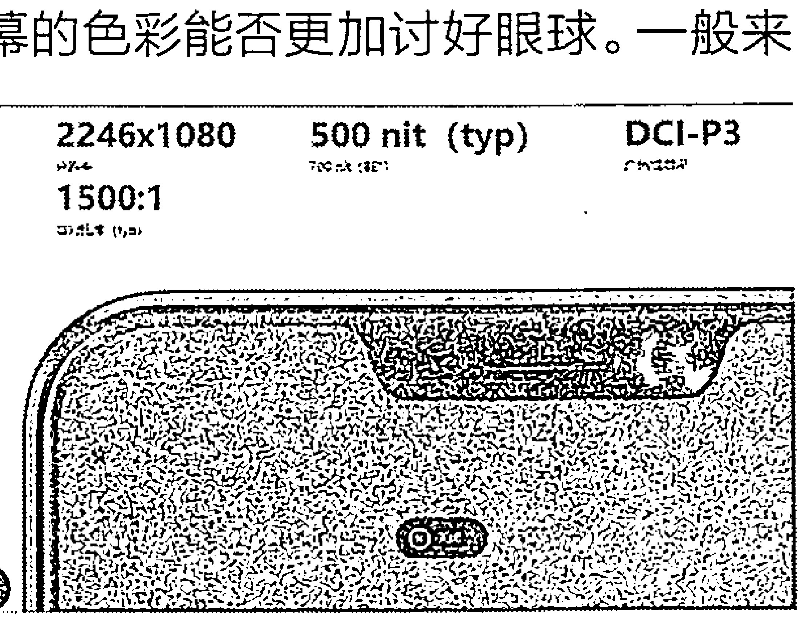

需要注意的是，现在的很多新品都在主打支持DCI-P3广色域，是否支持它也能作为判断一款屏幕是否足够优秀的标准。在购买智能手机后，大家不妨进入“设置→显示→色彩”菜单中，这里往往会有标准、鲜艳和自定义等显示模式可选（图2）。如果你总觉得手机屏幕看着不爽，切换一下模式或进行自定义调节，多少可以缓解一下眼球的抗议。

### OLED普遍代表高品质

我们都知道，智能手机屏幕的材质有LCD（IPS）和OLED（AMOLED）之别。相对而言，OLED就是更高品质的代表，它能轻松实现超过100%的sRGB色域并带来数万比一的对比度（LCD多为一千多比一），而且还具备纯黑显示几乎不耗电、没有漏光隐患等优点（图3）。

现在OLED屏幕的供应商主要以三星、LG、天马和京东方为主，就品质而言三星为冠，LG次之，而国产的天马和京东方再次。但是，哪怕是低端的OLED屏幕，它在色彩上的表现也要优于绝大多数主流的LCD。


OLED除了更加讨好眼球以外，它还属于诸多“黑科技”的御用技术。比如屏下指纹识别，就只能搭配OLED材质的屏幕使用（图4）。

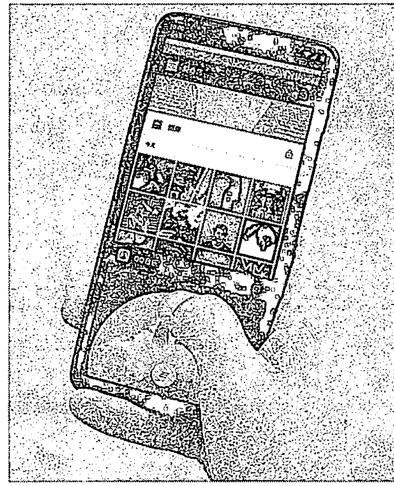

此外，现在全面屏手机都在比拼谁的“下巴”更窄（图5），而决定下巴宽度的关键就是手机屏幕低端采用了COG、COF还是COP封装方案。现阶段只有COP封装才能带来类似iPhone X的四面等宽的超窄边框效果，而原因就是COP封装利用了OLED具备柔性可以随意卷曲的特性（图6），这是任何LCD屏幕都无法企及的先天优势。

总之，现在已有越来越多的厂商将OLED屏幕用作旗下高端机型的主要卖点，比如华为Mate10 Pro和P20 Pro是OLED屏幕，但Mate10和P20却是LCD；OPPO和vivo旗下的R15和X21选用OLED，但定位偏低的A3和Z1就变成了LCD。类似的案例举不胜举。

### 小提示

OLED并非没有缺点，它最大的“命门”就是长时间显示相同的画面容易出现烧屏和鬼影现象。此外，OLED屏幕在大面积纯白显示时的耗电量往往也要高于LCD，所以采用深色壁纸，可以显著提升OLED手机的续航能力。

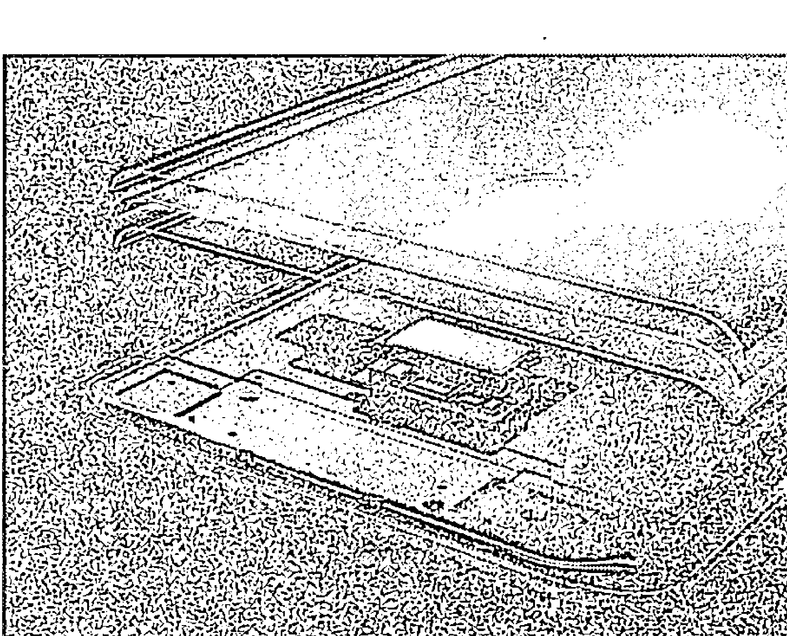
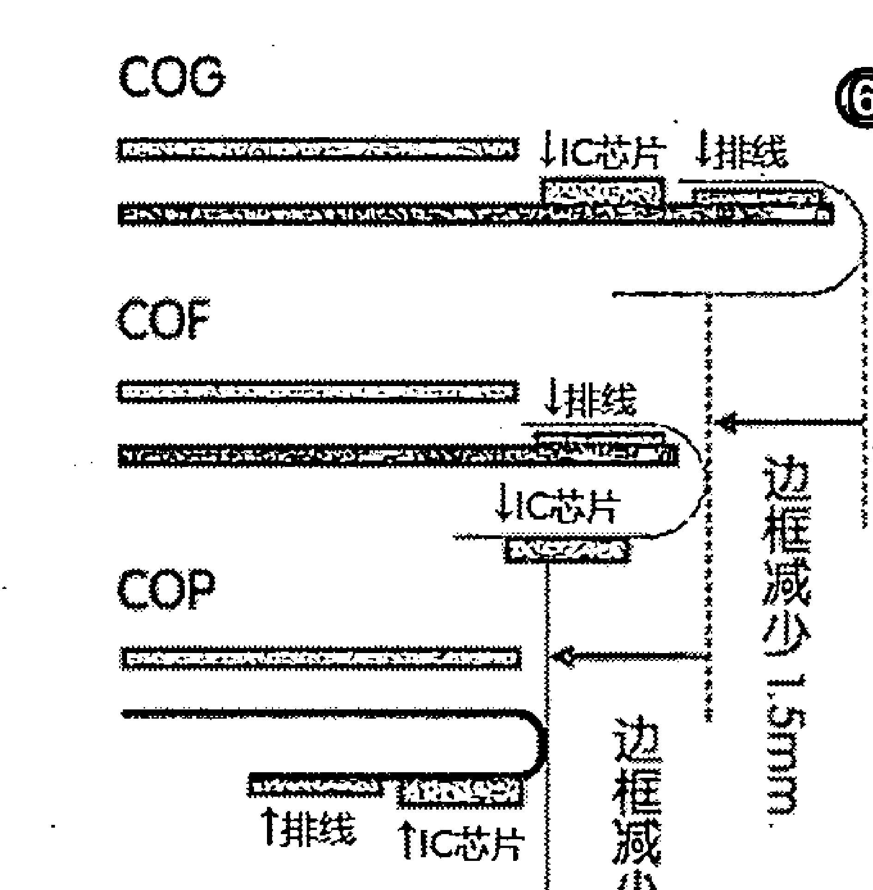
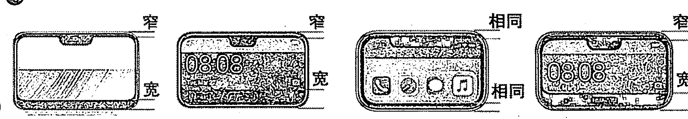

## 能否呈现更真实的震感

每一款智能手机都内置震动马达，用来作为开关机、按下物理Home键或屏幕下方虚拟按钮的力反馈之用。然而，就是这颗不起眼的马达，却即将要成为手机厂商展示诚意和实力的主战场。

### 用于交互的震动反馈

大家不妨进入手机设置的“声音与震动”选项，这里面就是震动马达所需要承担的交互场景，比较常见的是开关机、来去电、触控按钮和拨号键盘时的震动提示，而我们所能选择的则是关闭震动，或是选中弱、中、强等的震感（图7）。

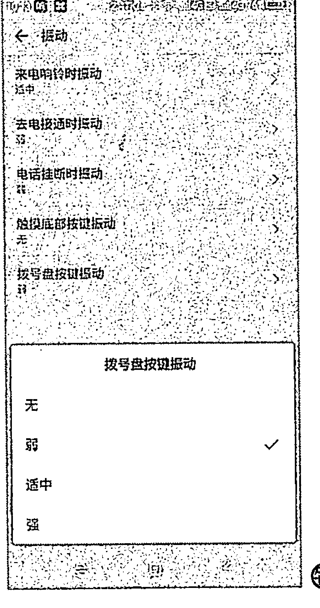

就震动反馈的使用场景，手机厂商们也都在寻找新的应用方向，比如刚刚上市的荣耀Play手机就带来了4D智能震感（图8）。它基于人工智能NPU实时识别游戏进行场景，运用AI算法来匹配不同场景的画面，加强音响和触感的体验。目前已有10个标签30+的场景可以进行适配，如吃鸡游戏不同品类的枪开枪声音都会反馈出不同强度的震感。

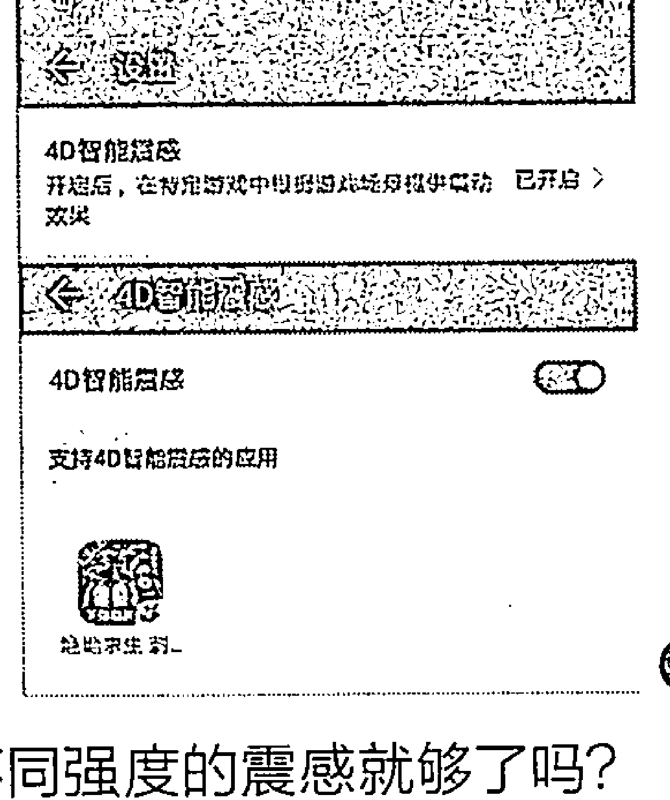

然而，只是在更多场景反馈不同强度的震感就够了吗？震动马达能否玩出更多花样？

### 转子马达和线性马达

在智能手机领域，震动马达从结构上可以划分为“转子马达”和“线性马达”两大类。其中，转子马达的原理是利用电磁感应，用电流导致的磁场驱动转子旋转产生全方位的极致震颤体验。转子马达的优势是技术成熟、成本低廉，也是绝大多数中高端和几乎所有主流价位手机的标配。

线性马达的原理是类似打桩机的机制，它是内部依靠一个线性形式运动的弹簧质量块，将电能直接转换为直线运动机械能的发动模块（图9）。目前线性马达又可以细分为横向线性马达（XY轴）和圆形线性马达（Z轴）两类，横向线性马达除了震动以外还可以带来前后左右四个方向的位移感，而圆形线性马达则可以视为转子马达的进阶版，拥有震感紧凑、即停即止的体验。

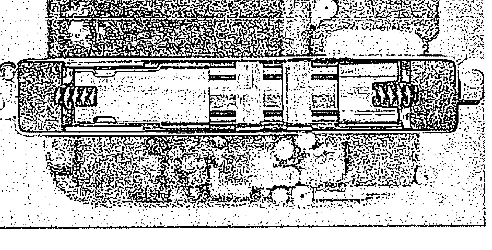

根据产业链方面的消息称，转子马达单颗成本约1美元，而最高品质的横向线性马达的单颗成本则高达8到10美元，圆形线性马达的成本居中。

### 来自按下瞬间的感动

可能有用户会问了，震动就是震动，即便能震出花样又有什么意义？

如果你曾是iPhone的用户，非常迷恋按下那颗圆形Home键时的“下压→弹起”的手感，那就需要更高品质马达的助力了。

我们都知道，iPhone用户长期以来都在抱怨Home键容易损坏。所以，苹果从iPhone 7开始就取消了实体按键设计，只在屏幕下方保留了Home键的样式，但它却仅是一颗虚拟按键，需要使用振动反馈来代替实体按键的触感。

然而，从iPhone 7到iPhone 8，很多用户根本不知道他们的手机按键并非是实体按键，因为每次按下Home键解锁手机的瞬间，明明都感觉这个按键被“按下去了”！这种体验的背后，就是一颗价值10美元的“TAPTIC” Engine横向线性马达在发挥作用。

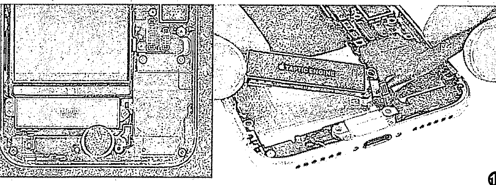

“Taptic Engine”模块（图10），即LRA横向线性马达的功劳，它能真实地模拟点击手感，获得实时触摸反馈。

魅族15系列也主打名为mEngine的横向线性马达，它可以为魅族15的Home键带来多种震动反馈，比如轻触时的一下微震，模拟下压时的“咯噔”两段式力反馈，给人的感觉就好像这颗键真的可以陷下去（图12）。同时，魅族15还带来了全局式的触感反馈系统，在45种场景中有更好的触感反馈，包括拍照、打字、滑动时间滚轮时，都可以体验到更为真实的触感体验。

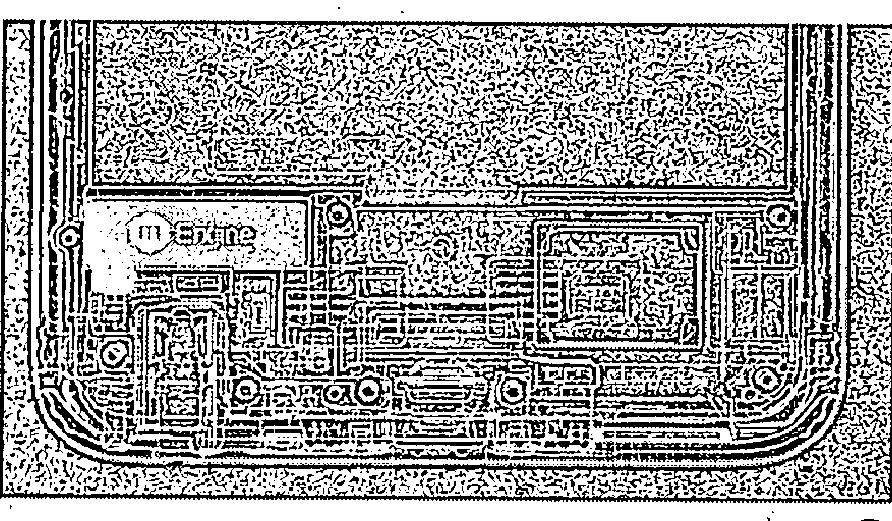

### 屏下指纹的黄金搭档

未来，3D结构光的人脸解锁和屏下指纹识别技术将称霸智能手机领域，而屏下指纹技术就是用手指点触屏幕指定区域识别指纹信息（图13）。问题又来了，当绝大多数手机都采用了屏下指纹后，大家还能比什么？

答案就是，将虚拟提示图标与横向线性马达配合，从而提供可媲美甚至超越机械式按键的触觉反馈体验，在解锁的瞬间让用户感觉下压的屏幕部分真的可以按下去再弹回来。虽然只是短短的瞬间，但这种真实的3D Touch体验，就是高端用户愿意为其买单的设计。

实际上，小米6、小米8、一加5T、一加6、坚果R1等国产高端手机也配备了线性马达，只是它们出于成本的考虑，都采用了Z轴振动模式的圆形线性马达，在振动细腻度和体验方面不及苹果和魅族15手机，但与同档次采用转子马达的手机相比仍然要好很多。

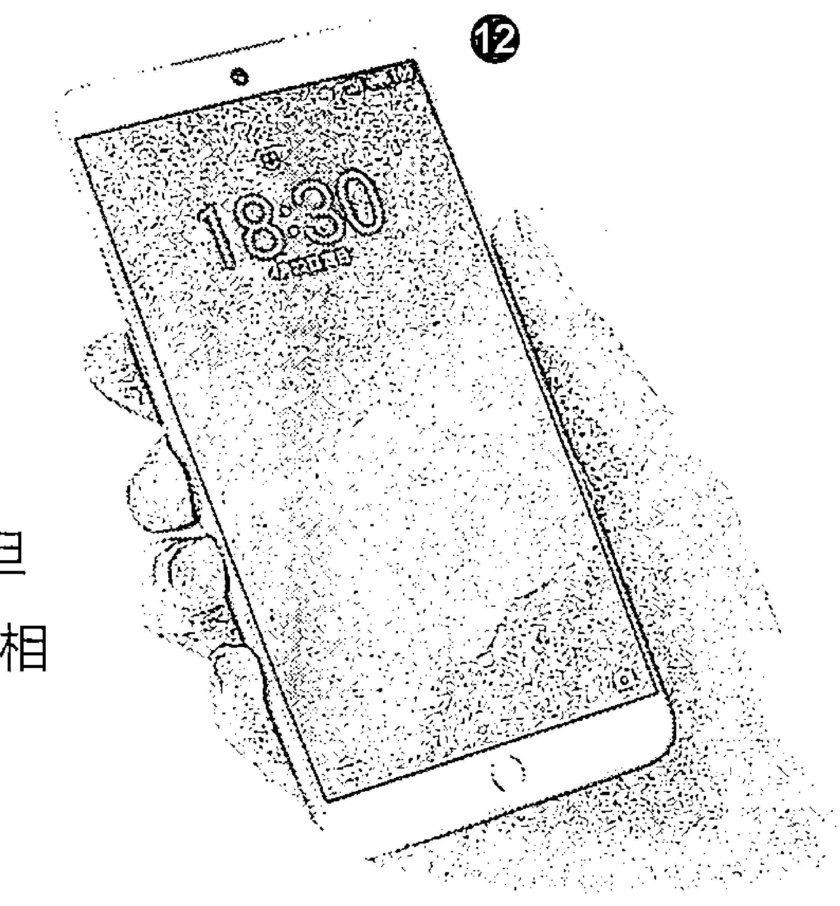

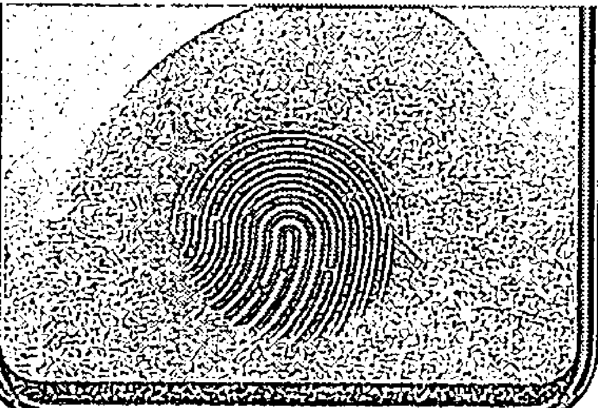

### 不一样的人脸解锁

自从iPhone X带来面部ID以后，人脸解锁就成为了一股潮流趋势，至今哪怕是不足千元的入门级手机大都也将这一功能纳入了标配。问题是，对于价差过千的智能手机，“刷脸”体验的差异到底体现在了哪里？

### 体验源于方案商

说实话，除了苹果，绝大多数手机厂商都不具备自主研发人脸解锁算法的技术实力。因此，大家都是选择和AI 3D成像方案提供商合作，比如旷视和商汤科技。旷视CTO唐文斌就曾经表示，旷视给几乎所有的Android厂商提供人脸解锁技术（图14），同时也提供了基于手机单摄、双摄或者更复杂情况的3D摄像头的影像处理技术。


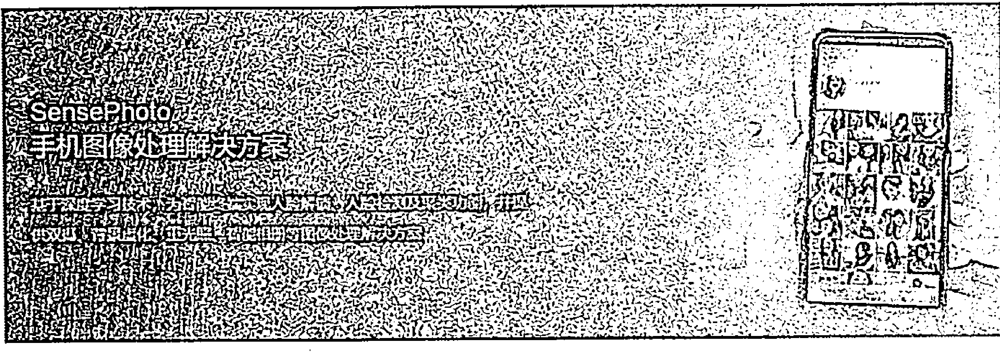

而商汤科技除了提供人脸解锁外，在AI智慧双摄方案上的表现更为出色（图15）。商汤科技CEO徐立曾表示，商汤是全中国唯一一家不需要支架就能做（场景）3D的方案商，免除了传统双摄方案需要在两颗镜头间加装硬件支架的开销（2美元左右），通过AI场景识别就能将两个摄像头的成像拼合。

所以，只要选择的方案商相同，Android手机之间的人脸解锁体验（包括AI摄像算法）就基本一致。而手机厂商们能做的，就只有想办法提升底层硬件的资质，比如配备像素更高、光圈更大的前置摄像头。

### 暗光解锁的较量

需要注意的是，除了iPhone X和小米8探索版，已上市的智能手机所用的人脸识别都是基于前置摄像头的2D建模（图16），存在被照片、面部模型等手段“欺骗”解锁的安全风险。同时，在黑暗环境下的识别率也会严重下降。

因此，如何提升黑暗环境下人脸解锁的成功率，就是摆在手机厂商们面前的功课了。目前解决方案有软硬两条路，“软”即借助系统设置，在黑暗环境下进入面部识别状态时让手机屏幕以最亮的白光显示（图17），从而照亮屏幕前用户的面部。

而“硬”即在前置摄像头旁边加入一颗红外补光灯，光线差的时候可以用红外光来对面部补光，其识别效率要优于软解（图18）。可惜，目前采用硬解方案的手机仅包括小米8、小米8SE和vivo X21屏幕指纹版等极少数产品。

### 代表未来的3D结构光

在接下来的一个时期，基于“3D结构光”的人脸识别技术，将成为旗舰机手机彰显技术实力的舞台。简单来说，3D结构光的整个系统包含结构光投影设备、摄像机、图像采集和处理系统（图19），可以快速准确地识别用户的面部信息，结合系统和硬件的AI算法比对，可以带来媲美指纹识别的安全系数，可以安心地用于移动支付和各种安全验证服务。

随着产业链的成熟，3D结构光方案的成本也在逐步下降，小米8探索版就算是该方案普及的前奏。相信到了2018年底，会有更多3000元价位的新品将其纳入标配，而在2019年3D结构光方案将会进一步切入2000元价位的主流战场。

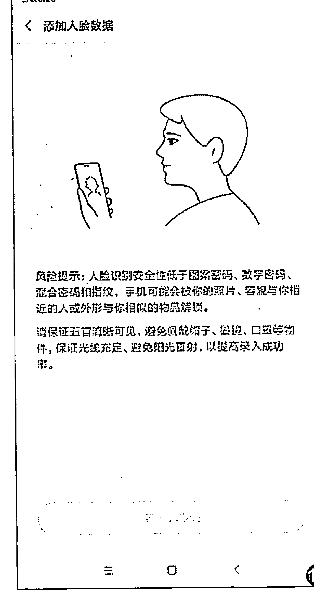

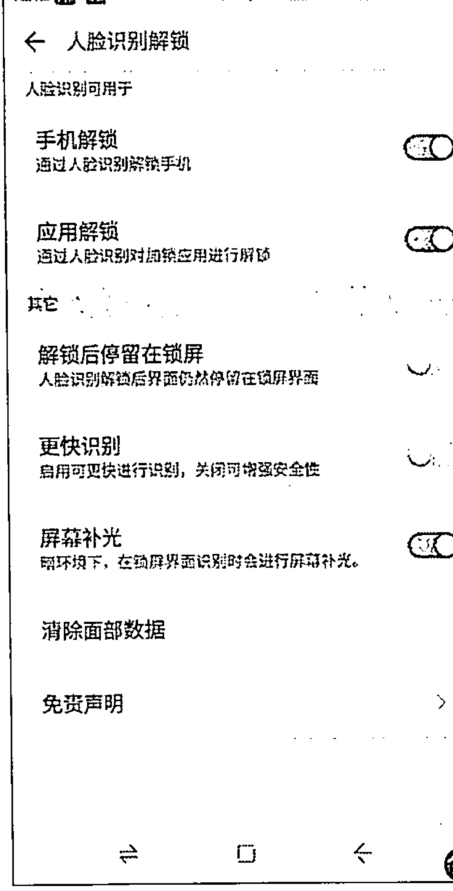

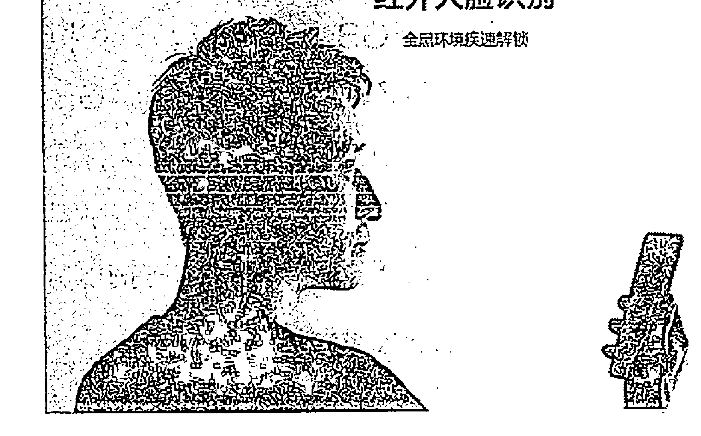

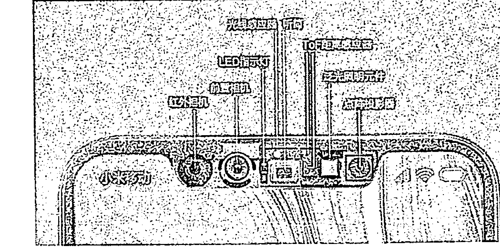

### 游戏手机崛起的背后

随着《王者荣耀》和各种吃鸡类手游的兴起，越来越多的用户开始将性能作为选购手机的最关键指标。于是，“堆配置”就成为了中高端手机们的必修课。同时，为了满足高端电竞玩家的苛刻要求，并提高品牌影响力，电竞专用的游戏手机也成为了一股潮流（图1），未来将进一步影响智能手机现有的格局。


### 硬件装备的堆叠比拼

我们都知道，移动处理器是决定智能手机性能的核心，因此手机用户经常将同档次性能最佳的处理器称为“神U”。而关于“神U”，不同价位手机的标准也不尽相同。在千元价位，高通旗下的骁龙636就是属于“神U”般的存在（图2），其性能仅次于骁龙660，实际表现可以将同档次的联发科Helio P2x、麒麟659、三星Exynos 7872和骁龙630/625等处理器甩在后面。而骁龙636的高口碑，也成就了红米Note5和联想Z5等爆款手机，前者赢在1099元的最低起价，而后者则凭借最新刘海屏和标配6GB超大内存突围，1299元起的售价同样实惠。在1500元价位，“神U”的标准则进一步提升到骁龙660（还包括联发科同档次的Helio P60），这颗处理器具备流畅驾驭绝大多数3D手游的实力（图3）。目前高性价比的骁龙660手机有很多，比如360手机N7（4GB+32GB，1299元起）、360手机N6 Pro（4GB+64GB，1399元起）、小米6X（4GB+32GB，1399元起）、努比亚Z18mini（6GB+64GB，1799元起）、vivo Z1（4GB+64GB，1798元）和坚果Pro2（4GB+32GB，1599元起）等等。这些手机各有特色，或者主打超大电池（如360 N7），或拥有更高颜值（如坚果Pro2），或在拍照方面的表现更佳（如Z18mini和小米6X）。在超2000元价位的手机中，“神U”的代表就开始扩军了，骁龙845、麒麟970（图5）、骁龙835和三星Exynos 8890都可荣获这一称号，它们之间的综合性能依次降低。可以说，凡是搭载上述“神U”的手机，在性能层面都无需我们操心，选购时则需要从横向和纵向两个角度之间加以取舍。所谓横向，就是品牌之间的比较。比如三星有着最高的品牌溢价，华为次之；小米、荣耀、一加、努比亚、锤子等品牌则主打性价比，最便宜的骁龙845手机是小米8（2699元起），而最实惠的麒麟970手机则是荣耀Play（1999元起）。如何取舍需要从你的实际预算、产品设计、对拍照和续航表现的预期着眼。所谓纵向，就是同一品牌旗下产品的比较，在这里记住“一分钱一分货”准没错。比如，很多人都觉得小米8比小米MIX2S更超值，但MIX2S却具备更高品质的陶瓷后盖以及无线充电技术的加持；还有人会觉得荣耀Play将麒麟970打入1999元后（图6），会严重威胁到自家荣耀10和荣耀V10的销售。实际上，荣耀Play除了价格更低外，它还取消了红外遥控、NFC功能，后置摄像头也从黑白+彩色双摄改为了主摄+景深镜头的组合，整体实力有着明显的缩水。如果你只认更低的价格，也许就输在起跑线上了。

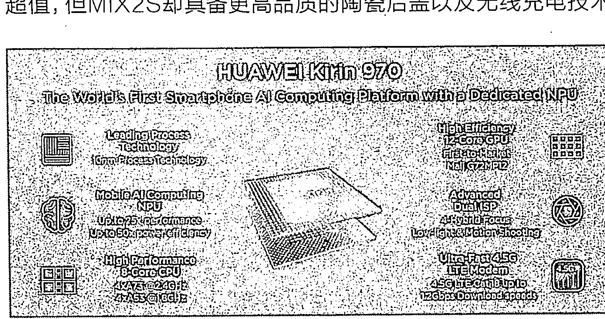

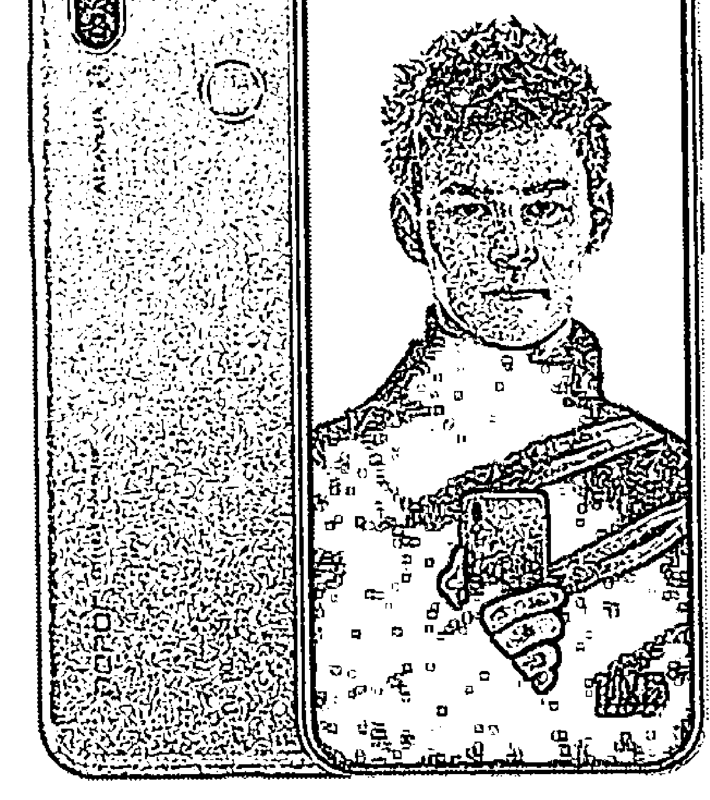

至于更具体的选购思路，并不是小篇幅可以谈论清楚的，不同定位和价位手机间的取舍之道也有着不同的规则。如果你对具体产品间的比对感兴趣，不妨关注近期的CFan为你选栏目。

### 来自散热的降频隐患

细心的用户不难发现，核心硬件（处理器和内存）相同的手机之间，在运行同一款游戏时的流畅度（帧数）有时会出现非常大的差距。这个问题的背后，则体现在硬件和软件两个层面上。其中，所谓硬件就是纯粹的散热设计。智能手机为了追求轻薄机身必须是非常紧凑的结构设计。可以说，绝大多数手机当CPU和GPU处于长时间满血运行状态时，都会出现因过热而触发降频机制的问题，产品间的差异只是可以坚持满血运行的时间长短，以及降频幅度会不会导致游戏明显卡顿而已。之所以说是“绝大多数手机”，是因为现在已经出现了“极少数”解决了发热降频隐患的新品，而它们也有了一个全新的称谓——游戏手机，代表产品有雷蛇Razer Phone、黑鲨手机、努比亚红魔（图7）以及华硕ROG玩家国度手机。

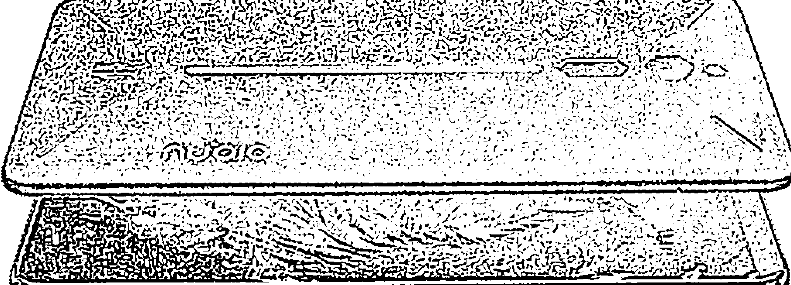

在散热的思路上，不同的游戏手机都有着自家的解决方案。其中Razer Phone、黑鲨和华硕ROG手机是通过更大面积的散热片和独立的热管提升散热效率（图8），而红魔手机则是通过4个风槽增加内部空气流通（图9），再辅以导热效率更高的机身材质和3层石墨。此外，这些产品还都有着炫酷的外观和呼吸灯设计，刷新率更高的屏幕（比如雷蛇配备了120Hz LCD屏幕，ROG选用了90Hz的AMOLED屏幕），还能进入沉浸式的游戏模式，将所有资源都倾向于当前的游戏环境，而这些都是它们有别于其他同配置高端手机的差异所在。

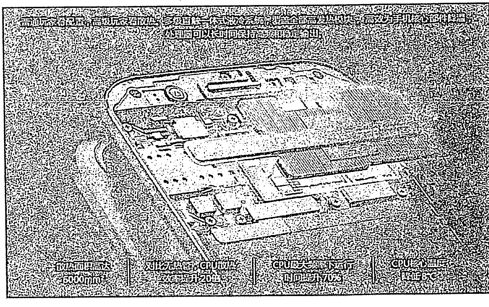

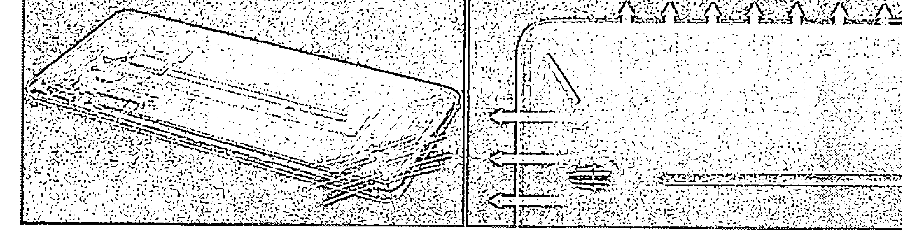

总之，更具信仰的外观和灯效、长时间游戏不降频，更完美的视听环境（屏幕和立体声音效）就是游戏手机的专属标签。

### 外设助力游戏体验

游戏手机们还有很多专属福利，比如相关的电竞外设，而在这方面做得最好的就是黑鲨和ROG玩家国度手机。黑鲨手机提供了专用的单边游戏手柄（图10），让玩家可以借助遥杆精准定制，并用独立的物理按键提升技能释放的效率。

ROG玩家国度手机更是游戏手机教科书般的存在，它在机身侧面提供了独立的扩展坞接口，可以安装“AeroActive冷却器”这种类似背夹式冷却风扇的外设来提高ROG手机的散热表现（图11）。同时，这款产品还可选择配备第二块屏幕的翻盖式手柄，以及类似Switch的双向手柄来提升游戏体验（图12）。

问题来了，游戏手机的价格普遍不便宜（比如黑鲨已经不是最便宜的骁龙845手机了），相关外设也是一笔不小的开销。对于预算有限的普通用户而言，又有哪些提升游戏体验的办法呢？

### 游戏模式和加速技术

前文我们曾说过，同配手机玩相同游戏的流畅度不同，除了硬件方面的原因外，源于软件优化的因素，就是上面这个问题的答案了。

软件优化体现在很多方面。首先，游戏开发商往往会针对不同品牌的手机，提供不同的图形API接口（数据包），从而会影响游戏的运行效率。以《王者荣耀》为例，曾经在游戏登录画面的左上角会出现带有“O2,T”、“O2,F”、“O3,T”、“O3,F”、“V,T”、“M,T”等字样的信息（图13），而这些数字的背后，就代表此时的《王者荣耀》使用什么图形API来运作，以及是否使用多线程优化。其具体的含义如下：

- O2: 使用OpenGL ES 2.0 API
- O3: 使用OpenGL ES 3.X API
- M: 使用Metal API (iOS平台特有)
- V: 使用Vulkan API (Android平台特有)
- T: 使用多线程（多线程True）
- F: 使用单线程（多线程False）

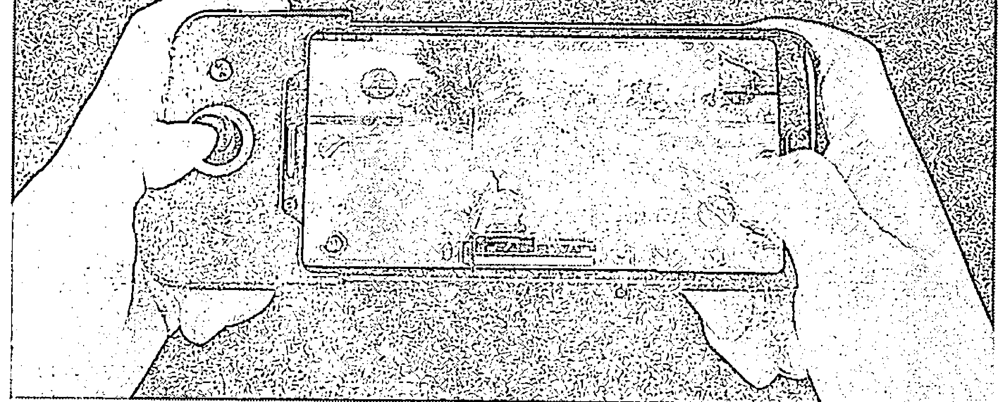

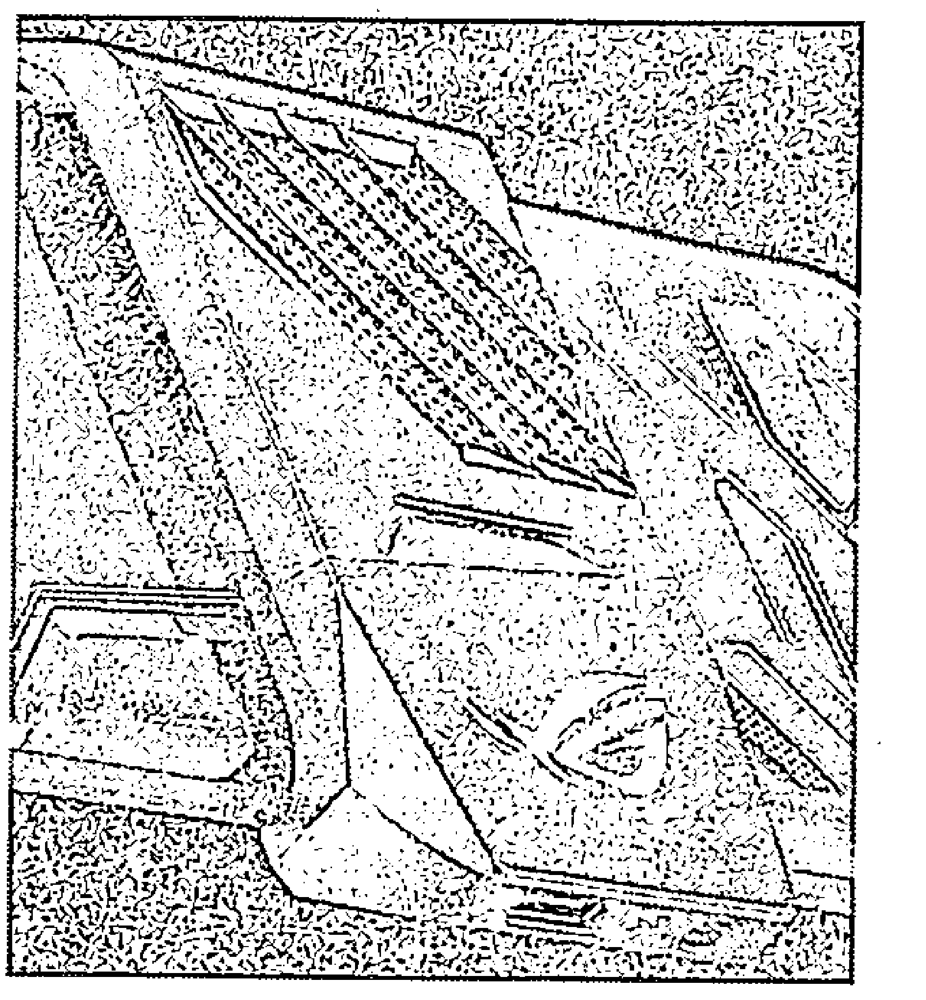

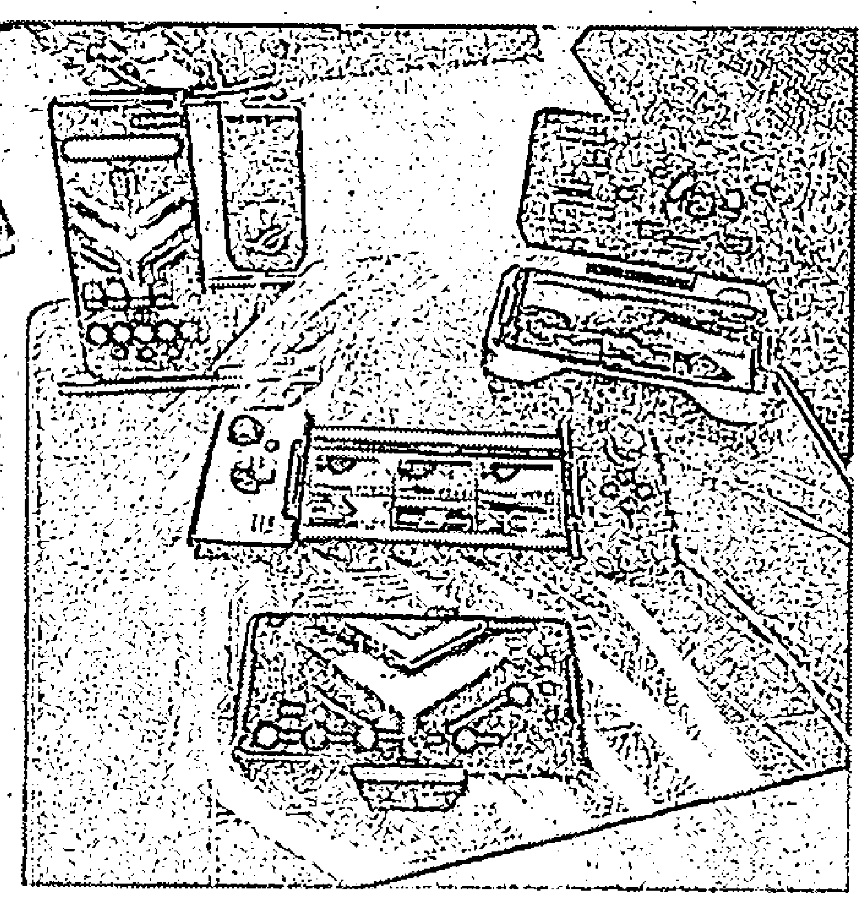


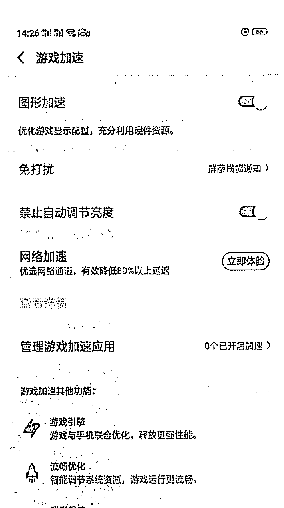

一些主打与腾讯进行“联合优化”的手机，往往就能基于“O3,T”或“V,T”的API运行，从而100%发挥多线程的硬件资源，出现骁龙660比骁龙845还要流畅的怪现象。

此外，手机厂商在系统层面也大都开发了“游戏模式”，具有可以屏蔽各类信息的弹窗、避免误退游戏、提升网络连接性能和以最高性能运行游戏的处理机制（图14）。有些品牌的“游戏模式”甚至采用伪装机型的手段，让《王者荣耀》从“O2,F”变成“V,T”来启动。

值得一提的是，华为在6月初还正式发布了“吓人的技术”——GPU Turbo。我们可以将GPU Turbo理解为介于EMUI操作系统以及GPU和CPU之间的“调度员”（图15），它打通了系统和硬件之间的处理瓶颈，并在系统底层对传统的图形处理框架进行了重构，可实现更有效率的软硬件协同作战，可使图形运算整体效率最多提升60%，芯片的功耗最多降低30%。

从实际效果来看，GPU Turbo技术最大的作用就是提升3D游戏的最高帧数，并保持帧数上的稳定不波动。同时，GPU Turbo还可以针对不支持HDR画质的游戏进行优化，显著提升画面细节。未来，这项技术还将在AR、VR和3D交互环境下发挥效用。

再举些例子，荣耀9青春版这类主流机型搭载了麒麟659，在《全军出击》中的平均帧数不足20fps，卡顿感非常明显。但在GPU Turbo技术的加持后，在《全军出击》同样画质下平均帧数就能达到33fps（图16），彻底解决了卡顿问题。而像搭载麒麟960的华为Nova 2S这类中端机型，在GPU Turbo技术的帮助下，在《王者荣耀》、《刺激战场》等游戏中的帧数表现会全面超过OPPO R15和vivo X21这些针对上述游戏进行过联合优化的机型。

实际上，GPU Turbo对麒麟970而言只能算是锦上添花的技术，因为这颗处理器足以流畅运行Android系统中的几乎所有游戏，平均60fps其实和平平均45fps没什么差别，除了字面上的不同，实际体验几乎没有差异。真正能体现GPU Turbo价值的地方，就是荣耀和华为旗下那些搭载麒麟659、960甚至650、950处理器的老款手机，让主流游戏从20fps提升到30fps，从30fps提升到40fps，这才算是雪中送炭的技术，让用户能切身感受到GPU Turbo技术的价值。

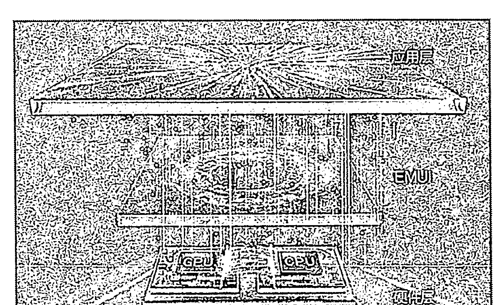

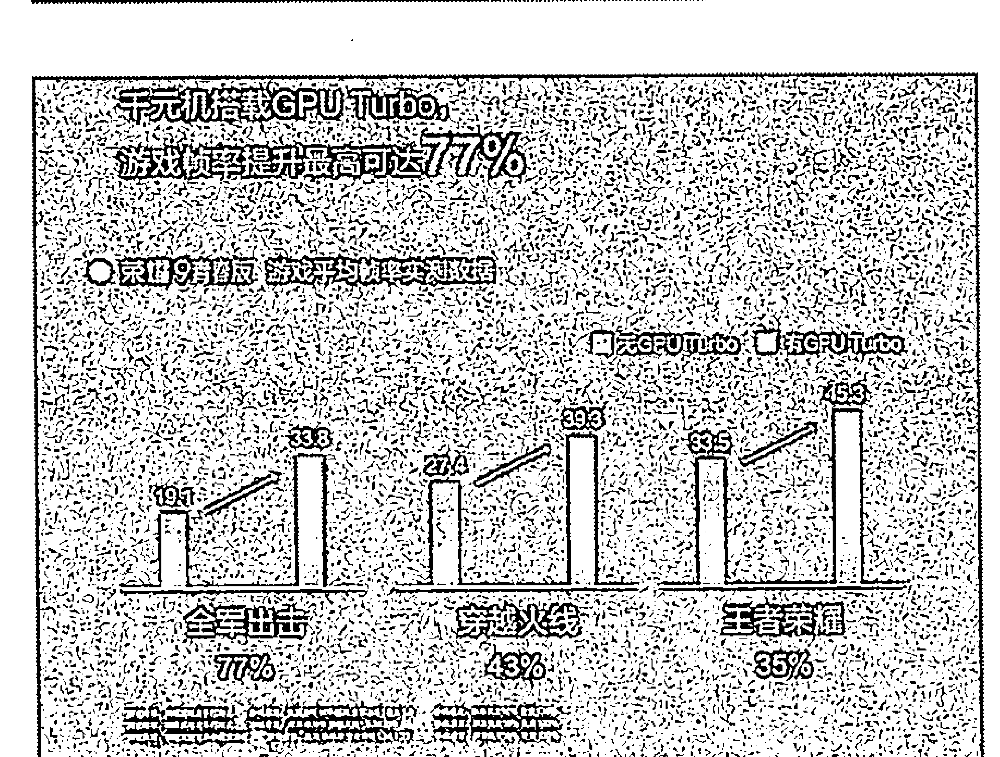

荣耀总裁赵明表示：GPU Turbo技术是由华为2012实验室、软件团队、海外研究所、操作系统底层技术团队、芯片团队等合作的结果。该技术是华为荣耀在软硬一体化上努力的结果，友商很难跟进。

但作为消费者，我们自然希望其他手机品牌可以跟进，也能带来类似GPU Turbo的免费提升游戏体验的技术，让更多配置中庸且上市已久的老款手机因此受益。

### 为第一眼的视觉冲击而努力

游戏手机往往拥有最尖端的散热，并引入了跑马灯式的炫酷灯效，由外至内都彰显档次。那么，对于没有游戏手机光环的产品们，又该如何提升第一眼给用户呈现的视觉冲击力呢？

### 金属逐渐从高端落幕

细心的用户不难发现，昔代表高档的“全金属一体化机身”和“CNC工艺”已经不再是高端手机的专利，很多千元机也纷纷引入了这种设计。至于定位更廉价的手机，则普遍选用三段式机身（中间金属，上下两端塑料）。换句话说，金属的冷峻质感和触感已经不足以吸引高端用户的关注了。

### 双面玻璃逐渐盛行

没错，双面玻璃已经取代了全金属，成为了时下从千元跨越数千元价位手机的最爱。究其原因，是因为玻璃材质不存在对信号的屏蔽缺陷，同时可以采用大弧度的3D曲面设计（图17），从而提升持握手感。需要注意的是，都是玻璃，不同价位手机所选用的材质也存在较大的差异。比如，低端手机选用的多以国产玻璃为主，中框也由金属变成了塑料。而中高端机型则会武装康宁大猩猩玻璃，而少数产品甚至还会用陶瓷替代玻璃，进一步提升后盖的抗磨抗划性。

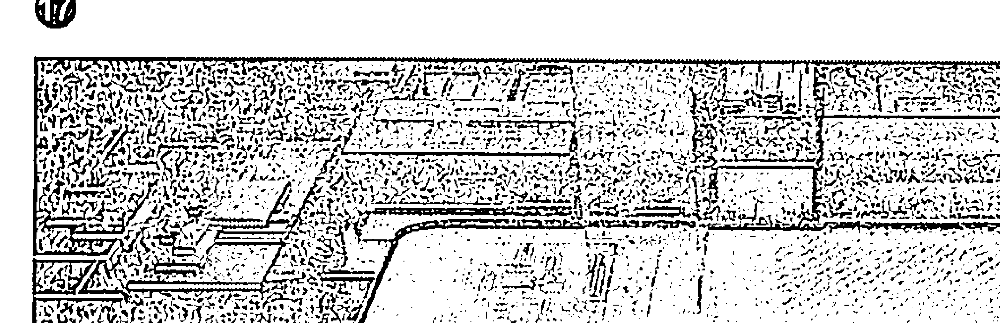

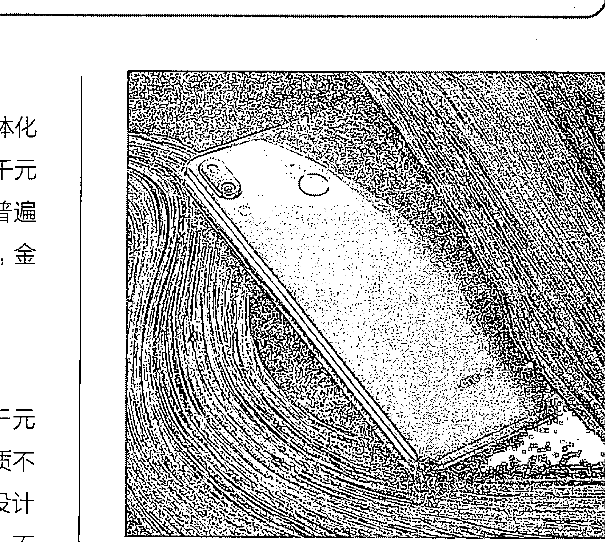

### 只为那一抹炫酷光彩

玻璃后盖还让智能手机呈现炫酷的光影效果。手机厂商可以在玻璃材质的基础上，通过多层光线雕刻工艺或多层纳米镀层调色工艺，随着观看角度和光线折射出流光溢彩的视觉效果。如以OPPO R15梦镜版、荣耀10、联想Z5等手机为代表的新品还带来了渐变色和极光色版本（图18），辨识度更高。

此外，以HTC U12+和小米8探索版为代表的产品更是引入了透明玻璃后盖的概念，可以让用户直接看到手机内部的结构设计，从而进一步提升产品的科技感。需要注意的是，这种透明后盖所显示的内部并不一定是手机真正的样子（图19），比如小米官网就明确表明小米8透明探索版显示元件并非与手机元件一一对应，其极具科技感的样式只是一层贴纸镀膜进行伪装。

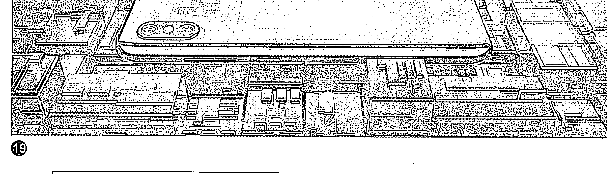

在技术有限时，硬盘的读写速度始终影响着电脑的正常发挥，虽然SATA接口、SSD硬盘、NVMe (PCI-E) 规格的出现稍微缓解了这一状况，但距离彻底解决问题还有些距离。那么我们追求高性能的电脑玩家就只能认命吗？答案自然是否定的，随着一系列存储技术革命性的发展，我们终于有可能改变存储系统拖后腿的现状了。

文/张敬齐

### 海纳江河
### 新存储时代来临

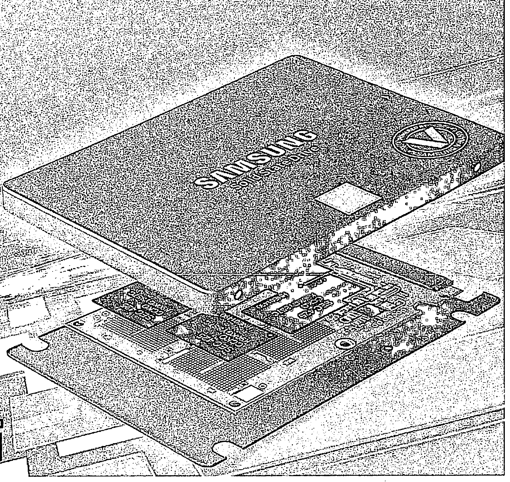

在近期的存储新技术方面，最大的亮点分别是希捷用于机械硬盘的多读写臂技术 (Multi Actuator)、用于SSD的3D NAND技术，以及3D XPoint新形态存储技术。它们的技术路线各异，解决的问题也各不相同。

### 多读写臂技术—一块硬盘上的RAID

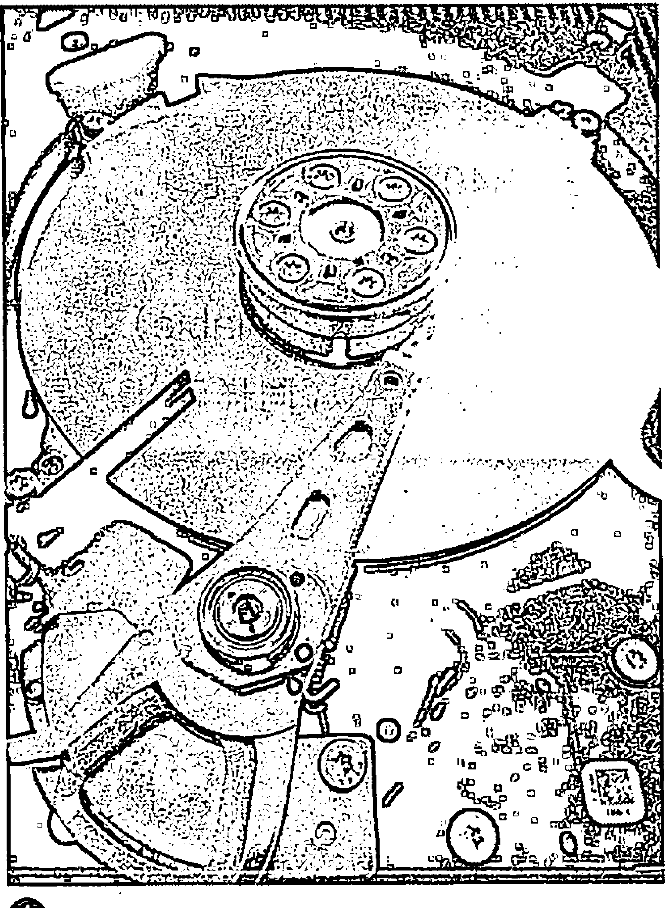

希捷的多读写臂技术是在最“传统的”数据存储设备上进行的一次大幅度改进。在传统的硬盘中虽然有多个读写悬臂和磁头，配合多个磁碟的上下表面数据层，但它们都固定在一个轴上，靠着单一的动作机构将磁头定位到不同的存储区域。也就是说，当读写第一张磁碟的上表面某处数据时，第一张磁碟的下表面磁头以及其他所有磁碟的磁头，可能都位于不需要的数据区域，没有进行任何读写(图1)。

多读写臂技术就是为了摆脱这个限制而开发的，它其实就是在硬盘内部安装两组可独立运作的悬臂。多读写臂技术可以提供两个“并行访问流”，两组磁头可以同时读取、写入，或者一读一写，有望极大地提升机械硬盘的吞吐能力 (IOPS)。这与RAID 0的实际效果很相似，不过只需要单个硬盘就能实现(图2)。

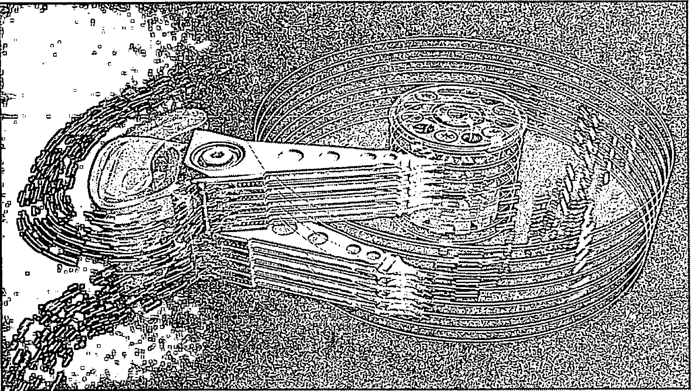

其实类似的设计在之前也出现过，例如在1996年被希捷收购的康诺 (CONNER) 就推出过双读写臂的硬盘，在磁碟两侧各安装一个读写臂组，也就是一个面上有两个磁头，这样虽然效率更高，但在协调性方面要求也更高(图3)。而希捷则让两个磁头分别使用不同的盘片，使用起来更加灵活，控制难度也要小得多。

从目前透露出的测试结果看，双读写臂设计的硬盘数据传输速度达到了480MB/s，比现在的7200rpm硬盘速度提升了一倍，已经接近主流SSD的水平，也接近了SATA 3.0接口的极限速度。

在多读写臂实现的同时，希捷还有可能使用HAMR（热辅助磁记录）技术。这种技术是通过激光热辅助技术在高稳定的媒体上进行数据磁记录，磁头在进行记录时会短暂地加热磁盘表面（图4），可以缩小数据位，同时避开现有HDD硬盘中的超顺磁效应限制。这种方法可以增加数据密度，达到每平方英寸500GB的存储容量。更大的存储密度可以让磁头以同样的速度运动时扫过更多的数据，会使读取性能进一步提升。不过从原理来看，存储数据时需要使用更高稳定性的材料，也可能需要更长的冷却时间，所以写入性能是否会明显提升尚未可知。

### 3D NAND SSD的新方向

目前平面结构的NAND闪存已接近容量极限，而升级制程耗资巨大，这给半导体存储器行业带来了严峻的挑战。3D NAND就是目前解决这一问题的最佳方法之一，它由Intel和美光（Micron）合作研发，通过把内存颗粒堆叠在一起后进行封装，可以在相同制程下大大增加存储密度。这一技术相对于其他方式成本增加较少，且单位容量的能耗降低，总体性能也有一定的提升。在32层堆叠的3D NAND技术下，MLC单元的容量可达到32GB，TLC单元则可达到48GB，这样SSD就能在同样的面积内提供更大的容量，2.5英寸产品的容量可以直追机械硬盘，M.2等小巧型的SSD则能获得更好的容量价格比。

其他主要的闪存大厂也推出了类似的技术，三星的V-NAND技术在32层堆叠时，每个MLC芯片容量可达最高10GB。它选择了比较简单的工艺，因此虽然容量增加不如3D NAND那么高，但量产更早、更新很快，已经被大量应用在三星的SSD产品中，三星840及之后的产品均采用了这一技术（图5、图6）。

此外，东芝开发的BiCS（Bit Cost Scalable）工艺与Intel/镁光的3D NAND技术比较相似，同样可以获得堆叠式闪存芯片，相关产品目前已经投入市场（图7）。而SK Hynix的类似技术虽然非常低调，但也已经发展了数代，最早被应用在面向移动市场的eMMC 5.0/5.1、UFS 2.0等产品中，第四代之后的产品才会开始用于SSD。

由于从2D NAND转换到3D NAND的工艺变化较大，稳定量产需要一定的适应期，因此前一段时间大规模的闪存芯片转产，就造成了SSD市场较长时间的缺货与涨价。而随着各大主要闪存厂商的主要晶圆厂转产完成、新建3D NAND生产线投产，缺货状况才终于得到缓解。

3D NAND的成本大约是2D NAND的3到5倍，所以直到3D NAND堆叠达到64层以上，存储密度超过2D NAND的3倍，才会出现明显的成本优势。而从目前3D NAND闪存芯片的产量（容量）大幅增加，SSD特别是对存储密度和功耗更敏感的M.2 SSD价格明显下降的情况来看，各大闪存厂商的3D NAND技术显然已经成熟，成本优势应该已经开始体现，未来SSD的价格还有望进一步下滑。

需要注意的是，长江存储等国内的闪存生产商目前也基本掌握了3D NAND的技术，有些已经开始出货，这进一步推动了闪存和SSD价格的降低，未来我们用上国产颗粒的SSD也是有可能的。

| 技术 | p-BICS (Toshiba) | T-CAT (Samsung) | 3D FG (Hynix) | Micron |
|------|------------------|-----------------|---------------|--------|
| Key Features | - P*SONOS Cell<br>- Large Cell Size<br>- Reliability | - TANOS Cell<br>- Large Cell Size<br>- SL Resistance | - Floating Gate<br>- Process of bit separation<br>- Disturbance | ? |
| Key Issue | ? | ? | ? | ? |

### 典型产品

### 三星960 EVO/850 EVO

这是两款基于三星V-NAND芯片的SSD，其共同特点是在同价位产品中提供了最高速度和容量，同时功耗与价格都接近主流产品，充分体现了V-NAND闪存技术的能力。对于追求高性能的用户，这两款产品是SATA 3与M.2接口上最好的选择之一(图8、图9)。

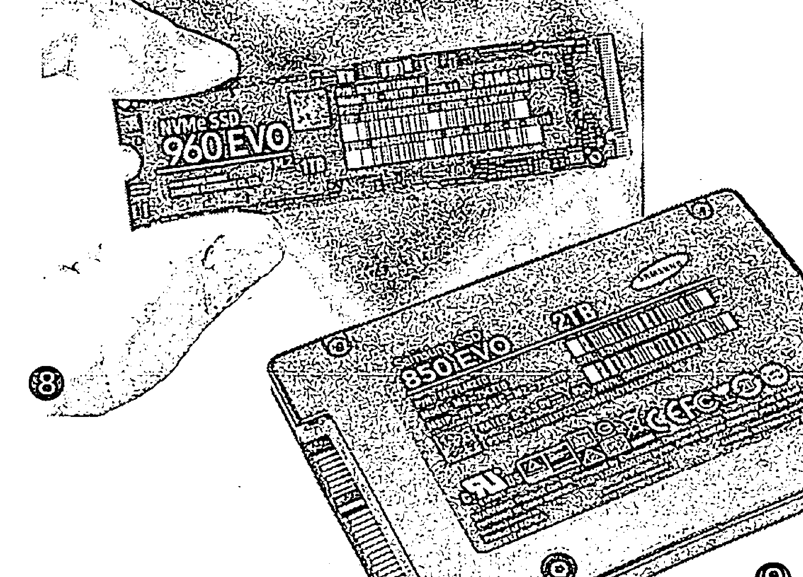

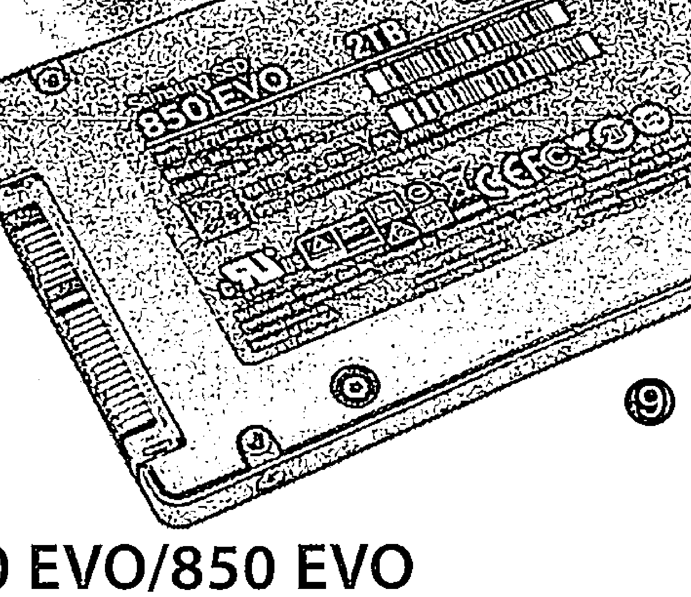

### 东芝TR200系列

采用64层3D BiCS堆叠技术的东芝TR200系列SSD拥有非常高的容量价格比，550MB/s左右的读写速度更是达到了SATA接口的极限。另外从用户反馈看，其高稳定性、低发热量也广受好评，是目前非常值得推荐的SATA接口产品(图10)。

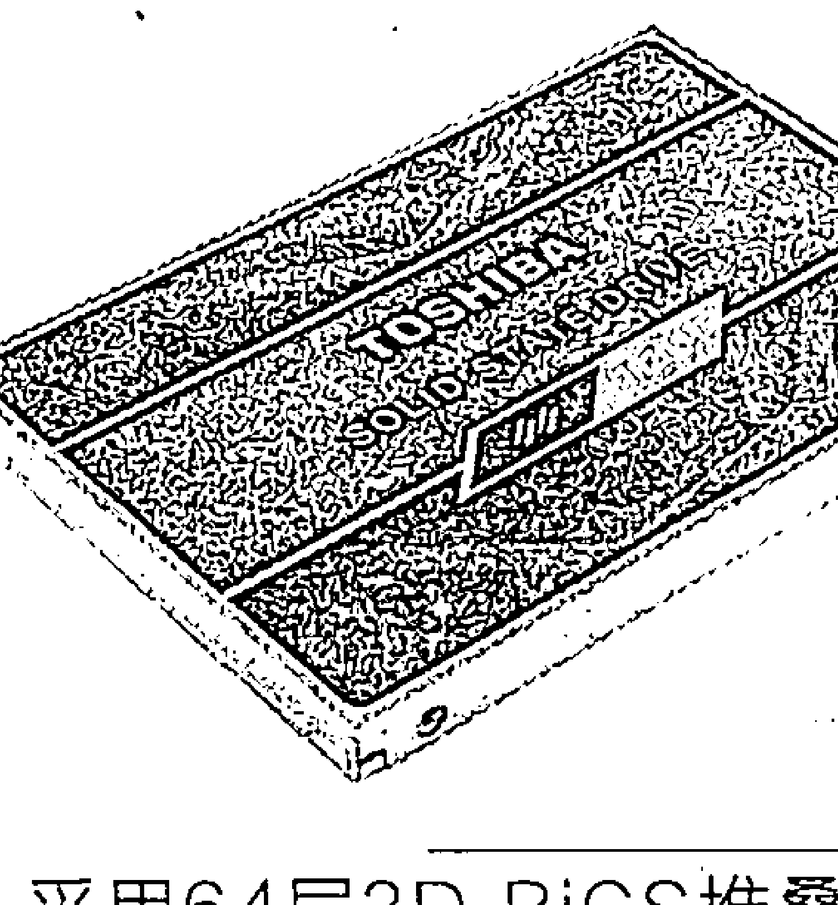

### 3D XPoint：神秘的存储新势力

3D XPoint同样是由Intel和美光共同开发的一种非易失性存储技术，但存储原理与NAND或3D NAND完全不同，性能更是非常惊人，据称其速度和耐久性可达到NAND闪存的1000倍。它不仅具有成为高端SSD的能力，甚至可以在某些情况下代替DRAM内存。

### 3D XPoint技术到底是什么

至今为止，Intel和美光都没有对3D XPoint技术进行详细说明，根据描述，3D XPoint不是像NAND闪存和DRAM那样基于电荷和晶体管的存储，也和电阻式RAM (ReRAM) 或忆阻器这两种新兴的非易失性存储技术不同。虽然在最近的交流中，Intel同样否认了它是一种相变存储器(PCM, Phase Change Memory)，但考虑到美光曾经开发过特性与3D XPoint类似的相变存储器，且有一些分析人士对3D XPoint进行解剖后发现了相变存储器的特征结构，因此笔者个人认为，3D XPoint很可能是结合了电荷存储与相变存储器的产品。

美光开发的相变存储器就是通过物体状态的变化来进行数据存储的技术，它利用了一种玻璃状材料(硫属化物)的结晶到非结晶状态导电性差异来存储数据。这两种状态可以迅速转换，转换即可持续保持状态，直到对这一单元再次进行操作，通过极小的电流就可以进行快速读取。

可能是受到相变存储器结构的影响，目前的3D XPoint颗粒比NAND或3D NAND芯片要大得多，20nm制程下的32GB芯片面积达到206.5平方毫米，而芯片面积越大，不仅原料成本越高，良品率也越低，所以生产成本肯定要高得多。以存储密度而言，目前的3D XPoint也比大多数NAND芯片要低得多，所以容量价格比就更不用想了。当然3D XPoint的存储密度还是高于内存DRAM芯片的，其20nm产品的存储密度大约是同制程DRAM芯片的4.5倍，甚至是最新的10/12nm制程DRAM的3倍左右。

相对较高的成本使得3D XPoint至少在2021年前，不会有取代NAND的能力，而较大的面积也让相应产品的容量受到了限制。例如在面向高端商业用户的PCI-E接口板卡上，也只是勉强能做到1.5TB容量(图11)，而在消费级市场上，采用M.2规格的傲腾内存、800P SSD，在同类产品中都只能算是小容量产品。

不过如果看3D XPoint芯片的具体设计，就会发现其中存储阵列的面积达到了91.4%(图12)，而常见的NAND闪存芯片最大也只有85%，说明3D XPoint的控制电路异常简单。如果采用类似3D NAND的堆叠设计，可以大幅提升容量，而且因为控制比较简单，甚至比3D NAND更容易实现(3D NAND控制更为复杂，在堆叠时的存储阵列面积比例是降低的，例如三星48层V-NAND的存储阵列面积仅有70%)。

### 3D XPoint的性能

尽管官方宣称3D XPoint的速度可达到NAND的1000倍，不过从测试来看，目前的3D XPoint产品显然还未能达到其宣称的水平，但达到NAND闪存的10倍以上应该是没有问题的。3D XPoint产品在响应速度方面的优势非常明显，其延迟虽然比DRAM略高一些，但仅有SSD的1000分之一。而且像DRAM一样，3D XPoint可以按字节寻址，这意味着每个存储单元都有一个独特的位置，与数据块模式的NAND不同，它在应用程序搜索数据时没有开销。最重要的是，目前3D XPoint产品的价格仅有DRAM的一半左右，因此已经受到很多数据中心追捧，有望替代原先的数据载入DRAM模块（图13）。

在写入方面，目前的3D XPoint产品在理论测试中并没有表现出什么优势，但它在长时间使用后也不会出现明显的写入性能衰减，而使用NAND技术的SSD因为采用块写入技术，在使用一段时间，空白块减少后，就需要在存储的同时对存储块进行整理，效率大幅下降。与此同时，3D XPoint可以提供更高的擦写周期，因此在耐久性，特别是对频繁写入操作的承受力方面，3D XPoint也有相当的优势（图14）。

另一方面，3D XPoint产品的随机读写能力非常强大，虽然其峰值数据与高端SSD差不多，但实际使用中，它在大量的小数据存取时就能达到峰值，而SSD需要数据队列深度达到一定程度，才会表现出峰值水平。因此在基于实际应用的测试如PCMark10、PCMark8中，我们都会发现，使用3D XPoint产品会比使用类似速度的SSD成绩更好，虽然两者的持续读写测试成绩可能相差不大（图15、图16）。

### 英特尔®傲腾™固态盘800P

- 在低队列深度方面，性能优于NAND SSD
- 队列深度（QD）≤3时达到最佳性能
- 性能优势适用于单线程应用和多线程应用

### 3D XPoint典型产品

3D XPoint首先应用在专业市场上，在近期才开始登陆消费级市场，推出了3D XPoint的傲腾内存（Optane Memory）和P800 SSD。这两款产品均采用NVMe M.2接口，但应用方式完全不同。傲腾内存的容量仅有16GB~64GB，利用Intel快速存储技术（RST）来加速硬盘，相关应用方式和测试内容可以参考本刊第11期《机械硬盘变成SSD 傲腾内存的魔法》。它安装在第七代或更新的Intel平台上，与任意SATA存储设备配合进行加速，而符合傲腾使用条件的平台则会被指定为“Intel Optane内存就绪”产品（图17、图18）。近期Intel更会将处理器与傲腾内存销售进行捆绑，推出名称为“酷睿i5/7/9 +（Core i5/7/9 Plus）”的套装产品。

在2018年中期，新的3D XPoint消费级产品——800P SSD也将要进入市场，由于芯片面积和成本等因素，其容量比较小，目前公布的仅有58GB和118GB两款，且价格昂贵，只能作为系统盘使用，必须搭配更大容量的机械硬盘或SSD进行容量补充。从性能上看，由于仅采用了PCI-E ×2通道，因此其速度并不惊人，读写速率分别为1450MB/s和640MB/s，不过正如前面提到的，在低数据深度时的高随机写入性能、更高的响应速度等，会使其在实际使用时获得比普通SSD更好的体验（图19）。

在高端商用市场，例如数据服务中心方面，除了Intel的傲腾产品线外，还有美光的QuantX品牌。与Intel用傲腾品牌在商用与消费市场同时发力不同，美光认为消费级市场并不需要这种低延迟、高耐久的产品，因此QuantX是一个专门针对高端商用领域的品牌。

目前Intel面向数据中心的傲腾SSD——DC P4800X硬盘已经被国内的阿里、腾讯、华为等公司选用，为其新一代数据中心服务。它采用PCI-E 3.0 ×4接口，持续读写速度在2000MB/s以上，而4K读写、响应时间等性能更是远超SSD产品，目前其主力容量仅为375GB/750GB，近期可能会推出1.5TB容量的型号（图20）。

### 3D XPoint的前景

一般认为，虽然3D XPoint看起来更像是NAND的接班人，但在近期，由于成本、容量等问题，它并不会直接取代NAND芯片或SSD产品，而是更多地进行合作，这也是为什么Intel和美光都在同时大力研发3D NAND。相对来讲，更有可能在某些领域被3D XPoint取代的是基于DRAM的内存产品，在一些服务器上，3D XPoint已经取代了部分内存的工作，Intel更计划以DRAM型DIMM模块的形式发售傲腾产品。在近期的沟通会上，Intel也无意中透露了傲腾的一个新搭档——PCI-E 4.0，在未来的这一新标准支持下，3D XPoint产品的性能还可以得到进一步提升，在接管DRAM的任务时更有把握。不过我们也知道，在DRAM阵营中也有呼之欲出的HBM（高带宽内存）、DDR5等新秀，届时鹿死谁手，尚未可知。

目前3D XPoint产品只有Intel和美光两家提供商，不过Intel很可能会将其授权给其他半导体厂商，以进一步提升其影响力和产品的覆盖能力。此外，三星的新型Z-NAND内存也在近期正式宣布，它的运行速度达到3D NAND闪存的4倍，顺序读取速度提高1.6倍，很可能成为3D XPoint的竞争对手（图21）。

多读写臂技术、3D NAND技术、3D XPoint技术从三个不同的方面，为我们展示了未来存储产品的可能性。更有意义的是，它们不仅会在相应的领域推动产品发展，还能形成非常出色的配合。例如以多读写臂技术制造的大容量机械硬盘，配合高速大容量SSD，以及具有不丢失数据能力的3D XPoint“内存”，可以成为计算机存储的最佳解决方案。在这一方案中，我们可以将不常用的安装文件、备份文件、影音文件等放在机械硬盘中，而将常用文件放在大容量SSD中，甚至将操作系统直接安装在3D XPoint内存中。由于内存中的数据都不会因为断电而消失，加上内存中的操作系统可以直接载入，因此每次开关机都可以瞬间完成，开机后更可以直接使用上次关机时正在运行的所有程序和数据，让两次使用完全无缝连接，又无需以“睡眠”等模式保持供电来留存数据。

## 电脑时空
### 从COMPUTEX看PC的发展

策划|《电脑爱好者》编辑部

1月初的CES和6月初的COMPUTEX展会，是目前PC行业最重要的两次行业大赏，集中展示了半年以来电脑界的重大发展。而名称中明显更偏向个人电脑的COMPUTEX展会，也要比CES这种强调消费电子产品（Consumer Electronics Show）的展会，更偏向于电脑及其相关产品和技术。那么，我们就来看一看最新的COMPUTEX 2018展会上，究竟带来了多少新技术和产品吧。

### 处理器更快更强

在处理器方面，Intel与AMD仍然是最值得关注的厂商，高通展示的产品只面向比较狭小的长续航移动市场，因此我们将其放在后面的移动平台上进行介绍。

### 核心数量之战

在6月5日，Intel公开展示了一款拥有28个核心的处理器，开启超线程功能后，可用线程达到了56个。在支持多线程的应用，例如现场展示的CINEBench R15测试中，56个线程同时进行，几乎瞬间完成了CPU测试项目。更让人吃惊的是，从现场展示的运行实况看，这款处理器的最高频率也达到了5.0GHz（图1）。


不过就在一天之后，AMD也发布了第二代锐龙线程撕裂者（Threadripper）处理器（图2），其最高型号的核心数达到了32个，线程数达到64个。第二代锐龙线程撕裂者将采用已经成熟的12nm工艺制造，如果它真


### AMD 7nm制程与Kaby Lake-G

在Intel制程止步不前的同时，借助代工厂的力量，AMD制程却在快速进步，12nm的第二代锐龙刚刚上市，第二代锐龙线程撕裂者还在预热，7nm制程的EPYC（霄龙）处理器就已经出现。这款代号为“Rome”的新处理器虽然是面向服务器市场的产品，但因为采用了新一代Zen 2架构，所以其实际表现显然与下一代消费级锐龙息息相关。

虽然Intel与AMD在处理器市场上的争夺仍然火热，但由双方共同支持的Kaby Lake-G处理器仍然将继续发展。在开放参观日上，Intel展示了基于这一处理器的模块化mini电脑，其重量非常轻，一手就可以轻松抓起（图4、图5），OEM厂商可以根据这一设计快速推出自己的mini电脑或者准系统，而用户则可以在如此小巧的电脑上享受强大的CPU和GPU带来的影音娱乐享受。相关人士表示，这款处理器不仅会继续推广，还会继续发展，未来的新型号有望将更新的Intel CPU和AMD GPU相结合，让NUC等小型系统的性能进一步提升。

### 纪念版处理器Intel 8086K

在展会期间，Intel的重点并没有放在很多人盼望的10nm制程产品上，而是推出了一款纪念Intel创立50周年和x86架构诞生40周年的处理器。其“8086K”的名称、5.0GHz的频率（单核睿频）是为了纪念首款x86处理器“8086”及其5MHz的主频，50000颗的产量则是纪念Intel创立50周年（图3）。

i7-8086K是8代酷睿的特殊成员，代号Coffee Lake-S，由14nm++工艺制造，采用LGA 1151接口，拥有6核心12线程，基础频率4.0GHz，单核最大睿频5.0GHz，且不锁倍频。它内置12MB三级缓存，支持DDR4-2666内存，集成UHD 630显卡，功耗95W。这款处理器无疑是目前最强大的消费级酷睿处理器，创纪录的频率也是为了表现Intel目前制程的强大。除了进行全球抽奖送出8086块之外，它也会上市销售，不过因为产量相当有限，因此很难买到，且价格高达3999元。

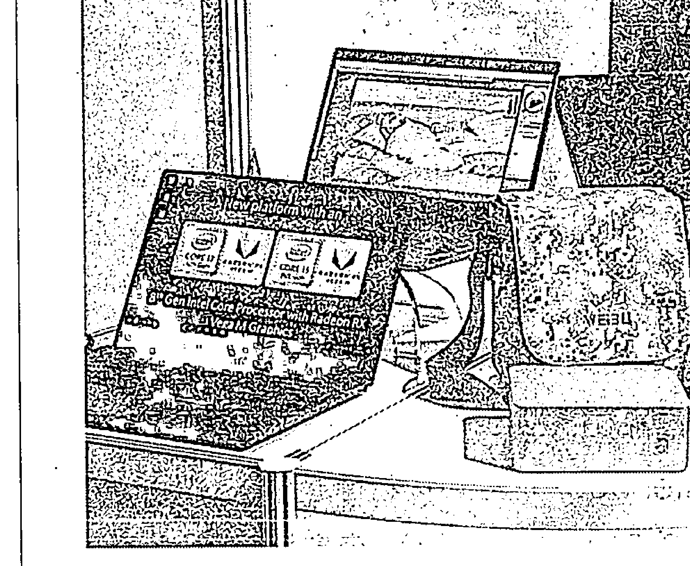
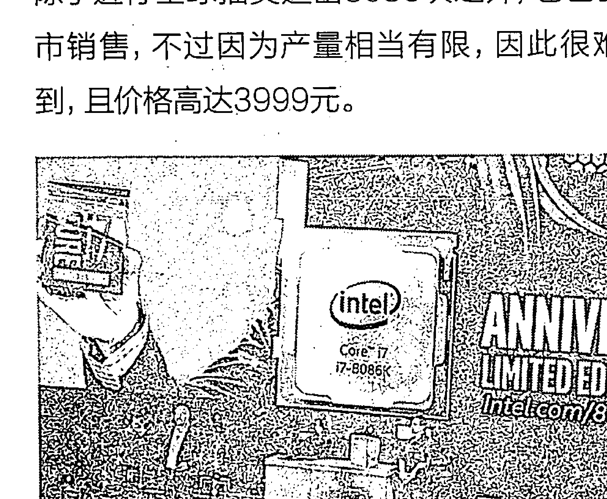
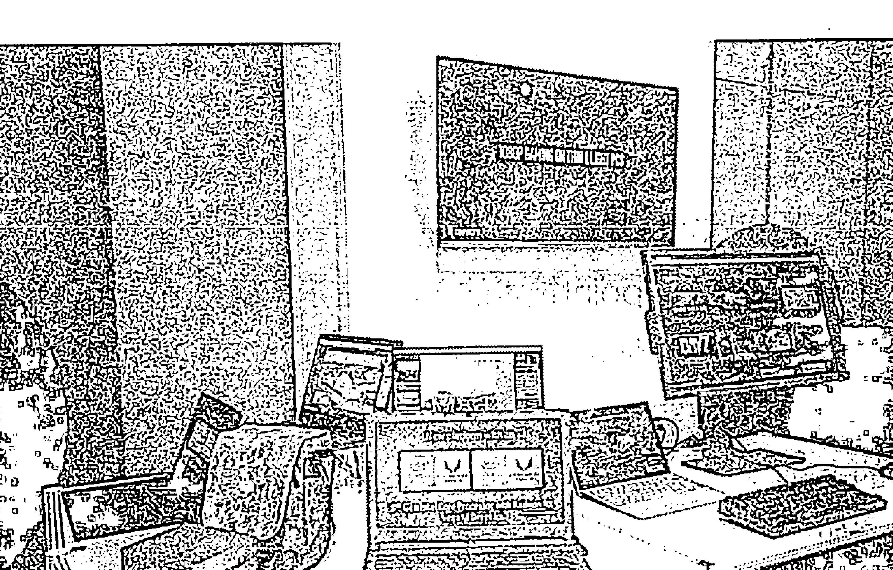

### 显卡消费GPU落寞 衍生品风光

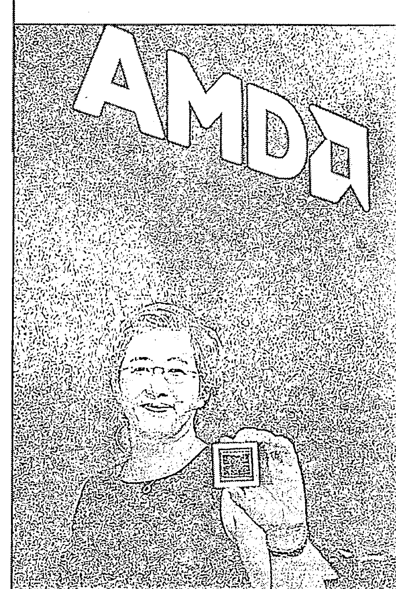

在本次展会上，NVIDIA和AMD都并没有展示或发布任何新的消费级GPU，但都高调展示了基于GPU架构的衍生产品，而它们又都是另一个领域——AI市场的有力选手。

在COMPUTEX 2018上，与消费级GPU更新相关的，除了NVIDIA面向移动市场的更新Max-Q方案，大概就只有AMD的7nm制程计划了，虽然近期基于7nm制程的Radeon Vega将全部投入专业加速卡市场（图6），不过既然是直接使用Vega架构的芯片，未来将其转向消费市场也是很容易的。特别是AMD展示的Nano版Radeon Vega（图7），小巧的体积对散热设计是一个巨大的挑战。

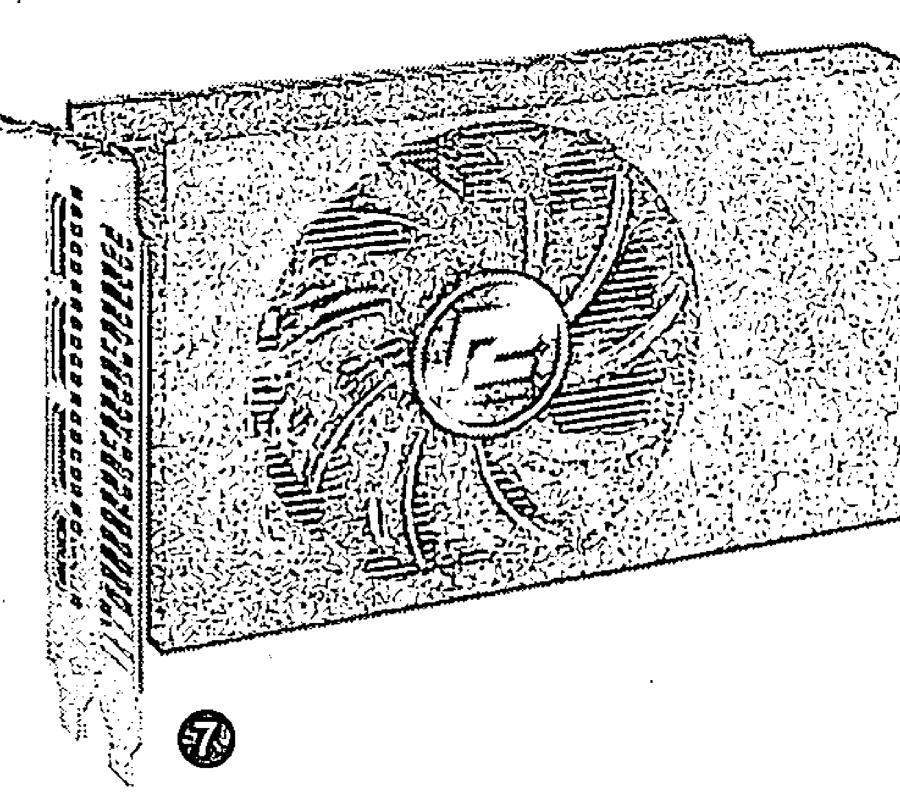

### 傲腾与并联追求极致存储性能

在COMPUTEX 2018上，强大的Intel 905P与多路M.2 SSD带来的极致性能最让人印象深刻，而它们代表的则是两个不同思路的未来高性能存储方案。

### Intel 905P

与早期高性能傲腾SSD都采用PCI-E或者U.2接口不同，Intel 905P已经可以将自己缩小到一块小小的M.2 SSD卡上（图8），容量为380GB，虽然相对于闪存型SSD，或者是U.2、PCI-E版本，它的容量都显得有些小，不过要和之前M.2接口3D-Xpoint SSD的118GB容量相比，已经算是巨大的进步了。

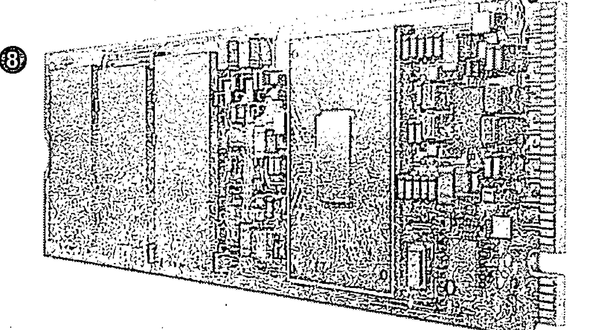

使用3D-Xpoint技术的905P在延迟、低数据深度、小文件频繁存取等方面的表现比SSD更强，因此在实际应用中，有着比测试成绩更好的表现。不过其容量和容量价格比仍然是硬伤，例如目前使用PCI-E全长卡结构的905P容量也仅有960GB（图9），价格却高达8999元。

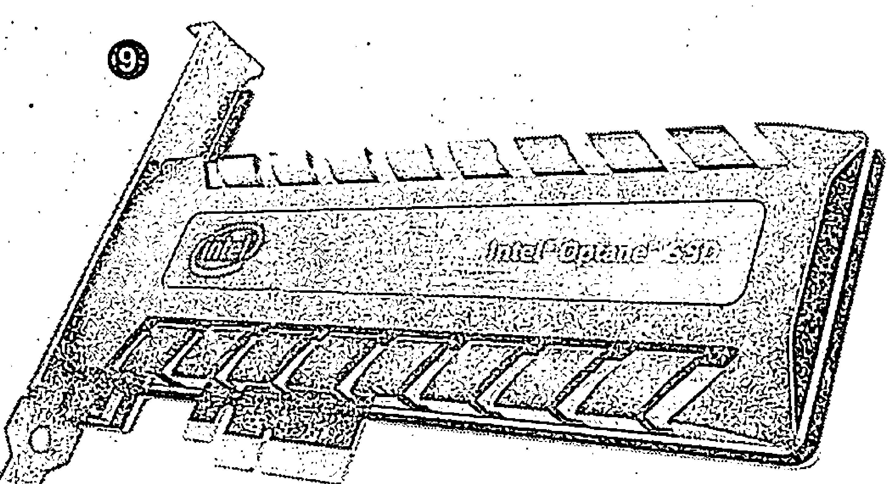
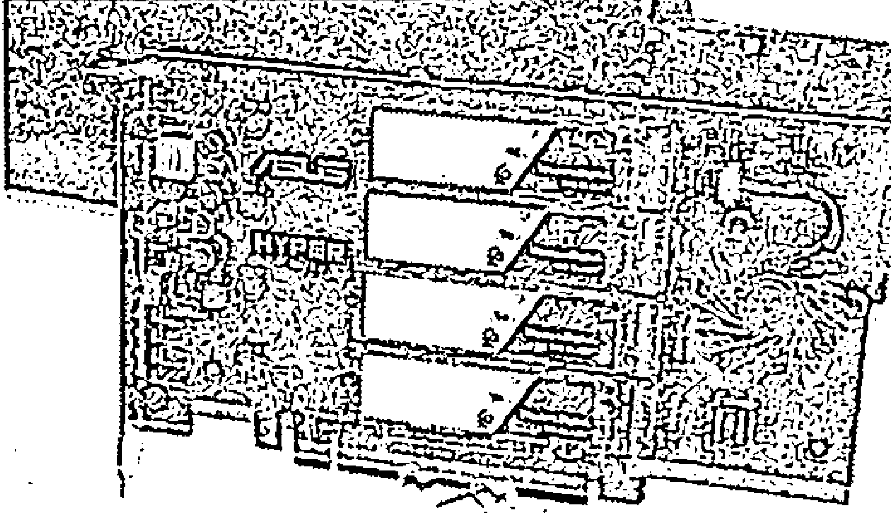

### 多路NVMe SSD

在COMPUTEX 2018上，多个SSD厂商都带来了采用PCI-E接口的多路NVMe SSD方案，通过RAID方式组合的高速SSD，再直接使用高速PCI-E接口连接，可以获得非常高的速度。例如在西数的公开展示中，一块华硕HYPER M.2 SSD扩展卡，其上的4路NVMe SSD卡采用西数黑盘SSD（图10），读取速度可达19GB/s（图11）。当然相对于常见的PCI-E×4接口SSD，它需要占用一个PCI-E 16×插槽，因此只能用于PCI-E通道比较富裕的高端PC，在西数展台上甚至标有“建议配合AMD线程撕裂者处理器”，因为它能提供多达64条PCI-E 3.0通道，是目前消费级处理器中最多的。

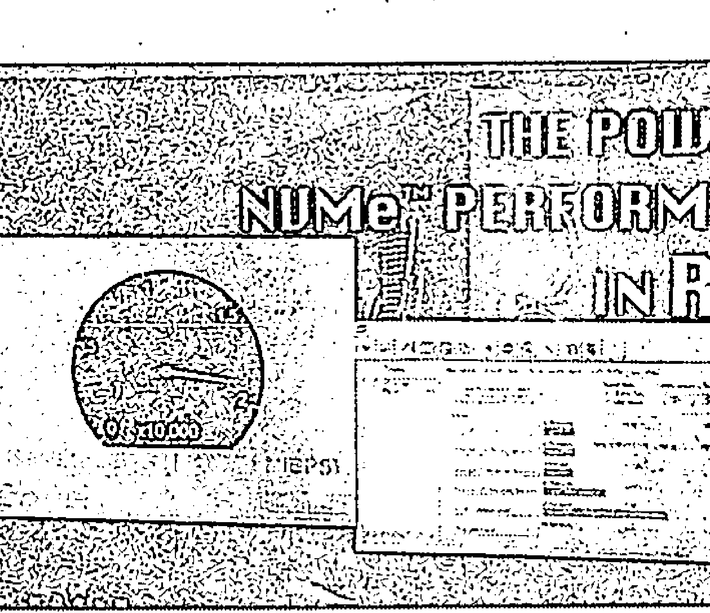

比较有趣的是，类似设计也出现在Intel开放日的展位上，这里也有一块华擎M.2 SSD扩展卡（图12），同样为4路RAID，采用PCI-E×16插槽，它安装了4块傲腾905P SSD，性能更加强大。


### 外设周边 光影竞彩

各种炫酷的外设是COMPUTEX上的靓丽风景线，在AMD的发布会上，支持Radeon FreeSync功能的三星80英寸OLED电视展示了流畅稳定的游戏画面，这大概是目前最大的电竞显示器，也是本次COMPUTEX上最大的参展外设了。

随着电竞的兴起和个性化的需求，键鼠已经成了最受欢迎的外设产品，在COMPUTEX 2018上，各种新型键鼠，特别是电竞键鼠非常醒目，而其中大部分都配置了各种装饰灯效。如果本次展会能开放夜场参观的话，相信这些外设展台都是最闪亮的。


在其中最引人瞩目的是技嘉为自己的新电竞品牌AORUS打造的体验区（图13），除了自家的主板、显卡之外，还结合了AORUS电竞键鼠等产品。在这个特意设置得比较黑暗的角落里，从机箱中透出的AORUS主板、机箱灯效、键盘背光等，加上显示器和特意安装的家具灯效，让“光污染”无处不在，气氛烘托得相当不错，可以说是电竞外设展示的集大成者。

此外在展台上的各种机箱也同样非常吸引人，也许其中大部分都只能作为概念产品或MOD作品，只给人留下惊鸿一瞥，但也有不少最终会商品化。例如迎广之前推出的全透明球形机箱（图14），对很多希望展示PC内部配件的参展商来说，成为了最好的选择。

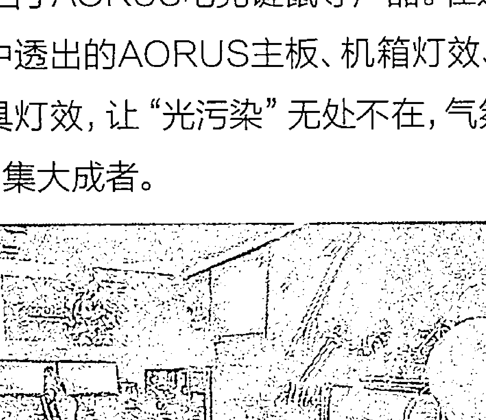

### PC整机更加多样化的设计

傻大黑粗的PC整机已经成为了历史，在COMPUTEX 2018上，PC整机或纤细或华丽，为我们展现着不一样的魅力。

在微星的站台上，除了庞大的高端电竞PC之外，一款比常见显示器还要薄的一体机——Pro 24X（图15）就吸引了很多人的目光。它采用23.8英寸广视角屏幕，最薄处仅6.5mm，边框最窄处仅有2.2mm。这款机型的快速维修设计让用户可以很方便地升级硬盘。

另一个吸引了很多人的PC整机同样是AIO一体机，联想的获奖产品IdeaCentre 730S AIO（图16），它也采用了微边框+全面屏的视觉设计，将干扰影像视觉的因素减到了最少，使这款产品的屏占比高达87.4%。其面板采用Kvadrat布料风格方案，将工业技术与传统工艺相结合，与配套的无线键鼠、天鹅颈支架以及向日葵底座浑然一体。它采用低电压8代酷睿平台，配置均衡，具有低功耗、低噪音和低温度的特点。

在高性能PC方面，除了传统的大块头、液冷配置之外，小型化的产品同样大放异彩。例如索泰就同时展示了ZOTAC AMP EXTREME游戏系统和ZBOX Q迷你工作站。AMP EXTREME游戏系统以GGF LAN Party为基础制造（图17），搭载索泰旗舰级游戏显卡、高性能桌面级处理器及强劲的CPU水冷散热器，带来强大的游戏能力，而整套系统都安装在一个小型机箱内。ZBOX Q（图18）则在更小的迷你电脑内，安装了NVIDIA Pascal架构的Quadro专业显卡，具有比拟专业图形工作站的能力。

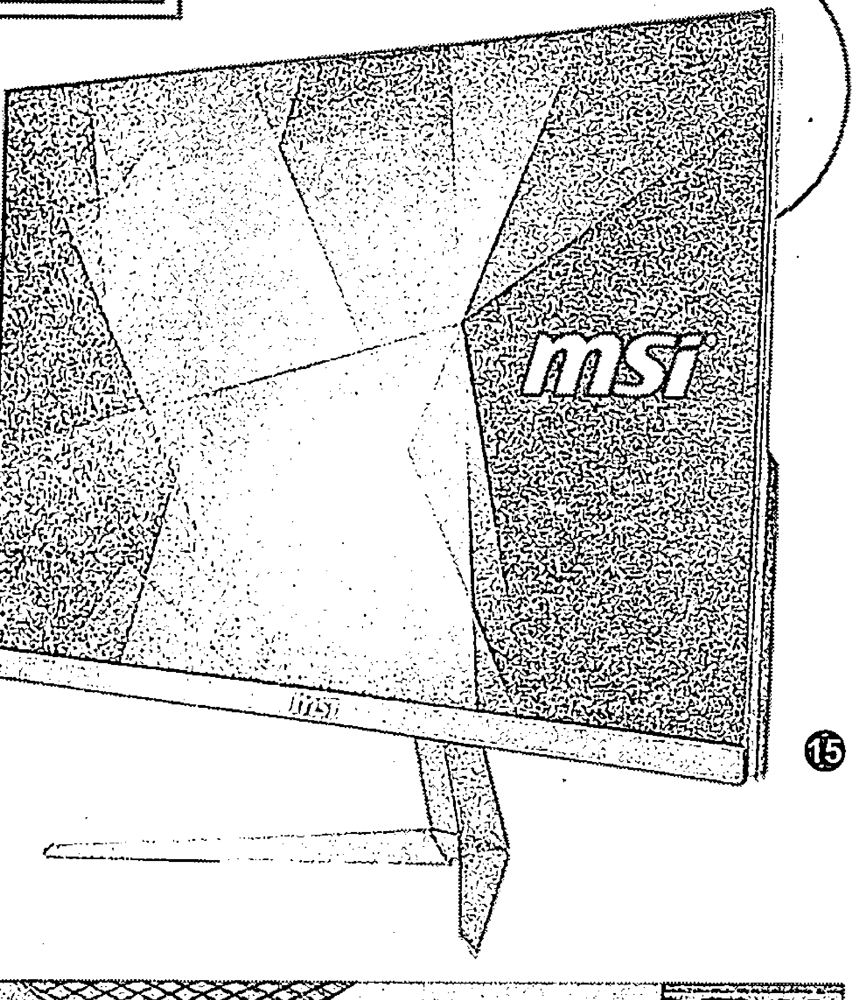
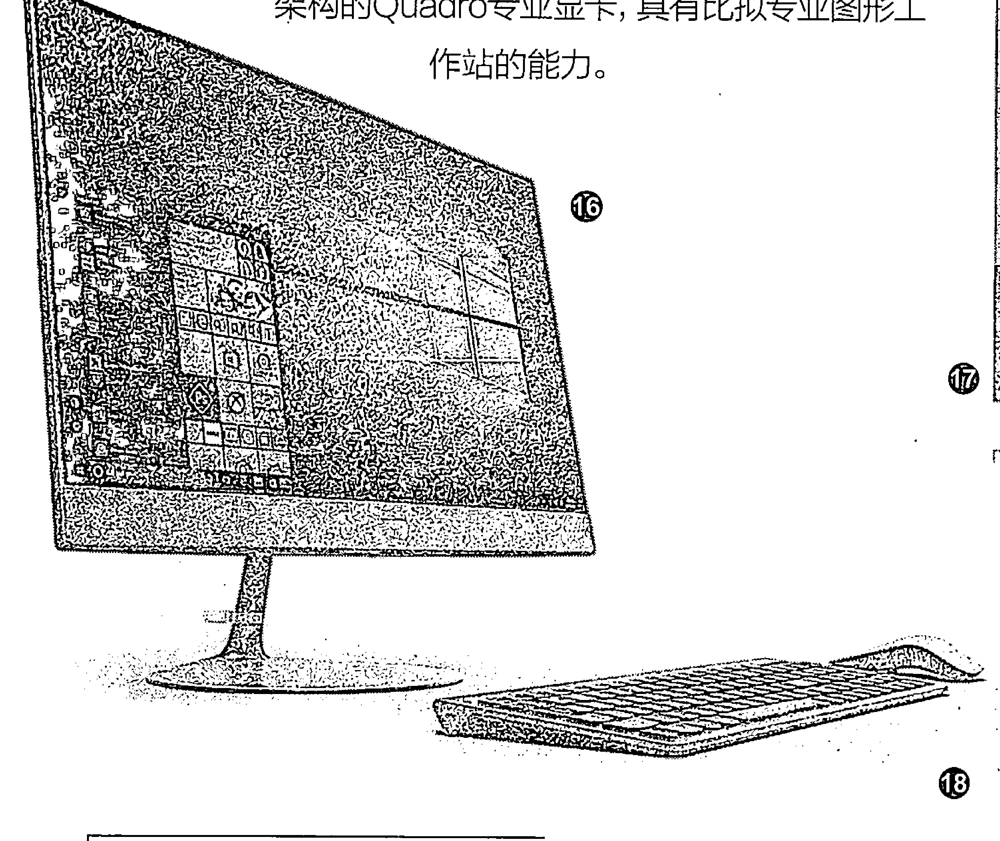
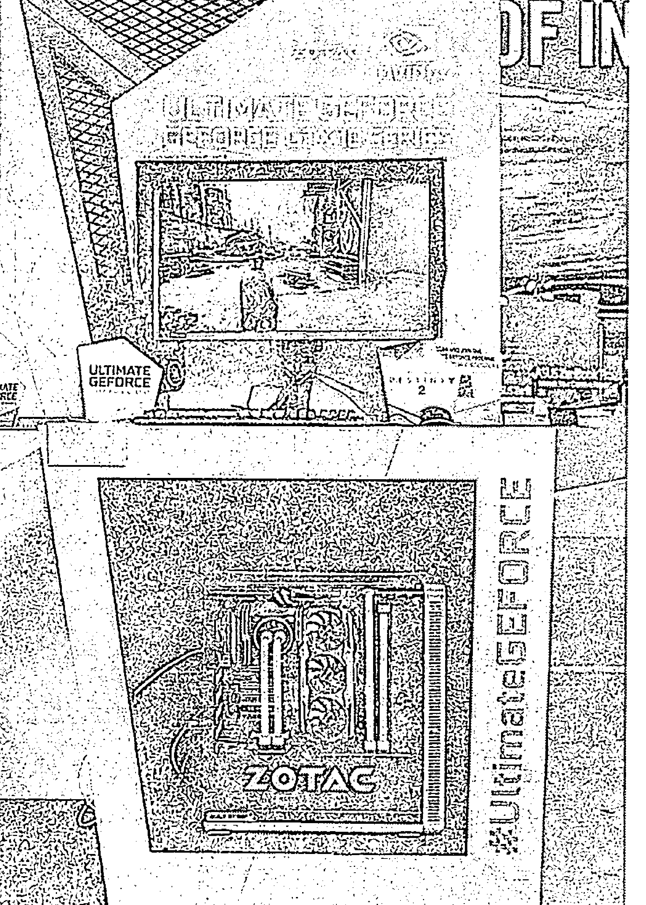


### VR是摆脱束缚的理性探索

VR的热潮似乎已经逐渐退去，但笔者认为，它更多地是从狂热追捧走向了对应用能力和应用方式的理性探索。

在COMPUTEX 2018中，Intel的VR无线连接技术、索泰第二代VR背包等产品都是这样的代表。


在Intel的开放日活动中，展示了与HTC合作的无线VR设备（图19），它让笔者第一次获得了完全无束缚的VR体验。它采用60GHz的Wi-Gig芯片进行无线信号传输，理论传输距离为10米，5米内的传输延迟在5ms~7ms，在使用时基本感觉不到延迟。其PC端和VR眼镜端各配有一个天线设备盒，其中无线眼镜端的盒子内置电池，可连续使用2小时以上。

索泰第二代VR背包VR GO2.0同样可以让用户摆脱线缆束缚，获得更有沉浸感的VR体验。它采用全新的外观和结构设计，比第一代缩小了1/4左右，更加轻盈舒适。相对于第一代产品，它的视频、网线接口都进行了缩减，更偏向于满足VR应用，而不再是努力做一个“可以背的台式机”了。

### AI未来之路

AI是IT界最热的词之一，苹果、华为、高通等公司都已经在自己的移动芯片中植入了相关功能，在PC领域，Intel、NVIDIA、AMD等厂商当然也不甘落后。

### Intel将AI植入电脑

在展会期间举行的e21FORUM AIoT论坛上，Intel高级副总裁兼客户端计算事业部总经理Gregory Bryant宣布“智能将是现代自适应性PC体验不可或缺的一部分（图20）。我们计划在PC中引入人工智能，通过为开发者社区提供工具和资源，并与OEM通力合作，在新设备中加入人工智能功能。”在未来几年，人工智能都将是Intel的投资重点，甚至希望在2年内就将AI系统广泛植入消费级电脑中。

和自适应用户需求、加速应用等方面的能力。例如采用双屏设计的PROJET PRECOG概念笔记本电脑（图21），其C面屏幕就不是简单的第二块屏幕或虚拟键盘、触控板，而是会根据应用的不同、用户习惯的不同、目前的姿态等，呈现


Gregory Bryant提到的人工智能来自Movidius VPU芯片，最新的版本为Movidius Myriad X，将在今年晚些时候正式发布。在其后的展示中，华硕的PROJET PRECOG概念笔记本电脑，以及U盘式的AI辅助系统，都展现了这款芯片在预判


出最适合的界面。而插在Intel NUC的USB接口上的“AI加速棒”（图22），则一直在对视频素材进行连续的识别，如人脸、手持物体等（图23），大幅提升NUC的相关处理能力。


此外Intel AI系统还可以在保全系统、消费统计、硬件免骚扰等方面帮助用户，例如区分进入仓库和店铺的人、判断其性别与行为，或者根据使用习惯排除工作和生活中的应用和网络骚扰等。未来Intel将推出M.2接口的AI加速器、内置AI功能的酷睿S处理器等产品，同时通过PC人工智能开发者计划（AI on PC Developer Program），为开发者提供各种工具和培训，帮助开发者充分利用硬件功能，释放人工智能创新。

### NVIDIA与AMD 争夺专业AI市场

在Intel努力提升个人电脑AI水平的同时，NV与AMD的发布会则彻底放弃了消费级GPU，而是忙着展示它们在专业AI市场的新成果。

NVIDIA展示了基于Tesla V100的DGX-2和HGX-2（图24），它们都拥有非常强大的机器智能和运算能力，既可以说是一个服务器平台，本身也可以作为一个HPC（高性能计算）平台，甚至有人直接说它就是一台超级计算机。


AMD则宣布了基于7nm制程的Radeon Vega将用于Radeon Instinct专业卡，并且已经开始向初始客户提供样片，并将于2018年下半年以服务器和工作站两种规格开始发货。它适用于关键计算应用，而且将重点攻路专业AI加速市场，是和NVIDIA正面对决的产品。

### 小结

COMPUTEX 2018已经落幕，从产品的发布数量和等级上看，它似乎并不是非常耀眼的一次展会。不过在这个PC转型的关键时期，COMPUTEX上展示的产品思路、技术方向等，还是为近期乃至未来一段时间内的PC市场和技术发展，展示出了一幅内容足够丰富的画卷。

## 笔记本的COMPUTEX 2018

在COMPUTEX 2018中，DIY领域涌现出了很多新技术和新产品。那么，在以笔记本为代表的移动领域，又有哪些值得我们关注的新品和技术呢？

### 略显冷清的移动舞台

在本届COMPUTEX 2018，携旗下笔记本产品线大规模参展的仅有华硕和微星两家，其他品牌并没有投入太大的热情。还好，高通和英特尔也借此机会展示了最新技术，有望大幅改善笔记本在续航方面的表现。下面，就让我们透过略显冷清的舞台，听听本届大展上来自笔记本的呐喊吧。

### 游戏本爱上全面屏

英特尔第八代酷睿处理器堪称游戏本的最佳梦幻装备（图1），得益于最新14nm++工艺，以及为酷睿i5赋予超线程技术，酷睿i7从4核8线程一举突破到6核12线程，内置更大容量高速缓存等特性，让八代酷睿i5-8300H就具备了超越七代酷睿i7-7700HQ，八代酷睿i7-8550H比肩桌面七代酷睿i7-7700K的实力，在长时间游戏的过程中，游戏本专用的移动CPU再不存在瓶颈之说（图2）。


八代酷睿也让游戏本进入了新一轮的井喷期，而绝大多数中高端新品也参考手机领域的“全面屏”概念，通过微边框设计实现了瘦身目的，在更小的机身空间里依旧保持了强大的性能输出。在上期杂志的《“视界”的盛宴 盘点新一代全面屏游戏本》一文中，我们已经盘点了热销中的微边框游戏本新品，而在COMPUTEX 2018中，来自华硕和微星旗下的游戏本，则将这一阵营做了进一步的补全。

### “枪神”与“魔霸”来袭

华硕此次带来的微边框游戏本来ROG玩家国度，分别是ROG枪神II和ROG魔霸II（图3），两款产品都采用了三面窄边框设计，从而使其机身宽度较上代产品缩减了23mm，重量也被控制到2.4kg左右，便携性进一步提升。

ROG枪神II和ROG魔霸II采用了相同模具，所以三围和设计风格相仿。只是枪神II定位FPS类游戏，而魔霸II则主打MOBA类游戏，所以它们分别将WASD键和QWER键做成了透明键帽，以满足不同类型游戏常用键位的炫光要求。

两款游戏本都采用了可用于定制的RGB炫彩键盘和Aura Sync照明的前灯条，并配备世界首款144Hz超窄边框显示屏，具有超快的3ms灰阶（GTG）响应时间，HyperStrike Pro游戏键盘用于改善输入体验，HyperCool Pro技术可为其高性能CPU和GPU降温，四天线Wi-Fi也大幅提升了无线网络连接性能。

ROG枪神II和ROG魔霸II在配置上都搭载了八代酷睿处理器，其中魔霸II定位略低，只提供NVIDIA GTX1060独显。而枪神II定位较高，可选NVIDIA GTX1060或GTX1070，从而满足FPS类游戏对更高性能的诉求。


### 高配游戏本竟然只有1.86kg

微星在COMPUTEX 2018也发布了全新的游戏本GF63（图4），我们可以将其视为GS65（上期杂志有过相关介绍）的缩水版，从三面窄边框改为了两面窄边框（左右边框宽度都是4.9mm），虽然厚度增加到21.7mm，但重量却依旧被控制到1.86kg，在15.6英寸游戏本中属于非常轻盈的存在。微星GF63的定位不高，所以它并没有配备120Hz刷新率以上的电竞屏，硬件配置也选用了八代酷睿和NVIDIA GTX1050/GTX1050 Ti的组合，从而降低了入手门槛。


随着华硕ROG枪神II和ROG魔霸II以及微星GF63的发布，宣告了“第一代”全面屏游戏本已经布局完成，让14英寸体型的15.6英寸游戏本开始入驻电脑桌面，伴我们在游戏战场驰骋。而未来，“第二代”全面屏游戏本将继续挖边框的墙角，并将以2kg视为减肥是否成功的标准，伴我们随时外出游戏之需。你期待吗？

### 轻薄本玩出新花样

和游戏本相比，轻薄本们在COMPUTEX 2018中表现得更加活跃，这不仅体现在新品的数量上，还表现在创意和形态的进化上。

### 要轻盈更要性能

轻薄本在COMPUTEX 2018中给我们的感觉，就是它们朝着更轻与更强的道路上再进一步。其中，华硕灵耀X（ZenBook S UX391）就通过极致轻盈给我们留下了深刻的印象。

华硕灵耀X采用了13.3英寸4K UHD屏幕和窄边框设计，将机身厚度和重量分别控制到了12.9mm和1kg，同时还在如此纤薄的机身里塞进了第八代酷睿处理器（U系列）、PCIe SSD固态硬盘以及2个雷电3接口（可外接桌面显卡提升3D性能），并提供13.5小时的续航时间。为了解决纤薄机身的散热压力，灵耀X配备了全新的ErgoLift转轴（图5），当打开屏幕时机身将自动抬起，从而让打字操作更舒适，并增加下方气流流动提高散热效率。值得一提的是，该产品还通过了美国军规MIL-STD 810G耐用性标准，可靠性无忧。


如果你纠结于华硕灵耀X缺少独显而玩不了主流游戏，那就不妨关注一下来自微星旗下的PS42，这款产品采用三面窄边框设计，将14英寸屏幕塞进了13英寸的身材中，而重量也仅有1.2kg左右（图6）。微星PS42的特色在于采用八代酷睿处理器（U系列）以及NVIDIA MX150独显的组合，并在纤薄的机身内还采用了Cooler Boost 3三热管/双鳍片阵列的散热方案，续航时间也长达10小时。


如果你觉得前面提到的灵耀X因追求极致而售价高昂，则可将目光投向华硕新灵耀家族（VivoBook S13/S14/S15），可选新灵耀S15（15.6英寸，1.8kg）、新灵耀S14（14英寸，1.4kg）和新灵耀S13（13.3英寸，1.2kg）三款产品，它们拥有特殊的织物纹理涂层，可选5种缤纷配色（除了顶盖还涂抹在机身两侧，看起来非常个性），并同样采用ErgoLift转轴设计，可抬高键盘底座（图7）。


其中，新灵耀S15/S14采用了三面窄边框设计，除了搭载第八代酷睿处理器外还搭配有NVIDIA MX150独显，支持SSD+HDD双硬盘的组合。而新灵耀S13的表现更为出色，它通过四面窄边框在11英寸机身中就塞进了13.3英寸屏幕（图8），屏占比高达89%，同时保留了MX150独显，性能想必不会让大家失望。

### 来自触控板的“视界”

还记得华硕在11年前推出的W5fe吗（图9）？这款为了迎合Windows Vista系统主打的SideShow功能，特意在A面顶盖上加入了第二块辅助屏幕，可直接显示Windows Vista自带的Widget，包括媒体控制、相册、邮箱等，无需开机就能在上面完成一些小功能的操作。在COMPUTEX 2018上，华硕带来了W5fe的接班人——全新的灵耀X Pro 15和灵耀X Pro 14同样配备了第二块辅助屏幕（图10），并将其与触控板完美结合，不仅分辨率更高且支持触控操作，还能借助ScreenPad专属软件带来前所未有的互动操作模式。


目前ScreenPad已经支持包括Microsoft Word、Excel、PowerPoint等主流常用应用软件，未来还将持续增加通过ScreenPad操控联机手机等功能（图11），并通过开放平台让开发者可以为ScreenPad提供更多优秀应用。

除了新颖的操作方式，灵耀X Pro 15和灵耀X Pro 14还提供了非常强悍的配置。其中，灵耀X Pro 15最高可选英特尔第八代酷睿i9六核处理器以及NVIDIA GTX1050 Ti独显，采用15.6英寸4K UHD分辨率屏幕，色域也高达100% Adobe RGB。而灵耀X Pro 14配置稍逊，搭载第八代酷睿处理器和NVIDIA GTX1050 MAX-Q独显。

就配置而言，华硕灵耀X Pro 15和灵耀X Pro 14其实足以归类到“游戏本”阵营，只是它们在设计和形态，以及华硕灵耀品牌都更倾向于轻薄本，而且灵耀X Pro 15的重量也不过1.88kg，还是非常轻盈的。但是，曾经W5fe的失利就否定了辅助屏幕的实用性，而新品能否借助ScreenPad实现差异化功能的突围（图12），最终还得看它能否带来杀手级的功能，有待日后观察。

### 双屏“变形本”再现

为了迎合部分消费者对于触控操作的需求，在轻薄本领域还衍生出了屏幕可360度翻转的“变形本”，而在COMPUTEX 2018上也出现了很多变形本的身影。

比如，惠普就推出了新一代翻转商务本ProBook x360 440 G1（图13），该产品采用14英寸可翻转的触控屏幕，处理器可选范围极大，从英特尔Celeron 3865U到酷睿i7-8550U皆可，同时还可选配NVIDIA MX130独显，定位在5000元左右价位起的商务市场。

华硕新灵耀Flip 14（TP412）同样是一款可360度翻转屏幕的窄边框变形本（图14），该产品的特色是将厚度和重量分别控制到了17.6mm和1.5kg，最高搭载八代酷睿i7处理器，可通过触控板上的指纹传感器与“Windows Hello”技术进行一键登入，或以华硕主动式电容触控笔进行素描、绘图等设计创作，时刻体验高效便捷。

实际上，时下变形本型号繁多，上面两款新品无非是沾了窄边框的光实现了瘦身而已。而本届COMPUTEX 2018上真正值得引起我们关注的，还要数华硕最新推出的PROJECT PRECOG。

还记得联想在前些年推出的双屏变形本YOGA BOOK吗（图15）？华硕PROJECT PRECOG在设计上与YOGA BOOK就有着异曲同工之妙，二者最大的差异是PROJECT PRECOG将位于YOGA BOOK C面键盘区的电子墨水屏幕（只能承担虚拟键盘和一部分固定的输出工作，如手绘）换成了和主屏幕相同的触控屏幕，它既可以是键盘、触控板，也可以是两个大屏幕的平板电脑套装（图16），且支持自定义其他使用功能，提升灵活度、扩展性及更强大的生产力。


此外，华硕称PROJECT PRECOG还融入了AI技术，配备智能触控功能，可自动识别用户心中所想的输入方式，例如，其可依据用户手指放置处调整键盘位置，或是在触控笔轻触屏幕时，立即切换为触控笔模式。此外，这款产品已经支持Cortana个人数字助理与Amazon Alexa语音服务，集成Intel Movidius视觉处理器（VPU），未来可以伴随开发者的加入带来更多AI功能。


华硕PROJECT PRECOG在形态上堪称COMPUTEX 2018最酷最炫的设计，双屏显示也有着无限的应用前景（图17）。但是，正如灵耀X Pro将触控板替换成副屏幕一样，PROJECT PRECOG能否刺激更多消费者为其买单，关键还得看有没有基于双屏使用上的杀手级应用。

### 来自锐龙笔记本的呐喊

除了前文涉及的新品，本届COMPUTEX 2018大展其实还是有不少新品参展的。比如为借助AMD发布7nm制程锐龙处理器、Radeon显卡和“霄龙”处理器的契机，还有多款搭载锐龙处理器及Radeon显卡的笔记本亮相。比如联想YOGA 530和IdeaPad 530S/330S/330、华为MateBook D以及宏碁Predator Helios 500游戏本等。


扩展阅读：NVIDIA更新Max-Q方案
NVIDIA在COMPUTEX 2018上展示了包括雷蛇Blade 15在内的多款Max-Q新品游戏本，并提出了新一代Max-Q轻薄游戏本方案，对新品提出了很多硬性的要求：比如至少要将厚度压缩到16mm以内、具备至少8小时续航时间、更低的风扇噪音、屏幕刷新率达到144Hz、必须采用窄边框设计等。参考华硕已经推出的灵耀X Pro 14（配备GTX1050 MAX-Q），可以预见未来的Max-Q新品游戏本的门槛更低，同时也会更轻、更薄、更性感。


其中，华为MateBook D锐龙版采用了全新的模具，我们可以将其视为15.6英寸MateBook D的缩小版（图18）。这款产品搭载AMD锐龙R5 2500U移动处理器，集成Radeon Vega核显，改用14英寸屏幕，键盘两侧宽度进行了收窄且出现了扬声器格栅，整机重量也被控制到1.45kg，配备57.4Wh大电池并支持杜比全景声技术。
而宏碁Predator HELIOS 500锐龙游戏本则比较特殊，它采用了17.3英寸电竞屏，搭载了AMD第二代锐龙R7 2700桌面处理器，以及Vega 56桌面级独立显卡，支持AMD的FreeSync自适应垂直同步技术（图19）。可以说，这款游戏本已然具备了和英特尔酷睿i7-8700和GTX1070较量的资本，而我们也期待AMD能早日推出性能级的移动锐龙处理器和性能级移动显卡，不要每次都要靠着桌面CPU/GPU撑门面，毕竟后者较高的TDP势必会降低游戏本的便携性（为了降低发热量必须采用厚实机身和夸张的散热模块设计）。

### 高通推新骁龙迎战英特尔

关于“骁龙牌”笔记本，CFan在过去曾做过很多介绍。作为高通和微软的联姻之作，搭载骁龙的Windows笔记本可以运行Win32程序，并实现全天候的续航能力，并以此为杀手锏来挖英特尔的“墙角”。
在COMPUTEX 2018上，高通正式发布了针对笔记本定制的骁龙850移动平台（图20），我们可以将其视为骁龙845的超频版（从2.8GHz提升到了2.96GHz），高通表示骁龙850与现有产品（骁龙835）相比性能提升30%、电池续航提升20%（最长可连续使用25小时）、4G LTE速度提升20%、AI性能提升三倍（图21）。目前，惠普、联想、戴尔、三星等厂商已确认会推出相关新品。


骁龙835笔记本已经上市较长时间了，但根据用户的反馈，其性能表现并不能让人满意，唯一的亮点就是可以随时联网，而且续航时间给力。骁龙850的出现，可以进一步提升骁龙笔记本的性能，改善用户的使用体验。但我们需要认清事实，骁龙850再强，它也仅是和英特尔4.5W TDP的酷睿M平台抗衡的存在，远远不如15W的U系列酷睿处理器，在游戏方面的体验更是无法媲美核显和独显，只适用于轻办公和全天候联网待机的使用环境。


> 小提示
英特尔还在COMPUTEX 2018上展示了一款支持5G技术的原型PC，并使用了自家的调制解调器。在2019年，英特尔也会与高通同步，联合各大OEM厂商推出支持5G网络的笔记本，再结合Low Power Display Technology，无论是性能、续航还是联网方面都给予对手极大的压力。

### 来自英特尔的反击

面对以高通为代表的ARM阵营咄咄逼人地挖PC墙角的态势，英特尔自然也不能闲着，针对骁龙笔记本主打超长续航的特性，给予了坚实的反击。
英特尔在COMPUTEX 2018上联合屏幕面板厂商，推出了名为Low Power Display Technology（低功耗显示技术）的黑科技（图22）。简单来说，英特尔的低功耗显示技术可以大幅降低显示面板的最低功耗，夏普、群创光电甚至已经联合英特尔推出了支持该技术的1W显示面板（图23）。和传统屏幕相比，支持新技术的显示面板可以提供额外的4小时到8小时的本地视频播放时间！


根据英特尔的数据显示，在一台搭载八代酷睿i7-8550U+8GB内存+Intel 600p SSD+Windows 10系统的笔记本上，在屏幕亮度设为150nits，通过耳机音频播放本地视频文件，结合支持低功耗显示技术的1W屏幕后，续航时间可以长达28个小时！ 这个表现已经超越了骁龙835笔记本，而且英特尔还表示这种显示技术不会造成屏幕亮度、分辨率的损失，日常使用不会感觉到任何差异。
可惜，该技术目前还处于研发阶段，尚不清楚何时会有具体产品落地。不过，通过降低屏幕功耗来改善续航的手段，不仅适用于笔记本，对智能手机和平板电脑来说也是意义重大。希望类似的低功耗显示技术可以早日 在移动设备之间普及，让咱们出门时再也不用揣着累赘的充电宝了。


## 玩出花样的前置摄像头

扫一扫，更多精彩内容立现！

策划《电脑爱好者》编辑部

爱美之心人皆有之，早在以诺基亚塞班系统为主的“准智能手机”时代，自动对焦、氙气闪光灯、前置摄像头等拍照元素就成为手机圈中的一抹亮色，步入智能手机时代后更是掀起了全民美颜的浪潮。打开微信朋友圈、新浪微博等社交APP，凡是以人物为主的照片几乎全部经过了美颜修饰，你有没有想过这些年中手机的自拍实力是如何稳步提升的吗？

### 先从苹果iPhone谈起

在智能手机领域，苹果iPhone长期以来都处于性能、设计和功能方面的“风向标”。然而，就前置摄像头的发展史上，iPhone却没能扮演好标杆的角色。

#### 前置镜头从4开始

还记得诺基亚N73和索爱W850i等经典的手机吗（图1）？这些诞生于2006年左右的产品就纷纷标配30万像素前置摄像头，可以方便用户随时体验自拍的乐趣（虽说效果是糟糕得一塌糊涂）。作为现代意义上智能手机的开拓者，iPhone直到家族中的“四代目”——iPhone 4（2010年6月发布）才正式引入前置摄像头的概念（图2），让自拍和面对面的3G视频通话变成了可能。

实际上，在智能手机圈中iPhone 4配备前置摄像头的节点并不算太晚，HTC直到2011年3月发布的G11（Incredible S，130万像素）、摩托罗拉也是同年发布的Atrix 4G（ME860，30万像素）才开始陆续武装前置摄像头（图3），比iPhone 4还要晚了大半年的时间。


可惜，iPhone却没有保持好这一领先优势，直到iPhone 5才开始将前置摄像头提升到130万像素，iPhone 6s进一步提升到500万像素，从iPhone 7至今则保持在700万像素。反观Android手机阵营，前置摄像头的规格早就从200万像素、500万像素、800万像素、1200万像素……直到最高的2400万像素甚至武装前置双摄模块，单就像素值一项早就将同期的iPhone远远甩下。

#### 自拍理念中的另类

我们必须承认，iPhone的前置摄像头像素值虽然低，但它们的拍摄素质却远比更高像素值的Android手机要好很多，无论是清晰度、噪点控制还是色彩还原，都堪称一流水准。问题来了，从iPhone 4到iPhone X，苹果在iOS中预装的相机APP却始终没能提供自动美颜的功能，想要自拍美美的用户，必须借助美颜相机等第三方APP加以实现！


这就是苹果另类的自拍理念。苹果认为，自拍原本就是应该忠于自我的拍摄，所谓的“美颜”必定造成照片失真。哪怕是iPhone 8/X主打的人像光效（图4），其也是基于环境光的修饰，依旧可以还原真实的人物样貌。


反观Android手机阵营，只要你打开相机APP，切换到前置摄像头模式，默认就是“自动美颜”功能已打开，随手一拍就是美白、瘦脸、大眼、磨皮等“一条龙服务”，可以让你分享更高颜值的照片（图5）。


我们姑且不去讨论自拍是否应该展示更真实自我的逻辑关系，但毫无疑问，自拍+美颜就是当下的潮流趋势，用户可以不用，但你不能没有。

就在你已经习惯了享受自动美颜的惬意体验之余，有没有想过这些年来智能手机是如何将你“越拍越美”的吗？

#### 美颜自拍概念的由来

> 手机前置摄像头最早的初衷，只是为了迎合3G网络，实现视频通话功能而生。

所以，长期以来它们的像素值普遍都在10万像素到130万像素之间，属于能“照清楚人”即可。想当年，要想自拍出一张满意的照片，还是需要后置镜头出马，并利用手机后盖上一切可以反光的元素充当“自拍镜”（图6），摆好Pose，再用食指“盲操作”点击屏幕上的快门键……整套体验可谓糟糕至极。


当年是否配备自拍镜可是妹子们选手机的卖点之一## 美颜手机诞生

而真正为自拍赋予“美颜”特效的智能手机，则要首推OPPO在2012年6月发布的Ulike U701。这款产品配备了200万像素前置摄像头，并引入了Beauty+美颜引擎，可以智能识别面部并修饰皮肤、美化五官等，肤色、细纹、痘痘、瞳孔都可自然调整实时预览美颜，从而开创了美颜手机的先河。

2012年底，OPPO推出了Ulike 2，一举将智能手机前置摄像头像素值从200万像素提升到了500万像素（图7），在提升自拍细节表现力的同时还引入了美颜2.0概念，在磨皮、大眼、美白等细化方面的表现更为出色。

至此，以OPPO为代表的Android手机厂商们就走上了一条“不归路”，为前置摄像头赋予自动美颜特效成为了一股潮流趋势，并影响至今。

### 美颜相机出炉

在OPPO凭借Ulike U701和Ulike 2的美颜功能开启差异化竞争之门时，以美图秀秀为代表的APP厂商也看到了自拍美颜领域的商机。于2013年1月诞生的美颜相机，一经发布就以“手机变成自拍神器，一键美颜又美又自然”为宣传突破口，成功地侵入了智能手机战场，成为了无数时尚男女装机必备的APP（图8）。同年5月，美图秀秀进军硬件领域，顺势推出了首款美图手机1，并成为首个以自拍为核心卖点的智能手机厂商。

哪怕最新的iPhone X也不支持自拍美颜，但正是因为有了此类APP，才让iPhone获得了与Android手机比拼（自拍照）颜值的机会。

### 美颜逐渐取代真实

无论是智能手机自带的相机APP，还是美颜相机等第三方APP，它们工作的原理都大致相同，只是根据前置摄像头自身素质以及美颜算法的不同，实际成像效果可能会存在较大的差异（图9）。早期有些智能手机或美颜APP需要先拍照（生成照片）后再选择手动美颜，如今智能手机全部可以进行实时美颜效果预览，并可以实现同屏为多人美颜（图10）。这些改进都要归功于软硬件的优化和算法的提升。

比如，今天美颜自拍已经与AI紧密结合，搭载骁龙660、联发科Helio P60和麒麟970或更高级别处理器的手机已经具备较强的本地AI运算潜力，可以大幅加速人脸采集和识别的效率。

以OPPO最新的R15为例，当用户按下快门的瞬间，前置摄像头就能精准采集人脸中数百个特征点，并结合海量的大数据样本和专业化妆师的意见，根据用户的面部特征对人像进行5个维度的分析，根据人种、性别、年龄、肤色、肤质等信息，提供多达800万种的美颜方案，为你找到更适合、更自然的美。

实际上，更多的手机厂商并不会自己在美颜算法上多费精力，而是会选择直接与专业的影像方案提供商合作，比如在坚果Pro 2发布时罗永浩就高调为陌陌AI美颜站台，称陌陌的算法最受本公司喜欢自拍的姑娘们认可，所以锤子最终才会在3家美颜影像方案中选定陌陌。因此，如果你觉得自己的手机自拍时美颜效果不甚理想，则可考虑使用第三方美颜APP改善自拍效果，说不定就会发现惊喜呢。

时至今日，绝大多数用户都已经习惯了无美颜不自拍的生活，而智能手机们在切换前置摄像头后，其默认的拍照状态就已经是美颜，而且取消了类似“自动保存原图”的功能，让我们有了一种更愿相信美颜后的那个更美的自己才是最为真实的自己的错觉（图11）。

美颜至此彻底战胜了真实。

### 前置镜头上演军备竞赛

俗话说“巧妇难为无米之炊”，哪怕一款手机集成了再好的美颜算法，如果前置摄像头不给力，依旧难以呈现最为完美的自拍照。因此，如何进一步提升前置镜头的物理素质，就诱发了一场智能手机厂商间的军备竞赛。

#### 一路狂飙的像素值

随着“美颜”的兴起，前置摄像头终于找到了自己的位置，并不断刺激着手机厂商为其添砖加瓦，一个劲儿地提高规格。而对普通消费者而言，哪项参数最能刺激购买欲望？没错，就是绝对的像素值。苹果在iPhone 6s之前，前置摄像头像素值很低，而Android厂商也喜欢与同期的iPhone比像素，证明自家手机有着比苹果更强的自拍潜力（图1）。

如今，Android手机的前置摄像头最高已经达到了2400万像素（图2），更多的产品也达到了1200万像素起。但就和智能手机的后置摄像头一样，当像素值遇到天花板的瓶颈之后，就轮到更理性的革新，即提升最终的成像素质上来。

> > 扩展阅读
> > 
> > 对手机摄像头而言，像素值固然重要，但它并不是影响成像效果的最核心参数，影像传感器、光学镜头和影像处理器，这三驾马车的结合才是手机能否记录更真实场景的关键。如果你对智能手机后置镜头的发展史感兴趣，想了解它们是如何从单摄到多摄而一步一步走向影像巅峰的，请参考本刊2018年第10期《卡片相机败走 手机摄像头的进化论》这篇文章。

#### 一路高歌的传感器

我们都知道，摄像头背后的CMOS传感器型号，在很大程度上就决定了这个镜头的拍照水平。可惜，在智能手机的发展史上，大家都更倾向于优化后置摄像头（图3），并以与索尼（CMOS方案商，还包括三星和OV）联合定制专属传感器为宣传重点，比如华为P9时代的IMX286、三星S7时期的IMX260、OPPO R9s和R15对应的IMX398/IMX519、华为P20 Pro专用的IMX600等等，从而获得更高的DxOMark评分。

可以说，前置摄像头就好像是“后妈养的孩子”，长期以来都是能省则省。虽然像素值看似很高，但受限于小光圈、不支持变焦、不支持自动对焦、不支持光学防抖等，只能专供于美颜自拍。如果你关闭美颜选项，用前者摄像头拍摄的照片，无论是清晰度、噪点控制还是颜色失真率都很难让人满意。

好消息是，近两年来前置摄像头逐渐吹响了复兴的号角，一些中高端手机逐渐选用了更高品质的传感器。比如小米6为前置摄像头选择的IMX268传感器（800万像素）、vivo Xplay6选择的IMX298（1600万像素）、OPPO R15采用的IMX476（2000万像素）、vivo X21搭载的三星S5K2L9等等。

要说现阶段将前置摄像头规格做到极致的，还要数来自美图秀秀推出的最新款T9（图4）。这款手机的后置摄像头传感器型号为IMX363（1200万像素），而IMX363看起来很熟悉？没错，它就是小米MIX2S、小米8、vivo NEX、坚果R1、华硕ZenFone 5等热门手机所选用的后置摄像头中的主摄！

#### 脱单的前置摄像头

除了传感器型号越来越先进外，前置摄像头也逐渐开始享受后置摄像头才有的待遇，那就是——“脱单”，前置双摄逐渐普及开来。

提到前置双摄，联想在2015年9月发布的Vibe S1应该算是开创了这一品类的先河（图5），这款产品搭配了800万像素主摄和200万像素景深镜头的组合，让自拍也能实现硬件级的背景虚化效果。可以说，现今你所看到的绝大多数前置双摄的手机，都属于Vibe S1的“晚辈”。

2015年10月，LG也发布了一款武装前置双摄的智能手机V10（图6），与Vibe S1不同的是，它采用了广角为80°的500万像素+广角为120°的500万像素摄像头的组合。前者自拍时突出单人主体，而后者则可同框容下更多人像，而用户则可根据拍摄环境，手动切换某一个镜头工作。

#### 2x1200万像素 2400万感光单元
#### 逆光也清晰

在大家纷纷上马前置双摄之际，为其中的主摄赋予特殊的能力，就是智能手机间差异化竞争的关键点了。比如，vivo X9就为前置主摄选用了vivo与索尼合作研发的IMX376，这颗传感器主打“RGB”像素排列，可以让每4个像素合并为一个像素感光，感光能力比其他一般传感器高出300%以上，从而将画质解析力重新还原为2000万像素。

N5S是360手机旗下首款双摄产品，其主摄的卖点在于首次引入对PDAF相位对焦技术的支持，不论拍摄物体怎么移动，都能快速捕捉关键信息。

vivo X20的前置主摄传感器型号与X21都是三星S5K2L9（X21为单摄），这颗传感器为1200万像素，但vivo在宣传上则主打2400万个感光单元（图7），究其原因就是S5K2L9支持全像素双核对焦，从而实现了2x1200万的效果，带来了更高的进光量。而美图T9手机不仅选用了IMX363作为前置主摄，还同时支持OIS光学防抖技术，其拍照素质与后置双摄完全持平。

可以预见，智能手机对前置摄像头的规格会越加看重，就传感器型号也将不再三缄其口，而是正大光明列出具体的型号信息，作为宣传中的主打卖点之一。

> 小提示
> 自拍时想要取得背景虚化效果，并非必须借助两颗摄像头才能达成，目前市售的新品哪怕仅配备了一颗前置镜头，也能借助“人像模式”实现背景虚化功能，只是这种虚化效果完全取决于AI算法，在细节的表现上大都不如硬件级的双摄来得完美。同时，3D人像光效也是AI摄影的优化方向（图8），未来这个功能也会成为新款手机自拍时的标配。

#### 3D人像光效
#### 影棚级光效质感
- 经典、剧场、柔光、侧光及蝴蝶光等多种光效，让人像更具立体感

虽然很多手机都在想办法提升前置摄像头的进光量，但在过暗的环境下依旧会出现看不清人脸或噪点严重的问题。因此，能否在黑暗环境下补光，就成为了新款手机之间比拼的功能卖点了。

想实现自拍补光，现阶段可以从软硬件两个角度加以解决。软件方面的代表就是苹果从iPhone 6s时引入的“Retina Flash”功能，在自拍的瞬间，屏幕会以纯白色显示并瞬间调高白平衡和对比度让亮度暴增（图9），从而起到了补光灯的作用。

而硬件方面，就需要给前置摄像头找个名为“补光灯”或“柔光灯”的邻居了（图10）。一般来说，智能手机前置补光灯都不是单纯的LED灯，而是在其表面增加了多层油墨，从而让打出的光线更加柔和，将色温控制在4800K到5400K之间，从而在自拍时可让皮肤红润富有光泽的同时，肤色更均匀。

如果你的手机在自拍时既不支持屏幕补光，也没有配备额外的补光灯，那也可以借助补光灯外设来帮忙。这类产品大都内置锂电池，通过耳机孔或支架固定在手机上，夜晚自拍前打开补光灯的电源（图11），就可以确保解决自拍时的光效问题了。

### 前置镜头进化的拦路虎

虽然前置摄像头的地位越来越高，但受制于手机形态的变化，它在规格进化的道路上依旧盘踞着一头“拦路虎”。如何绕过或解决这只老虎，就是摆在手机厂商乃至整个产业链面前的课题。

#### 成就更多角度的拍摄

顾名思义，前置摄像头就是拍前面，后置摄像头则是拍对面。然而，有时候为了拍出更具创意的画面，单纯的前后摄像头都无法满足我们的需求。于是，可以改变角度的摄像头模块就出现了。需要注意的是，旋转摄像头并非以Android为代表的智能手机的专利，早在十余年前，这种复杂结构的摄像模组，就已经被诺基亚和三星等手机品牌搭载了。

不知道大家还记不记得诺基亚N90（图1），这款手机不仅屏幕可以旋转，摄像头模块也能进行135度的旋转，结合卡尔·蔡司认证的200万像素自动对焦镜头，堪称当年的移动DV，无论是自拍还是偷拍都是一把好手。

随后，诺基亚还在中低端手机中也引入了旋转摄像头的概念，比如诺基亚5700和3250。以3250为例，这款手机的机身可以实现270度的旋转，当其余屏幕呈90度的两个位置会自动启动摄像头进行拍摄（图2），从而解决了前后拍摄的需求。而三星也没有闲着，旗下SCH-W579、SGH-X608、SGH-D828等也都是可旋转摄像头的代表（图3）。

#### 摄像头的旋转秀

步入Android时代后，美颜概念开始兴起，而早期前置专用的摄像头素质普遍不高，哪怕美颜算法再好，也容易被传感器拖后腿。如果可以将后置摄像头用于自拍，不仅可以解决成像素质问题，还能借助后置闪光灯实现补光的功效，好处多多。

那么，如何才能实现呢？OPPO最早给出了答案。2013年9月，OPPO发布了旗下首款N系列手机N1（图4），主打可以206度旋转的摄像头，其内部由10个模块、50根连接线和67个零件构成，可以稳定地固定在任意拍摄角度上，在提升自拍体验之余，还能更加方便地实现仰拍、俯拍等操作，在当年博得了一众好评。

2014年，OPPO先后推出了更小巧的N1 mini与N3，前者更加适合小手的MM，而后者则主打电动摄像头。和N1相比，N3可以直接通过滑动屏幕控制摄像头旋转（图5），在功能上大幅提升。比如，通过电动马达拍摄全景照片时可以彻底解决手抖的问题，还可以在通话时自动“转”回去，不会因忘记复位而对使用造成困扰。

除了OPPO，朵唯和荣耀也曾推出过类似的产品。其中，朵唯在2014年11月推出了V1（图6），荣耀在2015年8月带来了荣耀7i（图7），两款产品并没有采用OPPO N系列那般复杂的旋转模块，而是通过一个转轴，实现了后置镜头向上翻转的目的，从而解决了前后拍照，以及在其他角度拍摄的需求。

可惜，旋转摄像头注定需要单独的转轴等复杂零部件，对空间的占用非常可观。在智能手机普遍追求屏占比，以及“全面屏”概念成为业内共识的今天，前置摄像头遭遇了空前的危机。

#### 逐渐压缩的生存空间

小米在推出第一代MIX时提出了“全面屏”概念，为了实现三面无边框的设计，该系列产品不得不将前置摄像头、光线距离传感器等单元从“脑门”转移到了“下巴”上（图8），由于手机屏幕底部空间原本就存在复杂的屏幕排线和射频天线等部件，这就导致留给前置镜头的空间更加局促。

以小米最新的MIX2S为例，这款武装骁龙845的旗舰手机，其前置摄像头却还停留在500万像素的水平上，无论是单纯的像素值还是美颜自拍的细节表现，都要落后于小米8等兄弟。通过拆机可见，MIX2S前置摄像头的尺寸还不及后置摄像头的1/4（图9），其素质自然就可以预期了。

实际上，不止是小米，无论是苹果iPhone X（图10），还是其他采用刘海屏或美人尖设计的手机（图11），它们都涉及到没有空间去安置更高档前置摄像头传感器的问题。

比如坚果R1，虽然其前置摄像头高达2400万像素，但从传感器尺寸来看（图12），同样不能指望它可以获得媲美后置镜头的成像水准。

那么，难道就没有前置摄像头比后置镜头还厉害的案例吗？答案自然是有，比如美图T8s，这款产品就是典型的前置摄像头比后置摄像头更优秀的代表。

简单来说，T8s后置2100万像素IMX230传感器，而其前置则选用了1200万像素IMX362传感器+500万像素三星4E8传感器的组合，就素质而言甚至超越了很多高端手机的后置双摄（图13）。

可惜，为了容纳更高品质的前置摄像头，美图T8s保留了格外醒目的“大脑门”（图14），这种设计风格在全面屏当道的今天，属于明显的另类，并不被广大的消费者所接受。

在全面屏时代，特别是无限接近100%全面屏设计的未来，前置摄像头的出路在哪里？

#### 柳暗花明的变革出现

为了成就更高的屏占比，2018年智能手机逐渐从18:9全面屏向19:9异形屏转型。然而，无论是iPhone X、荣耀10和小米8的刘海还是夏普S2和坚果R1的美人尖，都会影响手机正面的既视感，影响美观且占用了信号栏的通知空间。

于是，升降式的物理结构，就成为了全面屏手机收纳前置摄像头的最佳解决方案。而首先突破这一天花板瓶颈的代表，则是vivo和OPPO旗下的最新旗舰之作（图15）。

vivo NEX的升降式前置摄像头采用了精密的微型步进马达，配合独立的驱动IC和精密的轨道设计，可在瞬间自动升降，拥有高达5万次的使用寿命。其内部结构采用了航天级的特种钢材，拥有极强的韧性和抗疲劳的特质，配合不锈钢壳体可承受强大的拉力及扭转力，按照每天弹出50次计算，vivo NEX可以确保3年的使用寿命。

可惜，升降模组对空间的占用比单纯的传感器更大，哪怕vivo NEX优化了PCB主板布局，并将SIM卡槽放在了机身底部，留给升降式前置摄像头的空间依旧有限，所以它的像素值只有800万像素，底蕴也远不如X20/X21等前辈支持双摄对焦的传感器。

OPPO Find X也采用了和NEX相似的思路，只是它采用了更为复杂的双轨潜望式结构设计（图17），将IR补光灯、IR摄像头、接近距离传感器、听筒、点阵投影器、前置摄像头和后置双摄等部件一股脑地隐藏在了可伸缩的中框当中，从而实现了整机正反面均无打孔的视觉效果。

据悉，Find X双轨潜望结构中的马达通过螺纹轴实现升降（图18），结构类似于光碟机里面控制激光头前进后退的电机，其升降寿命达到了30万次，并针对意外跌落进行了专项规避设计，在升起的状态下如果监测到手机跌落将迅速收起潜望结构从而确保安全。由于OPPO Find X的双轨潜望结构空间足够大，所以它有空间安置一颗型号为IMX576的2500万像素传感器，从而确保了自拍时拥有更好的底蕴。

相对而言，vivo NEX的升降式摄像头模块技术最为成熟，从产业链传出的消息来看，未来会有更多新品引入类似的设计，从而成就更多屏占比超过90%的旗舰手机。但是，如何解决升降模块空间无法容纳更高端传感器的缺陷？这就只能靠所谓的AI美颜来弥补了，至于效果如何，就得看实际手机型号的算法优良程度了。

那么，除了这种复杂的机械模块外，就没有其他解决方案了吗？

### 来自双屏的希望

我们不妨回顾一下去年上市的魅族Pro7，这款产品在后盖上配备了一块副屏，可以用于后置镜头自拍时的取景（图19）。既然后置镜头可以通过背面的屏幕取景自拍，不就恰好取代了前置摄像头的角色吗？

前不久，国外媒体就扒出了三星在美公开的一项专利文件（2017年9月提交，2018年6月19日公开），这个专利就是上面这种设计的全面屏改进版。从专利图来看，三星的这款概念机正面有着90%以上的屏占比，彻底干掉了下巴，额头部分也只有听筒和传感器，不再给前置摄像头留位置。

而这款产品的背面，则嵌入了一块占据后盖40%面积的副屏（图20）。如果要自拍，背面的屏幕会自动启动，实现取景效果，并使用唯一的后置镜头完成自拍。同样，视频通话等需要前摄参与的场景也搞定了。当然，这个副屏如果可以用于看电子书、看通知等轻应用，也能达到更加省电的效果。

此外，如今配备柔性OLED屏幕且采用折叠结构设计的智能手机也不再停留在概念阶段（图21），这类产品先天就具备前后双屏的形态，只需一组摄像头就能实现前后拍摄的需求。我们熟悉的中兴AXON M就可视为此类产品的提前预演（图22），采用柔性屏幕设计后，折叠手机将实现更美观的整体性，并冲击更高的屏占比。

电脑在我们的生活中占据重要的位置，是我们日常生活中必不可少的电子产品。虽然随着轻办公、轻娱乐等应用方式的流行，手机平板等移动设备开始受到重视，但作为内容产出设备、重度娱乐平台，电脑的作用仍然不可忽视，只是设计方面必须做出改变了。

### 浓缩才是精华 迷你PC新视角

文|墨汁做寿 任九州

与小巧的智能移动设备相比，电脑显得庞大而笨重，让新生代用户难以亲近，因此小型化、个性化成为了电脑发展的新趋势，除了更多的轻薄本、超极本、二合一电脑之外，连一直推崇高性能的台式机也开始尝试小巧轻薄了。

### 乱花迷人眼品牌迷你电脑

一方面品牌机厂商不断推出一体机、小型机的产品，一方面电脑配件也在不断小型化，从Micro-ATX到ITX主板，从ATX电源到SFX电源，从半长显卡到Nano显卡……这些小型化的配件让很多DIY发烧友也找到了新的玩法。今天我们就来谈一谈这些迷你型电脑，让自己的电脑桌呈现出新气象吧。

很多电脑厂商都推出过迷你一体机与便携式主机，但论知名度，非Windows阵营的Mac Pro却是无出其右的产品。它的外观看起来就是一个简单的椭圆桶，和办公室常见的个人用纸篓差不多大，所以很多“果粉”也称Mac Pro为“垃圾桶”。也许它看起来并不是那么小巧，但这可是工作站型电脑，与同级别产品相比绝对算是小个头了，而且由于内部塞满了高性能配件以及采用了厚实的铝合金外壳(图1)，这个‘垃圾桶’要比看起来重得多。虽然粉丝众多，但它两万元起步的价格还是让很多用户只可远观，无法亲近。

除了Mac Pro，还有很多厂商也有类似的迷你工作站电脑，像HP的Z系列迷你电脑内置了专业显卡，但散热能力与噪音控制都做得不错(图2)。类似的产品还有HP的Pavilion Mini、Elite Slice、联想的ThinkCentre、三星魔术方块等，它们也各具特色，例如HP Elite Slice就可以通过增加不同的模块，实现功能、性能的升级(图3)。

如果还是觉着尺寸不够小的话，手掌大的Intel NUC主机可能会满足你的要求。这种迷你主机是‘准系统’，用户可以自己选择内存与硬盘。它有多代产品和多种型号(图4)，均采用集成显卡，没有PCI-E扩展槽，所以可以做得非常小，内置的小型风扇也可以满足正常使用。

采用i5超低功耗版处理器的主流办公款裸机NUC价格只要2800元左右，自行购买内存硬盘后，全套总价也就在3800元上下，Intel Iris核心显卡性能可以达到GT1030水平，工作之余玩一些入门网游也没问题。另外它还有更低端的i3、赛扬型号和更高端的i7型号。

如果嫌办公款性能不足，Intel还推出了采用Kaby lake -G架构处理器、集成了AMD RX Vega显卡的高性能版本，即所谓的‘冥王峡谷’系列(图5)。其3D性能在实际测试中全面超过GTX 1050 Ti，接近GTX 1060，不过裸机价格也达到了6500元以上。

此外，索泰ZBOX、技嘉Brix等电脑主机都是与NUC尺寸差不多的迷你电脑准系统，而且可选配置更多，种类更加丰富，索泰ZBOX EK71080甚至在极其有限的空间安装了一块规格完整的GTX1080显卡，以满足高端玩家的需求。如果对尺寸要求不那么严格，还有像微星海皇戟(图6)与华硕ROG GR系列，这些采用ITX主板的定制电脑尺寸稍大，但是本身配置就更高，还可以升级安装高端配件，散热能力也更让人放心。

除了上述的迷你电脑主机外，Intel还推出过一款比较极端的产品——电脑棒（图7）。这种电脑棒比常规的U盘要大一些，却是一个完整的台式电脑。它采用HDMI接口，用户只需要把它插入显示器或者电视的HDMI接口，然后连上电源就可以使用了。这个“特殊闪存盘”一般都会附带一个TF卡接口以扩展存储，并带有两个USB接口来连接其他外设，有的还会内置Wi-Fi与蓝牙芯片。由于体积原因，这类产品使用的多是Intel凌动或赛扬处理器，性能不高，仅能满足办公、上网、影音播放等日常需求。

与电脑棒类似的还有键盘电脑（图8），不过这类产品市面上更少，大多都是前几年推出的产品，多数使用笔记本硬件。这些电脑比电脑棒的性能强，但是与NUC等迷你电脑相比差距依旧很大。

### 典型产品

#### ● 惠普 Z2mini工作站（WS3GS26PA）
*   尺寸：216mm×216mm×58mm
*   处理器：酷睿i5-7500
*   内存：8GB DDR4 2400
*   显卡：NVIDIA Quadro P530
*   硬盘：1TB HDD

HP推出的迷你工作站（图9）有多种型号，处理器和专业显卡的配置各不相同。我们选取的型号为WS3GS26PA，它采用性能不错的P530专业显卡，能处理较为复杂的图像渲染工作，整机价格也不高。用户还可以自行添加内存、更换硬盘，进一步加强性能。

#### ● 索泰ZBOX EN1060K
*   尺寸：210mm×203mm×62.2mm
*   处理器：酷睿i5-7500T
*   内存：自行添加
*   显卡：GTX1060 6G
*   硬盘：自行添加

如果追求强劲性能的话，索泰ZBOX应该符合你的要求，其中配有GTX1060显卡的EN1060K（图10）在价格、实用性、稳定性等方面都更符合普通用户。小巧的体积让用户可以将其随手拎起，放置在任何方便的地方，甚至是长途携带。推荐购买准系统版本，性价比更高。

#### ◎ 技嘉Brix BKI5HA-7200
*   尺寸：119.4mm × 112.6mm × 46.8mm
*   处理器：酷睿i5-7200U
*   内存：自行添加
*   显卡：集成Intel HD Graphics 620
*   硬盘：自行添加

技嘉Brix(图11)更偏向轻度办公体验，因此附带了相当多的接口，用户还可以购买NFC模块扩展功能。由于体积更小，它可以轻松挂到有VESA支架的显示器与电视上。这里笔者推荐购买裸机版本，用户可以自行选择网卡、内存与硬盘。

#### ○ Intel电脑棒STK2m364CC
*   尺寸：114mm × 36mm × 16.5mm
*   处理器：英特尔M3-6Y30s
*   内存：4GB LPDDR3
*   显卡：集成Intel HD Graphics 515
*   硬盘：64GB eMMC

STK2m364CC（图12）的性能在电脑棒产品中算是比较强的，而且价格并不贵。对于日常办公、上网、影音播放等应用来说，这款产品的性能已经足够。扩展性是电脑棒产品的最大问题，最好配合蓝牙键鼠、耳机等外设使用，而且在连接USB设备的时候需要特别注意避免拖拽。

### 二、一切自己做：迷你电脑攒机

市面上所销售的品牌迷你电脑在性能、价格等方面或多或少会有不尽如人意的地方，喜欢自由或对自己的技术有信心的朋友，当然会选择自己攒机了。

首先我们要了解市面上有什么可选的产品。既然是迷你主机，零部件的尺寸就很重要了。不仅主板、电源、散热器等必不可少的配件必须小型化，显卡、硬盘等配件也有适合迷你主机的小型化产品。

目前主流的小型主板有Micro-ATX与iTX板型，它们在配件使用上没有特殊的要求，不过前者尺寸更大，一般带有四个PCI-E接口，扩展性更好，而后者为了减小体积只保留了一个PCI-E接口。此外还有尺寸更小的STX主板，这种主板由于体积原因多数只能使用笔记本电脑内存，且处理器的供电能力也有限制，多数没有显卡接口，少部分保有笔记本电脑用的MXM显卡接口（图13）。

要想实现真正的小型化，就不能使用传统的ATX电源，至少要使用体积小巧的SFX电源，不过这种电源的高功率型号较少，大多数不会超过300W。所以也有不少机箱兼容FLEX电源（图14），这种主要用于服务器、工业和商用电脑上的产品功率更高，但个人用户不容易买到，在淘宝等渠道购买时要注意分辨二手和拆机产品。

主板、电源决定了PC小型化的可能，而机箱则决定了主机的最终尺寸。电脑主机小型化的流行影响了不少老牌机箱厂商，推出了不少迷你机箱，它们在兼顾体积的同时，也各有特色，比如有些增加了水冷接口，不仅提升了散热能力，而且可以缩小内部散热器的占用空间。虽然市面上的一些小型机箱能够支持ATX电源，但都是以自身体积增大或牺牲内部容积的方式实现的，并不建议采用。

迷你机箱市场上活跃着很多定制产品商家，它们有更小的体积以及更个性化的外观，价格虽然较贵，但与一些品牌的高档型号相比，也并不是不能接受。目前市面上定制机箱中ITX主板+FLEX电源的组合较多，而正规品牌厂商则偏向使用SFX电源。

对玩家来说，显卡也是不可或缺的，但迷你机箱很难容下大显卡，所以一些显卡厂商也针对这种情况推出了短卡（图15）和半高卡等设计，AMD的Nano版更是非常适合小机箱，不过目前旧型号已经过时，新型号还未上市，只能放弃了。

在选择显卡的时候一定要注意机箱对显卡长度的支持能力，而且要考虑到电源的供电能力。

在迷你机箱中有一个无法回避的问题就是散热。为了在更小尺寸下实现相同的性能，各种小型配件中的元件更加密集，随之而来的就是更为严重的热量堆积，而小机箱也无法随意增加辅助风扇等散热工具。所以要解决散热问题，就需要配件发热更低以及机箱良好的散热设计。

首先是主要热源——处理器与显卡的选择。桌面级处理器中，Intel的T版和AMD的E版比常规版的功耗与发热都更低，但性能下降不明显，是很适合迷你主机的选择。

显卡方面，这一代的NVIDIA的产品功耗控制普遍更好（图16），核心发热量也低，更适合迷你主机。

而在散热系统方面，很多迷你机箱因为高度的限制，不能使用塔式侧吹散热器，只能选择下压式散热风扇，这不仅对风路有较高要求，还要考虑到带散热片的内存有时与下压散热器高度冲突的问题。

此外在迷你主机攒机中，还可能存在很多位置冲突以及特殊需求，例如硬盘位与显卡位置冲突、主板背面的M.2接口难以日后升级等，这些细节问题在迷你电脑的安装使用中也很重要。

#### 攒机选择

| 部件 | 型号 | 价格 |
|------|------|------|
| CPU | 酷睿i7-8700 | 2299元 |
| 主板 | 华硕 ROG STRIX Z370-I GAMING | 1999元 |
| 内存 | 金士顿DDR4 2666 16GB×2 | 2598元 |
| 显卡 | EVGA GTX1070Ti 8G FTW2 | 4299元 |
| 电源 | 银欣SX600-G | 899元 |
| 存储 | 三星970 EVO 500GB | 1299元 |
| 散热器 | 美商海盗船 H80i V2 | 859元 |
| 机箱 | Sunmilo T02 pro | 949元 |
| 总计 | | 15201元 |

### 顶级性能型

迷你电脑的性能可以达到怎样的高度？借助水冷Sunmilo T02pro机箱（图17），我们可以得到这样的答案，那就是与高端台式机拥有几乎完全一样的高性能。虽然说是迷你机箱，但是在有限的体积内，Sunmilo T02pro能装下27.2cm全长显卡以及水冷散热器，还留有一定的空间，可以满足它们的散热需求。由于机箱是定制产品，需要提前30天下单。

### 高端台式机迷你型

略微放低一点性能标准，我们可以获得一台更小的主机，其整机体积与两听可乐差不多大（图18），而性能与同档次高端台式机相比并不逊色多少，加上支持Wi-Fi的主板，使其使用灵活性大大增加。无论是隐藏在电脑桌的角落还是直接放在显示器背后，都可以让它成为近乎“隐形”的主机，要想暑期拿回家使用，携带起来更是比笔记本电脑还要方便。

| 配件 | 型号 | 价格 |
| :--- | :--- | :--- |
| CPU | 酷睿i5-8400（盒） | 1319元 |
| 主板 | 华擎Z370 Gaming-ITX/ac | 1499元 |
| 内存 | 芝奇AEGIS DDR4 2666 8GB×2 | 1098元 |
| 显卡 | 微星GTX1060 AERO 6G | 2099元 |
| 电源 | 优特诚改台达电源（额定400W） | 488元 |
| 存储 | 闪迪加强版480GB | 599元 |
| 散热器 | 猫头鹰NH-L9i | 300元 |
| 机箱 | 狼图T39（带转接线） | 358元 |
| 总计 | | 7762元 |

### 高性价比家用型

对高端游戏并不是特别热衷的话，APU是个不错的选择，由于省去了显卡，不仅让价格大幅降低，也让整机的功耗、发热、重量都进一步降低，强大的猫头鹰NH-L9性能都有些过剩了（图19）。借助APU较强的处理器和入门级游戏能力，它的整体性能还是很均衡的。

一台迷你型主机，将让大家的桌面布局焕然一新，而并不逊于传统台式机的性能，则让大家仍然可以享受到台式机相对于移动产品的巨大性能优势，大家不准备尝试一下吗？

| 配件 | 型号 | 价格 |
| :--- | :--- | :--- |
| CPU | 锐龙5-2400G | 1249元 |
| 主板 | 华擎A320M-HDV | 359元 |
| 内存 | 芝奇AEGIS DDR4 2666 8GB×2 | 1098元 |
| 显卡 | 内置显卡 | 0元 |
| 电源 | 优特诚改台达电源（额定400W） | 488元 |
| 存储 | 闪迪加强版480GB | 599元 |
| 散热器 | 猫头鹰NH-L9a | 300元 |
| 机箱 | 狼图T39（带转接线） | 358元 |
| 总计 | | 4451元 |

## 全民骁龙局

### 骁龙笔记本是否值得期待

策划|《电脑爱好者》编辑部

早在2年前，高通就携手微软，打通了骁龙移动平台与Windows 10系统之间的关节，并提出了“Always Connected PC”（全互联PC，也就是始终在线的PC）概念，欲以“骁龙笔记本”冲击传统PC市场。如今，搭载骁龙835的骁龙笔记本正式在国内上市，而此类产品又是否值得我们期待呢？

### 来自骁龙笔记本的首秀

顾名思义，“骁龙笔记本”就是搭载了骁龙移动平台的笔记本（图1），而骁龙移动平台原本是手机专用的处理器（准确来说是SoC），基于ARM架构定制的它原本与依托于X86生态圈的Windows 10系统风马牛不相及。然而，在微软和高通的联合优化下，骁龙笔记本已经具备了正常运行Windows 10系统，以及我们最为熟悉的Win32即exe程序的能力。

那么，骁龙笔记本的真实体验如何呢？

火速链接
有关骁龙笔记本诞生的历史背景，感兴趣的读者可以参考本刊2018年第1期《注定不凡 高通骁龙会改变什么》这篇文章。

### 骁龙本正式面世

华硕畅370就是首款正式在国内上市的骁龙笔记本（图2），它搭载骁龙835移动平台，采用了支持360度翻转的13.3英寸IPS触控屏，并将整机厚度和重量控制到了15.5mm和1.39kg，具备良好的便携性。

扩展阅读：骁龙本的形态

除了华硕畅370，联想也即将在国内推出Miix 630（图3），这是一款基于骁龙835移动平台定制的二合一设备，它的主体就是一款12.3英寸的Windows 10平板，与键盘结合后就能变身标准的笔记本，加上键盘的总重量也只有1.33kg。可以说，华硕畅370和联想Miix 630就代表着未来骁龙笔记本的两种典型形态，比拼的则是谁能将便携性做到极致。

齿轮转轴，华硕畅370能随时切换到电脑模式、平板模式、帐篷模式和分享模式，可以选配的ASUS Pen触控笔(支持1024阶感压)，还能带来原笔迹手写和更理想的手绘体验。

原生支持流量卡

和我们熟悉的X86平台（搭载英特尔或AMD处理器）翻转本相比，华硕畅370最大的特色就是标配一个SIM卡托（图4），可以办理各种流量套餐的SIM卡（自费购买，或促销时赠送一年流量卡），让其获得和手机相似的随时联网能力。

需要注意的是，虽然华硕畅370内建4×4 MIMO天线，而骁龙835也集成骁龙X16调制解调器，理论支持最高1Gbps的网速（图5），但受限于国内运营商的基站建设，其在绝大部分地区实际所能达到的网速也就是300Mbps左右，换算成下载速度约为40MB/s。但即便如此，这个速度也能超过很多家庭的光纤宽带了。好消息是，随着我国5G网络商业化进程的展开，支持千兆级或更高速度的基站很快就要普及。

- 手机网络数据
  - 允许应用使用我的手机网络数据
    - 开
  - 选择可使用你的手机网络数据的应用
  - 关闭特定应用的手机网络数据使用可以帮助减少你的数据使用量。关闭后，应用无法使用手机网络收发数据，但可以使用其他网络连接。
  - ACG 播放器：关
  - Candy Crush Soda Saga：关
  - Dolby Access：关
  - Groove 音乐：关
  - Microsoft Edge：开

> 小提示
Windows 10系统集成了基本的联网防火墙功能，可以手动开启/禁用APP使用手机流量的权限（图6）。如果你担心因流量超标而额外扣费，可以找到并利用这个功能加以限制。

零噪音的散热环境

骁龙835原本是高通在2017年针对智能手机市场定制的旗舰芯片（图7），它成就了三星Galaxy S8、小米6和一加手机5等产品的赫赫威名，借助三星10nm工艺实现了性能和功耗的相对平衡。不过，当骁龙835手机长时间游戏时，偶尔还是会出现发热降频从而导致游戏卡顿的案例。所以，为了让骁龙835在PC平台可以始终“满血”运行，骁龙本大都采用了更为豪华的散热模块设计。

以华硕畅370为例，这款产品就在骁龙835、闪存和电源管理等芯片的表面覆盖了硕大的铜质散热片，以及一根较粗的热管（图8），无需额外的风扇就能“镇压”处理器满载运行时的高温。而这种被动式的散热设计最大好处就是完全静音，夜深人静时可以免受噪音的困扰。

和传统搭载X86处理器的笔记本相比，华硕畅370在高负载运行时的发热量都集中在一个点上，而不是一个面上，其机身表面只有靠近屏幕中心偏下的很小的区域有明显发热，而无论是键盘还是掌托，都能始终保持在清凉状态。

略显尴尬的应用体验

骁龙835在手机领域属于过气的旗舰，那么当它遇到Windows 10系统后，又能表现出多强的动力呢？它的兼容性又如何呢？

还是以华硕畅370为例，这种骁龙本出厂时默认预装的都是Windows 10 S操作系统（32位），我们可以将其视为精简版的Windows 10，主打轻量化的使用和应用环境的安全。这个版本的系统最大优点是即开即用，当电脑进入睡眠时可以瞬间唤醒，第一时间就衔接睡眠前的工作进度，非常适合在碎片时间工作的人员。而该系统最大的缺陷，则是不能安装第三方exe应用，唯一获取应用的渠道就是Microsoft应用商店。因此，如果你常用的软件没有被应用商店收录，那就无法在骁龙本上享用了。

还好，骁龙本（或者说预装Windows 10 S系统的电脑）在一定时限内都可以免费升级到Windows 10专业版（64位），更新后就能以我们熟悉的方式，通过Setup.exe来安装第三方应用了。但是，现阶段骁龙本只支持32位的exe应用，所有64位的应用都无法正常安装，而哪怕是32位应用，也可能存在无法运行的兼容性问题！

但是，笔者还是建议购买骁龙本的用户升级到Windows 10专业版系统，原因就是骁龙835在GeekBench的测试中，32位系统时只能取得827/3195的单核/多核成绩，而64位系统时却可获得1739/6234的得分（图9），二者性能相差50%！换句话说，只有Windows 10专业版，才能100%发挥出骁龙835的全部动力。

| ASUSTeK COMPUTER INC. NovaGo TP370QL | Geekbench 4.2.3 Tryout for Windows x86 (32-bit) | Single-Core Score | Multi-Core Score |
| :--- | :--- | :---: | :---: |
| | | 827 | 3195 |

| ASUSTeK COMPUTER INC. NovaGo TP370QL | Geekbench 4.3.0-RC1 Tryout for Windows AArch64 | Single-Core Score | Multi-Core Score |
| :--- | :--- | :---: | :---: |
| | | 1739 | 6234 |

可惜，即便在64位系统环境下，骁龙835的性能表现依旧难以让人满意。从理论性

能来看，英特尔于2014年推出的酷睿M-5Y10（TDP为4.5W）在GeekBench中就能跑出2486/4806的单核/多核分数（图10），要知道酷睿M-5Y10仅仅是一颗双核处理器。如果需要拿最新的移动处理器作比较，英特尔最新推出的赛扬N4100，其性能都要在骁龙835之上（图11）。此外，与骁龙835搭配的内存为手机领域常见的LPDDR4X，而存储单元也是支持UFS2.1协议的NAND闪存。虽然UFS2.1在手机中算是顶配，但其读写速度在PC领域则只是略强于SATA通道的SSD（图12），与PCIe-X2/X4标准的NVMe SSD相比还差得很远。

| Dell Inc. Venue 11 Pro 7140 | 项目 | 值 |
| :--- | :--- | :--- |
| | Single-Core Score | 2486 |
| | Multi-Core Score | 4806 |
| | Processor Name | Intel Core M-5Y10 |
| | Topology | 1 Processor, 2 Cores, 4 Threads |
| | Identifier | GenuineIntel Family 6 Model 61 Stepping 4 |
| | Base Frequency | 798 MHz |
| | Maximum Frequency | 2.00 GHz |

| Intel Corp. Geminilake | 项目 | 值 |
| :--- | :--- | :--- |
| | Single-Core Score | 1883 |
| | Multi-Core Score | 5555 |
| | Processor Name | Intel Celeron N4100 |
| | Topology | 1 Processor, 4 Cores |
| | Identifier | GenuineIntel Family 6 Model 122 Stepping 1 |
| | Base Frequency | 1.10 GHz |

目前困扰骁龙本的最大问题。如今搭载赛扬N4100的笔记本已经足以流畅运行《英雄联盟》了（1080P低画质），而骁龙本，包括《英雄联盟》在内的很多游戏却还都无法运行。最适合骁龙本发挥的舞台，则只限上网、看视频，以及Office和Photoshop等常用的办公软件，平时喜欢偶尔游戏和需要使用PR/AE进行视频渲染的用户就不要惦记了。

| All | Read [MB/s] | Write [MB/s] |
| :--- | :---: | :---: |
| Seq Q32T1 | 818.8 | 259.9 |
| 4K Q32T1 | 246.5 | 163.9 |
| 4K Q32T8 | 73.96 | 76.77 |
| 4K Q1T1 | 21.46 | 30.90 |

知道，很多高端笔记本的磁盘持续读取性能已经可以轻松超过3000MB/s大关了。总之，性能和兼容性，是目前困扰骁龙本的最大问题。

理性看待全天候续航

骁龙本由于只需被动散热，所以可以将原本用于风扇的空间塞进更大的电池（图13），而基于ARM精简指令集打造的骁龙835，也具备比X86复杂指令集打造的PC处理器更省电的优势。因此，骁龙本才有底气打出“Always Connected PC”的宣传旗号，比如华硕畅370就内置52Wh超大电池，官方给出的续航时间为22小时。但是，这个22小时其实是存在前提条件的，它是在10%亮度下播放本地视频取得的最佳成绩，而实际使用中我们势必会调高屏幕亮度，打开Wi-Fi和4G，后台同时运行多个程序，此时再连续播放本地视频，续航时间可能就只剩下了12小时。但即便如此，这个成绩也超过了同电池容量的X86电脑，足以满足洲际飞行的商务人士在旅途中不停歇的持续办公了。

价格是最大的硬伤

虽然骁龙本存在性能和兼容性方面的缺陷，但超长的续航时间，以及随时随地联网的特性，依旧击中了很多只有轻办公需求用户的痛点。然而，骁龙本的最终售价，却着实浇灭了不少用户购机的热情。8GB+256GB版本的华硕畅370售价就高达6599元，哪怕减去随机赠送的价值1200元不限流量的上网卡，5399元的开销也不算便宜。因为，骁龙本目前面对的“敌人”太多太强了。

### 骁龙本的挑战者们

骁龙笔记本主打轻薄的身材和持久的续航，以及可以随时随地联网的能力。然而，现阶段上市的骁龙笔记本却都还不够极致，而这也就给了传统Windows平台的轻薄本以及PC平板二合一设备反攻的机会。

#### 轻薄并非骁龙本的专利

作为基于ARM架构而生的骁龙835，具备天生的低功耗特性，可以塞进薄至7mm的智能手机（图1）。但是，为了确保骁龙笔记本的体验，此类设备上的骁龙835都放宽了“功耗墙”和“温度墙”，可以更长时间运行在满载状态，从而以最高效率处理各类办公和娱乐软件的任务。

但是，现有的骁龙笔记本真的就释放了ARM处理器的先天潜力了吗？答案自然是否定的，真正将轻薄做到极致的，还要数那些搭载了X86处理器的传统移动设备们。

我们不妨先来看看传统形态的轻薄本。在2018年初涌现出了很多不足1kg重，且搭载了英特尔八代酷睿U系列处理器（15W TDP，如酷睿i5-8250U）的新品，比如华硕UX331UAL（13英寸屏幕/13mm厚/985g）、三星星曜900X3T（13英寸屏幕/14.9mm厚/995g）和LG Gram 13Z980（13英寸屏幕/15.5mm厚/965g）。

其中，LG Gram 13Z980还在如此纤薄的身材里塞进了高达72Wh的电池容量，官方给出的续航时间为22.5小时，而三星900X3T则内置75Wh电池（图2），官方号称可以续航一整天（24小时），这个参数已经不逊于骁龙笔记本了。

什么？你需要更大的视野，以及更强的性能？

LG Gram 15Z980就是一款拥有15.6英寸大屏幕，但其厚度和重量却分别仅有16.8mm和1.095kg，不比上面提到的13英寸产品重多少（图3）。此外，三星Notebook 9 2018中的15.6英寸版，不仅拥有15.4mm和1.25kg的纤薄身材，还同时武装了NVIDIA GeForce MX150独显，在轻薄和性能之间实现了平衡。

也许你觉得骁龙笔记本都配备了触控屏以及可翻转或插拔屏幕的“变形”属性，拿传统形态的轻薄本与其对比不够公平。没关系，同属翻转本或二合一设备的传统势力中，哪怕是与华硕畅370同价位，依旧有不少比其还要轻盈的存在。

#### 翻转视界的传统势力

提到翻转本，就不得不提及联想Yoga家族。如今该家族已经更新到了Yoga 730，在超窄边框和八代酷睿的加持下，Yoga 730具备更轻更强的特性（图4）。具体来说，这款产品采用了13英寸可以360度翻转的触控屏幕，薄至13.9mm，重约1.19kg，内置48Wh电池，官方续航时间为12.5小时。可惜，Yoga 730的价格略高，目前搭载酷睿i5-8250U+8GB+256GB版本售价为6999元。

再来看看华硕自家的翻转本产品线，同样可严重威胁到畅370的存在，它们就是顽石360系列(图5)。其中，华硕TP401CA是一款4399元的翻转本，它采用了14英寸翻转触控屏幕，搭载英特尔4.5W TDP的七代酷睿M3-7Y30处理器，内置4GB内存和39Wh电池。可惜，受限于定位，这款产品的屏幕分辨率只有1366×768像素，内置的128GB存储空间也是eMMC而非SSD。此外，顽石360还包含TP410，该产品同样是14英寸翻转触控屏，但分辨率却提升到了1080P，处理器也换成了15W TDP的八代酷睿i5-8250U，标配4GB内存和256GB SSD，内置42Wh电池，同时还额外武装了NVIDIA GeForce MX130独显，6399元的售价与畅370基本持平。

需要注意的是，骁龙笔记本的敌人是X86联盟，除了要与英特尔“怒怼”以外，还需面对来自AMD的“补刀”。

> ### 小提示
如今翻转本阵营的成员还有很多，比如主流价位有戴尔的魔方系列，而高端产品则包括惠普Spectre X360系列、ThinkPad S Yoga系列、戴尔XPS15二合一版等等。

惠普ENVY X360就是一款基于AMD最新锐龙移动处理器平台定制的翻转本(图6)。这款产品采用了13英寸72% NTSC色域的翻转触控屏幕，整机大范围地应用了金属和CNC钻切工艺，14.9mm厚度和1.3kg重量也极为轻盈，四个B&O品牌扬声器单元可以带来震撼的音效，而11小时的续航(官方参数)和支持快速充电的特性也令人满意。最关键的是，ENVY X360搭载的可是AMD最新的Ryzen R5-2500U，其综合性能相当于英特尔i5-8250U+NVIDIA 940MX的组合。目前ENVY X360的售价为5699元，还标配8GB双通道内存和256GB SSD硬盘。

到极致的，还要数来自三星的星曜Pen，这款产品采用了13英寸翻转触控屏幕，搭载八代酷睿i5-8250U，不仅内置类似Galaxy Note系列手机专用的Pen触控笔(图7)，还将重量控制到了不足1kg！当然，极致的代价就是高昂的售价，星曜Pen的价格接近万元大关，所以此类产品对骁龙笔记本的冲击并不明显。

### 平板形态的传统势力

联想Miix 630也是骁龙笔记本的主要形态，主打屏幕和键盘可分体的二合一设计（图8）。而采用类似形态的X86阵营依旧有着很多挑战者，下面我们就以联想自家的Miix520（搭载15W TDP的八代酷睿处理器）为例（图9），看看其与骁龙阵营的兄弟之间有什么差异。

联想Miix520和Miix630采用了相似的设计语言，只是屏幕尺寸分别为12.2英寸和12.3英寸，而Miix520的三围和体重分别为300mm×205mm×9.9mm和880g（不含键盘），较Miix620的293mm×210mm×7.3mm和770g要厚重不少，而且电池容量也要比Miix630的48Wh少了9Wh之多（39Wh）。可见，换“心”之后，Miix630不仅获得了更苗条的身材，续航能力也有了显著的提升。

> 小提示
除了联想Miix520以外，X86平板二合一阵营还包含戴尔灵越5000/7000二合一系列、宏碁Switch Alpha系列和华为MateBook E系列等。

缺乏比Miix630还要极致的存在。比如，华硕旗下的灵焕3（图10），这款产品搭载了英特尔4.5W TDP的七代酷睿M3-7Y30（起）处理器，采用12.6英寸屏幕，并拥有6.9mm厚度和695g的轻薄身材，只是电池容量依旧偏低，只有38.5Wh。此外，作为骁龙笔记本的“缔造者”，微软自己也拥有足以威胁到骁龙笔记本的产品线。

### 来自最亲密“合作伙伴”的挑战

虽然骁龙笔记本是高通和微软携手研发，意欲撬动传统PC市场的墙角。然而，微软深谙“两条腿走路”之道，在与高通的“蜜月”期间也没有忘了更新自家的Surface系列产品线，而且还在想办法进一步压低Surface的售价，从而吸引更多用户青睐。

还记得微软在2017年更新的Surface Pro（常被用户叫做Surface Pro 5）吗（图11）？如今这一代的Surface Pro起价仅4788元（送键盘），它采用12.3英寸触控屏幕（2736×1824像素），搭载英特尔七代酷睿M3处理器，内置4GB内存、128GB SSD和45Wh电池，重约768g，可以提供13.5小时的视频播放时间。

如果你肯增加预算，6000元价位就可以买到搭载七代酷睿i5、内置8GB内存和128GB SSD的中配版，整体性能有了进一步的飞跃。

和联想Miix520等同类型产品相比，微软Surface Pro最大的特色，就是无论酷睿M还是酷睿i5系列的版本，都采用了和骁龙笔记本相同的无风扇被动式散热系统（图12），从而可以腾挪更多内部空间安置更大的电池。


很多人都将Surface Go视为苹果iPad Pro的竞争对手。然而，iOS和Windows生态的不同，注定二者分别适用于不同的客户群体：钟情于iPad Pro的用户就是看中了iOS软件生态，并不会因Surface Go的低价而改变操作习惯；而习惯使用PC的用户，也不会因iOS丰富且操作便利的APP而更换生产力工具。但是，Surface Go和骁龙笔记本却存在明显的重叠关系。前者的优势在于便宜，性能和兼容性更强，骁龙笔记本能做的Surface Go也能完成，而Surface Go可玩的游戏或软件，骁龙笔记本则可能无法运行；后者的杀手锏则是可随时联网，具备更持久的续航时间。

如果说Surface Pro对骁龙笔记本的威胁来自微软的不经意，毕竟前者的历史更为悠久。但是，微软在前不久全新打造的Surface Go，则将对骁龙笔记本造成更为严重的冲击。

我们可以将Surface Go理解为Surface 3的继承者，是微软目前推出的尺寸最小，也是最便宜的全新Surface，其售价不足3000元，但却是一款五脏俱全的PC平板二合一（图13）。具体来说，Surface Go采用了12英寸触控屏幕（1800×1200像素），搭载英特尔第七代奔腾金牌4415Y处理器，可选4GB+64GB和8GB+128GB两个存储版本。Surface Go的特色还在于轻巧，它的重量只有522g，可以提供9小时的续航时间。

Surface Go与骁龙笔记本的相同之处是都预装Windows 10 S系统（可免费更新到专业版），无风扇的零噪音工作环境。然而，Surface Go却还可以完美兼容所有PC软件，包括64位版本的应用，在软件生态上与普通PC并无差别（图14）。微软的意图很明确，就是要趁5G尚未到来之际，通过Surface Go将移动办公的触角伸到入门级消费群体，顺便在教育市场占得一席之地。

### 传统势力的性能优势

Surface Go是骁龙笔记本的挑战者标杆，它代表了一整个群体。在国内，以昂达、酷比魔方和台电为代表的二线品牌，也已经或即将推出与Surface Go配置相似的二合一产品线，而价格却比Surface Go还要便宜50%，在1000元到2000元之间形成交叉火力。

在第一个章节中，我们曾提到过骁龙笔记本的“心脏”——骁龙835在Windows 10系统中的性能表现，答案是并不能让人满意。而骁龙835所要面对的，则是不同档次芯片的组合拳。下面，我们就以英特尔平台为例，看看都有哪些处理器可以媲美骁龙笔记本的性能，又有哪些是骁龙笔记本也必须仰望的存在。

目前英特尔最低端的移动处理器就是Gemini Lake平台的银牌奔腾和赛扬处理器（图15），从理论跑分来看，四核赛扬N4100就足以媲美骁龙835，而前者在Windows 10系统中的实际性能和兼容性还要更好。英特尔再略高一个档次的处理器就是Kaby Lake平台的金牌奔腾，也就是以Surface Go搭载的4415Y处理器为代表的芯片们，它们的性能就要明显领先于骁龙835（表1），至少在Windows 10系统环境中就是如此。

### 特别话题

金牌奔腾之后，就是同属Kaby Lake平台的七代酷睿M系列了（如酷睿M3-7Y30），别看它们的TDP只有4.5W，和骁龙835差不多，但其性能依旧要比金牌奔腾更高，自然也不是骁龙835可以比拟的。而从Kaby Lake Refresh平台的八代酷睿U系列（如酷睿i7-8550U）开始，则就是骁龙835必须仰望的存在，拥有15W TDP的它们，足以完美驾驭95%以上的Windows系统平台的软件，具备极为强悍的生产力。


表1：英特尔入门级移动奔腾和赛扬处理器规格对比表

| 处理器型号 | 4410Y | 4415Y | 4415U | N5000 | N4100 | N4000 |
| :--- | :--- | :--- | :--- | :--- | :--- | :--- |
| 隶属平台 | Kaby Lake (七代酷睿) | Kaby Lake (七代酷睿) | Kaby Lake (七代酷睿) | Gemini Lake | Gemini Lake | Gemini Lake |
| 圣斗士分级 | 金牌奔腾 | 金牌奔腾 | 金牌奔腾 | 银牌奔腾 | 四核赛扬 | 双核赛扬 |
| 制程工艺 | 14nm | 14nm | 14nm | 14nm | 14nm | 14nm |
| 核心/线程 | 2/4 | 2/4 | 2/4 | 4/4 | 4/4 | 2/2 |
| 基础频率 | 1.5GHz | 1.6GHz | 2.3GHz | 1.1GHz | 1.1GHz | 1.1GHz |
| 加速频率 | - | - | - | 2.7GHz | 2.4GHz | 2.6GHz |
| 高速缓存 | 2MB | 2MB | 2MB | 4MB | 4MB | 4MB |
| TDP功耗 | 6W | 6W | 15W | 6W | 6W | 6W |
| 内存支持 | 16GB | 16GB | 32GB | 8GB | 8GB | 8GB |
| 核芯显卡 | HD615 | HD615 | HD610 | UHD605 | UHD605 | UHD605 |

### 传统PC如何实现随时联网

虽然骁龙笔记本存在性能和兼容性方面的缺陷，但不可否认的是，就实际续航表现来看，它还是足以秒杀一众传统X86势力，哪怕某些X86设备内置电池容量比其超出了30%也是如此。没办法，原本用于手机的骁龙835就是这么省电，即使Windows 10会降低它的执行效率，略微增加功耗，在节能方面骁龙835也依旧要比金银奔腾和酷睿M表现更好。

但是，骁龙笔记本主打的另一个杀手锏——随时联网却并非独享，非骁龙笔记本至少可以通过三种渠道获取随时随地接入互联网的能力。


- 第一种，就是通过智能手机开启无线热点，分享手机的4G流量供笔记本联网（图16）。这个方法的优点是没有额外开销、操作简单，缺点是会加重手机端的发热和耗电，还需要搭配足够的4G流量套餐。

- 第二种，可以购买“移动路由”，这种设备可以加装4G流量卡，并通过内置的锂电池或笔记本/移动电源的USB接口供电，从而建立无线热点供笔记本联网(图17)。这个方法的优点是自己的手机也能“蹭网”，缺点是移动路由设备较贵，有时候携带不太方便。


- 第三种，有些商务笔记本或讲究一些的轻薄本/二合一设备体内除了用于加装SSD的M.2接口以外，还会提供一个额外的WWAN插槽(图18)，其接口形态和M.2相似，但却可以用来安装4G上网卡模块。但是，只有极少数设备在提供WWAN插槽的同时还提前埋好了天线(图19)，用户在加装4G上网卡后将天线固定即可。

对于那些提供WWAN插槽却没有天线的产品，则需要我们自行购买4G上网卡模块+专用的天线(图20)，然后自己利用笔记本内部的隔断和空间合理布线和固定(图21)，难度比较高，普通用户建议在专业人士的指导下进行安装。


> **小提示**
>
> 出于稳定性的考虑，部分笔记本即便提供了WWAN插槽，但却在BIOS中设定了4G上网卡的白名单，只有指定型号的网卡才能被系统识别和使用，否则就需要手动将网卡信息刷入到白名单列表。因此，建议大家在升级前提前联系商家或厂商，确认100%兼容后再下单。

#### 骁龙笔记本的机会何在

骁龙笔记本的表现也许并没有达到我们的预期，但作为杀入PC领域的全新生态设备，它还有时间做出调整和优化，并通过不断的磨合成就更完美的“Always Connected PC”。

#### 骁龙835只是开始

第一批骁龙笔记本搭载的还是高通在2017年初量产的骁龙835，所以我们也没有必要太过苛责它的性能表现。实际上，高通也注意到了骁龙处理器在Windows 10系统平台存在性能耗损的问题，而解决的思路也颇为直接——推出笔记本专用的骁龙芯片。


Snapdragon 850 enhanced features

| Snapdragon 850 Mobile Compute Platform | Snapdragon 835 Mobile Compute Platform |
| :--- | :--- |
| Always On, Always Connected | Always On, Always Connected |
| Thin, Light | Thin, Light, Fanless Design |
| Beyond All-Day Battery Life | All-Day Battery Life |
| Gigabit-class LTE (Cat 18) | 1 Gbps LTE (Cat 16) |
| Kryo 385 CPU, up to 2.96 GHz | Kryo 280 CPU, up to 2.45 GHz |


### 价格定位决定生死

首先要与我们见面的，是一颗名为“骁龙850”的处理器（图1），我们可以将其理解为骁龙845的优化版，它将TDP提升到6.5W左右，将最高主频从骁龙845的2.8GHz超频到了2.96GHz，从而进一步挖掘性能潜质。其他方面，骁龙850和骁龙845持平，都是10nm工艺、八核心Kryo 385、Adreno 630 GPU和X50基带等。


继骁龙850之后，高通还会推出更强大的骁龙1000（图2），其TDP最高可以达到12W，采用7nm工艺打造，以及Cortex A76和Cortex A55的大小核搭配，最大支持16GB内存和2×128GB UFS存储模块。Cortex A76是ARM在今年6月刚刚发布的全新架构，其相比A75（骁龙845的CPU架构就是通过A75魔改而来）性能可提升35%。

可以预见，相较于现有的骁龙笔记本，未来搭载骁龙1000的新品至少将具备媲美甚至超越英特尔酷睿M的实力。但是，骁龙1000为了追求性能而提升TDP，如何弥补随之而来的耗电问题？要知道骁龙处理器的核心竞争力就是比X86处理器省电，失去了节能属性后，骁龙笔记本也难以再度重现“Always Connected PC”的理念。

从现有的骁龙笔记本来看，它所能承担的还是类似“上网本”的角色，而它的价格却已经“媲美”性能级轻薄本了，再加上不兼容64位程序，让骁龙笔记本的吸引力大幅缩水，仅适合对续航时间要求苛刻、需要随时进行联网和轻办公的商务用户。


所以，骁龙笔记本的未来还是需要规避有直接竞争关系价格段的X86笔记本，寻找更多OEM合作伙伴（图3），并参考英特尔申请广告补助的方式给予OEM厂商一定的补贴，从而进一步拓宽骁龙笔记本的覆盖范围。同时，微软方面也需要携手更多开发者，丰富UWP应用市场，并解决骁龙处理器不兼容64位应用的遗憾。

总之，“Always Connected PC”是未来移动PC的发展趋势，骁龙笔记本已经实现了这一既定目标，而X86平台也在朝这个方向努力，英特尔已经具备了研发5G调制解调器的能力，一旦将来将其封装进X86处理器中，就将与骁龙站在同一个起跑线之上。因此，摆在骁龙笔记本面前的，就是一条不进则退、需要不断磨砺前行的道路。而其最终能否分化传统PC市场格局，还需要时间来验证。■


## 究竟差多少 笔记本与台式机性能配件之对比

策划《电脑爱好者》编辑部

暑假已经过去大半，很多品牌和电商的暑促还在如火如荼地进行中，正是装机或购买整机的好时机之一，特别是对即将进入高校的新晋大学生们来说，电脑会是学习、生活的最佳伴侣。面对可以移动的笔记本电脑和固定一个位置上使用的台式机，该怎么选呢？

不止读者朋友们有如此的疑问，笔记本和台式机虽然外形迥异，但用户们对性能的需求是不变的，无论是装机、购买品牌台式机还是笔记本电脑，它们之间的性能差距到底有多大？其实，随着近年来的技术进步，移动和桌面在性能的界限上越来越模糊。尽管它们的外形仍然差别巨大，但在官方网站的产品序列中，却常常已经是相伴在一起的型号了（图1）。而在GPU产品线中，很多新的移动版GPU不仅名字与桌面版完全一样，甚至连流处理器数量等重要规格都统一了。

### 处理器亲兄弟大不同

#### 从规格看定位

英特尔台式机处理器什么档次是几个核心、几个线程，划分得非常清晰，不过在笔记本处理器中可就不是这样了。虽然名字同样是i3/i5/i7，但笔记本处理器的核心配置不仅和台式机不同，甚至连同档次中也有区别。

- **英特尔® 酷睿™ i7-8700B 处理器**
  - 12 MB SmartCache 高速缓存
  - 6 核心
  - 12 线程
  - 65.0 W 最大散热设计功耗 (TDP)
  - 3.20 GHz 时钟速度
  - 4.60 GHz 最大 Turbo 频率
- **英特尔® 酷睿™ i5-8269U 处理器**
  - 6 MB SmartCache 高速缓存
  - 4 核心
  - 8 线程
  - 28.0 W 最大散热设计功耗 (TDP)
  - 2.60 GHz 时钟速度
  - 4.20 GHz 最大 Turbo 频率
- **英特尔® 酷睿™ i5-8259U 处理器**
  - 6 MB SmartCache 高速缓存
  - 4 核心
  - 8 线程
  - 28.0 W 最大散热设计功耗 (TDP)
  - 2.30 GHz 时钟速度
  - 3.80 GHz 最大 Turbo 频率
- **英特尔® 酷睿™ i5-8300H 处理器**
  - 8 MB SmartCache 高速缓存
  - 4 核心
  - 8 线程
  - 45.0 W 最大散热设计功耗 (TDP)
  - 2.30 GHz 时钟速度
  - 4.00 GHz 最大 Turbo 频率
- **英特尔® 酷睿™ i5-8400T 处理器**
  - 9 MB SmartCache 高速缓存
  - 6 核心
  - 6 线程
  - 35.0 W 最大散热设计功耗 (TDP)
  - 1.70 GHz 时钟速度
  - 3.30 GHz 最大 Turbo 频率

### 性能差别有多大

从结构看是这样，那么性能如何呢？我们用测试数据看看吧。与台式机平台上AMD处理器的强势不同，目前的笔记本平台上最常见的仍然是英特尔产品，AMD处理器虽然也在努力扩张，但目前还偏向于轻薄本，远没有形成全价位覆盖。所以我们本次主要以Intel产品为例进行说明。

| 处理器 | FritzChess | 3DMark FireStrike 物理得分 | CINEBench R15 (单核) | CINEBench R15 (多核) |
| :--- | :--- | :--- | :--- | :--- |
| i7-8750H | 20067 | 14642 | 175 | 1071 |
| i7-8700 | 24732 | 19300 | 188 | 1377 |
| i7-8550U | 10194 | 9383 | 161 | 536 |
| i5-8400 | 17533 | 12282 | 162 | 939 |
| i5-8250U | 8366 | 5860 | 142 | 450 |

从表中可以看到，台式机与笔记本电脑编号接近的同档次处理器，单核心能力其实很相近，对用不到那么多核心、线程的日常应用，这些笔记本处理器与台式机处理器用起来的感觉不会差太多。

但在使用到多个核心的高端应用中，笔记本处理器的功率/温度限制都更加严格，因此满负荷运行时常常会降频以保证稳定性，造成了在大型软件、应用中的总分较低。至于游戏能力，两个平台的处理器尽管能力有差异，但到具体帧速上，显卡的影响还是要比处理器大得多。

### 游戏独显：双胞胎难分辩

由于目前笔记本电脑的处理器已经普遍配置了有一定3D性能的内置显卡，所以真正值得考虑的独立显卡其实都是比较高端的游戏产品。目前市场上的移动游戏显卡中，NVIDIA产品占据了绝对多数，因此我们就以NVIDIA的主流产品——10系列显卡为例吧。

在主流价位段中，GTX 1050/1050 Ti/1060是最常见的显卡配置，从规格上看，我们会发现这些显卡的笔记本版本核心配置与台式机版本几乎完全一样，官方默认频率虽然略低，但也相差不大，其中更出现了GTX 1050 Ti这个笔记本版本默认频率远高于台式机版本的“奇葩”型号。另外GTX 1050的笔记本版本，在显存容量方面也比台式机版本更高。

#### 规格对比

| 产品/规格 | GTX 1050 | GTX 1050 | GTX 1050 Ti | GTX 1050 Ti | GTX 1060 | GTX 1060 |
| :--- | :--- | :--- | :--- | :--- | :--- | :--- |
| 平台 | 台式机 | 笔记本 | 台式机 | 笔记本 | 台式机 | 笔记本 |
| CUDA核心数 | 640 | 640 | 768 | 768 | 1280 | 1280 |
| 基础频率 (MHz) | 1354 | 1354 | 1290 | 1493 | 1506 | 1404 |
| 加速频率 (MHz) | 1455 | 1493 | 1392 | 1620 | 1708 | 1670 |
| 显存速率 | 7Gbps | 7Gbps | 7Gbps | 7Gbps | 8Gbps | 8Gbps |
| 显存配置 | 2GB GDDR5 | 最高4GB GDDR5 | 4GB GDDR5 | 最高4GB GDDR5 | 最高6GB GDDR5 | 最高6GB GDDR5 |
| 显存位宽 | 128-bit | 128-bit | 128-bit | 128-bit | 192-bit | 192-bit |
| 显存带宽 | 112GB/s | 112GB/s | 112GB/s | 112GB/s | 192GB/s | 192GB/s |
| 功率 | 75W | 53W | 75W | 64W | 120W | 80W |

很显然，NVIDIA的新一代笔记本显卡，基本上可以看作是和台式机版本真正一样的产品。很可能只是在出厂的最后阶段，NVIDIA才会根据芯片品质的不同进行市场划分，将品质更高、功耗较低的GPU芯片投向笔记本市场。

#### 性能对比
既然是规格极为相似的产品，台式机与笔记本显卡的性能又是否真的很接近呢？我们就通过测试来看看吧。为了确认两个平台显卡的实际能力，我们特意选择了GTX 1050 Ti显卡进行双平台对比，看一看在更低的功率限制下，它更高的官方频率是否能带来更强的性能。当然选择这款显卡也是考虑到它在台式机和笔记本平台上，都是极具性价比、很受欢迎的型号。

### 内存笔记本的保守频率有影响
#### 配置差别
对于内存来说，同一代、同一频率、同一容量的产品，在性能上的差距非常小，因此笔记本和台式机不应该因为内存造成明显的性能差距。但事实是，目前笔记本电脑上的内存频率配置相当保守，一般只是采用处理器的标准频率配置，与自行装机时可选的高频内存频率相差较大。但从另一个方面来说，由于目前内存控制器被集成在处理器内部，能够使用多高的内存频率其实是和处理器关系更大的，在处理器不进行超频等操作时，为它提供超过标准频率的内存，在对内存的实际使用效率上，肯定会有一定影响的。

#### 性能差距
那么高频内存到底能提升多少性能呢？还是用测试来说话吧。我们以笔记本电脑上比较常见的DDR4 2400频率和因为价差不大在装机时经常被DIYer采用的DDR4 3000频率进行比较。在比较平台上，处理器选择了仅支持DDR4 2400的酷睿i7-8550U，内存为芝奇DDR4 3000笔记本内存8GB×2（图4）。

| 显卡 | GTX 1050Ti桌面版 | GTX 1050Ti移动版 |
|------|------------------|------------------|
| 处理器* | 6700K | 7700HQ |
| 内存 | 8GB | 8GB |
| 分辨率 | 1920×1080 | 1920×1080 |
| FireStrike | 6731 | 6961 |
| 显卡成绩 | 7777 | 8036 |
| Timespy | 2484 | 2431 |
| 显卡成绩 | 2307 | 2292 |
| 古墓丽影：崛起 高画质 | 57.4 | 59.9 |
| 守望先锋 最高画质 | 79 | 78 |

注*：考虑到笔记本平台和台式机平台的处理器性能差距，我们采用的笔记本处理器先进一代，但实际性能更加相近。

| 测试项目 | 项目 | DDR4 2400 | DDR4 3000 |
|----------|------|-----------|-----------|
| FritzChess | 多核 | 16288 | 16821 |
| WinRAR | 解压 | 9588 | 11628 |
| PCMark10 | 总分 | 5896 | 6134 |
| CineBench R15 | 多核 | 974 | 1056 |
| 3DMark | FireStrike Extreme | 9695 | 9744 |
| 古墓丽影: 崛起 | 平均帧速 | 75.7 | 79.3 |

从测试可以看出，高频率内存在高负载应用中还是有一些助力的，但相对于25%的频率提升，其性能提升的幅度实在不算大，特别是在比较符合普通消费者实际使用情况的游戏实测、3DMark和PCMark中，性能提升很少，3DMark得分更是只增加了0.5%。

### 硬盘与SSD
#### 硬盘
在传统的机械硬盘方面，笔记本电脑目前的主流型号转速为5400RPM，有少量7200RPM的型号；而台式机主要是5400RPM和7200RPM两种（图5）。从目前的主流技术来说，5400RPM的硬盘传输率一般在140MB/s左右，7200RPM的传输率则在200MB/s左右，这一点与硬盘规格、缓存容量的关系不大。因此在实际使用中，同转速笔记本硬盘和台式机硬盘的体验，实际上是没有太大区别的。

然而，容量才是笔记本硬盘与台式机硬盘最大的差距，目前台式机硬盘的主流容量已经达到了2TB~4TB，这也是容量价格比最好的型号。但笔记本硬盘却始终难以突破1TB，目前的2TB型号还大都是15mm级别的厚盘（图6），很多笔记本根本无法安装。

- WD Black Performance Desktop Hard Drive: 类别: 台式硬盘, 容量: 500GB - 6TB
- WD Black Performance Mobile Hard Drive: 类别: 移动硬盘, 容量: 250GB - 1TB
- WD Blue PC Desktop Hard Drive: 类别: 台式硬盘, 容量: 500GB - 6TB
- WD Blue PC Mobile Hard Drive: 类别: 移动硬盘, 容量: 320GB - 2TB
- WD Gold Enterprise-Class Hard Drive: 容量: 1TB - 12TB
- WD Purple Surveillance Hard Drive: 容量: 500GB - 12TB
- WD Red NAS Hard Drive: 容量: 750GB - 10TB

笔记本硬盘和台式机硬盘也已经逐渐融入了同样的产品序列。因此如果选择了笔记本平台，就要做好本机存储容量只有1TB的心理准备。

#### SSD
目前SATA SSD和M.2 SSD基本都是台式机与笔记本通用的，所以不会有明显的性能差距，但笔记本电脑的配置自由度相对较差。台式机可以选择SATA SSD、M.2 SSD、机械硬盘的任意组合方式，达到适合自己的存储速度、容量、价格搭配。而主流笔记本产品通常只有一个2.5英寸SATA硬盘位，SATA机械硬盘和SSD只能选择其一，为了速度与容量兼得，只有价格较高的M.2 SSD+SATA机械硬盘一种配置可行（图7）。

### 价格与定位
那么，笔记本与台式机在这些性能级配件上的不同，对我们选择电脑类型有什么影响呢？

#### 无可替代型
对笔记本电脑来说，便携性和移动使用能力是其无可替代的优势，因此即使性能比同价位台式机差一些，对有便携、移动使用等需求的用户来说，笔记本电脑也是不可替代的。当然，目前的一些超小型台式机比笔记本电脑还要小巧（参考本刊第15期《浓缩才是精华桌面PC新思路》），不过想要将其携带使用，还需要在各个使用地点都配置可用的显示器和键鼠，加上本身价格就较高（图8），所以性价比方面要差一些。

而在台式机方面，大容量内置存储、高性能处理器同样是笔记本难以提供，或者必须牺牲可携带性、可接受的价格等条件才能提供的，因此拥有这些特征的台式机，同样可以看作是无可替代的产品。

#### 性价比 主流产品的选择
而对选择笔记本还是台式机并没有什么特别需求的用户，在选择的时候当然更看重性价比。我们就来看一看类似产品的价格吧。

##### 入门级
| 类型 | 联想ideapad 330C | 戴尔灵越3670 | 装机推荐 |
| :--- | :--- | :--- | :--- |
| 处理器+主板 | i5-8250U+自带主板 | i3-8100+自带主板 | i3-8100+H310主板 |
| 内存 | 4GB | 4GB | 4GB |
| 显卡 | GeForce MX110 | GeForce GT 710 | GeForce GT 1030 |
| 硬盘 | 1TB HDD+128GB SSD | 1TB HDD+128GB SSD | 1TB HDD+128GB SSD |
| 显示器 | 15.6英寸1080P | 15.6英寸1080P | 23.6英寸1080P |
| 其他 | 自有键盘、触控板 | 自带有线键鼠 | 机箱、电源、键鼠 |
| 总价 | 4099元 | 4099元 | 约4100元 |

在入门级产品的对比中，虽然考虑到品牌电脑的优化以及实际市场情况，装机配置使用了略高配的显卡，但价格没有明显优势是不争的事实。在这一档次上，如果对电脑没有什么特别的需求，比如希望使用大屏幕、希望有更好的升级潜力等，那么笔记本电脑显然是更好的选择。如果更强调稳定性而非性能的话，选择品牌台式机（图9）也不错，在性能差距不大的情况下，因为可以采购到更便宜的配件（当然有些是过时而市场上已经消失的配件），它的价格更低。

在性能提升的过程中，笔记本电脑的价格曲线显然比台式机更加陡峭，尽管看起来只是处理器提升了半个到一个档次，显卡提升了一个到两个档次，其他配置几乎没有任何变化，但价格却陡然提升了50%。而此时配置更灵活的自主装机就表现出了优势，较为平滑的性能价格曲线让其总价提升仅有20%多，因此总价低于同档次的笔记本电脑。这里需要注意的是，我们选择的品牌台式游戏电脑（图10）由于采用了M.2高速SSD、高端机箱和显示器等配置，所以价格是三者中最贵的，如果平衡一下这些“过度”配置，其实际价格应该是介于游戏本和自主装机之间的。

##### 主流游戏型
| 项目 | 惠普光影精灵4代Pro | 机械革命EX500T | 自主装机 |
| :--- | :--- | :--- | :--- |
| 处理器+主板 | i5-8300H+自带主板 | i5-8400+B360主板 | i5-8400+B360主板 |
| 内存 | 8GB | 8GB | 8GB |
| 显卡 | GeForce GTX 1050 Ti | GeForce GTX 1050 Ti | GeForce GTX 1050 Ti |
| 硬盘 | 1TB HDD+128GB SSD | 1TB HDD+128GB SSD | 1TB HDD+128GB SSD |
| 显示器 | 15.6英寸1080P | 27英寸曲面显示器 | 23.6英寸1080P |
| 其他 | 自有键盘、触控板 | 键鼠 | 机箱、电源、键鼠 |
| 总价 | 6199元 | 6499元 | 约5500元 |

当然，每个人的需求都各有不同，这里提供的配置对比不一定符合所有人，不过从主要配件的性能与价格趋势，应该还是可以看出笔记本与台式机的应用能力和市场区分。那么，在笔记本、品牌台式机和自主装机间，你的选择又是什么呢？

## 手机爱唱歌 浅析听筒和扬声器的设计
策划：《电脑爱好者》编辑部

作为移动设备的典型代表，笔记本电脑和智能手机都在想办法提升方寸之间的多媒体性能，这里包括来自CPU/GPU的运算动力、透过屏幕呈现出来的震撼视野，以及从小小扬声器中传出的环绕音效。有关移动设备的CPU、GPU和屏幕，CFan在早前的特别话题中都做过详解，而今天我们就将目光锁定在最容易被人忽略的听筒和扬声器的设计上。

### 来自笔记本电脑的经验
和智能手机相比，笔记本电脑对声效的要求更加苛刻，因为它经常需要承担大型3D游戏以及全家共同欣赏影片的重任。此时，能否营造一个良好的影音环境至关重要。

### 声音好坏一听便知
笔记本的售价从千余元到数万元不等，不同价位产品之间的差异主要源于硬件配置（CPU、显卡、内存、硬盘等）、用料做工、品牌溢价，而能否释放“好声音”也是“良心笔记本”的标准之一。

目前笔记本电脑都至少配备了2个喇叭，从而可冠以“武装立体声扬声器”的称号。然而，有些低端笔记本为了控制成本，内置扬声器的品质并不见得比20元山寨收音机的喇叭好多少（图1），不仅谈不上音质，音量一高可能还会出现破音问题。

而真正讲究的笔记本，哪怕定位不足18mm厚的轻薄本，也不会在扬声器的品质上缩水。比如荣耀MagicBook和惠普Envy x360，它们都是引入窄边框设计的产品，但却都在有限空间里塞进了4个扬声器（图2），而且还是采用了声学优化的音腔设计（图3），从而保证了音量与音质。此外，游戏笔记本还不乏武装独立低音炮单元的存在（图4），可以在方寸之间带来超重低音的震撼体验。

### 品牌扬声器和专业音效
问题来了，当大家都采用了高品质的扬声器后，又该如何区分档次？此时就轮到品牌认证登场了。

在笔记本电脑领域，很多一线品牌都找到了JBL、哈曼卡顿、B&O、奥特蓝星等“冠名商”，换装了经上述专业音响品牌认证的“品牌扬声器”，并在笔记本醒目位置特意突出以证明其高贵的血统（图5）。

同时，笔记本厂商们也深谙“软硬结合才是真的好”的道理，在武装品牌扬声器之余，还会携手知名音效品牌，预装包括Waves MaxxAudio、SRS、杜比全景声等专业的音效软件（图6）。因此，有了品牌扬声器+专业音效加持的笔记本，往往会比同价位的竞品更有底气。

总之，再轻薄的笔记本，也不能为了“瘦身”而牺牲用户的耳朵，哪怕用户玩游戏看视频时习惯佩戴耳机。高品质扬声器和环绕音效，用户可以不用，但你不能没有，这个观念已经成为了笔记本行业的共识。

那么，作为逐渐蚕食笔记本生意的智能手机，是否也应该学习借鉴呢？

### 浅析智能手机的听筒设计
和笔记本相比，智能手机属于一种更精密且轻巧的移动设备，它们的内部可以用“寸土寸金”来形容。因此，智能手机内置的发声单元，往往较笔记本还要复杂许多。首先，除了“扬声器”之外，智能手机还需一个名为“听筒”的发声单元，而它则是影响通话质量的关键所在。

#### 手机听筒的样式之谜
手机听筒存在的意义，就是让我们在通话时可以听清楚对方的声音，为了保护隐私，听筒传出的声音是具备指向性的，而且音量不大，在嘈杂的环境下必须贴近耳朵。问题来了，为什么位于屏幕顶部的听筒开孔都是长条形状呢（图7）？做成圆形或缩小成一个小孔不成吗？

哪怕刘海屏会限制听筒开孔，但听筒的形状至少也是略长的椭圆形。

作为一个对音量大小要求不太苛刻的发声单元，手机听筒往往也是为了手机瘦身而做出最大牺牲的所在。它的体积还没有小拇指甲盖大，真的只有一点点（图8）。为了提升防水能力，这个部件需要加强密封性，所以需要较大的开孔面积才能确保声音的有效传递。至于为何不做成圆形，是因为从大众审美的角度来看，长条状的听筒外观可以节省屏幕空间，左右排列的前置摄像头和光线/距离传感器可以组成对称的美学效果，让整机看起来更加协调。

#### 全面屏时代的听筒困局
问题又来了，如今全面屏手机当道，大家都在追求更高的屏占比，无论是“刘海”还是“美人尖”，都是急需被设计师攻克的存在。为了让手机的“脑门”不再留有一道醒目的听筒开孔，智能手机们已经做出了不少的尝试。

##### 骨传导的屏幕发声
夏普在2014年推出的AQUOS Crystal首次实现了“全面屏”设计（可惜夏普当年是以“无边框”加以宣传），它彻底干掉了手机的“额头”，没有给听筒留下任何开孔（图9）。问题是，手机最本质的工作就是通话，没了听筒如何听到对方的声音，必须使用耳机或外放免提吗？夏普AQUOS Crystal的解决方案是一种类似“骨传导”的声学技术，它内置了一块特殊的压电陶瓷作为激励器单元，通过振动的方式将整块屏幕变成了一个“大听筒”，想听清楚通话一方的声音，需要将屏幕与耳朵或下巴紧密贴合，让声波与头颅骨发生振动并直接传到内耳外淋巴，从而绕过外耳和中耳的传输转换成“声音”（图10）。至此，“屏幕发声”的概念正式进入智能手机的舞台。

##### 来自框架传递的声音
2016年，小米发布了MIX系列，智能手机正式进入“全面屏时代”。这款产品采用了和AQUOS Crystal类似的三面无边框设计，同样没有为听筒开孔，同样使用压电陶瓷单元激励器作为发声单元（图11），但MIX的声音传递却又与AQUOS Crystal有着极大的差异。

简单来说，小米MIX主打“悬臂梁压电陶瓷声学系统”。其中，悬臂梁是一种机械传动结构，我们可以将其理解为将传统的动圈式扬声器进行了“进化”。

以将它理解成类似打字机的传动原理，压电陶瓷发出模拟音频后通过“振动臂”打击手机中框，实际的发声单元是整个手机的中框框架（图12）。与AQUOS Crystal的骨传导必须与耳朵或下巴接触才能听到最大音量不同，小米MIX的悬臂梁压电陶瓷声学系统无需与身体接触，只需靠近耳朵就能听清中框震动转换的声音。但是，这种声学系统的尴尬是声音存在失真，而且由于中框震动没有指向性，手机正面与背面的音量是相同的。这意味着在安静的环境下，你和对面的陌生人都能听到来电声音，不利于个人隐私的保护。

##### 愈加成熟的屏幕发声
通过AQUOS Crystal，我们可以了解屏幕发声的基本原理：通过激励器驱动前方的屏幕及结构，以屏幕作为振动体产生声波，最终传送到人耳。但是，AQUOS Crystal和小米MIX都存在声音传递方面的局限性，那有没有更完美的解决方案？

答案是有，那就是从“激励器”的单元介质上入手。vivo最新推出的NEX是一款拥有91.24%屏占比的偏概念手机，并主打全新的全屏幕发声技术（图13）。与AQUOS Crystal/小米MIX不同的是，vivo NEX将激励器从“压电陶瓷单元”换成了“微振动单元”（图14），它也常被称为“线性振动器”，其工作原理与线性马达相似，是利用电场跟磁场交互作用而产生力场。

虽然vivo NEX号称“屏幕发声”，但实际体验中其整个机身都是“听筒”，不止是屏幕表面，将耳朵放在手机边框和后盖上也能听到声音，只是距离手机屏幕顶端越近音量越大，而声音也会随着耳朵和手机表面的距离而逐渐衰减。同时，vivo NEX的声音失真率要比压电陶瓷单元激励器好很多，在嘈杂的环境下也不影响通话质量，而距离较远的陌生人也听不清我们通话的内容，对隐私的保护反而要优于传统听筒。

可见，“屏幕发声”已经趋于成熟，已经为智能手机实现接近100%屏占比、不给听筒开孔的设计做好了准备。只是，这类技术总存在更高的用料成本以及设计难度偏高的问题，对非旗舰定位的手机而言，又该如何解决听筒必须居中开孔的尴尬呢？

##### 微缝式开孔和导管式听筒
早在2014年，索尼就认识到居中开孔的听筒会影响观瞻，所以为当年主打的Xperia Z2准备了对称式隐藏听筒设计（图15）。可惜，索尼历代Xperia Z系列旗舰都主打防水，原本听筒声音就小，这次改用微缝式开孔后的声音更小（图16）。因此，继Xperia Z2之后，其后续产品又改回了传统的居中条形听筒设计。

2017年，小米推出的MIX2算是给微缝式听筒设定了标杆，这款产品为了解决家族前辈悬臂梁压电陶瓷声学系统的种种缺陷，改用了微缝式开孔和导管式听筒设计，将发声位置隐藏在手机屏幕顶部（图17）。

实际上，小米MIX2的导管式微型听筒与索尼Xperia Z2没什么差别，只是小米为MIX2准备了特殊的导音结构，从而让声音可以从扬声器单元传输到顶部位置。为了解决导管式微型听筒开孔面积小、传输距离变长、声音传递存在拐角可能带来的声音衰减问题，MIX2搭载了一个50mW功率的听筒（图18），比起传统听筒的20mW功率要大不少，用更大的音量弥补了声音衰减的隐患。

至今，导管式微型听筒已经成为了很多全面屏手机的标配，也为屏占比的不断提升奠定了坚实的基础。


### 来自扬声器的“呐喊”

智能手机之所以可以被冠以“智能”称号，就是因为它可以通过安装APP的方式挖掘功能潜力。其中，听歌和观影，以及休闲和电竞游戏，则是智能手机“最带感”的应用环境，而此时体验震撼与否，与来自扬声器的“呐喊”息息相关。

可惜，音质和音效只是衡量智能手机优劣的关键之一，而这也是为什么更多的手机品牌更加关注性能价格比而总是减少对扬声器优化改良方面的研发投入。但是，从长远来看，在智能手机设计、配置、功能趋于同质化之际，更好的声音表现力自然就将成为突围方向。

### 扬声器的位置之争

扬声器又称“喇叭”或“SPK”，在智能手机的发展史上，它曾多次经历过位置之争，比如正出音、背出音和底出音。

#### 正出音不符潮流

其中，正出音即将扬声器位于手机正面，声音正对用户传出。历史上，HTC和索尼是这种设计的拥护者，特别是HTC One系列曾主打的“BoomSound”曾一度是音量和音质的保障（图1）。可惜，手机正面能为扬声器开孔的空间只有“额头”和“下巴”，这与追求更高屏占比的潮流趋势不符，HTC的很多手机也因此被玩家调侃为“多下巴”，所以至今正出音设计的手机已经被历史淘汰。

#### 背出音误触尴尬

在智能手机外壳还是以塑料为主的时代，绝大多数产品都采用了背出音的设计，即将扬声器孔开在了手机背面（图2），堆叠设计可更加有效地利用音腔面积。可惜，背出音需要在后盖扬声器开孔附近增加凸点或局部收弧，确保手机平放时不会被桌面挡住扬声器孔，在持握手机时声音也容易被手掌遮住。

#### 底出音逐渐一统

底出音就是将扬声器孔放在底部，这也是当前手机工业和成本限制的最优设计，既为音腔预留了足够的空间，也不容易因持握或平放而遮挡住扬声器开孔，还能与USB接口另一侧相同样式的MIC孔组成对称式美学布局（图3）。
问题来了，既然绝大多数手机都将扬声器放在了手机底部，而大家的尺寸和厚度也非常相似，为啥所能呈现出来的音量和音质却经常出现云泥之别呢？


### 扬声器也分三大类型

我们都知道，扬声器尺寸越大，功率越高，音量越响。然而，智能手机的厚度普遍都不足8mm，机身内还充斥着PCB主板、电池、摄像头、耳机/USB接口等零部件，留给安置扬声器的空间少得可怜。因此，如何提升单位面积扬声器的音量和音质，就是摆在智能手机面前的最大难题。

#### 一体化BOX音腔普及

在很多用户的潜意识里，总会觉得手机内部空间太小了，所以其搭配的扬声器单元绝对是一种非常简单的发声单元，能有糖豆粒大小就不错了（图4）。实际上，除了极少数山寨和百元机，智能手机的扬声器都已经过渡到了一体化BOX音腔时代。
简单来说，一体化BOX音腔就是将扬声器、音腔和天线三合一，最大限度减少了整个单元的体积（图5）。同时，该单元还普遍采用“分体式”的振膜设计，比如悬边采用双层高韧性的PEI材料，而球顶采用单层高韧性PEN参与扬声器的振动，从而可以在极小的空间里就能带来较大的音量和一定的低音效果。


> 一体化BOX音腔的体积越大，说明该手机的音量和音质越靠谱


#### 扬声器单元有别

为了改善音质、提高音量，扬声器单元也在不断的升级之中。比如，vivo就曾在第一代Xplay身上引入了“三磁路扬声器”，较一般扬声器的动力更大，可大幅提高手机外放的音质音量和灵敏度。随后，vivo还在Y37身上带来了“五磁路扬声器”（图6），进一步提升了同尺寸扬声器的声音表现。

如今，以华为P20 Pro、Mate RS和魅族15为代表的高端智能手机又开始主打“超线性扬声器”（图7），普通扬声器只有一组线圈用于驱动振膜，当振动幅度过大时，由于振膜受力不均衡就会产生额外的谐振，影响音量和音质。而超线性扬声器，则通过两个线圈共同驱动振膜来使振膜受力均衡，技术含量更高。


#### 来自立体声的环绕表现

在欣赏电影和玩游戏的过程中，音量大小和声音饱满只是扬声器的最基础要求，能否带来环绕的立体声音效，在“吃鸡”类游戏中能否根据枪声来源准确判断敌人的方位，这才是更多中高端手机所追求的方向。此时，就轮到“立体声扬声器”登场了。

所谓“立体声扬声器”，就是配备了两组扬声器，而且还需要分别位于机身顶部和底部（图8），才能营造最完美的立体声环境。为了实现这个目标，很多手机会选择扬声器&听筒二合一的单元，让声音从听筒开孔传出。比如三星Galaxy S9、iPhone X（图9、图10）、魅族15 Plus、荣耀Note 10等手机就都采用了类似的设计。


立体声扬声器说起来容易，但在智能手机进入全面屏时代后，在设计上的难度又上升了一个台阶。比如顶部扬声器设计，需要重新安排内部组件的位置，除了前置摄像头、传感器、3D结构光（未来趋势）、红外相机以外还要为扬声器腾出空间，这里就涉及到设计上的功底了。

### 专业调校、音效和功能的增益

和笔记本一样，当智能手机的扬声器一定时，就轮到品牌扬声器的调校、音效技术以及特色功能的加持了。

#### 品牌扬声器的调校

由于很少有用户关心智能手机外放声音的品质，只求音量越大越好，因此，品牌扬声器至今也没能在手机领域发扬光大，迄今为止也只有寥寥数款而已。比如，2016年底酷派发布的改变者S1就采用了哈曼调校的立体声扬声器，而三星则在Galaxy S9身上引入了由AKG调校的立体声扬声器单元（图11）。与普通的量产型喇叭相比，经由特别调校的型号，自然可以释放更为完美的音色。


#### 音效技术的增益

扬声器单元只是基础，与其搭配的音效技术也至关重要。而在音效的搭配上，HTC应该最有发言权，这个品牌先后曾与Beats Audio、JBL、杜比等知名音效合作，旗下高端手机在声音的表现力上堪称智能手机之最。

需要注意的是，智能手机所支持的音效技术，有很多都需要搭配耳机才能激活。比如华为/荣耀手机的Histen音效、OPPO手机的Real原声技术就只有插入耳机才能享用（图12）。针对扬声器优化的环绕音效（比如杜比全景声），需要手机硬件上就必须配备双扬声器设计，代表手机有联想乐檬X3（曾号称是首款支持外放杜比全景声的手机）、三星Galaxy S9、荣耀Note10等（图13）。


总之，想让手机不接耳机也能释放震撼且真实的声音，在游戏中帮你听声辨位，立体声扬声器和特殊音效缺一不可。

#### 关于Hi-Fi的探讨

既然提到了耳机，那我们就不得不再谈一下Hi-Fi，对于长着一双“黄金耳”的用户而言，只有Hi-Fi手机才能满足聆听音乐的需求。当然，想实现Hi-Fi效果，手机扬声器是无论如何也做不到的，此时还必须搭配价位更高的Hi-Fi耳机（图14）。


智能手机要想被冠以“Hi-Fi”的称号，对底层硬件提出了极高的要求。简单来说，保存在手机中的音乐（包括在线音乐），将它传递到耳机端需要走一套非常复杂的流程：音频文件→转换为数字信号→添加杜比等音效（可选）→通过独立的DAC（可选）或Codec解码芯片（CPU内集成）转换为模拟信号→运放芯片放大模拟信号（可选）→输出到耳机或喇叭（图15）。

其中，智能手机想要贴上Hi-Fi的标签，就必须搭配独立的DAC单元（比如AK4376A、CS43199、ES9028等芯片）（图16），同时最好还能武装独立的运放单元（比如SSM6322、OPA1612、ES9603等）。

需要注意的是，现在很多高端手机已经取消了耳机孔，只能通过USB Type-C接口接驳耳机。


Type-C的特色是可以免去数字→模拟信号的转换，直接将数字信号从手机端输出到耳机端。但是，此时要想获得Hi-Fi音质，就需要对使用USB Type-C接口的耳机提出更高要求，需要耳机端集成高品质DAC（图17），而且价格不菲。

可能有读者会问了，使用USB Type-C转3.5mm接口再接驳普通耳机是否影响音质？


USB Type-C转接头有2种类别，其一是被动转换，转接头内的芯片告诉手机自己就是一个普通的转接头，让手机将指定引脚作为模拟输出，其音质完全取决于手机端内置音频芯片的水平；其二是主动转换，转接头内置USB声卡芯片（DAC），可以带来更好的音质表现。

可惜，目前手机厂商附赠的USB Type-C转接头几乎都是第一类，暂时只有HTC高端机标配的USB Type-C转接头才内置有DAC单元，可以显著提升普通3.5mm接口耳机的音质（图18）。如果你的手机没有耳机接口，可以考虑此类转接头以便提升声音表现，比如来自Moshi摩仕旗下的Type-C音频转换器的口碑就很不错。


> 哪怕手机内没有独立的Hi-Fi芯片，也能通过它获得更好的音质

### 蓝牙如何带来好音质

如今凡是内置独立 Hi-Fi芯片的手机大都保留了 3.5mm耳机孔，那没有保留耳机孔的高端手机，在不搭配 USB Type-C转接器或USB Type-C接口耳机时就无法聆听更高品质的音乐了吗？

答案自然是否定的，蓝牙耳机同样可以承担高品质音频信号的传输。

目前适用于蓝牙无线传输的高级音频编码技术主要以高通aptX HD和索尼LDAC为主。其中，aptX HD和LDAC技术也需要蓝牙耳机端支持，相比以往的编解码技术，可以让蓝牙音频产生媲美CD级别的音质（图19）。理论上，凡是搭载高通近两年生产的骁龙处理器的手机，在底层硬件上就都已兼容aptX HD，只是该技术需要付费授权才能使用，所以凡是支持aptX HD的手机都会将其作为主打卖点，比如一加手机。

LDAC是索尼研发的一种音频编码技术，它能够无线传输高解析度音频的编码技术，采用无线的手段就可以传输码率为990kbps的音频，足以媲美CD级别的音质（图20）。同理，LDAC也需要付费授权才能使用，比如荣耀Note 10就支持该蓝牙音频编码格式。

如果你习惯使用蓝牙耳机，还需要高音质，那就不妨考虑支持aptX HD和LDAC技术的手机以及蓝牙耳机搭配使用吧（图21）。

### 扩展阅读：实时耳返

iPhone虽然一直没有加装额外的Hi-Fi芯片，也不支持aptX HD和LDAC编解码技术，但它却始终具备一项让众多Android手机羡慕嫉妒恨的功能，那就是“实时耳返”。在用K歌APP时可以听到你发出的声音，从而及时调整音调、节奏、不齐等问题（图22）。相对来说，Android手机想要实现该功能，要么采用APP在系统端提供的软件算法（存在明显的延迟），要么就需要搭配Hi-Fi芯片在硬件层面加以支持（效果相对完美）。如果你平时喜欢K歌，选择一款支持实时耳返功能的手机，往往可以让你唱得更尽兴。


| 名称       | EDIFIER W295BT       |
| 用于       | ☐ 手机音频<br>☐ 媒体音频<br>☑ 使用高质量音频：aptX<br>☐ 分享联系人 |
| 操作       | 取消配对 确定         |


## 走进大学校园

### 带给你的“伙伴”就在这儿

在即将过去的暑期，很多年轻的朋友收到了来自不同学校的录取通知书，宣告自己人生的新阶段即将开始。而在激动之余，相信很多人都会对未来的生活有些迷茫甚至畏惧，离开家庭，走向陌生的城市、生活和学习方式，自己是否能适应呢？

其实在今天，交通、通讯的便利已经可以让学生朋友们大大拉近与家庭的“距离”，而且各种数码产品、软件应用也能够让大家更快地适应生活环境与学习节奏，只要能很好地利用它们，适应大学生活并不难。当然，由于各个地区、学校、学科的情况不同，各个教师的习惯也大相径庭，所以我们下面介绍的这些应用方式不一定完全符合每个人的需求，但希望它们能对大家有所帮助，或者至少有所启发。

### 手机笔记本还不够 它们也给你好帮手！

每逢新生入学，都少不了去购置笔记本电脑和手机，如何选购、使用等内容我们也做过不少，这里就不再赘述了。很多学生和家长朋友都认为，这两种产品已经满足几乎所有的学习需求，是不是这样呢？笔者认为这个想法既正确，但也并不完全正确。在很多应用场景下，笔记本电脑和手机确实可以勉强应付，但效果仅仅是差强人意，有时候甚至是不能令人满意的，而一些相对专业的入门级数码设备，就可以带来更加出色的使用效果和使用体验。

### 录音笔 更好的授课记录工具

很多人觉得日常录音使用手机就完全够了，从来没有关注过录音笔。而在大学中，对录音的需求大大提升，录音场景也与日常生活有了明显不同。

首先是录音需求方面，大学的授课方式、进度等都与高中有明显不同，基本不存在反复解释的情况，更不会考虑不同学生的接受程度，而且进度非常快，稍微一走神或者一段没听清，甚至仅仅是低头记录一段笔记，可能就会有一页乃至数页的内容“滑”过去了。在这种情况下，持续记录教师授课内容就非常重要了。很多人都会选择进行课堂录音，将整堂课的内容录制下来以备日后使用，也可以直接做成录音笔记。

### 特别话题


而在录音场景上，与相对纯净的日常生活环境不同，在很多情况下，学生们会在容纳百人甚至更多人的大型教室（图1）里上课，即使为教师配备了麦克风和音箱，教室中的声音仍然可能是嘈杂浑浊的，特别是某些音场效果不佳的位置上，使用手机录音效果并不好。另外，要考虑到大学生活中手机作为日常联系和生活管理的工具，使用频率非常高，在课堂上也可能收到大量的信息甚至来电，它们有可能打断录音或者让录音混入各种信息提示音等干扰。录音笔（图2）显然是这一应用更好的选择，它性能不错，而且不受外界信息干扰。学生朋友无需使用什么高端功能，所以可以选择廉价小巧的型号，放置到音箱附近甚至是讲台上也没问题，不用担心来电或信息干扰其他人，即使丢失也不会特别“肉疼”。当然如果要放到远离自己的位置，还是应做好标记，尽量避免丢失，而想放到讲台或附近，则应得到教师的允许。


> 300元以下的录音笔就完全可以满足课堂记录的需求

### 数码相机 板书最好的记录者

在记录了教师的授课录音后，板书或者课件是捋顺授课内容的重要参考。一般来说，大家会选择用笔记本抄写板书或课件，不过前面也提到，在抄写的时候，很可能会漏听一些重要的课堂内容。在这种情况下，能瞬间记录板书或课件内容的拍照方式，是一个不错的选择。尽管目前手机的拍照能力空前强大，但绝大部分产品无法变焦是个难以解决的问题，在大型教室中，很难清晰地记录板书或课件内容。相对来说，带有一定变焦能力的数码相机比手机更适合记录这些内容，而且由于用途单一，对数码相机的性能要求不高，只需要一些入门级产品即可（图3）。


> 6倍~10倍光学变焦+2000万像素的数码相机只需800元左右，可以提供远超主流手机的拍照记录效果

### 视频拍摄 最全面但并不提倡

随着科技的进步，一些学生朋友甚至将全程视频拍摄引入了课堂，早期使用一些家用DV，最近则主要是Go Pro（图4）等运动相机。不过笔者认为，视频文件的尺寸较大，难以处理，且长时间占用固定位置，难免影响其他同学的视线。这一模式在条件较好、学生比较少的课堂上也许适用，但在挤满学生的大课堂上，并不是很好的课堂记录方式。

需要注意的是，使用数码相机的时候要考虑到对周围环境的影响，首先是拍照时不应影响后方同学的视线；其次最好将快门声尽量调低并关闭自动闪光，不要影响课堂秩序；最后就是要尽量避免频繁拍照，最好在一部分内容的板书完全成型后再一次性拍摄全部内容，这样可以减少对课堂环境的干扰，也不会打断自己的听课思路。另外，对于一些喜欢使用动态课件或者板书内容修改频繁的教师，大家还可以进行视频拍摄记录并辅以适当的笔记。


### 外置键盘：摆脱笔记本的负担

在允许的情况下，一边听课一边在笔记本电脑上记录或者查阅资料，是现在很多大学生在课堂上的学习方式。其实随着产品性能的提升，在课堂需要的文本或课件浏览、记录和资料搜索等功能上，平板电脑和手机的能力也不比笔记本电脑差，甚至由于触控功能而更加直观易用。

只要配备一个外置蓝牙键盘（图5），就可以省去每天背着一两公斤的电脑，还要占用大量课桌空间的麻烦。当然，对于喜欢直接发放课堂记录或者课件的课程或教师，笔者建议大家还是使用平板电脑或笔记本电脑这种屏幕相对较大的产品，以便更清晰地查看内容。

仅需200元左右，就可以买到很实用的蓝牙键盘。

### 生活学习管理：必备APP推荐

大学生活不仅没有了家长的照顾，在学习方面也不再有熟悉的“家长式”的教师为学生进行周到的考虑。由于大学教师除了教学之外，很多还有科研等任务，所以与学生的接触时间比中小学教师要少得多，而且课程、进度甚至教室都会因为其他工作而有很多临时性的变化。相对于早期的校园，现在拥有手机，能直接获得各种消息推送的学生朋友已经幸福得多了，不过要想更好地管理生活，最好还是借助各种比较“专业”的APP。

#### 超级课程表/课程格子

中小学的课程和课堂都是固定的，偶尔有变动也只需要班长或值日委员将改动写在黑板上或者当众宣布就行。不过到了大学，课程和课堂的变动非常多，而且因为居住分散，同学们也是“聚少离多”，改动的通知可能只是微信群里的一条推送，甚至只是任课老师上一堂结尾时模糊的一句话，记性不好的小迷糊们忘记上课、带错书、进错教室都是大学里的常见情况。

由于各个学校的情况不同，也会出现对某些APP支持度较好，对另一些APP支持不太好的情况，因此我们下面推荐的APP更多的是针对应用场景，并不一定适合每一个人，大家到校后最好先向学长或者辅导员确认最适合的APP及相关设置。

还好，现在有了很多课程表软件，其中有不少还能自行获取校方信息进行修改，或者提供一些额外的信息。“超级课程表”（图6）是出现较早、支持学校较多的产品，除课程表之外，它还能提供成绩查询、空教室查询等功能，当然这些都需要学校的教务网络系统支持（图7）。现在流行的另一款课程表APP是“课程格子”（图8），在校方教务系统的支持下，它可以对每学期的课程进行自动导入（图9）。

#### 乐动力/Keep

很多同学上了大学之后就进入了“放羊”状态，也许对学习还会认真对待，但没有老师监督，在身体锻炼方面就彻底放松了。不过大家要注意的是，大学是有体育达标要求的，大多数学校还会有晨跑等强制锻炼项目。

为了保持身体健康，更好地学习生活，也考虑到一些学校的锻炼要求，健身锻炼软件也是很必要的，如“乐动力”（图10）与“Keep”（图11）。

这两款软件都偏向轻度健身，每天耗时不多，就能让运动者保持一个较为轻松合理的运动状态，而且重要的是，它们都通过计划或签到方式，为用户提供了可持续、可查询的锻炼模式，也便于提交锻炼成果。至于本身就喜欢锻炼健身的同学，还可以考虑“FitTime”这类偏向高强度运动的软件，在大学操场或健身房里尽情挥洒汗水。

#### 有道词典/谷歌翻译

在大学的学习甚至生活中，都会大量接触一些外文书籍和资料，当遇到不认识的单词时，翻词典已经有些过时了，现在最简单的方法就是掏出手机查一查。在同类的翻译软件中，“有道词典”（图12）的翻译能力以及功能最全最强，不但能找到精确的含义，还能显示在不同词典中的不同解释，且提供了单词学习记忆功能。相比之下，“谷歌翻译”（图13）缺少了近义词解释，但是支持语言更多，翻译上更贴近母语，支持手写输入查找，方便查询非英语语种的词汇。

需要注意的是，借助于手机这个“多面手”平台，一些翻译软件可以通过拍照进行取词翻译甚至是整篇翻译，其中取词翻译尚可接受，但整篇翻译主要为一些日常文章准备，在较专业的资料上错误率太高，不建议大学生朋友们使用。

#### 百词斩/扇贝单词

大学中有个回避不了的问题就是大学英语四六级，虽说很多大学对四六级没有太多要求了，但毕业后就会发现处处都在考察自己的英语水平，并且相当看重这些等级证书。这时候翻译软件就帮不了什么忙了，自己的英语水平也必须提高。

大学英语四六级的时态语态等难度不算很高，更多的是对词汇量的考察，因此如何有效地背单词就是一件很重要的事情了。相对于原来捧着字典背诵，现在很多手机APP可以提供更科学的单词记忆方式。

“百词斩”（图14）这款软件可以通过轻松有趣的方式让用户快速地记住单词，并可自动计算复习曲线，在下次学习中对需要加强记忆的单词进行反复训练，保证记忆效果。“扇贝单词”（图15）则是更偏向实际应用的软件，它会让用户结合阅读能力进行单词记忆，而且除了单词以外还有口语练习、听力练习与阅读练习，综合性很强。

#### 超星学习通

之前没有听说过“超星学习通”？没有关系，在剩下的大学时光中它总会有大量的时间陪伴你，让你慢慢熟悉它，因为国内大多数大学的网络公开课都使用超星网提供的课程服务，而超星网的专属APP就是“超星学习通”。需要注意的是，在电脑端观看超星网的公开课时，直接登录网站就可以获得很好的效果（图16），而且使用更方便，但由于其网站的兼容性很差，所以使用手机或平板电脑时，最好安装并通过这款APP来观看超星网上的课程。

为了获得更好的效果，笔者还是建议在电脑上以网站模式使用超星网，APP只是有时无奈的选择。

#### 掌阅iReader/ Lithium/Adobe Reader

大学期间除了好好学习课内知识外，也不要忘了多读一些课外书籍。相较于以前在图书馆里翻典籍的模式，现在更流行看电子书。虽然像Kindle这样的水墨屏电子书更适合长时间阅读，不过在手机上进行轻度阅读更加方便，当然最重要的是不用额外花钱了。在手机上，“掌阅（iReader）”（图17）是目前比较主流的阅读APP之一，除了支持各种主流格式，还有内容比较丰富的内置书城，方便购买正版书籍在线阅读。

如果只需要单纯的电子书阅读功能的话，“Lithium”（图18）这款APP更适合，可以沉下心来阅读自己喜欢的书目，不用去想着签到、充值一类的事情。而阅读PDF格式的专业资料时，笔者建议大家直接使用官方的Adobe Reader浏览器（图19）。虽然很多第三方软件都能打开PDF文件，在精确性、速度等方面很难与官方浏览器相比。

### 其他

此外，针对图书借阅、翻拍的APP，例如扫描全能王（图20）；日常办公处理的APP，如WPS；管理日程的APP，如正点闹钟；管理财务的APP，如支付宝等，同样是可以提升大学学习、生活能力的软件。不过它们或者属于日常软件，只是离开家庭后才需要重视和频繁使用，或者在我们近期的文章中已经有所涉及，这里就不一一介绍了。

在本篇中，我们介绍的软硬件产品并不算全面，只是为即将进入高等学府的朋友们提供一些思路，而且大学就是小社会，其中积累的一些经验在未来的工作中也会对大家有所帮助。例如课堂记录的方式，有些在公司内部的工作会议或对外的沟通会议中就同样是适用的；更清晰、有条理、便于查询的会议记录，对深入了解会议内容、实现会议目标等都是很有帮助的；而如背单词软件、公开课学习软件、图书阅读或翻拍软件等，对现在的终身学习型社会来说，同样是长时间适用的工具；至于轻健身软件、办公软件等，对日后生活工作的意义更是不用多说了。

## 天生骄傲：如何挑选最适合自己的游戏本

策划 《电脑爱好者》编辑部

曾经的笔记本长期处于相对孱弱的状态，至少很难让人将这种可以塞进随身包包中的机器与“专业游戏装备”划上等号。随着笔记本取代台式机进程的加速，这种设备也逐渐衍生出了轻薄本（包括二合一）与游戏本两大阵营，分别充当随身伴侣和台式机替代者的角色。

然而，时下大热的3A大作和竞技性网游对笔记本性能的要求却越加苛刻，很多用户不得不从轻薄本阵营倒戈到游戏本阵营。作为天生骄傲的游戏本，它与轻薄本之间的差异都体现在了哪里？而我们又如何才能选出最适合自己的游戏本伙伴？

### 游戏本缘何“天生骄傲”

笔记本之所以逐渐衍生出轻薄本与游戏本两大品类，并非是出于营销上的概念，而是两类产品确实有着巨大的差异，哪怕价位相似，所面向的也是两类需求迥异的消费人群。只是，游戏本相较轻薄本总有着天生的傲骨，并始终被游戏玩家所乐道。

### 轻薄本和游戏本的对撞

很多人都在感叹，如今的轻薄本性能越来越强，而游戏本则越来越薄，二者的定位是否存在冲突？答案是，至少在短期内，轻薄本与游戏本还是两个泾渭分明的产品线，能成功“跨界抢食”的都是需要付出高昂成本的小概率事件。

轻薄本是一种覆盖面极为广泛的品类，小到10.1英寸，大到15.6英寸，只要机身厚度小于18mm，重量低于2.0kg的笔记本就都有被归类到“轻薄本”的资格（图1）。而游戏本则是相对封闭的圈子，它主要藏身于15.6英寸笔记本的阵营中，只有极少数游戏本才会挑战14英寸或13.3英寸的设计。

看到没有，轻薄本和游戏本在15.6英寸战场上产生了交集。在游戏本纷纷引入窄边框设计并打出“全面屏”口号的今天（图2），它似乎即将抢走同尺寸轻薄本的生意？事实上并没有那么简单。我们不妨拿市面上两对热门的同品牌轻薄本和游戏本做个对比：

小米游戏本八代增强版和小米笔记本Pro GTX版（表1）、联想拯救者Y7000和联想小新Air 15（表2），都是采用窄边框设计的15.6英寸笔记本。大家能从它们的参数表中找到什么规律？

**表1：小米两款笔记本规格对比**

| 小米游戏本八代增强版 | 参数对比 | 小米笔记本Pro GTX版 |
| :--- | :--- | :--- |
| 15.6英寸IPS（1080P） | 屏幕 | 15.6英寸IPS（1080P） |
| 八代酷睿i5-8300H或i7-8750H | 处理器 | 八代酷睿i5-8250U或i7-8550U |
| 8GB/256GB SSD+1TB | 内存/硬盘 | 8GB/256GB SSD |
| GTX1050Ti或GTX1060 | 显卡 | GTX1050 Max-Q |
| 读卡器、USB3.0×4、USB Type-C、HDMI、RJ45、耳麦接口、麦克风接口 | 接口 | 读卡器、USB3.0×2、USB Type-C×2（其中1个为全功能型）、HDMI、复合音频接口 |
| 364mm×265mm×20.9mm | 体积 | 360.7mm×243.6mm×16.9mm |
| 55Wh/2.7kg | 电池/重量 | 60Wh/2.0kg |
| 6699元起 | 参考价格 | 6299元起 |

**表2：联想两款笔记本规格对比**

| 联想拯救者Y7000 | 参数对比 | 联想小新Air 15 |
| :--- | :--- | :--- |
| 15.6英寸IPS（1080P） | 屏幕 | 15.6英寸IPS（1080P） |
| 八代酷睿i5-8300H或i7-8750H | 处理器 | 八代酷睿i5-8250U或i7-8550U |
| 8GB/256GB SSD+2TB | 内存/硬盘 | 8GB/256GB SSD |
| GTX1050或GTX1050Ti或GTX1060 | 显卡 | NVIDIA MX150 |
| USB3.0×3、USB Type-C（兼容DP）、HDMI、miniDP、RJ45、复合音频接口 | 接口 | 读卡器、USB3.0×2、USB Type-C、HDMI、复合音频接口 |
| 360mm×267mm×23.9mm | 体积 | 359mm×245mm×16.8mm |
| 52.5Wh/2.3kg | 电池/重量 | 45Wh/1.95kg |
| 5499元起 | 参考价格 | 5499元起 |

### 两类笔记本的界线

最为直观的印象，就是隶属轻薄本阵营的小米笔记本Pro和联想小新Air 15更加纤薄，它们都将机身厚度压缩到了不足17mm，机身宽度也要比对应的游戏本们窄了20mm以上，2.0kg左右的重量更不会给肩膀带来太大的负担。而轻薄本的另一个特色，就是接口的数量更少（图3），而且普遍取消了用于接驳网线的RJ45端口。

在具体的硬件配置上，轻薄本所搭载的处理器都是英特尔15W TDP的低功耗版八代酷睿处理器，独立显卡也多为NVIDIA GeForce MX150级别，哪怕是小米笔记本Pro GTX版这种“小众派”所武装的也是Max-Q版的GTX1050（图4）。

正是出于以上原因，才让轻薄本和游戏本之间难以相互取代：对那些不玩游戏或经常出差的用户而言，哪怕游戏本再便宜，也不如一款更轻薄的机器来得实在；对游戏玩家而言，哪怕轻薄本和游戏本都配备了GTX1050独显，那也只有后者才能100%释放GTX1050的性能，因为轻薄本的散热始终让人不放心。

### 扩展阅读：游戏本也能极致纤薄

在不考虑成本的前提下，游戏本也能获得不逊于轻薄本的纤薄机身。比如微星GS65和雷蛇灵刃15就属于符合这一标准的存在。它们都通过超窄边框设计将机身压缩到了极致，其中GS65更是拥有17.7mm厚度和1.8kg的轻盈身材（图5）。两款游戏本还都搭载了八代酷睿，最高可以搭配NVIDIA GeForce GTX1070（Max-Q版）独显，在方寸之间就能获得不逊于万元级台式机的性能。可惜，正是因为它们追求轻薄和性能之间的极致，14999元（GS65）和19999元（灵刃15）的起价无疑会吓走不少普通用户。

### 游戏本的傲骨所在

虽然游戏本在便携性上逊色一筹，但依旧凭借天生傲骨，在诸多方面都将轻薄本们甩在身后。首先，我们不妨对比一下轻薄本和游戏本们常用的处理器（表3），前者专用的CPU隶属于Kaby Lake Refresh平台的八代酷睿，而后者的CPU则已进化到了Coffee Lake-H平台的八代酷睿（图6），拥有更高的TDP范围和主频。

就理论性能而言，英特尔标压/低功耗版八代酷睿处理器的性能并不在一个档次之上，哪怕是酷睿i7-8550U也难以和酷睿i5-8300H抗衡（表4）。要知道，轻薄本受自身散热条件的限制，满载时CPU不降频就算优良了，而游戏本得益于相对宽裕的机身，在持续满载运行时CPU总能跑在更高的频率上，也就是说实际应用时两种处理器之间的差距只会更大。

除了处理器有别，游戏本在独立显卡的选择上也只有让轻薄本们羡慕嫉妒恨的份。对游戏本而言，GTX1050只能算是起步，超过6000元价位的游戏本普遍都升级到了GTX1050Ti，而更高价位还可选择GTX1060或GTX1070，从而胜任更多3A大作的“洗礼”。

**表3：轻薄本与游戏本常用处理器参数对比**

| 测试项目 | i7-8750H | i5-8300H | i7-8550U | i5-8250U |
| :--- | :--- | :--- | :--- | :--- |
| 隶属平台 | Coffee Lake-H | Coffee Lake-H | Kaby Lake Refresh | Kaby Lake Refresh |
| 制程工艺 | 14nm++ | 14nm++ | 14nm+ | 14nm+ |
| 核心/线程 | 6/12 | 4/8 | 4/8 | 4/8 |
| TDP功耗 | 45W | 45W | 15W | 15W |
| 高速缓存 | 9MB | 8MB | 6MB | 8MB |
| 基础频率 | 2.2GHz | 2.3GHz | 1.8GHz | 1.6GHz |
| 单核睿频加速 | 4.1GHz | 4.0GHz | 4.0GHz | 3.4GHz |
| 核芯显卡 | UHD630 | UHD630 | UHD620 | UHD620 |
| 显卡基础频率 | 350MHz | 350MHz | 300MHz | 300MHz |
| 显卡加速频率 | 1.1GHz | 1.0GHz | 1.15GHz | 1.1GHz |

**表4：轻薄本与游戏本常用处理器性能跑分对比**

| 测试项目 | i7-8750H | i5-8300H | i7-8550U | i5-8250U |
| :--- | :--- | :--- | :--- | :--- |
| 国际象棋（每秒千步） | 19435 | 15389 | 12659 | 10820 |
| CPU-Z 单核 | 467 | 460 | 444.4 | 346.8 |
| CPU-Z 多核 | 2940 | 2184 | 1943.6 | 1956.5 |
| CineBench R11.5 单核 | 1.94 | 1.9 | 1.89 | 1.54 |
| CineBench R11.5 多核 | 11.49 | 7.7 | 6.67 | 5.99 |
| CineBench R15 单核 | 178 | 166 | 166 | 142 |
| CineBench R15 多核 | 1038 | 801 | 583 | 536 || 测试软件 | MX150满血 | GTX1050 | GTX1050Ti | GTX1060 | GTX1070 |
| :--- | :--- | :--- | :--- | :--- | :--- |
| Time Spy | 1150 | 2000 | 2600 | 3700 | 5405 |
| Fire Strike | 3700 | 6229 | 7944 | 11361 | 17001 |
| Sky Diver | 11283 | 20324 | 26573 | 36126 | 57453 |
| Cloud Gate | 19595 | 37983 | 49019 | 53098 | 115416 |
| 3DMark11-X | 1417 | 2426 | 3259 | 4732 | 7043 |
| 3DMark11-P | 4395 | 7577 | 9773 | 19438 | 22003 |

不要小看从MX150→GTX1050，GTX1050Ti→GTX1060这些跨阶位显卡之间的性能差距哦（表5），NVIDIA这代显卡之间都有着接近质变的提升幅度。那些轻薄本玩起来“卡到想挠墙”的游戏，游戏本玩起来就会很轻松了。

可能有用户会问了，现在很多轻薄本都在追求纤薄化设计，而它们搭配的处理器和显卡还都有着更高的TDP，那它们的“小身板”经得起折腾吗？答案是，只要笔记本厂商肯用心，可在方寸之间就设计出足以镇压高性能处理器和独显的散热模块。

在2018年17期杂志《热管风扇鳍片三要素轻薄本散热能力怎么看》一文中，我们曾详细分析过轻薄本的散热模块设计思路，为了提升超薄风扇和超薄散热鳍片的工作效率，轻薄本最惯用的手段就是采用双风扇，并增加热管的宽度。可以说，双风扇双热管，就已经是超薄本能享受最豪华的散热设计了（图7）。

而对游戏本，特别是极致纤薄的游戏本而言，必须借助更大的散热鳍片面积和风量才能镇压标压处理器和GTX级别独显全速运行时的“热情”。因此，以机械师F117-B猎空为代表的超薄游戏本（20mm厚，最高可配GTX1060独显），采取了更多热管，以及四个方向开孔，配备四组散热鳍片的散热套装（图8）。

而雷蛇灵刃15则更为夸张，它放弃了传统的热管散热，而是改用了全新的均热板技术来提升散热性能（图9）。这种散热设计在提高导热散热效率的同时，更能够将高温区域的热量迅速导出，减少热量堆积，让用户不会在个别区域感到烫手。

我们不妨再来比对一下轻薄本和游戏本典型的散热鳍片面积，轻薄本为了尽可能压缩身材，散热鳍片普遍只有“一小条”（图10），其对热量的吸纳率自然不高。而很多游戏本的散热鳍片则是“一大块”（图11），可以吸收更多由热管传递而来的热量，并让它们借由风扇加速消逝。


除了配备更强悍的硬件和对应的散热潜力以外，游戏本较之轻薄本还有很多独到的特点。比如，游戏本为了降低游戏中可能存在的网络延迟，无论机身多么纤薄都会想办法保留RJ45端口（只有像雷蛇灵刃15这种少数机型没有RJ45），并配备更炫酷的可变色RGB键盘（独特的背光灯会增加键盘厚度，轻薄本“不敢上”），且在周身增加更多的LED背光条营造一个“光污染”的游戏环境，通过至少两种视频输出接口，可以搭建三连屏的震撼“视界”（图12）。


### 如何挑选最适合你的游戏本

现阶段轻薄本和越来越薄的游戏本之间还是可以调和的，如果你想玩3A大作，轻薄本依旧难以胜任。但是，面对品牌林立、型号如海的游戏本们，如何才能挑选出最适合自己且开销最小的那一款？

### GPU与CPU的优先论

游戏本的强弱完全源自处理器（CPU）与独立显卡（GPU）的搭配（图1）。那么，现阶段选择八代酷睿+GTX级别独显的组合就一定是绝配了？逻辑上是，但我们的钱包却往往无法支撑起这套逻辑，现实生活中我们经常需要在CPU和GPU的搭配上进行取舍。


#### 先来看一个案例

从CPU来看，英特尔八代酷睿平台（Coffee Lake-H）较之过去的前辈有了质的飞跃，八代i5-8300H就能反超七代i7-7700HQ，而八代i7-8750H更是足以比肩台式机处理器。理论上讲，CPU规格越高，游戏本的性能底蕴也就越强。然而，伴随着新品的上市，采用旧平台的“老将”往往会进入清仓模式，售价出现明显的降幅。

以联想拯救者家族为例，目前采用八代酷睿i7-8750H和GTX1050 Ti独显组合的拯救者Y7000售价为6999元，而采用七代酷睿i5-7300H和GTX1060独显组合的拯救者R720也是6999元（图2）。那么，它们之间谁玩游戏更流畅？


拯救者R720-15IKBM 15.6英寸游戏笔记本 黑色 81AL0002CD
i5-7300HQ/Windows 10 家庭中文版/15.6英寸/8G/1T+128G SSD/GTX 1060 6G独显/黑色
¥6999.00

拯救者 Y7000 15.6英寸游戏笔记本 黑色 81FW0002CD
i7-8750H/Windows 10 家庭中文版/15.6英寸/8G/2T+128G SSD/GTX 1050Ti 4G独显/黑
¥6999.00

#### 玩游戏GPU更关键

单就CPU性能来看，i5-7300H和i7-8750H相比弱了得有40%，二者根本就不在一个档次上。但是，绝大多数大型3D游戏却对GPU性能更为敏感，更强的CPU只能算是锦上添花，对帧数的提升意义不大。

因此，如果抛开拯救者Y7000和R720在外观设计上的差异，单就游戏体验而言，搭配GTX1060独显的R720要远远优于GTX1050 Ti独显的Y7000。同理，戴尔游匣G3系列也存在类似的问题，i7-8750H+GTX1050 Ti的版本售价为6399元，而i5-8300H+GTX1060 Max-Q的版本为6799元(图3)，显然还是后者更具备性能价格比，在游戏中的表现足以秒杀前者。

| 配置 | 八代六核i7 1050 Ti显卡 Inspiron 15 7577 | 八代i5 1060MQ 6G显卡 Inspiron 15 7577 |
|---|---|---|
| 处理器 | 采用八代四核酷睿i7处理器 | 采用八代四核酷睿i5处理器 |
| 操作系统 | Windows 10 | Windows 10 |
| 内存 | 8GB内存 | 8GB内存 |
| 硬盘 | 128GB SSD + 1TB硬盘 | 128GB SSD + 1TB硬盘 |
| 显卡 | GTX 1050Ti 4GB显卡 | GTX 1060MQ 6GB显卡 |
| 键盘到手价 | 6399元 | 6799元 |
| 价格 | ¥6,399 | ¥6,799 |
| 操作 | 立即购买 | 立即购买 |

总之，在预算一定时，笔者强烈推荐大家优先考虑GPU更强的机型，是否更加轻薄以及处理器、硬盘等规格与GPU相比都可以居于次位。至于谁是游戏本的最佳GPU搭档，6000元左右首选GTX1050 Ti(图4)，7000元以内唯GTX1060不娶，万元预算则可以考虑GTX1070。至于GTX1050，在轻薄本领域它算是“神GPU”，但在游戏本阵营中它的性能就真的不够看了，可以直接忽视之。


#### 理性看待来自屏幕的诱惑

随着玩家对体验越加看重，如今新款游戏本几乎都已标配IPS材质的屏幕，拥有170度以上的可视角角度，彻底远离了传统TN屏幕从侧面看起来偏色和泛白的缺陷。为了让游戏本更有卖点，“高色域”和“电竞屏”成为新的宣传卖点。那么，它们值得我们为其买单吗？


### 高色域值得投资

绝大多数游戏本(包括其他笔记本)屏幕的标准色域都是45% NTSC，而所谓“高色域”屏幕，则符合72% NTSC标准(又称100% sRGB)。我们不妨看一张两种色域标准屏幕的显示对比图(图5)，不难发现高色域屏幕可以呈现更多的画面细节，色彩更鲜艳真实，看起来很舒服。

考虑到高色域屏幕正逐渐在游戏本领域普及，而它与普通屏幕型号之间的价差并不大(比如拯救者Y7000高色域版就只比同规格普通屏幕版贵了200元)，如果你的预算不是特别紧张，这点投资还是值得的。就笔者的经验来看，看惯了高色域屏幕，翻回头再看45% NTSC色域的屏幕就会感到非常别扭了。

### 电竞屏遇到游戏本

所谓“电竞屏”，是相对60Hz刷新率的“普通屏”而说的；目前游戏本选用的“电竞屏”多是以120Hz和144Hz刷新率为主，刷新率越高效果越好。至于“电竞屏”能干啥，其最大的意义就是解决了赛车和FPS类型的游戏，在画面高速移动变化中，减轻画面模糊并防止画面撕裂现象（图6）。结合NVIDIA和AMD显卡的G-Sync和Free-Sync技术，电竞屏的优势还能进一步得以挖掘。

可以说，电竞屏是个好东西，当你在《绝地求生》中高速奔跑躲避子弹时，还能让你看清墙壁上的纹理，周围景色也能保证最大限度的还原。可惜，电竞屏的成本高于普通屏，而笔记本厂商又不是做公益的，所以配备这面屏幕的产品势必要将成本转嫁到消费者身上。

根据市售游戏本的价格情况，在同品牌、配置相同的游戏本型号中，配备普通屏和电竞屏的版本价差多在500元到1000元之间（表1）。所以，咱们真正要关心的，其实就是有没有必要为玩起游戏画面不模糊和防撕裂的屏幕多花钱？

表1：15.6英寸版暗影精灵IV配置版本对比

| 配置版本 | 显卡型号 | 官网价格 |
| :--- | :--- | :--- |
| 普通屏+i5+8GB+双硬盘 | GTX1050 | 5799元 |
| 普通屏+i5+8GB+双硬盘 | GTX1050 Ti | 5999元 |
| 电竞屏+i5+8GB+双硬盘 | GTX1050 Ti | 6499元 |
| 普通屏+i7+8GB+双硬盘 | GTX1050 Ti | 6799元 |
| 电竞屏+i7+8GB+双硬盘 | GTX1050 Ti | 7699元 |
| 普通屏+i7+8GB+双硬盘 | GTX1060 | 7699元 |
| 电竞屏+i7+8GB+双硬盘 | GTX1060 | 9299元 |
| 电竞屏+i7+16GB+双硬盘 | GTX1060 | 9999元 |

#### GTX1060才有意义

游戏本的显卡普遍是低配版GTX1050起步（5xxx元），中配版GTX1050 Ti（6xxx元），高配版GTX1060（7xxx/8xxx元），少数顶配游戏本还会武装GTX1070/GTX1080（多为万元起）。问题来了，在《绝地求生》级别的游戏中，哪怕是八代酷睿i7-8750H和GTX1050 Ti的组合，在1080P+中高画质下的平均帧数也就是60fps左右。此时，144Hz刷新率的电竞屏则和普通60Hz刷新率的屏幕没有任何差别，前者依旧会出现模糊和画面撕裂的问题。换句话说，只有游戏本的配置足够高，在当前游戏中可以跑出远高于60fps的帧数（最好能突破100fps），电竞屏的优势才能被淋漓尽致地挖掘出来。因此，对游戏本来说，只有GTX1060起步的移动独显（图7），才能“喂饱”电竞屏。而符合这个条件的产品，售价却大都在7000元起步了。

#### 电竞屏并非必需

我们不妨将目光从游戏本转移到显示器领域，目前采用电竞屏设计的显示器，售价普遍是1XXX元起步（图8）。电竞显示器的屏幕尺寸大都是24英寸，拥有72% NTSC色域，在视野面积、亮度、可视角度、垂直调节等方面的表现都要远远优于游戏本的屏幕。如果选择游戏本+外接显示器的形式游戏，无疑会带来更为震撼的视觉体验。

未来的3D游戏对硬件配置的要求只会越来越高，今天GTX1050 Ti就能入门，也许2020年就需要RTX2060起步的独显才能达标了。届时，喜欢游戏的你只能更换一台全新的游戏本了。用现在省下来的钱买一部电竞显示器，哪怕日后更换新的游戏本，显示器不也能继续使用吗？


### 来自存储单元的问题

在选购游戏本时，存储性能也是需要我们着重考量的，虽然它对游戏的影响不如GPU那般直观。而内存和硬盘的搭配，就是影响存储性能的关键。

#### 内存：容量和搭配的经验谈

目前搭载八代酷睿的新款游戏本几乎都标配DDR4内存（常见的频率有DDR4-2133或DDR4-2400），那我们有必要直接挑选武装16GB内存的型号吗？

答案自然是否定的。标配16GB内存的游戏本都是各自家族中的“顶配版”，CPU和GPU规格更高，售价也普遍要9000元以上。对普通消费者而言，标配8GB内存，而且是单根8GB内存条，而不是4GB+4GB的双内存组合最值得选择。


原因很简单，游戏本受制于内部空间，大都仅提供2个内存插槽（图9）。如果是4GB+4GB的组合，日后当我们需要升级内存时，这两根内存就都得“下岗”，哪怕在闲鱼等二手交易平台卖掉也存在亏损的风险。

游戏本都内置了GTX级别的独立显卡，所谓“双通道”内存对其性能几乎没有影响。所以标配8GB内存，预留一个闲置内存插槽的环境，才最符合日后升级的条件。目前8GB DDR4-2400内存条的售价多在500元以上（图10），较DDR3内存贵了不少，我们可以等其降至300元左右时再入手升级。

#### 硬盘：选择PCIe SSD还是傲腾

和内存相比，游戏本对磁盘性能的依赖要更为明显，毕竟磁盘性能越强，加载游戏时的等待时间也就越短。

如今游戏本大都采用了128GB SSD+1TB HDD双硬盘组合（图11），然而，绝大多数游戏本标配的128GB SSD都是SATA通道，持续读取速度不超过550MB/s，哪怕少数游戏本配备了读取速度可超2000MB/s大关的PCIe SSD，128GB容量又显得不太够用，除去Windows 10系统和足够的冗余空间，余下的容量最多也就只够安装2个3A游戏大作。

于是，很多玩家就想到了升级硬盘。但是，八代酷睿游戏本有两套升级方案，其一是替换更大容量的PCIe SSD，其二就是选用英特尔傲腾内存。那么，这两种方案哪个更适合我们？


这个问题的答案就得看你的预算，以及对极速体验的要求情况了。

就当下的游戏和软件情况，240GB/256GB容量的SSD属于勉强入门，480GB/512GB容量SSD最为理想。但是，目前256GB容量中采用PCIe NVMe Gen 3.0×2接口（读取速度约为1500MB/s）的SSD就要400元左右，PCIe NVMe Gen 3.0×4接口（读取速度超3000MB/s）的SSD则多在600元上下。而一线品牌PCIe NVMe Gen 3.0×4接口的512GB SSD则高达千元左右（图12），入手门槛着实不低。

另一方面，相信很多玩家都希望硬盘中运行的每一款游戏、每一款软件都能快速启动吧？这就要求我们将所有常用的程序都装进SSD中。还是前面的问题，你的预算允许升级到512GB的PCIe SSD吗？

此时，英特尔傲腾内存的优势就展现出来了。简单来说，傲腾内存就是一块16GB或32GB的PCIe NVMe Gen 3.0×2接口的SSD（图13），只是它不能直接存储数据，而是全部用于HDD机械硬盘的高速缓存，让机械硬盘也能获得媲美SSD（SATA通道）的速度（图14）。换句话说，有了傲腾内存，游戏本里的机械硬盘就变成了一块同容量的SSD。


#### 游戏本安装傲腾内存教程

目前英特尔傲腾内存拥有16GB（199元）和32GB（459元），对绝大多数普通用户而言，选择16GB傲腾内存与机械硬盘搭配就足够了，所以升级的门槛并不高。

而升级傲腾内存对游戏本有一定的软硬件要求，包括支持傲腾技术的主板（200系列/300系列芯片组，内置支持PCIe通道的M.2插槽，几乎所有的八代酷睿游戏本、中高端七代酷睿游戏本都已支持傲腾内存），安装Windows 10 1803或更高版本的系统（低于该版本系统没有集成Intel RST驱动程序，需要手动注入镜像，有一定难度）。

具体安装傲腾内存的思路是，在关机断电的情况下，将傲腾内存插入支持PCIe通道的M.2插槽中。开机时先进入BIOS，将硬盘SATA接口模式设定为“RAID”或“Intel RST Premium”（图15），且系统必须为UEFI启动模式。如果已在ACHI模式下安装了系统就需要重新安装Windows 10，否则无法正常启动。

在RAID模式下重新安装系统后，可到英特尔官网下载傲腾驱动安装程序，安装后重启电脑，再运行傲腾内存驱动软件就可以选择要加速的兼容驱动器了。本文举例的游戏本内置有2个M.2插槽，标配128GB SSD和1TB HDD。所以安装傲腾内存后可以选择给两块硬盘加速。


（图16），但是，傲腾内存对SSD加速毫无意义，所以在这里我们就要选择HDD对应的驱动器了。看到“已成功启动”界面（图17），再用磁盘测试软件测试一下机械硬盘，看看它的性能是不是已经超过普通的SSD了（图18）？


### 一个影响未来的接口

对游戏本来说，在CPU、GPU和存储性能相近，无需考虑散热因素时还要比什么？更轻薄的身材、更炫酷的RGB炫彩键盘、额外的功能键（如一键超频、切换风扇转速等）、杀手网卡，这些都可以列入候选名单。然而，这些都不是最重要的，真正有可能影响到游戏本日后体验的，其实就是一个小小的接口——雷电3。

### USB Type-C中的“皇帝”

USB Type-C接口大家应该非常熟悉了，几乎所有的游戏本都至少配备了1个USB Type-C。但是，USB Type-C却又是一种定制性很强的接口，它不仅存在USB 3.1 Gen1 (5Gbps)和USB 3.1 Gen2 (10Gbps)速度上的差别，还可选兼容DP输出，或是支持雷电3功能（图19）。其中，是否支持雷电3，则是衡量一款笔记本未来游戏潜力的标志。

### 外接桌面显卡的通道

雷电3接口支持双向40Gbps的带宽，足以满足外置显卡扩展坞进行高速数据交互的潜质（图20）。可以说，凡是配备雷电3接口的游戏本，都可以通过扩展坞接驳桌面显卡，包括GTX 1080甚至刚刚上市的RTX 2080（图21）。虽然受限于雷电3和扩展坞之间的PCIe通道数量，外置显卡的性能存在10%到20%之间的缩水，但也要远远强于游戏本常用的GTX 1060等移动显卡。


总之，当配置和售价相似的两款游戏本摆在你面前时，是否配备雷电3接口，就成为了优先选购的加分项。


## 秋之火 核心配件大升级

文|墨汁做寿

金秋是收获的季节，这不仅是在说田地里沉甸甸的庄稼，对IT数码业界亦如是。春秋一直是消费级产品的发布高峰，这样相应产品就可以在用户消费欲望高涨的暑促和圣诞季（或双11）发展成熟并大量上市，获得良好的销售业绩。而在2018年的PC市场中，相对平淡的春季发布，让这个秋天即将到来的一系列新产品显得更加诱人了。

### NVIDIA新一代显卡

8月21日晚上，NVIDIA的发布会终于让我们完全确定了其新一代GPU的各种信息，首批发布的新一代显卡分别为RTX 2080 Ti、RTX 2080和RTX 2070，其中RTX将取代GTX，成为NVIDIA高端游戏显卡的型号名（图1）。此名称来自这一代GPU的特色功能——光线追踪（Ray Tracing），可见NVIDIA对这一技术的信心。

新一代的RTX显示芯片采用Turing（图灵）核心（图2），代号分别为TU102和TU104，采用12nm工艺制造，最高CUDA核心数量达到惊人的4352个，在目前公布的规格参数中，还增加了一项RTX运算能力，三款产品均达到了每秒GigaRays级别，即每秒可以计算跟踪数十亿条光线。


| 显卡型号 | RTX2080 Ti | RTX2080 | RTX2070 |
|---|---|---|---|
| GPU架构 | Turing | Turing | Turing |
| 显示核心 | TU102 | TU104 | TU104 |
| 工艺制程 | 12nm | 12nm | 12nm |
| CUDA核心数量 | 4352 | 2944 | 2304 |
| RTX运算能力 | 每秒10 GigaRays | 每秒8 GigaRays | 每秒6 GigaRays |
| 基本频率 | 1350MHz | 1515MHz | 1410MHz |
| Boost频率 | 1545MHz | 1710MHz | 1620MHz |
| Founders Edition频率 | 1635MHz | 1800MHz | 1710MHz |
| FP32单精度浮点运算 | 13.4 TFLOPs | 10.1 TFLOPs | 7.5 TFLOPs |
| 显存类型 | GDDR6 | GDDR6 | GDDR6 |
| 显存容量 | 11GB | 8GB | 8GB |
| 显存频率 | 14 Gbps | 14 Gbps | 14 Gbps |
| 显存位宽 | 352 bit | 352 bit | 352 bit |
| 显存带宽 | 616 GB/s | 448 GB/s | 616 GB/s |
| 辅助电源 | 8+8Pin | 8+8Pin | 8Pin |
| TDP | 250W | 215W | 185W |
| 预计售价 | 999美元 | 699美元 | 499美元 |
| Founders Edition版售价 | 1199美元 | 799美元 | 599美元 |
| 预计上市日期 | 2018年9月20日 | 2018年9月20日 | 尚未公布 |

#### 光线追踪 呈现自然的画面

需要注意的是，最高端的RTX 2080 Ti也并不是完整的TU102核心，完整的TU102内核实际拥有4608个CUDA核心、96个光栅单元、288个纹理单元、72个RT核心及576个Tensor核心，目前只配属面向专业领域打造的Quadro RTX 6000和8000两款产品，但同样为以后推出更高端消费级产品留下了伏笔。

此外，Turing核心的缓存等配置相对于目前的Pascal核心也有升级，其中L1/L2级缓存容量分别提升了2.7/2倍，L1级缓存带宽则是Pascal核心的2倍，且响应延迟更低。

当然，相对于这些配置提升，Turing核心真正的进步还在于对新图形技术的支持和新的图形处理方式，其中最主要的亮点就是光线追踪和AI辅助功能。

Turing核心支持的RTX技术全称为Real Time Ray Tracing（即时光线追踪技术），意思是在游戏和多媒体中实时计算和呈现光线的路径，例如窗外的阳光透进屋里，哪些地方应该最亮？哪些地方较暗？当光线射到某件物体的表面，应如何反射和折射？该表面应呈现什么样的反光影像等。由于场景中的光线数量本身就非常巨大，再加上反射、折射等现象，使其计算非常复杂。而光线追踪技术就是尽量提供最真实的光线表现，令游戏中的光影效果变得非常真实，仿如实景一样（图3、图4）。


RTX技术开启和关闭的场景对比，开启RTX后阴影与光线都不再是“硬邦邦”的，而是变得更加真实


Turing架构GPU专门搭载了RT核心（RT Cores），使其光线计算能力比上一代Pascal架构大幅提升。例如RTX 2080 Ti每秒10 GigaRays的光线追踪计算能力，就比Pascal核心的最高端产品相关运算能力快6倍。

#### 智能核心 加速影像处理

在Turing核心中还集成了Tensor核心（Tensor Core），这一核心主要是处理DNN（Deep Neural Network，深度神经网络）的深度学习运算，是Tesla、Quadro、TITAN V系列专业图形/计算加速设备中的重要组成部分。

在消费级的GeForce显卡中，Tensor核心可以用来处理一些需要AI技术才能处理的问题，例如将普通分辨率、帧速的影像处理为超高分辨率、高帧速影像。在3D处理中，深度学习能力和AI处理能力也可以根据用户的硬件配置与使用喜好，对处理过程进行优化，在尽量提升显示品质的同时，尽量降低系统负载。

影，以及这些光影效果随着角色、光源、物体的移动而改变的方式都非常自然，令画面变得栩栩如生。

基本都能够在4K分辨率下获得超过60FPS的帧速，在某款3A大作中，4K分辨率和超高画质下，帧速甚至可以稳定在100FPS之上。

#### 软件支持 阵营强大

虽然光线追踪技术在画面品质方面可以算是革命性的提升，但在之前，相关的应用、游戏都极少，RTX在即将到来的圣诞、寒假促销中，怎么才能让消费者买得放心呢？这一点倒不必担心，多款即将到来的超级IP游戏，如《战地5 (Battlefield V)》、《古墓丽影: 暗影 (Shadow of the Tomb Raider)》，都直接参与了NVIDIA发布会的演示，其中武器、窗子、镜面、眼睛、水洼的反光、倒影，物体在多个光源下所呈现的虚实相间的阴影。

此外一些已经发布的大牌游戏也会通过与NVIDIA的合作，推出支持光线追踪的更新或新版本，其中包括目前比较热门的《Hitman 2》、《最终幻想15》等，甚至还有最热门的在线生存类竞技游戏。

光线追踪这一新技术的加入，会不会像之前某些代GPU一样，造成游戏画面炫酷但帧速狂降的问题呢？尽管相关产品在9月中旬才会正式露面，相关的第三方测试成绩则可能要在9月下旬才会出现，但从目前NVIDIA和游戏开发者公布的测试结果看，RTX 2080 Ti在这些游戏中

#### 市场影响

由于市场、成本等方面的考虑，首批推出的RTX 2080/2070（图5）系列报价都明显高于目前市场上的GTX 1080/1070系列，看起来在一段时间内，很可能出现两代显卡并行的市场局面。只有在GTX 1000系列显卡库存消耗殆尽，以及RTX系列主流产品推出后，这一局面才会有所改观，而这一时间估计少说也会在半年以上。所以近期正准备采购显卡的用户，暂时还不必特别在意RTX系列，到了圣诞假期或寒假期间，则可以观察其实际价格动向再决定是否出手以及显卡的选择。

此外，在首批RTX显卡中，还出现了一个比较“奇葩”的现象，RTX 2080 Ti和RTX 2080的规格差距，特别是CUDA核心数量相差非常大，RTX 2080的CUDA核心数量甚至仅仅是略高于GTX 1080，远远少于GTX 1080 Ti，浮点运算能力也是介于这两款产品之间。理论上讲，如果光线追踪技术不会导致GTX显卡性能大幅降低，那么在实际游戏中，RTX 2080的性能很可能是介于GTX 1080与GTX 1080 Ti之间的，并不会出现跨越式的性能提升，目前的一些消息似乎也证明了这一点。在实际测试中，RTX 2080的性能仅比GTX 1080提升了8%~10%，不过尚不清楚这是因为驱动不完善造成的结果，还是较低的配置使其只能达到这种程度。如果在产品正式推出后，测试结果仍然没有明显变化，那么RTX 2080实际上就成为了一个拥有更好的光线效果和画质的GTX 1080小幅改进版，但价格却比GTX 1080 Ti还要高。

### 第九代酷睿

在对手的不断进攻和市场的强烈需求之下，原本计划在2019年初面世的Intel的第九代酷睿将发布时间提前到了2018年秋季。目前看来，在10月初发布基本已成定局。

#### 制程困局 10nm仍然欠奉

“10nm工艺”，这应该是现在让Intel最为烦恼的一个词，本来应该出现在一年多以前的制程，却成为Intel难以逾越的技术门槛。尽管已经可以做到少量生产，甚至是少数型号的量产，但随着第九代酷睿越来越近的脚步，近期10nm技术仍然无法大规模量产基本已经成为定局（图6）。


#### Intel 9th Generation Core Family CPU Official Specifications:

| Processor Name | Process | Cores/Threads | Base Clock | Boost Clock | Cache | TDP | Price |
|----------------|---------|---------------|------------|-------------|-------|-----|-------|
| Core i9-9900K | 14nm++ | 8/16 | 3.6 GHz | 5.0 GHz (1/2 Core) 4.8 GHz (4 Core) 4.7 GHz (6/8 Core) | 16 MB | 95W | ~450 USD |
| Core i7-9700K | 14nm++ | 8/8 | 3.6 GHz | 4.9 GHz (1 Core) 4.8 GHz (2 Core) 4.7 GHz (4 Core) 4.6 GHz (6/8 Core) | 12 MB | 95W | ~350 USD |
| Core i5-9600K | 14nm++ | 6/6 | 3.7 GHz | 4.6 GHz (1 Core) 4.5 GHz (2 Core) 4.4 GHz (4 Core) 4.3 GHz (6 Core) | 9 MB | 95W | ~250 USD |
| Core i5-9600 | 14nm++ | 6/6 | 3.1 GHz | 4.5 GHz | 9 MB | 65W | TBD |
| Core i5-9500 | 14nm++ | 6/6 | 3.0 GHz | 4.3 GHz | 9 MB | 65W | TBD |
| Core i5-9400 | 14nm++ | 6/6 | 2.9 GHz | 4.1 GHz | 9 MB | 65W | TBD |
| Core i5-9400T | 14nm++ | 6/6 | 1.8 GHz | 3.4 GHz | 9 MB | 35W | TBD |
| Core i3-9100 | 14nm++ | 4/4 | 3.7 GHz | N/A | 6 MB | 65W | TBD |
| Core i3-9000 | 14nm++ | 4/4 | 3.7 GHz | N/A | 6 MB | 65W | TBD |
| Core i3-9000T | 14nm++ | 4/4 | 3.2 GHz | N/A | 6 MB | 35W | TBD |

#### 核心提升 最简单的架构升级

目前第九代酷睿的第一批产品基本已经可以确定，分别为i9-9900K、i7-9700K和i5-9600K，第二批则包括i3-9000、i3-9100、i5-9400、i5-9400T、i5-9500、i5-9600等多个型号（图7），也会在2019年第一季度推出。随着第一批九代酷睿推出的还有Z390芯片组，以及新的酷睿X系列CPU（Basin Falls Refresh核心）。

在第九代酷睿中，核心数量的增长将是最引人瞩目的变化，其旗舰级产品将采用8核16线程设计，在核心/线程数量上将追平AMD的高端型号锐龙7 2700/2700X，加上效率更高的核心能力，应该可以重夺消费级CPU的性能桂冠。但目前的消息比较混乱，8核设计到底是i9独享还是会下放到i7中仍没有明确的消息，不过从最早的规划图上看，8核心16线程设计很可能只出现在i9系列中，i7则采用8核无超线程设计或者6核12线程设计。i3和i5则将延续第八代酷睿的4核、6核设计，并且从目前看，也没有加入超线程技术的消息。

从这些数据上看，旗舰产品提升核心数量、主流产品小幅改动应该是第九代酷睿的设计方针。在制程与核心设计的小幅改进下，加上散热效果更好的钎焊封装，以高频率获得更高的性能，可能会在与第二代锐龙的竞争中获得一定的优势。但从目前获得的消息看，这显然又会是一次“挤牙膏”式的升级，恐怕很难在与对手的较量中获得决定性的胜利，而我们且不论即将出现的7nm工艺锐龙，就是目前的锐龙二代CPU，只要推出一款更高频率的“2800X”，抑或将价格调整一个档次，就会直接扭转对比态势。

#### Z390+i9 Intel改变高端市场定位？

第九代酷睿仍将全部支持LGA 1151 v2接口，这让用户在升级时可以大大节约花费，也减少了厂商研发新一代主板的成本。从功能上看，Z390芯片同样没有采用全新设计，只是在Z370的基础上，补充了其他300系列芯片组都带有的USB 3.1 Gen2 (10Gbps)支持能力和Wi-Fi模块。并且可能更适合8核CPU（Z370也可能会同样提供支持）（图8）。

但在这一基础上，Intel的Z390还带有一项特殊的使命，那就是代替原有X系列芯片，成为新一代酷睿i9 CPU的搭档，其组合将替代Z370+i7，成为消费级市场的新旗舰。而原有的i9尽管已经归入了酷睿家族，但因为必须搭配专业级的X系列芯片组，因此整体成本相当高昂，让人感觉酷睿i9产品更像是至尊酷睿（Core X）的低端版，而不是智能酷睿（Core i）的高端版。


搭配专业级的X系列芯片组，因此整体成本相当高昂，让人感觉酷睿i9产品更像是至尊酷睿（Core X）的低端版，而不是智能酷睿（Core i）的高端版。

### AMD多头并进

相对于NVIDIA和Intel，AMD在2018年一直稳步前行，并没有集中式的产品推出，而是稳步扩展和丰富自己的产品线。目前，预计在秋季发布的新一代线程撕裂者（ThreadRipper）、B450芯片组已经正式推出，采用第二代锐龙架构的APU则将以移动平台的锐龙7 2800H、锐龙5 2600H为先锋逐渐展开。在桌面平台，呼之欲出的第二代锐龙3/5可能是年底前最后的礼物，7nm制程的CPU与GPU，目前看来都只能等待2019年了。


#### @32核心64线程 惊人的线程撕裂者

在AMD正式展示新一代线程撕裂者之前，很少有人会想到AMD的战略如此激进，直接翻倍的核心配置，可以看作是把用于数据中心等高端计算领域的霄龙（EPYC）给直接照搬到了高端消费领域（图9）。而相对于Intel试图追赶的28核心56核心产品，线程撕裂者不仅拥有更多的核心，而且TR4接口不变，价格则比18核心36线程的i9-7980XE还要便宜。

### ThinkCentre M725 SFF Platform Specifications

| Processor | AMD A6 / A8 / A10 / A12 and Ryzen 3 / 5 / 7 series processor |
| :--- | :--- |
| | Processor | Cores / Threads | Frequency (Base/Max) | L2 Cache | Memory Support (Up to) | Integrated Graphics |
| | PRO A6-9500 | 2/2 | 3.5/3.8 | 1MB | DDR4-2400 | Radeon R5 |
| | PRO A8-9600 | 4/4 | 3.1/3.4 | 2MB | DDR4-2400 | Radeon R7 |
| | PRO A10-9700 | 4/4 | 3.5/3.8 | 2MB | DDR4-2400 | Radeon R7 |
| | PRO A12-9800 | 4/4 | 3.8/4.2 | 2MB | DDR4-2400 | Radeon R7 |
| | Ryzen 3 2300X | 4/4 | 3.5/4.0 | 2MB | DDR4-2933 | None |
| | Ryzen 5 2500X | 4/8 | 3.6/4.0 | 2MB | DDR4-2933 | None |
| | Ryzen 3 PRO 2200G | 4/4 | 3.5/3.6 | 2MB | DDR4-2933 | Radeon Vega 8 |
| | Ryzen 5 PRO 2400G | 4/8 | 3.6/3.8 | 2MB | DDR4-2933 | Radeon RX Vega 11 |
| | Ryzen 5 PRO 2600 | 6/12 | 3.4/3.9 | 3MB | DDR4-2933 | None |
| | Ryzen 7 PRO 2700 | 8/16 | 3.2/4.1 | 4MB | DDR4-2933 | None |
| Memory | 64GB max, UDIMM, DDR4-2666*, four 288-pin DIMM sockets, non-ECC, dual-channel capable<br>* System automatically clocks down for the processors with lower memory controller |
| Storage | Some: Hard Drive / SATA 6.0Gb/s, 2.5" or 3.5", 5400 rpm or 7200 rpm<br>Some: Solid State Drive (SSD) / SATA 6.0Gb/s, 2.5"<br>Some: M.2 SSD / PCIe NVMe, PCIe 3.0 x 4", 32Gb/s<br>* 128GB SSD M.2 (2242) PCIe NVMe only supports PCIe 3.0 x 2, 16Gb/s |
| Optical | Some: DVD-ROM SATA 1.5Gb/s Drive, slim (9.0mm)<br>Some: DVD Burner (DVD±RW), SATA 1.5Gb/s Drive, slim (9.0mm) |
| Onboard SATA | Three onboard SATA 6.0Gb/s connectors, RAID 0/1 support (RAID preset only available via special bid model) |
| Media reader | Optional 7-in-1 media reader |

### B450 逐渐弥补的市场

前面已经提到，在有出色产品压阵的情况下，AMD在2018年的市场上表现得非常稳重，甚至可以说有些动作迟缓。第二代锐龙发布4个多月之后才上市的B450芯片组就是这方面的典型例子。在本期的《二代锐龙的新“窝” B450主板》中，对这一芯片组有着详细的介绍，这里就不赘述了。

### 神秘的2300X/2500X

在AMD的秋季新品名单中，我们仍然没有看到早就已经曝光的锐龙3 2300X和锐龙5 2500X。从年中开始，这两款CPU就频频出现在各个测试软件的后台数据库和各大OEM厂商的产品配置表（图11）中，但一直没有出现在市场上，更没有明确的发布日期，不过从产品的成熟度来看，它们的发布和上市应该不会拖到明年，甚至可能会和B450主板一样，在某个清晨就无声无息地出现在各大电商平台上。

从目前已经掌握的资料看，锐龙3 2300X和锐龙5 2500X都基于12nm Zen+架构，2300X为4核4线程，基础主频3.5GHz，加速4.0GHz，拥有2MB L2缓存和8MB L3缓存，最高支持DDR4 2933内存，热设计功耗65W。2500X为4核8线程，基频3.6GHz，加速4.0GHz，拥有2MB L2缓存和16MB L3缓存，同样支持DDR4 2933内存，热设计功耗65W。

### 写在最后

最近的核心配件集中升级是近几年少有的情况，虽然这并不能代表PC的复兴，但确实给最近显得过于平静的业界带来了一些新的希望。在AI、VR等技术以及电竞等相关产业发展的刺激下，PC业界是否会迎来新的发展机遇？笔者还是表示乐观的，你呢？

## Windows 10回收站问题巧解决 文|吕梁

回收站是Windows 10的一个重要组件，然而，我们在使用过程中，可能会遇到一些问题。例如，不论回收站里有没有文件，都显示同一个图标，让人无法判别回收站的空和满的真实情况；没有了像Windows 7那样的文件删除时进入回收站的确认提示；还有的时候无论如何设置，文件均无法进入回收站，按下删除键时文件会直接消失。遇到这些问题，该如何解决呢？


### 无论空与满 显示图标都一样的

在正常情况下，桌面上的回收站图标的显示形态，代表着回收站中有无被删除的文件。但有时也会发生故障，无论是空还是满，回收站图标都是一个样子。这时，我们就无从根据回收站的图标来判断其中是否有内容了。

如果遇到这种情况，首先检查系统中是否安装了第三方主题或图标包，如果安装了这类程序，将其卸载后看是否能使桌面回收站图标恢复正常。也可以尝试进入系统设置的“主题”配置窗口，将主题切换到Windows默认的主题，看是否能恢复正常(图1)。

若上述办法不能解决，请右击桌面空白处并选择“个性化”，依次点选“主题→桌面图标设置”(图2)。在随后显示的桌面图标设置窗口中，取消对桌面图标“回收站”的选择，然后单击“还原默认值”按钮，点击“应用”并确定之后，重新启动系统。之后再使用相同的办法，进入桌面图标设置并选中“回收站”图标，点击“还原模式设置”按钮，应用并确定后退出重启，看桌面回收站图标是否能够恢复正常(图3)。

如果上述过程依然不能解决，接下来，在桌面图标设置窗口中选择“回收站(满)”图标，然后点击“更改图标”按钮，选择一个代表回收站满状态的图标；再选择“回收站(空)”图标，然后点击“更改图标”按钮，选择一个代表回收站空状态的图标。点击“应用”并确定后重启，看桌面回收站图标是否恢复正常(图4)。

若更改图标设置亦不奏效，可改用组策略编辑器来尝试解决。按下Win+R运行gpedit.msc命令，启动到组策略编辑器，依次定位到“用户配置→管理模板→桌面”；在右侧窗格中找到“从桌面删除回收站”(图5)；双击该项进入到设置窗口，选择“已启用”，单击“应用”并确认后重启。接下来，重新进入该设置，选择“未配置”之后，单击“应用”并确认后重启(图6)。再看桌面回收站图标是否能恢复正常。

### ② 找回传统的文件删除确认提示

大家一定记得，在Windows 7中有文件删除确认提示，但自从Windows 8就没有了这样的提示。其实，并非取消了这一功能，而是一个选项默认未被选中而已。现在，让我们右键单击桌面上的回收站图标，选择“属性”进入回收站属性窗口，看到下面有一个“显示删除确认对话框”的复选框，将其选中后单击“应用”并确定即可(图7)。

再试着删除一个文件，是不是已经出现删除提示了呢(图8)？

### ③ 修复删除文件无法进入回收站

有时候，我们可能会莫名其妙地遇到删除文件无法进入回收站的问题。当然，我们既没有在删除文件的同时按下Shift键，也没有在回收站属性设置窗口中选择“不将文件移到回收站中，移除文件后立即将其删除”选项，而只是简单地在选中文件后按下Del按键，然后在回收站中就找不到文件的踪影了。遇到上述问题后，可先进入管理员命令提示符窗口，然后执行如下命令(图9)：

```
rd /s /q C:\$Recycle.bin
```

执行上述命令之后，它会强行删除位于系统盘的回收站文件夹。重新启动系统之后，系统会自动重建这个文件夹，从而恢复回收站的默认功能。

> 小提示
若上述恢复方法不能生效，可能是系统文件被改变引起的。这时，可运行“sfc /scannow”命令对系统文件的完整性进行自动扫描和恢复。

## Windows 10命令提示符实用技巧 文|波波

虽然Windows 10默认以Windows PowerShell代替了命令提示符窗口，但命令提示符还有其实际使用价值。下面就是几个这方面的实例。


### 1 直接用剪切板搜集命令信息

在命令提示符窗口中执行一个命令后，会给出执行结果或一些错误信息。如果需要记录这些信息，或要将这些信息分享给别人，我们可以用“<命令> \| clip”的命令格式，将这些信息自动收集到剪贴板中，然后再粘贴利用，这样就省去了从命令窗口中复制的麻烦。

例如：要将命令提示符中所有基本命令的帮助信息提取出来，可执行“HELP \| CLIP”命令（图1）。执行该命令后，结果被静默地复制到系统剪切板中。打开一个记事本文件，按下Ctrl+V组合键，即可看到HELP命令执行后的结果（图2）。


### 2 检查别人是否在盗网或“黑”你

在命令窗口中使用“NETSTAT -A”命令，在显示的结果中可以看到电脑和路由器的IP地址（图3）。接下来打开网络浏览器，访问路由器的默认管理IP地址（如http://192.168.1.1或http://192.168.0.1等）。在路由器设置页面找到“附加设备”或类似的标签页，查找计算机名称、IP、MAC或硬件地址。将这些地址与上面命令窗口中显示的IP地址进行比较，如果出现了一些奇怪的设备，那么有可能有人在盗用你的Wi-Fi网络。这时就需要重新设置一个安全的密码了。

同样，也可以使用上述“NETSTAT -A”命令，检查是否有人在“黑”我们的电脑。协议、本地地址、外部地址和状态列表中的数据，可提供有关连接的所有实时信息。在这些连接中，我们只需逐条排除本机系统或用户程序实际建立或使用的连接，就可以确定哪些是可疑连接，从而确定是否有不明身份者连入我们的电脑。


### 3 自动拷贝命令窗口中选中的信息

以往我们总为命令提示符窗口中的信息不便选择而烦恼，现在Windows 10命令提示符窗口只要开启一个简单的选项，就可以实现回车复制所选内容。右键单击命令提示符窗口标题栏并选择“属性”，在打开的窗口中，保证“快速编辑模式”处于被选中状态即可（图4）。

## 升级无障碍 修复Windows 10的Update 文|俞木发

大家知道Windows 10除了持续更新安全补丁外，还会定期进行错误修改、更新重要的驱动程序等等，这些操作都是通过Windows 10的Update自动完成的。如果这个自动更新的功能出现问题，系统的安全就会受到威胁。


对于系统组件的故障，Windows 10疑难解答组件可以自动查找到相应的错误并进行修复。因此当我们遇到Windows Update故障的时候，可以先到https://support.microsoft.com/zh-cn/help/4027322/windows-update-troubleshooter下载“Update疑难解答”程序。下载后以管理员身份运行，它会自动对Windows更新功能进行检测（图1）。


一般来说常见的故障都可以通过上述组件发现并进行解决。如果使用该组件没有解决问题，那么可能是Windows Update下载缓存出错所致。我们可以手动进行缓存的清理以解决问题。

在搜索框输入“服务”，打开“服务管理”组件后找到“Windows Update”服务，打开后点击“停止”，先停止当前的升级服务（图2）。

打开资源管理器，在地址栏输入“C:\Windows\SoftwareDistribution\Download”，可以看到这里保存的就是每次下载的更新文件，按提示选中全部文件并删除（图3）。重启系统，接着在搜索框输入“系统更新”，打开Windows更新组件后进行更新即可。

小提示
如果上述方法仍然无法解决系统更新问题，那么可以先进行手动更新。在搜索框输入“查看更新历史记录”，然后记住安装的最近的更新补丁（可以按KB序号记录）。接着访问https://support.microsoft.com/zh-cn/help/4284822，按自己的版本号查看到底有多少补丁需要下载，最后转向到http://www.catalog.update.microsoft.com/Home.aspx手动下载进行安装即可（图4）。


| Title | Products | Classification | Last Updated | Version | Size |
| :--- | :--- | :--- | :--- | :--- | :--- |
| 2018-06 Cumulative Update for Windows Server 2016 for x64-based Systems (KB4284822) | Windows Server 2016 | Updates | 2018/6/20 | n/a | 825.9 |
| 2018-06 Cumulative Update for Windows 10 Version 1803 for x64-based Systems (KB4284822) | Windows 10 | Updates | 2018/6/20 | n/a | 825.9 |
| 2018-06 Cumulative Update for Windows 10 Version 1803 for ARM64-based Systems (KB4284822) | Windows 10 | Updates | 2018/6/20 | n/a | 816.0 |
| 2018-06 Cumulative Update for Windows 10 Version 1803 for x86-based Systems (KB4284822) | Windows 10 | Updates | 2018/6/20 | n/a | 457.2 |

## 解决Windows 10安全模式三大问题 文|樱子

Windows安全模式用来解决程序或驱动问题有特别的效果，但是，使用过程中可能也会出现一些问题。例如，需要进入时，却发现安全模式无法启动；或者进入安全模式后，却无法退出；抑或虽可进入安全模式，但不能在安全模式下安装或卸载程序。对于这些问题，我们必须掌握相应的解决方案，才能在遇到问题时轻松应对。


### 1 无法退出安全模式

如果进入安全模式之后，无法从这种模式退出，进入到正常运行Windows的模式，可尝试使用系统MSCONFIG命令，或配合使用BCDEDIT命令加以解决。

首先，在安全模式环境下按下Win+R组合键启动“运行”对话框，输入MSCONFIG命令并回车运行（图1）。进入到“系统配置”窗口之后，首先保证“常规”选项卡下的“正常启动”选项处于被选中状态（图2）；接下来，切换到“引导”选项卡，保证“安全引导”选项处于未被选中状态，最后点击“应用”按钮，点击“确定”按钮退出（图3）。完成上述操作后重启系统。


若使用上述办法依然不能解决问题，请进入管理员命令提示符窗口，然后运行下列命令（图4）：

```
bcdedit /deletevalue {current} safeboot
```

执行完上述命令后，重启电脑看是否能进入Windows正常模式。

### 2 无法进入安全模式

与上述情况相反的是，无法进入到安全模式的情况。如果遇到这种情况，可使用SFC命令配合DISM命令的方法解决。

首先，若此前建立过系统还原点，可尝试用还原点还原系统。若没有还原点，可尝试在管理员命令提示符窗口中运行如下命令修复系统：

```
SFC /SCANNOW
```

Windows 10用户还可以运行如下命令扫描、检查和修复系统（图5）：Microsoft Windows [版本 10.0.16299.371]
(c) 2017 Microsoft Corporation。保留所有权利。

C:\Windows\system32>Dism /Online /Cleanup-Image /ScanHealth

Deployment Image Servicing and Management tool
Version: 6.2.9200.16384

Image Version: 6.2.9200.16384

[==========================100.0%==========================]
The component store is repairable.
The operation completed successfully.

C:\Windows\system32>Dism /Online /Cleanup-Image /CheckHealth

Deployment Image Servicing and Management tool
Version: 6.2.9200.16384

Image Version: 6.2.9200.16384

The component store is repairable.
The operation completed successfully.

C:\Windows\system32>Dism /Online /Cleanup-Image /RestoreHealth

Deployment Image Servicing and Management tool
Version: 6.2.9200.16384

Image Version: 6.2.9200.16384

[==========================100.0%==========================]
The restore operation completed successfully. The component store corruption was repaired.
The operation completed successfully.

C:\Windows\system32>

### 小提示

除了用上述命令外，我们还可以使用专用工具Safe Mode Fixer来解决无法进入安全模式的问题（图6）。按下FIX按钮，然后在重启Windows的过程中按下F8进入安全模式。


### 小提示

若是带网络的安全模式，则执行如下命令（图9）： REG ADD "HKLM\SYSTEM\CurrentControlSet\Control\SafeBoot\Network\MSIServer" /VE /T REG_SZ /F /D "Service" 此外，还可以通过运行自由工具软件SafeMSI，添加安全模式下对程序安装或卸载的支持。该工具会自动开启Windows Installer服务。 开启Windows Installer服务，就可以正常地对程序进行安装或卸载了。

### 不能在安全模式下装卸程序

一些程序在Windows正常运行模式下无法卸载，要通过安全模式去卸载。但进入Windows安全模式下，又发现不支持安装或卸载程序运行。 这时该怎么办？如果在Windows安全模式下安装或卸载程序，系统提示安装服务无法访问或不能运行，可通过手动修改注册表来解决。在管理员命令提示符窗口中，输入如下命令添加注册表项（图7）： 然后运行如下命令，启动Windows Installer服务（图8）：

REG ADD "HKLM\SYSTEM\CurrentControlSet\Control\SafeBoot\Minimal\MSIServer" /VE /T REG_SZ /F /D "Service"

NET START MSISERVER

# 用好Windows 10文件缩略图

文波波

自Windows 95时代，Windows就会采用生成缩略图的方式强化图片浏览功能。但系统内缩略图的生成机制是固定的，这就非常考验大家对Windows的了解程度了。如何按需掌控缩略图，这就是本文要介绍给大家的内容。


## 1 拒绝生成文件缩略图

如果不希望系统自动生成文件缩略图，可采用如下两种方法。

首先可在资源管理器中实现。在文件资源管理器中依次按下快捷键Alt+V，Y，O，也可以点击“查看→选项”或按下Win+S后直接搜索“文件夹选项”，这样会打开“文件夹选项”设置窗口（图1）。

点击“查看”选项卡，查找“高级设置”列表下“文件和文件夹”分组中的“始终显示图标，从不显示缩略图”选项，选中该项并点击“应用”后确定即可（图2）。

此外，还可以用注册表编辑器来关闭缩略图生成。按下Win+R并运行REGEDIT命令，启动注册表编辑器。依次导航到“HKEY_CURRENT_USER\Software\Microsoft\Windows\CurrentVersion\Explorer\Advanced”，找到右侧窗格中的DisableThumbnailCache项（若无则创建之），双击修改DisableThumbnailCache项的数值数据为1（图3）。退出注册表编辑器并重启文件资源管理即可。


## 2 选择性清理文件缩略图库

我们还可以按需对某些文件夹或整个系统的文件缩略图进行清理。thumbs.db为系统中的缩略图库文件，由于受系统保护，我们平时无法看到这些文件。为清理这些文件，首先要让这些文件变得可见。在“文件夹选项”窗口的“查看”选项卡下，从“高级设置”列表中，取消选择“隐藏受保护的操作系统文件”；在“隐藏文件和文件夹”下，选中“显示隐藏的文件、文件夹和驱动器”；取消选择“隐藏已知文件类型的扩展名”（图4）。

接着，搜索特定文件夹（选择性清理）或整个驱动器的thumbs.db文件（全部清理），选择这些文件并删除它们。


> 如果无法删除，可尝试重启系统后再删除。也可以用第三方工具如Thumbnail Database Cleaner，或优化工具CCleaner的“缩略图缓存”选项来删除它们（图5）。

## 阻止自动删除缩略图

如果希望对大量图片进行重复预览，保留缩略图可以提高预览速度。这时可用如下方法阻止系统自动删除缩略图。

首先重建缩略图。先设置隐藏文件或文件夹为可见状态。定位到“C:\Users\<当前用户>\AppData\Local\Microsoft\Windows\Explorer”文件夹（注意修改<当前用户>为自己的登录用户名），选择所有文件并删除它们（图6）。然后重启电脑，系统将重建文件缩略图。该方法也可以修复损坏的缩略图。

接下来禁用自动维护服务。系统自动维护服务会自动删除有关缩略图，因此有必要禁用有关服务。按下Win+S搜索taskschd.msc并回车运行，启动任务计划程序。从任务计划程序窗口左侧面板，依次定位到“任务计划程序库→Microsoft→Windows→TaskScheduler”，禁用下面的计划任务选项，选择有关项目并将其删除（图7）。

此外还需要禁止磁盘清理工具删除缩略图。按下Win+S搜索“磁盘清理”，选择要清理的磁盘并确定。在磁盘清理窗口中，选择要删除的文件列表中的“缩略图”，取消对这项的选择（图8）。


> 如果使用第三方优化工具，例如CCleaner，请找到清除缩略图的选项，并取消对其进行选择。


> 各类视频文件也可以显示文件缩略图，有关方法请参见本刊文章《活用缩略图 视频更温馨》（http://www.cfan.com.cn/2014/08/18/109961.shtml）。

# Windows 10无线网连不上怎么办

在使用Windows 10上网时，也许你会遇到无法连接无线网的怪现象，网络列表中明明可以看到网络名称，但连接时显示无法连接此网络。这个问题发生的原因可能是多方面的，要针对具体情况来应对。如果你遇到这一问题，不妨试试下面的这些解决方案。


## 1 无线驱动的重置

最常见的问题可能出在无线驱动程序上，处理的方法也最简单。右键单击“开始”按钮并从菜单中选择“设备管理器”，启动到设备管理器窗口后，展开“网络适配器”分支，找到代表无线网络的设备项，右键单击该项并选择“更新驱动程序”，对无线驱动程序进行更新（图1）。更新驱动后重启系统看能否上网。

## 2 Modem、路由器和电脑重置

有时，系统会自动配置IP地址，这个地址称为APIPA（Automatic Private IP Address，自动私有IP地址）。APIPA是一个保留地址块，它的地址范围是169.254.0.0~169.254.255.255。当由于网络故障而找不到DHCP服务器时，便会使用APIPA。如果不能很好地利用APIPA，就需要对Modem、路由器、电脑等设备进行一轮重置操作。

如果驱动更新后仍不能上网，可通过重置Modem、路由器来尝试解决。先关闭Modem、路由器和电脑，等待一分钟以上；然后开启Modem，等所有的指示灯亮起；之后开启路由器，等所有的指示灯亮起。最后，打开电脑启动Windows，尝试网络是否能够连接。

## 3. 利用硬件和设备疑难解答

在上述方法还不能连通网络的情况下，我们需要就近利用系统自身提供的“疑难解答”功能来寻求帮助解决。点击“开始”按钮，然后点击“设置”，在设置窗口中点选“更新和安全”按钮，在“更新和安全”列表中选择“疑难解答”，然后点击右侧窗格中的“硬件和设备”，紧接着点击该项下方的“运行疑难解答”（图2）。随后按照向导提示进行操作，看是否能够解决无线连接问题。


除上述疑难解答向导外，我们还可以通过运行网络疑难解答命令，解决三种网络相关疑难问题。具体操作在Win+R运行窗口完成，或在管理员命令提示符窗口中完成。

要解决Internet连接问题，执行如下命令（图3）：

```
msdt.exe -id NetworkDiagnosticsWeb
```

然后会开启Internet连接问题解决向导窗口，点击“下一步”，根据提示进行操作即可。


要解决传入连接和防火墙问题，执行如下命令（图4）：

```
msdt.exe -id NetworkDiagnosticsInbound
```

之后会启动“传入的连接”向导窗口，同样点击“下一步”，根据向导提示进行操作。


要解决网络适配器的问题，执行如下命令（图5）：

```
msdt.exe -id NetworkDiagnosticsNetworkAdapter
```

启动网络适配器问题向导，点击“下一步”，按向导提示操作即可。


## 4. 更换无线网络安全性方案

将安全性协议级别提高可让网络更安全，但有时这样设置又可能不允许网络连接。这时可将安全性设置标准适当降低，例如从WPA更改为WEP，虽然这只能使用10位密码，但也可能可以解决网络连接问题。

设置网络安全性方案，要在使用路由器管理地址，通过网络浏览器进入路由器设置界面之后，从“安全类型”选单中进行相应的更改（图6）。不同的路由器设置界面可能会有所不同。

| 密钥选择 | 密钥内容 | 密钥类型 |
| :--- | :--- | :--- |
| 密钥1 | [PAB...ELA] | 128位 |
| 密钥2 | [灰显] | 禁用 |
| 密钥3 | [灰显] | 禁用 |
| 密钥4 | [灰显] | 禁用 |

## 5. 进行网络重置

如果上述过程均不能解决，最后可通过进行网络重置来彻底解决。首先通过开始菜单的“设置”按钮，进入系统设置窗口，选择“网络和Internet”（图7）。


接下来，在网络设置窗口中选择左侧栏中的“状态”一项，然后在右侧窗格列表中找到“重置网络”并点击（图8）。最后，点击“立即重置”按钮进行网络重置（图9）。重置网络操作将删除所有网络适配器然后重新安装它们，并将其他网络组件设回原始设置。


# 让Windows 10任务栏更个性化

Windows 10的任务栏已经做得很人性化了，然而，我们还可以继续开展工作，让其更加符合我们的个性化要求。例如，我们可以在任务栏上用两种方法签上自己的名字，或让任务栏在实现90度旋转后扩充其面板并实现自动隐藏，还可以通过不同渠道分别隐藏系统和用户安装的程序图标。


## 在任务栏上签上自己的名字

在Windows 10任务栏签名有两种方法。第一种方法是在系统托盘时间区域签名。

右键单击任务栏系统托盘时间显示区域，选择“调整日期/时间”选项（图1）；在“日期和时间”设置窗口中选择“其他日期、时间和区域设置”（图2）；在“时钟、语言和区域”设置窗口中点击“区域”分组下的“更改位置”选项（图3）；在“区域”设置窗口中的“格式”选项卡，点击“其他设置”按钮（图4）；在随后弹出的“自定义格式”窗口中，点击“时间”选项卡，通过对“时间格式”的异型改造，实现借用时间格式显示个人签名（图5），具体方法是在“短时间”和“长时间”格式之后均添加tt字符，同时将“上午符号”和“下午符号”均改为自己的名字（如“汤姆”）；点击“应用”和“确定”按钮（图6）。

除了在托盘区域签名外，还可以在任务栏程序图标区右侧、系统托盘区左侧签上自己的名字。

首先在桌面上建立一个以自己名字命名的文件夹（例如“杰克”）。右键单击任务栏空白区域，选择快捷菜单命令“工具栏→新建工具栏”（图8），然后选择桌面上的“杰克”文件夹，点击“选择文件夹”按钮（图9）。最后删除桌面上的“杰克”文件夹。

这样，就可以在系统托盘左侧看到自己的签名“杰克”了（图10）。


## 隐藏系统程序与用户程序图标

隐藏系统托盘上的系统图标和用户程序图标要采取不同的途径。依次点击“设置→个性化→任务栏”，如果要隐藏任务栏系统相关功能图标，点击“通知区域”下的“打开或关闭系统图标”选项，然后将不希望显示的图标置于关闭位置。如果希望托盘上不显示用户安装的程序图标，则点击“选择哪些图标显示在任务栏上”选项，然后将不希望显示的程序图标开关置于“关”即可（图11）。

## 任务栏90度旋转后扩展和隐藏

我们甚至可以让任务栏旋转90度，然后任意扩大其宽度，之后再做成隐藏式浮动面板以节省桌面空间。右键单击任务栏空白处，取消对任务栏锁定命令的选择；然后右键单击任务栏空白处，选择“任务栏设置”；在设置窗口中，将任务栏在屏幕上的位置选择为“靠左”或“靠右”，先实现任务栏的90度旋转（图12）。之后，用鼠标拖动其边界，实现任务栏的范围任意扩充，以容纳更多的图标。最后，通过任务栏设置窗口，将桌面和平板模式下自动隐藏任务栏的选项均选中，这样即可实现自定义宽度的垂直任务栏在不用时自动隐藏。

找回旧爱 轻松重回Windows 7

不少人升级到Windows 10之后，感觉水土不服，尤其是一些旧笔记本电脑用户更是苦不堪言，许多人想要回到Windows 7系统，却发现没那么简单。下面的方法，可助你轻松实现系统降级。

Windows 7直升Windows 10用户

如果是从低版本系统升级到新系统的用户，默认情况下在C盘都会存在一个名为“Windows.old”的目录，里面保存的是原来旧的操作系统（图1）。对于这类用户，如果要降级回原来的系统只要将其中的文件重新释放到原来的系统分区即可。

首先打开C盘，确认你的分区存在上述目录。接着在搜索框输入“更改高级启动选项”，在打开的窗口，点击右侧“高级启动”下的“立即重启”（图2）。

重启后按提示进入WinRE修复环境，点击“疑难解答→高级选项”，点击“命令提示符”进入命令提示符界面，依次输入下列的命令进行系统恢复即可（图3）：

```
Md d:\boot          建立目录结构
Md d:\windows.old
Copy c:\windows.old d:\windows.old   复制旧版文件到D盘
Copy C:\bootmgr d:\     复制启动文件到D盘
copy c:\boot d:\boot     复制启动目录到D盘
Format c: /q       格式化C盘，操作之前注意C盘资料的备份
move /y d:\windows.old\*.* c:\    将旧版文件全部复制移动到C盘
move /y d:\bootmgr c:\nmove /y d:\boot c:\boot
```


| 卷 | 容量 |
|---|---|
| (D:) | 10048 MB |
| back (E:) | 50480 MB |
| bt (I:) | 862777 MB |
| cbs (H:) | 50480 MB |
| HardWindows 10 | 60284 MB |

按提示重启电脑，这样启动的就是原来的Windows 7系统了。“Windows.old”目录是微软用于在升级到新版（包括Windows 7升级到Windows 10，也包括Windows 10的1709升级到1803）留存的备用目录。因此在升级后如果遇到问题，同样可以通过上述的方法实现手动降级恢复。

## 2 预装Windows 10系统用户

如果用户已经删除上述的“Windows.old”目录，或者购买到的就是预装好的Windows 10系统。对于这类用户，如果需要降级回到Windows 7系统，我们就需要借助第三方软件来完成操作。因为现在大部分预装Windows 10的电脑使用的都是GPT分区格式，并且使用UEFI启动模式。对于较低配置的旧笔记本用户来说，使用传统Windows 7安装文件进行系统重装的时候，会遇到分区无法识别，或者重装后无法启动的问题。因此要在这些电脑成功安装Windows 7，我们就需要对GPT分区和UEFI启动进行设置。

首先确定自己的硬盘分区是否是GPT分区格式，在搜索框输入“磁盘管理”，在打开的窗口右击当前硬盘选择属性，切换到“卷”，查看硬盘分区形式是否显示为“GUID分区表（GPT）”，如果是则需要进行转换（图4）。

分区形式的转换需要在PE系统里执行，转换工具借助Diskgenius可以实现。准备好PE启动盘，启动到PE系统后，请预先做好数据备份工作，接着选中需要转换的硬盘，右击选择“转换分区表为MBR格式”，按提示进行转换即可（图5）。

由于GPT分区全部是主分区，而MBR则只支持最多4个主分区，因此对于原来有多个GPT分区的用户，请在执行转换操作之前将多余的分区减少到4个以内。完成分区的转换后选中C盘，右击选择“激活当前分区”，将第一个主分区激活，这样原来的系统可以从这个活动主分区启动（图6）。

在PE中启动命令提示符输入下列的命令，将系统的引导变为传统的BIOS引导（图7）：

```
bcdboot C:\Windows /s c:
```


好了，现在返回Diskgenius窗口，点击“保存更改”，保存上述所有更改。这样重启后笔记本进入BIOS设置，将默认启动顺序设置为传统启动。具体设置请参考各自的主板说明，比如HP笔记本用户，进入相关的设置后将Boot Mode设置为“Legacy BIOS Mode”并保存即可（图8）。


这样电脑以BIOS方式启动到Windows 10，现在按提示准备好Windows 7安装文件，我们就可以通过U盘等介质启动安装，由于已经完成GPT分区形式更改和UEFI启动更改，这样安装Windows 7就不会遇到困难了。

尝鲜Windows 10 烦心事巧解决

文|汾水

Windows 10最新版的功能虽然让人激动，但贸然尝鲜也可能遇到一些不确定的问题。例如：启动后找不到桌面位置、找不到应用商店或商店应用、更新失败后黑屏无法启动等。如果你在使用新版Windows 10的过程中遇到这些问题，希望本文能够对你有所帮助。


## 1 启动后显示找不到桌面位置

如果在Windows升级到1803版后，系统启动到桌面之前收到“C:\WINDOWS\system32\config\systemprofile\Desktop位置不存在”的提示，可先尝试通过Ctrl+Alt+Del调用“任务管理器”，进入任务管理器后右击资源管理器并选择“重新启动”（图1）。若桌面未能恢复正常，再重启电脑看是否能够恢复。


## 2 更新失败后黑屏无法启动

如果上述操作不能解决，运行REGEDIT命令进入注册表编辑器，依次定位到“HKEY_CURRENT_USER\Software\Microsoft\Windows\CurrentVersion\Explorer\Shell Folders”，在右侧窗格中找到Desktop字符串值，双击该值并把“数值数据”中的路径复制下来（图2）。接下来再定位到“HKEY_CURRENT_USER\Software\Microsoft\Windows\CurrentVersion\Explorer\User Shell Folders”，在右侧窗格中找到Desktop字符串值，双击该值打开编辑窗口，把刚才复制的路径粘贴到“数值数据”框，点击“确定”即可。

比无法显示桌面更甚者，是遇到更新后黑屏无法启动的尴尬。这时，如果使用的是双系统或多系统，可通过系统启动菜单选择“更改默认值或选择其他选项”，进入WinRE恢复环境，执行“系统还原”或“回退到以前的版本”操作。如果用的是单系统，则可以利用Windows安装盘启动，并在“现在安装”界面中选择“修复计算机”，进入到WinRE恢复环境执行上述两种还原之一（图3）。

## 3 找不到应用商店或商店应用

关闭注册表编辑器，重启电脑，桌面应该就可以恢复正常。

如果升级之后任务栏上的应用商店图标消失，或者先前安装的应用图标找不到了，可重启电脑，以管理员身份运行Windows PowerShell，执行以下命令：

```
Get-AppXPackage *WindowsStore* -AllUsers | Foreach {Add-AppxPackage -DisableDevelopmentMode -Register "$($_.InstallLocation)\AppXManifest.xml"}
```

然后再重启电脑即可。

不用鼠标 键盘也能控制光标操作

文|波波

大家往往都习惯于使用鼠标控制Windows。如果十指搭在键盘上，懒得用鼠标，用键盘也可以完成同样的操作。只是需要做一些必要的先前设置工作。


## 修改Windows设置 键盘也能当鼠标

按下Win+S组合键搜索“轻松使用”，启动“轻松使用设置中心”。进入轻松使用设置窗口后，注意窗口中高亮显示的项目，如果此时是因鼠标故障而寻求用键盘代替操作，则此为唯一的导航方法。按下箭头键移动到“使鼠标更易于使用”一项，按回车键进入(图1)。在接下来的窗口中，以Tab导航到“使用键盘控制鼠标”下的“启用鼠标键”复选框并按下空格键选中，然后用同样的方法导航到其他复选框并按下空格键(图2)，再用Tab键移动到“设置鼠标键”上并回车。在“设置鼠标键”窗口中，用Tab键结合箭头键，调节两项指针速度为最快，然后导航到“应用”和“确定”并按下回车键(图3)。执行上述操作后，便可以用小键盘的上下箭头控制屏幕上的光标了。按动小键盘的数字键5，等同于鼠标单击动作。

## 借用第三方软件 模拟控制更方便

如果觉得用系统自带的控制办法稍显复杂和单一，那么还可以利用一款第三方软件NeatMouse进行控制设置。启动NeatMouse后自动进入设置窗口，在Activation后选择激活该软件的热键(默认为Scroll Lock)，然后按下工具栏最后的更多选项按钮，将设置面板展开。在Mouse movement一栏中设置仿真鼠标光标移动的键盘键位，在Mouse buttons一栏中设置仿真鼠标键的键盘键位。如果觉得有必要，在最下方的Other Settings一栏中设置键盘控制的速度，另外选中启用时自动最小化和开启激活仿真的功能(图4)。参数设置好之后，就可以用设定的键位来模拟鼠标操作了。

告别重启Windows 10后的桌面混乱

文|汾水

由于Windows 10频繁升级，不稳定的情况时有发生。有的用户发现，有时在重启Windows 10之后，桌面图标不断重新排列和移动位置，原来弄好的桌面布局被打乱。若不幸遇到这种情况，可尝试下面的一些解决办法。


## 1 利用桌面图标排列命令

首先尝试利用桌面右键菜单的图标排列相关命令。右键单击桌面空白处，在“查看”菜单下，通过点击，保证“自动排列图标”和“将图标与网格对齐”两个选项处于未被选中状态（图1）。


## 2 重置系统图标缓存文件

桌面图标错乱也可能是由于系统图标缓存文件出现问题所致，可通过重置系统图标缓存文件解决。系统图标缓存文件IconCache.db位于“C:\Users\<当前用户名>\AppData\Local”下，是一个隐含文件。进入该目录后若找到该文件，将其删除，然后重新启动Windows，系统会自动重建图标缓存文件（图2）。

## 3 更新显示驱动程序

显示设备驱动程序出问题也可能造成桌面显示问题。请从硬件官方网站将图形显示设备驱动更新为最新版。也可以通过在设备管理器中更新显示设备驱动程序，或先删除显示设备，然后刷新并重新安装显示驱动程序来解决。具体方法为，右键单击开始按钮并选择“设备管理器”，然后展开“显示适配器”分支，选中显示适配器项目，右键单击并选择“更新驱动程序”（必须在联网状态）；或者先点击“卸载设备”，然后再刷新设备驱动列表，让系统自动扫描显示驱动并安装（图3）。

## 4 更换不同的显示分辨率

显示分辨率设置的改变可能会影响桌面图标的正常显示。为此，通过右键单击桌面空白处，从弹出的菜单中选择“显示设置”(图4)；随后，通过选择“分辨率”下拉列表中的不同数据，或对“更改文本、应用等项目的大小”列表中的百分比进行选择，查看改变显示分辨率或显示百分比之后，桌面图标是否归于正常(图5)。


## 5 阻止主题改变桌面图标

如果系统中采用了不合适的主题，也可能会造成桌面显示混乱。这时，需要通过设置阻止系统主题改变桌面图标。具体方法：通过系统设置窗口，依次选择“个性化→主题”，然后点击右侧窗格中的“桌面图标设置”(图6)；在随后出现的桌面图标设置窗口中，将左下角“允许主题更改桌面图标”选项的勾选去掉，然后点击“确定”(图7)。


## 6 通过干净启动状态试错

如果上述操作均不能发挥作用，可尝试通过干净启动来测试并逐一试错，找到问题发生的部位。具体操作方法是，先通过Win+R组合键启动“运行”对话框，执行MSCONFIG系统命令，进入系统配置窗口。在“常规”选项卡下的“有选择的启动”分组项目中，取消“加载启动项”的选择，并保证“使用原有引导配置”和“加载系统服务”两项被选中(图8)。切换到“服务”选项卡，选中底部的“隐藏所有Microsoft服务”选项；对列表中显示出的其他服务，点击“全部禁用”按钮加以禁用(图9)。点击“应用”并确定之后，Windows以纯净的方式启动。之后再通过逐个尝试打开非系统服务并启动到桌面，即可获知是哪个服务引起了桌面混乱。


## 7 用第三方软件恢复布局

除此之外，我们还可以借助于第三方软件，对桌面图标做备份处理，以便在图标发生混乱时恢复。这是一种“保守治疗”方案。首先可以使用DesktopOK软件来保存桌面图标布局，运行软件后点击工具栏上的“保存”即可；当桌面图标发生问题之后，点击“还原”按钮即可恢复之前的图标(图10)。此外，还可以选择另一款软件D-Color，保存和恢复图标布局。


用好Windows 10的三种引导配置

Windows 10的启动引导环境大致可分为三种：常规引导、清洁引导、硬件清洁引导。我们平常启动Windows 10所默认使用的引导方法是常规引导。当系统出现问题后，若一时难以确定发生故障的软件或硬件部位，就需要求助于清洁引导甚至硬件清洁引导了。


## 1 常规引导设置无效怎么办

对于常规引导，我们可以使用MSCONFIG命令进入设置程序进行必要的配置。例如，在启动选项中选择了“正常启动”之后，还可以在“引导”选项卡中选择多系统的启动顺序，以及系统菜单的延时时间等（图1）。


虽然利用MSCONFIG命令，可以对系统配置进行更改，但有时我们会发现常规引导中的设置项目会失效。当我们更改了某个引导选项之后，下次启动电脑后原来的选项又变回来了；或者常规选项中一些本该有效的选项变为灰色不可选状态。若遇到这种情况，可以利用Dual-boot Repair 10工具来解决。


运行Dual-boot Repair 10进入修复主界面。我们看到其中包含有修复系统引导配置数据的多个选项。其中包含BCD修复、备份和恢复，MBR和引导记录修复等。如果对这些修复选项的使用没有把握，或从安全稳妥的方面考虑，可以直接按下Automatic Repair按钮，进行全自动修复（图2）。之后，软件会弹出确认窗口，单击“确定”开始修复过程（图3）。修复结束后，会看到修复成功的消息显示。这时重新启动计算机，然后进入系统配置窗口，就会看到原来为灰色不可选的设置项目，变得有效可用了。


## 2 清洁引导及其具体应用

说起清洁引导，不得不提及一个大家所熟悉的引导环境——安全模式。相对于专门用来解决问题的安全模式，清洁引导也是一种干净的引导环境，它用来诊断和排除高级Windows问题。如果在系统启动时出现来源不明的错误提示，可考虑使用清洁引导。

清洁引导的基本原理是，先将所有系统服务隐藏，然后将系统之外的所有服务都实行暂时禁用。这样，只留系统基本的服务启动，也就是用最小化的配置来启动系统。

启动系统。然后逐次一一开启系统之外的用户服务并尝试启动是否正常，若哪个环节启动出现了问题，说明问题就发生在最后一个开启的服务上。这样的过程虽然复杂一些，但的确比较有效。

清洁启动的具体操作方法：按下Win+R后运行MSCONFIG命令，进入系统配置窗口。点击“常规”选项卡并选中“有选择的启动”，然后通过点击去掉对“加载启动项”的选择，但要注意保留对“加载系统服务”和“使用原有引导配置”选项的选择(图4)。紧接着，切换到“服务”选项卡，选中“隐藏所有Microsoft服务”，对系统服务加以保护，之后点击“全部禁用”按钮，对系统服务之外的所有无关服务加以暂时禁用(图5)。之后重启电脑，系统便进入了清洁启动环境。

在清洁启动环境下，回到系统配置窗口的“服务”页面，每次开启一个先前被禁的用户服务并重启系统，验证是否会出现先前出现的问题。若开启一个服务后，问题出现，说明该问题是由该服务相关的软件引起的。


小提示：只有当电脑中不使用USB/无线鼠标或键盘时，才能禁用与之相关的USB设备选项以及无线网络适配器选项。此外，若禁用显示适配器后造成黑屏无法启动，可先进入安全模式并在设备管理器中启用显示适配器。

## 3 硬件清洁引导及其用法

比清洁引导更进一步的是，有时我们可能在清洁引导之后，依然不能解决问题。这时，就需要排查可能出现问题的电脑硬件。另一方面，在系统故障解决过程中，如果禁用硬件相关的启动项目，则可以最大限度地排除硬件对系统故障的影响，从而将范围限制在软件的范围内。排除硬件引导成分的系统启动配置，称之为“硬件清洁引导”。

具体方法：按下Win+R组合键，启动“运行”对话框，运行devmgmt.msc，进入到设备管理器(或右键单击“开始”按钮并选择“设备管理器”进入)(图6)。在“设备管理器”中，分别选择显示适配器、声音视频和游戏控制器、调制解调器(Modem)、网络适配器、网络端口、USB设备和控制器、DVD/CD-ROM驱动器等设备项目，单击鼠标右键并从菜单中选择“禁用设备”(图7)。上述选项禁用之后，重启系统，便进入到了硬件清洁引导环境中。然后通过设备管理器，逐次分别开启上述被禁用的硬件选项，重启系统，逐一排查可能出现问题的硬件设备。

## 沙盒保护无需外援 Windows Defender自己来

文|俞木发

很多人使用过沙盒保护软件，这类软件可以将用户当前操作映射到虚拟沙盒中，这样关闭系统后所有沙盒里的操作会自动清零，从而有效保护系统安全。如今在Windows 10 1803版中，新增了Windows Defender Application Guard（以下简称为WDAG），它是专为Windows 10设计的沙盒组件，可以有效隔离用户或企业不受信任的站点，保障我们上网的安全。

### 小知识：WDAG怎么保护上网安全


大家知道现在几乎90%的威胁都是来自网络，如果访问一些挂马或者包含恶意代码的网页，病毒，木马或者黑客就很容易侵入我们的电脑。上网主要是通过浏览器完成，WDAG借助系统自带的Hyper-V虚拟系统，然后将用户的上网浏览隔离在虚拟系统中。这样当用户激活WDAG保护后，Microsoft Edge将在Hyper-V的隔离容器中打开这些网站，从而将网站与主机操作系统隔离开来，使主机系统得到保护，有效阻止攻击者的入侵（图1）。

WDAG组件如果是V1709版本，需要企业版支持。v1803可以支持专业版用户，因此需要使用该组件的用户请先确认自己的版本是否为专业版或者企业版（并且内存至少要8GB以上），使用系统更新组件将系统更新到最新版，更新完成后启动记事本，点击“帮助→关于”，确认自己的系统版本在1803及以上（图2）。


### 1 简单设置 开启WDAG保护组件

在搜索框输入“启用或关闭Windows功能”，在打开的窗口勾选其中的“Windows Defender应用程序防护”，点击“确定”，按提示开启该组件的支持，重启系统后就可以使用WDAG组件来保护系统了（图3）。


这样如果以后需要使用WDAG保护模式来浏览网页，启动Edge后点击“菜单→新建应用程序防护窗口”，这样在Edge中会打开一个受WDAG保护的新窗口（图4）。

### 2 安全为上 使用WDAG保护

在启动WDAG保护后，WDAG保护会先进行隔离环境初始化操作，初始化完毕后会打开一个新的Microsoft Edge，其窗口边缘为醒目的橙色，且左上角也有醒目的“应用程序保护”图标，可以让用户直观看到现在正处于受保护的状态（图5）。

开启WDAG保护后进行的网页浏览，默认在这个窗口进行的所有操作都会被隔离在一个相对独立的沙盒环境中，它的保护效果就像是在虚拟机中运行Edge浏览器。在浏览器中所有的操作都会和当前主机系统隔离，比如用户在受保护的浏览器中浏览挂马网页，或者在其中下载了病毒等操作，当关闭Edge后，所有的操作都会清零，自然其中病毒、木马都不会感染当前主机系统（图6）。


> 小提示
>
> 虽然WDAG保护可以实现隔离浏览，但是用户在其中访问恶意网站，仍然有可能发生危险。比如访问钓鱼网站，如果你输入了类似银行卡号、密码等信息，这些信息仍然会被黑客窃取，在访问这些网站的时候一定要加强自我防护！

可以在WDAG保护窗口访问不安全的网站

### 3 按需使用 开启WDAG灵活保护

默认情况下开启WDAG保护后，我们在保护模式下将下载的文件、文档或者复制的文本粘贴到主机系统。如果需要灵活使用这个保护措施，可以在组策略编辑器中进行设置。比如在进行安全测试的时候，出于安全考虑需要在WDAG保护环境下访问一些危险网站，并且需要将一些病毒样本或者代码复制到主机系统中保存，此时就可以在组策略中开启从隔离系统中复制和粘贴的功能。

在搜索框输入“gpedit.msc”启动组策略编辑器，依次定位到“计算机配置→管理模板→Windows组件→Windows Defender应用程序防护”，然后双击右侧的“配置Windows Defender应用程序防护剪贴板设置”（图7）。


在打开的窗口按自己的实际需要进行设置，比如需要允许从隔离系统中复制特定的文本（如恶意代码文本），将“剪贴板的行为设置”选择“应用从隔离会话到主机的剪贴板操作”，内容选项设置为“1”，依次点击确定退出（图8）。


这样当我们在隔离系统查看到恶意代码文本的时候，就可以使用复制粘贴（默认无法执行）的方法，将代码文本粘贴到当前主机系统中。其他诸如打印、共享、保存隔离系统下载的数据、文件等操作也可以在相应的设置选项中进行设置。这样借助WDAG既可以很好地保护浏览的安全，又可以根据自己的实际需要选择性地提取隔离系统中的元素。

## 用好Windows 10的新设置

文|老万

自从微软发布全新的Windows 10系统以来，它的版本更新速度明显加快，而且每一个新版本不仅会添加新功能，也会对原来一些常见的设置选项进行调整，这样就给用户的使用造成了一定的影响。下面就让我们看看1803版更新后的两个大的改变。


如果用户对这种管理方式不熟悉的话，也可以利用Windows 10系统的控制面板来对安装的字体进行管理操作。除此以外，用户也可以利用传统的在字体上双击的方式，进行文件的安装操作。


### 1 Edge强制使用GPU进行加速

现在主流的浏览器经常将图形密集型任务加载到GPU上，这样既改善了网页浏览速度，又释放了不少CPU资源。Windows 10的Edge浏览器同样也可以强制使用GPU而进行提速。进入Windows 10的设置窗口，点击“系统”，选择左侧的“显示”选项，再在右侧窗口中点击最下方的“图形设置”，然后在弹出的对话框中分别选择列表中的“通用应用”和“Microsoft Edge”选项。选择完毕点击下面的“添加”按钮，从下方列表中就可以看到“Microsoft Edge”项(图1)。选中它后点击“选项”按钮，在弹出的“图形规格”对话框中选择“高性能”并点击“保存”按钮，就可以让Edge浏览器永久使用性能最高的GPU来进行加速操作了(图2)。

### 2 全新的字体安装以及管理方法

在任何系统里面字体选择的好坏，都会影响到用户的使用感受。而以前我们要想安装管理字体的话，只是从网上下载相应的字体文件，然后将它们解压到系统里面存放字体的文件目录。而最新版本的Windows 10系统，默认包括了大量的字体。用户可以根据自己的需要进行安装下载，只不过新的安装及管理方式已经发生了很大的变化。依然首先打开Windows 10系统的设置窗口，点击列表中的“个性化”选项。在弹出的窗口选择左侧的“字体”按钮。接下来在右侧窗口里面点击最上方的“在Microsoft Store中获取更多字体”链接，然后在弹出的对话框里就可以看到大量的字体选项(图3)。从中选择一个需要的字体文件，点击它以后再点击“获取”按钮即可自动进行下载安装操作。如果用户觉得一个字体一个字体进行安装操作非常麻烦的话，那么也可以在字体窗口点击右侧的“下载所有语言的字体”链接。下载安装完成的字体会显示到“字体”窗口的列表里面，用户点击其中的一个字体，在弹出窗口的最上方输入需要的文字(图4)。这样就可以马上显示出该文字对应的常规、粗体、斜体等多种显示效果，用户就能快速地感受该字体是否满足自己的要求(图5)。除此以外，还可以通过调整滑块，对预览字体的大小进行调整。通过窗口底部的“元数据”，将显示当前字体的重要信息，包括字体全称、字体文件路径、版本等等。通过字体文件的路径信息就可以找到对应的字体文件，这样就可以将它们复制到以前的一些老版本系统里面来使用。

## 牢牢掌握Windows 10升级控制权

文|波波

Windows 10系统默认会自动下载升级补丁进行升级，由于其版本升级比较频繁，再加上各类用户所用硬件的复杂性，可能会造成升级失败甚至蓝屏等后果。如果将系统升级控制权牢牢掌握在自己手中，就能保证系统比较安全平稳地运行。


### 通过Windows配置控制更新

在“Windows 更新”系统设置的“高级选项”中，有一项暂停更新的设置。这一设置每次最多只能提供35天的升级暂停(图1)。且恢复暂停后，若想再次暂停，必须先获取最新更新，然后才能暂停。

如果要突破35天的期限，可在组策略编辑器中进行配置。依次展开“计算机配置→管理模板→Windows组件→Windows更新→配置自动更新”(图2)，双击“配置自动更新”项，在配置窗口中选择“配置自动更新”为“已禁用”，然后点击“应用”并确定(图3)。之后，Windows 10自动更新被禁用。当需要开启更新时，只需将选项选择为“已启用”即可。

这样，Windows 10是否自动更新，控制权就掌握在了用户的手中。


### 通过专用工具软件控制更新

如果觉得系统本身设置不方便，或不能使用组策略，可通过专用软件来完成。

首先可以使用Windows Update Blocker。运行该工具后，要禁止更新服务，选择Disable Service，点击Apply Now按钮即可。反之，要开启更新服务，选择Enable Service后点击Apply Now按钮(图4)。

此外，还可用另一个小工具Windows 10 Update Switch Portable来控制Windows 10更新。使用该工具，需先点击软件窗口中的链接，下载一个Subinacl.exe文件。之后点击Disable Windows 10 Updates即可禁用Windows 10升级(相反，点击Enable Windows 10 Updates可开启升级)(图5)。该工具还支持升级所用的网络类型的选择(共4种)。

## 命令操作 Windows 10回退的秘密

文|波波

Windows 10系统回退操作可在系统出现问题时，让用户选择返回到之前的版本继续使用。然而回退有时间限制，过期作废。其实，回退时间也不是一成不变的，用户可在回退有效期内利用系统的DISM命令，对其进行个性化控制。此外，回退操作也可以直接用命令来完成。


> 小知识：系统回退的期限、条件及常规方法
>
> 在升级到Windows 10的有限时间内（早期版本默认30天，新版默认10天），可用如下可视化操作实现系统回退：依次选择“开始”按钮→设置→更新和安全→恢复，然后选择“回退到Windows 10的上一个版本”下的“立即开始”回退（图1）。系统回退会保留个人文件，但会删除升级后安装的应用和驱动程序以及对设置进行的任何更改。系统回退有严格的条件限定，否则无法完成。具体条件为：
>
> | 条件 | 说明 |
> |---|---|
> | 升级后要保留windows.old和$windows.~bt文件夹中的所有内容 | 这是回退的基础文件。 |
> | 如果使用过Windows 7或Windows 8.1，要知道其登录密码 | 用于验证回退到旧系统的权限。 |
> | 如果升级使用过USB驱动器，要准备好该驱动器 | 可能用于恢复过程。 |

### 1 修改回退等待时间

既然Windows 10的回退等待默认时间有30天和10天之分，那么你所用的系统具体回退时间为几天？这可以在回退有效期内，进入管理员命令提示符窗口，用如下DISM命令查看（图2）：

```
DISM /Online /Get-OSUninstallWindow
```

从图中可见，本例中显示“Uninstall Window: 10”，表示本系统回退等待时间为10天。

如果要将系统回退等待时间延长为60天，可在回退有效期内，在管理员命令提示符窗口使用如下命令：

```
DISM /Online /Set-OSUninstallWindow /Value:60
```

当显示“操作成功完成”，说明修改有效。为了验证修改后的回退时间，再使用上述“DISM /Online /Get-OSUninstallWindow”命令，可以看到回退有效时间已经变为60天（图3）。


> 小提示
>
> 超过系统回退时间之后，执行上述命令将显示元素未找到（Element not found）或选项未知的提示。原因是系统中相关的回退值已经被Windows删除。

> 扩展阅读
>
> 利用“DISM /Online /Remove-OSUninstall”命令，可自动删除回退所需的系统文件，腾出空间留作他用。

### 2 用命令执行回退操作

符合回退条件即可执行回退操作。除了可以用图形界面回退外，还可以直接使用如下命令（图4）：

```
DISM /Online /Initiate-OSUninstall
```

> 小提示
>
> 在新登录账号或尝试过其他还原/恢复出厂设置之后，回退功能会变得无效。

## 找回丢失的文件“打开方式”

文|波波

无论你在使用最经典的Windows 7，还是最主流的Windows 10，当某种文档可以用多个不同程序打开时，在文件的右键菜单中会出现“打开方式”的菜单项，从中可选择打开文档的程序。但有时我们会发现，明明程序在电脑中并未被卸载，但右键菜单中却不见了打开方式的踪影，该如何找回呢？


“打开方式”项目的消失，若不是因软件被卸载，就是发生在系统配置或注册表与“打开方式”相关的键值损坏，需针对具体情况进行修复。

### 1 假丢失 通过系统设置找回

有时，通过“打开方式”列表没有找到打开文档的某个程序，只是因为某程序没有与该文档发生关联，或虽然关联但被隐藏起来而已，可通过设置找回。

设置的具体方法：从“打开方式”右键菜单命令下选择“选择其他应用”（图1）；然后，点击“更多应用”展开应用列表，从中选择打开文档所用的程序；若未发现所需程序，可点击“在这台电脑上查找其他应用”，找到该程序的主运行文件，确认用该程序打开该文件（图2）。

### 2 真丢失 修改注册表恢复

“打开方式”下项目的真丢失，可通过重装应用软件来恢复。如果找不到右键菜单命令“打开方式”，就需要动用注册表了。在Cortana中搜索regedit，搜到后右键单击并选择以管理员方式运行该命令，启动注册表编辑器。在注册表编辑器窗口中，依次定位到“HKEY_CLASSES_ROOT\*\shellex\ContextMenuHandlers”项（图3）。

展开ContextMenuHandlers分支，在列表中寻找“Open With”选项。如果没有该项，右键单击ContextMenuHandlers并选择新建一个项，将其命名为“Open With”。双击其“默认”名称，在数值数据框中填入{09799AFB-AD67-11d1-ABCD-00C04FC30936}并单击“确定”（图4）。这样，就可以恢复右键菜单中的“打开方式”选项。

## 自动清理 C盘瘦身有高招
文：俞木发

大家知道Windows 10系统用久了，C盘空间就会吃紧，导致系统出现各种莫名其妙的故障。不过每次手动清理C盘很麻烦，清理C盘其实可以实现自动操作。


### 1 临时文件自动清理

即使是正常的操作也会带来大量的临时文件，比如下载软件带来的缓存、在线播放的缓存文件、安装程序带来的临时文件等。大多数的临时文件都可以删除，对于Windows 10用户（需要更新到创意者1703后版本），系统可以通过自带的“存储感知”组件删除过多的临时文件。
在搜索框输入“存储”，在打开的存储设置窗口将“存储感知”设置为“开”。这样一旦C盘的空间紧张，它可以自动感知并进行自动清理（图1）。
当然我们可以对自动感知进行自定义设置，点击“更改详细设置”进入设置页面，这里可以根据自己的实际需要进行设置。比如对于C盘空间较小的SSD硬盘用户，可以将运行存储感知周期设置为每周，将临时文件设置为14天，这样在指定周期就会自动执行上述操作了（图2）。


### 2 定时运行磁盘清理

除了临时文件外，Windows 10运行一段时间后还会产生各种不需要的文件，如系统升级补丁、旧系统升级后的残留文件等。这些文件会占用C盘大量的空间，这些文件借助“磁盘清理”组件可以自动、安全地进行删除。
不过默认直接运行“磁盘清理”组件，不仅删除的垃圾文件较少，而且需要每次全选点击才可以完成删除，如果是删除类似系统更新、旧系统升级文件，还需要每次手动点击“清理系统文件”，重新扫描一遍系统才能完成清理。现在借助命令行可以实现自动清理。

```
cleanmgr /sageset:99
cleanmgr /sagerun:99 /autoclean
```

代码解释

/sageset:99表示sageset显示磁盘清理设置对话框，而且创建一个注册表项来存储用户所选择的设置。99表示指定磁盘清理配置文件数（一般设置为99即可）。这个配置文件数值会存储在注册表中，这样下次使用该命令时可以直接调用。

/sagerun:99表示运行上述设置好的配置文件，这样运行后系统就会按照先前的设置自动清理相关的项目。

/autoclean表示自动进行清理。

这样以后如果要清理C盘的垃圾文件，右击桌面的“clean.bat”选择“以管理员身份运行”，启动批处理后会弹出磁盘清理设置窗口，可以看到添加/sageset:99参数后，清理项目会比直接运行“磁盘清理”组件显示得更多，而且没有“清理系统文件”按钮（图3）。

按提示勾选所有需要清理的项目，点击“确定”，这样这些被选择的项目会自动保存到注册表和配置文件中，接着会继续运行“cleanmgr /sagerun:99 /autoclean”命令（图4）。

上述命令运行后会自动启动磁盘清理的扫描和删除文件，可以看到屏幕上会依次弹出扫描和清理文件窗口，这些操作完成后就自动完成所有磁盘垃圾文件的处理了（图5）。

类似的系统中很多垃圾文件也可以借助命令行进行清除，比如输入“del /f /s /q %systemdrive%\\*.tmp”可以删除所有临时文件，输入“del /f /s /q “%userprofile%\\Local Settings\\Temporary Internet Files\\*.*”可以删除所有IE临时缓冲文件等。因为这些操作均是通过命令行完成，我们还可以结合系统任务计划进行定时删除。


### 3 进一步瘦身 自定义管理超大文件

除了上述可以删除的垃圾文件，C盘默认还会保存一些大型系统文件，这些文件虽然一般不建议删除，但是我们可以通过迁移或者压缩的方法进行管理，以进一步减轻C盘的占用空间。

C盘的虚拟内存文件，可以依次进入“系统设置→高级属性→性能选项→高级”，然后去除“自动管理所有驱动器的分页文件大小”，自定义设置C盘分页文件大小（默认大小和内存一致，比如大内存用户则可以设置得小些），或者将分页文件设置到C盘以外的分区（图6）。

类似文件还有系统休眠文件，如果你喜欢使用休眠功能，但是觉得它占用的空间过大，则可以以管理员身份启动命令提示符，输入“powercfg hibernate size 40”，这里40表示休眠时休眠文件大小保持在系统内存大小的40%（图7）。

这样系统进入休眠时，休眠文件就会占用更小的空间，通过压缩前后的比较可以看到使用40%压缩后可以大大减少C盘占用空间（图8）。不过要注意的是这里比例的值不要设置得太小，否则会因为Hiberfil.SYS空间不足导致休眠失败。4GB内存建议设置为60，8GB及以上建议设置为40~50。

## 桌面图标问题多 常见三种这么解
文：吕梁

桌面图标是我们使用Windows 10接触最频繁的项目，在使用桌面图标的过程中，也可能会遇到一些不如意。例如，为获取清洁桌面而要隐藏桌面图标时，却发现图标无法隐藏；点击桌面图标想启动某个应用，却发现软件无法工作；启动系统后桌面图标载入太慢，好像是电影慢动作。这些问题不解决，将影响使用电脑的整体感受。


### 1 桌面图标无法隐藏

在正常情况下，要隐藏Windows 10桌面图标，可在桌面空白处单击鼠标右键，依次选择“查看→显示桌面图标”，去掉对“显示桌面图标”选项的勾选来实现(图1)。

如果上述操作不能将桌面图标隐藏，可通过组策略编辑器来解决。按下Win+R组合键后运行GPEDIT.MSC命令，启动到组策略编辑器。在组策略编辑器窗口中，依次展开到“用户配置→管理模板→桌面”，在右侧窗格中，找到“隐藏和禁用桌面上的所有项目”并双击(图2)。在配置窗口中，选择“已启用”选项，将会移除桌面的图标、快捷方式和其他用户定义的项目。若要再次显示桌面图标，选中该配置窗口中的“未配置”选项，点击“应用”按钮后确定即可(图3)。

上述操作完成后，重启电脑看桌面图标是否隐藏了。

小提示
Windows 10家庭版不支持组策略操作，可参看如下文章开启组策略：http://www.cfan.com.cn/2017/1205/129871.shtml

### 2 桌面图标无法工作

桌面图标无法工作是更为普遍的一种现象。点击一个桌面图标无法启动相应的项目，往往是文件关联问题所致。在默认情况下，文件资源管理器中不会显示文件的扩展名，但我们可以通过“文件夹选项”窗口的“查看”选项卡，去除对“高级设置”列表中的“隐藏已知文件类型的扩展名”的选择，这样可以让扩展名变得可见(图4)。文件扩展名显示之后，由于用户操作不当，很可能在重命名时将扩展名去掉或改为一个系统不能识别的扩展名。这时，再双击该文件时就不会正常打开，而是弹出系统询问打开程序的对话框(图5)。若不能确定用什么软件打开该文件，就会出现无法打开的问题。

快捷文件扩展名不当也会引起桌面图标无法工作。右键单击桌面快捷方式并选择“属性”，进入属性窗口后会看到每个快捷方式的文件扩展名为.lnk，由于“lnk”是link单词的缩写，而小写字母l又与大写字母I很像，因此有时很可能将快捷方式扩展名误写为lnk，这样也会出现程序关联错误(图6)。

如果一个快捷方式的关联程序出现错误，只需通过快捷方式属性窗口的“快捷方式”选项卡，在“目标”文本框中粘贴程序的真实路径和程序名即可(图7)。目标路径和程序名，可通过在资源管理器中找到该程序，然后从地址栏进行复制。

除了手动修复关联之外，我们还可以使用第三方工具来自动修复文件关联。例如，File Association Fixer软件可自动修复桌面图标无法正常工作的问题。如果希望解除用户程序对文件的关联，可使用Unassociate File Types Utility软件，选中文件类型后，点击Remove file association (User)按钮即可解除(图8)。这样文件关联会被恢复到系统默认状态。

### 3 桌面图标载入太慢

如果从Windows 7升级到Windows 10之后，桌面图标在启动时加载非常缓慢，此时又不想重新格式化分区并全新安装Windows 10，可尝试用如下办法解决。

图标加载变慢的原因可能是多方面的。用户配置文件损坏可引起图标加载变慢。要排除这方面的原因，可以用其他用户身份登录系统，看是否有图标变慢现象。此外，图标缓存文件损坏也会造成桌面图标加载变慢。如果升级后再次启动系统图标仍然很慢，请尝试手动清除缩略图缓存文件之后重启系统，自动重建图标缓存文件。

如果上述办法不能解决，尝试通过清洁引导启动系统。若清洁引导的情况下桌面图标没有变慢，则尝试逐个放开用户启动项目，找到发生问题的程序所在。


> 有关重建缩略图和清洁引导的具体方法，请参见本刊2018年第15期文章《告别重启Windows 10后的桌面混乱》和《用好Windows 10的三种引导配置》。


## 杜绝Windows 10关机前自动更新

Windows 10在关机前可能会自动安装系统更新文件，显示“Windows正在更新，nn%已完成，不要关闭计算机”的提示（图1）。这一服务虽可为用户安全或更早地提供新功能做好准备，看似人性化十足，但有时用户急于关机，并不希望这样拖沓。那么，如何才能在关闭电脑时，让Windows 10别再自动执行内容更新呢？


```
C:\Windows\system32>net stop wuauserv
Windows Update 服务正在停止.
Windows Update 服务已成功停止。

C:\Windows\system32>net stop cryptSvc
Cryptographic Services 服务正在停止.
Cryptographic Services 服务已成功停止。

C:\Windows\system32>net stop bits
Background Intelligent Transfer Service 服务正在停止.
Background Intelligent Transfer Service 服务已成功停止。

C:\Windows\system32>net stop msiserver
Windows Installer 服务正在停止.
Windows Installer 服务已成功停止。

C:\Windows\system32>
```


### 消除根源 清除系统升级补丁分发文件夹

Windows更新文件除了重要的安全和质量更新外，还有一些非必要的可选更新。其中安全和质量更新一般为安全软件和数据更新、Bug修复补丁等。我们在关机前看到的自动更新，一般都是涉及系统安全或重大漏洞修补的更新，需要立即安装。由于更新文件会被先行自动下载到系统的分发文件夹中，因此，要禁止这些更新在关机前自动执行安装，首先要清除分发文件夹的内容，这样在关机时就无法执行自动升级了。这会涉及到与升级文件分发相关的Windows服务。

具体来说，要清理分发文件夹，需要先禁用自动分发相关服务。右键单击命令提示符图标，选择进入到管理员命令提示符窗口（图2），然后依次执行下述停止文件分发服务的命令（图3）：

- net stop wuauserv
- net stop cryptSvc
- net stop bits
- net stop msiserver

接下来，在文件资源管理器中定位到分发文件夹“C:\Windows\SoftwareDistribution\Download”，全选该文件夹下的所有文件夹，然后按下Shift+Del组合键（或从功能面板选择永久删除命令），执行永久删除操作（图4）。

执行上述命令之后，由于分发文件不复存在，因此关机时就不会执行自动升级了。

如果要恢复分发文件的自动下载服务，依次用如下命令开启文件分发相关服务（图5）：

- net start wuauserv
- net start cryptSvc
- net start bits
- net start msiserver

或者，绕过关机前的自动升级后，若希望执行系统升级，可在系统运行期间，手动从系统升级设置窗口中进行检查并升级。

### 启用电源按钮关机 绕过自动升级

由于使用开始菜单中的关机命令可能会触发系统自动升级，我们可以绕过这一关机途径，改用直接按下电源按钮关闭Windows。虽然默认长按电源按钮能够强制关机，但那样可能会丢失数据。我们可以通过设置，让短按电源按钮起到关闭系统的作用。

在Cortana搜索框中输入powercfg.cpl命令，启动电源选项窗口。点击左侧列表中的“选择电源按钮的功能”（图6），在“按电源按钮时”列表中选择“关机”选项，然后点击“保存修改”按钮（图7）。

之后，按下电源按钮可以直接关机，而不会进行升级补丁检查，也就不会在关机前安装任何Windows升级补丁了。

```
C:\Windows\system32>net start wuauserv
Windows Update 服务正在启动
Windows Update 服务已经启动成功。

C:\Windows\system32>net start wuauserv
请求的服务已经启动。
请键入 NET HELPMSG 2182 以获得更多的帮助。

C:\Windows\system32>net start wuauserv
请求的服务已经启动。
请键入 NET HELPMSG 2182 以获得更多的帮助。

C:\Windows\system32>net start msiserver
Windows Installer 服务正在启动
Windows Installer 服务已经启动成功。

C:\Windows\system32>_
```


### 寻求关机替代方案 绕过自动升级

除了采取如上所述的规避升级补丁下载和绕过升级检查的措施外，避免关机前安装升级补丁的办法，也可以利用Windows自身提供的节能方案，安排让电脑在不关机的情况下，以最低能耗持续运行。例如，在不用电脑的时候，将计算机置于睡眠模式或休眠模式，这样就可以避免关机指令引起升级包安装的问题。

休眠模式可让应用程序从内存转储到硬盘，然后彻底切断电源，直至再次打开电脑，这样绕过了关机安装升级补丁的环节。而睡眠模式可让电脑进入低功耗状态，以微弱的耗电量维持保存在内存中的数据，这种模式并不真正关闭电源，也不会安装升级补丁（图8）。

## 软件卸载不了？ 这里办法多
文：吕梁

在正常情况下，我们都是通过软件程序组中的卸载图标，或利用控制面板中的“程序和功能”模块来卸载软件的。但有时，我们也会发现利用卸载图标无法卸载软件或者卸载图标干脆丢失找不到了，甚至控制面板中卸载软件的功能也不能发挥作用。这时，就需要另找办法。


### 1 在安全模式环境下卸载软件

有时，我们无法通过Windows控制面板的“应用和功能”模块，通过正常渠道卸载某个软件，但进入安全模式进行软件卸载时，又发现Windows安装卸载程序无法在安全模式下工作。这是因为在安全模式下Windows安装服务被禁所致。这时，可以通过如下办法来解决问题。

首先，我们可以通过在安全模式下使用免费工具SafeMSI，开启Windows Installer服务。运行该工具后，显示Windows Installer Service has been enabled的提示。说明服务已经被开启，点击OK按钮即可(图1)。

如果用该工具也无法开启Windows Installer服务，那很可能是与该服务相关的系统文件损坏而引起的。这时，可以用相同版本的相关系统文件替换的方法来解决。

先从别的相同版本电脑的C:\\WINDOWS\\System32文件夹中拷贝Msi.dll、Msihnd.dll、Msiexec.exe这三个文件备用(图2)。然后在本电脑的安全模式下，按下Win+R组合键启动运行对话框，执行“msiexec /unregister”命令。再将本机“C:\\WINDOWS\\System32”文件夹中的Msi.dll、Msihnd.dll、Msiexec.exe三个文件删除(如果文件被锁定，可以通过Unlocker或文件粉碎性工具解锁后删除)。

```
msiexec /unregister
```

之后，将先前准备的上述三个文件拷贝到本机C:\\WINDOWS\\System32文件夹中。最后，执行“msiexec /regserver”命令重新注册软件安装卸载服务(图3)。这样，就可以在Windows安全模式下正常卸载程序了。

```
msiexec /regserver
```

### 候用注册表编辑器卸载软件

其实,获取软件卸载信息最直接有效的方法莫过于使用注册表。当一个软件的直接卸载链接或快捷方式丢失,或者有系统控制面板中的“应用和功能”管理模块无法卸载时,通过注册表可以获取其卸载信息。

首先运行REGEDIT命令打开注册表编辑器,依次定位到如下分支 `HKEY_LOCAL_MACHINE\SOFTWARE\Microsoft\Windows\CurrentVersion\Uninstall`。在该分支下,我们看到许多已安装的软件名称,还有一些我们根本不认识的长长的数字编号。其实,点击任意一个数字编号,就可以在右侧窗格中的DisplayName一项后看到软件的名称了(图4)。如果要卸载这个软件,同样在右侧窗格中寻找一个UninstallString的字符串项,双击这个项,在打开的窗口中将“数值数据”下的命令选中(图5)。


接下来回到命令提示符窗口,然后粘贴并执行上面的命令,即可开始对选定程序的卸载过程(图6)。


### 用免费专用工具卸载软件

首先,我们可以利用Revo Uninstaller这款免费软件来解决。运行Revo Uninstaller后会显示系统中已经安装的所有程序图标及其名称。当用它来卸载一个程序前,它会先完成系统扫描,然后再卸载该软件,卸载完成后再进行系统扫描。即便是有未完成或损坏的安装文件被遗留下来,它也会将这些文件连同注册表项目一并显示,以便于删除(图7)。


此外,还可以使用免费的卸载工具Glarysoft Absolute Uninstaller,对难以卸载的软件进行卸载。在该软件管理窗口内,除了可以强行卸载选定的软件外,还可以对无效条目进行自动修复(图8)。


> 小提示

如果使用64位的Windows,32位的程序卸载可能会被重定向到“HKLM\SOFTWARE\Wow6432Node\Microsoft\Windows\CurrentVersion\Uninstall”的注册表路径。上述路径找不到的软件,可到此处查找。

## 自行控制Windows 10时间线

文|吕梁

Windows 1803新版中的多任务视图引入了时间线功能。那么，能否关闭时间线记录而只显示传统的多任务视图？其实，不同的系统版本，可以选择通过组策略或注册表修改，定制多任务的展示方式。

### ⚙️小技巧：用Windows设置关闭时间线记录

在Windows创意者春季更新版中，系统设置的“系统→多任务处理”下，安排有“时间线”设置项目，然而并没有关闭时间线的选项。我们可以另辟蹊径，实现对时间线的控制。在系统设置窗口中，依次选择“隐私→Windows权限→活动历史记录”，在右侧窗格中先点击“清除”按钮清除活动历史记录，然后取消对“允许Windows从此电脑中收集我的活动”的选择，从而让时间线的信息收集功能失效（图4）。如希望恢复时间线历史记录功能，反向设置上述选项即可。


> **小提示**
如果要恢复，将上述设置更改为“未配置”或“已启用”即可。

### 1. 通过组策略变换任务视图方式

使用Windows 10专业版、企业版或教育版的用户，可通过组策略编辑器来修改多任务视图的展示方式。
按下Win+R组合键运行GPEDIT.MSC，启动组策略编辑器。依次展开并定位至“计算机配置→管理模板→系统→OS策略”，在右侧窗格中找到“启用活动源”项（图1）；双击该项，并将其配置修改为“已禁用”，点击“应用”并确定（图2）。

### 2. 家庭版用户借助注册表实现控制

Windows家庭版用户没有组策略操作权限，可通过修改注册表的办法来实现。打开注册表编辑器，定位至HKEY_LOCAL_MACHINE\SOFTWARE\Policies\Microsoft\Windows\System。若右侧窗格中有EnableActivityFeed，将其数值数据修改为0。若没有该项，右击右侧窗格空白处，选择新建DWORD(32位)值，命名为EnableActivityFeed，其数值数据沿用默认的0即可（图3）。
如果要恢复时间轴功能，将上述EnableActivityFeed的数值数据改为1即可。

```
HKEY_LOCAL_MACHINE\SOFTWARE\Policies\Microsoft\Windows\System
EnableActivityFeed (DWORD)
数值: 0 (禁用) 或 1 (启用)
```

## Windows 10性能数据收集不求人

文|平淡

平时使用电脑的过程中，我们经常要对系统中的一些数据进行监控，查查内存占用率，看看网络速度等。为了方便大家对这些数据进行监控，Windows 10已经内置“性能监视器”供我们使用。


性能监视器可以根据我们的需要对组件进行监视，比如你想了解自己硬盘的性能如何。首先在搜索框直接输入“性能监视器”，启动该组件后点击“+”添加一个计数器，这里系统默认提供很多计数器，我们需要根据自己的实际监测需要选择计数器（图1）。


这里我们只是想了解自己硬盘的性能，那么可以选择“LogicalDisk”（逻辑磁盘），其下还有许多的计数项目，同样可以根据自己的实际需要进行选择。比如“%Disk Time”是指所选磁盘驱动器为读或写入请求提供服务所用的时间的百分比（可以勾选“显示描述“查看计数器说明）。因此我们可以在这里选择“%Disk Time”，添加对象选择C盘，点击“添加”，将其添加到计数器列表，通过计数器来监测自己系统盘的性能（图2）。


返回性能监视器界面，此时系统会开始监测上述添加的项目，这里可以看到监视项目的最新值、平均值等信息（图3）。


对于计数器的监测需要一段时间的监测才能得到结果。我们可以让监视器在后台运行。同时在前台按照自己日常的使用运行各种常见的程序。监视的日志文件默认保存在“C:\PerfLogs\Admin\新的数据收集器集\计算机名_日期”目录下。经过一段时间后打开该日志文件，选中其中的“%Disk Time”计数器进行查看即可。一般来说，“%Disk Time”的正常值<10，此值过大表示耗费太多时间来访问磁盘，可考虑增加内存、更换更快的硬盘、优化读写数据的算法。这样通过自行定义的计数器，我们就可以对系统特定组件进行监测，并且根据监测得到的数值进行判断，从而为硬件升级、系统优化等提供更为科学的判断（图4）。

## 安装程序不能安装为哪般

文|汾水

也许你也遇到过在Windows中安装程序不工作的情况。那么，遇到这种情况，该如何解决呢？希望下面的方法能给你一些帮助。


### 1. 使用微软专用安装卸载工具

如果发现不能安装软件，首先可以使用微软的Program Install and Uninstall troubleshooter工具来解决。访问http://aka.ms/Program_Install_and_Uninstall链接，下载MicrosoftProgram_Install_and_Uninstall.meta.diagcab。程序运行后，首先会弹出程序安装和卸载疑难解答向导，点击“下一步”进入解决流程(图1)。接着会询问是安装还是卸载时遇到了问题，选择“安装”继续。随后给出可选择的安装软件列表(未在列表中的程序选择“未列出”)(图2)。之后程序会检查注册表是否存在与安装修补有关的问题，并给出解决办法。

### 2. 借助于Windows安装服务解决

安装程序无法工作，可能是Windows Installer服务未开启所致。在命令提示符窗口中运行MSIExec命令，如果获得了关于MSIExec的详细信息，说明Windows Installer服务正常。如果得到的是错误信息，可尝试手动开启该服务。
右键单击任务栏空白处并选择“任务管理器”，在开启的任务管理器窗口中选择“服务”选项卡，找到msiserver项，开启它(图3)。也可以通过直接运行services.msc命令，打开Windows服务窗口，找到Windows Installer服务并开启它(图4)。
如果上述服务处于开启中，但仍然出现安装问题，这时可通过重新注册Windows Installer服务来解决。在管理员命令提示符窗口中，执行如下命令，然后重启系统即可：

```
%windir%\system32\msiexec.exe /unregister
%windir%\system32\msiexec.exe /regserver
%windir%\syswow64\msiexec.exe /unregister
%windir%\syswow64\msiexec.exe /regserver
```

## 服务客人 开启Windows 10来宾账户

文|波波

出于安全考虑，Windows 10默认以管理员账户登录，没有开启来宾账户。但对于那些只需在电脑上浏览网页或收看电子邮件的用户，给他们开启来宾账户就非常有必要。


| 名称 | 全名 | 描述 |
| --- | --- | --- |
| Administrator | 管理计算机... | |
| cfamp | | |
| DefaultAcc... | 系统管理的用... | |
| Guest | 供来访者访问... | |
| WDAGUtilit... | 系统为Win... | |

### 1 通过系统设置 开启来宾权限

首先，我们可以用系统设置法为来宾开启临时访问权限。依次访问Windows 10系统的“设置→账户→家庭和其他成员”，点击“将其他人添加到这台电脑”添加访问者账户，然后选择“设置分配的访问权限”给来访者设置权限即可(图1)。


### 2 利用系统命令 开启来宾账户

除上述方法外，我们也可以使用命令修改法。启动“运行”框运行lusrmgr.msc命令，快速进入“本地用户和组”设置窗口，在右侧窗格中会看到所有类型的用户账户，有Guest来宾账户存在(图2)。双击Guest账户，弹出Guest账户设置窗口，将“账户已禁用”前的勾选去掉，点击“确定”(图3)。最后，注销当前账户重新进入Windows，即可在登录页面看到该账户选项。
如果开启Guest来宾账户后登录界面仍未出现Guest账户，需在组策略窗口中，定位到“计算机配置→Windows设置→安全设置→本地策略→用户权限分配”，在右侧窗格中将“拒绝本地登录”属性列表中的Guest删除即可(图4)。

```
使用NET USER MYGUEST *命令，根据提示设置窗口密码；
使用NET LOCALGROUP USERS MYGUEST /DELETE命令，删除普通用户组中的MYGUEST账户；
使用NET LOCALGROUP GUESTS MYGUEST /ADD命令完成来宾MYGUEST账户的添加。之后在登录界面就可以看到添加的MYGUEST来宾账户了。
```

## 非物理损坏USB设备故障解决

文|吕梁

当你插入一个USB设备到Windows系统的电脑之后，如果收到该驱动器有问题且要求现在扫描并修复的提示后，该如何解决？要知道，除了简单的重启系统和扫描外，可能要用到别的办法。

如果USB设备在当前Windows下无法使用，但插到另一台电脑的Windows中却没有问题，这可能是因突然拔除设备所引起，也可能是本机文件系统损坏所致。当然，最乐观的一种情况是，这是一种暂时性的“错误”，通过重启计算机和重新连接设备可以解除。因此，当遇到此类问题时，可首先尝试重启和重新连接的方法。若不能解决，可参考下面的一些方法。

```
CHKDSK [volume[[path]filename]] [/F] [/V] [/R] [/L:size] [/X] [/I] [/C] [/B] [/scan] [/spotfix]
volume 指定驱动器号(后面跟一个冒号)、路径或卷名。
filename 仅 FAT/FAT32: 指定要检查碎片的文件。
/F 修复磁盘上的错误。
/V 在 FAT/FAT32 上: 显示磁盘上每个文件的完整路径和名称。
在 NTFS 上: 显示清理消息(如果有)。
/R 查找坏扇区并恢复可读信息(隐含 /F)。
/L:size 仅 NTFS: 将日志文件大小更改为指定的 KB 数。如果未指定大小，则显示当前大小。
/X 如果必要，则先强制卸除卷。该卷的所有打开的句柄都将无效(隐含 /F)。
/I 仅 NTFS: 对索引项进行强度较小的检查。
/C 仅 NTFS: 跳过文件夹结构内的循环检查。
/B 仅 NTFS: 重新评估该卷上的坏簇(隐含 /R)。
/scan 仅 NTFS: 在卷上运行联机扫描
/forceofflinefix 仅 NTFS: (必须与 "/scan" 一起使用)跳过所有联机修复；找到的所有故障都排队等待脱机修复(即 "chkdsk /spotfix")。
/perf 仅 NTFS: (必须与 "/scan" 一起使用)使用更多系统资源尽快完成扫描，这可能会对系统中运行的其他任务的性能造成负面影响。
/spotfix 仅 NTFS: 在卷上运行点修复
/sdcleanup 仅 NTFS: 回收不需要的安全描述符数据(隐含 /F)。
/offlinescanandfix 在卷上运行脱机扫描并进行修复。
/freeorphanedchains 仅 FAT/FAT32/exFAT: 释放所有孤立的簇链而不恢复其内容。
/markclean 仅 FAT/FAT32/exFAT: 如果未检测到损坏，则将卷标记为干净，即使未指定 /F 也是如此。
```


### 1 及时扫描并修复磁盘错误

当在Windows环境下重新插入USB设备并显示出错误需要扫描修复之后，伴随着弹出窗口，一般会出现扫描并修复的按钮，单击该按钮即可进行介质错误的扫描和修复(图1)。等待扫描过程结束，然后重新插入USB设备，或重新启动系统后插入USB设备，检查问题是否得以解决。
此外，我们还可以通过系统内置命令CHKDSK，对USB设备进行检查。CHKDSK命令需要在命令提示符窗口中运行，其所能够使用的参数如图所示(图2)。
例如，我们要扫描并自动修复E盘的错误，可以使用如下命令(图3)：
CHKDSK E: /F /X
其中/F参数代表若检查出有错误，自动修改该错误。/X参数表示如果必要的话，可先强行卸除该卷，然后再行扫描并修复，这对已经被锁定并无法进行扫描和修复的卷来说非常有效。


### 2 借助硬件设备疑难解答

若即时扫描无法解决，可借助于硬件设备疑难解答解决。单击开始按钮并选择“设置”，在设置窗口中选择“更新和安全”（图4）。在更新和安全窗口的左侧导航栏内选择“疑难解答”，在右侧窗格中选择“硬件和设备”，单击“运行疑难解答”按钮（图5）。随后，系统会以向导模式自动检查存在问题的设备，并引导解决。处理过程完成后，重启系统尝试问题是否解决。


### 3 使用微软的USB故障工具

如果通过“硬件和设备”疑难向导不能解决USB设备出现的问题，可尝试用微软的USB工具Windows USB Troubleshooter来解决。运行该工具，它会扫描系统中USB设备潜在的问题，随后会给出问题报告列表。选择需要修复的项目之后，软件会自动修复存在的问题（图6）。


### 4 重新安装USB驱动程序

USB设备问题也可能是设备驱动程序出现错误引起的。为此，只需将原有驱动卸载，然后重新安装USB设备驱动程序即可。右键单击“开始”按钮并选择“设备管理器”（图7）。在设备管理器中，展开“通用串行总线控制器”，右键单击USB设备并选择“卸载设备”，对所有USB设备均执行该操作（图8）。之后，重新启动系统，Windows在启动时会自动重新安装USB驱动程序。

### 5 防微杜渐 有问题早发现

为了避免USB存储设备出现用上述方法均不能解决的严重问题，我们需要防微杜渐，提早发现问题。为此，可在平时使用HDD Expert免费软件，检查USB存储设备的健康状况，发现隐患及时备份数据。运行HDD Expert，从软件给出的设备列表中选择需要检测的USB驱动器，软件自动开始检测设备的健康状况，根据检测结果给出设备健康状况报告（见右上角消息窗口），其中包括温度高低、风扇转速、健康状态如何、是否需要备份的建议等（图9）。我们可以据此提前对USB设备作出相应的处理决断。

## 恢复开始按钮右键菜单“控制面板”选项

文|汾水

源于强化系统的新式“设置”，淡化传统控制面板的设计思想，微软在新版Windows 10的“开始”按钮右键菜单（或用Win+X组合键激活的菜单）中，去掉了“控制面板”这一命令。但这个命令对一些老用户来说仍特别有用。那么，如何才能恢复这一选项呢？


> 小提示
如果运行上述工具时显示找不到MSVCR100.dll的错误，请自行安装VC++ 2010组件包即可。


### 1 命令+小工具 恢复“控制面板”选项

首先创建一个控制面板的快捷方式。在Cortana对话框中输入“控制面板”，右键单击自动筛选结果中的“控制面板”并选择“打开文件位置”选项，自动进入“控制面板”程序所在的文件夹，右键单击列表中的“控制面板”并选择“复制”（图1）。在C盘某个文件夹（如Myfolder）中创建Group4文件夹，并将上述控制面板快捷方式复制到该文件中，然后将该快捷方式更名为“控制面板(&P)”（图2）。

接下来，下载一个小工具HashLnk，解压该工具包中bin文件夹下的zip文件，并将其中的hashlnk.exe程序复制到系统的“%SystemRoot%\System32”目录下（一般即C:\Windows\System32）（图3）。

在管理员命令提示符窗口中，进入Group4文件夹，然后执行hashlnk命令，转换上述快捷方式。具体使用的命令如下（图4）：

```
CD C:\MYFOLDER\GROUP4
HASHLNK "控制面板(&P).LNK"
```


将转换后的快捷方式同文件夹一起复制到Win+X菜单所在目录（%LOCALAPPDATA%\MICROSOFT\WINDOWS\WINX\GROUP4）。如不想手动复制，只需要执行如下命令进行复制即可（图5）：

```
CD\nROBOCOPY "C:\MYFOLDER\GROUP4" "%LOCALAPPDATA%\MICROSOFT\WINDOWS\WINX\GROUP4" /S /E /COPY:DAT
```

最后，注销当前账户并重新登录（或重新启动Windows），就可以看到在Win+X菜单中出现了久违的“控制面板”选项（图6）。

```
C:\Myfolder\Group4>CD\nC:\>ROBOCOPY "C:\MYFOLDER\GROUP4" "%LOCALAPPDATA%\MICROSOFT\WINDOWS\WINX\GROUP4" /S /E /COPY:DAT
ROBOCOPY   ::   Windows 的可靠文件复制
开始时间: 2018年8月20日 11:32:02
源: C:\MYFOLDER\GROUP4\n目标: C:\Users\cflanp\AppData\Local\MICROSOFT\WINDOWS\WINX\GROUP4\n文件: *.*
选项: *.* /S /E /DCOPY:DA /COPY:DAT /R:1000000 /W:30
新目录    1    C:\MYFOLDER\GROUP4\控制面板(&P).lnk
100%    新文件    450
总数    复制    跳过    不匹配    失败    其他
目录:    1    1    0    0    0    0
文件:    1    1    0    0    0    0
字节:    450    450    0    0    0    0
时间:    0:00:00    0:00:00    0:00:00    0:00:00
速度:    56250 字节/秒。
速度:    3.218 MB/分钟。
结束时间: 2018年8月20日 11:32:02
C:\>
```


> > **小提示**
>
> 如果要将其他控制面板选项添加到“开始”按钮右键菜单中，在上述软件 “Add a Control Panel item” 命令窗口中选择相应的项目添加即可。此外，还可以通过 “Add a program” 菜单，选择将任意程序或系统管理工具添加到开始按钮右键菜单中。


### 2 第三方工具 一键添加 “控制面板”

除了用上述方法手动在“开始”按钮右键菜单中添加“控制面板”选项外，还可以借助于一款第三方工具软件Win+X Menu Editor来添加该选项。

启动Win+X Menu Editor之后，在菜单列表中看到的是当前系统开始按钮右键菜单的项目列表，这些列表默认是分3个组排列的。现在要将“控制面板”项目作为一个单独的组添加进来，单击菜单栏上的Create a group，或右键单击窗口空白处并选择“Create a group”（快捷键为Ctrl+N），添加一个组，这时在菜单的顶部会出现一个新组Group4（图7）。

点选窗格中的Group4分组项目，然后在软件 “Add a program” 菜单下选择 “Add a Control Panel item” 命令（图8）。随后，在出现的项目选择列表窗口中，滚动并找到“控制面板”选项，点击Select按钮进行添加（图9）。添加完成后，点击 Restart Explorer按钮使设置生效。


## 为软件让路 关闭系统Win+快捷键

文|波波

一些软件使用Win键加某个键作为快捷键来调用某个功能，但有时软件中所用的快捷键与系统快捷键发生冲突，造成软件快捷键无法使用，尤其是早期开发的软件与Windows 10之间的这种冲突比较普遍。如果暂时关闭系统Win+快捷键，给软件操作让路，问题就可以得到解决。


> > 小提示：上述方法对个别系统组合键无效，例如“Win+I”、“Win+F”等。

### 1 通过组策略 暂时全盘禁用Win热键

对于使用Windows 10专业版、企业版或教育版的用户，可以简单地用组策略编辑器将系统Win键暂时屏蔽，待用完软件后再恢复系统Win快捷键。

右键单击“开始”按钮并选择“运行”，在运行对话框中输入GPEDIT.MSC命令并回车运行，启动组策略编辑器。在本地组策略编辑器窗口中，依次展开“用户配置→管理模板→Windows组件→文件资源管理器”，在右侧窗格中找到“关闭Windows键热键”一项（图1）。双击上述选项，进入设置窗口，选择“已启用”选项并确定（图2）。最后重启资源管理器或重启系统，使设置生效。


### 2 编辑注册表 针对性禁用某些Win键组合

上述方法笼统关闭系统Win热键，比较武断，此外对使用Windows 10家庭版的用户也带来麻烦。其实，我们还可以用修改注册表的办法，针对性地屏蔽某个Win+组合键。

在Cortana对话框中搜索regedit并运行该命令，启动注册表编辑器。在注册表编辑器窗口中，依次定位到“HKEY_CURRENT_USER\Software\Microsoft\Windows\CurrentVersion\Explorer\Advanced”分支，右键单击Advanced项并选择“新建→字符串值”（图3）。将新建的字符串值命名为DisabledHotkeys，双击该值打开编辑窗口。要禁用Win键与某个键的组合，在“数值数据”框中输入该键字符即可。例如，要禁用“Win+A”组合键，则在“数值数据”中输入字母A；若还想禁用“Win+R”和“Win+E”等组合键，则连续输入字母R和E即可，字母之间不用加空格或其他分隔符（图4）。


## 给点颜色就变脸 文件夹混乱能改观

文|南溪

虽然我们可以给文件夹起不同的名字，但清一色金黄的文件夹往往难以快速区分其类型。利用一些专用软件对文件夹进行颜色标示或属性定义，可解决文件夹太多、放在一起不好辨认的问题。

### 1. 右键操作 一键实现文件夹变色

最简单的文件夹着色操作，当属直接在文件夹上单击右键并选择颜色。这一设想不难实现，只需安装软件Folder Colorizer即可。

安装Folder Colorizer软件之后，在需要着色的文件夹上单击右键，然后选择Colorize! 命令下的某种颜色，即可将文件夹变为以这种颜色显示。如果要将文件夹颜色还原为原来的系统金黄色，选择Restore original color即可（图1）。

如果软件给出的默认文件夹颜色中没有自己中意的，可选择菜单底部的Color命令，在弹出的颜色定义面板中用调色盘和调色滑块选择中意的颜色，然后在Name the style文本框中为新颜色起名，点击Add color按钮，即可添加一种自定义颜色的文件夹（图2）。

### 2. 不止变色 自定义文件夹其他属性

如果觉得仅仅改变一下颜色显得过分单一，那么还可以用另一个软件StyleFolder，实现比变色更多的文件夹功能定义，例如改变文件夹名称字体的颜色、定义文件夹提示信息文字、改变文件夹的图标等。

StyleFolder安装之后同样可以通过右键菜单调用。在文件夹上单击鼠标右键，选择Customize with StyleFolder命令（图3），之后进入到StyleFolder文件夹属性定义窗口。通过Icon按钮可定义文件夹图标样式，点击Background可改变文件夹背景，在文本框中可输入文件信息提示内容，点击Text Color可设置文件夹名称的颜色（图4）。


> 小提示：除了使用右键菜单外，还可以通过软件图标启动StyleFolder，然后用Browse按钮指定要定制的文件夹或驱动器，进行定制。


### 3. 定义颜色并借用更多文件夹图标

上面的StyleFolder软件虽然能改变文件图标，但软件本身没有提供图标，需要用户指定图标文件，不够方便。现在，利用另一款软件Folder Marker，可在实现文件夹变色的同时，选择更多的图标样式。

首先，可通过右键菜单命令Mark Folder，选择丰富的文件夹颜色套用（图5）。此外，也可以通过在Mark Folder主窗口中指定要定义的文件，然后通过各种文件夹分类标签，选择更多的文件夹样式，例如可以选择以字母命名的文件夹样式、以数字命名的文件夹样式等（图6）。还可以选择以颜色分类、以标星多少识别、以日常办公文件图标等来标示，只需通过文件夹样式选项卡切换操作并选择即可。

> > **小提示**
>
> 如果选择了Use Shift Key to Display Context Menu复选框，那么，只有当按下Shift键并单击右键时，才会显示“改变文件夹图标”命令。

### 4. 不用安装 便携式文件夹变色方案

如果觉得上面的这些软件需要安装比较麻烦的话，那么还可以使用另一款不用安装的便携式文件夹变色工具Folder Painter。

将该软件拷入任何位置（包括移动介质），然后运行其主程序进入配置窗口。在Context Menu Name（右键菜单名称）文本框中输入要在右键菜单中显示的内容，例如“改变文件夹图标”，然后点击Add to Menu按钮，即可将该命令添加到文件夹右键菜单中（图7）。之后，通过单击文件夹，在右键菜单中选择“改变文件图标”命令，即可方便地在子菜单中选择文件夹图标的颜色了（图8）。

> > **扩展阅读**
>
> 改变文件夹颜色的软件还有很多，例如，能够快速实现文件夹变色和恢复文件夹颜色的软件Shedko Folderico、快速实现将工作文件夹标红或自定义颜色的软件Rainbow Folders等。

## 小而不凡 实用转图多合一

文|亦云

批量调整图片是在日常中经常会遇到的一项操作，爱好者之前也曾介绍过多个软件和操作方法，可以让大家快速完成。不过因为个人偏好问题，自然对软件的功能要求也是各不相同，这次，试试Fotosizer，可能会有不一样的感受呢。

### 1. 多种方式 批量添加图片

首先添加要处理的图片。点击“添加文件夹”按钮可添加某文件夹下的所有图片（默认自动搜索子文件夹中的图片）。如果点击“添加图像”按钮，可随意选择一个或多个文件进行添加。此外，从资源管理器中直接拖动图片到软件窗口中，也是添加图片的一种便捷方式（图1）。


幕壁纸使用，选择“预设大小”选项，然后从列表中选择当前屏幕分辨率，这样转换后的图片，正好可作为当前屏幕壁纸使用。

### 2. 不同设置 灵活改变尺寸

添加好要处理的图片后，便可以多种方法灵活改变图片的尺寸。在“调整大小”属性设置窗格中，选中“自定义大小”选项，便可以像素、厘米、号码、英寸等单位来选择长宽，或者以百分比的方式来定义长宽比例。还可以调换宽度和高度或指定不放大图片以维持图片原状。在以百分比改变大小时，若选择了“保持外观比例”，则可维持图片不变形（图2）。


### 3. 特效转换 外加方位变换

除了改变尺寸外，我们还可以用Fotosizer进行图片特效转换、纵横旋转与反转、质量转换等处理操作。

选中图片后，选择“特效”列表中的一种特效，如负片，这样可得到图片的底片效果。其他特效也可以如此简单的方法“套用”（图3）。

若要对图片进行旋转或镜像操作，通过“旋转”列表下的相应选项来实现。此外，通过“杂项”下的改变品质和更改打印DPI选项，还可以实现图片显示和打印品质的自定义（图4）。


| 单位 |
| :--- |
| 像素 |
| 厘米 |
| 号码 |
| 英寸 |


> 小提示

添加图片时支持哪些格式（可从7种常用图片格式中选择），是否包含子文件夹中的图片，是否使用相机拍摄照片时的EXIF方向参数等，均可通过软件“设置”窗口进行选择（图5）。

## 系统清理要简单化 还要个性化

文|亦云

为了保持系统更加高效地运行，通常会对系统进行一定的优化。但是，如果将这项任务交给某些一键清理的软件来做，尤其是使用一些国产清理软件，往往会造成不必要的麻烦。如果从系统清理优化要简单、清洁，还要考虑到不同用户个性化的需求出发，就得另寻出路了。

### 1. 全面广泛的一键清理优化

系统运行不畅本来就是一件麻烦事了，如果在清理优化方面再需要投入更多的精力，那么就是麻烦上加麻烦。因此，遇到需要优化清理的场合，人们往往比较倾向于使用更为方便的一键清理优化方案，这样清理最省力省心。HDCleaner这款免费软件，便可以实现全能的一键系统清理和优化。

运行HDCleaner软件后，首先在“仪表板”选项卡中，我们可以一眼看到系统的健康状况和安全状况。如果在设备性能或健康方面存在问题，可点击汇报项目之后的齿轮图标进入查看具体发生的问题。在系统安全方面，我们可以看到当前系统中是否已经安装了防病毒程序、反间谍程序和防火墙程序，以及系统还原功能是否启用(若未启用，可点击“启用”按钮即时启用)。此外，还会汇报系统安全中心各项指标的情况(图1)。
如果要对系统某项功能进行清理优化，点击“清洁”选项卡，进入清理优化功能选择界面。可选择进行一键清理的大项包括插件清理程序、注册表清理程序、文件粉碎程序、不需要的文件清理等四个大项。在插件清理方面，软件会自动分类罗列包括浏览器插件、Windows插件、应用程序插件等三方面的内容，分别用三个选项卡进行组织并呈现。当我们选择了某个方面的插件类别后，点击下方的“分析”按钮进行自动分析，然后点击“清理”按钮进行自动清理就可以了(图2)。

注册表的清理也是采用先扫描再清理的过程，在自动扫描结束后，点击“开始清理”按钮，便可完成注册表一键清理任务(图3)。
文件和空间清理也是系统优化的一项重要内容。


> 小提示
利用PrivaZer还可以对外置存储器、U盾、iPod、网络存储器、NAS等进行深度扫描和清理。

如果要对文件或磁盘空间进行清理，点击“文件粉碎程序”进行选择。对指定文件进行粉碎性删除，可选择“永久删除文件”后的按钮进行选择性删除；若希望空闲空间中之前被删除的文件不可被恢复，则选择“擦除空闲空间”后的按钮，对所有存在于空闲空间中的文件删除记录进行粉碎性处理，具体处理方法还可通过软件“选项”窗口进行选择；如果某个分区或驱动器上的数据不再使用，希望进行一次性的彻底粉碎处理，则分别通过“覆盖分区上的所有数据”和“覆盖驱动器上的所有扇区”项进行处理（图4）。

在“工具”和“附表功能”选项卡下，可进行许多方面的实用清理优化操作，其中包括自动运行项目管理、程序卸载、重复文件处理、无效快捷方式处理、注册表碎片整理等（图5）。

通过“检测”选项卡，可开启对系统自动运行项目和浏览器的自动监测，并可以实现系统内存的按时自动优化和系统空间的按容量自动优化操作（图6）。

### 独到的可定制系统清理优化

如果说上面的HDCleaner软件只是根据用户的需求进行选择后，才能进行一键清理优化，那么PrivaZer这款软件便更能满足个性化的系统清理优化需求。我们可以充分利用这款软件提供的向导模式，对需要优化的项目进行个性化定制，定制的项目信息被保存在一个PrivaZer.ini配置文件中，保存这个文件之后，下次优化清理就会依据这个文件进行个性化的一次性优化了。

启动PrivaZer之后，在功能选择菜单中共列出了三项，其中第二项为进入程序主菜单进行常规操作，第三项是给软件建立一个运行目录，而第一项“使PrivaZer适应您的需求”正是如上所述的进入个性化定制过程的选项（图7）。

选择这项之后，接着选择基本用户或高级用户，然后按照向导的询问，给出各项需求选择，最后保存这些选择到PrivaZer.ini的文件，便会形成一套个性化的优化配置（图8）。这样，下次优化可直接调用这个文件。

## 换种方式 快速调用软件
文|亦云

我们平常调用软件多是使用桌面快捷方式，或通过“开始”菜单程序列表进行选择。你想到过用一种更快捷的方式启动程序或常用项目吗？就让我们看看如何用鼠标手势或快捷键组合调用软件。使用SyMenu这款集成鼠标手势的快速启动器软件，便可实现软件的快速手势调用或组合键调用。

首次运行软件时要选择首选方案。选择高级方案（Advanced），软件菜单中将会多出搜索项目（Search items）和工具菜单（Tools）两个菜单项（图1）。选基本方案（Base）则不出现这两项。


软件运行后，呼出软件本身就可以使用鼠标手势。只需按住鼠标右键并向下滑动，就可以看到SyMenu的界面了（图2）。若未能用该手势呼出软件界面，请在软件Options（选项）窗口的Gesture栏目中，检查是否选中了Enable gesture manager（启动手势管理）选项，并将鼠标键（Mouse button）选择为Right（图3）。


> ### 小提示
为了避免与浏览器手势发生冲突，最好定义为使用鼠标中键（滚轮）配合方向键来唤出SyMenu软件界面。

接下来，我们便可以为软件定义鼠标手势或快捷方式了。在托盘图标右键菜单中选择“工具→组态”命令，然后进入快捷方式配置窗口，通过将软件、书签、文件夹等多种快捷方式从桌面或文件夹中拖动到“文件”列表窗口，然后点击“手势”按钮指定鼠标手势，或在“快捷方式”框中按下快捷键组合指定键盘快捷方式（图4）。

此外，还可以通过“项目管理器”，按分组添加的方式，依照类别来添加快捷方式项目。可添加的类别除了程序链接外，还可以是文件链接、文件夹链接、网页链接、快捷命令等。通过添加文件夹、标签、分隔条，可为上述类别进行分类或分界（图5）。


按上述操作完成快捷项目的定义后，就可以用定义的鼠标手势或键盘快捷组合启动项目了。

## 文档秒变3D翻页电子书
文|俞木发

现在有很多文档采用的是PDF文件格式，我们可以通过“云展网”之类的在线服务，将这些PDF转换成带3D翻页效果的电子书，不但阅读方便、效果酷炫，而且还能很方便地分享给自己的好友。

首先准备好需要转换的PDF文件，登录https://book.yunzhan365.com/后按提示先注册为用户，登录后选择“创建HTML5文档”，接着点击“上传我的文档”，然后按提示将需要转换的PDF文件上传到网站进行转换处理。在这里还可以为在线电子书设置背景色、音乐等信息（图1）。


文件转换完毕后会在“我的图书”看到已经转换的书籍，按提示点击即可开始阅读，转换后的书籍和在线电子书非常类似，在电脑上我们直接使用鼠标进行翻页阅读即可（图2）。


当然这个在线书籍同样可以转发给微信、QQ好友，点击上述页面的分享按钮，然后将类似http://www.yunzhan365.com/read/gnsc/biec/mobile/index.html这样的网址复制。这样我们需要和微信好友共享超过25MB的PDF文档时，只要先通过上述的方法转换为在线文档，然后将分享的网址发送给好友。好友在微信中直接打开其中的链接，在微信中就可以直接进行阅读，省去直接传送PDF和微信25MB文件大小的限制，因为这里分享的只是一个网址（图3）。


当然如果是企业宣传使用，如直接把产品的说明文档制作成翻页电子书，那么可以将文档上传转换，接着点击“分享链接”，在弹出的窗口将“插入到网站”代码复制。在公司主页页面，将这段代码插入到首页文件中，这样用户在访问官网时，就可以通过点击链接直接打开宣传文档了（图4）。


```

插入到网站:
<iframe frameborder='0' width='240' height='210' title='公司产品宣传手册' src='https://book.yunzhan365.com/kykh/kgve/mobile/index.html' type='text/html' allowfullscreen='true' scrolling='no' marginwidth='0' marginheight='0'></iframe>

```

### 小提示

如果要将常见的DOC、PPT等文档转换为在线书籍，那么可以利用Word 2016、PPT 2016等，打开文档后点击“文件→导出→创建PDF/XPS”，将文件转换为PDF后再进行上传即可。

## 不走寻常路 通过Linux软件解密PDF
文/技术宅

为了安全起见，我们经常会对一些重要的PDF文档进行加密。不过有时候我们需要将这些文件发送给其他人，同时又不想告诉对方密码（因为这很容易暴露自己的密码设置习惯），甚至有一种极端的情况是自己将密码忘记了，这时怎么办？通过Linux下的一些工具软件，我们可以自己为PDF解密。下面我们就以麒麟Ubuntu系统为例。

### 将解密PDF转换为无加密的PDF

如果你知道某个PDF文件的密码，但是不想将加密的PDF文件直接传送给朋友，此时就可以借助Qpdf将加密的PDF文件导出为无密码的PDF文件。

进入麒麟Ubuntu系统后打开加密文件，可以看到此时需要输入PDF密码才能打开加密文件。下面使用Qpdf导出无加密的PDF（图1）。

Qpdf的下载可以借助麒麟Ubuntu软件市场的“Uget”，打开“ubuntu kylin software center”，按提示安装Uget。下载后启动软件，点击“file→new download”，新建一个下载链接，下载地址为https://github.com/qpdf/qpdf/releases/download/release-qpdf-8.0.2/qpdf-8.0.2.tar.gz（图2）。

成功完成下载后打开，将压缩包解压到桌面备用，打开压缩包运行其中的“install-sh”进行安装即可。把需要解密的PDF文件放置在桌面，假设文件为“ywx.pdf”，点击“麒麟图标→Xterm”启动终端，接着在终端输入“cd ~/home/yumufa/Desktop”（注意桌面目录名为Desktop，D为大写）进入用户桌面目录，输入命令“qpdf --password='123456' --decrypt ywx.pdf aa.pdf”进行无加密导出，这里“123456”为原PDF打开密码（图3）。

这样返回桌面可以看到一个“aa.pdf”文件，现在试一试是不是无需密码就可以打开了。这样借助高效命令行，我们可以通过qpdf顺利将加密文件导出为无密码PDF文件（图4）。

上述方法是直接进行“加密→无加密”的导出，如果觉得命令行操作比较繁琐，那么还可以借助“evince”，它是一款GUI界面的PDF阅读程序。启动程序后打开加密的PDF文件，点击“文件→打印→选择打印到文件”，接着在弹出的窗口中，输出格式选择pdf，最后点击打印，这样“打印”（实际为输出）的就是没有加密的PDF文档了（图5）。


> > 可能很多朋友没有安装Ubuntu，大家可以借助虚拟机进行安装。Windows 10用户直接激活系统自带的虚拟机，在“启动或关闭Windows功能”中打开“Hyper-V”，然后按提示安装必需的文件开启，这样在Hyper-V中安装Linux系统即可。

### 忘记密码 直接打开加密PDF

上述方法是我们需要预先知道PDF密码，然后通过输出无密码PDF文档实现文件的解密。如果你彻底忘记原来的PDF密码，那么就需要借助pdfcrack进行破解。

同上先安装程序，接着启动终端输入“pdfcrack -f /home/yumufa/Desktop/ywx.pdf -n 6 -m 8 -c 0123456789”。这样程序会按照我们设置的要求去进行暴力破解，如果PDF密码比较简单，一会就可以获得破解结果了（图6）。

命令解释：“-n 6”：表示密码长度最短是6位。“-m 8”：表示密码长度最长为8位（为了节约破解时间，一般建议将密码长短均设置为6位，因为大部分PDF密码都是6位数）。“-c 0123456789”：表示密码组成的字符是0→9数字，如果确定PDF密码长度包含其他字母，则按提示在字符后面添加需要的字母即可。

可以看到PDFcrack主要是借助组合字符进行暴力破解，因此对于复杂密码的PDF文件，我们可以借助暴力字符字典，以方便PDFcrack进行调用破解。字典里包含有数字1-10、字母A-Z及键盘上的各种符号的任意组合，破解软件就会用字典文件中的组合一个一个试着验证，对于简单的密码，使用配置合理的字典文件很快就可以找到相同的组合从而破解密码。大家可以自行到网上下载常用的密码字典，下载后将其保存在软件安装目录，并命名为zidian.txt（图7）。

返回终端窗口，继续输入“pdfcrack -f ywx.pdf -w zidian.txt”，这样程序会调用字典进行破解，可以更快更全面地进行破解（图8）。

## 闪存盘即插即复制

虽然现在网盘非常普及，但是对于一些重要文件的同步，很多朋友仍然在使用闪存盘进行同步。常规的方法是在A电脑将文件复制到闪存盘，然后在B电脑插入闪存盘，再将需要同步的文件复制到B电脑。这种操作不仅效率低，而且容易漏掉文件。现在借助一些第三方软件则可以实现自动复制闪存盘文件。

### 电脑文件自动复制到闪存盘

如果需要定期将文件复制到闪存盘，借助AutoCopy2U可以实现。启动程序后切换到“源文件”，选择需要同步到U盘的文件（可以选择多个同步文件夹）。这些目录的文件会在插入闪存盘后实现自动复制（图1）。


程序还支持对复制的文件类型、时间、文件筛选（只复制指定天数内更新的文件），指定闪存盘设备（通过序列号识别，防止插入任意闪存盘都会复制文件），设置为自动启动。完成这些个性化设置后，这样下次当我们插入指定的闪存盘后，程序就会按照上述的设置，将指定的文件自动复制到闪存盘保存（图2）。


### 闪存盘文件自动复制到电脑

上述操作是将电脑文件自动复制到闪存盘，如果在B电脑上需要实现在插入闪存盘时，将闪存盘的文件自动复制到电脑上，那么则可以借助USBCopyer实现。

USBCopyer启动后默认最小化到任务托盘，右击托盘图标选择“设置”，在打开的设置窗口点击“浏览”，设置需要保存闪存盘文件的目录。这里同样可以对需要复制的文件进行个性设置，比如文件冲突可以设置为“若版本较新，则覆盖”，这样只有闪存盘上的文件比B电脑文件版本更新才会完成复制。复制模式选择白名单模式，这样即使闪存盘保存很多文件，我们可以选择只复制指定文档，从而大大提高复制效率（图3）。

| 序列号 | 卷标 | 分区号 | 文件系统 | 磁盘描述 | 文件夹名称 |
|---|---|---|---|---|---|
| ######## | 6C5C4019 | D: | FAT32 | 可移动磁盘 | 6C5C4019 |
| ######## | 6C5C4019 | D: | FAT32 | 可移动磁盘 | 6C5C4019 |
| ######## | 6C5C4019 | D: | FAT32 | 可移动磁盘 | 6C5C4019 |
| ######## | 6C5C4019 | D: | FAT32 | 可移动磁盘 | 6C5C4019 |

每次完成复制后，在程序安装目录下都会有个“Disks.csv”，我们可以打开查看自动复制文件的详细信息，比如每次复制的时间、分区、文件夹等信息（图4）。

## 给移动介质也安装个回收站
文|南溪

硬盘中的文件直接删除后一般会暂存到回收站中保存，但移动介质中的文件却不能如此，当你选中文件并按下Del键之后，文件会不经过回收站被直接删除。为了给移动介质中删除的文件能吃上“后悔药”，我们借助于一款iBin软件，给移动介质也装个回收站。

首先，在下载的iBin软件中，我们看到只有一个EXE主文件，将该文件拷贝到要管理的移动介质中。运行iBin并按照说明进行操作，软件将自动在移动设备的根目录中创建容器文件夹和必要的文件系统。运行软件后，iBin将处于后台运行状态，系统托盘上将可见移动回收站图标（图1）。


> 小提示
如果希望从移动介质中卸载iBin软件，直接点击“Remove iBin installation from device”按钮即可。

之后，如果选中移动介质中的文件被按下Del键，或通过右键菜单选择“删除”命令，iBin将会检测到该删除动作，并提供相应的文件处理操作。iBin具体执行的文件操作选项和删除热键，可通过iBin软件的设置窗口进行设置（图2）。

通过托盘回收站图标进入设置窗口，在右下角的“Erasing Methods”（删除方法）一栏中，若选中“Detect DEL Window”，会自动检测Windows下的DEL键删除动作；如果选中“Activate Hotkeys”（激活热键），那么有三组热键将发生作用，其中“Win+Del”直接将选中的文件丢入到移动回收站中，而“Win+E”为不进回收站直接删除选中的文件，“Win+BackSpace”则是撤销最后一次删除动作（图3）。

移动介质中删除动作的处理结果也决定于软件对删除动作的配置。

若删除时需要确认，在iBin配置窗口的“Delete Action”分组下，选中Confirm；而选中Erase表示直接删除；选中Dump表示删除时文件进入回收站。

由于移动介质的空间一般比较有限，因此可以对回收站所占空间作一个限定。在Space Limit选项下，用滑块进行操作，以限定移动回收站占用整个移动介质空间的百分比。

对于回收站数据恢复时的冲突处理，也有三种方式，如图2所示。选择“Restoring Data Conflict”下的Duplicate，将产生一个副本；选择Overwrite，将覆盖同名文件；选择Skip则会跳过同名文件。

另外，移动回收站还具有自动清理的功能。自动清理有丰富的选项可供选择，可选内容包括：当iBin开始运行时清理移动回收站（When the iBin starts），也可以选择当iBin回收站满时清理（When the iBin is full），还可以选择移动介质满时清理（When the drive is full），或者选择当数据存放达到一个限定的天数后自动清理（Data dumped older than XX Days）。

# 图片编辑 小巧不凡

文|南溪

说起图片编辑小工具，咱手边就有个“画图”软件。但是，这个工具比较简单，对于处理透明背景、应用滤镜效果、添加边框、做拼接图和全景照、图层操作等就无能为力了。同样是小软件，PhotoPad就能满足上述需求。

PhotoPad对非商用个人用户免费。软件运行后，会弹出功能选择面板。如果编辑一个图片，点击Open按钮；如果编辑多张图片，选择Batch Edit按钮；如果创建照片拼图，选择Collage；如果创建全景图，选择Panorama；截取屏幕区域并编辑，选择Screenshot（图1）。此为傻瓜式操作向导。但更多功能的选择，要在进入主窗口后，通过菜单或工具栏按钮进行操作。

主窗口底部，通过底部照片导航栏，即可切换编辑照片。

## 1. 多路导入图片 导航栏选择性编辑

若需要编辑一张图片，点击Home功能菜单，直接点击工具栏上的Open按钮即可。如果要处理多张图片，先点击Photo Browser按钮（图2）；启动照片浏览器后，通过左侧窗格目录树定位照片文件夹，然后将右侧窗格中的照片拖放到下方窗格中，最后点击Open按钮即可（图3）。随后，所选照片便会出现在PhotoPad。

## 2. 基本三项编辑 Home页一次性搞定

图片的剪切、角度旋转、尺寸转换等调整，是图片编辑的最基础项目。如需进行这些操作，点击Home功能菜单，用Crop按钮裁剪照片，用Resize按钮改变照片尺寸，用Rotate按钮进行方向旋转。分别按下上述三个按钮后，编辑窗口右侧窗格内会出现对应这些项目的属性设置面板，只需在其中设置具体参数，即可应用相应的编辑效果。如果要撤销某项编辑操作，点击属性面板下方的Reset按钮即可（图4）。

## 3. 批量处理转换 四个菜单项可选择

如果需要一次性完成许多图片的裁剪、尺寸变换、格式转换或其他效果变换，可通过Edit菜单（或Tools菜单）下的Batch按钮，在弹出的菜单中选择Batch项目（图5）。如果要批量裁剪，选择Batch Crop命令；批量改变图片尺寸，选择Batch Resize命令；批量转换图片文件格式，选择Batch Convert命令；批量转换图片效果，选择Batch Other Effects命令。

随后，操作会以向导的方式进行。只需分别在向导的各个步骤中添加图片文件，选择或填写适当的参数，进行处理或转换即可（图6）。

小提示 如果要对图片进行镜像操作，点击Edit菜单下的Flip按钮。

> **小提示**

PhotoPad对效果的应用，采用了类“图层”的安排。编辑窗口右侧窗格的Effects History and Layers列表，列出了施加过的所有特效。通过三角按钮可以折叠或显示某一特效的属性，点击“×”号按钮可以删除特效。

+   Batch Editor

Step 3:
Output File Format
- Use the same file format that was used for loading the files.
- Convert to file format: JPEG (Format Options...)

Output Folder
- Use the same folder that the files were loaded from (Replace files if the format is the same)
- Use folder: (Browse...)

## 4. 颜色滤镜特效 选择套用更加轻松

在图片处理过程中，除了上述项目外，人们最为关注的莫过于照片颜色编辑、滤镜应用和各种特效的制作。如果要对照片的亮度、对比度、饱和度、色相、色调、色温等进行调整，点击Color菜单，选择相应的按钮，然后通过右侧属性面板进行调整即可（图7）。

若需要套用滤镜或图像特效，可以通过Filters（滤镜）或Effects（特效）菜单，点击相应的按钮，将效果应用到当前图像上。在Effects菜单下，选择Blur进行降噪，用Sharpen进行锐化处理。降噪操作也可以用Retouch菜单下的Noise Reduction按钮完成。如果要消除图片红眼现象，通过Retouch（润饰）菜单，选择Red-Eye按钮进行操作。如果要生成卡通、油画效果，或希望给照片加上各种漂亮的边框，可通过Creative（创意）功能菜单，选择Cartoon、Oil Paint、Frame等功能按钮进行操作。

透明化处理是Windows“画图”的欠缺，而PhotoPad软件的背景透明化处理，正好可以弥补这一短板。点击Tools功能面板中的Background按钮，选择Transparent即可让图片背景透明化（图8）。

利用多张图片，可以制造拼贴画或全景照效果。要将多张照片组成拼贴画，可用Creative菜单下的Collage按钮完成。要将连续拍摄的照片构成全景照，可通过Tools菜单下的Panorama按钮来合成。

## 无惧病毒 免费在线查杀

文|惠香

有时电脑染上病毒，就连本机安装的杀毒软件也不起作用了。此时，若网络没有问题，可以用免费在线查杀服务来帮助解决。这里我们向大家介绍几种在线查杀服务。

### 1. 对本地环境进行全盘扫描检查

如果要对本地系统环境进行全盘扫描检查，我们可以利用ESET Online Malware Scanner在线扫描服务。ESET Online Malware Scanner可以检测恶意软件病毒、间谍软件、广告软件、蠕虫、木马等。首先定位到ESET Online Malware Scanner服务主页https://www.eset.com/us/home/online-scanner/，点击屏幕底部的SCAN NOW按钮（图1）。随后会弹出窗口，提示打开一个程序，点击之后自动下载并打开该程序，用该程序执行在线扫描检查即可（图2）。

### 2. 对特定网址或文件进行安全检查

如果要对某个特定的网址或某个文件进行安全性检查，我们可以利用ScanThis在线检查服务。首先打开ScanThis主页http://scanthis.net/。如果我们要对某个网址进行安全性检查，只需在Enter the URL对话框中输入要检查的网址，然后点击下方的Scan now按钮即可。如果要检查一个本地文件是否安全，单击“选择文件”按钮上传该软件，然后点击Scan now按钮即可进行文件传输（图3）。传输结束后，弹出页面提示上传结束，点击Continue进入扫描环节（图4）。在扫描过程中，网页会显示扫描过程提示信息，提示页会动态刷新显示内容（图5）。扫描结束之后，提示页会显示最后的扫描结果。

**扩展阅读**
能够执行在线安全扫描的服务网站还有很多，例如：House Call Free Online Virus Scan (http://housecall.trendmicro.com/apac/)、VirSCAN.org (http://www.virscan.org/) 等。

## 轻松修改文件的三种时间属性  文馨雅居

文件的时间属性包含创建时间、修改时间、访问时间等，通过Windows资源管理器的文件“详细信息”列表项目右键菜单，或通过文件“属性”窗口，均能够查看这些属性。但是，上述方法只能查看文件的时间属性，无法对文件的三种时间属性进行修改。如果需要修改文件的某种时间属性，可借助于两款工具软件来完成。

### 1. 用NewFileTime软件修改时间属性

我们可以使用NewFileTime这款自由软件来修改文件的时间属性。首次运行NewFileTime软件时，可在接受协议的同时选择软件语言，选择“简体中文”将软件进行汉化。

如果要修改文件的某项时间属性，先用“导入”按钮将文件导入到文件列表中。也可以通过拖放操作导入文件列表，拖放添加文件时，可以包括子文件夹，这可以通过“导入”菜单选择，也可以通过“拖放添加文件”菜单选择。然后，通过“修改日期”、“创建日期”和“访问日期”后面的选择框，设定各项目期参数，设置好之后点击前端的按钮，即可使设置生效（图1）。

> 小提示: 作为一项附加功能, NewFileTime还可以生成文件列表记录, 可导出列表, 还可以将列表导入再处理。这两项操作只需点击“=>txt<==”菜单下的导出、导入命令即可完成(图2)。

### 2. 用“拖把更名器”修改时间属性

上述软件是专门用来更改文件时间属性的。我们还可以利用文件更名软件的附加功能来完成这项任务, 例如用拖把更名器软件, 同样能够改变文件的三项日期参数。

将文件拖动到拖把更名器软件列表窗口之后, 单击工具栏后端的钟表按钮, 弹出“更改文件日期”对话框, 在其中对创建日期、访问日期和修改日期三项日期参数进行选择或输入设置, 设置好之后点击“确定”即可(图3)。

拖把更名器同样能够处理多级文件夹中的文件, 此外还能对文件夹本身的属性进行处理。通过软件的选项“设置”窗口进行设置, 在“一般参数”选项卡下, 通过“忽略文件夹”和“遍历文件夹下的所有文件”两个选项, 可确定是否包含文件夹以及文件夹下的文件(图4)。

此外, 拖把更名器也能生成文件列表, 通过工具栏上的导入和导出TXT两个按钮进行操作即可。

## 遗留或损坏 软件卸载没商量

文|雅南

平时我们卸载软件，多通过软件自带的卸载链接，或通过系统的“应用和功能”设置窗口进行。但有的软件没有附带卸载链接，还有的软件因卸载不彻底无法完成卸载过程。遇到此类情况，我们可以用Geek Uninstall便携免费软件，强制删除损坏的程序或用系统自带的卸载工具无法完全卸载的软件。

### 1. 快速彻底卸载某款软件

Geek Uninstall运行后，会自动扫描系统中已经安装的软件，并在其窗口中列出这些软件。如果我们要卸载一款软件，点击这款软件之后回车即可执行卸载操作。此外，要对软件进行其他操作，可以通过软件的“操作”菜单选择执行相应的命令（图1）。

如果安装的软件太多，通过列表滚动不好找，可以通过底部的搜索框，输入软件关键词进行搜索和快速定位。对软件所能执行的操作，还可以通过在列表中选中软件并单击右键，从快捷菜单中进行选择（图2）。

> **小提示**
如果需要对已经安装的软件作一个列表备份，可通过Geek Uninstall的“文件→导出为HTML”命令（或Ctrl+S组合键），将所有已安装的列表导出为一个HTML网页文件。列表文件包括软件名称、大小、安装时间，底部会列出软件数量和所有软件占用的磁盘总空间量。

### 2. 明明白白定位软件信息

对于某些需要卸载的不明软件，我们可能需要先弄清楚其具体位置或参数，然后再执行卸载比较稳妥。这些工作也可以依靠Geek Uninstall软件来完成。

在选中Geek Uninstall列表中的某款软件后，如果要了解其具体安装位置，按下Ctrl+E组合键或执行“操作→安装文件夹”命令，即可打开该软件的安装文件夹，对软件所包含的文件一看究竟（图3）。

如果要打开与某软件卸载相关的注册表条目，只需在选中该软件后，按下Ctrl+R组合键或执行“操作→注册表条目”，就可以立即跳转到相关的注册表键值窗口，从而可以对其执行手动卸载操作（图4）。

## 多管齐下关闭顽固软件

文|阿立

很多软件程序为了在系统中占据一席之地，往往会采取各种各样的方法赖在系统里面，从而造成系统资源的长时间占用。虽然用户选择了很多方法进行关闭操作，但是仍然不能解决这个棘手的问题。对于这类流氓性质的软件，我们就得采取另类的手段对付它。

### 拖拽鼠标关闭软件窗口

如果要强行关闭软件程序，最常见的方法，就是在任务管理器中结束它对应的进程。但是传统的方法比较烦琐，所以我们首先下载“Process Closer”这个工具的压缩包。解压后我们直接运行其中的便携版，成功运行后可以在系统托盘中看到它的图标。以后我们要想进行某个软件窗口关闭操作的时候，首先在图标上点击鼠标左键，接下来在系统桌面的右下角就可以看到一个对话框，当然通过快捷键 Shift+Ctrl+C 也可以快速调出这个对话框（图1）。

在弹出的对话框上点击鼠标右键，这时就可以看到鼠标的指针由箭头变成了一个十字光标的图形。接下来将其移动到要关闭的软件窗口上方，这样就会成功地捕捉到当前窗口对应的软件进程。然后会弹出一个关闭的对话框窗口，如果要关闭的话直接点击同意按钮即可（图2）。这种方法不仅对传统的 EXE 软件程序有效，而且对最新的 Windows 10 系统中的应用程序也有效。

> 如果通过这种方法不能关闭的话，那么首先在工具图标上点击鼠标右键，在弹出的菜单中选择“Settings”命令。接下来在弹出的对话框中选中“Process kill and child processes”选项，这样就可以在关闭主进程的时候同时关闭对应的子进程（图3）。

### 定时关闭某个软件进程

通常情况下通过上面的方法我们就可以关闭某些软件程序窗口，但是有些软件程序一有风吹草动就会在系统后台重新运行。对于这种情况我们只能时刻监控系统的进程列表，一旦发现该进程出现就马上将其清除掉。所以我们这里下载运行“ProcessKO”这款小工具（https://www.softwareok.com），它可以立即或者定时清理指定的软件程序。

现在点击工具栏中的“定时关闭”按钮，在弹出的菜单中选择要定时关闭的进程，通过类似的方法我们可以添加多个需要关闭的进程。接下来勾选窗口左下角的“我是专家我怕谁，我知道自己在干啥”选项，然后点击“定时”按钮，在弹出的菜单中选择一个循环操作的时间（图4）。这样就可以让该工具在系统后台进行监控，设定的时间一到它就会对进程列表进行检测，一旦发现要删除的进程存在就会立即将其进行清除。

> ProcessKO 在最新的 Windows 10 测试版中无法切换到中文界面。

## 快速有效管理系统音量

文|万立夫

不同的多媒体文件或者多媒体网站，往往它们对音量的设置不太一致，当我们在这些文件或网站中进行切换的时候，就会出现音量忽大忽小的问题，每次都要重新调整一番，很是麻烦。另外除了音量外，还有很多与音频相关的选项也需要调整、配置。通过一些小工具，可以让这一过程变得简单便捷。

### 任务栏托盘显示音量百分比

通常我们在微软操作系统的系统托盘里面，会看到一个喇叭一样的图标，通过它就可以对音量进行大小的调整。但是往往要想知道当前音量的大小，还必须利用鼠标点击这个图标以后才能显示。那么有没有更加方便快捷的方法，直接在系统托盘里面显示出音量大小的百分比呢？

我们这里可以下载使用VolPI这款小工具 (https://github.com/raymelon/VolPI)，运行以后它就会在系统托盘显示出当前系统的音量百分比大小（图1）。同样用户在这个图标上点击鼠标左键，就会弹出类似于Windows 7系统的音量大小调节滑板。而在这个图标上点击鼠标右键的话，就会看到很多关于音频设置方面的选项菜单。所以使用这款小工具以后，完全可以替代系统的音量大小图标进行操作。

### 开启系统虚拟环绕音效功能

微软的Windows 10系统在更新到最新的版本后，发布了一项名为“Windows Sonic Sound”的功能。该功能可以模拟多种不同的环绕音频效果。不过这个功能在默认的状态下并没有开启，所以很多用户都不知道这个功能的存在。今天我们就来看看如何开启这个全新的虚拟环绕音效功能。

我们首先在系统托盘里面找到音量图标，在图标上点击鼠标右键后选择菜单中的“声音”命令。在弹出的对话框中选择“播放”标签，然后在列表中选择当前电脑正在使用的播放设备，比如我们这里选择的就是最常见的“扬声器”。接下来点击下方的“属性”按钮，在弹出的属性对话框里面就可以看到一个名为“空间音效”的标签。点击它以后在列表中选中“用于耳机的Windows Sonic”选项，接着会自动将下面的“打开 7.1 虚拟环绕声”也自动勾选上，最后点击“确定”按钮就能激活这个选项（图2）。

### 如何调节每个程序的音量大小

通常在系统里面的每一个软件所使用的音量大小，都和系统自身的音量大小是同步的，这样如果开启不同的软件，软件所发出的声音就会相互干扰。为了避免自己在观看电影的时候被QQ等这些声音所干扰，那么如何能针对不同的软件程序进行音量大小的控制操作呢？

首先从网上下载“AppAudio Config”（https://www.nirsoft.net/utils/app_audio_config.html），该工具运行以后会自动读取系统里面所有的软件程序。然后将它们一一展示到工具的窗口列表里面，而且可以看到每个程序的播放设备名称、激活状态、音量大小、左右声道的音量大小等（图3）。当需要对一个软件程序进行音量大小的修改，首先在列表中选中它以后点击鼠标右键，在菜单里面点击“静音选择的项目”命令，就可以完成这个软件程序的静音设置。如果选择“设置程序音量”选项，然后在弹出的对话框中选中“设置程序音量”选项，在后面的列表中输入对应的音量百分比大小即可（图4）。如果用户要想对左右声道设置不同的音量大小，那么勾选上下面的“设置程序音频平衡”选项，然后对左右声道进行不同的设置就可以了。设置完成以后点击“保存选择的项目”命令，就可以对刚刚的设置进行保存操作。

### 不同程序设定不同输出设备

通常大家都是利用电脑的扬声器来播放音频信息的，但是偶尔也会利用耳机等其他设备来进行播放。但是无论用户选择哪一种方式，都是全局切换到某个设备上进行播放操作的。如果想要某一个程序指定在某个音频输出设备上播放的话，操作起来就会非常的麻烦。那么有没有更加简单实用的解决方法呢？

现在下载运行“Audio Router”（https://github.com/audiorouterdev/audio-router），当工具运行以后就会在列表中显示出当前所有运行的且可以发声的软件程序。在需要进行音频设备设定的软件下方点击倒三角按钮，在弹出的菜单中选择“Route”这项命令。然后在弹出窗口的列表中，就可以设置需要的音频设备（图5）。这样在同一台电脑系统中，不同的用户就可以执行不同的音频操作。比如一个人可以听音乐，另一个人则可以进行游戏。

### 开机自动保持在特定的音量

前文已经提到，不同的程序或者网页中的音频大小是不一样的，而我们会根据需要对系统的音量进行调整。但是如果在调整以后没有将其调整回原来的位置，这样第二天启动系统的声音就可能非常巨大，可能就会造成一定的尴尬状况。那么如何才能保证电脑在开机的时候使用设定的音量大小呢？

下载运行“Start Volume”（https://pan.baidu.com/s/1mhOXVcs），接着在弹出的操作界面中设定开机音量的大小百分比，然后点击右下角的“Set Now”按钮进行确认，再点击OK按钮就可以对这个工具的窗口进行隐藏（图6）。由于这款工具只有在随机启动的状态下才能起作用，所以我们首先打开系统的资源管理器窗口。接下来在窗口输入“%programdata%\Microsoft\Windows\Start Menu\Programs\Startup”这行命令并回车，然后将工具的快捷方式复制粘贴到启动文件夹里面，就可以让它在系统运行的时候自动完成相关操作。

## 图形图像一键加水印 文|老万

为了保证自己的版权信息不受到侵害，很多人在发表文章或者图片的时候都会加上水印信息，这通常需要在 Photoshop之类的图像编辑软件中完成，只不过图像软件的操作比较繁琐，我们完全可以换一种更简单的方法来实现。

### 添加所需水印的类型

下面的方法是在打开相关图像后，通过截图软件在截图时自动完成水印的添加。首先安装运行ShareX(https://getsharex.com/)，它会在系统托盘里面显示出一个图标。接下来创建一个水印信息，这样在截图时就可以自动添加了。在软件图标上点击鼠标右键，接着在弹出的菜单中选择“任务设置”命令。在弹出的设置对话框中，选择左侧列表中“图像”下面的“效果”选项。接下来在右侧窗口里面点击“图像效果的配置”按钮，我们就可以开始进行水印信息的配置操作了(图1)。通常情况下水印信息分为两种，分别为文字水印和图像水印。我们这里首先点击“添加”按钮，在弹出的菜单里面分别选择“图纸”中的“Text Watermark”和“Image Watermark”命令。

> 小提示
如果用户想要添加图像水印的话，那么在列表中选中“Image Watermark”选项后，进行相应的参数设置即可。

### 设置水印的详细参数

我们这里要创建一个文字水印，就在列表中选中“Text Watermark”选项，再在右侧列表中分别设置相应的参数内容。首先在“Offset”选项中设置水印的位置，而图片的右下角就是坐标的基点。在“Text”选项里面输入水印所需的文字，我们这里设置的是“电脑爱好者”(图2)。接下来点击“TextColor”选项后的按钮，在弹出的面板里面可以设置文字的颜色(图3)。

按照类似的方法点击“TextShadowColor”选项后的按钮，在弹出的面板里面可以设置文字阴影的颜色。通常情况下我们添加的水印效果，背景都是成透明状态的。如果要想实现这样的效果，只需要在“DrawBackground”参数列表中选择“False”选项就可以了。如果想要保留水印背景的颜色，那么点击“BackgroundColor”选项后的按钮进行设置即可。

### 截图后自动添加水印

当所有的参数设置完成以后，关闭当前这个设置窗口即可。然后再次在系统托盘中点击鼠标右键，在弹出的菜单中选择“截图后”子菜单中的“添加图片效果/水印”命令。从此以后，通过ShareX完成截图操作时，该软件都会自动帮助用户添加上水印信息，从而减少了以前那种繁琐的手工操作。

## 一键生成不同网站RSS订阅源

文|万立夫

为了关注自己喜欢的网站内容，以前最常见的方法是订阅RSS源，这样在内容更新的时候就会自动进行推送。但由于RSS现在已经不是主流的阅读方式，所以并不是所有的网站都提供RSS订阅，这时我们就得另辟蹊径了。

### 为B站添加上RSS订阅源

B站现在是国内非常有名的一个二次元网站，里面提供了大量最新的番剧供用户观看。但是要想追剧的话，除了每天进入网站进行刷新以外，好像也没有其他好的选择。于是就有网友根据RSS的原理制作出了一个订阅服务，这样用户只需要订阅相关的番剧就可以快速获取到它的更新信息。

我们首先打开B站的网页，找到自己需要订阅的番剧内容，比如我们这里打开的是“魔法少女 俺”。现在注意观察网页在浏览器地址栏中的内容，你会发现最后有一个五位数的字符串，现在我们将这个字符串复制下来。比如“魔法少女 俺”对应的字符串就是23871（图1）。接下来通过浏览器打开RSSHub这项服务（https://docs.rsshub.app/），在网页左侧的项目里点击“bilibili”下面的“番剧”项，这样就可以看到订阅源链接的格式，即https://rsshub.app/bilibili/bangumi/seasonid（图2）。

其中“seasonid”参数指的就是番剧对应的字符串信息，所以我们这里将订阅源链接修改为https://rsshub.app/bilibili/bangumi/23871。最后我们在浏览器里面打开这个订阅源链接，再点击“订阅”按钮，这样就可以订阅这个番剧信息了（图3）。以后一旦番剧进行了更新操作，浏览器的RSS功能在定时检测后就会发现，从而在第一时间提醒用户浏览相应的更新内容。

### 如何为V2EX添加订阅源

V2EX在国内是一个非常小众，但汇集了各类好玩话题的网站。所以有些用户比较关注网站中的话题，而通过RSSHub服务同样可以进行这个网站的订阅操作。现在在网页左侧的项目里点击“V2EX”下面的“最热/最新主题”项，用户根本不需要进行任何的准备工作，直接点击网页右侧的订阅链接，就可以完成这个网站最新主题的订阅操作（图4）。如果想要订阅最热主题的话，只需要将订阅源链接中的参数由“latest”修改为“hot”即可。

> 小提示 除了我们今天介绍的这两个网站以外，RSSHub服务可以订阅的网站内容还有很多，包括百度贴吧、新浪微博、微信公众号、网易云音乐等等。用户可以根据这项服务的提示，在完成订阅源链接的创建后进行订阅操作。

## 效率倍增 “番茄钟” 为工作提速

文|俞木发

现在流行一种名为“番茄钟工作法”的工作方式，它通过定时提醒等方法，逼迫你在一个设定的时间段内完成某项工作，让工作更有效率。现在有很多类似的软件可实现上述功能，它们可以在手机或者电脑上运行，这样提高工作效率就有更多的选择。

### 什么是番茄钟工作法

番茄钟工作法简单来说，就是把工作时间划分为多个番茄时间。一般一个番茄时间包含两个部分：25分钟的工作学习和5分钟的休息。它的组件一般包含一个番茄计时器和一张当日工作计划表，开始计时后就根据计划表的内容进行工作（图1）。

### PC上的番茄助手——XorTime

启动程序后弹出的是一个类似记事本的界面，我们首先要根据自己的工作情况制定一个详细的执行计划。计划的制定很简单，只要自己制定完成任务的时间，然后在计划后面点击一下番茄图标，这样就可以制定一个番茄时间（图2）。

如果当周或者当月的事情较多，我们可以随时切换到ACTIVITY INVENTORY活动清单，在这里对一周时间制定一周的工作计划大纲，这样每天完成当天的计划后如果有剩余时间，可以切换到活动清单，自行协调下一时间的计划（图3）。

完成计划的制定后点击程序界面的时钟图标，这样就可以开始番茄计划了，此时在后台会自动响起催促音效，我们只要按照计划开始工作即可。默认每个番茄时间段是25分钟，计划完成后，按提示点击相应的计划，为其添加完成（对钩）标记即可（图4）。

当然在一个番茄时间内总会收到外部干扰，可以使用中断的标记，比如在执行某个计划时需要接听客户电话，在要记录当前番茄钟的位置旁边标记一个撇号，干扰完成后再点击继续即可。软件还提供很多功能，比如要查看自己本月的表现，切换到“Month state”，这里会提供一个类似柱形图的报表，方便我们对本月的番茄使用情况进行统计。

### 在线可用番茄工具——番茄土豆

除了直接在PC上安装软件外，现在还有许多在线番茄钟工作法服务，比如番茄土豆（https://www.pomotodo.com/），这类在线工具方便我们随时使用。

登录上述网站后按提示注册为用户，登录后点击右侧“添加新任务”，按提示制定一个需要完成的计划任务，比如在晚上可制定一个背诵单词的计划。操作同上，根据自己的工作时间安排制定多个需要完成的计划任务（图5）。

完成计划任务的制定后点击“开始番茄”，这样系统会自动制定一个25分钟时长的任务，同时在后台自动添加一个“嚓嚓“的音效提醒你计划正在执行。自行制定的计划可以随时点击钉钉图标将其置顶到上方随时观看，完成的计划点击前面的的单选图标即可删除（图6）。

因为这是在线的服务，所有数据都是保存在网站服务器。我们可以随时随地在任何电脑上登录使用，使用时间长了以后可以随时在线查看任务历史、制定计划等数据。

### 手机上的番茄神器——Muse冥思APP

现在手机已经极其普及，我们还可以借助APP直接使用手机来实现番茄钟工作法。比如现在需要在晚上加班完成一件事，Android用户可以使用《Muse冥思》APP。

在手机上启动APP后点击左侧白噪音图标开启叠加一个音效，选择适合逼迫自己能更安心工作的音效，比如是在晚上逼迫自己需要快速完成的事宜，那么可以选择“夜晚”音效，同时拉动滑块调整音量大小（图7）。

接着根据任务的计划时长选择15分钟、30分钟还是1个小时，点击相应的时钟图表选择时间即可。因为APP并没有计划功能，我们可以自行使用手机记事本或者纸笔制定晚上工作计划。这样在完成上述操作后，点击主界面的“播放”按钮开始番茄时间，我们就可以在设置的音效下开始工作，通过特定的音效来催促我们快速完成指定的工作（图8）。

上述我们介绍了很多番茄工作法和软件。一方面大家要遵循番茄工作法普遍规律，比如原版的番茄工作法，建议初始时长就使用默认25分钟，而且在某个固定长度，至少要坚持两个星期有实际感受之后再做调整。另一方面，大家一定要根据自己的实际情况灵活调整。比如喜欢夜间工作的朋友，则主要将该方法在晚上使用，同时根据自己的作息习惯制定工作计划，只有这样才能充分用好这个方法提高工作效率！

## Windows 10外观贴心用法

文|亦云

Windows 10外观虽然已经比较简洁实用，我们仍可以在现有基本功能的基础之上继续挖掘，寻求更为方便或更具个性化的使用方法。例如，将系统配置信息贴附在桌面壁纸上，实现屏保配置程序的桌面快速调用，不经控制面板直接启动屏保，手动快速控制屏保参数等。

### 1. 系统信息 一键贴在壁纸上

每次查看系统配置信息，你是不是需要进入系统“设置”，或者借助于工具来查看？其实，如果利用一个小软件BGInfo，完全可以将各种系统信息贴附到桌面壁纸上。

> 小提示
若不想让软件自动设置后延时退出，只需点击右上角的倒计时区域，倒计时信息会消失，此时软件界面就会一直呈现。

运行BGInfo之后，窗口的右上角默认会出现倒计时提醒（图1）。如果用户不执行任何操作，倒计时结束后，软件默认提供的系统信息选项将被贴附到当前壁纸的右上角，与此同时软件会自动退出。这时，回到桌面查看，就会发现一系列系统信息已经出现在桌面壁纸的右上角（图2）。

BGInfo的功能远不止如此简单，它具有很强的可定制性。首先，我们可以通过软件窗口右上方的Fields列表框，选择需要显示的系统信息项目，点击Add添加到左侧显示框；还可以点击Custom按钮添加用户自定义的系统项目。通过工具栏的按钮或列表可以定制系统信息显示的字体、字号、字型、对齐等。通过右下方的Background按钮改变背景颜色，通过Position按钮改变信息在屏幕上出现的位置。设置好之后点击Apply按钮生效。

### 2. 屏幕保护 快速配置快速用

屏保的作用虽已过时，其演示意义却依然实用。但由于其埋藏较深，用户设置和使用不便。我们可以用如下方法，让屏保使用更简单。

如果要对屏幕保护进行配置，可在桌面创建屏保配置快捷方式。在新建快捷方式时，“请键入对象的位置”处输入如下位置（图3）：

```
control desk.cpl,,@screensaver
```

设定快捷方式名称，如“屏保设置”即可。

如果觉得通过控制面板启动某个屏保比较麻烦，也可给屏保程序创建直接启动的快捷方式。创建屏保快捷方式时，只需在对象位置处键入如下命令：

```
%systemroot%\system32\Yourscr.scr /s
```

其中的“Yourscr.scr”文件为具体屏保程序，使用时要改成你的屏保文件名。

屏保使用的另一个方面，是在关键时刻手动快速控制。例如，若在烧录CD或观看大片时，屏保突然发生作用，那就是件十分扫兴的事。这时，利用FlipSS这款软件，就可以随时控制屏幕保护程序的状态（开、关），非常方便。

## 快速识别不明英文字体

文|惠香

英文字母数量虽少，但用来表现它们的字体却五花八门。因此，当我们看到某种精美的英文字体后，也许不能一下说出它具体采用的是哪种字体。这时，可以借助于专用字体识别软件、字体识别网络服务，甚至专用的浏览器书签按钮，完成对不明英文字体的识别。

### 1. 利用专用工具软件识别

我们首先可以借助于一款Find my Font软件来识别英文字体。

启动Find my Font后出现4格主界面并弹出4步操作向导。按下左侧工具条上的第一个按钮，载入含有目标字体的图片，或用第二个按钮抓取含有目标字体的图片。接下来从图片中选择字符以供识别，选择的字符出现在左下角的窗格中，这时在向导第2步文本框中输入刚才选择的字符。单击右侧窗格中部的Match Fonts按钮，软件自动识别字体并将类似的结果显示在右上角的窗格中（图1）。

### 2. 通过网络在线服务识别

如果觉得安装软件比较麻烦，还可以直接通过MyFonts在线服务进行识别。

在网页浏览器中打开识别服务网站http://www.myfonts.com/WhatTheFont/, 点击“选择文件”按钮上传含有目标字样的图片文件, 然后点击Continue按钮（图2）。接下来根据自动识别的结果，在框中输入对应的正确字符（图3）。点击Continue按钮后，远程服务器会自动给出识别结果（图4）。

> **小提示**
选择一种识别结果，右下角窗格中会出现字体预览。若需要自定义内容预览，请在右下角窗格上的文本框内输入显示内容。

> **火速连接**
如果要识别汉字字体，方法请参见本刊文章《优中选优 识别图片中的字体》（http://www.cfan.com.cn/2016/0203/124883.shtml）。

### 3. 利用特定浏览器书签识别

除了在线识别外，还可以利用浏览器书签专用按钮来识别英文字体。这是一种更加简单方便的用法。访问http://fount.artequalswork.com/, 拖动页面中的FOUNT按钮到浏览器的书签栏（图5），书签栏出现识别图标。要访问含有目标字体的网页，按下浏览器书签栏上的FOUNT按钮后选择要识别的文字，识别字体结果就会出现在浏览器右上角的识别框内。

# 一个软件提取所有图标

文|南溪

在制作教学演示幻灯片或其他多媒体作品时，我们往往会用到一些图标文件，除了动手绘制或在网上搜索外，其实系统中已经有许多现成的。借助于Icon from File小工具，可将某个文件中所含的图标，甚至某个文件夹中所有文件所含的图标统统抽取出来。

## 1. 从各类文件中抽取图标

要提取某个文件中所包含的图标，单击Icon from File工具栏上的第一个按钮选择文件并打开。这时，文件所含图标便会自动显示在窗口中（图1）。


若希望同时看到文件中所包含的某个图标的大小两种显示样式，在Options菜单中选中Show Selected Icon In Separate Window命令，启动分离窗口，即可在选择了某个图标之后，在独立窗口中看到大小两种图标效果（图2）。


保存图标有多种方式。在图标列表中选择一种图标后，按下Ctrl+S可将图标保存为一个图标文件。如果一个文件中包含多个图标，且希望将所有图标保存为一幅图片，选择Save All as One Image命令即可。如果希望将窗口中的所有图标各自单独保存为图标文件，可通过Save All菜单选择合适的图标文件格式。此外，还可以将这些图标以htm网页格式、dbf数据库格式、pdf电子书格式或xlsx表格形式保存起来（图3）。

> **小提示**

显示文件中所含图标的方法，还可以采用拖放式操作进行。直接将文件拖放到Icon From File窗口空白处，文件中所含的图标也会自动出现在窗口中。


## 2. 打尽文件夹中所有文件图标

我们还可以将某个文件夹中所有文件所含的图标一次性提取出来。单击软件窗口右下角的Find files with icons inside按钮，展开文件夹图标搜索窗口，在左侧的目录树中定位要扫描的文件夹，如果要连同子文件夹也包含在内，要选中Include subfolders选项；在上方Minimum number of icons后面指定文件中最少包含的图标个数之后，软件自动扫描不低于指定个数图标的文件，符合条件的文件被列在右侧窗格中；随后，点击窗格中的某个文件，其中所包含的图标就会显示在上方的窗格中（图4）。

要保存该文件夹中的所有图标文件，单击窗口下段两窗格中间的磁盘按钮即可。

# 文件列表输出 要省事更要能定制

文|阿楠

文件目录列表输出或打印，常用Windows内部命令或命令配合Excel技巧实现。但这些方法操作起来均比较麻烦，尤其是当涉及到列表个性化定制时，需要用到不同的参数，技术要求高。其实，用一款便携式软件Directory List & Print，不但能非常方便地生成和打印文件目录列表，而且能够满足对文件和列表项目的各种高级筛选要求。

下载Directory List & Print压缩包并解压后，直接运行EXE程序即可进入主界面。首先点击“1 Directory”标签，在树形文件列表中选择要操作的文件夹，将文件夹添加到右侧的Favorites列表。还可以使用Path按钮，手动录入要添加的文件夹路径（图1）。


接下来点击“2 Columns”标签，从左侧列表中选择文件属性项目之后，单击中部的三角形按钮，将项目添加到右侧窗格中，作为文件列表输出的有效项目。例如，这里我们只选择文件名和文件所占字节数两个属性（图2）。


随后定义列表显示的一些特殊要求。点击“3 Display”标签，通过显示项目复选框，可选择是否在文件列表中出现前述目录设置中选择的每个目录；是否包含下级子文件夹中的所有文件；是否移除文件列表中的类型，也就是文件的扩展名显示等（图3）。


如果对文件范围有更多的要求，可通过“4 Filter”标签，进一步设定筛选条件。例如设定文件名按条件过滤、按文件日期或文件属性过滤等。过滤条件设置完成后，点击“5. Create / update file list”按钮，就可以在底部窗格生成符合条件的文件列表了（图4）。


> 小提示
免费版限制了部分功能，但对普通用途来讲已经基本够用。

但是，上述列表只是以显示的形式存在。如果要将列表输出为文件的方式或用打印机打印出来，单击Output标签，在此页面下选择打印到打印机，或者输出为PDF、HTML、DOC、XLS、XML、TXT和CSV等常用格式。此外，也可以将它们保存到剪贴板中，供更多程序利用（图5）。


# 快速访问管理 项目再多也不怕

文|南溪

以往我们用过的一些快速访问管理工具，如果需要管理的快速启动项目较多，菜单便会显得冗长、拥挤或需要不断滚动才能访问。为了改善这一糟糕的状况，可以使用Quick Access Popup软件来管理超多的快速启动项目。

## 1. 分列分组 同时显示超多项目

Quick Access Popup运行后，首先不会弹出主窗口，只是有一个软件图标退缩于系统托盘上。单击该图标，弹出快捷方式管理菜单，该菜单是按分组的方式来组织快捷项目的，还包含了各级子菜单(图1)。以分子菜单的方式组织快捷项目，这样就不至于造成项目的拥挤。

定义分组多级快捷菜单时，双击任务栏软件图标，弹出菜单定义窗口(图2)。如果要增加一个分组，单击左侧工具栏的横线按钮；如果觉得列表太长，需要分栏设置，点击竖线按钮，添加分栏标志'===column===', 这样菜单会据此分列显示；点击T型图标，则可以建立以用户指定的字符分界线而分隔的菜单组(图3)。分组建立后，按下Add按钮添加项目。

当我们为快捷菜单添加了分栏显示、分组显示、自定义字符分隔之后，单击任务栏图标，再看看快捷方式的组织界面，一切都变了模样(图4)。


“===column===”, 这样菜单会据此分列显示；点击T型图标，则可以建立以用户指定的字符分界线而分隔的菜单组(图3)。分组建立后，按下Add按钮添加项目。

## 2. 集中调用 一键启动多个菜单项

如果执行某个任务时需要一次运行多个软件，可用Add(添加)窗口中的Group(群组)功能实现。点击Add按钮，然后选择Group选项，点击Continue按钮，按提示操作添加分组中的项目即可(图5)。

> **小提示**：通过软件设置菜单“Options→Hotkeys”选项卡，可设置软件功能调用快捷键。例如点击鼠标滚轮(中键)启动菜单快捷菜单，或按下“Win+W”组合键启动快捷菜单等。

> **小提示**：Quick Access Popup除了能够添加程序之外，还可以添加文件夹、文件、网址、快捷方式等项目。

# 快速杀掉顽固进程

文|惠香

有的软件进程非常顽固，我们或者不能轻易关掉它，或者在关掉之后，它们又会在不知不觉中自动开启。若遇到这种情况，试试这款专门用来处理顽固进程的免费小工具ProcessKO，它能用多种方式快速杀掉那些顽固的进程。

ProcessKO针对不同的Windows架构有32位和64位两种版本，运行时会提醒用户该软件使用在哪种架构的Windows上。软件运行后默认进入的是普通模式，若需要进入管理员模式，单击第一个菜单下的Run in admin mode命令即可。若需要开机自动驻留运行，选择Start ProcessKO with Windows菜单项(图1)。

## 1. 立刻强制杀掉进程

当我们要结束一个进程时，如果发现该进程停止了响应，且无法通过任务管理器执行停止操作，甚至连任务管理器也无法进入，这时通过ProcessKO软件的Instant K.O.菜单，就可以立刻强制结束让人无奈的进程。单击该菜单，然后点击需要强制结束的进程即可(图2)。

> > 如果不了解列表中某个进程的作用，请不要贸然使用上述软件进行操作。

> > 作为一个附加的功能，通过ProcessKO软件的System菜单，可方便地调用常用的电源管理功能，如关机、重启、注销、休眠、睡眠等。


## 2. 定时强制杀掉进程

有的进程特别顽固，会反复出现，这时可以用KO Timer定时器设定时间，定时强制杀掉进程。具体操作方法：在窗口中部KO Timer后的选项中设置定时间隔，然后通过KO Timer菜单，点击Add子菜单添加进程，或通过From file由文件添加进程(图3)。之后，软件就会按照设定的时间间隔，定时强制杀掉相应的进程。

## 3. 收藏进程快速调用

由于系统中开启的进程非常多，每次操作要找到目标进程比较麻烦。因此，我们可以将经常性使用的进程添加到Favorites（收藏夹）中。方法是点击“Favorites→Add”命令，从进程列表中选择添加进程，或选择From file，通过文件添加进程(图4)。这样，下次使用时可通过收藏夹轻松找到该进程，免去从列表中寻找的繁琐。

# 软件位置移动 不用重新安装

当我们将一个已经安装的软件移动到其他位置时，往往需要卸载之后再重新安装，除非你用的是一款绿色软件。由于涉及到注册表项目和一些其他的系统相关文件，简单的拷贝软件目录的移动方法往往不能奏效，这时，我们可以利用一款FolderMove软件来解决问题。

FolderMove只有一个运行文件，我们可以将该软件拷贝到移动设备中带走，作为便携软件来使用。运行软件之后，可以看到一个三步式向导操作界面（图1）。

首先点击“Move from”文本框后面的Browse按钮，指定要移动的软件所处的目录。例如我们要移动WinRAR软件，则指定其目录“C:\Program Files\WinRAR”（图2）。随后，再通过“Move to”文本框，指定WinRAR软件将被移动到的目标文件夹位置，例如“E:\WinRAR”（图3）。

最后，点击“Move and set Symbolic link”按钮，即可实现程序的移动和系统配置的自动更新（图4）。系统配置的自动更新是软件后台通过符号链接命令实现的，用户不需要知道磁盘符号链接的具体用法，一切由软件来安全实现，保证软件被安排到正确的路径中并正常运行。


如果需要将软件移动到一个外部的介质中，将符号链接设置为隐藏可能更安全。为此请先选择“Set Symbolic Link to hidden”选项，然后再点击“Move and set Symbolic link”按钮。

作为FolderMove的一个最有用的具体应用实例，当我们在系统盘安装了一些大型软件或游戏之后，系统盘出现了空间紧张的情况，这时用FolderMove软件将这些软件移动到另一个分区或另一块介质，就能保证在软件保持正常运行的情况下，腾出更多的空间让软件流畅运行了。

小提示：为了保证软件移动过程中的成功率，建议在管理员模式下运行FolderMove软件并对软件执行移动操作。


# 贴标签让磁盘文件井然有序

文|万立夫

为了便于管理电脑中的海量文件，一般情况下我们会将同类文件放在同一个文件夹中，不过由于一些特殊原因（比如磁盘空间限制等等），有些文件可能不便于移动，这时我们可以借鉴云笔记添加标签的方法，在不移动位置的情况下对文件进行归类管理。

### 添加所有的管理文件

由于在系统的资源管理器里面无法为文件添加标签，所以我们这里就首先安装tagLyst软件（www.taglyst.com）。在弹出的软件窗口中首先点击左侧“我的资料库”中的“添加”按钮，这时会弹出一个对话框告诉用户哪些文件夹不要进行选择，这样可以避免在操作的时候出现问题。我们直接点击“确定”按钮后，在弹出的对话框中选择要进行管理的文件夹目录（图1）。当文件夹目录选择完成后，就会在窗口列表中显示里面所有的文件。按照同样的方法，我们还可以添加其他要管理的文件夹目录（图2）。


如果有新的文件需要管理的话，我们可以按照传统的方法将文件移动到刚刚添加的文件夹目录里面。或者点击工具栏中的“移入文件”按钮，在弹出的对话框里面选择要移入的文件。这时会弹出一个对话框，显示出我们移入文件的详细信息。然后点击“下一步”按钮，选择移入文件的存放目录和标签。最后点击“开始文件移入”按钮，就可以将文件从以前的位置移动到我们指定的位置。点击工具栏中的“卡片列表”、“文件列表”、“灵感流”或“统计视图”按钮，就可以按照不同的方式将文件在窗口列表中进行显示。

### 利用标签管理好文件

添加完需要管理的文件后，我们就可以开始进行标签的设置。首先在列表的“标签”栏里面点击“设置”按钮，然后在弹出的对话框中点击“添加新的标签名称”按钮。比如我们这里就设置一个名为“小说”的标签名称。然后用户可以根据需要对其进行分组以及样式的设定，设置完成以后点击“保存”按钮就完成了该标签的创建工作。接下来按照图样的方法创建其他的标签就可以了。


现在我们在软件列表中找到要管理的文件后，通过鼠标左键点击它，这样就会在软件窗口的右侧出现一个文件属性的编辑栏。其中包括标题、标签、预览、备注等选项，我们找到“标签”选项后点击它的“编辑”按钮，根据需要添加对应的标签就可以了（图3）。按照这样的方法给每一个要管理的文件都添加上标签，以后我们只需要点击列表中的某一个标签名称，即使它存在于不同的文件夹目录中，也可以快速地筛选出对应的文件（图4）。

> 小提示：由于tagLyst这款软件采用的是文件名标签的方式，所以在文件被设置标签名称以后，即使是在其他没有安装这个软件的系统里面，它也可以通过其他软件帮助用户快速地进行寻找。比如我们前面创建的“小说”标签，凡是被添加了“小说”标签的文件，在Everything等软件里面输入标签名称就可以快速地进行查找（图5）。

# 统一调配 管好系统里的代理功能

文|万立夫

代理是非常常见的一项网络功能，很多软件都有相关的设置选项，但是也有一些软件程序并没有相关的选项，而是直接调用操作系统的代理设置。其实无论是用系统自带的代理，还是软件程序自带的代理选项，配置起来都非常麻烦。下面的方法，教大家如何通过一款专业的代理软件对所有软件中的代理信息进行统一的设置管理。

### 批量设置代理服务信息

《电脑爱好者》曾经介绍过一款名为Proxydomo的广告过滤软件，它最大的特色就是利用系统的代理功能进行操作，所以我们今天就通过它配合代理软件来进行操作。

首先进入 SocksCapEx2 代理软件的主页 (https://github.com/sonyps5201314/SocksCapEx2)，点击列表右上角的绿色按钮，在弹出的对话框中点击“Download zip”按钮，就可以下载到该代理软件的最新版本。解压后运行文件夹中的 SocksCapEx.exe文件，就可以看到该代理软件的操作界面。

第一次运行代理软件的时候会弹出一个提示框，提示代理配置文件不存在，点击“确定”按钮后就会自动生成一个配置文件。现在点击“编辑”菜单中的“代理服务器”命令，这样就可以进行代理服务器的管理操作。由于Proxydomo广告过滤软件使用的代理地址和代理端口分别是127.0.0.1和8080，所以我们现在在配置窗口中点击“新增一个代理”按钮，接着点击列表中的“单击编辑IP”选项，将其中的内容修改为127.0.0.1。然后点击“端口”选项，将其修改为8080即可。最后点击“代理类型”选项，在列表中选择http即可(图1)。所有的参数修改完成以后，点击“保存”按钮就可以完成代理的配置。

### 批量添加使用代理应用程序

现在返回到SocksCapEx2代理软件的主界面，在主界面上点击鼠标右键，选择菜单中的“添加一个可执行文件”命令。接下来在弹出的对话框里面设置要使用代理服务的软件信息，比如我们这里就以“谷歌浏览器”为例。首先在“Profile name”设置为“Google Chrome”，接着点击“Browse”按钮选择谷歌浏览器的主程序文件，最后点击OK按钮完成该软件程序的添加操作(图2)。接下来按照同样的步骤，添加其他需要使用代理服务的软件程序到列表中即可。

以后当我们需要使用代理服务的时候，找到

> **小提示**

如果列表中有多个代理服务的话，我们可以从中选择一个常用的服务，点击工具栏中的“设置为活动代理”按钮。这样以后代理软件启动的时候，就会默认激活该代理服务来进行操作。

> **小提示**

在主窗口中点击鼠标右键，选择菜单中的“导入网页浏览器”命令，就可以将系统默认的浏览器添加到列表当中。


> **小提示**
由于Fiddler软件设置的UWP应用只能使用系统的代理服务，所以点击Windows 10系统设置窗口中的“网络和Internet”按钮。在弹出的新窗口里面点击左侧的“代理”命令，接着在右侧窗口里面根据需要设置代理即可（图4）。
这个窗口里面就可以列出当前系统已经安装了的Windows 10 UWP应用，但是默认状态下这些UWP应用都没有被选中（图5）。接下来把想要走代理的UWP应用名称勾选上，然后点击“Save Changes”按钮就可以了（图6）。经过这样的设置以后，已经勾选上的UWP应用就能和普通软件程序一样，通过系统里面设置的代理服务信息来进行操作了。当然如果不想继续使用代理服务的话，只要取消UWP应用名称的勾选并重新保存一遍就可以了。

SocksCapEx2窗口中的谷歌浏览器图标。在图标上点击鼠标右键后，选择菜单中的“在代理隧道中运行选中程序”命令，这样启动的谷歌浏览器就可以通过Proxydomo的代理服务，进行网页广告的过滤操作了（图3）。如果用户觉得这样的操作比较麻烦，那么可以点击“编辑”菜单中的“全局代理”命令，在弹出的子菜单中选择“仅程序列表中的程序”选项，这样以后直接双击窗口中的图标，就可以调用设置的代理服务了。

### 系统应用如何连接系统代理

使用过Windows 10系统的用户都知道，很多功能都是通过UWP应用来实现的。但是这些UWP应用却无法在SocksCapEx2代理软件里面进行添加，因为这些应用并不是我们常见的exe可执行文件。那么如何在自己需要的情况下，让UWP应用也可以通过系统代理连接到网络？
Windows 10系统中的UWP应用都是在沙箱这类虚拟环境中运行的，所以它们就和系统的状态自然而然形成了隔离，从而无法使用到系统设置的代理选项。所以要想解决这个问题，只需要把它们从沙箱环境中分离出来即可。而要做到这一切，需要借助于一款名为Fiddler的软件（https://www.telerik.com/fiddler）。安装运行Fiddler这款软件后，就可以在软件界面的左上角看到一个醒目的“WinConfig”按钮，点击它以后就会弹出一个名为“AppContainer Loopback Exemption Utility”的窗口。


> **小提示**
如果想要所有的Windows 10 UWP应用都走本地代理的话，直接点击“Exempt”按钮就可以勾选上所有的UWP应用名称，然后再点击“Save Changes”按钮就可以返回到主界面。


| DisplayName | Description | Package | AC Name | AC SID | AC User(s) | Binaries |
| :--- | :--- | :--- | :--- | :--- | :--- | :--- |
| □ Microsoft Pay | Microsoft Pay | Micros... | Microso... | S-1-15-2-5675... | nowan | C:\WINDOWS\System32... |
| □ Microsoft People | Microsoft People | Micros... | Microso... | S-1-15-2-3981... | nowan | (None) |
| □ Microsoft Solitaire C... | Microsoft Solitaire... | Micros... | Microso... | S-1-15-2-1985... | nowan | (None) |
| □ Microsoft Sticky Notes | Microsoft Sticky N... | Micros... | microso... | S-1-15-2-3539... | nowan | (None) |
| □ Microsoft Store | Microsoft Store | Micros... | Microso... | S-1-15-2-1609... | nowan | (None) |
| □ Microsoft To-Do | Microsoft To-Do | Micros... | Microso... | S-1-15-2-2537... | nowan | (None) |
| □ Microsoft 电影和电视 | Microsoft 电影和电视 | Micros... | Microso... | S-1-15-2-3501... | nowan; S-1-5-21-... | (None) |
| □ Microsoft 家庭功能 | Microsoft 家庭功能 | Micros... | Microso... | S-1-15-2-3072... | nowan | (None) |
| □ Microsoft 消息 | Microsoft 消息 | Micros... | Microso... | S-1-15-2-4213... | nowan | (None) |
| □ Microsoft 照片 | Microsoft 照片 | Micros... | Microso... | S-1-15-2-2226... | nowan | (None) |

## 又快又稳 筑起系统网络安全网

文|万立夫

当下我们的电脑系统越来越容易受到来自网络的攻击，虽然微软从很早的系统版本就开始增加了网络防火墙功能，但是这么多年以来一直采用非常麻烦的配置界面，导致普通用户根本无法进行有效的配置。好在有了Simplewall这样的防火墙工具，普通用户也可以用好系统网络防火墙了。

### 添加允许访问的软件

首先访问Simplewall防火墙的官方网站（https://www.henrypp.org/），在左侧列表中找到这款软件的名称链接后，点击它，在右侧窗口中就可以看到它的最新版本。官方网站提供了软件的安装版以及便携版两个版本，用户可以根据自己的需要来进行选择。我这里直接选择便携版，解压以后就能直接使用了。和其他的防火墙软件一样，Simplewall也是通过创建规则来进行管理操作的，而且用户可以选择白名单或者黑名单两种不同的方式进行管理。

软件在默认的状态下采用的是白名单制度，也就是说加入到白名单中的软件程序可以正常地进行网络访问，没有加入到白名单中的程序则无法进行网络连接操作。比如在Simplewall窗口列表中点击鼠标右键，在弹出的菜单中选择“添加”命令中的“添加文件”命令。然后在弹出的对话框中选择允许网络访问的软件程序，点击“打开”按钮后就可以添加到软件窗口的列表中。但是添加的软件程序默认被添加到“阻止的程序”这一项里面，现在我们在其中勾选该软件程序后就被移动到“允许的程序”里面。这样这款软件程序就可以进行正常的网络访问了（图1）。


### 封堵系统的重要端口

除了控制好系统中的软件程序以外，对系统端口的管理也非常重要，因为很多病毒都是利用系统的端口来进行入侵的。那么利用这款软件如何进行系统端口的封堵操作呢？首先点击“设置”菜单中的“设置”命令，在弹出的对话框中选择左侧列表中的“自定义规则”命令。然后在右侧列表中点击鼠标右键，选择“添加”命令后就可以开始自定义规则的创建操作（图2）。


我们首先自定义一个自己清楚的规则名称，接着在“规则Local”选项中设置要进行拦截的端口。由于我们主要是拦截外部对本地端口的攻击，所以在这里设置为“127.0.0.1:135;127.0.0.1:139;127.0.0.1:445;”，它表示对127.0.0.1的135、139、445等这几个端口进行操作（图3）。接着在“方向”列表中选择“入站”，在“操作”列表中选择“阻止”，点击“应用”，最后返回到列表中勾选该规则，就可以封堵这几个端口了。


## 有效管理Windows 10系统便签

文|老万

从Windows 7开始系统里面就增加了一个便签功能，这样可以方便用户快速记录一些信息，但是很多用户对这个便签功能并不了解，甚至有些用户根本不知道它的存在。下面就教大家如何利用便签功能记录信息，并且对相关的数据信息进行备份。

### 便签应用的启动关闭

由于Windows 10系统已经将很多系统功能通过应用的方式进行展现，所以便签功能这个时候已经改名为“Sticky Notes”应用。因此我们要启动便签功能的话，只需要激活这个应用就可以了。通常我们要想打开某一个应用，都是通过Windows 10系统的开始菜单来完成的，但是这样的操作比较复杂。而我们可以按下快捷键Win+W，在弹出的“Windows Ink工作区”就可以看到它，点击“便签”图标就可以激活它了（图1）。


> 小提示
用户备份的文件夹目录，千万不要选择系统盘的目录。


### 数据库内容快速备份

用户在下一次启用Sticky Notes应用后，之前有多少个便签信息都会正常地显示，但是如果重新安装系统以后这些信息肯定就会丢失，所以我们需要及时对相应的数据进行备份操作。首先打开系统的资源管理器，在地址栏中输入“%LocalAppData%\Packages\Microsoft.MicrosoftStickyNotes_8wekyb3d8bbwe\LocalState”这段路径信息后，按下回车我们就可以看到便签的存储目录。在其中可以发现一个名为plum.sqlite的文件，它就是所有便签信息存储的数据库，将这个文件复制到其他的文件夹目录里面进行备份即可。


如果用户觉得手工备份特别麻烦的话，那么也可以下载运行Dropboxifie这款小工具。首先点击“Dropbox folder”按钮，在弹出的窗口里面选择备份到的目录。选择完成以后会跳出一个确认窗口，按下“是”按钮进行确认就可以了。接着在“Name”选项里面输入，设置一个文件备份的任务名称。然后在“Source”选项中，设置存放“Sticky Notes”应用数据库的目录。设定完成以后点击“Dropboxify”按钮，这样就可以自动进行备份操作了（图3）。

## 让Windows 10减负来得更容易

文|亦云

利用Windows 10本身的功能实现系统减负，操作起来比较繁琐。若借助于Win10Clean这款小工具，可轻松清理Windows 10功能组件、应用及右键菜单，并实现应用删除后的“免疫”功能，杜绝自带软件再度自动安装。

### 1. 清理不用的功能组件或应用

要避免Windows 10的开始菜单中出现推广软件或广告信息，保持一个清洁的开始菜单，只需进入Win10Clean的Home选项卡，点击Disable start menu ads按钮即可实现广告屏蔽。

> 小提示
升级到Windows 10之后，有的用户仍习惯于Windows 7的操作风格。为此，可以抛弃Windows 10文件资源管理器的样式，回归到Windows 7的样子。只需点击Revert Explorer to Windows 7 Style按钮即可实现。


国内不少用户使用国产杀毒软件或国产网盘，这样Windows自带的Windows Defender和OneDrive就显得多余。为此，可分别点击Disable Windows Defender和Uninstall OneDrive按钮，将这两个组件卸掉（图1）。


此外，在一些非家庭场合使用的电脑上，家庭组功能也属多余。点击Disable HomeGroup可以屏蔽该功能。

Windows 10系统中还默认内置了许多系统组件和应用，对于其中一些自己几乎用不到的，可一次性将其处理掉。进入Win10Clean的“Win10/ metro apps”选项卡，从列表中选择不再需要的组件或应用，然后点击Uninstall按钮即可一次性卸载（图2）。

### 2. 清理系统右键菜单项目

系统中的右键菜单项目会随着软件安装数量的增多而不断增加，造成使用时冗长，选择不便。如果希望恢复系统本身清洁的右键菜单，可点击Home选项卡下的Cleanup Context Menus按钮，对右键菜单进行清理。


### 3. 实现应用程序安装免疫


系统中有些自带应用卸载之后还会自动重装。为了杜绝这类情况的发生，我们可以利用Home选项卡下的Don't reinstall modern apps按钮，对应用安装进行免疫处理，之后此类应用就不会再行自动安装了（图3）。

> 小提示
在执行所有上述自动化优化的过程中，Win10Clean的Console选项卡窗口中会自动产生相应的过程记录，详细记录某项优化过程中所执行过的命令或产生的影响（图4）。

## 多重文件夹生成不再难

文|馨雅居

建立成批文件夹往往比较麻烦，常见的方法是采用批处理或Excel表格等方法。其实，借助于两个小工具，建立再复杂的多重文件夹也是一件非常简单的事情。

### 1. 通过已有文件生成文件夹

如果希望给现有的一批文件分别建立与文件名同名的文件夹，并希望将文件归入同名文件夹中，可借助于Files 2 Folder软件完成。该软件以扩展功能安装，以右键菜单命令的形式呈现，不会生成软件快捷方式。安装时会有功能注册确认对话框弹出。确认后弹出对话框提示，当用户右键单击文件或文件夹时，会在快捷菜单中看到“Files 2 Folder”命令项（图1）。之后，就可以通过文件右键菜单命令生成文件夹了。


> 小提示
选择第一个选项，可以将所有文件移动到一个用户指定名称的文件夹中。选择第三个选项，则将文件自动移动到以该文件的扩展名为名称的文件夹中（即按类归并文件）。


假设有三个文档“工作总结.docx”、“技术总结.docx”和“经验总结.docx”。现在要建立一个“工作总结”文件夹，并将“工作总结.docx”文件移动到该文件夹内。这时，只需右键单击“工作总结.docx”，并从弹出的菜单中选择“Files 2 Folder”，即可自动完成建立“工作总结”和移动“工作总结.docx”的两步操作。如果要完成上述3个Word文档的文件夹建立和文件转移操作，只需选中这三个文件并单击右键，选择“Files 2 Folder”命令（图2），从弹出的对话框中，选择中间一个选项即可（图3）。该选项表示自动将文件移到以主文件名命名的文件夹中。

### 2. 按照文件列表生成文件夹

如果目前没有现成的文件，但有一个文件列表，那么也可以通过这个列表来生成系列文件夹。这要用到Text 2 Folders软件。

先通过Browse按钮指定文件夹的生成位置，如果手动输入文件夹列表内容，则点击Manual选项，输入文件夹名称列表，点击右下角的按钮创建；如果文件列表在一个TXT文本中，则点击Text file选项并指定该TXT文件，然后单击创建按钮进行创建（图4）。

## 不用制作系统盘 也能安装新系统

通常，安装Windows需要用到Windows安装光盘或USB安装盘。其实，在没有安装盘的情况下，利用WinNTSetup，便可以直接在一块硬盘中安装Windows系统，只需手边有一台能启动到Windows的电脑即可。即便是没有Windows的电脑，借助任何一个能启动的WinPE介质，也可以用它来完成Windows的安装任务。

### 1. 借用当前系统安装Windows

要将Windows安装到一块新硬盘中，先将硬盘挂接到一台可用的电脑中，重启电脑进入Windows。运行WinNTSetup，选择要安装的Windows类别（例如我们要安装Windows 10，选第二个选项卡）。假设新挂接的硬盘的盘符为E，在WinNTSetup窗口中指定引导驱动器和安装磁盘的位置均为E盘（图1）。


接下来选择Windows安装文件的位置，安装文件的文件夹是指Windows安装ISO映像包中的install.wim文件所在的sources文件夹。首先通过文件资源管理器，在先前下载好的ISO文件上单击右键，选择“打开方式”为“Windows资源管理器”。这样资源管理器内就会出现一个打开的虚拟光驱，并为其分配了盘符（本例为G盘）（图2）。图1的安装文件位置就要选择为“G:\sources\install.wim”。


如果所用ISO是复合版本的安装映像文件，还需要从“版本”选项列表中选择要安装的版本（这里选择“Windows 10 专业版”）。最后点击“开始安装”按钮，开始Windows系统文件的安装过程。安装过程结束后，将硬盘安装到目标电脑，并将该硬盘设置为第一启动设备，然后启动电脑。随后进入Windows安装配置，按照配置向导的提示，完成Windows 10的安装过程。


### 2. 找个WinPE就能安装新系统

如果身边没有可启动Windows的电脑，也可以随便找一个能启动的WinPE介质，如WinPE的闪存盘或光盘。先将WinNTSetup工具和Windows的ISO解压并拷贝到WinPE的闪存盘中，若使用WinPE光盘或WinPE启动盘空间不够大，可将WinNTSetup和Windows安装文件拷贝到另一个空间足够大的闪存盘中以便调用。之后用WinPE启动电脑，运行闪盘中的WinNTSetup，再像上面的步骤1那样安装Windows到新硬盘即可。

系统一键备份还原 可以如此简单

文|馨雅居

以往，我们用Ghost实现系统一键备份还原。如今采用UEFI架构的设备和GPT分区的硬盘越来越多，而Ghost对这些新技术的支持显得落后和无能。利用“易数一键还原”这款免费软件，可实现包括UEFI架构和GPT分区下的Windows系统的一键备份和还原。

## 1. 用好系统一键备份还原

如果对备份选项没有特殊要求，采用软件默认的设置，只需一键点击“备份”或“还原”按钮，就备份了系统或完成了系统还原(图1)。


> 小提示
由于系统备份恢复涉及重大数据安全问题，无意中的不当操作造成工具被卸载，将给备份恢复带来极大的不便。因此，“易数一键还原”在安装之初会要求输入卸载密码，建议最好设置此密码。

若需要对备份或还原的项目做个性化定制，在软件设置窗口的“备份选项”窗口中，可设置备份的分区和备份文件的存放位置。如果要提高备份效率，第一次备份后，可选择“增量备份”，这样每次就只备份变化的文件。如果对备份文件所占空间大小有苛刻的要求，可通过“压缩方式”选择“高质量压缩”。如果需要对系统备份文件保密，点击“设置密码”加密，这样恢复时需要密码才能执行操作。此外，还可以通过“选择要排除的文件夹”按钮，对不需要备份的文件夹进行排除，以减小备份文件的大小(图2)。


对于每次备份的系统文件(含增量备份文件)，软件的“还原选项”设置窗口中，会有明确的时间点记录和对应的备份映像列表。如果需要按备份时间点进行系统还原，只需在还原选项列表中指定要还原的映像文件，然后执行还原操作，就可以按指定的备份时间点还原系统(图3)。


## 2. 用好备份还原自动化功能

如果担心系统崩溃后恢复困难，可通过软件菜单制作一键还原启动盘，用该还原盘自动启动到还原环境，以防不测(图4)。


此外，我们还可以在启动Windows前用一个热键，自动进入恢复环境恢复系统。这要先在软件选项设置窗口的“启动选项”卡中指定捕获快捷键和超时秒数，还要选中“安装启动项”复选框，方可实现按下电源按钮并启动Windows前通过热键进入恢复环境(图5)。


网上图库上传、管理一条龙

文|万立夫

论坛现如今仍然是一种非常流行的社交媒体，但是为了保证论坛的安全运行，很多论坛都会限制用户上传文件的类型。比如用户要想分享图片等文件的话，只能通过图片链接的方式进行分享。如果用户一次性要分享多张图片的话，操作起来肯定非常的麻烦。于是最简单的方法就是将图片上传到图库里面，需要的时候再进行快速的调用。

### 选择需要的图库信息

其实现在网络中有很多图库可以选择，其中包括免费的图库以及私密的图库。但是无论哪一种图库在管理的时候都比较麻烦，所以我们首先需要寻找一款好用的管理软件。而PicGo正好就是这样的一款管理工具（https://github.com/Molunerfinn/PicGo），它目前支持常见的微博图库、七牛图库、腾讯云CO、又拍云、GitHub和SM.MS等等。


现在运行PicGo这款管理工具，在弹出的操作窗口中点击左侧列表的“PicGo设置”选项。接下来我们就根据需要进行相关的设置，首先我们在“选择显示的图库”选项中选择“微博图库”和“SM.MS图库”两个选项。然后开启“上传前重命名”的选项，或者按照时间戳的方式进行重命名操作，这都是为了更好地进行管理操作而做的准备（图1）。

### 配置图库的账号信息

现在我们点击左侧列表中的“图库设置”选项，对所选择的图库进行账号密码的设置。由于SM.MS图库属于免费的图库，所以它不需要进行设置操作，而我们这里主要设置微博图库的信息。PicGo为用户提供了用户名和Cookie两种不同的验证方式，最简单的方式就是输入用户的微博用户名和密码进行确认，但是这种方式的缺点是图片上传速度很慢。

那么我们如何获取到微博图库的Cookie信息呢？这里我们首先为谷歌浏览器安装一款名为“EditThisCookie”的功能扩展，接下来登录到自己的微博首页里面。然后点击工具栏中的扩展图标，在弹出的对话框中点击“导出Cookie”命令。这样Cookie信息就会复制到系统的剪贴板里面，然后我们再粘贴到PicGo管理工具里面，点击确认按钮进行确认即可（图2）。

### 上传图片并进行管理

现在点击PicGo管理工具左侧列表中的“上传区”选项，然后将图片拖拽到右侧窗口中进行释放，这样就可以快速完成图片的上传操作（图3）。当然如果用户之前设置了“上传重命名”选项的话，那么在上传的过程中会要求用户进行重命名的设置。除此以外，用户还可以设置文件上传以后获取的图片链接形式。

以后当我们需要对上传的图片进行管理的时候，首先点击管理工具左侧的“相册”选项。然后在右侧窗口里面就可以看到所有已经上传的图片信息，通过每张图片下方的按钮，我们可以进行复制分享链接、修改图片链接以及图片删除等相关操作（图4）。

网页也能沉浸式阅读

文/老万

为了更好地帮助用户进行阅读，很多浏览器都加入了阅读模式功能。但是由于不同的页面结构不一样，所以阅读模式呈现出的效果不尽如人意。如何通过阅读模式更好地呈现出效果，让用户沉浸到网页中进行阅读操作呢？下面就教给大家几个方法。

## 安装简悦的功能扩展

由于常见的阅读模式功能都是将所有的页面按照同一种形式来进行处理的，所以呈现出的效果就各不相同。但是“简悦”这个功能扩展按照不同的网页格式进行规划设置，这样就可以根据不同的网页呈现出相应的效果。首先通过浏览器打开“简悦”的官方网站（http://ksria.com/simpread/），接着根据自己的浏览器名称来安装对应的扩展。比如我这里就通过谷歌浏览器的应用商店，给谷歌浏览器安装了对应的功能扩展版本（图1）。

## 选择不同的阅读方式

以后当我们打开一个网页想进入阅读模式的时候，只需要点击工具栏中的“简悦”扩展图标，马上就会根据该页面的形式匹配出对应的阅读状态。其中不仅文字内容重新进行了排版，而且字体看上去更加的大，文字之间的间距也进行了加大。由于每一个用户的阅读习惯都不尽相同，所以“简悦”扩展为了方便大家更好地进行阅读操作，还可以根据自己的需要进行自定义设置。现在点击页面右下角的三点按钮，在弹出的对话框里面可以分别设置网页的颜色、字体类型、字体大小、字体间距等信息，通过这些调整满足用户的阅读习惯（图2）。

> **小提示**
如果用户的浏览器没有对应的功能扩展可以选择，那么可以在其中安装一个“Tampermonkey”扩展，然后再安装功能“简悦”脚本也可以起到类似的效果。

“简悦”扩展除了常见的阅读模式以外，还包括一个名为“聚焦模式”的选项。该模式同阅读模式最大的不同在于，该模式不会对当前页面的布局进行调整。而是将页面中的标题与正文信息提取出来，将其他的内容通过遮罩的方式进行屏蔽，这样方便用户对突出的正文内容进行阅读（图3）。用户如果要进入到这种方式进行阅读，需要在扩展图标上点击鼠标右键，接着选择菜单中的“聚焦模式”命令即可。

## 导出所需的网页信息

在我们阅读的这些网页信息中，肯定有一部分内容对自己非常有用，所以我们需要将它们保存下来。通常我们保存信息的方法有很多种，比如将网页内容通过网页的形式保存到硬盘里，或者将它们转存到某些笔记服务里面，而现在利用这款扩展就可以非常方便地进行操作。首先在阅读模式状态下点击右下角的三点按钮，在弹出的对话框中选择“动作”标签。比如我们要将网页进行保存，那么就点击“导出”项下面的“导出为HTML”按钮，这样就可以保存到本地硬盘里面（图4）。而且这样保存的是阅读状态下的页面，而不是原始状态的网页。按照类似的方法我们还可以将网页保存到印象笔记的服务里面，或者转发到新浪微博等社交网络里面。


> **小提示**
通过“简悦”扩展的选项窗口，也可以对不同模式的参数进行设置。


> **小提示**
通过快捷键“A A”和“A S”，也可以快速地进入到阅读模式和聚焦模式。


静态图片瞬变动感音乐相册

文/俞木发

平时我们的电脑上都会保存各种图片，如毕业照、出外旅游图片、公司扩展训练的照片等。很多时候我们需要将这些静态图片转换为动态相册，比如将公司拓展照片变为视频，方便用于公司宣传。现在借助“万彩影像大师”可以快速地将静态图片变为动感音乐相册。

首先将需要制作视频的照片保存在一个文件夹中，启动软件后可以看到“万彩影像大师”内置了很多漂亮的模板，我们只要根据自己相册的主题选择一个模板，点击“试用”即可下载到本地使用（图1）。


按提示应用模板后，在打开的窗口就可以预览到模板效果了。点击“添加素材库”或者直接将需要制作相册的照片文件夹拖到素材库中并打开，然后按照下面模板的效果，直接将素材库中的照片依次拖到下方的照片库中替换原来的照片，这样模板的效果就可以直接应用到每张照片中了（图2）。


当然我们还可以对每张照片的效果进行自定义设置，如点击一张照片上的编辑，进入编辑窗口后可以对照片效果进行替换，或者对其进行旋转等操作。当然我们也可以根据自己的需要制作片头图片，此例这里是制作企业拓展照片视频，可以先使用画图等工具制作一张图片，然后在其中撰写视频主题文字，最后将其插入到模板第一张图片位置，把它作为照片相册的片头文件，同样可以制作一张片尾图片。


点击窗口左上方的音乐按钮，选择一首音乐作为相册的背景音乐。完成上述的操作后点击“预览”，看看相册最终效果。预览满意后点击“输出→视频”，在打开的窗口按提示选择自己需要输出的格式和大小（免费版可以直接输出视频，但是会带水印效果），最后点击发布（图3）。

默认输出的是MP4格式，这样输出的视频既可以在手机、平板上直接播放，也方便在电脑、智能电视上播放，这样通过简单的操作就可以制作出精美效果的动态相册了（图4）。

自动输入百度网盘密码

文|万立夫

现在很多人习惯通过百度网盘分享文件，但是为了更好地进行文件保护，百度网盘会对有些分享的文件增加一个提取密码，这就需要用户每次都手工输入这些密码才能进行下载，操作起来非常的麻烦。不过随着“云盘万能钥匙”的推出，这些问题迎刃而解了。

### 扩展帮助用户输入密码

云盘万能钥匙是一款百度网盘提取密码的输入工具，它的原理就是将分布在 network 中的提取密码，尽量多地搜集到一个云端服务器的数据库里面。这样当其他用户访问同一个百度网盘链接时，它就会自动帮助用户输入提取密码进行登录。云盘万能钥匙有多种形式，比如用户如果使用的是谷歌浏览器或者其衍生版本的话，那么通过应用商店安装同名的功能扩展即可。火狐浏览器及其衍生版本也可以使用相应的功能扩展。


安装完成后可以在工具栏中看到扩展的图标，点击它以后将“自动分享提取密码”选项激活，这个功能扩展就可以正常使用了（图1）。

以后当我们在网络中看到他人分享的百度网盘链接，如果这个功能扩展可以自动识别链接的提取密码，那么在它的链接前面就可以看到一个红色的小锁头。点击该链接以后功能扩展就会自动帮助用户输入相应的提取密码，然后登录到文件分享页面进行下载操作即可。由于搜集的提取密码都是公开发布在网络里面的，所以这样的分享并不会泄露用户的个人隐私。

### 功能脚本也能起到作用

当然并不是所有的浏览器都支持功能扩展的，比如Windows 10系统自带的Edge浏览器就是如此。如果用户遇到类似情况，那么可以利用功能脚本来解决。我们首先给浏览器安装一款名为“Tampermonkey”的扩展，接下来通过浏览器打开 Greasy Fork 网站（https://greasyfork.org/zh-CN），在网站的搜索框里面输入“Baidu Pan SuperKey”进行搜索。再点击页面中的“安装此脚本”按钮，这时会弹出一个脚本文件的保存窗口，点击保存按钮将它保存到硬盘里面。

接下来用一个文本编辑器打开刚刚下载的脚本文件，将其中的代码复制到剪贴板里面待用（图2）。点击Edge浏览器中的“Tampermonkey”扩展图标，在弹出的菜单中选择“添加新脚本”命令。然后在出现的“新建用户脚本”窗口中粘贴上刚刚复制的脚本代码，点击“文件”菜单选择“保存”命令进行保存（图3）。从此以后通过Edge浏览器打开百度网盘链接时，就可以自动识别链接并输入相应的提取密码，从而快速登录到下载文件的页面中，方便用户操作。

TC管理器功能插件批量更新

文|老万

Total Commander（以下简称TC）是一款知名的系统文件管理器，它最大的特色就像谷歌浏览器一样，可以通过安装插件的方式对软件的功能进行拓展。但是这款文件管理器并不能自动进行功能插件的更新，要想更新功能插件的话，只能使用手动更新。这样的操作不但效率低下，而且非常麻烦，所以下面我们介绍一个批量更新的方法。

### 配置功能插件的信息

由于目前网络中有很多用户使用TC这款软件，而他们同样也需要定时对功能插件进行更新，所以就有朋友开发了一款名为Total Updater的小工具。下载解压后，点击操作界面右上角的语言按钮ENG，在弹出的菜单中选择“简体中文”这个选项，从而使得操作界面变成我们熟悉的中文信息。

通常在 Total Updater工具运行的时候，它都会对系统中TC软件的安装目录进行检测，从而判断其中已经安装的功能插件信息。如果用户使用的是绿色版本的TC，那么它就无法进行成功的检测，这时我们需要点击工具的“配置”标签。该工具为用户提供了多种检测方式，比如可以通过对插件目录中的文件进行扫描，或者通过读取TC配置文件中的信息来获取插件版本的方式。

比如我们这里就选择读取配置文件信息的方式，选择“从下所给的文件加载插件列表”选项，点击后面的“浏览”按钮，在弹出的对话框中找到TC软件所在的文件夹目录，最后选择其中的Wincmd.ini这个配置文件（图1）。接下来点击“请选择下载文件目录”选项后的“浏览”按钮，随意设置一个文件夹目录就可以了，因为该文件夹目录的作用主要是保存下载的功能插件安装包。

### 功能插件的批量更新

现在我们点击Total Updater工具界面中的“更新”标签，这时会弹出一个对话框告知用户，需要立即重新加载功能插件列表信息。我们这里直接点击“是”按钮，就会重新对功能插件信息进行扫描。在扫描的过程中就可以获取到当前功能插件的版本号，同时也会获取到网络中最新功能插件的版本号，通过对版本号的对比就可以知道哪些功能插件进行了更新（图2）。

一旦该工具发现有功能插件进行了更新，不但会通过文字信息进行提示，而且会自动对列表中这些功能插件进行勾选。接下来用户只需要点击下面的“更新所选项”按钮，就可以进行这些功能插件的下载操作。下载完成以后工具会弹出一个对话框，告知用户会自动进行这些功能插件的安装操作（图3），我们直接点击“是”按钮就可以开始进行功能插件的批量更新操作（图4）。


> 小提示：利用这款工具也可以对Total Commander软件以及其他工具的版本进行检测和更新。

> 小提示：当所有的功能插件批量更新完成以后，我们可以打开“请选择下载文件目录”这个文件夹目录，将其中下载的插件安装包文件通通删除，从而避免它们对电脑磁盘资源的占用。

按需定制 音频资源随意取

文|闫智飞

有时我们会发现某个Flash动画或者某个视频中的音乐，在网上怎么也找不到。如果需要这样的音乐素材怎么办？我们可以自己将Flash动画或视频中的音频素材转换或提取出来，这样一来就省去了寻找之苦。下面就来看看具体怎么做。

### Flash动画转换为MP3

哄孩子实在是个累人的活，推着小车带着小孩子出去耍时，如果能拿个插卡收音机，调皮的孩子绝对可以安静的多玩一会儿。当然，音频资源也不用费劲地找，将Flash儿歌中的音频资源提取出来即可。

**需要注意的是，视频动画中的音频同样具有版权，不同作者对作品的版权声明各不相同，但大部分禁止非授权下的商业化应用。大家在提取声音时一定要查明版权声明以及应用范围。**

安装运行FreemakeVideoConverter（以下简称FVConverter），可以看出它的界面清晰明了（图1）。单击左上角的“视频”按钮，按照提示将电脑中保存的SWF格式的Flash动画资源添加进来即可。

Flash动画资源添加完毕，再单击右下角的“转为MP3”按钮，打开“MP3输出参数”对话框（图2）。单击“预先设定”右边的下拉箭头，选择转换生成的MP3音频文件的比特率参数（建议大家选择“192 Kbps”，这样生成的音频文件不会太大，且能有非常不错的音质）。再单击“储存到”右边的“…”按钮，指定生成的音频文件所要保存的位置（如“G:\Flash童谣”目录下）。最后单击“转换”按钮，稍等片刻就可以完成Flash动画转换为MP3文件的操作了。

完成上述操作后，将“G:\Flash童谣”目录下新生成的MP3文件复制到插卡收音机里，即可放给孩子听啦。


> **小提示**
AExtractor支持截取FLV、RM、MP4、MKV等常见视频文件中某一段或全部的音频素材，并保存为MP3音频文件。此外在截取音频资源前，建议大家先使用QQ影音等视频播放软件，快速浏览一下视频，以确定所要截取的音频资源的起点和终点。

### 截取视频中的音频素材

一些热门的动画影视资源，要想提取其中的歌曲或背景音频，可以通过AudioExtractor（以下简称AExtractor）来轻松完成。

安装运行AExtractor（图3），接着单击左上角的“添加文件”按钮，将需要截取音频的视频文件添加进来。然后在右下方“其他设置”面板中，根据实际情况设置一下需要截取音频资源的视频文件的起点和终点（比如以视频的“第3秒”为起点、2分28秒为终点）。再单击右上方“输出目录”右边的“…”按钮，指定截取的音频所要保存的位置（如“G:\影视歌曲资源”目录下）。

完成上述参数的设置后，单击工具栏中的“转换”按钮，很快就可以在“G:\影视歌曲资源”目录中找到截取的MP3格式的音频文件了。

# 一个小软件 闲置主机用起来 文|惠香

不少人有闲置的老电脑主机。如果想将这些设备利用起来，除了要分别配置键盘鼠标和显示器不说，还需要给这些设备安排放置空间。很多人嫌麻烦也就选择了放弃。其实，如果用一台电脑处理多任务不太方便（例如下载或监控），还可以利用AnyDesk软件，将闲置主机进行远程管理，不需要添置键鼠和显示器，只需原有电脑的一套键鼠和显示器，就能随心所欲完成控制多台电脑的任务。

> 小提示：AnyDesk对个人完全免费，且该软件另有Mac、Linux、Mobile等版本，可实现跨平台控制。

首先，将现用的电脑和所有闲置主机安装AnyDesk软件，设置该软件为自启动。然后运行每台电脑上的AnyDesk软件，记下各台主机的AnyDesk地址；点击“工作台密码更改”链接，设置各工作台访问密码，并将访问密码一并记下来（图1）。


为了便于随时自由访问，还需要点击软件右上角的控制菜单，选择“设置”命令，进入“安全”选项页，将交互存取方式选择为“允许随时连接查询”；将远程访问方式选择为“允许无监督的访问”（图2）。在“默认权限”设置页中，可根据情况选择本工作台允许被访问的项目。由于是在自己家里控制闲置电脑，为了方便起见，勾选所有项目就可以了（图3）。


如果要达到最佳访问效果，还需要在“显示”设置页作适当设置。如果闲置老主机配置比较低，影响访问速度，可将访问“质量”选择为“最佳的反应速度”；若速度不成问题，则使用“质量和速度之间达到平衡”即可。对于显示模式，可在三种显示模式之间进行尝试后选择，以达到显示画质和利用显示器尺寸都能基本满意为原则（图4）。


> 小技巧：通过软件界面底部的“最近的会话”收藏夹，可将访问过的其他主机地址收藏起来，这样下次使用时就不用输入地址，直接点击收藏的地址即可连接和访问了。

最后，将主控机之外的主机开启后置于空闲的角落接受控制，在主控机上用设好的地址和密码即可访问闲置主机。这样，主控电脑不但可以通过闲置主机的资源管理器访问其中的资源，还可以通过键盘、鼠标、剪贴板等工具操控和交换信息。此外，还可以通过远程重新启动闲置主机。所有这些，均不再需要闲置主机拥有自己的键盘、鼠标和显示器即可完成日常操作。

# 文件夹容量属性增加显示

文|亦云

Windows资源管理器虽然对文件属性的显示比较细致，然而对文件夹的属性显示就有些不尽如人意。借助于工具软件或插件，可以增强对文件夹大小属性显示的功能。

### 1. 专用显示工具显示文件夹容量

首先我们可以用专用工具SizeExplorer Pro来分析文件夹的容量。在SizeExplorer Pro软件左侧窗格的目录树中选择要分析的文件夹，然后按下工具栏上的Explorer按钮，右侧的窗格中会显示包括文件夹大小的文件列表。如果文件夹不在一起排列，可点击Name标题栏进行排序。如果Size一列没有显示出文件夹大小，点击Refresh按钮刷新即可(图1)。


除此之外，还可以通过资源管理器中文件夹的右键菜单命令“SizeExplorer Pro→Explorer”，对所选定文件夹下的子文件夹容量进行分析显示(图2)。


### 2. 浮动窗口方式显示文件夹容量

安装一个文件夹属性显示的小软件Folder Size之后，在资源管理器中只要打开某个文件夹，

就会弹出一个浮动的窗口，窗口只有Name和Size两列数据，显示每个文件夹的容量占用情况(图3)。


> 小提示
如果临时不想显示文件夹属性窗口，可通过取消选择托盘上的Folder Size图标右键菜单命令Show Folder Size popups选项来实现。

### 3. 跨文件夹文件按类容量图形显示

我们还可以跨越文件夹，按文件类别来显示各类文件的磁盘占用情况。这一需求可以用CCleaner的磁盘分析器来实现。依次选择CCleaner的“工具→磁盘分析”，然后选择要分析的驱动器和参与分析的文件类别，最后点击“分析”按钮(图4)。


之后，磁盘分析器对选定范围的磁盘文件进行分析，分析结束之后，按文件类别以图形方式显示各类文件所占磁盘容量的情况(图5)。


# 像素特效打造夏日激情
文/梦与

像素化，就是将图像变成点状构成，大家平时见得比较多的马赛克效果就是一种像素化操作，它将图像变成一个个的小方块点。不过马赛克是静止的，下面我们不仅要将图像像素化，而且还会产生向外爆发的效果，制造出一种热力四射的特效。

首先在Photoshop（本文以CS5版为例）中打开需要处理的图片，最好选择背景比较简单的图片，如果背景较为复杂，可通过Photoshop中的选取工具将人物提取出来，置于白色背景中（图1）。

制作像素爆发效果，需要更多一点空间进行操作。按D键快速恢复成默认的前景色和背景色（即前景纯黑、背景纯白），然后按Ctrl+Alt+C键调出“画布大小”对话框。定位中的蓝色块代表当前图像位置，箭头代表扩展的方向，本例要将画布向右扩展，所以定位框放置在左侧位置，再在宽度中输入扩展的数值，确定即可（图2）。

在图层面板上，右击当前图像层，选择“复制图层”，在弹出的对话框中，为复制图层任意取一个名字（如“人物”），确定后便有了两个图层，将原有的图层隐藏起来（点击图层前的眼睛图标），后续我们只在复制的图层上进行工作。这样做是为了备份，一旦后续效果不理想的话，可以快速恢复到原始状态（图3）。

按快捷键Ctrl+Shift+Alt+N创建一个新的空白图层，我们要在这个图层上创建自定义画笔。首先按M键选择“矩形选框工具”，然后在空白图层中绘制一个矩形选区，注意在绘制选区的同时按住Shift不放，这样确保画出来的是个正方形。再接下来按D键恢复默认色彩，然后按Alt+删除键，就可以用黑色填充正方形选区了。

接着执行“编辑→定义画笔预设”命令，在打开的对话框中为新画笔指定一个名称，如“方块画笔”，完成后点击“确定”（图4）。

在图层面板中，拖动刚刚的笔刷图层到底部的垃圾框图标上，放开鼠标键后即可删除该图层，并按Ctrl+D键取消所有的选区。接下来先按B键切换到画笔工具...


> 小提示
在Photoshop中按单个字母的快捷键时，输入法一定要是英文输入状态，否则执行的命令可能没有反应。


### 小提示

> 如果对爆发出的像素化效果不满意，可以直接在笔刷预设中重新调整笔刷的大小，增大笔刷可增加点的形状大小随机性，反之可以减少随机效果。另外也可以按F5键调出笔刷面板，对笔刷形状（如改成圆形）、形状动态等项目重新设置，不过这需要保存为新的笔刷才行。


笔工具，再按F5键调出画笔设置面板，点击选中刚刚新建的方块笔刷，将大小设置为70个像素，间距调整为50%（图5）。

然后在左侧勾选并切换到“形状动态”项，在右侧将大小抖动设置为75%，角度抖动设置为90%，控制都设置为“关”（图6）。

点击笔刷面板右上角的菜单按钮，从弹出的菜单中选择“新建画笔预设”，在打开的对话框中勾选“捕获预设中的画笔大小”项，确定后就会生成一个新的70像素大预设画笔了（图7）。

按Ctrl+S键保存图像，然后关掉笔刷面板。接下来再次按Ctrl+Shift+Alt+N键新建一个图层，取名为“爆发”。按S键选中“仿制图章工具”，在工具栏上点击展开“画笔预设”，选中上面制作的笔刷，另外不透明度设置为100%，样本则设置为“当前和下方图层”（图8）。

接下来的操作与平常使用仿制图章的工具方法一样，先按Alt键并点击选取起始的取样点，然后在人物的周边随意点击，即可产生形状大小及角度不一的方块点，绘制出爆发的效果即可。

最后为爆发的像素点增加动感特效，选中“爆发”图层，然后执行“滤镜→模糊→动感模糊”菜单命令打开设置对话框（图9），适当调整角度和距离，预览效果不错时，点击“确定”即可得到最终效果图了，最后保存图片就可以啦（图10）。


# 免费工具快速处理视频文件

文|万立夫

一般我们处理视频文件，主要有两种基本需求，一种是特别大的视频分割成合适大小的多个文件，另一种正相反，把一些过于零碎的小视频合成为一个整个的视频。通常这些需要专业软件来实现，但如果只是偶尔用用，则完全可以借助一些免费的工具来实现。

### 两步完成视频合并

由于智能手机的快速普及，拍摄视频变得简单，但是当我们拍摄下多段不同的视频后，如果一个一个分享给大家的话比较麻烦，这时就可以将这些视频合并后再共享。

FFmpeg Joiner是一款基于FFmpeg的视频合并工具，由于这款工具只有一个功能，因此它的体积非常的小。软件运行后，点击工具界面中的“添加视频文件”按钮，在弹出的对话框中选择要进行合并的视频文件，将它们添加到窗口的列表中。当然用户也可以在资源管理器中选中相应的视频文件，然后通过鼠标拖拽的方式添加(图1)。

添加完毕点击“开始合并”按钮，这时会弹出一个对话框，在其中的“文件名”中设置合并后视频的文件名。接着在“保存类型”中选择视频文件的类型，这里建议大家选择MP4这种通用的文件格式(图2)。所有的设置完成后点击保存按钮，稍等片刻就可以看到“合并结束”的提示框。接下来在指定的文件夹中，就可以获取到合并完成的视频文件了。

### 视频分割也简单

如果对手机拍摄的整段视频不满意，那么可以对它进行分割处理，再将满意的的部分进行合并。不过FFmpeg Joiner这款工具只能进行合并操作，所以要想进行分割的话还需要借助其他工具的帮忙。

JoinerSplitter也是一款基于FFmpeg的视频处理工具，通过它不仅可以完成视频的合并操作，最主要的是还可以进行视频的分割操作。我们首先下载安装它的最新版本(https://github.com/Rambalac/JoinerSplitter/releases)，需要提醒大家的是，这款工具的运行需要.NET Framework 4.6框架的支持才可以。首先点击窗口右侧工具栏中的加号按钮，在弹出的对话框中选中要进行分割的视频文件。将视频文件添加到列表中以后选中的一个，这样就可以在窗口左侧进行该视频文件的预览播放。通过鼠标拖拽的方式将滑块拖拽到分割位置的起始点，接下来点击下面工具栏中的“Selection Start”按钮。接着将滑块拖拽到分割位置的结束点，然后点击下面工具栏中的“Selection end”按钮。如果觉得鼠标拖拽的方式获取的位置不准确的话，那么可以在“Start”和“End”输入框中直接输入精确的分割位置。设置完毕，点击工具栏中的剪刀按钮，接下来在右侧窗口列表下方的第一个输入框点击一下，这样就可以设定分割后文件的保存目录。然后在第二个输入框中设置保存文件的名称，最后点击“Export”按钮就可以导出分割的文件了（图3）。


> 小提示
添加到列表中的文件并不按文件的添加顺序排序，而是按照文件名称的英文首字母顺序排序的，所以如果想按照自己特定的顺序合并，那么最好按照A、B、C这样的顺序对文件重命名后再添加到列表中。

> 小提示
由于这些工具都是在后台利用FFmpeg来完成操作的，所以建议大家不要使用中文文件名，以及不要将文件保存到含有中文信息的文件夹目录中。


### 视频压缩方便文件传递

手机拍摄或者网上下载的视频文件，格式多种多样，为了更加方便有效地管理，我们需要将它们进行文件的压缩转换。通常多媒体文件转换都会选择“格式工厂”，但是它只能进行文件格式转换，不能同时进行压缩。因此我们这次换用“小丸工具箱”这款软件（https://maruko.appinn.me/）。首先点击工具界面中的“视频”标签，在弹出的窗口中点击“视频”按钮后，在弹出的对话框选择要进行转换压缩的视频文件（图4）。接下来软件会自动在下方

设置一个输出名称，如果不满意的话可点击“输出”，再在对话框中自定义输出文件名即可，与此同时也可以在“保存类型”列表中选择其他的文件格式。现在在“x264程序”列表中选择后台转换操作的工具，这里建议大家选择“x264-32-8bit.exe”版本。如果用户选择的是10bit这个版本，那么由它转换压缩出的视频将无法上传到视频网站进行播放。接下来在“音频模式”列表中选择“复制音频流”选项，这个选项就是不对音频流信息进行压缩操作。然后选中下面的CEF选项，并且保证其他选项为默认状态。最后点击“压缩”按钮就会看到弹出一个提示框，通过它就可以了解到文件转换压缩的状态，压缩完成以后会通过声音提醒用户（图5）。

# 键盘为媒 可视化管理快捷项目 文|阿楠

常见的快捷方式管理软件往往以菜单的形式组织快捷项目，司空见惯，缺乏创意。如果用一款免费软件 MaxLauncher来管理，以类似键盘的可视化形式来呈现快捷项目，就会让人耳目一新。

### 1. 为功能键和字符键赋予快捷项目


> 小提示
通过选择设置窗口中的“鼠标双击运行”或“按键两次运行”复选框，可指定以双击键鼠的方式启动快捷项目（图2）。


软件运行后会看到类似键盘界面，包括F1到F10共10个功能键，还有26个字母键外加4个符号键共30个字符键。我们可为这些键赋予快捷运行项目: 右键单击代表某个键的按钮，选择“编辑”，在属性窗口中指定按钮代表的程序或文件，确定后按钮上就会出现快捷方式图标（图1）。下方的30个字符键的快捷方式指定方法亦如此。

指定快捷方式后，即可通过功能键或字符键调用快捷方式指向的项目了。也可以用鼠标单击界面中的按钮执行快捷项目。

> 小提示
MaxLauncher有便携版可选，运行MaxLauncher.exe即可启动软件。从“Settings→Options”菜单的Language列表中选择简体中文语言包即可将软件汉化。

### 2. 利用标签容纳更多“键盘”方案

MaxLauncher默认提供键盘方案的5组标签，每组30个按键。标签个数还可扩充，通过右键单击标签区域并选择“添加”增加一个标签，总共可扩充为10个标签（图3）。


当为按钮配置了快捷项目之后，如果因按钮上的图标文字太多而按钮太小无法显全内容，可通过拖动整个MaxLauncher软件窗口的大小，联动调整每个按钮的大小。F1到F10这10个按钮大小的调整，可通过上下拖动按钮下方的灰色横线来完成（图4）。

> 小提示
通过“设置→主题”，可改变键盘颜色，营造温馨环境。定义好的每套方案，可通过“文件→另存为”将其保存为不同的.MLD文件。这样，用一个软件就可以管理多套快捷方案。

# 轻松卸载和恢复Windows 10预装应用

文|樱子

Windows 10中有许多预装的应用大家会用不到。因此，有的人出于简洁或资源占用少的目的，利用各种方法来卸载这些应用。本刊就曾介绍过用命令卸载内置应用的方法。但当卸载之后，如果某天又需要这些应用，安装起来也不那么简单，因为应用商店里不一定全能找到这些内置应用，而恢复它们需要用到复杂的命令行，不知道这些命令行就无从恢复。现在，我们利用10AppsManager工具，可方便地卸载自己不再需要的应用；万一哪天再需要了，也可以利用该工具提供的恢复方法，快速进行恢复。

> **火速追击**
用PowerShell命令卸载内置应用的方法参见本刊《嫌Windows 10太臃肿？这些无用组件你卸载了吗》一文中“冗余应用一键卸载”的介绍（http://www.cfan.com.cn/2016/0708/126761.shtml）。

首先，运行10Apps Manager软件，出现APP管理界面之后，可以看到系统中已经安装的所有APP的列表。软件在状态栏的上方以红色字体提醒用户，在卸载应用之前做好系统还原点的建立工作，以防不测时恢复系统（图1）。


通过状态栏的提示信息，可以知道卸载应用的方法。如果要卸载其中的某款应用，单击这款应用的图标（左键单击或右键单击，都可以卸载列表中的应用），软件即会提示是否卸载这款APP，点击“是”确认之后，开始卸载。


作为一项极端的选择，如果你不再需要系统中的所有应用（即不再打算使用Metro应用功能），只需点击列表右下角的Remove All垃圾桶图标，即可一次性全部卸载这些应用（图2）。


> **小提示**
想学到更多的Windows技巧和知识吗？通过10AppsManager软件底部的The Windows Club或About图标链接，可以方便地进入Windows俱乐部网站，获取更多的Windows软件工具或Windows技巧（图4）。


系统内置的应用卸载之后，如果需要重新安装应用，单击软件界面中的Reinstall按钮，软件开始自动恢复安装原有的应用，安装结束后出现提示框，显示安装成功（图3）。

## 灵活备份 文件、分区、硬盘皆无忧

文|亦云

文件夹中的重要文件，整个分区以至于整块硬盘中的数据，都有可能遭到病毒的破坏或其他原因的损毁。为此，有必要对其进行灵活的备份，并在需要时能够方便地恢复或查看。在Ghost已经显得过时的如今，我们可以使用一款数据备份和恢复软件EASEUS Todo Backup完成上述任务。

### 1. 系统备份 定制定时任你选

如果要备份系统，在软件主界面中点击“系统备份”按钮（图2）。在接下来弹出的备份向导窗口中，选择要备份的系统（如果有多个系统，列表中会列出供选择），指定目标备份文件的位置、计划采用的备份名称，然后点击“执行”按钮，即可开始系统的备份任务（图3）。

以上是最基本的系统备份方法，采用的是软件默认的基础设置。如果要对备份进行更深入的个性化定制，可通过“备份选项”按钮和“镜像保留策略”链接，进行更为细致的设置。

单击“备份选项”按钮，在备份选项窗口的“空间”设置栏内，选择备份文件的压缩等级和分割方法（图4）。压缩等级选择越高，备份文件越小，但所耗的时间越长。而分割方法如果选择“自动”，软件将根据目标介质剩余空间，决定是否对压缩文件进行分割。比如，目标为硬盘且空间充足，则不对压缩文件进行分割；而如果目标为移动介质（如闪存盘或光盘），则根据介质空余容量，对压缩包进行分割处理，以便进行介质切换和多卷处理。

> **小提示**
EASEUS Todo Backup有免费版和家庭版（收费）之分。免费版具有备份和还原的基本功能，可应对日常备份还原任务。安装软件时，需先选定一个文件夹用来保存备份文件（图1）。

> **小提示**
如果有不希望备份的文件类型，可通过“文件排除”选项卡进行排除设置。通过“高级设置”选项卡，可选择按照逐扇区的方法备份。


> **小提示 查看备份镜像中的文件**

在EASEUS Todo Backup的工具箱中带有“检查镜像”工具。通过“浏览”按钮选择.pbd镜像文件打开，即可查看镜像中的文件。支持查看的镜像文件可位于本地，也可以是网络文件或NAS设备中的镜像文件（图8）。


> **小提示 创建应急盘与数据擦除**

如果要应对系统损坏后恢复的尴尬，可提前选择“创建应急盘”工具建立应急启动磁盘。而如果要对废旧硬盘中的数据进行彻底销毁处理，可使用“擦除数据”工具。

### 2. 进行磁盘克隆与系统克隆

此外，点击“镜像保存策略”按钮，在策略设置窗口中，可选择镜像的保存时间和保存镜像的个数，以及第一个镜像是否一直留存、是否通过镜像合并方式保存镜像等（图6）。

如果要实现按时自动备份，点击备份窗口左下角的“计划”链接，对备份计划时间和备份方式进行设置。可选择一次性按时备份，也可以按日、周、月等周期，或在某事件发生时进行备份。备份方式可选择增量备份或差异备份（图7）。

备份之后，若要进行系统还原，直接选择软件主界面的“选择镜像还原”按钮，选择之前保存的镜像还原系统即可。
上述备份仅是对系统进行备份。如果要备份某磁盘或某卷，可通过软件左上角的菜单，选择“磁盘/卷备份”项进行备份。如果要对某些文件夹进行备份，选择软件菜单中的“文件备份”选项进行备份即可。
如果要对某块磁盘或某个分区中的数据进行快速克隆，可在左侧的软件菜单中选择“克隆”，然后在克隆窗口中选择“源”磁盘或分区，再通过向导选择目标磁盘或分区，执行克隆操作即可（图9）。
若要原样克隆当前系统，点击软件菜单中的“系统克隆”进行操作。该项操作要在升级为家庭版后进行，免费版不支持该操作。

## 文件无忧 数据备份三合一

文|阿楠

大家都很重视重要数据的备份工作。备份数据除了采用普通的文件复制外，常用的还有同步和镜像等方法。这些操作如果采取手动进行，很容易造成数据遗漏，甚至会因误操作而覆盖或丢失数据。借助于一款多功能的免费工具SyncBackFree，我们可以放心地备份自己的重要数据。

启动软件，首先点击“添加”按钮（或Ctrl+N组合键）创建一个新的备份任务（图1）。按照向导输入任务名并执行下一步操作，软件会让用户在备份、同步、镜像等三种操作中作出选择。其中，备份就是我们平常理解的拷贝，从一个地方拷贝到另一个地方；而同步是将两个文件夹的文件变得相同，即向两端双向拷贝；而镜像则是制作一个文件夹的镜像文件夹，完全相同（图2）。

如果来源和目标设置为上述不同的两种类型，也就是说有FTP类型参与，那么需要点击“下一步”对FTP连接信息作进一步设置，给出FTP主机名、用户名、密码和端口等信息，然后才能进行实质性的设置和备份操作（图4）。

### 1. 使用备份 简单实现数据复制

如果我们要进行普通的数据备份，从上述列表中选择“备份”选项，点击“下一步”操作，进入备份新任务来源和目标选择窗口（图3）。这里，备份来源和目标均可选择为“硬盘、USB盘、闪存盘、映射的网络磁盘等”和FTP两种类型。如果来源和目标均选择为“硬盘、USB盘、闪存盘、映射的网络磁盘等”，那么点击“完成”按钮即可完成备份项目的新建，接下来就可以进入设置窗口，对新建的项目进行实际的备份设置。

执行上述步骤后自动进入任务设置窗口，指定备份源文件夹和目标文件夹。同时，可点击“更改筛选条件”对备份条件作出更改（例如，有文件需要忽略，可通过筛选窗口的“不复制的文件或文件夹”列表进行添加指定）。之后，点击“确定”按钮完成备份设置（图5）。设置完成后，进入主窗口，点击“执行”按钮执行备份操作。

数据备份可能会覆盖有用的同名文件，为了防止数据丢失，可以利用“模拟执行”功能，在备份前预演一


> **小提示**
通过选择“目标文件夹”下方的“压缩文件”复选框，可实现在备份过程中对目标文件的压缩处理。


- 在左边 (E:\Bak) 和右边 (E:\Bak-bak) 之间进行同步文件。
- 如果同一文件在左边和右边均有改动，则使用新的文件替换旧文件。
- 将仅在左边上的文件复制到右边。
- 将仅在右边上的文件复制到左边。
- 程序自动处理仅在左边的空文件夹。
- 程序自动处理仅在右边的空文件夹。
- 忽略以下文件夹或文件："$RECYCLE.BIN","*.db-shm","*.db-wal","SSECOR","AppData\Local\Temporary Internet Files\","AppData\Local\Temp\","Application Data\Mozilla\Firefox\Profiles\*.parent.lock","Desktop.ini","**\0109Private","Local Settings\Temporary Internet Files\","Local Settings\Temp\","Microsoft\Windows\Temporary Internet Files\","RECYCLER\","S8SE_","System Volume Information\","System32\Logs\","Windows\debug\NetSetup.log","Windows\Prefetch\","Windows\Registration\","Windows\sysvol\","domain","DO_NOT_REMOVE_NtFrs_PreInstall_Directory\","Windows\sysvol\domain","NtFrs_PreExisting___See_EventLog\","Windows\sysvol\staging\domain\NtFRS_*","Windows\Temp\","hiberfil.sys","pagefile.sys","PGPDE01"
同步任务设置文件保存位置: C:\Users\clan\AppData\Local\2BrightSparks\SyncBackFree\


### 2. 自动同步 保持两头数据一致

如果有两个工作文件夹，我们不能确定其中的文件是否一致，现在需要保持两个文件夹中文件的一致性，可按照前述方法创建“同步”任务。然后进入同步任务设置窗口，指定“左边”和“右边”窗口代表的文件夹，并设定文件同步的筛选条件，随后点击“确定”按钮完成两端文件夹的文件同步设置（图7）。设置完成之后，进入主窗口选中该同步任务，然后单击工具栏上的“执行”按钮，即可执行实质性的文件夹同步操作。


### 3. 文件镜像 克隆原始文件数据

如果要对某个文件夹进行镜像备份，那么需要在前述新任务设置环节中选择“镜像”建立镜像任务，然后进入镜像设置窗口，对源文件夹和镜像目标文件夹进行指定。设置完成后，点击“执行”按钮即可生成镜像文件。需要注意的是，执行镜像文件操作时，会将目标文件夹中不同于源文件夹中的文件删除。这是文件“镜像”与“备份”操作的不同之处，可以理解为镜像是更为干净和纯粹的一种备份方法。

### 4. 定期执行 按时进行自动备份

我们还可以让上述各种备份任务按自己指定的时间自动执行。为此，需要在任务设置窗口中的左侧栏内点击“时间”项目标签，在右侧窗格中点击“更改任务计划”按钮，添加任务计划（图8）。然后，在计划任务窗口中，按照指定的周期，设置自动备份执行的时间。确定之后，SyncBackFree软件即会按照指定的计划任务，自动执行备份任务（图9）。

## 优化TCP/IP 为上网提速

文|万立夫

我们在上网的时候主要使用的就是TCP/IP协议，但是很多人平时对这个协议并不了解。其实它和我们的网络运行非常密切，所以我们需要对其进行优化设置，进而更好地利用网络的带宽。接下来我们将通过专业的网站，配合专业的优化软件来进行操作。

### 分析判断当前网络参数

首先打开Speed Guide云服务的主页 (https://www.speedguide.net/ )，在其中可以看到很多的功能。现在我们点击其中的“TCP Analyzer”按钮，就开始对当前的网络进行分析操作。分析完成以后我们可以在网页中看到当前网络的IP地址、操作系统版本，以及浏览器的版本等重要信息。与此同时，在网页的下方我们就可以看到，该云服务对当前网络给出的优化参考数据。其中包括MTU、MSS、RWIN等详细信息，通过这些数据我们就可以进行进一步的优化操作 (图1)。


> **小提示**：为了使该云服务的分析更加准确，建议大家在进行数据分析时不要进行其他的网络操作。同时最好关闭广告过滤软件或者扩展，避免对云服务的分析造成不必要的干扰。


> **小提示**：如果用户觉得上面的步骤太过于繁琐，那么可以直接选中优化软件中的“Optimal”选项，软件就会自动进行网络的优化设置。如果经过优化以后发现网络反而运行不稳定，那么可以点击软件的“Windows Default”按钮，使得参数恢复到系统的默认值。

### 输入参数完成优化设置

现在在分析页面点击左侧列表中的“TCP/IP Optimizer”链接，在弹出的新页面中就可以看到一款名为“TCP Optimizer”的优化软件，通过它我们就可以将刚刚分析出的参数写入到系统里面。我们首先点击优化软件中的“General Settings”标签，通过鼠标拖动“Connection Speed”选项的滑块，使其对应到自己当前使用网络的带宽大小。我们现在使用的是100兆的带宽，所以这里就滑动到“100+Mbps”这个选项中 (图2)。

接下来点击优化软件下方的“Custom”选项，这样我们就可以看到窗口中的所有参数呈现为可编辑的状态，然后我们对照优化页面中的参数一一进行设置就可以了。假设优化页面中给出的是MTU=1460，我们就将MTU参数设置为1460即可。如“Time to live left=111 hops”，那么在“Time to live”输入框里面设置为111。所有设置完成后，点击下面的“Apply changes”按钮，这时会弹出一个对话框询问是否重新启动系统 (图3)。点击是以后就可以马上重新启动操作系统，这样就可以完成网络参数的优化操作。

## 换个花样解压缩 只用Bandizip

文|阿木

说到解压和压缩，很多朋友想到的是WinZIP和WinRAR，不过这两款可是收费软件（WinRAR也有免费版，但是内置烦人的广告）。免费的7Zip虽然开源，但是用起来不顺手。其实除了上述的选择，现在还可以使用Bandizip，不仅免费，而且还拥有各种各样的特色功能。

### 不解压预览压缩包文件

Bandizip的使用和WinRAR相似，Windows 10用户首次使用需要设置文件关联，这样后续压缩/解压缩才会默认和Bandizip关联。在Bandizip的设置窗口，点击“关联设置”，接着在打开的窗口点击“按应用设置默认值”，继续在打开的窗口选中Bandizip点击“管理”。在打开的窗口，将常用的.rar、.7zip、.zip文件全部关联到Bandizip即可(图1)。


完成上述的设置后，Bandizip的使用和常用的WinRAR基本一致，也可以通过右键菜单快速压缩/解压文件，程序窗口界面和布局也非常类似。不过除了这些，Bandizip还有常见同类软件没有的特色功能。


我们根本无法知道其中压缩了什么文件。这样需要在压缩包里查找一些文件的时候，常规的方法是依次打开压缩包一一进行查看。Bandizip则可以实现压缩文件的预览，我们只要在压缩文件上右击选择“压缩文件预览”，无需打开压缩包即可一目了然看清压缩包里保存了什么文件(图2)。

### 直接预览加密压缩包里的图片

为了节约空间，我们在网上下载到的很多图片素材都是使用压缩包的方式，并且很多压缩包还会进行加密。这样我们在需要查找某个压缩包里的特定图片时，常规的方法是输入密码后，将所有图片解压到一个目录后再一一进行查找。如果只是查找其中一张图片，这样的操作显然费时费力!

Bandizip可以实现对加密压缩图片的预览，这样查找图片文件就简单得多了。使用Bandizip打开图片压缩包，接着打开任意一张压缩图片并输入正确的密码，这样再返回Bandizip窗口，点击其他图片就可以直接进行预览，通过预览就可以无需压缩直接找到所需的图片文件了(图3)。

当然Bandizip还有其他特色功能，比如支持Unicode文件名（这样可以将你的压缩包命名为各种独特的名称）、解压WinRAR、WinZIP或者7Zip的分卷压缩文件（这样安装Bandizip就可以通吃所有分卷格式）等。

## 小书签也能解决大问题

文|万立夫

现在我们在使用网页浏览器的时候，都会通过安装功能扩展或者功能脚本的方式，来尽量多地拓展浏览器的相关功能。其实除了这两种方式以外，我们通过小书签这种方式，也可以解决很多实际的问题。

### 浏览器页面启用夜间模式

现在我们接触电子设备的机会越来越多，这样时间一长我们的眼睛就会觉得干涩疲劳。为了解决这个问题，不少的软件开发商都想出了各种应对方案，其中一个方法就是在软件或系统里面加入‘夜间模式’的功能，这样用户在观看屏幕的时候就不会那么的刺眼。可是并不是所有的浏览器都有‘夜间模式’的功能，这时利用一个小书签就可以快速地进行解决。

我们这里首先打开自己常用的浏览器，我这里选择的是国产的QQ浏览器。打开以后在标题栏上点击鼠标右键，在弹出的菜单勾选上‘书签栏’这一项，这样就可以显示出书签栏。接下来在地址栏中随意输入一个网址并访问它，然后点击前面的‘添加书签’按钮，将其添加到书签栏里面待用。接下来找到刚刚添加的书签，在其上方点击鼠标右键后，


在弹出的菜单中选择‘修改’命令。接下来我们在弹出对话框的‘名称’输入框里面设置为‘夜间模式’，在‘网址’输入框中粘贴上一段JS代码，最后点击‘保存’按钮就可以了（图1）。以后我们要想启用‘夜间模式’功能，只需要点击书签栏中的‘夜间模式’按钮就可以了，不想使用它的时候再点击一次该按钮即可（图2）。

### 寻找自己需要的功能小书签

虽然添加制作小书签的方法很简单，但是最重要的是找到小书签背后起作用的JS代码。由于小书签并不像功能扩展那样通过应用商店可以快速地找到，那么用户去哪里寻找需要的小书签呢？

首先通过浏览器打开https://www.runningcheese.com/bookmarklet这个链接，就可以看到网友收集的各种各样的小书签。网页通过分类的方式对这些小书签进行了分组，这样可以方便用户进行快速的查询。当我们找到需要的小书签后，利用鼠标左键点击小书签，然后拖拽到浏览器的书签栏中释放，从而完成这个小书签的添加操作（图3）。

我们这里将‘网页另存为PDF’这个小书签进行添加，以后我们只需要点击这个小书签的按钮，就可以调用‘Convert Web Page to PDF’这项云服务（https://www.web2pdfconvert.com），从而将当前访问的网页转换成PDF格式的文件。当文件转换完成以后再下载保存到本地硬盘里面，从而减少我们手工进入云服务操作的步骤。

## 定制个性化的资源管理环境

文雅南

从Windows XP到Windows 10，资源管理器的可定制性能一直都不太强，这引得不少用户去寻求第三方资源管理器解决问题。现在，我们就用一款简单好用的资源管理器软件Q-Dir来定制个性化的资源管理环境。

### 1. 默认界面利于目录对比

此前，我们要在Windows中比较两个或两个以上的文件夹，需要开启相应数量的资源管理器窗口，然后并排放置，才能进行对比。而Q-Dir默认界面较Windows自带的文件资源管理器有明显优势。在Q-Dir默认窗口中，开启了4个资源窗格，只要分别在其中打开文件夹，即可进行对比查看（图1）。


### 2. 按需灵活选择窗口个数

Q-Dir的灵活性体现在其窗口布局的多变性。我们可以按需设置窗口的排列布局：通过软件菜单栏右侧的多个快捷工具按钮，或者通过“选项→启动时窗口布局”菜单命令，可选择软件启动时默认打开的窗格分布方式。其中包括由1到4个窗格组成的、纵横排列组合而成的各类窗格布局（图2）。


### 3. 利用好窗口的各种栏目


通过菜单栏右侧的第一个工具按钮下拉列表，我们可以定制目录树导航栏。如果选择“4个窗口公用一个”，则在左侧开启一个公用导航栏，这样每个窗口的目录树都会出现在左侧窗格位置。若需要切换窗口，可使用左侧窗格上方的田字按钮进行来回切换。如果选择“每个窗口都有一个”选项，则会在每个窗口的上方工具栏左端出现一个目录树导航开关。若选择“不使用”则关闭目录树导航（图3）。

除了目录树导航窗格外，在每个窗格的右上角，还有两个不同方式的资源浏览导航按钮。点击左边的按钮，可在单个窗口中多级展开资源导航下拉列表；点击右侧的按钮，则可以打开多级资源导航菜单（图4）。


利用每个独立窗格下方的状态工具栏，也可以做一些事情。例如，通过“运行”按钮启动常用工具，通过邮件发送按钮可以将选择的文件即时发送出去。


在默认情况下，每个窗格都有一个路径地址栏。为了节省空间，可以让多个窗口共用路径地址栏。只需通过“选项→地址栏”菜单，选择“一个为所有”即可（图5）。

## 在柱形图柱中制作图表

文|马震安

用一个图表表现多个数据是日常办公中最常用的形式。例如，想要在产品合计销售柱形图中将每个产品的各月销售也呈现出来，如何实现呢？其实，只需柱形图加上散点图形成组合图表，就能将每个产品各月的销售情况呈现在每个柱形上（图1）。

首先，对已有数据进行整理，将各个产品每年的销售情况单独放在一列（Y列），并添加好辅助列（X列），辅助列从1开始依次向下填充，两类产品间用空行隔开，删除相应辅助列中的值。这样，原先的数据区域A1:A8和F1:F8就可作为柱形图的数据源，而I1:J35就可作为散点图的数据源了（图2）。


| A列 | B列 | C列 | D列 | E列 | F列 | ... | I列 | J列 |
|---|---|---|---|---|---|---|---|---|
| 商品 | 2014年 | 2015年 | 2016年 | 2017年 | 合计 | ... | X | Y |
| 商品A | 2 | 3 | 5 | 6 | 16 | ... | 商品A | 1 |
| 商品B | 3 | 3 | 5 | 5 | 16 | ... | 商品A | 2 |
| 商品C | 3 | 2 | 4 | 12 | 21 | ... | 商品A | 3 |
| 商品D | 3 | 4 | 5 | 7 | 19 | ... | 商品A | 4 |
| ... | ... | ... | ... | ... | ... | ... | ... | ... |

接下来，选中A1:A8和F1:F8数据区域，插入一个柱形图。右击柱形，选择“选择数据”，在弹出窗口左侧的图例项处点击“添加”，在弹出窗口的系列名称处输入“每年销售”，系列值处选择J2:J35。在水平轴标签处点击“编辑”，在弹出窗口的轴标签区域处选择I2:I35。确定后，右击图表，选择“更改图表类型”，在“所有图表”选项卡中选择“组合”，在散点图系列处选择“带平滑线和数据标记的散点图”，勾选其“次坐标轴”（图3）。


标轴”（图3）。
右击图表中的柱形系列，选择“设置数据系列格式”，在“系列选项”中，系列重叠处设置为0%，系列宽度处设置为20%。右击次坐标的水平轴，选择“设置坐标轴格式”，在“坐标轴选项”卡的“坐标轴选项”中，坐标轴边界最大值设置为35（因为7个商品（柱），每个4个点，前后各留0.5位置，因此(4+0.5+0.5)*7=35）。分别选择主、次坐标的纵坐标轴，也将它们边界的最大值设置为35（因为合计的最大值没有超过35的）（图4）。


最后，选中图表，利用“设计”选项卡，选择自己所需要的图表样式。当然，也可以选择散点图系列，可以自定义散点图的样式。选择次坐标的水平轴，在坐标轴选项中标签处的“标签位置”处选择“无”。再根据需要添加图表所需要的元素。
这样一个别具一格的图表就制作完成了。

### 运算符混用 速查边缘生达成

文|刘银兵

在处理学生成绩时，常将总分在分数线上下几分之内的学生称作本次考试的边缘生。如何查看上次考试的边缘生在这一次考试中成绩的达成情况呢？巧用逻辑运算符和算术运算符就能快速实现。

### 1. 判断分数达成

以语文学科为例（图1）。假定理科线110分、文科线139分，在L1单元格输入列标题“语达”，在L2单元格输入如下公式并向下填充到最后一行：

```
=($A2="理科")*(E2>=110)+($A2="文科")*(E2>=139)
```

其中，逻辑运算符“*”表示与运算，要求同时成立；“+”表示或运算，只要求一个成立；“=”判断是否相等；“>="判断数值大小，下同。公式的作用是判断理科的语文成绩大于等于110或者文科的语文成绩大于等于139。

其他科目的公式类似：

- 数学成绩达成公式：=($A2="理科")*(F2>=145)+($A2="文科")*(F2>=108)
- 英语成绩达成公式：=($A2="理科")*(G2>=73)+($A2="文科")*(G2>=75)
- 总分达成公式：=($A2="理科")*(H2>=327)+($A2="文科")*(H2>=320)

### 2. 判断等级达成

选科等级要求达B，以“选一”为例，在P1单元格输入列标题“一达”，在P2单元格输入如下公式并向下填充到最后一行：

```
=(I2="A")+(I2="B")
```

公式的作用是判断选一的等级是否为A或者B。

“选二”类似，公式（图2）：

```
=(J2="A")+(J2="B")
```

### 3. 计算上次考试分数线差值

与算术运算符混用计算上次考试分数线差值。假定上次考试分数线理科322分、文科315分，在R1单元格输入列标题“线差”，在R2单元格输入如下公式并向下填充到最后一行：

```
=($A2="理科")*(K2-322)+($A2="文科")*(K2-315)
```

其中，算术运算符“-”计算总分与分数线的差值；“*”表示两者相乘求积。公式的作用是计算理科或者文科总分与分数线的差值（图3）。

### 4. 查看各班边缘生达成情况

按主要关键字班级升序，次要关键字线差降序排序，再对线差筛选，以线上线下5分为例，选出大于等于-5、小于等于4的学生的各科达成情况（图4）。

## Excel助力学生随机考场安排

现在的小学生经常进行摸底考试，而且在考试时要求同年级多个班混排，每个学生的前后左右不能有同班同学，以防止孩子作弊。另外每次考试的名单都不同，以防止不同班的学生因为熟悉而作弊。那么，如何用Excel实现满足上述条件的学生考场安排呢？接下来，笔者就将自己的一点经验和大家分享。

### 随机学生名单的生成

开始之前做一些准备工作：先创建一个Excel电子表格（本例为“四年级花名册.xls”（图1），然后为每个班都创建一个工作簿，并以班级来进行重命名，再将每个班所有学生的“学生班级”、“学生姓名”和“学号”等信息，复制到对应的工作簿中备用即可。

接下来生成各不相同的随机自然数。创建一个名为“随机不重名.xls”的电子表格（图2），在C1单元格中输入函数“=RAND()”（不包括最外侧引号，下同），将该单元格的字体颜色设置为白色。再选中C1单元格，并拖动填充手柄至C69单元格，最后在A1单元格输入函数“=RANK(C1,$C$1:$C$69)”，拖动填充手柄至A69单元格，以获取69个各不相同的自然数。

现在对学生进行排序。选中图2所示的A1~A63单元格中的所有数据（假设一班有63人），然后复制下来。再将其粘贴到图3所示的D2~D64单元格，再选中D列单元格，单击菜单“数据→排序”。这样一来，就把四年级一班的所有学生名单给随机打乱了（图3）。

关闭“随机不重名.xls”并保存对其所做的修改，然后重新打开它，大家可以发现A1~A69这69个单元格的数据又重新随机生成了一次且各不相同。然后根据二班人数的多少（如62人），复制A1~A62相应单元格


分别为每个班编制学生花名册，包括学生姓名、班级和学号等基本信息，编排序号暂且为空。

RAND()函数可以生成随机数，而通过拖动填充手柄操作可以批量生成多个随机数。当需要产生新的随机数时，只需重新拖动填充手柄即可。

### 小提示

- ★函数=RAND()，可以生成一个大于0且小于1的随机数。在A1单元格输入的函数“=RANK(C1,$C$1:$C$69)”，则是对C1单元格中的随机数在C1至C69所有随机数中，按照从大到小的顺序，排几名，就将对应的数值返回到A1单元格。然后通过填充的方式，就可以得到C2……C69每个单元格中的随机数，在C1至C69所有随机数中的从大到小排名情况，这样一来，A1~A69单元格就产生了69个大小各不相同的自然数。
- ★函数中的“$C$69”，表示某个年级人数最多的班，有学生69人，如果超过69人，请自行更改。


通过VBA脚本编程，可以将以上操作整合为一键操作。


中的数据，粘贴到图3所示的工作簿“二班”中D2~D63单元格，将二班的学生进行排序，以实现随机打乱的目的。再按照这个方法，将“三班”、“四班”、“五班”和“六班”这四个班级的学生名单随机打乱，最后保存对“随机不重名.xls”所做的修改即可。

“考场安排.xls”，然后打开它。再分别复制图3所示的各个工作簿中与所有学生有关的“学生班级”、“学生姓名”、“学号”这三类信息，粘贴到“考场安排.xls”电子表格“学生信息”下面的空白单元格内（A列、B列和C列中的学生信息）（图4），再在图4所示的S2单元格内设置好每个班分配考生的人数（如64人）。最后单击按钮“考场安排”，马上就可以完成整个年级学生随机考场安排的工作了。

此外，在图4所示的界面中，单击“考场”右边的下拉箭头，选择“考场4-1”，可以查看“考场4-1”中考试的所有学生名单的“姓名”、“学号”和“座号”等信息。同理，单击“班级”右边的下拉箭头，选择“4_1”，还可以查看四年级一班所有学生的考场分布情况。将每个班学生的考场分布情况打印出来分给各班班主任，将每个考场不同班级考生的分布情况打印出来，分给对应考场的监考老师即可。

### 一键学生排班及数据的筛选

从https://pan.baidu.com/s/1JHnPMFHRxSAL-K1C6TPUcA下载笔者所提供的

## PowerPoint 2019打造三维动画

文|周蓓蓓

前段时间Office 2019预览版推出了，目前是可以免费使用的，特别是PowerPoint 2019中新增的平滑切换、导入3D模型功能，让我们用PPT制作三维动画不再是遥不可及。

### 旋转的硬币——平滑切换做三维动画

平滑切换本来是Office 365用户才能使用的功能，如今在Office 2019中已是标配，应用该切换效果可以做出很多精彩的动画。这里做个旋转的硬币。

首先准备两张图片（硬币的正反两面），绘制一个正圆，右击选择“设置形状格式”，单击“形状选项”下的“填充与线条”，然后选择“图片或纹理填充”，单击“文件”按钮插入硬币的正面图；单击“效果”，在“三维旋转”中选择“预设”下的“透视: 前”，将“X旋转”设置为180°，透视为45°，距底边高度为2磅（图1）。

按Ctrl+C键复制正面图，插入一张新幻灯片，并按Ctrl+V键粘贴到当前页面中，同样右击选择“设置形状格式”，将填充图片修改为硬币的背面图；将其“三维旋转”设置为359.9°；单击“大小与属性”按钮，将其位置值设置成和硬币正面图位置值一样；选中第2个页面，单击“切换”选项卡，选择其中的“平滑”效果（图2），最后放映幻灯片，即可看到硬币立体旋转动画。


### 翻转的贴图——导入三维模型做动画

PowerPoint 2019可以导入3D模型，而在Windows 10中，新增的画图3D就能绘制三维模型并贴图，画图3D生成的文件，可以直接导入到PowerPoint 2019中使用，这也为我们用PowerPoint制作真正的三维动画提供了便利。

打开“画图3D”这个软件，单击“新建”按钮创建文件，单击“3D形状”按钮，选择“三维对象”下的“立方体”，按住Shift键不放，拖动绘制出一个正方体（图3）。正方体四周的按钮可以旋转立方体。


单击“贴纸”按钮打开贴图界面，单击“选择自己的贴纸”按钮（图4），单击“添加贴纸”按钮打开一张图片，用来作为立方体的贴纸。 打开图片后，可以调节图片的尺寸，让其正好覆盖在立方体的一个面上（图5），完成后单击“√”按钮确认贴图。 一面贴图结束后，按住X轴旋转按钮，将立方体旋转到另一面（图6），然后单击“贴图”按钮，将另一面添加贴图并调整。这样依次


旋转立方体，分别进行贴图即可。 最后按Ctrl+S键保存文件，这里选择保存类型为“三维模型”。 打开PowerPoint 2019，切换到“插入”选项卡，单击“3D模型”按钮打开保存的三维模型文件；单击中间的“旋转”可以转动立方体（图7）；单击“设置3D模型格式”下的“3D模型”，可以通过“模型旋转”或“摄像机”对立方体进行旋转。 选中立方体，切换到“动画”选项卡，在这里可以看到5种专门


针对3D模型的动画：进入、转盘、摇摆、跳转、退出；选择“转盘”动画，然后单击“效果选项”设置旋转方向：上、下、左、右、顺逆时针；旋转数量：半旋转、完全旋转、连续；这里设置向右旋转，数量为连续，持续时间为20（图8）。 最后放映幻灯片，可以看到立方体贴图会不停地旋转20秒。 虽然这只是3D模型的简单应用，但是它所带来的改变绝对是全新的开始，以后PPT中三维功能会日趋丰富。


## 保护版权让PPT可看不可改

文|周建峰

不知道大家有没有碰到过类似的情况：想把一份PPT文稿分享给别人，但是又不希望被改动，希望让文稿一直原汁原味；或者需要让文稿的部分页面或素材不能被修改；或者只希望给对方看到静态版的图片文稿……本文就和大家分享一些让PPT可看不可改的“秘笈”。

### 添加只读权限

为文件添加“只读权限”，是PPT最常用的保护方法，在保存文件时可以根据需要添加打开文件或修改文件的密码，从而保护好文件。
打开文件后，单击“文件”菜单，选择“保存”后弹出对话框（图1），单击“工具”按钮选择“常规选项”，然后在“修改权限密码”中输入密码，输入后再确认一次即可。这样下次打开文件时，它会提示输入修改文件密码，或者选择“只读”打开文件。以只读方式打开文件后，可以看到演示文稿播放是正常的，但是想复制或修改里面的素材，是无法进行的。
还有一种情况比较特殊，文稿交给对方后，是可以修改的，但是必须让对方知道，这是我们提供的最终版本，修改以后将不负任何文责，这里就可以将文稿标记为最终版本。单击“文件”菜单，在“信息”选项中，单击“保护演示文稿”，选择“标记为最终状态”（图2）。这样如果对方打开文件后修改过，那么标记的最终状态图标会消失，也就间接表示这是非原创的。

### 部分禁止修改

相对于设置密码这种比较明显的禁止修改方法，PPT插件“美化大师”（http://meihua.docer.com）的做法就相对柔和一些，它能锁定页面中的对象，让其无法移动或删除。
安装PPT美化大师后，PPT中会增加一个“美化大师”选项卡。打开某个演示文稿，切换到“美化大师”选项卡，单击“只读”按钮选择“锁定”，然后输入密码（图3），这样当前的演示文稿中图片、文字、图形（线条除外）都无法选中，而在加锁以后添加的内容，则又没有任何影响，照样可以编辑修改。通过美化大师将重要内容锁定，次要内容后期添加，从而就能满足部分禁止修改的需要。

### 特定对象禁改

PPT中某些页面中的核心图片或文字不允许修改，而其他的内容又可以修改，那该如何实现呢？用“口袋动画”（http://www.papocket.com）这个颇有人气的


动画制作插件，就能实现锁定页面中的部分素材。

打开演示文稿，切换到“口袋动画”选项卡，先单击“关于”按钮选择“专业版”，这样才能使用“超级加锁”功能。点击“设计”按钮选择“超级解锁→加锁选项”弹出对话框（图4），这里可以选择锁定哪些选项，如大小、移动、旋转、文本编辑等，在“原创保护”中选择“使用默认密码”，再在后面输入一个自己的密码，单击“确定”按钮即可。最后选中页面中的某些素材，单击“设计”按钮选择“超级解锁”下的“对象加锁”，这样选中的素材即可锁定。当需要解锁时，选中素材选择“对象解锁”，根据提示输入密码即可解除锁定。

## 母版“豪”来袭

曾看到一些PPT文稿的开头和结尾，运用了精彩的动画作为片头片尾，我们想复制过来使用，但是却发现复制不了，而且在“动画窗格”中却找不到任何动作，这让不少菜鸟很纳闷，笔者早期经常遇到过类似的情况。其实搞明白了就很简单，作者是将片头片尾动画放在母版里面了。

打开演示文稿后，切换到“视图”选项卡，单击“幻灯片母版”按钮打开母版（图5），在这里一般就能看到运用了动画特效的片头片尾，直接复制到PPT页面中就可以使用。如果在页面中要使用母版中的片头片尾动画，在左侧的页面列表上右击选择“版式”，即可看到相应的动画版式，选择后即可应用到当前页面。

## 转换文件格式

除了上述可看不可改的PPT保护方法，还有一些比较“另类”的秘笈，这些秘笈可以看到PPT的内容，但不是“原汁原味”的。此类秘笈归纳起来就是转换PPT的格式为PDF、图片和视频等。

打开演示文稿后，单击“文件”按钮，选择“另存为”弹出对话框，在“保存类型”中可以将文稿保存为PDF、XPS文档，或者MP4视频、单张JPG、PNG格式的图片，以及PowerPoint放映文件等。

## 拼图

在一些出售PPT模板的网站中，我们通常看到他们将PPT中的所有页面拼在一张图片中，使用PPT插件OneKeyTools（https://oktools.xyz），可以直接将所选页面进行拼图。打开文稿后，在左侧的页面列表中按Ctrl+A键选中所有页面，然后切换到OneKey选项卡，单击“OK拼图”按钮（图6），选择“导图设置”，可以设置单张图片的分辨率，选择“快捷拼图”，会自动将所选页面导出为一张图片。选择“自由拼图”弹出对话框，可以设定图片的宽度和列数，以及背景颜色、是否设置大图等，最后单击“拼图”按钮生成一张拼图。

## 视频

如果想尽可能让文稿呈现“原生态”，展示其中的动态效果，那么尽可能将PPT导出为使用了“录制幻灯片演示”的视频，这样可以将PPT中的一些细节尽可能展示出来。

切换到“幻灯片放映”选项卡，单击“录制幻灯片演示”按钮，选择“从头开始录制”打开录制界面（图7），笔者用的是PowerPoint 2019，界面稍有不同。单击“录制”按钮，就可以像面对观众一样播放演示文稿，放映结束后所有的演示过程会被记录下来，甚至可以给每个页面添加上同步的讲解配音，录制结束后返回主界面。

单击“文件”按钮选择“导出”，单击“创建视频”，选择“使用录制的演示和旁白”，最后单击“创建视频”按钮，导出为最接近实际演示过程的视频。PowerPoint 2019可以导出4K视频了。

## 杜绝意外 让字体永不丢失

文|周建峰

当精心编辑的文档，在其他电脑上打开时，最常见的问题就是页数增加了、表格被撑破了，有些严重的甚至会出现乱码……为什么会这样呢？究其根源都是因为缺少相应的字体。本文介绍各类文档中（包括Word文档、PPT文稿、PDF等），如何将特殊字体嵌入到其中，或者巧妙避开特殊字体，从而彻底杜绝字体丢失的意外。

## 在Office与PDF文档中嵌入字体

为避免缺少字体，将字体嵌入文档是目前最常用的方法之一。无论是Word文档还是PPT演示文稿，都可以在保存文档时将字体嵌入其中，这样文档所用的字体就和文档合为一体，在其他电脑上播放也就没有了意外。

已有文字不变形，但是不能添加其他文字；选择“嵌入所有字符（适于其他人编辑）”，则可以对文稿进行任意修改，无论增删文字，都可以应用特殊字体。

在Word 2013（或者2016）中打开文档，单击“文件→选项”弹出对话框，切换到“保存”选项，勾选“将字体嵌入文件”选项（图1），选择“仅嵌入文档中使用的字符”，则文档到了其他电脑上能正常显示，但是如果进行编辑修改，新增了其他文字，则这些新增的文字就无法使用特殊字体来显示；勾选“不嵌入常用系统字体”，可以将系统自带的那些字体不嵌入到文档中，可以有效地减小文档的字体。

对于创建的PDF文档，同样可以将特殊字体嵌入到文档中。比如，用迅捷PDF编辑器制作PDF文档，在使用特殊字体后，可以选中该部分的文字，然后在右侧的“文字属性”面板中，可以选择“使用嵌入字体”（图3），选择“是”则将该字体嵌入到了当前文档中。如果使用Adobe Acrobat、福昕PDF编辑器等工具，在里面同样有嵌入字体选项，操作上大同小异。

在PowerPoint 2013（或2016）中打开演示文稿，和Word操作一样，同样打开“选项”对话框（图2），勾选“将字体嵌入文件”，如果勾选“仅嵌入演示文稿中使用的字符（适于减小文件大小）”，则可以确保演示文稿中

在嵌入字体时，如果完全嵌入字体，则文档大概会多增加字体文件的体积。另外最好是在文档基本上编辑结束了，没有多大改动后再进行嵌入字体操作。这样可以避免保存文件时，电脑会时不时地卡住，有些甚至会有“假死”的感觉，从而提高工作效率。

## 特殊字体替换为安全字体

所谓安全字体就是系统中自带的字体，如微软雅黑、黑体、宋体、仿宋、黑体、华文彩云、华文细黑、华文新魏、华文行楷、华文中宋、楷体、隶书、幼圆等，这些都是十分经典而且使用最为广泛的字体。普通Word、PDF、网页文档中，一般不需要太繁杂的字体，微软雅黑或黑体用作标题，宋体或楷体用于正文差不多就够了。假如普通文档中所用字体过于花哨，可以尝试将特殊字体替换为安全的常用字体。

打开Word文档，切换到“开始→替换”弹出窗口，单击下方的“更多”按钮显示完整对话框，单击“查找内容”后的输入框，然后单击最下方的“格式”选择“字体”（图4）。选择所用的特殊字体，再单击“替换为”后的输入框，同样单击下方的“字体”，选择所要替换的安全字体。最后单击“全部替换”按钮，即可看到所选的特殊字体都被替换为安全字体。

PPT中同样可以将特殊字体替换为安全字体。首先PPT自带

> 小提示
如果文档中的特殊字体使用范围很小，可以尝试将特殊字体转换成图片插入到文档中，这样既保证字体正常显示，又不会增加文档的体积。方法很简单，选中文字后按Ctrl+C键复制，粘贴时则选择“选择性粘贴”，并选择将文字粘贴为图片即可。PPT演示文稿中也可以使用这种方法将特殊字体的文字转换成图片，如果特殊字体应用较多，可以使用LvyhTools插件将指定字体批量转换成图片，具体参阅2017年第24期《以一当十 PPT中图文的批量处理》一文。

## 补齐特殊字体

避免缺少字体还有一种方法，就是根据文件安装补齐相应的特殊字体。这里给大家推荐一款名为“链图云”的工具（http://www.qiuziti.com/font_assistant.html），它能自动补齐PPT、PDF等文件缺失的字体。还能将文件和字体打包在一起。

打开链图云选择“字体助手”，单击“字体补齐”按钮，这里可以自动为PPT、PDF、PSD、CDR、AI五种常见的文档补齐字体。单击“打开文件”按钮选择相应的文档，并自动对文档进行检测，然后会列出文件中所有的字体，以及当前电脑缺少的字体（图5）。单击“一键补全”按钮会自动下载并安装缺少的字体。单击“字体打包”按钮，选择“同时打包原文件”，可以将文档和所用的一起打包在一起，这样分享给他人后就不会缺少字体，确保万无一失。

网络上有很多字库可以下载，如方正字库、文鼎字库等都是常用的字库，特别是一些微信公众号中有打包字库的下载链接，我们只要不用于商业用途，就可以下载使用。下载的字库，如果右击选择“安装”，会自动复制到系统目录的Font文件夹（X:\Windows\Fonts，X表示系统盘符）。字体安装过多会明显拖慢系统速度，所以推荐大家安装字体的快捷方式。先进入字体文件夹（Font），单击“字体设置”按钮打开设置界面（图6），勾选下方的“允许使用快捷方式安装字体（高级）”。以后安装字体时，右击下载在非系统盘中的字体文件，选择“作为快捷方式安装”，这样字体就不会被复制到Font文件夹中。

## 挖掘潜能 Word办公也能P图

文|徐美娟

对于普通的办公用户来说，不可能为了偶尔修饰图片便去学习Photoshop等大型软件。其实有许多修图工作，在我们日常所用的办公软件Word中就能完成。今天笔者就和大家聊聊如何用Word来P图，所用的Word版本为Word 2013（可通用于2016）。

### 裁裁剪剪很简单

我们知道Word自带图片裁剪功能，可以从图片四周往中间裁剪，常用来剪除Word边缘上的网址之类的标记。除了这种矩形裁剪，还可以按照特殊的比例裁剪或者裁剪成特殊形状的图片。

在Word中插入图片后，选中图片切换到“格式”选项卡，单击“裁剪”按钮可以看到多种裁剪方式，选择“裁剪”会看到图片周围出现方框，拖动边框可以调节大小以确定图片的保留部分。此时如果选择“纵横比”可以按照特殊的比例进行裁剪，如4:3、16:9等，设定比例后可以通过调节图片的尺寸，来确定图片的裁剪范围，确保不破坏原来的比例。单击“重设图片”按钮，可以将图片恢复到初始样式。

通过形状裁剪功能得到的异形图片，形状也只能是默认的图形，有时保留的部分可能并不是我们所需要的，此时还可以通过为图形填充图片来实现“裁剪”图片。在Word中绘制一个图形，右击选择“设置形状格式”打开“设置图片格式”面板，单击“填充与线条”，选择“填充”下的“图片或纹理填充”（图1），单击“文件”按钮选择要裁剪的图片，在下方可以通过修改左右上下的“偏移值”，来调节图片在图形中的显示部分。用图片填充的图形照样可以编辑顶点，右击选择“编辑顶点”，就可以拖动顶点修改图形的形状，让裁剪与众不同。

### 简单快捷来调色

在Word中还可以对图片进行调色，如亮度、对比度、颜色饱和度、色调、重新着色等，还能让彩图黑白化，甚至能自定义图片的色调，让其能方便地融合到电子报刊的图文场景中。

选中图片后，切换到“格式”选项卡，单击“颜色”

> 小提示
图片要修改透明度或进行变形处理，一定要填充到图形中，否则是无法进行相关操作的。另外，所有在Word中的P图操作，在PowerPoint 2013/2016中同样可用。

### 高大上的艺术图片

Word中内置了丰富的图片美化修饰功能，只需要选择就可应用到图片上，并且还能调节参数，从而得到更多的艺术效果。选中图片后，切换到“格式”选项卡，单击“艺术效果”按钮可以看到素描、油画、虚化之类的效果（图3），单击“艺术效果选项”，在右侧面板中可以修改所用特效的参数。如果我们需要对一张图片进行局部马赛克处理，就可以复制图片，裁剪出需要进行马赛克处理的部分，添加“浅色屏幕”效果，调整好位置，然后选中两张图片，按Ctrl+X组合键剪切，再在页面中右击选择“粘贴选项”下的“图片”，这样两张图就成了一张图，不能将马赛克部分删除看到后面的图片。在“图片效果”中，还有阴影、柔化、三维、发光等特效供选择使用（图4），并且不同的特效可以同时运用于同一张图片。在“图片样式”中也有不少特效可以用来P图，有兴趣的朋友可以多试试各种效果。另外“格式”选项卡中的“删除背景”功能，可以智能清除图片中的背景，如果智能删除背景的效果不理想，可以通过“标记要保留的区域”和“标记要删除的区域”，手动标记删或留的位置，从而达到我们的要求。

## 玩转多姿多彩的拼图

利用裁剪、调色等功能，我们还可以将多张图片进行拼接融合在一起，得到一些图片特效。

### 一图多拼

先将一张图片复制3份，设置“环绕文字”为“浮于文字上方”，这样就可以任意移动图片，将三张图片完全对齐，然后选中最上方的图片，将关键部分裁剪成圆形，再分别选中后面两张图片各裁剪一半，对后面两张图片进行重新着色，最后按住Ctrl键不放选中三张图片，将它们组合起来，这样将一张图片处理成三图交融的效果（图5）。

### 两图交融

通过调整图片的透明度，可以将两张图片进行覆盖拼图，形成你中有我、我中有你的效果。首先将两张图片分别填充到两个矩形中，并叠在一起，然后在右侧“设置图片格式”中，单击“填充与线条”，再根据实际情况修改透明度，这样就会看到两张图片融合在一起啦。通过这种方法还可以将多张图片进行交融处理。

### 立体贴图

通过图片变形可以将多张图片贴在立体图形上，形成立体拼图效果。使用图形工具绘制一个长方体（图6），将用来贴图的图片填充在矩形中，然后将图片拖放到长方体上，右击选择“编辑顶点”，这样就能对图片进行变形处理，让其正好覆盖长方体的一个面。将所有的图片都覆盖到长方体的三面后，最后将图片和长方体进行组合。

## PPT中图片旋转效果巧制作 文|马震安

在播放幻灯片时，很多幻灯片LOGO的动画效果是将一个图片绕Y轴旋转展示，这也为幻灯片增光不少（图1）。那么，这样的动画效果PPT是如何制作出来的呢？其实，利用PPT动画大师就非常容易实现。

首先，下载并安装好PPT动画大师，安装完成后动画大师就会出现在PPT‘加载项’选项卡中。新建空白幻灯片，设置好背景颜色，利用自选图形画出一段竖直的直线，插入所需要的图片，将图片旋转使它的两个对角都在插入的直线上。接下来，为直线添加动画效果。选中直线，选择‘动画’选项卡，选择进入动画中的‘基本缩放’，效果选项中选择‘切入’，时间为1秒，延迟为0；点击‘添加动画’，选择强调动画中的‘线条颜色’，效果选项中选择所需要的颜色，如白色，开始为‘与上一动画同时’，时间为0.5秒，延迟为0；再添加退出动画中的‘消失’，开始为‘与上一动画同时’，时间为自动，延迟为1秒。这样，线条的动画效果就设置完成了（图2）。

| 项目 | 内容 |
| --- | --- |
| 动画大师名称 | Picture4 |
| 动画时间 | 0 |
| 动画次数 | 0 |
| 动画速度 | 1 |
| 重启动作 | 从不 |
| 属性行为 | Property: 可见性; From: ; To: ; Formula: ; Points: |
| 行为时间 | 0 |
| 延迟时间 | 0 |
| 重启动作 | 从不 |
| 其他 | ...

再在‘动画及动作’栏的左窗口右击，点击‘添加’处的箭头，选择‘淡出式回旋效果’。添加成功后，选中该动画，在右栏只保留‘1.属性’和‘2.属性’，其他的则删除；选择‘1.属性’，在‘动画时间’栏，设置时间为2.5，重复次数为1000，触发类型设置为‘上一动画之后’，点击右上角的‘√’按钮；在‘属性行为’栏points处，选择‘1’，Formula处输入‘#ppt_w*cos(2.5*pi*$)’，点击右上角的‘√’按钮，其他的内容则不更改（图4）。

| 项目 | 内容 |
| --- | --- |
| 动画大师名称 | Picture4 |
| 动画时间 | 2.5 |
| 动画次数 | 1000 |
| 动画速度 | 1 |
| 重启动作 | 从不 |
| 属性行为 | Property: ; From: ; To: ; Formula: #ppt_w*cos(2.5*pi*$); Points: 2 |
| 行为时间 | 0 |
| 延迟时间 | 0 |
| 重启动作 | 从不 |
| 其他 | ...

最后，为了增加效果，可以利用自选图形在图片下方添加一个椭圆，将椭圆边缘柔化，置于底层，利用PPT动画大师为椭圆设置和图片一样的动画效果，只不过它的动画效果触发类型为‘与一动画同时’。这样，图片的旋转效果就制作完成了。

## 制作扩散式菜单幻灯片 文|马震安

幻灯片中菜单的呈现形式不合理，就会占用过多的幻灯片版面。如果将菜单做成扩散式，当鼠标悬停在主菜单时子菜单向八方扩展，鼠标离开主菜单时子菜单收缩，这样的菜单呈现形式占用的版面就会比较少。利用Articulate Storyline 3软件，只需两个图层外加一个触发器，就可实现这种效果（图1）。

### 1. 构建菜单样式

打开Articulate Storyline 3并新建一个项目。双击无标题幻灯片，右击设置它的背景色。在窗口右侧的幻灯片层处，右击基础层，选择“重命名”，命名为“主菜单”。利用“插入”选项卡“形状”中的椭圆在幻灯片中画出一个正圆，右击矩形，选择“编辑文本”，输入主菜单内容，设置好字体、字号及颜色等。在这个正圆的四周根据需要的子菜单数目画出相应的直径小于这个正圆的其他正圆，输入子菜单内容。接下来，在幻灯片层处点击“新建层”，新层命名为“子菜单展开”；再切换到基础层，选中所有的正圆，复制，选中新建的层，粘贴，使新建层的大圆与基础层中的大圆完全对齐；再新建层，新层命名为“子菜单收缩”，同样将基础层中所有的正圆粘贴到这个新建的层，使新建层的大圆与基础层中的大圆完全对齐；切换到基础层，删除除了大圆的其他小圆。这样，菜单样式就构建完成了（图2）。

### 2. 设置子菜单动画

切换到“子菜单展开”层，右击作为主菜单的大圆，将其置于顶层。选中“子菜单1”小圆，选择“动画”选项卡，点击“添加动作路径→线条”，再点击路径选项中的“向上”，在幻灯片中拖动路径的绿色端点到大圆的中心，拖动红色端点与原图形对齐。同理，为其他小圆添加线条动画路径，拖放绿色端点到大圆中心，红色端点与各自原图形对齐。切换到“子菜单收缩”层，为每个小圆添加线条动画路径，拖放绿红色端点到大圆中心，绿色端点与各自原图形对齐。这样，子菜单的展开和收缩的动画效果就制作完成了（图3）。

### 3. 添加交互效果

切换到基础层，在触发器面板点击“新建触发器”，在弹出的窗口中，操作处选择“显示图层”，图层处选择“子菜单展开”，时间处选择“用户单击”，对象处选择“椭圆形1”（即标签为“主菜单”的正圆）。切换到“子菜单展开”层，新增触发器，在弹出的窗口中，操作处选择“显示图层”，图层处选择“子菜单收缩”，时间处选择“用户单击”，对象处选择“椭圆形1”。切换到“子菜单收缩”层，新增触发器，在弹出的窗口中，操作处选择“显示图层”，图层处选择“子菜单展开”，时间处选择“用户单击”，对象处选择“椭圆形1”。这样，子菜单的展开与收缩之间的切换就设置完成了（图4）。

最后，点击“发布”，设置好发布文件夹，点击“发布”按钮即可。

# 图表中的交互 数据钻取还能这么用

文|马震安

简单的数据可以用一个图表表达出来，但复杂些的数据用一个图表来表达就显得捉襟见肘了。若将图表做成动态可钻取数据的效果，点击交互控件时，总图表发生相应的变化，点击总图表中的系列时就会得到和这个系列相关的其他数据，再利用其他数据生成相应的子图表，问题就能得到解决。这样的效果，利用控件、少量VBA代码外加一些公式即可实现（图1）。

## 1. 设置交互控件

在工作表的F1:F3分别输入月份、地区、产品，H1:H2分别输入地区、产品，I1:I2分别输入月份、产品，J1:J2分别输入月份、地区。

### ①构建下拉列表1

点击“开发工具→插入→表单控件→组合框”，在合适位置画出一个组合框控件，将组合框的数据源区域设置为F1:F3，单元格链接为G1。

### ②构建下拉列表2

点击“公式→名称管理器→新建”，名称为“z_cd”，引用位置处为“=CHOOSE(Sheet1!$G$1,Sheet1!$H$1:$H$2,Sheet1!$I$1:$I$2,Sheet1!$J$1:$J$2)”；再画出一个组合框控件，数据源区域为“z_cd”，单元格链接为G2。

在G4单元格输入“=INDIRECT(CHOOSE($G$1,"H","I","J") & $G$2)”（图2）。

## 2. 编写数据钻取VBA代码

点击“开发工具→Visual Basic”进入VBA编辑器，点击“插入→类模块”，选中插入的“类1”，选择“视图→属性窗口”，将类的名称改为“CEventChart”，双击这个类进入编辑窗口，输入如图所示的代码（图3）。

然后点击“插入→模块”，双击“模块1”，在代码编辑窗口输入如图所示的代码（图4）。

接下来，双击“ThisWorkBook”，在右侧编辑窗口输入如图所示的代码（图5）。

这样，当点击图表中的系列时，系列名称就会出现在G3单元中。

## 3. 构建图表数据源

图表的数据源是根据上述控件的当前索引值获得的。

### ①构建主图表数据源

分别新建名为lb_11、lb_22、lb_33的3个名称，lb_11的引用位置为“=INDEX(Sheet1!$A$1:$A$41,N(IF({1},SMALL(99*(MATCH(Sheet1!$A$2:$A$41,Sheet1!$A$1:$A$41,)<ROW(Sheet1!$2:$41))+ROW(Sheet1!$2:$41),ROW(INDIRECT("Sheet1!1:"&SUM(1/COUNTIF(Sheet1!$A$2:$A$41,Sheet1!$A$2:$A$41)))))&""；
lb_22、lb_33的引用位置与lb_11的类似，只不过需要将公式中的A分别替换成B、C。

其中，lb_11、lb_22、lb_33分别获取各列中的不重复值，从而形成数组；lb_tmp确定使用哪个数组作为主图表的类别图例；sum_1、sum_2、sum_3分别对各类别数组所对应的数量求和；sum_tmp确定使用哪个求和结果作为主图表的数据源。

sum_tmp_tmp根据主图表中列表及子图表中列表的选择来对数量求和，从而作为子图表的数据源。

插入两个饼状图。右击第1个饼图，选择“选择数据”，在弹出窗口的“图例项”处，点击“编辑”，在系列值处输入“=Sheet1!sum_tmp”；在“水平(分类)轴标签”处，点击“编辑”，在弹出的窗口中输入“=Sheet1!lb_tmp”。右击第2个饼图，选择“选择数据”，在弹出窗口的“图例项”处，点击“编辑”，在系列值处输入“=Sheet1!sum_tmp_tmp”；在“水平(分类)轴标签”处，点击“编辑”，在弹出的窗口中输入“=Sheet1!lb_tmp_tmp”。

新建名为“lb_tmp”的名称，引用位置处输入“=CHOOSE(Sheet1!$G$1,lb_11,lb_22,lb_33)”；
新建名为“sum_1”的名称，引用位置处输入“=SUMIF(Sheet1!$A$2:$D$41,lb_11,Sheet1!$D$2:$D$41)”；
新建名为“sum_2”的名称，引用位置处输入“=SUMIF(Sheet1!$B$2:$D$41,lb_22,Sheet1!$D$2:$D$41)”；
新建名为“sum_3”的名称，引用位置处输入“=SUMIF(Sheet1!$C$2:$D$41,lb_33,Sheet1!$D$2:$D$41)”；
新建名为“sum_tmp”的名称，引用位置处输入“=CHOOSE(Sheet1!$G$1,sum_1,sum_2,sum_3)”。

### ②构建子图表数据源

新建名为“lb_tmp_tmp”的名称，引用位置为“=IF(Sheet1!$G$4="月份",lb_11,IF(Sheet1!$G$4="地区",lb_22,lb_33))”；
新建名为“sum_tmp_tmp”的名称，引用位置为“=SUMIFS(Sheet1!$D$2:$D$41,IF(Sheet1!$G$1=1,Sheet1!$A$2:$A$41,IF(Sheet1!$G$1=2,Sheet1!$B$2:$B$41,Sheet1!$C$2:$C$41)),Sheet1!$G$3,IF(Sheet1!$G$4="月份",Sheet1!$A$2:$A$41,IF(Sheet1!$G$4="地区",Sheet1!$B$2:$B$41,Sheet1!$C$2:$C$41)),lb_tmp_tmp)”。
其中，lb_tmp_tmp确定使用哪个数组作为子图表的类别图例；sum_tmp_tmp根据主图表中列表及子图表中列表的选择来对数量求和，从而作为子图表的数据源。

## 4. 插入并设置图表

最后，将每个下拉列表框都置于顶层，拖放到图表的各自位置，选中G5单元格，输入“=CONCATENATE(G3,"各",G4,"销售情况统计")”，选择图表标题，在公式编辑栏中输入“=Sheet1!$G$5”。这样，图表标题就会跟随控件的选择而进行变化了。

> 小提示：上述代码也可以通过网盘下载（链接：https://pan.baidu.com/s/1vZhfg86pAHg5tc4UB9E4lw.密码：2zba），直接复制粘贴使用。

## “抄近道” Excel工作表批量操作

文|俞木发

日常工作中我们经常要对Excel工作表进行批量操作，比如年度工作表都是以月为单位，我们要在一个工作簿中建立1月、2月、3月等12个月的工作表。这些批量操作如果纯靠手工建立不仅工作量大而且容易出错，而借助Excel组件则可以“抄近道”高效完成。

### 数据透视表 快速建立多个工作表

如上所述，如果要建立类似1→12月份多个工作表，现在可以借助数据透视表的方法快速实现。启动Excel后在A列输入工作表的名称文字，这里可以根据自己需要，输入任意名称作为新工作表的名称，如省份、子公司名称，产品名称等。选中A1:A13数据，点击“插入→数据透视表”，在打开的窗口，选择放置数据透视表的位置设置为C1，点击“确定”（图1）。

在右侧数据透视表字段设置窗格，按提示将“月份”拖到下方的“筛选”字段位置，这样在C1、D1会出现月份全部字样（图2）。

点击“数据透视表工具→分析→数据透视表→显示→数据透视表报表筛选页”，在弹出的窗口点击“是”，这样在当前工作簿会生成12个月份命名的工作表。选中任一新建工作表，选中A1、B1内容，继续选中“1月”工作表，右击选择“选择全部工作表”，点击“开始→清除→全部清除”，这样就可以快速新建12个内容空白的工作表了（图3）。

### VBA自动导出多个工作表

上述方法是在一个工作簿建立多个工作表，如果需要将包含多个工作表的工作簿批量导出为多个独立工作簿文件。比如将上例工作簿按照月份导出为12个独立月份工作簿文件，现在可以借助VBA或者第三方软件快速实现。

下载所需的代码文件，接着启动Excel打开包含多个工作表的文件，按住Alt+F11键，然后打开Microsoft Visual Basic for Applications窗口。点击“插入→模块”，将下载的代码粘贴到文本框（图4）。

点击“运行→运行子过程（窗体）”，这样VBA脚本会自动将每个工作表保存在和当前工作簿同名的目录下，每个月份一个工作簿文件（图5）。

如果你对VBA代码不熟悉，也可以到https://www.cdn.extendoffice.com/downloads/KutoolsforExcelSetup.exe下载Kutools for Excel实现快速导出。安装完Kutools for Excel后启动Excel打开包含多个工作表的文件，点击“Kutools→分割工作簿→自动导出工作表文件”（图6）。

### 输入表头内容

### 分割工作簿

### 批量操作工作表

### 批量统计

### 一次输入 批量编辑工作表

对于保存多张工作表的工作簿，很多工作表都会输入一样的内容。比如对于年度盘点表，每张表的表头都要设置为合并单元格，并且输入同样的内容（只是月份不同）。对于这些统一表头内容的输入，现在可以实现一次输入。
点击第一个工作表标签，右击选择“选定全部工作表”（如果是不连续的工作表，则通过按Ctrl键依次选择）。选中需要编辑的工作表后，在第一个工作表执行单元格合并，并且输入统一的表头内容（图7）。

### 更多批量处理技巧

当然还可以在表1设置文本格式，输入自定义公式，设置单元格的格式（比如特殊数据如身份证、银行卡号等需要设置为文本格式）。这样输入完成后在所有工作表都会实现同一内容的输入和设置，省去每个工作表的一一设置（图8）。

操作。比如上述年度报表，假设我们要对1~12月进行全年汇总，那么我们只需要在汇总表里面输入“=sum('*'!A1)”，其中的通配符*号就代表除当前工作表以外的其他所有工作表，输入后公式自动变为“sum('1月:12月'!A1)”，表示对1月到12月A1单元格的求和统计（图9）。
Excel自带的查找和替换也非常方便对所有工作表的同一元素进行批量处理。例如要将工作表中的负数变为0（比如考勤表中出现太多旷工后会出现负数出勤，现在需要变为0），查找内容为“-*”，这个代表负数跟后面所有内容，替换内容为“0”，替换范围选择工作簿，单击全部替换按钮即可。

```
=sum('*'!A1)
```

## 创意组合 玩转PPT组合图表

文|愚人

为了进行直观的表达，我们经常要在PPT中加入各种图表。不过使用微软的PowerPoint时，如果只是简单地插入软件内置的图表样式，看起来难免会单调，这时就需要我们有创意地使用软件既有的功能，打造不平凡的PPT图表。

### 简单叠加打造组合图形

因为PPT主要用于展示，因此对图表的颜值要求较高。对于一些图表，为了更有视觉冲击力，我们可以通过组合图表的方式插入。在Excel中组合图表的制作较为复杂，而在PPT中图表是一个图形元素，我们只要进行简单的叠加即可实现。

比如为了展示销售数据的变化，在Excel中我们可以插入折线图表示，但是一个简单的折线图较为单调，此时可以通过插入折线图+柱形图的组合实现。首先在Excel中输入数据生成折线图，为了让线条效果更为美观，选中折线图，右击选择“设置数据系列格式→线条”，勾选下方的“平滑线”，将折线转换为平滑曲线效果。然后再将图标的标题、网格、数值等无关元素删除，这样得到平滑曲线图（图1）。

继续选择数据插入柱形图数据，同上也去除标题、网格、数值等无关元素，在设置数据系列格式选择“系列选项”，将系列重叠设置为0%，间隙宽度也设置为0%，将这个柱形图连接起来作为面积图使用（图2）。

按住Ctrl键依次选中上述两个图形，复制并粘贴到PPT中，点击“开始→选择窗格”，将平滑曲线图移动到柱形图上方，并且移动其位置形成一个组合图像。为了让曲线更为醒目，可以将其宽度设置为20磅，这样一个由曲线和柱形组成的图表就完成了（图3）。

### 自己动手制作组合图形

通过上述方法可以实现任意组合图表的制作，不过可以看到只是简单的组合，图表并不美观，曲线无法和柱形区域无缝结合。如果要让组合图表更美观，我们可以使用多边形工具自行制作。

同上先在Excel中制作一个折线面积图（这里折线无法变为平滑曲线），按提示将生成的折线面积图插入到PPT中，点击“插入→形状→任意多边形”，然后按提示绘制一个多边形工具（只要在折线面积图的起始点点击即可），将其多边形填充为红色显示（图4）。

将原来插入的面积图删除，选中两个顶点之间的曲线上拉将其变为平滑曲线。同上参照上例组合图表的形状，将其他顶点也变为平滑曲线，这样一个“平滑曲线+面积”组合图表就完成了，这种组合效果是不是更美观了（图5）。

可以看到利用自行绘制多边形，我们可以将原来无法编辑的图表变为矢量图形，从而可以在PPT中进行任意编辑。对于类似地图、仪表盘等特殊图形，我们可以利用这个方法进行转换。

### 利用渐变填充制作组合图表

在PPT中为了可以实现更好的可视化效果，我们经常使用一些图标组合来直观表示比例。对于这类组合图表，利用PPT的渐变填充可以轻松实现。

比如现在需要使用一个人形来表示白领亚健康比例（健康：亚健康=25%:75%）。在PPT中点击“插入→形状”，依次插入一个圆形、圆角矩形和矩形，同时对其进行组合处理（注意彼此的比例）。完成人形的组合后，依次选中三个图形，点击“绘图工具格式→合并形状→联合”，将其组合为一个人形图案（图6）。

选中上述组合图形，右击选择“设置形状格式”，填充选择“渐变填充”，然后将多余的渐变光圈全部删除，只保留两个渐变光圈，并将前后光圈的颜色设置为灰色和醒目的红色（分别对应正常和亚健康的标记），拖动灰色渐变光圈，将位置设置为25%处（图7）。

操作同上，继续拖动右侧红色渐变光圈，将其位置也设置为25%。这样一个由灰色和红色组成的小人就完成了，颜色分别表示正常和亚健康的占比。最后对图表稍微进行美化，填充幻灯片背景，添加说明文字，这样组合图表是不是更直观表达了PPT主题（图8）。

如果要对小人进行左右填充，我们则可以通过裁剪的方法实现。比如上述例子，可以先复制出10个同样形状的小人依次排列，然后将第三个小人复制并粘贴为图片放置在原来小人的上方并重叠对齐，然后使用裁剪工具将其裁剪一半，其他图表填充为红色，这样也可以很直观地看到亚健康人群所占的比例（图9）。

## 视频编辑工具 要易用还要免费

文|阿楠

说起视频编辑，大家可能首先会想到诸如After Effects、Premiere、Edius、Vegas之类的大型视频处理软件，然而，这些软件学起来都不容易。其实，除了这些大型的专业软件外，我们还可以选择更为简便易用的视频处理工具。比如，使用一款开源的视频处理软件Shotcut，就可以完成大部分常见的视频处理任务。

### 1. 自动提醒 编前转为最佳格式

运行软件Shotcut后，首先添加要处理的视频文件。添加视频时，如果软件检测到现有的视频文件为可变帧速（对视频编辑不可靠），会提醒将该文件转换为一种更加适合于编辑的格式。

这时，可通过下方的滑块选择三个档次的格式。其中“好”为有损H.264/AAC MP4格式，文件大小中等；“更好”为稍有损失的ProRes/ALAC MOV格式，文件更大；“最好”为无损的FFV1/FLAC MKV格式，文件最大（图1）。

### 2. 一目了然 查明视频文件属性

要处理一段视频，我们首先需要了解这个视频文件的属性。视频文件用了什么样的形式编码，分辨率和帧率是多少，所含音频文件的编码、采样率、格式又如何。所有这些参数，在Shotcut中可非常方便地查看。打开要处理的视频文件后，单击工具栏上的“属性”按钮，即可开启视频属性窗口，在视频文件属性窗口中，分别点击“视频”、“音频”和“元数据”三个选项卡，即可一目了然地查看到各种参数（图2）。

### 3. 应用滤镜 制造各种特殊效果

我们平时观看视频节目时，经常会看到一些视频特效，如怀旧风格画面、渐变画面等。其实，这都是应用滤镜的结果。在Shotcut中，应用各种滤镜效果非常简单。打开视频文件之后，单击工具栏上的“滤镜”按钮，即可开启滤镜窗口（图3）。

> 小提示：如果在窗口中没有发现工具栏，单击“查看”菜单，选择“显示工具栏”命令项，即可开启工具栏（图4）。

小提示：具体效果还可在选择特效并预览的过程中进行微调。

点击“滤镜”按钮，然后点击“滤镜”窗格中部的“+”号按钮，即可开启滤镜选择列表(图4)。

在滤镜列表的下方有4个按钮，中间的两个分别表示视频和音频特效滤镜，第一个星号按钮表示滤镜收藏，最后一个则是删除滤镜。选中滤镜后，即可将所选滤镜套用在当前视频中。在滤镜列表中我们可以选择一些常见的效果调整滤镜，例如调整白平衡、亮度、添加文本、淡入淡出效果等。此外还可以选择诸多的特效。例如，选择一种“老电影: 噪点”滤镜，即可让所选画面呈现老电影的效果(图5)。

### 4. 剪辑合并 用好时间轴功能

视频片段的剪辑和合并也是视频编辑处理过程中的常见任务。这些操作可以利用时间线来完成。载入要处理的视频文件后，单击工具栏上的“时间线”按钮, 开启时间线设置窗格(图6)。在时间线窗格中，点击左上角的下拉菜单，选择“添加音频轨道”或“添加视频轨道”，可插入音视频，完成音视频合成操作。插入位置可通过滑块拖动来选择。在时间上选择片段之后，通过“移除轨道”命令可完成剪辑操作。上述操作还可以通过时间线上部的工具栏按钮来完成。

### 5. 输出转换 生成不同格式文件

在具体使用过程中, 不同场合可能需要不同格式的视频文件。Shotcut可以作为一个万能的视频格式转换器来使用, 提供我们需要的文件格式。打开一个视频文件编辑之后, 单击Shotcut工具栏最后的“输出”按钮, 便会开启文件输出设置窗口。在这个窗口中, 通过自定义各种参数, 可实现视频格式的个性化输出。首先从“格式”列表中选择输出文件的格式, 可以看到列表中囊括了非常丰富的视频文件格式(图7)。

点击“视频”选项卡, 自定义视频的分辨率、宽高比例、帧速、扫描方式、插值方式等参数；点击“编码器”选项卡, 选择所用编码器类型、码率控制方案、质量百分比等参数；点击“音频”选项卡, 设置音频的采样率, 选择编码器和码率控制方案以及码率的具体数值。如果不需要音频呈现, 点击“禁用音频”复选框(图8)。

参数设置完毕后, 保存输出文件。这样便实现了视频文件的个性化设置和转换。

## 制作交互式试题幻灯片

文/马震安

目前各类教学场合，越来越多地通过网络进行教学和测试。对于一般用户来说，如果自己编写试题网页，技术要求复杂。但如果利用第三方软件中的试题模板，就能非常轻松地实现交互式试题幻灯片的制作，并且可以根据自己的需要，对答题反馈页面进行设计。接下来，就让我们看看如何用Wondershare QuizCreator制作交互式试题幻灯片（图1）。

运行Wondershare QuizCreator，点击“创建一个新的测验”，在窗口左侧双击所需要的试题类型（也可以点击“问题”按钮，在其下选择所需要的试题类型），比如选择题。在弹出窗口的“输入问题”处输入所需要的试题题目，在“输入选择”的“选择”处输入试题的备选答案，并在“正确”处选择该试题的正确答案（图2）。

接下来，在“设置反馈和分数”处，分别在“正确”和“不正确”行对应的分数处设置所需要的分数；点击“正确”行所对应的“更多”，在弹出的窗口中可输入当选择正确答案后所显示的提示文字、图片及声音等。同样道理，当选择“不正确”时出现的提示，也可通过“不正确”行对应的“更多”进行设置（图3）。对于声音提示，可以选择已有的声音文件，也可以录制自己所需要的声音效果。

所有试题添加结束后，在窗口中点击“测验属性”，在弹出窗口的“测验信息”选项卡，设置显示页面、简介及是否显示测验统计等。在“测验结果”选项卡，可以根据自己的需要设置测试的合格率、时间限制、答案提交的策略等；在“问题设置”选项卡，可以统一设置问题的分数、问题字体、答案字体及反馈提示等；在“其他”选项卡，可以设置密码保护等（图4）。

最后，点击“发布”，选择所需要的文件类型进行发布，发布之后就可以查看效果了。


试题中的图片可通过“图像”按钮插入，图片的位置可在“输入问题”处通过插入空格的方法进行控制。


### 拓展阅读

#### 另一个简单易行的交互幻灯片制作方案

像这样制作交互式试题幻灯片的软件还有很多，比如Articulate Storyline 3、easyQuizzy等，其中的easyQuizzy软件，其操作更加的简单、方便。运行easyQuizzy，点击“Quiz Info”选项卡，根据需要输入测试标题（Quiz Name）、关于测试的描述（Description）及作者（Author）等（图5）。点击“Questions and Answers”选项卡，选择左窗口的“1”，在“Question Type”中选择所需要的试题类型（Multiple Choice为单选题，Polar Question为是非题，Multiple Response为多选题，Sequence为排序题，Matching为匹配题，Short Answer为简单题），比如选择Matching，在“Question”处输入试题题目，在“Answers”处，左右两个框中输入所匹配的答案，点击“Add Answer”增加新的匹配输入框（图6）。所有题目设置完成后，点击“Quiz Settings”选项卡，设置答题者需要回答的题目数、题目是否随机显示、答案是否随机显示、限定时间等（图7）。最后，点击“Save and Run”，就可以显示试题效果了（图8）。

题目或答案中所需要的图片、公式等都可以通过相应的按钮插入，图片可以选中后利用鼠标来改变大小。如果还想添加题目，可以点击左侧窗口中的“Add Blank Question”来添加。

## 请来iSlide 瞬间变PPT高手

文|俞木发

经常接触PPT的朋友都知道，在制作PPT时会遇到各种各样的难题，比如找不到合适的大气封面图片、PPT版式单一、配色丑陋等。现在这些PPT常见的问题借助iSlide插件就可以轻松解决。

### 常见操作 一键完成

要让自己的PPT看上去更为高大上，选择一款好的主题和专业、统一的配色是必不可少的元素。iSlide内置海量的主题，启动PPT后点击“iSlide→主题库”进行选择即可。比如最近流行扁平化风格，如果需要应用这样的主题，那么在分类选择“扁平化”，权限选择“免费”，这里就有很多免费的扁平化主题包供我们使用（图1）。

选择并下载主题后即可开始根据自己的实际需要设计PPT，除此之外，iSlide还提供很多实用的一键操作。比如制作的是商务型的PPT，需要在全文使用统一蓝色配色。同上点击“色彩库”，选中需要的色彩后点击“应用到所有页面”，这样全部页面配色可以实现一键更改（图2）。

当然还有更多一键快捷操作，比如我们的PPT经常会在平板、投影仪等不同设备上进行展示，由于每种设备的尺寸、分辨率、系统版本不同，这样在展示时就容易出现排版混乱、字体缺失等问题。对于这类问题，利用iSlide的统一字体、规范段落即可快速解决。比如原来PPT使用雅黑字体，但是平板系统没有该字体，此时只要点击“一键优化→统一字体→宋体”，其他选择默认，点击“应用”即可一键统一字体（图3）。

其他类似统一排版、一键对齐等操作，我们也只要点击相应的按钮即可完成操作。


### 图片排版一点完成

PPT设计少不了图片，如果在幻灯片插入图片多了就需要进行排版。不过PPT常规的简单对齐显然无法满足我们的个性需求。对于图片的排版，利用iSlide的“设计排版”可以快速排出漂亮的版面。

比如我们在制作照片墙的时候经常需要在PPT中插入不少的图片，插入图片多了以后手动排版就需要耗费很多精力。现在只要批量将图片插入PPT，接着按Ctrl+A全选图片，点击“iSlide→设计排版→裁剪”，将图片宽度和高度裁剪为160:90，点击“裁剪”即可完成所有图片的裁剪（图4）。


继续点击“设计排版→矩形排版”，在弹出的窗口中，排列方向选择“横向”，横向数量选择3个，再调整适当的横向和纵向的间距，这样插入的9张图片就可以轻松完成3×3的矩形排版了（图5）。


当然我们可以根据自己的需要制作出更多灵活的排版模式，比如可以将并列的两个矩形其中一个拉伸并覆盖（将其排列方式设置为置顶），这样填充图片后就可以成为另外一种排版风格（图6）。

### 智能图表，主动搞来

为了增加可视化效果，我们经常需要在PPT中插入图表，不过直接插入PPT内置的图表是不是觉得有些LOW？iSlide的智能图表可以让你的PPT图表更漂亮！

比如我们在表达一个人物占比图表的时候，为了增加视觉直观性，此时就可以使用人物图表的方式进行表示。点击iSlide的“智能图表”，然后下载一个人物图表使用即可（图7）。


完成图表的下载后根据自己的实际需要进行更改。比如需要使用上述图表来表示白领亚健康的比例（70%），同上先更改所需的文字说明，接着复制其中的小人图标（数量变为10个），然后选中没有完全填充的小人，将原来中间的渐变光圈删除，并将左边光圈拖到最右实现完全填充即可（图8）。


在iSlide下载到的都是矢量图表，可以进行任意的编辑，通过调整光圈则可以任意实现比例的填充。如上述例子中，也可以仅仅保存一个小人，然后将左侧渐变光圈移动到70%的地方表示这个占比即可（图9）。当然iSlide里面还有很多的智能图表，我们下载后都可以根据自己实际的需要修改使用，让自己的图表更漂亮！

## PPT文字的美化秘籍

文|王晓兵

文字在PPT中的地位不言而喻，对文字进行美化修饰，也是PPT中最常用的操作。那么如何根据实际需要，制作出适合页面的特效文字呢？本文就通过实例，和大家分享相关的文字美化秘籍。

### 文本格式的潜能

正常情况下，通过修改文本的格式，就能制作出精美的文本。特别是在PowerPoint 2007以后，“艺术字样式库”中就有不少内置的特效字样式，用起来非常方便。

切换到“插入”选项，单击“文本框”，在里面输入文字：2018，然后切换到“格式”选项卡，在“艺术字样式”中可以任选内置的特效（图1），单击“文字效果”可以添加阴影、映像、发光、棱台等特效，并且每种效果是可以进行修改的，从而得到更多个性化的特效。

输入文字：撸起袖子加油干，然后选择一个有力量感的字体，并放大字号至合适位置，单击“文字效果”，选择“转换”下的“梯形：正”，右击文字选择“设置形状属性”，在“文本选项”下的“文字效果”中，修改“三维旋转”中的“Y旋转”的数值，再拖动“调节点”修改文字的梯度（图2），让文字如同写在地面上一样。

### 万能的文本填充

给文本添加填充不同的素材，可以得到很多想象不到的特效文字。只要脑洞够大，大量的特效文字信手拈来（图3）。

输入文字并设置好字体字号，插入一张图片，调整图片的尺寸与文字尺寸差不多，这样将图片填充到文字时，外观更易于得到和图片图形一样的效果。按Ctrl+C键复制图片，然后文字选择“设置形状格式”（图4），在“文本选项”中选择“图片或纹理填充”，再单击“剪贴板”按钮，将复制的图片粘贴为图片填充，这样一个类似于冰雪字的效果就生成了。

将文字替换为符号再进行图片填充，还能得到一些意想不到的效果。首先插入一个文本框，输入若干个“|”（竖线），然后将字体设置为Britannic Bold，切换到“格式”选项卡，单击“文字效果”，选择“转换→弯曲→朝鲜鼓”，将文本框进行弯曲处理（图5），最后给文本填充图片，这样就得到了一种图片分割特效。


### 不可思议的叠加

将文字进行简单的叠加处理，可以生成多重描边字、立体字等。特别是借助iSlide插件 (https://www.islide.cc) 的补间动画，让叠加效果更加丰富。

输入文字并按Ctrl+D复制2个，第1个设置为绿色，无边框；第2个加粗，文字填充颜色和边框颜色都为黄色；第3个填充色和边框色都为紫色，并且将边框宽度设置为18磅（图6），最后将文字依次重叠在一起，这样就形成了多重描边字。

输入文字并复制一份，修改其颜色并调整位置让其稍有错位，然后选中两个文本框，切换到iSlide选项，单击“补间动画”弹出对话框（图7），单击“高级模式”打开所有设置选项，再设置“补间数量”，单击“应用”按钮可生成多个文本框，形成一种立体效果。如果两个文本框的字号和颜色都不一样，则会按照字号和颜色形成渐变立体文字。

### 不得不说的字体

我们千万不要忽视字体的能量，有时一个版面，只要一种字体就能撑起来，而且利用好特殊字体做特效字往往高效简单、事半功倍。

字体是文字的“外衣”，很多做设计的用户都会在电脑中安装很多的字体，特别是手写体、书法体应用非常广泛（图8）。特殊字体可以到“求字体”(http://www.qiuziti.com)下载安装。应用了特殊字体的文本，可以将字体嵌入到PPT中，这样即使修改文字也能保证字体不会发生改变。如果应用特殊字体的文本无需再改，则可以将其转换成图片，这样也能减小文件的体积。

### 变化多端的拆分

将文字进行拆分处理，再搭配图形符号之类的素材，也能生成形态多样的特效字，形状素材可以从PPT美化大师 (http://meihua.docer.com) 中直接调用，非常方便。输入文字，调节好字体字号，绘制一个与文字等大的矩形，然后选中文字和矩形，切换到“格式”选项卡，单击“合并形状”下的“拆分”，然后删除多余的部分。这样将文字转换成图形，并且分离的地方是可以删除的。

转换成图形后的文字，同样可以修改颜色，根据需要删除并且分离的部分是可以删除的，删除后我们可以用一些图形符号进行替换。图形符号可以从PPT美化大师的“形状”库中去寻找，并且可以任意修改颜色，这样就可以根据自己的想法对文本图形进行修改美化。

## 简单易懂 制作可视化PPT

文|俞木发

可视化是一个趋势，通过可视化的文字、图片等可以很好地表达我们的意思。那么如何在PPT中使用这些可视化元素？下面就教给大家一些制作技巧。

### 简单直接 使用图片表达主题

现在是个读图时代，如果要在PPT中表达自己的主题，直接使用能够表达主题的图片无疑是最简单、直接的可视化方法。

比如需要在某张幻灯片中表达风能是清洁能源的主题，那么直接使用一张风能发电的图片，然后配上简单的文字说明就可以很好地表达这个主题。如果需要表达的是比较抽象的主题，如对于封面照片，很多BOSS们都要大气、上档次。如果直接搜索这类关键字往往找不到好的图片，此时需要换个思路来搜索大气的图片。超级大气，使用宇宙、银河系、地球图片就可以很好地表达，如果表现产品大气，那么大海、城市、探索、空灵这类图片也能很好地表达，再加上一些简单的文字即可。如表达星辰大海的气势，把一张星球图片作为全景的背景，同时加层矩形作为蒙版即可（图1）。


### 文字转图 使用文字云表达可视化主题

文字最容易表达主题，但是单纯的文字显得枯燥无力，要实现文字可视化，我们可以对文字稍加改造。比如在锤子手机发布会上，老罗就使用很多排列各异的关键字排列来表达主题。

对于Windows 10用户可以直接在应用商店下载“Word Cloud”，启动应用后在左侧文字栏输入需要表达的关键字，文字输入完成后会在下方的窗格预览到文字云的效果。文字的排列可以按自己的实际需要，如字少则一个字一行，字多可以一个词组一行，每次生成的效果不同（图2）。

对生成的文字云效果预览满意后点击右下角的“保存”图标，按提示将文字云照片导出为PNG照片保存。在PPT中插入上述文字云照片，这样如果要表达此类关键字，那么借助一张文字可视化幻灯片即可完成（图3）。


### 数字说话 数据可视化

如果你不知道该输入什么关键词，那么可以点击“Wordcloud from an image”，然后自行选择一张图片，这样软件会根据图片的内容自动显示关键字的组合，不过是英文显示，预览满意后可以直接导出为文字云图片使用（图4）。

因为PPT非常便于展示，因此很多数据图表都可以放在PPT中进行展示。如果要让观众更快地明白展示的数据，那么同样可以使用可视化的数据。

可视化图表可以借助Excel进行制作，不过在Excel中默认生成的图表并不适宜直接在PPT中展示。比如现在需要在幻灯片中直观表达北京月平均气温最高，在Excel生成柱形图方式，直接复制到PPT显示并不直观（图5）。


因为PPT的主要作用是展示数据，因此我们可以对图表进一步优化。选中粘贴的图表后点击右上角的“+”，按提示只保留勾选坐标轴的数据，同时将温度最高月份柱形填充为红色。并且将原标题删除，插入一个矩形色块调整为和柱形图背景颜色一致，这样哪个月份平均温度最高是不是就一目了然了（图6）？

当然在PPT中我们还可以对图形进行更改以更适合展示。比如可以直接使用笑脸形状替代柱形图。在PPT中点击“插入→形状→笑脸”，将笑脸图标填充为红色并且复制。在图标区选中柱形图，按下Ctrl+V粘贴，这样原来的柱形图就会变为笑脸图标。默认图标是拉伸显示，右击数据图选择“设置数据系列格式”，切换到“填充与线条→填充”，将填充方式设置为“层叠”，这样显示方式是不是更为直观（图7）？


### 更多专业的可视化展示

在实际应用中，PPT实际上只是个容器，我们可以根据自己的需要将任何需要可视化展示的要素加到其中。比如需要展示某个产品的销售区域分布图，那么此时就可以使用地图可视化数据。需要展示一个时间变化或者某种变化趋势，此时则可以使用GIF图片来进行表达。需要直观表达一些产品特性、特殊景观等就可以使用样机图片，这样在样机中插入自己需要表达的图片即可（图8）。


## 立刻上手 用PowerPoint制作宣传册

文/李昊蕤

PowerPoint是大家再熟悉不过的软件幻灯片制作软件，人们每天都在用它为各种大小会议制作着许许多多的幻灯片。其实，PowerPoint还有一个妙用，就是制作宣传册。它虽然没有InDesign那样专业，但作为日常生活中制作宣传册的小工具，可谓既简单又实用。

### 1. 页面设置 做好尺寸规划

首先，我们需要确定宣传册的大小。如果要制作一本A4大小的册子，那就需要设置A3大小的页面，以便设计时可以看到对页的效果。点击“设计”菜单中的“幻灯片大小”，在弹出的菜单中选择“自定义幻灯片大小”，再在弹出的对话框中选择“A3纸张”，点击“确定”完成设置（图1）。

完成页面大小的设置以后，我们还需要对宣传册的页边距进行设置，俗话说：“没有规矩，不成方圆。”在正式排版之前，设置好页边距是很有必要的。PowerPoint中的“页边距”可用“参考线”的方式建立。在“视图”菜单中，将“标尺”和“参考线”旁的复选框打上钩，在界面中会出现一些虚线——那就是参考线，参考线不会被打印出来，只起到辅助视觉观察的作用。而幻灯片左方和上方的刻度就是标尺，它们将为我们之后的设计做好参照。参考线默认在正中位置，水平和垂直方向各一条，我们可以通过右键单击参考线的方式对其进行增删，左键拖动的方式进行移动。由此，我们便能在幻灯片中画出几条参考线来作为“边框”了（图2）。

### 2. 母版设计 构建大体框架

母版是幻灯片的基本结构，在PPT的制作中发挥着极为重要的作用。在宣传册的制作中它发挥着更重要的作用——我们可以用它制作页眉、页脚、Logo等。依次点击“视图”、“幻灯片母版”进入母版编辑页面后，可以看到，左侧的幻灯片列表变成了各种母版样式的组合（图3）。按住Ctrl选中不需要的版式并按Delete键删除后，我们便可以制作自己的母版了。

幻灯片母版分为版式和母版两个部分。编辑幻灯片母版时，该母版中的所有幻灯片将包含这些更改，而如果需要插入可以被修改的文本框，则应该修改幻灯片版式。我们将宣传册的Logo、边框等图案放置在幻灯片母版中（图4），而将小标题、页码等每页不同的文字内容放置在幻灯片版式中（图5），通过点击“幻灯片母版”、“插入占位符”、“文本”的方式，就能插入可在幻灯片中编辑的文本框了。一切设计完成后，点击“关闭母版视图”回到普通视图。在普通视图中的幻灯片列表中插入幻灯片，便能够得到相应格式的书页。


### 3. 图文编辑 填充核心内容

图文是宣传册的主体部分。在文字方面，相信各位对文本框的操作已经十分熟悉了。不过值得注意的是，为了保证文字的统一和格式的整齐，建议大家在刚开始编辑的时候确定好标题、正文的字体和大小。由于PowerPoint没有传统意义上的字号，我们只能用磅数来表示字体大小。附表是字号与磅数的对照表，我们可以根据自己的需要，将字体设置为规定的磅数。在编辑过程中，推荐使用“格式刷”工具统一格式。在图片方面，PowerPoint有着简单而强大的图片修改和美化功能，所有工具都在“图片工具”选项卡中，极为实用与高效。例如“艺术效果”就提供了对图片进行滤镜处理的一些简单功能（图6）。我们甚至可以对拟修改图片单击右键，选择“设置图片格式”以进行更多编辑操作（图7）。

由于制作幻灯片的软件及其版本众多，且字体丢失的情况时常出现，我们很难保证制作好的宣传册在每一台电脑上的预览效果都是一样的。将幻灯片导出为PDF格式，不仅能解决这一问题，还能对文件进行压缩。点击“文件→导出→创建PDF/XPS”，即可完成文件导出工作。这样便能大大提高文件的可移动性和兼容性（图8）。

| 字号 | 磅数 |
| --- | --- |
| 八号 | 5 |
| 七号 | 5.5 |
| 小六 | 6.5 |
| 六号 | 7.5 |
| 小五 | 9 |
| 五号 | 10.5 |
| 小四 | 12 |
| 四号 | 14 |
| 小三 | 16 |
| 三号 | 18 |
| 小二 | 22 |
| 二号 | 26 |
| 小初 | 34 |
| 初号 | 42 |


## 从身份证号自动提取实用信息

文/李昊蕤

许多办事机构在登记个人信息时，除了身份证号外，通常还会一同登记性别、年龄、籍贯等信息（图1）。其实，对于管理部门来说，应该知道身份证号中本身就含有这些信息，通过简单的Excel函数，便能轻松地转换出这些信息。用户只需登记一个身份证号即可，这样可以大大简化办事流程。那么，这些信息如何自动提取呢？

> 小提示

本案例不涉及身份证号对应的姓名，所用身份证号均为机器随机生成，如有雷同纯属巧合。

### 1. 计算性别

身份证号的第17位是性别标识，其中偶数代指女性，奇数代指男性。如图所示，在B2单元格输入“=IF(MOD(MID(A2,17,1),2),"男","女")”并向下填充，即可获得每个号码所对应的性别（图1）。

包含列：身份证号码、性别、出生日期、年龄、籍贯、校验码。
行示例：
2 371122... 女 1993/5/7 25 山东省... 错误
3 510302... 女 1993/9/14 24 四川省... 正确
... (共约19行数据)


包含列：A。
行示例：
1 110000 北京市
2 110100 北京市市辖区
3 110101 北京市东城区
... (共12行数据)

### 2. 计算年龄

年龄的最大特点是它会随着时间而变化，为了计算当前的年龄，我们引入TODAY、YEARFRAC等函数。其原理是计算出生日期距今天的时间，将这个时间的单位转换为年之后，再进行取整操作。公式也不复杂，在D2单元格输入“=INT(YEARFRAC(DATE(MID(A2,7,4),MID(A2,11,2),MID(A2,13,2)),TODAY(),3))”就能轻松完成。

> 小提示

在用VLOOKUP函数匹配数字符号时，最好将所有数字统一转换为文本格式。其方法如下：选中图2中的A列数据，按下Ctrl+C复制，点击“数据”菜单下的“分列”按钮，在弹出的对话框内两次点击“下一步”，然后选择“文本”并点击“完成”（图3）。

### 3. 计算籍贯

身份证号码的前6位是地址码，我们可以通过查询GB/T2260所规定的行政区划代码来获取籍贯。首先制作一个名为“地址表”的行政区划代码空表，表中数据可通过中华人民共和国民政部网站获取，复制代码、区域数据后，粘贴到“地址表”中（图2）。在个人信息表中使用VLOOKUP函数便可以快速地输出地址。在E2单元格输入公式“=VLOOKUP(LEFT(A2,6),地址表!$A$1:$B$3465,2,FALSE)”并填充即可。

> 扩展阅读
计算身份证校验码

校验码是身份证中最后一位数字，用于检测该身份证号是否合法。它是根据前面十七位数字码，按照ISO 7064:1983.MOD 11-2校验码计算出来的。只需在F2单元格输入公式“=IF(CODE(VLOOKUP(MOD((MID(A2,1,1)*7+MID(A2,2,1)*9+MID(A2,3,1)*10+MID(A2,4,1)*5+MID(A2,5,1)*8+MID(A2,6,1)*4+MID(A2,7,1)*2+MID(A2,8,1)*1+MID(A2,9,1)*6+MID(A2,10,1)*3+MID(A2,11,1)*7+MID(A2,12,1)*9+MID(A2,13,1)*10+MID(A2,14,1)*5+MID(A2,15,1)*8+MID(A2,16,1)*4+MID(A2,17,1)*2),11),{0,1;1,0;2,"X";3,9;4,8;5,7;6,6;7,5;8,4;9,3;10,2},2,FALSE))=CODE((RIGHT(A2,1))),"正确","错误")”。若身份证号符合规则，则显示“正确”，否则显示“错误”。

## 图表类型巧切换

文/马震安

用图表表示数据时，有的数据适合于用柱形图、有的适用于折线图，还有的可以用饼图。把每样数据用不同的图表表现出来，比较繁杂。若用一个图表，根据下拉列表框选择用不同的图表类型表示不同的数据，将会显得紧凑有序。用定义名称生成图表数据源，借助简单的VBA更改图表类型，即可实现这样的效果。

首先，在存放图表数据源工作表的空白位置输入下拉菜单所需要的内容。如在P1:P2单元格中输入月份、地区。选择“开发工具”选项卡，点击“插入→ActiveX控件→组合框”，在工作表合适位置画出一个组合框，选中组合框，点击“属性”，在它的属性窗口，LinkedCell处输入“Q1”，ListFillRange处输入“P1:P2”，点击BackColor设置它的背景色。还可按需设置它的其他属性。这样，该组合框下拉内容就是P1:P2所显示的内容，点击组合框的内容，就会存放在Q1单元格中(图1)。

接下来，选择一个空白单元格，插入一个带数据标记的折线图。右击这个空白图表，选择“选择数据”，在弹出的窗口左侧图例项处点击“添加”，在弹出窗口的系列名称处输入“总计”，在系列值处输入“=Sheet1!Y_tmp”，在水平轴标签处点击“编辑”，在弹出的窗口输入“=Sheet1!X_tmp”。

选择“开发工具”选项卡，在左侧VBAProject窗口中双击图表所在工作表，在右侧代码区输入如图所示代码(图3)。这样，图表类型就会跟随下拉列表的变化而改变了。

选择“公式”选项卡，点击“名称管理器”，新建如图所示的6个名称并设置对应的引用位置(图2)。这样，就可以根据下拉列表的选择确定图表的数据源了。

最后，将组合框置于顶层，拖放到图表的合适位置就可以了(图4)。


> **小提示**
图表类型代码可通过宏录制的方法得到。先建立一个柱形图，点击“开发工具→录制宏”，将柱形图更改为折线图，再点击“停止录制”，点击“宏”，在弹出的窗口选择录制的宏名称，点击“编辑”，就可以看到更改后的图表类型代码了。知道代码后，将录制的宏删除掉。

## 幻灯片中视频播放器自己做

文/马震安

领导要求将产品说明PPT中涉及到的若干视频制作成菜单的形式进行点播，这样的效果在PPT中如何实现？要实现这样的效果，可以通过动画中的出现、隐藏设置，外加触发器来制作（图1）。

### 1. 构建菜单式样

打开PPT，新建空白幻灯片，设置背景色。插入一个矩形并设置好大小。右击此矩形，选择“设置图片格式”；在“形状选项”的“填充与线条”选项卡，“填充”处选择“图片或纹理填充”，在“插入图片来自”处点击“文件”，选择所需要的图片。接下来，选定这个矩形，为它添加所需要的阴影效果。复制这个矩形并粘贴（也可选中矩形按住Ctrl键进行复制），选中粘贴出的矩形，根据需要更改它的填充图片。

同理，根据需要粘贴出第1项主菜单中所包含子菜单数目的矩形，并更改它们的填充图片。选项“开始”选项卡，点击“选择→选择窗格”，在选择窗格窗口中将相应的矩形名称更改为菜单名称，如菜单1-1、菜单1-2……再插入3个小矩形，设置好它们的样式，将它们作为主菜单，更改它们的名称为主菜单1、主菜单2、主菜单3（图2）。

同样道理，再复制这些代表子菜单的矩形，粘贴它们，根据需要进行增减，更改它们的填充图片和名称。本例中第1组、第2组子菜单分别包括6个矩形，第3组包含2个矩形。将第3组、第2组的菜单与第1组的相应菜单完全对齐。这样，菜单的样式就基本设计完成了（图3）。

### 2. 设置菜单动画效果

首先，为了操作方便，在选择窗口将主菜单2、主菜单3所包括的代表子菜单的矩形全部隐藏，只显示主菜单1所包含的6个代表子菜单的矩形。选中第1个矩形（即子菜单1-1），选择“动画”选项卡，设置它出现时的动画效果为“缩放”，开始处选择“上一动画之后”，延迟0.1秒；双击“动画刷”，然后依次逐个点击剩余的5个矩形。点击“动画窗格”，在第1个矩形出现的动画效果上右击，选择“计时”，点击“触发器”，选择“单击下列对象时启动效果”，选择“主菜单1”（即第1个小矩形）。然后，将其他矩形出现的动画效果拖放到这个触发器下。这样，每个子菜单出现时的动画效果就设置完成了。

接下来，选定6个矩形，在“动画”选项卡中点击“添加动画”按钮，为它添加名称为“消失”的退出动画效果，开始处选择“与上一动画同时”，设置它们的触发器为“主菜单2”。同理，为这6个矩形添加“消失”的退出效果，开始处选择“与上一动画同时”，设置它们的触发器为“主菜单3”。这样，当点击主菜单2（即第2个小矩形）或主菜单3（即第3个小矩形）时，主菜单1所对应的6个矩形子菜单就会消失（图4）。

同理，分别将主菜单2所对应的6个矩形、主菜单3所对应的2个矩形也添加1个出现时的效果、2个退出时的消失效果。主菜单2所对应的6个矩形出现时的动画效果的触发器设置为“主菜单2”，每组退出时消失效果所对应的触发器分别为主菜单1和主菜单3；主菜单3所对应的2个矩形出现时的动画效果的触发器设置为“主菜单3”，每组退出时消失效果所对应的触发器分别为主菜单1和主菜单2。这时，在动画窗格中每个触发器对应的动画效果既有出现又有退出，需要将每个触发器中的退出效果分别拖放到出现效果的上面（图5）。

再将代表主菜单1所包含的6个子菜单的矩形选定，添加它们的出现动画效果为“缩放”，将代表主菜单2所包含的6个子菜单的矩形和代表主菜单3所包含的2个子菜单的矩形选定，添加它们的退出效果为“消失”，开始处都为“与上一动画同时”。通过上述设置，就完成了子菜单间的显示与隐藏（图6）。

### 3. 插入视频并进行设置

根据子菜单的数目，插入所需要的视频，调整这些视频长宽一致并且完全对齐，选中菜单1-1对应的视频，在选择窗格命名为“视频1-1”，将菜单1-2对应的视频命名为“视频1-2”，依此类推；分别为每个视频添加1个出现动画和N个消失动画（N为总子菜单数减去1，本例为13），开始处都设置为“与上一动画同时”，将出现动画的触发器设置为相应的子菜单，将每个消失动画的触发器设置为其他子菜单。为了清楚地解释，本例以3个视频的设置为例，其他的视频设置都以此类推。这样，就实现了点击子菜单时，就会显示其对应的视频，而其他视频就会隐藏（图7）。

最后，选择菜单1-1对应的视频1-1，再次增加它的出现效果；选择其余的视频，增加它们退出的效果为消失，开始处设置为“与上一动画同时”。这样，当播放到这张幻灯片时，显示第1个视频，而其他视频则隐藏（图8）。


## 用柱形图变形实现图表特殊标记

文|马震安

由于周六、日是法定假日，公司希望对这两日的销售情况，在柱形图表中做出特殊显示。如果用常规的方法先制作出柱形图，然后对图表中周六、日对应的系列进行重新设置，显得太费事。使用辅助行参与图表的制作，实现起来就比较容易。

首先，需要对图表的数据源做一下整理，把周六、日所对应的数据标识出来。选中所有日期所对应的数据，选择“开始”选项卡，点击“条件格式→新建规则”，在弹出的窗口“选择规则类型”中选择“使用公式确定要设置格式的单元格”，在“为符合此公式的值设置格式”处输入“=WEEKDAY(B1,1)>5”，格式处将字体设置为红色、粗体。这样，周六、日所对应的数据就标识出来了（图1）。

接下来，将周六、日对应的数据利用鼠标拖动移动到辅助行。将所有数据选定，选择“插入”选项卡，插入柱形图（图2）。

最后，根据需要对柱形图进行必要的修饰就可以了。

### 扩展阅读

上述操作实际上是对柱形图变形，这样的变形在实际工作中会经常用到。比如，想制作一个计划日生产与实际日生产的对比图，高于计划部分用绿色表示，低于计划部分用红色表示。同样，需要对图表所用到的数据进行处理，添加4个辅助行数据，第1个辅助行“高出”，输入公式“=IF(B3>B2，B3-B2，“”)”，第2个辅助行“高出2”，输入公式“=IF(B3>=B2，B2，“”)”，第3个辅助行“低于”，输入公式“=IF(B3>B2，“”，B2-B3)”，第4个辅助行“低于2”，输入公式“=IF(B3<B2，B3，“”)”，统一都向右填充到所需要的位置（图3）。

接下来，选择A1:AF2、A4:AF7数据区域，插入堆积柱形图，右击图表，选择“选择数据”，在左侧图例项处将高出2、低于2移动到最上面，再右击图表，选择“更改图表类型”，在弹出的窗口选择“组合”，将“计划”所对应的图表类型更改为折线图，其余都为堆积柱形图。在图表中分别选定“高出2”、“低于2”所对应的系列，设置它们的无填充、无线条；选中图表中“高出”对应的系列，设置填充色为绿色，选中“低于”对应的系列，设置填充色为红色。最后，将图例中高出2、低于2对应的图例删除就可以了（图4）。

## Word快速排版联合公文文件头

文|愚人

对于一些涉及到多部门管理的事宜，如果要发布联合文件，我们经常要在文件头将多个单位的名称分行排列，还要在后面加上“公文”、“通知”等类似的文字。常规的方法是手动填写这些信息，不仅操作繁琐，而且如何对齐、保证格式统一也是个难题。对于类似联合公文的发布，我们现在可以借助Word自带的组件高效完成。

### 双行合一

如果联合发布的单位只有两个，那么我们可以利用双行合一工具进行并列单位的并列。比如下面的文本“XXX省人民政府妇女联合会残疾人联合会文件”，现在需要将“妇女联合会残疾人联合会”并列。

首先在Word中输入上述文本，接着选中“妇女联合会残疾人联合会”文本，点击“开始→段落→中文版式→双行合一”，在打开的窗口勾选“带括号”，点击确定（图1）。

这样原来两个单位就可以并列排列了，按提示再对其中的文字进行字号、字体、颜色的设置即可（图2）。

### 表格对齐

双行合一只方便对两个单位的排列进行设置，如果有更多个单位如3个、4个，此时我们可以使用表格的方法进行对齐，以3个单位为例。

点击“插入→表格”，按提示在Word中插入一个三行三列的表格，然后依次在每列中输入上述文本，接着选中第一列，点击“表格工具→合并单元格”，同时将其布局设置为“中部右对齐”。同上将第三列合并，布局“中部左对齐”，第二列的文字对齐方式选择“分散对齐”（图3）。

选中全部表格，点击“表格工具→单元格的边距”，将上下左右边距全部设置为0，点击“表格工具→无框线”，将表格的边框去除显示，同时调整单元格的大小，这样一个三个单位排列的联合公文表头即可完成。如果有更多单位，操作同上，只要添加行数增加单位即可（图4）。

当然表格的设置还有些繁琐，我们还可以直接使用截图的方法实现。同上在Word中直接插入一个单元格，然后依次输入上述三个单位的名称（每个名称一行），并将单元格字体设置为分散对齐，无框线。接着复制→选择性粘贴为图片，然后再使用裁剪工具裁剪为合适大小，这样以图片浮于文字上方的方式插入到原文中即可（图5）。

## 三维展示 用好Excel矩阵图

文|平淡

为了更好地表现出数据之间的联系，我们经常使用柱形图、饼图来展示多维数据。不过这些图表最多只能展示二维数据，如果需要展示三维数据，此时可以使用Excel的矩阵图来实现。

一般我们对每种产品的判定，经常要根据市场占有率、增长率和利润总额来进行综合判断。如下表分别是A、B、C、D四种产品对应的指标数据，其中不同产品的判断标准如下：

*   明星产品——高增长率、高市场占有率
*   现金牛产品——低增长率、高市场占有率
*   问题产品——高增长率、低市场占有率
*   一般产品——低增长率、低市场占有率

为了更加直观地看出某种产品符合什么标准，现在通过矩阵图表就可以快速地对产品性质进行比对（图1）。

选中实例中的数据，点击“插入→图表→所有图表→XY散点图”，选择其中的“气泡图→增长率”，在表中插入一个常规的气泡图表（图2）。

选中表示A产品的气泡图标，点击菜单栏的“图表工具→设计→选择数据”，在打开的窗口勾选A产品，点击“编辑”，在打开的编辑窗口依次进行如下设置：

系列名称选择A2（即A产品的名称），X轴系列值选择C2（即增长率数值），Y轴系列数值选择B2（即市场占有率数值），系列气泡大小选择D2（即利润数值）。

这样我们通过一个气泡结合X轴、Y轴，可以表示A产品对应的三个指标数值（图3）。

操作同上，依次添加B、C、D产品的数值气泡，这样在一个坐标平面图中，使用不同的气泡就可以表述不同产品的市场表现。

> 小提示：什么是矩阵图
从多维问题的事件中，找出成对的因素，排列成矩阵图，然后根据矩阵图来分析问题，从而综合多种指标进行判断的一种多维可视图表。比如常见的波士顿图、麦肯锡矩阵分析法使用的都是矩阵图。

同产品的三个指标数值。为了方便进行识别，选中气泡，右击选择“填充”，依次为其填充不同的颜色进行区分（图4）。

为了使得最终矩阵图可以更直观地表示出产品的特性，这里需要对坐标轴的数据进行设置。比如纵坐标表示的是市场占有率，案例中最大值是22%，可以将最大值设置为25%。选中纵坐标，右击选择“设置坐标轴格式”，将其最大值设置为0.25（如果有负数，则需将最小值设置为对应的负数）。同理设置横坐标的数值，这样调整后可以让产品的分布更加均匀（图5）。

因为后续操作需要在这个气泡的图标上叠加矩阵，因此还需要对图表进一步优化。右击图表选择“设置网格线格式”，将其设置为“无线条”，继续选中横向线条，也设置为“无线条”，去除网格线的显示，同时为气泡添加数据标签和坐标文字说明。最后将图表的背景设置为“无填充”，方便后续矩阵图片作为其背景图片（图6）。

点击“插入→图形→矩形”，按提示插入4个矩形，并将插入的矩形按照平面坐标的形式排列（设置适当的间距和大小，填充不同的颜色）。同上插入文本框，并依据上述产品的标准输入对应的文字说明备用，同时将文本框的轮廓设置为“无”，填充颜色也设置为“无”，后续将其作为不同产品的文字说明（图7）。

依次将四个矩形移动到图表区域，并将其设置为“置于底层”，同时调整各个矩形的大小和间距，使得每类产品正好落在不同的矩形上。继续选中不同文字的文本框，按照产品的实际表现移动到对应的矩形上面，最后再插入箭头、艺术字说明，这样通过矩阵图表我们就可以很直观地看到每种产品的类型了（图8）。

通过矩阵图片结合X轴、Y轴就可以方便地完成矩阵图的制作，如果还有其他产品，我们只要输入数据后重新生成对应的气泡数据，这样只要查看气泡落在矩阵图的象限位置，我们通过位置就可以很直观地看出产品属于哪种性质了，这样的三维矩阵图表是不是更好用？

## Windows环境下快速生成随机数

文|南溪

在日常工作或实验中，经常会遇到需要随机数的情况。比如要生成某个区间的随机整数或小数，或者生成类似于“1235-4322-5321”这种类型的随机数字串。那么，在Windows环境下，如何才能自动生成满足需要的随机数呢？

### 1. 特定区间普通随机数的生成

如果需要生成一个特定区间内的随机数，首先可以通过我们所熟悉的Excel软件来创建。主要利用RAND和RANDBETWEEN两个函数来实现。例如，需要生成0到1区间内的随机数，可使用函数“=RAND()”来实现；要生成0到10之间的随机数，可使用函数表达式“=RAND()*10”；若需要1到10之间的随机数，要用表达式“=RAND()*(10-1)+1”。同样地，若需要0到100之间的随机数，使用“=RAND()*100”函数表达式；1到100之间的随机数，使用“=RAND()*(100-1)+2”函数表达式（图1）。

TRUNC()函数，生成1到100之间的随机整数，整个表达式表述为“=TRUNC(RAND()*(100-1)+2)”；第二种则可以直接使用RANDBETWEEN()函数，用表达式“=RANDBETWEEN(0，10)”生成0到10之间的随机整数，表达式“=RANDBETWEEN(50，9999)”生成50到9999之间的随机整数（图2）。可见，RANDBETWEEN()函数用起来更形象，也更简单。如果觉得上述方式生成区间随机数比较麻烦，可利用第三方工具软件实现。比如使用Random Number Generator，可以很方便地进行随机数的区域设置和条件限定，从而自动生成满足条件的随机数。

软件运行后，在左侧上方Interval from后的两个框中输入随机数生成的范围值，在Digits after decimal point后输入截取的小数位，在Number of digits to generate后输入每次生成的随机数个数。

之后，点击Generate integer按钮即可生成指定数量的随机整数，点击Generate decimal则生成相应的随机小数（图3）。
随机数的生成条件设置之后，建立随机数的操作还可以用快捷键来完成。按下功能键F1可以建立指定范围的整数，按下F2生成指定范围的小数，按下F4则清除随机数列表。如果需要生成大量的随机数，要从中找到一个特定的随机数是否存在，可使用Find按钮进行查找，找到后自动定位到该随机数（图4）。若中途要停止随机数的生成，可按下Esc键。

### 2. 特定格式组合随机数字串的生成

如果需要生成由多个数字区段组合而成的随机数字串，也可以用两种方法来实现。
首先，可以使用Excel的随机函数表达式。假设要生成形如“123-456”这样的由两段三位数字和连字符组成随机数字串，可以使用“=RANDBETWEEN(100，999)&" - "&RANDBETWEEN(100，999)”函数表达式。其中的“&”符号连接前后结果，而“-”表示以指定连字符连接前后两段随机数。
以此类推，如果要生成由四段六位数字组成的随机数字串，可使用函数表达式（图5）：
=RANDBETWEEN(100000，999999)&" - "&RANDBETWEEN(100000，999999)&" - "&RANDBETWEEN(100000，999999)&" - "&RANDBETWEEN(100000，999999)

组合数字串的生成还可以使用第三方专用工具，如Portable Abluescarab Software CD-Key Generator软件。首次使用该软件会弹出提示，需要进行参数配置，配置参数主要有数字串的段数和每段的字符数两个参数（图6）。
进入该生成器的主窗口后，先通过下拉列表，在使用数字、字符、数字+字符三种方式中选择一种，再通过下面的复选框选择是否使用小写字母，然后点击Generate按钮，即可建立一组组合数字串（图7）。

> 如果要求生成不重复的随机数，请选择Next random number does not equal current复选框。
如果要复制生成的某个随机数或随机数列表，用软件窗口左下角的几个按钮来操作即可。

## 轻松制作听读音选图片课件

文|马震安

想让宝宝们练习一下英语听力，通过读音来选取相应的图片并记录得分。其实，这样的小游戏课件用Articulate Storyline 3中图层的隐现功能很容易实现（图1）。接下来，就让我们看看它的制作过程。

### 1. 界面设计

打开Articulate Storyline 3，新建一个项目，在“故事视图”状态，双击“无标题场景”幻灯片进入编辑窗口，右击设置好它的背景；利用“插入”选项卡中的“图片”，插入所需要的动物图片，并在各自对应的时间线上双击更改时间线名称，如图片1所对应的时间线名改为“长颈鹿”，这样相应的图片1的名称也就变成了“长颈鹿”；利用对齐工具将图片分组对齐，再利用形状中的“圆角矩形”画一个圆角矩形，将其置于底层，作为动物图片的背景。再利用自选图形中的其他形状添加分数统计、已点击动物数等标签，即右击形状，选择“编辑文本”，和PPT中的操作类似（图2）。

### 2. 添加声音

双击在窗口右侧幻灯片层处的基础层标签，将该层重新命名为“动画图集”。在幻灯片层处点击“新建层”，新层命名为“猫”，选中该层，选择“插入”选项卡，点击“音频→来自文件的音频”，选择所对应的动物读音文件。当然，也可以点击“音频→由麦克风录制”，在弹出的窗口录制所需要的读音后，点击“保存”即可（图3）。

同理，再新建层，命名为“狗”，插入单词“狗”的读音。其他动物单词的读音插入与此类似。

### 3. 添加互动效果

在窗口右侧，点击“触发器”面板中的“管理项目变量”，添加3个变量，变量1名称为“dqdy”，类型为“文本”，用来记录当前的读音；变量2名称为“fen”，类型为“数据”，值为“0”，用来记录已回答正确的分数；变量3名称为“ydshu”，类型为“数据”，值为“0”，用来记录已点击动物数。

**小提示**
如果对录制的效果不满意，可以在“时间轴”上选定该音频，按下“Delete”删除即可。当然，也可以右击该音频，选择“编辑音频”，在弹出的窗口对音频进行必要的编辑（图4）。

记录完成回答的动物数。

返回到“猫”这个图层，插入声音图标。在“触发器”面板，点击“新建触发器”，在弹出窗口的操作处选择“停止媒体”，媒体处选择“音频1”，时间处选择“时间轴开始”，对象处选择“图层-猫”。这样，当显示这个图层时声音是先不播放的。

新增触发器，在弹出窗口的操作处选择“播放媒体”，媒体处选择“音频1”，时间处选择“用户单击”，对象处选择“图片1”。这样，当点击声音图标时就播放这个图层动物的读音。

新增触发器，在弹出窗口的操作处选择“调整变量”，变量处选择“dqdy”，运算符处选择“=分配”，值处选择“值”，输入“cat”，时间处选择“用户单击”，对象处选择“图片1”。这样，当点击声音图标时，变量“dqdy”的值就变成了“cat”。其他图层上相应位置也添加好声音图标，触发器的互动添加与之类似，这里不再一一赘述（图5）。

切换到“基础层”（即“动物图集”层），删除触发器中的其他内容。新增触发器，在弹出窗口的操作处选择“调整变量”，变量处选择“fen”，运算符处选择“+添加”，值处选择“值”，输入“5”，时间处选择“用户单击”，对象处选择“猫”。点击“显示条件”，新增条件，列表处选择“变量”，如果处选择“dqdy”，运算符处选择“==等于”，类型处选择“值”，值处输入“cat”。这样，当读音是“猫”且点击了猫的图片时，变量fen加5。

新增触发器，在弹出窗口的操作处选择“调整变量”，变量处选择“ydshu”，运算符处选择“+添加”，值处选择“值”，输入“1”，时间处选择“用户单击”，对象处选择“猫”。这样，当点击了猫的图片时，变量ydshu加1。

新增触发器，在弹出窗口的操作处选择“显示图层”，图层处选择“狼”，时间处选择“用户单击”，对象处选择“猫”。这个触发器图层选择处也可以选择其他图层。其他动物图片触发器的添加与上述类似，这里不一一赘述（图6）。

新增触发器，在弹出窗口的操作处选择“显示图层”，图层处选择“老虎”，时间处选择“时间轴开始”，对象处选择“1.1动物图集”。这个触发器图层选择处也可以选择其他图层。

将光标定位到分数0的后面，点击“插入→引用”，在弹出的窗口选中变量“fen”，再将“%”前面的0删除；将光标定位到动物数0的后面，点击“插入→引用”，在弹出的窗口选中变量“ydsh”，再将“%”前面的0删除。这样，这个文本框中就会显示相应变量的值了（图7）。

### 4. 作品发布

点击“播放器”按钮，在弹出窗口的功能选项卡中，将资源、菜单之类的勾选全部去掉。最后，点击“发布”按钮，在弹出的窗口选择Web选项卡，输入标题，设置好发布文件夹，发布就可以了。

## 仿旋钮圆环图表巧制作

文/马震安

普通圆环数据图表缺乏视觉冲击力。若能对普通圆环图表的样式进行适当修改并进一步美化，平淡的圆环图表就会摇身变为具有艺术效果的立体旋钮图表（图1）。

### 1. 创建图表

以展示已销售和未销售比例的产品销售圆环图为例。首先，在创建图表前需要对原有数据进行处理。未销售的数据处输入“=100-B2”。在原有数据的基础上需要增加两个辅助列，第一列辅助数据全为1；第二列辅助数据将原始数据由两个拆分为三个数据：上、下两个分别是原始数据减去一个比较小的数（比如减去5，即D2单元格输入“=B2-5”，D4单元格输入“=B3-5”），中间是它们减去部分的和值（即D3单元格输入10）。

数据准备完成后，选中A1:B3，创建一个圆环图。选中辅助列1中的数据（即C1:C4），按住Ctrl+C复制，选中圆环图表，再按住Ctrl+V粘贴，这样，辅助列1中的数据就添加到了图表中。同样，将辅助列2中的数据也粘贴到图表中（图2）。

### 2. 修改图表

右击图表，选择“选择数据”，在弹出窗口的“图例项”处，将辅助列2移动到最上面，然后是辅助列1，最下面是销售率。选中图表中间层的圆环，右击它，选择“设置数据系列格式”，在“填充与线条”选项卡，将它设置为无填充、无线条。这样，利用中间隐藏的圆环将外层圆环与内层圆环之间进行了空间分离（图3）。

接着，选中辅助列1中的数据（即C1:C4），复制，选中图表，粘贴，在图表上显示为最外层的圆环。这样操作，是为了制作中心区域的旋钮图形。选中刚刚新增的最外层的圆环，设置它的填充色，使其颜色与其他系列颜色进行区分。选中整个图表，点击“更改图表类型”，将整个图表更改为饼图，确定后，再点击“更改图表类型”，在窗口中选择“组合”，从上到下，图表类型依次更改为“圆环”，但最后的辅助列1的图表类型选择“饼图”（图4）。选中饼图，右击，选择“设置数据系列格式”，将饼图分离设置为30%。双击饼图中的某个扇区（即选中某个扇区），将扇区用鼠标拖回圆心位置。用同样的方法依次将其他两个扇区也拖回圆心位置（图5）。

选中图表，点击“选择数据”，在图例项处选中代表饼图的那个系列（即最下面的辅助列1），点击“编辑”，在弹出窗口的系列值处输入“={1}”。选中图表中的饼图，在“设置数据系列格式”的“填充与线条”选项卡中，填充处选择“渐变填充”，线条处选择“渐变线”，根据需要调整好填充及线条颜色；再利用“格式”选项卡中的“形状效果”，添加“棱台”特效、添加阴影等，可以根据个人的喜好和需要设置不同的旋钮形态（图6）。

选中最内层的圆环，右击，选择“添加数据标签”，同时将其填充色设置为无填充，无线条，进行隐藏。利用自选图形画一个圆形，选中这个圆形，利用“形状效果→棱台”中的设置将这个圆形设置成按钮样式。复制这个圆形按钮，选中图表中“10”这个数据标签，右击，选择“设置数据标签格式”，在“标签选项→填充与线条”选项卡中，填充处选择“图片或纹理填充”，点击“剪贴板”，勾选“将图片平铺为纹理”，调整标签大小。选中所有数据标签，在“文本选项→文本填充与轮廓”选项卡中，将文本填充设置为无色，进行隐藏。对外层圆环进行美化处理，包括使用渐变填充、设置阴影等效果（图7）。

在表格的某空白单元格中通过公式计算销售百分比，如在E2单元格中输入“=B2/100”，并将此单元格的格式设置为百分比；然后在图表上添加一个文本框，选中文本框，在公式编辑栏中修改为公式所在的单元格（即在公式栏输入“=E2”），这样就可以得到一个可以随着数据自动变化的数据标签了（图8）。

最后，根据需要设置好数据标签的颜色，删除图例，添加好图表标题，设置好图表所需要的背景就可以了。

## 化繁为简 多工作表合并有高招

文/平淡

很多公司，特别是大型公司部门都非常多，为了记账的方便，财务一般会为每个部门建立一个工作表记录来往支出（图1）。不过这样记录虽然清晰，但是后续查询起来并不方便。比如要查看某部门特定月份的支出，常规的方法要来回在两个工作表中查询。现在借助Excel 2016的PowerQuery功能，我们可以轻松地将多个工作表合成在一起。

新建一个工作簿文件，接着单击“数据→新建查询→从Excel文件”，然后选择上述包含多个工作表的Excel文件。导入文件后会自动读取上述工作簿的列表，每个工作表都会自动显示出来（图2）。


在上述窗口选中任意一个工作表，点击“编辑”进入PowerQuery编辑窗口，因为这里我们只需对“源”数据进行编辑，因此可以在右侧窗格“应用的步骤”下将除“源”之外的数据全删除（仅保留源），右击数据选择“删除”即可（图3）。


完成上述操作后，由于我们也是只需对包含金额的“Data”数据进行分析，按住Ctrl键选中Data列的数据，将其他列的数据也全部删除。完成列数据的删除后，点击Data列旁的“筛选”按钮，筛选选项选择“扩展”，勾选所有的Column并点击“确定”（图4）。


可以看到通过上述的操作后，原来工作簿的所有费用数据全部整合在一张工作表中了。选中第一行，点击“开始→将第一行作为标题”。把第一行的表头内容作为标题，不过由于合成的时候，将每个子表的表头全部集成过来，因此需要将其他行多余的表头数据隐藏，隐藏操作借助筛选工具完成。按提示点击“日期”右侧的筛选按钮，在打开的下拉窗口去除“日期”的勾选，这样就只保留第一行表头内容的显示了（图5）。


完成上述的操作后点击“确定”，在返回的编辑窗口点击“文件→关闭并上载”，将整合好的数据全部上传载到新建的工作簿中（图6）。


> **小提示**
> 如果需要合成的工作表分别保存在多个工作簿文件中（合并工作表必须具备相同的数据结构），那么可以通过Kutools for Excel插件实现，在Excel中启动Kutools for Excel，点击“企业/汇总”，在汇总工作表向导里，选择“复制多个工作簿中的资料到一个工作表中”选项。接着点击添加按钮插入需要合并的文档，指定需要合并的工作表，即可将多个工作簿合成在一个工作簿中。最后再以合并的工作簿作为数据源执行上述的操作即可。

### 上载并保存

在保存上载数据的窗口，点击“插入→数据透视表”，在打开的窗口，选择一个列表区域，全选合成好的数据，选择存放位置，选择“现有工作表”，在现有工作表区域插入一张透视工作表（图7）。

### 插入透视工作表

在数据透视表的字段设定中，依次将日期拖到“行”；金额拖到“值”，部门拖到“筛选器”，费用拖到“列”，完成透视表的布局，这样在一张数据透视表中就可以很方便地看到各个部门费用的排列和统计（图8）。

继续点击“插入→日程表”，在弹出的窗口勾选“日期”，点击“插入→切片器”，在弹出的窗口勾选“部门”，完成数据透视表的设置（图9）。

### 展示效果

OK，完成上述的操作后。以后如果我们需要查看各个部门的费用数据，那么只要点击插入的日期或者部门切片器，就可以很方便地根据自己的需要进行筛选查看了。比如需要查看销售部第1季度的费用明细，那么只要将日期查看设置为“季度”，接着选中第1季度，在切片器中点击“销售部”，该部门第1季度的费用汇总立刻就可以显示出来。当然我们可以根据自己的实际需要查看任意数据（图10）。


> 数据保存并上载到Excel工作簿后，可以在右侧窗格随时点击刷新按钮，在打开的窗口点击“编辑”，重新返回PowerQuery窗口进行编辑。


## 图表动起来 演示更生动

文/俞木发

在Excel中演示一些数据的时候，我们经常通过插入图表的方式进行展示。不过常规的图表大多只能简单展示数据，比如需要在Excel中展示一些手机品牌的市场占有率时，常规的方法是插入饼图后，默认只是显示每个品牌的静态占有率（图1）。

现在我们可以通过制作百分比图表的方式，动态刷新图表的展示。上述例子可以通过选择品牌，再利用百分比的饼图实现动态演示，这样可以获得更好的显示效果（图2）。

首先在Excel中输入上述数据，接着按提示依次插入辅助列B列和D列。定位到B2输入公式“=(1-B3)/2”，在D2输入公式“=b2”，这样借助辅助列，原来单一品牌数据就可以使用饼图进行百分比占比的演示，我们就可以将一个品牌制作为饼图（图3）。

选中B2:D2数据，点击“插入→饼图”，按提示插入一个三维饼图，同时将不需要显示的元素如“图例选项”、“标题”等数据选中并删除。右击图表选择“设置数据系列格式”，切换到系列选项，将第一扇区起始角度设置为172度，这样市场占有率图表区域可以移到上方显示, 具体显示位置可以自行根据扇区角度进行设置（图4）。

继续选中辅助列1和2的图表区域，点击“图表工具→格式→颜色填充”，将其填充为同一颜色如灰色，将实际占有率数据填充为醒目的红色，这样在刷新数据时可以醒目地展示实际占有率数据。点击“插入→矩形”，在图表区域插入一个矩形，同上将其设置为无轮廓，填充色也设置为无。选中矩形框，在公式栏输入“=$C$2”，即使用此矩形框作为实际百分比占用率显示数值。同时将矩形框文本颜色设置为和饼图颜色一致，字体大小根据自己的实际需要进行设置，这样在图表中会显示实际百分比数值（图5）。

选中M1点击“数据→数据验证”，在打开的窗口中允许列表选择“序列”，来源选择A2:A4数据，即M1的数据是在各大品牌之间进行选择。这样我们在M1通过序列列表就可以快速选择不同的手机品牌（图6）。

因为这里的饼图我们主要展示的是手机品牌实际占有率数据，在选择不同品牌的时候，我们需要让C2显示不同的数值。因此可以在C2通过IF嵌套函数实现在M1选择不同品牌时选择对应的品牌百分比数据。定位到C2，输入公式“=IF(M1="华为",18.3%,IF(M1="oppo",13.5%,IF(M1="vivo",12.5%,"请选择品牌")))”（图7）。

因为这里只需要B2的动态数值，所以还可以对数据的展示进一步优化。比如将B1、D1数值删除，并且将其列宽缩小到不可见的范围（相当于隐藏列来实现辅助数据的不可见）。选中第3、4行，右击选择“隐藏”，将其他品牌数据也隐藏为不可见。同时将图表移动到合适的位置，并且为图表添加自己插入的艺术字标题。这样我们只要在M1的下拉列表选择不同品牌，饼图就会动态刷新，这样的数据演示是不是更有特色（图8）？

当然这里我们只是以饼图为例，通过添加辅助列，我们还可以使用其他图表，如堆积的条形图。同上输入数据后在C列添加辅助列，在C2输入公式“=1-b2”，接着选中B2:C2的数据，插入图表，形状选择“堆积条形图”（图9）。

插入图表后，同上将不需要的图表标题、网格线等删除，同时设置图表区域的颜色。右击条形图选择“设置数据系列格式”，将分类间距设置为500%，坐标轴最大数值设置为“1”，其他设置同上。这样我们在M1选择不同品牌数据的时候，条形图也会同步动态地发生变化（图10）。

> 小提示：这是一个IF多层嵌套函数，通过M1的数据验证选择不同品牌时，通过品牌字符的不同，在C2进行判断，如果M1符合某一数值的显示，那么在C2就实时显示品牌对应的市场占有率数值，否则显示“请选择品牌”，这样通过不同数值的显示实现图表的动态演示。

### 为PPT制作旋转衰减动画

文/马震安

在进行幻灯片展示时，如果幻灯片上的LOGO在出现时加上旋转并逐渐衰减的动画效果，会为幻灯片锦上添花。在实际制作过程中，在PPT中利用口袋动画PA插件，就比较容易实现如上所述的动画效果。

首先，下载并安装好口袋动画PA插件。新建空白幻灯片，设置好背景颜色，插入所需要的LOGO图片（最好是圆形），如果不是圆形的，可以选中该LOGO图片后，选择“格式”选项卡，点击“裁剪→裁剪为形状→椭圆”，这时LOGO图片变成椭圆形了，再改变其参数，使其长、宽相等，这样就将LOGO图片变成圆形的了（图1）。


接下来，选择“口袋动画PA”选项卡，点击“盒子版”，这时就会切换到“专业版”。选中LOGO图片，点击“动画风暴”，在弹出窗口的“动画列表”处点击“+”，选择“自定义动画”，再点击“动作列表”中的“+”，选择“基本属性”，选中添加的“X坐标”属性，在右侧的“属性”选项卡中，点击“属性类型”处右侧的下拉列表，选择“旋转”，这样“X坐标”属性就变成“旋转”属性了。在“动画帧点设置”处的当前帧处选择“第1帧”，公式处输入“#ppt_r+30*sin(10*pi*$)*(1-$)”。在当前帧处选择第2帧，时间处设置为1，值处也设置为1。这样设置就能实现旋转衰减的动画效果了（图2）。


> 小提示
公式中的“#ppt_r”代表摆动的角度初始值；“+”代表旋转起始方向，“正”表示向右，“负”表示向左；“30”代表摆动的角度范围；“10”代表来回摆动次数的2倍；“(1-$)”代表使摆动幅度衰减。

当然，还可以再为LOGO图片增加动画效果。同样，选中LOGO图片，再在“动画列表”处点击“+”，选择“预设进入型→缩放”，选中该动画效果，在“动画列表”处点击“↑”，将其放到自定义动画上面；选中动画列表中的自定义动画（即旋转衰减动画），选择“动画计时”选项卡，在触发方式处选择“上一个之后”。这样，当点击鼠标时，LOGO图片就实现了先缩放显示再进行旋转衰减的动画效果（图3）。


### 轻松实现PPT图片局部放大

文/马震安

在PPT幻灯片中实现图片局部放大效果，制作比较麻烦。如果使用Articulate Storyline 3，利用“缩放区域”和“热点”功能，就能很轻松地实现图片的局部放大效果。

首先打开Articulate Storyline 3，新建一个项目。在“故事视图”状态，双击“无标题场景”幻灯片进入编辑窗口，利用“插入”选项卡中的“图片”，插入所需要的图片，设置好图片的大小及样式。接下来，点击“插入”选项卡中的“缩放区域”，这时整个幻灯片就会被一个绿色方框圈住，调整方框的大小，拖动它到图片需要放大的位置。同样道理，可重复插入多个缩放区域，这时在时间轴的“缩放区域”时间线上就会出现多个缩放区域，可通过鼠标调整它们的位置、播放时间的长短（拖动缩放块右侧进行调整）。


接着，将“缩放区域”时间线的这些缩放区域按一定距离隔开，且第一个缩放区域要比图片时间线上图片的起始位置错后一定的距离（图1）。

点击“插入”选项卡中的“热点题”，选择“椭圆形”，在图片的每个缩放区域中画出椭圆。调整每个热点的起始点和终止点，使时间线上“热点题1”的起始点与图片的起始点相同，“热点题1”的终止点与“缩放1”的终止点相同，“热点题2”的起始点与“缩放1”的终止点相同，“热点题2”的终止点与“缩放2”的终止点相同，“热点题3”的起始点与“缩放2”的终止点相同，“热点题3”的终止点与“缩放3”的终止点相同，依此类推。这样做的目的是点击相应区域后就实现了放大效果（图2）。


接下来，在时间轴“缩放1”中间位置点击，再右击，选择“在播放头处创建提示点”；在“缩放1”与“缩放2”中间空白处点击，再右击，选择“在播放头处创建提示点”；在“缩放2”中间位置点击，再右击，选择“在播放头处创建提示点”；在“缩放2”与“缩放3”中间空白处点击，再右击，选择“在播放头处创建提示点”，依此类推（图3）。

在窗口右侧“触发器”面板点击“新建触发器”，在弹出窗口的操作处选择“暂停时间轴”，时间轴处选择“此幻灯片”，时间处选择“时间轴开始”，对象处选择“1.1无标题幻灯片”。新建触发器，在弹出窗口的操作处选择“暂停时间轴”，时间轴处选择“达到时间轴”，选择“提示点”、“#1”，依此类推，把每个提示点都设置成暂停点。

再新增触发器，在弹出窗口的操作处选择“继续时间轴”，时间轴处选择“此幻灯片”，时间处选择“用户单击”，对象处选择“热点题1”。这样，当点击热点1时就会继续播放时间轴。新增触发器，把其他的几个热点也设置成当点击时继续播放时间轴。

最后，点击“播放器”按钮，在弹出窗口的功能选项卡中，将资源、菜单之类的勾选全部去掉。最后，点击“发布”按钮，在弹出的窗口选择Web选项卡，输入标题，设置好发布文件夹，最后发布就可以了。


## 附录表格

| 项目 | 销售率 | 辅助列1 | 辅助列2 |  |
|------|--------|---------|---------|---|
| 已销售 | 63 | 1 | 63 | 63% |
| 未销售 | 37 | 1 | 37 | 37% |# 幻灯片中人物介绍巧显示

文|马震安

在阶段性工作总结PPT中，会简要介绍一下业绩突出的人物。人物照片并排存放在一张幻灯片上，希望通过点击某人的照片，就能显示对应人物的简介。如果用PPT实现这样的效果，制作过程会比较复杂。利用Articulate Storyline 3软件图层的显隐结合自定义动画功能，就比较容易实现这种效果（图1）。

# 1. 人物布局的设定

打开Articulate Storyline 3，新建一个项目。在“故事视图”状态，双击“无标题场景”幻灯片进入编辑窗口。选择“设计”选项卡，点击“文章大小”，在弹出窗口的“文章大小”处选择“自定义”，将“锁定纵横比”前面的勾选去掉，设定宽度为1400，高度为700，右击设置好它的背景。

利用“插入”选项卡中的“图片”，插入所需要的人物图片。全部选定图片，选择“格式”选项卡，点击“图片样式”中的示例设置好图片样式，将它们的大小调整一致，并在各自对应时间线上双击更改时间线名称，将时间线名称更改为对应的人物名称。将图片紧邻排列，利用对齐工具将图片顶端对齐（图2）。

# 2. 添加图层及设置动画

在窗口右侧幻灯片层处点击“新建层”，新层命名为“人物1介绍”，双击此图层，在弹出的窗口勾选“隐藏基础层中的对象”。切换到基础层，选中层中的所有图片，复制，再切换到新建的“人物1介绍”层，粘贴。在图片的右侧，画出一个矩形，调整好高度与图片等高，根据人物简介内容调整好宽度，设置好它的填充色及边框，置于底层，右击它，选择“编辑文本”，输入所需要的简介内容（图3）。

接下来，选定这个矩形，选择“动画”选项卡，点击“添加动作路径→线条”；再点击“路径选项→右侧”，利用鼠标拖动动画的起点（即绿色箭头）到图片的右侧，使图片将这个矩形遮挡；再拖动动画的终点（即红色箭头），使矩形与原矩形重合。这样，最右侧图片的简介动画就设置完成了（图4）。


### 3. 添加互动效果

接着，再新建图层，命名为“人物2介绍”，双击此图层，在弹出的窗口勾选“隐藏基础层中的对象”，将“人物1介绍”中的所有图片及矩形复制、粘贴到新建图层，删除原有动画；矩形移动到紧邻最右侧图片的左侧，在矩形中输入右数第二个人物的简介，将矩形与最右侧图片组合；选择“动画”选项卡，点击“添加动作路径→线条”，再点击“路径选项→右侧”，向右拖动动画的终点到合适位置。为了操作说明，将组合置于了顶层（实际应将其置于底层）（图5）。

复制、粘贴到新建图层，删除原有动画及组合；将矩形移动到从右数第2张图片的左侧，在矩形中输入右数第三个人物的简介，将矩形与从右侧数两张图片组合；添加路径动画，方向向右，拖动动画的终点到合适位置（图6）。 同理，以此类推，新建图层，勾选“隐藏基础层中的对象”，粘贴图片，删除原有动画，移动矩形，输入简介，重新组合，插入动画，设置动画方向。具体步骤这里就不一一赘述。

### 4. 发布作品

接着，切换到基础层，选中“人物1介绍”图片，选择“交互”选项卡，点击“创建触发器”，在弹出的窗口中，操作选择“显示层”，层选择“人物1介绍”。这样，当点击最右侧图片时，就会显示“人物1介绍”这个图层的图片及动画效果。同理，选择其他图片来设置需要显示的图层（图7）。 接下来，切换到其他图层，同样选定相应图片，新增显示图层的触发器，这样各个图层之间就能相互切换，从而显示不同人物的简介了（图8）。

# 用好切片器 数据联动尽在掌握

文|平淡

在一个包含很多数据的报表文件中，有时我们需要查询其中某一类数据及与其相关的数据。下面的示例中，表中的数据包含区域、产品、销售额和部门等多个信息，假设我们需要查询销售一部的销售产品，那么同时也应显示其销售额（图1）。传统的插入数据透视表的方法只能单一显示某个筛选数值，现在借助Excel自带的切片器，我们可以轻松地进行联动查询。

首先根据自己的需要插入透视表，因为这里需要对多个关联数据进行查询。因此可以插入多个透视表，比如先插入区域和销售额的透视表，用于查询某个区域的销售额。点击“插入→数据透视表”，在打开的窗口中，选择一个表或区域，数据选择A1:D9的数值，位置选择“现有工作表”，定位一个位置存放数据透视表（图2）。

选中插入的数据透视表，右击选择“显示字段列表”，在右侧打开的数据透视表字段，将“区域”移动到下方的“行”位置，将“销售额”移动到下方的“值”字段位置，这样可以插入一个地区和销售额的数据透视表（图3）。

返回数据透视表，将行名称更改为“地区”，在“数据透视表名称”将其更改为“地区销售额”，这样在透视表中就可以通过对地域的筛选快速显示出指定地域的销售总额（图4）。

数据透视表可以自行定义字段数值，这样我们可以根据自己的实际需要自行插入多个透视表数据。比如可以继续插入产品销售额、部门产品、部门地域销售额等各类透视表。具体操作同上，选中区域并设置好相应的字段即可（图5）。

我们看到通过透视表并借助筛选，可以非常方便地显示自己需要查询的数值，不过因为每个透视表是相互独立的，这样在需要查询一些组合数据的时候，我们只能在多个透视表中来回切换。为了方便实现各个数据透视表数据联动显示，我们可以通过插入切片器并连接不同的透视表实现。


### 插入切片器

选中任意一个数据透视表，点击“插入→切片器”，在打开的窗口勾选全部选项，这样在后续的查询中，我们可以对切片器进行任意的组合查询（图6）。

### 切片连接设置

因为这里需要实现数据联动操作，选中任意一个插入的切片器，右击选择“报表连接”，将该切片器和上述制作好的数据透视表进行连接，从而在查询的时候实现数据联动效果（图7）。

### 联动查询

各个区域的销售金额和产品信息，先在区域、产品、销售额的切片器中全选数据，在部门切片器中选中“二部”，这样在上述的透视表中会自动显示符合要求的查询数据（图8）。

当然我们还可以设置更多的查询，比如设置A产品的筛选，来查询有几个销售部在几个区域进行销售，操作同上进行相应的设置后即可快速完成查询。

操作同上，将所有插入的切片器报表全部连接到所有透视表中。这样以后我们在需要进行自定义查询的时候，通过对切片器的筛选设置就很容易实现数据联动查询了。

可以看到通过连接透视表后，只要我们在切片器进行参数筛选，就可以实现数据透视表数据的联动展示。因为数据透视表和切片器都是自定义设置的，因此对于复杂的报表文件，我们可以根据自己的实际需要制作多个数据透视表和切片器。

### 样式设置

切片器使用默认样式显示，为了更方便对筛选数据进行选择和展示，我们还可以对切片器显示进行设置。选中切片器，选择“切片器工具→选项→切片器样式”，在显示样式列表选择一种适合自己的样式。

比如为了更加醒目，这里可以选择深色样式6，这样切片器中选择和未选择项目有更强烈的对比。同样的，点击“数据透视表→设计→样式”也可以对数据透视表的样式进行设计，方便我们对所选择元素进行查看。对于设置好的样式，还可以将其保存为自定义样式，方便后续的选择，或者以后直接在选择样式上右击并选择“设为默认样式”即可（图9）。

同时切片器还可以支持连接多个位置的工作表，这样就可以实现对其他工作簿中添加的数据透视表的连接，从而在一个当前工作表中实现多数据的联动显示。

比如现在需要在报表中查询二部在

# 多重出击 玩转PPT金字塔图表

文|平淡

为了能够更直观地展示数据，我们经常会在PPT中插入各种图表。比如在表示各个部分的层级图示时，就经常使用金字塔图表。下面就给大家介绍如何在PPT中快速插入好看又好用的金字塔图表。

# 就地取材 直接使用SmartArt插入

PPT自带SmartArt组件，其中就包含金字塔图表。比如现在需要制作一个跑步强度和跑量关系的金字塔图，那么只要点击“插入→SmartArt→棱锥图”，然后选择一个自己喜欢的图形插入即可（图1）。

在PPT中插入金字塔图后，根据自己的需要在文本上添加各种跑步类型，然后再设置一下颜色和形状，插入一些修饰文本和辅助箭头图形，这样即可完成一幅简单的金字塔图了（图2）。

不过因为是金字塔形状，在实际使用中会发现顶端区域太小，不好输入文本，这时我们可以使用插入引线的方法来标注文本。点击“插入→形状→线条”，插入一个线条，同上再插入一个艺术字文本框并输入文字，然后选中插入线条和艺术字，按住Ctrl键复制到下方并更改为需要插入的文字即可（图3）。

# 插入字符 制作上下分割的金字塔

通过SmartArt可以插入金字塔图表，不过如果要制作上下风格的金字塔，上述插入图表并不能调整上下间隔（只能整体调整）。如果要制作这种效果的金字塔，我们可以利用插入字符的方法实现。

在PPT中点击“插入→文本框→竖排文本框”，接着在插入的文本框输入“-”连字符（一个连字符表示一个金字塔部分）。全选插入的连字符，点击“绘图工具→文本效果→转换→左远右近”效果，此时文本会变为一个类似金字塔的图样（图4）。

选中文本框调整到合适大小，接着选中文本框上方的调整角度按钮，将其调整到和文本框中点重合，这样最上方的字符就会变为三角形状。因为这里金字塔实际上是字符，因此我们可以通过调整字体颜色、间距实现金字塔组成的上下分割，只要选择不同的字符间距即可（图5）。

这样就可实现上下间隔的调整。最后将其复制粘贴为图片，然后再为不同区域添加上文字注释即可（图5）。


# 布尔运算 制作多区域分割金字塔

上面制作的是上下分割效果的金字塔，如果需要插入多区域分割的金字塔，使用PPT的形状布尔运算即可。

首先插入一个三角形的图形，继续在三角形上插入需要用作分割的矩形图形（为了确保分割效果，这里插入的矩形宽度要比三角形略宽）。依次选中插入的矩形，右击选择“大小和位置”，将矩形的大小设置为高度一致的形状（图6）。

按住Ctrl+A全选形状，点击“绘图工具→格式→合并形状→拆分”，然后将多余的图形全部删除。这样即可得到分割好的金字塔图表。操作同上，继续插入竖向分割的矩形，同上执行“拆分”操作。现在按提示填入注释文本，这样一个完整的分割金字塔图表就完成了（图7）。

# 借力Excel 制作三维金字塔

如果要制作立体金字塔图表，还可以借助Excel的图表方式插入。启动Excel，按实际需要输入需要制作金字塔图表的数据，全选数据后点击“插入→图表→所有图表→柱形图→三维百分比堆积柱形图”（图8）。

按提示在Excel中插入一个三维百分比堆积柱形图，选中图表后将其复制粘贴到PPT中。在PPT中右击选中插入的图表，选择“设置数据系列格式”，在柱体形状下选择“完整棱锥”，并将系列的间距设置为19%，最后再按提示将不需要的坐标、图表标题、网格线等删除，这样就可以得到一个三维金字塔图表了（图9）。

点击“插入→形状”，插入一个矩形放置在金字塔最上方，选中矩形，右击选择“编辑形状”，然后依次选中矩形的两个角进行拉伸，使得矩形的右边区域能够和金字塔的斜边重合，然后将其颜色填充为和金字塔的一致，并在其上插入文本框输入文字说明。同上依次插入其他矩形并添加文字说明，这样一个完整的3D金字塔图表就完成了（图10）。


# 升级有必要 挖掘微信隐藏的好功能

文|镜花水月

微信几乎是每个手机用户都会安装的超级APP，但很多用户却很少关心微信版本的升级，除非官方强制更新，可能大半年也不会手动更新。实际上，微信每一次大的版本升级，都会带来很多好用的功能呢。

# 检查微信的版本

由于微信的特殊性，这个APP往往不会自动更新，哪怕你勾选了应用商店中WLAN网络下自动更新所有程序的选项。所以大家不妨进入微信的“我→设置→关于微信”，如果你的微信不是最新版本，在这里会有提示你升级的选项（图1），比如6月初微信最新版本号为6.6.7，下文涉及的新功能就都需要该版本微信的支持。


# 浮窗功能

好消息是，微信6.6.7版本中新增了“浮窗”功能（图2），可以将我们在看的文章切换到一个小小的浮窗图标，此时我们可以随意跳转到微信的其他界面，无论是聊天还是朋友圈，都能随时通过点击这个浮窗跳转回来（图3）。

需要注意的是，当你看完文章后，记得取消该文章的“浮窗”功能（图4），否则它会一直驻留在微信的界面上哦。

# 浮窗取代聊天置顶

当我们正在阅读一篇公众号文章时，最怕的就是有好友突然发来消息，只要你点击消息提醒就会跳出当前在看的文章，等你想继续阅读时需要重新找到公众号，再翻到这篇文章才能继续阅读。微信在早前的版本中曾带来了“在聊天中置顶”的选项，可以将没看完的文章显示在聊天列表的第一位，方便我们随时跳回继续阅读。


然而，这种“在聊天中置顶”依旧不够方便，因为有时候我们会进入好友发来消息推荐的小程序，又或是临时查看了朋友圈，想继续阅读需要一层层返回聊天列表，好不麻烦。

# 微信笔记干掉APP

为了防止错过重要的约会、事件，很多用户都会在手机上安装各种笔记类APP。在微信6.6.7版本中，新增了微信笔记功能，熟悉使用后，基本就可以宣告第三方笔记类APP的“下岗”了。

微信笔记功能被隐藏在“我→收藏”界面下，点击该界面右上角的“+”号（图5），就可以做笔记、做待办事项或者规划等一些文字工作了。在底部的工具栏中，提供了插入更多多媒体内容的选项，比如照片、拍照、定位信息、语音记录。同时，微信还提供了简单的“格式符”，以便我们可以清晰地记录各项提醒和事件（图6）。


其中，“待办”的格式符最为实用，它可以在每项记录的前面生成一个小方块，等我们处理好这个事件后，可以在小方块中打钩（手指按一下即可），代表已完成，与其他待办记录区隔开来（图7）。

和“浮窗”功能相同，微信笔记功能同样可以在聊天中置顶，每次打开微信就都能看到最近的笔记内容（图8）。考虑到微信超频繁的打开率，你还会担心忘记什么吗？

# 自定义表情包中的文字信息

文/天涯衰草

如今在社交媒体中进行斗图已经成了一种时尚，但是斗图需要相当多的表情包才可以，于是就有了自己动手将所需要的文字信息加入到GIF动图里的需求。那么，如何才能快速地自定义表情包中的文字信息呢？

首先安装运行“GIF字幕菌”这款应用（http://dwz.cn/7WYPNq），在应用界面中可以看到很多知名GIF动画表情包的模板，其中包括“王境泽”、“sorry为所欲为”、“你怎么会有女朋友”等（图1）。从中选择一个模板以后点击它，我们就可以看到其他用户制作的GIF动画表情包。点击某个表情包下面的“保存”选项，就可以在应用的“本地”标签里面看到它，以后点击“分享”按钮就可以进行调用操作。

如果你想在表情包里面输入自己需要的文字，首先选择一个需要的表情包模板，然后点击下方的“我也制作一个”按钮。在弹出的界面里面分别输入自己需要的内容，输入完成以后就可以在界面的上方看到预览的效果（图2）。

如果没有问题的话点击下面的生成按钮，这样就可以进行动画表情包的创建操作。创建完成的表情包会保存到手机的图库里面，以后在社交应用的图片里面就可以快速地调用它（图3）。


> > 微信超频繁的打开率，你还会担心忘记什么吗？


远离游戏噩梦 避免Wi-Fi断流

文/镜花水月

喜欢玩《王者荣耀》等手游的用户最担心的就是遇到“460”问题，特别是团战中的某个瞬间发作，战后会被队友“吐槽致死”。那么，如何才能最大限度避免类似的问题呢？

### 寻找稳定网络环境

现在的手游大都需要联网，而只要联网就肯定存在网络延迟的问题。还是以《王者荣耀》为例，一般60ms左右不会感到任何延迟，而上升到100ms左右时就会略感卡顿，200ms左右时技能释放就会出现迟钝和滞后的感觉，至于460ms就完全动弹不得了。

如果你想在户外使用数据流量游戏，那就尽量寻找一个固定且网络稳定的位置，最忌在乘坐公交或地铁这些“移动中”的环境下游戏。原因很简单，当地铁过站、公交过桥时存在基站切换的问题，此时非常容易出现严重的网络延迟问题，导致游戏失利。

### Wi-Fi断流的噩梦

如果你多在Wi-Fi环境下游戏，相信也经常遇到网络不稳，偶尔出现460的问题。用专业的术语解释，这个现象就是所谓的“Wi-Fi断流”。

### 如何避免Wi-Fi断流

想避免Wi-Fi断流，建议先从路由器端入手，将家里的路由器换成支持MU-MIMO以及波束成形功能的新品，解决同时连接电视、平板、智能插座、笔记本和多部手机时的高带宽、高干扰、高数据吞吐处理量的需求。

接下来，还需要我们在手机端进行一些设置优化。下面我们就以小米手机为例，简单列出需要优化的选项。


在“设置→WLAN”中找到“智能流量策略”，并将其设定在“关闭”状态（图1），像华为荣耀品牌，也建议关闭类似的“WLAN+”功能。进入WLAN选项的高级设置界面，将“在休眠状态下保持WLAN网络连接”设定为“始终”（图2），并找到（如果有）“WLAN频带”，将其设定为“仅使用2.4G频带”（图3）。


在“设置→我的设备→全部参数”界面连续点击“MIUI版本”激活并进入“开发者选项”，关闭“主动从WLAN网络切换到移动数据网络”选项（图4），这是防止当Wi-Fi信号变弱时，手机自动切换数据联网而导致短时间的460问题。此外，如果在开发者选项中还有“使用旧版DHCP客户端”，请将其设定在“打开”状态（图5）。

总之，Wi-Fi断流是一直困扰智能手机的问题，无论是高端的iPhone还是千元机都无法根治，而我们所能做的，就只有降低这个问题出现的几率而已。


> **小提示**

还有部分网友反映，在打开蓝牙后使用Wi-Fi游戏时出现断流的几率要远大于关闭蓝牙的状态。所以游戏时建议大家不要使用蓝牙耳机，并关闭手机的蓝牙功能。

告别隐患 浅析手机故障的排除思路

文/镜花水月

为了节约开销，现在很多用户都喜欢在闲鱼等平台购买二手手机。然而，闲鱼等平台在确认收货后，一旦发现手机存在硬件故障就会非常麻烦，所以在确认收货前就要做好完善的检测。那么，如何才能快速排除手机可能隐藏的硬件故障呢？

### 寻找工程代码

每个Android手机品牌都有自己的一套进入工程模式的方法，其中就存在用于检测硬件故障的代码。以小米手机为例，在拨号界面输入“*#*#64663#*#*”就能进入硬件检测界面（图1），在这里我们可以一键检测听筒、扬声器等硬件是否存在故障，或是手动校准距离和光线传感器参数等（图2）。


以扬声器测试为例，测试过程扬声器会先后传出英文和中文的语音，按照提示点击屏幕上的按钮即可（图3），如果没有声音就说明扬声器存在故障。如果你发现手机自动调节亮度功能不好用，接听电话时屏幕不会自动熄灭，则可选择对光线和距离传感器进行监测和校准（图4），说不定就能解决问题。


### 利用系统APP

为了方便用户，少数品牌还会将故障监测功能集成在系统APP中。以华为（荣耀）手机为例，在“会员服务”APP中就集成了“故障排除”和“智能检测”功能。

在故障排除界面（图5），列出了手机使用中可能遇到的各种软硬问题，点进去就可查看相关的解决问题的方法（图6）。


在快捷服务的更多界面中我们可以找到智能检测功能的入口（图7），点进入就能看到类似上文小米手机的故障排查界面，并可按照自动或手动的方式，对每一项或指定项目进行监测，按照界面提示进行监测即可（图8）。


有了本文的方法，相信大家就能在最短的时间内，对手机进行更为详细的潜在故障的排除，无论是购买新机还是二手手机都能用上哦。


防丢防盗 手机这样设置才安全

文/镜花水月

如今所有的Android手机都支持指纹识别，而新品也加入了面部识别功能，简化了单纯的锁屏密码输入。然而，手机总存在不慎丢失或被盗取的风险；那么这种情况下如何才能确保个人数据的安全呢？

#### 单纯的指纹密码

对Android手机来说，当我们设置锁屏密码（包括简单数字、图案、带字符的复杂密码）以及指纹和面部识别信息后，依旧存在被人破解的可能。首先，就是你早前激活且打开了开发者选项中的USB调试模式，此时当手机被人拾到或盗取后，可以通过PC端软件使用ADB命令删除锁屏密码，如此一来你手机中保存的照片和个人隐私信息就全部暴露了出来。如果你没有打开USB调试模式，对方只能获得你手机的使用权，却不会得到你的隐私数据，相对会安全一些。具体来说，就是在关机状态下长按音量键（是音量加还是音量减视具体的手机品牌而定）+电源键就能直接进入Recovery恢复界面，此时只需选择“清除数据”就能删除锁屏密码（图1），以及手机空间里的所有数据，效果等同于恢复出厂设置。


#### 善加利用云服务

当手机丢失时，如果你希望有一定几率找回手机，或是担心自己忘记设定的锁屏密码，那就需要善加利用手机厂商所提供的各种云服务功能了。以360手机为例，注册并登录“云服务”后，就能进入“安全防盗”选项（图2），点进去后可打开“低电量上传位置信息”（便于确定丢失手机的位置）、“关机验证密码”（不让小偷关机，以便始终联网便于找回）、“换卡发送号码”（第一时间知道手机号变更）和“手机重启后自动联网”（确保防盗指令有效执行），待设定安全问题后，你的手机就变得更加安全了。此时，一旦手机丢失，或是你自己忘记了锁屏密码，就可以在PC端的浏览器访问“https://cloud.qiku.com/”，登录360账号后就能直接使用其中的“找手机”功能了（图3）。接下来你就会看到一张地图，它会显示手机当前所在的大概位置信息，同时界面右侧还会出现一个手机样式的操作界面，你可以远程发送指令，启动手机摄像头拍照取证、响铃（在找不到手机时使用）、发送信息、锁死手机或销毁资料（图4）。通过以上功能，就能最大限度提升找回手机的几率，并确保个人数据的安全。


在“更多操作”，你还能看到“重置锁屏”的选项，在这里就能解决忘记锁屏密码的尴尬了（图5）。点击“重置锁屏”后，会弹出安全问题校验的窗口（图6），输入正确的答案后，就能重新设置锁屏密码（图7），点击确定按钮后就能通过网络发送指令到手机上。

此时，你就会发现以前的锁屏密码用不了了，需要输入刚刚设置的新密码才能解锁（这个操作不影响指纹和面部识别功能）。需要注意的是，这些远程命令都需要手机端始终联网，如果有人提前拔下了存储卡，所处环境又没有可以自动连接的Wi-Fi网络就无法实现了。


除了360，华为、OPPO、vivo、小米等品牌都支持类似的云服务（图8），但都需要我们自己注册账号并登录，再打开相关功能才能实现。所以，希望大家以后购买新手机，一定要第一时间找到它们，并打开所需的安全验证和找回手机的功能，防范于未然。

手机屏幕秒变“墨水屏”

文/镜花水月

很多喜欢看电子书的用户都非常羡慕拥有Kindle一类的阅读器，黑白色的电子墨水屏幕省电还护眼，长时间看起书来非常惬意。实际上，我们的手机也可以秒变黑白显示的“墨水屏”，带来不一样的视觉体验。

首先，我们需要进入“系统→设置→关于手机”，连续点击版本号激活开发者模式。然后进入开发者选项，找到“模拟颜色空间”（图1）。点击这个选项，并将其设定在“全色盲”模式（图2），你就会发现整个手机屏幕失去了色彩，仅以黑、白、灰三色显示，整体的视觉效果和墨水屏非常接近。

需要注意的是，这个设置只能获得类似墨水屏的观感，但却不具备墨水屏不伤眼的特性（屏幕还是会散发蓝光），长时间阅读还是需要注意休息哦（图3）。相对而言，“全色盲”模式更加适合夜晚亮度昏暗的环境，在适当降低屏幕亮度下使用，可以起到一定缓解眼疲劳的效用。


将手机安装的APP分享给好友

文/天涯衰草

> **小提示**
在任意一个应用名称上长按，就可以进入到多选状态，这样就可以一次选择并分享多个不同的应用。

我们的手机中往往都安装了大量好用的APP，如果你想将某一款APP分享给好友，最常见的方法就是告诉对方应用名称或下载链接，又或是两款手机安装相同的手机搬家类软件实现APP的分享。那么，有没有不浪费对方流量，可以直接将APP安装文件分享的方法呢？

想实现上述目的，推荐大家尝试“SendApp”这款应用来操作（下载地址：https://0x9.me/BNIOX）。打开“SendApp”这款应用以后，可以在应用列表中看到已经安装的所有应用（图1）。在其中点击要分享的应用后，在弹出的菜单中点击“发送APK”命令，这样我们就可以通过QQ、微信、蓝牙以及Wi-Fi快传等方式把应用分享出去（图2）。

如果要分享的应用安装包体积比较大，或是对方流量充裕的情况下，我们还可以通过分享应用商店链接的方式来进行操作，这次在弹出的对话框中点击“发送应用商店链接”命令。接下来同样通过QQ或者微信的方式将链接分享出去，当对方点击这个链接以后会弹出一个提示框（图3）。按照提示框中的信息点击微信右上角的按钮，在浏览器中打开分享链接，这样就会自动跳转到分享应用的应用商店界面，然后进行下载安装操作就可以了。


手机分享带有预览效果的链接

文/天涯衰草

当我们在QQ里分享一个链接后，QQ客户端都会自动对链接的内容进行读取，从而形成一个有预览内容的提示框，方便其他用户在点击链接之前就知道这个链接的大致内容。手机中的少数浏览器也有类似的效果，那么对于某些APP（如微信）没有这种效果的时候又该怎么操作呢？

首先在手机系统里面安装一款名为“魔法分享”的应用（下载地址：https://0x9.me/9vG6L），以后通过它就可以生成带有预览效果的链接。比如我们在微信朋友圈中打开一个网友分享的链接，打开以后在浏览窗口点击右上角的更多按钮。在弹出的对话框中点击“复制链接”命令，这样这个网页链接就复制到系统的剪切板里面了（图1）。

现在打开安装的“魔法分享”应用，在窗口点击右下角的按钮，在弹出的菜单选择“从粘贴板分享”命令。接下来应用就会对链接中的内容进行分析，从而产生一个包括链接标题、正文导语等信息在内的预览窗口（图2）。如果分享的链接里面还包括有图片的话，那么在预览窗口中还可以看到图片的缩略图。

最后点击预览窗口中的“分享到微信”按钮，就可以分享一个带有预览效果的分享链接（图3）。而且所有生成的预览效果链接都会保存在应用的列表中，这样用户可以在需要的时候快速进行分享。


屏蔽QQ浏览器中不喜欢的企鹅号

文/天涯衰草

很多用户都喜欢在手机中使用QQ浏览器来上网，但这个浏览器中会推送大量的企鹅号信息。可惜，很多企鹅号都没有阅读价值，那我们通过什么方法可以屏蔽不喜欢的企鹅号，从而获取到自己喜欢的信息推送呢？

首先打开手机安装的QQ浏览器，在“推荐”标签中找到需要进行屏蔽的企鹅号，点击其中的一个企鹅号名称进入到他的主页中。接下来点击主页右上角的设置按钮，在弹出的菜单中选择“圈详情”命令，这样就可以看到这个企鹅号的所有介绍信息（图1）。在最下方有两个不起眼的命令，点击其中的“屏蔽”按钮以后。


会弹出一个对话框，询问用户是否进行屏蔽，点击“确认”按钮后即可完成操作（图2）。


但是，当我们退回到QQ浏览器的主窗口后，可能会发现屏蔽的企鹅号仍然存在，这是因为之前的缓存没有清除造成的。所以我们需要再点击浏览器下方的“设置”按钮，在弹出的对话框里面点击“设置”命令。在设置列表中找到“清除浏览数据”选项并点击它，在新的列表中选中“缓存文件”和“历史文件”这两个选项后，点击“清除数据”按钮就可以了（图3）。当我们再返回到浏览器的主窗口后，就会发现屏蔽的企鹅号没有了。


如何缩短手机应用的分享链接

文/天涯衰草

如今我们在手机上使用很多应用时，都会将有意思的网页链接分享出去。但是，有时分享出的链接非常冗长，看上去非常难看。以前在电脑上我们可利用短链接服务来进行缩短，但是在手机上这样操作却非常麻烦。那么，我们如何才能缩短手机应用的分享链接呢？

这些分享的链接之所以这么冗长，主要是其中加入了很多跟踪代码的原因。所以我们只需要将这些跟踪代码去除掉，就可以获得一个比较简洁的分享链接了。但要想做到这一点，我们需要借助于“清净分享”这款应用的帮助才行（http://suo.im/56dfrV）。

打开应用以后我们可以看到“清净分享”的使用方法，以及进行分享链接过滤的规则。如果用户懂得正则表达式的规则，那么可以点击下面的加号，根据需要编写自己需要的规则。如果不会的话，那么使用通用规则就可以了（图1）。


以后我们在使用手机应用进行链接分享的时候，按照以前的方法点击“分享”按钮后，在弹出的对话框中首先不要选择分享的应用，而是选择其中的“更多”选项，这样就可以看到“清净分享”选项（图2）。点击它以后首先。


就会对分享链接进行缩短操作，链接缩短成功以后会第二次弹出分享对话框（图3）。从中我们就可以选择要分享的应用，这样分享链接就可以显得更加清爽了。


简单几步 让手机通话变得更惬意

文/镜花水月

通话，是手机最本职的工作，无论手机性能多强，它都绕不开这个最为核心的功能。然而，就是这个我们每天都在使用的功能，你有没有想过如何提高它的效率和体验？

很多Android手机品牌预装的系统，都隐藏了许多可以改善通话体验的设置，找到并激活它们也许就会让你大吃一惊呢。本文，我们就以华为和荣耀手机预装的EMUI系统为例，其他品牌手机大都也提供了类似的功能，只是位置和叫法可能存在区别。

### 语音播报来电信息

点击“语音控制”就能看到“来电语音播报”的选项（图1）。打开它，当有来电时系统就会语音播放来电号码或联系人名称，无需掏出手机就能帮我们判断是否值得接听。


这个功能需要搭配耳机使用（图2），所以不用担心公共场合使用的隐私泄露问题。


### 如何快速拒接电话

当我们身处拥挤的公交地铁里听歌，突然手机铃声响了，此时需要掏出手机才能看到屏幕上显示的来电信息，从而判断它是骚扰电话还是同事朋友的来电。问题是，如果过于拥挤，你不方便掏出手机时又该怎么办？

当我们通过“来电语音播报”获知来电是一则骚扰电话时，你要如何挂断？掏出手机，滑动屏幕的拒接图标？还是选择默默等待十几声铃声后自动挂断？

在EMUI系统的拨号界面，点击右下角的“...”可以进入拨号设置列表，包括EMUI在内的很多系统，来电时只需按一下音量键就能进入静音模式，免去铃声的打扰，但这并不能取代直接挂断的作用。所以，我们可以提前进入“拨号设置→高级”列表，找到并打开“按电源键结束通话”（图3），这样一来听到或看到骚扰电话时无需掏出手机，只需将手放在裤袋上找到并按一下电源键就等同拒接了。

如果你每天都要接听无数电话，既讨厌骚扰电话又担心不小心误挂重要来电，可以进入“设置→智能辅助→手势控制→翻转”，打开翻转手机就可实现来电静音的功能（图4）。如此突然来电时翻转一下手机，铃声就能自动消失，在我们查看来电详情时免去噪音干扰。

### 快速拨叫指定联系人

当我们遇到紧急情况，或是希望可以在最短时间找到某个重要联系人时，可以考虑建立快速联系人的思路。比如在手机桌面双指向内捏合屏幕就能弹出包括设定壁纸、窗口小工具、切换效果和设置的图标，选择“窗口小工具”，在里面就能在桌面上添加联系人或快捷拨号的图标（图5）。将使用率最高或最重要的联系人添加到桌面，以后有事时就能一键拨叫。


呼叫而免去查找联系人的繁琐了。此外，在播放设置中我们还能找到“快速拨号”的选项（图6），在这里可以对2到9每个数字键指定一个联系人（图7），今后在拨号界面长按数字键就能直接拨通对应的号码，同样非常方便。

怎么样，没想到就是最基础的通话功能，背后还隐藏着如此多的门道吧？

### 让拨号声音更有趣

如果你觉得拨号时的按键声太单调或不好听，在拨号设置中还能看到“拨号按键音”的选项，在这里可以选择关闭，或是在默认和旋律的拨号音之间切换（图8），使用后者声效拨号时会别有一番韵味哦。

### 如何安全备份应用数据

文/镜花水月

如果手机损坏或丢失，其硬件价值是小，内部保存的聊天记录或应用数据才是无价的。那么，我们如何才能对重要的应用和相关数据进行安全备份呢？

备份文件默认会被保存在存储卡根目录下的backup文件夹中（图2），对应App和Data两个文件夹内的文件（图3）。我们可以将其备份到电脑硬盘里，这样就再也不怕手机端出现任何问题了。今后换同品牌手机时，只需将电脑中的备份文件拷贝到手机存储对应的文件夹里，利用系统自带的恢复功能就能找回相关的聊天记录了。

很多手机在系统层面都集成了数据备份和恢复的功能，利用它就能实现上述目标。以OPPO手机为例，这个功能就隐藏在“设置→其他设置”中。以备份微信和聊天数据为例，我们只需进入到备份与恢复界面，点击新建备份，勾选微信（取消其他所有勾选以免文件过大）后就能一键完成备份了（记住备份时间以便日后查找）（图1）。

小提示：想备份微信聊天记录还可通过PC端的微信客户端实现。第三方备份软件只能备份APP安装包，在不ROOT时是无法读取相关数据的。

### 善用免费套餐 挖掘游戏模式的潜力

文|镜花水月

如今绝大多数智能手机都集成“游戏模式”（或称游戏加速等），其原理就是让指定游戏可以100%发挥CPU和GPU的性能，同时屏蔽来电和通知，让用户进入一个沉浸式的游戏世界。然而，能因游戏模式受益的可不仅限于游戏哦，其他APP也能享用相关的套餐呢。

我们可以将“游戏模式”理解为手机系统里的一个“抽屉”，凡是关在这个抽屉里的APP，都可以享用指定的系统资源。只是，手机厂商为了便于宣传，总将类似的功能归类到游戏加速相关，所以给人一种仅适合游戏使用的感觉。实际上，游戏模式普遍是一种非常开放的抽屉，允许用户自己选择塞进抽屉里的APP。

以360手机N7为例，其主打“游戏加速器2.0”，在以往游戏性能专属优化、游戏免打扰、管理来电等功能的基础上，新增了支持将微信、QQ来信弹幕化，且支持游戏中分屏快速回复以及游戏录像功能（图1）。

在“游戏加速器2.0”设置界面，点击列表中的“+”就能随意将任意APP添加到“抽屉”里（图2），今后凡是从游戏加速器里启动的APP，就都可以享用免打扰、微信QQ消息弹幕化、随时录屏和分屏回复等功能了。

像笔者经常用UC自带的阅读器看小说，如果中途遇到QQ或微信消息，总要按下多任务键跳转到QQ，回复之后再按多任务键返回到UC小说界面，非常麻烦。但将UC添加到游戏加速器2.0列表后，就能边看小说边查看/回复消息了（图3）。

同理，如果你经常用手机看视频，不希望视频播放时被打扰，但又担心错过重要消息，将其添加到游戏加速器2.0列表后同样可以边看视频边回复（图4），两不耽误（图5）。

除了360手机以外，其他品牌的游戏模式也能参考本文的思路加以利用。比如OPPO手机主打的“游戏空间”（图6），同样支持添加非游戏类APP到“抽屉”，从而获得游戏专用的各种福利（图7）。

> **小提示：** 绝大多数手机的游戏模式，需要从游戏模式界面的APP列表中进入游戏或指定APP才有效果。

### 轻松还原APP初始状态

文|镜花水月

想清空手机的数据，最简单的方法就是恢复出厂设置。然而，有时我们只是希望删除个别APP所产生的数据和设置信息。此时，又该如何操作呢？

在“设置→应用管理”界面就能看到手机内安装的所有APP列表（图1），点击“显示系统进程”还能对系统APP进行选择。

提起清空个别APP的数据，相信很多用户都能想到卸载再重装，这样关于它的一切数据就都消失了。然而，重装意味着需要重新下载apk安装文件，浪费流量又浪费时间。实际上，Android系统已经为我们提供了一个快速还原指定APP初始状态的功能。

比如，当我们想清空QQ的数据，只需找到并点击QQ的图标（图2），再点击“存储占用”，选择“清空数据”和“清空缓存”就等于卸载重装了（图3）。

这个方法还能解决手机功能出现莫名故障的问题，比如相机无法启动、闹钟不响、经常闪退等，只要找到故障对应的APP（图4），清空它的数据和缓存即可。

### 无需安装的快应用来了

文|镜花水月

如今很多用户都在抱怨手机存储空间不足，而我们所安装的无数APP则是消耗存储空间的大户。那么，如果可以无需安装APP就能使用它的功能，不就可以最大限度解放手机空间了？

早前CFan曾向大家介绍过使用浏览器APP里的网页版应用（H5）来节省手机存储空间的方法。如今，在很多手机预装的应用商店中都出现了名为“快应用”的分类，比如华为和OPPO等品牌。相对于需要安装的APK、H5和小程序，快应用在稳定性、兼容性方面表现完美，而且完全不占用存储空间，退出后会自动释放空间（图1）。

以OPPO手机为例，其应用商店中就提供了“快应用”的分类入口（图2），我们可以将需要的应用快捷方式添加到桌面以便随时使用（图3）。快应用的打开速度、图片刷新的流畅与否主要看手机当前的网速，而其运行时所消耗的流量与APK安装的版本相差不多，在免流量和日流量卡盛行的今天，这些都已不是问题。

| 场景 | 快应用 | 安卓原生应用 | PWA/H5应用 | 小程序 |
| :--- | :---: | :---: | :---: | :---: |
| 无需安装 | √ | × | √ | √ |
| 自动更新 | √ | × | √ | √ |
| 系统能力 | √ | √ | × 极少系统能力 | ○ 部分系统能力 |
| 交互流畅 | √ | √ | × 网页渲染不流畅 | × 网页渲染不流畅 |
| 界面秒开 | √ | √ | × 网页加载慢 | × 网页加载慢 |
| 消耗流量少 | √ | ○ 安装包大 | × 反复下载消耗流量 | √ |
| 占用存储小 | √ | × 不自动释放空间 | √ | √ |

### 启用“卓越性能”电源管理方案

文|老万

**Q:** Windows 10提供了几项常用的能源管理方案，除了常见的“均衡”、“节能”和“高性能”选项以外，还有一个名为“卓越性能”的方案。如何才能启用这个电源管理方案？

**A:** 在系统的开始图标上点击鼠标右键，在弹出的菜单中选择“Windows PowerShell (管理员)”这个命令，在弹出的对话框中输入以下命令后回车即可。
```
powercfg -duplicatescheme e9a42b02-d5df-448d-aa00-03f14749eb61
```

### 修改注册表显示蓝屏详细信息

**Q:** 使用过微软操作系统的用户都知道，一旦系统出现问题就会出现蓝屏的现象，在其中显示出问题所在的编码；但是现在最新的Windows 10系统没有这些编码。通过什么方法可以重新显示这些错误编码？

**A:** 在“运行”框输入“regedit”命令打开注册表，展开到`HKEY_LOCAL_MACHINE\System\CurrentControlSet\Control\CrashControl`，在右侧窗口中新建一个名为`DisplayParameters`的DWORD (32位)值，并将“数值数据”设置为1就可以了。

### 开启Windows Defender的广告软件拦截

**Q:** 微软在Windows 10系统中，已经将Windows Defender升级为专业的杀毒软件，在企业版的Windows Defender中，加入了“潜在不受欢迎应用(PUA)”的拦截功能。不知使用专业版的用户应该如何解决？

**A:** 打开注册表编辑器，依次展开到`HKEY_LOCAL_MACHINE\Software\Policies\Microsoft\Windows Defender`，在这个项目上点击鼠标右键，新建一个名为`MpEngine`的项目，然后在右侧窗口中新建一个名为`MpEnablePus`的DWORD(32位)值，将它的“数值数据”修改为1即可。

### 快速清除回滚信息占用的磁盘空间

**Q:** 很多用户将电脑升级至Windows 10后，发现系统盘的空间突然吃紧了，甚至一些电脑还因此亮起了“红灯”。其实这是系统为了保持回滚专门预留了一部分空间，可是这占用的信息内容却无法进行删除。如何解决这个棘手的问题？

**A:** 打开系统盘的属性窗口，点击“磁盘清理”按钮，在弹出的对话框中点击左下方的“清理系统文件”命令，稍等片刻系统会给出不同信息内容当前所占用的磁盘空间，选中“临时Windows安装文件”以后，就可以进行删除操作了。

### 快速清空剪贴板中的内容

**Q:** 平时都是利用专业的软件来保存账号密码的，在登录网站的时候往往也是通过复制粘贴的方式来进行输入，这样有的时候如果没有复制其他内容的话，密码就很容易被其他人看到。有没有什么方法可以将剪贴板中的内容快速清除？

**A:** 在Windows 10中，通过管理员权限打开命令提示符窗口，输入以下命令以后按下回车键，就可以快速地清除剪贴板中的内容。如果觉得这样的操作很麻烦，那么还可以用鼠标右键在桌面上创建一个快捷方式，利用这个快捷方式进行清除操作。
```
cmd /c "echo off | clip"
```

### 让显示的时间是最新的时间

**Q:** 最近收到的一个文档中插入了一个时间，但是发现这个时间和平时设定的时间不一样，因为每次打开这个文档，里面显示的时间都是最新的时间。通过什么方法可以实现这样的效果？

**A:** 在文档中要插入时间的位置点击鼠标左键，选择“插入”菜单中的“日期和时间”命令，在弹出的对话框中选择一个需要的时间格式，然后将右下角的“自动更新”选项选中，点击确定按钮就可以了。

### 表格之前添加空行插入注释

**Q:** 在文档中插入表格是非常常见的一个操作，但是往往还需要在表格的周围添加上相关的注释，有的时候是在表格上面，有的时候是在表格下面。如何才可以在表格之前添加一个空行，以方便插入相关的注释信息？

**A:** 将光标定位到表格第一行的第一个单元格，按下快捷键“Ctrl+Shift+回车”，这时整个表格就会自动向下退出一行，这样在其中添加上相关的注释信息就方便多了。

### 输入纵向文本信息

文|老万

**Q:** 常见的文本内容都是横向显示的，但是有的时候为了进行宣传等目的，需要进行文字的纵向输入设置。在Word中如何才能完成类似的操作？

**A:** 如果是局部的文字纵向显示，首先点击“插入”标签中的“文本框”按钮，在弹出的菜单中选择“绘制竖排文本框”命令。接下来利用鼠标在Word的输入框中拖拽一个文本框，在文本框中输入相关的内容，然后进行编辑操作就可以了。

如果是文档全文的纵向显示，点击“布局”标签的“文字方向”即可。

### 字体大小任意缩放

**Q:** 在Photoshop等图像编辑软件中，可以非常方便地对添加的字体进行改变，比如让它变大或者变小等等。在办公软件中能不能也实现类似的操作？

**A:** 通过鼠标选中要操作的文字，点击“开始”标签中的“中文版式”按钮，在弹出的菜单中就可以看到一个“字符缩放”的子菜单，通过其中的缩放比就可以完成放大或者缩小的操作。

### 文档的缩略图效果显示

**Q:** 通常在电脑硬盘中看到的文档都是以图标的形式来显示的，但是有的时候发现某个文档是以缩略图的形式显示的，这样查看起来就更加方便。怎样才能让文档显示出缩略图的效果？

**A:** 通过Word打开要显示缩略图的文档，点击“文件”菜单中的“另存为”命令，选择一个保存的文件夹目录。在弹出的另存为对话框下方，就可以看到一个“保存缩略图”的选项，将这个选项勾选后再进行保存，这样生成的文档就可以显示出缩略图的效果了。

### Office办公软件的安装和管理

文|老万

**Q:** 微软的Office是很多用户经常使用的一款办公软件，虽然这款软件的功能异常强大，但是现在想要安装它却非常不容易，比如从旧版本升级到新版本的时候，就有可能遇到新版本无法安装的情况。有没有什么方法可以解决这个问题？

**A:** Office新版本无法安装往往是因为旧版本没有完全进行卸载造成的，所以可以下载运行“Office Tool Plus”这款工具，通过它的卸载功能就可以对当前系统的版本进行彻底的卸载。接着再点击“下载”命令，就可以下载自己需要的Office版本并进行安装操作。

### 利用浏览器找出系统中的病毒

**Q:** 个人平时都不安装任何的杀毒软件，因为觉得杀毒软件会拖慢系统的运行，但是有的时候还是害怕系统存在病毒文件。有没有简单的方法可以快速地对系统进行安全检测？

**A:** 如果用户使用的是最新版本的谷歌浏览器，那么利用它自带的功能就可以解决这个问题。首先在谷歌浏览器的地址栏上输入`chrome://settings/cleanup`并回车，点击查找按钮就会自动开始扫描。如果发现病毒文件的话，它会询问用户是否清除。

### 显示浏览器自动保存的密码

**Q:** 现在的浏览器都有自动填表的功能，这样在登录一个网站的时候，它就会自动帮助用户输入账号和密码，不过时间一长就容易忘记密码。如何才可以显示出账号对应的密码信息？

**A:** 打开保存密码对应的页面，在密码输入框中点击左键，接着点击右键后选择菜单中的“审查元素”命令，在出现的窗口中双击`type='password'`，将其修改为`type='text'`并且回车，这样密码信息就显示在密码框里面了。

### 对网络进行优化设置

**Q:** 最近发现家里的网络很不稳定，感觉网络速度总是时快时慢的，有的时候就是看网页也非常的卡顿。有什么方法可以对它进行一下优化？

**A:** 可以运行“TCP Optimizer”这款工具，根据软件的要求设置自己的网络带宽速率，以及网络适配器等信息。接着在下方的“选择设置”区域点击“优化”，然后点击“应用更改”按钮并重新启动系统，这样就可以完成网络的优化设置。

### 升级浏览器的Flash插件

**Q:** 由于Flash插件存在很多的安全问题，再加上现在很多互联网公司开始推广全新的HTML5技术，所以最新版本的谷歌浏览器已经删除了Flash插件。可是本人一直使用的是老版本的世界之窗浏览器，请问如何对这个插件进行升级操作？

**A:** 首先从网上下载网友分享的Flash插件文件，通过资源管理器进入世界之窗的安装目录。接下来在其中找到一个名为`ppflash`的文件夹，将刚刚下载的Flash插件文件移动到这个文件夹即可。

### 在线压缩GIF图片

**Q:** 对文件进行压缩是非常常见的操作，但是文件压缩也有一定的局限性，比如GIF这样的图片要想压缩的话就非常困难。所以想问一问有没有什么好的解决方法？

**A:** GIF这种文件要想压缩确实比较麻烦，不过利用云服务就可以解决。首先打开 https://www.iloveimg.com/zh-cn/compress-image/compress-gif 链接，点击网页中的“选择多个图片”按钮，然后上传要压缩的文件，就可以在线进行压缩操作了。

### 大量图片快速分享

**Q:** 现在经常利用手机来拍摄一些照片，当在电脑中整理完成后就想发送到网络上和他人分享，可是很多社交媒体都有图片限制。怎样才可以分享大量的图片信息？

**A:** 可以通过浏览器打开 https://www.yogile.com/ 链接，点击“Get Start Now”按钮以后选择要分享的文件，然后点击“Start Uploading”按钮进行上传。上传完成以后就会自动生成一个相册，这样就可以分享给亲朋好友了。

### 一键自动领取京东商城各种福利

文|老万

**Q:** 京东商城每天都会推出各种优惠券，通过优惠券购买商品就可以更加优惠，但是优惠券的获取却非常麻烦，经常都无法抢到所需要的优惠券。有什么方法可以解决这个问题？

**A:** 无论是谷歌浏览器还是火狐浏览器的用户，都可以安装一款名为“京价保”的扩展，利用它能够帮助用户自动签到和自动领取优惠券。安装完成这款扩展以后登录自己的京东账号，就可以自动完成相关的操作了。

> **小提示：** 为了更好地保证京东账号的安全，建议用户利用手机端的App进行登录。

### virmach优惠码的输入

**Q:** 最近在学习搭建网站，所以想购买一个VPS，听说virmach这家的VPS非常便宜，而且还在网上找了一个优惠码，但是在付款的时候没有发现优惠码的输入位置。请问这个优惠码如何进行输入？

**A:** 其实优惠码是可以输入的，但是厂家隐藏了优惠码的输入位置。只需要在支付页面输入“上上下下左右左右BA”就可以显示出输入框，其中“上上下下左右左右”指的是方向键。大家是不是突然想起了“魂斗罗”呢？

### Sorry!表情包在线生成

**Q:** 现在在网上发各种表情包已经非常常见了，在这些众多的表情包中有一个非常有意思的Sorry!表情包，通过它就可以表达很多不同的意思。用什么方法可以制作出自己需要的Sorry!表情包？

**A:** 通过浏览器打开 https://sorry.xuty.tk/sorry/ 这个链接，按照提示输入相应的文字信息内容，点击最下方的“生成”按钮就可以生成自己需要的表情包，然后点击“点击下载”将其保存到电脑硬盘中即可。

### 限制特定时间段的带宽大小

文|老万

Q: 有的同事利用上班的时间下载文件，这样就会占用大量的网络带宽，从而影响到其他同事的正常使用。如何才可以对这些带宽进行限制，从而有效地利用网络进行正常的工作？

A: 按快捷键Win+R打开“运行”框，输入“gpedit.msc”后回车启动组策略编辑器。通过鼠标展开左侧列表，依次展开“计算机配置→管理模板→Windows组件→传递优化”，在列表中找到“设置工作时间以限制后台下载带宽”这项后直接双击，在打开的配置窗口中选择“已启用”选项，然后进行相应的设置操作即可。


### 带权限进行文件夹的移动

Q: 对文件夹进行移动是非常常见的操作，但是在移动过程中往往会丢失文件夹原有的权限信息。在移动文件夹的时候，怎么保留以前文件夹的权限设置？

A: 利用“Folder Move”这款专业的工具，就可以非常方便地解决这个问题。首先下载运行“Folder Move”，在“Move From”中选择要移动位置的源文件夹。接着在“Move To”中选择要移动到的目的位置，然后点击“Move and set Symbolic link”按钮开始转移。


### 宽带连接错误813的解决方法

Q: 在Windows 10中创建宽带连接之后，点击“连接”按钮，提示“连接到宽带连接时出错。错误813: 建立了前一个宽带连接的情况下，你在使用相同的设备或端口尝试建立另一个宽带连接。请断开前一个连接，然后重新建立连接”。请问如何解决？

A: 打开“网络连接”窗口，在宽带连接上点击右键，选择菜单中的“删除”命令。接着打开“设备管理器”窗口，展开列表中的“网络适配器”，在网卡设备上点击右键，选择菜单中的“禁用”命令，重新启动系统，再启用网络适配器即可。

### 关闭系统更新的重启提示

Q: 每当系统的Windows Update更新完成后，都会弹出一个重新启动的提示窗口，这是由于一些更新会涉及到系统的组件，因而需要在安装完成后重新启动计算机。可是有的时候无法马上重新启动，但又怕误操作点击了重新启动命令。怎样才能关闭这个重新启动的提示窗口？

A: 按照前面的方法打开组策略编辑器，通过鼠标展开左侧列表，依次展开“计算机配置→管理模板→Windows组件→Windows更新”。在列表中找到“对于有已登录用户的计算机，计划的自动更新安装不执行重新启动”选项后直接双击，在打开的配置窗口中选择“已启用”选项，然后进行相应的设置操作即可。

### 删除系统中的键盘记录程序

Q: 由于Windows 10系统加入了大量的云功能，因此有些用户就认为这样会侵犯自己的隐私，甚至有一些媒体报道Windows 10系统中还包括一些记录用户键盘输入的程序。通过什么方法可以杜绝系统的相关操作？

A: 可以通过官方网站下载“DWS Lite”这款工具的最新版本，点击操作界面中的“设置”标签，然后勾选下面的“开启专业模式”选项，将其包含的“删除键盘记录程序和遥测程序”等选项选中。设置完成以后点击“主界面”标签，点击“Destroy Windows 10 Spying”按钮开始禁止操作。

### 手机看图应用推荐

文|老万

Q: 之前在手机中一直使用的是“快图”这款应用来查看图片，但是这款应用自从被收购以后开发速度越来越慢，而且添加了很多不相关的功能。有没有更加纯粹的看图应用可以推荐？

A: 其实现在看图的应用非常多，比如“Focus”这款应用就是一个不错的选择。它最大的特点就是和“快图”一样，可以快速地加载手机中的所有图片，方便用户对这些图片进行浏览查看。另外还有一个特别的功能，就是允许给选定的图片添加标签，这样用户就可以通过标签的方式进行管理。


利用一些手机文件管理器，也可以快速地完成图片的浏览。

### 利用谷歌版减少应用的资源占用


Q: 现在国产手机应用越来越“流氓”，经常在手机应用关闭以后还会在系统后台常驻进程，不过听说同样的应用在谷歌应用商店发布的版本中就没有这些问题。如何下载谷歌应用商店中的应用？

A: 其实现在要想下载谷歌应用商店的应用方法有很多，比如利用APKUpdater这款应用就可以完成。它最大的特色就是可以从Google Play、APKPure、APKMirror和Uptodown等多个渠道，进行应用的下载和更新升级操作。

### 用手机快速识别花卉品种

Q: 随着天气越来越好，人们出门踏青的时间也越来越多，踏青的时候难免会发现各种各样的花花草草，其中有很多都是大家不认识的。怎样快速识别出这些花花草草？

A: 可以在手机中安装一款名叫“花伴侣”的应用，当发现不认识的花花草草的时候，只需要打开该应用，点击下面的“识花”按钮，通过摄像头对着花拍照，稍等片刻就可以识别出花卉的名称了。

### 微信垃圾文件的安全清除

Q: 无论是在QQ客户端还是在微信中，很多用户都喜欢通过斗图的方式来进行聊天，这样时间一长就会占用大量的磁盘空间。虽然可以通过多种方式进行垃圾的清理，但是有的时候会出现过度删除的情况。如何才能安全地清除这些垃圾信息？

A: 要说对微信文件的了解，没有谁比腾讯公司更了解的了。所以可以安装运行“腾讯文件”应用，点击应用右下角的“垃圾清理”按钮，在弹出的界面中就会自动对手机中的垃圾信息进行扫描。接着点击“清理选中垃圾”按钮，就可以对选中的内容进行清除操作。


### 快速实现浅景深的效果

Q: 很多用户在拍摄照片的时候，为了突出照片中的主体位置，往往会使用浅景深的效果，但是通常手机很难直接拍出这样的效果。通过什么方法可以对其进行处理？

A: 可以运行AfterFocus这款应用，从相册中选择要进行处理的照片，通过手指勾选出要进行浅景深操作的背景范围，然后点击下面的按钮，就可以快速完成相关的处理操作了。

### 一个书签给浏览器加上网页翻译

文/老万

Q: 很多软件信息都是外文的，所以在查询的时候需要安装一个翻译扩展，当然有的用户是通过复制粘贴到翻译软件中来操作的。可是本人使用的浏览器没有安装扩展的功能，怎么进行网页的在线翻译操作？

A: 在收藏夹中新建一个书签，打开书签的“属性”对话框，将网址信息替换成“javascript:(function(){window.open( 'http://fanyi.baidu.com/transpage?query=' +escape(document.location.href)+ '&from=auto&to=zh&source=url&render=1' )})();”这段代码，以后就可以调用百度翻译进行在线翻译操作。


### 寻找老版本的浏览器扩展

Q: 通常情况下无论是软件还是浏览器的扩展都是最新的版本最好，但是有的时候新版本也会出现一些兼容性的问题，所以需要恢复到之前的稳定版本。从哪可以下载到以前的老版本？

A: 通过浏览器打开https://crx.dam.io/链接，在打开的网站页面中可以看到很多知名的功能扩展。点击需要寻找的老版本的扩展名称，在新的页面中就可以看到很多的老版本编号，点击编号就能进行下载操作了。


### GIF文件实现倒播

Q: 现在无论在任何场所斗图都成为了一种时尚，因此GIF这种格式的文件就非常流行。通常这种文件都是正常进行播放的，通过什么方法可以实现文件的倒播？

A: 通过浏览器打开https://trygif.herokuapp.com/链接，点击“Select Gif”按钮以后选择要倒播的文件，然后点击“Reverse”按钮进行倒播转换设置，转换完成以后就可以看到倒播的效果了。


### 快速筛选京东自营商品

Q: 平时喜欢在京东商城购买商品，但是京东商城里面除了自营的商品以外，也有其他第三方商家的店铺。虽然通过勾选“京东物流”可以筛选，但是并不代表这些显示出的商品都是京东自营的。如何才可以快速地筛选出京东自营的商品？

A: 可以安装一个名为“京东自营过滤”的脚本，安装完成以后，通过京东的搜索功能进行查找的时候，就会发现其中多出了一个“自营”的筛选选项。只要勾选上这个筛选选项，那么列表中的商品就都是京东自营的了。

### 在线完成PDF的管理操作

Q: 在日常生活中接触到PDF文件的几率越来越大，但是由于这种文件格式的特殊性，所以管理起来非常麻烦。除了利用专业的软件以外，通过网站能不能有效地对它进行管理操作？

A: 其实在网上有很多针对PDF文件的管理网站，比如https://pdfconvertfree.com/就是最新出现的一个。通过它可以进行文件的转换、压缩、分割等相关操作，只需要在网页中选中相关的功能标签，将文件上传到其中就可以进行操作了。


### 扫描磁盘中的重复文件

Q: 由于经常通过不同的方式来获取文件，时间一长难免会出现很多一样的文件，这样不仅会占用大量的磁盘空间，而且也给管理造成了非常大的麻烦。如何分析扫描磁盘中的重复文件？

A: 下载运行“Wise Duplicate Finder”这款软件，点击“位置”后面的按钮，在弹出的对话框中选择要扫描的文件夹目录。接着在后面的列表中选择重复文件的匹配方式，点击“扫描”按钮就可以开始进行查找操作了。查找到以后对重复的文件进行勾选，通过右键菜单中的命令就能删除它。


### 在当前标签页右侧新建标签页

Q: 很多浏览器的标签页旁边都有一个加号按钮，点击它以后就会在当前标签的最右侧新建一个标签页，但是如果当前打开的标签页比较多，要想重新找回以前的标签页就非常麻烦。怎样才可以在当前标签页的右侧新建标签页？

A: 在浏览器中安装一个名为“Always Right”的扩展，安装完成以后，每当用户再次点击新建标签页按钮的时候，这个标签页就会出现在当前标签页的右侧。这样在切换标签页的时候，就可以快速返回到以前浏览的标签页。

### 带侧边栏的谷歌浏览器增强版

文|老万

Q: 很多浏览器都是在谷歌浏览器的基础上开发而来的，所以其界面和谷歌浏览器自身也非常相似，而本人喜欢传统的拥有侧边栏的浏览器样式。有没有这种带侧边栏的谷歌浏览器增强版推荐呢？

A: Vivaldi就是这样的一款浏览器，用户可以下载安装它的最新版本。接下来点击“视图”菜单中的“显示面板”功能，就可以在窗口左侧看到侧边栏的显示效果，其中包括书签、下载、笔记等相关功能的选择。


Kinza浏览器也拥有侧边栏，点击“显示Kinza菜单”按钮，选择“切换到侧边栏”命令即可。

### 图片直接复制快速编辑

Q: 通常在编辑一个图片的时候，首先要做的就是将图片导入到图片编辑软件中，然后再进行相关的编辑操作，整个步骤还是比较繁琐。可不可以简化相关的操作？

A: 可以安装“Copy-Images”这款软件，以后在需要编辑的图片上点击鼠标右键，选择菜单中的“Copy Image”命令进行复制，然后在图片编辑软件中直接进行粘贴，就可以马上进行图片的编辑操作了。


### 显示系统中所有的网络活动

Q: 通常系统中的网络连接包括TCP和UDP两种网络协议，但是用系统中的工具要想查看网络连接则非常麻烦，而且很难准确地显示出网络的协议信息。如何才能方便快速地查看不同软件使用的网络协议？

A: 首先从网上下载LiveTcpUdpWatch这款工具，打开它以后就可以查看到当前系统中所有的网络连接。在“协议”列表中就可以显示出每一个软件程序使用的协议名称，这样就可以更好地了解到它的网络运行情况。[12]

### 摇一摇就可完成手机截图

文|老万

Q: 手机截图可以说是最常见的一个手机功能，通常通过“电源键+音量键”的配合就能完成，但是有些手机将电源键和音量键放到同一边，这样截图就会变得非常不方便。还有没有其他的解决方法呢？


A: 可以下载安装Qube这款手机应用，当Qube应用安装完成以后不需要任何设置，只需要像微信摇一摇那样晃动手机就可以快速地完成截图操作。当截图完成以后会弹出一个工具条，通过它就可以对刚刚的截图进行快速处理，其中包括预览、编辑、分享等一系列的操作。

在桌面的右下角会有一个黄色的虚拟按钮，点击该按钮也可以快速地进行截图操作。

### 微信传文件快速删除新后缀

Q: 很多人喜欢利用微信来传递文件，但是如果利用微信传递Android应用的安装包，会在原有的文件名称后添加一个新的后缀，所以要想进行安装操作就需要重命名，这样操作起来肯定就非常麻烦。如何可以快速解决这个问题？


A: 首先安装“Apk1安装器”这款应用，以后像往常一样打开微信的文件传输界面，点击“用其他应用打开”选项后，就会自动跳转到这个应用的安装界面，这样就可以快速地进行安装操作了。

### 手机翻译也能用划词操作

Q: 阅读英文的时候难免遇到不认识的词汇，常见的方法就是将要翻译的信息粘贴到翻译应用中。有没有什么方法可以像在电脑系统中，通过“划词翻译”的方法来进行操作？

A: 运行最新版本的“谷歌翻译”APP，点击左上角的按钮，在弹出的命令栏中点击“设置”命令，然后在弹出的对话框中点击“点按翻译”命令，在弹出的对话框中勾选“启用点按翻译功能”选项，就可以进行划词操作了。

### 不ROOT就可使用鼠标手势

Q: 在电脑中利用一些鼠标手势，可以快速完成相关的一些操作，而这样的鼠标手势也被添加到很多的国产手机中。可是本人现在的手机系统使用的是原生的Android系统，用什么方法可以加上鼠标手势的相关操作？

A: 首先运行“Navigation Gesture”这款应用，它最大的特点就是不需要ROOT就能操作。接着通过应用需要的权限申请，就可以在设置窗口对手势操作进行设定，可以设定单击、双击、长按等手势，这样就可以利用设定的快捷手势进行操作。


### 手机应用假装进行分享

Q: 很多应用为了更高的市场占有率，往往会要求大家进行相应的分享操作，然后就可以得到积分等一系列的奖励，但是老是这样进行分享的话，往往会招人讨厌。有没有什么方法能解决这个问题？

A: 可以运行“假装分享”这款应用，在弹出的应用界面中可以看到几个选项，默认都不需要进行勾选。以后当应用要求用户进行分享的时候，就可以看到多了一个“假装QQ分享”选项，点击这个选项，就可以假装进行分享了。

### 文本文件转换为表格文件

Q: 因工作需要在一台电脑上制作一个表格，但是这个电脑上没有Office办公软件，于是就在文本文件中制作出了相应的内容。怎么将其导入到Excel表格文件中？

A: 在Excel办公软件中选择“数据”标签，点击“获取数据”按钮，在弹出的菜单中选择“自文件”中的“从文本”命令，然后在弹出的对话框中选择要导入的文本文件。这样就可以看到一个表格效果，如果没有问题的话直接点击“加载”按钮就可以了。


### Word文档不能显示完整信息

Q: 在Word 2016中创建了一个文档，里面有四页的内容，但是今天用Word 2013打开，只能成功地显示出一页。请问这个文档到底是怎么回事？怎样进行修复操作？

A: 出现这样的情况很可能是文档自身的问题，所以建议换一款办公软件打开试一试，比如WPS Office等。如果可以正常显示的话，建议将这个文档进行另存为处理，这样就可以重新创建一个文档文件，再切换到Word 2013软件中看看能不能正常地显示。

### 快速调整文档的字号大小

文|老万

Q: 别人编辑的文档当自己查看的时候，肯定会出现很多不适的情况，比如经常遇到的情况就是文字大小不符合自己的要求。如何才能对文字的大小进行快速的调整操作？

A: 其实在微软的Office办公软件中，有很多常见的操作都是可以利用快捷键来快速完成的。比如用户要想调整文字的大小，只需要先通过快捷键Ctrl+A选中所有的文字，再通过快捷键Ctrl+]就可以逐步放大文字的大小。


### 快速选中文档的高亮内容

Q: 在编写文档的时候，为了突出某一部分的内容，都会对其进行高亮显示的标注，但是在编辑完成以后，就需要将这些高亮标注取消掉，但是去除操作却非常麻烦。有没有更加快捷的方法？

A: 打开软件的“替换”窗口，点击“更多”按钮，选择右下角“格式”菜单中的“突出显示”命令，点击“查找下一处”按钮进行查找，这样就可以很方便地查找到高亮显示的内容。将高亮去掉以后，再点击“查找下一处”按钮进行操作，就可以很快地解决相关的问题了。


### 英文字母大小写快速转换

Q: 在创建文档的时候，经常会输入一些英文的单词，但是通过输入法输入的单词都是全部小写的字母，而为了更好地规范单词的输入，常常都需要首字母为大写。如何快速地进行转换操作？

A: 选中要进行转换的段落内容，选择Word中的“开始”标签，点击“字体”中的“更改大小写(Aa)”按钮，然后在弹出的菜单中选择“每个单词首字母大写”命令就可以了。


### 对表格里的公式进行加密

文|老万

Q: 有的时候和一个公司进行合作，会将单位的一些表格发送给他们，但是为了避免他们获取表格数据的公式，需要将这些公式进行隐藏设置。有哪些隐藏方法可以推荐一下？

A: 选中要进行保护的单元格信息，点击鼠标右键，选择菜单中的“设置单元格格式”命令，在弹出的对话框中选择“保护”标签，勾选上其中的“隐藏”选项。接着点击“审阅”标签中的“保护工作表”按钮，在弹出的对话框中设置保护密码即可。


> 如果要取消单元格保护，点击“撤销工作表保护”按钮即可。


### Word直接转换为CHM

Q: 最近想将一些文章内容收集成册，所以需要将Word文档转换成CHM格式的文件，但是由于Word文档的格式比较特殊，因此在转换的过程中比较麻烦。有没有一步转换到位的方法？

A: 运行“Softany WordToHelp”这款软件，在弹出的对话框中选择“Source files”标签，然后设定保存Word文档的文件夹目录。接下来选择“HTML help”标签，设定CHM文件的相应参数。最后切换到“Build”标签，点击转换按钮就可以进行制作操作了。

### 表格内容设置黑白打印

Q: 现在很多打印机都是彩色打印机，但是在打印表格信息的时候有时并不需要使用彩色的方式，因为这样可以节约不少的成本。如何强制将它设置为黑白打印的方式？

A: 打开表格文件以后，点击“文件”菜单中的“打印”命令，在出现的打印页面上点击右下角的“页面设置”命令，在弹出的对话框中点击“工作表”标签，勾选上其中的“单色打印”选项就可以了。


### 行和列快速相互转换

Q: 最近让同事制作一个表格将半年的业绩进行一下统计，表格制作完成以后发现行和列的信息搞反了。怎样才可以快速地将行和列的信息进行互换？

A: 首先将表格中的内容进行全选操作，在内容信息上点击鼠标右键，选择菜单中的“复制”命令。接着新建一个表格文件，点击鼠标右键，在弹出菜单的“粘贴选项”中选择“转置”命令，这样行和列的信息就可以进行互换操作了。

### 利用表格规范文档图片

Q: 在编辑文档的时候，经常会插入一些图片，但是由于这些图片的大小不一，插入到文档中之后需要对每张图片进行调整，才可以更好地进行规范。除了一张一张地进行调整外，有没有更简单的调整方式？

A: 根据图片的布局插入一个表格，选中这个表格并打开它的属性窗口，在弹出的对话框中点击“选项”按钮，将“自动重调尺寸以适应内容”选项关闭。设置完成以后依次插入相关的图片，最后将表格的边框隐藏掉就可以了。


### 查看和验证软件的数字签名

Q: 数字签名本来是软件程序的“身份证”，是可以证明其安全性的重要途径，但是现在越来越多的电脑病毒窃取别人的数字签名来使用，这样就会给用户造成很大的困惑。怎样检测软件的数字签名是否有效？

A: 下载运行“DigiCert Certificate Utility”这款工具，点击软件主界面左侧的“Code Signing”按钮，然后点击工具栏中的“Check Signature”按钮，在弹出的对话框中选择要进行检测的文件。当文件载入到软件里面后，首先会查看该程序是否拥有数字签名，如果有的话，接着会检测数字签名是否有效。


### 系统里文件名的大小写问题

Q: 由于很多用户平时都是使用微软的Windows系统，因此对文件名的大小写不是太在意，但是如果要同时使用Linux系统，那么就会出现相应的问题。请问如何在微软的Windows 10系统里面处理好文件名的大小写问题？

A: 比如要处理的文件夹目录为C:\abc，这里首先通过管理员权限打开命令提示符窗口，然后输入“fsutil file SetCaseSensitiveInfo c:\abc enable”这行命令并回车，就可以解决这个问题了。

### 禁用系统中的所有快捷键

文|老万

Q: 为了方便用户快捷方便地进行操作，系统中默认设置了很多快捷键，但是对于不喜欢使用快捷键的用户来说，这些快捷键反而成了一种负担。有没有什么方法可以禁用这些快捷键？

A: 按快捷键“Win+R”打开“运行”框，输入“gpedit.msc”后回车启动组策略编辑器。用鼠标在左侧列表中依次展开“用户配置→管理模板→Windows 组件→文件资源管理器”，在列表中找到“关闭 Windows 键热键”这项后直接双击，在打开的配置窗口中选择“已启用”选项，然后进行相应的设置操作即可。


> 在注册表里面也可以完成类似的操作。

### 开启暗黑应用模式

Q: 暗黑的主题看上去不但非常酷而且还非常省电，所以在笔记本电脑上用它非常合适。现在最新的Windows 10系统测试版中也加入了暗黑的主题，如何才可以开启这个主题使用？

A: 打开系统的设置面板，点击面板中的“个性化”按钮，在弹出的窗口中点击左侧的“颜色”选项，然后在右侧窗口会看到“选择默认应用模式”选项，在这里选择“暗”即可。


### 任务管理器查看显卡使用情况

Q: 以前主要是查看处理器的使用情况，但是随着显卡功能越来越强大，所以对显卡情况的观察也越来越多。有没有什么简单易行的方法，可以方便用户进行查看操作？

A: 要说简单方便的操作方法，最好还是利用系统自带的任务管理器来进行操作。首先打开“任务管理器”窗口，选择其中的“进程”标签后，在“内存”选项上点击鼠标右键，选择菜单中的GPU以及“GPU引擎”两个选项，这样就可以随时观察显卡的使用情况了。

### 将模糊的图片变清晰

Q: 互联网的流行让我们接触到大量的图片，但是有的图片经过转载或者压缩已经变得不那么清楚了。如果需要使用这些图片，如何才可以让它们变得更加清晰一些？

A: 下载运行“A Sharper Scaling”这款软件，点击软件窗口左侧的第二个按钮，在弹出的对话框中选择要进行处理的图片，当图片载入到软件中以后就可以自动进行处理。只需要点击右下角的按钮，就可以对处理前后的图片进行对比查看。


### 直接上传图片到QQ邮箱

Q: 有的时候发送电子邮件要在里面添加一些图片信息，通常都需要先将图片发送到电脑中，然后再添加到邮箱里面进行操作。有没有什么方法可以将手机中的图片直接添加到QQ邮箱？

A: 通过浏览器打开QQ邮箱的页面，点击“写信”按钮，再点击“照片”选项旁边的按钮，在弹出的菜单中选择“从手机相册上传”选项。这样手机就会收到一个消息提醒，选择要上传的图片内容后，就可以直接将照片上传到QQ邮箱了。


### Edge浏览器不能打开网页链接

Q: 微软从Windows 10系统开始推荐Edge这款浏览器，以前这款浏览器用得好好的，但是昨天点击QQ邮箱的链接后，虽然打开了QQ邮箱的链接，却无法进行正常的访问操作。请问这个问题怎么解决？

A: 出现这样的问题，可能是用户安装的功能扩展和当前浏览器的版本不兼容造成的。所以首先在系统的开始按钮上点击鼠标右键，在弹出的菜单中选择“应用和功能”命令，然后在列表中找到安装的功能扩展，将其进行删除就可以了。

### 隐藏PDF文档中的特定页面

Q: 如今PDF文件已经成为最常见的一种文档类型，但是有的时候在将PDF文件传递给他人时，会发现其中的一些内容比较隐私，因此就想将这些内容进行隐藏。如何才可以做到类似的操作？

A: 安装“PDF页面锁”这款软件，点击工具栏中的打开按钮后，选择要处理的PDF文件。这样软件就会将PDF文件中的所有页面都读取出来，从中找到要隐藏的页面后，点击下方的“隐藏页面”按钮就可以了。

### 设定时间取消大写锁定

Q: 由于不同文档的书写习惯不同，有的时候在输入英文时需要全部大写，这时就需要开启键盘中的大写键，但是如果不取消这个按键，在编辑其他文档的时候也是全部大写。有什么方法可以帮助用户自动关闭大写键？

A: 可以试一试CapsUnlocker这款工具。该工具下载运行以后首先会要求用户设定一个时间，设置完成以后就会在系统后台自动运行，当设定的时间一到它就会自动关闭大写键。


### 图片离线压缩方案

Q: 一直在使用TinyPNG这款在线压缩服务(https://tinypng.com/), 但是有的时候一些图片是属于个人私密的, 所以不方便在线进行相关的操作。有没有不在线就能快速压缩的方法？

A: 其实并不是所有在浏览器中进行的操作, 都是在云端服务器平台上操作的。比如通过浏览器访问https://www.picdiet.com/zh-cn这个网站, 在网页中的“输出图像质量”中进行调整, 选择一个用户认为可以接受的压缩比。完成以后点击“选择你的图片”按钮, 在弹出的对话框中选择要进行压缩的图片即可。


### ShareX也可以当图床使用

Q: 之前看到《电脑爱好者》的一篇文章介绍ShareX, 在进行相应的配置操作以后可以将截取的图片直接上传到图床里面。想问一问对于已经存放在硬盘中的图片, 能不能也通过它上传到图床里面？

A: 这个当然是可以的, 但是也需要一定的配置。首先在系统托盘中点击鼠标右键, 在弹出的菜单中选择“上传”子菜单中的“拖放上传”命令。在系统桌面的右下角就可以看到一个悬浮框, 以后要想上传图片的时候, 只需要将图片拖拽到这个悬浮框释放就可以了。

### 设置链接默认在新窗口中打开

文|老万

Q: 自己学着搭建了一个WordPress论坛, 但是当用户点击博客中的一篇文章后, 默认都是在当前的浏览器页面中打开。有没有什么方法让用户在点击某个链接后, 使其在新的标签页面中打开？

A: 在编辑文章中的文字链接时, 可以点击右侧的“链接选项”按钮, 在弹出的“插入或编辑链接”对话框中, 选中“在新标签页中打开链接”选项。以后点击这个博客链接, 就会自动在新的标签页中打开了。


> 如果在博客后台没有发现这个选项, 将当前安装的编辑器编辑页面再看看。

### 简单易用的流程图表制作工具

Q: 现在很多人都通过流程图来进行一些项目的介绍, 但是常见的流程图都需要注册才可以正常使用。除此之外有没有更简单的流程图制作工具, 不需要注册就可以进行操作？

A: ASCII Flow就是这样一个流程图制作工具, 该工具可以通过ASCII来绘制流程图。首先通过浏览器访问它的主页http://asciiflow.com/, 利用网页工具栏中的命令按钮, 就可以开始进行流程图的制作了。


### 换种方式完整保存网页内容

Q: 虽然现在主流的浏览器都可以对网页进行保存, 而且还提供了几种不同的保存选项, 但是在选择其中的完整保存后, 发现保存的网页显示的内容是不完整的。是否有其他什么方法可以进行完整的保存操作？

A: 无论是火狐浏览器还是谷歌浏览器的用户, 都可以去应用商店下载安装一款名为“Save Page WE”的功能扩展。安装完成以后只需要点击工具栏中的扩展按钮, 就可以对当前的页面进行完整的保存操作。保存的内容除了包括网页自身以外, 还包括图片、脚本代码、字体等相关信息。

### 禁止自动下载和应用更新

文|老万

Q: 应用程序是Windows 10系统中非常大的一个亮点，所以很多时候微软会悄悄地为用户安装一些应用进行推广，当然也会在用户不知情的情况下进行应用更新。如何杜绝应用的自动下载和安装更新？

A: 按快捷键“Win+R”打开“运行”框，输入“gpedit.msc”后回车启动组策略编辑器。用鼠标在左侧列表中依次展开“计算机配置→管理模板→Windows组件→应用商店”，在列表中找到“关闭自动下载和安装更新”这项后直接双击，在打开的配置窗口中选择“已启用”选项，然后进行相应的设置操作即可。


### 退回以前的音量控制界面

Q: Windows 10系统相对于以前的版本有许多改进，其中有一个改进就是音量控制的操作界面，但是这个界面并没有Windows 7看上去那么美观。有没有什么方法退回到以前的音量控制界面？

A: 在“运行”框输入“regedit”命令打开注册表，展开到`HKEY_LOCAL_MACHINE\SOFTWARE\Microsoft\Windows NT\CurrentVersion\MTCUVC`。在右侧窗口中新建一个名为EnableMtcUvc的DWORD（32位）值，并将“数值数据”设置为0就可以了。


### 分时段自动更换壁纸

Q: 虽然Windows 10的很多桌面主题都可以按设定的时间来更新壁纸，但是这些壁纸的数量毕竟是有限的。不知有什么方法可以更方便地对系统壁纸进行定时更换？

A: 可以下载运行“WinDynamic Desktop”这款工具，它会根据用户当前的时区来自动划分日落和日出的时间，然后以这两个时间点为基点，对系统壁纸进行相应的更换操作。

### 设备是否支持“就近共享”

Q: Windows 10的新版本最近推出了一个叫作“就近共享”的功能，这个功能需要设备支持蓝牙才可以使用，而且只有支持BLE的蓝牙4.0及以上规范才行。如何查看自己的蓝牙设备是否为蓝牙4.0以上规范？

A: 打开系统的设备管理器，在列表中找到自己的蓝牙设备，点击右键菜单打开该设备的属性窗口，在属性窗口中切换到“高级”标签，查看里面的“固件版本”，只要是6.x及以上的版本就表示支持“就近共享”功能。


### 禁止通知中心弹出消息

Q: 现在的Windows 10系统中有一个通知中心，一旦有重要的消息它就会像QQ一样弹出一个对话框，不过这个对话框会给工作带来很多不便。用什么方法可以禁止弹出这个对话框？

A: 还是打开注册表编辑器，展开到`HKEY_LOCAL_MACHINE/Software/Microsoft/Windows/CurrentVersion/ImmersiveShell`。在右侧窗口中新建一个名为UseActionCenterExperience的DWORD（32位）值，并将“数值数据”设置为0即可。

### 让手机不在炎热的夏天中发烫

Q: 现在正是一年中最为炎热的三伏天，普通人都受不了这样的高温，手机等电子产品自然也受不了这样的天气。通过什么方法可以让手机在使用过程中不成为热量的来源？

A: 炎热的夏天自然是呆在冰箱里面最舒服，所以将不用的手机应用也冻在“冰箱”里面就可以了。打开“冰箱”这款应用后，点击最中间那个冰冻按钮，手动选择要放入冰箱的应用。放入冰箱中的手机应用会从桌面等地方消失，这样自然就减少了一个发热源。

### 全面屏手机屏幕直角变圆角

Q: 全面屏手机越来越多，但是并不是每一个全面屏手机都是尽善尽美的，比如有的屏幕仍然采用的是传统的直角形。有没有什么方法将直角形改成圆角，这样看上去会更加完美？

A: 可以安装“小圆角”这个APP，它是通过Android的悬浮窗机制，让屏幕直角变成圆角的。进入到这款应用的操作界面后，点击屏幕中的开启按钮，就可以将直角变成圆角，还可以根据需要调整圆角的弧度等参数。

### 玩吃鸡游戏调整画质

Q: 由于很多手机的屏幕分辨率不相同，所以在玩吃鸡这类游戏的时候，开启的画质选项也不太一样。如果想要开启某个画质，但游戏自身无法进行调整，应该如何解决？

A: 下载安装“GFX Tool”这款应用，在“Select Version”中选择“0.6 (China)”，然后在“Graphics”列表中选择需要的画质选项等，其中最低画质是“So Smooth”，最高画质是“HDR”，设置完成以后点击下面的按钮进行保存即可。

### 激活微信钱包的保护锁

文|老万

Q: 现在用移动支付的时候越来越多，而微信钱包就是其中最主要的方式之一，但是如果手机不小心遗失，其他人就可能转移微信钱包中的钱款。有什么方法可以有效地进行保护？

A: 打开微信钱包，点击界面右上角的按钮，在弹出的“支付中心”列表中选择“支付安全”选项。这样就可以看到“钱包锁”的选项，将其打开以后，只有输入对应的密码才能进入微信钱包的操作界面。


也可以选择其他的“支付安全”选项进行保护。


### 腾讯微云可以这样操作

Q: 现在国内的云存储服务越来越少，所以只能选择腾讯的微云服务来进行操作，但是随着这款应用的不断更新，它的体积也变得越来越大。有没有其他更加简洁方便的方法？

A: 微信和微云都属于同一家公司，所以可以直接在微信里面安装“微云”这款小程序。安装完成以后不需要输入账号密码，就可以直接登录到当前微信账号对应的微云网盘，从而方便地对网盘中的文件进行管理操作。


### 保护好自己的网络隐私

文|老万

Q: 很多人越来越离不开网络，而很多网络运营商也通过各种技术手段来收集用户的信息，虽然很多浏览器自身也加入了相关的保护功能，但是并不能非常好地杜绝用户信息的泄露。有没有更好的解决方法？

A: 下载运行Cliqz浏览器（https://www.downloadcrew.com/article/35615-cliqz_browser），这款浏览器的操作界面和火狐浏览器非常相似，最主要的区别的在于添加了一个增强安全性的功能扩展。用户点击这个扩展以后将其多个选项激活，就可以利用它进行反追踪等保护操作了。


### 傻博士有话说

### 百分浏览器关闭DirectWrite

Q: DirectWrite本来的作用是改善软件界面和文档的文本体验，但是有些浏览器对它的渲染效果非常差，看起来反而更加模糊。在百分浏览器中如何关闭这样的效果？

A: 在浏览器的地址栏输入“chrome://flags”并按下回车键，点击右上角的菜单按钮并选择“查找”命令，在弹出的搜索框中输入关键词“DirectWrite”，查找这个选项后点击“关闭”按钮就可以了。


### 对剪贴板中的内容进行预览

Q: 复制粘贴是每天都要重复多次的操作，但是可能由于其他原因往往就忘记了复制到剪贴板中的具体内容是什么。通过什么方法才可以对剪贴板中的内容进行预览？

A: 首先安装Shapeshifter这款剪贴板增强工具，安装完成以后按照传统的方法进行复制操作。当要进行内容预览的时候，只需按下快捷键Ctrl+V，在弹出的对话框中就可以预览到复制的所有信息了。

### 在电脑中查看微信朋友圈

Q: 虽然腾讯公司开发了Windows版本的微信客户端，但是该客户端只能进行网友之间的交流，不能查看微信朋友圈中的信息。通过什么方法可以解决这个问题？

A: 可以在系统中安装一个Android模拟器，在模拟器中安装上手机版的微信客户端，这样就可以在其中查看微信朋友圈中的内容了。为了避免微信账号被腾讯查封，建议用户使用腾讯公司出品的模拟器，比如“腾讯手游助手”等。


### 解除WPS Office的相关推广

Q: WPS Office是一款优秀的办公软件，由于软件自身是免费的，所以它会通过捆绑其他软件的方式来盈利，最近很多网友发现该软件会通过升级进行不同的网站推广。怎样解除WPS Office相关的网站推广操作？

A: 在WPS Office的程序菜单中找到“配置工具”并点击它，在弹出的对话框中点击“高级”按钮，然后在弹出的对话框中选择“其他选项”标签，将“升级完成后推荐精选软件”、“订阅WPS热点”、“接受广告推送”选项前面的勾选去除即可。

### 利用云服务进行图片处理

Q：在发布图片的时候，有时需要对局部进行一些模糊化的处理，通常利用一些编辑软件就可以完成类似的操作。如果没有这些编辑软件，该如何进行处理？

A：打开Image Blur这个云服务（https://imageblur.io/），根据提示上传要进行处理的图片文件。当图片文件上传完成以后，利用鼠标选择要进行处理的区域，点击右上角的按钮开始进行处理，完成后再下载到系统中即可。


### 给浏览器书签栏加上分隔符

Q：任何一个用户在使用了一段时间的浏览器后，都会在其中添加各种各样的书签，但是要想对这些书签进行管理则有不同的办法。除了利用传统的文件夹方式进行分类管理以外，还有其他的管理方法吗？

A：其实可以在书签之间添加一些分隔符，这样就把不同类型的书签进行分隔操作。首先通过浏览器打开http://separator.mayastudios.com/index.php这个链接，用鼠标按住“me”图标后将其拖拽到书签栏中对应的位置，就可以看到相应的书签分隔符出现了。


### 在线快速抓取网页

文|老万

Q：虽然现在很多工具都可以进行截图操作，可要想完整地截取一个网页的内容，就需要用到滚动截图的功能，但是并不是所有的软件都有这个功能。如何快速地进行网页的抓取操作？


A：打开Web-capture这个云服务（https://web-capture.net），点击右上方的国旗按钮切换到简体中文的界面，根据提示在输入框中粘贴要截取的网址链接，设置保存图片的格式后点击“捕捉网页”按钮就可以了。


按住“me”图标后将其拖拽到书签栏中对应的位置，就可以看到相应的书签分隔符出现了。

### 将GitHub界面变成XP风格

Q：不久之前微软正式收购了GitHub，不同的用户对这个新闻有不同的反应，本人倒是觉得非常高兴，所以想将它的界面变得更加微软化一点。有没有什么方法可以达到这个目的？

A：如果要说微软最明显的特点，可能Windows XP的桌面最有代表性，因此可以将它的界面变成和XP的界面非常类似。首先通过谷歌浏览器的应用商店，安装一款名为“Github XP”的功能扩展，安装完成以后在访问网站的时候，就会发现它的界面和XP一模一样了。

### 火狐提示建立安全连接失败

Q：最近通过火狐浏览器访问一些https加密的链接时，老是提示建立安全连接失败，而且重新安装火狐浏览器并使用默认的配置进行访问仍然如此。想问一问这到底是什么问题造成的？

A：现在很多杀毒软件都会对https加密的链接进行分析，所以问题可能出现在杀毒软件的配置方面。要想解决这个问题有两个方法，首先就是导入杀毒软件生成的证书文件，或者直接将扫描加密链接的选项进行关闭。

### 如何下载安装Office 2019

文|老万

Q: 听说微软Office办公软件的2019版本已经开始测试了，但是这个版本并不像以前的版本那样提供下载安装包供用户使用。通过什么方法可以提前感受到Office 2019的不同之处？

A: 首先下载运行“Office Tool Plus”这款工具，点击“下载Office”标签后，将“通道”修改为“Perpetual2019”这项，在“语言”列表中选择zh-cn这项，最后点击“开始”按钮就可以下载安装Office 2019的预览版了。


### 快速隐藏Word文档中的图片

Q: 很多Word文档中除了文字信息以外，还加入了很多图片，这样虽然可以丰富文档的信息，但是也会影响到用户的文字阅读。在图片较多的情况下，如何可以快速隐藏文档中的图片？

A: 点击Word操作界面左上角的“文件”，在弹出的菜单中选择“选项”命令，在Word选项窗口中点击左侧列表中的“高级”标签，在右侧窗口找到“显示图片框”选项，将这个选项进行选择就可以了。


### 自动生成图表插入到文档中

Q: Office办公软件有几个不同的功能模块，适用于不同的工作环境，比如制作表格需要用Excel，制作文档需要用Word。制作出的表格如何自动生成图表并插入到文档中？

A: 通过Excel创建相应的表格文件，然后创建一个Word文档。点击“插入”标签中的“图表”按钮，在弹出的对话框中选择需要的图形形态，点击确认按钮后系统会自动跳到表格中，选择已经输入的区域就可以完成相关的操作。

### 快速隐藏电话号码中的数字

Q: 由于现在越来越重视个人隐私，所以在发布电话号码之前，一定要对其中的一些内容进行处理。如果电话号码比较少的话，隐藏起来比较简单。如果电话号码多的话，怎样才能批量地进行隐藏？

A: 调出REPLACE这个函数的配置窗口，在弹出的对话框中分别设置要处理的数据单元格位置、隐藏数据从第几位开始、隐藏几位数字，以及用于进行替代的信息内容。设置完成后，点击确定按钮就可以了。


### 按照特殊格式进行表格编号

Q: 表格中通常都是通过一二三四这种方式进行编号的，但是有的时候需要按照其他的规律进行编号，尤其是在一些表格内容比较多的时候，传统的办法操作起来非常麻烦。有没有更加简单方便的解决方法？

A: 点击“开始”标签中的“填充”按钮，在弹出的菜单中选择“序列”命令，这时就会弹出一个对话框。在对话框中选择一个合适的类型，在“步长值”和“终止值”输入对应的内容，最后点击确定按钮就可以快速地完成操作。

### 判断互联网金融的安全性

Q: 家里老人最近听说互联网金融平台的年化利率较高，想进行相应的投资，但大家都知道所谓的金融平台无法保证100%的资金安全，我们应该用什么方式去劝说老人不要去投资，避免经济损失？

A: 腾讯最近发布了一款名为“金融风险查询举报中心”的小程序，用户只需要在搜索框输入金融平台的名称，点击搜索后就可以对其进行判断，之后只要拿给家人看就行了。


### 修改小米的截图快捷键

Q: 很多手机系统为了方便用户的操作，都提供了很多功能的快捷键，比如小米系统就是如此，不过小米默认的截图快捷键操作起来很不方便。不知有什么方法可以对其进行修改？

A: 打开系统的设置功能，在列表中点击“更多设置”命令，在弹出的列表中选择“手势及按键快捷方式”命令，就可以看到“截屏”选项，按照自己的需要重新设置快捷键即可。


### 快速了解博物馆藏品详细信息

文|老万

Q: 《国家宝藏》这个节目火了以后，去博物馆的时间也多了，在博物馆浏览的时候，经常会看到每个产品的前面有一些介绍信息，但是有些信息并不是很详细。如何利用手机来解决这个问题？

A: 可以安装腾讯推出的“博物馆”应用，打开这个应用可以看到一个“扫描识别”按钮，点击它以后用手机对准展品进行扫描，就可以识别出这个展品的名称，并且获得更加详细的一些信息。


### 普通手机也能使用息屏功能

Q: 以前看别人使用三星手机都有一个息屏功能，通过它可以在不点亮屏幕的情况下，就能看到屏幕上的时钟、天气等常见信息。除了三星等品牌手机以外，普通手机能不能通过什么方法实现类似的功能？

A: 下载运行“SmileSoft 息屏”这款应用，点击列表中的“开启息屏提醒”命令后，就可以根据自己的喜好来设置息屏方式。除此之外，还可以设置字体颜色、字体大小、字体样式、时钟设置等其他信息。

### 利用语音进行快速录入

Q: 很多应用中都增加了语音录入文字的功能，但是这些功能都不是太好用。有没有更加专业的应用，可以实现文字信息的快速语音录入？

A: 《电脑爱好者》曾经介绍过一个名为Speechnotes的语音输入云笔记，用户只需要下载它的手机应用，启动以后设置好相应的语言信息，点击麦克风按钮后开始说话，就可以进行快速的录入操作了。

### 限制系统的最大音量

文|老万

Q：在打开网页进行浏览的时候，经常会莫名其妙出现一些广告的声音，有的时候广告声音还特别大，往往会吓人一跳。通过什么方法可以限制系统音量的最大值？

A：下载运行“Quiet on the Set”这款工具，通过拖动软件窗口上方的滑块，就可以设置系统音量的最大值。设置完成以后还需要设置一个密码，点击“Lock”按钮就可以进行锁定操作了。


需要注意的是：第三方播放器的音量大小不受这款工具的限制影响。


### 窗口最大化时自动隐藏任务栏

Q：在使用电脑的时候，经常会对一些软件进行最大化的操作，比如浏览网页或者播放视频的时候，但是当窗口最大化以后，系统下方的任务栏依然存在。怎样可以让软件程序最大化以后自动隐藏该任务栏？

A：可以下载运行“SmartTaskbar”这款工具，打开它以后就会自动设置成“智能”模式，这样当按下最大化按钮的时候，它就会隐藏系统的任务栏。当然也可以在系统托盘点它的图标，对工作模式进行自定义设置。


### 让笔记本触控板更灵活

Q：所有的笔记本电脑都有一个触控板的功能，很多人都觉得这个触控板非常难用，而使用过苹果笔记本的用户则觉得它的触控板非常好用。如何让Windows 10系统的触控板也变得好用呢？

A：首先需要了解自己的笔记本触控板的品牌，在知道品牌以后打开微软的官方链接（https://www.catalog.update.microsoft.com），搜索触控板名称就可以下载到精确式触控的驱动程序。安装完成以后根据提示进行设置，就可以发现触控板变得更灵敏了。

### 自动调节视频亮度

Q：现在智能手机的屏幕都可以根据当前的环境，自动进行屏幕亮度的调节操作。在最新的Windows 10系统中，有没有类似的功能可以选择？如果有的话，通过什么方法可以激活它？

A：Windows 10 RS5最新的测试版本里面提供了一个相关的功能。首先点击设置窗口中的“应用”按钮，在弹出的对话框中选择“视频播放”选项，然后将“基于光线调整视频”选项激活即可。

### 清理系统还原和卷影复制释放空间

Q：每次Windows 10系统升级完成以后，都会通过“磁盘清理”的功能将以前的版本进行删除，避免它们占用磁盘空间，但仍然觉得磁盘空间还被占用。通过哪些方法可以进行清除？

A：打开系统盘的属性窗口，点击“磁盘清理”按钮，在弹出的对话框中点击左下方的“清理系统文件”命令。稍等片刻系统会给出不同信息内容当前所占用的磁盘空间，选择“其他选项”标签，点击其中的“清理”按钮试一试。


### Android应用如何进行多窗口的操作

Q: Android系统可以同时执行多个不同的任务，但是只有一个任务窗口可以显示在手机屏幕上，如果想使用其他的任务就必须进行切换。如何才能在Android系统中同时打开多个任务窗口？

A: 下载安装“迷你工具箱”这款应用，安装完成以后它会申请悬浮框的使用权限。当用户授予它悬浮窗的权限以后，它就会通过悬浮框的形式显示在当前的任务窗口上，这样就可以点击工具箱中的相关命令来同时进行操作了。


### 让AMOLED屏幕看着不累

Q: 虽然AMOLED屏幕有很多的优点，但是它也有一个非常明显的缺点，就是大多数屏幕使用了低频度的PWM调光，容易导致看屏幕的时候眼睛出现疲劳。有什么方法可以解决这个问题？

A: 安装运行“Pixel Filter”这款应用，选择“Enable filter”就可以实现像素过滤的功能。虽然这个时候AMOLED屏幕关闭了部分像素，手机屏幕的亮度明显降低了，但是由于PWM调光还处于高亮度状态，所以眼睛看着就不会那么累了。

### 利用支付宝进行身份认证

文|老万

Q: 每年退休工人在领取养老金的时候，都需要进行一次身份的认证，但是父母年纪越来越大，腿脚也非常不方便，认证起来很麻烦。有没有更加简便的方法进行认证？

A: 现在有的省份已经开始和支付宝合作，利用支付宝客户端就可以进行认证操作。首先打开支付宝中的“城市服务”选项，点击其中的“电子社保卡”按钮，根据提示和自己的社保信息进行捆绑，从此以后就可以利用支付宝进行身份的认证操作了。


有的省份是和微信进行合作，用户可以去社保局具体查询一下。

### 手机浏览器能否安装功能扩展

Q: 电脑中常用的网页浏览器，都可以通过安装功能扩展的方式来对浏览器的功能进行增加。想问一问手机中使用的浏览器有没有增加扩展的功能？

A: 手机中的浏览器有的是可以安装功能扩展的，比如火狐浏览器就是这样的。安装它以后点击右上角的功能按钮，在弹出的菜单中选择“附加组件”命令，就可以跳转到应用商店中进行功能扩展的安装了。


### 将视频文件转换成Gif表情包

Q: 很多人都喜欢发一些Gif格式的表情包，这样看上去非常有趣。除了使用别人制作的表情包以外，通过什么方法可以将自己的视频转换成Gif格式的文件？

A: 运行“Gif助手”这款APP，点击应用界面的“视频转Gif”按钮，这样该应用就会对系统磁盘中的视频文件进行扫描。扫描完成以后从中选择要进行转换的视频，就可以开始转换操作。转换完成以后可以对文件进行预览，如果满意的话就能保存到相册里面。

### 为火狐浏览器添加鼠标手势功能

文|老万

Q: 很多浏览器都加入了鼠标手势功能，这样用户在处理链接等网页信息的时候就会更加方便快捷，可本人使用的火狐浏览器自身却没有这样的功能。请问应该如何解决？

A: 下载FireDoge插件的最新版本（https://shuax.com/），解压以后就可以看到该插件分为32位和64位的版本，根据自己安装的火狐浏览器位数版本，将相应的插件文件复制到浏览器的安装目录。


运行火狐浏览器，在窗口页面中利用鼠标右键画出一个S图形，这样就可以开始鼠标手势的设置操作。


### 关闭Firefox 61的“标签预热”功能

Q: Firefox 61中增加了一个“标签预热”功能，该功能可以在用户进行标签页切换时提供更快的响应速度来提高网页浏览速度，虽然这个功能看上去很不错，但是个人并不喜欢。如何对该功能进行关闭？

A: 在地址栏中输入命令“about:config”，进入到火狐浏览器的设置界面，在搜索框输入参数名称“browser.tabs.remote.warmup.enabled”后按回车键进行搜索，找到这个参数以后双击它，将参数修改为False即可。


### 修复系统剪切板的复制粘贴功能

Q: 最近在使用系统的剪贴板进行复制粘贴的时候，总是发现这个功能不是很好用，主要是粘贴出来的东西都是之前复制的内容。如何才可以对这个错误问题进行修复？

A: 运行GetOpenClipboardWindow小工具，这款小工具不会有任何的提示，而是直接在系统后台对剪切板进行修复。如果无法进行修复的话，它会提示是哪一款软件进行了干扰，用户在关闭该软件后再进行修复即可。

### 通过PicPick工具栏进行操作

Q: PicPick是一款非常知名的截图软件，很多用户都喜欢通过它来进行操作，但是这款软件运行后显示的是软件的操作界面，这样在操作的时候就比较麻烦。能不能通过工具条的方式来显示出操作命令？

A: 在系统托盘里面找到软件的图标，点击鼠标右键后选择菜单中的“程序选项”命令，在弹出的窗口中选择“常规”标签，然后在“选择默认程序模式”中选择“漂浮小工具”这一项即可。


### 快速关闭假死的软件窗口

Q: 有的软件在系统中运行的时候，不知道什么原因就会出现假死的状况，想关闭这个窗口都没法进行操作。除了通过结束进程的方法以外，还有其他方法可以选择吗？

A: 运行“Styler Click & Gone”这款工具，运行以后不会看到任何的软件窗口，但是可以发现鼠标的指针发生了变化。只需要将鼠标移动到想要关闭的窗口上，直接点击鼠标就可以快速地进行关闭操作了。

### 同时搜索多个不同的代码开源库

Q: 不久以前GitHub被微软收购以后，有些用户将自己的代码库转移到其他的平台，而现在知名的代码库包括GitHub、GitLab和BitBucket。通过什么方法可以同时对多个代码库进行检索操作？

A: 已经有开发者开发了BitHubLab这个网站，可以同时搜索GitHub、GitLab和BitBucket等开源库。首先打开https://www.bithublab.org/这个网站，在搜索框中输入相应的关键词后，就可以同时进行内容的检索操作了。


### 通过网页显示设定的倒计时

Q: 虽然每台电脑都可以非常方便地设置时间信息，但是要想设定倒计时信息却非常麻烦，除非用户使用的是专门的软件程序。通过网页服务能不能方便地实现类似的操作？

A: 通过浏览器打开TimeTaco这项服务 (https://www.timetaco.com/)，在弹出的网页中设置一个任务的名称，然后分别设置倒计时所需的时间段信息，最后点击“GENERATE”按钮就开始执行倒计时的任务了。倒计时时间一到，它会通过声音和提示框的方式通知用户。


### 在网页浏览器同时查看两个网页

文|老万

Q: 虽然现在知名的网页浏览器都是多标签形式的，但是要想浏览网页只能同时在一个标签中操作。通过其他的方法能不能在一个浏览器窗口中，同时显示两个不同的网页窗口？

A: 如果使用的是火狐浏览器，可以通过“Side View”这款功能扩展来实现这个目的。扩展安装完成以后点击工具栏中的扩展图标，在弹出的菜单中就可以看到当前所有打开的浏览器链接，点击其中的一个链接后就会在浏览器的侧边栏显示出该网页的内容。


Vivaldi浏览器默认自带这样的功能。

### 随机产生色彩灵感的生成器

Q: 最近领导要求对公司的网站页面进行一些美化，在美化的过程中对颜色把握不是太准，经常刚刚觉得一个颜色不错马上又重新将其推翻。有没有什么方式可以帮助大家寻找所需要的颜色？

A: 通过浏览器打开ColorSpark这项服务 (https://colorspark.app/)，这样在网页中就会随机显示出一个颜色。如果不喜欢的话，那么点击正下方的按钮，就可以重新生成一个颜色。如果觉得可以的话，点击右下方的按钮，就可以复制该颜色的代码。

### 下载英语故事练习听力

Q: 最近在练习自己的英语听力情况，所以想从网上下载一些英语故事来测试一下。从哪里可以下载到免费的英语故事？

A: Storynory就是这样的一个网站 (https://www.storynory.com/)，打开这个网站以后可以选择童话、经典、诗歌等类型。根据向导找到需要的英语文件后，点击下载按钮就可以将MP3文件下载到硬盘里面。

## 电脑爱好者 2018年合订本(三) 傻博士

### 免除PDF文件反复输入密码的问题

文|老万

Q: 有些PDF文件在打开的时候，需要输入一个访问密码，而每次都输入这个访问密码又非常麻烦。有没有什么方法可以去除这个访问密码？

A: 通过一个自己常用的网页浏览器打开这个PDF文件，输入密码后显示出正文内容，然后点击浏览器菜单中的“打印”命令，在“打印机”列表中选择“Microsoft Print to PDF”这一项，点击“打印”命令就可以了。


也可以利用LightPDF等云服务进行密码的去除操作。

> 傻博士有话说

### PPT中让文字呈现虚化效果

Q: 在拍摄照片的时候，为了突出照片中的人物，往往会选择对背景进行虚化处理。在制作PPT文件的时候，能不能对指定的文字内容也进行虚化设置？

A: 在PPT文档中插入一个文本框，在其中输入需要虚化的文字信息，然后对这个文本框进行剪切，在粘贴的菜单中选择图片这个选项。选择这个图片文件后，点击“图片工具”标签中的“艺术效果”按钮，在弹出的菜单中选择“虚化”即可。

### Word中快速输入省略号

Q: 省略号是经常需要使用的一个符号，但是平时在输入省略号的时候，都是连续按下几个句号以代替，虽然大家都明白它的含义，但是看上去非常不正规。如何才能快速准确地输入省略号？

A: 其实在Word中进行输入时，不管使用的是什么输入法，只要同时按下“Ctrl+Alt+.”组合键两次，即可快速输入一个省略号。除此以外，现在的输入法中输入省略号的拼音缩写，也可以完成省略号的输入操作。


### PPT文档自定义纹理背景

Q: 很多人在制作PPT文件的时候都会用到纹理效果，这样可以让画面上去更加有质感。通常都是从网上下载相应的纹理素材，有什么方法可以快速地制作出自己的纹理效果？

A: 在PPT文件的背景中点击鼠标左键，选择“设计”标签中的“设置背景格式”按钮，在弹出的对话框中选择“填充”中的“图案填充”选项，然后在图案中选择一个需要的图案就可以了。


### 文件编辑后直接输出为图片

Q: 在文件编辑完成以后，有的时候需要输出为图片格式的文件，才方便上传到微博等社交网络中。通常都是利用截图软件来操作的，在办公软件中能不能直接进行操作？

A: 通过WPS Office办公软件就可以实现这个操作。首先在办公软件中进行文档编辑，完成以后点击“云服务”标签中的“输出为图片”按钮，在弹出的对话框中对图片的格式进行设定，最后点击“输出”按钮就可以了。

### 调整文档中的字间距

Q: 最近一段时间视力下降比较快，所以在看文档的时候不仅要加大文字的字号，还需要调整文字之间的间距。通过什么方法可以自定义文字之间的间距？

A: 点击“开始”标签下“字体”右下角的按钮，在弹出的对话框中选择“高级”选项，然后勾选“为字体调整字间距”选项，并且根据需要进行字间距参数的设置就可以了。软件默认采用的是磅这个间距单位。


### 在表格中自动切换中英文

Q: 在输入数据时经常会出现这种情况，比如某些单元格中需要输入中文，而另一些单元格中则需要输入英文，如果反复切换输入法的中英文状态，肯定是比较麻烦的。如何能够让中英文输入自动切换？

A: 打开Excel表格文件，选中需要输入英文的单元格，点击“数据”标签中的“数据工具”按钮，在弹出的对话框中选择“输入法模式”标签，然后在“模式”框中选择“关闭”即可。

### Word自带剪贴板增强功能

文|老万

Q: 复制粘贴是文档编辑中经常用到的操作，但是系统的剪贴板只有一个位置，要粘贴以前的内容又需要进行一次复制。如何可以调用以前的剪贴板内容？

A: 其实微软的Word软件中就有一个增强版的剪贴板功能，在其中可以看到多个不同的剪贴板内容。首先点击“开始”标签下“剪贴板”右下角的按钮，就可以看到复制的剪贴板内容，通过点击每一个内容后面的按钮，就可以快速地进行粘贴等操作。


利用第三方的剪贴板工具，也可以完成相关的功能。

### PPT文档快速翻译

Q: 为了更好地进行公司产品的推广，领导要求在制作PPT文档的时候，不光要有中文的内容，还需要加入对应的英文。除了通过翻译软件来进行操作以外，还有其他可以选择的选项吗？

A: 在PowerPoint中安装一款名为“Presentation Translator”的插件，打开要进行翻译的PPT文档，点击“幻灯片放映”标签中的“翻译幻灯片”按钮，在弹出的对话框中设置翻译语言后，就可以进行翻译操作了。


### 正副标题快速对齐

Q: 有的时候在编辑一篇文稿时，除了一个正标题外还会添加一个副标题，由于正负标题的文字不一定相同，为了看上去更加美观，副标题往往可能需要和正标题同样的长度。怎样实现正副标题的快速对齐？

A: 首先在正标题下面创建一个文本框，在文本框中输入副标题的内容，然后对副标题中的文字进行“分散对齐”设置，再将文本框的两边对齐上一行就可以了。

### 快速批量进行图片转换

Q: 图片是每天都接触很多的一类文件，由于图片的格式类型比较多，管理和操作起来都比较麻烦，因此最好的方法就是对它们进行批量转换。有没有快捷方便的解决方法？

A: 可以下载“SendTo-Convert”这款插件，在配置窗口中选择“加入至 传送到 功能表”选项。以后要进行图片转换的时候，先在窗口中选中要转换的图片文件，然后点击鼠标右键，选择“发送到”中的“SendTo-Convert”命令即可。


在“Options”中可以将工具界面设置为简体中文。

### 在普通电脑上也可以玩的抖音

Q: 抖音是现在比较火的一个网络视频服务，但是通常情况下只能在手机里面玩，而不能在电脑系统里面玩。有没有什么方法可以解决这个问题？

A: 正是由于很多人都有这个需求，于是就有开发者开发了一个电脑版的抖音（https://github.com/lujqme/douyin）。下载运行它以后就可以观看视频内容了，通过键盘中的向下箭头可以切换到下一个视频。另外通过点击齿轮图标，还可以进行播放速度等设置。

### 自定义游戏鼠标的其他按键

Q: 通常鼠标只有三个按键，但是游戏鼠标的按键却有很多，如果设置好的话效率是非常高的。如何设置鼠标的其他按键，使其可以更好地满足自己的要求？

A: 下载运行“Mouse Manager”这款工具后点击启用它，就会自动切换到“Profiles”标签，这样就可以对第四、第五按键进行设置。设置完成后点击“Add”可以添加新的方案，而点击“Remove”就是删除自定义的方案。


### Flash插件问题的解决

Q: 不久之前特供版的Flash插件窃取个人隐私的事情闹得沸沸扬扬，但是又不能不安装这款插件。听说安装老版本可以解决这个问题，但是老版本的漏洞又比较多。有没有其他的解决方法？

A: 已经有网友开发出了一个“破解Flash锁区及全屏提示补丁”，通过它可以对国际版的Flash插件进行操作。用户只需要先安装国际版的Flash插件，再运行这款工具就可以了。

### Flash助手弹窗广告的拦截

Q: 最近不知道怎么回事儿，电脑系统经常出现弹窗广告，后来发现在弹窗广告中有“Flash助手推荐”的提示。请问如何对这个广告进行拦截？

A: 这个广告就是特供版Flash插件造成的，所以可以通过上一个问题的方法来解决。当然还可以利用安全工具中的广告弹窗拦截功能，对这个窗口进行捕捉以后再进行拦截操作。


### 让WebDAV支持HTTP协议

Q: 通常出于安全方面的考虑，Windows操作系统默认是不支持HTTP协议，连接到WebDAV服务器的，但是有的时候又必须进行类似的操作。如何才能解决这个问题？

A: 在“运行”框输入“regedit”命令打开注册表，展开到HKEY_LOCAL_MACHINE\SYSTEM\CurrentControlSet\Services\WebClient\Parameters，在右侧窗口中新建一个名为BasicAuthLevel的DWORD (32位)值，并将“数值数据”设置为2即可。

### 在线快速分享文本信息

Q: 通常都是通过网盘的形式来分享文本信息的，但是有的网盘可以直接对分享内容进行读取，而有的网盘则没有这个功能。除此以外还有哪些方便快捷的文本分享方式？

A: 通过浏览器打开Itty bitty这项服务 (https://itty.bitty.site/edit)，在弹出的网页中输入并编辑相关的文本信息。编辑完成后点击网页右上角的菜单按钮，在弹出的菜单中点击复制链接命令，就可以获取到文本信息的分享链接，然后将这个链接发送出去就可以了。

```
untitled
127 bytes qrcode menu
copy link
大家部去买最新的《电脑爱好者》吧
share via
twitter
new site
about itty
```

### 用电脑完成音乐的演奏

Q: 有的时候进行一些简单的娱乐活动，需要演奏一些音乐来助兴，但是并不是任何时候都可以很方便地找到乐器。可否利用电脑来完成一些音乐的演奏？

A: 通过浏览器打开FreePiano.Online这项服务（https://freepiano.online/），在网页中就会出现一个相应的电子琴界面。通过键盘中以A字母开始的对应按键，就可以进行简单的演奏操作了。


### 在线进行文档格式的快速转换

Q: 文档文件是每天接触最多的一类文件，这类文件由于有一些特殊的格式，所以在转换的时候特别麻烦，虽然通过办公软件的另存为命令可以完成相关的操作，但是仍然有一定的局限性。通过什么方法可以解决？

A: 如果不想安装过多的转换工具，那么就可以利用在线服务来操作。首先打开https://www.cometdocs.com/这个网站，选择要进行转换的文档，将其拖拽到下方的列表后，选择要转换的文档格式，然后输入自己的电子邮箱地址，转换后它就会发送到自己的邮箱中。


### 多台服务器检测网站连接速度

Q: 最近朋友搭建了一个个人网站，于是想找人检测一下网站的连接速度，但是要从全国各地找人来进行检测非常麻烦。有没有其他可行的方法？

A: 通过浏览器打开Ping.pe这个网站 (http://ping.pe/)，在网页的左上角输入网站的IP地址或者网站域名，然后点击后面的按钮，就可以开始进行检测操作。通过数据包的发送和接收时间，就可以判断出连接速度了。

### 重新设置系统回滚时间段

文|老万

Q: 微软的操作系统在安装新版本以后，都会在系统盘中对老版本进行备份，但是随着Windows 10系统更新的频率越来越快，微软的回滚时间段也变得越来越短，由以前的30天变成了现在的10天。有什么方法可以对回滚时间段进行调整吗？

A: 以管理员权限打开命令提示符窗口，在命令提示符窗口执行“`DISM /Online /Set-OSUninstallWindow /Value:30`”命令，就可以将回滚时间段设置为30天。当然用户也可以根据自己的需要设定回滚时间段的天数。


### 系统启用HEIF的原生支持

Q: 苹果公司在发布iOS 11的时候，发布了一个名为HEIF的图像格式，以及名为HEVC的视频格式。这类格式最大的特点，就是能够在相同质量的情况下，更小地占用磁盘空间。但是由于这两种文件的格式比较特殊，所以只能使用专业的软件才能进行操作。如何让系统自带的软件也能对这两种文件进行操作？

A: 打开Windows 10系统自带的应用商店，在搜索框中输入关键词“HEIF”进行搜索。在搜索结果中就可以看到“HEIF图像扩展”选项，点击选项的名称，在弹出的窗口中点击“获取”命令。以后利用系统的“照片”和“电影和电视”等应用，就可以完成这两类文件的读取和写入操作。


### 去除系统播放器的右键菜单选项

Q: 一直以来微软都在系统中加入了一款名为“Windows Media Player”的播放软件，这样当在系统中选择任意一个多媒体文件后，点击鼠标右键就会显示出“添加到Windows Media Player列表”等选项。怎样才可以将这个播放软件的右键菜单命令进行删除？

A: 打开系统的注册表编辑器，点击“编辑”菜单中的“查找”命令，在弹出对话框的“查找目标”中输入“添加到Windows Media Player列表”进行查找。在找到的项目上点击鼠标右键，选择菜单中的“删除”命令将其删除即可。


### 第三方音量控制软件程序

Q: 微软在每一次系统升级的时候，都会对音频控制功能进行一些改进，当然Windows 10系统也不例外。但是如果同时使用多个输出设备，那么利用系统自带的功能就很难进行处理。这个问题应该怎样快速进行解决？

A: 通过Windows 10的应用商店下载安装EarTrumpet这款应用软件，就可以弥补Windows 10音频管理的一些空白。点击系统托盘中的应用图标后，在弹出的菜单中不仅可以同时对多个设备进行控制，而且也可以对每一个不同的软件程序音量进行控制。

### 电脑风扇声音大的解决

Q: 虽然现在夏天已经快过完了，但是Windows 10系统每次打开的时候风扇声音都比较大，甚至到了有点让人烦心的程度。如何才可以控制电脑风扇声音的大小？

A: 在开始按钮上点击鼠标右键，选择菜单中的“电源选项”命令，点击当前使用电源计划右侧的“更改计划设置”选项，在出现的对话框中点击“更改高级电源设置”选项，在弹出的高级设置对话框中，将“处理器电源管理”下的“系统散热方式”设置为“被动”即可。

### 检测AMOLED屏幕有否烧屏

Q: 尽管AMOLED屏幕的制作工艺在不断地进步，但是烧屏依然是这种屏幕最大的问题。通过什么方法可以解决烧屏的问题，或者说尽量延长这类手机屏幕的使用寿命？

A: 可以运行“Display Tester”这款APP，打开这款手机应用以后就可以对当前手机的屏幕质量进行检测，检测完成以后就能知道屏幕有没有烧屏的问题。除此以外，点击其中的“老化修复”标签，就可以通过不同的方式对手机屏幕的老化状况进行修复。

### 支付宝和微信授权登录的管理

文|老万

Q: 支付宝和微信是大多数人手机中的支付应用，于是很多应用也随之出现了“使用微信或支付宝账号登录”的功能。使用这些功能进行登录以后，通过什么方法可以对这些授权登录的应用进行管理？

A: 打开微信的设置窗口，点击列表中的“隐私”选项后，再点击“授权管理”选项，这样就可以看到哪些应用进行了授权。点击右上角的“管理”按钮，将不需要的授权删除就可以了。


> 支付宝是在“账号管理”中的“账号授权”中进行管理操作。

### WPS中使用坚果云WebDAV

Q: 在WPS中用的都是自带的网盘功能，而同事则使用的是其他的网盘功能，这样要想协作操作就比较麻烦。有人建议利用WebDAV这项服务来解决，请问在WPS中如何添加这个功能？

A: 打开移动版的WPS客户端以后，点击最上方的“打开”按钮，在弹出的窗口中点击“添加”命令。在最下方就可以看到“添加WebDAV/FTP”这个选项，然后根据提示进行相关参数的设置即可。


### 适合亲子游戏的应用

Q: 前段时间一个亲戚生了小孩，这样就经常需要和小孩进行各种交流。除了给他讲故事以外，有没有什么适合亲子交流的应用推荐一下呢？

A: 不久以前谷歌推出了一款名为“猜画小歌”的微信小程序，安装并打开它以后就可以在手机上进行画画操作，然后谷歌的AI就可以猜出用户画的到底是什么。通过这样的互动交流，就可以引起小朋友浓厚的兴趣。


### 让国外浏览器去除广告更精准

Q: 由于国内的手机浏览器广告非常多，所以用的是国外的Yandex Browser浏览器。这款浏览器虽然拥有广告过滤的功能，但是针对国内网站的广告过滤效果非常差。有什么方法可以解决这个问题？

A: Yandex Browser浏览器拥有一个与众不同的功能，那就是可以安装Chrome网上商店以及Opera扩展中心的扩展。因此只需要安装其他的广告过滤扩展，然后再安装针对中国的过滤规则就可以了。

### 线上之争
努比亚Z18 mini PK vivo Z1

随着高通最新骁龙710量产日期的临近，昔日定位中高端的骁龙660有了进一步下探的趋势，即将为更多1xxx元价位的新品所武装。而努比亚Z18 mini和vivo Z1，无疑就是现阶段线上较热的两款骁龙660手机代表，那么它们之间谁更适合你？


### 从线下转型的vivo

提起“OV”（OPPO和vivo），这两个品牌在过去始终专注于线下卖场，通过精准的市场定位和营销取得了无比辉煌的成绩。如今，就在互联网品牌纷纷发力线下市场之际，vivo却反其道而行之，推出了主打线上市场的Z系列新品，而Z1就是该家族的首发成员。可以说，Z1正式摆脱了vivo手机“高价低配”的帽子，在不足1800元的价位上就提供了骁龙660和双摄等最流行的硬件搭配。

### 设计形态的差异

努比亚Z18 mini和vivo Z1最大的差异主要表现在设计形态上。其中，努比亚Z18 mini采用了5.7英寸18:9显示比例的全面屏，其身材和传统5.2英寸16:9比例的手机相似，单手持握的手感非常出色（图1）。


vivo Z1配备了时下流行的19:9异形切割屏幕，也就是我们常说的“刘海屏”，并将6.26英寸屏幕塞进了传统5.5英寸16:9比例的手机中（图2），虽然体型较Z18 mini大了一圈，但却换来了更大的视野。两款手机都采用了双面玻璃的设计，后盖也都是3D曲面玻璃，并通过多层镀膜换来了流光溢彩的视觉特效。努比亚Z18 mini可选耀钻黑、冰川白、青瓷蓝、莹玉粉和普罗旺斯五种配色版本，而vivo Z1则提供了瓷釉黑、宝石蓝和炫幕红三种配色，从色彩的选择范围来看，Z18 mini更加丰富。


| 参数对比 | 努比亚Z18 mini | vivo Z1 |
| --- | --- | --- |
| 网络 | 全网通（双卡双待） | 全网通（双卡双待） |
| 屏幕 | 5.7英寸（2160×1080像素） | 6.26英寸（2280×1080像素） |
| 处理器 | 高通骁龙660 AIE | 高通骁龙660 AIE |
| 内存/存储 | 6GB/64GB（支持存储卡） | 4GB/64GB（支持存储卡） |
| 摄像头 | 800万/2400万+500万像素 | 1200万/1300万+200万像素 |
| 电池/重量 | 3450mAh/153g | 3260mAh/149.3g |
| 参考价格 | 1799元 | 1798元 |

## 核心硬件的对比

努比亚Z18 mini和vivo Z1都搭载了高通骁龙660AIE移动平台（图3），它在底层硬件上和骁龙660没有差异，其后缀AIE（人工智能引擎）只是一种出于营销的宣传手段。骁龙660最高主频可达2.2GHz，集成Adreno 512 GPU，在安兔兔跑分中可以取得13万左右的分数，可以流畅运行《王者荣耀》和《绝地求生》级别的网游。

而两款产品在配置上的差异在于，努比亚Z18 mini标配6GB内存，而vivo Z1的内存却只有4GB。理论上讲，只要系统优化合理，4GB内存就足够各种应用环境的“折腾”了，但从感性上来看，谁不希望价格不变而获得更大的内存容量？所以，从配置分析来看，vivo Z1属于绝对的“够用”，而努比亚Z18 mini则为未来留下了更大的冗余空间。


### 来自镜头的碰撞

努比亚Z18 mini和vivo Z1在拍照方面都融入了AI概念，所以我们不妨从摄像头参数上对它们进行对比。努比亚Z18 mini采用了800万像素的前置摄像头，光圈为F2.0，拥有1.12um大像素。这款产品后置双摄为2400万+500万像素双摄像头的组合，主摄拥有F1.7大光圈，NeoVision7.0相机软件也提供了丰富的拍照模式（图4）。

vivo Z1前置摄像头采用了三星2L8传感器，支持Dual PD技术，每个像素点都拥有2个感光单元，可以输出2400万像素的照片。这款产品的后置双摄为1300万+200万像素，配合AI人像模式可以拍出背景自然虚化的照片效果。从镜头的底蕴来说，vivo Z1具备更好的自拍效果，而Z18 mini的后置镜头则更具潜力。


> **扩展阅读**
> 
> 在2000元以内其实还有很多极具性价比的骁龙660手机，比如主打AI双摄拍照的小米6X（1599元起）和配备5030mAh电池的360手机N7（1699元起）等。其中，360手机N7应该算是同价位辨识度最高的产品，超级续航就是它的主打标签。

### 系统层面的特色

努比亚Z18 mini预装定制版的UI，拥有专属视觉主题，集成小牛语音，支持语音实时转文字，并可将文字内容实时分享，联系人精确查找、应用搜索等功能也非常实用。同时，这款产品还带来了游戏模式2.0，全屏运行应用或游戏时智能悬浮窗会将来电、短信、复制内容等以悬浮窗形式展示，提供更快捷的操作与处理。此外，人脸解锁（需升级最新系统）、出国漫游和红包助手等功能也无一缺席。

vivo Z1在系统层面的特色是带来了“快应用”的概念（图5），其具备传统APP的完整使用体验，但却无需下载安装过程，更加节省空间和流量。此外，这款手机还集成了人工智能助理Jovi，可深度学习用户使用习惯，智能识别使用场景从而及时提醒重要事项。为了充分挖掘更大视野的优势，vivo Z1还优化了分屏多任务功能，游戏不暂停，聊天两不误。


> **小结**
> 
> 努比亚Z18 mini和vivo Z1是同价位中颜值和性能两不误的手机，只是Z18 mini拥有更为苗条的机身，以及更大的内存容量，适合追求更高配置的玩家考虑。而vivo Z1则具备更震撼的视界，并拥有更出色的美颜自拍表现，更适合追求实用的女性用户选择。

## 荣耀MagicBook PK 机械革命S1


在笔记本领域，集轻薄和性能于一身的产品总是更具诱惑的存在，也因此成就了惠普ENVY 13、小米笔记本Air和联想小新潮7000系列的热卖。而荣耀MagicBook和机械革命S1，同样是新一代轻薄本的代表，均有着不俗的卖相。那么，它们之间谁更适合你？


| 参数对比 | 荣耀MagicBook | 机械革命S1 |
| :--- | :--- | :--- |
| 屏幕 | 14英寸IPS (1080P) | 14英寸IPS (1080P) |
| 处理器 | 酷睿i7-8550U | 酷睿i7-8550U |
| 内存/硬盘 | 8GB LPDDR3/256GB SSD | 8GB DDR4/256GB PCIe SSD |
| 显卡 | NVIDIA MX150 (2GB) | NVIDIA MX150 (2GB) |
| 接口 | USB3.0、USB2.0、USB Type-C、HDMI、音频孔 | 读卡器、USB3.0×2、USB Type-C×2、HDMI、音频孔 |
| 体积 | 323mm×221mm×15.8mm | 322mm×222mm×15.9mm |
| 电池/重量 | 57.4Wh/1.47kg | 50Wh/1.18kg |
| 参考价格 | 5699元 | 5399元 |

### 源于窄边框的碰撞

荣耀MagicBook和机械革命S1都采用了14英寸屏幕，但它们的三围尺寸却仅和13英寸笔记本持平。这种瘦身背后的秘诀，就是两款产品都引入了超窄边框设计。需要注意的是，荣耀MagicBook选用了左右两面窄边框(5.2mm)，顶部边框为了容纳摄像头而保持了传统的宽度。

机械革命S1采用了更激进的三面窄边框，左、右、上都讲边框压缩到了5.9mm，给人一种视界更大的观赏体验(图1)。不过，这种设计也存在一个缺陷，那就是摄像头只能屈居屏幕下边框内，而且也让下边框看着更宽，视频聊天时的拍摄角度不算理想。

为了确保轻薄机身的强度，荣耀MagicBook和机械革命S1都大面积地采用了金属材质的机身，而机械革命S1更是将重量控制到了不足1.2kg的程度，就便携性而言已经不逊于很多采用13英寸屏幕+窄边框设计的产品了。荣耀MagicBook的重量不足1.5kg，虽然不如机械革命S1这般极致，但在14英寸轻薄本中也算不错的成绩了。


### 设计和功能的比拼


荣耀MagicBook将电源键和指纹识别模块合二为一(图2)，关机状态下可以一键实现开机和安全验证而进入Windows 10系统界面，大幅提升了验证效率。同时，MagicBook还将扬声器开孔放在了键盘左右两侧，并塞进了4组扬声器单元（双高音朝上+双低音朝下），再结合杜比全景声（图3），在轻薄本领域无论是声量还是音质都属于一流水准。

此外，荣耀MagicBook还配备了防泼溅键盘，并支持三段亮度的背光调节，通过Magic-Link智慧互联可以和智能手机联动，在没有Wi-Fi的环境下也能快速传输照片。令人欣喜的是，这款产品还预装价值749元的正版Office 2016家庭版和学生版，买来即用。


机械革命S1不仅采用了IPS屏幕，其色域标准也达到了72% NTSC，显示效果更为真实。该产品同样集成指纹识别模块，并被安置在触控板的左上角，键盘也内置羽白色背光。和MagicBook相比，机械革命S1在设计上的优势主要体现在更加丰富的接口方面，它提供了2个USB3.0和2个USB Type-C接口（图4），独立的SD读卡器也满足了经常使用老型号单反（不支持无线传输文件）拍照的用户。

### 硬件配置的对决

荣耀MagicBook和机械革命S1的核心硬件相同，都是英特尔最新的第八代酷睿i7-8550U，以及NVIDIA满血版的GeForce MX150独显，具备流畅运行《守望先锋》级别游戏的实力。需要注意的是，荣耀MagicBook的内存为板载的LPDDR3，内置的M.2 SSD也仅支持SATA通道，存储性能相对一般。不过，MagicBook内置的电池容量更大，续航方面的表现值得期待。

机械革命S1采用了标准的笔记本内存插槽设计（仅有1个），标配8GB DDR4内存，M.2 SSD走的也是PCIe通道，持续读取速度可以超过1500MB/s。机械革命S1采用了双风扇散热管设计，GPU和CPU分别独享2根和1根热管，但这款产品在拆下底盖后，想升级内存硬盘除尘清灰的话，还需要将PCB主板拆下并翻转过来才能进行下一步操作（图6），难度对普通用户而言有些偏高。

荣耀MagicBook采用了单风扇双热管设计（图5），拆下底盖后用户可以直接升级SSD，并对风扇进行除尘清灰、重新涂抹硅脂等操作。


作为刚上市不久的轻薄本代表，荣耀MagicBook和机械革命S1都有着出色的颜值以及较强的硬件配置，在方寸之间就能释放足够的性能动力。相对来说，机械革命S1凭借三面无边的设计带来了更为震撼的视觉冲击力，不足1.2kg的重量也具备更出色的便携属性。而荣耀MagicBook的优势则在于由4组扬声器构成的震感音效、一键开机解锁的指纹电源键设计，以及更为持久的续航能力。如何取舍，就要看你所关心的重点所在了。

## 盘点新一代全面屏游戏本

经过2017年的洗礼，智能手机已经迈入了“全面屏”时代，而随着异形切割的“刘海屏”的普及，手机在屏占比参数上还有潜力可挖。作为同属移动计算终端的笔记本，轻薄本领域在很早以前就借助窄边框元素朝着“全面屏”的目标跨了一大步。如今，“全面屏”这个宣传点终于落到了游戏本头上，成为2018年下半年游戏本新品的兵家必争之卖点。


### 源自便携性的痛点

长期以来“游戏本”给人的固有印象就是“傻大黑粗”，哪怕不少产品通过炫酷的背光模块提升卖相，那它也很难与“便携性”这个关键词联系起来。以最常见的15.6英寸游戏本为例，能将重量控制到2.5kg左右就算是相对轻盈的存在了（图1），而超过380mm的机身长度，也需要更大的电脑包才能装载，带其出门时肩膀的负担可想而知。


### 窄边框成就高屏占比

为了改善便携属性，窄边框元素渐渐在游戏本领域普及开来，通过将左右边框（少数产品还会对上边框下手）压缩到6mm以内，不仅可以带来超过80%的屏占比（图2），还可以将15.6英寸游戏本的长度从380mm左右缩减到360mm，几乎与14英寸传统笔记本持平。所以，不少厂商都将采用窄边框设计的游戏本冠以“全面屏”的噱头，初衷就是希望突出14英寸机身、15英寸屏幕的紧凑设计感。

### 不因轻薄牺牲性能

当我们将目光锁定在“全面屏”游戏本时，还需要对硬件配置做个下限。毕竟，“游戏本”如果因追求轻薄而牺牲性能，就有些本末倒置之嫌了。而这个配置的下限就是，处理器一定要优先选择英特尔第八代酷睿处理器平台（图3），同时显卡也要以NVIDIA GeForce GTX1050Ti作为最低标准（图4）。因为，在1080P+高画质下，只有这个显卡才能确保游戏本可以流畅“吃鸡”。


那么，如今引入全面屏元素的游戏本都有哪些？下面就让我们一起来盘点一下吧。需要注意的是，此类新品在京东、天猫等平台不定期都会开展秒杀和促销，本文涉及的价格仅供参考。

## 拯救者Y7000

- 屏幕：15.6英寸IPS（1080P）
- 处理器：酷睿i5-8300H
- 内存/硬盘：8GB/128GB SSD+2TB
- 显卡：GTX1050Ti（4GB）
- 接口：USB3.0×3、USB Type-C（兼容DP）、HDMI、miniDP、RJ45、音频接口
- 体积：360mm×267mm×23.9mm
- 电池/重量：52.5Wh/2.3kg


拯救者Y7000采用6.7mm三面窄边框设计，屏幕也能开合到180度，A面引入了太阳纹饰和Y灯效，不仅比前辈拯救者R720更炫酷，整体体积也缩小了13%，2.3kg的体重也更便携。这款产品在配置上的特色是解锁了处理器的TDP，通过Fn+Q键可激活“野兽模式”释放更强的性能，而TSI双风扇散热系统也具备更高的风量和更低的噪音。本文配置的拯救者Y7000官方标价6699元，首发时曾低至5999元。

## 惠普暗影精灵4

- 屏幕：15.6英寸IPS（1080P）
- 处理器：酷睿i5-8300H
- 内存/硬盘：8GB/128GB SSD+1TB
- 显卡：GTX1050Ti（4GB）
- 接口：读卡器、USB3.0×3、USB Type-C、HDMI、miniDP、RJ45、音频接口
- 体积：360mm×263mm×25mm
- 电池/重量：52.5Wh/2.33kg

惠普暗影精灵4延续了由两种材质碰撞而成的X型顶盖设计，并将左右两侧边框压缩到7.03mm，独特的中轴设计可以抬高屏幕，带来更理想的视觉体验。这款产品除了设计和配置不俗外，还内置网络助推器，自定义游戏为高优先级后就能避免因网络而产生的延时卡顿问题。本文配置的暗影精灵4官方标价6499元，首发时曾低至5999元。如果你预算较为充裕，还可以考虑同配置+144Hz刷新率的型号，官方标价6999元。


## 惠普光影精灵4

- 屏幕：15.6英寸IPS（1080P）
- 处理器：酷睿i5-8300H
- 内存/硬盘：8GB/128GB SSD+1TB
- 显卡：GTX1050Ti（4GB）
- 接口：读卡器、USB3.0×3、USB Type-C、HDMI、RJ45、音频接口
- 体积：365mm×256.5mm×25.4mm
- 电池/重量：52.5Wh/2.17kg

我们可以将光影精灵4视为暗影精灵4的简化版，它的外观设计相对内敛，屏幕左右边框为9.8mm，并将接口全部置于机身两侧，还取消了miniDP。这款产品的配置和暗影精灵4相同，而且同样可选144Hz的电竞屏，官方售价也与同配置的暗影精灵4基本持平。考虑到光影精灵4定位略低，所以除非其价格与暗影精灵4拉开400元或更高的价差，否则性价比不如同门兄弟。


## 机械师F117-Break

- 屏幕：15.6英寸IPS（1080P）
- 处理器：酷睿i7-8750H
- 内存/硬盘：8GB/128GB SSD+1TB HDD
- 显卡：GTX1050Ti（4GB）
- 接口：读卡器、USB3.0×2、USB2.0、USB Type-C、HDMI、miniDP×2、RJ45
- 体积：359mm×236mm×20mm
- 电池/重量：46.74Wh/2.0kg


机械师F117-Break采用了金属材质的机身和两侧窄边框的设计，将重量控制到了2kg左右，20mm的厚度也显得更加纤薄。这款产品的处理器暂时只有酷睿i7-8750H可选，赶上促销时的价格也要超过7000元，入手门槛略高。但是，RGB炫彩背光键盘和与青轴机械键盘相仿的手感，以及可通过APP一键激活制冷功能，却是机械师F117-Break与竞品比拼的特色卖点所在。

## 机械革命深海幽灵Z2

- 屏幕：15.6英寸IPS（1080P）
- 处理器：酷睿i7-8750H
- 内存/硬盘：8GB/120GB SSD+1TB HDD
- 显卡：GTX1060（6GB）
- 接口：读卡器、USB3.0×2、USB2.0、USB Type-C、HDMI、miniDP×2、RJ45
- 体积：359mm×236mm×20mm
- 电池/重量：46.74Wh/2.0kg


## 火影影刃Z5

- 屏幕：15.6英寸IPS（1080P）
- 处理器：酷睿i7-8750H
- 内存/硬盘：8GB/256GB PCIe SSD
- 显卡：GTX1050Ti（4GB）
- 接口：读卡器、USB3.0×2、USB2.0、USB Type-C、HDMI、miniDP×2、RJ45
- 体积：359mm×236mm×20mm
- 电池/重量：46.74Wh/2.0kg

深海幽灵Z2采用了和机械师F117-Break相同的模具，只是在外壳装饰上略有变化。这款产品在硬件的搭配上更加灵活，提供八代酷睿i5-8300H+GTX1050独显的商务版，在电池提升到63Wh时售价不足6000元。同时，Z2还提供了i5-8300H+GTX1060独显的版本，其售价与i7-8750H+GTX1050Ti独显版相似，促销时售价不足7000元。如果你更在乎游戏性能，建议优先挑选GTX1060独显版，毕竟在CPU性能一定时，GPU性能更加重要。

看到火影影刃Z5时感觉很熟悉？没错，它和深海幽灵Z2、机械师F117-Break一脉相承，其特色在于标配72% NTSC色域的屏幕。本文配置的型号官方售价7199元，曾经最低促销价格则低至6399元。

## 雷神911Air

- 屏幕：15.6英寸IPS（1080P）
- 处理器：酷睿i7-8750H
- 内存/硬盘：8GB/128GB SSD+1TB
- 显卡：GTX1050 Ti（4GB）
- 接口：读卡器、USB3.1 Gen1×2、USB Type-C（支持DP1.2）、HDMI、RJ45、音频接口
- 体积：361.6mm×243.4mm×23mm
- 电池/重量：52Wh/2.0kg


雷神911Air将屏幕左右两侧边框压缩到了6mm，获得了超过80%的屏占比，而发丝对撞设计的顶盖，也为这款产品增添了几分科技质感的韵味。雷神911Air可选八代酷睿i5/i7+GTX1050或i7+GTX1050 Ti独显，后者的促销价格曾卖到不足7000元价位。如果你对屏幕素质的要求更高，还可选择72% NTSC色域和144Hz刷新率屏幕的雷神911 Air电竞版（内存也同时升级到16GB）。


## 戴尔XPS 15 二合一版

- 屏幕：15.6英寸IPS（1080P）
- 处理器：酷睿i5-8305G
- 内存/硬盘：8GB/256GB PCIe SSD
- 显卡：Radeon RX Vega 870（4GB HMB2）
- 接口：MicroSD读卡器、USB Type-C×2（兼容DP）、雷电3×2、音频接口
- 体积：354mm×235mm×16mm
- 电池/重量：75Wh/2.0kg

戴尔XPS 15二合一版最大的特色就是轻薄且屏幕可进行360度翻转和触控操作，其屏幕色域高达100% sRGB，三面窄边框也能带来更沉浸式的视觉体验，磁浮键盘技术也确保了输入手感。这款产品在配置上的最大特色就是搭载了八代酷睿中的Kaby Lake-G平台，酷睿i5-8305G处理器集成了AMD定制的Radeon RX Vega 870核显，3D性能媲美GTX1050Ti独显。可惜，XPS 15二合一版的起价就高达14999元，如果你觉得价格略高，还可考虑非翻转触控的全新XPS15，采用酷睿i5-8300H+GTX1050的版本起价11999元。


## 小米游戏本

- 屏幕: 15.6英寸IPS (1080P)
- 处理器: 酷睿i5-7300HQ
- 内存/硬盘: 8GB/128GB SSD+1TB HDD
- 显卡: GTX1060 (6GB)
- 接口: 读卡器、USB3.0×4、USB Type-C、HDMI、RJ45、音频接口
- 体积: 364mm × 265mm × 20.9mm
- 电池/重量: 55Wh/2.7kg

小米游戏本在做工用料上显得非常高档，全金属一体化的轻薄机身极具质感，而4分区炫彩背光键盘、72% NTSC色域屏幕和双风扇四热管的散热模块设计也令人印象深刻。这款产品的缺陷是处理器还停留在七代酷睿时代，所以相对来说不足7000元的i5-7300HQ+GTX1060的版本最值得选择。据说小米游戏本很快也会升级到八代酷睿平台，对其感兴趣的玩家不妨多加留意。


## 微星GS65

- 屏幕: 15.6英寸IPS (1080P)
- 处理器: 酷睿i7-8750H
- 内存/硬盘: 16GB/256GB PCIe SSD
- 显卡: GTX1060 (6GB)
- 接口: USB3.0×3、雷电3、HDMI、miniDP、RJ45、音频接口
- 体积: 357mm × 247mm × 17.7mm
- 电池/重量: 62Wh/1.8kg

微星GS65拥有可媲美雷蛇灵刃15的便携性，其主体配色为黑色，而Logo和边缘等位置的纹理则辅以金色，外观设计显得更加典雅高贵。这款产品的特色在于采用144Hz电竞屏、赛睿RGB多彩背光键盘、新的Dragon Center2拥有独特的游戏模式、武装雷电3接口，并拥有豪华的双风扇四热管散热系统。微星GS65的起价就达到14999元，入手门槛不低。


## 技嘉赢刃Aero15

- 屏幕: 15.6英寸IPS (1080P)
- 处理器: 酷睿i7-8750H
- 内存/硬盘: 8GB/512GB PCIe SSD
- 显卡: GTX1060 (6GB)
- 接口: 读卡器、USB3.0×3、雷电3、HDMI、miniDP、RJ45、音频接口
- 体积: 356.4mm × 250mm × 19.9mm
- 电池/重量: 94Wh/2.1kg

技嘉赢刃Aero15采用了三面窄边框设计，就身材的性感程度而言仅次于雷蛇灵刃15和微星GS65。这款产品的特色在于标配144Hz电竞屏，雷电3的加盟可以外接桌面显卡，而94Wh的电池在传统游戏本中也堪称“海量”。可惜，赢刃Aero15的售价同样不便宜，本文配置的型号接近15000元。


## 雷蛇灵刃15

- 屏幕: 15.6英寸IPS (1080P)
- 处理器: 酷睿i7-8750H
- 内存/硬盘: 16GB/256GB PCIe SSD
- 显卡: GTX1060 Max-Q (6GB)
- 接口: USB3.0×3、雷电3、HDMI、miniDP、音频接口
- 体积: 355mm × 235mm × 16.8mm
- 电池/重量: 80Wh/2.07kg

雷蛇灵刃15应该是同配置下最小巧便携的15.6英寸游戏本之一，它将屏幕两侧边框压缩到了4.9mm，整机长度也不过355mm，16.8mm的厚度更是显得异常纤薄。这款产品还采用了全金属一体化机身、100% sRGB色域144Hz屏幕以及豪华的全覆盖均热板散热技术，低配版就武装了GTX1060 Max-Q独显。除了16999元（起）的售价太过高昂外，相信它应该是不少玩家心中的最佳移动游戏装备。


## 看透黑暗

### 高对比度显示器

文|青岚

在面对黑暗的游戏或影视场景的时候，不知道大家下意识的动作是什么？除了睁大眼睛之外，可能很多人都会尝试去调节一下亮度吧。其实对屏幕上的黑暗场景来说，真正能让其中内容更好展现的指标并不是亮度，而是对比度。

### 何为对比度

对比度就是显示器同时显示的最亮部分和最暗部分的亮度比值，这个值越高，不同的明暗度之间的层次一般也越丰富、差异越明显，与环境颜色只是略有不同的物体在高对比度下，就会从黑暗中呈现出它的本来面目了。以游戏为例，比如屏幕的对比度为100的话，蹲在阴暗角落的敌人亮度和周围环境的亮度差别不足1/100，那么两者在显示器上的显示可能就是完全一致的，当然看不出来了；而对比度为200时，敌人和环境的亮度差别就会在显示器上体现出来，眼尖的玩家便可以分辨出这里有敌人的身影（图1）。对比度进一步提高的话，那些亮度和周围环境差别越小的物体就会依次现身。


看视频的时候也是如此，只有在高对比度下，很多阴暗场景下的细节才会更好地展现出来。不过需要注意的是，视频的细节与其拍摄和后期的处理有关，如果视频本身品质不佳，显示器有再高的对比度也无法看清黑暗中的细节。

### 动态对比度

有些显示器宣称拥有数千万乃至上亿:1的对比度，可以很好地表现艳阳高照、火光刺眼的场景，也可以让阴影黑暗无比、恐怖震撼，但在快速切换明暗场景的时候却总是出现画面突然变暗或变亮的情况，这就是所谓动态对比度的作用。

动态对比度是显示器能表现出的最高与最低亮度比值，就是把亮度调到最低时候的最暗画面和亮度调到最高时候的最亮画面相比，实际上可以看作是背光与液晶配合达到的全黑和最亮时的对比，当然比背光不变、仅靠液晶调节的明暗对比要高得多（图2）。但因为任何一帧画面中，亮度都是确定的，因此图像的分辨能力仍然只依赖于“静态”对比度，所以再高的动态对比度，对我们从画面中分辨事物都没有任何帮助，充其量就是在看视频的时候能一会儿特别亮，一会儿特别暗，感觉更刺激一些。

动态对比度对游戏的影响更小，因为相对于刺激的场景，游戏对同帧画面中的分辨能力显然更加重视，也极少像镜头语言那样，通过视角转换来观察事物。另外作为玩家亲自参与的场景，不正常的亮度变化也会影响实际体验，因此在游戏中关闭动态对比度是最常见也是笔者建议的设置。


### 不要盲目追求高对比度

在选购和设置显示器的时候，是不是应该尽量追求高对比度呢？答案也是否定的，其实除了视频、游戏等少量应用之外，一般的程序设计中已经考虑到了清晰的显示效果，比如绝大部分的办公、上网、日常娱乐等软件都会使用浅色与深色搭配的界面。在这些日常应用中，如果使用高对比度，就会发现显示浅色部分有亮瞎眼的感觉，根本没法长时间使用。因此显示器的默认对比度都不会设置为自己的最高标准，一般在70%~80%，并且会提供一些预设方案，例如文本、图像、游戏、电影等，通过不同的对比度与亮度组合适应不同的应用场景。

当然还有一个原因就是高对比度显示器价格也相当贵，因为在主流性能基础上，继续提升对比度就需要面板甚至是每个液晶单元都制造得更加精密，可以进行更精确的控制。同时背光和控制芯片也必须更加强大，更精确地控制液晶的运动，呈现出更亮和更黑的效果。这些制造要求都会大大提升成本。

明其对比度较好，至少在类似的视频或游戏场景下可以获得较好的分辨能力（图3）。如果是网购显示器，则可以在购买后马上使用DisplayMate、DisplayX测试软件，或进入在线测试网页，使用标准图形测试其对比度，看看是否符合其宣称的标准。


### 典型产品

#### 三星C27F390FHC

- 对比度：3000：1
- 特色：曲面屏，低蓝光

虽然三星C27F390FHC的外形纤薄靓丽，价格也并不高，但它提供了高达3000：1的静态对比度，这一对比度已经完全可以满足一些专业用户的需求，它搭载的“灵视竞技”功能则为游戏应用进行了进一步的优化，可以提升响应时间和敏感对比。另外它采用色彩表现和视角都比较好的VA面板、搭配FreeSync防画面撕裂功能，都可以为玩家或者专业用户提供更好的画质，而低蓝光功能则会降低用户长时间使用后的眼部疲劳。不过这款产品并没有提供电竞级的高刷新率，1920×1080的分辨率在27英寸屏幕下也略显粗糙。


#### AOC 爱攻AG251FX

- 对比度：1000：1
- 特色：144Hz刷新

目前的液晶面板如果要追求高刷新率，就很难提供较高的对比度，因此拥有144Hz或更高刷新率的所谓电竞显示器，大部分的静态刷新率都仅有1000：1，不过它们通常会进行区域亮度调节，将比较阴暗部分的画面直接加亮，让玩家能更好地看清场景中的暗部细节。作为AOC游戏专业显示器的一员，AG251FX外形锐利，而且采用了不多见的24.5英寸面板，在价格接近的情况下提供了更大的显示画面。它不仅拥有高速刷新率，侧面耳机挂架、带有指示的高低调节等设计充分考虑到了电竞玩家甚至选手的需求。另外它也支持FreeSync防画面撕裂技术，在画面高速切换中还可以提供稳定显示。


#### 戴尔U2417H

- 对比度：1000：1
- 特色：99% sRGB色彩

U2417H是戴尔比较专业的U系列显示器中价格相对较低的一款产品，深受影像处理、专业设计用户的欢迎，其对比度实际上也仅有1000：1，说明对普通用户甚至一些专业需求来说，这一对比度也已经足够使用了。它采用IPS面板，提供了99% sRGB色彩，并且每一台都进行了出厂色彩校准，可以显示出更正确的色彩。另外其可旋转且便于升降的屏幕、窄边框设计等，也大幅提升了实用性。


## 拯救者Y7000 PK 惠普暗影精灵4

在游戏本领域，联想旗下的拯救者和惠普旗下的暗影精灵，每一代几乎都是同期市场中的爆款，凭借品牌优势、均衡配置和合理价格，深受游戏玩家的喜爱。随着八代酷睿和全面屏元素的普及，来自拯救者Y7000和暗影精灵4的竞争就此展开。


| 参数对比 | 联想拯救者Y7000 | 惠普暗影精灵4 |
| :--- | :--- | :--- |
| 屏幕 | 15.6英寸IPS (1080P) | 15.6英寸IPS (1080P) |
| 处理器 | 八代酷睿i5-8300H | 八代酷睿i5-8300H |
| 内存/硬盘 | 8GB/128GB SSD+2TB | 8GB/128GB SSD+1TB |
| 显卡 | GTX1050Ti (4GB) | GTX1050Ti (4GB) |
| 接口 | USB3.0×3、USB Type-C (兼容DP)、HDMI、miniDP、RJ45、音频接口 | 读卡器、USB3.0×3、USB Type-C、HDMI、miniDP、RJ45、音频接口 |
| 体积 | 360mm×267mm×23.9mm | 360mm×263mm×25mm |
| 电池/重量 | 52.5Wh/2.3kg | 52.5Wh/2.33kg |
| 参考价格 | 6299元 | 6499元 |

### “框不住”的视界

与联想和惠普旗下历代游戏本相比，拯救者Y7000和暗影精灵4最大的特色就是引入了微边框，成就了游戏本领域的“全面屏”设计。其中，拯救者Y7000采用了三面微边框，左、右、上边框都被压缩到了6.7mm，实现了84%的屏占比（图1）。但是，由于屏幕上边框太窄无法容纳摄像头，所以拯救者Y7000将其安置在下边框的中间位置。

暗影精灵4采用了两面微边框设计，将左、右边框压缩到了7.03mm，而这款产品的上边框其实也被压缩了很多，只是没有两侧那般极致而已（图2），好处就是摄像头不用转移阵地，视频聊天时可以找到更理想的拍摄角度。两款游戏本都采用了IPS材质屏幕，以及1080P分辨率。其中，暗影精灵4可选搭配144Hz刷新率的电竞屏版本，价格比同配置的普通版贵了约500元。

微边框设计让拯救者Y7000和暗影精灵4大幅缩减了机身长度，从而使它们的便携性不逊于往日14英寸的游戏本。如果你经常背着笔记本外出，就能真切感受到类似设计的可贵之处。


### 变与不变的外观风格

和前辈相比，拯救者Y7000采用了全新的设计风格，在硬朗的A面加入了LED背光“Y”型太阳纹饰和灯效（图3），彰显出了强烈的游戏色彩。同时，Y7000也并没有因为机身空间被压缩而牺牲键盘手感，它依旧配备了高触感的全尺寸红色背光键盘，人体工程学曲面键帽可以给游戏玩家带来舒适的操控体验。


暗影精灵4在外观设计上继承了前辈的风格，顶盖依旧用拉丝金属和碳纤维纹理通过中间红色“X”条分割成四部分，提供了更为丰富且层次分明的视觉感受。不过，暗影精灵4此次对转轴部分进行了更新，进一步抬高了屏幕高度，在打游戏的时候可以有更加舒适的使用体验。值得一提的是，暗影精灵4采用了四区独立的RGB背光键盘设计（图4），用户可以根据喜好定制出更为炫酷的背光系统，打造属于自己的电竞氛围。


### 散热模块的对比

拯救者Y7000和暗影精灵4拆机都没什么难度，它们都标配2个内存插槽、1个M.2插槽和1个2.5英寸SATA插槽，升级潜力完全一致。在散热模块的设计上，拯救者Y7000采用了双风扇三热管（一粗两细）（图5），而暗影精灵4也采用了双风扇三热管（图6）。根据很多网友的实测，两款游戏本全速运行的发热量都不低，但并不影响它们长时间保持满血状态，不用太过担心过热降频的问题。


### 相同的硬件装备

本文涉及的拯救者Y7000和暗影精灵4的硬件配置和功能基本相同，它们都搭载了英特尔第八代酷睿i5-8300H处理器，并标配8GB内存、128GB SSD和NVIDIA GTX1050Ti独显。同时，两款机器都支持一键进入满血模式，并配备品牌扬声器且支持杜比音效，就连接口重量和布局也非常相像。它们在配置上最大的差别是Y7000配备了更大的2TB机械硬盘，而暗影精灵4的第二款机械硬盘容量为1TB。需要注意的是，在电商或线下，两款机器总会开展不定时的促销，所以本文提供的价格信息仅供参考，谁的性价比更高，还得看同期谁能赶上更大幅度的优惠活动。可以说，本文涉及的拯救者Y7000和暗影精灵4有着相同的性能动力，两款产品都还有搭配GTX1050独显的低配版可选，而且暗影精灵4还提供了武装GTX1060独显的高配版，如何取舍就得看大家的实际预算了。

> 作为最经典游戏本品牌家族的新成员，拯救者Y7000和暗影精灵4在设计和性能上都达到了很高的水准，八代酷睿i5-8300H和GTX1050Ti独显的组合也能确保流畅吃鸡，微边框带来的便携性提升也让它们不再是“傻大黑粗”的代名词。至于两款产品如何取舍，考虑到它们有着相似的性能动力和扩展潜力，答案就是同期谁更便宜选谁即可。CF

## 小米8 PK 黑鲨游戏手机

随着手游的兴起，催生了“游戏手机”的全新品类，而很多用户也都在它们和传统的高端手机间游移不定。而黑鲨手机和小米8就是目前3000元以内武装骁龙845平台的专业游戏手机和高端手机的代表，它们之间谁更适合你？


| 参数对比 | 小米8 | 黑鲨游戏手机 |
| :--- | :--- | :--- |
| 网络 | 全网通（双卡双待） | 全网通（双卡双待） |
| 屏幕 | 6.21英寸AMOLED（2248×1080像素） | 5.99英寸（2160×1080像素） |
| 处理器 | 高通骁龙845 | 高通骁龙845 |
| 内存/存储 | 6GB/64GB（不支持存储卡） | 6GB/64GB（不支持存储卡） |
| 摄像头 | 2000万/1200万+1200万像素 | 2000万/1200万+2000万像素 |
| 尺寸 | 154.9mm×74.8mm×7.6mm | 161.62mm×75.4mm×9.25mm |
| 电池/重量 | 3400mAh/175g | 4000mAh/190g |
| 起步价格 | 2699元起 | 2999元起 |

## 来自外观的差异

外观设计无疑是传统手机和专业游戏手机之间最大的差异，传统手机价格越高，就越青睐金属中框+双面玻璃的造型，并通过3D曲面玻璃后盖和特殊的镀膜涂层提升持握手感并带来光影特效。以小米8为例，它就采用了超轻7系铝金属中框、四曲面玻璃机身和水滴弧收腰设计，并提供蓝、金、白、黑四色可选（图1），给人的第一印象就是轻薄圆润。


以黑鲨为代表的游戏手机不再拘泥于传统流线设计，它们更青睐在后盖上引入复杂的立体造型，并辅以炫酷的跑马灯效。以黑鲨游戏手机为例，它就在金属框架和中心背板之间嵌入了一圈类水晶质感的材质（图2），同时搭配绿色高光金属切边，让背壳的视觉极为出彩。此外，黑鲨Logo在收到消息、电话时或《王者荣耀》胜利后还会有对应灯效。

游戏手机采用复杂的后盖设计，除了提升视觉冲击力以外，不规则或凹凸不平的设计还可以起到增加后盖表面积的功效，有利于提升散热效率。但是，这种设计也会导致机身难以瘦身，黑鲨手机9.25mm的身材在今天来看已经显得非常臃肿了，而其190g的重量也有着非常明显的压手感。

来自“视界”的优化

高端手机自然更加看重显示效果，所以小米8此次改用了来自三星的AMOLED屏幕，不仅符合时下流行的“刘海屏”趋势，60000:1的高对比度和DCI-P3广色域也堪称优异。黑鲨游戏手机虽然并非OLED屏幕，但依旧支持DCI-P3广色域，并通过独立的图像处理芯片带来了智能运动补偿技术、图像增强、暗景细节处理功能，使游戏和视频画质更平滑、不抖动、不拖影（图3）。

可以说，高端手机追求的往往是更惊艳的显示效果，而游戏手机则总在想办法改善游戏画面的画质，未来120Hz或144Hz刷新率的电竞屏也会优先在游戏手机领域普及。同时，游戏手机普遍配备立体声扬声器，比如黑鲨手机就采用双Smart PA设计且支持Hi-Fi级别音乐呈现，在方寸之间可以营造更好的视听环境。


散热影响游戏体验

小米8和黑鲨手机都搭载高通旗舰级的骁龙845处理器，标配6GB内存（可选8GB）和64GB UFS2.1闪存（可选最高256GB），它们的理论性能是持平的。但是，像小米8这种传统高端手机都在追求纤薄和手感，散热模块在设计上往往是“够用”。而游戏手机则会大幅改进散热模块设计，比如黑鲨就采用了热管散热方案（图4），硕大的散热片也覆盖全部高发热模块，在满载运行时可帮助手机核心部件降温，处理器可以长时间保持高频和稳定输出。在实际的游戏体验中，小米8和黑鲨手机的最高帧数可能相同，但最低帧数则肯定来自小米8。

此外，黑鲨手机在机身侧面提供了专用的SHARK键（图5），一键就能进入满血模式，屏蔽其他一切消耗系统资源的进程，带来100%的沉浸式游戏空间，结合可选的蓝牙手柄还能进一步提升操作体验。而小米8这种手机虽然也都支持“游戏模式”，但在启动方式和屏蔽能力上却不如SHARK模式来得简单和纯粹有效。


来自摄像能力的比拼

所谓鱼和熊掌不可兼得，虽然黑鲨手机有着更炫酷的设计和更好的游戏体验，但这款产品在拍照方面的表现则只是“较好”。此次小米8不仅延续了MIX2S的广角+长焦双摄模块（图6），并在AI成像算法上进行了诸多优化，在DxO的评分中取得了105的好成绩，甚至已经将iPhone X甩在了后面。


对于热爱游戏、经常打排位的玩家来说，选择黑鲨这种专业的游戏手机，可以避免任何在硬件层面拖后腿的可能性，在街头巷尾游戏时，其炫酷的灯效也能带来更高的回头率。但是，对于只是偶尔游戏的普通用户而言，像小米8这种传统高端手机才是正道，它们不仅比相同配置的游戏手机便宜，而且无论是持握手感还是拍照方面都更有优势，更适合长期使用。【CF】

更多锐龙来袭
盘点AMD新平台笔记本

CFan在2018年12期杂志的特别话题中曾提到AMD锐龙笔记本和英特尔酷睿笔记本的取舍之道，随着基于Ryzen锐龙移动平台定制的新品越来越多，我们有必要将相关新品作一次盘点，为大家的选购提供参考。

来自锐龙的逆袭

AMD锐龙移动处理器的最大特色就是基于Zen架构的CPU和Vega架构的GPU构成（图1），其具体的命名规则为Ryzen 7 2700U或锐龙R7 2700U，家族成员包括Ryzen 7 2700U、Ryzen 5 2500U、Ryzen 3 2300U和Ryzen 3 2200U。出于性能上的考虑，笔者强烈建议大家认准Ryzen 5 2500U或Ryzen 7 2700U，只有它们才具备与英特尔第八代酷睿处理器抗衡的能力（图2）。

AMD锐龙移动处理器的最大杀手锏就是集成的Radeon Vega核显，Ryzen 7 2700U和Ryzen 5 2500U分别集成了10个和8个计算单元，其3D性能分别可以媲美NVIDIA MX150（低功耗版）和940MX独显。需要注意的是，想100%释放Radeon Vega核显的性能，双通道内存是必需的！


价格是最大的竞争力

在本文涉及的产品中，除了惠普旗下的三款新品，其他品牌的锐龙笔记本都可以找到对应英特尔酷睿平台的子型号。考虑到酷睿笔记本新品大都喜欢与NVIDIA MX150独显搭档，而这套组合的性能又是优于锐龙笔记本的，因此锐龙笔记本只有价格与酷睿平台拉开足够的差距（500元或更高），才算具备足够的性能价格比。

比如荣耀MagicBook锐龙版就要比酷睿版的型号便宜1000元，性价比很高；而灵越5575则和戴尔旗下的燃5000（酷睿i5-8250U+R530，4499元）价差不大，性价比就不如后者，只有赶上促销活动跌破4000元后才值得出手。

> 在京东、天猫等平台，不定期就会对锐龙笔记本开展秒杀和促销，本文涉及的价格仅供参考，大家在选购前不妨货比三家，找到最低售价的平台入手。

荣耀MagicBook 锐龙版

- 推荐指数：★★★★
- 屏幕：14英寸IPS（1080P）
- 处理器：AMD Ryzen 5 2500U
- 内存/硬盘：8GB双通道/256GB SSD
- 显卡：Radeon Vega 8
- 接口：USB3.0、USB2.0、USB Type-C、HDMI、音频接口
- 体积：323mm×221mm×15.8mm
- 电池/重量：57.4Wh/1.45kg

MagicBook锐龙版采用了金属材质机身以及双面窄边框设计，便携性在14英寸轻薄本中属于主流水准，81%的屏占比也带来了更为沉浸式的视觉冲击力。这款产品还主打57.4Wh大电池、四扬声器、防泼溅键盘以及30分钟充40%电力的特性，而3999元的售价也颇为实惠。


联想小新潮7000-15 锐龙版

- 推荐指数：★★★★☆
- 屏幕：15.6英寸IPS（1080P）
- 处理器：AMD Ryzen 5 2500U
- 内存/硬盘：8GB双通道/256GB PCIe SSD
- 显卡：AMD RX540独显
- 接口：读卡器、USB3.0×2、USB Type-C、HDMI、音频接口
- 体积：356mm×242mm×19.4mm
- 电池/重量：52.5Wh/1.8kg

小新潮7000-15锐龙版拥有15.6英寸的大视野，并凭借5.9mm窄边框将机身压缩到了14英寸笔记本大小，1.8kg的重量还是相对轻盈的。这款产品采用了金属材质机身，并在搭载锐龙移动处理器之余，还额外武装了AMD RX540独显，其性能介于NVIDIA 940MX和MX150之间。综合来看，4000元左右的小新潮7000-15锐龙版性价比非常出色。


戴尔灵越5575

- 推荐指数：★★★
- 屏幕：15.6英寸（1080P）
- 处理器：AMD Ryzen 5 2500U
- 内存/硬盘：8GB双通道/256GB PCIe SSD
- 显卡：Radeon Vega 8
- 接口：读卡器、USB3.0×3、HDMI、RJ45、音频接口
- 体积：380mm×258mm×19.9mm
- 电池/重量：42Wh/2.0kg

戴尔灵越5575是一款传统形态的15.6英寸轻薄本，由于没能引入窄边框设计，所以它的机身长度依旧在380mm，2.0kg的重量便携性一般。好消息是，这款产品的升级潜力较大，内置2个内存插槽，可以升级到M.2 SSD+2.5英寸SATA双硬盘，4299元的价格也不算太贵。如果你预算有限，还可选择搭载AMD Ryzen 3 2200U的低配版，3699元的门槛更低。


华硕顽石轻薄版A505ZA

- 推荐指数：★★★
- 屏幕：15.6英寸IPS（1080P）
- 处理器：AMD Ryzen 5 2500U
- 内存/硬盘：8GB双通道/256GB SSD
- 显卡：Radeon Vega 8
- 接口：读卡器、USB3.0、USB2.0×2、USB Type-C、HDMI、音频接口
- 体积：361.4mm×243.5mm×18.9 mm
- 电池/重量：42Wh/1.6kg

华硕顽石A505ZA采用了15.6英寸大屏幕，并利用两面窄边框压缩了机身长度，而且还将重量控制到了1.6kg左右，显得更加轻盈。这款产品采用了板载4GB内存以及额外1个内存插槽的设计，同时支持升级到双硬盘，扩展潜力表现不错。可惜，本文涉及A505ZA型号的标准价格为4799元，如果没能赶上促销，性价比偏低。

宏碁蜂鸟Swift3-15 锐龙版

- 推荐指数：★★★★☆
- 屏幕：15.6英寸IPS（1080P）
- 处理器：AMD Ryzen 5 2500U
- 内存/硬盘：8GB双通道/256GB PCIe SSD
- 显卡：AMD RX540独显
- 接口：读卡器、USB3.0×2、USB2.0、USB Type-C、HDMI、音频接口
- 体积：370.5mm×255mm×18.9mm
- 电池/重量：48Wh/2.1kg


宏碁蜂鸟Swift3-15的特色是金属材质机身和窄边框的瘦身效果，同时还配备了指纹识别模块，支持自行升级到双硬盘。需要注意的是，Swift3-15锐龙版可选Radeon Vega 8核显（如果是Ryzen 7 2700U则为Radeon Vega 10）或AMD RX540独显，其中核显版价格在4500元左右，而独显版则在5000元左右，性价比相对一般。

### 惠普EliteBook 745G5

- 推荐指数: ★★★★
- 屏幕: 14英寸IPS (1080P)
- 处理器: AMD Ryzen 5 PRO 2500U
- 内存/硬盘: 8GB双通道/256GB PCIe SSD
- 显卡: Radeon Vega 8
- 接口: USB3.0×2、USB Type-C、HDMI、RJ45、扩展坞、音频接口
- 体积: 326mm×234mm×17.9mm
- 电池/重量: 50Wh/1.53kg

EliteBook 745G5是一款5299元起的14英寸商务本，它搭载了PRO系列的锐龙移动处理器，并采用了全金属一体化的机身设计，两面窄边框也将其压缩到了传统13英寸笔记本的大小。和消费类产品相比，EliteBook 745G5更加看重安全，所以配备了指纹识别模块，摄像头也配备了硬开关，通过了美国国防部MIL STD 810G军标测试并有专用扩展坞接口。

### 联想IdeaPad 720S锐龙版

- 推荐指数: ★★☆
- 屏幕: 13.3英寸IPS（1080P 100% sRGB色域）
- 处理器: AMD Ryzen 5 2500U
- 内存/硬盘: 8GB单通道/256GB PCIe SSD
- 显卡: Radeon Vega 8
- 接口: USB3.0×2、USB Type-C×2、耳机孔
- 体积: 305.9mm×213.82mm×13.6mm
- 重量: 48Wh/1.1kg


IdeaPad 720S锐龙版最大的特色就是极致轻薄，它通过窄边框设计将机身长度压缩到了306mm，1.1kg的重量足以媲美很多11.6英寸的轻薄本。此外，IdeaPad 720S锐龙版还采用了100% sRGB色域的屏幕，显示效果极为出色，可惜该产品的内存为单通道模式，无法100%发挥出Radeon Vega 8核显的全部性能，而且5000元出头的价格并不便宜，仅适合轻性能重便携的用户考虑。

### 惠普EliteBook 735G5

- 推荐指数: ★★★☆
- 屏幕: 13.3英寸IPS（1080P）
- 处理器: AMD Ryzen 5 PRO 2500U
- 内存/硬盘: 8GB双通道/256GB PCIe SSD
- 显卡: Radeon Vega 8
- 接口: USB3.0×2、USB Type-C、HDMI、RJ45、扩展坞、音频接口
- 体积: 310.4mm×229.3mm×17.7mm
- 电池/重量: 50Wh/1.33kg

EliteBook 735G5是745G5的13英寸版，改用了更为迷你紧凑的机身设计，1.33kg的重量非常轻盈。这款产品的硬件配置和功能与14英寸版本的745G5完全相同，适合对便携性有着更高要求的商务用户考虑，5799元的起价也要更贵一些。


### 惠普Envy X360-13

- 推荐指数: ★★★★
- 屏幕: 13.3英寸IPS触控屏（1080P 72% NTSC色域）
- 处理器: AMD Ryzen 5 2500U
- 内存/硬盘: 8GB双通道/256GB PCIe SSD
- 显卡: Radeon Vega 8
- 接口: 读卡器、USB3.0×2、USB Type-C、音频接口
- 体积: 厚度为14.9mm
- 电池/重量: 53Wh/1.3kg

惠普Envy X360-13是一款采用可360度翻转屏幕的13英寸变形本，窄边框设计和1.3kg体重提供了非常出色的便携性。这款产品屏幕的色域达到了72% NTSC（相当于100% sRGB），全金属机身的六棱转轴处引入了大马士革刀纹，内置4组扬声器也能带来出色的环绕立体声音效。Envy X360-13的价格为5799元，但促销最低价曾低于5000元，在同类型变形本中的性价比还是很不错的。

还原掌机操作手感
手机游戏手柄怎么选

如今很多千元价位的手机都已过渡到骁龙636级别的处理器，具备非常出色的游戏动力。可惜，通过屏幕触控操作的手感普遍不佳，各种误操作都会影响游戏战局。因此，为手机准备一款手感出众的游戏手柄，无疑可以最大限度还原类似掌机的手感和更为精准的操作。

改善长时间的游戏散热

手机在长时间游戏的过程中，往往会出现两个让人头痛的问题，其一是横屏操作久了手掌酸麻，其二就是手机发热容易触发降频机制而导致游戏卡顿。如果你经常被上述问题困扰，有一类游戏手柄就可以帮到你。

在京东或淘宝以“手机散热器”为关键词进行搜索，你会看到很多手柄型的散热器（图1）。此类设备可以通过上下伸缩式的支架，将手机横屏固定在手柄上方，符合人体工程学的弧线和掌托可以更好地贴合手掌（图2），长时间持握的体验要远远优于直接握住手机，从而降低疲劳感。


此外，这种手柄对应手机后盖的面板内还隐藏有1到2个散热风扇，通过内置的锂电池供电，让风扇朝着手机后盖吹风，从而起到风冷降温的特效。在它的帮助下，足以缓解手机因CPU发热而触发降频的隐患。同时，部分产品还可以充当移动电源，临时给手机充电，延长游戏续航时间（图3）。这种手柄的价格普遍在50元左右，支持给手机充电的型号则会更贵一些。


> 小提示：为了提升散热效果，使用此类手机散热器时，最好摘掉手机保护套，让风扇的风力可以直吹手机后盖表面。

获得更精准的方向感

无论是《王者荣耀》还是《绝地求生》，误操作率最高的表现，就是左手拇指脱离了虚拟方向键的有效区域，从而错过了击杀对手或躲避敌人技能的机会。没办法，在紧张的游戏过程中，没有人会盯着拇指是否一直都放在虚拟方向键的图标上，角色的移动完全靠感觉。

此时，大家不妨以“游戏手柄摇杆”为关键词进行搜索，就会看到很多手游专用走位的专属摇杆。这类摇杆体积非常小巧，和钥匙扣相近，平时可以轻松塞进口袋或包包里，不会成为外出时的累赘。

手机摇杆的结构是正面为物理摇杆，背面为高灵敏导电胶，将导电胶覆盖在游戏界面上对应虚拟方向键的位置就可以使用了。


能通过物理遥控精准控制角色的移动了（图4）。目前此类设备大都采用两种固定方法，其一是吸附式，手机摇杆可以直接贴在手机屏幕上，吸附效果视手机贴膜的类型，比如磨砂膜的吸附力就很差。其二是卡扣式，手机摇杆可以通过卡扣支架固定在手机左侧（图5），虽然对空间的占用更大，但在不使用时摇杆部分可以弹起，不会影响打字操作。两种结构的手机摇杆互有利弊，价格多在15元以内，入手门槛极低，如何选择就看你的个人喜好了。


提升射击和瞄准的体验

在各种“吃鸡”类手游中，打开瞄准镜是使用率极高的操作，而瞄准敌人后只有点射才能避免准星漂移。还是上面的问题，紧张的游戏过程中，找到并点击屏幕上打开瞄准镜和射击按钮全靠感觉，同样存在“没按到”或“按错了”的可能。如果你非常喜欢在手机上“吃鸡”，那就不妨以“吃鸡神器”或“手游左右键”为关键词进行搜索，就能看到专为解决上述问题而生的外设。这种外设的结构和卡扣式的手机摇杆相似，只是它们会被安置在手机（横屏时）左右上角，起到传统手柄L键和R键的功效（图6）。这种外设的原理是将面向屏幕的导电胶对准屏幕上打开瞄准镜和射击的虚拟按键，再通过卡扣固定，左右食指点击物理按钮就等同点击屏幕的虚拟键（图7），从而避免了误操作的可能，并提升了射击手感。


需要注意的是，使用这种外设前，需要用户自己进入“吃鸡”类游戏的设置界面，手动将射击和瞄准虚拟按键移动到屏幕的左右上角（图8），以方便导电胶定位。


这种“吃鸡”定位按键的价格从15元到40元不等，差异是固定部件的材质、按键回弹的手感，好一些的产品兼容更多厚度标准，无论手机带不带套都不影响安装，并使用金属按键提升手感和寿命。如果你更在意手感，还可以为这种左右键找个手机握把（20元左右）作为搭档，获得手柄的持握体验（图9）。


> > 在《电脑爱好者》13期《掌上排位利器为你挑选游戏手机》一文中我们还曾介绍过挑选游戏手机的思路，感兴趣的读者可以自行翻阅。

## 让手机一步变掌机

上面的外设都是辅助型，用来改善散热、提升手感和部分操作的精准度。而对玩过家用机或PSP等掌机的用户而言，唯有专业的游戏手柄才代表最佳操作体验。此时，就轮到标准的手机手柄登场了。


不同价位手柄之间的差异则表现在做工、按键手感、内置电池容量和品牌知名度层面，大家可以按照预算加以取舍。

以小鸡、飞智为代表的手柄品牌，还有自家专属的APP可供用户下载安装，里面汇聚了模拟器（如PS和NDS模拟器）和相关ROM，以及经过按键适配的Android手游。当然，这些APP也兼容其他品牌的蓝牙手柄，只是可能需要手动自定义每个按键的功能（图12）。此外，为了让手柄支持更多游戏，现在很多手机游戏手柄还会附赠一个类似U盘的附件，将它插入手机的USB接口，再通过数据线与手机相连，运行指定APP时还能免ROOT实现按键映射功能（图13），让几乎所有的手机游戏都能通过手柄完美操作。

目前手机游戏手柄都采用蓝牙无线连接，按照形态可以划分为标准型、拉伸式双边和拉伸式单边（图10）。其中，标准型手柄又可分为连体式和分体式，前者是固定手机的支架与手柄一体不怕丢，而后者则是支架可拆卸，不使用时更加节省空间。这种手柄的好处是持握手感最好，缺点则是一旦来电，除非免提或接耳机，否则需要将手机取下才能正常通话，非常麻烦。

拉伸式手柄的优势则是闭合时小巧便携，接入手机时即便来电也可以拿起来通话（图11），但缺点则是游戏过程中无法连接耳机（蓝牙耳机除外）和充电。而这类手柄又可分为单边和双边，前者的设计参考了黑鲨游戏手机专用的手柄，除了节省空间外，对游戏的适配并不理想（按键太少）。而后者可以提供标准手柄的多按键，无论是手游还是模拟器游戏都可胜任。

至于如何选择，大家可以根据自己平时的习惯：在家游戏选择标准型即可，经常外出游戏则推荐拉伸式双边手柄。


> 小贴士：就本文涉及的产品而言，除了吸附式的手机摇杆外，其他产品都存在“最大手机尺寸”的指标，如果你的手机采用了16:9比例屏幕且大于6英寸，则可能不适用于部分产品。此外，像“吃鸡”定位按键一类的设备，还需要考虑到摄像头的位置是否会影响安装，标准游戏手柄的支架是否会碰到手机侧面的电源键，拉伸式的游戏手柄挡住耳机和充电孔等问题，能否接受上述隐患，还得看你的手机型号以及你的容忍度而定。

## 主流游戏N卡怎么选

文|刘宋

在COMPUTEX 2018上，当老黄搬出那块专业计算卡，苏阿姨大谈制程的时候，很多朋友就知道，新显卡又跳票了……这种说法既对也不对，因为除了GPU之外，通过改变显卡上另一个重要配置——显存，也能提供“新”显卡。比如即将上市的3GB显存版GTX 1050显卡。

## 显存到底有啥用

要说明白为啥可以通过不同的显存配置来规划新显卡，先得搞清楚显存到底在显卡上起什么作用。

显存的全称是显示卡缓存，它就像个临时性的数据蓄水池，存放显卡需要或产生的各种临时数据，比如用于贴图的材质、建模的架构，甚至是一些物体轨迹、碰撞等相关数据。画面越是精美、复杂，数据量就越大，比如现在最热的网络竞技游戏，采用完全无缝的开放大地图，要想满地图乱跑而不会有延迟的话，最好能在一开局就把整个“竞技场”搬进显存，所以对显存大小的要求就特别高。要是再设置成高画质，让地图上的草、树、房屋、车辆细节更多，数据量当然也就更加庞大，需要更大的显存支持。

目前的3A游戏，在全高清分辨率和最高画质下，通常都需要占用3GB左右的显存（图1），4K分辨率则需要近4GB的显存（图2）。当然，显存容量没有这么大的显卡并不是不能运行这些游戏，只是必须将一部分图形数据分流到内存上。由于PCI-E 3.0×16的插槽提供的单向数据速率仅有16GB/s，双向也仅有32GB/s，而最低端的游戏级显卡GTX 1050的显存带宽都有112GB/s，这样的巨大差距显然会造成显卡的数据调用能力严重下降，影响性能。


另外，和其他缓存一样，显存也承担着平衡显卡主要部件——GPU和其他配件之间速度的任务。因为GPU的处理速度很可能是目前电脑中最高的，如果没有足够的缓存空间，GPU会怠工等待其他配件中的数据；或者因为其他配件跟不上GPU的速度而被迫丢弃数据的情况都会非常多，严重影响GPU的发挥。

## 不走寻常路 显存配置大不同的N卡

除了显存容量外，显存的位宽、类型、频率也各有不同，不过与早期显卡比较混乱的配置不同，目前这些显存指标受到了GPU比较严格的限制。与现在的CPU一样，GPU也集成了显存控制器，因此一块GPU的显存通道位宽是多大？使用什么类型的显存？支持多大的容量？甚至是支持几块颗粒？在设计时就已经固定了，另外GPU厂商也会在公版设计中指导使用一定频率的显存。

新一代N卡几乎全部采用GDDR5显存，而GDDR5颗粒的位宽固定为32bit，因此从配备了几颗颗粒就可以知道显卡的位宽。例如入门级显卡GT 1030显存位宽为64bit，配备了两个GDDR5颗粒（图3），而中端游戏显卡GTX 1060的位宽为192bit，就拥有6颗GDDR5显存（图4）。

那么问题就来了，从6颗显存的“初版”GTX 1060，到5GB这样奇葩配置，它到底经历了什么呢？答案是直接拿掉一个颗粒，将位宽减少到160bit。而新的GTX 1050 3GB更加神奇，在显存增加的情况下，也不得不缩减显存位宽，从原来的128bit位宽减少到96bit，以便使用3颗显存颗粒。


更让人挠头的是，从GPU看，这一代N卡的所谓不同显存版本也更加复杂，因为它们连GPU规格都进行了改动。那么到底应该怎么选择这些从核心到显存都明显不同的显卡呢？


| 显卡 | GTX 1050 2GB | GTX 1050 3GB | GTX 1050 Ti | GTX 1060 3GB | GTX 1060 5GB | GTX 1060 6GB |
|---|---|---|---|---|---|---|
| 核心 | GP107 | GP107 | GP107 | GP106/GP104 | GP106 | GP106/GP104 |
| 核心尺寸 | 132mm² | 132mm² | 132mm² | 200mm² | 200mm² | 200mm² |
| 晶体管数量 | 33亿 | 33亿 | 33亿 | 44亿 | 44亿 | 44亿 |
| CUDA核心数量 | 640 | 768 | 768 | 1152 | 1280 | 1280 |
| 基础频率 | 1354MHz | 1392MHz | 1290MHz | 1506MHz | 1506MHz | 1506MHz |
| BOOST频率 | 1455MHz | 1518MHz | 1392MHz | 1708MHz | 1708MHz | 1708MHz |
| FP32浮点计算能力 | 1.8 TFLOPS | 2.3 TFLOPS | 2.1 TFLOPS | 4.0 TFLOPS | 4.4 TFLOPS | 4.4 TFLOPS |
| 显存 | 2GB GDDR5 | 3GB GDDR5 | 4GB GDDR5 | 3GB GDDR5 | 6GB GDDR5 | 6GB GDDR5 |
| 显存速度（等效） | 7GHz | 7GHz | 7GHz | 8GHz | 8GHz | 9GHz |
| 显存带宽 | 112GB/S | 84GB/S | 112GB/S | 192GB/S | 160GB/S | 224GB/S |
| 显存位宽 | 128-BIT | 96-BIT | 128-BIT | 192-BIT | 160-BIT | 192-BIT |
| 输出接口 | 1×DISPLAY PORT 1.4, 1×HDMI 2.0B, 1×DVI | 1×DISPLAY PORT 1.4, 1×HDMI 2.0B, 1×DVI | 1×DISPLAY PORT 1.4, 1×HDMI 2.0B, 1×DVI | 3×DISPLAY PORT 1.4, 1×HDMI 2.0B, 1×DVI | 3×DISPLAY PORT 1.4, 1×HDMI 2.0B, 1×DVI | 3×DISPLAY PORT 1.4, 1×HDMI 2.0B, 1×DVI |
| 标准价格（人民币） | 799元 | 899元 | 999元 | 1499元 | 无零售价 | 1999元 |

## GTX 1060

目前GTX 1060有3GB、5GB、6GB三个容量版本，以及一个采用9GHz高频率显存的“加强版”产品，其中5GB版本主要面向网吧等大规模采购的市场，虽然早已传闻会出现在零售市场上，但目前正规渠道仍然难觅踪迹。9GHz显存的加强版虽然已经发布了很久，但市场上同样很少见，可能并没有被厂商和市场普遍接受。

目前市场上常见的3GB和6GB版GTX 1060，游戏帧速的差距达到了10%~25%，再考虑到核心与显存的差距以及价格定位，感觉3GB版本GTX 1060更像是一款位于GTX 1060和GTX 1050 Ti之间的型号，也许应该被叫做GTX 1055，或者将原来的6GB版本GTX 1060改为GTX 1060 Ti也行。

### GTX 1060 6GB

GTX 1060 6GB的性能之强毋庸置疑，高速大容量显存与强大核心的配合，使其不仅在全高清分辨率下表现强劲，也能满足大部分游戏和应用在2K分辨率下的需求。至于4K应用，虽然它的显存容量足够，但核心性能实在有些不足了。

由于GTX 1060 6GB完全可以搭配中高端系统使用，所以对其尺寸一般没有特别要求，而且在价格合理的情况下，可以追求更高的散热配置等设计。目前主流的GTX 1060 6GB显卡已经降入2000元左右价位，超频和高配版的价位在2200元左右。

### 映众GeForce GTX 1060 X3冰龙海量版

这是一款典型的GTX 1060 6GB版产品，醒目的三风扇、30cm长度等外观特征，说明了它的定位更偏向高端，这种设计也是让显卡拥有更充裕的空间安装高频核心、显存以及它们需要的供电电路、散热片等。这款显卡的核心频率已经达到1556MHz~1771MHz，由于散热配置较高，还有一定的继续超频空间（图5）。


### GTX 1060 3GB

3GB版本GTX 1060的显存容量就决定了它基本与2K分辨率无缘，是特别针对全高清分辨率需求而设计的。不过同样的核心与更少的流处理器，让3GB版本的GTX 1060超频潜力更好了，选购的时候可以关注一下。其实之前类似这样的产品还具有“开核”的可能性，打开更多的CUDA核心应该能明显提升性能，不过目前显卡厂商受到GPU厂商的约束，极少有进行这方面尝试的产品。

目前GTX 1060 3GB的常见价格为1500元左右，与6GB版本拉开了很大的差价，面向的市场也有很大区别。由于核心CUDA核心数量和显存数量都有明显缩减，笔者不建议选择直接在高端6GB版本基础上生产、板型较大、散热等配置较高的产品。它们不仅价格较高，而且在搭配酷睿i3/锐龙R3这样的主流处理器与mATX小板、小型机箱的时候，也显得过于庞大。

### 七彩虹战斧GTX 1060 3GB

这款产品虽然采用双风扇设计，但长度仅有237mm，能直接安装到一般的小型机箱中。尽管是目前价格最低的GTX 1060 3GB产品之一，但它在背部金属加强板、输出接口数量等方面都没有进行缩减，甚至还进行了小幅超频，核心频率为1544MHz~1759MHz（图6）。


## # GTX 1050 Ti/1050 3GB

位于千元价位的GTX 1050 Ti满足了一个关键指标——能在高画质下流畅运行最热的生存竞技类游戏，最低帧速也在40FPS以上，因此是目前的高性价比选择之一。

笔者同时将近期上市的3GB版GTX 1050也列入了这一档次，因为从配置上来看，它显然是基于GTX 1050 Ti的产品，其实叫GTX 1050 Ti 3GB更合适一些。从目前公布的实际测试看，它的性能也更接近GTX 1050 Ti而不是GTX 1050，也能在全高清分辨率和中高画质下流畅运行最热的生存竞技类游戏。

### GTX 1050 Ti 4GB

GTX 1050 Ti是一款非常合格的千元级显卡，因为它在入门级玩家也能承受的价位上提供了足够的性能。作为游戏显卡中的“轻配置”型号，它也是现在很多人喜欢的“小钢炮”主机的最好搭档。

### 昂达GTX 1050 Ti典范 4GD5

这款显卡就是非常适合小型甚至mini机箱的产品，它的板长较短，而且采用了半封闭设计，在拥挤的机箱环境中也不用担心线缆缠绕、板卡刮擦等问题。当然短小精悍的代价之一就是它严格遵守了标准频率，因此性能比较中庸（图7）。

### GTX 1050 3GB

GTX 1050 3GB虽然显存容量与位宽明显降低，但拥有和GTX 1050 Ti一样的768个CUDA核心，默认频率甚至还更高一些，因此在对显存不敏感的应用中不仅性能接近，略有超越都是有可能的。不过在对显存敏感的应用游戏中，比如场景复杂的3A游戏下，显存的劣势就会明显影响它的表现了，毕竟84GB/s的带宽现在看来真的有点落伍了（图8）。


### 其他

其实NVIDIA也并没有停止折腾显存，在新一代显卡推出前，更高档的GTX 1070和更低档的GT 1030，有可能分别推出一款6GB显存型号和一款使用GDDR4显存的型号，对市场进行进一步细分。其中6GB版本的GTX 1070如果价格合理的话，很可能会成为新一代甜点级产品，取代目前的GTX 1060，毕竟在逐渐走向主流的4K分辨率下，GTX 1060核心实在不足，GTX 1070显然更合适一些，而且6GB显存也基本够用，如果略微降低核心规格，更能降低供电、散热等方面的成本，让价格更合理。

## 高端游戏装备

## # 微星GL63 PK 戴尔G7


如果你喜欢玩《守望先锋》，配备MX150的轻薄本就足以胜任；如果你喜欢《绝地求生》，那武装GTX1050 Ti独显的游戏本才算入门。要是你有着外接2K或更高分辨率显示器游戏的需求，那唯有GTX1060独显才能达标。而微星GL63和戴尔G7，就是现阶段最热的GTX1060游戏本代表，那么它们之间谁更适合你？

| 参数对比 | 微星GL63 8RE-416CN | 戴尔G7 7588-R1565W |
| --- | --- | --- |
| 屏幕 | 15.6英寸(1080P) | 15.6英寸IPS(1080P) |
| 处理器 | 酷睿i7-8750H | 酷睿i5-8300H |
| 内存硬盘 | 8GB/128GB SSD+1TB | 8GB/128GB SSD+1TB |
| 显卡 | GTX1060 | GTX1060 Max-Q |
| 接口 | 读卡器、USB3.1(Gen1)×3、USB Type-C、HDMI、miniDP、RJ45、音频接口 | 读卡器、USB3.1(Gen1)×3、雷电3、HDMI、RJ45、音频接口 |
| 尺寸 | 383mm×260mm×29mm | 389mm×274.7mm×24.95mm |
| 电池重量 | 41Wh/2.2kg | 56Wh/2.63kg |
| 参考价格 | 7999元 | 7399元 |

### 看似并不对等的对决

微星GL63和戴尔G7都是伴随英特尔H系列八代酷睿发布才问世的新品，从性能价格比的角度来看，二者其实并不对等。比如，不足8000元的微星GL63就武装了八代酷睿i7和GTX1060的组合，而搭载八代酷睿i5的戴尔G7就要7399元，该家族配备酷睿i7的高配版价格更是超过了万元大关。但是，在挑选游戏本时性价比并非唯一要素，所以有关这两款产品的对决思路，还是非常值得我们加以借鉴的。

### 源于设计上的差异

微星GL63采用了与自家兄弟GP63和GE63相似的模具，只是受限于定位它取消了金属机身、品牌音箱、杀手网卡、A面发光灯条和龙盾以及炫彩背光键盘的设计。不过，GL63还是通过顶盖的立体棱线（图1），贯穿机身中框的红色线条装饰以及红色背光键盘，彰显了其作为游戏本的高贵身份。此外，别看GL63的厚度接近30mm，但它的重量却只有2.2kg，在15.6英寸高配游戏本领域属于比较轻盈的存在。


戴尔G7采用了与前辈游匣7577系列相似的模具，只是在配色和笔记本尾部的格栅处理上进行了优化（图2），其整体视觉效果比前辈更具动感，特别是新增了白色外观版，并经过PET材质真空镀膜处理，在光线的照射下可以反射出不同颜色，对整体的颜值有着极大的提升。不过，戴尔G7和微星GL63一样都没有引入超窄边框概念，而且它的重量更是达到了2.63kg，便携性相对一般。值得一提的是，戴尔G7还将指纹识别与电源键融为一体（图3），在开机时就能同步完成指纹的验证，安全性更好。

# 来自配置上的对比

微星GL63在宣传上主打配备“94% NTSC”色域的屏幕（图4），可惜该产品LCD材质却是TN而并非IPS，在可视角度上的表现比较一般。这款产品标配八代酷睿i7-8750H，并选用GTX1060与其搭档，通过HDMI和miniDP接口可以实现多屏输出，在方寸之间就能营造一个准专业的游戏平台。不过，配备GTX1060独显的GL63暂时没有搭载酷睿i5的低配版，所以导致它的起价就高达8000元左右，入手门槛不低。


戴尔G7的屏幕材质为IPS，拥有超过170度的可视角度，只是其色域标准为45% NTSC，也谈不上太过完美。售价7399元的G7标配八代酷睿i5-8300H，和i7-8750H相比少了2个物理核心，但其性能也足以媲美七代酷睿i7-7700HQ，不会成为游戏过程中的拖累。需要注意的是，戴尔G7武装的GTX1060独显为Max-Q版，频率较标准版略有降低，存在5%到10%的性能损失。但即便如此，Max-Q版的GTX1060也要远远领先于GTX1050 Ti，依旧有着强悍的3D性能动力。

两款游戏本都配备了读卡器，以及3个USB3.1(Gen1)，同时配有USB Type-C接口。但是，微星GL63的Type-C仅支持USB 3.1 Gen 1标准的数据传输，而戴尔G7的Type-C接口却支持雷电3，不仅兼容USB 3.1 Gen2，还能用于外接显示器，以及雷电3接口的外置显卡扩展坞，随时借助桌面版GTX1080来提升3D效能，获得媲美顶级台式机的性能。

# 散热设计存差异

作为高端游戏本，微星GL63和戴尔G7自然不能在散热模块的设计上含糊。微星GL63采用了Cooler Boost 5散热系统（图5），由2个风扇和7根热管构成，超薄风扇拥有31片扇叶，并拥有4组散热鳍片（即4个散热通风口）。而戴尔G7则采用了由2个风扇和2根热管组成的散热模块（图6），热管虽少但却非常粗，而且风扇也选用了三相马达和47片扇叶，散热效率同样非常出色。此外，戴尔G7内部还采用了镁铝合金框架，并配备了非常豪华的翻滚架，整机结构更为结实可靠。


两款游戏本都配备1个M.2插槽和1个2.5英寸SATA硬盘扩展位，只是默认都已经被128GB SSD和1TB的HDD所占。我们可以根据需求和预算，替换成M.2插槽的PCIe SSD来提升存储性能，或是选择英特尔傲腾内存，来为整个机械硬盘提速。


> 虽然微星GL63和戴尔G7没有采用时下流行的“全面屏”元素设计，但相对厚实的机身也提供了更为充裕的散热条件，在应付GTX1060发热方面显得更加从容。相对而言，微星GL63适合希望一步到位的用户选择，而戴尔G7则凭借更高的颜值、更低的起价以及来自雷电3的扩展潜力，可以覆盖更多的潜在客户。

# 大小之抉择

# 小米平板4
PK
昂达X20

虽然Android平板阵营迭代更新的速度已经放缓甚至停滞，但近期依旧有值得我们关注的新品出炉。比如小米平板4和昂达X20，就都是具备超高性价比的存在，只是两款产品的体型差异较大。在这一大一小之间，我们又该如何抉择？


# 更便携的小米平板4

作为小米平板家族的“四代目”，小米平板4此次不再遵循4:3的显示比例，而是改用了16:10比例的8英寸屏幕，同时也大幅压缩了两侧边框，将机身宽度控制到了120mm左右，从而获得了更好的单手持握手感(图1)，342g的体重也显得更加轻盈。


| 参数对比 | 小米平板4-WiFi版 | 昂达X20 |
| :--- | :--- | :--- |
| 屏幕 | 8英寸 (1920×1200像素) | 10.1英寸 (2560×1600像素) |
| CPU | 高通骁龙660 | 联发科Helio X20 |
| GPU | Adreno 512 | ARM Mali-T880MP4 |
| 内存/存储 | 3GB/32GB (支持存储卡) | 3GB/32GB (支持存储卡) |
| 摄像头 | 500万/1300万像素 | 200万/500万像素 |
| 尺寸 | 200.2mm×120.3mm×7.9mm | 240mm×170mm×8.9mm |
| 电池/重量 | 6000mAh/342g | 6600mAh/530g |
| 参考价格 | 1099元起 | 899元 |

在千元级Android平板阵营，能在便携性与之媲美且具备较强性能的新品代表有台电T8 (联发科MT8176，1299元起)、联想小新平板 (骁龙625，1199元起) 和酷比魔方X1 (联发科Helio X20, 1299元起)，有关这几款产品的特色CFan曾在2017年24期和2018年9期杂志上作过介绍，感兴趣的读者可以自行翻阅。


# 视野震撼的昂达X20

如果说小米平板4属于迷你派，那昂达X20就属于豪迈派了。它采用了10.1英寸16:10显示比例的屏幕(图2)，由于没有引入超窄边框的设计，所以X20的三围尺寸控制得并不算理想，530g的体重在双手持握时也略有压手感。而昂达X20的优势在于配备了分辨率高达2560×1600像素的2.5K屏幕，可以在方寸之间呈现一个更为震撼的“视界”。

# 关注设计上的细节

小米平板4和昂达X20都采用了金属材质机身，前者为一体式全金属后盖，并在平板电脑顶部挖出了用于信号溢出的凹槽，表面填充一层塑料材质，存储卡卡托(4G版还有SIM卡托)位于机身侧面，需要使用取卡针弹出。昂达X20也在金属材质的后盖顶部挖出了一道凹槽，并覆盖有可拆卸的盖板，里面隐藏着SIM卡槽和存储卡槽(图3)。

由于小米平板4机身相对迷你，它在绝大多数时间都会以竖屏状态下操作，所以其双扬声器都位于机身底部，排列在USB Type-C接口两侧。而昂达X20在更多时刻都是横屏状态使用，所以它的双扬声器位于机身两侧，扬声器开孔处机身边缘的曲面部位，哪怕将平板平放在桌面上时也不用担心被遮住。


# 来自性能上的对决

小米平板4选用了智能手机领域口碑极佳的高通骁龙660(图4)，这颗芯片采用了三星14nm工艺制造，采用高通半定制化的Kryo 260八核CPU，集成Adreno 512 GPU、Spectra 160 ISP和Hexagon 680 DSP，并可选骁龙X12 LTE调制解调器(需小米平板4 Wi-Fi+4G LTE版)，具备较强的本地AI运算性能。小米平板4的配置和体验更倾向于“超大屏手机”，前置500万像素摄像头支持美颜+ AI人脸识别，后置1300万像素摄像头也具备较好的拍照素质。


昂达X20搭载的是联发科在2016年主打的Helio X20十核处理器，它基于台积电20nm工艺制造，由双核Cortex-A72(大核)+四核高主频Cortex-A53(中核)+四核低主频Cortex-A53(小核)组成，集成ARM Mali-T880MP4 GPU。就性能而言，Helio X20的表现和高通骁龙636接近，不如骁龙660，但用于驾驭Android平台的应用游戏还是肯定够用的。

令人遗憾的是，小米平板4和昂达X20都没有配备HDMI接口，而官方资料中也没有注明USB支持视频输出功能。所以，如果你想在显示器或液晶电视的屏幕上显示平板电脑的画面，就需要显示设备端也支持无线显示功能了。对于老款电视，可能需要借助电视盒子一类的外设帮忙。


虽然昂达X20性能稍逊，但它的优势是默认就支持4G全网通(双卡双待)，集成GPS单元，可以用于自驾游时的导航。而小米平板4的Wi-Fi版无法安装SIM卡，也不支持GPS，只有1499元起的4G LTE版才具备上述功能。

体验上的差异主要源于系统层面，昂达X20预装的是类似原生的Android系统(图5)，简洁干净。而小米平板4预装的则是针对平板优化的MIUI系统，整合了小米服务，以及小米视频(支持电视直播，覆盖央视、卫视等频道)等软件，如果你用惯了小米手机，上手小米平板4会更加熟悉和轻松。

> 从设计、工艺、性能和体验的角度来看，小米平板4应该是千元价位上表现最为出众的产品。只是初期可能存在供货不足的问题，很难避免缺货和黄牛加价的行为。而昂达X20虽然不如前者完美，但其899元的价格却极具诱惑力，适合对便携性要求不高、对震撼视界和GPS导航有特别要求的用户选择。

# 打印机选择面面观

文|刘权 任九州

日常生活中，有些人需要经常打印/复印，要是每次都跑打印店的话，不光麻烦，而且有时候算一算，感觉在打印上真的花了不少钱。看看家用打印机现在也并不贵，那么自己买一台打印机如何？是不是能更省钱、更方便呢？


# 成本核算 用着亏不亏

很多人购买打印机是从省钱的角度来考虑的，经常去打印社打印每个月下来确实是一笔不小的开销，如果我们自己打印会耗费多少钱呢？以惠普DeskJet 1112这款入门喷墨打印机为例，一包500张的70克A4打印纸价格是22元，官方宣称一个803黑色墨盒可以打印190页，803彩色墨盒可以打印165页，但是其测试标准文档内容较少。在笔者实际测试中，打印常见的满页面内容，黑白文档耗墨至少是标准文档的1.25倍，彩色图片打印的油墨耗费更能达到标准文档的3倍。假设打印过程中黑白与彩色打印比为10比1，想打完这500张纸至少需要耗费原装的惠普803黑色墨盒3个、彩色墨盒1个，在购买墨盒套装的情况下耗费278元，加上纸张价格总计约300元。平均下来打印一页花费0.6元钱。从这种计算方法来看，打印机自身的价格对打印成本反倒影响不大了。例如惠普DeskJet 1112，如果在寿命中一共能打印约7500页的话，平均每页的机器成本也仅有3分钱。

那么，机器价格略贵，耗材成本较低的墨仓、加墨式打印机呢？以爱普生L313为例，按照标准测试页，一套墨水可打印4500（黑白）页+7500（彩色）页，打印实际日常文档大约为3600页和2500页。其黑色墨盒48元，黑白打印的墨水成本为0.013元/页，比纸张成本0.045元还低，每页总成本为0.06元左右；彩色墨水60元/种，一套三种，即需要180元，所以彩色打印的墨水成本为0.072元/页，加上纸张成本，每页总成本为0.12元。

同样以10:1的比例计算，这款打印机的平均打印成本为0.065元/页，而同样以总寿命周期打印了7500页计算，机器成本大约为每页0.1元，总成本为0.165元/页。

那么在办公室常见，而且据称打印成本更低的激光打印机呢？以惠普Colour LaserJet Pro M154a激光打印机为例，一套墨盒（四件）共计1600元，204A黑色硒鼓可打印1100页，彩色硒鼓可打印900页，即使按照打印2000页算，一页成本也在0.8元钱左右。如果考虑到标准样张和实际打印的区别，那么黑白打印的成本在1元/页左右，彩色打印的成本甚至可达到2元以上。相比常见的喷墨打印机，打印成本反而更贵了。

其实问题在于，激光打印机更强调的是精度和速度，更适合打印店或一些大型办公室使用，而非一般家庭。另外打印店和大型办公室使用的高端激光打印机，在节省墨粉方面常常有一些特殊的设计，因此打印过程中消耗较少，加上这些单位会批发复印纸与硒鼓，或者有较好的自注墨粉能力，让每一页打印成本比普通家用低至少50%以上。激光打印机昂贵的价格、较高的打印成本，加上安装维护困难，使其对家庭用户而言很不划算。

另外对于带有复印、照片打印等功能的打印机，也可以照此计算，复印成本与打印基本一样。而在照片打印成本中，相纸所占部分相对较大，这里就不作讨论了。

核算了成本之后，我们可以和自己的需求、经常光顾的打印店做一下对比。一些大城市的打印店，黑白打印/复印价格为0.5元~1元/页，彩色打印为3元左右，大批量打印可以降至5折左右。因此购买墨仓打印机还是合算的，不进行大批量打印，无法享受折扣的话，一般的墨盒打印机也可以考虑，而激打显然就没有优势了。

在学校或办公密集区，很多打印店因为客流稳定而能够提供很低的价格，黑白打印/复印仅需0.1~0.2元/页，而且网点密集、营业时间很长，那么从成本和方便程度上来看，自己购买打印机都没什么必要了。

需要注意的是，我们计算时以7500页为标准，例如使用10年的话，就是平均每天打印、复印2页。如果预计全寿命打印数量少于这个数字，就没什么必要购买打印机了，毕竟这一打印数量仅相当于墨仓式打印机更换一次墨盒而已，并不是很高的标准。


# 打印机选型 看自己需求

除了打印成本，我们在选择打印机时也要照顾方方面面的需求，适合自己才是最好用的。

最常见的家用打印机多为喷墨式，这种打印机体积比一般的电脑机箱小得多，价格也仅在两百元到六百元之间，打印常规的A4、B5尺寸纸没有问题。为了满足家庭使用需要，还有一部分喷墨式打印机加入了扫描功能，成为多功能一体机，它们可以将文档扫描为电子版，也可以通过扫描模块进行复印，价格比同等级打印机要高出200元左右。另外还有一部分增加了Wi-Fi、传真等功能，价格也分别增加数百元不等。

有特殊要求的用户还可以选择一些特殊的产品，例如支持A3等大幅面打印的产品、6色甚至更多色的照片打印机等。


喷墨打印机的结构相对简单，易于使用，而且扩展性极佳，例如有些产品可以打印手工纸模、信封、贺卡、包装甚至T恤等。喷墨打印机可以发展出一些特殊的用途，例如在不干胶上打印二维码或物品照片，便可以贴在家庭储物箱、柜上，便于管理。当然在这方面也有专业的标签打印机，对整理狂用户来说也非常实用。

除了喷墨式和激光打印机外，在家庭市场中还有一种热升华打印机，其定位比较特殊，主要是用来即时打印照片，体积只有一个成年人手掌大，不少型号还可以使用外挂电池独立使用，支持Wi-Fi连接、手机APP修改图片等功能，打印照片质量不错而且速度很快，特别适合喜欢旅游、拍照的用户。其缺点是只能打印照片，功能单一，特制墨盒更换麻烦且购买不便，打印成本比较高。不过相对于旅游景点十几元甚至更高的照片打印价格，喜欢随时打印旅行照的话，选择热升华打印机还是有一定优势的。


# 典型打印机

对打印机有了一个简单的了解，购买打印机时就有了更明确的目标。
这里我们就推荐一些经典的打印机款式作为购买参考。

## 惠普 DeskJet 2132

- 打印机类型: 喷墨式打印机
- 连接方式: USB2.0
- 打印幅面: A4
- 扫描: 支持1200×1200dpi

作为惠普打印机的入门系列，DeskJet一直有着不错的性价比，对于家庭用户与学生用户来说再合适不过了。相比同价位的打印、扫描、复印一体机，DeskJet 2132功能更全，维护也很方便。机身有足够多的快捷按钮来解决日常遇到的小问题。值得一提的是，惠普在Win10商店上的UWP程序支持能力很强，扫描打印功能一应俱全。


## 爱普生L313 墨仓式打印机

- 打印机类型: 喷墨式打印机
- 连接方式: USB2.0、无线网络
- 打印幅面: A4
- 扫描: 不支持

爱普生墨仓打印机大幅降低了打印的墨水成本，打印成本仅有几分钱到一毛多一点，几乎可以完胜大部分打印店。另外这款产品还提供了无线网络功能，可通过微信远程传送打印任务，当然传送的时候要特别注意是否使用了“原图”标准。


## 惠普Officejet Pro 6230

- 打印机类型: 喷墨式打印机
- 连接方式: USB2.0、无线网络、有线网络
- 打印幅面: A4
- 扫描: 不支持

Officejet Pro一直以高性价比与易用性著称，Officejet Pro 6230就很适合那些需要大量办公打印的轻度办公用户，完善的连接方式可以让打印机轻松加入家庭组网络，打印机的无边距打印与自动双面打印可以轻松满足出宣传单样品与发票等商用需求。


## 佳能CP1300

- 打印机类型: 热升华打印机
- 连接方式: Wi-Fi
- 打印幅面: A6
- 扫描: 不支持

热升华打印机的用途单一，基本上可以看作是数码相机的一种配件。佳能CP1300通过Wi-Fi连接数码相机，可以搭配手机或支持Wi-Fi的新型相机，也能连接SD卡或U盘。其尺寸比单反相机略大，重量则更轻，自带3.2英寸显示屏，可以浏览打印效果。它可打印最大6英寸照片，支持拼图、背景色调节等功能。


## 商务之争
## 惠普745 G5 vs ThinkPad E485

在消费类笔记本领域占领一席之地后，AMD锐龙Ryzen移动处理器终于开始蚕食商务市场了。而惠普EliteBook 745 G5和联想ThinkPad E485，无疑就是最受关注的锐龙商务本代表。那么，它们之间谁更适合你？

| 参数对比 | 惠普EliteBook 745 G5 | ThinkPad E485 |
| :--- | :--- | :--- |
| 屏幕 | 14英寸IPS(1080P) | 14英寸IPS(1080P) |
| 处理器 | AMD锐龙5 Pro-2500U | AMD锐龙5-2500U |
| 内存/硬盘 | 8GB/256GB SSD | 8GB/128GB SSD+1TB |
| 显卡 | AMD Radeon Vega 8核显 | AMD Radeon Vega 8核显 |
| 接口 | USB3.0×2、USB Type-C、HDMI、RJ45、音频接口 | 读卡器、USB3.0×2、USB2.0、USB Type-C、HDMI、RJ45、音频接口 |
| 厚度 | 326mm×234mm×17.9mm | 329mm×242mm×21.9mm |
| 电池/重量 | 50Wh/1.53kg | 45Wh/1.78kg |
| 参考价格 | 5299元 | 5299元 |

## 两种外观风格

惠普EliteBook 745 G5采用了航空铝打造的金属机身，CNC工艺和银色的外观极具科技感(图1)，而两面窄边框的设计也进一步提升了它的屏占比参数，17.9mm厚度和1.53kg体重，并不输给很多13英寸轻薄本。

ThinkPad E485延续了前辈E480的模具，依旧是由沉稳的黑色工程塑料材质打造，“ThinkPad”Logo上的小红灯也会随着屏幕的开合点亮或熄灭。和银色的EliteBook 745 G5相比，ThinkPad E485看起来更像是商务本。虽然E485同样采用了两面窄边框设计，但在便携属性方面却略逊一筹，其厚度和重量分别达到了21.9mm和1.78kg。

## 细节上的对比

两款商务本的键盘都具备防泼溅功能，少量的液体流入不会影响到设备自身的安全。此外，ThinkPad E485和EliteBook 745 G5在键盘中心都提供了指点杆，熟练使用后其操作效率要比触控板高出很多。

为了便于演示，ThinkPad E485的屏幕可以开合到180度(图2)，并保留了ThinkPad一贯的高触感键盘，1.8毫米键程回弹效果良好，Esc键集成了Fn键位锁，可使用Fn键切换功能键。

在细节的处理上，惠普EliteBook 745 G5 有着更多的谈资。这款产品为屏幕顶部的摄像头准备了滑动式的开关，关闭后可遮住摄像头杜绝黑客的入侵偷拍。同时，EliteBook 745 G5还在掌托右下角集成了指纹识别装置（图3），键盘上方也嵌入了“BAND & OLUFSEN”品牌扬声器，在声音的表现力上也颇为出色。

## 扩展潜力的较量

作为商务本，能否接驳更多外设，具备更强的扩展潜力，是被很多商务用户看重的能力。从这个方面来看，EliteBook 745 G5的表现稍逊，它提供了2个标准USB3.0接口和1个USB Type-C接口，HDMI和RJ45也只能算是商务本的标配。和其相比，ThinkPad E485增加了独立的Micro SD读卡器，以及1个USB2.0接口，便于直接读取数码相机、行车记录仪存储卡中的照片视频，同时接驳更多的USB外设。

需要注意的是，两款机器都支持专用的扩展坞，只是惠普为EliteBook 745 G5准备了专用的扩展坞接口，而ThinkPad E485则是将USB Type-C作为了专用扩展坞的连接口。此外，EliteBook 745 G5的高配版还可以选配SIM卡槽和智能卡槽，如果你所在的企业有相关的要求，可以考虑定制（图4）。

## 来自“心脏”的异同

ThinkPad E485和EliteBook 745 G5都选用了AMD最新的Ryzen锐龙移动处理器平台，只是EliteBook 745 G5的处理器型号比ThinkPad E485增加了一个“Pro”的后缀，从锐龙5-2500U变成了锐龙5 Pro-2500U。这个“Pro”代表专业版，二者的规格和性能相同，只是Pro版加入了类似英特尔博锐的企业级安全技术，可确保商务用户的数据更加安全。

锐龙5-2500U是一颗4核8线程的低功耗处理器，它还集成了AMD Radeon Vega 8核显，拥有8组CU单元，对应512个（8×64）流处理器。从CPU性能来看，锐龙5-2500U不逊于英特尔八代酷睿i5-8250U。从GPU性能来看，由于ThinkPad E485和EliteBook 745 G5都标配双通道内存，所以它们的3D图形性能已经超越了NVIDIA上代GeForce 940MX显卡，只是略逊于MX150，足以流畅运行时下主流级别的3D网游。

两款商务本的拆机难度都不高，拧下D面所有螺丝就能拆下底盖。其中，ThinkPad E485采用了单风扇双热管的散热模块设计（图5），除了2个内存插槽、1个M.2插槽外，还额外提供了1个2.5英寸的硬盘扩展位，从而可以实现更经济的SSD+HDD双硬盘组合。

EliteBook 745 G5采用了单风扇单热管设计，但其热管很粗，散热效率同样比较理想。可惜，为了实现瘦身，这款产品只提供了1个M.2插槽，无法实现双硬盘组合（图6）。如果你觉得容量不够用，就只能替换更昂贵的大容量M.2 SSD升级了。

作为第一批上市的锐龙商务本，ThinkPad E485和EliteBook 745 G5借助锐龙移动处理器获得了不俗的性能，性价比要比酷睿+独显平台的型号高出许多。就这两款产品而言，ThinkPad E485适合对磁盘容量有更高要求的用户考虑，而EliteBook 745 G5则适合喜欢略带时尚感、对安全更为看重的用户选择。

## 拒绝刘海 魅族M15 PK 360手机N7

虽然时下异形屏（带刘海）流行，但依旧有不少用户对这种设计不感冒。魅族M15和360 N7则属于非刘海屏中的代表，前者采用传统16：9屏幕，后者为18：9比例全面屏，并都有着不俗的卖点。那么，它们之间谁更适合你？

| 参数对比 | 魅族M15 | 360手机N7 |
| :--- | :--- | :--- |
| 网络 | 全网通(双卡双待) | 全网通(双卡双待) |
| 屏幕 | 5.46英寸(1920×1080像素) | 5.99英寸(2160×1080像素) |
| 处理器 | 高通骁龙626 | 高通骁龙660 |
| 内存/存储 | 4GB/64GB(支持存储卡) | 6GB/64GB(支持存储卡) |
| 摄像头 | 2000万/1200万像素 | 800万/1600万+200万像素 |
| 尺寸 | 143.62mm×72.38mm×7.45mm | 155.9mm×75.2mm×8.35mm |
| 电池/重量 | 3000mAh/145g | 5030mAh/190g |
| 参考价格 | 1699元 | 1699元 |

## 两个时代的碰撞

魅族M15是时下非常罕见的“逆潮流”代表，它不仅没有选择异形屏，甚至连全面屏都不是，而是选用了最传统的16：9显示比例的屏幕。可能很多用户都担心传统屏幕的屏占比太低，而魅族M15则通过最大限度压缩“额头”和“下巴”，带来了83.4%的屏占比，在提供5.46英寸视野的同时，其持握感与昔日5.2英寸手机差不多。最难能可贵的是，魅族M15依旧保留了前置指纹识别，解锁更加方便。

360手机N7则是18：9显示比例的全面屏，和16：9比例相比屏幕更为修长，所以在昔日5.5英寸手机的体型下就塞进了5.99英寸屏幕，在保持较好持握手感的同时进一步拓展了视野。

## 外观设计上的差异

魅族M15和360手机N7都采用了2.5D屏幕玻璃和一体化的全金属机身构成。其中，魅族M15在设计上更具辨识度，它在屏幕顶部正中心的位置嵌入了摄像头，并采用了隐藏式的光线、距离传感器和呼吸灯（图1）。此外，魅族M15顶部的条形状缝隙中，还隐藏着导管式微型听筒，它在来电、音乐和视频等外放模式下也能出声，可与机身底部的扬声器营造双声道立体声的环绕效果。

魅族M15底部的Home键保留了可以实现轻触返回、按压回到桌面、将轻重有别的操作融合的mBack操作（图2）。通过横向线性马达mEngine，这个Home键可以带来多种震动反馈，比如轻触时的一下微震、模拟下压时的“咯噔”两段式力反馈，给人的感觉就好像这颗键真的可以陷下去。

360手机N7在设计上中规中矩，其屏占比在全面屏手机中属于主流水准，其特色是月岩白版本采用了更加严格的标准，并额外增加了5层喷涂和5次烘烤等工艺，在保证良率的情况下让金属涂层白得精致而亲切(图3)。可惜，月岩白版的N7只有128GB容量可选，售价也达到了1999元。

## 一边倒的配置对比

魅族M15搭载了高通骁龙626处理器，标配4GB内存和64GB存储空间，在同价位手机中属于配置偏低的类型。而360手机N7，则选用了高通骁龙660处理器(图4)，6GB内存和64GB存储空间的搭配也更为合理。就性能而言，骁龙660较骁龙626有着30%到50%的性能提升，可以流畅运行更多游戏。如果你的预算有限，360手机N7还提供了4GB+32GB的低配版可选，售价也降到了1299元，入手门槛更低。

两款手机的另一个差异就是续航表现。魅族M15内置3000mAh电池，支持mCharge闪充(18W)，得益于骁龙626较好的能耗比表现，其续航能力还是不错的。360手机N7的最大特色，就是塞进了超大的5030mAh容量电池，足以满足中度玩机用户两天一充的使用频率，而支持QC3.0(18W)快充，也能让N7在100分钟内充满全部电力。可惜，为了容纳更大的电池，360手机N7的厚度和重量都增加了许多，持握时会感到一定的压手感。

## 拍照潜力的较量

魅族M15选用2000万像素前置摄像头，并且搭配了全新的AI智能美颜算法，能够智能识别用户的性别、年龄等不同参数，动态匹配相应的美颜算法。这款产品后置摄像头采用了索尼IMX 362传感器，支持全像素双核对焦，拥有F1.9光圈。360手机N7的前置摄像头为800万像素，同样支持自动美颜，其后置摄像头则为1600万+200万像素的双摄模块，其中主摄传感器型号为三星3P8，光圈大小为F2.0，支持硬件级别的背景虚化能力。就拍照效果而言，理论上魅族M15的表现会更好一些。

在异形屏大肆普及的今天，保持18:9比例的手机越来越少，而采用传统16:9比例屏幕的手机则更为稀少。作为这两种形态手机的代表，魅族M15拥有更高的颜值和持握手感，拍照表现也值得期待。而360手机N7则提供了更强的性能，续航表现更是Android手机领域的一流水准。如何取舍，就要看你的实际要求了。CF

## 盘点武装骁龙845的旗舰手机

在Android手机领域，高通骁龙845堪称最强移动平台，也是无数旗舰手机的御用“芯脏”。可是，武装这颗芯片的手机，售价却从2699元到6999元不等。那么，不同价位的骁龙845手机之间各有什么特色？

截至目前，Android手机专属的旗舰级SoC主要以高通骁龙845、三星Exynos 9810和麒麟970为主，但从综合性能与普及性的角度来看，骁龙845无疑是最为拔尖的存在，只有等下半年麒麟980问世后才盖过它的锋芒。因此，如果你买手机不希望被性能拖累，认准骁龙845之芯准没错。下面，咱们就来盘点一下武装骁龙845的手机，以及它们的独到特色吧。

## 全面屏之争

2017年，18:9显示比例的“全面屏”彻底爆发，这种超长比例的屏幕，能让6英寸手机获得可媲美昔日5.5英寸手机的持握手感。可惜，步入2018年后，“异形屏”逐渐绽放，这就让坚守全面屏的骁龙845手机变得越加小众起来。

## 黑鲨手机

- 网络：全网通（双卡双待）
- 屏幕：5.99英寸（2160×1080像素）
- 处理器：高通骁龙845
- 内存/存储：6GB/64GB（不支持存储卡）
- 摄像头：2000万/1200万+2000万像素
- 体积：161.62mm×75.4mm×9.25mm
- 电池/重量：4000mAh/190g

黑鲨手机定位专业游戏平台，所以虽然它引入了全面屏，但无论是屏占比还是厚度都显得有些“超标”。然而，黑鲨手机却通过在散热方面的改良，可以让骁龙845长时间满血运行，在游戏体验上的表现极为优秀。如果你能接受黑鲨手机的“大个儿”，这款产品在不足3000元价位里的竞争力堪称一流。

## 小米MIX2S

- 网络：全网通（双卡双待）
- 屏幕：5.99英寸（2160×1080）
- 处理器：高通骁龙845
- 内存/存储：6GB/64GB（不支持存储卡）
- 摄像头：500万/双1200万像素
- 体积：150.86mm×74.9mm×8.1mm
- 电池/重量：3400mAh/189g

小米MIX2S在设计上有些“偷懒”的嫌疑，它完全延续了MIX2的设计，只是改换了处理器，增加了双摄以及无线充电功能而已。在设计上，MIX2S彻底干掉“脑门”而仅保留“下巴”，在全面屏手机中属于颜值颇高的代表。目前这款产品的价格已经降到了3000元出头，个人建议大家优先挑选白色版本，看起来更为灵动时尚。

## 异形屏的天下

所谓“异形屏”，就是在“全面屏”的基础上进一步拉伸屏幕，并在屏幕顶部挖出凹槽形成“刘海”或“美人尖”，从而实现更高的屏占比。无论你喜欢与否，这种异形屏都是未来一段时间手机屏幕的发展趋势，学会接受它、欣赏它，你才能找到更多高性价比的产品。

## 小米8

- 网络：全网通（双卡双待）
- 屏幕：6.21英寸AMOLED（2248×1080像素）
- 处理器：高通骁龙845
- 内存/存储：6GB/64GB（不支持存储卡）
- 摄像头：2000万/1200万+1200万像素
- 体积：154.9mm×74.8mm×7.6mm
- 电池/重量：3400mAh/175g

小米8应该是截至8月前市面上最便宜的骁龙845手机，它的优势是采用了AMOLED屏幕，GPS定位更准，红外相机的加盟解决了纯黑环境下的人脸解锁难题，优化后的双摄可以带来更好的成像效果。可惜，小米8为了控制成本，取消了无线充电和红外遥控功能，让它显得不够完美。但是，就冲着2699元的起价，功能上的些许遗憾也是可以接受的。

## 坚果R1

- 网络：全网通（双卡双待）
- 屏幕：6.17英寸（2242×1080像素）
- 处理器：高通骁龙845
- 内存/存储：6GB/64GB（不支持存储卡）
- 摄像头：2400万/1200万+2000万像素
- 体积：153.3mm×74.5mm×7.9mm
- 电池/重量：3600mAh/170g

坚果R1是一款主打更高颜值的骁龙845旗舰，它采用了“美人尖”设计，独立的快捷键、NFC和无线充电的加盟也为其增添了更多卖点，而特色的锤子OS也是R1与一众竞品比拼的必杀技。不过，坚果R1的3499元起价更高，属于一众互联网品牌骁龙845手机中的“最强(贵)音”。

## 一加手机6

- 网络：全网通（双卡双待）
- 屏幕：6.28英寸AMOLED（2280×1080像素）
- 处理器：高通骁龙845
- 内存/存储：6GB/64GB（不支持存储卡）
- 摄像头：1600万/1600万+2000万像素
- 体积：155.7mm×75.4mm×7.75mm
- 电池/重量：3300mAh/177g

一加手机6在屏幕素质的表现上要优于小米6，接近原生Android的系统也是其最具辨识度的卖点之一，DASH闪充的效率也要明显高于高通QC3.0快充方案。可惜，一加6的起价就要3199元，在众多骁龙845新品中处于中游水准，性价比不够极致。

小提示：当你拿到本期杂志时，魅族16和魅族16 Plus也应该正式发布了，这两款全面屏新品有着更为精致的工业设计，性价比也要比魅族以往的旗舰产品有所提升，值得大家期待。

## 来自未来的呼唤

在提升屏占比的道路上，“异形屏”总归是过渡，想无限接近100%屏占比，就势必彻底干掉所谓的刘海和美人尖。好消息是，现在已经有新品往“真·全面屏”的道路上跨了一大步，通过独特的机械结构解决了前置摄像头和各种传感器的安置问题。

### vivo NEX

vivo NEX通过独特的弹出式摄像头，并将红外距离感应器件、光线感应器件巧妙地隐藏在屏幕顶端和下方，再加上全屏幕发声技术造就了91.24%的屏占比参数。需要注意的是，vivo NEX还有搭载骁龙710的普通版，与骁龙845的旗舰版相比取消了屏幕指纹识别技术，内存容量也缩水到6GB。

- 网络：全网通（双卡双待）
- 屏幕：6.59英寸AMOLED（2316×1080像素）
- 处理器：高通骁龙845
- 内存/存储：8GB/128GB（不支持存储卡）
- 摄像头：800万/1200万+500万像素
- 体积：162mm × 77mm × 7.98mm
- 电池/重量：4000mAh/199g

### OPPO Find X

和vivo NEX相比，OPPO Find X采用了COP屏幕封装技术和曲面全景屏，将屏占比进一步提升到了93.8%。同时，这款产品还通过双轨潜望结构，将前后摄像头、3D结构光以及各种传感器都隐藏在了机身以内，并带来了可媲美iPhone X的面部识别以及面部支付能力。可惜，OPPO Find X也因太过概念性的设计，将价格锁定在了4999元价位上，入手门槛较高。

- 网络：全网通（双卡双待）
- 屏幕：6.42英寸AMOLED（2340×1080像素）
- 处理器：高通骁龙845
- 内存/存储：8GB/128GB（不支持存储卡）
- 摄像头：2500万/2000万+1600万像素
- 体积：156.7mm × 74.2mm × 9.6mm
- 电池/重量：3730mAh/186g

## 顶级是怎么炼成的

vivo NEX和OPPO Find X的出现，向世人展示中国设计的创新与前瞻性。然而，你会发现依旧有不少品牌的骁龙845旗舰不仅屏占比偏低，售价反而比Find X更贵。那么，这些定位更加顶级的手机，它们又有何可取之处呢？答案就在你看不到的设计细节上，比如这些旗舰手机都支持IP68级别的防尘防水，哪怕不小心把手机掉进水里也能确保无恙；在搭配UFS2.1闪存之余依旧支持存储卡扩充，让我们没必要花费更高开销选择128GB的高配版。而更多细节，就需要具体产品具体分析了。

### 索尼Xperia XZ2

- 网络：全网通（双卡双待）
- 屏幕：5.7英寸（2160×1080像素）
- 处理器：高通骁龙845
- 内存/存储：6GB/64GB（支持存储卡）
- 摄像头：500万/1900万像素
- 体积：153mm × 72mm × 11.1mm
- 电池/重量：3060mAh/198g

索尼Xperia XZ2售价4699元，它虽然没有采用双摄，但唯一的主摄却采用了IMX400传感器，就拍摄质量而言依旧是一流水准，960帧的超级慢动作功能也是XZ2的一大卖点。同时，这款产品还带来了双扬声器和S-Force环绕音效、动态振动系统和高清动态显示屏，除了价格以外，最大的遗憾就是在偏厚重的身材里依旧仅内置3000mAh级别的电池。

### 索尼Xperia XZ2 Premium

- 网络：全网通（双卡双待）
- 屏幕：5.8英寸（3840×2160像素）
- 处理器：高通骁龙845
- 内存/存储：6GB/64GB（支持存储卡）
- 摄像头：1300万/1900万+1200万像素
- 体积：158mm×80mm×11.9mm
- 电池/重量：3400mAh/236g

售价5699元的索尼Xperia XZ2 Premium并没有采用流行的全面屏，而是传统的16:9屏幕，只是将分辨率提升到了4K级别。同时，这款产品采用的智慧新双摄带来了一流的拍照水准，暗光拍摄效果甚至超过了华为P20 Pro，4K HDR摄录能力的引入也能让Xperia XZ2 Premium随时记录光彩夺目的瞬间。不过，该产品的最大问题还是超重，236g的体重将带来非常明显的压手感。

### HTC U12+

- 网络：全网通（双卡双待）
- 屏幕：6英寸（2880×1440像素）
- 处理器：高通骁龙845
- 内存/存储：6GB/128GB（支持存储卡）
- 摄像头：800万+800万/1200+1600万像素
- 体积：156.6mm×73.9mm×8.7mm
- 电池/重量：3500mAh/188g

HTC U12+售价5888元，这款产品主打半透明的蓝色后盖，以及经过优化后的智能边框交互设计，Edge Sense边框触可以通过握压、双击和握持触发各种功能，进一步提升操作效率和体验。此外，HTC U12+前后都配备了双摄模块，HTC BoomSound双扬声器设计也能带来更好的影音娱乐潜力。

### 三星Galaxy S9

- 网络：全网通（双卡双待）
- 屏幕：5.8英寸AMOLED（2960×1440像素）
- 处理器：高通骁龙845
- 内存/存储：4GB/64GB（支持存储卡）
- 摄像头：800万/1200万像素
- 体积：147.7mm×68.7mm×8.5mm
- 电池/重量：3000mAh/163g

### 三星Galaxy S9+

- 网络：全网通（双卡双待）
- 屏幕：6.2英寸AMOLED（2960×1440像素）
- 处理器：高通骁龙845
- 内存/存储：6GB/64GB（支持存储卡）
- 摄像头：800万/1200万+1200万像素
- 体积：158.1mm×73.8mm×8.5mm
- 电池/重量：3500mAh/189g

三星Galaxy S9/S9+系列是第一批搭载骁龙845的旗舰，它们的特色在于显示效果优秀的2K级别AMOLED屏幕，全视曲面屏也带来了更好的持握和操作手感。S9和S9+之间的差异主要是屏幕尺寸、体积和电池容量，以及后置摄像头的数量。两款产品的主摄都能在F2.4和F1.5两个标准的光圈间切换，并通过CMOS传感器中集成的DRAM层实现了更好的“凝时拍摄”功能。可惜，S9系列的起价就高达5799元，注定与普通用户绝缘。

## 笔记本的宣传不可全信

如今笔记本已经进入了“白刃战”阶段，较低的利润率不足以支撑OEM厂商进行大范围的创新，只能在硬件搭配和模具细节方面进行优化。为了提升关注度，很多笔记本在宣传中都会加入或多或少的夸大现象，如果你稍不留意就会被忽悠。

### 宣传图和实物图差别大

为了提升卖相，很多笔记本都引入了金属材质和CNC工艺，又或是在表面加入了拉丝金属或各种镀膜。然而，这些高质感或高触感的元素，却很难用相机真实地记录下来，所以就导致了厂商们喜欢用产品渲染图来进行宣传。

然而，渲染图并不代表实物。这些用于宣传的图片，大都掩饰了设计上的缺点，只是一味地突出外壳的质感，并着重体现纤薄的设计感。举个最简单的例子，宣传中笔记本屏幕中所显示的壁纸，99%都是PS上去的（图1）。为了确保宣传效果，替换宣传图中的屏幕壁纸不是什么大问题，但现实情况却是厂商喜欢让壁纸故意“吃掉”更多的边框，将原本应该是7mm左右的屏幕边框（图2），直接PS成3mm，从而刻意营造更大屏占比的视觉特效。

如果你是冲着几近无边框的设计而购买的笔记本，看到实物后才发现边框远比想象的更宽；如果你是冲着拉丝金属材质的可靠性而购买，收到的却是塑料机身+拉丝工艺的喷漆……不要怀疑，只有很少的厂商会在宣传中注明ABCD每一面的外壳材质，那些看着像金属却没有强调使用金属材质宣传的（图3），有很大几率可能就是塑料。

因此，我们在挑选笔记本时，不要盲目轻信宣传图上的完美形态。这就好像不能相信方便面广告中出现的大块牛肉。如果你对笔记本的材质和设计非常看重，建议还是先去国美、苏宁等实体店亲自体验一番，再通过线上购买。如果身边没有实体店，则尽量参考媒体或网友评测中的实拍图加以验证。

③ • 金属材质是一个很显著的卖点，如果某款笔记本采用了势必会加以宣传

### 不是所有的USB3.1都是“真”3.1

细心的读者不难发现，现在很多笔记本在宣传中都会标注配备了最新的USB3.1接口（图4）。理论上讲，USB3.1有着两倍于USB3.0的带宽，难道这种超高速的传输接口这么快就普及了？很遗憾，在售笔记本上90%的USB3.1接口都是一种宣传上的噱头。

原因很简单，USB3.1被行业细分为USB3.1 Gen1以及USB3.1 Gen2两个标准，前者的理论传输速率为5Gbps，而后者的速率为10Gbps。问题来了，USB3.0的理论传输速率也是5Gbps，和USB3.1 Gen1完全相同（图5），二者属于“马甲”关系。

| Category | Transfer Rate (Gbps/sec) |
|----------|--------------------------|
| USB 1.1 Full Speed | 0.12 Gbps |
| USB 2.0 High Speed | 0.48 Gbps |
| USB 3.0 Super Speed | 5 Gbps |
| USB 3.1 Gen1 Super Speed | 5 Gbps |
| USB 3.1 Gen2 Super Speed | 10 Gbps |

速度同样是5Gbps的传统USB接口，既然标注成USB3.0和USB3.1（Gen1）都对，为啥不用看起来更先进的USB3.1？一些别有用心的商家甚至会在宣传中省去“Gen1”的后缀，让你搞不清楚笔记本是否配备了更高速的USB3.1接口。

#### 从表面看不懂的USB Type-C

USB Type-C大家应该很熟悉了，现在很多中高端手机就采用了这种支持正反插的迷你接口。然而，在笔记本身上，USB Type-C却成为了很难从表面看出深浅的接口（图6）。

首先，笔记本身上的USB Type-C起步就是USB3.0的速度，所以它还可以称为USB Type-C 3.1 Gen1。当然，如果支持最高10Gbps传输速率则可标注为USB Type-C 3.1 Gen2。一般来说，所有的USB Type-C都可以通过扩展坞转换成VGA和HDMI视频输出接口，但USB Type-C其实还有两个进阶能力，那就是进行DP1.2输出，以及赋予对雷电3功能的支持。可惜，这两个进阶功能都需要额外的授权费和成本，而且雷电3可向下兼容DP。

如果你对USB Type-C接口的功能有特殊要求，请登录笔记本官网查询详细的参数。如果机身上的USB Type-C能支持DP或雷电3，那就一定会着重标注出来（图7）。如果没有类似的说明，那基本就能证明它绝对不支持这些进阶功能。

| 扩展功能 | 描述 |
|----------|------|
| 指向设备 | 支持多点触摸手势的触摸板 |
| 插槽 | 1个多合一SD读卡器 |
| 端口 | 1个HDMI 2.0端口； 1个耳机/麦克风组合插孔； 1个麦克风输入端口； 1个Mini DisplayPort™端口； 1个RJ-45端口； 1个USB 3.1 Type-C™端口（数据传输速率高达5 Gb/s, DP1.2, 惠普睡眠充电端口）； 3个第1代USB 3.1端口（惠普睡眠充电端口） |
| 键盘 | 带数字键盘和NKRO的全尺寸2区照明背光键盘 |

> 小提示：如果USB Type-C支持雷电3功能，会在旁边印有一个雷电的图标。然而，现在不少轻薄本还会使用USB Type-C接口进行充电，而充电的闪电标志容易和雷电3的标识混淆。这一点大家要多加留意。

### 含糊和夸大的性能数据

在笔记本的宣传中，我们还总会遇到各种含糊和夸大的性能数据，如果你对相关硬件没有一个理性的认识，就很容易被忽悠买单。比如，某品牌笔记本主打“intel 7代强芯”，号称“性能直逼主流i5处理器”（图8），再结合超低的售价，简直让人看了热血沸腾。

“老年人”的心理。

然而，仔细看参数，才发现这颗“intel 7代强芯”型号竟然是奔腾4415U，隶属于英特尔第七代Kaby Lake酷睿平台，仅比赛扬N4100和赛扬N4000这些垫底的处理器略强一点。奔腾4415U采用14nm工艺设计，采用双核四线程，拥有2.3GHz主频、2MB高速缓存并集成HD610核芯显卡。

除了处理器，独立显卡也是夸大宣传的重灾区。比如，这款产品配备了NVIDIA GeForce 940MX，但却号称“强悍性能助您天天吃鸡”（图9）。然而，真正常玩《绝地求生》的玩家肯定清楚，这款游戏对硬件的要求还是很高的，哪怕是游戏本专用的NVIDIA GeForce GTX1050都难以确保高画质下的流畅运行，而轻薄本新品常用的NVIDIA GeForce MX150也只能保证最低画质的流畅体验。至于NVIDIA上代主流级别独显，

> **火热链接**
如果你对笔记本专用的移动显卡有兴趣，想了解孰强孰弱，可参考本刊2018年12期《谨防忽悠 不是所有独显都能冠以“高性能”》这篇文章。

940MX哪怕在最低画质也会经常遇到帧数低于20fps的情况，何来“强悍性能”一说？

从性能的角度来看，七代奔腾4415U的性能，最多也就和3年前的五代酷睿i5持平，而时下已经是八代酷睿处理器的天下，所谓的“性能直逼主流i5处理器”也只是一种欺负

在笔记本的参数中，电池容量的单位都是“Wh”，这一点很容易量化。但是，就笔记本的续航时间，现阶段却没有一个统一的规范，所以这就导致配置和电池容量相似的两款笔记本，官方在宣传续航时间

时的数据却相差数个小时。

比如，一款笔记本官方宣传拥有超过10小时的续航能力（图10），而这10小时，则大都是在实验室环境下测得，包括指定的屏幕亮度、开启节能选项、使用指定的测试或播放器软件。然而，实际生活却远比实验室环境复杂得多，在80%亮度、开启Wi-Fi、不刻意关闭后台程序下上网或看视频，其实际的续航时间很可能只有官方标称的1/2。如果你拿笔记本玩游戏，续航时间更是会缩短至1/4甚至更低。

因此，一款笔记本的续航参数仅供参考，如果你真的很在意这个数据，还是需要留意媒体或网友的真实测评成绩。此外，一款笔记本很可能存在诸多版本，比如处理器是酷睿i3、i5还是i7？硬盘是单SSD还是SSD+HDD双硬盘？是集显版还是独显版？硬件搭配的不同，同样会明显影响笔记本的续航时间，并可能影响重量这个参数。

### 与机械键盘争高下

## 光轴键盘任我选

文|青岚 任九州

一提到游戏键盘，很多人第一反应就是机械轴与CHERRY。确实，在CHERRY和相关厂商的努力下，机械键盘已经凭借更长的寿命与手感的稳定性获得了市场的认可，甚至成为了游戏键盘的代名词。而在CHERRY键盘轴专利到期之后，各种仿制产品的出现也明显降低了机械键盘的价格，让它进入了寻常百姓家。

① 。光轴意思可不是会发光的机械轴

不过，机械键盘并不是十全十美，例如在高端市场中，就有性能和手感都很出色的静电容键盘，但是这种键盘动辄千元的售价让普通用户负担不起，难道在普通消费市场中，就没有更好的选择了吗？正在逐渐展露峥嵘的光轴键盘，或许是这个问题最好的答案。

② 。LK光轴的主要触发机构是侧面的光学机构

### 光轴键盘是什么

顾名思义，光轴就是使用光学原理的键盘轴体（图1）。很多人可能没听说过光轴，其实它的诞生也很早，不过由于成本与机械轴相差不多，缺少价格优势，支持厂商也比较少，所以推广力度一直不大，市面上比较少见。但小众产品不一定不好，相对于常见的机械轴，光轴拥有响应速度更高、寿命更长，以及耐脏、防水等多种优势。目前市场中最常见的光轴是LK轴，英文全称Light Strike Switch，由外设厂商双飞燕研发推出，是目前市场上最成熟、使用量最大的光电轴体。LK轴的设计结构与常规的机械轴很像，最核心的区别在于触发设计，机械轴在按动之后通过按压让键帽把力量传递到键盘PCB上的机械杆处，完成按键触发；而LK光轴则是在键帽的轴体侧面放置了一个光线感应器与红外发射器（图2），按键不动时轴杆挡住光线，键盘没有反应，按键按下后，轴杆缺口处就会露出，让光线照射到光学感应器上，实现动作触发。

虽然LK轴的设计看起来更复杂一些，但可以明显降低响应延迟，其初代产品就达成了1.5毫秒的延迟，比机械轴普遍的2.2毫秒延迟低很多，对需要高速反应的电竞选手特别有利，同时它不使用触点；也就无需担心损耗，不会出现连击等问题，寿命更是非常长。另外，因为光轴的触发机构在侧面，且采用非接触方式，所以对积灰、渗液、污染等问题的抵抗力也更强（图3）。目前LK光轴已经研发到了第三代，除了进一步降低延迟，还提高了按键按压的回馈效果，加入了平衡杆，让手感更接近机械键盘。

③ 。LK光轴（左）与机械轴（右）对比除了LK光轴，还有一种由Adomax（亚土科技）推出的FLARETECH光学机械轴（官方称作棱镜轴）（图4、图5），这种光轴在机械结构下方放置一个红外发射接收器（图6），轴体通过几组透镜折射实现信号传递，可以精确掌控用户对键盘按键的按压情况和力度，实现不同的输入效果。举例来说，有些FPS游戏的加速跑是通过双击“W”键来触发的，而使用FLARETECH光轴就可以将“W”键按到底设置为加速跑，而将轻按“W”键设置为单击模式。此外还可以通过软件来编写按键按压轻重的键盘宏，让游戏按键功能变得更加丰富。

FLARETECH光轴虽然很有特色，在推出时就获得了2017年德国汉诺威iF工业设计大奖，但同样受限于推广力度和厂商支持，目前只有Wooting、赤度等少数几个厂商推出了FLARETECH光轴键盘。考虑到FLARETECH光轴的复杂程度远高于LK轴，在工控要求上还很高，加上大多数玩家用不上复杂的按键功能设定，FLARETECH光轴键盘产品较少也可以理解。

市场上目前除了LK光轴与FLARETECH光轴外，还有一些其他厂商开发的光学键盘轴体，比如凯华光轴、雷蛇Opto-Mechanical紫轴、欧赛得OSD轴等，这些轴体在设计上大都与LK光轴类似。

需要注意的是，虽然触发方式与机械轴完全不同，但在实现手感的方式上，大部分光轴选择了与机械轴类似的支撑柱、簧片、弹簧结构（图7），甚至同样以手感划分为各种类似机械键盘的“轴体”。在购买的时候虽然可以寻找更适合自己手感的产品，但也因此很容易将产品类型混淆。

### 产品推荐

#### 双飞燕B975

- **键盘轴体**: 第三代LK光轴
- **按键数量**: 104键
- **传输方式**: 有线USB

作为第三代光轴的旗舰产品，双飞燕B975（图8）的外形硬朗而不失现代风，特殊的掌托设计更是非常醒目。这款键盘支持全键无冲突，加上血手幽灵系列完善的软件编程能力，让玩家可以更好地发挥实力。它的按键触感上更类似青轴，回馈更明显。这款键盘支持防水功能，安全保障更高一筹。

#### 赤度CD502S

- **键盘轴体**: FLARETECH光轴
- **按键数量**: 104键
- **传输方式**: 有线USB

目前市场上比较容易买到的FLARETECH光轴键盘只有赤度一家，其旗舰产品赤度CD502S（图9）的外观设计简洁明快，不过非常显眼地突出了FLARETECH光轴的血统。它的按键触感有红轴与青轴两种可选，安装软件后能支持不同的轻重力度输入，对于那些想要尝鲜的用户来说是个不错的选择。

#### 雷蛇猎魂光蛛

- **键盘轴体**: Opto-Mechanical紫轴
- **按键数量**: 108键
- **传输方式**: 有线USB

雷蛇在去年推出了全新的Opto-Mechanical紫轴，今年上市的猎魂光蛛（Huntsman）键盘（图10）就是基于这一轴体的产品，其外形设计时尚前卫，灯光设置更是相当炫目。紫轴的基本设计、外观、力度等都与第三代LK轴相似，触发压力为45g，接近红轴和静电容键盘的手感。

#### Wooting One

- **键盘轴体**: FLARETECH光轴
- **按键数量**: 87键
- **传输方式**: 有线USB

Wooting One（图11）是Wooting在网上成功众筹之后推出的第一代FLARETECH光轴产品，它有无反馈和有反馈两种，有反馈版的手感比较像青轴，但是回馈更快一些，无反馈版没有反馈力和声音，手感偏向红轴。Wooting One的初始软件并不完善，但更新比较快，现在已经实现绝大部分编程功能并支持简体中文。这款产品特色非常鲜明，不过在市场中比较少见，感兴趣的用户如果碰上了，一定不要错过。另外其升级版产品Wooting Two也即将推出，希望它能在问世时就拥有完善的软件支持，并且能充足供货吧。

#### 双飞燕B770

第二代LK光轴虽然已经谈不上最先进，但性能还是相当不错的，而且价格更加合理。作为第二代LK光轴的典型产品，双飞燕B770（图12）外形紧凑，金属面板不仅牢固，还带有比较精美的装饰图样。它带有单色可调亮度背光，支持全键无冲，常用的8个游戏按键提供了特殊键帽，手感舒适、易于识别。其按键寿命达到1亿次，响应时间仅有0.2毫秒，键轴带有“枪声”效果和较好的弹性，反馈感不逊于机械轴。

## 联想小新Air14 PK 惠普星14

随着窄边框元素的普及，越来越多的14英寸笔记本都具备了不俗的便携性，并兼顾了显示面积。比如联想小新Air 14（2018）和惠普星14就是采用这种设计的代表，而且它们全部配备八代酷睿处理器和MX150独显的组合，在方寸之间就提供了不俗的性能。那么，它们之间谁更适合你？

| 参数对比 | 联想小新Air14 | 惠普星14 |
|----------|---------------|----------|
| 屏幕 | 14英寸IPS (1080P) | 14英寸IPS (1080P) |
| 处理器 | 英特尔酷睿i5-8250U | 英特尔酷睿i5-8250U |
| 内存/硬盘 | 8GB/256GB SSD | 8GB/128GB SSD+1TB |
| 显卡 | NVIDIA MX150 (2GB GDDR5) | NVIDIA MX150 (2GB GDDR5) |
| 接口 | 读卡器、USB3.0×2、USB Type-C、HDMI、音频接口 | 读卡器、USB3.0×2、USB Type-C、HDMI、RJ45、音频接口 |
| 尺寸 | 324mm×225mm×16.4mm | 326.8mm×221.7mm×17.9mm |
| 电池/重量 | 45Wh/1.59kg | 41Wh/1.59kg |
| 参考价格 | 5799元 | 5299元 |

### 窄边框成就更便携

联想小新Air14和惠普星14是两款非常相似的产品，它们都采用了金属材质的A面和C面，并引入CNC工艺削边，无论是坚固性还是视觉档次感都颇为不俗。同时，两款机器都采用了窄边框设计，其中小新Air14屏幕左右边框宽度为5.75mm（图1），而惠普星14则为5.52mm，从而将机身长宽压缩到了昔日13英寸轻薄本的水准，1.59kg的重量还是非常轻盈的。

### 设计细节上的差异

联想小新Air14和惠普星14在设计上的差异主要体现在细节方面。联想小新Air14提供了金、银、蓝、黑四种时尚配色，屏幕最大可以开合到180度（图2），从而满足一些商务演示环境的使用需求。同时，这款产品还在掌托右下角集成了指纹识别模块，按压式的体验与手机解锁相似，可以一键登录Windows 10系统。

惠普星14提供了金、银、粉三种时尚配色，它在设计上的特色在于采用了三面楔形的边框，上下边微凸、中部内凹的楔形边框可以让手指更容易掀开屏幕。同时，独特的楔形转轴在打开屏幕时也能撑起屏幕扮演支架的角色（图3），起到提升笔记本底部空气流通改善散热效果的作用。此外，惠普星14也提供了指纹识别功能，只是将模块放在了机身右侧边框内，同样是轻轻一扫就能开机解锁。

联想小新Air14的C面以简洁为主，将两组哈曼品牌扬声器开孔放在了机身底部前端的位置，并支持杜比环绕立体声声效。惠普星14则将B&Q品牌扬声器放在了C面键盘上方凹凸有致的菱形音箱栅格内（图4），同样可以带来很好的立体声声效。

两款笔记本都属于轻巧迷你型，在接口的种类和数量上也保持相似，只是惠普星14保留了RJ45网线接口，在没有无线网或是无线网不稳定的环境中，更可靠的有线网络无疑非常重要。

### 源于配置上的对比

小新Air14和星14均为这两个品牌2018年度的主打机型，为了满足消费者的不同需求和预算，两款笔记本都准备了非常丰富的配置版本可选。其中，联想小新Air14除了提供英特尔八代酷睿i5-8250或i7-8550U的版本以外，还准备了搭载AMD Ryzen锐龙处理器的型号，目前搭载锐龙R5-2500U+8GB+256GB SSD的小新Air14售价在4600元左右，较英特尔平台版便宜不少。

惠普星14并没有衍生出AMD锐龙平台的型号，只是除了英特尔八代酷睿i5-8250或i7-8550U处理器可选外，还提供了取消MX150独显，仅配备UHD620核芯显卡的低配版（4899元）。考虑到它与独显版价差不算太明显，而二者的游戏性能却差距颇大，所以笔者并不建议大家选购。

就拿本文涉及配置的两款产品而言，它们的处理器相同，显卡也都是满血版的NVIDIA GeForce MX150，所以具备相近的性能动力，我们所能对比的，也就是内外设计层面的差异了。有关外在的差异前面已经谈及，而两款机器内部的差异，则主要体现在扩展潜力方面。

小新Air14和星14都仅内置1个内存插槽（图5），没有板载内存颗粒，所以只支持单通道内存，如果你觉得8GB内存不够，可以自行替换16GB内存条。惠普星14除了M.2插槽外，还提供了2.5英寸硬盘扩展位（图6），双硬盘的组合更容易实现磁盘容量和性能的平衡。

> 联想小新Air14和惠普星14是近期新款窄边框轻薄本的代表，小机身大屏幕可以提升视觉上的沉浸感，而八代酷睿和MX150的加盟也不存在明显的性能瓶颈。相对而言，惠普星14双硬盘的配置更加合理，在价格上也要比小新Air14便宜500元，性价比更加出色。如果你更喜欢小新Air14的设计，那就不妨关注一下各大电商的促销活动，等到价格出现下调时再出手。

## 次旗舰的较量

### 荣耀Play PK 小米8 SE

在智能手机领域，能被誉为“旗舰”的产品都具备一流的工艺和性能。可惜，旗舰的代价就是价格相对高昂，超过了不少用户的预算上限。因此，定位“次旗舰”的手机，往往会因仅次于旗舰的工艺和性能，以及适中的售价而备受关注。荣耀Play和小米8 SE就是两款次旗舰代表，它们之间谁更适合你？

#### 不一样的“视界”

荣耀Play和小米8 SE在设计上的共同之处，就是都采用了时下最流行的“刘海屏”（图1），对屏幕下边框也进行了较大幅度的压缩，所以都具备较大的屏占比参数。然而，两款产品的“视野”依然存在差异。

首先，荣耀Play采用了更大的6.3英寸屏幕，屏幕材质为常见的IPS，显示比例为19.5:9，2340×1080像素的分辨率也更高一些。而小米8 SE采用了5.88英寸屏幕，材质为色域更高的AMOLED，2244×1080像素分辨率对应的显示比例为18.7:9。得益于刘海屏，两款产品都对身材进行了很好的控制，6.3英寸的荣耀Play体型和昔日5.5英寸手机相近，而5.88英寸的小米8 SE则具备昔日5.2英寸手机的持握感。

两款手机在设计上的不同之处则来自机身材质。荣耀Play采用了一体化的全金属机身和穹顶式U型信号条设计，提供幻夜黑、极光蓝、星云紫和酷玩版可选，略带弧线的边框可以更好地贴合手掌，带来更舒服的持握体验。小米8 SE则选用了金属中框和双面2.5D玻璃设计，后盖可以呈现一定的镜面效果（图2），可选红、蓝、金、灰四种配色。

| 参数对比 | 荣耀Play | 小米8 SE |
| :--- | :--- | :--- |
| 网络 | 全网通(双卡双待) | 全网通(双卡双待) |
| 屏幕 | 6.3英寸 (2340×1080像素) | 5.88英寸AMOLED (2244×1080像素) |
| 处理器 | 麒麟970 | 高通骁龙710 |
| 内存/存储 | 4GB/64GB (支持存储卡) | 4GB/64GB (不支持存储卡) |
| 摄像头 | 1600万/1600万+200万像素 | 2000万/1200万+500万像素 |
| 三围 | 157.91mm×74.27mm×7.48mm | 147.28mm×73.09mm×7.5mm |
| 电池/重量 | 3750mAh/176g | 3120mAh/164g |
| 参考价格 | 1999元 | 1799元 |

#### 来自处理器的对决

在荣耀家族中，荣耀10和荣耀Note 10属于旗舰级产品，而荣耀Play则屈居次旗舰。和上述旗舰相比，荣耀Play虽然保留了麒麟970处理器，但其低配版的内存容量却只有4GB（可选6GB+64GB），而且还取消了超级快充，不再内置NFC功能模块，后置双摄也从彩色+黑白变成了彩色+景深的组合。

在小米手机中，小米8和MIX2S属于旗舰级，它们都搭载了高通最顶级的骁龙845处理器。而小米8 SE所搭载的骁龙710，则是今年高通主推的“次旗舰”移动平台，可以看作是骁龙845的“青春版”。和小米6X等千元机搭载的骁龙660相比，骁龙710的性能明显更强，但和自家大哥骁龙845相比，差距也比较明显。

就荣耀Play和小米8 SE两款产品来说，荣耀Play借助麒麟970，在性能上较小米8 SE的骁龙710领先很多（图3），而且这款产品还支持GPU Turbo技术（图4），从而使它的游戏体验足以媲美骁龙845。如果你喜欢玩游戏，显然还是荣耀Play的优势更大。

再来看看两款产品的续航潜力，荣耀Play内置3750mAh电池，较小米8 SE的3120mAh大了不少，虽然后者屏幕更小，对电力的消耗也有所降低，但依旧难以弥补600mAh电池的差距。两款手机都支持快速充电技术，荣耀Play支持自家的18W快充，而小米8 SE则带来了高通QC3.0方案，充电功率最高也是18W。

#### 摄像头的比拼

两款手机都采用了前置单摄和后置双摄设计，荣耀Play的前置镜头为1600万像素，采用F2.0光圈。荣耀Play的后置双摄为1600万像素（F2.2光圈）+200万像素（F2.4光圈），主摄支持相位对焦技术。小米8 SE前置摄像头为2000万像素，主打四合一2.0um大像素。该产品后置双摄为1200万像素（F1.9光圈）+500万像素（F2.0光圈），主摄支持Dual PD双核对焦技术。

荣耀Play和小米8 SE在拍照方面都引入了AI场景相机的概念，前者可以识别22类摄影对象和500+场景，后者则对206种场景进行了实时优化调校（图5）。同时，两款手机虽然都前置单颗摄像头，但通过AI前置算法也可带来单反般的自拍虚化效果（图6）。就成像效果来看，两款手机都属于2000元价位上的一流水准，通过后续的系统更新还能进一步优化AI成像。

> 荣耀Play和小米8 SE都属于2000元价位上的次旗舰代表，在用料和做工方面都无限接近旗舰机的水准。相对来说，荣耀Play适合对性能和续航有着更高要求的玩家，更大的视野在游戏过程中也能获得更为震撼的体验。而小米8 SE的优势则在于更为轻巧的身材，以及更为实惠的售价，适合对性能有一定要求但预算有限的用户考虑。

## 轻薄本散热能力怎么看

如今很多用户在选购笔记本时都更加倾向于主打轻薄且引入了窄边框元素的产品，也就是我们常说的“轻薄本”（图1）。此类产品的硬件都已升级到英特尔八代酷睿处理器，注重性能的产品还会额外搭配MX150级别的独显。问题来了，配置相似的几款轻薄本，它们的散热效果为什么可能存在非常大的差距呢？

### 轻薄本认准15W处理器

针对轻薄本，英特尔目前主打的处理器平台包含Kaby Lake-Y（七代酷睿M，4.5W TDP，如酷睿M-7Y30）和Kaby Lake-Refresh（八代酷睿，15W TDP，如酷睿i5-8250U）两大平台。从性能的角度来看，只有后者才能满足重度办公和娱乐的需求。因此，除非你只是希望购买一部用于轻办公的“备用机”，否则还是请认准搭载15W TDP处理器的产品。

问题来了，都说4.5W TDP的酷睿M可以无风扇运行，那15W TDP的八代酷睿是不是特别“热情”，必须要风扇的辅助呢？

首先我们需要了解轻薄本散热模块的基本结构：风扇+热管（铜）+散热鳍片，以下内容都是围绕这三个组成部分讨论的。

### 先从New Surface Pro谈起

微软New Surface Pro（2017年上市，又称Surface Pro 5）是一款非常具有典型意义的产品（图2），它提供七代酷睿M（4.5W）、七代酷睿i5和i7（都是15W）三种处理器可选，其中酷睿M和酷睿i5版本都采用了无风扇设计（图3），只有搭载酷睿i7的高配版才配有额外的散热风扇。

从New Surface Pro的设计上我们不难得出结论，酷睿i7的发热量要远高于酷睿i5，而酷睿i5在合理散热结构的优化下，是有机会摆脱风扇而稳定运行的。从New Surface Pro的拆机图分析（图4），这款产品为处理器准备了2根又长又粗的热管，其中1根为波浪型，另外1根为U型，它们将CPU产生的热量散布到更大的面积上，让整个金属机身都参与散热。

Surface Pro 酷睿 m3 和 i5 型号配备全新无风扇冷却系统，i7 型号改进了混合冷却系统，您可以更安静地工作或播放喜欢的节目。


属材质的后盖都充当了“散热鳍片”的角色。通过用户的实际反馈来看，酷睿i5版New Surface Pro在全速运行时，后盖有明显热感但不至于烫手，分布十分均匀，CPU并无明显降频。可见，当散热鳍片面积足够大时，它是足以“取缔”风扇，满足酷睿i5级别处理器的散热所需的。然而，在轻薄本领域，像New Surface Pro这般完全借助底盖散热的产品却非常罕见，最多就是利用金属底盖(或在塑料底盖内部贴上石墨散热片)，“略微”达到一些辅助散热的效果。

### 为什么轻薄本离不开风扇

作为PC平板二合一形态的New Surface Pro在散热优化上给轻薄本提供了一个很好的优化思路，但为啥没有轻薄本采用类似的设计呢？答案很简单，导热效率高的全金属后盖成本不低，想像New Surface Pro向四个方向延伸的热管(避免热量集中在一点)，需要对PCB主板重新设计，优化热管行进路线且不会因导热而影响到周围的电子元器件。与其投入这方面的研发，反而不如遵循传统，采用风扇+热管+散热鳍片的经典组合呢。

既然用后盖散热不现实，那用面积足够大的鳍片取代风扇不就结了？可惜，如今的轻薄本都在想尽一切办法“减肥”，从引入窄边框、采用板载内存颗粒、取消2.5英寸硬盘位等角度，已经将较大屏幕塞进了小一号的模具中，根本没有多余的空间去安置更大面积的鳍片(图5)。

现实中，轻薄本的“空间危机”已经非常严重，散热鳍片的面积更是越来越小，甚至沦落到与热管一样宽，长度也只有40mm左右(图6)。

因此，为了尽快让传导至鳍片上的热量可以在短时间内散发出去，从而提高它对源源不断传递过来热量的吸纳率，就必须通过风扇向其“吹风”。

问题又来了，散热鳍片从材质来说，既可以是纯铝，也能是纯铜，哪个更好？有关散热鳍片材质的争议始终没有停歇过，如果可以解决铜质热管与鳍片之间的热阻问题，那铝质的散热鳍片要优于铜。因为前者的热容远大于铜，相同面积可以吸收更多热量，而这也是为什么高端台式机散热器都会采用大面积的铝鳍片(图7)，并使用大量热管均匀地插在铝鳍片的不同位置上。


然而，轻薄本内的散热鳍片面积很小，想提升热管和铝鳍片的热阻，就必须让热管完全包裹(覆盖)铝鳍片的一面或多面，这样会增加风阻影响出风量。因此，轻薄本的散热鳍片，理论上还是纯铜要好过纯铝。利用铜的导热性比铝大


的特性，只需热管与其很少的接触面积就能完成热量的传递，而不会影响风道。
当然，理论就是理论，现实中由于铜鳍片的成本更高，而铝鳍片的效果也凑合着够用了。因此，至少在轻薄本领域，采用铜质散热鳍片的产品并不多见（图8），小小的鳍片材质体现的还是厂商的良心。

### 有关热管你必须知道的事

讨论完鳍片，接下来就是热管登场了。热管是一种纯铜打造的扁平且中空，里面填充着冷凝液的“金属管道”。它的工作原理是：在真空状态下冷凝液的沸点很低，当热管一端受热时（蒸发端），管内的液体蒸发汽化，蒸汽在微小的压差下会流向另一端放出热量凝结成液体（冷凝端）。液体再沿着由毛细多孔材料构成的热管内壁，靠毛细力的作用流回蒸发端，如此循环不已。
不同的轻薄本，在热管的设计上都是由数量、形状、方向、长短和粗细等关键词构成。


对轻薄本而言，热管的数量并非越多越好。影响热管导热效率的关键还是横截面积（图9），采用1根12mm宽的热管，其导热效率与2根6mm宽的热管相差无几。此外，哪怕你给轻薄本准备了3根12mm的热管，但如果没能同步增加鳍片面积和风扇功率，对实际散热效果的改善并不明显。换句话说，热管数量够用（轻薄本2根）就好，再多了就不经济了（厂商应该很乐见这个观点）。

对配备了独立显卡的轻薄本而言，还需面对一个很头痛的问题：热管是同时贯穿一端的CPU和GPU而过（图10），还是将CPU和GPU分列在鳍片两端（图11），又或是为CPU和GPU单独各准备1根热管呢（图12）？

理论上讲，CPU和GPU独立热管的设计，可以降低轻薄本日常待机时的发热；热管贯穿CPU和GPU的设计，可以提升满载时热量的传递效率，各有优点。至于如何设计，还要取决于厂商在主板设计上的技术水准，一般来说热管应该遵循CPU和GPU应该尽量靠近风扇和鳍片，减少热管的长度和弯曲程度（图13），中途不要靠近SSD和内存等其他发热源的设计理念。


### 风扇是“万能调和剂”

在笔记本的散热模块中，风扇可以充当“万能调和剂”的角色。热管又细又长还弯？鳍片面积不够大？这些问题都可以通过风扇进行“调和”。比如，同时安装2个风扇，那就意味着散热鳍片的面积×2、风量×2(图14)。

此外，轻薄本为了保持身材，其内置风扇的厚度普遍只有游戏本的1/3到1/2，有些甚至只有4mm厚。而我们都知道，风扇扇叶越宽，同等转速下风量也就越大。为了弥补超薄本风扇扇叶过薄的缺陷，业内普遍的做法是改用金属扇叶、增加扇叶数量、提升风扇马达功率等手段(图15)，提升超薄风扇的风量来帮助鳍片散热。


### 还有谁在影响轻薄本的散热

除了上述风扇+热管(铜)+散热鳍片“三大件”以外，轻薄本出风口的开孔位置也非常重要。为了尽可能实现瘦身，如今轻薄本大都采用下沉式转轴，周边接口布局在机身两侧，而出风口就只能放在转轴内侧了(图16)。此时，散热孔对应转轴的角度，屏幕下端会不会影响排风，这些细节也都会影响到轻薄本实际的散热效果。理论上，对轻薄本来说还是散热孔侧置或后置(避开转轴)效果最好(图17)。

此外，轻薄本通常会在D面对应芯片、风扇、内存和硬盘位置留有散热孔，这些开孔是否密集，总面积是否够大，这些也会影响冷热空气的交换效率。同时，我们使用笔记本的环境温度，对轻薄本的散热更是影响巨大，空调屋和没有冷气的阳光房，二者满载温度可能相差10摄氏度以上。在用轻薄本玩游戏时，用书本将笔记本后部垫高，提升底部散热孔与桌面之间的距离，往往可以起到意想不到的功效。


需要注意的是，每一款轻薄本在出厂前，厂商会结合具体的配置、定位和对稳定性的预期，为CPU和GPU设定不同阈值的温度墙和功耗墙，有些产品还能在BIOS或系统软件中开放对风扇转速的自定义调节，这些因素同样会影响一款轻薄本的实际散热表现。

> 对于“寸土寸金”的轻薄本而言，如何在有限的空间里采用最合理的风扇+热管(铜)+散热鳍片组合，这是一个非常考验技术功底和诚意的答卷。一些轻薄本跑分虽高，但玩游戏时经常遭遇卡顿，往往就是散热不过关而触发了CPU/GPU的降频引起的。作为消费者，我们需要做的就是合理利用网上已有的试用、体验、拆机文章资源，对感兴趣的价位和配置相似的产品进行内部设计的剖析，找出实际散热效果最好的那一款，在日后的使用中才能100%甚至120%地释放应有的全部性能。[CF]

## 小米游戏本 PK 宏碁暗影骑士3


对游戏本而言，英特尔八代酷睿和NVIDIA GeForce GTX1050 Ti独显属于最具性能价格比的组合，除了CFan在14期曾加以对比的联想拯救者Y7000和惠普暗影精灵4以外，小米游戏本八代增强版和宏碁暗影骑士3枪神版同样属于采用这套配置组合的迭代更新版。那么，它们之间谁更适合你？

| 参数对比 | 小米游戏本八代增强版 | 宏碁暗影骑士3枪神版 |
| :--- | :--- | :--- |
| 屏幕 | 15.6英寸IPS (1080P) | 15.6英寸IPS电竞屏 (1080P) |
| 处理器 | 八代酷睿i5-8300H | 八代酷睿i5-8300H |
| 内存/硬盘 | 8GB/256GB PCIe SSD+1TB | 8GB/128GB SSD+1TB |
| 显卡 | GTX1050Ti (4GB GDDR5) | GTX1050Ti (4GB GDDR5) |
| 接口 | 读卡器、USB3.0×4、USB Type-C、HDMI、RJ45、音频接口 | 读卡器、USB3.0、USB2.0×2、USB Type-C、HDMI、RJ45、音频接口 |
| 尺寸 | 364mm×265.2mm×20.9mm | 390mm×266mm×26.7mm |
| 电池/重量 | 55Wh/2.7kg | 48Wh/2.7kg |
| 参考价格 | 6699元 | 6499元 |

### 经典的迭代更新

严格来讲，小米游戏本和宏碁暗影骑士3都不是新品，它们分别是诞生于今年年初和去年年初的产品，只是最近才刚刚将处理器从七代酷睿升级到了八代酷睿，属于配置上的迭代更新，没有变化的模具容易让人产生审美疲劳。为了满足不同预算玩家的需要，两款产品都提供了更多配置可选。

其中，小米游戏本八代增强版处理器可选i5-8300H和i7-8550H，它们都能与GTX1050Ti和GTX1060独显搭配，售价从6699元到8999元不等。而宏碁暗影骑士3的选择范围更大，提供GTX1050、GTX1050Ti和GTX1060三款显卡可选，还能搭配144Hz的电竞屏，售价从5299元到8999元不等。

### 来自身材的较量

前文提到过，宏碁暗影骑士3枪神版还是2017年初的模具，所以它自然没能引入时下流行的超窄边框设计，390mm的长度和26mm的厚度，给人的整体感觉就是厚实。为了彰显其游戏本的定位，这款产品在外壳表面加入了光雕碳纤维的纹理(图1)，WASD和转轴处也加入了红色的装饰，再结合


红色的背光键盘，看起来颇为炫酷。
小米游戏本八代增强版得益于两侧窄边框设计（图2），将机身长度压缩到了364mm，机身厚度也不到21mm，整体看起来更为纤薄。但是，这款产品的重量却并不轻盈，2.7kg的体重与暗影骑士3持平。新款小米游戏本依旧延续了金属材质的外壳，表面也没有加入任何Logo装饰，主打简洁的设计。

#### 设计细节的对比

由于宏碁暗影骑士3枪神版机身较宽，所以它保留了数字小键盘（图3），对经常与数字打交道，或需要使用游戏修改器的玩家来说算是一个利好消息。


这款产品采用了后置式的散热出风口，分别位于后端两侧的位置，而接口则全部位于机身两侧，种类虽然丰富，但标准USB3.0接口数量却只有1个。

小米游戏本八代增强版为了瘦身，牺牲了数字小键盘，但它却在键盘最左侧加入了一列快捷键，包括“龙卷风按钮”（一键提高风扇转速），另外5个可编程键则可根据用户需求自定义功能（图4）。


小米游戏本还配备了RGB背光的键盘，可以通过随机软件改变背光的风格。

#### 配置和性能分析

两款游戏本都采用了15.6英寸IPS屏幕，且拥有72% NTSC色域，色彩的表现力都很不错。只是，宏碁暗影骑士3枪神版采用了电竞屏，屏幕刷新率高达144Hz，是小米游戏本60Hz刷新率屏幕的2.4倍，优势是玩FPS和赛车类游戏时可确保画面稳定，不会出现模糊和画面撕裂的问题。

由于小米游戏本和宏碁暗影骑士3的核心硬件相同，只是小米游戏本标配的SSD不仅容量更大，还支持PCIe NVMe，读取速度是暗影骑士3标配SSD的3倍左右。而真正考验它们性能发挥的，主要还得看散热设计。


新版小米游戏本采用了双风扇五热管的散热模块设计，CPU和GPU分别享用两根和三根热管“服务”（图5），4个散热出风口也提供了更大的散热鳍片面积，结合龙卷风按钮后整体的散热效果非常出色。


宏碁暗影骑士3采用了两个连体风扇以及三根热管的搭配，结合宏碁CoolBoost风扇增压系统，也足以镇压CPU和GPU的高温（图6）。

相对而言，小米游戏本的散热设计更加合理，可以确保长时间满载运行时CPU和GPU都不降频。

小米游戏本和宏碁暗影骑士3属于同一个档次的存在，前者的优势是机身更苗条，键盘背光炫酷且散热表现更好。而暗影骑士3枪神版则保留了数字小键盘，配备144Hz的电竞屏，在价格上也更具优势。如何取舍，就看你更关注哪个方面的表现了。CF

## DDR3内存升级指南

文|青岚

随着DDR4内存的普及与DDR5内存的成功研发，作为上一代产品的主流内存规格，DDR3已经进入了迟暮之年。很多厂商逐渐停产DDR3内存，清理库存产品。我们知道，每逢新旧内存换代的时候，旧内存都会有一波清仓降价，而之后就会因为内存清空而涨价甚至断货了。所以，现在的清仓行情很可能是升级DDR3的最好机会了。


### 多少内存才够用

要升级内存，首先得知道对自己来说到底多少内存才够用。那么我们就先来看一看不同的应用到底需要多少内存吧。为了不受处理器性能的影响，小编选择了酷睿i7 6700K+Z170这样的平台做测试对比，其中4GB升级为8GB内存是组成双通道。而8GB升级到16GB则都是双通道架构，比较符合DDR3平台升级的实际情况，如果从8GB升级16GB也是单通道升级至双通道的话，性能提升会更大一些。

### 日常办公

先说日常办公吧，首先打开电脑，在不进行任何操作的情况下，Windows 10系统本身和各种随系统启动的软件，就占用了2.3GB的内存(图1)。在办公状态下需要多大内存呢？我们把浏览器开满标签，打开6个QQ窗口、近百MB的图片和Word文件，这些程序窗口已经铺满了桌面，基本上可以看做是一个很忙碌的工作日场景了。此时再打开任务管理器，可以看到内存使用量为5.5GB左右(图2)。

### 内容创作

如果做点内容创作，使用一些高端应用程序呢？比如视频、建模、开发、模拟等。在用Adobe Premier CC处理17分钟的视频片段时，4GB内存需要415秒，8GB内存需要300秒，16GB内存需要290秒，显然4GB内存完全不够用。基于SPECwpc的创作软件测试项目也类似(图3)，从4GB提升到8GB，测试成绩提升非常明显，不过8GB升级到16GB，带来的成绩提升要小得多，只有Lammps一款软件达到了10%。


### 游戏实测

在玩游戏的时候，除了显存之外，还有很多数据被放在内存中，而且显存越少，对内存的需求就越大。以《使命召唤：第二次世界大战》为例，使用6GB显存或3GB显存的显卡时，分别需要10.4GB(图4)和12.1GB(图5)内存。


在游戏运行速度上，以《使命召唤：第二次世界大战》、《守望先锋》、《蝙蝠侠：阿卡姆骑士》为例，全部使用GTX 1060 6GB显卡。可以看到不同内存容量下的帧速（图6），越新的游戏对内存容量越敏感，较新的游戏大作从4GB升级到8GB内存可获得很明显的性能提升，从8GB升级到16GB的性能差距并不是很明显，而较老的游戏则用4GB内存就运行得很好，升级到8GB变化不大。


需要注意的是，游戏的内存需求会更多地表现在最低帧速方面，这是因为显存、内存都不足的时候，会将数据暂时放置在硬盘上，这些数据的读取速度与显存、内存的速度完全不在一个量级上，一旦需要使用，会明显拖慢显卡速度，造成帧速大幅降低。仍然以《使命召唤：第二次世界大战》为例，可以看到在内存不足的时候，其最低帧速下降非常明显（图7）。

### 当前的内存需求

从测试看，在目前的日常办公、内容创作和游戏应用中，8GB容量都是比较好的选择。不过游戏有些不同，它的使用体验与最低帧速关系很大，而最低帧速又与显存+内存容量有明显关系，因此使用大容量内存，尽量让容量完全满足游戏的数据存储需求还是必要的。目前来看，以全高清分辨率和高画质运行最新的3A游戏大作，总内存需求都在8GB~16GB之间，所以喜欢追最新高端游戏的玩家，最好使用16GB内存，这同时也是近期很多游戏大作的推荐配置需求。如果更喜欢小游戏或者怀旧游戏的话，其实8GB内存也基本够用了。

### 升级注意事项

要升级内存之前，还要做一些准备，特别是已经购机时间较长的用户，可能说明书和当初的配置单早就不知扔到哪里去了。那就首先要重新了解一下自己的电脑平台，才能安全有效地升级内存。

### 内存容量限制

CPU能控制的内存和主板能支持的内存容量是有限的，不是想装多少都能用得上。要了解容量限制，可以按下Win+R组合键，输入CMD，在文字界面中输入wmic memphysical get maxcapacity命令并回车就能看到了。

```

C:\WINDOWS\system32\CMD.exe
Microsoft Windows [版本 10.0.17134.12]
(c) 2018 Microsoft Corporation。保留所有权利。
C:\Users\1300>wmic memphysical get maxcapacity
MaxCapacity
16777216
C:\Users\1300>

```

系统给出的最大内存容量是以KByte为单位的，而内存的容量为GB级别，不过一般来说，我们并不需要记录和换算，只要看最前面两位数是多少，就是支持到多少GB了。比如这个电脑就最大能支持16GB内存（图8）。至于目前机器里有多少内存，按Win+X，选“系统”就能看到了（图9）。

### 查询空闲插槽

要装内存当然先得知道还有没有插槽可用，也无需拆机，可以安装免费的CPU-Z软件，打开后在其“SPD界面→内存插槽选择”里，看下拉菜单就知道有几个插槽了（图10）。选择插槽之后如果没有显示任何内存信息，就说明这个插槽没有安装内存，是空闲插槽。


| 属性         | JEDEC #4 | JEDEC #5 | JEDEC #6 | JEDEC #7 |
|--------------|----------|----------|----------|----------|
| 频率         | 609 MHz  | 685 MHz  | 761 MHz  | 800 MHz  |
| CAS#延迟     | 8.0      | 9.0      | 10.0     | 11.0     |
| RAS#到CAS#   | 8        | 9        | 10       | 11       |
| RAS#预充电   | 8        | 9        | 10       | 11       |
| 周期时间(tRAS)| 22       | 24       | 27       | 28       |
| 行周期时间(tRC)| 30       | 33       | 37       | 39       |
| 电压         | 1.35 V   | 1.35 V   | 1.35 V   | 1.35 V   |

### 旧内存规格

新内存的频率、容量、电压最好要和旧内存匹配。如果频率不一致的话，所有的内存会以频率最低的那条内存为标准频率运行；而不同容量内存组建双通道的话，双通道内存的总容量是较小容量×2。此外，DDR3内存还有1.5V和1.35V两种主要的电压规格，其中1.35V型号常常会标注有电压并且型号中会增加“L”（Low Voltage，低电压）（图11）。虽然绝大部分主板同时支持两种电压，也可以针对插槽进行调整，但如果不注意细节，忘记调整的话，轻则系统不稳定，重则影响内存寿命甚至损坏硬件。

内存条的详细信息也可以从图10的界面中看到，选择带有内存的插槽后，其主界面会随之改变，显示这个插槽里目前使用的内存条容量、速度、品牌、电压等信息。需要注意的是，有些内存在使用不同频率时的电压是不同的，安装后还要根据实际情况进行调整。

有一种特殊的情况是系统中已有双通道2GB/4GB内存，那么是否可以选择性价比更高的4GB/8GB内存组成双通道呢？答案是有可能，一些主板是支持（2+2）+4和（4+4）+8这种双通道模式的，但具体是否可行，最好还是搜索一下自己主板的说明书。


升级时要注意内存上标注的电压或类型

### 产品推荐

针对不同的升级需求，我们要选择不同的DDR3内存产品，下面笔者就推荐几个典型的型号吧。

#### 金士顿DDR3 1600 8GB台式机内存条

金士顿内存的兼容性是比较可靠的，而且在自装机中的普及率也比较高，很适合用于升级。目前8GB DDR3（图12）的容量价格比明显高于4GB产品，值得优先考虑。


#### 三星DDR3 1600 2GB台式机内存条

有些用户仍然装备着比较老的电脑，采用2GB内存条，且不想直接放弃原有内存条，那至少也应该升级到4GB，才能满足新操作系统和软件的基本需求。由于目前已经没有差价，因此即使原有内存为DDR3 1333，我们也建议购买一条DDR3 1600的内存进行升级。三星内存（图13）的兼容性也是很不错的，不过老平台的电压要特别注意，安装后一定要及时调整插槽的电压设置。

#### 威刚万紫千红DDR3 1600 8GB

威刚内存条（图14）以出色的性价比著称，在DDR3时代就是很多装机用户的选择，现在其DDR3内存也是性价比非常好的存在，对原本就使用这一品牌内存的用户来说，兼容性更不成问题，可以放心采购。


#### 金士顿低电压版 DDR3 1600 4GB笔记本内存条

DDR3平台的主流笔记本电脑中，最常见的内存配置为单条4GB，由于它们的处理器与显卡大都性能有限，只能用于日常应用、娱乐、办公和中低端游戏，所以再加4GB内存（图15），组成双通道8GB内存就足够了。

#### 金士顿骇客神条Fury系列 DDR3 1866 8GB台式机内存条

DDR3 1866是AMD平台的标准频率，也是很多超频处理器的最佳搭档，骇客神条Fury系列DDR3 1866 8GB（图16）不仅频率高、带有散热金属外壳，而且价格也与DDR3 1600完全一样，值得选购。


> 最后要注意，在DDR3时代出现过一些所谓的“AMD专用”内存，价格非常便宜。这种内存使用低位宽颗粒，带宽仅有同频内存的一半，更是完全不支持Intel平台，现在的电商平台上有部分存货，大家千万不要图便宜去购买。另外说一句，真正的“AMD认证”内存标注的是AMD兼容（AMD Compatible）或者索性使用AMD Radeon品牌（图17），最新的标注则是锐龙兼容（Compatible with Ryzen）。


## 无界显示更精彩

### 窄边框显示器导购

文|赵飞乐 青岚

屏幕大小作为用户观看设备最直观的第一印象，被很多厂商所看重，而缩减边框宽度又是在产品大小固定的情况下，尽量提升有效显示面积的良方。最近的笔记本和手机领域，很多产品就在宣传“超窄边框”、“全面屏”等设计，可以在拥有大尺寸屏幕的同时，让机体尺寸缩小一号。例如13英寸超窄边框笔记本电脑的外部尺寸，可能仅相当于12英寸左右的标准设计笔记本电脑。

不过，在这样的热潮中，很多人忽略了另一个很早引入窄边框设计的产品——显示器。2010年AOC推出第一代刀锋显示器的时候，以iPhone 4为首的智能手机依旧是“跑航母”的边框。从那时开始，窄边框显示器逐渐增多、成熟，价格不断降低，也和窄边框笔记本电脑、手机一样，逐渐进入了主流市场。

窄边框显示器 不一样的思路

与手机和笔记本电脑不同，显示器对尺寸、重量的要求并不高，因此追求超窄边框的目的也与前两者有明显区别。例如对显示器来说，窄边框同时也是“低”边框，屏幕与边框几乎处于同一平面，在从侧面观看屏幕的时候减少了遮挡。


此外，随着技术和应用的进步，越来越多的用户开始使用多显示器，在将多台显示器并列的时候，边框会成为非常碍眼的存在，过宽的边框会严重割裂画面，影响使用体验（图1）。窄边框不仅减少了多显示器模式下画面的间隔，而且边框与屏幕的高度差较小甚至不存在，因此不会影响观看侧面显示器的效果（图2）。另外这里也要提一句，具有屏幕旋转能力的显示器（图3），在组建多显示器模式的时候会有更好的效果，可以用来组建非对称式的多显示器，竖直的屏幕在刷微博、看网页、审阅文本的时候，体验更加出色。


宽窄边框显示器（下）在组成多屏显示时，画面效果和使用体验与一般显示器（上）有着明显的区别


### 典型产品

在近似的外观设计下，窄边框显示器们有着不同的定位、特色，比如目前流行的曲面显示器、电竞显示器中都有其代表。笔者这里就找到一些不错的窄边框显示器推荐给大家，方便大家选购。

#### AOC I2490VXH/BS

- 面板类型: IPS
- 显示器尺寸: 23.8英寸
- 屏幕比例: 16:9
- 最大分辨率: 1920×1080
- 响应时间: 5ms
- 接口: VGA×1、HDMI×1

作为最早推行窄边框显示器的厂商，AOC投入市场的窄边框显示器非常多，其旗下窄边框显示器产品从高端到低端都有覆盖。AOC I2490VXH/BS就是一款价格不高的入门级窄边框显示器，虽然产品较老，但是规格并不落伍，它保留的VGA接口也方便一些电脑型号较老的用户使用。


#### 戴尔U2717D

戴尔显示器在专业领域里口碑一直不错

- 面板类型: IPS
- 显示器尺寸: 27英寸
- 屏幕比例: 16:9
- 最大分辨率: 2560×1440
- 响应时间: 6ms
- 接口: HDMI×1、USB×4

戴尔生产的U系列（UltraSharp）显示器以色准、耐用、专业而闻名，是很多办公与用户首选的产品。戴尔U2717D 99%sRGB的色域让它成为了很多绘图设计师的入门选择，2K分辨率加上6ms的响应延迟应对高端设计、主流游戏都没有问题。这款显示器还提供了4个USB接口，让显示器变成了一个大型“USB Hub”，使用很方便，也更适合外设众多的高端用户。

#### 三星C27F591FDC

- 面板类型: VA
- 显示器尺寸: 27英寸
- 屏幕比例: 16:9
- 最大分辨率: 1920×1080
- 响应时间: 6ms
- 接口: HDMI×1、DP×1、VGA×1

曲面屏日渐流行，一些产品也采用了窄边框设计，这类产品一般较贵，很少有性价比很高的产品，不过三星C27F591FDC却是其中一款价格比较实惠的27英寸曲面窄边框显示器。它采用VA面板，在色域、视角等方面的表现较好，与主流IPS面板的差距不大，这款产品接口齐全还自带音箱，对于想尝鲜但资金并不充裕的用户来说是个不错的选择。


窄边框曲面屏的使用体验也不错

#### 优派VX3209-2K

- 面板类型: IPS
- 显示器尺寸: 31.5英寸
- 屏幕比例: 16:9
- 最大分辨率: 2560×1440
- 响应时间: 7ms
- 接口: HDMI×1、DP×1、VGA×1

优派VX3209-2K是一款比较“朴实”的2K分辨率显示器，边框相比其他窄边框显示器来讲也有些厚，但是作为价格便宜量又足的典型代表还是值得推荐。从1600元的价格一路走低到1000元上下，它已经成为性价比无出其右的大屏2K显示器代表。这款显示器齐全的接口适合大多数用户，而边框虽然较厚，但相对于巨大的使用面积来说，并不是很碍眼，用来组建多屏显示也是可以的。


#### Acer 暗影骑士KG251Q


- 面板类型: TN
- 显示器尺寸: 24.5英寸
- 屏幕比例: 16:9
- 最大分辨率: 1920×1080
- 响应时间: 1ms
- 接口: HDMI×1、DP×1、DVI×1

暗影骑士KG251Q是一款性价比相当高的窄边框电竞显示器，它提供了144Hz刷新率，灰阶响应时间仅有1ms，无拖影无延迟的画面让玩家可以发挥自己的最强战力。此外它还拥有FreeSync画面防撕裂技术，并配置了性能较好的内置音箱。不过为了追求高刷新率，这款显示器只能使用TN面板，在色域、视角等方面的表现一般。另外大家要注意，很多卖家会推荐更新的2018款高性价比电竞显示器XF240H，但这款所谓的“升级版”产品放弃了窄边框设计。

#### AOC LV273HIP

- 面板类型: IPS
- 显示器尺寸: 27英寸
- 屏幕比例: 16:9
- 最大分辨率: 1920×1080
- 响应时间: 5ms
- 接口: HDMI×2、DP×1、VGA×1

AOC LV273HIP是AOC高端显示器卢瓦尔品牌下的产品，外形简洁优雅。它拥有超高的动态对比度、很低的响应时间以及很高的色彩准确度。相对于其尺寸，它的边框窄得几乎完全感觉不到，特别适合高端用户拿来组建大尺寸多屏显示，用于高端娱乐或图形设计等工作，这也可以弥补其独立使用时分辨率显得略低的遗憾。

