# 电脑爱好者2018合订本（二）

2018年7期~12期精华内容集合

精选每期实用技巧文章，收入内容更多更全；栏目归类深度整合，便捷查阅触手可及


# 电脑爱好者

2018年合订本(二)

# 《电脑爱好者》2018年合订本(二)

主管 中国科学院
主办 北京《电脑爱好者》杂志社
中国计算机世界出版服务公司
编辑出版 《电脑爱好者》杂志编辑部
顾问 郭传杰


- 董事长 洪京一
- 副董事长 熊晓鸽
- 董事 万鹏远 许伟明 刘学义
- 社长 葛程远
- 出版人 许伟明
- 总编辑 西浩铭
- 副总编辑 张博
- 出版部 聂静(主任)

作者 《电脑爱好者》编辑部
发行总代理 北京爱好者文化传媒有限公司
杨波(发行总监)
读者服务部(发行) 手机短信/电话: 13801293315
(周一至周五 9:30~11:30 13:30~17:00)
上门订阅杂志地址 北京市海淀区曙光花园智业园A座16D
订阅 全国各地邮局(所)
编辑部地址 北京市海淀区翠微中里14号楼4层
邮编 100036
国内发行 北京报刊发行局
邮发代号 82-528

中国标准连续出版物号 ISSN1005-0043
CN11-3248/TP
印刷 北京新华印刷有限公司
广告经营许可证号 京海工商广字20170127号
出版日期 2018年6月30日
法律顾问 周涛律师
网站: www.zt148.cn 电话: 13366185341

> 本书如有印刷或装订质量问题，我们负责调换。
图文版权所有，未经同意不得转载、翻印
定价: 36元

# # CONTENTS 目录

《电脑爱好者》2018年合订本（二）

[邮发代号 82-528]

### 特别话题

- MWC2018 AI普及元年降临...............................................................7
- 失误还是愚蠢 斗智斗勇的新一年.........................................................18
- 影响手机续航那些事儿.................................................................22
- 青山绿水之功 低功耗与环保产品.......................................................33
- 真的强大吗 剖析移动版八代酷睿处理器................................................39
- 心动悦读季.........................................................................50
- 卡片相机败走 手机摄像头的进化论.......................................................58
- 平台更替话评测....................................................................68
- 看得见的战争 浅谈笔记本材料结构设计..................................................75
- 迎接酷夏 清洁散热战役开始............................................................85
- 掌握取舍之道 笔记本年中攻略..........................................................91

## 系统应用

- Windows 10执行任务快上加快...........................................................101
- 阻断Windows 10自动安装游戏或应用.....................................................103
- 深入全面掌握.NET Framework...........................................................104
- 制作选择式多系统安装盘..............................................................106
- 优化被Windows 10“卡住”的电脑.........................................................107
- 全面阻止某应用程序访问Internet......................................................108
- BitLocker密钥恢复二三事.............................................................109
- 开关机之前 突破常规的两件事........................................................110
- 巧用Windows 10资源管理器右键命令....................................................112
- 巧用相关设置 找回传统控制项目......................................................113
- 如何完全卸载OneDrive...............................................................114
- 找到病根 消除升级困扰..............................................................115
- 解决任务栏两区域图标空间之争......................................................116
- 快上加快 让开机用时再短些..........................................................117
- 挪走Windows 10游戏栏截图功能的绊脚石...............................................118
- 我的密码就在你的TXT文件里..........................................................119
- 访问系统设置 要更快更精准..........................................................120
- 另辟蹊径 Windows 10中使用Linux......................................................122
- 全方位解决Defender无法启用问题.....................................................124
- 记住关键词 Windows 10易清理........................................................126
- 制作多媒体相册 UWP照片应用也行....................................................127
- 快入Windows 10安全模式另有办法....................................................128
- 微软版“Ghost” Windows FFU.........................................................130
- 巧用Windows 10资源管理器..........................................................132

## 软网生活

- 电脑垃圾 彻底放心清理..............................................................134
- 全面修复Windows系统...............................................................136
- 一点即用 换个绿色资源管理器........................................................138
- 找回微软拼音输入法设置............................................................139
- 目标明确 文档打开另存有捷径.......................................................140
- 输入法顺序听我使唤.................................................................141
- 注册表拍个照 软件别瞎闹...........................................................142
- 电脑屏幕也玩四季交替...............................................................143
- 不装软件 云端制作流程图...........................................................144
- 功能扩展 快速“武装”浏览器.........................................................146
- 与众不同“跳出”画面更个性.........................................................148
- 巧绘自己的风格化地图...............................................................150
- 任意窗口“缩身”托盘有办法.........................................................152
- 快速下载需要的谷歌浏览器扩展.......................................................153
- 四位一体 创建图片多媒体相册.......................................................154
- 轻松一击 为被锁定文件“解绑”.......................................................155
- 神奇背景图案巧生成.................................................................156
- 给右键“新建”菜单动动手术.........................................................157
- 文件变动我知晓.....................................................................158
- Windows剪贴板的增强好“替身”.......................................................159
- 用啥留啥 让视频资源更好用.........................................................160
- 另类方法 为网络域名解析加速.......................................................161
- 异地交流 多人在线白板.............................................................162
- 巧用播放器为百度网盘下载提速.......................................................164
- 软件卸载 它来解决更彻底...........................................................166
- 效率提升 磁盘整理优化个性化.......................................................167
- 健忘小秘书 多重提醒不误事.........................................................168
- 告别混乱 文件管理有条不紊.........................................................169
- 海量图片井井有条..................................................................170
- 无需登录 局域网中临时文件分享.....................................................172
- 一次安装永久使用 备份浏览器脚本...................................................174
- 请个好用的文本代码编辑器.........................................................176
- 一软在手 隐私管理全搞定.........................................................178
- 在线制作软件图标..................................................................179
- 轻松看图 图多图大不犯难.........................................................180
- 让命令提示符窗口与Windows更融洽..................................................181
- 岂止看图 请个图片处理多面手.......................................................182
- 效率大提速 快速分享图片资源.......................................................184
- 另辟蹊径 换种方法BT下载.........................................................186
- 小工具玩转专业图片文字识别.......................................................187
- 修改小参数让Edge更快..............................................................188
- 用PC玩转手机专有英语APP.........................................................189
- 海量PDF文件轻松管理..............................................................190
- 超强DISM++阻断Windows 10自动升级.................................................191
- 美术字的奇幻旅行..................................................................192
- 用邮件提醒你“网页有变”.........................................................194
- 快捷项目 统一管理更省心.........................................................195
- 选好剪切工具 信息快速复用.......................................................196
- 三步获取2TB免费网盘空间.........................................................197
- 单线联系 远程控制也方便.........................................................198
- 日程 便签 提醒 三合一的体贴.......................................................200
- 不论普通专业 照片均能简易处理...................................................201
- 特殊格式文件也玩相互转换.......................................................202
- 搞笑我们是认真的——Camtasia 9制作精彩GIF........................................204
- 变身Mac 让Windows 10桌面和苹果一样美..........................................206
- 滚动截图将超长网页“一网打尽”...................................................208
- 快速寻找合意的临时分享平台.......................................................210
- 轻松监视电脑所作所为.............................................................212
- 时间管理者 记录工时与薪酬.......................................................213
- 通吃常用文件的减肥利器...........................................................214
- 没光驱不要紧 装个免费虚拟的.....................................................215
- Hosts文件编辑切换不累人.........................................................216
- 打造Windows 10视频桌面..........................................................217
- 请个多功能纯文本管理助手.......................................................218
- 巧用沙箱检测文件安全.............................................................219
- 摆脱微软 在线办公更便捷.........................................................220
- 无需PS 完美融合产品和图片.......................................................222
- 小技巧管理坚果云................................................................223
- 短链接服务的“花样”使用.........................................................224

## 办公世代

- 拒绝平庸 PPT图表美化有高招.......................................................226
- 普通图表变身微立体效果...........................................................228
- 运用小数重复次数巧做图表动画...................................................229
- PPT中控件图表巧联动.............................................................230
- PPT长视频实现片段点播...........................................................231
- Excel给不规范的数据“排排坐”.....................................................232
- 不用代码 制作交互教学演示.......................................................234
- 拒绝拖延症 用Excel随时追踪工作状态...............................................236
- 巧用Excel盈亏图分析差异一目了然.................................................238
- 主次分明 打造PPT元素层次感.....................................................240
- 美丽从做好PPT封面开始.........................................................242
- 巧用WEB函数 轻松制作单词表.....................................................244
- 动态产销漏斗图巧呈现...........................................................245
- 不用代码 制作连线题幻灯片.......................................................246
- 饼图美化 PPT颜值大比拼.........................................................248
- 布尔运算法 让PPT中的符号“抖”起来.............................................250
- 不论次序 快速登记个人信息.......................................................252
- 自定义实现动态图表标签.........................................................253
- Excel Word联手 多列数据并一列.................................................254
- 制作PPT收放式菜单.............................................................255
- VBA+公式 轻松制作动态图表.......................................................256
- 制作仿立方体图片旋转PPT.......................................................257
- Word替换还可以这么玩...........................................................258
- 动态图表条件排序巧实现.........................................................260
- 另辟蹊径 制作照片视频幻灯片...................................................262
- 脑洞大开 制作另类Excel图表...................................................264
- 透明设计超酷PPT图片...........................................................266
- 不用代码 制作级联菜单幻灯片...................................................268
- 制作音乐均衡器动画PPT.........................................................270
- 巧做带平均线的柱形图...........................................................271
- 剑走偏锋 以颜色制作占比堆积图.................................................272## 移动新天地

-   PPT制作超酷蜂窝图 ……… 274
-   Word 2016快速制作思维导图 ……… 276
-   扫描二维码上传手机图片到电脑 ……… 278
-   让华为手机实现“自动朗读” ……… 279
-   如何阻断应用权限的申请要求 ……… 279
-   手机刷题 让孩子爱上学习 ……… 280
-   巧用微云检索文件中的信息 ……… 281
-   外部歌单导入 让QQ音乐更好用 ……… 282
-   让新浪微博更加简洁易用 ……… 283
-   找回华为手机的应用隐藏功能 ……… 283
-   如何提升微信拍照质量 ……… 284
-   提升手机室内导航精度 ……… 284
-   手机变身无线中继器 ……… 285
-   利用微信完成图片的拼接操作 ……… 285
-   就用这两招 玩转公众号资源下载 ……… 286
-   无需工具完成电脑手机间文件的传递 ……… 287
-   快速搜索全网中的小说资源 ……… 287
-   移动支付安全第一 这些上锁习惯不可少 ……… 288
-   不ROOT也可以玩转Xposed框架 ……… 289
-   远程帮助父母解决手机难题 ……… 289

## 傻博士

-   傻博士 ……… 290

# CFan为你选

-   商务之争 中兴天机Axon M PK 华为Mate 10 ……… 320
-   翻转的性能派 联想YOGA 720 -15 PK 惠普ENVY X360-15 ……… 322
-   双刃剑 笔记本屏幕的玻璃情结 ……… 324
-   出手需谨慎 如何看待手机“买新不买旧” ……… 327
-   核心之争 宏碁蜂鸟Swift3锐龙版 PK 联想IdeaPad 520 ……… 330
-   对决爆款 OPPO R15 PK vivo X21 ……… 332
-   现实中的《探案2》 教你打造“神探装备” ……… 334
-   轻装上阵 踏青摄影设备推荐 ……… 337
-   十核平板的较量 VOYO i8Max PK 酷比魔方X1 ……… 340

# # Creating a Better Future

## MOBILE WORLD CONGRESS
BARCELONA 26 FEB - 1 MAR 2018

# # MWC2018
## AI普及元年降临

**策划|《电脑爱好者》编辑部**

2月26日，MWC2018（2018世界移动大会）在西班牙巴塞罗那盛大开幕。为了更好地承载万物互联（5G）、人工智能（AI）、虚拟现实（VR）、增强现实（AR）、物联网（IoT）和数据分析等数字技术的发展趋势，本届MWC2018特意将主题定义为“创造更美好的未来”（Creating a Better Future）。

> > 那么，MWC2018上有哪些会影响到我们普通消费者的技术和产品？
> 下面我们就来依次盘点一下吧。

# # 万物互联之基
## 5G时代更进一步

不出意外，MWC2018果然成为了5G正式商用前的预演战场（图1）。包括标准组织、运营商、设备商在内的产业链各方都拿出了排山倒海的气势来推广各自的5G技术，并试图在2019年5G商用前快人一步。


**扫一扫，更多精彩内容立即看**

# 英特尔: 借助奥运秀肌肉

在平昌冬奥会上，英特尔携手韩国运营商KT部署了迄今为止规模最大的5G网络（图2），在10个奥运场馆搭建了22个5G链路，为观众与游客提供千兆级网络服务。这，只是5G在奥运会上的首秀。

英特尔在MWC2018上还透露，将在2020年东京奥运会上与日本运营商NTT Docomo合作提供5G服务，届时配备Intel XMM 8060 5G多模基带的各种设备和网络将会带来更广泛的5G服务，包括360度视角的8K超高清视频、智慧城市传感器和全互联汽车以及基于5G优化的可穿戴设备、智能电子监控设备、虚拟现实、增强现实模糊，可进一步提升运动员的能力。

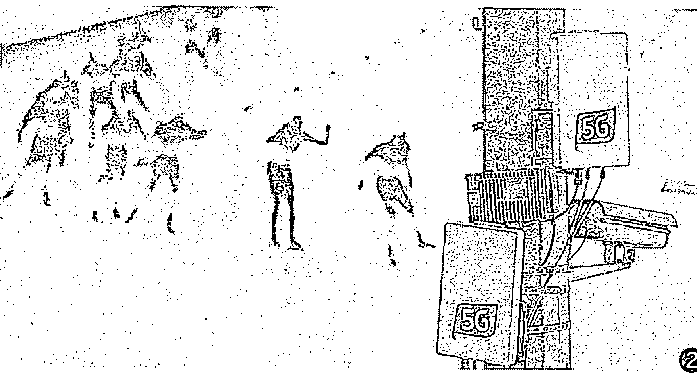

# 华为: 麒麟之内有“巴龙”

随着HUAWEI Mate和P系列的功成名就，华为旗下的海思麒麟系列处理器（SoC）也在手机圈打出了知名度。实际上，麒麟之所以取得成功，少不了其背后名为“巴龙”（Balong）的调制解调器模块的支撑，比如麒麟950和麒麟960就分别集成Balong 720和Balong 750芯片，获得了同期较强的网络性能。

在MWC2018中，华为展示了全球首款商用的、基于3GPP标准的5G芯片——Balong 5G01（图3）。这颗芯片支持全球所有的主流5G频段，包括Sub6GHz（低频）、mmWave（高频），理论上可实现最高2.3Gbps的数据下载速率，同时还支持5G独立组网和5G非独立两种组网方式。Balong 5G01的诞生，标志着华为率先突破了5G终端芯片的商用瓶颈，也意味着华为成为首个具备5G芯片-终端-网络能力、可以为客户提供端到端5G解决方案的公司。

# 高通: “首发” 5G有争议

高通高层曾针对华为Balong 5G01 “第一款商用的，基于3GPP标准的5G芯片”的描述提出了质疑。高通称早在一年前的MWC2017上就已经发布了全球首款5G调制解调器——骁龙X50（图4），2017年10月实现了全球首个5G数据连接，并于同年11月联合中兴通讯和中国移动，完成了全球首个基于3GPP标准的端到端5G新空口系统互通（IoDT）。

和竞争对手相比，高通的骁龙5G模组采用了“整体交钥匙”的解决方案（图5），将“1000多个组件”集成在几个模组中，涵盖数字、射频、连接和前端功能，包括应用处理器、基带调制解调器、内存、PMIC、射频前端、天线和无源组件等，终端厂商可以“拿来即用”，以更低的成本和更少的时间快速投产。

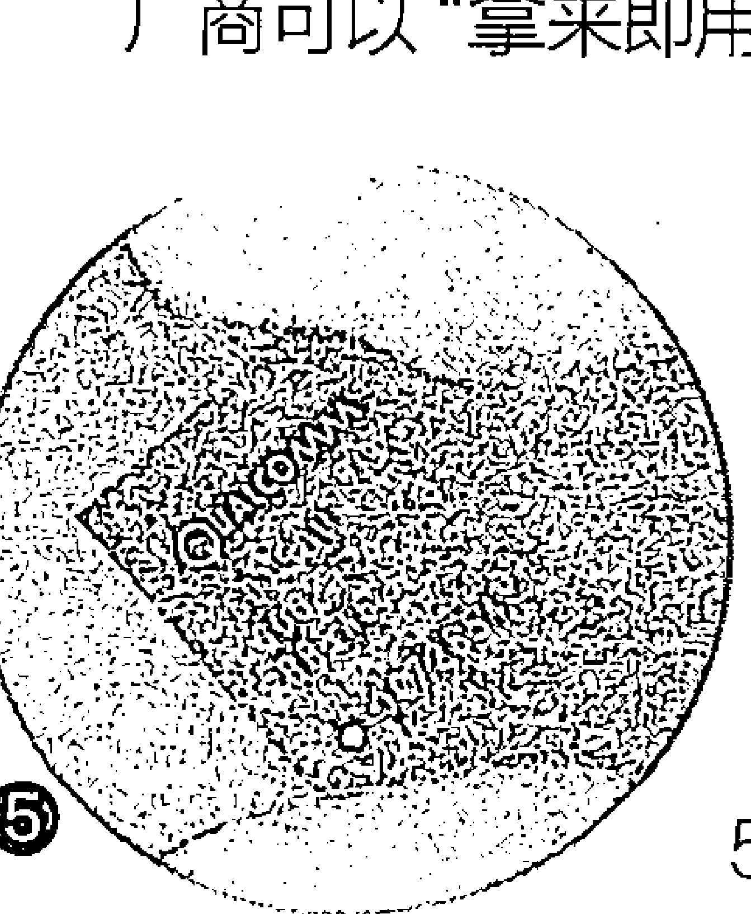

实际上，高通的骁龙5G模组必然会成为推广最快且普及度最高的方案，因为包括OPPO、vivo、小米、一加、索尼、中兴、HTC、华硕和HMD Global在内的20家手机厂商已经和高通敲定了骁龙5G方案的采购意向。

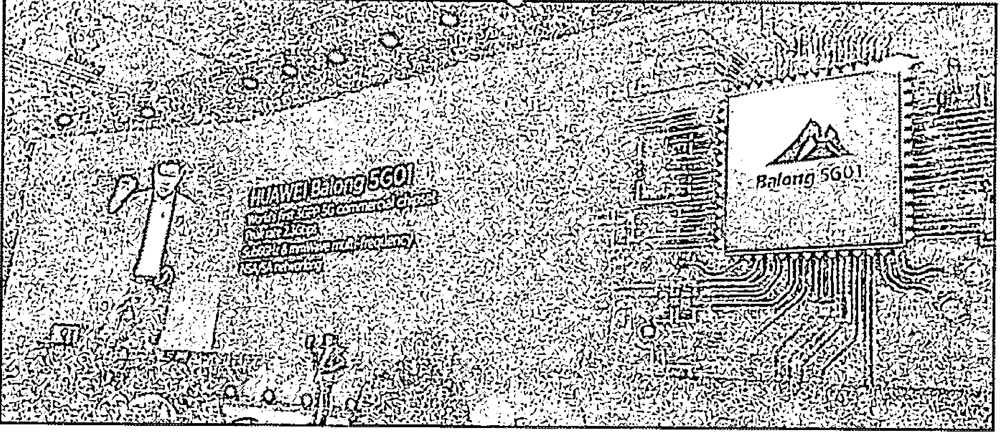

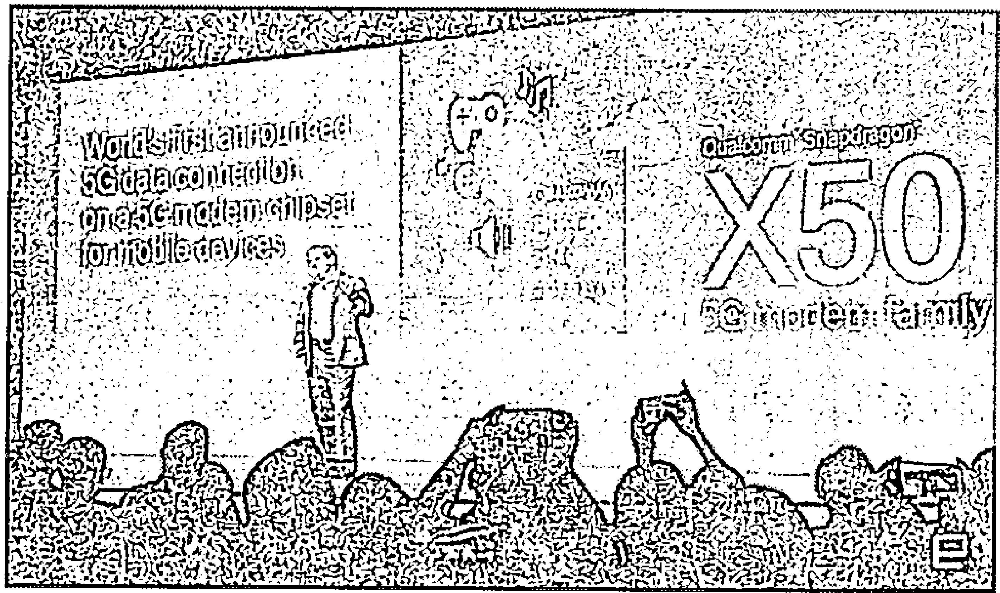

为了填补4G向5G转型时的市场真空期，在MWC2018前夕高通还发布了全新的骁龙X24 LTE调制解调器（图6），这颗芯片基于7nm FinFET工艺打造，属于高通第三代千兆级LTE芯片组，其最大的特色是可将4G LTE带至“2Gbps”时代。

虽然骁龙X24 LTE的速度不及华为Balong 5G01，但也要远远高于骁龙845、麒麟970和三星Exynos 9810现有的1.2Gbps速度。

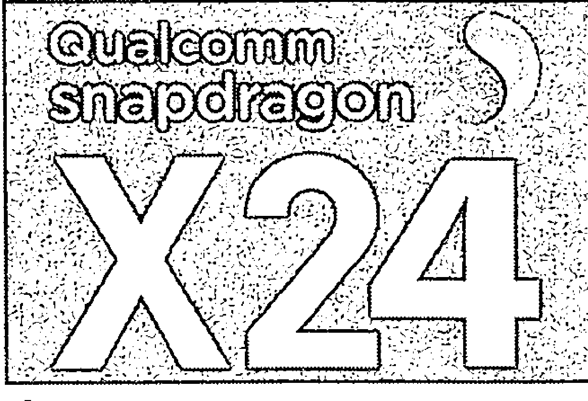

# 未来：5G时代的畅想

在MWC2018大展上，无论是方案、终端还是运营商，乃至于参展的其他厂商，都将5G作为核心话题加以讨论。原因无它，5G对未来的世界影响太过巨大，业内普遍认为5G对世界经济的影响将类似于电力或汽车的出现，并预计在2035年5G将产出价值高达12万亿美元的产品和服务！

在终端层面，英特尔将会和戴尔、惠普、联想等PC厂商推出5G笔记本；高通携手20个合作伙伴宣布了5G手机的预计上市时间；华为Balong 5G01的发布也为2019年自家品牌5G手机铺平了道路；而全球主流运营商和设备商也都在摩拳擦掌，宣布了自己的组网实践和商用规划。可以说，MWC2018是5G商用前的最后一次预演，明年的MWC2019将成为5G设备的处女秀舞台（图7）。

> 火速链接
如果你对5G技术感兴趣，想了解它的速度有多快，优缺点都体现在哪里，请参考本刊2018年第2期《不止网速快 5G技术会改变什么》这篇文章。

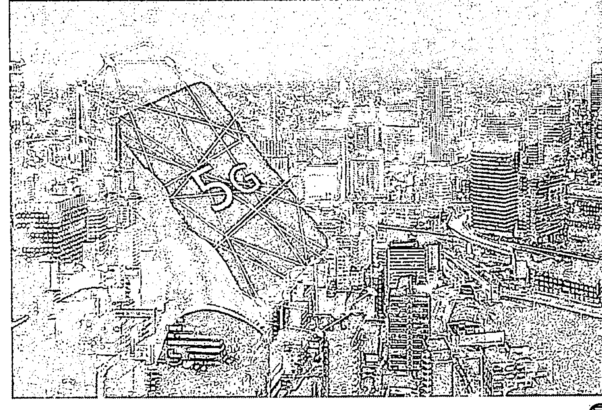

# 从云端落地 终端设备唤醒AI

和5G一样，AI也是MWC2018中最为核心的关键词。在过去，AI大都体现在运营商及企业的IT系统及运营流程中，而MWC2018让我们看到了更多AI落地的技术和产品，并最终将让AI走进千家万户。


# ## 从云落地的AI

显而易见，AI也将和5G一样，成为影响世界经济的一种通用技术，赋予不同类型终端学习的能力（图1）。AI之所以现在才被大家熟知，是因为该技术曾经在进行神经网络的训练和推理时都是在云端或是基于服务器完成，最终只需反馈给终端一个结果而已。

如今，终端所搭载的核心硬件已经开始强化本地AI的运算能力，让很多昔日人工智能的推理工作，如模式匹配、建模检测、分类、识别、检测等有机会从云端转移到终端，这对于保护用户隐私、提升性能和可靠性有着极大的裨益。

更具体来说，AI从云端发展到终端将有四大提升（图2）：

-   **端侧响应更快：** 像亚马逊echo这类智能音箱（图3），它与用户交互的计算和结果反馈都依赖云端服务器，存在响应较慢的先天缺陷。今后，无论是面部识别、图像识别、图像变化学习还是车载系统都需要更极致的响应，将计算从云端转移到终端，自然会最大限度提升反馈的效率；
-   **隐私更有保障：** 很多人都担心自己与智能音箱、语音助手的交互上传到云端会加剧隐私泄露的风险，而终端AI就能解决隐私的问题；
-   **连接成本更低：** 连接包含连接的成本和连接有效性，无论是网线、4G还是未来的5G，将资料传至云端都存在成本，但终端AI则没有带宽受限等顾虑，体验会更好；
-   **功率低更环保：** 据统计，现在整个云端服务器的功耗已经占用整个地球电力的5%，如果将部分计算从云端转移到终端一侧，将有效降低整体能耗。

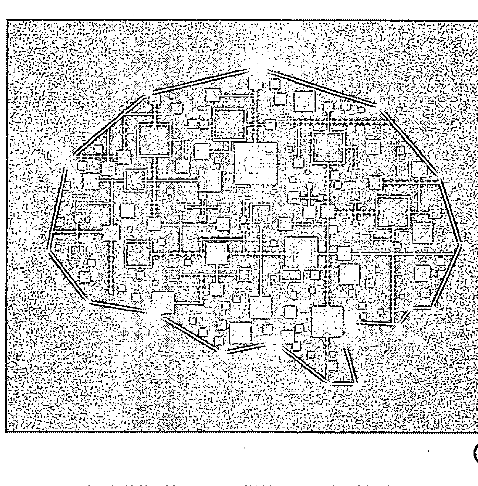


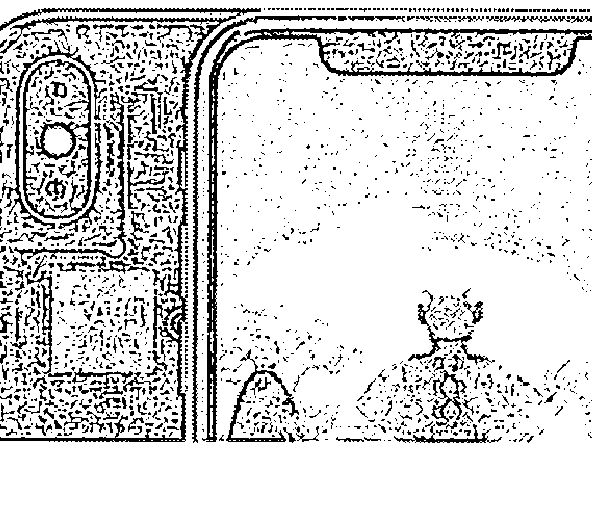

> > **火速链接**
如果你对AI技术的前生今世，以及AI相关的技术原理感兴趣，请参考本刊2017年20期《无需未来 AI已来》这篇文章。

# ## 麒麟: 将NPU进行到底

作为独立神经元的坚定拥护者，华为在推出全球首款集成NPU单元的麒麟970后（图5），还计划将NPU战略进行到底。MWC2018结束没几天，网上就曝光了华为新一代主流级SoC——麒麟670的规格参数。

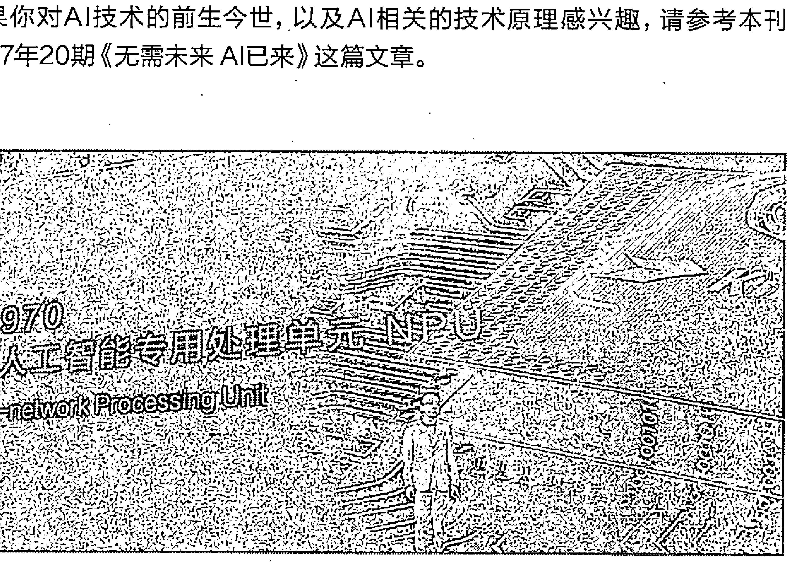

据悉，麒麟670将采用台积电12nm FinFET制程打造，是由双核Cortex A72+四核Cortex A53构成的六核处理器，配备ARM Mali-G72MP4 GPU。而这颗芯片最大的特色，就是将集成和麒麟970相同的独立NPU单元，可以专职专能地进行和人工智能相关的运算场景，如图像识别、语音联动、用户行为学习等。这意味着，未来nova、荣耀畅玩、麦芒等主流价位手机都有机会享用本地AI的加速大餐。

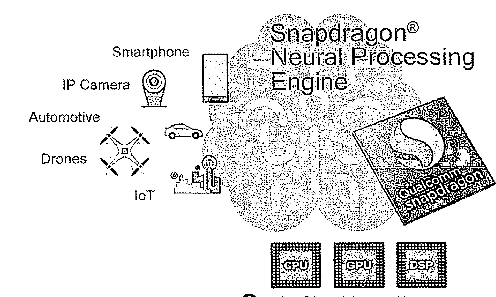

# 高通：依靠AI Engine的调度

在MWC2018上，高通再次强调了人工智能引擎AI Engine的优异性。简单来说，AI Engine就是在骁龙移动平台上加速终端侧AI用户体验实现的硬件与软件的集合。以骁龙845为例，其内部集成了多个可编程异构计算核心，比如Kryo CPU、Adreno GPU和Hexagon向量处理器等（图6），这些核心的协同配合可灵活支持不同的AI功能、数据和计算精度要求，能够实现在终端侧快速高效地运行人工智能应用。

由于骁龙平台在手机领域的占有率足够高，所以高通为AI Engine开发的软件和工具的普及度及影响力也更为广泛。具体来说，小米、一加、vivo、OPPO、努比亚和锤子等品牌正计划采用人工智能引擎AI Engine，在其未来的旗舰骁龙智能手机上优化人工智能应用。

同时，高通还和人工智能软件开发企业以及云服务领导厂商建立了深度合作，比如商汤科技和旷视Face++就能通过AI Engine进行多种预先训练的神经网络，支持图像与摄像头特性，包括单摄像头背景虚化、面部解锁与场景检测识别等。此外，高通还找到了腾讯和百度，全面支持人工智能引擎AI Engine及其生态系统，比如QQ社交平台中的“高能舞室”就能通过AI Engine组件加速帧率。

和麒麟一样，高通也逐渐将人工智能引擎AI Engine下放给更主流的SoC平台，比如即将上市的骁龙670和骁龙700家族等等，让未来更多搭载骁龙芯片的手机都能享受AI提速的乐趣。


# 联发科：扮演AI的普及者

在AI布局方面，和高通华为相比联发科无疑是迟到者。但是，联发科最擅长的就是S曲线战略，总能在一个新技术普及爆发的前夜进入市场，享受技术大爆发带来的红利。而AI，就是联发科S曲线战略的下一个目标。“联发科不做人工智能的先行者，我们做AI的普及者！”联发科技CTO 办公室协理林宗瑶如此表示。

联发科在MWC2018上发布了最新的Helio P60（图7），这款芯片采用台积电12nm FinFET工艺制程设计，是由四核Cortex A73+四核Cortex A53构成的八核处理器，配备ARM Mali-G72MP3 GPU。从规格来看，Helio P60并不如骁龙670和骁龙700，但它却成为MWC2018上唯一获奖的SoC。

究其原因，就是因为Helio P60在CorePilot 4.0技术的基础上，引入了名为“NeuroPilot”的人工智能平台。NeuroPilot是一种介于华为麒麟NPU和高通骁龙AI Engine之间的一项技术，它采用了异构架构，集成了一颗独立的APU（人工智能处理单元的缩写），与其同级别的还有CPU和GPU，根据工作特质由NeuroPilot自动分配到APU、CPU或GPU上进行运算，这跟CorePilot的大小核分配类似。

需要注意的是，APU是人工智能处理单元，但它不是一个固定架构的处理器，APU可以是DSP，也可以是其他硬件加速单元，例如针对语音识别可以放置2个DSP，针对其他应用可以放置几个加速单元，它的架构根据需求而定，灵活性很高。因此，APU会贯穿联发科未来的整个产品线，除了Helio P60这种手机SoC外，智能音箱、穿戴设备和汽车自动驾驶搭载的SoC都会集成不同处理架构的APU单元（图8）。

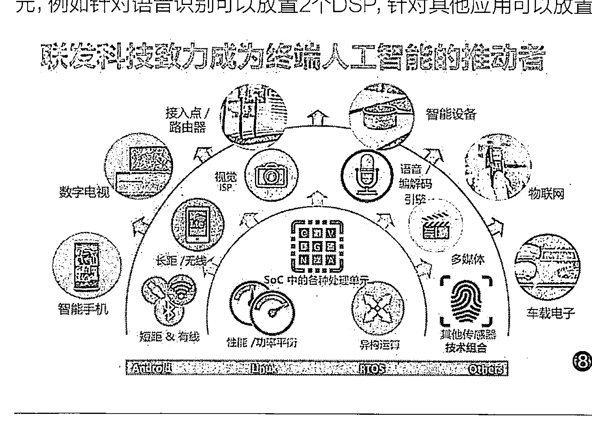

# 扩展阅读：三星Exynos 9810的AI特色

三星Exynos 9810也是一款支持AI加速的旗舰级SoC（图9），可惜现有资料并没有说清它是否集成了独立的神经计算单元。三星官方是这样描述的：“Exynos 9810引入了先进的功能，通过基于神经网络的深度学习和最先进的移动设备上更强大的安全性来增强用户体验。”所以，有关Exynos 9810的AI特性解析，感兴趣的读者请关注CFan的后续报道。

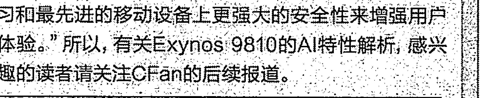

# 哪里是终端AI的战场

自从苹果在A11 Bionic内融入“Neural Engine”（神经引擎），麒麟970内集成独立的“NPU”（Neural-Network Processing Unit，神经网络处理单元），AI技术就成为了衡量旗舰芯片竞争力的关键一环。但是，当手机具备本地AI能力后，它们又被用在了哪些地方？

# AI的两大功能

AI从功能的角度来看，可以分为训练和推理。在过去，无论是训练和推理都需要在云端完成，比如手机语音助手所反馈的信息都是经云端服务器返回的结果。当智能手机被AI赋能后，就获得了一定程度上的本地学习和推理能力。比如苹果iPhone X的Face ID，就是先利用A11 Bionic神经引擎的学习能力，慢慢记录你戴帽子/眼镜、长/刮胡须、皱纹和脸部线条的变化（图10），再通过推理能力（可将训练完成的机器学习模型封装进系统或APP之中），证明你就是你，从而完成解锁乃至支付过程。

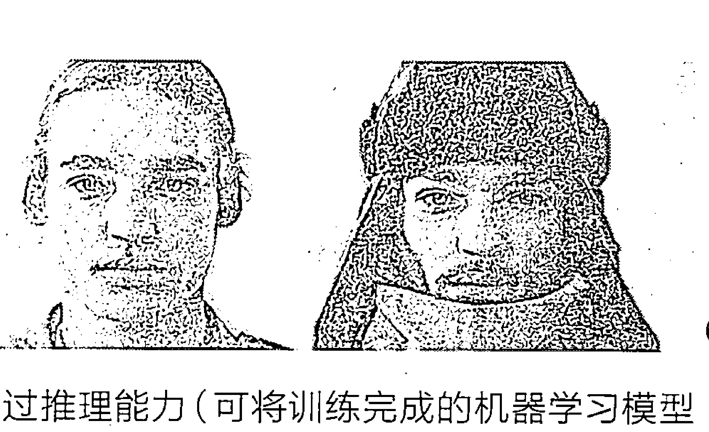

# 识图辨音成主业

但是，受制于能耗限制，我们不要指望手机芯片集成的AI单元能有太过强悍的性能，至少和服务器端使用的谷歌TPU等AI硬件就没法比。此外，AI芯片的另一大特色就是专注，比如下棋的AI不能用于汽车的无人驾驶，用于人脸识别的AI也不擅长进行深度语音识别和交互。因此，以智能手机为代表的移动设备的AI，最终能落地的就只有两个方面：识图（图像识别）和辨音（语音识别）。

联发科针对自家NeuroPilot人工智能平台的说明中就很好地展现了手机端AI所擅长的领域：面部识别、面部美化、场景检测、手势检测、系统性能和语音识别（图11）。实际上，在MWC2018上众多手机厂商所主打的AI特色，就都是对这些功能的扩展。

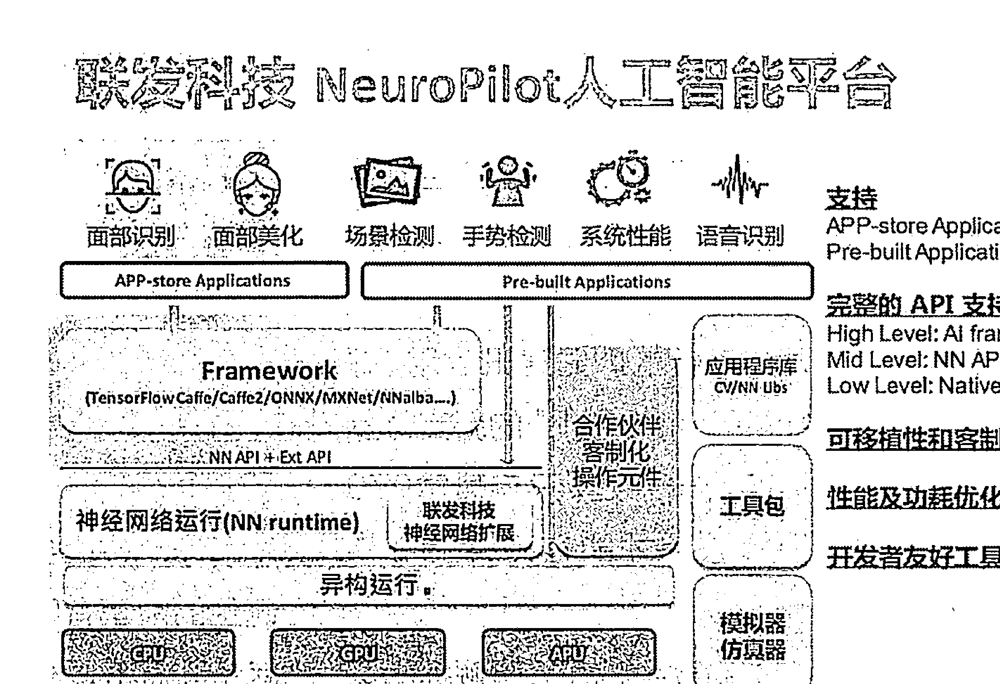

# 手机终端的AI赋能

得益于骁龙845和Exynos 9810，三星Galaxy S9对人工智能助手Bixby的AI属性进行了升级，在集成语音、视觉、主页、提醒四大功能的基础上，S9的Bixby新增了文本实时翻译功能，只需要将取景框对准要翻译的文本，不用拍摄就可以实现对文本的翻译（图12）。而且Bixby视觉拥有自动识别语种的功能，无需选择识别的语种，选择好输出的语种即可。

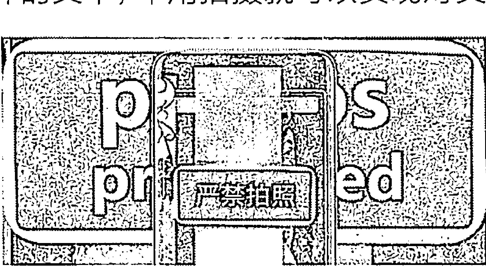

Bixby的特色之处还在于，它有着其他语音助手无法比拟的智慧程度和更加完整的人工智能体系。比如，用户只需点击相机中的Bixby图标或者呼叫出Bixby，告诉它“帮我识别这个东西”，它就会帮你识别出拍摄的物体。这项功能可以用于翻译外的文本提取、图片搜索识别、拍摄物体采购等。

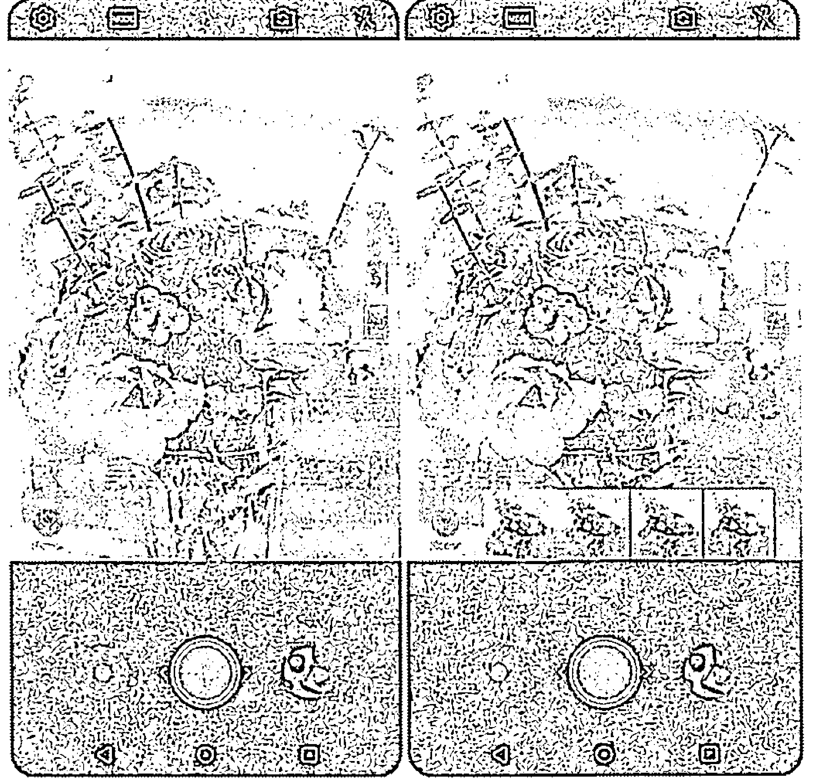

LG V30s ThinQ和华为P20系列等产品则主打拍照体验。其中，LG V30s ThinQ引入了名为AI CAM的人工智能相机，它在拍摄物体时可以自动识别食物、植物、人物、建筑等多种物体（图13），然后有针对性地调节相机参数来拍摄出高质量的照片，同时还可通过拍照直接购物、进行图片搜索，或是读取二维码。至于华为P20，虽然没有在MWC2018上发布，却提前在曝光邀请函中刻意突出了“See Mooore with AI”，也是借助麒麟芯片的AI优化三摄拍照时的表现。

此外，华硕推出的3款ZenFone 5系列手机也主打AI智慧摄影功能，该功能可针对16种不同的环境与主题进行AI场景侦测，以及即时人像景深、即时美颜等，还有AR贴图功能等。另一个国产品牌海信H11，也基于“AI+双摄”的组合优势，让拍摄出来的照片通过“AI”算法进行优化。其套路在于让AI算法解析镜头中的人像信息，识别并突出人像主体，随后对背景进行虚化处理，让前后景层次突出。

在AI语音助手方面，苹果Siri、亚马逊Alexa和谷歌Assistant应该是口碑和技术的双料王代表。在MWC2018上，谷歌宣布Assistant将把Android和其语音生态系统整合，从而使开发者可以将Assistant整合进自己的APP里。

同时，有玩家在华为Mate 10的EMUI 8.1固件中发现了有趣的数据，表明华为正在研发一个名为“HiAssistant”的语音助手，它几乎可以完成其竞争对手的所有功能，包括控制各种基本硬件功能（蓝牙、NFC、Wi-Fi）以及自动旋转、位置设置等软件功能。此外，它还能控制QQ和微信等国内流行的即时通讯应用，并与名为“华为HiAssistant Bank”的新支付接口进行整合。最关键的一条是，只有麒麟970或集成NPU的海思芯片才能在硬件上支持HiAssistant（图14）。

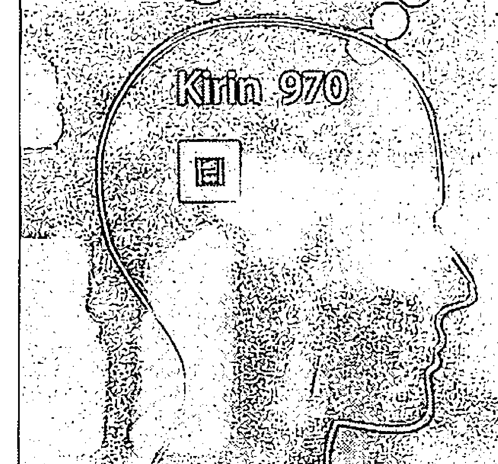

AI芯片层面就与商汤科技和旷视Face++等方案商携手优化；而所谓的AI相机，也是借助AI引擎极速识别所拍摄的物体并作出相应的优化，让照片更美更自然；三星Bixby的实时翻译利用的也是AI的场景检测能力；Google Assistant和HiAssistant等语音助手也终于能实现基于AI硬件的提速了……

总之，2018年的新款手机在人脸解锁的速度和安全性上要较2017年前诞生的前辈有所增益，其背后就是高通和联发科等芯片厂从

## 触手可及 浅析MWC2018更实际的技术和产品

5G和AI是MWC2018最具前瞻性的技术，它们将承载起未来智能设备的变革重任。但是，对普通消费者而言，5G尚且遥远，AI稍显虚幻，在MWC2018上还有哪些可以更直观地刺激我们肾上腺素和购买欲望的产品或技术呢？

## 刘海屏的普及就在今朝

如果说2017年是全面屏手机的元年，那2018年就将是刘海屏爆发的元年。在MWC2018中，绝大多数新款智能手机都和iPhone X做起了“亲戚”，在屏幕顶部留下了“刘海”，一时间“刘海屏”成为了手机圈的最热关键词。

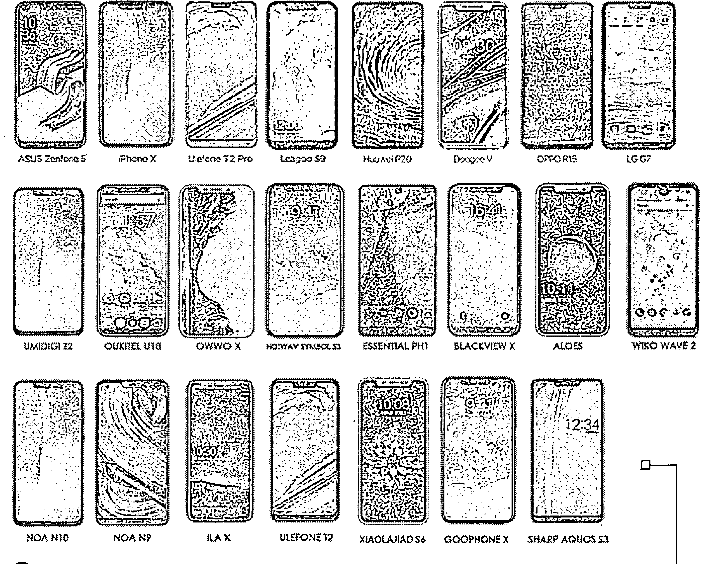

## “视界”的发展趋势

据不完全统计，至截稿时国内外已经发布和尚未发布（已经有定妆照）的“刘海屏”手机，算上iPhone X已经不下30款（图1）。于是问题来了，刘海屏对智能手机而言到底有啥用？

从用户需求方面考量，在机身尺寸一定的前提下，手机屏幕的有效显示区域能够呈现更具冲击力的震撼视野。而“刘海屏”则是目前可量产的最为接近100%理想屏占比的全面屏设计方案之一，也是能够将用户学习成本降至最低的全面屏设计方案。

电脑爱好者 2018年合订本（二）

如果追本溯源，夏普S2的“美人尖”应该算是刘海屏的前身。随后，苹果iPhone X将“刘海屏”定妆，并在这个刘海空间里安装了包括红外镜头、泛光感应元件和点阵投影器在内的复杂元器件（图2），从而实现了Face ID功能，其人脸解锁的效率和安全性，也是智能手机领域的No.1。

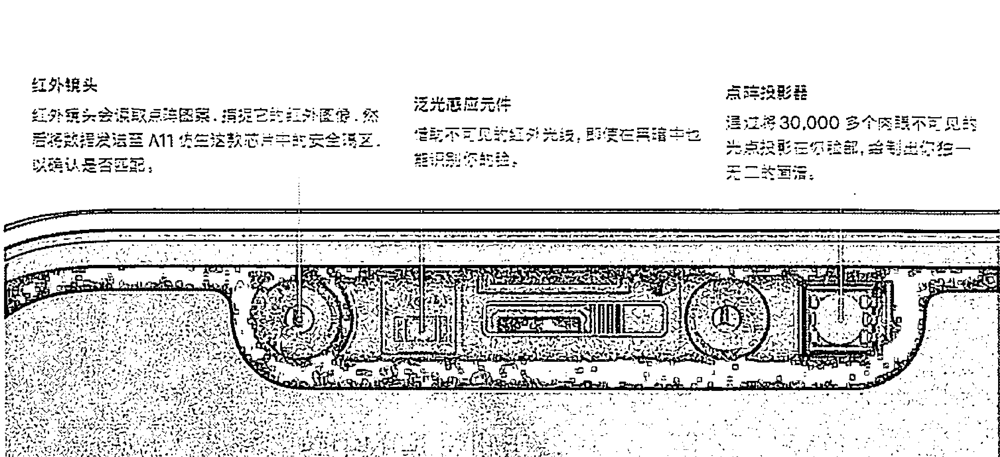

## 刘海屏趋势大于意义

现阶段Android领域的“刘海屏”新兵们，绝大多数产品只是为了“刘海”而“刘海”，里面安装的依旧是传统的听筒、摄像头、光线和距离传感器，用于实现面部识别的技术还是基于2D建模。可以说，iPhone X的刘海屏是为了容纳更复杂传感器的不得已妥协，而Android手机武装刘海屏则是趋势大于意义。

对此，罗永浩发微博吐槽说：

> 罗永浩 @ 3月7日 14:22 来自坚果 Pro 2
> 虽然丑出翔，但为了在前面加更多的摄像头和传感器被迫做成大刘海，我还能勉强理解（虽然翔就是翔），但是很多家在小刘海和后摄没有任何结构干涉的情况下，愣把后面的双摄给竖起来……我想想怎么样才能不用脏话才能准确描述我的感受[吐] #收藏# [转发 903] [评论 2337]

## APP适配优化成隐患

问题又来了，刘海屏虽然会提高手机的屏占比，但同时也会让屏幕的一体性降低，对APP的适配要求更高。iPhone X有着iOS的封闭性，尚不能保证100%的APP都能完整利用刘海屏（图3）。作为开放的Android系统，又该如何确保APP在刘海屏上有着统一的体验呢？

还好，已经有不少厂商针对刘海屏的特性，提出了自己的解决方案。比如OPPO R15就针对刘海屏的横屏显示作了专门优化：刘海屏顶部“凹形区域”两侧会在横屏的时候显示3个常用APP和3个常用操作。这在看视频或者玩游戏的时候相当实用，无需退出应用就能执行常用操作。而横屏同时使用两个应用时，其中一个应用悬浮在另一个应用界面上，可随意调节被悬浮应用的位置（图4）。同时，OPPO还针对今日头条、新浪微博、抖音等众多流行应用进行了专门优化，可完美适配19：9全新屏幕比例，可以保证全屏显示、状态栏沉浸，真正呈现异形全面屏极致的沉浸式视觉体验。

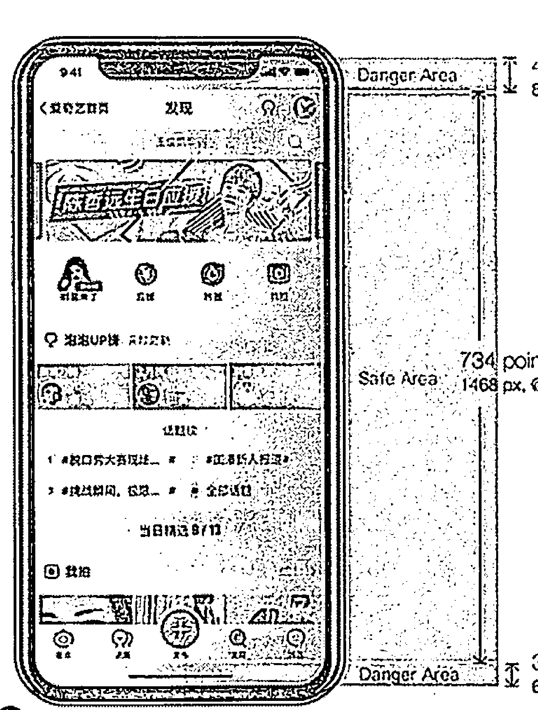

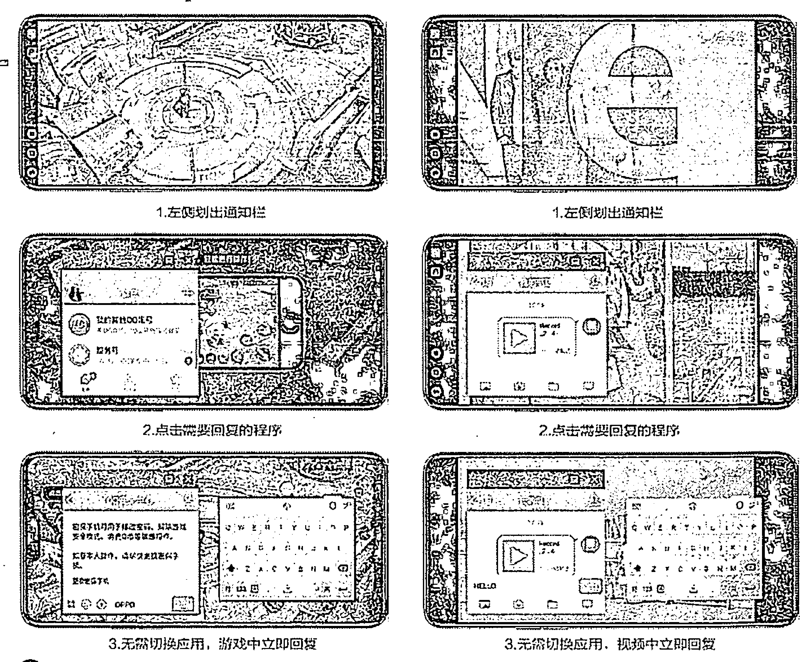

目前尚且不知其他品牌是如何对刘海屏和APP之间的关系进行梳理的，希望新品上市后不要出现iPhone X当初玩《王者荣耀》两侧大黑边的尴尬问题吧。

## 真·全面屏正在路上

“刘海屏”只是“全面屏”手机发展的中转站，它的下一步将是实现无限接近100%屏占比的梦想。在MWC2018上，来自vivo旗下的APEX全面屏概念机就是这一趋势的最佳注解。

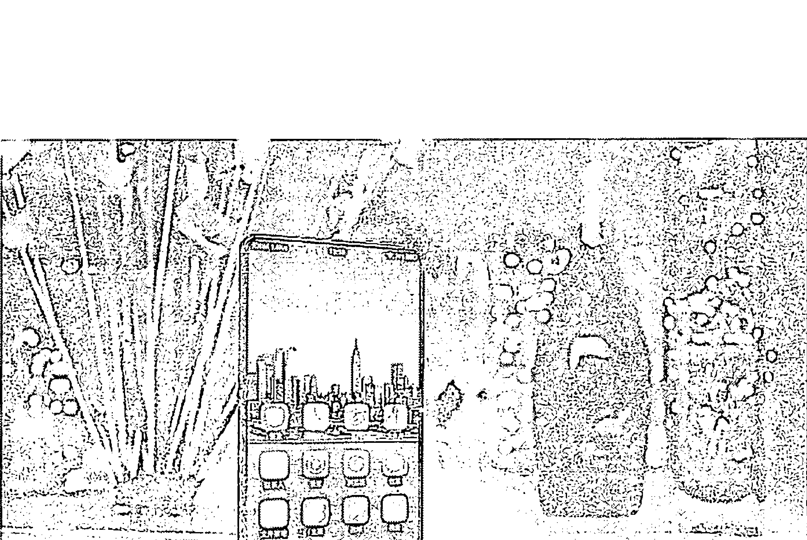

## 91%的极致屏占比

vivo APEX的机身正面仅有一块极为纯粹的显示屏，没有任何开孔，息屏状态下气质低调内敛，但在屏幕点亮的一瞬间，超高屏占比所带来的视觉冲击着实令人惊艳（图5）。如果用更直观的数据描述，该产品采用了5.99英寸18:9显示比例的全面屏，但却将上、左、右边距压缩到了1.8mm，而底部边框也只有4.3mm，是目前手机领域屏占比最高的产品。vivo官方的数据显示，vivo APEX的屏占比高达91%！

## 背后的三大黑科技

vivo APEX之所以获得了突破90%大关的屏占比参数，其背后涌现出了不少创新的技术解决方案，比如升降式前置摄像头、半屏指纹解锁技术、全面屏幕发声等。此外，vivo还运用超声波测距技术和隐藏式感应元件解决了距离感应器和光线感应器对于屏幕空间的占用问题。

### 升降式前置摄像头：

vivo APEX不愿参考小米MIX2采用摄像头下置方案，但顶部边框又太

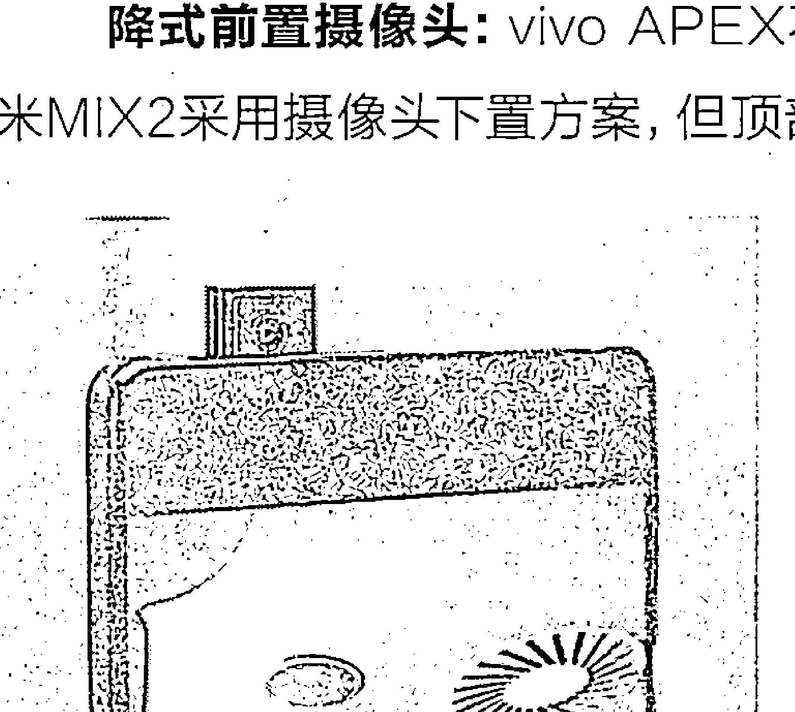

过狭窄无法容纳传感器模块，所以它在机身内加入了一套全新的微传动系统，通过极其精密的微型步进马达，搭配独立驱动IC和精密控制算法，可以随时将隐藏在机身内部的摄像头升起或降下（图6），而且响应时间不到1秒，几乎没有延迟。

### 全面屏幕发声：

在没有空间安置传统听筒时，业内常见的发声手段有骨传导和压电陶瓷振动等解决方案，但这些技术都存在声音小的先天缺陷。为此，vivo APEX带来了全新的“全屏幕发声技术”，其核心是通过微振动单元驱动手机屏幕发声，耳朵贴近屏幕的任意位置都能清晰地听到声音，在嘈杂的环境下也能够保证声音的效果。

### 半屏指纹解锁技术：

vivo APEX在X20 Plus屏幕指纹版的基础上进行了升级，其指纹识别区域不再是屏幕下方小小的圆形区域，整个5.99英寸的下半部分都是有效的指纹感知区域。这意味着我们可以在任意握姿下，点按屏幕下方任意区域都可完成解锁。值得一提的是，APEX还加入了双指纹解锁功能（图7），在该模式下手机必须同时验证两根手指的指纹才能完成解锁，安全性大增。

可惜，vivo APEX尚且处于概念机阶段，距离它正式上市的日子还有些遥远。但是，在这款产品身上出现的黑科技，将随着2018年时间的推移而一步步变成现实。

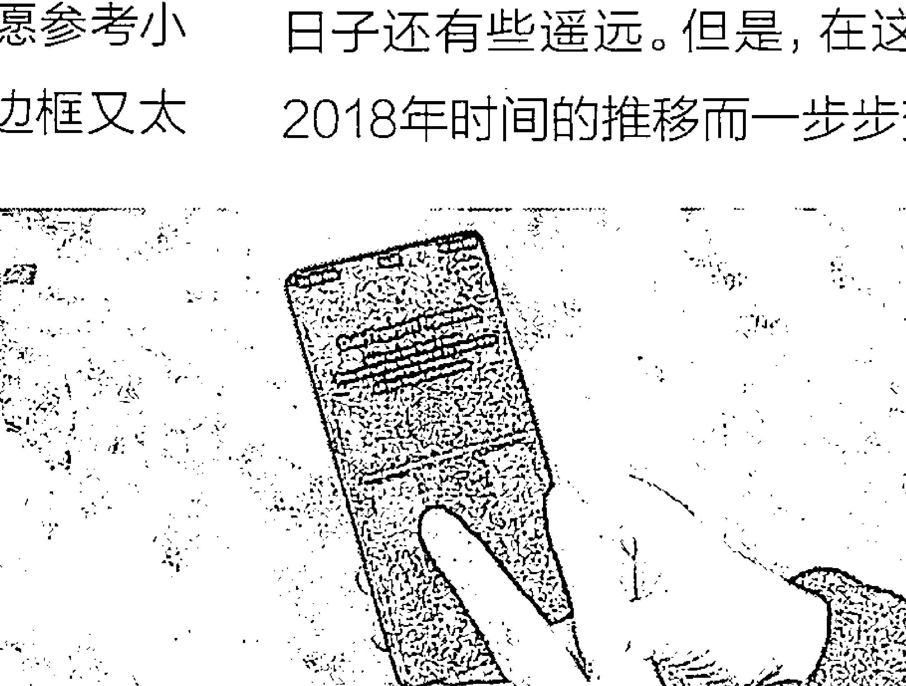

> ### 小提示
> APEX上边框只有1.8mm，所以它的光线和距离传感器也采用了隐藏式的设计，比如距离传感器就隐藏于屏幕下方，这种设计的好处是避免了各种繁琐的开孔，机身一体性的视觉效果大大增强。

## 可变光圈重现天日

三星Galaxy S9家族无疑是MWC2018发布的Android机皇（图8），除了全球首发高通骁龙845和Exynos 9810处理器，该家族在拍照性能上也再度找回了作为“Android一哥”的自信。

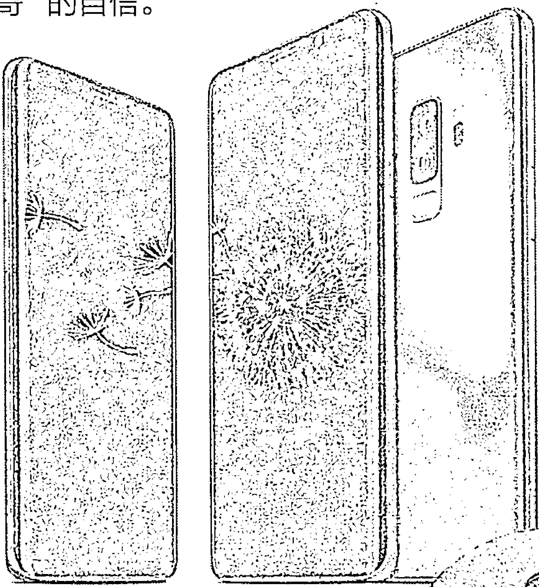

## 智能手机的光圈战役

对智能手机而言，可选的CMOS传感器就那么几家，在传感器相同时如何获得更好的拍照表现？除了引入更多摄像头、光学防抖、相机APP优化和AI场景识别外，光圈大小的重要性甚至尤胜前者。

如今中高端智能手机普遍都用上了F1.8光圈，而LG V30和华为Mate 10系列凭借F1.6的光圈曾被冠以“史上最大光圈手机”的桂冠（图9）。然而，随着Galaxy S9家族的发布，手机大光圈的记录又被改写，其武装的F1.5/F2.4可变光圈也因此成为了MWC2018上的又一项黑科技。

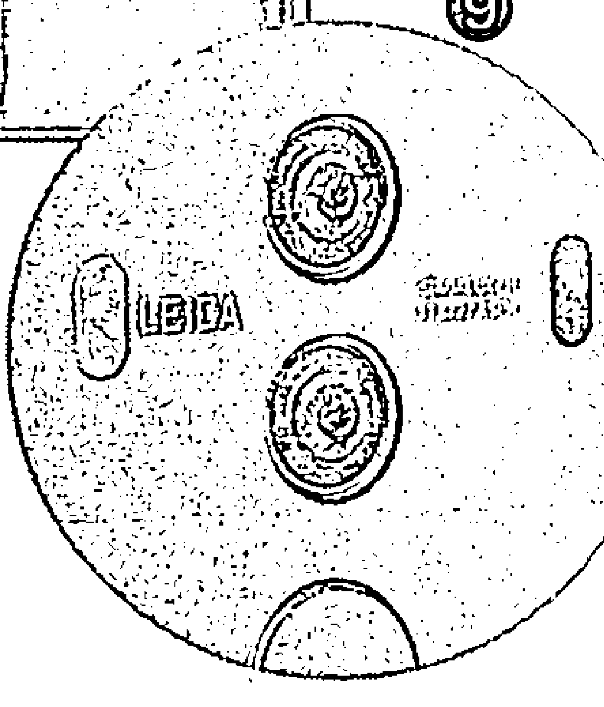


## 可变光圈的历史

实际上，可变光圈并非是三星Galaxy S9首创。早在2009年，诺基亚推出的N86塞班手机就曾带来F2.4/F3.2/F4.8三档可变光圈的能力（图10），从这个角度来看，三星Galaxy S9的两档光圈甚至还有些退步。此外，三星的可变光圈技术最早曾被用于2017年底发布的W2018身上（图11），只是该系列手机定位高端商务市场，和消费级市场关系不大，所以并没有引起太多关注。

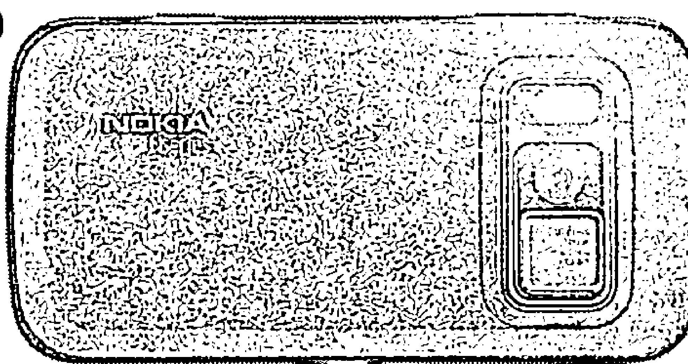

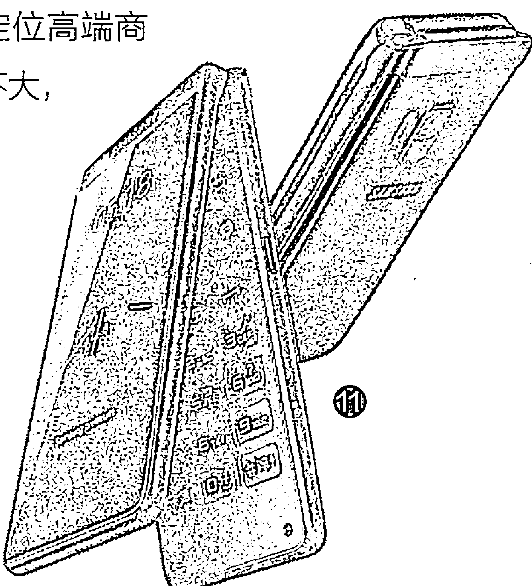

## 可变光圈的实现方式

手机镜头是一套很精密的模组，其基本原理就是通过排列成环形的机械结构遮光片来改变镜头的进光量（图12），遮光片中心留下的透光孔越大光圈越大（F/x对应的x数值越小）。由于镜头模组较为精细，想让遮光片进行更复杂的变化，操作难度较高。所以，过去很多手机厂商都更青睐于“电子光圈”，通过ISP和APP的协同合作来模拟不同大小的光圈。但是，这种电子光圈的最终成像还是不够完美，最终给用户的感觉就是“假”。

三星Galaxy S9系列采用的可变光圈则采用了和单反相机类似的物理光圈，通过控制遮光片的大小来调节进光量，从而实现光圈的调节（图13）。虽然它不支持无级调节，只能在F1.5或F2.4两档之间切换，但相比传统智能手机也有了长足的进步。


## 小结

在MWC2018中其实还有更多值得我们关注的新品，比如主打情怀的旗舰诺基亚8 Sirocco、追求小而美的索尼XZ2 Compact、努比亚展示的专业游戏手机（详见本期的技术殿堂）、高通全新发布的骁龙700平台等等。有关它们的特色和体验，感兴趣的读者请关注电脑爱好者（cfan1993）和智趣狗（zhiqudog）的官方微信查看。


## 愚人节恶搞

### 斗智斗勇的新一年

文|墨汁做寿

每年的这个时节，笔者也都会回顾一下这一年中业界和市场中的各种不和谐事件，其中有不少真的很像是愚人节的玩笑，但很遗憾，它们却是真实发生的情况。这些或失误或愚蠢，甚而是恶意的玩笑式事件，给消费者、市场以及厂商自己，都会带来相当大的负面影响。

每一年的4月1日愚人节，都是实诚小编过得最提心吊胆的日子，朋友、同事、同学甚至家人都不再可信。

既然今年的4月1日是周日，建议和小编一样实诚的读者朋友们索性关闭一切通讯手段，好好睡一大觉，过去就好了。

### 苹果降频事件

一些个人用户发现自己的iPhone频率被降低

iPhone、iPad等苹果数码设备拥有广大的拥趸，除了性能、外形等方面的出色表现之外，有相当多的人都是因为信任苹果产品的质量而选择它们的。因此当一些人开始质疑苹果数码设备的性能出现问题时，大部分用户并不相信，苹果自己也非常固执地予以否认，直到一些媒体和官方测试证明了这一问题，且发现问题远比很多人想象的严重时，这一事件才真正爆发。

| 项目 | 数值 |
| :--- | :--- |
| L1 Data Cache | 64 KB |
| L2 Cache | 1024 KB |
| L3 Cache | 0 KB |
| Page Size | 16 KB |
| In Low Power Mode | no |
| CPU Frequency | 600 MHz |
| Thermal State | Normal |

其实具体的降频门问题，就是很多旧硬件产品被新驱动“负优化”的一个实例。根据可信的测试，苹果在推出新的iOS版本时，常常会悄悄调低旧型号手机处理器的运行频率，使得运行速度降低，给人一种“旧手机已经越来越难以应对新系统和新软件，必须购买新手机了”的错觉。苹果方面在初期完全否认后，最终在确凿的证据下承认了这一问题的存在，但也找到了一个借口，那就是考虑到电池的实际损耗，必须优先确保手机的足够续航时间，才能保证用户的基本使用

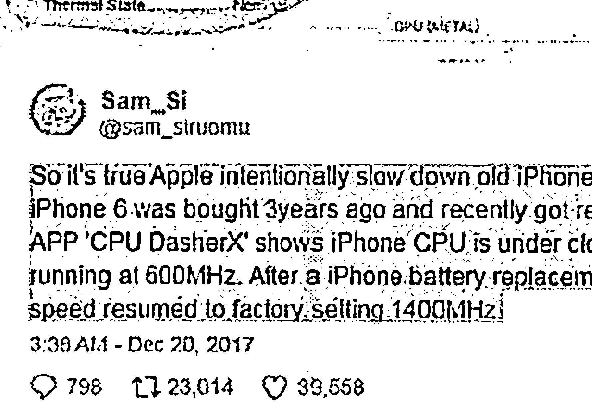

长时间使用后，iPhone电池的效能会有明显下降，例如图中这块电池的最大容量已经降为78%

体验，而这也是为什么明明是降频门，最后苹果的解决方式却是鼓励大家换电池。

## 解决方式

后台降频问题被确认后，苹果给出了三个解决方法。首先，苹果短暂开启了降级通道，罕见地允许用户降低自己的iOS版本，不过这一功能又快速关闭了。这确实不是真正可行的方式，因为习惯了苹果的强制升级模式，大量的APP会为较新版本的iOS系统进行优化，用户大幅降低版本后，得到的设备虽然恢复了CPU频率，但运行应用时仍然会显得低能，除非用户能够将APP也降回以前的版本。

其次，苹果大幅降低了旧型号手机更换电池的费用，吸引用户更新电池，这显然是为了坐实其宣称的降频门是因为电池问题。从用户的反馈看，更换为新的原厂电池后，大部分设备确实恢复了频率，不过也出现了一些更换非原厂电池的设备频率甚至变得更低的问题。我们不得不怀疑在这一段时间内，苹果升级的iOS新版本中带有更严格的电池检测程序。

最后，苹果在iOS 11.3版中，索性让一些仍然堪用的旧型号手机都能手动解除降频限制，这应该是彻底解决降频事件的最终方式。至于在用户接触不到的后台，还会不会有其他猫腻，那就很难说了。

### 处理器漏洞事件

处理器的漏洞问题就像各种软件漏洞一样，是一直存在的，但2017年的这次集中出现不仅危险程度高，而且有些漏洞直指处理器设计的最底层设计，将Intel、AMD甚至移动处理器“一网打尽”。

2017年爆出的处理器漏洞事件并非一起，其中Intel管理引擎 (Intel Management Engine) 的相关漏洞我们在之前的文章中有过相关介绍。其后又出现了“Meltdown (熔断)”和“Specter (幽灵)”漏洞，这些漏洞使得恶意程序可以从其他程序的内存中窃取信息，这意味着恶意程序可以窃取密码、账户信息、加密密钥或理论上存储在进程中的任何内容。根据AMD与ARM的说法，“Meltdown”漏洞虽然也在其处理器上存在，但由于架构的差别，对其影响非常小，因此受影响的主要是Intel处理器，而“Spectre”则广泛地影响到Intel、AMD和ARM架构处理器，受影响的操作系统也从Windows、Linux、MacOS扩展到了Android等移动操作系统中。

处理器漏洞事件的祸根之一——Intel ME

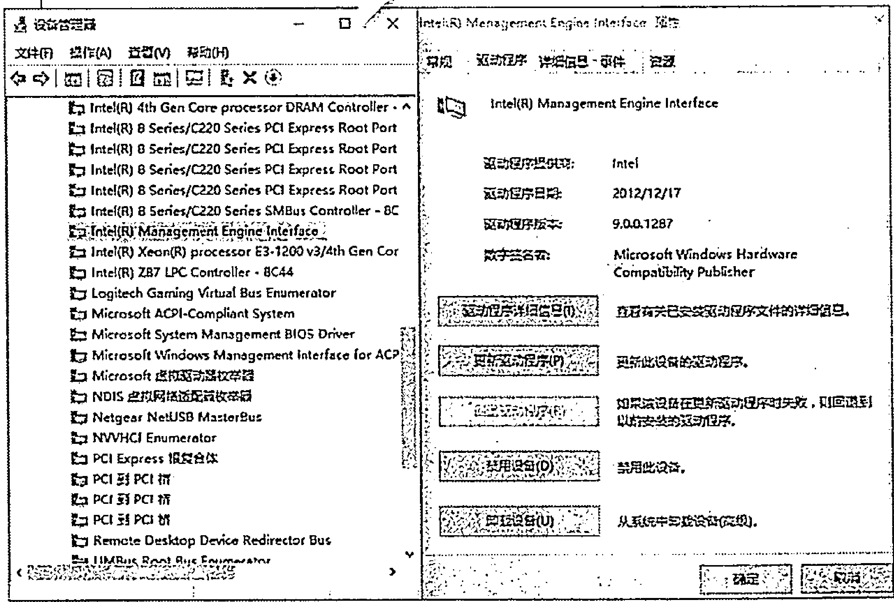

### 修复方式

目前针对这些漏洞的软件、系统补丁均已推出。从目前的修复效果来看，这些存在于底层的漏洞对处理器的影响非常巨大，安装补丁后，Intel处理器的性能有明显下降，而且越是老式的处理器和密集运算，性能下降越明显，据称有些老机型的性能下降达到10%。而

## OLED烧屏问题

OLED屏幕曾经是三星等大厂和高端手机引以为傲的配置，由于是自发光模式，OLED比背光模式的LCD对比度、可视角度、色彩的鲜艳程度都更好，另外它的刷新率更高、沉浸感更强，还更省电，某些产品甚至能够弯曲折叠，只是价格也更高。随着OLED产能的提升，以及所谓全面屏设计对柔性等屏幕指标的需求，OLED在近期开始成为主流手机屏幕。

不过很快就有人发现，一些对比度强烈的图像会在屏幕上刻下“烙印”，在显示其他图像时，会在亮度较低的部分看到它们的虚影。而长时间使用后，一些烙印会越来越明显，消失得也越来越慢，这就是OLED的烧屏（Burn-in）问题。

烧屏现象出现在多个厂商的多个档次、多个型号手机上，显然与品控等环节无关，而是目前OLED因为发光机理和材料水平难以避免的问题。OLED通过电流激发接近屏幕表面的色彩涂层来点亮像素和产生色彩，当其中一部分像素的涂层长时间或过度使用，留下余辉甚至老化后，就会与周围出现色差，产生所谓的烧屏现象。

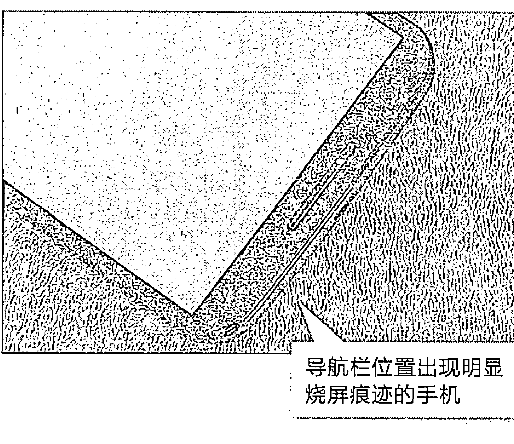

对付烧屏，我们首先应该适当降低亮度，减小电流对涂层的过度激发；其次是要尽量多使用活动画面，减少固定画面，减少电流对涂层的长时间激发。例如一些使用屏幕导航栏的手机，应该将导航栏设置为自动收回，如果使用悬浮导航键，则应经常调整悬浮键的位置。在OLED像素变化最为明显的前200小时使用寿命中应该特别注意防范烧屏问题，在色彩涂层更加稳定后，就不会出现初期使用时那样快速和明显的烧屏现象了。

其实一些使用OLED的手机大厂已经关注到烧屏问题，并且使用一些技术手段大幅减轻了这一现象。例如在手机系统中植入抖动和位移功能，让需要长时间显示的元素，如导航栏、状态栏上的图标，在每次使用时都有一定的位移，可以避免长时间连续激发同一像素，而均匀使用一个区域的像素，使它们的老化程度接近。

对于一些并不掌握OLED优化能力，但也忙不迭地使用OLED屏幕的手机厂商产品，我们也有一些第三方防烧屏或烧屏修复软件可用，其原理也是让像素的老化程度尽量接近。例如AMOLED Burn-in Fixer，就是借用手机的色彩翻转功能，将导航栏与状态栏反色显示，可以让长时间发光的像素色彩颗粒得以休息，同时激活长时间熄灭的像素色彩颗粒进行一些消耗，平衡两者之间的老化程度和色彩表现。当然这种让其他像素老化来平衡色彩的方式，对屏幕的整体寿命还是有一定损失的，所以建议大家还是以防范为主。

AMD和ARM处理器的性能影响似乎并不大，从针对Windows补丁的日常应用测试看，Intel处理器的成绩在绝大多数项目中有明显降低，但AMD处理器的成绩不仅没有出现降低，甚至在很多项目中有一定的提升。

由于本次处理器漏洞都涉及底层设计，因此硬件方面的修正很可能要到下一代甚至是下下代处理器了。而从实际结果看，2017年处理器漏洞问题的输家无疑是Intel，不仅其独有的Intel ME出现问题，在其他漏洞补丁下的性能下降也最明显。这一问题很可能大幅促进AMD处理器，特别是针对高端计算机和密集运算的AMD Ryzen ThreadRipper处理器的销售。

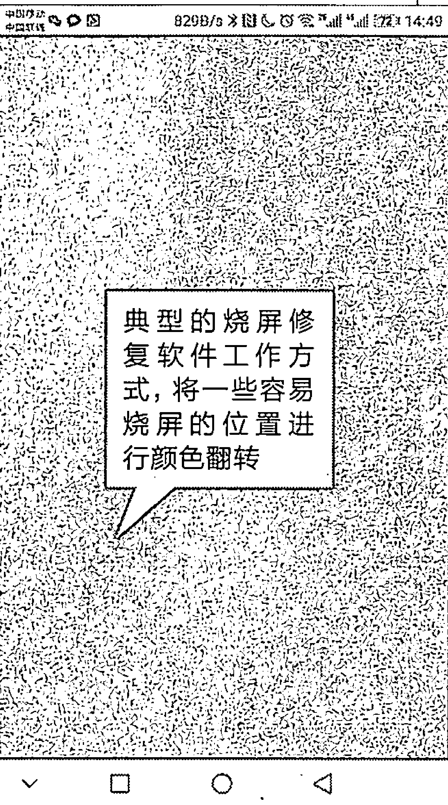## 何为全面屏

2017年是全面屏手机爆发式出现的一年，这种手机屏占比大幅增加，因此可以将更大的屏幕“塞入”更容易掌握的小巧机身之内。不过由于生产难度以及系统、软件优化难度的限制，这一年以来，我们见到的全面屏手机其实大都是采用18:9规格的屏幕，只是尽量压缩了上下边框的宽度。它们不仅难以达到我们想象中的全面屏，连做到三面窄边框的都很少见。全面屏这个概念，我们和其他媒体都有过连篇累牍的讨论，无论是否喜欢这种产品，大家有一个声音几乎是统一的，那就是“直接把18:9屏幕叫做全面屏显然是不合适的”。那么很显然，这些简单地将18:9屏幕叫做“全面屏”的厂商，绝对是涉嫌欺骗消费者的。

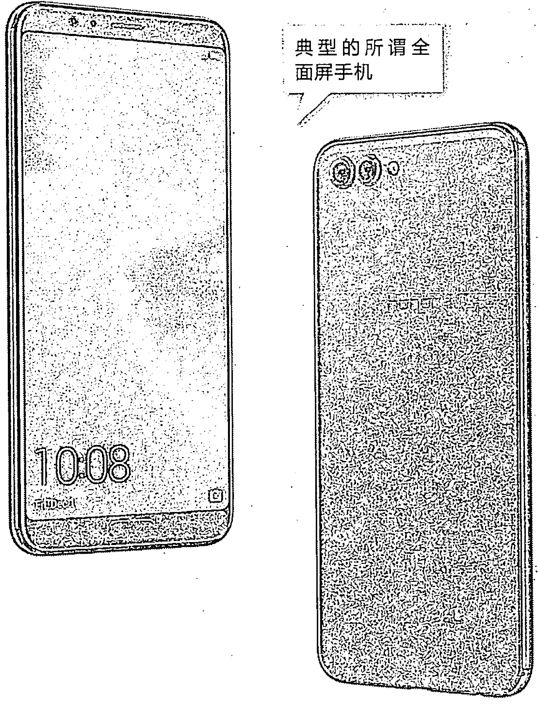

## 解决方式

对于这种商业炒作行为，除了拒绝接受产品外，我们并没有什么好的解决方法，好在新一年中，技术逐渐成熟的厂商终于开始考虑推出更值得被称为全面屏的手机，例如仅在顶端留一条“刘海”容纳前置摄像头等设备开口的“异形全面屏”手机、采用屏下指纹让下边框也完全消失的手机等等。

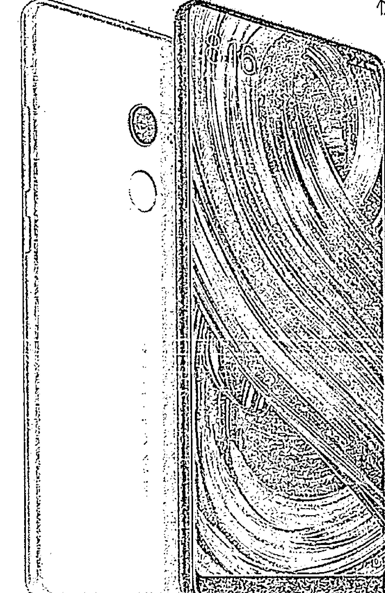

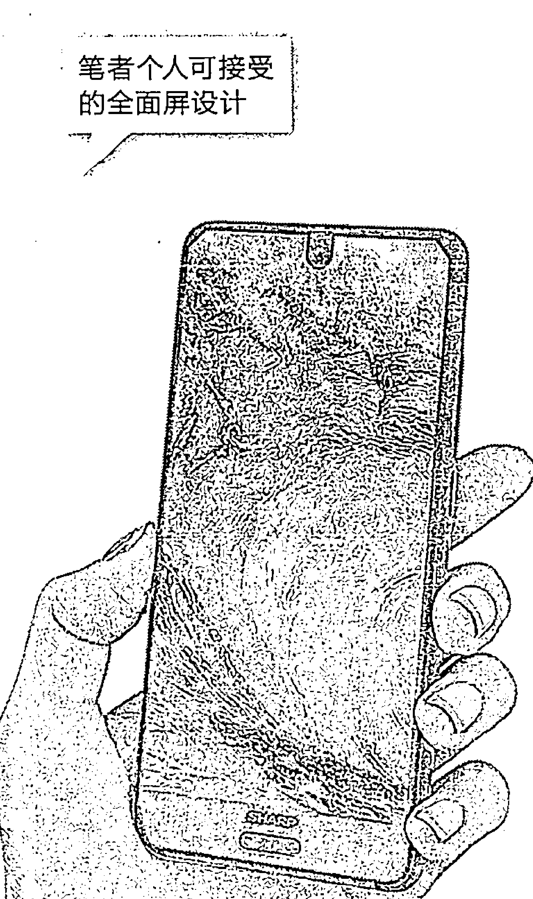

## 总结

我们这里提到的仅仅是年内一部分市场和产品的问题、纷争，它们虽然大都有缓解或解决问题的方式，但对厂商和品牌形象，以及消费者信心等，还是会造成明显的打击。希望在新的一年中，我们能少见到一些这样的产品问题，让我们可以更舒心地享受新的数码生活，而不是小心翼翼地选购，然后再到处去寻找解决问题的方法。

如今智能手机即将获得5G和AI等尖端技术的加持，其性能逐渐具备了更强大的“生产力”，高通携手微软推出骁龙Windows 10笔记本就是最好的例证。但是，对绝大多数普通消费者而言，5G太过前瞻、AI稍显虚幻，更强的性能除了跑分和游戏环境外又不是“必需品”。相对而言，拍照和续航才是最被大众关注的核心问题，而本期特别话题，就让我们聊一聊和手机续航相关的那些事儿。

## 多问手机续航那些事儿

策划《电脑爱好者》编辑部

## 一切的基石

### 剖析手机电池结构和原理


对智能手机而言，影响续航的因素有很多，比如电池容量（越大续航越久）、充电功率（越高充电越快）、硬件（如处理器）耗电、系统省电优化等等。其中，电池容量，或者说电池结构和充放电原理，则是一切的基石所在。

LiCoO2

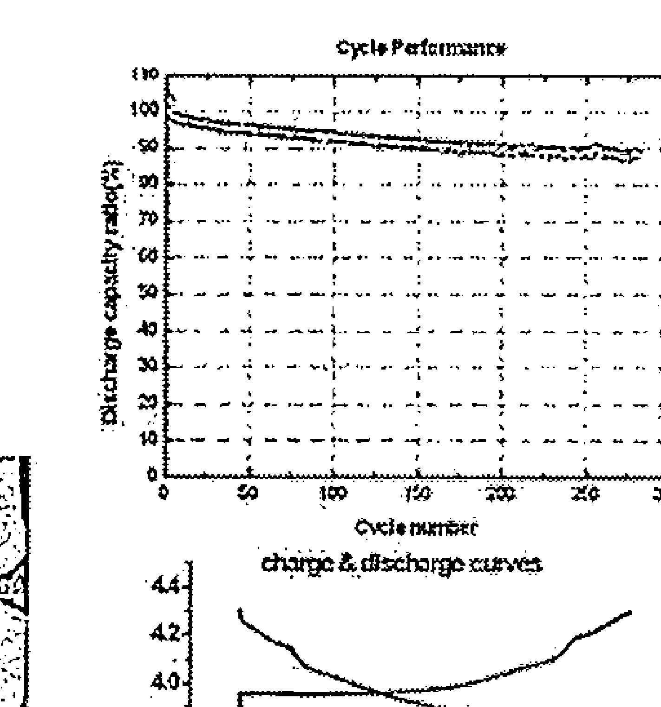

## 智能手机的电池结构

如今数码产品内置的都是“锂电池”，其内部主要是由含锂化合物的正极材料（图1）、电解质、隔离膜、负极材料（石墨）和外壳五个部分组成。其中，正极和负极材料都被嵌入到电解质中，而隔离膜则处于正负极之间，是避免它们直接接触导致短路发热进而引起燃烧爆炸的“防火墙”（图2）。

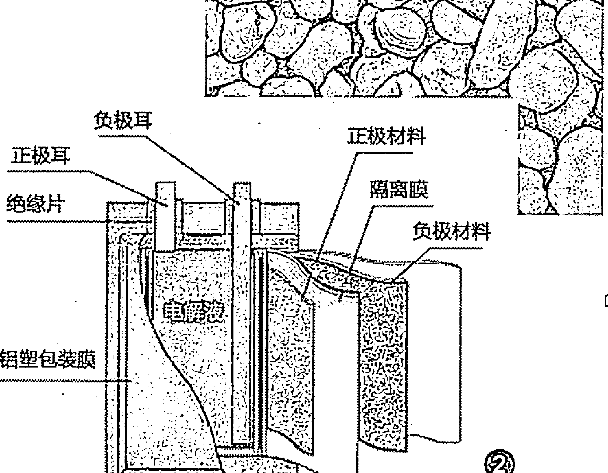

如今锂电池的正极材料多为钴酸锂、锰酸锂、三元材料（镍钴锰酸锂）和磷酸铁锂。锂电池无论是充电还是放电，其实都是锂离子在电池的正极与负极之间移动，并将电能和化学能相互转换的过程。

在充电时，正极材料分子中的锂元素会被分离出来，变成一个带有正电荷的锂离子(Li)。在外加电场的作用力下，这个锂离子会穿越电解质和隔离膜，到达终点负极后会与其中的碳原子发生化学反应生成LiC6，并稳定地嵌入到负极的石墨层状结构当中，最终实现存储能量的过程。在放电时，锂离子在化学反应的作用下会从负极重新移动回正极，这个过程会形成电流从而为数码产品供电(图3)。

锂离子在从正极到负极之间“旅行”时，单位时间内可从正极分离出来的锂离子越多，意味着这块电池可以存储的电量也就越大。如今智能手机都想在保持性感身材的同时塞进更大容量的电池，就只能通过增加正极材料和改进正极材料来提升“能量密度”这个参数了。

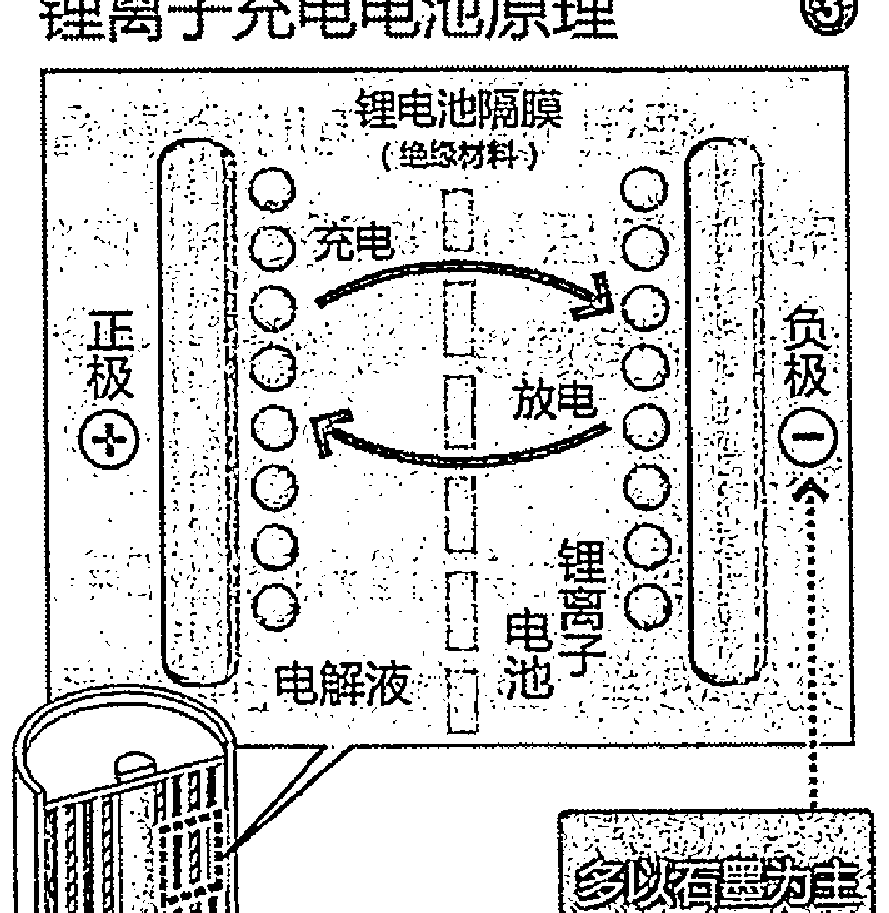

## 锂聚合物电池一统江湖

锂电池根据内部电解质形态的不同，又可细分为“锂离子电池”(Li-ion)和“锂聚合物电池”(Li-poly)。其中，当电解质为液体时就是“锂离子电池”，它需要使用金属外壳密封包裹防止漏液，所以质地较硬，18650电芯就是“锂离子电池”的典型形态(图4)。“锂离子电池”的优势是成本低，但缺点则是极端情况下存在爆炸的风险。

当电解质为固态或凝胶态时则是“锂聚合物电池”，这种形态的电池可以用软膜包裹，可以做成扁平甚至L型的样式(图5)，在极端情况下以燃烧为主，安全风险相对要小一些。目前智能手机和轻薄型笔记本都已过渡到“锂聚合物电池”时代。


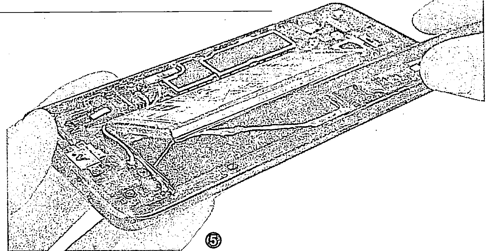

需要注意的是，通过Android版的AIDI64等软件可以查看手机电池技术是Li-poly还是Li-ion(图6)，但从众多网友的拆解和反馈来看，很多显示Li-ion手机型号的电池其实仍然是锂聚合物电池，所以我们不必在这个方面纠结。

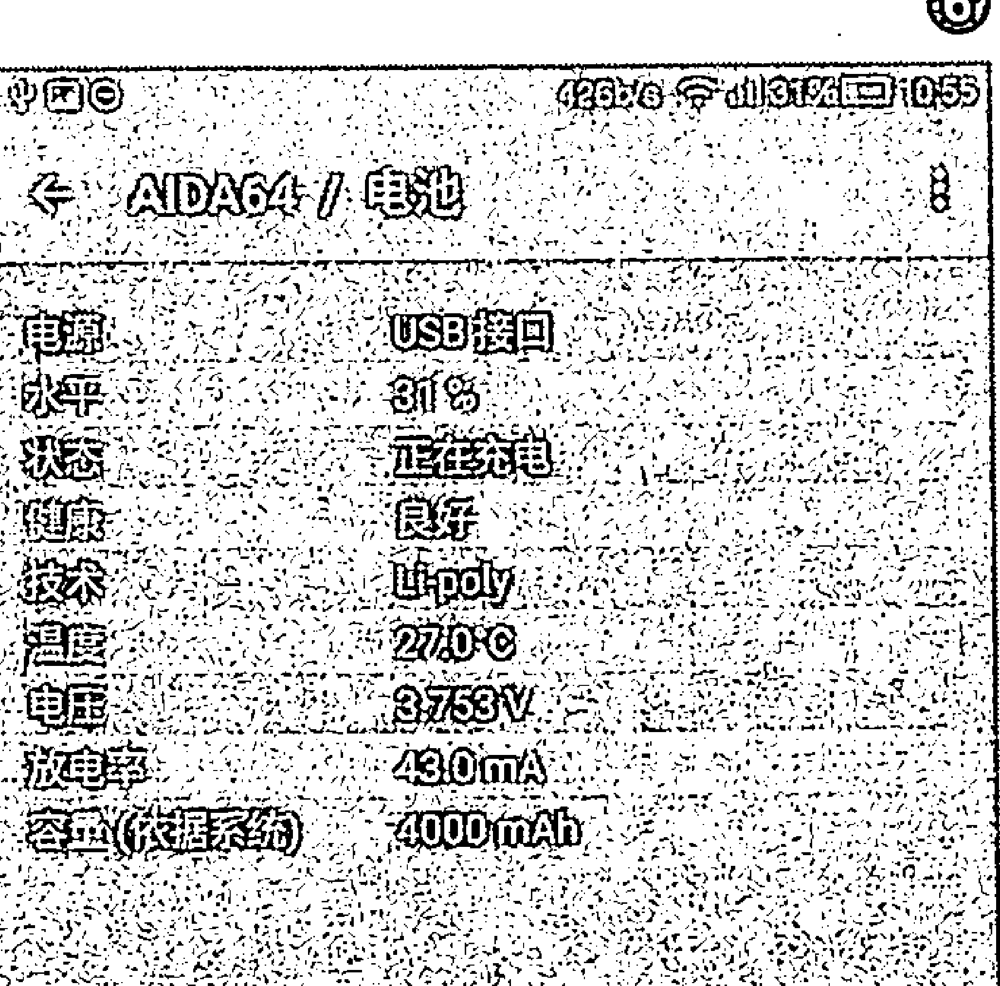

## 新手机电池需要激活吗

这是一个老生常谈的话题，在功能机时代部分手机还在使用镍镉充电电池，由于其出厂时没有完全激活，才需要用户购买新机后首次使用前充满12个小时来防止记忆效应。然而，如今的智能手机早已过渡到锂电池时代，内部具备完整的控制IC和电路，不存在所谓“激活”的说法，首次使用充满后随时都可拔下。

## 充电过程中的三种状态

锂电池在充电时会遵循“P=IU”（功率=电流×电压）的物理公式，它将电能转换为化学能的充电速度，最终就反映在充电功率这个参数上。

理论上讲，提升电流和电压都能增加电池的充电功率，但考虑到锂电池自身的安全特性，避免因欠压或过压而导致电池损伤或爆燃，每一款手机体内必然会配备完善的电源电路，其中尤以充电控制芯片和电源控制芯片最为重要（图7）。其中，电源控制芯片主要负责对电池进行充电，并实时检测充电和电池当前的电压值；充电控制芯片用于保护电池过放电、过压、过充、过温，从而有效地保护电池的寿命和使用者的安全。

在实际应用中手机厂商们通常会设定三种不同的充电状态：“恒定电流预充电”（Constant Current Pre-charge Mode）、“恒流调节模式”（Constant Current Regulation Mode）和恒定电压充电（Constant Voltage Regulation Mode）。

其中，“恒定电流预充电”应该是最容易被我们忽略的状态，所以在这里笔者就先简单介绍一下：很多手机在长时间不用时，即使连接充电器也无法开机（图8），很容易让人产生一种“手机不会坏了吧？”的疑虑。

原因很简单，手机内置锂电池的电压也会随电池容量的减少而降低（表1）。当电池电量完全消耗到0%时，其电池电压往往会降到3V以内。此时连接充电器，手机内部电源转换器所产生的电压还不足以满足微处理器触发电源、复位、13MHz时钟信号等开机条件，需要“恒定电流预充电”以较小的恒定电流（普遍为设定电流的1/10）对锂电池进行充电，使其慢慢恢复活性（将电池电压提升到某个阈值，如高于3V）才能触发开机操作。

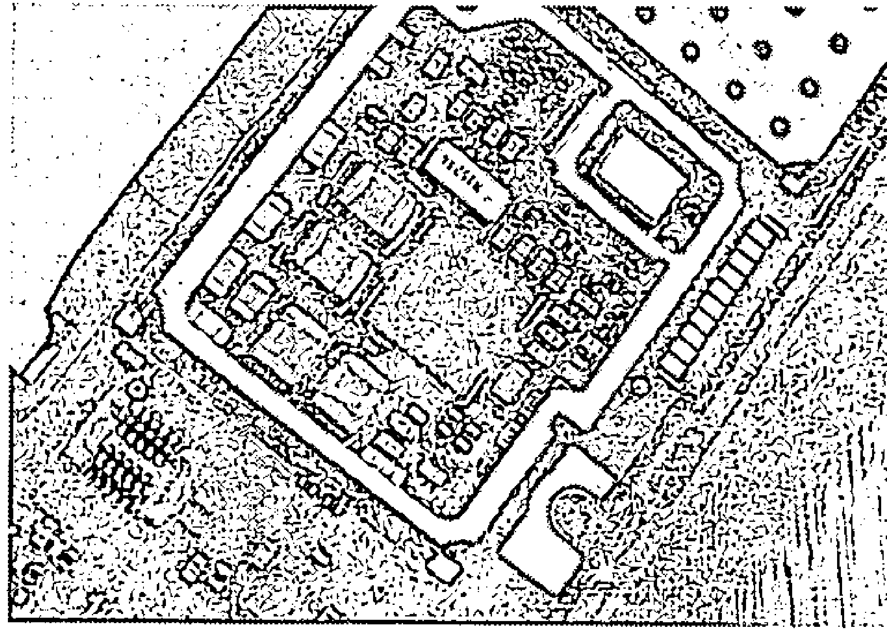

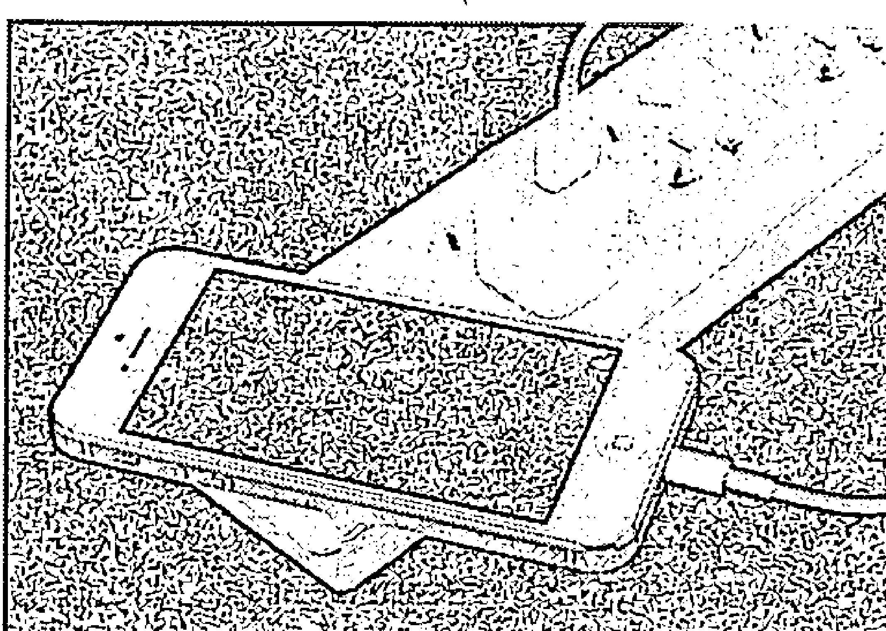

表1：手机电池、电量和充电状态的对应关系表
| 电池电量 | 当前电压 | 充电状态 |
| :--- | :--- | :--- |
| 100% | 4.2V | 恒定电压充电 |
| 90% | 4.06V | 恒定电压充电 |
| 80% | 3.98V | 恒定电压充电 |
| 70% | 3.92V | 恒流调节模式 |
| 60% | 3.87V | 恒流调节模式 |
| 50% | 3.82V | 恒流调节模式 |
| 40% | 3.79V | 恒流调节模式 |
| 30% | 3.77V | 恒流调节模式 |
| 20% | 3.74V | 恒流调节模式 |
| 10% | 3.68V | 恒流调节模式 |
| 5% | 3.45V | 恒流调节模式 |
| 0% | 3V | 恒定电流预充电 |
*电池百分比和电压对应关系是可自定义的，本表只是为了便于大家理解，数据仅供参考

开机后，电源控制芯片就会尝试与充电器进行“握手协议”，进入“恒流调节模式”状态，并在条件允许的情况下加大电压和电流的输入，缩短充电时间。当电池电量达到某个阈值时（通常在80%到90%之间）则会触发温柔的“恒定电压充电”状态，也就是我们所谓的“涓流充电”（设定电流的1/10），直到电流低于某个临界值，此时手机才会显示已充满全部电力。

## 正确的“充电姿势”

笔者不建议大家边充电边玩手机。因为当手机连接充电器时，电源电路会自动将电池切换到充电状态并停止放电，此时手机运行时所消耗的电量都是充电器端提供的。如果手机所支持的充电功率较低，在玩大型游戏时很可能出现“充不进去电”甚至“电池越充电量越低”的尴尬（图9）。

同时，充电时会显著增加发热量，容易触发处理器的降频机制，导致游戏出现卡顿而影响体验，在一些极端情况下甚至会威胁到人身财产安全，而电池寿命的最大元凶也就是高温。


如果你不希望自己的手机刚买半年电池就出现30%以上的耗损，就需要改变充电时玩手机的坏习惯了。

## 快充降临
### 缩短等待时间提升续航表现

如今的智能手机都在追求轻薄性感且减轻压手感，所以电池容量普遍都在3000mAh到4000mAh之间。在电池容量无法突破的情况下，缩短充电时间就是改善续航表现的发展方向了（图1）。比如“充电5分钟，通话2小时”的广告就是快充功效的最佳诠释。

## 来自新材料的希望

在上个章节中我们讲过锂电池的构成。很遗憾，现阶段还没有从结构上的替代方案，在电池体积不变的基础上想让电池的能量密度翻几倍是不现实的。但是，如果从提升充放电效能的思路入手，还是被电池行业抓住了一丝曙光。

### 石墨烯参上

在锂电池的正极、负极、电解液和隔膜中，电荷运动的快慢主要就受制于正负极的材料。好消息是，科研人员很早就发现了一种名为“石墨烯”的材料（图2），可以显著提升锂电池的可靠性（耐高温、循环寿命更长）和充电速度（允许更大的电压和电流输入）。

> 石墨烯就是把石墨中堆叠的碳原子分离成单层或者双层，比如铅笔在纸上留下的痕迹就可能是几层甚至是单层石墨烯

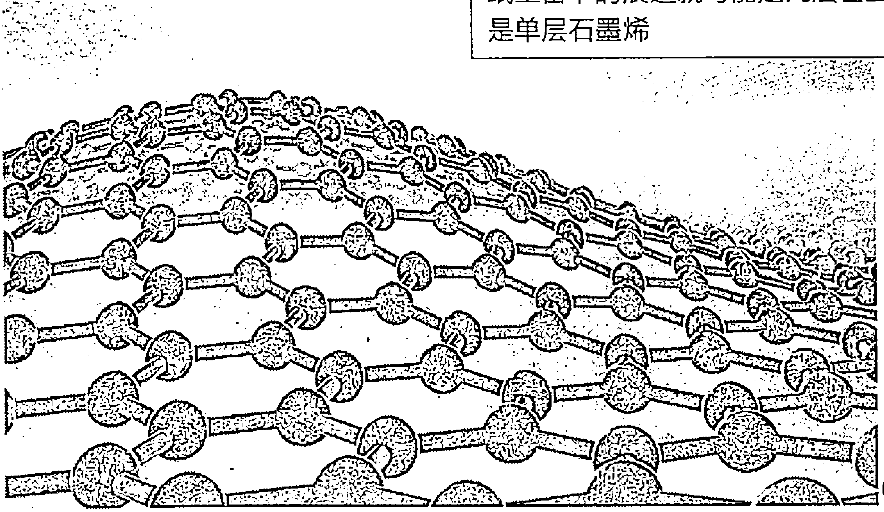

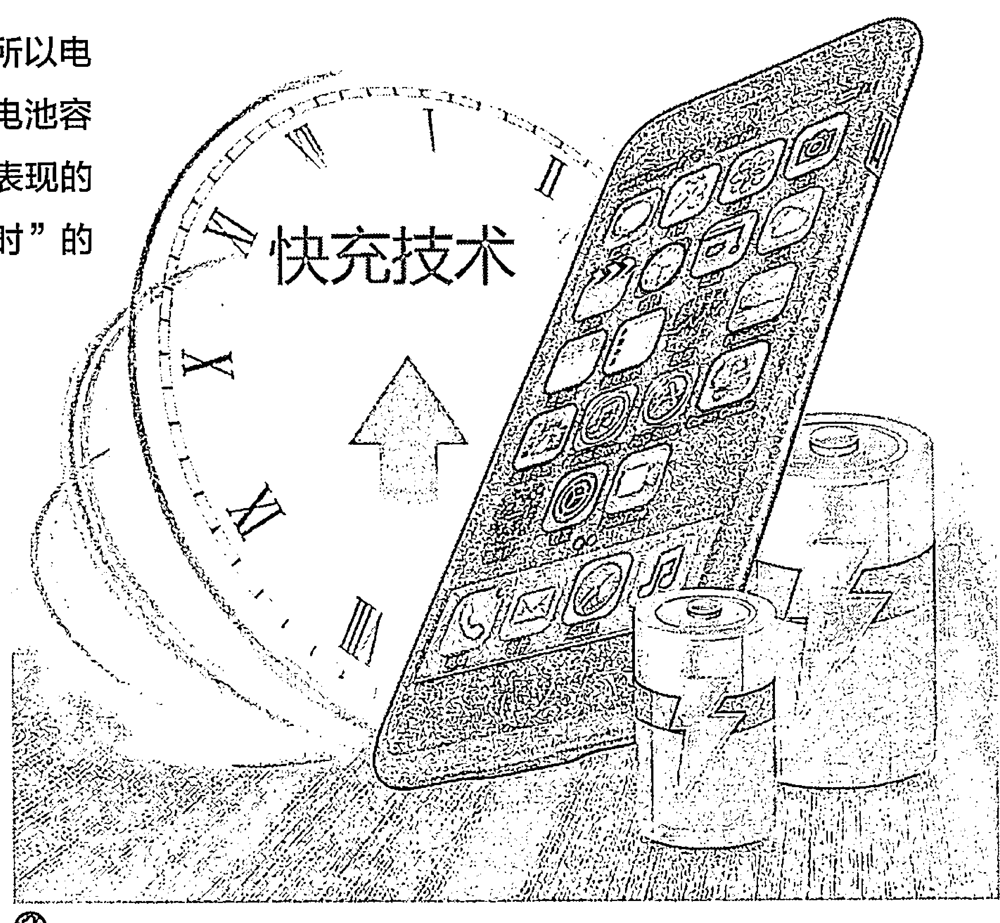

### 石墨烯≠电池

为了增加噱头，很多厂商在发布含有石墨烯材料的锂电池时，厂商或媒体都会将其称为“石墨烯电池”。实际上，“石墨烯电池”的称呼是不够严谨的。

原因很简单，石墨烯是一种非常昂贵的材料，成本曾被炒到每克5000元，如果将其替换锂电池的全部正负极材料，消费级市场是根本负担不起的。现在已经亮相的各种“石墨烯电池”、“石墨烯充电宝”，其原理只是将石墨烯作为传统正负极材料中的“添加剂”（导电剂或电极嵌锂材料），就好像化学反应中的催化剂一样来提升锂电池电极的导电性，从而实现充电时间大幅缩短的目的。

比如华为早前发布的“石墨烯基锂离子电池”就主打更高的可靠性，该技术的突破源于三个方面：在电解液中加入特殊添加剂，除去痕量水，避免电解液的高温分解；电池正极选用改性的大单晶三元材料，提高材料的热稳定性；同时引入新型材料石墨烯，用于实现锂离子电池与环境间的高效散热（图3）。实验结果显示，以石墨烯为基础的新型耐高温技术可以将锂离子电池上限使用温度提高10℃，使用寿命是普通锂离子电池的2倍。

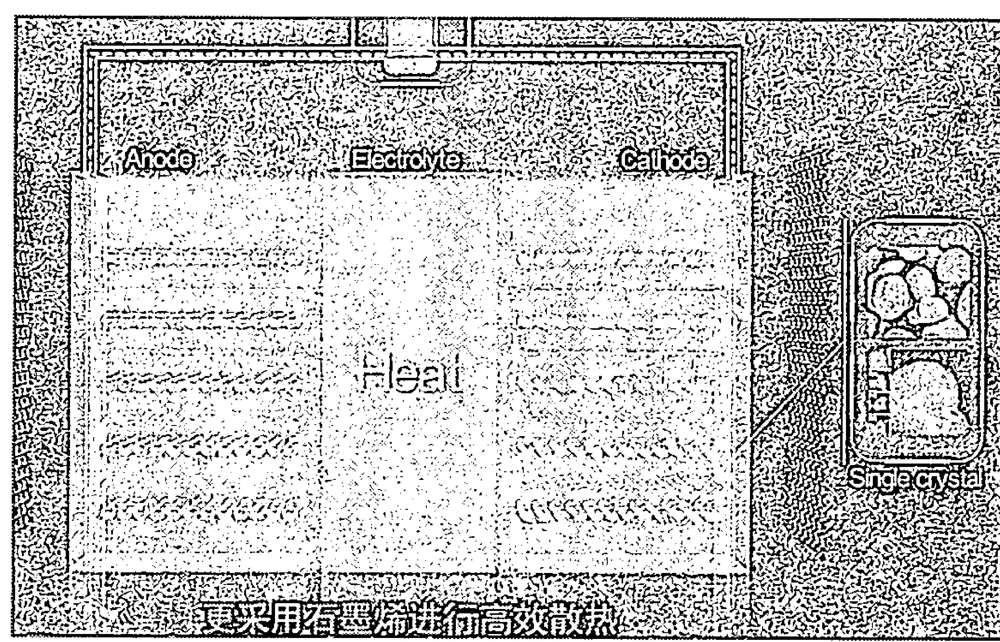

## 手机商用尚需时日

虽然石墨烯是一种已被认可的锂电池“添加剂”，但距离它在手机领域全面商业化量产却还有一段路要走（图4）。因为石墨烯的形态、在传统锂电池中扮演的角色（作为正极还是负极的添加材料）都会影响最终的充放电性能，尚缺乏统一的认证和标准。比如，三星的“石墨烯电池”就主打更快的充电速度：三星所申请的专利是一种用硅石来合成像三维爆玉米花一样的“石墨烯球”，然后将这些“球”用作锂离子电池的材料，可将电池容量提高45%，而充电速度提高至现有标准的5倍。

### 扩展阅读：石墨烯的广泛用途

石墨烯的基本形态是呈晶格的单层碳原子片，除了优化电池性能外，这种材料还可用于柔性显示器、可穿戴设备和其他下一代电子设备。比如魅族就在2018年2月申请了一个以石墨烯柔性屏幕为载体的手机专利：凭借石墨烯材质屏幕拥有高透光率、低电阻率、耐摔耐撞及可弯曲等特性，成功地将阻碍全面屏产品突破极限的前置摄像头、光线距离传感器等元器件集成在了石墨烯柔性屏之下，从而完成更高屏占比的全面屏设计。

好消息是，在充电宝领域，石墨烯材料已经被应用在很多新品上，此类产品的电池容量普遍在5000mAh到10000mAh之间，在电池的正极材料中加入石墨烯提升了电极的导电性。同时，配合原装的12V/5A充电器（输入功率可达60W），可以在15分钟内充满5000mAh，40分钟内充满10000mAh电芯（图5）。可惜，石墨烯充电宝的价格普遍要比同容量的传统产品贵3倍左右，原装充电器体积硕大（图6），高速充电时发热量较高，对充电宝这种设备而言安全可控，但要放在更精密的手机领域，其在安全性上却还有很多的难点没能攻克。

### 移动电源自充电耗时对比(5000mAh)

| 类型 | 充电时间 |
|---|---|
| 普通移动电源 | 充电约270分钟 |
| 快充移动电源 | 充电约120分钟 |
| 石墨烯移动电源 | 充电约40分钟 |

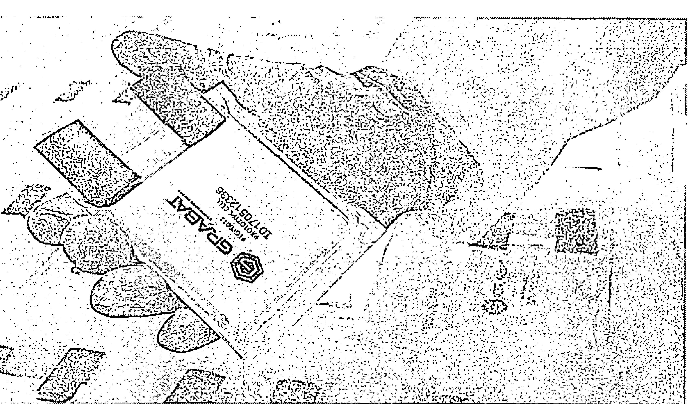

温馨提示：
官方标配不带专用闪充适配器（充电头）

推荐：
智能石墨烯充电宝闪充头，让充电更安全
更快速，75分钟充满20000mAh，12V5A
高效充电，搭配Type-C专用接口
摆脱各种充电尴尬。

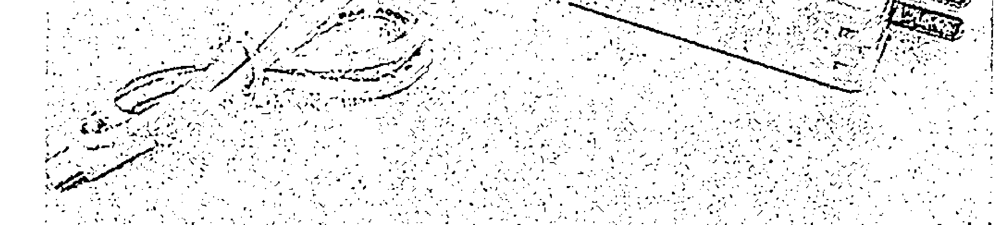

## 渐入佳境的快速充电技术

在锂电池充电的过程中，其背后就是锂离子从正极排出并快速地嵌入负极(图1)，不能造成锂离子的沉积，这个过程越快就意味着充电时间越短。为了加速锂离子的迁移速度，手机行业逐渐流行起了三种快充方案:

- A: 电压不变，提高电流（低压高电流）；
- B: 电流不变，提升电压（高压低电流）；
- C: 同步提高电流和电压（高压高电流）。

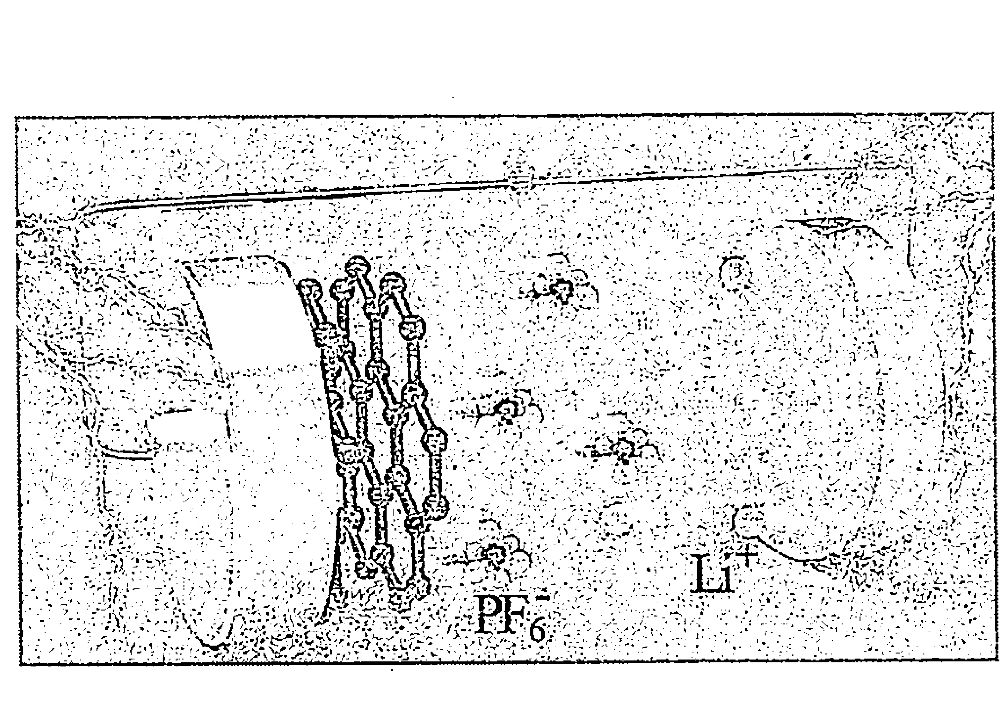

> 下面，我们就看看智能手机领域是如何在这三种快充方案间取舍沉浮的。

## 迈过10W的“快充”门槛

在上个章节中，我们介绍过智能手机电池充电需要经历的三个阶段，恒定电流预充电、恒流调节模式和恒定电压充电。而要想提升锂电池的充电速度，就必须在“恒流调节模式”下加以改进。

以Android系统手机为例，早期产品的电池容量普遍在900mAh~1500mAh之间(图2)，而标配充电器的输入参数也多以5V/1A为主，最高可以实现5W的充电功率，完全充满电力需要2.5个小时到3个小时之间。随着大屏手机开始流行，电池容量也纷纷突破2000mAh大关，但随之而来的则是充电耗时的延长。

以三星第一代Galaxy Note (i9220) 为例(图3)，这款产品武装了当时最大的5英寸屏幕，电池容量也达到了2500mAh，但充电器规格依旧是5V/1A，所以其充电时间长达4.5小时左右。长此以往，当手机电池容量达到3000mAh甚至4000mAh时，难道就必须整宿充电了吗？

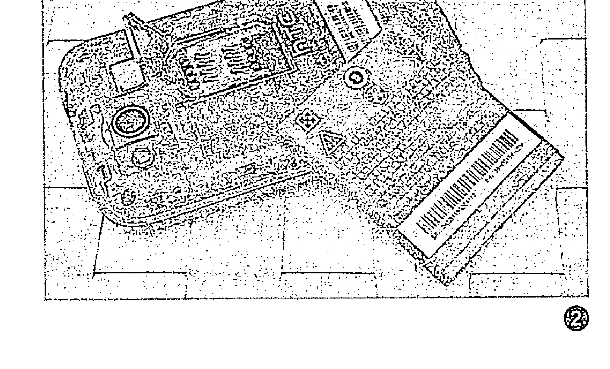

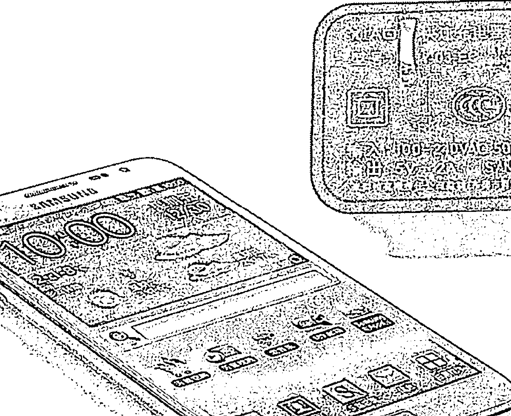

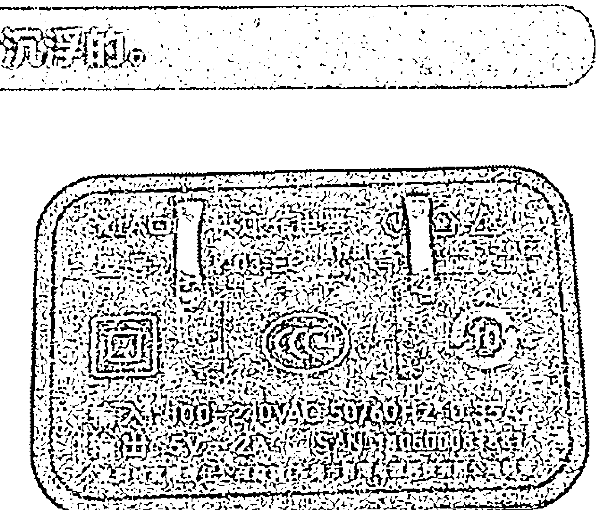

高通是最早认识到这个问题的芯片供应商之一。早在2013年高通就提出了“快充”的概念，Quick Charge 1.0 (下文简称QC1.0) 就此诞生。QC1.0通过提高输入电流来提升充电效率，支持5V/2A即最大10W的充电功率，突破了USB-IF关于USB Battery Charge 1.2协议1.5A的电流上限，符合“低压大电流”方案的定义。同一年，华为在第一代Mate手机身上也引入了“快充”概念，同样支持5V/2A输入，3.5小时以内就可将4050mAh电池充满。

可以说，5V/2A是智能手机快充道路上的一个关键节点，它让手机在电池变大的同时充电等待时间也变得不再难以接受。然而，随着智能手机纷纷将5V/2A充电纳入最低标准(图4)，10W充电功率就不再符合“快充”的定义了，并逐渐沦落为“普充”甚至“慢充”。

## 高压低电流快充的崛起

2013年，高通在QC1.0的基础上提出了QC2.0的概念（图5），将“高压低电流”方案进一步升华。可以说，QC2.0是快充历史上普及度最高、影响力最大的标准，哪怕是三星2018年度旗舰Galaxy S9采用的依旧是5年前诞生的QC2.0。

QC2.0之所以影响深远，是因为它无与伦比的兼容性。Micro USB是智能手机的标配，但它受制于物理接口的限制，一旦超过2.5A的电流就容易出现损毁。市面上随便买一根廉价的Micro USB数据线，其安全电流耐受范围也是不大于2.5A。

QC2.0聪明的地方就是绕过了Micro USB接口和数据线的制约，只是通过暴力地增加输入电压来提升充电速度。简单来说，QC2.0通过USB端口的D+和D-两个信号实现通讯和调压，新增对9V、12V和20V（用于平板电脑，非常罕见）电压的支持，最大支持9V/2A和12V/1.5A即18W的充电功率，并向下兼容传统的5V/2A输出。这意味着QC2.0充电器可以适配更多老旧手机和数码设备（图6），也能抵消劣质/较长的充电线带来的电压损耗，从而保证充电的效率。

出于安全和经济利益上的考虑，高通还为QC2.0制定了更为严苛的认证规则：

手机端内集成的电源管理IC可以动态检测电池电量，

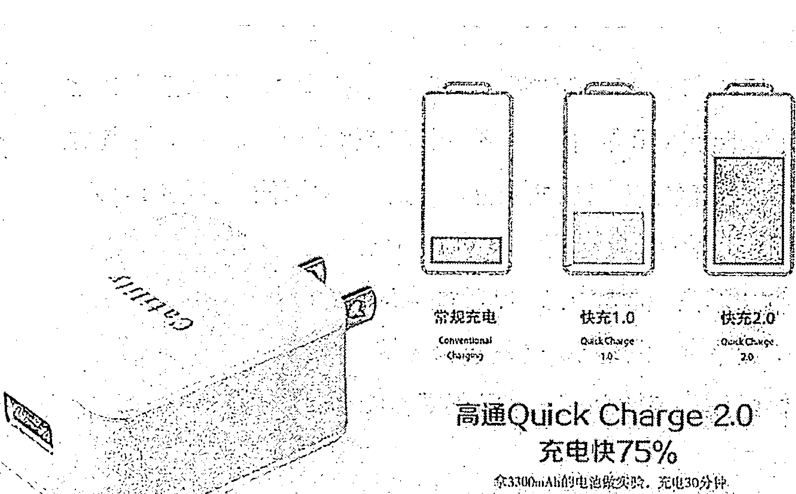

根据预置方案决定所需的充电电压，并向充电器端发出升压或降压的信号；

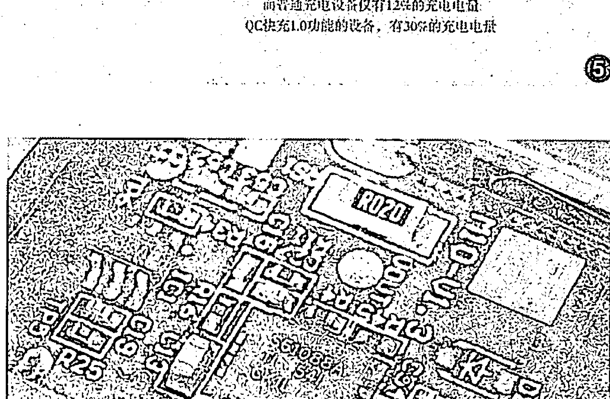

充电器端也需要集成专用的识别IC（图7），用于和手机内电源管理IC相互认证。认证成功则“握手”，并按照手机端发出的升压或降压的信号实时调整电压参数。如果认证失败则“撒手”，保持默认的5V输出。

高通的QC2.0快充技术给了同行们参考借鉴的思路，并展开了一轮轰轰烈烈的“圈地运动”。

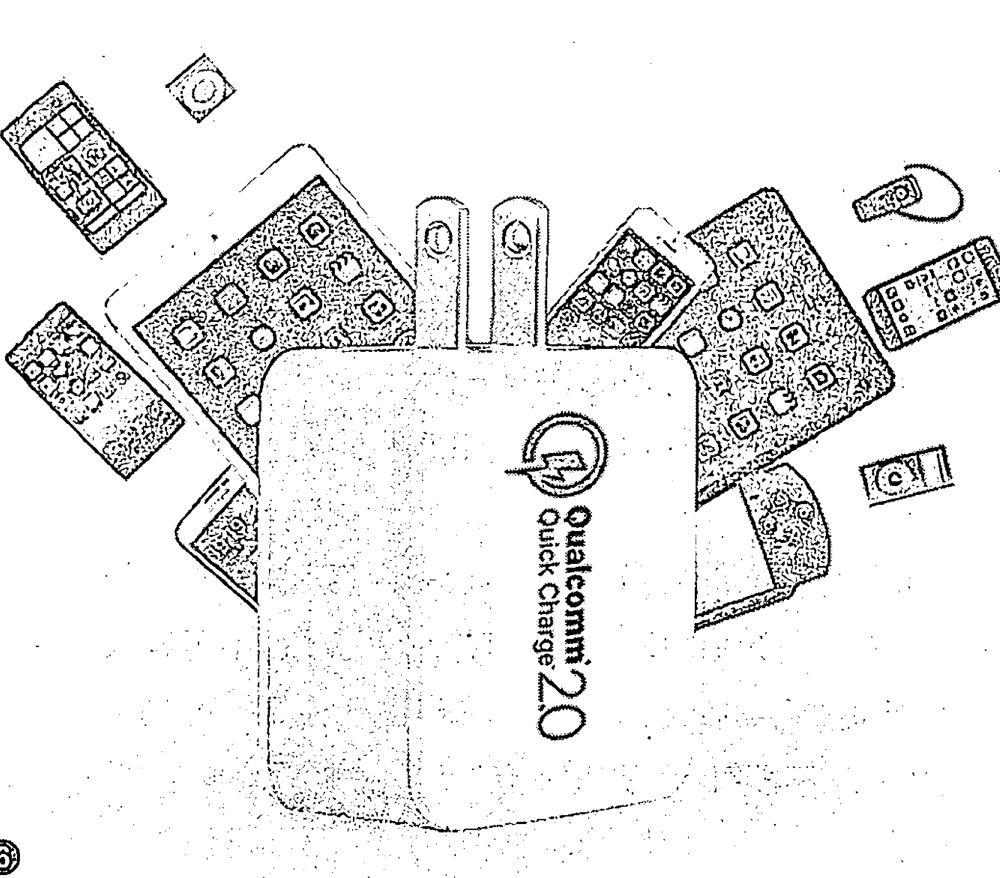

## 快充方案的“圈地运动”

作为高通的最主要竞争对手，联发科在高通提出QC快充技术不久，也推出了自家的Pump Express（下文简称PE）快充技术（图8），而随后的Pump Express Plus（PEP）则对应QC2.0，至于PE和QC的最大差异是前者改用VBUS上的电流脉冲来进行通讯和调压。除了联发科，华为也拿出了Fast Charger Protocol (FCP)，它们的共性是全部基于“高压低电流”方案衍生而来，而三星Fast Charge、vivo的双引擎闪充和魅族MCharge等品牌主打的快充技术，则大都是基于QC或PE方案的“马甲”。

手机厂商对自家的快充技术起名字（如Fast Charge和MCharge）是为了便于宣传，而芯片商推出各自的快充技术则是为了“圈地”，比如QC、PE和FCP等技术原理完全相同，硬件端理论上是可以相互兼容的，只是因为“握手协议”不同，需要和指定授权的充电器（包括充电宝）搭档才能激活快充（图9）。

没错，快充方案的“圈地运动”本质上就是用于提升影响力，并通过授权外设盈利的一种手段。

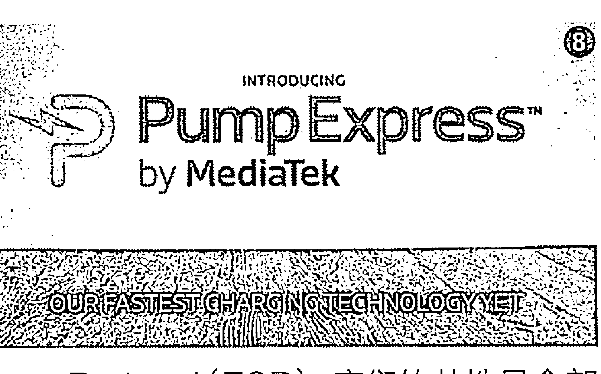

没错，快充方案的“圈地运动”本质上就是用于提升影响力，并通过授权外设盈利的一种手段。

## 高压低电流快充的困局

高压低电流快充方案虽然兼容性出色，但它却存在一个致命的问题，充电器端输出的电压再高，进入手机端后也需要转换成与电池匹配的电压（约4.0V）。这就导致输入电压越高，转换效率越低，而损失的功率将会被转换为热量，从而影响到手机的安全和稳定性。

因此，很多Android手机厂商虽然采用了QC2.0快充技术，但标配充电器却仅支持9V/1.5A或12V/1.2A，远远低于QC2.0的理论最大值。同时，无论是QC2.0、PEP还是FCP，只有手机处于待机（黑屏）状态时才能“满血充电”（图10），一旦手机亮屏后，充电功率就会下降到10W左右（图11），其初衷就是降低发热避免隐患。

与此同时，高通和联发科在2015年还先后祭出了QC3.0和PE2.0快充技术，它们和上代QC2.0/PEP相比，输入电压不再是非A即B（暴力地在5V/9V/12V等整数间直接切换），而是允许输入电压在3.6V到12V之间，以200mV (QC3.0) 或500mV (PE2.0) 为步进单位进行微调，在充电速度和发热对应的曲线中找到最合理的那个节点，弥补高压低电流快充方案转换率偏低的耗损和发热。

现实是很残酷的。随着消费者对快充体验变得越加看重，高压低电流快充方案已经走到了尽头，而另一种低压高电流快充方案则逐渐被市场认可，走上了从小众到普及的逆袭之路。

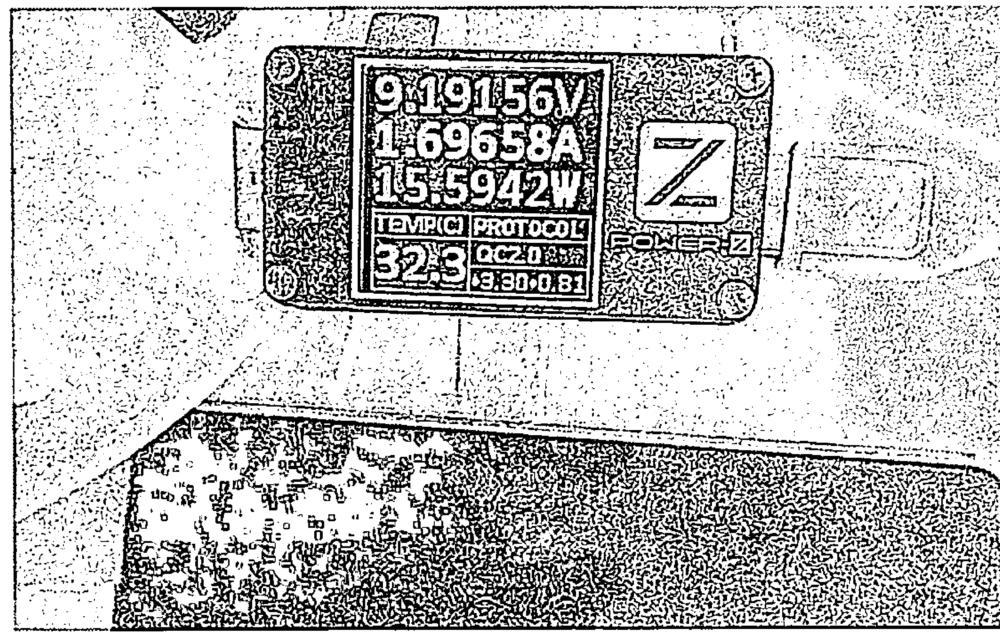

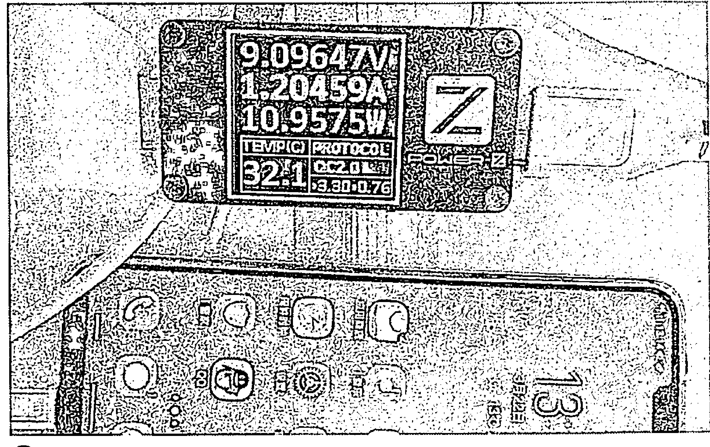

## 低压高电流快充的逆袭

提到低压高电流快充方案，OPPO算是扮演了开拓者的角色。早在2014年，OPPO就推出了“VOOC闪充”并将其应用在旗舰Find7身上。VOOC闪充最大的特色就是支持5V/4.5A输入，充电功率可达22W，30分钟就可将电池从0恢复到75%，并造就了“充电5分钟，通话2小时”的经典广告台词(图12)。

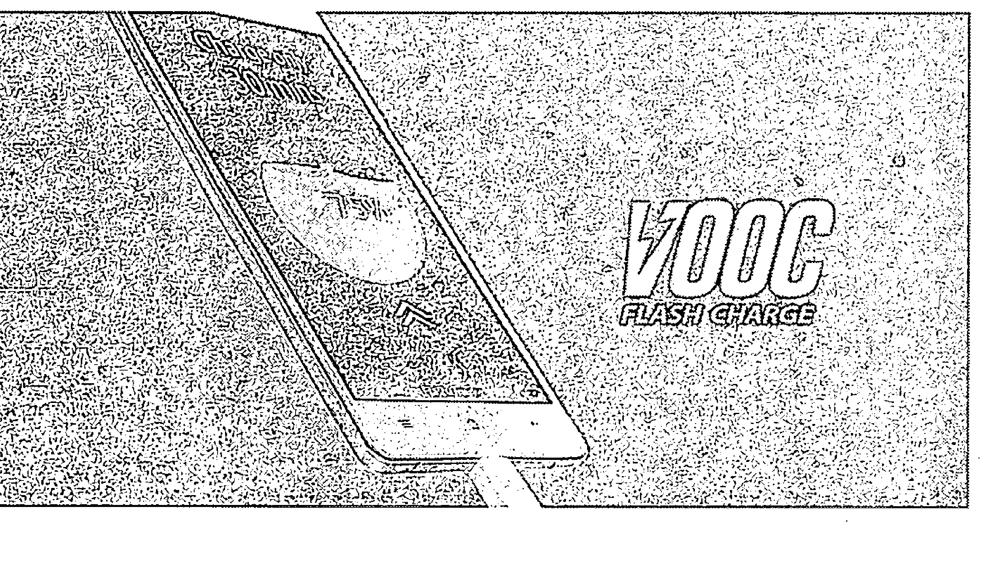

低压高电流快充方案的优势还体现在可靠性上：由于输入电压和电池电压相差不多，所以几乎没有电压转换的过程，快充时只有很少的功率被转换为热量，主要的发热源也从手机端转移到了充电器端。因此，哪怕手机处于亮屏状态，依旧可以进行满血快充（即所谓的“边玩边快充”），只有在玩游戏手机热量上升时才会降低充电电流。

可惜正如前文所说，标准的Micro USB接口和数据线都无法安全承载超过2.5A以上的电流。所以，OPPO重新为VOOC闪充定制了与众不同的硬件：7针Micro USB接口（标准Micro USB只有5针，多余针脚起到协议识别和大电流传输的作用）（图13）、8金属触点的电池、相对应的内部MCU电路以及专用的充电器。由于实现VOOC需要较高的物料成本，所以这种低压高电流快充方案并不被业界看好，在未来的很长一个时期内只有OPPO孤军奋战。


随着USB Type-C接口标准的出现，低压高电流快充方案普及的契机出现了。

USB Type-C接口内部拥有24个针脚（图14），可以识别更复杂的认证协议，并支持最高100W的充电功率。同时，USB Type-C数据线普遍可以承载3A以上的电流，一些品质较高的数据线甚至支持5A或更高，困扰VOOC闪充的接口线缆问题就这样被解决了。

USB Type-C接口引脚定义表
| G | Rx | Rx | VBUS | RFU1 | D- | D+ | CC1 | VBUS | Tx | Tx | G |
| --- | --- | --- | --- | --- | --- | --- | --- | --- | --- | --- | --- |
| G | Tx | Tx | VBUS | CC2 | D+ | D- | RFU2 | VBUS | Rx | Rx | G |

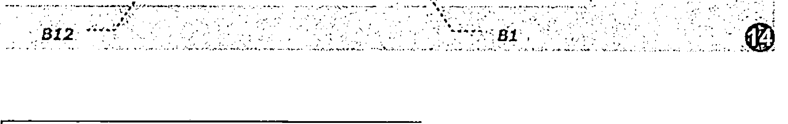

于是，一加带来了Dash闪充（5V/4A，如一加5T），华为实现了SuperCharge超级快充（5V/4.5A，如Mate 10），魅族也推出了mCharge4.0（5V/5A，如Pro7 Plus）（图15）。

如果这些由手机厂商主导的快充技术还说明不了什么，那高通和联发科的态度则可让快充技术的未来更加明朗。

高通和联发科在2016年分别发布了旗下最新的QC4.0和PE3.0技术，除了兼容USB PD（谷歌强制要求）以外，全部引入了低压高电流快充技术。

其中，高通QC4.0取消了12V电压档，最大支持5V/5.6A和9V/3A输出，电压支持以20mV为单位进行微调（图16）。随后发布的QC4.0+则加入了双充装置（通过一个电源管理集成芯片可以将电流分成两半，使芯片散热速度加快从而减少充电所需时间）和智能热平衡技术。

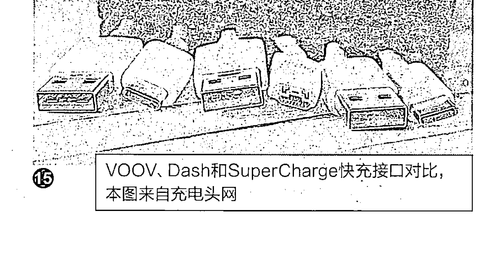

> VOOC、Dash和SuperCharge快充接口对比，本图来自充电头网

## Rapid evolution of Quick Charge

- Quick Charge 1.0 (2013): 1.0X
- Quick Charge 2.0 (2015): 1.5X
- Quick Charge 3.0 (2016): 2.0X
- Quick Charge 4 (2017): >2.5X

Based on internal test charging a 2750mAh flat charge battery and using the maximum power for a thermal limit of 40C for all charging implementations. Charge time based on 0% to 50% using 2017 charging implementations (September 2016). Snapdragon 835 is designed to allow devices to support 5 hours of battery life with 5 minutes charging. Actual results may vary depending on device design

衡功能(自动让电流选择双充中温度较低的路径, 让设备在快速充电的同时保持低温)。

联发科PE3.0支持的电压范围在3V到6V之间(图17), 同样能以20mV为单位进行微调, 而输出电流最高可达5A, 最高充电功率可达30W。

那么, 低压高电流的极限是多少? 华为在2016年底推出的荣耀Magic可能就是正确答案。这款手机采用了名为“HUAWEI Magic Power”的快充技术(图18), 可以实现最大5V/8A即40W的充电功率!

总之, 低压高电流快充方案拥有更高的转换率、发热低、可边充边玩等优势, 取代高压低电流已经成了大势所趋, 市面上很多高端旗舰已经逐渐搭载这一技术, 而QC、PE、FCP等快充技术则逐渐下放到千元级别的入门产品身上, 加速快充在整个智能手机领域的普及。

| MediaTek PumpExpress+ | PumpExpress 2.0 | PumpExpress 3.0 |
| :--- | :--- | :--- |
| MP SCHEDULE | Now | Now | Q3'16 |
| TA OUTPUT | 5V~12V (Fixed 5/7/9/12V) | 5V~20V (0.5V per step) | 3V~6V (10-20mV per step) |
| COMMUNICATION | VBUS current modulation | VBUS current modulation | USB PD |
| CHARGE CURRENT | Single 3A / Parallel 4.5A | Single 3A / Parallel 4.5A+ | Direct Charge 5A+ |
| EFFICIENCY | 90% | 92% | 95% |
| 0-70% CHARGING TIME | | | 20 Minutes |
| CHARGING 5 MINS TALKING | | | 4 Hours |

Pump Express+ by MediaTek

小提示

能否让快充以“满血”状态进行, 对数据线的要求极高。像VOOC闪充只支持原装数据线, 而其他快充方案则兼容标准Micro USB (高压低电流) 或USB Type-C (低压大电流) 数据线, 只是USB Type-C数据线的品质会决定它能承载多大的电流, 购买兼容USB Type-C线时要挑选支持5A输入的。

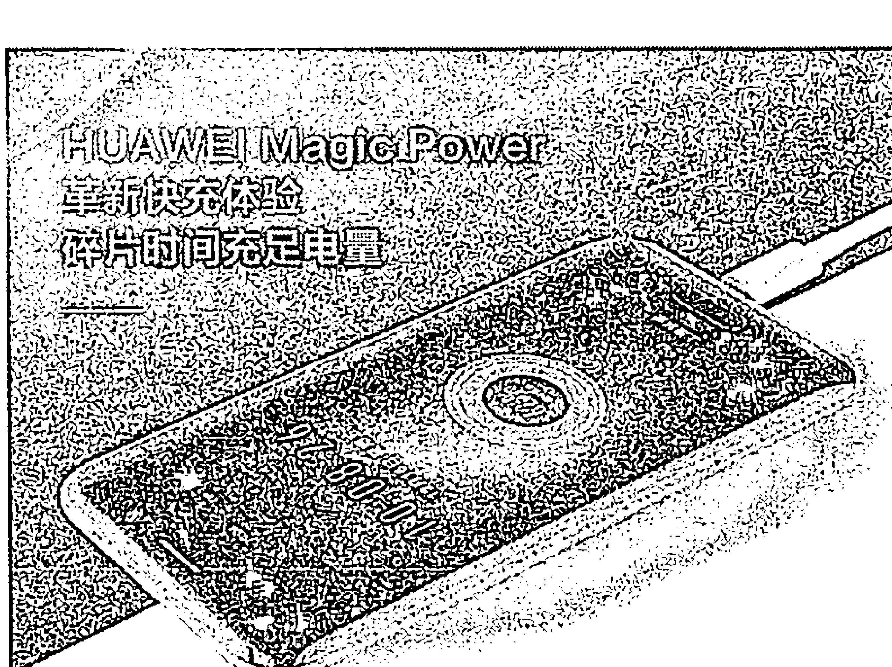

扩展阅读:

## 充电速度对比

对电池容量为3000mAh的手机而言, 使用5V/2A、QC3.0、VOOC和Magic Power充电速度对比如下:

- 5V/2A: 10分钟7%、60分钟60%、100分钟90%、110分钟全部充满;
- QC3.0 (9V/2A): 10分钟15%、30分钟50%、60分钟90%、80分钟充满;
- VOOC (5V/4A): 10分钟20%、30分钟60%、50分钟90%、75分钟充满;
- Magic Power (5V/8A): 10分钟45%、30分钟90%、50分钟充满。

从这个结果可见, 在充电功率相近的前提下, 低压高电流和高压低电流方案完全充满电的时间相差无几。实际上, 各种快充技术比拼的也是前10分钟和30分钟内可以充入电量的多少, 从这个角度来看还是低压高电流的效率更高。

## 高压高电流代表未来

虽然低压高电流是当下高端Android手机最爱的快充方案，但本着“没有最快，只有更快”的发展趋势，它注定也是要被历史淘汰的。而有望一统未来快充江湖的，就将是“高压高电流”方案。

比如，魅族就曾在2017年的MWC大会上展示了旗下第三代快充技术——Super mCharge（图19），它支持11V/5A高压直充，最大充电功率可达55W！它的背后是电荷泵原理，内部IC只有两组电路，转换效率高达98%，全新定制的安全电芯可以做到800次循环充放电后依然拥有80%以上容量，足够用户正常使用两年左右。

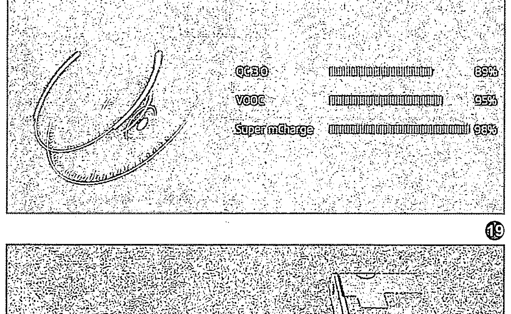

但是，Super mCharge需要重新定制数据线和USB端口（图20），至今还停留在概念阶段，并没有实际产品将其搭载。

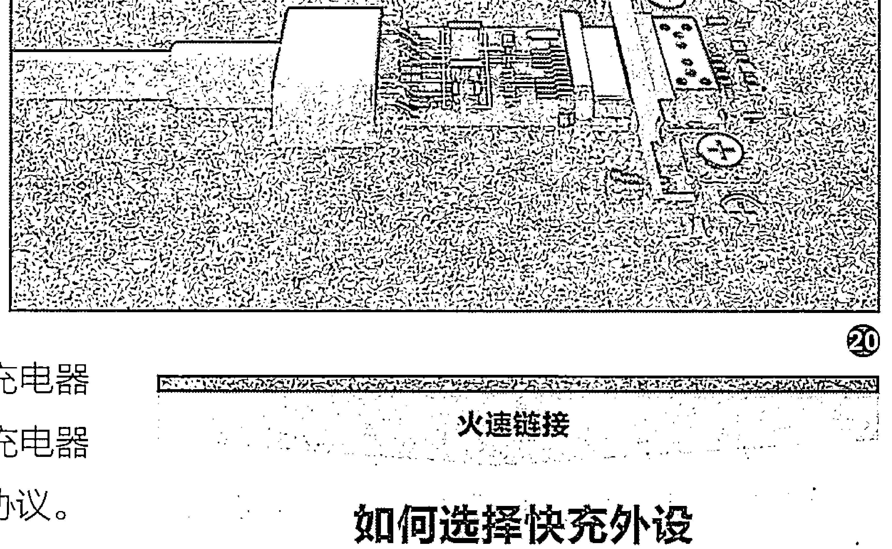

另一方面，在谷歌的牵头下，各大快充方案的最新版本都开始逐渐兼容USB Type-C接口和USB PD协议，这就为因“圈地运动”而导致隶属于不同快充阵营的手机/充电器之间无法握手的难题有了解决希望。比如，高通QC4.0+的充电器就能触发iPhone X的快充，背后就是源于免费的USB PD协议。

USB PD最高支持100W的充电功率，从而为智能手机实现高压高电流奠定了物理基础。

还记得前文提到的石墨烯充电宝吗？它们之所以可以实现12V/5A、20V/3A的60W充电功率，就是大都建立在支持USB PD 3.0协议的基础上（还有部分产品采用笔记本AC电源充电，无特殊协议）。根据很多网友的反馈，称任天堂Switch、MacBook、联想笔记本、戴尔笔记本或惠普笔记本等自带的USB-C电源适配器都能为此类石墨烯充电宝快速充电，足以印证USB PD协议在兼容性方面的潜力。

未来，当石墨烯材料在智能手机领域普及后，借助USB PD协议实现超过40W的充电功率并非难事。一起期待吧！

## 如何选择快充外设

考虑到很多家庭同时存在不同品牌不同快充协议的手机，所以在选择第三方充电器/充电宝时总会很不甘心，有没有一款外设就兼容全部快充协议的产品呢？很遗憾，至少目前还没有全兼容的产品，充电器领域出现了兼容QC2.0、QC3.0、FCP、SFCP、MTK PE、MTK PE+、USB bc1.2七大主流快充协议的型号，而充电宝领域则有兼容VOOC、DASH、QC3.0、QC2.0和USB PD协议的产品（图21），我们必须根据现有手机进行取舍。有关与快充相关外设的选购问题，CFan会在近期杂志上加以详述，感兴趣的朋友敬请关注。

## 扩展阅读：

## 快充都是可选项

快充技术往往属于可选项。比如，高通骁龙835支持QC4.0+，但市面上搭载骁龙835且唯一支持该快充技术的就只有雷蛇手机，其他品牌出于成本的考虑大都选择QC3.0或QC2.0与其搭配。USB PD协议也算是USB Type-C接口的特性之一，但它也是可选的充电标准，比如一加5T虽然采用USB Type-C接口却仅支持DASH闪充，不兼容USB PD。

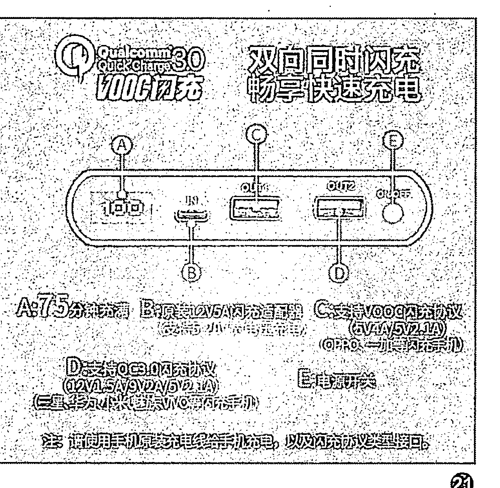


## 青山绿水之功 低功耗与环保产品

文|红烧真人 墨汁做寿

“既要金山银山，又要绿水青山”，绿色环保作为近两年来国家大力发展的一个重要方向跟人们的日常生活息息相关。使用绿色环保低功耗的产品不仅对自然环境与社会资源起到节约与保护的作用，对我们个人来说在保护健康的同时也可以省下一笔不必要的开销。

### 常见环保与节能标准

目前用于IT数码产品的绿色环保标准非常多，其中有一部分是基于材料、生产等环节，可能不会向普通消费者透露，而另一些则可能因为更多与市场、用户相关，而以各种形式出现在消费者面前，例如外壳或包装上的标志、资料中的说明、广告中的宣传，甚至是开机时的画面等。那么这些环保标准到底是什么意思？对我们又有什么意义呢（图1）？

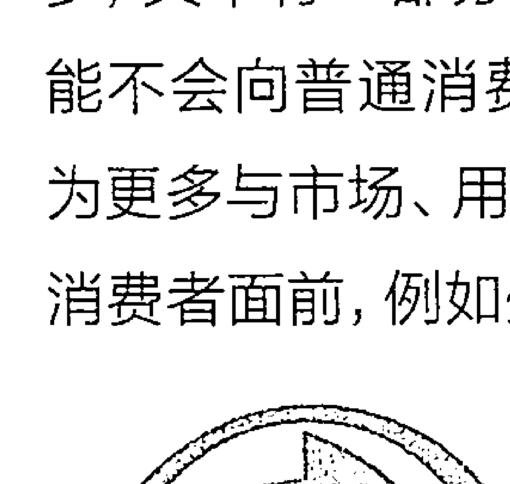

### 中国能效等级

在大型商场的家电区，我们会看到很多电器贴有一个写着“中国能效标识”的蓝色外框长贴纸，这张贴纸上面会注明产品功耗和能效等级。而在近期的很多IT数码产品上，也出现了这个标注，不过大部分都不会像家电那样张贴在特别醒目的地方。中国能效等级划分由国家强制执行，不同的电器会根据相应的《推荐性国家标准》进行评定。能效等级由低到高分为五个级别，级别越高耗能越低，其中五级红色能效等级最低，为准入标准，低于这个水平的产品将不会被准许销售，三级深绿色能效标准为国内平均水平，而一级浅绿色为国际先进水平。目前新版能效标识会带有一个二维码供用户扫描以获得详细信息，如果没有二维码，则该产品可能生产于2016年之前。此外，一些表现特别优异或者积极参与这一项目的企业，还可以在其能效等级认证标识上增加领跑者图案（图2）。

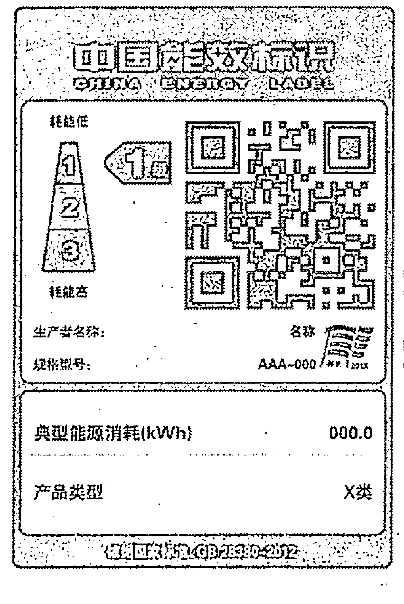

能效标识有领跑者版与普通版两种

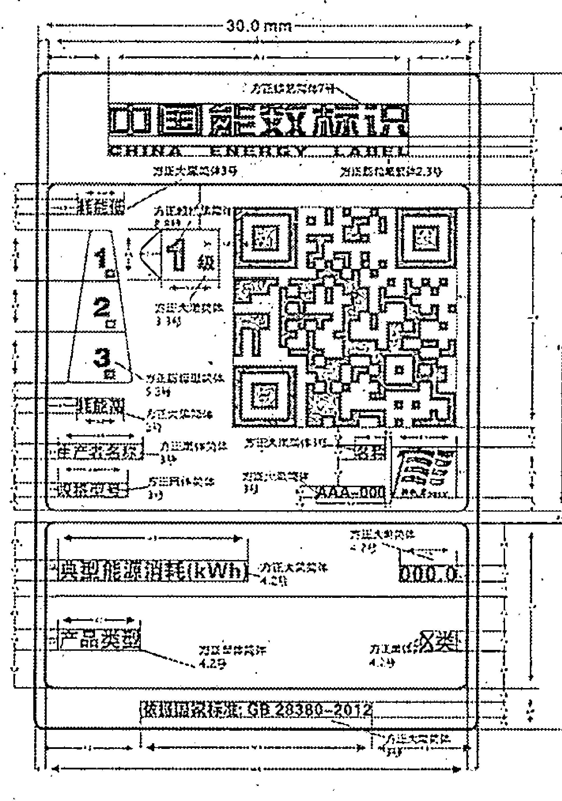


现在比较少见的节能认证标志

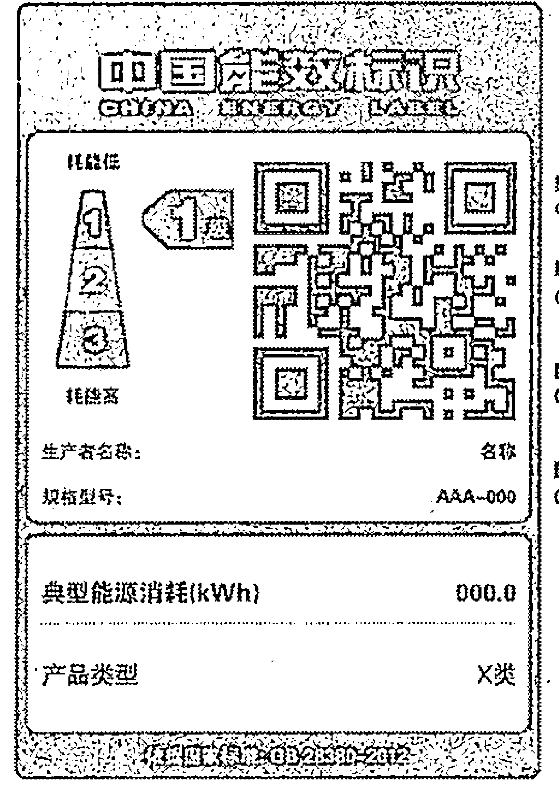

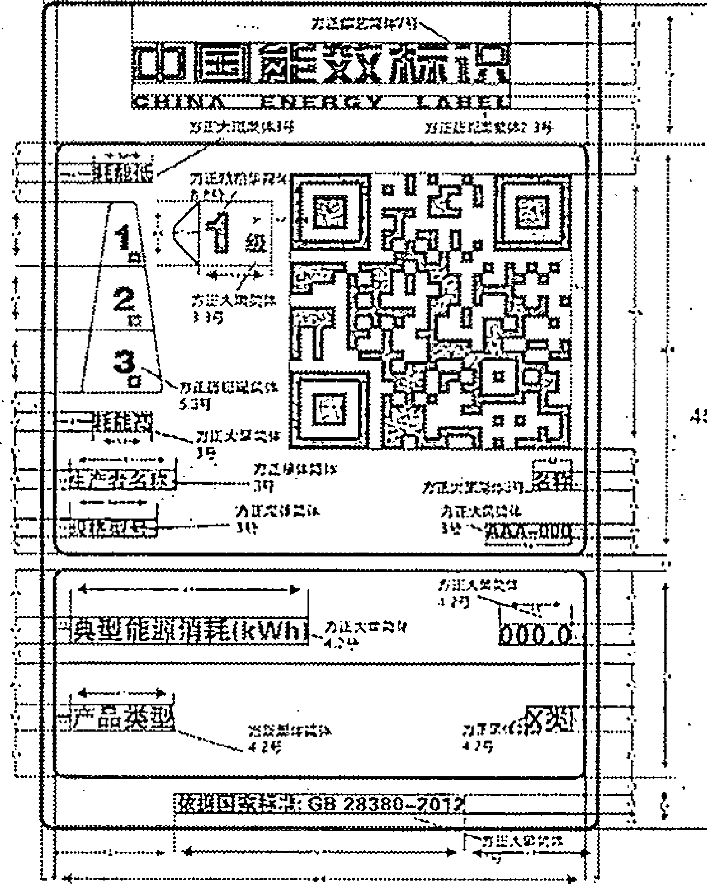


开机时的显示让很多国人认识了能源之星标志

### 中国节能认证

### 能源之星

与能效标识的强制性认证不同，节能认证是通过中国质量认证中心进行的自愿性产品认证。在没有能效标识之前，很多厂商喜欢通过节能认证来向用户宣传其产品的低功耗卖点。由于能效标识在一定程度上起到了节能认证的效果，很多产品就不再申请进行节能认证，能效认证超过二级的产品理论上都可进行并获得节能认证（图3）。

资深电脑用户应该都会对能源之星这个标志有很深的印象，从DOS到Windows 95时代，很多电脑在开机的时候，屏幕右上角会出现能源之星的图标。直到Windows 7时代，这一标志才逐渐退出人们的视野。

我们常用的品牌台式机、笔记本以及电脑显示器都会有中国能效标识认证，由于技术的进步，绝大多数笔记本与显示器都可以轻易达到一级能效，品牌台式机也大都能达到三级能效以上。

能源之星是美国环保署于1992年启动的一项自愿性认证，大部分主要的电脑生产与消费的国家和地区都参与了这一认证活动，并且会举行一年一度的能源之星会议。能源之星的规范一直在不断改变，例如早在2006年的能源之星4.0规范上就引入了80Plus的标准要求，因此目前仍然是一个先进的环保认证标准，在很多电脑产品上还会看到这一认证的身影（图4）。

### RoHS

RoHS认证是欧盟立法规定的一项强制性标准，全称是《关于限制在电子电器设备中使用某些有害成分的指令（Restriction of Hazardous Substances）》，它对电子产品生产中常常会引入的有害物质，如铅、汞、镉等重金属及六价铬等重金属离子，含溴、苯等有机物的含量进行了严格的规定，让产品对人体和环境都更加安全。RoHS认证获得了广泛的认可，但在实际制造过程中，很多物质含量以现有技术并不能很好地控制在要求之内，比如我们常见的电脑主板等元件的铅含量就会超过RoHS规范规定标准。因此一些国家和地区根据自身情况对RoHS认证的标准进行了修改，欧盟本身也针对很多产品中的部分物质含量进行了豁免认证。

中国对RoHS规范也有自己的标准，常见的国内RoHS标志有两种，一种是绿圈中有一个英文字母e，表示该产品为环保产品，另一种是黄色圈中带数字，表示对应多少年内是安全环保的，超过这个年限就会污染环境，不过因为印刷的原因，大多数时候我们看到的都是黑圈标识。RoHS标准在中国仅作自愿性认证，不具有强制性（图5）。

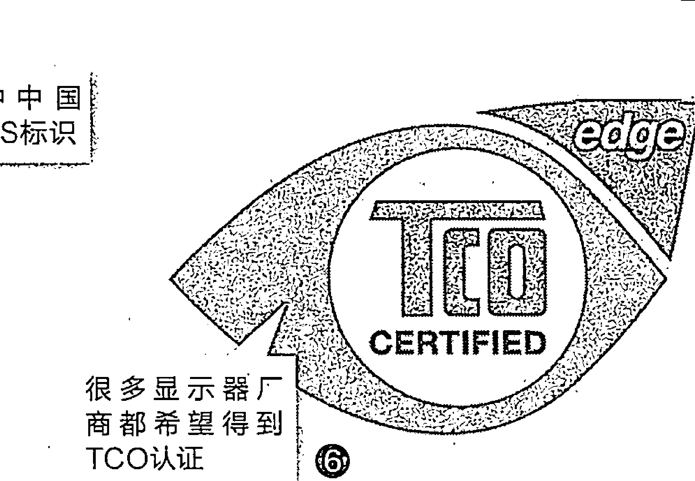

### TCO认证

TCO认证是由瑞典专业雇员协会推行的一项自愿综合性认证，除了限制有害物质、进行生态保护认证外，还有节能认证、防辐射认证以及人体工学认证。TCO认证由于综合难度较高，审核严格，每次推出全新认证标准能通过的产品数量不多，因此通过TCO认证的电子产品格外受到企业团体青睐。目前TCO认证产品有显示器、笔记本、平板电脑、智能手机、台式机、一体机、投影仪和耳机，共计8项，在2018年年底还将推出第八代TCO认证（图6）。

### CCC、CE以及FCC

在我们购买的大部分电子产品上都会标有CCC、CE以及FCC标志，这三个标志分别代表中国强制性产品认证制度、欧盟欧洲统一认证以及美国联邦通信委员会认证。三种认证都是对产品安全性最低的保障性要求，与产品质量无关。其中3C认证是在内地市场销售的必要认证，而CE与FCC认证就相当于欧洲与美国的3C认证，这三个认证在检测偏向上并不相同，所以同时拥有三个认证的产品在使用安全性上要比只有3C标志的好一些（图7）。

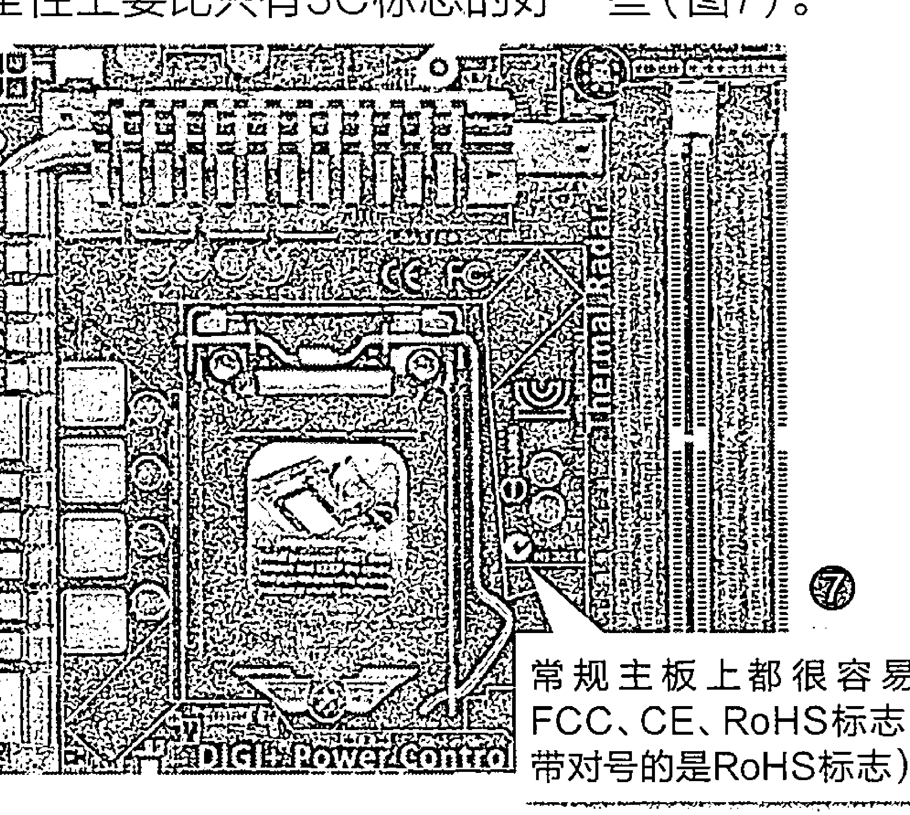

### UL认证

UL是美国保险商试验所（Underwriter Laboratories Inc.）的简写，它是一个独立的、营利的、为公共安全做试验的专业机构，是美国最有权威的相关机构，也是世界上从事安全试验和鉴定的较大的民间机构。UL会采用科学的测试方法来研究确定各种材料、装置、产品、设备、建筑等对生命、财产有无危害和危害的程度；确定、编写、发行相应的标准和有助于减少及防止造成生命财产受到损失的资料，同时开展实情调研业务，并授予认证。UL认证在美国属于非强制性认证，主要是产品安全性能方面的检测和认证，其认证范围不包含产品的EMC（电磁兼容）特性（图8）。

UL认证的最终目的是让消费者得到具有足够安全水准的商品，让人身健康和财产安全得到保障，它因此获得了世界上很多国家和地区的认可，也成为了消除国际贸易技术壁垒的有效手段。

## 无汞/镉电池

在RoHS认证中，汞和镉的使用量就是非常重要的检测项目，而相对于其他产品，电池中对这两种物质的使用更广泛，也更受到环保部门和组织的关注，很多人从小就会听到关于一粒电池就能污染大片土地和水体的宣传，其污染物主要指的就是汞、镉等重金属元素。因此，一些电池厂商为了自己的形象，在无汞/镉电池技术方面下了大力气，并推出了相应的产品。目前无汞/镉电池并没有广泛接受的检测标准和规范，只能参考电池厂商自己的标注，但一般认为，无汞/镉电池应表示该电池在产品中完全不含汞和镉元素，生产线上也不应含有/排放这些元素。无汞/镉电池由于采用较昂贵的替代物和更复杂的制造工艺，因此价格一般略贵一些，但如果考虑到对环境的影响，还是应该尽量使用这类产品(图9)。

## 可回收/再生产品

在网购盛行的今天，纸箱与缓冲填充物的使用量大幅增加，在这些箱子上我们常常会看到可回收的标志。而在缓冲填充物中，则更常见的是再生产品标志或说明。在目前的广泛宣传下，可回收产品的概念已经深入人心，可回收标志虽然有不同的设计，但基本架构非常类似，易于识别，这里就不赘述了。比较有趣的是，目前我们常见的不可回收标志却有两种相当不同的形式，好在都比较直观，容易识别(图10)。

再生产品主要是指使用再生材料制造的产品，其实可以看作是可回收产品的良好利用方式。以常见的饮料瓶转换为再生尼龙面料为例，回收使用一个600毫升的塑料瓶=减碳25.2g=省油0.52毫升=省水88.6毫升。需要注意的是，再生产品常常会带有各种环保标志，除了表示其回收节约对环保的作用之外，也表示在回收处理过程中，已经进行了无害化处理，无需担心产品带有残留的危险成分(图11、图12)。

## 总结

林林总总的环保与节能标准、规范其实还有很多，有时我们在翻阅说明书时，还会看到一些厂商使用完全无铅生产等环保工艺，以及相应的环保承诺。有趣的是，在这些说明中一般不会提到它遵守的是哪一种国家行业标准，这是因为在标准分级中，工厂标准常常是高于国家和行业标准的，例如完全无铅生产，其实就已经超越了很多版本的RoHS对铅含量的容忍度。需要注意的是，环保节能标准与规范是经常进行更新的，新版的认证一般都会比旧版认证严格且有效得多，但是考虑到产品认证年限、申请时间、认证收入等问题，并不是推出全新标准后就会废弃以前的认证标准。比如很多显示器无法通过TCO03版认证，就转而申请通过TCO99版本，虽然说名义上都通过了TCO认证，但是环保指标差得很多。消费者如果了解这些认证标志的外观差别，就很容易了解商家的各种“小动作”。

## 节能环保产品

重视环保节能的用户在采购设备时，就应该考虑到设备自身和使用过程中的节能与环保问题。在IT数码设备中，以节能与环保为设计特色的产品也比比皆是，其中有一些在使用体验上也是相当不错的，并没有为了强调其环保特性而牺牲产品本身的能力。

### 爱普生L380墨仓式一体机

喷墨式打印机的机体便宜，但墨盒昂贵又不耐用，是很多早期家庭打印机用户的感受。在这个强调环保和经济的时代，这种用耗材来赚钱的方式显然已经不适用，因此很多厂商推出了采用连供模式的墨仓设计或可多次灌墨的产品，极大地减少了墨盒的浪费（图13）。

爱普生L385采用墨仓式供墨，挂在侧面的墨仓可自行灌墨，每套墨水大约可打印4500页黑白和7500页彩色文档，成本非常低，且更加环保。这款产品本身的能耗非常低，待机功耗与家用路由器基本相同，特别适合长时间待机使用（图14）。
这款一体机带有扫描、复印、打印功能；扫描精度可达1200×2400dpi。它支持Wi-Fi无线连接，用户也可以使用爱普生APP和Wi-Fi直连方式连接L385，打印手机、平板电脑中的文件或照片，非常方便。

### 显示器遮光罩

在一些专业显示器上，我们经常会看到它们配置的遮光罩，它可以减少周围光线对屏幕显示的影响，让用户可以在更低的亮度、对比度和色彩设置下获得很好的显示效果。低亮度使用不仅可以节约电力，也在一定程度上降低对用户眼睛的刺激，保护用户的健康。除了专业级产品的标配或选配遮光罩之外，目前市场中也有一些兼容各种型号的第三方遮光罩产品，用户可以根据自己的显示器尺寸选购（图15）。
其实总体来看，各种产品的能效比都在逐渐提升，因此如果从环保节能的角度考虑，等待新产品上市之后购买前几代的停产清仓产品并不是很好的选择。虽然这些产品的价格确实便宜了不少，但是我们无法享受到最新的技术，而且硬件寿命与质量也无法得到保证，特别是由于功耗问题，即使真的能“再战十年”，在全寿命周期内多耗的电力花费，很可能已经高过了它与新产品的价格差距，更不要说压制更高温度造成的风扇噪声、产品自身的环保标准等影响我们使用体验甚至身体健康的问题了。

### 节能环保的使用习惯

用户的使用习惯，也在很大程度上影响着电脑IT产品的能耗。从我们的实际测试中看，一台使用液晶显示器的中端电脑，日常工作时的电力消耗大约在100W~150W之间，玩游戏等高负载工作时则可达到200W~300W之间，假设其高低负载工作时长相同，平均功耗为175W左右，那么一天使用10小时的话，耗电量就会达到1.75度（千瓦时），每个月耗电量达到50度以上。如果很多人像西方电影里那样离开电脑时也不关闭或让电脑休眠的话，按照待机功耗仅有70W计算，14小时的耗电量也达到了1度左右，每月总耗电量就达到80度以上。对一台电脑来说，这样的耗电量还算可以接受，但如果家里有两三台电脑，甚至是办公室中的几十台电脑都这样使用，对供电系统的压力就非常大了，当然电费对荷包的压力也相当不小。

为了尽量节能，首先应该对计算机的系统进行优化配置，将“关闭显示器”、“进入休眠”两个项目的时间设置得比较短，这样在用户离开电脑时，电脑可以尽快进入低功耗状态。需要注意的是，对办公室用户来说，快速休眠选项加设置开机密码功能，也有助于对工作的保密，避免一些不必要的损失。另外特别需要注意的是，一些老用户还习惯于使用屏保，但在液晶显示器时代，屏保并不能节能和延长显示器的寿命，在短时间内不使用也应选择关闭显示器而不是进入屏保状态(图16)。

其次是优化启动项，通过“msconfig”或一些安全软件，时不时检查开机自动运行的程序，保留需要的软件，去除一些不必要的软件，或者恶意软件，不仅能降低电脑的负载，降低功耗，而且也能加快启动和运行的速度。

第三是要经常清理系统垃圾和整理硬盘。清理系统垃圾并且进行硬盘整理可以提升硬盘读写效率，减少硬盘的无效动作，不仅降低了功耗，也在一定程度上提升了系统运行效率，提升系统性能。当然需要注意的是，整理硬盘的频率并不是越高越好，且SSD与机械硬盘的读写原理有较大区别，最好不要直接对SSD使用一些针对机械硬盘设计的整理程序。

第四是减少不必要的扩展插件，其中最常见的就是浏览器插件。由于网页的格式和内容不同，为了满足各类网站的浏览需求，浏览器会自动加载很多插件。这些插件会占用计算机的资源，影响计算机的运行速度，特别是目前整个Windows系统已经与浏览器紧密捆绑的情况下，浏览器的工作效率会影响到整个Windows系统，当然也会因此增加电脑工作时的能耗。

第五是注意更新软件，特别是驱动程序，很多新推出的硬件产品在应用软件上得到的优化不足，常常是在以一种“兼容”模式，模拟旧式硬件运行程序，因此效率较低，而新版软件通常会识别这些新硬件，并进行了一定的优化，可以大幅提升运行效率。此外新硬件的驱动也可能并不完善，同样有效率问题，而新驱动不仅能提升硬件运行效率，还可能带来一些针对功耗的新功能。例如AMD新驱动中的Radeon Chill功能，就可以检测游戏的运行状态，在保留足够帧速的情况下，适当降低过高的游戏帧数来达到降低显卡负载，进而降低功耗。在实际测试中，这一功能可以明显降低功耗，但并不影响用户的游戏感受。NVIDIA的显卡新驱动也可以提升游戏性能，在一定程度上避免显卡为了提高帧数而满载运行的情况。

第六是关闭无用软件或窗口。由于目前的电脑操作系统均支持多线程工作，所以用户可以开启大量程序同时运行，其中有一些程序会在不使用时自动降低系统需求，但也有相当多的程序即使在未使用的情况下也会要求较多的系统资源，提升系统功耗。

最后当然是保持良好的电脑操作习惯，在实际测试中，电脑在睡眠状态的耗电在5W~10W，而休眠则与关机状态类似，一般在2W~4W之间。因此在长达几个小时不用电脑的情况下，例如出门办事或工作日下班时，应该把电脑关机或者至少进入休眠状态，不要只是进入睡眠模式，特别是对于现在普遍使用SSD系统的电脑，开机速度并不比睡眠唤醒慢多少。如果长时间不使用电脑，如周末下班、外出休假时，建议将电脑及各种外设都完全关闭并拔下插头或者关闭接线板供电。另外，对外置设备，比如闪存盘、移动硬盘、音箱等，在不使用时也应该及时拔出或关闭电源，不仅避免了这些设备对电能的无谓消耗，也是对这些外设本身使用寿命的保护。

最后，通过双面打印和预览模式打印等方式降低打印耗材消耗、酌情使用显示的文本模式、充分利用设备的包装盒等生活中的细节，也是节约能源、资源与环保的积极行动。希望我们能通过了解这些知识和自己的积极行动，留下青山绿水，让我们的生活环境更加美好。

## 真的强吗
## 英特尔移动版八代酷睿处理器

策划|《电脑爱好者》编辑部

提到“八代酷睿”，估计不少用户都会将其视为“老产品”，因为CFan早在2017年18期《多核普及战 了解新一代英特尔酷睿处理器》一文中就已经解析了移动版的八代酷睿。实际上，第八代智能英特尔酷睿处理器早已制定了“三步走”的策略，前文涉及的产品只是“第一步”。

2018年4月3日，第八代智能英特尔酷睿i9处理器正式发布，与其同时面世的还有新一代性能级的酷睿i7和i5，以及搭配傲腾内存且带有“+”标识全新贴标的全新平台级解决方案。至此，第八代智能英特尔酷睿处理器的“第二步”终于布局完成。

## 两步之后 移动PC全面“奔8”

那么，“第二步”的八代酷睿和“第一步”产品之间的差异在哪？我们又该如何看待最新面世的新品呢？

按照原先的规划，移动版第八代智能英特尔酷睿处理器的“三步走”规划如下：

- **第一步**：2017年8月底推出14nm+工艺打造的Kaby Lake Refresh平台，隶属于低功耗版的八代酷睿；
- **第二步**：2018年春季推出14nm++工艺打造的Coffee Lake-H平台，隶属于高性能版的八代酷睿；
- **第三步**：预计在2018年推出10nm工艺打造的Cannon Lake平台，隶属于超低功耗版的八代酷睿。

没错，和我们打过无数交道的i7-8650U、i7-8550U、i5-8350U和i5-8250U全部隶属于Kaby Lake Refresh平台（图1），也就是第八代智能英特尔酷睿处理器的“先行军”。虽然它们的TDP依旧是15W，工艺和核心架构也与七代酷睿Kaby Lake-U（如酷睿i5-7200U）基本相同，但却通过从“双核”到“四核”的进化，在散热条件允许的情况下性能可实现质变。以i5-8250U为例，其不仅可以越级将七代酷睿i7-7500U斩于马下，甚至可以媲美七代酷睿i5-7300HQ，要知道后者可是有着45W TDP的性能级酷睿处理器！

2017年底，英特尔针对桌面台式机推出了同样隶属于第八代智能英特尔酷睿处理器的Coffee Lake-S平台（如i7-8700K），它打破了英特尔针对主流市场沿用近10年的4核8线程、4核4线程、2核4线程的“标配”，让八代酷睿i7体验到了6核12线程的澎湃动力，而往下的八代酷睿i5和i3也分别增加了50%的核心，摇身一变6核6线程和4核4线程，从而成功抵御了来自AMD Ryzen的反击（图2）。

台式机尝鲜6核12线程后，着实让笔记本们羡慕坏了。可惜，贯穿2017年全年到2018年4月以前，高端游戏本所能搭配的处理器就只有隶属于Kaby Lake-H平台的七代酷睿，在CPU性能上与两年前上市的老将差异不大。

好消息是，英特尔终于看到了笔记本用户的心声，推出了和桌面酷睿i7-8700K同源的面向高性能游戏本产品的Coffee Lake-H平台，并让传说中的移动版酷睿i9照进现实，同时还带来了移动工作站专用的至强、酷睿+平台必备的傲腾、集成锐炬核显的28W TDP的Kaby Lake Refresh以及与AMD携手打造集成Radeon RX Vega M显卡的Kaby Lake-G平台，一举补全了移动版第八代智能英特尔酷睿处理器家族（图3）。至此，移动PC（游戏本+二合一）行业全面进入八代酷睿时代。

## 第八代智能英特尔®酷睿™移动式处理器

| U系列 | H系列 |
| --- | --- |
| 主流性能和卓越的便携性 | 全新高性能移动式处理器，适用于游戏、虚拟现实和内容创建 |
| 轻薄高性能/独立显卡 | 全新终极商用级性能、可管理性 |

> > 小提示
>
> 英特尔计划中的“第三步”，由10nm工艺打造的Cannon Lake已经遭遇了数度延期。根据惯例，Cannon Lake首发的必定是针对轻薄本和二合一设备的超低功耗版（Cannon Lake-U或Cannon Lake-Y），而它也将成为英特尔第九代酷睿和10nm工艺的“提前预演”。如果你对英特尔未来的产品规划感兴趣，敬请关注CFan的后续报道。

## 鸾凤降临 传说中的酷睿i9来袭

酷睿i9是英特尔旗下最顶级的消费级处理器，其桌面版最高可达16核32线程（如i9-7960X），堪称游戏玩家的“梦中情人”（图4）。考虑到越来越多电竞玩家“倒戈”移动性更佳的游戏本，所以英特尔也顺应潮流，首次将酷睿i9产品线引入到了移动端，游戏本的“梦中情人”已现。

## 澎湃的性能动力

第八代智能英特尔酷睿i9-8950HK是Coffee Lake-H平台中的“顶配”，它基于英特尔最新的14nm++工艺打造，采用6核心和12线程设计（图5），内置12MB高速缓存，默认频率为2.9GHz，睿频加速可达4.8GHz。与Coffee Lake-H平台的其他“小弟”相比，i9-8950HK最大的特色就是支持英特尔温度自适应睿频加速技术（Thermal Velocity Boost），在游戏本的散热条件允许下，它可以实现一定程度的超频操作，从而获得更极致的性能表现。

## 扩展阅读

### 14nm++工艺

14nm++是英特尔第四代14nm工艺（图6），而14nm+则属于第三代14nm工艺，它们之间的差异在于改善鳍片（Fin）的形貌、改变晶体管通道间的应变，以及整合设计与制造等，从而获得更低的漏电和更好的性能。业内对14nm++有着“凤尾”的赞誉，意为最完美的14nm。而即将随Cannon Lake而来的第一代10nm工艺则又有“鸡头”的称号，在新旧交替之际，“鸡头凤尾”谁更值得选的口水战始终未曾停歇。

### Essentials
| 项目 | 内容 |
| --- | --- |
| Product Collection | 8th Generation Intel® Core™ i9 Processors |
| Code Name | Products formerly Coffee Lake |
| Vertical Segment | Mobile |
| Processor Number | i9-8950HK |
| Status | Launched |
| Launch Date ? | Q2'18 |
| Lithography ? | 14 nm |
| Recommended Customer Price ? | $583.00 |

### 表1：八代酷睿i9-8950HK与上代旗舰级处理器规格对比
| 型号 | i9-8950HK | i7-8850H | i7-7920HQ | i7-7820HQ |
| --- | --- | --- | --- | --- |
| 隶属平台 | Coffee Lake-H 八代酷睿 | Kaby Lake-H 七代酷睿 | Kaby Lake-H 七代酷睿 | Kaby Lake-H 七代酷睿 |
| 制程工艺 | 14nm++ | 14nm+ | 14nm+ | 14nm+ |
| 核心/线程 | 6/12 | 4/8 | 4/8 | 4/8 |
| TDP功耗 | 45W | 45W | 45W | 45W |
| 高速缓存 | 12MB | 8MB | 8MB | 8MB |
| 基础频率 | 2.9GHz | 2.9GHz | 3.1GHz | 2.9GHz |
| 单核睿频加速 | 4.8GHz | 3.9GHz | 4.1GHz | 3.9GHz |
| 核芯显卡 | UHD630 | HD630 | HD630 | HD630 |
| 显卡基础频率 | 350MHz | 350MHz | 350MHz | 350MHz |
| 显卡加速频率 | 1.2GHz | 1.1GHz | 1.1GHz | 1.1GHz |
| 支持内存 | DDR4-2666<br>LPDDR3-2133 | DDR4-2400<br>LPDDR3-2133<br>DDR3L-1600 | DDR4-2400<br>LPDDR3-2133<br>DDR3L-1600 | DDR4-2400<br>LPDDR3-2133<br>DDR3L-1600 |
| 是否支持超频 | 支持 | 支持 | 不支持 | 不支持 |

i7-7820HK应该算是英特尔七代酷睿家族的顶配，和其相比i9-8950HK拥有更多的核心数量、更大的高速缓存、更高的睿频加速频率（表1）。根据英特尔的数据，在相同的电力要求下，i9-8950HK要比第七代酷睿i7整体快29%，在渲染4K视频时也要比上代i7快59%。

从CineBench R15实际测试跑分来看，酷睿i9-8950HK的单线程/多线程跑分分别可达211和1269，哪怕是桌面旗舰们也都望尘莫及（图7）。可惜，想让酷睿i9-8950HK长时间满血运行，没有一副“好身板”（散热模块）是绝对不成的，否则将面临极为严峻的降频隐患。

## 极为昂贵的成本

酷睿i9-8950HK的性能虽然澎湃，但它的成本也是极为高昂。据悉，i9-8950HK的零售价格高达583美元（图8），如果再算上与之配套的新型英特尔300系列芯片组，光这两个配件的成本就将高达800美元左右，所以武装i9-8950HK的游戏本注定不会太便宜。比如宏碁掠夺者Predator H的售价在2万元以上（人民币），微星GT83VR Titan的售价更是接近5万人民币（图9），哪怕是最便宜的机械师PX7指挥官系列也要1.5万元以上。

因此，酷睿i9-8950HK注定是顶级玩家的专利，至于普通消费者，还是将注意力放在Coffee Lake-H平台的其他成员上吧。

## 普及六核 八代酷睿的中流砥柱

如果说i9-8950HK是移动版第八代智能英特尔酷睿处理器中的“形象代言人”，可远观而不可亵玩，那Coffee Lake-H平台的酷睿i7和i5家族就可算是“中流砥柱”（图1），它们将承担起新一代游戏本的“心脏”，在最新的3D游戏中输出更多的动力。

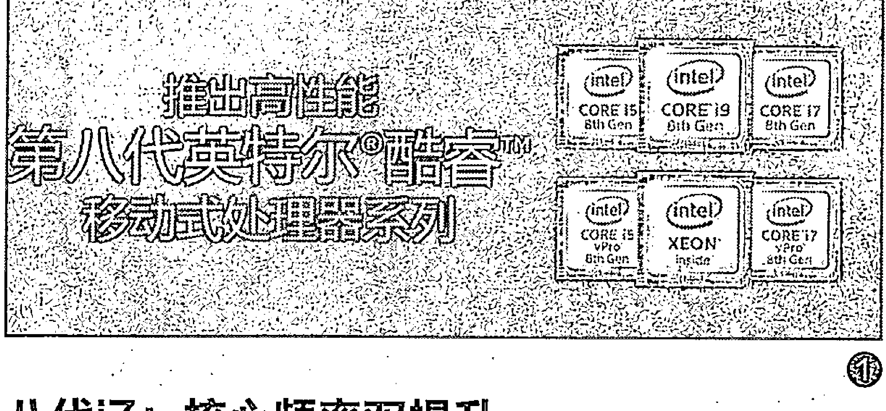

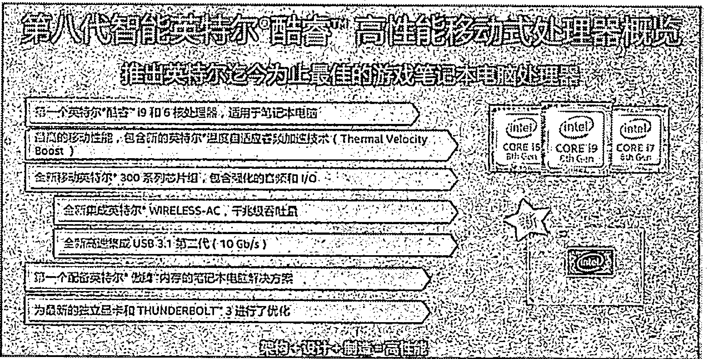

## 八代i7：核心频率双提升

从底层架构来看，八代酷睿Coffee Lake-H平台和七代酷睿Kaby Lake-H平台的变化不大，前者属于后者的微调和优化版。不过，新平台借助最新的14nm++工艺获得了更好的能耗比，翻译过来就是让处理器在提升性能的同时保持不变或更低的能耗。同时，连带受益的还有与八代酷睿处理器搭配的300系列芯片组和内存控制器，原生支持USB 3.1 Gen2 (10Gbps)和DDR4-2666内存，集成英特尔千兆级无线网卡，并对最新的独立显卡和雷电3进行了优化（图2）。下面，我们就先来看看八代酷睿i7的变化（表1）。Coffee Lake-H平台的八代酷睿i7包含i7-8750H和i7-8850H两款型号，和七代酷睿i7相比，它们凭借14nm++工艺的增益，选择了最简单、最直接也是最粗暴的升级方式：疯狂增加核心数。从4核8线程（4C8T）一举突破到6核12线程（6C12T），内置9MB高速缓存并集成UHD630核芯显卡，与桌面版的八代酷睿保持同步，从而全面领先家族前辈（图3）。需要注意的是，Kaby Lake-H平台的七代酷睿i7/i5后缀为“HQ”，其中“H”意为“High Performance”高性能，而“Q”则为英文“Quad”（四核）的缩写。由于八代酷睿的核心数量已经突破了四核限制，所以其型号后缀不再带“Q”，而是以“H”结尾。

> 小提示
八代酷睿Coffee Lake-H平台以后肯定还会推出入门级的酷睿i3，只是此次i3不在首发名单中。

| 型号 | i7-8850H | i7-8750H | i7-7700HQ |
| :--- | :--- | :--- | :--- |
| 隶属平台 | Coffee Lake-H 八代酷睿 | Coffee Lake-H 八代酷睿 | Kaby Lake-H 七代酷睿 |
| 制程工艺 | 14nm++ | 14nm++ | 14nm+ |
| 核心/线程 | 6/12 | 6/12 | 4/8 |
| TDP功耗 | 45W | 45W | 45W |
| 高速缓存 | 9MB | 9MB | 6MB |
| 基础频率 | 2.6GHz | 2.2GHz | 2.8GHz |
| 单核睿频加速 | 4.3GHz | 4.1GHz | 3.8GHz |
| 核芯显卡 | UHD630 | UHD630 | HD630 |
| 显卡基础频率 | 350MHz | 350MHz | 350MHz |
| 显卡加速频率 | 1.1GHz | 1.1GHz | 1.1GHz |
| 支持内存 | DDR4-2666 LPDDR3-2133 | DDR4-2666 LPDDR3-2133 | DDR4-2400 LPDDR3-2133 DDR3L-1600 |

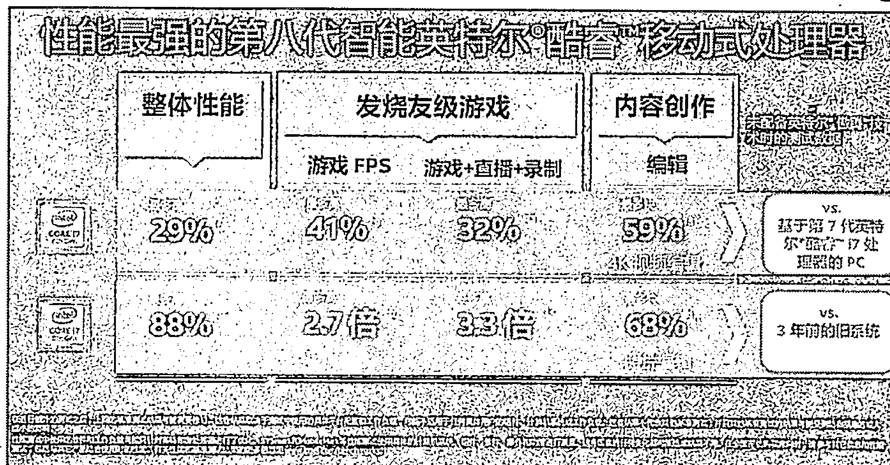

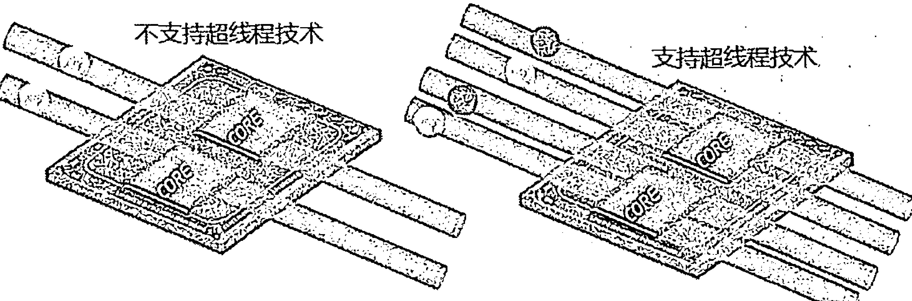

本章节后面还会有八代酷睿i7-8750H的实际性能测试，但在此之前我们还是先按顺序，看看八代酷睿i5以及Kaby Lake-H平台的其他特性吧。

## 八代i5：线程频率更给力

Coffee Lake-H平台的八代酷睿i5包含i5-8400H和i5-8300H两款型号，它们虽然没能像自家i7那般塞进额外的2个核心，但却加入了对超线程技术（Hyper-Threading, 简称HT）的支持（图4）。要知道，历代移动版酷睿i5都不支持超线程技术，而这也是其与i7的最大差异所在。

以定位最低的i5-8300H为例，它有着4核8线程的架构，内置8MB高速缓存，默认和加速频率分别为2.3GHz和4.0GHz，性能指标甚至还要在七代酷睿i7-7700HQ之上（表2）！没错，我们可以将八代酷睿i5视为七代酷睿i7的升级版（可参考表1中i7-7700HQ的数据），属于绝对的“加量不加价”。

| 型号 | i5-8400H | i5-8300H | i7-7700HQ |
| :--- | :--- | :--- | :--- |
| 隶属平台 | Coffee Lake-H 八代酷睿 | Coffee Lake-H 八代酷睿 | Kaby Lake-H 七代酷睿 |
| 制程工艺 | 14nm++ | 14nm++ | 14nm+ |
| 核心/线程 | 4/8 | 4/8 | 4/4 |
| TDP功耗 | 45W | 45W | 45W |
| 高速缓存 | 8MB | 8MB | 6MB |
| 基础频率 | 2.5GHz | 2.3GHz | 2.5GHz |
| 单核睿频加速 | 4.2GHz | 4.0GHz | 3.5GHz |
| 核芯显卡 | UHD630 | UHD630 | HD630 |
| 显卡基础频率 | 350MHz | 350MHz | 350MHz |
| 显卡加速频率 | 1.0GHz | 1.0GHz | 1.0GHz |
| 支持内存 | DDR4-2666 LPDDR3-2133 | DDR4-2666 LPDDR3-2133 | DDR4-2400 LPDDR3-2133 DDR3L-1600 |

## 发展回顾

### 移动至强再光临

英特尔在六代酷睿（Skylake）时期首次将Xeon至强引入到了移动平台（如Xeon E3-1535M v5），伴随移动版第八代智能英特尔酷睿处理器而来的，还有全新的至强E-2186M和E-2176M（图5）。它们都有着和酷睿i9-8950HK相同的12MB高速缓存，支持ECC内存，专为移动工作站定制，对绝大多数普通用户和游戏玩家而言属于更为小众的存在，本文我们就不再加以赘述了。

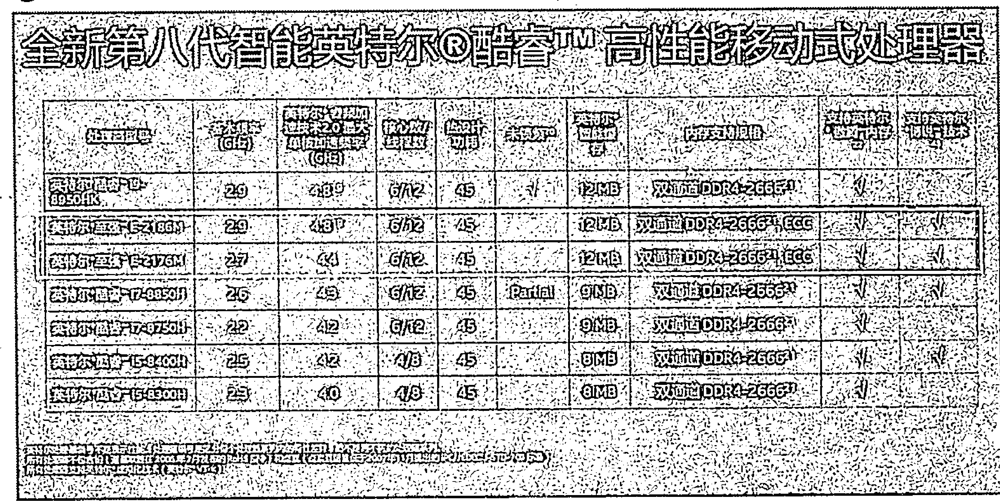

至此，我们不难总结出英特尔是如何帮Coffee Lake-H平台八代酷睿提速的：

- （1）14nm++工艺是一切改变的根基；
- （2）降低默认主频，大幅提升最大（单核）睿频频率，通过频率来提升单线程性能；
- （3）加入更多的物理核心，全系支持超线程技术，哪怕默认TDP设置不足以支持CPU在高负载下满血运行，也能依靠低频多核来提升多线程性能；
- （4）OEM厂商可以通过优化游戏本的散热设计，或是用户自行增大PL1、PL2设置，还可以进一步压榨性能，只是此时CPU的发热会更明显。

## 酷睿+：傲腾内存的全新第八代智能英特尔®酷睿™+平台

还记得英特尔在发布七代酷睿时曾带来的基于“3D Xpoint”技术而生的“傲腾内存”（Optane Memory）吗？经过一年多的市场洗礼，傲腾内存仍然没能完成普及重任，在普通用户心中的存在感极低。

为了进一步推广傲腾内存，英特尔首次将其推向了平台高度：凡是基于Coffee Lake-H八代酷睿平台设计并搭配傲腾内存的游戏本（图6），就都可以被归类到“英特尔酷睿+平台”上，并在机器表面贴上印有“+”的全新标签（图7）。

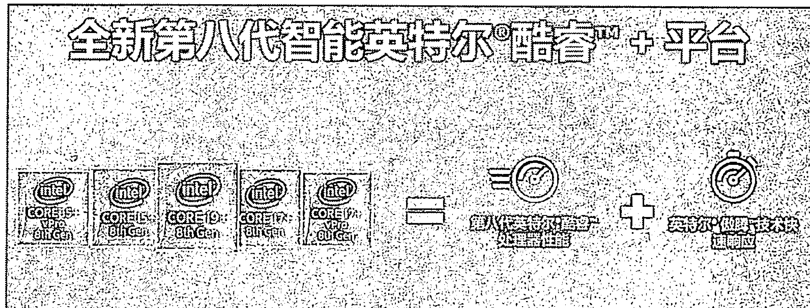

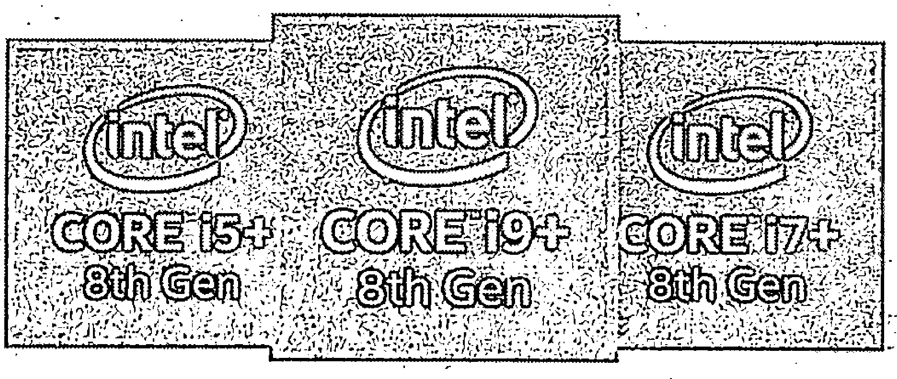

简单来说，傲腾内存的形态和M.2 SSD很像（图8）。我们可以将其视为英特尔早期“Intel Rapid Start Technology”（RST）快速存储技术的进化版，傲腾内存可以搭配HDD机械硬盘或普通SSD使用，帮助其他硬盘缓存数据，从而让TB容量级别的HDD获得超过SSD的速度，让SATA通道的SSD获得媲美PCIe SSD通道SSD的体验，让高速PCIe SSD的性能进一步直飞天际（图9）。


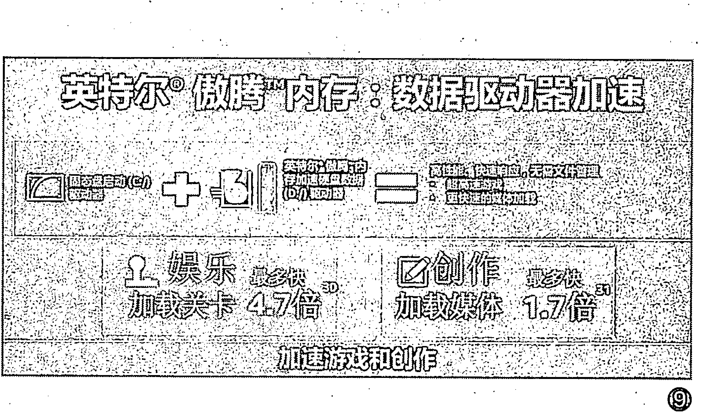

如果说在七代酷睿时代傲腾内存只是顶级游戏本的独舞，步入八代酷睿时代后，这项技术将呈现普及的趋势，各大游戏本厂商必然会为贴上辨识度更高的“英特尔酷睿+平台”标签而将傲腾内存列入标配，作为普通用户则可通过认准“酷睿+”获得更为极致的响应速度。

现在，延缓“英特尔酷睿+平台”普及的唯一阻碍就是添加傲腾内存后的成本开销，而绝大多数新款游戏本也至少会在接口层面为安装傲腾内存打好基础（内置额外的支持PCIe通道和NVMe协议的M.2插槽）。

## 性能：八代酷睿谁与争峰

了解了新一代Coffee Lake-H平台的特性，相信大家现在更关心的问题就是真实性能了吧？CFan在第一时间就拿到了基于八代酷睿Coffee Lake-H平台打造的机械师T90（图10），下面我们就通过对它的实测，感受2018年新一代游戏本所能展现的澎湃战力吧！

我们测试的机械师T90采用了15.6英寸IPS全高清屏幕，搭载八代酷睿i7-8750H处理器，内置单条8GB DDR4内存、256GB PCIe SSD硬盘以及NVIDIA GTX1060独显。T90的整机体积为374.6mm×260mm×27.5mm，重约2.4kg，属于比较传统的游戏本，并没有引入窄边框和超轻薄的设计。从官方的宣传图来看，其内部的散热模块在八代酷睿游戏本中属于标准设计（图11），所以它的实际性能基本可以代表整个“同类”的表现。

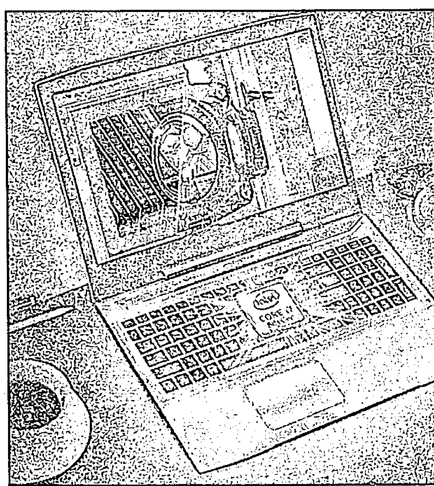

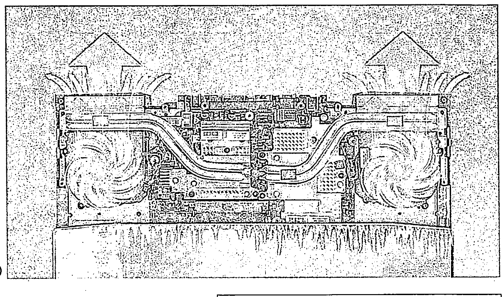

i7-8750H应该是未来6000元以上游戏本领域最常见的八代酷睿处理器，它不仅有着6核12线程的先天优势，最大睿频加速频率也可达4.1GHz，再加上9MB高速缓存，整体规格可以媲美七代酷睿i7-7820HQ这类顶级CPU（图12）。考虑到搭载i7-8750H的游戏本都会额外武装独显，所以其集成的UHD630核芯显卡的性能就不在本文的讨论之中了。

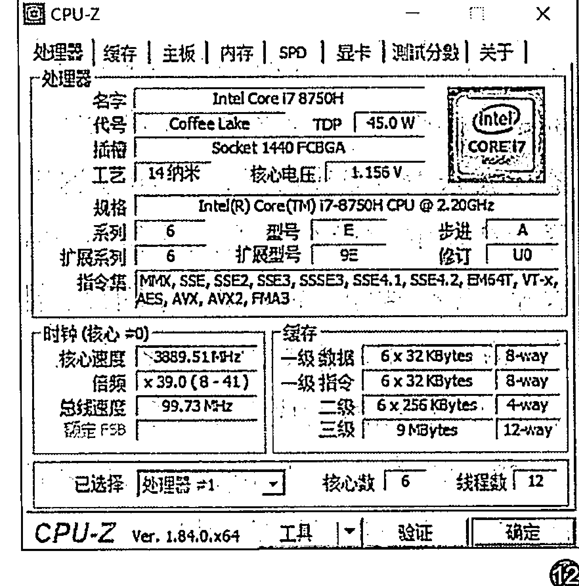

和八代酷睿i7-8750H搭档的，是名为HM370的芯片组（图13）。需要注意的是，虽然英特尔表示300系列芯片组支持USB 3.1 Gen2，但并不代表所有该平台的笔记本就一定配备这个标准的接口。比如机械师T90身上的USB 3.1就还停留在Gen1的标准上，也就是USB 3.0的速度（图14）。

接下来就是具体的性能对比环节了。小编找来了移动版七代酷睿i7-7700HQ、桌面版七代酷睿i7-7700K、桌面版八代酷睿i7-8700K和i7-8750H打擂台（表3）。从理论跑分对比来看，i7-8750H的表现着实令人惊艳，它的性能可轻松秒杀上代前辈i7-7700HQ，多核成绩甚至可以媲美桌面版的i7-7700K（图15）！

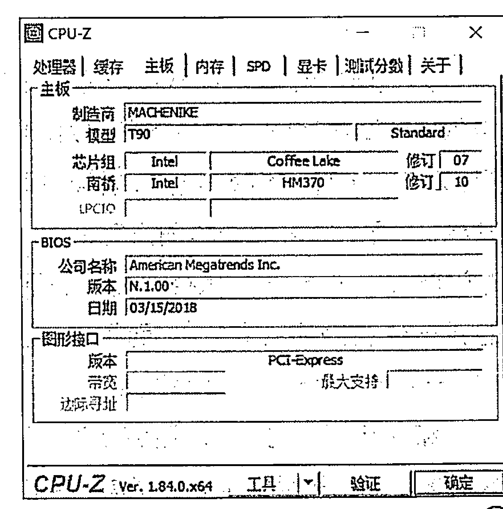

在AIDA64+FurMark长时间的双拷机测试中，机械师T90的CPU最高温度为81摄氏度，此时i7-8750H依旧可以稳定运行在2.87GHz的主频上（图16）。考虑到T90的散热模块还谈不上特别豪华，可见这一代Coffee Lake-H平台的温控表现还是非常不错的。

需要注意的是，不同品牌的游戏本，因散热模块设计以及预设的温度墙和功耗墙阈值的不同，肯定会影响到八代酷睿持续输出时的最大睿频频率，很难进入6个核心12组线程长时间全部满血运行的状态，而这也正是导致i7-8750H与桌面八代酷睿处理器性能差距极大的原因所在——要知道台式机可以塞进非常夸张的散热风扇，哪怕对CPU超频也能保证长时间的满血输出。

表3：八代酷睿i7-8750H性能对比表

| 测试软件 | 测试项目 | i7-8750H | i7-7700HQ | i7-7700K | i7-8700K |
| :--- | :--- | :--- | :--- | :--- | :--- |
| 国际象棋 | 每秒千步 | 15891 | 13528 | 17862 | 24818 |
| CPU-Z | 单核 | 482 | 402 | 492 | 502 |
| CPU-Z | 多核 | 2864 | 2043 | 2648 | 3903 |
| CineBench R11.5 | 单核 | 1.92 | 1.65 | 2.02 | 2.13 |
| CineBench R11.5 | 多核 | 11.57 | 7.93 | 9.6 | 15.49 |
| CineBench R15 | 单核 | 168 | 147 | 189 | 201 |
| CineBench R15 | 多核 | 1022 | 736 | 982 | 1408 |
| 3DMark Time Spy | 物理子项 | 5047 | 2890 | 5011 | 7892 |
| 3DMark Fire Strike | 物理子项 | 14109 | 10752 | 12553 | 19227 |

*i7-7700HQ对应平台为惠普暗影精灵III PLUS笔记本

总之，新一代Coffee Lake-H平台的性能是值得肯定的。与其相比，第七代酷睿处理器完全没有了选购的价值，所以这也就给市面上在售的库存机以极大的压力。小编的建议是，在不考虑品牌和设计，内存、显卡和硬盘规格一致时，搭载八代酷睿i5-8300H的新品就要比搭载七代i7-7700HQ更值得选择了，而搭载i7-8750H的新品更是英雄无敌，让老机器没有半分反抗的机会。

## 产品：游戏本也谈屏占比

为了推广全新的第八代酷睿处理器，英特尔再度释放了强大的生态号召力，惠普、联想、戴尔、宏碁、华硕、技嘉、雷神、机械师、微星、三星、神舟和清华同方等PC厂商第一时间就推出了基于Coffee Lake-H平台设计的新一代游戏本（图17），而国美、苏宁、京东、天猫等渠道也第一时间力挺。

和往年新品总是“旧瓶装新酒”不同，此次很多新品都采用了全新的模具，原本在手机和轻薄本领域盛行的“微边框”元素终于出现在了游戏本战场，微星GS65、雷神911 Air、机械师F117-B1“猎空”、机械革命深海幽灵Z2、技嘉赢刃AERO 15W/15X等新品都让游戏本找到了“全面屏”的感觉（图18），让大屏幕塞进更小尺寸的机身，从而大幅提升八代酷睿游戏本的便携性。

因此，如果你近期有购入游戏本的计划，

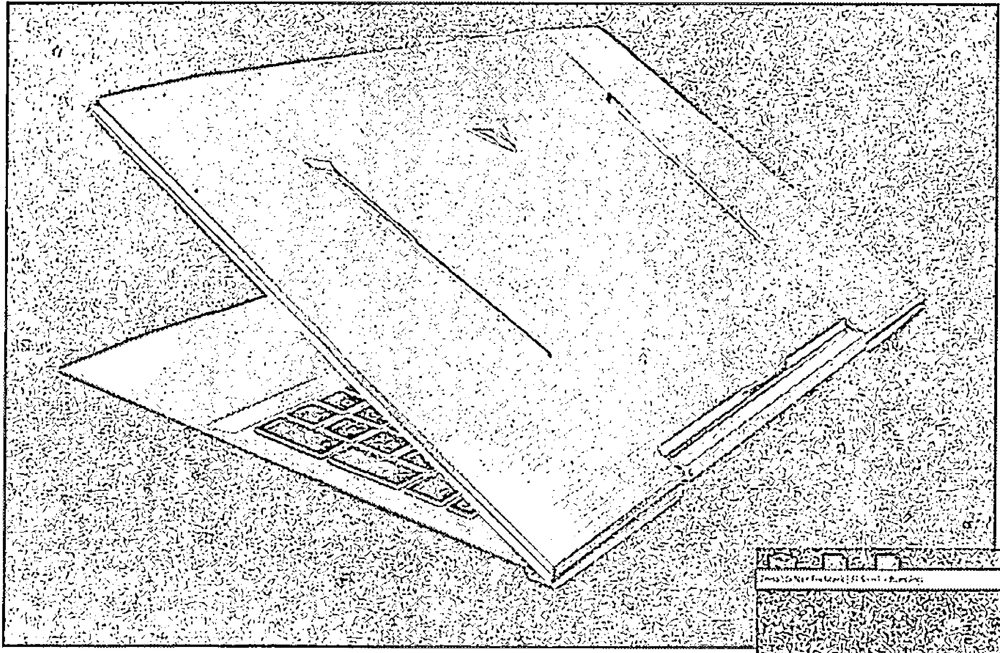

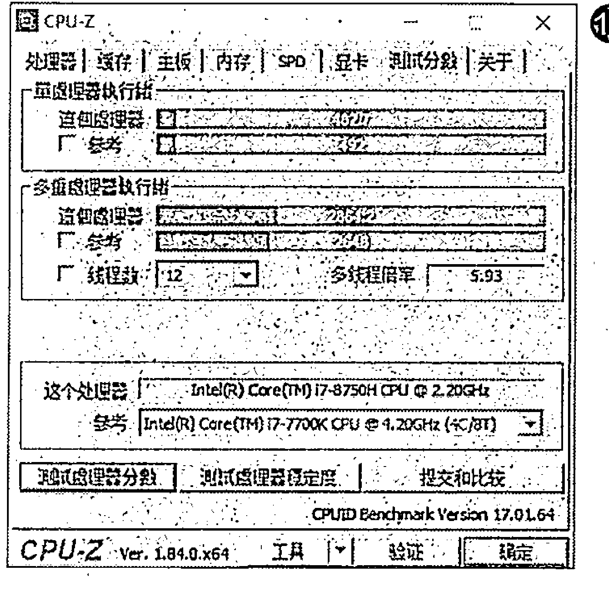

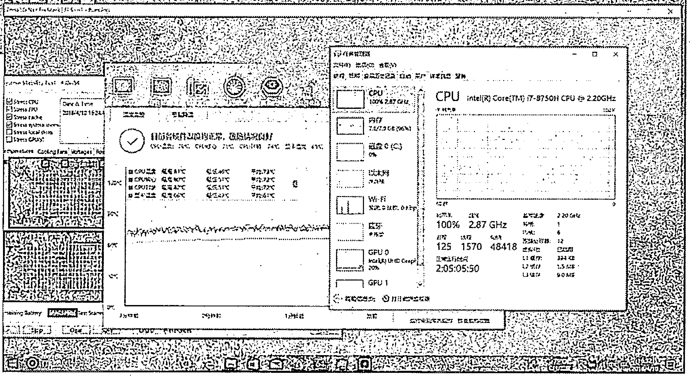

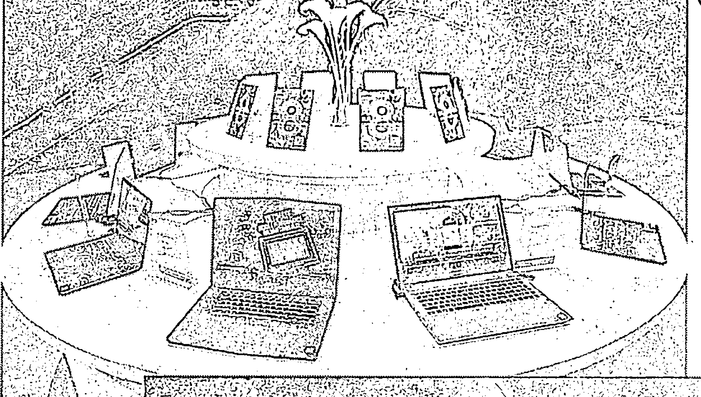

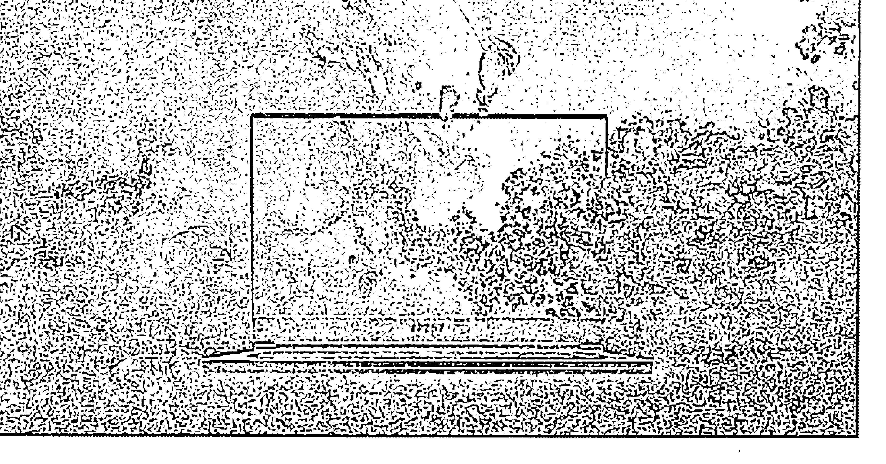

笔者强烈推荐再静等一段时间，待更多品牌新模具的八代酷睿笔记本上市且价格稳定后再出手，无论是颜值还是性能都将让提前购入游戏本的用户感受到啥叫后悔。

至于哪些八代酷睿笔记本更值得选？敬请关注CFan近几期杂志的“CFan为你选”栏目。

## 锐炬降临 U系酷睿比肩入门独显


U系列历来是英特尔针对轻薄本和PC平板二合一设备定制的低功耗版处理器，从第四代酷睿处理器（Haswell）开始还带来了名为“锐炬”（Iris）且集成128MB eDRAM显存的性能级显卡（图1）。可惜，锐炬显卡却在英特尔2017年推出的Kaby Lake Refresh平台上缺席了。随着八代酷睿的全面解禁，集成锐炬Plus显卡的U系列处理器终于降临。

### 全线出击 i7/i5/i3一个不少

英特尔此次“补发”了4款U系列处理器，它们分别为i7-8559U、i5-8269U、i5-8259U和i3-8109U。与2017年诞生的U系列八代酷睿相比，这4个新成员的TDP从15W提升到了28W，我们可以将其视为七代酷睿家族中i7-7567U等后缀带“7”前辈的迭代更新版（表1）。

这些后缀带“9”的新八代酷睿处理器最大的特色就是将UHD620核芯显卡换成了Iris Plus 650，这颗GPU代表了英特尔显卡技术的最强音，其性能足以媲美NVIDIA GeForce 930MX，应对主流级别的3D游戏压力不大。

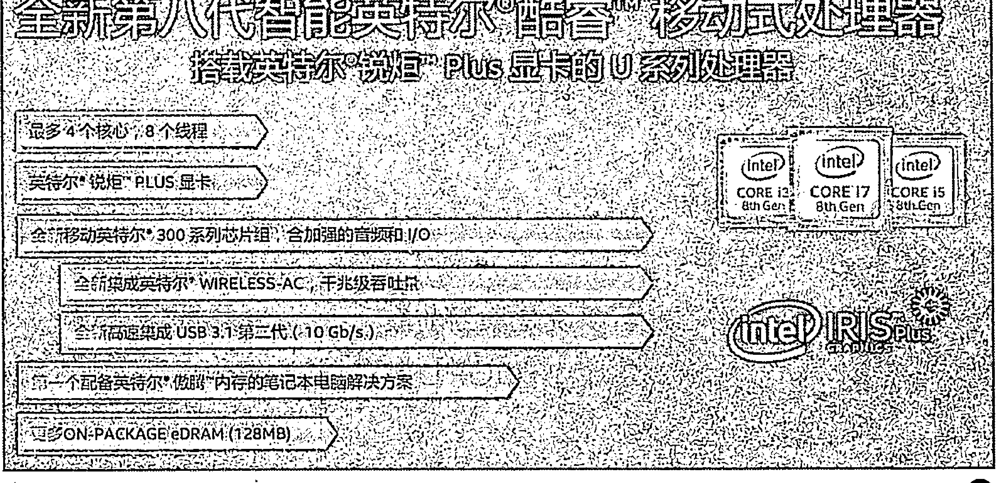

### 新U系列是否值得期待

原本很多玩家都以为i7-8559U等4颗新处理器会基于10nm的Cannon Lake平台设计，但现实情况却令人失望，它们依旧隶属于Kaby Lake Refresh平台（也有Coffee Lake-U一说），只是可以搭配英特尔最新的300系列芯片组主板，从而获得千兆级无线网卡、原生USB 3.1 Gen2和对傲腾内存的支持（图2）。

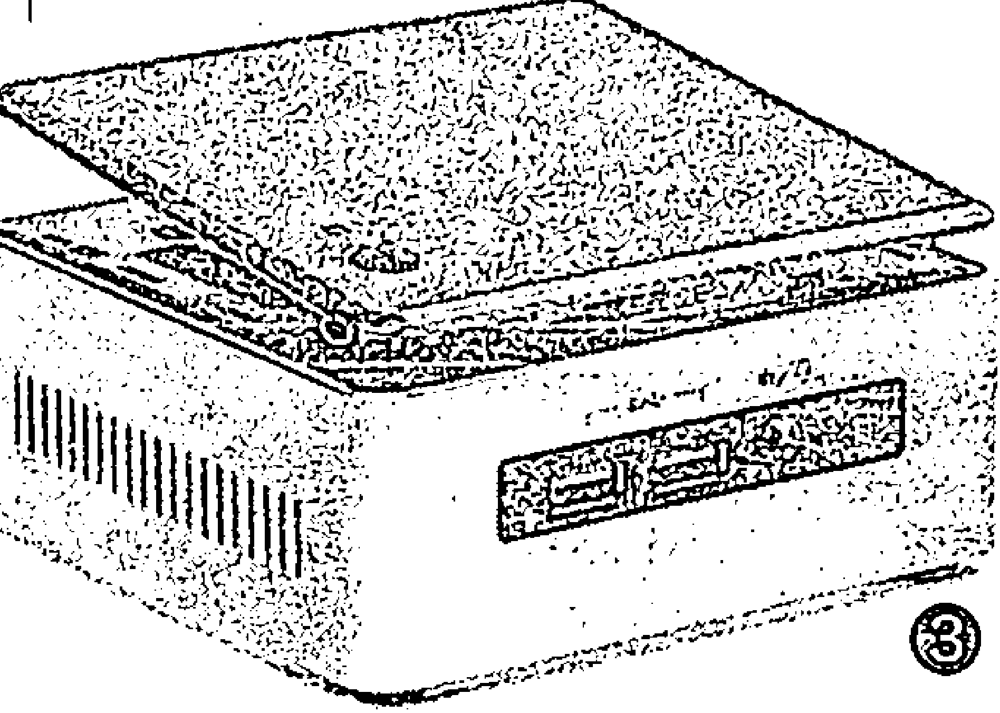

可惜，集成锐炬显卡的移动版酷睿处理器鲜有被笔记本猎装的，市面上能买到的多是NUC一类的迷你PC（图3）。原因也很简单，i7-8559U等28W TDP的处理器成本太高，其竞争力远不如i7-8550U+MX150独显这类组合套装。因此，对这4颗全新的U系列酷睿处理器，我们只要本着了解就好的态度即可，不必太过期待。

表1：新八代U系列酷睿处理器规格对比表

| 型号 | i7-8559U | i5-8269U | i5-8259U | i3-8109U | i7-8550U | i7-7567U |
| :--- | :--- | :--- | :--- | :--- | :--- | :--- |
| 隶属平台 | 八代酷睿 | 八代酷睿 | 八代酷睿 | 八代酷睿 | 八代酷睿 | 七代酷睿 |
| 制程工艺 | 14nm+ | 14nm+ | 14nm+ | 14nm+ | 14nm+ | 14nm+ |
| 核心/线程 | 4/8 | 4/8 | 4/8 | 2/4 | 4/8 | 2/4 |
| TDP功耗 | 28W | 28W | 28W | 28W | 15W | 28W |
| 高速缓存 | 8MB | 6MB | 6MB | 4MB | 8MB | 4MB |
| 基础频率 | 2.7GHz | 2.6GHz | 2.3GHz | 3.0GHz | 1.8GHz | 3.5GHz |
| 单核睿频加速 | 4.5GHz | 4.2GHz | 3.8GHz | 3.6GHz | 4.0GHz | 4.0GHz |
| 核芯显卡 | Iris Plus 650 | Iris Plus 650 | Iris Plus 650 | Iris Plus 650 | UHD620 | Iris Plus 650 |
| 显卡基础频率 | 300MHz | 300MHz | 300MHz | 300MHz | 300MHz | 300MHz |
| 显卡加速频率 | 1.2GHz | 1.1GHz | 1.05GHz | 1.05GHz | 1.15GHz | 1.15GHz |
| 支持内存 | DDR4-2400 LPDDR3-2133 | DDR4-2400 LPDDR3-2133 | DDR4-2400 LPDDR3-2133 | DDR4-2400 LPDDR3-2133 | DDR4-2400 LPDDR3-2133 | DDR4-2400 LPDDR3-2133 DDR3L-1600 |

# 携手AMD 轻薄游戏本不再是梦想

在2017年24期《敌人的敌人就是朋友 英特尔携手AMD打造移动处理器》一文中，我们详细介绍了英特尔与AMD联手打造处理器的背景，以及Kaby Lake-G平台的技术特性。那么，作为移动版第八代智能英特尔酷睿处理器家族中的最强音，Kaby Lake-G到底有多强？

# Kaby Lake-G平台浅析

简单来说，英特尔和AMD联姻的平台代号为“Kaby Lake-G”，其CPU部分是英特尔贡献的Kaby Lake核心，GPU部分则是AMD提供的Radeon RX Vega M G，后者还可细分为Radeon RX Vega M GH和Radeon RX Vega M GL，二者的CU单元分别为24组和20组。

Kaby Lake-G平台可以说是集当前最领先技术于一身，其内部的CPU和GPU是通过8条PCIe 3.0连接，而AMD Radeon RX Vega M显卡和HBM2显存部分通过EMIB技术连接，从而确保了CPU、GPU和HBM2之间数据交互的高效率（图4）。得益于HBM2显存的使用，让Kaby Lake-G处理器比传统CPU+GPU+GDDR5显存的布局可以节约更多的主板面积（图5），可谓超薄本的专属利器。

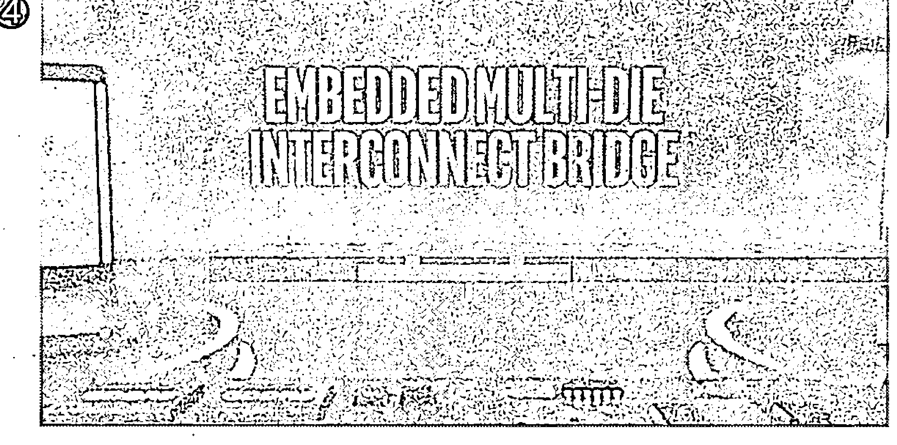

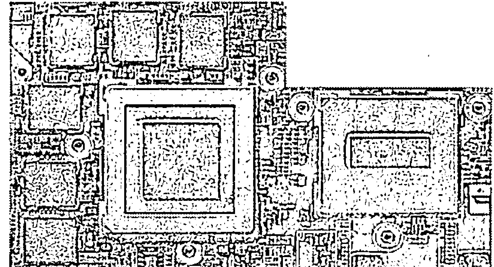

值得一提的是，Kaby Lake-G平台除了独立的Radeon RX Vega M显卡外还保留了CPU内部的HD630核芯显卡部分，在非游戏环境下可以使用HD630降低整个平台的功耗。而英特尔也为Kaby Lake-G准备了名为动态功耗分配（Dynamic Power Sharing）的技术，允许OEM厂商根据产品定位自行调整CPU、GPU部分的功耗占比。比如产品定位是玩游戏，GPU部分的功耗就可以高一点，如果定位是内容创作，CPU部分的功耗就可以高一点，只是处理器的总功耗是不变的。

表2：英特尔+AMD Kaby Lake-G平台规格表

| 型号 | i7-8809G | i7-8709G | i7-8706G | i7-8705G | i5-8305G |
|---|---|---|---|---|---|
| 隶属平台 | Kaby Lake-G 八代酷睿 | Kaby Lake-G 八代酷睿 | Kaby Lake-G 八代酷睿 | Kaby Lake-G 八代酷睿 | Kaby Lake-G 八代酷睿 |
| 制程工艺 | 14nm+ | 14nm+ | 14nm+ | 14nm+ | 14nm+ |
| 核心/线程 | 4/8 | 4/8 | 4/8 | 4/8 | 4/8 |
| TDP功耗 | 100W | 100W | 65W | 65W | 65W |
| 高速缓存 | 8MB | 8MB | 8MB | 8MB | 6MB |
| 基础频率 | 3.1GHz | 3.1GHz | 3.1GHz | 3.1GHz | 2.8GHz |
| 单核睿频加速 | 4.2GHz | 4.1GHz | 4.1GHz | 4.1GHz | 3.8GHz |
| AMD显卡 | Radeon RX Vega M GH | Radeon RX Vega M GH | Radeon RX Vega M GL | Radeon RX Vega M GL | Radeon RX Vega M GL |
| 流处理器 | 24组CU 1536个 | 24组CU 1536个 | 20组CU 1280个 | 20组CU 1280个 | 20组CU 1280个 |
| 显卡基础频率 | 1063MHz | 1063MHz | 931MHz | 931MHz | 931MHz |
| 显卡加速频率 | 1190MHz | 1190MHz | 1011MHz | 1011MHz | 1011MHz |
| 支持内存 | DDR4-2400 | DDR4-2400 | DDR4-2400 | DDR4-2400 | DDR4-2400 |
| 博锐技术 | 不支持 | 不支持 | 支持 | 不支持 | 不支持 |
| TSX-NI技术 | 不支持 | 不支持 | 支持 | 不支持 | 不支持 |
| 稳定映像平台计划 | 不支持 | 不支持 | 支持 | 不支持 | 不支持 |
| 可信执行技术 | 不支持 | 不支持 | 支持 | 不支持 | 不支持 |

目前Kaby Lake-G平台一共有5款型号，它们分别是i7-8809G、i7-8709G、i7-8706G、i7-8705G和i5-8305G（表2）。其中i7-8809G、i7-8709G的TDP高达100W，发热量较高，主要用于游戏本和NUC一类的迷你PC，而i7-8705G和i5-8305G的TDP为65W，主要用于轻薄笔记本，现已被戴尔新一代XPS15和惠普Spectre x360所采用。至于i7-8706G则是比较特殊的存在，它的规格和i7-8705G类似，只是加入了对博锐技术、TSX-NI技术、稳定映像平台计划和可信执行技术的支持，适用于企业级PC平台。

### 65W的Kaby Lake-G有多强

国外Laptopmag网站早前放出了搭载i7-8705G处理器的戴尔XPS15 2018评测，从跑分数据来看，这款芯片集成的Vega M GL显卡性能已然超越了GTX1050（移动版），但和GTX1060（移动版）尚有一定距离（表3）。

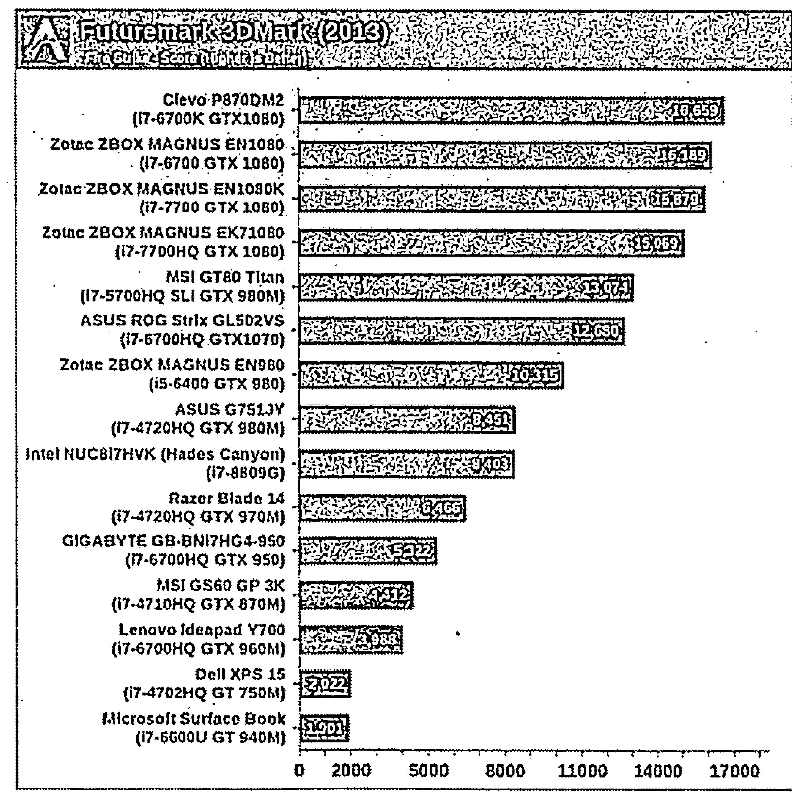

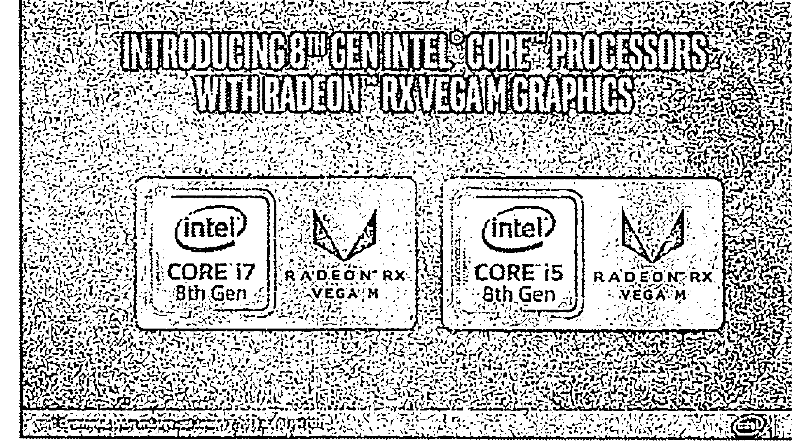

表3：65W Kaby Lake-G平台测试

| 测试机型 | 涉及显卡 | Vega M GL | GTX1050 | GTX1060 |
|---|---|---|---|---|
| 3DMark Fire Strike | | 6271 | 5284 | 8579 |
| 3DMark Ice Storm Unlimited | | 150257 | 119006 | 162361 |
| 尘埃3：完整版 | | 186fps | 110fps | ---- |
| 古墓丽影：崛起 | | 44.4fps | 39fps | ---- |

表4：100W Kaby Lake-G平台测试

| CPU+GPU | | NUC8i7HV K | ZBOX EN1080K | ZBOX EK71080 |
|---|---|---|---|---|
| PCMark 10 | 基础 | 9206 | 9648 | 7756 |
| PCMark 10 | 办公 | 7874 | 8104 | 6914 |
| PCMark 10 | 创作 | 5476 | 7280 | 6701 |
| CineBench R15 | 单核 | 180.65 | 172.50 | 160.85 |
| CineBench R15 | 多核 | 856.68 | 869.19 | 738.53 |
| 7-Zip | 压缩 | 24170 | 24429 | 20890 |
| 7-Zip | 解压 | 23793 | 24294 | 20735 |

### 100W的Kaby Lake-G有多强

国外网站Anandtech前不久拿到了NUC8i7HVK（英特尔Hades Canyon NUC中的顶配版），搭载酷睿i7-8809G处理器，集成Vega M GH显卡。通过该产品的对比评测，我们不难了解Kaby Lake-G平台的最强性能可达到怎样的程度（表4）。通过测试对比可见，酷睿i7-8809G的CPU性能在多个项目都要强于移动版的i7-7700HQ，只是略逊于桌面版的i7-7700，大致相当于桌面版i7-6700的水平。至于酷睿i7-8809G集成的Vega M GH显卡有多强？跑分可以比肩GTX 980M（图6），但一些游戏表现上则更接近于GTX 970M。如果换算成NVIDIA时下主推的GTX10系列移动显卡，那Vega M GH显卡的表现已经接近GTX1060，和8000元左右的游戏本（i7-7700HQ+GTX1060）在一个档次上。为了推广Kaby Lake-G平台，英特尔放下了偏见，凡是搭载该平台处理器的笔记本或PC都可以贴上同时印有八代酷睿和Radeon RX Vega M显卡的Logo（图7），这也是两个品牌CPU和GPU首次被印在同一个标签上。可惜，Kaby Lake-G平台的定位依旧偏高，戴尔XPS15 2018国行起价就在万元左右，而同价位已经可以买到Coffee Lake-H+GTX1060独显的新一代游戏本了。要更强的性能还是足够强悍的性能+更好的便携属性？如果你的需求是后者，那就不妨多加留意未来新品的动向吧。

# 心动悦读季

文 | 魔之左手

俗话说，一年之计在于春，在和煦春光的陪伴下，选几本有趣的书来读，无疑是为生命中精彩的新一年所做的最好准备之一。进入新时代后，知识的数量、种类、获取途径等虽然都有了巨大的变化，但读书带来的乐趣仍然是无可替代的，只是我们要学习和适应一些新的读书方式和书籍获取途径罢了。

# 书籍获取

虽然徜徉于书店对爱读书的人来说，总有一种说不出的充实感觉，不过在这个知识爆炸的时代，其效率显然是较低的，无论是书籍种类还是检索的便利性等，都已经有些跟不上潮流了，取而代之的，当然是在这方面表现更好，也最时尚的网购了。

# 选购

目前综合类的网上购物平台大都提供了图书类商品，如京东、天猫、苏宁易购、一号店、当当、亚马逊等，其中比较有特色的一号店提供了时下最热门的分类、品牌、作者等，而其他则大都与普通书店类似，只是将推荐书籍摆在首页而已。总体来说，选购实体书与时下流行的网购没有什么差别，而更适合新时代的，应该是正版电子书及其销售渠道。除了下文中介绍的专业网络书店之外，一些综合类网上购物平台也在实体书之外，提供了电子书资源的购买途径。

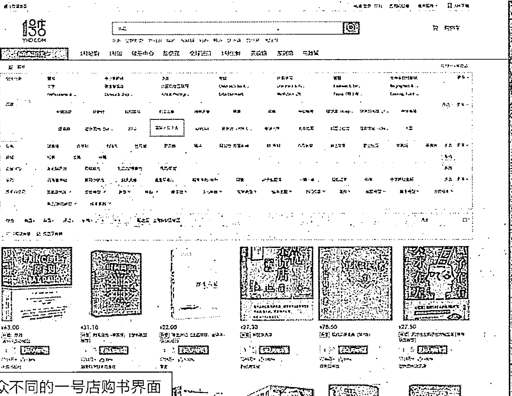

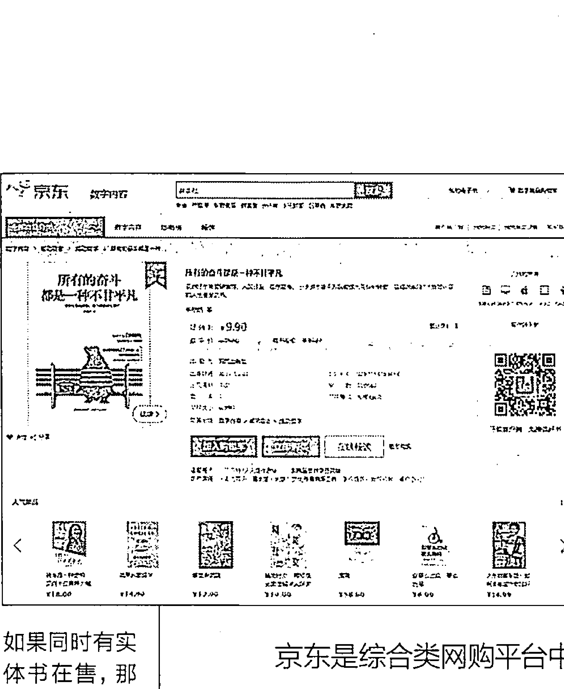

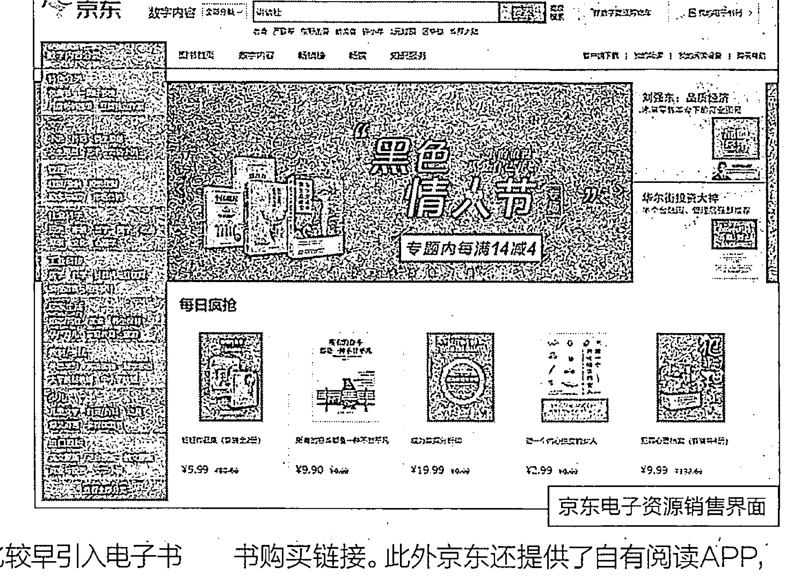

如果同时有实体书在售，那么在购买、阅读按键后会出现“纸书购买”的链接。

京东是综合类网购平台中比较早引入电子书销售的一家，在其首页分类中选择电子书，就会进入数字内容页面，其中有非常丰富的数字图书资源。京东电子书有加密epub、加密TXT等多种模式，如果同时有实体书在售，旁边还会看到实体书购买链接。此外京东还提供了自有阅读APP，从界面和功能上看，很像是一个增加了实体书购买能力的标准读书APP。以图书销售起家的当当同样有丰富的电子书线上销售平台和自有APP，其网页端和APP端都与京东平台大同小异。

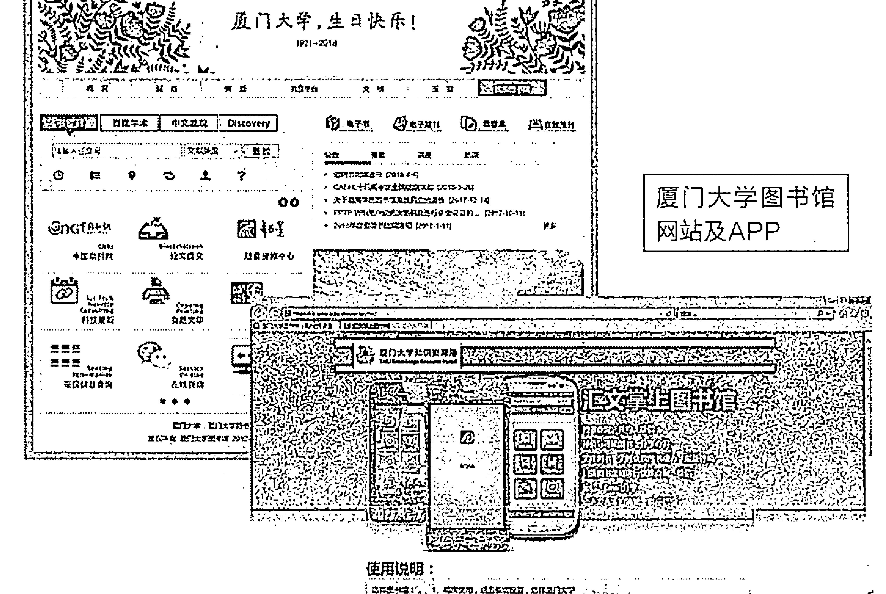

# 共享

共享是目前网络经济和网络应用的一个发展方向，古已有之的图书借阅也进入了新的共享时代，除了传统的图书馆之外，自助借书装置、个人图书共享等方式大大增加了图书的种类和借阅的方便性。

目前国内比较著名的公共图书馆大都有自己的网上借阅平台，甚至推出了相应的APP。那种急匆匆地赶到图书馆，却无法借到需要的图书，不得不悻悻而回的场景出现得越来越少了。

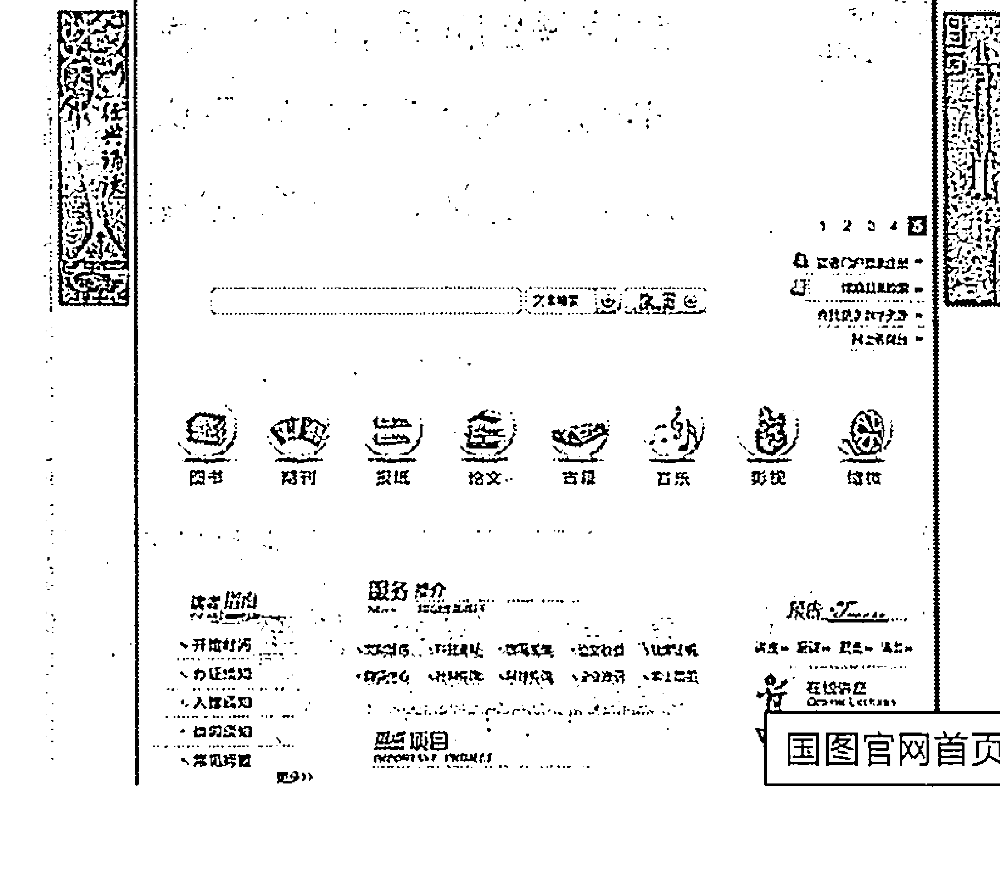

而另一大读书人群，学生朋友们更依赖的校园图书馆，也大都已经在网络上推出了各种服务。当然必须注意的是，很多校园图书馆会对校园网内外用户执行不一样的政策，校内用户可以享受所有功能，而校外用户通常可以借阅和查询大部分图书，但可能不会开放文献、论文的借阅、查询、复印等功能。

相对于传统的图书馆，通过网络实现更广泛的民间图书共享才是时代的产物。目前这种平台已经比较多，我们仅以其中几款典型APP为例。

### 特别话题

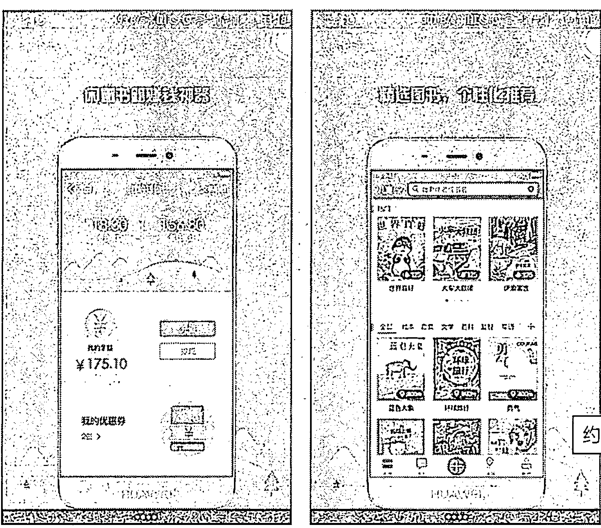

### 1. 约书

约书APP是领先的共享图书应用之一，可以在线分享图书和租借图书，用户可以用最小的代价畅享海量书籍资源，也可以将自己的闲置书籍拿来换钱。约书有多种模式，面向不同需求的用户，例如图书种类有儿童、成人之分，共享方式有共享和租借之分。最近它推出了游客模式，让用户不注册也能体验共享图书的乐趣。

### 2. 智慧书房

这是一款联合线下书店，有些偏向B2C功能的共享阅读应用，拥有很多鲜明的特色功能，例如好友动态和评书功能可以让用户更容易发现适合自己的图书，扫码借书功能可以通过手机扫码从线下书店借阅图书，管理工具则可以帮助用户借书和管理图书。

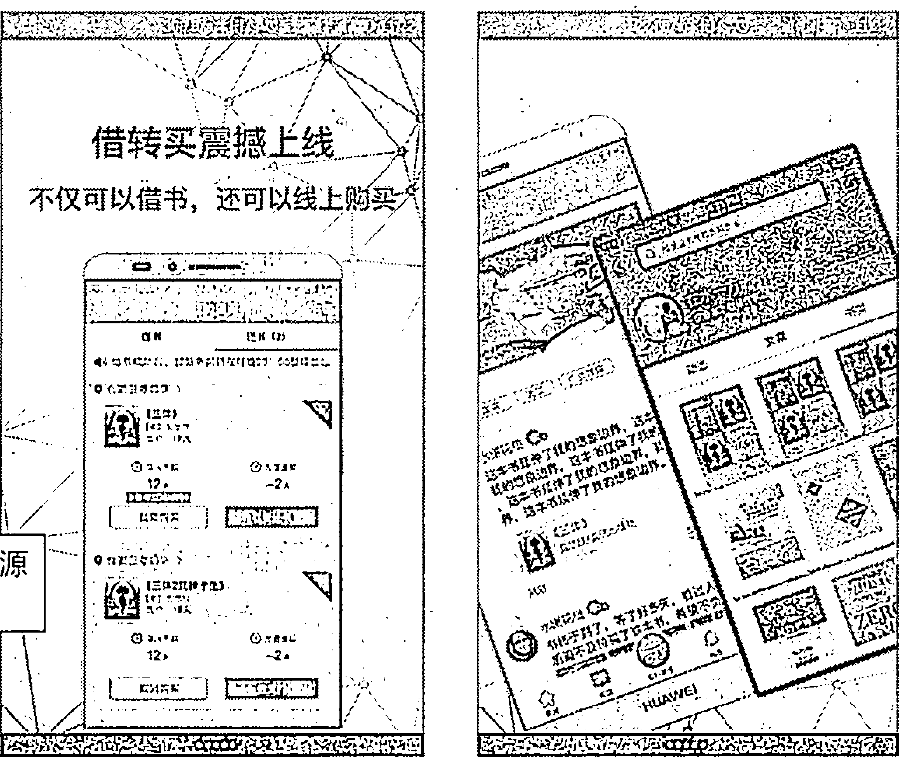

拥有线下书店资源的智慧书房APP

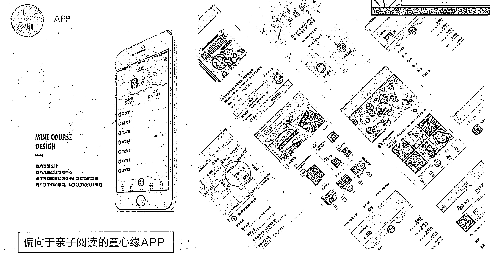

偏向于亲子阅读的童心缘APP

### 3. 童心缘

童心缘更偏向于亲子阅读，主要是儿童图书共享服务，手机端下单24小时送达，让宝宝从故事中健康成长。用户可以免费发布自己的书籍，赚取童心币和现金，而且平台自身也提供了大量可租赁的书籍。APP有丰富的图书推荐和读后感讨论社区，便于家长选择。

### 4. 图书共享

图书共享平台是一款实现各个图书馆之间的沟通联合管理的应用，可以说是类似B2B的应用模式，它可以提高图书馆的运作效率，也便利了读书人。这款APP可以在图书馆之间共享各种资源，除了最基本的馆藏图书资料、目录外，还包括存贮设施和计算机等设备、资金，甚至是具有各种特长的工作人员。

### 5. 一米看书

一米看书是深圳的一个地区性共享图书软件，用户可以在线免费阅读、分享书评等。地区性的图书共享是此类软件的一个特色，这样可以保证共享用户间的信任度，图书也能够更快速地递送，还能方便地举行一些线下活动，加强读书社交功能。

# 留存新方式

借书抄书是很多读书励志故事中都会提到的故事，父辈们留存资料的方式则已经进化到复印了，而在这个时代我们更是无需采用传统复印这种对书籍有一定伤害，精度、色彩也有明显损失的方式，新一代的图书扫描、OCR方式更加方便，效果也更加出色。

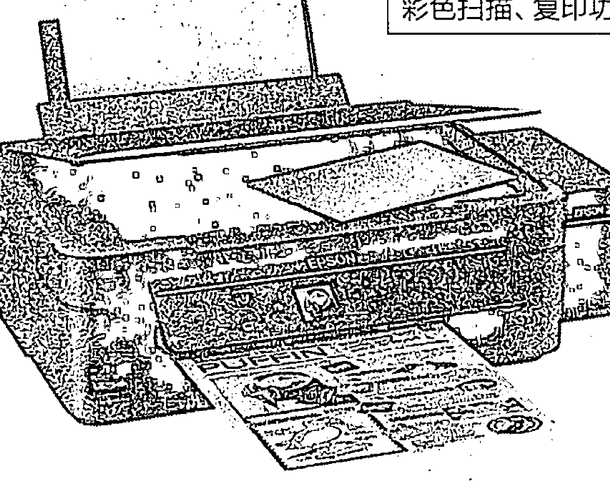

目前的主流家用一体机已经可以提供出色的彩色扫描、复印功能。

对于喜欢传统方式的用户，笔者推荐采购目前比较流行的家用喷墨一体机，其彩色扫描与打印能力，以及两者结合的彩色复印功能，可以为我们留存最真实的图书内容。但这一方式在留存图书资料时，仍然需要按压书脊等对图书非常不“友好”的动作，对书籍保护非常不利，此外相应的设备价格较贵，且不具有移动性。相对来说，笔者更建议大家采用手机+APP的模式进行非接触式扫描，随着手机性能的提升和APP设计的完善，这一方式已经具有了传统扫描复印无法比拟的一些优势。

# 新年新出发 选4本好书 探索新世界

- 借书
- 快速借取书
- 还书
- 共享书

1元借书 24小时送书上门

### 1. 扫描全能王

扫描全能王（CamScanner）是获得了各大应用市场推荐的一款优秀扫描APP，它有很好的扫描效果，可通过亮度与对比处理，避免书籍扫描时常见的下层页面干扰问题。此外扫描全能王还支持PDF转换和OCR文字辨识功能。

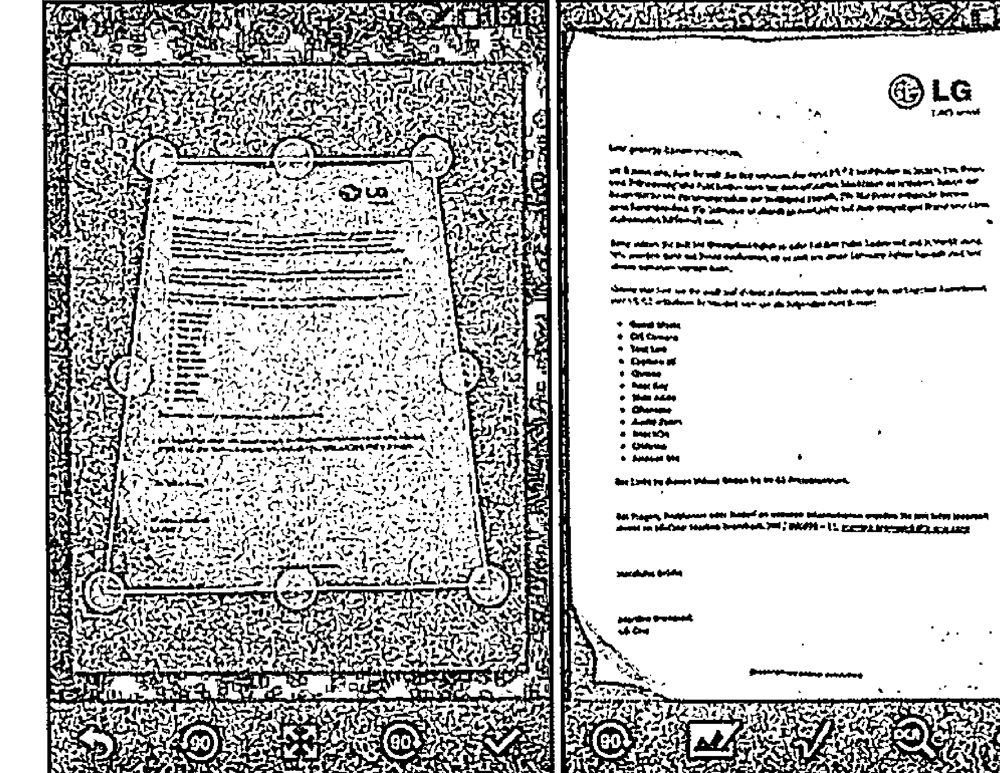

### 2. 印象笔记

作为一款常用的效率软件，印象笔记（Evernote）内置了拍照笔记功能，拍摄获得的笔记可以在搜索时辨识出其中的英文与中文，其实已经可以看作进行了OCR处理。印象笔记会对照片进行对比和亮度处理，让文字更清晰，另外还支持自动裁切边缘功能和页面拉平功能，扫描后的页面看起来更平整，同时对拍摄页面的质量影响很小。

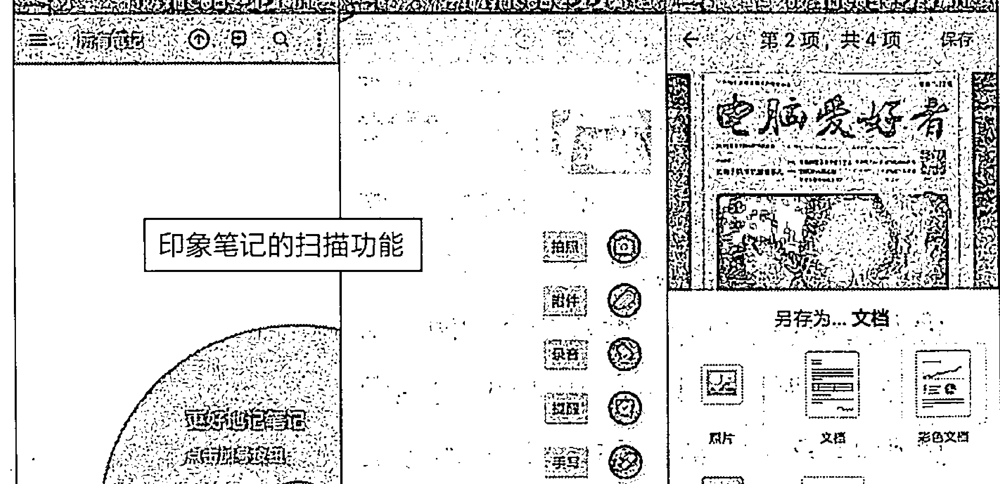

### 3. Office Lens

微软的Office Lens可以利用OneNote实现对扫描文件的OCR识别，对装备了全套微软Office的用户来说，是扫描、识别和保存的最佳选择之一。

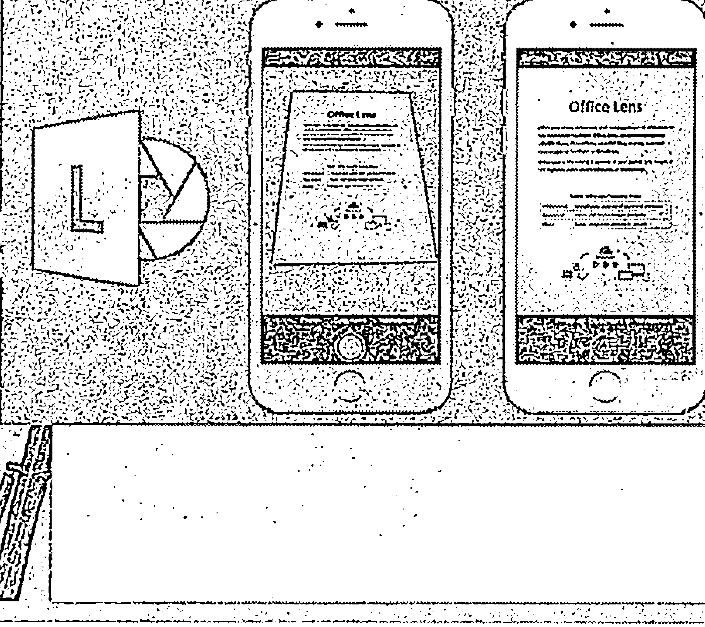

使用手机进行扫描时，最好能搭配一个可进行垂直俯拍的支架以及无线拍照遥控器，这样可以更稳定地进行拍摄，获得更好的“扫描”和识别效果。目前市场中相应的产品也并不昂贵，几十元就可以买到全金属、多关节，并且配置无线遥控功能的支架。

# 数字悦读

飘着墨香和纸香的实体书代表着阅读的传统，而通过电子屏幕观看图书则是现代社会的时尚。与沉重的实体书相比，用电脑、手机随时能看的各种图书显然要方便得多。现在流行的电子阅读方式有很多，直接在网页上阅读当然是最简单的方法，另外通过APP联网观看或者下载资源导入应用，则更加符合年轻人的习惯。

# 网站资源

### 1. 亚马逊中国

Amazon Kindle作为电纸书界的翘楚，拥有众多国内外实体书刊的电子版权，且支持下载到Kindle客户端离线观看。在国内，Kindle网上书店和亚马逊中国进行了有机结合。在亚马逊中国选购图书时可以看到“Kindle电子书”和“平装”两个选项，选择购买“Kindle电子书”即可将这本书刊加入自己的专项图书馆，供所有支持Kindle客户端的平台阅读。如果已经有了良好的阅读习惯，可以考虑加入Kindle Unlimited订阅用户，甚至可以享受大部分图书免费借阅的专项服务。

笔者认为网络上的电子图书资源可以分为两种，一种是以网文、条漫为主的新兴作品，另一种则是被搬上网的各种传统图书作品，两者的受众有一定区别，但对正版平台来说，两者的商业模式是类似的，而且很多平台也都会同时有网页和APP两种展现模式，这一点与上文中的网上图书购买平台类似。


### 特别话题

《电脑爱好者》合订本

### 2. 书问

如果在网上搜索“免费图书”，或许可以找到很多零零碎碎的资源，但其中往往并没有我们想要阅读的内容。即使我们想要付费购买感兴趣的图书资源，考虑到电子阅读可复制性的不可控，很多网站并不愿意开放未加密的下载功能，用户往往只能下载其客户端，在客户端上读书。

书问在一定程度上解决了这个问题，为用户提供了可供购买的阅读内容。虽然仍旧限制了下载，但至少提供了多种阅读方式给用户，不必像大多数图书网站一样只能阅读未经排版的低分辨率PDF文件。


### 3. 腾讯动漫

腾讯在依托聊天工具获得大量用户后，也不断开发新产品来吸引新用户的加入，腾讯动漫就是其中之一。凭借雄厚的经济实力，腾讯动漫目前几乎将国内动漫公司一网打尽，也占据了最大的引进动漫资源，如果想要找一部好的动漫看，那腾讯动漫绝对是不二之选。


# APP

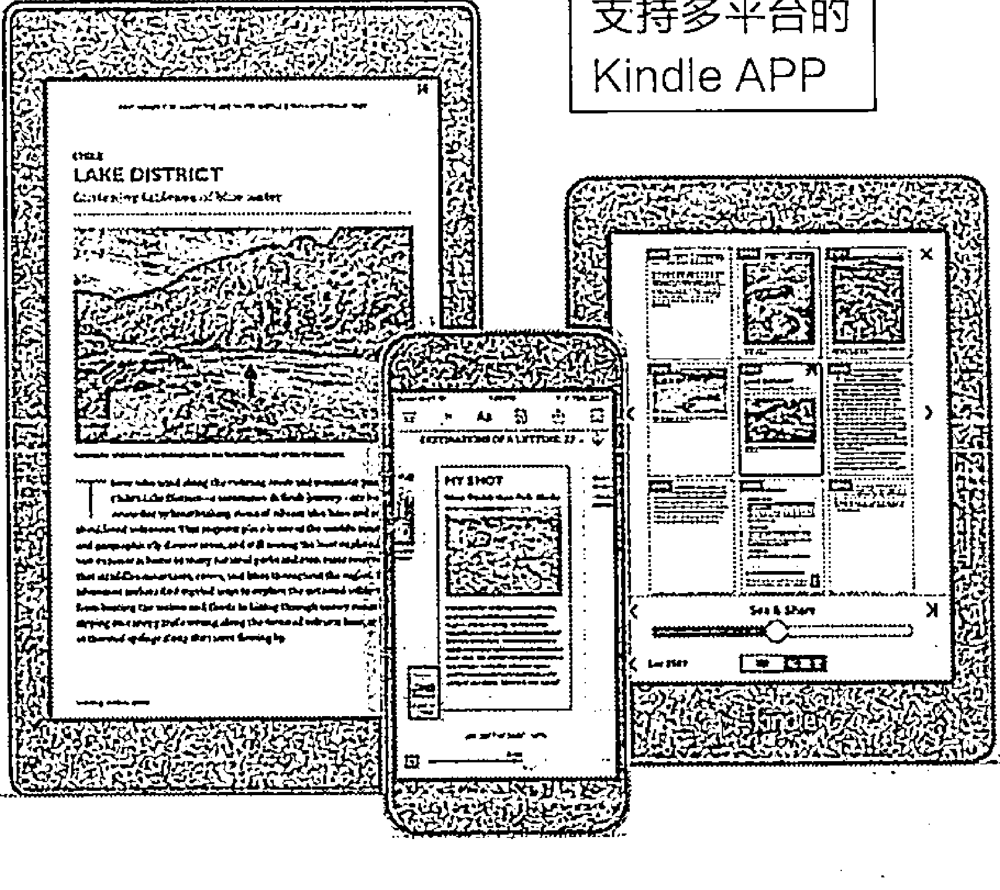

### 1. Kindle

Kindle对大多数人而言只是亚马逊提供的电纸书产品，其实不然，Kindle还提供了包括Windows/iOS/Android在内的全平台阅读软件。无论我们使用Windows、iOS、Android设备还是Kindle阅读器，只要联网就可以即时同步图书及阅读进度，还能根据设备情况进行自适应排版。当短暂出门并未携带Kindle阅读器时，我们也可以拿出手机轻松继续阅读之后的内容，而且这个进度可以同步回Kindle阅读器。在多终端同步阅读时，Kindle APP几乎可以说是目前最合适的阅读方案了。

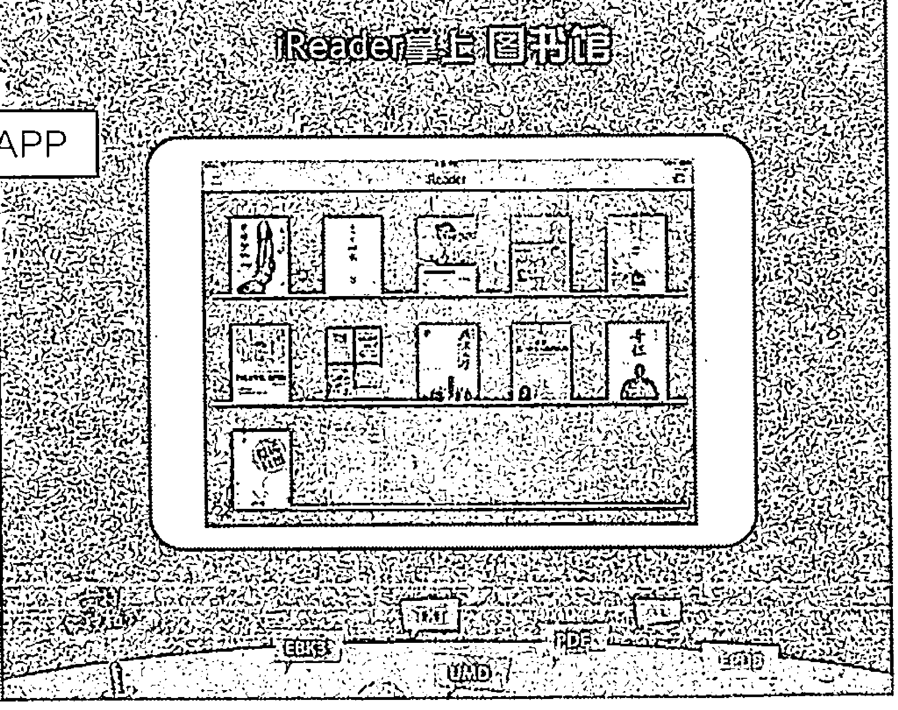

### 2. 掌阅

这是很多Android手机的标配阅读软件，掌阅最初是比较纯粹的阅读软件，如今则拥有了很多图书资源，大部分比较热的网文和小说都可以在其书城中直接寻找到，它还提供了漫画、有声读物等新型资源。这款应用提供了护眼背景，支持Office、词典（有道）、PDF和语音朗读（百度）插件，是一款功能比较全面的阅读软件。

## 阅读平台

数字阅读已经是读书的一大趋势，所以为阅读优化的电子设备，甚至专门设计的读书设备层出不穷。

### 1. Kindle

Kindle是电子书阅读器的代表，新的Kindle Paperwhite版本仍然采用黑白电子墨水触控屏，但分辨率大幅提升，图文显示更加锐利圆滑，达到了激光打印的水平，更高的内存让翻页等操作更加流畅。它还提供了前照式背光灯，可以在昏暗的环境下更好地阅读，而且比透光式的液晶显示屏更加护眼，不易疲劳。这款产品的厚度为9.1mm，重量则增加为205g，仍可以长时间手持阅读，一次充电可以待机数周，或连续阅读近24小时。它可以通过内置Wi-Fi进行联网图书阅读、购买、更新APP等，在其官方支持平台上还提供了大量的原版图书资源，4GB存储空间可以存储上千本图书，让用户细细品味。另外它还内置外语词典，支持外语学习、标注分享等功能。

### 2. iPad

新款iPad在配置升级的同时价格有所降低，性价比明显提升。它采用高分辨率液晶屏，可以用彩色方式精细地呈现图书，同时苹果也拥有自己的网上图书资源，同样可以获得从期刊到名著，甚至是一些新形态图书的阅读资源。

iPad屏幕为9.7英寸，重量为469g，单手长时间握持会比较吃力，其连续阅读时间可达10小时以上，基本可以满足长时间旅途的需要。当然作为一台综合性的平板电脑，其功能远不止阅读这一种，如果说Kindle是重度阅读者的选择，那么iPad就更适合普通人的日常阅读。

### 3. 魅族PRO 6 Plus

手机当然是目前最方便的电子阅读工具，笔者认为比较适合用来阅读的手机应该至少满足三个条件：屏幕够大、续航够强、带有护眼功能。类似的产品其实并不算少，我们仅以魅族PRO 6 Plus为例。这款手机采用5.7英寸屏幕，大小已经接近Kindle阅读器，屏幕分辨率为2560×1440，内置3400mAh大容量电池，重量仅有158g，长时间手持阅读也没有问题。

这款产品的健康护眼模式并不是简单地降低蓝光部分，而是根据定位信息确定用户所在地的日落时间，自动调节显示，当然也同时过滤部分蓝光。因此在使用它阅读时不仅更加舒适护眼，还减少了用户在清晨与黄昏使用时手动调节亮度的麻烦。

### 4. 咪咕阅读

咪咕阅读是中国移动旗下的子品牌，实力毋庸置疑。咪咕阅读凭借其在网文领域的巨大优势，和Kindle一起推出了“Kindle·咪咕版”，并且两者可以相互同步。这在很大程度上解决了Kindle用户想要阅读网文只能到网上搜盗版的问题，又使得用户可以使用Kindle电子墨水屏获得良好的阅读体验。

### 5. Anyview

Anyview几乎可以算是手机阅读器中的活化石，自Java时代就一直活跃在手机阅读器领域，最初是为解决手机不能阅读txt文档的问题而诞生的。如今的Anyview也加入了书城系统，提供良好阅读体验的同时也给用户减少了寻找图书的繁琐，虽然Anyview的书城看起来很简朴，但资源并不匮乏。另外其图书推荐系统也值得称赞，对热门和用户习惯比较敏感。

### 6. vol.moe

虽然现在的漫画引进与官方汉化作品已经很多，但海外漫画产业非常庞大，仍然有许多还没能引进的优秀作品，让漫画爱好者们感到非常遗憾，vol.moe可以在一定程度上缓解这个问题。vol.moe拥有许多漫画资源的下载，支持Kindle平台的“.mobi”格式以及Kobo和iPad常用的epub格式，基本可以覆盖我们常用的阅读设备。同时它还支持将“.mobi”格式文件直接推送到Kindle平台，只需要注册并经过简单验证，就可以直接通过Kindle自有的推送系统将其同步到Kindle阅读器上，十分方便。其实现在漫画阅读已经成为电子阅读非常重要的一个方向，漫画APP和资源甚至比传统阅读APP和资源更多，其中妖气、网易、布卡等也都是很不错的漫画观赏和资源APP。但是，在众多的相关APP中，也有很多漫画APP和资源网站是无力承担大量动漫作品版权费用的，所以它们提供的动漫作品版权归属、呈现效果，以及未来的发展前景都比较可疑。

任何一个应用市场都能找到大量漫画阅读APP

- 麦萌漫画: 12.6 MB, 二次元漫画美图社区
- 触漫: 39 MB, 享受创作的快乐
- 快看漫画: 39 MB, 快乐大本营吐血推荐，搞笑治愈段子...
- 可米酷漫画: 16.8 MB, 快看全彩高清免费的二次元漫画王者
- 掌阅漫画: 13.7 MB, 海量日更总裁漫，福利红包拿不停!
- 爱动漫: 22.5 MB, 海量动画、漫画、视频内容
- 漫漫漫画: 22.3 MB, 免费高清漫画阅读二次元平台
- 酷漫漫画: 10.7 MB, 听说小哥哥小姐姐都在这里看漫画
- 有妖气漫画: 13 MB, 十万本精彩漫画强势来袭
- 网易漫画: 14.6 MB, 华数为爱，勇担没舞。华为应用市场...
- 布卡漫画: 15.2 MB, 热门新番《dit

## 阅读技巧

电子书的阅读，其实还有很多独特的技巧与注意事项，它们很可能并不起眼，但会对实际阅读体验造成很大的影响。

### 1. 注意切换背景

前面我们提到魅族Pro 6 Plus是一个不错的阅读平台，原因之一就是可以自动降低亮度，可以让用户在夜间阅读时更舒适。对于没有这一功能的手机，就需要在阅读APP中手动调节背景或者显示方式，例如夜间阅读模式。如果阅读APP没有相应的功能，则需要手动调节手机亮度，或者在手机设置中选择“自动调节亮度”，当然笔者更建议用户索性干脆换掉这一阅读APP。

### 2. 签到读书

很多阅读APP都有签到功能，主要是赠送一些用来购买图书章节的虚拟货币、短期VIP和免费阅读书目或章节。对喜爱读书的人来说，这些签到功能赠送的小小礼物是非常实用的。根据笔者的经验，如果基本能保证每日签到的话，同时追两到三本书基本都不用自行充值，还能时不时免费感受一些比较热的书目，扩展自己的阅读面。当然如果大家追的书有个能每日更新两三章的怪兽级作者，那就另当别论了，为了追自己喜爱的图书，也为了支持勤奋的作者，还是选择充值吧。

根据大家的使用习惯、阅读习惯、硬件平台、阅读APP的不同，可以提升阅读体验的技巧各有不同，笔者在这里仅仅是分享一些自己的经验，希望能抛砖引玉，让大家根据自己的需要，通过个性化设置，获得最好的阅读体验。CF

## 卡片机败退
### 手机摄像头的进化论

策划|《电脑爱好者》编辑部

如果需要对智能手机的核心卖点进行提取和排序，那性能、续航和拍照，肯定是位列TOP3的存在。在2018年第3期《跳动的心 解读移动处理器性能差距之源》和第8期《影响手机续航那些事儿》的特别话题中，CFan分别给大家介绍了影响手机性能和续航的技术和功能，而本期特别话题，就让我们将目光锁定在拍照上，探讨一下智能手机是如何蚕食DC卡片机和单反相机市场的吧。

### 多多益善 以数量换质量的手机镜头

2000年9月，夏普带来了首款内置11万像素CCD摄像头的手机——J-sh04 (图1)。至此，手机圈的摄像头开始了从无到有、从单到多的旅程。时至今日，前置双摄、后置三摄已然成为了不少新品的主打卖点。那么，如何才能衡量一款手机拍照效果的好坏呢？

### 堆像素已走到尽头

步入智能手机时代后，众多手机厂商曾针对像素值进行过一番“军备竞赛”。比如，第一代iPhone配备了固定焦距的200万像素摄像头，iPhone 3GS带来了320万像素自动对焦摄像头，随后智能手机摄像头还逐渐经历了500万像素、800万像素、1200万像素的进化……直到诺基亚808 PureView和Lumia 1020达到了巅峰(图2)，4100万像素摄像头傲视群雄，堪称手机中的单反机。

随着诺基亚的没落，以Android系统为代表的手机圈却逐渐走向了和堆像素背道而驰的道路。2016年，很多手机都以武装迈过2000万像素门槛的摄像头为荣，比如努比亚Z11 mini S的2300万像素、锤子M1的2300万像素、小米Note 2的2256万像素等等。然而，进入2017年后，众多旗舰手机却纷纷将主摄像头的像素值控制在1200万像素。难道手机拍照比拼的不是像素值越大越好吗？

### 影响拍照的三驾马车

摄像头像素值越高，意味着可以拍出更高分辨率的照片，但也仅此而已。对智能手机而言，更快的对焦速度、更好的降噪效果、更真实的色彩还原、更少的细节损失才是王道，而这些可不是依靠单纯的堆像素可以实现的。真正影响手机拍照成像效果的，还是影像传感器、光学镜头和影像处理器这“三驾马车”。

**影像传感器：** 即摄像头传感器（CMOS），比如索尼IMX519、三星ISOCELL Fast 2L3、豪威OV16880等等。传感器将决定摄像头的像素值、是否支持相位对焦和全像素双核对焦、传感器尺寸和单像素面积等核心参数（图3）。传感器越先进，意味着手机将获得越好的拍摄潜力和资质，华为P20和魅族15系列配备的IMX380传感器就号称是卡片机级别的感光元件，拥有高达1.55微米的像素尺寸。需要注意的是，哪怕两款手机采用了相同的传感器型号，但厂商却可在此基础上搭配不同大小的光圈，添加独立的光学防抖模块，所以其实际的成像效果也会存在差距。

**扩展阅读：**
**光圈的意义**

对摄像头而言，光圈大小是个非常关键的指标，它将决定单位时间内摄像头的光线通过量，因此光圈越大，在低亮度环境下的拍照效果就越好（图4）。由于光圈是由镜头里面的几片极薄金属片组成，它们的尺寸取决于手机厂商的设计需求，与CMOS传感器关系不大。同样的传感器型号，有些手机的摄像头光圈只有F2.0，而有些手机则可达到F/1.7，此时自然是后者可以拍出更好的照片，还原暗光下的更多细节。就目前的手机镜头光圈而言，三星Galaxy S9采用的F1.5和F2.4可变光圈是未来的发展方向，白天切换小光圈防止过曝，夜晚切换大光圈提升暗处细节。

**光学镜头：** 由于光线中包含红外线等诸多“杂光”，如果它们直接通过CMOS传感器时会严重影响成像质量。因此，完整的摄像头模块都需要在CMOS传感器的前面加入用于滤光的玻璃，也就是所谓的“镜头玻璃”。低端手机摄像头大都配备5层塑料镜片（5P镜头），而中高端手机则会将其中的某些塑料镜片换成玻璃镜片，更好一些的则会添加额外的蓝玻璃滤光，组成所谓的6P镜头（图5）。镜头的片数越多，光线过滤、成像失真和色彩还原效果越好，而华为之所以和徕卡联姻，为P系列和Mate系列推出徕卡定制的镜头就是这驾马车重要性的真实体现。

**影像处理器：** 即ISP，早期高端智能手机多以内置独立的第三方ISP芯片为荣。随着SoC内集成ISP性能越来越强，第三方ISP芯片逐渐淡出市场（图6）。比如，联发科Helio P60内置的三核ISP、高通骁龙660内置的Spectra 160 ISP、骁龙835内置的Spectra 180 ISP和骁龙845内置的Spectra 280 ISP性能就依次增强（图7）。ISP可用于对多颗摄像头协同拍照进行原生优化，实现更好的视频降噪，匹配更多种自动对焦模式等等。实际上，除了上面涉及的“三驾马车”外，影响最终拍照效果的还受制于相机APP的实时调校和后期优化。关于这部分内容，我们会在下面的AI章节加以详述。

### 一颗镜头难以为继

随着消费者对手机拍照性能的要求越来越高，哪怕是再高档的三驾马车也有力不从心的感觉。比如，很多用户都喜欢拍出可媲美单反的背景虚化效果，但在只有一颗摄像头时，想在图片中“抠”出拍摄的主体并淡化背景，对成像算法的要求极为苛刻；再比如，当你想拍出远处风景或人物，通过数码变焦得到照片的细节却糟糕得一塌糊涂；最后，如果传感器规格稍差，就注定无法和采用更高端传感器的对手抗衡。因此，在很早以前手机厂商们就发现只靠一颗镜头打天下迟早将遭遇瓶颈，如果坚持“单身”就注定被对手反超。三星Galaxy S8和其前辈就曾奉行“单挑”，依靠1200万像素摄像头挑战一众武装双摄的竞品，并曾一度占据上风。但随着iPhone X、华为Mate 10等新品的上市，Galaxy S8的拍照性能就渐渐落于下风，并最终在Galaxy S9+身上“脱单”以双摄示人（图8）。时至今日，如果是没能武装至少两颗（后置）摄像头的手机，就都不好意思位列“高端”阵营。

### 前置镜头逐渐脱单

在智能手机时代，前置摄像头的发展要落后于后置摄像头，苹果是在iPhone 4时才首次引入30万像素前置摄像头，而HTC则是到G11才带来了130万像素前置摄像头。随后，前置摄像头开始了提高像素，以及不断优化美颜自拍的旅程。如今，智能手机的前置镜头则开始比拼是否支持自动对焦，以及是否武装了第二颗景深镜头（图9），借助双摄模块实现硬件级别的背景虚化效果。比如，金立S10/S11、vivo X9/S9s、华为畅享8 Plus等产品就是前置双摄的代表，从而获得了大光圈（先拍照后对焦）的拍照体验（图10），自拍时也能虚化人物以外的背景，获得类似单反的大片效果。

### 后置镜头成功脱单

智能手机时代，HTC可以算是双摄手机的开拓者。早在2011年，HTC推出的G17就通过2颗500万像素摄像头（又称3D摄像头）获得了直接拍摄3D照片和视频的能力。随后，在2014年HTC还发布了武装400万像素主摄像头+200万像素景深摄像头的HTC One M8(图11)，而这款产品也成为了包括OPPO R15标准版、vivo X21等一众新品的“前辈”。和前面提到的前置双摄一样，这种“一大（主摄像头，像素值较高）一小（景深摄像头，像素值较低）”双摄的最大特色就是支持硬件级的背景虚化效果。

问题来了，“一大一小”双摄在拍照时，景深镜头只负责记录远近信息，对画质没有任何增益效果。为了实现“1+1>1”的目标，在智能手机领域又逐渐衍生出了“黑白+彩色”、“广角+长焦”、“智选双摄”这三种概念。

“黑白+彩色”双摄方案最早由奇酷360旗舰版提出，目前新品代表有华为P20、Mate 10系列、荣耀10/V10、索尼XZ2 Premium(图12)、坚果3和联想S5等，此类产品的拍摄原理是彩色摄像头负责强化色彩还原，黑白摄像头则负责强化画面细节捕捉，通过ISP和软件算法会对两张彩色和黑白照片进行合成，最终获得一张色彩和细节更加优秀的照片。

“智选双摄”方案是OPPO R11s提出(图13)，一加5T采用的也是这套技术。其原理是两颗摄像头没有主次之分，只是其中的1600万像素摄像头善于捕捉细节，另一颗2000万像素摄像头在暗光下表现更好，它们的光圈都是F/1.7，系统可以在不同的光线环境下调用其中一个成像质量更好的摄像头来进行成像。

“广角+长焦”双摄方案是由iPhone 7 Plus提出，目前新品代表有OPPO R15梦镜版、三星Galaxy S9+、魅族15系列、小米MIX2S和努比亚Z17S等(图14)，此类产品的特色是通过长焦镜头可以进行2倍光学变焦拍照，但能否为长焦镜头准备额外的光学防抖模块，是其能否在暗光环境下正常工作的关键。此外，这颗镜头平时也能扮演景深摄像头的角色，背景虚化效果依旧给力。虽然“黑白+彩色”和“智选双摄”手机也有2倍拍照模式，但其本质上只是2倍无损变焦（类似软件合成），细节表现肯定逊色于原生的长焦镜头。

### 三颗镜头创纪录

纵观时下的高端手机领域，“广角+长焦”和“黑白+彩色”是最受厂商青睐的双摄方案，因为它们都能实现背景虚化，并在暗光细节或记录远处风景方面有着无可争议的优势。但是，用户的追求是无止境的，难道就无法将这两个流派的优点合二为一吗？

好消息是，华为P20 Pro做到了。这款产品通过独特的三摄方案，不仅具备“黑白+彩色”的细节表现力，还实现了“广角+长焦”的光学变焦，同时还让我们看到了一个久违的特征，那就是诺基亚Lumia 1020时代的超高像素重出江湖！

P20 Pro在有限的空间里一口气塞进了三颗后置徕卡镜头：包括一颗4000万像素的主摄像头、一颗2000万像素的黑白摄像头、一颗800万像素的长焦镜头（图15）。此外，P20 Pro还在上方两枚镜头中央嵌入激光接收和发射器，进而实现激光对焦。同时，三枚镜头下方还嵌入闪光灯及色温传感器，这7大组件、3枚镜头携手（图16），最终融合成了最新、最先进的摄影设备系统。

和其他双摄手机相比，华为P20 Pro在拍照方面占据两大优势。其一是DxOMark拍照子项评分高达114（图17），遥遥领先其余TOP6的P20（107）、三星S9+（104）、谷歌Pixel2（99）、iPhone X（101）和Mate 10 Pro（100）。其二是P20 Pro支持3倍光学变焦，比业内主流的2倍光学变焦照得更远。

而成就这两大优势的背后原因，就是华为P20 Pro的主摄是来自与索尼联合研发的IMX600传感器，诠释了“底大一级压死人”的金科玉律。IMX600传感器尺寸达到了1/1.7英寸，比一般手机专用传感器的1/2.3英寸足足大出34%的面积！同时，IMX600还采用了Quad Bayer阵列（同色4像素为一组排列）设计，在低光环境下可将像素4合1，秒变单像素面积2μm的1000万像素传感器，已经非常接近相机CMOS的2.4μm单像素面积了。

曾经用过诺基亚808 PureView和Lumia 1020这类超高像素手机的用户，很多都有过被高感画质变差问题所困扰的经历。这一次P20 Pro的4000万像素是否也会降低高感画质呢？请放心，P20 Pro的默认分辨率只是1000万像素，4000万像素拍照模式需要用户手动开启（图18）。

同时，华为还为IMX600找来了一个更有实际意义的战场——手持夜景。以往很多手机要想拍出完美的夜景大片，哪怕摄像头支持光学防抖，也需要借助三脚架才能保持绝对稳定的情况下延长快门曝光时间。而P20 Pro主打的夜景手持长曝光模式，只靠双手就能保证6秒的拍摄稳定！根据CFan的实测，P20 Pro的夜景拍摄效果绝对是手机领域的No.1。

华为P20 Pro的800万像素长焦镜头也与市面上其他双摄手机常用的长焦镜头不同，它原生就支持3倍光学变焦，所以可以记录更清晰的远处风景。同时，点击拍照界面的变焦按钮，P20 Pro还能实现5倍混合变焦，通过三摄的巨大总像素和图像优化运算，其效果要比以往通过剪裁实现的数码变焦好很多，从此手机“打鸟”不再是梦。

总之，华为P20 Pro的徕卡三摄为智能手机打开了一扇新的窗户，借助更多定制镜头实现远超双摄、媲美专业单反相机的拍照体验。可惜，这种豪华三摄模块的成本也是较为高昂的，短期内很难在主流价位手机间普及。所以，智能手机厂商都展开了“曲线救国”之旅，借助新兴的AI来优化最终成像的效果。

## AI助力 每张照片都经历专业调校

同一款手机，抛开取景意境不谈，在拍摄相同内容时，总有一些专业摄影爱好者可以拍出更完美的照片。原因很简单，现在几乎所有品牌手机的相机APP都自带专业模式，可以手动调节ISO、曝光补偿等参数（图1），再借助三脚架等专业外设，自然要比手持自动模式的拍摄效果好。而有了AI助力，就可以让你拍摄的每一张照片都等于经历了专业的调校。

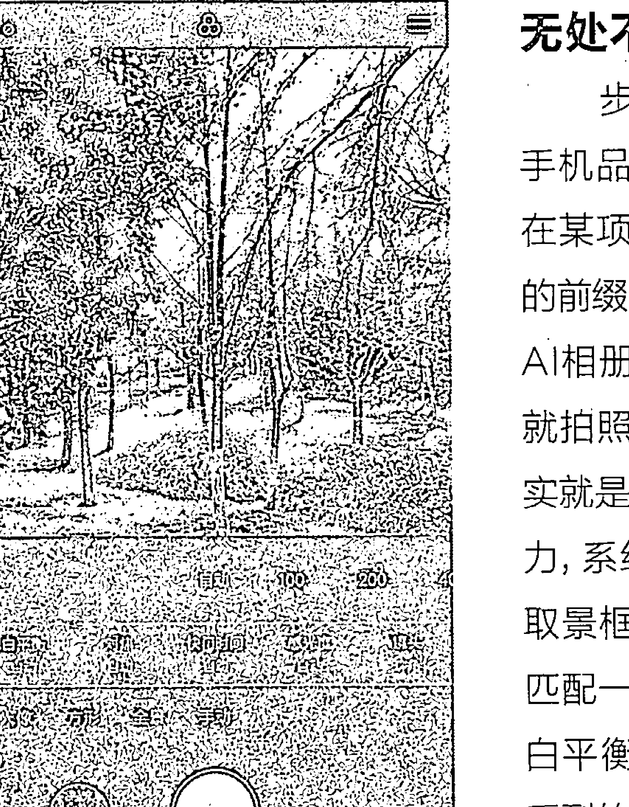

## 无处不在的AI

步入2018年后，几乎所有手机品牌在发布新品时，总会在某项功能前冠以一个“AI”的前缀，比如AI美颜、AI人像、AI相册、AI语音助手等等。单就拍照一项而言，所谓的AI其实就是一种智能场景识别的能力，系统会自动辨别相机APP取景框内的物体类别，并自动匹配一套专属的锐度、曝光、白平衡、饱和度、对比度等一系列的参数。

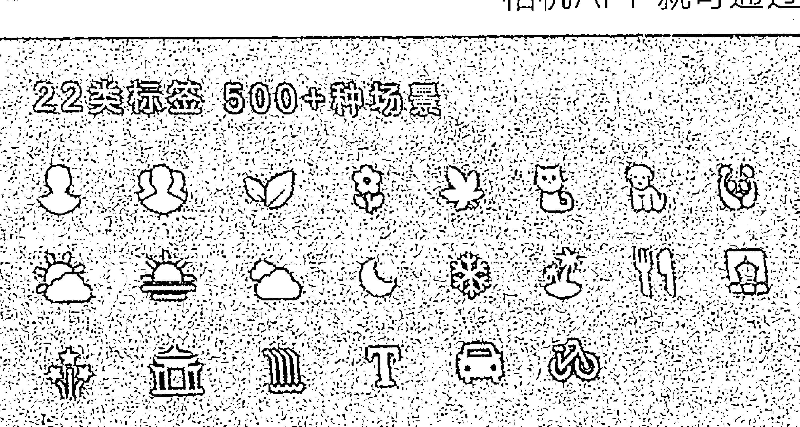

以小米MIX2S为例，其相机APP就可通过AI识别25种标签，多达206种场景识别。而这个场景识别能力还支持不断的优化更新，比如华为Mate 10和荣耀V10时期仅支持13个场景识别（雪景、蓝天、花朵、舞台、猫、人像、美食、狗、日出日落、绿植、沙滩、文字、夜景），到了华为P20和荣耀10时期就实现了19种类型覆盖500多个场景的智能场景识别（图2）。

以华为P20 Pro在室内光线下拍摄花卉为例，相机APP可瞬间识别拍摄物体为绿叶（图3），并进行参数微调，对比开启场景识别和关闭场景识别拍摄的照片，前者可以获得绿叶更嫩、红花更鲜艳欲滴的优化效果（图4），而后者的画面感就要逊色一筹了（图5）。

此外，借助AI还能进一步优化单摄情况下的背景虚化效果，从而成就了所谓的AI美颜：通过机器学习数十上百万张自拍照片建立AI模型，哪怕前置单摄像头的手机也能带来可媲美双摄的景深效果。同时，过去前置摄像头自拍时如果取景框中人物较多，很难将所有面部都进行美颜处理，而有了AI的加持，就可轻松实现同屏为最多4人提供个性化的美颜方案（图6）。

还记得上个章节我们提到的华为P20 Pro的手持夜景模式吗？除了其主摄内光学防抖模块的辅助外，一项名为“AI智能防抖”的技术也是功不可没：由本地AI的实时运算能力来过滤和校正由于手抖造成的画面偏移和模糊，实现手持6秒长时间曝光而照片不糊的功效。

## 真AI还需硬件加持

想为手机拍照赋予AI特质，现阶段有两种解决方案。

**软件流**：通过集成AI算法的APP，比如美图秀秀或系统自带的相机APP，利用机器学习算法来识别拍摄人像和背景、光源间的关系，从而把人像分离出来。这种软件流的缺陷是实时性不够，一旦运行高负载的AI任务就需要呼唤云端，如果云端的响应速度不够（网络信号差），就可能导致AI摄影的识别率和准确率下降。

**芯片流**：这种流派有两种表现形式。其一是以谷歌Pixel 2为代表，在摄像头区域里集成一颗图像处理的协处理器，即IPU（ImageProcessing Unit），专门用来结合云计算与算法集群处理AI拍照与视频任务。其二则是以麒麟970这类处理器为代表，集成独立的NPU神经元芯片，用于本地的AI运算。

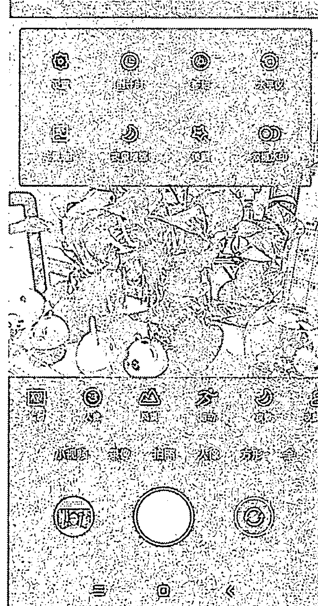

此外，高通骁龙660或更高级别、联发科Helio P60也支持本地AI运算，只是前者是通过人工智能引擎AI Engine调度Kryo CPU、Adreno GPU和Hexagon向量处理器加以实现，而后者则是通过APU和NeuroPilot人工智能平台负责，虽然效率不如麒麟970集成的NPU，但也足够用于相机AI的场景识别了。

在实际应用中，只有采用芯片流的智能手机才能100%达成AI对拍照成像优化的目标。比如红米Note 5，这款产品相机APP也支持多种拍摄场景，但却无法通过取景器自动识别，需要我们手动选择匹配的选项（图7），原因就是它搭载的骁龙636天生就不支持人工智能引擎AI Engine。但是，小米6X却能实现和MIX2S一样的场景识别，原因也正是它搭载的骁龙660原生支持AI Engine，仅此而已。

### 定格瞬间
### 浅析960帧慢动作录影


除了要拍出更高品质的照片外，现在新一代旗舰手机还将另一项功能纳入了核心卖点，它就是——960帧（fps）超级慢动作录影（图1），将0.x秒内的瞬间定格，并以类似GIF动画的形式播放出来。那么，这种能记录精彩瞬间的技术背后又隐藏着哪些秘密呢？

## 突破天际的960帧

拍摄慢动作视频并不是什么新鲜技术，但在过去（2014年苹果第一次把慢动作摄影带到手机中）所谓的慢动作录影只能达到120帧或240帧的录制，回放时很容易遗漏重要的瞬间。而真正可以冠以“超级慢动作”称号的代表，则来自索尼在2017年推出的Xperia XZs和XZ Premium，这两款产品可实现960帧超高帧率的慢动作录影（图2），并用30fps的帧率输出影片。


2018年，三星Galaxy S9系列和华为P20 Pro也先后引入了960帧超级慢动作录影功能，三星还给这项功能起了个更具意境的名称——凝时拍摄。实际上，无论是索尼、三星还是华为，它们的超级慢动作功能的原理都是一样的。以P20 Pro为例，它就是将0.2秒内的录像延长到8秒来呈现（图3），并在这段慢动作视频前后各加了1秒钟的正常速度回放，使得视觉冲击力更为震撼。


- 普通慢动作可拍摄不限时长的高速视频。
- 超级慢动作可拍摄32X（960帧/秒）超高流定时小视频，在明亮环境下拍摄效果更佳。

## 为何瞬间只限0.x秒

问题来了，为何现在智能手机的超级慢动作只能记录0.2秒左右的瞬间？此外，iPhone X也支持慢动作，但它为何只能实现240帧的录制？答案很简单，960帧超级慢动作录影，对硬件端提出了更为苛刻的门槛，准确来说就是需要更高速的缓存来处理摄像头传感器（CMOS）短时间内记录的大量数据（图4）。问题是，无论是最新的LPDDR4X内存还是UFS2.1闪存，它们在和CMOS交流时都存在延时，也就是速度跟不上。好消息是，如今摄像头也逐渐开始向CPU学习，通过集成高速缓存（如CPU内的L1、L2、L3缓存），暂时保存内存速度都来不及“消化”的数据。没错，这就是三层堆栈结构的手机CMOS传感器，在传统的像素模块和电路模块之间塞进了独立的DRAM存储芯片（图5、图6），用于CMOS生成数据。


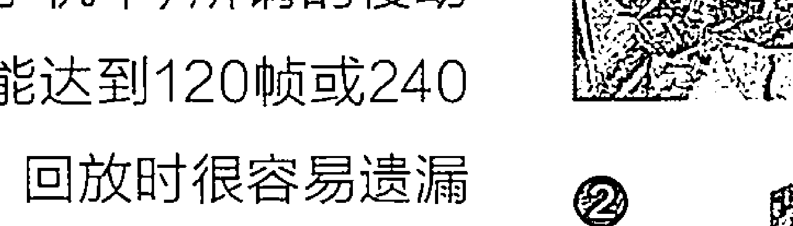

传统双层和三层堆栈结构手机CMOS传感器对比

## 跟风还必然 探秘镜头垂直排列的背后

不知道大家有没有留意一个问题，早期的（后置）单摄手机都喜欢将摄像头安置在后盖中心线偏上的位置；在双摄普及时，手机后盖的左上角成为了水平排列的双摄模块的最爱；如今，以iPhone X为代表的新品则钟情于在手机后盖左上角嵌入垂直双摄甚至三摄模块。那么，在手机摄像头的位置背后又隐藏着哪些问题呢？

## 中心线上的对称之美

智能手机想要卖得好，首先就要做得漂亮。于是，很多手机在设计上都会严格遵循“对称式”设计，将平衡之美发挥到极致。所以，我们才能看到早前无数款手机都喜欢将后置摄像头、闪光灯和后置指纹识别模块放在中心线上。哪怕摄像头一边嵌入了闪光灯，也要在另一边借助其他元素“找齐”，就是要彰显对称之美（图7）。

图7：早期手机常见的后置居中对称设计示意图，包含摄像头、闪光灯和指纹模块。

## 因内部结构而妥协

细心的用户可能注意到了，三星Galaxy S系列家族始终遵循对称式设计，将后置摄像头置于水平中线之上，但是这种居中设计的摄像头也会占用更多PCB主板空间。以Galaxy S9为例，为了给摄像头腾地方，这款产品不得不采用L型的PCB主板，将CPU、内存和闪存等芯片安置在电池旁边的拐角部位（图8）。现在，大家总算弄明白为什么Galaxy S系列的电池容量总在3000mAh到3500mAh左右摇摆了吧？

## 参考借鉴之风起

不得不说，很多国产手机在设计上或多或少都会借鉴iPhone的风格。比如，自从iPhone 7 Plus将两颗摄像头水平排列在后盖左上角后，采用类似设计的Android手机就变得越来越多。同理，iPhone X将两颗摄像头改为垂直排列，这一风格自然也会影响到Android手机的设计。

但是，除了“蹭热度”以外，摄像头位置的转移和排列方向的差异，也会受到手机内部结构设计的影响。

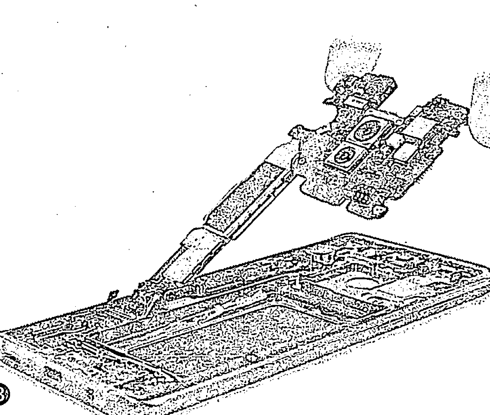

以华为Mate 10 Pro为例，这款产品虽然同样是双摄中置，但却通过优化PCB主板布局（图9），同样给4000mAh大电池留下了足够的空间。

相对而言，将摄像头（特别是两颗镜头）放在手机后盖左上角，可以简化PCB主板布局，更容易确保电池有足够的安置空间。只是，当手机进入“刘海屏”时代后，位于后盖左上角的多颗摄像头到底是水平排列还是垂直排列？这就需要进行更复杂的考量了。

以iPhone X为例，这款产品的刘海中不仅包含传统的听筒、前置摄像头和光线距离传感器，还集成了额外的红外镜头、泛光感应元件和点阵投影。同时，iPhone X的机身宽度较小，而其后置双摄的传感器尺寸却很大，根本无法水平安置（图10）。同理，华为P20 Pro的后置三颗摄像头，自然也没有横向排列的空间。所以，这些产品采用垂直排列的摄像头模块就在情理之中了。

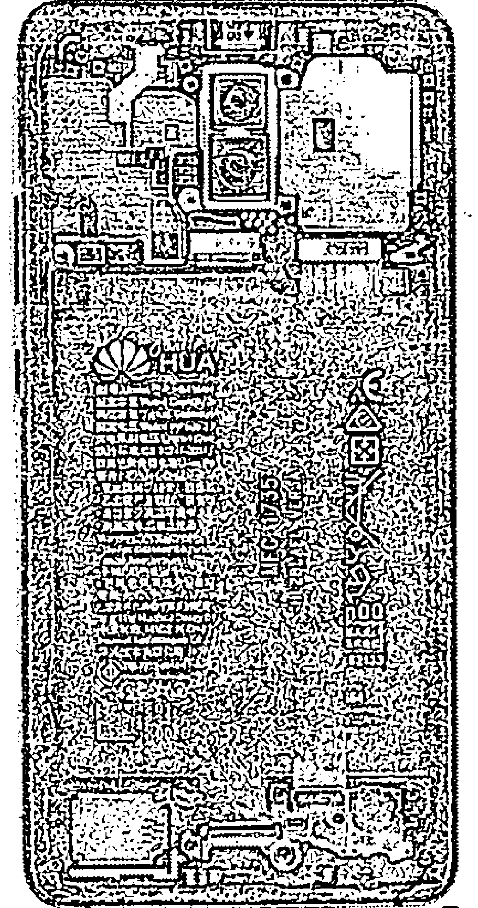

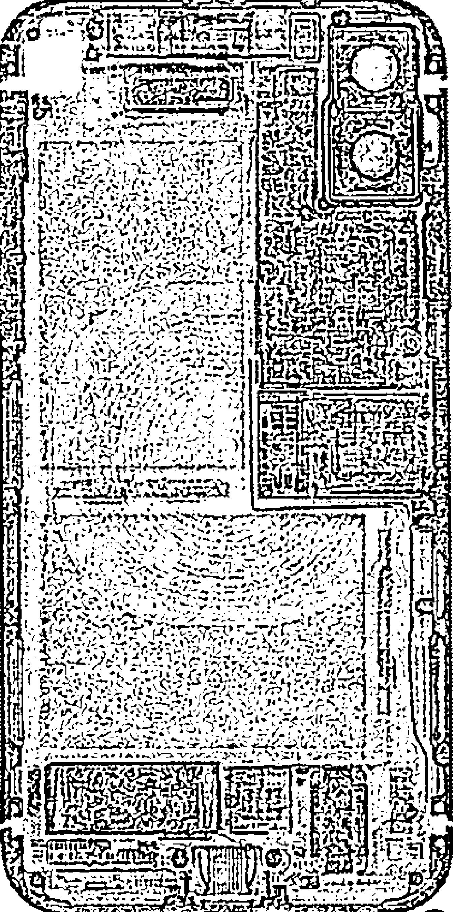

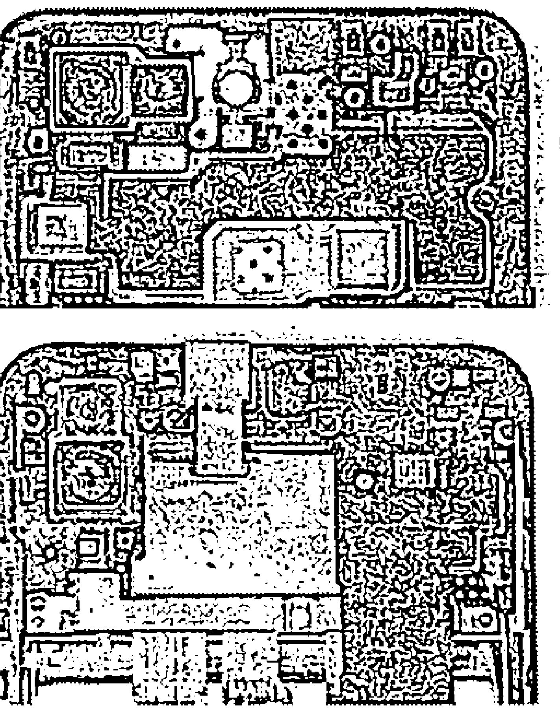

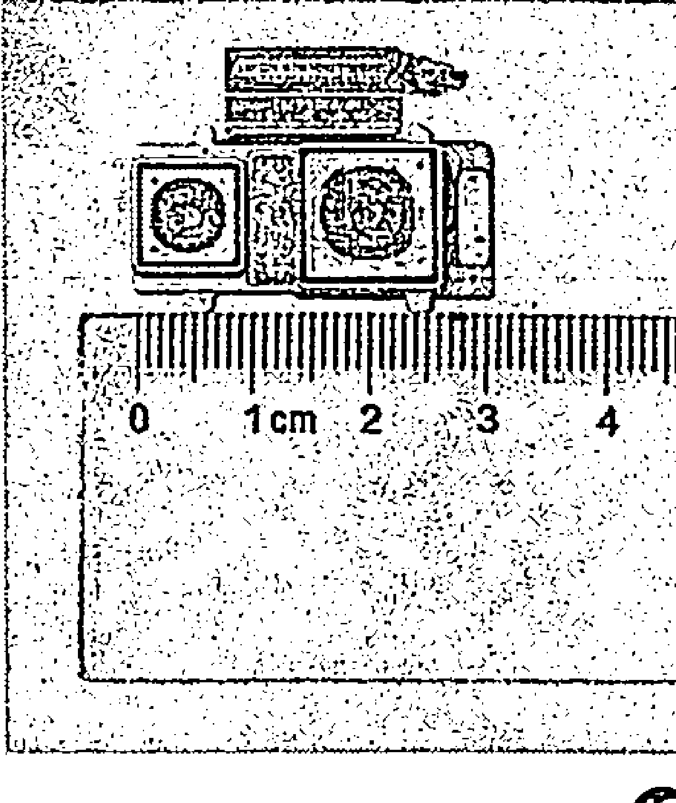

我们再来看看OPPO R15和vivo X21，这两款产品的后置双摄分别为水平和垂直排列，通过拆机图对比，我们不难发现背后的原因：vivo X21将3.5mm耳机孔放在了手机顶部，而这个单元非常占用主板空间，让X21顶部的元器件变得更加紧凑，所以其摄像头不得不改用垂直方向设计（图11）。

最后再来看看小米MIX2S，这款产品的后置双摄传感器尺寸达到了30mm（图12），而这款产品为了实现顶部无边框的设计，采用了隐藏式的导音式听筒，并为其在PCB主板上“挖出”了一个U形槽（图13）。所以，宽大的双摄模组也没法与其横向共存，这也就是MIX2S采用垂直双摄的原因。

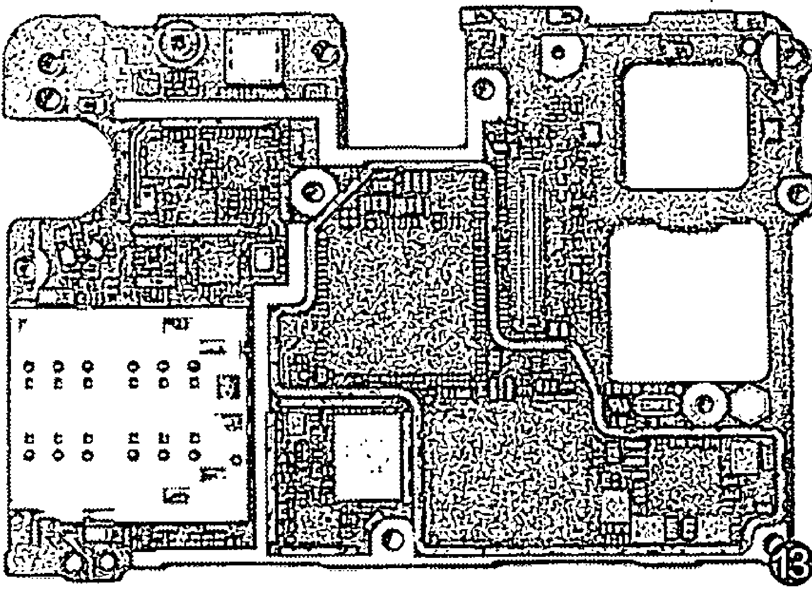

## 垂直方向渐成趋势

2018年将是“刘海屏”普及元年，为了实现更好的拍照潜力，更多中高端手机会为后置摄像头引入更先进的传感器，以及包括四轴光学防抖在内的更多复杂模组，这些都会导致整个镜头模组的体积增加。同时，未来的智能手机将会逐渐朝着100%屏占比的方向进化，让传统的听筒及各类传感器不得不创新改造，这些都会进一步压榨PCB主板的结构和布局。相对来说，垂直安置多颗摄像头就是这种复杂背景下相机的最优解决方案，所以它最有希望成为未来智能手机的标准设计。

## X86 平台更替话平测

文/刘左老手

近期的硬件市场可谓风起云涌，处理器、显卡这两个主要的PC配件消息不断，新产品也是扎堆上市。而在说到这两种配件时，大家总是喜欢用各种性能指标来描述它们，比如XX评测XXXX分一类的。这些动辄成千上万的数字虽然看起来不明觉厉，但很多人并不明白除了可以用来对比之外，它们还有什么其他意义。
其实所有的硬件测试都是针对产品某一方面的实际能力而设置的，无论是测试方法还是测试结果，都可以反映硬件的实际使用体验。那么本期就从测试和实际反映的应用能力、使用体验方面，来讲一讲常见的硬件测试到底对我们有什么意义吧。考虑到目前市场的实际情况，我们本次介绍的主要是PC平台的处理器及显卡相关测试，针对PC的硬盘、显示器等配件，以及针对手机等移动平台的测试虽然也相当多，但请允许我们以后再作介绍吧。

## 处理器测试

第八代智能酷睿家族新成员、第八代高性能智能酷睿移动版、移动和台式机版锐龙APU、第二代锐龙……
2018年刚走过4个月，处理器市场就出现了如此之多的新产品，而且其中任何一种都是足以改变市场格局的重磅角色，所以最近我们的各个媒体渠道和兄弟媒体上，处理器的评测可以说是连篇累牍。不过正如我们前面提到的，这些评测大家真的看懂了吗(图1)？
作为电脑中最重要的性能指标配件，处理器的测试工具非常多，我们这里挑选的主要是易于使用、易于理解的工具，同时也是《电脑爱好者》本身常用的测试工具，对大家读懂我们的评测文章很有益处。

### CPU-Z

CPU-Z在很多处理器评测中都会被列为第一个项目，这是因为它提供了对处理器具体规格的识别，可以在测试开始前对处理器的具体设计、配置规格有一个基本的认识。此外它也提供了对处理器性能息息相关的主板、内存、显卡等PC主要配置的识别，例如内存的工作频率和是否为双通道模式等（图2）。
CPU-Z同时也提供了处理器理论性能测试，可进行单核与全核心计算能力测试，并提供了多个典型处理器的测试结果，可以进行数据和百分比对比。CPU-Z的性能测试完全基于计算能力，而且并没有使用特殊指令集，但也不排斥SSE等指令集加速浮点等计算任务（图3）。

CPU-Z的测试结果可以与存储数据比较，还可以转换为百分比方式表述

CPU-Z的测试结果基本能反映处理器的实际计算能力，不过因为特别着重于纯计算能力，所以得分对架构很敏感。反映到实际软件上，CPU-Z的处理器得分参考性比较一般，毕竟民用程序很少有特别依赖纯计算能力，而且不进行优化设计的。例如目前大部分对浮点性能敏感的软件就可能会直接调用SSE指令集以加快速度，并不会直接进行浮点计算，等待处理器自动识别并调用SSE指令集。

### Fritz Chess Benchmark

Fritz Chess Benchmark是《Fritz Chess》国际象棋游戏内置的一个测试程序，不过目前被提取出来作为一个专门的处理器测试程序。它通过测试处理器对国际象棋步数的计算能力来测试处理器性能，支持多线程，可以选择使用的线程数。除了实测计算速度外，Fritz Chess Benchmark还以Pentium 3 1.0GHz处理器的速度（每秒计算48万步）为基准，给出系统的相对性能倍数，成绩很直观（图4）。

这款测试考验的是CPU的整数运算性能，对线程数敏感，但对浮点计算能力不敏感。它的单线程成绩可以反映处理器的日常处理能力，多线程成绩则可以反映视频转码、图形渲染等能充分利用多线程的应用能力，但不能反映游戏、3D图形处理等性能。

### Super π

Super π也被写作Super Pi，是由东京大学金田研究室开发的一款计算圆周率π的软件，后来也被用来测试超级计算机的运行速度。它最初是被超频爱好者移植到PC系统中，用来测试超频后的性能和稳定性。

Super π可以定义计算的圆周率位数，测试结果为计算所用时间，时间越短说明处理器计算能力越强。早期Super π测试中一般选用104万位（1M），不过随着处理器性能的提升，主流处理器的成绩已经仅有10s甚至更快，很难表现出差距，所以很多评测已经开始采用更高位数进行测试，或者使用在原版基础上制作的修改版Super π Mod!，将时间统计精确到毫秒级，以便进行比较（图5）。由于计算量巨大，因此内存速度也会对Super π的成绩有一定影响，如果需要进行精确对比的话，测试平台的内存要尽量一致。

Super π的计算主要考察的是处理器的浮点运算能力，可以反映处理器在图形运算、3D游戏等方面的能力，不过这款软件并不支持多线程，无法反映不同核心数量处理器之间的性能区别。

### Wprime

这是一款支持多线程的x86处理器性能测试工具，采用一种递归计算过程计算质数（prime numbers）。在计算过程中，它会将计算任务平均分配给所有处理器核心（线程），以保证处理器达到100%的负载，不过它最高只支持8个线程，已经难以满足目前高端处理器的需求。Wprime可自定义32M或1024M两种计算范围，也可以自定义线程数（图6），用户定义的其最终得分是计算过程所用的总时间，所以时间越短说明处理器的计算能力越强（图7）。Wprime也是偏重于浮点计算能力的测试，可以看作是多线程的Super π，因此其得分反映的也是处理器在图形计算、3D游戏等方面的能力。

### 7-Zip

7-Zip是很多厂商在电子发行中常用的压缩方式，因为它可以提供比WinRAR更高的压缩比，能节约网络带宽和存储空间。7-Zip支持多线程，自带测试功能，可以选择线程数和模拟块大小，测试过程包括压缩与解压测试，提供了实际速度、CPU使用率（多线程效率）及相应评分等成绩，还会根据这些成绩给出总评得分（图8）。当然这款软件自带的测试程序，主要反映的就是以其自身的算法来衡量的处理器性能。

### WinRAR

WinRAR是目前个人用户最常用的压缩软件，它也支持多线程处理器，并且带有性能测试功能。在测试中，WinRAR会产生随机数据，包含特定的冗余，不断给处理器和内存加载。数据经过RAR的压缩和解压缩算法处理，对解压数据和源数据进行比较，给出最终得分（图9）。不过这款软件的设置相对简陋，我们只能看到以WinRAR的算法衡量的处理器总体性能，不能进行单线程、线程效率等测试。

### AIDA 64和SiSoftware Sandra

AIDA 64是一个测试软硬件系统信息的综合工具，它可以详细地显示出PC每一软件提高电脑性能各方面的信息。支持上千种板卡、处理器等配件（图10）。SiSoft Sandra与EVEREST类似，在硬件信息检测上没有AIDA 64细致，但硬件性能测试功能更强（图11）。需要注意的是，作为综合类硬件信息和性能测试工具，这两款软件的测试功能都不限于处理器，而且其测试更偏向于理论性能。例如处理器的浮点性能、整数性能等都是以实际计算能力表达的，而这种一秒钟多少次运算一类的成绩非常不直观，更多地被用来进行处理器间的对比，其内部也存储了大量相关处理器的可用对比数据，但很难说这些成绩对实际应用能力和使用体验有什么意义。

## 图形相关测试

在即将到来的夏季，我们很可能会迎来NVIDIA的新核心显示芯片，以及AMD的马甲版新显示芯片。它们带来的当然就是显卡市场的一次或半次升级，并且会有大量产品投入媒体评测。在这里我们介绍的也是各个媒体上最常见的图形相关测试工具，以及一些《电脑爱好者》试用产品时最常使用的测试软件或游戏。

### GPU-Z

GPU-Z与CPU-Z的功能类似，不过主要对象是显卡/显示芯片而非CPU。它可以为用户展现显示芯片的具体规格，如核心、流处理器数量、显存带宽等，也可以提供板载显存容量等信息（图12）。GPU-Z并没有性能测试功能，而是提供了同样很实用的显卡运行状态曲线，可以监控GPU频率、温度、电压、显存频率等数据，可以在运行其他测试时对显卡进行监控（图13）。

### CineBench

CineBench是一款针对专业图形处理能力的测试程序，可以测试CPU或显卡OpenGL性能。它使用Cinema 4D引擎进行测试，这是针对电影电视行业的特效制作工具。目前CineBench R11.5和R15两个版本都被广泛使用，较新的R15版本仅支持64位操作系统，CPU可用线程数量提升到256个，另外在测试中加强了对着色器、抗锯齿、阴影、灯光以及反射模糊等的考察。

在CPU测试部分，CineBench只使用CPU来渲染一张高精度的3D场景画面，在单线程和多线程下各运行一次，测试更是直观地进行分块渲染，可以让用户感受到多线程的威力。最终成绩除了单线程和多线程计算能力外，还包括其多线程相对于单线程性能的实际倍率，可以表现出不同处理器的多线程效率。在GPU测试部分，CineBench基于目前游戏中很少使用的专业API——OpenGL进行运算。在CineBench中内置了很多典型产品的参考测试数据，而且也可以将自己的测试结果存入程序中，在以后测试时进行对比（图14）。

OpenGL同样可以营造出色的游戏场景，只是目前已经很少见相应的游戏

### 3DMark

3DMark系列主要是用来测试系统的3D图形处理能力，它基于微软的DirectX，并且直接采用了游戏3D引擎制作测试场景。相对于游戏或其他测试，3DMark对微软DirectX的版本升级跟踪得非常紧，常常是针对最新版本DirectX的第一个可用测试成绩。目前最新版本的3DMark版本主要用于测试DirectX11和DirectX 12能力。

除了显卡的Direct 3D性能测试外，3DMark也包括了CPU相关测试。在最新的测试项目“Time Spy”中，就直接提供了“CPU分数”一项（图16），而在其他测试项目中，CPU相关测试的得分为“物理分数”，不过测试项目比TimeSpy更多（图17）。3DMark的最终得分也会受到CPU得分的影响，不过相对于显卡分数，其影响要小一些。

更早的3DMark软件产品如3DMark 11有时也会被采用，它主要测试的是DirectX 9和DirectX 10性能，这两个版本的DirectX目前仍然被一些游戏引擎采用。

### Unigine Valley

UNIGINE推出的一系列测试工具都是基于其UNIGINE引擎打造，这一引擎主要被用于游戏开发，最新产品甚至可以用于开发VR游戏和应用。目前主流的Unigine测试工具有三款，分别为天堂（Heaven）、山谷（Valley）和教室（Superposition），其中教室的测试场景更支持VR技术。这三个测试工具的场景各有特色，针对不同的游戏场景。我们常用的主要是天堂和山谷两个测试，其中天堂是一个拥有闪亮黄铜、木材和齿轮的蒸汽朋克世界，以大块天空、小岛、中世纪小城镇和街道，飞行船等场景为主；山谷测试（图18）则是被群山环绕、森林覆盖的山谷，包括全景鸟瞰和近景的树叶花朵。

这款测试也是针对DirectX游戏能力的，其中低画质测试场景基于DirectX 9，而高画质测试场景则基于DirectX 11，它提供了比较全面的画质设置，可以根据自己习惯的游戏设置进行画质调整。其最终得分可以存储为网页格式，设置项目和得分情况都比较具体。

### 古墓丽影：崛起

《古墓丽影：崛起》采用了新一代引擎，图形和光影效果都相当不错，比主机版本更加出色，而且保持了海飞丝（TressFX）等画面特效。新引擎对性能需求的弹性很大，可以让绝大多数用户正常运行，同时让拥有高性能设备的玩家能够获得相匹配的游戏体验。它也是最早支持DirectX 12的商业游戏之一，可以选择DirectX 11和DirectX 12两种API进行游戏。

游戏自带的BenchMark主要是场景展示（图19），并没有游戏角色的动作，因此对处理器的依赖比较小，基本是完全考察显卡的DirectX性能。

### 奇点灰烬

这是第一批支持DirectX 12的游戏之一，也是目前SLG游戏的代表之一。其测试主要基于团战场景，基本符合游戏的实际情况，大量单位的混战搭配光影、爆炸、碎片、地形起伏等画面与运动效果，使其对显卡和处理器都是很严峻的考验（图20）。不过由于其对显卡的要求较高，帧速较低，对比不够明显，因此除了旗舰级显卡外，较少采用它测试。

### 最终幻想15

《最终幻想15》是一款移植RPG游戏，其Benchmark为独立程序，展示了350秒左右的一段游戏画面，其中包括驾车、骑陆行鸟和战斗、召唤技、日常对话等游戏场景（图23），能够全面表现这款游戏的硬件需求。

### 彩虹六号：围攻

《彩虹六号：围攻》是一款典型的室内型FPS，从图像效果来看，也是目前顶尖的单机大作之一。其游戏引擎特意加强了游戏中的环境破坏能力，墙壁等物体都可以打碎，彰显了物理效果。另外这款游戏在图像设置界面中给出了显存使用量（21），对显卡的配置需求有一定的参考意义。这款游戏的内置Benchmark程序虽然只有一段，但同时展现了室内、室外、爆炸和破坏效果、多个NPC等场景，不过NPC仍然是固定不动的，因此也更多依赖显卡的能力。不过在测试中有较长时间演示墙壁被爆破后的碎片物理效果（图22），这段对处理器的运算能力有一定需求。

### Steam VR测试

VR是现在非常热门的3D图形技术，其性能需求与一般3D应用和游戏有一定区别。作为拥有Oculus VR技术，并且是目前最大游戏在线发行平台的Steam，也推出了自有VR测试程序，它采用机器人自检的画面（图24）测试用户的电脑对VR的应用能力，会对用户电脑的VR水平进行评估和讲解（图25）。这一测试主要针对显卡的3D处理能力，处理器对成绩的影响还很小，主流酷睿或锐龙处理器就足以支持中高端显卡取得应有的成绩了。

### Furmark

这是一款使用OpenGL的测试程序，通过对一团皮毛的渲染来测试显卡性能。不过目前这一软件主要被用来压榨显卡的极限能力，测试显卡的散热能力、功耗、稳定性等（图26）。它有多种分辨率和画质设置，但对显卡极限测试来说，主要的设置就只剩下了普通测试和拷机测试两种。在有些情况下，这款软件无法正常显示GPU温度，此时需要以GPU-Z等监控软件配合进行监控。

### 其他测试

除了我们以上介绍的这些软件，在处理器和显卡测试方面还有一些常用的软件，市面上的常见游戏更常常被拿来进行测试比较，其中很多虽然没有自带测试程序，但也可以通过尽量稳定地跑过同一段路程等方式进行测试。只要通过对这些测试软件的分析，我们都能对处理器平台的实际性能有所了解，在选购新平台或升级旧电脑时，起到一定的参考作用，做到花钱有数。

# 看得见的战争
浅谈笔记本材料结构设计

如今的笔记本市场正值英特尔八代酷睿处理器的普及，以及AMD锐龙移动处理器崛起的风口上，因此在挑选笔记本的过程中，处理器和显卡的强弱关系就成为了很多用户筛选产品的唯一指标。实际上，笔记本不仅是用来‘玩’（游戏）的，它更多的时间还是拿来‘用’的。而影响笔记本实用性和耐用性的指标，则体现在最基础的材料和结构设计上。

## 材料：质感和触感的艺术

笔记本的核心硬件包括处理器、主板、显卡、内存、硬盘和无线网卡等，它们都被一套完整的模具包裹固定。就质感和触感而言，笔记本模具的材质将起到决定性的作用。

## 塑料向廉价感说NO

塑料应该是笔记本自诞生以来应用最为广泛的材料（图1），只是‘塑料’这个词听起来太过低端廉价，所以行业内还给它们起了更具学术性的名字——‘PC+ABS工程塑料’。

## 不简单的塑料

提起‘塑料’，估计很多用户都会想到矿泉水瓶，一捏就瘪。实际上，笔记本所用的塑料是一种复合材质（PC+ABS），在化工的学名又叫工程塑料合金。之所以如此称呼，是因为这种材质既具备PC树脂的优良耐热性、尺寸稳定性和耐冲击性能，又同时兼顾ABS树脂优良易加工的特性。

## 让塑料有质感

PC+ABS工程塑料的优势就是成本相对低廉，而且极易塑形，可以随意制定出各种棱角、流线和立体的外观造型。但是，塑料就是塑料，再怎么折腾，也难掩其质感和触感上的廉价性。因此，为了提升卖相，笔记本厂商通常会在工程塑料的表面进行二次‘装修’。

早期塑料材质笔记本最爱的装修技术，就是在表面镀上一层‘钢琴烤漆’（有些品牌还将名称称为“晶钻漾彩”)，从而让笔记本获得颜色更纯更亮，摸起来还有一种陶瓷般的触感。随后，笔记本最爱的装修技术则换成了“IMR(模内转印)工艺”，在提供类陶瓷触感的同时，还能给笔记本外壳表层内带来金属拉丝、同心圆、磨砂、图案等个性纹理(图2)，可谓“要啥样有啥样”。

现在很多游戏本看着是采用了金属拉丝的外壳(图3)，但实际上外壳却依旧是工程塑料，只是通过表面的拉丝纹理和镀膜工艺实现了金属的质感和光泽，这就是塑料材质的魅力。

## 解除塑料的误会

和金属材质相比，工程塑料的质感和强度处于下风，但其强性和耐磨性的表现却更为优异：受到轻微挤压和磕碰时不会变形，被异物划伤时的痕迹也较轻(其风险源于较大受力时有可能断裂)。抛开这些不谈，据笔者的了解，很多用户都对工程塑料存在误会，那就是它没有金属材质的散热效果好。

实际上，笔记本的散热有95%都是依靠覆盖CPU/GPU芯片表面的散热片、热管、风扇和散热鳍片的“套装”(图4)，只有非常小的一部分(主要应用在极致轻薄的超极本和PC平板二合一设备上)可能会借助石墨贴片引导到金属外壳上以增加散热面积。对笔记本的整体发热量而言，这部分引导出来的热量几乎可以忽略不计，反而不如直接将笔记本后端用书本垫高，提升底部散热孔的空气流通率来得实在。

## 金属更高档的代言人

和塑料相比，金属材质有着与生俱来的细腻质感和冰凉触感，所以它常被用于笔记本提升档次感的必杀技(图5)。

## 围绕铝展开的故事

笔记本追求的是轻薄且坚固，所以像铜铁一类的金属自然就不适合作为机身材料。从笔记本诞生之日起，最常与其打交道的金属，都是围绕着铝合金展开的“故事”。比如，最常被笔记本应用的金属材料就是“镁铝”合金或“铝镁”合金，二者的差异主要体现在铝和镁两种金属占比。

如果镁金属含量较大则称为“镁铝合金”，反之亦然。其中，镁含量越高的合金材料种类也就越轻，但强度会变差。适当提升铝的含量可以确保合金强度，但却存在增加重量的缺陷。无论如何，金属材质的主要特色就是强度普遍更高，抗拉、抗压及抗折能力也要高出塑料一大截。因此，是否引入金属元素的外壳，也是中端和高端笔记本所主打的特色卖点。

## 金属也需要调味

为了提升金属质感，采用这一材质的笔记本最喜欢在表面引入拉丝工艺，即反复将铝板刮出线条(包括直纹、乱纹、螺纹波纹、同心圆等)(图6)，可清晰显示每一根细微丝痕，从而极大地提升金属表面的立体感和手感。

## 金属也烦恼

无论是哪种合金材料，作为金属的分支它们也都有着类似的烦恼。首先，金属的强度虽高，但是韧性却极差，不经意的磕碰就容易在边角留下明显的磕痕（图8），一旦因挤压而发生了形变，基本就不具备复原的可能。

其次，金属的耐磨性并不见得比塑料好，特别是通过CNC工艺削出的亮边，非常容易留下细小的划痕。如果金属表面没有镀膜，当被尖锐的物体划过，同样会出现明显的痕迹。

最后，金属对冷热非常敏感，吸热快，散热也快。

同时，为了保护金属，阳极氧化着色工艺也是笔记本们最常用的后期优化，即在铝和铝合金表面上色提升颜值的同时，转化一层氧化膜，起到提高耐腐蚀性、增强耐磨性及硬度、保护金属表面等功效。

冬天如果笔记本刚从户外拿到屋里使用表面会非常冻手，夏日里长时间玩游戏表面又容易烫手。所以，讲究一些的高端笔记本，通常会在金属表面加入类肤或一些隔热的涂层，避免温度引起触觉上的反感。

值得一提的是，现在还有很多金属笔记本会在表面加上“类肤涂层”（图7），其原理是将氯化橡胶或PU等材料融化在溶剂里，成为液体后再均匀地喷漆在笔记本外壳上，待溶剂蒸发后而形成涂层。顾名思义，类肤涂层的优势就是让金属摸起来会有好似皮肤般细腻的手感，还能在一定程度上起到防划伤、隔绝温度的作用。

## 碳纤维：不是金属胜似金属

ThinkPad和戴尔XPS等高端笔记本常会以“碳纤维”作为主打卖点之一（图9），而这种材质也在不知不觉间成为了高端和顶级笔记本的专利。

### 相对完美的材质

碳纤维是一种含碳量在95%以上的高强度、高模量纤维的新型纤维材料。它的强度是铝合金的数倍，但重量却仅有同体积铝合金的一半左右，强度高且轻盈。同时，碳纤维还具备塑料的高可塑性，并能起到类似金属的屏蔽作用，隔热耐冷性能也更加优良。

### 不能不谈的劣势

碳纤维所谓的高强度，主要表现在拉伸强度和拉伸模量很高，但其本身却又是一种脆性材料，韧性较差。因此，碳纤维并不适合作为结构材料，在笔记本领域多是用于顶盖、掌托和底盖，需要搭配金属或塑料材质的骨架支撑。此外，碳纤维的外观单调缺乏变化（图10）、着色困难、成本高和有轻微漏电感的隐患（工艺瑕疵），很难在笔记本领域大范围普及。

> 在笔记本的发展历程中，还曾出现过杜拉铝、钛合金、FC-GF聚碳酸酯、皮革甚至竹子等特殊材质，但它们都因成本或工艺的原因没有普及开来。

## 结构：稳定性和可靠性的基石

一款完整的笔记本通常是由多种机身材料构成的，在上个章节中我们也简单介绍了笔记本领域的常见材质。但是，在现实生活中没有绝对100%合金材质的产品，也不存在100%塑料材质的机型，合金为主的笔记本需要加入塑料以降低重量，塑料为主的笔记本也需要合金为骨以增强抗压和抗冲击性。多种材质之间的结合和拼接结构，将决定笔记本的稳定性和可靠性。

### 笔记本的ABCD面

按照惯例，我们会用A、B、C、D来代表笔记本的四面（图1），分别是顶盖（A）、屏幕和边框所在的区域（B）、键盘区（C）和底盖（D）。

### 先从屏幕的保护谈起

对笔记本电脑而言，最脆弱和需要保护的部件就是脆弱的屏幕（LCD面板），而LCD通常被A、B两面紧紧包裹，所以笔记本A、B面的材质和结构就显得至关重要了。

### 水波纹现象

在笔记本开机状态下，大家可以稍微用力按压A面的屏幕顶盖（图2），看看B面的屏幕上会出现什么现象。

如果屏幕一切如常，那么恭喜你，笔记本对屏幕的保护基本过关；如果屏幕上出现了“水波纹”，则说明笔记本对屏幕的保护还谈不上完美。

“水波纹”现象出现大都是顶盖材料强度不够，或是顶盖力学结构设计欠缺，在受到外力时很容易对LCD形成冲压力，导致液晶内的薄片不同程度地弯曲变形，从而形成水波纹现象。所以，杜绝“水波纹”现象的关键，就是顶盖抗冲击的强度了。

### 常见的屏幕结构

笔记本屏幕其实也是一套颇为复杂的模组，它通常是由主体框架、顶盖（A面）、LCD面板（包括LCD、背光模组和与主板相连的排线等）、覆盖LCD面板的边框（B面）构成。

为了降低成本，目前绝大多数笔记本的主体框架和顶盖会选择一体成型的工程塑料，然后将LCD屏幕固定在其中（图3），再覆盖B面的塑料边框部分。

此外，为了提升卖相，还有一些笔记本会采用工程塑料材质的主体框架，并在A面嵌入一层金属材质的盖板，只是看起来更结实而已。

以中高端轻薄本为代表的产品大都青睐主体框架和顶盖一体成型的全金属材质，就好像智能手机领域的iPhone 7和小米6X，屏幕被一整块金属包裹，这种结构对LCD面板的保护相对更佳，两只手捏合屏幕两侧扭曲时也不易变形。

历史上，以ThinkPad为代表的高端笔记本甚至还在屏幕部分额外增加了镂空的金属防滚架（图4），金属材质确保强度，中间的无数镂空是为了降低重量。现在也有部分笔记本会在屏幕主体框架内加上钢架和金属衬板（图5），起到类似的防扭曲形变、从背后保护LCD面板的作用。

为了避免划伤屏幕，或是赋予笔记本触控操作的功能，还有不少笔记本会在屏幕的B面覆盖一面玻璃，比如MacBook和小米笔记本Air 13，带来类似镜面效果的高颜值。如果仔细观察，大家不难发现此类笔记本B面的屏幕边框和玻璃之间还会塞进一圈橡胶材质的缓冲层（图6），用来降低笔记本跌落磕碰时玻璃碎裂的风险。

## 屏幕为何不能全金属

考虑到金属的强度优于塑料，所以用100%全金属包裹的屏幕才最安全，但现实中却没有一款笔记本能够做到。原因很简单，笔记本无线网卡的天线都埋在了屏幕所在的两侧或顶部，全金属材质的机身会屏蔽信号导致Wi-Fi信号变弱。因此，很多高端轻薄本即便采用全金属一体化的框架和顶盖，也会在顶盖中挖出用于溢出信号的信号条(图7)，并用塑料或纳米注塑工艺填充(图8)。

## 笔记本的“金钟罩”

就好像A、B面包裹的LCD面板一样，笔记本C、D面机身包裹着的主板、CPU、GPU、内存、硬盘和电池等部件也需要得到精心呵护，所以C、D面机身的材质和结构也含糊不得。

在轻薄本领域，很多产品青睐采用塑料(或全金属)机身和D面的金属材质底盖组合，金属底盖不仅可以提升纤薄机身的强度值，平时还可以充当大面积的散热片(图10)。由于笔记本大都是放置在桌面上使用，底盖金属温度升高也不会给用户带来什么不适。

## 来自金属的诱惑

为了让用户看着安心，很多笔记本都采用了金属材质的机身。但是，在散发着金属光泽和冷冰冰触感的背后，金属机身也存在多种结构的乱战呢。

至于大家最迷信的“全金属一体化”机身，现实中也存在两种表现形式。其一是使用铝合金(5系和6系)冲压成型或镁合金压铸成型，这种方式的加工成本相对较低，但是韧性和强度稍差，所以它们大都还需要增加塑料内壳来增加机身的强度。

首先，绝大多数笔记本的机身都是以工程塑料为主，优势是容易塑形和成本低，只是在C面嵌入了一层薄薄的金属板而已(图9)。这种设计只是为了提升视觉冲击力，对机身强度的提升微乎其微。需要注意的是，很少有厂商会利于这部分金属面积用于散热，原因是掌托温度提升后会严重影响敲字时手腕的舒适性。

其二是借助机床和CNC工艺，将一整块合金掏空切割(图11)，预留出底盖、键帽和两侧接口的开孔。这种方式耗时久、成本高，最具代表性的就是苹果MacBook家族主打的“Unibody”一体成型机身工艺，机身强度堪称一流，挤压磕碰时不易变形（但磕痕会很明显），对内部硬件的保护最为理想（图12）。

## 翻滚架考验良心

为了降低成本和整机重量，近些年的笔记本较之“前辈”精简了太多设计。其中，最令人遗憾的就是机身防滚架的缺失。我们不妨回顾一下早期ThinkPad的内部结构，将C面掌托和D面底盖拆卸后，我们还能看到一层合金或复合材质的防滚架（图14），它们将主板表面的CPU、风扇、内存等硬件固定封装在不同的“隔断”中，无论笔记本受到上、下、左、右哪个方向的压力都能确保内部硬件无恙。

小提示
有些笔记本的底盖虽然是导热性能差的塑料，但却会在对应SSD或显存芯片的位置添加额外的金属衬板（图13），表面会贴上石墨或导热硅脂达到辅助散热的目的。

轻薄本为了追求极致轻薄情有可原，毕竟通过全金属一体化设计也能起到一定程度的强化机身作用。但对于游戏本来说，现在更多厂商都喜欢用更多的螺丝和底盖上的凸起结构来固定主板（图15），只有极少数机型保留类似防滚架的内部结构（图16）。如果你希望笔记本在遭遇意外跌落挤压等极端情况时提升生存几率，显然还是后者的可靠性更高一些，虽然类似的设计会略微增加产品的厚度和重量。

## 键盘体验差异之源

除了用料和内部结构设计以外，笔记本键盘的重要性也容易被处理器、显卡等硬件的光辉所掩盖。除了影响手感之外，键盘在笔记本身上往往还承担着很多重任呢。

## 救命的排水孔

很多高端商务笔记本都在D面留下了很多小小的开孔(图17)，它们有着“排水孔”、“疏水孔”和“导水孔”等多种称呼。凡是有类似开孔的笔记本，在经历不小心碰倒水杯，水从键盘流入到笔记本体内这种极端案例情况下都有很大几率逃出生天(图18)。

而没有这些开孔的产品，几滴从键盘缝隙流入的液体就有可能导致主板短路从而烧毁硬件。当然，排水孔并非万能，它只能抵御不高于100毫升的泼溅水量，如果你是故意倾倒，或是泼溅水量太大，依旧会有部分液体会溢进主板区域造成短路。

## 排水与键盘的关系

能否配备排水孔这种“救命”后门的关键，就在于笔记本的键盘设计。简单来说，防水键盘(准确来说应该是“防泼溅键盘”)的底部大都采用塑料薄膜密封，且四周还有立起来的一圈橡胶或塑料的澡盆结构来防止水流溢出的设计。同时，在键盘侧面或底面还会配有2个到3个漏水孔或排水槽，为了减小排水孔的表面张力和加速水流，讲究些的厂商会将键盘漏水孔由圆孔改进为跑道形的长圆孔，并可顺着笔记本D面底盖的排水孔将液体排出。

需要注意的是，即便你的笔记本配备了防水键盘，底部也有专用的排水孔，但遇到键盘进水时，也需要第一时间翻转笔记本，防止水量过大溢出键盘的澡盆结构，同时尽快关机取出电池(对不可拆卸电池的设计，需要第一时间长按电源键强制断电关机)。待流入键盘缝隙的水被排出也不要急于开机，最好要等待24小时以后才能开机(等待内部液体风干)！

总之，消费级笔记本受限于宽松的结构，不可能实现类似高端手机具有的IP67或更高等级的防尘防水的能力，防患于未然才是最重要的。比如，不在笔记本旁边喝水，雨天外出时要背防水的背包等等。如果你工作时不离开水杯咖啡，那就建议准备个键盘膜，可以覆盖键盘区域的所有缝隙(图19)，避免液体泼溅时进水的风险。

### 谁在影响键盘手感

笔记本键盘的样式可以分为传统键盘、浮萍式键盘、孤岛式键盘和巧克力键盘等，它们影响的只是键盘表面的外观、是否容易进灰和杂质，对手感的影响不大。而真正影响敲击手感的，则包括钢板、键帽、键程和轴/支架这几个关键词。

### 钢板的支撑作用

很多笔记本键盘稍一用力下按就会出现整体下陷，敲字时的感觉也是软绵绵，毫无手感可言。这个背后就是键盘底部缺少独立的钢板支撑结构造成的(图20)，其初衷大都是为了降低成本或缩减键盘模组厚度。不要小看键盘底部的钢板(图21)，它是好手感的基石，同时也能起到一定程度的液体流入和保护内部芯片电路的重任。部分笔记本甚至还会将其作为硕大的散热片，起到散热分流的作用。

缺少额外钢板加固的笔记本键盘，底部金属衬板上无数的镂空结构会降低整体的强度。

在底部金属衬板上配备独立钢板加固的笔记本键盘。

### 键帽的曲线艺术

键帽是非常容易被忽视的存在，它在键盘体验上其实同样贡献不小(图22)。比如，其表面的喷涂工艺是否容易掉漆和出油？没用几天就看不清键帽上的字符，这是一件非常尴尬的事情。此外，对支持背光的键盘而言，键帽上的字符是否为镂空设计？背光是从字符内透出，还是从键盘四周的缝隙露出？这些都会影响我们能否在夜间看清键帽表面的字符内容。最后，键帽表面是否略带弧度？纯平的键帽对手指的感觉可不好，只有能与手指肚紧密贴合的弧形键帽才算完美。

### 越缩越短的键程

键程是按键从普通状态到手指按下去所产生的位移长度，传统笔记本的键程平均为2.5mm~3mm，可以带来良好的段落感。可惜，随着笔记本轻薄化进程的加速，键盘键程这一数据也在不断地降低。比如，小米笔记本的键程为1.5mm，荣耀笔记本的键程为1.3mm，苹果12英寸版MacBook的键程甚至不足1mm，感觉就是敲击在一块很硬的平面上。可以说，如何让笔记本在“减肥”的同时还能保留1.3mm或更长的键程，这才是考验厂商技术和良心的问题。

### 最为核心的轴与支架

如何在键程缩短的同时还能保留更好的敲击手感？此时就轮到键盘轴或支架登场了。如今的笔记本几乎都采用了“X”剪刀脚的支架结构，大家的技术原理差不多，基本上键程越长手感越好。苹果为了帮助新MacBook瘦身，引入了名为“蝶式键盘”的全新支架，相比之前的X结构减小了40%(图23)。虽然苹果还同时带来了玻璃纤维尼龙材质和不锈钢膜开关，但也无法弥补蝶式键盘因键程过短而手感缺失的弊端。随后，苹果还给MacBook Pro用上了第二代蝶式键盘支架，其在第一代的轻薄基础上增加了键程，让用户在使用中有了更清晰的段落感。然而，时至今日因键盘故障而引起的投诉和返修数量，证明了第二代蝶式键盘也并非什么好设计。

如果说轻薄本对键盘的要求是手感尚可就好，那游戏本对键盘手感的要求就没有止境了，毕竟好手感往往可以带来更好的比赛成绩。因此，能否为游戏本辅以类似机械键盘的清脆手感，就是时下笔记本厂商所追求的设计方向了。

全球知名的键盘制造厂商Cherry（樱桃）在2018年初就发布了全新的机械键盘轴体：MX Red Low Profile（红轴版），其高度比传统机械键盘轴体缩小了35%以上（图24），非常适合游戏本接纳采用。要知道，像微星GT83VR TITAN这种采用传统Cherry茶轴机械键盘的游戏本（图25），其键盘高度就比MacBook还要厚了。

好消息是，在MX Red Low Profile入驻笔记本之前，游戏本领域已经出现了一种可媲美手感类似于青轴的“RGB光轴机械键盘”。采用这种轴的游戏本代表有机械革命Z2、机械师F117猎空等，它们的键程达到了2mm，敲击时也会传出清脆的声音（图26），从而获得了可媲美外接机械键盘的手感。

## 迎接酷夏 清洁散热战役开始

文|墨汁做寿

虽然距离七月流火的季节还有一段时间，不过在阳光的炙烤下，大家应该已经感受到了即将到来的酷夏的威力。在为自己换上最凉爽的T恤、短裤，打开空调、风扇的时候，不知道大家是否注意到了“吼声”日渐低沉或高亢的电脑，是否为它做好了安全轻松度夏的准备？

在夏季来临之前，对电脑进行一次比较彻底的拆解清洁是很必要的，这不仅能提升散热能力，也是借此对PC进行一次检查，了解电脑的工作状况，进行一些调整和维护。例如清理插槽和接口的积尘防止断路或吸潮短路，检查固定螺丝的紧度、板卡的牢固程度等等。

需要注意的是，如果购买的是笔记本或者品牌台式机、品牌组装机，都会有一定时间的保修期，这段时间内如果需要清洁或者出现了散热问题，建议大家直接申请保修，一般会获得免费清洁服务。此时最好不要自行拆装电脑，否则可能失去质保。

### 准备工作

不知道有多少朋友在拆机时遇到过各种意外情况，例如丢失掉落物件、拧错甚至拧坏螺丝、划伤配件、安装失误等等。要对电脑进行维护，我们要做好充分的准备，软件方面是尽量找到电脑的说明书/图，或者相应的拆解说明，硬件则包括螺丝刀、翘片/撬棍、吹尘工具、小毛刷、收纳盒等工具。

最后，笔者建议在拆解的时候如果通过照相记录各个步骤，可以更清晰地反映配件的位置、安装方式、走线方式等信息，方便以后安装。例如在拆卸笔记本电脑、微型台式机或者一体机时，Wi-Fi天线的位置、走向就是再次安装时的一个大麻烦。照相记录使用手机就行，可以考虑打开闪光灯或使用额外的补充光源(图1)。

#### 拆解工具

电脑的螺丝牢固度并不是很高，但类型比较多，大小差异较大，安装方式各异，因此笔者并不建议使用一体式螺丝刀，否则需要准备太多种类了。建议选择一套组合型螺丝刀，其螺丝刀头和柄分开，要安装不同类型的螺丝时，只需把螺丝刀头换掉就可以，不需要准备大量的螺丝刀。另外针对家用电器和电脑设计的组合型螺丝刀，通常还会提供延长杆，可以用于拆卸深孔中的螺丝。

此外，一些比较精密的电脑或配件壳体在拆除螺丝或者黏胶之后，还需要撬动才能开启，这就需要一些翘片或撬棍。而对于取下的螺丝，我们也建议大家按照顺序摆放，便于恢复安装，或者使用适合的小盒妥善保存，以免掉落丢失。

##### 1.南旗NANCH 28合1螺丝刀

这是一套针对常见家用电器和电脑、手机等数码设备的螺丝刀套装产品。它采用铝合金手柄，带有一个延长杆和28个各种螺丝刀头。强磁性接驳设计使其安装方便，也可以很牢固地吸附住螺丝，便于将其拉出螺丝口，也避免了拆装时螺丝掉落。

它的设计精密而实用，手柄和螺丝刀口都是精密铣型，手感舒适，刀口的优秀材质和热处理工艺使其精准而且坚固，避免出现螺丝滑丝/滑牙的问题。其收纳盒采用经久耐用的ABS+PC材质，顶盖可以向后折叠，呈现出更适合取用的工作姿态（图2~图4）。

##### 2.兆信6合1翘屏工具

对于需要撬动的设备，我们选择了一套6合1翘屏工具，它包括三个翘片和两个撬棍，它们的硬度、力度和厚度都不同，分别应对不同的壳体（图5）。

#### 清洁设备

开启电脑后要进行清洁，我们还需要一些工具，不过其中大部分都不是专门的产品。例如清扫尘土的毛刷，我们常常直接采用油画刷，而吹尘设备可使用强力的镜头气吹。我们最好选择单向入气的气吹，就是只能从尾巴进气的产品（图6），单向入气可以防止灰尘被吸进气吹导致二次污染。需要注意的是，电脑的灰尘较大，免不了沾染到气吹表面甚至内部，所以用于电脑清洁的气吹就不要再拿来吹镜头了。

市场中还可以买到专用的电脑吹尘机，市场价一般在40元~100元左右，专为清扫灰尘而设计，它不仅可以吹走灰尘，还可以作为吸尘器使用，当然吸尘的时候一定要注意改变进气口集尘袋的位置。它的风量是电吹风的几十上百倍，风压虽然比不上压缩空气的风压，但也非常大了，在清理电脑CPU风扇、电源风扇及机箱、电脑显示器内部灰尘的时候，只需要1~2分钟就可以将整个电脑清理干净，而且不留死角，现在很多网吧都在使用这种工具对网吧电脑作定期清理。

吹尘机是清理笔记本吹风口堵塞的杀手级兵器，在日常维护的时候可以不拆机，直接吹除散热口上的积灰。如果在吹风口上加一个小聚风嘴，还能进一步增加吹气力度，甚至可以通过出风口直接吹除散热风扇上的积灰，不过其力度过大，只能进行数秒钟的“点吹”，长时间对一点吹风可能造成部件损坏。

当然也可以使用家中常用的电吹风清洁，不过注意一定要带冷风强风档的电吹风才可以，否则热风可能会对机体造成不良的影响，例如吹软键帽，甚至超过一些内部元件的耐受温度，造成损坏。

### 特别话题

### 《电脑爱好者》2018年合订本

在清洁键盘积尘方面，市场上还有魔力去尘胶之类的产品(图7)，是否需要或值得购买，还要看大家的实际需求。

### IT-CEO电脑除尘器清洁吹风机

IT-CEO拥有红、蓝两种型号，它采用全铜机芯高速马达，功率达到1000W，支持吹、吸两种工作方式，附赠了吸尘用的集尘袋和毛刷。这款产品采用碳刷电机，提供了两个碳刷进行更换(图8、图9)。

#### 实战拆解

##### 台式PC

在对PC进行拆解的时候，台式机相对比较简单，其螺丝的位置和对应关系都比较明显，较为粗大的螺丝很经“折腾”，而且不易丢失，且多提供有备份，在拆装时只要特别注意不要将螺丝掉入机内缝隙就好。因为直接引入220V的市电，且功率较大，因此台式机拆装时要特别注意安全性，一定要确认断开市电，最好也提前断开所有的主板、显卡、硬盘供电接口。

近期的台式机在拆解时有一点与之前大不相同，稍早的台式机箱背板常常只用于防护，其下没有任何设备，而近期的台式机常常采用背部走线，有些还设计了SATA硬盘位，主板也常在背部设计M.2等接口(图10)，因此在进行维护的时候需要开启背板进行处理。

##### 笔记本电脑

由于更高的集成度，笔记本电脑的拆解比台式机要困难得多，因此更应该从随机带的说明手册上了解研究笔记本各个部件的位置，少数笔记本厂商的官方网站还提供拆机手册供用户下载，这些对拆机有莫大的帮助。

从笔记本电脑的后盖设计来看，一般可分为全后盖式、半后盖式和一体式三大类。全后盖式多指笔记本底部(D面)预留有多个小盖板，特别是CPU部位也留有小盖板的常规机型(图11)，这类机型清理灰尘方便，可直接拆开CPU部位的盖板完成对灰尘的清理及CPU风扇的更换工作。半后盖式指笔记本底部内存硬盘无线网卡等部位预留有多个小盖板，但是CPU部位没留有小盖板的机型(图12)，可以依照键盘底部的提示进行拆解。

## 涡轮风扇显卡

在台式电脑中，尽管容易积灰和需要散热的地方很多，但由于相对宽裕的空间要求，让它们的拆卸与清洁、维护都比较简单，不过这里也存在着一个让普通用户比较烦恼的设备——采用封闭式风路，特别是涡轮风扇的显卡。

使用涡轮风扇的显卡大都是高端的公版产品，其中有两个“流派”，主要的固定螺丝分别位于显卡风路的正面/侧面和背面。

对于从侧面螺丝打开风路罩的风扇（图15），我们拆解和清洁都很方便，只要从侧面取下螺丝并取下盖板，涡轮风扇及散热片就完全暴露在眼前了（图16），直接进行清理即可。当然要取下散热片和风扇，还需要旋下背部螺丝。

有些高端显卡为了增强散热和板卡强度，安装了金属背板，并且为了固定背板，采用从背面通过较长的螺丝固定整个散热系统的方式（图17）。要看到这块显卡的散热片和风扇，我们需要拆卸相当多的螺丝，与前一种显卡最大的不同是其GPU散热器的背部支架也需要同时拆卸，还需要卸掉接口面板上的两颗螺丝。

在拆卸了大量螺丝后，我们其实是整个取下了散热系统，但它仍然是封闭状态的，露出的只有一些用于接触高发热区域的部分（图18），还需要继续旋开一些周围的螺丝才能接触到风扇与散热片。打开封闭的散热系统后（图19），我们才能对内部进行比较彻底的清洁。

在重新装回时，我们必须要注重将显存、供电系统上的导热垫尽量恢复原状，因为对频率和功耗很高的高端显卡来说，这些部位产生的热量不容小觑，必须进行妥善的散热。

## 其他

此外，台式机的电源、笔记本电脑的板卡背面等部分，在长时间使用后，最好也进行一次比较彻底的清洁和维护，其基本技巧我们这里已经都有所提及。需要注意的是，在拆卸电源时更要注意防护，最好将其放置一段时间，让内部电容的电放光后再进行拆卸；而笔记本电脑的板卡背面等不易拆卸的部分，在拆卸时要特别注意涉及的大量线缆拆装以及长短不一的螺丝位置，必须小心应对。

## 散热问题及解决方式

拆卸电脑的外壳之后，我们在维护时需要特别侧重电脑的散热能力，那么究竟是哪些原因会导致电脑散热不良呢？了解问题的所在会让我们在维护中更有的放矢。

### 散热片/散热孔堵塞

如果电脑在未进行软硬件更换的情况下，出现系统变慢、无故重启、蓝屏等故障，且关机一段时间后恢复正常，但高强度使用又出现这些故障，且常常伴随风扇噪声增大和散热片部位高温，这很可能就是由于散热片/散热孔堵塞。在台式机电脑上，拆卸后会看到处理器或显卡的散热片上出现连片的絮状积尘（图20），造成散热水流无法吹到散热片上，或者无法正常吹出散热片。在笔记本电脑上，会感觉散热片位置温度很高，出风很弱或没有出风。

这种故障我们需要将散热片上的絮状积灰用吹尘或吸尘方式清除，有些比较“顽固”的可能还需要用细螺丝刀先挑开才能清除。类似的情况在笔记本电脑上可以使用吹尘机加聚风嘴的方式“点”开，但因为是将灰尘吹到机体内，所以并不建议经常采用这一方式处理，在一段时间后最好拆开进行一次内部除灰。

### 导热硅脂老化

导热硅脂俗称散热膏（图21），是以有机硅酮为主要原料，添加耐热、导热性能优异的材料制成的导热型有机硅脂状复合物，用于电子元器件的导热及散热，从而保证电气性能的稳定。如果电脑内部的CPU、GPU、主板南北桥芯片上的散热片所涂抹的导热硅脂（或导热垫片、导热胶带）老化（通常表现为变硬），那么这些导热介质就不能有效地填充CPU和散热片、散热器之间的空隙，造成“保温”的空气层，同时也不能快速传导热量，就会出现散热窗口出风量正常、CPU风扇运行正常，而CPU/GPU温度居高不下的问题。这时我们需要做的就是检查散热片和芯片之间是否有足够的硅脂、硅脂是否已老化或脏污，清理干净老化或脏污的硅脂后，涂上新的导热硅脂。

在涂抹导热硅脂的时候需要注意，根据面积的大小，我们只要放上少量的导热硅脂，在压紧散热片的时候略微转动将其均匀分布即可，过多的导热硅脂被挤到周边，不仅会污染板卡，有些硅脂的导电能力还可能造成周边电路出现短路。

### CPU风扇不转

风冷散热器是电脑的主要散热方式，其中大部分都需要风扇（图22）进行主动散热，一旦风扇停转，散热能力大幅下降，可能出现电脑重启、死机，甚至可能导致CPU、GPU等高功率元器件烧毁。风扇不转的原因很多，例如风扇轴承老化或进尘使摩擦力增大，导致风扇转动阻力过大而不能启动，或转速变慢，也可能是风扇电源虚接或脱落。前两种原因在状况轻微时通常能感觉到风扇部位异响与振动，后一种原因的早期则会出现风扇时转时不转的情况，且常常是在一些猛烈撞击、冲击后开始出现。

笔记本电脑风扇停转的检查方法很简单，主要是出风口部位无风吹出，而台式机因为常常配有多个风扇，因此需要开箱检查。需要特别注意的是，笔记本CPU风扇和一些台式机显卡风扇在低负载或温度较低时是不会启动的，所以可运行一个3D测试软件来观察它是否能正常转动。对于不转或运行有异响的风扇，可拆卸后清理线圈灰尘、清洁轴承，并通过给轴承加油等办法来解决问题。如果是因为积灰严重造成风扇停转，长时间后可能会烧毁电机，就需要更换风扇。

### 热管失效

热管在目前的散热系统中广泛配置，它是在抽成真空的管路中封入可快速蒸发和冷凝的介质，因此可以在蒸发端（热源）和冷凝端（散热系统）快速循环传导热量，导热速度超过常见金属（图23）。热管失效一般有两种情况：一种是热管封装时管内残留的杂质影响，而另一种是热管泄漏造成的介质散失和空气进入。前一种情况一般会使热管能效减低，而后一种情况则造成热管完全失效。

通常热管的生产工艺包括酸洗、碱洗、钝化抽真空等工艺，一些小的生产厂家为了节省成本，其中的一些工艺并没有使用，那么这样的热管换热效果就会很差，且寿命较短，一些低端笔记本如果使用这样的热管就更易出现热管失效问题。我们可以用打火机烧热管的一端，如果两三秒后另一端就明显发热，那么热管没问题，反之则说明效率过低或已经失效。热管导热系统一般是将包括基板、散热片在内的导热部分焊接在一起，所以在更换时需选择同样型号的予以更换。

### 键盘对流散热孔堵塞

在一些注重轻薄的笔记本电脑上，金属板+键盘的对流散热方式是和散热管散热、温控风扇散热并列的散热主力（图24）。例如ThinkPad的键盘便采用了键盘对流散热设计——ThinkPad键盘的底部是一块金属板，这块金属板与笔记本主板上的散热板相接触，将主板上散热板的热量传递到了键盘底部，而键盘底部的金属板上还密密麻麻地分布了很多的“透气孔”，热量就是从这些孔中散发开来，起到有效的降温作用。如果键盘上积尘或油垢太多，会堵塞这些“透气孔”，对其进行清洁是保障很多轻薄本、超极本散热效果的有效手段。我们可以采用吹尘机清洁键盘，如果主要是外部污染造成的气孔堵塞，那么魔力去尘胶的效果也非常不错。

### 线缆阻塞

在一些台式机中，大量的线缆可能会影响到散热风路，甚至卡住风扇，使其无法正常运转。对于这类问题，我们可以采用捆扎和约束线缆的方式，让线缆尽量更规矩地分布在机箱中，不去影响散热。其实在装机时，我们也应该考虑到这一问题，尽量选用模组化电源，减少机箱内的无用线缆，或者采用背部走线的方式，让线缆绕开机箱内的主要部件。

策划《电脑爱好者》编辑部

在过去的很多年中，笔记本领域一直是英特尔一枝独秀，无论是消费者还是OEM厂商都在盯着移动酷睿处理器的更新迭代。然而，2018年的笔记本市场却发生了变故，由于10nm工艺的“难产”，打乱了英特尔新品迭代的节奏，而AMD也借助锐龙移动处理器吹响了反击的号角，在笔记本领域“怒怼”了一波英特尔。如果不出意外，2018年下半年将看到难得的酷睿与锐龙双雄争霸的热闹场面。那么，在这种风起云涌的大时代面前，我们在选购笔记本时又该如何取舍呢？

## 等待几时休 早买早享受

CFan小编不时就会收到读者的邮件，咨询“什么时候买本适合”、“现在买本会不会很快落后”等。对此类问题，笔者的观点始终是“早买早享受”，特别是在英特尔和AMD刚刚完成移动平台布局的今天（图1），“早买早享受”更是金律良言。

## 英特尔卡壳工艺

英特尔10nm工艺原本预计在2016年伴随七代酷睿Kaby Lake而生（图2），然而现实情况却是10nm将继续跳票，其大规模量产将会进一步从2018年底推迟到2019年，比最初计划延期长达3年之久（见表）。

## 英特尔移动平台规划

| 酷睿版本 | 平台代号 | 发布时间 | 制程工艺 |
| :--- | :--- | :--- | :--- |
| 1代 | Westmere | 2010年 | 32nm |
| 2代 | Sandy Bridge | 2011年 | 32nm |
| 3代 | Ivy Bridge | 2012年 | 22nm |
| 4代 | Haswell | 2013年 | 22nm |
| 5代 | Broadwell | 2014年 | 14nm |
| 6代 | Sky lake | 2015年 | 14nm |
| 7代 | Kaby Lake | 2016年 | 14nm+ |
| | Kaby Lake-Refresh | 2017年Q3 | 14nm+ |
| 8代 | Coffee Lake-H | 2018年Q1 | 14nm++ |
| | Cannon Lake | 未确认 | 10nm |
| 9代 | Ice Lake | 未确认 | 10nm |
| | Tiger Lake | 未确认 | 10nm |
| | Whiskey Lake | | |

因此，去年上市的移动版八代酷睿Kaby Lake-Refresh（14nm+工艺，15W TDP，如i5-8250U）和4月上市的移动版八代酷睿Coffee Lake-H（14nm++工艺，45W TDP，如i7-8750H）在短期内依旧是英特尔在工艺和规格层面的最强音，不用担心它们会过早落伍。原因是，英特尔此前还曾表示该公司在未来12到18个月内还能继续挖掘14nm工艺的潜力……受10nm工艺几度延期的影响，英特尔未来的产品规划也显得格外混乱。目前已知的就有Cannon Lake、Ice Lake、Tiger Lake、Whiskey Lake四套平台等着排队上市，它们分别对应的是Y（4.5W移动版）、U（15W移动版）、H（45W移动版）还是S（65W桌面版）？现在还没有一个统一的论调，只知道Cannon Lake很可能成为10nm小批量生产的试水之作，九代酷睿将直接跳过它而选择以其他平台代号命名。

实际上，在2018年5月英特尔还真的已经试产了Cannon Lake-U和Cannon Lake-Y，分别对应酷睿i3-8121U和酷睿M3-8114Y，并被联想旗下新品首发。然而，根据网上曝光i3-8121U的宣传图来看，它的性能仅比六代酷睿i3-6006U提升了25%（图3），工艺和架构并没有带来显著的性能变化。要知道，八代酷睿i5-8250U较七代酷睿i5-7200U可还有着最高40%的性能提升呢。

按照惯例，英特尔将于2018年底（移动版U/Y）、2019年初（移动版H和桌面版S）发布九代酷睿，它们能否享受到10nm工艺带来的“红利”，以及在核心架构上能否出现质变还有待确认。考虑到距离新平台量产还有至少半年的时间，与其押宝10nm进度和英特尔的诚意大爆发，还不如“早买早享受”，不是吗？

## AMD聚焦桌面

AMD在去年底祭出了Ryzen锐龙移动处理器（如锐龙5 2500U和锐龙7 2700U），并在2018年春节前后陆续被新品搭载（图4）。这套平台最大的特色就是采用Zen（CPU）和Vega（GPU）两套底层核心架构的组合，为AMD核心笔记本的崛起奠定了基础。

根据AMD发布的最新路线图来看，2018年Q2会推出锐龙Pro移动处理器（如锐龙5 Pro 2500U），其性能和已经上市的锐龙移动处理器相似，只是加入了类似英特尔博锐的企业级安全技术（图5），确保商务用户的数据安全。此外，锐龙移动处理器在今年不会升级到“第二代”，所以短期内我们也不用担心这套平台会太早谢幕。

需要注意的是，AMD针对桌面推出的第二代锐龙处理器结合X470芯片组可以带来类似英特尔傲腾内存的StoreMI技术（图6），可以让HDD将SSD和内存的部分容量作为缓存而为整个机械硬盘部分进行加速。希望AMD能尽早将此项技术带到移动领域，进一步缩短与英特尔移动平台之间的性能差距。

## Intel和AMD间的取舍

虽然AMD锐龙移动处理器综合性能不俗，但想在短时间内扭转消费者的认知还是不太现实的，所以2018年AMD平台笔记本还是相对小众的存在。就性能而言，AMD锐龙5 2500U在搭配双通道内存时的性能大概等同于英特尔酷睿i5-8250U+940MX独显，而AMD锐龙7 2700U则相当于英特尔酷睿i7-8550U+MX150（低功耗版）独显的组合，在1.5kg以内的14英寸、2kg以内的15.6英寸轻薄本领域的竞争力非常不错。至于现阶段都有哪些AMD锐龙笔记本值得选，我们会在后面的章节加以推荐。

然而，AMD在游戏本领域暂时还是无法应对英特尔最新八代酷睿的锋芒，锐龙移动处理器主打的Vega核显在GTX1050起步的独显面前也发挥不了什么作用。如果你想选择一款能流畅“吃鸡”的游戏本（图7），认准酷睿i5-8300H起步的英特尔平台准没错。

> 火速链接
如果你想了解AMD锐龙移动处理器的3D性能有多强，请参考本刊2018年第9期《GPU表现不给力 核显性能到底被谁“吃了”》这篇文章。

## 移动显卡短期无更新

对笔记本而言，CPU性能固然重要，但对于喜爱游戏的玩家来说，GPU性能也绝不能含糊。很遗憾，至少在2018年底之前，我们面对的依旧是熟悉的“老将”，指望新一代独立显卡提升游戏本的整体实力并不现实。

先来看看NVIDIA方面，Pascal架构的GTX10系列移动显卡诞生于2016年，按理说2年的时间也足够NVIDIA“捣鼓”出新一代显卡了吧？事实上，产业链也预计NVIDIA会在2018年7月发布采用12nm工艺、基于Turing（图灵）架构设计的GTX1180显卡（图8），但距离新架构衍生而来的GTX1180移动版显卡却至少要等到年底，至于大家都能消费得起的GTX1150、GTX1160等中高端移动显卡的量产时间节点就要2019年见了。

针对入门级市场，NVIDIA也已经准备了GeForce MX110和MX130来填补MX150之外的市场空白（图9）。但正如本刊2018年第9期《马甲再现 浅析NVIDIA GeForce MX100系列显卡》文章而言，MX110和MX130都是28nm Maxwell架构的GM108核心，即920MX和940MX的“马甲”，毫无诚意可言。

AMD方面的表现也不甚理想。在2018年，AMD在笔记本端的重心全部在锐龙移动处理器的耕耘上，而主打的移动独显则仍以Radeon RX500系列为主（图10）。但根据本刊2018年第5期《Radeon RX500参上 AMD移动显卡会让你心动吗》一文的分析，AMD这一代的移动显卡性能仍然落后于同期的NVIDIA竞品，比如RX550性能和MX150低功耗版相似，RX560略逊于GTX1050，而RX580则逊于GTX1060。

总之，在未来的很长一段时间，我们还看不到太给力的新移动显卡登场，所以不用担心新买的笔记本在GPU性能上太早过时，早买早享受准没错。

## 谨防忽悠 不是所有独显都能冠以‘高性能’

> 曾几何时，“独立显卡”（下文简称“独显”）是衡量一款笔记本能否流畅游戏的基础。随着英特尔和AMD纷纷发力“核显”（整合在CPU核心内的集成显卡）之后（图1），部分独显的位置就显得极为尴尬了。没错，这里说的“部分”，就是那些入门级的独显。

### 先来介绍主流核显

目前英特尔第八代酷睿处理器家族包含4种核显版本，它们分别是：

- 1. 代号为“Kaby Lake-G”平台，如酷睿i7-8705G集成的Radeon RX Vega M G核显（图2）；
- 2. 代号为“Coffee Lake-H”平台，如酷睿i7-8750H集成的UHD630核显；
- 3. 代号为“Kaby Lake Refresh”平台的28W版，如酷睿i5-8259U集成的锐炬Iris Plus 650核显；
- 4. 代号为“Kaby Lake Refresh”平台的15W版，如酷睿i5-8250U集成的UHD620核显。

其中，1、3平台的定位较高，Radeon RX Vega M G与锐炬Iris Plus 650核显的性能可分别媲美NVIDIA GTX1050和940MX独显。可惜，搭载这些处理器的笔记本多在万元左右，属于极为小众的高端机型，所以就不在本文的讨论范围中了。

2、4平台集成的UHD630/UHD620隶属同源，它们的架构、功能和特性完全相同，差别只是UHD630的核心频率有着50MHz到150MHz的提升，二者之间的性能差距约为5%，在实际的游戏环境中没有明显的差异。至于UHD620的性能，在1080P中高画质下流畅运行《英雄联盟》还是没有什么压力的。

目前AMD移动锐龙处理器家族同样包含4种核显版本，它们分别是：

- 1. AMD Ryzen 7 2700U集成的Radeon RX Vega 10 Graphics核显，拥有10组CU单元，对应640个（10×64）流处理器；
- 2. AMD Ryzen 5 2500U集成的Radeon RX Vega 8 Graphics核显，拥有8组CU单元，对应512个（8×64）流处理器；
- 3. AMD Ryzen 3 2300U集成的Radeon RX Vega 6 Graphics核显，拥有6组CU单元，对应384个（6×64）流处理器；
- 4. AMD Ryzen 3 2200U集成的Radeon RX Vega 3 Graphics核显，拥有3组CU单元，对应192个（3×64）流处理器。

由此可见，AMD锐龙移动处理器对核显的策略和英特尔不同，最低端的Ryzen 3 2200U与最高端的Ryzen 7 2700U相差7个CU单元，性能相差至少要在60%以上！还好，目前在售的锐龙笔记本大都以搭载Ryzen 5 2500U起步，Radeon RX Vega 8 Graphics核显的性能已经足够强悍（图3）。

## 入门级独显地位堪忧

首先我们需要搞明白，什么样的显卡才能被归类到“入门级”。在NVIDIA独显阵营中，GeForce 920MX/MX110就属于这个档次，MX110是920MX的“马甲”。而AMD独显阵营中，Radeon 530/520也属于入门级产品，二者的差异在于频率。独显要想摘掉“入门级”的帽子，至少也要达到GeForce 940MX或Radeon RX540级别。

那么，这些入门级独显和主流核显之间的性能相差多少？我们不妨以理论测试软件3DMark的成绩来验证一二（表1）。

通过对比可见，在核显的较量中英特尔八代酷睿还是逊色AMD锐龙移动处理器一筹的，而且核显对内存的通道数非常敏感，双通道内存的核显性能较之单通道有着30%以上的差距！在双通道内存的加持下，英特尔UHD620核显的性能只是略逊于Radeon 530和GeForce 920MX，它跑不流畅的游戏换成这类入门独显也一样卡顿。而AMD Ryzen 5 2500U的Radeon RX Vega 8 Graphics核显的表现则令人振奋，它已经足以将GeForce 940MX甩在身后了。

因此，时下搭载八代酷睿和锐龙移动处理器的笔记本真心不再需要入门级独显作为噱头卖点了，算上独显的额外发热、耗电和成本，反而会影响到用户的钱包和体验。

**表1：核显和入门级独显理论性能对比表**

| 测试项目 | Ryzen 5 2500U (单通道) | Ryzen 5 2500U (双通道) | i5-8250U UHD620 (双通道) | AMD R530 | NV 920MX | NV 940MX |
| :--- | :--- | :--- | :--- | :--- | :--- | :--- |
| 3DMark11-P | 1896 | 3453 | 1650 | 2323 | 1835 | 2468 |
| 3DMark Cloud Gate | 6690 | 11564 | 8809 | 6321 | 9113 | 12230 |
| 3DMark FireStrike | 1495 | 2175 | 1132 | 1294 | 1448 | 2164 |
| 3DMark Time Spy | 440 | 571 | 334 | 424 | 417 | 565 |

*仅取GPU测试子项分数

## 榨干“主流级”独显的水分

就笔记本独显，我们可以将其划分为“入门级”、“主流级”和“性能级”，其中“入门级”我们已经谈过了，现阶段它们没有任何选购价值，而“主流级”和“性能级”分别适用于轻薄本和游戏本领域，前者可以帮助轻薄本流畅驾驭《守望先锋》，而后者则可助力游戏本轻松“吃鸡”。

需要注意的是，很多笔记本厂商（还包括商家）都有一个坏习惯，那就是喜欢对“主流级”独显进行“包装”，在宣传图片或描述上给人一种属于“性能级”独显的错觉。就拿GeForce MX150为例，它原本是NVIDIA 940MX的接班人，属于“主流级”独显的迭代更新，但不少厂商却都在鼓吹它可以流畅“吃鸡”（图4）。

然而，《绝地求生》这款游戏对硬件的要求还是蛮苛刻的，考虑到这是一款FPS类游戏，更高的分辨率和画质细节可以帮助我们抢先发现敌人，而平均40fps以上的游戏帧数才算及格，60fps以上才算相对优良。

我们不妨将NVIDIA GeForce MX150（25W满血版）和GTX1050、GTX1050 Ti和GTX1060做一番对比（表2），包括3DMark-Time Spy理论测试以及在《绝地求生》中的真实表现，MX150哪怕将画面设定在最低画质下，其平均帧数也不过35fps，部分场景会出现低于20fps的现象，卡顿感难以避免。因此，对MX150这一“主流级”独显而言，想要流畅吃鸡是有前提条件的，那就是将画面设定在720P+低画质下才能勉强达成目标！

**表2：NVIDIA常见独显3DMark和《绝地求生》游戏测试对比**

| 测试项目 | MX150满血版 | GTX1050 | GTX1050Ti | GTX1060 |
| :--- | :--- | :--- | :--- | :--- |
| 3DMark-Time Spy | 1150 | 2000 | 2600 | 3700 |
| 1080P低画质 | 35fps | 65fps | 75fps | 85fps |
| 1080P中画质 | - | 60fps | 70fps | 75fps |
| 1080P高画质 | - | 55fps | 60fps | 65fps |
| 1080P极致画质 | - | 40fps | 50fps | 55fps |

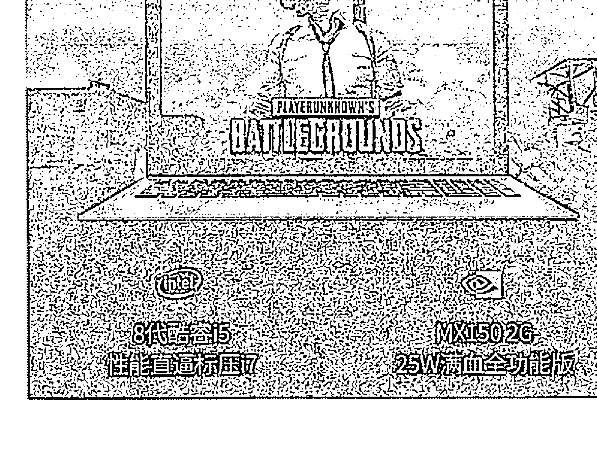

MX150为例，它原本是NVIDIA 940MX的接班人，属于“主流级”独显的迭代更新，但不少厂商却都在鼓吹它可以流畅“吃鸡”（图4）。

然而，《绝地求生》这款游戏对硬件的要求还是蛮苛刻的，考虑到这是一款FPS类游戏，更高的分辨率和画质细节可以帮助我们抢先发现敌人，而平均40fps以上的游戏帧数才算及格，60fps以上才算相对优良。

我们不妨将NVIDIA GeForce MX150（25W满血版）和GTX1050、GTX1050 Ti和GTX1060做一番对比（表2），包括3DMark-Time Spy理论测试以及在《绝地求生》中的真实表现，MX150哪怕将画面设定在最低画质下，其平均帧数也不过35fps，部分场景会出现低于20fps的现象，卡顿感难以避免。因此，对MX150这一“主流级”独显而言，想要流畅吃鸡是有前提条件的，那就是将画面设定在720P+低画质下才能勉强达成目标！

GeForce MX150（25W满血版）和GTX1050、GTX1050 Ti和GTX1060做一番对比（表2），包括3DMark-Time Spy理论测试以及在《绝地求生》中的真实表现，MX150哪怕将画面设定在最低画质下，其平均帧数也不过35fps，部分场景会出现低于20fps的现象，卡顿感难以避免。因此，对MX150这一“主流级”独显而言，想要流畅吃鸡是有前提条件的，那就是将画面设定在720P+低画质下才能勉强达成目标！

## 选本实战 什么样的笔记本最适合你

> > 了解理论知识，接下来就是进入实战部分了——如果你打算近期购入一款笔记本，应该如何进行取舍？下面，我们就从笔记本的常见形态入手，简单探讨一下什么样的笔记本最适合你。

## 轻薄本：酷睿与锐龙争锋

在过去，选择轻薄本只需认准英特尔15W TDP的U系列酷睿处理器即可，然而随着AMD锐龙移动处理器的降临，却为轻薄本的选择增添了变数。

### 先从一个案例谈起

前面的章节我们已经提到，AMD锐龙移动处理器完全具备挑战八代酷睿处理器（U系列）的资质，而其集成的核显更是超越了入门级的独立显卡。好消息是，OEM厂商也清楚AMD的品牌认知度不如英特尔，所以现阶段上市的锐龙笔记本的价格也展示出了浓浓的诚意。

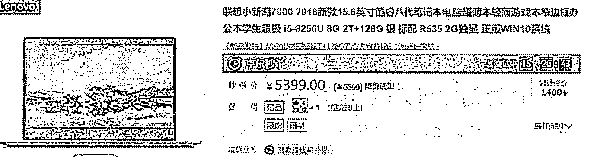

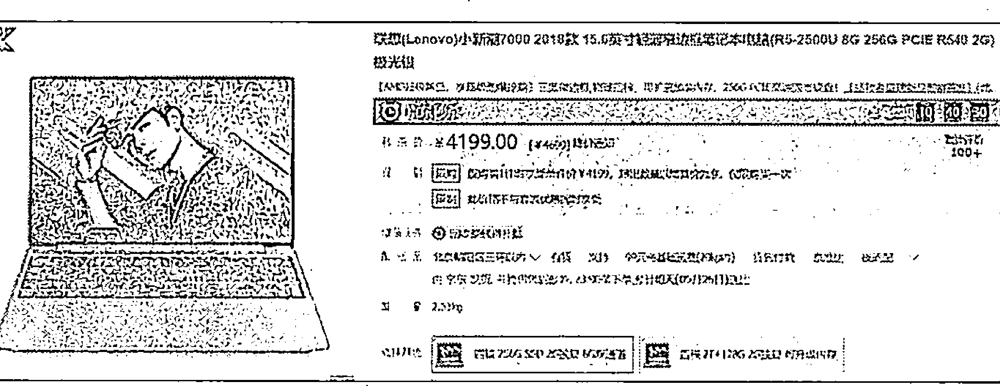

以2018款联想小新潮7000-15为例，这款轻薄本采用了15.6英寸大视野，并通过三面窄边框设计实现了瘦身，19.4mm厚和1.8kg重极为便携。有意思的是，小新潮7000-15同时提供了英特尔和AMD两套平台的配置版本，其中英特尔版搭载酷睿i5-8250U+8GB+128GB SSD+2TB HDD+AMD R535独显，售价为5399元（图1）。而小新潮7000-15的AMD版则搭载Ryzen R5 2500U+8GB+256GB PCIe SSD+AMD RX540独显，售价为4199元（图2）。从CPU性能的角度来看，AMD版的小新潮7000-15和英特尔版接近，但GPU性能方面则是AMD版全面领先，哪怕是Ryzen R5 2500U集成的核显就足以媲美AMD R535独显了，而AMD版小新潮7000-15武装的AMD RX540独显更是具备领先NVIDIA 940MX独显的性能（略逊于MX150）。在这种情况下，AMD版小新潮7000-15还有着超过千元的价格优势，如果你中意小新潮7000-15这款产品的外观设计和便携性，自然是AMD版的更值得选择了。

> > 京东等电商平台不定期会进行秒杀或促销，实际价格总会存在波动

### 再来看看另一个案例

宏碁蜂鸟Swift3-15也是一款15.6英寸大屏轻薄本，18.5mm的厚度和不足2kg的体重也较为轻盈。在5000元左右的价位上该产品提供了三种配置的版本：AMD核显版搭载Ryzen R5 2500U+8GB+256GB PCIe SSD+核显，售价4799元（图3）；

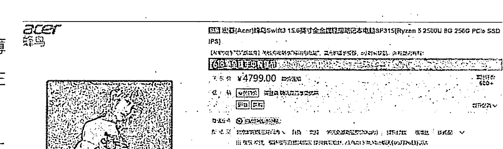

AMD独显版搭载Ryzen R5 2500U+8GB+256GB PCIe SSD+AMD RX540独显，售价5499元(图4)；英特尔独显版搭载酷睿i5-8250U+8GB+128GB SSD+1TB HDD+NVIDIA MX150独显(满血版)，售价5299元(图5)。

有了前文的铺垫，大家知道哪个版本性价比最低吗？没错，AMD独显版最不值得选择，原因是其武装的AMD RX540独显性能远不如MX150独显，但价格反而比英特尔独显版还贵了200元。如果你的预算有限，AMD核显版的蜂鸟Swift3-15性价比最高，Ryzen R5 2500U集成的核显足够流畅运行LOL和守望先锋级别的游戏了。至于英特尔独显版，则适合预算较为充裕的玩家考虑。

## 轻薄本的形态之争

除了考虑处理器平台外，我们在挑选轻薄本时还需要留意产品的结构形态。惠普旗下的ENVY 13和ENVY X360-13是最具代表性的产品。ENVY 13是一款13.3英寸传统形态的轻薄本，全金属一体化机身做工精湛，13.95mm的厚度和1.23kg的重量便携性一流。而ENVY X360-13则是屏幕可以进行360度翻转的“变形本”，屏幕支持触控，它同样是全金属一体化机身，厚度和重量分别为14.9mm和1.3kg，同样无比轻盈。

同时，ENVY 13和ENVY X360-13的屏幕都采用了72%色域的IPS屏幕，除了形态上的差异，配置方面ENVY 13选用了英特尔平台，搭载酷睿i5-8250U+8GB+256GB PCIe SSD+核显的型号售价为5499元(图6)；ENVY X360-13采用了AMD平台，搭载Ryzen R5 2500U+8GB+256GB PCIe SSD+核显的版本售价为5199元(图7)。

此时，具备翻转屏幕+触控特性，且集成核显性能更强，售价还要便宜300元的ENVY X360-13无疑更加值得选择。需要注意的是，英特尔平台的ENVY 13还可选择武装NVIDIA MX150独显的高配版(6000元左右起)，性价比相对一般。

## AMD染指商务市场

很早以前，笔记本会根据用户人群划分成“商务本”和“娱乐本”，二者有着泾渭分明的外观样式。比如商务本棱角分明，以深色系外观为主；而娱乐本则流线动感，拥有多彩外壳可选。如今，“商务本”和“娱乐本”的边际逐渐模糊，主流的轻薄本既具备娱乐本的性能，也具备商务本的便携和续航属性。但是，如果你非要较真，“真商务本”还是需要符合下述几点要求的：

首先，商务本要具备较强的定制性，可以根据客户/企业的需求加装上网卡和智能卡模块；同时，商务本不仅要配备常见的接口，还需准备专用的拓展坞接口，以便同时接驳更多的

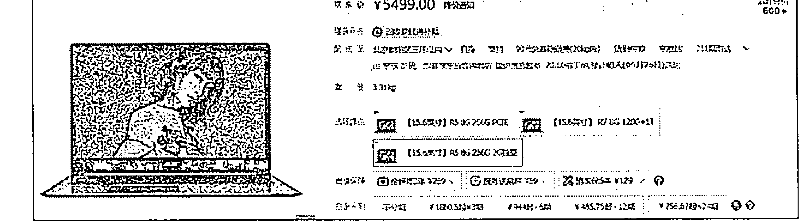

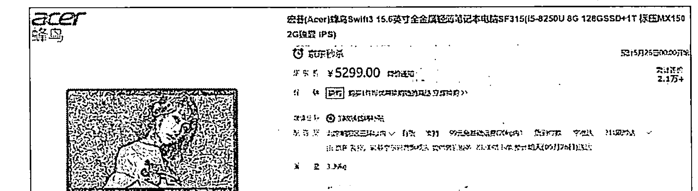

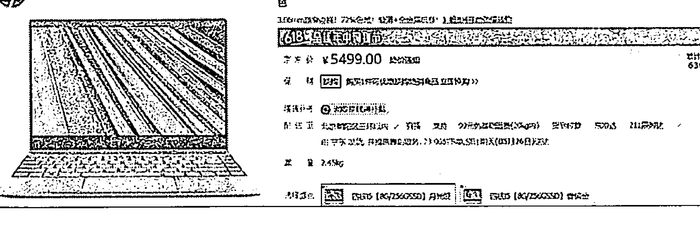

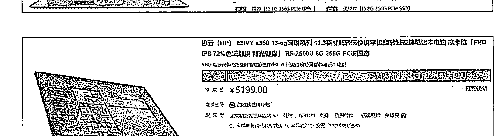

外设; 此外, 商务本不仅要配备指纹识别模块, 硬件层面还需搭载支持vPro技术的处理器 (图8) , 具备BIOS锁、硬盘加密等底层的安全技术; 最后, 商务本最好还能具备更好的防尘、防水和具有宽温范围运行能力, 并通过美军MIL-810G测试等认证。

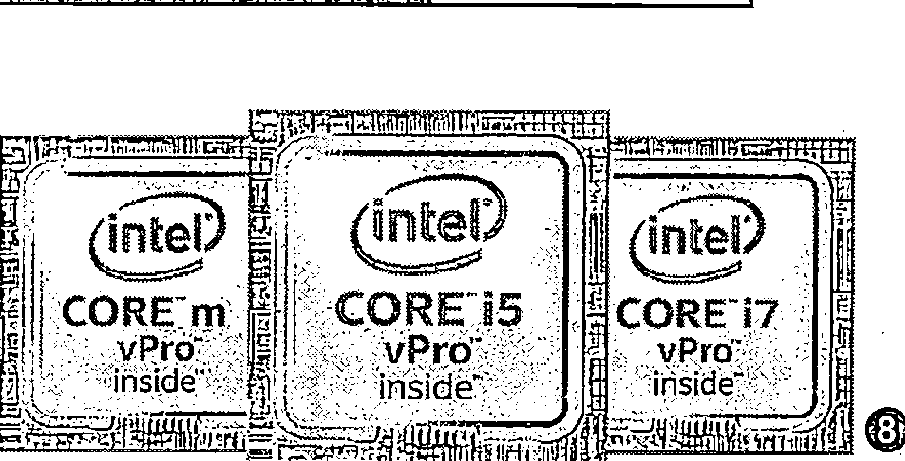

如此一来, 我们就能刷下绝大多数“伪商务本”, 因为支持vPro技术的处理器仅限酷睿i5-8350U、i7-8650U、i5-8400H、i7-8850H、至强E-2176M等少数处理器, 市面上符合上述要求的也仅限惠普EliteBook、戴尔Latitude和ThinkPad旗下的少数产品, 而且价格不菲。

好消息是, AMD锐龙PRO系列移动处理器总算拉低了真商务本的门槛, 比如惠普最新推出的EliteBook 745G5就是一款极具性价比的商务新秀 (图9) 。这款产品采用14英寸屏幕和CNC一体成型的金属机身设计, 得益于超窄边框, 将身材压缩到17.9mm厚和1.53kg重, 便携性非常出色。同时, 这款产品还搭载AMD Ryzen Pro R5 2500U (注意是带Pro的专业版哦) +8GB+256GB PCIe SSD+核显的配置, 还具备带物理开关的隐私摄像头、按压式指纹识别、超薄拓展坞专用接口、最长12小时续航以及美军MIL-810G认证等特色, 4799元的价格也极具诚意。

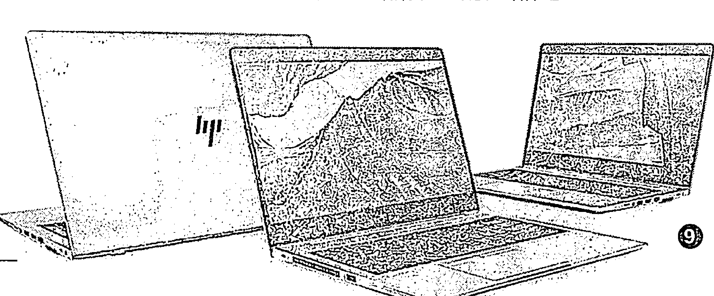

如果你只是普通的上班族, 任何一款轻薄本都可以扮演商务本。如果你追求商务本特有的安全性和稳定性, 那还是请认准搭载支持vPro技术的英特尔处理器, 或基于AMD锐龙PRO系列移动处理器打造的产品吧。

## 满城尽是女性本

CFan曾收到过很多读者的来信, 希望可以推荐一些适合女性使用的笔记本电脑。然而, 根据笔者的实际体验, 绝大多数“轻薄本”其实都很适合女性用户使用。可能有女生会说了: “我喜欢粉色或纯白色外观的本本, 但市面上可以选择的型号太少啦!”

实际上, 只要你挑选的是热门型号, 都可以在京东淘宝买到专用的皮肤贴纸, 哪怕是最无趣的灰色笔记本也能贴出萌呆的效果 (图10) 。

此时, 你还会纠结在乎轻薄本自身的颜色风格吗?

对女生而言, 笔者推荐大家选择13.3英寸或14英寸屏幕, 同时采用超窄边框设计的轻薄本, 此类产品大都可以将重量控制到1.5kg以内, 女生出门携带压力不大 (图11) 。配置方面则从英特尔酷睿i5-8250U或AMD Ryzen R5 2500U+8GB+256GB SSD+核显起步, 屏幕采用IPS材质 (色域越高越好) 即可。现在5000元价位可选的产品有很多, 比如小米笔记本Air 13、联想ideapad 720s (英特尔版) 、荣耀笔记本、惠普ENVY13、戴尔5370等等。

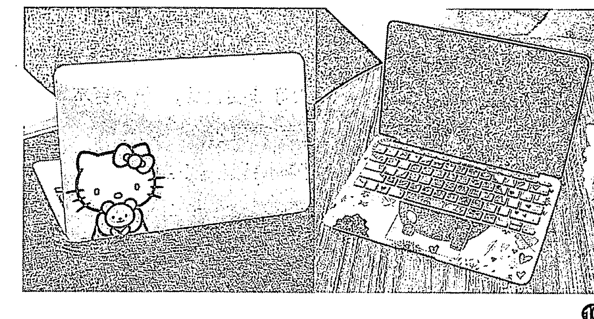


## 游戏本：八代酷睿的盛宴

如果说轻薄本领域正处于英特尔和AMD争锋的阶段，那在游戏本领域暂时就是英特尔一支独大了。如果你想选择一款最具性能价格比的游戏本，英特尔Coffee Lake-H平台处理器+NVIDIA独显就是黄金搭档。

## 八代酷睿王者天下

英特尔在4月初正式发布了代号为“Coffee Lake-H”的移动版八代酷睿处理器，经过几个月的磨合期之后，如今的游戏本市场已经正式成为这一平台的天下。在本刊2018年第9期《真的强大吗 剖析移动版八代酷睿处理器》和2018年第10期《和七代酷睿说拜拜 游戏本请认准新平台》这两篇文章，我们曾详细解读过H系列八代酷睿处理器的规格和性能，所以本文我们就能直接拿出结论：

**表1：八代酷睿i5/i7和七代酷睿i7规格对比**

| 型号 | i7-8750H | i5-8300H | i7-7700HQ |
| :--- | :--- | :--- | :--- |
| 隶属平台 | Coffee Lake-H 八代酷睿 | Coffee Lake-H 八代酷睿 | Kaby Lake-H 七代酷睿 |
| 制程工艺 | 14nm++ | 14nm++ | 14nm+ |
| 核心/线程 | 6/12 | 4/8 | 4/8 |
| TDP功耗 | 45W | 45W | 45W |
| 高速缓存 | 9MB | 8MB | 6MB |
| 基础频率 | 2.2GHz | 2.3GHz | 2.8GHz |
| 单核睿频加速 | 4.1GHz | 4.0GHz | 3.8GHz |
| 多核睿频频率 | 3.2GHz | 3.6GHz | 3.4GHz |
| 核芯显卡 | UHD630 | UHD630 | HD630 |
| 显卡基础频率 | 350MHz | 350MHz | 350MHz |
| 显卡加速频率 | 1.1GHz | 1.0GHz | 1.1GHz |
| 支持内存 | DDR4-2666 LPDDR3-2133 | DDR4-2666 LPDDR3-2133 | DDR4-2400 LPDDR3-2133 DDR3L-1600 |

从规格来看，八代酷睿i5-8300H由于引入了超线程技术，所以其规格全面领先于七代酷睿i7-7700HQ。而八代酷睿i7-8750H则凭借6核12线程以及高达9MB高速缓存的优势，具备更为理想的能量底蕴(表1)。

从实测的性能来看，八代酷睿i5-8300H就足以全面领先七代酷睿i7-7700HQ，而八代酷睿i7-8750H更是英雄无敌(表2)，堪称万元内游戏本的“梦想之芯”。从这组对比数据来看，市面上那些还在搭载七代酷睿的游戏本老将已经完全没有了采购的价值！换句话说，如果你现在打算入手笔记本，处理器这项参数就要认准i5-8300H或i7-8750H了。

**表2：八代酷睿i5/i7和七代酷睿i7性能对比**

| 测试软件 | 测试项目 | i7-7700HQ | i5-8300H | i7-8750H |
| :--- | :--- | :--- | :--- | :--- |
| 国际象棋 | 每秒千步 | 13528 | 15389 | 15891 |
| CPU-Z | 单核 | 402 | 460.4 | 482 |
| | 多核 | 2043 | 2184.8 | 2864 |
| CineBench R11.5 | 单核 | 1.65 | 1.93 | 1.92 |
| | 多核 | 7.93 | 8.37 | 11.57 |
| CineBench R15 | 单核 | 147 | 169 | 168 |
| | 多核 | 736 | 795 | 1022 |
| 3DMark Fire Strike | 物理子项 | 10752 | 12123 | 14109 |

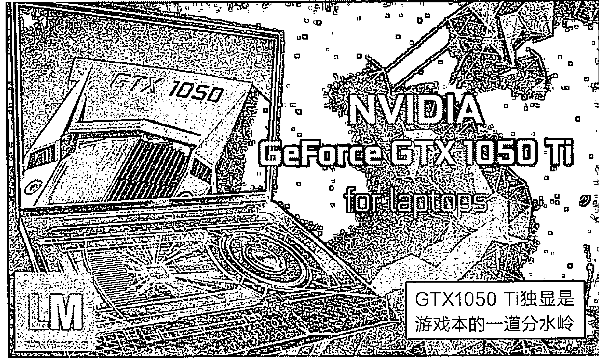

## 还是熟悉的GTX10显卡

在前面的章节中，我们提到过NVIDIA短期内不会推出GTX11系列移动显卡，所以下半年万元内的游戏本市场依旧是我们熟悉的GTX1050、GTX1050 Ti和GTX1060（包括MAX-Q版）。至于如何取舍，就要看你喜欢玩的游戏类型和环境了。

如果你喜欢“吃鸡”，在预算允许的情况下尽量一步到位选择GTX1050 Ti级别的独显(图12)；如果你喜欢将游戏本外接显示器，有在2K分辨率下游玩3A大作的打算，那GTX1060才是你的菜。

## 全面屏正式崛起

在4月初英特尔刚刚发布Coffee Lake-H平台时，只有机械师、机械革命和雷神在第一时间发布了引入“全面屏”概念的游戏本——将屏幕左、右、上边框压缩到极致，将15.6英寸屏幕塞进14英寸机身的紧凑设计。步入6月之后，联想发布了全新的拯救者Y7000（图14），惠普带来了暗影精灵4代，这两款产品同样主打全面屏元素，并具备更具便携度的外观和更精致的细节，售价方面也一如既往的亲民。

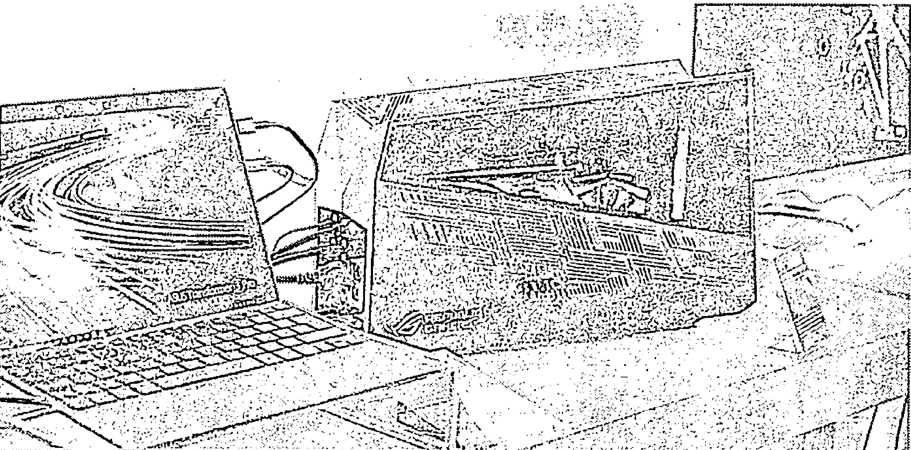

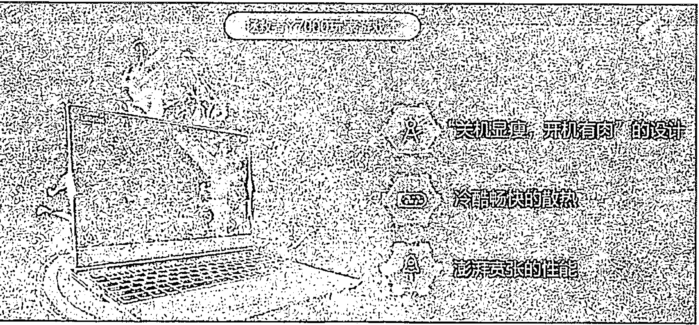

可以说，未来的游戏本也要开始比拼屏占比，更加看重厚度和重量参数，以“移动小钢炮”为努力方向。至于游戏本之间如何取舍，除了最基本的外观设计、处理器和显卡参数以及售价以外，笔者建议大家将更多的注意力放在屏幕的色域和刷新率方面，都是IPS材质，45%和72% NTSC色域的差距还是很明显的，而支持120Hz或144Hz屏幕的游戏本玩游戏时还能解决画面撕裂的隐患。此外，我们还需关注游戏本的拆机难度，这将影响到日后能否自行拆机升级和进行清灰除尘的操作。当然，散热模块的设计和效果（图15），也是挑选游戏本的重中之重，它将决定一款产品能否长时间满血运行，这方面还需我们多参考网上的拆机评测。最后，八代酷睿原生支持英特尔傲腾内存，游戏本是否提供了安装傲腾内存的M.2插槽、BIOS层面是否保留了开启傲腾的设置选项，也是需要我们留意的方向。

未来几期的CFan杂志上，笔者会为大家带来更多采用全新模具的八代酷睿游戏本的对比和推荐，敬请期待吧。

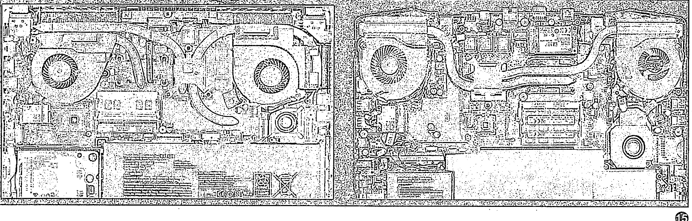

## Windows 10执行任务快上加快

文|汾水

我们在Windows 10中执行一些任务时，往往需要经过多次点击操作，费一番周折之后才能完成。如果使用一些技巧或借助必要的软件，就可以更快地完成任务。

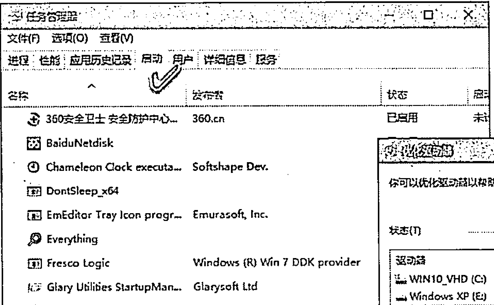

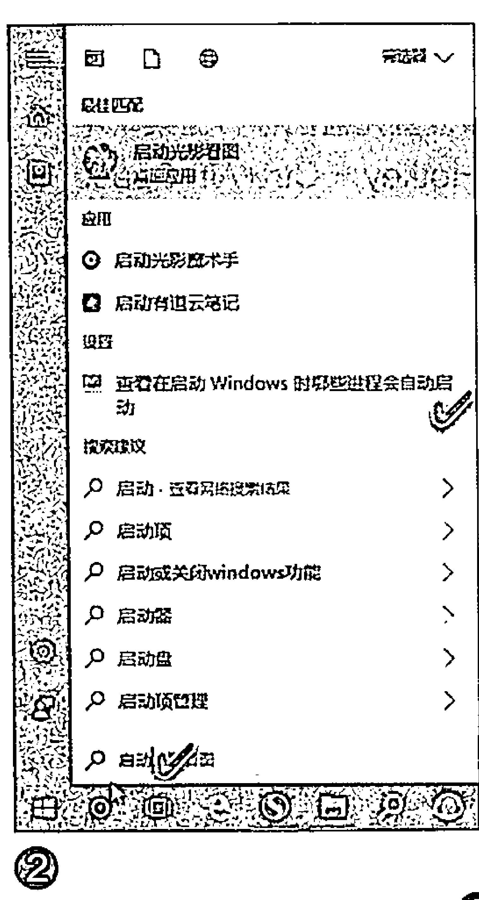

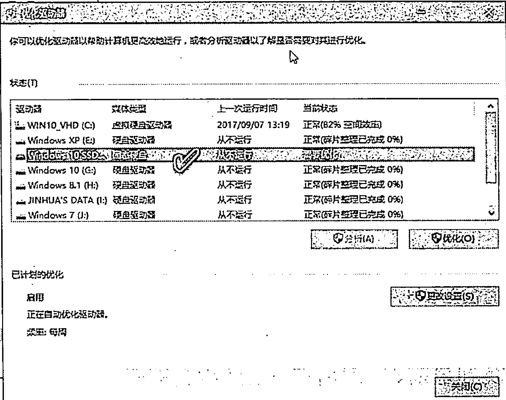

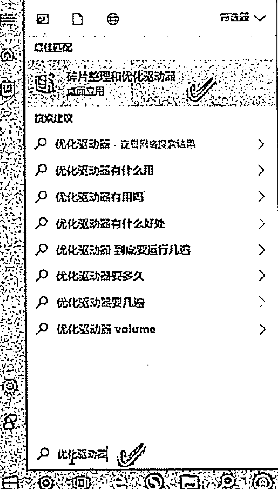

### 1 快速访问任务管理器‘启动’选项卡

要通过‘任务管理器’的‘启动’选项卡来管理启动项目，需要多个步骤才能进入：先右键单击任务栏空白处，从弹出的菜单中选择‘任务管理器’，启动任务管理器后，单击‘启动’选项卡，这样才能进行启动项目的管理（图1）。如果借助于Cortana，可大大加快进入的速度。

在Cortana对话框中输入‘启动’，在搜索匹配结果中选择‘查看在启动Windows时哪些进程会自动启动’设置项，即可快速进入任务管理器，并自动切换到‘启动’选项卡（图2）。

### 2 免拆机查看是否装有固态硬盘

不用开机盖，在Windows 10中查看电脑中是否安装有固态硬盘的一种方法是利用系统自带的优化驱动器工具。点击‘开始’按钮并输入‘优化驱动器’，然后选择最佳匹配结果中的‘碎片整理和优化驱动器’桌面应用（图3）。在随后启动的优化驱动器窗口中，驱动器状态列表的‘媒体类型’一栏中，就会显示驱动器的类型，如果有固态硬盘存在，就会显示‘固态硬盘’（图4）。

但是，上述操作需要经过多次点击才能到达目标。其实还有更为快速的方法，那就是利用系统内部命令Get-PhysicalDisk查看。右键单击‘开始’按钮并选择‘Windows PowerShell(管理员)’，在管理员身份Windows PowerShell窗口中输入如下命令并回车：

```
Get-PhysicalDisk
```

如果显示列表的MediaType（媒体类型）列中有SSD类型，则说明系统中安装有固态硬盘（图5）。

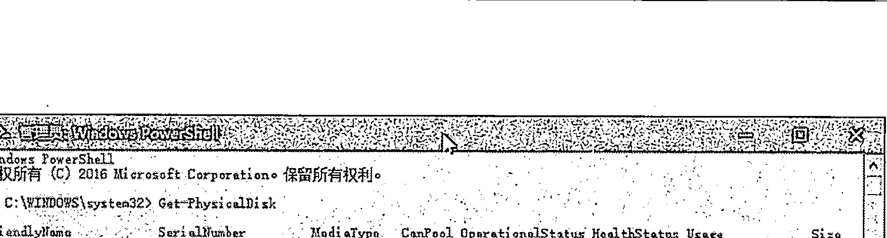

### 3 将常用窗口固定到最前面

在Windows中打开的窗口很多时，如果希望将自己常用或关注的窗口固定到最前端，用Windows 10本身的功能实现，只能是去点击任务栏上需要前置的窗口。如果利用Windows TopMost Control这个小软件，就能大大提高效率。

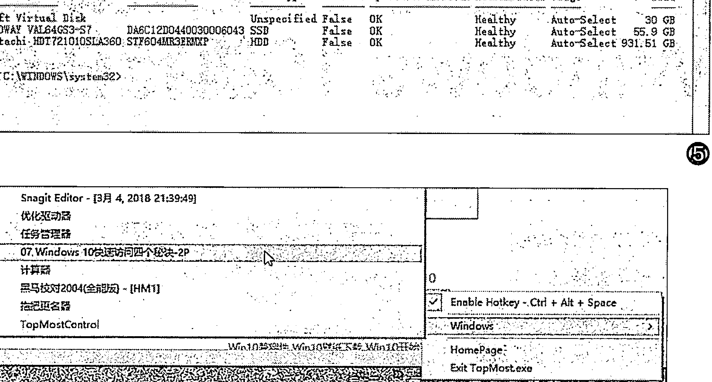

Windows TopMost Control软件为绿色软件，运行后以一个小图标退缩在系统托盘上。右键单击托盘上的该图标，在快捷菜单中选择‘Windows’项，其中可以看到所有已经打开的窗口名称，单击需要固定在最前面的窗口名称，即可将该窗口固定在最前端（图6）。

此外，我们还可以用按下快捷键组合Ctrl+Alt+Space的方式来实现窗口的前端固定。先将要固定的窗口切换到最前端，然后按下上述组合键即可。

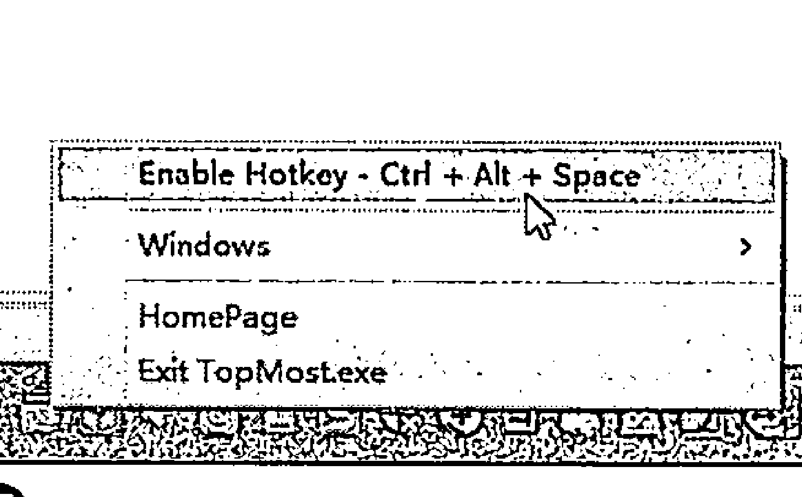

> **小提示**
>
> 如果快捷键组合Ctrl+Alt+Space不能发挥作用，请检查托盘图标右键菜单中的‘Enable Hotkey – Ctrl+Alt+Space’选项是否未被选中。若未被选中，点击将其选中，前端出现对钩符号‘√’即可（图7）。

### 4 以带参数的管理员命令运行程序

为完成一些特殊需求下的任务，我们往往需要在管理员命令窗口中使用一些带参数的命令或程序，这时如果使用全程命令的方式，仅是路径输入一项，操作起来就比较费劲。通过PowerRun工具，能够实现窗口式快速调用带参数的命令或程序。

PowerRun工具对应于Windows操作系统有32位和64位两种版本，根据自己所用的Windows版本下载对应的版本运行。PowerRun默认已经添加了命令提示符、Windows PowerShell、记事本等三个程序，可选中其中之一之后，再点击工具栏上的扳手按钮，对参数项目进行编辑（图8）。当然，也可以直接点击“+”号按钮，添加其他程序并定义运行参数（图9）。

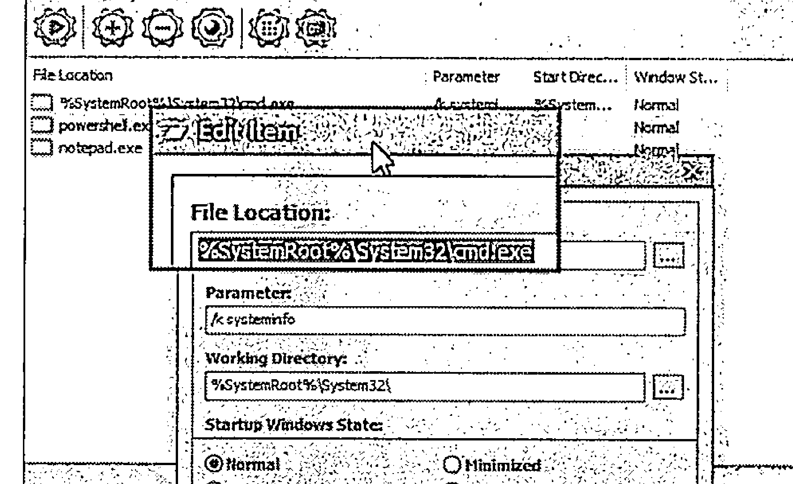

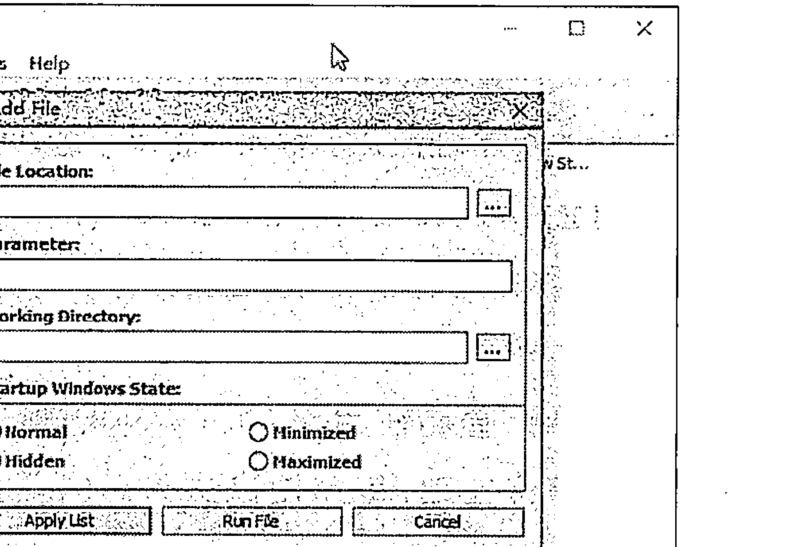

## 彻底禁止Windows 10自动安装游戏或应用

文|波波

Windows 10自带一些游戏或应用，还会不时地推送一些游戏或应用。对不使用某些应用的人来说，它们白白地浪费空间。但是，手动卸载之后，这些软件还可能会自动安装。通过如下两种方法，可彻底阻止游戏或应用的自动安装。

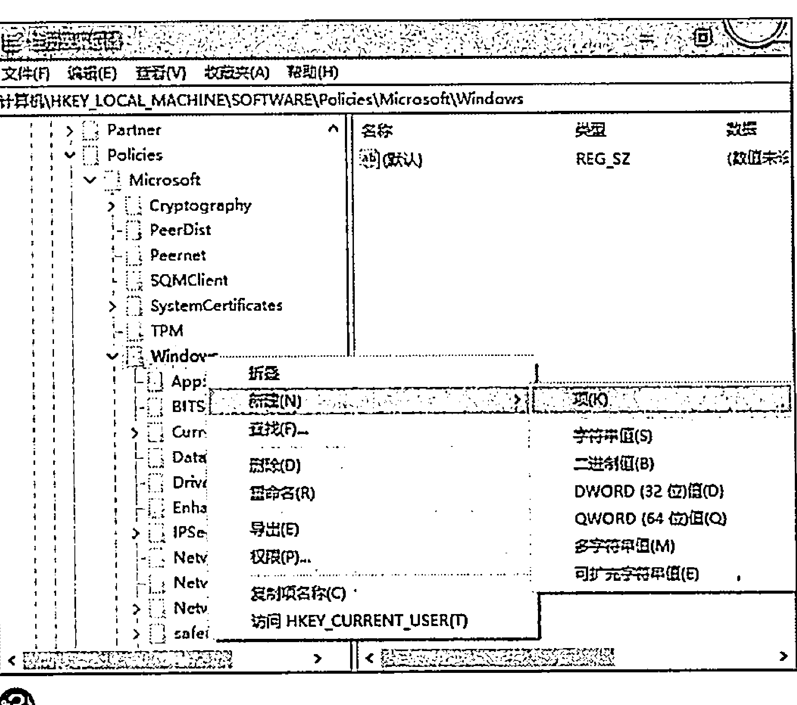

> **小提示**
>
> 对于Windows 10版本高于家庭版的用户，还可以通过组策略编辑器来禁用上述功能。具体方法：在“本地安全策略”下的“应用程序控制策略”中选择“封装应用规则”，右键选择“创建新规则”，打开“创建封装应用规则”窗口，在权限设置界面中选择“拒绝”，应用程序选择为“Windows聚焦”，然后点击创建新的应用封装规则，以取代系统默认应用推送和预装规则。由于仅选择了“Windows聚焦”，对其他应用安装影响有限，不会影响到用户到商店下载和安装应用，但的确起到了拒绝应用自动推送的作用。

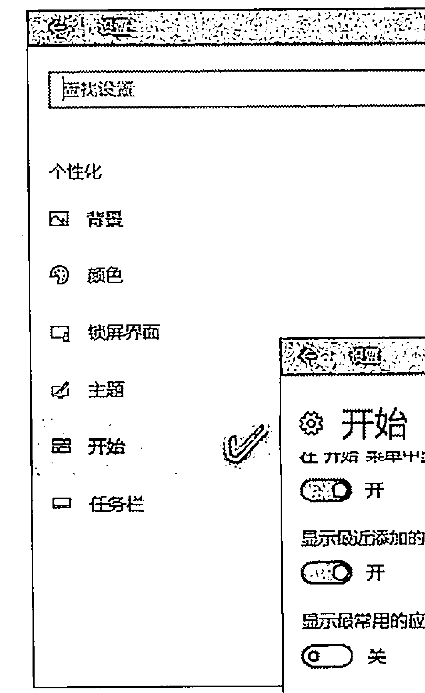

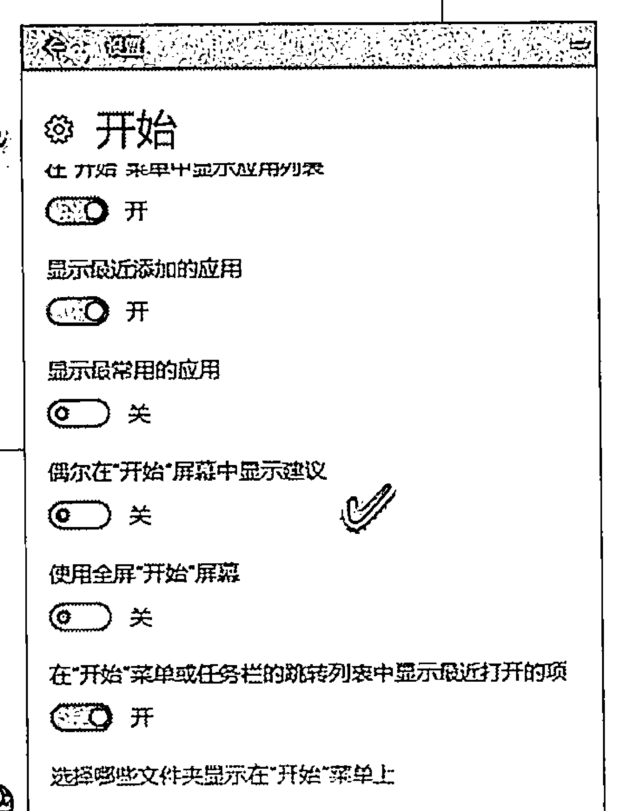

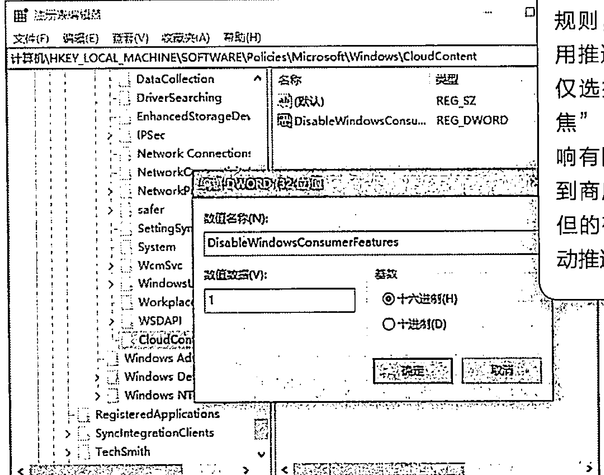

### 1 通过Windows 10设置进行阻止

对于使用最新版Windows 10的用户，可通过系统设置来完成阻止。

首先，通过“开始→设置”，选择进入“个性化”设置窗口，然后选择“开始”项（图1）。在接下来弹出的“开始”设置列表中，将“偶尔在开始屏幕显示建议”下的开关设置为“关”（图2）。这样，当卸载了自己不再用的应用之后，系统就不会再自动安装这些应用了。

### 2 通过注册表禁用自动推送

如果所使用的Windows 10版本找不到该项设置，或家庭版的Windows用户无法用组策略禁用应用自动推送，可使用注册表编辑器来解决问题。

打开注册表编辑器，依次定位到“HKEY_LOCAL_MACHINE\SOFTWARE\Policies\Microsoft\Windows”项，右键单击该项并依次选择“新建→项”（图3），将新建的项更名为CloudContent。在右侧窗格再新建一个名为DisableWindowsConsumerFeatures的DWORD（32位）值，并将“数值数据”设置为1（图4）。关闭注册表编辑器并重启系统，之后系统便不会再自动安装应用和游戏了。

## 深入全面掌握.NET Framework

由于Windows系统对.NET Framework这一系统组件有着极为特殊的要求，而部分应用软件及游戏对它的依赖性也近乎达到了驱动级的水准，使用或安装不当会遭遇许多“未知”的问题，因此如何掌握.NET Framework的安装与使用，就是本文将为您阐述的。

### .NET Framework版本有学问

不同版本的Windows系统内置有不同版本的.NET Framework组件，那么，如何才能确定当前系统中.NET Framework的版本呢？可以通过如下两种方法查明。

- 首先，可通过注册表确定.NET Framework版本。按下Win+R并运行REGEDIT命令，启动注册表编辑器。依次定位到“HKEY_LOCAL_MACHINE\SOFTWARE\Microsoft\NET Framework Setup\NDP”分支。只要查看NDP下的子项，即可一眼看清.NET Framework的基本版本信息。要进一步了解.NET Framework的版本详细信息，点击下一级分支中Client或Full子项下的Version字符串值，在“数值数据”中即可看到详细信息（图1）。随着微软Windows 10版本的不断更新，.NET Framework也会获得相应的增强和更新。要了解.NET Framework组件的最新更新情况，在注册表中导航到“HKEY_LOCAL_MACHINE\SOFTWARE\Wow6432Node\Microsoft\Updates”，可清晰地看到每个已经安装的.NET Framework组件的KB知识库版本更新（图3）。
- 如果担心动用注册表会有危险，还可以使用命令提示符来查看.NET Framework的版本号。具体方法是在命令提示符窗口中执行如下命令（图4）：

```
dir %WINDIR%\Microsoft.Net\Framework\v*
```

注册表中.NET Framework的版本信息表格（包含名称、类型、数据等列）

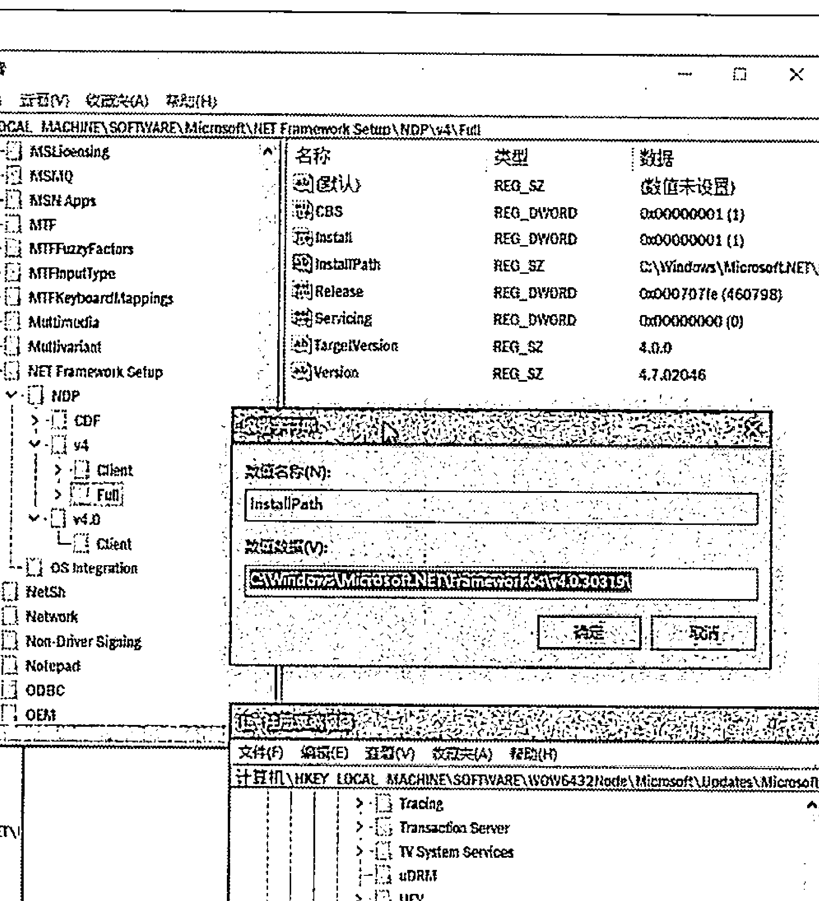

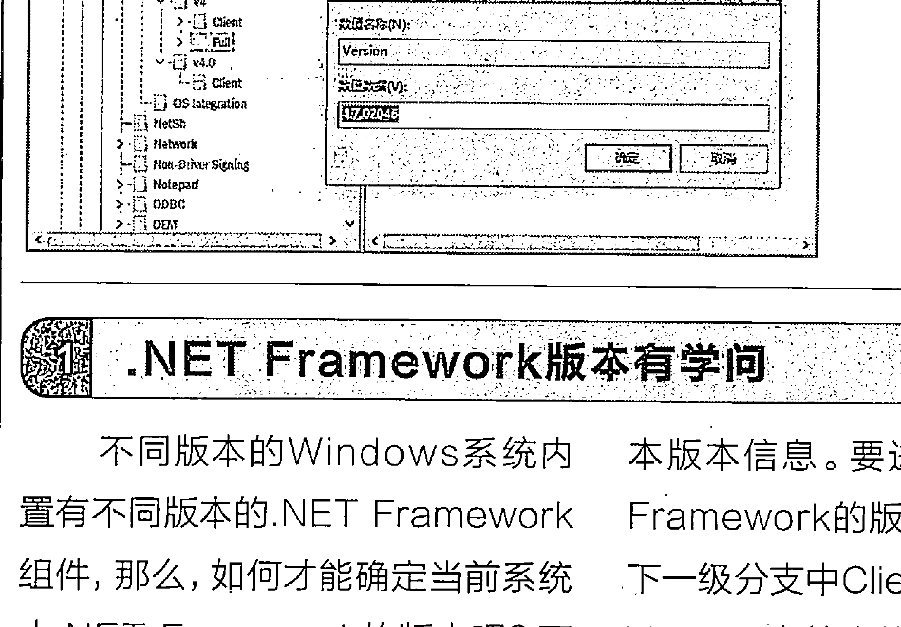

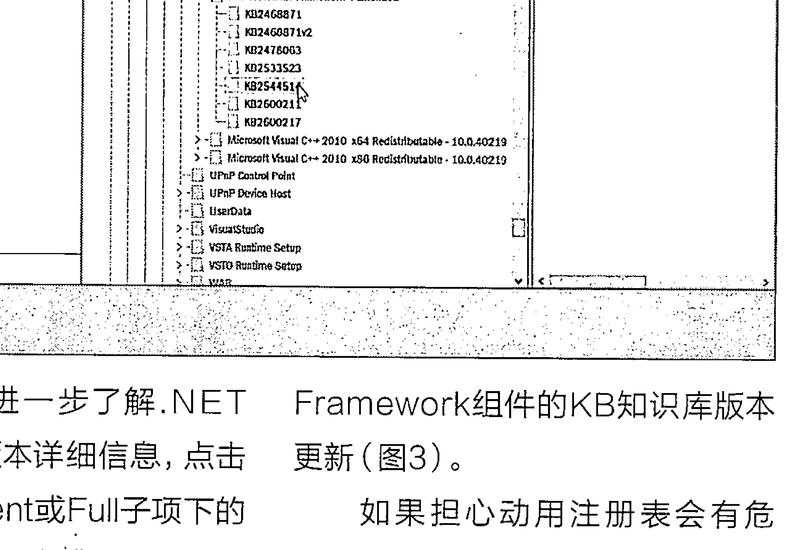

### 2 获取.NET Framework软件方法多

作为Windows系统的一项主要特性，系统内置的.NET Framework可通过控制面板中“程序和功能”窗口左侧的“启用或关闭Windows功能”链接进入选择并开启，自动下载和安装（图5）。

还可以通过微软官方网站下载.NET Framework组件，或者通过百度或Google等搜索引擎搜索下载。

在没有网络的环境下，还可以通过Windows安装介质获取.NET Framework。插入Windows的USB或DVD安装介质，从“X:\sources\sxs”目录中可以看到含有.NET Framework的CAB安装包（其中X为安装介质所在盘符）。如果安装介质为ISO文件，打开ISO文件或将ISO虚拟为一个盘符，也可从中获取上述文件。

之后，进入管理员模式的命令提示符窗口，运行如下命令安装.NET Framework（图6）：

```
Dism.exe /online /enable-feature /featurename:NetFX3 /All /Source:X:\sources\sxs /LimitAccess
```

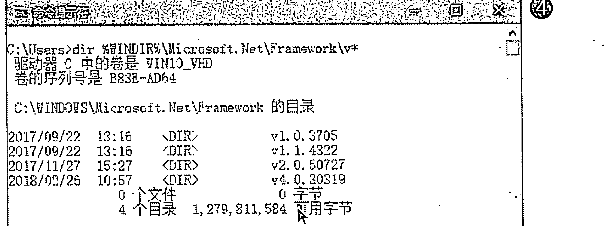

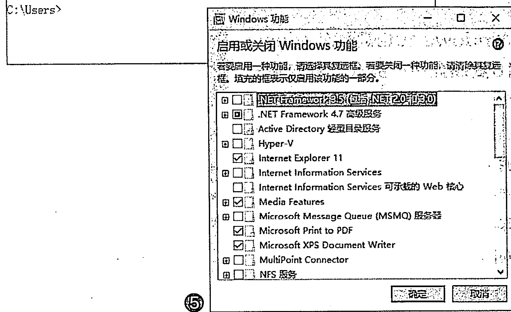


#### 小提示

不同版本的Windows系统默认可能会自带某个版本的.NET Framework组件，但这并不意味着高版本附带的.NET Framework可以支持低版本.NET Framework对应的软件（见表）。

| Windows系统版本       | 默认.NET版本                |
| --------------------- | --------------------------- |
| Windows Server 2012 R2 RTM | 4.5.1 RTM                   |
| Windows Vista SP2     | 2.0 SP2 & 3.0 SP2           |
| Windows 7             | 2.0 SP2, 3.0 SP2, 3.5 SP1 (3.5.1) |
| Windows 8             | 4.5                         |
| Windows 8.1           | 4.5.1                       |
| Windows 10            | 4.6                         |

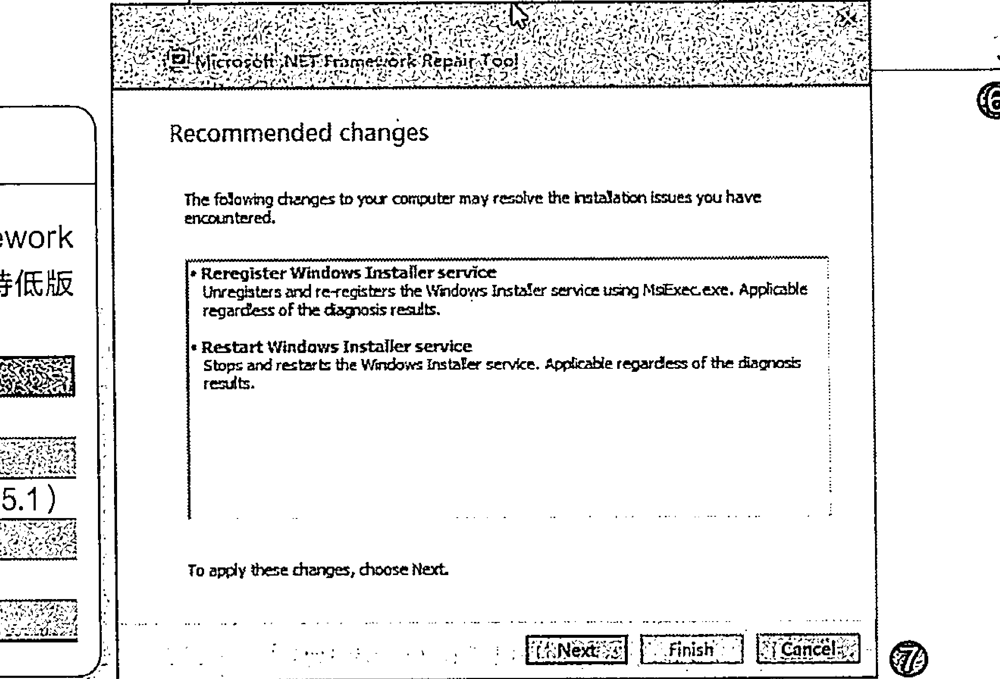

### 3 .NET Framework无法安装问题的解决

如果遇到.NET Framework无法安装的情况，可先从计算机中删除所有版本的已安装.NET Framework程序。为此，可用.NET Framework Cleanup Tool软件快速卸载。之后，下载、安装并运行Microsoft.NET Framework Repair Tool软件，按向导操作，修复存在的.NET Framework问题（图7）。

我们还可以使用一款ASoft.NET Version Detector工具来解决上述问题。该工具不但能够显示已经安装的.NET Framework版本，也可以部署.NET Framework的更新。

## 制作选择式多系统安装盘

文|樱子

通常，我们安装Windows 7需要Windows 7安装盘，安装Windows 10也需要Windows 10安装盘……那么，每安装一个版本的Windows，是不是就需要去找一个不同的安装启动盘呢？其实未必。一个WinUSB软件，外加一个大容量USB闪存盘，就可以搞定多个版本的Windows安装。

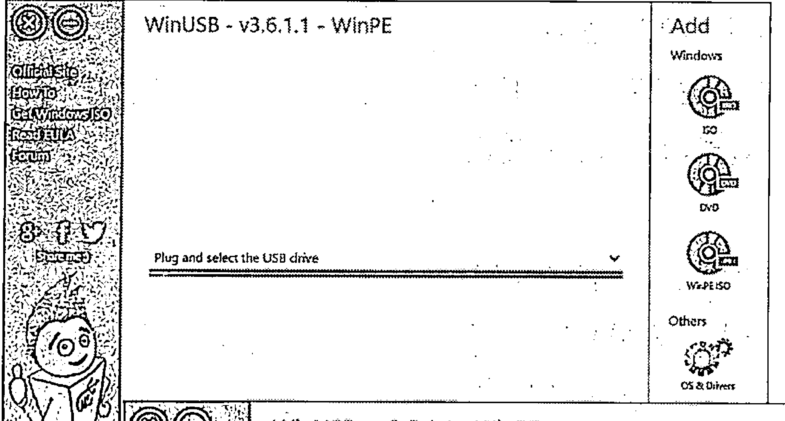

> **小提示**
>
> 如果你手里拥有的是多张Windows的DVD安装光盘，则需要点击DVD光盘图标，加载光盘安装文件到软件中。如果有WinPE的ISO安装文件，则点击WinPE ISO光盘图标加载这些文件。

首先需要准备一个大容量的USB闪存盘。目前32GB、64GB甚至更高容量的闪存盘价格已经平民化，这样的闪存盘足可以容得下从Windows 7到Windows 10的主流系统安装包。此外，还要准备各种系统的ISO安装文件，可通过微软官方下载。

接下来，运行WinUSB。软件运行后提示插入并选择USB介质（Plug and select the USB drive）（图1）。当USB介质插入之后，列表中就会自动显示该介质的卷标名称。

随后点击软件右侧Add栏内的ISO光盘图标按钮，依次选择添加若干不同版本的Windows ISO文件。例如，本例我们加载Windows 7、Windows 8.1、Windows 10三种系统的ISO（图2）。

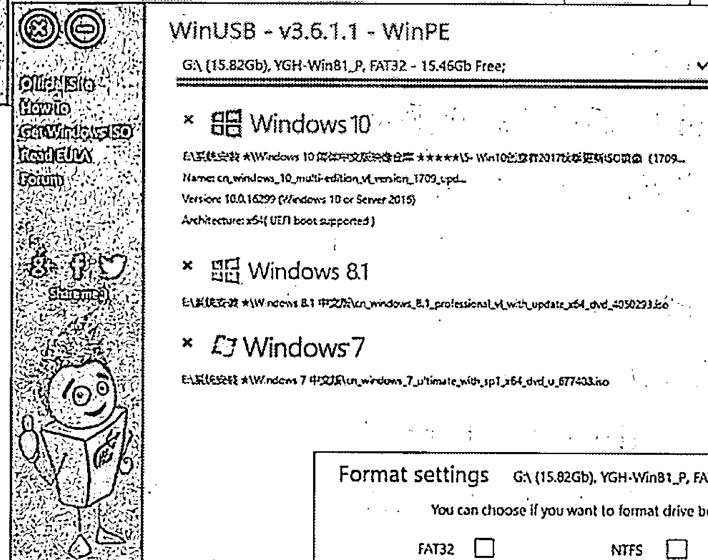

> **小提示**
>
> 若选择了exFAT文件系统进行格式化，则该启动盘将只能支持传统BIOS启动模式，无法支持UEFI模式启动。

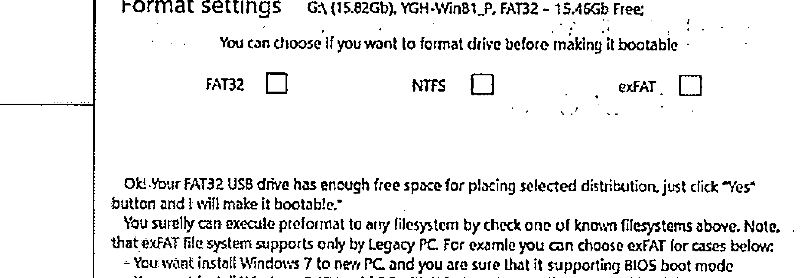

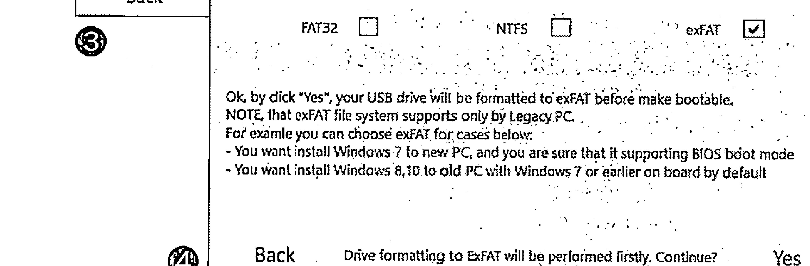

点击Next之后，软件要求选择磁盘格式并进行格式化。如果介质中已经包含有一些数据，且剩余空间足够存放之前选择的系统映像文件，软件会给出空间足够的提示，这时我们就可以不选三种格式选项中的任何选项，不对介质进行格式化处理，点击右下角的Yes按钮直接开始安装盘的制作（图3）。反之，如果介质空间已被占用造成空间不足，或希望对介质先进行格式化处理，则只需选择三种格式之一，然后点击Yes进行格式化并安装即可（图4）。

## 优化版Windows 10“上任”的考验

文||平淡

很多人的系统已经升级到了Windows 10最新的测试版，但是很多朋友发现升级到新系统后并不流畅。除了硬件的原因外，安装最新的测试版导致系统卡顿，主要是由于新系统的一些默认设置导致系统资源占用过多，我们可以根据不同的情况对症下药进行优化。

### 系统服务 针对性禁用

最新的测试版系统卡顿，很大一部分原因是由于系统服务后台占用的资源过多导致的。比如“Connected User Experiences and Telemetry”服务，它的主要作用是支持应用程序中用户体验和连接的用户体验，此外还可以根据事件来管理诊断和使用情况信息的收集和传输（用于改进Windows平台的体验和质量）。由于微软需要不断收集测试版用户体验数据来改进Windows 10质量，该服务会在后台不断发起连接和数据传输，直接导致系统资源被大量占用。对于普通用户来说，关闭该服务可以节省大量系统资源（图1）。

服务的优化操作很简单，在任务栏搜索框输入“服务”，打开服务配置窗口后，在右侧列表中找到上述服务并打开属性窗口，按提示将服务设置为“禁用”，重启后即可生效（图2）。

对于测试版用户，类似的不影响日常使用，但又可以节省系统资源并禁用的系统服务还有“Diagnostic Execution Service”、“Diagnostic Policy Service”（用于Windows组件的问题检测、疑难解答和解决方案）、“Diagnostic Service Host”和“Diagnostic System Host”（均为诊断服务），这些服务主要用于测试版问题的收集和诊断，禁用不会给日常操作带来不便，操作同上全部设置为禁用即可。

### 系统设置 选择性优化

除了系统服务优化外，系统本身一些默认设置也会占用系统资源，对于低配置用户可以选择性地进行优化。比如“视觉效果”设置，可以进入“系统属性→高级→性能→设置→自定义”，按照自己的实际需要进行自定义设置。比如去除“窗口内的动画控件和元素”的勾选，这样在双击桌面“此电脑”的窗口时响应速度有明显的提升。其他设置类似，酷炫、动画效果都很占用资源，大家可以参考下图进行设置（图3）。

此外还可以关闭透明特效（个性化→颜色，取消“更多选项”里的“透明效果”即可），启动任务管理器，关闭不必要的启动项等（图4）。

总之，在安装新版测试系统后发现卡顿，大家一方面可以根据新系统的特性（比如上述“Connected User Experiences and Telemetry”服务）进行优化，另一方面则可以根据杂志之前介绍的通用Windows 10优化技巧进行优化，双管齐下就可以让新系统不再卡顿。

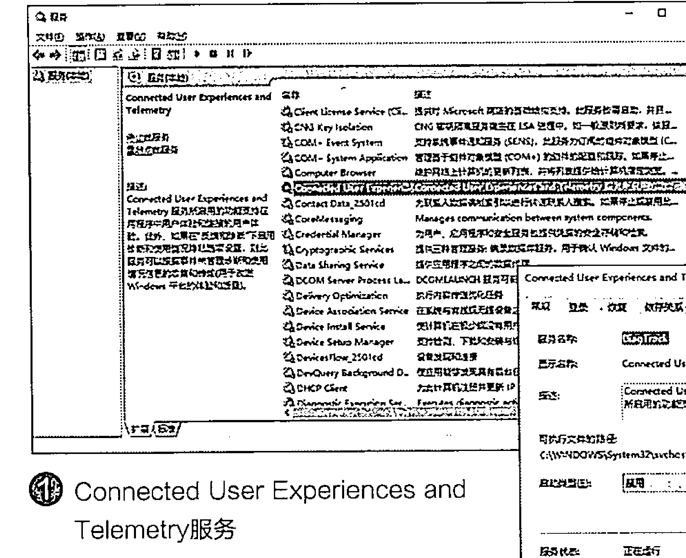

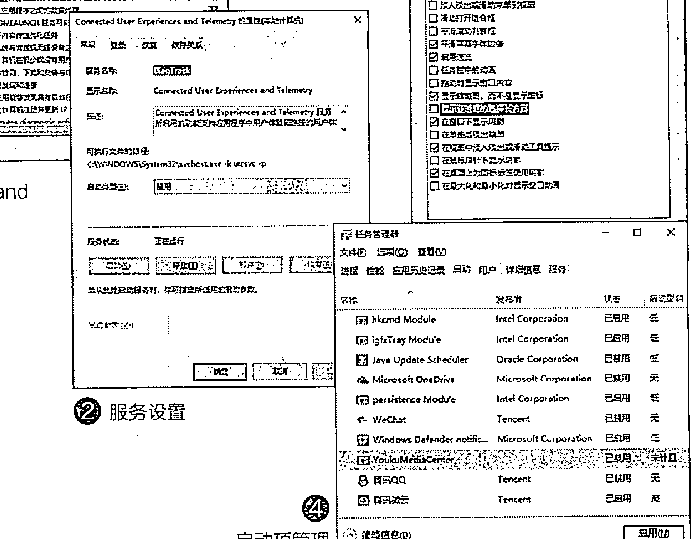

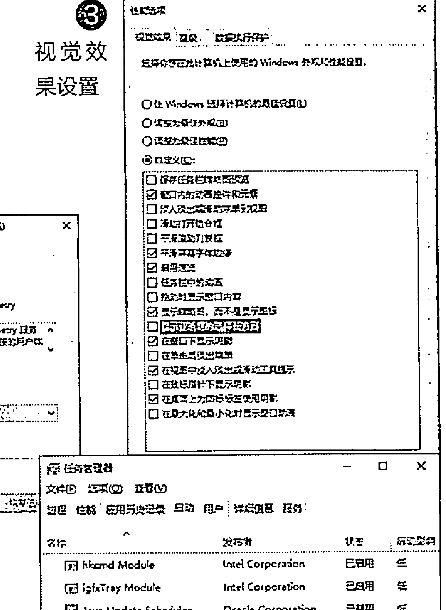

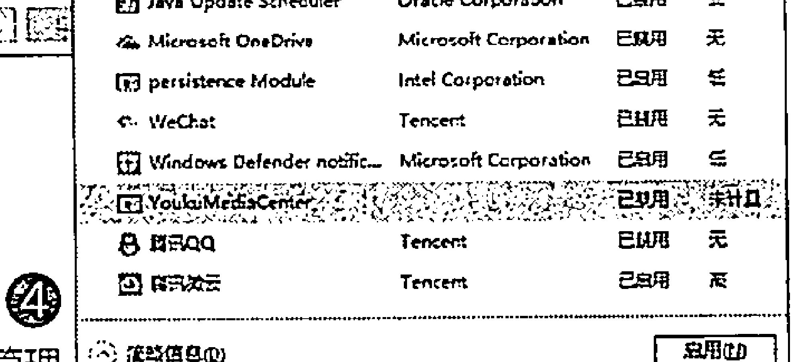

## 全面阻止某应用程序访问Internet

文|波波

一些程序会在后台偷偷访问Internet，或偷走流量，或悄悄地将用户数据传回到它的服务器。那么，当我们不得不使用某个程序，而又不希望它偷偷访问网络时，该如何全面阻止它上网呢？其实，不借助第三方工具，仅用Windows 10即可阻止。

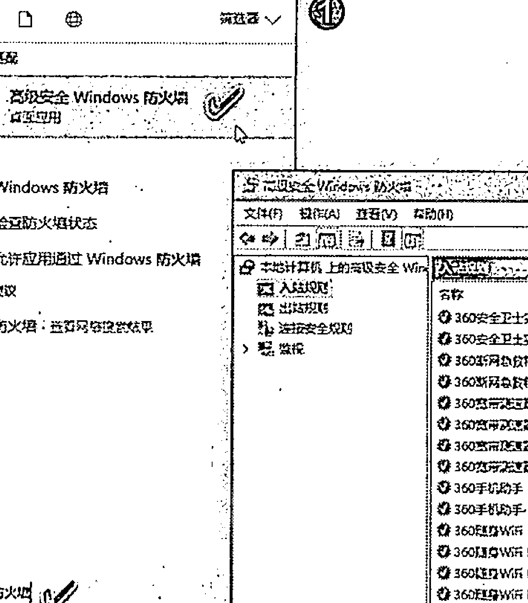

我们可以使用Windows 10防火墙来阻止已安装的任何应用程序访问Internet。点击“开始”按钮，然后输入“防火墙”，在最佳匹配结果中单击“高级安全Windows防火墙”桌面应用（图1）。

在“高级安全Windows防火墙设置”窗口中，选择左侧窗格的“入站规则”，然后点击右侧窗格中的“新建规则”（图2）。接着将规则类型选择为“程序”，单击“下一步”。

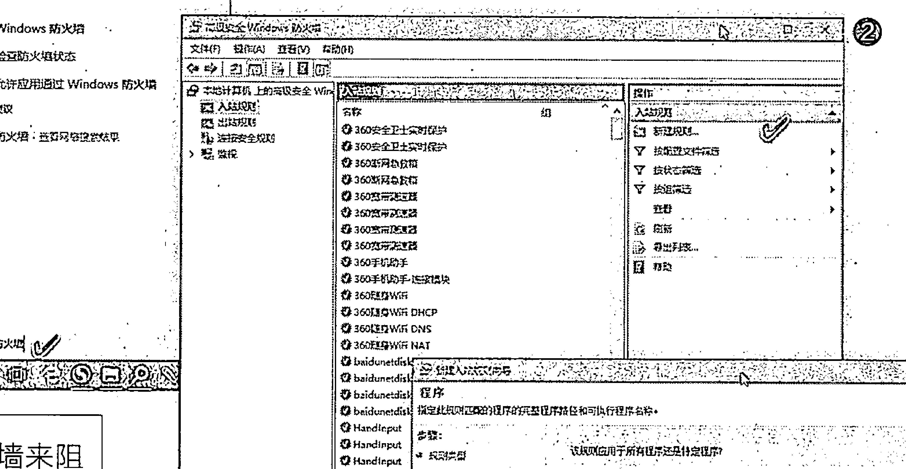

在接下来的窗口中，选择“此程序路径”并单击其后的“浏览”按钮，选择要阻止的应用程序的EXE主文件（图3）。在下一个窗口中选择操作类型为“阻止连接”，点击“下一步”。

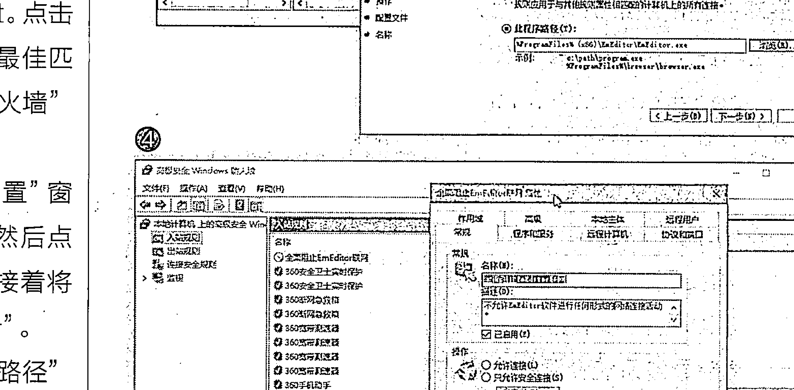

最后选择应用规则的场合（这里给出3种场合，分别为域、专用网络、公用网络）。因为我们要完全阻止该程序联网，因此这里要将3个选项全部选中。然后可为规则指定一个名称，单击“完成”按钮保存它。保存规则后，双击规则可获得规则的详细信息（图4）。

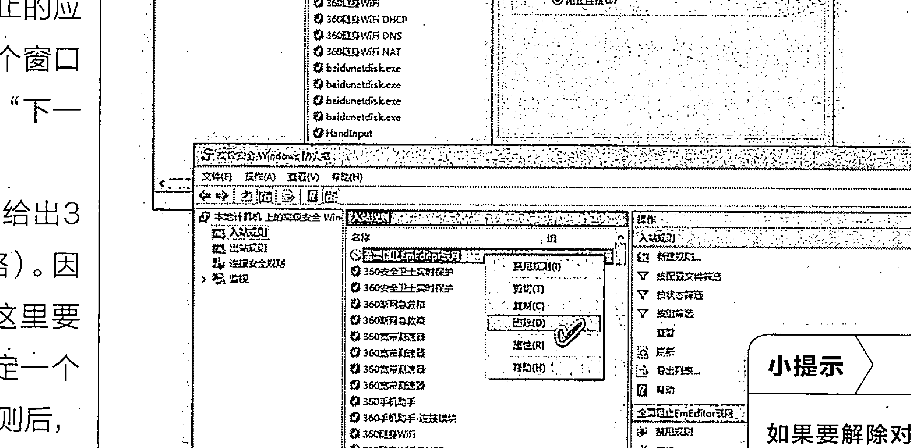

“出站规则”的制定方法也类似。之后，阻止规则发挥作用，如果被封锁的应用程序尝试访问Internet，将显示错误信息。

> 小提示：如果要解除对应应用程序的网络封锁，只需删除上述制定的规则即可（图5）。

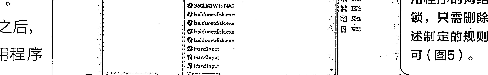

## BitLocker密钥恢复三招

文|吕梁

BitLocker是Windows 10自带的一种存储设备加密方式，本刊也曾介绍过这一加密方式。在使用密钥和恢复的过程中，我们还需要注意一些问题。

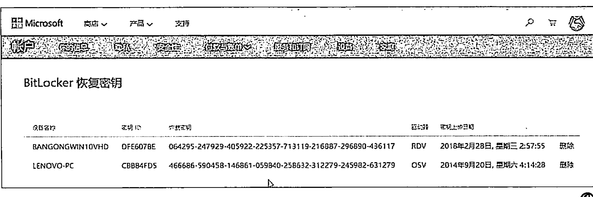

Windows 10 BitLocker保存密钥有4种常用方法。由于闪存盘密钥和打印密钥这两种介质比较容易丢失，介质丢失将造成无法挽回的后果，因此最灵活实用的密钥保存方法当属使用Microsoft账户或文件存储。

Microsoft账户保存密钥不需记忆密钥本身，只需登录微软账户即可获取恢复密钥（https://account.microsoft.com/devices/recoverykey）。恢复密钥为8段各6位数字串共48位，每个密钥还有对应的密钥ID，对应相应的设备名称和驱动器名称（图1）。

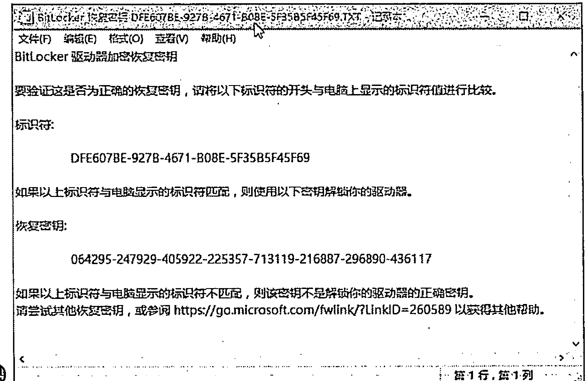

将恢复密钥保存为文本文件，可灵活备份到任意位置并留多个备份。使用另一台计算机的记事本打开，验证恢复密钥是否正确，先将标识符与电脑上显示的标识符值进行比较，如果匹配则使用密钥解锁加密驱动器（图2）。

需要解锁时，双击加密驱动器，在弹出的窗口中点击“更多选项”，然后输入从网络或文件中获取的恢复密钥即可访问（图3）。

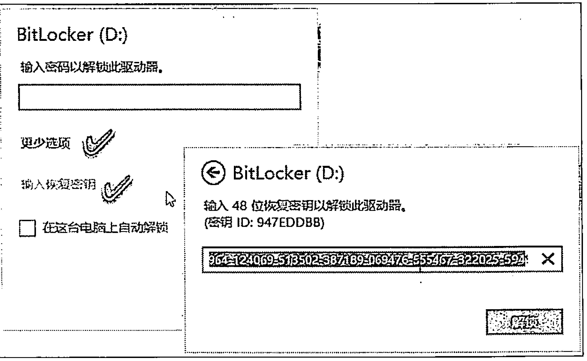

> 小提示 使用Bitlocker加密的条件
在带有TPM（Trusted Platform Module，受信任的平台模块）微芯片的电脑上，可使用TPM建立Bitlocker加密。但如果计算机没有TPM芯片，也可以对非系统磁盘用闪存盘存放加密密钥以取代TPM。BitLocker所用系统仅限Windows 10专业版和Windows 10企业版。BitLocker To Go需要闪存盘，仅限Windows 10专业版。如果安装Windows家庭版，则默认不带BitLocker功能，付费升级后可以使用，但微软Surface Pro和部分品牌笔记本带有C盘BitLocker加密的功能。

> 扩展阅读：系统无法启动后如何恢复加密驱动器
Windows系统无法启动之后，Bitlocker密钥的解锁方法参见本刊2017年第24期文章《当数据抢救遇到BitLocker加密》。

## 开关机之前 突破常规的两件事

文|吕梁

Windows 10登录之前，如果能显示用户设定的消息，便可以提醒或通知用机的人一些注意事项。而Windows 10关机之前，如果能显示关机原因选择信息，便可以进行确认而不至于引起误关机。这些看似不可能的事，实现起来其实也并不复杂。

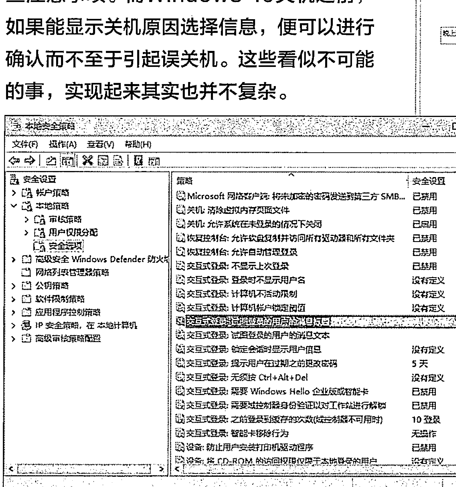

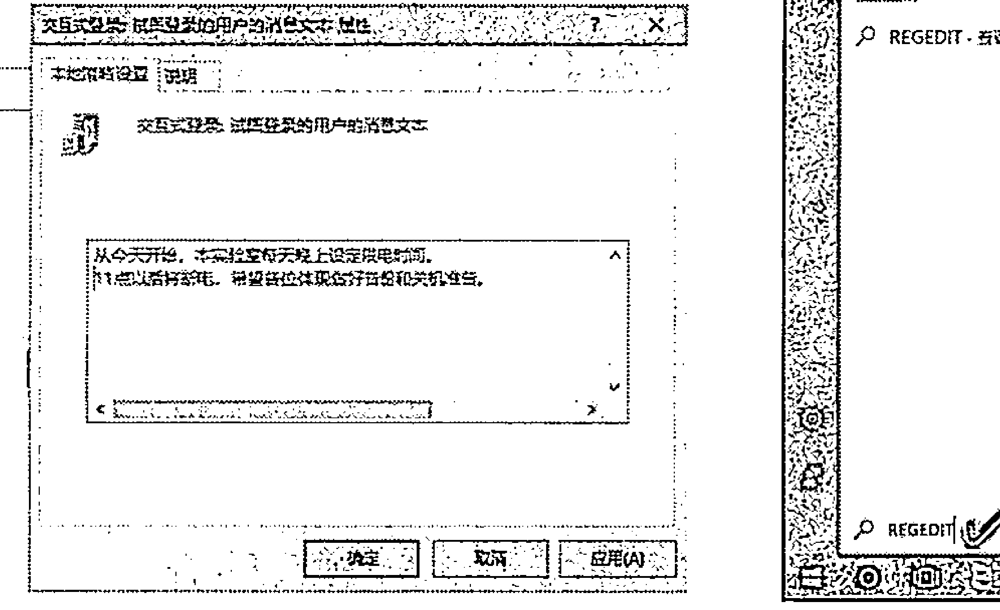

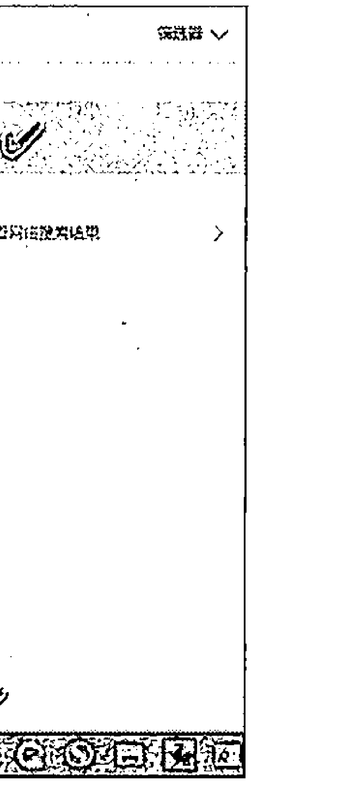

### 登录之前显示用户设定消息

Windows 10登录之时可以设置显示用户信息，这不但可以作为公司或多用户使用电脑的通知或注意事项提醒，还可以作为个人电脑的座右铭显示之用。要实现这一目的，可使用组策略设置或注册表编辑器来实现。

#### 通过组策略设置来实现

在Cortana对话框中输入SECPOL.MSC命令，点击最佳匹配结果中的“SECPOL.MSC Microsoft 通用管理文档”选项，打开“本地安全策略窗口”。在左侧窗格中，依次定位到“安全设置→本地策略→安全选项”（图1）；在右侧窗格中找到“交互式登录：试图登录的用户的消息标题”，双击后输入要设置的信息窗口的标题内容。紧接着找到“交互式登录：试图登录的用户的消息文本”，双击后输入要设置的信息窗口的内容（图2）。设置之后点击“应用”并确定。

#### 通过注册表编辑器实现

单击“开始”按钮后立即输入REGEDIT，然后单击匹配结果中的“REGEDIT运行命令”，启动注册表编辑器（图3）。

依次定位到以下注册表项“HKEY_LOCAL_MACHINE\SOFTWARE\Microsoft\Windows\CurrentVersion\Policies\System”，双击右侧窗格中的legalnoticecaption项，在“数值数据”框中输入要在消息对话框中显示的标题栏文本信息（图4）；双击右侧窗格中的legalnoticetext项，然后键入消息对话框中需要显示的文本信息（图5）。

关闭注册表编辑器，重新登录系统，即可显示上述设定的提示信息。

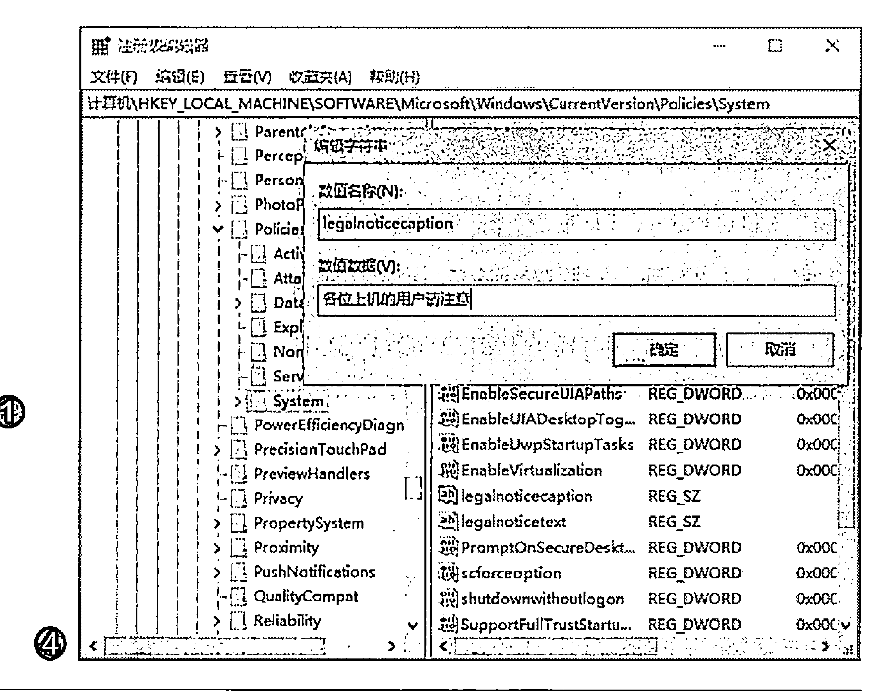


## 系统应用

《电脑爱好者》2018年合订本

### 关机之前显示关闭提示信息

Windows关机原因提醒，本来是服务器版的一个功能，它是通过“关闭事件跟踪程序”来实现的。对于我们这些普遍使用Windows 10专业版或家庭版的用户来说，其实也可以通过组策略或注册表的方法来开启该功能。

通过Cortana呼叫“组策略”，选择打开组策略编辑器。依次打开“计算机配置→管理模板→系统”，在右侧窗格中找到“显示关闭事件跟踪程序”选项（图6），双击该选项打开设置窗口，选择“已启用”设置项，然后选择“关闭事件跟踪程序”显示方式为“始终显示”（图7）。最后，关机或重启，关机之前就会弹出提示窗口，要求“选择一个最能说明你要关闭这台电脑的原因”，选择之后才能继续关机（图8）。

若是家庭版，因不具有组策略编辑功能，因此除了可以用专用脚本开启组策略功能外，还可直接用下述注册表编辑的方法，实现关机原因的选择提醒。

在家庭版的Windows 10中打开注册表编辑器，依次定位到如下选项：“HKEY_LOCAL_MACHINE\SOFTWARE\Policies\Microsoft\Windows NT\Reliability”。如果没有Reliability项，可以在Windows NT项下新建此项。在右侧窗口中点击右键并选择“新建→DWORD (32位)值”，将新建值命名为ShutdownReasonOn，双击该值进行编辑，把“数值数据”设置为1（图9）。

经过上述设置之后，Windows家庭版在关机前也可以显示关机原因选项了。

> **小提示**
具备组策略功能的Windows 10企业版、教育版等，也可以用这种方法实现上述功能。

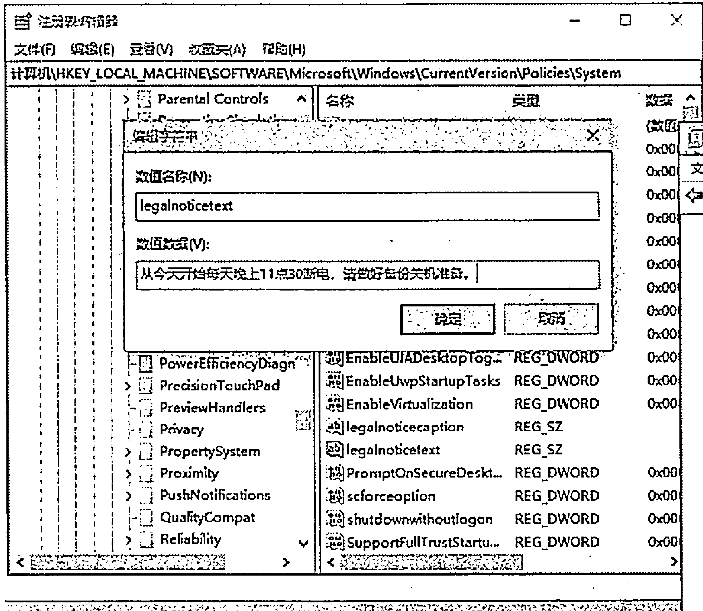

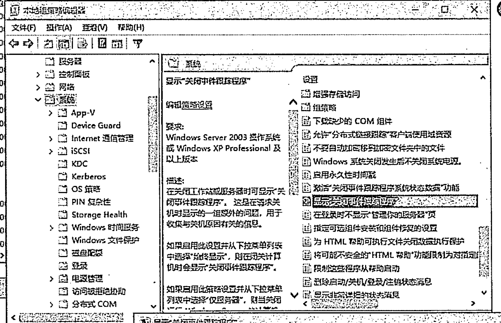

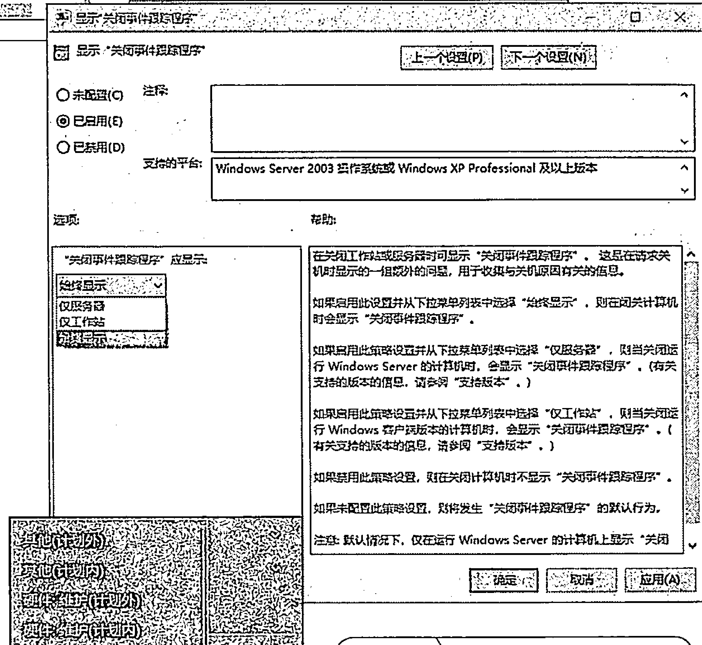


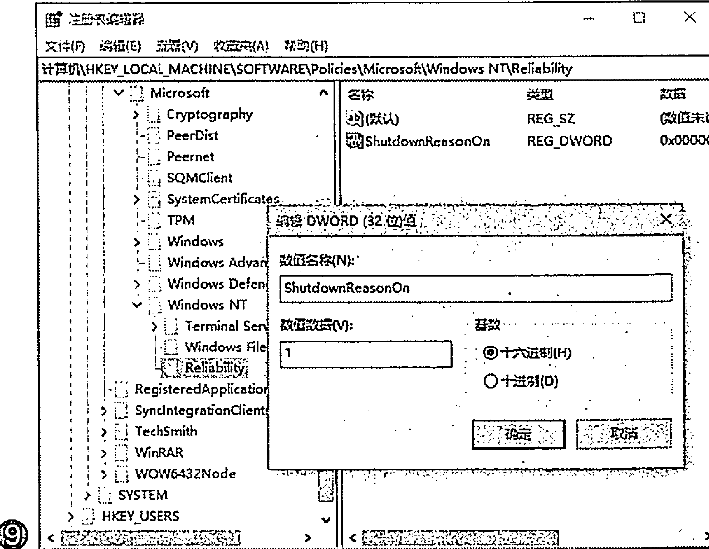

## 巧用Windows 10资源管理器右键命令

文|樱子

在Windows 10文件资源管理器中，最常用的右键操作是进行文件的复制粘贴或查看属性。其实，除了这些常用操作外，我们还可以使用一些特殊的右键命令来提高操作效率，或获得某种视觉效果。

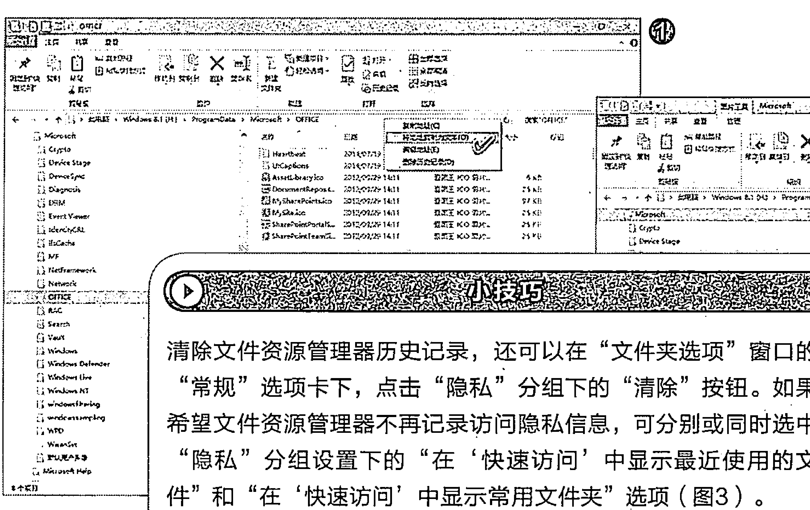

> 清除文件资源管理器历史记录，还可以在“文件夹选项”窗口的“常规”选项卡下，点击“隐私”分组下的“清除”按钮。如果希望文件资源管理器不再记录访问隐私信息，可分别或同时选中“隐私”分组设置下的“在‘快速访问’中显示最近使用的文件”和“在‘快速访问’中显示常用文件夹”选项（图3）。

### ① 文件路径的快速利用和清理

复制文件或文件夹路径的常用方法，是在点击地址栏后选择整个路径地址，然后选择“复制”按钮或用Ctrl+C快捷键复制。然而，还有更加快捷的方法。

#### 快速复制文件路径

要复制当前文件的路径，在Windows 10资源管理器地址栏中单击鼠标右键，然后选择“复制地址”或“将地址复制为文本”选项（图1）。

也可以先点击当前文件或文件夹，在按下Shift键不放的情况下，单击鼠标右键，在弹出的快捷菜单中选择“复制为路径”（图2）。

#### 快速利用类似路径

如果同时要访问的多个路径有一定的共性，那么可以在上一个路径的基础之上，经过简单的编辑快速获得新路径。具体操作方法：在上一个文件或文件夹的地址栏内单击鼠标右键，选择快捷菜单命令“编辑地址”，然后修改对应的差异字段即可。

#### 清理路径命令隐私

在资源管理器中访问过的文件或文件夹，会在“快速访问”的历史记录中留下“蛛丝马迹”。如果不希望别人看到，可在访问完毕之后，用右键单击文件资源管理器地址栏，然后选择“删除历史记录”。

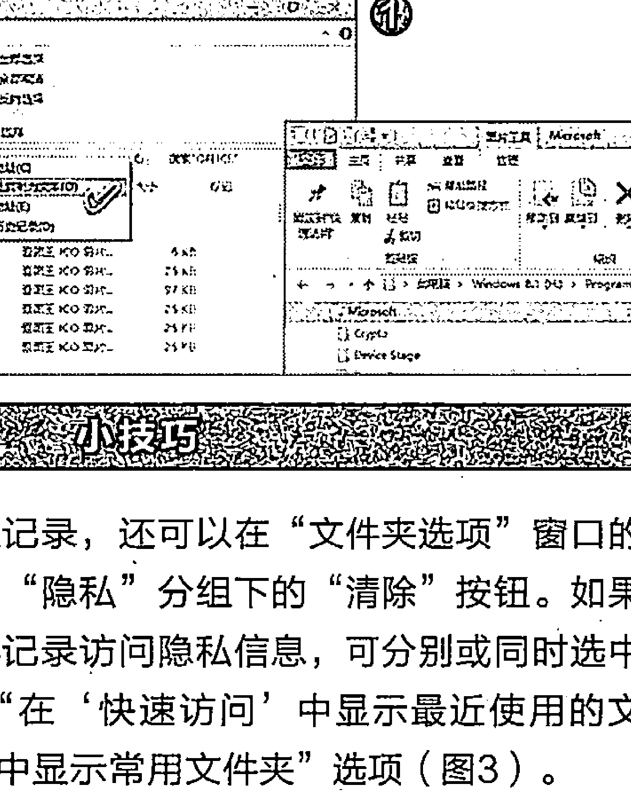

### ② 为驱动器添加空间占比柱状图

在资源管理器驱动器列表中，还可以用右键菜单命令添加资源占比彩色柱状图。

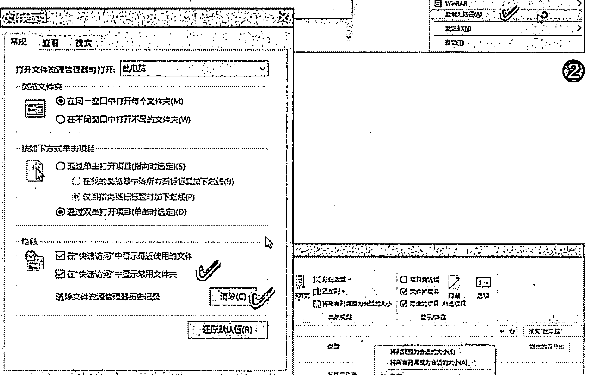

单击资源管理器左侧树状中的“此电脑”图标，右键单击右侧窗格中的资源项目标题栏，在弹出的快捷菜单中选择“填充的百分比”。之后，便可以在以详细信息列表显示的文件列表中看到彩色的资源占比柱状图（图4）。

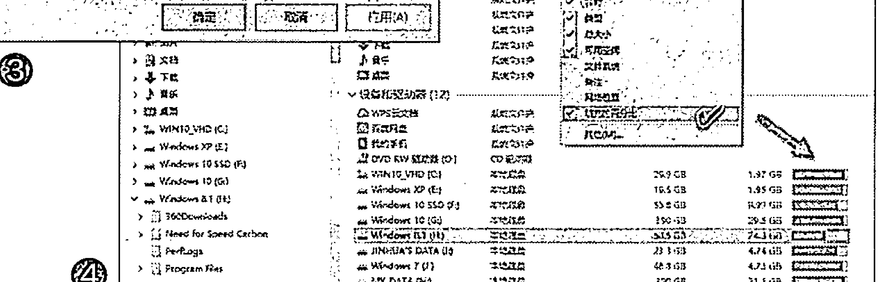

## 巧用相关设置 找回传统控制项目

文|波波

系统升级到Windows 10后，从“设置”窗口难以一下找到一些传统项目，如“管理工具”、“恢复电脑”、“屏幕保护”等，但这并不意味着这些功能的消失。那么，如何快速找回这些功能？

> **小提示**

“全新启动”等同于重新安装了纯净版的Windows并更新Windows，同时保留个人数据和大部分的Windows设置。这可使用户尽快恢复到原来的工作环境。

### 1. 巧用“搜索” 快速启动实用程序

#### 快速找出系统实用管理工具

如果觉得通过“开始”菜单的程序管理列表，滚动定位“Windows管理工具”子菜单，调用管理工具比较麻烦，通过“设置”窗口的查找框，输入“管理工具”进行搜索可更容易调用常用管理工具（图1）。

另外，点击“开始”按钮后，直接输入“管理工具”，呼出管理工具更容易。当然，你也可以直接在Cortana对话框中呼叫“管理工具”。

#### 另有用途 找回屏幕保护程序

如今，屏幕保护程序虽不能保护屏幕，但许多人还在用它来演示图片，然而Windows 10并没有给出一个明显的屏护程序入口。这时，除了通过依次点击“设置→个性化→锁屏界面”，滚动到右侧窗格底部，找到“屏幕保护程序设置”外，也可以通过“设置”窗口、Cortana呼出的控制面板窗口搜索“屏幕保护”，或直接点击开始按钮并输入“屏幕保护”搜索。

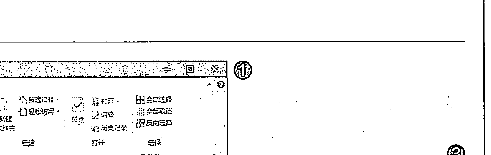

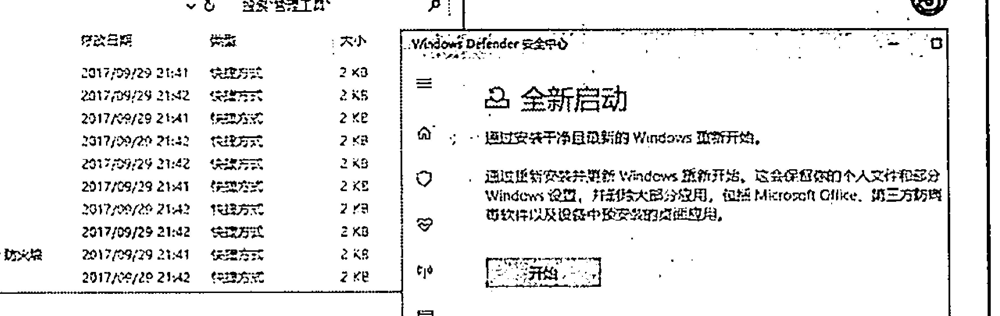

### 2. “全新启动” 找回刷新电脑功能

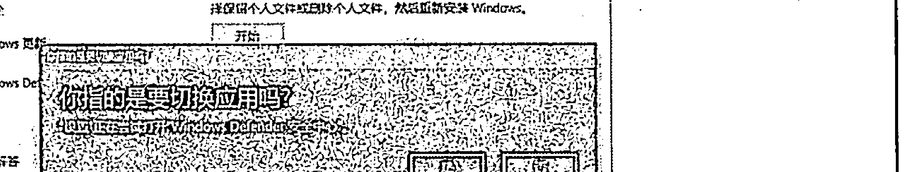

系统出问题不想格式化重装但需要恢复，可最新版的Windows 10之“恢复”页面中，不能找到熟悉的“恢复电脑”选项，而“重置电脑”又只能保留个人文件。这时，“全新启动”功能可解决这一问题。

在“设置”程序的“更新和安全”页左侧栏选择“恢复”，然后点击右侧窗格中的“了解如何进行Windows的全新安装以便开始全新的体验”选项，当提醒是否切换应用时点击“是”（图2）。之后便进入“全新启动”页面，点击“开始”进行恢复（图3）。

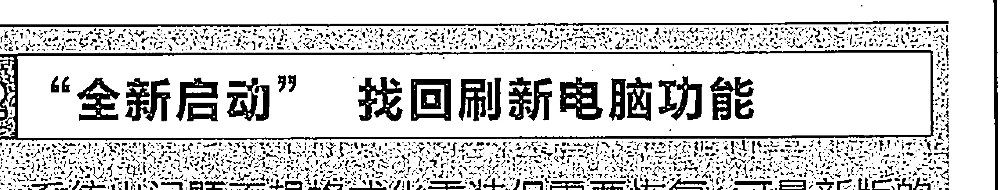

全新启动设置过程中，会给出删除和保留内容的提示。与此同时，删除的应用列表会被记录下来并在最后给出一个需重装的应用列表（图4）。

## 如何完全卸载OneDrive

文|樱子

作为Windows 10自带的云盘，OneDrive为资料的自动备份和同步提供了方便。然而，从隐私或其他方面考虑，有些人不愿意使用OneDrive，但Windows 10本身不提供直接卸载OneDrive的入口。如何才能彻底卸载OneDrive呢？

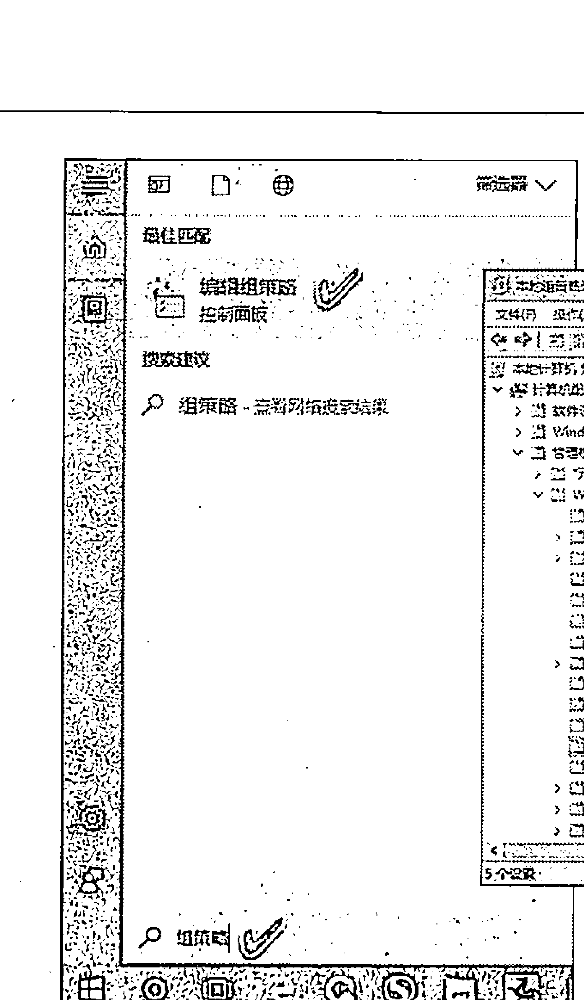

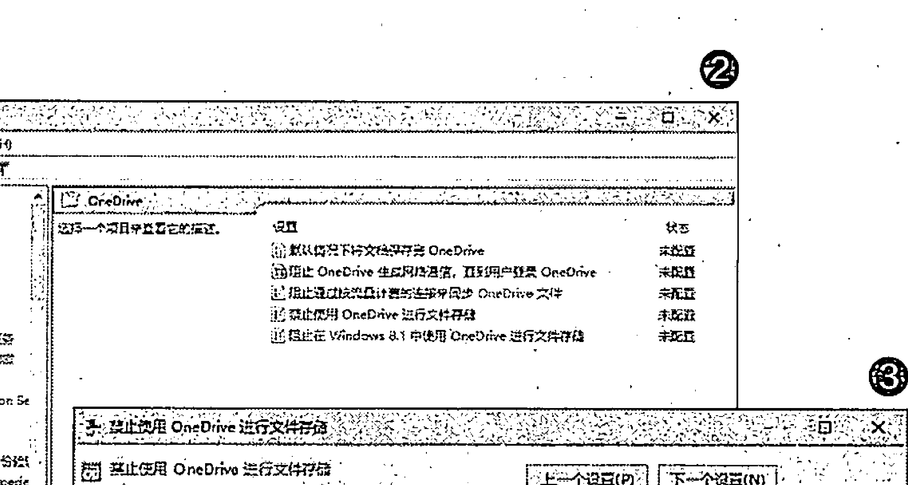

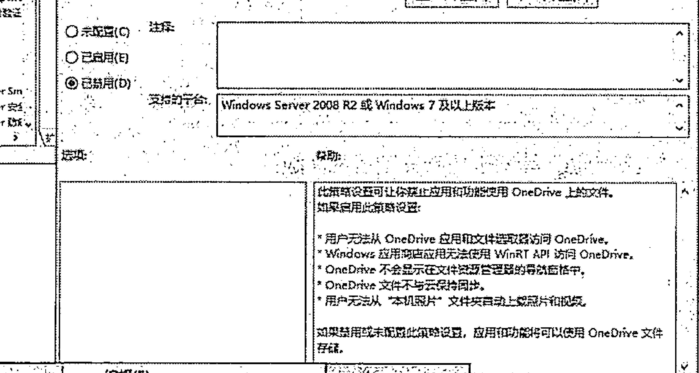

### 1 通过组策略配合进程管理解决

首先，我们可以通过组策略编辑器来禁用OneDrive。点击任务栏上的Cortana搜索框并输入“组策略”，在最佳匹配结果中选择“编辑组策略”控制面板项，进入到本地组策略编辑器环境(图1)。
在组策略编辑器窗口左侧栏内，依次定位到“计算机配置→管理模板→Windows组件→OneDrive”，可看到右侧窗格内的5个相关选项(图2)。双击这些选项并将它们设置为“已禁用”状态(图3)。
接下来右键单击任务栏空白处，调出任务管理器。在进程管理列表中找到OneDrive进程，右键单击并选择“禁用”。
随后，在Windows资源管理器中，点击“查看”功能面板，将“显示/隐藏”分组中的“隐藏的项目”复选框选中。最后进入到当前Windows用户所在的“AppData→Local→Microsoft”文件夹，找到Onedrive子文件夹，将其删除即可。

小提示
若无法直接删除，可利用Unlocker工具或360右键强力删除命令进行删除。

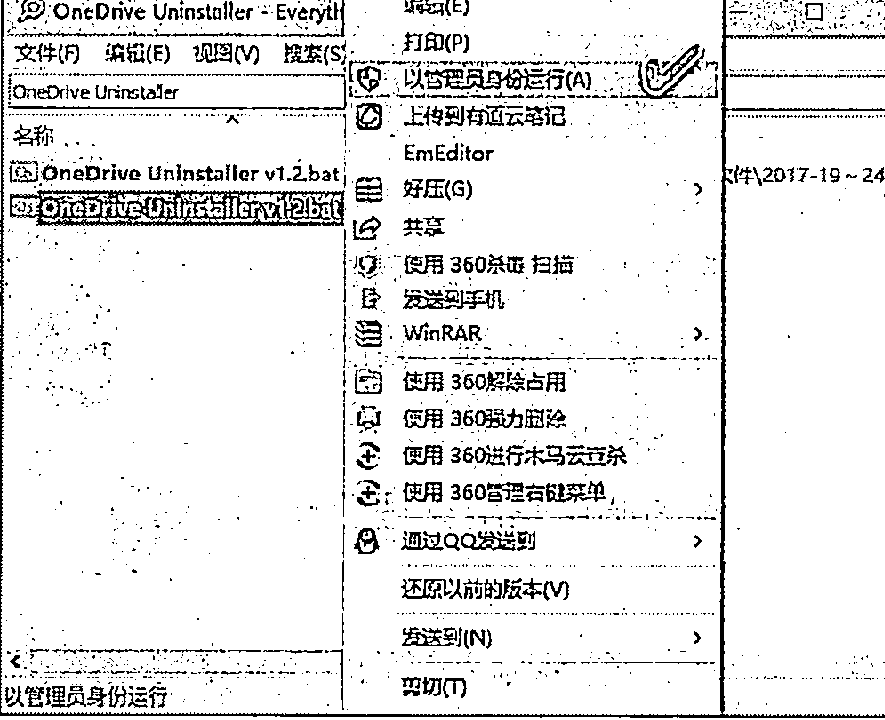

### 2 通过专用卸载软件解决

如果觉得通过上述方法卸载较为复杂，还可以借助于一款自动卸载OneDrive的批处理软件OneDrive Uninstaller来解决。
首先通过该软件主页(https://github.com/terraoperative/onedrive-uninstaller)下载后，右键单击OneDrive Uninstaller软件，在快捷菜单中选择“以管理员身份运行”，随后确认弹出的提示，执行操作后会自动卸载OneDrive(图4)。

## 找到病根 消除升级困扰

文|汾水

最近有不少网友反映，电脑一联网就自动下载安装“微软Windows 10易升”并运行在系统托盘上，然后自动更新系统（图1）。有的电脑重启好几次，又显示升级不成功。问有什么解决方法。

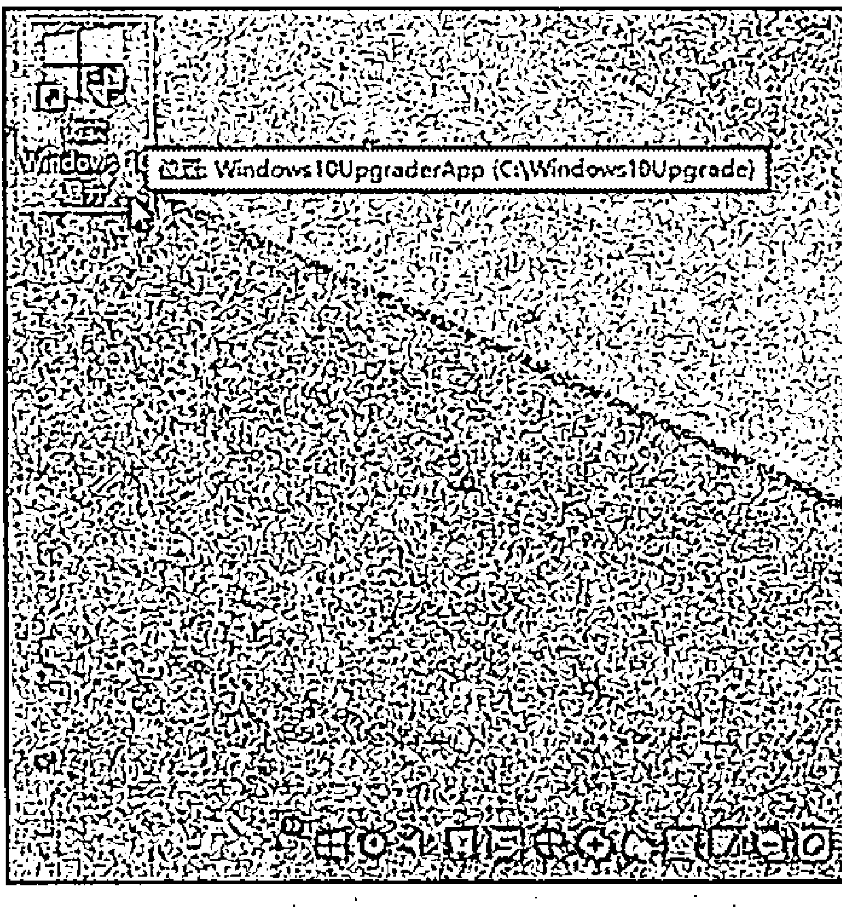

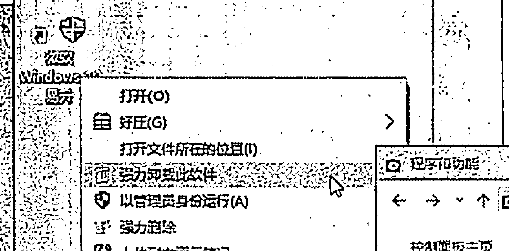

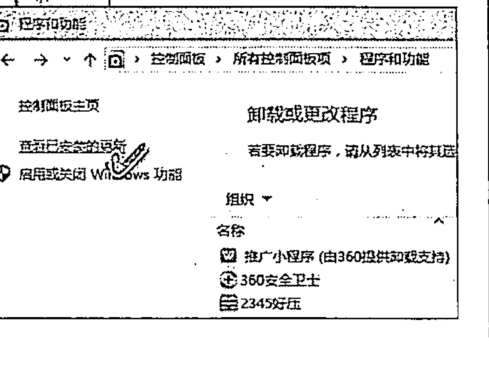

上述现象是微软Windows 10的一个自动升级机制，只要Windows版本不是最新，系统检测到后均会自动启动该机制。若不需要升级或自动升级不成功，要关闭此功能须从多方面着手解决。

### 1 卸载升级助手 删除注册项目

如果安装了软件管家，可用右键菜单中的强力卸载选项卸载此软件（图2）。否则，可通过控制面板的程序管理选择卸载。

此外，还可以进入注册表查找是否有“HKEY_LOCAL_MACHINE\SOFTWARE\Microsoft\Windows10upgrade”，找到后删除。之后再删除“C:\Windows10Upgrade”文件夹。

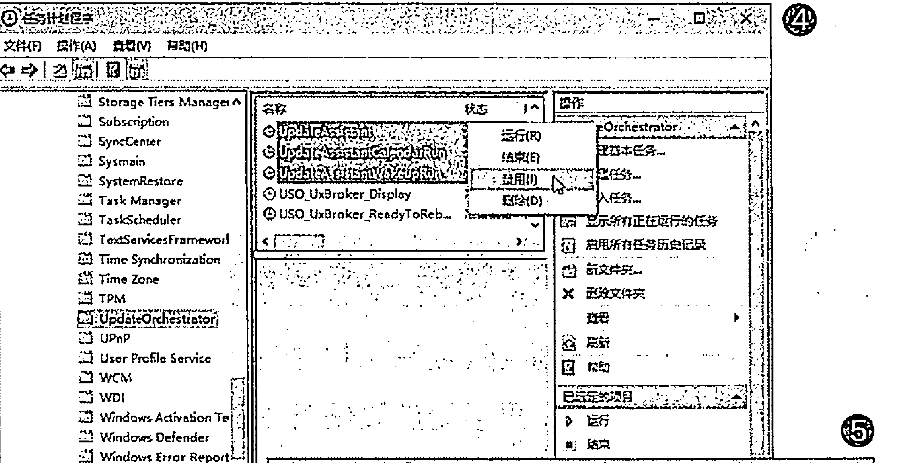

> 小提示：若系统中已经安装有可自动修补系统主要漏洞的第三方系统工具（例如360安全卫士），则可以考虑禁用Windows Update服务（图5）。

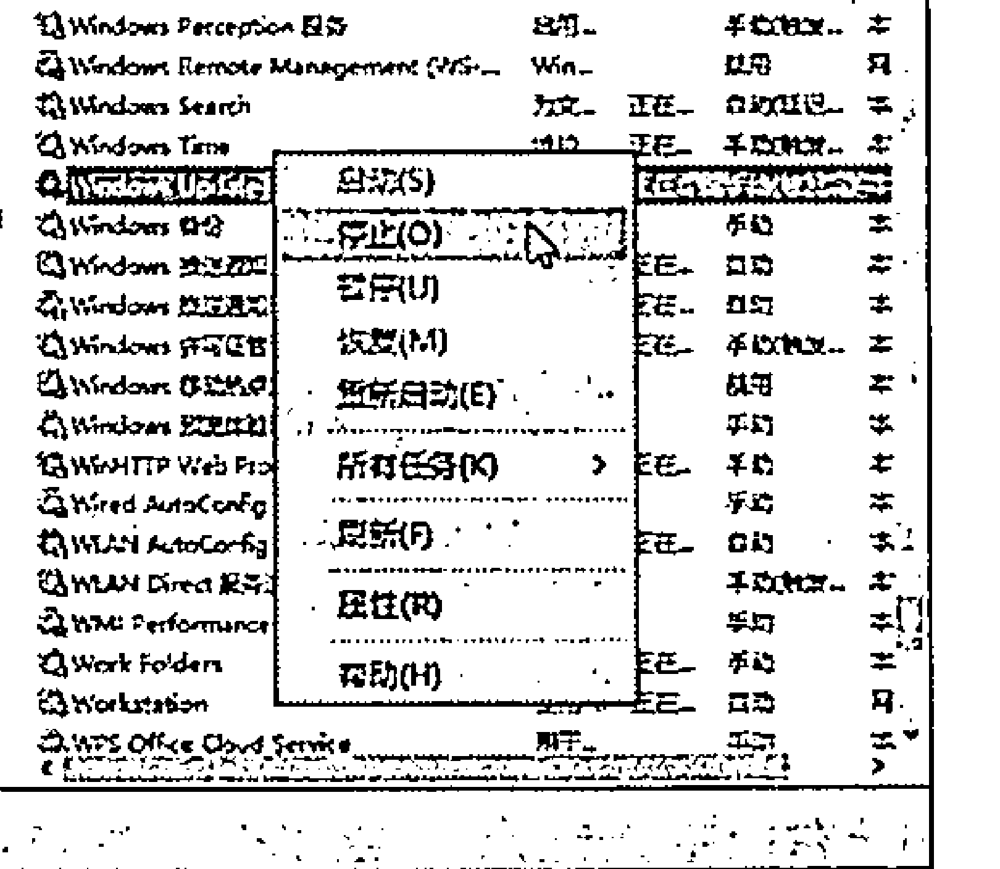

### 2 卸载KB4023057相关补丁文件

若当前仍使用的是1607版Windows 10，进入控制面板“程序和功能”程序列表窗口，或点击左侧的“查看已安装的更新”链接（图3），在列表中查找是否有KB4023057补丁文件，若有则右击卸载。然后在系统中搜索KB4023057相关的文件夹和文件，搜索到后均删除掉。

### 3 禁用相关计划升级任务

通过“控制面板”的“管理工具→任务计划程序”，打开任务计划程序窗口，依次定位到“Microsoft→Windows→UpdateOrchestrator”，在右侧窗格中分别找到UpdateAssistant、UpdateAssistantCalendarRun、UpdateAssistantWakeupRun，将其禁用或双击打开后将其中的所有触发器全部禁用（图4）。

上述方法对1709版及之前版本的Windows 10均有效。

## 解决任务栏两区域图标空间之争

Windows 10系统托盘处于折叠状态，虽然可节省空间占用，但一些软件信息也容易被隐藏，无法及时看到。但若将系统托盘全部展开，又会挤占左侧应用程序区域空间。为解决这一矛盾，这里介绍两种方法。

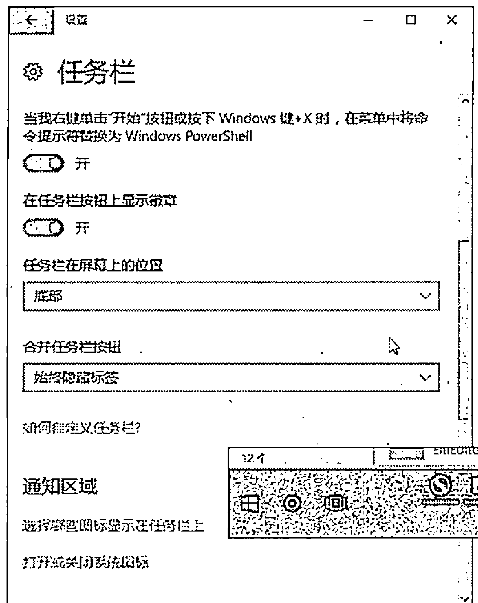

> 小提示：托盘上的“触摸板”和“Windows Ink工作区”图标，还可以通过任务栏右键菜单开启或关闭。

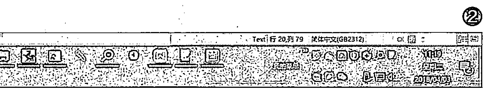

### 1 用“全盘显示+任务栏高度扩容”解决

将系统托盘图标全部（或有选择性地）显示出来，然后解除任务栏锁定，再手动扩展任务栏的高度，即可让任务栏的两个区域显示更多图标。


首先，右键单击任务栏空白处，选择“任务栏设置”。在任务栏设置窗口中，选择“通知区域”下的“选择哪些图标显示在任务栏上”和“打开或关闭系统图标”两个链接，定义系统托盘显示项目（图1）。打开“通知区域始终显示所有图标”开关，可让系统托盘上的所有图标都展开显示。点击“打开或关闭系统图标”链接，对包括时钟、音量、电源、网络等图标的开关进行选择性设置。


### 2 重新分配两种区域的占用空间

除了扩高和隐藏任务栏外，还可以通过设置，重新分配任务栏应用程序区与托盘区所占空间的比例。

接下来手动设置扩展任务栏的高度。右键单击任务栏空白区并选择“锁定任务栏”，取消勾选以解除任务栏锁定。之后，将鼠标光标移动到任务栏上边缘，按住并向上拖动，将任务栏高度扩展为两行或多行（图2）。

一是手动调整左右两侧图标布局。用任务栏常用图标区和系统托盘区分界处的上下箭头分隔标来扩展，点击分隔标上的下箭头，任务栏常规区上的图标会自动左移，这样常规区上就会出现更多的空白区域（图3）。

若嫌任务栏扩高后太占用屏幕空间，可设置任务栏自动隐藏和自动浮出。具体操作：在任务栏设置窗口中，选择“在桌面模式下自动隐藏任务栏”和“在平板模式下自动隐藏任务栏”两个开关来完成。

另一种方法是通过虚拟桌面，分散显示任务栏应用程序区域图标。点击任务栏的“任务视图”按钮，在桌面视图界面右下角单击“新建桌面”加号按钮，建立一个新桌面，在新桌面中开启的新窗口程序图标将分配到新的任务栏上（图4）。

## 快上加快 让开机启动时间变短

文|波波

影响开机启动速度的因素有很多，其中不但包括一些开机时自动运行的项目，还包括一些计划运行的项目。此外，系统出于某种原因而内设的注册表参数，也会影响到开机的启动速度。我们可以通过多方位的优化调整，让系统开机所用的时间再短些。

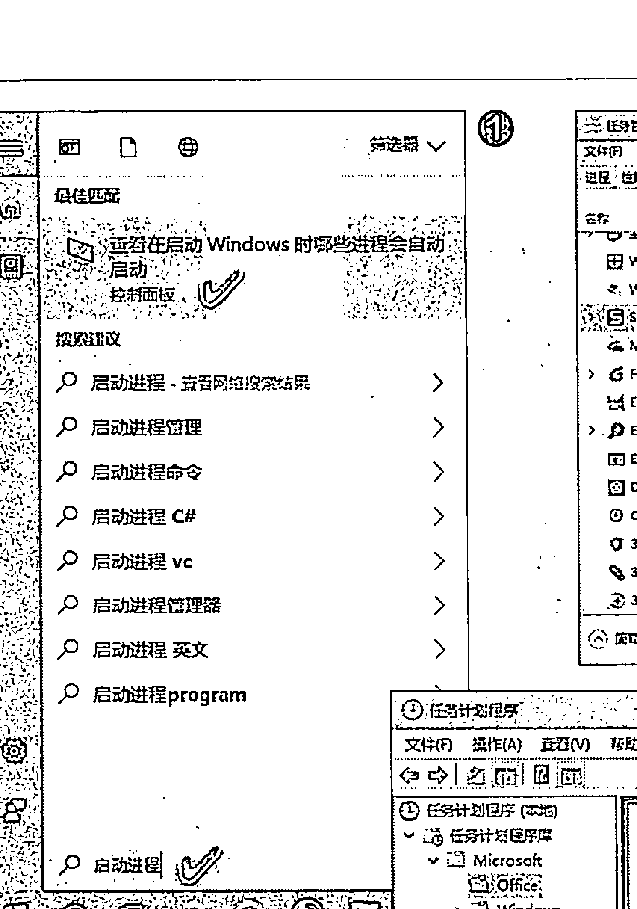

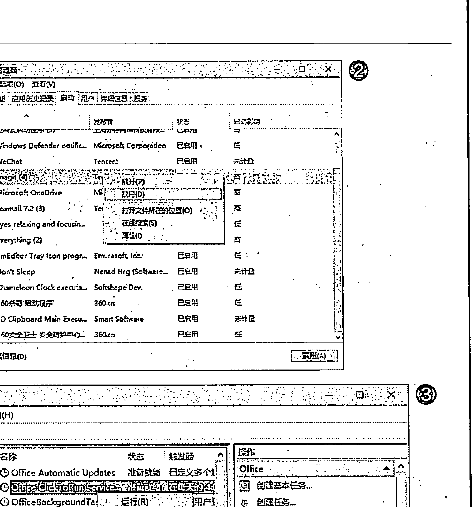

### 1 通过任务管理器禁用无用进程

点击Cortana搜索框，输入并搜索“启动进程”，在最佳匹配结果中，选择“查看启动Windows时哪些进程会自动启动”控制面板选项(图1)。之后便自动进入到任务管理器的“启动”选项卡页面，这里所列出的就是启动Windows时自动运行的程序进程，右键单击需要优化的多余进程，选择将其禁用即可(图2)。

### 2 通过计划任务禁用自启动计划

还有一些程序是以定时任务计划的方式自动启动的。要优化这些项目，需要通过任务计划程序窗口执行禁用操作。为此，先通过Cortana搜索框搜索“任务计划程序”，在最佳匹配结果中选择“任务计划程序”桌面应用，启动到任务计划程序窗口后，从中选择要禁用的任务，右键单击选择“禁用”即可(图3)。

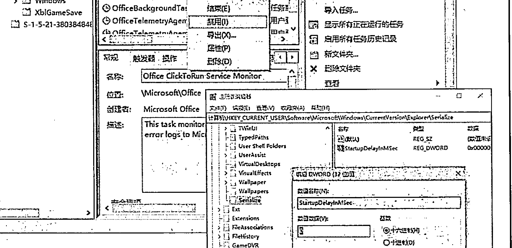

### 3 消除为启动屏幕而设的延迟影响

为了更快地进入到开始屏幕，微软通过延迟加载“启动”文件夹中项目的方法，来加快开始屏幕的显示速度。但是，如果我们平时使用Windows 10桌面的时间更多，可通过修改注册表的方法，将被限制的这部分速度找回来。

运行REGEDIT打开注册表编辑器，依次定位到“HKEY_CURRENT_USER\Software\Microsoft\Windows\CurrentVersion\Explorer”，右键单击Explorer并新建一个“项”，将新建项命名为Serialize。在Serialize项下，新建一个DWORD(32位)值，并将其命名为StartupDelayInMSec。双击StartupDelayInMSec，将其“数值数据”设置为0(图4)。关闭注册表编辑器，重启电脑使设置生效。

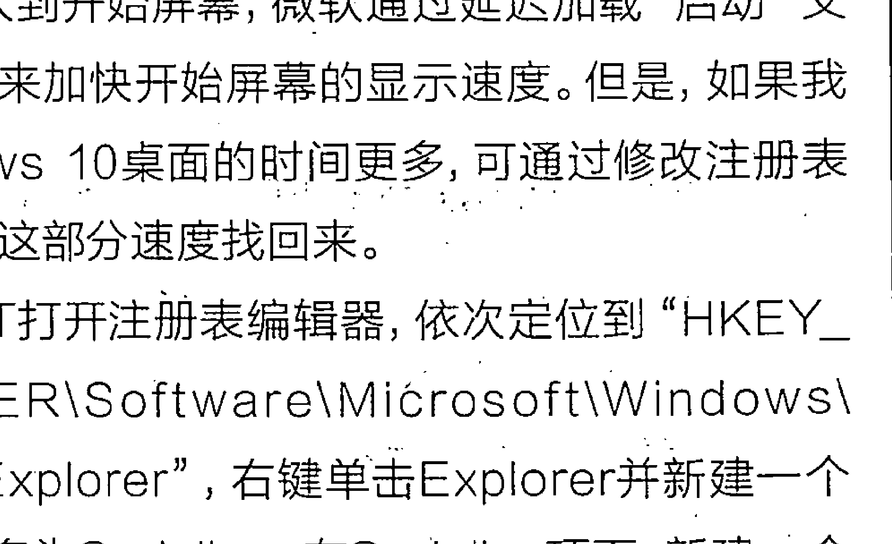

## 揪出Windows 10游戏栏截图功能的绊脚石

Win+G作为Windows 10中的游戏录制快捷键，还可以用于日常截图。使用Win+G截图时，有时会遇到一些问题，如截图组合键失效、截图后找不到图片等。下面的技巧可以解决这些问题。

### 1 不玩游戏也截图 截获图片何处去

要将游戏录制功能作为一般截图来使用，按下Win+G组合键，弹出录制游戏确认对话框。尽管这时我们不是在玩游戏，但仍可点击“是的，这是一个游戏”复选框（图1）。之后弹出录制工具条，在工具条上点击第三个按钮（屏幕录制按钮）（图2），屏幕上就会弹出提示图片已保存。

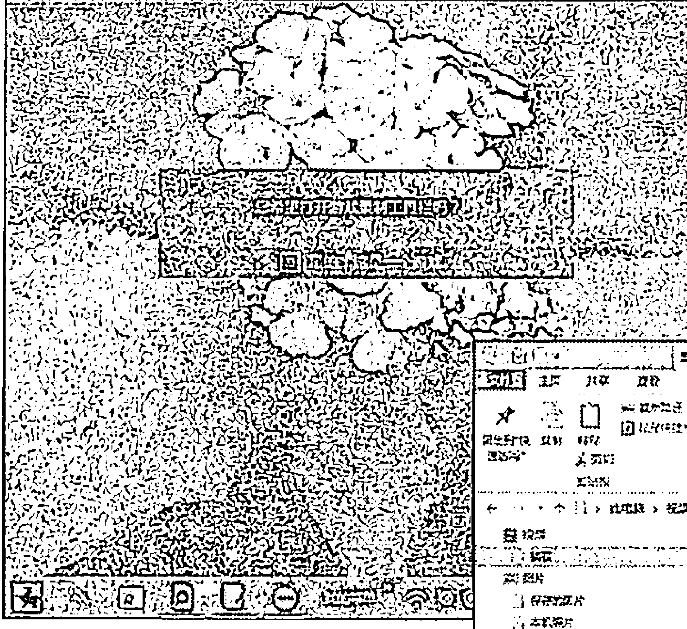

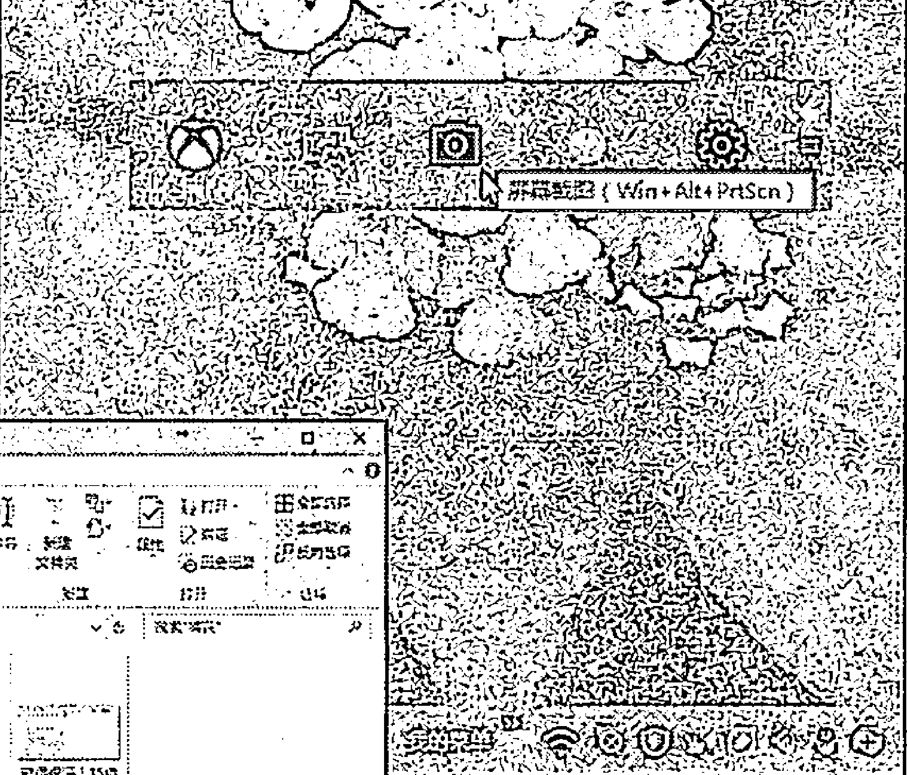

但是，图片保存在哪里了呢？到当前用户的“图片”文件夹下查找，结果一无所获。其实，图片是作为视频类别保存的，在资源管理器的“此电脑→视频→捕获”文件夹下，硬盘实际保存位置为X:\Users\<用户名>\Videos\Captures（图3）。

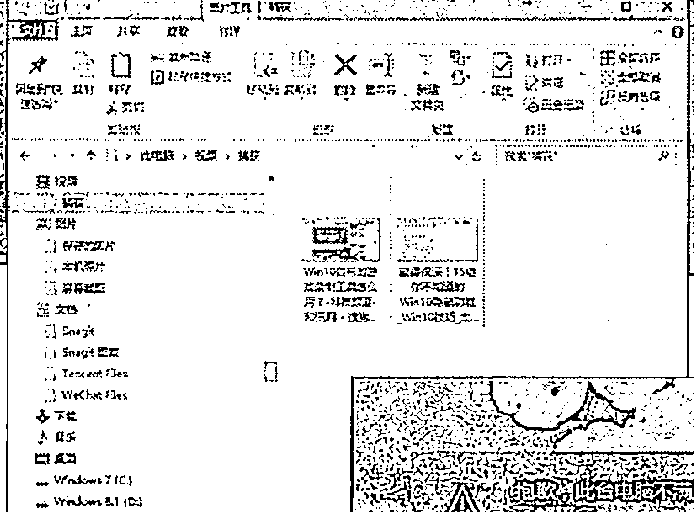


### 2 Win+G功能失效 两种方法帮找回

有时Win+G组合键会失去作用，无法调出。由于Win+G游戏抓取功能对硬件有一定要求，因此当软件检测到本机的硬件条件不足以游戏抓取时，可能会自动屏蔽该功能，这时屏幕上会给出“抱歉，此台电脑不能满足录制剪辑的硬件要求”的提示（图4），以后再按下Win+G组合键就无法调出工具栏了，抓图功能也随即失去作用。

要解决这个问题，可启动Xbox应用，在“设置”窗口选择“游戏DVR”选项卡，将“使用游戏DVR截图屏幕截图”开关置于关闭的位置，然后再重新开启；同时，重设一次Win+G快捷键，截图功能便可恢复正常（图5）。

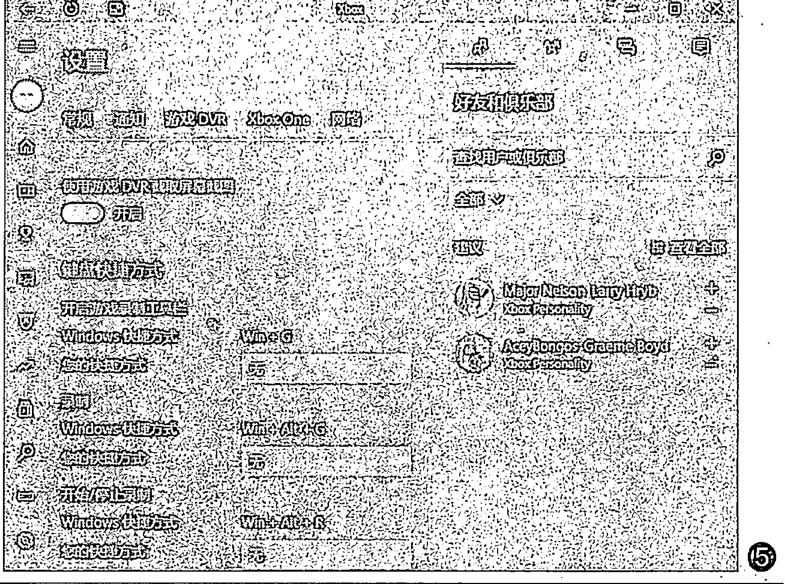

此外，也可以进入Windows设置“游戏→游戏栏”窗口，对打开游戏的快捷键进行重新设置。

## 我的密码就在你的TXT文件里

Windows记事本非常简单，但它也还有一些不为人知的技巧。这不，又一个闻所未闻的技巧等待你去尝试——在一个已有的TXT记事本文件的基础上，利用命令提示符窗口中的附加文件名，实现隐藏输入的密码或秘密文字，当别人打开这个文本时，根本看不到你输入的隐含内容，而你却有办法看到。

### 依附TXT文件 隐藏秘密信息

隐藏信息的具体操作是在命令提示符窗口中进行的。具体命令的语法格式如下：
NOTEPAD A.txt:B.txt
其中A.txt为已有的文本文件，B.txt为用户自定义的附加虚拟文件名(并不需要建立此文件)。
例如，在工作文件夹“E:\999”下有一个普通文本文件“我的地址.TXT”，里面的内容只有如图所示两行地址(图1)。现要将一个密码123456依附于这个文本文件隐藏起来。
首先，启动命令提示符窗口。先通过以下命令：
CD 目标文件路径
定位到目标路径“E:\999”，然后下达如下命令(图2)：
NOTEPAD 我的地址.TXT:mima.TXT
回车之后，系统会提示找不到上述命令中的文件，问是否要创建新文件，点击“是”按钮(图3)。
随后，在自动打开的记事本窗口中输入要隐藏的密码123456，存盘退出即可(图4)。至此，依附于“我的地址.TXT”的密码被保存了起来。
那么，藏了密码之后的TXT文件内容又会是怎样呢？就让我们双击打开“我的地址.TXT”文件，我们会看到，里面依旧是原来的两行地址，根本没有新输入的密码123456(图5)。

> 小技巧：若要隐藏更长的信息，只需在重复执行上述命令后打开的窗口中续写更多内容即可。如果要保存多组秘密信息，只需在上述命令的基础上，改一下附加文件名，即可在另外开启的窗口中输入并藏起更多信息。

### 记住原有命令 显示隐藏的秘密

别人说看不到隐藏的信息了，但如果隐藏的信息较多或自己忘掉了其中的内容，如何才能查看这些信息呢？这里，记住先前的虚拟文件名是关键。要查看隐藏的密码，只需重复执行保存密码时的命令(如上例的“NOTEPAD 我的地址.TXT:mima.TXT”)，即可在记事本窗口中看到先前保存的密码。
注意：如果将“我的地址.TXT”删除，就无法访问隐藏的信息了，即便是重建了这个文件也不行。是不是很神奇呢？

## 访问系统设置要更快更精准

文|汾水

在使用Windows 10的过程中，我们经常会用到一些系统设置子项目，由于每个人常用的系统设置项目有所不同，每次通过设置窗口去查找这些项目又比较麻烦。因此，若能在一些醒目位置或右键菜单中创建系统设置的快捷方式，会让系统设置项目的使用更快、更精准。

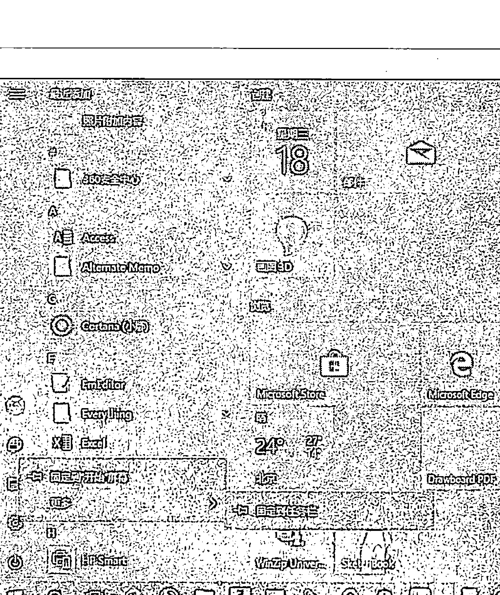

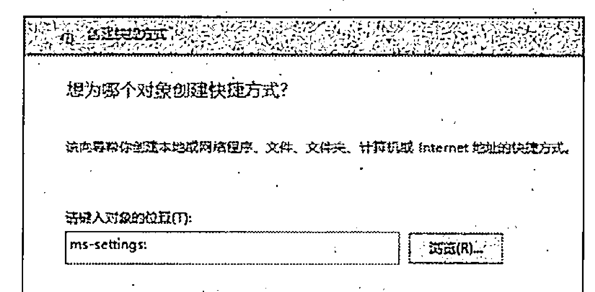

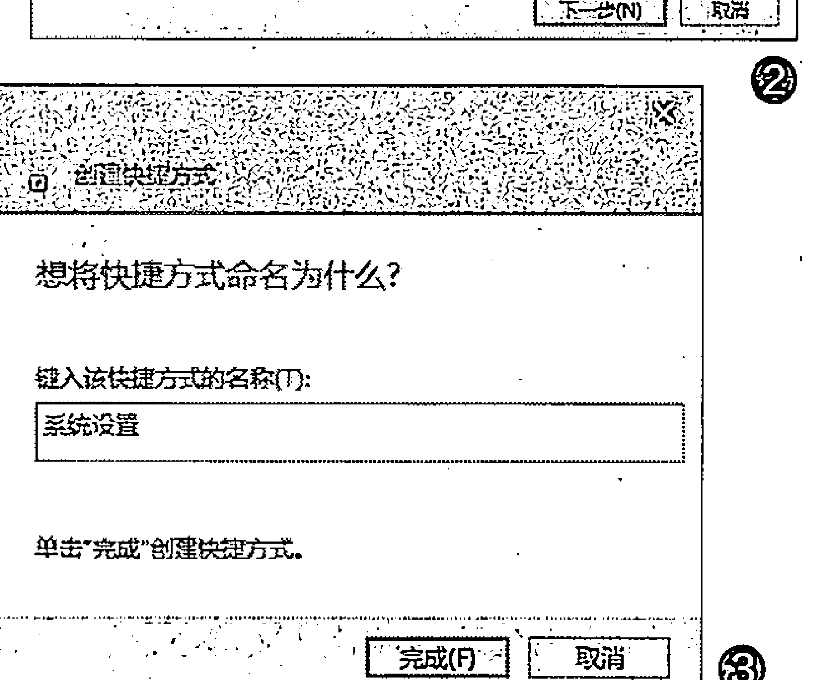

### 将系统“设置”按钮请到最显眼处

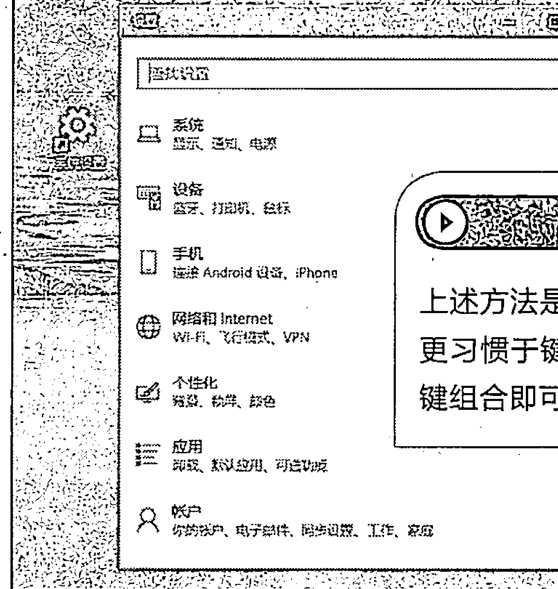

从开始菜单中选择进入系统设置毕竟还不够显眼和顺手。为此，我们可以根据实际需要，将系统“设置”按钮请到开始屏幕、桌面、任务栏等处。

> 上述方法是方便鼠标点击之用的。若你更习惯于键盘操作，那么用Win+I快捷键组合即可随时启动“设置”程序了。

将“设置”固定到开始屏幕和任务栏的方法比较简单，只需点击“开始”按钮并在“设置”图标上单击鼠标右键，选择“固定到开始屏幕”，即可将设置按钮安置在开始屏幕上供触摸式界面使用。如果进一步选择“更多→固定到任务栏”，则可将“设置”按钮安置在任务栏上(图1)。

在桌面上建立“设置”快捷方式需要一点技巧。首先右键单击桌面空白处并选择创建一个快捷方式，在对象位置文本框内输入“ms-settings:”(图2)；点击“下一步”之后，为快捷方式命名，如命名为“系统设置”(图3)；单击“完成”按钮之后，桌面上出现“系统设置”图标，双击即可启动设置窗口了(图4)。

### 建立“设置”子项目的桌面快捷方式

上述方法只是在总体上方便了“设置”调用，但仍未能达到快速访问系统设置子项目的要求，因为进入“设置”窗口后还需要层层点击再选择，依然麻烦。为此，我们可想法将自己用到的子项目也做成桌面快捷方式。实际上，系统设置的每个子项目都对应一个形如上述“ms-settings:”的命令，只不过是在这个基本命令的基础上，后面加上对应的子命令，用这样的命令组合为快捷方式所执行的命令，即可为各子项目创建各自的桌面快捷方式了。例如：要创建“输入”设置的快捷方式，只需使用“ms-settings:typing”命令；要创建“主题”设置的快捷方式，只需使用“ms-settings:themes”命令即可（图5）。以此类推，只需记住设置子项目的英文名即可。那么，具体到各种设置子项的命令，请参见附表1和附表2的详细说明。

### Windows 10系统设置子项对应的命令

#### 附表1

| 序号 | 设置子项名称 | 设置子项对应的英文名称 | 对应命令 |
|------|--------------|------------------------|----------|
| 1 | 电池保护 | Battery Saver | ms-settings:batterysaver |
| 2 | 电池保护程序设置 | Battery Saver Settings | ms-settings:batterysaver-settings |
| 3 | 电池使用 | Battery use | ms-settings:batterysaver-usagedetails |
| 4 | 蓝牙和其他设备 | Bluetooth | ms-settings:bluetooth |
| 5 | 颜色 | Colors | ms-settings:colors |
| 6 | 数据使用量 | Data Usage | ms-settings:datausage |
| 7 | 日期和时间 | Date and Time | ms-settings:dateandtime |
| 8 | 隐藏式字幕 | Closed Captioning | ms-settings:easeofaccess-closedcaptioning |
| 9 | 高对比度 | High Contrast | ms-settings:easeofaccess-highcontrast |
| 10 | 放大镜 | Magnifier | ms-settings:easeofaccess-magnifier |
| 11 | 讲述人 | Narrator | ms-settings:easeofaccess-narrator |
| 12 | 键盘 | Keyboard | ms-settings:easeofaccess-keyboard |
| 13 | 鼠标 | Mouse | ms-settings:easeofaccess-mouse |
| 14 | 其他选项 (易于访问) | Other Options (Ease of Access) | ms-settings:easeofaccess-otheropti |
| 15 | 锁屏界面 | Lockscreen | ms-settings:lockscreen |
| 16 | 离线地图 | Offline maps | ms-settings:maps |
| 17 | 飞行模式 | Airplane mode | ms-settings:network-airplanemode |
| 18 | 代理 | Proxy | ms-settings:network-proxy |
| 19 | VPN | VPN | ms-settings:network-vpn |
| 20 | 通知和操作 | Notifications & actions | ms-settings:notifications |
| 21 | 帐户信息 | Account info | ms-settings:privacy-accountinfo |
| 22 | 日历 | Calendar | ms-settings:privacy-calendar |
| 23 | 联系人 | Contacts | ms-settings:privacy-contacts |
| 24 | 其他设备 | Other Devices | ms-settings:privacy-customdevices |
| 25 | 反馈和诊断 | Feedback | ms-settings:privacy-feedback |
| 26 | 位置 | Location | ms-settings:privacy-location |
| 27 | 消息传送 | Messaging | ms-settings:privacy-messaging |
| 28 | 麦克风 | Microphone | ms-settings:privacy-microphone |
| 29 | 运动 | Motion | ms-settings:privacy-motion |
| 30 | 无线电收发器 | Radios | ms-settings:privacy-radios |
| 31 | 语音、墨迹书写和键入 | Speech, inking, & typing | ms-settings:privacy-speechtyping |

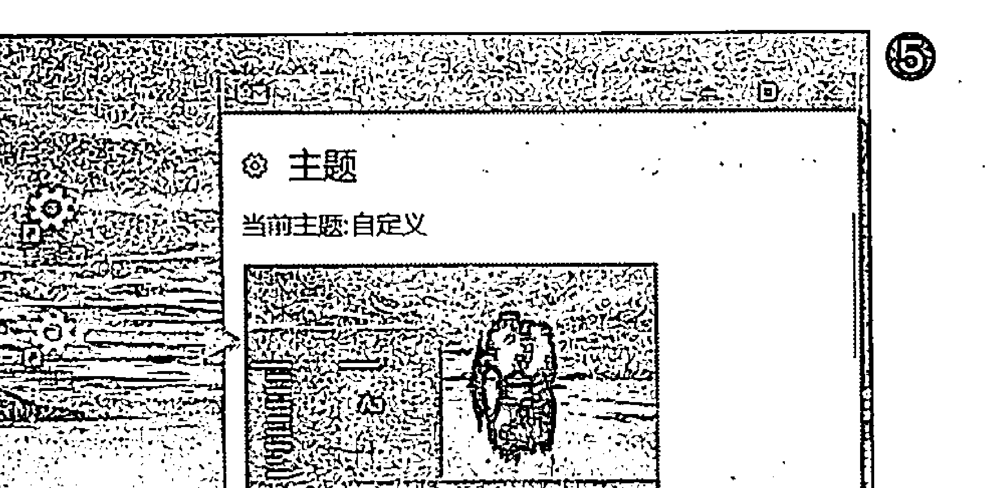

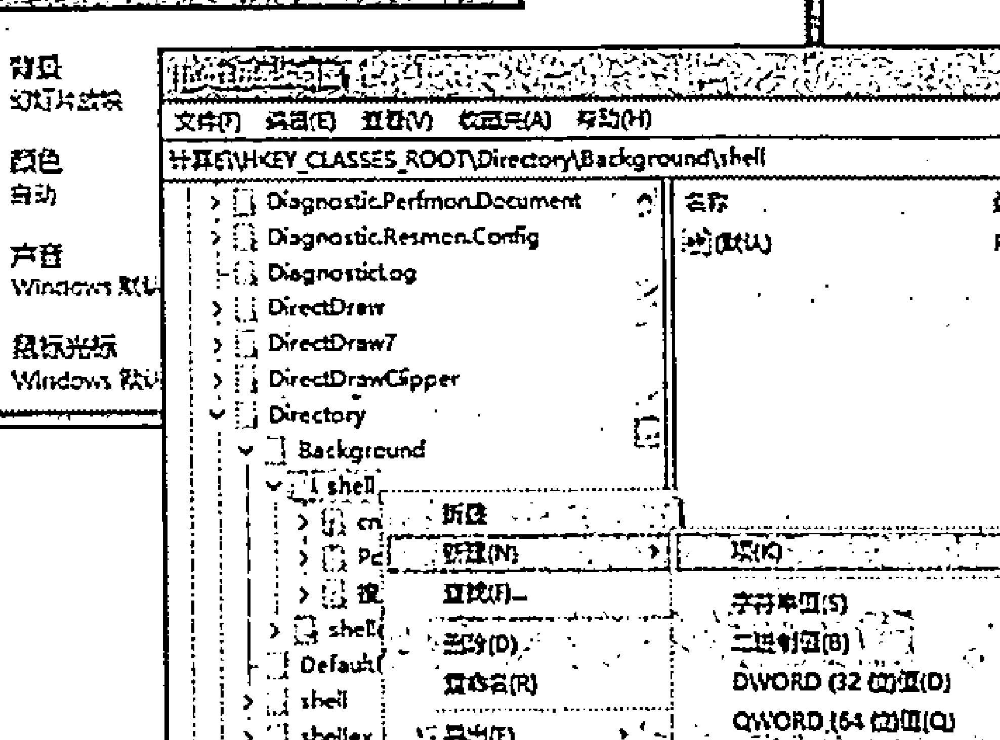

#### 附表2

| 序号 | 设置子项名称 | 设置子项对应的英文名称 | 对应命令 |
|------|--------------|------------------------|----------|
| 33 | 相机 | Camera | ms-settings:privacy-webcam |
| 34 | 区域和语言 | Region & language | ms-settings:regionlanguage |
| 35 | 语音 | Speech | ms-settings:speech |
| 36 | Windows更新 | Windows Update | ms-settings:windowsupdate |
| 37 | 从工作单位或学校访问 | Work access | ms-settings:workplace |
| 38 | 蓝牙和其他设备 | Connected devices | ms-settings:connecteddevices |
| 39 | 针对开发人员 | For developers | ms-settings:developers |
| 40 | 显示 | Display | ms-settings:display |
| 41 | 鼠标和触摸板 | Mouse & touchpad | ms-settings:mousetouchpad |
| 42 | 蜂窝 | Cellular | ms-settings:network-cellular |
| 43 | 拨号 | Dial-up | ms-settings:network-dialup |
| 44 | 直接接入 | DirectAccess | ms-settings:network-directaccess |
| 45 | 以太网 | Ethernet | ms-settings:network-ethernet |
| 46 | 移动热点 | Mobile hotspot | ms-settings:network-mobilehotspot |
| 47 | WLAN (无线局域网) | Wi-Fi | ms-settings:network-wifi |
| 48 | 管理已知网络 | Manage Wi-Fi Settings | ms-settings:network-wifisettings |
| 49 | 管理可选功能 | Optional features | ms-settings:optionalfeatures |
| 50 | 家庭和其他人员 | Family & other users | ms-settings:otherusers |
| 51 | 个性化 | Personalization | ms-settings:personalization |
| 52 | 背景 | Backgrounds | ms-settings:personalization-background |
| 53 | 颜色 | Colors | ms-settings:personalization-colors |
| 54 | 开始 | Start | ms-settings:personalization-start |
| 55 | 电源和睡眠 | Power & sleep | ms-settings:powersleep |
| 56 | 飞行模式 | Proximity | ms-settings:proximity |
| 57 | 显示 | Display | ms-settings:screenrotation |
| 58 | 登录选项 | Sign-in options | ms-settings:signinoptions |
| 59 | 存储 | Storage Sense | ms-settings:storagesense |
| 60 | 主题 | Themes | ms-settings:themes |
| 61 | 输入 | Typing | ms-settings:typing |
| 62 | 平板电脑模式 | Tablet mode | ms-settings:tabletmode |
| 63 | 隐私 | Privacy | ms-settings:privacy |

### 将“设置”子项目藏于桌面右键菜单

如果觉得将系统设置子项目的快捷方式放在桌面上太占空间，那么还可以将这些项目设置于桌面右键菜单中。运行REGEDIT命令打开注册表编辑器，依次定位到“HKEY_CLASSES_ROOT\Directory\Background\shell”，右键单击shell项并新建一个项（图6）；将新建项命名为自己想要在右键菜单中显示的名称（例如“隐私”）。右键单击刚才新建的项（“隐私”），再选择新建一个名为command的项；双击command项右侧窗格中的默认项，在“数值数据”框中输入如下命令（图7）："C:\Windows\explorer.exe" ms-settings:privacy。关闭注册表编辑器之后，在桌面空白处单击右键，即可看到菜单中出现“隐私”设置项目（图8）。其他系统设置子项的添加与此类似，只需按照附表中的命令添加项目对应的命令即可。

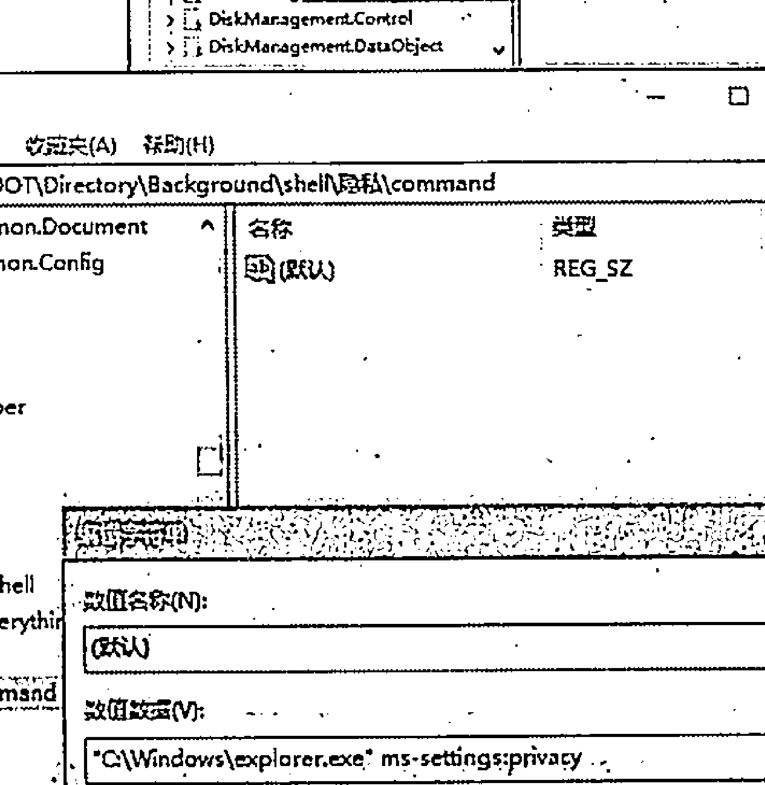

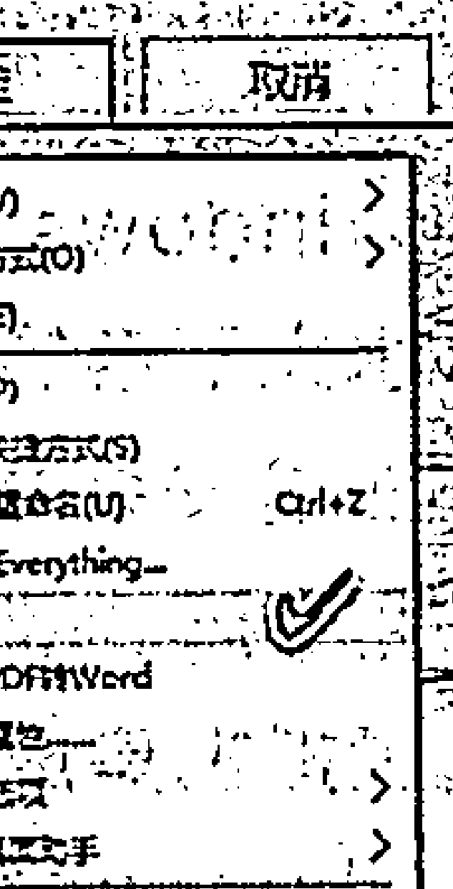## 另辟蹊径 Windows 10中使用Linux

文|愚人

随着Linux的发展，现在Linux已经应用在很多方面。比如很多个人或者企业网站使用的阿里云空间就在使用Linux系统，企业部署的服务器也有很多在使用Linux系统。因此很多朋友有学习Linux系统的需求，但是对于很多新手来说，安装和配置Linux系统都是一个难题。Windows 10系统现在已经集成Linux运行环境，让我们可以在Windows 10中运行Linux系统，轻松学习常见的Linux命令。

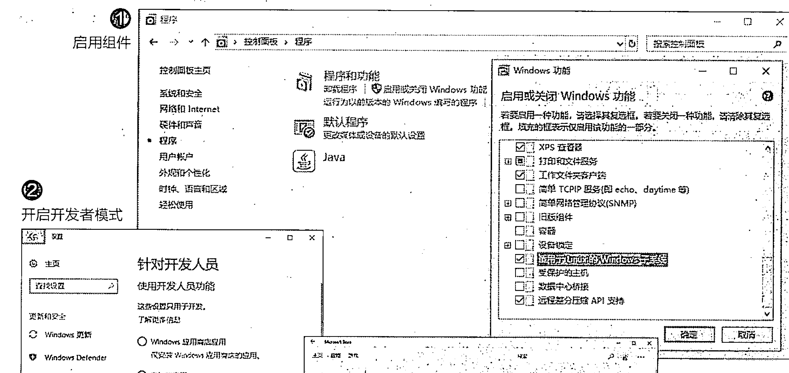

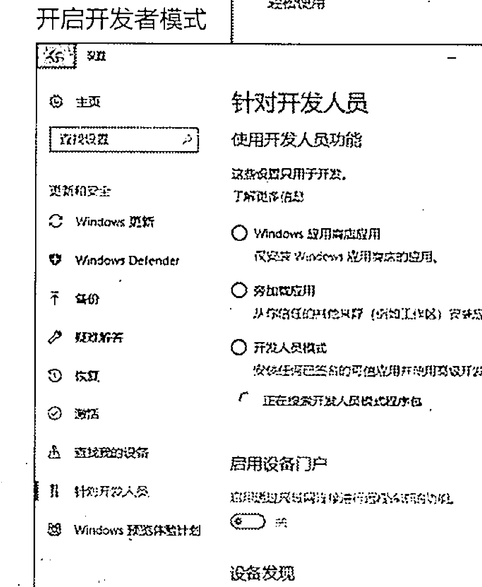

> 小知识：Linux是怎么实现在Windows 10上运行的？Windows 10和Linux核心不同，默认情况下两个系统是水火不容的。要在Windows上运行Linux系统，常规的方法是安装虚拟机实现，但是虚拟机配置复杂，而且非常占用资源。Windows 10系统通过内嵌Ubuntu系统，类似将虚拟机集成到系统底层，从而实现在Windows 10下运行Ubuntu系统。

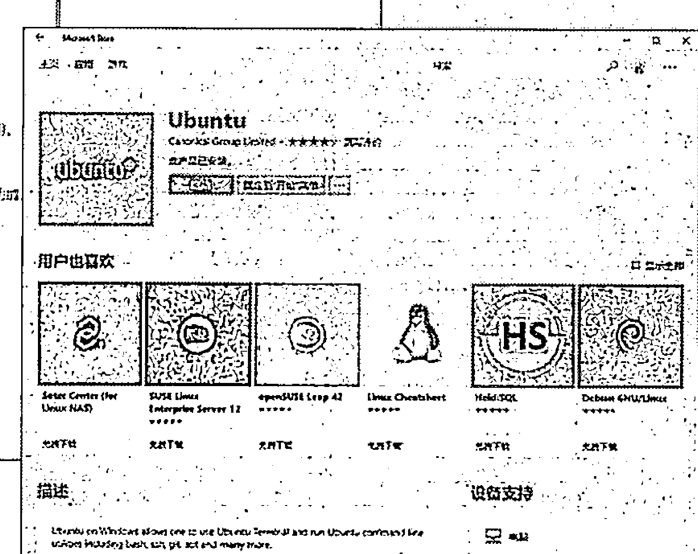

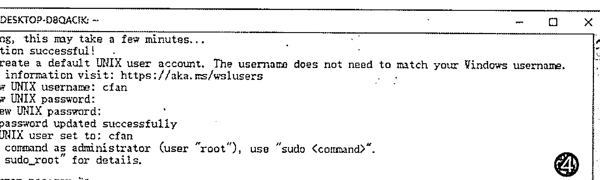

### 1. 简单配置 开启Windows 10对Ubuntu的支持

目前只有X64系统才支持Ubuntu运行，确认自己的Windows 10符合要求后打开“控制面板→程序”，点击程序和功能下方的“启用和关闭Windows功能”，在弹出的窗口勾选“适用于Linux的Windows子系统”，点击“确定”启用该组件（图1）。

按提示完成组件的安装后重启系统，接着点击任务托盘的“消息→所有设置”，打开设置窗口；点击“更新和安全→针对开发人员”，点击右侧的“开发人员模式”，开启该模式即可下载并运行所需的Linux子系统了（图2）。

现在有多个版本的Linux的Windows子系统已经在Windows 10的应用商店里上架。启动应用商店后输入Linux进行搜索即可得到多个版本。这里以Ubuntu系统为例，搜索到结果后点击“获取”开始下载系统（图3）。

完成后点击“启动”，这样即可在Windows 10中开始安装Ubuntu系统，完成后按提示输入运行的账户和密码即可在Windows 10中运行Ubuntu系统了，可以看到这里的Ubuntu已经成为一个应用安装在Windows 10中了（图4）。

## 简单上手 在Windows 10中学习Linux

通过上面的方法，我们已经在Windows 10中运行Ubuntu系统了。虽然这只是一个命令提示符性质的窗口，但是却是使用Ubuntu内核运行的子系统，实际使用和独立安装的Ubuntu系统并没有多大的区别。比如可以输入“lsb_release -a”命令查看子系统版本，可以发现这里子系统是Ubuntu 16.04 LTS版本（图5）。

```
cfan@DESKTOP-D8QACIK:~$ lsb_release -a
No LSB modules are available.
Distributor ID: Ubuntu
Description:    Ubuntu 16.04.6 LTS
Release:        16.04
Codename:       xenial
cfan@DESKTOP-D8QACIK:~$
```

当然类似Ubuntu里常见的pwd（用于显示当前位置的绝对路径）、cd（用于改变你的工作目录）、rm（删除命令，删除目录时使用 rm -r 目录路径）、mkdir（在当前目录下创建新目录）等常见的命令均可以顺利执行，利用这个系统可以学习Ubuntu大部分常见的命令。

当然对于很多新手来说，只是单纯的终端窗口学习Linux相关知识还是有一定难度的。我们可以对其进行进一步的配置，比如通过远程桌面连接到图形界面的Ubuntu。同上依次在上述窗口输入下列的命令安装所需的组件（图6）：

- sudo apt-get update (更新系统)
- sudo apt-get install xorg (安装xorg)
- sudo apt-get install xfce4 (安装xfce4)
- sudo apt-get install xrdp (安装xrdp远程组件)
- sudo sed -i 's/port=3389/port=3390/g' /etc/xrdp/xrdp.ini (配置xrdp远程连接端口为3390)
- sudo echo xfce4-session >~/.xsession (向xsession中写入xfce4-session配置)
- sudo service xrdp restart (重启xrdp服务)

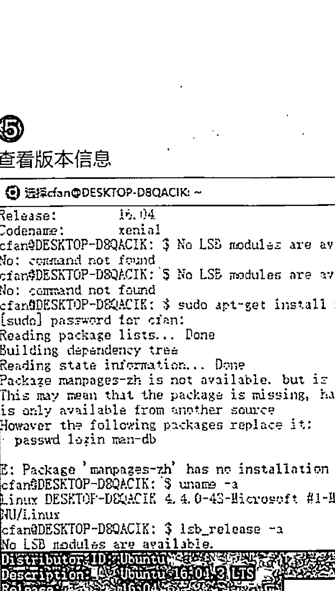

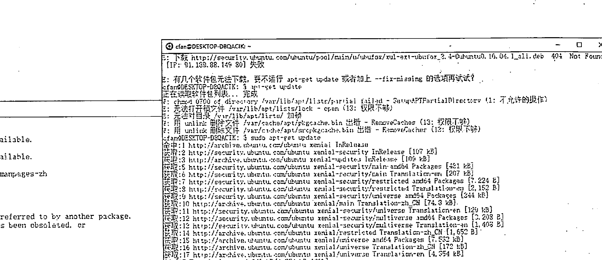

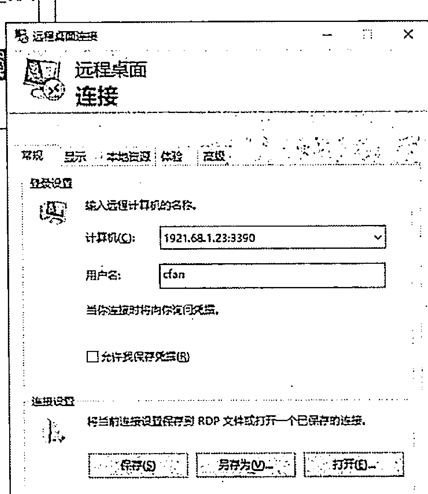

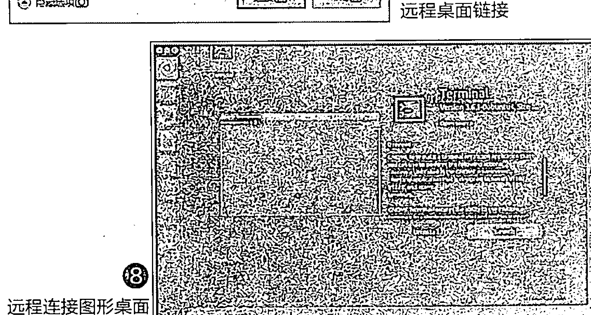

完成上述操作后在搜索框输入“远程桌面”，启动该组件后点击高级选项展开设置，在“计算机”输入“本机IP:3390”（其中3390为连接远程端口，在 sudo sed -i 's/port=3389/port=3390/g' /etc/xrdp/xrdp.ini 命令中设置）。用户名：cfan（用户名为上述在Ubuntu子系统中设置），点击“连接”（图7）。

成功连接到Ubuntu子系统后就可以看到Ubuntu桌面，现在大家就可以使用图形桌面的子系统进行各种学习操作了（图8）。

## 全方位解决Defender无法启用问题

文波波

Windows Defender是Windows 10系统自带的杀毒防护软件。在使用过程中，如果遇到Windows Defender无法启用的问题，可按如下方法，从多个角度来分析和解决。

### 1. 尝试可否用系统更新解决

Windows系统更新中会包括Windows Defender及其病毒库的更新。如果系统升级程序检查到Windows Defender不是最新版本或存在问题，会自动将其更新为最新版本。

从“设置”窗口中选择“更新和安全”，点击“Windows更新”进入选择自动更新系统（图1）；继而选择Windows Defender，进入防病毒设置窗口，点击“启用Windows Defender防病毒”（图2）；然后看是否能够开启Windows Defender。

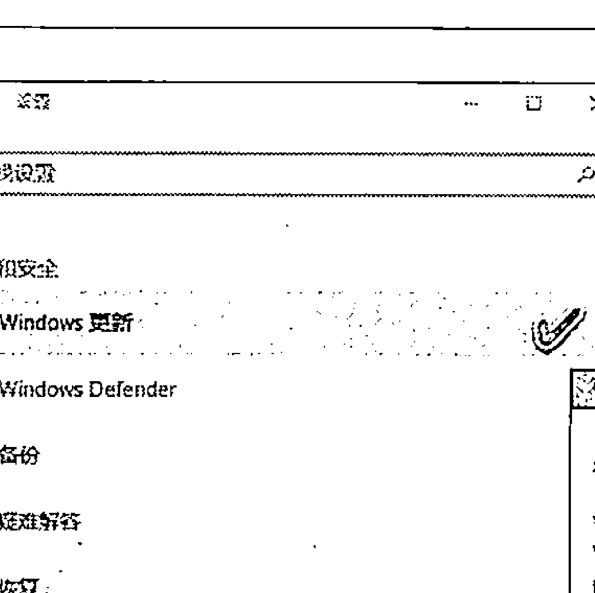

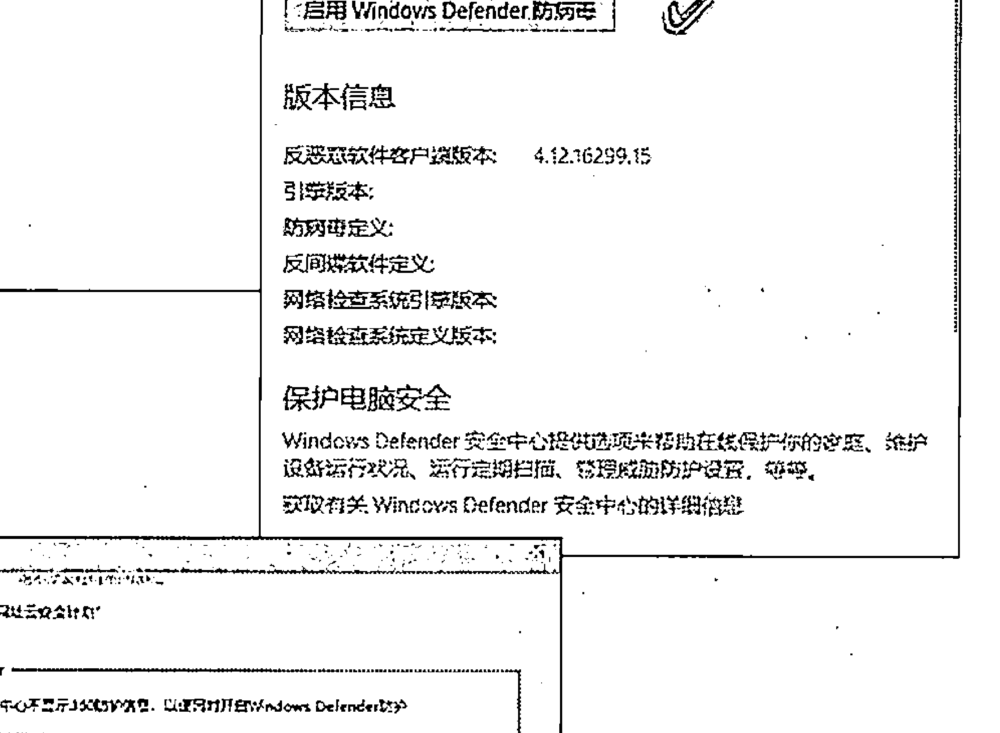

### 2. 解决与第三方安全软件的冲突

一些第三方杀毒软件也可能会自动禁用Windows Defender。如果系统中已安装了第三方杀毒软件，可先将第三方杀毒软件卸载，然后重新开启Windows Defender。也可以进入第三方杀毒软件的设置窗口，看是否有开启Windows Defender的选项，找到后将其开启（图3）。

如果第三方杀毒软件早已被卸载，却还出现这个问题，则考虑是否为软件未能完全卸载所致。这时，可考虑使用针对该款第三方杀毒软件的专用卸载工具，或使用通用杀毒软件卸载套装（如AntiVirus Uninstaller Tools Pack），彻底卸载第三方杀毒软件留下的垃圾，然后再行开启Windows Defender。

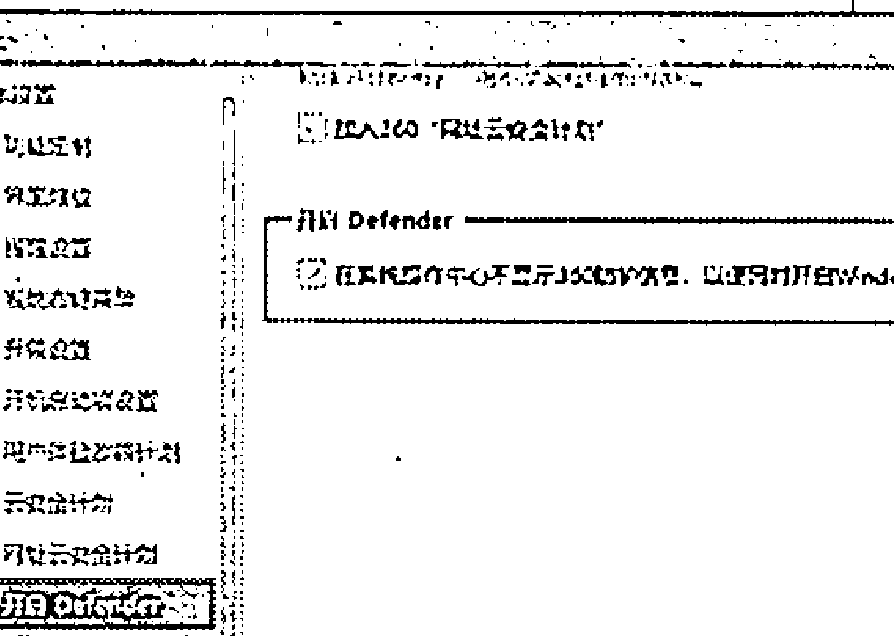

### 3. 从可能遭受恶意软件攻击考虑

恶意软件对系统的攻击也可造成Windows Defender无法开启。为此，可用如下两种方法来检查和处理恶意软件。

首先可以免费下载可独立运行的杀毒软件来扫描系统。例如使用Microsoft Safety Scanner安全工具，扫描并删除系统中的病毒、间谍软件和其他恶意软件。这个软件的有效期只有10天，但作为临时应急已经足够。此外，还可以选择诸如Dr.WEB CureIt、ClamWin Portable Free Antivirus、Norman Malware Cleaner、Kaspersky Virus Removal Tool、Avira PC Cleaner等独立性杀毒软件对系统病毒进行查杀。

另外，我们还可以使用一些在线杀毒服务进行查杀。例如Free Virus Scan|Online Virus Scan from ESET (https://www.eset.com/us/home/online-scanner/) (图4)。

### 4. 从系统服务方面检查并开启

Windows Defender系统服务因某种原因被关闭或禁用，Windows Defender也自然无法开启。在Cortana对话框输入“服务”，选择执行“服务桌面应用”，在其中找到Windows Defender Antivirus Service并双击，在其属性窗口中，单击“启动”按钮并将其启动类型设置为“自动”（图5）。

如果Windows Defender Antivirus Service和Windows Defender Antivirus Network Inspection Service无法启动，可在管理员命令提示符窗口中依次执行如下命令，重新注册服务：

- regsvr32 wuaueng.dll
- regsvr32 wucltui.dll
- regsvr32 softpub.dll
- regsvr32 wintrust.dll
- regsvr32 initpki.dll
- regsvr32 wups.dll
- regsvr32 wuweb.dll
- regsvr32 atl.dll
- regsvr32 mssip32.dll

### 5. 通过注册表编辑器恢复

我们还可以通过注册表编辑器来恢复设置。在注册表编辑器中依次定位到“HKEY_LOCAL_MACHINE\SOFTWARE\Microsoft\Windows Defender”，确保DisableAntiSpyware和DisableAntiVirus两个DWORD类型的值为1（图6）。

> 小提示
如果上述值为0，则需要使用免费软件RegOwnit取得注册表项的所有权，然后再将值从0修改为1。


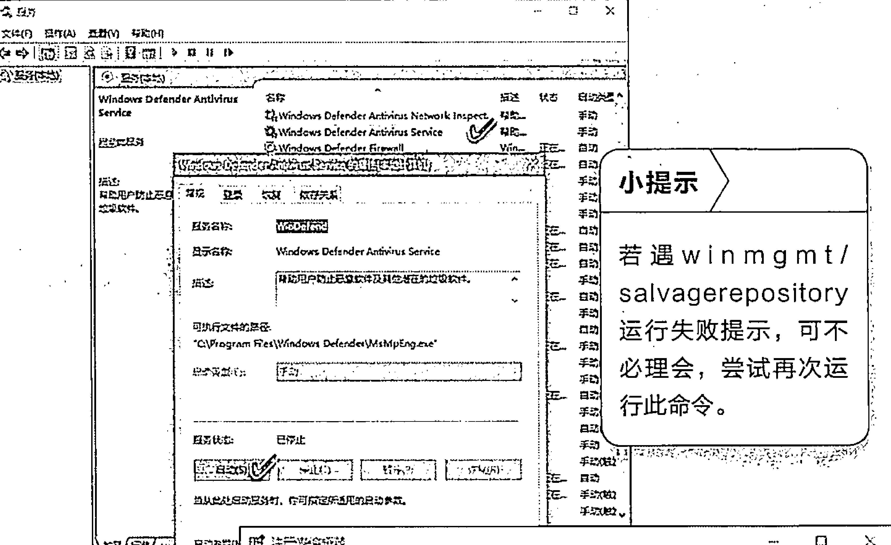

> 小提示
若遇winmgmt /salvagerepository运行失败提示，可不必理会，尝试再次运行此命令。

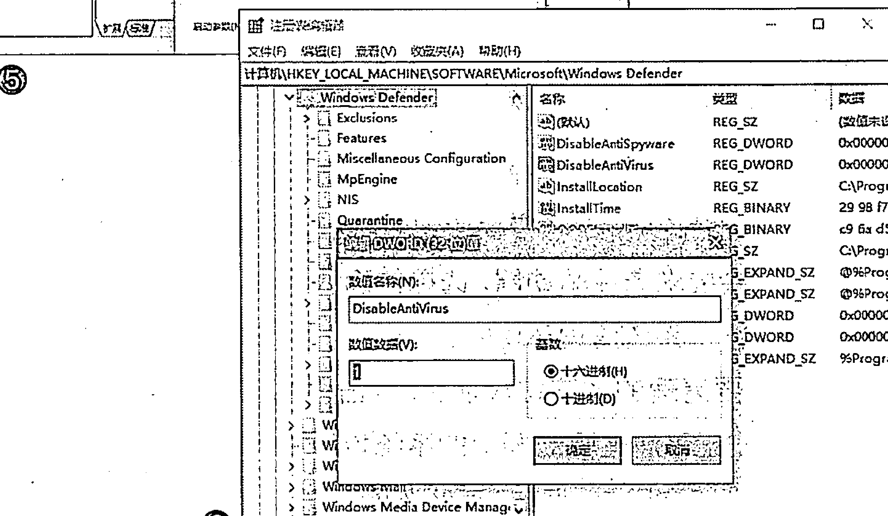

### 6. 重新启动WMI存储库解决

当点击启动Windows Defender时，如果Windows安全中心总是要求检查设置，并提示没有新的定义可下载，那么可以在管理员命令提示符窗口中执行“winmgmt /verifyrepository”命令。如果收到WMI存储库不一致的提示，则执行“winmgmt /salvagerepository”命令。这样便会对WMI存储库进行一致性检查并解决问题。之后，重启电脑并再次尝试启用Windows Defender。

## 记住关键词 Windows 10易清理

文|波波

为清理Windows 10的临时文件和隐私文件，不少人会借助于第三方系统优化工具。其实，Windows 10本身便包含了众多清理优化功能，我们仅需记住几个关键词，便可实现快速调用和清理优化。

> **小提示**
也可以在资源管理器中右键单击驱动器盘符，通过“属性”选择上述功能。

### 1 “磁盘清理” 系统清理三合一

在Cortana搜索框中输入“磁盘清理”，然后在最佳匹配结果中选择“磁盘清理”桌面应用，进入后首先会要求选择驱动器，选择并确认后便可进入“三合一”系统清理环境中。

选择要清理的系统垃圾项目，点击“清理系统文件”按钮可清理驱动器上的系统垃圾文件。在之后出现的窗口中，点击“其他选项”选项卡，可以删除不用的程序以释放空间；还可以通过删除系统还原点和陈旧的磁盘映像副本来释放更多的空间（图1）。

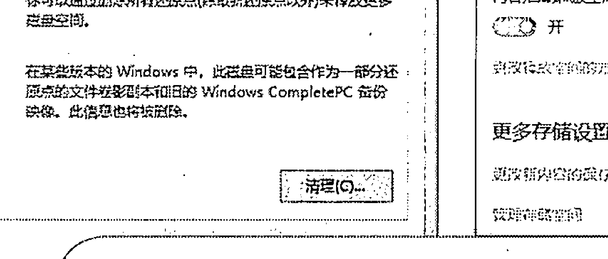

### 2 “存储感知” 自动清理磁盘空间

通过系统设置，进入“系统→存储→存储感知”（或直接通过Cortana搜索“存储”），打开“存储感知”开关，让系统自动帮我们释放磁盘空间（图2）。

> 自动删除的方法：在“Internet属性”窗口的“隐私”选项卡下，选中“从不允许网站请求你的物理位置”，点击“清除站点”按钮手动清除已经获取位置授权的网站（图4）。

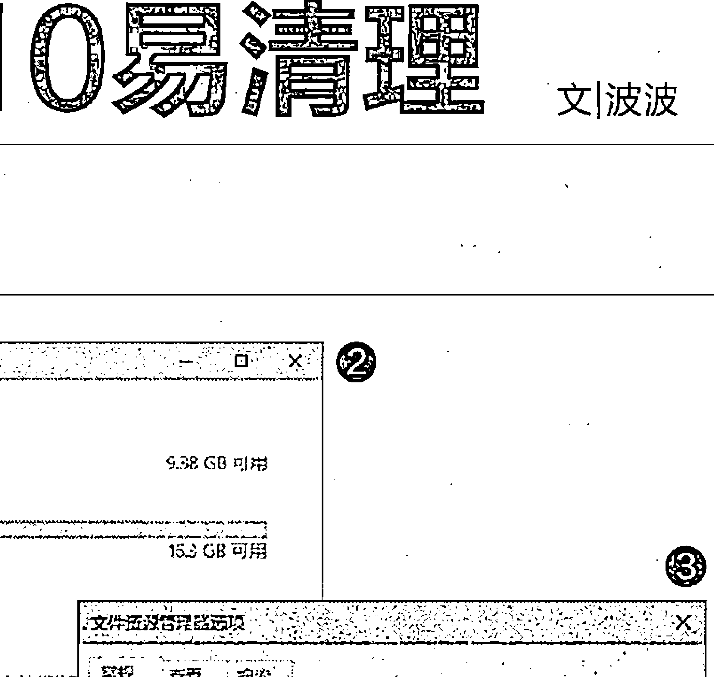

### 3 “文件夹选项” 自动清理文件访问痕迹

如果要清理“快速访问”和文件资源管理器的使用历史记录，在Cortana中输入“文件夹选项”，选择“文件资源管理器选项”匹配项，在其窗口的“常规”选项卡中，对“隐私”选项组下的三个选项进行选择或手动清除即可（图3）。

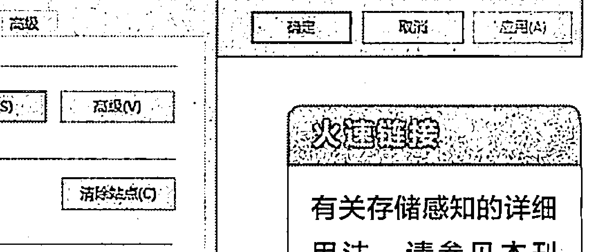

> **火速链接**
有关存储感知的详细用法，请参见本刊2018年第5期的文章《用好Windows 10存储感知》。

### 4 “位置历史记录” 自动手动清理位置记录

手动删除位置记录的方法：通过Cortana搜索“位置历史记录”，点击最佳匹配结果“清除位置历史记录”，在接下来的窗口中，用“位置历史记录”下的“清除”按钮进行清除。

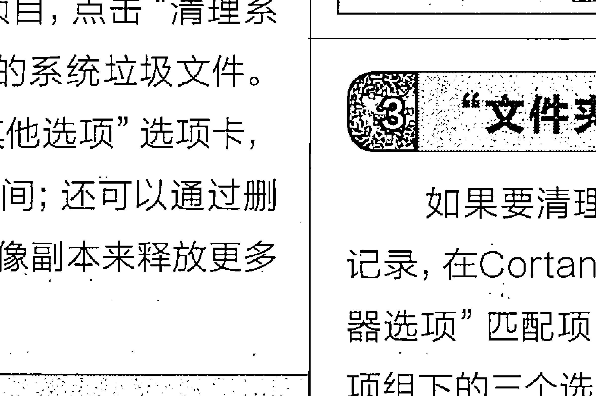

## 制作多媒体相册 UWP照片应用也行

将照片做成带有音乐伴奏和滤镜效果的动画视频，需要安装第三方工具软件吗？不用！在Windows 10中，利用“照片”应用，便可轻松合成带有音乐和滤镜效果的多媒体照片视频。

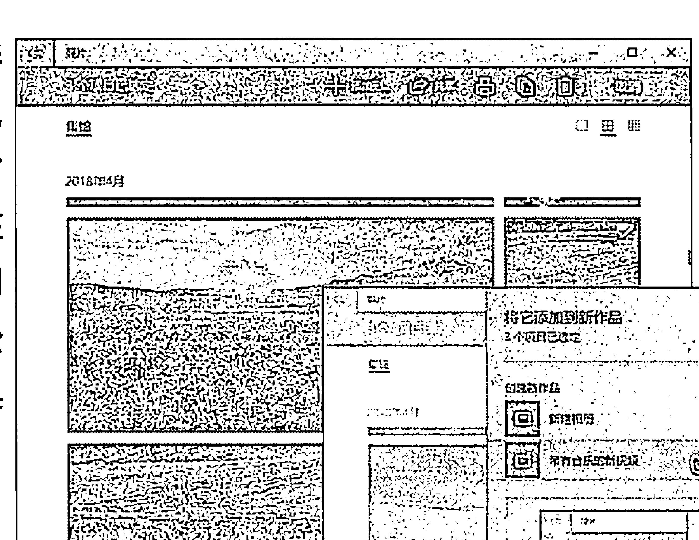

> **小提示**
若需要更改主题，或改变音量或乐曲，改变显示的纵横比（16:9或4:3）或纵横转换，可通过照片应用右上角的四个相应工具按钮来实现。

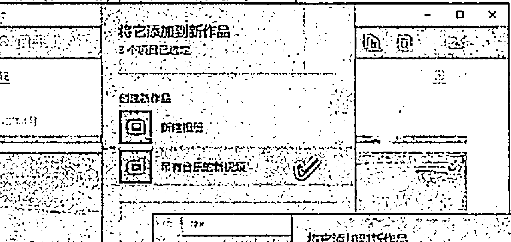

### 1 自动创建音乐照片视频

打开“照片”应用，选择要合成为音乐视频相册的原始照片文件（可用复选框多选），然后点击窗口顶部的“添加到…”按钮（或直接按下Ctrl+D组合键）（图1）。
接下来选择要将照片添加到的目标，这里我们要创建视频相册，因此选择“带有音乐的新视频”（图2）。接着为新视频起一个名字，点击“创建视频”按钮，即可自动开始创建音乐视频（图3）。

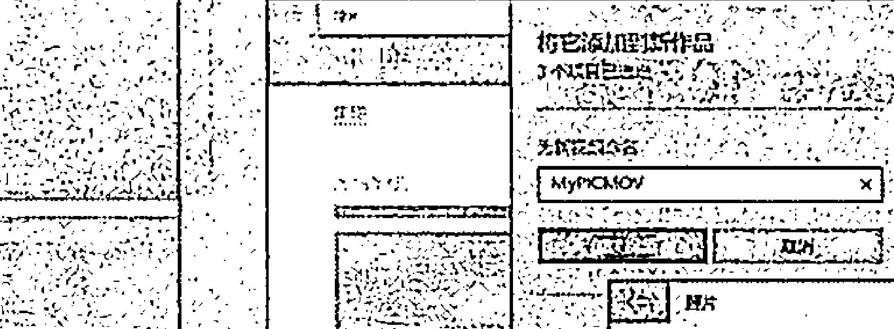

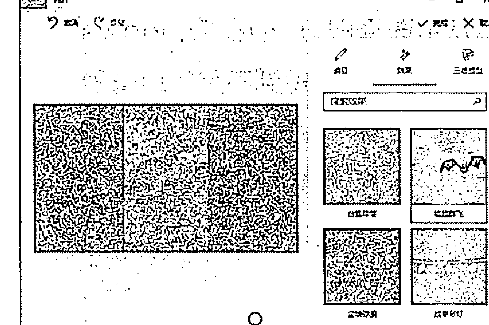

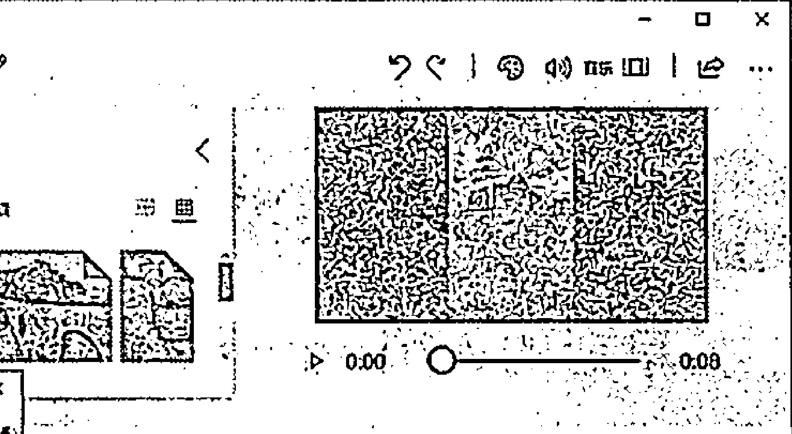

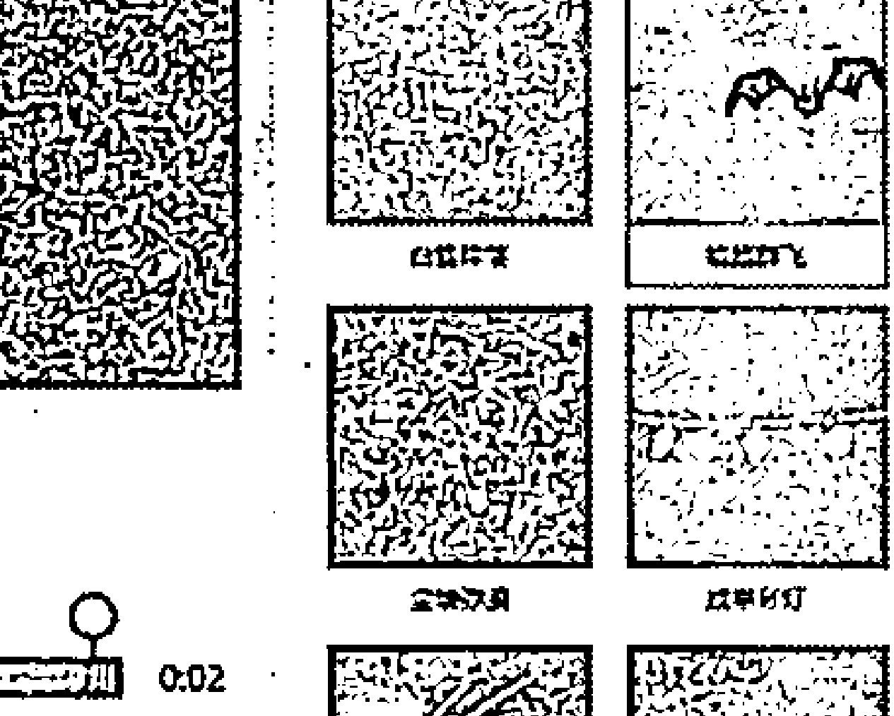

### 2 创建自定义的音乐视频

若需要创建自定义特效的多媒体照片视频，点击照片应用工具栏上的“创建→带有音乐的自定义视频”命令，在选中原始图片并点击“创建”按钮之后，进入自定义窗口进行编辑。
进入自定义窗口后，可通过左上角的项目库添加照片，通过右上角的预览时间轴拖动切换当前图片，或通过点击窗口下方的图片切换当前图片（图4）。
要改变当前图片在视频中出现的参数，选中图片，通过“情节提要”一栏的“持续时间”按钮更改照片持续播放的时间，有5种参数可选，还可以自定义；点击“滤镜”按钮，可切换到滤镜选择窗口，应用一种滤镜；点击“文本”按钮，输入图片中出现的文本内容，同时还可选择文本在图片中的布局位置；点击“动作”按钮，选择图片在视频中出现的相机运动样式；而通过“3D效果”按钮，则可以设置图片的3D动画样式，可套用现成的样式，套用后还可编辑，还可以使用自创三维模型（图5）。
音乐视频制作完成后，点击照片应用的“相册”选项卡，就可以看到先前制作的照片音乐视频作品了。

## 快入Windows 10安全模式另有办法

文|樱子

Windows 10使用了不同于Windows 7的安全模式进入方式。使用Windows 10系统，要进入安全模式，一般需通过系统“设置”菜单，进入到系统的“高级设置”，然后重启才能到达。不过，我们可以想方设法，找到进入安全模式的其他捷径。例如，通过找回Windows 10中失效的F8安全模式捕捉功能，启动时用F8捕捉进入；或者找回传统多系统启动菜单列表中的F8选择项，选择进入。这样，便可为Windows 10环境下进入安全模式提供方便。

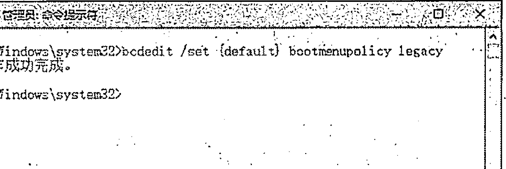

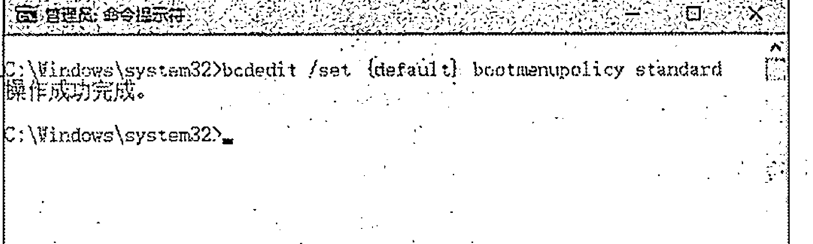

### 1 多法找回F8捕捉 一键选择安全模式

早期的Windows要启用安全模式，只需重启机器，看到BIOS信息显示后按下F8键，然后从中选择即可。但在Windows 10中，微软已经将功能键F2到F8的时间周期缩短到不足200毫秒的间隔，这就意味着系统能检测到F8中断的几率非常低，用户几乎没有时间靠按下F8来捕捉到启动菜单而进行后续的操作。要直接引导到安全模式，我们可以想办法首先启动捕捉F8键的功能，为启动时捕获安全模式提供可能。

#### 通过bcdedit命令找回F8捕获安全模式功能

我们可以通过使用bcdedit命令，使得F8在启动系统时捕获安全模式的功能生效。首先启动到管理员命令提示符窗口，然后执行如下命令（图1）：

```
bcdedit /set {default} bootmenupolicy legacy
```

当显示“操作成功完成”的提示后，重启系统，我们就可以像往常使用低版本Windows那样，通过F8来捕捉安全模式启动菜单了。

如果希望恢复屏蔽F8的功能，则下达如下命令（图2）：

```
bcdedit /set {default} bootmenupolicy standard
```

显示“操作成功完成”，说明已经恢复到系统默认的屏蔽F8截获功能。

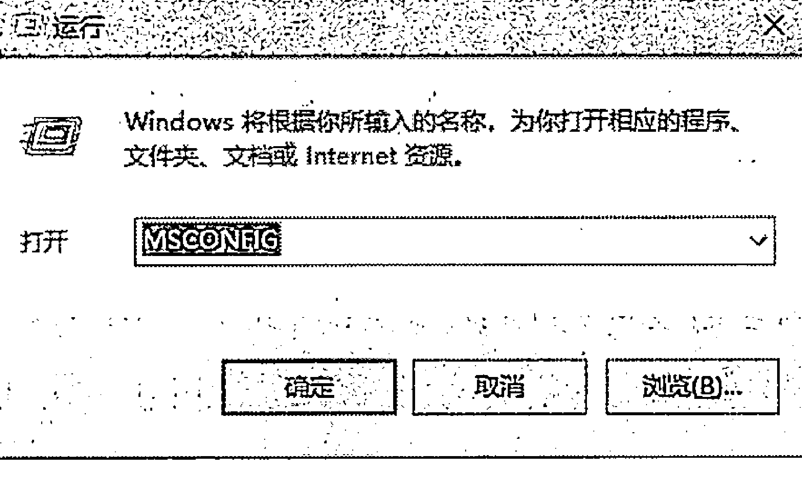

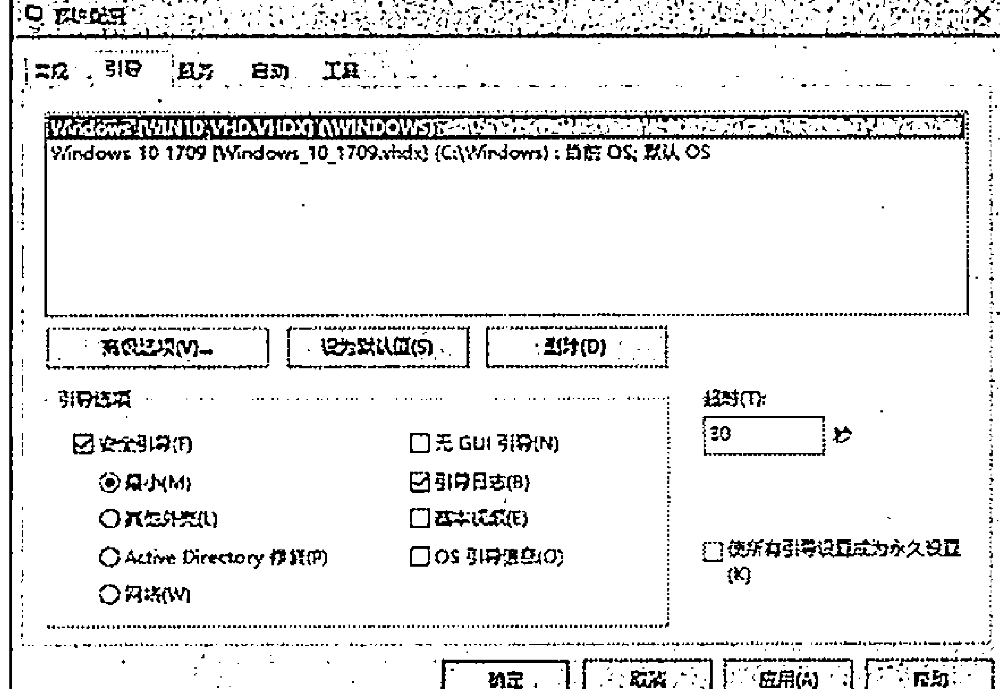

#### 通过MSCONFIG命令设置进入安全模式

除了用命令修改，还可以在系统配置窗口中重新配置。首先按下Win+R组合键，启动到“运行”窗口（图3）。在运行窗口中输入MSCONFIG命令并回车，启动“系统配置”窗口，单击“引导”选项卡，选中“安全引导”选项，点击“应用”按钮，最后点击“确定”并退出（图4）。这样，下次启动系统后，便会进入安全模式状态。

#### 小技巧

我们还可以在桌面上创建改变进入安全模式的快捷方式。创建快捷方式时，在键入对象位置框中输入如下命令（图5）：C:\Windows\System32\msconfig.exe -2。接下来，将快捷方式命名为“以安全模式启动”。创建之后，双击此快捷方式，即可在下次重启系统后进入安全模式（图6）。

### 不靠捕捉 手选F8系统启动高级菜单

如果觉得上述靠捕捉F8的设置让人有点紧张，那么我们还可以通过设置，让系统在启动时显示高级启动菜单，通过选择菜单中提示的F8功能，进入到安全模式。首先以管理员命令模式启动命令提示符窗口，输入下列命令并回车运行（图8）：

```
bcdedit /set {bootmgr} displaybootmenu yes
```

收到“操作成功完成”的提示后，重启系统，就会看到启动选择菜单，其中就有用F8启动高级选项的提示。若要关闭这一功能，则执行下列命令即可（图9）：

```
bcdedit /set {bootmgr} displaybootmenu no
```

同样，当收到“操作成功完成”的提示后，重启系统，系统便恢复了默认的启动模式。

### 使用工具软件设置进入安全模式

另外，使用安全模式启动工具BootSafe，选择4个选项中的后面3项，可在下次启动系统时进入安全模式。如果需要重新用正常模式启动系统，也需要运行该工具，选择“正常重启”选项即可（图7）。

## 微软版 “Ghost” Windows FFU
文|俞木发

在日常的维护中，系统的备份和还原是大家经常需要操作的事情。虽然Windows 10已经提供很多的工具，如系统还原、WIM备份/还原、VHD备份等。不过这些工具大多是基于文件的备份/还原。我们以前经常使用的Ghost则是基于扇区的备份/还原，这种工具可以实现非常彻底的备份和还原，现在Windows 10推出类似的工具——FFU映像备份和还原，它可以像Ghost那样实现彻底的备份和还原。

> **小知识：什么是FFU映像备份和还原**
FFU images的全称是Full Flash Update images，直译过来就是全闪存更新镜像。最早这种镜像格式主要是用于微软移动设备的更新及系统的安装，比如Windows Mobile手机、Surface，这类设备和我们常用的Android、iPhone手机类似，操作系统的安装是借助刷机工具将完整的系统写入到存储设备中的。不过自Windows 10 v1709开始，系统也支持FFU映像格式，这样我们可以使用这种格式来实现Windows 10系统的备份和还原。要想知道自己的Windows 10是否支持FFU映像，只要打开记事本，点击“帮助→关于记事本”，查看自己的系统是否是v1709及以上版本即可（图1）。

FFU是一种镜像格式，类似Ghost的GHO文件。对于Windows 10系统，借助系统自带的DISM命令就可以完成FFU映像的捕获。由于DISM命令只支持对整个硬盘的捕获，它使用的是扇区的方式保存文件，因此可以将整个硬盘，包括启动分区、恢复分区、数据分区等完整备份下来。因为是对整个硬盘进行备份，所以该备份方式需要两块存储设备的支持。

对于单硬盘用户，建议使用移动硬盘或者大容量的闪存盘（需要格式化为NTFS格式）先制作一个启动PE盘，然后使用启动PE盘进入后执行备份操作。对于SSD+普通硬盘用户，则建议使用普通硬盘作为存储设备，然后进入Windows 10恢复环境，使用Dism命令备份整个SSD硬盘。为了减小FFU镜像文件的体积，可以预先启动磁盘清理工具，将不必要的垃圾文件全部清理干净（图2）。

完成垃圾文件的清理后，在搜索框输入“更改高级启动选项”，启动设置窗口后点击高级启动下方的“立即重新启动”（图3）。
重启系统后按提示进入WinRE环境的命令提示符窗口。在打开的命令提示符界面按提示依次输入“wmic diskdrive list brief”命令，获取需要备份的磁盘序号。如本文例子，通过容量的不同可以知道这里需要备份的是\PHYSICALDRIVE0（图4）。

> **小提示**
如果使用的是大容量的闪存盘存储备份，那么还可以使用 “dism /split-image /imagefile:ssd.ffu /sfufile:winoem.sfu /filesize:3500”，将文件拆分为多个大小为3500MB的winoem*.sfu分割文件。

继续输入下列的命令对SSD硬盘进行完整的备份（图5）：

```
dism /capture-ffu /imagefile:d:\ssd.ffu /capturedrive:\\.\physicaldrive0 /name:Disk0-W10Pro
```

**命令解释：**
**/capture-ffu:** 使用捕捉命令对磁盘进行捕捉，**/imagefile**则指定ffu格式映像存储的路径和文件名，**/capturedrive**是指定要捕获的硬盘，其中\\.\physicaldrive0表示硬盘0，这里注意选择正确的硬盘。

这样在完成FFU映像文件的捕获后，我们就完成了对整个SSD硬盘的备份。以后如果我们需要还原系统，同上进入WinRE修复环境（或者PE系统），输入下列的命令，将整个硬盘镜像恢复到指定的驱动器上即可（图6）：

```
dism /apply-ffu /imagefile:d:\ssd.ffu /applydrive:\\.\physicaldrive0
```

这样成功恢复完系统后重启，原来SSD硬盘的系统和数据都可以完整恢复。恢复效果就和GHOST的全盘恢复是一样的。因为FFU是基于扇区恢复，因此上述方法非常适合SSD+传统硬盘的用户备份/还原系统。这里需要注意的是：
- FFU映像只能恢复到容量比原来硬盘空间更大（或者相同）的新硬盘上。
- 由于是全盘恢复，恢复前一定要做好原始数据的备份。

当然上述方法也可以用于公司新购同配置电脑的快速部署。这样我们只要在一部新电脑上安装好Windows 10系统并规划好分区，然后使用移动硬盘进行全盘备份，接着使用移动硬盘启动到PE系统，方法同上将FFU映像文件恢复到新电脑上，就可以完成Windows 10的安装和分区规划，快速实现新电脑的系统部署。如果恢复的电脑配置不同，在捕获备份映像文件前请使用“sysprep”命令进行初始化。

## 巧用Windows 10资源管理器
文/波波

使用Windows 10资源管理器，除了常用的菜单命令、工具按钮和右键菜单外，还有不少实用技巧可以利用。下面的几条技巧或许可助你一臂之力。

> **小提示**
> 只有当应用支持文件共享功能，才会在应用商店中列出。

### 1 与应用共享一个或多个文件

在Windows 10文件资源管理器中，可以将文件共享给OneNote、画图、画图3D、Twitter、Facebook之类的应用，实现文件的应用共享。
要共享文件给应用，选择一个或多个文件，右键单击，然后从快捷菜单中选择“共享”命令（图1）；在随后出现的共享列表中，选择目标共享应用。若目标共享应用没有出现在列表中，则点击下部的“在应用商店中获取应用”链接，通过应用商店安装应用后再共享文件（图2）。

### 2 两步实现任意文件夹的彩色显示

在Windows 10中，我们可以利用系统对压缩或加密文件管理的特性，实现任意文件的彩色显示效果。
选择文件并右键单击，选择进入文件“属性”窗口。在文件属性“常规”选项卡中，点击进入“高级”属性设置，在“压缩或加密属性”分组框下，将“压缩内容以便节省磁盘空间”或“加密内容以便保护数据”选中，然后确定（图3）。
之后，启动到“文件资源管理器选项”窗口，在“查看”选项卡的“高级设置”列表中，找到“用彩色显示加密或压缩的NTFS文件”项并将其选中，点击“应用”并确定（图4）。
这样，先前被设定的文件名便以彩色显示。其中压缩文件以蓝色显示，而加密文件以绿色显示。

### 3 针对某类文档找到更多好应用

虽然Windows 10已附带了打开常见文档的应用，如用“记事本”打开TXT文件，用“画图”或“照片”打开PNG图片，但如果对这些自带的应用不满意，那么还可以借助应用商店，自动找出能打开这类文档的更多、更好的应用。

右键单击某种文档（例如TXT文件），依次选择“打开方式→搜索应用商店”（图5）；随后系统自动打开应用商店，并自动推介能够打开此类文档的各种应用，从中选择应用即可（图6）。

### 4 快速选择性地重命名多个文件

我们已经知道用F2重命名单个文件或以序号批量重命名文件的方法，但要选择性地重命名多个文件，且不想反复按F2处理，该怎么办？这时，可用Tab键快速完成跳转选择更名。

首先选择要更名的第一个文件，按下F2键更名，一旦确定了名称，便按下Tab键，光标会跳转到另一个文件上，如法完成更多文件的更名（图7）。若有的文件需要跳过，只需按Tab键不执行改名即可。

### 5 在资源管理器中拖放删除文件

虽然不少人习惯于用Del键或Shift+Del组合键删除文件，但也有人已习惯于将要删除的文件直接拖动到回收站里。可是，Windows 10资源管理器中并未出现回收站图标，若拖到桌面回收站操作更不方便。

此时，只需点击“查看”功能选项卡，然后点击“导航窗格”按钮下的三角形下拉图标，在其中选择“显示所有文件夹”，左侧文件导航栏内便会出现回收站图标（图8）。之后有需要删除的文件，直接通过右侧文件窗格，将文件拖动到左侧导航栏的回收站图标即可。

### 6 找回丢失的“新建”文件类型

有时我们会发现自己常用的“新建”文件类型丢失了，若遇到此类问题，可通过注册表编辑器来添加找回。

假设丢失了新建TXT类文件的快捷项目。用记事本编辑一个文本文件“ADDTXT.REG”，其中输入如下两行代码（图9）：

```
Windows Registry Editor Version 5.00
[HKEY_CLASSES_ROOT\.TXT\ShellNew]
"NullFile"=""
```

存盘并执行该REG文件，便会将TXT文件类型添加到“新建”项目列表中。

## 电脑垃圾 彻底放心清理
文|惠香

电脑使用时间一长，安装的软件多了，产生垃圾很正常。以往我们借助于一些国产全家桶套餐工具软件清理垃圾，效果虽也不错，但清理了垃圾却同时也带来了诸多捆绑或弹出的麻烦。其实，放眼看去，国外的两款免费软件也可以很好地解决问题。

首先，我们可以使用免费软件Clean Space来清理系统垃圾。注意首次运行的两个选项：语言翻译和运行模式选择。软件没有自带中文语言包，但在安装结束后会提示可采用机器翻译技术将程序界面翻译为“中国语文”。由于自动翻译会存在翻译不到位的情况，因此不如沿用英文界面（图1）。接着的运行模式选择有普通用户模式（Regular user）和管理员模式（Run as admin）两个选项，若选择后者会以更加强大的功能来清理和优化系统，这可能会为你腾出上GB的额外空间（图2）。以管理员模式运行程序后，在程序标题栏内会出现Full power模式信息。

### 1. 一键清理各种隐私和无效项目

启动软件后，即便是不对软件作任何设置，只需一键便可以清理包括浏览历史、日志、索引、DAT文件以及各种无效的注册表项目。

软件启动后会自动扫描各类项目，计算可以清理的空间（图3），扫描结束后，给出可以清理的空间总计数（图4）。最后，点击Delete按钮，即可进行一键清理。

### 2. 设定可检查清理的软件范围

在一键式傻瓜化清理的基础上，我们还可以进一步设定扫描和清理的软件范围。

点击Settings按钮进入设置，选择左侧栏最后的Detection项，在右侧列表中勾选希望检查清理的操作系统或应用程序项目，对于不希望检查的项目，去掉其前面的勾选（图5）。

Cookie作为保存隐私信息的重要文件，是清理软件清理的主要项目之一。但该文件往往也存有用户使用的一些特殊网址，例如代理服务器或广告屏蔽网址等。为此，如果希望保留一些Cookie地址，可在设置窗口中通过Cookie keeper页，添加需要保留的网址（图6）。

> **小提示**
> 为防止清理造成的意外，可以通过设置窗口的Settings页面，选择Create system restore point before cleanup建立系统还原点。

### 3. 如何做到彻底删除文件不留痕

为了有效地删除不想要的文件，达到删除后无法恢复的目的，可先点击Settings按钮进入设置，选择左侧栏内的“Secure deletion”选项，然后在右侧窗格中进行强力删除设置。待设置之后，再进行优化。

如果希望在覆盖写入后将文件字节变为0字节，选择Make file empty after Overwrite选项；如果希望在删除之前将文件名随机更名为其他名字，选择Rename file to random name before deletion选项；Write random characters to random places of the file选项设置写入随机字符到随机的位置；Overwrite all contents of the file with random data选项则可设置用随机数据覆写所有内容的次数。最后还可以通过Algorithm选项选择删除算法（图7）。

#### 使用更强大的隐私删除工具

作为替代品，我们可以使用来自微软的更为强大的隐私删除工具SDelete，以代替Clean Space默认内置的隐私删除工具。为此，可在软件设置窗口的左侧选择SDelete选项，然后在右侧窗口中点击链接下载SDelete软件，解压后拷贝到程序安装目录，点击Connect按钮进行访问。如果要恢复软件原有的删除功能，点击Disconnect按钮进行恢复（图8）。

#### 扩展阅读 何止隐私清理 其他垃圾也通吃

我们还可以使用一款Privacy Eraser软件清理系统垃圾。从软件的字面意思看，Privacy Eraser似乎只能清理隐私信息，但使用后会发现其作用非常广泛，所有的系统垃圾和软件产生的垃圾都会清理，功能一点也不单一。

| 操作系统和应用列表 |
| :--- |
| Windows XP |
| Windows XP Apps |
| Windows 7 |
| Windows 7 Apps |
| Windows Vista |
| Windows Vista Apps |
| Windows 8 |
| Windows 8 Apps |
| Windows 10 |
| Windows 10 Apps |
| Windows Media Player |
| Skype |
| Skype (Universal) |
| OneDrive |

| 删除选项列表 |
| :--- |
| □ Make file empty after overwrite (zero size) |
| □ Rename file to random name before deletion |
| □ Set date of file January 1, 1970 |
| □ Write random characters to random places of the file |
| □ Overwrite all contents of the file with random data |

## 全面修复Windows系统
文/波波

系统出点这样那样的小问题在所难免，若不是致命性的错误，就没有必要重装系统，修复一下即可。为了免除一些优化“全家桶”软件的捆绑、弹出等困扰，我们可以转而使用Windows Repair这一优化工具，对系统进行全面修复。我们选择它的Free（免费）版即可，可支持从Windows XP至Windows 10的主流Windows操作系统。

### 1. 预修复 给系统修复打牢安全基础

如果你试图以最省事的方式解决一些Windows的问题，但找不到一个合适的工具，那么Windows Repair可能是比较适合的选择。该软件解决问题的方式确实非常独特。由于系统修复的特殊性，为了确保用户始终处于安全的状态，程序提供了一个预修复向导。

软件运行时，会首先自动扫描自身文件的完整状况和是否被破坏，扫描过程需要延续片刻。之后便可以看到向导式预修复界面（图1）。在预修复设置（Pre-Repair Setups）选项卡向导包含的五个步骤中，实际上只有后四个是为预修复过程而设计的。点击Go to Step 1开始修复前的准备工作，首先要求进行一次系统重启，这时更建议启动到安全模式，为此可点击底部的Reboot To Safe Mode按钮启动到安全模式（图2）。

下一步进入预扫描环节，会启动预扫描窗口，主要会对Windows文件包、系统链接点、环境变量进行扫描分析，点击Start Scan进行扫描，或可以分别选择上述三者（图3）。

接着在第3步中进入文件系统检查环节（Check File System），如果希望立即检查，点击Check按钮立即开始。若希望下次启动时检查，点击Open Check Disk At Next Boot按钮，选择驱动器和是否对发现的问题进行修复的项目（图4）。这一步很重要，因为如果文件系统存在严重问题，将会影响到其他修复过程，因此需要先解决。

最后一步预修复过程是系统文件检查（System File Checker，SFC）。

如果不能确定是哪里的问题该怎么办？只需选择All Repair修复即可，这样可将软件所能发现的问题一次性地进行修复。但缺点是由于要遍历所有项目，因此扫描所需要的时间比较长。

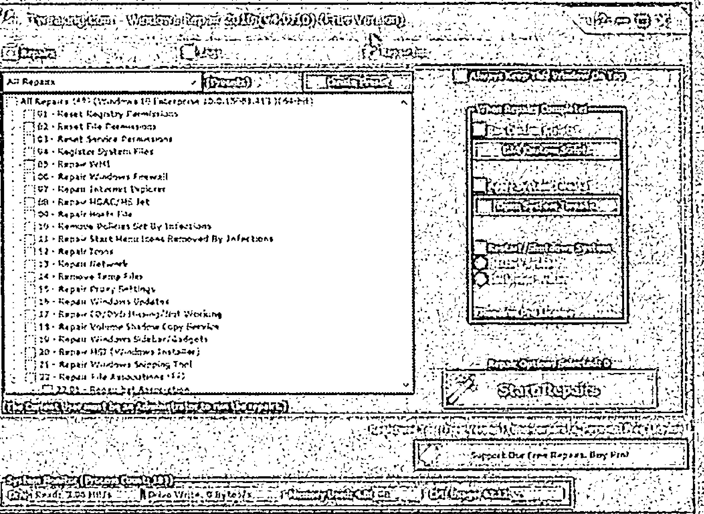

（File Check）。注意文件系统和系统文件是两个概念，前者主要针对磁盘文件系统，而后者主要针对系统的关键文件。点击Check按钮后，会启动管理员命令提示符窗口并自动执行sfc /scannow命令，对系统文件的完整性进行检查（图5）。

每次清理系统时，为防止本地磁盘上存在任何感染或关键文件的改变，建议通过预修复环节检查文件系统和系统文件。此外，为预防万一，可通过Backup Tools选项卡，创建包括注册表、系统还原点、权限许可等的备份（图6）。

### 2. 真修复 解决各类系统修复问题

在上述预修复的基础上，接下来我们就可以点击Repair Main选项卡，进行实质性的修复选择了。软件默认会启用一个Automatically Do A Registry Backup选项，意思是在修复前先自动对注册表进行备份。在可选择的6个修复模块中，有5个预设模块（Preset），可分别进行恶意破坏修复（Malware Cleanup Repair）、常规修复（Common Repair）、系统升级修复（Windows Updates）、仅修复许可项（Permissions Only）、修复所有（All Repair）等修复选择（图7）。

而另一个模块Open Repair则可以打开详细的修复选择窗口，在该窗口的修复列表中，我们可以按实际需要更加灵活地选择各种修复功能选项（图8）。其中包括用进程管理诊断和分析系统模块；对自启动项进行分析，对可疑自动启动项高亮显示并清除；对系统加载模块进行分析，对可疑模块进行高亮显示并卸载清除；清理Windows外壳非法的设置；清除无效注册表数据和用户历史记录等。以64位版的Windows 10为例，可选修复的大项有33种之多。我们只需根据系统故障的方向，按照实际需求进行复选，最后点击右下角的Start Repairs按钮进行修复即可。

## 一点即用 换个绿色资源管理器

文|雅南

Windows文件资源管理器往往不能令人完全满意，例如，对比多个文件夹需要并排打开多个窗口；同一窗口中不能使用多个标签打开不同的文件夹；未给出一些常用系统维护工具和实用软件的便捷入口等。为此，我们可以选择一点即用的绿色资源管理器Unreal Commander。

### 1. 用好绿化选项 打造绿色管理器

要打造一个绿色运行的Unreal Commander浏览器，首先需要下载和运行官方安装包，执行安装程序，在安装过程中选择“Portable Mode (USB flash drive)”选项，完成安装之后，即可将安装目录随意拷贝到包括移动介质在内的任何地方，作为绿色软件使用了（图1）。

若想获得多变的视觉体验，首次启动该软件后，会弹出可视化样式面板，可选择各类皮肤（Skin）、程序主题、工具栏主题等个性化界面元素。之后还可通过“配置→选择主题”菜单命令来设置（图2）。

### 2. 使用双面板和多标签利于对比

Unreal Commander默认界面中会出现双面板显示。双面板可实现两个文件夹的对比访问（图3）。

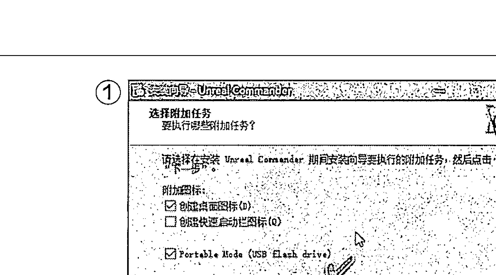

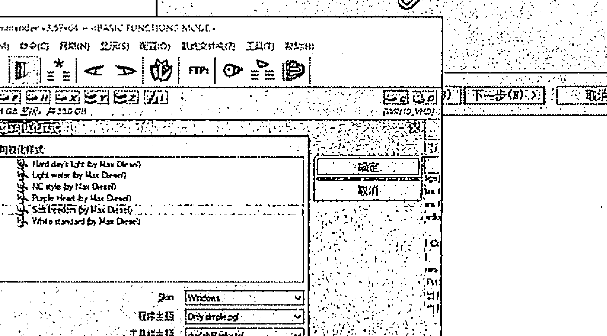

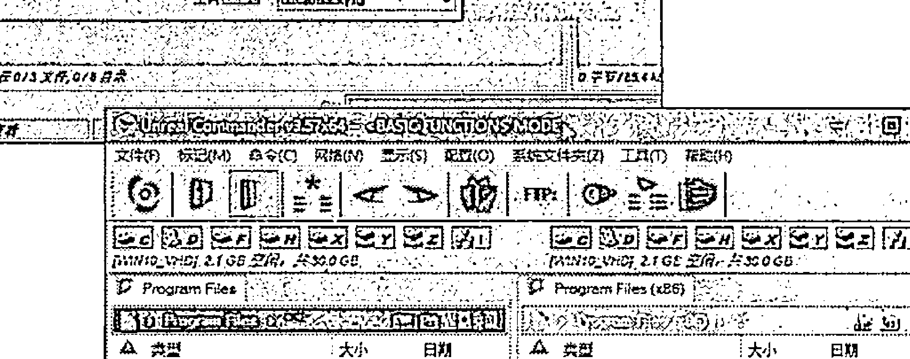

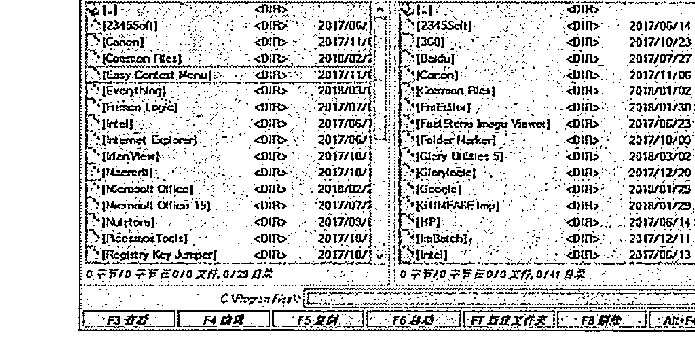

在双面板显示的基础上，我们还可以设定多标签显示。如果要使用多标签，可在标签栏的空白处双击鼠标，即可生成一个新标签。多标签可将所有打开的文件夹叠放排列为一排，便于文件夹之间的切换。这是Unreal Commander对于Windows资源管理器的最大优势之一。

### 3. 不用翻找 一键达成常用访问

如果要访问一些常用的系统工具，或者要到达一些常用的系统文件夹位置，在Windows资源管理器中操作比较繁琐。利用Unreal Commander的“系统文件夹→资源目录”命令，可一键到达常用的文件夹位置（图4）；利用“工具”菜单，则可以访问包括记事本、画图、计算器、命令提示符、组策略、注册表、卸载程序等在内的常用系统工具。

## 找回微软拼音输入法设置

文|南溪

如果在Windows 10中安装了第三方输入法（如百度拼音输入法）之后，进入系统输入法设置页面时，会发现微软拼音输入法的“设置”按钮处变为空白，熟悉的输入法“选项”没有了（图1），而切换出微软拼音进行输入，却又看不到输入状态栏，因而找不到设置入口。下面介绍两种解决办法。

### 1. 通过第三方输入法状态条找回

在不卸载第三方输入法的情况下，可通过第三方输入法工具条绕道解决问题。

右键单击任务栏上的输入法状态图标（第三方输入法图标或系统自带的中文输入图标均可），选择快捷菜单中的“还原语言栏”命令（图2）。这时，输入法状态条与任务栏分离，变为自由状态。

点击第三方输入法图标，在弹出的输入法选择菜单中选择“微软拼音”，之后可见微软输入法工具条（图3）。

在微软输入法工具条上点击齿轮状设置按钮，便可进入到微软拼音设置窗口（图4）。

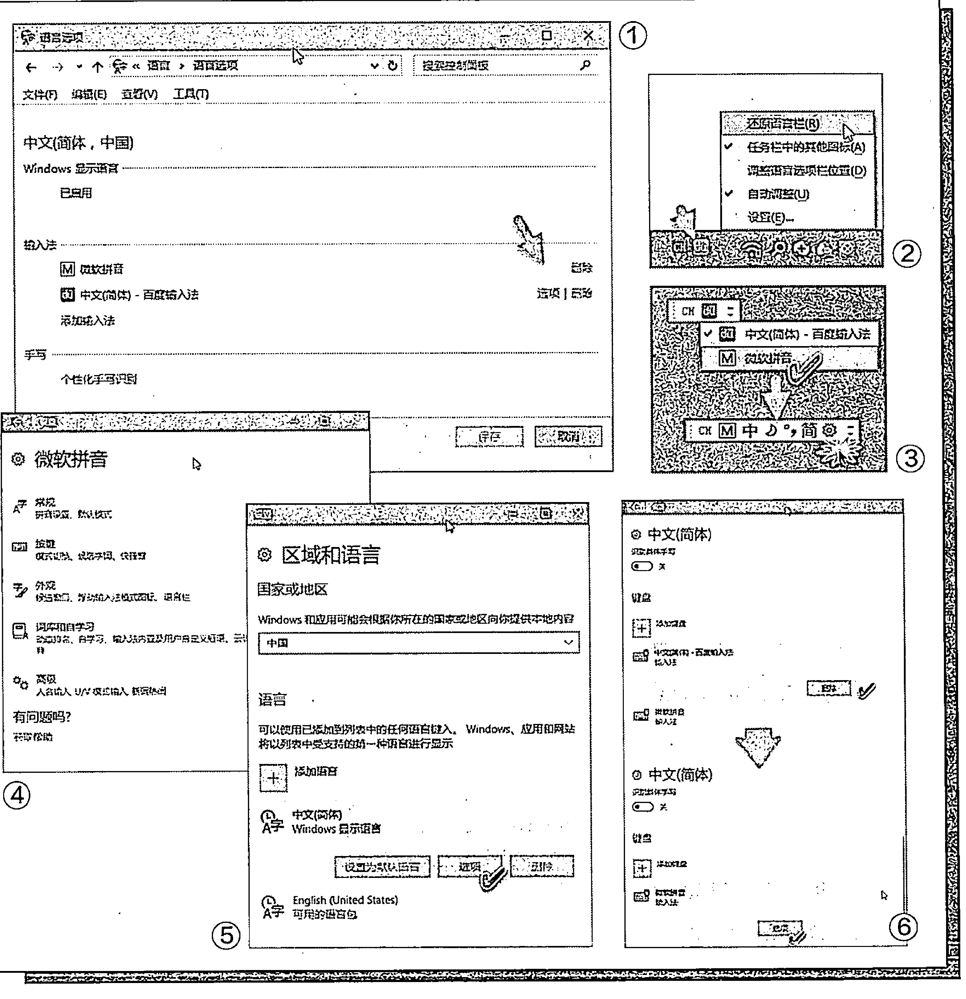

### 2. 卸载+设置+重新安装找回

第二种方法的思路是，先卸载第三方输入法，只留下微软拼音输入法，则可以恢复区域和语言窗口下的微软拼音输入法“选项”设置按钮。

通过系统“设置”窗口进入“区域和语言”窗口，点击“语言”下的“中文(简体)→选项”（图5）。点击第三方输入法下的“删除”按钮，卸载第三方输入法，然后点击“微软拼音”下的“选项”按钮，对微软拼音进行必要的设置（图6）。

设置好微软拼音输入法的参数之后，再恢复安装第三方输入法软件，这样调出微软拼音输入法后就能按自己所设的方案输入了，即便是“选项”按钮再消失也不妨碍使用。

> **小技巧**
> 如果因系统组件出现问题而不能用上述方法解决，可在管理员模式的命令提示符窗口中输入如下代码重置输入法组件：
> `reg add HKCU\Software\Microsoft\Windows\CurrentVersion\Run /v "ctfmon.exe" /t REG_SZ /d "C:\WINDOWS\system32\ctfmon.exe" /f`

## 目标明确 文档打开另存有捷径

在打开或另存文档时，每次是不是为层层点击才能确定目标而感到繁琐？其实，我们可以借助于FileBox eXtender（简称FBX）软件，将常用路径安排到对话框或窗口标题栏中，一键点击按钮即可选择常用文件夹。

### 1. 添加常用文件夹

首先，要将常用的文件夹添加到FBX的Favorites列表中，有两种方法可实现添加。第一种方法是集中添加，可一次性添加多个喜欢的文件夹。点击系统托盘上的FBX软件图标，选择Configure命令，进入软件配置窗口。点击Favorites选项卡，添加自己喜欢的文件夹。点击New Item按钮，通过浏览的方式找到需要添加的文件，添加的项目会出现在设置窗口右侧的窗格内。如果要给添加的项目分组，可点击Add Separator按钮，在组与组之间添加一条分隔线。若希望出现下级子菜单，则点击New Sub-Menu按钮添加子菜单(图1)。

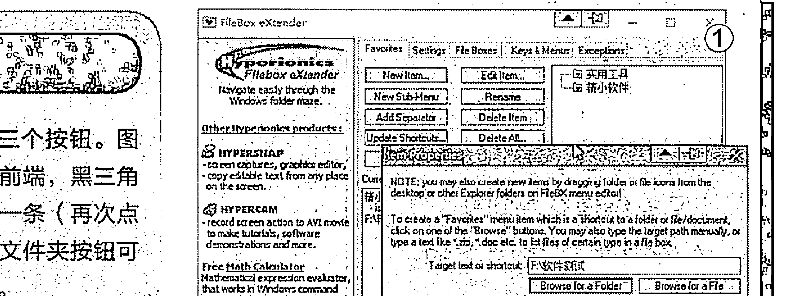

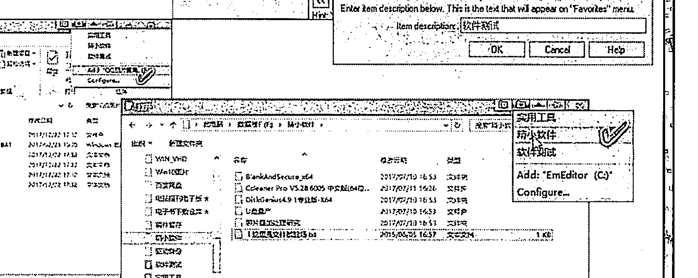

第二种方法是随时分散添加。进入Windows 10资源管理器，选中一个文件夹，然后点击窗口标题栏右侧新增的收藏按钮（文件夹上标有红心的按钮），从下拉列表中选择“ADD:<当前文件夹名称>”选项，即可为自己喜欢的收藏列表添加一个新的项目(图2)。

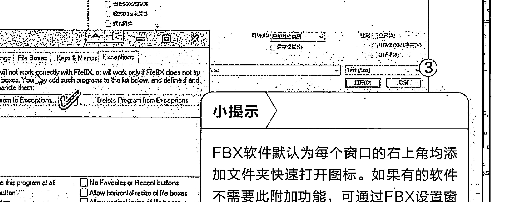

> 小提示
> FBX软件默认认为每个窗口的右上角均添加文件夹快速打开图标。如果有的软件不需要此附加功能，可通过FBX设置窗口的Exceptions选项卡，设置需要排除的程序(图4)。

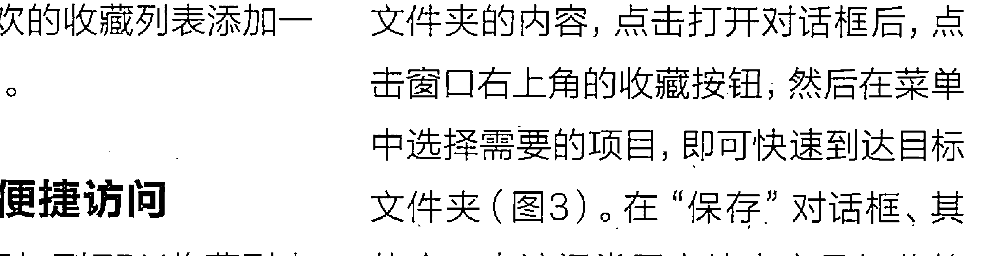

### 2. 常用文件夹便捷访问

常用文件夹添加到FBX收藏列表之后，就可以在任何一个开启的窗口或对话框中快速访问这些文件夹了。在打开文件的对话框中访问常用文件夹的内容，点击打开对话框后，点击窗口右上角的收藏按钮，然后在菜单中选择需要的项目，即可快速到达目标文件夹(图3)。在“保存”对话框、其他窗口中访问常用文件夹亦是如此简单。

## 输入法顺序听我安排

文|南溪

不少人会在Windows 10系统自带微软拼音输入法的基础上另装第三方输入法，对于多人共用的电脑，则可能会安装更多的输入法。这样，当要使用的输入法不位于第一位时，每次输入时切换到自己的输入法就比较麻烦。因此，在拥有电脑使用权的时段内，有必要将自己常用的输入法调整到第一位。

### 1. 用自身功能调整输入法顺序

一般来说，输入法都具有将自身调整到第一位置的方法。第三方输入法一般都有“设为默认输入法”的按钮或选项。以百度输入法为例，其设置是在“常用”设置的“其他”选项下，只需选择“锁定百度为默认输入法”选项，然后点击“设为默认输入法”按钮即可（图1）。

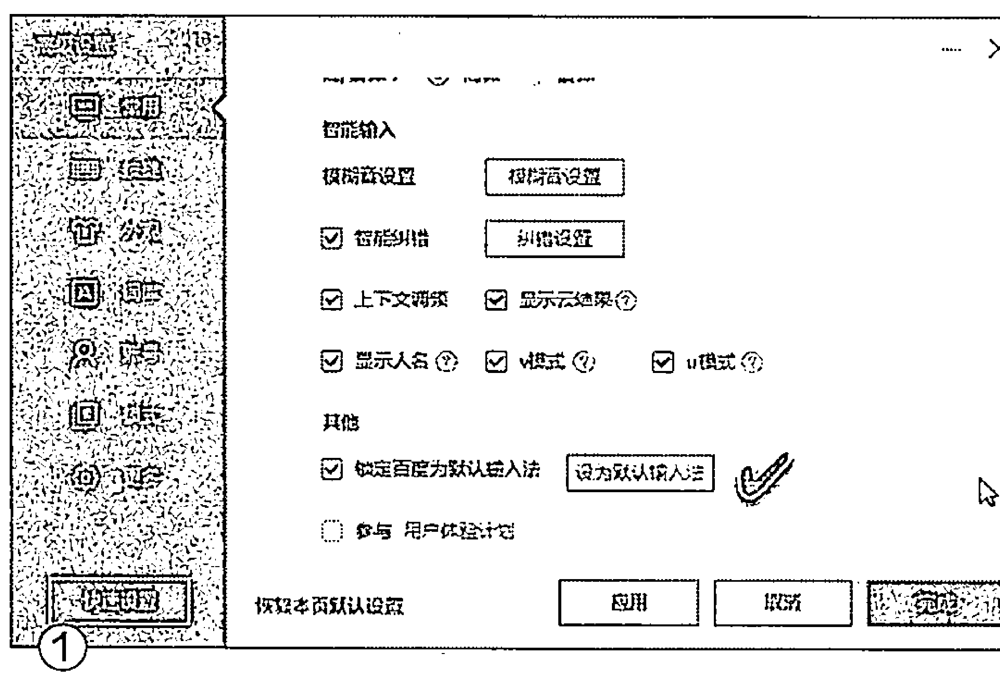

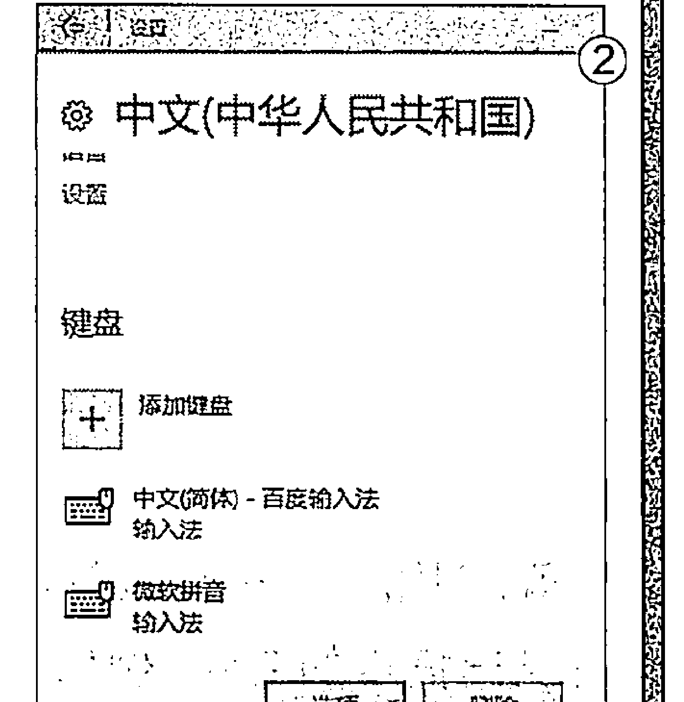

> **小提示**
> 该工具还可以支持从注册表删除输入法，具有改变语言切换快捷键、改变键盘布局快捷键或添加IME输入法文件等功能。

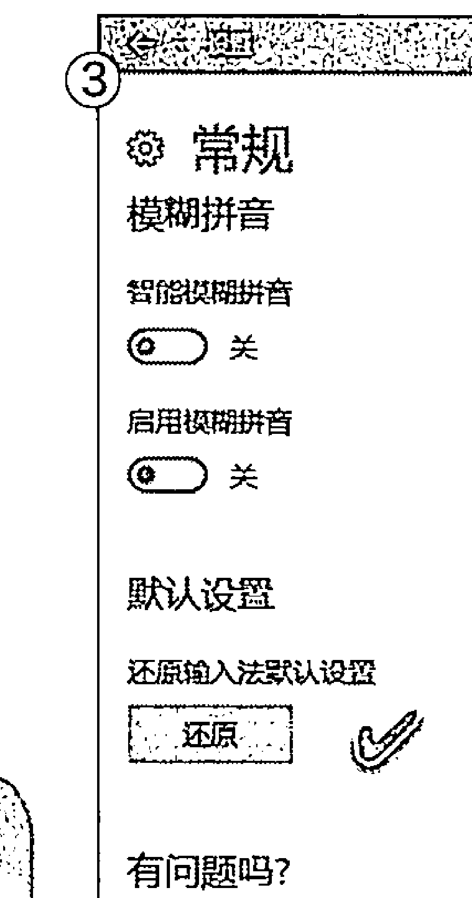

> **火速连接**
> 关于搜狗输入法附带的调整工具以及在Word内部控制输入法的方法，可参见本刊文章《巧用输入法办公也提效》的介绍（http://www.cfan.com.cn/2015/0325/117155.shtml）。

而对于Windows 10系统自带的输入法，则可以用输入法管理器来调整。首先进入“语言”设置窗口，选择“更改语言首选项”下的“中文（中华人民共和国）”，进入后点击“微软拼音”下的“选项”按钮（图2）；随后，点击微软拼音设置列表中的“常规”选项；在常规选项对话窗口的“默认设置”下有“还原输入法默认设置”按钮，点击“还原”即可将微软拼音设置为第一输入法（图3）。

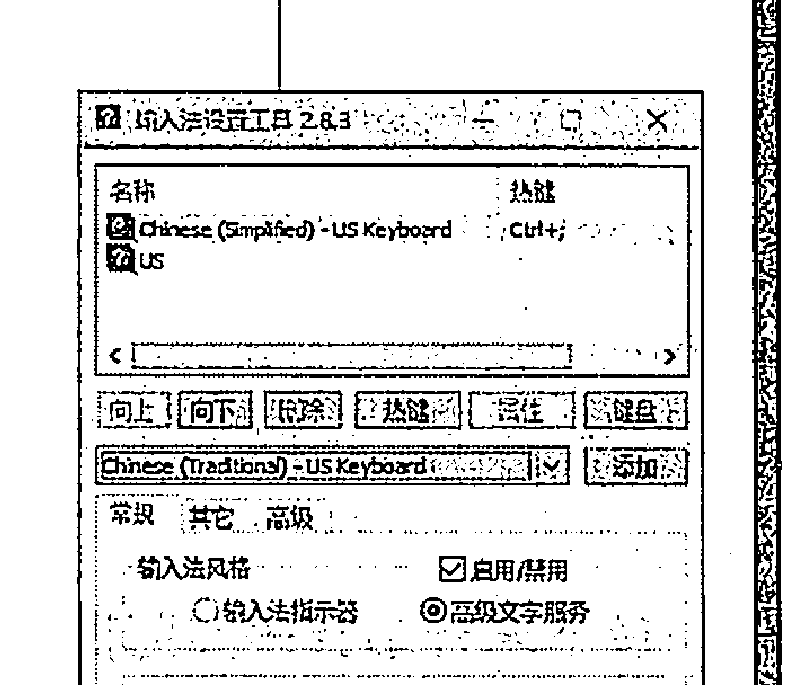

> **扩展阅读**
> 有的输入法自身也带有输入法顺序调整专用工具（搜狗输入法附带有调整工具），它不但可以将自身调整到第一位置，还可以调整其他输入法的出场顺序。除了可以从输入法自身的角度来调整输入法的顺序外，我们还可以通过编辑软件来指定输入法，例如在Word内部就可以调用想要的输入法。

### 2. 用专用工具IME Tool调整顺序

输入法顺序的调整，还可以用专用的输入法设置工具（如IME TOOL）来完成。执行该程序后，只需通过“向上”或“向下”按钮，即可调整各输入法的调用顺序（图4）。

## 注册表拍个照 软件别瞎闹
**文亦云**

有的软件在安装过程中会耍各种鬼把戏，在系统中偷偷安装一些多余的文件或进行一些不可告人的修改。为了彻底搞清软件在安装或运行过程中进行了什么操作，我们可用Regshot软件给注册表拍两次“快照”，加以比较即可彻底弄清软件的所作所为。

首先需要对Regshot进行输出设置。先指定报告保存文件夹，系统默认保存路径“%SYSTEMDRIVE%\Hive”，即如果系统盘为D盘，则报告保存在“D:\Hive”；也可以自己指定位置，例如“F:\Hive”。还需要给出报告的名称，例如“report”（图1）。

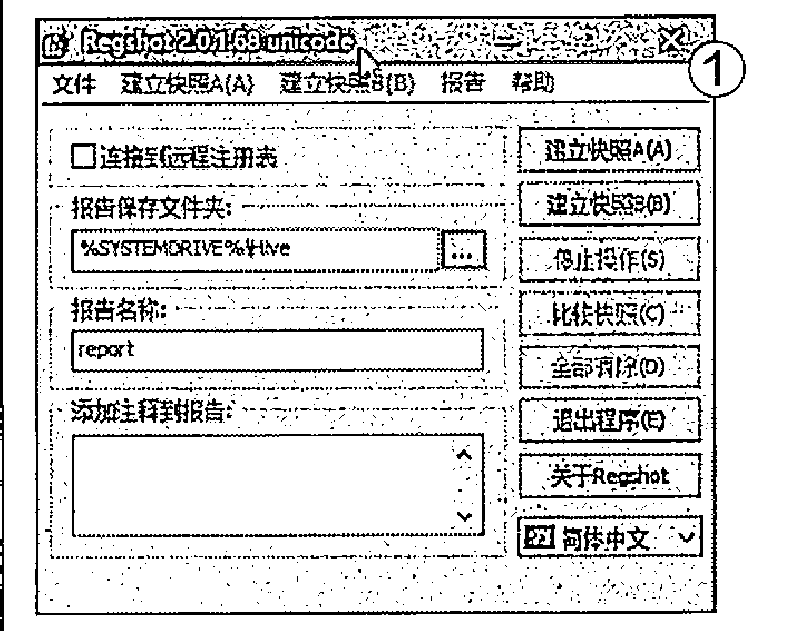

假设我们要监控某软件在安装前后注册表的变化情况。在该软件安装之前，先用Regshot给注册表拍第一张快照，按下“建立快照A”按钮，完成第一次快照的建立。

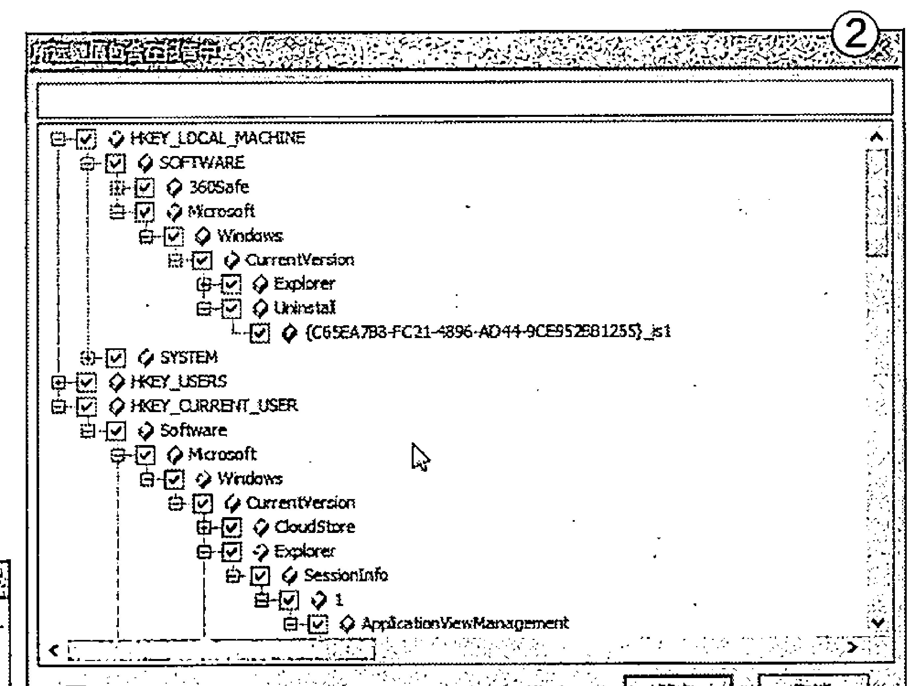

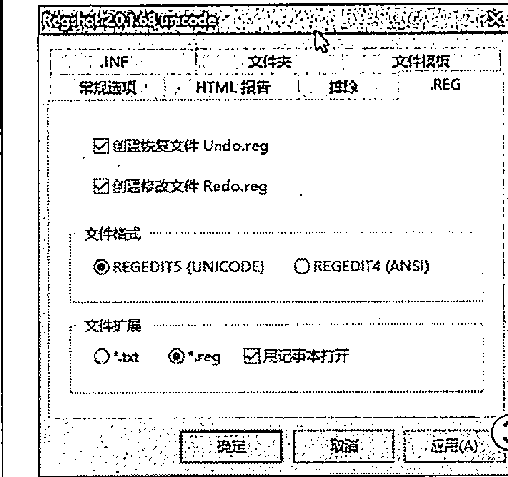

> **小提示**
> 要建立两次快照时点击注册表备份，单击“建立快照A”或“建立快照B”菜单，选择“保存”即可。

接下来开始安装要监视的软件，软件安装完毕后，按下“建立快照B”按钮，给注册表拍第二张快照。

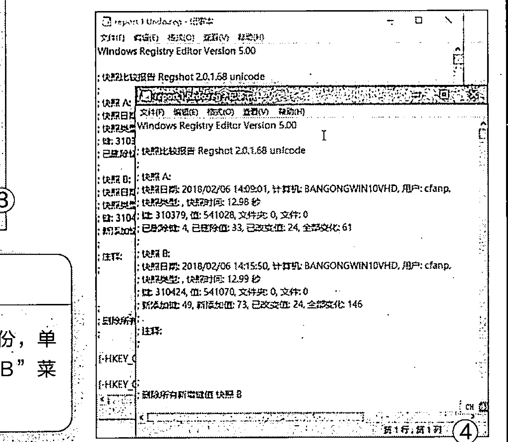

第二张快照拍完之后，软件自动弹出窗口，显示注册表的变化情况，同时可以在这里选择要包含在报告中的注册表项目（图2）。由于软件在设置中开启了自动比较快照的选项，因此第二次快照拍摄完之后会自动执行比较操作，出现上述窗口。若希望手动比较两次快照，可通过“文件→选项”菜单命令打开选项设置窗口，去掉“常规选项”卡下“自动开始快照比较”的选择，之后以“比较快照”按钮进行快照比较。注意，同时要在“.REG”选项卡下，选中“用记事本打开”复选框，以便自动打开REG文件（图3）。

执行上述操作后，软件会启用记事本，自动打开修改前的注册表恢复文件report.1.Undo.reg和修改后注册表的变化文件report.1.Redo.reg（图4）。

最后，打开Hive文件夹，用网络浏览器查看详细的报告文件report.1.html，所有键值的变化一目了然，软件对系统进行了哪些修改，在这里看得清清楚楚。Hive目录下共生成四个文件，除上述三个文件外，还有一个report.css文件是与报告配套的网页层文件。

## 电脑屏幕也玩四季交替

文|阿立

随着一年里面四季的不断交替，每一个季节都拥有不同的景色，但是当我们回到家里打开电脑的时候，就会面对千篇一律的系统桌面，实在是有一点让人扫兴的感觉。其实我们可以通过对系统桌面进行装饰，从而让它随着四季的交替而进行变化，这样大家也可以感受到生活的多姿多彩。

### 片片雪花飞舞桌面

### 随着季节更换壁纸

很多南方的朋友很难见到雪花这一美景，如果用户不想跋涉千里去观赏雪景的话，那么可以考虑让雪花在电脑桌面“飞舞”起来。那么怎样才可以实现这样的效果呢？

我们首先下载DesktopSnowOK，这是一款绿色软件，所以解压后，直接运行文件夹里面的程序文件即可，马上就可以看到一片一片的雪花纷纷扬扬地飘落（图1）。如果用户对软件程序默认的效果不满意的话，可以双击系统托盘中的软件程序图标，在弹出的对话框中就可以进行相关的自定义设定。

比如通过鼠标拖拽“雪花”选项的滑块，就可以调整雪花飘落的密度，数值越大飘落的密度也就越大。另外通过“透明度”可以设置雪花晶莹剔透的程度，通过“速度”可以调整雪花飘落的速度。通常我们见到的雪花都是六角形的，其实雪花还有多种多样的形态（图2）。为了更加逼真地体现出真实的效果，我们可以在“图像纹理”列表中根据自己的需要进行选择。

如果只是简单地制作一些动画特效的话，可能很难满足电脑用户的相关要求。所以我们在制作动画的同时还可以实时地通过改变系统桌面的背景，从而更好地烘托出不同季节的氛围。现在可以下载更新壁纸的软件程序有很多，这里我们就使用Splashify这款软件来进行操作。

打开这款软件程序后点击窗口左侧的“Search”按钮，在右侧窗口的输入框里面设置相应的关键词。比如我们这里想要搜寻和夏天相关的桌面壁纸的话，就输入“Splashify”这个关键词就可以了。输入完成以后按下回车键它就可以进行搜索，搜索到的图片会全部显示在软件窗口里面（图4）。点击需要的桌面壁纸后就可以看到这张桌面壁纸的完整图片，然后点击预览窗口右上角的“Set wallpaper”按钮就可以将它设置为桌面壁纸了（图5）。

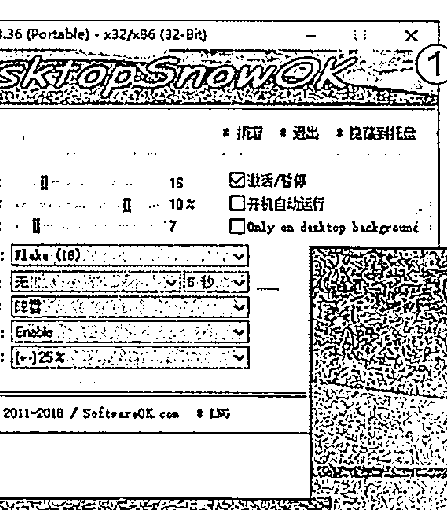

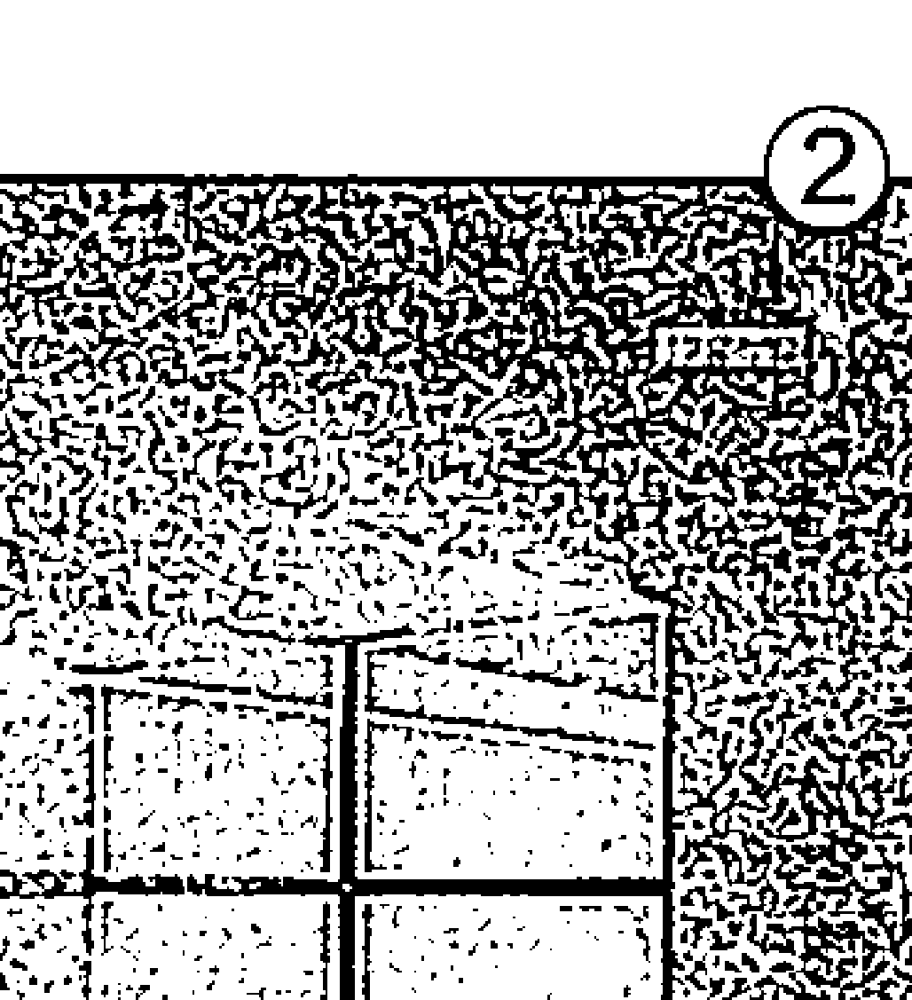

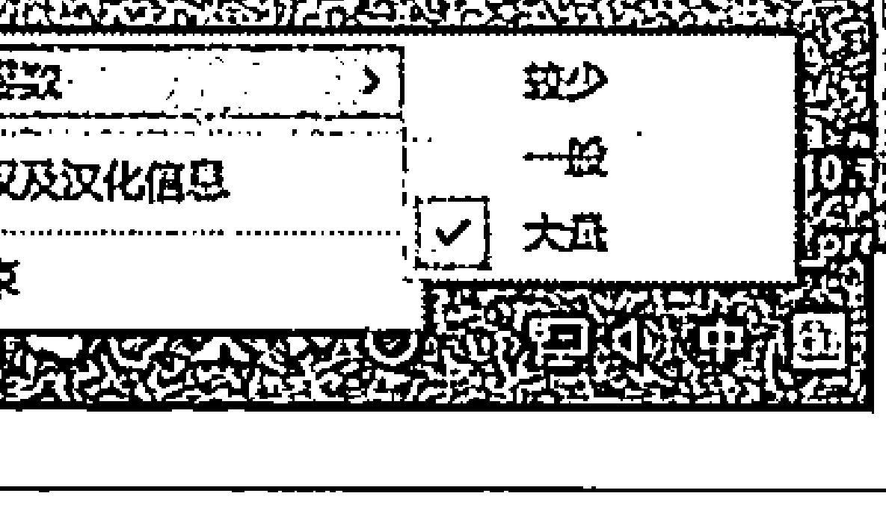


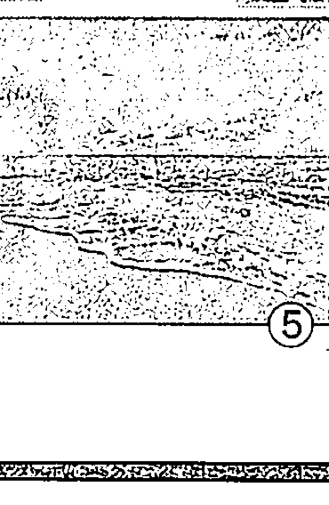

### 粉红樱花洋溢春色

冬去春来草长莺飞，正是踏青的大好时节。说到踏青自然少不了赏花，而樱花则是春天最主要的代表，可是樱花并不是每一座城市都可以看到的，那么如何才可以让其在我们的电脑桌面上飞舞起来呢？

首先下载“樱花飘落秒速5CM”这个文件包，同样运行文件夹目录中的可执行文件，就可以马上在系统桌面看到一朵一朵粉红色的樱花纷飞的效果。如果用户对默认的设置不满意的话，那么可以在系统托盘找到该程序文件的图标。通过鼠标右键点击图标后，在弹出的菜单里面就可以进行调整设置（图3）。

## 不装软件 云端制作流程图
文|万立夫

平时工作中需要制作各种各样的流程图、思维导图等，但是要想制作这些图片的话需要安装不同的软件才可以。但是这些软件不但占用大量的磁盘空间，而且也可能会导致系统运行的不顺畅。所以如果不是经常使用软件的话，那么我们可以利用云端服务来临时制作需要的一些图片。

### 在线制作流程图

我们首先通过浏览器打开ProcessOn这项云服务的官方网站(https://www.processon.com/)，按照要求注册一个个人账号后就可以开始进行在线图片的制作了。现在点击操作界面左上角的“新建”按钮，在弹出的菜单中可以新建流程图、思维导图、原型图等不同的图片类型。如果用户已经有制作好的图片半成品的话，那么也可以点击菜单中的“导入”命令，从而将制作的相关图片导入到这项云服务里面(图1)。

比如我们这里要想制作一个流程图的话，那么就点击菜单中的“流程图”命令，这样在弹出的网页窗口就会出现一个制作窗口。现在利用菜单栏中的命令，再配合左侧工具栏中的图形，就可以开始流程图的制作和编辑。用户只需要通过鼠标在工具栏中选择一个图形，通过鼠标拖拽到编辑窗口里面进行释放，就完成了这个图形框的添加操作。接下来按照同样的步骤添加其他需要的图形框即可，然后点击“插入”菜单中的“文本”命令，在需要输入文本的地方进行拖拽生成一个文本框，在里面输入相应的文字信息就可以了(图2)。

由于我们是在线制作流程图，所以每一步操作都是实时进行保存的，这样用户只需要专心于流程图的每一个环节就可以了。当流程图制作完成以后，我们返回到这项服务的主界面，点击“我的文件”按钮就可以在列表中看到刚刚制作的流程图。如果想和自己的同事合作创建一个流程图的话，那么将鼠标移动到流程图文件缩略图的右上角，点击命令按钮以后就可以弹出一个操作菜单，点击菜单中的“协作”按钮就会弹出一个“添加协作成员”对话框(图3)。在“新邀请”输入框中输入其他同事的邮箱，点击“发送邀请”按钮就会发送一个邀请链接到对方的电子邮箱中(图4)。当他们打开这个邀请链接以后，就可以一起制作这个流程图了。

> ### 小提示
> 由于这些服务大量使用了HTML5技术，所以为了保证在线运行的流畅性，建议大家将浏览器升级到最新的版本。

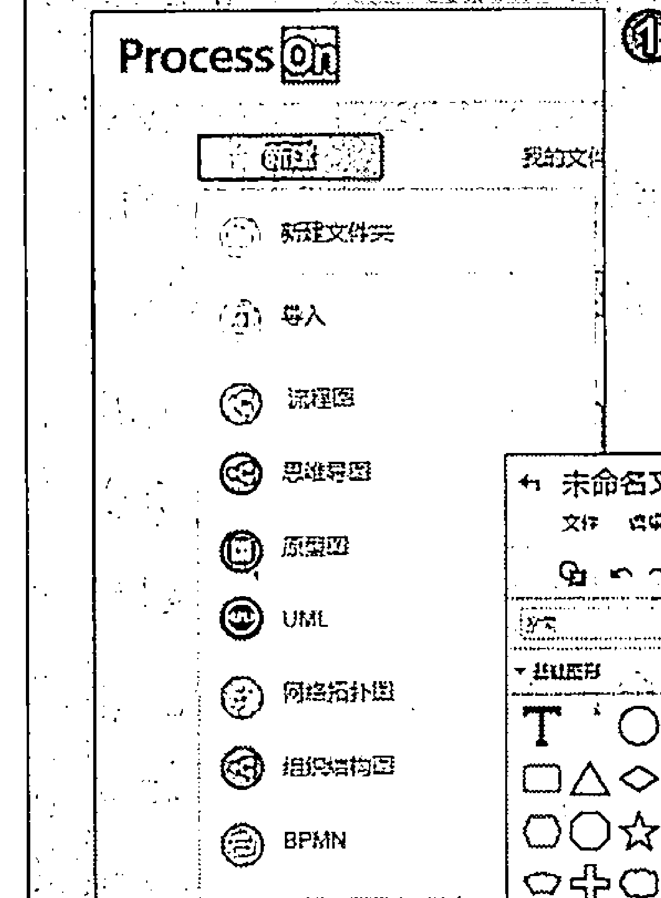

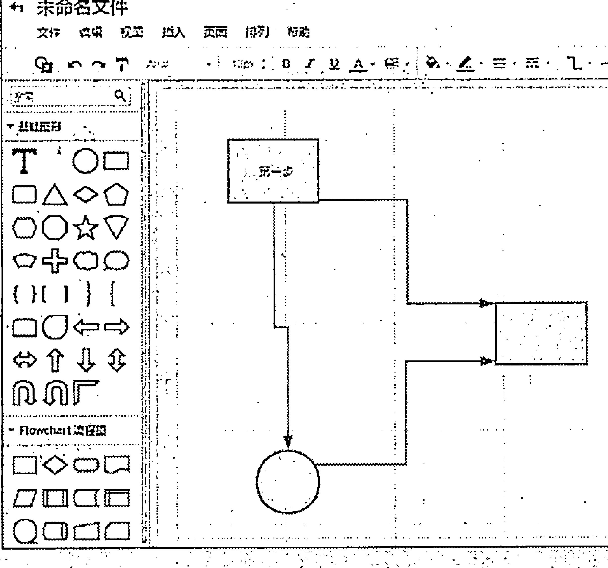

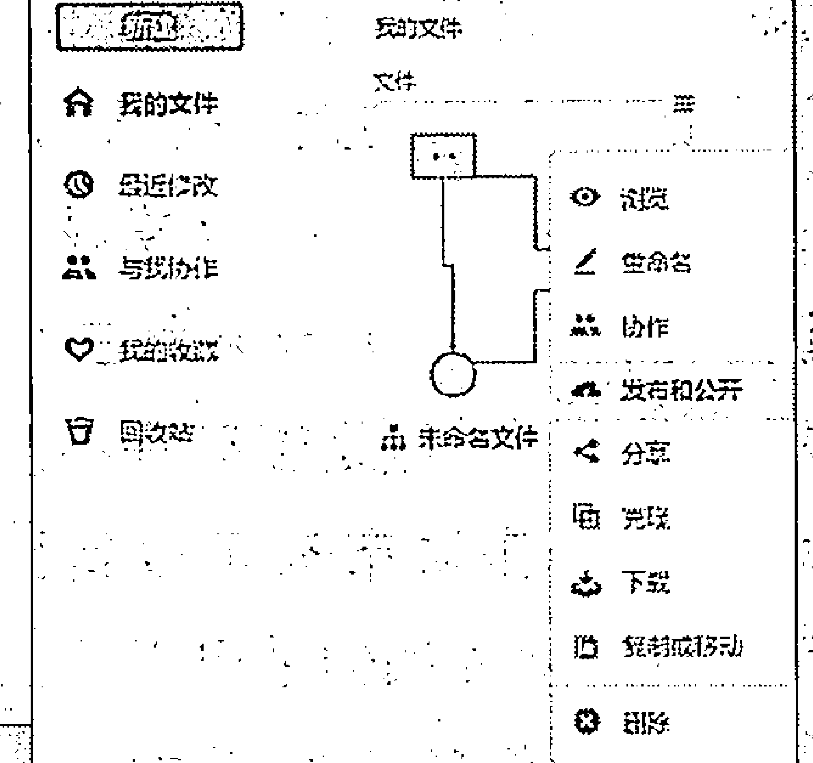

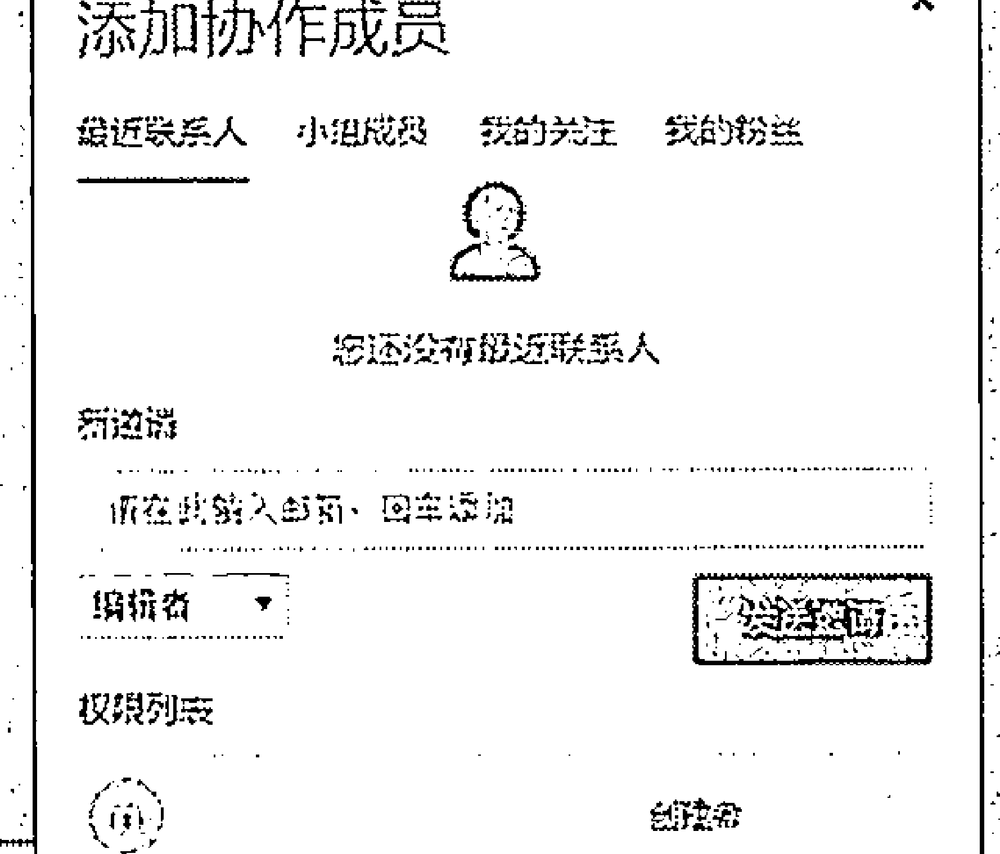

> ### 小提示
> 在每一个类型图的新建命令后有一个“模板”选项，点击它以后可以在已有的模板里面选择一个合适的直接进行套用。

## 思维导图在线做

可能有的用户会和我一样，就是不喜欢注册大量的云服务账号，所以在选择相关服务的时候，会尽量选择已经注册的服务器推出的云服务来进行操作。如果用户也有这个问题的话，那么可以选择“百度脑图”来使用。

首先登录“百度脑图”的官方网站 (http://naotu.baidu.com/)，点击“马上开启”按钮后会弹出一个百度账号的登录框。输入自己的百度账号密码进行授权，就可以登录到“百度脑图”进行操作了 (图5)。

现在点击操作界面中的“新建脑图”按钮，接下来就可以进入到一个思维导图的操作界面。在操作界面里面已经拥有一个“新建脑图”的主题。选中它以后点击工具栏中的“编辑”按钮，就可以对其中的文字进行修改操作，这样我们就创建了一个主要的主题信息。通常情况下选中主题以后，直接按下回车键就可以创建它的分支主题。

当然可以点击工具栏中的“插入下级主题”、“插入上级主题”、“插入同级主题”等按钮，从而创建其他的主题并对其中的内容进行修改 (图6)。

如果思维导图中的任务内容比较多的话，可以通过工具栏中的序号图标来一一标注优先级，这样可以更加明确地让用户了解到哪些任务需要首先去解决。

除此以外，通过插入图片主题的方式也可以一目了然地了解需要的信息。比如我们在春节期间需要阅读《达芬奇密码》这本书，那么首先创建一个分支主题，接着点击工具栏中的“图片”按钮。在弹出的对话框中选择“图片搜索”这一项，输入关键词“达芬奇密码”后进行查找。然后从搜索结果中选择需要的图片，最后点击“确定”按钮就可以将这本书的图片插入到自己的思维导图里面了 (图7)。

思维导图中的内容创建完成以后，我们可以通过鼠标拖拽每一个主题，从而改变思维导图当前的形态，最终使得思维导图可以更好地呈现在用户面前。

“百度脑图”在编辑的过程中同样会自动进行保存，点击操作界面左上角的“百度脑图”按钮，在弹出的窗口菜单里面就可以进行相应的操作。

比如用户觉得经过编辑后的思维导图并没有以前的版本好，那么可以选择菜单中的“历史版本”命令，在列表中就会显示出之前所有的版本。选择需要的版本后点击“还原”按钮，就可以还原到以前的这个版本状态 (图8)。

如果用户想要将思维导图保存到本地硬盘，那么首先点击菜单中的“另存为”命令，然后在弹出的对话框中选择“导出”按钮，这样就会弹出一个导出类型的对话框。从中我们可以看到该服务不仅支持常见思维导图软件的格式，而且还可以支持常见的一些图片格式，根据需要进行选择后就可以完成文件的下载保存 (图9)。

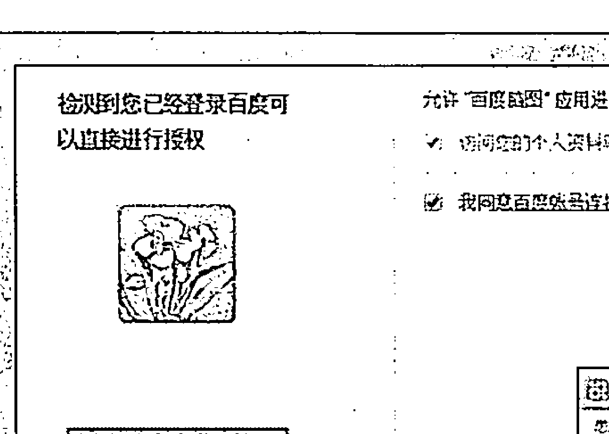

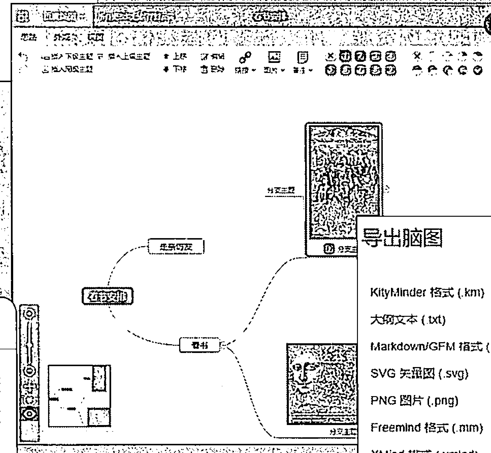

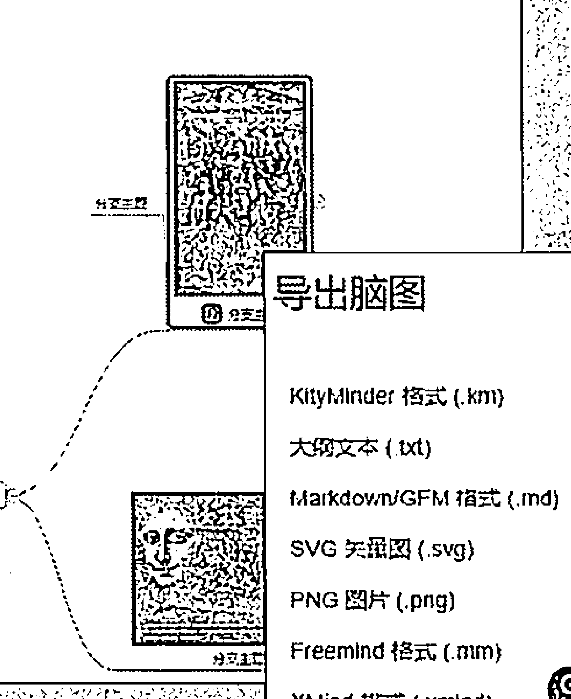

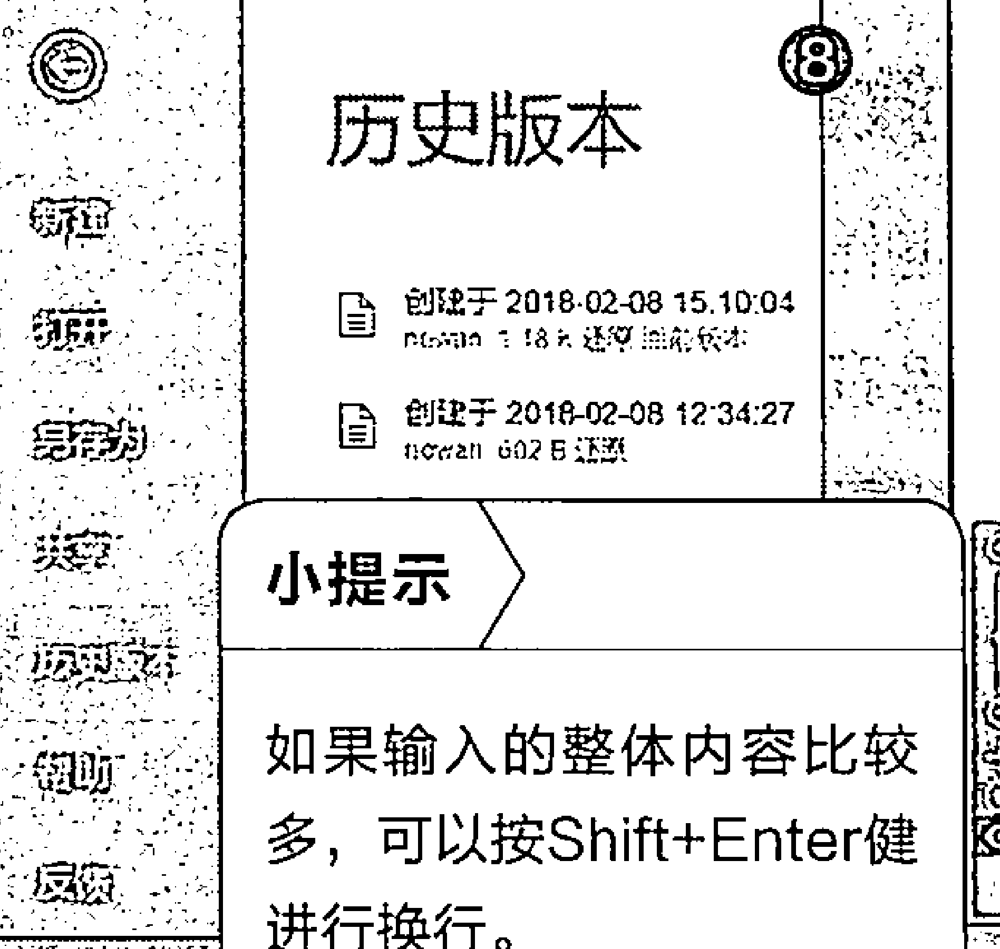

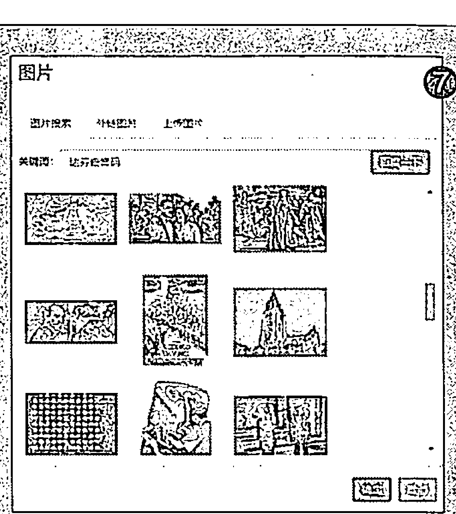

## 功能扩展快速“进化”浏览器

文|万立夫

现在很多浏览器只是提供了一个工作平台，用户要想实现相关功能的话，必须安装对应的功能扩展才可以。但是功能扩展安装一多，浏览器就会造成系统资源的增加，这样用户在浏览的时候就会变得非常的缓慢。而功能脚本在很多时候可以起到功能扩展的作用，而且几乎不占任何的系统资源，所以很多时候我们可以利用它来完成所需要的操作。

## 功能脚本需要扩展的支持

现在我们使用的常见浏览器实际上都无法直接安装或者使用功能脚本，所以要想在浏览器里面使用功能脚本的话，必须安装相应的功能扩展来进行支持才行。比如我们首先运行Opera这款浏览器，现在点击浏览器左上角的图标按钮，在弹出的菜单中选择“扩展”菜单中的“获取扩展”命令，这样就进入到该浏览器的应用商店里面（图1）。通过搜索功能来查找“Tampermonkey”或者“Violentmonkey”关键词，用户就可以选择一个喜欢的扩展来进行安装，我们这里选择的是“Violentmonkey”这款功能扩展。以后通过这款功能扩展不但可以进行功能脚本的管理操作，还可以及时地调用相应的功能脚本来进行浏览器功能的加强。

## 视频站启用HTML5播放器

现在随着网络带宽的不断提升，很多用户都改变了以前下载网络视频的习惯，而直接在网络中进行在线的观看。通常要想进行在线观看的话，都需要在系统里面安装Flash播放器才可以。但是随着技术的不断提升，HTML5播放器已经开始逐步替换Flash播放器。那么如何强制让视频网站使用HTML5播放器呢？

我们首先通过Opera浏览器打开“Greasy Fork”这个网站（https://greasyfork.org/zh-CN），这个网站也就相当于一个功能脚本的应用商店。接下来在网站的搜索框里面输入“视频站启用HTML5播放器”这个关键词，就可以查找到对应的功能脚本（图2）。点击链接以后打开脚本的管理页面，再点击页面中的“安装此脚本”按钮，这时就会弹出一个安装脚本的确认窗口，点击右上角的“确认安装”按钮就可以了（图3）。

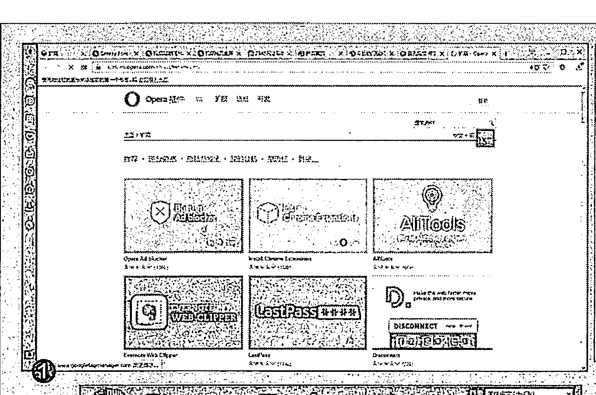

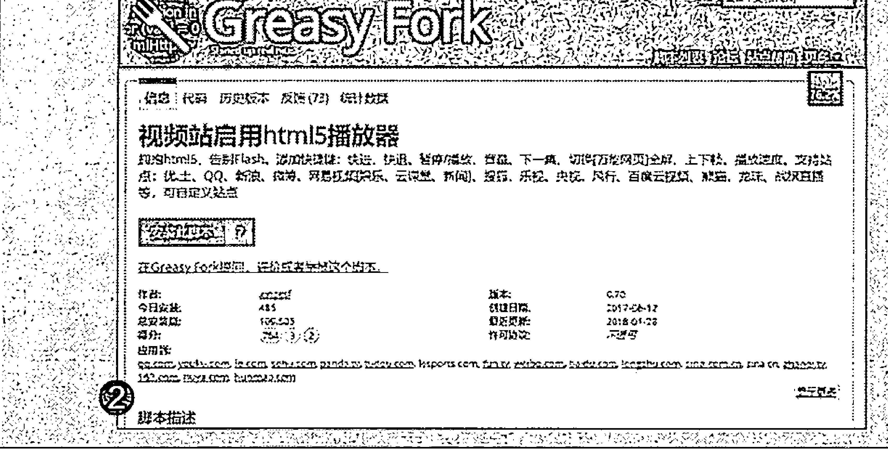

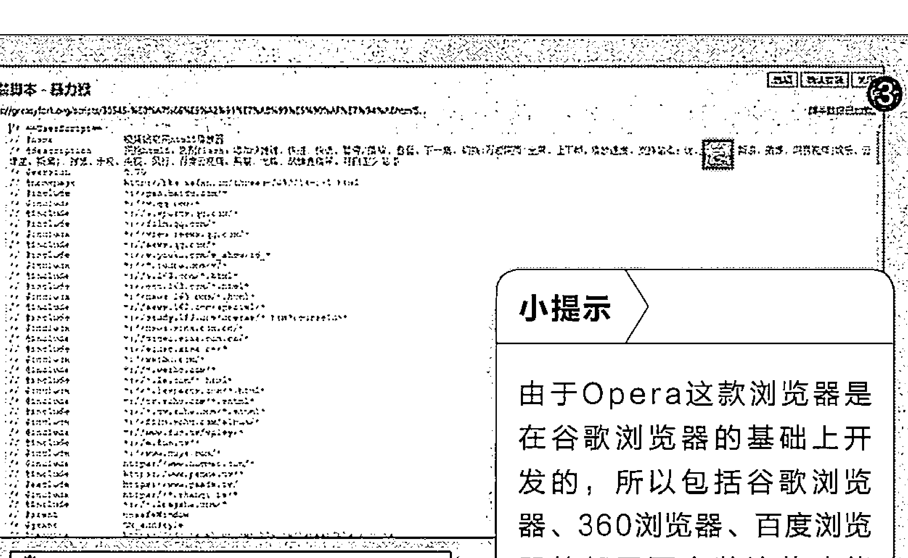

> 小提示
>
> 由于Opera这款浏览器是在谷歌浏览器的基础上开发的，所以包括谷歌浏览器、360浏览器、百度浏览器等都需要安装这款功能扩展来支持功能脚本。如果用户使用的是火狐浏览器的话，除了选择上面的功能扩展以外还可以选择“Greasemonkey”这款功能扩展。如果用户的浏览器不支持功能扩展的话，那么可以安装AdGuard这款软件来进行辅助支持。

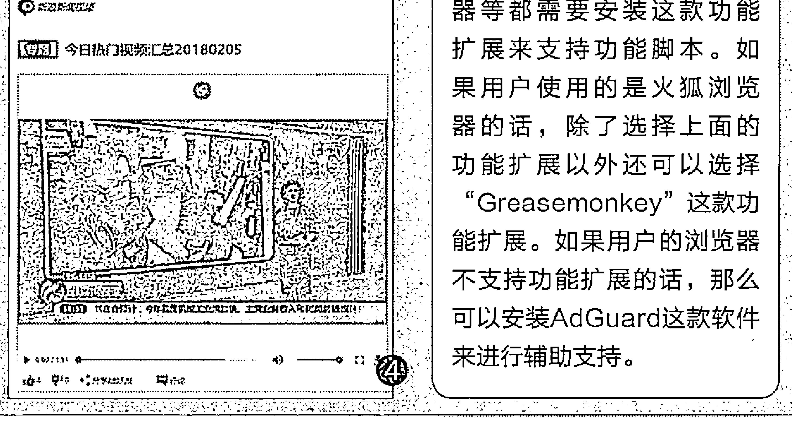

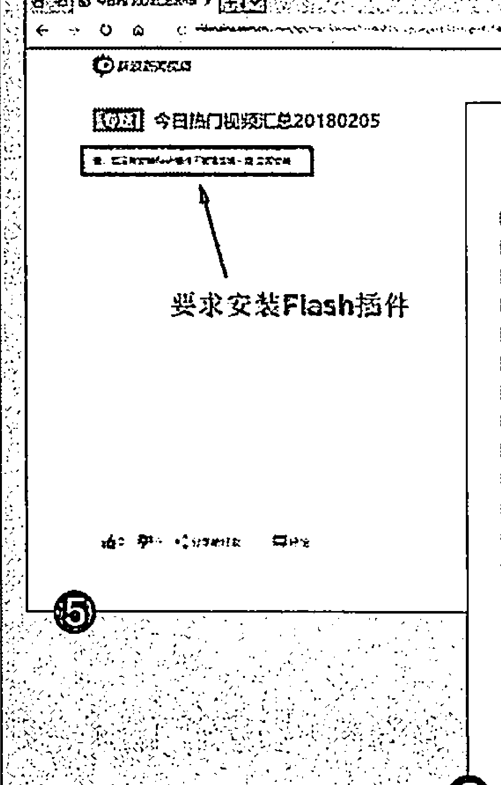

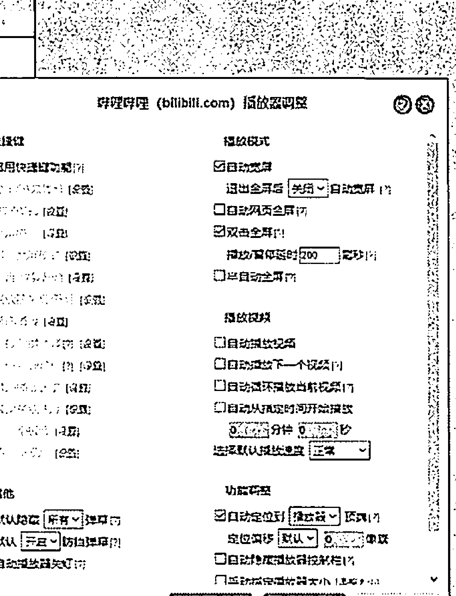

从此以后我们打开任意视频网站，功能扩展就会自动激活“视频站启用HTML5播放器”这个功能脚本，这样网页就会强制使用HTML5播放器来进行视频播放（图4）。而且通过一些常见的快捷键还可以对视频的播放进行控制，比如点击空格键就可以进行视频的暂停操作，利用方向键可以进行视频的加速或者音量的调节，另外利用Shift+回车键就可以进行视频的网页全屏播放。从此以后，即使用户的电脑系统没有安装Flash播放器，也不会像从前那样要求用户下载安装Flash插件以后再进行播放操作（图5）。

## B站播放器的设置和调整

喜欢二次元的朋友都知道“哔哩哔哩”这个网站，虽然这个网站默认已经支持HTML5播放器，但是这个自带的播放器功能非常的有限。那么如何可以增强播放器的功能，从而更好地对网站视频进行控制操作呢？

我们首先按照前面的方法来搜索安装“哔哩哔哩 (bilibili.com) 播放器调整”这个功能脚本，以后我们在B站任意打开一个视频的网页链接后，在视频播放窗口的右侧就可以看到一个名为“播放器调整”的选项，点击该选项以后就可以进行相关参数的设置。在弹出的对话框中我们不仅可以设置视频播放相关的快捷键，还可以设置视频播放的模式。通常情况下视频播放采用的是“自动宽屏”这种模式，当然用户也可以设置为“自动网页全屏”或者“双击全屏”的模式。如果用户经常在晚上进行视频观看的话，还可以勾选“自动播放器关灯”选项（图6）。

## 微博图片全部大图来显示

微博作为现在最为流行的社交媒体，自然受到不少用户的关注。而关注的内容中除了文字信息以外，当然也包括各种各样的图片信息。但是通常要想查看发布的图片信息，需要经过多个不同的操作步骤才可以看到。那么如何将原始图片直接显示出来呢？

首先安装“微博图片全显示”这个功能脚本，从此以后用户只需要点击每个微博的永久链接。进入到这个微博的内容页面后该脚本就会自动将全部图片的原始大图列出来，这样就省去了用户不断点击鼠标的麻烦（图7）。进入微博永久链接的方法也非常简单，只需要点击该微博发布的时间链接就可以了。

## 微博图片悬浮方式的显示

虽然通过原始大图的方式进行显示，查看起来非常的方便，但是也有一个非常明显的问题，就是这些图片由于尺寸大小不同，这样在进行排版的时候就会出现内容错位的情况。所以如果用户觉得这种方式阅读起来不方便的话，那么还可以通过图片悬浮显示的方式来进行展示。

首先安装“MiniblogImgPop-微博浮图”这个功能脚本，以后当用户需要查看某个微博图片的大图时，只需要将鼠标移动到这张图片的缩略图上，就会以虚浮的方式马上展现出这张图片的大图，这样浏览起来就更加的方便了（图8）。而且这个功能脚本不仅可以对微博图片进行查看，还支持百度贴吧、QQ空间、淘宝等一系列主流的社交媒体。

## 与众不同 “跳出”画面更个性

文|平淡

说到P图，虽然现在各种美图软件数不胜数，但是要做出惊艳个性化的美图还是非Photoshop莫属。比如要实现画面主题立体感的显示，借助Photoshop就可以轻松完成看似不可能完成的任务（图1）。

首先打开Photoshop导入需要处理的照片，因为这里需要对源照片的前景进行抠图，因此对于新手建议使用前后景色色差较大的照片进行练习。照片导入Photoshop后，按Ctrl+J两次，依次复制出图层1、图层2两个图层（图2）。

选中背景层，点击“图层→新建图层”，新建一个没有背景色的新图层3。继续选中“图层2”，然后将图层1和背景层隐藏，使用魔术棒工具选择需要删除的背景区域，同时结合笔形、橡皮擦等工具将图层2的前景人物全部抠出来（图3）。

选中并显示图层1，使用右侧面板的矩形工具，按提示在图层1的上方划出一个可以框选前景人物的矩形线框。矩形填充颜色选择“纯色”，属性选择“减去顶层形状”，其他保持默认设置（图4）。

选中矩形框，点击右侧面板的“直接选择工具”，然后选中矩形的顶点进行拉伸调整，在弹出“此操作会将实时形状转变为常规路径，是否继续”的提示时，点击“是”继续拉伸(图5)。

按提示依次对矩形四个顶点进行拉伸调整，使得前景人物在矩形之上有飞越而出的效果(图6)。

按Ctrl+回车快速将形状转换为选区，然后添加“图层蒙版”。接着在图层面板下方，点击“fx”按钮调出“图层样式→描边”面板，将大小设置为“7像素”，填充颜色为“白色”(图7)。

继续点击“fx”按钮调出“图层样式→投影”面板，为矩形添加投影效果。这样原来照片中的前景人物就有跳出画面的感觉了(图8)。

可以看到Photoshop的出屏效果主要是利用了图层和蒙版的功能，大家只要用好这两个工具，就可以制作出各种惊艳的效果来。

## 巧绘自己的风格化地图

文|一页

平时我们在设计报告、制作演示PPT或者装饰照片的时候，可能需要一些超酷的地图作为背景，一方面用来形象地表达文档中的数据内容，也可以起到美化的作用。本文为大家介绍游戏风格、像素化风格等不同风格地图的制作方法，以及在不需要专业绘画训练的情况下，为地图添加诸如山脉、树木等元素。

### 游戏风格的地图绘制

我们在玩各种游戏的时候，往往会为游戏精美的地图所叹服，其实通过软件工具的辅助，我们也可以绘出类似风格的地图，用来作为背景素材使用。这里我们要用到的软件就是Tiled，可以从www.mapeditor.org下载获取。

Tiled自带简体中文包，安装后启动，自动进入纯中文界面。首先点击主界面上的“新建地图”按钮（或者点击菜单“文件→新建→创建新地图”），在打开的对话框中设置初始地图的尺寸大小、地图方向等，然后点击“另存为”按钮，保存新地图（图1）。

创建新地图时的那些参数设置，在后面可以随时修改，所以开始的时候大致设置一下就可以了。以地图方向为例，默认是“正常”，也就是由正方向的网格平铺组成。我们可以随时在属性面板中修改方向，假设改成“等角（交错）”，则网格旋转，变成菱形效果（图2）。

给地图定好“地盘”后，接下来就是要为地图添加“瓷砖”（图块）了。点击菜单“文件→新建→新图块”，在打开的对话框中随意为新图块取个名称（如不设置将自动以图集文件名为名称），再点击下面的“浏览”按钮，选择一个图集。图集实际就是将一个PNG图片自动切分成多个等大的图形素材，这些图像素材完全可以自己制作。为了方便起见我们使用软件自带的素材包，这里选择的是Tiled安装目录，Examples文件夹下的Tmw_desert_spacing.png文件，点击“另存为”按钮保存（图3）。

现在点击上面的选项卡回到地图文档中，可以看到刚才添加的图集自动显示在主界面右下角的图层框中。接下来的操作相对简单，选中图集中的某个素材，在地图的网格上点击拖动，就可以画出地图了（图4）。

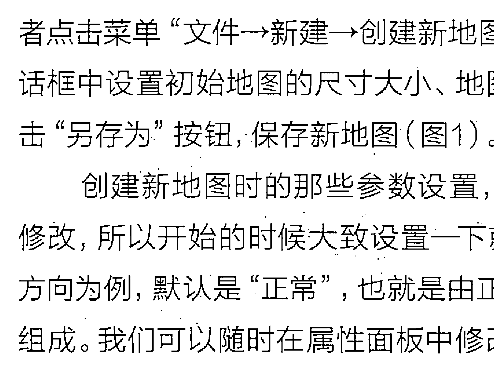

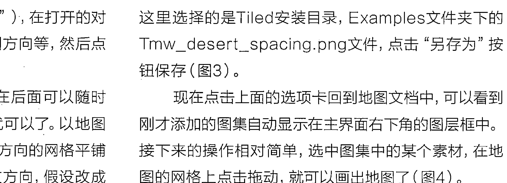

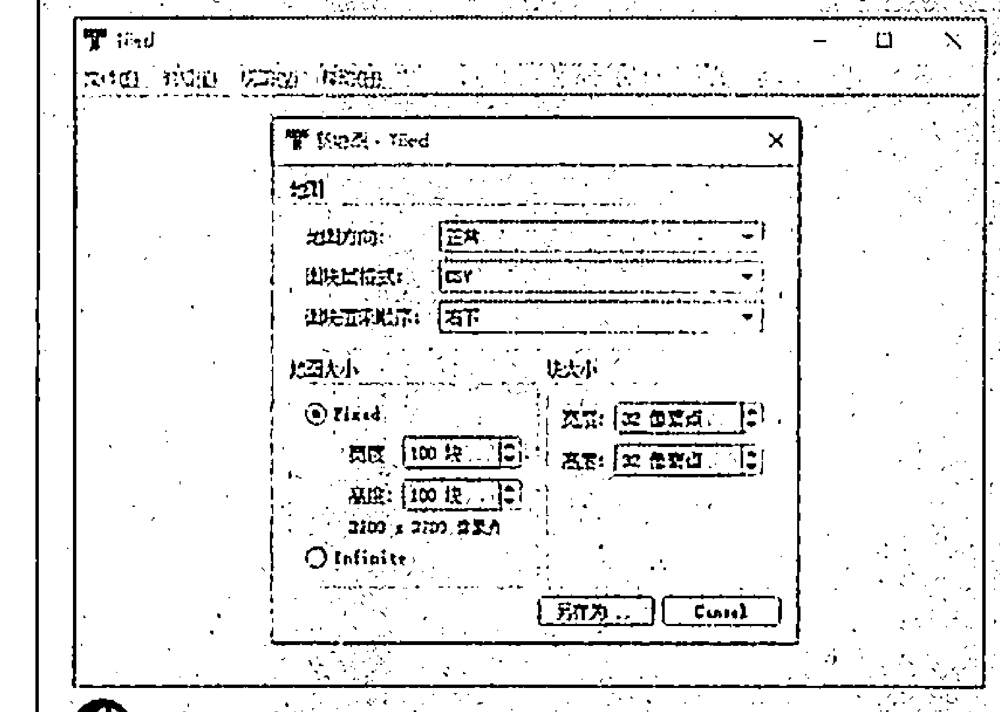

### 像素化风格地图绘制

像素风格，简单理解就是那种有明显颗粒感、复古的风格，常常用于一些休闲游戏。我们可以使用一个叫“Piskel”的在线工具（https://piskelapp.com/）来绘制这种风格的地图或元素。

进入Piskel网站后，点击“Create Sprite”进入绘制界面。首先根据需要设定画布尺寸（单位是像素）。然后就可以使用铅笔、橡皮、填充等工具进行绘制了。它还支持图层和动画帧功能，非常方便。绘制完成后，可以导出为PNG或GIF等格式（图5）。

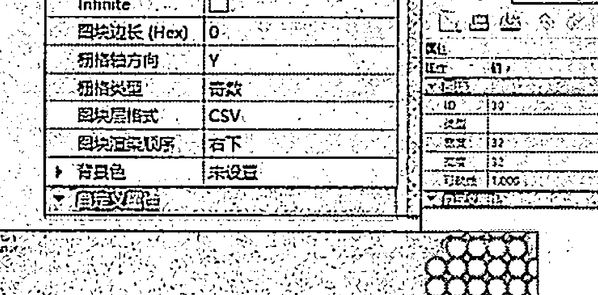

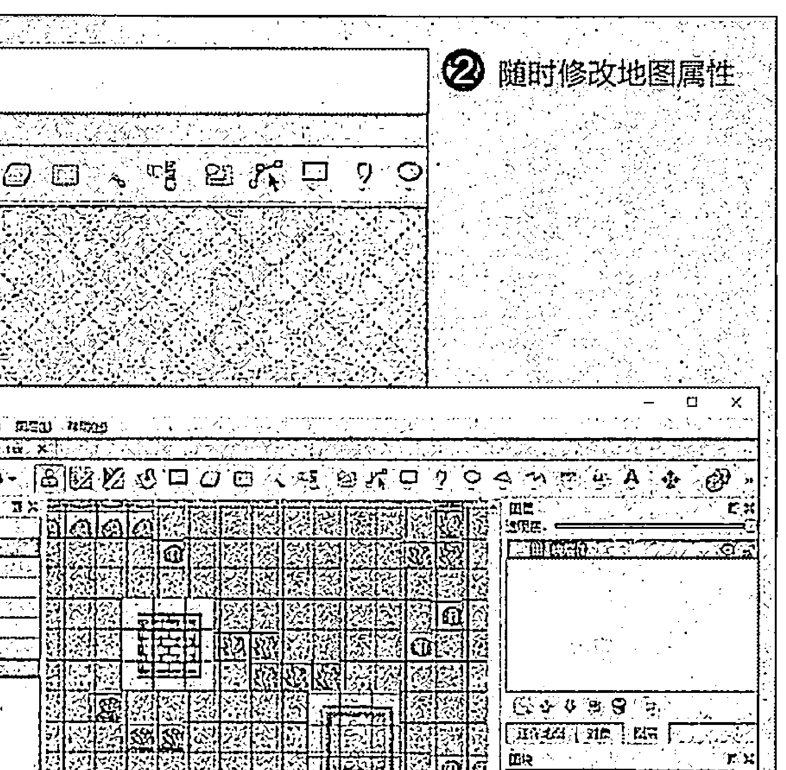

最后，在绘制好的地图上，可以进一步叠加一些山脉、树木等装饰元素，让地图看起来更生动。这些元素既可以从现成的素材库中找，也可以按照上述方法自己绘制。

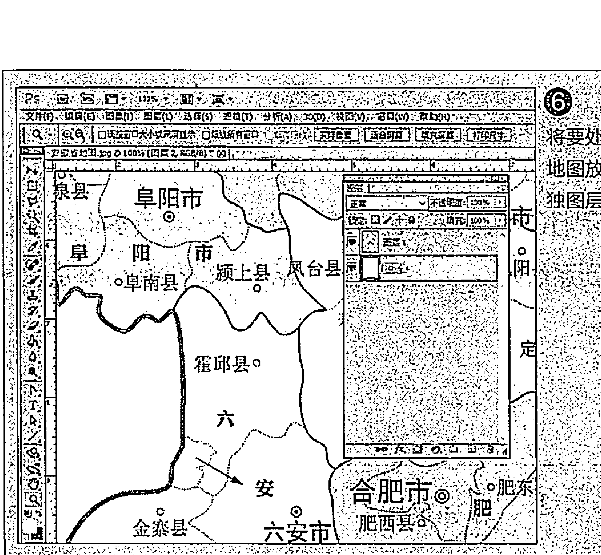

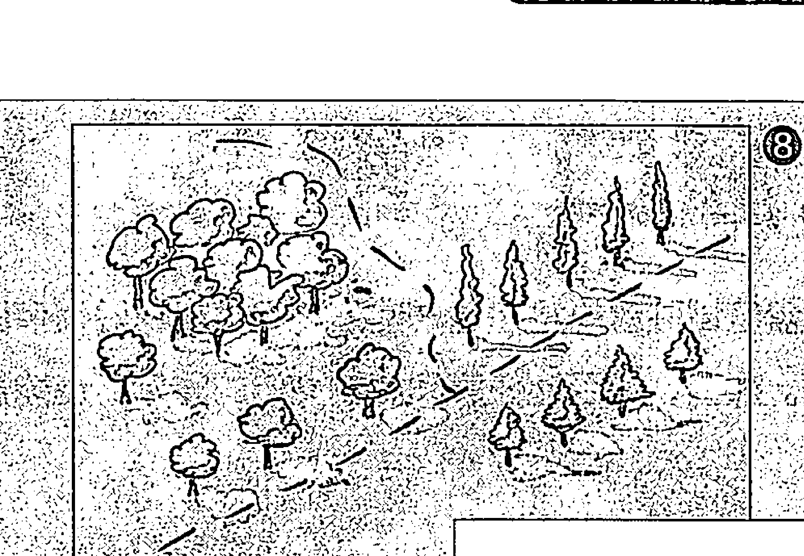

将要处理的地图放到单独图层中


地图拼贴效果


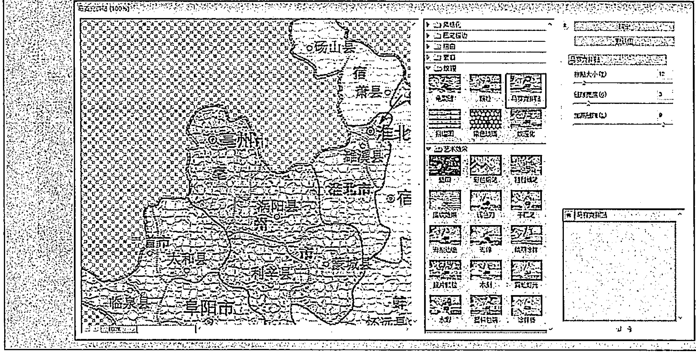

为地图添加背景纹理

最后当地图绘制满意后，点击菜单命令“文件→导出为图像”，即可将它导出为PNG图像，应用到Word或PPT等文档中。

#### 像素风格的地图绘制

PPT演示中，经常通过地理位置来显示内容数据，这类地图不一定要求精确，更多是象征性的，对美化的要求也很高。PixelMap网站便提供一种像素化地图的服务，通过页面左侧的工具及下方的选项栏，可以为选定的区域设定任意的色彩，以及调整像素的大小和间距，并可以设定像素的形状，有圆形、方形、棱形和六角形等形状可选择（图5）。

不过网站的功能毕竟有限，如果对像素化地图有更加个性化的需求，不妨自力更生自己在Photoshop中制作。首先获取想要美化的地图，这里假设是安徽省的地图（素材来自百度百科）。启动Photoshop（此处以CS5版本为例），打开地图文件，首先通过选取工具将地图从背景中提取出来，放到一个单独的图层中（图6）。

接下来选中地图图层，然后点击菜单命令“滤镜→滤镜库”，在打开的对话框中，可以方便地看到所有滤镜，点击某个滤镜可以即时看到效果。这里我试用了“纹理→马赛克拼贴”滤镜，地图立即有了一种土地裂纹一样的质感。当然你也可以试用其他的滤镜效果，在Photoshop中提供了五六种像素化效果，比网站要丰富多了（图7）。

#### 手绘风格的地图绘制

除了通过软件制作的地图外，我们还可以手工绘制地图，这样更加个性更加酷。手工绘制的地图，可以使用比较抽象的简笔画来实现，这对没有专门学过绘画的朋友来说，也不是很难的事。以下面这幅图为例，看起来很复杂，但拆解它的制作步骤之后，就会发现并不是很难（图8）。

首先绘制基本形状，道路用简单的直线表示就好，树木的话，可以用一条竖直的线表示树杆，再在上面画朵“云”状的图形表示树叶即可（图9）。

接下来扫描一种泛黄的旧纸张，导入当前图像中作为纹理背景，地图一下子有了质感（图10）。

最后为树涂上一些阴影，即可实现本节开始说的图的效果了。是不是很酷，而又简单？

## 任意窗口“隐身”托盘有办法

文|南溪

任务栏系统托盘区域驻留的往往是一些系统组件或常驻程序图标。我们日常打开的软件或文档，最小化后多退缩于任务栏中部区域。那么，能否让任意程序或文档的图标，也能最小化到系统托盘上呢？其实，用个小软件即可解决这一问题。

首先，我们可以用TrayIt!软件来解决。软件运行首先会出现英文向导界面（图1）。点击OK按钮之后，可用多种方法，轻松地将任意窗口最小化到系统托盘上。

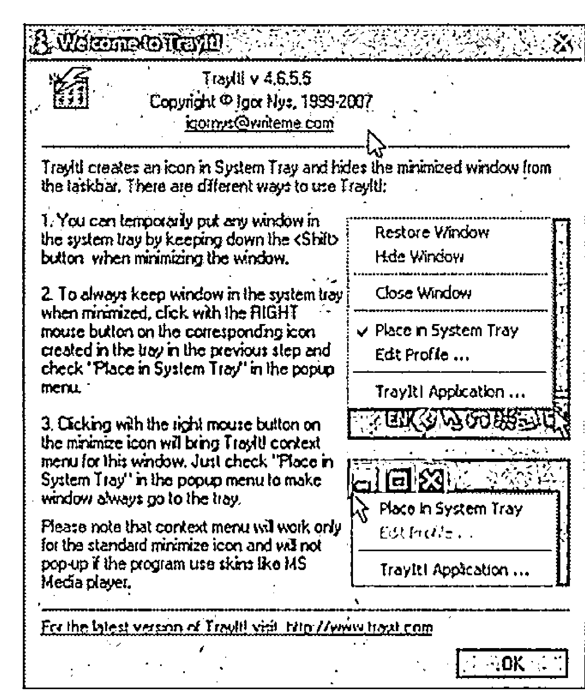

> > **小提示**
> >
> > 右键菜单仅对标准窗口的最小化图标有效，对类似软件皮肤类的窗口无效。

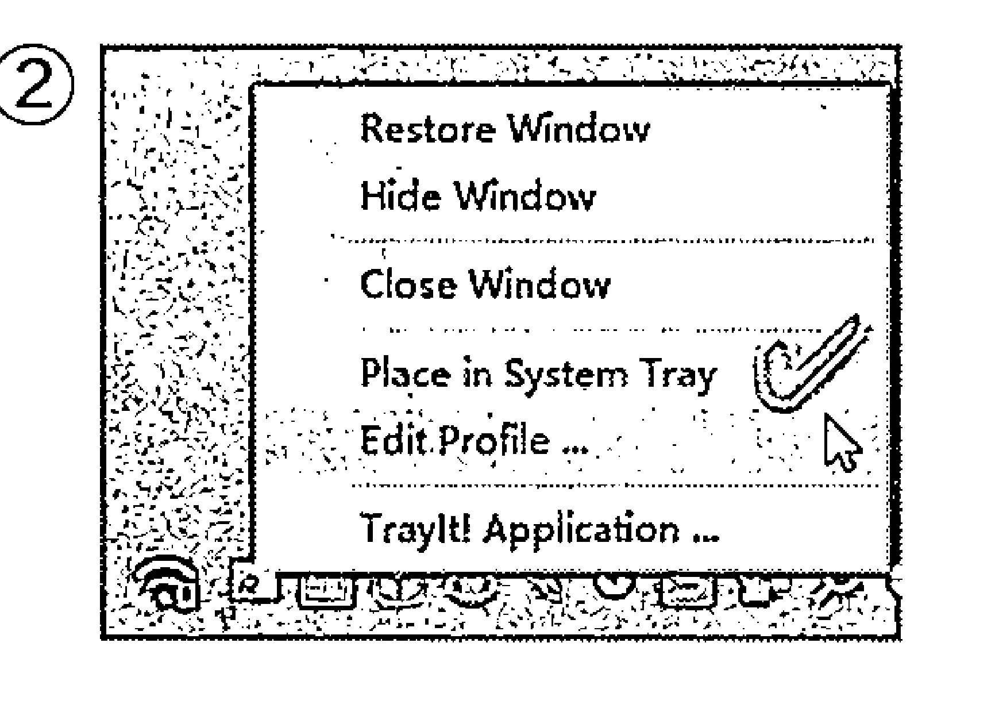

### 临时最小化到系统托盘

打开一个窗口后，按住Shift不放，再点窗口的最小化按钮，可将该窗口图标最小化到系统托盘区域。

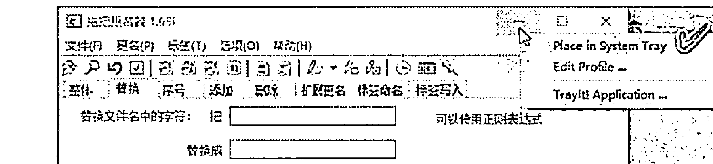

### 窗口永久驻留系统托盘

上述方法可让窗口临时最小化到系统托盘。若要将窗口图标永久驻留系统托盘，可在上述已置于系统托盘的图标上单击鼠标右键，然后在快捷菜单中选择“Place in System Tray”命令（图2）。

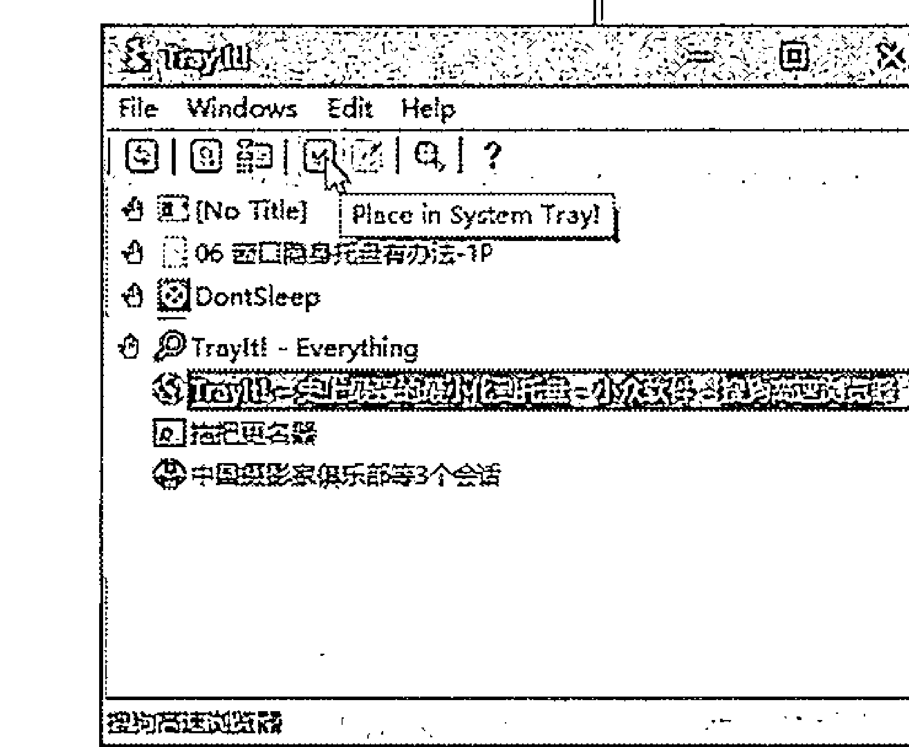

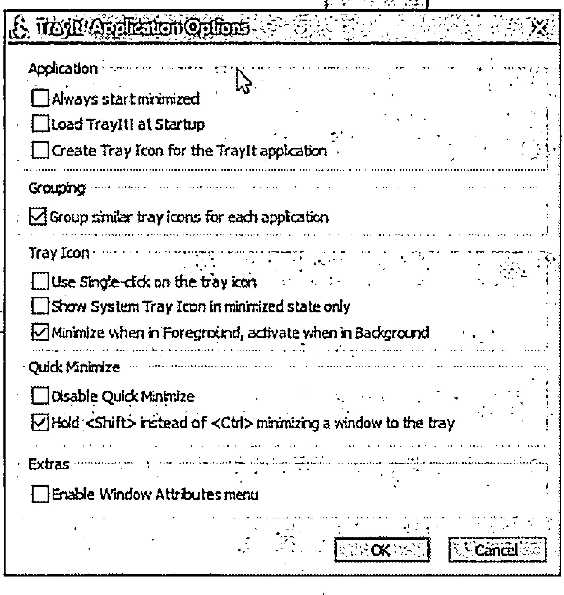

或者在TrayIt!主窗口选中要永久驻留系统托盘的窗口条目，然后点击工具栏上的第四个按钮，效果相同（图3）。

此外，还可以右键单击窗口边框右上角的最小化图标，然后选择“Place in System Tray”命令（图4）。

要最大化地发挥作用，还需通过Options窗口进行必要的设置。先选择“Load TrayIt! at Startup”让软件随系统自动启动，选择“Always start minimized”启动程序后自动最小化；将Grouping分组下的复选框选中，将同类程序图标分为一组；若选择“Hold <Shift> instead of <Ctrl> minimizing a windows to the tray”，则以Shift键来代替Ctrl键，之后按下Shift键并点击最小化按钮，才可将图标最小化到系统托盘（图5）。

#### 知识扩展阅读

我们还可以用DM2这个比较有特色的软件最小化窗口。它不但可以将窗口最小化到系统托盘上，还可以将窗口最小化为浮动图标。与此同时，还可以设置窗口的透明度和优先级。

## 快速下载需要的谷歌浏览器扩展

谷歌浏览器现在已经不是一个单纯的网页浏览器，而更加像是一个管理操作平台，因为它的很多功能都是通过功能扩展来实现的。但是通常我们要想访问谷歌的扩展商店非常的麻烦，所以就需要寻求其他的解决方法。

### 通过第三方扩展商店下载

其实国内的浏览器扩展商店还是有一些的，但是这些扩展商店都有一些专门的针对限制。比如360的扩展商店只能使用360极速浏览器才可以使用，如果用户使用的是其他浏览器就无法使用了。所以通常情况下用户还是只能选择通用性的扩展商店，而这类网站包括“插件网”、“Crx4Chrome”、“Gugeapps”和“ChromeFor浏览器插件”等。

首先通过浏览器打开“插件网”的官方首页（http://www.cnplugins.com/），用户可以点击“Chrome插件分类”标签，在弹出的对话框里面选择要下载的扩展类型。接着在列表中寻找需要的功能扩展，找到以后点击功能扩展的名称链接，就可以看到这个功能扩展的介绍页面。点击网页下方的“本地下载”按钮后，在弹出的网页里面点击“本地下载”即可（图1）。由于功能扩展都是从非官方的网站下载的，所以在下载的时候下载窗口会弹出安全警示。这个时候我们只能点击“保留”按钮，才可以进行下载操作。除此以外，我们还可以直接输入关键词，通过搜索功能进行功能扩展的查找。

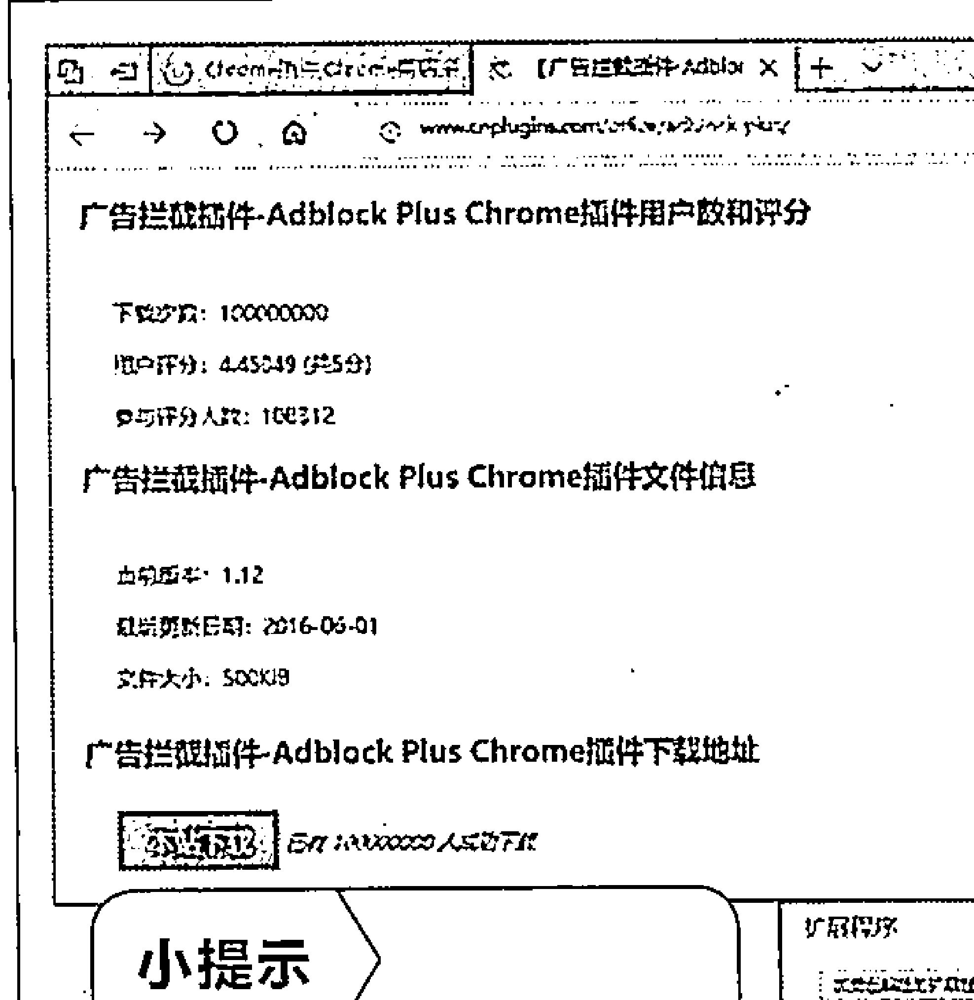

> 小提示：这篇文章的操作方法既适用于谷歌浏览器，也适用于在谷歌浏览器的基础上开发的众多浏览器，包括360浏览器、百度浏览器、QQ浏览器以及猎豹浏览器等等。

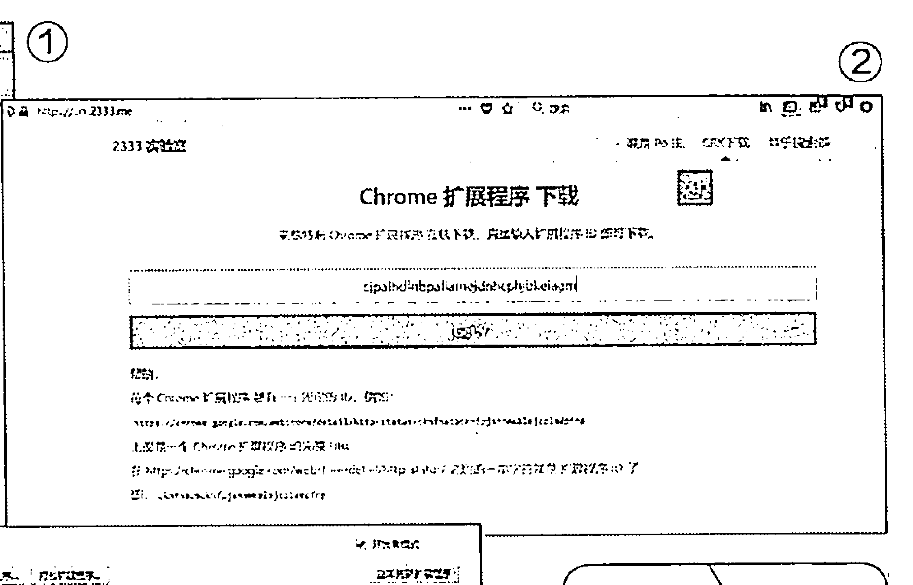

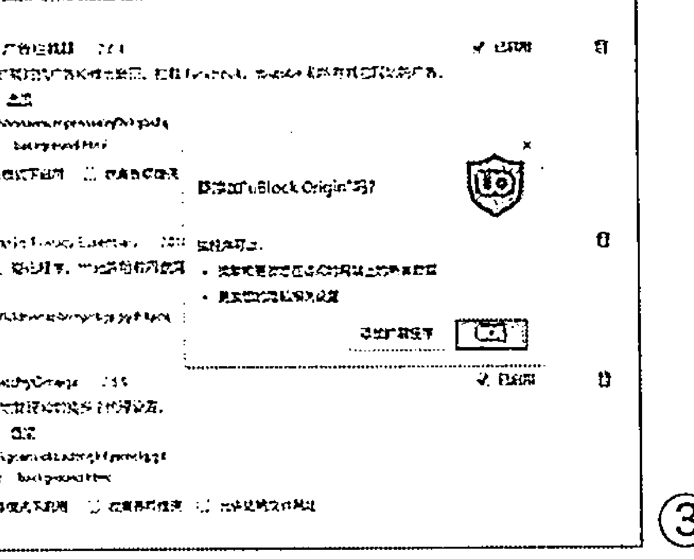

> 小提示：在网友分享的扩展链接里面，在最后一个 / 和 ? 之间会有一串数字，而这串数字就是功能扩展的ID信息。

### 利用专业下载网站进行扩展

除了通过第三方的扩展商店搜索下载需要的功能扩展以外，我们还会经常在论坛或者微博中发现有其他网友分享的功能扩展。但是这些分享的链接往往都是谷歌扩展官方商店的链接，所以我们也可以利用专门的下载网站来下载这些功能扩展，这类专业的下载网站包括“Chrome Extension Downloader”、“Chrome扩展下载”和“2333实验室”等。

这里我们通过浏览器访问“2333实验室”的官方首页（https://crx.2333.me/），在网页正中的输入框里面输入扩展程序的ID（图2），然后点击下面的GET按钮就会首先对这个ID进行分析，成功分析出对应的扩展链接以后就可以进行功能扩展文件的下载操作了。选择点击网页浏览器右上角的按钮，在弹出的菜单选择“更多工具”中的“扩展程序”命令，将功能扩展拖拽到弹出的网页里面，就可以完成这个功能扩展的安装操作（图3）。

## 四位一体 创建图片多媒体相册

文|亦云

如果有一些照片，希望创建多媒体相册，一款Alternate Pic View ExeSlide小软件就可以满足基本要求。它可以创建包括EXE程序、GIF动画、SWF动画、AVI视频在内的多种图片多媒体相册。

### 1. 图片的准备与列表编辑

通过软件界面左侧窗格的目录树，确定图片所在文件夹的位置，左侧中部框会显示图片文件列表。

如果要在列表中添加或删除图片，可用工具栏上的加、减号按钮进行操作，或者在文件列表中使用右键菜单命令操作。

此外，用左右箭头按钮，还可以调整图片在列表中出现的顺序。图片排序还可以选择使用右键菜单中的排序命令（图1）。

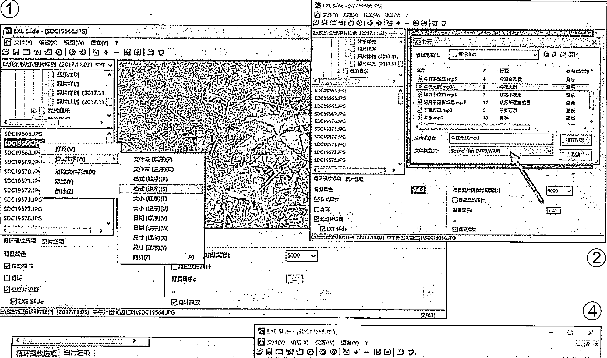

### 2. 设定图片循环播放和质量参数

点击“循环播放选项”设定图片循环播放参数。其中可选择是否自动播放、循环播放，设定每张图片的播放时间，还可以指定播放的背景音乐文件（图2）。

点击“图片选项”选项卡，可设定图片播放的间隔、播放间隔的背景颜色、图片是否使用透明、图片的压缩比等，还能设定图片是否保留拍摄时的EXIF参数，以及打开时是否根据EXIF参数旋转图片。此外，还可以设定图片的大小限制，可按像素设定，也可以按照原来的图片长宽比进行缩放（图3）。

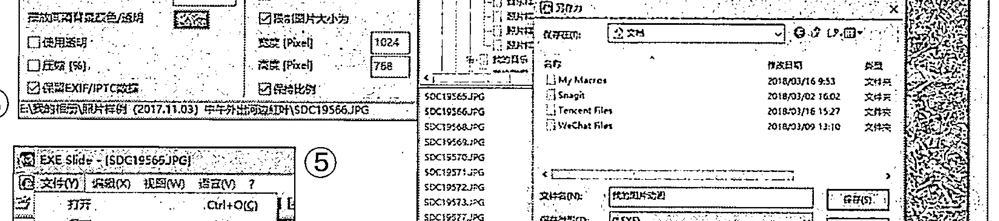

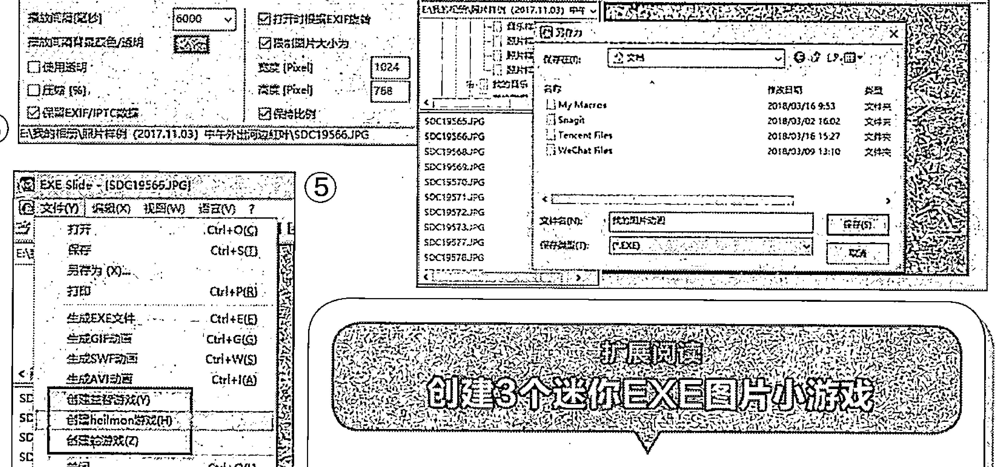

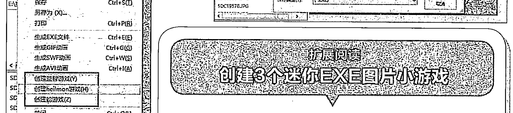

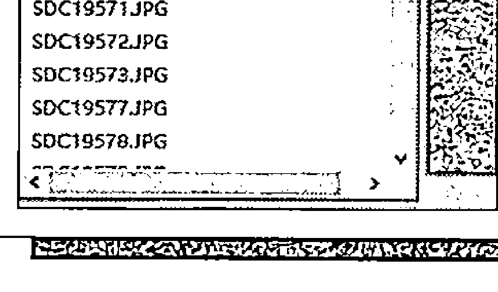

扩展阅读
创建3个迷你EXE图片小游戏
上述软件内置了3个迷你小游戏，可供用户定制自己指定图片的游戏背景。只需按上述方法置入背景图片，然后通过“文件”菜单选择生成三种游戏之一即可（图5）。

### 3. 生成各种类型的照片演示程序

上述图片参数设定之后，就可以生成各种类型的照片演示程序了。在工具栏的存盘按钮之后，依次有4个作品生成按钮，分别为生成EXE文件、生成GIF动画、生成SWF动画、生成AVI动画，我们可以根据自己的需要来选择生成动画的类型。例如，选择生成EXE动画，点击“生成EXE动画”按钮之后，选择保存位置并指定一个文件名，点击“保存”按钮即可自动生成EXE动画文件（图4）。其他类型的文件生成与此类似。

## 轻松一击 为被锁定文件“解绑”

文|馨居士

如果你在删除一个文件时，遇到文件被锁定无法删除的情况，而你又不知道是什么进程锁定了这个文件，这时借助于OpenedFilesView这款小软件，即可快速解除锁定。

### 1. 预览打开文件的列表

软件运行后会自动扫描已开启文件并给出列表，但是，当已开启文件发生变化时，软件默认不会自动更新文件列表。为此，需要通过Options→Auto Refresh子菜单，选择周期性自动刷新列表（图1）。也可以用Alt+1到Alt+5这五组快捷键，快速设定每隔1秒、2秒……5秒自动刷新一次列表。

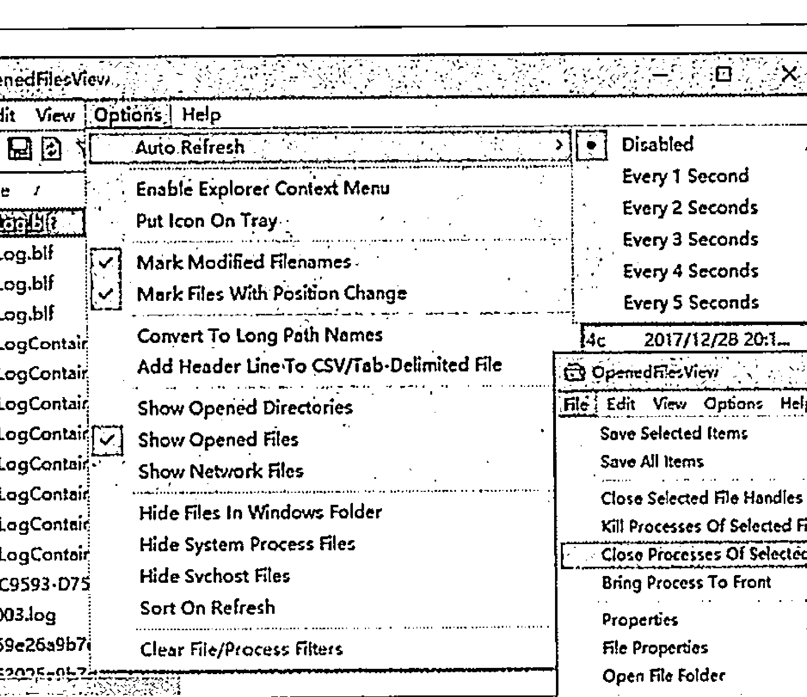

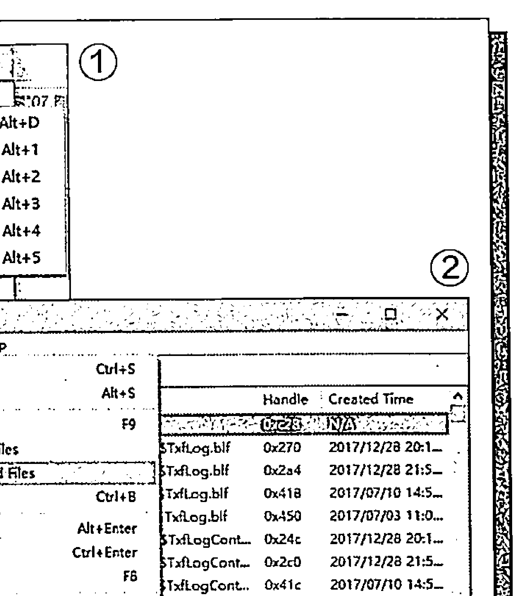

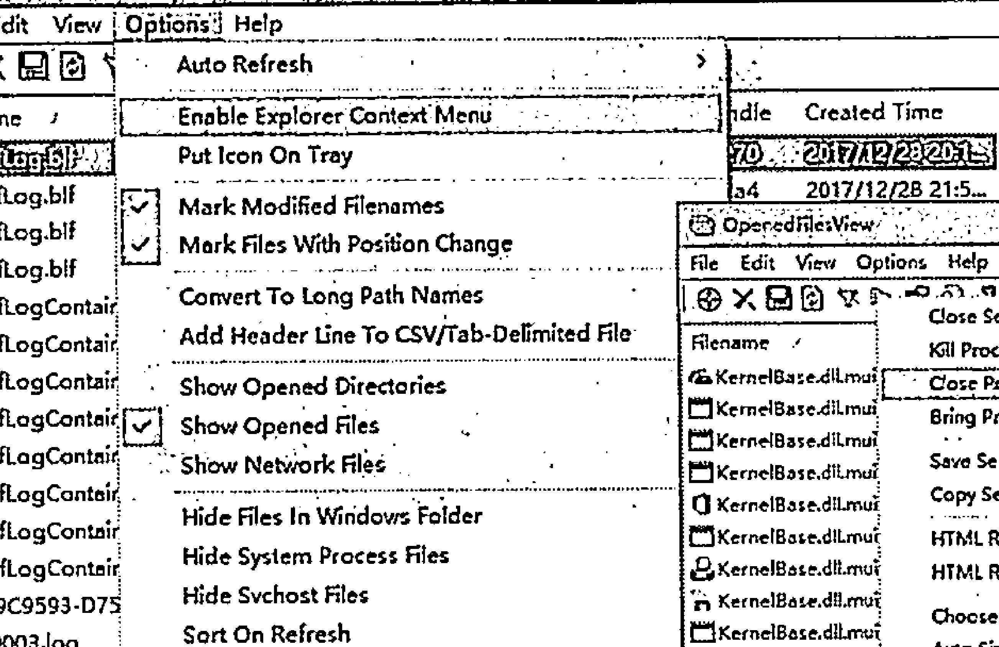

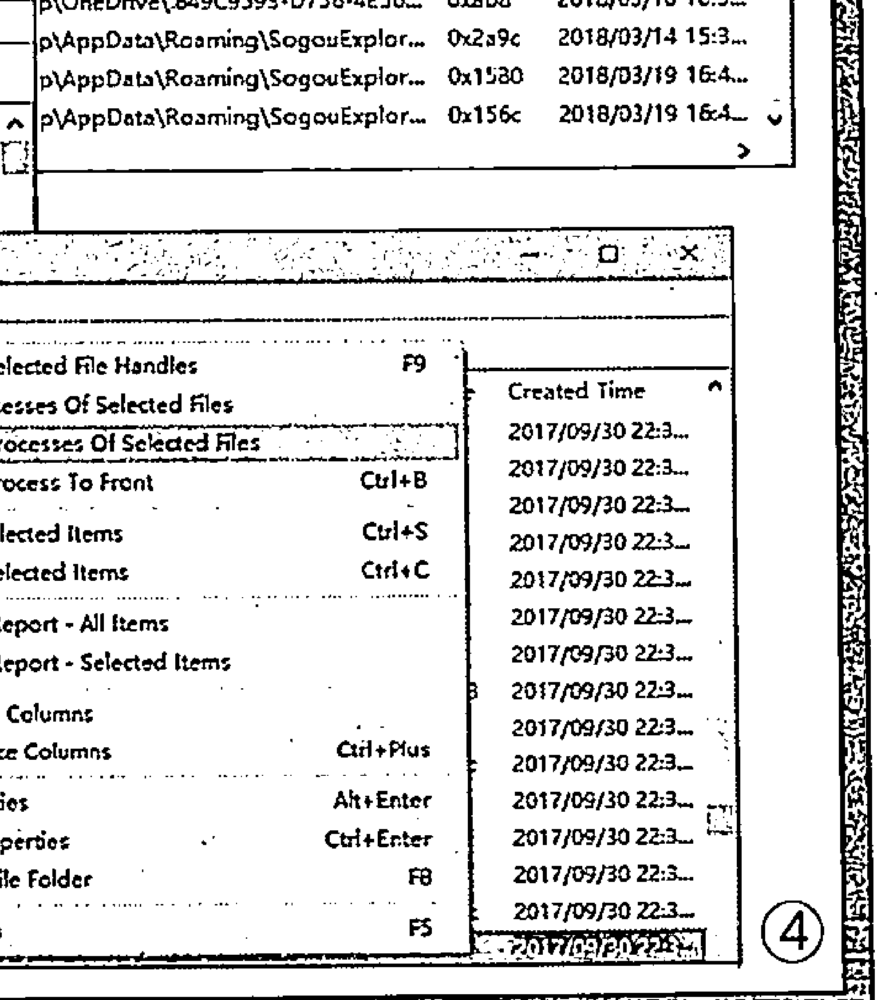

### 2. 设定显示列表的范围

使用软件默认的列表显示，所列文件过于繁杂。这时，通过设定显示项目和隐藏特定项目，可更加集中地查看已打开的文件，从而更快地找到被锁的文件。显示项目包括：已打开的文件夹、已打开的文件、显示网络文件。隐藏项目包括：隐藏Windows目录文件、隐藏系统进程文件、隐藏Hosts文件。上述选择，可通过Options菜单下的选项来完成。

> 小提示：OpenedFilesView针对不同位数的Windows设计有不同的版本。在64位的Windows系统中，必须下载和安装64位版的OpenedFilesView。

### 3. 快速查明和解除文件锁定

经过上述筛选之后，在窗口中找到被锁文件，用Files菜单下的相应命令可以解锁文件（图2）。此外，在资源管理器中用右键检查和解除被锁文件会更方便。先需通过软件菜单命令“Options→Enable Explorer Context Menu”，在文件资源管理器的右键菜单中加入OpenedFilesView选项（图3），然后才能使用该功能。这样，当文件被锁之后，直接在资源管理器中右击该文件并选择OpenedFilesView，在OpenedFilezView窗口里找到的文件上按下右键，选择不同的解锁方式进行解锁（图4）。

> 小提示：选中Options菜单下的Put Icon On Tray选项，可使软件图标常驻系统托盘。

## 神奇背景图案巧生成

文/亦云

制作PPT、网页、简报等平面设计作品时，我们常常会用到图案背景。利用Repper在线背景生成器，只需随手点击鼠标即可立即生成各种类型的图案背景。此外还可以在现有图片的基础上，生成个性化的图案背景。

首先访问Repper服务主页 (http://repper.studioludens.com/repper.html)。主页之左上角显示Click here to launch repper按钮，意即进入制作 (图1)。但你先别急着点击，浏览一下主页，可以发现主要用来操作的三个按钮：Start tool now (开始制作工具)、Change Background (改变背景)、View gallery (浏览画廊) (图1)。下方提供75秒小视频和三步操作教程，可让人轻松学会怎么使用 (图2)。

### 1. 神奇小方块 千变花纹样

点击Click here to launch repper或Start tool now按钮，进入Repper图案生成页面，网站会随机提供一张图片，在图片上会出现一个半透明的方块，被它框住的小范围就是即将产生图案的基底范围 (图3)。

试着用鼠标拖动小方块四周的8个句柄方块，这时我们会看到，随着鼠标的移动，图片变成图案，且方框越大，图案的基本元素也会越大。

> ▶ 小技巧
如果仅要改变图案的样式而不改变图案基本元素的大小，则只需在方框中间按下鼠标进行拖动即可。

### 2. 个性定制 背景图案亲手做

利用网页右上角提供的4个工具按钮，可以灵活地制作出更加个性化的背景图案。

在pattern type选项下，有两种类型的图案产生规则，选择其中之一，下面马上就会显示对应的图案效果。如果要改变系统随机给出的图案类型，点击random image按钮即可。如果要在自己的一张图片的基础上生成背景图案，点击upload image按钮上传图片，即可产生个性化的图案。

最后，若对制作效果满意，点击save pattern按钮，网站会给出一个可引用的作品URL和CSS网址，或可点击Download Pattern按钮下载图案文件 (图4)。

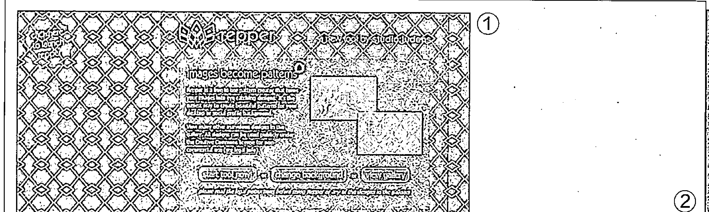

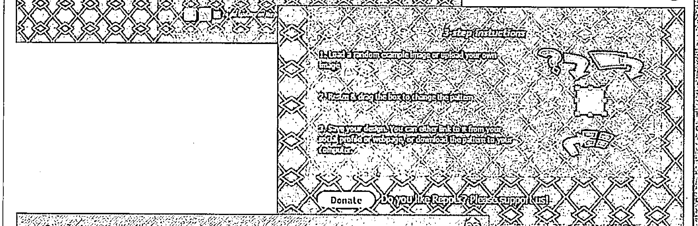


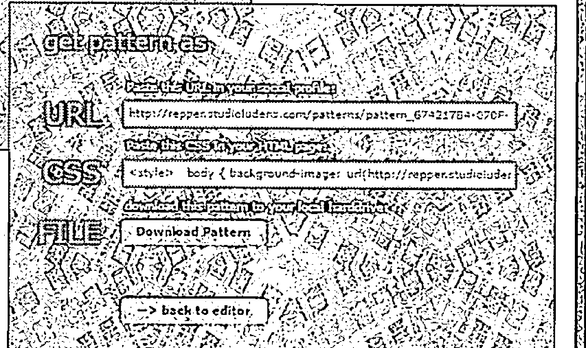

## 给右键“新建”菜单动动手术

软件安装和使用的不断积累，会造成Windows 10文件资源管理器右键“新建”菜单中的项目越来越多，但是，其中的项目并不一定全是我们需要的（图1）。为了优化“新建”菜单项目，我们可利用专用工具、重装软件或修改注册表等办法来解决问题。

### 1. 用小工具给右键“新建”菜单减肥

借助一个绿色小工具ShellMenuNew，可以随心优化右键“新建”菜单中的选项，只留下自己需要的项目。

启动ShellMenuNew后，会自动显示右键菜单中“新建”子菜单下的所有项目。如果使用时我们不希望看到某个菜单项，只需选中该项后单击工具条上的第二个按钮（红圆点），之后Disabled一栏中该项目显示为Yes，即可屏蔽该项目（图2）。如果要让屏蔽的项目再现，则点击第一个按钮（绿色圆点）。

上述操作还可用右键菜单或快捷键来完成。选中要编辑的右键项目，单击鼠标右键并选择Disable. Selected Menu Items禁用该项目（或直接按F7），选择Enable Selected Menu Item还原禁用项目（或直接按F8）（图3）。

将所有自己不想要的右键“新建”项目屏蔽掉之后，返回到资源管理器窗口，单击右键操作，可以看到右键“新建”菜单变得干净多了（图4）。

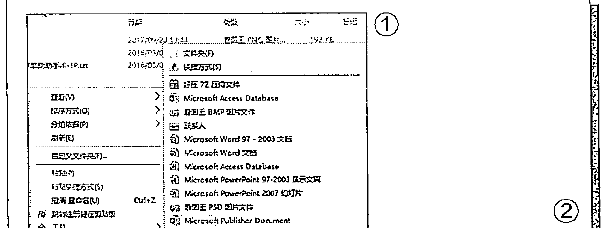

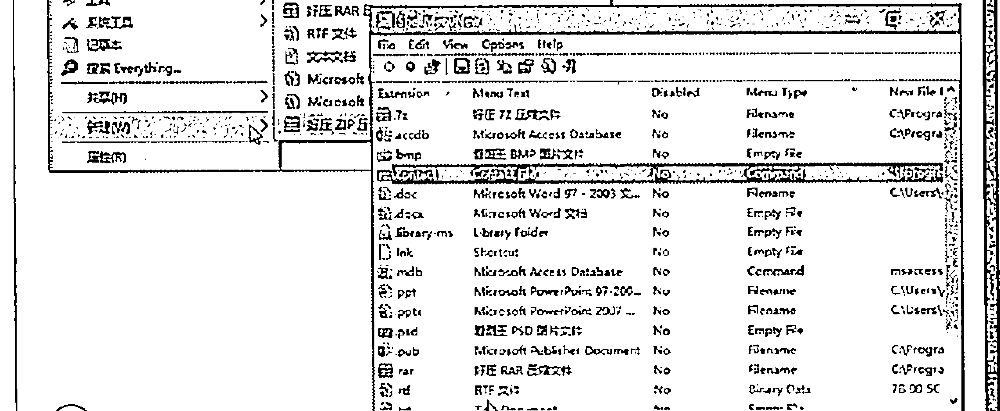

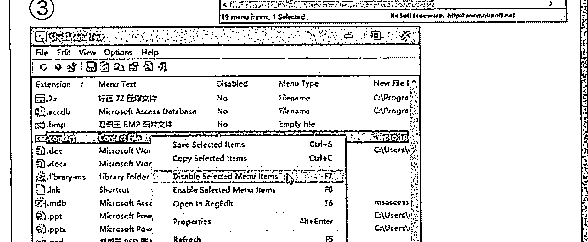

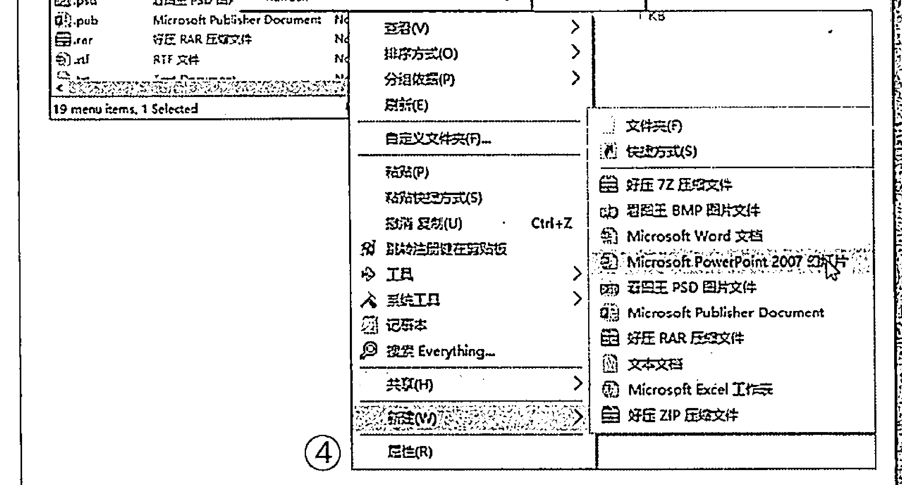

### 2. 用“重装+卸载软件”解决

如果右键“新建”菜单中的某个项目是安装某个软件时自动添加的，一般来说，卸载该软件时会一并将右键“新建”菜单项目卸掉。但也有例外发生，一旦发生项目残留，可先重新装一遍此软件，然后再进行卸载，这样可解决问题。

### 3. 直接用注册表修改法

还可通过修改注册表来删除右键菜单中的“新建”项目。首先要知道右键菜单项目所属的文件扩展名类别（例如要屏蔽新建.mdb的选项），定位到注册表“计算机\HKEY_CLASSES_ROOT”路径，找到“.mdb”下的“ShellNew”分支，将其删除。退出注册表编辑器后，右键“新建”菜单中将不再出现.mdb项目。其他类型文件项目的删除方法与此类似。

小提示：也可以直接在ShellMenuNew软件中按下F6功能键，打开某项目对应的注册表键值。

## 文件变动找知晓

文/阿楠

为了掌握系统、软件和用户文件的动态，我们需要知道有关文件的变化情况——系统更新修改了哪些文件，软件安装或运行执行了哪些操作，用户文件进行了哪些更改。使用Disk Pulse软件，可完成上述文件变动的监视。

首先设定要监视的文件夹。单击Disk Pulse窗口左侧中部栏Directories后的+号按钮，选择添加需要监视的文件夹（图1）。同时监视的文件夹可以有多个，系统文件夹、软件文件夹或用户数据文件夹均可监视。

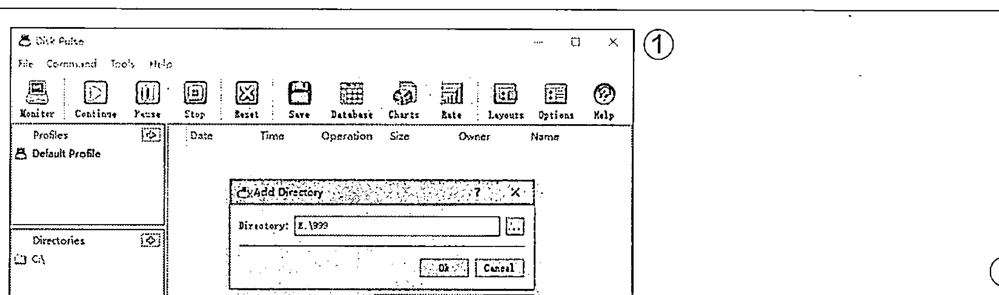

点击监视按钮Monitor，进入监视文件夹编辑窗口，可继续添加更多要监视的文件（用Add按钮），或删除不需要监视的文件夹（用Del按钮）。设置之后，按下Start按钮开始监视动作（图2）。

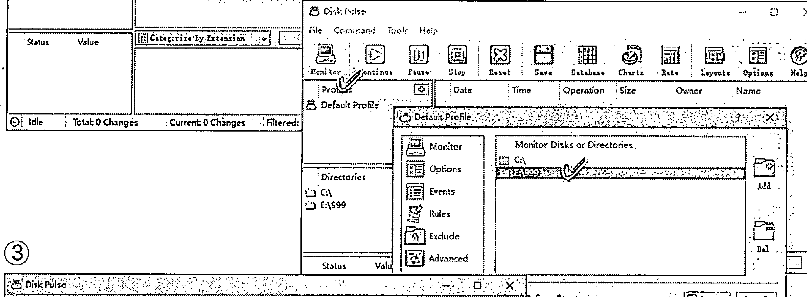

之后，如果监视的文件夹中的文件发生了某种改变，则监视窗口中会立即显示文件列表和文件改变情况，包括改变时间、执行的操作、文件大小等（图3）。这些监视显示项目可以由用户来指定，还可以通过下部栏标题上的下拉菜单进行监视信息的按类列表显示。

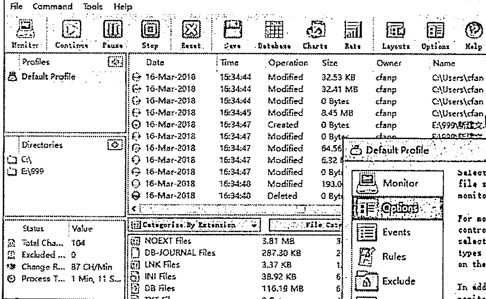

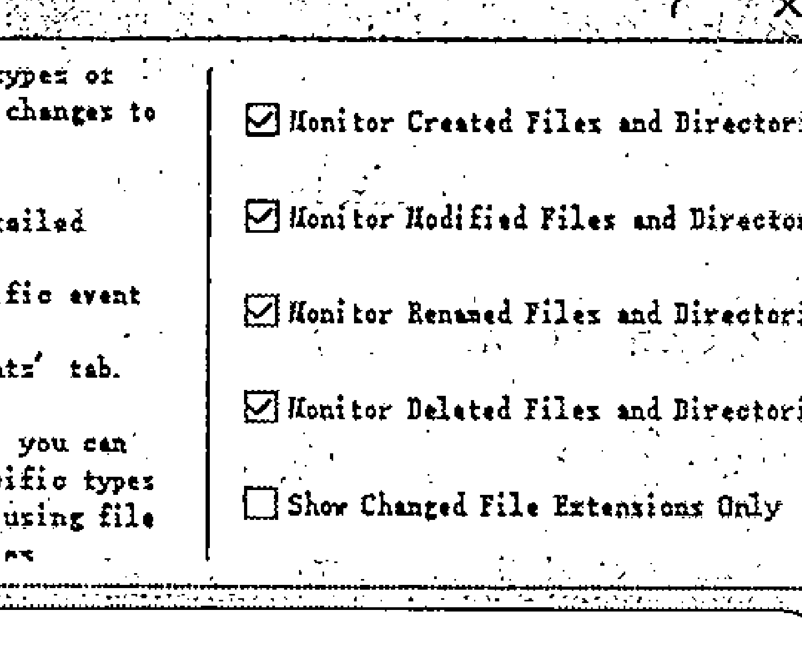

除了用列表显示文件变化情况外，还可以用图表方式来更形象地显示变化。只需按下Charts工具按钮，分析图表即会显示文件的各种变化情况（图5）。图表的显示内容是与列表显示方式选择的类别相互对应的。

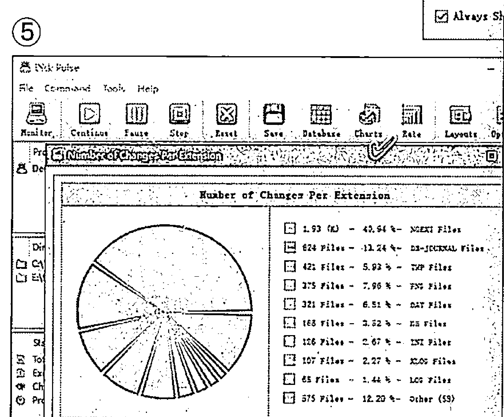

> **小提示**

在按下Monitor按钮之后出现的Options选项窗口中，可以选择监视的类型。例如：监视文件和目录的建立、监视文件和目录的修改、监视文件和目录的重命名、监视文件和目录的删除、显示文件扩展名的改变等（图4）。更为详细的控制，可点击Events选项选择，在列表中有8个具体监视项目可供选择。此外，还可用Rules选项设定监视规则，用Exclude选项设定不监视的项目，在Advanced高级选项中设定报告的标题和报告的长度等。

## Windows剪贴板的增效好“替身”

文|惠香

Windows自带的剪贴板虽然可以在不同的应用程序之间传递数据，但只能保留一份数据，新的数据会覆盖旧的数据，而且剪贴板无法进行键盘录入的监听。免费软件Alternate Memo可实现剪贴板数据重复利用，能自定义剪贴条目数，还可进行键盘录入监听，很好地弥补了Windows自带剪贴板的不足。

首先，下载安装并运行该软件。软件运行后启动一个非常简单的窗口，并在系统托盘驻留图标（图1）。但是，因为软件没有内置随系统自动运行的选项，因此若需要常驻运行，需将软件快捷方式复制到Windows自启动文件夹中。

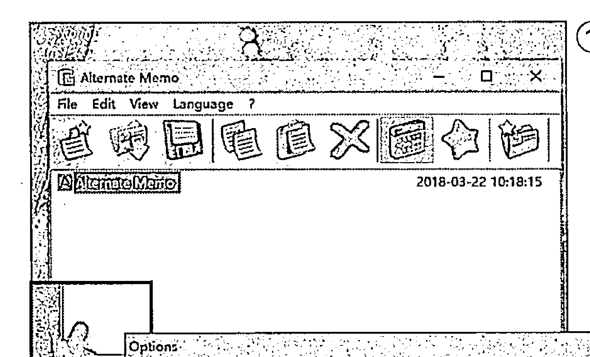

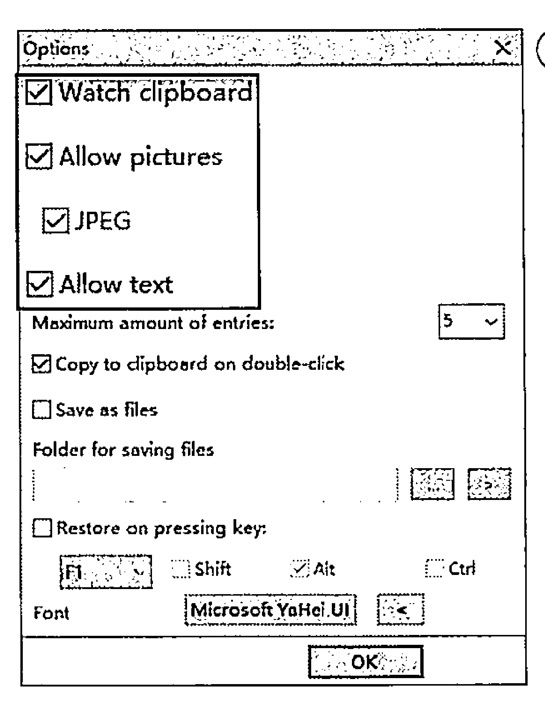

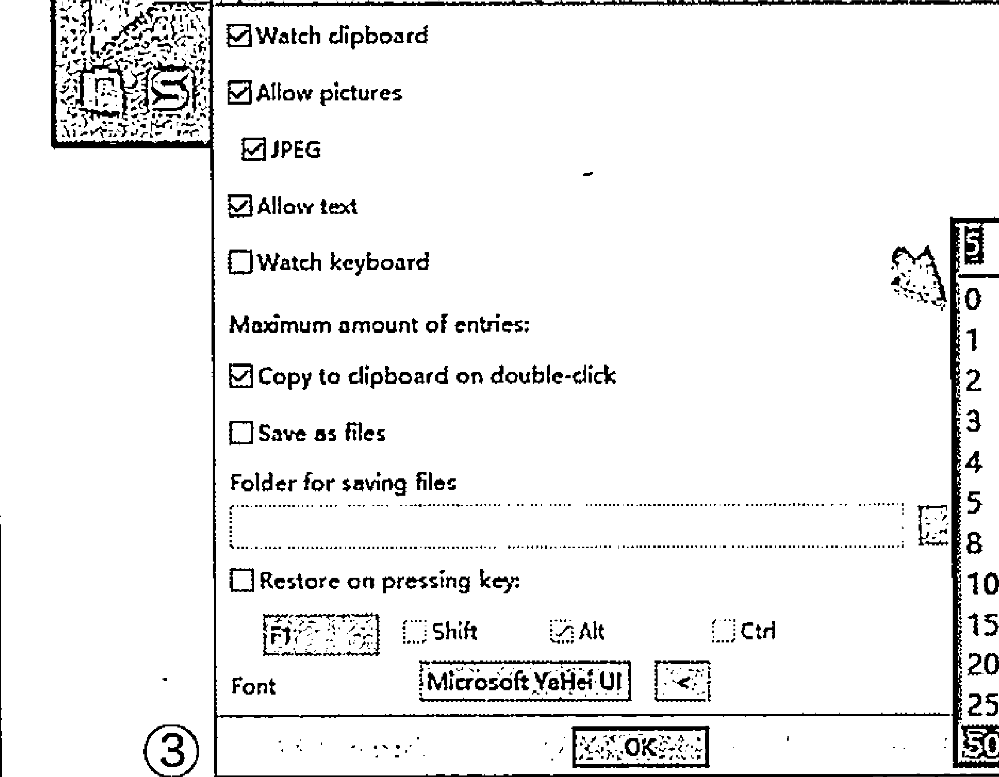

当软件在后台运行时，会监视剪贴板内容的更改并自动收集相关内容，每次更改作为一个条目，记录在软件窗口中。但我们会发现，软件默认只监视文本信息，复制的图片信息不出现。在窗口记录中。如果需要监视图片信息，点击“View→Options”菜单命令，在弹出的窗口中选中Allow pictures选项，并将下边的JPEG选项也选中，这样就可以监视图片的复制了（图2）。

> 小提示：如果希望将键盘输入的内容也记录下来，只需在Options窗口中选中“Watch keyboard”复选框，软件弹出要监听键盘的提示，点击“是”确认，键盘录入的内容就会被记录在该软件的窗口中。

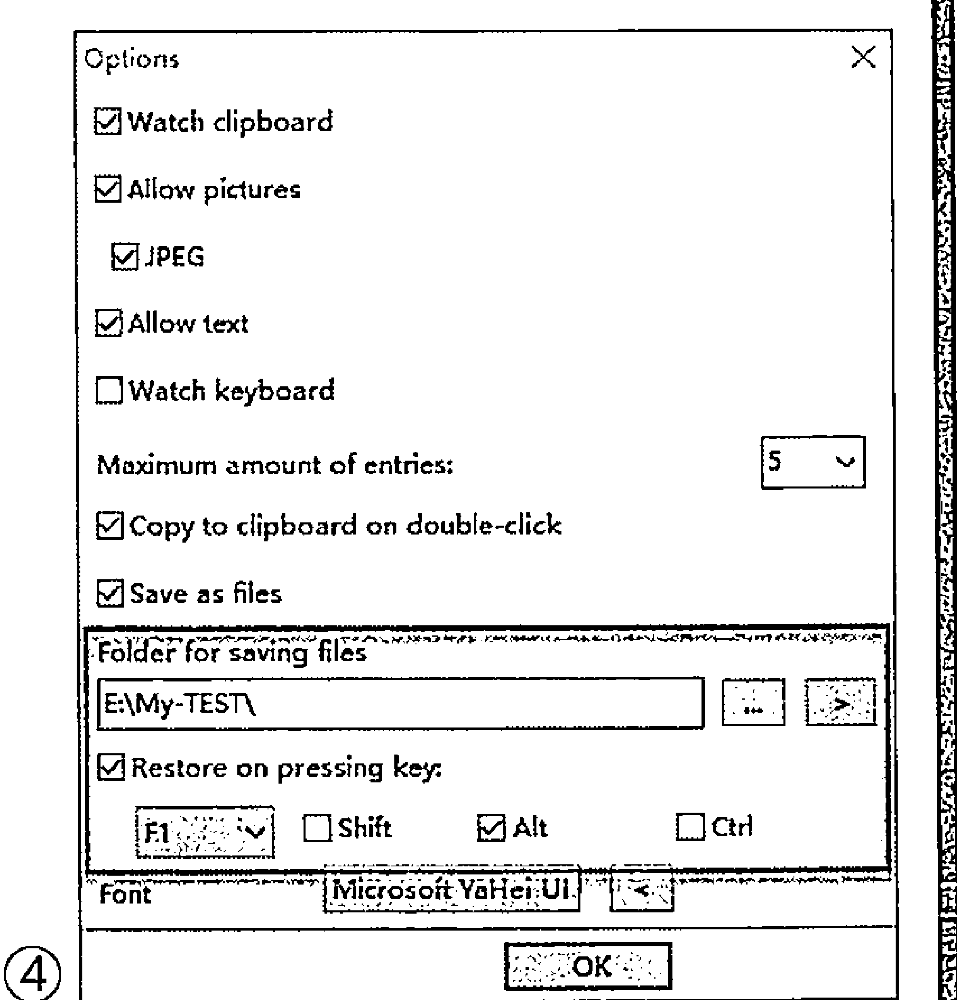

由于软件默认最多监视5条项目，因此若需要监视和记忆更多项目，可通过设置窗口，设置Maximum amount of entries的值，最多可设置为50条（图3）。

用上述方法保存的信息仅仅是存留在内存中，关机之后这些信息将消失。如果重新开机或以后需要重复使用这些信息时，可在软件Options窗口内将“Save as files”复选框选中，在下方指定保存的文件夹位置，这样就可以将复制条目保存成文本或图片文件了。若需要指定软件恢复热键，可由功能键下拉框给出的键位和Shift、Alt、Ctrl控制键随意组合（图4）。

剪贴板窗口中的所有项目，可以通过“File→Save”命令保存为专用剪贴板文件，供以后用Open命令重复调用。剪贴板条目列表可用“View→All lines in editor”命令，打开专用编辑器，以文本方式阅读或复用。

## 用啥剪啥 让视频资源更好用

文|闫智飞

小何是一名语文老师，出于扩展学生视野和提高学习兴趣的需要，她经常会在课堂中播放一些视频片段，但网上搜集的相关视频往往只需要其中的一段或几段，不过这也难不倒小何，因为她请了个好帮手——爱剪辑，只需轻点鼠标，就可以剪掉视频中用不到的内容。接下来，就请小何分享一下视频剪辑方面的一点经验。

### 准备工作

先从http://www.aijianji.com下载“爱剪辑”并安装运行之，根据所要剪辑的原始视频资源，输入片名、制作者，以及选择所要生成的视频大小（图1），最后单击“确定”按钮即可。

> 小提示
在默认设置下，剪辑好的视频以MP4格式，保存到与原始视频资源所在的同一目录（如“F:\教学视频”目录）下，文件名为“爱剪辑-我的视频.MP4”。

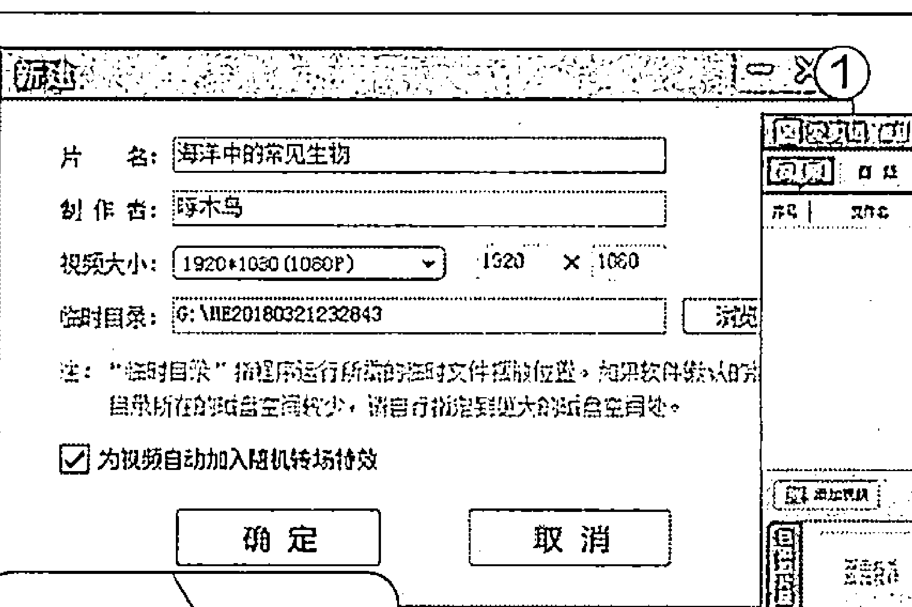

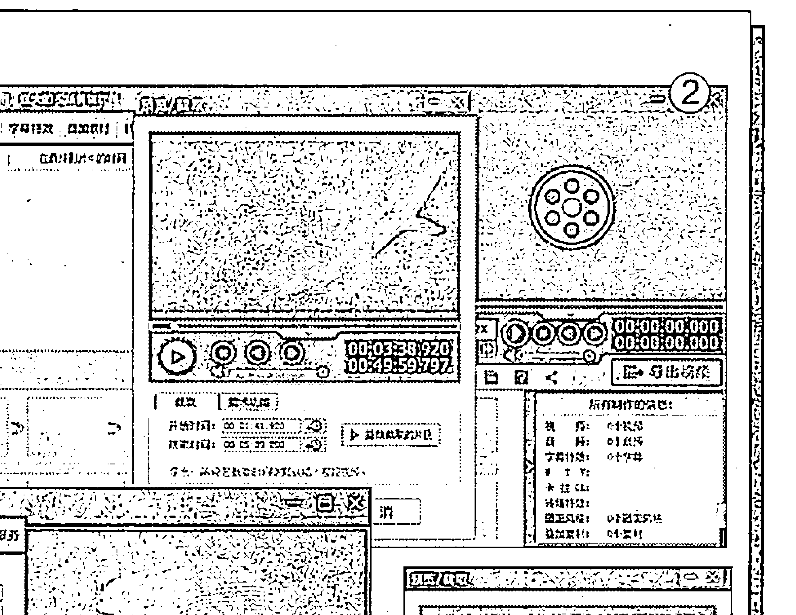

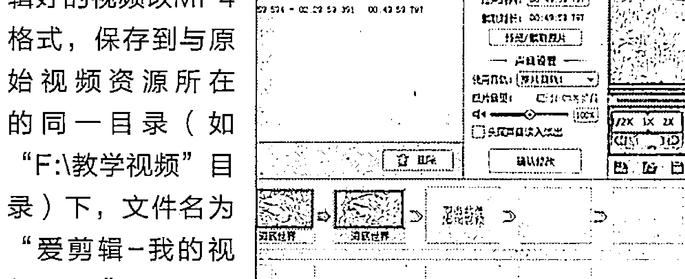

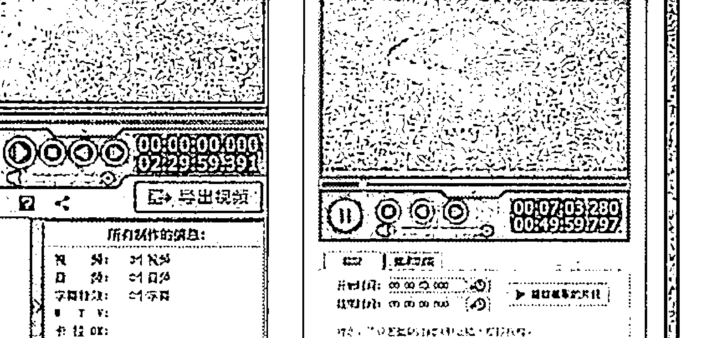

### 一段视频资源的剪辑

在“爱剪辑”的主界面中（图2），单击左端的“添加视频”按钮，将待剪辑的原始视频添加进来，此时就会弹出一个名为“预览/截取”的对话框，单击该对话框中左端的三角形播放按钮，就可以播放所添加的原始视频了。

等到视频播放到所要截取的起点位置时，单击“开始时间”右边的“钟表”图标，以确定所要剪辑的视频的起点。继续播放或拖动播放进度条上的圆形按钮，等到视频播放到所要截取的终点位置时，单击“结束时间”右侧的“钟表”图标，以确定所要剪辑的视频终点。

完成上述操作后，单击“预览/截取”对话框中的“确定”按钮，就完成了一段视频资源的剪辑操作，最后单击右侧的“导出视频”按钮，按照提示将剪辑好的视频资源导出即可。

### 多段视频资源的剪辑

有时候我们往往需要一个视频中的多个小片段，当然使用“爱剪辑”也非常容易办到。

首先复制待剪辑的视频。在“爱剪辑”的主界面中完成一段原始视频的导入后，“已添加片段”面板中就会出现与该视频所对应的缩略图（图3），右击“已添加片段”面板中出现的视频缩略图，选择“复制多一份”，以增加一个待剪辑的视频片段。根据所要截取的视频片段的多少，再继续执行复制操作。如果需要剪辑三个视频片段，则“已添加片段”面板中有三个待剪辑的视频片段。

接下来剪辑视频。完成多个待剪辑视频的复制之后，选中其中第一个视频缩略图，并单击图3中的“预览/截取原片”按钮，打开“剪辑/截取”对话框（图4），仿照上边所介绍的一段视频的剪辑方法，设置好第一段剪辑视频的起点和终点。

重复这个操作，完成所有视频片段的起点和终点的设置之后，最后单击“导出视频”按钮，将剪辑好的多个视频片段导出为MP4格式的视频文件就可以了。

## 另类方法 为网络域名解析加速

文|万立夫

我们在上网的时候第一个操作就是需要将网络域名转换成对应的IP地址，这个步骤的快慢直接影响到我们的上网速度。但是往往在进行这个步骤的时候会遇到很多问题，比如域名解析错误、域名劫持等等。本文介绍如何排除这些干扰，从而加快网络域名的转换速度。

### 添加域名解析服务地址

其实网络里面已经有很多可以加快网络域名解析的软件，但是由于这些软件长时间不进行更新，已经不能适合当前的网络环境。所以我们今天首先下载“DNS Chooser”这款网络域名解析软件，解压后在文件夹目录里面找到dnschooser.conf这个文件。现在利用文本编辑器打开这个文件，在StandardResolver Address这个参数的后面可以看到多组内置的DNS域名解析服务器地址（图1）。

小提示
如果“DNS Chooser”这款软件无法正常运行，那么首先将.Net Framework升级到4.6.1的版本。在进行软件卸载的时候，需要在系统托盘找到软件的图标并将它进行关闭，然后运行文件夹中的uninstall.bat这个文件就可以了。

用户可以根据自己的需要对这些域名解析服务器地址进行修改，或者也可以直接在已有的地址后面添加自己需要的服务器地址，这就是这款软件最大的一个特色。我们知道微软的操作系统以及以前的第三方域名解析软件，只能同时设置两个域名解析服务器地址，但是在使用的时候只能使用一个地址，除非这个地址遇到解析问题才切换到另外一个。而这款软件可以同时利用多组服务器进行解析，从而选择解析速度最快的反馈来进行操作。

### 启动程序加快域名解析

域名解析服务器地址设置完成以后，利用管理员权限运行文件夹目录中的install.bat文件，这样就可以进行这个软件程序的安装操作。安装成功以后会弹出“DNS Chooser客户端”窗口，在里面我们就可以看到这款软件的运行状态（图2）。接下来我们打开系统的控制面板，接着点击“网络和Internet”中的“查看网络状态和任务”选项，在弹出的操作窗口中点击左侧的“更改适配器设置”命令，然后就会打开Windows系统的“网络连接”窗口。

在窗口列表里面选择当前系统使用的网络连接方式，点击鼠标右键选择菜单中的“属性”命令，然后在弹出的窗口列表中选择“Internet协议版本 4”这项。点击下面的“属性”按钮后，在弹出窗口的“首选DNS服务器”选项中，查看是否已经设置为127.0.0.1这个IP地址。如果没有设置成功的话，手动设置为这个IP地址就可以了（图3）。从此以后我们再进行网络访问的时候，就可以利用这款软件同时发送多组域名解析请求，这样就可以利用最快的反馈来加快上网速度了。

## 异地交流 多人在白板

文|俞木发

有时候因工作需要集中开会讨论问题，可能因为条件所限，如出差、不在同一个城市等，无法面对面交流。这时便可以借助在线白板的功能在线相聚，大家可以在同一个界面上互相写写画画，就像在同一块黑板上进行交流一样。

### Witeboard 最简洁的多人协作

在制作复杂图表或者协作的时候，团队之间经常要互相协作。但是由于团队成员之间不在一个地方，如果要实现实时的互动交流，利用https://witeboard.com/提供的白板服务可以实现高效的实时交流。

比如需要制作一张市场分布图解，发起者只要登录上述网站，在白板上使用笔形工具画出结构图，或者使用文字（T）工具添加注释说明，这样在白板上就可以显示出结构图（图1）。

如果要和其他地方的同事共享，只要点击右上角的“Share”按钮，会自动生成一个共享网址。只要将这个网址发送给对方，对方在线打开后看到的就是同样的内容。同样的，对方也可以对白板进行任意编辑操作，操作后的结果实时更新到我们的桌面，效果就像大家在一起使用白板（图2）。

### 白板——实时讨论编辑

在团队的日常讨论中，成员之间经常还要对项目进行讨论和完善。如果需要类似的编辑功能，那么可以使用https://bearyboard.com/提供的在线白板。

登录上述网址后按提示注册用户并新建一个需要讨论的项目，进入项目后就可以将需要讨论的图片上传（预先使用画图或者上述工具制作好要讨论的图片）。这样我们进入项目后就可以看到上传的图片，打开图片后点击“进入讨论”，然后点击右上角的分享按钮，直接生成共享链接（图3）。

对于分享的同事无需注册用户，打开分享链接后设置一个昵称即可进入讨论。进入讨论页面后点击任意位置，然后在弹出的文本框输入需要讨论的文字，点击“提交”即可。这样其他参与讨论的用户可以实时看到（图4）。

白板还提供历史版本，上传多个版本后可以查看多次结果，这样如果在讨论的时候需要回退到之前的某个版本，只要点击左上角的版本，选择历史版本即可。完成后可以点击右上角云的图标，直接将修改讨论后的结果下载到本地保存（图5）。

### Xodo PDF：跨平台多人协作PDF

在日常的工作文档中，很多文档都是使用PDF格式。很多PDF软件并没有多人协作功能，如果需要对PDF文件进行类似上述白板那样的远程协作，那么利用Xodo PDF即可。

Xodo PDF支持在线、Android、苹果等多平台的设备使用。以在线服务为例，打开http://www.xodo.com/app/#/注册用户，然后点击“Local file”，选择需要讨论的PDF文件，成功上传后即可在线打开。这里可以利用网站提供的工具进行诸如加亮文字、添加标记、添加波浪线等操作，只要点击对应的工具按钮按提示操作即可（图6）。

我们对PDF文件进行标记完成后，点击上方的头像按钮，在打开的窗口点击“Share”按钮即可生成分享链接。要参与编辑的同事不需要注册账号（可以以Guest身份）即可参与协作，他们同样可对PDF文件进行上述编辑，分享后都可以实时看到协作的结果（图7）。

完成PDF文件的编辑后可以在线保存，或者直接下载到本地保存，保存的是上述修改后的结果。最终版本可以发送给各位协作的同事（图8）。

上述我们只介绍了在线白板工具，在实际使用中还有许多本地化白板工具（比如Windows 10用户可以直接在应用商店下载Rating and reviews，Word使用画布功能+Onedrive也可以实现类似白板的功能），也有很多类似的Android、苹果APP下载，这些工具也都有协作功能。在实际工作中，大家可以根据自己的实际需要选择下载使用。

## 巧用播放器为百度网盘下载提速

文|万立夫

现在国内可以选择的网络硬盘越来越少，只有百度网盘等极少的几家。但是百度网盘的限制也越来越多，即使是在文件下载方面也做了很多的限制，这样给用户的文件下载造成了非常大的困难。今天笔者就为大家介绍一个用播放器巧妙下载百度网盘文件的方法。

### 播放软件变身下载工具

其实有些软件附带的一些功能，就可以解决用户面临的一些大问题。比如我们利用一款播放软件，就可以有效地解决百度网盘下载的问题。首先从网上下载安装最新版本的“爱奇艺万能播放器”（http://app.iqiyi.com/pc/wnplayer/index.html），启动以后点击软件窗口右上角的“百度网盘”按钮。如果用户没有发现这个按钮的话，那么建议关闭播放器以后重新进行运行操作。接下来在弹出的网页窗口中点击“登录”按钮，按照提示输入自己的百度网盘账号和密码信息，这样就可以登录到自己的百度网盘页面，就可以看到所有存储的文件信息（图1）。

根据自己的需要在网盘列表中找到要下载的文件后，点击文件名称的链接就会出现这个文件的相关界面。点击界面中的“下载”按钮，就会弹出一个“新建下载任务”的对话框。在对话框中可以设置下载文件的名称以及保存目录，设置完成以后点击确定按钮就开始进行下载操作了（图2）。点击网页窗口中的“正在下载”标签，就可以看到该文件的下载进度。如果用户要想下载网友分享的文件，需要先将分享链接复制到系统的剪贴板里面。接下来在网页窗口的地址栏中粘贴上这个分享链接，点击后面的按钮就可以打开分享链接的页面。按照前面的操作步骤进行操作，就能快速完成文件的下载操作了。

### 视频文件也能在线播放

以前我们要想在播放软件中在线播放百度网盘中的文件，需要先获取文件的下载链接，然后再添加到播放软件的打开对话框中进行操作。现在利用“爱奇艺万能播放器”，我们可以非常方便地进行在线播放操作。首先我们按照前面的方法点击要进行在线播放的多媒体文件链接，这时可以看到在文件介绍的页面中，多出了一个“在线播放”的选项按钮（图3）。

这时文件的下载链接就会自动添加到播放软件的“打开”对话框里面，接下来播放软件会进行文件的下载以及缓冲操作。当下载了一定的缓冲信息后，我们就可以在线进行文件的播放了（图4）。利用专业的播放软件进行多媒体文件的播放，不仅可以进行全屏播放、投影播放、字幕加载，关键是还可以利用本地硬件的强大功能进行硬件加速等一系列的操作。

> 在我们访问网友的分享链接时，点击网页窗口左上角的“菜单”按钮，在弹出的菜单里面选择“全部文件”命令后，就可以快速切换为自己的百度网盘主页面。除此以外，点击主页面右上角的“上传”按钮，也可以将指定的文件上传到百度网盘里面进行保存。

### 专业软件安装证书文件

虽然“爱奇艺万能播放器”可以进行下载，但是它毕竟不是一款专门的下载工具。所以你要想进行更好的下载操作还是需要专门的工具，而“ProxyEe Down”这款软件就是针对百度网盘所开发的一款专业下载工具。我们首先通过它的官方网站下载最新的版本（https://github.com/monkeyWie/proxyee-down），解压以后运行文件夹中的可执行文件就可以了。由于百度网盘现在采用了加密的HTTPS协议，所以在第一次运行这款工具的时候会安装一个证书文件，安装完成以后就可以在系统托盘看到它的图标。

如果用户使用的是火狐浏览器的话，那么需要手动导入证书文件才可以。首先在系统托盘的“ProxyEe Down”图标上点击鼠标右键，选择菜单中的“证书目录”命令，在弹出的文件夹目录里面就可以看到证书文件。接着运行火狐浏览器并点击右上角的“打开菜单”命令，在弹出的菜单中选择“选项”命令，在弹出的对话框里面选择“隐私与安全”选项。再点击右侧窗口里面的“查看证书”按钮，在弹出的证书对话框中切换到“证书机构”标签页。然后点击下面的“导入”按钮，选择文件夹里面的证书文件就可以了（图5）。

### 配置搭建代理下载环境

由于“ProxyEe Down”这款软件程序是通过代理服务器的原理来进行工作的，所以我们还需要在自己的浏览器里面搭建一个本地的代理设置环境才可以。首先通过谷歌浏览器的应用商店，安装“SwitchyOmega”这款代理扩展。接下来在工具栏的扩展图标上点击鼠标左键，在弹出的菜单中选择“选项”这个命令，然后在弹出的设置窗口中点击左侧的“新建情景模式”命令。在“情景模式名称”输入框中随意设置一个名称，然后在下面选择“PAC情景模式”这个选项，点击右下角的“创建”按钮。接下来在“PAC网址”输入框中粘贴上“http://127.0.0.1:26339/res/pd.pac”这个链接，然后点击“立即更新情景模式”按钮下载PAC信息。当配置窗口弹出脚本更新完成的提示后，点击“应用选项”按钮就完成了相应的配置操作（图6）。

小提示：这款代理扩展支持包括360浏览器、QQ浏览器、猎豹浏览器、Opera浏览器等在Chromium基础上开发的所有浏览器，以及最新版本的火狐浏览器。除此以外，如果用户无法访问谷歌应用商店的话，可以通过它的官方网站（https://www.switchyomega.com）来进行下载安装。如果其他浏览器不能安装这个扩展，那么就在浏览器的代理里面设置上面的PAC文件链接。

### 选择文件后的快速下载

现在我们登录自己的百度网盘，在网页上方就可以看到一个名为“proxyee-down”的标签，这就说明“ProxyEe Down”这款软件加载成功了。以后如果要想进行文件下载的话，那么在文件列表中勾选要下载的文件，点击后面的“下载”按钮（图7）。稍等片刻就可以弹出一个下载任务对话框，设置好“文件名”、“分段数”、“路径”等项目，然后点击“创建”按钮就可以进行下载操作了（图8）。

小提示：用户也可以在文件列表中同时勾选多个文件，接着单击工具栏中的“下载”按钮。这样“ProxyEe Down”就会将这些文件打包成一个压缩文件，然后再对这个压缩文件进行下载操作。

## 软件卸载 它来解决更彻底

文|雅南

虽然Windows自带的“应用和功能”可以卸载软件，但遇到软件无法卸载的情况会让人束手无策。也常有软件用此法卸载不干净，会造成系统垃圾。另外，如何才能一次性选择卸载多个Windows桌面程序或Windows应用，以提高卸载效率？所有这些，Soft Organizer软件都可以帮我们解决。

### 1. 已卸载软件剩余垃圾的清理

在我们卸载一些软件时，哪怕是使用软件自带的卸载程序，也可能在系统中留有一些相关的垃圾文件没有卸载干净，我们无法依靠Windows的程序和功能列表发现这些遗留的文件。此时，Soft Organizer即可派上用场。

点击该软件窗口左侧栏内的REMOVED APPLICATIONS LEFTOVERS选项，软件会自动搜索系统中含有遗留垃圾的软件，并给出软件列表。随后，我们可以通过复选框，选择要清理的软件项目。最后点击REMOVE LEFTOVERS按钮，即可将这些垃圾一次性清理干净（图1）。

### 2. 已安装软件的分类卸载处理

对于Windows应用的卸载，我们可以在Soft Organizer的程序列表窗口中找到要卸载的应用，然后右键单击并选择Uninstall命令即可卸载（图2）。

系统中已经安装的Windows桌面程序也会体现在列表中，我们可以将两类应用程序一视同仁地卸载。而且，可以一次性卸载多个桌面程序或Windows应用，这是Windows自带的程序管理窗口所不能办到的。

一次性卸载多个桌面程序或Windows应用，需要在窗口中部的选择框内选择Uninstall Several Applications选项，软件列表前就会出现复选框。选择要卸载的多个软件，列表框按钮名称就会变为Uninstall n Applications（实际操作时n将被所选软件的数量所代替），点击该按钮即可一次性卸载所选择的多个软件（图3）。

小提示
所有已安装软件的列表可以导出和排序。要导出软件列表，单击软件右上角的控制列表菜单并选择Save the Applications List to a File，即可在桌面生成一个HTML列表文件（图4）。

## 效率提升 磁盘整理优化个性化

文件碎片对传统机械硬盘系统的运行效率影响较大，而Windows本身的磁盘优化功能又比较有限。为了应对磁盘整理优化的个性化需求，我们可以使用功能更强的Auslogics Disk Defrag软件（简称ADD）。

### 1. 整理之前 把握碎片基本情况

在正式开始整理磁盘碎片之前，最好进行一次碎片分析操作。由于SSD没有必要整理文件碎片，ADD软件运行后会自动勾选非SSD硬盘分区。之后，点击窗口中部选择框旁的小三角按钮，选择分析选项（Analyze）（图1）。

选择Analyze选项进行分析之后，软件会给出磁盘碎片占比情况，在分析界面的中间有图形示意图可查看当前碎片状态（红色为碎片部位），底部窗格信息栏则会显示哪些文件产生了碎片（图2）。

如果觉得手动选择整理比较麻烦，还可以开启自动整理。通过“Settings→Scheduler”菜单进入计划设置窗口，选择系统在空闲多长时间后自动整理以及整理周期（图3）。

### 2. 开始整理 三种方法按需选择

分析之后，即可进行整理优化。

#### 效果最优的整理

如果时间充足，选择整理并优化（Defrag& Optimize）会达到最好的效果。此种方法不仅能够消除碎片，还会把常用文件尽可能地存放到硬盘的外圈，进一步提高读写性能。但由于这种方法分两个环节进行，因此速度最慢，建议每个星期进行一次。

#### 最省时间的整理

如果急需整理但时间苛刻，快速整理（Quick Defrag）是最佳选择。由于这种方法会跳过分析步骤直接整理，因此可最大限度地减少整理碎片所需要的时间。在感觉磁盘明显出现卡顿变慢的情况下，可使用这种方法快速整理。

#### 最省心的整理

一般来说，无论采取哪种整理方法，磁盘整理都比较费时。如果没有整理完而又想迅速离开，选择启用“整理碎片后关闭计算机”（After completing: Shut Down PC），可做到工作和休闲两不误。

### 3. 局部优化 整理指定文件碎片

作为一种特殊情况，如果觉得经常使用某文件夹造成它的碎片增多，还可以单独整理此文件夹或文件碎片，只需通过“Action→Advanced”菜单选择“Defrag File”或“Defrag Folder”命令即可（图4）。

## 健忘小秘书 多重提醒不误事

文|南溪

事情一多，难免丢三落四。因此，需要一个善解人意的“小秘书”工具来及时提醒，帮我们打理生活琐事。我们把这项任务交给Free Countdown Timer（简称FCT）软件来完成。

### 1. 多重事务设置 紧慢自动排序

我们可以在FCT软件中按需任意添加多个提醒任务。点击工具栏上的“添加”按钮，或通过列表空白处右键菜单命令“添加”（或用Ctrl+N组合键），新建提醒任务（图1）。

FCT都会以先紧后慢的顺序排列任务，即将到来的任务排在最顶端，而为时尚早的依次排列在下面。

如果要让某项提醒任务临时失效，只需去掉任务选项框前的勾选即可。反之，则开启任务倒计时。

### 2. 任务提醒时间 不同方式设定

添加任务时，时间提醒方式有两种类型，一种是倒数计时方式，另一种是设定具体到时的时间点。

如果要按“倒数计时”提醒，只需选择倒计时的时、分、秒数即可。

如果要在确切时间点提醒，选择“计数直到（从）和时间”选项后，设置具体提醒的日期和时间点，同时还要选择提醒的重复周期（图2）。

> 小提示
如果要显示倒计时窗口，请勾选“在浮动窗口中显示倒数定时器”选项。

### 3. 自定提醒方法 方式灵活多变

任务到时提醒的方法，除了显示浮动的倒计时和信息提醒窗口外，主要还包括声音提醒和特殊唤醒等。

如果要设定音效提醒，通过“浏览”按钮指定音频文件，音量可用“提高音量”滑块来控制；如果需要重复播放声音，选中“重复声音”选项；选择“贪睡功能”选项会在稍后提醒时提供延迟的机会（图3）。

有时，电脑显示可能处于黑屏节能状态，若已选中“打开显示屏”选项，则可让显示器提醒时亮起来；若要让处于睡眠状态的电脑能够及时提醒，需提前选中“将计算机从睡眠模式中唤醒”选项。

### 4. “贪睡”时间长短 全在自己掌握

记事提醒中的“贪睡”功能是懒汉们的最爱。当任务不太紧要时，提醒出现后，可在窗口中选择“贪睡”按钮，赖一会床过段时间再提醒。

贪睡时间可以由用户来指定，从“设定→贪睡功能”菜单下选择即可，可选范围在1分钟-10分钟之间（图4）。

## 告别混乱 文件管理有条不紊

文|馨居士

为了摆脱文件管理的混乱局面，我们往往需要借助于各种软件对文件进行规范化处理。其实，只用一款文件整理工具 Alternate Archiver，就可以轻松实现文件自动分类显示归档、自动分类重命名、分类邮件发送等管理任务。

### 文件按类排序显示

假设要整理某个文件夹中的文件（包含许多子文件夹），我们可以利用Alternate Archiver内置的过滤器，通过设定文件的类型、文件大小、日期等进行分类筛选显示。

首先通过左侧窗格的目录树指定需要处理的文件夹，然后点击“文件类型”下拉框，选择要筛选的文件类型。如果要显示所有文件则选择“*”，如果只显示文件夹则选择“*dir”，若要显示某类文件或某个扩展名的文件，则选择一组或一种扩展名。点选之后，右侧窗格会显示满足条件的文件列表（图1）。

> > 小提示：如果要在一个列表中显示包含各级子文件夹下的所有满足设定条件的文件，请勾选“子文件夹”复选框。若要按文件大小或时间排序显示列表，请单击“大小”或“日期”标题栏，也可以通过右键菜单操作。

### 快速批量重命名文件

如果文件夹中的文件名比较混乱，我们希望将它们以一定的规则快速批量重新命名，可用Alternate Archiver的“重命名”按钮解决。

首先在Alternate Archiver左侧窗格中点击文件所在的文件夹，然后点击工具栏上的“重命名”按钮，设置重命名规则。制定文件名规则时，可指定一个主干名，然后可添加序号，或将文件夹日期、原文件名整合到新名称中。设置之后点击“确认”重命名（图2）。此外还可通过“文件类型”和“选项”选项卡，设定批量更换文件扩展名，或对文件名中的字符进行替换操作。

### 以邮件附件形式快速发送文件

平时我们要以邮件附件的方式给不同人发送文件，需要在邮件管理器页面中进行。用Alternate Archiver来管理文件，可直接将文件以邮件附件的形式发送给指定的人，不需要专门构建多份邮件。

要完成上述操作，打开文件夹后选择要发送的文件，然后点击工具栏上的“发送”按钮，在弹出的窗口中选择或输入收件人信息，点击“发送”按钮进行发送（图3）。

### 两个文件夹的数据同步

要将两个文件夹中的文件进行同步处理，也不需要借助于专门的文件同步软件。利用Alternate Archiver的“同步”按钮，在打开的窗口中指定源文件夹和目标文件夹，然后选择同步操作的范围和方式，最后执行同步操作即可。

> > 小提示：除上述操作外，我们还可以利用软件提供的几个附加工具，完成文件的粉碎、文件夹的清除、EXE文件压缩、DLL文件分析等特殊操作。

## 海量图片井井有条

文|俞木发

很多人的电脑上都会有各种图片，有的是从网上下载，有的则是从手机上传、微信接收图片等。图片多了如何进行管理是个难题，那么该如何管好电脑中海量的图片？Eagle就是一款图片管理专业软件。

### 图片收集 简单极致

如上所述，现在获取图片的来源很多，但是传统的方法费时费力。比如收集网上图片的方法是右击图片选择“图片另存为”，将图片保存到本地。Eagle的图片收集则做到了简单、极致。比如对于网络图片的获取，启动程序后定义一个保存目录，以后需要保存网页图片时，只要打开页面，然后将图片直接拖曳到程序窗口即可保存。添加完成后还可以对图片添加标签（便于后续管理）和注释（便于查找图片来源）等信息（图1）。

如果要批量地下载照片则可以借助浏览器插件实现，比如QQ浏览器用户安装插件后，以后打开很多图片的页面，点击扩展栏Eagle图标→批量收藏，这样所有照片会在程序窗口中打开。按住Ctrl键多选需要保存的照片，点击“添加选择照片”即可批量保存（图2）。而且安装插件后，以后选中图片按住Alt+右键，或者将网页照片下拉到窗口下方即可自动保存照片了。

对于我们常用的截图，程序自带Ctrl+Shift+A快捷键，任何时候按下上述快捷键即可启动截图。截图完成后图片会自动保存到Eagle中，同时自动添加上Screenshot标签方便后续整理。同样对于其他方式的截图，比如我们微信中经常使用的Alt+A截图快捷键，完成截图后直接按Ctrl+V即可保存在程序中，同时图片自动添加Clipboard标签（图3）。

### 分类管理 简捷高效

收集的图片多了以后，如何有效管理是大家都会面临的难题。Eagle使用多种高效、智能的方法对海量的图片进行管理。

比如我们经常要使用一些特定尺寸的图片作为壁纸，如笔者的平板需要2048×1536的照片作为壁纸。如果要在海量的图片中找出符合该尺寸的照片，那么只要点击程序右侧窗格的“+”，按提示新建一个智能文件夹，然后设置宽度和高度为2048和1536，点击“创建文件夹”（图4）。

将保存所有图片的目录全部拖到Eagle中，或者Eagle中已经收集到了符合尺寸的照片，那么符合条件的照片就会自动归集到智能文件夹中，我们只要从中选择自己喜欢的照片作为壁纸即可（图5）。

同样我们可以自定义其他标签，如名称、网址、注释、宽度、高度、形状、标签、颜色、创建时间、文件类型，来智能分类，以满足多个条件或者一个条件来对照片实现自动归集。如果要在海量的照片库中快速找到其他符合条件的照片，Eagle也提供多种筛选条件进行快速搜索。比如我们在进行PPT设计的时候，经常需要找一些蓝色商务照片，点击程序窗口的筛选按钮，然后点击“蓝色”，这样所有主色调为蓝色的图片都可以被自动筛选并显示出来（图6）。

当然我们还可以按照标签、方向、图片格式等进行筛选。比如标签是自定义设置，我们设置一个“公园旅游”标签，这样下次需要找出泰山游照片时，在筛选器里选择“公园旅游”标签后就可以快速找出这些旅游照片了。所以我们在导入照片的时候一定要添加标签，标签可以非常方便我们按照自己的意愿对照片进行快速分类和整理（图7）。

Eagle还能为照片的局部添加标注，这样非常方便对不同主题的照片归集。比如很多朋友喜欢到各地观赏油菜花，那么每张有油菜花的照片在Eagle中打开后，使用鼠标选中油菜花区域拉出一个标签添加标注即可。这样在筛选器中选中标注油菜花的照片，下次就可以快速找到符合主题的所有照片了（图8）。

当然Eagle的照片管理功能还有很多，比如其默认使用“素材.library”库的形式保存照片。这个照片文件夹可以指向到网盘（比如设置为微云的同步目录），这样我们在本地电脑上对照片的所有操作（如智能文件夹、添加标注）可以自动同步到服务器或者另外的电脑上，实现对照片的协同编辑。比如可以利用微云同步+Eagle智能文件夹帮助远方的MM整理照片，或者和不在一个城市的同事实现图片的同步编辑等。

## 软网生活

### 无需登录 局域网中临时文件分享

文/愚人

作为办公一族，在日常的工作中总少不了要在同事之间进行互换文件、资料同步之类的操作，传统的方法是使用闪存盘、QQ等工具进行共享，这些方法都有各种的不足，比如微信、QQ需要互加为好友，还需安装对应的客户端等。其实对于文件的共享，除了这些常规的工具外，我们还可以使用很多在线服务实现更简单的共享。

### 文件共享 即发即送

如果我们需要在局域网内共享一段文字、网址或者照片、单一文件这些内容，lanlan.im提供的即时共享服务就可以解决这些问题。

首先确定接收的设备都在同一个局域网或者Wi-Fi内，在任意设备上登录上述网址，然后在文本框里输入需要传输的内容，如文本、网址、图片等内容，点击“发送”即可（可以发送给一个或多个用户）（图1）。

这样在局域网内的用户，同上打开上述的网址，刷新后即可看到有新的消息，点击打开即可看到上述共享消息了（图2）。

如果是传输文件则点击上传附件，上传需要共享的文件即可。这里要注意的是，如果是传输到类似手机、平板等设备，注意传输的文件类型要在手机上打开。如果是重要的文件，还可以设置打开密码、阅后即焚等。我们同样可以在手机上打开上述网址，将手机上的文件如拍摄的照片等及时传输到局域网的电脑上。

### 手机&PC共享 即扫即传

很多时候我们是要将手机上的文件和同事或者好友共享，常规的方法是使用两个QQ号进行中转。现在借助http://www.fageini.com/提供的二维码中转服务，通过扫一扫就可以完成文件的共享，而且只要设备联网就可以随时传输文件，并不限于一个局域网中。

比如自己在外面出差，在手机上接收到了客户发送过来的文件需要传输给公司同事。通知公司同事在电脑上登录上述网址，然后将二维码发送给我们。我们在手机上识别该二维码后会打开上述网址（可以使用4G或者外部任意Wi-Fi），按提示点击“选择文件”，然后在手机上选择接收的客户文件，成功上传后点击“发送”即可。

这样可通过公司电脑在网站页面点击“下载”，如果是在同一局域网的共享，则直接使用手机扫描二维码上传文件（图4）。打开下载页面后，所有上传的文件会自动显示在列表中，按提示选择需要下载的文件，点击后下载到本地电脑即可。同样我们可以在手机上用浏览器直接打开上述网址，将自己需要共享的文件上传后，将网址通过短信等发送给公司同事，同事在电脑上登录网站后可以直接下载共享文件（图5）。

### 文件对传 电脑变身P2P

很多下载软件都是通过P2P进行点对点的下载，对于PC用户如果要互传文件，借助http://www.ge.tt 提供的在线服务，网络中的任何两台电脑都可以实现P2P的文件传输。

在任意电脑上打开上述网址，然后将需要共享的文件拖曳到网页中的虚线文本框中，这样文件上传后会自动生成一个共享的网址，类似http://www.ge.tt/77tLewo2（图6）。现在将生成的共享网址发送给需要共享的用户，用户打开上述的网址后点击“Download”按钮，将共享的文件下载到本地即可。发送和接收文件都无需注册登录，非常方便我们和好友共享、传输任何文件（图7）。

### 文件共享 PC变身共享服务器

在需要将一个文件传输给多位用户共享的时候，我们经常将文件传输到公司服务器或者网盘服务器上实现共享。如果手边一时没有上述工具，那么借助http://henduan.com/ cs提供的在线服务，可以将任意一部电脑变为共享服务器。

登录上述网址后点击“共享文件”，然后将需要共享的文件上传到上述网站，这样上传的文件会自动生成一个共享链接，同时借助该网页，当前电脑会变为共享服务器（图8）。现在将上述共享链接发送给需要共享的用户，其他用户（包括手机用户）打开共享链接后，点击“下载共享文件”即可开始下载文件，同时在上述网页中也可以看到下载用户（下载的人越多，速度越快）。这样只要不关闭上述页面，任意PC都可以随时变身为共享服务器供大家下载文件（图9）。

## 一次安装永久使用 备份浏览器脚本

文|老万

现在很多用户喜欢通过功能脚本来增强浏览器的功能，不过由于浏览器的配置文件都放在系统磁盘里面，这样在重装系统以后就必须要重新安装脚本才可以。为了避免重装系统后再寻找和安装的麻烦，我们最好将这些常用的功能脚本进行备份。

### 脚本网站订阅收藏

功能脚本和功能扩展一样，都需要在特定的网站下载后才可以使用，而GreasyFork (https://greasyfork.org/zh-CN/) 这个网站就是知名的脚本下载网站。在这个网站里面有一个“收藏”的功能，它可以将用户常用的脚本进行收藏。这样当用户重装电脑系统以后，只需要通过“收藏”功能就可以找到自己常用的脚本，快速地对这些脚本进行安装操作。

首先打开Greasy Fork这个网站并点击网页右上角的“登录”按钮，在弹出的对话框中根据提示注册一个账号。接下来通过网站的搜索功能查找到自己需要的功能脚本，点击进入到这个脚本的介绍页面，这样我们在“安装此脚本”后面就可以看到一个列表。选择列表中的“添加到收藏”选项后，点击后面的“收藏”按钮就可以添加到网站的收藏夹里面（图1）。接下来按照同样的步骤将其他需要的功能脚本添加到网站的收藏夹里面就可以了。

当我们重装操作系统以后，想将需要的功能脚本安装到浏览器的时候，只需要登录到网站的操作界面。接下来点击网页右上角的个人账号信息，在弹出的网页中找到“Script Sets”这一项，然后点击后面的“View scripts”链接（图2）。在弹出的网页里面就可以看到我们收藏的所有脚本，点击每一个脚本名称的链接后就可以重新进行脚本的安装操作，这样我们也就快速地还原了自己需要的脚本（图3）。

### 本地系统备份还原

由于有些用户不喜欢在很多网站进行注册操作，所以他们更加倾向于在本地电脑系统里面操作。那么如何在本地电脑系统里面进行脚本的备份和还原操作呢？由于我们使用的功能脚本都无法直接安装在网页浏览器里面，所以在安装功能脚本之前都会安装一款相应的功能扩展，而通过这些功能扩展就可以快速地进行功能脚本的备份以及还原操作。

> **小提示**
由于功能脚本具有通用性这一明显特征，因此我们可以在一个浏览器中备份功能脚本后，在其他的浏览器里面进行快速的还原安装操作，但是这些浏览器必须要安装同一款脚本管理扩展才可以。

*   提交脚本
*   New script set
*   导入脚本
*   翻译 GitHub 同步更新
*   编辑账户信息
*   更改登录方式
*   删除账户
*   退出

| 信息 | 代码 | 历史版本 | 反馈 (6) | 统计数据 |
| :--- | :--- | :--- | :--- | :--- |由于谷歌浏览器以及在它的基础上开发的网页浏览器众多，所以要在这类浏览器里面进行功能脚本管理的话，最常使用的功能扩展就是Tampermonkey。首先点击浏览器工具栏中的扩展图标，在弹出的菜单中选择“管理面板”命令，这样就会进入到该扩展的管理页面中。选择管理页面中的“实用工具”标签后，点击“压缩包”后面的“导出”按钮，这样就可以将已经安装的功能脚本以及相关的配置信息，在压缩成一个压缩文件后保存到本地电脑的指定文件夹目录中。当我们重新安装操作系统以后，只需要点击“压缩包”导入中的“浏览”按钮，在弹出的对话框中选择之前保存的压缩包，这样就可以快速进行脚本的还原操作了（图4）。

找到这款扩展的图标，然后在图标上点击鼠标右键选择菜单中的“选项”命令，这样就可以在弹出的窗口中看到所有已经安装的功能脚本。现在点击窗口左侧的“设置”按钮，接着找到“数据导出”这个选项，从中选择需要进行备份的功能脚本，然后点击下面的“导出为zip文件”按钮就可以进行备份操作了。当需要进行还原操作的时候，只需要点击“数据导入”下的“从zip文件导入”按钮，最后选择备份的压缩包文件就可以还原了。完成备份操作（图5）。当用户重装系统以后，按照同样的方法进行授权操作后，就可以将备份的脚本重新安装到浏览器里面。

## 网络硬盘同步备份

除了Tampermonkey这款功能扩展以外，Violentmonkey也是很多用户用于管理脚本的另一款扩展。如果用户使用的是这一款功能扩展的话，那么首先在工具栏上找到这款扩展的图标，然后在图标上点击鼠标右键选择菜单中的“选项”命令，这样就可以在弹出的窗口中看到所有已经安装的功能脚本。现在点击窗口左侧的“设置”按钮，接着找到“数据导出”这个选项，从中选择需要进行备份的功能脚本，然后点击下面的“导出为zip文件”按钮就可以进行备份操作了。当需要进行还原操作的时候，只需要点击“数据导入”下的“从zip文件导入”按钮，最后选择备份的压缩包文件就可以还原了。其实无论是Tampermonkey还是Violentmonkey扩展，它们都具有一个云端备份的功能，也就是将已经安装的功能脚本备份到网盘里面。由于现在的Windows 10系统已经自带有OneDrive这个网盘，所以如果用户要想进行网盘同步的话，那么还是建议使用这个网盘比较好。首先在“同步到”列表中选择OneDrive这个网盘，接着点击后面的“授权”按钮。输入自己的微软账号和密码进行授权操作，授权完成以后点击后面的同步按钮，就可以完成功能脚本的同步备份操作（图5）。当用户重装系统以后，按照同样的方法进行授权操作后，就可以将备份的脚本重新安装到浏览器里面。

## 手动解决火狐问题

Greasemonkey是火狐浏览器里面最常用的脚本管理扩展，但是非常遗憾的是这个功能扩展里面没有任何的备份功能。如果用户使用的是这个功能扩展的话，就只有使用手动的方法来进行备份操作。首先在火狐浏览器的地址栏里面输入“about:support”命令并按下回车，进入到浏览器的“故障排除信息”页面。点击“打开文件夹”按钮，在弹出的对话框里面就可以看到浏览器的配置文件夹。其中“gm_scripts”这个文件夹目录里面存放的就是安装的功能脚本，只需要将这个文件夹目录进行压缩打包，然后复制到另外的磁盘目录里面进行存储（图6）。当重新安装系统以后再将这个压缩备份的文件进行解压，然后移动到火狐浏览器的配置文件夹里面，就可以完成还原操作。

## 选个好用的文本代码编辑器

文|波波

作为经常处理多文本的教职员、编辑人员、程序员，若仅用记事本作为文本或代码编辑工具，会感到功能严重不足。改用免费的高级编辑器Text Editor Pro，便会大大提高文本和代码的处理效率。

### 1. 又快又好 实现多文本同时编辑

程序员、教职员工、编辑，往往会遇到同时处理多个文本的情形。这时，开启Text Editor Pro侧边栏文件目录树，有利于多文本的编辑。通过“视图”选项卡下Directory按钮旁的下拉菜单，选择“打开目录”（或按下Ctrl+D组合键），开启侧边栏路径目录树，可以在侧栏中显示指定路径，以便于打开路径中的多个文本（图1）。

此外，使用多标签页显示不同的文本，也有利于同时查看或编辑多个文本。要在现有文本窗口的基础上增加一个标签页，只需点击文本窗口标题上带加号的新建按钮，即可在窗口中另建一个新的标签页，类似于网页浏览器多任务的显示效果（图2）。

除了用多标签页显示多个文本外，我们还可以使用窗格分割显示模式来对比显示多个文档。点击“视图→分割”，选择垂直或水平分割命令，即可将窗口分割为垂直或水平排列的两个部分。

比较两个文本的不同之处，也是上述人群经常遇到的处理任务。例如，在修改过的两个版本的文本之间找不同。要比较两个文本内容的不同之处，点击“工具”选项卡，然后点击“比较文件”按钮（图3），随后即可看到一左一右两个并列的窗口出现。分别点击两侧的“打开”按钮，开启两个要比较的文件，之后这两个窗格会显示各自文本的内容，不同之处会以彩色高亮的形式显示提醒。

### 2. 专业增强 创建数据与代码编辑环境

在办公处理数据或编程处理代码时，如果只用一种颜色显示所有文本和数据，看起来会很头痛。若根据具体语法匹配的规则，以高亮的形式显示文本，以清晰地区分不同部分，这样阅读和编辑起来就省力多了（图4）。

的颜色标注展示结构化的嵌套关系，看起来就会一目了然。切换代码类型，只需从软件窗口顶端中间的语言选择下拉列表选择即可（图4）。

在处理数据或程序代码时，我们有时还需要选择区块，而不是按行选择。要实现方阵数据块操作，点击“视图→选择模式”功能按钮，便可以使用鼠标框选文本中的某个长方形区域。之后若按下删除按钮，将删除这块区域中的文本，而不是按行删除（图5）。

数据或文本条目排序也是TXT文件处理中的一项需求。要实现文本的排序，只需先选中要参与排序的文本段落，然后右键单击选择区域，从菜单中选择“排序”，继而选择按升序、降序或随机排序，即可实现TXT文本的排序。

在浏览行数较多的文本时，立即跳转到需要查看的地方比滚动条好用得多，效率也更高。要达到这一目的，我们可以使用Text Editor Pro的“小地图功能”。点击“视图”选项卡下的“小地图”按钮，文本窗口右上角便出现一个小地图，点击小地图中的某个部分，正文窗口即可同步切换到相应的部分（图6）。

### 3. 智能操作 大大提高编辑效率

日常操作中还会涉及到许多重复性的工作。对重复性工作处理效率的高低，尤其考验一个文本编辑器的功力。我们可以利用Text Editor Pro的宏功能、多重剪贴板等，代替人力手动反复操作，让手动重复操作不再继续。

要实现自动化的重复操作，需要先将重复操作中的不重复部分录制下来并保存为宏文件。要录制宏，先点击“工具”选项卡，然后点击“宏”按钮后的下拉箭头，从中选择“记录”项（图7）。录制完毕后点击“宏→暂停”，点击“另存为”保存成宏文件。之后，在需要使用时，点击“宏→回放”即可自动重复执行这些操作了。

文本重复利用的另一个场合，是对剪贴板内容的反复使用。Text Editor Pro的增强型剪贴板，可以记忆不止一个内容，方便我们对内容的重复使用。我们平时只需在软件开启后复制内容即可，当需要用到历史内容时，点击“工具→Clipboard History”功能按钮，从历史列表中选择内容并利用即可（图8）。

## 一款在手 隐私管理全搞定

文|阿楠

网络时代，每个人都少不了一大堆用户名和密码，时而也会有一些文本或文件需要加密保存。面对不同的用户名、不好记的密码，以及一些加密文件，管理成了问题。若将这些繁杂但涉及安全的事务交给Alternate Password DB软件（简称APDB）来处理，问题就简单多了。

### 1. 管理密码 多标签分类别组织

无论有多少账户密码，都可以通过APDB的一个密码数据文件来管理。启动软件后，点击磁盘图标按钮，可建立一个.apwd密码数据文件。

如果需要管理的密码比较多，我们既可以用文件夹分类的方式在一个页面中进行管理，也可以用多标签方式进行管理。

要以文件夹分类方式管理密码，在左侧分类框中单击鼠标右键，然后选择Add folder或Add subfolder添加分类文件夹，再点击Add key添加新的账号和密码（图1）。

如果要以多标签方式分组管理密码，只需点击工具栏左侧的带加号按钮，即可添加一个新标签页，然后在新的标签页中创建更多分类并添加账户密码。

- 如果密码比较多且经常要使用，可通过APDB软件的Settings窗口，选中Run on system startup复选框，让该软件随系统一同启动运行（图2）。
- 在Settings设置窗口中，选中Lock Program after项并设置自动锁定时间，这样当你离开电脑达到设定的时间段后，该软件会自动帮你上锁。若再次进入，需要主密码才能继续。

### 2. 何止密码 管理多种保密项目

我们不仅可以用APDB来管理带注释的账户和密码，还可以用它来保护输入的文本、各类文件、创建的表格等内容。

在左侧目录树中右键单击并选择Add entry, 可创建要保护的文本内容；选择Add file, 可添加要保护的文件（例如隐私图片、视频等）；选择Add table, 可创建要保护的表格（图3）。此外，软件自带密码创建器，可通过F12呼出，创建随机密码。

### 3. 独立运行 创建EXE密码管理文件

对于APDB所管理的所有密码或文件，我们都可以通过“File→Save as”命令，将其保存为便携式密码文件（Portable password file），文件扩展名为EXE，这样的文件可以脱离APDB软件本身，独立运行。随后，我们还可以将该密码文件保存在移动介质中带走或收藏，大大增强了密码管理的灵活性。

## 在线制作软件图标

文|阿楠

在制作PPT演示、软件、网页或其他程序时，我们往往需要用到一些个性化的图标。现在，即便是不安装任何软件，也可以上网在线制作自己需要的图标。

首先访问如下制作网址：

```
http://www.rw-designer.com/online_icon_maker.php
```

。若经常使用，请将该网址添加到收藏夹以便随时调用。

### 1. 在线徒手绘制图标

如果需要徒手绘制一个属于自己的图标，点击Software选项卡，然后在Online fav-icon creator窗口中，点击Pencil画笔按钮，在右侧调色板中取色，在左侧画布上进行徒手绘制。也可以点击Lines按钮，选择线条进行绘制（图1）。Dropper按钮可用来取色，而Clear Canvas按钮用来清除画布。

### 2. 本地图片转为图标

我们不但可以在线任意绘制图标，还可以将本地图片转换为图标。要将一幅图片转换为图标，点击Create favicon from picture后的“选择文件”按钮，加载一幅本地图片；图片加载之后，点击Go按钮，会在远程服务器上对图片进行图标转换，转换完成之后，将转换结果返回到屏幕上显示（图2）。

上述制作好的图标只是显示在屏幕上。如果我们要将制作好的图标作为演示或程序的一部分利用，需要下载图标。要下载屏幕上显示的图标文件，点击Download Icon按钮，选择本地保存位置，即可获得ICO图标文件（图3）。

### 3. 搜索更多免费图标

制作图标固然可以体现个性化特色，将图片转换为图标也不失为一种图标制作方法。但是，也许别人制作并分享的图标更有创意。那么，何不从免费图标画廊库中搜索一下，看是否有自己中意的图标可用。

点击Gallery选项卡，在搜索框中输入要查找的图标关键词，例如我们要找苹果风格的图标，输入apple icons，点击Search按钮，即可获得许多色彩亮丽的苹果风格图标（图4）。搜索其他图标的方法类似，只需选对关键词即可。由于该网站是英文服务网站，所以最好选择合适的英文关键词来搜索。

## 轻松看图 图多图大不犯难

文|雅南

我们平时使用的Windows看图软件，遇到大图或图片量大时，可能会出现显示由模糊到清晰的过渡，显示速度会比较慢。如果改用QuickViewer这款软件，由于它采用了优秀的算法，显示大图过程中不会出现由模糊到清晰的过程，可直接显示清晰大图，速度很快。此外，若管理的图片较多，也可以充分利用该软件的多种图片查看优势，实现更快速的操作和看图体验。

### 1. 利用三种导航 方便多图浏览

首先可以开启目录导航。执行“目录→显示目录”命令（热键组合Ctrl+/），开启窗口左侧目录面板；然后执行“文件夹→显示文件夹”命令（热键为F4），在左侧目录栏内显示文件夹列表（图1）。这样，可为文件夹跳转和文件选择提供很大的方便。

此外，我们还可以充分利用多图列表显示和快速跳转滑块显示图片。从目录树中打开图片文件夹后，通过点击左侧的文件列表中的图片文件，可在右侧预览框内立即查看图片显示效果。此外，通过窗口底部的滑块，结合上方的预览窗口，也可以快速定位图片（图2）。

### 2. 用好鼠标功能 提高览图效率

充分利用鼠标功能进行操作，可大大提高图片浏览效率。我们可以用鼠标滚轮切换浏览上一张或下一张图片，用Ctrl+滚轮滚动的方式放大或缩小图片显示。如果要显示图片的某个部分的细节，点击放大镜按钮后，移动鼠标即可看清图片的细节。

上述只是鼠标的最常用的看图操作。事实上，我们还可以给软件的许多命令赋予单独的鼠标操作或键鼠快捷组合操作方式，以便达到充分利用鼠标的目的。要实现这一功能，点击“帮助→鼠标设置”命令，然后从上部选择命令，并在鼠标设置窗口下方的Shortcut设置栏内，选中要设置的快捷组合即可（图4）。

## 让命令提示符窗口与Windows更融合

文|吕梁

命令提示符窗口有着与Windows窗口截然不同的风格。为了让命令提示符窗口与传统Windows窗口更融洽，我们可以利用第三方工具软件，改变命令提示符窗口的界面，实现窗口的贴靠和隐藏，或增强其视觉效果，让命令提示符窗口融入到Windows风格之中。

### 1. 命令提示符窗口的贴靠和隐藏

修改游戏或进行系统、软件优化的用户，会经常打开命令提示符窗口，黑色窗口会对桌面或任务栏空间形成占用。其实，可以用一款小软件Qonsole代替系统内置的命令提示符窗口，让命令提示符窗口贴靠和隐藏在屏幕顶部，就不会有视觉上的空间占用了。

Qonsole为绿色软件，只有一个EXE主程序，软件运行之后常驻系统托盘，我们只需左键单击该图标，便会看到在屏幕左上角浮出隐藏着的命令提示符窗口。当然，也可以通过在托盘图标上单击右键并选择“Show/Hide Console”命令来显示或隐藏该窗口（图1）。我们注意到，该窗口相比系统自带的命令提示符窗口，没有标题栏和窗口边框，显得更加简洁，非常适合在游戏或系统调试过程中随时调用。

> 在Settings设置窗口中，可设置浮动窗口的尺寸、背景色等参数（图2）。

### 2. 命令提示符窗口视觉增强有术

如果说Qonsole主要解决命令提示符窗口使用上的便利，视觉优化方面功能有限的话，那么要增强命令提示符窗口的视觉效果，就需要请出ConsoleDX这个软件了。

首先，运行该软件后会自动进入管理员命令提示符窗口模式，并自动给出当前窗口左上角的屏幕位置，以及窗口的宽度和高度信息（图3）。

右键单击窗口空白处，可弹出快捷菜单，选择Toggle Fullscreen切换到全屏显示。点击Settings（或F1），可进入设置窗口（图4），改变参数自定义个性化的窗口。其中有尺寸定义、背景动画效果定义，还有主题可以选择或自定义（图5）。

## 岂止看图 请个图片处理多面手

文|南溪

要完成日常的图片浏览管理、图片编辑、格式转换、图标提取、二维码创建等任务，是不是需要安装各种工具软件呢？其实也未必，用免费的Pic View Portable便携套装软件就够了。

### 1. 管理图片 方便才是王道

启动Pic View软件后，虽然可以按部就班地通过打开按钮开始图片预览，但更为方便的是使用目录树来定位图片文件夹。为此，可点击工具栏上的金黄色“目录”按钮，打开左侧的目录树导航。

除了目录树导航外，还可以使用多标签方式同时打开多个图片。要添加多个标签页，先点击工具栏上的最后一个按钮“允许多页面”，开启多标签页工具条，之后使用“视图→下一个”命令，或直接按下Ctrl+F2组合键，开启更多的标签。

如果要显示关于当前图片的详细属性信息，包括数码照片EXIF信息，直接点击工具栏上的i按钮，即可开启属性显示窗口(图1)。

### 2. 图片编辑标注与效果应用

若要对图片进行选择裁剪、旋转、复制粘贴、图文标注，需要先按下工具栏上的笔形“编辑”按钮，下方会出现一个编辑工具条，通过各种工具按钮进行相应的编辑操作(图2)。

如果要复制粘贴或裁剪图片，先通过三种形状的选择按钮选择图片区域，然后执行“编辑”菜单中的各种粘贴、裁剪命令，完成对图片的粘贴或裁剪(图3)。如果要进行图片旋转，点击编辑工具条上的左右旋转按钮即可。

图片标注可使用图片编辑工具条左侧的一组标注按钮来完成，包括线条、箭头、矩形、椭圆形、圆角矩形、随手线条等。用文字按钮进行文字标注，用吸管取色。

> **小技巧**
如果窗口出现混乱，请使用“窗口→重置主窗口”命令（或Shift+F10）重置主窗口。

小提示 本软件支持包括单反相机RAW专业格式在内的多种图片格式 (图5)。

小提示 按下Alt+1热键，还可实现多功能截图操作。可按窗口列表选择截取特定窗口，也可以选择特定区域进行截取。选择Auto capture each sec选项可指定每隔一定时间自动截图。此外，还可指定手动截图的热键组合(图7)。

线条颜色和填充颜色可通过工具栏最后的两个颜色定义按钮来定制。

除了上述标注操作外，图片效果应用也是最常见的编辑项目。我们可以利用“效果”菜单命令，在当前图像的基础上快速生成各种奇特的效果，包括浮雕、模糊、锐化、去红眼、像素化等(图4)。如果只在部分区域应用特效，先选中区域后再执行效果命令。

### 3. 成批转换图片格式

如果需要将一批图片从一种格式转换为另一种，或需要成批进行旋转、效果应用、加水印等转换，可通过“工具→格式转换”(或Alt+2)来完成。

首先单击File或Folder按钮添加图片或图片文件夹，从右侧Converting选项卡下选择目标图片格式，定义目标图片的尺寸，确定是否进行旋转操作，选择目标效果类别，确定是否添加水印以及水印文件(图6)。通过Files Options选项卡，可指定目标图片文件夹的位置、批量更改文件名、指定JPEG图片质量、是否保留EXIF参数等。最后点击Convert按钮进行转换。

### 4. 提取软件中的文件图标

如果我们要提取软件中的图标，只需执行“工具→截取图标”命令，指定要提取图标的原始文件(EXE格式或DLL格式)，其中包含的图标会自动显示在窗口中。选中需要提取的图标后，点击Copy to clipboard复制或Save to file存盘即可(图8)。

### 5. 轻松创建二维码信息图

若需要将一些信息(例如网址、名片地址或其他文字信息)转换为二维码图片，先按下Alt+5热键启动QR Code Generator窗口，在文本框中输入原始信息，点击Generate按钮，即可在下方窗口中自动生成二维码图(图9)。

## 效率大提速 快速分享图片资源

现在很多人喜欢在网上发表一些自己的看法，而配图则是其中不可或缺的一个环节。但是并不是所有的社交网络都提供图片上传的渠道，这样我们就需要先将图片上传到免费的图库，获取到链接后再进行图片的发布，这样下来自然会影响到发文的效率。本文的方法，则教给大家如何快速分享图片，从而提高操作效率。

## 快速上传获取分享链接

“fu”是一款免费开源的绿色软件（https://github.com/klesh/fu），解压后运行文件夹中的可执行文件，就可以看到软件图标出现在系统托盘里面。以后当我们要想快速将图片上传到图库里面的时候，只需要在系统里面将这张图片进行复制。这样该工具就会检测到系统剪贴板中的图片文件，从而自动将这个文件进行上传操作。接下来我们只需要点击系统托盘中的工具图标，在弹出的菜单里面就可以看到刚刚复制的图片缩略图。点击一下就可以马上将图片的图库链接复制到系统的剪贴板里面，这样用户就可以在社交媒体中快速完成图片的提交操作了（图1）。该工具默认的图片链接格式就是上传图片的分享链接，如果用户想选择其他输出格式的话，那么在弹出的菜单中进行重新设置就可以了，其中包括“Plain URL”、“HTML img Tag”和“Markdown”等。

自己喜欢的图库的话，那么也可以手动进行添加操作。同样点击系统托盘中的工具图标，在弹出的菜单中选择“Preference”这项命令，这样就可以看到它的配置窗口。点击设置窗口里面的“Servers”标签，点击下方的“Add new”按钮，这样在右侧窗口就可以添加新的图库（图2）。接下来点击第二个“Preprocess”标签，选择“Reduce image file size before upload”选项，这样在上传图片的时候就可以对特定的图片进行压缩操作。另外勾选“Enable watermark”选项，就可以对上传的图片添加指定的水印信息，并且在列表中设置水印放置的位置（图3）。最后点击“Output formats”标签，可以看到工具默认已经支持的图片链接输出格式，其中包括基本的图片链接、Markdown 格式等等，如果用户需要其他输出格式的话，可以点击添加按钮进行创建（图4）。

## 自定义软件的配置信息

fu默认支持的只有sm.ms一个图库，如果用户有

## 配置图库上传地址内容

虽然通过fu这款软件已经可以很方便地进行图片的上传和分享操作，但是毕竟之前用户还需要进行图片的查找或者截图等操作，那么能不能将截图和文件上传功能融为一体呢？ShareX这款软件就是一款专业的截图软件，利用它不但可以完成图片的截取和编辑操作，更加可以方便地将图片上传到指定的图库里面。今天我们这里就教大家将图片分享到sm.ms这个图库里面。

首先安装运行最新版本的ShareX软件（https://getsharex.com/），在系统托盘找到该软件的图标以后点击鼠标右键，在弹出的菜单中选择“截图后”子菜单中的“上传图片”命令，这样我们就可以在截取图片完成后自动进行图片的上传操作。不过要想让软件完成图片的自动上传操作，还需要告诉软件将图片上传到哪一个图库才可以，所以现在首先通过浏览器打开https://github.com/ShareX/CustomUploaders这个链接。接着点击列表中的“sm.ms.sxcu”这一项，在弹出的页面点击网页中的“Raw”按钮，然后将出现的网页链接地址复制下来（图5）。

接下来再次找到系统托盘中的软件图标，在图标上点击鼠标右键，在弹出的菜单中选择“目的地”菜单中的“目的地设置”命令，这样就会弹出一个上传的设置窗口。拖动左侧列表的滚动条到最下方，就可以看到一个名为“自定义上传”的选项。点击它以后，在右侧窗口中点击“导入”列表中的“从URL”命令，在弹出的对话框中粘贴刚刚我们复制的链接地址，稍等片刻，在窗口列表中就可以看到sm.ms这个图库的信息了。现在点击“图片上传”选项后的“测试”按钮，如果在“测试结果”中看到了一个链接，点击它以后出现这款截图软件图标的话，那么就说明刚刚的配置已经成功了（图6）。当图库的上传链接信息配置完成以后，我们再一次点击系统托盘中的软件图标，在弹出的菜单中选择“上传”子菜单中的“显示‘上传后’窗口”这一项，这样整个关于截图和上传流程的配置就已经完成了。

## 截图上传分享一气呵成

以后当要进行截图上传操作的时候，只需要双击系统托盘中的软件图标，在弹出的软件界面中点击左侧的“屏幕截图”按钮，在弹出的菜单中根据需要选择相应的截图方式就可以进行截图操作了。当截图操作完成以后会弹出一个对话框，询问是否进行图片的上传操作，点击是按钮就可以将该图片上传到指定的图库里面。上传完成以后会弹出一个对话框，在其中不但会显示出图片的分享链接，而且在窗口右侧还会显示出截图的预览效果（图7）。在列表中点击相应的分享链接后，点击工具栏中的“复制链接”按钮，就可以将分享链接复制到剪贴板里并进行调用了。

# 另辟蹊径 换种方法BT下载
文|万立夫

我们一般都是通过BT来下载一些体积比较大的文件，比如系统光盘或者电影文件等等。要进行BT下载就需要使用相应的下载软件才行，不过国内常见的下载软件只剩下“迅雷”一家，而它越来越多的广告让用户非常反感。今天笔者就教给大家一个替代它的方法。

## 下载全新的BT软件包

如果用户拥有自己的服务器的话，那么肯定听说过“Cloud Torrent”这项服务，利用它就可以搭建一个在线下载的平台。现在这项服务推出了一个电脑版本，用户在自己的电脑上利用它就可以进行BT文件的下载操作了。我们首先访问该服务的官方网站 (https://github.com/jpillora/cloud-torrent/releases)，下载对应的软件程序包 cloud-torrent_windows_amd64.exe.gz (图1)。由于这款软件程序是在命令行下进行操作的，这样的操作对于普通用户来说非常的麻烦，于是我们这里再下载一款名为“Cloud Torrent Tools”的图形化工具，利用它就可以很方便地完成设置操作了。

现在将下载的两个压缩包进行解压，并将解压出的所有文件释放到同一个文件夹目录里面。接下来运行文件夹目录中的“Cloud Torrent Tools”文件，在弹出的软件窗口中点击“文件位置”后面的“浏览”按钮，在弹出的对话框中选择“cloud-torrent_windows_amd64”这个文件。接下来在“网页端口”后设置一个端口，点击“保存配置”按钮后再点击“启动”按钮，这样就完成了该工具的配置操作(图2)。现在运行自己常用的浏览器，在浏览器地址栏输入“http://127.0.0.1:8888”这个地址并按下回车键，这样就看到了BT文件下载的操作界面。接下来在网页窗口的输入框中粘贴上BT下载文件的磁链接，再点击下面的“Load Magnet”按钮，从而对这个磁链接进行分析。分析成功以后马上就会加载到网页下方的下载栏中，通过下载列表我们就可以清晰地看到这个BT文件的下载进度信息，通过后面的按钮我们可以进行取消、开始、删除等相应的管理操作(图3)。

> **小提示**
> 这里的“8888”是网页端口设定的端口号，如果用户采用的是其他端口号的话，那么在这里就需要进行相应的修改操作。

## 配置下载信息内容

（此处接上文）在弹出的软件窗口中点击“文件位置”后面的“浏览”按钮，在弹出的对话框中选择“cloud-torrent_windows_amd64”这个文件。接下来在“网页端口”后设置一个端口，点击“保存配置”按钮后再点击“启动”按钮，这样就完成了该工具的配置操作(图2)。

## BT下载的预览查看

当BT文件下载完成以后，我们只需要点击BT文件名称前面的图标，就可以展开列表查看所有的文件信息。如果下载的是诸如图片、音频、视频等多媒体类型的文件，那么直接点击该文件的链接就可以在浏览器的窗口里面进行预览(图4)。进入到“Cloud Torrent”所在的文件夹目录里面，就可以看到所有下载的文件信息了。

## 小工具玩转专业图片文字识别
文|老万

现在网上很多信息都是通过图片或者PDF文件的格式进行发布的，这样要想获取文件中的文字信息只能使用OCR技术才可以。但是通常包括这项技术的软件都是专业软件，这样不但操作非常麻烦，而且占用大量的系统资源。那么有没有一些小巧迷你的工具可以完成类似的操作呢？

## 图片文字信息快速识别

其实这样的小工具还是有的，比如Easy Screen OCR就是一款这样的小工具。我们首先从它的官方网站下载最新版本（https://easyscreenocr.com），解压以后直接运行文件夹中的程序文件，就可以在系统托盘中看到这款工具的图标。不过用户要想使用这款工具的话，还需要进行一些简单的设置才可以。

首先在工具图标上点击鼠标右键，选择菜单中的“Preferences”命令，接下来在弹出的设置窗口中选择“Language”标签。由于我们主要是对中文信息进行识别，所以在“OCR Languages”列表中选择“Chinese Simplified”这一项（图1）。如果用户想要识别其他语言文字信息的话，那么就在列表中选择对应的文字语言类别即可。

以后当我们需要进行图片文字识别的时候，首先在系统托盘的图标上点击鼠标右键，选择菜单中的“Capture”命令后利用鼠标对需要识别的区域进行框选。选择完成以后就会弹出一个对话框，其中显示的是截图的内容（图2）。点击对话框下方的“OCR”按钮，就可以开始文字的识别操作，识别完成以后会通过声音提醒用户（图3）。

## 多个识别接口任意选择

Easy Screen OCR虽然可以满足大多数人的要求，但是由于我们在进行文字识别的时候，需要将框选的区域上传到云端服务器里进行操作，但是如果服务器出现问题的话就无法进行操作了。所以这个时候我们可以考虑“天若OCR文字识别工具”这款工具，而这款工具最大的特色就是可以通过网络，调用百度、腾讯、搜狗、有道等提供的文字识别API接口来操作。

由于这一款工具是专门针对中国用户开发的，因此不需要进行相关的设置就可以使用了。运行“天若OCR文字识别工具”这款工具后，按一下这款工具默认的快捷键F4，这时鼠标指针就会由箭头变成一个手掌的形状。接下来利用鼠标拖拽的方式框选要进行识别的区域，框选完成以后它就会自动上传到云端服务器开始进行识别，识别成功的信息就会自动显示到工具的输入框里面（图4）。

天若OCR文字识别工具默认使用的是搜狗的识别接口。如果用户想要对识别接口进行修改的话，那么首先双击系统托盘中的工具图标。在弹出的窗口中点击鼠标右键，然后在弹出的菜单中选择“接口”后进行选择即可。天若OCR文字识别工具除了可以进行文字识别操作以外，识别出的文字信息还可以快速地进行编辑、拆分、合并、翻译等操作，功能是不是丰富而实用！

## 修改小参数让Edge更快
文|万立夫

微软开始在Windows 10系统里面安装另外一款Edge浏览器，用于取代已经使用很久的IE浏览器。但是很多用户觉得这款浏览器的速度没有常见的谷歌浏览器或者火狐浏览器快，因此一直没有得到广大用户的认可。其实我们只需要对这款浏览器自带的几个参数进行修改，就可以激发出这款浏览器上网速度的潜力。

## 启动全新加强版TCP协议

我们首先启动Edge浏览器，在地址栏中输入“about:flags”命令后按下回车键，就进入到浏览器的参数修改窗口。打开参数修改窗口以后我们可以看到“开发者设置”以及“标准预览”两个大的选项。其实我们还可以通过快捷键Ctrl+Shift+D查看到浏览器里面隐藏的其他参数选项，这里我们就对其中一些比较重要的选项进行介绍和修改。

我们上网通常使用的都是TCP和UDP这两种协议，虽然UDP协议在传输的过程中有速度快的特征，但是这个协议最大的缺点就是容易被其他因素所干扰，而它的缺点正好又是TCP协议的优点。所以要想让浏览器拥有更好的上网速度，首先就要减少网络数据包被干扰的程度。而“TCP Fast Open”是TCP协议的加强版，只要浏览器和服务器都支持这个协议，网页加载速度可以提高10%左右。所以我们这里找到“诊断”选项中的“网络”选项，接着在“启用TCP快速打开”列表中选择“始终启用”即可（图1）。

## 限制不重要的JavaScript

对于任何浏览器的上网速度来说，最主要的因素就是它使用的渲染引擎，因此设置好和渲染引擎相关的参数也非常重要。比如JavaScript是网页里面使用最广的语言之一，它允许用户与网页进行相关的互动操作。

但是主动的JavaScript可能会对移动设备的电池寿命产生影响，所以用户发现在浏览某些网页时电量不断消耗，这样自然就会影响到网页浏览的速度。因此就可以启用浏览器的“限制渲染”功能。所以我们这里找到“诊断”选项中的“JavaScript”选项，接着勾选“允许限制渲染通道以延长电池使用时间”即可。

除此之外，一些网页会通过大量的JavaScript广告和流量统计脚本，这样也会造成移动设备电池电量的快速降低。所以我们可以勾选“JavaScript”中的“允许背景标签页处于低功率模式下”，这样就可以限制分配给背景标签的CPU电量，从而加快浏览速度并延长电池的使用时间（图2）。

## 禁用微软的兼容性列表

随着网络技术的不断更新，网站也需要采用全新的技术才可以让用户更快速地进行浏览。但是有的网站还是使用一些比较老的技术，所以为了更好地兼容这些网站的浏览，微软推出了一个兼容性的列表。如果某个网站处在这个列表中，Edge浏览器将自动调整代码来显示页面。

但是微软并没有说明这个兼容性列表的更新时间，所以一旦某一个网页已经采用了全新的网络技术，那么还在这个列表中的话肯定会降低用户的浏览速度。所以要想解决这个问题只能强制关闭这个功能，而用户只需要在“开发者设置”选项里面取消“Microsoft 兼容性列表”选项即可（图3）。

## 用PC玩转手机专有英语APP

最近我正在苦练英语，为此找到了一款非常实用的背单词辅助软件，不料想它只有手机APP，并没有推出相应的PC端应用，这让我苦恼不已。不止是英语APP，随着移动设备的普及，现在越来越多的手机APP都不再推出PC端应用，这对那些每天基本还是面对PC的用户很无奈。好在PC上还有一种叫着手机系统模拟器的东西，可以很好地解决这个问题。

因为Android手机非常普及，相应的Android模拟器也比较多，经我的试用，感觉其中的蓝叠（Bluestacks）模拟器用起来非常顺手。首先登录蓝叠官网（www.bluestacks.cn）下载模拟器最新版本的安装包文件，双击运行，点击“立即安装”即可（图1）。

在“我的应用”中，点击打开“系统应用”可以发现其中已经预置安装了一些必备的应用，包括设置、浏览器、R.E.管理器等。在主界面上方点击切换到“应用中心”，则可以搜索安装其他自己想要的应用，不过因为蓝叠主打游戏，所以像英语学习类的应用还需另想办法（图2）（以下方法也适用于其他类型的Android应用）。

首先想办法下载所需要的APP文件。一般第三方的Android应用市场都有在线网站，这里以应用汇安卓市场为例(www.appchina.com)，登录网站后，在右上方的搜索框中输入应用名称进行搜索，再点击搜索到的应用进入该应用的主页，然后点击右侧“免费下载”，即可得到该APP文件了（图3）。

Android APP的文件扩展名为APK，接下来回到蓝叠主界面，点击右下角的“添加APK”，选中刚刚下载到的APK文件，点击“打开”即可。更简捷的方法是，直接将下载所得的APK文件拖放到蓝叠的主界面上就可以完成安装了。

安装完成后，点击该应用图标就可以在PC上运行这款手机端的应用了，界面与手机界面基本一样，下方有标准的“返回”及“主页”键。除此之外还多出一些功能按钮，点击“键盘”图标打开设置窗口，在这里可以设置游戏功能键，模拟手机触屏操作，让我们在PC上也可以像在手机上一样玩游戏（图4）。另外一个实用的触屏操作模拟，就是通过Ctrl+滚轮的方式，模拟手机放大缩小屏幕的操作（图5）。

蓝叠还有不少功能，不过对我来说，最实用的是截图和老板键功能。在蓝叠中启动应用后，下方会有一个剪刀图标，不用说这是用来截图的了。另外点击顶端的三角按钮，从弹出的菜单中选择“老板键”，固定已有Ctrl+Alt组合，再自定义一个任意键，以后当老板快来的时候，只要按下快捷键，就可以将正在玩的游戏隐藏了。

## 海量PDF文件轻松管理

文|万立夫

我们在平时的工作中接触到的PDF文件越来越多，这种格式的文件与一般的Office文件不同，没有专门的软件工具是不能随意修改编辑的。而当PDF文件资料非常多的时候，如果想要对它们进行有效的管理，同样也需要专门的软件工具。

## PDF文件的快速转换

说到文件管理，用户最常遇到的操作就是进行文件格式的转换，对于PDF文件同样如此。现在主流的办公软件都已经支持将文档文件转换为PDF文件，可是要想将PDF文件转换成其他格式的文件却非常麻烦。那么就需要想其他的方法才能解决。

Smallpdf是一个知名的在线处理PDF文件的网站，利用它最新推出的客户端软件就可以解决问题(https://smallpdf.com/cn/desktop)。首先点击软件主界面中的“Choose files”按钮，在弹出的对话框中选择需要进行管理的PDF文件。或者直接在资源管理器中选择要管理的文件，通过鼠标拖动到软件窗口中进行释放，这样也可以完成PDF文件的加载操作。

接下来点击工具栏右上角的“Tools”按钮，这样就会在窗口右侧弹出一个侧边栏，通过它就可以对这个PDF文件进行快速的管理操作。比如我们需要将这个文件转换成Word文档，那么只需要点击侧边栏中的“to word”按钮，这样该工具马上就开始进行转换操作（图1）。转换完成的文件会自动存放到PDF文件的同一个目录，并且自动打开编辑器对转换完成的Word文件进行浏览（图2）。

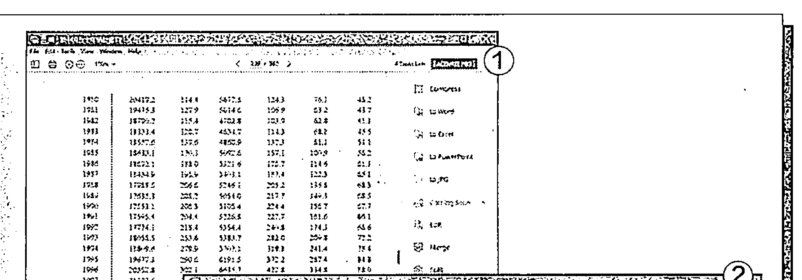

> 如果下载的PDF文件体积比较大，那么可以通过“Compress”功能对这个文件进行压缩优化。

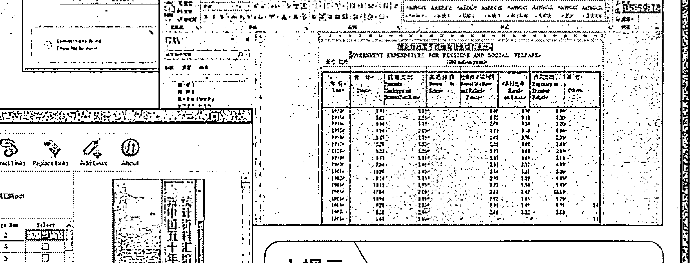

## 删除PDF中的超链接

正是由于现在PDF在网上非常的流行，于是很多人开始打起了歪脑筋，在PDF文件中插入了不少的广告链接。但是这些内容让人看上去非常的恼火，所以就想将这些内容进行删除。那么如何才能快速删除PDF中的广告链接呢？

首先安装运行“PDF Link Editor”这款工具(http://www.pdflinkeditor.com/)，接下来仍然使用鼠标拖拽的方式将文件添加到软件窗口里面，然后软件就会对PDF文件中的超链接进行扫描，扫描完成以后会将这些超链接内容显示到窗口列表里面。通过鼠标在列表中勾选要进行删除的广告链接，然后点击工具栏中的“Clear links”按钮（图3）。这时会弹出一个文件保存对话框，选择修改文件的存放文件夹目录。经过这样操作的文件，不仅删除了其中的广告链接，而且文件体积也得到了大大的压缩。

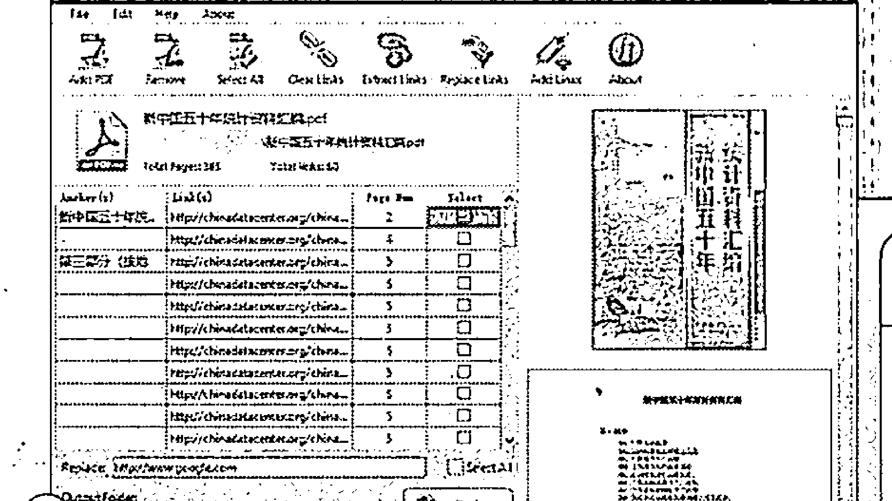

> 如果用户在操作的时候害怕将正常的链接删除，那么也可以通过该工具的“Replace”功能将不要的链接进行批量替换。

## 超强DSM++阻断Windows 10自动升级

文|平淡

使用Windows 10的用户都知道，为了让用户都能够实现系统补丁的自动升级，微软在新系统中强制自动升级（图1）。如果要关闭自动更新，之前文章介绍过禁用Windows Update服务和通过组策略禁止更新的方法，但这些方法操作比较繁琐。现在借助DSM++，我们可以一键阻断Windows 10自动升级。

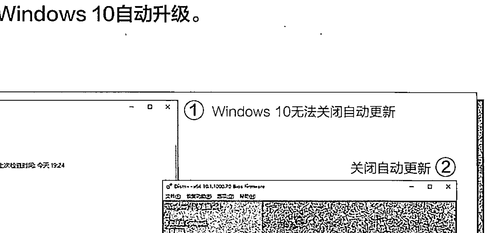

首先到https://www.chuyu.me/zh-Hans/index.html下载软件，启动软件后切换到“系统优化”，然后在右侧窗格选中“将Windows Update自动更新调整为”，将其设置为“从不检查（不推荐）”，这样就可以将自动更新关闭了（图2）。

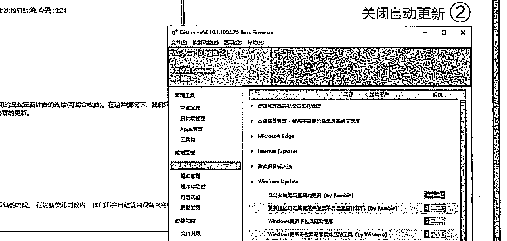

重启系统后自动更新生效，再次打开Windows更新，此时会出现醒目的红色提示：某些设置由你的组织来管理，表明自动更新已被关闭了（图3）。

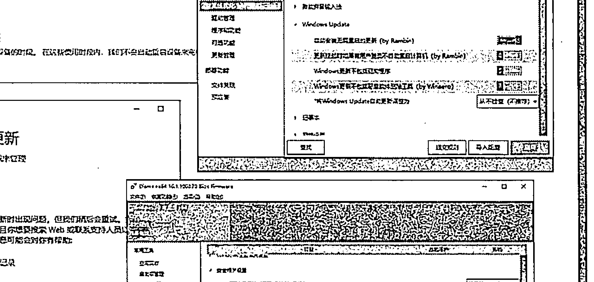

不过系统补丁仍然是很重要的，通过上述方法关闭自动更新后，后续我们仍然可以借助DSM++随时手动更新系统。同上启动软件后切换到“更新管理”，点击“扫描”，这样可以借助DSM++扫描系统缺失的补丁文件。按提示选中需要安装的更新文件，点击“安装”，完成本机最新补丁的安装即可（图4）。

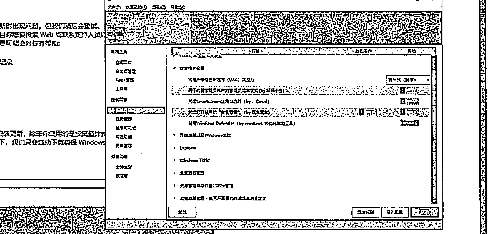

当然通过DSM++我们还可以手动对很多默认无法关闭的系统组件进行安全设置，比如对于低配置的电脑，系统自带的Windows Defender及其占用资源（但是默认用户无法将其关闭）。如果此时处于安全的环境（如只是在编辑文档或进行本地图片处理），需要节省系统资源，同上在“系统优化”切换到“安全相关设置”，将“禁用Windows Defender”设置为开启即可（图5）。

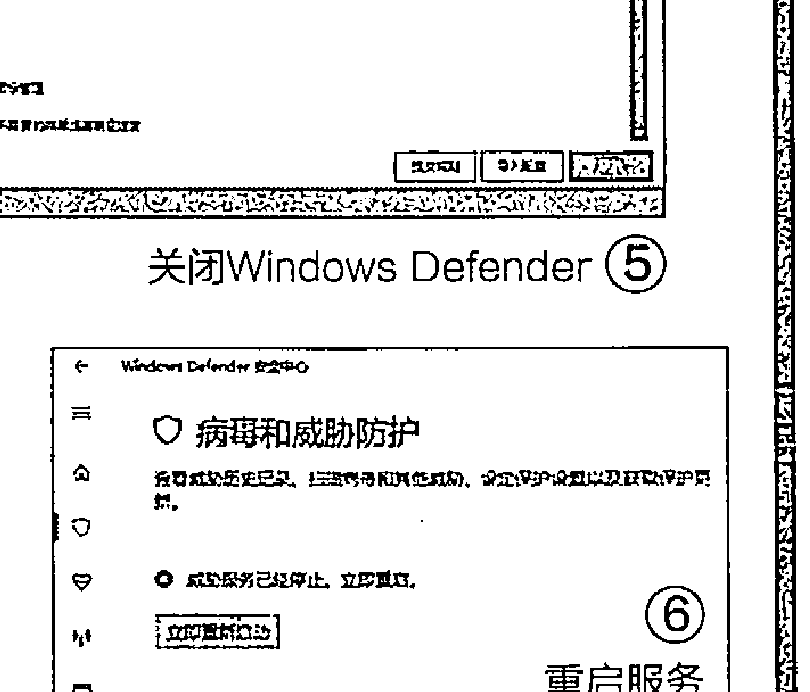

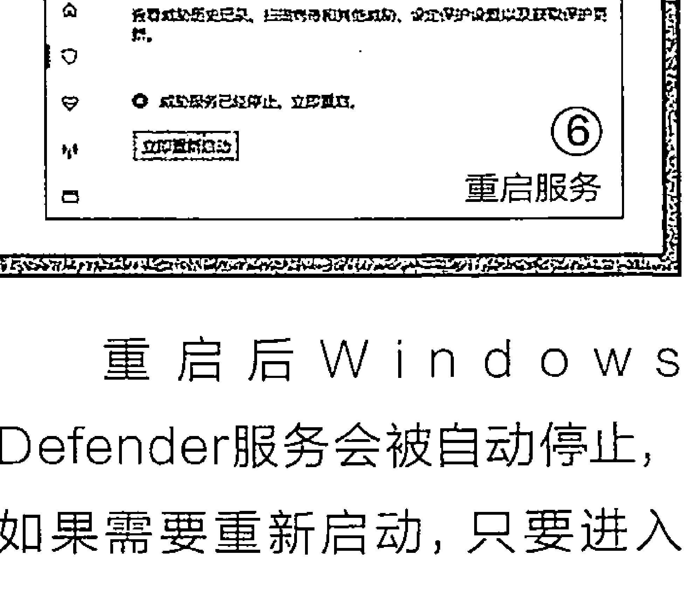

重启后Windows Defender服务会被自动停止，如果需要重新启动，只要进入Windows Defender安全中心，点击立即重新启动或者重新进入Dism++恢复开启设置即可（图6）。

## 美术字的奇幻旅行

文|梦寻

美术字是指经过加工、装饰而美化后的文字，它一般具有美观、醒目等特点，是宣传过程中一种非常重要的工具。在各类广告、报刊杂志和书籍的装贴等都离不开美术字，生活中如横幅标语、黑板报、展览会，以及商品包装和装潢等也都可见美术字的影子。今天笔者将从网上学到的一款奇幻风格的美术字制作方法分享出来，大家可以用在自己个性的贺卡上面。在开始之前我们先来看一下最终效果，是不是非常有趣（图1）？

首先启动Photoshop（本文以CS5版本为例），这里我新建了一个长1280像素、宽1024像素、分辨率为300dpi的图像文档。接下来在新文档中输入想要制作奇幻效果的文字。我输入的是英文“Dream fan”，字体选用的是“Bauhaus 93”。注意，因为我们要一个一个字母处理，所以每个字母要单独占据一个图层（图2）。


接下来我们除了保留“D”字母图层外，其他图层都暂且隐藏起来（点击对应图层前面的眼睛图标即可）。按Ctrl+T键，D字母四周出现一个调整框，光标移到调整框之外，显示为弯曲箭头形状，此时按下鼠标左键拖动即可旋转字体。旋转好之后，将字体颜色设置为“R55, G100, B5”的绿色。调整完毕，右击D字母图层，从右键菜单中选择“栅格化文字”（图3）。以同样方法调整其他图层中的文字，并让几个字母错落有致（图4）。

现在我们为每个字母制作立体效果，这个比较容易实现。以D字母为例，首先将这个图层复制出一个副本，然后在副本中进行操作，为副本D字母填充由黄到绿的一个渐变颜色（图5）。接着为这个图层设置一个投影样式，一个立体的D字母就完成了（图6）。用同样方法将其他字母也设置成立体效果（图7）。

我们可以通过两种方法让文字更显质感。一种是添加一个木板的纹理图作为背景，素材可以从网上搜索得到，将木材纹理图拖放到最底层即可。另外就是选择亮一点的颜色，通过擦除工具为每个字母点上一些高光，再用笔刷工具喷涂出一些腐蚀的效果（图8）。


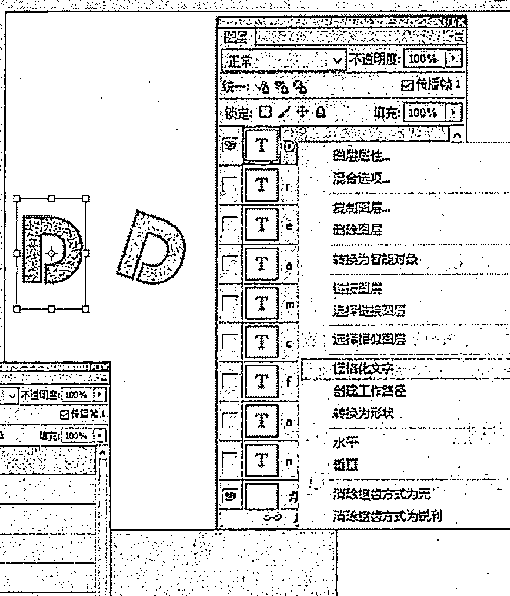

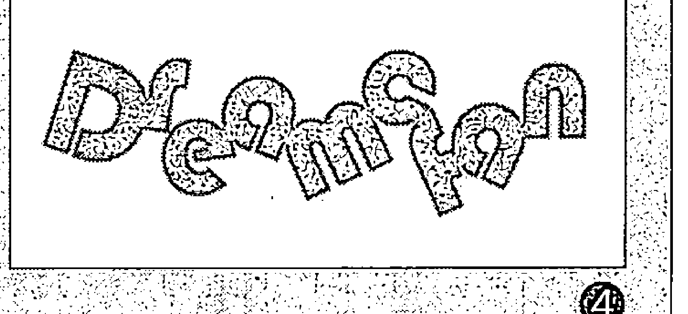

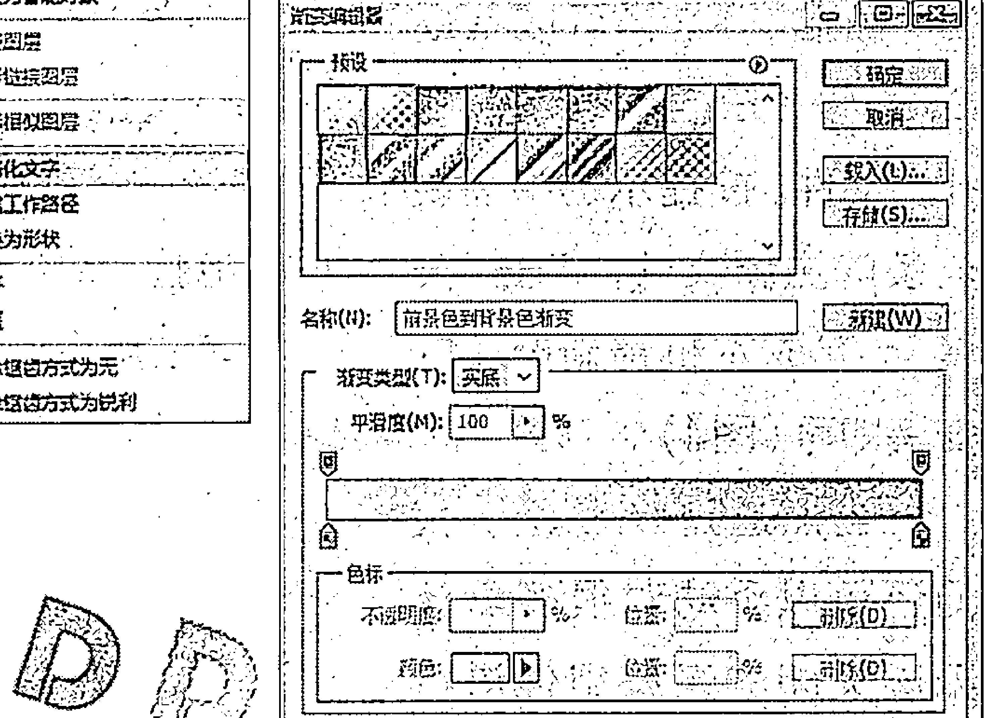

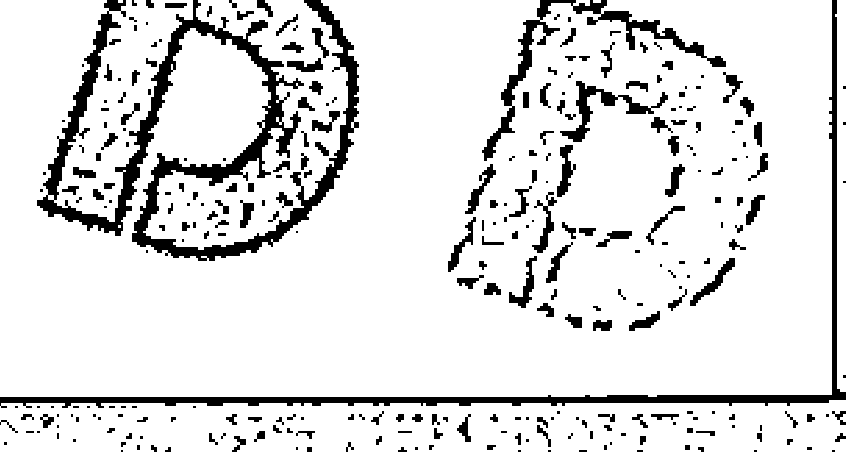


接下来我们要添加喷溅的颜料流下来的那种超酷的立体效果，不用担心自己不会画画，这种效果只需要从网上下载一个免费的Blood Paint Brushes笔刷即可（https://www.designzzz.com/free-brush-pack-blood-brushes/）。

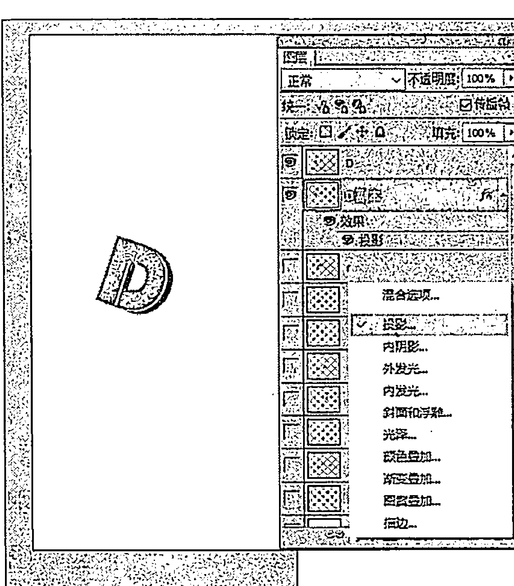

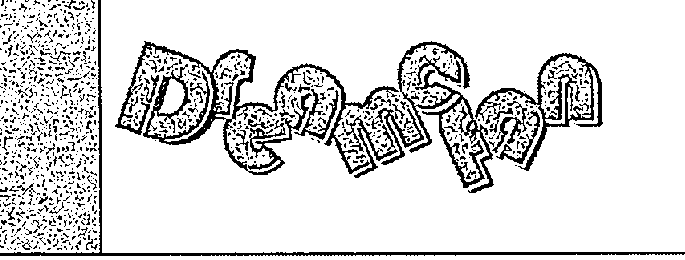

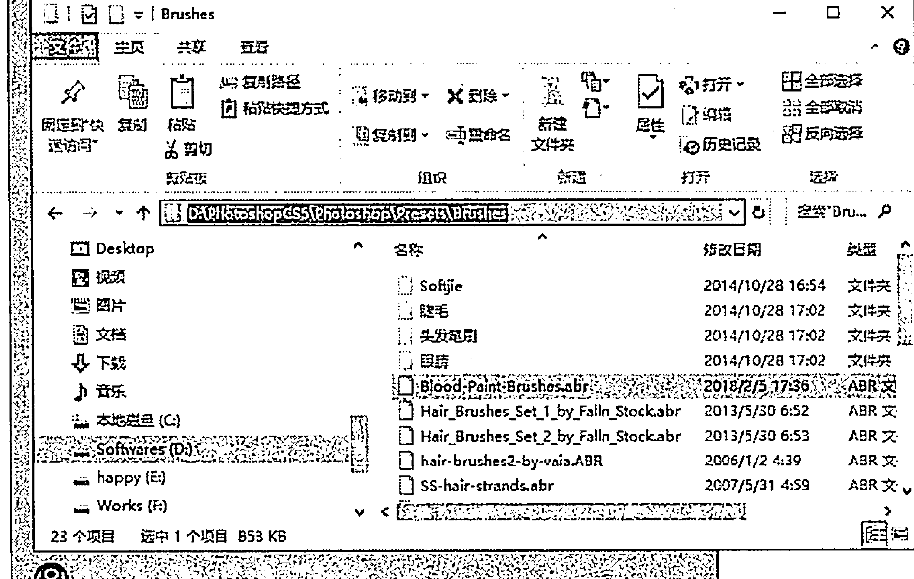

关闭Photoshop，然后将下载后解压所得的Blood-Paint-Brushes.abr文件复制到Photoshop安装目录下的“Photoshop\Presets\Brushes”子文件夹下就可以了（图9）。

重新启动Photoshop，现在再点击笔刷调板右上角的箭头按钮，从弹出的菜单中选择Blood-Paint-Brushes即可装载这一笔刷（图10）。

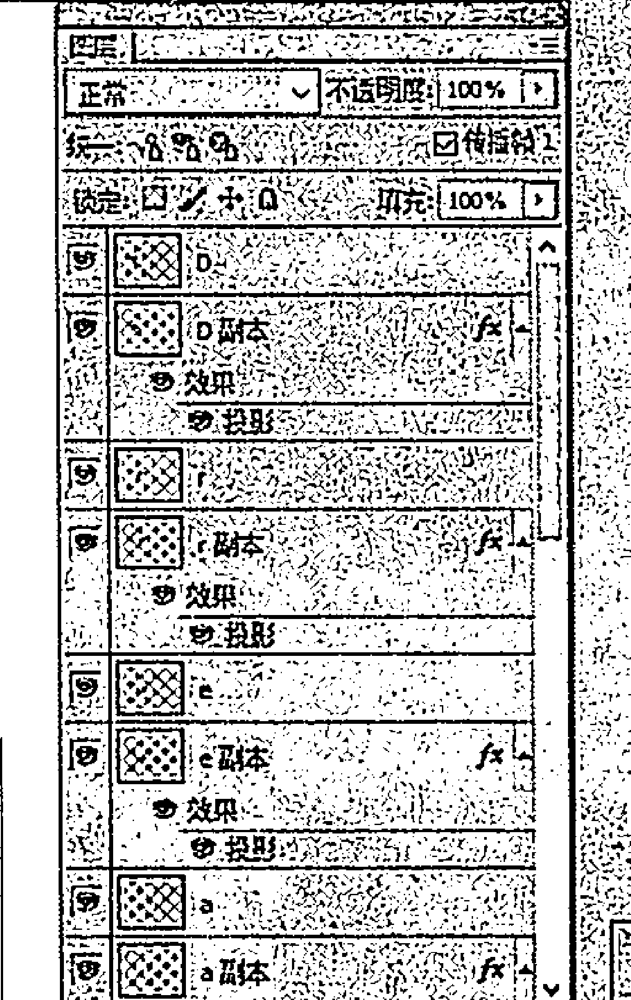

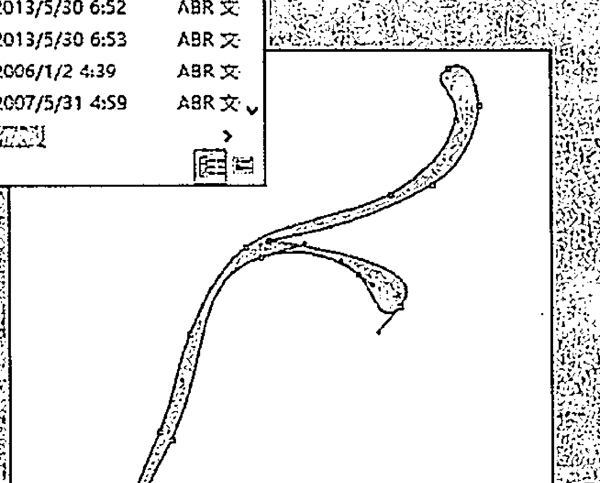

选中新的笔刷，在画布上随意点击，调整不同的大小和颜色，最后再为图层添加“斜面与浮雕”样式，就可得到特别形象生动的颜料流淌效果（图11）。

最后还可以添加一些手绘的水花效果（图12）。不用担心，这并不是很复杂，通过钢笔工具绘制一个简单的图形，再和特效文字整合到一起，就可以得到本文开头所示的效果图了。

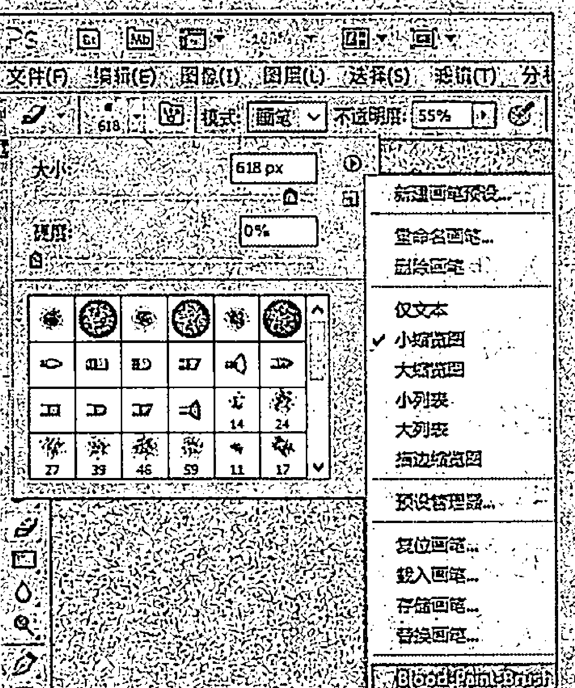


## 用邮件提醒你 “网页有变”

文|阿立

现在很多网店都会不定期地推出一些促销活动，但是由于促销的数量比较有限，因此往往当知道的时候已经被其他人抢完了。虽然一些大型的网店有降价通知的功能，但是并不是所有的网店都有类似的功能。本文就教给大家一个方法，可以在促销信息推出后立即通知用户前来下单。

## 选择监控网页的区域

我们首先通过网页浏览器打开VisualPing这项云服务（https://visualping.io/），它的主要功能就是对用户指定的网页链接进行监控，一旦发现网页中的内容有变化时就会及时通过邮件通知用户。我们首先在打开页面的输入框里面，设置输入要监控商品的网页链接。接下来点击输入框后面的GO按钮，就可以在下面的显示框中加载这个网页的页面，这样我们可以确认是不是要进行监控的页面。

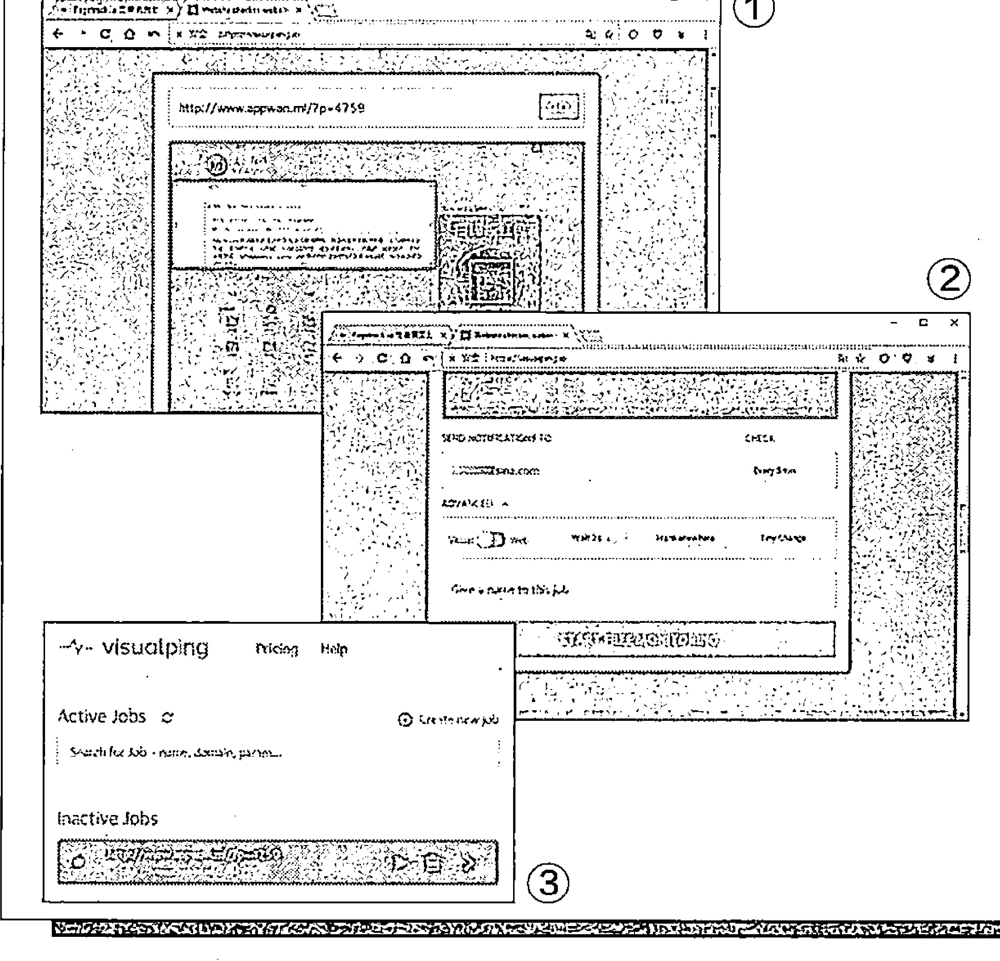

由于监控的网页链接中的内容非常多，如果稍有变化就发送电子邮件的话，反而会给用户添加不少的麻烦。因此在加载的页面中会有一个选择框，我们通过鼠标只需要将其拖拽到要监控的网页部分就可以了。比如对于一个商品来说，最主要的监控就是关于它的商品名称以及价格的那一个部分，而我们今天演示选择的是一个软件介绍的页面（图1）。

## 设定监控的相关条件

我们经过确认如果觉得没有问题的话，那么接下来就需要继续进行一些监控方面的参数设置。首先在“Send notifications to”输入框里面，设置用于接收通知信息的电子邮箱地址。接下来在“Check”列表里面，可以设置该云服务监控指定网页链接的频率，用户可以在其中选择五分钟、十分钟、一个小时以及一天等等。然后展开“Advanced”这个选项，该选项主要用于触发发送邮件的条件。用户可以选择网页有微小变化的情况下进行触发（Tiny Change），也可以选择网页有较大变化的情况下进行触发（Major Change）（图2）。

当所有的设置完成以后，点击“Start FREE Monitoring!”这个按钮，就可以开始进行监控操作了。与此同时，它会向用户设置的电子邮箱地址发送一封电子邮件。打开邮箱点击确认邮件中的“Activate my account”按钮后，在弹出的网页里面会要求输入一个登录密码。这样不仅完成了这个监控任务的定制操作，同时也完成了VisualPing云服务的注册操作。以后我们只需要通过登录VisualPing这个云服务的管理后台，就可以对我们的监控任务进行管理操作了，比如对某一个监控任务进行暂停或者删除操作等等（图3）。

## 比快照发现修改内容

从此以后，当VisualPing云服务检测到该设定的网页链接出现内容变化的时候，就会发送一封电子邮件到用户的邮箱里面。并且在该电子邮件的最下方，会通过网页快照的形式对网页之前以及当前的变化进行对比，同时利用红色涂改将变化的内容标注出来。这样用户就可以在第一时间了解到网页变化的信息，并根据这些信息来判断要不要购买相关的商品。

## 快捷项目 统一管理更省心

文|南溪

常用的快捷项目有软件的快捷方式、常用文件夹的路径、网址链接、标签、RSS订阅等。以往，我们往往是通过不同的软件来管理这些项目的。其实，使用一款SideSlide软件，便可统一管理这些项目。有了该软件，甚至桌面上任何项目都可以不需要。

### 1. 浮动面板 贴靠位置任我选

启动SideSlide后默认会有一个向上贴靠的浮动面板，其中包含如上所述的各类分类快捷项目。该面板的大小可通过拖动面板边框来缩放，而面板的具体贴靠位置，可通过右上角图标右键菜单，选择4个屏幕边框贴靠选项，分别向屏幕的顶端、左侧、右侧、底部进行贴靠（图1）。

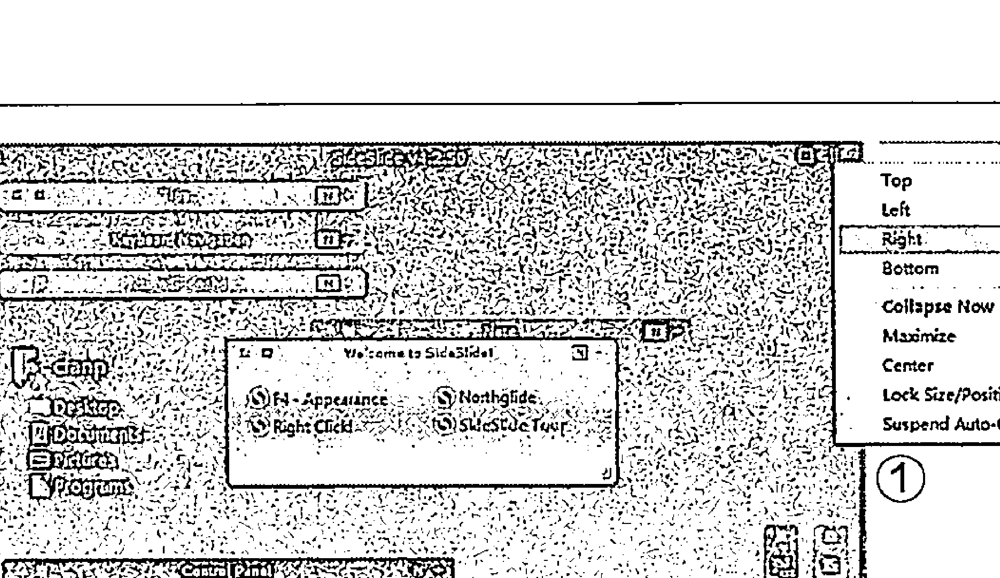

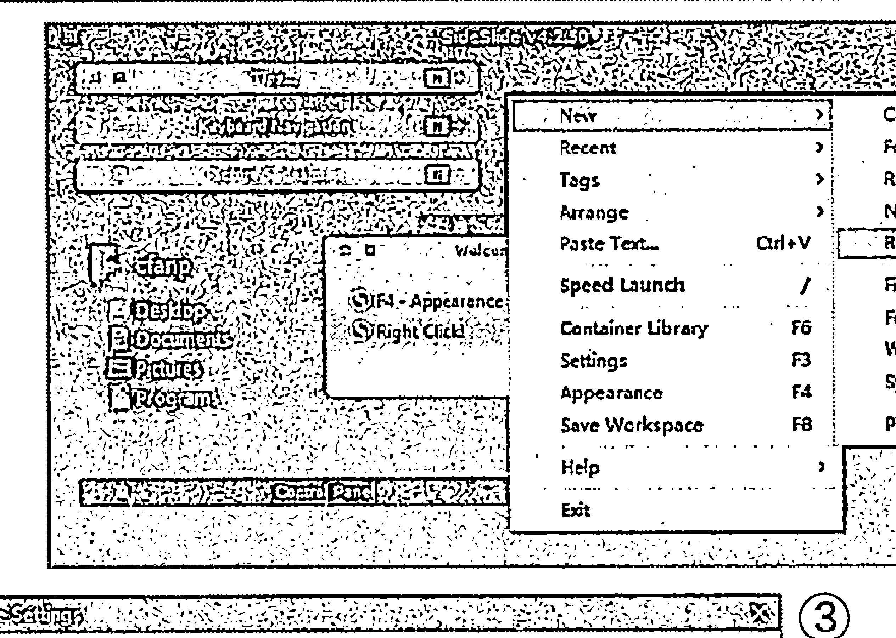

### 2. 快捷项目 分类选择自定义

如果需要新建快捷分类项目，在快捷面板中的空白处单击右键，选择New命令，可选择11类快捷项目。其中包括：容器（Container）、文件夹容器（Folder Container）、RSS新闻推送（RSS News Feed）、笔记（Note）、记事提醒（Reminder），还有文件快捷方式（File Shortcut）、文件夹快捷方式（Folder Shortcut）、网址（Web URL）、系统命令（System Command）以及图片（Picture）等（图2）。在每一类项目中右键单击，又可以建立相应子项。

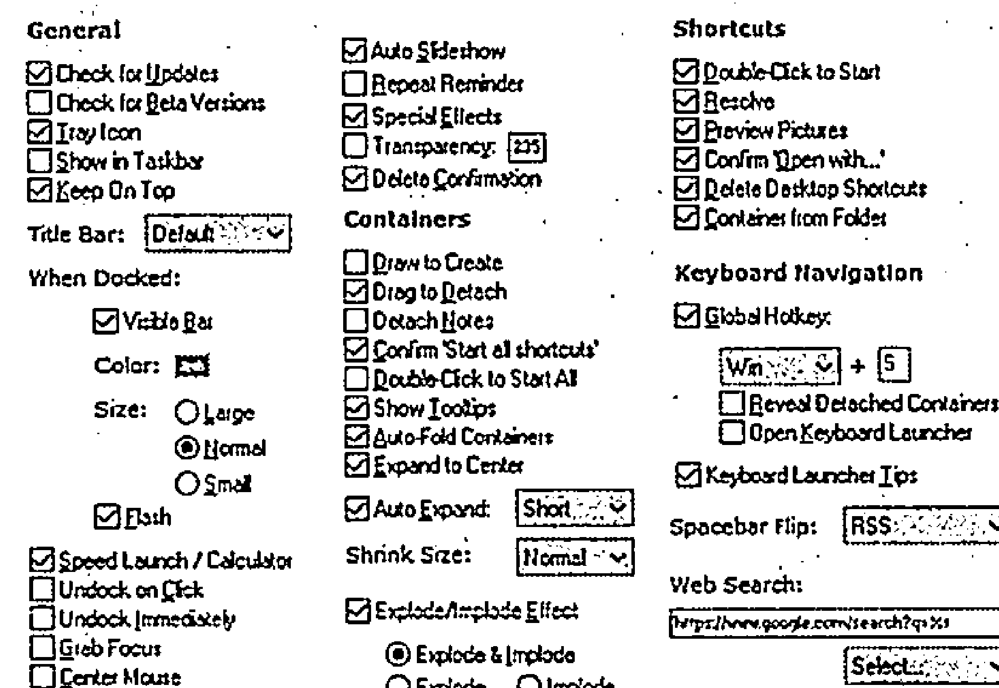

> 小提示 SideSlide界面左上角的小圆圈，用来锁定或解锁窗口位置，以便于窗口拖动或固定。

### 3. 彻底清空 从头再来新创建

如果觉得默认的分类选项不符合自己的管理要求，那么还可以推倒重建。在软件浮动面板中按下F3功能键，呼出软件设置窗口，然后点击窗口底部的Clear Workspace按钮，确认之后浮动面板中的所有默认分类项目将全部消失（图3）。此后，再通过在浮动面板空白处单击右键并选择New命令，进行项目及其子项的新建，形成个性化的快捷管理体系。

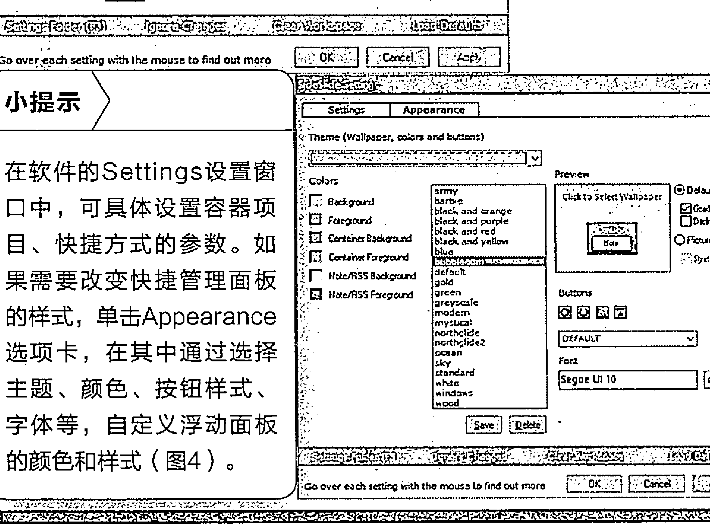

> 小提示 在软件的Settings设置窗口中，可具体设置容器项目、快捷方式的参数。如果需要改变快捷管理面板的样式，单击Appearance选项卡，在其中通过选择主题、颜色、按钮样式、字体等，自定义浮动面板的颜色和样式（图4）。

## 选好剪切工具 信息快速复用

文|阿楠

通过Ctrl+C和Ctrl+V重复利用信息，对少量的临时性数据比较方便。但若需要复用的条目较多，则普通的复制粘贴功能就会显得力不从心。借助于两款剪贴板增强软件，可轻松解决剪切条目的复用问题。

### 1. 只管复制 将粘贴交给特定键位

如果要方便地使用先前复制的多个项目，可借助于Clipboard History软件来完成。当软件处于运行状态时，我们只管复制项目，需要用到时，点击键盘的Caps Lock键，在呼出的历史列表中选择项目并粘贴即可。

Caps Lock为默认的剪贴项目激活热键，我们还可以自定义列表激活快捷键。右键单击托盘软件图标并选择Configure，选中设置列表的Active项，并指定自己的激活热键即可（图1）。

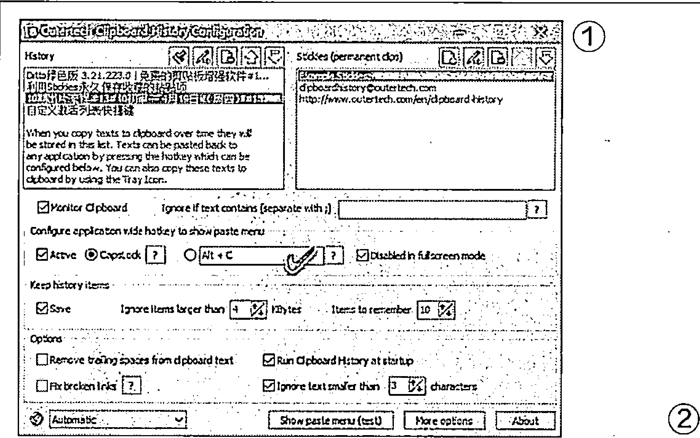

### 2. 藏起再用 用Stickies永久保存粘贴项

对于今后还可能经常用到的剪切项，可将其添加到Stickies区域收藏。这样即便是清空了历史项目，重要项目还会得以留存。

要收藏某个项目，在配置窗口左侧的History区域列表选中该项目并单击鼠标右键，选择Add to Stickies命令（图2）。

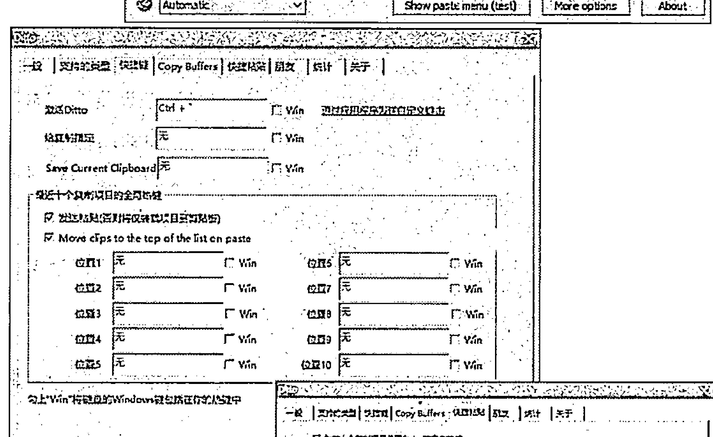

### 3. 以组记忆 让剪切项使用更加快捷

虽然按上述方法，在不断复制项目后，可单击系统托盘软件图标，从历史列表中选择粘贴，但若历史项目较多，选择起来还显费事。改用Ditto软件，可自定义一组快捷键来使用剪切项目。

Ditto软件运行后驻留系统托盘，右键单击托盘图标，在弹出的菜单中选择“选项”，在选项设置窗口点击“快捷键”选项卡，勾选“最近十个复制项目的全局热键”下的复选框，然后依次按下设置相应的快捷键。若需要Win键配合使用，则选中其后的Win复选框（图3）。

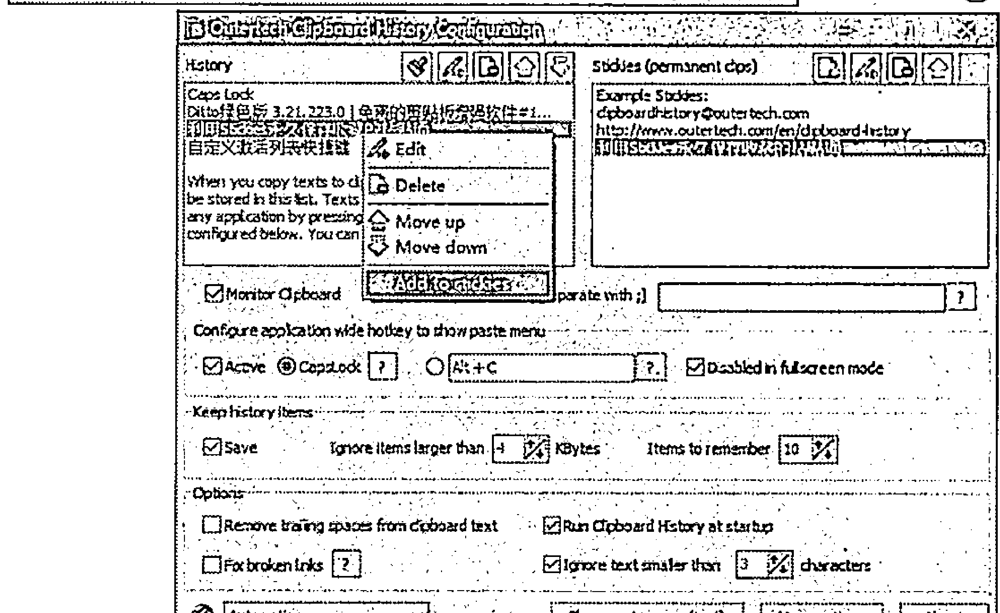

此外，还可以用Ctrl+数字键作为前10个项目的快捷粘贴键。要使用此功能，只需在Ditto设置窗口选中“快捷粘贴”选项卡，然后选中“为前十个复制项目使用Ctrl+数字作热键”即可（图4）。

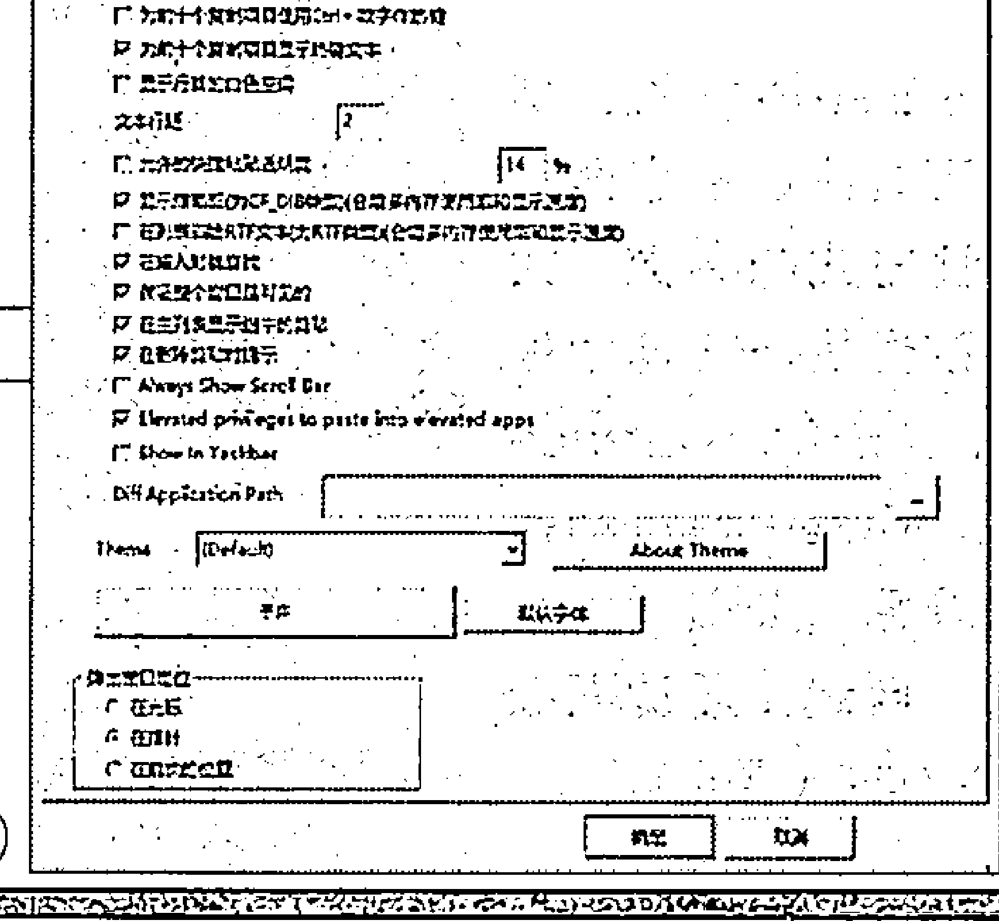

## 三步获取2TB免费网盘空间

文|亦云

目前用手机号注册的百度网盘默认只有5GB免费空间，要获取2TB超大免费空间，还需要手机客户端登录并绑定银行卡才行。要知道，为了区区免费空间，许多人都不愿意将银行卡拿出来永久绑定，进行这个可能存在风险的操作。那么，如何才能做到既不将银行卡永久捆绑，又可以轻松获得2TB免费永久空间呢？

### 1. 用手机号注册百度网盘

首先登录百度网盘官方网站，利用手机号进行注册。输入一个用户名（唯一，可作为登录账户使用，不能与服务器中已有的用户名重复），输入手机号并设置密码，点击“获取短信验证码”，收到后输入到验证码框，然后点击“注册”按钮进行注册（图1）。

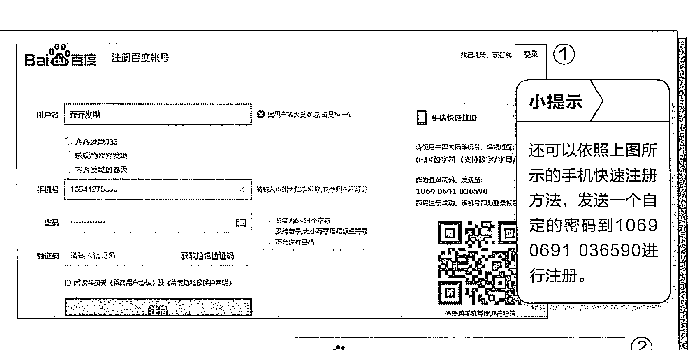

> 小提示：还可以依照上图所示的手机快速注册方法，发送一个自定的密码到1069 0691 036590进行注册。

### 2. 安装APP 获取1TB免费空间

经过上述过程注册的网盘仅有50GB的免费空间。为了获得更多免费空间，需要在手机中安装百度网盘APP并登录，这样可另外获取1TB免费空间。继而需要绑定一个银行卡，才能获得2TB免费空间（要进行身份认证，所有信息为真实，否则不能通过）。这里为了获得该免费空间，我们可这样处理：选择一个卡内没有余额或余额很少的储蓄卡，作个临时过渡，后续会为它解绑，因此不用担心安全问题。

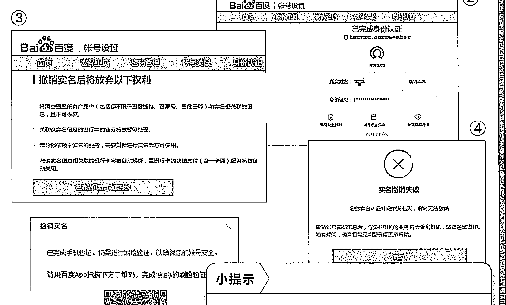

> 小提示：撤销实名需要在绑定银行卡实名认证满七天之后才能进行（图4）。因此，上面强调临时捆绑的银行卡内要余额为零或很少，这样可避免不测的风险。

### 3. 撤销实名解除绑定 留下2TB空间

用注册网盘时所用的手机号登录百度账号。在账号设置中选择“身份认证”，点击“撤销实名”蓝色文字链接（图2）。随后系统会提示撤销实名后将放弃的权利项目，其中就包括银行卡自动解绑这一项（图3）。

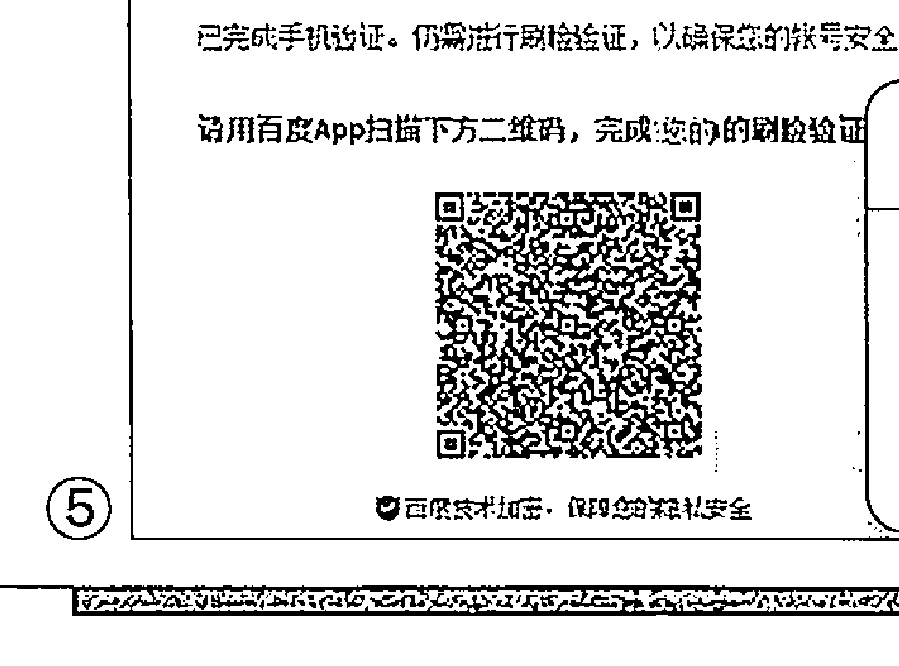

> 小提示：撤销实名需要在绑定银行卡实名认证满七天之后才能进行（图4）。因此，上面强调临时捆绑的银行卡内要余额为零或很少，这样可避免不测的风险。

撤销实名时，除了要进行手机短信验证码验证外，还要通过手机扫描二维码进行刷脸，完成刷脸实名验证才能撤销。在撤销实名之后，银行卡自动解绑，这时就不用再惦记着银行卡安全的事了。最后，再次用手机号登录网盘查看，发现网盘的容量还是2TB，并没有因为解绑而减少容量。至此，2TB永久免费容量已经获得。

## 单线联系 远程控制也方便

文|阿楠

两个人之间进行单线联系，我们最常用的也许就是QQ和微信这样的工具了。然而，不用QQ、微信等“重量级”通信软件，用两个小软件，也可以实现两台电脑之间的单线联系、文件分享和相互控制，获得安全、安静的交流或控制环境。

首先，我们可以使用一款来自越南的免费控制软件UltraViewer。该软件默认安装后为英文界面，但可通过设置菜单将语言选择为简体中文，完成汉化。
使用UltraViewer实现在两台电脑间的交流或控制，需要两台电脑上同时都安装该软件。每台电脑上该软件运行后，都会自动生成一组当前电脑的ID和密码。电脑之间的交流和控制，都是通过这样的账号和密码授权的（图1）。

如果需要用手边的电脑控制另一台电脑（两台电脑不需要在一个局域网中，只需均连上Internet即可），只需在“伙伴ID”处输入另一台电脑的ID和对方的密码后，点击“连接到伙伴的计算机”按钮，即可实现两台电脑间的连线。

连接到伙伴电脑之后，点击顶端工具栏上的Chat按钮，两台电脑之间可以直接进行文字聊天，免去使用QQ、微信等通信工具。这样，在两台电脑之间进行远程协助时，便于即时进行信息交流。点击对话框右边的金色曲别针按钮，可进行文件传输（图2）。

在远程控制过程中，如果觉得控制不够流畅，可通过设置画面质量与远控速度的关系，改善控制的流畅度。具体方法是点击工具栏上的Display下拉菜单，选择Quality命令下的优化速度（Optimize speed）、优化质量（Optimize quality）或用户设置（Custom settings）等子命令来调整优化。

无独有偶，远控软件还有更为简洁但功能一点也不弱的对手。我们还可以使用另一款远控软件TrustViewer，实现两台电脑之间的单线联系。

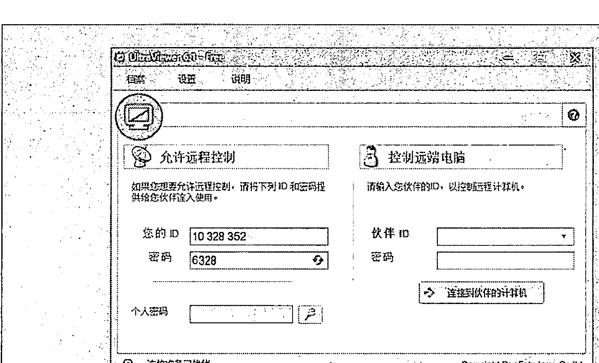

> ### 小提示
由于上述密码为每次启动软件后随机生成，每次密码均不同，因此对于常用固定电脑的控制不太方便。如果两台电脑均为本人使用（如办公室和家里的电脑），则使用固定的个人密码更加方便。为此可点击“个人密码”后的金色钥匙图标，设置一个固定密码。

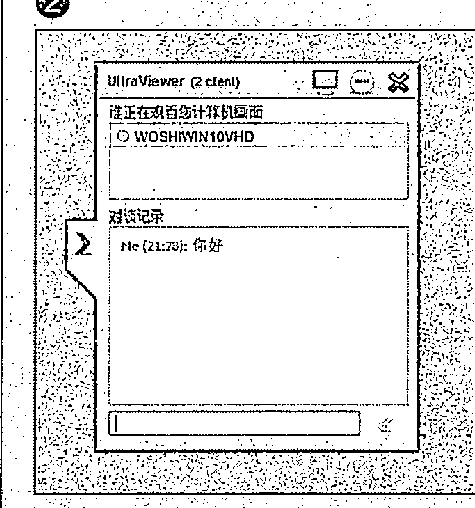

> ### 小提示
软件默认的控制密码长度为4位数字。为获得更加安全的控制环境，可通过Settings设置窗口，选择Security下的Password Length，指定密码的类型和长度（图3）。可将默认的4位数字，改为6位字符或8位字符，以提高安全性。

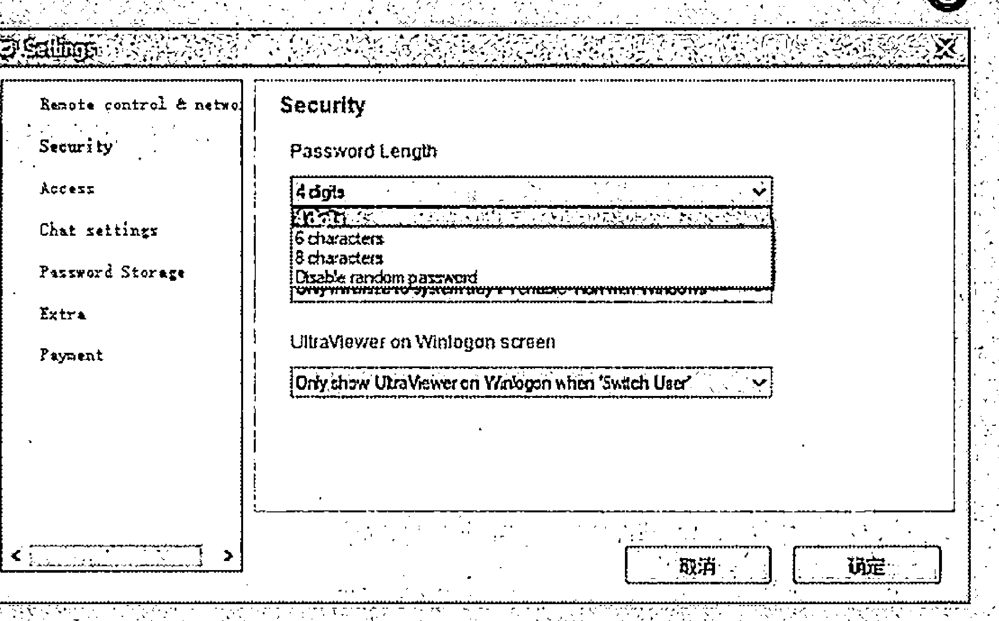

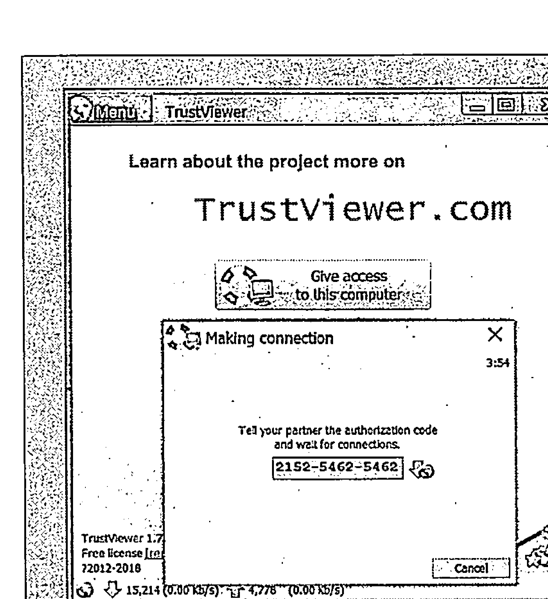

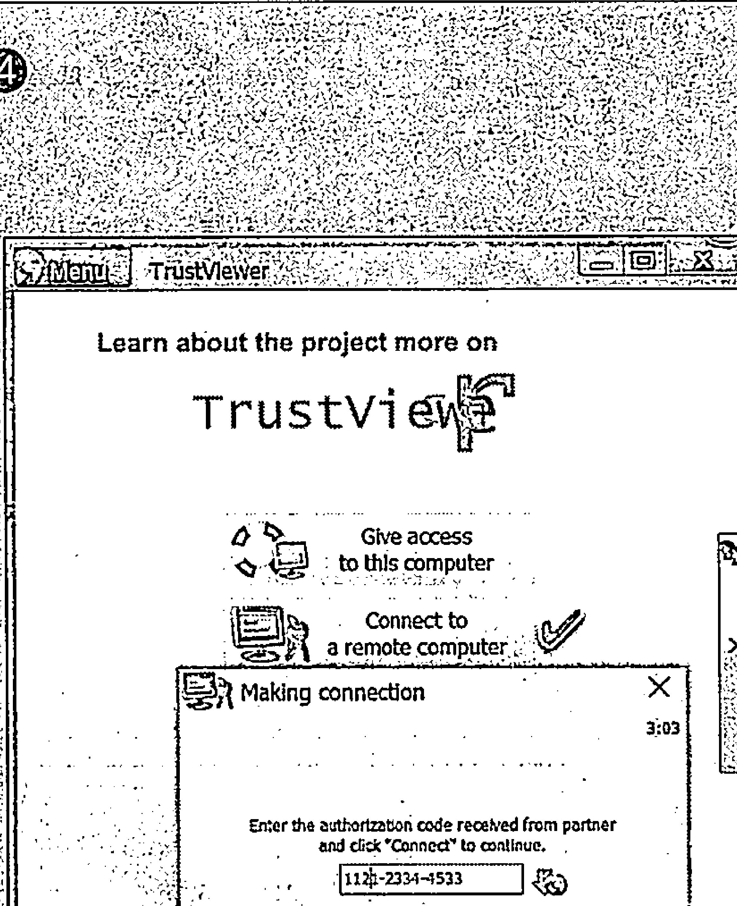

> 使用软件主界面列表中的File exchange, video calls, and etc按钮，也可以进行文件交换、语音视频呼叫等。

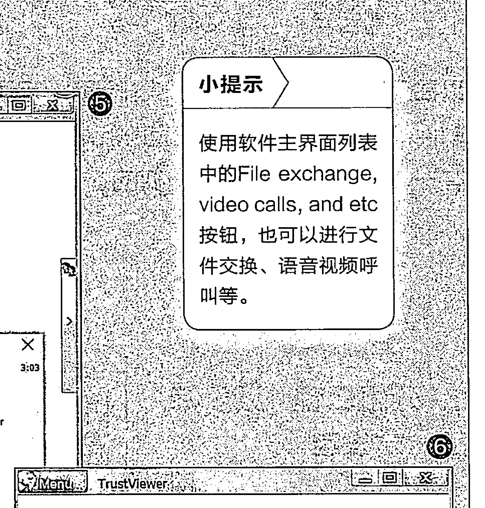

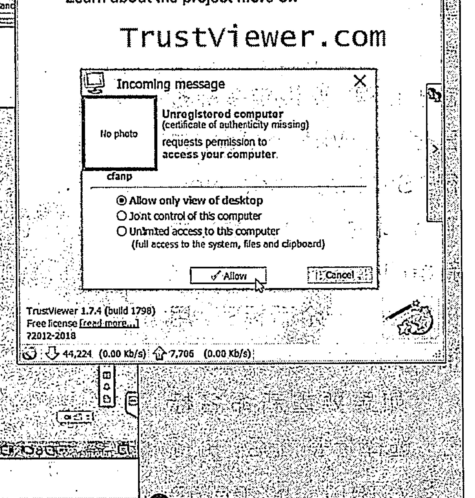

TrustViewer为完全免费的绿色软件，只有一个EXE文件。要实现远程控制，两台电脑同样需要同时安装该软件。首先获取连接密钥。在被远程控制的电脑上点击TrustViewer界面中的“Give access to this computer”按钮，即可获得一个12位的连接密钥（图4）。随后进行远程控制。在实施控制的电脑上点击TrustViewer的“Connect to a remote computer”按钮，在弹出的界面上输入在受控端获得的12位连接密钥，点击“Connect to”按钮连接远程电脑（图5）。在进行远程控制时，被控电脑还能选择远程控制的权限，比如选“Allow only view of Desktop”表示只能看到远端电脑的界面，不能执行控制操作；选“Joint control of this computer”表示既可看到远端电脑的界面也可以控制；而选“Unlimited access to this computer”表示给予远程控制所有权限（包括完全访问系统、文件和剪贴板等）（图6）。

除了可进行文字聊天外，我们还可以用TrustViewer进行文件发送和音视频聊天。连接之后，在左侧栏最下方就是文字发送窗口，输入文字后发送。发送文字后，另一台电脑的右下角会立刻显示。点击文字输入框中的曲别针图标，可以发送文件给另一台电脑。点击上端工具栏上的耳机按钮可进行语音通信，点击摄像头按钮可进行视频聊天（图7）。

## 日程、便签、提醒三合一的本具

文|阿楠

以往我们习惯于用日程软件安排计划，用便签软件进行桌面记事，用定时器软件设定及时提醒。如果能有一款合适的软件代替上述三项需求，就可以免去安装多种软件的麻烦。WatchMe软件即可满足上述需求，它没有安装程序，只有一个EXE文件，直接运行即可。

### 1. 分组日程 以多标签方式设定

如果工作中涉及到的事务项目繁多复杂，可考虑用多标签的方式来分组管理日程。要设定多标签日程，在WatchMe中执行“System→Add New Tab”命令（图1），然后为新建的标签命名，点击OK按钮添加一个新标签。用相同操作添加更多标签。如果要重新命名标签，选择标签之后，执行“System→Rename Active Tab”即可（图2）。

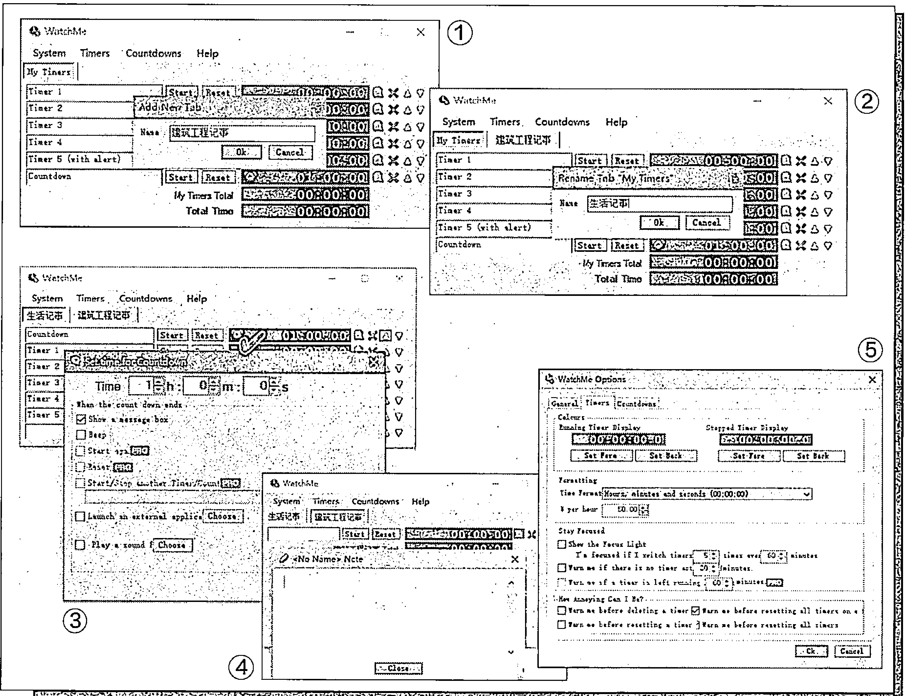

### 2. 添加和编辑新的日程项目

要在新的分组日程标签下建立新的日程项目，执行“Timers→Add Timer”命令（或Ctrl+T组合键），填写提醒项目内容。涉及到多个日程项目的编辑，可用上下三角按钮排列次序，用红色删除按钮删除不用的日程。如果要导出日程列表，用“Timers→Export All Timers”命令即可。

普通的日程一般为某个时间点触发，我们也可以添加倒计时日程。通过“Countdowns→Add Countdown”添加倒计时。倒计时时间设置可通过在时间显示区域单击右键，选择“Set Time”命令来完成（图3）。

### 3. 更明了 为项目添加便签本

有的日程单靠日程标题不能很好地说明问题，这时就需要给日程添加更多的文字说明，文字说明以便签的形式添加并呈现。点击日程项目右侧的金黄色笔记图标，打开笔记本页面，录入日程记事内容（图4）。

### 4. 更醒目 日程颜色的个性化

为了让日程显示更显眼，我们可以对其颜色进行个性化设置。执行“System→Options”命令（或按下Ctrl+O），点击Timers或Countdowns选项卡，在Colours一栏下设置计时器运行或停止状态下的前景和背景色（图5）。

## 不论普通专业 照片均能简易处理

文|亦云

单反相机拍摄的RAW专业图片格式，往往需要专用图像处理软件来预览和处理。借助于RawTherapee这款小软件，我们不但可以进行普通格式的图片预览和处理，还能实现RAW专业图片格式的浏览和处理任务。

### 1. 图片预览 通吃普通与专业格式

启动RawTherapee后，默认打开的是“文件浏览”界面。在这一界面中，我们可以通过左侧的导航栏，定位图片所在的文件夹。找到文件夹后，双击该文件夹，在中部窗口中就会出现该文件夹下所有图片的缩略图预览。文件夹中的图片，无论是我们常见的JPG、PNG等格式，还是专业的RAW格式，均可以很好地支持。

如果要对列表中的某幅图片进行操作，只需右键单击该幅图片，然后从快捷菜单中选择相应的命令即可。例如，选择“评分”菜单下的星级命令，可为照片标记评分（图1）。

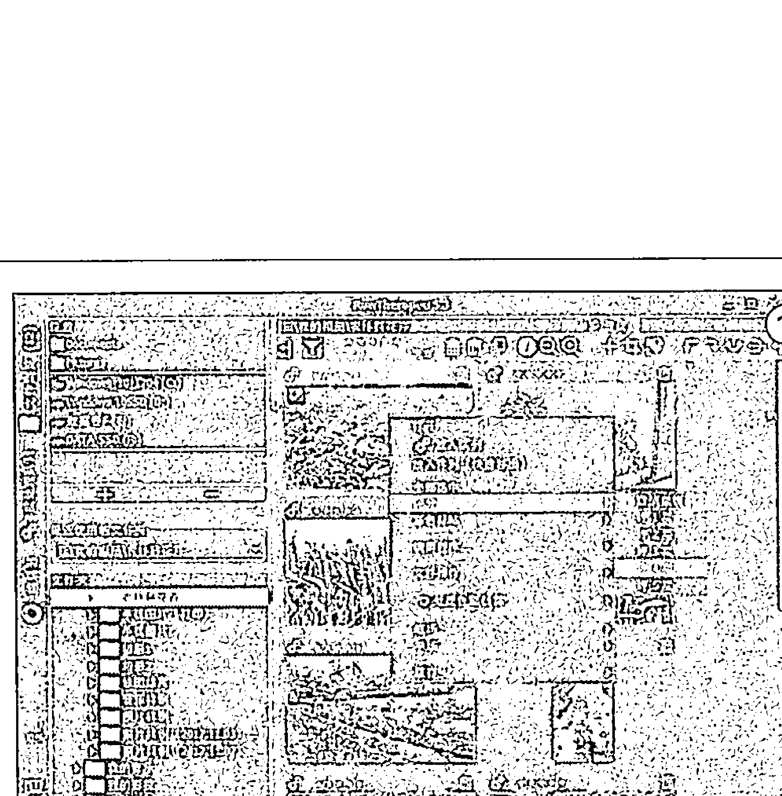

> 小提示
由于右侧窗格与图片预览无关，因此可通过工具栏最右侧的T字型按钮，将其隐藏起来。

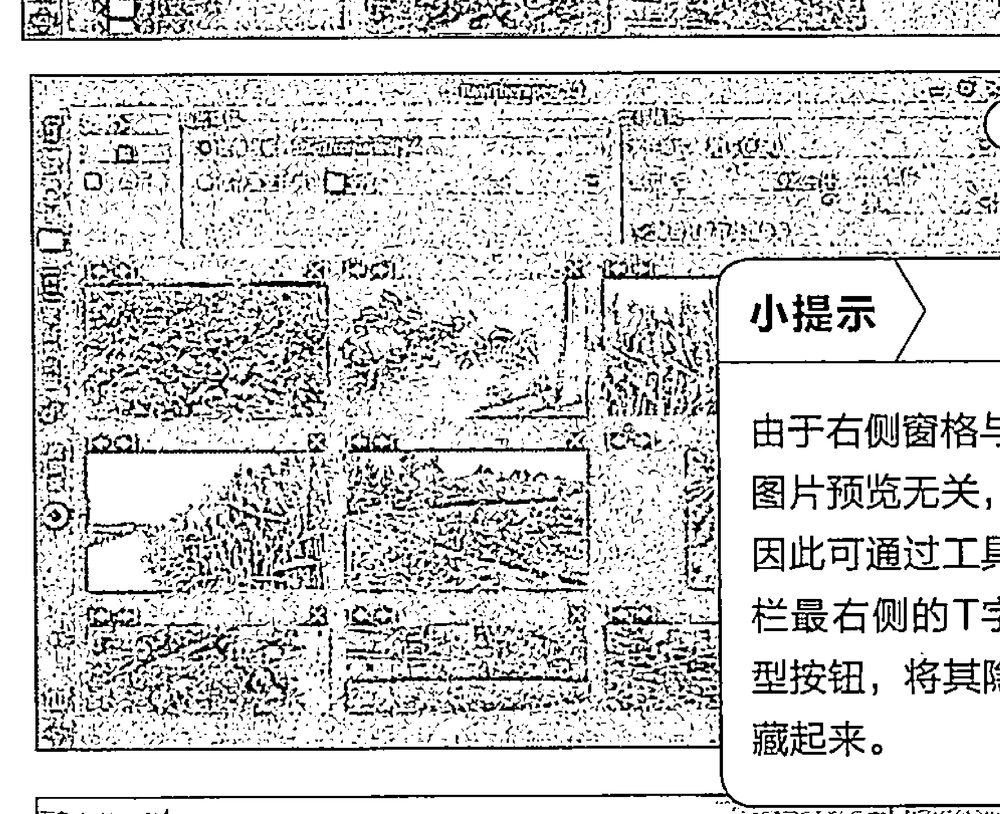

### 2. 批量快速 改变图片格式与质量

如果要快速改变一批图片的文件格式或图片质量，先在“文件浏览”窗口中选中这些图片，然后执行右键菜单中的“放入队列”命令。之后，双击RawTherapee窗口左侧的“批处理队列”竖向标签，切换到批处理窗口。指定转换后文件的输出路径，指定文件格式和图片质量，然后点击窗口左上角的小三角转换按钮，即可开始文件的批量转换操作（图2）。

如果在转换窗口中选择了“随图片保存处理参数”选项，转换完毕之后，我们可以在资源管理器图片文件夹下看到与图片同名的一些.out.pp3文件，这些文件中保存有图片处理的格式信息（图3）。

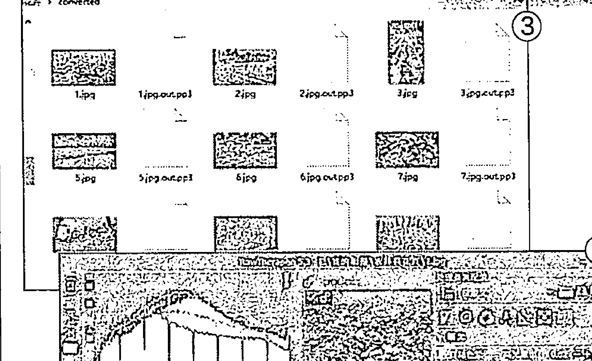

### 3. 图片编辑 各类专业选项任你调

如果要对某幅图片进行编辑处理，可在浏览窗口中双击该图片，或者也可在选择了图片之后，双击RawTherapee窗口左侧的竖形“编辑器”按钮，随后会进入图片编辑界面（图4）。

通过右侧窗格的工具按钮，可切换曝光、锐化、白平衡等项目，然后通过下方的各种滑动轴，用鼠标拖动来调节各项参数。随着滑块的移动，我们会看到左侧预览窗口中图片效果的变化。编辑效果满意之后，按下Ctrl+S保存图片即可。

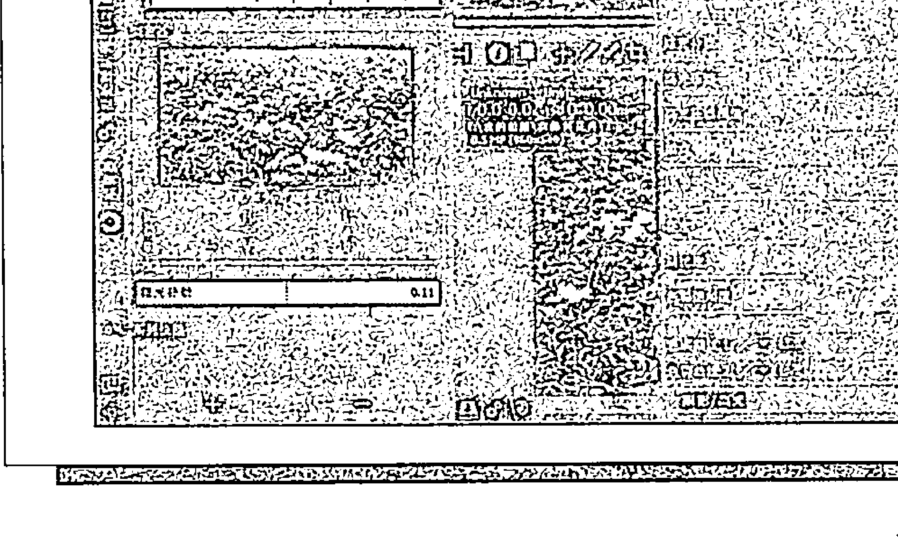

## 特殊格式文件也玩相互转换

文|万立夫

文件格式的转换是我们日常工作中最常进行的操作之一，但是我们平时进行转换的文件都是文档文件或者多媒体文件，除此以外，我们有的时候还需要对其他的一些文件类型进行转换，比如注册表、脚本、批处理等常见的相关命令文件。

### 注册表文件的转换操作

注册表是Windows系统里面最重要的一个功能，它往往保存了软件和硬件的相关参数信息，对于系统的正常运行有着非常大的作用。但是很多时候为了更好地保证系统的安全运行，管理员都会禁止对系统的注册表进行修改操作。那么遇到这样的情况用户又应该如何进行解决呢？

如果要想解决这样的操作问题，最简单的方法就是将注册表文件转换为其他可以操作的文件，比如批处理文件、脚本文件等等，所以我们首先下载运行“Reg Converter”这款工具（https://www.sordum.org）。在软件窗口左上角的“输出”选项中，选择要进行转换为的文件格式，我们这里就选择bat批处理这一项。接下来点击“源reg文件”后面的按钮，在弹出的对话框中选择需要进行转换的注册表文件，选择完成以后在工具窗口下方就可以看到该注册表文件的内容（图1）。

接下来点击“转换Reg文件”按钮，就可以开始进行注册表文件的转换操作。当注册表文件转换完成以后，工具将自动切换到界面中的“已转换内容”标签，在其中就可以看到转换出的批处理代码（图2）。然后点击“保存到文件”按钮，就可以将转换出的代码保存为批处理文件。以后直接运行这个批处理文件，就可以完成注册表信息的编辑操作。

如果用户需要经常进行注册表文件的转换操作，那么直接在这款软件的窗口中进行操作反而不方便，而最方便的方法则是利用鼠标右键来完成操作。所以我们可以点击“菜单”按钮，在弹出的菜单里面点击“右键菜单选项”，然后在弹出的对话框中找到需要转换的项目，勾选上“保存到文件”选项并点击“应用更改”即可（图3）。以后在资源管理器中找到要转换的注册表文件，点击右键后选择相应的转换命令，就可以快速完成相应的转换操作了。

### PowerShell代码的转换

现在很多用户已经开始使用微软最新的Windows 10系统，但是在Windows 10系统的使用中也会遇到各种各样的问题，而这些问题都是利用PowerShell代码来进行解决的。但是PowerShell代码的操作对于普通用户来说非常的麻烦，那么如何才可以让菜鸟朋友也能方便快捷地执行PowerShell代码呢？其实要想解决这个问题也不难，只需要将代码转换成可执行文件即可。我们首先下载运行“Ps1 To Exe”这款工具，在弹出的软件窗口左侧可以看到一个输入框，我们只需要将代码复制粘贴到这个输入框里面即可（https://pan.baidu.com/s/1dFzu40G3oWXaDzgGqSLSrQ）。接下来在窗口右侧的“选项”标签里面，根据需要设置“图标”、“密码”等选项。这里需要提醒大家的是，如果说这段代码的要求权限比较高的话，那么就将UAC选项中的“需要管理员权限”一项勾选上即可（图4）。

另外由于这段代码最后是需要转换成可执行文件的，所以我们需要在“工作目录”列表中选择该可执行文件的运行环境。通常选择“当前目录”就可以了，当然用户也可以选择“临时目录”或者“系统目录”等等。接下来在“exe格式”列表中选择“32位 控制台（可见）”这一项，因为32位的可执行文件相对于64位的可执行文件拥有更好的兼容性。所有设置完成以后点击工具栏中的“转换”按钮，在分别设置代码和可执行文件的名称后，就可以开始这段代码的转换操作了。

### 批处理代码的转换操作

通常我们要进行一些批量操作的话，都会通过命令行编写一些批处理来执行，而且批处理编写的文件分享给他人也非常的方便。但是有些时候需要使用管理员权限才能达到批处理文件预先设定的要求，但是很多用户在执行它的时候忘记相应的操作，最终无法实现用户的要求。所以为了避免这样的情况发生，最好的方法就是将它转换为常见的可执行文件。

首先下载运行“批处理程序开发工具”这款工具，将相应的批处理代码复制粘贴到窗口里面（https://pan.baidu.com/s/11DQnWtkMhytddTcky1a1kg）。接下来点击“运行”菜单中的“BAT转换EXE”命令，稍等片刻批处理代码文件转换完成以后，会在“批处理程序开发工具”程序目录里面，生成一个名为Project的可执行文件。以后我们在任意的环境下执行这个可执行文件，都可以有效达到设定的操作要求（图5）。

### 多媒体文件也能够转换

多媒体文件可以说是我们日常接触最多的文件类型之一，虽然系统里面也自带有各种的播放软件，但是由于缺少必要的解码器，所以并不是所有的多媒体文件都可以支持播放，除非用户安装其他的解码器或者播放软件才可以。如果一时半会儿不方便安装第三方软件的话，那么又应该如何解决这个问题呢？

现在运行“AudioVideo To Exe”这款工具，通过名称我们就知道这款工具的作用，就是将多媒体文件转换成可执行文件（https://pan.baidu.com/s/1wb8L7sLB0GidAAk8wfeMrQ）。这样多媒体文件在播放的时候，就可以摆脱其他播放软件的束缚。首先点击工具栏的添加按钮，选择要进行转换的多媒体文件（图6）。接下来再点击工具栏中的转换按钮，这时会弹出一个对话框。选择对话框中的exe按钮后，分别设置文件的保存目录以及图标等一系列信息，最后点击“Continue”按钮就可以快速转换（图7）。转换成功的文件，不需要播放软件，也可以正常地进行播放操作。

## 搞笑我们是认真的
### ——Camtasia 9制作精彩GIF

文|仲勇

如果稍微留意一点会发现，GIF动画现在应用得非常广泛，网页中的动图、一些技术类公众号中的操作录屏、微信等聊天工具中的小动图，这些其实都是GIF动画。除了常用的GIF制作小工具LICEcap、GIFcam，大名鼎鼎的录屏神器——Camtasia 9，也能制作出精彩的GIF动画。

### 屏幕操作转GIF

操作演示类GIF通常用于一些技术类文章的配图中，在早期都是文字说明配上静态图片来介绍操作步骤，写的人费力，看的人费劲，而通过动态的GIF插图可以很好地演示步骤，并且体积又很小，特别适合在手机等移动设备上浏览。

首先打开Camtasia 9，单击主界面左上方的“录制”按钮，此时会出现一个虚线框，调节尺寸覆盖在录制区域上（图1），单击Rec按钮即可开始录制。录制完成后，单击“停止”按钮或者按F10键结束录屏，此时会自动切换到主界面。由于GIF文件不需要音频，右击轨道上的音频选择“删除”，可删掉音频。

为了观看时能清楚鼠标操作，可以让鼠标指针更醒目，让鼠标操作有变化。单击“指针效果”可以看到三种状态下的鼠标外观（图2），将“指针效果”中的“指针高亮”拖放到轨道上，此时会看到鼠标指针周围有黄色亮斑，非常醒目。单击“属性”按钮可以修改指针效果，比如改变颜色、透明度和大小等，添加淡入淡出效果。

接下来单击“左键点击”按钮（图3），选择“左键点击目标”拖放到轨道上，播放录制的教程，会看到单击左键时鼠标指针会出现波浪。单击“右键点击”，拖拉“右键点击波纹”到轨道上，这样在操作录屏动画中，任何鼠标操作都会有明显的变化，没有声音的弊端就能避开啦。

在录制的教程中，有些地方不需要全屏录制，只要部分位置突出显示，就可以使用动画来实现局部放大。单击“动画”（图4），然后在“缩放和平移”中调节方框的尺寸，此时在播放窗口中可以看到覆盖区域满屏显示。拖动播放尺到要还原的位置，再拖拉方框调节覆盖原来的区域，这样就能还原。帧的长度可以拖拉调节，从而形成动画效果。

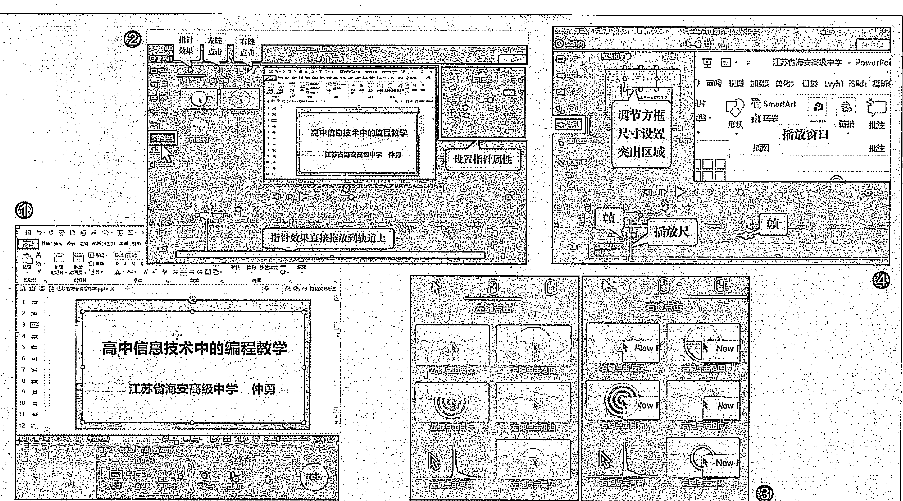
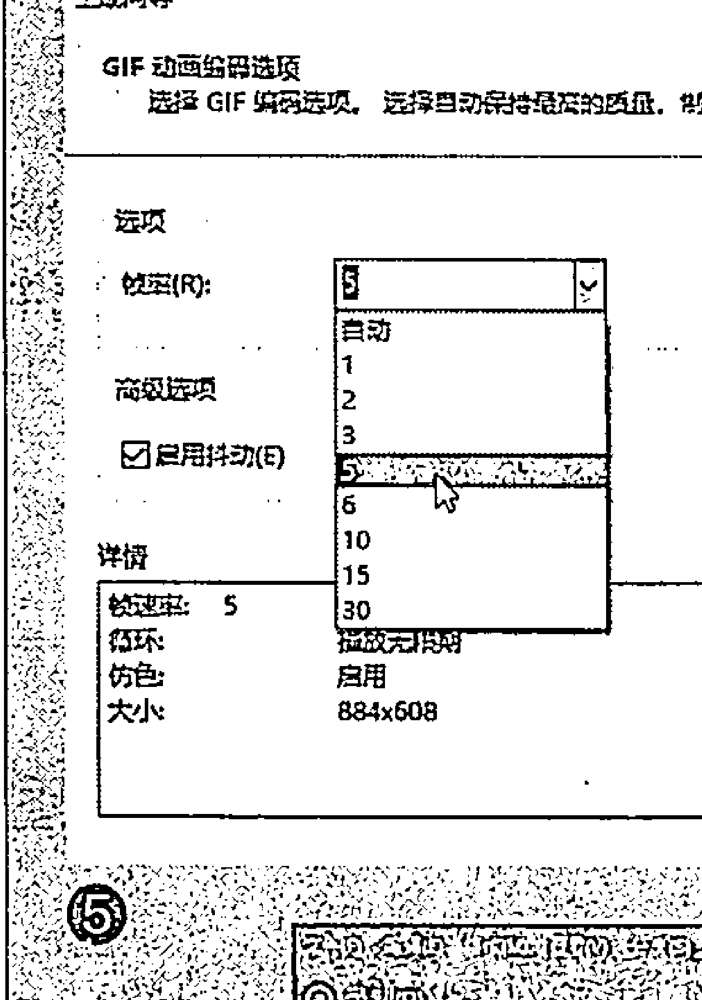
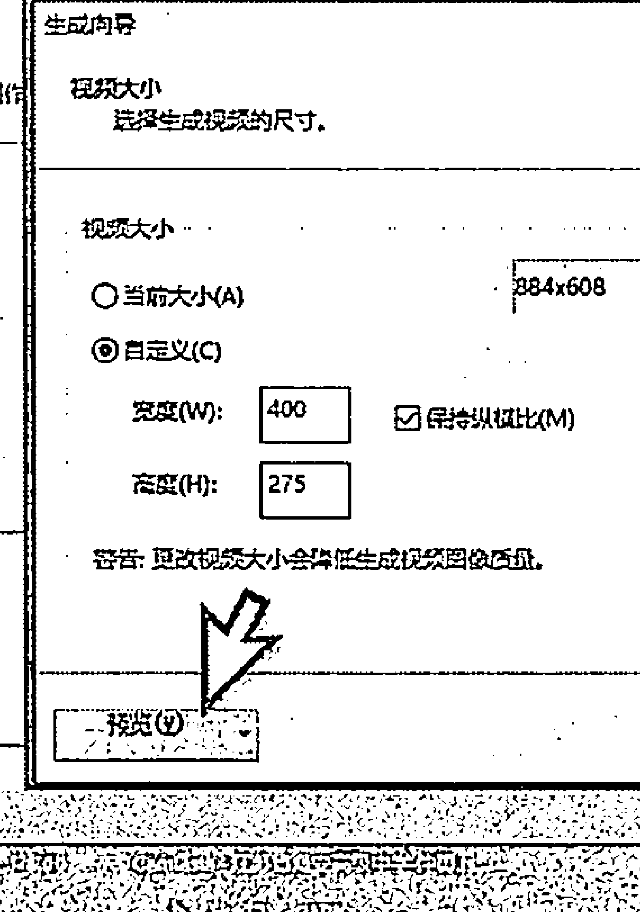
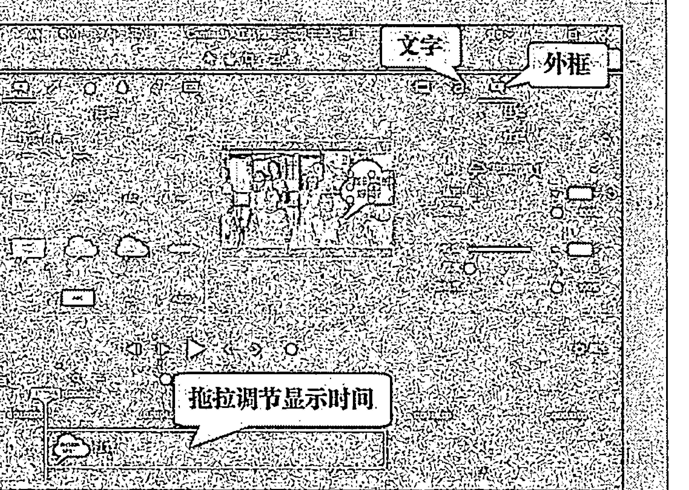
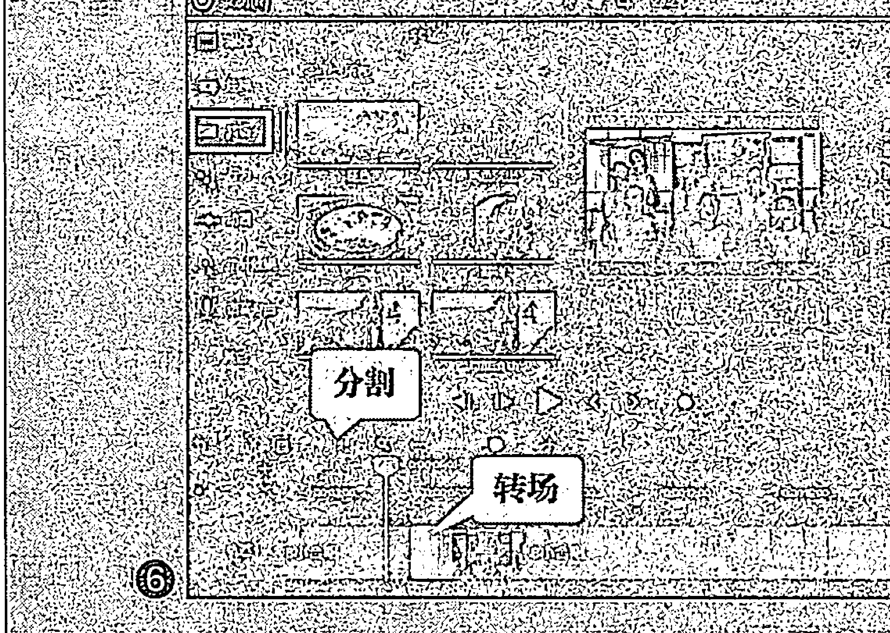
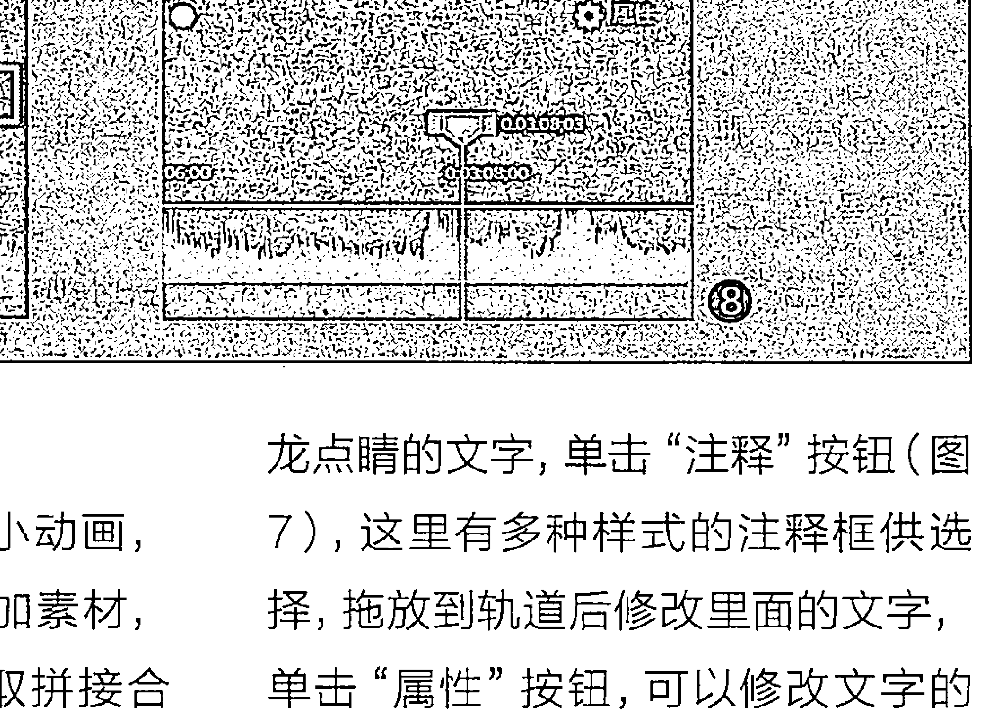

制作完成后，选择菜单“分享→本地文件”弹出对话框，选择“GIF-动画文件”，单击“下一步”选择“帧率”（图5），屏幕操作类GIF动画，帧率只要5帧就可以确保过程流畅。再次单击“下一步”设置动画尺寸，选择“自定义”，一般宽度600左右就行了，单击“预览”按钮可以观看动画。连续单击“下一步”选择保存文件夹，输出GIF动画。1分钟左右的GIF，2MB都不到。

### 搞笑镜头做GIF

网络上有很多搞笑的小动画，这些动画有些是自拍后添加素材，有些是从影视剧中进行截取拼接合成……在Camtasia 9中也能制作此类搞笑GIF。

首先在媒体库中右击选择“导入媒体”，选择用来制作GIF的视频，由于要截取视频中需要的部分，在轨道上拖动播放尺到需要的位置，单击“分割”按钮将视频截成两段，不需要的部分右击选择“删除”即可，通过这种方法可以将视频中需要的部分截取保留下来。单击“转场”按钮，将需要的转场拖放到两段视频之间（图6），选中转场效果，单击“属性”按钮可以修改转场效果的参数。

通常搞笑GIF动画都会配上画龙点睛的文字，单击“注释”按钮（图7），这里有多种样式的注释框供选择，拖放到轨道后修改里面的文字，单击“属性”按钮，可以修改文字的样式，还可以设置注释框的形状、底色等。在轨道上的注释框可以从边缘拖动，设置文字的显示时间。

某些搞笑的GIF动画，是通过改变动画的播放速度实现的。比如，提高播放速度是快动作，降低播放速度是慢动作，选中轨道上的视频，右击选择“添加剪辑速度”，修改“速度”的数值，大于1是加速，小于1是减速（图8）。

GIF动态图一直被大家玩得不亦乐乎，比小视频小，比普通静态图片更具表现力，越来越多的人热衷于使用动图来表达自己的情感，有需要的朋友不妨试试。

## 变身Mac让Windows 10桌面和苹果一样美

文|平淡

苹果桌面的惊艳和便捷文件管理一直是果粉们引以为豪的事情，对于Windows 10用户来说，现在借助一些第三方软件也可以实现类似苹果桌面的功能，让我们在Windows 10上体验苹果的魅力。

苹果系统的Dock栏是提高桌面操作效率的重要组件之一，现在借助RocketDock可以把Windows 10桌面打造成和苹果一样。不过为了让我们的桌面看起来更惊艳，并且使用起来更顺手，我们还需要借助其他辅助软件进行优化。

首先对Windows 10任务栏进行透明处理，透明设置借助StartIsBack完成。启动StartIsBack后切换到“外观”，视觉效果选择“Plain8+Windows 10”按钮，勾选右侧自定义外观下的“自定义任务栏颜色”，然后将滑块拉到最左侧（图1）。

点击“确定”后返回桌面，这样任务栏的颜色就变为透明。为了方便Dock栏的使用。右击任务栏去除“锁定任务栏”的勾选，然后按住鼠标将其拖曳到桌面的右侧边栏使用。同时进入任务栏设置，勾选“自动隐藏任务栏”，这样默认任务栏是隐藏的，只有鼠标滑动到右侧桌面后才会自动显示，整个桌面显得更为简洁（图2）。

接着下载RocketDock，启动程序后点击“程序设置”，切换到“风格”，点击“获取更多”，然后链接到软件官方主页下载“Mac OS X Leopard Skin”风格插件，下载后应用这个苹果主题，这样RocketDock会应用苹果风格的图标（图3）。

切换到“位置”，将其位置设置到桌面的下方。切换到“行为”选项，勾选“自动隐藏”后Dock栏平时会隐藏起来，鼠标经过才会出现，显示时间可以设置为100ms，这样默认Dock栏会自动隐藏，鼠标扫过后可以立刻显示出来（图4）。

完成上述的设置后，我们可以根据自己的实际需要添加需要的项目到Dock栏。比如只要将常用的快捷方式拖到下方Dock栏上即可，这样以后鼠标移动到Dock栏点击快捷方式即可启动程序。同样对于其他常用的程序或者文件夹也可以使用同样的方法附加到Dock栏上，在桌面通过Dock栏就可以快速启动程序或者打开常用文件夹（图5）。

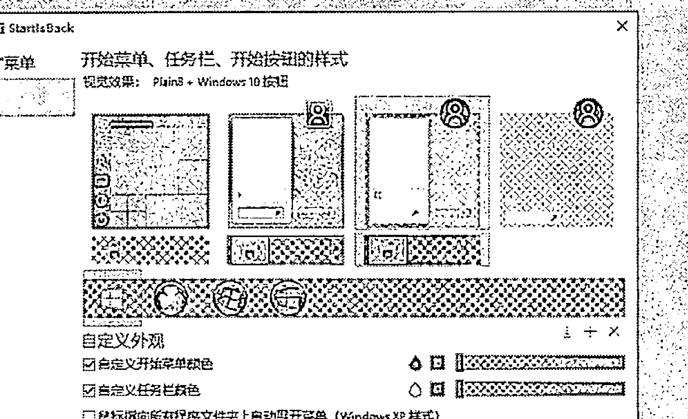
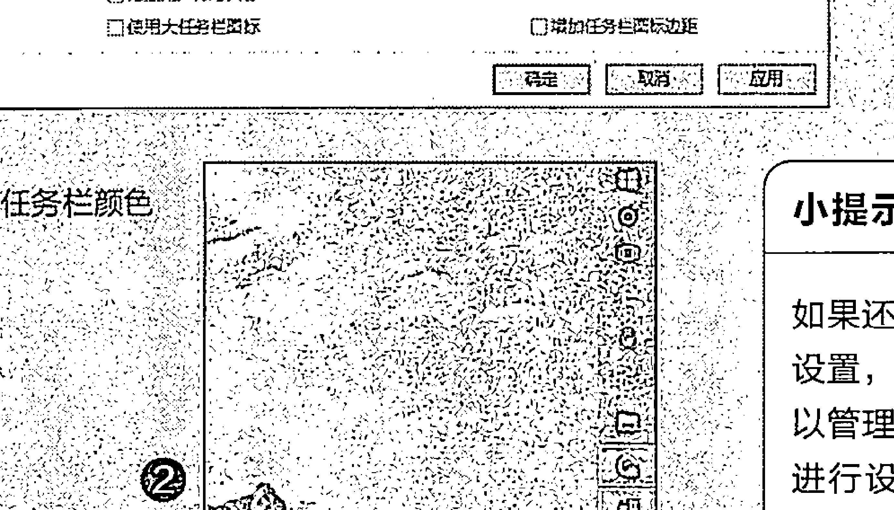
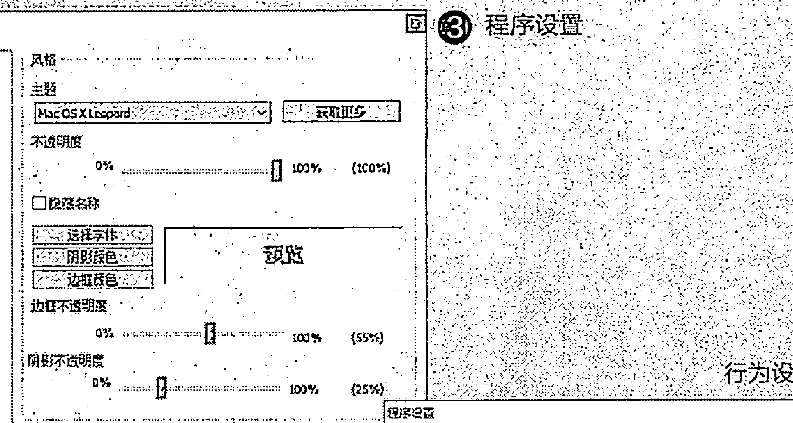
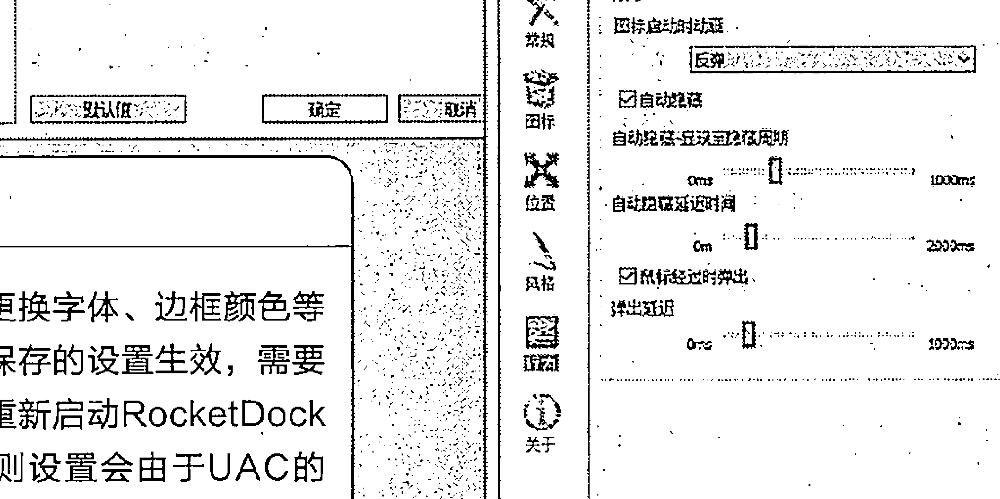

> 小提示：如果还要进行更换字体、边框颜色等设置，为了让保存的设置生效，需要以管理员身份重新启动RocketDock进行设置，否则设置会由于UAC的限制无法成功保存。

不过在Dock栏上添加项目多了以后会显得比较凌乱，不方便日常使用，我们还可以借助Stacks Docklet插件实现动画弹出菜单效果。同上在RocketDock的“风格”选项主题后面点击“获取更多”，按提示链接到官网下载Stacks Docklet插件。接着在Dock栏上右击选择“添加项目→Stacks Docklet”。此时在Dock栏上会增加一个Stacks Docklet插件图标，点击后弹出设置窗口，按提示选择需要包含项目的文件夹和图标即可。比如我们可以将常用的快捷方式全部放置在“F:\常用快捷方式”，在“Folder”项目下添加上述文件夹并设置图标即可（图6）。


这样返回Dock栏上点击Stacks Docklet插件图标，上述添加的文件中所有快捷方式就会以动画的形式弹出，只要点击即可快速启动程序了（图7）。

OK，完成上述的设置后，右击桌面空白处选择“查看”，去除“显示桌面图标”前的勾选，这样桌面图标会全部消失。Windows 10的桌面就只剩下一个Dock栏，原来桌面所有的操作都可以通过Dock栏实现，这样的桌面是不是简约又不简单呢（图8）？

## 滚动截图将超长网页“一网打尽”

文|万立夫

网页截图是我们最常使用的一个功能，但是一般网页都会超过一屏的页面。所以按照常规的方法进行截屏操作的话，就不能将所有的内容进行截取操作，往往需要进行几次截屏并进行拼接才可以。其实借助一些软件工具，无需如此繁琐，只需一键即可截下长网页。

### 专业软件完成滚动截图

我们常见的截图功能之所以不能完成相应的操作，主要是因为它们缺乏一个名为“滚动截图”的独门绝技。所以我们要想解决这个问题的话，只需要安装拥有这类功能的截图软件就可以了。比如知名的免费截图软件PicPick，就包含这样一项独特的功能。

运行PicPick这款软件以后，我们在软件主界面的“截取屏幕”区域，就可以看到一个名为“滚动窗口”的选项，利用它就可以进行网页内容的滚动截图操作了。以后当我们需要进行网页滚动截图操作的时候，首先将浏览器滚动条移动到最上方，接下来点击PicPick软件窗口中的“滚动窗口”按钮（图1）。然后截图软件就会自动隐藏窗口，我们现在将鼠标移动到浏览器上，它就会自动框选浏览器的边框。接下来我们只需要点击鼠标左键，网页里面的内容就会自动开始滚动，当滚动到网页最下方后就可以完成截图操作。截取完成的图片会自动载入到软件的编辑窗口里面，用户点击“文件”按钮以后，在弹出的菜单里面选择“保存”命令，就可以将截图进行保存操作了。

> **小提示**
> 如果用户的电脑屏幕较小而不方便在软件屏幕操作的话，那么可以在系统托盘通过鼠标右键点击PicPick软件的图标，在弹出的菜单里面选择“截取屏幕”按钮中的命令就可以了（图2）。

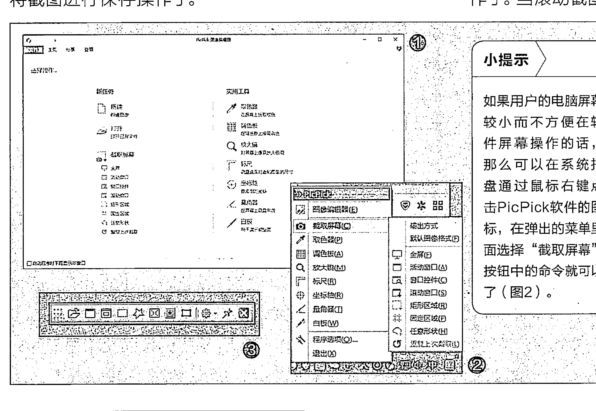
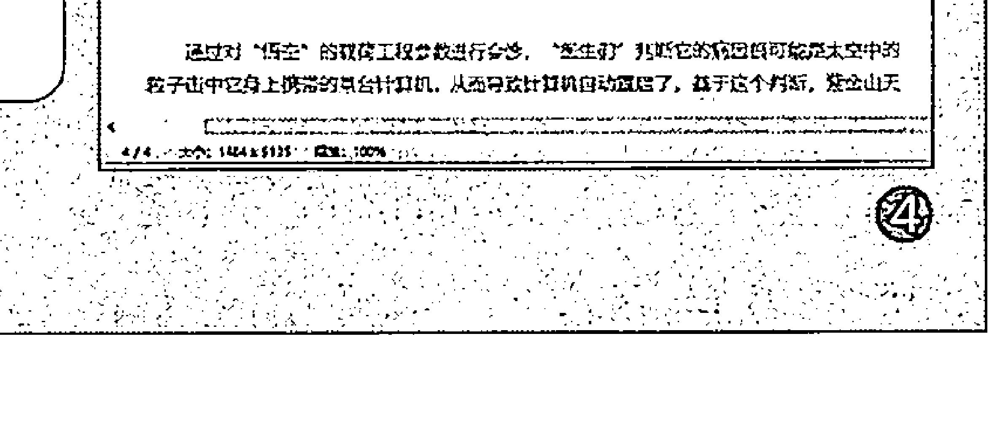

### 滚动截图也能停止操作

虽然PicPick这款软件拥有我们需要的功能，但是我们在使用它的时候也会发现有两个问题。比如在截取某些浏览器网页窗口的时候，它并不会自动进行滚动操作，而是稍微滚动就会马上停住。出现这样的问题主要是这款软件对这个浏览器的内核不兼容造成的，用户只要切换到IE浏览器或者浏览器的兼容模式就可以解决了。而最主要的问题在于，它在进行滚动截图的时候无法进行停止操作，这样就会截取到大量没有意义的内容。所以要想解决这个问题，只能换一款其他的软件来解决。

现在我们运行FastStone Capture这款软件，在电脑屏幕上就会出现一个软件的工具条（图3）。当我们要想进行网页滚动截图操作的时候，只需要点击工具条中的“捕获滚动窗口”按钮。接下来同样将鼠标移动到浏览器窗口的上方，当截图软件在浏览器的边框上显示出提示框以后，点击鼠标左键就可以开始滚动截图的操作了。当滚动截图的操作完成以后，截取的图片就会自动进行保存操作。

### 自带功能就能滚动截图

如果用户觉得第三方软件操作比较麻烦的话，那么利用某些浏览器自带的功能也可以完成截图操作，比如Opera浏览器就自带有相应的功能。首先在浏览器里面打开要截图的网页，接着在左侧侧边栏中找到“快照”按钮。点击它以后就会在网页上出现一个选择框，通过鼠标拖拽调整选择框到合适的宽度（图5）。接下来将鼠标移动到选择框的下方，当鼠标指针变成双箭头以后向下不停地拖动，从而实现网页滚动的效果。当需要截图的内容全部框选以后，点击选择框中的“捕获”按钮，就可以将我们需要的所有信息进行截图操作。然后在弹出的“编辑快照”对话框中，点击“保存图片”按钮就可以完成图片的截图保存了（图6）。

### 利用功能扩展完成截图

由于浏览器的种类多种多样，所以并不是所有的用户都选择使用Opera浏览器，所以这些用户要想进行截图操作的话就会很麻烦。比如我们知道谷歌浏览器开放了源代码，所以包括360浏览器、百度浏览器等在内都是在它的基础上拓展而来的。因此使用这些浏览器的用户只需要安装一款名为Fireshot的功能扩展，就可以解决相关的问题了。当我们要想进行滚动截图的时候，只需要点击工具栏中的扩展图标，在弹出的菜单中选择“捕捉整个页面”命令。扩展就会自动对整个页面进行滚动操作，当滚动到最下方的时候就会完成截图操作。接下来会弹出一个新的网页窗口，在窗口中就可以预览到我们刚刚截取的图片内容。如果没有问题的话，点击窗口右侧的“另存为图片”按钮，就可以对这个图片进行保存操作了（图7）。当然我们利用其中的其他命令，还可以完成诸如“保存为PDF”、“复制到剪贴板”等其他的操作。

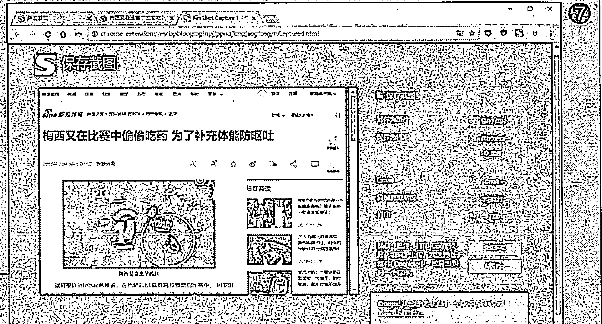

> **小提示**
> 如果用户使用的是火狐浏览器或者火狐内核的浏览器的话，那么安装一款名为Full Web Page Screenshots的功能扩展也可以解决相应的问题。它的操作方法与Fireshot扩展类似，这里我们就不再进行介绍了。

### 手机系统也能滚动截图

随着移动设备在日常生活中的占比越来越多，除了在电脑里面进行滚动截图操作以外，我们在手机里面也需要用到这个操作。那么如何在手机系统里面完成滚动截图的操作呢？我们首先按照常规的方法同时按住“音量减”和“电源”键，就可以完成对当前屏幕的截图操作。接下来我们就可以看到一个预览窗口，在预览窗口的工具栏里面有一个“滚动截屏”的按钮。点击这个按钮后就会开始进行滚动操作，当滚动到页面的最下方以后就会完成滚动并进行截图操作。用户在页面滚动的过程中点击屏幕，就会使滚动停止并马上完成截图操作。

## 快速寻找合意的临时分享平台

文|万立夫

虽然现在文件分享的方法有很多，但是每一种方法都有自己的局限性。比如通过即时通讯软件进行传递的话，需要双方首先加为好友才可以操作。如果利用网络硬盘进行传递的话，而普通的用户又有速度等方面的限制。所以有的时候临时分享平台可能更加实用。

### 传统的文件分享类型

通常我们进行文件分享操作并不需要对文件分享平台拥有太多的要求，因此传统的文件分享平台就非常的合适，而WeTransfer就是传统分享平台的一个代表。它针对网络用户提供了免费以及付费的分享方案，其中免费的分享方案支持上传最大2GB的文件，而且所有的文件将在服务器里面保存7天，超过7天后这些文件将被自动删除。

我们首先通过浏览器打开WeTransfer的官方网站（https://wetransfer.com/），点击网页中的“I agree”按钮后再点击“Add your files”按钮。在弹出的对话框里面选择需要进行分享的文件，该分享平台允许用户一次选择多个文件进行上传操作。由于该分享平台默认是通过电子邮件这种方式来进行分享操作的，所以当我们将文件上传完成以后，需要分别设置收件人的电子邮箱地址、发送人的电子邮箱地址以及留言信息等等。所有的设置完成以后点击“Transfer”按钮，就可以完成相应的分享操作了（图1）。

当对方接收到我们的分享邮件后，点击邮件就可以看到分享文件的下载链接以及分享文件的名称（图2）。点击分享链接以后，在出现的对话框点击“I agree”按钮，就可以看到分享文件的列表。用户既可以点击每一个文件后面的按钮进行单独的下载，也可以直接点击最下方的“Download all”按钮进行所有文件的一次性下载。除此以外，这个分享平台还可以通过链接的方式来进行文件的分享操作。我们首先在分享对话框点击左下角的按钮，在弹出的页面中选择“Send as”中的“Link”选项。接下来进行文件的上传，上传完成以后就可以得到文件的分享链接（图3）。将这个链接发送给需要的朋友，就可以进行文件的分享下载。

### 利用聊天室共享文件

虽然通过WeTransfer分享平台可以解决很多用户的问题，但是这个分享平台最大的问题就是，它只能单向进行文件的传递操作，也就是说只能由用户被动地接收发送者提供的文件，而不能主动向对方索取需要的文件。那么如果想要和用户及时地进行文件的互动交流，又应该如何进行相关的操作呢？

我们首先通过浏览器打开Volafile的官方网站（https://volafile.org/），接下来点击网站主页面中的“Create Room”按钮，这样该服务就会创建一个临时的聊天室（图4）。现在将这个聊天室的链接分享给其他用户，当他们通过浏览器打开这个链接后，就进入到我们创建的临时聊天室了。这个聊天室分为左右两个部分，左侧是用户之间的聊天区域，右侧则是文件的分享区域。在页面的左下角输入自己需要的文字信息后回车，就可以和聊天室中的其他用户进行交流了。

如果用户需要分享某个文件的话，那么首先点击页面右上角的“Upload”按钮，在弹出的对话框中选择需要上传的文件就开始进行上传，上传后的文件会出现在右侧的文件列表中，这样聊天室里面的其他用户就可以看到这个文件。分享平台在每一个文件的前面都会通过不同的图标显示出这个文件的类型，当用户将鼠标移动到这个图标上以后，就会在弹出的对话框中显示出该文件的基本属性信息，如果是多媒体文件的话还可以进行在线的预览操作（图5）。

如果用户上传的文件比较多的话，那么其他用户寻找起来肯定比较麻烦。不过我们可以通过点击右侧列表上方的文件类型按钮，就可以对所有的文件进行筛选，从而缩小文件查找的范围。当然也可以直接在后面的搜索框里面设置文件名称的关键词，这样就可以直接进行查找操作了。在默认情况下所有用户上传的文件都会被保存两天的时间，但是作为这个临时聊天室的创建者，不但可以对指定的文件进行删除，也可以对某些文件延长其分享时间。

### 下载后立即上传文件

如果说有的用户利用分享平台传递文件是为了便利的话，那么可能有些用户首先考虑的是安全性的问题，毕竟有些传递的文件包括一些比较重要的信息。那么遇到这样的情况又应该怎样选择分享平台呢？

我们首先通过浏览器打开Fileio的官方网站（https://www.file.io/），接着点击网页中的“Upload”按钮来选择要分享的文件，该分享平台支持上传单个最大5GB的文件。接下来当文件上传到云端服务器以后，就会自动生成文件的分享链接（图6）。这个分享平台拥有两个比较鲜明的特点，首先就是用户点击下载链接以后浏览器就会自动开始文件的下载操作，不像其他分享平台还需要用户进行相应的点击操作。其次就是所有的分享链接只能下载一次，一旦用户下载完成后这个文件和链接就会马上被服务器删除，这样就可以比较好地保证文件的安全性。

当然用户也可以通过浏览器打开Dropfileto的官方网站（https://dropfile.to/），该分享平台支持上传最大1GB的文件，所有上传的文件会保存24小时的时间。当文件上传完成以后会生成一个带访问密码的共享链接，这样用户只有在拥有访问密码的时候才可以进行下载（图7）。需要特别说明的是，默认的分享链接并不需要访问密码，用户必须在默认的分享链接后加上一个“+”才可以，比如 https://dropfile.to/joEKWCX+ 这个样子才需要密码。

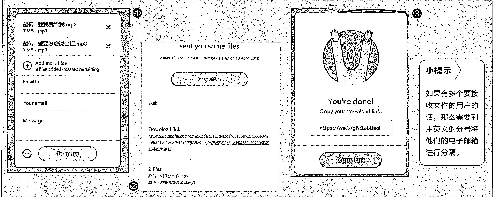
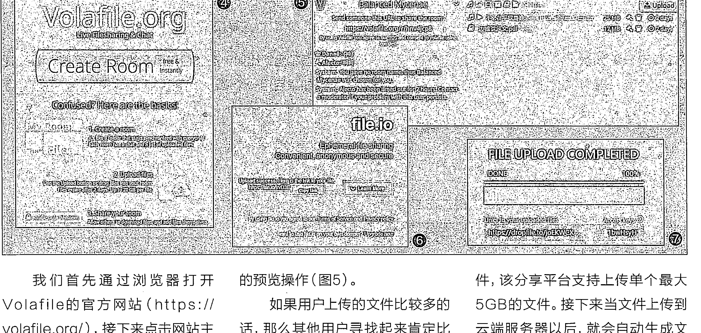# 轻松监视电脑所作所为

我们每天都在使用电脑，然而对自己使用电脑的习惯能做到了如指掌吗？比如，自己使用最多的程序有哪些？浏览最多的网页有哪些……这些内容通过回忆和手工统计会比较麻烦，如果启用一个ManicTime小软件来监控，问题就简单多了。

ManicTime有全功能收费版，但作为一般使用，免费的标准版就够了。第一次使用时，选择许可类型为“标准版(免费)”即可（图1）。要保持监控有效，不要忘记开启软件设定中的“开机时自动启动”选项。

打开ManicTime后，可看到“日”和“统计”两个选项卡列于最上方。点击“日”选项卡，可见下面的时间轴区域，从上到下依次包括当前日期和分类时间轴，分类时间轴主要包括标签、状态、程序和文档4个类别。而窗口的最下部分为与时间轴相对应的活动程序（图2）。

要查阅某一时间点电脑的活动内容，只需将鼠标移动到时间轴上点击，窗口下方的列表中就会出现对应时间点活动的程序名称。我们就可以看到在某个时间段使用了什么程序、浏览了哪些网站或玩了什么游戏等等。

如果要将某个时间段指定为重点监控时段，可以给这一时段定义一个标签。点击“添加标签”按钮，给标签命名并添加注释文字，指定开始时间和结束时间，“标签”栏内便会出现一个监控标签（图3）。以后单击这一标签，就会在下面的窗格内看到具体监控内容。

要对程序或文档活动内容进行统计，单击“统计”选项卡。例如，想要知道自己最常用的程序有哪些，点击“热门程序”，即可在中间栏内看到使用最频繁的5个热门程序的列表。而最下面的窗格则会以图表或表格的形式显示这些热门程序使用几率的图形化对比（图4）。

统计的时间跨度可通过顶栏的开始时间、结束时间和周期设定选择框选择，统计的活动类别通过第二栏进行选择。中间窗格显示条目的多少也可以选择为5条以上，而下段窗格的统计结果图表可选择显示为条形图或线形图。统计图表可以导出为PNG图片，而统计表格可以导出为CSV表格文件保存。

有了ManicTime的监控，电脑的一切活动内容都将可以随时回溯和查看。不过，ManicTime也是一把双刃剑，如果别人看到了，那就会泄露你的隐私。因此，可以把该程序藏在别人不易发现的位置。

# 时间管理者 记录工时与薪水

文|亦云

不少人的劳动报酬是与工作时间挂钩的，也就是我们常说的计时作业。对于这些人来说，精确记录工作时间和薪水，就显得很有必要。现在，用Alternate Timer软件可以完成计时作业的时间记录和薪酬管理任务。

- 一键建立工作时间表

点击工具栏上的第一个按钮新建工作时间表（图1），然后再点击存盘按钮，将时间表保存为.atf文件。工作时间表建立之后，通过双击某一日的记录，显示事件记录编辑窗口，然后就可以设置工作开始时间、结束时间、中间断开休息的时间。此外还可以添加一些备注文字信息（图2）。

执行“View→Display as→Calendar”菜单命令（或F6功能键），可以用“日历视图”形式显示时间表；而执行“View→Display as→Table”命令（或F7功能键），则可以用“表格视图”来显示时间表（图3）。

- 灵活选择 用好各种视图

将时间表与年概览表结合使用，可快速进行时间表的切换。执行“View→Month Browser”命令（或按下F2功能键），开启左侧年度时间表导航栏。通过下方的+号按钮，可将先前保存的月度时间表添加到导航栏列表中，然后就可以通过双击左侧导航栏中的月表名称，开启每月的时间表预览。

右侧的月表预览视图可以有两种形式选择：执行“View→Display as→Calendar”菜单命令（或F6功能键），可以用“日历视图”形式显示时间表；而执行“View→Display as→Table”命令（或F7功能键），则可以用“表格视图”来显示时间表（图3）。

- 或显或隐 使用薪酬显示

与工作时间紧密联系的就是薪酬。在时间管理系统中，我们可以设定显示或隐藏薪酬项目。如果要将薪酬记录并显示在工作时间表中，在时间表中执行“View→Salary”命令（或者按下F10），再次执行该命令可关闭薪酬项目（图4）。

> 小提示
> 通过“Edit→Protect”命令，可设置对当前时间表的密码保护。时间表除了可保存为软件自身的atf格式外，还可以导出为csv、htm和txt等格式，以便可以在其他程序中进一步使用（图5）。

# 通吃常用文件的减肥利器

当我们通过邮件附件发送文件，或者向某个网站上传文件时，有时会收到文件大小超标，无法发送或上传的提示。如果遇到这种情况，可以利用文件体积优化工具FileOptimizer，在不影响文件功能的前提下，对文件进行压缩优化处理。

首先下载并安装FileOptimizer。软件有点大，约70MB。之所以庞大，是因为其中集成许多不同格式的文件支持插件，多为免费的开源插件，且在不断扩充更新。这样，我们就可以对各种文件格式进行优化处理，比如常用的图、文、声、像格式文件，以及EXE、压缩文件等。

启动软件，添加文件后开始优化。如果有一个或多个PDF电子书文件，我们觉得其文件太大，需要优化。这时，点击FileOptimizer的“File→Add files”命令（或Shift+Ins组合键）添加文件。如果需要一次性处理的文件均存放在同一个文件夹中，也可以选择“File→Add folder”命令（或Ctrl+Ins组合键）进行添加（图1）。文件添加之后，执行“Optimize→Optimize all files”命令（或Ctrl+O组合键），即可对窗口中的文件进行优化压缩处理。

PDF文档中图片的分辨率对文件大小的影响最大。因此，如果觉得PDF文件压缩效果不够理想，还可以通过调整其中的分辨率设置，然后再行压缩，获得更理想的效果。执行“Optimize→Options”命令，在弹出的设置窗口中向右滚动标签，找到并点击PDF标签，在Profile下拉列表中，即可选择压缩所使用的分辨率。若列表中的分辨率不是你所想要的，还可以通过Custom DPI选项输入自定义的分辨率。选择Skip layered还可以跳过对分层的PDF页面的处理，这样可以获得更好的兼容性（图2）。

除了各种文件优化有其自己不同的参数设定外，还可以通过FileOptimizer软件进行全局压缩级别的设定。在Options设置窗口的General标签下，通过Optimization level选择列表，可选择压缩速度和压缩质量的动态关系，Fast为速度最快但压缩级别最低，而Best为压缩级别最高但速度较慢（图3）。此外，通过Process priority下拉列表，可以选择压缩进程的优先级别，这样可以调整文件压缩和系统其他任务之间的资源占用平衡，对于执行多任务压缩，选择更为灵活方便。

如果要优化处理其他格式的文件，方法基本与PDF优化类似。只是在参数设置方面，不同的文件格式有不同的特点，优化设置时根据实际情况选择即可。

FileOptimizer不但可用于我们日常的邮件附件或上传文件的减肥，对于网站管理员、Web开发者、桌面应用开发者、移动应用开发者、服务器管理员、内容创作者等，均具有实际使用价值。

# 没光驱不要紧 装个免费虚拟的

文|南溪

目前许多笔记本或PC中未安装物理光驱，但许多软件还以光盘镜像包的形式存在，如果每次都解压缩使用比较费事，且有的镜像包解开后还因认不出光驱而无法使用。这时，利用虚拟光驱软件OSFMount便可以仿真光驱运行镜像文件。此外，利用该软件还可以创建内存虚拟镜像，或者创建可读写的空镜像文件。

> 如果在64位的Windows上运行32位的OSFMount安装程序，会弹出错误提示，显示只能在x86处理器上运行（图1）。但是绿色版的32位OSFMount，却可以在64位的Windows中正常运行。

- 将普通镜像模拟为只读光驱

如果我们有一个光盘镜像文件，例如Windows 7的ISO光盘镜像文件，可以利用OSFMount将其快速模拟为一个只读光盘。运行OSFMount软件后，执行“文件→装载新的虚拟磁盘”命令（或用快捷键Alt+N），也可以直接点击“新建装载”按钮加载镜像。在随后弹出的窗口中，选择来源文件类型为“镜像文件”，然后指定镜像文件的路径，镜像文件偏移量和磁盘大小选择默认的设置，磁盘盘符可以选择软件自动检测到的空余盘符，也可以自己指定一个空余的盘符，而磁盘类型选择为光盘驱动器（图2）。确定之后，我们会看到在OSFMount窗口中出现光盘盘符和镜像文件的列表项目。

- 将镜像文件装在内存中

如果系统中安装的内存条空间足够用，那么还可以将镜像文件挂载到内存中使用。这样，可以让虚拟光驱以更快的速度运行。要将镜像文件挂载为内存镜像文件，只需在“来源”选择项目中选择为“内存镜像文件”，加载即可。

- 创建可读写的空镜像文件

我们还可以根据实际需要创建一个空的可读写镜像文件。点击“新建装载”按钮后，选择“来源”为“空的内存磁盘”，指定磁盘大小和单位（比如1GB），指定盘符和磁盘类型，取消对“只读磁盘”选项的选择，然后点击“确定”按钮（图3）。之后，我们在资源管理器中便获得了一个可读写的驱动器。虽然内存虚拟镜像文件在关机后会消失，但是在取消挂载前OSFMount会将其打包为ISO文件，保存这个文件便可在下次启动后挂载为虚拟磁盘了。

> 镜像文件被加载之后，资源管理器中会出现新建的盘符。这时，即便是关闭了OSFMount软件，此盘符也不会消失。如果要卸载掉该盘符，需要通过OSFMount软件窗口，选择该盘符项目之后，点击“卸载”按钮进行卸载。

# Hosts文件编辑切换不求人

文|汾水

由于Hosts文件在Windows中藏身的路径较深，且具备隐含属性，因此定位、查看、编辑，操作不够方便。而这样一个“神秘”之物，却可以发挥诸如拦截恶意网站、屏蔽广告、记录登录信息等重要功用。因此，我们有时还需用到它。虽然用记事本手动编辑Hosts也可以完成任务，但涉及到同时禁用或启用多项内容时，借助于一个SwitchHosts!软件来实现，会让人更省心。

首先，我们要以管理员权限模式运行该软件，否则会产生错误提示（图1）。

## 1. 用SwitchHosts!编辑器编辑Hosts文件

SwitchHosts!软件自带Hosts编辑器。启动软件后开启的是“系统Hosts”内容显示窗口，介绍Hosts内容格式（图2）。在窗口左侧栏可见包括系统Hosts、My hosts和backup三个项目。

要添加新的Hosts项目，点击左下角的+号按钮，在弹出的“添加hosts规则”窗口中，可选择添加本地、远程或组合三种方案之一。添加本地方案要先为Hosts方案起名（图3）。如果要添加远程方案，首先为Hosts方案起名，然后指定添加的URL网址，选择是否自动进行更新（图4）。而组合式Hosts是由现有的多种Hosts文件经选择组合而成的新方案，从左侧栏选择并合并添加到右侧栏，最后为Hosts方案起名，确定即可（图5）。

## 2. 在Hosts文件内或文件之间快速切换

如果要快速定位到Hosts文件中的某个地址，只需点击窗口左下角的放大镜按钮，输入网址关键词，软件会自动定位到符合条件的条目，然后以黄底色高亮的形式显示找到的地址（图6）。

对于涉及禁用还是不禁用的选择，我们可以保存为两个或多个方案。若要在定义的不同Hosts文件之间转换，点击左侧窗口下方放大镜旁边的按钮即可。

# 打造Windows 10视觉桌面

文|馨雅居

Windows 10桌面一般为静态图片或图片幻灯片，无法直接将视频设置为桌面背景。借助于两款软件，可将视频设置为桌面背景。

我们可以使用DeskScapes 8软件生成视频桌面。首先准备视频文件。通过软件窗口左上角的菜单，选择“Folders→Add/Remove Folders”（图1）。然后在“Folders”选项卡下点击“Add”按钮，添加视频文件夹，同时确认是否包含子文件夹。

> > 小提示：DeskScapes 8有30天试用版，也可以购买永久授权。

添加视频文件后，在“Folders”选项卡列表中选中视频文件夹，单击“确认”。

在媒体窗口中选中要作为桌面的视频文件，然后点击窗口右下角的“Apply to my desktop”，即可将视频应用到桌面（图2）。如果选择“Apply as my screensaver”，则将视频应用为屏幕保护。

我们还可以通过自定义，对视频效果进行个性化调整。点击设置窗口工具条上的“Effects”按钮，通过右侧窗格选择合适的特效，点击“Apply to my desktop”即可（图3）。

此外，还可以建立组合式特效。点击右下角的“Combined effects”按钮式下拉菜单并选择“Create a combined effect”，在窗口中给出特效的名字，然后通过下拉菜单最多可以定义四种特效的组合，点击“Ok”按钮使组合生效（图4）。

如果觉得DeskScapes 8使用有限制，且注册比较麻烦，那么还可以使用另一款中文免费桌面视频工具“火萤视频桌面”。

在火萤界面的左上角开启“视频桌面”开关，选择一个在线视频资源或者本地视频文件，然后点击“设为桌面背景”按钮，即可将当前视频设置为动态桌面（图5）。

> > 小提示：在“设置”窗口中选择“开机自动启动火萤”，可保证动态桌面每次开机都能自动生效。此外，如果有多台显示器一同使用，通过“多屏联合”选项，可实现在多个屏幕背景上联合播放一个视频。

# 请个多功能纯文本管理助手

文|南溪

纯文本不单是指常用的语言文字，还包括各种类型的程序代码、编码等。作为常用的纯文本处理工具，“记事本”显得力不从心。我们可用一款免费软件Alternate Textbrowser，随心所欲地管理各种类型的纯文本文件。

## 1. 显示预览 满足各种预览需求

HTML和XML文件是常见的网页代码文本。如果要预览这些代码的网页效果，先用Alternate Textbrowser打开文本，可见网页代码；按下F7功能键，即可看到网页实际效果（图1）。若网页代码有变更，按下F8重新加载即可。

> > ### 小提示
> > 作为文本编辑的辅助，利用Tools菜单，可调用备忘录和计算器。此外，右键单击文件标签，可从获取当前文件名和路径加以利用。要用邮件发送当前文件，执行“File→Send”命令即可。

处理程序代码时，可用此软件高亮显示语法格式，常用的C++、PHP、Perl、Pascal、ASM、Jscript等语言均可显示。从Highlighter菜单中选择相应的语言即可（图2）。

如果要以二进制方式显示文件，单击Alternate Textbrowser工具栏最后一个按钮（Binary view）即可。

> > ### 小提示
> > 要查阅ASCII码表，可通过“Tools→ASCII codes”命令实现。要显示当前文件的具体信息（如文件行数、最大或最小行长度、空行数量、字符数等），按下Ctrl+I键即可。要预览当前文本的打印效果，则执行“File→Print preview”命令。

## 2. 文本编辑 灵活应对常见任务

Alternate Textbrowser还能满足我们对文本编辑的各种需求。要选择文本的内容，除普通选择模式（Normal）外，执行“Edit→Selection mode”下的Line selection命令，可实现按行选择，只需在行上任意位置点击鼠标，然后拖动鼠标即可；Column selection为按列选择，可拖动出矩形选区（图3）。

如果要在文本中进行查找和替换任务，通过Edit菜单可进行多种查找替换选择（图4）。或可通过快捷键完成：普通查找替换用Ctrl+F和Ctrl+H；在文件中查找用Alt+F；如需用正则表达式组建特殊查找替换条件，用Ctrl+Shift+F和Ctrl+Shift+H组合键。

## 巧用沙箱检测文件安全
文/万立夫

虽然我们平时都是通过杀毒软件来进行系统保护的，但也并不能100%保证绝对安全，所以有时还需要借助于其他工具进行保护。但是虚拟机对于普通用户来说操作比较麻烦，所以最好的选择就是使用沙箱来进行软件的测试。

## 激活软件的所有功能

说到沙箱软件，很多人第一时间都会想到 Sandboxie 这款沙箱软件，但是这款软件是一款收费的软件，所以我们今天选择一款免费的沙箱软件 “Cybergenic Shade Sandbox” (https://www.shadesandbox.com/)。虽然这款软件是一款免费软件，但是在安装的过程中会要求用户输入自己的姓名以及邮箱。这里需要提醒大家的是，邮箱千万不要随便进行设置，因为网站会将软件的激活码发送到邮箱里面（图1）。

当软件安装成功以后，点击左侧的 “Shade Sandbox” 按钮，再点击界面下方的 “Activate” 按钮，将激活码粘贴到里面就可以成功地激活，然后用户就可以开始正常地使用操作了。“Cybergenic Shade Sandbox” 默认已经创建好了一个沙箱，用户可以点击旁边的加号来创建其他的沙箱，这样在测试的时候可以避免相互干扰。

> **小提示**
通过选择右键菜单中的 “Put into Shade” 命令，就可以在软件图标上看到一个 “Cybergenic Shade Sandbox” 的标志，以后该软件程序的所有运行都处于沙箱的保护之中。

## 沙箱里面检测文件

当我们要想在沙箱里面测试软件程序的时候，只需要将软件程序拖拽到沙箱里面进行释放，就可以在软件的窗口列表中看到添加的程序图标（图2）。接下来直接双击软件图标就可以在沙箱中运行了，在沙箱中运行的软件程序会在软件窗口的四周通过蓝色的光圈进行显示，以区别其他正常运行的程序。除此以外，我们也可以在软件程序图标上点击鼠标右键，选择菜单中的 “Open in Default sandbox” 命令就能快速地加载到沙箱中运行（图3）。

如果想要将软件程序从沙箱里面删除掉，首先在列表里面选中这个软件程序的图标，接下来点击 “Remove an application from Shade” 按钮即可。由于沙箱在运行的时候会产生很多缓存信息，所以点击 “Clean up Sandbox” 按钮以后可以清理整个沙箱的内容。而点击 “Open Virtual Folder” 按钮，在弹出的对话框里面可以查看沙箱中的数据，这样用户可以从中复制所需要的文件。

> **小提示**
如果用户不喜欢使用英文软件的话，那么也可以试一试 “要安全沙箱” 这款中文的沙箱工具 (http://www.11safe.com/)。安装完成后点击操作界面下方的 “打开程序” 按钮，选择要在沙箱中运行的软件程序后，就可以在沙箱里面进行测试操作了。

## 摆脱微软的束缚 在线办公更便捷

由于微软的办公软件具有绝对的市场占有率，因此它的文档格式实际上就成为很多文档的标准格式。但是由于微软的办公格式比较特殊，因此难免在操作的时候会出现一些问题，遇到这样的情况重新安装一款办公软件又非常麻烦，因此在线办公可以很好地解决用户所面对的问题。

## 不装软件 在线编辑文档

其实很多人和我一样在处理一些简单的文本信息内容的时候，并不想使用臃肿的Office办公软件，而是选择一些比较简单实用的第三方文本编辑器。可是有的时候领导要求我们提交的文件格式，必须是Office的格式才可以。那么这个时候如何进行转换操作呢？

如果用户的电脑系统里面没有安装Office办公软件的话，那么利用一些在线编辑服务就可以进行转换操作。比如我们打开最新推出的“腾讯文档”服务的官方网站（https://docs.qq.com），点击“立即使用”按钮后，通过QQ或者微信手机客户端进行扫描就能成功地登录。现在点击工具栏中的“**新建**”按钮，在弹出的菜单中选择“**新建在线文档**”或者“**新建在线表格**”命令即可。比如我们点击“新建在线文档”按钮，可以看到空白文档、工作日报、工作总结的常见模板，用户只需要根据操作进行选择即可（图1）。

在弹出的新建文档页面的右上角，可以设置新建文档的名称。接着我们将文本文件中的内容复制粘贴到“腾讯文档”的编辑窗口中，然后利用工具栏中的命令对内容进行相应的编辑排版即可。由于所有的操作都是在云端服务器中进行的，所以服务器会定时对用户的文档内容进行自动保存，这样就不会存在文件丢失的问题。当所有的操作完成以后，点击页面右上角的“更多操作”按钮，在弹出的菜单中选择“保存为本地文件”命令，这样就可以将这个文件下载保存到硬盘里面，然后提交给领导进行审阅。

## 协同办公 工作效率大提升

通常我们提交给领导的文件都需要经过反复的修改才可以，但是同事之间对文件往往有不同的意见，这样就需要多人进行讨论和修改。传统的方法都是将文件创建完成后，利用QQ或者电子邮件发送给其他的用户，对方修改完成以后再回传给我们。这样的操作自然非常的繁琐，而协同办公就是最好的解决方法。

首先将需要共同讨论的文件上传到“腾讯文档”的服务器里面，点击列表中的文件名称链接后，在网页中就可以进行编辑操作了。由于这项服务使用了大量的HTML5技术，所以建议用户将浏览器升级到最新的版本，这样才能更好地进行相应的文档创建和编辑操作。

## 随时随地的免费翻译助理

有的时候我们从网上下载的资料是全英文的，这样对于很多用户来说都需要借助翻译软件才能进行阅读。虽然现在网上有很多的翻译软件，比如百度翻译、有道翻译、谷歌翻译等等，但是它们对上传的文字信息都有数量限制。所以要想进行全文翻译的时候，往往需要分段操作才可以。

不过现在在“腾讯文档”里面进行操作就简单多了，用户首先按照前面的步骤将要翻译的文档上传到云端服务器里面。打开这个文档以后点击工具栏中的“进入智能翻译模式”按钮，当前窗口就会自动分成左右两个区域，这样就可以同时显示出原文及对照的翻译结果（图5）。点击翻译结果右上角的“生成新文档”按钮，就可以将这个翻译信息保存为文档，这样也可以对翻译的内容进行编辑。

## 添加水印保护工作文档

如果公司的文件需要对外发布，又害怕别人对文档进行破坏的话，那么添加水印就是很好的一种保护方式。这样既起到了宣传的效果，又增加了使用者版权的意识。在“腾讯文档”里面打开要添加水印的文档，接着点击工具栏中的“设置水印”按钮，在弹出的对话框的“水印文字”输入框里面，设置相应的水印信息。然后选择一个所需要的水印的样式，最后点击“确定”按钮就完成了水印的添加（图6）。

## 无需PS 完美地合成产品和图片
文/万立夫

为了更好地推广自己的产品，不少人都想了很多的方法，其中就有一个方法是将产品融入到图片里面。这样当其他人不经意看到这张图片的时候，就可以为其中的产品所吸引。通常要想实现这样的操作，必须熟练地掌握PS等软件，而借助下面的工具，我们就可以将庞大复杂的PS扔到一边去了。

## 快速选择需要的模板

由于众多的网友都有类似的需求，于是就有开发人员搭建了一个云服务。该云服务提供了大量现成的模板，用户只需要将相关的图片上传到云端，然后再和选定的模板进行拼接就可以了。《电脑爱好者》杂志曾经介绍的Smartmockups云服务就是一个代表，而今天我们选择另外一个名叫MockupPhotos的云服务来进行操作。

首先通过浏览器打开它的官方网站（https://mockup.photos），在网页的搜索框里面输入所需模板的关键词，就可以马上搜索到对应的模板信息（图1）。除此之外，也可以点击网页下面的“509 mockups”链接，在弹出的网页里面就可以看到它提供的几百种免费而且高品质的模板，其中可以选择电脑、手机、手表、海报、笔记等不同的类型。为了方便用户更好地寻找需要的模板，用户可以通过**Format**、**Type**、**Color**等不同的选项来进行筛选（图2）。

## 上传和拼接图片效果

比如我这里打算选择“海报”类型，就在“Type”的菜单里面选择“Poster”，这样所有的海报模板就呈现在眼前。接下来我们到《电脑爱好者》的淘宝官网下载一张最新杂志的封面图片，将其保存到本地硬盘里面待用。然后从海报模板里面选择一个自己喜欢的模板，接下来点击模板中的海报图片，在弹出的菜单里面可以看到两个命令（图3）。通过它们可以允许用户上传本地硬盘的图片，或者直接设置网络图片的链接地址。我们这里就点击“Upload image”命令，然后选择准备好的杂志封面图片进行上传。

当图片上传后马上就可以进行合成操作，这样就可以实时地看到合成的效果（图4）。如果没有任何问题的话，那么点击右下角的红色按钮，就可以将合成的图片下载保存到硬盘里面。由于每一个模板的图片上传位置都会显示一个最佳的分辨率，如果用户上传的图片不是这个分辨率的话，那么合成的效果就会差一些。这个时候用户可以点击上传的图片，在弹出的菜单中选择“Re-position image”命令，这样就会弹出一个图片调整的页面。比如通过鼠标进行移动就可以调整上传图片在模板中的位置，通过鼠标滑动下面的比例滑块就可以对上传图片的分辨率进行调整（图5）。调整完成以后点击下面的OK按钮，从而使得图片与模板的分辨率更好地契合，最终达到完美的拼接效果。

## 小技巧管理坚果云
文/阿立

现在国内的很多厂商已经关闭了云存储的服务，而坚果云是为数不多还在坚持的服务之一，所以一些用户就开始选择坚果云进行操作。这款软件除了可以进行云存储以外，还有很多关于文件管理方面的功能。

## 对存储文件进行锁定

所有的云存储软件在同步操作的时候，都是对指定文件夹里面的文件进行同步，从而将它们存储到云端服务器里面。但是如果用户的电脑有其他人进行操作的话，那么其他用户就可以对同步目录中的文件进行操作，这样存储的文件就可能遭到破坏。

首先在系统托盘找到坚果云的客户端图标，在图标上点击鼠标右键后选择菜单中的“设置”命令，在弹出的设置窗口选择“安全”标签，勾选上“开启文件保护锁”选项(图1)。以后只要我们在不使用同步操作的时候，退出坚果云的客户端程序，同步目录中的文件就将受到保护，这样也就提高了一个变相加密文件的效果。

## 云桥减少磁盘的占用

存储的文件并不是都会经常使用，但是所有的文件都会占用磁盘空间。因此我们可以通过坚果云的云桥模式，来减少存储文件对本地磁盘的占用，在需要的时候快速地进行下载和操作。

首先双击系统托盘中的客户端图标，在弹出的窗口中就可以看到现在正进行同步操作的目录。将鼠标移到某个想要使用云桥模式的目录，点击文件夹名称后的齿轮图标，在弹出的对话框中点击右键，选择菜单中的“取消本地同步”命令即可(图2)。接下来同步目录中的文件都将被删除，只会保留存储到云端服务器中的文件。坚果云通过不同的图标来区分本地同步文件以及云桥模式的文件，本地同步文件采用的是绿色对钩的图标，而云桥模式采用的是蓝色云朵的图标。

以后当我们要使用某一个文件的时候，首先在客户端的主界面点击该同步目录，在弹出的窗口里面就可以看到所有的文件名称。找到要进行操作的文件后，直接双击客户端就会马上从云端下载这个文件并加载。当操作完成以后，该文件的最新版本将自动上传到云端服务器中进行存储。接下来在同步目录中找到刚刚操作的文件，点击鼠标右键后选择菜单中的“释放空间”命令，这样就可以删除这个文件刚刚下载占用的缓存空间(图3)。当然客户端程序会自动清除那些30天没有使用过的文件缓存。

## 常见文件添加标签

随着存储文件的增多，要想查找存储文件就变得越来越困难，所以这时我们可以利用书签功能将常见的文件添加到书签文件夹里面进行操作。在经常使用的文件或文件夹上点击鼠标右键，选择菜单中的“添加书签”命令即可。

以后我们要使用收藏文件的时候，在客户端的主界面上点击“书签”按钮，在弹出的对话框中点击“打开书签文件夹”按钮，这样就可以快速找到添加到书签中的文件和文件夹，进而方便用户对它们进行操作(图4)。

## 短链接服务的“花样”使用
文/老万

平时当我们发现一个有意思的网页，可能很想分享给好友，但如果这个网页的链接地址太长，分享起来很不方便，好友看到超长链接时也会很头疼。这时使用适当的短链接服务将长网址缩短，就会方便多了。

## 快速创建短链接地址

提起短链接，不少人会想到TinyURL，它不仅是个老牌的短链接服务，而且不用注册就能使用。首先打开TinyURL的官方网站 https://tinyurl.com，接下来将长链接地址粘贴到网页中的“Enter a long URL to make tiny”框中，再点击后面的“Make TinyURL”按钮，即可完成链接地址的缩短操作(图1)。最后点击后面的“Make TinyURL”按钮，在弹出的网页中可以看到生成的短链接信息，点击“Copy to clipboard”复制短网址分享出去就可以了(图2)。

TinyURL不仅可以自动生成相应的短链接信息，还可以根据用户的要求自定义创建特定的字符串信息。比如我们这期杂志是2018年第12期，可以根据这个信息自定义字符串信息“cfan201812”。首先还是在“Enter a long URL to make tiny”选项中进行操作，接下来在“Custom alias”框中输入“cfan201812”，最后同样点击“Make TinyURL”按钮即可。

## 自定义中文短链接

虽然TinyURL允许用户自定义短链接的字符串信息，但是它目前只允许英文字母和数字组合。如果想要生成包含中文信息的短链接字符串，可通过Bit.ly网站来实现。

首先打开Bit.ly的主页https://bitly.com，在网站首页的输入框中粘贴上要缩短的长链接地址，这样便可以完成最常见的短链接操作。如果要自定义中文信息的短链接，则需要注册一个账号，然后登录到后台，点击页面中的红色“Create”按钮，这时会在网页的右侧弹出一个设置框，在其中粘贴上要缩短的长链接地址，在“CUSTOMIZE”输入框中就可以自定义包含中文的短链接信息(图3)。最后点击“SAVE”按钮，就可以看到生成的自定义中文短链接信息(图4)。

> **小提示**
虽然百度也有一个短链接服务http://dwz.cn，但是有的时候该服务在对“https”链接进行缩短操作时，会出现各种莫名其妙的错误。

> **小提示**
在Bit.ly的后台可以对所有的短链接进行管理，同时该服务也会对所有短链接的访问数据进行统计，从而方便用户更好地了解和查看分享的情况。

## 二维码同时一起生成

相对于短链接，利用二维码扫描登录则更加快捷，应用网上的服务，不只可以生成短链接，也可以轻松将链接转换为二维码。

打开Reurl的官方网站https://reurl.cc，在输入框中粘贴上要进行转换的长链接地址，然后点击后面的按钮，即可读取出链接的标题以及相关的内容信息。与此同时，在页面的右侧将给出转换成功的短链接地址，而在下方则给出对应的二维码。将二维码分享出去，对方只需用手机“扫一扫”，即可快速打开分享的网址了（图5）。

如果用户拥有大量的短链接地址或者二维码需要管理，那么也可以点击该云服务右上角的“注册”按钮，注册成功后就可以在后台对这些信息进行管理了。

## 短链接加入保护密码

使用过百度网盘进行文件分享的网友都知道，在分享链接的同时往往会跟上一个访问密码，这样就可以对访问用户进行限制。同理，有时我们分享的短链接，如果不想让他人打开的话，也可以为其添加一个访问密码，这通过PPT.CC提供的服务即可实现。打开PPT.CC网站首页https://ppt.cc，在输入框中粘贴上要进行转换的长链接地址，然后选择网页下方的“密码保护”选项，在“网址说明”中设定网址的相关介绍信息，同时在下方分别输入和确认相应的访问密码即可。由于这个云服务是由我国台湾省的公司创建的，所以输入中文的密码信息也可以。设置完毕点击“产生”按钮，就可以创建出需要的加密短链接地址了（图6）。

在本网站显示的短链接地址页面中点击“QR 扫码”按钮，还可以快速生成对应的二维码信息（图7）。

## 办公世代

## 拒绝平庸PPT图表美化有高招 文|平淡

大家知道在PPT演示中，对于一些数据的展示，利用图表更有视觉冲击力。不过很多朋友只是直接插入在Excel中制作好的图表，这些默认的图表“颜值”过低，我们还需要美化一番。

### 简单增删去除冗余留主题

因为幻灯片主要使用图片的形式来直观地表达主题，Excel默认生成的图表包含图例、网格线、横纵坐标轴等累赘元素，这些元素在幻灯片中只会分散用户的注意力（图1）。

如果要让图表吸引用户，我们就可以根据实际需要对不必要的元素进行删减。比如上述图表可以将原来的标题、网格线、坐标值等进行删除。删除的方法很简单，只要选中特定的元素，然后按Del键删除即可。在对不必要的元素进行删除后，还可以根据主题进行个性化的修饰，在PPT中对于图表的编辑有专门的“图表工具”进行美化。比如为了增加受众的注意力，可以选中折线，点击“图表工具→格式→轮廓→粗细”，增加折线的轮廓，使之更为醒目。此外还可以对图表的背景、字体、字号等进行设置，使得整张图表更适合在幻灯片中进行展示（图2）。

### 一目了然可视化图标替换填充图表

上述操作只是简单地对图表进行美化，如果需要让PPT中的图表更有冲击力，能够更直观地表达主题，我们还可以对图表元素进行更为个性的美化。比如表示人数统计的图表，常规的方法是使用条形图进行标示（图3）。

显然条形图并不能在PPT中直观表达出人数主题，现在流行的是可视化效果设计，对于这类图表，我们可以通过直观图标来替换填充条形图的方式。比如上图是要表示在校大学生的数量，那么可以使用大学生卡通图标来表示人数。

首先到网上去下载一个所需的图标文件并打开复制，切换到PPT中的上述图表，点击选中条形图标并粘贴。这样可以使用下载到的学生图标替换默认的条形图。接着右击图标选择“设置数据系列格式”，在右侧窗格切换到“填充与线条”，将叠放方式设置为“层叠”，这样原来的条形图就会被学生图标所替代。这样的图表是不是可以更直观地显示学生数（图4）？

当然，上述填充图标还可以根据实际项目选择对应的图标来进行填充。比如需要使用可视化图标来表示各种水果品种的数量，那么就可以准备对应品种的水果图标，方法同上，依次将对应的条形图粘贴替换（注：双击对应品种的条形图即可依次粘贴不同的品种），这样通过填充的图标，用户通过外形就可以很直观地看出是哪些品种了（图5）。

### 高级美化：辅助数据来协助

在很多“大神”的PPT中我们经常会看到各种精美的组合图表，这些图表可以为幻灯片提高不少的颜值。利用Excel无法直接生成这类组合图表，对于这类组合图表的设计可以借助辅助数据实现。比如在使用环形图来比较数据的时候，默认如果直接套用环形图，在PPT中是看不出什么结果的，且条形图又没有颜值（图6）。

对于这类图表的美化，我们就需要通过辅助数据来进行组合美化。在PPT中双击插入的图表，激活Excel窗口后按提示在原来的数据后面添加辅助列，并且输入对应的数据（C1+D1=100%，其他单元格的设置类似）。这样生成的条形图就是一个由两个比例组成的环形，按提示双击25%数据图表，将其填充颜色设置为“无”。同理设置其他环形数据，这样生成的就是两个断层的环形图，分别对应原来的数值（图7）。

现在按提示将生成的图表插入到PPT中，同时添加数字注释，并且通过调整系列选项中的扇区起始角度、圆环圈内径大小等参数进一步美化。这样组合图表在PPT中显示是不是更“高大上”一些（图8）？

当然PPT中图表美化的技巧还有许多，比如很多PPT模板中的组合图表，我们同样可以依葫芦画瓢来DIY组合图表。比如很多漂亮的组合图表实际上是通过各种图形（如弧形、半圆形）等组合而成，在PPT中一方面我们可以通过直接插入现有图形实现，另一方面则可以借助布尔运算制作各种特殊图形，最后再组合成各种漂亮的图表即可。

## 普通图表变身微立体效果 文|马震安

PPT中利用图表按钮插入的图表，在默认情况下显得比较呆板。不过，这样的图表如果经过填充、阴影的美化设置后，它们也能呈现出意想不到的微立体效果。接下来，就让我们在普通的环形数据图表的基础上，改造出一个漂亮的微立体效果图表（图1）。

首先，新建空白幻灯片，设置它的背景色为线性渐变，方向90度，颜色上浅下深，选择“插入”选项卡，点击“图表”，在弹出的窗口中选择“饼图→圆环图”，在出现的数据源编辑窗口中只保留两行数据，其余均删除，将图例也删除（图2）。

回到幻灯片窗口，选中图表，点击“选择数据”，选中A1:V3区域（即使从C列后没有数据），这时图表就变成了细圆圈。双击图表中代表45%的环，设置无填充、无线条；双击代表55%的环，设置无填充，线条为20磅，选定所需要的一种颜色（图3）。

选中图表，选择“设计”选项卡，添加图表的数据标签，保留所需要显示的标签，其他的双击选中删除，设置好标签字体、大小及颜色等。接下来，画两个正圆，一个圆的大小和环的外径相当，一个圆的大小和环的内径相当。设置大圆的填充为渐变填充，类型为线性，角度为135度，左边光圈颜色为白色，右边光圈颜色为灰色，边线为渐变线，类型为线性，角度为135度，左边光圈颜色为灰色，亮度为-25%，宽度5磅，右边光圈颜色为白色；阴影透明度60%，大小101%，模糊8磅，角度315度，距离4磅，这样大圆的微立体效果就完成了。同样道理，也可以设置出小圆的微立体效果，只不过需要更改填充的角度、阴影效果等（图4）。

> 小提示
> 本文所涉数字参数，也可根据自己的需要作适当调整，以达到个性化的效果。

最后，插入所需要的图标，将两个圆、图表及图标按照一定的层次结构进行叠加，利用文本框添加好图表标题。这样，一个普通的图表摇身一变，就有了微立体效果。

## 运用小数重复次数巧做图表动画 文/马震安

在PPT中制作图表动画，一般情况下是利用“插入”选项卡中的图表按钮，插入图表后再施加动画效果。其实，不用图表按钮，单纯利用自选图形加上小数重复次数的动画效果，也能制作出很炫的图表动画。

假设有5个数据，分别为30%、25%、15%、25%、5%，要用饼图来表示。首先，新建一张空白幻灯片，设置好背景色，利用自选图形，画出一个椭圆，纯色填充，无线条，设置它的三维格式，顶部棱台宽度为2磅，高度为16磅，在三维旋转的预设中选择“透视：适当宽松”（当然也可以自定义透视效果，如将它的X旋转设置为352度，Y旋转设置为315度，Z旋转设置为10度，透视为45度），这样一个基本的饼图效果就制作好了。选中它，复制粘贴出4个相同的饼图，将它们的填充色设置为不同的颜色（图1）。

选择“开始”选项卡，点击“选择→选择窗格”，在选择窗格窗口，选中“椭圆1”，选择“动画”选项卡，在出现的效果中选中“轮子”，点击“动画窗格”，在动画窗格窗口，右击这个椭圆的动画效果，选择“计时”，开始为“单击时”，期间为“中速（2秒）”，重复处输入0.3；选中椭圆1，双击“动画刷”，分别点击椭圆2、椭圆3、椭圆4、椭圆5，将它们的动画开始都设置为“与上一动画同时”，再分别将它们的重复处设置为0.55、0.7、0.95、1。分别在动画窗格、选择窗格，利用上、下箭头将代表相应百分数的椭圆调整好位置（图2）。

接下来，利用文本框输入相应的数字标签，将这些数字标签的动画效果设置为“出现”，开始设置为“与上一动画同时”，延迟设置为“0.5秒”，在动画窗格分别将它们放在相应的椭圆下（图3）。

最后，将这些椭圆全部选中，在“格式”选项卡中分别点击“水平居中”、“垂直居中”，再适当地调整一下数字标签的位置。这样，一个超炫的饼图动画效果就制作完成了（图4）。

## PPT中控件图表巧联动

在利用PPT进行图表演示时，操作者有可能要与图表进行交互联动，比如通过输入数据来预测产品的生产情况等，这时就需要用到“开发工具”中的控件了。几个控件配合几句VBA代码，就可以轻松实现上述交互联动效果（图1）。

首先，新建一张空白幻灯片，设置好所需要的背景色，选择“插入”选项卡，点击对象，在弹出的窗口中选择“新建”，在对象类型处选择“Microsoft Excel Chart”，确定；在弹出的Excel编辑窗口，点击数据窗口“Sheet1”，根据需要更改数据，删除不必要的数据，增加需要的数据，还可以使用公式。比如，计划产量是50，A厂产量为计划产量×50%，B厂产量为计划产量减去A厂产量（图2）。再点击图表窗口的“Chart”，根据需要设置图表类型，如柱形图，添加好数据标签。在空白处点击，返回到PPT窗口，将图表拖放到合适位置。选择“开发工具”选项卡（如果没有，可以选择“文件→选项→自定义功能区”进行添加），在控件处选择所需要的控件，按住鼠标左键，在幻灯片合适位置拖动，画出所需要的控件（如一个滚动条、两个文本框）；右击滚动条，选择“属性表”，在弹出的窗口中，通过BackColor、ForeColor设置好滚动条的背景色、前景色，通过LargeChange、SmallChange设置好最大、最小改变量，通过Max、Min设置好滚动条的最大值、最小值。同样，文本框的属性也是这样设置。利用文本框给各个控件加上标示说明（图3）。

接下来，选择“开发工具”选项卡，点击“Visual Basic”，在出现的VBA代码编辑窗口中输入如下代码（图4）：

```
Private Sub ScrollBar1_Change()
    TextBox2.Value = ScrollBar1.Value & "%"
    TextBox1.Value = 50 * (1 + ScrollBar1.Value / 100)
    Set wb = Me.Shapes(1).OLEFormat.Object
    Set sh = wb.worksheets("sheet1")
    sh.Range("B2") = TextBox1.Value
End Sub
```

最后，在保存幻灯片时，将类型设置为启用宏的演示文稿，扩展名为pptm。这样，当播放幻灯片时，拖动滚动条，文本框控件中的值、图表等就会产生相应的联动效果了。

## PPT长视频实现片段点播 文|马震安

PPT幻灯片中插入的长视频，如果要实现按片段点播，往往需要先切分，通常要借助视频处理软件来处理。其实，使用PPT的添加书签功能，可以不切分视频文件，实现长视频按片段点播。

### 添加书签 想播哪段点书签

新建一张空白幻灯片，插入所需要的视频文件。选中PPT中的视频，这时候上面就会显示“视频工具”（包括“格式”和“播放”选项卡），单击“播放”选项卡，然后单击“添加书签”按钮。接着再选择视频播放位置，单击一下，然后继续单击“播放”选项卡中的“添加书签”来添加书签，通过这种方式可以添加多个书签。为了获得更好的播放效果，可以设置淡化持续时间、音量、是否循环播放、开始是自动播放还是单击时播放等。如果想播放哪段视频，直接单击相应的书签就可以了（图1）。

### 点播菜单 选择点播更明了

如果制作一个点播菜单，使用起来就会更加显而易见，也会更加方便。利用文本框输入所需要的菜单，设置好它们的样式。选择“动画”选项卡，选中某个书签，添加动画中的“搜索”，点击“动画窗格”，在右侧的动画窗格中，右击添加的搜索动画，选择“计时”，在弹出窗口的“计时”选项卡中，点击“触发器”，选择“单击下列对象时启动效果”，点击右侧的下拉菜单选择所需要的文本框菜单（图2）。这样，就完成了点播菜单的制作。

### 扩展应用

其实，利用书签还可以实现字、画同步效果，即出现的文字与画面同步。比如，在幻灯片中利用文本框插入所需要的文字，并设置好它的动画效果。在动画窗格中右击此动画效果，选择“计时”，在“计时”选项卡中选中“开始播放效果”，点击右侧的下拉菜单选择所需要的书签就可以实现字、画同步了。当然，如果需要，可以根据画面的长短来设置文字动画的持续时间（图3）。

## Excel给不规范的数据“排排坐”

日常工作中在录入原始数据的时候，总是有很多新手员工不按规范录入数据，这样导致后续需要对数据进行归类整理、检索的时候就非常不便。比如人事经常将新分配员工都按每个部门排列在一起，这样在后续员工考勤、工资表制作时带来很多不便（图1）。下面就给大家介绍一种方法，可以快速将不规范的数据整理得井井有条。

### 数据横着坐 分列来相助

对于类似数据之间使用的是统一符号，如果只是将数据按照行的方式排列，那么直接利用Excel的分列功能进行整理即可。

选中B列需要分类的数据，点击“数据→分列”，选择“其他”分割符号，选择“顿号”（如果分列的数据包含多个分隔符，如逗号、冒号，可以使用查找替换进行分隔符统一后再用分列），这样即可将每个名字分列在不同的单元格里（图2）。

### 数据竖着排 转换来变换

上述只是将数据横着排列，而很多操作需要将人名数据竖着排列，比如制作工资单时的排列，需要每个员工一行，按照各自部门进行纵向排列。如果需要将横排的数据变换为竖排，那么可以借助Excel 2016集成查询编辑器的“转换”工具实现。定位到A1，点击“数据→从表格”，在弹出的窗口选择需要排列数据的A1:B4区域数据（图3），点击“确定”。

接着在打开的查询编辑器窗口点击“转换”选项卡，依次单击“拆分列→按分割符”，然后选择“分隔符→自定义”，输入“顿号”，使用顿号将数据分列，具体操作和上述分列操作类似（图4）。

完成数据的分列后，此时B列的数据会自动被分列。继续按住Ctrl键依次选中已经完成的分列数据，点击“转换→逆透视列→逆透视列”，这样被选择的列会被自动转换为行的显示（图5）。

完成逆透视列的操作后，原来的数据会新增一列“属性”，按提示选中增加的属性列将其删除，这样就完成行列的转换了（图6）。
最后点击“文件→关闭并上载”，这样转换后的数据会自动添加到一个新的工作表，所有人名按照列的方式进行排列，这样很方便对人员进行考勤，给工资表的制作带来便利（图7）。

从上述操作可以看到，借助查询编辑器的“逆透视列”可以很方便地进行行列的转换。用同样的方法我们可以轻松实现数据的转换。比如很多公司的销售报表都是二维报表格式，但是使用数据透视表来分析销售数据的时候，我们却要求数据源为一维表格的形式（图8）。
对于类似二维表格转换为一维表格，同样可以使用“逆透视列”的方法。同上定位到A1，全选需要转换的数据，选择点击“数据→从表格”，打开查询编辑器窗口。按住Ctrl键选择“销售区域”和“城市”列，点击“转换→逆透视列→逆透视其他列”，对销售数据列进行逆透视操作（图9）。
这样数据列的内容会自动由原来的行变为列，同时在A、B列会自动填充对应的销售区域和城市的数据内容（图10）。
其他操作同上，保存并上载后，我们就将原来的二维表格转换为一维表格的内容了，这样在使用透视表分析数据的时候就非常方便了。比如现在需要比较华东、华北城市三季度的销售数据，原来的二维表格因为每个季度的数据是并列排序不好透视选择，但是转换为一维表格后进行简单筛选显示即可（图11）。

> > 这里使用分列和在工作表中使用分列略有不同。如果需要分列的右侧列中还有其他的内容，这里操作会自动扩展插入新的列，右侧已有数据列自动后延。而在工作表中使用分列，右侧有数据时则会被覆盖掉。因此在需要对数据进行分列操作时，如果原始数据中有较多列的内容（如B列是需要分列内容，C列、D列仍然有其他数据），为了不误删原始数据，强烈建议使用查询编辑器的分列进行操作。

## 不用代码 制作交互教学演示
文|马震安

为了节约成本，甜品培训老师想在授课时通过幻灯片中的下拉菜单、复选框等交互功能，实现冰激凌各种原料的添加及色彩变化。这种交互功能在不涉及到代码的情况下，利用Articulate Storyline就很容易实现（图1）。

### 1.构造冰激凌
在PPT中利用自选图形，通过“合并形状”中的联合、组合、拆分、相交、剪除等，生成所需要的图形。打开Articulate Storyline 3并新建一个项目，双击无标题幻灯片，右击设置它的背景，将PPT幻灯片中创建好的图形复制粘贴到Articulate Storyline 3幻灯片中，再将这些图形按一定的层次结构进行组合，拼出完整的冰激凌样式（图2）。

### 2.设置食材状态
选定需要设置变化状态的图形。选择“状态”选项卡，点击“编辑状态”，再点击“重复状态”，状态名称设置为“咖啡色”，点击“添加”，选择添加的这个状态，点击“格式”选项卡，再点击“重新着色”，选中所需要的颜色即可。同样操作，需要几种状态就再重复几次状态并更改颜色，最后点击“编辑状态完成”。同样道理，其他食材的状态根据需要也是这样设置（图3）。

### 3.构建下拉菜单
首先，插入一个文本框，输入临时文本，设置为白色填充、黑色字体，用来存放下拉菜单所选的值；复制这个文本框，更改文本内容作为下拉菜单的第1项，选中刚复制出的文本框，选择“状态”选项卡，点击“编辑状态”，再点击“重复状态”，点击状态名称处的下拉箭头选择“悬停”，点击“添加”，将文本框设置为灰色填充、白色字体，最后点击“编辑状态完成”；根据所需菜单的多少复制这个菜单项，将内容进行相应的更改；将这些菜单项与存放所选值的那个文本框上下紧邻、左对齐。再将这几个菜单项选中（不包括存放所选值的那个文本框），进行组合、剪切，在“幻灯片层”处点击“新建层”，双击新建层，将层名称更改为“菜单1”，在新建的层中粘贴。新建触发器，在弹出的窗口中操作处选择“更改以下项目的状态”，对象上处选择“文本框1”（即菜单第1项），目标状态处选择“悬停”，时间处选择“鼠标悬停”，对象处选择“文本框1”，勾选“在鼠标离开后恢复”。这样就实现了当鼠标悬停在菜单第1项时，菜单由白底黑字变成灰底白字。以此类推，其他的菜单效果也是这样设置（图4）。

接下来，在“幻灯片层”处点击“基础层”，选择“插入”选项卡，点击“标记→向下箭头5”，在存放所选值的那个文本框右侧画出一个向下的箭头标记，将这个标记的标签填充设置为“无填充”，标签边框设置为“无轮廓”。新建触发器，在弹出的窗口中，操作处选择“显示图层”，图层处选择“菜单1”，时间处选择“用户单击”，对象处选择“标记1”。这样当点击向下箭头时，菜单就会以动画的形式显示出来。

切换到“菜单1”层，新增触发器，在弹出的窗口中，操作处选择“隐藏图层”，图层处选择“此图层”，时间处选择“用户单击”，对象处选择“文本框1”。这样当点击文本框1时，菜单就会隐藏起来。当然，点击其他菜单项后隐藏总菜单的方法也是这样设置。

点击“触发器”面板中的“管理项目变量”，添加1个变量，变量名称为“菜单1选项”，类型为“文本”，值为“0”。新增触发器，在弹出的窗口中，操作处选择“调整变量”，变量处选择“菜单1选项”，运算符处选择“=分配”，值处选择“值”，输入“粉红色”，时间处选择“用户单击”，对象处选择“文本框1”。这样当点击文本框1时（即菜单第1项），变量的值就变成了“粉红色”。点击其他菜单项后变量值的更改也这样设置。

切换到基础层，选中存放所选值的那个文本框，点击“插入→引用”，在弹出的窗口选中变量“菜单1选项”，确定后将文本框中的临时值删除，保留百分号及之间的部分。这样，这个文本框中便会显示变量“菜单1选项”的值了。其他菜单的制作方法与之类似（图5）。

### 4.交互设置
切换到基础层，利用文本框为每个下拉菜单添加标签说明，点击“插入→输入”，插入所需要的复选框。切换到“菜单1”层，新增触发器，操作处选择“更改以下项目的状态”，在对象上处选择“图片1”（即代表冰激凌的图片），目标状态处选择“咖啡色”，时间处选择“用户单击”，对象处选择“文本框2”。这样，当点击菜单中的“咖啡色”时，图片1的状态就变成了设置好的咖啡色状态。以此类推，其他图片的变色效果也这样设置。

选中代表水果的那个图片（如图片6），将它的初始状态设置为“隐藏”；新增触发器，操作处选择“更改以下项目的状态”，在对象上处选择“图片6”（即代表冰激凌的图片），目标状态处选择“正常”，时间处选择“状态”，上处选择“复选框3”，选择“是”、“已选中”；再新增触发器，操作处选择“更改以下项目的状态”，在对象上处选择“图片6”（即代表冰激凌的图片），目标状态处选择“隐藏”，时间处选择“状态”，上处选择“复选框3”，选择“不是”、“已选中”。这样，当勾选复选框3时就显示图片6（即水果），不选中时就隐藏图片6。以此类推，其他需要复选框控制显、隐效果的方法与上述设置类似（图6）。

最后，点击“发布”，设置好发布文件夹，再点击“发布”按钮即可。

- 小提示
在设置状态时，不光可以改变食材的颜色，也可以改变食材的样式。

## 拒绝拖延症 用Excel随时追踪工作状态
文|俞木发

很多朋友都有拖延症，虽然每件事情都制定好了工作计划，但是在实际操作时却总是拖延。如何克服拖延症？现在使用Excel就可以制作一个工作状态跟踪表，随时随地提醒你需要完成的每项计划。

### 简单醒目为计划制定颜色提示
计划制定后为了方便跟踪，我们可以为计划填充不同的颜色而进行标注，这样通过颜色就可以很方便地区分出任务日期。比如下面的计划，我们需要设置计划时间和当天时间的比较，如果当天已到计划时间则显示为红色，并且状态显示为“已到期”，否则显示为“进行中”（图1）。

因为计划时间是和当天日期比较，日期比较可以使用DATEDIF函数进行设置，状态判断则可以借助IF函数完成。定位到C2，输入函数“=IF(DATEDIF(TODAY(),B2,"d")=0,"已到期","进行中")。”函数的意思是使用DATEDIF将计划日期（即B2显示日期）和当天日期进行相减，如果为0，表示计划时间已到，显示为“已到期”，否则显示为“进行中”，按提示下拉公式，这样状态显示会自动读取日期相减的结果并显示对应的文字状态（图2）。

对于颜色的显示则可以使用条件格式进行判断填充。点击“开始→条件格式→新建规则”，在打开的窗口选择“使用公式确定要设置格式的单元格”，然后输入公式“=DATEDIF(TODAY(),B2,"d")=0”，即使用DATEDIF函数进行日期判断，如果日期一致则应用条件格式，然后点击“格式→填充”，将其颜色填充为红色（图3）。

点击“确定”，然后选择应用区域为“B2:B5”，这样当计划时间到达当日时间后状态会显示为“已到期”。同时计划时间单元格会被自动填充为红色，这样通过颜色我们就可以知道哪些计划时间已经到期，哪些则正在进行中（图4）。

### 项目跟踪一目了然
如果计划是由多个项目组成的，我们利用条件格式设置也可以设置直观的提醒表。比如下列的计划，每个项目是由多个子项目组成，如果子项目都显示OK，那么就要在结果项显示绿钩表示已完成，同时用文字表示该计划已经完结（图5）。

因为这里G3是要对B3:F3的状态进行判定，同时使用图标进行标注。条件格式中的图标只能和具体数字对应，因此这里首先需要COUNTBLANK函数进行数字的转换。

定位到 G3，输入公式 “=IF(N(COUNTBLANK(B3:F3)=0),"已完成","进行中")” 并向下填充。这里使用COUNTBLANK函数对B3:F3单元格进行统计，如果其中没有空白单元格（即全部包含OK字样），则返回TRUE，否则返回FALSE。外层的N函数则是将返回的TRUE或者FALSE转换为1或0（分别对应TRUE或者FALSE），最外层的IF函数则对1或0进行判断，分别显示对应的状态文字。将公式下拉后，G列状态就会显示为“已完成”或者“进行中”（图6）。

点击“开始→条件格式→图标集→其他规则”，在打开的窗口选择“基于各自值设置所有单元格的格式”，格式样式选择“图标集”，然后选择对钩、感叹号样式，并且类型全部设置为数字（图7）。

这样返回Excel窗口，如果某个项目全部显示为OK，那么在完成进度就会显示绿钩标记，同时结果显示为已完成。这样通过图标就可以一目了然看到计划完成的状态了（图8）。

当然我们还可以根据实际需要灵活使用条件格式进行计划状态的标注。比如上述任务各个子项根据工作量可以分解为不同比重，这样在G3通过SUM求和可以得到完成任务的比重。选中G3:G5，点击“开始→条件格式→图标集→数据条”，选中一种格式后就可以通过数据条表示任务完成的百分比。最后在G3输入公式“=IF(G3=100%,"已完成","完成部分")”并下拉，这样任务状态就可以非常直观地进行展示了（图9）。

```
=IF(N(COUNTBLANK(B3:F3)=0),"已完成","进行中")
```

```
=IF(G3=100%,"已完成","完成部分")
```

## 巧用Excel盈亏图分析盈亏一目了然
文|技术宅

在日常的工作中我们经常要对统计数据进行盈亏测算，但是简单的数据核算并不能很好地表示盈亏。在Excel中用好图表工具可以更直观地表示盈亏状态。

### 就地取材直接插入盈亏图
如果要直观地表达盈亏，Excel 2016已经自带盈亏图表，这样直接插入即可直观显示盈亏状态了。比如有下列一组数据，盈亏的数据已通过公式计算出来了，但是简单的数字显然无法直观表示盈亏（图1）。

切换到“插入”，点击“盈亏”，数据引用范围选择“D2:D10”，选择一个存放迷你图的位置，点击“确定”，这样在指定的一个单元格即会自动插入一个盈亏迷你表，通过表就可以直观地看出每月的盈亏了（图2）。

如果觉得迷你图表太小，可以选中F2:F10区域，将其单元格合并。这样迷你图表可以显示得更大，而且可以对首尾图标的颜色、大小等做出更多的个性化设置（图3）。

### 一一对应打造独立盈亏图表
插入盈亏表的方法虽然简单，但是从图表效果可以看到，它只是简单地将每月的盈亏使用不同的颜色表示，而且是将所有月份组合在一起。如果需要精确区分每月的盈亏程度，那么可以借助条件格式打造独立的盈亏示意图。

选中E2，输入公式“=D2”并下拉，增加一列辅助列E，数据和D列相同。接着选中E列的数据，点击“条件格式→新建规则”，在打开的窗口其中的规则和类型选择“基于各自值设置所有单元格的格式”，格式和样式选择“数据条”，勾选“仅显示数据条”，条形图外观选择实心填充，同时填充的颜色选择“黄色”（图4）。

点击“负值和坐标轴”，在打开的窗口填充颜色为红色，坐标轴设置中选择“单元格中点值”，这样数据条会根据单元格的不同数值进行标注（图5）。

依次点击“确定”退出，可以看到E列的盈亏数值按照黄红两种颜色分布排列，通过数据条的颜色和大小就可以非常直观地看到每月的盈亏状态了（图6）。

## 主次分明 打造PPT元素层次感
文|愚人

在日常的PPT设计中，为了让用户可以更直观地了解我们需要表达的主题，同时也为了让页面更有立体感，此时就需要对PPT中排列的各种元素进行设计，使得不同元素的层次感更强。

### 突出重点 卡片前后排列
在很多幻灯片中我们都会使用卡片元素，但是如果只是简单地进行排列，没有层次感，无法快速引导用户关注幻灯片需要突出的主题。比如某平台的投资标的，需要突出高收益的部分，平铺排列就无法引起用户的注意（图1）。

如果需要突出重点，此时就可以对卡片进行前后排列，这样既可以形成层次，又可以突出重点。选中中间的卡片，然后将其大小略微调整一下，右击选择“置于顶层→置于顶层”，将其放置在最上层。然后选中中间的卡片，右击选择“设置图片格式”，切换到“效果→阴影→外部→向下偏移”，同时对距离、透明度等参数进行调整，这样卡片层次感就出来了（图2）。

### 用好透明 前后层次更分明
PPT中很多元素都可以进行透明设置，而对元素进行透明设置后会产生前景背景，自然形成前后层次感。因此对于需要制作层次感的PPT，对其中的元素进行透明设置，同时结合色块、蒙版等打造出层次感分明的效果。比如在一些封面设计中，背景图片颜色靓丽，如果不作层次感处理，很难将用户的眼光聚焦到主题文字上面（图3）。

为了引导用户聚焦到标题文字上，此时就可以用透明色块作为蒙版放置在背景图片上，只要点击“插入→矩形”，在背景图片上插入一个大小和背景图片一致的矩形，同时填充为灰色并设置合适的透明度。接着继续插入一个圆形，圆形填充为灰色，并且大小比原来的圆形略大，也设置合适的透明度作为原来圆形的背景衬托。最后将原来的圆形填充颜色填充为白色底色，这样多个透明元素组合在一起后，整个PPT的层次感就比较分明了，很容易将用户的眼光引导到文字上面来（图4）。

### 文字重叠 虚实层次更分明
在PPT中文字是一个重要的元素，如果要突出文字显示，我们同样可以对文字的排列进行层次设置。因为文字默认都是并行排列，要对文字做出有层次感的效果，我们可以根据实际需要进行灵活变通。比如需要在PPT中表达一个虚实结合的主题，此时就可以将“虚”变为图片，然后利用图片处理形成层次。

在PPT中点击“插入→艺术字”，插入一个“虚”字，并将其字号手动设置为“180”，选中插入的汉字复制，右击选择“粘贴→图片”，将文字转换为图片。选中插入的图片，切换到“图片工具→艺术效果→虚化”，这样图片会自动添加虚化效果（图5）。

### 巧用图形制作画面层次感
一些优秀的PPT经常利用各种图形的组合做出令人惊奇的立体效果，在PPT中这种效果主要是利用图形的前后组合形成的。

我们只要灵活用好图形的组合，同样可以做出类似立体层次感的效果图。比如原来一张舞者的图片，为了有更好的层次效果，我们可以为其增加一个矩形作为层次修饰。

在PPT中插入图片，并且使用删除背景色的方法将其背景透明。

- 小提示
因为需要对多个元素进行层级设置，为了方便精准选择对象进行设置，可以切换到“格式→选择窗格”，在右侧窗格选择对象并进行层级的自由排序。

接着点击“插入→矩形”，插入一个矩形，大小可以覆盖人物的上半部区域，并将矩形设置为“无轮廓”、“无填充颜色”，依次选中人物和矩形，点击“绘图工具→格式→合并形状→拆分”（图7）。

完成上述的操作后，同上再插入一个矩形放置在人物的腰部区域，将其轮廓大小设置为18磅，填充颜色设置为黄色。点击“格式→选择窗格”，在右侧窗格选择上述拆分后人物的上部区域图像，右击选择“置于顶层→置于顶层”，这样上部区域会覆盖到矩形的上方，同时下部区域则在人物下部的下方。这样通过拆分和层级设置，人物的层次感效果就更为强烈了（图8）。

## 美丽从做好PPT封面开始
文|周建峰

俗话说，好的开始，成功一半。封面就是PPT的“脸”，是作品给人的第一印象，一个大气精致的封面，会激发观众继续往下看的欲望。这是心理学中所说的首因效应，也称为第一印象作用，或先入为主效应。所以说PPT的封面是整个演示文稿的担当，在制作PPT时，往往会花费大量的时间和精力在封面上。

### 纯文字封面
制作封面的过程中，经常会遇到除了标题文字其他一无所有的情况，基本上就是“白手起家”。这种情况下做封面，可以从特殊字体、色块蒙版、自制图形等方面着手，在只有软件的情况下，对纯文字封面进行美化修饰。

对于不同主题或风格的演示文稿，选择相符合的字体是一种有效的做法。一个有个性有力量的字体，足以撑起整个PPT封面。在纯文字的封面中，依托字体设计的封面相当普遍。

封面中可运用多种字体丰富页面的视觉层次，但是字体数量最好不要超过3种，过多反而显得浮躁。背景不一定要纯色，可以尝试相近色渐变。

至于字体从哪里来？用百度等进行搜索是常规选择；“找字网”（www.qiuziti.com）上收集了大量字体，可以去看看；在一些微信公众号中将书法字体打包，在“搜狗搜索”（www.soso.com）中的“微信”搜索关键字“书法字体 下载”，则可找到打包好的书法字体；另外还有一些在线生成书法文字的网站，可以将书法字体做成PNG图片后导入到PPT中使用。

### 借助图形
如果感觉纯文字太过单调，可以绘制一些图形来修饰封面，并且可以借助图形，将文本内容划分区域，突出重点难点。如图就使用色彩渐变的三个饼形重叠修饰四个边角，形成一种舞台的效果。用矩形作为副标题的背景，突出了副标题（图1）。

边角的饼形是这样制作的：切换到“插入”选项卡，选择“形状”下“基本形状→不完整圆”，按住Shift键不放绘制出一个不完整的正圆，然后拖动上面的小黄点调整为扇形。复制该扇形并放大，做成三个扇形重叠，小的扇形在上面，然后全选三个扇形，切换到Onekey8（http://oktools.xyz）选项卡（图2），选择“纯色递进”下的“RGB补色”，则可自动根据原来的颜色进行渐变修饰。最后按Ctrl+G组合图形，复制后分别旋转摆放到四个边角。

### 有图封面

在有图片的情况下，封面的制作就可以有更多的变化。

图4中覆盖在图片上的半透明圆形蒙版，是绘制一个圆形后，右击圆选择“设置形状格式”，在“形状选项”中，将“透明色”设置为30%， “线条”为“无线条”。蒙版在封面的制作中相当常用（图4），这种设置了透明度的图形，能将文字和图片更好地区分开来，避免视觉干扰。蒙版的透明度依据具体情况而定，图片较亮的话，透明度调小，20%~30%左右；图片较暗的话，透明度调大，70%~80%。蒙版的颜色根据实际需要进行选择。

在图5的封面配图中，图片的比例不一样，只能覆盖页面大半区域，此时可以尝试左图右文。封面排版，由于封面标题有多行，并且逐行增加了字数，所以绘制了一个五边形色块，凸出的位置与标题相呼应。色块的选色要和谐，对比度要强烈，文字放置在色块中时，一般采用白色，显得画面干净，文字一般采用居中对齐（图5）。

五边形色块是通过矩形编辑顶点得到的，先切换到“视图”选项卡，勾选“参考线”，这样页面中就有了居中分割的参考线。绘制一个矩形，然后右击矩形选择“编辑顶点”，在右边中点位置右击选择“添加顶点”（图6），拖动新增的顶点即可得到需要的五边形。最后将图形复制一份并修改颜色，置于底层形成重叠效果。

乍一看上去如图7封面中有多张图片，其实只是在背景图片上加上了一个表格，调节了部分单元格的宽度和高度，然后为一些单元格添加了不同颜色的填充色，有些填充色还设置了透明度，相当于蒙版（图7）。

图8的这个封面示例中，使用了LvyhTools插件，将一张图片进行了分割，然后将分割后的图片裁剪成高低不一，再添加阴影，这样就生成了多张碎图，暗示老家在记忆中已逐渐零碎。下面的封面中有多张配图，这里借助图形制作成胶片，将5张图片放置在胶片上，形成了一个整体（图8）。

演示中观众候场时第一眼看到的就是封面，好封面能够让人的视线停留很久，保持够高的注意力。当然了，封面的制作绝不仅仅限于文中所用的技法，希望本文能起到抛砖引玉的作用，激发大家的灵感。

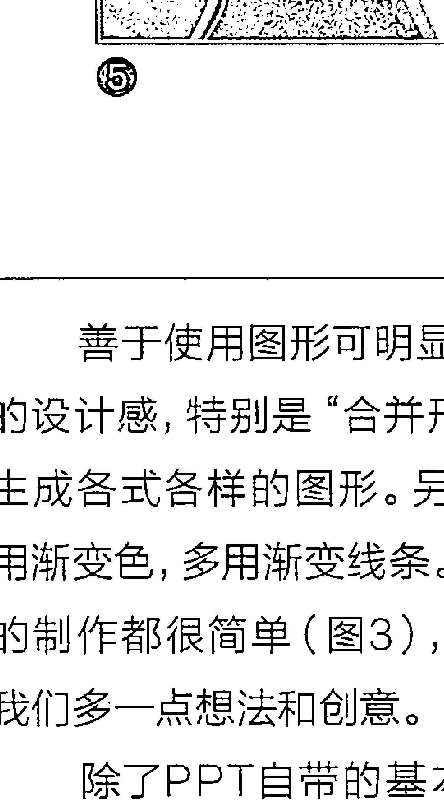


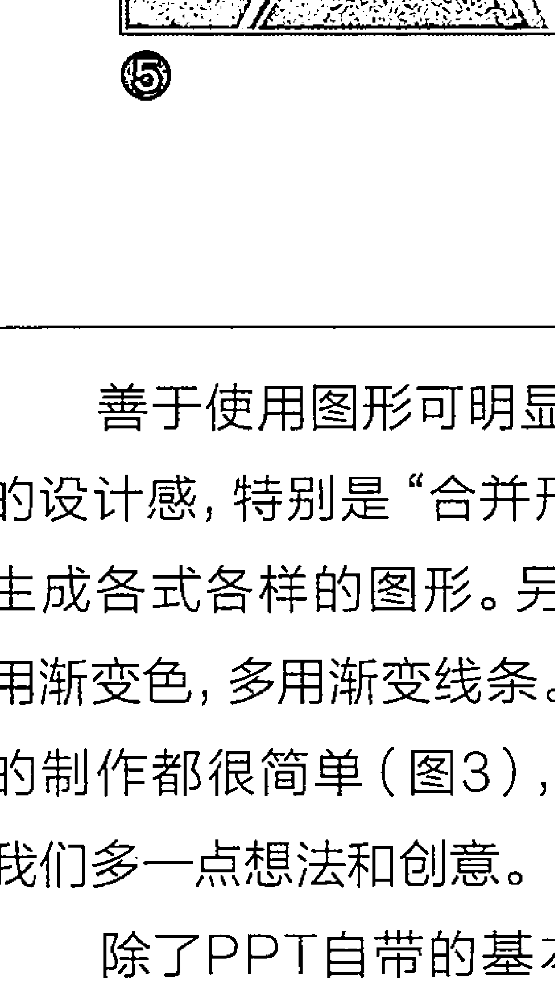

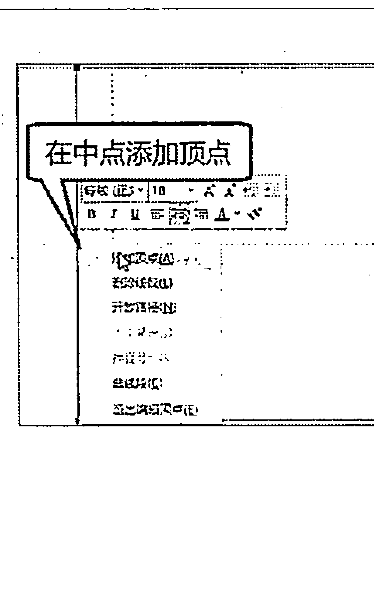

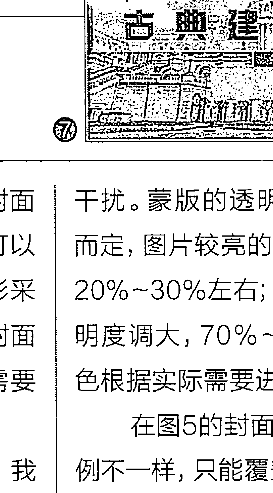

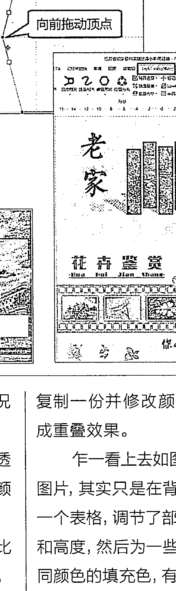

## 巧用WEB函数 轻松制作单词表

很多朋友喜欢用Excel制作个性化的单词表，但是，如果要将所有单词的音标和释义（如图1中C列和D列的内容）都手动录入到单词表中会非常麻烦。改用Excel函数自动获取网络单词音义信息，就能极大地提高单词表整理的效率。

- 首先，在A列输入单词序数，在B列输入单词名称（如图2）。
- 然后在C1单元格输入公式“`=CONCATENATE("/",FILTERXML(WEBSERVICE("http://dict.youdao.com/search?q="&B1&"&doctype=xml"),"/phonetic-symbol"),"/")`”以获取音标。
- 在D1单元格输入公式“`=FILTERXML(WEBSERVICE("http://dict.youdao.com/search?q="&B1&"&doctype=xml"),"//content")`”以获取释义。
- 之后再将C1、D1的公式向下填充，即可获得所有单词的音标和释义。

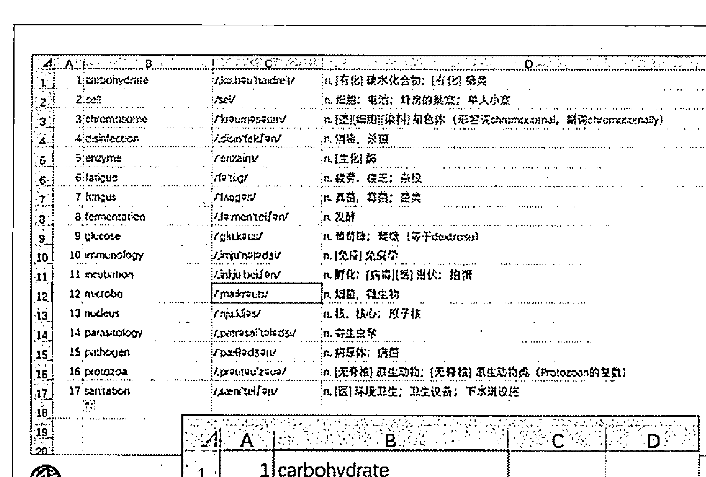

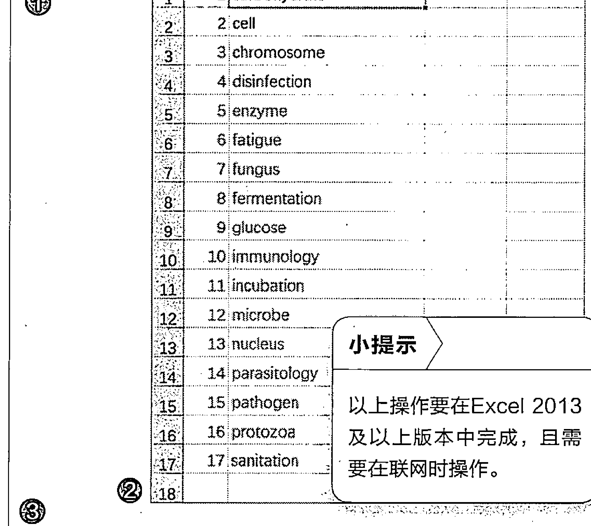

```
=CONCATENATE("/",FILTERXML(WEBSERVICE("http://dict.youdao.com/search?q="&B1&"&doctype=xml"),"/phonetic-symbol"),"/")
```

```
=FILTERXML(WEBSERVICE("http://dict.youdao.com/search?q="&B1&"&doctype=xml"),"//content")
```

上述公式的意思是，从B1单元格获取需要查询的单词，再通过WEBSERVICE函数从有道词典单词库中获得含有该单词的所有数据，之后再用FILTERXML函数从所查询到的数据中提取出需要的音标或释义。

在实际应用中，为了检查单词拼写是否正确以及获得适当的错误信息反馈，我们可以将C1单元格公式改为“`=IF(B1="","",IF(IFERROR(IF(B1="","",FILTERXML(WEBSERVICE("http://dict.youdao.com/search?q="&B1&"&doctype=xml"),"/phonetic-symbol"),"/"),"Not Found"))`”；D1单元格公式改为“`=IF(B1="","",IF(IFERROR(IF(B1="","",FILTERXML(WEBSERVICE("http://fanyi.youdao.com/translate?&i="&B1&"&doctype=xml"),"//translation")),"Not Found")=B1,"Not Found #Word#",IFERROR(IF(B1="","",FILTERXML(WEBSERVICE("http://dict.youdao.com/search?q="&B1&"&doctype=xml"),"//content")),"Not Found")))`”。

> 小提示
以上操作要在Excel 2013及以上版本中完成，且需要在联网时操作。

在此情况下，如果输入的单词有误，则在C1显示“Not Found”、D1显示“Not Found #Word#”；若词库中无匹配项（此类单词很少），则C1、D1显示“Not Found”。如图3所示，B3单元格“orangf”输入错误，则在C3单元格显示“Not Found”、D3单元格显示“Not Found #Word#”。对于英文词组，只在D列显示词组释义，C列不显示音标（如图3第一行）。

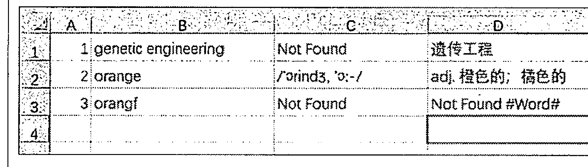

如此，不但会很快生成单词信息表，还会自动筛选出可能存在错误的输入项，以便能够快速更正和完善。

## 动态产品漏斗图巧呈现

文|马震安

某公司要用Excel制作一个产品计划生产、实际生产、实际销售、返修量、库存数这几组数据的流程对比图，若使用一般的柱形图则显得太平淡。如果通过对堆积柱形图进行设置，生成漏斗图，再通过控件、CHOOSE函数的配合，从而实现动态的交互式漏斗图，这样的图表就更加新颖别致（图1）。

### 构造图表数据

在工作表中选择“开发工具”选项卡，点击“插入→表单控件”下的“组合框”，在工作表的合适位置按住鼠标左键画出一个组合框控件；右击插入的组合框，选择“设置控件格式”，在弹出窗口的“控件”选项卡中，数据源区域选择所要显示的菜单单元格区域（A2:A5），单元格链接选择B7。这样当点击组合框中的菜单时，B7单元格就会显示相应的数值。

```
=CHOOSE($B$7,B2,B3,B4,B5)
```

```
=CHOOSE($B$7,C2,C3,C4,C5)
```

在 B9 单元格中输入，在B10单元格中输入，以此类推，B9:B13就能根据B7单元格的变化而生成相应的值。

```
=($B$9-B9)/2
```

### 添加图表

数据构造完成后，选中A8:C13数据区域，插入一个二维条形图中的堆积条形图，右击图表中的条形图选择“选择数据”，在弹出窗口的图例项处调整数据的上下位置，在纵坐标轴上右击，选择“设置坐标轴格式”，在右侧的设置坐标轴格式窗口口选择“坐标轴选项→坐标轴选项”，勾选“逆序类别”。设置完成后，将横、纵坐标删除。选中图表中代表辅助列的条形图，设置为无填充无边框，并添加数据标签；右击添加的数据标签，选择“设置数据标签格式”，在“标签选项”中勾选“类别名称”，去掉“值”。选定绘图区，调整其大小，使标签和条形图完全分离。选中图表，选择“设计”选项卡，点击“添加图表元素→线条→系列线”，选中系列线，设置好它的样式（图3）。

选中一个空白单元格（如 F10），输入“`=B7&"月份产品生产及销售统计"`”，选定图表标题，在公式栏中输入“`=Sheet1!$F$10`”。这样图表标题也会根据菜单选项的变化而变化。

```
=B7&"月份产品生产及销售统计"
```

```
=Sheet1!$F$10
```

最后，拖动组合框到图表的合适位置，将图表置于底层，将组合框和图表选定并进行组合。这样别具一格的漏斗型交互式图表就制作完成了。

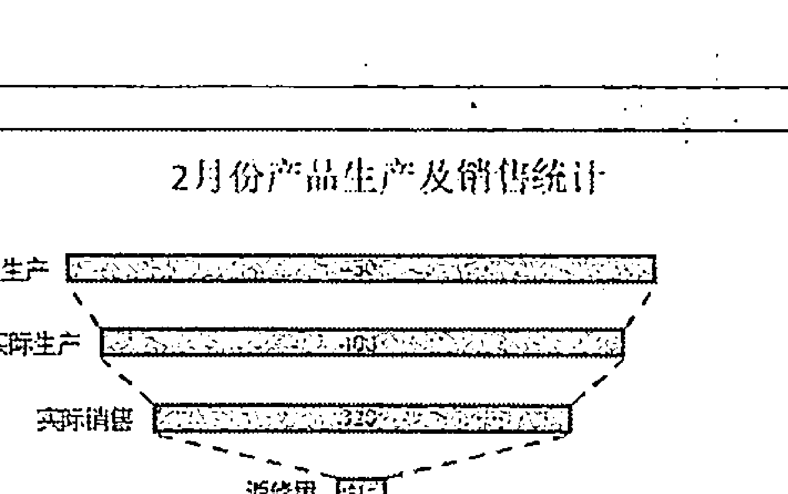

| 月份 | 计划生产 | 实际生产 | 实际销售 | 返修量 | 库存数 |
|------|----------|----------|----------|--------|--------|
| 1月份 | 500 | 400 | 350 | 50 | 10 |
| 2月份 | 450 | 400 | 320 | 40 | 20 |
| 3月份 | 480 | 410 | 340 | 45 | 20 |
| 4月份 | 420 | 380 | 320 | 30 | 10 |
| 月份 | 3 |  |  |  |  |
| 项目 | 数量 | 辅助列 |  |  |  |
| 计划生产 | 480 | 0 |  |  |  |
| 实际生产 | 410 | 35 |  |  |  |
| 实际销售 | 340 | 70 |  |  |  |
| 返修量 | 45 | 218 |  |  |  |
| 库存数 | 20 | 230 |  |  |  |

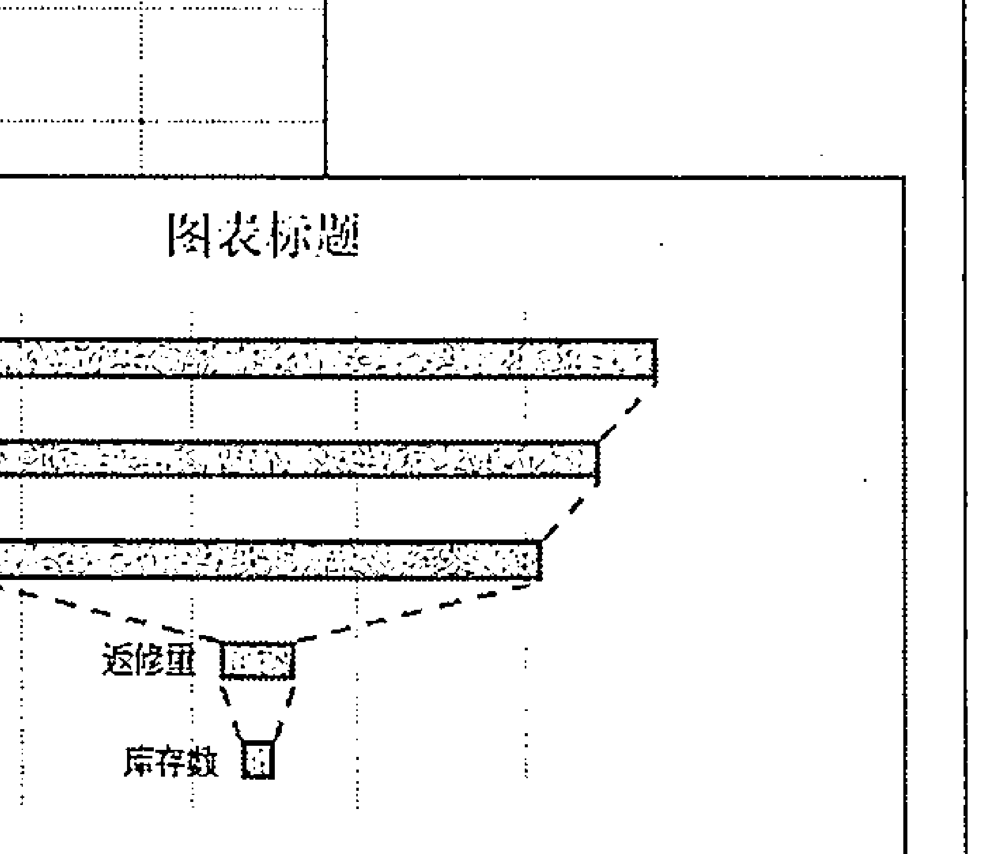

## 不用代码 制作连线题幻灯片

文/马震安

如果在PPT中制作连线题并判断对象，必然要用到VBA代码，这对大多数人来说会感到为难。但如果使用Articulate Storyline 3软件制作，不用代码，只需要几个自选图形、触发器及相应变量，就能轻松制作出带有对象判断功能的连线题（图1）。

### 1 插入连线题目

打开Articulate Storyline 3并新建一个项目，双击无标题幻灯片，右击设置它的背景色，利用“插入”选项卡中的文本框在幻灯片中插入所需要连线的题目，设置好字体、字号及颜色等，利用对齐工具将左、右项目调整规矩（图2）。

### 2 添加拖动按钮

在左侧第1个选项的右端插入自选图形中的圆形，调整好大小，填充色设置为蓝色，右击圆形，选择“编辑文本”，输入数字“1”，字体颜色设置为白色，在时间轴上将它的名称更改为“蓝色圆形1”，复制粘贴这个圆形，将复制出的圆形填充色设置为灰色，字体颜色设置为黑色，在时间轴上将复制出的圆形名称更改为“灰色圆形1”，并在时间轴上拖动“灰色圆形1”层，使其置于“蓝色圆形1”的下面。同理，在左侧其他选项右侧也插入蓝色、灰色圆形，并输入相应数字。在右侧每个选项的左侧插入灰色圆形，分别命名为“放置区域1”、“放置区域2”……“放置区域5”，右侧对齐。这样，带数字的圆形将会成为拖动按钮，右侧不带数据的圆形将作为放置区域（图3）。

### 3 设置连线状态

以左侧第1项的连线为例进行说明。左侧第1个A项对应的正确答案是右侧的“呆小症”，所以利用自选图形中的直线，在A项和“呆小症”之间画一条连线，设置好线条颜色。在窗口下方点击“状态”选项卡，点击“编辑状态”，点击“重复状态”，在弹出窗口中的状态名称设置为“1”，在幻灯片中调整连线，使它在A项和右侧第1个选项“侏儒症”相连；再点击“重复状态”，状态名称设置为“2”，在幻灯片中调整连线，使它在A项和右侧第2个选项“甲亢”相连；点击“重复状态”，状态名称设置为“4”，在幻灯片中调整连线，使它在A项和右侧第4个选项“糖尿病”相连；再点击“重复状态”，状态名称设置为“5”，在幻灯片中调整连线，使它在A项和右侧第4个选项“肢端肥大症”相连。点击“编辑状态完成”，初始状态处选择“隐藏”。同理，其他选项的连线也设置好相应的状态，初始状态也都设置成“隐藏”（图4）。

> 小提示
圆形的填充色及字体颜色可根据需要自选设置。

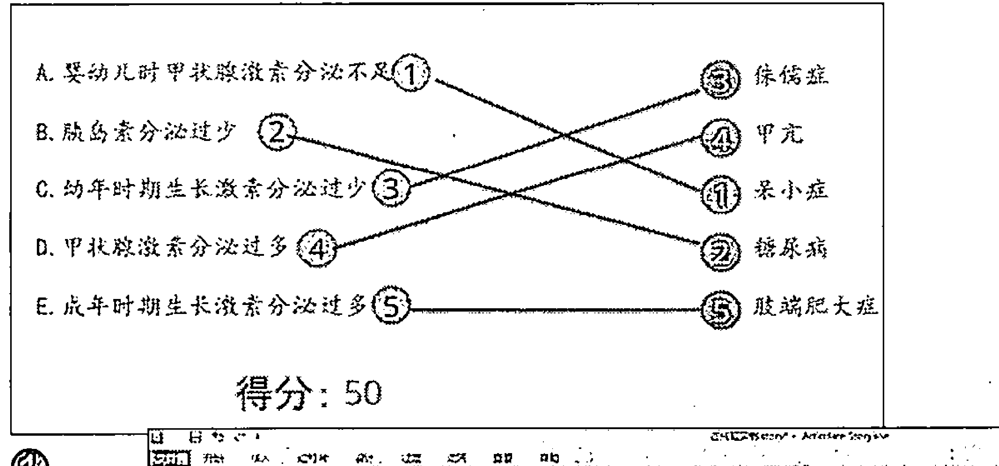

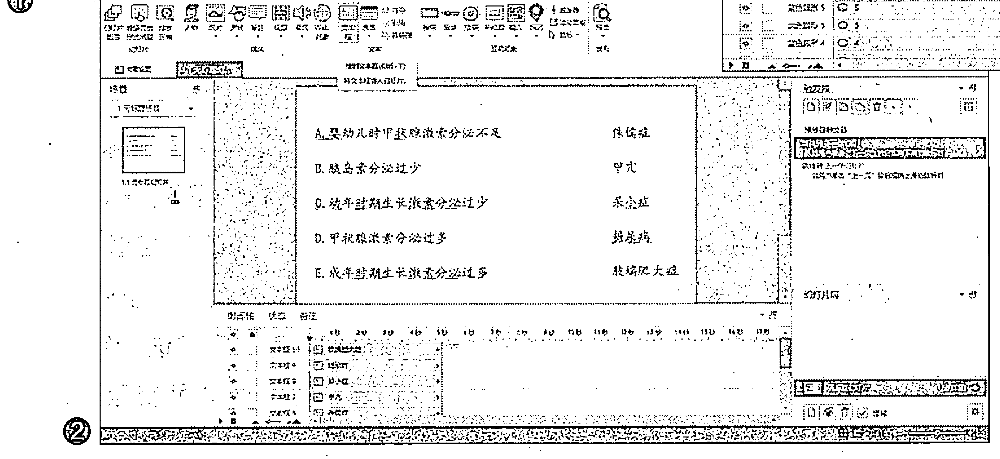

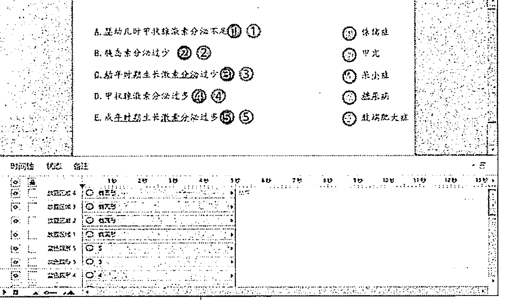

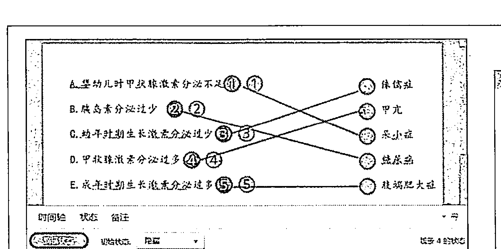

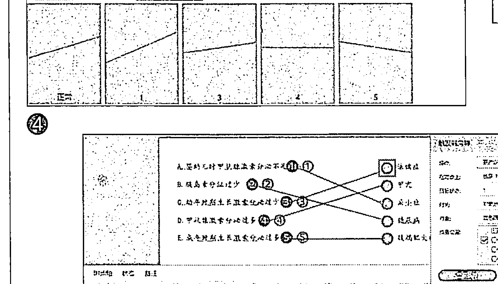

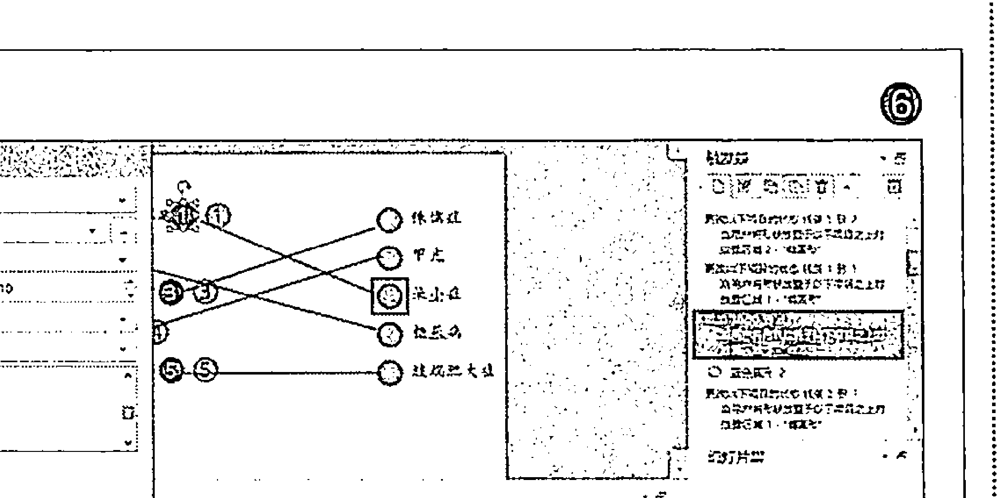

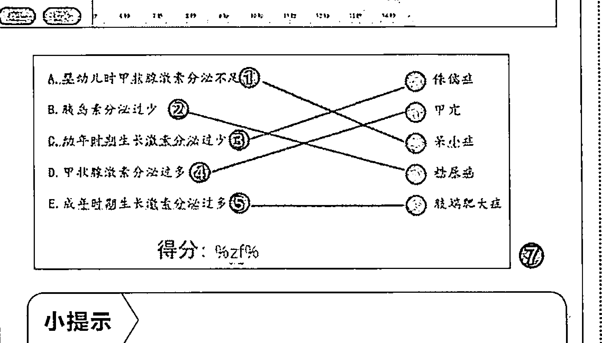

### 4 添加变量

点击“触发器”面板中的“管理项目变量”，添加1个变量，变量名称为zf，类型为“数字”，值为“0”。

### 5 添加交互动作

以A项连线的不同状态显示为例。新增触发器，在弹出窗口的操作处选择“更改以下项目的状态”，在对象处选择“线条1”（即右侧A项的线条），目标状态处选择“1”，时间处选择“对象放置位置”，对象处选择“蓝色圆形 1”，放置位置处选择“放置区域 1”，这样当拖动蓝色圆形1并放置在放置区域1后，线条1的状态就显示为设置为4时的状态（图5）。

新增触发器，在弹出窗口的操作处选择“更改以下项目的状态”，在对象处选择“线条1”（即右侧A项的线条），目标状态处选择“2”，时间处选择“对象放置位置”，对象处选择“蓝色圆形 1”，放置位置处选择“放置区域 2”，这样当拖动蓝色圆形1并放置在放置区域2后，线条1的状态就显示为设置为2时的状态；以此类推，再新增3个触发器，使蓝色圆形1被拖放到不同放置区域时，线条1显示不同的状态。最后，再新增触发器，操作处选择“调整变量”，变量处选择“zf”，运算符处选择“+添加”，值处选择“值”，输入“10”，时间处选择“对象放置位置”，对象处选择“蓝色圆形 1”，放置位置处选择“放置区域 3”（即正确连线）。这样，连线正确（即线条1的状态为正常）时，变量zf的值就增加10（图6）。

同理，其他线条的状态显示也是这样设置，变量zf值的变化与上述操作也大同小异，这里就不再一一赘述了。

在幻灯片中再插入一个按钮，标签为“提交”，再在合适位置插入两个文本框，文本框内容分别为得分、0。选中文本框是0的那个，点击“插入→引用”，在弹出的窗口选中变量zf，确定后将文本框中的临时值删除，保留百分号及之间的部分。这样，这个文本框中便会显示变量zf的值了。将所有带数字标签灰色圆形与对应的带数字标签蓝色圆形完全重叠（图7）。最后，点击“发布”，设置好发布文件夹，点击“发布”按钮即可。

## 饼图美化 PPT颜值大比拼

文|平淡

在PPT设计中，如果涉及到数据说明，我们经常会使用饼状图来表述数据。不过简单地在Excel中生成饼图插入PPT中并不美观，要让自己的PPT颜值更高，我们可以对插入的图表进行美化设置。

### 就地取材简单美化

因为PPT主要是向观众展示，因此对于插入的图表就需要能够更直观地向观众表达图表的含义。要让饼图的可视化效果更佳，我们只要使用PPT图表工具组件进行设置即可。比如在PPT中插入的饼图，默认只是使用不同颜色的扇区表示数据，用户无法直观地看出饼图需要表达的意思（图1）。

饼图的主要作用是表达各个部分或者数量的比例，因此我们可以在每个扇区添加百分比数值来表示比例。右击图表区域选择“设置数据系列格式”，在右侧窗格点击“系列选项→系列销售额数据标签”，在标签选项下勾选“百分比”，这样饼图中的数据就会出现百分比数值，按提示设置百分比字体和字号、颜色。这样插入的饼图，用户通过百分比数值就可以很直观地看出饼图的含义了（图2）。

当然，为了使插入的饼图更为美观，我们还可以使用很多工具进行美化。比如默认插入饼图的扇区排列是按照数据排列顺序排列的，为了使得饼图的排列更美观，我们可以对扇区排列进行手动调整。对于饼图来说，把数值最大的扇区放置在4点钟或8点钟方向，图表可以显得比较稳定和美观。扇区方向的调整，同上进入设置数据格式菜单，点击“设置数据点格式→系列选项→系列绘制在”，然后调整“第一扇区起始角度”，这样即可对饼图扇区进行调整（图3）。

默认情况下，最大扇区和最小扇区的数据是排列在一起，如果大小之间的数据相差较大（比如最小是1%，最大是54%），这样图表看起来就很不协调，此时还可以对原始数据进行调整。在PPT中点击编辑数据，然后将1%数据剪切到第3行位置（对数据重新排序），这样图表看起来就更为协调（图4）。

### 更上一层楼自定义饼图元素

上述操作只是简单地对饼图进行美化，要让插入的饼图更为漂亮，我们还需要对饼图的显示元素进行更多的个性化设置。

首先是配色，为了让饼图的可视化效果更佳，对于各个扇区的配色建议使用单色系进行配置。这样用户通过同一系列的颜色深浅就可以直观感知到数据的大小是不同的。默认单色系是按照数据排列顺序进行从深到浅填充的，因此为了让填充颜色和实际数据大小对应，选中饼图后，点击“图表工具→设计→编辑数据”，点击“在Excel中编辑”，然后对数据进行降序排列（图5）。

接着选中扇区，点击“图表工具→更改颜色→单色”，选择一种合适的颜色填充扇区。同时使用上面介绍的调整扇区的方法对扇区角度进行调整，这样在PPT中使用饼图展示数据的时候，数据大小是和颜色的深浅一一对应的，用户通过颜色的深浅就可以很直观地感知数据的大小分布了（图6）。

当然我们还可以根据实际需要使用其他配色方案，比如可以将数据最小和最大的扇区填充为红色和绿色，使得数据反差可以在颜色对比中比较直观地显示出来（只要双击扇区，然后分别填充不同颜色即可）。

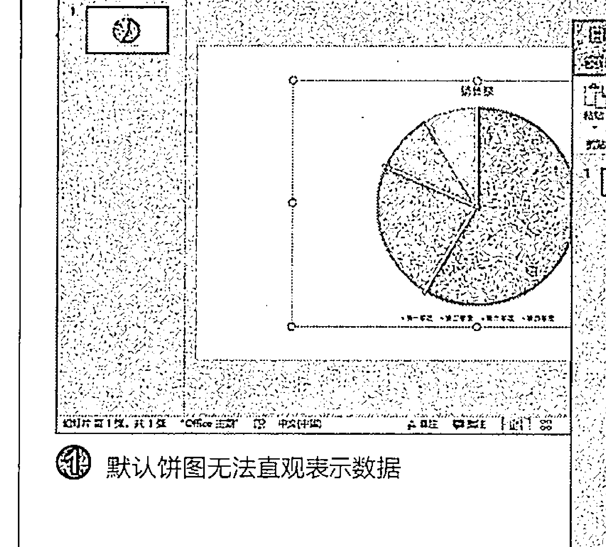

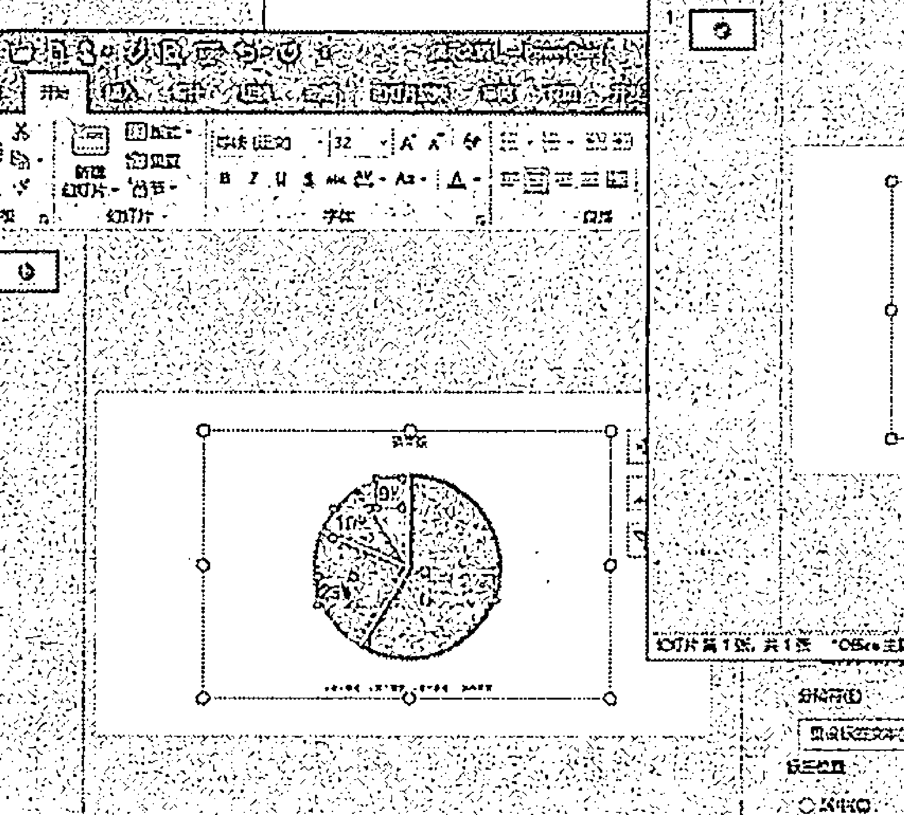

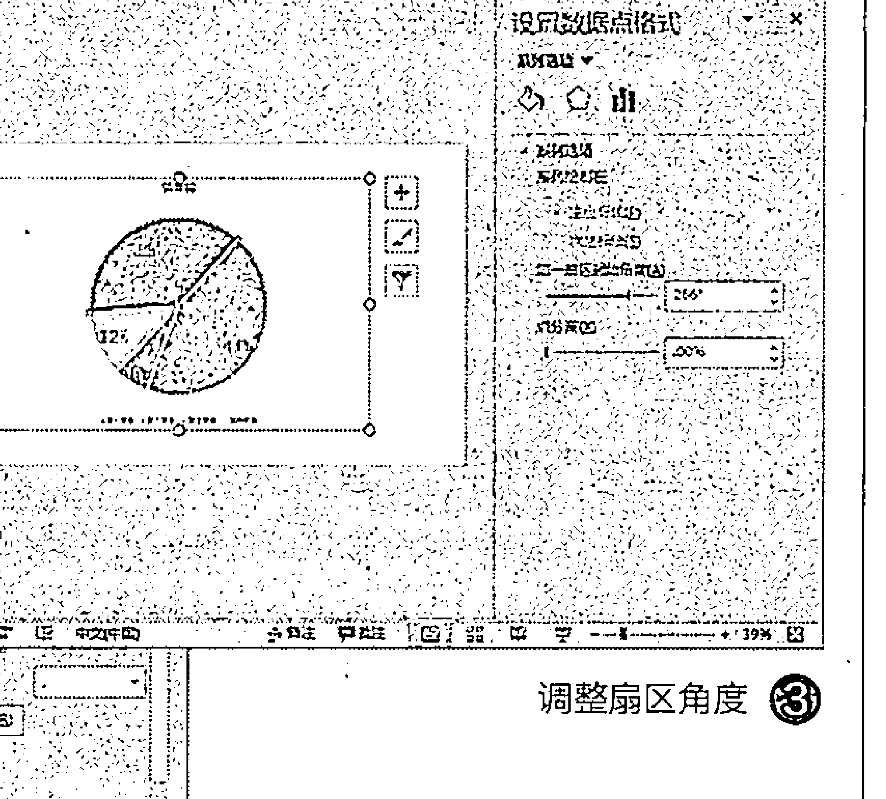

| 第四季度 | 56 |
| 第一季度 | 29 |
| 第二季度 | 11 |
| 第三季度 | 11 |

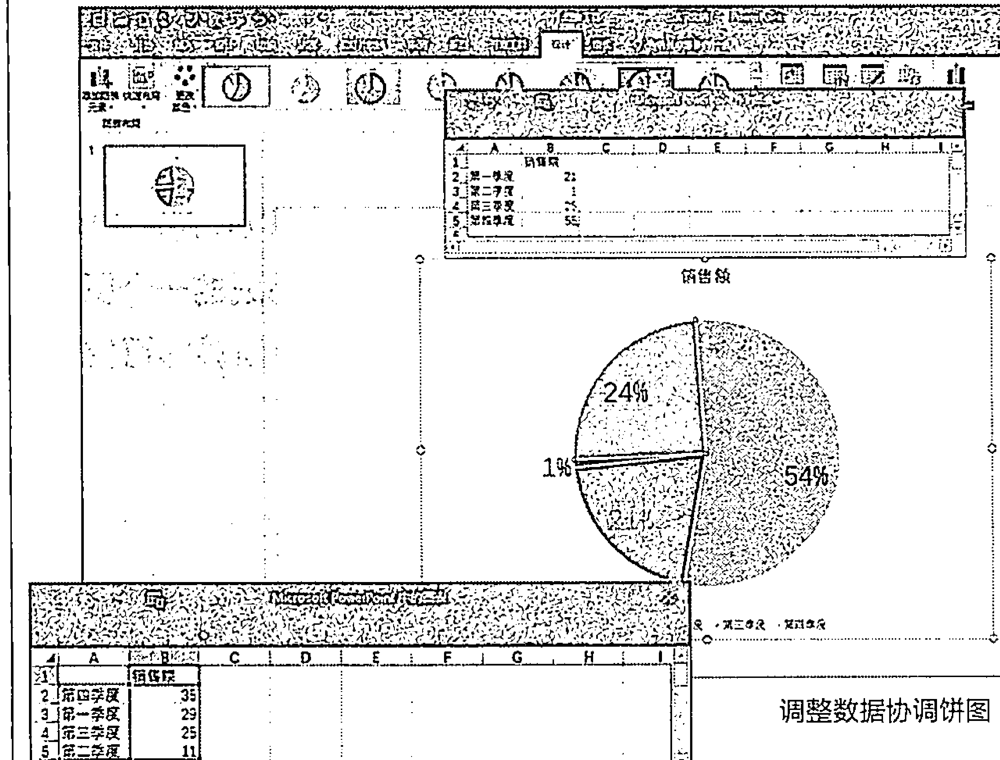

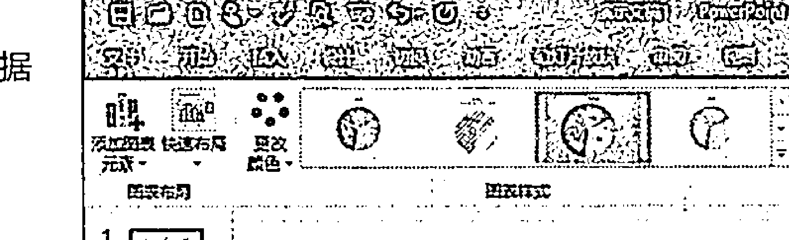

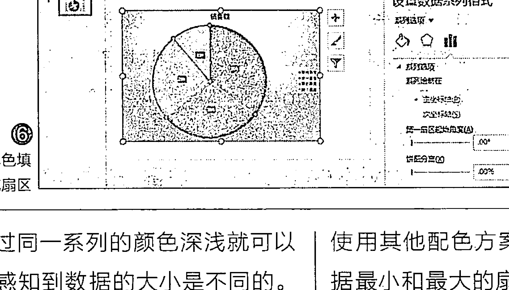

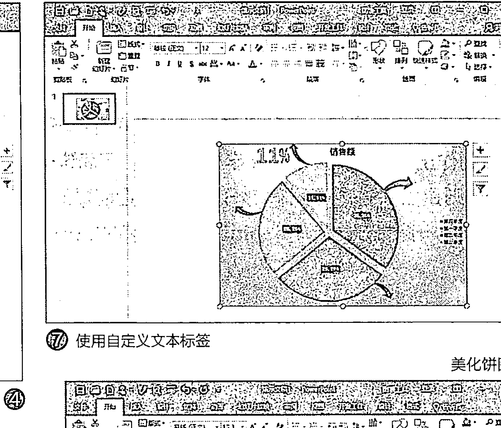

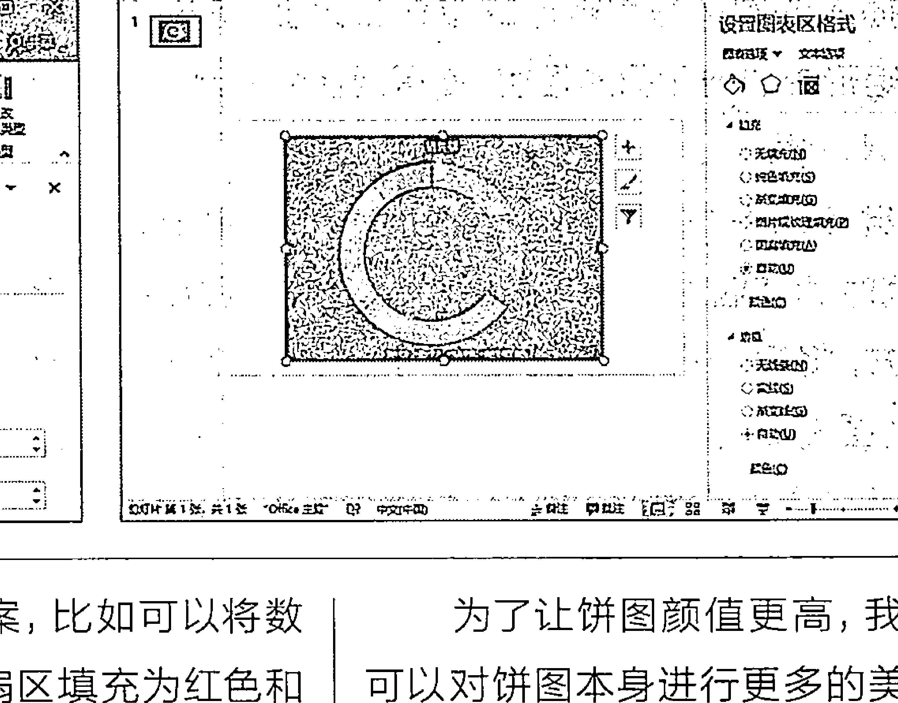

其次我们还可以对饼图进行自定义美化。比如为了突出数据的展示，我们可以使用自定义的文本和引导标签。先将饼图原来的数据标签删除，点击“插入→形状→左弧形箭头”，然后将这个箭头复制并粘贴为图片，接着使用“裁剪”工具获得箭头工具，并将这个箭头图片叠加到饼图上（通过旋转工具叠加到不同的扇区上）。继续插入艺术字，然后输入数据标签，这样自定义标签是不是比默认的要好看多了（图7）？

为了让饼图颜值更高，我们还可以对饼图本身进行更多的美化。比如点击“插入→形状→圆形”，然后按住Shift插入一个正圆，同时填充色设为无色，边框线线宽加粗，最后设置边框线的颜色，为原来的饼图添加一个外框，使得饼图看起来更为专业。当然也可以变换饼图形状，使用环形的数据图，同时对数据图的其他元素如标题、背景等进行更多的美化设置，使得饼图具有更佳的美化效果（图8）。

当然，饼图美化的方法还有很多。总之，我们在PPT中插入一个饼图后，就可以将饼图作为一个组合形状来对待，同时利用PPT提供的各种工具进行有针对性的美化操作。

# 布尔运算法让PPT中的符号“抖”起来

文|愚人

最近抖音视频非常流行，各种抖音风格的元素也日渐普及。如果要让你的PPT也和流行亲密接触，可以利用PPT自带的工具制作出各种抖音风格的文字或者图标。下面这个“抖”动的Logo，是由红蓝白三个d字母组合而成的一个图形，而字母d则是由“圆环+矩形+部分圆形”组合而成的（图1）。在PPT中这类组合图形的制作借助布尔运算即可完成，下面我们就一起来在PowerPoint中制作抖音的Logo。

新建一张幻灯片，然后将其背景色填充为渐变色。接着点击“插入→形状”，按住Shift插入一个圆环形状和一个矩形，同时将插入形状全部设置为“无轮廓”。移动插入的圆环型和矩形的位置和大小，这里注意插入的矩形外边要和圆形相切，使得组合图形像一个字母d的形状（图2）。

继续点击“插入→形状”，插入一个圆弧形状和矩形，同时调整插入圆弧形状的大小和位置，移动到矩形的上方，将插入的圆弧形状部分作为字母d上方的弧形部分（图3）。

选中插入的矩形和弧形，点击“绘图工具→格式→拆分”，将矩形和弧形拆分为多个形状。完成拆分操作后，将多余的部分移动出来并删除，并将其中的部分弧形作为Logo字母部分移动到原来的字母上方，调整大小和位置，这样抖音的Logo的外形就基本具备了（图4）。

因为抖音的Logo外形是由三个不同颜色d字母组成。按提示选中全部组合图形，按住Ctrl键复制二份备用，同时将复制的图形排列整齐。按住Ctrl选中每个字母的组合图形，点击“格式→形状填充→取色器”，依次点击样图中Logo样图的颜色，将三个字母颜色填充为白、蓝和红色图形（图5）。

通过观察抖音Logo可以看到，三种颜色从上到下依次是白、蓝、红并且白、蓝图标缺口是对齐的。先将白色的图标叠加到蓝色图标上方，选择白色图标，右击选择“置于顶层→置于顶层”。将上下两个图标按样图Logo形式上下排列对齐，插入一个矩形（填充为白色并设置为无轮廓）放置在白色图标的环形区域，并将矩形右侧的边缘和图标原来矩形的左侧边缘对齐，点击“绘图工具→格式→拆分”，然后将不需要的形状移除并删除。操作同上，继续插入一个矩形（填充为蓝色并设置为无轮廓）放置在蓝色图标的环形区域。同上执行分离操作，这样白色、蓝色图标缺口就自动对齐（图6）。

选中红色图标叠加到上述图标的下方（设置为底层），为了方便对图层的操作，点击“开始→选择窗格”，在右侧的窗格中将蓝色的图标隐藏，当然可以根据自己的实际需要隐藏任意图标。移动红色图标的位置和样图Logo一致，操作同上，插入一个矩形，然后将矩形右侧的边缘和图标原来蓝色矩形的左侧边缘对齐。同上执行分离操作，完成红色图标缺口制作（图7）。

操作同上，继续插入一个圆形并填充为红色，调整适当大小后和红色图标的环形区域进行分离操作，去除其中多余的红色边缘。适当调整各个图标的大小和位置，最后选中全部图形进行组合，这样一个抖音的Logo图标就完成了（图8）。

可以看到，类似抖音元素的制作实际上是将多个复制的图标叠加在一起，同时通过图形的布尔运算实现的。当然通过类似的方法我们可以制作抖音文字，比如可以插入一个艺术字，然后复制二份并分别设置为白、蓝和红色。然后将三色字体分别叠加在一起。同上设置好叠加次序，并且依次调整好字体的位置（按照从上到下依次左移即可），这样一份抖音效果的文字即可完成了（图9）。

# 不论次序 快速登记个人信息

**文|李昊薶**

在工作和生活中，我们常常需要用Excel登记个人信息，但当一个表格中需要登记的人数特别多时，先查找姓名再录入的登记方式，操作起来就会非常麻烦。如何根据每个人的编号快速登记其相关信息呢（图1）？这里我给大家介绍一种不需考虑顺序、不用查找姓名，直接录入编号和内容的方法。

首先，我们在原有的编号、姓名、成绩3列的基础上，前后各插入一个空白列，A列和E列。将D列“成绩”单元格格式设置为“文本”。具体操作为选中D列并单击右键，选择“设置单元格格式”菜单项，然后在“数字”选项卡下选择“文本”类别，最后点击“确定”按钮（图2）。

接下来开始登记成绩。假设第一个来登记的是13号鲁智深，成绩是130分，那么我们在E1单元格输入013130即可。接着按照这种方式依次输入所有人员的编号和成绩，不论先来后到，也不用去理会前面的编号、姓名是否与输入的内容对应（图3）。

待所有的编号和成绩录入之后，在A2单元格输入公式：`=NUMBERVALUE(LEFT(E2,3))`，D2单元格输入公式：`=RIGHT(VLOOKUP(B2,A:E,5,FALSE),3)`，分别将两单元格向下填充，即可获得所有人员的正确成绩（图4）。

按下Ctrl+A选中所有单元格，再按下Ctrl+C复制，右键单击并在菜单中选择“选择性粘贴”，然后选择“数值”，点击“确定”（图5）。最后，删除A、E两个辅助列。

> ### 小提示
> 
> VLOOKUP函数用于按列查找数据并返回指定值，即根据给定表格第一列的数据查找并返回该行指定单元格的值，常用于进行核对数据等操作。
> 
> LEFT和RIGHT函数分别用于获取从左往右或从右往左特定数目的字符，在本例中用于拆分输入的字符串。
> 
> NUMBERVALUE用于将文本转换为数字，例如将获取到的“013”转换为13。

# 自定义实现动态图表标签

文|马震安

普通的图表标签只是单纯地显示在图表上，显得比较单调。如果利用组合图表，将组合图表中带数据标记的折线图进行一些设置，就很容易实现别具一格的动态图表标签（图1）。

首先，在工作表中选择“开发工具”选项卡，点击“插入→表单控件”下的“复选框”，在工作表的合适位置按下鼠标左键画出一个复选框控件；双击此复选框，更改其标签内容为“显示自定义标签”；右击复选框，选择“设置控件格式”，在弹出窗口的“控件”选项卡中，值处选择“已选择”，链接单元格处选择一空白单元格（如B9），这样，当勾选这个复选框时，B9单元格的值就是TRUE，否则就是FALSE。

```
=IF($B$9=TRUE,MAX(B2:B3)+100,NA())
```

```
=IF((B2-B3)/B3<0.5,"请重点关注","")
```

在原有数据表的基础上，加入辅助数据，如在B6单元格中输入“=IF($B$9=TRUE,MAX(B2:B3)+100,NA())”，并向右填充到相应单元格中；在B7单元格中输入“=IF((B2-B3)/B3<0.5,"请重点关注","")”，也向右填充到相应单元格中。这样就可利用复选框来控制自定义标签的显、隐了（图2）。

接下来，选择B1:M3单元格，插入一个簇状柱形图表。选定B6:M6，使用Ctrl+C复制数据，然后选定图表，使用Ctrl+V粘贴B6:M6数据到已有的簇状柱形图表中（图3）。

右击图表中的柱形，选择“更改图表类型”；勾选系列3的“次坐标”，将它的图表类型设置为“带数据标记的折线图”；右击图表中的折线图，选择“设置数据系列格式”，设置系列3折线图表为线条无填充、无线条，标记无填充、无线条，为系列3添加数据标签；然后设置数据标签，选择类别名称和显示引导线，去掉值及系列名称。右击图表，选择“选择数据”，在弹出的对话框左侧的图例项（系列）中选中系列3，在水平（分类）轴标签中点击编辑，在出现的轴标签对话框中的轴标签区域，选择数据区域$B$7:$M$7替换原来的数据区域$B$1:$M$1（图4）。

最后，删除右侧纵坐标轴，选中标签，右击选择“更改数据标签形状”，根据需要选择相应的样式，通过选择数据标签的格式设置好填充及线条效果，拖动复选框到图表相应位置，将图表置于底层，这样别具一格的动态图表标签就制作完成了。

| 月份 | 收益 | 成本 |
|------|------|------|
| 一月 | 1280 | 662 |
| 二月 | 790 | 255 |
| 三月 | 878 | 206 |
| 四月 | 1156 | 851 |
| 五月 | 1508 | 626 |
| 六月 | 1290 | 730 |
| 七月 | 2160 | 692 |
| 八月 | 1218 | 835 |
| 九月 | 1375 | 677 |
| 十月 | 2473 | 809 |
| 十一月 | 295 | 654 |
| 十二月 | 1314 | 808 |

# Excel Word联手 多列数据并一列

文|马震安

在Excel工作表中，按公司部门存放着人员名单，每个部门占一行，有多少人就占据多少列，现想将所有人员按部门归列到一列中，如图所示，这样的操作如何实现（图1）？其实，利用Excel辅助列，外加Word查找替换功能的协助，这样的操作还是非常容易实现的。

首先，在B列右侧插入一辅助列，在C2处输入“=B2&","&A2”，向下填充到C6，选定C2:J6数据区域复制，打开一空白记事本，粘贴，再将粘贴到记事本中的数据都选中，剪切，打开一空白Word文档，粘贴（图2）。

点击“分列”，在弹出的窗口第1步中选择“分隔符”，点击“下一步”，在第2步中分隔符号处勾选“逗号”，点击“下一步”，点击“完成”，这样就实现了姓名和部门的分列显示。在B2单元格输入“=B1”，选中B2单元格，复制；选中B2:B26单元格区域，选择“开始”选项卡，点击“查找和选择→定位条件”，在弹出的定位条件窗口选择“空值”，这样，B2:B26单元格区域中所有空单元格就会被选中（图4）。

然后，在Word中点击“替换”，在弹出的窗口点击“更多”，将光标定位到“查找内容”处，点击“特殊格式”，选择“制表符”；将光标定位到“替换为”处，点击“特殊格式”，选择“段落标记”，点击“全部替换”。这样，多列数据就变成了一列（图3）。

单击“粘贴”，空白单元格就被填充上了相应的部门名称。选中B列数据区域，复制，粘贴到原数据区域，粘贴时选择“数值”。

接下来，选中Word文档中的内容，剪切；切换到记事本，粘贴，再选中记事本中的内容，剪切；切换到Excel，新建一工作表，选中A1单元格，粘贴。选中工作表中的数据区域（即A1:A26），选择“数据”选项卡，

最后，通过剪切、粘贴交换A列和B列的数据，在第1行上方插入一空行，输入标题。这样，就完成了多列转一列的效果了。

# 制作PPT收放式菜单

文|马震安

在PPT中，普通的平铺式菜单在页面中太占位置，如果能将菜单制作成收放式效果，定会给幻灯片节省出大量的宝贵空间。利用PPT中的进入、退出动画效果中的“擦除”，再配合触发器的设置，收放式菜单非常容易制作出来。接下来，我们就制作一个当点击“+”图标时菜单展开、点击“-”图标时菜单收回的动画效果（图1）。

首先，在幻灯片中插入一个自选图形中的正圆（即按住Shift后再画圆），设置好填充色，无线条。选中这个圆，复制，连续粘贴两次，将粘贴出的两个圆拖放到空白处，拉开一定距离（距离根据所需要的子菜单数量和大小决定），顶端对齐；再画一个矩形，矩形的长为两个粘贴出圆的圆心距离，矩形的宽为圆的直径，填充色与圆相同，无线条。将这个矩形放置于两个圆心之间，与两个圆的顶端对齐。将这两个圆与矩形同时选中，选择“格式”选项卡，点击“合并形状→联合”，这样就组成了菜单的背景图形。利用自选图形中公式形状中的“+”和“-”，在幻灯片中分别画出加号和减号，设置所需要的填充色及线条，调整它们的大小，使它们小于第1个正圆的直径。插入子菜单所需要的图标，利用文本框插入子菜单，将每项子菜单与相应图标组合。这样，制作菜单所需要的各个元素就制作完成了（图2）。

> 小提示
> 利用子菜单进行幻灯片之间的跳转，只需要右击子菜单中的图标，选择“超链接”，链接到相应的内容就可以了。

接下来，选中作为菜单背景的组合条形图，设置它进入的动画效果为“擦除”，点击“动画窗格”，在动画窗格中，右击“擦除”效果，选择“效果选项”，在弹出窗口的“效果”选项卡中，方向为“自左侧”，在“计时”选项卡中，开始处为“与上一动画同时”，期间处为“非常快(0.5秒)”，点击“触发器”，选择“单击下列对象时启动效果”，在下拉列表中选择“加号”；

再选中这个组合条形图，点击“添加动画”，选择退出动画效果中的“擦除”，方向为“自右侧”，开始处为“与上一动画同时”，期间处为“非常快(0.5秒)”，点击“触发器”，选择“单击下列对象时启动效果”，在下拉列表中选择“减号”；

分别选中带图标的子菜单，设置其进入的动画效果为“淡出”，开始处设置为“上一动画之后”；再次分别选中这些子菜单，设置它们的退出动画效果为“消失”，开始处设置为“与上一动画同时”；在动画窗格窗口，将这些子菜单进入时的“淡出”动画效果拖放到“加号”触发器下，根据子菜单出现的先后，调整上、下关系，再将这些子菜单退出时的“消失”动画效果拖放到“减号”触发器下，根据子菜单退出的先后，调整上、下关系。

选择“-”图形，设置其进入动画为“擦除”，方向为“自左侧”，开始为“单击时”，触发器为图形“加号”，点击“添加动画”，设置其退出动画为“擦除”，方向为“自右侧”，开始为“单击时”，触发器为图形“减号”，将减号图形的进入动画效果拖放到“加号”触发器下的最上面，将减号图形的退出动画效果拖放到“减号”触发器下的最上面。

调整各元素的层次关系，将正圆放置在最底层，“+”号放到倒数第二层，组合条形图放置在倒数第三层，“-”号和子菜单上移一层，减号和子菜单移动到最上层。最后，将这些元素的位置摆放好就可以了（图3）。

# VBA+公式 轻松制作动态图表

在Excel中制作动态图表，传统的方法是利用表单控件与单元格链接，从而获取图表所需要的数据。其实，不用控件，只需几句VBA代码，加上几个HYPERLINK公式，也可以轻松制作出动态图表（图1）。

首先打开存放制作图表所需数据的工作表，选择“开发工具”选项卡，点击Visual Basic，在出现的VBA代码编辑窗口中，点击“插入→模块”，输入如下三行代码（图2）：

```
Function techart(rng As Range)
    Sheet1.[J2] = rng.Value
End Function
```

退出VBA窗口，在工作表的J2单元格任意输入数据源中已存在的矿泉水名称，如“百岁山”，在J3单元格输入“=HLOOKUP($J$2,B$2:G$3,ROW()-1,FALSE)”，并下拉填充至所需要的单元格，如J14。选中J2:J14单元格数据区域，选择“插入”选项卡，插入折线图。右击图表中的折线系列，选择“设置数据系列格式”，在系列选项的“填充与线条”中，设置无线条，点击“标记”选项卡，在数据标记选项下，选择“内置”，选择所需要的类型，设置好大小、填充及线条颜色等；右击图表系列，选择“添加数据标签”，设置好数据标签的位置、字体、大小等。选中图表，选择“设计”选项卡，添加图表元素，选择“线条→垂直线”，右击图表中添加的垂直线，选择“设置垂直线”，设置好所需要的颜色和粗细；删除图表中的网格线，设置好图表的背景色。调整好图表大小，并与相应单元格对齐（图3）。

接下来，在L16单元格输入“=IFERROR(HYPERLINK(techart(B2)),"*"&B2&"*"&REPT( 这样，当鼠标点击单元格中的品牌名称时，图表发生了相应的变化，图表标题等也发生了相应的变化。动态图表制作完成。# 制作仿立方体图片旋转PPT

文/马震安

在PPT中实现图片间3D效果式的旋转切换并不太简单，但是，如果通过几次进入动画中的伸展与退出动画中的层叠相互配合，仿立方体式的图片旋转效果也可以轻松制作出来（图1）。

首先，新建一张空白版式幻灯片，设置好背景色，插入第一张图片，设置好所需要的大小。选定图片，选择“动画”选项卡，在效果列表中选择“更多退出效果”，在弹出的窗口选择退出效果中的“层叠”，点击“动画窗格”，在动画窗格窗口右击图片的动画效果选择“效果选项”，在弹出窗口的“效果”选项卡中，“方向”处选择“到左侧”，选择“计时”选项卡，“开始”处选择“上一动画之后”，“期间”处选择“慢速”（图2）。


插入第三张图片，大小与前两张一致。选中第三张图，添加进入效果中的“伸展”，“开始”处选择“与上一动画同时”，方向为“自底部”，速度为“慢速”；添加退出动画效果中的“层叠”，“开始”处选择“上一动画之后”，方向为“到右侧”，速度为“慢速”。

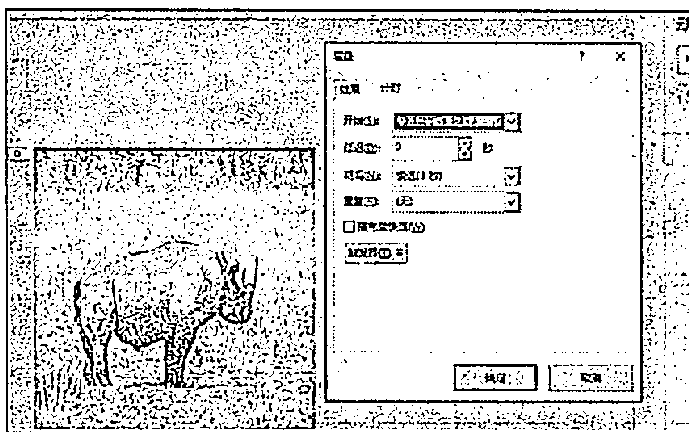

插入第四张图片，大小与前三张一致。设置进入效果中的“伸展”，“开始”处选择“与上一动画同时”，方向为“自左侧”，速度为“慢速”；添加退出动画效果中的“层叠”，“开始”处选择“上一动画之后”，方向为“到底部”，速度为“慢速”。

接下来，再插入第二张图片，其大小与第一张一致。选中第二张图片，添加动画效果，选择进入动画中的“伸展”，“方向”处选择“自右侧”，“开始”处选择“与上一动画同时”，“期间”处选择“慢速”；再添加退出动画效果中的“层叠”，“方向”处选择“到底部”，“开始”处选择“上一动画之后”，“期间”处选择“慢速”。


插入第五张图片，大小与前四张一致。设置进入效果中的“伸展”，“开始”处选择“与上一动画同时”，方向为“自顶部”，速度为“慢速”（图3）。

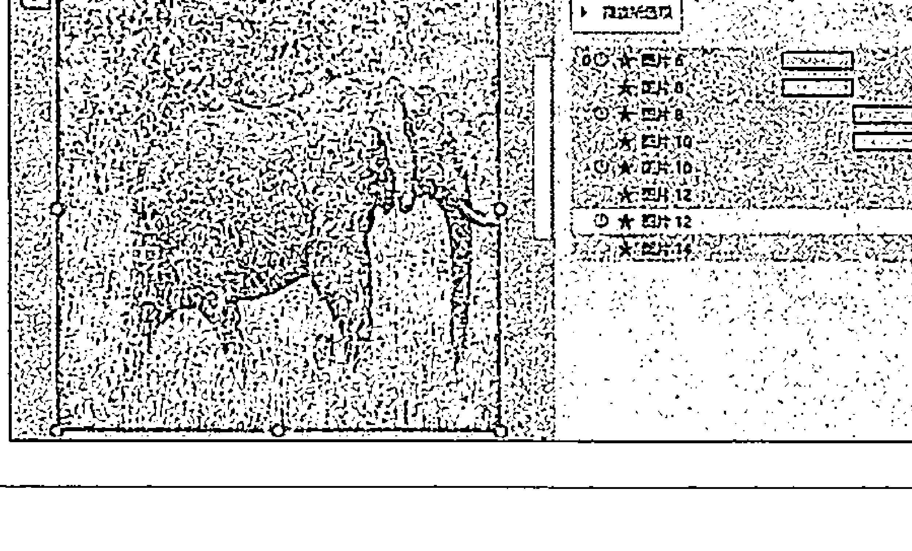

最后，选中所有图片（5张），选择“格式”选项卡，分别点击“对齐”中的“水平居中”、“垂直居中”。这样播放时就有了仿立方体旋转的效果了（图4）。

# Word查找替换还可以这么玩

在日常的工作中我们经常要批量替换文档中的某一元素，此时大多使用Word的“查找与替换”来完成。不过平时只是利用这个组件来批量替换常见的字体、符号等元素，比如将文档的“CFAN”替换为“电脑爱好者”等。其实除了这些常规的替换，Word的替换功能还有更多另类应用。

## 用活替换 批量插入表格和文字

在平时撰写文档的时候，我们经常要插入一些固定的表格。比如在制作一些仓库盘点报表统计文档的时候，在每段文字后都需要插入制作好的仓库盘点表。传统的操作是每完成一段文字的输入后使用插入表格的方法实现，或者先复制表格再每次粘贴完成。现在可以利用替换功能实现表格的批量插入。

假设现在需要在文档中“本部门仓库盘点如下表”文字下添加表格，首先将需要插入的表格复制到剪贴板，接着点击“开始→替换”，打开查找替换窗口。

```
查找内容：(本部门仓库盘点如下表)(^13)
```

这里使用两个小括号表示需要查找的内容是两部分，一部分是特定的文字（本例为“本部门仓库盘点如下表”），另一部分则为“^13”（通配符中的换行符），表示查找上述文字以及换行符（方便在后续换行下插入表格）。

```
替换为：\1^c
```

这里使用通配符\n搜索表达式，然后将其替换为经过重新排列的表达式。上述查找内容是(本部门仓库盘点如下表)(^13)，这里“\1”表示替换前面查找的内容（即保留文字），^c则表示剪贴板的内容（即表格），意思是在保留原来文字的前提下，将剪贴板的表格替换为换行符的内容（图1）。

展开“更多”，勾选下方的“使用通配符”，最后点击“全部替换”。这样在原文的文字下方就会自动插入剪贴板的表格，从而实现表格的批量插入（图2）。

这里主要利用剪贴板内容实现批量的替换，使用类似的方法，我们可以用它来实现多段文字的批量输入。比如笔者在撰写稿件的时候，很多杂志对软件推荐都有一定的格式要求，现在只要将软件格式要求先复制到剪贴板，同上打开查找替换对话框后，按提示使用下列格式进行替换：

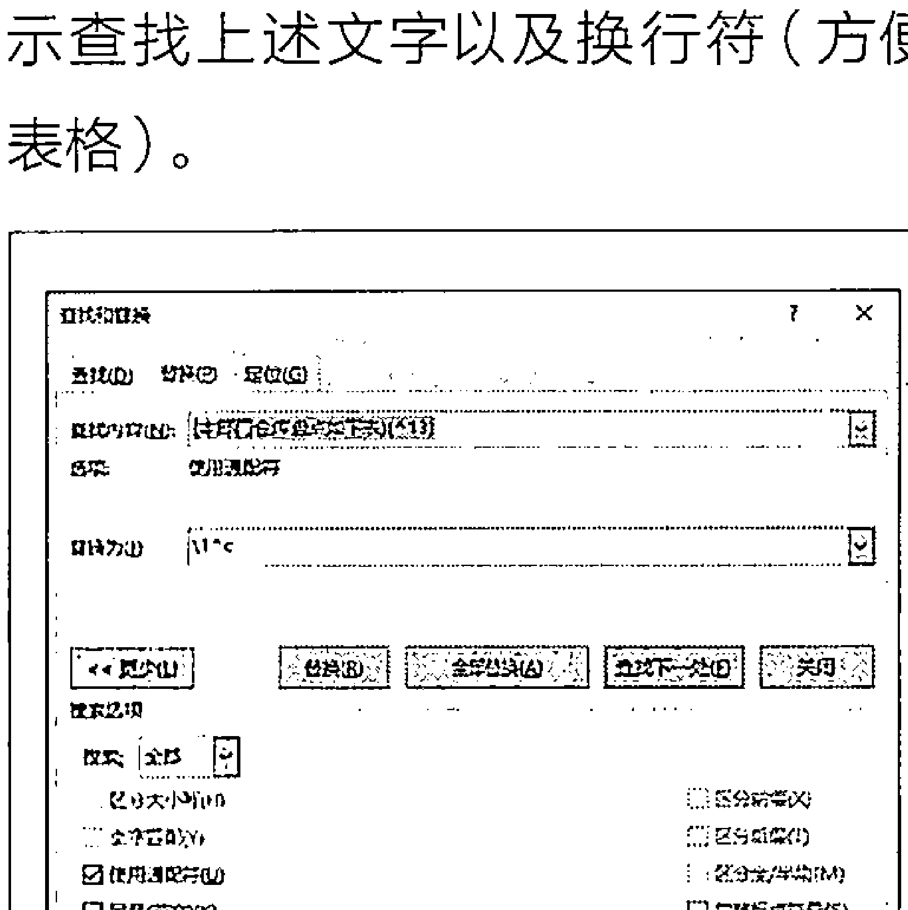

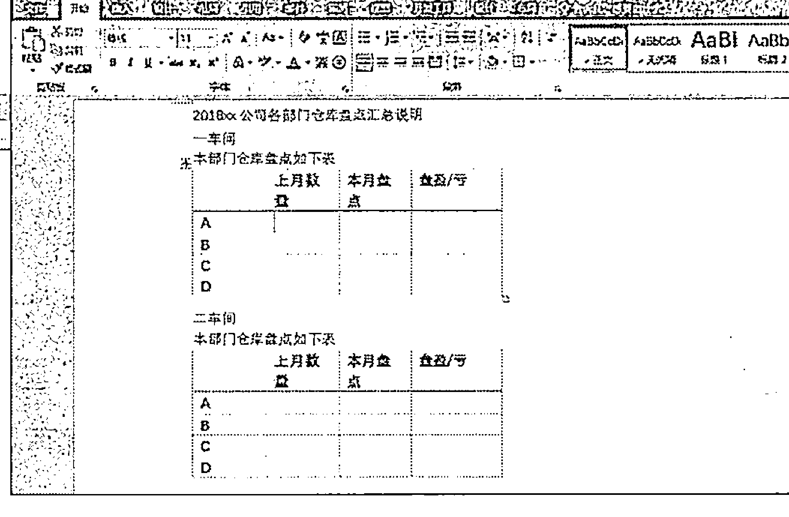

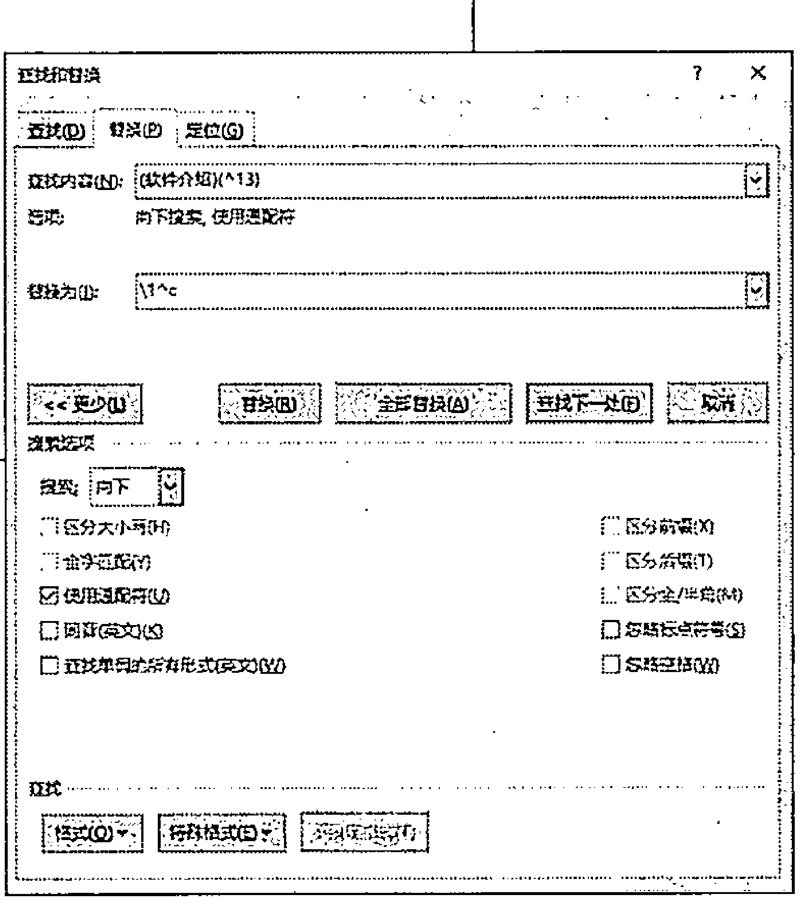

查找内容：(软件介绍)(^13) 替换为：\1^c 同上这里使用两个括号表示查找的文字是‘软件介绍’和换行符，替换的内容为剪贴板内容，同上勾选‘使用通配符’(图3)。 这样完成上述替换后，原来文章中所有‘软件介绍’文字的下方就会出现固定格式的文字内容，省去我们每次手动插入的不便(图4)。

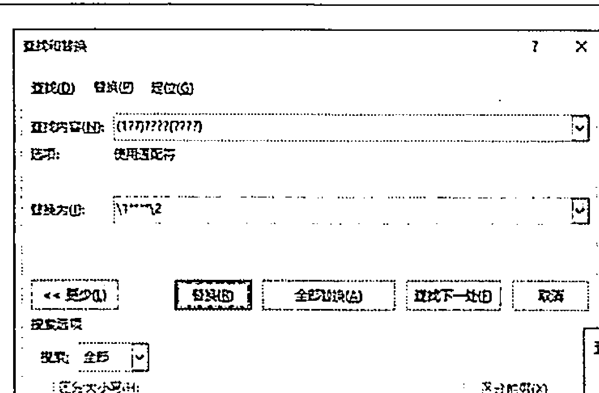

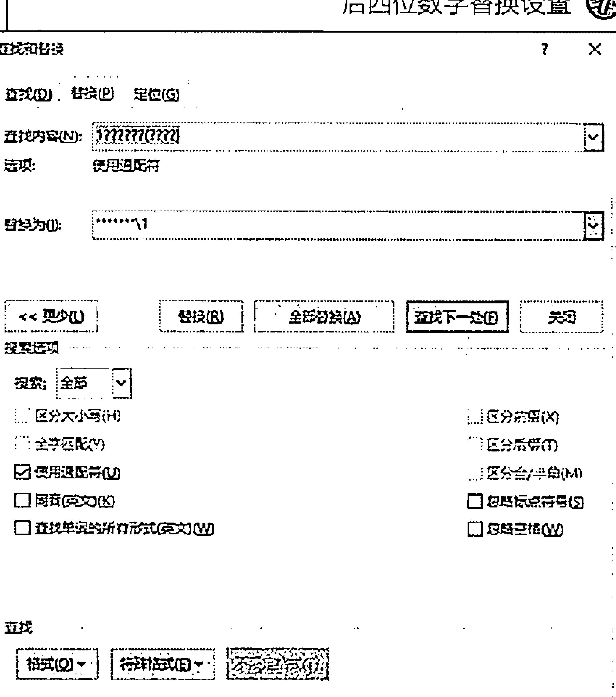

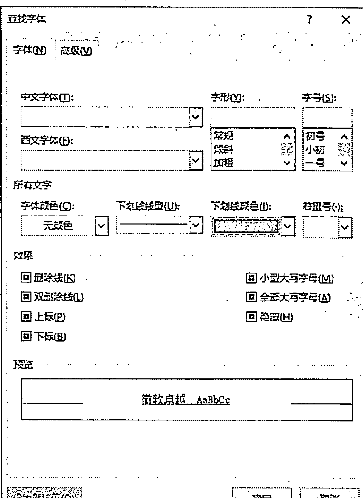

## 用通配符、特殊字符批量替换

Word的替换支持各种通配符的使用，用好这些通配符，在执行一些替换操作的时候就可以达到事半功倍的效果。比如很多公司在举办抽奖活动时，在公布获奖名单的时候为了保护中奖者的隐私，一般都要对中奖者的手机号码、身份证号码进行遮盖，如将手机号码的中间信息使用*号替代。如果手工处理这些信息，费时费力而且容易出错。此时我们就可以使用Word的替换操作实现。

打开包含用户电话信息的文档，同上打开查找替换对话框，按下面的提示输入查找和替换的信息：

**查找内容：(1??)????(????)**

这里同上使用小括号来表示查找1开头的手机号码(11位)，同时将手机号码分为三部分。前三个数字和最后四个数字分成了两组表达式，中间部分则用字符替代。

**替换为：\1****\2**

表示中间部分4位号码替换为*，首尾部分则保持原来的数字不变，这里\1和\2就对应上述小括号标记的对象(图5)。

同上勾选‘使用通配符’，然后点击‘全部替换’，这样用户手机号码中间的四位就会被*号替代，可以很好地保护用户的隐私(图6)。

大家可以根据自己的实际需要举一反三进行更多设置，比如只要保留手机尾号4位数字，查找则写成‘1??????(????)’的形式，替换则写成‘******\1’的形式。这样用户号码被分为两部分，前面的数字会被数字替代，后续位数则保留原来的数字形式，这样替换后保留的只是用户手机的后四位数字了(图7)。

当然Word替换的另类功能还有很多，比如在查找输入‘[0-9]{1,}’，替换输入‘^32^&^32’，单击‘格式’按钮，在其下拉菜单中点击‘字体’。接着在‘字体’选项卡中设置‘下划线线型’和‘下划线颜色’，然后单击‘确定’。这样即可给文中所有的数字添加空格和下划线，实现字体格式的批量替换(图8)。

总之，灵活使用Word的通配符可以实现很多高效批量替换，更多高级设置大家可以参考过刊的介绍。

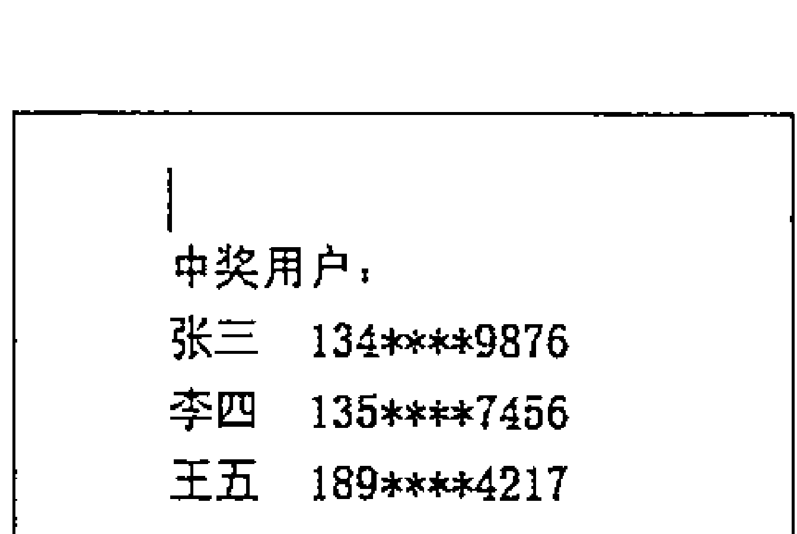

# 动态图表条件排序巧实现

文|马震安

利用动态图表来表达数据，想表达哪些数据，点个交互按钮就可以完成。但如果想按指定条件对动态图表中的数据系列进行排序，又如何实现呢？其实，借助定义名称的函数公式产生的内存数组作为图表数据源，并一定程度地使用辅助区域，就可以实现动态图表排序（图1）。

## 1. 设置交互控件

在图表的数据源所在工作表的F2、F3、F4单元格中分别输入销售、任务、完成率，从而构建交互式下拉列表所需要的菜单内容。在工作表中选择“开发工具”选项卡，点击“插入”按钮“表单控件”下的“组合框”，在工作表的合适位置按鼠标左键画出一个组合框控件。右击插入的组合框，选择“设置控件格式”，在弹出窗口的“控件”选项卡，数据源区域选择“F2:F4”，单元格链接选择“J1”。这样，当点击列表中的菜单时，J1中就会出现该菜单的索引值。再插入3个单选项按钮，右击插入的单选按钮，选择“编辑文字”，分别输入“正常”、“升序”、“降序”。再次右击第1个单选按钮，选择“设置控件格式”，在弹出对话框的“控制”选项卡中值处选择“选择”，单元格链接处选择“J2”，其他两个单选按钮的值处选择“未选择”，单元格链接处都选择“J2”。这样，当在这3个单选按钮间切换时，J2单元的值就会发生变化，在“1”、“2”、“3”这3个数之间进行切换（图2）。

## 2. 构建图表数据源

图表的数据源是根据控件所链接单元格的值决定的，是由定义名称所建立的。选择“公式”选项卡，点击“名称管理器”，在弹出的窗口中点击“新建”，名称处输入“xztj”，引用位置处输入“=CHOOSE($J$1, $B$2:$B$7, $C$2:$C$7,$D$2:$D$7)”；再新建，名称为“pxlx”，引用位置处为“=CHOOSE($J$2,ROW($2:$7),SMALL(xztj/1%%+ROW($2:$7),ROW($1:$6)),LARGE(xztj/1%%+ROW($2:$7),ROW($1:$6)))”；再新建，名称为“hanghao”，引用位置处为“=--RIGHT(pxlx,2)”；再新建，

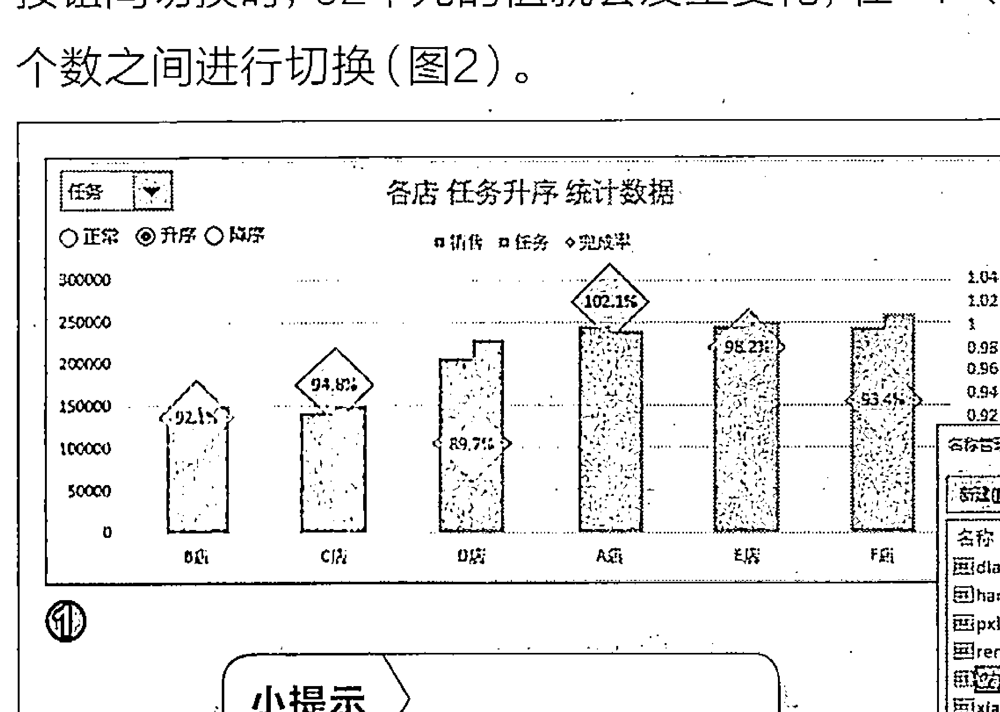

> **小提示**
控件的链接单元格也可根据需要选择其他的空白单元格。

| A | B | C | D | E | F | G | H | I | J | K | L | M |
|---|---|---|---|---|---|---|---|---|---|---|---|---|
| 1 | 店名 | 销售 | 任务 | 完成率 | | | | | | | | |
| 2 | A店 | 245133 | 240000 | 102.1% | | 销售 | 任务 | ▼ | | 2 | | |
| 3 | B店 | 138187 | 150000 | 92.1% | | | | | | | | ○正常 ○升序 ⊙降序 |
| 4 | C店 | 142267 | 150000 | 94.8% | | | | | | | | |
| 5 | D店 | 206474 | 230000 | 89.7% | | | | | | | | |
| 6 | E店 | 245511 | 250000 | 98.2% | | | | | | | | |
| 7 | F店 | 243051 | 260000 | 93.4% | | | | | | | | |

| 名称 | 数值 | 引用位置 | 范围 | 批注 |
|---|---|---|---|---|
| 回clan | {...} | =T(OFFSET(Sheet1!$A$1,hanghao-1,)) | 工作簿 | |
| 回hanghao | {...} | =--RIGHT(pxlx,2) | 工作簿 | |
| 回pxlx | {...} | =CHOOSE(Sheet1!$J$2,ROW(Sheet1!$2:$7),SMALL(xztj/1%%+ROW(Sheet1!$2:$7),RO... | 工作簿 | |
| 回renwu | {...} | =N(OFFSET(Sheet1!$C$1,hanghao-1,)) | 工作簿 | |
| 回zongxiaoshou | {...} | =N(OFFSET(Sheet1!$D$1,hanghao-1,)) | 工作簿 | |
| 回xiaoshou | {...} | =N(OFFSET(Sheet1!$B$1,hanghao-1,)) | 工作簿 | |
| 回xztj | {...} | =CHOOSE(Sheet1!$J$1,Sheet1!$B$2:$B$7,Sheet1!$C$2:$C$7,Sheet1!$D$2:$D$7) | 工作簿 | |

名称为“dian”，引用位置处为“=T(OFFSET($A$1,hanghao-1,))”；再新建，名称为“xiaoshou”，引用位置处为“=N(OFFSET($B$1,hanghao-1,))”；再新建，名称为“renwu”，引用位置处为“=N(OFFSET($C$1,hanghao-1,))”；再新建，名称为“wanchenglv”，引用位置处为“=N(OFFSET($D$1,hanghao-1,))”。这样，图表所需要的数据源就构建完成了（图3）。

## 3. 设置图表

将数据区域选定，插入柱形图，右击图表，选择“更改图表类型”，在弹出的窗口中选择“组合”，“完成率”处选择“带数据标记的折线图”，勾选其“次坐标”。选定图表中的折线图，右击选择“设置数据系列格式”，在“填充与线条”选项卡，线条中选择“无线条”，标记的“数据标记选项”中选择“内置”，类型处选择“菱形”，大小为30，纯色填充，50%透明度（图4）。

## 4. 美化图表

选定图表中的完成率系列，添加数据标签，标签居中，右击标签，选择“设置数据标签格式”，在标签选项中，数字类别处选择“百分比”，小数位数1位；根据需要更改图例的位置，当然也可根据需要添加其他的数据标签。在J3单元格中输入“=“各店” & CHOOSE($J$1,$B$1,$C$1,$D$1) & IF($J$2=1,"正常",IF($J$2=2,"升序","降序")) & "统计数据"”，然后选择图表标题，在公式编辑栏中输入“=Sheet1!$J$3”，这样图表标题就会跟随控件的选择而进行变化了（图6）。

接下来，右击图表，选择“选择数据”，在弹出窗口的“图例项”处，选定“销售”，点击“编辑”，在系列值处输入“=Sheet1!xiaoshou”，选定“任务”，系列值更改为“=Sheet1!renwu”，选定“完成率”，系列值更改为“=Sheet1!wanchenglv”；在“水平(分类)轴标签”处，选定“A店”，点击“编辑”，在弹出的窗口中输入“=Sheet1!dian”，其他标签的轴标签区域也都改成“=Sheet1!dian”。这样，图表与控件之间就有交互效果了（图5）。

最后，右击每个控件，选择“置于顶层”，然后将这些控件拖动到图表相应的位置就可以了。

CFanBoundEdition·2018

# 另辟蹊径 制作照片视频幻灯片

文|马震安

老师要将本班学生平时在校学习、生活的照片制成视频在家长会上播放，直接用PPT实现比较复杂，效果也不够理想。利用“友锋电子相册”强大的图片合成视频功能，只要将选中的照片依次加入到时间轴上，再从效果栏中选择合适的效果，添加文字、背景音乐等，就可以非常轻松地制作出精彩的照片视频幻灯片。

## 1. 导入图片

首先，运行“友锋电子相册制作”，点击“添加相片”（或者点击“手机照片”接收来自手机的照片），选择需要的照片，导入视频中所需要的图片，在编辑窗口可以随意拖动图片排列到自己想要的位置。当然也可以使用上移相片、下移相片等操作来快速排列照片位置。选定图片，可以为图片添加名称、拍摄人、拍摄时间及文字说明等，还可以为照片添加声音（图1）。

而通过点击“调整相片”，可以对照片进行裁剪、修正倾斜、清除红眼及调整亮度、对比度等设置（图2）。

如果上述按钮功能不能满足自己所需要的效果，可以点击“处理相片”按钮，这时需要安装“友锋图像处理系统”，安装完成后，就可以对照片像在Photoshop中那样进行非常细致的操作了（图3）。

## 2. 编辑图片

如果想对照片进行一些效果设置，通过点击“添加相框”、“添加蒙版”来进行相应的操作。比如给某个图片添加一个相框，只需要选中相应的照片，点击“添加相框”，在弹出的窗口中选择所需要的相框就可以了。

## 3. 添加视频特效元素

动态文字、视频、照片出现时的音效、背景音乐等的添加都需要在“生成相册”中完成。点击“生成相册”，在弹出的窗口根据需要选择相册模板，这里我们选择全部模板中的“自定义场景组合”，确定，在弹出的窗口选择视频格式的相册类型（当然，也可根据需要选择EXE格式或屏幕保护程序），在弹出的自定义场景组合窗口，画面比例可根据需要选择，点击“添加场景”，在弹出的窗口根据需要选择场景效果，如选择“边框+泡泡”，设置好此场景中包含的照片数量及出现效果，如4张照片、由近及远渐变显示，还可根据需要设置背景及使用粒子效果等。当然，可以对不同数量的照片添加多个场景（图4）。

确定后，在弹出的窗口根据需要设置画面尺寸、照片显示区域等，点击“下一步”，在设置相册标题窗口中，输入相册的标题，设置好标题的字体、字号及文字特效等（图5）。

点击“下一步”，在片头设置窗口中设置好片头长度、背景色及附加动画场景等；点击“下一步”，在设置相册背景窗口设置好背景色、背景扩展样式及是否有3D物体等；

点击“下一步”，在设置背景音乐窗口可添加所需要的背景音乐；点击“下一步”，在播放设置窗口可为每张照片添加出现和隐藏时的动画效果、时长及缩放比例等（图6）。

接下来，在相片二级蒙版窗口可以为照片设置单个或批量蒙版；点击“下一步”，在添加文字、图片、动画、视频等点缀窗口点击“添加点缀”，可为照片添加粒子效果、滚动字幕、滚动图片等特殊效果。比如在视频照片中有滚动文字，就需要点击“添加滚动文字”，在弹出的窗口点击“字 添加文字点缀→添加滚动字幕框”，选择好字幕滚动方向，如从右到左滚动，确定后在弹出的窗口输入所需要的文字内容，设置好字体、字号、字间距、行间距及文字特效等，确定后在弹出的窗口设置好字幕框高度、宽度、滚动速度等（图7）。

点击“下一步”，在弹出的窗口设置字幕出现的时间、消失时间，如在第3张照片出现时出现，在第5张照片出现时消失等；点击“下一步”，在弹出的窗口设置字幕出现的形式、透明度、蒙版、倒影等（图8）。

然后，在下一步弹出的窗口中设置字幕出现的位置、与屏幕边缘最小间距等，当然，也可用鼠标拖动字幕到它在屏幕出现的位置。点击“下一步”，在弹出的窗口设置字幕出现、消失的动画效果等，下一步，直到添加新的点缀窗口。

最后，一直点击“下一步”，在设置片尾窗口设置好需要的文字及效果，在第十二步生成视频窗口，根据需要进行设置，点击“生成视频”就可以了。

# 脑洞大开制作另类Excel图表

文|周建峰

相信很多人都曾用Excel制作过图表，在2016版中共有15类86种样式的图表供选用，特别是新增的树状图、旭日图、箱型图、瀑布图都很有特色。但是不可否认，这些图表如果直接套用而不进行修饰，那必定是“千篇一律”的，缺少个性，用的多了，也必将引发视觉疲劳。因此我们可以尝试在原来图表的基础上，进行加工修饰，得到个性化的另类图表。

### 另类的堆积柱形图

柱形图是最常见的Excel图表，默认设置下显得中规中矩，而我们只要稍微改动一下，就能变成另外一个模样（图1）。下面我们就一起来制作一个这样的分层柱形图。

- 首先在原始表中增加一个新列，输入“=80-B2”（图2），然后使用自动填充计算出该列所有数据。这里的80决定着两个图表的距离，我们也可以根据具体情况设置成70、90或100。在原始数据中添加辅助列，就是为了分离堆积柱形图表中的连接在一起的图形。
- 选中所有数据，切换到“插入”选项卡，单击“推荐的图表”弹出对话框（图3），单击“所有图表”下的“柱形图”，然后选择“堆积柱形图”，单击“确定”按钮插入初始状态的图表。
- 现在插入的图表，辅助列的图形位于最上方，不能用来作为间隔。先选中图表，切换到“设计”选项卡，单击“选择数据”弹出对话框（图4），选中辅助列（列1），单击“上移”按钮，将其移动到一二月之间，最后单击“确定”按钮，辅助列的柱形图会移动到中间。
- 接下来选中图表中的辅助列柱形图，切换到“格式”选项卡，单击“设置形状格式”按钮，在右侧的属性面板中，单击“填充与线条”，选择“填充”下的“无填充”（图5），这样辅助列的柱形图就会被隐藏起来，形成了一个间隔。

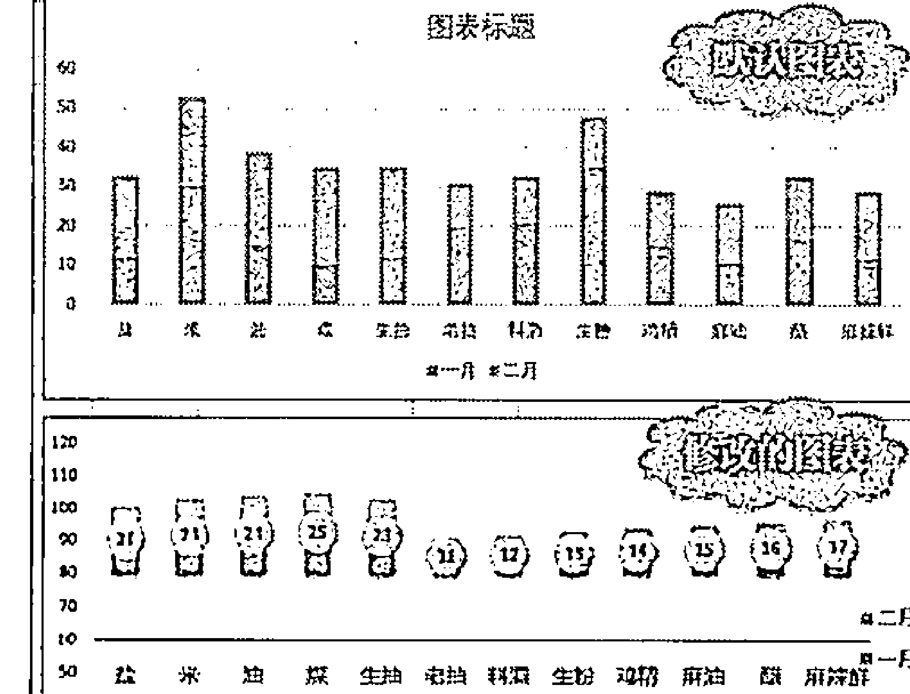

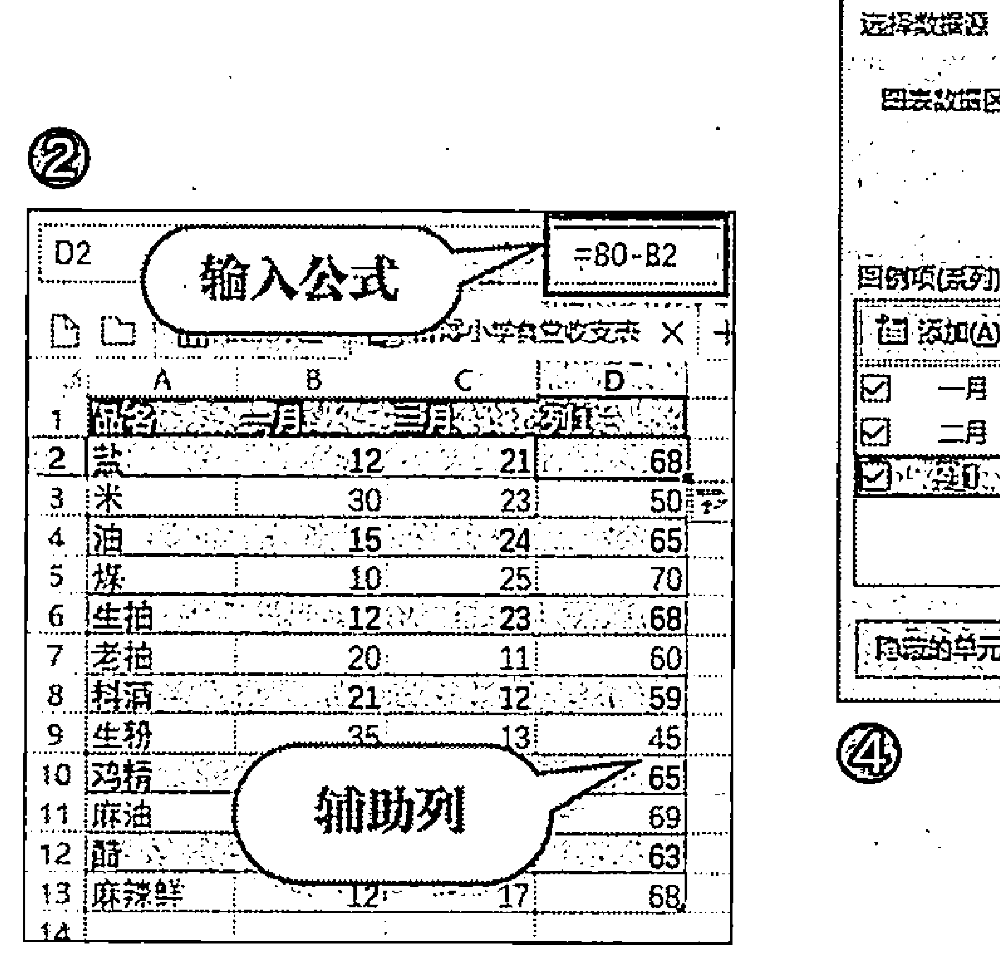

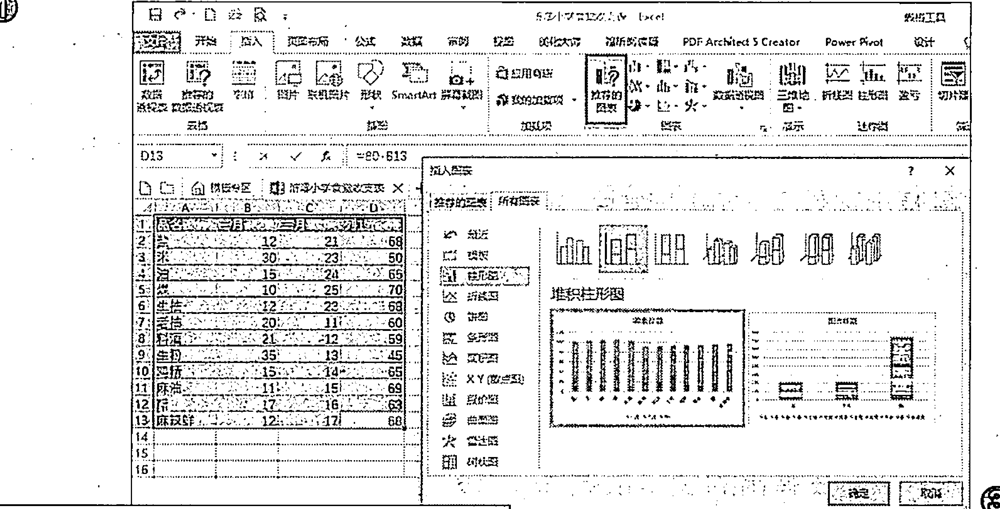

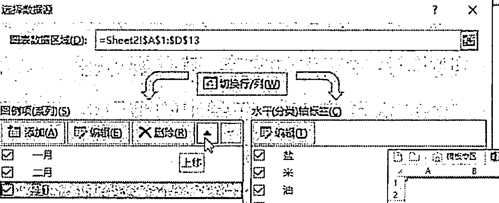

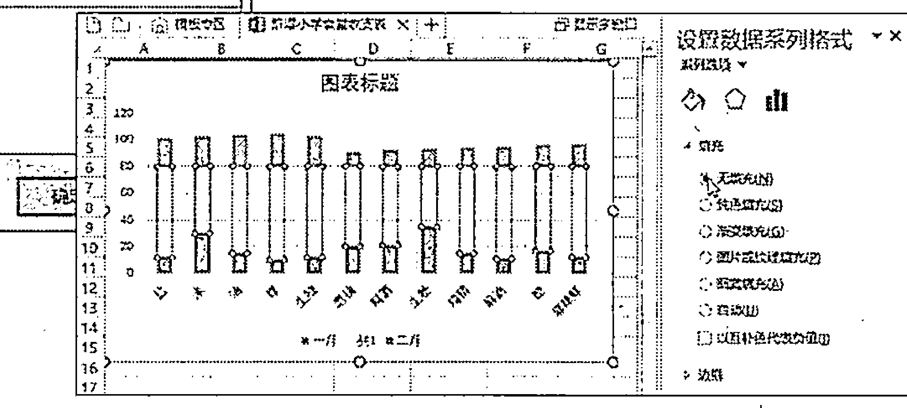

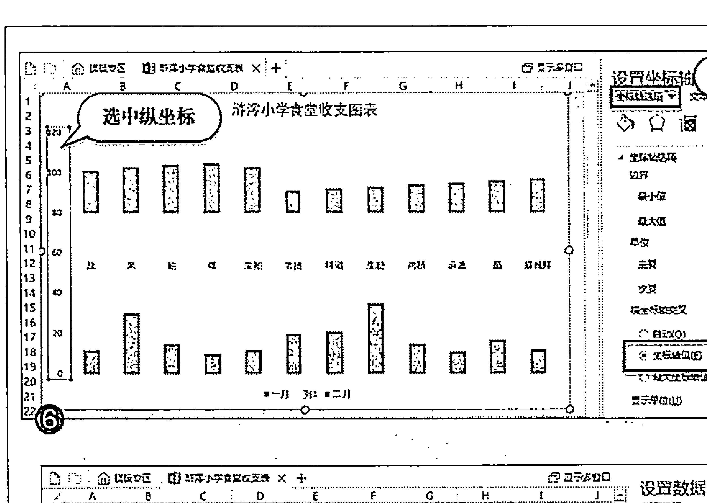

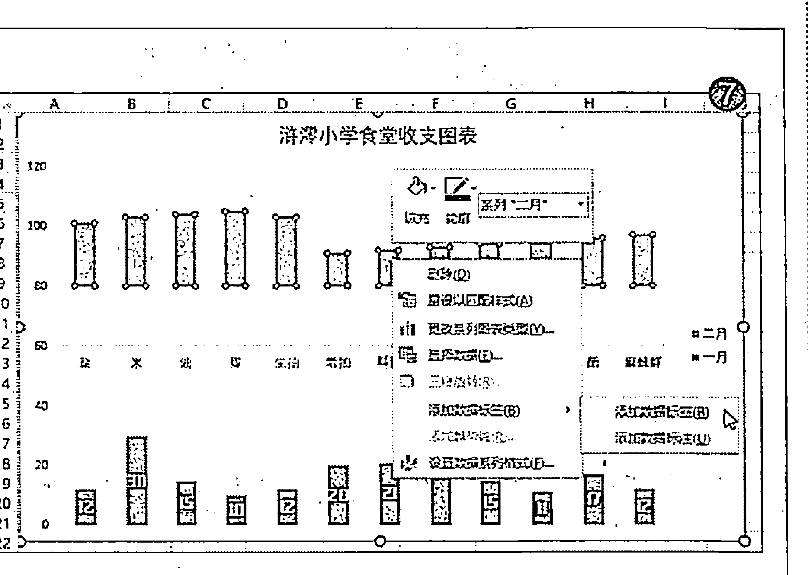

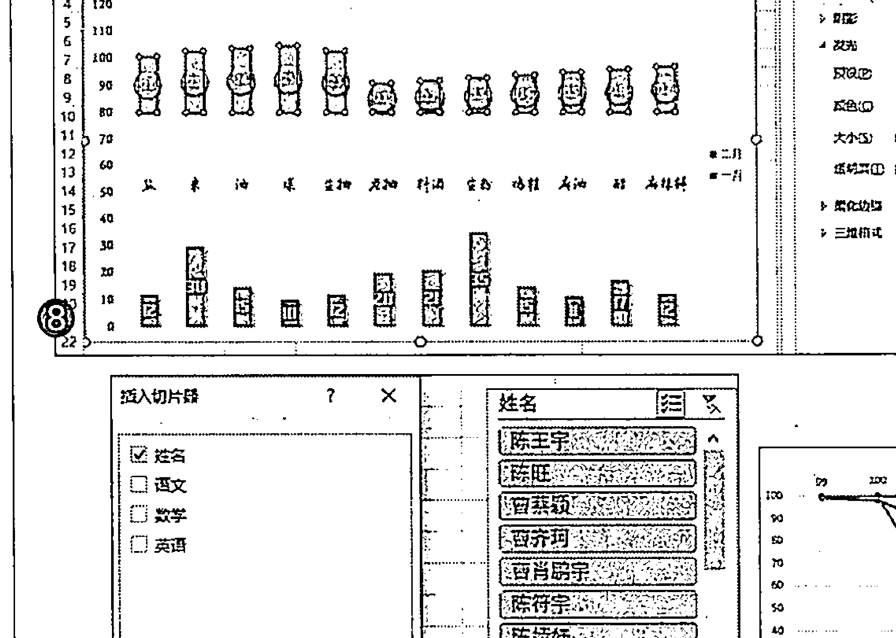

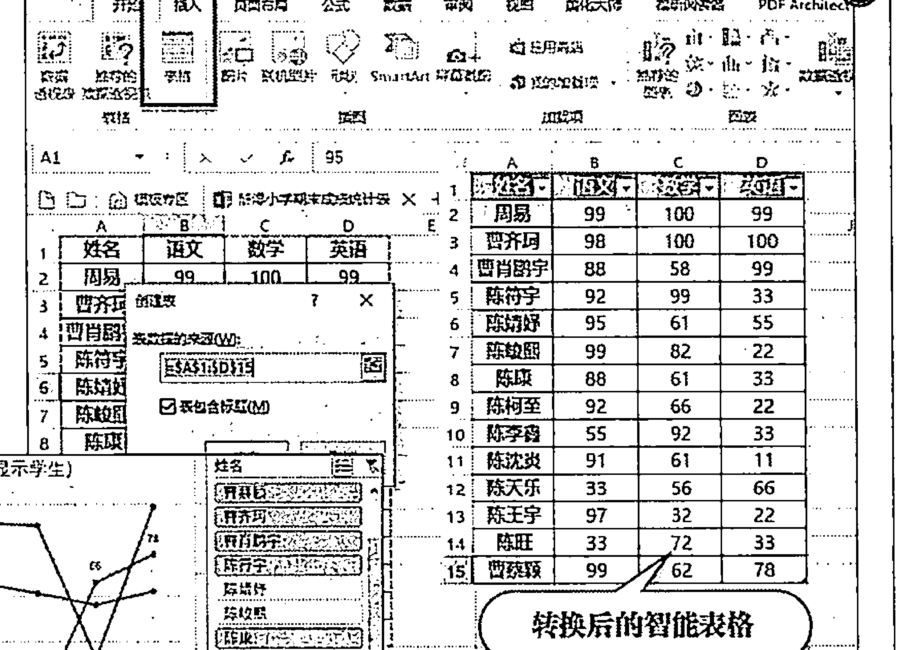

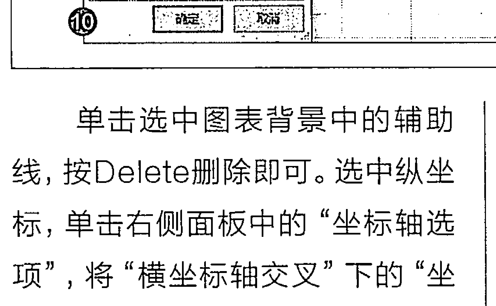

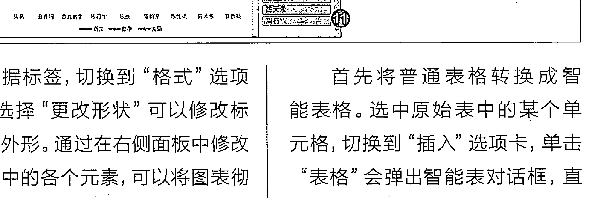

- 单击选中图表背景中的辅助线，按Delete删除即可。选中纵坐标，单击右侧面板中的“坐标轴选项”，将“横坐标轴交叉”下的“坐标轴值”设置为60（图6）。之所以设置为60，是因为纵坐标轴的高度是120，这样可以让横坐标轴的位置移动到柱形图的中间。
- 选择下方的图例，在右侧面板中将“图例位置”设置为“靠右”，再选中其中的“列1”，按Delete键删除。选中柱形图，右击选择“添加数据标签→添加数据标签”，添加的数据标签可以在选中后，修改字体、字号、颜色等（图7）。
- 最后图表中的每个部分都可以进行格式修改。比如，选中添加的数据标签，切换到“格式”选项卡，选择“更改形状”可以修改标签的外形。通过在右侧面板中修改图表中的各个元素，可以将图表彻底大变身，打造出个性化的另类效果（图8）。

### 切片器打造动态图表

除了从外观上打造另类的图表外，我们还可以从功能上予以改进。比如，常规的图表都是静态的，借助Excel中的切片器，则可以做出动态的另类图表。例如我们在折线图表显示学生三门成绩时，如果要想让指定学生的成绩在折线图中显示，就可以借助“切片器”来实现。

- 首先将普通表格转换成智能表格。选中原始表中的某个单元格，切换到“插入”选项卡，单击“表格”会弹出智能表对话框，直接单击“确定”按钮，此时会看到表格的样式发生了改变（图9）。
- 选中表格后，插入一个折线统计图表，然后切换到“插入”选项卡，单击“切片器”弹出对话框（图10），选择“姓名”，单击“确定”后即可添加姓名切片器。
- 最后在姓名切片器中，单击选中需要对比的学生名单，在左侧的图表中则会显示这些学生（图11）。也就是说这个折线图表中的数据是可以任意选择的，这样就能通过折线图表实时对比需要的数据。

# 透明设计提升PPT格调

文|仲勇

看过不少精美的PPT作品，其中都或多或少使用了透明设计，朦朦胧胧，若隐若现，让PPT的格调明显提升一个档次。透明设计不仅仅可以用来美化PPT，还能借助透明解决页面设计中的一些难题。

### 图文相遇更清晰

透明设计的常规应用就是让图配文更清晰。如下例所示，图片的底色太杂，上面文字的颜色就不好选择，因为总有一部分与背景色相近，这样会看不清楚，此时就可以使用透明设计解决该问题（图1）。

- 在页面上绘制一个白色无边框矩形，右击选择“设置形状格式”，在右侧将其透明度设置为30%左右，再右击文字选择“置于顶层”，让其位于透明矩形上方（图2），这样文字和背景图就能很好地融合在一起。
- 这种半透明设计应用非常广泛，很多看起来很有格调的PPT，都会大量使用半透明设计。这在封面设计中应用非常广泛，图片加上半透明的图形，再添加文字就能做出精美的封面（图3）。另外透明色也不一定是白色，形状也不一定是要矩形，都可以根据需要进行灵活选择，至于透明度的多少，这要看具体情况来设置。

### 镂空透明很精致

透明还可以借助镂空来实现，使用合并形状中的“剪除”功能，可以将图形上的文字或形状“挖”空了，这种镂空透明看上去非常精致。

- 插入一个与页面等大的矩形，并且修改透明度让背景图片若隐若现；绘制一个无填充的圆角矩形并输入文字；切换到“美化大师”选项卡（http://meihua.docer.com），单击“形状”按钮弹出对话框，在搜索框中输入“手”会出现很多手型（图4），选中其中一个添加到页面上，调整其大小覆盖背景图上的重要位置。
- 选中调整透明度的矩形，按住Ctrl键不放，分别再选中文字和手型，切换到“格式”选项卡，单击“合并形状”按钮选择“剪除”，则可将透明矩形上的文字和手型“抠”空了（图5）。

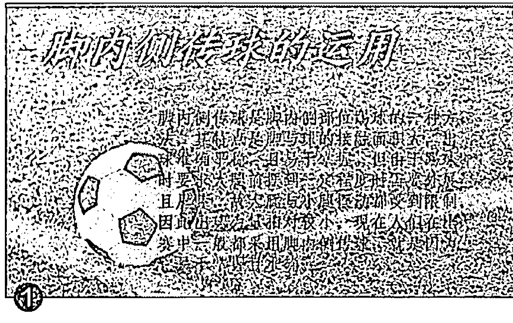


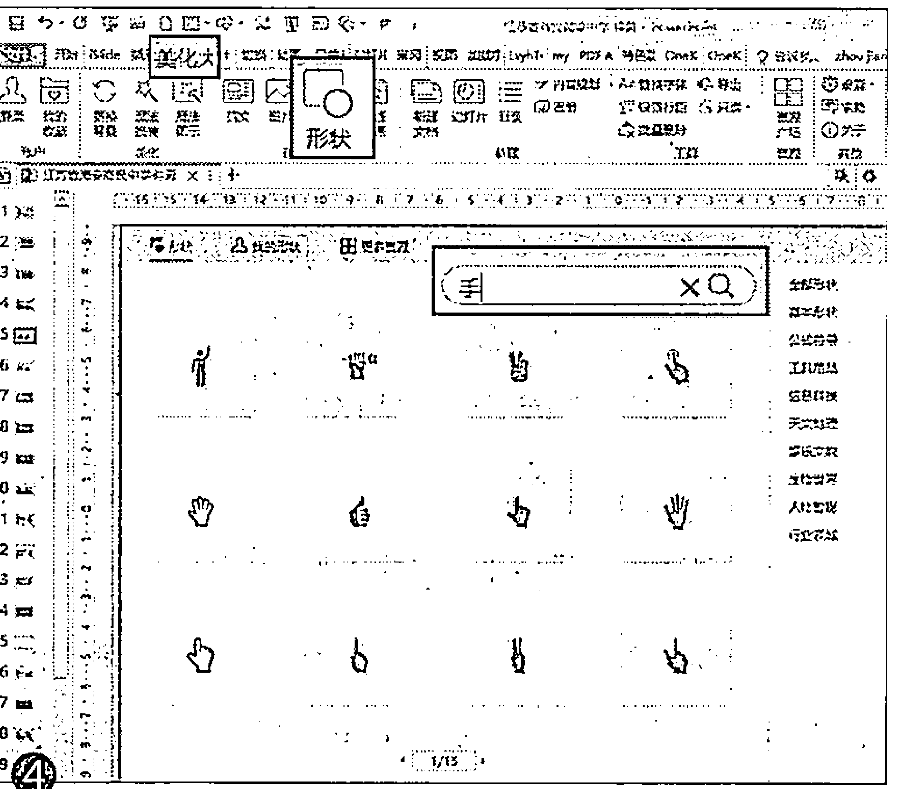

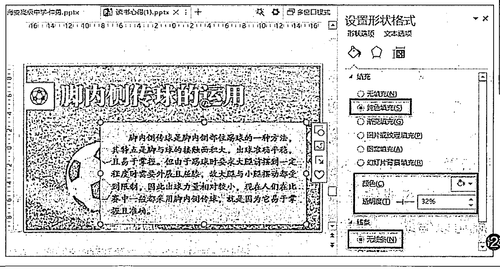


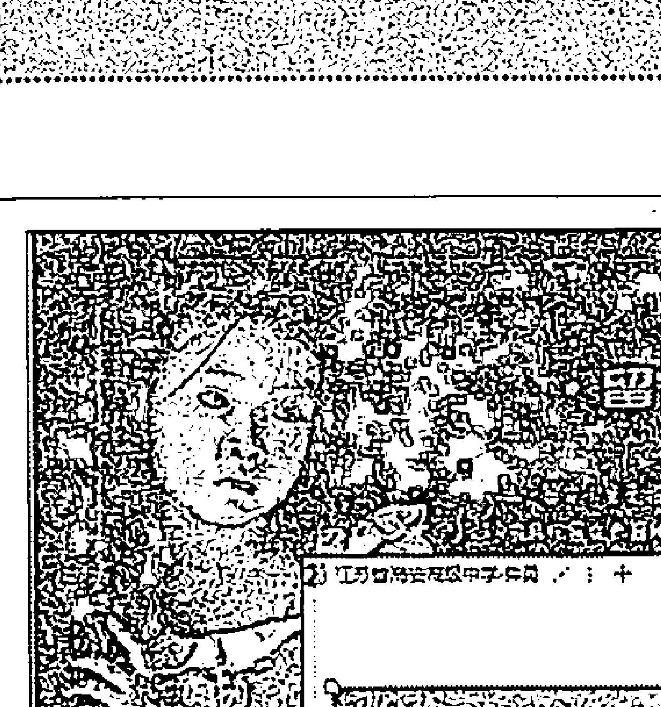

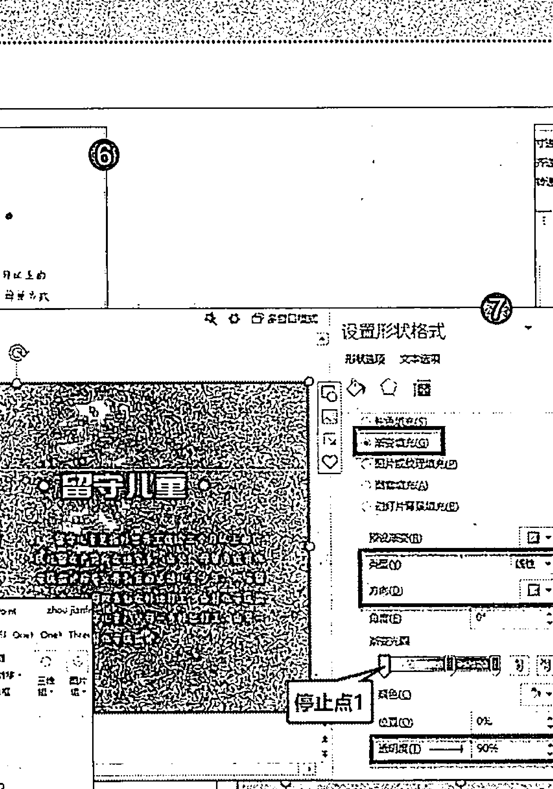

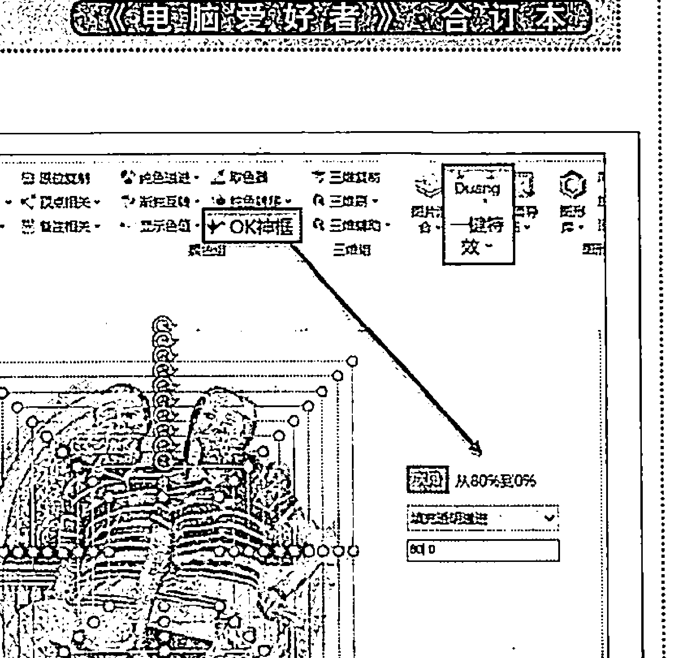

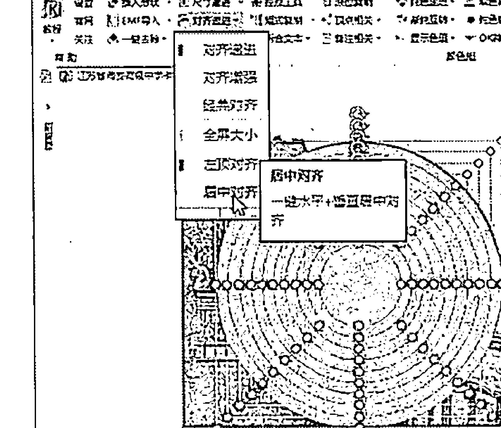

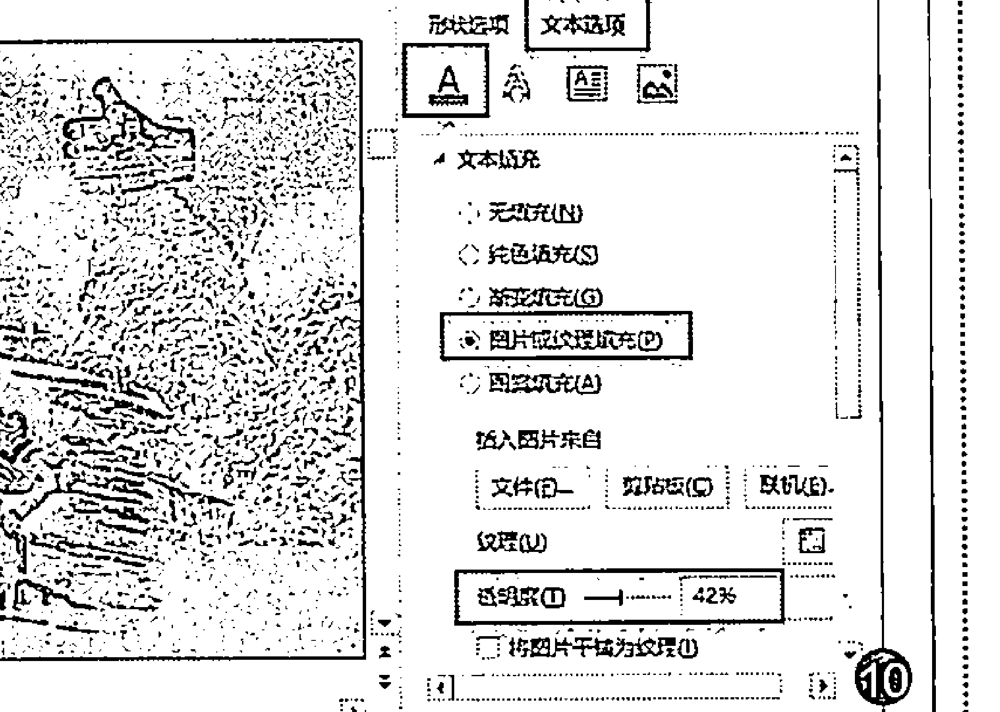

### 渐变透明够服帖

渐变透明是纯色透明的升级，它能让图文更好地融合，用渐变透明可以遮蔽图片中无关的部分，从而让文字更清晰地呈现。另外还能丰富视觉效果，渐变本身带有一定的设计感，配色用好了，会有意想不到的效果。如下例所示的页面，图文明显不和谐，通过渐变透明就能完美解决（图6）。

- 绘制一个满屏的矩形，设置形状格式（图7），选择“渐变填充”，“类型”选择“线性”，“方向”选择“线性向右”，在“渐变光圈”上单击可以增加停止点，选中停止点，单击后面的“删除渐变光圈”按钮可删除。选择第1个停止点，设置为白色，并且将下方的透明度设置为90%；第2个停止点为黑色，透明度为60%；第3个为黑色，透明度为100%。最后调整文字的层次和颜色，这样一个很实用的图文版式就做出来了。
- 除了上面这种类型的渐变透明，还有一种递进式的透明，不过需要使用OK插件（https://oktools.xyz）。绘制一个无边框圆覆盖在图片上（图8），切换到OneKey8选项卡，单击“原位复制”按钮复制10个图形，然后将最上方的圆形缩小，再单击“尺寸递进”选择“从大到小”，最后单击“对齐递进”选择“居中对齐”。将所有图形设置为“无边框”，选中所有图形和图片，切换到OneKey选项卡，单击“一键特效”选择“形状裁图”，然后删除原始图片。选中所有裁剪的图片，单击OK弹出对话框，选择“填充透明递进”，然后在下方输入：80 0，按Enter键后即可看到递进式透明效果（图9）。

### 多图融合很简单

通过透明设计还能让多张图片融合在一起，为了融合得更加自然，有些时候还需要使用图片背景透明，手绘图形覆盖图片中需要的部分进行抠图等操作，让融合效果更完美。

- 图片在PPT中是无法直接设置透明度的，我们可以将其填充到图形或者文本中，这样就能修改透明度（图10）。文本填充要单击“文本选项”，再单击“文本填充与轮廓”，在这里就可以选择图片进行填充，并且在下方修改透明度。PPT中的图片可以删除背景或选择透明色，将背景进行透明。PPT自带的图形比较单一，可以使用“PPT美化大师”中的墨迹图形、剪影图形等进行填充再设置透明度，那样艺术感更强。

# 不用代码 制作级联菜单幻灯片

文/马震安

幻灯片中经常利用菜单在各页面之间进行切换，因此，菜单效果会影响到幻灯片的整体外观。如果将菜单做成级联式，鼠标悬停在主菜单上时显示对应的子菜单，鼠标离开时子菜单消失，这样的效果会为幻灯片增添魅力。不用代码，借助Articulate Storyline 3即能非常容易地实现上述效果（图1）。

### 1.设计菜单样式

- 打开Articulate Storyline 3并新建一个项目，双击无标题幻灯片，右击设置它的背景色，在窗口右侧的幻灯片层处，右击基础层，选择“重命名”，命名为“主菜单”；利用“插入”选项卡“形状”中的矩形，在幻灯片中插入所需要的主菜单项，右击矩形，选择“编辑文本”，输入主菜单内容，设置好字体、字号及颜色等，利用对齐工具将所有主菜单项目顶端对齐（图2）。
- 接下来，在幻灯片层处点击“新建层”，新层命名为“菜单1子菜单”；选中该层，在幻灯片中利用矩形根据需要添加子菜单，排放整齐；再新建层，命名为“菜单2子菜单”，同样用矩形插入所需要的子菜单；其他主菜单、子菜单的建立以此类推。如果子菜单下还包括子菜单，同样利用新建层的方式添加。比如，“子菜单24”下又包括3个子菜单，可以在名称为“菜单2子菜单”的层上相应菜单右侧，利用自选图形中的图形添加代表还有子菜单的箭头，同样新建层，命名为“子菜单24子菜单”，利用矩形插入所需要的子菜单。这样，级联菜单的样式就设计完成了（图3）。

### 2.添加交互效果

- 在窗口右侧的“触发器”面板中点击“管理项目变量”，在弹出的窗口点击“新建变量”，变量名称为“weizhi”，类型为“文本”。这个变量就用来记录当前所选择的菜单（图4）。
- 在“触发器”面板点击“新建触发器”，在弹出的窗口向导中依次输入：操作为“显示图层”，图层为“菜单1子菜单”（即主菜单1的子菜单所在的图层名），时间为“鼠标悬停”，对象为“矩形1”（即标签为“主菜单1”的矩形），不要勾选“在鼠标离开后恢复”。这样鼠标悬停在“主菜单1”时，它下面的子菜单就会显示出来。鼠标悬停在其他主菜单项时的子菜单显示也这样设置（图5）。

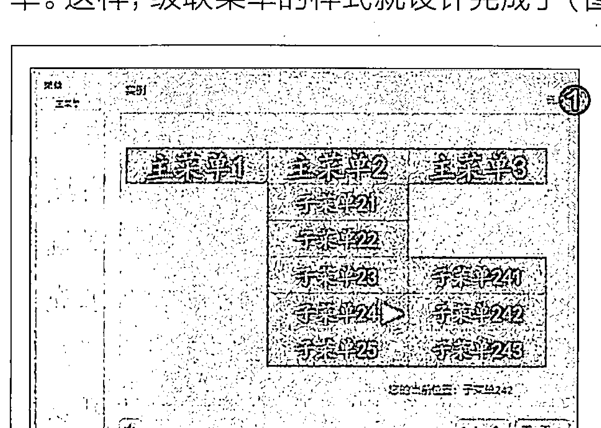

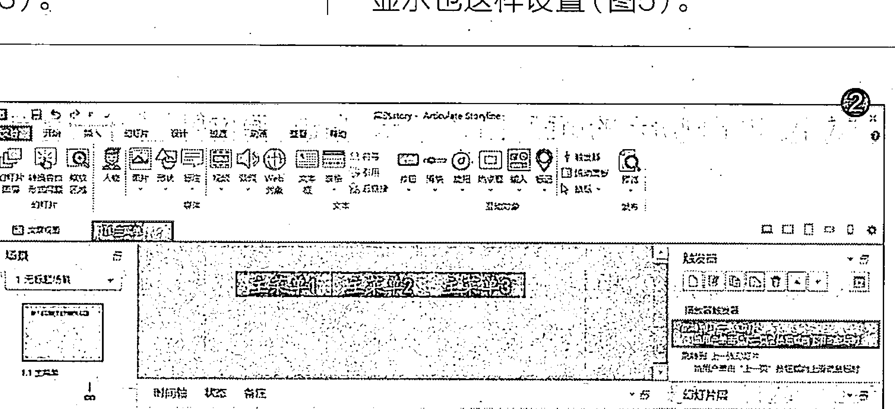

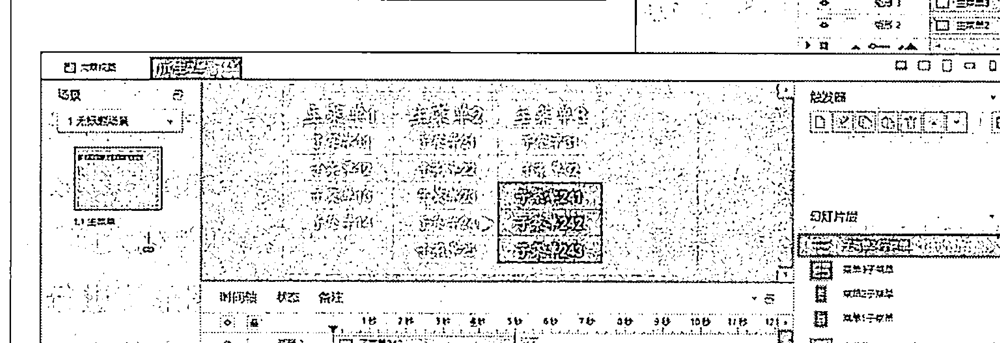

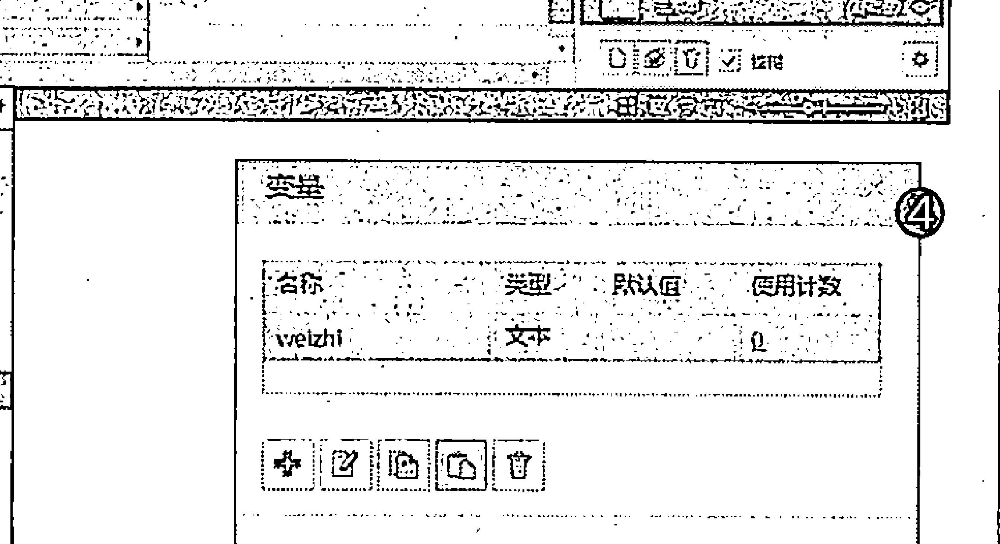

- 新增触发器，在弹出的窗口依次选择：操作为“调整变量”，变量为“weizhi”，运算符为“=赋值”，值为“值”和“主菜单1”，时间为“鼠标悬停”，对象为“矩形1”，不要勾选“在鼠标离开后恢复”。这样，鼠标悬停在“主菜单1”时，变量“weizhi”的值就变成了“主菜单1”。同理，鼠标悬停在其他主菜单项时，变量“weizhi”的值的变化也是这样设置（图6）。
- 接下来是子菜单下级菜单的显示设置。选定“菜单2子菜单”图层，点击“新建触发器”，在弹出窗口的操作处选择“显示图层”，图层处选择“子菜单24子菜单”（即子菜单24的下级菜单所在的图层名），时间处选择“鼠标悬停”，对象处选择“矩形4”（即标签为“子菜单24”的矩形），不要勾选“在鼠标离开后恢复”。这样鼠标悬停在“子菜单24”时，它下面的子菜单就会显示出来。同时，还要更改变量“weizhi”的值为“子菜单24子菜单”（即子菜单的标签）。在“子菜单24子菜单”图层上右击，选择“属性”，在弹出的窗口将“隐藏其他幻灯片层”前面的钩去掉（图7）。
- 选定“菜单1子菜单”图层，新增触发器，在弹出的窗口分别选择：操作为“调整变量”，变量为“weizhi”，运算符为“=赋值”，值为“值”和“子菜单11”（即子菜单标签），时间为“用户单击”，对象为“矩形1”（即“子菜单11”）。这样，当点击“子菜单11”时，变量“weizhi”的值就变成了“子菜单11”。当然，点击其他菜单时，变量“weizhi”值的变化设置与上述操作类似，这里就不一一赘述了。

### 3.设置当前位置

- 选定基础层，在幻灯片中的合适位置插入一个文本框，内容是“您的当前位置：”，将光标定位到文本框的最后面，点击“插入→引用”，在弹出的窗口选中变量“weizhi”。这样，这个文本框中就会显示变量“weizhi”的值了（图8）。
- 最后，点击“发布”，设置好发布文件夹，点击“发布”按钮就可以了。

# 制作音乐均衡器动画PPT

文|马震安

在PPT中播放背景音乐或特定音乐，旁边若有个音乐均衡器的动画效果，会显得生动不少。使用PPT自带的传统方法制作动画显得比较麻烦，效果也不会太好。若利用PA动画插件来制作，不但效果逼真，而且制作也比较简单（图1）。

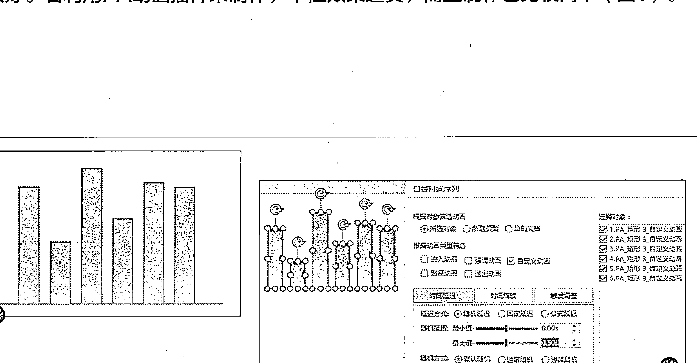

- 首先，下载并安装PA动画插件。运行PPT，新建一张空白幻灯片，将PA动画插件设置成“专业版”。利用自选图形中的矩形添加一个矩形条，设置好所需要的填充色。选中该矩形，选择“口袋动画 PA”选项卡，点击“动画风暴”，在弹出窗口最左侧的动画列表中点击“+”，添加一个自定义动画，在动画列表（行为）处点击“+”，添加两个基本属性，选中“可见性”，点击“-”按钮删除；选中添加的第1个基本属性，在右侧“属性”选项卡的“属性类别”处选择“高度”。选中“【属性】高度”行为，在右侧“属性”选项卡中，第1帧的值设置为“#ppt_h”，第2帧的值设置为“#ppt_h+0.1”（图2）。

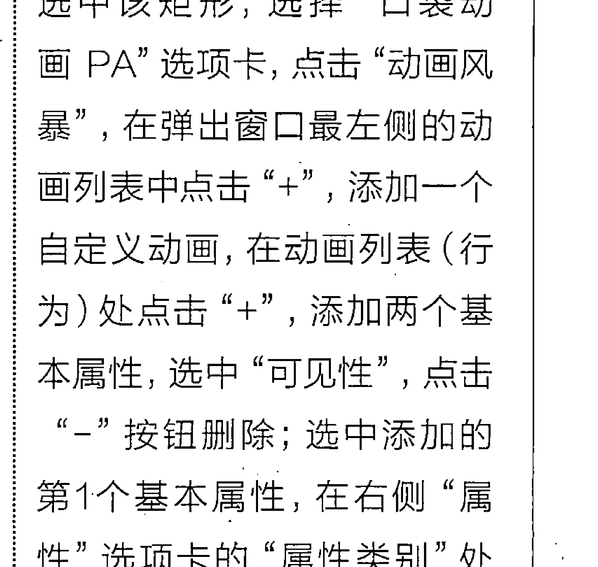

- 接下来，选中“【属性】X坐标”行为，在右侧“属性”选项卡的“属性类别”处选择“Y坐标”。选中“【属性】Y坐标”行为，在右侧“属性”选项卡中，第1帧的值设置为“#ppt_y”，第2帧的值设置为“#ppt_y-0.05”。点击动画风暴界面右上角的刷新按钮，选择“动画计时”选项卡，在“持续时间”处设置为“0.5”，“触发方式”处设置为“与上一动画同时”，在“重复次数”处设置为“999”，勾选“开启翻转”（图3）。

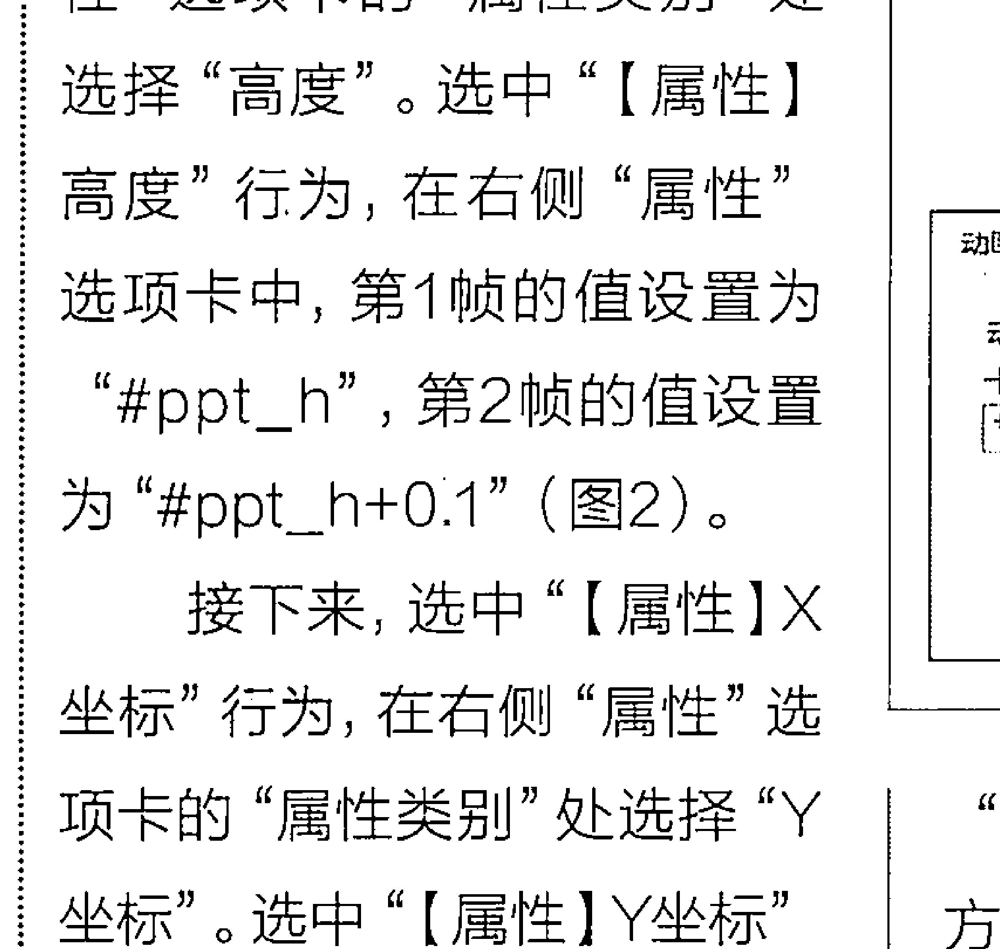

- 最后，选中矩形，按住Ctrl，利用鼠标左键拖动，复制出5个矩形，手动调整这些矩形的高度，选中这些矩形，选择“格式”选项卡，点击“对齐→底端对齐”，对齐后再点击“横向分布”。全选所有矩形，选择“口袋动画 PA”选项卡，点击“时间序列”，在弹出窗口的“随机范围”处，最小值设置为“0”，最大值设置为“0.5”（图4）。
- 插入音乐，放映一下幻灯片，美妙的音乐加上动感的均衡器，效果真的不错。

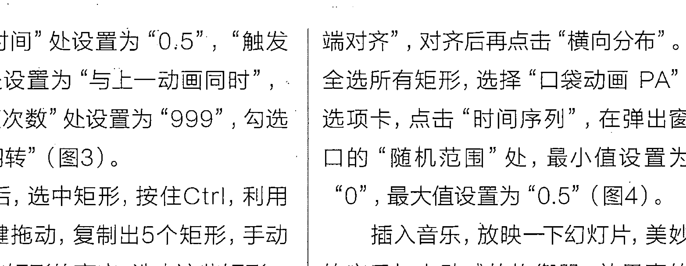

# 巧做带平均线的柱形图

文|马震安

柱形图很多都是用来作数据对比的，不但各数据之间可进行对比，而且各数据还可和总体情况进行对比。比如，各数据和总体的平均情况就可通过柱形图加平均线的图表表示出来（图1）。

- 首先，在数据区域添加辅助列“平均销售”，并输入公式“=AVERAGE($B$2:$B$6)”，向下填充到所需行。选中A1:C6，创建“簇状柱形图”。选中图表中代表“平均销售”的系列，选择“设计”选项卡，点击“更改图表类型”，在弹出的窗口中将“平均销售”的簇状柱形图更改为“带数据标记的折线图”，并勾选其次坐标轴。右击图表中的折线图，选择“设置数据系列格式”，在设置数据系列格式窗口，依次展开“填充与线条→标记”，在数据标记选项下选择“无”（图2）。

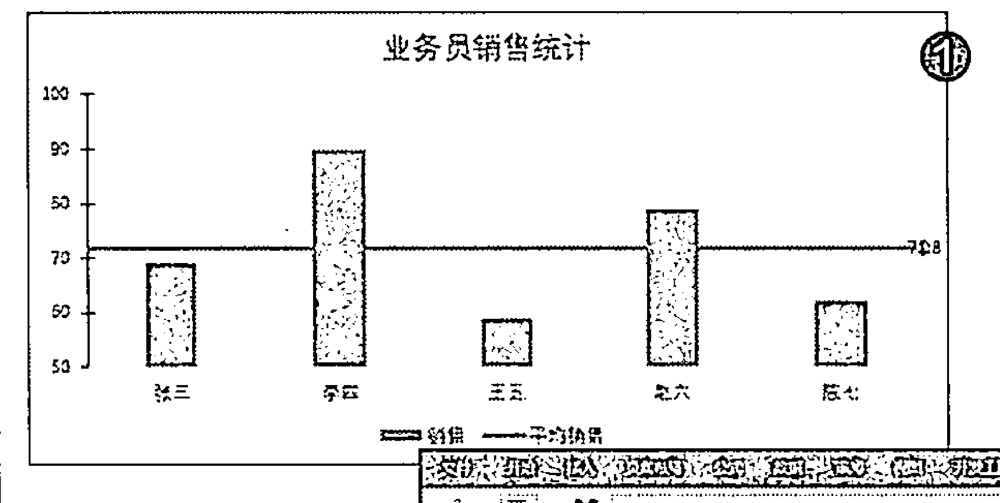

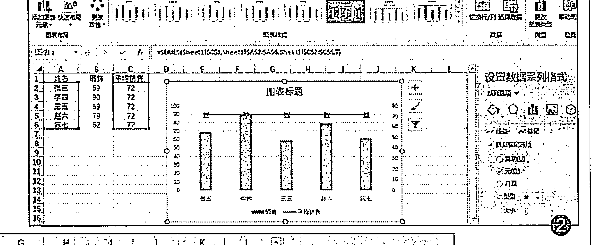

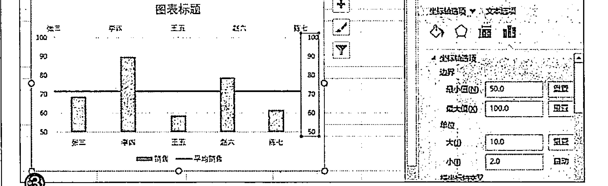

- 选中图表，选择“设计”选项卡，点击“添加图表元素→坐标轴→次要横坐标轴”，双击此横坐标轴，在“设置坐标轴格式”窗口，选择“坐标轴选项”选项卡，在“坐标轴位置”处选择“在刻度线上”；选中垂直坐标轴，在“坐标轴选项”选项卡中，最大值设置为100，最小值为50，单位设置为10。以相同的方法设置次坐标轴垂直轴的最大值、最小值（图3）。

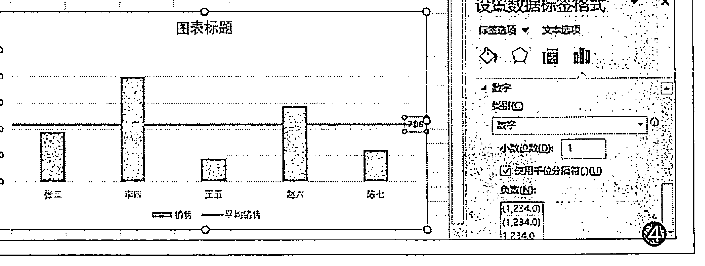

- 选中次坐标轴的垂直轴，在“坐标轴选项”选项卡的“坐标轴选项”中，将“刻度线”展开，次刻度线类型处选择“无”；将“标签”展开，标签位置处选择“无”；在“填充与线条”中，将“线条”展开，选择“无线条”。这样次坐标轴的垂直轴就不见了。同样，也将次坐标轴的水平轴隐藏。接下来，选中图表中“平均数”系列最右侧的数据点，在“填充与线条”的“标记”选项卡中，将“数据标记选项”展开，选择“内置”，选择自己所需要的类型，大小为10。右击这个数据点，选择“添加数据标签→添加数据标签”，在“标签选项”选项卡中，将“数字”展开，类别处选择“数字”，小数位数为1（图4）。
- 最后，根据自己的需要对图表进行相应的美化就可以了。

用颜色制作占比堆积图

文/愚人

在Excel中我们经常使用占比堆积图来表达预算，利用每个部分支出占比等数据。默认占比堆积图都是根据比例的大小来确定柱形长短或面积大小，然后简单堆积在一起。其实在可视化设计流行的今天，我们还可以完全通过颜色及颜色的深浅来实现堆积图。这样不仅美观，而且可视化效果更加突出。

比如下表是某单位各个部门报销的招待费用（图1），为了更直观看到各个部门招待费用的占比堆积，现在就可以使用条件格式填充不同颜色单元格实现堆积图。

首先对总的招待费用进行求和，接着在C2输入公式“=(B2/B$7)*100%”，下拉公式后求出各单位招待费的各自占比数据（图2）。

选中E1:N10区域，点击“开始→格式→行高”，设置为28，继续设置列高为“4”。也就是选择一个10×10单元格作为颜色堆积的填充区域（图3）。

接着在E1输入“0.91”，点击“开始→填充→序列→等差数列”，步长值输入“0.01”，终止值输入1，点击“确定”完成行数列的输入。在E2输入“0.81”，操作同上完成数列输入，接着选中填充的两行数列往下填充，完成所有数据的输入。这里每个单元格对应一个百分比，初始E10=0.01（即1%），然后依次以1%为步长递进直到100%，这样原来招待费的百分占比就可以通过单元格表示（图4）。

点击“开始→条件格式→突出显示单元格规则→其他规则”，在打开的窗口中选择“只为包含以下内容的单元格设置格式”。在编辑规则说明下方选择“单元格值”，然后在“小于或等于”后方输入公式“=SUM($C$3:$C$6)”。继续点击“格式”，将填充格式设置为红色。这里使用$符号对单元格进行绝对引用，表示如果单元格的值小于或等于C3:C6之和，那么就应用条件格式的设置（图5）。

继续设置剩下的3条规则，其他同上，公式依次为“=SUM($C$4:$C$6)”、“=SUM($C$5:$C$6)”、“=$C$6”。然后依次点击“格式”，为不同的规则设置不同的颜色，应用范围全部设置为$E$1:$N$10，可以在管理规则中对所有规则依次进行设置(图6)。

点击确定应用规则，这样每个单元格就会按照上述的规则进行单元格的填充。为了数据更加美观，选中E1: N10区域，右击单元格选择“设置单元格格式→数字→自定义”，在“类型”框输入“;;;”（三个半角分数格式），表示隐藏单元格的数字格式(图7)。

现在返回单元格可以看到原来的数字已经被全部隐藏，不同颜色的单元格实际对应的就是每个部门的百分占比，我们在更改实际数字的时候，不同占比的单元格会同步发生变化。这样通过不同颜色单元格的数量就可以很方便地看到不同部门招待费的占比，为了更方便查看，还可以在单元格旁边加上各个部门的文字说明。这样的颜色堆积图是不是可视化效果更好(图8)？

可以看到灵活运用条件格式可以非常方便地使用单元格来表示数字占比，我们还可以举一反三做出更多图形。比如可以通过直接使用数据条的方式来表示招待费用的占比。同上点击“开始→条件格式→数据条→其他规则”，在打开的窗口选择“基于各自值设置所有单元格的格式”，将类型的最小值和最大值全部设置为“数字”，值分别为0和1，条形图的外观选择红色和实形边框(图9)。

点击确定后，可以看到在每个百分比数值后面都会添加一个和百分比数值对应的红色数据条，通过数据条的长短就可以非常直观地看到数值的不同(图10)。

管理规则

数据条设置

单元格样式的堆积图

设置数字格式

使用数据条直接表示占比

PPT制作超酷蜂窝图

文/任宏梅

顾名思义，蜂窝图就是类似于蜂房一样的图片。我们知道蜜蜂的蜂窝构造非常精巧，它由多个正六边形组合而成。这种蜂窝图在PPT中也时有运用，它能明显提升PPT的设计感，常用于制作封面或多图展示或思维导图等。

SmartArt做蜂窝图

PPT中制作蜂窝图最简单的方法之一就是用SmartArt图形，它里面有一种“交替六边形”图形，原本是用来表示一系列相互关联的构思，对其稍作修改，就是一个不错的蜂窝图，这个用来做封面，还是很有艺术感的。

打开PowerPoint 2016，切换到“插入”选项卡，单击“SmartArt”弹出对话框（图1），选择“列表”下的“交替六边形”，单击“确定”按钮即可插入图形。

选中图形，切换到“设计”选项卡（图2），单击“从右往左”按钮修改方向，单击“更改颜色”可以选择内置的色彩库，最后在“SmartArt样式”中可以选择蜂窝图的外观。右击图形选择“转换为图形”，然后复制最左侧的图形，粘贴到右侧，并稍微缩小。

选中蜂窝图中间的六边形，右击选择“设置图形格式”，单击左侧的“填充与线条”，选择“图片或纹理填充”，然后单击“文件”按钮插入图片，再修改“透明度”。用这种方法为其他图形添加图片，最后设置背景并添加文字，这样一个极具艺术感的封面就出炉啦（图3）。

多图转换蜂窝图

当有多张图片要做成蜂窝图时，如果一张一张进行设置，效率会相当低。而使用图片排版功能，可以快速将多图转换成蜂窝图，在用蜂窝图展示多张图片时，非常方便。

切换到“插入”选项卡，单击“图片”弹出对话框，按住Ctrl键不放，可选中多张图片一次性导入。选中所有的图片，切换到“格式”选项卡，单击“图片版式”选择“六边形群集”，图片就会自动排版（图4）。

自动生成的蜂窝图中的六边形数量，是图片数量的2倍，可以为图片一对一标注，也可以删除不需要的。在文本框中输入图片的标注文字，然后设置好字体字号，切换到“设”

单图拆成蜂窝图

一张图片也可以拆分成蜂窝图，形成一种拼图效果。我们可以手绘正六边形，组合后使用图片填充，即可得到蜂窝式拼图。

切换到“插入”选项卡，单击“形状”选择“六边形”，按住Shift键不放，绘制出一个正六边形，旋转正六边形让其一条边垂直，按Ctrl+D复制图形若干，然后拖动排成一排。选中所有图形，切换到“格式”选项卡，使用“对齐”中的“顶端对齐”和“横向分布”，让六边形排列得更加均匀。选中所有图形，然后按住Ctrl键不放，向下拖动并进行对齐，松开鼠标即可复制。这样复制若干排让蜂窝图覆盖差不多整个页面（图6）。

按Ctrl+A全选所有图形，再按Ctrl+G进行组合，右击组合的图形选择“设置图形格式”，然后在右侧选择“填充”下的“图片或纹理填充”，单击“文件”插入一张图片填充组合图形，此时会看到图片已经被分解填充到单个图形中（图7）。

如果感觉图片的位置不太好，可以在向左、向右、向上、向下偏移中进行修改。

巧做蜂窝图动画

蜂窝图不仅是静态的，我们还可以制作蜂窝图动画。比如，将图片逐张飞出拼成一张蜂窝图，这是一种很酷炫的动画效果。蜂窝式动画如果是多张图片，只要将图片分别填充到六边形中，再分别设置动画就行了。但是如果是一张图片，则需要将该图真正拆分成蜂窝图。

首先插入一张图片，然后用上面介绍的方法，绘制正六边形并排列成蜂窝图，注意图形之间要有间距（图8），并且所有的图形都不能组合。

先选中图片，然后按住Shift不放，拖动选中所有图形，切换到“格式”选项卡（图9），选择“合并图形”下的“拆分”，将大图拆分成小图，最后删除图片中不需要的部分，此时就会剩下蜂窝图。

分别按列选中小图片，切换到“动画”选项卡，单击“添加动画”，选择“更多进入效果”弹出对话框，然后选择需要的动画效果（图10），再将动画的“开始”设置为“在上一动画之后”，“持续时间”修改成“0.2”左右。这样全部设置动画后，会呈现出动态拼成蜂窝图的效果。

这种蜂窝动画，还可以使用幻灯片“切换”中的“蜂巢”或“闪耀”来实现，不过只能昙花一现，无法进行精准控制。另外如果感觉自制的蜂窝图不够精美，网上还有一些蜂窝PPT模板供下载（http://www.1ppt.com/tags/197）。

Word 2016快速制作思维导图
文/周建峰

思维导图广泛应用于学习、写作、沟通、演讲等场合，它能高效地发散思维，是一种革命性的思维工具。借助图形和文本，把各级主题分支的关系用相互隶属或相关的层级图表现出来，让我们形成系统的学习和思维的习惯。如今思维导图已经深入到生活的各个层面，帮助我们更高效地学习、更清晰地思考，让大脑拥有最佳的表现。绘制思维导图除了使用专业软件外，Word也是一种不错的选择。

SmartArt快速做思维导图

用Word制作思维导图最大的优势就是通用性强、方便修改、容易分享。使用Word 2016中的SmartArt图形进行组合修改，可以快速做出实用的思维导图(图1)。打开Word 2016，切换到“插入”选项卡，单击SmartArt图形弹出对话框(图2)，选择其中的“分离射线”，单击“确定”按钮即可插入到页面中，依次修改里面的文字为思维导图中的内容。如果感觉分支不够，可以右击圆选择“添加形状→在后面添加形状”，则可以看到会自动添加分支。右击中间的圆形，选择“更改图形”下的“圆角矩形”(图3)，此时中间的图形被修改为圆角矩形。这里的图形外观都可以进行修改，添加的文字可以修改字体、颜色和字号等。右击SmartArt图形的外框，选择“环绕文字→浮于文字上方”，这样该图形就可以在页面上任意拖动调整位置。选中SmartArt图形，切换到“设计”选项卡(图4)，在这里可以修改图形的外观，比如设置三维效果、更改颜色。另外右击图形选择“设置形状格式”，在右侧可以对图形进行更细致更个性化的修饰。再次切换到“插入”选项卡，插入名为“垂直框列表”的SmartArt图形，输入需要的文字，然后设置图形的“环绕方式”为“浮于文字上方”，这样图形才可以任意移动。按Ctrl+D将该图形复制3份，修改文字，并放置在相应位置。切换到“插入”选项卡，单击“形状”选择“箭头”，绘制一个箭头，复制后旋转方向，用来进行连接（图5）。切换到“开始”选项卡，单击“选择→选择窗格”，可以看到当前页面中的所有对象，按住Ctrl键不放，分别单击“选择窗格”中的所有对象，这样可以选择该思维导图中的所有元素。最后右击选择“组合”下的“组合”，即可将所有元素组合成一个整体。

手绘图形做个个性化思维导图

用SmartArt图形制作的思维导图比较正统，在Word中还可以通过手绘图形和添加图片，来制作个性化的思维导图，如下例所示就是通过添加标注、图形填充图片、修饰箭头等完成的（图6）。

切换到“插入”选项卡，单击“形状”按钮选择“新建绘图画布”，拖动调节画布尺寸，确保后面添加的元素能放得下。在画布上绘制一个圆角矩形，右击选择“设置形状格式”，在右侧单击“填充”，选择“图片或纹理填充”项，再单击“文件”选择一张图片用来填充。单击“形状”选择“曲线箭头连接符”（图7），绘制一根曲线。

右击曲线选择“设置形状格式”，将其“宽度”设置为4.5磅，“复合类型”为“双线”，然后按Ctrl+D复制1份，移动到合适位置。再切换到“格式”选项卡，单击“旋转”选择“水平旋转”（图8），这样就得到一个对称的线条。

绘制一个椭圆，右击椭圆选择“添加文字”，输入需要的文字；在设置形状格式中，将边框设为“双线”，切换到“文本选项”，进入“布局属性”（图9），勾选“不旋转文本”，将左右上下边距都设置为0厘米。再复制该椭圆，修改里面的文本，最后选中线条和椭圆，将其组合成一个整体分支。

将组合后的分支复制3份，通过“旋转”中的水平、垂直、90度旋转等选项，让这些分支排列到四周。

切换到“插入”选项卡，单击“形状”按钮选择“标注”下的“圆角矩形标注”（图10），绘制次分支下的图形框，再输入文字，在左侧的“形状格式”中可以进行修改。最后通过复制粘贴添加其他分支，这样一个纯“手工”的思维导图就做出来了。

需要说明的是：用Word制作思维导图在技术上并没有多大的难度，能用SmartArt图形，尽量多用SmartArt图形进行组合；在制作过程中，要善用复制粘贴、旋转对象、选择窗格、格式刷等工具，这些能明显提升制作速度；如果思维导图中的分支需要对齐，还可启用“视图”下的“网格线”，以及“格式”中的“对齐”功能。当然了，如果想让思维导图更精美漂亮，除了选图形配色彩，还需要添加合适的图片甚至背景等，这些都取决于制作者的创意和审美观。

扫描二维码上传手机图片到电脑
文/天涯衰草

现在使用手机拍摄的照片越来越多，所以为了释放空间，将照片上传到电脑的需求也随之而来。虽然通过QQ等工具可以很好地解决，但是需要电脑和手机同时登录才可以。如果用户不方便登录电脑QQ的话，此时又该如何解决呢？

创建二维码来传输文件

下载运行ScanTransfer这款工具（https://scantransfer.net），如果用户主要用于图片传输的话，可以在“照片传输设置”中选择“原图质量”或者对传输的图片进行压缩操作。

接下来点击“保存传输的文件到”选项后的按钮，在弹出的窗口里面选择一个文件夹目录，这个文件夹目录主要用于存放上传的文件。所有的设置完成以后，打开手机中的“扫一扫”功能，对准工具操作界面左侧的二维码进行扫描（图1）。

当“扫一扫”功能成功地识别出二维码中的链接后，就可以在手机和电脑之间搭建起一个文件上传的渠道。接着点击手机网页界面中的“选择文件”按钮后，在弹出的对话框中选择需要上传文件的类型，比如要想上传图片文件的话就选择对话框中对应的按钮（图2）。然后在文件管理器中选择要上传的图片文件，就可以马上上传到电脑里面设定的文件夹目录了（图3）。

照片应用也能无线传输

如果你使用的是最新版本的Windows 10系统，利用系统自带的“照片”应用就可以进行文件的传递操作，不过要想使用该功能需要进行一些简单的设置才可以。

首先启动系统里面的“照片”应用，点击操作界面右上角的“查看更多”按钮。在弹出的菜单里面点击“设置”命令，然后将“帮助Microsoft测试通过WLAN进行移动导入的功能”选项进行开启就可以了（图4）。接下来我们在手机系统里面安装微软应用商店最新推出的“Photos Companion”这款应用。

今后当我们需要将手机中的照片文件上传到电脑时，只需点击“照片”应用工具栏中的“导入”按钮，在弹出的菜单中选择“通过WLAN从移动设备导入”这个命令，这样在应用窗口中就可以看到一个二维码的图片。接下来启动手机中的“Photos Companion”应用，点击应用操作界面中的“Send photos”按钮后，利用手机对准电脑屏幕中的二维码进行扫描（图5）。

扫描完成以后就可以建立起手机与电脑之间的链接通道，接下来选择需要进行上传的图片（图6）。然后点击右上角的“Done”按钮就可以进行上传操作了，上传成功的照片文件可以通过系统的“照片”应用进行查看和管理。

# 让华为手机实现“自动朗读”
文/镜花水月

很多电子书软件支持将小说文字转为语音播放，但现实生活中需要转成语音的却不限于小说，还有短信、记事本、公众号的资讯、头条新闻等，如何让这些内容也通过语音的形式播放出来？

如果你的手机品牌是华为，而且系统版本为EMUI8.0，那就可以通过“随选朗读”实现上述目的。需要注意的是，在开启该功能前，需要提前进入系统设置，打开“设置→系统→系统导航”中的“屏幕内虚拟导航栏”功能（图1），使用屏幕下方的虚拟按键操作手机。

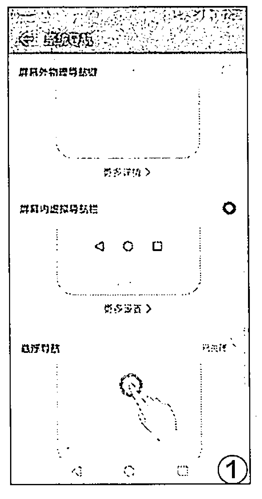

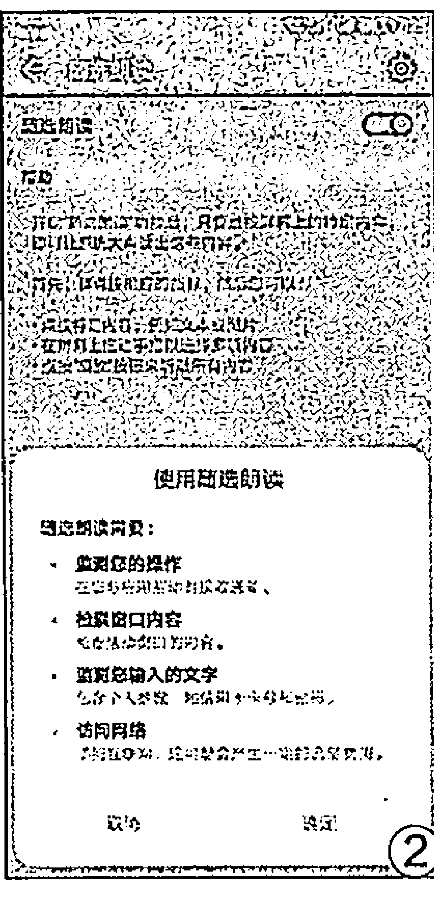

接下来进入“系统→智能辅助→无障碍”，打开其中的“随选朗读”功能（图2），此时你会发现虚拟导航栏右下角出现了一个小人的图标（图3）。


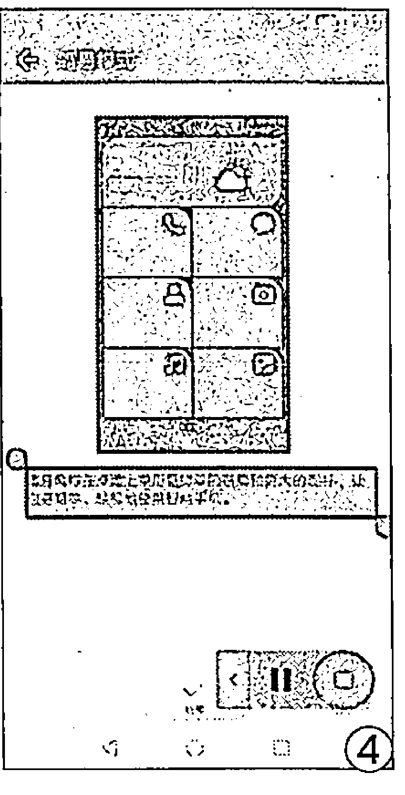

今后，在任何带有文字的界面，先点击导航栏的小人图标就会弹出一个播放的悬浮窗，然后长按屏幕框出需要文字转语音的内容，“随选朗读”功能就能将其“读”出来了（图4）。

# 如何阻断应用权限的申请要求
文/天涯衰草

现在手机应用在安装时都会提出各种权限的申请要求，如果没有允许某些权限要求的话很容易出现无法安装或者无法启动的情况，这样就迫使用户必须开放某些不想开放的权限。那么，如何才可以阻断应用权限的申请要求呢？

首先下载运行名为“App Ops”的这款应用（下载地址：http://suo.im/6lsu4），启动App Ops以后我们首先看到的是它的介绍页面，点击“下一步”按钮后则会让用户进行工作模式的选择。

考虑到很多人的手机并没有进行ROOT操作，所以在这里可以选择“特权模式”（图1）。选择完成以后点击“下一步”按钮，根据向导安装一款名为“Shizuku Manager”的应用，并根据提示将其进行开启就可以了（图2）。

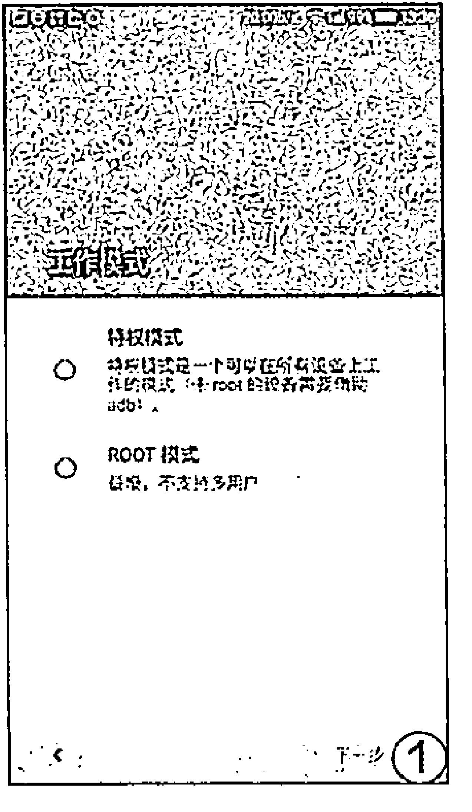

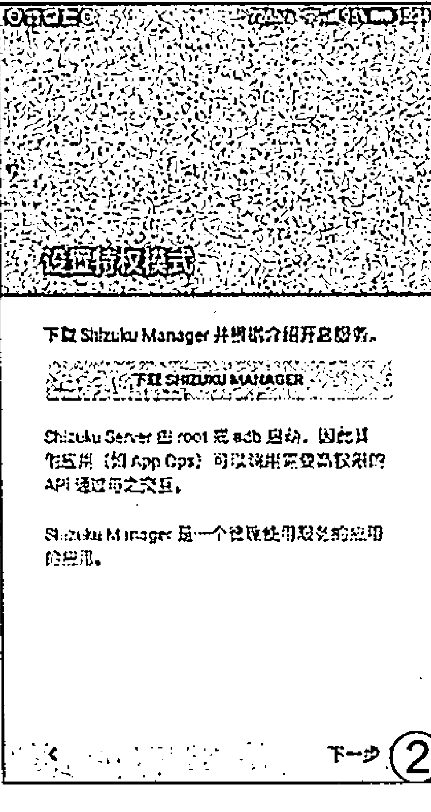

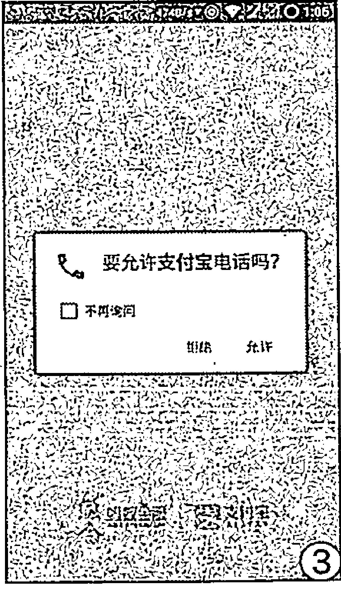

当“Shizuku Manager”和“App Ops”应用成功运行后，每当打开一款应用程序的时候就会弹出一个对话框，询问用户是否授予这个应用相应的权限。这时我们就可以根据自己的喜好来进行选择，如果不想授予它运行权限，直接点击对话框中的“拒绝”按钮（图3）。

从此以后，虽然我们在系统权限管理授予了权限，但是由于在App Ops里禁止了权限，所以应用检测权限返回的结果是“允许”，但实际上并不能获取到正确的权限。

# 手机刷题 让孩子爱上学习
文/闫智飞

现在很多孩子都喜欢玩手机，如果老师能根据所教内容给学生出几道选择题，让学生回家之后在手机上刷刷以调动他们的学习积极性，那绝对可以取得良好的教学效果，用APP“磨题帮”就可以轻松实现这一目的。

### 模板分析及添加题目

“磨题帮”是通过导入Excel表格的方式来添加题目的，因此，我们需要先在Excel表格中编辑好相应的题目内容。从“https://pan.baidu.com/s/1i6DkVhb”下载笔者所提供的“选择题模板.xls”，然后打开（图1）。

在图1中，参数“标题”右边的B1单元格，可根据所添加的题目内容为其取一个标题；参数“描述”右边的B2单元格，可以为所添加的题目作一简单描述，比如添加一些鼓励性的话语，以增加答题的趣味性；参数“用时”右边的B3单元格，可以设定答完所添加的题目大约需要多长时间。

在图1中，大家发现“选择题模板.xls”只包含一道选择题，该选择题的题干在A5单元格，内容是“孙悟空的第一位师父是？”，对应的四个选项是“观音菩萨”、“镇元大仙”、“唐僧”和“菩提祖师”，分别在C5、D5、E5和F5四个单元格。

I5单元格则是选择题的正确答案，如果选择项4为这道选择题的正确答案，则I5单元格应该填写大写英文字母D；同样的道理，如果选择项1为选择题的正确答案，则I5单元格应该填写大写英文字母A；当然，如果其他选择项为选择题的正确答案，则依此类推。

至于H5单元格，则是对正确答案所作的简要说明（可不输入），而J5单元格，则是答对这道选择题所得的分数。

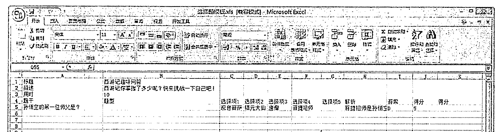

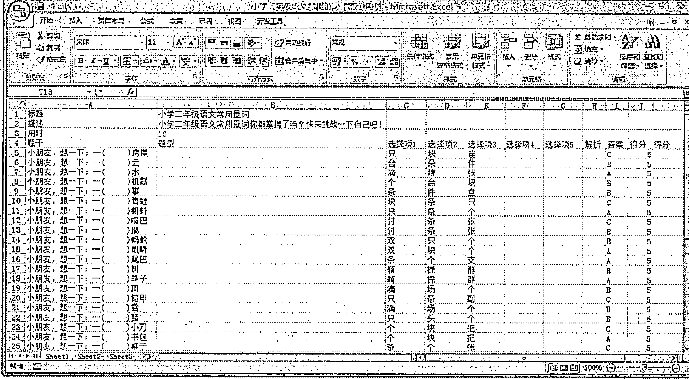

明白了与图1中第一道选择题所对应的A5、C5、D5、E5、F5、H5、I5以及J5单元格所输入内容的含义后，我们就可以“依样画葫芦”，根据自己的需求来添加题目内容了（图2）。

> **小提示**
完成选择题目的添加后，Excel表格必须保存为扩展名为XLS类型的，这是因为磨题帮只支持导入扩展名为XLS的Excel文件。如果某个选择题只包含三个选项，则与之对应的F列单元格（如图2中的F6单元格）内容为空即可。

### 导入题目及效果预览

**第一步：同步题库文件到手机**

在PC端登录网页版的微信（网址：https://wx.qq.com/），接着在微信好友列表中双击自己的家人等比较靠得住的人，打开微信的聊天窗口；最后在网页版的微信中，单击“图片和文件”按钮，将刚刚编辑好的包含选择题目的Excel文件（如“小学二年级语文常用量词.xls”）发给对方。

**第二步：导入题库文件**

在手机上安装应用“磨题帮”，然后在手机端微信聊天窗口中轻触“小学二年级语文常用量词.xls”链接（图3），轻触右上角的三个小圆点，选择“其他应用打开→磨题帮”，将同步到手机中的Excel题库文件导入进来即可。

完成上述操作后，运行“磨题帮”，选择已添加进来的题库文件，并轻触主界面中的“模拟考试”按钮就可以进行刷题测试了（图4）。

对于已添加的题库文件，除了利用“模拟考试”方式进行测试以外，“磨题帮”还提供“顺序练习”、“随机练习”、“自选练习”等练习模式可供选择（各种练习模式，答完一题即可查看对应的答案；“模拟考试”模式，答完所有题并提交，才可以查看答案）。此外，在“磨题帮”官网http://www.motibang.com/tour/import_exam，还有匹配题、填空题等不同类型的XLS模板可供选择，其制作与导入方法与选择题类似，有此需求的朋友不妨试一试。

# 巧用微云检索文件中的信息
文/天涯衰草

通常当我们需要查询文件时只需输入文件名称中的关键字即可，但有时候我们查询文件所需的关键词却隐藏在文件的内容里面。在这种情况下，如何才可以查找到文档中的内容，从而在更大范围内查询文件呢？

此时就需要在手机中安装最新版本的“腾讯微云”客户端（下载地址：http://suo.im/1SP5Dv）让它来帮忙了。登录后点击操作界面下方的加号按钮，然后选择需要上传的文件资料信息。将这些文件上传到微云的服务器后，点击工具栏中的“我”按钮，在弹出的菜单中选择“设置”命令。此时可以看到一个名为“探索中心”的选项，点击它以后找到“图片OCR文字搜索”和“文档/笔记的正文搜索”两个选项，点击后面的按钮将其开启就可以了（图1）。

当“腾讯微云”客户端提示用户两个功能已经成功开启后，点击工具栏中的“文件”按钮，接下来在操作界面的搜索框中输入相应的关键词，稍等片刻就可以看到含有这个关键词的所有文件，其中就包括图片以及各种各样的文档文件（图2）。

如果图片中含有这个关键词的话，在搜索结果前方就会用OCR进行提示，当我们点击这个图片以后就可以对其进行查看（图3）。

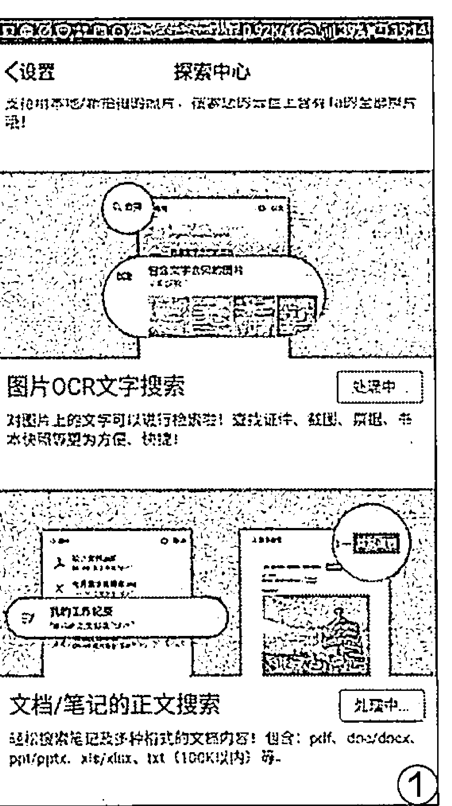

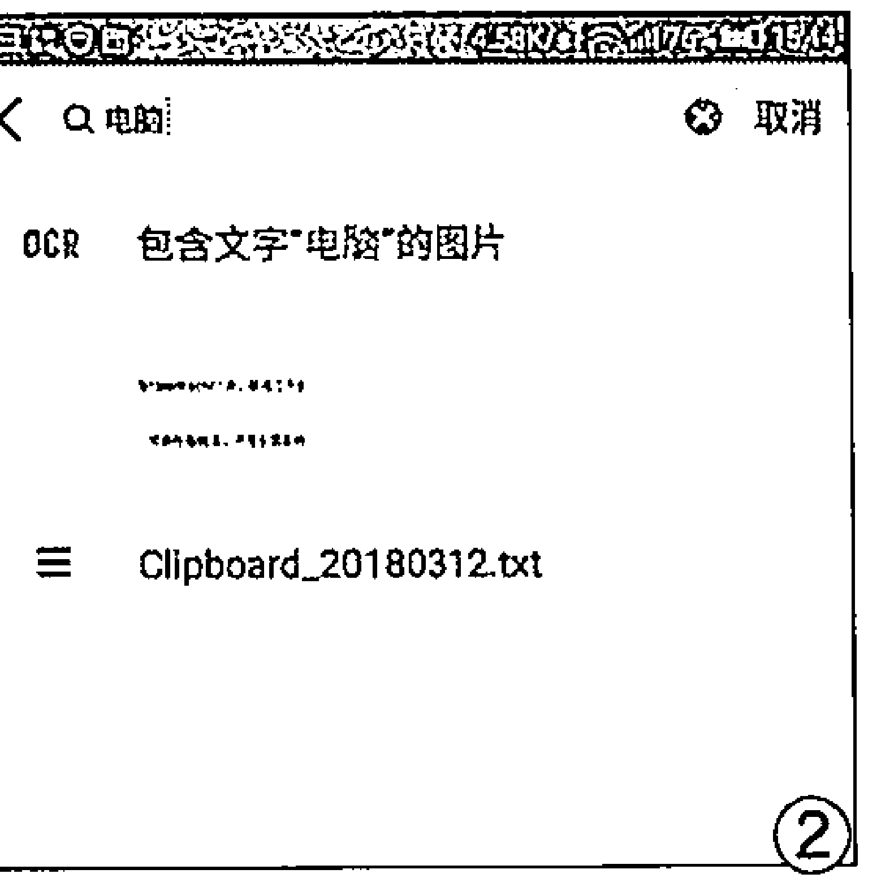

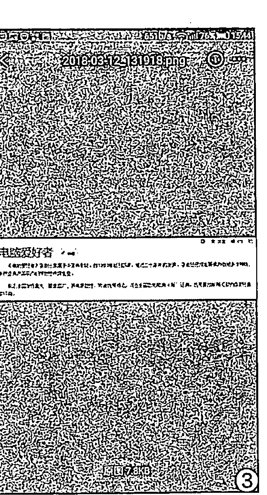

# 外部歌单导入 让QQ音乐更好用
文/闫智飞

在网易云音乐里有许多音乐达人分享的不同类型的歌单，这既方便了自己选择喜欢的歌曲类型，同时也方便将自己喜欢的某类型的歌曲分享给亲朋好友。不过，对习惯使用QQ音乐播放器的用户来说，如何将网易云音乐中的某个歌单分享到QQ音乐里，以方便QQ音乐Fans听歌呢？接下来，笔者就给大家介绍一下如何来实现。

### 步骤1: 获取歌单链接

先运行网易云音乐，在其主界面的“发现”标签上，大家就可以发现有许多风格迥异的歌单了，选择自己喜欢且要分享给朋友的歌单，打开该歌单（图1）；然后轻触图1中的分享按钮（左数第三个），在弹出的快捷菜单中选择“复制链接”，复制该歌单的链接地址；最后将这个链接地址通过QQ或微信等方式，分享给朋友。

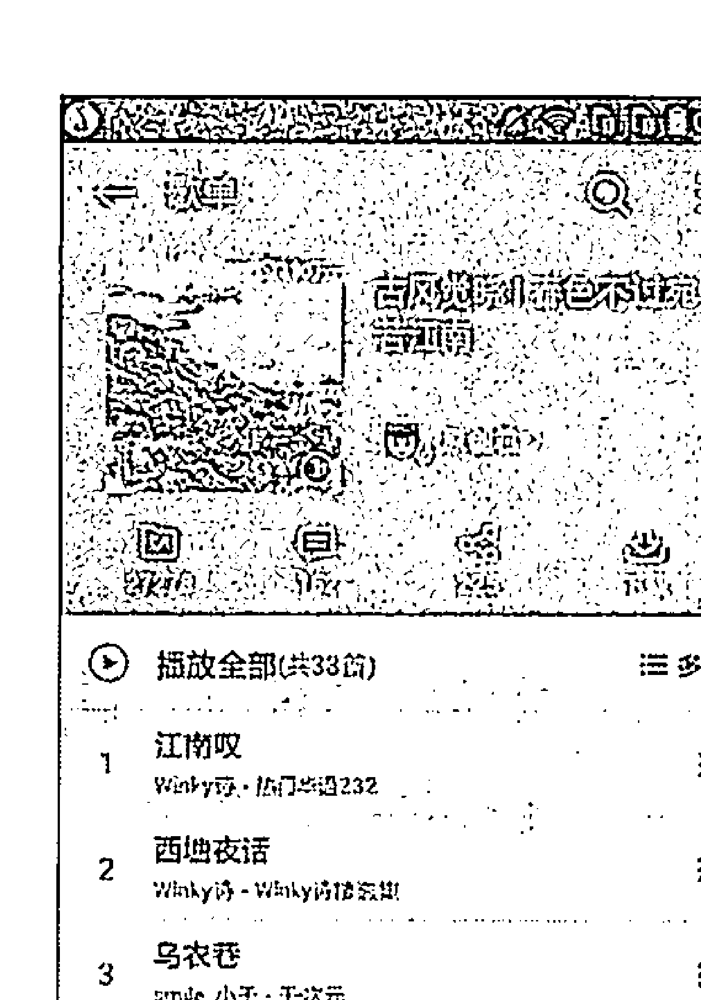

### 步骤2: 导入歌单

请朋友运行QQ音乐并以QQ号登录之，然后轻触QQ音乐主界面左上端的三道白色横杠，在弹出的快捷菜单中选择“导入外部歌单”（图2），打开图2所示的界面，然后将步骤1中刚刚获得的歌单链接地址粘贴到图2中的文本框内。完成上述操作后，轻触图2中的“匹配”按钮，

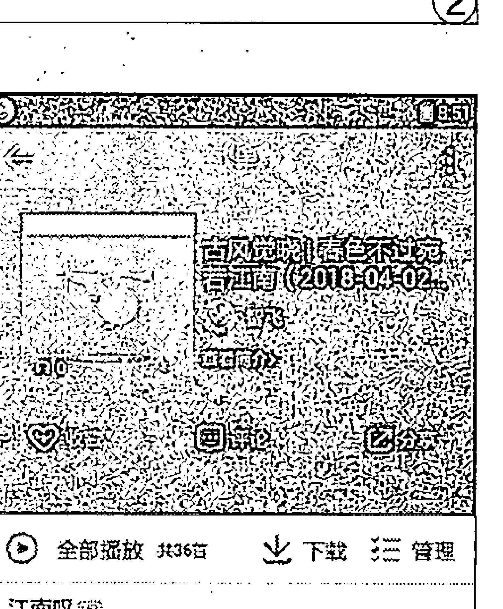

### 步骤3: 补全歌单

细心的朋友通过观察图3可能会发现，原歌单中包含38首乐曲，而导入后却只包含36首歌曲。其实，我们也可以将遗漏的2首歌曲手动添加到导入生成的QQ歌单中，其方法是：

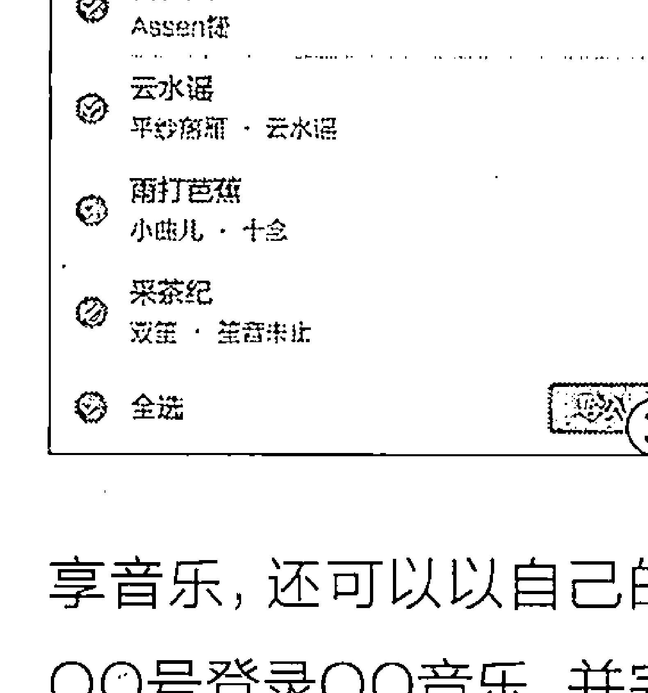

通过对比网易云音乐的原始歌单与QQ音乐导入后生成的歌单，找出遗漏的歌曲，然后百度搜索之，并下载到自己的手机中；再在QQ音乐中，打开刚刚导入的歌单（图4）；轻触图4右上角的三个白色圆点，在弹出的快捷菜单中选择“添加歌曲”，按照提示将手机中已下载的那两首遗漏的歌曲添加进来就可以了。

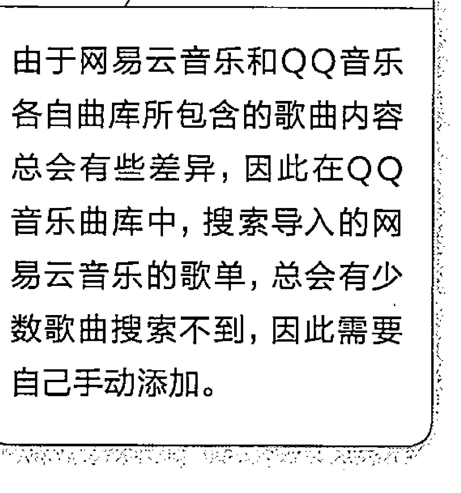

如果是家人之间分享音乐，还可以以自己的QQ号登录QQ音乐，并完成歌单的导入及歌曲的查漏补缺操作；然后家人以自己的QQ号登录QQ音乐（QQ音乐支持多人以同一个QQ号登录）的方式来分享音乐则更省事。

> 小提示
由于网易云音乐和QQ音乐各自曲库所包含的歌曲内容总会有些差异，因此在QQ音乐曲库中，搜索导入的网易云音乐的歌单，总会有少数歌曲搜索不到，因此需要自己手动添加。

# 让新浪微博更加简洁易用
文/天涯衰草

新浪微博是目前最为重要的社交网络之一，虽然官方推出了常规版、极速版、国际版的版本，但该应用内的广告问题却一直被人所诟病。那么，通过什么方法可以让新浪微博更加简洁易用呢？

如果大家使用过谷歌浏览器的话，肯定知道有一些浏览器的应用可以直接添加到系统桌面上，这样就可以摆脱谷歌浏览器的束缚。按照同样的原理，我们也可以在手机上将新浪微博的应用添加到系统桌面上。

首先在手机里面安装谷歌浏览器（下载地址：http://suo.im/3dQHCU），接着在浏览器里面打开这个网址 m.weibo.cn/beta，从而进入到新浪微博的登录页面。输入自己的新浪微博账号密码，就可以登录自己的账号页面了。

接下来点击谷歌浏览器右上角的按钮，在弹出的菜单里面选择“添加到主屏幕”命令（图1）。这时就会弹出一个询问对话框，点击对话框中的“添加”按钮，就会在系统桌面出现一个名为“微博”的图标（图2）。以后只需要点击这个图标，就可以进入到自己的新浪微博来操作。它的操作方法和我们常见的微博应用一模一样，而且再也不会出现各种莫名其妙的广告信息了（图3）。

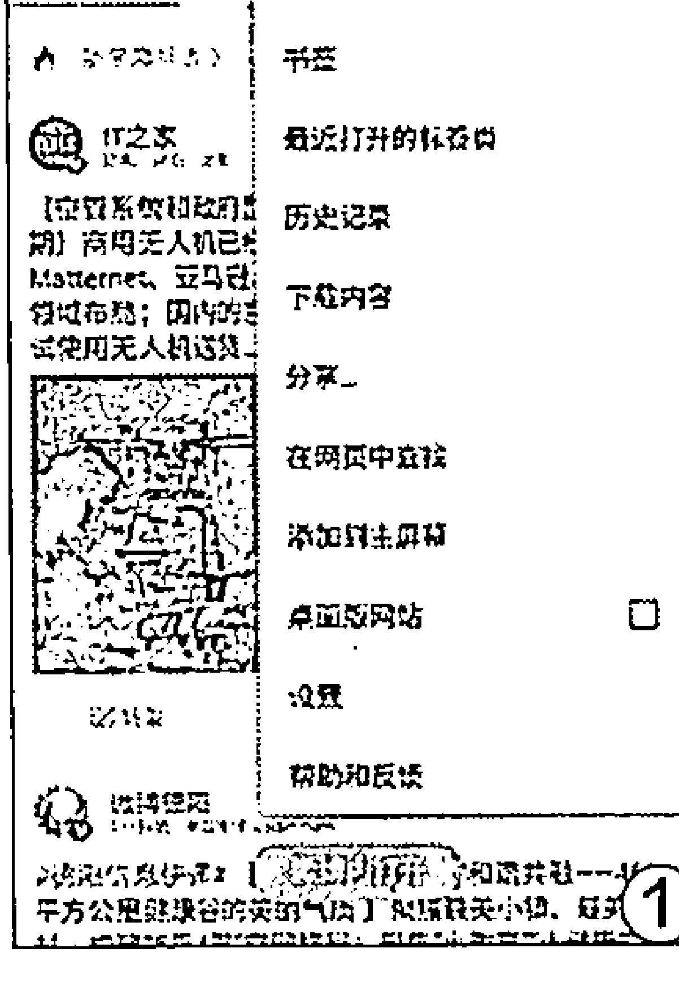

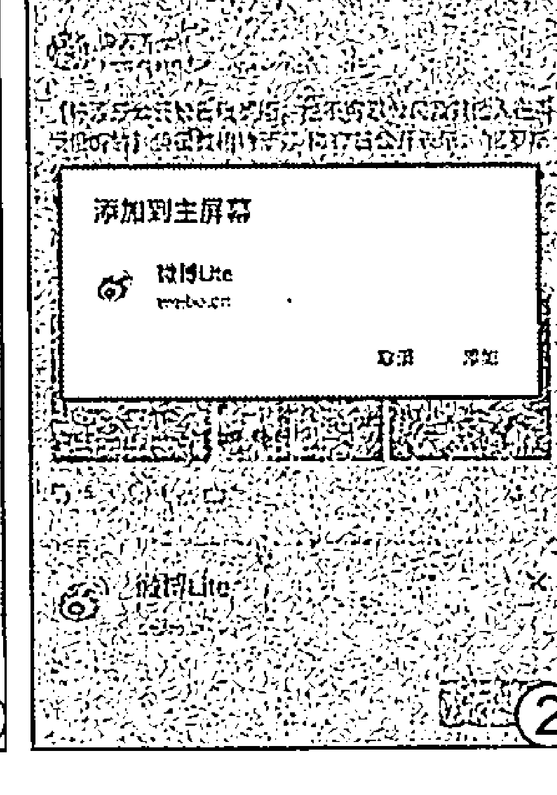

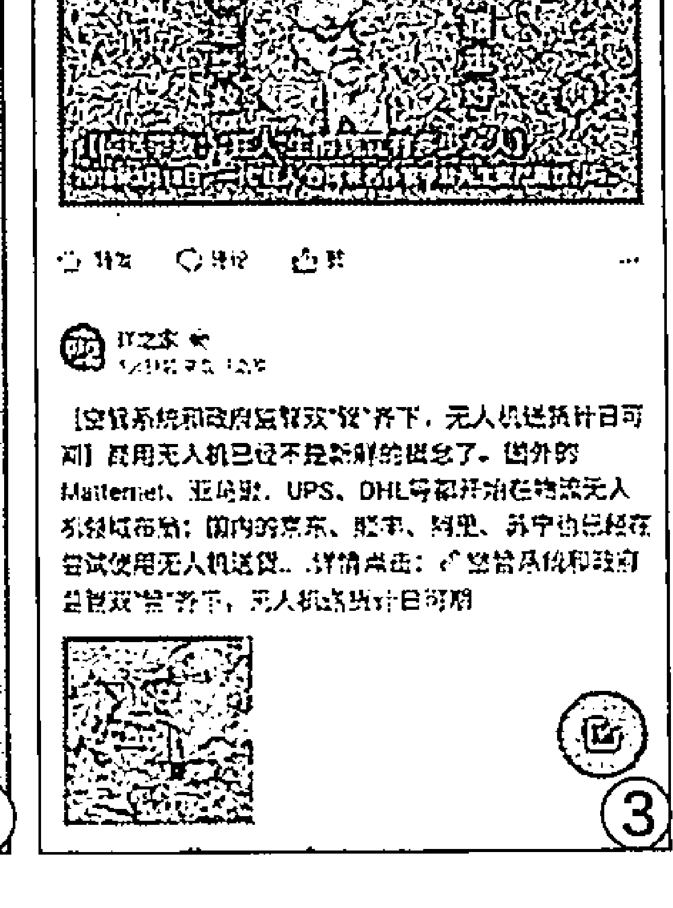

# 找回华为手机的应用隐藏功能
文/镜花水月

华为（包括荣耀）早期的EMUI系统自带隐藏应用图标的功能，但如今新款手机预装的EMUI8.0却不再支持这个绝技。如果你只是不希望被外人看到桌面的应用图片，又该如何找回这个实用的功能呢？

华为新款手机的用户可以搜索下载安装名为“Tweaker For Huawei”（最新版为V2.0，可在华为论坛下载到）的应用（图1），运行该APP选择Hidden Application Menu（隐藏应用菜单），再选择On（开启）和Apply（申请）即可（图2）。

设置完成后请重启手机，此时手机就会自动激活桌面隐藏功能，具体的使用方法和EMUI5.0以前的方法相同：在桌面主屏幕内双指往外滑动屏幕就会进入隐藏应用界面（图3），在主屏幕双指往里滑则可退出隐藏应用界面。

不同品牌Android手机的很多特色功能都是依靠无数系统级APP实现的，新版系统所取消的功能，往往可以通过从旧版系统提取的APP找回来。

华为手机的应用图标隐藏只是其中的“案例”之一，还有更多的玩法等着大家去挖掘。


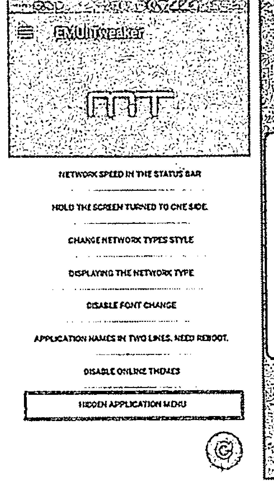

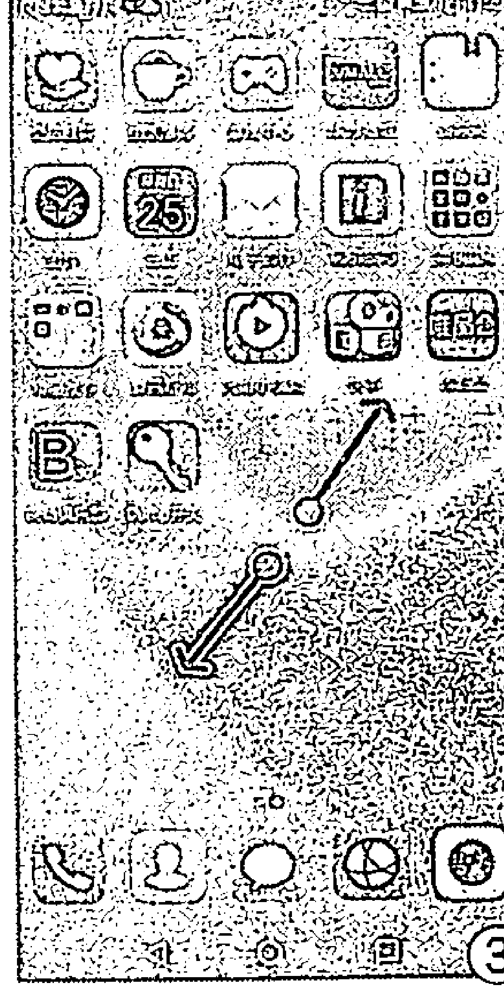

# 如何提升微信拍照质量
文/镜花水月

在微信聊天的过程中，偶尔会遇到临时拍摄照片再给对方发过去的需求。但是，微信自带的相机拍照水平非常差，极为影响观瞻。那么，如何才能提升临时分享照片拍摄的质量？

包括微信在内的很多APP都支持照片分享，并在APP内提供了自己的相机拍摄功能。以微信为例，在与好友聊天时点击“+”，就会看到“拍摄”的选项（图1），点击它就能激活摄像头进行拍照分享。可惜，这种APP内相机可能会因缺少驱动，根本无法发挥摄像头的全部性能，不仅缺少拍摄特效模式，拍摄质量也大幅缩水。

实际上，微信提供了直接启动系统相机APP的入口，方法就是聊天时点击“+”，并长按“相册”就能启动系统相机了（图2），此时再拍照是不是质量好很多了呢？

此外，很多文字扫描类APP也会遇到类似问题。比如百度输入法集成的文字扫描功能，启动的就是APP内相机，拍照分辨率很低（图3），会影响最后的文字识别准确率。对待此类APP，建议还是先通过系统相机APP将需要扫描的文字拍摄成照片，再进入扫描APP，通过相册浏览的方式选择刚刚拍摄的照片（图4），就能实现高分辨率扫描了。

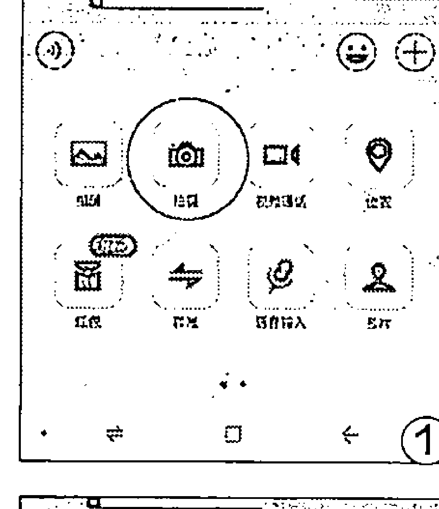

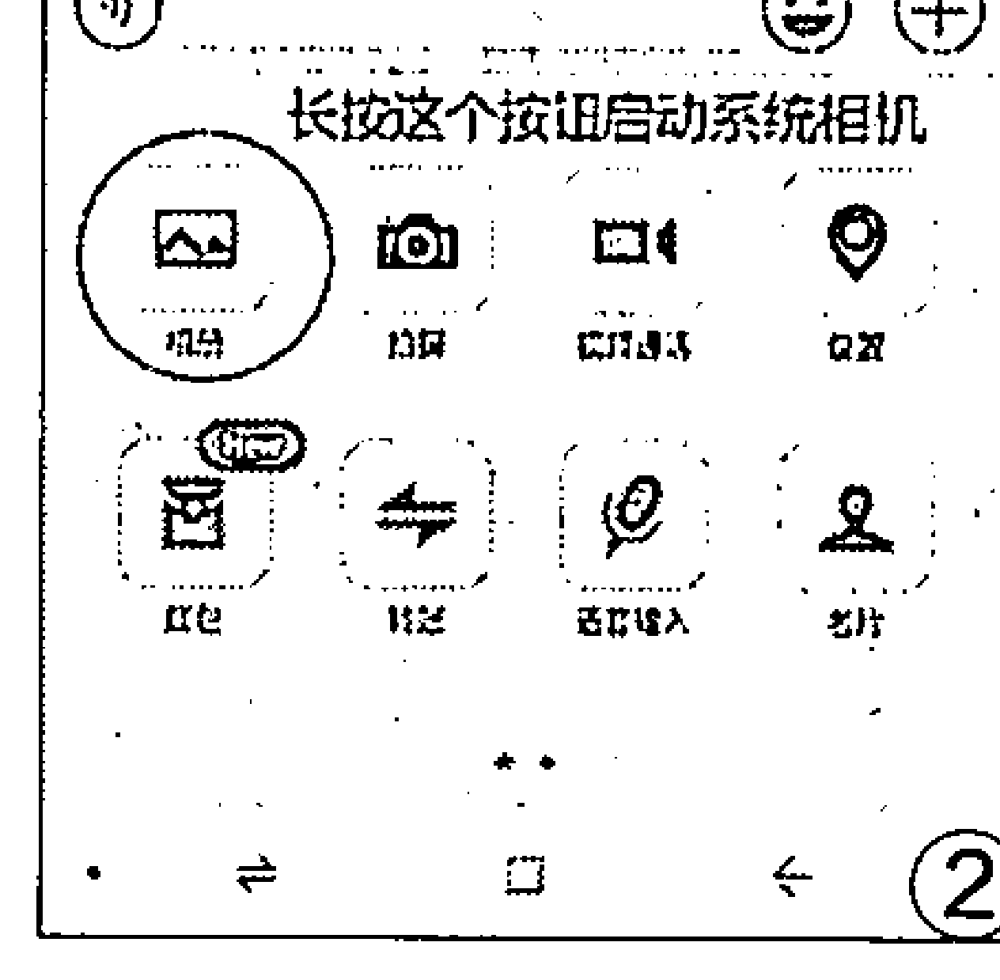

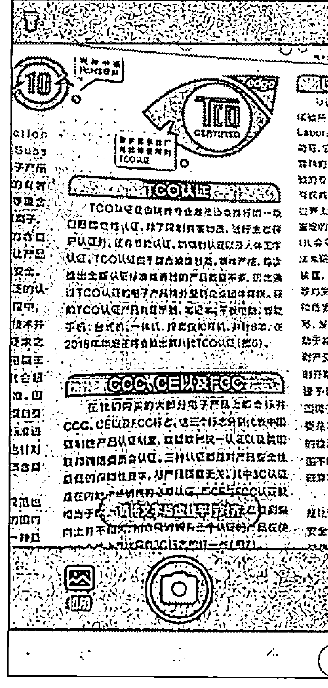

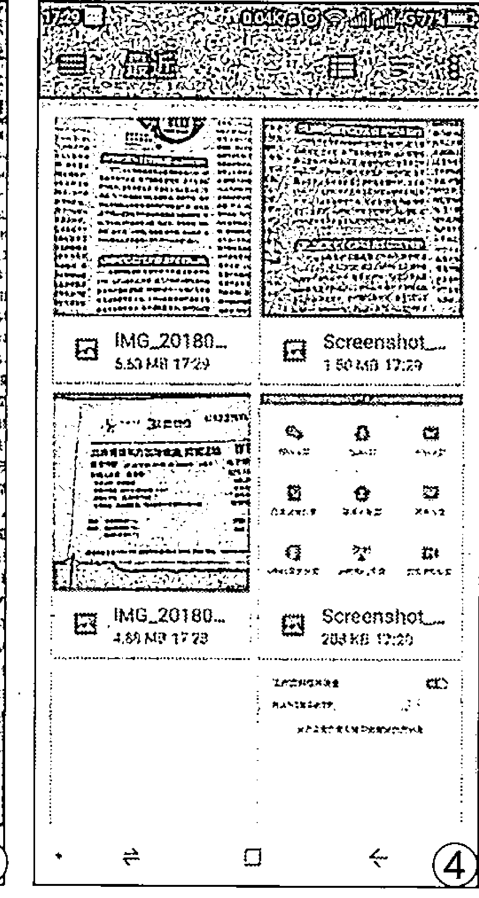

# 提升手机室内导航精度
文/镜花水月

如今很多地图APP（比如百度地图），或是集成功能LBS功能的APP（比如美团）都陆续引入了室内导航的概念，让身处楼宇或商场内的用户确定自己的位置，或是寻找不同楼层的商铺信息。问题是，这些室内导航往往并不精准，如何才能最大限度提升它的准确性呢？

以Android手机为例，在系统设置中都能找到“位置”选项（图1），在里面可以设定导航的精度。比如，如果你经常开车导航，那就必须切换到“高精准度”（图2），让GPU、Wi-Fi和蓝牙协同作战。

但是，想提升室内导航的准确性，在完成上述操作后还需返回到位置信息界面，点击右上角的“...”按钮，进入弹出来的“扫描”选项界面（图3）。在这里，需要手动开启“WLAN扫描”和“蓝牙扫描”（图4），允许系统应用和服务随时都能检测室内的WLAN网络和蓝牙设备，从而达到迅速辅助定位的目的。

需要注意的是，开启这两项功能会略微增加手机耗电，在不需要使用室内定位时建议将它们设定在关闭状态，使用前再临时开启即可。

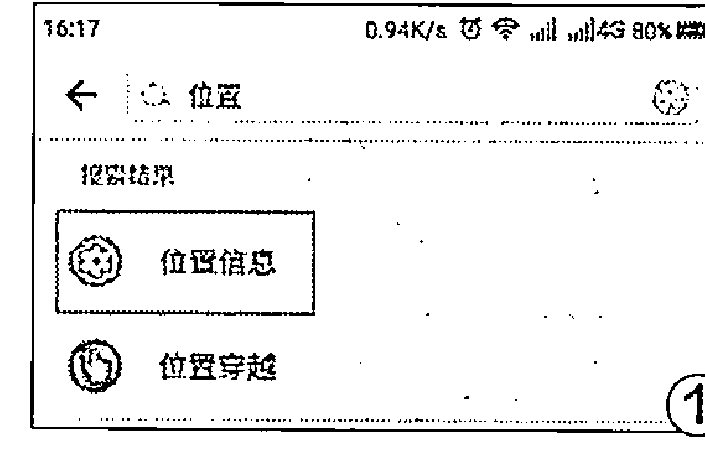

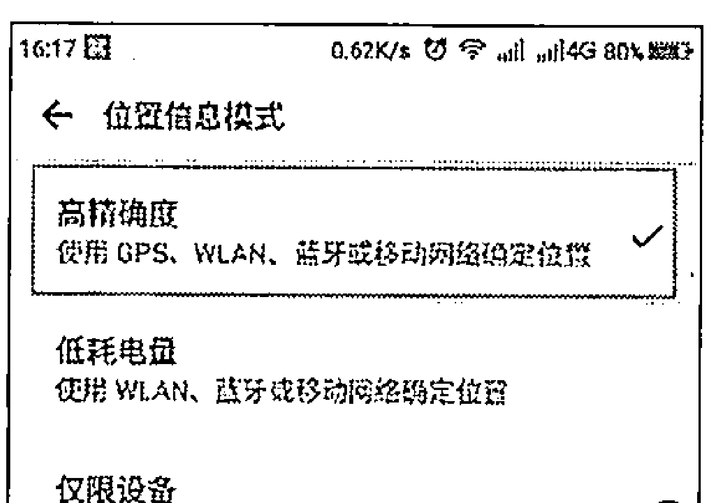

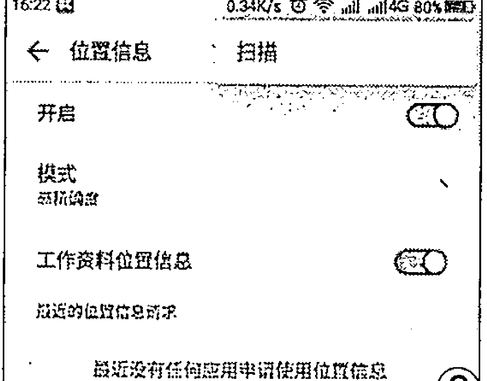

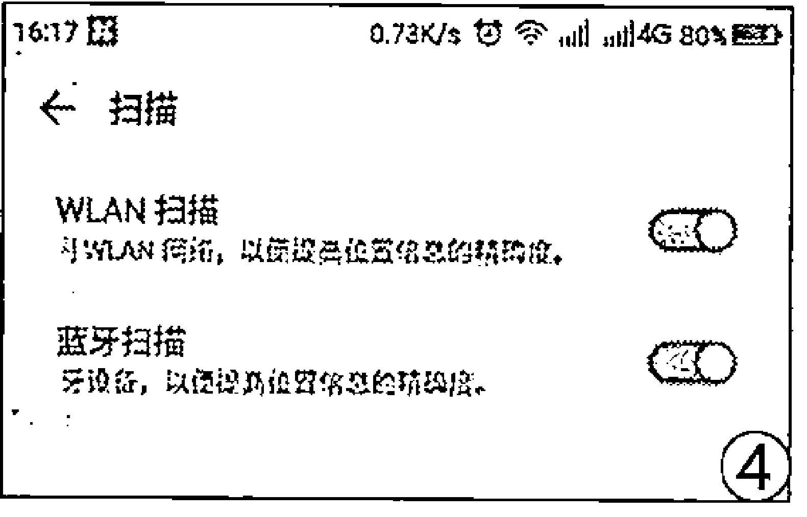

●如果你总是找不到，可以在设置的全局搜索以“位置”为关键词进行搜索。

# 手机变身无线中继器
文/镜花水月

Android系统中有很多可以将手机变身“无线中继器”的APP，从而共享家里的Wi-Fi，并延长无线信号的覆盖距离。如果你的手机是华为或荣耀品牌且系统版本升级到了EMUI8.x，那么恭喜你，无需任何APP，在系统层面就已经支持上述功能。

EMUI将这一功能称为“WLAN信号桥”，其原理就是当手机接入某个Wi-Fi后，这个Wi-Fi可以通过手机再分享给其他手机，就好像路由器的无线中继功能一样，变相增加了Wi-Fi信号的覆盖范围。

该功能的设定非常容易，进入“设置→无线和网络→移动网络共享”，就能看到“设置WLAN信号桥”（图1），点进去后开启该功能即可（图2）。我们可以单独为WLAN信号桥设定新的SSID和密码（图3），方便其他人接入你手机共享的网络。

请放心，WLAN信号桥共享的是已连接的Wi-Fi，而不会浪费SIM卡的数据流量。不过，WLAN信号桥功能也存在些许限制，比如最多支持4个终端设备接入；不能与多屏互动、HUAWEI Share、Huawei Beam等互联功能同时使用；将会增加手机的耗电量；不能共享需要证书认证的网络等。

设定新的SSID和密码（图3），方便其他人接入你手机共享的网络。

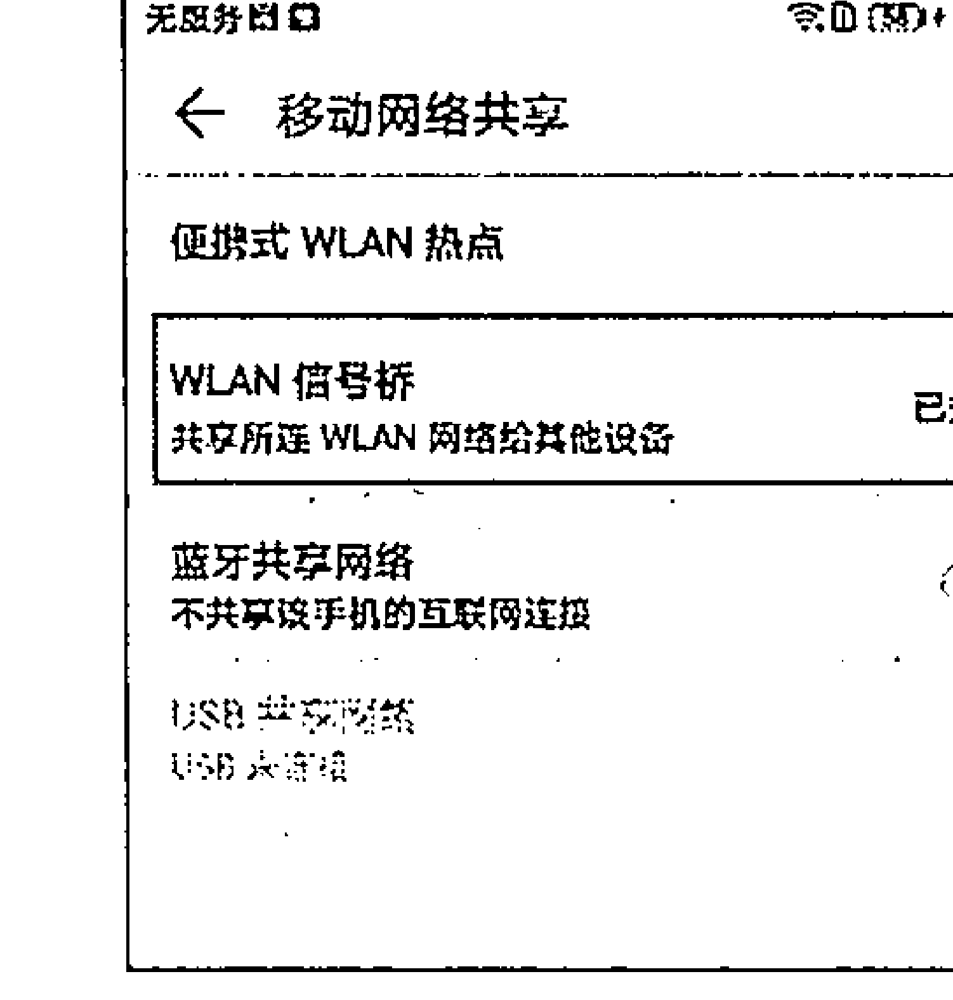

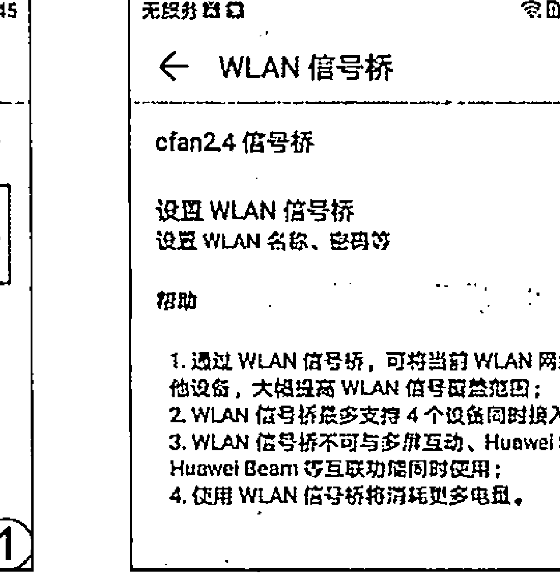

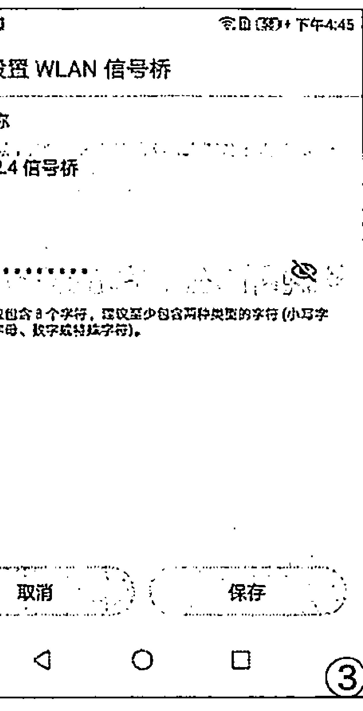

# 利用微信完成图片的拼接操作
文/天涯衰草

由于并非所有手机系统都支持长截图，所以很多用户不得不选择多次截图再拼接的方式，而且还需要单独下载支持图片拼接的APP，好不麻烦。那么，利用现成的应用如何解决这个问题呢？

首先启动大家最常使用的微信客户端，点击工具栏中的“我”按钮，在弹出的列表中选择“收藏”这一项。接下来点击“我的收藏”界面右上角的加号按钮，在弹出的笔记编辑窗口里面点击工具栏中的“图片”按钮（图1）。

将需要拼接的图片一一勾选上，勾选完成以后点击“完成”按钮。添加到笔记编辑窗口里面后，点击笔记窗口右上角的按钮，在弹出的菜单中点击“保存为图片”命令，这样添加的图片就可以拼接为一张长截图的效果（图2）。

虽然这种拼接方式非常的简单，但是也有一个非常明显的缺点，那就是在两张截图之间会有一条状态栏的显示。如果你比较在意这一点的话，可以在手机的图库里面打开相应的图片，接着利用其中的编辑功能对状态栏的部分进行裁剪，裁剪完成以后再按照前面的步骤进行拼接操作即可（图3）。

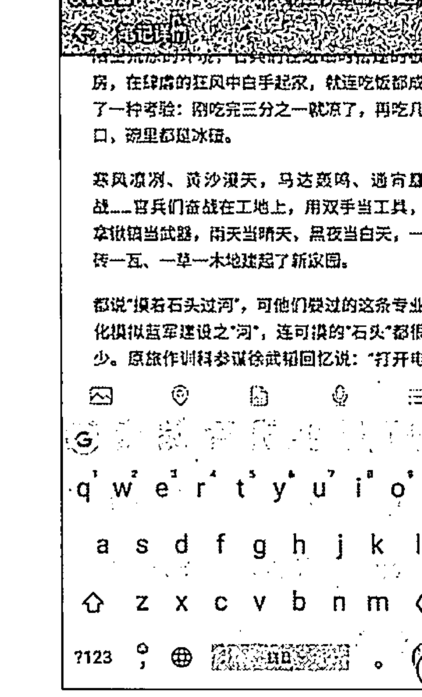

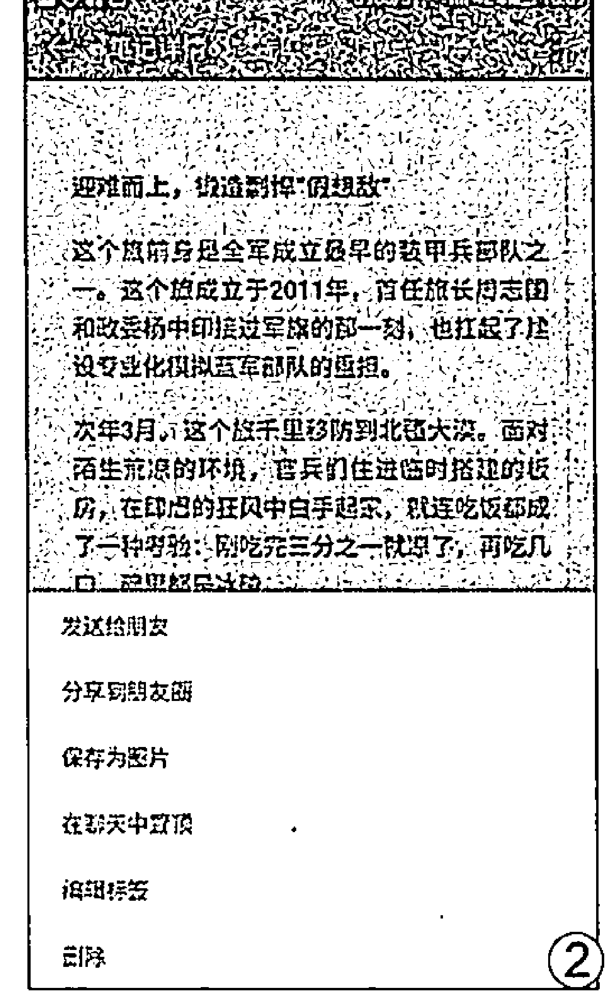

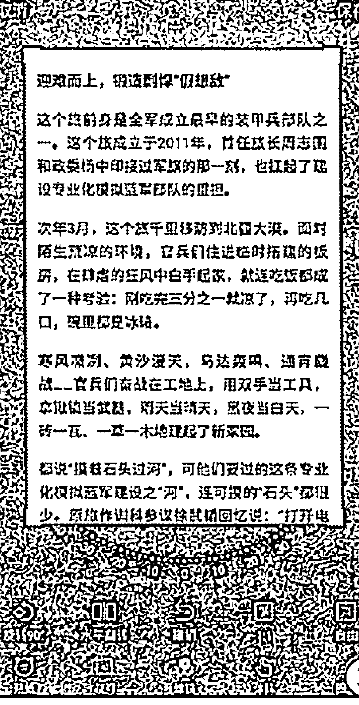

# 就用这两招 玩转公众号资源下载

文/闫智飞

在某些微信公众号里边，往往会有一些内容比较好的音频或视频资源。相关资源如果下载到本地的话，视频在手机、电视里播放就更方便了；而音频资源，则可以拷到小音箱里，供我们随时随地欣赏。接下来，笔者就给大家介绍一下如何下载微信公众号里边的音频、视频资源。

## 公众号视频资源的下载

- **第1步: 下载视频**
在微信公众号里先打开包含自己感兴趣的视频所在的页面 (图1)，然后轻触图1右上角的三个小圆点，在弹出的快捷菜单中选择“复制链接”，将该页面的网址链接复制下来；
然后登录网页版的微信，在手机端将刚刚复制的网址链接发给自己的某个好友；再在PC端复制刚刚出现的已发给好友的网址链接，用浏览器打开之，此时在PC端就可以看到所要下载的视频了 (图2)。
点击图2中的“下载视频”按钮，系统就会调用“腾讯视频”(如未安装“腾讯视频”，则会提示安装)，完成微信公众号里边的视频下载了。

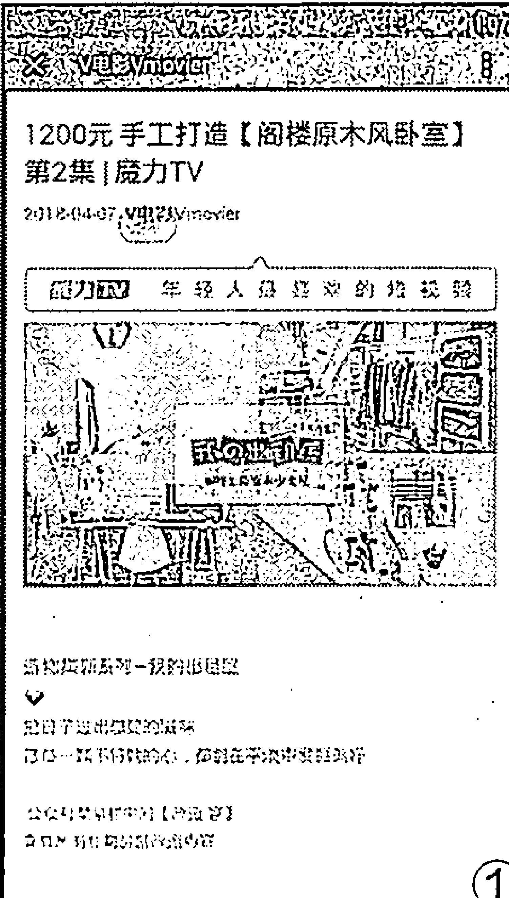

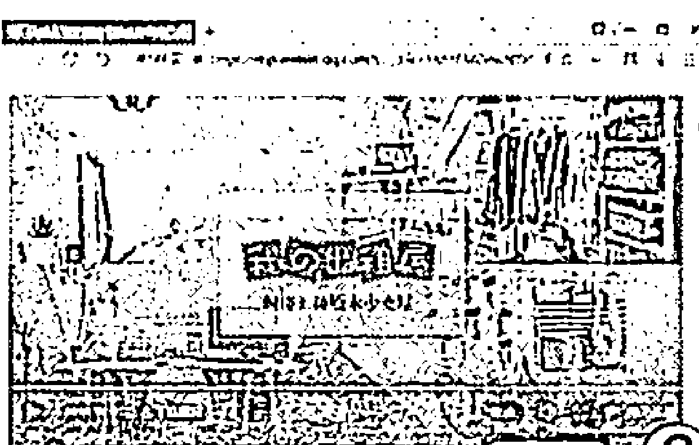

> **小提示**
对于自己电脑剩余空间最大的某个分区(如F盘)，“腾讯视频”所下载的视频会保存到“F:\QLDownload\”目录下。

- **第2步: 转换视频**
使用“腾讯视频”下载的视频文件，其扩展名为QLV，这种格式的视频其他播放器是无法播放的。因此，我们必须将QLV格式的视频转换为MP4格式，其方法如下：
从“https://dwz.mn/eNAL”下载“迅捷视频转换器”，并安装运行之；
接着单击其主界面中的“添加文件”按钮，将“F:\QLDownload\”目录下刚刚下载的QLV格式视频文件添加进来 (图3)；最后单击图3中的“立即转换”按钮，稍等片刻，就完成QLV格式视频转换为MP4格式的操作了。此时打开“F:\QLDownload\”目录，就可以找到转换好的MP4格式视频。

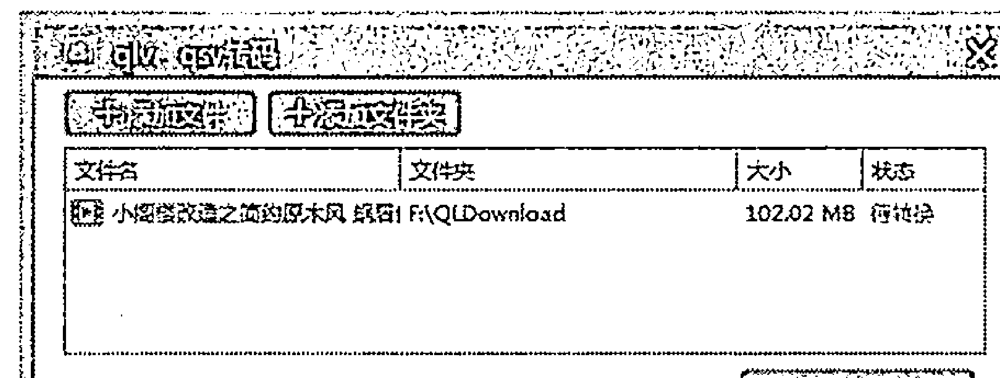

## 公众号内音频资源的下载

除了视频资源之外，在微信公众号里边还有很多内容不错的音频资源，而使用小工具“公众号音频下载”，就可以很方便地将公众号里边的音频资源下载下来。
从“https://dwz.mn/eNMH”下载“公众号音频下载.APK”，安装到手机里边；然后打开公众号里边包含要下载的音频资源的页面，轻触右上角的三个小圆点并选择复制链接；再运行手机中已安装的“公众号音频下载”，该工具就会自动加载待下载的音频资源所在的页面 (图4)，轻触图4右上角的“↓”，根据提示指定待下载MP3的文件名，就可以完成音频资源的下载。
音频下载完毕后，打开手机存储卡的“mpaudio”目录，就可以找到已下载好的MP3音频文件了。

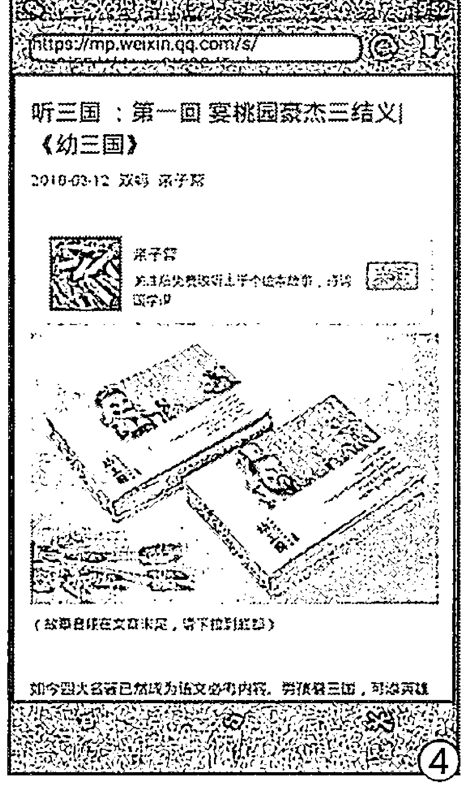

# 无需工具完成电脑手机间文件的传递
文/天涯衰草

如果想在电脑和手机之间传递文件，现在有很多工具都可以完成类似的操作，比如我们最常使用的QQ或微信等等。但是，要想进行操作的话必须先进行软件的登录才行。如果有时你不方便进行登录操作的话，又应该如何快速解决这个问题呢？

如果电脑和手机同时处于一个局域网的状态下，要想解决这个问题其实非常的简单。只需要在电脑和手机（的浏览器）中同时打开Plover.io这项云服务（https://plover.io/），这样就可以看到该服务为每一个设备分配了一个图标和ID，方便用户区分网络中的每一个设备。比如笔者的手机分配的ID是“河马”，而电脑的ID是“斑马”（图1）。

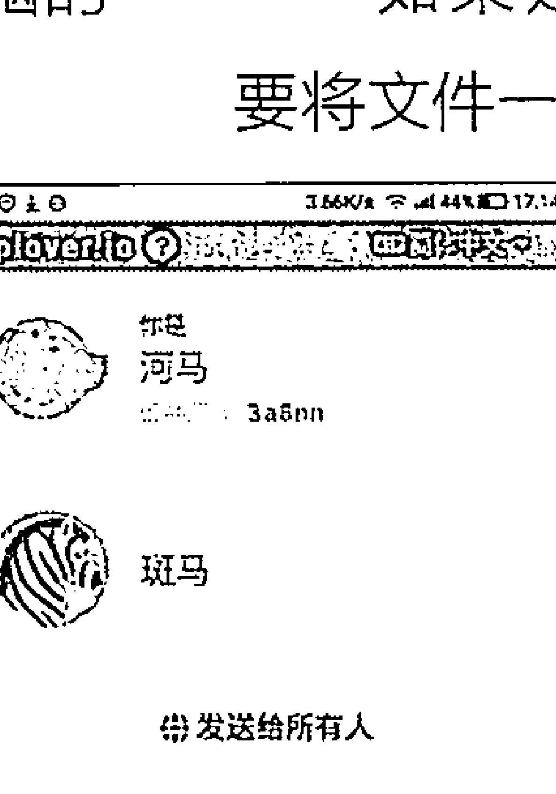

如果要通过手机向电脑传递文件的话，首先点击列表中的“斑马”图标，在弹出的对话框中选择文件的类型，进而在列表中选择要传输的文件（图2）。

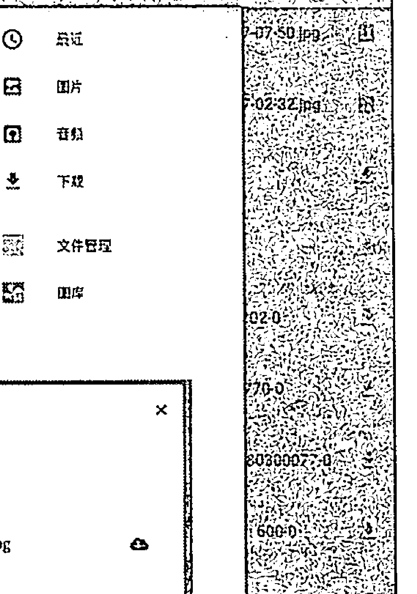

接下来我们就会在电脑上看到一个文件下载的对话框，点击对话框的“下载”按钮后就可以进行文件的传输操作（图3）。

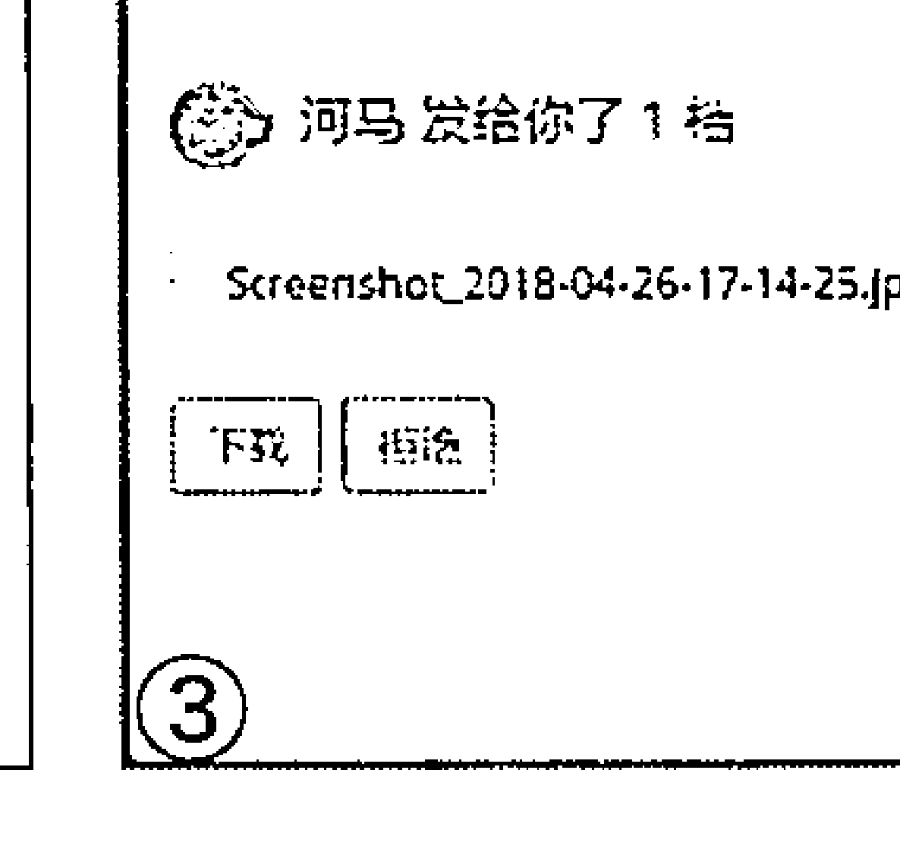

如果是朋友聚会需要将文件一次发送给多个用户，首先让所有的用户访问这个云服务。
接下来发送方只需要点击“发送给所有人”按钮，然后按照刚刚的步骤选择文件即可。

# 快速搜索全网中的小说资源
文/天涯衰草

很多用户都喜欢通过手机来阅读一些小说，但如何寻找这些小说则非常麻烦。因为这些小说往往分布在不同的小说网站，用户需要安装不同的网站APP才行。那么，如何通过一款APP就能搜罗全网的电子书资源呢？

要想解决这个问题其实很简单，只需安装一个聚合类的“搜书大师”即可（下载地址：http://dwz.cn/7OPKeV），这款应用囊括了国内常见的起点中文网、创世中文网、纵横中文网等文学平台。
打开这款应用以后，建议大家先点击界面左上角的按钮，在弹出的菜单选择“书源管理”命令。接下来就可以在网站平台列表中，勾选自己经常访问阅读的网站（图1）。

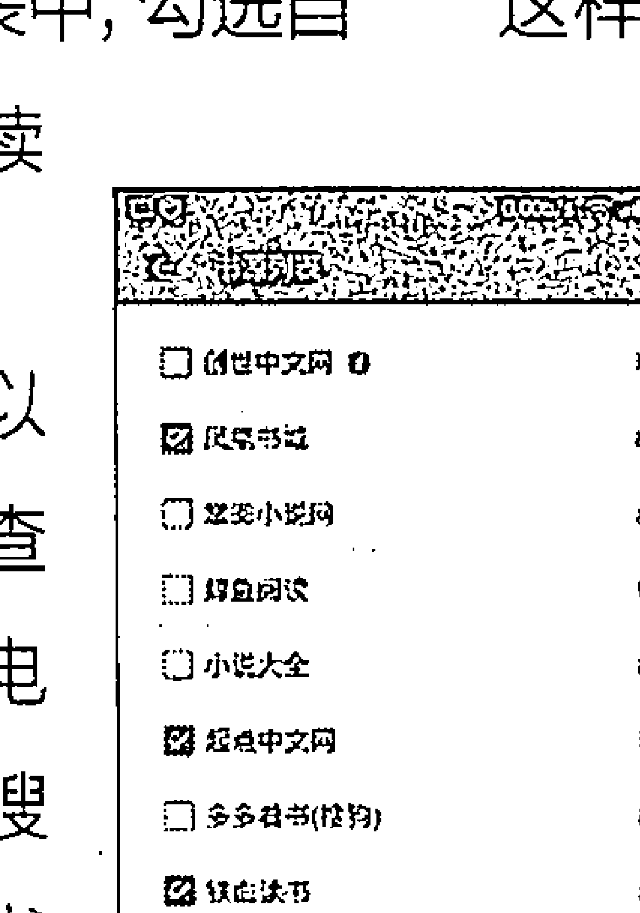

我们可以通过多种方式查找自己需要的电子书，比如在搜索框里面输入书籍的名称，或者点击“发现”标签后进入到某一个网站平台进行查找（图2），查找到之后我们就可以在线进行阅读操作。而且“搜书大师”会将小说内容处理成和电子书一样，这样用户阅读的时候就会更加的舒服（图3）。

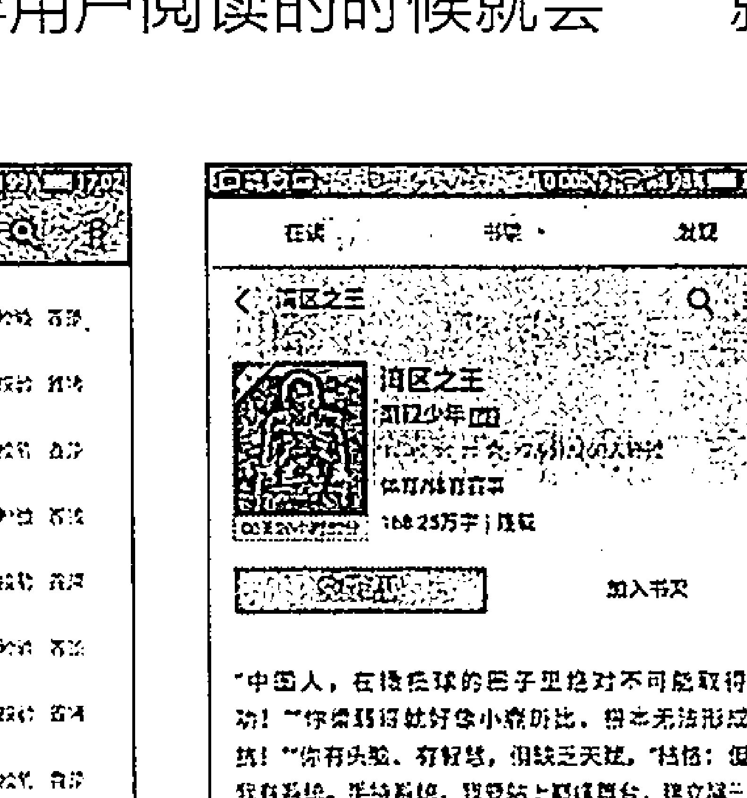

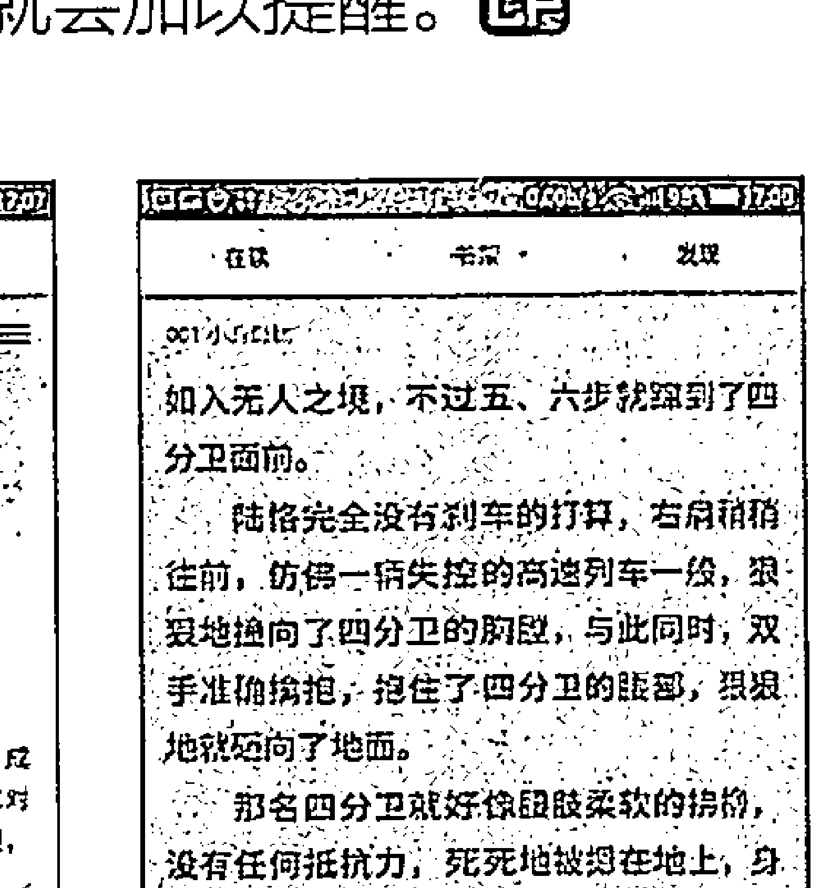

如果你要对某部小说进行追书，还可以将这部小说添加到应用的“在读”标签，这样一旦有更新的话就会加以提醒。

# 移动支付安全第一
这些上锁习惯不可少

文|镜花水月

如今很多人都已经习惯了移动支付，购物消费只需掏出手机，打开微信/支付宝的扫一扫或付款功能即可。然而，如果手机不慎丢失，如何才能确保捡到手机的人无法使用你的手机恶意消费呢？

## 警惕之心不可少

为了防止引言中的风险，避免手机丢失自然就是第一步。相关方法无非是提高安全意识，平时将手机放在有拉链的口袋里，或是选择带挂绳孔的保护套，平时串上挂绳再绑在衣物上防止丢失。此外，一旦发现手机遗失，我们首先要做的就是去最近的营业厅对SIM卡进行补办，如果附近没有营业厅也要第一时间借助公共电话挂失/冻结！

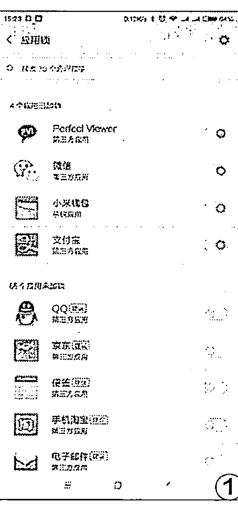

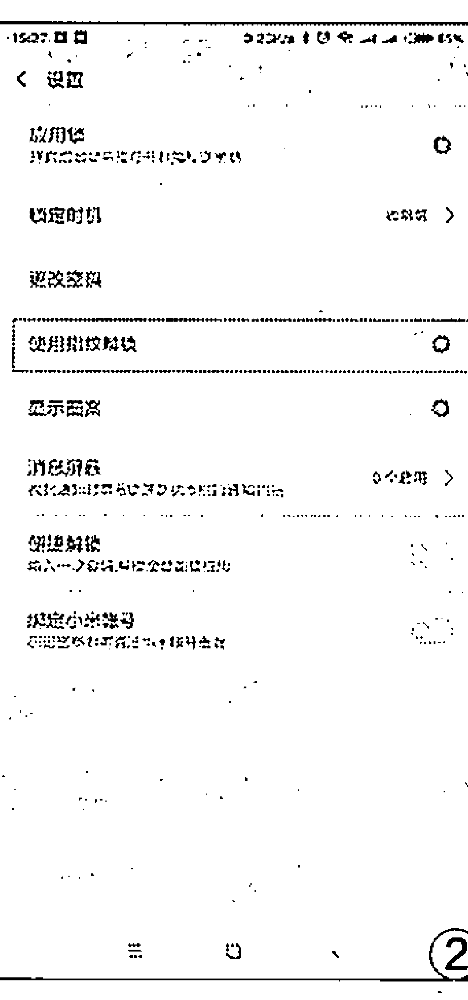

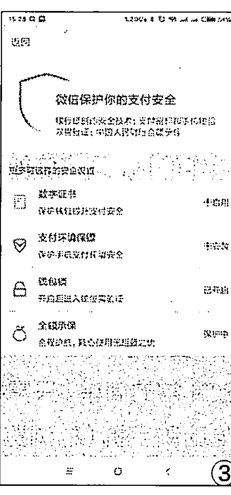

## 不要设置简单密码

为了图省事，很多用户都习惯设定简单的数字或手势密码，比如数字1234和Z手势等。为了提升手机丢失后小偷暴力破解密码的难度，建议大家选择复杂数字（包括英文和字符）和意想不到的手势锁。此外，除非必要，请大家一定要让手机的USB调试模式处于关闭状态！因为USB调试模式开启的话，小偷只需一根数据线与电脑相连就能轻松重置解锁密码。

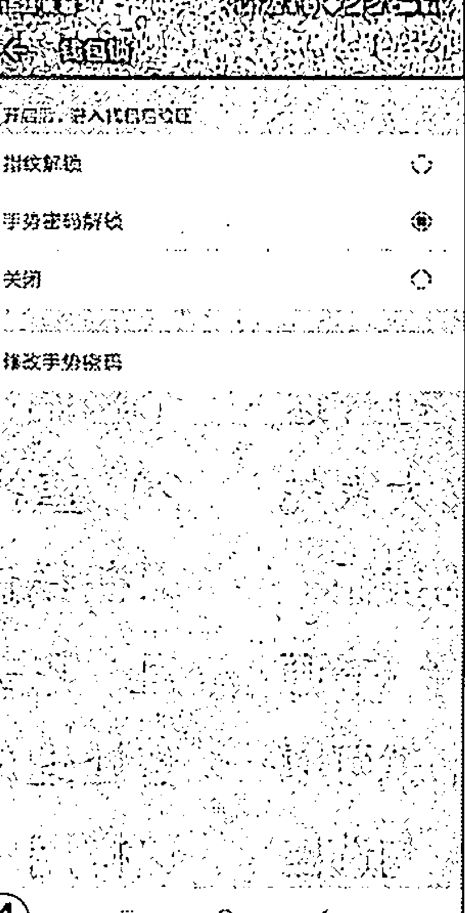

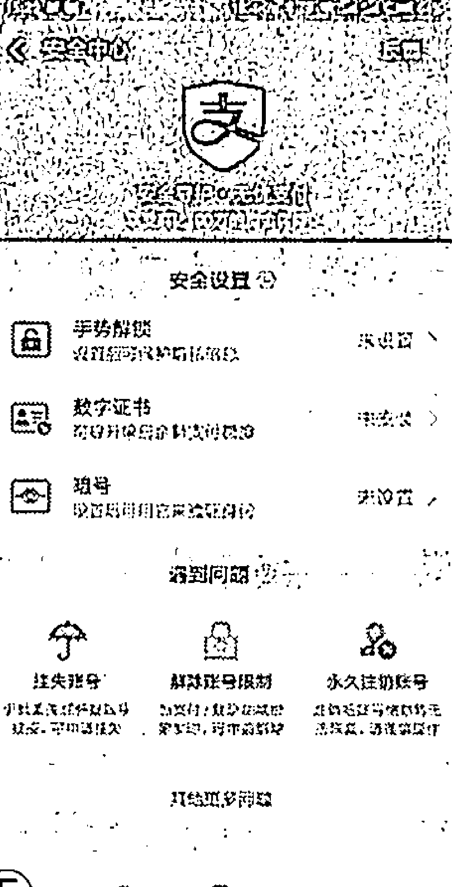

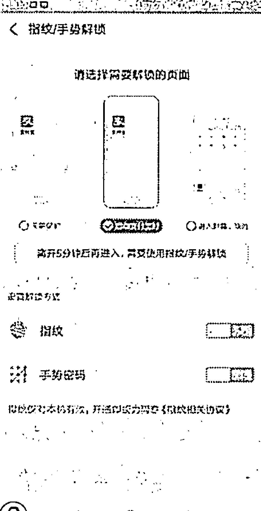

## 为支付应用上把锁

如今很多手机都支持“应用锁”功能，可以随意为指定APP设定启动密码。找到并运行它，将微信、支付宝、银行和钱包一类的APP都添加其中（图1），同时设定一个不同于解锁密码的新密码。这样一来，哪怕有人破解了锁屏密码，在尝试打开支付类应用时也会被阻拦在应用锁的界面上。如果你嫌输入/记住多组密码太麻烦的话，关联指纹一样能达到秒开应用的目的（图2）。

## 支付之前再把关

微信和支付宝都提供了便捷的二维码支付功能，商家只要对准其扫一下就能完成付款。实际上，这类应用自身也提供了支付前的再验证功能，找到并开启它们可最大限度提升支付的安全。其中，微信的相关设置位于“我→钱包→支付中心→支付安全→钱包锁”（图3），我们可以根据习惯设定手势密码或指纹锁（图4）。而支付宝的相关设置则位于“我的→设置→安全中心→手势解锁”（图5），选择在启动支付宝时或者进入财富时使用手势解锁（图6）。

# 不ROOT也可以玩转Xposed框架

文|天涯衰草

喜欢折腾Android的用户都知道，利用Xposed框架可以让手机更加的个性化。可惜，要使用这个框架需要对手机系统进行ROOT操作。那么，在不ROOT手机系统的状况下，能不能玩转Xposed框架呢？

首先在手机里安装VirtualXposed这款应用（下载地址：https://tinyurl.com/y9rrk3xd），该应用可创建一个虚拟环境，所以不需要ROOT就可以操作。启动它以后点击应用界面下方的按钮，
在弹出的列表中点击“添加应用”选项。在列表中勾选需要使用Xposed框架的应用，比如我们这里就勾选上QQ并点击“安装”。接下来在“常用模块”列表中，选择“QQ精选模块”这项进行安装（图1）。安装完成以后点击应用界面中的“Xposed Installer”图标，在弹出的界面中点击左上角的按钮后，再在弹出的菜单里面点击“模块”命令。勾选上“QQ精选模块”后，点击“Xposed Installer”右上角的按钮，
由于这个重启操作是在VirtualXposed应用中完成的，所以用户根本感觉不到重启的过程。接下来点击“QQ精选模块”图标进行精简配置，就可以开始正常使用Xposed框架的功能模块了（图3）。

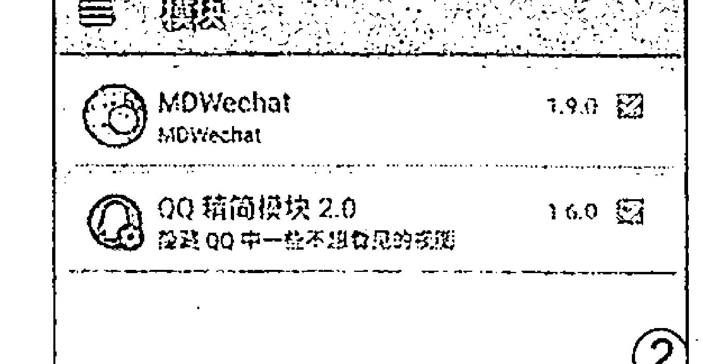

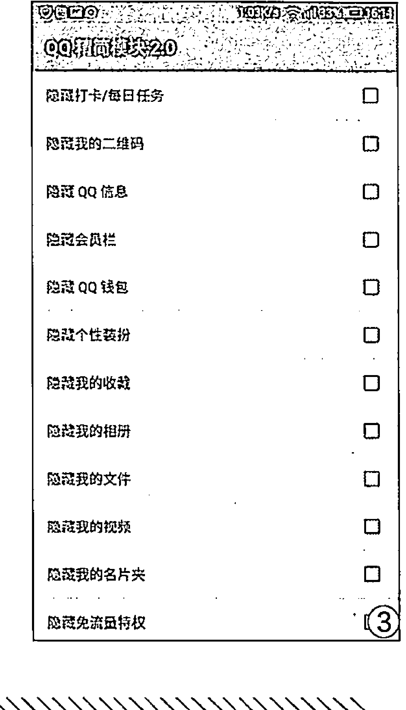

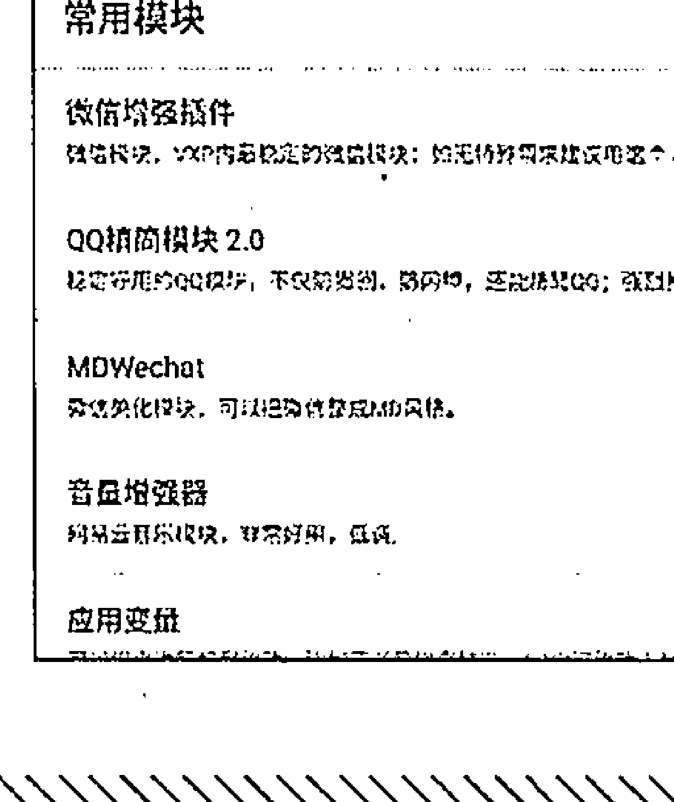

# 远程帮助父母解决手机难题

文|天涯衰草

华为和锤子等品牌都曾经推出过类似“亲情关怀”的功能，方便用户远程控制和指导父母使用手机。可惜，类似功能只限同品牌手机，通用性上大打折扣。如今，一种全品牌和机型兼容的远程控制功能出现了。

首先在手机上安装腾讯的“应用宝”（http://sj.qq.com/），接着点击应用界面工具栏中的“管理”按钮，在功能列表中找到“长辈关怀”选项并点击它（图1）。在新出现
的界面中就可以看到“远程帮助”功能，点击它以后再点击下面的“帮助长辈使用手机”按钮，这样就可以创建一个虚拟的讨论房间（图2）。
点击虚拟房间中的加号按钮，在弹出的用户列表中选择父母的微信账号，这样就会发送一个远程帮助的邀请链接给对方。当父母点击这个链
接以后，只需按照提示安装应用和开启权限，就可以进入到这个虚拟的房间里面。接下来我们就可以一边通过语音的方式进行讲解，一边通过重点标注的方式提示父母应该如何操作，这样可循序渐进帮助父母解决相关的问题（图3）。

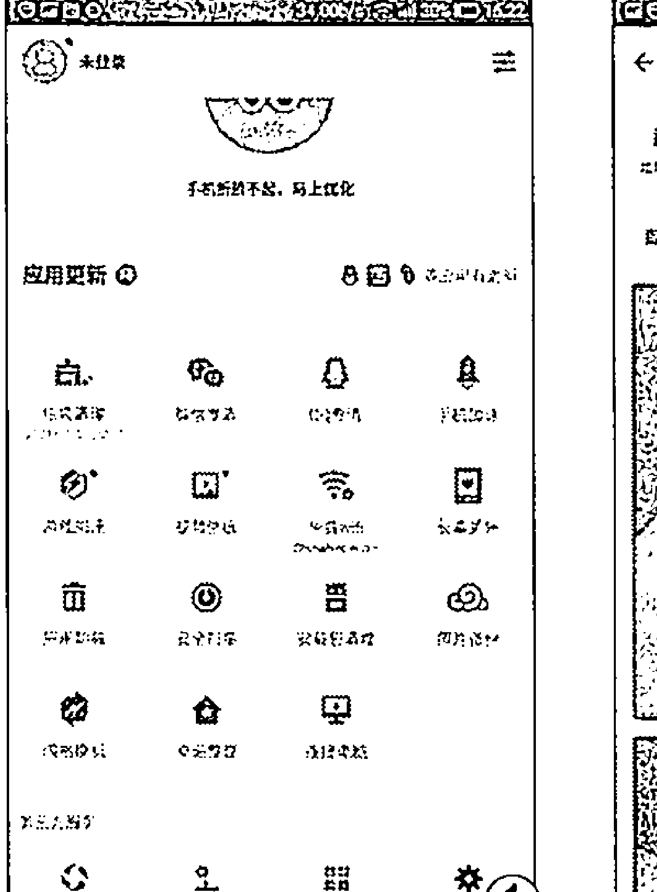

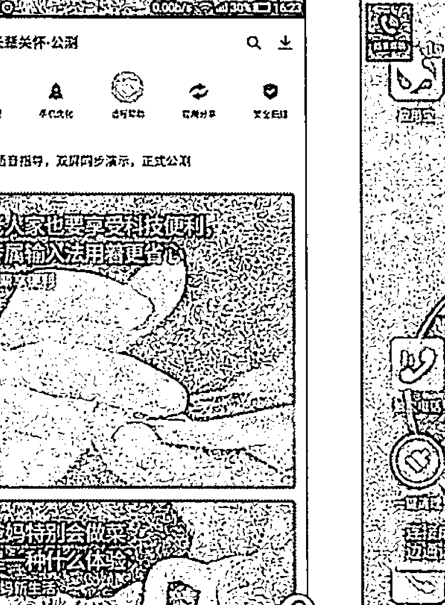

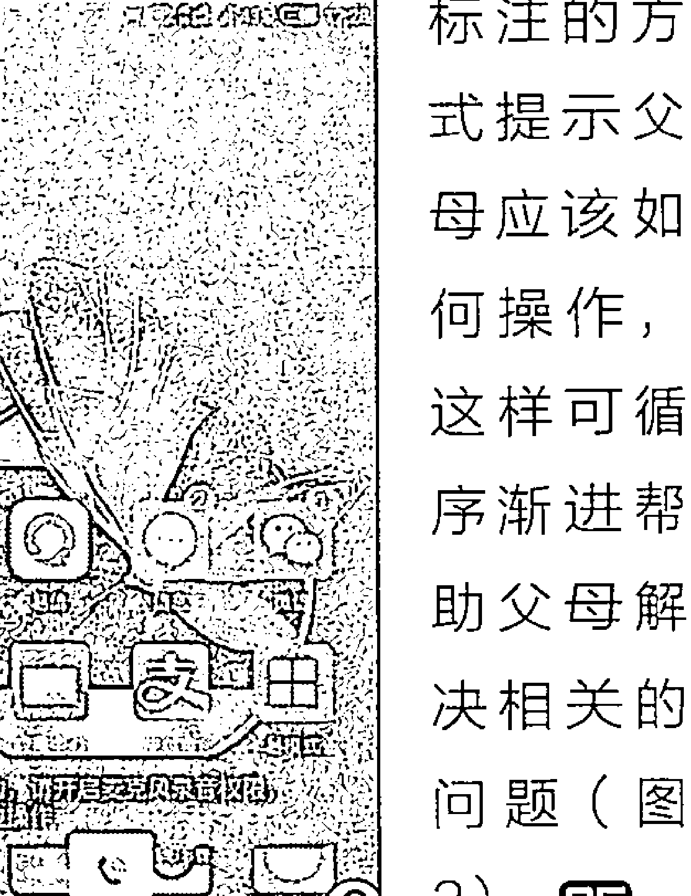

# 修改网卡MAC地址

文|老万

**Q:** 很多时候网站是利用电脑网卡的MAC地址来确认用户的。在Windows 10中，怎样才可以对电脑的这个地址进行修改，从而更好地在网络里面隐藏自己的网络身份？

**A:** 打开注册表，展开到HKEY_LOCAL_MACHINE\SYSTEM\CurrentControlSet\Control\Class\{4d36e972-e325-11ce-bfc1-08002be10318}\。该项目下面是一些000x编号的子项，通过查看DriverDesc值找到网卡。双击“NetworkAddress”值打开编辑字符串窗口，把数值设置为想修改成的MAC地址即可。

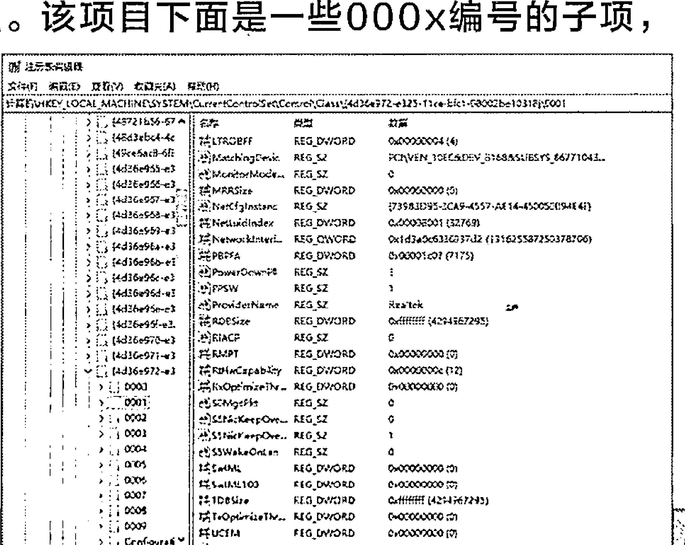


如果没有“NetworkAddress”值的话，通过鼠标右键中的“新建”来创建即可。

# 桌面图标快速整理

**Q:** 很多人都喜欢将文件放在系统桌面上，这样使用的时候会非常方便，但是这些文件和原有的软件图标一多，管理起来就会非常麻烦。通过什么方法可以快速方便地进行管理？

**A:** 下载运行Fences这款桌面管理软件，第一次使用它就会自动将目前的桌面图标分为“程序”、“文件夹”、“文件”等类别，这样用户桌面一下子就变得干净清爽了。当然用户还可以根据自己的需要自定义创建类别，然后将相应的图标移动到这个类别里面进行更好的管理操作。

# 阻止从开始菜单卸载应用

**Q:** 在Windows 10操作系统的开始菜单中，通过右键菜单就可以很方便地对安装的软件以及应用进行卸载操作，但是这样的话也很容易造成一些误操作。用什么方法可以杜绝从开始菜单中卸载应用？

**A:** 打开系统的组策略编辑器，定位至“用户配置→管理模板→‘开始’菜单和任务栏”，然后在右侧窗口中找到“阻止用户从‘开始’中卸载应用程序”这个选项，直接双击该选项打开它的配置窗口，在里面选择“已启用”选项即可。

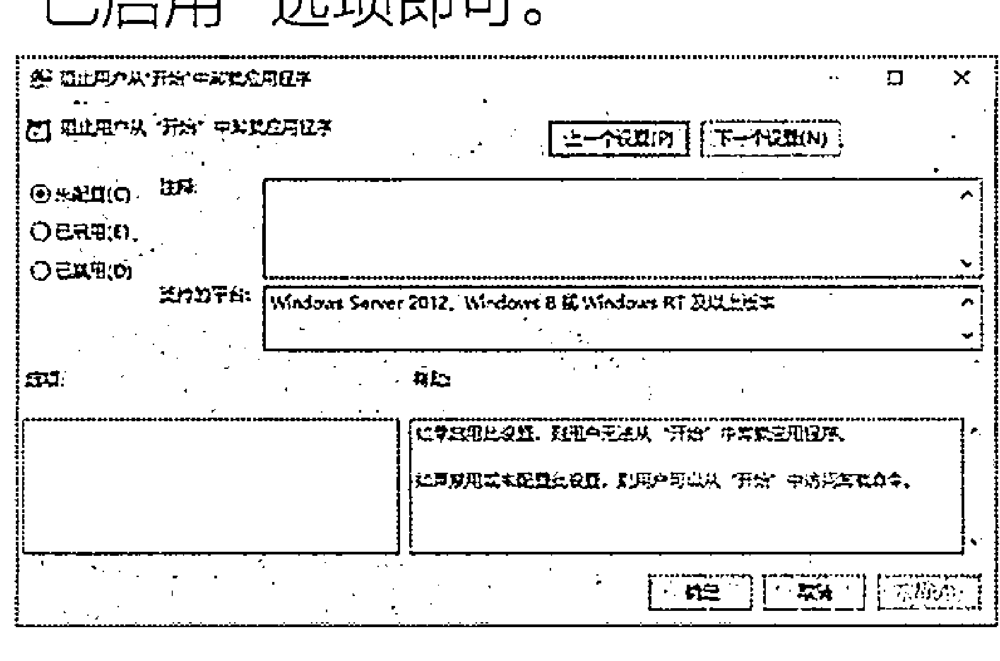

# 简单易行设置透明任务栏

**Q:** 没事的时候喜欢对Windows 10系统进行一些美化操作，所以任务栏的透明化操作是不可缺少的一个环节，但是常见的方法效果都不是太好。请问是否有比较简单易行的方法？

**A:** 可以从网上下载TranslucentTB这款纯粹的任务栏透明化软件，启动以后在系统托盘点击软件的图标，在弹出的菜单中根据需要选择相应的选项就可以了。比如Blur选项代表任务栏半透明设置，Clear选项代表任务栏全透明设置。

# 加快系统搜索的索引速度

**Q:** 在Windows 10系统中自带有搜索功能，但是系统自带的搜索功能时快时慢，这样在使用的时候非常不稳定。如何才能加快系统搜索的查找速度？

**A:** 由于系统检索功能会占用一定的系统资源，所以为了避免占用系统资源就启用了一个名为“索引器回退”的功能。首先打开组策略编辑器，在左侧依次展开定位至“计算机配置→管理模板→Windows组件→搜索”，然后在右侧窗口里面找到“禁用索引器回退”并启用它即可。

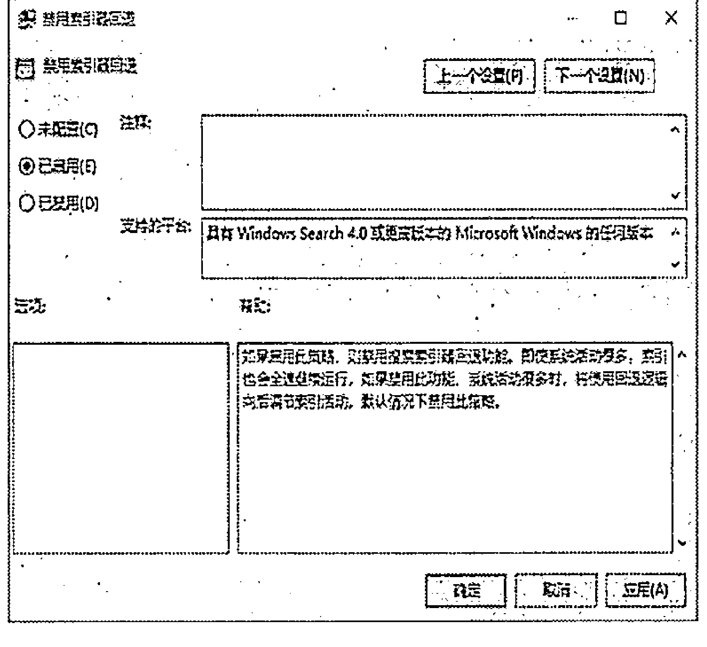

# 设计理念带来新思路

**Q:** 平时在制作PPT文档的时候，最感到恼火的事就是没有一个好的思路，这样做出来的PPT文档就没有任何新意。通过什么方法可以快速创建出与众不同的PPT文档？

**A:** 正是由于很多用户都遇到了这样的问题，微软才在PowerPoint 2016里面增加了一个名为“设计理念”的功能。当用户在软件窗口里面插入图片，“设计理念”功能就会推荐一组版式，用户只需要点击窗口右侧的一组版式就可以使用。

# 方便智能的表格排序

**Q:** 在制作表格的时候，通常会对其内的内容按照一定的顺序进行排序，但是有的时候利用单纯的排序操作很难完成要求。有没有更加方便智能的排序方法？

**A:** 可以使用RANK函数来解决这个问题。首先选中一个空白的单元格，点击工具栏中的“插入函数”按钮，在弹出的对话框里面选择RANK函数，然后在弹出对话框的“number”里面选择对哪一个数据进行排序，在“ref”里面设置对哪一个区域的数据进行排序，最后点击确定按钮就可以了。

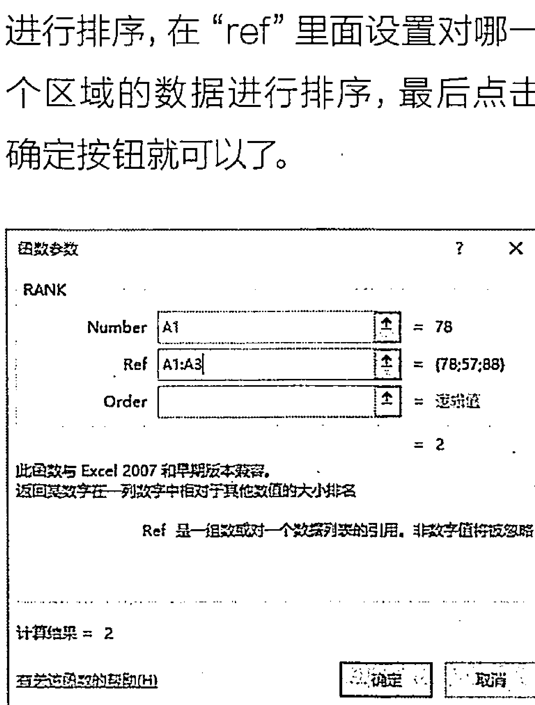

# 删除表格行后序号自动更新

**Q:** 日常在创建表格的时候，经常会对表格的行进行添加或者删除，不过在添加或者删除之后，Excel并不会自动更新列表的序列号，手动更新又很麻烦。如何解决这个问题？

**A:** 这个问题可以通过ROW函数来解决。首先在序列号列单元格中输入公式“=ROW()-1”，再通过鼠标将公式拖拽到列尾的位置上。以后有序列号被删除或添加的时候，序列号就会自动进行更新了。


# 快速寻找Excel表格模板

**Q:** 对于在职场中工作的人来说，经常需要制作各种各样的表格文件，如果自行创建一个功能复杂的表格，往往需要花费大量的时间和精力。从哪里可以找到快速易用的模板文件？

**A:** 其实在Excel 2016里面就包括这样的功能。首先点击“文件”标签中的“新建”按钮，在弹出的窗口中就可以看到许多内置的模板文件，通过搜索框输入相应的关键词，就可以快速地寻找到和自己业务相关的模板文件，点击它以后就可以快速地进行套用了。

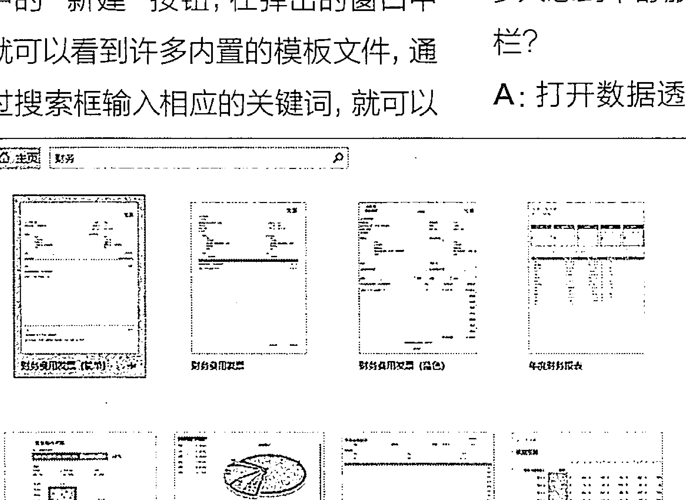

# 删除数据透视表空白栏

**Q:** 在使用Excel数据透视表的时候，会发现最终表单里面有一个空白栏，而在数据透视表的选项里面并没有关闭这一空白栏的功能，这让很多人感到不舒服。怎样删除这个空白栏？

**A:** 打开数据透视表，找到出现空白栏的行或者列，点击行标签或者列标签，在自动筛选选框里面，取消“空白”项前面的对钩，再点击“确定”按钮，就可以让这个空白栏不出现了。

# 谷歌浏览器手动设置位置信息

文|老万

**Q:** 很多浏览器在上网的时候，都会对用户的上网位置进行定位操作，从而实现某些相应的服务。有没有什么方法可以自定义自己的位置，不让浏览器获取到自己的真实位置呢？

**A:** 打开谷歌浏览器的开发者工具，在窗口中点击 “Console” 标签以后，点击控制面板右侧的三点按钮，然后在弹出的菜单里面选择 “More tools” 中的 “Sensors”，在 “Geolocation” 列表中选择 “Custom location”，这样就可以设定一个虚假位置的经纬度。

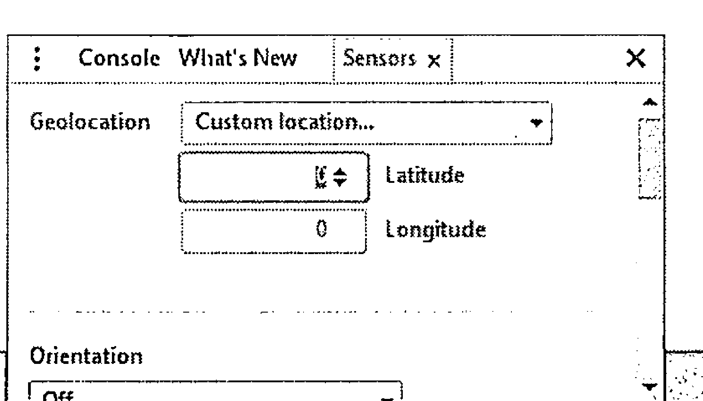

利用https://myasadata.arc.nasa.gov/latitude-longitude-finder/，可以读取相应位置的经纬度。

# 利用QQ邮箱在线编辑文档

**Q:** 腾讯公司发布了一款名为TIM的客户端，利用它就可以进行在线文档的编辑操作，但是这款客户端软件操作起来很不顺手。请问通过传统的QQ客户端，能不能实现在线文档的编辑操作？

**A:** 首先通过QQ客户端打开自己的QQ邮箱页面，在页面的左侧可以看到一个名为“在线文档”的选项，点击它以后再点击“新建”按钮，就可以创建新的文档或者导入已有的文档，这样就可以进行在线文档的编辑操作了。

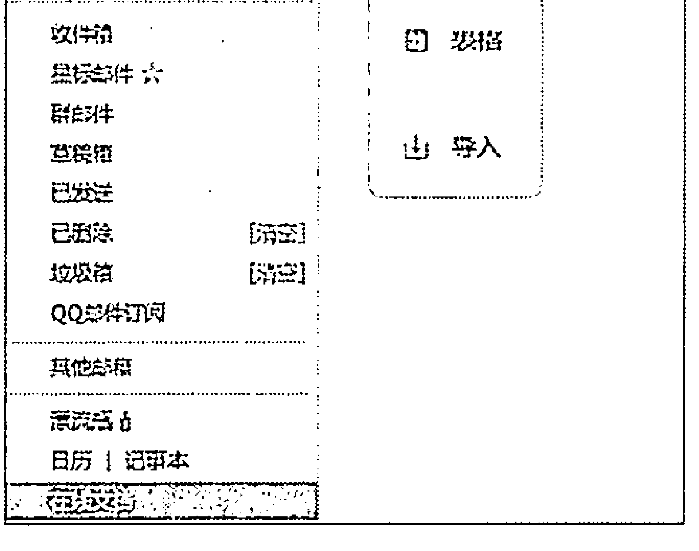

# 快速简单的网页正文提取服务

**Q:** 有的时候我们需要将网页里面的正文复制下来进行使用，但是由于网页里面充满了各种各样的广告信息以及其他内容，要想操作就会非常麻烦。不知有什么方法可以将正文内容提取出来？

**A:** 通过浏览器打开http://www.url2io.com这个网站，点击网页中的“使用示例”按钮，选择其中的一个应用示例进行操作即可。用户只需要将链接粘贴到网页中，就可以进行正文信息的提取操作了。

# 免费的CSR文件在线生成工具

**Q:** 现在很多网站已经开始启用https的加密协议，但是要想创建使用这种加密协议，必须拥有自己的CSR文件。如何才可以创建这个文件？最好是用免费的创建方法。

**A:** 通过浏览器打开https://www.chinassl.net这个网站，接着点击页面中的“CSR在线生成”按钮，然后根据提示设置相应的信息，勾选上“选中后发送生成的CSR文件到上面输入的邮箱”选项，最后点击“生成CSR文件”按钮就可以了。

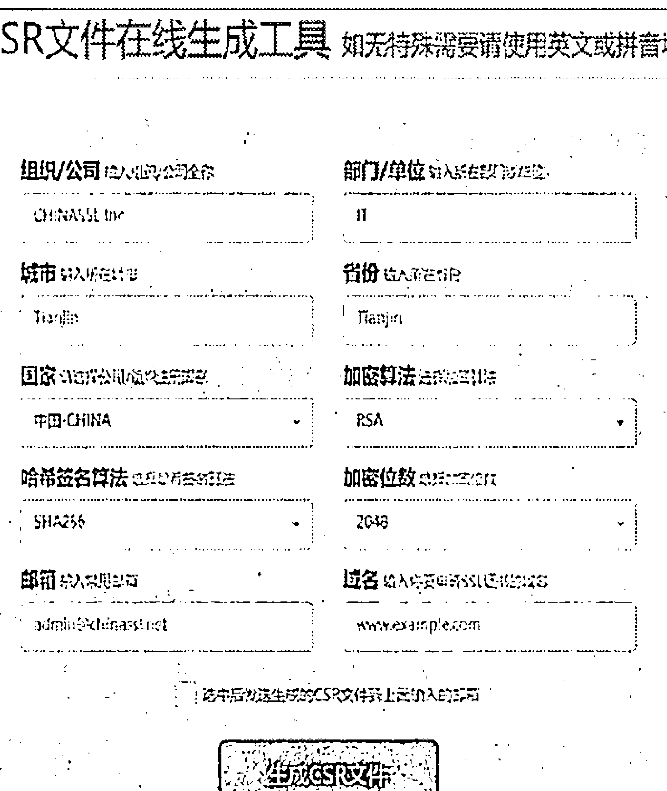

# 将文件加密后存放到网盘中

**Q:** 现在各种各样的安全事件层出不穷，所以很担心存放在网盘里面的文件被窃取。通过什么方法可以将文件加密后再上传到网盘中？

**A:** 在浏览器中打开https://whisp.ly/en这个网站，通过鼠标拖拽的方法将需要加密的文件添加到网页里面。接下来网页就会自动对这个文件进行加密操作，加密完成后点击下面的网盘名称，就可以直接将文件存储到网盘里面了。

# 怎么让Winyl显示出歌词

Q: 听朋友介绍下载了一款名为Winyl的音乐播放器，听说这个音乐播放器自带有歌词显示的功能，但是找来找去都没有发现在哪里。请问这个播放器有没有歌词显示这个功能？

A: Winyl这款播放器的的确确拥有歌词显示的功能，只需要在播放器界面左上角点击第三个标签，就可以看到歌词显示的列表了。而且这个播放器还提供了多个歌词下载的途径，只需要在歌词列表中点击鼠标右键，然后在“歌词提供者”中进行选择就可以了。

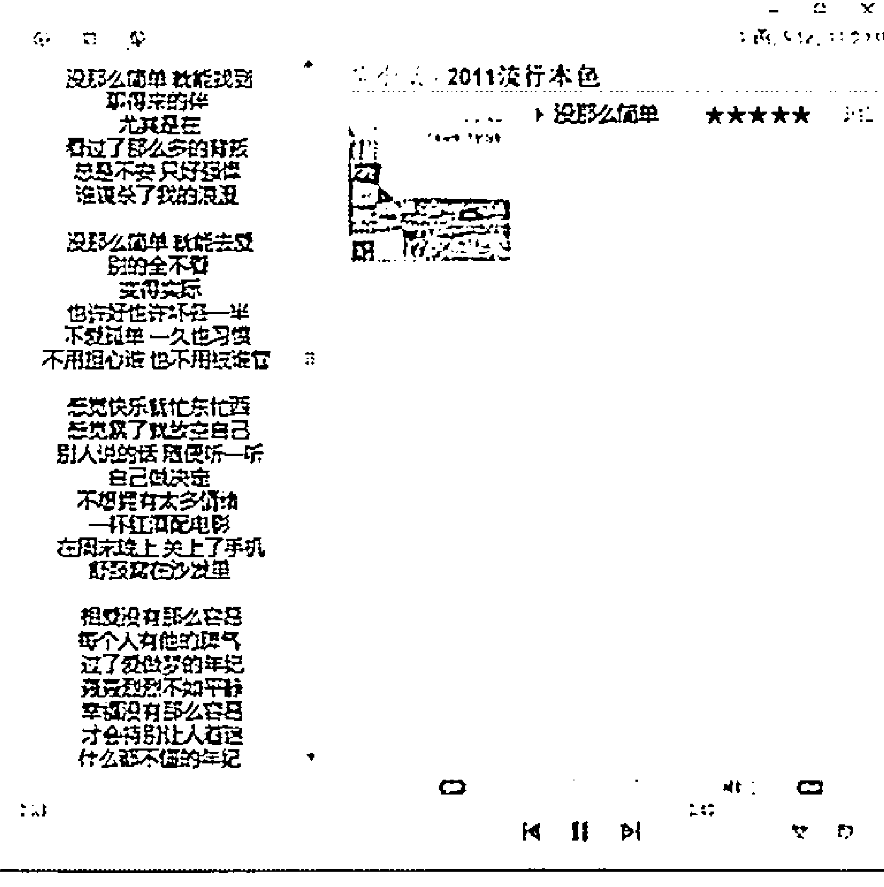

# 对图片进行极限压缩

Q: 为了让图片可以快速地进行上传，对图片进行压缩是最好的方法，可是现在最常见的方法都是在线进行压缩。不知有没有在本地进行图片压缩的方法？

A: Pngyu就是一款非常不错的图片压缩工具（http://nukesaq88.github.io/Pngyu/），而且这个工具的使用也非常简单，只需要通过鼠标将图片拖拽到软件的窗口列表中，点击“Compress Start”按钮就可以进行压缩操作了。

# 浏览器指定书签文件夹如何导出

文|老万

Q: 平时使用的是谷歌浏览器，现在想将浏览器中的某一个书签文件夹分享给别人，但是利用浏览器自带的书签导出功能无法实现。通过什么方法可以解决这个问题？

A: 在谷歌浏览器里面安装一款名为Onetab的功能扩展，打开需要分享的浏览器书签目录，然后点击这个功能扩展的图标，所有的书签链接都会显示到一个全新的列表里面，将这个列表中的文件复制给要分享的用户就可以了。

> 其他用户也需要首先安装这个功能扩展，然后再将要分享的信息再导入到书签里面就可以了。

# 不让PotPlayer升级到完整版

Q: 平时使用PotPlayer这款播放软件，下载的是网友制作的精简版，可是运行以后它会自动升级相应的功能模块，从而使得软件变成完整版。如何杜绝这种情况的发生？

A: 通过文本编辑器打开系统中的Hosts文件，然后分别添加“127.0.0.1 live.tvpot.daum.net”和“127.0.0.1 potplayertv.daum.net”这两行代码。设置完成以后重新启动系统，就可以阻止软件程序与官方服务器的连接，从而避免它升级到最新的完整版本。

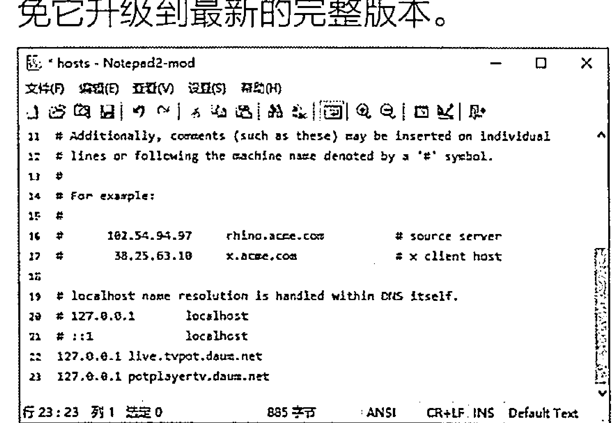

# XShell 5打开新标签卡顿

Q: 平时都是通过XShell这款软件来对公司的服务器进行管理的，最近将它升级到最新的版本，发现在打开新标签后软件程序会出现卡顿的情况。这个问题怎样解决？

A: 点击“工具”菜单中的“选项”命令，在弹出的选项窗口中切换到“高级”标签，然后在“会话”选项下面可以看到一个名为“使用单进程模式以提高性能”的选项，勾选上该选项就可以了。

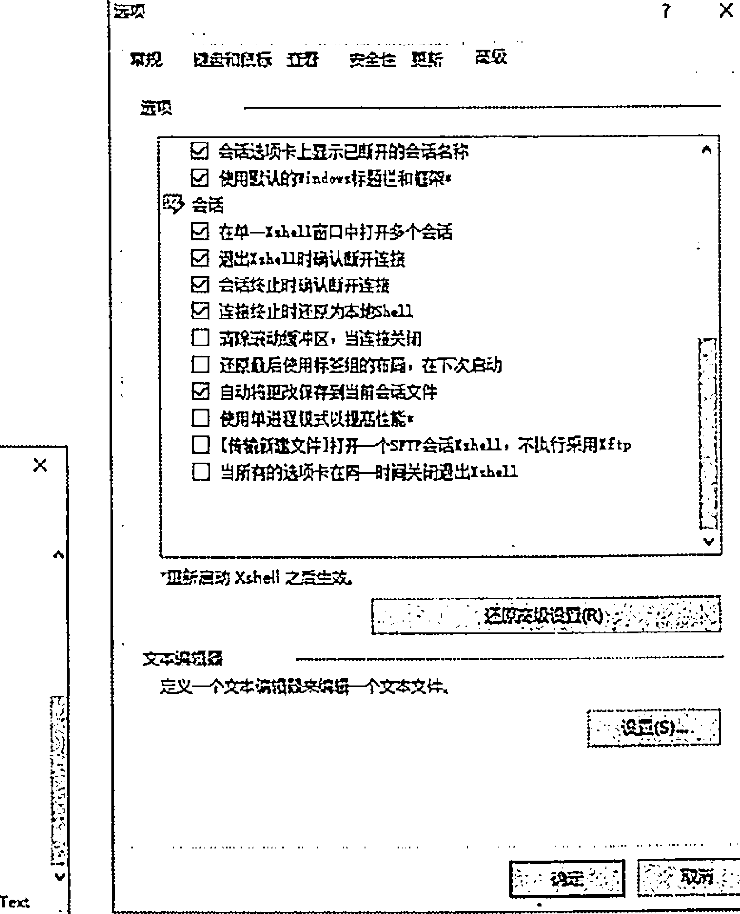

### 从身份证列表快速提取出生日期

文|老万

Q: 有的时候在制作表格时会添加一个身份证的列表，然后还需要添加一个出生日期的列表。身份证号就包括有出生日期的内容，怎么将出生日期的部分提取出来？

A: 首先选中身份证列表中的第一行，在出生日期的第一个单元格中输入对应的出生日期。接下来只需要按“Ctrl+E”这个快捷键，所有的单元格就会自动地填写出对应的出生日期了。

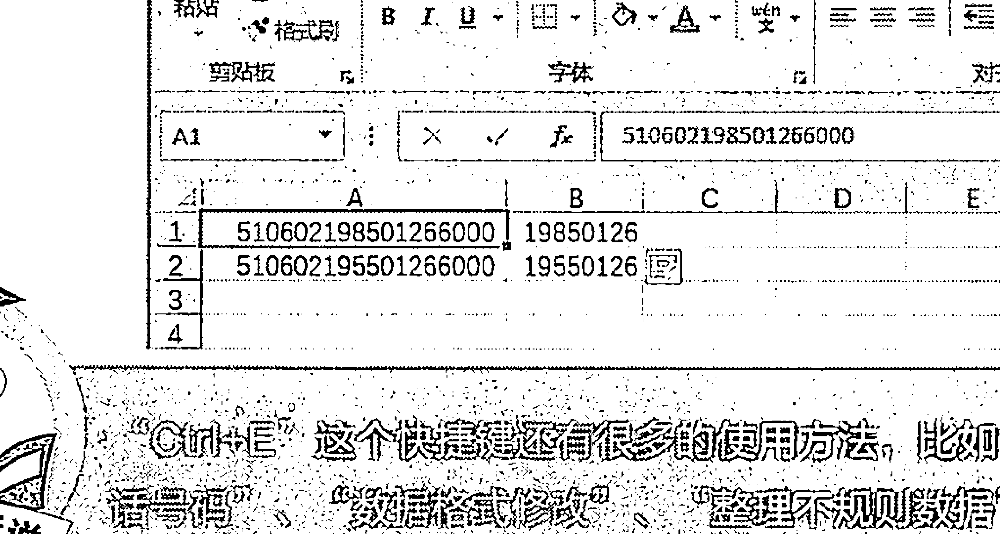

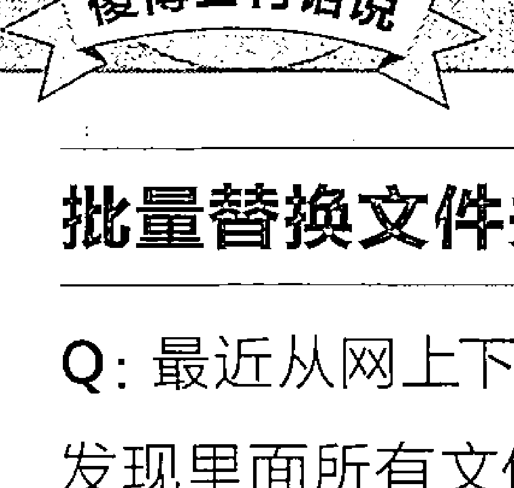

### 日期格式为何不能进行编辑

Q: 在制作一个表格文件的时候，输入了一些相应的日期信息内容，但是在输入完成后对这些日期进行批量操作的时候，发现无法进行进一步的编辑操作。请问这个问题是什么原因造成的？

A: 出现这种情况很有可能是输入的日期格式不对造成的，通常Office办公软件支持的日期格式包括“XXXX-XX-XX”、“XXXX/XX/XX”、“XX年XX月XX日”几种，其他不规则的日期则会全部按照文本格式进行处理。所以要想批量对日期进行编辑的话，需要将日期格式转换为上面所说的三种才行。

### 恢复超长数字的正常显示

Q: 平时在表格中会输入超过11位的数字，这个时候Excel会以科学记数法进行显示，这样的话对一些数字就不好进行查看。如何将这些数据进行正常的显示？

A: 选中需要编辑的单元格，在单元格上点击鼠标右键，选择菜单中的“设置单元格格式”命令，在弹出的对话框中选择“数字”标签中的“自定义”选项，然后在窗口右侧的“类型”一栏中输入“G/通用格式”，最后设置为0就可以了。

### 批量替换文件关键词

Q: 最近从网上下载了一个压缩包，发现里面所有文件的人名翻译都出现了错误，所以想批量对这些人名进行更改。如何才可以批量完成这样的操作？

A: 可以运行EmEditor这款软件，点击“搜索”菜单中的“在文件中替换”按钮，在弹出的对话框中分别设置查找以及替换的内容，然后在“搜索文件夹”中设置文件的存放目录，设置完成以后点击“替换全部”按钮即可。

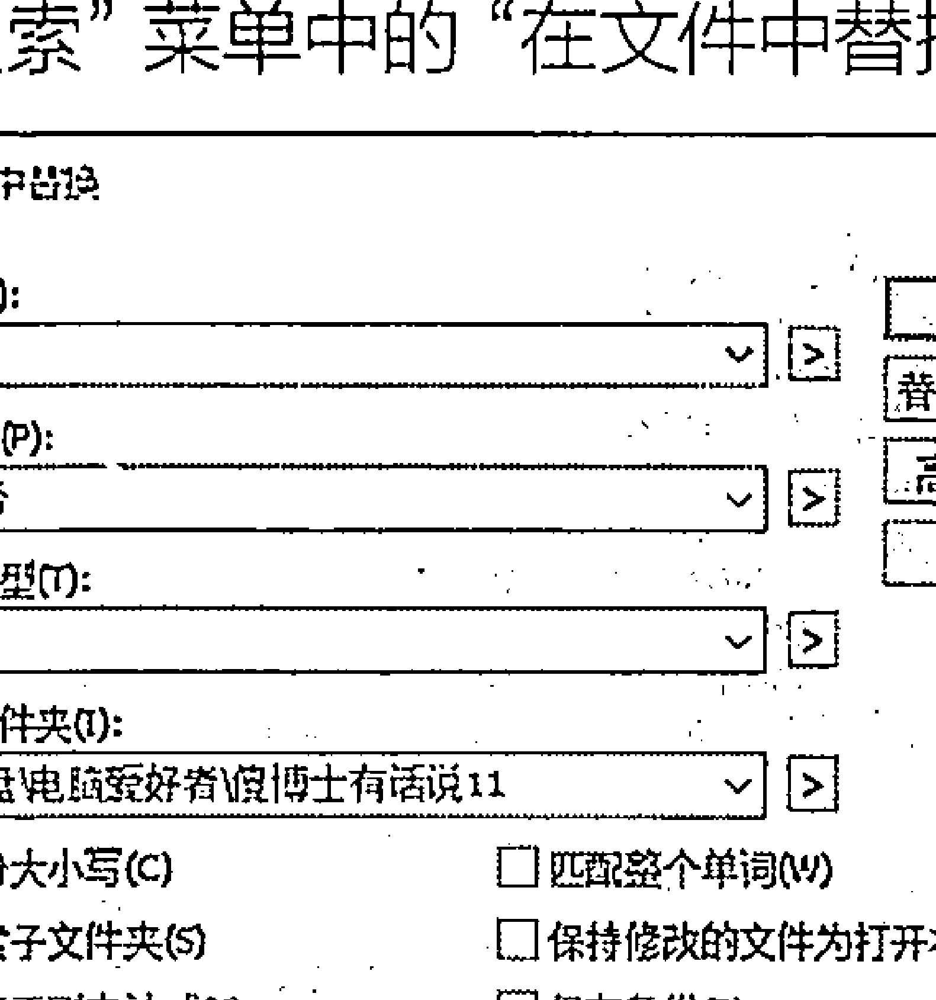

### 手机号码用星号批量隐藏

Q: 为了保证用户的个人隐私，很多时候在发布手机号的时候，都会用一些星号代替其中的某一些数字。在制作表格的时候，怎样完成类似的星号隐藏操作？

A: 在表格中选择第一个手机号所在的单元格，在另一列新的单元格中输入对应的带有星号格式的手机号码。接下来通过下拉对整个列表进行填充，然后在出现的对话框中点击“快速填充”命令，这样可以批量完成其他手机号码的隐藏操作。

# 手机不ROOT也能屏蔽广告

Q: 现在无论是手机应用还是网页浏览，都会出现各种各样的广告信息。通过什么方法可以对这些广告信息进行拦截？要求是系统不进行ROOT操作就可以进行拦截。

A: 可以试一试“广告管家”这款应用，它是通过规则过滤广告信息，所以能满足不ROOT而进行拦截的要求。应用安装完成以后，还需要用户设定相关的广告过滤规则才能够正常地进行操作。

# 快速调用支付应用扫描功能

Q: 现在利用手机应用进行支付的途径越来越多，而要想进行手机支付，需要先打开某个支付软件，然后再打开其自带的扫一扫功能进行操作，这一系列过程操作起来比较麻烦。不知有没有快捷的调用方法？

A: 首先下载运行“Nova启动器”这款应用，这款应用拥有类似苹果3D Touch的功能“ShortCut”。所以当我们需要使用扫一扫功能的时候，只要在应用的图标上进行长按，随后就会弹出一个快捷菜单，从中选择扫一扫功能就可以快速启动了。

# 利用微信进行任务提醒

Q: 每天需要面对各种各样的琐事，所以需要一款任务软件将这些任务记录下来，但是使用专业的任务软件又感觉有些麻烦。哪些比较常见的软件中拥有任务定制的功能？

A: 大家常用的微信软件中就有。首先点击微信工具栏中的“我”按钮，在弹出的菜单中选择“收藏”命令，然后点击加号创建一个任务。设置完成以后，在创建的任务上进行长按，在弹出的菜单中选择“在聊天中置顶”命令，就可以随时查看了。

# 利用百度输入直接翻译

文|老万

Q: 很多网友都喜欢海淘，所以和外国人打交道的机会比较多，而很多人的外语水平有限，因此必须借助于翻译软件才能进行操作，可是每次在翻译完成以后，还需要在不同的应用之间进行切换。有没有更加简单的解决方法？

A: 可以安装最新版本的百度拼音输入法，安装好之后点击输入法中的设置图标，在弹出的对话框中选择“快捷翻译”按钮。接下来设置需要进行翻译的语言类型，再输入自己需要翻译的内容，然后就可以进行翻译并提交了。

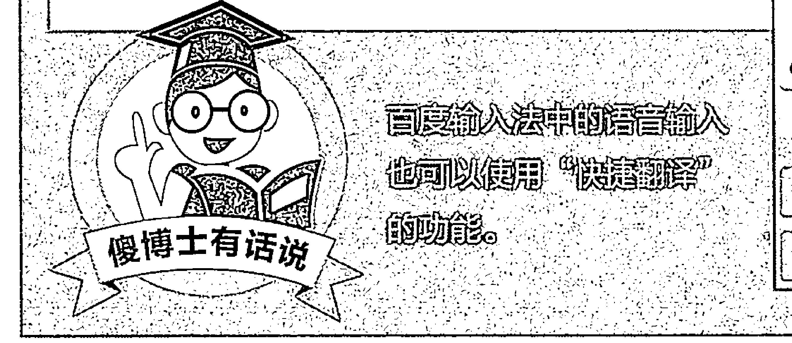

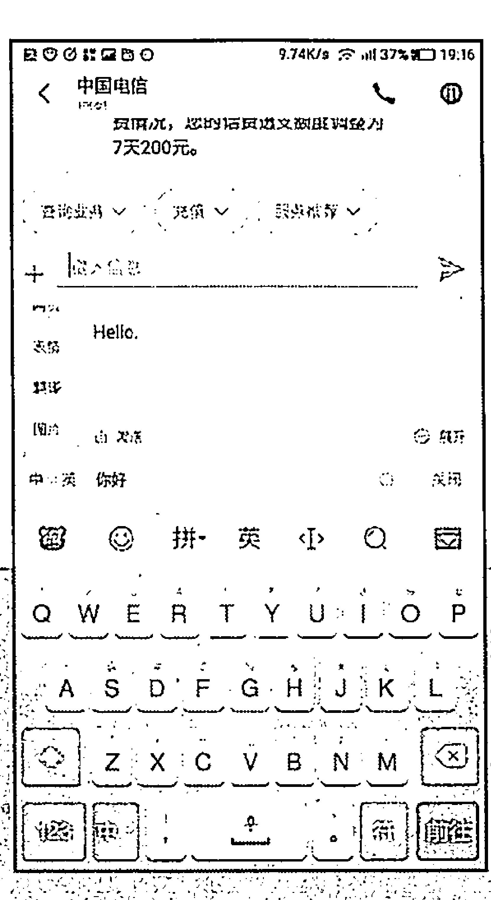

# 快速查看汇率变化信息

Q: 这段时间人民币和美元的兑换汇率变化有些大，所以想时刻关注汇率的变化信息。请问怎么样才可以快速查看到汇率的变化信息，又不需要使用专业的手机软件呢？

A: 支付宝是很多手机必备的一款手机应用，通过它就可以实时查看最新的汇率信息。打开支付宝后搜索关键词“汇率换算”，就可以进入到汇率计算器里面，点击“走势”就可以了解到最新的汇率信息。

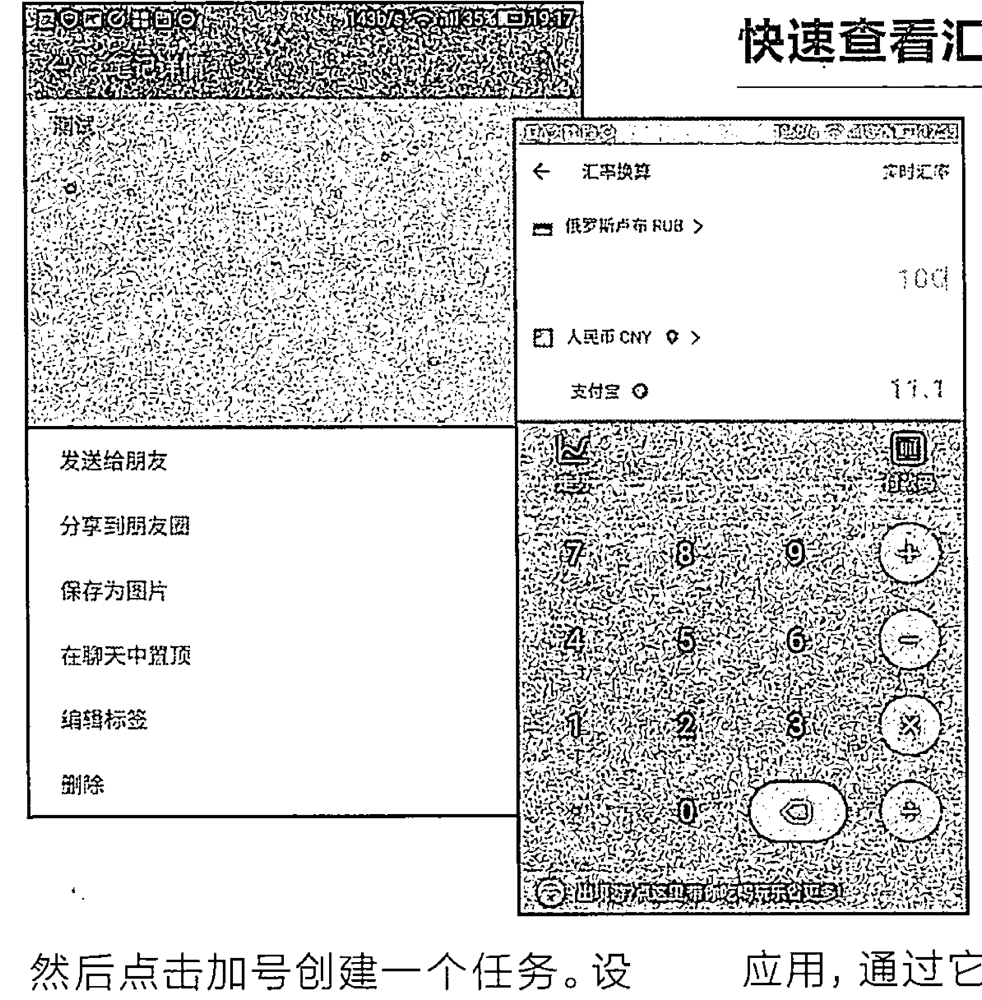

# 快速创建虚拟磁盘

文|老万

Q: 无论使用软件还是浏览器，都会产生很多的缓存信息和垃圾文件，这样肯定会对系统磁盘造成一定的影响，所以想创建一个虚拟磁盘，然后把软件的缓存指定到这个虚拟磁盘中。在Windows 10系统中如何创建虚拟磁盘?

A: 在Windows 10系统的开始按钮上点击鼠标右键，在弹出的菜单中选择“磁盘管理”这个命令，然后在弹出的窗口中点击“操作”菜单中的“创建VHD”命令，这样通过向导就可以快速创建一个虚拟磁盘文件。

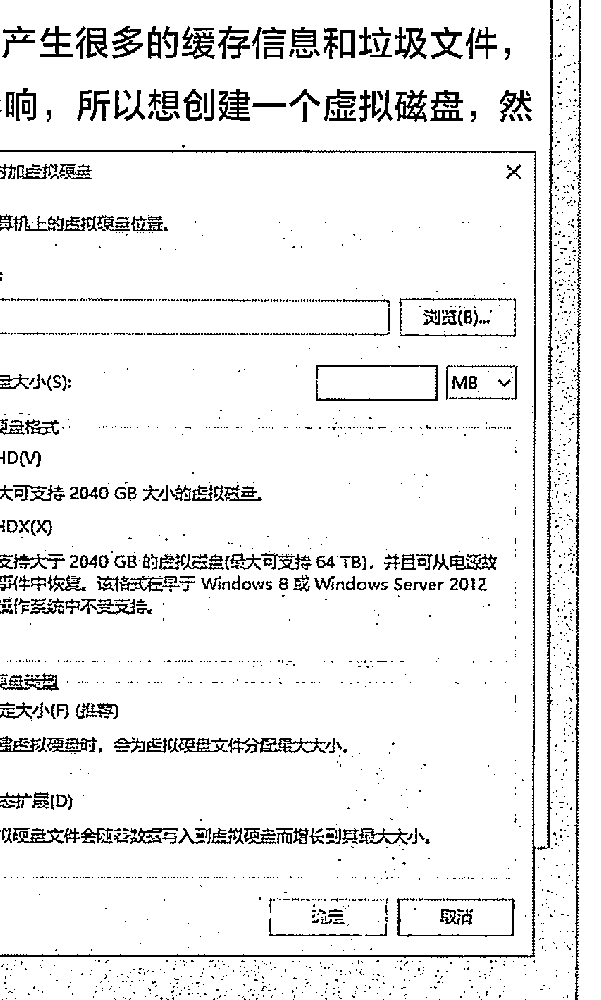

新创建的虚拟磁盘还需要进行初始化操作后才能使用。


# 启用系统引导日志查找问题

Q: 最近一段时间操作系统启动老是有问题，所以想使用系统自带的引导日志来查看问题的所在。在Windows 10系统中如何启用引导日志功能?

A: 按Win+R组合键打开“运行”框，输入“Msconfig”后回车启动系统配置功能，在弹出的窗口中选择“引导”标签，选中要记录引导日志的重装系统名称后，将“引导日志”选项前面的复选框勾选上，最后点击确定按钮，重新启动系统即可。

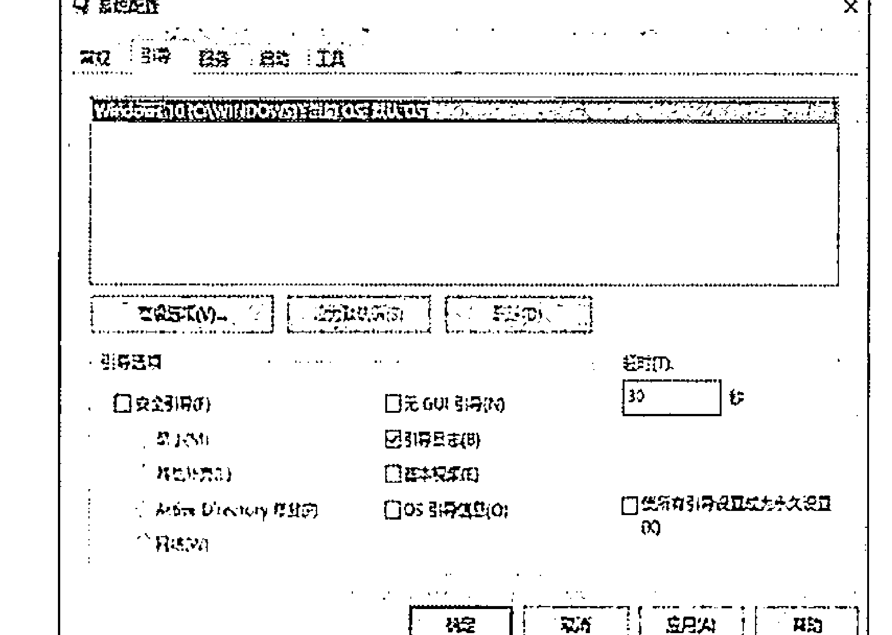

# 一键直达任务管理器启动项

Q: 软件程序启动的多少，会直接影响到系统运行的速度，所以需要定时对启动项进行管理，而对启动项最好的管理方法就是通过任务管理器来解决。有什么方法可以一键直达任务管理器的“启动”标签页?

A: 其实要解决这个问题非常简单，只需要在Windows 10系统的搜索框中输入“启动”这个关键字，接下来就会在搜索结果中看到“查看在启动Windows时哪些进程会自动启动”这个选项，点击它以后就可以实现一键直达“启动”标签页。

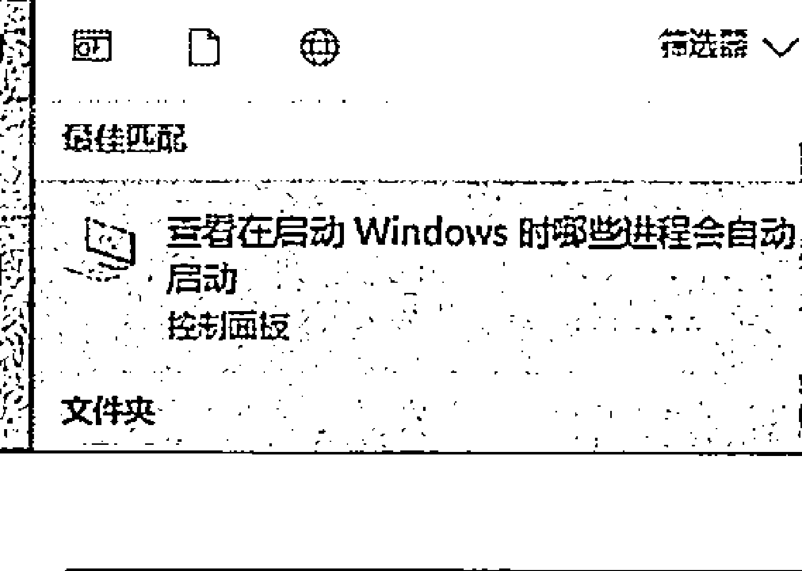

# 启动反恶意软件保护系统安全

Q: 有些电脑病毒为了对系统进行破坏，会在系统进入到桌面以前就进行运行操作，这样就比常见的杀毒软件提前了一步。在Windows 10系统中如何杜绝这种情况的发生?

A: 打开系统的组策略编辑器，定位至“计算机配置→管理模板→系统→提前启动反恶意软件”，然后在右侧窗口中找到“引导启动驱动程序初始化策略”这个选项，直接双击该选项打开它的配置窗口，在里面选择“已启用”选项后设置可以运行的软件程序即可。

# 系统自动登录功能失效

Q: 通常都是让操作系统自动进行登录的，而现在新的Windows 10操作系统会定时要求用户更换登录密码，以便保证登录密码的安全性，可是最近修改登录密码后，自动登录功能就失效了。如何解决这个问题?

A: 在运行框中输入“control userpasswords2”后回车，选中需要重新设置密码的账户名称，勾选上“要使用本计算机，用户必须输入用户名和密码”选项，点击“应用”后再取消勾选“要使用本计算机，用户必须输入用户名和密码”选项，然后点击“应用”按钮，就会弹出“自动登录”的设置对话框。

# 关闭系统的时间轴功能

Q: 在Windows 10系统中，时间轴和“主页”功能一样，可以帮助用户快速寻找到曾经用过的文件，但是这样也同样非常容易泄露用户的文件信息。如何将它进行关闭？

A: 打开系统的组策略编辑器，定位至“计算机配置→管理模板→系统→OS策略”，然后在右侧窗口中找到“启用活动源”这个选项，直接双击该选项打开它的配置窗口，在里面选择“已禁用”这个选项即可。

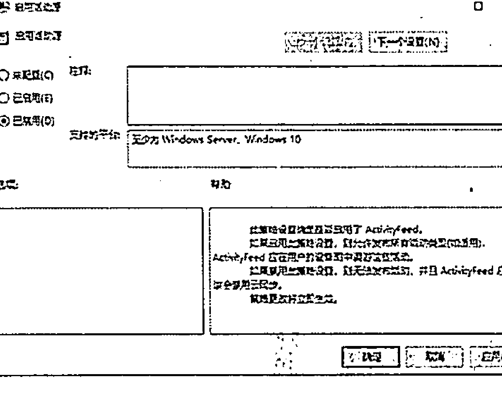

# 查看电脑上次的关机方式

Q: Windows 10操作系统提供了多种不同的关机方式，通过什么方式可以查看到系统上次关机到底采用的是哪一种关机方式？

A: 通过管理员权限打开PowerShell功能，在其中输入“Get-WinEvent -ProviderName Microsoft-Windows-Kernel-Boot -MaxEvents 10 | Where-Object {$_.id -like “27”};”这行命令，通过反馈的信息就可以进行判断。比如0x0说明是“完全关机”，0x1说明是“混合关机”。

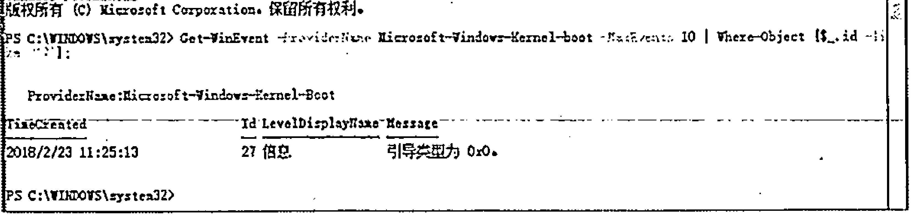

# 让Windows 10只能运行指定的应用程序

文|老万

Q: 从网上下载软件是病毒进入系统的一个主要途径，所以为了更好地保证系统的安全运行，需要禁止用户使用其他的软件，而让他们只能运行指定的软件。怎样才能做到这一点呢？

A: 打开系统的组策略编辑器，定位至“用户配置→管理模板→系统”，然后在右侧窗口中找到“只运行指定的Windows应用程序”这个选项，直接双击该选项打开它的配置窗口，在里面选择“已启用”选项后设置可以运行的软件程序即可。

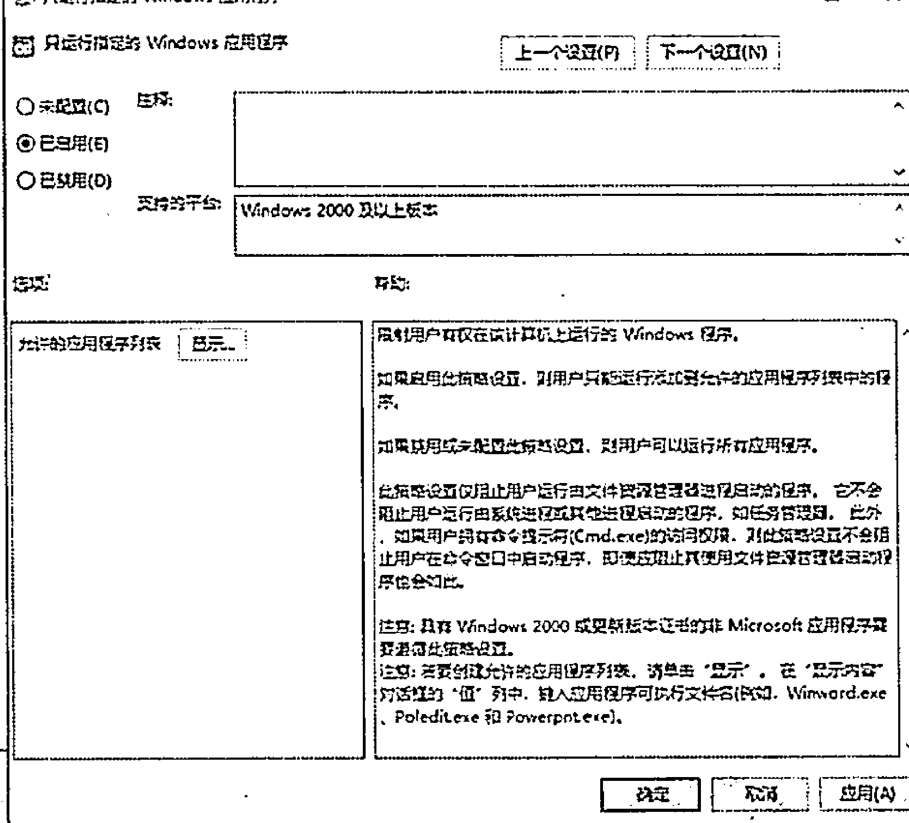

> 通过“设置分配的访问权限”这个功能，可以让某个用户只能运行指定的UWP应用。

# 系统主页恢复到初始状态

Q: Windows 10系统增加了一个“主页”的功能，可以用于显示“常用文件夹”和“最近使用的文件”。虽然这个功能使用起来非常方便，但是也可能泄露用户的隐私。如何快速地使它恢复到默认状态？

A: 首先关闭所有正在运行的文件窗口，接着以管理员身份运行命令提示符，输入命令：del %appdata%\Microsoft\Windows\Recent\AutomaticDestinations\*.automaticDestinations-ms，然后重新启动Windows资源管理器的explorer.exe进程即可。

# 利用PowerShell校验文件的Hash值

Q: 为了保证文件的安全性，很多时候在下载文件后，都需要对文件的哈希数值进行校验，通常情况我们都是利用第三方软件来完成这个操作的。利用系统自带的功能可否完成这个操作？

A: 通过管理员权限打开PowerShell功能，输入类似“Get-FileHash 文件路径 -Algorithm 校验的Hash值类型 | Format-List”这行命令即可。比如“Get-FileHash C:\Windows\notepad.exe -Algorithm md5 | Format-List”，就是验证记事本程序的MD5数值。

# 对PDF文件进行压缩

文|老万

Q: 网上很多资料都是通过PDF文件格式的形式提供的，但是有些时候这些文件的体积过大。能不能通过什么方法对这些文件进行压缩，从而减少其对磁盘空间的占用？

A: Smallpdf是一个知名的PDF文件在线管理平台，最近它推出了一个客户端软件（[https://smallpdf.com/cn/desktop](https://smallpdf.com/cn/desktop)），通过这个软件就可以实现文件的压缩操作。打开软件操作界面后选择需要进行压缩的PDF文件，在弹出的新窗口中点击左侧列表中的“Compress”按钮就可以进行压缩操作了。

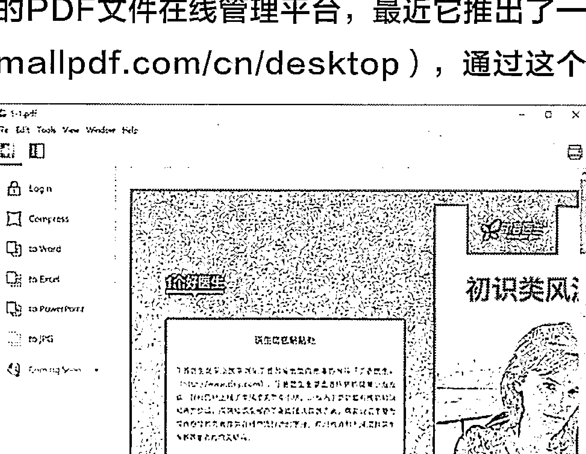

需要注意的是，该客户端软件的运行需要NET Framework 4.6的支持。


# 提高Firefox标签页切换速度

Q: 无论什么浏览器在打开多个标签以后，在标签切换的过程中都会感觉有一些缓慢。除了通过第三方的功能扩展来解决以外，利用火狐浏览器自身的功能能不能解决这个问题？

A: 在浏览器的地址栏里面输入命令“about:config”，进入火狐浏览器的设置界面。在设置界面的搜索框中输入参数名称“browser.tabs.remote.warmup.enabled”后按回车键进行搜索，找到这个参数以后双击后面的参数值false，使其改变为true即可。

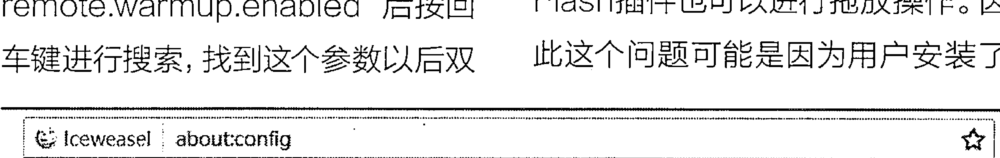

# Vivaldi不能播放视频

Q: 平时使用的是Vivaldi这款网页浏览器，但是通过它打开优酷网站后，发现其中的视频无法进行播放，而且按照提示已经更新了Flash插件也没法解决这个问题。请问这个问题怎么解决？

A: 现在的优酷视频已经支持HTML5技术进行播放，所以不安装Flash插件也可以进行播放操作。因此这个问题可能是因为用户安装了某种广告过滤软件而引起的，所以建议暂时关闭广告过滤软件，看看是否可以进行播放操作。

# Flash插件捆绑第三方软件

Q: 现在很多网站在播放视频的时候，仍然要求用户安装Flash插件才可以进行播放，但是在安装最新版本的Flash插件后，发现它还捆绑了其他的软件程序。如何才能解决这个问题？

A: 其实这个问题主要出现在Flash插件的安装包配置过程中，只需要在配置过程中将“可选程序”的勾选去掉，就可以在安装Flash插件的时候杜绝第三方软件的捆绑安装。

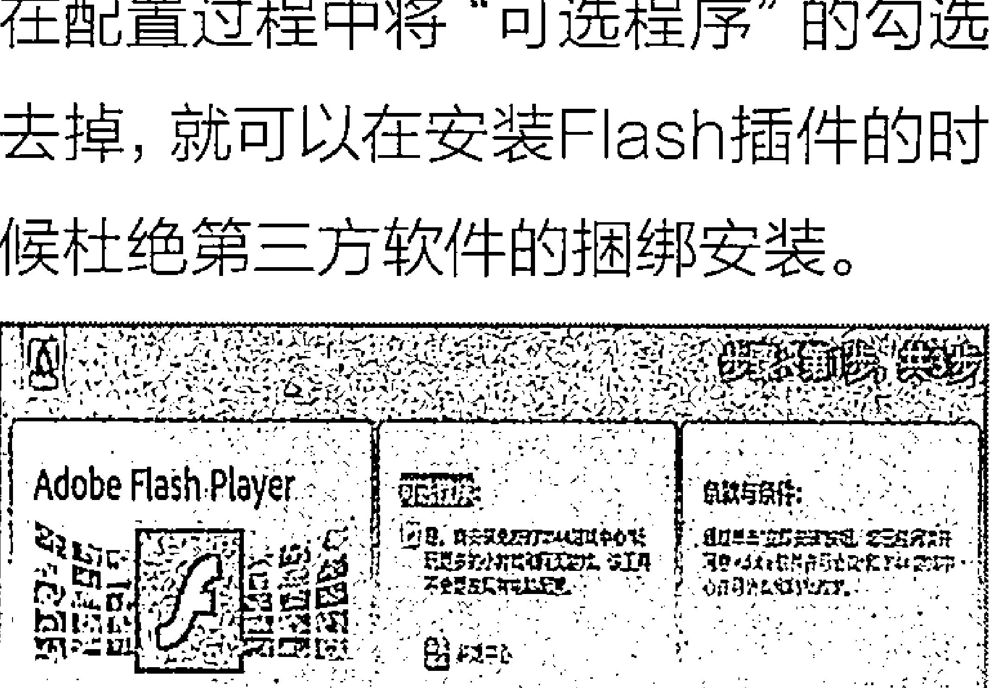

# 下载的绿色软件不能直接运行

Q: 由于现在很多软件的安装包都捆绑有其他的软件，所以在下载软件的时候常常会选择绿色的版本，可是有的时候下载的绿色版本无法正常运行。这是什么情况造成的？

A: 很多时候绿色软件无法正常地运行，都是因为操作系统中没有安装相关的运行库，所以只需要下载Visual C++ 2010 x86 SP1这种运行库进行安装就可以解决了。如果不知道该安装哪一个版本的运行库，可以安装一个运行库的合辑来解决。

### 获取软件程序的打折消息

Q: 现在大家的版权意识越来越强，使用正版软件的频率也越来越高，但是正版软件的购买花费可不小，所以通过打折来购买才比较划算。通过什么途径可以获取软件最新的打折信息？

A: www.bitsdujour.com就是一个非常不错的软件打折网站，浏览这个网站以后，只需要将鼠标移动到某款软件的图标上，就可以显示出它的打折金额，可以根据这个打折情况来选择是否进行购买。点击网页中的Free选项，还可以看到当天不需要花钱就能下载使用的正版软件。

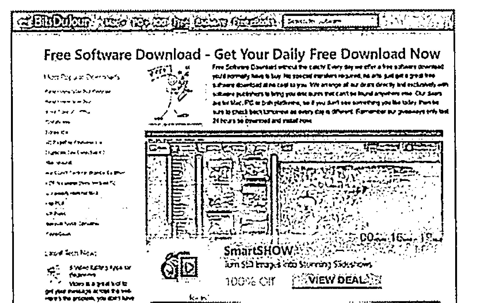

### 免费域名如何继续使用

Q: 之前在Freenom这个网站中申请了一个免费的域名，当时申请的使用时间是12个月，现在这个时间马上就要到期了，而且也收到了相关的通知邮件。通过什么方法才可以继续使用这个免费域名？

A: 通过浏览器打开Freenom.com这个网站，并且登录到系统的后台，点击“Services”菜单中的“Renew Domains”命令，在弹出的网页中就可以看到域名续订信息。找到需要进行续订的网页域名，点击后面的“Renew This Domain”按钮就可以进行操作了。

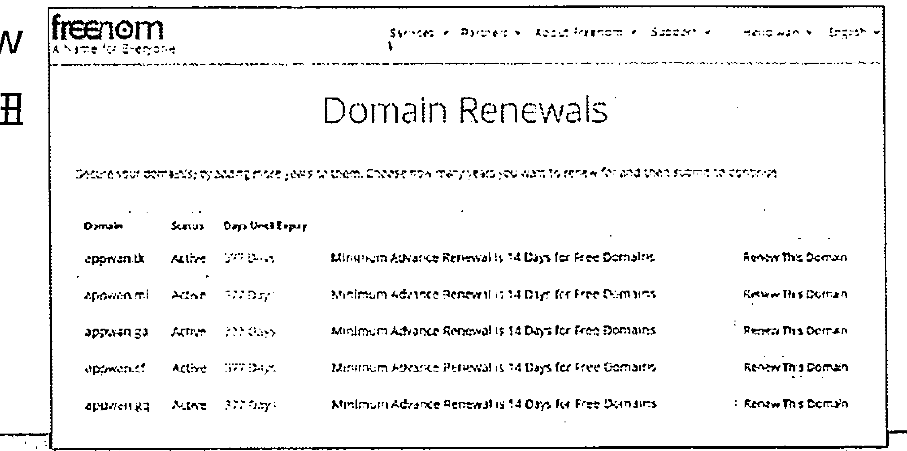


在列表中可以设置域名使用的时间，最长的时间仍然是12个月。

### 火狐浏览器扩展老版本的下载

Q: 由于最新版本的火狐浏览器采用了最新的接口，所以最新推出的功能扩展已经不能在老版本的浏览器中使用了。如何才能下载到老版本的功能扩展，以供老版本的火狐浏览器进行使用？

A: 可以打开火狐浏览器的扩展商店，通过搜索功能查找到需要安装的扩展。点击扩展名称后进入到它的介绍页面中，然后点击网页左侧的“查看所有版本”链接，在弹出的页面中就可以查看到以前的版本了。

### 快速申请临时电子邮箱

Q: 很多服务在使用之前都需要申请一个账号，但是申请完成以后该服务经常会发送一些广告内容的信息，让人感到非常恼火。能不能申请一个免费的临时邮箱来解决这个问题？

A: 通过浏览器打开https://temp-mail.org/这个网站，在网页的上方马上就可以看到一个临时邮箱的地址，将其进行复制以后就可以用于注册操作了。点击网页中的“Refresh”按钮，就可以对临时邮箱中的内容进行实时的刷新。

### 免费下载网站需要的背景图片

Q: 在开发网站或者网络服务的时候，经常需要用到一些背景图片来进行装饰，但是从哪里去寻找这些图片却令人伤脑筋。有没有可以免费使用的网站背景图片下载途径？

A: 通过浏览器打开https://www.svgbackgrounds.com/这个网站，打开网站以后就可以在网页中看到所有的免费背景图片。任意选择一个背景图片进行点击，就可以马上在网站背景中预览到该图片的效果。除此以外，还可以在左侧的对话框中，对图片的颜色、透明度等参数进行微调。

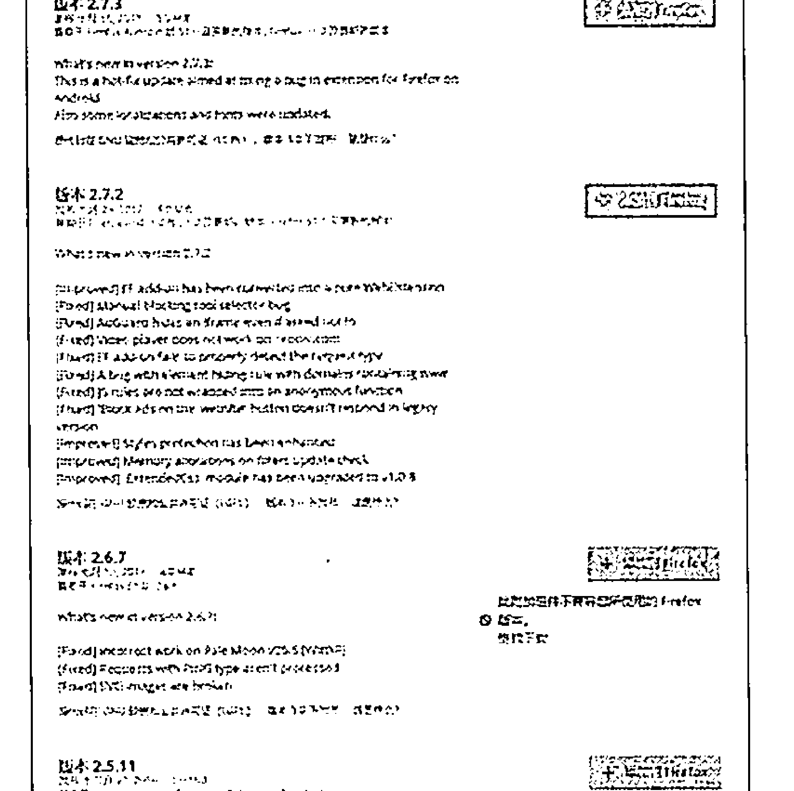

# 快速翻译文档中的英文信息

文老万

Q：有的时候从网上下载的内容是英文信息，普通用户阅读起来就有一些麻烦。如何快速地将这些信息翻译成自己需要的中文信息？

A：首先通过Word办公软件加载下载的内容信息，点击软件的“审阅”标签，在下面的工具栏中就可以看到一个“翻译”按钮。点击“翻译”按钮后，选择“翻译所选内容”以及“翻译文档”选项，就可以进行翻译操作了。

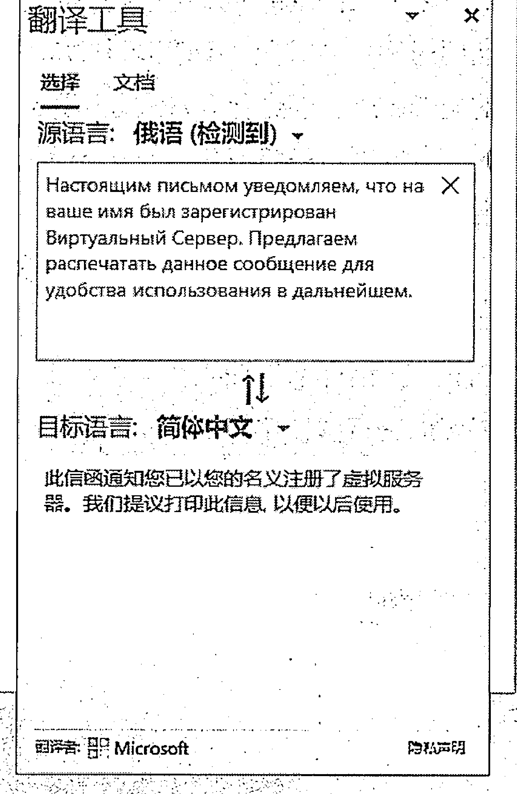

利用QTranslate软件配合办公软件，也可以进行文档内容信息的快速翻译。

# 快速删除下载信息中的换行符

Q：从网上复制一些内容粘贴到编辑软件中，会发现文档信息的每一行后面都有一个换行符，这样阅读起来就非常不舒服。怎样可以快速地删除这些换行符？

A：运行Word载入要编辑的内容信息，点击工具栏右上角的“替换”按钮，在弹出的“查找和替换”对话框的“查找内容”中输入“^l”，在“替换为”输入框中保持空白，最后点击“全部替换”按钮，就可以批量删除换行符了。

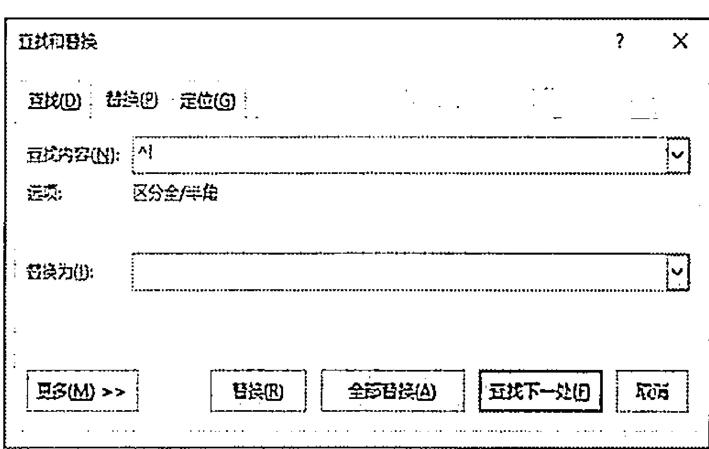

# 快速输入时间和日期信息

Q：虽然现在很多的输入法都可以快速输入当前的时间和日期，但是由于办公室的电脑还是使用老版本的系统，所以操作起来非常麻烦。有什么方法可以快速输入当前的时间和日期？

A：其实在Office办公软件中，通过一些快捷键就可以完成相关的操作。比如按下快捷键Alt+Shift+T，就可以输入当前时间；按下快捷键Alt+Shift+D，就可以完成当前日期的输入。

# 统一表格中日期的表述格式

Q：在表格中需要输入一些日期信息，但是不同的输入法在输入日期的时候会表现出不同的格式，这样整个表格看起来就很不规范。如何才可以将这些格式进行统一？

A：选中要进行统一的日期单元格，点击“数据”标签中的“分列”按钮，在弹出的对话框中按照向导操作，在“列数据格式”里面选择“日期”这个选项，然后选择一个统一的日期格式就可以了。

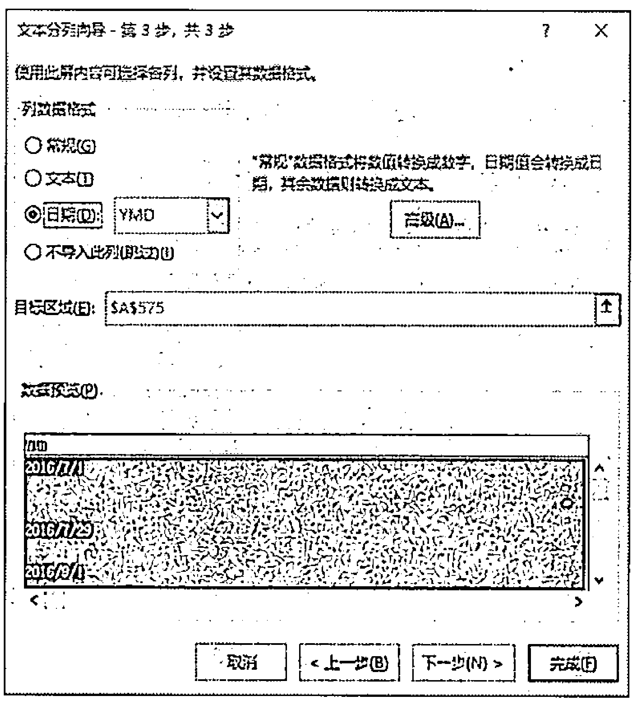

# 快速选定不连续的单元格

Q：有时在处理一个表格的时候，需要对某些单元格的内容进行选定，如果是连续选定的话当然很方便，而如果只是对某些不规则的单元格进行选定就比较麻烦。通过什么方法可以快速地选择这些单元格？

A：按下快捷键Shift+F8激活办公软件的“添加选定”模式，工作表下方的状态栏就会显示出“添加到所选内容”的提示。以后通过鼠标分别单击不连续的单元格或单元格区域，就可以对这些区域进行快速选择了。

# 快速删除表格中的空行

Q：有的时候我们得到一个Excel表格，会发现这个表格里面拥有很多的空行，这样浏览起来非常不方便。怎样才能快速地将这些空行批量删除掉？

A：要快速批量地删除空行，首先点击“数据”标签中的“筛选”按钮，接着点击表格旁边的下拉按钮，在弹出的菜单里面只选择“空白”这一项，最后点击工具栏中的“删除”按钮，就可以批量地将它们进行删除了。

# 在表格里制作条形码

Q：现在很多商品都自带有条形码，这样在扫描的时候就非常方便，但是并不是所有的商品都有条形码。如何在表格里面自定义一个条形码？

A：可以点击“开发工具”标签中的“插入”按钮，在弹出的菜单里面选择“其他控件”，在对话框里面选择“Microsoft Barcode Control 16.0”，在“条形码”单元格中拖拽鼠标，就可以创建出一个条形码了。通过鼠标右键点击条形码，在属性对话框里面选择“7-code-128”即可。

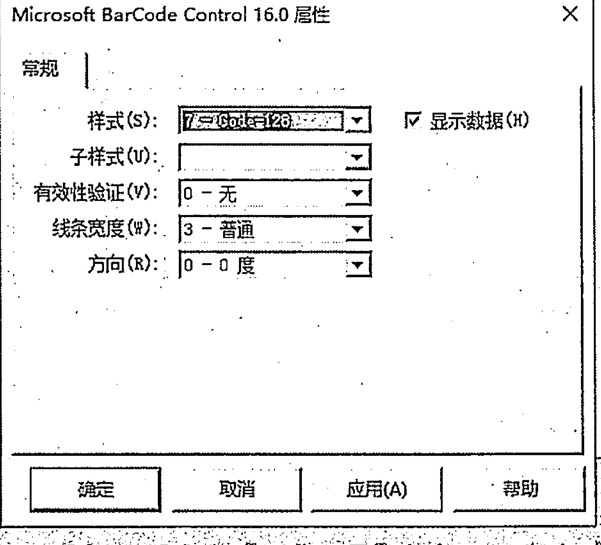


如果工具栏里面没有“开发工具”标签，可以在“选项”对话框的“自定义功能区”中进行添加。

# 将Word文档转换成PPT文件

Q：同事利用Word软件制作了一个文案，现在需要将这个文案转换成PPT文档。除了传统的复制粘贴操作以外，如何才可以快速地进行文档的转换操作？

A：在Word中点击“视图”标签中的“大纲”按钮，在弹出的“大纲显示”窗口中，在列表中选择一个大纲显示的级别。接下来添加一个名为“发送到 Microsoft Powerpoint”的按钮到工具栏，点击这个工具栏以后就可以进行转换操作了。

# 类似信息如何查找

Q：想在一个表格文件里面查找一些信息，这些信息的内容并不完全相同，而是只有第一个字母是一样的。这样的情况如何进行查找设置？

A：在表格中点击“开始”标签中的“查找和选择”按钮，在弹出的菜单中点击“查找”命令，然后在“查找内容”输入框中设置为“A*”，A代表的是搜索内容的第一个信息。接下来点击“选项”按钮，勾选上“单元格匹配”，最后进行查找就可以了。

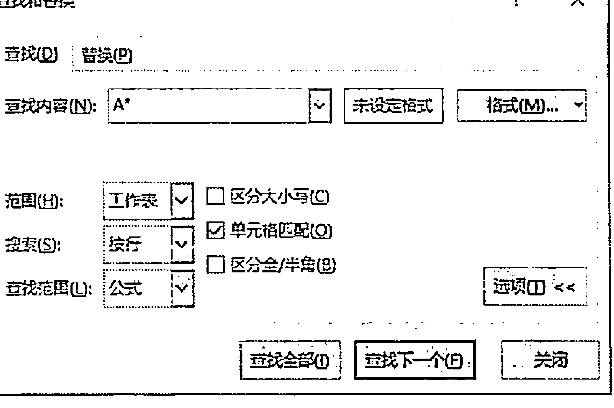

# Word表格转换不变形

Q：通常在将Word中的表格转换成Excel表格的时候，会出现内容错位变形的情况，这样看上去非常不美观。请问在转换的时候有什么方法让它不会出现错位变形的情况？

A：在Word中点击“文件”按钮，在弹出的菜单中选择“另存为”命令，在文件格式列表中选择“网页”这一项，就可以完成文件的转换。接下来运行Excel软件，点击“打开”按钮选择网页文件，这样表格信息就完完整整地复制过去了。

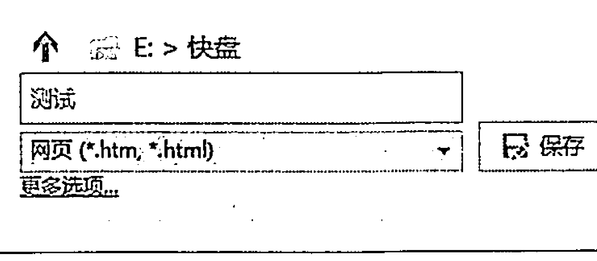

# 晚上视听自动降低音量

文|老万

Q：平时喜欢通过电脑来观看视频或者收听音乐，但是到了晚上很多人都休息了，这样声音太大的话会影响到他人的休息。如何在晚上自动让系统降低音量的大小？

A：可以下载运行Volume Concierge 2这款工具，根据需要激活一个时间点的选项，然后在列表中选择“Every Day”，在时间列表中设定所需要调整的时间，最后在后面设定音量对应的百分比就可以了。

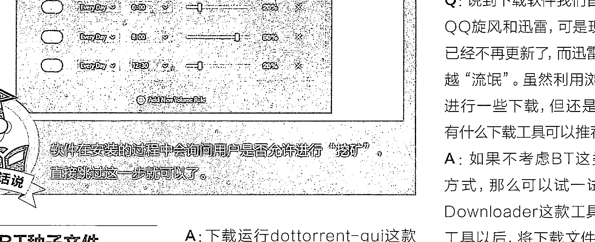

软件在安装的过程中会询问用户是否允许进行“挖矿”，直接跳过这一步就可以了。

# 批量制作BT种子文件

Q：在对体积较大的文件进行传输的时候，最常见的方法还是利用BT这种方式来进行传播，这就涉及到BT种子文件的制作。怎样可以批量完成BT种子文件的制作？

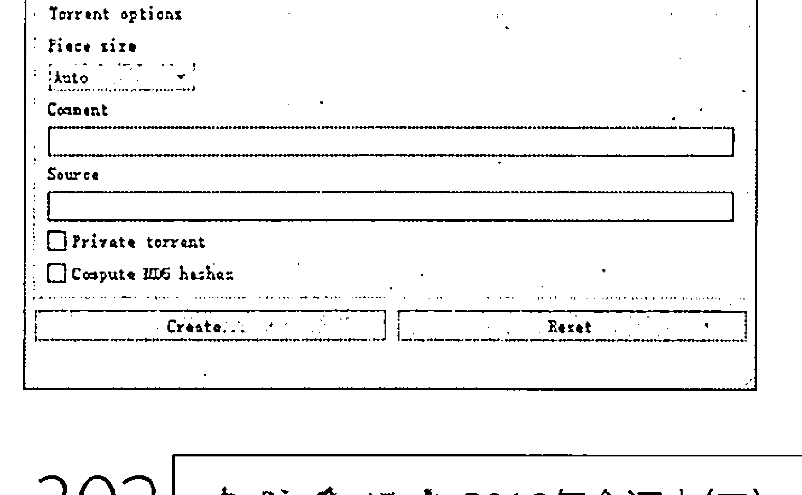

A：下载运行dottorrent-gui这款工具，选中对话框中的“Batch mode”选项，就可以对指定文件夹中的每一个文件制作一个BT文件了。至于Tracker这些信息内容，按照之前的内容进行设置操作即可。

# Kaspersky Security Scan无法运行

Q：在系统里面安装了Kaspersky Security Scan这款杀毒软件，前段时间都用得好好的，但是今天运行它的时候发现没有任何反应。这个问题如何解决？

A：打开系统的“应用和功能”窗口，在列表中找到这款杀毒软件以后，点击下面的“卸载”按钮，这时就会弹出一个对话框。点击对话框中的“修复当前产品”按钮，就可以对这款软件进行修复，修复完成以后就可以正常运行了。

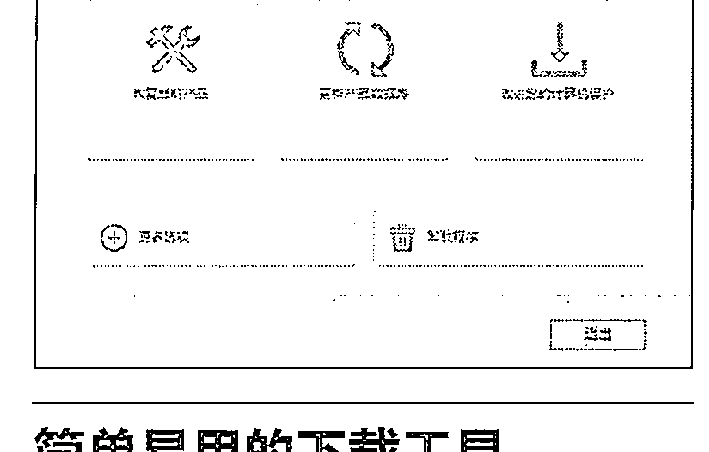

# 简单易用的下载工具

Q：说到下载软件我们首先就会想到QQ旋风和迅雷，可是现在QQ旋风已经不再更新了，而迅雷又变得越来越“流氓”。虽然利用浏览器也可以进行一些下载，但还是想问问有没有什么下载工具可以推荐一下？

A：如果不考虑BT这类P2P下载方式，那么可以试一试Integrity Downloader这款工具。运行这款工具以后，将下载文件的链接粘贴到工具操作界面的输入框中，然后点击后面的添加按钮就可以进行下载操作了。

# 直接在系统桌面管理任务

Q：要进行任务管理，通常都需要在专门的软件中进行操作，而本人平时都喜欢将一些常用的文件放在系统桌面上。请问有没有什么方法在系统桌面上直接进行任务管理操作？

A：只需要在系统中安装一款名为“桌面日历”的软件，安装完成以后就会在桌面上放置一个表格形状的日历。在这本日历上就可以添加相应的任务以及进行记事操作，这样在系统桌面上操作起来就更加简单方便了。

# 快速找到CD的封面图片

Q：以前很多唱片或者CD都有自己的封面，而且好的封面可以起到很好的宣传作用。在需要这些封面图片的时候，从哪里可以寻找到这些唱片或者CD的封面图片？

A：可以通过浏览器打开https://archive.org/details/coverartarchive这个网页链接，据说这个网站里面搜集了大约80万张唱片的封面图片。只需要根据向导选择唱片的年份、语言或者其他信息，就可以快速找到自己需要的封面图片。

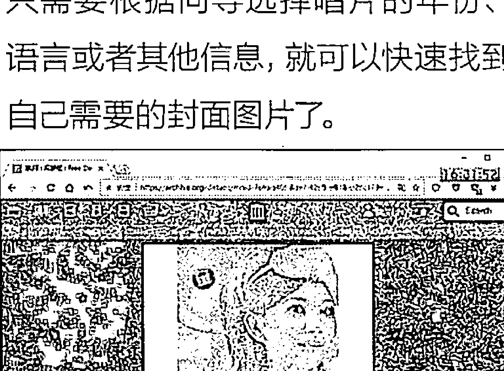

# 优酷视频播放卡顿不缓冲

Q：平时喜欢在优酷网站观看一些视频，但是最近在观看优酷视频的时候，发现播放一会儿就出现卡住的情况，而且视频也不会进一步进行缓冲。不知道这个问题和uBlock Origin扩展有没有关系？

A：这个问题和uBlock Origin扩展还是有一定关系的，可以试着这么来进行解决。首先打开扩展的控制面板，勾选“我是高级用户”选项。接着点击这个扩展的图标，在弹出的对话框中选择“mmstat”旁边的绿色，这样就可以解决这个问题了。

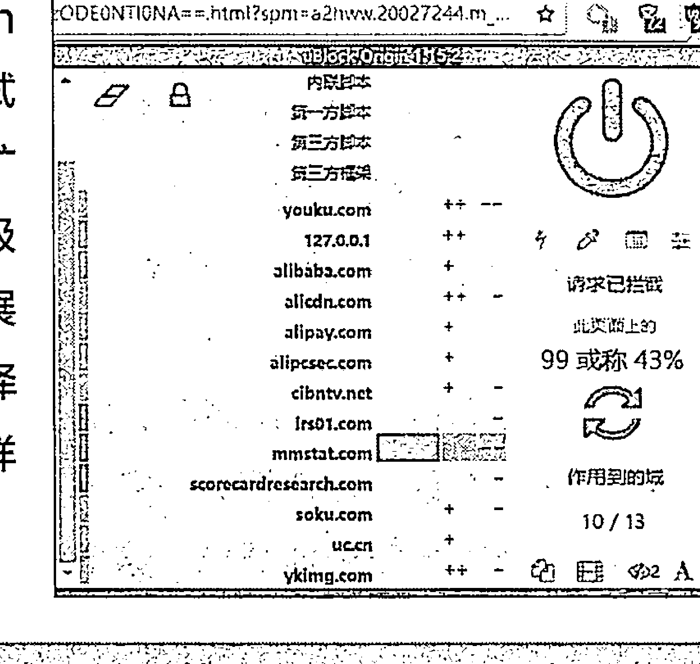

> 也可以试着清除一下网页浏览器的缓存看看是否能解决。

# 支持对接多家云存储的网盘

Q：网络云存储带给大家非常大的便利，但是由于各种各样的原因，经常会有一些云存储突然停止服务，因此用户需要花很多的时间进行数据的转移。是否有一个软件系统可以让这些数据直接在云端进行转移操作？

A：先访问“平步云端”这个网站(https://pan.aoaoao.me/)，按照要求注册以后在网页后台关联要进行数据同步的云平台，就可以在云端对不同云平台中的数据进行转移等管理操作了。如果觉得第三方提供的服务不安全，还可以通过它提供的代码自行进行相关服务的搭建操作。

# 跨国大文件的快速传输

Q：公司需要和国外进行一些业务往来，所以经常需要和客户之间传递一些文件，可是有的时候传递的文件体积比较大，通过传统的方法就需要花费很长的时间。有没有什么软件可以解决这个问题？

A：可以试一试“镭速RaySync传输系统”，公司和国外的客户分别安装它以后，其中一方就可以得到一个确认码。将这个确认码发给对方后，再将这个确认码输入到自己的软件中，这样就可以完成双方软件身份的确认操作，然后就可以进行文件的传输操作了。

# 在网页上体验经典老软件

Q：现在HTML5这项技术炒作得比较火热。请问通过这项技术能不能还原一些比较经典的软件，像Winamp这款播放器或者Windows操作系统自带的“画图”工具？

A：其实现在已经有一些网友通过这项技术，实现了所提到的这类需求。比如打开http://jordaneldredge.com/projects/winamp2-js/这个网站就可以看到Winamp这款播放器，打开http://jspaint.ml/这个网站就可以进行画图工具的操作。

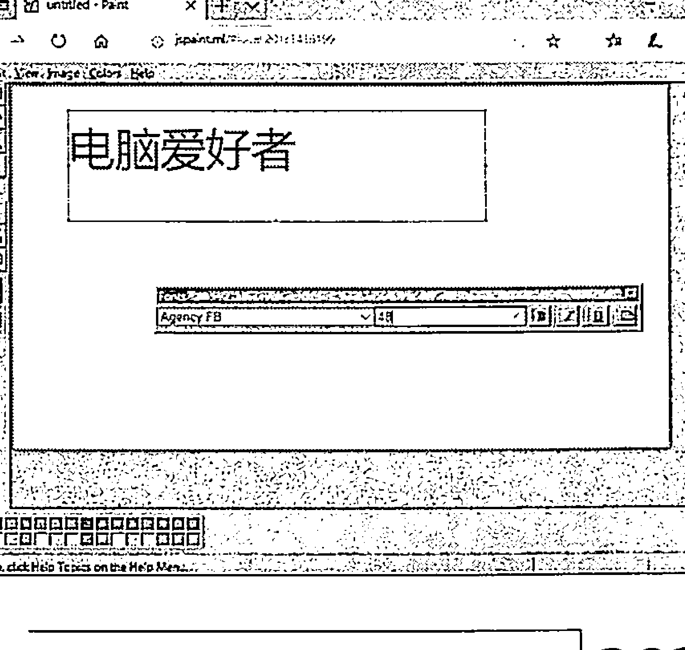

# 让系统的登录密码更安全

文/老万

Q：由于现在很多安全事件都是因为数据库被窃造成的，所以为了更好地保护用户数据的安全，需要给Windows 10设置一个强大的密码，可是在设置密码的时候经常都比较随意。怎样强行要求用户设置一个高强度的密码？

A：打开系统的组策略编辑器，定位至“计算机配置→Windows设置→安全设置→账户策略→密码策略”，然后在右侧窗口中找到“密码必须符合复杂性要求”这个选项，直接双击该选项打开它的配置窗口，在里面选择“已启用”选项后就可以解决这个问题。

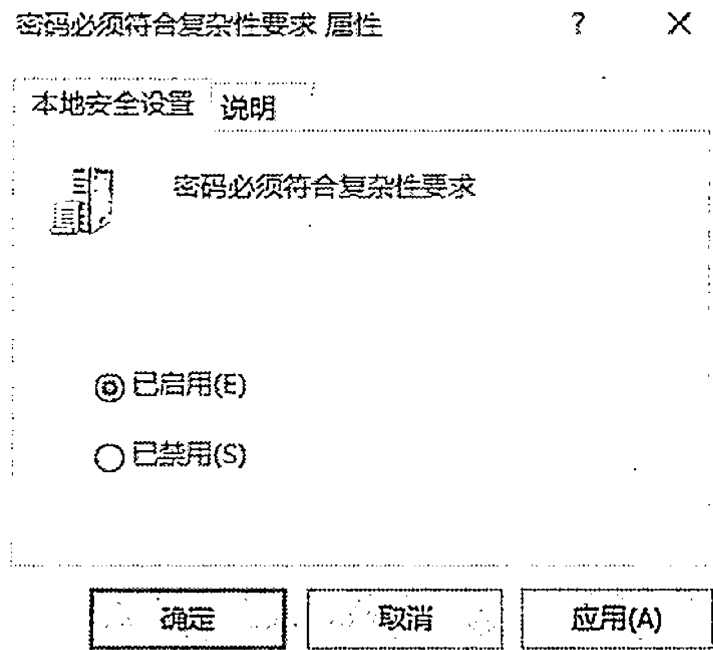

> 如果不知道如何设置密码的话，可以借助在线密码生成服务来进行创建。


# 让系统任务栏变得更加透明

Q：虽然最新版本的Windows 10系统已经重新加入了毛玻璃的效果，但是它的透明效果感觉很一般，尤其是遇到一些深色主题的时候更是如此。怎样才能让任务栏更加透明？

A：在“运行”框输入“regedit”打开注册表，展开至“HKEY_LOCAL_MACHINE\SOFTWARE\Microsoft\Windows\CurrentVersion\Explorer\Advanced”，在右侧窗口新建一个DWORD（32位）值，将其名称重命名为“UseOLEDTaskbarTransparency”，然后在弹出的对话框中设置为1就可以了。

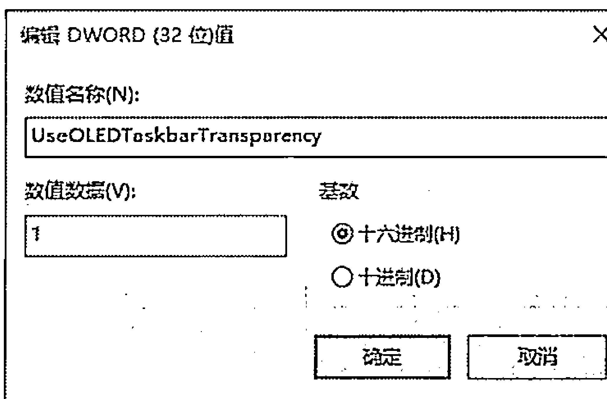

# 为没有激活的系统设置主题色

Q：如果Windows 10系统没有激活，那么就不能设置桌面壁纸以及让主题颜色自动随壁纸的颜色而改变，这样的话看上去就会非常别扭。在没有激活的系统中如何解决这个问题？

A：打开注册表，展开至“HKEY_CURRENT_USER\SOFTWARE\Microsoft\Windows\CurrentVersion\Themes\Personalize”，在右侧窗口将“ColorPrevalence”设置为1即可。接着展开至“HKEY_CURRENT_USER\Control Panel\Desktop”，在右侧窗口将“AutoColorization”设置为1即可。

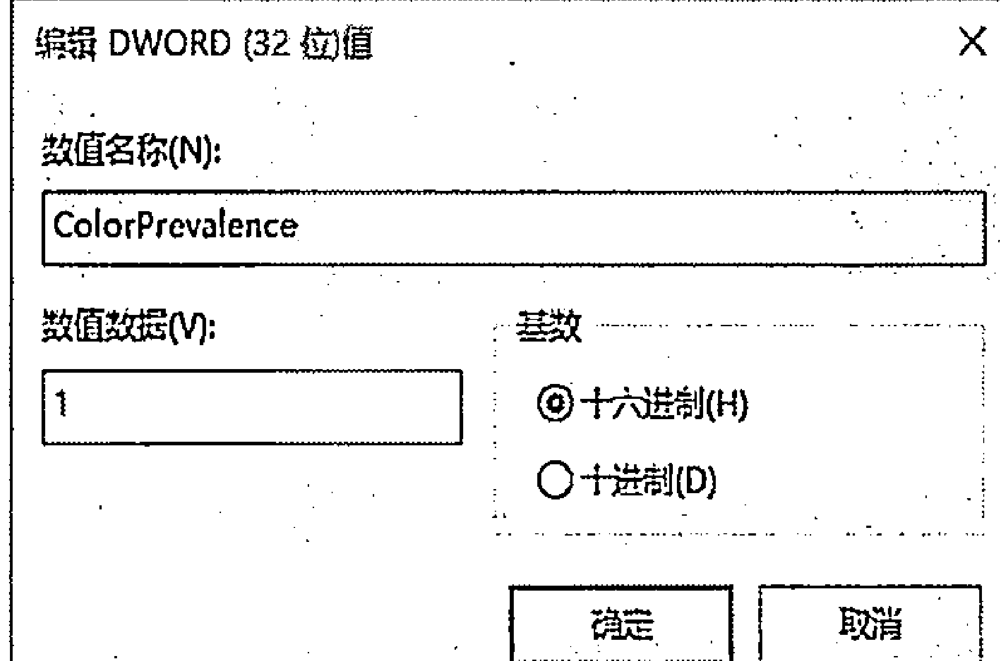

# 正确显示Chrome应用图标

Q：谷歌浏览器的应用可以单独将图标创建在系统桌面上，这样就可以让浏览器的应用单独运行，可是当这个图标添加到Windows 10系统的开始菜单后，显示的则是浏览器的图标。如何才能显示出应用本身的图标？

A：在资源管理器窗口中打开C:\Users\用户名\AppData\Local\Google\Chrome\Application这个目录，在目录中找到一个名为chrome.VisualElementsManifest.xml的文件，将这个文件删除后重新刷新图标，就可以解决这个问题了。

# 去除系统的版本水印

Q：虽然Windows 10系统已经激活，但是由于使用的是测试版本，所以在系统桌面的右下角一直有一个系统版本号的水印。怎么能将这个水印去除掉？

A：通过管理员权限打开命令提示符窗口，输入“bcdedit /set testsigning off”这行命令后回车，提示“操作成功完成”后重新启动系统就可以解决这个问题。

# 小娜相助快速完成计算操作

Q：现在手机的功能越来越多，但是最常用的功能就那么几样，比如计算器就是一个常用的功能，可是有的时候单手操作计算器会比较麻烦。有什么方法可以解决这个问题？

A：当我们进行单手操作不方便的时候，可以通过语音的方式来进行一些操作。比如在手机上安装微软的小娜应用，然后通过它说出自己需要计算的公式，这样就可以快速得到所需要的答案。

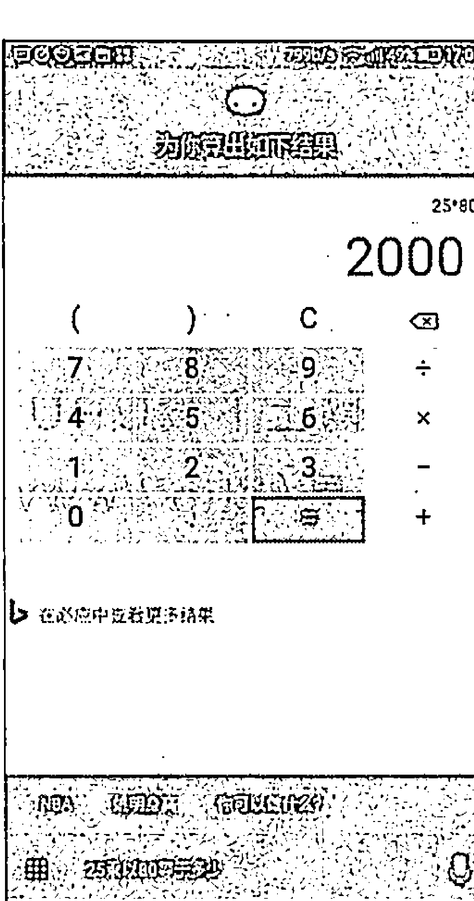

# 给证件照片加密的保险箱

Q：本人记性不太好，所以需要将一些证件照片或者银行卡的照片放在手机中，但是这样又害怕在手机丢失的情况下，这些照片会泄露自己的个人隐私。如何才能对这些照片文件进行加密？

A：可以启动运行“照片保险箱”这款应用，点击右下角的加号按钮，选择需要进行保护的照片文件即可。而且这款应用将自己伪装成了计算器的模样，用户只有在计算器中输入相应的密码信息，才可以进入到真正的保险箱里面。

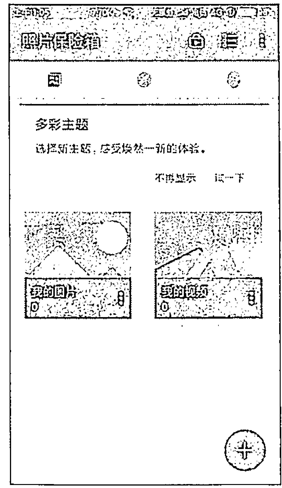

# 局域网中各设备的文件传输

Q：无论是在因特网还是在局域网中，文件传输是经常需要面对的一个问题，虽然利用即时通讯软件可以进行传输，但是需要用户安装同样的通讯软件。有没有什么更好的选择方法？

A：通过浏览器打开Simple.Savr这个网站（https://www.ssavr.com/），在网页中输入需要分享的文本信息就可以了。接下来在局域网的另外一台设备中，同样打开这个网站并且点击右上角的刷新按钮，这样就可以在其他的手机或电脑上看到分享的文本信息了。

利用“Upload”和“Download”按钮，可以进行文件的快速分享。

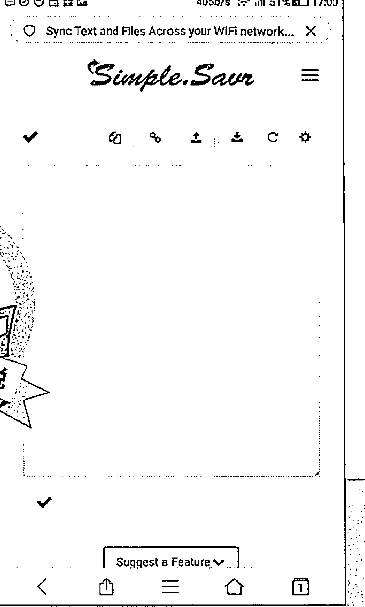


# 根据人脸搜索分类照片

Q：前段时间和朋友一起出去踏青，其间拍摄了不少的照片，但是要想进行分组却非常困难。通过什么办法可以根据人脸来快速完成搜索以及分组操作？

A：打开“腾讯微云”应用客户端，在“探索中心”激活“人像智能搜索”功能。接下来马上拍摄一张照片或者从相册中选择一张人脸的照片，这样应用就可以根据这个人脸进行搜索，然后将分析出的照片显示在列表中。

# 在微信朋友圈中搜索查找

Q：每天在微信中最重要的事情就是查看朋友圈，但是有的时候要想在朋友圈里面寻找一些东西却非常困难。在微信中怎样完成朋友圈信息的搜索查找工作？

A：点击微信主界面的“放大镜”图标，在弹出的对话框中有一个搜索范围，其中就包括“朋友圈”的选项，点击它以后在搜索框中输入关键词，就只会对朋友圈里面的内容进行搜索操作了。

# 火狐59版本自定义搜索引擎

文|老万

Q：以前是使用火狐浏览器的老版本，最近升级到最新的59版本后发现“Add to Search Bar”这个扩展无法使用，这样就造成自己常用的搜索引擎无法正常添加。如何解决这个问题？

A：通过火狐浏览器打开https://e3a.win/searchplugin.php这个链接，按照网页中的提示分别设置需要添加搜索引擎的名称、描述以及搜索链接等选项。设置完成以后点击下面的按钮，就可以完成搜索引擎的自定义设置操作了。

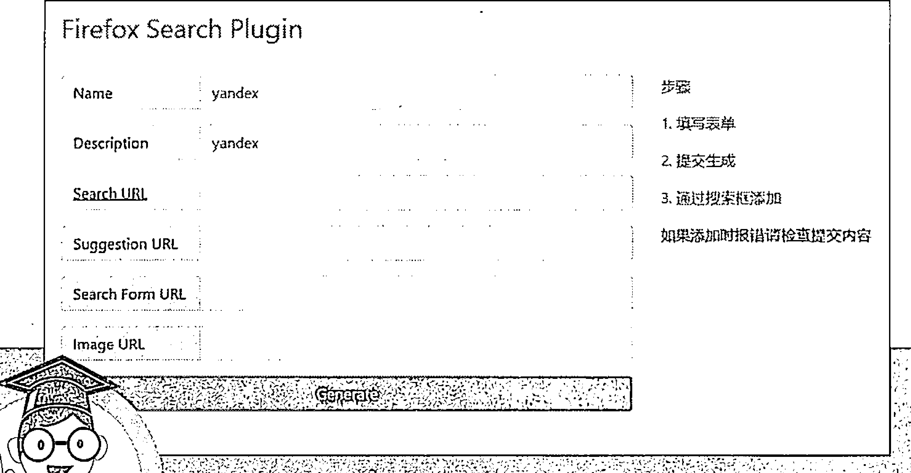

也可以在老版本中添加需要的搜索引擎，然后再将浏览器程序更新到最新的版本。

# Firefox 59.0.1不能显示中文界面

Q：通常在选择火狐浏览器的时候使用的都是第三方的修改版本，这样就需要手工添加语言包以及进行相应参数的操作。以前都可以顺利地完成中文界面的设置，但是最新的版本却不行，不知道问题出在哪里？

A：在浏览器的地址栏输入命令“about:config”，在设置界面的空白处点击鼠标右键，选择“新建”子菜单中的“String”命令，在对话框中输入字符串名称“intl.locale.requested”，点击“确定”按钮以后输入“zh-CN”，最后重新启动浏览器就可以了。

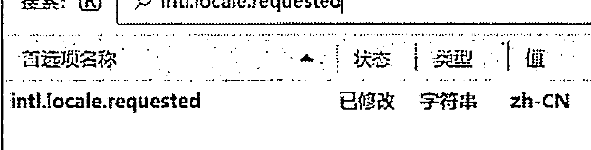

# 简单易行的Gif截图方式

Q：现在很多软件都带有屏幕截图的功能，但是这些软件的截图都是静态的截图。如果想进行动态截图，有哪些简单易用的软件可以推荐？

A：可以试一试GifCam这款小工具(http://blog.bahraniapps.com/gifcam/)。首先点击工具界面中的Rec按钮，选择要进行截图的范围，接下来就可以进行录像操作了，录像完成后它会自动将录像转换成Gif格式的图片进行保存。

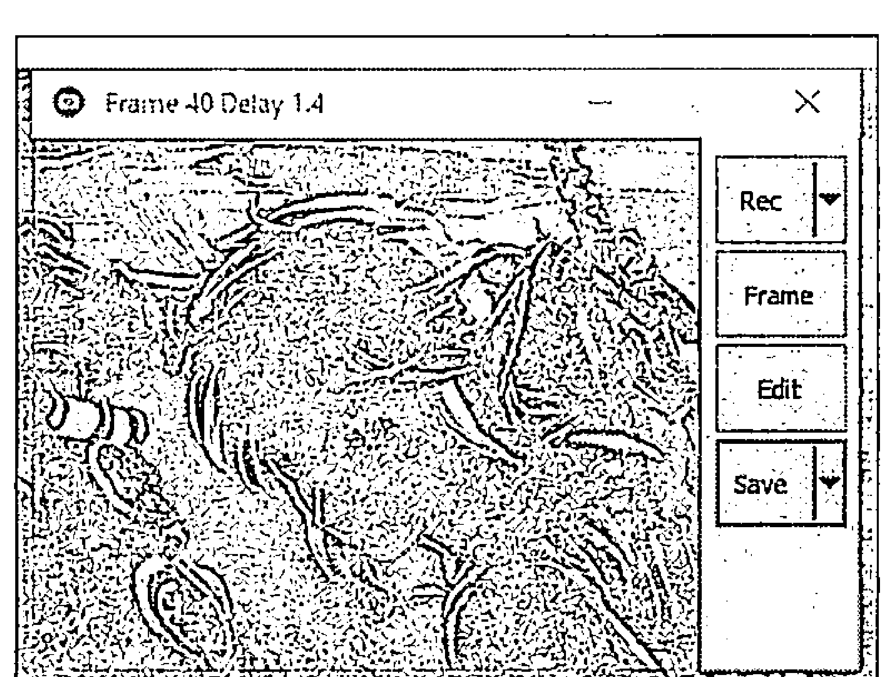

# 从哪寻找下载动态壁纸

Q：以前曾经下载过一个小工具，可以在系统桌面实现下雪等效果。有没有什么方法可以在桌面壁纸上显示出动态效果，从而让整个系统桌面看上去更加有趣？

A：从网上下载UPUPOO这款壁纸工具(http://www.upupoo.com/)，运行后点击工具界面左侧的“发现壁纸”选项，从中就可以寻找到自己需要的动态壁纸并进行下载设置了。不过这款工具有一个小的问题，就是所有的壁纸多为二次元的主题。

# MPC-BE怎样才能快进流畅

Q：平时使用的是MPC-BE这款播放器，对它的各项技术都非常满意，就是对快进功能这一项感到不太满意，因为当进行快进的时候非常卡顿，而且会出现掉帧的情况。如何解决这个问题？

A：出现这个问题的原因可能是将快进功能和快速播放功能搞混了。其中快进功能往往会以多少帧为一个基数进行跳跃，快速播放往往会以正常速度的几倍进行播放。而快速播放的快捷键是“Ctrl+↑”，可通过这个快捷键再来试一试效果。

## 快速创建有个性的二维码

Q: 现在二维码使用的频率越来越高，但是通常的二维码都是黑乎乎的，好一点的二维码会在其中增加一个Logo。有没有什么方法可以让二维码也显得更加有个性？

A: 通过浏览器打开 http://www.amazing-qrcode.com/ 这个链接，在“Website URL”里面设置二维码要打开的网页链接。接下来按照网页中的提示上传一张背景图片，这样就可以将这张背景图片和二维码融为一体了。


## 如何申请免费的SSL证书

Q: 现在使用https协议进行传输的网站越来越多。作为个人网站的管理者，从哪里可以申请到SSL证书，从而创建加密协议的网络链接？当然最好是可以免费申请SSL证书为好。

A: 其实现在可以免费申请SSL证书的网站有很多，比如通过浏览器访问 https://freessl.org/ 这个网站。在网站页面正中输入需要申请网站的域名，然后根据向导进行确认就可以了。

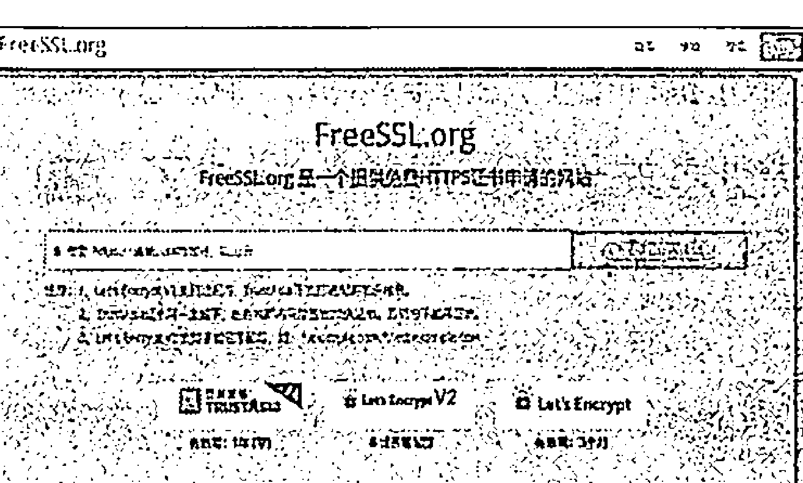

## 让http链接自动跳转到https

Q: 不久之前谷歌公司宣布将从今年7月份开始，将所有http协议的网络链接判断为不安全。现在网站域名已经申请了https协议，如何让用户在访问http协议的时候，自动跳转到https协议？

A: 先在网站的根目录下面创建.htaccess这样一个文件，接下来将一段跳转代码复制粘贴到这个文件里面，这样当用户访问http协议的时候就会自动跳转到https协议了。这段跳转代码在这里通过图片的形式提供给大家。

```
1  <IfModule mod_rewrite.c>
2  RewriteEngine On
3  RewriteCond %{HTTPS} off
4  RewriteRule ^(.*)$ https://%{HTTP_HOST}%{REQUEST_URI} [L,R=301]
5  </IfModule>
```

由于.htaccess在名称前面有一个点，所以在微软的系统中不好创建，建议直接在网站根目录下进行创建。

## 共享文件到时自动删除

Q: 虽然现在网上有很多免费的文件共享平台，但是这些平台在上传文件后都会长时间的保存文件，这样要想传递一个比较重要的文件就很不合适。有没有什么共享平台，可以在共享一定时间后自动进行文件的删除操作？

A: 通过浏览器打开“5 Minute Storage”这项云服务的网站 (http://5minutestorage.com/)，点击页面中的上传按钮后选择需要共享的文件。当文件上传到服务器后，可以获得一个文件的分享链接。不过这个分享链接默认只有五分钟，超过五分钟以后就会自动进行删除。

## 免费特效音频文件的搜索下载

Q: 有的时候需要制作一些商业性质的宣传资料，就会用到各种各样的音频素材。为了避免法律上的纠纷，从哪里可以下载到能免费使用的声音素材，最好也包括一些特效的声音素材？

A: ProductionCrate这个网站里面就包括各种各样免费的声音素材 (https://sfx.productioncrate.com/)，通过“VFX和媒体元素”或者“SFX和音乐”菜单选择需要的声音类型，就可以寻找到自己需要的声音素材并进行下载操作。

## 快速优化表格文件大小

文|老万

Q: 同事发来一个Excel表格文件，用软件打开这个文件的时候花了特别长的时间，但是后来发现里面的内容并不多。如何才能对这个表格文件进行优化，让它的大小变得更加合适？

A: 出现这样的情况可能是表格文件里面无用的信息太多了。可以点击工具栏中的“查找和选择”按钮，在弹出的菜单中选择“定位条件”这个命令，然后在弹出的对话框中选择“对象”这个选项，最后直接按下Delete键将不相关的元素迅速删除掉。

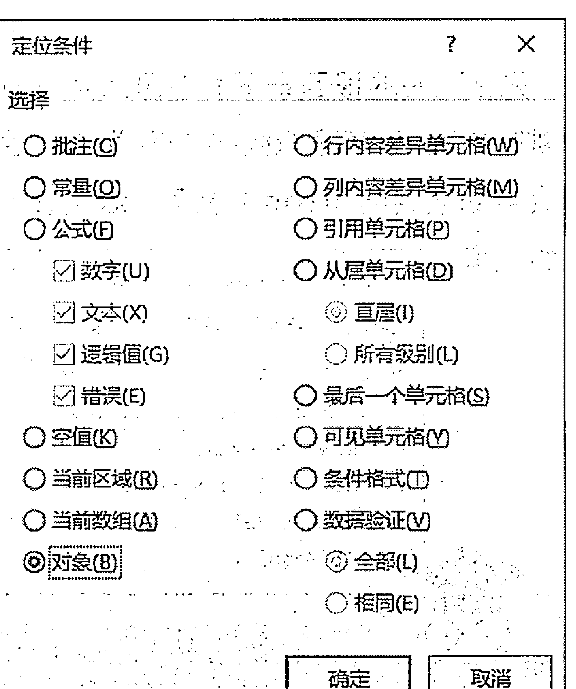

> 也可以选择空白区域，通过快捷键“Ctrl+ -”清除行内信息，这样就可以删除隐藏的公式。

## WPS Office首页只保留新建打开

Q: 金山的WPS Office办公软件在打开以后，会在首页显示各种各样的信息，这样要想新建一个文档就会让人非常恼火。如何才可以关掉那些不需要的信息，而只保留“新建”和“打开”两个主要的功能？

A: 在WPS Office图标上单击右键，在弹出的菜单中点击“打开文件所在的位置”命令。在文件夹里面找到“khomepage.dll”这个文件，修改后面的扩展名为“khomepage.bak”就可以了。

## 在文档中快速插入视频

Q: 在编辑文档文件的时候，经常会插入一些图片来丰富文档的内容。通过什么方法可以快速插入视频，从而通过多媒体的方式来展示文档的内容？

A: 其实在Office办公软件中就携带有这样的插入功能。首先打开文档文件，点击“插入”标签中的“联机视频”按钮，接着就会弹出一个对话框，从中可以利用必应搜索引擎来查找视频。查找到相应的视频后，点击下面的插入按钮，就可以将其插入到文档里面了。

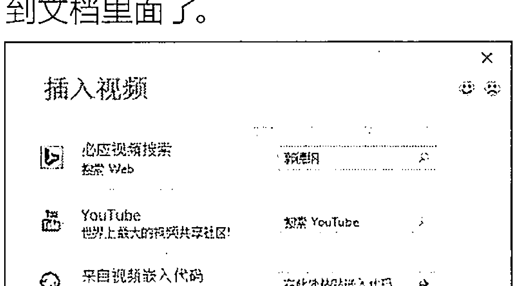

## 快速选择表格同类型的单元格

Q: 平时都是通过鼠标来进行单元格的选择，但是有的时候表格里面的内容特别多，这样通过鼠标操作就不是很很快捷。除此方法之外，还有哪些方法可以快速地对同类型的单元格进行选择？

A: 其实有的时候通过快捷键进行单元格的操作，比利用鼠标进行操作更加快捷方便。比如通过“Ctrl+Shift+↑”就可以选中当前单元格向上的所有带数据的区域，通过“Ctrl+Shift+↓”就可以选中当前单元格向下的所有带数据的区域，当然“Ctrl+Shift+←”和“Ctrl+Shift+→”也可以完成类似的操作。

## 利用Word创建个性化清单

Q: 为了更好地对一个文件进行管理，经常会用到项目清单这样的功能，但是系统自带的项目清单并不很符合自己的需求。通过什么方法可以创建属于自己的项目清单？

A: 运行Word输入项目清单，全选文档中的内容，然后点击“开始”标签中的“多级列表”按钮。接下来在第二级列表中按一下Tab键，在第三级列表中按两下Tab键，这样项目清单的层级就显得更加清晰。最后点击字体列表中的“创建样式”按钮，就可以创建关于项目清单的样式了。

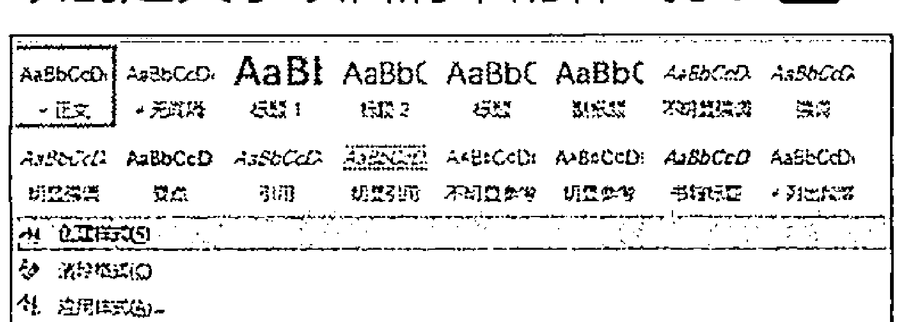

## 找回微信的摇一摇功能

Q: 现在很多电视节目在播放的时候，都可以通过微信的摇一摇功能进行互动，但是最近老妈在进行操作的时候，找了半天都没有找到摇一摇功能。能不能将这个功能找回来？

A: 点击微信工具栏中的“我”按钮，在弹出的菜单中点击“设置”命令，这样就可以看到“通用”这一项，点击它以后再选择“发现页管理”命令，就可以激活摇一摇功能了。以后再点击微信工具栏中的“发现”按钮，就可以看到摇一摇功能了。

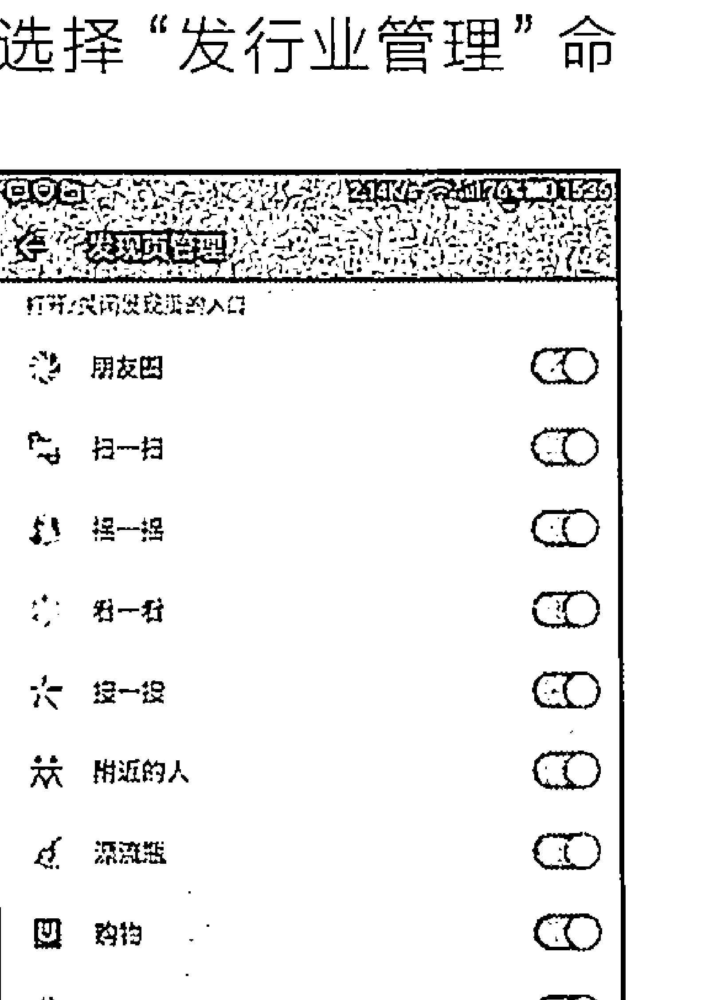

## 查看港剧更好的途径

Q: 不少网友都喜欢看国外的影视剧，不过本人还是比较喜欢香港的影视剧，毕竟很多影视剧给我们的童年留下了非常深的印象。通过什么方法可以快捷方便地收看到香港的影视剧？

A: 说到香港的影视剧自然就会联想到TVB，最近TVB推出了一款手机应用“埋堆堆”，通过它就可以免费观看TVB拍摄的众多影视剧。不过这个应用的首页主要都是一些八卦新闻，要看影视剧的话需要点击工具栏中的播放按钮才行。


## 对特定的手机应用进行加锁

刘老万

Q: 最近有一个亲戚的小孩拿我的手机玩了一会儿，结果就被恶意扣费了。为了避免这样的事情再发生，所以想给特定的手机应用安装一个加密锁。怎样才能实现这样的操作？

A: 其实现在类似的应用有好多个，有的安全软件里面也有类似的应用模块。比如可以使用AppLock+这款应用，安装以后首先设置一个登录密码，然后选择要加锁的应用，最后点击“启用”按钮就可以了。以后要打开加锁的应用，就需要先输入对应的密码。


也可以通过对特定的应用图标进行隐藏来实现同样的目的。

## 给长辈的微信使用小助手

Q: 现在越来越多的长辈开始使用手机微信，但是由于很多人是第一次接触智能手机，所以对微信的很多功能并不是很熟悉。如何可以帮助他们找到微信中的常见功能？

A: 在微信的小程序里面，搜索安装一款名为“微信使用小助手”的小程序，安装完成以后在里面就可以看到相应的使用教程。这样长辈们就可以根据这些教程来进行学习和操作，从而可以更加方便快捷地掌握微信的常见功能。

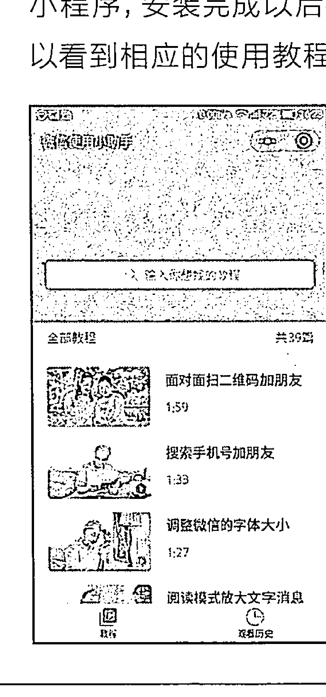

## 用蚂蚁积分兑换提现额度

Q: 从支付宝提款到银行卡里需要收取一定的费用，虽然支付宝也提供了一些免费的额度，但是这些额度已经用光了。除了通过余额宝的方式免费提取外，还有其他的方法能解决这个问题吗？

A: 点击支付宝工具栏中的“我的”按钮，在菜单中点击“蚂蚁会员”这一项，在弹出的操作界面中就可以找到“提现免服务费”选项，点击它以后就可以将自己的积分转换为免费提现额度了。

## 快速解决新建文件夹假死

文|老万

Q: 一直以来使用的都是最新版本的Windows 10系统，但是最近在系统中新建一个文件夹后，就会出现系统假死的情况。这个问题是如何造成的？应该怎么解决？

A: 打开系统的资源管理器，点击工具栏中的“选项”按钮，在弹出的对话框中选择“查看”标签，然后在“高级设置”列表中勾选上“在单独的进程中打开文件夹窗口”选项，重新启动系统就可以解决了。

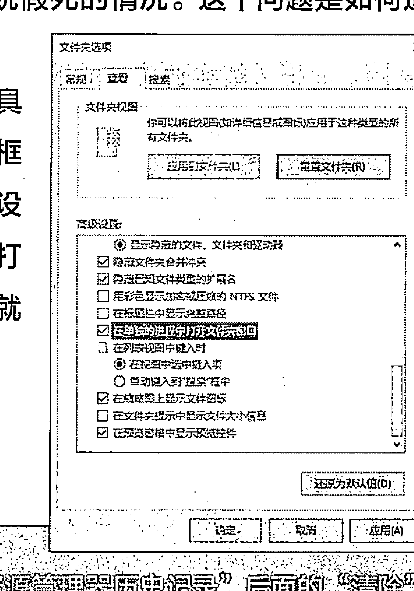

傻博士有话说：点击“清除文件资源管理器历史记录”后面的“清除”按钮也可以。

## 让资源管理器默认打开“库”

Q: 微软的Windows系统中有一个非常重要的功能就是“库”，利用它可以很容易地对文件进行管理操作，但是每次打开资源管理器后看到的都是其他的文件夹。有没有什么方法在打开资源管理器后显示出“库”的列表？

A: 在“运行”框输入“regedit”打开注册表编辑器，依次展开至“HKEY_LOCAL_MACHINE\SOFTWARE\Microsoft\Windows\CurrentVersion\Explorer\HomeFolderDesktop\NameSpace\DelegateFolders”，然后通过鼠标右键新建一个项目，重命名为{031E4825-7B94-4dc3-B131-E946B44C8DD5}即可。

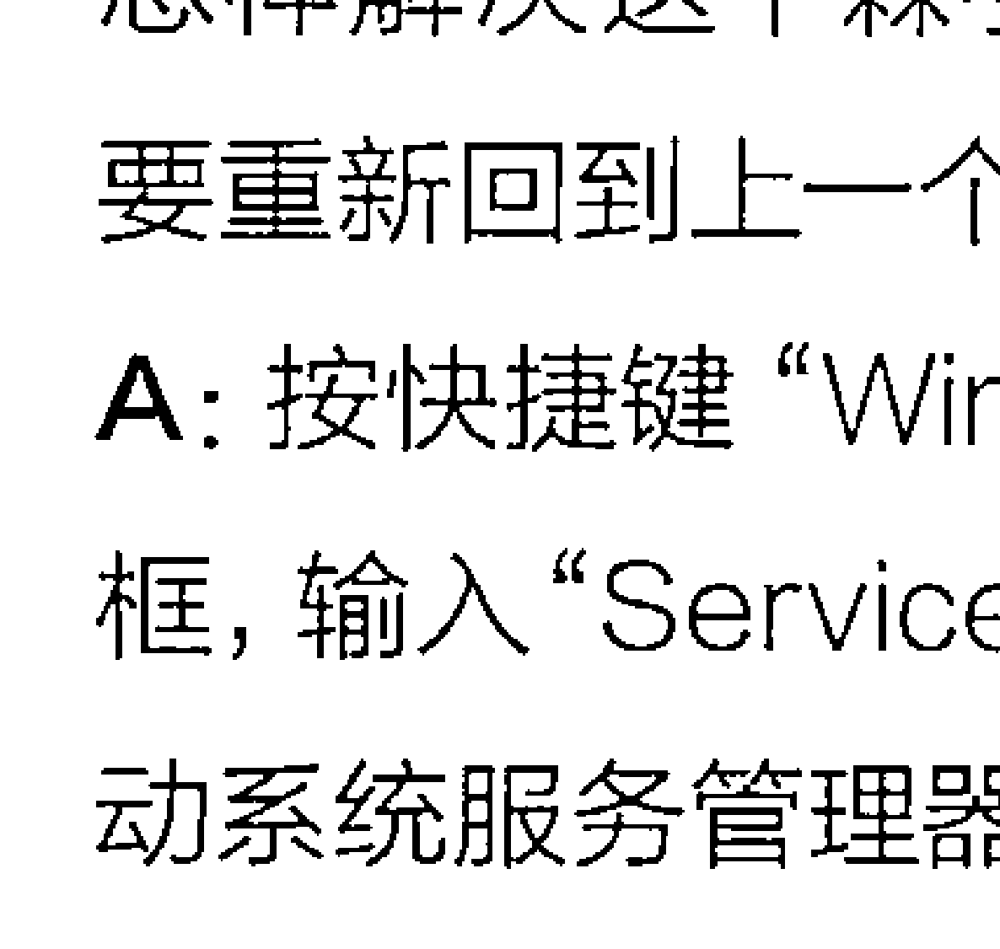

## 系统音频服务无响应

Q: 最近通过“Windows更新”功能更新Windows版本后，发现系统中的音频服务无法正常地进行操作。怎样解决这个棘手的问题？难道非要重新回到上一个版本吗？

A: 按快捷键“Win+R”打开“运行”框，输入“Services.msc”后回车启动系统服务管理器，然后在右侧窗口中找到一个名为“Windows音频”的服务，双击运行打开这个服务的配置窗口，将“启动类型”修改为“自动”就可以了。

## 关闭系统的时间线功能

Q: 在Windows 10四月创意者更新中，最值得关注的新功能就是“时间线”，该功能可以记录用户曾经的所有操作，并且可以通过点击来快速进行恢复。这个功能很容易泄露个人隐私，所以想问问如何将它关掉？

A: 在“运行”框输入“regedit”打开注册表，展开至“HKEY_LOCAL_MACHINE\SOFTWARE\Policies\Microsoft\Windows\System”，在右侧窗口新建一个DWORD(32位)值，将其名称重命名为“EnableActivityFeed”，然后在弹出的对话框中设置为0就可以了。

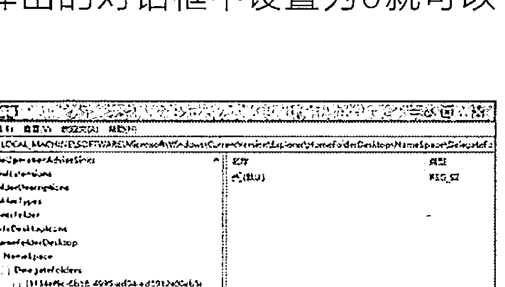

## 打开照片应用提示无效的注册表值

Q: 最近在Windows 10系统中打开照片应用的时候，系统提示无效的注册表值，这样就造成这款应用无法正常使用。应该怎么解决这个问题？

A: 通过管理员权限打开PowerShell这个工具，输入Get-AppxPackage *photo* | Remove-AppxPackage后回车，就可以将照片应用从系统中删除，然后利用系统的应用商店重新安装这款应用就可以解决问题了。

## 在蚂蚁财富中自定义基金

Q: 目前通过手机进行理财越来越方便了，比如各种各样的宝宝产品，而有朋友给我推荐了“蚂蚁财富”这款应用。不知在这款应用中，如何自定义自己想要的基金信息？

A: 可以点击“蚂蚁财富”应用中的“基金”频道，在出现的界面中点击“自选基金”这一项，就进入到自定义的页面中。点击放大镜按钮后输入自己想要的基金名称，就可以订阅相关的基金信息了。

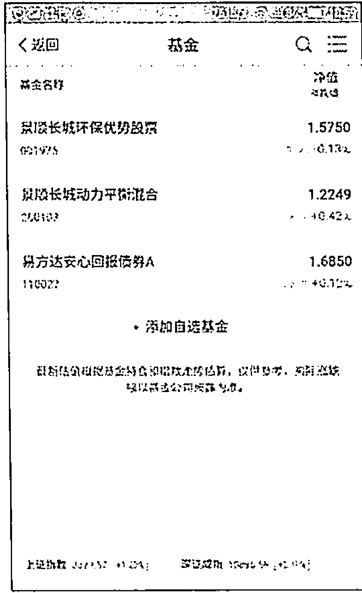

## 让手机更适合老人使用

文|老万

Q: 现在手机已经成为人人都有的必备品了，但是由于手机默认的字体相对较小，因此有些上年纪的人看起来非常不方便。如何将其修改为更加方便老人们使用的状态？

A: 有些手机系统已经内置了老人模式，只需要将其切换到该模式就可以了。如果大家手上的产品没有这项功能的话，也可以安装一款名为“极简桌面”的手机应用，启动它以后就可以调整为更适合老年人使用的状态。

> 合理利用老人模式，也可以起到护眼和手机防沉迷的作用。

## 利用百度拼音做课堂笔记

Q: 不少同学都会利用手机中的录音功能，对课堂上的内容进行录音，然后再整理成课堂笔记，但是这样进行操作未免有些麻烦。有没有什么方法可以在录音的同时，自动将内容转换成文字，从而更加方便后面的整理操作？

A: 其实利用最新版本的百度拼音输入法，就可以解决这个问题。首先点击百度工具栏左上角的熊掌按钮，在弹出的对话框中选择“语音速记”功能。选择单人模式以后，就可以一边录音，一边将其转换为文字信息了。

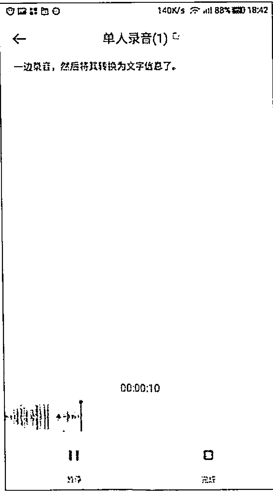

## 在手机上了解历史文化

Q: 今年的春晚出现了一个来自故宫博物院的“丝路山水地图”，这让人感到非常的惊奇和高兴。通过什么方法可以让普通用户快速了解故宫博物院里面其他的藏宝？

A: 在微信中安装一款名为“每日故宫 lite”的小程序，打开它以后就可以看到当天介绍的国宝信息。点击每一个国宝信息后，不仅可以看到精美的图片，还可以看到详细的介绍信息。


## 浏览器无法多选文件

Q: 最近通过ScanTransfer这款工具传输文件，在操作的时候无法进行文件的多选操作，可是看介绍说是可以进行多选操作的。这到底是什么问题造成的？

A: 出现这样的问题主要是用户使用的浏览器内核版本太低。鉴于很多手机系统的浏览器更新比较慢，所以还是建议用户下载诸如谷歌、火狐这些浏览器来进行操作。

## 快速打开谷歌浏览器的功能界面

Q: 通常要进行软件的设置操作，都需要进入到软件的设置窗口，但是随着谷歌浏览器的功能不断增加，在设置窗口中寻找相关功能也越来越麻烦。如何快速找到相关的设置界面？

A: 其实谷歌浏览器有很多相关的控制命令，利用它们就可以快速进行操作了。比如在地址栏输入chrome://settings，就可以快速打开浏览器的设置页面；输入类似于chrome://settings/xxx的命令，就可以打开对应的控制命令，如chrome://settings/search就是设置搜索引擎。

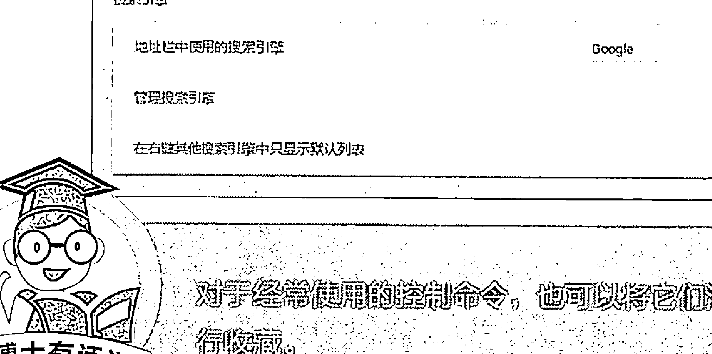

对于经常使用的控制命令，也可以将它们添加到书签中进行收藏。

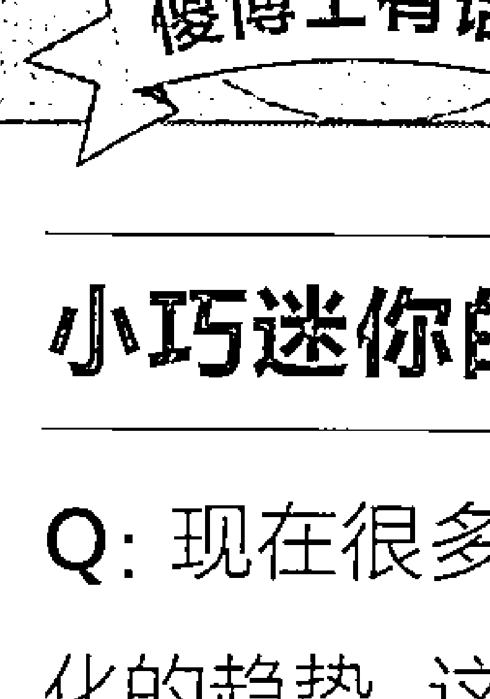

## 小巧迷你的播放器推荐

Q: 现在很多软件都有大型化、综合化的趋势，这样的软件程序就有很多的功能不实用，甚至很多播放软件也有类似的趋势。有没有什么小巧迷你的音频播放器可以推荐？

A: 说到音频播放器很多用户都会想到Foobar 2000这款软件，其实这款软件的作者还发布了一款更加迷你小巧的Boom Audio Player播放器，而且这个播放器只有一个可执行文件。其次Winy也是一款不错的迷你播放器，它使用的BOSS引擎则是音质的绝对保证。

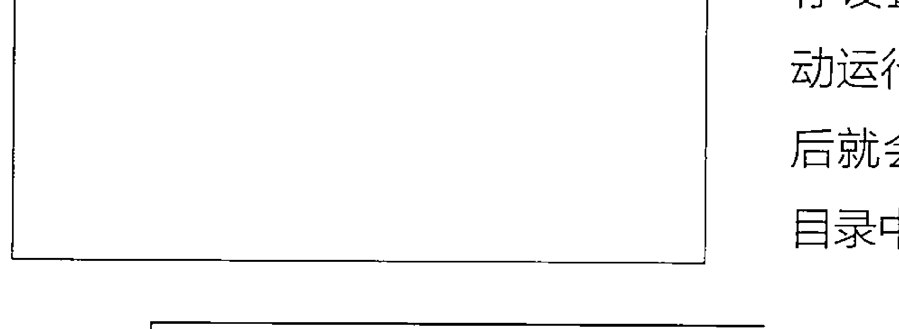

## 自动同步闪存盘中的文件

Q: 由于现在很多网盘已经不能使用了，所以每天还是通过闪存盘来传递文件。有什么方法在闪存盘插入系统后，直接将闪存盘的文件复制到指定的目录中？

A: 可以下载运行USBCopyer这款小工具，根据该工具的提示设置同步文件的存储目录，以及文件冲突时的解决方案。设置完成以后点击保存设置按钮，让这个程序在后台自动运行，这样一旦系统中插入闪存盘后就会将相关的文件复制到指定的目录中。

## EditPlus如何进行便携化设置

Q: 平时使用的是EditPlus这款文本编辑器，这款编辑器和其他的软件一样，都是将配置信息写入到系统的注册表里面，这样每次在其他电脑上操作的时候都需要重新进行配置。如何才可以将配置信息保存到程序目录中？

A: 启动运行EditPlus这款文本编辑器，点击“工具”菜单中的“设置配置文件目录”命令，在弹出的对话框中点击“配置文件位置”后的按钮，然后选择应用程序所在的安装文件夹就可以了。

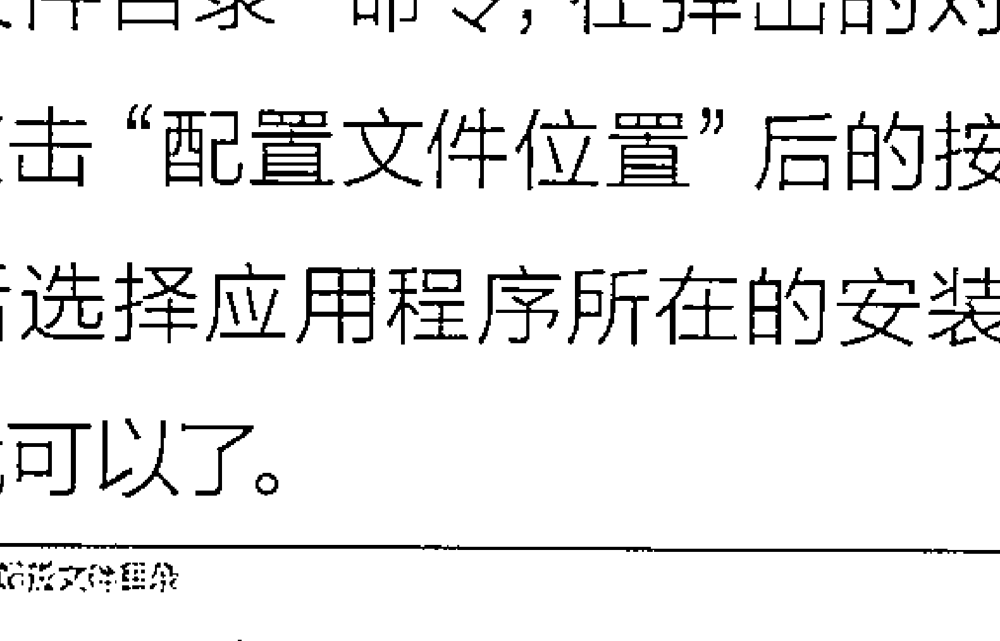

## 禁用Edge浏览器的flags菜单页

Q: 每一个浏览器都有一些试验性的功能，通过启用这些功能可以提早测试到一些全新的效果，当然也可能在使用过程中遇到各种各样的问题。请问在微软Windows 10系统的Edge浏览器中，怎样禁用它的实验室功能？

A: 在“运行”框输入“regedit”打开注册表，展开至“计算机\HKEY_LOCAL_MACHINE\SOFTWARE\Policies\Microsoft\MicrosoftEdge\Main”，在右侧窗口新建一个DWORD（32位）值，将其名称重命名为“PreventAccessToAboutFlagsInMicrosoftEdge”，然后在弹出的对话框中设置为1即可。

论坛里如何设置头像图标

Q：在一个论坛里面和网友进行互动的时候，论坛提示要求设置一个头像图标后才可以进行回复，但是按照其要求进入到头像设置区域后，发现并没有相关的功能。如何才可以进行头像的设置操作？

A：其实并不是论坛没有相关的功能，而是因为要上传头像图片的话，需要Flash插件的支持，而当前的浏览器并没有安装Flash插件，就出现了无法进行操作的情况。所以只需要安装相关的插件后重新操作就可以了，或者换用系统的IE浏览器来进行操作也可以。

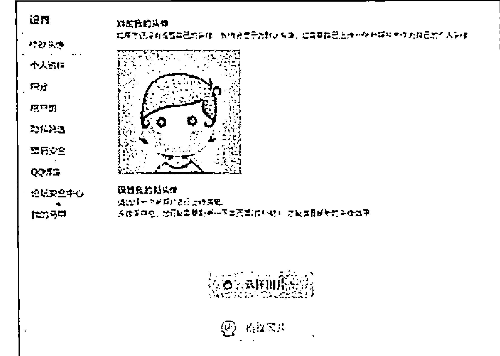

快速安装网站运行所需环境

Q：网站的运行需要很多软件的支持，比如支持WEB运行的环境、各类网络语言运行的环境，以及数据库运行的环境等等，但是如果一个一个安装这些软件的话会很麻烦。有没有什么快速的方法进行安装操作？

A：要想解决这个问题有两个方法，首先就是利用LNMP一键安装包（https://lnmp.org/）或者LAMP一键安装包（https://lamp.sh/）来操作，其次就是在服务器里面安装“宝塔”这类控制面板，通过控制面板就可以快速地进行相关软件的安装操作。

好记的域名解析服务推荐

文|老万

Q：由于国内运营商默认的域名解析服务常常“耍流氓”，所以就都是使用第三方的域名解析服务来操作，但是每次重装系统以后都需要重新设置，而这些域名服务的IP地址都没有规律。有没有比较方便好记的域名解析服务推荐一下呢？

A：其实方便好记的域名解析服务有很多，比如国内的114DNS（114.114.114.114），以及国外一些知名厂商推出的网络解析服务，比如8.8.8.8、9.9.9.9、1.1.1.1等等。

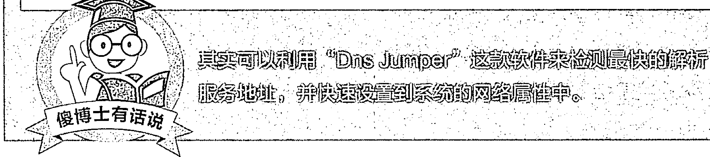

查询京东等产品历史价格

Q：任何人在购买商品的时候都想选择一个价格比较低的时机进行购买，而网络电商中的商品价格变化非常大。如何才能了解到这个商品之前的价格，以便对自己的商品购买有一个参考？

A：通过浏览器打开http://www.manmanbuy.com/这个网站，在比价栏里面输入商品的名称或者型号，再点击“搜索”按钮就可以看到几大电商以往的价格走势了。

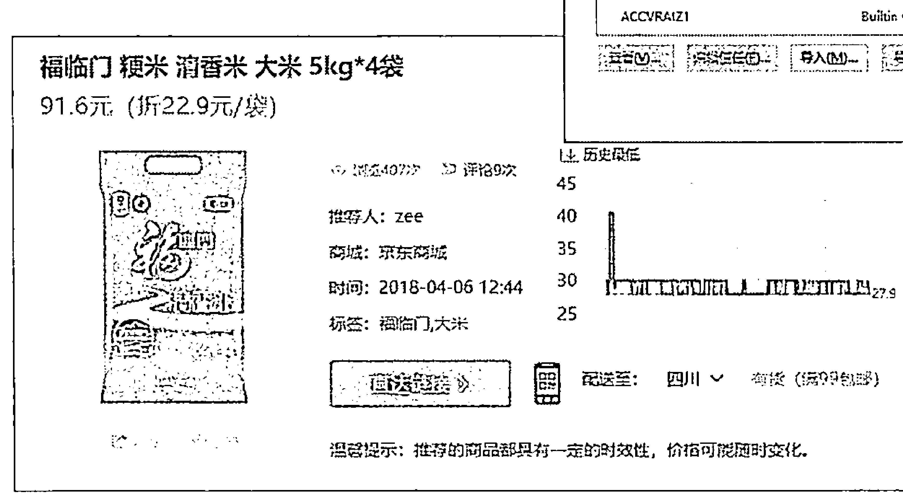

k-meleon访问网站提示错误

Q：由于电脑配置比较低，因此使用的是k-meleon这款比较小众的浏览器。在访问一个网站论坛的时候，浏览器提示该网站的证书出现错误，因此无法访问这个网站。请问怎么解决这个问题？

A：在地址栏输入about:preferences命令后回车，在弹出的页面中点击左侧的“高级”按钮，然后在右侧窗口中选择“证书”标签，点击“查看证书”按钮后，将这个网站对应的证书文件进行删除就可以了。

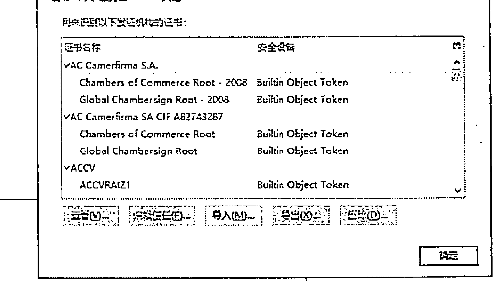

## 禁止远程访问修改注册表

文|老万

Q：通常为了更好地保护系统安全，都会禁用诸如远程桌面这样的功能，但是听说除此以外还可以通过注册表来进行远程修改操作。如何才能禁用对注册表的远程修改？

A：启动组策略编辑器，用鼠标依次展开左侧列表“计算机配置→Windows设置→安全设置→本地策略→安全选项”，在右侧的窗口中找到“网络访问：可远程访问的注册表路径”选项，打开这个选项的属性对话框，将默认的信息全部删除即可。

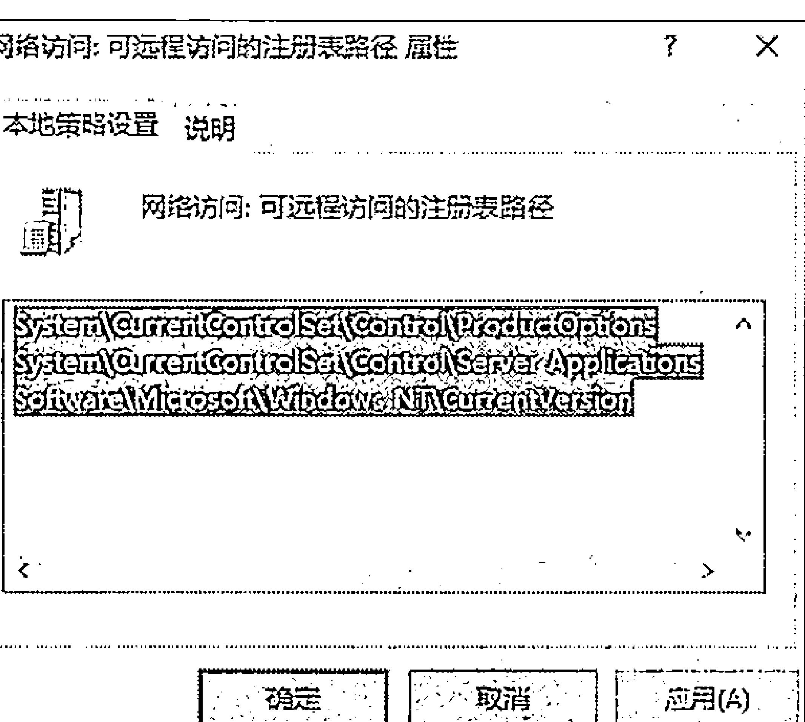

### 傻博士有话说

建议将默认的信息进行备份，这样在需要的时候可以快速重新激活这个功能。

## Windows 7无法进行补丁的安装

Q：前几天把自己的一台旧电脑安装了Windows 7系统，系统安装以后按照常规给系统安装补丁程序，可是却发现无法进行相关的操作。这是什么原因？

A：现在微软已经不支持Windows 7系统的开发，所以自然也就无法进行补丁的安装操作。因此要想解决这个问题的话，只能通过安装安全工具，利用它的“系统修复”功能来进行补丁的下载和安装。

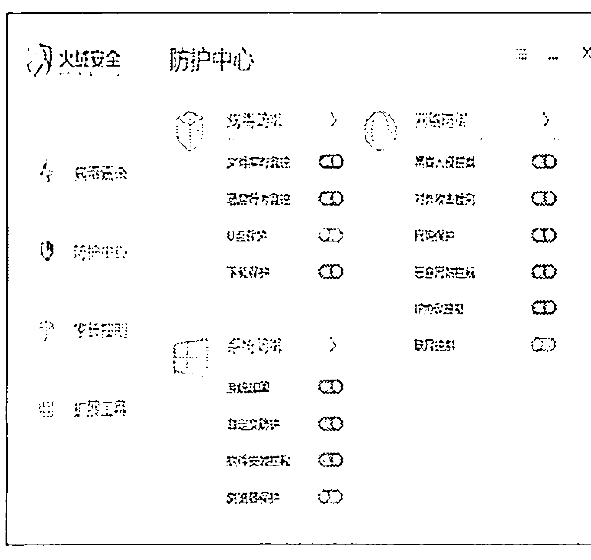

## 不让隐藏文件在磁盘中显示

Q：Windows系统的文件属性中，有一个文件隐藏的选项功能，有的时候可以通过它来临时性地隐藏一些重要文件，但是其他人一旦通过“文件夹选项”进行设置，就可以查看到这些文件。怎样避免这样的情况发生？

A：打开注册表并展开至`HKEY_LOCAL_MACHINE\SOFTWARE\Microsoft\Windows\CurrentVersion\Explorer\Advanced\Folder\Hidden\SHOWALL`，在右侧窗口中新建一个名为“CheckedValue”的DWORD值，并且将键值内容设置为0就可以了。

## 打开应用时提示错误

Q：有的时候在Windows 10中打开应用时，会弹出一个错误的提示窗口，比如“explorer.exe没有注册类”等等。遇到这样的情况，应该怎样解决？

A：按快捷键“Win+R”打开“运行”框，输入“Services.msc”并回车启动系统服务管理器。在右侧窗口中找到一个名为“User Manager”的服务，双击它打开该服务的属性窗口，将该服务的启动类型设置为“自动”，点击“确定”按钮进行确认即可。

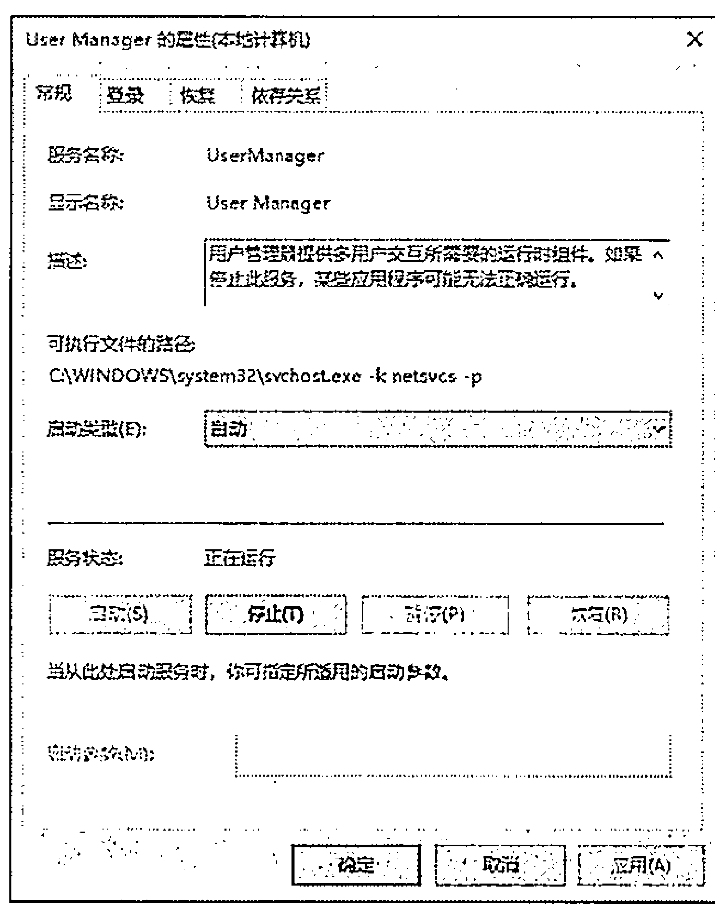

## Windows 10 1803版网络连接慢

Q：微软最新发布了Windows 10 1803版，但是升级到这个版本以后发现网络连接的速度比较慢，重装系统以后仍然有这样的问题。请问应该如何解决这个问题？

A：打开Windows 10系统的设置窗口，点击窗口中的“网络和Internet”按钮，在弹出的窗口中选择左侧的“状态”一项，然后点击右侧的“网络重置”按钮，这样Windows 10会自动重置网络并重启系统。

# 夸克浏览器无法正常浏览论坛

Q：在使用夸克浏览器浏览网页的时候都没有任何的问题，但是当浏览论坛的时候就发现一个非常大的问题，就是每一个帖子发帖人的内容都无法正常显示。请问这个问题怎么解决？

A：夸克浏览器在浏览一些论坛的时候的确有这个问题。可以把论坛滑动到最下方，这样就可以看到几种不同的显示状态，其中包括标准版、触屏版、电脑版等，然后可以切换到其他的版式看看效果。

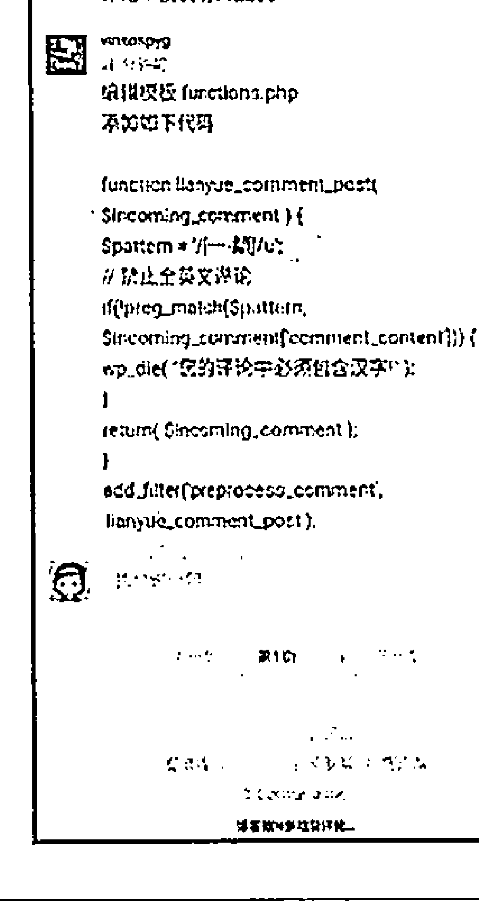

# 清除谷歌浏览器之前的浏览记录

Q：很多浏览器在浏览网页以后，都会下载大量的缓存信息进行保存，这样就会占用大量的磁盘空间。在手机的谷歌浏览器中，如何清除之前下载的缓存信息的内容？

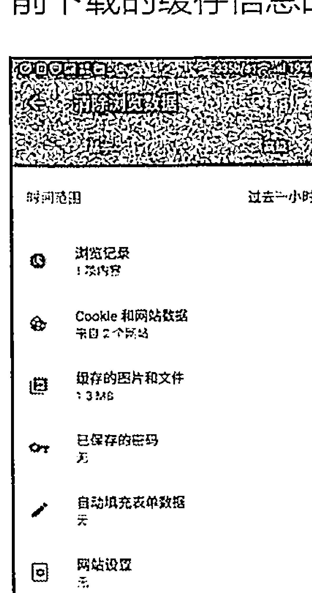

A：打开谷歌浏览器的“设置”窗口，在弹出的列表中点击“隐私设置”选项，选择最下方的“清除浏览数据”选项，然后切换到“高级”标签，根据需要在“时间范围”列表中进行相应的设置就可以了。

# 自动关闭手机应用后台进程

文|老万

Q：现在国产的手机应用越来越“流氓”，很多应用关闭后仍然在后台留有相关的进程，这样就会占用大量的系统资源。如何可以在关闭手机后自动清除这些保留的进程？

A：可以安装运行“绿色守护”，初始化设置会问你的设备是否ROOT，根据实际情况进行选择，选择完成后进入到应用的设置列表中，选择“全自动化休眠”选项，根据向导进行相关的激活操作即可。以后当关闭手机屏幕后，就可以自动关闭后台的手机应用。

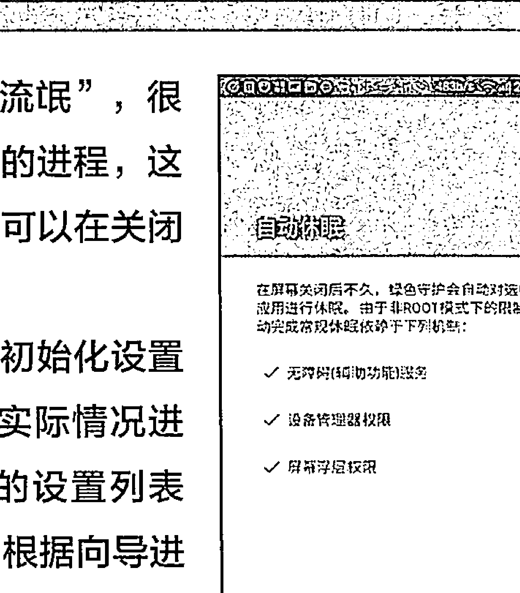

> 一定要开启辅助功能，否则“全自动化休眠”功能将无效。

# 快速输入重复的内容信息

Q：有的时候在手机中需要发送一些之前曾经输入过的内容，但是最常见的解决方法都是利用复制粘贴来进行的，这样的方法自然效率非常低。如何才能快速地对输入过的内容进行输入？

A：在电脑中有一种剪切板增强软件，其实在手机应用中也有类似的软件，只需要利用它就可以方便地解决这个问题。比如安装运行“增强输入Inputting+”后，将需要重复输入的内容进行复制，然后点击应用的浮动泡泡窗口，就可以快速地导入剪贴板中的内容。

# 自动进行手机应用的安装

Q：通过应用商店下载完应用安装包后，都需要一步一步地点击才可以进行安装，这样的操作实在是有一些麻烦，尤其是遇到大量应用需要更新的时候更是如此。通过什么方法可以使下载安装一气呵成？

A：“酷安”是国内一个比较知名的应用商店，在它的设置列表中有一个名为“免ROOT省心装”的功能，激活这个功能以后就可以实现自动安装的操作。这个功能还有一个特点，就是点击一次就可以更新所有的手机应用。

# 为Firefox激活DNS Over HTTPS

文|老万

Q：DNS Over HTTPS是一项相对较新的安全功能，它可以提高DNS查询的隐私性、安全性和可靠性。想问问在火狐浏览器中有没有这个功能？如果有的话怎么才可以激活它？

A：运行火狐浏览器，在地址栏中输入命令“about:config”，进入到火狐浏览器的设置界面。在设置界面的搜索框中，输入参数名称“network.trr.mode”后按回车键进行搜索，找到这个参数以后双击它，在弹出的输入框中设置为2就可以了。

要激活这个功能，必须满足火狐浏览器的版本不低于60。


# Firefox激活启用TLS 1.3版本

Q：现在越来越多的网站开始使用https这种加密协议，为了更好、更快、更安全地进行数据传输，很多浏览器已经开始支持TLS 1.3协议的版本。在火狐浏览器中如何激活其对TLS 1.3协议版本的支持？

A：按照上面的步骤打开火狐浏览器的参数设置界面，这一次输入参数名称“security.tls.version.max”后按回车键进行搜索，找到这个参数以后双击它，在弹出的输入框中设置为4即可。如果它设置为3，说明其当前支持TLS 1.2的版本。


# Chrome悄悄读取电脑文件

Q：很多用户都是通过谷歌浏览器来进行网上操作的，最近发现谷歌浏览器会偷偷地对电脑中的文件进行扫描。这是什么原因造成的？应该如何解决这个问题？

A：出现这个问题主要是因为谷歌浏览器有的版本存在一个Bug，所以要想解决这个问题的话，最简单的方法就是更换为最新的版本。或者在浏览器地址栏输入chrome://downloads，然后点击右上角的菜单，选择全部清除命令，这样就可以清除浏览器的下载列表。

# 多用户浏览器数据互不干扰

Q：单位里的电脑是多人共用的，所以想在一台电脑中安装多个谷歌浏览器，这样不同用户在使用的时候就能做到数据互不干扰。请问这个目的怎么实现？

A：其实根本不需要安装多个浏览器，只需要针对不同的用户将对应的数据存放到不同的目录就可以了。首先创建一个快捷方式，在快捷方式属性窗口的“目标”后面加上一个“-user-data-dir=UserData”参数，不同的用户只需要将UserData设置为不同的文件夹即可。

# 7-Zip右键提取软件出错

Q：一直使用的是7-Zip这款压缩软件，因为通过它可以直接对软件的安装包进行提取操作，这样就可以方便地制作成绿色版本的软件，但是最近通过右键进行操作的时候老是提示错误。怎么解决这个问题？

A：打开7-Zip的软件窗口，点击“工具”菜单中的“选项”命令，在弹出的对话框中切换到7-Zip标签，将已经选择的选项通通去掉，点击确定按钮关闭设置窗口。接下来再按照同样的方法，切换到该标签，将之前关闭的选项通通选中，然后点击确定按钮即可。


# WordPress自动发布博文失败

文|老万

Q：自己在搭了一个WordPress博客，通常会设定一个自动发布的时间，这样服务器到时候就会自动把博文发布出去，可是最近不知道为什么老是发送失败。请问怎样解决这个问题？

A：首先登录服务器的后台，在文件管理系统中找到wp-includes文件夹中的cron.php文件。接下来点击后面的编辑按钮，在弹出的编辑窗口中找到参数“timeout”，将其修改为10就可以了。

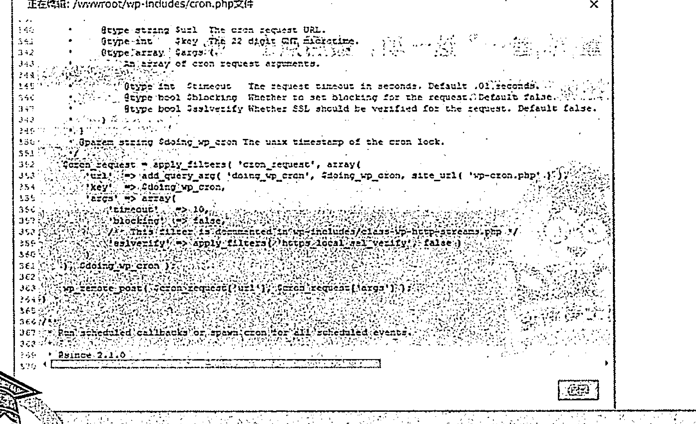

> 其实在博客系统里面安装一个名为“WP Missed Schedule”的插件也可以。

# 谷歌浏览器自动进行静音设置

Q：有的时候访问一个网站，莫名其妙的它就会在网页中播放一段视频或者音乐，如果不小心的话反而会吓一跳。如何可以自动完成网页静音的设置操作？

A：在浏览器的地址栏中输入“chrome://settings/content/sound”这行命令并按下回车键，找到“允许网站播放声音（推荐）”选项后关闭它。如果有需要自动播放的网页，在下面的“允许”列表中设置网页的地址即可。

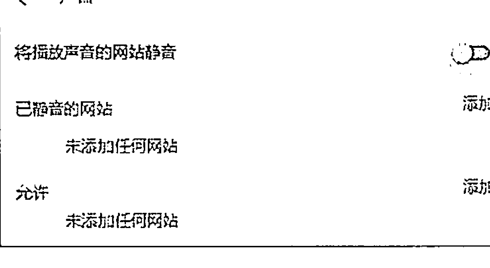

# 不用注册就可使用的在线白板

Q：每个公司在讨论事情的时候，都需要一块或者多块白板进行讲解。有没有在线的白板服务，可以提供给多个用户进行在线操作？

A：通过浏览器打开https://witeboard.com/这个链接，不用注册就可以生成一个专属的白板服务。接下来将生成的链接发送给自己的同事，这样同事之间就可以同时在线进行白板操作，从而完成相应的任务。


# 免费的图库资源和素材

Q：随着大家的版权意识越来越高，很多用户在选择图片素材的时候都非常小心，避免由此引起的不便，而很多时候必须用到图片素材。从哪里才可以找到既免费又不错的图片素材？

A：PickPik是一款号称采用了人工智能技术的免费图库，通过浏览器打开https://www.pickpik.com/链接，在搜索框中输入相应的关键词以后，就可以查找到所需要的免费图片素材。


# 自动跳过烦人的倒计时

Q：有的时候在打开一个网页链接的时候，会出现一个非常烦人的倒计时显示，通常只有这个倒计时完成以后，才能进行下一步的操作。有什么办法可以跳过这个倒计时而快速进入下一步的操作？

A：无论用户使用的是谷歌浏览器还是火狐浏览器，只需要在应用商店下载安装一款名为“Universal Bypass”的功能扩展。以后当出现这样的情况时，就会在点击链接的同时自动跳过倒计时的显示，这样就可以快速地进入到下一步的操作页面。

# 快速输入中文大写数字

通常在输入数字信息的时候，都采用的是阿拉伯数字的输入方式，但是对于从事会计工作的用户来说，往往还需要输入大写的数字，而这些数字输入起来特别繁琐。如何进行快速的输入操作？

首先在文档中要输入大写数字的位置插入光标，点击“插入”标签中的“编号”按钮，在弹出的对话框的“编号”输入框中设置对应的阿拉伯数字，然后在下面的列表中选择“壹,贰,叁…”这一项，最后点击“确定”按钮就可以了。

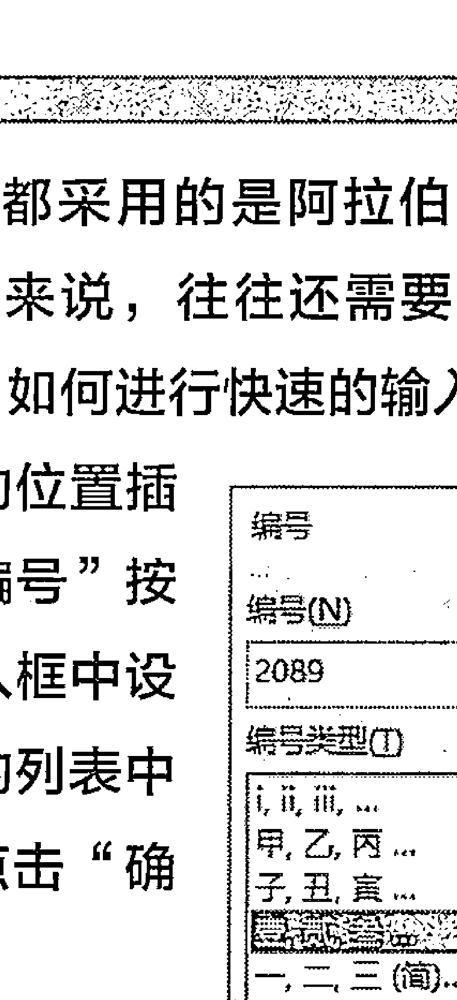

有一些输入法在输入阿拉伯数字的时候，也有大写数字的选项可以供用户选择。

# 让电话号码分段显示

很多时候在统计一些资料的时候，会输入相关人员的联系电话号码，通常输入的电话号码都是连续的。通过什么方法可以将它们设置成中间几位分隔的效果，比如“xxx XXXX XXXX”这样？

在表格中选中要进行修改的电话号码段落，单击右键后选择菜单中的“设置单元格格式”命令，在弹出的对话框中选择“数字”标签中的“自定义”选项，然后在窗口右侧的“类型”一栏中输入“G/通用格式”，最后修改为“000 0000 0000”即可。

# 关闭Word的自动检查语法错误功能

在微软的Word办公软件中，有一个自动检查语法错误的功能，可以对文档里面的语法错误进行检查，但是这个功能对于中文用户来说非常不方便，经常出现一些错误的提示。如何能将这个功能关掉？

点击Word操作界面左上角的“文件”，在弹出的菜单中选择“选项”命令，在Word选项窗口点击左侧列表中的“校对”标签，然后在右侧窗口找到“在Word中更正拼写和语法时”这个区域，根据需要将其中的子选项进行关闭即可。

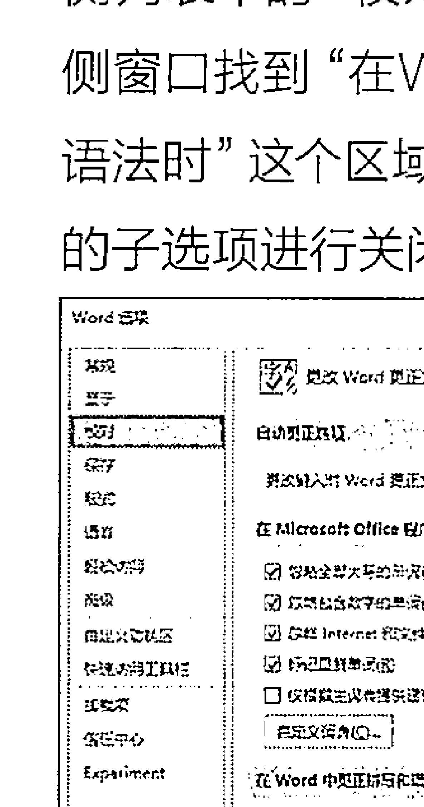

# 快速将标题分配到每页开头

一个文档文件通常都有很多页，为了让每一页都显示文档的标题，需要通过手动的方式繁琐地操作。有没有更加简单快捷的解决方法，让标题显示到每一页？

在第一页将所有的标题设置好，需要设置几页的标题就输入几行内容。接下来通过鼠标全选输入的内容，点击鼠标右键后选择菜单中的“段落”命令，在弹出的对话框中选择“换行和分页”标签，勾选上“段前分页”选项就可以了。

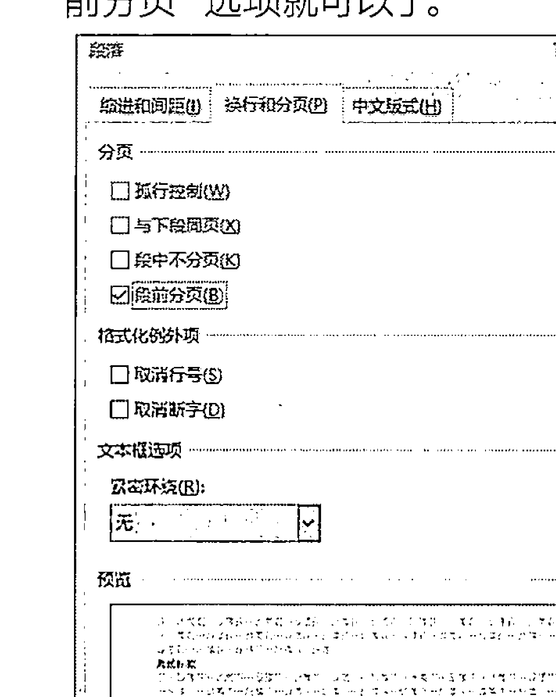

# 一键删除表格中的所有图片

有的用户在制作表格的时候，会在其中插入一些图片信息，但是有的用户却觉得这些图片信息非常碍事，并不能对表格内容的展示起什么作用，所以想将表格中的图片删除。怎么样才可以快速方便地将表格中的图片进行删除？

通过鼠标选中表格中的一组图片，按下快捷键“Ctrl+A”进行全选，点击键盘中的Del键就可以快速地将它们删除了。

## 利用闲置手机保护居家安全

Q：现在很多人为了保护家庭的安全，都在家里安装有摄像头等装置。除了利用摄像头以外，通过闲置的手机能不能解决类似的安全防护问题？

A：可以在闲置的手机中安装Haven这款应用，它的作用就是利用智能手机的各个传感器，对家里的情况进行实时的监控。一旦发现有异常情况，它就会通过内置的手机卡向设定的手机号码发送一条报警短信。

## 轻松管理公众号的文章

Q：平时喜欢关注一些微信公众号中的文章，虽然通过微信自带的收藏功能可以对文章进行收藏，但是管理起来还是比较麻烦。还有其他的方法可以对文章进行管理吗？

A：可以安装最新版本的“微信读书”应用，通过它的搜索功能可以对微信公众号进行搜索，查找到以后就可以将该公众号添加到书架当中。以后就可以像管理图书一样，对这个公众号的文章进行管理。

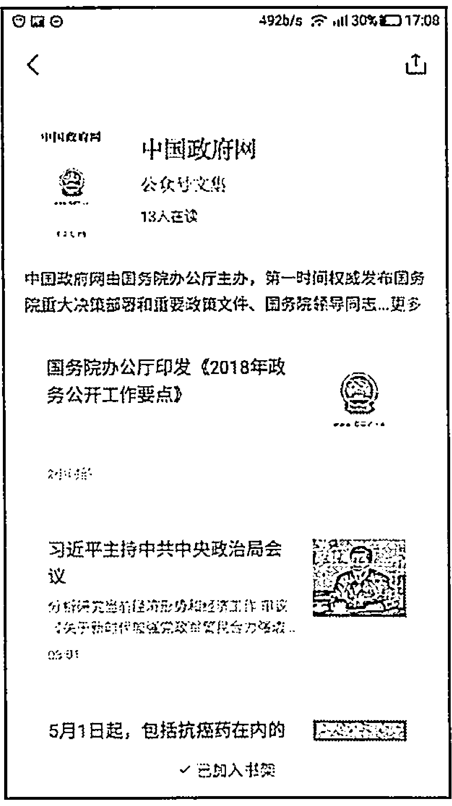

## 动态斗图让你更加得心应手

文|老万

Q：很多用户都喜欢以斗图的方式来代替文字，如果在斗图的时候一不小心将图片都用完了，这个时候实在是有一点郁闷。还有没有更好的方法解决斗图不够的问题？

A：其实很多用户的斗图来源都是社交应用自带的，如果不够用的话只能请外援来帮忙了，比如“Gifitii”就是一款不错的斗图应用。这款应用按照不同的环境提供了不同的表情包，用户可以根据相应的环境来进行选择使用。


## 修改Hosts屏蔽应用广告

Q：无论是手机页面还是手机应用，其中的广告信息都越来越多，很多广告影响到用户的使用操作。如何才能屏蔽掉这些烦人的广告信息？

A：其实可以像在电脑系统中那样，利用Hosts文件来屏蔽广告内容。AdAway就是这样的一款手机应用，它可以把广告链接的请求重定向到127.0.0.1，这样就实现了广告屏蔽的效果。不过要使用这款应用的话，手机需要进行ROOT才行。

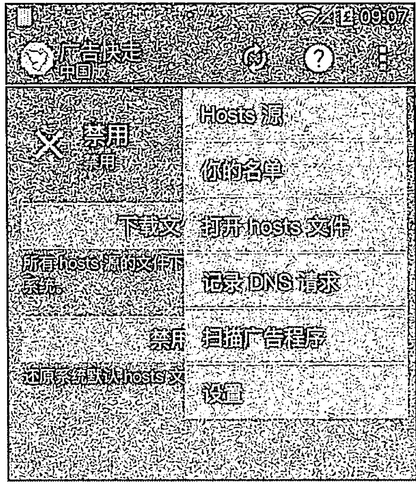

## 自动复制短信验证码

Q：最近发现一个同事的Android手机系统，可以自动将收到短信的验证码信息复制到剪贴板里面，可是由于本人使用的是国外出产的手机，所以系统中没有相关的功能。如何才可以弥补这个缺憾？

A：可以运行“验证码复制器”这款应用，然后应用会申请读取短信的权限，授权成功以后就会静静地呆在系统后台。当手机收到验证码的短信后，它就会自动将验证码复制到剪贴板并提示用户，这样用户就可以直接粘贴验证码信息了。

# CFan为你选

# 商务之争

## 中兴天机Axon M PK 华为Mate 10

中兴AXON天机和华为Mate系列都是针对商务用户量身定制的高端旗舰手机，步入2018年，这两个家族的领军人物分别为主打折叠双屏的天机Axon M和AI影像的Mate 10，那么它们之间谁更适合你？

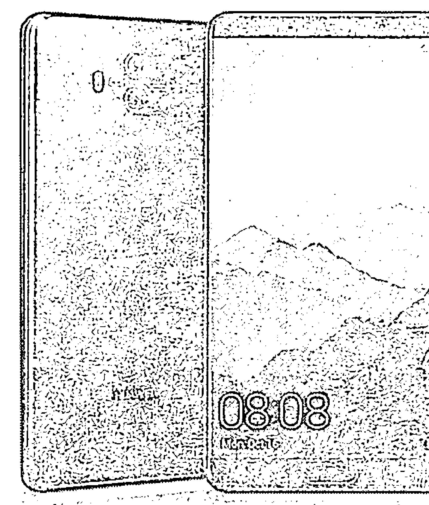

| 参数对比 | 中兴天机Axon M | 华为Mate 10 |
|---|---|---|
| 网络 | 全网通（双卡双待） | 全网通（双卡双待） |
| 屏幕 | 双5.2英寸<br>（1920×1080像素） | 5.9英寸<br>（2560×1440像素） |
| CPU | 高通骁龙821 | 麒麟970 |
| GPU | Adreno 530 | ARM Mali-G72MP12 |
| 内存/存储 | 4GB/64GB（支持存储卡） | 4GB/64GB（支持存储卡） |
| 摄像头 | 2000万像素 | 800万/1200万+2000万像素 |
| 体积 | 150.8mm×71.6mm×12.1mm | 150.5mm×77.8mm×8.2mm |
| 电池/重量 | 3180mAh/230g | 4000mAh/186g |
| 参考价格 | 3888元 | 3889元 |

### 全面屏时代的非主流

从2017年下半年开始，智能手机领域就逐渐过渡到了18:9的全面屏时代，作为中兴和华为在年底推出的商务旗舰，天机Axon M和Mate 10却没有追赶这股风潮，而是固执地坚守传统的16:9比例屏幕，也算是新款旗舰中的“非主流”。

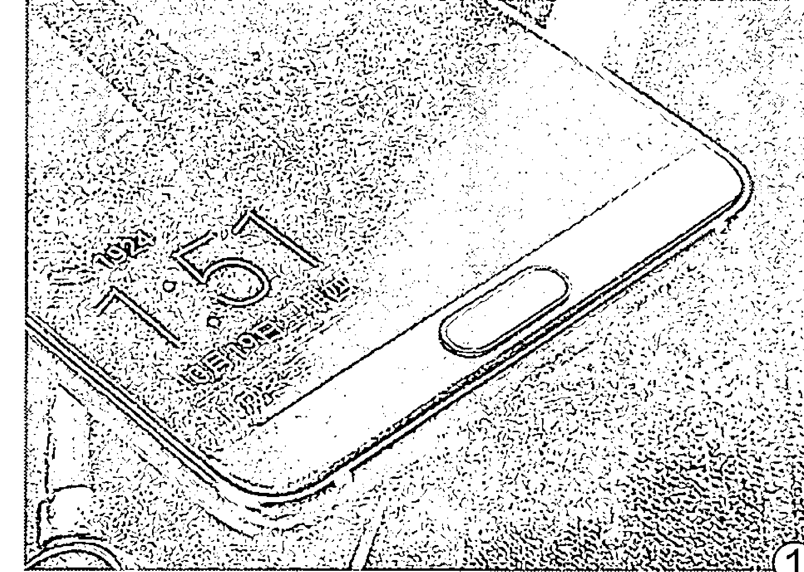

当然，为了能在全面屏时代吸引用户关注，这两款产品其实并不保守。其中，华为Mate 10和前辈Mate 9相比，在继承5.9英寸大屏幕的基础上进一步压缩了额头和下巴的空间，其屏占比并不逊色于新兴的全面屏手机。同时，华为Mate 10还在下巴内嵌入了集成指纹识别功能的Home键（图1），满足了不少用户青睐正面指纹解锁的心理预期。

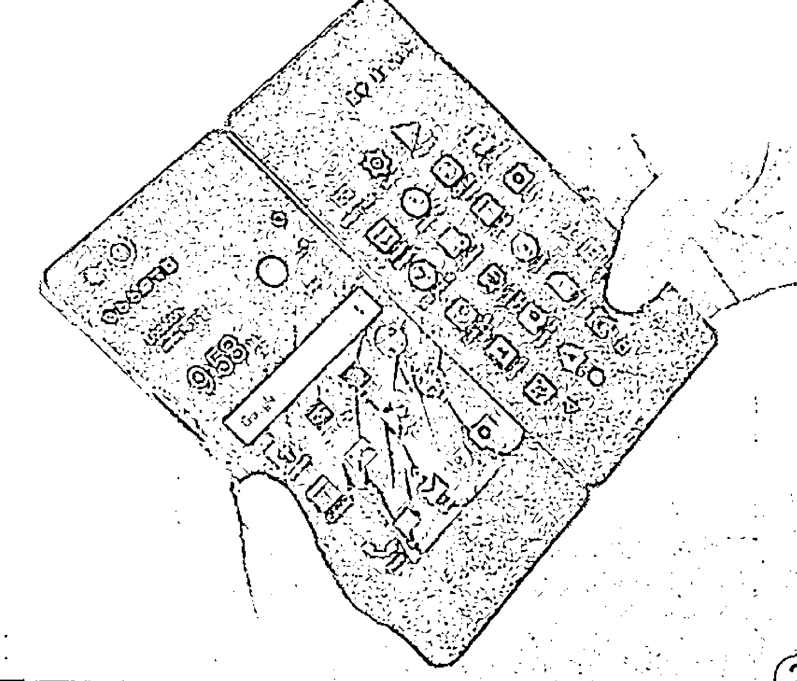

天机Axon M的设计更是个性非凡，双屏幕在智能手机领域并不鲜见，但这款产品却采用了双面屏幕折叠的物理结构，闭合状态手机两面都是5.2英寸1080P屏幕，但翻开到180度后，天机Axon M就获得了震撼的6.8英寸视野（图2），堪比iPad mini平板电脑。

#### 天机Axon M：双屏乐趣多

得益于双屏设计，中兴天机Axon M可以实现分屏（两面屏幕分别运行不同的APP）、大屏（两面屏幕合二为一）、镜像（两面屏幕显示相同内容）和单屏（关闭其中一面屏幕）四种模式（图3）。在这些模式的基础上，天机Axon M的可玩性被大大扩展。

比如，炒股的用户可以利用两面屏幕一边看股市大盘一边下单（图4），购物时两面屏幕分别打开京东和苏宁易购进行更直观的比价，看电子书时两面屏幕可以模拟接近真实的翻页效果，玩《王者荣耀》时可以通过上屏显示游戏画面并利用下屏虚拟按键操作，玩模拟器时可以完美还原任天堂NDS主机的双屏特性……

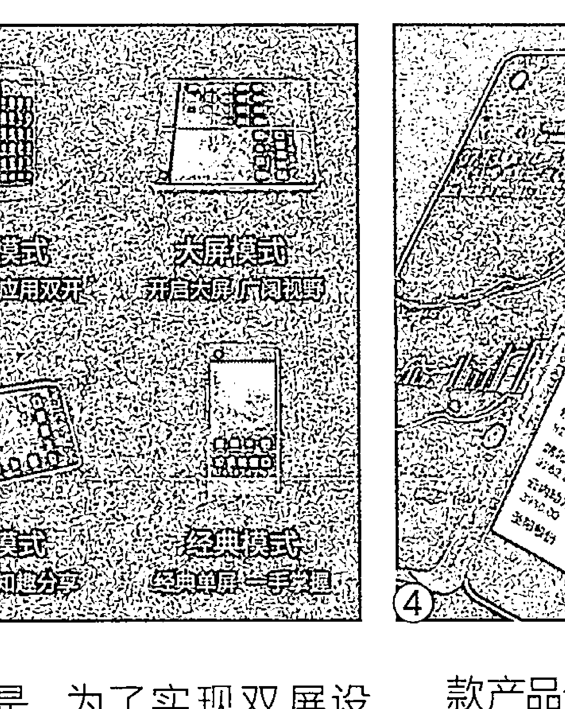

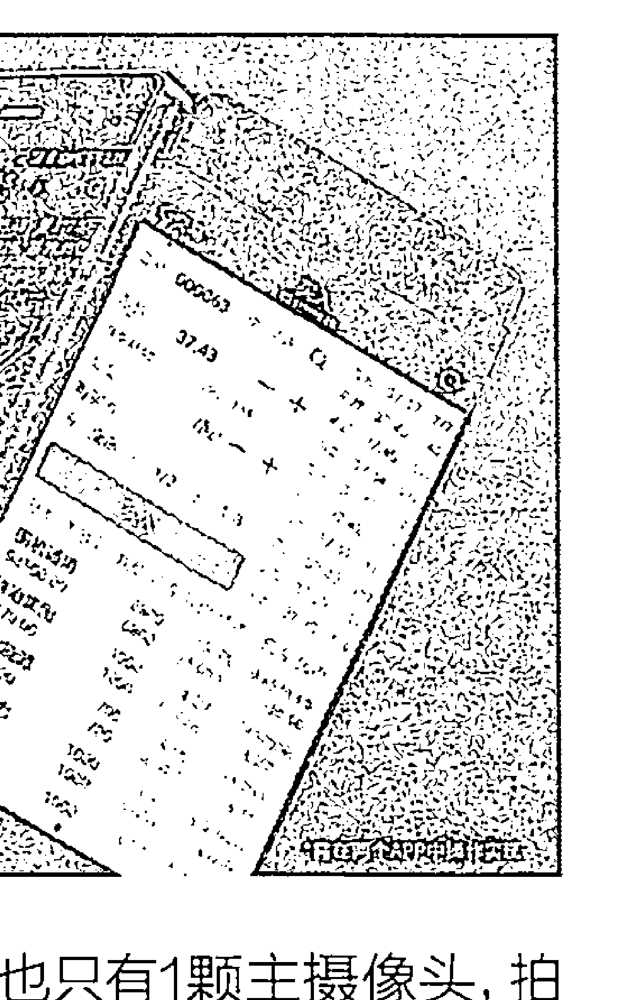

但是，为了实现双屏设计，中兴天机Axon M也付出了不少代价。比如，这款产品的厚度和重量分别达到了12.1mm和230g，便携性一般且有一定的压手感。同时，这款产品也只有1颗主摄像头，拍照和自拍时都要靠其卖力。而最令人遗憾的是，天机Axon M搭载的处理器还停留在高通2016年的骁龙821阶段，整体性能被拖了后腿。

#### 华为Mate 10：源于AI赋能

和中兴天机Axon M相比，华为Mate 10缺少了创新的物理结构，但却在软硬两个层面取得了突破。软件方面，华为Mate 10引入了电脑模式，我们只需用USB Type-C数据线将其与显示器相连，显示器端就能呈现类似Windows 10风格的桌面（图5），便于我们进行文本编辑、欣赏视频和收发邮件。与此同时，我们还能继续用Mate 10聊微信玩游戏，两不耽误。

硬件方面，华为Mate 10的优势在于武装了最新的麒麟970处理器，不仅在性能上比肩骁龙835，这款芯片还引入了NPU单元，可以实现较强的本地AI运算。而华为也将其运用在了语音助手、文本翻译和拍照方面。以拍照为例，AI技术再结合徕卡双摄+F1.6超大光圈（图6），让Mate 10在拍照效果方面达到了极高的层次。

此外，华为Mate 10还支持全功能NFC可模拟公交银行卡、内置inSE安全芯片可实现金融级加密、支持双卡双4G全网通，内置更大的4000mAh容量电池且支持5V/4.5A超级快充，续航和安全方面的表现更优。

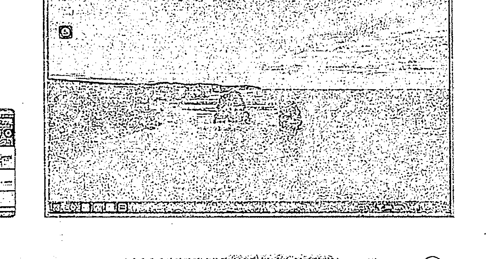

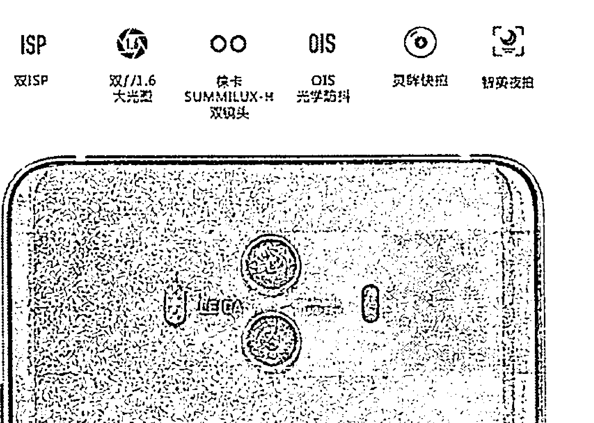

> 虽然天机Axon M和Mate家族都主攻商务，但当前者有了折叠双屏，后者具备AI影像之后，它们也可跨界到娱乐圈，无论是影音还是游戏都是一把好手。相对来说，华为Mate 10更适合对性能、网络和拍照要求更高的用户，而中兴天机Axon M则适合喜欢尝鲜、利用双屏实现更多趣味玩法的用户。

# 翻转的性能派

## 联想YOGA 720-15 PK 惠普ENVY X360-15


很多用户都喜欢集轻薄和性能于一身的笔记本，同时还盼望获得类似iPad指点江山的操作体验，于是，各种二合一设备逐渐兴起。而15英寸版本的联想YOGA 720和惠普ENVY X360，则是少有的大视野高性能和便携两不耽误的机型，那么它们之间谁更适合你？

| 参数对比 | 联想YOGA 720-15 | 惠普ENVY X360-15 |
|---|---|---|
| 屏幕 | 15.6英寸IPS触控屏 (1920×1080像素) | 15.6英寸IPS触控屏 (1920×1080像素) |
| 处理器 | 酷睿i5-7300HQ | 酷睿i7-8550U |
| 内存/硬盘 | 8GB/256GB SSD | 8GB/512GB SSD |
| 显卡 | GTX1050 (2GB GDDR5) | MX150 (4GB GDDR5) |
| 接口 | USB3.0×2、USB Type-C、音频孔 | 读卡器、USB3.0×2、USB Type-C、HDMI、音频孔 |
| 电池/重量 | 72Wh/2.0kg | 55.8Wh/2.0kg |
| 参考价格 | 7999元 | 7999元 |

## 超大号的变形本

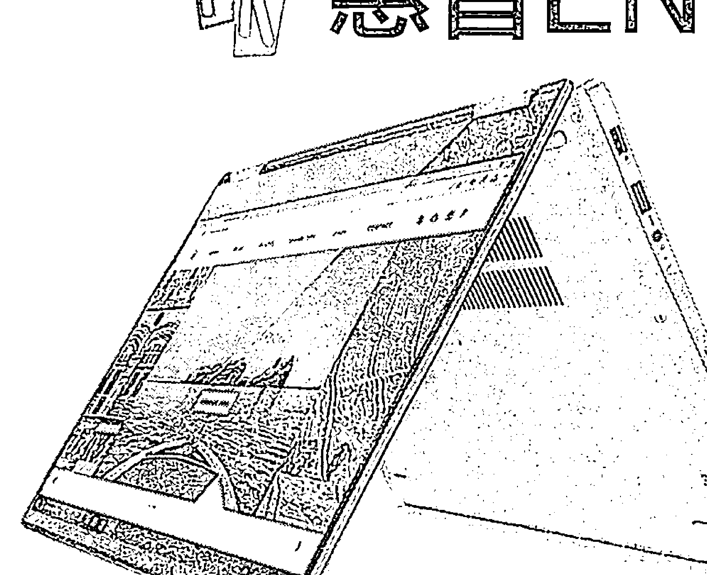

屏幕可360度翻转的变形本并不鲜见，但是武装15.6英寸超大屏幕的变形本却属于稀缺资源（图1），而联想YOGA 720-15和惠普ENVY X360-15最吸引人的地方还体现在轻薄化的设计，它们的厚度都被控制到了20mm以内，重量也均在2.0kg左右。

要知道，很多15.6英寸轻薄本的身材也不过如此，这两款产品在镶嵌厚实的屏幕保护玻璃盖板的前提下还能保持如此身材实属不易。联想YOGA 720-15和惠普ENVY X360-15都采用了超窄边框设计以及全金属一体化的机身，所以在轻薄之余的坚固性也无需多虑。

## 设计上的差异

联想YOGA 720-15和惠普ENVY X360-15在设计上的最大差异主要体现在键盘方面，前者虽然机身面积较为宽裕，但却仅配备了标准的全尺寸键盘，取消了数字小键盘设计。而后者则采用了更紧凑的键盘设计，将数字小键盘囊括其中（图2），对于经常与数字打交道的用户而言绝对是个好消息。

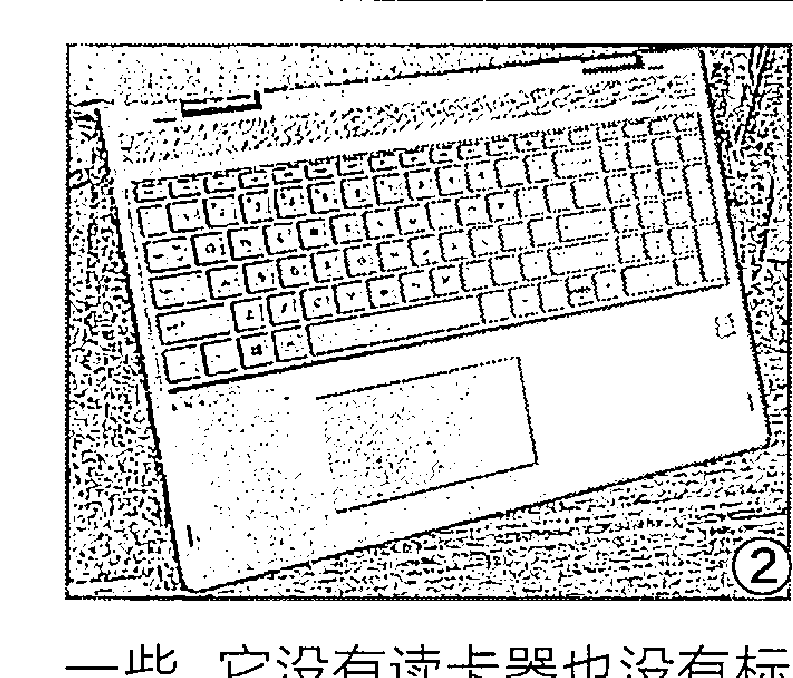

联想YOGA 720-15在扩展接口方面的表现也要稍差一些，它没有读卡器也没有标准的HDMI，想要视频输出需要使用USB Type-C转HDMI接头。而惠普ENVY X360-15的优势在于标配SD读卡器和HDMI接口，扩展潜力胜于对手。在生物识别方面，联想YOGA 720-15在键盘右下角配备了按压式指纹识别模块(图3)，可以实现类似智能手机无需密码即可一键唤醒并登录系统，同时联想还在系统层面引入了指纹支付功能，支持银联安全支付。惠普ENVY X360-15虽然没能配备指纹识别模块，但却在摄像头旁集成了红外模块，从而支持Windows Hello的人脸解锁功能(图4)，只需刷脸就能快速进入系统。

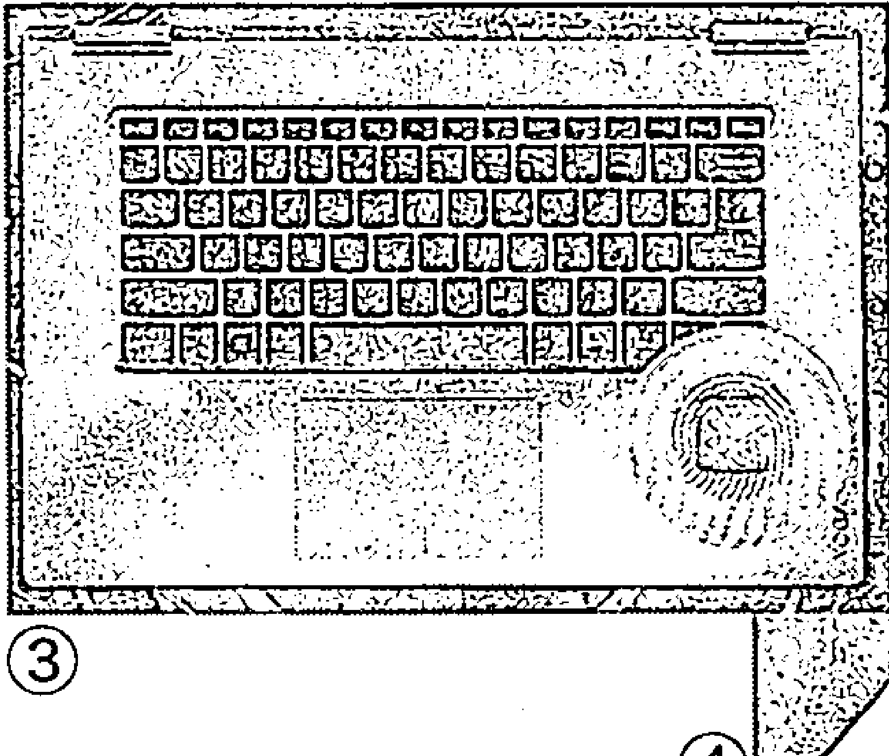


## 核心配置的对比

联想YOGA 720-15和惠普ENVY X360-15在核心配置方面的差异较大。其中，联想YOGA 720-15搭载了英特尔第七代酷睿处理器家族，7999元的型号采用了酷睿i5-7300HQ和NVIDIA GTX1050独立显卡的组合。没错，这套配置堪称游戏本的“标配”，可以确保在1080P中低画质下流畅运行《绝地求生》一类的热门3D游戏。

惠普ENVY X360-15在配置上选择了英特尔第八代酷睿处理器家族，7999元的型号采用了酷睿i7-8550U和NVIDIA MX150独显的组合。需要注意的是，i7-8550U虽然隶属于八代酷睿，但受制于15W的TDP，它的瞬间性能可能足以媲美甚至超过i5-7300HQ（45W TDP），但长时间持续运行的平均性能就要逊色一筹了。至于NVIDIA MX150，它只能保证在720P中画质下流畅运行《绝地求生》，所以ENVY X360-15的综合实力处于下风。

两款笔记本内置的电池容量分别为72Wh和55.8Wh，但由于联想YOGA 720-15的处理器和显卡功耗较高，所以它们实际的续航时间差异不大（办公和看视频）。

需要留意的是，虽然联想YOGA 720-15和惠普ENVY X360-15都采用了15.6英寸IPS材质的1080P屏幕，但ENVY X360-15屏幕色域只有45% NTSC，而YOGA 720-15屏幕色域则达到了72% NTSC，如果你从事设计类工作，显然后者的屏幕质量才更符合精准还原的需求。

## 留意内部结构的设计

联想YOGA 720-15和惠普ENVY X360-15的拆机难度都不高，都是拧下D面所有螺丝就能拆下底盖。两款笔记本的处理器和显卡都采用了BGA封装，直接焊在主板上无法升级，所以对性能有要求的用户就必须一步到位选择高配版。此外，它们还都采用了板载内存和1个内存插槽的设计，拥有一定的内存升级空间。

联想YOGA 720-15只提供了1个M.2插槽，如果觉得存储空间不够，只能替换升级（图5）。而惠普ENVY X360-15除了M.2插槽外还提供了2.5英寸硬盘的扩展位。

但是，纯SSD版本的惠普ENVY X360-15并没有内置SATA排线和固定硬盘用的托架（图6），需要用户自己在淘宝购买或去官方客服中心加装，存在一定的升级成本。如果你比较在意，建议直接购买SSD+HDD双硬盘的版本。

两款笔记本内部的差异还体现在散热模块的设计上，联想YOGA 720-15为了确保更高性能硬件的散热需要，采用了双风扇双热管的设计，而ENVY X360-15则为单风扇单热管。


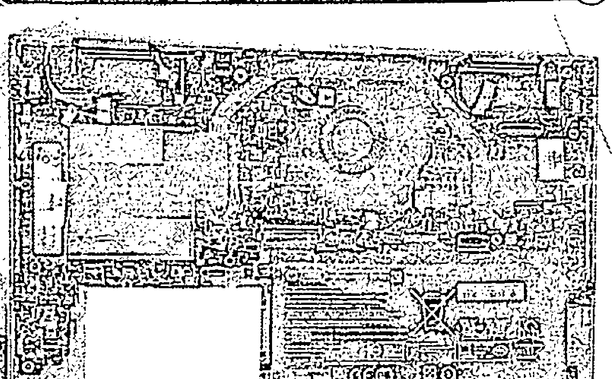

作为性能级的大屏变形本，联想YOGA 720-15和惠普ENVY X360-15都有着精致的做工和高颜值，YOGA 720-15的优势在于更好的游戏性能，而ENVY X360-15的杀手锏则是更丰富的接口和升级潜力。至于如何取舍，就得看你的实际需求了。

# 双刃剑

## 笔记本屏幕的玻璃情结

细心的用户不难发现，如今笔记本屏幕存在两种结构，其一是LCD直接裸露，另一种则是LCD表面覆盖一层保护玻璃，看起来显得更加“高大上”。那么，两种结构的屏幕都有哪些优势和劣势呢？我们在选购笔记本时又应该如何取舍呢？

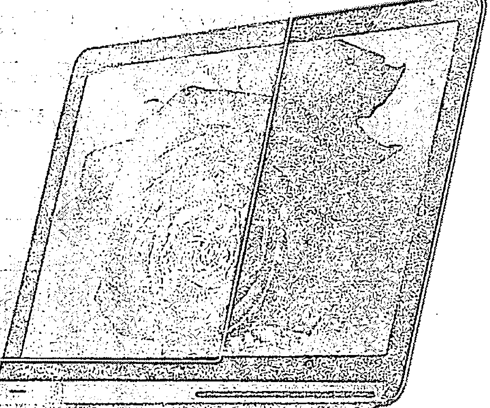

## 传统屏幕的结构

如今99%的笔记本屏幕都是标准的LCD，只有极少数顶级笔记本才会尝鲜OLED材质的屏幕。对LCD而言，由于屏幕面板无法自发光，想要显示内容就必须借助背光LED灯管，而灯管的数量、位置、亮度会影响到屏幕的对比度、可视角度和是否漏光。

从结构来说，常见的笔记本LCD屏幕主要是由金属加固基板（可选，如果有，按压A面屏幕不会出现水波纹）、背光源（LED灯）、偏光板、玻璃基板液晶体、微彩色膜、塑料基板（含公共电极）和偏振膜组成。

如果大家仔细观察笔记本的B面，会发现屏幕和边框并不在一个水平面上(图1)，屏幕部分较边框的高度要略有下凹。

这种LCD直接裸露的设计就属于笔记本的“传统屏幕”，优势是隶属于“雾面屏”阵营，可最大限度规避屏幕反光问题。同时，LCD屏幕自带的塑料基板具备一定的韧性，当笔记本遭遇磕碰或跌落等状况时不容易碎裂，通常只有不小心坐在笔记本上才会“压裂”屏幕。

“传统屏幕”的另一大优势就是具备可简易升级的潜力。这类笔记本的边框都是可拆卸的结构，屏幕模组通过螺丝固定(图2)。如果你的笔记本标配TN屏，或是色域较低的IPS屏，可以自行在网上购买高色域的IPS屏幕替换升级(图3)。

当然，这种“传统屏幕”也存在不足。首先就是屏幕边缘和边框之间存在缝隙，堆积的灰尘会影响观瞻。此外，如果手指不小心碰到屏幕表面就会留下指纹，要想避免漏电或短路，在擦拭屏幕时需要尽量处于关机状态，擦拭的布也需要彻底拧干。

> 小提示
在很早以前笔记本领域曾流行过一段时间“镜面屏”，就是在雾面屏表面贴上一层反光的贴膜。但是历史证明这是一种很糟糕的主意和体验，所以现在已经是雾面屏的天下了。

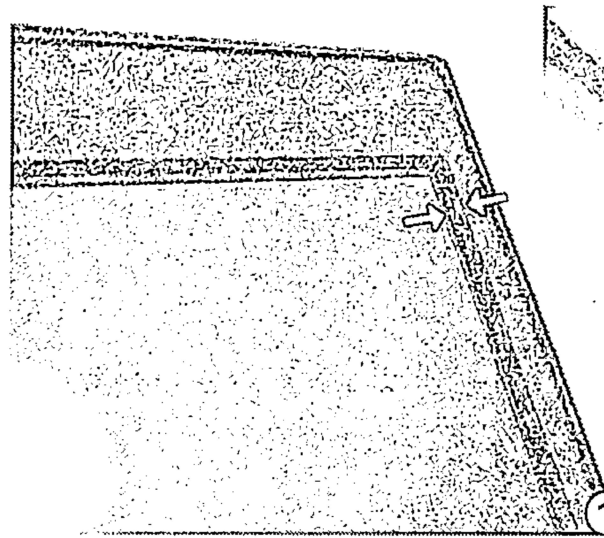

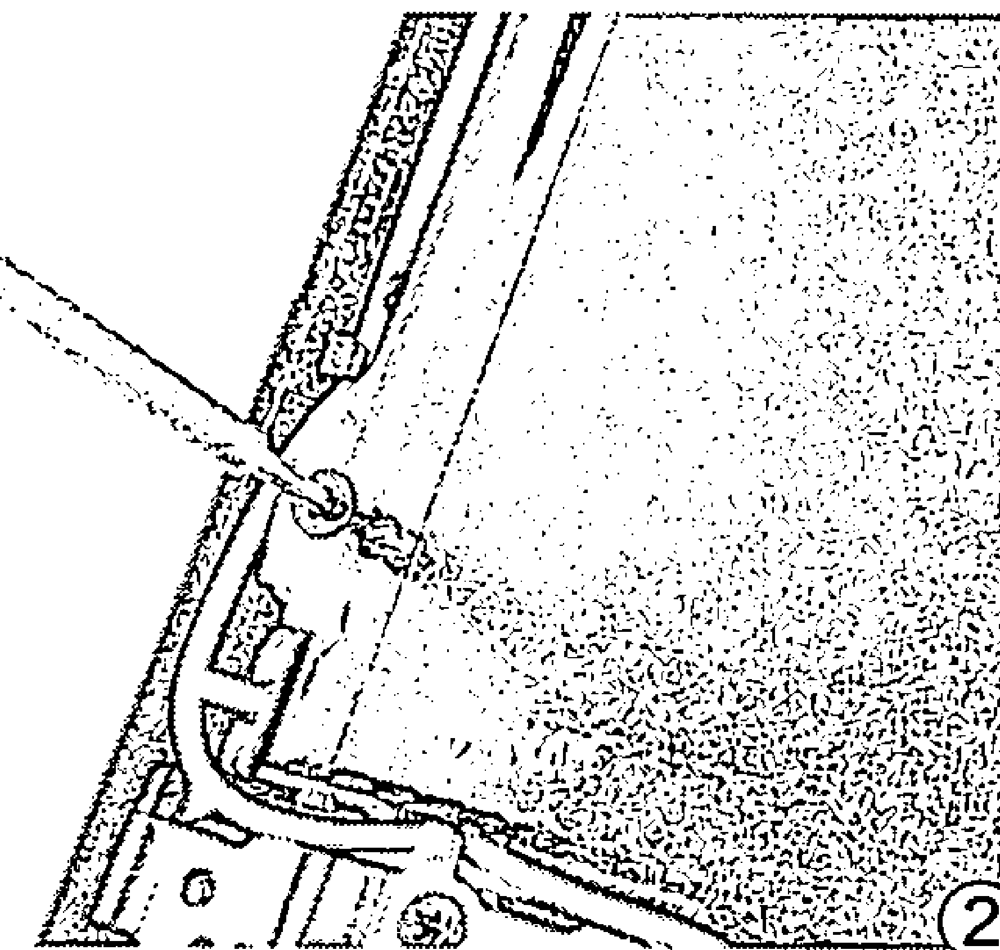


## 全贴合的玻璃屏幕

从2011年左右开始，以苹果MacBook和戴尔Alienware为代表的品牌开始为笔记本准备了保护玻璃盖板。其原理就是在“传统屏幕”的基础上，覆盖一层康宁大猩猩或来自其他品牌的强化玻璃，这层玻璃通常会与屏幕边框水平，严丝合缝（图4）。

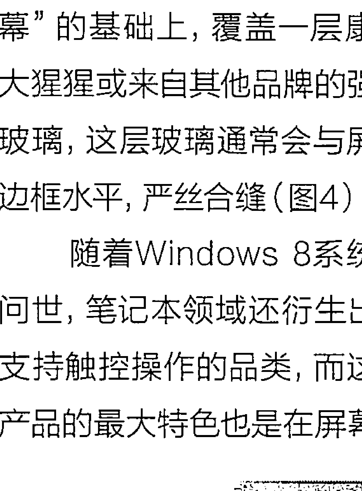

随着Windows 8系统的问世，笔记本领域还衍生出了支持触控操作的品类，而这些产品的最大特色也是在屏幕表面覆盖了一层玻璃盖板。

时至今日，以华硕灵焕系列、联想ideapad 720s系列和小米笔记本系列为代表的更多产品，均将这层玻璃纳入了“标配”，无论屏幕是否支持触控。有了强化玻璃盖板的保护，让LCD的防划属性大增，也使得笔记本看起来更加结实，哪怕屏幕表面沾惹了指纹也能使用湿布安心擦拭。

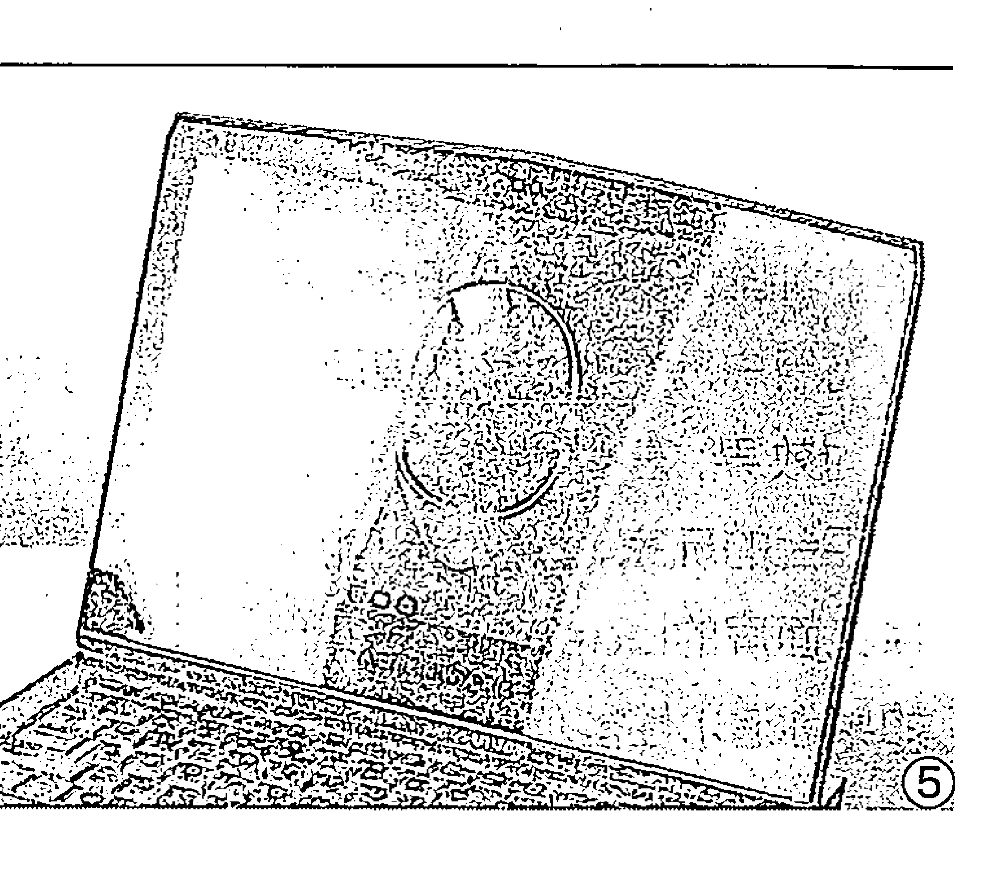

不过，保护玻璃盖板也会带来一些“后遗症”。首先，玻璃的重量不可忽视，有了这层保护玻璃，笔记本的重量至少会增加数十到上百克。其次，玻璃存在反光问题，有了它就意味着笔记本荣升“镜面屏”（图5），即使表面加入防眩光涂层也会受到反光的困扰。

最后，保护玻璃盖板是存在厚度的，有了它势必会明显增加笔记本屏幕部分的厚度。所以，现在笔记本厂商都青睐引入“全贴合”技术，将LCD模块和保护玻璃盖板封装在一起。这种设计的好处是最大限度缩减了厚度，但缺陷是不利于更换升级，笔记本一旦遭遇磕碰跌落，LCD表面的玻璃极易碎裂，找到客服中心也只能整体更换，成本极高。

换句话说，全贴合屏幕只能提升笔记本屏幕的耐划性且利于清洁，但却无形中增加了碎屏风险，在使用的过程中需要更加留心。

## 如何挑选屏幕版本

“传统屏幕”和全贴合屏幕各有优缺点，所以如何取舍首先还要从我们和身边家人朋友的习惯入手。比如家里的小孩总是对着屏幕比比划划，开会时有些同事总喜欢戳着屏幕划重点（图6），不能容忍屏幕表面出现指纹灰尘的“强迫症患者”，选择采用全贴合屏幕的笔记本肯定最为适宜。有了玻璃盖板的保护，无须担心手指、签字笔在其表面产生伤害，擦拭清洁时也没有那么多顾虑。

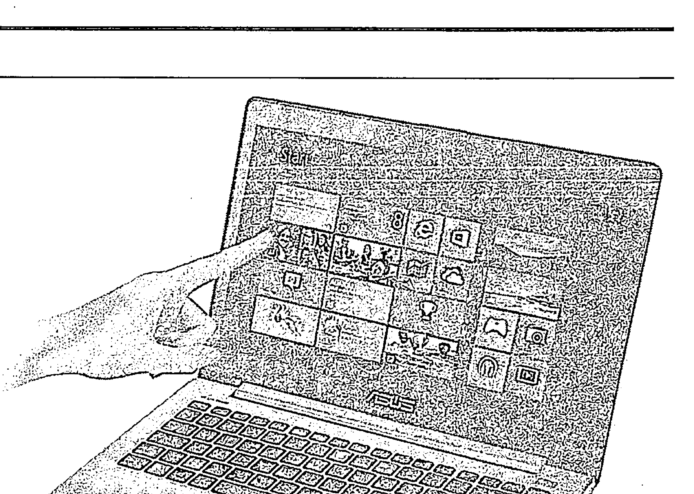

对于经常需要在户外使用笔记本或是座位处于背阳位置的用户而言，全贴合屏幕的“镜面效果”会严重影响使用心情，长期在上述环境下工作还是传统雾面屏最为实在。

需要注意的是，在绝大多数情况下，“传统屏幕”和全贴合屏幕的选择权并不在消费者手中。比如，喜欢MacBook品牌的用户，就必须忍受镜面屏幕的效果；喜欢尝鲜AMD锐龙平台的玩家，暂时也只能选择镜面屏的ideapad 720s；如果你追求性能但却喜欢全贴合屏幕的严谨，你会发现几乎所有的游戏本都是雾面屏……因此，我们在挑选笔记本时还是需要先以品牌、外观设计和配置性能作为首选要素。当筛选出几款候选者后，才能轮到屏幕部分的考量。

## 扩展阅读：屏幕故障的排除

对传统屏幕而言，最常见的问题就是屏幕内出现了“白斑”，而这个现象通常是LCD的反射层出现问题所致。“白斑”产生的原因，多是屏幕表面受到了挤压或被尖锐物体碰撞，属于不可逆的硬件问题，想要修复“白斑”只有更换整块屏幕。

对全贴合屏幕而言，最常见的问题就是屏幕表面变花(图7)，就好像贴膜里有了空气产生了气泡，这种现象大都是因玻璃表面的防眩光/抗反射镀膜被汗液或清洗液涂花造成的，想要修复通常也只能更换整块屏幕。

此外，这种笔记本如果只是外屏(玻璃盖板)碎裂，在不割手的前提下可以继续使用。但如果屏幕内出现花屏和大面积的彩斑(图8)，那就是LCD出现了漏液，需要更换整个LCD和保护玻璃模组。

如果笔记本开机后屏幕始终黑屏，但其他硬件还保持正常运行状态，则可以检查屏幕和主板之间的排线是否松动；如果笔记本屏幕出现白线(图9)，通常是排线中部分针脚出现了问题，这类情况只需重插排线或更换排线接头就能解决。

笔记本开机/运行时出现花屏(图10)，大都是集成显卡引起的故障，卸载并重新安装笔记本厂商提供的集成显卡驱动(不要使用Intel官方通用驱动)。如果问题依旧，再考虑卸载重装独立显卡驱动。笔记本花屏有极小的几率是独显芯片虚焊引起的，遇到了只有联系客服中心更换主板这么一条出路。

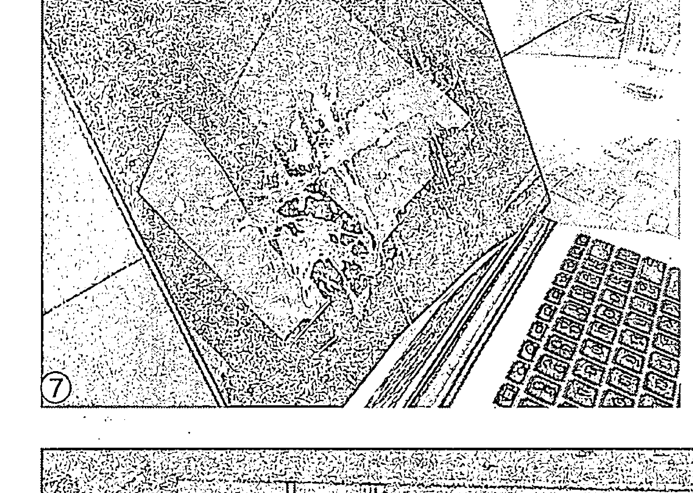

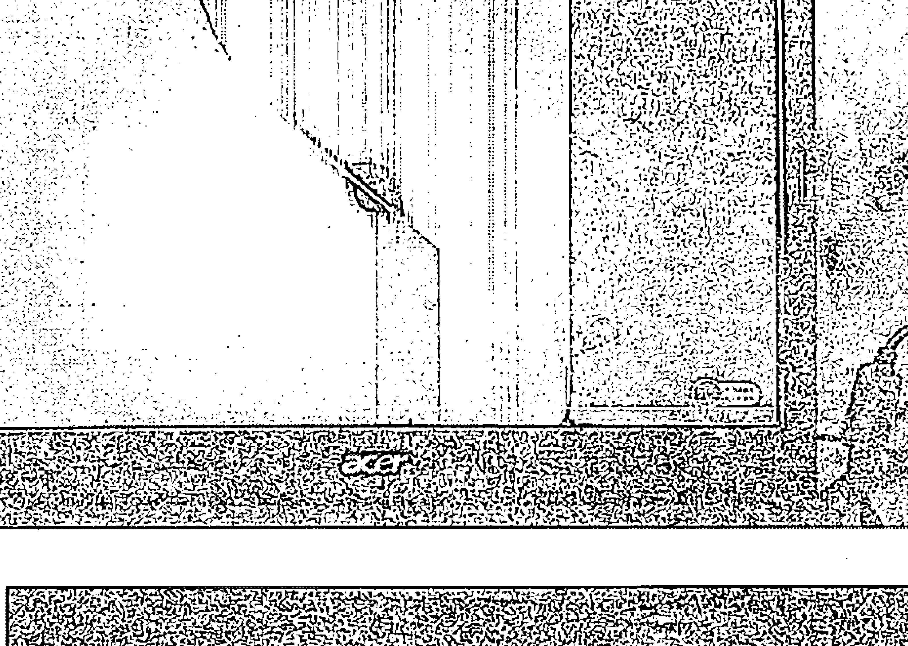

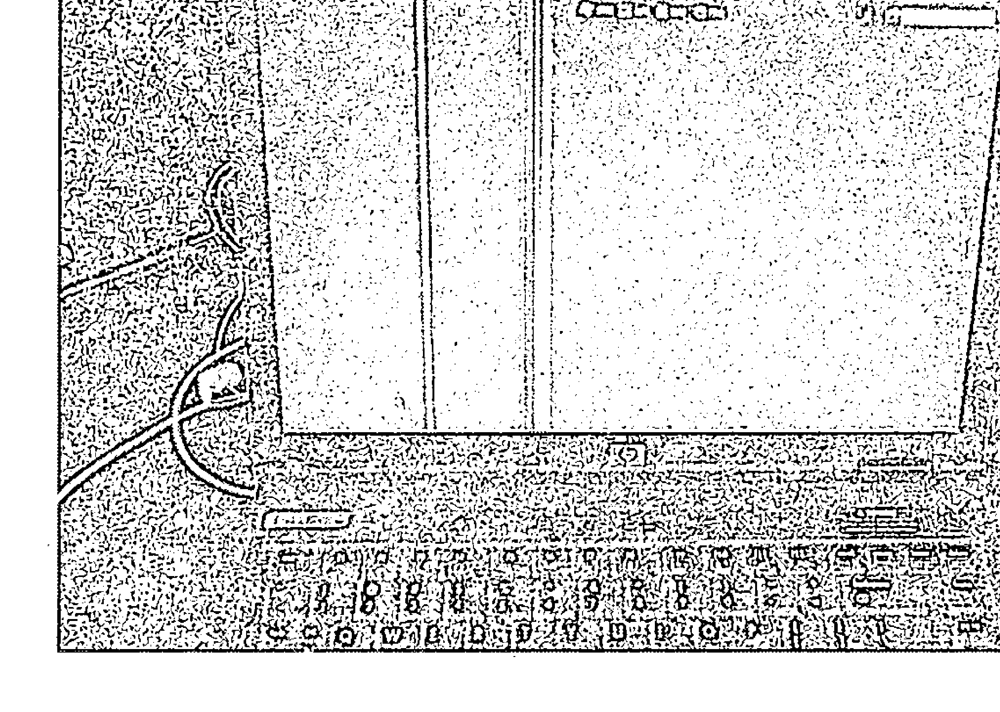

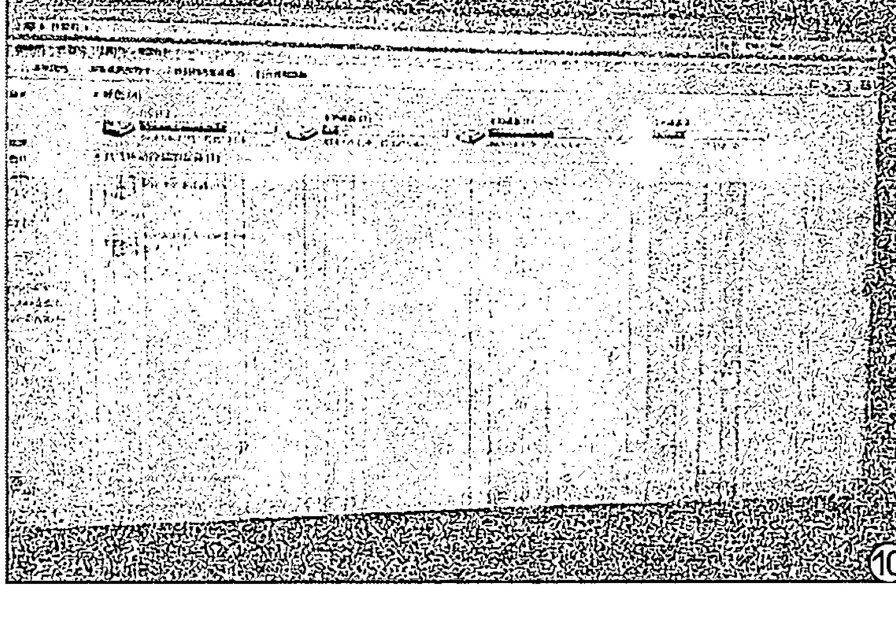

如何看待手机“买新不买旧”

根据调研机构的数据显示，普通用户更换手机的时限大都在2年左右。问题来了，在更换新机时我们总会面临一个取舍问题：当昔日旗舰和最新上市的中端悍将价格相近时，当昔日中端悍将与新一代千元手机价位持平时，我们到底是买新还是选旧？

材质和设计风格的碰撞

如今智能手机已经不再是简单的通话和聊天工具，而更像是贴身的时尚点缀，用以彰显个人的品味。因此，手机的设计是否符合潮流趋势，必然成为选购手机时必须考虑的重点所在。

而手机是否够潮，需要从机身材质和设计形态两个角度来看。以机身材质为例，3年前采用三段式金属后盖（上下两端为塑料材质）就算比较高档了（图1）；2年前只有采用全金属一体化机身+纳米注塑信号条的设计才算上档次；1年前，没有搭配穹顶式U型信号条的全金属手机都不好意思称作高端机（图2）；现在，唯有双面玻璃才能位居时尚潮流之巅，能用上陶瓷等新工艺则更是彰显品位（图3）。

而设计形态对手机的影响则更为显著。2年前，OLED曲面屏幕是顶级旗舰的专属装备，手感和视觉效果堪称一时之选（图4）；1年前，手机圈开始流行“屏占比”这个参数，同时一个名为“全面屏”的概念开始崭露头角；从2017年底开始，如果哪款新品没能搭配18:9显示比例的“全面屏”，基本就可以被归类到“小众”的阵营中。

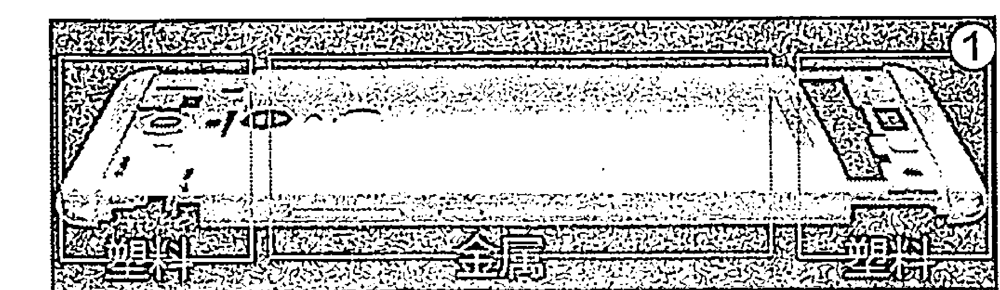

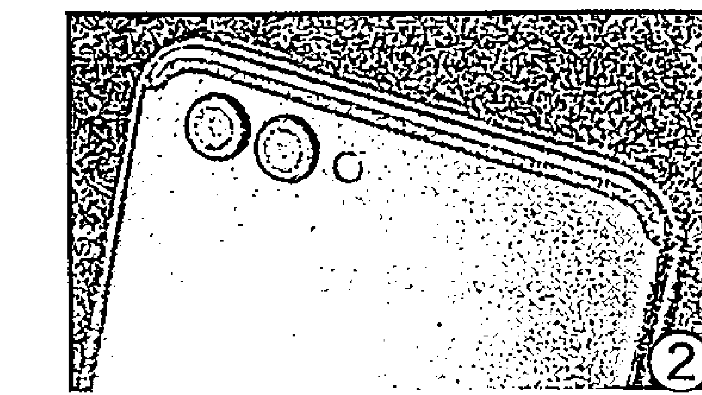

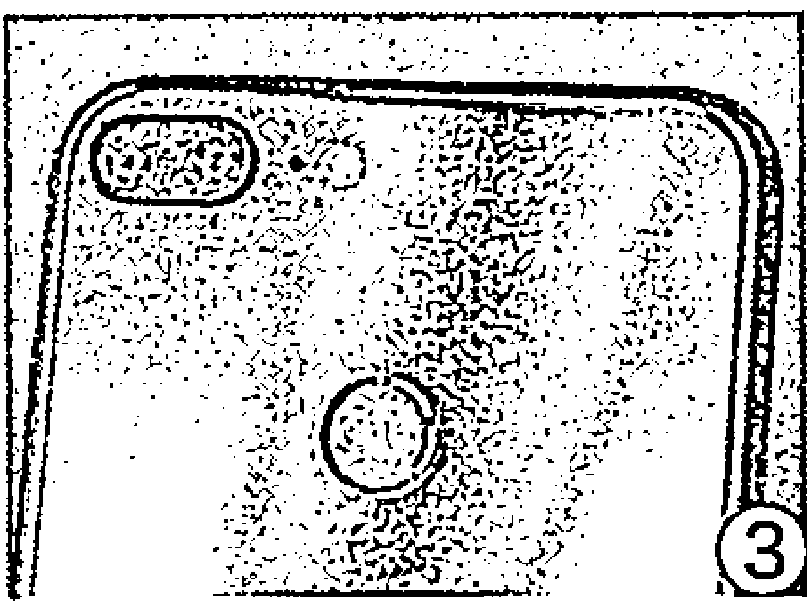

步入2018年，标准18:9的全面屏都将沦落到低端，因为比其更酷的“刘海屏”将成为新一代中高端手机的标配（图5），这些引入类似iPhone X设计，并有着更高屏占比的新品将成为下一股潮流趋势。

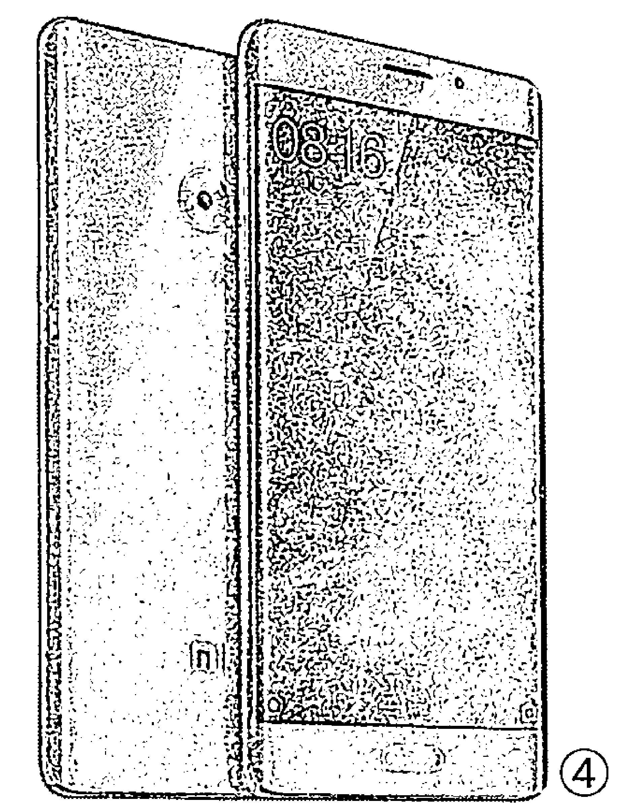

总之，智能手机无论是材质还是形态总在不断的改进和变化之中，再经典的昔日旗舰用今天的眼光来看也有落伍的危险。相对来说，当上代旗舰（上市1年，如三星Galaxy S8）价格适中时还可列入候选名单，但上上代旗舰（上市2年，如Galaxy S7）就没有太多优势了，无论设计、配置还是功能，都有极大的几率赶不上后辈的脚步，除非降到了极为诱人的价格，否则不建议纳入首选名单。

怎么样，从来没有想到智能手机的形态演进能如此迅速吧？如果问更未来的手机什么样？那答案也许就是柔性折叠屏以及全屏指纹解锁等黑科技的普及了（图6）。


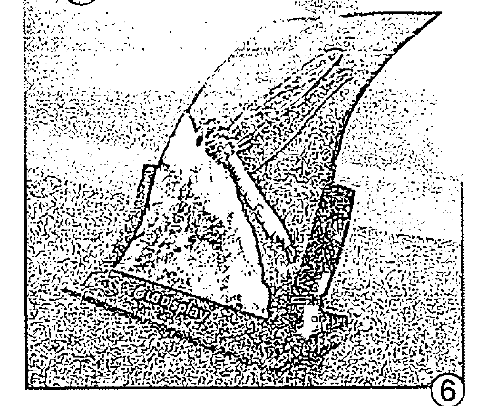

新旧硬件的性能差异

智能手机的核心硬件总在不断的进化之中，而被列入核心硬件的单元包括处理器（包括集成的GPU）、内存、存储单元和摄像头。

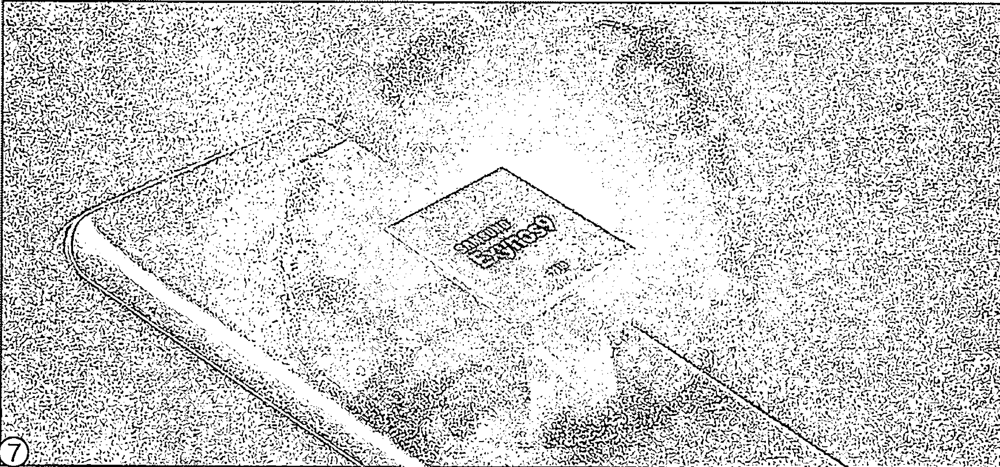

处理器的新旧论

高通、三星、海思和联发科旗下的处理器大都遵循一年一更新的节奏。比如高通2016年依靠骁龙820、骁龙652和骁龙625打天下，2017年就替换成了骁龙835、骁龙660和骁龙630强强联手，而2018年我们又将看到骁龙845、骁龙670（还有骁龙700补刀）和骁龙640三强争霸。作为新品，自然都青睐携手最新上市的处理器（图7），但处理器真的是越新越强吗？

答案需要从两个层面来看。作为迭代更新的同级处理器，比如骁龙820→骁龙835→骁龙845，新品总能用上更先进的工艺、架构和技术，所以性能自然是越来越强。但是，对于迭代更新的非同级处理器，孰优孰劣就需要仔细斟酌了。

比如，骁龙660得益于八核心的架构优势，在多核性能上优于骁龙820，但是骁龙820的单核性能更强，集成的GPU也是骁龙660的两倍以上，而且在调制解调器规格上也更先进。但是，骁龙660也有比骁龙820出彩的地方，比如支持QC4快充和蓝牙5.0技术、功耗更低等。

根据笔者的经验，处理器跨级之争的关键时间节点是两年，或者说是两代。最新中端处理器的综合性能优于两年前的旗舰，最新主流处理器的性能胜过两年前的中端芯片，比如虽然骁龙660比不过骁龙820，但今年的骁龙670和骁龙700系列就能实现逆袭。此外，2018年即将问世的移动处理器都会针对AI技术进行更为深度的优化（图8），用于应对未来拍照、面部识别和系统优化，而这些新元素都足以让搭载老款处理器的手机们“羡慕嫉妒恨”了。

内存/存储单元的新旧论

我们都知道内存性能排行是LPDDR3<LPDDR4< LPDDR4X，存储单元性能排行是eMMC5.1<UFS2.0< UFS2.1。但是，手机是否能配备更强的内存/存储，既取决于处理器硬件自身是否对更先进的存储方案加以支持（图9），比如只有2017年推出的中高端处理器才兼容LPDDR4X；还取决于产品自身的定位，比如骁龙660虽然支持UFS2.1，但目前市面上所有骁龙660搭配的闪存却都是eMMC5.1。


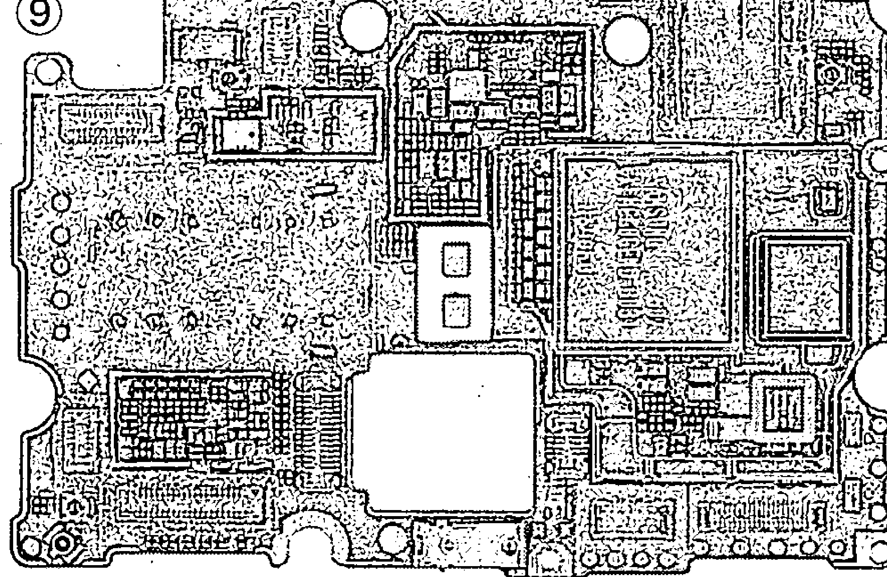

> （图7）
> （图8）
> （图9）

相对而言，搭载最新处理器的新品，更容易武装最新规格的内存。但能否武装UFS闪存，则属于当代或上代旗舰级手机的专利，主流级别的手机短期内还难以涉猎，这也是为何上代旗舰手机的读写性能总能秒杀当代中端和主流价位新品的原因。

摄像头的进化论

智能手机拍照的好坏，70%取决于摄像头的搭配（单摄还是双摄，长焦+广角还是彩色+黑白）、传感器型号以及光圈大小（图10），而余下的30%则要看ISP单元和相机APP后期的调校优化。


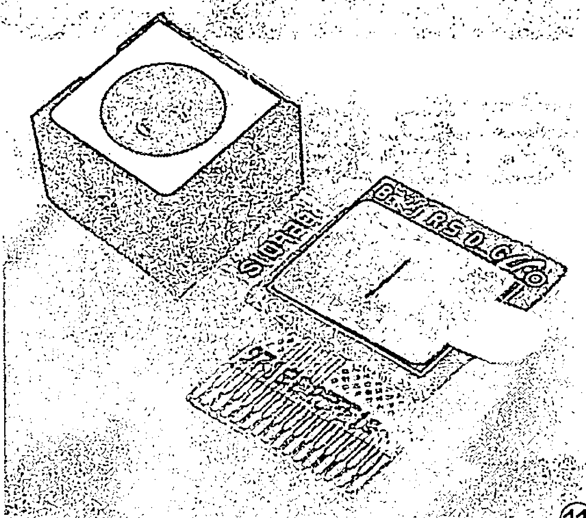

手机传感器的规格每年都会升级（图11），而现阶段智能手机比拼的就是拍照表现，F1.8大光圈也不断“下嫁”主流价位手机，而这就给了新款手机反杀上代更高端前辈的机会。比如，2016年双核对焦还是“黑科技”，但如今这种对焦技术却成为了“大众货色”。

留意看不见的战场

智能手机的体验，除了足够强悍的性能外，系统往往会占据更关键的一环。2017年Android手机都以预装Android 8.0版系统为荣（图12），步入2018年这个版本号就将提升到Android 8.1，到了下半年也许就轮到Android 9.0登场了。

为了便于新品的推广，手机厂商自然最为擅长让新品与最新系统搭配登台，至于老款型号能否有机会享受更新系统的免费升级大餐？就完全取决于厂商的良心了。通常，只有过去1年内的热门型号最有升级的可能，而能为老产品进行跨越版本更新（比如从Android 7.0升级到Android 8.0）的手机则更是凤毛麟角。换句话说，新款手机往往能享受某项新功能的“独占期”，其中也许就有你非常需要的实用技术。

另一方面，很多昔日旗舰/高端手机的价格并不会一降到底，普遍是价格稳定后直接退市。虽然在某些购物APP或线下实体店可能看到更低报价的产品，但却存在翻新机的可能，贪便宜购买时所需承担的风险更高。


小结

智能手机的新旧更替是一项非常复杂的系统工程，其中涉及到材质、形态以及软硬件各个层面的革新，作为新品自然更容易走在潮流之巅。但是，昔日的高端旗舰总是有尊严的，它们在屏幕素质、性能和网络参数上往往不是中端后辈们可以挑衅的。但是，昔日的中端手机却有较大几率被更便宜的后辈反超，这也是技术进步的一种体现。

# 核心之争

## 宏碁蜂鸟Swift3锐龙版 VS 联想IdeaPad 520

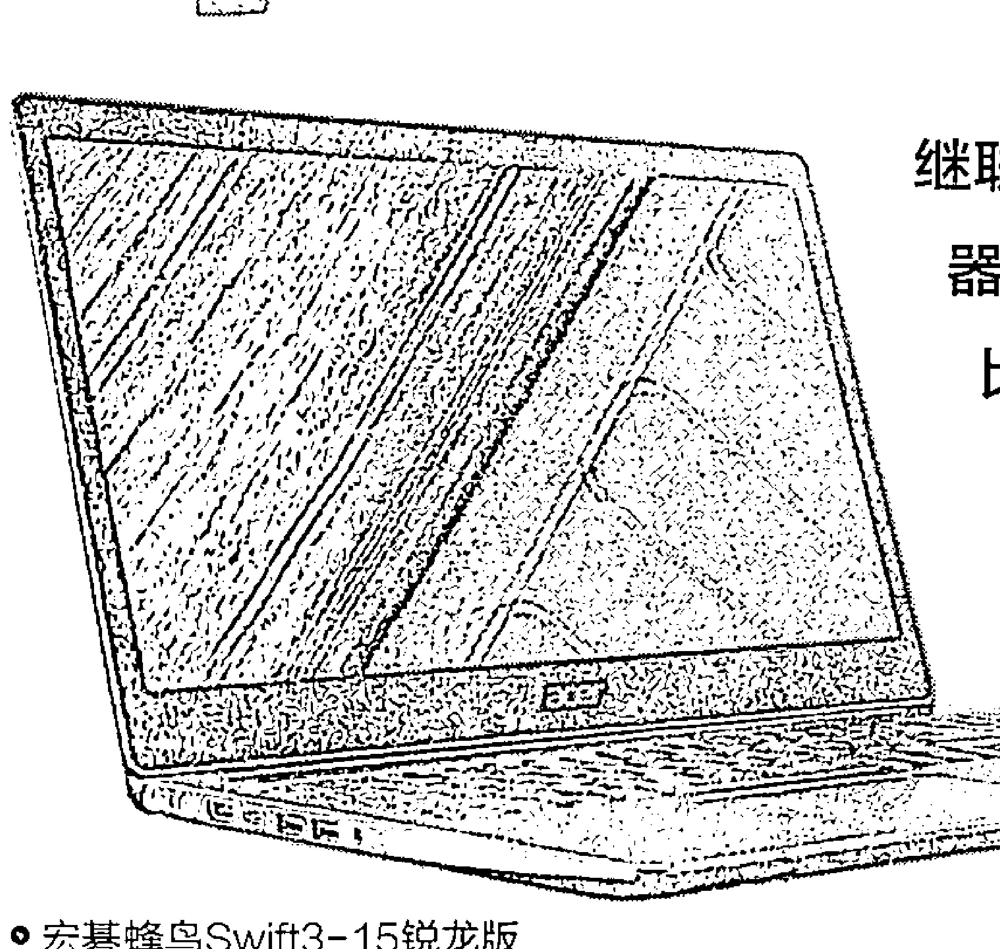

继联想IdeaPad 720s锐龙版之后，宏碁也推出了基于AMD Ryzen移动处理器定制的蜂鸟Swift3，并打出了4999元的超值起价。它的竞争对手有很多，比如宏碁自家酷睿版的Swift3、华为MateBook D、小米笔记本Pro和惠普Pavilion 15等，但考虑到其中多款产品CFan以前都曾介绍过，所以本文我们就以联想IdeaPad 520和蜂鸟Swift3锐龙版对比一番吧。

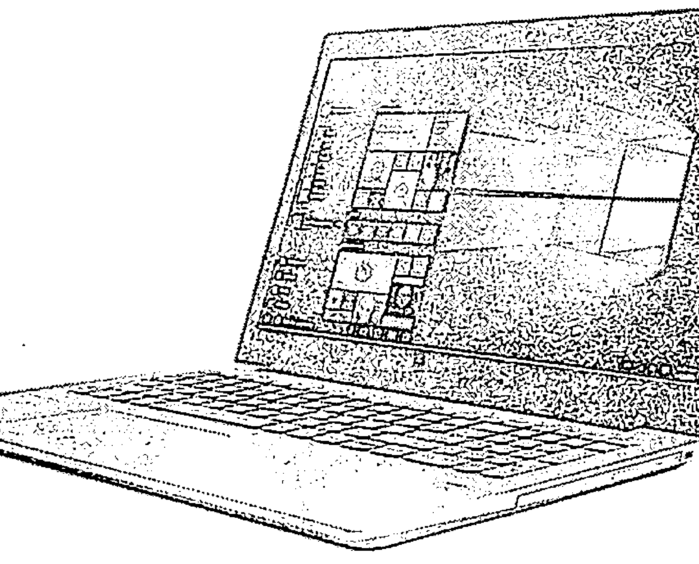

| 参数对比 | 宏碁蜂鸟Swift3-15锐龙版 | 联想IdeaPad 520 |
| :--- | :--- | :--- |
| 屏幕 | 15.6英寸IPS (1920×1080像素) | 15.6英寸IPS (1920×1080像素) |
| 处理器 | AMD Ryzen 5 2500U | 英特尔酷睿i5-8250U |
| 内存/硬盘 | 8GB/256GB SSD | 4GB/128GB SSD+1TB |
| 显卡 | Vega 8CU | NVIDIA MX150 |
| 接口 | 读卡器、USB3.0×2、USB2.0、USB Type-C、HDMI、耳机孔 | 读卡器、USB3.0、USB2.0、USB Type-C、HDMI、RJ45、耳机孔 |
| 体积 | 370.5mm×255mm×18.9mm | 380mm×263mm×22mm |
| 电池 | 48Wh/2.1kg | 30Wh/2.2kg |
| 参考价格 | 4999元 | 4999元 |

### 设计形态的差异

宏碁蜂鸟Swift3家族大家应该很熟悉了，本文涉及的蜂鸟Swift3-15（又称SF315）锐龙版采用了15.6英寸屏幕，并引入时下流行的超窄边框设计，所以将身材控制到了370.5mm×255mm×18.9mm，和昔日很多14英寸笔记本相当，同时还在掌托右下角集成了触控式的指纹识别模块（图1），可以用于快速解锁进入系统。

联想IdeaPad 520则是一款相对传统的笔记本，它同样采用了15.6英寸大视野，但屏幕边框却依旧“感人”，所以380mm×263mm×22mm的身材要比蜂鸟Swift3-15大上一圈，在便携性上处于下风。

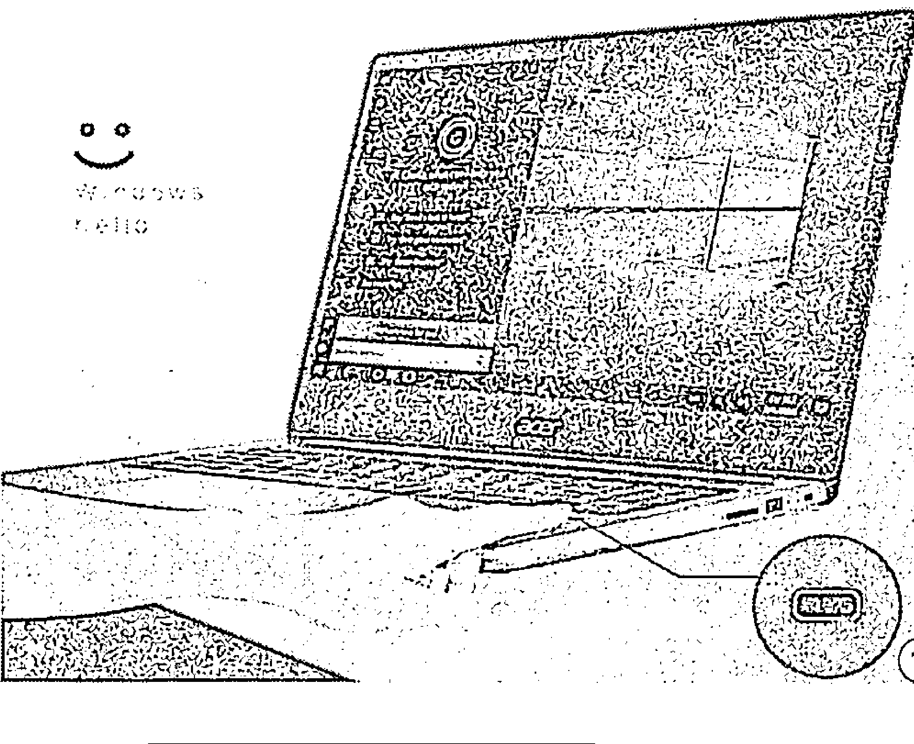

商务演示应用中，同时还标配RJ45网线接口，可以获得更稳定的网络环境。

两款笔记本的机身都引入了金属材质，但蜂鸟Swift3的金属覆盖率更大，它的A、C和D面的主要部分都是金属，再结合更纤薄的身材，视觉上更显档次。而IdeaPad 520的优势则是屏幕可以翻开至接近180度（图2），更适用于一些

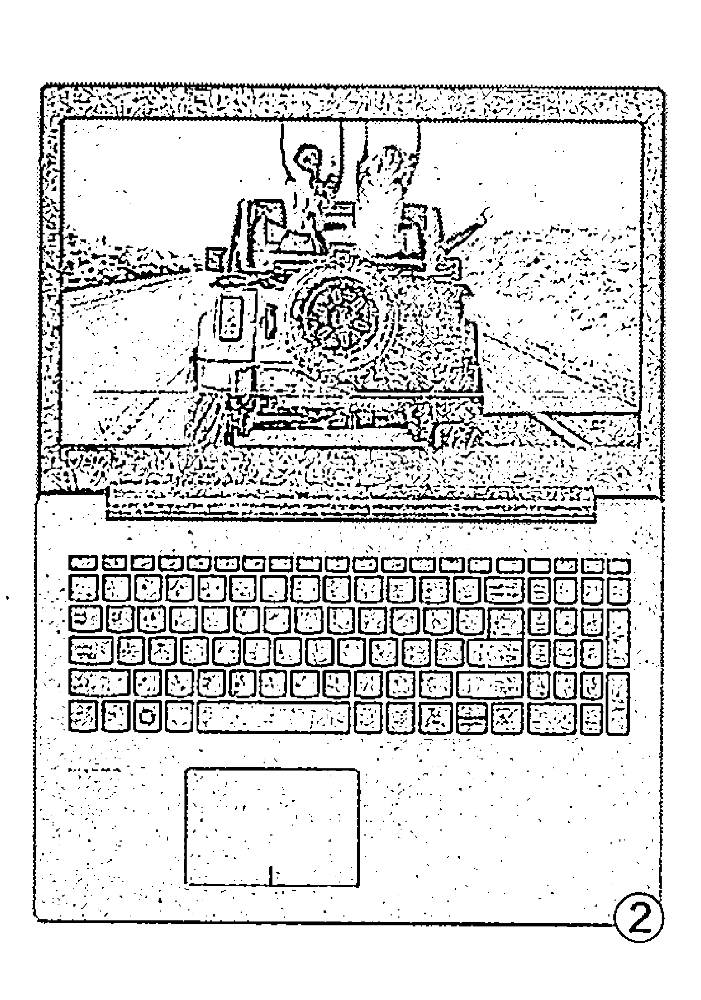

核心硬件的对比

宏碁蜂鸟Swift3-15锐龙版最大的特色是改用AMD最新的Ryzen 5 2500U或Ryzen 7 2700U处理器，二者的差异除了主频不同外，Ryzen 7 2700U还集成了更多CU计算单元的Vega核显。本文涉及的Swift3-15为低配版（图3），其搭载的Ryzen 5 2500U采用四核八线程设计，基础/加速频率分别为2.0GHz和3.6GHz，Vega核显集成8组CU计算单元，等同于512个流处理器。

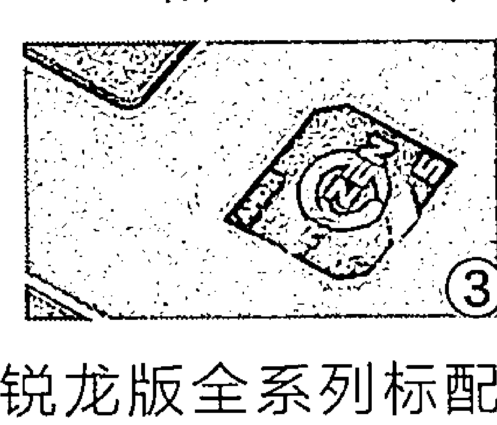

蜂鸟Swift3-15锐龙版全系列标配8GB内存，都运行在双通道模式，可以100%发挥出Vega核显的性能动力。同时，该产品配备的SSD也采用PCIe通道，磁盘性能可轻松突破GB/s大关。

联想IdeaPad 520搭载了英特尔第八代酷睿i5-8250U处理器，采用四核八线程设计，默认和睿频加速频率分别为1.6GHz和3.7GHz，集成UHD620核芯显卡。本文涉及的IdeaPad 520标配4GB板载内存，采用128GB SSD和1TB机械硬盘组合。

宏碁蜂鸟Swift3-15锐龙版设定的温度墙和功耗墙相对较高，所以有利于Ryzen 5 2500U的性能发挥。就实际表现来看，Ryzen 5 2500U的CPU运算性能足以媲美英特尔八代酷睿i5-8250U，而Ryzen 5 2500U的GPU在双通道内存的加持下也接近NVIDIA GeForce 940MX，但与MX150还存在一定的距离。

扩展能力的比拼

联想IdeaPad 520和蜂鸟Swift3-15锐龙版的差异还表现在扩展能力上。其中，蜂鸟Swift3-15锐龙版将接口分布在了机身两侧，它提供了2个USB3.0、1个USB2.0和1个USB Type-C接口，可以同时接驳更多的外设使用。而联想IdeaPad 520则将全部接口都集中在了机身左侧，分布较为紧凑（图4），而且比对手还少了1个USB3.0接口。

再来看看两款机器的内部结构。联想IdeaPad 520由于模具较老，所以还保留了内置光驱的空间（标配为减重模块），拆开底盖后空着的硕大空间可以自行加装光驱，或是光驱位的硬盘托架安装第三块硬盘（图5）。IdeaPad 520采用了板载4GB内存颗粒的设计，并预留了1个闲置的内存插槽，用户可以日后自行升级到12GB（4GB+8GB）。由于内部空间被光驱位占用较多，所以该产品内置的电池容量只有30Wh，这意味着IdeaPad 520的续航时间可能不够理想。

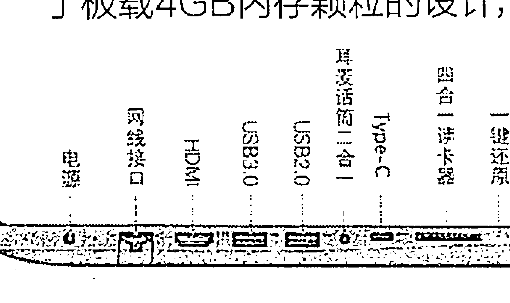

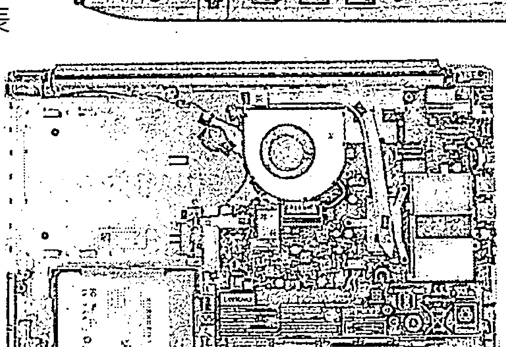

蜂鸟Swift3-15锐龙版同样采用板载内存设计，而且没有预留内存插槽，所以该产品最大的内存容量就将停留在8GB上。此外，4999元的Swift3-15只标配M.2 SSD，左下角的SATA硬盘位处于闲置状态（暂时不清楚低配版有没有配备SATA转接线和硬盘固定支架），对存储容量有要求的用户可以自行升级（图6）。

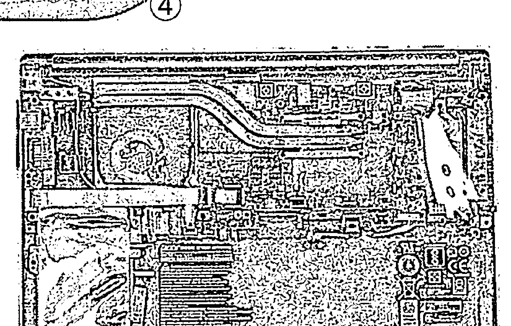

本文IdeaPad 520的拆机图来自国外网站，是IdeaPad 520集显版的内部结构。独显版IdeaPad 520在散热模块上应该会有改良，但大体的结构应该不会有明显变化。

联想IdeaPad 520和蜂鸟Swift3-15锐龙版在设计形态上属于两个时代的代表，前者保留光驱位，预留了足够的扩展能力；后者引入微边框，通过紧凑格局获得了更好的便携性。在配置方面，两款产品又属于英特尔和AMD最新技术角逐的代表，前者胜在额外的NVIDIA MX150独显，而后者则具备更好的能耗比，结合48Wh电池续航时间表现更优。至于如何取舍，就要看你有没有后期的扩展计划了。

OPPO R15 PK vivo X21

就国内智能手机市场而言，OPPO旗下的R系列和vivo旗下的X系列有着极高的知名度，几乎都是市场中的爆款。步入“刘海屏”时代后，两个厂商分别祭出了采用异形屏幕的R15和X21，它们之间谁更适合你？

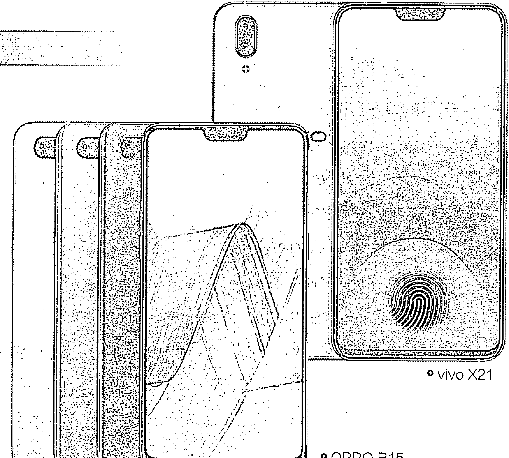

## 浅析新品背后的家族

OPPO R15和vivo X21都不是孤军奋战，它们的背后都有着“家族”支撑。其中，OPPO R15家族包含标准版（雪盈白、热力红、星空紫）和梦镜版，它们之间的差异除了配色不同以外，还体现在处理器、摄像头以及体积电池容量上，梦镜版的价格也涨至3299元（梦镜红）和3499元（陶瓷黑）。

| 参数 | OPPO R15 | vivo X21 |
| :--- | :--- | :--- |
| 网络 | 全网通（双卡双待） | 全网通（双卡双待） |
| 屏幕 | 6.28英寸AMOLED (2280×1080像素) | 6.28英寸AMOLED (2280×1080像素) |
| CPU | 联发科Helio P60 | 高通骁龙660AIE |
| GPU | ARM Mali-G72MP3 | Adreno 512 |
| 内存/存储 | 6GB/128GB（支持存储卡） | 6GB/64GB（支持存储卡） |
| 摄像头 | 2000万/2000万+500万像素 | 1200万/1200万+500万像素 |
| 体积 | 155.1mm×75.2mm×7.4mm | 154.45mm×74.78mm×7.37mm |
| 电池/重量 | 3450mAh/175g | 3200mAh/156.2g |
| 参考价格 | 2999元起 | 2898元起 |

R15标准版搭载联发科Helio P60处理器，后置摄像头为2000万+500万像素的组合，电池容量和厚度分别为3450mAh和7.4mm。而R15梦镜版则将处理器换成了高通骁龙660，后置摄像头也升级到2000万+1600万像素，电池容量和厚度也变成了3400mAh和7.5mm。

vivo X21家族包含标准版和屏幕指纹版，它们的处理器、摄像头、电池和重量完全一致。X21标准版拥有6GB+64GB（冰钻黑、极光白）和6GB+128GB（冰钻黑、极光白、宝石红）两个版本可选，售价分别为2898元和3198元，而X21屏幕指纹版（冰钻黑、宝石红）则取消了后置指纹识别模块，可以通过触控屏幕下方指定区域进行指纹解锁/支付（图1），但售价也涨至3598元。

本文涉及的两款型号，都是OPPO R15和vivo X21家族中的“低配版”，如果你对配色、性能和功能有特别要求，再根据预算挑选匹配的版本即可。

外观设计的对比

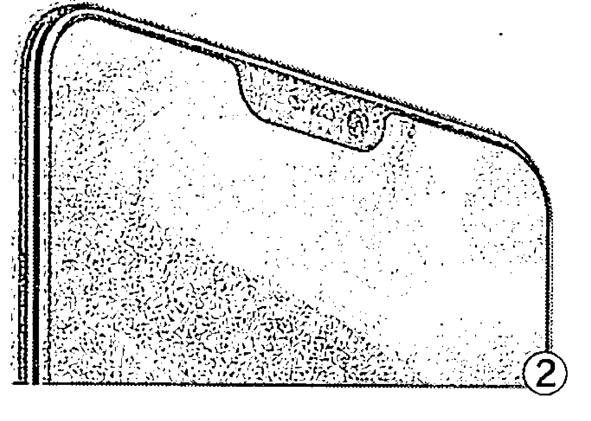

OPPO R15和vivo X21的外观设计非常相像，它们都采用了19:9显示比例的6.28英寸异形屏幕，屏幕材质和分辨率也均为AMOLED和2280×1080像素（图2）。从体积来看，OPPO R15和vivo X21的三围差异也都在零点几个毫米级别，那么它们的设计差异到底体现在了哪里？

首先，OPPO R15和vivo X21虽然都采用了双面玻璃的设计，但OPPO R15的后盖玻璃较为平整；而vivo X21则引入了四曲面3D玻璃，大弧型的背盖设计可带来更好的持握手感（图3）。其次，OPPO

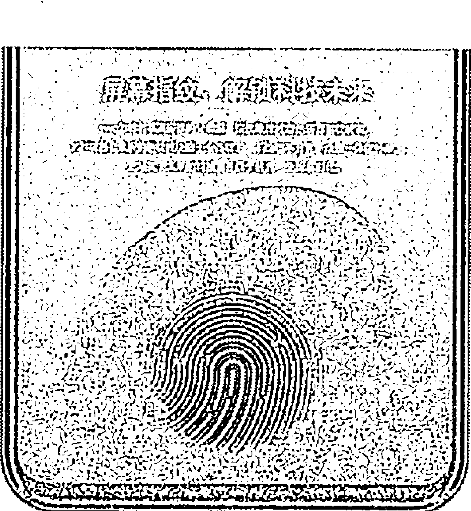## 硬件规格的比拼

| 项目 | OPPO R15 | vivo X21 |
| :--- | :--- | :--- |
| **处理器** | 联发科 Helio P60 | 高通骁龙 660AIE |
| **后置摄像头** | 1600万像素主摄（索尼IMX519，1/2.6英寸，1.22μm，F1.7）+ 500万像素景深摄像头 | 1200万像素主摄（全像素双核对焦）+ 500万像素副摄，F1.8光圈 |
| **重量** | 175g | 156g |

R15的热力红、星空紫版的后盖带来了渐变色的元素，以星空紫版为例，在光线底下深紫色的渐变由底部逐渐向顶部蔓延，仿佛是在仰望深不见底的星空，可引发无限遐想。

OPPO R15和vivo X21的差别还体现在后置摄像头的排布上。OPPO R15的后置双摄延续了R11系列的风格，与闪光灯横向排列（图4）；而vivo X21则参考了iPhone X的设计，后置双核和闪光灯采用了竖状的布局。此外，两款手机的重量差距较大，OPPO R15由于配备了更大容量的电池，体重也达到了175g；而vivo X21的重量只有156g，如果你持握手机时不喜欢明显的压手感，显然vivo X21可以起到更好的减负效果。

## 源于AI的拍照体验

OPPO R15和vivo X21标准版分别搭载了联发科Helio P60和高通骁龙660AIE处理器，它们都引入了应对本地AI的神经引擎，可以在AI拍照和系统AI方面提供助力。就理论性能而言，Helio P60的综合表现要略逊于骁龙660AIE（图5），但如果你平时只玩《王者荣耀》和各种吃鸡类的手游，在实际的流畅度上R15和X21的差别就不明显了，因为两款手机都支持特色的游戏模式，可以最大限度发挥出全部机能。

在摄像头方面，OPPO R15的特色是首发1600万像素的索尼IMX519传感器，并用它作为后置双摄中的主摄像头，IMX519传感器尺寸达到1/2.6英寸，单个像素面积也提升至1.22微米，再结合F1.7大光圈，拍摄速度和感光方面实现了双提升。R15标准版还为IMX519准备了一颗500万像素的景深摄像头，可以实现硬件级的背景虚化效果。

vivo X21标准版的特色是前后摄像头都支持全像素双核对焦，虽然它们的像素值只有1200万像素，但却拥有2400万个感光单元，可以输出2400万超高像素的照片。vivo X21后置主摄像头光圈为F1.8，整体规格和X20基本相同。

OPPO R15和vivo X21都借助处理器的AI引擎对前后拍照进行了优化。比如，OPPO R15支持后置AI人像模式，支持场景识别（图6）。AI智慧美颜也迎来了新升级，前置2000万摄像头可精确采集人脸296个特征点，更精细的面部信息将带来更多维度的美颜方案，AI智慧美颜可全方位打造更自然的美颜自拍。

vivo X21则通过AI逆光拍照与AI美颜相加持，造就新一代AI逆光美颜。同时，前置AI美颜还可根据性别、肤质和场景光线智能匹配美颜方案，综合出合适的美颜建议，还能通过人工智能机器学习你的美颜习惯，打开相机就能给你喜欢的美颜效果，胜似私人定制，让自拍更省心。

作为OPPO和vivo的开年新作，R15和X21都是极具诚意的新品，它们带来了“刘海屏”和双面玻璃的高颜值设计，系统层面也纷纷升级到Android 8.1，并针对AI进行了诸多优化。至于如何取舍也很容易，如果你对X21特色的HiFi不感冒，同一时间哪款产品的售价更低选谁即可。

## 现实中的《探案2》

## 教你打造“神探装备”

《唐人街探案2》应该是2018开年票房最高的电影之一，除了搞笑、紧凑的剧情以外，美女kiko通过随身微型电脑展示的逆天黑客能力也算是一大看点。那么，作为普通人的我们能否也准备一套电影中kiko的黑客装备呢？

在电影中，kiko通过拆卸组装手势，诠释了“任何时候都不要说一名黑客没有电脑”这句话的真谛。当然，现实中kiko的这套装备至少还不是消费级产品可以实现的，但是这并不妨碍我们搭配出一套类似的随身套装，并实现计算、显示、输入和联网等特性。

### 计算：迷你电脑

提起迷你电脑，游戏玩家可能会想起“小钢炮”，家庭用户的脑中则会浮现“NUC”，前者具备澎湃的游戏动力，而后者则拥有可以和手掌一般大小的轻巧身材。然而，哪怕是NUC类的设备也不够迷你，想要最大限度还原kiko的装备，唯有“电脑棒”或“电脑卡”才能胜任。

#### 闪存盘大小的电脑棒

英特尔旗下的“Compute Stick”，无疑就是电脑棒品类标杆性的存在，这款产品的体积和最早的闪存盘，或者说和口香糖相仿（图1），可以轻松塞进衣物口袋，或是挂在脖颈上当做项链装饰。

英特尔Compute Stick最大的特色就是内置完整的PC硬件，可选从Atom X5-Z8300到酷睿M5-6Y57等不同性能档次的处理器，内置最高4GB内存和64GB eMMC存储空间，预装Windows 10操作系统，支持蓝牙和Wi-Fi。Compute Stick机身配有USB接口，可以接驳闪存盘扩容或键鼠套装操作，通过HDMI接口连接电视显示器后就是一部标准的PC（图2），其顶配版的性能甚至可以运行《英雄联盟》！

英特尔Compute Stick的价格从899元到3999元不等，如果你觉得它的价格昂贵，则可考虑其他小品牌模仿的类似产品，价格上要比Compute Stick便宜很多。同时，如果你需要使用电脑棒进行长时间高强度的运算，一定要选择内置独立散热风扇的型号，缓解过热降频的隐患。

#### 信用卡般的电脑卡

除了Compute Stick，英特尔还推出过名为“Compute Card”的电脑卡，它的表面积和信用卡一般大小（图3），比Compute Stick还要节省空间。同时，Compute Card的性能也更加强悍，它可选从赛扬N3450到酷睿i5-7Y57的处理器，内置最高4GB内存和128GB SSD，英特尔还为其准备了专用的扩展坞和显示装置（图4），接上就是标准的PC。可惜的是，Compute Card并没有在国内上市，在国外也属于偏概念的设备，价格较为昂贵。

#### 寻找其他替代方案

如果你不需要Windows系统生态的软件，现阶段还可以考虑预装谷歌Chrome操作系统的电脑棒类设备，比如谷歌和华硕联合推出的Chromebit CS10。该产品的体积和英特尔Compute Stick差不多，但搭载的却是基于ARM架构设计的瑞芯微处理器，内置2GB内存和16GB存储空间（图5）。同时，以华为Mate 10为代表的Android手机自带电脑模式，通过视频线与显示设备相连后就能呈现一个类似Windows 10系统的操作界面，同样可以在一定程度上扮演PC的角色。

### 显示：口袋投影

如何让迷你电脑输出画面？自然离不开显示设备的帮忙。而提到显示设备，我们不能总局限在液晶电视和PC显示器的层面，投影机也是时下颇为火爆的品类之一。其中，只有手掌般大小，可以轻松塞进口袋中的超便携投影机，则是本文需要锁定的目标。

#### 没有最小只有更小

口袋投影机无疑是电脑棒的最佳搭档，它们都能随身携带，通过HDMI线缆连接后，投影机就能在任意墙面上投射画面，扮演超大号的显示器使用。至于口袋投影机能做到多么迷你？笔者的答案是“没有最小，只有更小”。现在最迷你的口袋投影机的体积只有鸡蛋般大小（图6），而绝大多数产品的身材则和内置4节18650电芯的充电宝相仿。

#### 便携势必牺牲性能

口袋投影机受限于体积，其性能自然不能和商务/消费级投影机同日而语。此类产品基本都采用了DLP投影技术，亮度普遍低于500流明，物理分辨率多在640×480像素到854×480像素之间，鲜有达到720P标准的。此外，选购口袋投影机时，我们还需留意其是否支持梯形校正（影响投影机能在什么位置运作）、投放画面大小（图7），以及是否支持AirPlay、Miracast、DLNA和双频Wi-Fi等无线连接技术。

总之，在体积和价格相近时，去除品牌因素，口袋投影机的最大亮度往往是最核心的指标，它能决定在非暗光环境时能否看清画面。

#### 如何解决供电问题

为了实现随时使用，口袋投影机往往还内置数百到上千mAh的电池。但是，投影机工作时的耗电量非常可观，能持续坚持1.5个小时的投影机就算比较优秀的存在了。如果你需要更长时间的投影操作，可以另配一款10000mAh起步的充电宝，口袋投影机大都采用5V供电，兼容市面上所有的充电宝。

### 输入：镭射键盘

有了迷你电脑和口袋投影机后，接下来就是如何才能实现高效率的输入操作了，而电影中kiko使用的激光镭射键盘就是它们的最佳搭档。

#### 镭射键盘的原理

市面上在售的激光镭射键盘（又称手机投影键盘）有很多，它们大都比较小巧，售价从199元到299元不等。这类设备普遍采用VKB键盘技术，用内置的红色激光发射器可以在任何平面投影出标准键盘的轮廓，然后通过红外线技术跟踪手指的动作，最后完成输入信息的获取（图8）。

如果将激光镭射键盘拆分，其主要是由外壳、红光投影模组、红外线摄像镜头、微处理器、无线蓝牙模组、蜂鸣器和OLED显示器等组成。镭射键盘工作时每个组件所需承担的任务可以参考下面这张图片（图9）。

#### 镭射键盘的优点

激光镭射键盘的最大优势就是小巧便携，有些产品会内置600mAh左右的电池，还能直接通过充电宝供电。这种设备支持蓝牙，可以和笔记本、手机、迷你电脑等任何支持蓝牙的计算设备配对，只需一个用于投影的平面就能随时随地使用，可满足需要大量文字输入的情景。

#### 激光键盘的缺点

激光镭射键盘的缺点也非常明显，虽然它们可以通过蜂鸣器模拟打字的声音，但却无法模仿手感，手指敲击在桌面上的感觉绝对谈不上友好。同时，镭射键盘对光线要求较高，它采用了红色的激光，周围环境太亮按键投影不清晰（图10），太暗又伤眼睛。此外，镭射键盘的键位排布不是常规的“QWERTY”键位，需要适应一段时间。

### 联网：共享Wi-Fi

有了迷你电脑、口袋投影和镭射键盘后，一套完整的PC就算搭建起来了，接下来的问题就是如何获得高速的联网环境。迷你电脑都支持Wi-Fi，所以在这里笔者推荐大家使用智能手机分享热点的方式，没有任何操作难度。但是，新兴的互联网SIM卡存在流量上的限制，比如王卡对应的专属流量特权就只限手机客户端内使用，当其作为热点使用时，就必须消耗1元包500M的省内流量日租宝了。

## 踏青摄影设备推荐

文|週之 青岚

> “等闲识得东风面，万紫千红总是春”。

随着气温逐渐回升，又到了春暖花开的季节。虽然近几年的春天十分短促，但这并不影响花朵竞相开放。在这结伴出游踏青的最佳时间里，用照片来记录美好生活无疑是最佳的选择。

在智能手机飞速发展的今天，摄影已经不再是少数摄影爱好者的专利，即使我们没有昂贵的专业摄影设备，也能拍出秀美的景色。毕竟寒冷的冬季刚刚结束，才脱下厚重的大衣，又怎么能让繁重的专业摄影设备拖累我们呢。

今天，我们就来推荐一些轻便的摄影装备，为你的踏青之旅增添几分乐趣，也为归程后刷屏朋友圈提前做好准备。

### 手稳心更稳

自拍杆起源很早，是一种可以在一定长度区间内伸缩的手机云台，可以在固定手机的同时提供最佳焦距和拍摄角度。大部分自拍杆可以通过蓝牙模拟音量加减的信号来实现对手机照相快门的触发，早期及如今的廉价自拍杆仍旧采用3.5mm音频线的形式来实现快门触发。蓝牙自拍杆一般也不需要使用APP，只要打开蓝牙配对即可使用。关于自拍杆的起源众说纷纭，这里就不加以赘述。

另一个照相辅助设备是脚架，它可以提供一个长时间的稳定平台，用来自拍比自拍杆更加自由，更可以进行一些艺术创作，如长时间曝光拍摄等。

### 小米支架式自拍杆

随着米家生态链的日趋完善，小米作为“性价比之王”已经有众多“亲朋好友”，小米支架式自拍杆就是其中之一。与很多米家生态链产品不同，小米自拍杆的价格算不上多有性价比，但其颜值和功能大大增加了内涵。它做工精细，铝合金材质扎实耐用，虽然也使其重量达到了155g，但使用体验远非常见的廉价自拍杆可比。

小米自拍杆具有普通蓝牙自拍杆没有的脚架功能，三个支脚带有防滑垫，是一台地形适应性比较强且相当轻便的脚架，不过目前只能搭载手机进行拍摄。它还为此搭配了可以分离拆卸的自拍控制器，以后在景色前拍合影再也不用求人了。

### 万能手机派

在科技日新月异的今天，最初作为辅助功能出现的摄影已经成为了手机的主要功能之一。虽然与数码相机相比，手机摄像头在感光芯片、光圈、变焦能力等方面还存在劣势，但是因其方便快捷以及越来越好的性能，还是占据了如今摄影摄像市场最大的蛋糕。

### 努比亚Z17

努比亚手机自推出便一直以拍照为卖点，搭配其可人的外观和不俗的性能，在国内手机市场一直有着一批忠实粉丝和拥趸。相对于其他品牌来说，努比亚手机拥有更丰富甚至专业向的拍摄功能，随着双摄技术的成熟，努比亚也趁势把自己的技术优势进一步提升。与市面上广泛使用的黑白加彩色的双摄不同，努比亚Z17采用1200万像素加2300万像素的双彩色摄像头组合，分别采用F1.8和F2.0的大光圈，并因此得到了2倍的光学变焦和人像背景虚化功能。

努比亚Z17两枚摄像头来自索尼，分别为IMX362和IMX318。受益于索尼在微单领域的快速发展，这两枚摄像头可以为用户带来最快0.03秒的急速对焦体验。25mm和22mm (等效35mm) 的两颗摄像头都采用广角镜头的设计，既控制了摄像头的凸起，又可通过算法实现2倍的光学变焦。

其软件则延续了努比亚经典的基础拍摄界面和专业拍摄界面相结合的UI设计，曝光补偿滑块和对焦曝光分离的设计得到了保留，以期在快速抓拍中也能够得到更有效、更准确的曝光控制。

在光线条件充足的条件下，努比亚Z17有着出色的摄影体验：出色对焦速度加上良好的成像质量，即使在逆光条件下，也可通过曝光补偿控制曝光，得到非常优秀的拍摄效果，配合前文提到的小米三脚架，还能进行星空、光绘等特效拍摄。相信这样一台手机一定会给你的踏青之旅增添不少便利。

### 运动的精彩

运动相机本是应用在极限运动领域的专业相机，但随着这几年科技的发展，小巧的运动相机也开始为大众所接受。一手掌握的小巧身材搭配让人惊叹的是专业级的相机性能，即使没有丰富多变的配件系统也足以让很多人倾心，更何况其设计的最初就已经做好了全时段工作的准备，无论是上山下海都不在话下。

### 米家小相机

米家小相机是小米自小蚁之后推出的一款极具“性价比”的运动相机，圆角矩形通体黑色的设计相当有范儿，看起来并不像是一个不足1000元的运动相机。其重量仅有99g，却在这个不足一个手掌大的空间内融入了145°广角镜头以及6级电子防抖能力，最高可支持4K 30fps的视频录制。它采用2.4英寸的触摸屏，可以十分方便直观地操作和预览，也可以直接使用米家APP来进行连接和控制。

米家小相机没有太多按键，只有一个拍摄和开关机多合一的按键，带有一个标准孔径的三脚架接口和TF卡接口，官方推荐使用U3标准以上存储卡。其电池容量为1450毫安时，官方宣称能够满足2小时的使用，实际上可能还会有所缩水。

这款相机采用1/2.3英寸的索尼IMX317传感器，F2.8广角光圈虽然说不上大，却也足以满足日常使用。广角镜头带来的畸变在拍摄视频时还不明显，但在照片中十分显眼，需要后期进行校正。总体来说，米家小相机是一款不错的产品，对于经费有限的用户来说十分值得推荐。目前米家小相机防水壳稳定器等周边设备已经上架，虽然品种和数量还不如GoPro，但已经是很值得推荐的运动相机产品。

### GoPro Hero 5 Black

运动相机的火爆离不开一个牌子，那就是GoPro，所以对运动爱好者来说，它仍然是第一选择。

相比上一代产品，GoPro Hero5系列不管是功能特性还是价格都说得上诚意满满。它具备裸机防水能力，同时自带的镜头保护盖降低了无意磕碰导致镜头碎裂的可能性；语音控制解放了用户的双手，也杜绝了按压快门键产生的不必要的画质损失和丢焦。GoPro Hero5自带防抖能力，虽然其电子防抖技术会导致画面被裁减和画质降低，但对于使用云台的用户来说却是十分友善的功能。在拍摄表现方面，GoPro Hero5系列也表现不俗，新增的WDR宽动态范围可以保留更多的高光阴影，Raw格式也是可圈可点，虽然噪点略有些高。虽然目前已经 有GoPro Hero6 Black，但其新增功能对于大多数用户来说都不算太重要，价格却要高出1000元，有点得不偿失。

### 便携更出色

如今，同样的价格是买一个相机还是买一个手机，想必很多人都不会再犹豫。手机可以轻易地达到2000万以上的像素水平，那么还需要购买卡片DC相机或者微单单反相机吗？其实这个也是由需求决定的。如果只是平时随意拍一拍照，不去追求画质有多好，也不追求全时段都可以拍出精彩的照片，那么选一个拍照尚可的手机就好。反之，如果对画质有所追求，那么还是不要犹豫，选择一款适合你的相机吧！

#### 索尼黑卡DSC-RX100

长期以来，DC受制于传感器尺寸，一直在画质上难以有所突破，虽然有很多所谓的专业DC产品，但仍旧无法与APS-C画幅或者全画幅抗衡。索尼黑卡的出现打破了这个局面，虽然只用了一块1英寸的传感器，却成为了性能超强的卡片怪兽。它采用13.2mm×8.8mm的2020万像素CMOS传感器，ISO125-6400(可扩展至80-25600)，拥有最高每秒10张的连拍速度，感光度在ISO 80至ISO 400时，RX100的画面保持了较高的水准，细节到位并没有涂抹感。它采用卡尔·蔡司Vario-Sonnar T镜头，该镜头具有多个T涂层，可减少光线反射导致的虚影和眩光现象，从而提高相机捕获细节的性能，在实现紧凑机身的同时，有着更好的细节表现。其28mm~100mm的焦距，包含了从广角到长焦的各个焦段，基本可以达到全时段使用，F1.8的大光圈则可以提升夜晚暗光环境下的拍摄能力，同时还具有更好的景深效果。RX100的操控也非常简单，顶部只有几样东西，模式转盘、变焦拨杆、快门键，开关键，其闪光灯没有独立开关，需要和闪光灯模式控制联动。对于那些非常注重便携性和性价比的用户来说，索尼RX100毫无疑问是目前最为优秀的选择。

### 专业不奢华

#### 索尼ILCE-6000L (16-50mm)

如果放在2014年，有人跟笔者说一款对焦连拍吊打各大APS-C相机的微单套机只要不到4000元，笔者一定会以为他是在做梦，但如今这个相机真的出现了，那就是索尼的ILCE-6000L(亦可写作α6000L，L代表套机含镜头)。索尼微单在一开始曾经被不少人嘲笑和不看好，即使到了NEX 5/6/7的时代仍旧在很多方面有着短板，但自从采用新的4D对焦系统之后，一切便迎刃而解。作为索尼APS-C画幅扛鼎之作，ILCE-6000与ILCE-5100、ILCE-7R共同撑起了索尼在微单领域的招牌。虽然仅仅是索尼微单领域的中端产品，但其急速对焦和11张连拍的能力则把所有对手远远甩在了身后。ILCE-6000采用了全新的超高速混合对焦系统，具备179个相位检测对焦点与25个对比检测对焦点，两者协同作用，让相机的对焦体验有了明显的提升，最快可达0.06s。微单也因此终于脱下了“对焦慢”的帽子，让索尼微单进入了专业全时段摄影设备的领域。网上众多横向评测虽然不断吐槽ILCE-6000噪点过多，但经笔者实测发现只是因为索尼的jpg格式少一档“超精细”选项，在选择Raw的情况下只要ISO不高过800，噪点基本不会被发现。该机除了可以通过Wi-Fi与手机、平板等智能设备相连接外，还采用了近年来流行的NFC(近场通讯)技术，该技术最大的好处是免去了相机与智能手机之间复杂的连接过程，只要轻轻一碰就能实现二者的连接，方便快速地将照片导入手机等其他移动设备进行编辑和分享。

VOYO i8Max PK 酷比魔方X1

无“心”可用一直制约着Android平板电脑的发展，导致它们与主流手机之间的性能差距越来越大。好消息是，步入2018年后，会有更多的新款Android平板选用联发科首款十核处理器Helio X20，从而获得更强的性能。而VOYO i8Max和酷比魔方X1就是第一批“十核平板”，它们之间谁更适合你？

回顾Helio X20的参数

Helio X20（又称MT6797）是联发科在2016年主打的旗舰级处理器（图1），它基于20nm工艺设计，采用了“三丛集”架构，由双核Cortex-A72（大核）+四核高主频Cortex-A53（中核）+四核低主频Cortex-A53（小核）组成（图2），并集成ARM Mail-T880MP4 GPU。就性能而言，Helio X20可以完胜联发科针对平板电脑定制的MT8173（双核Cortex-A72+四核Cortex-A53）和MT8176（四核Cortex-A72+四核Cortex-A53），与麒麟950、骁龙653等手机处理器处于一个档次上。

| 参数对比 | VOYO i8Max | 酷比魔方X1 |
| :--- | :--- | :--- |
| 网络 | 全网通（双卡双待） | 全网通（双卡双待） |
| 屏幕 | 10.1英寸（1920×1200像素） | 8.4英寸（2560×1600像素） |
| 处理器 | 联发科Helio X20 | 联发科Helio X20 |
| 内存/硬盘 | 4GB/64GB（支持存储卡） | 4GB/64GB（支持存储卡） |
| 摄像头 | 300万+1300万像素 | 800万+1300万像素 |
| 体积 | 242mm×172mm×10mm | 218mm×126mm×7.8mm |
| 电池/重量 | 6000mAh/580g | 4500mAh/375g |
| 参考价格 | 1199元 | 1399元 |

当Helio X20“下嫁”平板电脑之后，有机会带来4G全网通、GPS定位和流畅“吃鸡”等特性，从而进一步提升整个Android平板电脑的使用体验。

两种设计思路的碰撞

VOYO i8Max和酷比魔方X1虽然都搭载了Helio X20，但它们却秉持不同的设计形态。其中，VOYO i8Max定位偏“PC平板二合一”，拥有10.1英寸大屏幕，后盖上还配备了连体的铰链式支架，可以解放双手，将屏幕固定在桌面上多个角度便于欣赏。同时，VOYO i8Max还可与键盘底座和2048级原笔迹手写笔搭配，变身“笔记本”模式，方便进行“笔记本”和随意涂鸦书写（图3）。需要注意的是，i8Max的键盘和笔都并非标配，其中键盘的价格约为199元，大家需要根据预算和需求再行决定是否入手。

酷比魔方X1则是一款偏“大号手机”的平板电脑，它采用了8.4英寸屏幕和窄边框设计，126mm的机身宽度可以单手掌握（注意不是单手操作哦），分辨率也达到了2560×1600像素的2K标准，显示细腻程度更加优秀。

酷比魔方X1引入了指纹识别模块，并将其与正面的Home键合二为一，解锁体验和使用智能手机非常像。同时，X1还采用了最新的USB Type-C接口，可以无视数据线接口方向正反插。最关键的是，小屏幕也进一步提升了酷比魔方X1长时间玩游戏时的体验，375g的重量较为轻盈，横屏操作时拇指也能够到屏幕中心的虚拟按钮（图4）。

配置和功能上的差异

VOYO i8Max和酷比魔方X1的核心配置相同，除了Helio X20处理器还标配4GB内存和64GB存储空间，并支持存储卡扩充，整体规格甚至要在时下主流千元手机之上。两款平板在配置上的差异主要体现在前置摄像头方面，i8Max为300万像素镜头，而X1则为800万像素。虽然我们不能指望平板摄像头的素质能有多好，但多多益善还是代表着更高的竞争力。

两款平板的电池容量差异也比较明显，VOYO i8Max得益于宽大的机身，配备了6000mAh电池，而酷比魔方X1的电池容量则为4500mAh；所以就续航时间而言i8Max的潜力会更大一些。同时，从官方的资料来看，VOYO i8Max集成了GPS模块，在驾车时可以扮演智能中控导航仪的角色（图5）。

全网通的可玩性

VOYO i8Max和酷比魔方X1通过Helio X20集成的基带获得了4G全网通和双卡双待的能力，这就让它们摆脱Wi-Fi自由联网成为可能。很多人购买高性能平板就是为了看腾讯视频和玩腾讯代理的游戏，此时只要给它们办理一张腾讯大王卡，就可以免流量费欣赏视频和征战游戏了。需要注意的是，酷比魔方X1采用了在手机领域流行的三选二SIM卡托（图6），如果选择了存储卡就只能安装1张SIM卡了。

> 4G全网通 随时随地 双卡双待
> 双卡双待 视频不限流
> nano sim卡×2+TF卡（3选2）、支持移动/联通/电信3G/4G上网、通话。

Helio X20虽然上市较早，但它的性能在平板电脑领域还是极为强悍的，应对《王者荣耀》和各种“吃鸡”类游戏毫无压力。作为第一批基于这颗十核芯片打造的平板电脑，我们无需为VOYO i8Max和酷比魔方X1的性能担心，至于如何取舍，就得看你在使用上的需求了：VOYO i8Max有着更大的屏幕和变身笔记本的特色，适用于偶尔有文本编辑需求、喜欢震撼视界的玩家考虑；而酷比魔方X1则拥有更极致的便携性、单手操作的诱惑和指纹识别模块的加盟也是它的特色卖点。

“水桶机”的对决
红米Note 5 PK 魅蓝E3

在智能手机领域有个全新的名词“水桶机”，是用来形容配置均衡没有明显缺憾的产品。而红米Note 5和魅蓝E3则堪称各自家族中的“水桶机”，具备极为出色的竞争力。那么，它们之间谁更适合你？

外观设计的差异

红米Note 5和魅蓝E3都采用了5.99英寸18:9显示比例的全面屏，分辨率为2180×1080像素，拥有403 PPI和450nit的亮度，显示效果处于伯仲之间。而两款产品最大的差异，则体现在外观设计层面。

其中，红米Note 5采用了三段式的机身设计，后盖中间为金属，上下两端则嵌入了塑料材质（图1）。这种设计的好处是有利于降低成本，而小米也为其提供了魔力蓝、玫瑰金、金色和黑色四种配色版本，通过特殊的喷涂工艺让三段式后盖看起来更像是一个整体。

魅蓝E3采用了全金属一体化的机身设计，通过穹顶式U型纳米注塑信号条解决了信号溢出的问题。就工业设计而言，魅蓝E3可以带来更显档次的金属质感，丹青、香槟金和曜石黑的配色也颇为时尚。

| 参数对比 | 红米Note 5 | 魅蓝E3 |
| :--- | :--- | :--- |
| 网络 | 全网通（双卡双待） | 全网通（双卡双待） |
| 屏幕 | 5.99英寸（2180×1080像素） | 5.99英寸（2180×1080像素） |
| 处理器 | 高通骁龙636 | 高通骁龙636 |
| 内存/存储 | 6GB/64GB（支持存储卡） | 6GB/64GB（支持存储卡） |
| 摄像头 | 1300万/1200万+500万像素 | 800万/1200万+2000万像素 |
| 尺寸 | 158.6mm×75.4mm×8.05mm | 156.8mm×75mm×7.6mm |
| 电池/重量 | 4000mAh/181g | 3360mAh/160g |
| 参考价格 | 1699元 | 1799元 |

红米Note 5和魅蓝E3都将后置双摄安置在了背部的左上角，差别是红米Note 5将闪光灯放在了两颗镜头之间，而魅蓝E3则将闪光灯放在了镜头模组的下面。此外，红米Note 5采用了传统的后置指纹设计，底部的接口也是Micro USB。而魅蓝E3则采用了侧置指纹设计（图2），底部接口也换成了支持正反插的Type-C型USB接口。

相机参数的对比

红米Note 5采用了1300万像素前置摄像头，并提供了前置柔光灯（图3），在昏暗环境下可以提高自拍美颜的表现。同时，红米Note 5还引入了时下流行的面部解锁功能，结合AI人脸解锁算法，识别效率有了很大的提升。而魅蓝E3前置摄像头为800万像素，卖点没有红米Note 5来得实际。

在后置摄像头的配置方面，魅蓝E3则实现了反超。红米Note 5的后置双摄为1200万像素Dual PD全像素双核对焦镜头和500万像素景深镜头的组合，结合AI人像模式可以拍出前景清晰背景虚化的人像大片。而魅蓝E3则武装了1200万像素Dual PD全像素双核对焦镜头和2000万像素PDAF相位对焦镜头的组合（图4），不仅支持人像背景虚化模式，还可以带来2.5倍无损变焦模式，结合Flyme系统的相机专业模式，可以独立开启副摄，哪怕是高达3872×5168像素分辨率的大片也能轻松输出。

不留遗憾的骁龙636

红米Note 5和魅蓝E3的核心硬件相同，都搭载了高通最新的骁龙636（图5）。这款芯片的数字序列虽然和骁龙630接近，但实际性能却是看向骁龙660的。它改用了和骁龙660一样的Kryo 260架构（高通基于Cortex A73/A53研发的Kryo四大核/四小核架构），其大核最高主频为1.8GHz。同时，骁龙636还集成Adreno 509 GPU和Hexagon 680 DSP单元，调制解调器也是和骁龙660一样的骁龙X12 LTE。

至于其他配置，红米Note 5就要比魅蓝E3来得灵活了。红米Note 5提供了3GB+32GB、4GB+64GB和6GB+64GB三个版本可选，售价分别为1099元、1399元和1699元。而魅蓝E3则全系标配6GB内存，可选64GB、128GB或歼-20典藏版，售价分别为1799元、1999元和2499元。

特色功能的比拼

红米Note 5虽然定位主流，但它依旧保留了顶部的红外模块设计，我们可以直接用手机方便地遥控身边的家用电器，例如小米电视、机顶盒、空调、热水器等日常家电（图6）。同时，这款产品还内置4000mAh大电池，续航方面的表现更为优异。再加上最新版MIUI和人脸解锁功能，唯一的缺陷就是只支持5V/2A充电。

魅蓝E3的特色则在于引入了Cold mCharge快充技术，我们可以将其视为Super mCharge的缩水版。它提供10V/2A的快充，20W的充电功率能95分钟充满3360mAh的电池；电荷泵技术在提高充电速度的同时也有效降低了发热（图7）。同时，魅蓝E3的Super mBack在单手操作上也有着更为优异的表现，轻触小圆圈即可返回上一层，重按直接退到主界面，上滑呼出后台多任务。多种交互，仅需一触、一滑。

红米Note 5和魅蓝E3都是2018年初不可多得的高性价比手机，它们通过骁龙636获得了不俗的性能，并在拍照和AI方面也达到了潮流前线。只是，魅蓝E3的起价较高，适合对工艺设计和拍照要求更为苛刻的用户考虑。而红米Note 5的优势则在于1099元的起价门槛更低，适合预算有限的用户选择。

马甲再现
浅析NVIDIA GeForce MX100系列显卡

NVIDIA在2017年针对主流市场推出了一款口碑极佳的移动显卡芯片——GeForce MX150（图1），为轻薄笔记本带来了较为强大的娱乐动力。如今，GeForce MX100显卡家族又迎来了2个新成员——MX110和MX130，它们又能延续MX150的好口碑呢？

MX150的口碑是如何炼成的

我们可以将GeForce MX150视为移动版的GT1030桌面显卡，这款显卡采用了NVIDIA最新14nm Pascal（帕斯卡）架构核心设计（图2），拥有384个流处理器，显存位宽为64bit。MX150不仅适用于较厚的普通笔记本，更是超轻薄笔记本的绝配。

考虑到两类产品的定位和散热设计存在差异，所以NVIDIA也准备了满血版MX150（25W，最高加速频率为1532MHz）和低功耗版MX150（8W，最高加速频率为1038MHz）两个版本。如果你比较在意性能，挑选笔记本的时候，在价位相同时可优先考虑武装满血版MX150的产品。

MX130和MX110终于参上

有了MX150的铺垫，很多玩家都对NVIDIA GeForce MX100显卡家族的其他成员充满了期待。早在2017年底，网上就爆出了GeForce MX130和MX110的参数信息（图3），而如今基于这两款新显卡设计的笔记本也纷纷上市。

很遗憾，GeForce MX130和MX110并不是我们想象中的“新品”，它们依旧是NVIDIA“马甲战略”的组成部分。

我们都知道，2015年NVIDIA针对轻薄本领域主打的型号就是GeForce 940M；2016年轻薄本所能武装的显卡变成了GeForce 940MX；2017年轻薄本领域的当家花旦依旧是GeForce 940MX。考虑到GeForce 940M/940MX和GeForce 840M都是相同的28nm Maxwell架构（GM108核心），相当于同一款显卡“凑合用了”3年以上！

| 参数 | MX150 | MX130 | 940MX |
| :--- | :--- | :--- | :--- |
| CUDA Cores | 384 | 384 | 256 |
| ROPs | 16 | 8 | 8 |
| Boost Clock | Variable | Variable | Variable |
| Memory Type | GDDR5 | GDDR5/DDR3 | GDDR5/DDR3 |
| Memory Bus Width | 64-bit | 64-bit | 64-bit |
| VRAM | <=2GB | <=2GB | <=2GB |
| GPU | GP108 | GM108 | GM108 |
| Manufacturing Process | Samsung 14nm | TSMC 28nm | TSMC 28nm |
| Launch Date | 05/26/2017 | 11/2017 | 11/2017 |

问题就出现在这里。NVIDIA最新的GeForce MX130依旧采用了Maxwell架构的GM108核心（图4）。没错，这款显卡仍然是GeForce 940MX的马甲，这意味着很多所谓的“新品”竟然还在使用3年以前的显卡技术。

至于GeForce MX110（图5）这款显卡的表现自然是更加不堪，它的核心同样是Maxwell架构的GM108，整体规格和GeForce 920M/920MX相仿，属于后者的马甲版。

> **小提示**
> NVIDIA GeForce 940M和940MX、920M和920MX之间的差异在于MX版可选GDDR5显存，频率略高，所以性能有所增益。此外，GeForce 940MX还存在GM108和GM107两个核心的版本，二者的流处理器数量分别为384个和512个，就性能而言GM107核心版的940MX要强一些。

GeForce MX130性能解析

由于NVIDIA官网并没有移动显卡的详细参数，所以以下内容的数据全部取自https://technical.city/en网站（见表）。

MX130和前辈规格对比表

| 参数对比 | MX150 | MX130 | 940MX |
| :--- | :--- | :--- | :--- |
| 架构 | Pascal | Maxwell | Maxwell |
| 核心 | GP108 | GM108 | GM108 |
| 工艺 | 16nm | 28nm | 28nm |
| 流处理器 | 384 | 384 | 384 |
| 核心频率 | 1469MHz | 1122MHz | 954MHz* |
| 加速频率 | 1532MHz | 1242MHz | 933MHz* |
| 显存频率 | 6008MHz | 5012MHz | 5012MHz |
| 显存位宽 | 64bit | 64bit | 64bit |
| 显存种类 | GDDR5 | DDR3/GDDR5 | DDR3/GDDR5 |
| TDP | 25W | 30W | 23W |

*https://technical.city/en对940MX标注的核心/加速频率偏低

从该网站统计的评测数据来看，GeForce MX130凭借更高的频率优势，在各项测试中都能领先GeForce 940MX 20%以上。但是，GeForce MX150却可凭借工艺和架构的优势，性能提升幅度可达60%以上（图6）。目前还没有GeForce MX110的详细参数与评测数据，但根据经验它的性能也不会较GeForce 920MX提升太多，毕竟二者只是马甲的关系。

GeForce MX130值不值得选

理论上讲，GeForce MX130和GeForce 940MX就是同一颗芯片，它们的强弱完全取决于笔记本厂商设定的出厂频率，以及温度墙和功耗墙的高低。在频率相同、散热效率一致的前提下，两款显卡的性能水准应该是站在同一条水平线上的。

GeForce MX130值不值得选，就得看同配置的笔记本与其他武装940MX和MX150独显的机器能否拉开足够的价差了。以戴尔新灵越7000为例，就同时存在搭配GeForce MX130和940MX两种显卡的版本，其中MX130版标配的SSD小了128GB，但价格却比940MX版低了600元（图7）。在这个情况下，显然就是MX130更加超值了，用省下的600元可以再买一个256GB的SSD了。

还有一种情况，以宏碁翼5为代表的产品同时存在七代酷睿+MX130和八代酷睿+MX150的两个版本（图8），但它们之间的价差不足300元。在这种前提下自然就是八代酷睿+MX150更加值得选择了，无论是CPU还是GPU性能都能有30%以上的增益。

## USB魔方插座怎么选

很多家庭由于装修不当，或是经常出差入驻酒店，都会遇到插座不足的窘况，导致身边的数码产品需要排队充电。如果你总遇到类似的境况，不妨考虑一种名为“USB魔方插座”的设备，它们将在方寸之间就承载多款电器的用电需求。

## USB插座的分类

如今无论是智能手机、平板电脑还是刮胡刀和电动牙刷，几乎所有的数码产品都可使用USB接口充电。在这种大环境下，带USB接口的插座逐渐兴起，一拖多(USB)的设计可以同时为多款数码产品充电，从而免去了为每款数码产品单独匹配充电头的繁琐。

目前，USB插座可以分为四个类别：USB排插、USB充电器、USB魔方插座和USB墙插（图1），而它们的优缺点可以参考下表（表1）。

相对来说，USB魔方插座可扮演USB排插和USB充电器的结合体，具备出色的移动性，出差旅行时可以轻松塞进包包里，从此就再也不必担心酒店插座少且不合理的尴尬了。在家里，USB魔方插座也能扩展传统排插或墙插的功能，堪称居家旅行的必备“小伙伴”。

| 插座类别 | 优点 | 缺点 |
| :--- | :--- | :--- |
| USB排插 | 可安置更多AC插孔<br>可安置更多USB接口<br>可兼容多种快充技术<br>额定功率较大且稳定<br>可加装Wi-Fi智能模块 | 接口越多体积越大<br>不利于外出携带 |
| USB充电器 | 体型小巧便于携带<br>USB接口数量较多<br>可兼容多种快充技术 | 没有AC插孔<br>无法给笔记本等电器供电 |
| USB魔方插座 | 体型小巧便于携带<br>可同时安置AC插孔和USB接口<br>可加装Wi-Fi智能模块 | 高负载时发热较高<br>很难支持快速充电技术 |
| USB墙插 | 最为节省空间 | 安装繁琐，无法移动 |

## USB魔方插座的分类

作为近几年才出现的新名词，魔方插座的最大卖点就是小巧便携，通用性极强。哪怕出国使用，只要搭配转接头，就能适用于任意欧标、美标等用电环境（图2）。同时，当魔方插座集成USB输出功能后，更是解决了随时为多款移动设备充电的痛点，从而大受差旅用户的欢迎。而一些更具设计的产品，也同时受到了家庭用户的青睐，实用的同时还可兼顾家居环境的点缀。

而USB魔方插座发展至今，也衍生出了“有线版”和“无线版”两个类别。“有线版”可通过0.5米到3米的线缆与墙插/排插相连，可将USB魔方插座“甩”到桌面上使用(图3)，只是线缆越长携带越是不便。而“无线版”则是魔方插座表面自带国标3脚插头，需要固定在墙插/排插上使用，在位置上存在局限性(图4)。

## USB魔方插座的结构

从结构上来看，USB魔方插座是由USB和插座两个部分组成。实际上，USB魔方插座是一种非常精密的电气设备，它远非我们想象中只是通过几根铜线、几片铜片攒成的多孔插座。这种设备需要在方寸之间就提供稳定的交流和直流输出，并安置USB接口以及相关的限流限压和防过载之类的电路(图5)。同时，为了通过新国标认证，USB魔方插座还得挤出空间为每个AC插孔搭配安全门，规避儿童意外触电的安全隐患。

不同价位的USB魔方插座所能提供的功能相似，但它们的安全系数和稳定性却存在较大的差异，基本符合“一分钱，一分货”的定律。比如，一些低价的USB魔方插座虽然符合国标内置安全门，但插孔的安全门却可以单脚插入，显然安全防护程度不太到位。

一般来说，凡是品牌USB魔方插座，其外壳都是阻燃PC材质且内置模组绝缘片，AC模块的电线、铜片品质也都过关(图6)。但是，USB模块的用料，往往会成为不同产品之间存在性能差异的源泉。

比如，高品质的USB魔方插座内部都配备了完整的安规电容、继电器、热敏电阻、保险和同步整流等单元(图7)，并在板端加入智能识别芯片，从而提供对苹果协议的支持，通过USB给iPhone充电时可以增大电流输出。而一些低价的USB魔方插座，其内部很可能没有任何EMI元件，甚至连一只色环、贴片电感都没有。单独给一款手机充电时可能没什么，但当插座上每个USB都连接了一部手机时，就很容易遭遇过热等安全隐患了。

## USB魔方插座怎么选

我们需要从实际需求的角度着眼，来看待如何选择USB魔方插座这个问题。比如，如果你经常出差，需要随身携带笔记本、平板和手机等多部移动设备，此时“无线版”USB魔方插座无疑最适合你，它没有了线缆的束缚，可以最大限度节省包包的空间。

但如果你只是想扩展一下家里墙插的功能，那笔者则推荐“有线版”USB魔方插座，如此可以让USB魔方插座告别墙面，安置在更合适接驳多种电器插头的位置上。

此外，USB魔方插座的插孔数量也需要重点关注。一般来说，这种设备会将AC插孔和USB接口安置在外壳不同方向的平面上。所以，AC插孔大都是3个到4个（图8），而USB接口则普遍为2个到3个。其中，AC插孔要优先选择都是国标5孔标准的，以便满足随意接驳3脚插头或2脚插头电器的需求。

需要注意的是，虽然USB魔方插座普遍都标注称支持10A输出，以及250V和2500W输出功率，但限于紧密的结构，我们还是需要考虑到高负载时的发热隐患。根据笔者的经验，USB魔方插座最适合的还是给笔记本、手机、加湿器、空气净化器、电视、洗衣机等中小型家电或移动设备同时供电，将总输出功率控制在1000W以内。如果要连接热水壶等高功率设备时，就千万别再同时给其他大功率电器供电了！

至于USB模块，魔方插座内部的空间不足以安置更复杂的相关电路，所以无论USB数量多少，其最高也仅支持5V/3A左右的总输出，单独使用1个USB接口（如给手机充电）可输出最高5V/2.4A，但同时使用2个USB，那每个接口就只能输出5V/1.5A了。所以，笔者认为魔方插座的USB接口只要大于等于2个就足够了，更多的接口在给多部移动设备同时充电时并没有什么意义（图9）。

有消息称，产业链正在抓紧时间布局支持QC、PE等快充技术，以及标配USB Type-C接口的魔方插座，也许用不了多久我们就能看到更完美的USB魔方插座出现了。

> **小提示**
> 
> 在选购USB魔方插座时，标配独立开关的产品更值得优先入手（图10）。因为此类产品在不使用时可以完全切断电源而不必拔下插头，可以降低（与插座相连电器）待机功耗，起到节能环保的作用。

## ## 核显性能到底被谁“吃了”

如今很多轻薄本和二合一设备都没有空间安置独立显卡，玩游戏只能依靠处理器集成的核显（图1）。问题来了，很多笔记本搭载的处理器相同，但它们的核显性能却存在10%到40%的差异，这又是怎么回事呢？

### ## 不断变化的性能

细心的读者可能会发现一个问题，CFan有很多对比评测的文章，但就某个同一款处理器或显卡，它们在不同文章中的跑分数据却存在差异。原因很简单，同一型号的处理器和显卡，在不同的笔记本本身上所能发挥的性能是存在差距的。每篇文章引用的跑分可能来源于不同产品，所以才会导致数据有别。

而今天想和大家探讨的是：为什么同一款处理器，其集成核显在不同笔记本本身的跑分会存在差距，核显的性能到底是被谁给“吃了”？

### ## 食客一：马虎

虽然U系列酷睿处理器是英特尔专门针对轻薄本定制，但该家族却包含集成不同核显的型号。比如，七代酷睿家族中的i5-7200U就集成HD620核芯显卡，而i5-7260U和i5-7267U却分别集成Iris Plus 640和Iris Plus 650显卡；八代酷睿家族中的i5-8250U集成UHD620核芯显卡，而i5-8259U则集成Iris Plus 650显卡。

Iris (锐炬)是英特尔旗下高端的核显品牌（图2），其性能可以媲美NVIDIA 930MX独显。所以如果你没有注意处理器型号的后缀，“想当然”地认为i5-8250U和i5-8259U的核显性能差不多，结果自然会让你失望。

### ## 食客二：电源管理模式

笔记本为了延长续航，默认开启了很多和节能相关的设置。以最新版Windows 10为例，点击任务栏右下角的电池图标，会弹出“电源模式”的设置项，想让处理器和其集成的核显“满血”运行，就必须将其设定在“高性能模式”上（图3）。

如果你接受笔记本在电池供电时牺牲部分性能延长续航，但在接通电源时就必须满血运行，请进入高级电源管理模式，找到“英特尔显卡电源计划”，并将接通电源子项设定在“最高性能”上（图4）。如此一来，就能避免因电源模式而影响核显性能发挥的隐患了。

### ## 食客三：散热设计和墙

一般来说，笔记本的散热模块越豪华，OEM厂商就能设定越高的温度墙和功耗墙，可以让笔记本长时间高负载运行也不会出现过热降频的问题。然而，轻薄本大都采用超薄的热管和风扇，散热效率有所折扣。此时，OEM厂商大都会采用两种策略：

- **保守派：** 为了确保系统稳定，保守派会将产品的温度墙或功耗墙设定得比较保守，比如CPU温度超过70摄氏度就开始降频，然后始终稳定在60摄氏度左右（图5）。这类产品跑分的特点，是第一次跑分成绩最高，然后越测越低。想让它跑出最高分数，测试不同跑分软件前需要先让笔记本“冷静”下来。

- **激进派：** OEM厂商对品质很放心，只要CPU温度没有超过安全阈值，哪怕达到99摄氏度也不降频，从而确保笔记本可以长时间进行较高性能的输出（图6）。同一款处理器，如果遇到散热设计良好且温度墙相对激进的“东家”，其集成的核显自然就能跑出更高的成绩。

### ## 食客四：内存规格

没有搭配独立显卡的轻薄本，其体内自然也就没有额外的显存芯片，核显必须搭配由部分容量内存虚拟的显存进行数据交互。因此，内存规格越高，核显所能挖掘的潜力也就越大。

可惜，虽然以八代酷睿i5-8250U为代表的移动处理器最高支持DDR4-2400MHz或DDR3-2133MHz的内存，但很多轻薄本却仍然搭配性能相对偏弱的DDR3内存，而且内存频率也只有1066MHz，属于“弱上加弱”（图7）。采用同一款处理器的笔记本，如果搭配DDR3-2133MHz内存，或DDR4内存（图8），显然其核显的跑分要高于与低频DDR3内存组合的竞品。

### ## 核心食客：内存通道

实际上，以上四位食客虽然会影响核显性能的发挥，但却还都不是最主要的，它们对性能的影响也就是5%到15%之间。而“核心食客”，也就是笔记本标配内存的通道模式，才是影响核显性能的大户，它将决定核显能否获得额外30%到50%的性能增益。

笔记本的内存支持“单通道”或“双通道”，后者可以让CPU分别在两个内存间寻址和读取数据，从而使内存的带宽增加一倍，数据存取速度也相应增加一倍（理论上）。简单来说，凡是安装了2根内存条的笔记本，就都已经运行在“双通道”模式上了。

> **小提示**
> 
> 双通道内存只对核显性能有所增益，但对独立显卡的影响却微乎其微。所以，如果你关注的笔记本武装了独立显卡，那就可以无视内存的通道模式了。

| | 双通道 | 说明 |
|---|---|---|
| 纯板载内存颗粒 | 支持 | 视OEM厂商的良心，用户无法干预 |
| 板载内存+1个内存插槽 | 支持 | 内存插槽安装内存即可激活双通道模式 |
| 只提供1个内存插槽 | 不支持 | 神仙也救不了 |

问题来了，如今很多轻薄本为了“瘦身”，要么采用纯板载内存颗粒（图9），要么选择板载内存+1个内存插槽，又或是只提供1个内存插槽。它们还有机会享受“双通道”内存吗（表1）？

其中，纯板载内存是否支持双通道，就得看OEM厂商的“良心”了，市面上仍然有少数集显轻薄本采用了纯板载的单通道内存；如果笔记本只板载4GB内存，却提供额外1个内存插槽，我们也可以自行加装4GB或8GB内存条组成“双通道”模式，只是4GB+8GB属于“弹性双通道”，即当内存使用率低于8GB时数据在两个内存的低4GB位置上交互（此时享受双通道的速度），但当使用率超过8GB后就需要分别与4GB和8GB内存条单独交互了（此时为单通道的速度）。

那么，单通道和双通道内存，对核显性能的影响到底有多大？CFan过去曾对比过英特尔处理器核显在不同内存通道模式下的差异，所以本文我们就以AMD最新的Ryzen锐龙移动处理器为例（图10），看看其集成的Vega核显对内存通道数的敏感性吧。

AMD Ryzen 5 2500U和Ryzen 7 2700U移动锐龙处理器分别集成8个和10个CU单元的Vega核显，我们可以重点观察Ryzen 5 2500U在单通道和双通道内存模式下的跑分数据（表2）。可见，单通道模式下Ryzen 5 2500U的核显性能只是略微领先于酷睿i5-8250U集成的UHD620核芯显卡，根本就没有展现出AMD在图形领域应有的实力。

但在搭配双通道内存后，Ryzen 5 2500U核显性能不仅可以秒杀酷睿i5-8250U，甚至逼近了NVIDIA上代主流独显GeForce 940MX。而Ryzen 7 2700U的核显在双通道内存的加持下，性能也仅是略逊于NVIDIA最新主流独显GeForce MX150（低功耗版），有了将入门级独显彻底扫地出门的底气。

总之，如果你极为注重笔记本的便携性，可以将目标锁定在集显轻薄本上，但同时又希望在游戏中获得最大的性能潜力值，就不妨按照本文的思路，拒绝前四位食客，并警惕名为“单通道”的核心食客吧。

| 核显版本 | Ryzen5 2500U 8CU 单通道 | Ryzen5 2500U 8CU 双通道 | Ryzen7 2700U 10CU 双通道 | 酷睿 i5-8250U UHD620 双通道 | NV 940MX GM108 | NV MX150 低功耗版 | NV MX150 满血版 |
|---|---|---|---|---|---|---|---|
| 3DMark11-P | 1896 | 3453 | 4072 | 1650 | 2468 | 3423 | 4326 |
| 3DMark Cloud Gate | 6690 | 11564 | - | 8809 | 12230 | 18264 | 21479 |
| 3DMark Sky Diver | 5064 | 7894 | - | 3916 | 7341 | 8765 | 11055 |
| 3DMark FireStrike | 1495 | 2175 | 2336 | 1132 | 2164 | 2800 | 3721 |
| FireStrike Extreme | 668 | - | 1077 | - | - | 1289 | 1701 |
| 3DMark Time Spy | 440 | 571 | 695 | 334 | 565 | - | 1052 |
| *仅取GPU测试子项分数 | | | | | | | |

## ## 全‘屏’实力之争

## 联想小新Air 15 PK 戴尔燃7000II-15

虽然八代酷睿游戏本已纷纷亮相，但更多采购笔记本的用户依旧更为重视便携属性，倾心集轻薄、性能和实惠于一身的全能选手。而联想小新Air 2018-15和戴尔燃7000II-15，就是两款可以满足大家上述要求的产品。

| 参数对比 | 联想小新Air 2018-15 | 戴尔燃7000II-15 |
|----------|---------------------|------------------|
| 屏幕 | 15.6英寸IPS (1080P) | 15.6英寸IPS (1080P) |
| 处理器 | 酷睿i5-8250U | 酷睿i5-8250U |
| 内存硬盘 | 8GB/256GB PCIe SSD | 4GB/128GB SSD +500GB HDD |
| 显卡 | NVIDIA MX150 (2GB GDDR5) | NVIDIA MX150 (4GB GDDR5) |
| 接口 | 读卡器、USB3.0×2、USB Type-C、HDMI、耳机孔 | 读卡器、USB3.0×2、USB2.0、HDMI、RJ45、耳机孔 |
| 体积 | 359mm×245mm×16.8mm | 358mm×247mm×19.5mm |
| 电池/重量 | 45Wh/1.95kg | 42Wh/1.91kg |
| 参考价格 | 5499元 | 5499元 |

### ## 三面窄边框设计

联想小新Air 2018-15（下文简称小新Air-15）和戴尔燃7000II-15（下文简称燃7572）都是轻薄型的15.6英寸大屏笔记本，它们的定位与CFan早前介绍过的小米笔记本Pro、华为MateBook D、惠普Pavilion 15和宏碁Swift3-15相同，都是依靠三面窄边框成就了80%以上的屏占比，在和14英寸笔记本相近的体型里就塞进了15.6英寸屏幕，获得了更大的视野和更好的沉浸式体验。

其中，联想小新Air-15屏幕左右两侧的边框为5.75mm，顶部边框则略宽，但也依旧被控制到了9.2mm（图1）。这款产品上边框较宽的原因，是为了容纳前置摄像头，视频聊天时可以找到更好的拍摄角度。同时，小新Air-15的屏幕表面还覆盖了一层康宁第三代大猩猩玻璃，对LCD面板起到良好的保护效果，但随之而来的缺陷则是存在反光问题。

戴尔燃7572的特色是采用了三面等宽的窄边框设计，左右上边框都是7mm，看起来更为对称（图2）。只是，燃7572顶部没有空间安置摄像头，所以只能将它放在下边框中心位置，视频聊天时会较为尴尬。

## 细节上的差异

联想小新Air-15提供了金银蓝黑四种色彩版本，以及全金属材质的机身设计，边缘通过CNC工艺切出了闪亮的侧边。这款产品的厚度为16.8mm，重约1.95kg，在15.6英寸笔记本中属于相对轻盈的存在。同时，小新Air-15还在掌托右下角集成了指纹识别模块（图3），可以实现一键登录系统，免去了输入密码的繁琐。

戴尔燃7572的A面和D面采用了一体化的金属材质，同样使用CNC工艺切出了闪亮侧边，它的C面表面加入了类肤质的涂层，摸起来的手感非常细腻，触感柔和。戴尔燃7572的机身厚度为19.5mm，重约1.91kg，同样非常轻薄。

联想小新Air-15和戴尔燃7572都保留了SD读卡器插槽，这在轻薄本中算是较为良心的设计。至于接口上的差异，小新Air-15少了1个USB2.0，多了1个支持USB3.0速度的USB Type-C。而燃7572的优势则在于提供了RJ45网线接口（图4），对经常入住酒店需要稳定网络环境的用户而言非常贴心。

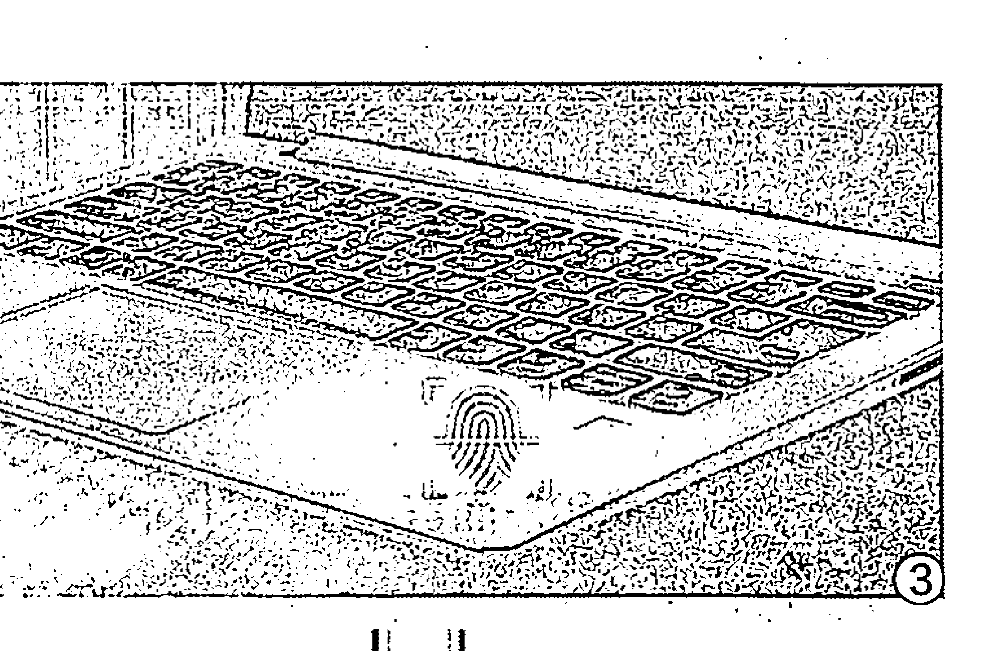

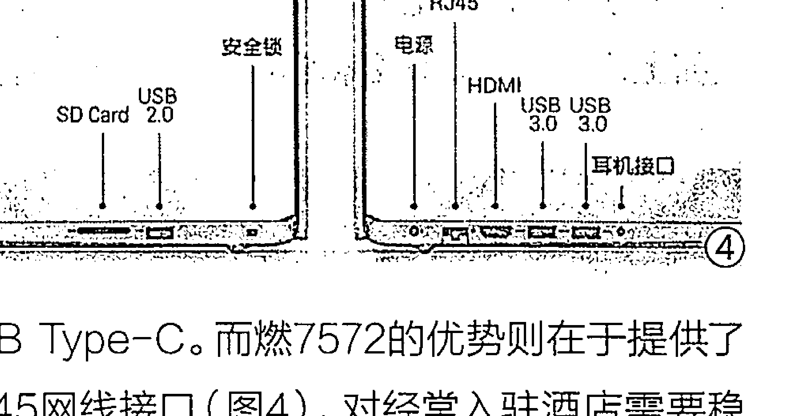

## 配置上的对比

两款笔记本都基于英特尔第八代酷睿平台定制，5499元的版本搭载的都是酷睿i5-8250U，得益于四核八线程和较高的主频，其瞬间性能不会逊色于45W TDP的酷睿i5-7300HQ。同时，联想小新Air-15和戴尔燃7572还都武装了满血版的NVIDIA GeForce MX150独显，足够在低画质下流畅“吃鸡”。好消息是，联想工程师巧妙地在底层BIOS中加入了针对MX150功耗的控制功能，而用户只需要通过“Fn+Q”这个组合键，即可实现对显卡性能的调整。

需要注意的是，5499元的联想小新Air-15显卡只配备了2GB GDDR5显存，但其标配的SSD支持PCIe通道，读写速度可以突破2000MB/s大关。而5499元的戴尔燃7572则仅标配4GB内存，但它的显卡则拥有4GB GDDR5显存，同时标配128GB SSD（SATA通道）和500GB HDD的组合，实现了存储性能和容量的相对均衡。

在内部结构方面，联想小新Air-15采用了双风扇双热管的散热模块，内存和SSD表面还配有屏蔽罩（图5）。官方表示该产品还预留了1个闲置的SSD卡槽，最多可以加装2块PCIe SSD。戴尔燃7572采用了单风扇单热管散热模块设计，热管较长，覆盖着CPU和GPU芯片（图6），如果你觉得4GB内存太小，而标配8GB内存的高配版本又太贵，则可以选择自行升级的方式（可将4GB卖掉回笼资金）。燃7572采用了M.2和SATA两种插槽的组合，未来可通过机械硬盘进一步扩容也是它的优点。

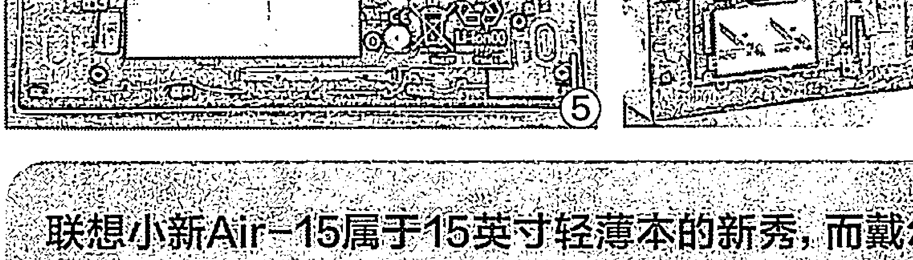

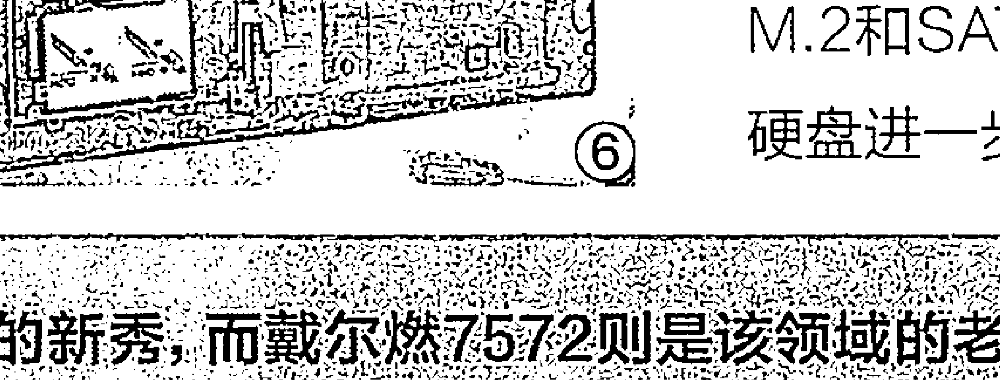

联想小新Air-15属于15英寸轻薄本的新秀，而戴尔燃7572则是该领域的老将。两款产品都是品质过硬的代表。只是，小新Air-15具备指纹识别和更好的散热潜质，“Fn+Q”模式切换也平衡了性能和功耗。而戴尔燃7572的优势则在于保留了RJ45和SATA接口的硬盘位，而且可选配置的版本更多（集显版低于5000元），可选的范围更大。如何取舍，就得看大家对外观的喜好和实际的需求了。

# 千元水桶机的比拼

# 努比亚V18 PK 坚果3

对绝大多数普通用户而言，手机的性能只要可流畅驾驭《王者荣耀》即可，关键是价格不能太贵，续航越久越好。好消息是，如今千元价位的“水桶机”越来越多，而努比亚V18和坚果3就是最新上市的代表。那么，它们之间谁更适合你？

| 参数对比 | 努比亚V18 | 坚果3 |
| :--- | :--- | :--- |
| 网络 | 全网通（双卡双待） | 全网通（双卡双待） |
| 屏幕 | 6.01英寸（2160×1080像素） | 5.99英寸（2160×1080像素） |
| 处理器 | 高通骁龙625 | 高通骁龙625 |
| 内存/存储 | 4GB/64GB（支持存储卡） | 4GB/32GB（支持存储卡） |
| 摄像头 | 800万/1300万像素 | 800万/1300万+1300万像素 |
| 体积 | 158.7mm×75.5mm×7.75mm | 154mm×74.3mm×7.16mm |
| 电池/重量 | 4000mAh/170g | 4000mAh/154g |
| 参考价格 | 1299元 | 1299元 |

## 工业设计的对比

作为新一代千元水桶机的代表，努比亚V18和坚果3自然都符合时下的潮流趋势，采用了6英寸左右的18:9比例全面屏，拥有2160×1080像素的分辨率且支持人脸识别功能。和传统16:9比例屏幕相比，这两款产品在塞进6英寸大小屏幕的同时，将身材保持到和过去5.5英寸手机持平，拿起来不会有太过明显的撑手感。

两款产品在设计上的最大差异体现在两个方面。其一就是对全面屏设计的理解上，努比亚V18采用了相对传统的“对称式”全面屏（图1），手机屏幕的“额头”和“下巴”基本等宽，并将指纹识别模块放在了手机后盖上。

坚果3则采用了相对个性的设计风格，它选择了类似小米MIX系列的三面无边框设计，将屏幕的上、左、右三面边框压缩到了极致（图2），顶部配备隐藏式听筒，而摄像头和集成指纹识别的Home键则放在手机底部。可惜的是，坚果3的“下巴”看起来较宽，摄像头的位置也距离Home键太近，仿佛是一颗“美人痣”。坚果3的这种设计，喜欢的人觉得很赞，不喜欢的人就会感觉丑丑的。

两款产品在设计上的差异还体现在外壳材质上。其中，努比亚V18采用了塑料材质的外壳，但该产品保留了信号条的缝隙，再加上类似磨砂金属的喷漆，能给人一种“好像金属”的错觉，多彩的配色（曜石黑、太空金、星云红、象牙白）能满足更多人的审美需求。

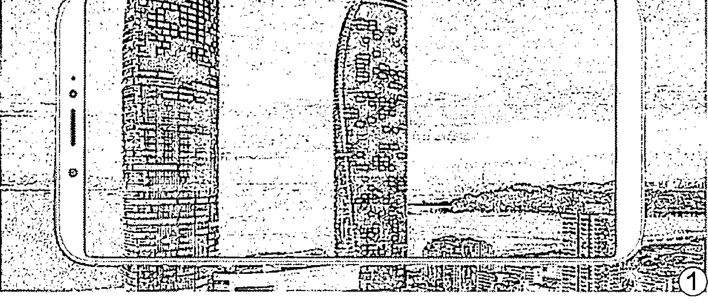


而坚果3则采用了金属中框和双面玻璃的设计，并在金属中框的中间用CNC工艺切出了小小的凹槽，还用一道金线将中框在视觉上切割成了上下两个部分（图3），辨识度更高。配色方面，坚果3提供酒红色、浅金色、碳黑色、炫黑色和炫红色五个版本。

## 其他细节的对决

努比亚V18和坚果3都搭载了高通骁龙625处理器，所以它们在性能层面并无差异。只是，1299元的努比亚V18配备了更大的64GB容量存储空间，哪怕不用存储卡也足够用户折腾。

两款手机全部配备4000mAh超大容量电池（图5），再结合骁龙625低功耗的先天优势，续航能力表现优异。可惜，努比亚V18配备的USB接口依旧是MicroUSB标准，充电头也只支持5V/2A，充电速度相对一般。坚果3的表现则更抢眼，不仅配备了支持正反插的USB Type-C接口，还支持QC3.0 18W快充，可明显缩短充电时等待的时间。

## 摄像头的差异

拍照一直是努比亚手机的主打功能之一，只是V18受限于定位，没能武装时下流行的双摄模块，只配备了一颗1300万像素的主摄像头（图4）。还好，这颗镜头的规格不赖，它支持PDAF相位对焦，可实现0.1s快速焦点锁定。努比亚V18的前置摄像头为800万像素，基于AI智能算法，支持美颜自拍、美颜视频通话功能。

坚果3采用了1300万（彩色）+1300万（黑白）像素的双摄方案，同样支持PDAF对焦功能，而且支持ArcSoft提供的实时背景虚化算法、降噪算法与双摄融合算法，可带来更稳定的成像质量。坚果3的前置摄像头为800万像素，支持ArcSoft实时美颜算法。就拍照的潜力而言，拥有黑白彩色双摄方案的坚果3更胜一筹。

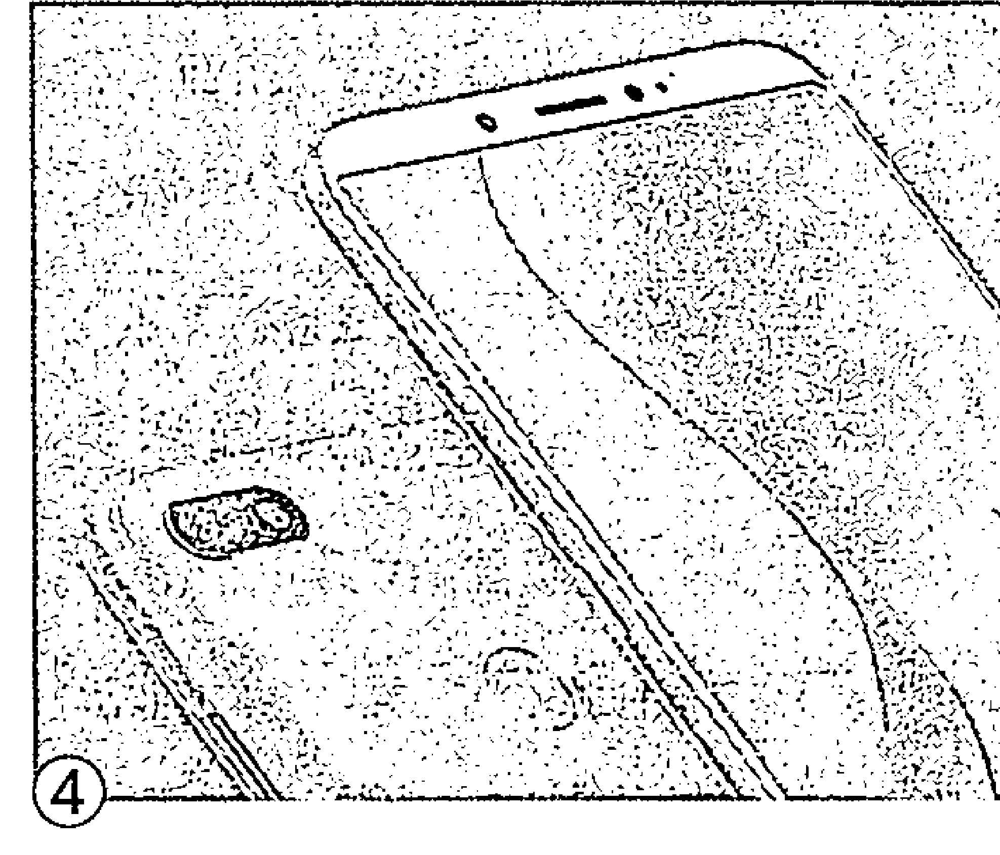

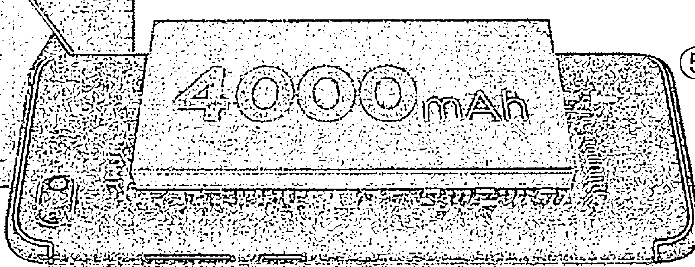

和OV华米相比，努比亚和锤子都属于相对小众的品牌，Nubia UI和Smartisan OS也各有一众坚定的拥护者。具体到努比亚V18和坚果3两款产品来说，V18的优势在于标配更大的存储空间，可以节省一个SIM卡槽实现双卡双待。而坚果3的卖点则是更给力的双摄和个性的三面无边框全面屏设计（图6），如果你追求与众不同，坚果3的样式会让它成为街头一景。

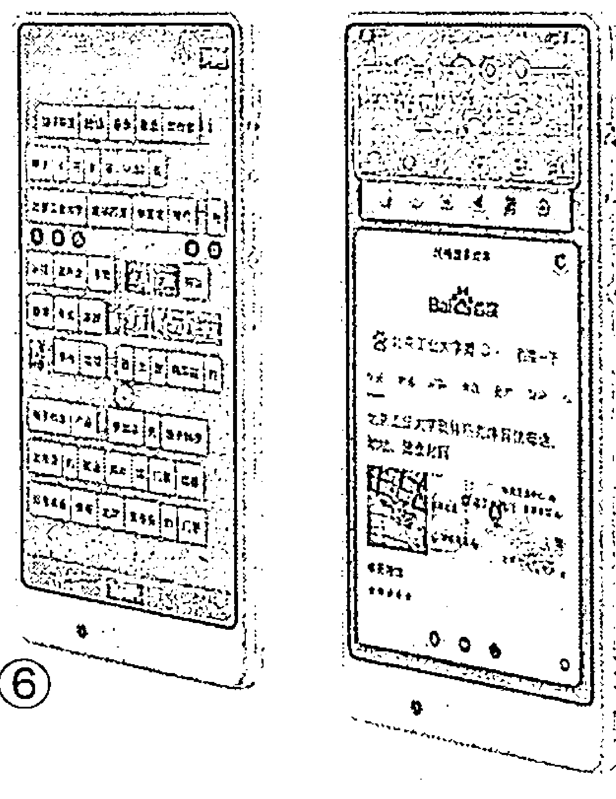

# 全面屏标杆之争
## 机械师F117-Break PK 机械革命Z2

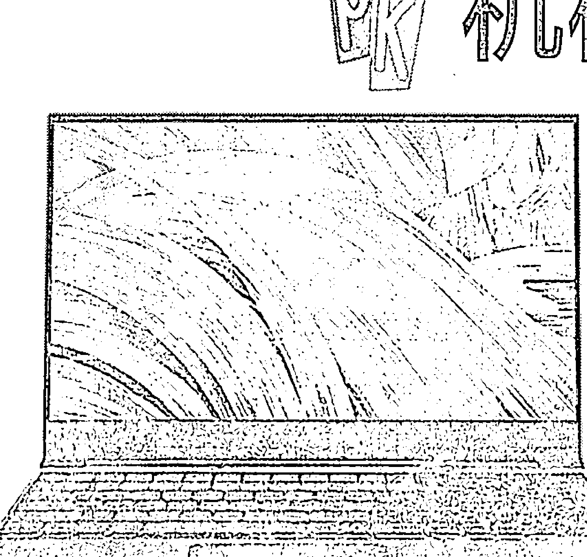

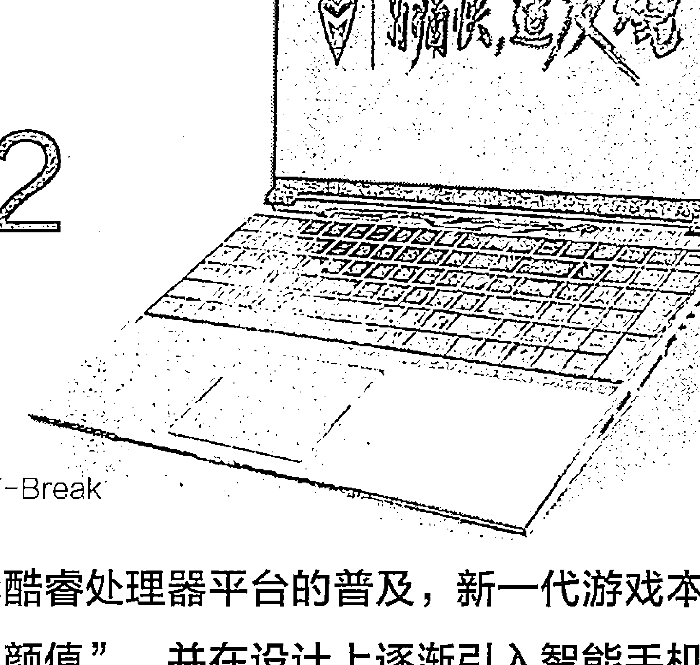

随着英特尔八代酷睿处理器平台的普及，新一代游戏本也开始越加重视起“颜值”，并在设计上逐渐引入智能手机领域的潮流元素，比如——全面屏。而机械师F117-Break和机械革命深海幽灵Z2就是第一批采用全面屏元素设计的游戏本。那么，它们之间谁更适合你？

### 确定“近亲”关系

当你第一眼看到机械师F117-Break和机械革命深海幽灵Z2时，一定会产生一种莫名的熟悉之感，因为它们长得实在是太像了。实际上，机械师F117-Break和深海幽灵Z2选用的都是来自同方国际出品的模具，只是两家厂商在公版模具的基础上，对A面和C面进行了个性定制，从而拉开了辨识度，让它们从“双胞胎”变成了“表兄弟”。

### 当游戏本遇到全面屏

机械师F117-Break和深海幽灵Z2最大的特色就是采用了15.6英寸大屏幕，并将屏幕两侧边框压缩到了6mm左右，顶部边框同样收窄，仅保留了足够嵌入摄像头的宽度，从而成就了85%左右的屏占比。同时，这两款产品机身的最薄处只有20mm，最厚处也不过23mm，重量轻至2.0kg。就三围和体重而言，机械师F117-Break和深海幽灵Z2不逊于很多14英寸游戏本（图1），便携性堪称一流。

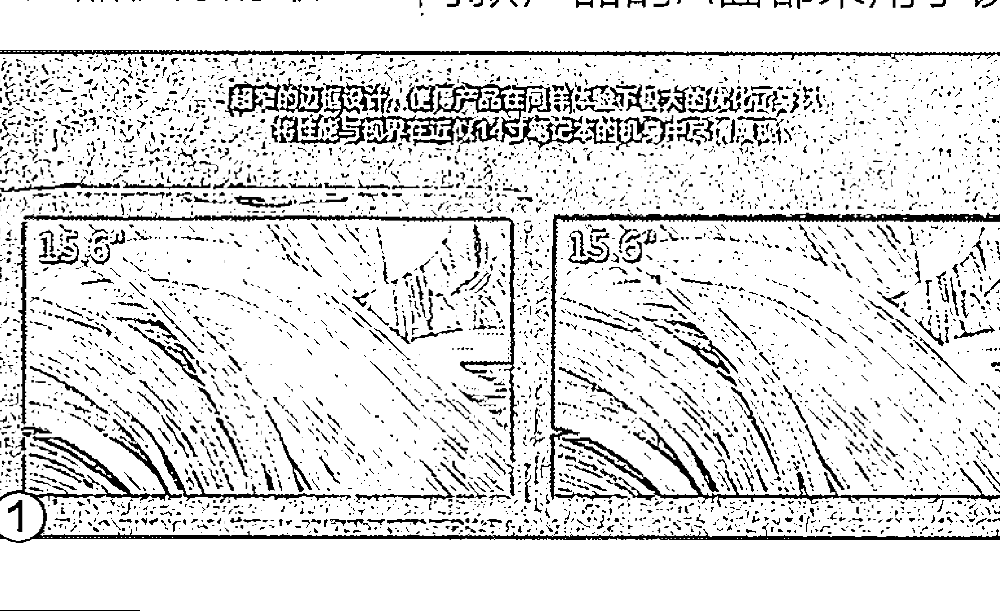

| 参数对比 | 机械师F117-Break | 机械革命深海幽灵Z2 |
| :--- | :--- | :--- |
| 屏幕 | 15.6英寸IPS（1080P） | 15.6英寸IPS（1080P） |
| 处理器 | 八代酷睿i7-8750H | 八代酷睿i7-8750H |
| 内存/硬盘 | 8GB/128GB SSD +1TB HDD | 8GB/120GB PCIe SSD +1TB HDD |
| 显卡 | GTX1050 Ti (4GB GDDR5) | GTX1050 Ti (4GB GDDR5) |
| 接口 | 读卡器、USB3.0×2、USB2.0、USB Type-C、HDMI、miniDP×2、RJ45 | 读卡器、USB3.0×2、USB2.0、USB Type-C、HDMI、miniDP×2、RJ45 |
| 电池/重量 | 46.74Wh/2.0kg | 46.74Wh/2.0kg |
| 参考价格 | 7299元 | 7299元 |

### 设计上的差异在哪里

作为两个品牌旗下的新作，机械师F117-Break和深海幽灵Z2不可能直接套用公版模具，它们在外观和细节上还是存在一定差异的。首先，两款产品的A面都采用了镁铝合金材质的外壳，并在两侧各加入了一道棱线，增强了视觉上的立体感。

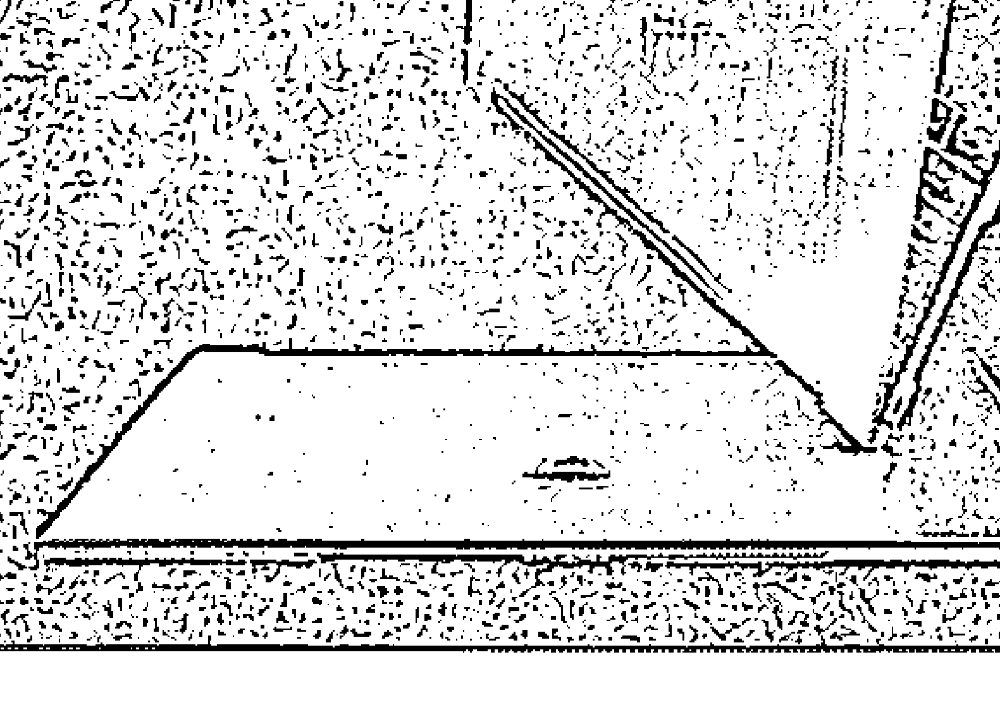

不过，机械师F117-Break的A面采用了亮银色，嵌入了盾牌形状的Logo，还在Logo下方加上了两道蓝色折线箭头（图2）。
而深海幽灵Z2的A面颜色偏深灰色，除了六角形Logo以外就没有其他装饰了。两款产品的Logo都可以透出蓝色的背光，其原理都是借助LCD的灯管，并没有太大的技术含量。

其次，机械师F117-Break和深海幽灵Z2的C面布局也不尽相同，除了配色上的深浅不一外，机械师F117-Break的键帽形状为常规的方形，而深海幽灵Z2的键帽则为圆润的多边形设计，表面略带弧度，WASD键表面还加入了螺纹纹理。同时，深海幽灵Z2键盘上方配备了独立的电源键和风扇加速键（图3），它们都是在C面镁铝合金板上进行镂空雕刻而成。机械师F117-Break键盘上面并没有镂空雕刻，只是采用了条纹装饰，只嵌入了一颗机械师Logo图案的电源开关。

两款游戏本都配备了集成式机械键盘，采用光轴结构设计，手感接近青轴，拥有其特有的段落感。与主流的游戏键盘一样，支持全键无冲和屏蔽Win键功能，而且所有键帽都可以取下来进行清洗或更换（图4）。好消息是，机械师F117-Break和深海幽灵Z2的键盘背光还都采用了独立RGB背光系统，每一个键的灯光都可以独立控制，支持1677万色的颜色调节以及多种动态效果设定。

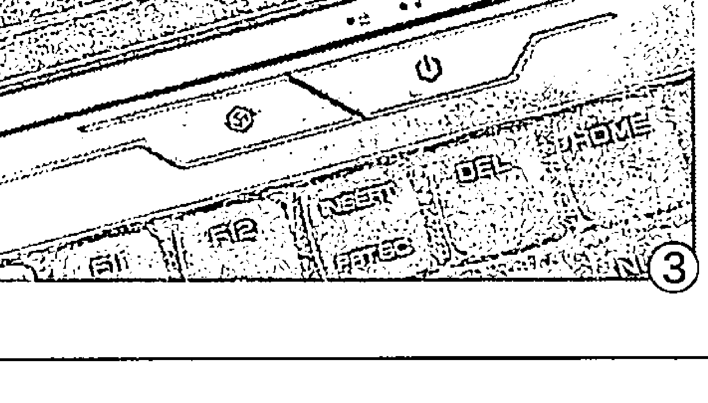

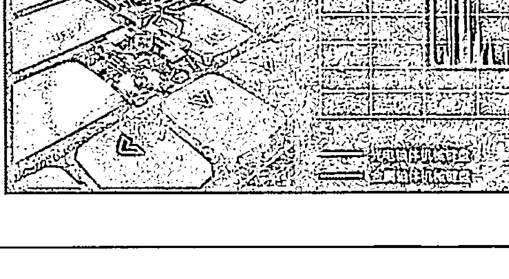

### 留意配置上的差异

本文涉及的两款产品配置和价格都取自于京东4月28日的报价，作为新品价格上下波动是难免的，所以大家在选购前要以当时的具体价格为准。之所以强调这一点，是因为机械师旗下的笔记本主打半DIY，官网和京东提供的配置总会出现变化。比如官网销售的机械师F117-Break标配256GB PCIe SSD，没有机械硬盘；而京东在相似价位销售的F117-Break却标配128GB SSD（SATA通道）和1TB容量的双硬盘，消费者可以根据需求进一步加价升级（图5）。

就本文涉及的两款产品而言，它们的差别只是标配的SSD分别为SATA通道和PCIe通道，持续读取速度分别在550MB/s和2000MB/s左右，磁盘性能方面还是机械革命深海幽灵Z2占优。

就配置的灵活性而言，机械革命深海幽灵Z2的优势较大，它还提供了搭载八代i5-8300H和GTX1050独显的低配版，5999元的入手门槛更低。两款产品都准备了升级到GTX1060独显的高配版，如果你更在意性能且预算充裕可以特别留意一下。

在升级潜力方面，机械师F117-Break和深海幽灵Z2的表现都是完全一致的，因为它们的接口布局、拆机后的散热模块和主板结构相同。

| 处理器 | 八代i7-8750H | 显卡 | GTX1050 Ti 4G独显 |
| :--- | :--- | :--- | :--- |
| 屏幕 | A+级无亮点屏 AHVA | 散热 | 双风扇四铜管 4出风口 |
| 套餐 | 内存 | 存储 | 键盘 | 补差价 | 到手价 |
| :--- | :--- | :--- | :--- | :--- | :--- |
| 加强版 | 8G DDR4 | 1TB机械硬盘+128G固态 | 机械键盘2.0 | - | ¥6999 |
| 光华版 | 8G DDR4 | 1TB机械硬盘+256G固态 | 机械键盘2.0 | +199 | ¥7198 |
| 倍音速光华版 | 8G DDR4 | 1TB机械硬盘+256G PCI-E固态 | 机械键盘2.0 | +399 | ¥7398 |
| 倍音速旗舰版 | 16G DDR4 | 1TB机械硬盘+256G PCI-E固态 | 机械键盘2.0 | +999 | ¥7998 |
| 倍音速搭载PCI-E 256G固态，是普通M.2固态的6倍左右，读取速度约3300MB/秒。 |

这两款产品都采用了双风扇三热管的散热模块，准备了2个内存插槽、2个M.2 SSD插槽、1个2.5英寸SATA硬盘位（图6），HDMI和双miniDP接口也能轻松实现三屏输出。

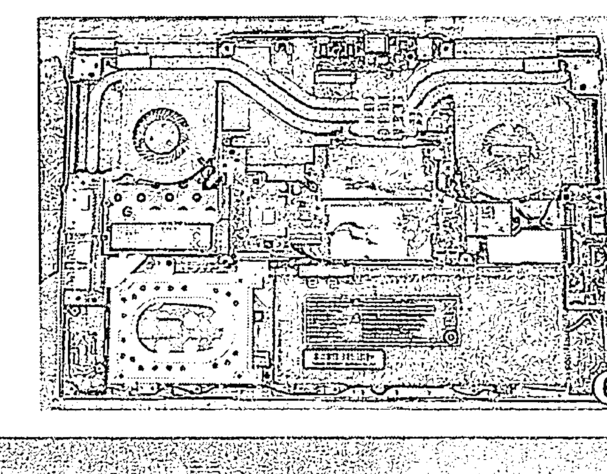

当游戏本遇到全面屏后，高性能产品就不再是我们记忆深处的“傻大黑粗”了，可媲美14英寸笔记本的便携性让它们随时能和我们外出驰骋游戏战场。考虑到两款产品的处理器、内存和独立显卡完全相同，所以二者具备相似的性能动力，在挑选时同配置情况下谁更便宜选谁即可。

# 荣耀10 PK 荣耀V10

在旗舰级移动处理器中，麒麟970的口碑远比性能更令人满意，原因就是它集成的NPU具备强悍的本地AI运算能力，可以改善面部识别、相机场识别、语音助手和系统学习能力。随着荣耀10的上市，它与前辈荣耀V10之间的冲突就变得难以避免了。


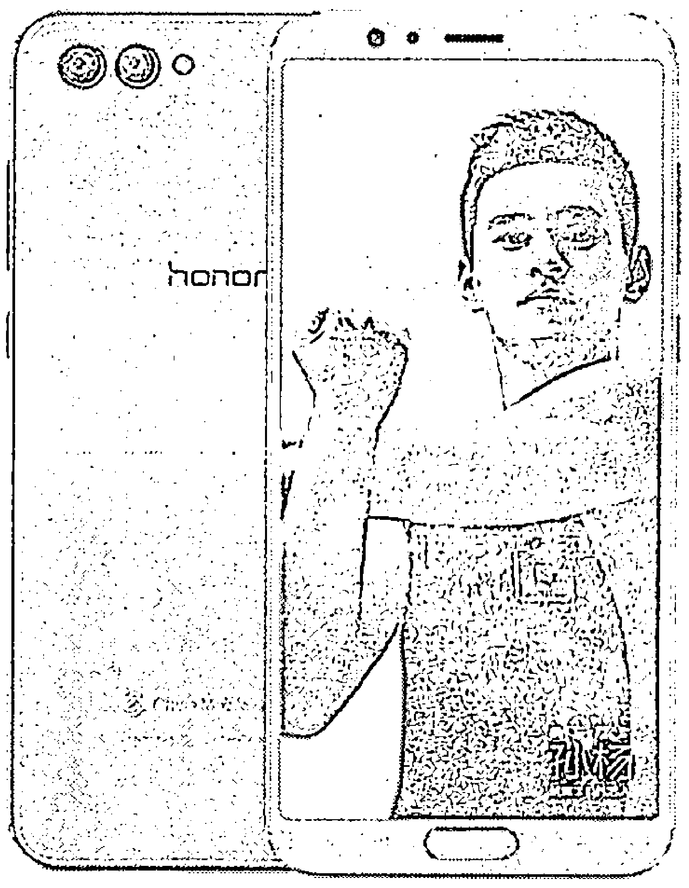

| 参数项 | 荣耀10 | 荣耀V10 |
| :--- | :--- | :--- |
| 网络 | 全网通（双卡双待） | 全网通（双卡双待） |
| 屏幕 | 5.84英寸（2280×1080像素） | 5.99英寸（2160×1080像素） |
| 处理器 | 麒麟970 | 麒麟970 |
| 内存/存储 | 6GB+64GB（不支持存储卡） | 6GB+64GB（支持存储卡） |
| 前置镜头 | 2400万像素 | 1300万像素 |
| 后置镜头 | 1600万+2400万像素 | 1600万+2000万像素 |
| 体积 | 149.6mm×71.2mm×7.7mm | 157.00mm×74.98mm×6.97mm |
| 电池/重量 | 3400mAh/153g | 3750mAh/172g |
| 参考价格 | 2599元 | 2799元 |

## 两个时代的代表

## 金属和会变色的玻璃

荣耀V10是去年底面世的老将，而荣耀10则是2018年4月诞生的新秀，两款产品代表了两个时代的碰撞。其中，荣耀V10采用了18：9显示比例的全面屏，而荣耀10则改用了19：9显示比例的刘海屏，后者凭借（相对）更大的视野换来了更高的屏占比参数（图1）。需要注意的是，由于荣耀V10的屏幕尺寸为5.99英寸，而荣耀10则选用了5.84英寸屏幕，所以以后者具备更显苗条的机身，更利于单手操作。

荣耀V10和荣耀10都采用了正面指纹识别设计，将椭圆形的Home键嵌入到了手机“下巴”上，这在后置指纹当道的今天显得难能可贵。而两款产品在设计上的差异，除了荣耀10剪出了刘海屏以外还体现在后盖的材质方面。
荣耀V10采用了全金属一体化的机身设计，拥有极光蓝、幻夜黑、沙滩金和魅丽红四种配色版本，前三种配色后盖细腻的磨砂工艺可以呈现更好的金属触感，穹顶式的U型纳米注塑天线条也不会破坏金属后盖的整体性（图2）。此外，荣耀V10的魅丽红版还通过微米级的金属雕刻工艺，可以让金属后盖泛溢出类似玻璃一样的效果。
荣耀10采用了金属中框和四曲面玻璃后盖，边缘的弧形可以更好地贴合手掌，带来更舒服的持握手感。同时，这款产品除了海鸥灰和幻夜黑两款配色以外，还在业内首推“幻影蓝”和“幻影紫”

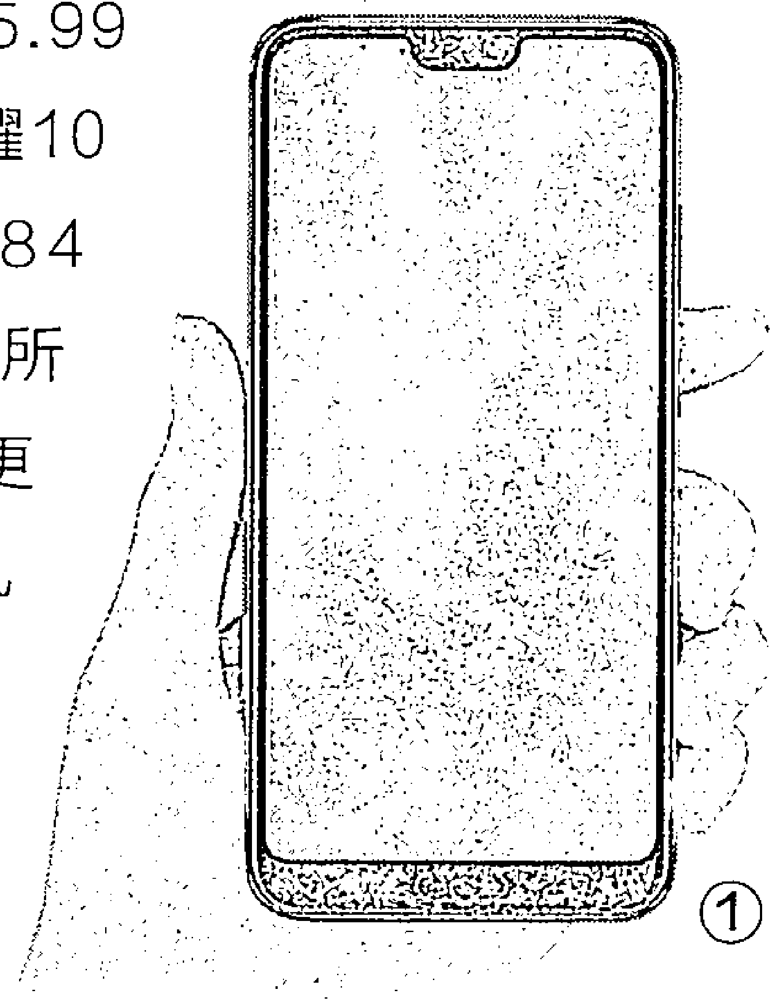

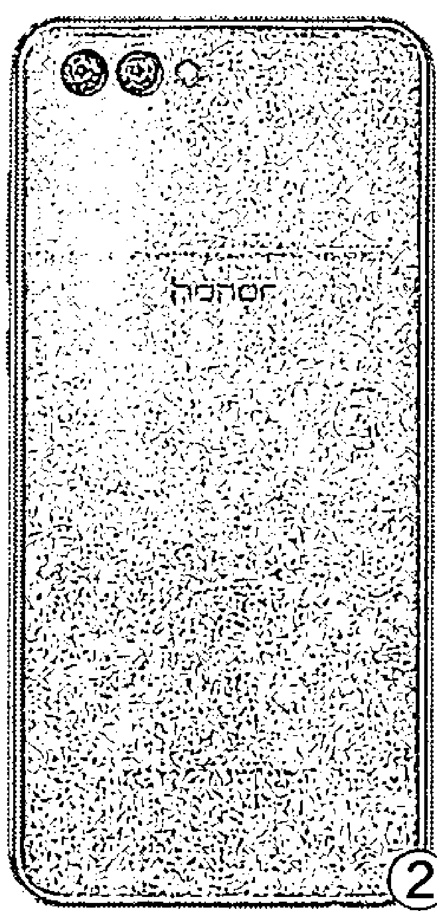“影紫”配色，借助变色极光镀膜工艺（图3），当光线直射机身时，在不同的角度、不同的亮度下都会呈现出不同的炫酷色彩。

# 配置之变源于镜头

荣耀V10和荣耀10的核心配置相同，它们都搭载了麒麟970（图4），这颗八核处理器由台积电最新的10nm工艺打造，采用四核A73+四核A53架构，最高主频可达2.36GHz。同时，麒麟970还首发ARM最新的Mali-G72MP12 GPU，拥有12个计算核心。就性能而言，麒麟970和高通骁龙835处于同一个档次，结合荣耀10和荣耀V10内置的6GB内存（2499元的荣耀V10低配版标配4GB内存）和UFS闪存，现在还没有它跑不流畅的3D游戏。

两款产品在配置上的差异体现在镜头层面。其中，荣耀V10采用1300万像素前置摄像头（F/2.0光圈），以及1600万（彩色）+2000万（黑白）像素后置双摄，并有着F/1.8大光圈。而荣耀10则将前置摄像头提升到了2400万像素（F/2.0光圈），后置双摄也升级为1600万（彩色）像素+2400万（黑白）像素，光圈同样是F/1.8。从表面来看，荣耀10的前置镜头和后置黑白镜头有了更高的像素值，对画质会有一定的增益。实际上，这两款产品在拍照上的最大差异，其实是体现到了AI优化层面。

# 看不见的较量

荣耀V10预装EMUI8.0，荣耀10则升级到了EMUI8.1，这两个系统版本间的差异，是后者对AI进行了进一步的挖掘。简单来说，以荣耀V10为代表的第一批麒麟970手机（还包括华为Mate 10和Mate 10 Pro）预装的EMUI8.0系统暂时只能智能识别13种场景（图5），包括蓝天、花朵、绿植、海滩、日出/日落、舞台、食物、文字、夜景、雪景、猫、狗、人像。

而以荣耀10为代表的第二批麒麟970手机（还包括华为P20、P20 Pro）预装的EMUI8.1则增加到22类标签，支持500+个场景识别，更多的拍摄对象都能借助AI进行定制化的参数微调，从而获得更好的成像质量（图6）。此外，在相机APP的拍照界面，EMUI8.0识别出的场景是无法关闭的，而EMUI8.1识别出场景时，你可以根据需要关闭它，直观感受开启AI优化和关闭AI优化对成像效果的影响。

根据惯例，荣耀V10、华为Mate 10/Mate 10 Pro未来都会升级到EMUI8.1，只是现在官方还没给出具体的时间表。

# 2400万AI摄影

# 随手一拍大显身手

2400万像素黑白镜头+1600万像素彩色镜头，摄影创作从一个简单到专业的新进阶的AI摄影，除了智能识别22类标签和5000多种场景外，还创新性地使用了图像语义分割与分区调校的AI技术，使蓝天更通透、绿植更葱翠，画面层次更分明，随手拍出摄影大作。

> 相对而言，金属的荣耀V10具备沉稳和耐摔的特性，而荣耀10则带来了更为轻巧的机身和时尚炫酷之感，再加上全面屏和刘海屏的理念冲突，我们可以根据对外观设计的喜好加以取舍。如果你更在意拍照，有着更高像素镜头，再辅以EMUI8.1的AI优化加持后，荣耀10的成像效果也要领先于前辈。考虑到同配置的荣耀V10要比荣耀10还要贵200元，所以现阶段还是作为新品的荣耀10更值得选择。如果你的预算有限，2499元的低配版荣耀V10也可以考虑。

# 旗舰之争

# 一加手机6 PK 坚果R1

继小米MIX2S之后，高通骁龙845终于被更多国产手机猎装，追求顶级性能和体验的玩家有了更多的选择余地。而一加手机6和坚果R1，则是近期受关注度最高的旗舰新品，那么它们之间谁更适合你？

| 参 数对比 | 一加手机6 | 坚果R1 |
| :--- | :--- | :--- |
| 网络 | 全网通(双卡双待) | 全网通(双卡双待) |
| 屏幕 | 6.28英寸AMOLED (2280×1080像素) | 6.17英寸 (2242×1080像素) |
| 处理器 | 高通骁龙845 | 高通骁龙845 |
| 内存/存储 | 6GB/64GB (不支持存储卡) | 6GB/64GB (不支持存储卡) |
| 摄像头 | 1600万/1600万+2000万像素 | 2400万/1200万+2000万像素 |
| 体积 | 155.7mm×75.4mm×7.75mm | 153.3mm×74.5mm×7.9mm |
| 电池/重量 | 3300mAh/177g | 3600mAh/170g |
| 参考价格 | 3199元起 | 3499元起 |

## 不一样的异形屏

作为2018年的全新旗舰，一加手机6和坚果R1自然不再满足于2017年流行的“全面屏”，而是纷纷进化到“异形屏”时代，只是二者却选择了不同的异形方向。

其中，一加手机6采用了和iPhone X类似的风格，在屏幕顶部切割出了一道“刘海”(图1)，并将听筒、前置摄像头和光线距离传感器嵌入其中。这符合2018年手机圈的潮流趋势，OPPO R15、vivo X21、华为P20和荣耀10等新品都采用了类似的设计。

坚果R1则选择了相对小众的异形切割方式，在屏幕顶部仅保留了一个可以容纳前置摄像头的“美人尖”(图2)。类似的设计我们曾经在夏普AQUOS S2和Essential Phone身上得见，为此坚果R1还改用了隐藏式的微缝听筒，进一步扩展了视野面积。考虑到不是所有用户都能接受异形屏风格，所以两款产品都能选择隐藏顶部刘海/美人尖的功能。

## 屏幕材质有差别

坚果R1采用了IPS材质屏幕，屏幕纵横比为18.7:9，拥有1500:1的对比度和96% NTSC色域以及Display P3广色域等特色。而一加手机6则采用了AMOLED材质屏幕，支持DCI-P3显示，色域和对比度更高，在显示深色背景时的耗电量也更低。

此外，两款产品的屏幕差异还体现在表面覆盖的保护玻璃上，坚果R1采用了康宁第三代大猩猩玻璃，而一加手机6则选用了康宁第五代大猩猩玻璃，就防划耐磨性而言显然是后者占优。

## 设计细节上的对比

坚果R1采用了航空级7系铝材质的中框，背部为3D曲面玻璃，并将背部指纹识别模块和锤子Logo图案合二为一。这款产品提供碳黑色和纯白色两种配色，前者在金属中框上还配有细红线装饰(图3)，而纯白色版则取消了这道红线，从而换来了更简约干净的外观。

坚果R1的电源和音量加/减都是圆形的按钮，在机身的另一侧还配备了额外的可自定义功能的快捷键。需要注意的是，R1取消了3.5mm耳机孔，想听歌的用户少不了借助蓝牙耳机或USB Type-C与3.5mm耳机转接线帮忙。

一加手机6同样是铝合金材质中框，正反两面都是第五代大猩猩玻璃，后盖玻璃的曲面弧度要比坚果R1更大，可进一步提升持握时的手感。这款产品保留了三段拨动式的按钮以及3.5mm耳机孔，后置双摄和指纹识别器也是居中垂直排列，而一加也为该产品准备了亮瓷黑、墨岩黑、月牙白和复仇者联盟定制版的配色。

一加手机6在设计上还有一个亮点，那就是在屏幕和后盖的间隙、按键、三段式开关、SIM卡槽、耳机插孔、指纹和镜头模组等关键部位都做了严密的防水处理，并经受严格的测试标准验证，可实现生活防水能力（图4），无惧洗漱和下雨时的沾水问题。

## 性能和功能的比拼

一加手机6和坚果R1都搭载了骁龙845处理器，内置6GB LPDDR4X内存和64GB UFS2.1起步的存储空间，理论性能一致。所以，它们在功能上的差异就值得引起我们的重视了。

一加手机6支持NFC、5V/4A快充，通过4×4MIMO天线技术可实现下行Cat.16（传输速率1Gbps），预装基于Android 8.1的氢OS 5.1，支持全面屏手势、AI全速引擎、负一屏以及轻快稳定流畅的接近原生Android级的系统体验（图5）。

坚果R1同样支持NFC功能，并带来了线性马达、QC4+快充（18W）和10W的无线充电功能。该产品预装Smartisan OS 6，针对新增的按压功能提供了多种快捷工具可选项，在融入AI技术后大爆炸的分词和闪念胶囊等功能也得到不小的进化。

两款手机都进一步强化了拍照能力，借助骁龙845和系统层面的AI算法，在前置单摄的前提下也能实现很好的背景虚化效果。一加手机6的后置双摄为IMX519+IMX376K传感器，而且还都是f/1.7大光圈，白天更清晰，夜晚更纯净。而坚果R1则采用了IMX363+IMX350传感器的组合（图6），拍照效果同样不俗。

> 一加手机6和坚果R1都是在设计和性能上不留遗憾的旗舰之作，一加手机6的优势在于3199元的起价更低，AMOLED屏幕和保留的3.5mm耳机孔可以吸引更多用户的关注。而坚果R1的特色在于引入了无线充电、压感屏幕和更大的3600mAh电池，只是配置越高，和一加手机6之间的价差就越大（如8GB+128GB版就贵了900元），可选1TB容量版本（8848元），仅适合不在乎预算的用户考虑。

# 游戏本最佳拍档一览 文|周之

所谓“游戏本（Gaming Notebook）”是笔记本行业为了细分市场而推出的名称，由于外星人（Alienware）和微星（MSI）的大力推广，目前玩家已经广泛接受了这一概念。近年来，虽然移动设备市场的冲击导致笔记本行业整体下滑，但是游戏本却由于其精准的用户群体逆势上扬，如今已经占据了笔记本行业的半壁江山。

顾名思义，游戏本的设计重点是游戏性能，其次是炫酷的外观，便携性往往被置于不太重要的位置。但因为其“笔记本电脑”的根本属性，为了能够携带（虽然不一定要“便于”携带）而不得不做一些取舍。较小的屏幕、手感一般的键盘、触控板指点方式、内置小型扬声器等，都是笔记本设计取舍中的典型代表。在本文中，笔者会带领大家了解一些可以针对性地大幅改善游戏本体验的外设，在一定程度上弥补游戏本做出的这些“取舍”。

## 键鼠

玩家要提升游戏体验和成绩，不仅需要更顺手的游戏键鼠，而且最好能保持手感的熟悉度，所以在选择键鼠产品、耳机等产品时，笔者更倾向于那些可以和游戏本一起随身携带的产品，才能保证玩家在不同的地方都发挥出应有的实力。

### ◎ RK61

RK61虽然声名不显，但却是十分值得推荐的一款便携双模机械键盘，而且价格相当实惠。它仅提供了主键区和Fn功能键区的64个按键，缺少数字键盘区和方向、Del等办公常用键使其办公能力受限，但用来玩游戏还是不错的，大尺寸键帽和充足的键程保证了使用手感，同时还有多种轴体可选。其窄边框设计使得键盘整体十分小巧，可以在狭小的空间内放置使用，同时又可以十分便于收入背包。

蓝牙/有线的双模设计使得RK61在旅途中也可以方便地连接使用，在蓝牙连接时的延迟较低，完全可以满足游戏用户的需求。如果身处复杂环境，蓝牙延迟较高或者不稳定，也只需要一根通用Micro USB连接线就可以切换至有线模式，保证输入的稳定性。

RK61除了支持Windows平台，还兼容Android和iOS平台，同时最多控制三台蓝牙设备，只需要通过FN+Q、W、E三个组合键就可以轻松切换，保证在所有平台的输入体验一致。

RK61支持智能待机模式，不使用时自动休眠，保证最长10小时的持续使用时间和最长360小时的待机时间。

### 多彩T9X

多彩T9X单手机械键盘是比较特殊的游戏键盘解决方案。它采用29+4键设计，虽然看起来很奇怪，但却覆盖了游戏常用的键位，并以人体工学设计保证了游戏操作手感。全键支持自定义、铝合金底座、ABS键帽、全键无冲、1680万色RGB灯效等标准机械键盘该有的属性一个不落。

多彩T9X有多个版本，普通版采用USB Type-C有线连接，支持在PC、手机等多种设备上使用，高配版加上了蓝牙连接模式，可以摆脱线缆对游戏体验的束缚。

由于采用非标准键盘设计，该键盘尺寸仅有248.44mm×199.51mm×38.02mm，主体部分只有一个巴掌大小，十分便携。

### 雷柏（Rapoo）V320 双模游戏鼠标

雷柏产品虽然普遍价位较低，但质量品控还可以。雷柏V320采用无线/有线双模设计，2.4GHz无线传输的最远操作距离可达10米，有线连接则可以边用边充电，保证了使用的连贯性。V320内置470mAh锂电池，续航能力十分出色，智能休眠模式在鼠标无操作后会自动进入休眠模式以节省电量，设计十分贴心。

雷柏V320共有三种工作模式，分别支持MOBA、FPS游戏和办公应用，只需要同时按住左右键和前进键就可以轻松切换。8个可编程按键可以通过驱动软件自由设定，并且支持宏功能，一键就能快速执行复杂任务。其磨砂手感的漆面保证了防滑、防汗、不褪色，左侧非对称式指托设计给了大拇指休憩的区域，即使长时间工作、游戏也不会感到劳累。

雷柏V320采用PMW3325传感器，拥有20G加速度，最高支持1000Hz回报率，保证了高速移动下也不会“丢帧”。它设计有7个DPI档位，支持200DPI~5000DPI，能以100为单位逐级微调，充分适应每个人不同的手感。1600万色的呼吸灯支持多种灯光模式，配合上盖裂痕纹路，方显“光污染”的本色。

### 罗技G903 RGB 双模游戏鼠标

毫无疑问，罗技G903站在鼠标探索领域的最前沿，其最高速度达到12000DPI，可定义为5档实时调整，拥有400IPS的追踪速度和10米每秒的识别追踪精度。对称设计使得无论左手还是右手型玩家都可以随心使用，约1680万色RGB灯光支持多种模式，11个可编程按键都能够进行自定义，双模式滚轮则可应对各种情况。G903犹如鼠标中的劳斯莱斯一般，无论是否用得上的功能，在它身上都可以找到。

作为目前游戏外设领域的领导厂商，罗技推出的旗舰无线鼠标G903有着毋庸置疑的性能表现。同时作为支持LIGHTSPEED无线技术的扛鼎之作，G903低到1ms的快速回报率让一些有线鼠标也不禁汗颜，无线连接再也不是延迟的代名词。它支持POWERPLAY无线充电技术，与POWERPLAY无线充电鼠标垫配合，通过电磁共振来创建无限充电能量场，无论是游戏使用中还是休息静止时都可以为鼠标进行充电，同时丝毫不会干扰鼠标的精准运行和数据传输。即使没有POWERPLAY无线充电垫，G903也可以保证无灯光模式下32小时的游戏时间，而且它只需要在USB端口上有线使用1.5小时即可充满，未携带连线的时候，直接使用标准Micro USB连线就能充电。

## 耳机

### - 西伯利亚MG-1

西伯利亚同样是名不见经传的品牌(注意不是赛睿的西伯利亚Siberia耳机系列)，但它专注于游戏耳机，其旗下产品确实不错。西伯利亚MG-1是一款比较少见的耳塞式电竞耳机，它采用了动圈单元设计，高频解析表现不俗，细节保真也尚可，同时该耳机支持听声辨位功能，方便玩家充分沉浸于游戏。其人体工学翼尖软骨的设计保证了耳机与耳廓的充分贴合，佩戴十分牢固。同时耳机支持可拆卸式插入麦克风加线控调节器，针对游戏使用充分优化。随机附带的一分二音频转接线保证了对PC设备的适配，台式机的耳麦分离接口也可直接使用。它的价格只有一百元出头，让玩家可以轻松购买，而且比头戴耳罩式耳机更加便携，带着爱机出行时把它塞到口袋里就行了。

### - 雷蛇雷霆齿鲸V2 USB版

作为电竞外设领域的老将，雷蛇的产品一直有着不错的口碑，这款雷霆齿鲸V2耳机也继承了这一点。其虚拟7.1环绕声为听声辨位提供了便利，通过Razer Surround (雷音)软件还可以自定义环绕声设置，增强环境听觉效果，简直可以作为FPS游戏中的合法外挂。

雷霆齿鲸V2的高品质40mm单元可以提供澎湃深沉的低音效果，音质出色。一体化铝制框架使外观看起来霸气十足，更在具有较好柔韧性的同时保证了轻巧坚固。仿皮质的耳罩可以把耳朵充分包裹，在减少头部压力的同时提供了出色的隔音效果，保证玩家的沉浸性不被外部噪音干扰。可拆卸软管麦克风的设计提供了很好的使用体验，不仅可以自定义方向，还可以方便地从耳机上取下。

## 家用辅助设备

在家中使用游戏本的时候，玩家使用时间更长、使用强度更大，不仅需要键鼠等外设，还需要辅助散热、姿态调整，甚至是外接显示器，以提供更好的稳定性和使用体验。

### - 埃普(UP) UP-1S 可折叠多功能支架

虽然笔记本支架并不能给我们带来明显的性能提升，但却可以带来一个更好的操作角度，还能避免热量积压在笔记本底部，在一定程度上提升散热能力。作为常年适配苹果产品系列的专业支架厂商，埃普的产品都有着不俗的工业设计，埃普UP-1S就是其中一个鲜明的例子。

埃普UP-1S支持15.6英寸以下的笔记本电脑，折叠后尺寸仅有200mm×50mm×24mm，总重不到300g，如果需要的话，装在背包中与游戏本一起携行问题不大。它标配加强横梁，可以让三点式接触变成多点接触，提升了使用时的稳固性。此外，它还支持12英寸以下的平板电脑或智能手机设备，让用户在使用时解放双手，提升使用体验。

### - Rhino风魔方抽风机

笔记本辅助散热外设众多，大多数产品可以提供一定程度的降温效果，但并不明显。据笔者亲测，唯一有明显作用的产品就是抽风式散热器，最大降温幅度可达20℃以上，比如Rhino风魔方。作为最初的三大抽风散热器品牌之一，如今的风魔方已经是第四代产品。它针对不同电脑型号有直出和侧向两种方式；针对特殊出风口的电脑，还支持3D打印加数控定制，可以适配市面上大部分尺寸的笔记本品牌(打开屏幕会全部遮住出风口的电脑无法适配)。它标配消音器，可以大幅降低抽风机的噪声。使用抽风散热器虽然可以带来明显的降温效果，但由于功率强大，即使有消音措施，噪声还是非常明显。如果电脑散热效果不是特别差，建议只用支架避免积热即可（有没有风扇送风倒不重要），同时不要使用键盘硅胶套之类的产品，避免堵塞键盘上的风道。

## 显示器

### - 宏碁XF240H

虽然游戏本大都会配置全高清甚至更高分辨率的屏幕，但屏幕尺寸却被限制在18英寸以下，甚至大都只有14英寸~15.6英寸。这样的高分屏画面只能说是锐利，因为字体等元素过小而无法称之为“清晰”，但进行缩放调整又抵消了高分辨率的显示优势。这时，我们就需要选择一台合适的外接显示器来提升使用体验。

宏碁XF240H是一款24英寸全高清显示器，虽然价格只有千元出头，但提供了电竞级别的性能，拥有144Hz的刷新率以及AMD FreeSync防撕裂技术，1ms灰阶响应速度保证了画面的低延迟精准呈现，ComfyView防反光技术可以减少眩光，保护玩家的眼睛。除此之外，宏碁XF240H的多功能底座支持垂直升降、水平旋转、垂直旋转、俯仰角度调节等功能，可以和小巧的游戏本配合，以各种不同的角度和姿态呈现画面。它接口齐全，DVI-D、HDMI、DP接口可以连接多种设备，内置双2W扬声器还可以弥补一些游戏本声音方面的缺陷。

# 多口USB充电器怎么选

在上期杂志中，我们分享了USB魔方插座的选购思路，这种方寸之间的设备可同时满足接驳多部电器和移动设备的需求。但是，如果你没有为笔记本或其他大型电器供电的想法，只是需要同时给多部数码产品充电，此时就不妨将目光投向多口USB充电器身上了。

## 需求决定体型

在很多家庭和办公环境中，我们往往面临需要同时给多部数码产品（如智能手机、智能手环、智能手表、电动牙刷、平板电脑等）充电，各种各样的充电器和数据线会充斥整个房间，杂乱交错的线缆会令人心生厌烦。而多口USB充电器就是解决这一尴尬问题的钥匙。

只是，我们在选择此类产品时，还是需要提前考虑好其主要的工作场景。比如，如果你是想解决家庭多成员同时充电，使用场景被局限在卧室客厅，那就不用在意多口USB充电器的体积，配备更多USB接口和更大输出功率的产品才是首选（图1）；如果你每次出差都会随身携带手机、平板和手表，从“减负”的角度来看就需要体积小巧的多口USB充电器了。

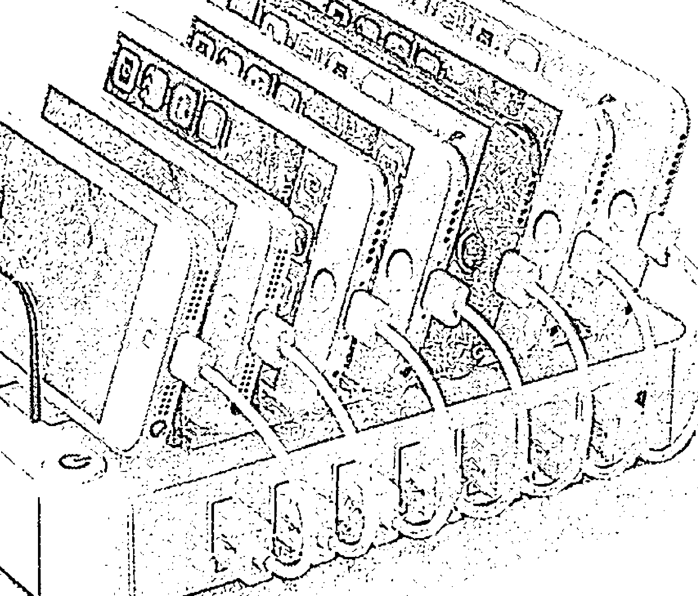

## 有线还是直插

多口USB充电器大都采用两种形态，第一种是传统充电头造型，只是体型略大并加入了更多USB接口（图2），这种产品普遍自带双脚插头，可以直接插在墙体或接线板的AC插孔上（图3），而我们也习惯将其称为“直插式”USB充电器。

另一种形态则适用于配备更多USB接口的设备，它们大都采用扁平形状设计，并通过独立的线缆和插头，再与墙体或接线板的AC插孔连接，这种类型的USB充电器则属于“有线式”。

“直插式”USB充电器的好处是便携性一流，没有只带机身而忘带线缆的隐患。但是，有些墙面上的非国标AC插孔很松，这种“直插式”USB充电器一碰就容易接触不良。“有线式”USB充电器的优势是插头与主体分离，固定起来更方便，而主体也能从墙面转移到桌面或更多位置上（图4）。

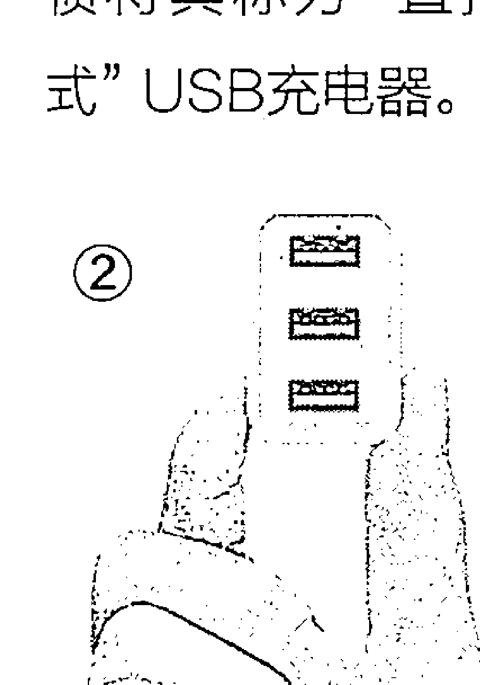

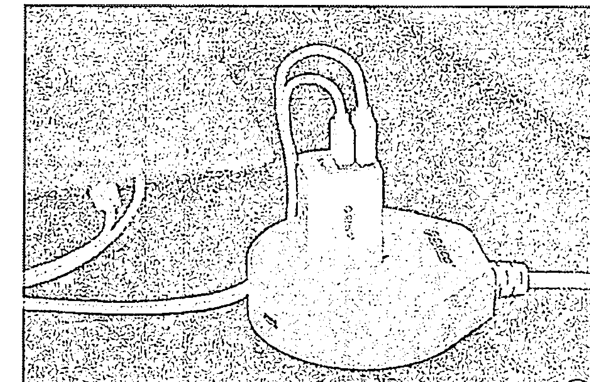

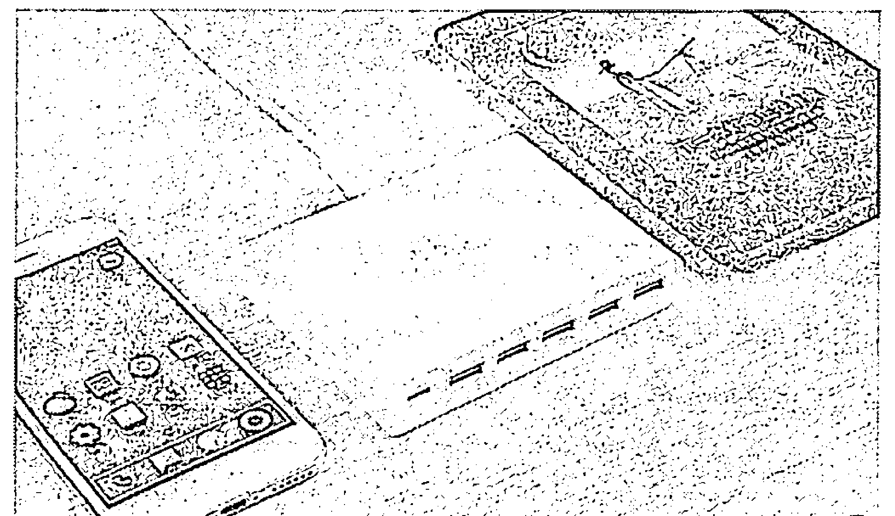

## USB接口数量

充电器身上的USB接口数量，将决定它能同时为多少部数码产品充电。那么，多口USB充电器的接口是越多越好吗？

一般来说，“直插式”USB充电器身上有2个到3个USB接口就基本够用，再多就会影响它的便携性，毕竟想要同时充电的设备越多，你就需要同时携带更多根的数据线（图5），而且USB充电器多接口同时满载时的发热量较高，体积越小越容易出现过热的安全隐患。

而“有线式”USB充电器由于位置固定（放在家或办公室），所以它们的接口自然是越多越好（图6）。只是USB接口数量越多，同时充电时的供电效率也可能就越差，这一点我们会在下面的章节加以阐述。

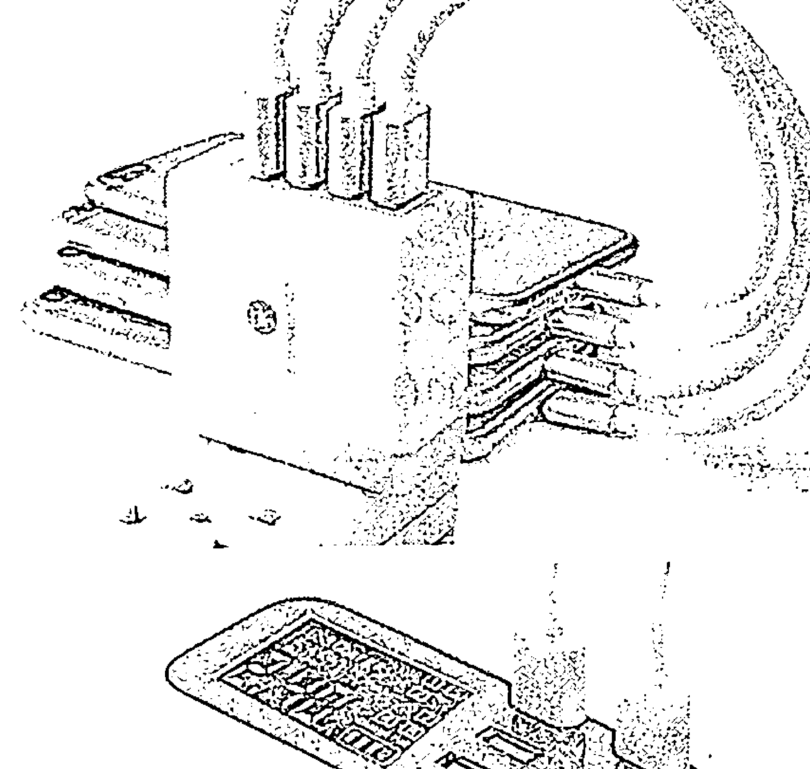

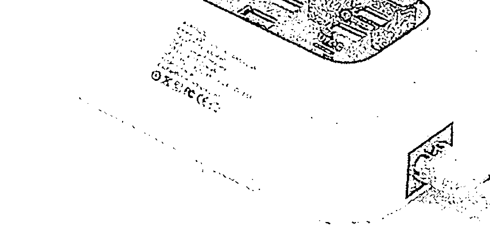

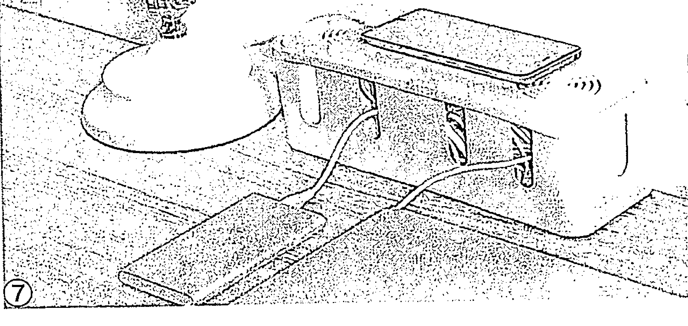

> 小提示
>
> 多口USB充电器在插入多条数据线时也会出现线缆杂乱的问题。如果你在意桌面的整洁干净，可以选择搭配一款收纳盒，将USB充电器和线缆主体藏于收纳盒内，只在外面露出USB接口（图7），是不是很清爽呢？

## 最大输出功率

对多口USB充电器而言，它所能支持的最大输出功率，才是最为核心的参数指标。大家可以留意一下相关产品的官网参数、包装或信息铭牌，上面都会注明“最大总输出”的项目（图8），比如5V/3.1A、5V/5A、5V/12A等等，从中我们就可以计算出该产品最大的输出功率：（5V×3.1A）15.5W、（5V×5A）25W或（5V×12A）60W。

问题来了，假设一款充电器有2个USB接口，其最大输出功率为15W，又该如何进行分配呢？一般来说，厂商大都会采用两种解决思路：

第一种，指定某个接口支持最大5V/2A（10W）输出（电路转换存在耗损，实际输出功率会比理论值低一些），只有插在指定接口的手机才能享受10W供电（需要手机端支持超过5V/2A的输入）。同时连接2款手机时，手机间就将平分15W总功率了。

第二种，以智能分配的形式，当只有1款手机连接充电器时，任意USB接口均可激活最大5V/2A输出，但当同时接入2款手机时则平分15W总功率。

| 参数 | 说明 |
| :--- | :--- |
| 输入 | 100-240V~0.8A |
| 最大总输出 | 5V/5A |
| 单口最大总输出 | 5V/2.4A |
| 尺寸 | 98×65×25mm |
| 颜色 | 黑色/白色 |
| 重量 | 159g |
| 配件 | 1.5米AC线*1 |


因此，对多口USB充电器来说，其最大输出功率越高，就能让更多USB接口以所能支持的最大功率进行输出。一般来说，30W算是衡量一款USB充电器品质是否优异的门槛，可让至少3个USB能进行10W功率的输出。

## 是否支持快充是新指标

问题来了，在高通QC2.0/3.0、联发科PE2.0/3.0、华为FCP和OPPO VOOC等快充技术面前，5V/2A的10W充电属于绝对的“慢充”。为了迎合新款手机的快充需求，越来越多的多口USB充电器开始引入快充技术。

现阶段在多口USB充电器领域普及度最高的就是高通QC2.0/3.0，很多产品身上都有至少1个USB支持QC2.0/3.0技术，能进行9V或12V的高压直充，实现最大18W的充电功率。但是，选购此类充电器时我们需要留意它支持快充的USB是否为独立输出。如果是，当其他USB接口也连接手机时不会影响快充USB的充电功率；如果不是，当其他USB接口连接手机时，快充USB的输出电压会自动降到5V，从而影响充电效率。

因此，如果你家里有2部手机都支持QC快充，那最适合选择的就是输出功率大于等于36W，且支持2路独立输出的USB充电器（图9），可以确保同时连接的2款手机都能享受15W以上的快充体验。

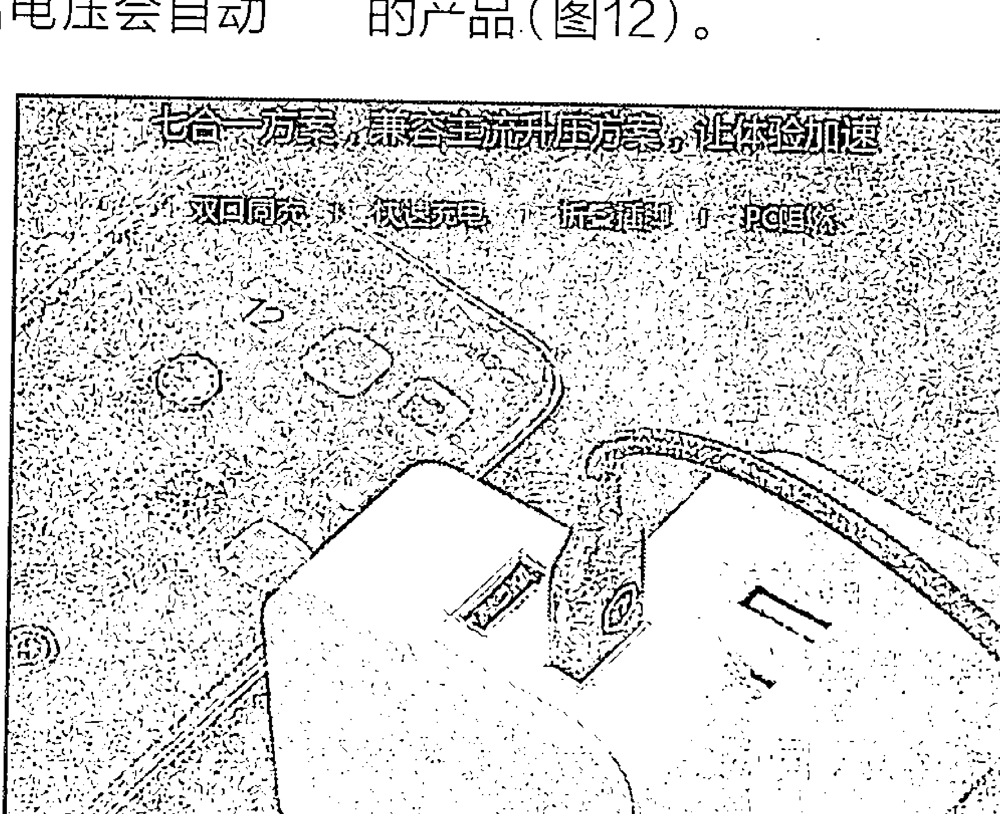

由于手机芯片（如高通、联发科）和厂商（如华为、OPPO）旗下的快充技术都有自己专用的认证和识别协议，所以这就导致市面上没有一款USB充电器可以实现全兼容。部分产品能在支持QC2.0/3.0之余加上对PD协议的支持（图10），而表现更好的USB充电器也只能实现对QC2.0、QC3.0、FCP、SFCP、MTK PE、MTK PE+和BC1.2这7种协议的支持（图11）。

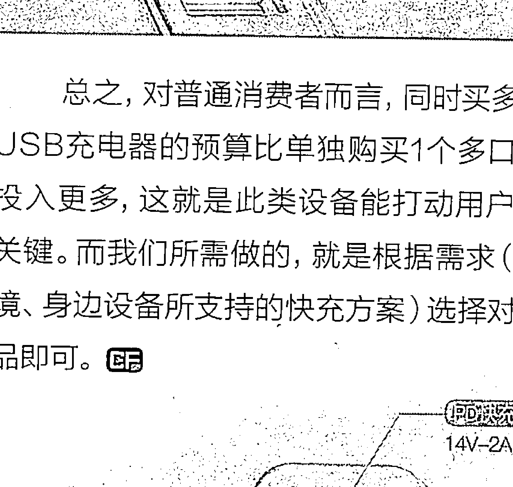

支持PD就意味着可以给iPhone 8或iPhone X快充。

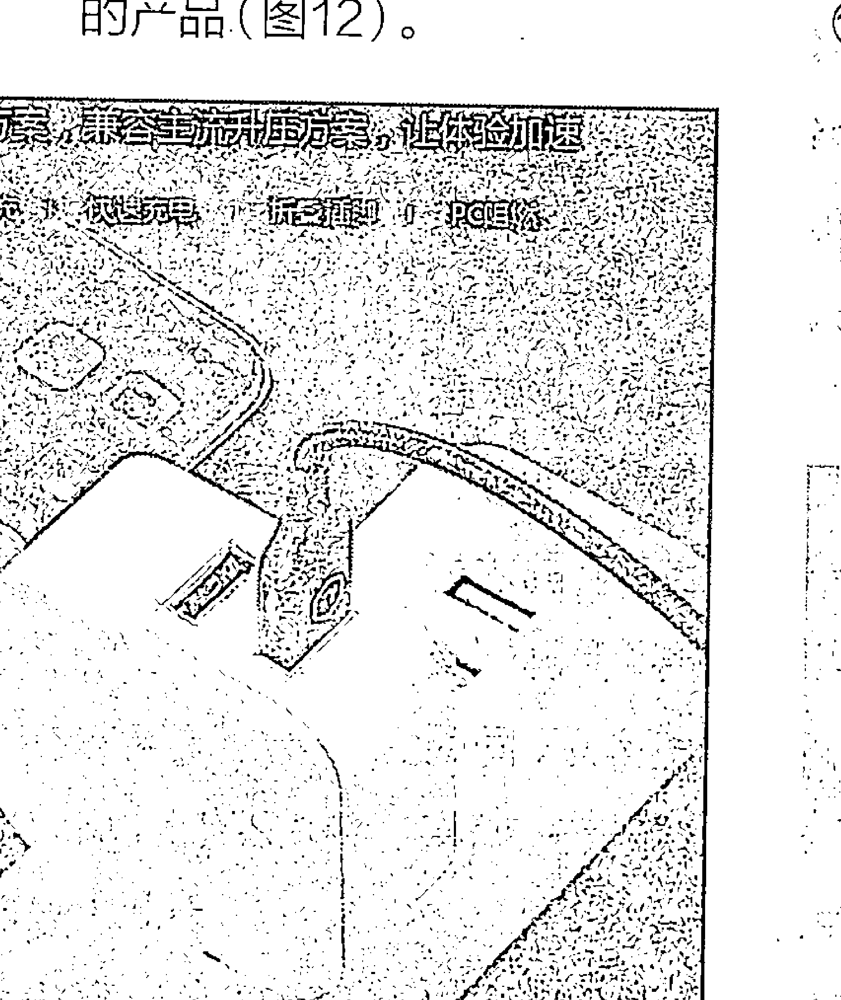

好消息是，华为/荣耀的多口USB充电器表现不错，它除了支持自家的超级快充（5V/4.5A），还兼容FCP（9V/2A）和高通QC2.0/3.0，也是目前市场上少有的支持低压大电流快充的产品（图12）。

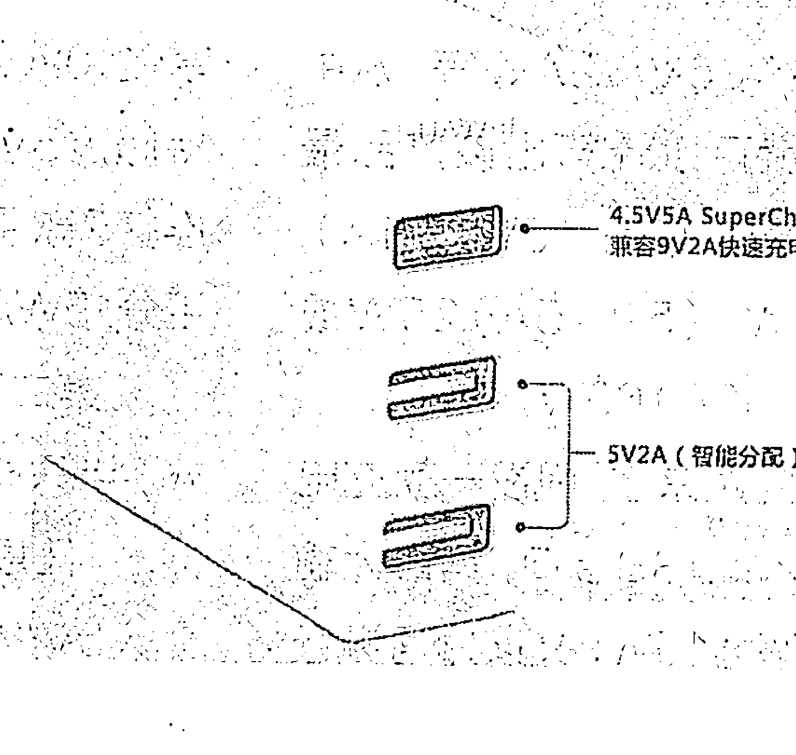

总之，对普通消费者而言，同时买多个单口USB充电器的预算比单独购买1个多口充电器投入更多，这就是此类设备能打动用户下单的关键。而我们所需做的，就是根据需求（使用环境、身边设备所支持的快充方案）选择对应的产品即可。