# 电脑爱好者2018合订本（四）

## 2018年19期~24期精华内容集合

精选每期实用技巧文章，收入内容更多更全；栏目归类深度整合，便捷查阅触手可及

电脑爱好者杂志社

# 《电脑爱好者》2018年合订本（四）

- 主管 中国科学院
- 主办 北京《电脑爱好者》杂志社
  中国计算机世界出版服务公司
- 编辑出版 《电脑爱好者》杂志编辑部
- 顾问 郭传杰

- 董事长 洪京一
- 副董事长 熊晓鸽
- 董事 万鹏远 许伟明 刘学义
- 社长 葛程远
- 出版人 许伟明
- 总编辑 张博
- 出版部 聂静(主任)

- 作者 《电脑爱好者》编辑部
- 发行总代理 北京爱好者文化传媒有限公司
  杨波(发行总监)
- 读者服务部(发行) 手机短信/电话：13801293315
  (周一至周五 9:30~11:30 13:30~17:00)
- 上门订阅杂志地址 北京市海淀区曙光花园智业园A座16D
- 订阅 全国各地邮局(所)
- 编辑部地址 北京市海淀区翠微中里14号楼4层
- 邮编 100036
- 国内发行 北京报刊发行局
- 邮发代号 82-528
- 中国标准连续出版物号 ISSN1005-0043
  CN11-3248/TP
- 印刷 北京新华印刷有限公司
- 广告经营许可证号 京海工商广字20170127号
- 出版日期 2018年12月30日
- 法律顾问 周涛律师
  网站：www.zt148.cn 电话：13366185341

本书如有印刷或装订质量问题，我们负责调换。
图文版权所有，未经同意不得转载、翻印
定价：36元

# CONTENTS

**《电脑爱好者》2018年合订本（四）** [邮发代号 82-528]

## 特别话题

- 主流“芯”势力 智能手机的中端处理器盘点 7
- 12年轮回将近 历代酷睿逐个数 19
- 最强选本指南 移动处理器平台大排行 25
- 看懂主控芯片 明白SSD的灵魂 35
- 拿什么拯救你 老款笔记本升级攻略 41
- 能装也要会修 装机常见故障与处理 53
- 计算谁为王 PC品类争霸战 59
- 从“看”时代转向“听”时代 文字转语音软件小解 70
- 逆水行舟 智能手机的这一年 76
- 走向2019 DIY热点抢先看 86
- 精彩纷呈 笔记本电脑的这一年 92
- VGA再见 视频接口与全数字视频时代 103

## 系统应用

- 一键进入 创建隐私浏览快捷模式 109
- 离了家庭组 也能共享文件 110
- 阻止通过移动设备安装软件 111
- 充分用好文件的时间属性 112
- 绰绰有余 方能高效运行 113
- 高效命令行 备份更简单 114
- 多窗口操作 遇问题不难解决 116
- 简单命令 实现个性化弹窗 118
- 系统保安全 开机自动创建还原点 120
- 三种方法 获知文件数字签名与否 122
- 用好Windows “系统配置”工具 123
- 移动文件管理者 让操作留下记录 124
- 不花一分钱 让声音再大些 125
- 不添内存条 电脑性能也提升 126
- Windows选择框透明颜色自定义 127
- 累积更新问题 两条命令解决 128
- OneDrive去留隐现任我控 129
- 这个录音机不再是“鸡肋” 130
- OneDrive “抛锚” “惹事” 为哪般 132
- Windows 10三大隐含窗格应用 133
- 揭开控制面板中程序入驻和隐藏之谜 134
- 实用简单的PowerShell命令 136
- 妙用“画图” 平凡软件不寻常 138
- 不连续文件多重选择技巧多 140
- 热点键值写入出错为哪般 141
- 用熟Windows 10两大“快速访问” 142
- 两招出手 让OneDrive更好用 143
- 巧建任务栏分类快捷菜单 144
- 变换方式 高效操控Windows 10 145
- 截图画草图 不再借外援 146
- 不重启 急救“开始”与“小娜” 147

## 软网生活

- GVIM记事本变脸提速 148
- 轻松获得微软或苹果风格图标 150
- 原汁原味 备份还原驱动程序 151
- 四位一体 请个多功能影像处理者 152
- 巧用Chrome地址栏提高浏览效率 154
- 无中生有 配置免费的星光镜和衍射镜 156
- 谁也别想跑 软件打造公平问答 158
- 网上秀图神器PicGo 159
- 电脑安全另有免费午餐 160
- 免安装 开启极客资源管理模式 161
- 系统清洁 自动手动任我控 162
- 内容与文件 剪贴、收藏、分享一条龙 163
- 文件有变化 即时能监视 164
- 分片突击 完成系统“大扫除” 165
- 硬件驱动与软件升级早知道 166
- 照片变电影 原来如此轻松 167
- 系统优化 不“动”注册表 168
- 工间休闲 电脑免费养金鱼 169
- 另类使用系统“发送到”功能 170
- 另辟蹊径 Linux上玩Windows游戏 172
- 自由随行 制作便携的虚拟机 173
- 清理页面“垃圾” 百度搜索更清爽 174
- 火狐浏览器巧借谷歌的功能扩展 175
- 调制更好的微软小娜 176
- 同一个平台选择不同的传输方法 177
- 分分合合 轻松处理大文件 178
- 更快更安全 请个自启动“哨兵” 179
- 不装软件 在线制作HTML5作品 180
- 天涯若比邻 异地电脑巧组局域网 182
- 在线海量信息快速收集和转换 184
- 就地取材 用好微软的OneDrive 186
- 简洁高效 Linux中使用命令行查看压缩文档 187
- Wine在手 玩遍Windows也不愁 188
- 对症下药 解决手机信号差难题 190
- 拖拖拽拽 视频快速转Gif 192
- 向视频文件“开刀” 193
- 明明白白看内存 194
- PC电池状况它知道 195
- 视频播放 无声无像不再成问题 196
- 在线图片排版更简单 197
- 软件净化 捆绑弹窗一键除 198
- 文件收藏多处 列表导出易查 199
- 两根线 动态GIF瞬间变裸眼3D 200
- SnagIt另类应用为教学助力 202
- 分享内容阅后立即销毁 203
- 打造个性化的复合快启面板 204
- 音乐文件 轻松处理一条龙 206
- 轻轻松松 视频里面取音频 208## ‘自产自评’ Logo制作一条龙

- 软件神助攻 图片英语轻松翻译………………212
- 简单易用 办公操作百宝箱………………214
- 电脑也能流畅播放HDR视频………………216
- 网络硬盘新选择………………218
- 手动管理系统启动项………………220
- 启动如风——超级启动器一键运行………………221
- 广播不误听 音频录制要全能………………222
- 寻求简单实现的图片处理方案………………224
- 请个端口专家 自动监测网络………………226
- 快捷键一对多 目标灵活调用………………227
- 寻求简单安全的文件删除方案………………228
- 精准高效 用好百度搜索引擎设置………………229
- 粘贴不走寻常路——另类粘贴工具PasteEx………………230
- 骗倒社交好友 制作另类隐藏图………………232
- 同步网盘免费搭建 数据共享更简单………………234
- 浏览过的网页快速索引………………236
- 化繁为简 长网址妙变短链接………………237
- 自动关注网页内容更新………………238
- 简单配置 AV1视频本地在线皆可播放………………239
- MacOS苹方字体装点Windows………………240
- 使用更顺手 多个云服务统一管理………………241

## 办公世代

- PPT图表绕圈动画制作………………242
- PPT中实现文字飞乱进入效果………………243
- 用数据切换卡显示动态图表………………244
- 巧解Word表格若干“难题”………………246
- PPT制作超酷动态图………………248
- 锦上添花 给PPT嵌入视频加字幕………………250
- PPT中制作强力Q弹动画效果………………251
- 雷达图联合饼图 完成数据对比………………252
- 巧用通配符提取所需信息………………253
- 拖拽式单词拼写课件制作………………254
- PPT玩游戏记单词………………256
- 轻松隐藏Excel指定内容………………258
- PPT砸金蛋 商场促销绿色又环保………………260
- Excel让考勤统计更快一步………………262
- 用好自选图形图表 让作品出彩………………264
- 巧用向导 电子相册轻松做………………267
- 彻底分清分页符与分节符………………268
- 用好通配符 合并统计不发愁………………270
- 巧用PPT快速编辑图片………………271
- 同一个三角 制作不一样的PPT金字塔………………272
- 妙用条件格式 高亮显示查询结果………………274
- 截断图表巧制作………………275
- 换种方式 制作多选题课件………………276
- 颜色递进动画效果制作………………278
- 填写不盲目 Word输入加提示………………279
- Word文档输入与编排解难………………280
- 制作随单元格选定而动的动态图表………………282
- 图表分类轴标签也变色………………283
- Excel动态图表即点即变………………284
- 长投影打造超强立体感PPT………………286

## 移动新天地

- 移动处理器太乱太杂 一款APP让你成专家………………288
- 看视频时屏蔽手机实体按键………………289
- 打造属于自己的信息聚合平台………………289
- 快速选择截图中需要的内容………………290
- 手机快充功能为何会失效………………290
- 在手机里面使用快捷键编辑文档………………291
- 不落下每一条闲鱼通知………………291
- 打造个性界面 手机字体自己换………………292
- 在手机中直接完成图片的压缩………………293
- 将支付宝微信收款码合二为一………………293
- 精准打击 教你快速查找常用的文件………………294
- 让手机的相册更清爽………………295
- 教你清洗变脏的手机壳………………295
- 用视频制作手机的动态壁纸………………296
- 由一个密码派生出其他密码………………296
- 无需AI 手动夜景怎么拍………………297
- 智慧识物 不懂问手机………………297
- NFC如何模拟门禁卡………………298
- 挖掘EMUI9系统的隐藏功能………………298
- 快速批量完成文件的分享操作………………299
- 利用微信收藏功能发送语音照片………………299

## 傻博士

- 傻博士………………300

## CFan为你选

- 骁龙710新品对决 360 N7 Pro PK 坚果Pro 2S………………330
- 锐龙和酷睿的对决 联想小新潮7000 PK 三星Notebook 5………………332
- 性能至上 教你挑选GTX1060游戏本………………334
- 手机就是PC 教你挑选更便携的生产力工具………………337
- 大视野更轻薄 惠普星15 PK 华硕灵耀S 2代………………340
- 鹤立独行的旗舰之争 努比亚Z18 PK 魅族16th………………342
- 中端游戏本的较量 华硕飞行堡垒6 PK 微星GF63………………344
- 性价比之争 魅族X8 PK 小米8青春版………………346
- 无限纠结 手机有必要选择高配版吗………………348
- 最放松的节奏 “超”人体工学外设………………351
- 性感一体机的较量 华硕傲世V241IC PK 惠普战60………………354
- 只为更震撼的视界 小米Max 3 PK 荣耀8X Max………………356
- 品牌机的较量 暗影精灵3 PK 拯救者刃7000 II………………358
- 性价比之争 OPPO K1 PK vivo Z3………………360
- 轻薄性能兼顾 华硕a豆 PK 惠普735G5………………362
- 滑出新视界 荣耀Magic2 PK 小米MIX3………………364
- 九代酷睿+RTX20来临前 现在是买笔记本的好时机吗………………366

## # 主流‘芯’势力

### 智能手机的中端处理器盘点

对智能手机而言，它们的强弱与否完全取决于处理器（准确来说就是SoC移动平台），也就是CPU和GPU的搭配。我们都知道，三星Exynos 9810、麒麟970、骁龙845是目前移动处理器中的旗舰之芯；而即将发布的麒麟980、骁龙855、苹果A12更是强到逆天。但搭载这些芯片的手机，价格却往往并不便宜。

对绝大多数普通用户而言，最终选购的手机大都定位中端，而它们所搭载的处理器，也普遍是骁龙660、骁龙670、骁龙710、麒麟710和联发科Helio P60这一级别，覆盖1xxx元到2xxx元整个产品线。而本期特别话题，我们就将以手机专用的中端处理器为主，简单梳理一下移动芯片的强弱关系，提供一些购买建议。

### 全面覆盖手机处理器的四大梯队

智能手机的“心脏”，平均每年都会进行一次迭代更新，比如去年从骁龙820升级到骁龙835，再从今年的骁龙835进化到骁龙845。但无论如何换代，移动处理器总会泾渭分明地划分为“四大梯队”，分别定位旗舰级、主流（中端）级、千元级和百元级（图1）。在介绍隶属第二梯队的新一代主流级移动处理器之前，我们不妨先来回顾一下定位旗舰级、千元级以及百元级的热门芯片们吧。

### 第一梯队：曲高和寡

作为手机处理器的第一梯队，天生就是为了满足游戏玩家对性能的苛刻要求，它们往往都会集最顶级的工艺、核心架构、GPU、基带（调制解调器）和人工智能技术于一身。而高通骁龙845、三星Exynos 9810和麒麟970，就是目前最成熟的第一梯队旗舰之芯（表1）。

在这三颗旗舰之芯中，高通骁龙845的综合性能最为强悍（图2），在安兔兔V7测试中最高可以取得接近30万的分数（图3）。同时，骁龙845还采取了“独乐乐不如众乐乐”的开放策略，除了华为/荣耀品牌以外，其他Android旗舰都以它作为“心脏”。

目前搭载骁龙845的代表产品，价格从高到低包括三星Galaxy Note9（6999元起）、HTC U12+（5888元）、Galaxy S9系列（5799元起）、小米MIX 2S（3299元起）、一加6（3199元起）、OPPO Find X（4999元起）、vivo NEX（4498元起）等。

### 表1: 旗舰级移动处理器主要规格对比

| 参数对比 | 高通骁龙845 | 三星Exynos 9810 | 麒麟970 |
|---|---|---|---|
| 制程工艺 | 三星10nm LPP | 三星10nm LPP | 台积电10nm |
| CPU大核 | 4×Kryo 385 (2.8GHz) | 4×Exynos M3 (2.9GHz) | 4×Cortex-A73 (2.4GHz) |
| CPU小核 | 4×Kryo 385 (1.8GHz) | 4×Cortex-A55 (1.9GHz) | 4×Cortex-A53 (1.8GHz) |
| GPU单元 | Adreno 630 | Mali-G72MP18 | Mali-G72MP12 |
| 基带性能 | LTE Cat.18 | LTE Cat.18 | LTE Cat.18 |
| 下行速率 | 1.2Gbps | 1.2Gbps | 1.2Gbps |
| 特色功能 | 采用魔改架构 | 大核为自研架构 | 内置独立NPU单元 |
| 安兔兔跑分 | 25万到30万 | 24万到28万 | 19万到21万 |

起)、索尼Xperia XZ2 Premium (5599元)、OPPO Find X (4999元起)、索尼Xperia XZ2 (4699元起)、vivo NEX (4499元起)、AGM X3 (3999元)、一加6 (3199元起)、坚果R1 (2999元起)、黑鲨手机 (2899元起)、小米MIX2S (2899元起)、小米8 (2699元起)和魅族16系列 (2698元起)等。

而三星Exynos 9810和麒麟970则采用了相对封闭的策略，仅供各自品牌旗下的高端机使用(图4)。其中，Exynos 9810凭借三星自研的猫鼬M3核心架构，以及高达18个计算核芯的Mali-G72MP18 GPU，其综合性能并不在骁龙845之下，可惜一般用户很难体验这颗旗舰芯片的魅力。

在上述三颗旗舰芯片中，麒麟970量产时间最早，所以它的综合性能稍逊一筹，在安兔兔V7测试中的成绩约为21万。这颗芯片的优势在于集成独立的本地AI运算的NPU单元(图5)，而华为也为其开发了CPU Turbo + GPU Turbo技术(图6)，同时在相机APP中还能带来AI手持防抖功能，在夜拍时的效果表现非凡。

可惜，麒麟970也仅供自家华为/荣耀品牌猎装。目前搭载这颗芯片的代表包括华为P20系列 (3388元起)、Mate 10系列 (3099元起)、nova3 (2999元起)，以及荣耀Note 10 (2799元起)、荣耀10 (2399元起)、荣耀V10 (1899元起)和荣耀Play (1799元起)等。

总的来看，高通骁龙845、三星Exynos 9810和麒麟970都具备一流的性能，足以驾驭未来1年内新兴3D手游大作流畅运行的需求，而它们的入手门槛也没有想象中那么高。相对而言，搭载麒麟970的旗舰手机入手门槛最低，骁龙845阵营的价格段则最为丰富。至于如何取舍，就得看你的预算是否充裕了，而不同价位手机之间，外观设计、是否支持NFC、摄像头传感器的搭配以及屏幕素质(图7)，也都是需要我们着重考量的要素。

### CFan推荐TOP.1 魅族16th

在旗舰手机阵营中，魅族16th是表现最均衡的骁龙845新作(图8)，它虽然采用了相对保守的18:9比例的全面屏，但却将AMOLED材质屏幕、屏下指纹识别技术、索尼高端的IMX380传感器、mEngine触感引擎、热管散热、双扬声器和4x4 MIMO四天线系统集于一身，在同价位手机中综合表现无出其右。魅族16th唯一的遗憾，也许就是3000mAh电池有点偏低了。

### CFan推荐TOP.2 荣耀V10

荣耀V10是荣耀家族第一款武装麒麟970的手机(图9)，所以很多人都觉得它“太老了”不值得选购。实际上，这款产品却是最均衡的麒麟970手机，它的起价仅比荣耀Play贵了100元，但却支持红外遥控和NFC功能，摄像头的素质更高，通过系统升级也补全了GPU Turbo(截稿时已更新)和AI手持防抖(截稿时还未更新)等功能，续航表现也要优于荣耀10。因此，如果你对麒麟970有所心动，荣耀V10堪称最具性价比。

### CFan推荐TOP.3 小米MIX2S

小米MIX2S是第一款搭载骁龙845的国产手机，它的特色在于采用了独特的三面无边框的设计，辨识度非常高(图10)。同时，小米MIX2S在升级固件后，可以获得与小米8相同的拍照性能，而且还支持无线充电技术，在价格降到2899元后性价比也得以凸显。

## 第二梯队：千元机的最佳搭档

曾经，“千元机”（泛指1000元上下的智能手机）就是“低端”的代名词，无论是做工、性能还是功能，与更高价位的手机相比都要逊色几筹。然而，如今的“千元机”在性能上已经达到了较高的层次，机身材质、屏幕显示素质和拍照效果则是它们的弱项（图11）。


> 千元机为了节约成本，很喜欢选用三段式的金属后盖

之所以千元机能在性能上令人放心，就全靠隶属于第三梯队的千元级移动处理器的帮忙了。

第三梯队移动处理器主要包含联发科Helio P22、麒麟659、高通骁龙636、骁龙632、骁龙630和骁龙625这六个成员（表2）。需要注意的是，联发科旗下其实还有Helio P23（16nm，集成Mali-G71MP2 GPU），只是它已经淡出市场，已经很久没有新品与其搭配上市了。

在这些千元级移动处理器中，高通骁龙636堪称王者（图12），我们可以将其视为骁龙630的升级版，或是骁龙660的降级版。这颗芯片采用了和骁龙660一样的Kryo 260架构（高通基于Cortex A73/A53研发的Kryo四大核/四小核架构），集成Adreno 509 GPU和Hexagon 680 DSP单元，调制解调器也是和骁龙660一样的骁龙X12 LTE，支持600Mbps的下行速率，无论是规格还是性能都足以秒杀一众对手。


骁龙632比较特殊，虽然它的数字序列在骁龙630之上，但它在本质上却是骁龙625/626的升级版，只是改用了高通的Kryo 250魔改架构，GPU保持不变，同时改进了ISP和DSP，对AI运算进行了优化。由于骁龙632还未量产，但从已知的参数来看，其性能应该介于骁龙625和骁龙630之间。

至于骁龙625、Helio P22和麒麟659，它们则属于同一个档次的存在，在体验上的差异不大，只是由于Helio P22属于才刚上市不久的新品，同样对AI运算进行了优化。考虑到搭载骁龙636的手机已经很便宜了，所以搭载其余几款芯片的手机，除非在价格或功能上有所突破，否则很难吸引注重性能价格比的玩家关注。

目前搭载骁龙636的代表有vivo Z18i（1898元起）、小米Max3（1699元起）、魅蓝E3（1699元起）、锤子坚果Pro2特别版（1499元）、诺基亚X6（1299元起）、联想Z5（1299元起）和红米Note5（1099元起）等。

表2：千元级移动处理器主要规格对比
| 参数对比 | 联发科Helio P22 | 麒麟659 | 高通骁龙636 | 高通骁龙632 | 高通骁龙630 | 高通骁龙625 |
| :--- | :--- | :--- | :--- | :--- | :--- | :--- |
| 制程工艺 | 台积电12nm | 台积电16nm FF+ | 三星14nm LPP | 三星14nm LPP | 三星14nm LPP | 三星14nm LPP |
| CPU大核 | 4×Cortex A53 2.0GHz | 4×Cortex A53 (2.36GHz) | 4×Kryo 260 (1.8GHz) | 4×Kryo 250 (1.8GHz) | 4×Cortex A53 (2.2GHz) | 8×Cortex A53 (2.0GHz) |
| CPU小核 | 4×Cortex A53 1.5GHz | 4×Cortex A53 (1.7GHz) | 4×Kryo 260 (1.6GHz) | 4×Kryo 250 (1.8GHz) | 4×Cortex A53 (1.8GHz) | ------ |
| GPU单元 | PowerVR GE8320 | Mali-T830MP2 | Adreno 509 | Adreno 506 | Adreno 508 | Adreno 506 |
| 基带性能 | LTE Cat.7 | LTE Cat.7 | LTE Cat.12 | LTE Cat.7 | LTE Cat.12 | LTE Cat.7 |
| 下行速率 | 300Mbps | 300Mbps | 600Mbps | 300Mbps | 600Mbps | 300Mbps |
| 特色功能 | 支持Edge AI | 内置协处理器 | 采用魔改架构 | 采用魔改架构 | 优化网络性能 | 能耗比出色 |
| 安兔兔跑分 | 约7.5万 | 约8万 | 约12万 | 还未量产 | 约9万 | 约8万 |

可惜，只有后面3款产品才符合“千元机”的定位，而其他产品就将面对那些搭载第二梯队移动处理器新品的狙击了。

## ▶ CFan推荐TOP.1 红米6

红米6是首发Helio P22的手机(图13)，其起价只有729元，在同价位属于性能最强的标杆之一。得益于Helio P22优化了AI的特性，红米6引入了AI人像模式、AI人脸识别、AI语音助理、AI智慧识物等功能，虽然这些“AI”有噱头成分，屏幕分辨率也只有HD+级别(1440×720像素)，但冲着较低的售价也是可以接受的。

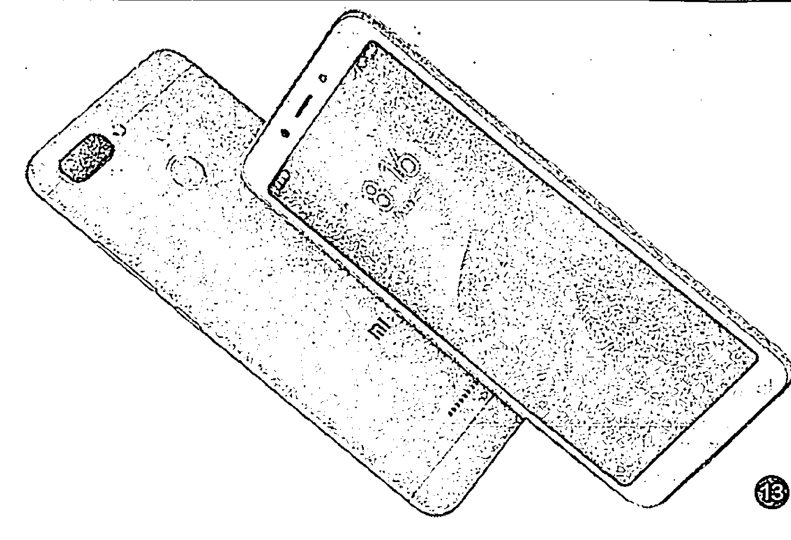

## ◀ CFan推荐TOP.2 荣耀畅玩7X

荣耀畅玩7X是麒麟659阵营中的价格最低(图14)，如今其实际销售价格只有949元起。这款产品的优势在于采用了FHD+标准的18:9全面屏(2160×1080像素)，全金属一体化的机身设计，后置双摄且支持人脸解锁，附赠TPU保护壳等。在升级GPU Turbo技术后，荣耀畅玩7X在游戏体验上的表现也有所提升。

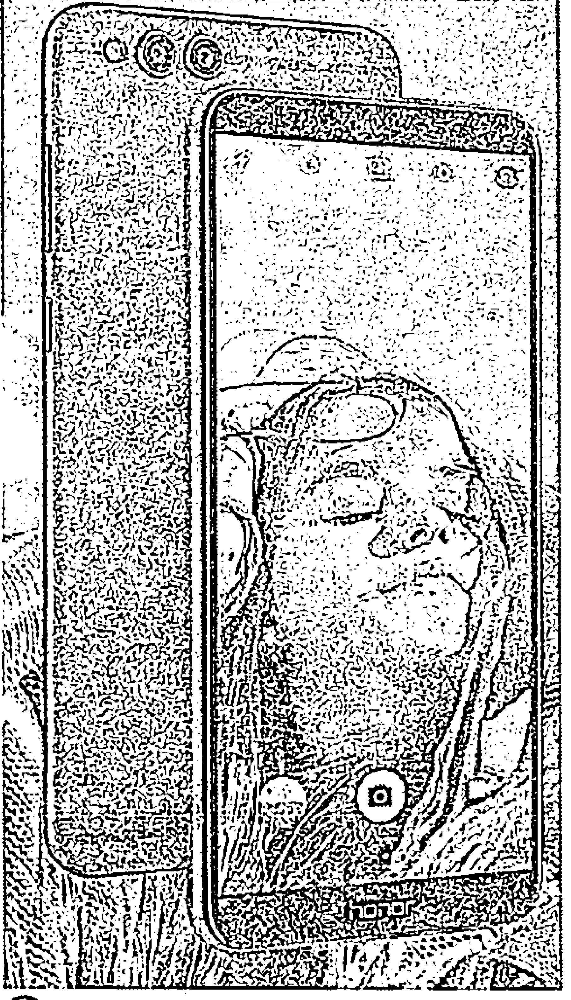

## ▲ CFan推荐TOP.3 联想Z5

联想Z5属于骁龙636平台中的“水桶机”(图15)，它标配6GB内存和64GB存储空间，采用支持DCI-P3广色域的屏幕，刘海屏和双面2.5D玻璃设计也非常时尚。需要注意的是，该产品有些“以色待人”，只有舒曼黑颜色的版本卖1299元，而有着流光溢彩的卡依蓝和渐变蓝版则都是1399元。

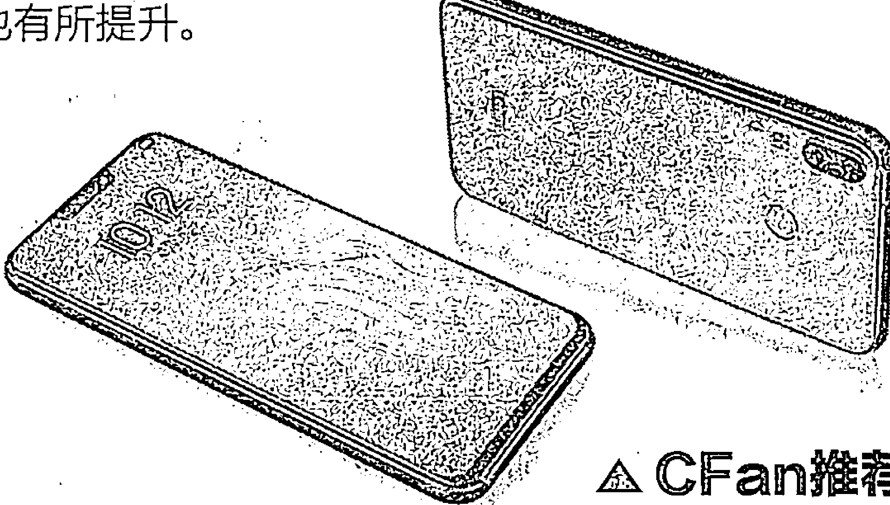

## 第四梯队：百元机请认准它们

> 所谓“一文钱憋倒英雄汉”，谁都希望拥有一款完美的手机，但受限于预算，我们在很多时候只能向现实妥协。于是，才有了“百元机”（泛指低于1000元甚至更低价格的手机）的辉煌。

要想获得良好的使用体验，具备至少可以流畅运行《王者荣耀》的实力，就需要大家非新一代百元级移动处理器不娶了。

实际上，隶属于第四梯队的百元级移动处理器有很多，除了联发科Helio A22、高通骁龙450、骁龙439和骁龙429以外(表3)，骁龙435/430/425也是经常与这一价位手机打交道的存在。然而，骁龙435/430/425这些“老将”的制程工艺还停留在28nm时代，能耗比表现很一般，已经不满足智能手机的发展趋势了，所以我们可以直接忽视这些芯片。

## 表3: 百元级移动处理器主要规格对比

| 对比项 | 联发科Helio A22 | 高通骁龙450 | 高通骁龙439 | 高通骁龙429 |
| :--- | :--- | :--- | :--- | :--- |
| 制程工艺 | 台积电12nm | 三星14nm LPP | 台积电12nm | 台积电12nm |
| CPU大核 | 4×Cortex A53 (2.0GHz) | 4×Cortex A53 (1.8GHz) | 4×Cortex A53 (1.95GHz) | 4×Cortex A53 (1.95GHz) |
| CPU小核 | ---- | 4×Cortex A53 (1.45GHz) | 4×Cortex A53 (1.45GHz) | ---- |
| GPU单元 | PowerVR GE系列 | Adreno 506 | Adreno 505 | Adreno 504 |
| 基带性能 | LTE Cat.7 | LTE Cat.7 | LTE Cat.4 | LTE Cat.4 |
| 下行速率 | 300Mbps | 300Mbps | 150Mbps | 150Mbps |
| 特色功能 | 支持Edge AI | 性能接近骁龙625 | 最新12nm工艺 | 最新12nm工艺 |
| 安兔兔跑分 | 约6万 | 约7万 | 尚未量产 | 尚未量产 |

联发科Helio A22和高通骁龙450可以算是未来一个时期百元机的主力“心脏”，前者采用了台积电最新的12nm工艺设计（图16），虽然只有4个物理核心，但较高的主频和较强的GPU，以及Edge AI（终端AI）功能的加持，综合表现还是蛮不错的。而骁龙450的规格几乎与骁龙625持平，只是频率有所降低，所以这颗芯片暂时可以算是百元级移动处理器中的“最强音”。

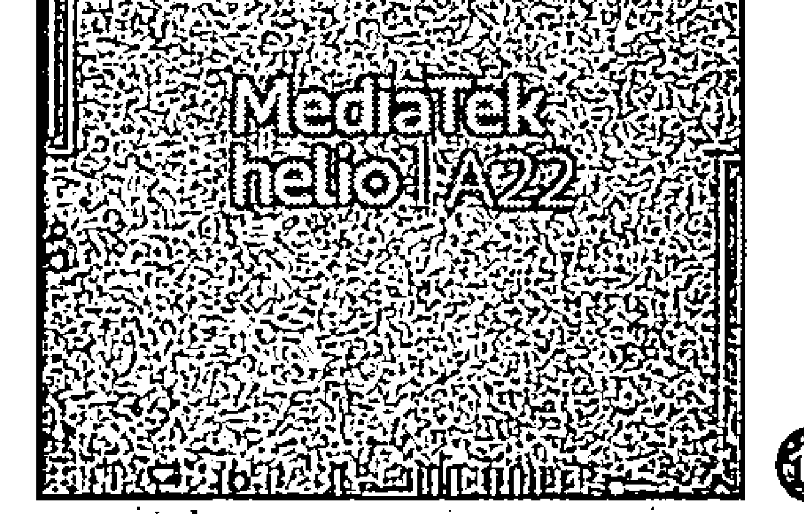

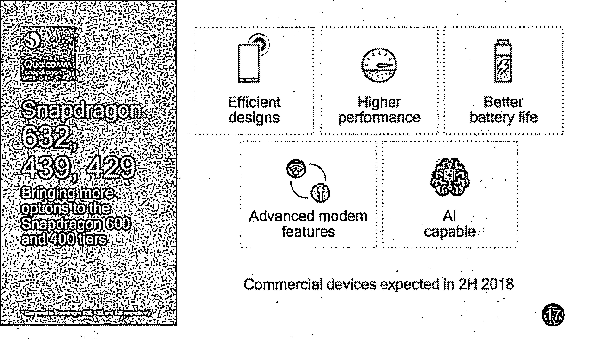

骁龙439和骁龙429是高通和骁龙632一道发布的骁龙400家族新成员（图17），它们的优势是采用了12nm工艺，优化了AI性能，能耗比也较骁龙435和骁龙425有所提升。可惜，这两颗芯片的基带有所降级，仅支持LTE Cat.4级别即150Mbps的下行速度。因此，除非它们的价格足够低廉，否则也不太建议大家优先选购。

目前，搭载Helio A22的代表就是红米6A（549元起），而搭载骁龙450的百元手机则包含中兴ZTE V9（999元起）、荣耀畅玩7C（799元起）和联想K5 Note（649元起）。如果你的预算有限，笔者强烈建议大家从这几款手机中加以筛选。

## 捍卫尊严 主流级移动处理器出击

现实中，旗舰手机要么价格昂贵（买不起），要么采取饥饿营销的策略（买不到）；千元机虽然体验有所提升，但依旧稍欠档次，或在某个功能上存在瓶颈（主要是拍照效果）。此时，那些搭载主流级移动处理器的手机就可以被冠以“次旗舰”的称号（图1），在更加适中的价位里提供仅次于旗舰手机的性能、功能和体验。也因此，我们有必要将这个档次的“心脏”进行着重的考量。


## 一览无余 主流级移动处理器的构成

主流级移动处理器正值新旧交替的时节，很快我们还将迎来更多的新面孔。但在此之前，与我们打交道的芯片，还是要以高通骁龙710、骁龙670、骁龙660、麒麟710和联发科Helio P60为主（表1）。其中，骁龙660诞生于2017年，而其余四款芯片则都是2018年才面世的新秀。

表1：主流级移动处理器规格对比
| 芯片型号 | 制程工艺 | CPU大核 | CPU小核 | GPU型号 | DSP技术 | ISP技术 | 基带性能 | 下行速率 |
| :--- | :--- | :--- | :--- | :--- | :--- | :--- | :--- | :--- |
| 高通骁龙710 | 三星10nm LPP | 2×Kryo 360 (2.2GHz) | 6×Kryo 360 (1.7GHz) | Adreno 616 | Hexagon 685 | Spectra 250 ISP | LTE Cat.15 | 800Mbps |
| 高通骁龙670 | 三星10nm LPP | 2×Kryo 360 (2.0GHz) | 6×Kryo 360 (1.7GHz) | Adreno 615 | Hexagon 685 | Spectra 250 ISP | LTE Cat.12 | 600Mbps |
| 高通骁龙660 | 三星14nm LPP | 4×Kryo 260 (2.2GHz) | 4×Kryo 260 (1.8GHz) | Adreno 512 | Hexagon 680 | Spectra 160 ISP | LTE Cat.12 | 600Mbps |
| 麒麟710 | 台积电12nm | 4×Cortex-A73 (2.2GHz) | 4×Cortex-A53 (1.7GHz) | Mali-G51MP* | 独立DSP | 独立ISP | LTE Cat.12 | 600Mbps |
| 联发科Helio P60 | 台积电12nm | 4×Cortex-A73 (2.0GHz) | 4×Cortex-A53 (2.0GHz) | Mali-G72MP3 | APU | 三核ISP | LTE Cat.7 | 300Mbps |

*麒麟710集成的Mali-G51核心数量并不确定，只是普遍认为是Mali-G51MP4

*麒麟710集成的Mali-G51核心数量并不确定，只是普遍认为是Mali-G51MP4

### 高通骁龙的主流新秀

骁龙660大家应该非常熟悉了，这款芯片最早由OPPO R11首发，凭借三星14nm LPP工艺，基于由Cortex-A73和A53魔改的Kryo 260核心，以及Adreno 512 GPU和LTE Cat.12级别的基带，彻底洗去了骁龙652/653“性能中庸发热高”的前耻（图2），最终成为了继骁龙625之后的又一颗“神U”，并成就了无数爆款手机。

作为骁龙660的接班人，骁龙670和骁龙710属于“近亲关系”，它们都采用了三星最新的10nm LPP工艺，并基于由Cortex-A75和A55魔改的Kryo 360核心设计（图3），GPU也升级到了Adreno 61x。同时，这两颗芯片还改进了DSP和ISP，在AI运算性能上2倍于骁龙660（图4），可以算是完美的迭代更新之作。

和骁龙710相比，骁龙670主要是降低了频率和网络性能，不再支持2K分辨率的屏幕，二者的性能差距在10%左右。不过，骁龙710目前采取的是开放态度（谁都能用），而骁龙670暂时则仅供OPPO和vivo所用。出于品牌溢价和实际产品定位的原因，我们看到的却是骁龙670手机比骁龙710手机还要贵的局面。随着骁龙670逐渐开放，这颗芯片也会慢慢下探到更低价位，最终取代骁龙660的位置并将其踢入到千元级移动处理器领域。

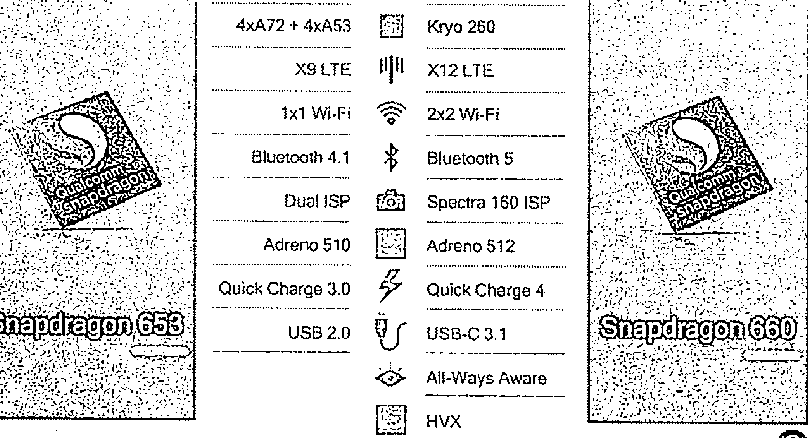

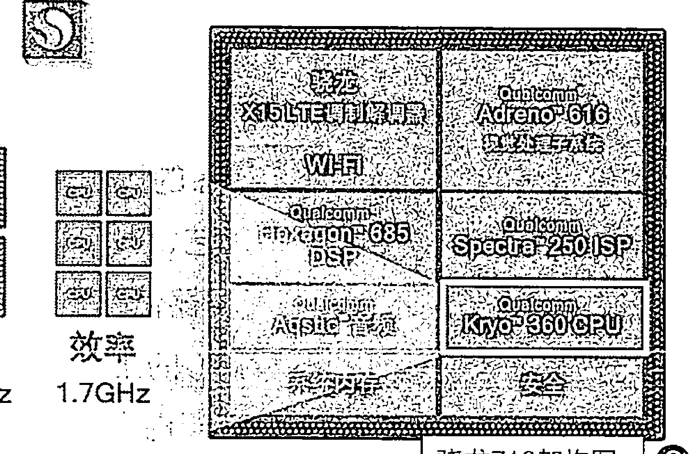

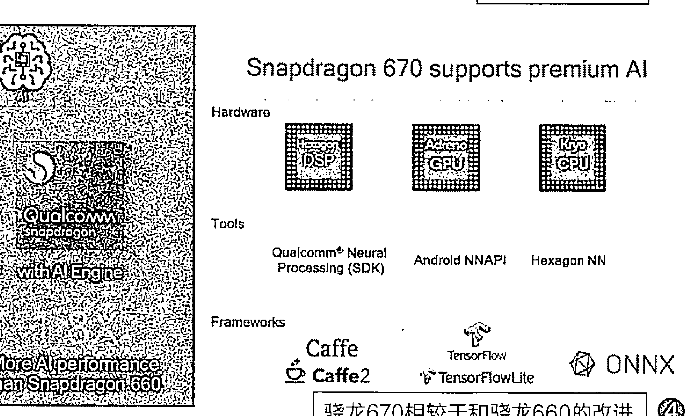

## 终结万年麒麟659

华为/荣耀手机为了保持差异化的竞争策略，除了少部分机型以外都会武装自家的麒麟处理器。可惜，麒麟家族只有旗舰级处理器保持着一年一更新的策略，从麒麟920一路升级到麒麟970。而作为定位主流的麒麟650（图5），自从2016年上市以来却始终在原地踏步，只是通过提升频率的方式，一路改名为麒麟655、麒麟658和麒麟659，在性能上并没有太大的改进。

好消息是，2018年的夏天，“万年不变”的麒麟659终于迎来了接班人——麒麟710。和我们熟悉的麒麟659相比，麒麟710无论是工艺、CPU架构、GPU规格还是调制解调器，都有了长足的进步。比如，麒麟710的工艺从16nm升级到了12nm，大核架构也从Cortex-A53升级到了Cortex-A73，而GPU更是从Mali-T830MP2进化到Mali-G51MP（核心数量并不确定，官方没有详细参数），让麒麟710在性能上具备了吊打“前辈”的能力。此外，麒麟710同样支持号称“吓人技术”的GPU Turbo（图6），这意味着搭载这颗芯片的手机在热门手游中可以跑出更流畅的帧数。

## 蓄势待发的联发科

采用10nm工艺打造的十核旗舰，Helio X30的失利让联发科不得不暂时放弃高端市场，而Helio P60就是承担着联发科复兴重任的存在。还好，这颗芯片借助最新12nm工艺，在Cortex A73架构核心组成的大核、Mali-G72 MP3 GPU，以及名为“NeuroPilot”的AI人工智能平台（由APU、CPU或GPU协同运算）的帮助下（图7），获得了不逊于骁龙660的性能表现，并得到了OPPO和vivo的大力推广，最终打开了局面。和竞争对手相比，Helio P60最大的缺陷，就是基带性能偏弱，还停留在LTE Cat.7的时代上。

据悉，联发科正在酝酿全新的P系列芯片——Helio P80和Helio P90，它们将在性能、网络、能耗比和AI性能上有所升级。可惜，目前还没有关于它们的更多消息，感兴趣的读者可关注CFan的后续报道。

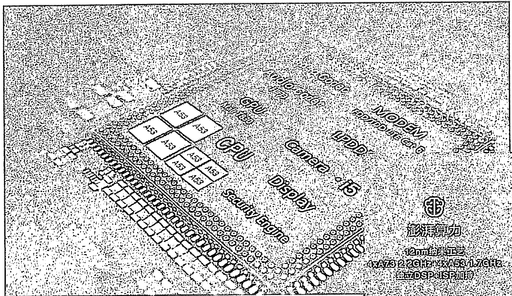

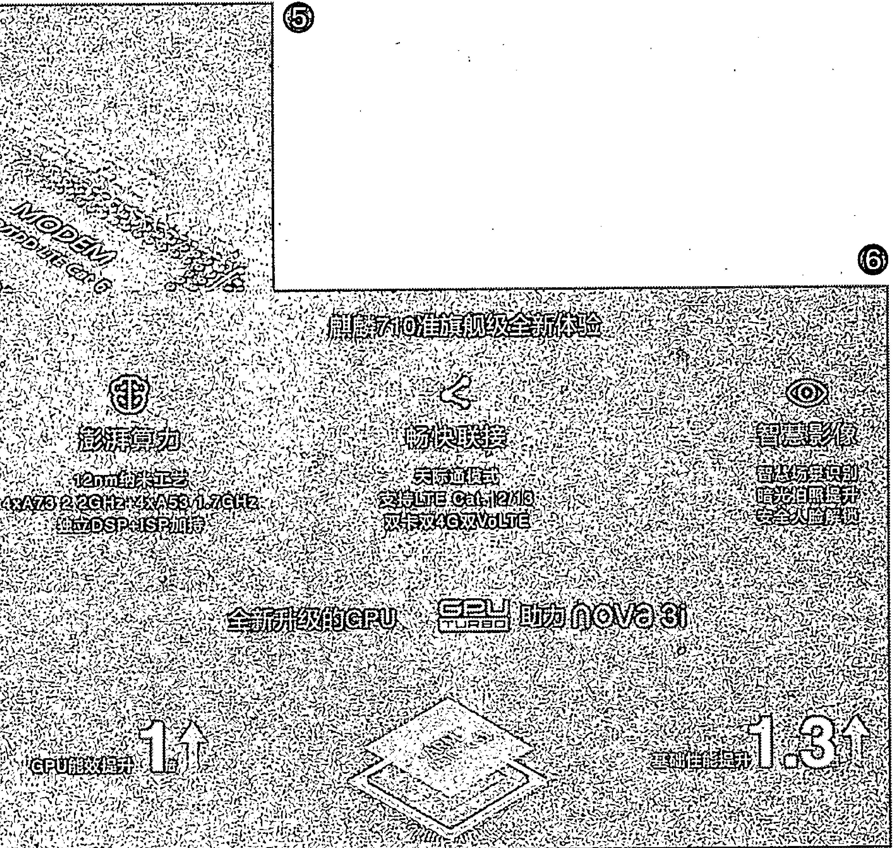

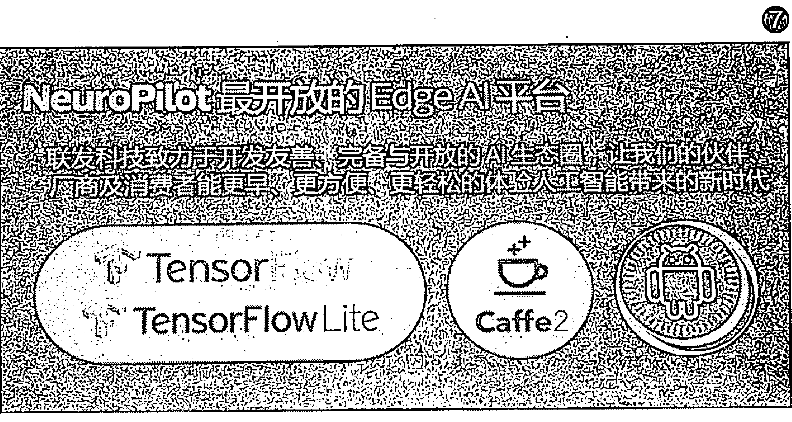

## 昔日旗舰的降维打击

俗话说得好：瘦死的骆驼比马大，在移动处理器领域也是如此。虽然骁龙710和麒麟710这些芯片被不少人誉为“次旗舰”，但它们遇到真正的“昔日旗舰”，还是存在几分先天不足的味道。

比如高通去年主打的骁龙835、华为海思在2016年底推出的麒麟960，就都属于昔日旗舰的代表。其中，骁龙835同样是10nm工艺、魔改的Kryo 280架构、强大的Adreno 540 GPU以及支持Cat.16的基带（下行速率高达1Gbps）。而麒麟960虽然工艺还停留在16nm阶段，但更高主频的Cortex-A73大核，以及Mali-G71MP8 GPU同样性能不俗。

还好，手机厂商对昔日旗舰的态度多以“清库存”为主，在最近半年里，采用这些次旗舰的手机新品只有努比亚红魔（骁龙835，2499元起）（图8）和华为nova2S（2299元起），而其他老产品则逐渐退市，所以不会对新一代主流移动处理器造成太大的影响。

只是，笔者还是希望大家不要过于迷信新品，综合来看，最新的主流级处理器的综合性能基本可以和2年前的旗舰处理器抗衡（比如骁龙710大致相当于骁龙820），但绝不是上代旗舰的对手（图9）。

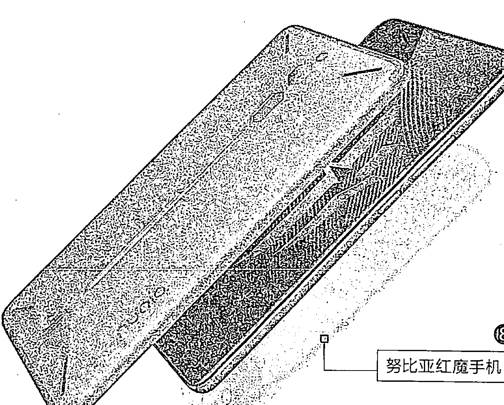

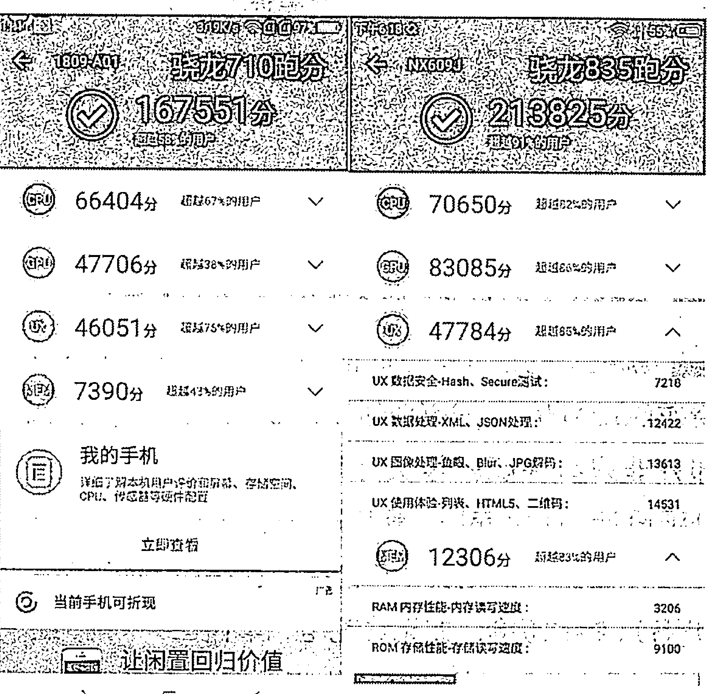

## 性能对比 是骡子是马牵出来遛

看过了理论分析，相信大家最为关心的问题，还是这些主流级移动处理器谁的性能最为强悍吧？为此，笔者整理了搭载这些芯片的热门手机在常见跑分软件中的评测成绩（表2）。

表2 主流移动处理器理论性能对比
| 测试软件 | 测试项目 | 骁龙710 | 骁龙670 | 骁龙660 | 麒麟710 | Helio P60 | 骁龙636 |
| :--- | :--- | :--- | :--- | :--- | :--- | :--- | :--- |
| 安兔兔V7 | 总分 | 165808 | 156830 | 142991 | 137843 | 135724 | 115651 |
| 鲁大师 | 总分 | 153772 | 147639 | 134598 | 147303 | 144485 | 117809 |
| | 体验 | 133.03 | 136.78 | 126.37 | 120.91 | 128.18 | ---- |
| AIMark | 总分 | 1227 | 1209 | 822 | 128 | 167 | ---- |
| PCMark | 工作2.0 | 8698 | 8385 | 6250 | 7188 | 7854 | 6002 |
| GeekBench 4 | 单核 | 1857 | 1700 | 1631 | 1594 | 1518 | 1362 |
| | 多核 | 5893 | 5828 | 5576 | 5604 | 5976 | 4695 |
| 3DMark | Slingshot Extreme | 1976 | 1766 | 1443 | 953 | 1053 | 934 |
| | Slingshot | 2775 | 2546 | 2151 | 1479 | 1740 | 1516 |
| | Extreme Vulkan | 1451 | 1282 | 1066 | 1123 | 923 | 767 |
| 评测手机 | ---- | 360 N7 Pro | OPPO R17 | 360 N7 | nova 3i | 诺基亚X5 | 红米Note5 |## 特别话题

从汇总后的对比来看，骁龙710有着毋庸置疑的性能优势，特别是在3DMark这款GPU性能测试中的成绩最为突出。而骁龙670也符合前文我们的分析，它仅是略逊于骁龙710一点点而已，在实际的应用中很难体现出来。

骁龙660则可以作为主流级移动处理器中的标杆性存在，它只是在GeekBench 4的多核性能，以及PCMark工作2.0的总成绩上偏低一些，但无论是AIMark的人工智能性能测试（图10），还是GPU性能都可远远将麒麟710和Helio P60甩在身后。

至于麒麟710和Helio P60，它们则可被视为同一个档次的存在，在2018年度主流移动处理器中排名垫底。但即便如此，这两颗芯片的性能也要远远在千元级移动处理器中的王者骁龙636之上。可见，越级挑战还真没有那么容易。

## 理性分析 谁更值得我们买单

就绝对的性能排行而言，骁龙710>骁龙670>骁龙660>Helio P60>麒麟710。但是，智能手机却并非只看性能就等决定是否买单的设备，因为外观设计（如水滴屏、滑盖式设计、渐变色等）、内存和存储空间的搭配（还包括闪存是eMMC还是UFS）、特殊功能（如无线充电、屏下指纹识别、红外遥控和NFC）、摄像头优化和系统体验都会成为加分项（图11），而这也就导致了智能手机领域经常出现同配不同价，或是低配却高价的现象。

以骁龙710为例，市场上的代表有OPPO R17 Pro（4299元）、vivo NEX（3898元）、360 N7 Pro（1999元起）、小米8SE（1799元起）和坚果Pro2S（1798元起），前两款产品之所以价格高昂，是因为R17 Pro带来了屏下指纹识别+可变光圈和TOF技术的三摄系统，而vivo NEX则通过弹出式的隐藏摄像头设计极大地提升了屏占比，都属于偏概念的新品。

骁龙670只有OPPO R17（3199元起）和vivo X23猎装，麒麟710也才被华为nova3i（1999元起）和荣耀8X（1399元起）首发，暂时并不具备可比性。

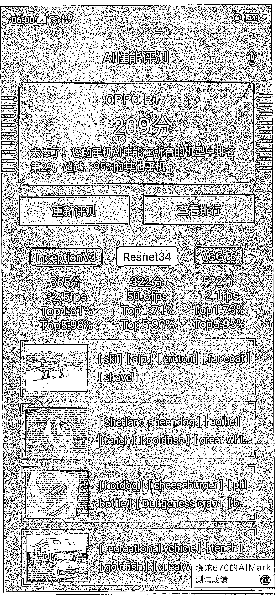

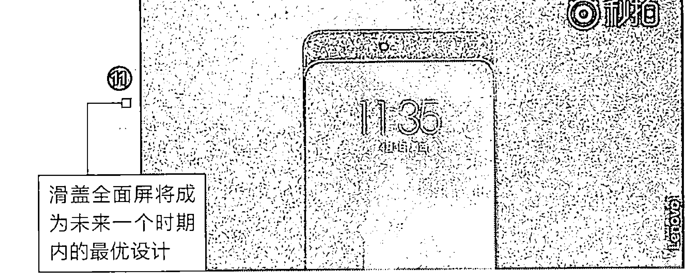

骁龙660的定位最为尴尬，因为它呈现了“冰火两重天”的市场境遇，价格跨度非常之高。比如，骁龙660的代表包括美图T9（4199元起）、三星Galaxy S轻奢版（2999元起）、魅族15系列（1998元起）、诺基亚7 Plus（1899元起）、努比亚Z18mini（1799元）、vivo Z1（1598元起）、坚果Pro 2（1499元起）、360 N6 Pro（1499元起）、小米6X（1399元）、360 N7（1299元起）和360 N7 Lite（1199元起）等。 Helio P60同样比较尴尬，代表机型有OPPO R15（2399元起）、vivo X21i（2398元起）、OPPO A3（1799元）和诺基亚X5（999元起）等，价差巨大。

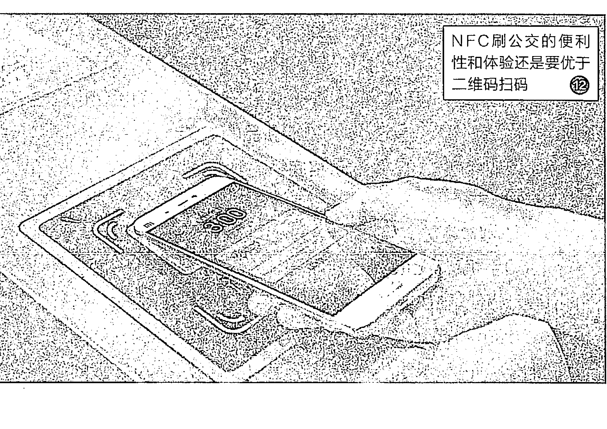

但是，正如前文所说，智能手机“一分钱一分货”总是有道理的。以骁龙660手机为例，魅族15在工艺、摄像头素质和线性振动马达的装备上都堪称一流，而售价最低的360 N7 Lite标配存储空间只有32GB，屏幕和拍照素质也与魅族15不在一个档次上。

搭载Helio P60的诺基亚X5的确便宜，但999元的版本只能买到3GB+32GB版，其分辨率仅有HD+，拍照效果也不太理想。翻回头再看R15，其标配128GB存储空间，采用AMOLED屏幕，VOOC闪充和拍照质量也是它的特色卖点，而且实际线下购买的成交价可能还要比网上更低。

如果你的目标很单纯，只是追求极致的性能价格比，千元出头的骁龙660手机无疑最具竞争力。但是，我们购买手机势必还有各种各样的要求，比如使用NFC功能刷公交（图12）、想尝鲜屏幕指纹识别的科技感、对夜拍质量的要求苛刻等等。目的不同，自然会让手机厂商在硬件和功能的搭配上进行取舍，而更多同配产品加入竞争，也有利于厂商制定更激进的售价，从而进一步促进智能手机行业的繁荣。

## 扩展阅读: 引领未来 下代旗舰之心抢先看

技术总是不断向前推进的。这不，华为就在8月31日的德国IFA国际消费电子展上发布了2018年度旗舰处理器——麒麟980。这颗芯片是全球第一颗采用7nm新工艺的手机SoC，较之10nm可带来20%的性能提升、40%的能效提升和60%的晶体管密度提升。因此，麒麟980才能在集成69亿个晶体管的基础上还比芯片面积压缩得比麒麟970（55亿个晶体管）还要小。 麒麟980给2019年度的旗舰处理器设定了标杆：它首发采用ARM Cortex-A76架构，首发ARM Mali-G76MP10 GPU，集成第四代自研ISP以及双NPU单元。同时，麒麟980还标配4.5G基带，率先支持LTE Cat.21，具备业界最高的下行速率（1.4Gbps），而华为也表示麒麟980还可选配型号为Balong 5000的5G基带，为5G网络奠定基础。据悉，麒麟980性能较高达845高出37%，能效高出32%，AI性能也是骁龙845的2倍。到了年底，高通会祭出骁龙855，而三星在2019年初也会推出Exynos 9820，它们和麒麟980一样，都具备顶级性能，并为5G网络做好了准备。那么，你准备好“上车”了吗？

+   Kirin 980: The Most Powerful and Intelligent, Ever
- World's 1st 7nm SoC
- World's 1st Cortex-A76 Based CPU
- World's 1st Dual NPU
- World's 1st Mali-G76 GPU
- World's 1st 1.4Gbps Cat.21 Modem
- World's 1st SoC Supporting 2133MHz LPDDR4X

另一方面，以荣耀、红米、努比亚、360等为代表的互联网品牌，总会不断刷新武装主流级移动处理器手机的低价纪录。正如上文所述，360已经将骁龙660“贱卖”，而荣耀Play更是将第一梯队的麒麟970卖到了1800元以内，前者会让那些千元级移动处理器感到压力很大，而后者也注定麒麟710会杀入更低端的市场，毕竟“老大哥”（麒麟970）都这么便宜了，作为主流新品的“小弟”（麒麟710）高调亮相一次就足够了，一旦它登录荣耀家族，就是麒麟710取代麒麟659刷新价格底线的时刻。

### ▶ CFan推荐TOP.1 360手机N7

360手机N7 Lite是目前最便宜的骁龙660手机，而它的前辈，N7低配版的起价只比N7 Lite贵了100元，但却具备内置5000mAh超大电池的特性，可以带来更持久的续航能力（图13）。千元出头的售价、足够强悍的性能、几乎无敌的续航，还要啥“自行车”？

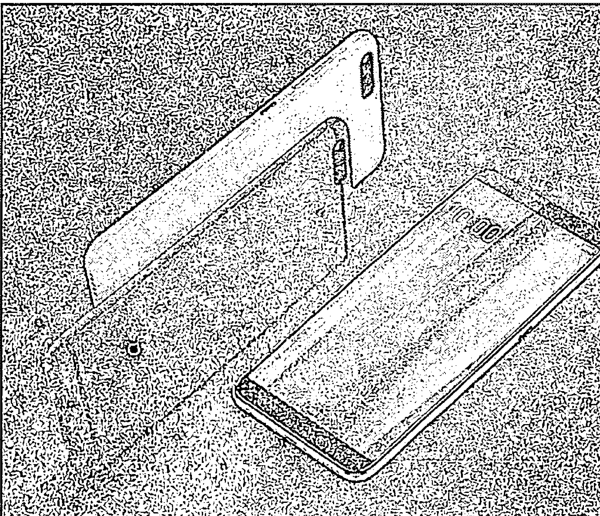

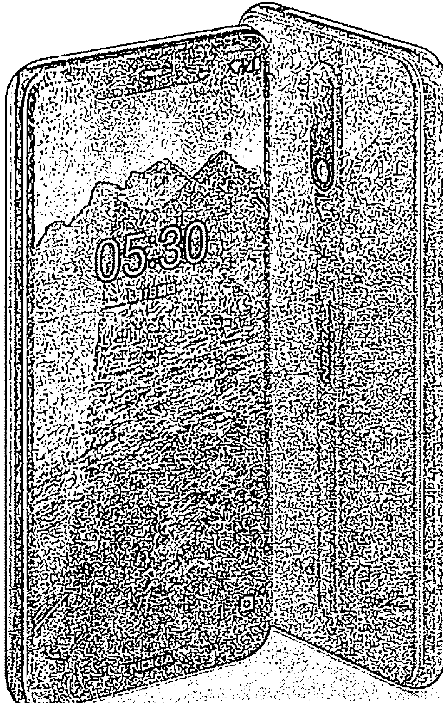

### ◀ CFan推荐TOP.2 诺基亚X5

诺基亚X5首次将Helio P60打入了不足千元的价位（图14），虽然这款产品存在诸多遗憾，但Nokia的招牌还是有些情怀和含金量的，非常适合一切唯性能先且预算有限的用户考虑。


### ▶ CFan推荐TOP.3 三星Galaxy S轻奢版

虽然这款手机的售价高达2999元（图15），但不可否认的是，Galaxy S轻奢版是一款向Galaxy S9致敬的“晚辈”，它堪称是中高端市场手感最为出色的产品之一：150克重量轻盈、单手操作便捷、曲面屏带来了更为出众的手感和观感、支持IP68级防尘防水和无线充电功能，这些都完美继承了S系列旗舰产品的基因，适合喜欢S9的设计却苦于钱包不鼓的用户考虑。[CF]

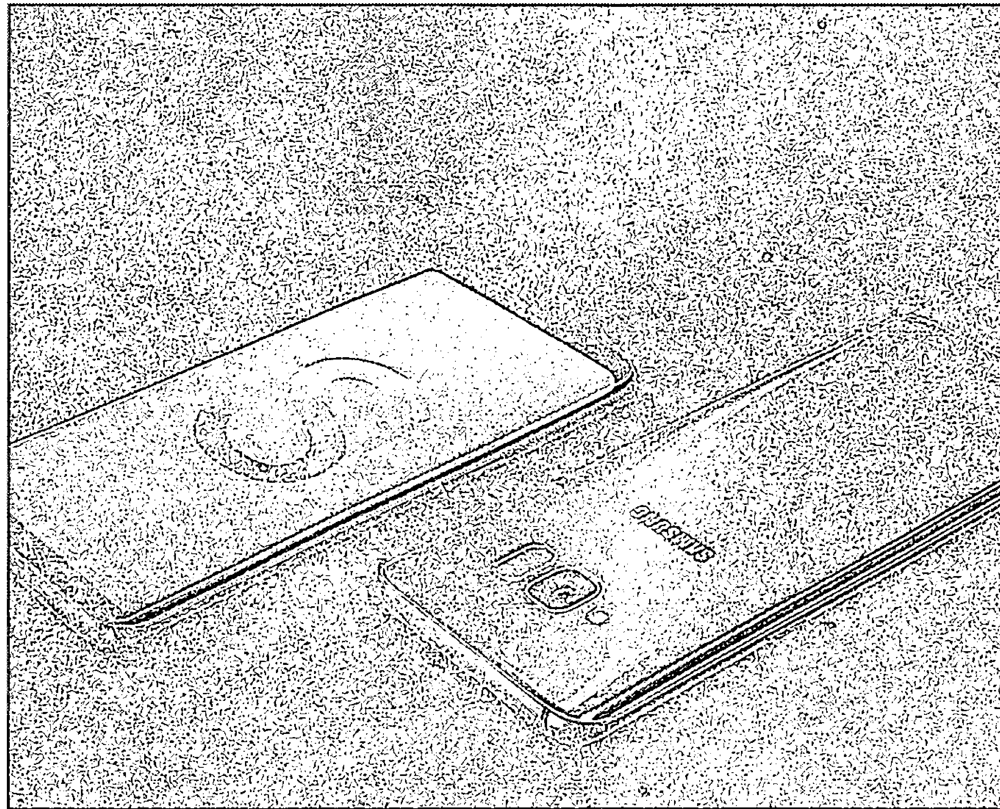

从1994年奔腾处理器的面世到2006年这一品牌退出主流舞台，恰好是国人最熟悉的12年轮回；而从2006年酷睿成为Intel的主流处理器新品牌，发展到智能酷睿，再到今年，又是整整12年。它似乎也和奔腾一样，又同时逐渐陷入自身发展的困局和与对手的苦战，甚至让人对即将出现的第九代酷睿都失去了应有的兴趣。

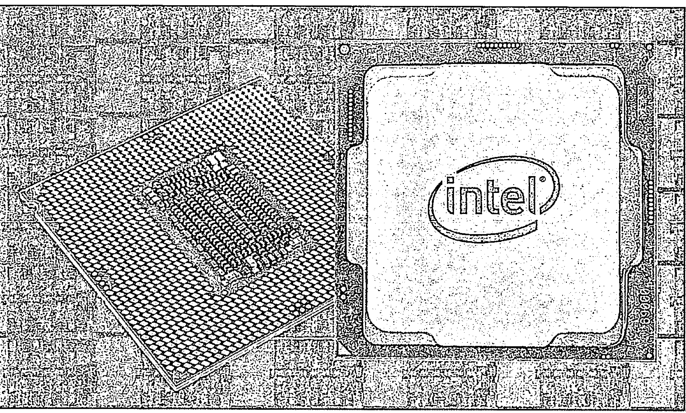

## 12年轮回渐近 历代酷睿逐个数

文|墨汁做寿

> 但是，这样的酷睿并不是我们印象中曾经“意气风发”，不仅要战胜敌人，更要战胜自我的样子。在迎接新酷睿前，让我们先回顾一下酷睿的发展史，只要了解酷睿处理器的发展轨迹和核心变化，就可以对即将到来的新酷睿有一定的认识，甚至从已经公布的信息预测到它的实际效能。另外，酷睿今天的没落，抑或Intel再次突破的契机，也许同样隐藏在这款经典处理器曾经走过的道路上。
为了便于理解，在本文中我们全部以台式机处理器的发展和型号来进行说明，移动平台处理器虽然与台式机产品存在非常紧密的联系，但由于耗电、发热、市场需求等方面的特殊要求，会在一些规格上有所变化，这里就不再赘述了。

## 劲敌环伺 横空出世的酷睿

12年前的处理器市场上，Intel的处境恐怕比今天还要困难，AMD的K7架构处理器Athlon的性能已经可以与奔腾Ⅲ分庭抗礼。K8处理器一出，更是压得奔腾4喘不过气来，在不知不觉之间，AMD处理器的市场份额已经要追平Intel，50%的分割线岌岌可危。

而就在此时，相对于桌面版的奔腾4（Pentium Ⅳ）一直磕磕绊绊的发展和低效率、高发热等问题，移动平台的奔腾M（Pentium M）却在内核效率等方面表现得非常出色。所以Intel就很少见地将移动处理器的架构（Yonah）作为了新一代处理器的发展基础，最终产物就是酷睿（Core）处理器。

Intel的这一发展方式虽然比较冒险，但效果却非常好，从市场曲线的剧烈变化就可以反映出酷睿处理器在市场上的出色表现。Intel和AMD在处理器市场的占有率在一个季度之内分别上

升和下降了10%，原本几乎已经平分市场的两大品牌，迅速拉出了20%的差距（图1）。从此之后直到Ryzen的出现，AMD的市场占有率几乎是在持续下降，而对手一直只有一个名字——酷睿。

对于Intel来说，酷睿处理器的命名已经说明了一切，它直接以“Core（处理器核心）”为名，显示着Intel巨大的信心与决心。当然这种烧饼牌烧饼的命名方式，估计也会让竞争对手感到非常郁闷吧。

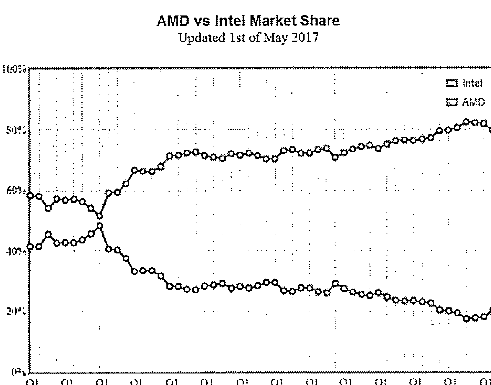

## 一瞬的辉煌 酷睿2处理器

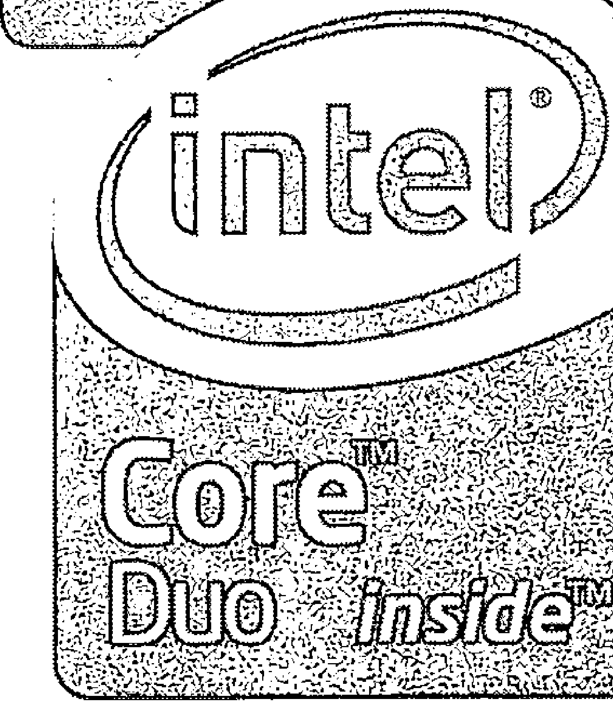

在服役的老型号电脑，还是在很多软件、游戏中标注的配置需求中，Core 2 Duo仍然是出现频率很高的名字。酷睿2处理器吸收了对手和自家奔腾M处理器的很多优点，在基本规格方面，它的基础型号就采用了双核设计，并且在优化设计后，核心面积比同样采用65纳米技术制造且同为双核的Pentium D缩小了10%以上。酷睿处理器特别提升了片上缓存的能力，一级缓存加大到32kB，2级缓存为双核共享，容量则达到4MB，还通过多重预存取、加大带宽等措施提升了存取效率。此外由于架构的优势，酷睿2可以轻松达到较高的频率，配合更好的指令操作能力，在性能上完全压倒了AMD的K10核心产品，甚至连主流型号E6300（图3）都可以打败当时最新的K10高端型号FX62。

大多数人都从酷睿2（Core 2 Duo）处理器开始认识这一品牌的，这也不奇怪，因为酷睿1代（Core Duo）仅出现在移动平台上（图2），而且很快就被酷睿2替代。同时由于“智能酷睿（Core i）”的推出，我们也未能见到酷睿3、酷睿4一类的产品。尽管酷睿、酷睿2的生命周期并不长，但大量的经典型号，相对于对手的绝对优势等，都使其成为了让人难以忘怀的一代产品。无论是一些还

酷睿2虽然击败了老对手，终于重新让Intel长出了一口气，不过多少有点赶鸭子上架、萝卜快了不洗泥的意味。现在看来，它的缺陷很多而且明显。例如为了讨好用户，直接使用LGA775平台，它没有将内存控制器内置，这一设计在对手的处理器上已经被证实是很实用且能明显提升性能的。此外，没有超线程技术、胶水式四核产品等也都体现出了它“急就章”的本质。在这一情况下，酷睿2仅进行了一次简单的迭代，甚至可以说只是填充了产品线之后，就被更新的智能酷睿（Core i）取代了。不过在智能酷睿中，我们仍然能看到很多酷睿2架构的影子，例如缓存模式、多核架构等。

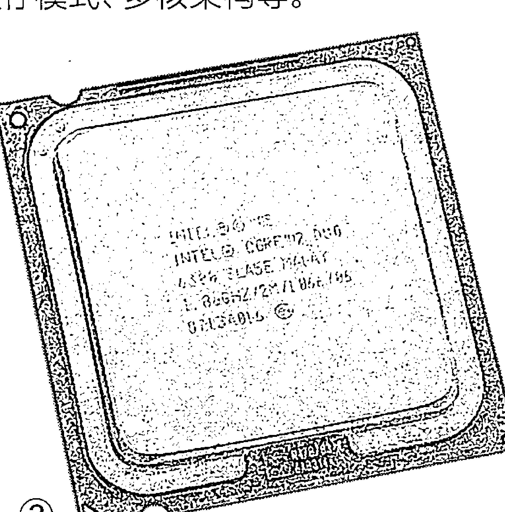

## 探索 第一代智能酷睿

在酷睿2推出两年后，Intel的新一代产品并非是酷睿3，而是所谓的“智能酷睿”，后缀从核心的迭代数变成了代表“智能”的缩写“i”。

2008年11月，英特尔正式发布了基于Nehalem架构（图4）的酷睿i7处理器，原生四核心设计和众多新特性使它一举登上台式机处理器的性能王座。但酷睿i7不仅处理器本身价格不菲，基于X58芯片组的主板动辄两三千元的价格也绝非主流消费者能够承受。因此尽管酷睿i7在高端市场“镇住了场子”，但对主流玩家而言实际意义并不大。在主流市场中，最受欢迎的仍然是酷睿2 E系列处理器，甚至连AMD的新四核、三核产品都更受欢迎一些。


事实上，英特尔对于这样的市场状况早有准备，计划在2009年年底推出酷睿i5处理器（图5）和P55/57系列主板芯片组，接替酷睿2和P45系列芯片组。但由于AMD抢先推出了羿龙Ⅱ X3/X4系列处理器，英特尔将酷睿i5系列处理器和新芯片组提前在2009年9月初正式发布。

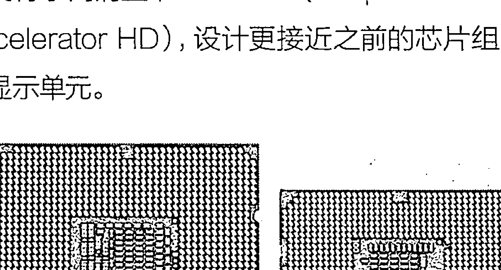

酷睿i5采用与i7相同的Nehalem架构、相同的45纳米制造工艺，但取消了超线程技术，大幅降低了频率，加上较低的发热量和仅支持双通道内存的主板等配置，使其i5平台的整体成本得以大幅降低。

随后，Intel又推出了带有片上集成显卡的Clarkdale核心酷睿i3和i5处理器（图6），主攻主流和低端市场，除了在基板上用“胶水”模式安装了一块显示芯片外，在制造工艺、核心架构方面也有所调整。它们全部采用双核设计，二级缓存降低为256kB/核心，三级缓存也减半到4MB。需要注意的是，此时它们集成的显示芯片被称为英特尔高清显卡GMA HD（Graphics Media Accelerator HD），设计更接近之前的芯片组内置显示单元。

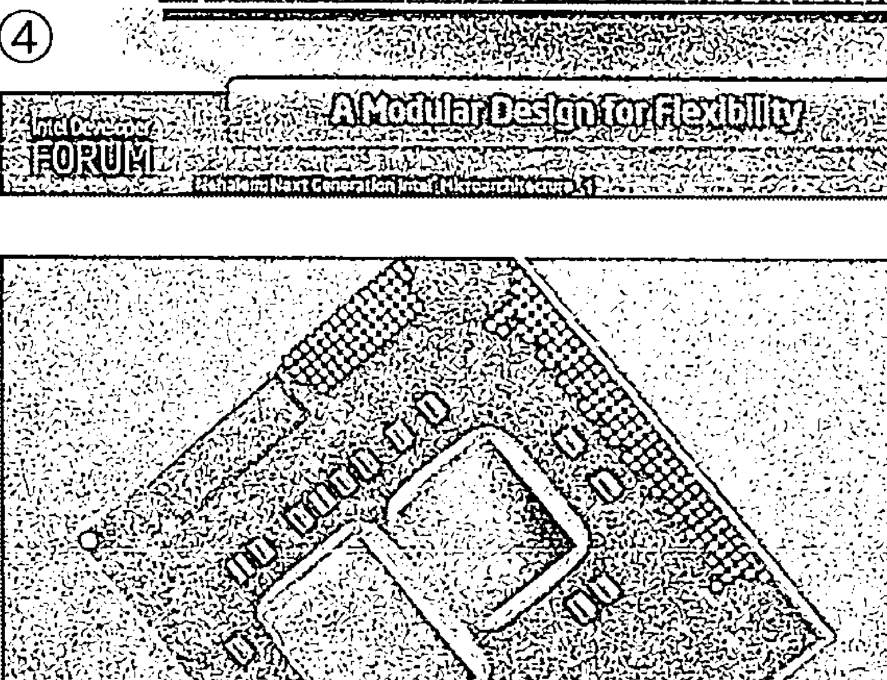

| 处理器型号 | 酷睿i7-975 Extreme Edition | 酷睿i7-920 | 酷睿i7-870 | 酷睿i7-860 | 酷睿i5-750 | 酷睿i3-530 |
| :--- | :--- | :--- | :--- | :--- | :--- | :--- |
| 核心代号 | Bloomfield | Bloomfield | Lynnfield | Lynnfield | Lynnfield | Clarkdale |
| 核心/线程 | 4/8 | 4/8 | 4/8 | 4/8 | 4/4 | 2/4 |
| 默认频率 | 3.33GHz | 2.66GHz | 2.93GHz | 2.8GHz | 2.66GHz | 2.93GHz |
| 睿频 | 3.6GHz | 2.93GHz | 3.6GHz | 3.46GHz | 3.2GHz | 不支持 |
| 三级缓存 | 8MB | 8MB | 8MB | 8MB | 8MB | 4MB |
| 接口 | LGA 1366 | LGA 1366 | LGA 1156 | LGA 1156 | LGA 1156 | LGA 1156 |
| 内存运行模式 | 三通道 | 三通道 | 双通道 | 双通道 | 双通道 | 双通道 |
| 制造工艺 | 45纳米 | 46纳米 | 47纳米 | 48纳米 | 49纳米 | 32纳米+45纳米 |
| 总线带宽 | 6400MT/s | 4800MT/s | 4260MT/s | 4260MT/s | 4260MT/s | 4260MT/s |
| TDP功耗 | 130W | 130W | 95W | 95W | 95W | 73W |

## 万向渐用 第二代智能酷睿

相对于现在看起来非常陌生的第一代智能酷睿，第二代智能酷睿（Sandy Bridge核心）无论是基本架构还是命名方式，都让我们感到更加亲切。2010年下半年，统一架构、统一核心、统一使用H67、P67等6系列芯片组主板的第二代酷睿（Sandy Bridge核心）i3、i5、i7发布（图7）。

第二代智能酷睿采用32纳米工艺制造，接口变为LGA1155，其核心数量、三级缓存、内置核芯显卡、热设计功耗规划等基本配置和规格一直延续到了不久前的第七代智能酷睿产品线中。此外，它采用的环状内存总线技术、DMI外部总线，也一直是与内置核芯显卡通信和与外部通信的标准。

在指令集方面，SSE的时代正式终结，第二代智能酷睿增加了AVX（高级矢量控制）指令集，将单指令多数据流演算单元从128位扩展到256位，大幅提升了内核浮点运算性能。

由于设计相对成熟的核芯显卡的出现，第二代智能酷睿也拥有了不一样的应用能力，例如无线视频传输、Intel Quick Sync Video硬件转码等，也都成为了其后历代智能酷睿处理器的保留功能。

第一代智能酷睿的试验性非常强，有一些设计已经被淘汰或者不常见，例如不使用片上GPU的中高端型号、高端处理器i7系列需搭配专用高端芯片组、后来被称为至尊酷睿的XE系列型号等。不过总体来看，它还是奠定了智能酷睿系列的基础，例如放弃前端总线的平台设计、i3/i5/i7分级规划、多核心设计、集成内存控制器、睿频技术、内置显示单元等。

| CPU | Core i3-2100 | Core i5-2500K | Core i7-2600K |
| :--- | :--- | :--- | :--- |
| 核心 | Sandy Bridge | Sandy Bridge | Sandy Bridge |
| 核心/线程 | 2/4 | 4/4 | 4/8 |
| GPU频率/睿频 | 850MHz / 1.1GHz | 850MHz / 1.1GHz | 850MHz / 1.35GHz |
| 制作工艺 | 32纳米 | 32纳米 | 32纳米 |
| 主频/睿频 | 3.1GHz | 3.3GHz / 3.7GHz | 3.4GHz / 3.8GHz |
| L3缓存 | 3MB | 6MB | 8MB |
| TDP热设计功耗 | 65W | 95W | 95W |
| 接口 | LGA 1155 | LGA 1155 | LGA 1155 |

## 核心完善 第三代智能酷睿

随着智能酷睿基本架构的成熟，Intel的“Tick-Tock”钟摆战略（工艺年-构架年）开始影响其发展，因此第三代智能酷睿（Ivy Bridge核心）可以看作是第二代的22纳米工艺改进型（图8）。在处理器核心架构、缓存等方面，第三代智能酷睿与第二代产品没有任何差别，最大的变化是制造工艺从32纳米进步到22纳米，随之带来的是更低的发热量、更高的频率，以及更强的核芯显卡。在这一代产品中，HD Graphic 4000核芯显卡就可以支持DirectX 11、支持4K×4K分辨率画面输出、支持3显示器了。


也许很少有人注意到，从2012年的第三代智能酷睿开始，DDR3 1600就成为了Intel平台的标配内存类型，它一直延续到了第六代智能酷睿中。不过由于架构变化不大，第三代智能酷睿虽然因为低功耗等原因广受好评，但与其后的第五代和第七代智能酷睿一样，这些处于制程变化年的产品在市场中的影响力都偏小。

## 一代经典
第四代智能酷睿

2013年推出的第四代智能酷睿（Haswell核心）堪称一代经典（图9），直到第八代智能酷睿推出前，几乎没有任何一代产品可以说自己在应用能力方面相对于第四代智能酷睿有了跨越式的进步。这也是近些年Intel的产品发布总是被称为“挤牙膏”，升级幅度难以让人满意的原因。

Haswell核心其实可以看作是针对22纳米工艺与3D晶体管等新技术进行了优化的设计，在基本功能方面更多的是对Ivy Bridge的升级与完善，例如大大加强了核芯显卡、开始支持OpenCL等。另外，Haswell核心的很多指令集也进行了扩充和升级，AVX 2.0指令集提高了基于整数/矩阵的计算能力，最新英特尔安全与管理技术、高级加密标准新指令（Intel AES-NI）让系统能够快速加密并解密各种数据，从网上交易到保密内容都能从中受益。

第四代智能酷睿处理器换用LGA1150接口，搭配8系列芯片组，有B85、Q85、Q87、H87、Z87等多种型号，相对于以前的产品也进行了大幅扩展，市场定位更加细化，其中相当部分芯片组的型号和定位延续到了今天。

第四代智能酷睿不仅加强了核芯显卡，还首次开始搭配锐炬（Iris）显卡，其中高端的锐炬Pro（Iris Pro）甚至还在基板上安装了显示缓存（图10），可以极大地提升性能。

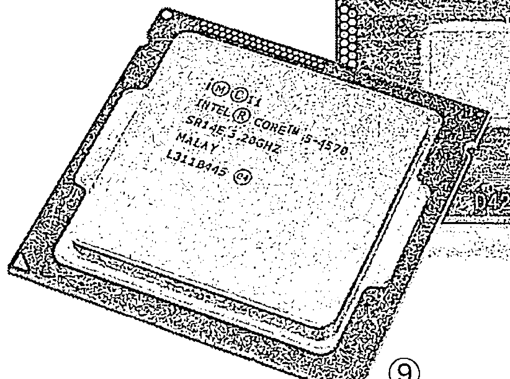

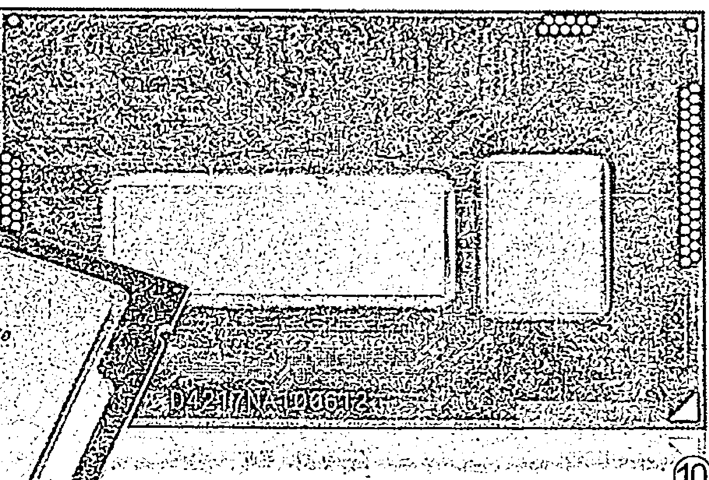

## 无声无息
四代半与五代智能酷睿

在辉煌的第四代智能酷睿后，Intel的架构与制程升级其实就已经遇到了问题，因此在2014年6月，我们迎来的是制程没有升级的四代半（Haswell Refresh核心）产品（图11）。

Haswell Refresh核心主要是在出色的22纳米工艺与3D晶体管制造技术上进一步挖掘潜能、提升频率，进而提升性能，其代表作品酷睿i7-4790K的频率达到4GHz（睿频4.4GHz），比第四代智能酷睿旗舰型号酷睿i7-4770K（3.5GHz-3.9GHz）提升了10%，相应的性能也提升了10%。

第五代智能酷睿（Broadwell核心）可以算勉强赶上了所谓的“Tick-Tock”钟摆战略的周期，它采用14纳米制程，但出于市场需求和产能的考虑，最终产品几乎全面投入了移动市场，仅在桌面平台象征性地推出了几款产品，也基本没有出现在零售市场上。其实第五代智能酷睿的改动还是比较大的，例如功耗大幅降低、面积大幅减小、核芯显卡升级为5000/6000系列等。在移动平台或一体机、miniPC上，这一代产品的应用范围和使用时间还是挺长的，但对DIYer来说，却是完全陌生的一代处理器。

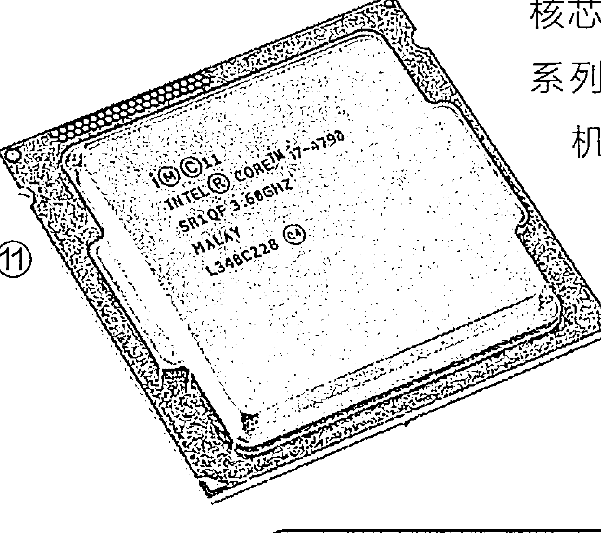

## 再续经典
第六代智能酷睿

2015年下半年，新架构的第六代智能酷睿（Skylake核心）推出（图12），它在指令执行效率、内外部通信能力等方面都进行了重新设计，使效率大幅提升。同时因为14纳米工艺的出色表现，还可以用高频率换取更高的性能。

第六代智能酷睿换用LGA1151接口，由于处理器架构的改动，一部分被集成进处理器的控制芯片再次被放回主板芯片上，本身集成的系统控制部分也进行了整合。其内置核芯显卡进行了大幅升级，名称更改为三位数，即HD 500系列。从核心示意图（图13）可以看到，第六代智能酷睿芯片中图形单元的面积已经与CPU单元部分相差无几，系统控制部分的面积也非常显眼。

第六代智能酷睿的内存控制器首次在主流平台上提供了对DDR4内存的支持，也同时支持DDR3L内存，另外还拥有内置PCI-E、数字视频输出等控制器，进一步加强了与外部的通信能力。第六代智能酷睿搭配的主板PCH（Platform Controller Hub平台控制器，类似之前的南桥芯片）与处理器的通信标准升级为8GT/S的DMI 3.0总线，PCI-E总线则升级为8GT/s的3.0标准，更适合高速PCI-E板卡、USB 3.1接口和M.2 SSD等设备。这使其成为了仍然能配合各种目前主流甚至先进配件的产品。

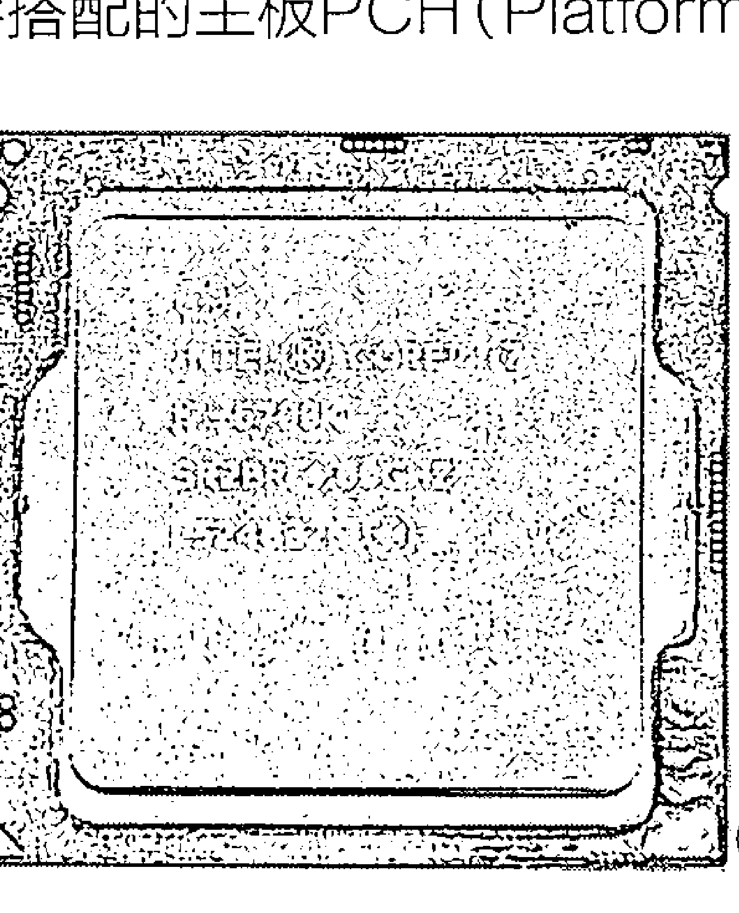

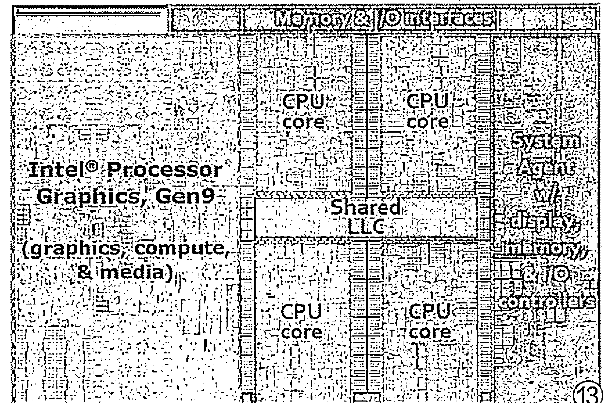

## 挖掘周边潜力
第七代智能酷睿

## 终于不挤牙膏了
第八代智能酷睿

第七代智能酷睿（Kaby Lake核心）在单数代的智能酷睿中，应该算是表现比较出色的了，不过遗憾的是，本应属于它的新制程并没有出现，因此只能在14纳米工艺的基础上对已经比较“完美”的第六代产品进行修改，性能提升幅度可想而知。

相对于只能微微提升的频率和绝对性能，第七代更多的是在内置600系列核芯显卡和外部200系列芯片组的支持下，挖掘周边配件或应用的潜力，例如通过硬件加速实现更高效的4K UHD视频转码处理、更好地支持傲腾内存加速等。

由于第七代智能酷睿可以完美兼容第六代平台，而且自身性价比不错，所以在第八代酷睿出现前，还是有一定市场的。

在AMD锐龙处理器的压力下，第八代智能酷睿不仅提前推出，而且大幅改变了核心数量、三级缓存等延续了数年的基本规格配置，使其性能大幅提升，在很多同等级产品的对比中，性能提升可达40%。

由于它们仍然是目前的主流产品，相关介绍已经很多，这里就不再一一赘述了。

不过在工艺制程开发受阻以及对手竞品快速迭代且性能出色的双重压力下，第八代智能酷睿虽然表现尚可，但却无法阻止市场占有率的下滑。

第八代智能酷睿核心/线程与三级缓存规格
| 型号 | 核心/线程 | 三级缓存 |
|---|---|---|
| i3 | 4/4 | 8MB |
| i5 | 6/6 | 9MB |
| i7 | 6/12 | 12MB |

> **写在最后** 尽管第八代智能酷睿进行了架构大升级，但与对手的全新架构相比，能效比优势已经不足，核心数量、制程甚至落于下风。而从目前来看，第九代智能酷睿的设计似乎说明，对酷睿架构的性能非常有帮助的核心数量、缓存容量等指标已经难以继续提升，那么这是否意味着酷睿将成为下一个奔腾，将很快被适合新时代的新架构取代呢？笔者认为对Intel这种怪兽级的企业来说，一切皆有可能，10纳米制造工艺成熟时，随之推出的很可能是新架构的处理器，不过这仍然要建立在制程进步的基础上，所以这种猜测是否会成真，恐怕要到2020年才能揭晓了。

## 移动处理器平台大排行

策划《电脑爱好者》编辑部

对智能手机而言，其搭载的SoC是衡量性能强弱的唯一准绳，因为一颗SoC芯片内就集成了CPU（处理器）、GPU（显卡，包括集成的核显和独显）、ISP（影像处理器）和Modem（调制解调器）等模块，只要掌握了SoC的强弱关系，就很容易直击最具性能价格比的机型。对笔记本而言，决定其性能强弱的则取决于CPU和GPU两颗芯片，前者影响整机的运算性能，而后者则掌管游戏世界的流畅。

> 本文涉及的单核/多核跑分成绩，数据来源于www.notebookcheck.net网站对应处理器型号的Cinebench R15(64bit)平均分数。由于搭载同一款处理器的不同型号笔记本，因散热设计和功耗墙/温度墙阈值不同(图2)，实际性能可能存在浮动，所以此成绩仅供大家参考。

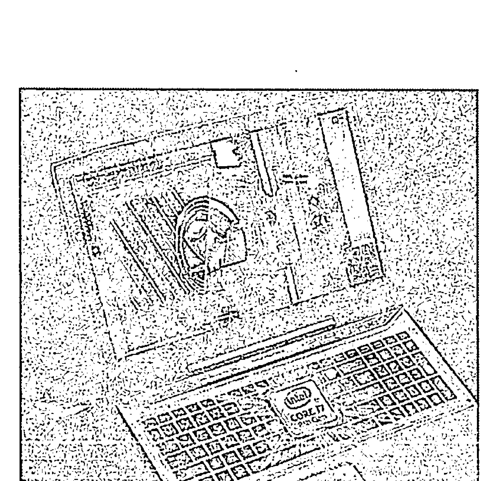

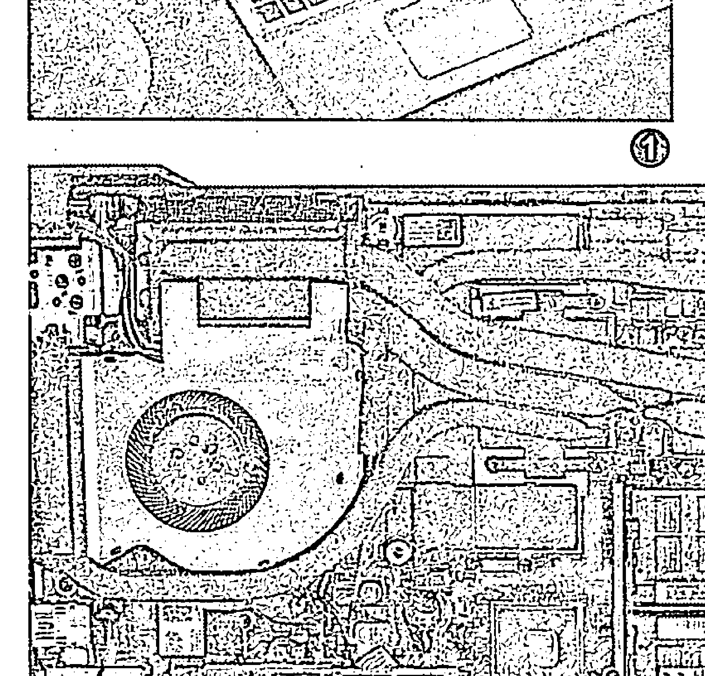

扫一扫，更多精彩内容立现！

## 赛扬奔腾 昔日明珠今蒙尘

赛扬和奔腾，曾经代表了一个时代。可惜，自从酷睿横空出世之后，这两个最经典的处理器品牌就逐渐沦落低端，只能在不足3000元的入门级市场贡献力量。

## 低端新晋代言人

在低于2000元的笔记本阵营中，不少产品还在搭载Atom X5-Z8350和赛扬N3350这些“古董级”处理器。如果你买笔记本只是为了看片码字，此类产品足以胜任。但如果你希望笔记本具有更高的“生产力”，就需要认准英特尔在2017年底最新发布的金牌/银牌奔腾（图3），以及新款赛扬处理器了（表1）。

表1：英特尔移动赛扬/奔腾处理器规格对比表
| 型号 | 金牌奔腾4410Y | 金牌奔腾4415Y | 金牌奔腾4415U | 银牌奔腾N5000 | 四核赛扬N4100 | 双核赛扬N4000 |
| :--- | :--- | :--- | :--- | :--- | :--- | :--- |
| 隶属平台 | Kaby Lake（七代酷睿） | Kaby Lake（七代酷睿） | Kaby Lake（七代酷睿） | Gemini Lake | Gemini Lake | Gemini Lake |
| 制程工艺 | 14nm | 14nm | 14nm | 14nm | 14nm | 14nm |
| 核心/线程 | 2/4 | 2/4 | 4/4 | 4/4 | 4/4 | 2/2 |
| 基础频率 | 1.5GHz | 1.6GHz | 2.3GHz | 1.1GHz | 1.1GHz | 1.1GHz |
| 加速频率 | - | - | - | 2.7GHz | 2.4GHz | 2.6GHz |
| 高速缓存 | 2MB | 2MB | 4MB | 4MB | 4MB | 4MB |
| TDP功耗 | 6W | 6W | 15W | 6W | 6W | 6W |
| 最大内存 | 16GB | 16GB | 32GB | 8GB | 8GB | 8GB |
| 核芯显卡 | HD615 | HD615 | HD610 | UHD605 | UHD600 | UHD600 |
| 单核性能 | - | 64 | 94 | 79 | 71 | 70 |
| 多核性能 | - | 160 | 240 | 249 | 254 | 138 |

英特尔目前最低端的笔记本处理器，就要数隶属Gemini Lake平台的成员了，包括银牌奔腾N5000、赛扬四核N4100和赛扬双核N4000。而再高一个档次的4410Y、4415Y和4415U，则被归类到“金牌奔腾”阵营，而它们属于Kaby Lake（七代酷睿）的简化版。

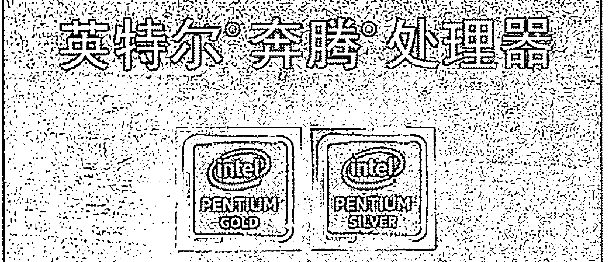

## 不必纠结于金银属性

看到奔腾分“金牌”和“银牌”，相信很多用户都会以为前者具备压倒性的性能优势吧？实际上，从Cinebench R15测试来看，哪怕是四核赛扬N4100的多核成绩也要在金牌奔腾4415U之上，而它似乎还可以秒杀金牌奔腾4415Y？

这不是错觉。金牌奔腾4415Y的频率太低，而且它的物理核心也只有2个。这类处理器主打的是支持更高容量的内存，以及（相对）领先的核显性能，所以才会获得更高的排位。对普通消费者而言，其实还是实际性能最为关键。所以，当我们在选择入门级笔记本时，瞄准四核赛扬N4100就足够了，更高档的金银奔腾反而不够经济。

比如，采用PC平板二合一形态的微软Surface Go售价2988元起（金牌奔腾4415Y+4GB+64GB）（图4），看起来还不错？


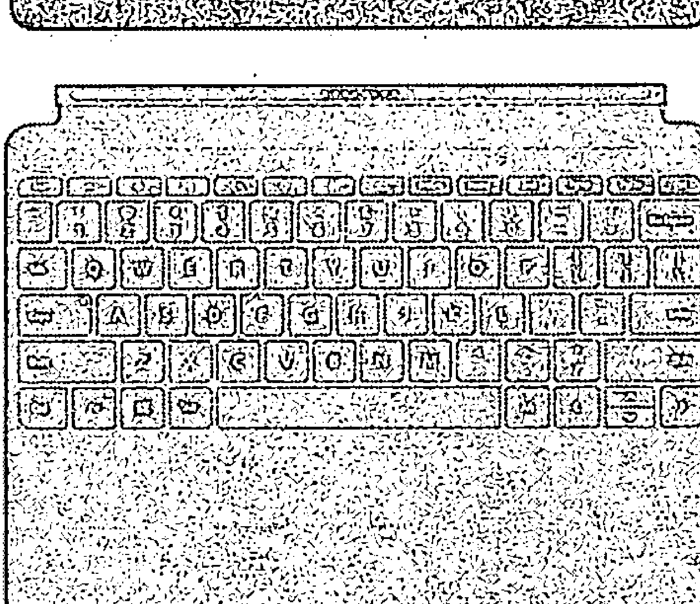

如果你对平板电脑的使用模式不感冒，其实在相似或更低的价位上就能获得比Surface Go更好的性能体验。比如，炫龙阿尔法L9，这款15.6英寸的轻薄本搭载了金牌奔腾4415U，而且还配备独立的MX150显卡，售价不过3099元。此外，宏碁派3 A314、联想扬天V330、华硕X441和惠普246 G6，也都是2xxx元价位上就搭载了Gemini Lake平台的高性价比产品（图5）。

总之，英特尔新一代奔腾和赛扬虽然性能较过去有了些许进步，但我们依旧不能对它们的实际表现抱有太大的期望，只能在低画质下流畅运行LOL级别的游戏而已。因此，我们不妨将其视为“新时代的上网本”，主办公、轻娱乐，适合扮演家里第二部笔记本的角色。

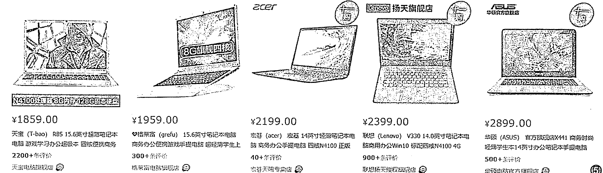

## 联网优化 酷睿Y系添新丁

从第五代酷睿（Broadwell）开始，英特尔就针对PC平板二合一设备定制了名曰“酷睿M”、TPD仅有4.5W且无需风扇辅助散热的全新Y系列芯片（图6），并一路从Broadwell-Y→Skylake-Y→Kaby Lake-Y进化而来。只是，隶属于第八代酷睿的Y系列处理器，在今年却“迟到”了。

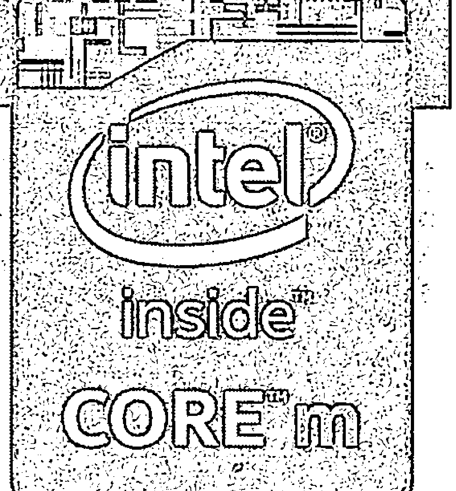

## 迟到的八代Y系家族

英特尔早在2016年Q2就发布了七代酷睿家中的Y系成员（Kaby Lake-Y），可惜该系列近两年一直没有更新，市面上看到的轻薄本/二合一新品依旧是搭载隶属七代酷睿Kaby Lake-Y平台的酷睿M3-7Y30等。好消息是，前不久英特尔终于补全了第八代酷睿处理器家族（图7），其中就包括代号为“Amber Lake-Y”的新一代Y系列处理器。

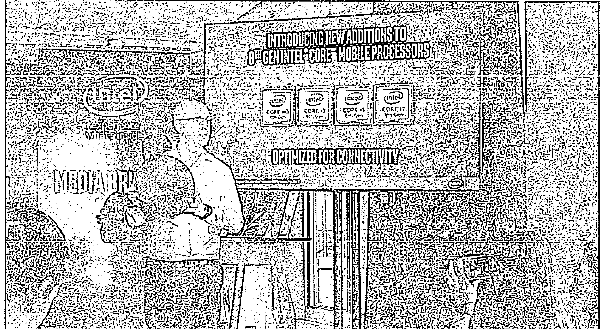

## “生产力”的下限所在

Amber Lake-Y平台包括酷睿i7-8500Y、酷睿i5-8200Y和酷睿M3-8100Y三款产品（表2），它们均采用14nm++工艺打造，在架构层面和七代酷睿Kaby Lake-Y基本相同，只是将TDP从4.5W提升到了5W，并进一步拔高了主频。官方表示Amber Lake-Y的性能对比上一代酷睿M有了两位数的性能提升，并改进了Wi-Fi和LTE性能，针对手写笔和触摸进行了优化。 据悉，年底戴尔XPS13二合一版和苹果12英寸的MacBook会首先搭载Amber Lake-Y平台处理器（图8），而其他品牌最晚也会在2019年初陆续跟进。 作为参考，上代酷睿M家族中最低端的酷睿M3-7Y30在Cinebench R15中的跑分成绩为105（单核）和250（多核），性能明显领先于金/银奔腾家族。可以说，历代的酷睿M都是同期酷睿处理器家族中“生产力”的下限，只有搭载它们的轻薄本/二合一设备才具备主流级别的办公和娱乐潜力，足以胜任家中的第二台PC的角色。 需要注意的是，酷睿M是“第二台PC”，可不是前文赛扬/奔腾对应的“第二台笔记本”哦。平时玩大型3D游戏和视频编辑等重负载应用交给PC，其余的应用环境酷睿M设备基本都可以搞定。

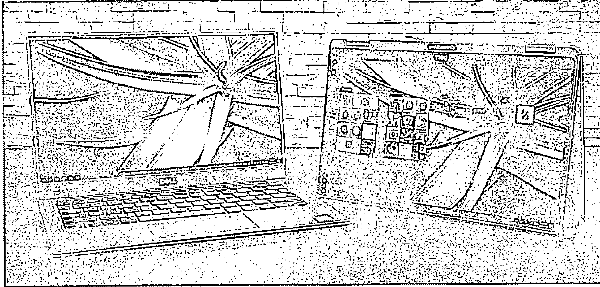

### 表2：第八代酷睿Y系列处理器规格表
| 型号 | 酷睿i7-8500Y | 酷睿i5-8200Y | 酷睿M3-8100Y |
| :--- | :--- | :--- | :--- |
| 隶属平台 | Amber Lake-Y（八代酷睿） | Amber Lake-Y（八代酷睿） | Amber Lake-Y（八代酷睿） |
| 制程工艺 | 14nm++ | 14nm++ | 14nm++ |
| 核心/线程 | 2/4 | 2/4 | 2/4 |
| 基础频率 | 1.5GHz | 1.3GHz | 1.1GHz |
| 加速频率 | 4.2GHz | 3.9GHz | 3.4GHz |
| 高速缓存 | 4MB | 4MB | 4MB |
| TDP功耗 | 5W | 5W | 5W |
| 最大内存 | 16GB | 16GB | 16GB |
| 核芯显卡 | UHD615 | UHD615 | UHD615 |
| 单核性能 | - | - | - |
| 多核性能 | - | - | - |

## 一门四将 酷睿U系新旧交替

在英特尔历代酷睿家族中，拥有15W TDP的U系列低功耗版处理器堪称“中流砥柱”，它们代表着性能和功耗的完美平衡。然而，由于英特尔产品策略的不断调整，U系列第八代酷睿处理器也成为了史上最为混乱的存在。

## 第一波：Kaby Lake Refresh

英特尔早在2017年8月就发布了代号为“Kaby Lake Refresh”平台的第一波U系列第八代酷睿处理器，首发成员包括i5-8250U/ i5-8650U和i7-8550U/i7-8650U（数字带6的还主打博锐技术），随后又在2018年Q1新增定位更低的酷睿i3-8130U（表3）。
上述型号应该是大家最为熟悉的移动处理器了，得益于4核8线程以及更高主频的优势（图9），i5-8250U和i7-8550U在散热设计的允许下，性能表现已经非常接近45W TDP的七代酷睿i5-7300H了，足以承担重度办公和中度娱乐的任务，在搭配MX150独显时可以在720P+低画质下流畅“吃鸡”。

### 表3：标准Kaby Lake Refresh平台规格对比
| 型号 | i7-8650U | i7-8550U | i5-8650U | i5-8250U | i3-8130U |
| :--- | :--- | :--- | :--- | :--- | :--- |
| 隶属平台 | Kaby Lake Refresh（八代酷睿） | Kaby Lake Refresh（八代酷睿） | Kaby Lake Refresh（八代酷睿） | Kaby Lake Refresh（八代酷睿） | Kaby Lake Refresh（八代酷睿） |
| 制程工艺 | 14nm+ | 14nm+ | 14nm+ | 14nm+ | 14nm+ |
| 核心/线程 | 4/8 | 4/8 | 4/8 | 4/8 | 2/4 |
| 基础频率 | 1.9GHz | 1.8GHz | 1.7GHz | 1.6GHz | 2.2GHz |
| 加速频率 | 4.2GHz | 4.0GHz | 3.6GHz | 3.4GHz | 3.4GHz |
| 高速缓存 | 8MB | 8MB | 6MB | 6MB | 4MB |
| TDP功耗 | 15W | 15W | 15W | 15W | 15W |
| 最大内存 | 32GB | 32GB | 32GB | 32GB | 32GB |
| 核芯显卡 | UHD620 | UHD620 | UHD620 | UHD620 | UHD620 |
| 单核性能 | 172 | 164 | 151 | 144 | 140 |
| 多核性能 | 618 | 556 | 569 | 553 | 338 |

Kaby Lake Refresh平台主要的服务对象是轻薄本，并常与NVIDIA MX110/MX130和MX150独显搭配，适合注重便携和性能，但对3A游戏大作不感冒的用户选择。考虑到轻薄本的散热设计普遍不够完美，所以大家在挑选轻薄本时不必强上酷睿i7-8550U（更容易触发降频而影响性能），i5-8250U足矣，用省下来的钱升级更大的SSD更实际。

## 第二波: Kaby Lake Refresh

2018年4月，英特尔为Kaby Lake Refresh平台增加了集成“锐炬”(Iris)核显的新成员，它们分别为i7-8559U、i5-8269U、i5-8259U和i3-8109U（表4）。与i5-8250U等家族前辈相比，新U系列的八代酷睿处理器将TDP从15W提升到了28W，并将UHD620核芯显卡换成了Iris Plus 650。这颗GPU代表了英特尔显卡技术的最强音，其性能足以媲美NVIDIA GeForce 930MX。

此外，新U系列酷睿可以搭配英特尔最新的300系列芯片组主板，从而获得千兆级无线网卡、原生USB3.1 Gen2和对傲腾内存的支持（图10）。可惜，轻薄本们更喜欢搭配MX150，成本高、GPU性能也谈不上无敌的新U系列酷睿的定位稍显尴尬，至今也多为NUC这种迷你PC以及极少数高端轻薄本猎装，普通用户可以无视之。

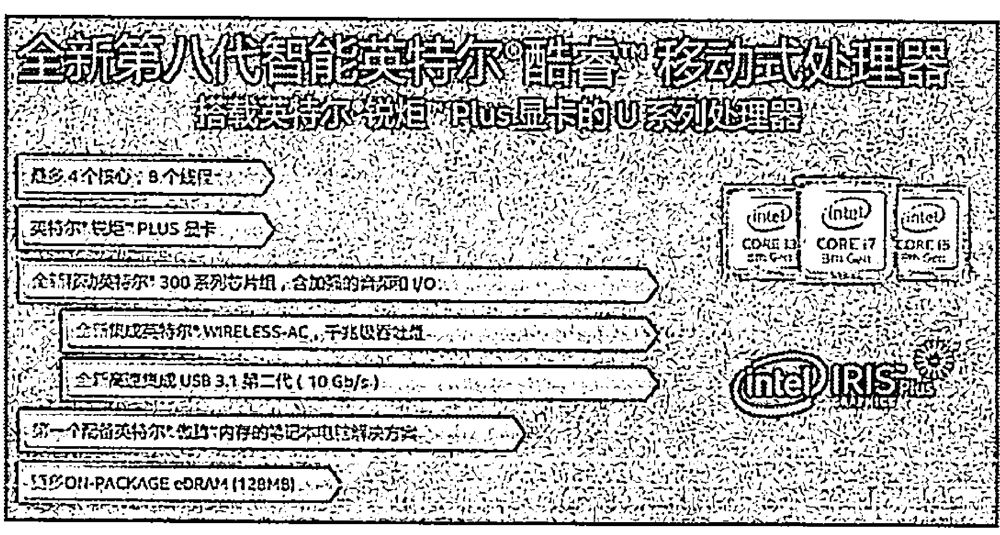

### 表4: 锐炬核显版Kaby Lake Refresh平台规格对比
| 型号 | i7-8559U | i5-8269U | i5-8259U | i3-8109U |
| :--- | :--- | :--- | :--- | :--- |
| 隶属平台 | Kaby Lake Refresh（八代酷睿） | Kaby Lake Refresh（八代酷睿） | Kaby Lake Refresh（八代酷睿） | Kaby Lake Refresh（八代酷睿） |
| 制程工艺 | 14nm+ | 14nm+ | 14nm+ | 14nm+ |
| 核心/线程 | 4/8 | 4/8 | 4/8 | 4/8 |
| 基础频率 | 2.7GHz | 2.6GHz | 2.3GHz | 3.0GHz |
| 加速频率 | 4.5GHz | 4.2GHz | 3.8GHz | 3.6GHz |
| 高速缓存 | 8MB | 6MB | 6MB | 4MB |
| TDP功耗 | 28W | 28W | 28W | 28W |
| 最大内存 | 32GB | 32GB | 32GB | 32GB |
| 核芯显卡 | Iris Plus 650 | Iris Plus 650 | Iris Plus 650 | Iris Plus 650 |
| 单核性能 | — | — | 154 | — |
| 多核性能 | — | — | 647 | — |

## 第三波: Cannon Lake

2018年5月，英特尔官网的ARK数据库中增加了一款型号为“i3-8121U”的八代酷睿处理器。虽然它同样隶属于U系列，但却首次用上了传说中的10nm工艺，要知道，英特尔曾表示10nm工艺需要2019年才能商业化量产！

没错，我们可以将i3-8121U视为英特尔10nm工艺Cannon Lake平台的试水，压根也没打算大范围量产。所以，迄今为止国内只有联想IdeaPad 330这么一款笔记本武装了i3-8121U处理器（图11），而这颗芯片的性能也就是七代酷睿i3（U系列）的水平，同价位已经可以买到酷睿i5-8250U的机型，所以同样并不值得我们太多关注。

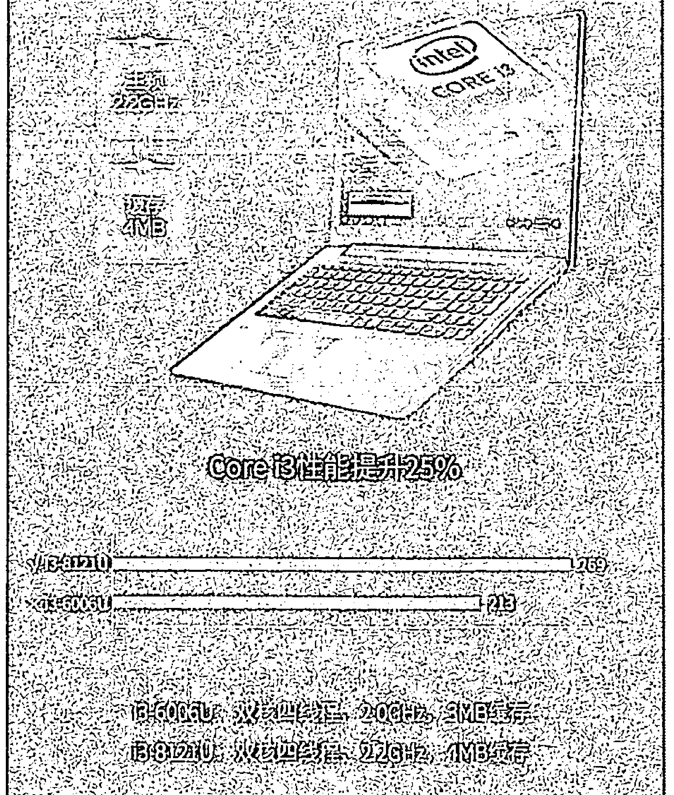

## 第四波：Whiskey Lake

2018年8月底，英特尔突然宣布了第八代酷睿处理器家族的新一代U系列成员。需要注意的是，新U系列不再隶属于Kaby Lake Refresh平台，而是升级到了最新的Whiskey Lake平台，首发成员包括i7-8565U、i5-8265U和i3-8145U（表5）。

与Kaby Lake Refresh平台前辈相比，同属八代酷睿的Whiskey Lake平台改用了最新的14nm++工艺，不仅大幅提升睿频加速频率（图12），还具备出色的省电特性。据悉，新平台在搭载了i7-8565U处理器、使用集成显卡以及52Wh电池时，可以持续播放16个小时的本地1080P视频，这个成绩比如今普遍的10小时提升巨大。

同时，Whiskey Lake平台还首次针对轻薄笔记本电脑和2合1产品的网络连接能力进行了优化，集成了千兆级别的Wi-Fi控制器和原生的USB3.1控制器，增加了语音识别所需要的DSP模块，可以为众多语音助手提供相应的支持，提供更强的语音识别能力（图13）。此外，新平台还集成傲腾控制器，消费者可以选择傲腾+HDD的方案，达到容量和性能的平衡。

综合来看，Whiskey Lake平台在原有基础上提高了性能，加强了I/O接口功能，并可大幅延长笔记本的续航能力。

目前，我们已经可以买到搭载新平台芯片设计的新款轻薄本了，比如惠普畅游人星15 (i5-8265U+MX150)、宏基翼5 A515 (i5-8265U+MX130)、戴尔灵越燃5000 3代 (i5-8265U+MX150)和惠普新ENVY13 (i5-8265U+核显)等，只是较搭载Kaby Lake Refresh平台的老型号略贵一点而已。

考虑到Whiskey Lake平台的高主频和功能上的优势，i5-8265U的表现就足以媲美甚至超越i7-8550U。所以，如果你近期有购买新款轻薄本的计划，不妨优先考虑基于新平台设计的产品（图14）。有关Whiskey Lake的实际性能表现，CFan在拿到评测机实测后再和大家分享。

## AMD逆袭 移动锐龙虎口夺食

在笔记本领域，AMD近些年一直处于英特尔的阴影之下，一句 “i3秒全家” 足以道出AMD的辛酸。终于，随着AMD祭出全新的 “Ryzen” （锐龙）移动处理器平台之后，AMD可算是在笔记本领域扳回一城，并有望蚕食更多原本属于英特尔的市场份额。

### 第一波怼怼轻薄本

2017年底，AMD锐龙移动处理器首发专为轻薄本定制的低功耗版，包含Ryzen 3 2200U、Ryzen 3 2300U、Ryzen 5 2500U和Ryzen 7 2700U四款型号，其中Ryzen 3家族竞争力不高，而Ryzen 5/Ryzen 7则是非常值得我们关注的存在(表1)。

AMD锐龙移动处理器的特色是将Zen处理器核心架构 (CPU) 和Vega核显架构 (GPU) 有机结合(图1)，Ryzen 5 2500U和Ryzen 7 2700U的CPU性能分别可以媲美酷睿i5-8250U和i7-8550U，而它们的GPU核显性能却超越了NVIDIA GeForce 940MX (Ryzen 5 2500U) 和接近低功耗版的MX150 (Ryzen 7 2700U)。

换句话说，选择搭载AMD锐龙移动处理器的轻薄本，就等于购买了英特尔U系列八代酷睿处理器+NVIDIA独显的组合 (图2)。在低于4500元价位的轻薄本领域，AMD移动锐龙的优势非常明显。但如果价格高于5000元，我们就要比较其与i5-8250U+MX150独显笔记本的价格差距了。

表1: AMD低功耗版锐龙移动处理器规格对比
| 型号 | Ryzen 7 2700U | Ryzen 5 2500U | Ryzen 3 2300U | Ryzen 3 2200U |
| :--- | :--- | :--- | :--- | :--- |
| 隶属平台 | Raven Ridge | Raven Ridge | Raven Ridge | Raven Ridge |
| 制程工艺 | 14nm | 14nm | 14nm | 14nm |
| 核心/线程 | 4/8 | 4/8 | 4/4 | 2/4 |
| 基础频率 | 2.2GHz | 2.0GHz | 2.0GHz | 2.5GHz |
| 加速频率 | 3.8GHz | 3.6GHz | 3.4GHz | 3.4GHz |
| 高速缓存 | 4MB | 4MB | 4MB | 4MB |
| TDP功耗 | 15W | 15W | 15W | 15W |
| 核芯显卡 | Vega 10 | Vega 8 | Vega 6 | Vega 3 |
| 单核性能 | 143 | 137 | - | 117 |
| 多核性能 | 629 | 589 | - | 312 |

*AMD移动锐龙还包括Ryzen Pro系列的专业版，加入了更多安全技术

### 曲线染指游戏本

由于AMD锐龙移动处理器的表现符合消费者的预期，所以AMD总算找到了与英特尔继续竞争下去的底气。和定位主流的轻薄本相比，动辄五千元起步的游戏本才是利润蛋糕的体现所在。

可惜，AMD锐龙移动处理器的第一波只有低功耗版，游戏本处于“无芯可用”的尴尬境地。但是，依旧有不少OEM厂商希望可以借着“锐龙”之名提升AMD在游戏本市场的地位，比如ROG就曾在2017年底推出过型号为Strix S7ZC的锐龙游戏本(图3)。

需要注意的是，ROG Strix S7ZC搭载的锐龙并非移动版，而是AMD针对台式机定制的Ryzen7 1700（图4），其TDP高达65W。为了让这颗桌面处理器可以符合游戏本的散热要求，ROG将Ryzen7 1700的满载频率和单核加速频率分别锁定到了3.0GHz（桌面标准版为3.25GHz）和3.1GHz（桌面标准版为3.7GHz），在性能上较桌面版有所缩水。

就性能而言，ROG Strix S7ZC搭载的Ryzen7 1700性能可以秒杀桌面版的英特尔七代酷睿i7-7700K，只是和桌面版的八代酷睿i7-8700K还有一段距离，但如此表现已经足够让AMD爱好者振奋了。

问题来了，像ROG Strix S7ZC这种将桌面CPU放进游戏本中的产品都属于“非主流”，这款产品的售价也高达12999元起，而且它所搭配的Radeon RX580独立显卡性能只是和NVIDIA移动版的GTX1060相当，竞争力远不如同价位采用八代酷睿（移动版）和GTX1070的游戏本。

没办法，谁让AMD首发的锐龙移动处理器没有高性能版呢，OEM厂商只能通过雀占鸠巢的方式，将桌面锐龙塞进游戏本里，并通过无比夸张的散热模块来镇压桌面锐龙的热情了。

### AMD游戏本的野望

很早以前，AMD曾对APU提出过远景规划，大概的意思就是截至2020年，最新的APU性能将是2014年Kaveri平台主打FX-7600P处理器的25倍。2017年上市的Ryzen 7 2700U性能已经是FX-7600P的5.86倍（图5），显然距离目标还有一段距离。

于是，AMD借着挥师游戏本的契机发布了高性能的Raven Ridge平台，并将累计性能提升至8.5倍。没错，这里提到的高性能Raven Ridge平台，就是AMD针对游戏本定制的性能级移动锐龙处理器（图6），首发型号有2款，分别是Ryzen 7 2800H和Ryzen 5 2600H（表2）。

表2：AMD高性能版锐龙移动处理器规格对比
| 型号 | Ryzen 7 2800H | Ryzen 5 2600H |
| :--- | :--- | :--- |
| 隶属平台 | Raven Ridge 2018 | Raven Ridge 2018 |
| 制程工艺 | 14nm | 14nm |
| 核心/线程 | 4/8 | 4/8 |
| 基础频率 | 3.3GHz | 3.2GHz |
| 加速频率 | 3.8GHz | 3.6GHz |
| 高速缓存 | 4MB | 4MB |
| TDP功耗 | 35W | 35W |
| 核芯显卡 | Vega 11 | Vega 8 |
| 单核性能 | - | - |
| 多核性能 | - | - |

简单来说，Ryzen 7 2800H和Ryzen 7 2700U的关系，就好像英特尔八代酷睿中i7-8750H和i7-8550U的关系。和低功耗版相比，Ryzen 7 2800H和Ryzen 5 2600H将TDP从15W提升到了35W，并大幅提升了基础频率，集成的Vega核显也有所升级（Ryzen 5 2600H为频率提升，Ryzen 7 2800H增加了1组CU单元的数量）。

那么，AMD针对游戏本定制的高性能锐龙移动处理器值得我们期待吗？

## 理性看待新锐龙处理器

由于Ryzen 7 2800H和Ryzen 5 2600H拥有更高的TDP和基础频率，所以它们的性能自然可以远胜Ryzen 7 2700U和Ryzen 5 2500U这两个家族前辈。但是，要想和英特尔Coffee Lake-H平台的八代酷睿相比，高性能的移动锐龙处理器可能还差点意思。

从理论上来看，AMD Ryzen 7 2800H的性能应该足以挑战英特尔八代酷睿i5-8300H，但是距离八代酷睿i7-8750H应该还有一段距离。原因很简单，酷睿i7-8750H是6核12线程，而Ryzen 7 2800H还是4核8线程。

笔者认为，高性能版的移动锐龙处理器其实根本没有必要对集成的Vega核显进行升级，将这部分TDP的冗余用于更高的主频或更多的物理核心才是王道。要知道，所谓“游戏本”，注定需要额外搭配更高性能的独立显卡；集成核显本来就没有太大的意义。

另一方面，AMD短期内主打的移动显卡还停留在Radeon RX500系列上（图7），而AMD这一代的移动独显并不算给力，哪怕是最顶级的Radeon RX580也不过是NVIDIA GTX1060级别。问题是，AMD锐龙平台游戏本，还好意思搭配NVIDIA品牌的独显吗？

目前市面上采用八代酷睿i5-8300H+GTX1050独显的游戏本均价不过5500元，配备GTX1050 Ti游戏本在6000元左右。从这个角度来看，除非锐龙游戏本的价格可以切入5000元左右的市场，否则它们将面临极大的竞争压力。

总之，锐龙游戏本自身肯定是值得期待的，但它能否取得市场认可，关键还得看具体产品的定价是否合理。可以预见，未来最常见的锐龙游戏本配置就是Ryzen 7 2800H/Ryzen 5 2600H+Radeon RX560，而我们则期待AMD新一代Radeon Vega Mobile移动显卡可以早日上市（图8），从而进一步提升AMD游戏本的竞争力。

## 四大联军 英特尔打造顶级酷睿矩阵

和AMD相比，英特尔针对游戏本乃至移动工作站这些高性能移动PC显然更有经验和底蕴。特别是步入第八代酷睿时代，英特尔在这一领域更是布下了四大联军，堪称超豪华的顶级酷睿矩阵，而它们的性能也都要在高性能锐龙移动处理器之上。

### 代号H——游戏本的标配之芯

英特尔旗下45W TDP的H系列酷睿处理器一直都是游戏本的御用“心脏”，在2018年4月发布、隶属于Coffee Lake-H平台的八代酷睿则堪称游戏本的标配之芯（图9）。i7-8850H、i7-8750H、i5-8400H和i5-8300H的定位依次降低，i7-8850H和i5-8400H与另外两款处理器相比除了主频优势外还支持博锐技术，更适合商务用户考虑（表3）。

表3: Coffee Lake-H平台八代酷睿规格对比
| 型号 | i7-8850H | i7-8750H | i5-8400H | i5-8300H |
| :--- | :--- | :--- | :--- | :--- |
| 隶属平台 | Coffee Lake-H (八代酷睿) | Coffee Lake-H (八代酷睿) | Coffee Lake-H (八代酷睿) | Coffee Lake-H (八代酷睿) |
| 制程工艺 | 14nm++ | 14nm++ | 14nm++ | 14nm++ |
| 核心/线程 | 6/12 | 6/12 | 4/8 | 4/8 |
| 基础频率 | 2.6GHz | 2.2GHz | 2.5GHz | 2.3GHz |
| 加速频率 | 4.3GHz | 4.1GHz | 4.2GHz | 4.0GHz |
| 高速缓存 | 9MB | 9MB | 8MB | 8MB |
| TDP功耗 | 45W | 45W | 45W | 45W |
| 最大内存 | 32GB | 32GB | 32GB | 32GB |
| 核芯显卡 | UHD630 | UHD630 | UHD630 | UHD630 |
| 单核性能 | 178 | 175 | - | 169 |
| 多核性能 | 1057 | 1092 | - | 803 |

就性能而言，八代酷睿的表现非常抢眼，i5-8300H就能比肩上代i7-7700HQ，而i7-8750H/i7-8750H足以挑战桌面的i7-7700K（图10）。可以说，武装这一代酷睿处理器的游戏本，在CPU性能方面基本就不存在瓶颈一说了。

### 代号G——AMD“入股”GPU

正所谓“没有永远的敌人，只有永恒的利益”。就在英特尔和AMD打得难解难分之际，两家企业却罕见地联手打造了堪称八代酷睿中的“奇葩”——“Kaby Lake-G”。之所以称其为奇葩，是因为它的CPU还停留在七代酷睿Kaby Lake核心，而GPU则从死对头AMD那里借来了Radeon RX Vega M GH/GL核显（图11），整个平台包含i7-8809G、i7-8709G、i7-8706G、i7-8705G和i5-8305G几个成员，TDP分为100W和65W两种（表4）。

表4: Kaby Lake-G平台规格对比
| 型号 | i7-8809G | i7-8709G | i7-8706G | i7-8705G | i5-8305G |
| :--- | :--- | :--- | :--- | :--- | :--- |
| 隶属平台 | Kaby Lake-G（八代酷睿） | Kaby Lake-G（八代酷睿） | Kaby Lake-G（八代酷睿） | Kaby Lake-G（八代酷睿） | Kaby Lake-G（八代酷睿） |
| 制程工艺 | 14nm+ | 14nm+ | 14nm+ | 14nm+ | 14nm+ |
| 核心/线程 | 4/8 | 4/8 | 4/8 | 4/8 | 4/8 |
| 基础频率 | 3.1GHz | 3.1GHz | 3.1GHz | 3.1GHz | 2.8GHz |
| 加速频率 | 4.2GHz | 4.1GHz | 4.1GHz | 4.1GHz | 3.8GHz |
| 高速缓存 | 8MB | 8MB | 8MB | 8MB | 6MB |
| TDP功耗 | 100W | 100W | 65W | 65W | 65W |
| 最大内存 | 64GB | 64GB | 64GB | 64GB | 64GB |
| 核芯显卡 | Vega M GH | Vega M GH | Vega M GL | Vega M GL | Vega M GL |
| 单核性能 | 179 | - | - | 169 | 157 |
| 多核性能 | 865 | - | - | 703 | 681 |

Kaby Lake-G平台属于很小众的存在，其CPU性能明显落后于Coffee Lake-H平台的八代酷睿，但它的GPU性能却可达到NVIDIA GeForce GTX1050Ti的水准，综合性能更为强悍，适合作为极致轻薄型游戏本的“心脏”。而普通消费者则可无视它的存在，毕竟如今八代酷睿+GTX1050 Ti的游戏本已经足够轻薄（引入窄边框的新品）和便宜了。

### 代号i9——游戏本中的皇帝

台式机领域最强的消费类“芯脏”是酷睿i9。对笔记本而言，目前可选的最顶级处理器也是隶属于Coffee Lake-H平台的酷睿i9（图12），具体型号为i9-8950HK，它采用6核心和12线程设计，内置12MB高速缓存睿频加速可达4.8GHz。与Coffee Lake-H平台的其他“小弟”相比，i9-8950HK最大的特点就是支持英特尔温度自适应睿频加速技术（Thermal Velocity Boost），在游戏本的散热条件允许下，它可以实现一定程度的超频操作，从而获得更极致的性能表现。如今搭载这颗处理器的游戏本代表有神舟精盾G99E（12999元，GTX1070独显）、戴尔G7（15999元，GTX1060 Max-Q），而其他型号的价格则都在20000元以上，虽然看着完美，但却与普通用户绝缘。

### 代号至强——为移动工作站而生

没错，八代酷睿中也少不了专为移动工作站搭载的至强（Xeon）处理器，包括至强E-2186M和E-2176M两款型号（表5），它们都有着和酷睿i9-8950HK相同的12MB高速缓存，支持ECC内存，专为移动工作站定制。不过，移动工作站往往也具有约等于吓人的售价，所以咱们在这里也就不再多加讨论了。

表5: 酷睿i9和移动至强规格对比
| 型号 | i9-8950HK | E-2186M | E-2176M |
| :--- | :--- | :--- | :--- |
| 隶属平台 | Coffee Lake-H（八代酷睿） | Coffee Lake-H（八代酷睿） | Coffee Lake-H（八代酷睿） |
| 制程工艺 | 14nm++ | 14nm++ | 14nm++ |
| 核心/线程 | 6/12 | 6/12 | 6/12 |
| 基础频率 | 2.9GHz | 2.9GHz | 2.7GHz |
| 加速频率 | 4.8GHz | 4.8GHz | 4.4GHz |
| 高速缓存 | 12MB | 12MB | 12MB |
| TDP功耗 | 45W | 45W | 45W |
| 最大内存 | 64GB | 64GB | 64GB |
| 核芯显卡 | UHD630 | UHD P630 | UHD P630 |
| 单核性能 | 200 | - | 179 |
| 多核性能 | 1230 | - | 1041 |

## 看懂主控芯片

明白SSD的灵魂

SSD降价是这个秋季最让电脑用户，特别是DIYer兴奋的事情之一，相对于可望而不可即的新显卡等目标，换个SSD，让老电脑焕发第二春，是既简单又省钱的更好选择。不过，也许很少有人注意到，除了我们已经比较熟悉的闪存颗粒之外，还有一个非常重要的元件决定了它的功能与性能，甚至可以说是SSD中比闪存颗粒更重要的元件，是一款SSD真正的性能所系、灵魂所在，那就是主控芯片。想要真正了解SSD，更明白地挑选产品，最好能对主控芯片有一定的认识。

## 何为主控芯片

其实，一款SSD最核心的元件就是闪存颗粒和主控芯片。当然，其中闪存颗粒在SSD中所占的面积和成本都比较大，而且与大家关心的性能、稳定性、寿命等关系密切，因此常常更受关注，这也是可以理解的。可是不论闪存颗粒如何变化，它充其量只是数据的仓库而已，SSD的主控芯片却要负责操控闪存以及缓存、数据接口等SSD上所有的元件，指挥数据流，分配各项工作，重要性不言而喻。

主控芯片实际上就是一颗处理器，大都和常见的手机处理器一样基于ARM架构（图1），也有部分SSD厂家采用RISC架构。不同的核心架构、核心数量、频率高低等都关乎主控的性能，不过一般来说我们并不需要了解这些，只要看它标出的参数即可。


## 主控芯片的作用

在SATA接口的SSD中，主控芯片的面积并不起眼（图2），在M.2接口产品上，它常常也很难与闪存芯片区分开，其成本一般也仅占整体成本的15%左右。一般来讲，SSD主控芯片的主要参数包括支持的闪存颗粒类型、数量，支持的存取通道数、通道带宽，支持的SSD存取标准、接口等等。另外SSD的加密、纠错、校验等数据相关功能也是主控芯片控制的。

## 主控芯片与闪存颗粒

SSD中的闪存颗粒从SLC、MLC发展到现在的TLC、3D TLC、QLC，并不是简单地更换闪存颗粒或触点、线路就行，而是需要主控芯片的支持。对于单元存储位数不断提升的闪存，SSD必须在读写方式、数据流等方面进行相应的优化，同样，当闪存颗粒以堆叠方式扩展容量的时候，也需要对每个颗粒的数据流进行调节，而相应的控制功能就由主控芯片完成。此外主控可支持的闪存芯片数量也各不相同，一般可支持16~64个闪存芯片。需要注意的是，SSD的闪存芯片数量和颗粒数量并不一样，一个闪存颗粒内可以封装多个闪存芯片。


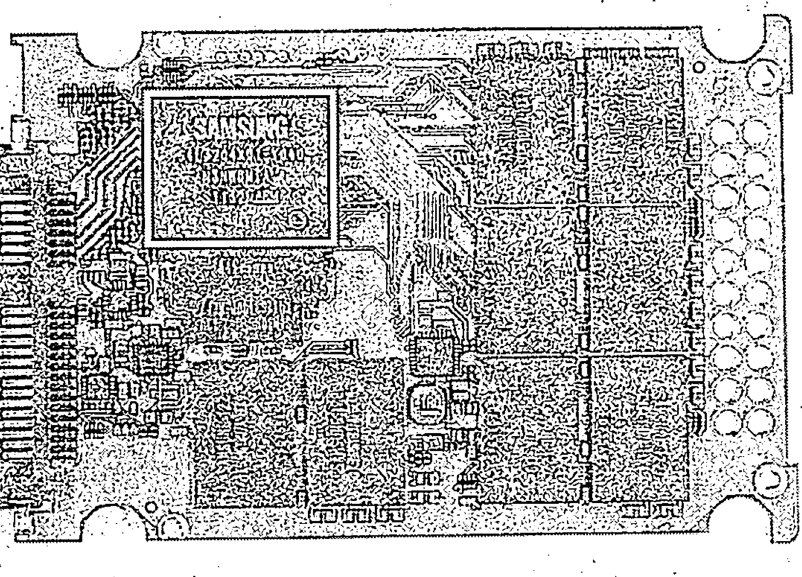

> 在很多SSD中主控芯片都不是很显眼的存在

## 主控芯片与通道数

其实目前主流闪存颗粒的传输速度是远低于主流SSD传输速度的，因此SSD在设计时都采用了类似内存的多通道模式，而能够支持几个通道对SSD的实际速度关系非常大。目前主流主控芯片都可支持4条以上的通道（图3），较高端产品则可支持8通道。不同的主控芯片在通道带宽、每个通道可支持的CE（颗粒芯片）数量等方面也有区别。

与内存一样，目前的SSD提升存储速度的主要手段就是提升并行通道数量，这一方式可以更轻松地让读写速度倍增，比将闪存颗粒的频率提高一倍要现实得多。不过同样与内存一样，存储通道越多，对控制器的性能要求越高，因此支持8通道或更多通道的主控芯片，通常会采用高频、多核设计，这使得高速SSD工作时的发热量通常也较高，需要特别注意散热问题。

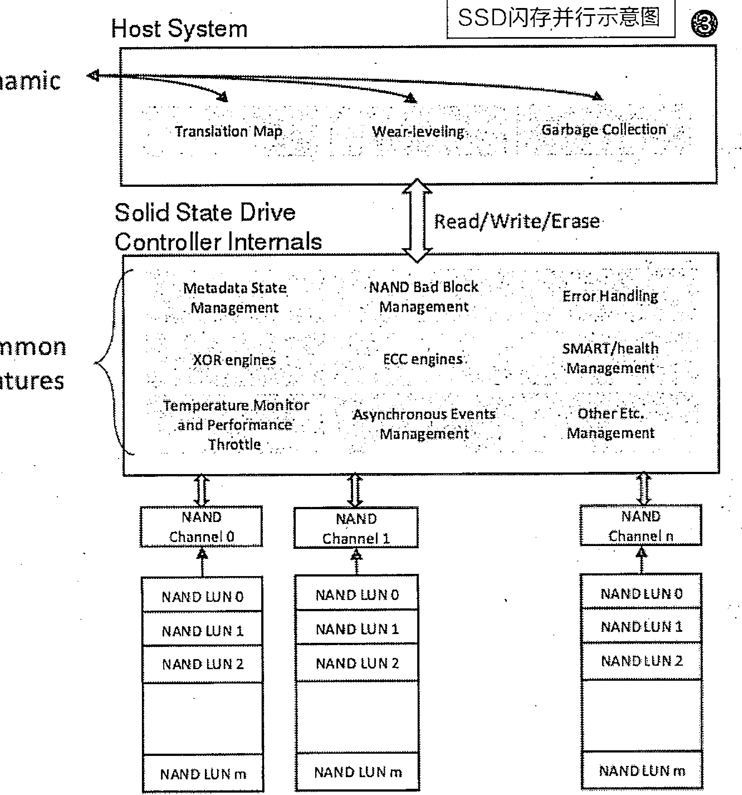

## 主控芯片与SSD标准

对用户来说，与内存息息相关的SSD的颗粒类型、通道数等方面的配置并不是很重要，大家只需要知道其实际性能表现、寿命等外部指标就好了。不过SSD的运行标准与接口，也就是采用SATA、Mini SATA还是M.2接口，使用SATA(AHCI)还是NVMe(PCI-E)标准规范等，却是用户必须重视，同时也是完全依赖于主控芯片的功能。

目前的主控芯片和SSD设计一样，主要分为SATA与NVMe两种标准规范。NVMe主控大幅加强了并行读写性能，其存储系统一次最多可执行64K队列，并且允许每个队列拥有64K的命令。而SATA主控及存储系统一次最多执行1个队列，每个队列32条指令。

NVMe主控可以降低控制器和软件接口部分的延迟，精简了调用方式，执行命令时不需要读取寄存器。而SATA标准控制器每条命令则需要读取4次寄存器，一共会消耗8000次CPU循环，从而造成2.5微秒的延迟。

作为新一代存储规范的产物，NVMe主控也针对目前的主流平台进行了优化，例如针对目前已成为绝对主流的多核心处理器新加入了中断模式，可以同时接收多个处理器核心的命令，同时满足不同应用的数据要求。

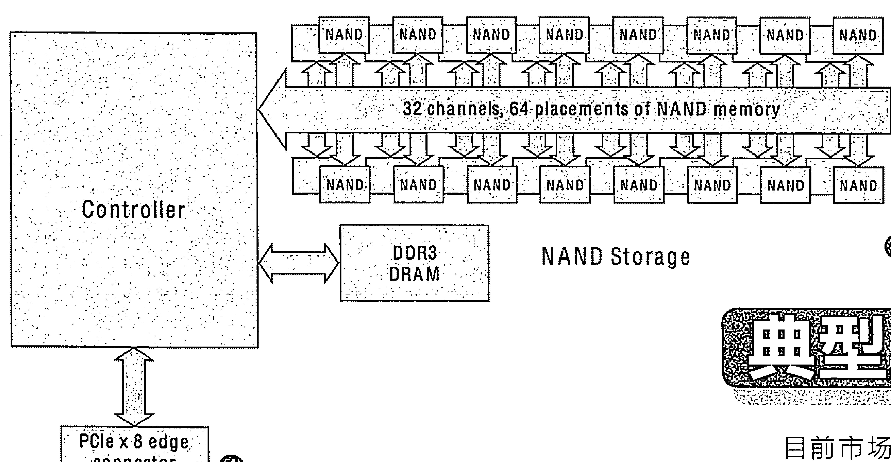

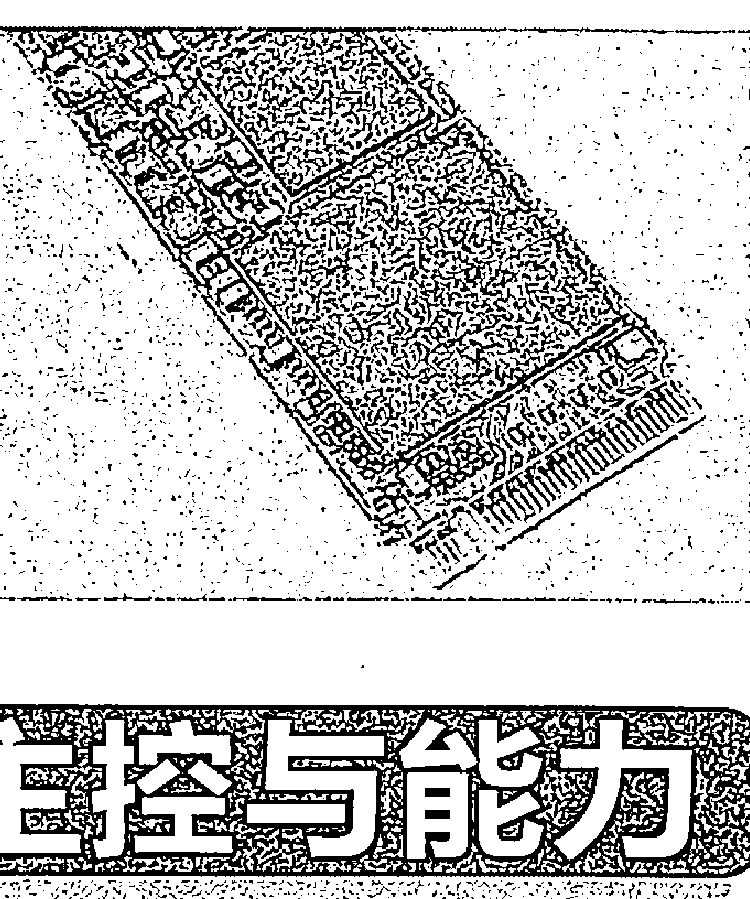

## 主控芯片与缓存

高速缓存是提升硬盘突发存取能力的重要手段，SSD也是如此，虽然常见的NAND闪存颗粒存取速度可达机械硬盘的十倍乃至百倍以上，但与动态存储器（RAM）的速度差距也同样在百倍以上。因此很多SSD也配置了RAM作为缓存（图4），而且容量常常还比较大，动辄达到128MB乃至512MB以上，缓存与存储容量之比远高于常见的机械硬盘。

不过随着主控芯片和闪存颗粒技术的发展，很多SSD又开始采用无缓存设计，这就需要主控芯片自身的处理速度和闪存颗粒速度都达到很高的水平，能直接快速存取系统需要的数据，无需高速RAM调取和暂时存储系统可能需要的数据。

目前一些主控芯片还支持特殊的“缓存”模式，允许厂商将内部用于保留空间的SLC闪存模拟为缓存，由于SLC的存储结构比较简单，因此写入速度很高，而高达几GB的SLC缓存，在一般存储操作的时候，可以明显提升整个SSD的存储速度。但需要注意的是，这类SSD的主存储部分常常采用的是写入性能不佳的TLC等颗粒，如果进行大容量数据持续写入操作，一旦耗尽SLC缓存，写入速度就会大幅下降。

目前的主板接口、功耗表现等限制，使得市场中SATA与NVMe标准并行发展，因此并不能说SATA主控就一定落伍，NVMe就一定先进。两者同样逐渐加入了对QLC、3D TLC、更多层堆叠、更多通道、更多CE等技术的支持。当然由于NVMe规范的速度比较高，在一些配置方面可能会更高，不过也带来了更高的成本和发热量问题。

## 典型主控与能力

目前市场中比较常见的SSD主控品牌有Marvell、慧荣（SMI）、群联（PHISON）、东芝、瑞昱（Realtek）等。此外还有一些比较特殊的品牌，例如与希捷合作的SandForce，消费级产品已经较长时间没有更新，但希捷的高端专业级SSD以及刚上市的酷鱼SSD很可能使用了它的产品或相关技术，而三星、Intel、西数等公司也有自己的主控芯片，同时也会使用一些其他品牌的主控芯片。此外如SK海力士、威盛（VIA）等厂商也具有主控研发生产能力，但在消费级市场上很难见到相应产品。

## Marvell 88SS1093

Marvell是一家综合性的芯片厂商，在很多板卡、设备中都能看到它的产品。Marvell涉足SSD主控芯片非常早，产品线也很全面，市场中仍然可以看到的方案从入门级的SATA主控到高速NVMe主控都有，目前市场上比较常见的Marvell主控包括88SS和88NV两个系列的产品。

Marvell主控出色的性能也带来了成本较高、产品开发难度大等问题，在很长时间内，它甚至并不提供自有固件等配套解决方案，需要厂商自行开发，因此只有经验丰富的大厂才会采用其主控产品，例如金士顿、美光（英睿达Crucial）、闪迪、建兴、浦科特等。

88SS1093主控芯片（图5）支持NVMe 1.1标准、四通道PCI-E 3.0，采用三核架构，28nm工艺制造，具有低功耗管理设计。

## 慧荣SM2246/SM2260

慧荣等主控厂商采用“交钥匙”方式设计的主控、固件等一揽子解决方案，使得SSD的开发难度大幅降低，推动它走向了主流市场。虽然是从中下厂商和入门级型号做起，但现在慧荣的SMI系列主控已经进入了中端乃至高端SSD中，成为市场中的主流产品，影响力直追产品更新略显迟缓的Marvell。

常见的慧荣的主控芯片为SM22XX系列，入门级SSD的SM2246和支持NVMe的SM2260是其中两款比较有特色的产品，此外还有面向主流的SM2258/SM2259等。

SM2246（图7）为32bit RISC CPU，支持16bit位宽的DDR2/3内存、BCH ECC错误校验、全局磨损平衡算法、AES 128/256全盘加密、TCG OPAL等技术。它仅设计了4个闪存通道，每通道最多8CE，可支持1.8V和3.3V双电压闪存、ONFI 3.0与Toggle 2.0接口标准、1x/1y/2x/2y/3x nm的SLC、MLC和TLC颗粒，支持闪存页面大小为4KB、8KB、16KB，支持1-plane、2-plane与4-plane。作为入门级产品，这款主控的理论连续读写速度为540MB/s和410MB/s，最大读写IOPS为80000/75000，与主流和高端产品有一定差距。

浦科特M9PeG（图6）是采用这一主控的典型产品之一，使用64层堆叠的东芝TLC颗粒，最大容量为1TB。它采用M.2接口，支持PCI-E 3.0 ×4通道，持续读取速度可达3200MB/s，写入速度则为2100MB/s，随机读写分别为400000IOPS和300000IOPS（1TB型号）。

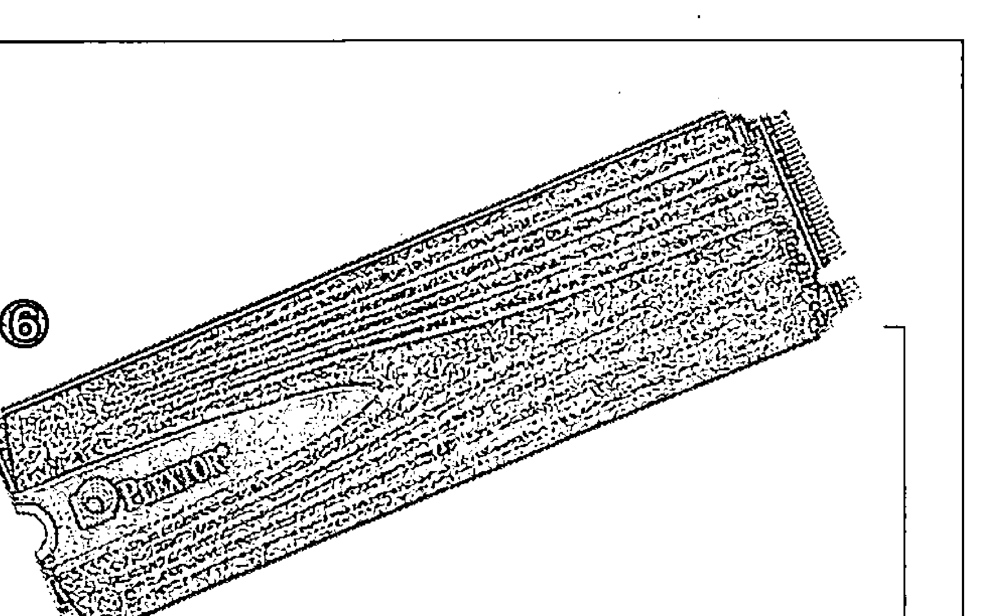

SM2260采用NVMe标准，支持3D MLC/TLC，是一款追求最佳效能、超低功耗、超长使用寿命及卓越数据稳定度的产品。这款芯片采用8通道设计，每个通道8CE，最高可支持2TB容量。它具有LDPC及RAID Data Recover功能的NANDXtend三维解错修正技术，可将SSD的P/E Cycle提高3倍以上，有效地延长了SSD的使用寿命，并且提供了更高效率的数据纠错与校准能力，可带来更好的数据稳定性和完整性。

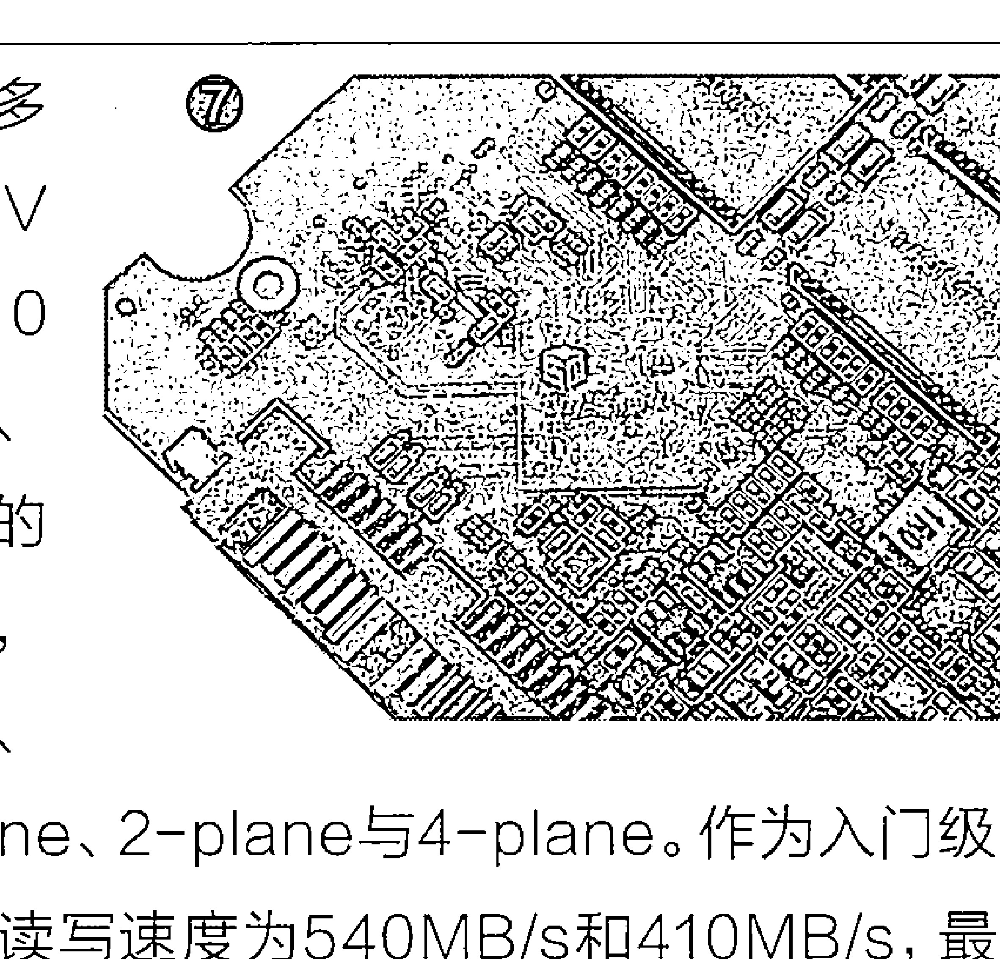

台电S550（图8）是一款入门级SSD，也是采用SM2246主控的典型产品，它使用SATA 6Gb/s接口、2.5英寸规格设计，厚度仅有7mm。这款产品的连续读取速度为480MB/s，而写入速度仅有150MB/s，虽然采用了3D堆叠闪存颗粒，但其系列产品的容量比较小，以符合入门级产品的定位。

威刚SX8000（图9）是一款采用SM2260主控的中高端SSD，使用M.2接口，支持PCI-E 3.0 ×4通道，最高读取速度为2500MB/s，最高写入速度为1100MB/s。它采用3D MLC颗粒，最大容量为1TB。这款产品同时带有SLC和RAM缓存，可提供更好的突发存取能力，并且支持多种加密、纠错机制，让数据存取更加稳定可靠。

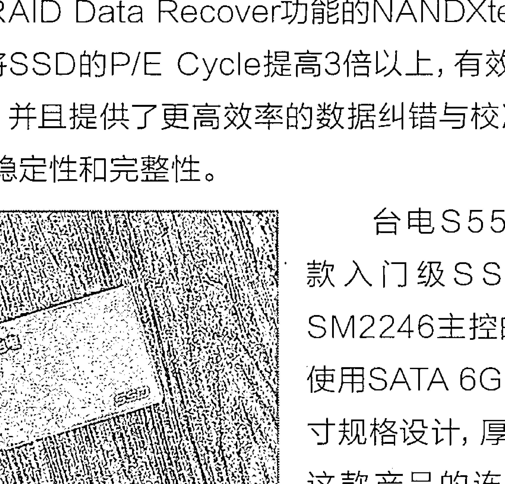

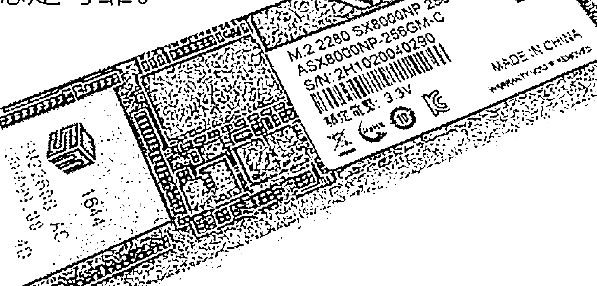

## 群联PS5008-E8

作为曾推动SSD价格走低、进入主流的“功勋”主控厂商，群联现在很重要的任务之一就是将原本处于高端的NVMe标准SSD也拉下神坛，在近期SSD大规模降价，特别是NVMe高速SSD走入主流的市场变化中，群联就起到了不小的作用。

PS5008-E8（图10）是群联面向入门级NVMe SSD的主控芯片，它仅支持PCI-E ×2连接，闪存为4通道32CE，最高读写速度为1600MB/s和1300 MB/s。尽管PS5008-E8及相应SSD的性能明显低于大部分支持×4通道的主控芯片和SSD，但它可以提供与SATA SSD类似的价位，足以吸引用户和厂商从SATA标准转移到NVMe标准产品上来。

此外这块主控还有一个支持HMB缓存技术的发展型产品PS5008-E8T，虽然同样定位在入门级市场，但从HMB在显卡等产品中的表现上看，它应该能明显提升相应产品的读写性能。


金士顿A1000（图11）是目前比较受关注的入门级高速M.2 SSD，它采用的就是PS5008-E8主控。这款SSD的持续读取速度可达1500MB/s，随机读取为100000IOPS~120000IOPS；持续写入速度则根据容量的不同在800MB/s~1000MB/s之间，随机写入速度在80000IOPS~100000IOPS之间。它采用3D TLC颗粒，最大容量为960GB，全盘可重复写入次数为600次以上。

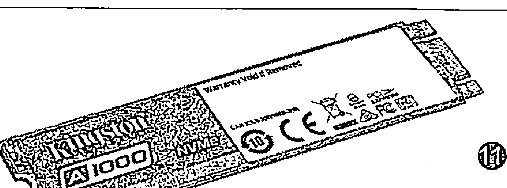

## 三星Phoenix主控

作为目前世界上最顶尖的半导体厂商之一，三星同时拥有闪存颗粒与主控设计和生产能力，并同时用于自有品牌的SSD中。由于不涉及外售问题，三星的主控更偏向于为自有品牌的SSD及闪存颗粒量身打造，例如在960系列中使用的就是全新Polaris（北极星）架构的PCI-E主控搭配48层V-NAND闪存颗粒，而在最新的970系列产品中就换用了Phoenix主控（图12）以配合新的64层闪存颗粒。

由于不对外发售，所以三星并未对外公布其Polaris和Phoenix主控的具体规格，我们可以得知的是它至少采用了5核心设计，可支持至少8通道闪存，外部则支持NVMe标准、PCI-E 3.0 ×4通道。其具体性能可以直接从相应的SSD产品上了解。

使用Phoenix主控的三星970EVO（图13）性能非常强劲，持续读写速度可达3500MB/s和2500MB/s（1TB型号），随机读写都在400000IOPS以上，最大容量达到2TB。它搭配4GB三星DDR4 RAM缓存，支持TurboWrite技术和动态热保护技术，在拥有出色性能的同时可提供冷静稳定的运行环境，全盘最高重复写入次数达到600次。

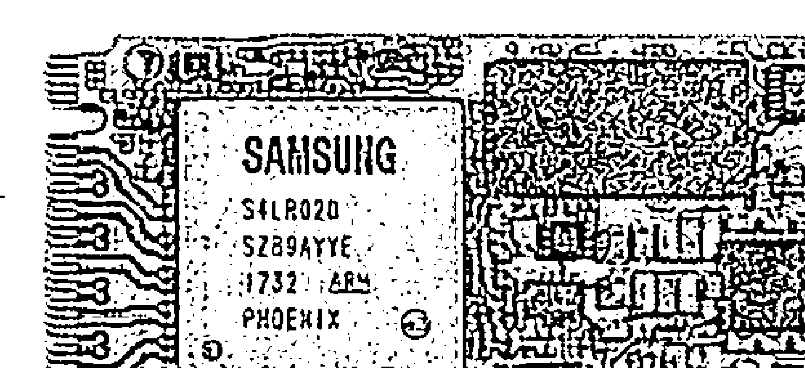


## 西数(闪迪)主控

作为机械硬盘的市场两大巨头之一，西数对消费级SSD的兴趣也非常浓厚，已经推出了绿盘、蓝盘、黑盘等多个型号。其中入门级和主流的绿盘、蓝盘SSD分别采用了慧荣和Marvell的主控产品，但在黑盘上采用了来自西数收购品牌闪迪(SanDisk)的自有主控（图14）。这款主控是为其采用的西数自有闪存专门开发的，和通用解决方案相比，放弃了ONFI闪存等一部分不必要的支持能力，换来了更简单高效的硬件控制和操作能力。例如在实际使用时，会有很多简单的数据操作可以不经过固件和主控，直接在存储系统中完成。

同时这款主控还拥有nCache 3.0缓存技术，增加了TLC直写功能，无需在SLC缓存被写满之后等待主控进行数据搬迁和清空处理，而是在写入缓存的时候，就直接由闪存系统自动进行相应的数据折叠、转移、清空等操作，可以明显提升效率。

采用了自有主控后，西数黑盘（图15）的性能表现确实非常出色，它使用PCI-E 3.0 × 4通道，读写速度为3400MB/s和2800MB/s，随机读写则为500000IOPS和400000IOPS（1TB型号），均达到了目前顶级NVMe SSD的水平。通过良好的电源和热量管理，这款产品的功耗与发热量也被限制在较好的水平，可以保持冷静运行，获得良好的寿命，其全盘重复写入次数达到600次，质保时间长达5年。


## 看清“定制”主控

有时我们会看到一些品牌的SSD采用了“定制”芯片，用以生产一些有特色的SSD。但必须要注意的是，这些所谓的“定制”芯片和前面提到的三星、西数自有定制芯片不同，其中不乏“阉割”产品甚至是自行打磨的以掩盖实际型号的芯片，相应的SSD质量堪忧，因此对于小品牌且无法识别主控的SSD，最好还是敬而远之。至于一些大品牌SSD，虽然也有打磨并重新印刷主控芯片的情况，但更多的是考虑到自家品牌的形象（图16），相应的SSD产品性能与质量还是比较可靠的。

惠普存储是惠普与其他厂商合作的品牌，其EX900就采用了“定制版”的SMI 2263XT主控芯片。


## SSD主控的未来

除了上述这些比较常见的典型主控芯片之外，在2018年中，Marvell等厂商也纷纷发布了更强劲的主控芯片，在PCI-E 3.0 × 4通道的支持下，普遍可以提供3500MB/s的读取速度，也就是基本达到了这一连接方式的极限速度。其中有些产品甚至已经开始支持PCI-E 4.0，可让接口带宽提升一倍。

而另一方面，以Intel傲腾（Optane）为代表的新型SSD也在快速发展，它们不仅性能更强大，而且因为采用了3D XPoint等技术的新型存储颗粒，因而在主控设计等方面也有了巨大的变化。例如基于3D XPoint技术存储颗粒的Intel SSD中，主控芯片面积就极小（图17），结构也非常简单，显然已经与我们前面介绍的、与CPU架构类似的主流SSD主控芯片完全不同。

左下角小小的Intel SLM4B芯片，就是这块800P SSD的主控芯片


当然，无论SSD的发展是继续以NAND颗粒为主，跟随总线、接口技术的脚步，还是进行华丽转身，用新型存储技术武装自己，主控芯片都将是其上不可或缺的一部分，并将随着应用需求和SSD的进化，不断发展和强大起来。

## 拿什么拯救你 老款笔记本升级攻略


仿佛是一眨眼之间，以英特尔酷睿为主导的笔记本就已经经历了八次朝代更迭。受制于平板电脑和智能手机的崛起，以及消费需求放缓的影响，全球范围内笔记本的销量也呈现了逐年下滑的趋势。这意味着，绝大多数家庭里都存在至少一款“正在任职”的笔记本。

问题来了，你家的笔记本还可以胜任当前最新游戏和应用环境的“压榨”吗？如果感到力不从心，我们又有哪些补救的手段呢？难道就只能更换新机吗？本期特别话题，就让我们仔细聊聊老款笔记本的升级建议吧。

## 笔记本的DIY：从黄金时代到萧瑟时代

提起DIY，很多玩家都会以为这是台式机的专利，殊不知在多年以前，绝大多数笔记本也具备出色的DIY潜力。只要你有钱有能力，就可随时让笔记本通过DIY提升性能动力。可惜，随着笔记本领域兴起“减肥风潮”（图1），笔记本逐渐与DIY属性分道扬镳。


### 笔记本DIY的黄金时代

可以DIY的笔记本在今天绝对算是新鲜事物，但你可曾知道，笔记本也曾经历过DIY的黄金时代。

移动处理器的DIY 早期的笔记本就不谈了，2010年英特尔正式推出了“Westmere”平台的第一代酷睿处理器，并随后保持每年迭代一次的升级节奏，至今已经更新到了第八代酷睿平台（表1）。在第四代酷睿Haswell之前，绝大多数笔记本的处理器其实都是可以替换升级的。

的处理器型号后缀都是“0M”（比如i5-540M、i7-4710QM），它们的共性就是都采用了PGA封装的形式，通过专用卡扣和横向螺丝固定在笔记本的PCB主板之上（图2）。在淘宝等电商平台的“帮## 表1：英特尔酷睿处理器平台汇总表

| 处理器代号 | 发布时间 | 制程工艺 | 代表处理器 |
|------------|----------|----------|------------|
| 1代 Westmere | 2010年 | 32nm | i5-540M |
| 2代 Sandy Bridge | 2011年 | 32nm | i5-2467M/i5-2410M |
| 3代 Ivy Bridge | 2012年 | 22nm | i5-3337U/i7-3610QM |
| 4代 Haswell | 2013年 | 22nm | i5-4200U/i5-4200M/i5-4200H |
| 5代 Broadwell | 2014年 | 14nm | i5-5200U |
| 6代 Skylake | 2015年 | 14nm | i5-6200U/i5-6300HQ |
| 7代 Kaby Lake | 2016年 | 14nm+ | i5-7200U/i5-7300HQ |
| 8代 Kaby Lake-Refresh | 2017年 | 14nm+ | i5-8250U |
| Kaby Lake-G | 2018年 | 14nm+ | i7-8705G |
| Coffee Lake-H | 2018年 | 14nm++ | i5-8300H |
| Cannon Lake | 2018年 | 10nm | i3-8121U |
| Amber Lake | 2018年 | 14nm++ | M3-8100Y |
| Whiskey Lake | 2018年 | 14nm++ | i5-8265U |

[图片: 处理器平台汇总表图片1]

[图片: 处理器平台汇总表图片2]

[图片: 处理器平台汇总表图片3]

在“助”下，当年不少玩家就通过自行DIY的方式，将酷睿i5换成了网上购买的酷睿i7，从而实现了CPU性能的质变。

## 独立显卡的DIY

笔记本处理器可以升级这不奇怪，毕竟CPU芯片那么薄，可替换结构在设计上没啥难度。然而，提到独立显卡大家首先就会想到硕大的一块（图3），这么臃肿的设计总不可能塞进笔记本的体内吧？

实际上，独立显卡也有笔记本专用的“移动版”，并统称为“MXM”（Mobile PCI Express Module），即是一套基于PCI-Express界面的、为图形处理器设计的图形设备接口。MXM标准的移动显卡就是集GPU、显存和其他相关芯片电路于一身的小主板（图4），并通过专用的PCI-E接口与笔记本相连。

早期很多性能级笔记本就都搭配了此类MXM独显，具备可DIY替换升级的可能性。可惜，不同的笔记本品牌和型号之间，MXM显卡在板型上可能存在差异，更高端的MXM显卡还会超出笔记本自身散热模块和电源功率的冗余上限（图5）。因此，MXM独显始终没能成为一种可以随时购买并替换升级的显卡标准。

## 笔记本DIY的没落

笔记本自诞生伊始就是主攻“移动”，便携性才是它有别于台式机的最大优势。为了实现性能和便携的完美平衡，英特尔曾在2011年提出了“超极本”（Ultrabook）的概念（图6），并计划通过“三步走”的形式，让这种超便携笔记本成为市场的主流。也就是从这个时间开始，笔记本的DIY就快速走向了没落。

所谓“超薄本”，大都就符合当年的“超极本”定义。

为了成就“超极本”，英特尔特别定制了17W TDP（后又降至15W）的低电压低功耗处理器，代表型号有i5-2467M、i5-3317U、i5-4200U等。为了帮助笔记本“瘦身”，这些低功耗处理器都改用了BGA封装的形式，即需要将CPU芯片直接焊在笔记本的PCB主板之上，用户无法自行拆卸替换。如果哪一天CPU坏了，需要连同主板和CPU一起更换。

## BGA封装一统江湖

“超极本”是英特尔提出的一种超轻薄笔记本的定义标准，大体上包括厚度不得超过20mm、必须搭载ULV超低电压处理器、必须内置纯SSD或小容量SSD作为高速缓存等硬性要求。虽然“超极本”这个概念到2013年后就不再提及，但近些年上市的笔记本，绝大多数都符合这个定义。

原本超极本用BGA封装15W TDP的低功耗处理器，普通笔记本（当年还没有游戏本的概念）用PGA封装45W TDP的性能级处理器，两条线并无交集，互不冲突。

然而，也许是看好BGA封装处理器的高可靠性，以及无需卡槽固定、能帮笔记本瘦身的先天优势，从第四代酷睿Haswell平台开始，英特尔在PGA封装的M系列处理器（如i5-4200M）的基础上，新增了BGA封装的H系列处理器（如i5-4200H），前者可以自行替换升级，后者则和超极本一样，只能一直用到底。

没错，从2014年以后上市的笔记本新品，几乎彻底堵死了CPU升级的大门（图7）。

之所以用“几乎”而不是“所有”，是因为笔记本在近些年还衍生出了一些颇为另类的存在。

## 笔记本与桌面CPU联姻

以神舟和未来人类为代表的国产品牌，旗下包含不少改用桌面处理器的笔记本。此类产品最大的特色就是选用桌面平台的芯片组和标准的LGA插槽（图8），从而具备可以随时替换升级同时代桌面处理器的能力。

令人尴尬的是，从第五代酷睿Broadwell开始，英特尔将所有为笔记本定制的移动处理器，无论是低功耗还是高性能版，都采用唯一的BGA封装方案。

比如神舟最新推出的战神K670D-G4E5，这款售价4999元的游戏本采用了桌面奔腾G5400处理器，辅以GTX1050移动显卡。如果你日后预算充裕了，可以自行将处理器升级到最高八代酷睿i5-8400（升级i7散热模块可能“压不住”），算是赋予了笔记本较强的DIY潜力。

需要注意的是，桌面处理器都采用了LGA封装，不仅CPU芯片更厚，处理器插座也颇为占用空间，在窄边框元素在笔记本领域全面普及的今天，此类笔记本用今天的眼光来看都是属于“厚度超标”的存在，与便携性一词绝缘。

为了满足极少数不差钱DIY玩家的需求，笔记本领域还存在同时采用桌面处理器以及MXM标准显卡的“巨无霸”，个别产品甚至可以安装两块MXM显卡组成SLI系统（图9）！可惜，符合上述DIY资质的笔记本（图10），其厚度、重量和售价也着实令人“感动”，至少普通消费者对其只可远观而不可亵玩。

[图片: 笔记本与桌面CPU联姻图片1]

[图片: 笔记本与桌面CPU联姻图片2]

[图片: 笔记本与桌面CPU联姻图片3]

[图片: 笔记本与桌面CPU联姻图片4]

[图片: 笔记本与桌面CPU联姻图片5]

[图片: 笔记本与桌面CPU联姻图片6]

## 追求极致的后遗症

超极本概念虽然已经淡出了历史舞台，但它对笔记本产业的影响却是极为深远的，催生出了“PC平板二合一”（包括屏幕可插拔、屏幕可360度翻转等形态）以及越加追求极致的轻薄本们（图11）。为了帮助上述设备进一步瘦身，英特尔在第五代酷睿Broadwell时代也祭出了全新的Y系列家族（即酷睿M），此类处理器的TDP低至4.5W，无需风扇就能稳定运行，并具备15W TDP低功耗处理器70%左右的性能，从而可以让二合一或极致轻薄本也具备足够的生产力。

[图片: 追求极致的后遗症图片1]

[图片: 追求极致的后遗症图片2]

[图片: 追求极致的后遗症图片3]

[图片: 追求极致的后遗症图片4]

7等就都是各个时期12mm厚度极致轻薄的笔记本代表。但是，笔记本为了追求极致，势必进一步牺牲DIY特性。以微软Surface系列这种二合一设备为例，第四代产品（Surface Pro 4）好歹还为SSD单独准备了M.2插槽，具备一点点升级潜力（图12）。但到了New Surface Pro，就连唯一的M.2插槽也取消了，整机上下再无半点升级的可能（图13）。可以说，笔记本在纤薄化的征途中与DIY渐行渐远。从2014年之后，几乎所有的笔记本都失去了升级CPU的可能，而很多轻薄本设备也采取了板载内存或板载闪存(SSD)的设计。以苹果MacBook 12为例，它的整个PCB主板仅有巴掌大小，CPU、内存、SSD、主控、无线网卡等所有芯片都是板载设计（图14），买来后只能一条道跑到黑，直到光荣退役。

[图片: 追求极致的后遗症图片5]

[图片: 追求极致的后遗症图片6]

[图片: 追求极致的后遗症图片7]

## 小投资大回报笔记本升级经验

虽然笔记本的DIY潜力不如台式机，但绝大多数产品多少还是具备一定可升级能力的。因此，当笔记本遭遇变慢变卡的境遇时，我们还是有机会通过升级的方式来提升使用体验的。

### 自行DIY升级的可能性

所谓DIY，就是自己购买硬件后自己组装。对笔记本而言，由于它们采用了更高集成度的设计，因此笔记本是否具有升级潜力，以及用户自己是否具备足够的DIY动手能力，就成为了我们首先要考虑的问题。

### 设备自身的升级潜力

除了前文提到的微软Surface Pro系列平板二合一设备不具备升级潜力以外，还有很多超轻薄笔记本，比如联想ideapad 720s、惠普ENVY13、戴尔XPS13、华硕灵耀X、华为MateBook X、小米笔记本Air等产品，为了追求瘦身都采用了板载内存颗粒的设计（图1），唯一可供用户更换的就只有M.2接口的SSD以及无线网卡，遇到此类产品，大家就别指望可以增加内存容量了。此外，还有少数轻薄本仅内置1个内存插槽（图2），想升级内存就只能“以旧换新”。

[图片: 设备自身的升级潜力图片1]

[图片: 设备自身的升级潜力图片2]

[图片: 设备自身的升级潜力图片3]

相对而言，定位“游戏本”或新一代普通14英寸或更大的“轻薄本”普遍具备较为出色的DIY升级潜力，它们大都内置1到2个内存插槽、1个M.2 SSD插槽和1个2.5英寸SATA插槽（图3），少数产品甚至会提供4个内存插槽或2个M.2 SSD插槽（图4），从而升级更大的内存或更多的硬盘。

[图片: 设备自身的升级潜力图片4]

[图片: 设备自身的升级潜力图片5]

在第四代酷睿平台发布之前，还有很多早期的笔记本保留了内置光驱设计，可以通过加装硬盘的托架替换原有的光驱实现扩容（图5）。需要注意的是，早期不少中高端笔记本还配备了mSATA插槽（图6），可以用来加装mSATA标准的SSD。和我们熟悉的M.2 SSD相比，mSATA SSD更宽（图7），两类接口互不兼容。

[图片: 设备自身的升级潜力图片6]

[图片: 设备自身的升级潜力图片7]

[图片: 设备自身的升级潜力图片8]

> **小提示**
> 很多高端商务笔记本内部还预留了WWAN专用插槽（图8），它的样式和M.2插槽相似，是用来安装3G/4G上网卡模块的。但是，想安装WWAN上网卡还需要专用的天线，如果笔记本出厂没有预埋天线，就需要我们自行购买并将天线安装在指定位置，难度较高。考虑到如今不限流量的4G号已经很便宜了，有随时联网需求的用户还是建议使用手机分享Wi-Fi热点的形式，成本更低。有些笔记本的WWAN插槽还支持SATA通道的M.2 SSD，可以通过它加装额外的硬盘扩容。

[图片: 设备自身的升级潜力图片9]

### 用户自身的动手能力

笔记本想要升级就必然涉及到拆机，而拆机的难度就要视大家实际的动手能力而定了。有些笔记本单独在D面为内存和硬盘预留了扩展舱盖，只需拧下几颗螺丝就能拆下舱盖对里面的硬件进行替换（图9）。

而绝大多数笔记本采取的拆机结构，都是拧下D面所有螺丝，然后沿着四周缝隙用撬棒慢慢拆下整个底盖（图10）。这种结构的难度谈不上太高，只是需要小心有没有隐藏在脚垫内的固定螺丝，在拆下底盖时不要使用蛮力，小心内部隐藏的卡扣不要弄断了（图11）。

[图片: 用户自身的动手能力图片1]

[图片: 用户自身的动手能力图片2]

[图片: 用户自身的动手能力图片3]

相对来说，最困难的拆机结构，就是在拧下D面所有螺丝后，还需要从C面键盘盖处着手的拆机，期间会涉及到插拔键盘触控板的排线，还有可能需要将整个PCB主板翻转过来（图12）。如果你并非DIY发烧友，遇到此类结构的笔记本，想要升级还是踏踏实实求助于售后或专业的人士吧。

OK, 下面就进入具体的升级建议阶段了。

[图片: 用户自身的动手能力图片4]

## 笔记本变卡怎么办

当笔记本使用几年后，很多用户都会遇到笔记本明显不如往昔流畅的现象，哪怕重装系统也没有效果。此时，大家就要留意是否是因内存容量不够而引起的问题了。

实际上，想升级笔记本内存并不需要我们懂得太多，只要在电脑上安装有类似“CPU-Z”和“AIDA64”等软件即可。

### 内存版本之惑

很多用户一提及内存升级就头脑发胀，担心自己搞不懂诸如DDR2、DDR3、DDR3L和DDR4等诸多内存版本，要知道DDR3L还有1.28V和1.35V之分。

以“CPU-Z”为例，在电脑上下载安装运行后，切换到“SPD”选项卡就能看到当前内存和电压标准，比如这台笔记本内存就是4GB容量1.28V的DDR3L-1600（图13）。这意味着，你的内存条信息如下：

| 内存插槽选择 | DDR3 |
|---|---|
| 模块大小 | 4096 MBytes |
| 最大带宽 | PC3-12800 (800 MHz) |
| 制造商 | Hyundai Electronics |
| 型号 | HMT451S6AFR8A-PB |
| 序列号 | 014325A6 |
| 校验 | |
| 注册 | |
| 缓冲 | |
| SPD扩展 | |
| 周次/年份 | 24/13 |

**时序表**

| | JEDEC #4 | JEDEC #5 | JEDEC #6 | JEDEC #7 |
|---|---|---|---|---|
| 频率 | 609 MHz | 685 MHz | 761 MHz | 838 MHz |
| CAS#延迟 | 8.0 | 9.0 | 10.0 | 11.0 |
| RAS#到CAS# | 8 | 9 | 10 | 11 |
| RAS#预充电 | 8 | 9 | 10 | 11 |
| 周期时间(tRAS) | 22 | 24 | 27 | 30 |
| 行周期时间(tRC) | 30 | 33 | 37 | 41 |
| 命令率(CR) | | | | |
| 电压 | 1.28 V | 1.28 V | 1.28 V | 1.28 V |

### 选购内存的经验

由于1.28V/1.35V的DDR3L内存向上兼容1.5V电压，所以如果你担心买错，老款笔记本可以直接选择此类DDR3L内存（图14）。

DDR3L是第四代酷睿Haswell平台后才开始普及的内存标准，到了第六代酷睿Skylake平台，DDR4内存标准开始崭露头角。但是，哪怕到了第八代酷睿时代，笔记本依旧是DDR3L和DDR4内存混搭的格局（游戏本清一色都是DDR4，但部分轻薄本依旧是DDR3L低压内存或LPDDR3板载内存），所以升级内存前第一件事就是确定自己的笔记本所支持的内存到底是DDR2（第一代酷睿之前）、DDR3还是DDR4，这种大的内存标准一定不能搞错。

[图片: 选购内存的经验图片1]

对还在使用DDR2内存的笔记本来说，现在哪怕是1500元的“赛扬平台”笔记本的性能可能都要在其之上，已经没有了升级的必要。而对那些搭载第一代酷睿处理器（如i3-370M，采用HM55芯片组）的部分笔记本而言，最大仅支持16颗粒的单4GB内存（图15），而8颗粒的4GB内存可能就会出现兼容性问题（再往后的笔记本就不存在这个问题了）。

相同标准的内存都具备向下兼容的特性。比如，DDR4-2400向下兼容DDR4-2133，DDR3L-1600向下兼容DDR3L-1333，但DDR3和DDR4内存由于接口和标准不同，无法互相兼容。此外，当笔记本安装了2根频率不同的内存，实际运行频率将以最低的内存为准。比如，一款笔记本同时安装了DDR4-2400和DDR4-2133内存，为了“照顾”后者，前者的频率将自动降到2133MHz运行以保持稳定。

[图片: 选购内存的经验图片2]

### 16颗粒与8颗粒的区别

### 内存多大才够用

如今Windows 10系统和最新版本的软件对内存资源的消耗可不低，刚开机2GB内存空间就会“灰飞烟灭”，此时如果再开几个网站、聊个QQ和微信，4GB刚刚好（图16）。如果你同时还在后台挂着页游，编辑着文档PPT，又或是使用PS修图，至少需要8GB内存加以支持。如果你喜欢玩3A游戏大作，16GB内存的最低帧数要明显高于8GB内存。

总之，内存容量多多益善。但是，我们的笔记本最高能支持到几个GB的内存，这个标准却是存在上限的。

具体查询方法是启动命令提示符（搜索“CMD”），输入“wmic memphysical get”

> 小提示
> 笔记本内存的质量普遍还是不错的，所以对1.5V标准DDR3或更老的内存，可以考虑通过闲鱼等二手交易APP购买二手内存。只是建议大家优先考虑同城本地面交，带着笔记本当场测试兼容性和好坏。

## 速度缓慢怎么办

随着笔记本内安装的软件越来越多，游戏越来越大，你会发现开机时间以及游戏的启动速度都变慢了许多，打开文档、图片、游戏的Loading等待时间令人抓狂。此时，升级内存的效果往往不大，只有将HDD机械硬盘升级到SSD固态硬盘才能起到立竿见影的效果。

`maxcapacity`命令就能得到一个字符串，其单位为KByte，一般前1位或前2位就是本机所支持的最大内存容量（图17）。比如笔者的笔记本最高就支持16GB内存，由于它内置2个内存插槽，所以单内存最大容量就是8GB（如果笔记本只有1个内存插槽，那就是最大支持单16GB内存）。如果购买笔记本时预装了1根4GB内存，那么你能选择的就是4GB+4GB或4GB+8GB，如果将老4GB换成8GB，则可升级到8GB+8GB。至于你的笔记本有几个内存插槽？已经安装了1根还是2根？无需拆机，使用“CPU-Z”软件，在“SPD界面-内存插槽选择”里看下拉菜单就知道有几个插槽了（图18）。

此时就可通过硬盘托架安装第二块硬盘（图19）。小编的建议是将原有的HDD机械硬盘安装进光驱，而新买的SSD则装到原HDD的位置，这样可以避免有些笔记本光驱位还是SATA2.0接口而限制SSD的速度。

## 来自硬盘位的限制

想升级SSD，关键还得看你的笔记本内有多少个硬盘位。早期的笔记本大多配有1个2.5英寸SATA硬盘位和1个光驱。

## 请忘记mSATA SSD

介于第一代到第四代酷睿平台之间的部分笔记本还会配有mSATA插槽，理论上可选mSATA SSD升级。但是，笔者却不建议大家购买mSATA SSD，一方面是这类SSD价格略贵（图20），可选范围不多；另一方面则是mSATA标准已被历史淘汰，当旧笔记本损坏后它将没有多少用武之地；最后，就是告诫那些打算购买二手mSATA SSD的朋友，SSD的性能和寿命会随着使用的时间和频率而不断下降，mSATA本来就是多年前的技术，二手mSATA SSD品质堪忧。

> 火速链接
> 升级SSD后，如果你不想重装系统，可以考虑进行系统的无损迁移，具体教程可关注《电脑爱好者》微信公众号并搜索《SSD大减价 无损系统迁移拿走不谢！》这篇文章。

CPU-Z软件中SPD选项卡的内存信息表格：

| 项目 | 插槽#1 | 插槽#2 |
| :--- | :--- | :--- |
| 内存类型 | DDR3 | DDR3 |
| 容量 | 4096 MBytes | 4096 MBytes |
| 规格 | PC3-12800 (800 MHz) | PC3-12800 (800 MHz) |
| 制造商 | Kingston | (空) |
| 型号 | 99U5428-049.A00LF | (空) |
| 序列号 | 1902AA97 | (空) |
| 周次/年份 | 44/12 | (空) |
| 时序表 | JEDEC #4 | JEDEC #5 | JEDEC #6 | JEDEC #7 |
| 频率 | 609 MHz | 685 MHz | 761 MHz | 800 MHz |
| CAS# 延迟 | 8.0 | 9.0 | 10.0 | 11.0 |
| RAS#到CAS# | 8 | 9 | 10 | 11 |
| RAS#预充电 | 8 | 9 | 10 | 11 |
| 周期时间 (tRAS) | 22 | 24 | 27 | 28 |
| 行周期时间 (tRC) | 30 | 33 | 37 | 39 |
| 电压 | 1.50 V | 1.50 V | 1.50 V | 1.50 V |

选择插槽后，如果没有显示任何内存信息就代表是空闲插槽。

## 特别话题

额外的M.2插槽，只是六代酷睿之前多以SATA通道为主，而到了第七和第八代酷睿平台后，新品的M.2插槽则普遍升级到了PCIe通道。如果你的笔记本有这些接口，则可以通过它们来安装M.2 SSD用于提速，只是购买SSD前请务必咨询客服机器上的M.2是否支持PCIe通道。

> 小提示
> 支持PCIe通道的M.2插槽和M.2 SSD还被细分为PCIe NVMe Gen 3.0x2和PCIe NVMe Gen 3.0x4两种标准，二者的最快读取速度分别可达1500MB/s和3500MB/s，而SATA通道的M.2 SSD读取速度最多只有550MB/s左右。这三个标准SSD的速度虽然看起来差异很大，但在实际体验上却很难察觉出来，所以普通用户不必过于纠结。

¥289.00
金士顿(Kingston)UV500系列 120G MSATA 固态硬盘【金士顿SSD18年新
1100+条评价
金士顿京东自营旗舰店

¥439.00
金士顿(Kingston)UV500系列 240G MSATA 固态硬盘【金士顿SSD18年新
1100+条评价
金士顿京东自营旗舰店

## SSD的选购建议

可能有朋友会问了，我的笔记本只有1个2.5英寸硬盘位，有mSATA你又不让我用，那我该怎么办？好消息是，如今SSD已经进入了降价周期（越来越便宜），此类用户可以考虑将HDD直接替换成2.5英寸的SSD，哪怕480GB的SSD价格也不过500元左右（图21），一般来说这个容量也绝对够用了。

考虑到PCIe向下兼容SATA，如果你担心买错M.2 SSD版本而无法兼容，可以只挑选SATA通道的M.2 SSD升级，如今一线品牌240GB容量的版本起价不足300元（图22）。如果确认M.2插槽支持PCIe通道，240GB PCIe M.2 SSD的价格最低也不过400元左右（PCIe NVMe Gen 3.0x2标准），升级门槛同样不高。

之所以建议大家起步就选240GB容量的SSD，是因为除了Windows 10系统外，这个容量还有更多冗余空间来安装常用的软件和常玩的游戏，根据小编的实际体会，120GB/128GB根本不够用。

从五代酷睿开始，很多笔记本开始陆续标配

¥295.00
金士顿(Kingston)A400系列 240G SATA3 【不闪存 原厂闪存 颗粒同...】
已有128万+人评价
金士顿京东自营旗舰店

¥289.00
东芝(TOSHIBA) TR200系列 240GB SATA 【原厂颗粒，金士顿(颗粒SH...】
已有5.6万+人评价
东芝存储京东自营官方旗舰店

¥469.00
闪迪(SanDisk) 加强版 480G 固态硬盘 【爆款直降 用新不用旧...】
已有28万+人评价
闪迪京东自营旗舰店

¥499.00
西部数据(WD) Green系列 480G 固态硬盘 【自营保证 大厂 百亿补贴...】
已有50+人评价
西部数据京东自营旗...

## 看着不爽怎么办

笔记本的性能固然重要，但它的显示效果也是不容忽视的考核重点，一款优秀的屏幕，可以帮我们更早发现躲在阴影里的敌人，在PS修图时还原最为真实的颜色。好消息是，对绝大多数笔记本而言，屏幕也是少数可以DIY升级的部件之一。

¥299.00
西部数据 (WD) Green系列SSD NGFF
吃鸡 高性价比工作、游戏两相宜
已有2200+人评价

¥389.00
闪迪 (SanDisk) X400系列NGFF M.2 SA
固态硬盘 M.2 2280 接口 X400 SAT
已有500+人评价

¥399.00 . ¥379.00 PLUS
东芝(TOSHIBA) Q200EX系列 240G M.2固
M.2 2280接口，原厂颗粒，品质优
已有4300+人评价

¥389.00
金士顿(Kingston) A1000系列 240G M.2 N
NVMe协议PCIe NVMe读写速度快
已有8300+人评价

## 升级屏幕的需求变化

每个时间段，笔记本用户总能找出屏幕看着不爽的理由。比如，10年前大家觉得16:9显示比例的1366×768分辨率看着最爽；5年前更多用户开始追求武装1920×1080全高清屏幕(1080P)的细腻视界；3年前可视角超170度且不偏色的IPS屏幕就是王道；如今，拥有72% NTSC(或100% sRGB)色域的IPS屏幕才可以挂上完美的标签。

## 升级屏幕的经验

笔记本更换屏幕的难点主要体现在两个层面。首先，换屏幕必然涉及到拆机，需要用撬棒将B面的屏幕边框拆下，在拆装屏幕时还要小心不要影响WLAN天线的走线(图23)。第二个层面，就涉及到屏幕之间的兼容性，在第四代酷睿Haswell平台之前，笔记本屏幕存在LVDS与eDP两种接口标准，二者互不兼容，四代酷睿之后则是由eDP接口一统江湖。其中，LVDS接口在更换屏幕时，有可能需要升级BIOS才能正常驱动面板电源并输出正确的分辨率，ThinkPad早期的X60/X61更换高分辨率AFFS面板就是最好的示例。此外，LVDS和eDP在驱动1366×768或1920×1080像素屏幕面板时，分别需要支持类似单通道/双通道影像信号的专用扁平电缆(图24)，如果你的笔记本屏幕采用的是eDP接口，而主板与屏幕的接口却仅支持单通道影像信号传输的扁平电缆，那就意味着先天无法升级1080P屏幕。

为了确保100%的兼容，笔者建议大家优先询问笔记本厂家客服，或是咨询天猫专门销售笔记本屏幕面板的商家，以确定自己的笔记本能否完美驱动高分屏幕。而在这里笔者则提供一个更为简易的思路，可以帮大家快速锁定屏幕面板目标。在电脑上安装“鲁大师”或“AIDA64”等软件。以“鲁大师”为例，在显示器信息中可以看到当前笔记本所采用屏幕面板的具体型号(图25)，在“屏库网”(http://www.panelook.cn)中搜索这个型号就能看到它的具体信息，比如笔者的笔记本屏幕就是一款采用双通道eDP接口(30Pins)、14英寸IPS材质的普通1080P面板(图26)。

## 如何挑选更好的屏幕

如果你的笔记本屏幕还停留在1366×768像素的TN屏，而你又无法忍受从侧面看屏幕出现的泛白和偏色，那最佳的解决方案就是更换IPS材质的屏幕，在主板接口允许的前提下则同时改换1080P分辨率的面板。如果你的笔记本已经是IPS材质的1080P屏幕，屏幕色域为45% NTSC，而你又经常从事修图的工作，那么就很有必要升级到72% NTSC色域的IPS屏幕。如果你对色彩的要求不高，则没有必要浪费资金进行升级，用省下的钱升级SSD更为划算。

如果想升级72% NTSC色域的屏幕，只需在“屏库网”以相同尺寸、双通道eDP接口和72%色域等参数进行检索，即可搜索到当前市面上所有符合这一标准的屏幕面板型号（图27）。然后，我们可以从中挑选出中意的屏幕面板，并在淘宝中搜索对应的型号，查看具体的价格信息(图28)。买来后自己安装替换，确认没有问题后，还能将拆下的原装屏幕在闲鱼上卖掉，可进一步回笼资金降低开销。

| 型号 | 尺寸 | 分辨率 | 亮度 | 对比度 | 色域 | 接口 | 价格 |
|------|------|--------|------|--------|------|------|------|
| LP140WF3-SPD2 | 14" | 1920x1080 | 300 | 700:1 | NTSC(CIE1931) | eDP 30 pins | 320.00 |

## 游戏卡顿怎么办

如果笔记本平时使用正常，但一玩大型3D游戏就频繁遭遇卡顿，且明显不如笔记本刚买时（玩同款游戏）流畅，那在DIY升级之前，我们还需进行一步自查：除尘清灰，重新涂抹硅脂。

### 发热引起的游戏卡顿

笔记本的CPU和GPU都预先设定了不同阈值的温度墙，一旦芯片温度超过这个标准就会触发自动降频机制，从而引起游戏过程中的卡顿。问题来了，笔记本受制于进风/出风口的设计以及使用环境的影响，基本使用1年后散热风扇和散热鳍片的缝隙内就会因堆满灰尘毛屑而影响散热效率(图29)，进而更加容易触发降频机制。

### 老款笔记本清灰势在必行

想避免因散热模块被堵而触发降频的保护机制，所有老款笔记本都有必要进行深度的拆机除尘操作。只是还是回到本章节开头所述，笔记本拆机的难度制约了用户自行除尘清灰和涂抹硅脂的可行性。因为很多新款笔记本的风扇、热管和散热鳍片都是连在一体的(图30)，想拆卸风扇或涂抹硅脂，需要将整个模块拆卸下来，需要极高的动手能力。因此，如果你自认没有这个能力，笔者还是建议大家到官方客服中心自费清灰，也许一次清灰过后，效果远比升级内存和SSD来得明显呢。

## 小结

如今笔记本电脑的境遇非常尴尬，很多用户宁可每年换一部5000元的智能手机，也不打算淘汰家里已经使用了3年的笔记本。没办法，我们的碎片化时间都被手机占据，笔记本只用来承担办公和部分娱乐的任务，特别是在“性能还凑合够用”的前提下，更换新笔记本的日程总被不断推迟。在这个大环境下，通过对部分硬件的DIY升级，无疑是小投资大回报的操作，希望本篇文章的升级思路和方案可以帮到你。

# 能装也会修
## 装机常见故障与处理

能够装一台自己满意的电脑，是DIYer和玩家们最高兴的事情了，不过因为台式机，特别是自装台式机在软硬件兼容性和稳定性、安装与连接牢固度等方面难免存在一些问题，所以故障总是如影随形。所以，能装也能修才是成熟DIYer乃至电脑用户的标志，正因如此，装机常见故障与处理和电脑安装应用一样，是初学者要了解的重要知识。

## 常见故障表现

对经验不足的用户来说，蓝屏、花屏、黑屏、重启、报警，每一种都是能吓死人的故障现象；而对有一定经验的“老鸟”来说，这些现象虽然也麻烦，但常常也是指出故障所在的“路标”。所以初学者要进阶为更成熟的电脑用户，就要先了解怎样从这些故障现象判断故障类型或可考虑的排检方向。

## 常见报警声与故障

大部分主板都内置了简单的故障报警功能，其中一部分高端产品可能会带有LED提示屏，但大多数产品只有声音报警功能，而且有不少产品在主板上没有集成扬声器，用户必须自己安装相应的附件或连线才能听到声音。为了保证未来排障的需要，大家在组装电脑时千万不要省略这一步。

主板报警声与采用的BIOS (Basic Input Output System，基本输入输出系统) 厂商 (图1、图2) 有关，目前主板BIOS基本被Phoenix-Award一家垄断，所以报警声也基本得到了统一，但也有部分主板采用了AMI BIOS，故障报警声有一些区别。

对装机和台式机用户来说，通过报警声可知的最常见故障是内存与显卡的安装、运行问题和BIOS设置问题，相对来讲比较容易处理。

## 小知识
### Award BIOS报警声含义

- 1短: 系统正常启动。
- 2短: BIOS设置常规错误。
- 1长1短: RAM或主板出错。
- 1长2短: 显示器或显卡错误。
- 1长3短: 键盘控制器错误。
- 1长9短: 主板Flash RAM或EPROM错误，BIOS损坏。
- 重复长响: 内存条没有插紧或损坏。
- 重复短响: 电源故障。

### AMI BIOS报警声含义

- 1短: 内存不能刷新。
- 2短: 内存ECC校验错误。
- 3短: 系统基本内存（第1个64kB）检查失败。
- 4短: 系统时钟出错。
- 5短: CPU错误。
- 6短: 键盘控制器错误。
- 7短: 系统实模式错误，不能切换到保护模式。
- 8短: 显存错误。
- 9短: BIOS检验错误。
- 10短: 主板寄存器读写错误。
- 11短: 高速缓存错误。
- 1长3短: 内存错误。
- 1长8短: 显示测试错误。

## 内存相关报警

内存故障报警较为常见的是Award BIOS的连续长响或AMI BIOS的1长3短警报，其中极少部分是内存条故障，大部分是内存接触不良引起的。例如内存没有插到底或插歪；方向插反被防呆口卡住；内存条金手指或插槽内有污染（图3）导致接触不良或短路；内存条做工不良，金手指表面氧化导致接触不良；内存插槽质量低劣，簧片与内存条的金手指接触不实等等。

处理办法：打开机箱，用橡皮仔细地把内存条的金手指擦干净，把内存条取下来重新插一下，有条件的话用热熔胶把内存插槽两边的缝隙填平，防止在使用过程中继续氧化。注意：在拔插内存条时一定要关闭主机电源或拔掉主机电源线，防止意外烧毁内存。

需要注意的是，Award BIOS的1长1短（RAM或主板出错）；AMI BIOS的1短（内存不能刷新）、2短（内存ECC校验错误）、3短（系统基本内存检查失败）是不常见的内存相关报警声，但也常常显示着内存或插槽、主板相关部分出现了物理性损坏而非接触问题，要考虑更换。

## 显卡相关报警声

Award BIOS的1长2短、AMI BIOS的1长8短报警，一般是显卡出现问题，有可能是显卡损坏，但同样大部分是类似内存的接口问题，也可能是辅助供电接口松动引起的。由于目前辅助供电对显卡越来越重要，有些显卡自带辅助供电接口状态灯甚至报警声，这点在检查时需要注意。

一般来说，我们只要打开机箱，检查显卡接口和插槽，重新插拔显卡即可解决问题。另外在目前主流的立式机箱中，显卡因为自身的高度和重量远比内存大，会对插槽施加较大的力量，因此要注意将其面板用螺丝或免工具压板等更好地固定在机箱上，以减少对插槽和自身金手指部分的压力。当然也不要忘了检查辅助供电接口状态。

同样要注意的是，AMI BIOS的8短警报（显存错误），或者上述处理方法无法解决的显卡报警声，就有可能是显卡自身出现了硬件问题，需要考虑进行换件测试或维修。

## CMOS设置

这一故障比较容易判断，如果是长时间不使用甚至断电，或者因为超频等操作更改了BIOS后，如果出现2短报警（Award BIOS）或9短报警（AMI BIOS），基本可以确定是BIOS设置出现了问题。

如果是长时间断电不使用或断电，首次开机后出现报警声，很可能是因为主板电池（图④）没电，造成BIOS设置无法保存或CMOS checksum error之类的提示，这时只需要更换主板电池即可。

4) 耗尽，未能保存正确的BIOS设置造成的，需要保持通电一段时间后，确保可以正常进入BIOS设置，更改并存储正确信息，退出重启。如在多次开机的时候反复出现这一问题，说明主板电池已彻底耗尽，甚至无法短期保存BIOS数据，就需要更换电池了。

如果是更改BIOS后出现这一问题，可以在启动的时候观察是否有恢复默认BIOS设置的快捷键，先将BIOS恢复默认（图5），之后重启应该就可以正常进入BIOS设置了，适当降低处理器、内存频率等设置并存储。


有些主板带有强制恢复默认BIOS的按钮

## 蓝屏故障

蓝屏是Windows系统在运行出错后的一种报警和保护机制，所以即使在开机时出现蓝屏，也可以确定是进入了操作系统后才出现的故障。既然是进入操作系统才出现的故障，那么其主要原因就在软件层面，硬件层面的基本应用能力不存在问题，只是有可能因为稳定性问题造成蓝屏。

## 硬件故障

相对来讲，造成蓝屏的硬件故障比较容易确定和处理，基本都来自两个方面——过热和超频。用户可以使用BIOS的系统监控页面，或者安装主板、显卡等附赠的温度监控软件，或AIDA64等第三方系统监控程序，观察处理器和显卡的温度是否过高、风扇是否停转（图6）。一般来说，两者的核心温度在高负载下都不应超过90℃，最好在85℃以下，如超过95℃就基本可以确定是散热出现了问题，需要对散热系统进行调整、清洁或更换。

对超频用户来说，可以适当考虑降低处理器或显卡等超频幅度，也可尝试略微增加电压。此外还要注意虽然未超频但与核心运行频率相关性很高的配件，例如内存、显存的运行状态，同样可以考虑适当增加电压等操作。

| Item | Current | Minimum | Maximum | Average |
|---|---|---|---|---|
| **Temperatures** | | | | |
| Motherboard | 24 | 24 | 25 | 24.1 |
| CPU | 51 | 39 | 52 | 50.4 |
| Force MP500 | 40 | 36 | 45 | 40.7 |
| **Cooling Fans** | | | | |
| CPU | 608 | 224 | 609 | 571 |
| Chassis #2 | 1495 | 1470 | 1505 | 1484 |
| **Voltages** | | | | |
| CPU Core | 1.240 | 0.544 | 1.240 | 1.230 |
| +5 V | 4.960 | 4.960 | 5.000 | 4.961 |
| +12 V | 12.000 | 12.000 | 12.000 | 12.000 |
| DIMM | 1.376 | 1.360 | 1.376 | 1.375 |
| **Powers** | | | | |
| CPU Package | 105.91 | 13.20 | 109.69 | 105.04 |
| **Clocks** | | | | |
| CPU Clock | 3693 | 2196 | 3693 | 3675.5 |
| CPU #1 / Core #1 Clock | 3693 | 2196 | 3694 | 3677.5 |
| CPU #1 / Core #2 Clock | 3693 | 2196 | 3694 | 3678.9 |
| CPU #1 / Core #3 Clock | 3693 | 2196 | 3694 | 3678.2 |
| CPU #1 / Core #4 Clock | 3693 | 2110 | 3694 | 3665.2 |
| CPU #1 / Core #5 Clock | 3693 | 2196 | 3694 | 3677.4 |
| CPU #1 / Core #6 Clock | 3693 | 2196 | 3694 | 3680.4 |
| CPU #1 / Core #7 Clock | 3693 | 2196 | 3694 | 3681.0 |
| CPU #1 / Core #8 Clock | 3693 | 2196 | 3694 | 3677.7 |

如在正常运行温度、未超频状态下，原本正常运行的操作系统和软件突然开始出现蓝屏故障，且频率越来越高，那么有可能是主板、电源中的一些非主要元件出现了损坏，例如电容渗漏（图7）、元件虚焊、线路或芯片损毁等，需要进行全面的替换检查。


## 软件故障

蓝屏更多的是由操作系统、驱动程序和第三方软件引起的。系统和驱动问题可以用最简单粗暴的方式解决，比如一劳永逸的重装系统；如果开启了还原功能，那么还原到之前的时间点（如果是安装新驱动后出现问题）或回滚到初始状态更方便。

比较麻烦的是第三方软件，因为造成故障的原因非常多样，可能很难发觉到底是哪款软件引起的蓝屏。例如在笔者的电脑中，网易云音乐的后台播放功能和Windows 10的锁屏唤醒机制有一定的冲突，在1803之前的版本，如在后台开启网易云音乐，会常常在电脑进入睡眠状态时蓝屏。因为电脑进入睡眠状态一般都是在笔者离开电脑后，所以笔者很长时间都不知道是什么造成了蓝屏问题。

而另一个造成蓝屏的是搜狗输入法，其广告弹窗和网络连接也时不时让笔者的Windows 10“变蓝”。因为这一服务在笔者使用电脑时基本上一直保持在前台，而非在电脑蓝屏的时候开启，所以同样很长时间都没有怀疑到它。

可见要确定“惹祸”的第三方软件，我们必须注意蓝屏时的所有软件，包括司空见惯的常用软件和在后台运行的软件，如有可能的话，可以尝试更换蓝屏时存在的常用软件，如输入法、文本编辑器、看图软件、视频软件等，如不再出现蓝屏，说明问题恰恰在于这些常用软件，而非一般被怀疑的蓝屏前刚开启的软件。

蓝屏界面中也会向用户提供一些错误原因和代码（图8），虽然这些错误原因一般用户很难理解，代码也常常与实际应用没有太大关系，不过我们还是应该进行记录，在咨询专业人员的时候还是有一定帮助的。


## 花屏或无显示 黑暗中的搜索

## 花屏的不同可能性

其实最让人难以应对的电脑故障是看不清或看不到任何提示的花屏或黑屏，相对于有一定提示的报警声和蓝屏，这样的故障常常让人完全无法下手。遇到这种情况只能根据故障产生的前兆和具体情况来“蒙”了，所以要检查的项目常常较多。


和完全黑屏相比，花屏的故障原因比较明显，基本可以确定是显卡或相关系统出现了问题。如果是在进入系统之前，比如还在进行BIOS自检的时候就出现了花屏问题（图9），且每次都会出现，那么基本可以确定是核心、显存部分、图像输出部分出现了问题。其中最常见的是偏色或条纹，这是显卡图像输出部分的问题，应检查接口是否连接紧密、是否有断针、连线是否有被压扁和弯折过大等问题。根据发现的不正常情况进行相应处理，比如加固或更换接口、连线等一般就能解决问题。

如果是分块花屏，且进入操作系统后问题减轻甚至消失，应为初始显存区域的问题。进入操作系统、开启3D应用或游戏后才出现或者加重(图10)，则更可能是驱动软件或扩展显存区域的问题。如果最近刚升级了驱动软件，最好降回正常显示的版本，如未更新过驱动程序，则要注意检查显存的设置、散热情况并进行相应的处理，仍无法解决的话，需要将显卡送修，更换显存。

如果分块花屏，且花屏区域与样式还会随着画面而不断有明显的变化，那么更大的可能性就是显示核心出现了故障，只能送修且很可能无法修复了。


## 黑屏无响应 最大的麻烦

遇到无法进入操作系统、完全无响应的黑屏故障，是让很多资深DIYer也挠头的问题。其实黑屏故障虽然完全没有提示，但连自检和操作系统启动都无法完成，也说明是硬件最基础的处理能力出现了问题。所以我们只需要检查的就是处理器、内存、显卡、主板这几个最基础硬件，并且着重考虑开关、连接、供电、识别这几个会让硬件完全无法启动的问题就可以了。

根据启动的实际进程，黑屏无响应也可以分为完全无反应、风扇转动、自检未完成等多种形式，下面我们就逐个进行分析。

### 完全无反应

按下电源开关后风扇和各种指示灯或者完全无反应，说明最基础的启动硬件——CPU和主板BIOS没有启动动作，最大的可能性是根本没有正常供电。首先应检查主板电源接口是否安装正确和牢固，其次检查电源是否能够正常工作，最后有一个容易忽略的问题，那就是开关是否都正常。笔者就遇到过Reset开关卡住造成的启动无响应问题。

如果最近拆装过处理器，或者在出现这一问题之前已经有过时常蓝屏等问题，那么就需要注意检查处理器及其周边配置，如散热系统、供电线路等。还应检查处理器接口，观察是否与主板正确紧密地连接、针脚是否有弯折(图11)（如弯折较大、较多，需送修，不要自行处理）、底部贴纸是否有烧灼痕迹（可能处理器已经过热烧毁）等。


LGA接口的针脚虽然改在了主板上，但如果未能妥善保护也会出现弯折，造成接触不良

## 风扇转动但未进入自检

主板上的各种风扇和灯光间歇转动和闪烁，说明CPU与主板BIOS已经通电，但无法正常启动，更不要说对其他配件进行检查了。这同样有可能是因为供电不足，但也可能是因为设置过高或某些故障，造成其无法完成全部启动工作，这大都出现在对BIOS进行设置，特别是超频设置后。

遇到这种情况，首先也要检查供电接口是否紧密，特别需要注意是否忘记连接一些辅助性供电接口。如果近期升级了配件，则可能是某些线路、电压的供电电流不足，应考虑用供电能力更强、版本更新的电源试一下，或者用转接线合并两个接口进行供电。

其后可以尝试强制将BIOS清空，除了BIOS清空跳线（图12）和按钮外，也可以在断开电源线的情况下，直接拔掉主板电池并静置一段时间，重新安装电池后再开机，可以更切实地清空BIOS数据，也可以让一些因为故障进行了“锁定保护”的主板解锁。


## 自检过程无法继续

如果是已经进行了部分自检后突然进入了黑屏状态，大多数是相应的硬件出现了问题，而且常常是硬件已经通电，但因为各种原因使自检信息有了严重问题。这一现象比较常见的故障源是存储系统，包括硬盘和正连接在USB接口上的闪存盘、闪存卡等，如果这些存储系统的引导区出现了严重的软硬件损坏，系统发现存储设备，但无法读取到正确信息，就会进行反复检查，最终进入“假死”状态。此时可以取下这些存储设备，在正常开机进入操作系统后，再通过USB接口连接，进行识别和处理。

存储系统除了损坏外，如果未能正确设置也可能会造成类似现象，例如早期ATA硬盘的主从盘跳线、接口、BIOS设置不匹配，或者近期硬盘的UEFI (Unified Extensible Firmware Interface统一的可扩展固件接口)模式选择不正确等。

目前如光驱、软驱等设备已经很少使用，但在BIOS中保留了相应的设置，如果无意中开启了这些设置，也可能造成自检的时候长时间卡顿甚至“假死”。只要进入BIOS，选择“恢复为默认设置”并存储、重启后，一般都可以解决这种问题。

## 胆大心细 无惧故障

在遇到电脑故障的时候，其实心态和灵活性也是非常重要的，在笔者和周围朋友的维修实践中，经常会遇到一些比较“Low”的情况。比如显示器电源没有插紧或输入端选择错误、电源物理开关被关闭、内存插反所以未能就位、散热器风扇电源未连接等，而这些简单的问题常常会让新用户非常紧张，甚至因此被奸商欺骗。其实在排障过程中，只要不紧张，按照本文提到的常见故障原因排查，一般都可以很好地解决问题。

此外，在维修电脑的时候常用的替换法中，有时候我们很难找到可用的替代品，其实在某些情况下，我们完全可以灵活利用一下被忽视的已有配件。例如怀疑独显有问题的时候，可以用目前主流CPU大都内置的显示单元来进行一下测试，或者在独显送修时暂时使用；而怀疑内存出错的时候，不管是双条中的一条还是之前淘汰的低频版本其实都是可以替代测试和暂时使用的。但使用这些配件的时候，一定要注意BIOS或主板跳线的相关设置，否则有可能带来新的故障甚至损坏电脑。

## 计算谁为王

### PC品类争霸战

策划《电脑爱好者》编辑部


曾经，PC是我们唯一的办公、娱乐和计算终端。然而，随着智能手机和4G网络的协同作战，我们的碎片化时间已然全部被手机所把持，无论查找资料、浏览新闻、网络购物、影音娱乐还是支付转账，全部都能在小小的屏幕内解决。至此，PC已经沦落到了计算的第二线。但不可否认的是，当你需要大量的文字录入、编程转码，以及其他涉及到“生产力”的应用场景，PC依旧具备不可取代的优势。

问题来了，作为PC，它存在多种产品形态，比如笔记本（包括PC平板二合一、轻薄本、游戏本）、一体电脑、桌面电脑（包括迷你PC和台式机）。那么，这些PC分类各自擅长的领域有哪些？对不同预算和不同需求的用户而言，哪一类PC又是最值得优先考虑的呢？

> > 移动能力来自便携性的考量
> 
> 智能手机之所以可以撑起大半计算天空，就是因为它足够小巧便携、掏出即用。对于不同品类的PC而言，首先需要考量的，也是它们是否具备符合预期的移动能力。

### 不同PC品类的移动秀

PC的便携性是个很难对比的项目，因为不同品类的PC，其移动能力往往和售价成正比，比如笔记本越贵就越有机会接近极致的轻薄。因此，我们需要将不同品类的PC划分为“多数派”与“少数派”，重新认识一下这些设备。

### 笔记本：户内户外两相宜

笔记本诞生的初衷，就是解决商务用户移动办公的需求，所以它在所有PC品类中的移动能力堪称一流。不过正如前文所述，笔记本领域也是由很多家族构成，而不同家族设备的移动能力也可能存在云泥之别。

## 向iPad Pro看齐的二合一

在笔记本中，“PC平板二合一”属于少数派的代表，它们大致可以划分为“分体式”和“翻转式”两大类别。其中，“分体式”的代表以微软Surface Pro系列为主，屏幕和键盘可以分离(图1)，分开就是平板电脑，结合就是标准的笔记本。

而“翻转式”的代表则以联想Yoga系列为主，此类产品的屏幕可以进行270度到360度的翻转(图2)，可以实现笔记本、平板、帐篷和站立四种使用模式，在不同的场合下提供最佳的操作体验。由于自带键盘，触控屏表面也覆盖保护玻璃，所以翻转式二合一设备的重量普遍要在同尺寸的轻薄本之上。

“PC平板二合一”设备的便携能力与屏幕尺寸和定位有关，比如微软最新的Surface Go(10英寸)只有520g, 12.3英寸的Surface Pro 6则为720g，它们的便携能力和品质堪称分体式二合一中的标杆。反观定位更低的二线品牌产品，10.1英寸的型号单屏幕部分普遍就超过了800g的重量(图3)，与键盘结合后的整体重量甚至还要在同尺寸轻薄本之上。

- 常见尺寸：10英寸→12英寸
- 常见重量：500g→2kg
- 便携等级：★★★★☆


## 渐成主流的轻薄本

在窄边框元素的加持下，如今的轻薄本们变得越来越“性感”，13英寸新品(机身宽度)堪比往日的12英寸老将，新14英寸和旧13英寸看齐，从而进一步提升了便携属性。但是，便携性包含三围和重量2个指标，对窄边框轻薄本而言，三围减下来比较容易，但重量降下来就困难多多了。我们不妨以15.6英寸的轻薄本为例，联想小新Air-15、惠普星15和小米笔记本Pro应该算是目前最具代表性和热度的新品(图4)，虽然窄边框元素让它们获得了可媲美往昔14英寸笔记本的宽度，但它们的重量却依旧保持在1.9kg上下，并没有与非窄边框的15.6英寸轻薄本(2.0kg左右)拉开差距。那么，就没有例外吗？

当然有，但与二合一设备相同，达到便携极致的轻薄本们价格也更加昂贵。三星星曜900X5T同样是15英寸轻薄本，而且还同时配备NVIDIA GeForce MX150独显和超大的75Wh电池，但它的重量却仅有1.29kg（图5）。还有更厉害的，宏碁前不久刚刚发布的蜂鸟Swift 5打破了15英寸轻薄本的轻盈纪录，它通过镁锂铝合金材质将15.6英寸机身厚度压缩到了15.9mm，而重量更是轻至990g（图6）。


- 常见尺寸：13英寸→15.6英寸
- 常见重量：900g→2kg
- 便携等级：★★★★

实际上，如今重量低于1kg的14英寸和13英寸轻薄本并不鲜见，只是此类产品和星曜900X5T、Swift 5等设备一样，售价也大都是万元起步，并不适合普通用户选购。相对来说，在搭配独立显卡时，13英寸轻薄本1.4kg、14英寸1.6kg、15.6英寸1.9kg属于最为常见的指标，大家不妨以此为标准加以筛选。

## 渐入佳境的游戏本

顾名思义，游戏本就是专门为了玩游戏而生的笔记本，所以此类设备大都采用了15.6英寸起的屏幕，以及45W TDP处理器和GTX级别独立显卡的组合。好消息是，随着窄边框风潮席卷游戏本领域，这些设备也普遍实现了瘦身（图7），机身宽度开始朝往昔的14英寸笔记本看齐。但是，绝大多数窄边框游戏本依旧谈不上轻盈，2.2kg到2.4kg的重量依旧是主流水准。


没错，游戏本中也有特例。以机械师F117B、机械革命Z2和雷神Air为代表的游戏本已经将重量控制到了2.0kg左右（图8），6000元起步的售价也符合更多消费者的预期。可以预见，2.0kg将成为未来中端15.6英寸游戏本的兵家必争之地，不仅能在性能上完胜，便携性上也要与轻薄本全面抗衡。


- 常见尺寸：14英寸→17.3英寸
- 常见重量：1.8kg→3.5kg
- 便携等级：★★★☆

总之，笔记本凭借自带屏幕特性的加持，最适合居住空间局促，或需要经常带着PC外出搬家的用户群体，也是用起来最为踏实省心的存在。

## 一体电脑：将PC塞进显示器

一体电脑又称“AIO”（All In One），我们可以将其理解为集成了机箱的显示器。由于此类产品大都具备家居化的外观，因此很受家庭用户的青睐，并在企事业单位和商务演示场所中占据一席之地。

### 来自窄边框的诱惑

和笔记本一样，一体电脑领域如今也逐渐普及窄边框设计，让原本就震撼的视界显得更具沉浸感，也进一步帮此类设备实现了瘦身的既定目标（图9）。同时，不少新品为了保证既视感，还会在窄边框的基础上加入隐藏弹出式的摄像头，让视频聊天时显得更具科幻感。


### 来自AIO和PIO的区别

一体电脑中还存在名为“PIO”（Parts In One）的分支，我们可以将PIO理解为“空心”的一体电脑，它由尺寸和规格不等的屏幕外壳、主板、电源和各种转接线组成。用户可以根据预算和需求另行购买处理器、内存、显卡和硬盘，并将这些硬件以DIY的形式塞进PIO的体内，从而搭建出一套完整的机器（图10）。

相对来说，以联想、惠普、戴尔、华硕等品牌为代表的AIO，会具备更紧凑的机身结构设计，翻译过来就是更时尚更纤薄。而PIO品牌设备则更加看重DIY能力，所以在颜值和便携性方面会显得落后一些。


- 常见尺寸：19.5英寸—27英寸
- 常见重量：4kg起
- 便携等级：★★☆

## 桌面电脑：笨重轻巧一念间

在很多用户的潜意识里，桌面电脑就注定是傻大黑粗的存在，只能在桌面以下的位置默默吃灰的宿命。实际上，桌面电脑已经逐渐衍生出了诸多版本，而且更具特色。

### 电脑棒：大号闪存盘

如果将没有屏幕的PC统称为桌面电脑，那电脑棒则堪称史上最为迷你的桌面电脑形态（图11）。此类设备的外观样式和早期的闪存盘相似（大了一圈），内部搭载Atom、奔腾、赛扬或酷睿M这些超低功耗的处理器芯片，并同时集成内存、eMMC（存储）、无线网卡（支持蓝牙）和其他硬件芯片，并预装完整的Windows 10系统和相关软件。通过自带的HDMI和USB接口，电脑棒可以与任意显示设备和键鼠搭配，从而搭建一套完整的PC平台。


- 常见尺寸：早期闪存盘大小
- 常见重量：200g左右
- 便携等级：★★★★★

英特尔Compute Stick

## 台式电脑：中坚力量

接下来就轮到我们最为熟悉的台式电脑了。作为DIY领域的中坚力量，台式电脑具备最强的可塑性，但它对桌面空间的占用也是最大的。还好，如今台式电脑可选全塔机箱、中塔机箱、小型机箱和迷你机箱四大类（图12），而后两者还能与M-ATX和MINI-ITX主板进行搭配，较之以往已经实现了大幅的瘦身。


- 常见空间：7升到30升
- 常见重量：3kg→15kg（机箱净重）
- 便携等级：★

## 迷你电脑：小众之选

迷你电脑是一类只有巴掌大小起步的超迷你桌面电脑，英特尔NUC就是此类设备的典型形态（图13），它们的移动能力甚至要在一体电脑和笔记本电脑之上。只要你经常出入的场所都有显示器，那出门时只需将迷你电脑塞进包包里就OK了。


- 常见空间：小于5升
- 常见重量：600g起（机箱净重）
- 便携等级：★★★★

## 性能扩展：解放生产力的保障

重新认识当前的PC品类之后，就需要我们做出选择了：它们之中谁更适合你？谁又能满足你对预算、性能和功能等需求上的预期呢？考虑到细分后的PC品类太多，所以我们不妨先来做一下减法，即在当前的大环境中什么类型的PC并不适合你？

### 电脑棒被手机怒怼

如果是2年前，电脑棒还属于一种非常新奇的设备，这种可以塞进钱包里的PC，其移动性可谓冠绝群雄，同时还具备超低噪音和超低功耗的特性。然而，电脑棒没有屏幕，想要使用就必须和显示设备搭配（图1）。此外，搭载Atom处理器的电脑棒性能孱弱，而武装酷睿M的电脑棒又太过昂贵，这些都极大地限制了它们的生存土壤。

电脑棒的内部结构，没有任何升级可能，如果非要购买，建议选择内置风扇的版本，可以减少过热降频的风险。


如今，电脑棒的威胁已经不再是其他PC，而是从不离手的智能手机。原因很简单，以华为/荣耀、三星和锤子手机为代表的中高端机型，都引入了“PC模式”功能（图2），只需一根USB Type-C→HDMI/DP数据线，就能在外接的显示器屏幕中显示类似Windows 10或Mac OS系统风格和操作逻辑的界面，通过鼠标键盘就能获得媲美PC的体验（感兴趣的读者可参考本刊2018年20期《手机就是PC教你挑选更便携的生产力工具》这篇文章）。

可以说，除了不能玩PC游戏以外，电脑棒能进行的绝大部分工作，运行在PC模式下的手机也能实现，而且还具备零噪音和更加省电的优势。既然一部手机+一根线就能解决的事情，为何还要再单独购买和携带一个电脑棒呢？一旦类似功能被智能手机大范围参考借鉴，电脑棒将再无机会。

因此，如果你曾幻想过购买电脑棒，想体验一番将PC装进口袋的惬意，随时接驳显示设备处理文字、邮件、影音播放或上网娱乐，那就不如挑选一款支持PC模式的智能手机，比如最低仅1598元起的坚果Pro 2S（图3）。

> 火线速递
> 不同品类PC之间的性能差异，源于CPU、GPU、内存和硬盘之间的版本。在2018年16期《究竟差多少笔记本与台式机性能配件之对比》一文中我们有详细的阐述，感兴趣的读者不妨翻阅一下。


### 重性能请忽视AIO

一体电脑中的AIO，具备美观大气的外观以及震撼的视野（多为72% NTSC色域，色彩表现更好），同时还具备一定的移动性，至少从客厅搬到卧室不怎么费力气。然而，AIO却存在一个致命的缺陷——存在严重的性能天花板，AIO的价格越高，在性能上与其他PC之间的差距也就越大。


对家庭用户而言，6000元基本就是AIO的最佳预算上限，这个价位的AIO大都搭载了酷睿i5级别的处理器（有移动版和桌面版之分）（图4），同时还额外武装了主流级别的独立显卡，办公和游戏性能比较均衡（图5）。从使用体验和综合成本来看，同等开销的轻薄本/迷你电脑+显示器组合，也不会比这类AIO强多少。


TDP的T系列桌面酷睿（如i5-8400T）。此外，哪怕是万元级别的AIO，其内置的独立显卡也是多以NVIDIA GTX1050（移动版）封顶（图6）。

问题来了，如今6000元左右的游戏本就都已过渡到了45W TDP的八代酷睿（如i5-8300H）以及NVIDIA GTX1050Ti独显，游戏性能可以秒杀同等或更高价位的AIO。此外，AIO的扩展能力也没有很多用户想象中的那么美好。

先来看看接口设计，AIO的特色就是USB数量足够多，读卡器是稀罕货（图7）。需要注意的是，绝大多数AIO标配的HDMI都是视频输出接口，意思是你可以通过HDMI线缆将画面传输到客厅中55英寸的液晶电视上。然而，AIO的屏幕已经足够震撼了，它真正需要的应该是HDMI输入接口，即可以将笔记本、手机或其他设备的画面传输到AIO上显示，临时扮演一台显示器的角色。因此，在配置和价格相近时，配有HDMI输入接口的AIO更值得选择。

再来看看内部的扩展潜力。AIO都采用了非常紧凑的机身和定制的主板设计，拆机的难度要在笔记本之上，可供我们替换升级的硬件也只有内存和硬盘，只有极少数的产品提供了额外的M.2或SATA插槽用于DIY升级（图8）。

因此，AIO最适合的用户群体，就是喜欢家居化外观的简洁设计、对屏幕色彩和视野面积要求较高、对性能本着“够用就好”原则的朋友。如果你对性能，特别是游戏性能的期待很高，AIO注定不是你的菜，哪怕你的预算再怎么充裕。但如果你真的喜欢一体电脑的“整体感”，不喜欢笔记本/迷你PC/台式机+显示器的繁琐连接方式，一体电脑中的PIO也许更加适合你。


### 走出网吧的PIO

作为可以DIY的一体电脑，最适合PIO表现的舞台就是网吧，在方寸之间就能同时提供震撼的视野和强悍的性能，一体化的设计也使人不必担心配件丢失等问题（图9）。随着PIO概念的深入人心，这类设备也不再局限于网吧等场所，逐渐被普通的家庭用户所接纳。


而PIO最适合的消费群体，就是热爱游戏、喜欢整洁的桌面、不满足于笔记本的视野以及台式电脑的呆板的朋友。和AIO品牌相比，PIO基本都是互联网品牌参与的游戏，并依托于京东和淘宝等电商平台销售，虽然PIO的外形没有AIO有灵气，但同价位的PIO，在配置和性能上却大都可以完胜AIO。


比如，在5000元价位就能买到配备七代酷睿i7+GTX1050Ti独显的PIO，而6000元价位甚至可以看到武装GTX1060独显的机型（图10），在视野、性能和扩展能力方面秒杀同价位的游戏本，综合成本仅次于DIY的台式电脑。

PIO最大的优势，就是具备强大的DIY潜力。但是，DIY潜力越强，PIO的体型也就越“感人”。没办法，PIO就是“背着”机箱的显示器，想支持GTX1060或更高级别的独显，就必须保留足够的空间来安置它们。因此，你会发现高配PIO的背部都会有一个明显凸起的“脊梁”（图11）。

那么，PIO中有没有“性感选手”？答案自然是有，而且还不少。


只是，此类PIO对显卡的安置上会采用两种妥协设计，其一是将主板上的PCI-E插槽横置（图12），让显卡躺在PIO的后盖内（图13），从而大幅降低了它对高度的需求；其二则是采用板载显卡的方式，将GPU和显存直接封装在特殊定制的主板上（图14），散热模块也参考笔记本的设计，从而起到节省空间的作用（图15）。


总之，作为一体电脑领域的重要补充，PIO更适合扮演“电竞一体机”的角色，只是依托于电商平台的它并不适合特别在意售后（没有上门维修，出现质量问题后大都需要快递到指定地址）的普通用户。但如果你有一定的DIY经验，则可以考虑以PIO取代家里的台式电脑。


小提示：PIO虽然具备DIY潜力，但它对处理器散热器，以及显卡长度和高度都有着极为严格的要求，如果选择自己DIY或是后期升级很容易碰到兼容性方面的问题。因此，建议普通用户“一步到位”，直接选择商家提供的更高配的版本（图16）。

| 配置   | 处理器      | 内存  | 硬盘                    | 显卡                | 价格     |
| ------ | ----------- | ----- | ----------------------- | ------------------- | -------- |
| 配置一 | i3 7100     | 4G    | 1T机械硬盘              | GT1050 2G独显       | 特惠价3699 |
| 配置二 | i5 7400     | 8G    | 1T机械硬盘              | GT1050 2G独显       | 仅售4699 |
| 配置三 | i5 7400     | 8G    | 120G SSD+1T机械         | GT1050 2G独显       | 仅售4999 |
| 配置四 | i5 7500     | 8G    | 120G SSD+1T机械         | GT1050Ti 4G独显     | 仅售5699 |
| 配置五 | i5 7400     | 8G    | 120G SSD+1T机械         | GTX1060 3G独显      | 仅售6199 |
| 配置六 | i5 7700     | 8G    | 120G 固态+1T机械        | GTX1060 3G独显      | 仅售6999 |

备注：1T机械硬盘可以等价替换120G固态硬盘，有要求可以联系客服备注。

### 被场景束缚的迷你电脑

迷你电脑有着不输于笔记本的便携性，但它依旧没能成为市场的主流，原因就是它必须与额外的显示设备（如显示器、投影机）搭配才能使用，在户外它只是一块“铁疙瘩”。

迷你电脑仅限于在固定场合使用，而它最主要的竞争对手，就是品牌AIO——在相似的价位上，迷你电脑+显示器的综合性能，大都可以领先于AIO（图17），但却落后于PIO。因此，迷你电脑也许更适合在AIO和PIO之间摇摆不定的用户。


迷你电脑搭配显示器就是一体电脑。

如果你真的想“入坑”，那笔者只推荐三款极具特色的迷你电脑。首先是英特尔旗舰下的NUC7i5BNHL，它是一款2999元搭载七代酷睿i5-7260U的准系统（图18），集成锐炬Plus640核心显卡，3D性能介于NVIDIA MX110和MX130之间。它的“敌人”，是4500元价位附近的AIO。


准系统即需用户自行购买内存和硬盘，再搭配显示器使用。

第二款同样来自英特尔，代号为“冥王峡谷”的NUC8i7HNK4。它搭载了八代酷睿i7-8705G处理器，集成AMD Radeon RX Vega M GL核显，3D性能相当于NVIDIA GTX1050，准系统售价为5999元（图19）。它的“敌人”，是7000元附近的AIO。


冥王峡谷和全塔机箱大小对比。

第三款，则是来自微星旗下的“海皇戟”Trident，目前搭载八代酷睿i5-8400处理器，采用8GB内存、128GB SSD+1TB硬盘组合以及GTX1060（3GB）独显的型号售价为6499元。它的竞争对手，则可上升到万元级别的AIO。海皇戟并不是搭配GTX1060独显的迷你电脑中最便宜的，也不是最小巧的，但它却提供了更好的散热、更低的噪音（最高仅36分贝），而且独立显卡还可替换（图20）。对迷你电脑而言，笔者并不建议大家选择太过便宜的互联网电商品牌产品，因为迷你电脑很可能就是我们家中唯一一部PC，必须具备足够强的性能。此外，迷你电脑局促的内部空间，对散热环境的要求甚至比游戏本还要高。如果你不希望玩游戏时被噪音打扰，远离CPU/GPU过热降频的尴尬，太过迷你（小于3L）的高配型号就需要谨慎对待了。


Trident仅支持单风扇的ITX小短卡。


¥4799.00
联想（Lenovo）拯救者 刃7000II UIY吃鸡

¥4899.00
雷神世纪 战枭X5 吃鸡游戏台式电脑主机 GTX1060主机 前置红色氛围灯

¥4998.00
惠普 (HP) 光影精灵II代 吃鸡游戏台式电脑【逐夜神话】10月上新 造型酷炫形象

¥4999.00
机械革命(MECHREVO)EX631吃鸡游戏台式 八代i5酷睿+GTX1050Ti 深藏N

¥4999.00
戴尔(DELL)灵越3670游戏台式电脑主机 英特尔八代处理器 3年上门服务

## 台式电脑成就极致性价比

对于没有携PC外出需求的用户而言，台式电脑永远都是PC中的首选，各种大小和样式的机箱，英特尔和AMD两种平台随意选，而板卡、内存、硬盘的品牌和型号更是极为丰富，可以轻松搭建一套最具性能价格比的平台。

问题来了，如今包括中关村、百脑汇在内的很多传统卖场已经淡出了我们的视野，购买硬件逐渐从线下转移到了线上，这就对用户自己的DIY能力提出了更高的要求。相对来说，笔者不太建议普通用户自己购买机箱、电源、处理器、主板等部件攒机（物流风险、退换货繁琐），因为品牌PC的性价比之过去已经有了明显的提升，在5000元以内就能买到八代酷睿+GTX1060独显的主机（图21），整体开销只比自行攒机贵几百元。

当然，品牌PC选择的板卡可能不是同价位最好的，但只要你没有超频的需求，在稳定性和售后方面则更有保障。如果你的预算更高，笔者则强烈推荐武装GTX1070或GTX1080显卡的主机，原因则是——不会被同价位的游戏本迎头追上。

## 处境尴尬的二合一

和电脑棒类似，PC平板二合一在今天的境遇也颇为尴尬。受限于便携性，此类设备只能拥抱超低功耗处理器，与独立显卡绝缘（当然也有个例，比如微软Surface Book）。因此，二合一设备仅适合作为家中的“第二部PC”，专职于需要触控屏幕进行专业图形绘制、经常携带PC外出的商旅用户和对游戏不感冒的在校学生使用。


而最令二合一设备无奈的是，令其引以为傲的轻盈资本，正在被新一代的轻薄本们所超越，而后者同时还具备更强大的计算能力。总之，除非你中意的二合一设备足够实惠，或是你离不开触控屏幕的辅助（图22），否则在购买二合一设备之前，不妨将目光转移到轻薄本阵营，也许你会发现“竟然还有这么多好的选择？！”

### 轻薄本还是游戏本

在时下的PC市场，笔记本逐渐成为了绝对的主流，因为它们自带屏幕和电池，随时掏出即用。同时，笔记本的便携能力也在不断地进化，结合最新硬件技术带来的性能革新，这种PC在方寸之间就能释放足够的生产力。

问题来了，笔记本有轻薄本和游戏本之别，两种设备谁更适合你？

对于“轻薄本”，它的典型特性就是厚度低于18mm、重量不超过2kg（15.6英寸），而且搭载了15W TDP的低功耗处理器，所武装的独立显卡也多以NVIDIA MX110到MX150为主。而轻薄本主要的竞争对手，则主要以4000元（配显示器）级别的台式电脑、5000元级别的迷你电脑、6000元级别的AIO为主。如果你对《绝地求生》级别的游戏不感冒，又有经常携带PC外出的需求，轻薄本就是你的最佳选择（图23）。


至于什么样的轻薄本最值得选？笔者的建议是搭载全新“Whiskey Lake”八代酷睿平台（如i5-8265U），以及满血版MX150独显组合的机型，它们的售价普遍在5000元上下，在轻薄本领域就已经属于“一步到位”的配置了。

对于“游戏本”，它的典型特征是搭载45W性能级处理器，所武装的独立显卡也要以NVIDIA GTX1050起步（图24）。由于英特尔八代酷睿和NVIDIA GTX10系列显卡中的移动版和桌面版之间的性能差距非常小，这就给了新一代游戏本反攻台式电脑的机会。比如，如今6500元就能买到酷睿i5-8300H+GTX1060独显的游戏本，而它的实际性能并不见得比5000元级i5-8400+GTX1060组合的台式电脑差多少。

换句话说，游戏本的主要竞争对手，已经上升到了6000元（配显示器）左右的台式电脑和PIO。如果你希望拥有一部可以移动的“专业游戏机”，武装GTX1060独显的游戏本绝对不会让你失望。

之所以笔者强调“GTX1060”，是因为这是主流价位游戏本所能承担的独显上限。那些配备GTX1070或更高档次独显的游戏本，起价多在万元左右，而且GTX1070对散热模块也提出了更为严苛的要求。如果你的预算不够充裕，又想体验接近顶级的性能，配备GTX1070独显的台式电脑反而可以帮你节省更多开销。

## 从“看”时代走向“听”时代
文字转语音软件详解

说到文字转语音TTS (Text To Speech)，它虽然没有语音识别热门，但也应该算是语音识别技术乃至AI技术的一个实用领域。在生活的很多场景中我们都会遇到不方便用眼阅读的情况，无论是身处颠簸的公交车上还是自己开车，无论是晨跑锻炼的时候还是晚上熄灯睡觉的时候，我们都不方便“看”，眼花的老年人或一些视力障碍人士，更是需要机器来辅助阅读文本。在这些情况下，用耳朵“听”就成为我们日益增长的需求。喜马拉雅FM、蜻蜓FM等有声电台能够在移动互联网时代异军突起就是很好的证明。


扫一扫，更多精彩内容立现！

我们这个时代不仅是一个越来越需要“听”的时代，同时也是一个越来越追求个性化的时代。大家要听自己想听的内容，传统广播电台那些已经录制好的固定节目显然无法满足个性化的需求，更不要说一些特殊需求的人群可能需要阅读邮件、文件等内容了。在以前，想听自己喜欢的内容，成本还是比较高的，无论是故事还是新闻，都需要有专门的播音员演播，人力成本很高。我们在音频平台上总是只能找到比较热门的小说与故事，对于个性化的内容，追求流量的平台依然无法满足我们。

好在随着语音识别技术的发展，这一切正在发生改变，也许“听”的时代已经离我们不再遥远。

### 系统级应用

文字转语音的功能，最早研制出来是为了服务于残障人士。早年的朗读功能只能朗读简单的单词，比如为用户朗读标题栏菜单与鼠标右键菜单等。随着操作系统的更新，系统自带的朗读功能越来越强大。现在，无论是Windows系统还是iOS系统，其自带的朗读功能就已经可以为我们朗读完整的文章了。此外，在这两个系统以及Android系统中，也有一些可以支持整个系统的语音合成应用。

### Windows/iOS：系统自带朗读功能

在Windows 10里，打开开始菜单旁的搜索按钮，输入“讲述人”，或在控制面板中打开“讲述人”功能，就可以让其朗读记事本上的文本了(图1)。

## 欢迎使用“讲述人”

若要浏览此对话中的选项(包括用于在线用户指定的选项)，切换上下箭头键。若要导航“讲述人”的键入命令，请按 Caps Lock + F1。若要使用键盘启用和停止“讲述人”，请按 Windows 徽标键 + Ctrl + Enter。

- 常规(G)
  更改“讲述人”的启动方式和其他首选项
- 导航(N)
  更改使用“讲述人”与电脑互动的方式
- 语音(V)
  更改当前的语音语速、音调或音量，或者选择新的语音
- 命令(C)
  创建你自己的键盘命令
- 用户指南(U)
  在线阅读“讲述人”入门指南
- 最小化(M)
  最小化此窗口并返回到你的应用
- 退出(E)
  退出“讲述人”

“讲述人”功能界面，系统会朗读蓝色方框圈起来的区域


在朗诵控制板中可以调整语速，乌龟与兔子的标志可以说很形象了


苹果手机中，我们可以通过“设置→通用→辅助功能→语音→朗读屏幕”找到朗读功能

在“苹果”系统中，朗读的功能被设计得更为通用。如果我们使用的是iPhone手机，我们可以通过“设置→通用→辅助功能→语音→朗读屏幕”的途径打开手机的“朗读”功能(图2)。屏幕上会出现“朗读”的悬浮窗口，我们可以打开任何我们想让系统朗读的文本，然后点击朗读。窗口左右的按钮可以调整朗读的速度(图3)。如果我们不需要系统朗读所有内容，也可以只选择指定的文字，然后在操作菜单中选择“朗读”，这样系统就只会朗读我们选中的那部分内容了。


把文章“加入阅读列表”后我们就可以让Safari连续朗读列表网页的内容了

结合Safari浏览器，我们可以实现更方便的朗读管理。Safari可以管理朗读列表，我们可以打开多个网页，然后将内容“添加到朗读列表”之中(图4)。这样我们就可以事先安排好想听的内容，然后像听歌一样，让系统读完一篇文章内容之后，继续朗读下一篇我们所选中的文章。

“苹果”系统还将朗读作为接口提供给第三方的软件调用。比如知乎（仅旧版支持）、印象笔记等软件的iOS版都支持相关接口，我们可以在软件中直接选择“分享→添加到朗读列表”将APP中的文字添加到系统的朗读列表中(图5)，就可以实现朗读的功能。

### Android：讯飞语音笔记+懒人听书

相比于“苹果”系统在不同硬件上的通用性，Android系统在语音朗读方面的体验就比较支离破碎了。由于各家硬件厂商对Android系统都进行了深度改造，导致Android手机上并没有统一的语音朗读功能可供调用。我们想在这些设备上实现语音朗读，只能依靠第三方APP。


现在Android应用市场里有很多所谓的“语音朗读”类APP，一些电子书阅读软件也支持朗读功能。不过，这些APP并不像“苹果”系统那样有现成的语音包可供调用，要想使用它们的朗读功能往往要依赖基于第三方的语音包。

我们就以“讯飞语记”结合“懒人听书”实现朗读功能来举例。其中，讯飞语记主要提供朗读的语音包，而懒人听书主要是提供小说等版权文字内容。

首先我们安装好两个APP，然后打开讯飞语记，注意不要让系统在后台将该APP进程杀死，否则无法实现朗读。之后打开懒人听书APP，选择你想听的小说，在小说页面中会看到一个耳机图标，点击耳机图标就会调取讯飞语记的朗读功能，实现小说朗读了。讯飞语记的朗读控制功能与“苹果”类似，我们可以调整朗读的速度（图6）。

此外，借助讯飞在语音识别方面的能力，它还提供了很强大的语音输入功能。我们前面提到的一些语音合成用户，如驾驶员、视力障碍者等，也恰好需要语音输入，因此这一软件是很符合这些用户需求的。不过讯飞语记免费版在语音输入的时间等方面有一定限制，在这方面要求较高的用户需要购买VIP账户（图7）。

通过以上的例子，大家可以举一反三，灵活组合出自己的“朗读者”。一是要准备好朗读软件与语音包，二是准备好要朗读的内容。由于语音包和小说等文字内容各有各的版权，语音合成的朗读内容版权无法界定，现在Android系统上并没有比较完美地把朗读与内容结合的软件，想在Android端自由地“听”还是有些麻烦。


### 微信辅助软件

对喜欢阅读微信公众号的朋友来说，语音转换遇到的麻烦也不比Android系统小。由于版权导致许多独立APP不能提取公众号文章，因此必须求助于微信小程序。微信小程序最大的便捷之处就是不用下载APP就可以实现各种功能，而且可以提供对微信公众号文章的良好支持。文字转语音功能虽然小众，但也有不少小程序推出了该功能，这里重点推荐两个小程序。

### 飞鸟听听

飞鸟听听是比较早就开始支持语音朗读的小程序。我们只要在它的首页输入公众号的名称，将公众号加入订阅，该小程序就能为我们朗读公众号中的文章（图8）。拓展的功能包括加入听单列表、下载语音文件以及分享等等。在小程序主界面，我们还可以直接收听由小程序精选的文章，进而关注相关的公众号。


如果我们对小程序推荐的公众号都不感兴趣，只想临时收听某篇公众号的文章，那么我们只要将公众号的文章地址复制到小程序的搜索栏，然后点击“开始朗读”，程序就会开始自动识别（图9）。除了公众号之外，该小程序还支持提取知乎与今日头条的文章，并且有男女声可选，可以说很贴心了。

此外，该小程序还支持同时添加多条内容进入听单，然后按顺序播放（图10）。但在Android 7.0系统下，该功能并不能够按小程序教程所描述的那样正常使用，还会出现不断重复播放的问题，关于这一点还有待小程序开发商的优化。

### 讯飞快读

讯飞快读是科大讯飞在微信上推出的官方小程序，功能很强大（图11）。此前微信上有不少使用讯飞语音包的“山寨朗读小程序”，在讯飞官方小程序上线之后，山寨小程序就陆续下线了。

讯飞快读可以实现与飞鸟听听一样的功能，包括识别微信公众号地址、添加公众号等功能。它与前者最大的不同是其拥有多样化的语音包可供选择，我们可以自由选择喜欢的播音员声音，并自由调节语速，还可添加背景音乐。就使用体验来说，讯飞在人声朗读的优化方面处理得还是比较到位的，包括对多音字的处理、对年月日的处理等等，识别率都是比较高的，其整体的语音听起来也更接近自然人声。

问题是，讯飞的小程序与它的APP一样，只有少数几个语音包是免费使用的，大部分需要用户付费购买才能使用（图12）。

此外，可能是为了保护版权，讯飞的语音朗读过程需要全程联网，如果文章朗读到一半就断网，我们就无法收听接下来的内容，更别提建立朗读列表或下载语音文件了。这点是讯飞比较影响用户体验的地方，而且是官方有意为之，用户不付费恐怕难以改善体验。

其实，上述软件或软件的出品厂商，也大都提供了PC端的解决方案，由于移动端和PC端在技术上的共通性，性能没有太大差别，这里就不一一赘述了。此外我们也可以发现，其实最为实用化的语音合成技术是掌控在少数几家厂商手中的，很多应用并不掌握核心技术，技术合作到期后，很可能无法继续服务，如果准备长期使用，那么最好选择讯飞、百度等几家厂商的软件应用。


总之，文字转语音并不是一个神秘的技术，它早已经解决了用户“听懂”的问题，未来要解决的是如何让语音更接近真人朗读，如何让用户听得更舒服的问题。相信随着人工智能的发展，电子合成的语音朗读将会越来越接近自然语音，甚至在一些领域代替真人播音。虽然现在我们还无法享受到与真人匹敌的语音朗读，但对于有相应需求的朋友来说，在无法用眼的时候用耳朵听一听这些合成声音，也是一种能够解决当务之急的灵活应用了。当然，要想用好这些软件和应用，硬件方面的需求也是要考虑的。

### 选好外设 收听真切的声音

在使用文本转语音工具的时候，当然可以直接通过数码设备的外放或PC上已有的各种声音播放设备，但要将其作为一种生活方式的话，最好还是添置一台适合语音播放的外设。

配合语音合成应用，选择音箱或耳机要注意的一点就是不能“炫富”，如无其他需要，不建议购买目前比较火的、以多声道表现为设计重点的电竞级耳机，或者更重视高低音效果的中高端音乐耳机，以及多声道音箱或中高端音乐音箱。

在多声道解决方案中，有不少都会通过软件方式将某些声道的信号分拆给其他声道，以造成一种“伪”多声道(图13)。这一点在欣赏音乐、影视作品或者玩游戏的时候会带来比较好的使用体验，但有可能造成混响等有碍于语音清晰播放的情况。在偏向于音乐欣赏的耳机和音箱设计中，有相当部分会增加额外的重音以提升感染力(图14)，但这样会使中音段的人声变得有些浑浊。


那么，什么样的播放设备更值得考虑呢？首先是以音质为卖点，但并不是强调震撼效果或者支持多少个声道的，而是偏向于强调音频分离能力、中频表现能力和减少失真的产品(图15)。对于喜欢使用耳机的用户，还应该考虑长时间佩戴的舒适性。

此外，对于使用数码产品的用户，个人更偏向于采用蓝牙设备，这样在使用中会增加更多的趣味性。例如可以在充电的同时做家务，只要佩戴蓝牙耳机或携带蓝牙音箱，就仍然可以随时享受“听小说”的乐趣。此外在餐厅等公共场合、通勤道路上，以及工作的时候，使用无线耳机也可以更方便地享受语音合成技术带来的乐趣，并且不会打扰到别人。


### 常见问题这样解决

在语音合成的应用中也难免会遇到一些问题，如无法更换发言人、无法识别合成等，可能会让刚刚开始“玩”语音合成的用户感到非常困扰。其实很多时候，这些问题是很容意解决的。

### 更换发言人

由于生活习惯不同，每个人喜欢的语音也有一定的差别，因此很多语音合成应用都提供了多种语音、语调可选，一般在设置里选择新的发言人，下载音源库即可（图16）。如果未能正常更换，首先可以注意是否在下载后并未自动替换，需要在其他设置页面中，选择并确认更换本机已有的音源。其次，由于目前很多应用实际上是一种网络服务，因此低版本中是可以看到一些高版本提供的功能，如新增音源，但低版本不一定能使用这些新音源，此时注意及时更新应用版本即可。


### 无法识别合成

首先我们应该确认文件或应用的兼容性，如Word文件等不要使用最新版本，如有条件最好转换成几乎没有版本差别的TXT纯文本文件。然后需要考虑语音合成软件的完整性，特别是在PC上使用时，一些核心文件可能因为共用而在调整/卸载其他软件，如语音输入软件的时候被替换或删除（图17），那么就可以考虑重装相应的软件，或者根据错误提示下载相应的核心文件并放置在对应的位置。


### 离线无法使用

语音合成与语音识别一样，需要比较复杂的运算和庞大的数据才能很好地工作，但有时我们因为流量问题或使用场所限制，必须断网使用。此时除了寻找支持离线使用的应用外（图18），还可以在应用设置中查找是否有相应的选项，其中有些可能有下载数据库或者降低精度等选项，大家可以根据自己设备的容量情况和实际需求酌情选择。


> 在简单了解和配置后，日趋成熟的语音合成技术已经能带给我们很多非常有趣又实用的体验了。不管是因为身体原因、生活习惯的刚性需求，还是仅仅喜欢尝试新科技，笔者都建议大家去尝试一下，也许试过之后就离不开了呢。CF

### 这一年

### 智能手机的这一年

仿佛是眨眼之间，时间的指针就已经转到了2018年的收尾阶段。在这一年中，全球智能手机市场呈现出起始于饱和与萎缩的趋势，而中国市场的表现尤为明显。为此，国内手机品牌纷纷“出海”，通过海外市场的喜人斩获实现了（市场份额）逆势增长的预定目标（图1）。放眼国内，除了苹果以外，以三星为代表的外来品牌尽数衰落，“华米OV”（华为和荣耀、小米、OPPO、vivo）四大寡头鼎足而立，处于第二梯队的手机品牌前途已经非常渺茫。

Global Smartphone Shipments (Millions Units)
| Brand | 2017Q3 | 2018Q3 | YoY % Growth |
|-------|--------|--------|--------------|
| Samsung | 83.3 | 72.3 | -13% |
| Huawei | 39.1 | 52.0 | 33% |
| Apple | 46.7 | 46.9 | 0% |
| Xiaomi | 28.5 | 35.7 | 25% |
| Oppo | 32.5 | 33.9 | 4% |
| vivo | 28.6 | 30.5 | 7% |
| Lenovo* | 15.3 | 11.3 | -26% |
| LG | 13.9 | 10.4 | -25% |
| HMD | 2.8 | 4.8 | 71% |
| Tecno | 3.8 | 4.2 | 11% |
| Others | 104.4 | 84.9 | -19% |
| Total | 398.8 | 386.8 | -3% |

Global Smartphone Shipments (% Share)
| Brand | 2017Q3 | 2018Q3 |
|-------|--------|--------|
| Samsung | 21% | 19% |
| Huawei | 10% | 13% |
| Apple | 12% | 12% |
| Xiaomi | 7% | 9% |
| Oppo | 8% | 9% |
| vivo | 7% | 8% |
| Lenovo* | 4% | 3% |
| LG | 3% | 3% |
| HMD | 1% | 1% |
| Tecno | 1% | 1% |
| Others | 26% | 22% |
| Total | 100% | 100% |

2018年第三季度全球智能手机出货量排名和市场份额图

当然，对于普通消费者而言，手机销量的增减、寡头成员的变更并不重要，只要能以合理的开销换得更强更好用的手机即可。那么，2018年智能手机是否受到了市场环境的影响呢？下面，咱们就来回顾智能手机的这一年，也许从中就能找到答案。

### 来自形态的革新

如果说2017年是“全面屏”手机的元年，那2018年就是“全面屏”这个词汇从营销概念向梦想落地的转折年份。为此，智能手机领域正经历着从屏幕形态到结构形态的变革之旅。

“全面屏”这个元素从诞生伊始就饱受争议，因为它并不代表（手机正面）100%都是屏幕，只是对采用18:9或更修长的显示比例屏幕的一种统称而已。换句话说，“全面屏”只是一种营销上的概念，哪怕手机边框可以“跑火车”，但只要采用了这种比例的屏幕就可以被冠以“全面屏手机”的称号(图2)。

### 异形屏幕的崛起

如何最大限度还原“全面屏”的字面意义？答案很简单——提升“屏占比”参数，而这就是智能手机们在2018年所努力的方向。关于屏占比的计算方式，业内则存在两种分歧。

- **第1种计算方式：**屏幕实际显示区域÷前面板面积。由于手机正面的屏幕都会被金属/塑料中框所包裹，这种计算方式没有将这部分中框的宽度计算在其中，所以并不算特别准确。
- **第2种计算方式：**屏幕实际显示区域÷机身外轮廓投影面积(图3)。这种计算方式将手机中框也涵盖在其中，轮廓投影和屏幕有效显示区域比最能反映屏占比的实际情况，凡是以此种标准标注屏占比参数的手机，都堪称业内良心。

无论计算方式如何，提升屏占比指标的方式都是相同的，那就是尽可能压缩屏幕上、下、左、右四面边框的宽度。其中，屏幕左右边框的压缩受到Rollcage减震结构的影响，比如联想Z5 Pro就凭借第5代Rollcage设计，将左右边框压缩到了2.07mm，与其形态相似的小米MIX3左右边框宽度则为3.15mm(图4)。而目前真正将屏幕左右边框压缩到极致的，还要数努比亚旗下的Z18和nubia X，这两款手机通过独特的aRC(弧面折射传导)技术实现了“视觉无边框”的效果(图5)。

屏幕下边框的宽度(准确地说是“高度”)，受到了屏幕封装工艺的影响。对采用柔性OLED材质屏幕的手机而言，可以通过COF或COP工艺来进行压缩(图6)。但是，针对LCD屏幕，2018年内也出现了全新的COB封装工艺，比如nubia X就借此


两款都是全面屏手机，但差异就是这么明显技术将屏幕“下巴”压缩到了竞品使用OLED屏幕才能做到的水平（图7），从而打破了只有OLED屏幕才能实现“小下巴”的历史。

如果说左、右、下边框属于不明显的“私底下”竞争，处于屏幕“额头”部分的上边框，就成为2018年度智能手机形态变化的集中表现了。

在2017年，只有iPhone X和夏普AQUOS S2等寥寥几款手机引入了异形切割屏幕（图8），也就是在屏幕顶部“挖出”了形如“刘海”或“美人尖”的凹槽，用来容纳前置摄像头、听筒和各项传感器。2018年，智能手机领域已然成为了异形切割屏幕的天下，并在“美人尖”的基础上衍生出了“珍珠屏”和“水滴屏”，后者在屏幕顶部凸起的边缘有着更大的曲线，看起来更为舒服。

无论是哪种切割方式，其初衷都是在屏幕顶部挖走更大面积的边框，从而释放更多的屏幕顶部空间，带来更大的有效视野面积。但是，无论怎么切割屏幕，这类手机都要给摄像头预留位置（图9），无法实现屏占比的极致。于是，在2018年中还涌现出了采用特殊物理结构的全面屏手机，向着无限接近100%全面屏的目标发起了冲击。

## 异形切割形态全面屏

## 扩展阅读：三星也加入异形屏阵营

在其他品牌纷纷引入异形屏幕之际，三星在2018年的新品却始终保持标准的全面屏，属于业内的一股清流。然而，在谷歌官方都倾心异形屏的当下，三星也不得不妥协，在2018年底发布了Infinity-U（水滴屏）、Infinity-V（V形槽）、Infinity-O（屏幕挖孔）和New Infinity（屏下摄像头）的设计（图10）。可见，2019年，中低端智能手机将全部以异形屏为主，而高端型号则有望体验屏幕开孔和屏下摄像头的大餐。

## 电力驱动的尝试

vivo NEX和OPPO Find X是2018年度最具辨识度的全面屏手机，vivo NEX通过全屏幕发声技术和独特的升降式前置摄像头（图11），获得了高达91.24%的屏占比参数。而OPPO Find X则将前后摄像头、3D结构光和听筒都集成进了独特的双轨潜望模块中（图12），刷新了（当时）93.8%的屏占比记录。由于前置摄像头等单元平时都隐藏在机身内部，所以这两款手机无需在屏幕正面开孔，可以带来更具沉浸感的视觉冲击力。

可惜，vivo NEX和OPPO Find X的摄像头模块都是依靠电力驱动弹出，成本相对高昂，不具备在更低价位普及的可能。好消息是，在它们之后，智能手机领域找到了更加通用且成熟的解决方案。

自从iPhone X引入“Face ID”人脸识别技术以来，智能手机领域的解锁方式就发生了翻天覆地的变化。特别是进入2018年之后，大家讨论的不再是指纹模块的位置（前、侧、后），而是前置摄像头是否认得你的脸？屏幕能否识别你的手指？

## 手动滑盖的复苏

还记得第一款Android手机HTC G1吗？这款手机通过滑盖的方式，保留了QWERTY键盘设计(图13)，为Android后来的辉煌奠定了坚实的基础。

2018年10月，这种“复古”的滑盖式物理结构正式在智能手机领域复苏，包括小米MIX3（屏占比为93.4%）、荣耀Magic2（91.5%）和联想Z5 Pro（95.06%）在内的新品，都通过“滑盖全面屏”的设计，实现了超过90%的屏占比（图14）。

三款滑盖全面屏在设计上的差异主要在于边框宽度，以及实现滑盖的物理结构上。其中，小米MIX3选用了磁动力滑轨结构，荣耀Magic2采用蝶式五轨滑屏结构，联想Z5 Pro则采用双螺旋动力六位制导滑轨结构（图15），不过它们在实际体验上的差别不大，都堪称“减压神器”。

滑盖全面屏虽然可以成就更高的屏占比，但它在形态上却属于“历史的倒车”——直板手机之所以可以取代滑盖，就是前者具备更可靠的简约结构，以及更轻巧便携的属性。而以小米MIX3、荣耀Magic2和联想Z5 Pro为代表的产品厚度和重量都有所超标，但电池容量却仅有3300mAh左右，无论是长时间持握的手感、续航还是滑盖物理结构的可靠性都受到了挑战。

这种滑盖全面屏的设计到底是未来的主流，还是一种过渡性的妥协？一切还得等待时间来证明。

## 解锁方式的进化

## 人脸解锁终普及

iPhone X的人脸识别是基于3D结构光模块的“黑科技”加以实现（图16），可以带来金融级别的安全支付能力。2018年，Android手机圈也普及了人脸识别功能，只是绝大多数产品的可靠性较之苹果却有着云泥之别。原因很简单，2018年中除了OPPO Find X、小米8探索版和华为Mate 20 Pro以外，其他Android手机的人脸识别大都是借助前置摄像头+购买第三方算法（如Face++）加以实现。

即便如此，人脸识别功能的普及也并非一蹴而就。

大家不妨回顾一下，在2018年以前，只有2000元或更高价位的手机才被人脸识别能力。没办法，算法是需要成本的。荣耀在2018年3月发布荣耀畅玩7C之际，荣耀产品营销部部长姜海荣曾向媒体透露，为了给这款产品赋予人脸识别功能，需要增加大约7000万元的成本（图17）！

随着时间的推移，到了2018年底，人脸识别已经成为了所有智能手机的标配，哪怕是“百元机”（低于千元）也都有所搭载。只是，为了弥补纯黑环境下难以用人脸解锁的缺陷，部分中高端手机（如小米8SE、vivo X21和联想S5 Pro等）还在前置摄像头旁边安装了独立的红外相机，从此再也不怕夜的黑。此外，华为nova 3等少数产品还在此基础上添加了广光谱摄像头，从而实现了只有3D结构光模块才敢加入的“支付宝人脸支付”功能（图18）。

虽然3D结构光这项黑科技没能在2018年内普及，但另一项“屏幕指纹”的黑科技却露出了普及的曙光（图19）。

谁也没能想到，从曲高和寡到落入凡间，屏幕指纹只用了不到10个月的时间。

2018年1月，vivo发布了“全球首款量产级屏下指纹识别手机”X20 Plus屏幕指纹版，通过来自Synaptics旗下的光电指纹方案，隔着屏幕就能实现指纹解锁和微信/支付宝支付功能。

随着汇顶科技、思立微和新思科技等供应商加入屏幕指纹方案的行列，这种“黑科技”的成本得以大幅降低，从2018年初的至少15美元滑落到不足8美元。于是，我们才能看到1998元的魅族16X、1998元的联想Z5 Pro以及1599元的OPPO K1（图20），让更多预算有限的用户也能享受隔着屏幕解锁和支付的惬意。

屏幕指纹技术的普及，也带动了OLED屏幕的繁荣，因为只有足够薄且自发光的OLED才能与屏下的光学镜头方案（包括未来的超声波方案）完美搭档。可以预见，随着屏幕指纹技术在更主流价位的手机市场爆发，LCD面板厂家的日子也将更加难过，色域和对比度更高的OLED屏幕，也有望成为未来智能手机的“标配”。

## 以量取胜的摄像头

2018年，智能手机们更加注重影像表现，主打拍照的新品越来越多。因此，你会发现哪怕是定位“百元机”新品的镜头也纷纷“脱单”，（前后一共）三摄和四摄的手机渐成趋势。

2018年3月，华为P20 Pro凭借“后置徕卡三摄”（4000万像素彩色镜头+2000万像素黑白镜头+800万像素长焦镜头）问鼎拍照之王，没想到时隔半年之后，后置镜头数量的纪录就被三星Galaxy A9s打破，这款产品武装了800万像素超广角镜头、1000万像素长焦镜头、2400万像素大光圈主摄和500万像素景深镜头（图4），一时间风头无二。

## 镜头的“脱单”之旅

智能手机成像的好坏，核心就是摄像头的传感器型号（图1）。可惜，受制于成本和定位，不是所有手机都“用得起”IMX380和IMX600这类旗舰级传感器，所以更多的机型都青睐依靠摄像头的数量取胜。

随着“珍珠屏”和“水滴屏”的普及，智能手机的“额头”只够容纳一颗摄像头的空间，众多新品们比拼的就是绝对的像素值。而以华为nova 3和联想S5 Pro、K5 Pro、K5s为代表的“刘海屏”新品则主打前置双摄（图2），从而实现硬件级的背景虚化效果。

后置摄像头在这一年里更是呈现出了“多多益善”的趋势，在荣耀畅玩7A和红米6等新品的帮助下，后置双摄已然在“百元机”领域普及，以致于没有“双眼”的手机都不好意思再抛头露面（图3），同时双色温LED闪光灯也不再是什么新鲜配置。

随着Galaxy A9s和华为Mate 20系列等新品的上市，我们不难发现，手机后置镜头正逐渐从提升效果（如彩色+黑白或主摄+景深）到增加功能的方向转变。主摄+超广角+长焦镜头的三摄搭配（图5），就最有可能成为2019年度中高端手机的标杆，从而在不同场合下都可为用户提供符合需求的拍摄功能，相当于传统单反相机外加三种镜头的“套装”。

## 特别话题

## 扩展阅读：后置镜头取代前置

在2018年的众多新款手机中，nubia X属于最具辨识度的代表，它放弃了前置摄像头，并通过LCD+COB封装技术实现了高达93.6%的屏占比，并在手机后盖内塞进了5.1英寸OLED材质副屏(图6)，可作为息屏屏保和游戏按键触控之用。因此，这款产品的后置双摄和独立柔光灯就等同于前置（自拍时用副屏取景预览），也算是未来全面屏手机的一种发展思路。此外，中兴天机Axon M和三星于11月展示的Infinity Flex display概念机，也通过折叠屏的设计让后置镜头可以取代前摄。

## 深入骨髓的AI

除了摄像头的规格和数量有提升外，2018年度智能手机还纷纷拥抱AI元素，以至于AI美颜、AI人像、AI夜景、AI场景识别，几乎成为了所有新品的特性。然而，众多所谓的“AI功能”中，最符合加分项的其实只有AI场景识别，即相机APP根据当前所拍摄的场景、物体，匹配最佳的优化参数，相当于随手一拍就等同于专业模式下手动调节各项参数后的照片(图7)，至于其他的“AI XX”，只是一种听起来更有科技范儿的噱头而已。

值得一提的是，“手持夜景”不再是华为系手机的专利，截至2018年底，包括小米MIX3、小米8、MIX 2S、一加6T和OPPO R17 Pro等手机也都在相机APP中引入了类似的手持夜景功能，无需三脚架就能拍摄细节更清晰的夜间美图(图8)。

## 崭露头角的TOF

除了前文提到的3D结构光，2018年还出现了一种名为“3D TOF”的技术，它有着比3D结构光更远的工作距离，有效点阵信息也能从3万个提升到30万个，从而带来更精细的3D成像，让人脸识别/支付更安全，在3D美颜、AR装潢、AR游戏、体感游戏、全息影像交互等功能上也有更好的表现。可惜，3D TOF暂时只被OPPO R17 Pro一款产品商用(图9)，暂时只是一种猎奇和尝鲜的功能。希望到了2019年，3D TOF可以为更多新品带来体验上的变革吧。

## 软硬加速是王道

2018年，智能手机除了形态、解锁方式和摄像头这些“外在”的变化，其“内在”也经历了一番软硬件层面的优化升级。因此你才会发现，今年新出的手机普遍较往年的机器更快、更好用。

### 全面升级的处理器

在2017年，高通骁龙625堪称一代“神U”，覆盖从xxx元到2xxx元整个价格段。2018年，智能手机先后迎来了更多颗“神U”，从而帮助主流价位手机获取更澎湃的性能动力。

至于“神U”都有谁？骁龙636（红米Note 5首发）、骁龙632（荣耀畅玩8C首发）、骁龙710（小米8 SE首发）、骁龙670（OPPO R17首发）都算合格，而华为/荣耀的千元机也终于从万年不变的麒麟659换成了麒麟710（图10）。至此，凡是搭载上述处理器的新品，哪怕售价不足千元，也足以流畅驾驭“王者荣耀”和“刺激战场”等热门手游，同时也都具备了较强的本地AI运算能力。

值得注意的是，联发科在2018年的表现并不理想，无论是Helio P60（如Nokia X5）还是Helio A22（红米6A首发），所赢得的客户并不多。从产业链人士透露的消息称，华为海思有望在今年超越联发科，成为亚洲第一大芯片设计公司。

有趣的是，联发科从Helio X20开始力推的“三丛簇”架构，如今已得到了业内的广泛认可。比如作为华为2018年度旗舰的麒麟980，就选用了2个Cortex-A76大核(2.6GHz)、2个A76中核(1.92GHz)，以及4个A55小核(1.8GHz)的结构（图11）。此外，有消息称高通和三星的下代旗舰，骁龙8150和Exynos 9820也会引入类似的“三丛簇”架构，通过大、中、小核心的搭配成就更完美的能效比，一起期待吧。

> 原本作为高通次旗舰的骁龙710，如今也跌破了1500元大关，进入了全面普及的时刻表

### 令PC汗颜的内存

你家PC的内存有多大？相信绝大多数用户的答案都是小于等于8GB。你可曾想过，2018年智能手机在内存领域已经吹响了反攻PC的号角。

在百元机市场，绝大多数新品的起步内存容量都从2GB升级到了3GB；千元机市场，则实现了从3GB向4GB的过渡。而最被玩家所重视的2000元价位空间，则已经见证了6GB内存容量的普及，武装骁龙845和麒麟970/980的旗舰机甚至还提供了8GB内存的高配版。这还没完，以黑鲨游戏手机Helo、小米MIX 3和努比亚新红魔电竞手机为代表的新品，甚至还提供了10GB内存的“皇帝版”（图12），如此容量足以让绝大多数PC羡慕嫉妒恨了。有消息称，2019年初，三星、小米和华为还会推出12GB内存的旗舰机…… 除了内存更大以外，2018年智能手机起步的存储空间也从去年的16GB提升到了32GB，而中高端机型则更是以64GB起步，让新机是否支持存储卡扩充变得不再重要。可惜，随着低端手机配置的改善，以及产业链物料成本的上涨，2018年手机的整体价格要较往年同级别型号更贵一些，至少千元级别的“水桶机”越来越少，2000元左右再也买不到旗舰手机了。

## 游戏手机正崛起

2018年，智能手机领域还衍生出了名曰“电竞手机”的支脉，代表产品包括黑鲨游戏手机、努比亚红魔手机、华硕ROG电竞手机以及华为Mate 20X等。和传统手机相比，此类手机的特色包括更炫酷的外观设计、引入热管或石墨烯的散热模块（图13）、支持专用的游戏手柄、提供更加沉浸式的游戏模式等。

如果你属于电竞玩家，或是非常在意排位名次，虽然电竞手机存在偏厚重的缺陷，但更持久的续航、长时间游戏不降频的特性，选择它们绝对不会让你后悔。

> 小提示
> 得益于手游电竞热，除了专业的电竞手机以外，还有很多高端手机也强化了散热设计，比如魅族16系列、三星S9/Note 9、荣耀Note10等也都加入了独立的热管（图14）。

## 吓人技术渐普及

2017年，是否集成“游戏模式”（包括消息免打扰、性能加速、网络优化等）是衡量新款手机实力的重要指标。2018年6月，随着华为发布名为“GPU Turbo”的“吓人技术”后，这种基于系统底层的软硬加速功能，就成为了体现厂商技术实力的舞台。随后，vivo推出了“Dual-Turbo”，OPPO发布了“Hyper Boost”（图15），一加祭出了“Smart Boost”，联想带来了“应用弹射启动”，这些都算是提升应用运行加载速度的典型技术。

与此同时，携手游戏厂商对指定机型进行定制优化，也成为了2018年手机行业的一大趋势。凡是被腾讯授权适配“王者荣耀”高帧率Vulcan版本的手机（图16），游戏帧数都要比同配置的其他竞品稳定许多（图17）。这从侧面也印证了“软加速”对游戏体验的影响力，也是骁龙710比骁龙845玩（某些）游戏还要流畅的根本原因。

## 快速充电爽翻天

智能手机是消磨碎片化时间的最佳利器，只是90%以上的手机都摆脱不了“一天一充”的宿命。为了节省充电时等待的时间，快速充电技术（以下简称“快充”）便受到了更多消费者的欢迎。

遗憾的是，经过2018年一年的洗礼，以18W功率为代表的快充标准依旧没能在百元机市场普及，为了避免影响同门兄弟的销售，很多热门的主流价位手机也选择拿快充技术开刀。比如OPPO最新推出的K1（1599元起），集屏幕指纹识别和骁龙660处理器于一身，但就是没能引入OPPO特色的VOOC闪充功能。

好消息是，在高端手机领域，18W到22.5W也不再是快充标准的上限，华为Mate 20 Pro和荣耀Magic 2都开始支持40W（10V/4A）超级快充，而OPPO在Find X兰博基尼版和R17 Pro身上还引入了50W（10V/5A）的超级闪充（图19），将电池完全充满的时间从以前的80分钟缩减到了40分钟左右！

## 音效风头超Hi-Fi

2017年和更早以前，很多手机都主打“Hi-Fi”，通过独立的音频解码芯片可扮演专业MP3的角色。步入2018年后，你会发现已经鲜有厂商以此为卖点了，是否集成双扬声器，是否支持杜比全景声音效（图18），成为了各大手机品牌对决的重点。同时，以艾利和发布新品牌ACTIVO为代表的事件，也体现了真正的音乐发烧友还是会选择专业MP3播放器，智能手机的Hi-Fi只是纸面上的宣传，外放音量/音质的效果才是核心竞争力。

## 扩展阅读：还有更多变化

2018年，全金属一体化手机不再流行，从百元机到旗舰手机，都更青睐采用双面玻璃材质，初衷就是后者更容易实现流光溢彩或渐变色的时尚设计。同时，更多新品还强调AI语音助手，加入语音唤醒手机的功能，进一步提升了人机交互方式，让物理按键变得多余起来。

此外，无线充电技术也开始在更多品牌的Android旗舰手机中流行，而且无线充电功率也普遍达到了10W，少数产品更是可以实现15W快充（图20），比传统5V/2A的线充还要快。

# 迎2019 DIY热点抢先看

文|子成


不知不觉间，2018年即将走到尽头，这一年中，DIY市场仍然热闹非凡，但同样也留有不少遗憾，比如Intel的10nm制程、面向中端市场的新一代显卡等。它们虽然已经露出了模糊的身影，但其真身仍然隐藏在看不清的2019年中，让人对即将到来的新一年憧憬不已。那么在2019年都有哪些重磅的新技术、新产品？又会如何影响到DIY市场和我们的爱机呢？

## 制程与数量 处理器的‘核’战争

自Zen架构处理器推出后，AMD的处理器零售销量迎来了爆发式的增长，很多DIYer又开始组建自己的新“3A平台”，对手Intel也不得不被迫跟进，在处理器结构上最明显的变化就是核心数量的不断增长（图1）。不过目前的制造工艺，在很大程度上限制着核心数量与频率增长的速度，所以在另一方面，双方还需要竞争更精细的制造能力，也就是所谓的工艺制程，以制造更小巧的电路，才能让硅片承载更多核心。其实AMD的Ryzen架构推出时，很多人通过核心架构图就能看出来这不是一款真正意义的全新架构，更像是对现有技术的整合。当然这种整合还是比较复杂的，不然也不会经历N年的开发，好在从最终结果看起来还是相当成功的。而Intel方面自酷睿4代之后也开始放缓了处理器架构的更新速度，更多是在工艺和细节上进行修改。处理器架构更新幅度、频率的降低，一方面是全新处理器架构在研发上确实颇费时间，另一方面是现有芯片工艺即将达到7nm的可控材料极限，架构设计的“腾挪”空间有限。相比采用代工模式的AMD，拥有生产厂的Intel更能体会到进一步突破工艺制程的难度。当年为了解决工艺问题，Intel推出了HKMG与3-D三栅极晶体管技术（图2），而现在又到了瓶颈期的Intel也只能不断地尝试全新的技术来加快10nm之后的工艺推进。


> 与其说是核心数量增加，倒不如说是双方都在挤牙膏


未来一年，Intel将更多地聚焦在10nm量产与改良技术上，而AMD这边同样有Zen核心的“红利”可吃，也只会引入7nm工艺制程的渐改核心“Zen 2”（图3）。所以明年的处理器市场上，双方的主力应该都不会是架构大改的处理器，而是通过堆积核心数量来让产品与前代区分开来，好在新制程的引入使得堆积更多核心成为了可能。但实际上由于现在的软件与游戏优化更多只停留在四核阶段，单核性能依旧对日常应用和游戏有更大的影响，所以明年的核心数量战争对一般消费者来说意义不是很大，只要选择适合自己的产品就好。

## Intel

在具体产品方面，第九代酷睿的剩余型号则将于2019年第一季度推出，估计会有面向主流的锁频版i5和i3（图4）。从目前透露出的消息看，i3系列会出现比i3-9100更低的i3-9000型号，其价格是否会比目前的i3-8100还低？尚未可知。已经透露消息的下一批第九代酷睿中，并没有i7-9700或其他的i7级别产品，这在i7-9700K已经上市的今天，看起来多少有点不可思议，小幅增加物理核心但取消超线程的i7-9700K是不是让Intel“后悔”了呢？

| Core i5-9600 | 14nm++ | 6/6 | 3.1 GHz | 4.5 GHz | 9 MB | 65W | TBD |
| :--- | :--- | :--- | :--- | :--- | :--- | :--- | :--- |
| Core i5-9500 | 14nm++ | 6/6 | 3.0 GHz | 4.3 GHz | 9 MB | 65W | TBD |
| Core i5-9400 | 14nm++ | 6/6 | 2.9 GHz | 4.1 GHz | 9 MB | 65W | TBD |
| Core i5-9400T | 14nm++ | 6/6 | 1.8 GHz | 3.4 GHz | 9 MB | 35W | TBD |
| Core i3-9100 | 14nm++ | 4/4 | 3.7 GHz | N/A | 6 MB | 65W | TBD |
| Core i3-9000 | 14nm++ | 4/4 | 3.7 GHz | N/A | 6 MB | 65W | TBD |
| Core i3-9000T | 14nm++ | 4/4 | 3.2 GHz | N/A | 6 MB | 35W | TBD |

## AMD

AMD的“Zen 2”核心已经确定会在EPYC“霄龙”处理器上首先登场，目前发布的官方性能数据非常惊艳，但需要注意的是，这是由于EPYC超多核心、线程的设计以及新一代产品进一步大幅提升了核心数量，达到了64核心128线程。目前AMD对“Zen 2”架构的官方说法是可提升13%的性能，而基于前面提到的消费级软件市场现状，第三代锐龙核心数量仅有小幅增加的可能性比较大，那么在实际应用中，性能的提升应该并不会特别明显。

同样型号较少、似乎有待完善的第二代锐龙产品线，在快速迭代面前很可能会和第一代锐龙一样，成为第三代锐龙的市场补充产品。这样的话，似乎并没有必要为其补充更多的型号，估计只会在高低端分别挑选品质优秀和品质不佳的芯片，少量供应2300/2300X和2800/2800X，如果第三代锐龙进展顺利，能够直接提供高中低端完整产品线的话，这些产品就可能被直接取消掉。

## 主板芯片组

在相应的平台方面，Intel的H310、B360芯片似乎没有必要更新，且新一代i5、i3处理器的核心变化应该并不大，只是频率提升明显，因此兼容性应该也不成问题。但需要注意的是，第九代酷睿的频率普遍有明显提升，对散热、供电都有较高的要求，所以想以低端主板或主机为基础升级时一定要多多注意这两个方面。AMD的平台延续性更加充满未知的显卡市场

与处理器市场一样，目前的消费级独显市场呈现出两强争霸的局面，即NVIDIA和兼顾处理器与显卡市场的AMD。

## NVIDIA

NVIDIA的全新RTX 20显卡上市后没有引起全面的升级浪潮，一方面是由于性能提高有限，在不支持光线追踪的大多数游戏中，其表现并没有甩开GTX 10系列显卡；另一方面是目前发布的、支持光线追踪的RTX显卡只有旗舰和准旗舰型号，价格昂贵，多数玩家只能望而却步。此外，RTX 20系列主打光线追踪技术虽然看起来很酷，但对资深玩家来说，更像是把近10年前的GT400系显卡挖的“坑”给填上(图5)，让这一技术终于实用化了而已。在缺乏对手的情况下，NVIDIA可能会将新的甜点级显卡发布时间推迟到第二季度甚至更晚，而且有传言称大家盼望的RTX 2060可能会被砍掉光线追踪功能，名称也变成GTX 2060。笔者看来，在中端显卡里砍掉光线追踪功能不见得是一件坏事，这样能进一步控制GTX2060的成本，还可以提升频率、降低功耗。不管它有没有光线追踪，是RTX 2060还是GTX 2060，都将是甜点级显卡市场的重磅产品。目前的NVIDIA RTX系列显卡之所以报价很贵，除了成本较高、性能出色等原因之外，还有一点就是10系列的中高端产品存货还有待消化，随着存货的减少，RTX系列的降价还是值得期盼的。而考虑到GTX 1060本身消耗量巨大，市场消化存货的速度极快，所以上市后的价格或降价速度可能也会带来惊喜。但在非旗舰产品中取消光线追踪技术也带来了一个问题，那就是入门级的GTX 2050/2050 Ti显卡使用新架构的意义不大，因此有可能取消型号，用现有GTX 1060/1050 Ti降价来填补市场空间，或者用后者改名“冒充”，推出新一代“马甲”卡。


> 不知道还有多少人记得当年画的大饼

### AMD

同时挑战处理器和显卡两大高性能核心的AMD不得不一次关注一个方面，目前看来，其主要精力在处理器上，显卡的优先级暂时比较靠后，今年年底仅有Radeon RX 590一种“新品”。虽然从名称就可以看出，它只是RX 580的12nm制程频率升级版，但据称性能提升可达15%，也算是升了半级吧(图6)。

从时间规划上看，AMD的Navi架构GPU要等到明年年末才有可能与用户见面。不过，喜欢也善于挖掘架构潜力的AMD在RX 590之后，应该会将更多7nm工艺产品引入消费级市场，例如改造升级Vega等。虽然因为架构未更新，所以性能无法与对手相比，但如果制造工艺成熟，可能会因为更小的芯片面积而降低成本，在升半级的基础上，通过高性价比来争夺中端游戏显卡市场。

AMD Radeon RX 590可能仍然是这个样子的，大概算是提升了半代吧


### QLC来临 变幻的SSD市场

2018年初，因为制程、技术转换等问题造成芯片颗粒产能不足，严重影响了SSD的普及和升级；2018年底和2019年则是大容量SSD的普及甚至爆发之年，这个爆发的原因就是颗粒换代完成后带来的产能释放。2018年的SSD产品多采用TLC颗粒，代替MLC成为市场新中坚仅用了1年多的时间，而SLC产品更是早已彻底退出主流消费市场。

与之类似，2019年的SSD市场会因为QLC颗粒(图7)而进行一场巨大的变革：TLC将会成为高端产品的象征，MLC产品会很快退出市场，而基于QLC存储颗粒的廉价大容量产品可能将主流SSD容量推向TB级，传统的HDD硬盘行业会受到巨大的冲击。

不过目前制约QLC颗粒普及的不是寿命问题，而是良品率不足，Intel这样强大的半导体厂商，目前QLC颗粒的良品率也只能做到50%左右，因此成本上甚至比TLC产品还要高。这使得目前的QLC颗粒和相应的SSD虽然更容易做到大容量，但容量价格比和TLC SSD相比优势不大。

而在2019年中之前，这一问题可能不会有实质性的改变。年中之后虽然良品率的上升可能会让QLC SSD逐渐成为主流，但这也是生产线从TLC向QLC转换的高峰。

由于生产线转换需要时间，可能会和近两年一样，造成整体颗粒供货的紧张，引起SSD价格再次上涨。

总之，2019年下半年QLC产品将会逐渐替代现有TLC产品的位置，但近期价格不会有太多的降低。

因此，想要购买SSD的用户应该抓紧时机购买TLC和MLC SSD，毕竟初期的QLC技术在寿命、性能等方面无法与成熟的TLC产品相比。

除了传统的NAND颗粒SSD之外，另一种固态存储技术3D XPoint也可能出现转机，美光收购其与Intel的合资生产厂后，就可以自行决定产量了。

看看美光旗下品牌英睿达就知道，其性价比是远高于Intel品牌产品的，而相关产品的性能则可以参考Intel傲腾800P(图8)等消费级3D XPoint SSD。

当然，要享受到物美价廉的新技术3D XPoint SSD，我们先得期待美光将这一技术的市场定位从目前的专注商用市场转为消费市场并重。


## 外设网络

尽管外设与网络在我们装机的时候常常被忽略，但在真正使用中却是完全离不开，甚至可以说是更加重要的。尽管这些服务、产品的升级远没有处理器、显卡的升级更引人瞩目，但像2019年这样出现集中性的大幅度升级还是很少见的，所以在新的一年中，相关的升级也许会成为一大亮点，其中最重要、升级幅度最明显的两个领域分别是网络和显示器。

### ○ 网络

在网络提供商方面，目前的几大主流通信提供商已经将入户的最低带宽提升到了50Mbps至100Mbps，200Mbps正成为绝对的主流带宽，甚至有些地区和服务商将新用户的入门级套餐设置到了300Mbps（图9）。

升级宽带对很多用户来说是比较陌生的操作，大部分人一直在使用服务商提供的设备，所有的升级操作只要随着服务商的脚步就行，不过这也有每次升级速度后都需要更换光猫的问题。其实对于目前快速升级的网络速度，我们也可以选择一些第三方厂商的千兆级光猫，并且最好拥有Wi-Fi无线等功能（图10），这样就无需在每次升级带宽后都需要更换光猫，保持网络环境的稳定性。

需要注意的是，目前的网络服务商需要局端与入户终端进行匹配，因此并非随便购买一台高性能光猫就能直接使用，在购买的时候需要与店家进行沟通，确认它支持自己的网络服务商。考虑到未来升级后可能需要再次匹配局端，所以在选购的时候应注意光猫软件的升级能力，以及店家的未来支持能力。

| 宽带速率 | 接入方式 | 月租费（元/12个月） | 活动价（元/12个月） | 其他               |
|----------|----------|---------------------|---------------------|--------------------|
| 300M     | 光纤     | 1780                | 890                 | 赠送IPTV电视业务   |
| 500M     | 光纤     | 1980                | 990                 |                    |

在高速网络的支持下，网络竞技游戏、播放高清视频等应用成为了用户最喜爱的网络使用模式，对这些应用支持度较好的中高端路由器，特别是游戏路由器也日益成为路由器市场的热点。从高端的华硕ROG（图11）、网件XR500（图12），到平易近人的华为荣耀路由Pro游戏版等，可以满足不同档次的需求。

相对于普通路由器，游戏路由器更强调网络的稳定性。例如基于MU-MIMO（多用户同时传输机制）和QoS（Quality of Service, 服务质量）技术的多设备、多应用网络服务功能，可以手动或自动分配带宽（图13），尽量避免多个高速网络应用之间相互打扰。例如在同一个网络甚至同一台电脑、手机等设备上，可以同时下载、观看高清视频，同时还能流畅地玩游戏。
此外，一些高端游戏路由器还会针对游戏服务器进行优化。例如自动寻找最近、状态最好的服务器，或者寻找更好、更稳定的线路，让用户的游戏信号在外部网络上也能更快、更好地传达，获得无延迟、无卡顿的网游体验。

### 显示器

伴随着显卡的升级，显示器的升级需求也已经非常迫切。例如一些仅有VGA、DVI接口的显示器，就已经无法连接到最新一代显卡上。大部分新主板也不再提供VGA和DVI视频输出接口，也就是说连处理器内置核芯显卡、内置单显等都只能输出数字视频信号了。
从新一代显示器的配置来看，完全淘汰模拟视频接口也已经成为趋势，1个HDMI和1个DisplayPort成为基础配置（图14），可以保证用户适应不同的设备，或者至少连接双设备，使用更灵活。
伴随着高带宽数字信号的普及和显卡性能的提升，超高清分辨率也变得愈发实用。此外，2K、4K分辨率大尺寸显示器的价格也在逐渐降低。例如一款拥有30英寸面板、2K分辨率的显示器，价格目前已经降至千元左右，同尺寸的2K曲面游戏显示器（图15）的价格也仅为1500元~2000元。4K显示器的价格则要略高一些，30英寸左右的普通显示器价格约为2500元左右。


## 其他

除了上述产品外，还有一些可能会出现变化的配件。例如随着新一代处理器的推出，标配内存的频率可能会有一定的变化，那么AMD的标配内存可能会升级到DDR4 3000以上，而Intel处理器也可能使用DDR4 2800~3000内存。另外PCI-E 4.0标准也逐渐成熟（图16），同样可能出现在明年的新一代芯片组中（如果会推出的话）。但这些推测都没有过硬的证据，这里就不赘述了。


PCI-E 4.0已经出现在一些高端商用设备中

## 精彩纷呈 笔记本电脑的这一年

CFan在23期总结了智能手机和DIY市场在2018年的风云变幻，而作为“计算设备”的另一个重要分支，笔记本电脑在这一年也经历了许多，无论是形态、性能还是功能，都较过去有了明显的提升。本期特别话题，就让我们走进笔记本的世界，看看它们在2018年都有哪些值得我们关注的变化吧。


### 毫无新意 "哑火"的移动显卡

笔记本电脑的综合实力，取决于处理器和独立显卡，而后者更是影响3D（游戏）性能强弱的核心部件。很遗憾，2018年无论是英伟达还是AMD，在移动显卡领域都毫无建树。

#### 英伟达的“马甲秀”

基于Pascal（帕斯卡）架构设计的GTX10系列独显是英伟达近年来口碑最佳的GPU，其移动版和桌面版之间的性能被进一步拉近，从而让武装它们的游戏本可以真正迈入专业的电竞舞台（图1）。

GEFORCE GTX 10 SERIES Notebook Specs

| 规格 | GeForce GTX 1080 | GeForce GTX 1070 | GeForce GTX 1060 |
|------|------------------|------------------|------------------|
| CUDA CORES | 2560 | 2048 | 1280 |
| BOOST CLOCK | 1733 MHz | 1645 MHz | 1670 MHz |
| MEMORY CONFIG | 8 GB GDDR5X | 8 GB GDDR5 | 6 GB GDDR5 |

可惜，诞生于2016年的GTX10系列显卡，依旧是英伟达在2018年的主力军，5000元到万元的游戏本独显全被GTX1050、GTX1050 Ti、GTX1060和GTX1070所包揽。唯一的亮点，就是GTX1050终于也有了Max-Q设计，进而可以被轻薄本（如小米笔记本Pro GTX版）所猎装，减轻了散热和供电的压力。

在轻薄本领域，英伟达在2018年的当家花旦还是诞生于2017年的GeForce MX150，而今年新推出的MX110和MX130则分别是更早时期920MX和940MX的马甲，毫无新意。


扫一扫，更多精彩内容立现！

## AMD继续“吃老本”

AMD在最近几年的Radeon显卡都是基于GCN架构的修修补补，2018年初新推出的Radeon RX500和上代Radeon RX400都隶属于GCN4.0，同样采用14nm FinFET工艺，只是改用了小幅优化的第二代Polaris架构，性能提升不大，属于典型的“吃老本”（图2）。

其中，定位最低的Radeon 530和Radeon 520还是28nm的古董，性能基本和八代酷睿集成的UHD620核芯显卡持平，完全可以忽视。Radeon RX540/RX550的性能介于MX150低功耗版和MX150满血版之间、Radeon RX560和GTX1050相近，从性能价格比的角度来看依旧被英伟达旗下的移动显卡压着打。


直到2018年10月31日，AMD发布了用于下一代笔记本的全新AMD Radeon Vega移动显卡，首发成员包括Radeon Pro Vega 20和Radeon Pro Vega 16，并被15英寸的新版MacBook Pro列为可选配件（图3）。这代显卡的特色是不再使用独立的GDDR5显存，而是在一片基板上集成了Vega GPU核心以及HBM 2显存，从而大幅降低显卡模块占用笔记本主板的PCB面积。

据悉，AMD新一代移动显卡的性能相比现有的Radeon Pro 560X提升60%，基本和英伟达旗下的GTX1050 Ti持平或略高一些，只是更加适合超薄型的游戏本。可惜，步入2019年，AMD Radeon Vega将要面对的是英伟达新一代的RTX20系列，后者在性能层面依旧可以保持碾压的趋势，AMD想在笔记本显卡领域翻身并不容易。


## 快意洒洒 八代酷睿的迭代更新

受10nm工艺不断延期的影响，英特尔在半导体体制程领域的霸主地位受到了严峻的挑战，特别是在台积电7nm工艺进入量产阶段之后（苹果A12仿生和麒麟980都基于该工艺制造），英特尔提出的“逻辑晶体管密度公式”显得更加苍白无力（图4），以至于近几年酷睿处理器的更新都被网友戏称“挤牙膏”（特指性能提升幅度小）。


> > 根据英特尔的计算公式，其10nm工艺每一项密度指标都领先于台积电和三星的10nm工艺

英特尔在2018年4月和8月，分别发布了基于最新14nm++工艺设计，针对游戏本定制的Coffee Lake-H，以及针对轻薄本而生的Whiskey Lake两大第八代酷睿家族平台。由于它们较前辈性能提升巨大，总算终结了英特尔“挤牙膏”的历史，从而被网友戏称“这次终于挤出了一大截牙膏（笑）”。

简单来说，Coffee Lake-H平台的代表处理器有i5-8300H和i7-8750H，前者改用4核8线程，性能直逼七代酷睿i7-7700H；后者升级6核12线程，甚至可挑战桌面级的七代酷睿i7-7700K，堪称高端游戏本的绝配（图5）。


而Whiskey Lake平台的代表包括i5-8265U和i7-8565U，它们和同样隶属于八代酷睿的Kaby Lake Refresh平台（2017年8月发布，代表有i5-8250U和i7-8550U）相比，大幅提升了睿频加速频率，并优化了存储、网络和功耗，是新款轻薄本的首选之芯。与Whiskey Lake同期发布的还有TDP只有5W的Amber Lake平台，也就是我们经常念叨的“酷睿M”，适用于无需风扇辅助散热的二合一设备（图6）。


通过近两年的发展，我们不难发现移动版酷睿的规格已经无限接近桌面版酷睿，其短时间的爆发性能也达到了同期桌面版的水平，只是受制于功耗墙无法长时间满血运行而已。步入2019年，英特尔还将推出14nm工艺的收官之作——第九代酷睿家族，它们能为笔记本带来多少性能和功能上的改进？让我们拭目以待吧。

## 逆袭之战 AMD释放锐龙之威

虽然AMD旗下的移动处理器（APU）也是一年一更新，但与同期英特尔旗下的酷睿平台相比，无论是性能还是功耗都处于绝对的劣势，所以一直都不是市场的主流。2018年，AMD携“锐龙”（Ryzen）之威，终于上演了一出“屌丝逆袭”的好戏。

AMD移动锐龙处理器的代号为“Raven Ridge”，也是AMD自推出APU以来的第八代产品，其最大的特色是将Zen处理器架构（CPU）和Vega核显架构（GPU）有机地结合（图7），旗下成员包括定位消费级的Ryzen 7 2700U、Ryzen 5 2500U（图8）、Ryzen 3 2200U、Ryzen 3 2300U，以及更加注重安全的专业级Ryzen Pro 7 2700U和Ryzen Pro 5 2500U。

就CPU性能而言，AMD移动锐龙处理器基本和英特尔同级别的八代酷睿（U系列）持平，比如Ryzen 7 2700U约等于i7-8550U，Ryzen 5 2500U和i5-8250U平手。就GPU性能而言，Ryzen 5 2500U集成的Vega 8和英伟达GeForce 940MX相当，而Ryzen 7 2700U集成的Vega 10则和GeForce MX150低功耗版相近。


移动锐龙处理器的出现一改AMD往日的颓势，赢得了包括联想、惠普、戴尔、华硕、宏碁和华为等品牌的青睐，其中荣耀MagicBook锐龙版更是直接杀入了3899元的价位区间，具备十足的竞争力（图9）。需要注意的是，想100%释放移动锐龙处理器的GPU潜力，必须得到双通道内存的加持，第一批上市的锐龙笔记本代表联想IdeaPad 720S就因搭配单通道内存（板载）而饱受争议（图10）。


2018年8月，AMD还发布了针对游戏本定制的高性能版移动锐龙处理器（35W TDP）（图11），首发型号包括Ryzen 7 2800H（3.4GHz~3.8GHz）和Ryzen 5 2600H（3.3GHz~3.6GHz），与15W TDP的Ryzen 7 2700U（2.2GHz~3.8GHz）/Ryzen 5 2500U（2.0GHz~3.6GHz）相比大幅提升了基础频率，从而获得了更强的CPU运算动力。


可惜，这两款新品依旧是4核心8线程，性能最多和八代酷睿i5-8300H打平，根本威胁不到i7-8750H的地位，竞争力着实有限，而且至今也没被具体产品所武装。2019年，AMD将推出第二代移动锐龙处理器，希望它们可以继续保持更高的性能价格比，让笔记本市场不再是英特尔一家独大，令消费者可以享受竞争带来的实惠。

## 强强联合 英特尔AMD联手造芯

在PC领域，英特尔和AMD属于绝对的竞争关系，用句通俗的话来讲就是“同行是冤家”。然而，谁又能想到这两个冤家竟然可以携手造芯？

早在2015年，这两家企业就偷偷地进行了代号为“R22”的研发项目，外界直到2017年底知道它将是一颗“联合处理器”，并于2018年初正式以第八代酷睿家族中“Kaby Lake-G平台”的身份站上历史舞台（图12）。

简单来说，Kaby Lake-G平台的CPU部分是英特尔提供的Kaby Lake核心（和第七代酷睿H系列相同），其性能和七代酷睿i5-7300H或i7-7700H持平；GPU部分则是AMD准备的Radeon RX Vega，它还可细分为Radeon RX Vega M GH和Radeon RX Vega M GL，二者的CU单元分别为24组和20组，其性能分别略强于GTX1050Ti和GTX1050（图13）。


由于Kaby Lake-G平台将CPU、GPU和HBM2显存都封装在了一片基板上，所以可最大限度降低对PCB主板空间的占用（图14），帮助设备瘦身并降低功耗，堪称高性能迷你电脑、二合一和轻薄游戏本的梦幻之“心”。可惜，由于Kaby Lake-G平台定位较高，至今也仅被英特尔自家的骷髅峡谷NUC和戴尔XPS15等极少数产品所采用，对追求性价比的玩家而言，远不如八代酷睿+GTX1050Ti/GTX1060的游戏本经济，所以英特尔和AMD的结晶只能影响非常小众的市场。

英特尔之所以和AMD携手造芯，主要是自家GPU性能不过关，哪怕是最新的锐炬Iris Plus 650也不过是英伟达GeForce 940MX的水平，在不搭配独显的情况下难以满足对3D性能更加苛刻的用户需求。据悉，英特尔将在2020年正式回归独立显卡领域，第一代产品代号为“Arctic Sound”，这也将是英特尔的第12代图形架构。届时，英特尔将不再需要AMD的帮助，并可直接通过EMIB总线封装集成自家CPU、独立GPU和HBM2显存的芯片。

因此，Kaby Lake-G平台极有可能成为过渡性质的产品，但我们依旧希望英特尔和AMD可以继续携手走下去，只是价格不要那么高高在上。


## 聚焦存储、内存和硬盘的搭配趋势

对笔记本而言，除了处理器和显卡以外，包括内存和硬盘在内的存储模块也是值得我们关注的重点项目，它们将决定计算的带宽、开关机以及数据加载时的等待时间。

### DDR3和DDR4内存的混战

2018年提起内存，笔记本表示很伤心，因为它们的平均容量已经被智能手机的最大容量所超越。就在小米MIX3、OPPO Find X、努比亚红魔Mars和黑鲨游戏手机Helo纷纷武装10GB（最大）内存之际，绝大多数笔记本的内存却都还停留在8GB的容量上。当然，觉得内存不够还可以考虑升级，但你在2018年还会遇到两个问题。

第一就是内存价格，从2017年开始整个内存市场就进入了涨价模式，8GB DDR4内存最高曾无限接近千元的天花板。2018年内存价格虽然有所回落，但依旧高于历史的最低点，如今8GB DDR4-2400内存的价格稳定在470元左右。第二就是升级的资格，2018年的轻薄本们为了追求瘦身，采用板载内存的机型越来越多，这意味着对内存容量有要求的用户只能一步到位。

细心的用户还会发现一个问题，在采用板载内存的轻薄本中，搭载AMD移动锐龙处理器的产品都内置DDR4内存（图15），而搭载英特尔第八代酷睿（包括七代）的产品却都是DDR3（图16）。


| 基本要素 | |
|---|---|
| 产品集 | 第八代智能英特尔® 酷睿™ i7 处理器 |
| 代号 | 先前产品为 Kaby Lake R |
| 垂直市场 | Mobile |
| 处理器编号 | i7-8550U |
| 状态 | Launched |
| 发行日期 | Q3'17 |
| 光刻 | 14 nm |
| 建议的客户价格 | $409.00 |
| 内存规格 | |
| 最大内存大小（取决于内存类型） | 32 GB |
| 内存类型 | DDR4-2400， LPDDR3-2133 |
| 最大内存通道数 | 2 |
| 最大内存带宽 | 34.1 GB/s |
| ECC内存支持 | 否 |

答案很简单，AMD移动锐龙处理器仅支持DDR4-2400内存，哪怕板载也要选择DDR4的内存颗粒。而大家不妨再仔细留意一下英特尔处理器的详细参数；以酷睿i7-8550U为例，它对内存规格方面的支持是DDR4-2400或LPDDR3-2133（图17）。

其中，DDR4-2400对应的是标准SO-DIMM插槽的可拆卸笔记本内存（图18），而LPDDR3自身就是一种BGA封装的板载颗粒（图19）。换句话说，搭载酷睿处理器的轻薄本只要采用的是板载内存，自然就是DDR3（LPDDR3）了，哪怕它的售价超过万元。

小提示：对于采用酷睿处理器的游戏本，为了保证性能，哪怕采用板载内存，也可能会选择DDR4颗粒，比如雷蛇Blade 2017等。

### SSD价格和规格的变化

和内存相比，笔记本硬盘在2018年就经历了喜人的降价，而这也直接体现在了同款笔记本在不同时期的配置变化上。比如，在2018年初，很多采用双硬盘的轻薄本和游戏本标配的SSD都是128GB，而且还是SATA通道。随着SSD售价的逐渐走低，从年中开始PCIe通道的高速SSD就成为了笔记本的标配，到了年底很多热门机型甚至开始主打标配512GB容量的SSD，而且价格没有明显变化。

随着Flash原厂技术由2D NAND向3D NAND转换，SSD的价格还有望进一步走低，2019年256GB SSD才是低配，512GB则有望成为主流。

## 惊艳设计 窄边超薄成趋势

对笔记本电脑而言，“视界”与便携是很难兼顾的两个指标，屏幕更大就势必导致体型庞大，进而不利于外出携带。2018年，无论是轻薄本还是游戏本领域，都借着一股“窄边”风暴实现了瘦身的梦想。

### 游戏本也玩窄边框

窄边框其实并非什么新鲜事物，早在2007年，富士通旗下的LifeBook S6510就引入了“轻无边”的理念（图1），将屏幕左右边框压缩到了极窄的水平，从而将14.1英寸屏幕硬是塞进了相当于13英寸的模具中。2012年，ThinkPad发布了ThinkPad X1 Carbon（图2），这款产品同样主打两面窄边框设计，进而实现了更性感的身材。

但是，窄边框元素真正爆发，还是要以戴尔在2015年发布的XPS13为契机（图3），而这一设计在2017年就实现了在轻薄本领域的普及。2018年，游戏本领域在形态上出现了极大的变化，而其最为显著的特征，就是通过压缩边框进一步提升便携属性。

没错，窄边框已经在笔记本领域全面爆发，这年头边框粗过小拇指的新品都不好意思抛头露面了。本文截稿前除了戴尔和Alienware，其他游戏本品牌都推出了至少1款采用窄边框的新品，比如联想拯救者Y7000（图4）、惠普暗影精灵4等，在接近14英寸的模具下获得了15.6英寸的视野，从而进一步提升了游戏时的沉浸感。

### 游戏本向轻薄本转型

2018年，笔记本领域正经历着游戏本变轻、轻薄本更轻的改变。2017年，14英寸轻薄本的平均重量还在1.8kg，13英寸在1.6kg左右，2018年相同尺寸的轻薄本重量则进一步下探到1.5kg和1.3kg，而这类极致轻薄的产品中还不乏武装英伟达GeForce MX150独显的存在，比如小米笔记本Air13、惠普星14、联想小新潮7000等，价格多在5000元上下，轻薄不再是昂贵的代名词。

渐渐开始慢慢变得更像“轻薄本”，借英特尔第八代酷睿的东风，2018年出现了很多重量低于2.0kg的超轻薄游戏本，比如机械师F117B、机械革命Z2、雷神911 Air、微星GS65、技嘉赢刃Aero15和雷蛇灵刃15等，这些游戏本新品虽然轻薄，但最高依旧可以配备GTX1060甚至GTX1070独显，发热也得到了很好的控制。如果不出意外，2019年的游戏本，将进一步朝着更轻更薄的方向迈进，而Max-Q设计的独立显卡也会成为最常见的参数（图5）。


| 项目 | 15.6英寸传统游戏本 | 17.3英寸超轻薄游戏本 |
|------|-------------------|---------------------|
| 边框 | 左右约18mm窄边框 | 左右约6mm窄边框 |
| 厚度 | 厚度约33mm左右 | 厚度约22mm左右 |
| 重量 | 重量约2.85kg | 重量约2.5kg |

### IPS之后 更高色域是王道

3年前，“全高清”就是笔记本领域的“贵族”。2年前，拥有超过170度可视角度的“IPS”屏幕是王道。2018年，更高的色域就成为了笔记本新品所追求的新方向。

绝大多数笔记本屏幕的色域标准都是45% NTSC，在这个基础上，还有色彩表现更真实的72% NTSC和100% sRGB。其中，100% sRGB必定覆盖所有的72% NTSC色域，但反过来则不一定成立。因此，如果你更看重屏幕素质，一定要认准产品宣传中的色域标准（图6）。


虽然2018年有更多的笔记本加入了高色域屏幕的阵营，但距离全面普及却还有一段距离，而最令我们头痛的是，高色域屏幕更青睐最小或最大的轻薄本，以及更高价位的游戏本。以联想小新Air系列为例，只有13.3英寸（小新Air-13）机型配备了100% sRGB色域屏幕，而14英寸（小新Air-14）和15.6英寸（小新Air-15）版本依旧是45% NTSC的屏幕。

而戴尔全新灵越7000家族中，则只有15.6英寸版配备了72% NTSC色域屏幕（图7），其他尺寸型号则为低色域屏幕。

在游戏本领域，高色域屏幕属于一个加分项，所以很多品牌都喜欢将其作为一个细分型号加以推广。比如联想拯救者Y7000就有单独的高色域版，戴尔G系列、机械师F117B和机械革命Z2等机型也只有高配型号才能享受（图8）。需要注意的是，今年以来还有很多游戏本开始武装120Hz或144Hz的电竞屏，而此类屏幕除了刷新率更高以外，其本身也是符合72% NTSC高色域的屏幕，如果你看重显示效果，哪怕显卡“带不动”（如低于GTX1050Ti），选购此类屏幕也是可行的。

随着消费者对更高色域屏幕的渴求，可以预见2019年，72% NTSC色域屏幕将成为主流或更高价位新品的标配，届时从事设计类工作的用户无需再外接显示器，直接通过笔记本的屏幕就能进行无色差的渲染和编辑任务了。


## 骁龙跨界 ARM宣战X86

2018年，以高通为代表的ARM阵营，吹响了针对X86 PC领域的进攻号角。

### 骁龙笔记本参上

2017年年底，“骁龙牌笔记本”正式在高通技术峰会上曝光。高通称，骁龙笔记本具备和智能手机一样的实时联网能力，同时还提供手机所不具备的超长续航能力。2018年6月，华硕畅370成为了首款在国内上市的骁龙笔记本（图9），该产品采用13.3英寸翻转触控屏，搭载骁龙835，可通过Nano SIM实现4G联网，整机重量为1.39kg。

骁龙笔记本最大的特色就是实现了“Always Connected PC”（ACPC, 全时互联PC）(图10), 通过实测华硕畅370可以持续播放14个小时左右的本地高清视频, 虽然和官方宣传中的22小时续航相差甚远, 但也远高于同电池容量的X86平台笔记本。然而, 以华硕畅370为代表的骁龙笔记本的表现并不尽如人意, 它的性能和对Win32程序的兼容性以及执行效率还存在明显的不足。不过, 此类设备还是足以满足轻办公的应用环境, 结合更持久的续航和随时联网的特性, 依旧足以对传统笔记本 (轻薄本或二合一) 造成威胁。

为了解决骁龙笔记本当前存在的性能问题, 高通计划在2019年推出针对Windows PC平台定制的骁龙1000移动平台, 据说它的性能足以流畅驾驭Photoshop、CAD等生产力工具, 届时ARM和X86阵营之间的战争将再度升级。

## 英特尔的应对

作为PC行业的主心骨, 英特尔自然不能眼睁睁看着骁龙笔记本的跨界抢食。骁龙笔记本不就靠着ACPC的概念而引人注目吗? 当X86平台也能实现ACPC之后, 不就不怕ARM的跨界之争了吗?

2018年, 英特尔在4G LTE和5G基带技术上已经小有成就, 在2018年的台北电脑展上英特尔就携手OEM伙伴推出了十余款支持4G的PC, 虽然在续航指标上无法媲美骁龙笔记本, 但在随时随地的联网特性上已经追平。2018年底, 英特尔携手惠普, 推出了极为震撼的镀铬、皮革变形本Spectre Folio (图11), 这款产品除了材质和形态极具诱惑外, 它的内部设计也是有别于其他竞品的特色。

简单来说, Spectre Folio的主板是英特尔和惠普工程团队合作, 采用MCM (multi-chip-module) 多芯片封装技术将Amber Lake-Y处理器、PCH (南桥芯片) 和 XMM 7560 LTE基带芯片封装在一块基板上 (图12), 最终达成12000平方毫米主板的壮举。惠普表示, 相较传统方案缩减的这3000平方毫米面积, 为塞入更大容量的电池提供了可能。

显而易见, 这种MCM封装技术, 就是英特尔针对ARM跨界抢食定制的反击方案。将LTE基带芯片和CPU封装在一起, 可以最大限度缩减主板空间, 从而用更大的电池去弥补X86架构相对ARM耗电的劣势。而X86处理器在性能和兼容性方面的优势, 再加上随时联网功能的补全, 只要价格合适 (比如推出金银奔腾版的MCM平台), 足以起到狙击骁龙笔记本的既定目标。

2019年, 继轻薄本和游戏本之后, ACPC也有望成为一个独立的分支 (图13), 作为ARM和X86角力的舞台。

### 以小见大 来自细节的创新

除了前面章节涉及的内容，2018年笔记本其实还有很多值得我们关注的改进。下面，笔者就将一些关注度较高的变化和趋势做个汇总和大家分享一下。

### 没有最轻薄只有更轻薄

每一年笔记本都会出现全新的轻薄纪录，2018年初发布的华硕UX331UAL（13mm厚+985g）、三星星曜900X3T（14.9mm+995g）和LG Gram 13Z980（15.5mm+965g）等13英寸轻薄本重量都不足1kg，而15.6英寸的LG Gram 15Z980更是只有1.095kg，一时间轻盈无二。

2018年9月，宏碁发布了全新的Swift5系列，其中采用15.6英寸屏幕的版本凭借15.9mm厚度和990g重量，创下了“全球最轻15.6英寸笔记本”的世界纪录（图14）。可见，没有最轻薄，只有更轻薄，虽然这些追求极致的产品都有着昂贵的身价，仅面向绝对小众的消费群体，但大家（OEM厂商）却都为了追求更轻更薄而乐此不疲（图15）。

### 摄像头的安置难题

前文说过了，2018年无论轻薄本还是游戏本都引入了窄边框设计，为了尽可能提升屏占比，越来越多的新品甚至采用三面窄边框，如此就为摄像头的安置带来了困难：如果上边框太窄，根本就塞不下摄像头模块！

第一种解决方案是屏幕上边框的宽度较两侧边框更宽，从而有足够的空间安置摄像头，绝大多数新品采用的都是这种设计（图16）。

以戴尔XPS13和拯救者Y7000为代表的产品的解决方案是，将摄像头下置，从上边框转移到屏幕下边框内（图17）。这种设计的好处是摄像头有地方放了，但缺陷则是摄像头只能进行仰拍，很难找到能将脸拍美的角度。细心的朋友不难发现，这类笔记本还有一个问题，那就是屏幕下边框太高了（图18），非常影响屏占比参数。

为此，以华为MateBook X Pro为代表的产品则带来了第三种解决方案，那就是将摄像头隐藏在键盘内，使用时让它弹出来即可(图19)。同时，MateBook X Pro还大幅削减了屏幕下边框的面积，从而使它的屏占比达到了91%，堪称笔记本领域之最。
2019年，笔记本摄像头依旧会在更窄的边框之间挣扎，只是更多的新品会加入红外摄像机，从而匹配Windows Hello面部识别功能(图20)，一起期待吧。

## 翘臀设计成趋势

2018年的轻薄本变得越来越薄，为了容纳足够的接口，它们的散热出风口大都放在了屏幕转轴内侧。为了提升散热效率，很多新品都引入了类似惠普ENVY13系列主打的“翘臀设计”，翻开屏幕转轴就可以将机身抬高，增加笔记本底部的空气流通(图21)。在便携性和性能接近的轻薄本中，笔者还是更建议大家优先选择这种能翘起来的新品。

## 指纹识别不再新鲜

指纹识别功能一度是商务笔记本的专利，只是如今这种技术已经逐渐落入民间，被更多的消费级笔记本所搭载。2018年上市的新品，指纹识别大都改用了按压式的设计，体验和智能手机的后置指纹相似，它们的区别在于指纹模块的位置，有些在触控板一角(图22)，有些在键盘掌托一角，还有些直接将指纹和电源键合二为一。如果你想简化登录流程，优先选择支持指纹识别的新品准没错。

## 玩出花样的触控板

2018年，笔记本在形态上并没有出现新的变化，而相对最新奇的设计，也就是将触控板变成了第二个屏幕。比如华硕灵耀X Pro的触控板就能用于音乐播放器(图23)、Word快捷键、计算器和数字小键盘等，甚至可以将主屏幕扩展到触控板内显示。可以预见，触控板的空间，将成为笔记本未来在功能扩展方面的突围方向，或者赋予屏幕显示功能，或者带来更具实用性的手势操作。

# VGA再见

# 视频接口与全数字视频时代

随着新一代显卡、主板逐步上市，未来显示系统的各种特性，包括视频接口配置方式越来越清晰地呈现在我们面前，其中最明显的一个趋势就是模拟接口彻底消失，数字接口成为唯一的选择。虽然这一趋势在前一代产品上就已经很明显，但还有少量产品保留VGA接口，或者同时支持模拟与数字信号的DVI-I接口。

相对来讲，在最新的英伟达RTX 2080系列显卡上，不仅VGA不再出现，甚至连可以支持数字信号的DVI接口都因为体型较大、带宽较低等从模拟信号时代带来的缺陷而濒临淘汰，取而代之的是更小巧但更通用的USB Type-C接口。这一现象不仅出现在最新的显卡上，最新的主板也选择了全数字视频接口方案（图1）。总之，数字信号“统一”PC视频传输领域的时代终于到了。

那么被淘汰的模拟视频接口和所谓的数字视频接口到底有何不同？它们一统天下的现实又会带给我们怎样的影响呢？

## 模拟与数字的区别

模拟与数字既是两种信号和传输方式，也是两种视频生成与存储模式，要了解模拟视频接口与数字视频接口的差别，首先就应该了解模拟与数字模式在这两个方面的不同。

### 模拟信号与数字信号

模拟信号（Analog Signal）是使用连续变化的电信号来表示数据；而数字信号则是采用数字信号（Digital Signal）来表示数据。简单地说，数字信号就是以不同的时间和强度“档次”划分模拟信号的变化曲线，在相应的点采样获得相应的数字状态，存储或者传输这一“点”的数字状态（图2）。

相对来说，连续变化的模拟信号更加贴近自然界事物的原本形态，而数字信号则肯定是带有失真的，这一点在早期的数字信号上表现得非常明显，也就是有些人在听音乐的时候所说的“数字味”。不过随着设备计算、处理能力的提升，在采样的时候可以将时间与强度档次划分得非常细致，存储的数字信号也就和模拟信号更加相似，加上在还原的时候进行进一步的精细化处理（图3），在超出人类的感受范围之后，一般人就难以区分数字信号与模拟信号的区别了。而数字信号的另一个优势就是更便于用0、1的二进制进行处理，特别适合目前的数码IT设备。

### 模拟视频与数字视频

模拟视频信号每帧的图像信息是连续获取的，用连续的电信号表示；数字视频信号则是通过一定速率的模数转换器（A/D）取样、量化、编码，将模拟信号转换成数字信号。当然如今的摄像机等视频获取设备也基本实现了数字化，可以直接形成数字视频。想要不转换格式处理模拟视频，就需要专门的设备，而数字视频信号可以很方便地在普通的PC里作进一步的处理，根据不同的数据压缩编码方案，形成不同格式的数据流，满足不同设备和观众的需求。

在进入电子、数码时代后，模拟信号的一大缺陷开始展露出来，那就是抗干扰能力较弱，在存储、传输的时候，微小的电流、电压、电磁波变动都可能会扰动正确的信号曲线，而且因为无法校验，也难以消除这些干扰。在长时间使用或多次传输、存储后，信号曲线很可能会变得错误百出。这一问题在对精度要求较低时，例如胶木唱片时代并不是什么问题，但如果用户需要较高的精度，比如需要在电脑上显示颜色精确的高分辨率画面，就会对其难以忍受了。而数字信号结构简单明确，可进行校验，因此不易被干扰，特别适合存储和传输高精度视频数据。

模拟视频的还原性好，早期成本也更低，但它的最大缺点是不论被记录的图像信号有多好，经过长时间的存放或经过多次复制之后，画面的失真就会很明显，而且在传输中也容易受到干扰，难以满足高分辨率显示的需求（并非不可能，使用模拟信号进行高分辨率显示需要使用昂贵的线材和设备）。数字视频也许并不能算是完全还原实际图像，但可以不失真地进行无数次复制，便于长时间存放、编辑、传输，可以满足高分辨率显示的需求。

## 典型视频接口

要想了解近期接口变化甚至完全更新换代的意义，我们首先要知道数字接口以及被淘汰的模拟接口到底是什么，它们到底有什么区别？

### HDMI接口

HDMI (High Definition Multimedia Interface，高清晰度多媒体接口)是一种数字化视频/音频接口技术，它是目前我们日常生活中最常见到的一种视频接口，被普遍应用于PC和电视等家庭多媒体设备上。它可以同时传送无压缩的音频信号及高分辨率视频信号，使用非常方便。

HDMI有多个版本，不过早期的1.0、1.1版本等已经基本淘汰，也有些版本生命周期较短，目前在使用的主要版本包括1.2、1.4、2.0以及刚推出不久的2.1。其接口样式包括标准HDMI接口和Micro HDMI两种，还有一种特殊的USB接口转HDMI接口的模式，即HML（Mobile High-Definition Link，移动高清连接），可以更方便地连接手机、平板电脑等移动设备，除了传输视频信号外，还能对移动设备充电（图4）。

HDMI也是一种高带宽视频接口，1.0版本的带宽就达到了5Gbps左右，1.3、2.0、2.1版本更是分别达到10Gbps、18Gbps和48Gbps（图5）。足够的带宽使其在显示能力上非常强大，例如1.4版本就可以支持4K分辨率，但图像帧速只能达到每秒30帧，勉强满足流畅播放视频的要求，长时间观看很容易引起视觉疲劳，也不适合对帧速要求较高的游戏、VR等应用；2.0版本则可支持每秒60帧的4K图像传输，播放视频和游戏效果都不错，因此是新型4K设备的标配接口。而新的2.1版本不仅能支持每秒120帧的4K图像，8K图像的传输速度也可达到每秒60帧，是一种面向未来设备的接口。

### DisplayPort接口

DisplayPort接口（图6）常常被简称为DP接口，从基本能力上看，它与HDMI很类似，都可以同时传输音频与视频信号，是一种高带宽数字视频接口。不过它出现得略晚一些，因此在传输带宽、分辨率和色深支持等方面都比同期的HDMI更有优势，例如DisplayPort 1.1的带宽为10.8Gbps，而同期的HDMI 1.3带宽为10.2Gbps。它还可以很好地支持WQXGA+（2560×1600）、QXGA（2048×1536）等特殊分辨率，以及10bit/12bit色彩等。

需要注意的是，HDMI的设计初衷是满足全高清电视、机顶盒、游戏主机等家电的需求，之后发展到PC上的；而DisplayPort是一种为PC优化设计的接口，逐渐被家电接受，因此两者的功能有一定差别。相对来说，支持HDMI的产品比较多，使用方便，兼容性好；而DisplayPort从接口的锁定设计到分屏输出能力等，都更适合PC的需求。

此外，DisplayPort传输标准、接口的设计适合各种数字信号而不仅是视频信息，因此也发展出了很多特殊能力，例如雷电（Thunderbolt）接口就直接使用了mini DisplayPort接口（图7），很多相应接口可以同时提供数据传输功能和DisplayPort视频信号输出功能。其后出现的USB Type-C接口同样有DisplayPort视频输出的能力，目前甚至有一些设备使用USB Type-C接口连接充电器和所有外设，成为了该设备的唯一一种接口（图8）。

### DVI接口

目前主流的Radeon RX系列、NVIDIA的10系列，以及最新的RTX 2070显卡上，除了HDMI和DisplayPort接口外，还常常能看到DVI接口。尽管这里使用的DVI-D是毋庸置疑的数字视频接口，只是目前的设计已显落伍，其庞大的体积和其他数字视频接口比起来，多少有点不和谐的感觉（图9）。

DVI接口的全称是Digital Visual Interface（数字视频接口），可见它本身就是为传输数字信号而设计的，甚至同样具有音频传输能力。不过由于生不逢时，因此不得不发展出了只支持数字信号的DVI-D与兼容模拟和数字信号的DVI-I版本，此外还有一种已基本被淘汰的精简型产品——仅支持模拟信号的DVI-A，而且极少有支持其音频传输能力的设备。

DVI-D接口只能接收数字信号，不兼容模拟信号，接口上有3排8列共24个针脚，以及一个确定安装方向的防呆针脚（图10）。DVI-I接口则可同时兼容模拟和数字信号，其中24个针脚的定义与DVI-D一样，模拟信号主要由防呆针脚边的4个额外针脚传输（图11）。目前主流显卡和主板上配置的DVI接口，基本已全部是DVI-D模式。

需要注意的是，24针脚的数字信号实际上是一种双通道设计，借此实现2560×1600@60Hz或1920×1080@120Hz的输出能力。考虑到实际需求，很多设备仅支持单通道输出，表现在针脚上就是减少了中部的两排针脚，形成18+5或18+1布局（图12），输出能力降至1920×1200@60Hz。另外，虽然理论上讲DVI是具有热插拔能力的，其中有电压传感针脚，但由于种类繁多，而且相关产品大都存在设计精简问题，所以最好不要进行热插拔，否则可能造成危险。

一些旧式设备还会采用DVI-A接口（图13），其布局为12+5针脚，最大只支持1920×1200分辨率，从某种程度上看，它其实可以看作DVI与VGA转换的过渡产物，目前实际上已经被废弃。

### VGA接口

对当代电脑用户来说，仍使用的最“古老”的PC视频接口应该就是VGA了，尽管在之前还有一些其他形式的接口，但已经在21世纪前几年，甚至是更早的时候就从PC机上完全淘汰了，比如9针接口、多种同轴电缆接口等。
从彩色CRT时代到不久之前，VGA一直都是比较主流的视频接口，其外形类似于横置的字母“D”，因此也被称为D-Sub接口。它采用15个针脚，分别传输色彩与地址信号，是一种色差模拟传输接口（图14）。

理论上讲，VGA是可以支持2K级别分辨率信号（2048×1536@60Hz）的，但由于采用的是模拟信号，易受干扰，并且要承担显卡上数/模信号转换带来的信息损失，所以只建议1920×1080或更低分辨率的设备使用。

### 其他接口

如果仍在使用老式PC、显示器、电视机、机顶盒、游戏机等设备，抑或接触一些专业设备，那么大家还可能接触到一些老式或商用接口，如TV接口、AV接口、S-Video接口、SDI接口等。

## 体验全数字视频时代

在即将到来的全数字视频时代，我们的PC使用体验会有什么不同呢？其实最明显的有两点，一是更强的显示能力，二是更好的连接能力。


由于距离眼睛更近，因此VR眼镜对分辨率的要求更高，8K才是真正实用化的分辨率，相关产品已经面世

### 高带宽与灵活配置 是未来显示方案的基础

未来的PC显示系统将拥有更高的分辨率、更快的刷新速度、更多的色彩，而涉及的显示设备也不仅包括传统显示器，还有投影机、VR头戴显示器等。

这几项最重要的显示系统发展，除了需要本身的技术提升，如面板制造技术、芯片控制技术等之外，最重要的就是需要获得足够的视频数据支持，而高带宽的数字视频接口是唯一的选择，例如144Hz的4K分辨率、10bit色深的游戏显示器，需要的视频数据为12Gbps，只有最新版本的HDMI和DisplayPort接口才能满足需求；而未来的显示器及实用化的VR头戴显示器（图20）分辨率会达到8K，更需要4倍的视频数据速率，达到48Gbps。此外要提升色彩表现（色深）能力的话，同样需要数据传输速度成比例地提升。

多显示器配置也逐渐被玩家和办公用户所接受，将成为未来比较流行的应用方式，它特别适合同时进行多项工作，也可以根据需要更灵活地扩展视野。对这种应用方式来说，视频接口除了需要高带宽来满足多个显示器的信号总需求之外，还要有灵活的信号分配能力，以便用较少的接口连接多个显示器，并根据需要快速增减、改变显示器配置。

无论是不断提升带宽还是灵活的配属能力，都是模拟信号接口难以提供的，这也是为什么新的显卡乃至主板都完全放弃了模拟视频接口，开始使用全数字接口方案。

### 抛弃数模转换 更简化的图形处理

数字视频接口对显示器来说，是提供更强显示性能的必需，而对显示芯片来说，全数字视频的方案，还有利于在提升性能的同时，简化显示芯片或显卡设计。从独立显卡出现之后，所谓的数模转换性能就是很多显卡或显示芯片宣传的重点，它说明了显卡能实际提供的视频信号输出能力，对当时流行的模拟信号输出来说，数模能力不足的话，在显卡上生成再多数字化的图形数据也没有用，如果不能转换成模拟信号提供给显示器，那么这些图形数据实际上都会浪费掉。

数模转换模块（RAMDAC）不仅限制了模拟信号的输出能力，而且本身的高频率、高功耗以及转换损耗也影响着显示芯片或显卡的复杂性、功耗、成本，以及最终的图形输出表现。例如在早期的GPU中，数模转换模块频率就经常远高于GPU和显存频率（图21），因此无论是位于显卡上还是集成在GPU中，都会成为消耗电力、成本、散热能力的重要部分。而在如今的高速GPU时代，超高速率的视频信号更会让传统的数模转换模块难以承受。

在采用全数字信号输出方案之后，GPU和显卡上都不再需要D/A模块，可将数字化的图形数据直接送至接口输出，为已经显得过于复杂、耗电的芯片和显卡“减负”。

总之，无论从未来的显示需求还是显卡发展来看，全面数字化的视频输出都已经是大势所趋，因此在今后装机和选择显示产品时，支持数字视频接口、支持最新数字视频技术，都应该是最重要的考量之一。


Matrox G400等早期3D显卡中，RAMDAC频率通常在250MHz~400MHz，而此时的芯片、显存频率通常仅有100MHz~250MHz

## 一键进入 创建隐私浏览快捷模式
文|波波

Microsoft Edge浏览器提供一种InPrivate的隐私浏览模式。当使用该模式浏览完一个网页，关闭所有InPrivate标签页之后，Microsoft Edge将自动删除包括Cookie、历史记录或临时文件等浏览数据，上述临时数据不会保存在电脑中。但每次开启这一模式，都需要通过软件设置菜单选择命令，另行开启一个浏览窗口，操作多有不便（图1）。如果能在桌面建立一个快捷方式，即可一键快速进入Edge的InPrivate浏览模式。


右键点击Windows 10桌面空白处，在弹出的快捷菜单中依次选择“新建→快捷方式”。在打开的创建快捷方式对话窗口的“请键入对象的位置”框中输入如下命令（图2）：


```
cmd
%windir%\System32\cmd.exe /c start shell:AppsFolder\Microsoft.MicrosoftEdge_8wekyb3d8bbwe!MicrosoftEdge -private
```

点击“下一步”进入快捷方式命名对话窗口，在“键入该快捷方式名称”框中输入“Edge隐私浏览模式”（或自己定义的其他名称），点击“完成”按钮（图3）。


> ### 扩展阅读
> 通过设置，IE也能一键进入inprivate模式。只需找到IE的快捷方式并右键单击，选择“属性”，在快捷方式目标栏内命令行的最后，追加一个半角空格再加“-private”参数，这样生成的IE快捷方式就能一键进入隐私浏览模式了（图5）。


完成如上操作之后，桌面上出现“Edge隐私浏览模式”快捷图标。右键单击此图标并选择“属性”，在“Edge隐私浏览模式”属性窗口中点击“更改图标”按钮，在打开的更改图标对话框中输入如下命令（图4）：

```
%SystemRoot%\SystemApps\Microsoft.MicrosoftEdge_8wekyb3d8bbwe\MicrosoftEdge.exe
```

最后点击“确定”按钮，即可将图标改为Edge图标样式。之后，通过这个桌面图标即可一键进入隐私浏览模式。

## 没了家庭组 也能共享文件

文|波波

Windows 10 1803版关闭了家庭组功能，家庭组将不会显示在文件资源管理器中，也不会显示在控制面板中，这样也就无法创建、加入或离开家庭组。那么，对于以往使用家庭组共享文件的用户，现在如何共享文件？已经共享了的文件仍然可以共享使用吗？


### 1 开启新的文件共享方式

首先需要启用“网络发现”。在资源管理器左侧导航栏下方点击“网络”图标，若未开启网络发现，会弹出网络发现已关闭的消息（图1）。确定之后上方信息栏会出现启用网络发现和文件共享的提示，点击“启用网络发现和文件共享”，接下来点击“否”选项，以达到较为安全的共享（图2）。这样设置之后，在其他电脑的“网络”中才能看到你的电脑。


图3：右键菜单中的“授予访问权限”选项
| 名称 | 大小 | 类型 |
| :--- | :--- | :--- |
| 打开(O) | | |
| 在新窗口中打开(E) | | |
| 固定到"快速访问" | | |
| 搜索 Everything... | | |
| 上传到有道云笔记 | | |
| 用EmEditor在文件中查找 | | |
| 好压(G) | | > |
| 上传到WPS云文档 | | |
| 授予访问权限(G) | | > |
| 使用360强力删除 | | |
| 使用360进行木马云查杀 | | |
| 使用360管理右键菜单 | | |
| 上传到百度网盘 | | |
| 还原以前的版本(V) | | |
| 包含到库中(I) | | > |

这样要共享文件，只需在文件上右击，选择“授予访问权限→特定用户”，然后选择要与其共享的用户（图3）。若想共享给所有人，则选择为Everyone。之后点击“共享”按钮完成共享。

**小提示**
要看到上述右键菜单授权访问权限下的选项，须在文件资源管理器选项窗口中开启使用共享向导选项（图4）。


文件共享之后，即可直接点击发邮件或以复制链接的方式访问共享文件了（图5）。


要取消已经共享文件夹的共享，在共享文件夹的右键菜单中选择“授予访问权限→删除访问”即可。

### 2 使用已用家庭组共享的文件

虽然Windows 10 1803版关闭了家庭组功能，但以前使用家庭组共享的任何文件夹、文件和打印机都将能继续进行共享，共享的网络文件夹将仍然可用。

要在文件资源管理器中打开这些文件夹，只需键入电脑的名称，再采用以下格式键入共享文件夹名称：\homePC\SharedFolderName 其中homePC为电脑的名称，SharedFolderName为共享文件夹的名称。

## 阻止通过移动设备安装软件

文|波波

使用Windows 10操作系统的电脑，如果设置了禁止通过外部设备安装来路不明的软件，这样对保证系统安全很有好处。阻止通过移动设备安装软件，可通过修改组策略或编辑注册表来实现。


> 小提示
> 要恢复移动设备安装软件功能，可将上述数值数据改为0，或者直接删除Installer项也可。


对于使用Windows 10专业版、企业版或教育版的用户，由于这些版本直接支持组策略编辑，因此可以非常方便地通过修改组策略来执行阻止。
右键单击“开始”按钮并选择“运行”项，开启运行对话框，输入GPEDIT.MSC命令后确定执行，以启动本地组策略编辑器（图1）。
在本地组策略编辑器中，依次展开到“用户配置→管理模板→Windows组件→Windows Installer”，随后在右侧窗格中找到“阻止从可移动媒体进行任何安装”选项（图2）。双击该项进入设置窗口，选中“已启用”选项，最后点击“应用”并确定，退出组策略编辑器（图3）。
经过如上设置之后，就无法使用闪存盘、光盘等移动媒体安装软件了。

虽然用上述办法执行起来很方便，但对用家庭版Windows 10的用户就不那么幸运了。由于家庭版Windows禁用了组策略编辑功能，因此只能另辟蹊径解决。而修改注册表编辑器便是较为方便之选。
首先通过Cortana搜索框输入REGEDIT，启动注册表编辑器，在注册表编辑器中依次定位到“HKEY_CURRENT_USER\Software\Policies\Microsoft\Windows\Installer”分支。如果不存在Installer分支，可通过右键菜单命令新建此项（图4）。随后，在Installer项下新建一个名为DisableMedia的DWORD(32位)值，双击该值并将其数值数据改为1（图5）。这样，退出注册表编辑器，重启系统后就无法通过移动设备安装软件了。

## 充分利用文件的时间属性

文|吕梁

在默认情况下，我们在Windows 10文件资源管理器中只能看到少量的关于文件时间属性的信息。其实，充分利用好系统自身的文件属性设置，或借助于小巧的第三方软件，就可以使用更多关于文件时间的信息。


> 小提示：如果没有看到窗口中文文件时间发生变化，请选择List菜单下的Refresh按钮进行刷新。

### 1 获得更多种类的时间信息

在资源管理器中右击一个文件并选择“属性”，在属性窗口中我们最多只能看到创建时间、修改时间和访问时间这三种时间属性（图1）。而即便将文件查看方式改变为“详细信息”列表方式，默认情况下也只能看到“修改时间”一种时间属性。

但实际上，资源管理器还隐藏着许多关于文件的时间属性。通过将文件列表方式改为“详细信息”显示，然后右击文件列表标题条并选择“其他”选项，可以设置包括持续时间、创建媒体日期、创建内容的时间等20多项与时间有关的属性信息。这些时间属性是否可用，与选择的文件类型有关。若要使用这些属性中的一个或多个，从列表中选择复选框即可（图2）。

### 2 按照时间来搜索文件

如果要按照时间属性来筛选所需文件，该怎么做？

其实，只要在资源管理器右上角的搜索框中，输入如下几个关键词之一，即可按时间来筛选搜索文件：“修改日期:”、“创建日期:”、“存档日期:”、“访问日期:”。

注意关键词后紧跟的是半角冒号，不能输成全角标点。输入上述关键词并回车后，随即会出现日历和时间区间供选择，即可方便地从磁盘或文件夹中找到需要的文件了（图3）。

### 3 快速批量修改文件时间

如果要快速批量地修改文件或文件夹的时间属性，我们可以借助一个第三方软件ModifyFileTime来实现。

启动ModifyFileTime后，通过File菜单命令“Add File”或“Add Folder”添加文件或文件夹，然后通过下方的“Edit File Time”选择框，就可以非常方便地对文件的建立、修改以及访问日期和时间进行修改了。修改完毕后点击Modify按钮，使修改生效（图4）。

## 节节有余 方能高效运行 文/汾水

如果Windows 10系统空间紧张，可通过释放磁盘空间来缓解紧张局面。除了本刊之前介绍过的利用存储感知自动提醒删除文件、通过“应用和功能”清理无用系统文件、移动自己不常用的文件外，还有一些方法值得使用。


### 1 重新定制新内容的保存位置

将应用程序、电影和电视节目、离线地图等占用空间比较多的文件的保存位置进行重新设定，改为在系统分区之外的分区或移动介质中保存，这样便可大大节省系统空间占用。通过“开始”菜单依次选择“设置→系统→存储”，进入系统存储设置窗口，向下拖动找到“更多存储设置”，点击“更改新内容的保存位置”(图1)。接下来，将某些常用类别的文件，重选目标位置后点击“应用”，重定向为硬盘其他分区或移动设备即可(图2)。


### 2 设定自带网盘按需下载文件

Windows 10自带的网盘OneDrive能够自动同步数据，本地同步文件的累积会增加系统空间占用。通过在OneDrive软件设置中，设定两个按需下载选项，或仅同步当紧使用的文件夹，或仅将当紧的文件保存到本地，便可减少空间占用。右键单击系统托盘上的OneDrive图标并选择“设置”命令，进入OneDrive设置窗口，先在“账户”选项卡下进行文件选择性同步，暂不用的先不选择同步；然后在“设置”选项卡下，选中“文件随选”栏下的“根据需要下载文件以节省空间”选项(图3)。之后，OneDrive中的文件图标将会在资源管理器中以三种形态出现(图4)。如果显示为带云的图标，则仅为联机才能使用，用这种方式就可以节省本地存储空间。如果显示为带对钩的图标，可右击文件并选择“释放空间”选项，将其改为仅联机显示，这样就可以节省本地空间了。


### 3 清理系统还原和卷影复制文件

Windows 10系统还原中的还原点还原和系统映像还原是基于存储在电脑中的还原文件或映像文件（如还原点的文件卷影副本或旧的系统备份映像），这些文件自然会形成对系统空间的占用。通过清理系统还原和卷影复制文件，可腾出系统空间。而这一工作具体要通过磁盘清理中的一个选项来完成。以清理C盘为例，在磁盘清理窗口中，选中“其他选项”标签，点击“系统还原和卷影复制”组中的“清理”按钮，即可将系统还原和卷影复制文件清理掉，从而腾出更多空间(图5)。

## 高效命令行 备份更简单 文|俞木发

系统使用一段时间后会生成各种数据，如硬件驱动、软件设置、Wi-Fi密码等。我们需要经常备份这些信息，导出驱动备份方便重装系统后快速识别硬件，导出系统信息方便查看电脑具体配置等。不过手动备份这些数据费时费力，而且很多数据还无法手动备份，这时我们不妨借助Windows 10系统自带的命令行工具实现快速备份。


### 1 系统信息一键导出

在日常系统维护时，我们经常要对系统信息进行读取。比如微软每月都会发布系统重要补丁，如果要查询自己的系统已经安装了什么补丁，或者要快速查询自己的系统有没有漏装哪个补丁，常规的方法是打开“添加→卸载”手动去查看。现在借助Systeminfo命令可快速将系统信息（包含安装补丁信息）导出。

以管理员身份启动命令提示符，接着输入“systeminfo >>d:\1.txt”，这样当前系统信息文件会导出到“D:\1.txt”这个文件中（图1）。

使用记事本打开该文件，切换到“修补程序”，这里会列出本机所有已安装的补丁。如果要查询是否已安装补丁，只要点击“编辑→查找”，在查找框直接输入补丁编号进行查找即可（图2）。

当然我们还可以任意提取需要的其他系统信息，比如菜鸟们可以直接复制处理器信息，然后将文本传输给专业朋友去判断。通过“初始安装日期”知道自己的系统是什么时候安装等信息。

```
systeminfo >>d:\1.txt
```

### 2 硬件驱动选择性备份

大家知道硬件只有安装相应的驱动后才能被系统识别，对于Windows 10没有内置的驱动，我们在重装前都要导出备份。驱动的备份现在借助“Dism”命令即可完成。以管理员身份运行命令提示符，输入“dism /online /export-driver /destination:D:\Backup”，这样即可将本机所有驱动自动备份到D:\Backup目录下。打开备份目录可以看到很多以驱动名命名的目录，这就是各个驱动文件（图3）。

这样需要重装系统或者错误卸载、升级驱动需要恢复原来的驱动，那么可以使用PE启动盘，启动到PE系统后执行“dism /online /Add-Driver /Driver:D:\Backup /Recurse”进行驱动恢复即可。因为Windows 10已经内置很多驱动，如果只是需要安装第三方硬件的驱动，可以打开设备管理器，选中需要安装驱动的硬件，双击打开，选择“更新驱动程序”。在弹出页中选择备份驱动位置，同时选中“包括子文件夹”进行驱动的手动安装即可（图4）。

```
dism /online /export-driver /destination:D:\Backup
```


### Wi-Fi信息一键备份

笔记本、平板都离不开Wi-Fi，要成功连接Wi-Fi就需要知道具体的热点和密码。对于很多新手来说如何查看已经连接的热点名称和密码是件难事，特别是和邻居共用的Wi-Fi。在重装系统后如何快速恢复Wi-Fi信息？可试试下面的方法。首先启动记事本输入下列命令并保存为“aa.bat”：

```
rem 设置无线配置文件
set wlan_profile_folder=.无线网络配置文件
rem 在系统目录创建%wlan_profile%目录
if not exist %wlan_profile% (md %wlan_profile%)
rem 将当前网络配置输出到上述配置文件中
netsh wlan export profile folder=%wlan_profile% key=clear
```

这样只要运行上述批处理，当前无线网络配置文件就会自动导出到“C:\Windows\System32\%wlan_profile%”下，打开其中的文件，热点的SSID名称和密码都可以轻松看到（图5）。

这样当我们重装系统需要恢复Wi-Fi配置时，首先将上述导出文件复制到原来的位置，接着以管理员身份运行命令提示符，输入“set wlan_profile_folder=无线网络配置文件 for %%i in (%wlan_profile_folder%*.xml) do (netsh wlan add profile filename="%%i") ”进行恢复即可。完成恢复后无需再重新输入Wi-Fi密码就可以使用了，对于共享邻居宽带的用户，省去每次重装后都要问对方密码的不便（图6）。


上述批处理中的netsh是系统自带的网络处理命令，它还可以执行很多的操作。比如携带笔记本经常在家里和公司使用网络的用户，此时可以使用“netsh interface ip dump > c:\IP.txt”命令快速备份网络，当前网络配置会自动输出到C:\ip.txt（图7）。

这样我们可以在家里和公司电脑上分别导出当前网络配置文件，以后在不同网络环境下需要使用网络时，只要在命令提示符输入“netsh exec c:\IP.txt”，即可快速导入之前配置的网络文件正常上网了（图8）。

## 多窗口操作 遇问题不难解决 文波波

Windows 10 多任务窗口管理为我们提高工作效率创造了方便条件，然而，在使用过程中也会遇到一些问题。如果你在使用多任务窗口时遇到下面这些疑惑，希望下面的解决办法可以让你解困。


小提示
若不打算开启虚拟桌面，也可以用窗口层叠或堆叠的方式来组织。方法是在任务栏空白区域单击鼠标右键，选择“层叠窗口”或“堆叠显示窗口”命令。如果窗口比较少（例如4个左右），为防止因排列不整齐出现混乱，可开启自动贴靠模式（图4），然后通过按下标题条向屏幕边角“拖&丢”的方式来实现窗口自动向屏幕边角贴靠。


### 1 虚拟桌面环境下的多窗口问题

**无法用热键切换到运行中的程序**

通常，运行中的程序都可通过 Alt+Tab来切换。如果在多任务窗口或桌面中发现此切换键无法切换到已经开启的程序，那么，很可能是设定了该快捷键“仅限我正在使用的桌面”，而你当前所运行的窗口恰好又是在另一个虚拟桌面上。这时，只需切换到程序所在的桌面，然后即可用Alt+Tab切换。此外，还可以通过开始菜单的“设置”按钮进入“系统”设置，选择“多任务”，在“按Alt+Tab组合键显示打开的窗口”选项下选择“所有桌面”（图1）。

**找不到运行中程序的任务栏图标**

一般情况下，当程序开启后，在任务栏上会显示该程序的图标，但如果在开启虚拟桌面的情况下，这种情况可能发生改变。如果发现开启的程序图标不见了，很可能是虚拟桌面选项中“在任务栏上显示打开的窗口”选项选择为“仅限我正在使用的桌面”，这样，在别的桌面上的任务栏中就看不到已开启程序的图标。这时，只需切换到程序所在的桌面，任务栏上就会出现程序图标。或者在多任务设置窗口中，将“在任务栏上显示打开的窗口”选项下的选择更改为“所有桌面”即可（图2）。

**多窗口下工作出现混乱的解决**

如果有许多窗口开启，为防止窗口过多而出现混乱，可以考虑将不同功用的程序分为不同的组，用虚拟桌面分组安排，分别置于不同的桌面上。分组方法是在桌面视图中用拖动或右键菜单“移至→桌面n”命令发送来实现（图3）。

### 与贴靠功能相关的多窗口问题

窗口贴靠也是Windows多窗口操作的一项新功能。在具体操作过程中，也可能会遇到一些问题。

**窗口贴靠后窗口联动失灵**

有时，将窗口贴靠的所有4个选项都打开了，且左右和四角的自动贴靠都能起作用，但就是贴靠窗口大小的联动调整不起作用了。这时，可以借用平板模式的功能来解决问题。点击位于系统托盘右侧的通知栏图标，展开通知栏面板，在通知栏面板选单中，点击“平板模式”，将窗口模式从桌面模式切换到平板模式（图5）；与此同时，通过“系统”设置窗口选择“平板电脑模式”，将“在平板模式下自动隐藏任务栏”和“处于平板电脑模式时隐藏任务栏上的应用图标”两项自动隐藏设置均滑动到“关”的状态，让任务栏和任务栏图标设置为可见。这样借用桌面窗口的图标管理模式来操作平板模式，既不失原有的任务栏功能，贴靠的窗口也可以联动改变大小了（图6）。

**用注册表灵活控制窗口贴靠**

在操作多任务窗口时，随手一丢的窗口贴靠方法虽然非常方便，但也有失灵的时候。如果窗口贴靠选项变得不可选或失去作用，还可以通过修改注册表来改变贴靠方式。

在“运行”对话框中输入REGEDIT命令启动注册表编辑器。依次定位到“HKEY_CURRENT_USER\Control Panel\Desktop”分支，然后在右侧窗格中找到WindowArrangementActive字符串项（图7）。双击WindowArrangementActive字符串，进入编辑窗口，如果设置其“数值数据”为1，那么窗口贴靠功能就处于开启状态；反之，如果将数值数据的值改为0，那么贴靠功能即为关闭状态（图8）。若该项丢失，按上述名称建立并设置其数值即可。


## 简单命令 实现个性化弹窗 文亦云

如果要实现Windows启动后的自动信息提醒，有许多方法可以实现。例如，将记事本编写的TXT文件放入启动文件夹，随系统自动启动；或用桌面精灵等专用软件来提醒等。但如果要实现带有日期、时间甚至自定义内容的标题栏和特殊选择按钮的自动弹窗，又该如何实现呢？其实，只需一句简单的系统命令，即可创建一个随系统启动而自动弹出的个性化窗口。


个性化弹窗的实现原理非常简单，大体的思路是：用记事本编写一句由Msgbox函数构成的弹出信息显示命令，然后将这个文件保存为Windows可以直接运行的.VBS脚本文件。最后，再利用shell:startup命令打开系统启动文件夹，将这个小程序文件放入该文件夹，实现在Windows启动时对该文件的自动调用。下面我们具体说明其实现过程。

### 一句命令 创建简单弹窗程序

我们要使用如下格式的命令来构建一个提示窗口：

```
X=Msgbox("MY_MESSAGE",number_of_buttons,"TITLE")
```

为了形象直观，我们先不对该命令的参数做出解释，转而使用一个具体的实例通过操作来说明。

打开记事本工具，写入如下一句代码（图1）：

```
X=Msgbox("今天轮你值班，设备都检查好了吗？",64,FormatDateTime(Now, vbLongDate))
```

输入完毕后，在记事本窗口内点选“文件→保存”命令，在随后弹出的保存文件窗口中，将保存类型选择为“所有文件(*.*)”，为文件起名（如“TiShi.vbs”）。注意扩展名必须为.vbs，文件类型一定不能沿用默认的TXT类型，否则将无法运行（图2）。

这样，需要的弹窗程序就建好了。下面就上述命令中用到的几个参数做具体解释，以便更加灵活地运用。

在上述命令中，“MY_MESSAGE”表示要提醒的内容，具体使用时要替换为自己需要的个性化内容，例如“今天轮你值班，设备都检查好了吗？”注意内容两边的引号一定要为半角双引号，否则会出现语法错误。

命令中num_of_buttons参数表示提示窗口出现的按钮类型代号。按钮总共有11种类型可选，每个类型对应一个代号，具体含义如表中所示（表1）。

本例中我们使用了代号64，产生的窗口是带有i信息图标的提示窗。如果将上述不同的代码替换到命名行中，就可以获得不同样式的提醒窗口。表中各种代码所对应的窗口样式如图所示（图3）。


表1
| 代码 | 按钮类型 |
| :--- | :--- |
| 0 | 普通信息框，带一个“确定”按钮 |
| 1 | “确定”和“取消”按钮 |
| 2 | “中止”、“重试”或“忽略”按钮 |
| 3 | “是”、“否”或“取消”按钮 |
| 4 | “是”或“否”按钮 |
| 5 | “重试”或“取消”按钮 |
| 16 | 红圈白叉提示图标，带“确定”按钮 |
| 32 | 问号图标，带“确定”按钮 |
| 48 | 警示三角标，带“确定”按钮 |
| 64 | i字母圆圈信息图标，带“确定”按钮 |
| 4096 | 有“确定”按钮的信息框，但置顶显示 |

“TITLE”参数的意思是提示窗口的标题行内容，可以带半角引号，也可以引用函数。如果是半角引号，则里边的内容可以包括任何提示的文字，例如“今日要事”或“请注意”等等，由用户来自定义。如果希望标题行中显示当前日期时间，则需要用FormatDateTime函数来代替实现，这时注意就不能加引号了。这里具体可以使用的函数及其含义如下表（表2）。


表2
| 时间函数 | 时间格式示例 |
| :--- | :--- |
| FormatDateTime(Now) | 2018/9/20 11:05 |
| FormatDateTime(Now, vbGeneralDate) | 2018/9/20 11:05 |
| FormatDateTime(Now, vbLongDate) | 2018年9月20日 |
| FormatDateTime(Now, vbShortDate) | 2018/9/20 |
| FormatDateTime(Now, vbLongTime) | 11:02:03 |
| FormatDateTime(Now, vbShortTime) | 13:02 |

用表中的不同时间函数替换命令行中的“TITLE”标题参数，就可以获得不同样式的时间标题条（图4）。如果将函数替换为用户自定义文本，那么标题栏中显示的就是用户自定义文本，而非时间信息了。例如要让标题栏显示“这是一个非常重要的值班日”，将“TITLE”替换为“这是一个非常重要的值班日”，命令行变为“X=Msgbox("今天轮你值班，设备都检查好了吗？",64,"这是一个非常重要的值班日")”，则窗口显示为如图所示的样式（图5）。


> 小提示
如果要改变提示信息窗口的内容和标题栏的内容，只需在vbs程序上右键单击并选择用记事本打开，参照上述表格，修改两处参数的内容或代码即可。

### 2 将弹窗程序添加到自启动列表

最后，我们要将上述建立的TiShi.vbs程序移植到系统自启动文件夹中。按下Win+R组合键启动“运行”对话框，在对话框中输入“shell:startup”命令并按下回车键（图6）。随后自动开启Windows 10的自启动程序文件夹，将我们上面创建的TiShi.vbs程序复制到该文件夹中（图7）。这样下次启动系统，就可以看到提示窗口了。

## 系统安全 开机自动创建还原点 文|吕梁

用系统还原点还原系统，虽然可以保证系统安全，但若还原点过于老旧，新近发生的变化就无法被还原。倘若在开机后Windows能自动创建一个还原点，使用过程中出现问题后，就可用该还原点将系统恢复到最近的状态，让损失减小到最少。这一想法可用计划任务来实现。


### 创建自动还原点计划任务的必要条件

创建自动还原点，首先要保证打开系统还原功能。在资源管理器中右击“此电脑”并选择“属性”，选择“系统保护”，在系统保护设置窗口中，如果还原点保护功能未开启，通过“配置”按钮设置开启（图1）。

在开启系统还原选项后，在创建开机自动还原计划之前，还要修改系统的默认还原点创建时间间隔，摆脱系统默认的还原点创建时限，这样才可能顺利进行开启自动还原点的创建。由于创建自动还原点建立计划任务需要用到PowerShell命令，而该状态下不像手动创建还原点那样没有时间限制。系统对用PowerShell命令创建自动还原点默认的间隔为24小时，如果小于这个时间再去创建还原点，系统会给出如下内容的警示：

> 无法创建某个新的系统还原点，因为在过去1440分钟内已经创建了一个系统还原点。

可以通过在注册表项“HKLM\Software\Microsoft\Windows NT\CurrentVersion\SystemRestore”下创建DWORD值SystemRestorePointCreationFrequen来更改还原点的创建频率。此注册表项的值指示每两次创建还原点的必要时间间隔（以分钟为单位），默认值为1440分钟（24小时）。


我们要突破这个限制达到自由创建的目的，所以需要将这个值设得小一点，例如设为60分钟。打开注册表编辑器，依次定位到“HKEY_LOCAL_MACHINE\SOFTWARE\Microsoft\Windows NT\CurrentVersion\SystemRestore”，在右侧窗格新建一个DWORD(32位)值并命名为SystemRestorePointCreationFrequency，双击设置其数值数据，将“基数”选为“十进制”，数值数据填写为60即可（图2）。如果将上述值设置为0，则没有时间限制。

## 2 创建开机自动建立还原点计划任务

摆脱了系统对以命令方式创建还原点的时限后，就可以进入开机还原点自动建立计划任务创建的环节了。

在Cortana中呼唤并启动“任务计划程序”，在右侧窗格中点选“创建任务”（图3）；在“常规”选项卡中命名计划任务的名称，如“启动时自动还原点创建”，同时选中“不管用户是否登录都要运行”选项（图4）；点击“触发器”选项卡并点击“新建”按钮创建新的触发器，将“开始任务”条件选择为“启动时”（图5）；切换到“操作”选项卡，执行“新建”操作，将操作动作设置为“启动程序”，程序或脚本填写为“powershell.exe”，添加参数“-ExecutionPolicy Bypass -Command "Checkpoint-Computer -Description "Startup RestorePoint" -RestorePointType "MODIFY_SETTINGS"”（图6）；最后在“条件”选项卡中，取消对“只有在计算机使用交流电源时才启动此任务（如果计算机改用电池电源，则停止）”和“唤醒计算机运行此任务”两个选项的勾选（图7）。

上述设置完成之后，点击“确定”，弹出输入运行此任务的用户账户信息的提示，选择当前用户并输入登录密码后，在计划任务程序库列表中就会看到上面建立的任务计划了。这样，之后每次开机，就会自动建立一个系统自动还原点了。


> 若发现启用系统还原的选项不可选，按如下办法解决：先进入系统服务窗口，找到Microsoft Software Shadow Copy Provider服务，将其设置为启动状态。随后，再进入到组策略编辑窗口，依次定位到“计算机配置→管理模板→系统→系统还原”，在右侧窗格中将“关闭配置”和“关闭系统还原”两项设置为“未配置”或“已禁用”。

## 三种方法获知文件数字签名与否

文樱子

数字签名是为了验证程序或文件的真实性所采取的一种特殊文件信息记录方法。严格说来，所有类型的文件都可以创建数字签名，不仅仅是程序文件。但我们最常见的是程序或邮件的数字签名。那么，如何查验文件是否经过数字签名呢？下面我们以程序文件数字签名为例，介绍三种验证方法。

### 小知识

数字签名是对以数字方式创建的文件进行真实性验证的信息记录，是以特定的算法将私钥加密过的密文和公钥公布出去，使用时以公钥解密并验证文件的真实性的方法。


首先可以通过文件资源管理器验证文件是否进行数字签名。选择一个要验证的文件，例如Photoshop的程序文件，右键单击并从快捷菜单中选择“属性”，打开程序文件属性窗口，如果看到有“数字签名”选项卡，说明该程序进行过数字签名(图1)。

如果程序没有经过数字签名，右击程序文件并显示其属性窗口，将不会出现“数字签名”选项卡。但这并不意味着没签名的软件就不能安装或运行，你会发现一个未经数字签名的EXE绿色程序，依然可以正常运行。对未签名的驱动进行安装，微软会有保护性提示，但选择主动权在于用户，可通过在高级启动设置中选择“禁用驱动程序强制签名”来解决。

对于含有数字签名的程序，单击其“数字签名”选项卡下的“详细信息”按钮，即可看到程序签名者的具体信息，包括签名者的名称、电子邮件和签名时间等(图2)。点击“查看证书”按钮能查看签名证书的具体情况，包括该证书的签发目的、颁发者和颁发给的对象、证书的有效期、证书的详细信息、证书的路径等内容。通过“数字签名详细信息”窗口中的“高级”选项卡，能看到序列号、算法等信息。在查看证书窗口中点击“安装证书”按钮，会弹出“证书导入向导”，据此我们可以将证书及其信任列表从磁盘复制到证书存储区。证书存储区是保存证书的系统区域。证书是确认身份、保护数据和网络连接安全的保障。

除了使用文件属性窗口进行数字签名与否的验证外，用第三方软件DigiCert Certificate Utility，也能进行数字签名验证。运行该软件后，点击“I Accept”按钮接受使用条款。进入主界面后点击左侧栏的Code Signing项，再点击右侧窗格上方工具栏的Check Signature按钮，随后在文件对话窗口中找到要检查证书的程序，点击“打开”按钮。在弹出的证书验证窗口中，如果两个圆形钮都显示为绿色，说明已经过数字签名且时间戳均有效(图3)。

在微软Windows 10 SDK套件中有一个SignTool工具，它也可以验证程序的数字签名。由于SDK主要针对开发者，因此日常使用的Windows中不包含该组件，需要下载安装。安装之后，用以下命令验证已经签名的文件：

```
signtool verify MyFile.exe
```

命令参数说明：注意在实际使用时，需将上述命令行中的“MyFile”更换为你要验证的文件名。

## 用好Windows “系统配置”工具

文|吕梁

“系统配置”是Windows 10的实用管理工具之一。我们可以利用该工具提供的基本功能，实现阻止恶意软件运行、助力命令行记忆、清理多系统启动菜单项、管理自启动项等实用任务。


### 1 阻止“猫腻”软件运行

利用“系统配置”工具可阻止恶意软件自动运行。首先，通过Cortana搜索并启动“系统配置”工具。点击“服务”选项卡，选择“隐藏所有Microsoft服务”选项，以便只显示第三方应用程序服务列表。接下来，逐一排除用户自己安装的软件服务，若对有的服务内容拿不准，可依其名称在网上搜索认定。剩下的就可能是来源不明的恶意软件服务，将这些服务一一禁掉即可（图1）。

### 2 助力常用系统命令记忆

以输入命令的方式启动软件虽然方便快捷，但其中一些命令不容易记忆。这时，可以请“系统配置”工具帮忙查找某些系统工具对应的命令。点击“工具”选项卡，在工具列表窗口中点击功能名称，再对照下面显示的相应命令行，即可准确获知系统功能对应的命令。例如，“安全和维护”对应wscui.cpl命令，事件查看器对应eventvwr.exe命令（图2）。


### 3 一键清理残留系统菜单项

为了在体验Windows 10的同时继续使用Windows 7，不少用户安装了双系统。经过一段时间的使用，发现自己不再需要Windows 7了，于是格式化了该分区。但之后每次启动系统，菜单中还会出现Windows 7选项。这时，从“系统配置”工具的“引导”选项卡下将Windows 7选项删除即可（图3）。


### 4 灵活控制所有系统启动项

在Windows启动时，随系统一同自动启动的项目还包括用户安装的一些程序。在解决一些软件冲突时，需要排除所有自启动程序的影响。这时，在“系统配置”的“常规”选项卡中，选择“有选择的启动”下的“加载系统服务”，取消“加载启动项”的选择，可一次性排除所有启动项，只加载系统服务，这样在测试软件时就不会有其他软件干扰了（图4）。如果要单独控制某些启动项，可通过“启动”选项卡，直接进入启动列表进行控制操作。


## 移动文件管理也让操作留下记录

文|波波

使用闪存盘，电脑中不会留下文件操作记录。要查看之前操作文件的情况，只能凭借记忆或手动记录。现在，在Windows 1803环境下，我们借助一个名为“U盘”的UWP应用，就能搭建一个带有操作记忆功能的移动盘管理独立环境（图1）。


> **小提示**
“U盘”应用完全不依赖于Windows 10的文件资源管理器，该软件以其自身简洁的操作界面，为触摸屏使用者管理文件提供了方便。如果你正在使用Windows 10移动设备，如果觉得使用触摸屏方式操作文件资源管理器来管理文件不够顺手或好用，可以试试这个专用的移动文件管理器。

首先通过应用商店搜索“U盘”APP并进行安装。若经常使用，可顺手点击安装页面中出现的“固定在开始菜单”按钮，将该应用固定。

使用时，需先将移动设备插入到电脑中，然后启动“U盘”APP。在“U盘”软件窗口左侧栏内，点击“优盘视图”选项，这时中部窗格会以树形目录的方式列出移动设备中包含的所有文件夹，各级文件夹可用小箭头图标展开或折叠；点击某个文件夹后，在右侧窗格中会显示该文件夹中的所有文件的列表。选择要操作的文件，然后点击窗口右上角的“保存至”按钮，接下来选择要将文件保存到的路径，就可以很方便地将文件保存到其他位置（图2）。


在对移动盘内的文件进行操作之后，点击软件窗口左侧栏内的“历史记录”选项，即可在随后开启的历史记录窗口列表中，看到此前操作过的文件记录（图3）。

如果每次操作移动设备时，都先去开启上述应用，显得麻烦了点。其实，通过设置，我们可以让移动设备在插入后即自动接受“U盘”应用的管理，从而实现完全脱离Windows文件资源管理器环境来管理移动设备中的文件。为此，只需进入Windows 10系统“设置”窗口，然后依次选择“设备→自动播放”，进入到自动播放设置页面后，选择“可移动驱动器”的类型为“Open (U盘)”，这样就可以实现在移动设备插入后，自动启动“U盘”APP来管理移动设备中的内容（图4）。

## 不花一分钱让声音平得大些

文/波波

有时，笔记本扬声器的音量可能无法满足我们对声音播放的需求。点击系统托盘的小喇叭图标，将音量调节滑动条调整到最大也无效，而添置大功率扬声器又不是我们所愿。这时，可通过调整系统本身的设置或利用第三方软件来解决。


### 1 利用系统本身设置控制音量

当遇到播放声音太低时，我们往往首先会想到去点击系统托盘上的小喇叭图标，然后将音量调得再高一些，然而你可能会发现，即便是音量调到了最右侧，效果可能也仍不理想（图1）。

其实，影响音量的因素不仅仅是这个开关，还有别的因素。首先，需要检查所有的音频控件，不单单是任务栏小喇叭的这个滑动条。右键单击系统托盘上的小喇叭图标，选择“打开音量混合器”（图2）。之后我们会发现，除了扬声器纵向控制条外，还有一些应用程序的音量控制条出现，也许就是由于某个程序本身的音量没有调到合适的位置，才影响到最终的音频效果（图3）。这时，将该程序的音量调高即可。


此外，我们可以利用系统提供的音频设备音效增强选项来增强声音效果。在扬声器属性窗口中，点击Enhancements（增强）选项卡，然后点击Settings按钮进行增效参数的设置即可（图4）。


如果经上述设置仍无效果，可尝试更新声卡驱动程序。右击小喇叭图标并选择打开播放设备，在播放设备列表中选中某个播放设备并单击右键，选择“属性”；在“控制器信息”一栏中，点击“属性”；然后在出现的设备属性窗口中选择“驱动程序”选项卡，若“更新驱动程序”按钮可用，点击更新即可（图5）。

此外，还可以运行DxDiag工具，在随后出现的窗口的“声音”标签下，按照声音组件详细信息，手动在线查找更新声卡驱动。

### 2 利用第三方应用程序调整音量

除了系统自身的音量设置、音量增强外，我们还可以利用一些支持音量增强的播放器或插件。例如，使用VLC Media Player软件的双倍音量设置选项，利用酷狗音乐播放器的增强播放调节按钮等增强声音效果。再如，利用DFX Audio Enhancer这个插件，也可以进行多项设置，从而提高系统音量。

## 不添内存条 电脑性能也能提升

电脑性能与许多方面相关。其中，给内存相对较少的电脑增加内存条，对系统性能提升更为明显。但是，如果条件所限，不能增加内存条，还可以用下面的两招助力内存“增加”，最终让电脑性能获得一定的提升。


首先需要对所用电脑的内存(RAM)配置情况有所了解。通过“任务管理器”的“性能”选项卡，在“内存”一项下可看到电脑内存空间及其使用情况(图1)。对于Windows 10来说，32位系统最低需要1GB内存，但2GB～3GB的内存更好；64位系统最低需要2GB内存，但拥有4GB以上的内存更能发挥性能。可以依此进行评估。

### 老旧电脑反应慢 ReadyBoost助力提性能

使用包含USB 2.0接口的老电脑，如果不具备购买内存条和更换SSD的条件，但手头上有支持USB2.0(或以上)的闪存盘、读卡器+闪存卡或移动硬盘，利用Windows的ReadyBoost功能，可弥补内存的不足，获得一定的性能提升。

从Windows Vista开始就提供ReadyBoost功能，该功能对内存很小的老电脑有帮助，但要求使用该功能的外接移动设备能通过ReadyBoost验证。若使用读写速度过低的设备，该设备将不会被系统所认可，在ReadyBoost选项卡中将会给出不合格的提示。

先插入USB移动存储设备(要求剩余空间不小于500MB)，右键单击该盘符，选择“属性”；在属性窗口中点击ReadyBoost选项卡，若该设备符合ReadyBoost使用条件，会出现有效的“使用此设备”选项；Windows会自动确定使用多大的可用空间来优化内存，点击“确定”使该功能生效。在Windows使用过程中，不得拔出该移动设备。

> 小提示：若老电脑已经换上了SSD硬盘，且Windows系统安装在SSD中，则无法使用ReadyBoost。因为SSD系统已经很快，因此系统会认为没必要再用ReadyBoost(图2)。这时，可以通过别的办法弥补(具体办法见下文)。


### 电脑已配SSD 分页文件做文章

对于使用SSD的系统来说，虽然SSD的速度很快，但如果系统内存太小，虚拟内存配置又不合理，那么内存就成了系统性能的一个瓶颈。这时，可以充分利用SSD上的分页文件，将其作为Windows内存的特殊延伸，增加分页文件的大小，助力系统性能提升。

从Cortana搜索框中搜索“高级系统设置”，然后选择“查看高级系统设置”；选择“系统属性”窗口的“高级”选项卡，点击“性能”分组框中的“设置”按钮；点击“性能选项”窗口中的“高级”选项卡，选择“虚拟内存”分组框中的“更改”按钮；随后，清除“自动管理所有驱动器的分页文件大小”复选框的勾选；选择“自定义大小”，然后在相应的框中输入初始大小(如1024)和最大值(如4096，若SSD剩余空间足够可设得更大些)。最后，依次点击“设置”和“确定”(图3)。重启电脑使设置生效。

## Windows选择框透明颜色自定义

文|吕梁

当你用鼠标在桌面上或窗口中选择一个矩形框时，要么显示一个透明的矩形框，要么会显示浅蓝色的半透明（或称亚透明）底色框。虽然Windows 10可以任意改变任务栏或窗口标题栏的颜色和选择透明与否，甚至可以从背景图片中自动取色改变这些部位的颜色，却无法改变选择框的透明背景色。通过适当的系统设置和注册表修改，可实现选择框亚透明颜色的自定义。


> 小提示：为防止误用注册表对系统造成的破坏，请在操作前先备份注册表。


### ① 激活亚透明长方形选项

在文件资源管理器中，右键单击“此电脑”并选择快捷菜单中的“属性”项。在“系统”窗口中，选择左侧项目栏的“高级系统设置”项（图1）。在弹出的“系统属性”窗口中，点击“高级”选项卡，然后点击“性能”一栏中的“设置”按钮（图2）。在随后弹出的“性能选项”窗口中，单击“视觉效果”选项卡，此时无论下面的选择框处于何种选择状态，要保证选中“显示亚透明的选择长方形”一项（图3）。这样才能为桌面或窗口中的选择框呈现出半透明状态奠定基础。

### ② 改变选择框的半透明颜色

接下来，我们要通过修改注册表的方法来改变选择框半透明的颜色。右击“开始”按钮并选择“运行”项，在命令框中输入REGEDIT命令并回车运行，启动注册表编辑器。依次定位到“HKEY_CURRENT_USER\Control Panel\Colors”分支。在右侧窗格中，找到Highlight和HotTrackingColor两个字符串值（图4）。双击这两个字符串值，可以看到其数值数据为一组由三段数据组成的数字串，它们是由空格分隔的RGB颜色值，取值范围是0-255。修改这些值，便可以达到自定义选择框颜色的目的（图5）。
如果自己对RGB颜色没有把握，需要查询RGB颜色代码所对应的颜色，可利用Jedi Color Picker软件来完成对比查询。

# 累积更新问题 两条命令解决

文|吕梁

Windows 10的累积更新为用户带来了新的体验，同时也可能带来一些意料之外的新问题，例如进行累积更新之后出现无法联网、开始菜单丢失、程序崩溃等无法预料的情况。而对于普通电脑用户来说，问题的解决往往只能寄希望于下一个累积更新发布。但是，在最新更新到来之前，有问题的更新往往会反复自动安装，这往往与“Windows更新”中记录的更新历史记录有关（图1）。如果清除掉“Windows更新”的历史记录，就可以解决这个问题。这一任务可通过PowerShell命令来实现。

> > **小提示**
> > 下面用到的PowerShell命令会重启Windows Update服务，因此当Windows正在下载或安装系统更新的过程中，不要运行下述命令。此外，如果担心使用这些命令会破坏Windows，要提前对系统创建备份。

## 清除更新日志 同时重置升级服务

如果某些产生不良后果的升级反复出现和自动执行，可以使用如下命令清除更新日志并重置升级服务。
以使用1803版的Windows 10为例，右键单击“开始”按钮，选择“Windows PowerShell（管理员）”命令。也可以通过Cortana搜索框输入PowerShell命令，在搜索结果中右键单击“Windows PowerShell桌面应用”；启动管理员模式的PowerShell窗口，然后在管理员的PowerShell模式下运行如下命令（图2）：

```
powershell -windowstyle hidden -command "Start-Process cmd -ArgumentList '/s,/c,net stop wuauserv & del %systemroot%\SoftwareDistribution\DataStore\Logs\edb.log & net start wuauserv' -Verb runAs"
```

## 只重启升级服务 不清除更新日志

如果在系统升级过程中出现问题，希望通过重新启动Windows Update服务解决，但又不希望将以前的更新日志清理掉，那么，只需在管理员模式的PowerShell窗口执行如下命令即可（图3）：

```
powershell -windowstyle hidden -command "Start-Process cmd -ArgumentList '/s,/c,net stop wuauserv & net start wuauserv' -Verb runAs"
```

# OneDrive去留隐现任我控

文|波波

OneDrive是Windows 10自带的网盘，但偏有人不喜欢它而改用其他网盘。如何禁用OneDrive? 若过段时间再想用，又该如何恢复? 此外，如果觉得资源管理器导航栏内的OneDrive图标碍眼，如何将其隐藏起来，而又不失其功能的使用呢?

## ① OneDrive功能去留任我控

如果需要禁用OneDrive网盘的功能，对于Windows 10专业版、企业版或教育版，可通过编辑组策略来完成。运行GPEDIT.MSC命令打开本地组策略编辑器，依次展开到“本地计算机策略→计算机配置→管理模板→Windows组件→OneDrive”，在右侧窗格中找到名为“禁止使用OneDrive进行文件存储”的项，双击该项启动配置窗口，选中“已启用”选项后点击“应用”即可(图1)。

上述操作虽然没有卸载OneDrive，但禁用了OneDrive的访问和同步功能，包含资源管理器中的OneDrive图标也不会显示在导航窗格中。这样禁用OneDrive的一个好处是，一旦需要再度启用，只需按上述方法将选项配置为“已禁用”或“未配置”即可。

对于Windows 10家庭版用户，可通过编辑注册表来解决。对于32位的系统，可依次定位到“HKEY_LOCAL_MACHINE\SOFTWARE\Policies\Microsoft\Windows\OneDrive”，在右侧窗格新建字符串值DisableFileSyncNGSC，将其数值数据修改为1(图2)。如果使用64位的Windows 10版本，则在“HKEY_LOCAL_MACHINE\SOFTWARE\WOW6432Node\Policies\Microsoft\Windows\OneDrive”下新建DisableFileSyncNGSC字符串值，并将其值设定为1即可。

当然，如果打算不再使用该软件，可通过禁用自启动项中的OneDrive，禁用其服务并卸载软件及安装文件夹的方法彻底解决。卸载之后，若以后再需要，还可以直接下载安装最新版的OneDrive桌面应用。除了桌面版的OneDrive外，应用商店中还有对应的OneDrive应用可选。

## ② OneDrive图标隐现自定义

如果只是想将资源管理器中的OneDrive图标隐藏掉，而不想失去OneDrive的功能，则可以删除注册表中“HKEY_CURRENT_USER\Software\Microsoft\Windows\CurrentVersion\Explorer\Desktop\NameSpace”下的{018D5C66-4533-4307-9B53-224DE2ED1FE6}项(图3)。重启系统后，资源管理器导航窗格中就看不到OneDrive图标了。若想恢复图标，重建上述项即可。

# 这个录音机不再是“鸡肋”

文|波波

虽然早期版本的Windows就已自带录音机软件，但由于其功能单一，录制时间有限，不支持剪辑，更无法直接分享音频，因此人们一直都很少用它。如今，Windows 10为大家带来了新的录音应用，它突破了上述瓶颈，可以满足大家日常对音频录制和处理的基本需求。

> 小提示：每个录音标记以一个小旗帜和一个时间点来表示，对应于某个音频时点。如果你的音频中有一些非常重要的时点，可用这样的标志来处理。如此，在本软件中播放时，可以通过时点标记快速切入到特定场景中。

## 1 轻松呼出 录音设备方便设置

在Cortana中呼唤“录音”，搜索结果中便会自动出现“录音机”应用，点击即可启动录音机应用。如果出于隐私保护没有开启麦克风选项，录音机应用会提醒我们设置麦克风。这时，不用去系统设置中寻找麦克风设置，直接点击录音机应用右下角的三点式按钮，然后点击“设置”项，弹出的面板中就会出现“麦克风设置”的链接，点击进入即可设置（图1）。
当系统提示是否切换应用时，点击“是”进入到系统麦克风设置窗口（图2）。首先要开启麦克风的总选项，将“允许应用使用我的麦克风”开关置于“开”的状态（图3）。之后，在下面的列表中打开应用中需要使用麦克风的开关（图4）。

## 2 不再受限 长短音频一气呵成

麦克风设置完成后，回到麦克风应用窗口，窗口中部会出现一个麦克风图标；直接用鼠标点击这个图标或按下Ctrl+R组合键，就可以开始录音了（图5）。
在录音过程中，按下小旗帜图标按钮（或用Ctrl+M组合键）可添加录音时点标记；按暂停按钮可以中止录音，需要继续时再按一下此按钮即可（图6）。要停止录制时，按下中间的停止录音按钮结束录制过程。录制的文件会被自动保存在系统“文档”文件夹的“录音”子文件夹下，录音文件由软件自动以“录音”加数字序号命名，扩展名为.m4a。

## 3 播放更名 不用返回文件管理器

当完成第一个音频文件的录制后，录音窗口的内容便会变得丰富（图7）。在左侧窗格中，会出现已录制文件的列表，录音按钮被安置在该窗格的底部。选中一个已录制的文件后，右侧窗格变为播放窗口，点击中部的播放或暂停按钮，即可控制已录制文件的播放进度。此外，拖动播放进度条，也可以控制文件的播放。

录制的文件名为系统内定，不一定符合用户的需求。因此，若需要给录音文件起个性化的名字，可利用软件窗口右下角的笔形按钮为录音文件重命名。当然，也可以直接在列表的文件名上单击鼠标右键，然后选择“重命名”。

> 要获取已经录制好的音频文件，除了可到上面提到的“文档”文件夹下获取外，更为方便的途径是，直接在录音软件的录音文件列表上单击鼠标右键，选择“打开文件位置”命令，或点击软件右下角的三点式按钮，选择菜单中的“打开文件位置”命令，直达存放文件的文件夹。

## 4 剪辑分享 免去借用第三方工具

在录音文件中，难免会有一些多余的片段需要清理，或有时需要将录音文件中的片段剪辑出来使用。这时，就要求能够对音频文件进行剪辑处理。以往，我们多通过第三方音频处理软件来处理这些音频文件。现在，在Windows 10录音应用的窗口中，我们就可以轻松完成这件事。当音频录制完毕后，在左侧音频文件列表窗格中选中要处理的文件，然后从右侧窗格底部工具栏选择“裁剪”按钮，再拖动进度条上的两个黑色滑动标志，指定音频剪辑的起始位置和终止位置，最后点击对钩按钮，选择“保存为副本”或以同名覆盖原来的音频文件，完成音频的剪辑处理任务，见图7。

如果要将录音文件分享给其他人，只需在选中列表中的录音文件后，一键点击软件右侧窗格下方的“共享”按钮，然后在共享窗口中选择发送文件所要使用的应用（如用“邮件”来发送，或用Skype软件即时在线发送），即可实现音频的共享（图8）。

# OneDrive “抛锚” “惹事” 为哪般

文|波波

在使用Windows 10自带的OneDrive软件时，我们可能会遇到一些麻烦。例如，同步功能不起作用、系统截图被该软件截留、同步文件夹膨胀造成系统空间紧张等。如果遇到这些问题，该如何解决？

> 小提示
> 如果执行上述命令后图标未启动，可用如下命令手动启动OneDrive（图2）：
> %localappdata%\Microsoft\OneDrive\onedrive.exe

## 1 软件 “抛锚” 同步功能失效

如果遇到OneDrive无法同步文件的情况，首先可尝试重启OneDrive客户端，以Windows网络账户登录。此外，还需要检查系统所在硬盘分区的剩余空间，尤其是OneDrive同步文件夹所在分区的剩余空间是否够用。如果自定义了同步文件夹，还应检查同步文件夹的长度是否超过255个字符，若超限要缩短路径长度。
如果上述办法仍不能解决，可重置OneDrive。具体方法为，右键单击开始按钮启动“运行”对话框，执行如下命令（图1）：
%localappdata%\Microsoft\OneDrive\onedrive.exe /reset
之后，系统托盘上的OneDrive图标消失，稍后会重新显示该软件图标，自动完成OneDrive的重置。

## 2 多管闲事 截留系统截图

如果发现在Windows 10中按下载屏热键，截取的图片被OneDrive截留，要求保存到OneDrive，可右击托盘的OneDrive图标并选择“设置”，在“自动保存”选项卡下，去掉对“屏幕快照”下复选框的选择，这样就可以解除图片截留（图3）。

## 3 文件同步 造成空间紧张

OneDrive本地自动同步文件夹默认位于系统分区中，如果系统分区已经出现空间紧张的情况，不断积累的自动同步文件会让系统分区空间更加紧张。通过更改OneDrive文件夹的位置，可以避免这种情况的发生。
进入OneDrive设置窗口，点击“账户”选项卡，选择“取消链接此电脑”（图4）；随后显示OneDrive设置屏幕，忽略该屏幕；切换到文件资源管理器的当前用户文件夹下，找到OneDrive文件夹，点击“移动到”按钮，将其移动到系统盘之外的一个新位置；返回设置屏幕，选择“立即开始”，按照向导操作，将新选择的文件夹改为新位置，确定即可。

# Windows 10三大隐藏窗格应用

文|吕梁

在Windows 10文件资源管理器窗口中，隐含着一些平时不显露的窗格，这些窗格有着特殊的应用。下面就看看详细信息窗格、预览窗格和导航窗格的几个特殊应用。

## 1 详细信息窗格的应用

利用详细信息窗格可以删除文件的某些属性。在资源管理器中选中一个文件，点击“查看”菜单，选择“窗格”功能组中的“详细信息窗格”选项，随后会在右侧自动开启详细信息窗格。右击详细信息窗格的空白区域，弹出“删除属性”选项，点击该选项（图1）。在随后出现的“删除属性”窗口中，选择“从此文件中删除以下属性”选项，然后选择要删除的属性条目，点击“确定”即可（图2）。

此外，如果不希望文件的某个属性被删除，则可以利用详细信息窗格，创建一个不包含任何可删除属性的副本。只需在上述图2中选中“创建不包含任何可删除属性的副本”选项，点击“确定”按钮即可创建，然后将源文件删除即可。

## 2 预览窗格的两个应用

我们知道，通过资源管理器的“窗格”分组选择开启“预览窗格”，这样不开启记事本即可直接在右侧窗格预览TXT文件内容，但窗格中的字体较小。那么，如何让这个窗格中的字体变换一下样式并显示更大的字号呢？其实，只需在记事本软件中设置一下字体和字号，然后在预览窗格中就可以看到更大号的自定义字体了（图3）。

此外，我们还可以在不开启Microsoft Office的情况下，直接在资源管理器中预览Word、Excel或PPT等文档内容。如果这些办公文档的预览功能失效，通过注册表编辑器打开“HKEY_LOCAL_MACHINE\SOFTWARE\Microsoft\Windows\CurrentVersion\PreviewHandlers”路径，在其中重建相应内容的字符串值即可（图4）。

## 3 控制导航窗格的两种方法

控制Windows 10导航窗格的常用方法是用“查看”功能选项卡下的“导航窗格”菜单。其实，还可在无“导航窗格”菜单的区域，例如在处于非“查看”菜单的情况下，通过右击左侧导航区域下方的空白处，从快捷菜单中选择“显示所有文件夹”或“展开到当前文件夹”，控制导航窗格的具体显示范围。

# 揭开控制面板中程序入驻和隐藏之谜

文|波波

我们注意到，在安装了360安全卫士后，Windows 10的控制面板中就会自动多出一个“360强力卸载”工具。那么，它是如何被添加进来的？如果我们要将自己常用的注册表编辑器或其他工具加入到控制面板，该如何实现？与此相反的是，还有一些系统组件本该存在于控制面板中，我们却在某些电脑的控制面板中找不到它们的身影，这些项目又是如何被隐藏的呢？下面我们解密这个过程。

## 1 控制面板 程序入驻任我行

我们知道，一个文件类型、对象或系统组件要“落户”于Windows注册表，必须要有对应于该项目的唯一标识编号。Windows注册表是使用CLSID项来定义项目唯一性的（CLSID即Class ID的缩写）。由于Windows中通常采用GUID代码代替Class ID，因此，我们只需为“注册表编辑器”指定一组GUID代码，即可为该系统组件在注册表中提供唯一性标识。GUID的全称为Globally Unique Identifier，意为“全局唯一标识符”，是一种由算法生成的唯一标识数字串。GUID的格式为“XXXXXXXX-XXXX-XXXX-XXXX-XXXXXXXXXXXX”，其中每个X是0-9或a-f范围内的一个十六进制数。

由于手动编制上述代码太过复杂，因此我们可以利用微软GuidGen tool基于Web的GUID在线服务网站（https://www.guidgen.com/）自动生成这样的代码。首先访问上述网站，点击Generate new GUID按钮，便会生成一组GUID代码。本例中，我们使用其自动生成的一组代码e054cbd2-94e6-4564-a35b-29e29fb439d2，作为“注册表编辑器”工具在注册表中的标识代码（图1）。

接下来，需要将上述GUID代码添加到注册表的相关分支中。右键单击“开始”按钮并选择“运行”，输入REGEDIT并回车，启动注册表编辑器。依次定位到“HKEY_LOCAL_MACHINE\SOFTWARE\Microsoft\Windows\CurrentVersion\Explorer\ControlPanel\NameSpace”。右键单击NameSpace项，然后选择“新建→项”，在其下新建一个子项，并将其命名为{e054cbd2-94e6-4564-a35b-29e29fb439d2}，然后将其下“默认”的“数“数值数据”值修改为“注册表编辑器”（图2）。
之后，定位到注册表编辑器“HKEY_CLASSES_ROOT\CLSID”分支，同样新建{e054cbd2-94e6-4564-a35b-29e29fb439d2}子项。双击“默认”，将其数值数据设置为“注册表编辑器”。在CLSID下新建两个字符串项：一个名为InfoTip，将其数值数据设为“打开注册表编辑器”，此为鼠标移动到控制面板项上时显示的提示信息；另一个名为System.ControlPanel.Category，数值数据设为代码5，表示将“注册表编辑器”归入“系统和安全”分组中（图3）。若未指定代码值，则默认归入“所有控制面板选项”中。具体分类和代码间的关系见表。
在注册表中调用某个程序的核心，是建立注册表中项目与程序路径的关联。具体到本例，就是要建立regedit程序与前述相关注册表项的关联。
首先在{e054cbd2-94e6-4564-a35b-29e29fb439d2}项下新建名为DefaultIcon的子项，该子项“默认”值的数值数据为“注册表编辑器”，程序路径为“%SystemRoot%\regedit.exe”。DefaultIcon键值表示该程序图标。随后，在上述项下新建名为Shell的子项，在Shell项下新建Open子项，在Open项下新建command子项。command键值对应打开注册表编辑器的命令regedit。在右侧窗格中双击“默认”值，将其数值数据设为“regedit”（图4）。
经过如上操作，我们便可以在控制面板窗口中找到“注册表编辑器”的入口。点击“注册表编辑器”链接文字，即可启动注册表编辑器。
明白了上述原理之后，如果希望将电脑中未纳入控制面板的工具，或者由用户安装的第三方系统维护工具也纳入到控制面板来管理，只需将上述command键值对应的命令修改为第三方程序的路径，并修改相应的名称和提示信息内容即可。

| 分类 | 代码 |
|---|---|
| 所有控制面板项 | 0 |
| 外观和个性化 | 1 |
| 硬件和声音 | 2 |
| 网络和Internet | 3 |
| 系统和安全 | 5 |
| 时钟和区域 | 6 |
| 轻松使用 | 7 |
| 程序 | 8 |
| 用户帐户 | 9 |


## 2 系统项目 或显或隐任我控

控制面板中不但可以添加任意程序，存在于其中的项目还可以被隐藏。要从控制面板窗口中隐藏一个项目，例如“鼠标”、“个性化”、“系统”等项目，打开本地组策略编辑器，依次定位到“用户配置→管理模板→控制面板”，然后双击右侧窗格中的“隐藏指定的控制面板项”（图5）。
在接下来的配置窗口中，选择“已启用”，下方的“显示”选项被激活，点击此按钮，在不允许列表中填写隐藏项目所对应的代码，例如：“鼠标”为“Microsoft.Mouse”、“系统”为“Microsoft.System”、“个性化”为“Microsoft.Personalization”（图6）。这样就可以将控制面板中的某个项目隐藏起来了。

## 实用简单的PowerShell命令

文|吕梁

从Windows 10 1703版开始，PowerShell取代了原命令提示符的位置，成为Windows管理的必备利器，然而许多普通Windows用户不知它的用途。其实，通过在PowerShell窗口中执行简单的命令，往往可以解决一些实际问题。


> 小提示
查看开始菜单快捷方式数量的用途
版本较早的Windows 10系统，当开始菜单中的快捷方式数量太多（超过512个）时，可能会出现开始菜单失效的问题。为避免此问题的发生，可提前统计一下，若即将超标，可提前清理，防患于未然。


## 预备知识：PowerShell的基本使用

在开始按钮上单击鼠标右键，可以看到PowerShell的入口；此外，在资源管理器的“文件”菜单中，也可以调用PowerShell（图1）；当然，还可以通过Cortana直接呼唤PowerShell。与命令提示符窗口类似，PowerShell也以命令方式执行任务，除了在PowerShell窗口中逐一输入命令执行外，我们还可以将命令写入扩展名为.ps1的纯文本文件中，然后通过右键菜单，选择“使用PowerShell运行”来执行。双击.ps1文件，还可以直接启动专用的PowerShell脚本编辑器Windows PowerShell ISE，编辑PowerShell脚本文件（图2）。

## 快速掌握开始菜单项目数

Windows 10的开始菜单包罗万象，但不过是不同种类的快捷方式而已。那么，怎么知道本电脑开始菜单所拥有的快捷方式数量呢？只需在PowerShell窗口中执行如下命令即可（图3）：

```
Get-StartApps | measure
```

执行命令后，我们看到在Count计数器的后面，已经显示出开始菜单快捷方式的数量（本例为170个）。
如果将后面的measure参数省略，只执行简单的Get-StartApps命令，则可以获得每个快捷方式的信息，包括其名称和ID信息（图4）。


## 一次性批量创建文件夹

利用PowerShell的简单命令，可以创建以序列号编排的文件夹群。例如，要在 “E:\999” 文件夹中创建 “实验结果1”、 “实验结果2” ……一直到 “实验结果20” 共20个文件夹。

首先在PowerShell窗口中执行 “E:” 命令和 “CD \999”, 切换到当前工作文件夹999。最后执行如下命令 (图5):

```
MKDIR $(1..20 | %{“实验结果 $_”})
```

这样，就在999文件夹下自动建立了上述20个文件夹。

命令参数说明: MKDIR是建立文件夹的命令; 数字串1..20表示文件夹的序号; “实验结果” 为文件夹名称前缀; $_表示序号，结果与前面所取的数字相一致。


| Name | AppID |
| :--- | :--- |
| 配置工具 | C:\Users\fanp\AppData\Local... |
| ... | ... |
| Database Compare | Microsoft.Office.DATABASECOMP... |

> **小提示**
Get-FileHash命令可以校验的Hash值类型包括: MD5、SHA1、SHA256、SHA384、SHA512、MACTripleDES、RIPEMD160。要生成某种校验码，只需将上述命令中的MD5替换为相应的参数即可。


| Mode | LastWriteTime | Length | Name |
| :--- | :--- | :--- | :--- |
| d---- | 2018/11/9 13:52 | | 实验结果1 |
| d---- | 2018/11/9 13:52 | | 实验结果2 |
| ... | ... | | ... |


我们常常会见到，网上下载一些软件时会提供SHA1、MD5等文件校验码，如微软网站的ISO安装文件下载。这些校验码如何生成? 其实，用PowerShell就可以生成各种文件校验码。

例如，要生成 “E:\Win7_PE3.0_51M.iso” 这个文件的MD5校验码，在PowerShell窗口中执行如下命令即可 (图6):

```
Get-FileHash E:\Win7_PE3.0_51M.iso -Algorithm MD5 | Format-List
```

命令执行后，结果显示MD5类型的Hash校验码值。如果命令行中不带-Algorithm参数，即不指明验证的Hash值类型，则默认验证类型为SHA256值。

## 生成文件原始信息校验码

## 小技巧：用右键菜单新建PowerShell文件

PowerShell功能强大，如果希望一次自动执行多条命令，建立一个.ps1扩展名的文本文件，在其中添加命令即可。为方便起见，可将新建PowerShell脚本的命令添加到右键菜单中。只需在注册表编辑器的 “HKEY_CLASSES_ROOT\.ps1” 分支下，新建ShellNew子项，在该子项下新建名为NullFile的字符串值 (数值数据默认留空) (图7)。这样在桌面或资源管理器中右键单击，选择“新建”，就会看到“Windows PowerShell脚本”项了 (图8)。


## 妙用“画图” 平凡软件不平凡

文波波

Windows 10的“画图”是一个不为人们所重视的图像处理软件。用户处理图像一般不选择这个软件的主要原因，往往是认为其功能太简单，使用中多受功能制约，完成作品比较费时费力。其实，在平时处理图片时，本可以在“画图”中轻松实现的不少需求，却被我们误以为“画图”所不能。因此，如果能深入挖掘和利用好这个软件的某些功能，许多情况下是没有必要去借助第三方软件的。


## 1 老底片处理 实现颜色翻转

如果需要将整个图像或图像一部分的颜色进行反转，成为负片效果，人们常常需要借助于Photoshop之类的图像处理软件。其实，利用“画图”软件的一个简单命令，也可以实现这种效果。这在处理一些老照片的底片时会非常有用，能够在底片和正片之间实现随意转换。
如果要将整个图片转换为负片，按下Ctrl+Alt组合键，然后单击鼠标右键，从快捷菜单中选择“反色”命令（图1）。之后，我们就可以获得一张“底片”，也就是反色图片（图2）。如果只需要转换图片中的一个区域，使用区域选择命令选择要转换的区域，然后在选择区域内右键单击，并选择“反色”命令即可。如果要实现底片到正片之间的转换，操作过程也类似。

> 小提示
如果需要进行部分区域的颜色反转，选区的选择不但可以按矩形区域进行，还可以徒手自由选择图形的形状，同时还可以用透明的形式进行选择。有关透明图片的具体应用，见下文所述。


## 2 背景透明化 实现完美合成

具有透明背景的图片易于同其他图像进行合并，这样不会在合成图中留下图斑。为此，我们需要先利用Windows 10的“画图”，将一个图片区域以透明化的形式复制下来，然后供合成使用。
要复制一个透明化背景的图片区域，依次点击“主页”菜单下的“图像→选择→透明选择”命令；在相同的菜单下，选择“自由图形选择”命令，小心翼翼地描绘和标记选区的轮廓，然后执行复制或剪切操作即可（图3）。如果要复制的图片区域是长方形规整区域，则在选择了“透明选择”命令之后，直接选择“矩形选择”命令，进行框选即可。
有时我们需要用一个图片遮挡图像的某个部分，但又担心在覆盖时因大小不合适而进行大小调整时出现杂乱的轮廓线条。这时，我们只需先在画图中打开要粘贴的图片，然后放大到足够的尺寸，再以背景透明的方式复制到剪贴板上。之后，不管将图片放大多少粘贴，都不用担心粘贴后的图片出现杂乱的轮廓线了。


> 小提示
这种方法还适用于铅笔、橡皮擦、线条和喷涂工具的大小设置。

> 火速链接
本刊2018年第12期《这个“画图”不简单》一文，还讲述了用“画图”抠图或通过各种模板来绘制2D、3D图像的方法。

## 3 自定义尺寸 画刷无极缩放

在画图中绘画时，我们可能会用到不同大小的刷子。但是，画图软件给定的刷子大小，却只有那么几种尺寸固定的选择。其实，我们还可以根据自己的需要，自由选择画笔刷子的粗细。
改变画刷大小的具体方法是，先选择自己需要的刷子，然后按下键盘上的Ctrl加“+”组合键，即可使刷子逐步变大；而如果按下Ctrl加“-”组合键，则可以使刷子尺寸逐步减小（图4）。

## 4 自定义形状 画笔随心变样

“画图”软件中的画刷只有那么固定的几种类型，所能画出的形状也仅此而已（图5）。那么，能不能以用户选定的形状作为画刷，沿着一定的路径，用它来实现绘画呢？其实，巧妙使用自定义形状，就可以实现任意画刷的利用。
首先，绘制一个任意形状的自定义图形，以此作为自定义画笔刷。如果需要规整的形状，可以通过“画笔”软件的“形状”菜单，直接选择一个规则的形状，例如选择一个红桃图案（图6）。接下来，在确保透明选项开启的情况下，用上述“自由选择形状”的方式选择该红桃形状，准备作画（图7）。保持按下Shift键并拖动所选的红桃形状，这样便获得了自定义红桃形状的画笔刷的绘图效果（图8）。其他各种形状的自定义画刷，方法与此类似。

## 不连续文件多重选择技巧多

文|樱子

小提示
采用多与少选择“互补”的原则，将繁杂劳动转换为简单劳动的方法，在所有具备反向选择的软件环境中都值得借鉴，无论是文件还是内容。

在Windows 10文件资源管理器中选择文件，如果要选择的项目非常多且不连续排列，除了传统的Ctrl或Shift加鼠标点击，还有什么好办法呢？


## 1 巧用反向选择 提高选择效率

如果要选择的文件多于不被选择的文件，这时不妨反向思考一下。可以先选择不需要的那些文件，然后通过资源管理器“主页”功能卡下“选择”组中的“反向选择”命令，就可以一次性将需要的文件选中（图1）。

## 2 开启项目复选 放弃键盘操作

如果手拿油饼不方便用键盘，或键盘控制键损坏，可只用鼠标应急进行多项选择，这需要项目复选框选项来帮忙。项目复选框位于资源管理器“查看”菜单面板中的“显示/隐藏”组中（图2），开启后就可以用鼠标自由点选不连续的文件了。
只用鼠标点击往往效率不高，但若能将复选框和反向选择结合使用，可大大提高不连续文件的选择效率和灵活性。

## 3 利用好关键词 实现自动选择

如果要选择的文件有共同规律，则可以先利用关键词进行筛选，然后一次性选中符合条件的文件。例如，要在软件目录下一次性选中文件名与PDF相关的软件，这些软件的排列不是挨在一起的，一一复选比较麻烦。这时，在资源列表的右上角搜索框中输入PDF，系统会自动筛选出PDF相关软件，执行Ctrl+A或全选命令，即可一次性选出这些分散排列的文件（图3）。

## 4 借助扩展属性 实现个性选择

某些特有属性的文件不一定是挨在一起排列的，例如比特率一样的音乐文件。如果需要将比特率等高的音乐文件一次性选择出来，可利用音乐文件属性标签扩展显示和排序，然后进行选择。
先在资源管理器中通过“添加列”命令选择“比特率”，然后在文件列表中对“比特率”一栏点击排序，这样某种比特率的文件就会集中显示，用前面的方法就可以一次性选取了（图4）。

## 热点键值引入出错怎么办

文|波波

在Windows 10注册表中，有一个WiFiToWlan键值，它允许将网络列表中的“Wi-Fi”标题替换为“WLAN”。但当进入注册表修改这一键值的数值数据时，系统提示无法写入（图1）。那么，以管理员账户登录系统，注册表也可以正常调用，为何会出现这种现象？又该如何解除限制呢？

## 1 取得注册表控制权限

之所以发生上述问题，是由于Windows当前登录用户没有取得对该注册表项的完全控制权而造成的。为此，需要首先获得该控制权限。打开注册表编辑器，依次定位到上述WiFiToWlan键值所在的分支“HKEY_LOCAL_MACHINE\Software\Microsoft\Windows\CurrentVersion\Control Panel\Settings\Network”，右键单击Network分支，选择菜单中的“权限”项，进入权限设置窗口（图2）。

## 2 修改注册表权限设置

在注册表权限设置窗口中，将Administrators管理员组账户权限选择为“完全控制”，然后单击“高级”按钮（图3）。在高级安全设置窗口中点击所有者TrustedInstaller后的“更改”链接，进入用户和组的选择窗口。在“输入要选择的对象名称”框中输入当前Windows登录用户名，然后点击“检查名称”，随后名称将被标上下划线，表示当前用户有效。如果输入用户名称后显示无效信息，可用Everyone名称代替，这样所有用户都将拥有控制权限（图4）。点击“确定”，返回到高级安全设置窗口，现在可以发现所有者已经变成刚才添加的用户名。确定之后回到权限窗口，确认Administrators的完全控制权限处于选中状态。

## 3 顺利修改注册表项

最后，在注册表的Network项窗口中，双击WiFiToWlan数值名称，然后更改其数值数据并单击“确定”。此时发现，错误提示不再出现（图5）。


> 小提示
若在删除键值或修改其他键值时出现类似错误，解除方法与上述类似。

## 用熟Windows 10两大“快速访问”

文/波波

Windows 10资源管理器有两个“快速访问”区域。那么，这两大区域有何区别，我们又该如何用好它们呢？

### 管辖不同 两者作用不可混同

Windows 10的两个“快速访问”区域管辖的内容有所不同。其中一个负责资源管理，另一个负责功能管理。

开启资源管理器后，首先映入眼帘的是“快速访问”目录，左侧窗格含桌面、下载、文档和图片等4个分支，右侧窗格则为“常用文件夹”和“最近使用的文件”两组内容。这一“快速访问”区域主要负责文件资源的快速组织和利用，系统会很智能化地自动显示最近操作的文件或文件夹，文件夹数量不限于上述4种，最近使用的文件数量也会不断更新（图1）。

另一个快速访问区域则是位于资源管理器窗口边框左上角的“快速访问工具栏”。这一区域汇集了文件或设备操作的功能性命令。该工具栏上默认可见“属性”和“新建文件夹”两个功能按钮，点击折叠菜单可见更多常用操作命令（图2）。

### 个性定制 用好快速访问工具栏

通过添加用户常用的操作功能到“快速访问工具栏”中，可实现快速访问工具栏的个性化自定义。要将一个功能按钮添加到快速访问工具栏，只需点击菜单栏右侧的小箭头图标，显示出功能区面板，之后在要添加的功能项目上单击右键，选择“添加到快速访问工具栏”即可（图3）。

### 因人而异 用好文件“快速访问”

文件“快速访问”目录能够决定打开资源管理器后首先看到什么。右击“快速访问”并选择“选项”或在“查看”菜单下选择“选项”，在“文件夹选项”窗口中进行选择“此电脑”，则会在开启资源管理器后聚焦于“此电脑”，代替默认的“快速访问”。

如果希望“快速访问”菜单中不出现某个项目，右击该项并选择“从快速访问中删除”即可；如果希望一个文件夹马上出现在“快速访问”菜单下，可通过右键菜单命令将其固定（图4）。

我们还可以根据需要禁用文件“快速访问”功能。在文件夹选项窗口的“隐私”组中，取消对该组所属的两个复选框的选择即可。

## 妙招出手 让OneDrive更好用

文|汾水

Windows 10 自带的网盘 OneDrive为备份和同步资料提供了方便。在使用OneDrive的过程中，我们还可以通过设置或改造，让网盘的使用效率更高。

有关OneDrive的更多使用技巧，请参阅本刊2016年第18期的文章《同步/备份不闹心 用活OneDrive》。

### 1 右键操作 一键上传任意文件

国内提供的云服务的软件，如百度网盘、WPS云盘、有道云笔记等，都提供右键文件上传服务。但OneDrive没有提供这样的方便，平常我们只得手动将文件存入同步文件夹，然后才能完成自动上传。

其实，我们可以通过设置，将OneDrive添加到“发送到”菜单，以便快速用右键命令将文件上传到OneDrive云端。右键单击“开始”按钮并选择“运行”，在运行对话框中输入并执行“shell:sendto”命令。随后会打开“发送到”文件夹，在该文件夹下右键单击鼠标并选择“新建→快捷方式”，通过“浏览”按钮选择本地OneDrive文件夹位置（图1）。随后，将该快捷方式命名为“OneDrive空间”，点击“完成”。之后，就可以使用“发送到”命令向OneDrive发送任意文件（图2）。

### 2 修改线程 让OneDrive上传更快些

如果使用低版本Windows 10（如1703版），可通过下面的方法增加OneDrive上传线程数。在文件资源管理器地址栏内输入“%localappdata%\Microsoft\OneDrive\settings\Personal\global.ini”命令，回车后会自动打开global.ini配置文件，在文件前添加一行“numberOfConcurrentUploads=2”代码，存盘即可（图3）。

如果使用1709或更新版本的Windows 10，通过“设置”窗口的“网络”选项卡，将上传速度选择为“不限速”即可（图4）。

## 巧建任务栏分类快捷菜单

文|吕梁

此前本刊曾介绍过一些通过第三方工具创建快捷任务组的方法。其实，不借助于任何第三方软件，利用Windows 10任务栏上的工具栏自定义功能，就可以创建属于自己的分类快捷任务组菜单。

> **小提示**
>
> 如果只需要一个控制面板图标，而不准备建立一个组，可用上述方法直接在图1中选择“固定到任务栏”，将控制面板图标固定到任务栏上。

### 1 移植控制面板项目到任务栏

在Cortana中输入“控制面板”，在搜索结果中单击“控制面板”并在右侧操作列表中选择“打开文件位置”（图1）。随后系统会自动打开“C:\Users\<当前用户>\AppData\Roaming\Microsoft\Windows\Start Menu\Programs\System Tools”文件夹，其中就有“控制面板”的快捷方式。新建一个“控制菜单”文件夹，并将此快捷方式复制到该文件夹中，然后通过任务栏空白处的右键菜单，选择“工具栏→新建工具栏”（图2）。之后从选择文件夹窗口中找到刚才新建的控制菜单文件夹，点击“选择文件夹”。最后便可在任务栏的“控制菜单”中选择“控制面板”了。此时该菜单下只有一个选项，后面我们还可以为其添加更多项目。

如果要将所有控制项目放入“控制菜单”中，先在“控制菜单”文件夹中创建一个名为“控制项目.{ED7BA470-8E54-465E-825C-99712043E01C}”的文件夹，然后按上述方法创建任务栏“控制菜单”即可（图3）。

> **火速连签**
>
> 我们还可以将任意系统设置项目进行组合，放在任务栏控制菜单中。这些项目的快捷方式的生成办法，参见本刊2018年第10期文章《访问系统设置 要更快更精准》(http://www.cfan.com.cn/2018/1107/131592.shtml)。

### 2 移植其他类型项目到任务栏

用同样的方法，可以移植网络收藏夹到任务栏。例如，通过搜狗浏览器的收藏夹导出功能，将当前收藏夹导出为HTML文件，然后创建一个“收藏夹”文件夹，并将此HTML文件放入该文件夹，最后在任务栏上建立此文件夹的“收藏夹”工具栏菜单即可。

此外，我们还可以组织软件快捷方式，创建常用工具软件的任务栏工具菜单。对于经常使用的文件夹，也可以用如此方式创建“常用位置”菜单（图4）。

## 变换方式 高效操控Windows 10

文|波波

虽然Windows 10已为我们提供了一种全新的系统操作体验，但如果希望使用更加高效的操作方式，还可通过方式变换或自行定制，获得不同寻常的个性化高效操作体验。

### 1 顺应环境 改变窗口界面操作方式

Windows 10新的“设置”界面在PC上的显示，沿用传统PC上惯用的多栏菜单模式。将“设置”窗口最大化或将其宽度设置为某个值（具体占比与所用显示器的分辨率有关），设置项目将以3栏形式排列。以“声音”设置为例，布局如图（图1）。对于使用大尺寸和高分辨率的显示器来说，这样的布局可做到设置项目一览无余。但如果使用分辨率很小的老电脑显示器或小分辨率的低档平板显示，继续沿用这种模式，窗口可能不会完全显示。这时可以无限缩小窗口宽度，直至不能再缩小为止，原来的三栏内容将会自动合并为一栏显示。仍以“声音”设置为例，左侧目录列表将不复存在，只剩其他两栏的内容。其实，原来的左侧目录是被自动重新组织为上级菜单，通过窗口左上角的小箭头即可切换到该列表（图2）。

### 2 换种方式 实现系统功能高效控制

Windows 10的一些传统系统控制功能比较隐秘。对于系统功能的访问，也可以采用更为快捷的方式。一些平时不好找的控制功能入口，可以将它们集成到桌面右键菜单中，实现右键一键调用。集成系统功能到桌面右键菜单，可借用软件Right-Click Extender来完成，只需在软件主界面选择Desktop按钮，然后挑选要在桌面右键菜单中显示的控制项目即可。

## 截图草图 不再借助外援

文|吕梁

以往制作带标注和需要测量长度与角度的草图，一般借助于专门的第三方草图绘制工具来完成。现在，我们用Windows 10 1809正式版自带的“截图和草图”工具，就可以轻松制作对刻度和角度有要求的图形。该工具支持在截取屏幕图形的基础上进行草图制作。

Windows 10的截图工具早就有之，只不过由于其只具有简单的截图功能而不具有实用性的标注功能，因此一直为人们所诟病，许多人也因此另投到第三方截图软件的门下。现在，如果我们打开Windows 10 1809版的“截图工具”，会发现下面提示“截图工具正在移动”，提示在以后的版本中截图工具将移动到新位置，并可能被新的工具“截图和草图”所取代(图1)。点击上图中的“试用截图和草图”链接，或通过Cortana搜索“截图和草图”，马上就可以启动截图和草图工具(图2)。

> > **小提示**
> >
> > 如果希望直接按下PrtScn按钮启动截图软件，可在本软件设置中进行设置，点选“使用PrtScn按键打开屏幕截图”链接，直接跳转到系统“设置”窗口的屏幕截图快捷方式开关，打开该开关即可(图5)。

打开“截图和草图”工具后，可通过第一个工具按钮捕获屏幕画面。按下截图按钮后，会出现截图类型选择，我们可以从矩形剪辑、任意形状剪辑、全屏剪辑等三种按钮中进行选择。通过工具栏上的第二个按钮，可打开已有的图片进行编辑，这个功能非常强大，它支持多达近30种图片格式，甚至包括专业单反相机拍摄的RAW格式图片(如佳能的CR2格式、尼康的NEF格式、松下的RW2格式和奥林巴斯的ORF格式)等(图3)。当按动第一个按钮进行屏幕区域截图后，随后自动开启图片编辑窗口，工具栏上的编辑按钮亮起，从左到右分别为：触摸写入、圆珠笔、铅笔、荧光笔、橡皮擦、标尺和量角器、裁剪工具(图4)。通过这些工具，基本上可以完成图片的文字和线条图形标注、尺寸裁剪和长度与角度的量取等日常操作。

## 不重启急救“开始”与“小娜”

文|樱子

不断变化和更新的Windows 10在给人们带来惊喜的同时，也常常会带来一些不愉快。使用中，也许有时你会遇到“开始”和Cortana按钮忽然失效的情况，不但点击这些按钮没有任何反应，甚至连Win+S搜索组合键也失效了。这时，网上搜索到的一些技巧往往会告诉你先尝试重启系统。但是，如果正在进行的任务不能中断，不便于重新启动电脑，又该如何解决呢？

### 1 杀掉系统Explorer进程

首先通过Win+R组合键，激活“运行”框并执行下面的命令（图1）：

```
taskkill /f /im explorer.exe
```

命令执行之后，连死锁的“开始”按钮和任务栏都会消失，此时Win+R组合键也失去作用，但此时Explorer进程已经被停止掉，我们只需想办法再次开启该进程即可。

### 2 迂回重启Explorer进程

由于通过“开始”菜单和Win+R组合键执行“运行”框的渠道均失效，因此，此时无法用常规的方法来运行命令以重启资源管理器的Explorer进程explorer.exe。在这种情况下，可以借助于热启动组合键Ctrl+Shift+Del来切入救急，获得解决问题的途径。

按下Ctrl+Shift+Del组合键，在列表菜单中选择“任务管理器”。进入任务管理器之后，选择“文件→运行新任务”命令（图2）。在随后弹出的“新建任务”窗口中，选中“以管理员权限创建此任务”复选框，然后点击“浏览”按钮定位当前系统所在的Windows文件夹（图3），找到Windows目录后，再进一步定位explorer.exe文件，选择该文件并点击“打开”按钮（图4），随后返回到“新建任务”窗口中并点击“确定”，让explorer.exe服务重新加载。这样，消失的任务栏包括“开始”按钮和Cortana图标重新出现。

经过上述操作之后，再点击“开始”按钮和Cortana按钮，发现均恢复正常。

## GVIM记事本安全改造

Windows操作系统已经更新到10了，但令人遗憾的是，系统自带的记事本工具依然没什么实质性的创新，因此许多朋友希望找一些其他的替代工具，现在流行的记事本工具GVIM成了不少人的选择。下面笔者就将自己使用GVIM的几点经验与大家分享。

### 外树形象 提升GVIM的“颜值”

从https://pan.baidu.com/s/1iAGHDs_nB3AUSKkU-zq4aw下载压缩包“GVIM.RAR”（内附笔者编制的配置文件）。安装运行后，大家会发现它的界面“颜值”有点低，甚至可以用“丑陋”来形容（图1）。不过我们可以通过一番改造，让GVIM变得漂亮一些。

打开网址http://vimcolors.com/?page=13，大家会发现这个页面中有许多非常漂亮的主题文件，选择其中自己比较喜欢的一个（如“cherryblossom”），点击与之对应的主题效果图，再依次点击“View in GitHub→Clone or download→Download zip”，将相关ZIP格式压缩包下载下来。

将下载的ZIP压缩包解压到硬盘的任意位置，就会得到一个名为Cherryblossom.vim的文件，将文件名修改为MyColors.vim，并复制到GVIM安装目录，如D:\Program Files (x86)\Vim\vim81目录下的Colors文件夹内。接下来用记事本打开GVIM.RAR压缩包里笔者提供的“_vimrc”文件（图2），在末尾添加以下内容：

```
colorscheme MyColors  "设置配色方案"
```

最后保存对文件“_vimrc”所作的修改，并替换D:\Program Files (x86)\Vim目录下的同名文件即可。此时再一次运行GVIM，就可以看到它漂亮的界面了（图3）。

GVIM记事本的个性配置参数，都保存到“_vimrc”文件里边，虽然该文件没有扩展名，但实质上是一个文本文件，通过修改“_vimrc”文件，就可以打造出符合自己需求的GVIM记事本工具。

GVIM安装完毕后，桌面会有gVim、gVim Read only和gVim Easy三个快捷方式，分别对应GVIM的正常模式、只读模式和编辑模式。其中，最常使用的是编辑模式。

### 内强素质 提高GVIM的输入效率

在使用GVIM记事本的过程中，有时我们往往需要重复性地输入一些文字，而GVIM所具有的智能补全功能，无疑会提高重复文字的输入效率。

在D盘根目录下新建一个名为Dic.txt的记事本文件，然后将一些需要重复性输入的文字复制到里边（每条重复性的文字各占一行）（图4）并保存之，然后用记事本打开“_vimrc”文件并在末尾添加以下内容：

```
set dictionary=D:\dic.txt  "启用字典"
set complete-=k complete+=k
```

输入完毕后，保存对其所作的修改即可。

完成上述操作后，运行GVIM的编辑模式，打开某个记事本文件，在需要输入某个重复性数据时，如“陈烁冉”，只需输入第一个字“陈”，然后按下Ctrl+N快捷键，在弹出的智能提醒菜单中，通过“↑”或“↓”选择相关的文字（图5），按回车就完成智能补全输入了。当然，如果Dic.txt文件中，以某个汉字为开头的重复数据只有一条，输入第一个汉字并按下Ctrl+N快捷键，就能直接完成补全输入。

### 剑出偏锋 一键删除所有空行

有时我们需要在网上下载一些文字资料，但相关文字往往掺杂了许多空行，如果手工删除的话，无疑非常麻烦。此时不妨通过GVIM来实现一键删除所有空行。

再一次用记事本打开文件“_vimrc”，在末尾添加“nnoremap <F2> :g/^\s*$/d<CR>”（不包括外侧引号）并保存之。再以正常模式运行GVIM，然后将需要编辑的网页中的文字复制进来，按下F2快捷键，就可以实现一键删除文字中的所有空行了（图6）。

# 轻松获得微软或苹果风格图标

要将自己喜欢的图片转换成图标，一般需要借助于专用的图标制作软件来完成。而要制作苹果或微软风格的图标，那就更考验你的设计水平了。如果自己的设计制作水平有限，又不想安装软件，通过ICONIZER.net网络在线服务，就可以在线搜索或自动制作微软或苹果风格的图标。

首先打开浏览器访问https://icons8.com/iconizer/网站，可以看到两个蓝色长方形按钮，Search icons按钮提供图标搜索服务，可从这里以关键字获得需要的现成图标；当搜索无法满足需求时，可用Upload按钮通过上传图片来在线制作图标（图1）。


# 直接获取现成的图标

若需要某个图标，可先尝试通过搜索来获取。在搜索框中输入图标关键词（注意这里由于是英文网站，不支持中文关键词搜索，因此要将中文需求换成英文关键词来搜索）。例如要搜索“食物”相关图标，输入关键词food，点击Search icons图标，即可出现所有与食物相关的图标（图2）。


通过Icon size滑杆，可调节图标的大小；通过其后的选择列表，可按版权免费程度进行筛选；通过最后的四个按钮，可设定图标的背景（白色、黑色、透明、彩色自定义）。在列表中找到图片后，单击图片并选择“另存为”，即可将图标下载到本地。


# 已有图片变身为图标

如果通过搜索不能获得令人满意的图标，则可以通过现成的图片来制作图标。若已有一张本地图片，在制作页面中选择“From computer”选项，然后点击Upload按钮加载并上传这张图片；随后，在参数设置窗口中，设置生成图标的文件格式、颜色、背景、对比度、亮度、图标大小等参数（图3）。注意，没注册用户只以游客身份使用该功能，生成的图片要等10分钟后才会显示，注册登录后无此延迟限制。图片显示后，按下载按钮下载到本地。

如果制作图标的图片来源于网络链接，则直接选中制作页中的“From web”选项，然后将图片网址粘贴到下面的框中，点击Upload按钮，即可自动提取网页图片并上传，完成图片到图标的转换（图4）。后续操作与上述操作过程类似。


# 原汁原味 备份还原驱动程序

文|亦云

在刚刚购买了电脑之后，如果你想将系统中已经安装的驱动程序备份下来，以便在今后遇到特殊情况时恢复，那么，推介使用一款Double Driver小软件，该软件能让你非常方便地备份和还原驱动程序。

首先运行Double Driver。注意，运行方式的不同将会影响到驱动程序的备份范围。使用普通标准用户模式运行该软件，所能备份和还原的仅为当前运行中的系统的驱动程序；而若采用管理员模式运行，则不仅可以对当前系统驱动进行备份，还可备份接入到当前系统的所有介质中所安装的Windows系统的驱动（图1）。

> 小提示
如果要获得当前系统中的驱动列表，可在驱动列表窗口菜单栏中点击Save按钮，将驱动列表保存为TXT文件；也可以直接按下Print按钮，将当前驱动列表通过打印机打印出来。


以在管理员模式下备份系统驱动为例。首先在Double Driver菜单栏内点击Backup，随后在窗口底部看到Scan Current System和Scan Other System两个按钮，其中前者可对当前运行中的系统驱动进行扫描，而后者则可以选择其他分区中安装的系统驱动进行扫描。这里点击Scan Current System扫描当前系统的驱动，窗口中随后会出现当前系统中安装的所有设备的驱动列表（图2）。


在驱动列表中选择要备份的项目，然后点击Backup Now按钮，即可对选择的驱动进行备份。在Destination文本框中指定备份驱动所用的文件夹，在Output输出选项列表中选择驱动文件备份的类型。其中第一项为默认，是以文件夹结构的形式对所选驱动进行备份；第二项则是以ZIP压缩文件的方式，对所选驱动进行压缩备份；第三项生成单一的EXE自解压文件，恢复时可直接运行（图3）。

最后，可将Double Driver软件的安装目录连同备份的驱动文件包，一同拷贝到闪存盘上保存。如果重装了系统，要恢复设备驱动程序，只需运行闪存盘上的该软件，点击Restore按钮并选择此前备份的驱动文件，点击Restore Now按钮，即可还原驱动程序（图4）。

# 四位一体 请个多功能影像处理者

文馨雅居

截图、录制屏幕视频和GIF动画、图片编辑，这些都是我们在日常影像处理中要接触到的任务。以往执行这些任务，我们往往需要分别借助于相应的软件来处理。其实，只需一款免费软件ShareX，就能完成上述诸多实用任务。

## 1. 截图 要简单、实用、全面

说起截图，当然不仅仅指简单地截取整个屏幕然后再裁剪处理。更多的时候，我们需要截取活动窗口或屏幕任意矩形区域画面。ShareX能够很好地满足这些要求。

启动ShareX，在软件窗口中给出了默认的三组屏幕截取快捷键：Ctrl+Print Screen捕捉矩形区域、Print Screen捕捉整个屏幕、Alt+Print Screen捕捉活动窗口。我们可以在软件运行期间，按下这些组合键抓取自己需要的画面（图1）。

其实，截图需求远远不止上述三项内容这么简单。有时我们需要截取更为复杂的内容。单击左侧栏内的“屏幕截图”菜单，可选用更加丰富的截取命令，实现更多的抓图方式，其中包括三种矩形区域的截取方式、滚动区域的捕捉、网页的捕捉、文本OCR捕捉、自动捕捉等（图2）。丰富的截图方式，为我们提供了灵活的保存图像的选择。

## 2. 轻松制作屏幕录像与GIF动画

如果要录制屏幕操作过程，按下Shift+Print Screen组合键或选择“屏幕截图”菜单下的“屏幕录制（FFmpeg）”命令进行录制。首次使用该命令，需要下载屏幕录像支持软件包ffmpeg.zip（图4）。在选择了录像区域之后屏幕录像自动开始进行，录像格式被保存为MPEG格式。

除了将屏幕操作录制为MPEG视频格式外，我们还可以将其录制为GIF动画图像格式。如果需要录制屏幕GIF动画，按下Ctrl+Shift+Print Screen组合键或通过菜单命令“屏幕截图→屏幕录制（GIF）”来实现。录制GIF同样需要ffmpeg.exe组件的支持，首次使用该功能会要求下载。选定录制区域后开始录制，录制过程中可按“停止”按钮停止录制（图5）。GIF文件默认被保存在软件所在的“ShareX\Screenshots\2018-08”文件夹中，其中以日期命名的文件夹是随当前日期改变的，GIF文件名以日期和时间自动命名（图6）。

> **小提示**
ShareX软件默认需要.NET Framework 4.X的支持，Windows 10用户已有该组件，没装该组件的其他版本Windows系统，需要先安装该组件才能使用本软件。


> **小提示**
如果截图快捷组合键与系统中已有软件的快捷键发生冲突，ShareX软件运行时会给出提示，这时只需指定一组新的组合键避开即可。此外，如果希望自定义各类截图快捷键，也可以通过“快捷动作→您可以从快捷键设置添加快捷动作”菜单，进入设置自定义的快捷键组合（图3）。


要改变截图或屏幕录像文件夹的位置，点击“应用程序设置”之后，在设置窗口中点击“路径”，然后更改“ShareX个人文件夹”和自定义截图文件夹（图7）。


在ShareX的“工具”菜单中，还提供有图像合并、取色器、屏幕尺子、二维码生成等许多与图像处理有关的小工具，我们可以按需选择使用（图10）。


## 3. 编辑图片 不用另找编辑工具

截取图片之后，要对截取的图片进行处理，也不需要借助于外部图像处理软件。如果要给截取的图片添加特效或水印，只需在“截图后的动作”菜单下选择“添加图片特效/水印”进行添加即可（图8）。若需要对图片进行更多的编辑操作，截图之后选择“打开图像编辑器”命令，这样就会自动进入图片编辑器窗口，可以使用各种丰富的图片编辑按钮来编辑图片了（图9）。

# 巧用Chrome地址栏提高浏览效率

文|老文

我们在使用Chrome的时候，地址栏除了可以输入访问的地址外，还能通过它进行搜索操作。其实除此以外我们还可以进行很多的操作，进而提高相应的操作效率。这里我们就来看看通过Chrome的地址栏，可以完成的那些快速有效的操作。

## 一键完成外文翻译

在进行网络浏览的时候，经常会遇到一些外文单词，而我们并不了解这些单词的具体含义，所以就需要通过翻译软件进行查询。而现在很多用户并不会专门在电脑里面安装一款翻译软件，于是通过浏览器登录在线翻译网站就成为最常见的方法。现在我们就利用Chrome的地址栏，一键完成外文单词的翻译查询操作。

首先打开微软的必应搜索引擎（https://cn.bing.com），点击网页中的“词典”选项后，在搜索框中任意输入一个单词，点击搜索按钮以后进行翻译操作。接下来我们将地址栏中的代码全部进行复制，然后点击Chrome右上角的“自定义及控制Google Chrome”按钮，在弹出的菜单里面点击“设置”命令，接着在设置页面拖动网页右侧的滚动条，就可以找到名为“搜索引擎”的选项。

点击“管理搜索引擎”选项后再点击“添加”按钮，首先在弹出的“添加搜索引擎”对话框中，设置一个对应的翻译名称。接下来在“关键字”中输入“byfy”，然后在地址栏中粘贴上我们刚刚复制的代码，即 https://cn.bing.com/dict/search?q=%s ，设置完成以后点击“添加”按钮即可（图1）。以后当我们想进行单词查询的时候，首先在地址栏中输入“byfy”并按下空格键，这时Chrome地址栏就会提示“使用必应词典搜索”，然后我们再输入要查询的单词按下回车键就可以了（图2）。


今天我们演示使用的是“必应词典”，用户也可以根据自己的需要，将搜索代码替换为百度翻译、有道翻译等查询网站的代码。

## 设定时间提醒用户

虽然微软的系统每次发布新版本都会推出很多的功能，但是到目前为止系统的时间功能中还没有定时的提醒功能，所以我们想要定时提醒做一些事情，还需要通过其他的方法才能解决。现在我们只需要通过一款功能扩展，就可以在Chrome的地址栏中完成操作。首先在Chrome的应用商店，搜索安装“Omnibox Timer”这款扩展。接下来在Chrome的地址栏中输入“tm”并按下空格键，就可以激活这一款功能扩展。然后在地址栏中输入时间，按下空格键后输入提醒的文字信息，最后按下回车键即可完成这条定时命令的设置。我们这里设置“5 吃饭”，就代表五分钟以后提醒自己去吃饭（图3），当设定的时间一到，就会在系统桌面的右下角弹出一个提示框。由于“Omnibox Timer”这款扩展支持“Text To Speech”功能，所以我们设定的提醒内容还会通过语音信息给朗读出来（图4）。


该扩展支持的时间单位包括小时、分钟、秒钟等，但是其中使用分钟时可以不加上单位信息。如果用户要设定小时或者秒钟的话，就需要在时间后面加上h和s等单位。

> 通过整篇文章的介绍我们可以看到，要想在Chrome的地址栏中进行快速操作，只需要通过一个关键词并按下空格键或者Tab键激活对应的功能即可。


> 当用户创建了相应的替代信息后，可以点击配置窗口的“Import / Export”按钮，在弹出的对话框中就可以看到替代信息的内容。将其复制下来后保存到QQ邮箱的记事本里面，以后在其他电脑中打开这个功能扩展的配置窗口，将替代信息粘贴进去，就可以快速恢复相关的替代内容了。


## 一键跳转浏览标签

相比于台式电脑来说，笔记本的屏幕要小得多，所以一旦用户在浏览器中连续打开多个链接，浏览器标签中的信息就完全无法看到，这时要切换标签就变得很困难。我们可以借助一款功能扩展，通过Chrome的地址栏自动跳转到需要的标签。

首先下载安装“Omnitab”这款功能扩展，以后当我们想要快速切换到需要的标签时，可以在Chrome的地址栏中输入英文字母“o”，按下空格键后激活这款功能扩展，再在地址栏中输入要跳转标签的关键词，然后按下回车就可以快速地进行跳转。比如我们输入“o电脑爱好者”并回车，就可以跳转到含有“电脑爱好者”内容的标签中（图5）。

## 快速替换地址信息

现在几乎所有的输入法都带有自定义词组的功能，这样用户可以对一些常用的词汇进行创造，从而利用一些比较短的内容完成它的输入。但是并不是所有的输入法都有同步的功能，这样要在其他电脑中快速完成相关的输入也非常麻烦。如果用户经常在Chrome中进行类似操作的话，那么可以利用一个功能扩展来快速进行替换。

首先下载安装“Auto Text Expander”这款功能扩展，安装完成后在工具栏上可以看到它的图标。接下来在图标上点击鼠标右键，选择菜单中的“选项”命令，在弹出的功能扩展配置窗口就可以进行替代信息的设置。点击“Shortcuts”中的“Add”按钮，在下面的输入框里面分别输入替代内容以及被替代的内容，我这里就打算用“yx”替代自己常用的新浪邮箱。设置完成以后点击“Save”按钮就可以了（图6）。以后当我们需要在地址栏中快速替换特定的信息，可以在Chrome的地址栏中输入“ate”并按下空格键，然后在地址栏中输入替换的关键词，按下回车就可以替换成需要的信息。

# 无中生有 配置免费的星光镜和衍射镜

文|平淡

喜欢摄影的朋友都知道，为了拍摄出特殊效果的照片，他们会为相机配置星光镜、衍射镜等各种附加镜片，这些镜片可以将光点变成星光或特殊的光芒效果，美化照片。其实我们大可不必在这些附加镜片上花钱，借助Photoshop就可以在后期处理时为照片添加类似星光镜、衍射镜的效果。

## 自己动手 制作星光画笔

启动PS后新建一个图形文件，长宽设置为50cm×50cm，分辨率72像素，背景内容填充为黑色。接着点击“图层→新建图层”，在新图层上使用铅笔工具按住Shift键绘制一小短线，线条可设为白色2像素粗细，把这个作为星光效果的主体（图1）。

选中插入的白色线条，点击“滤镜→模糊→动感模糊”，将距离设置为50像素，这样线条经过动感模糊后就有简单的星光效果了（图2）。

继续按Ctrl+J复制图层，并按Ctrl+T旋转90度，按Ctrl+E向下合并，将两个有星光效果的横线组合为十字形状的图案。操作同上继续执行复制和旋转，将多个复制后的线条组成一个类似星星形状的组合图形（图3）。

点击“图层→新建图层”，在新建图层上使用椭圆画笔（画笔大小设置为4像素），在组合星星的中央添加一个圆心中心。继续按下快捷键Ctrl+Alt+Shift+E盖印图层，按Ctrl+I反相。最后点击“编辑→定义画笔预设”，将上述制作的效果保存为画笔工具备用（图4）。

当然为了方便使用，我们可以制作多个尺寸、颜色的画笔作为预设使用。这样以后在需要添加星光效果的图片时，我们只要在PS中导入图片，新建一个图层，然后使用画笔工具在需要添加星光效果的图片上点击添加，当然还可以灵活改变画笔的大小（快捷键“[”“]”），星光层可按照个人喜好适当调节不透明度，这样就可以快速在图片上添加星光效果了（图5）。


## 拿来主义 直接使用预设笔刷

上述方法是自己制作星光笔刷，对于一般用户来说可以直接到网上下载高手们已制作好的星光笔刷文件。下载的笔刷文件是.abr文件，按提示将其放置在笔刷目录下（默认为C:\Program Files\Adobe Photoshop CS6\Adobe Photoshop CS6\Presets\Brushes）。接着打开PS，点击“编辑→预设管理器”，在打开的窗口中预设范围选择“画笔”，点击“载入”，然后选择上述下载到的星光笔刷文件，这样即可将笔刷文件导入PS中直接使用（图6）。


在PS中打开需要添加效果的照片，新建一个图层，然后点击笔刷工具，选择上述导入的笔刷。在需要添加星光效果的位置（注意选择高光位置，并调整笔刷的大小和颜色），点击添加即可，这样照片可以快速添加上自己需要的星光效果了（图7）。

## 巧用插件 快速制作专业星光效果

上述的操作比较麻烦，大家知道PS支持很多的插件，因此对于想直接生成星光效果的朋友，还可以使用StarFilter插件直接添加星光效果。

首先将下载到的插件安装，安装完成后插件打开程序安装目录，如64位系统是C:\Program Files\ProDigital Software\StarSpikes Pro 2，打开上述目录后将其中的“StarSpikesPro2X64.8bf”文件复制到PS的插件目录下，这样启动PS后在滤镜菜单里就可以使用这个插件了。

打开需要添加效果的图片，同上新建图层后点击“滤镜→StarSpikes”，在打开的滤镜设置窗口进行星光效果的设置即可。StarSpikes和笔刷不同的是，插件会自动找到照片的高亮点，然后根据亮度和颜色进行分类。在插件的控件集上，我们可以选择要在图像亮点上创建的效果数，比如标准、星爆、超星等，对于每个星型效果，还可以沿着几个参数进行设置。例如，您可以设置衍射星芒的数量、强度或角度等，通过插件可以快速制作出非常专业的星光效果（图8）。

# 谁也别想抢 软件打造公平问答
文|钟倩

在课堂上，老师都会让学生回答问题并记录学生表现的需求。如果点名太过随意，仅仅照顾有限的几个好学生，那势必会影响到其他学生听课的积极性，而记录学生回答问题的表现，也是一件麻烦事。使用“课堂提问语音点名器”（以下简称“提问点名器”）来点名的话，则全无上述烦恼。它支持随机点名，而且轻点鼠标，就能记录学生回答问题的情况。

## 增加班级信息

使用“提问点名器”点名，我们要根据自己上课的实际情况，创建相应的班级，并将学生信息添加进来。具体说来，其操作步骤如下。从https://pan.baidu.com/s/1DkNG-t3vrc7YCeNxJWINw下载“提问点名器”，将这个绿色软件解压到硬盘的任意位置（如“D:\课堂提问语音点名器”目录），然后双击运行之，此时在屏幕上端就会出现一个快捷工具条。依次单击菜单“功能菜单→编辑→班级相关→增加班级”命令，打开“增加班级”对话框（图1），输入班级信息（如“三年级七班第一队”），单击“添加”按钮即可。


> 小提示
为防止自己添加的班级及学生信息被别人恶意修改，建议大家为“提问点名器”添加密码。方法是：单击“功能菜单→管理→修改密码”，按照提示为默认登录的用户“超级管理员”添加密码就可以了。

> 小提示
★一个班的学生往往会分为若干个学习小组，此时可单击菜单“功能菜单→编辑→班级相关→修改学生信息”，打开“修改学生信息”对话框，根据实际情况，将每个学生调整到相应的小组即可。
★“提问点名器”一个班级最多支持导入20名学生，我们再创建一个名为“三年级七班第二队”的“班级”，将剩余的其他学生添加进来即可（由于实行小班化教学，现在一个班往往不超过40人）。


## 编辑学生照片

“提问点名器”点名时，支持显示学生照片，但无论手机还是相机拍摄的照片，其体积和尺寸都很大，所以为了加快学生信息加载速度，我们就需要先对照片进行裁剪和瘦身。打开“D:\课堂提问语音点名器\工具”目录下的“照片简易裁剪工具.EXE”，单击“导入照片”，将需要裁剪的照片添加进来（图2）。再单击“裁剪大小”右边的下拉箭头，选择“360×480”，以确定裁剪框的大小。最后移动左边照片中的红色矩形，以确定裁剪框的裁剪范围，依次单击“裁剪”、“导出照片”按钮，完成学生照片的裁剪，并以学生姓名为文件名进行保存。

## 批量导入学生照片

依次单击菜单“功能菜单→编辑→班级相关→批量导入学生信息”命令，打开“批量导入学生信息”对话框（图3），先选择事先添加好的班级名称。再单击“从图片文件中导入照片及姓名”按钮，将裁剪好的学生照片导入进来就可以了。

## 提问点名

在“提问点名器”的快捷工具条中，单击“语音点名”，打开“语音点名”对话框，然后单击“开始随机点名”按钮，就可以完成随机点名操作。大家可以发现学生回答问题完毕后，还能够根据学生的回答情况，对其“等级”及“分值”评价。此外，如果遇到太难或太简单的问题，需要指定某个同学回答时，单击“指定学生点名”，再单击左端的下拉箭头，选择相应的学生就可以了。

# 网上秀图神器PicGo
文|平淡

平时在网上撰写文章、刷微博、发帖的时候，我们经常需要插入各种图片。常规的方法是先准备好素材图片，然后再上传使用。因为这些文章里的图片本身就是在线展示，现在可以借助PicGo直接在线引用，省去下载上传的不便。

PicGo支持常见的又拍云、阿里云、腾讯云、七牛等图片网站，软件启动后展开图床设置，在这里选择一个在线保存图片的服务商。这里我们以微博为例，切换到微博后按提示输入微博账号和密码，点击“确定”保存设置（图1）。


切换到“上传区”，按提示点击上传，将需要传输到微博的图片上传。程序还支持剪贴板图片上传，链接格式则支持Markdown、HTML、URL等常见格式，这里我们可以根据自己的实际需要进行选择（图2）。


对于微博用户，照片上传后默认保存在相册中，切换到相册，点击“复制”按钮即可将图片的网址复制过来，以后在支持在线图片的论坛、博客里就可以直接使用了。比如在论坛回帖中，我们只要直接贴入照片的地址，这样图片会自动出现在帖子中（图3）。


先生成Html代码获取图片网址信息。接着切换到“相册→选中需要修改的图片”，点击编辑按钮进行编辑，比如代码更改为下面的代码：`<td align="center">(这里是居中)</td>`（其中images/**/*.jpg为照片的实际地址链接，请自行进行更换）。这样在网站或者论坛、博客页面插入上述代码后，显示的图片就会按照上述参数设置好的位置显示了（图4）。

当然对语法熟悉的朋友，可以进入相册直接对代码进行编辑。比如想让插入的图片居中显示，那么可以

因为PicGo是将照片上传到在线存储空间，并且可以直接获取图片的地址链接，因此无论我们在什么时候、什么电脑上需要使用图片，只要先将照片上传，获得相应的链接地址后就可以随时进行引用。PicGo支持的图床网站大多是大公司的服务，图片引用一般不会出现问题，大大方便需要在网上贴图的用户使用。

## 电脑安全另有免费午餐
文|南溪

说起电脑安全保护，就会使人首先想到国内的一些安全“全家桶”。然而这些软件在保护电脑的同时，因软件推广和捆绑，也会给用户带来一些麻烦。如果你厌倦国内的一些安全套餐，可以尝试一下国外的这款免费安全软件IObit Malware Fighter。


安装IObit Malware Fighter时，软件能自动识别当前系统语言环境，安装简体中文版。但需要注意，安装过程中有一个Advanced SystemCare优化工具选项，如不需要这一功能，选择不同意，跳过即可。

软件运行后有图标常驻系统托盘，点击图标开启软件主窗口。窗口右下角的三个图标分别表示三种引擎：第一个为IObit反恶意软件引擎；第二个为反勒索软件引擎；第三个为Bitdefender引擎，也是世界上最先进的反恶意软件和反病毒引擎（图1）。默认开启的是第一个，后两个可选。


如果要对系统进行安全扫描，可选择三种扫描方式。单击左侧菜单栏的“扫描”按钮，要对系统关键区域进行智能扫描，可选择“扫描系统关键区域”；若要扫描整个系统和硬盘，选择“完全扫描所有的硬盘”；若要对指定的分区、文件夹或文件等进行扫描，选择“扫描选中的项”进行自定义扫描（图2）。


如果需要启用反勒索功能，在左侧选择“勒索软件卫士”按钮，然后在开启的窗口中开启反勒索软件引擎（图3）。


上网安全保护非常重要，浏览器安全是重中之重。为此，可点击“浏览器保护”按钮，在设置窗口中选择开启首页保护、下载保护、插件/工具栏清理、反跟踪、DNS保护、上网保护&广告拦截等选项（图4）。这样可以对上网访问过程提供全方位的保护。

> > 小提示：点击“安全保护”按钮，可进行保护引擎以及保护状态的选择（图5）。免费版提供最基本的保护选择。

# 免安装 开启极客资源管理模式
文|惠香

Windows 10文件资源管理器是使用最频繁的工具，但是，它仍不能满足一些人对文件管理的需求。因此，人们常要借助于一些第三方工具软件来帮忙，但此类软件多需要安装。而下面我们要介绍的一款小巧而功能不凡的资源管理工具Double Commander，不需要安装，也可全方位地满足我们对资源管理的需求。

## 便携版本 不安装即可运行

首先访问Double Commander官网（https://doublecmd.sourceforge.io/），点击右上角的English选项，将网站界面从俄语切换到英语模式；然后点击Download频道，选择Double Commander的Portable packages版本，下载免安装的便携版软件（图1）。


## 窗格不够 多添标签扩充

Double Commander默认开启两个窗格，这样利于对文件夹进行对比操作。如果觉得两个窗格不够用，还可通过添加标签实现同时打开多个文件夹。

建立新标签有多种方式。通过菜单命令“Tabs→New Tab”，可在当前窗格添加一个新标签页；还可以直接用Ctrl+T组合键创建；此外，在当前窗格标签右侧的空白处双击鼠标，也能创建新标签；或在标签右侧的空白处单击右键，选择New Tab命令创建（图2）。

## 免装软件 解开RAR压缩文件

虽然Windows 10可以直接解开ZIP压缩文件，但对于RAR压缩文件，需安装解压软件才能解开。在Double Commander窗口中，不需要安装任何解压软件即可使用ZIP或RAR文件。只需在文件上双击，即可像浏览一个文件夹一样使用其中的文件了，你完全感觉不到解压过程（图3）。

## 分割、比较、校验 均可一键完成

以往对大文件进行分割以传输或备份，对两个文件进行内容比较，对文件进行真实性校验等，均需专用工具来实现。在Double Commander中，不需外援，只用命令即可完成。

要分割一个大文件，选中文件后用“Files→Split”命令。比较两个文件，选中这两个文件后执行“Files→Compare by Contents”命令。若要生成文件验证码，执行“Files→Calculate Checksum”命令后，按类型选择生成校验码（图4）；校验文件执行“Files→Verify Checksum”命令。

# 系统清洁 自动手动任凭控
文|馨雅居

在使用Windows的过程中，无处不在的垃圾文件让我们感到头痛，而系统自身提供的清洁功能又会让我们感到不满。借用一款第三方清理软件KCleaner，通过完全自动化或手动定制的方法，可以非常轻松地对系统进行清洁处理。

第一次运行KCleaner，会开门见山地弹出提示，说明软件的用途（图1）。点击OK之后，会自动进入“设置”窗口。我们可以从右侧的列表中选择软件界面语言（默认自动选择简体中文），从中间的列表中选择要清理的文件类型。


软件可被设定为自动清理模式，自动清理的时间间隔通过“自动模式”下的“频率”选择框进行设置。

> 小提示
软件的普通模式不会显示清理内容列表。通过“选项”菜单或“选项”窗口选择“专家模式”（可用Ctrl+E快捷键），可切换为专家模式，显示详尽的文件列表（图4）。

为保证能安全地清理数据，避免清理后被别人恢复的尴尬或危险，可通过“数据安全”选项，选择删除数据的方式。数据删除方式有三种：如果直接点击下方的Fast按钮，则采用标准模式删除数据，此时“删除前将文件名搅乱”和“删除前对文件进行修剪”这两个选项均不被选中；如果选择Secure按钮，则自动采用DoD模式删除数据，上述两个安全选项均会被自动选中，删除效果将更安全；此外还有一种“随机模式”可供选择。当各项参数设定完毕后，点击“保存”按钮保存设置（图2）。

随后，才可以看到软件主界面。要按上述设定启动自动清理模式，直接点击“开始”按钮，软件便会按时自动清理系统。若希望手动控制，可选择窗口中部的4个按钮来完成清理。如果在清理后还要继续进行别的任务，可选择“清理”按钮，清理之后仍停留在该软件中；若希望清理后自动关闭该软件，点击Clean & Close按钮即可；如果选在下班前清理，为不至于下班后等待，可选择Clean & Shutdown按钮，让软件在清理之后自动关闭电脑；清理后重启系统，往往能带来速度的提升，选择Clean & Reboot按钮即可做到清理后自动重启系统（图3）。

# 内容与文件 剪贴、收藏、分享一条龙
文|南溪

Windows剪贴板的功能过分简单，这让需要重复使用内容的用户感到不满，因此，需要更强劲的剪贴工具来助力。PinClipBoard这款小软件，便可以实现包括文字、图片、文件夹在内的剪贴、收藏和快速分享。

选择PinClipBoard的便携版，不用安装，直接运行PinClipboard.exe主程序可启动该软件。软件运行后，系统托盘出现一个图钉图标，同时会弹出该软件的主窗口。如果要隐藏软件窗口，可用组合键Ctrl+Shift+Z来实现。通过Settings按钮，可在设置窗口中自定义为别的快捷键（图1）。如果常用该软件，可将Start with Windows开关置于On，让软件始终处于待命状态。

小提示 PinClipBoard使用了本地数据库保存图像文件。这样，即便是原始图像被删除，仍然可以使用被收藏的图像。

## 1. 项目剪切与快速利用

当我们复制了一段文字或一张图片后，这些内容便会以一条记录出现在PinClipBoard的历史记录窗口中。单击History按钮，可见剪贴文字或图片列表。在剪贴项目上单击右键，选择Copy，可选择拷贝利用该项目；选择Open Image，可用系统默认的图片编辑器打开图片；选择Open in File Explorer，则在资源管理器中定位该文件；而选择Pin命令，则可以将项目固定到Pin Board上（图2）。除了文字，剪贴项目还可以包含文件夹或图片。对于经常使用的文件夹，点击Pin Folder按钮，打开固定文件夹窗口，然后将文件夹拖动到该窗口中，即可实现常用文件夹的固定（图3）。此外，对需要重复使用的图片，也可以点击Pin Image按钮，在Pin Image窗口中实现固定（图4）。


## 2. 重要内容固定与调用

常用项目被固定之后，单击Pin Board按钮，可以看到固定的剪贴项目，这更加便于我们对经常重复使用的项目进行调用。当需要使用某项目时，只需双击该项目即可快速利用（图5）。


## 3. 不同设备间分享内容

如果需要在不同的设备之间（含不同平台的设备）同步剪贴板内容，可在设置窗口中将Synchronize开关置于On，通过扫码或给出的http地址，即可进行剪贴板内容的分享（图6）。


## 文件有变化 即时能监视
文|惠香

如果你怀疑系统的某个文件夹下有文件被修改，想弄清楚具体哪些文件发生了变化；如果你想知道某个已经安装的软件的文件夹下，哪些文件发生了变化；如果你想监控共享的文件夹中，是否有部门成员放入了新的文件或对已有文件进行了修改、删除或重新命名等操作，可利用“文件河”（FileRiver）软件来进行监视。

启动“文件河”，首先添加要监视的文件夹。假设要监视“C:\Windows”中文件的变化，点击“添加”按钮，将该文件夹加入到监视列表中。然后按下“开始监视”按钮，文件河软件即开始监视该目录下所有文件发生的变化，软件会在“文件变化记录”窗格给出显示（图1）。


文件河软件会记录文件夹中文件的四种变化，包括文件的创建、重命名、修改、删除等操作。如果我们只想监视其中的几种变化，单击“设置”菜单后选择“操作类型筛选”，然后从下级菜单中勾选需要的选项即可（图2）。


如果要着重监视在某些方面变化的文件，例如要监视文件名中含有“360”标示的变化，那么只需在高亮标记关键词框内输入关键词“360”，文件变化记录窗口中就会自动以高亮颜色标识出符合条件的文件变化记录（图3）。


除了用关键词搜索外，我们还可以设定搜索的范围。点击“筛选”按钮，可以按照设定的类别或表达式来进行范围筛选。例如输入“重命名”可只保留重命名的文件，输入某个子文件夹则只显示涉及此子文件夹变化的文件（图4）。


另外，我们还可以按计划时间进行监视。首先通过“计划”菜单下的“设定时间监视计划”，设定开始和结束监视的时间，然后点击“按时间计划进行监视”开始监视（图5）。


> 小提示
文件河软件的运行需要Microsoft .NET Framework 2支持。如果无法运行，请先下载并安装Microsoft .NET Framework 2.0组件包。

## 分片突击 完成系统“大扫除”

文|南溪

如果苦于系统运行所不断积累的垃圾文件对系统运行效率造成的影响，又不想安装一些暗含捆绑猫腻的工具软件，那就找一款好用省心的小软件来解决问题吧。AppCleaner，一个不到1MB的小软件，可非常高效地对系统及其应用软件的垃圾进行分类自动扫描和清理。

### 1. 清理应用软件垃圾

垃圾文件的主要源头是各类工具（含系统自带的工具和安装的软件）产生的临时文件，我们可以利用AppCleaner灵活地分类清理软件垃圾。

点击Cleaner选项卡下的Apps子选项卡，在列表中按应用程序、Internet、多媒体、实用工具、Windows工具、Windows商店应用等类别来选择清理，可一次全选一种类别的所有软件，也可以单独选择（图1）。选好之后，点击Analyze按钮进行分析，之后点击Clean按钮进行清理即可。


> 小提示 使用工具助力优化
除了对系统中的垃圾文件进行清理外，我们还可以借助于AppCleaner提供的两个工具对系统进行优化。利用卸载工具可任意对系统中已安装的程序或应用进行卸载。利用启动项工具，可对系统中参与自动运行的项目进行激活、禁止、删除等操作（图4）。


### 2. 浏览器垃圾一扫空

网络浏览器是系统垃圾产生的另一个主要源头，使用多于一种浏览器时，产生的垃圾文件会更多，逐一清理也更麻烦。AppCleaner专门将浏览器垃圾清理分列出来，可为扫除浏览器垃圾提供方便。

在“Cleaner→Browsers”选项卡下按类选择浏览器，包括IE或Firefox/Mozilla/Thunderbird，然后再选择要清理的浏览器垃圾选项，点击Analyze和Clean按钮进行分析和清理即可（图2）。

### 3. 系统与注册表清理

当浏览器和其他应用软件的垃圾文件清理之后，在系统或注册表中还可能存在一些遗留的文件或冗余的项目。此时，可利用Registry和Windows选项卡，对注册表和系统文件进行清理。

注册表清理主要是对一些经常涉及到的项目更改进行扫描和清理，比如应用路径、应用程序、字体、帮助文件、安装文件、丢失的项目、卸载程序等（图3）。而Windows系统清理，则是对基本系统项目、高级系统项目和文件资源管理器3个项目进行分析和清理。

## 硬件驱动与软件升级早知道

文|惠香

电脑中的设备有没有新的驱动程序发布，安装的应用软件有没有新的版本出现，这些除了通过手动查看软硬件升级选项或到官网上查看外，其实还有更省事的办法。通过驱动升级检查软件DUMo和软件升级检查工具SUMo，检查系统硬件设备驱动和软件的升级情况，从而可以高效地控制设备驱动或软件的升级。

### 1. 硬件设备 驱动升级早知道

要获知硬件设备驱动的可升级情况，先运行DUMo软件，软件运行后会自动扫描系统中所有的硬件设备（也含虚拟硬件设备，如虚拟打印机等）的驱动，同时自动联网获取这些设备当前可用的最新驱动版本，之后在窗格中列出。在Status状态列中，会给出有效升级的提示（图1）。


> 通过“动作→导出到”菜单命令，可将驱动列表导出为文本文件或电子表格。

当需要升级某个（或某些）设备驱动时，选择这些设备（可用Ctrl或Shift配合鼠标点击进行多选），然后点击“下载”按钮，即可一次性升级这些驱动程序（图2）。


### 2. 软件是否有升级 一键获知

要了解电脑中已经安装的所有应用软件的升级情况，先运行SUMo软件，软件运行后会首先弹出向导，建议“自动检查已安装软件”，点击该按钮进行自动检查（图3）。


当检查完已安装的软件之后，“检查已安装软件更新”按钮生效。点击该按钮，即可在线检查到所有可升级软件的情况（图4）。


在软件升级窗口中，点选需要升级的软件（可多选），然后点击“获取更新”按钮，即可一次性完成所选软件的升级更新（图5）。


> 如果希望检查的软件包含测试版在内，选中“设置→允许测试版”选项。若希望连同微软的软件产品一同检查，选中“检查Microsoft产品更新”即可。

## 照片变电影 原来如此轻松

文|雅南

如果你有一些照片，希望将其做成小电影，用一款PhotoToFilm小软件即可实现。用该软件制作照片小电影，可添加音乐和专业视觉效果，让看照片像看电影般有趣。

### 1. 指定照片源和输出目录

点击PhotoToFilm窗口Photos分组中的Add Files按钮，添加制作所需的照片；随后，点击Output分组中的Browse按钮，指定作品输出文件夹（图1）。


可点击Shuffle按钮进行“重新洗牌”。在Text文本框中，可输入照片的标题内容（图3）。

### 2. 照片的顺序编排与删减

如果一次添加的照片比较多，要移动到某张照片，除了使用胶片预览条左右的箭头按钮滚动选取外，还可以点击其下方的Jump to按钮，在弹出的窗口中以滑动条来准确定位某张照片（图2）。


要重新编排照片的顺序，单击Sort&Add subtitles按钮，在弹出的Organize窗口中选中某幅照片，通过下方New Position后的两个小箭头调整新的位置，然后点击Move按钮移动位置。若有不需要的照片，可单击Delete删除；如果希望以随机顺序排列所有照片，

### 3. 音频添加与视频设置

如果要给照片小电影配音，可通过Soundtrack下的Browse按钮添加MP3音乐或录音文件。


> 小提示
若启动软件后出现乱码，点左侧栏的齿轮按钮，选择语言为英文版即可。

要设定视频压缩方式，通过Video Compression下的Codecs解码器列表选择解码器，并通过Codec Configuration按钮设置解码器。还可以点击下方的蓝色文字链接下载更多的解码器（图4）。此外，可通过Resolution列表选择视频的分辨率；在Options选项组下，可设置视频图片的帧频。

通过Effects菜单，还可以选择两种视频特效。当所有这些设置完成之后，点击Go按钮，就可以输出你的小电影作品了。


> 小提示
未完工的作品或需要保存为模板的作品，可以用“File→Save”命令保存为工程文件。

## 系统优化不“动”注册表

文|阿楠

虽然通过手动修改注册表也可以优化和调整系统，但直接操作注册表存在风险，且有一定技术难度。我们可以用一款名为Reg Organizer的软件，代替对注册表的手动优化操作，让调整优化系统的过程变得更轻松、安全。在优化的过程中，你甚至不会认为自己是在操作注册表。

> 小提示
由于上述软件实质上还是在修改注册表，因此，在调整之前请先做好系统还原点的创建和注册表的备份工作，以备出现不测后恢复系统。

### 1. 快速清理隐私数据

隐私数据项目繁多，靠手动清理非常麻烦。启动Reg Organizer软件，选择“PRIVATE DATA CLEANUP”选项，勾选需要扫描的项目，然后点击“CLEAN UP”按钮即可一键完成隐私数据的清理（图1）。


> 小提示
除了通过修改注册表优化系统外，Reg Organizer还可以用来清理磁盘空间。点击“SYSTEM CLEANUP”选项，然后点击右侧窗格的“SCAN SYSTEM”按钮，即可完成空间释放和错误修复（图4）。这一过程会从磁盘中自动扫描并删除不必要的文件，同时能够搜索并自动修复无效的快捷方式。

### 2. 注册表整理与压缩

整理注册表碎片并压缩，能够提高注册表性能，从而提高整个系统的性能。选择“REGISTY OPTIMIZATION”选项，可自动检测许多类型的注册表错误，包括对文件夹、文件和DLL的无效引用，无效的卸载数据，过时和无效的文件扩展名或其他问题（图2）。


> 小提示
软件自带注册表增强编辑器，能够以用户自定义方式查看和编辑系统注册表，选择创建注册表键值，导入导出或复制利用这些键值，编辑和操作REG注册表文件的内容。


### 3. 可视化管理自启动

系统启动时会自动加载许多项目，其中可能有我们不需要的内容，它们会侵占系统资源，拖慢系统运行。通过“STARTUP APPLICATIONS”选项，可方便地对自启动程序进行删除、添加等控制操作（图3）。

### 4. 软件卸载与监视安装

要卸载系统中安装的软件，可通过内置的高级软件卸载工具UNINSTALLER进行。它还能以监视的方式进行软件安装，以便更彻底地卸载软件。

## 工作休想 轻松欣赏 美丽的鱼

文|闫智飞

整天面对着电脑往往会感到疲倦，如果能够在电脑上养养鱼，那一定能为繁忙的工作带来一丝乐趣。Marine Aquarium（以下简称“MAquarium”）就是一款能够以假乱真的热带鱼屏保程序，它可以让我们的屏幕变成一个鱼缸，根据自己的喜好来养鱼。MAquarium提供了众多的热带鱼可选择，此外，这款屏保还支持添加个性Logo，以及背景音乐等。

### 众多热带鱼任意选

首先从网上搜索下载MAquarium并安装运行，此时MAquarium就会自动提示设置为系统屏保，单击“确定”按钮，就可以预览到MAquarium这款鱼缸屏保的逼真效果了（图1）。


> 小提示
单击“全部随机”按钮，然后单击“随机鱼类”右边的“△”按钮，设置鱼缸中随机出现的鱼的种类，就可以让鱼缸中的热带鱼随机出现了。

现在MAquarium屏保中只有有限的几条热带鱼，大家可以根据自己的喜好随意添加。在屏保任意位置右击鼠标并选择“设置”，打开“MAquarium设置”对话框，单击“鱼类设置”按钮，打开“选择鱼类”对话框（图2），选中某种自己喜欢的热带鱼后单击“水箱中数字”右边的“△”按钮，就可以设置鱼缸中该种热带鱼的数量了，最后单击“确定”按钮即可。


### 个性Logo随意加

细心的朋友可能会发现鱼缸中的礁石上有MAquarium自带的Logo。此Logo可以自定义为钟表或孩子的照片等等，方法很简单。

在MAquarium的设置窗口单击“时钟和标志”按钮，打开一个与之同名的对话框（图3），单击“模拟时钟”、“数字时钟”或“日历”按钮，将相关的Logo添加进来。然后设置好每个Logo在鱼缸内停留的时间（如“5”秒），最后单击“确定”即可。


> 小提示
单击左上角的“载入标志”按钮，还可以导入自定义的PNG或BMP格式Logo（如孩子的照片等），此外如果不喜欢鱼缸内有任何Logo，可使用Fireworks制作一张不包含任何内容、背景为透明的PNG图片，然后添加即可。

### MAquarium变身播放器

MAquarium这款鱼缸屏保，不但可以让我们添加各种栩栩如生的热带鱼，而且还支持播放MP3音乐。我们既可以欣赏热带鱼，同时也可以通过听歌来放松心情。

单击MAquarium设置窗口中的“音乐播放列表”按钮，打开一个与之同名的对话框（图4），接着单击“添加”按钮，将自己喜欢的MP3音乐添加进来，最后勾选“随机播放”复选框，单击“确定”按钮就可以了。


> 小提示
CanonGuitar.sgt是MAquarium自带的声音文件，如果不喜欢，可选中该选项，然后单击“清除”按钮，将其清除就可以了。

## 另类使用系统 “发送到” 功能

文|老万

在Windows系统的右键菜单中有一个“发送到”功能菜单，通过它我们可以把指定的文件发送到需要的软件程序中，从而快速打开文件进行相关的操作。但是许多时候我们不仅仅是想要打开文件，有时可能需要更复杂的操作，通过下面的方法，就可以让“发送到”功能变得更强大。

### 添加“发送到”菜单中的信息

用户之所以不愿意使用“发送到”功能，最主要的原因之一就是默认状态下里面的选项太少，甚至有些默认的选项用户根本就用不到。所以为了让用户更加方便地使用这个功能，我们不仅需要删除不常用的选项，还需要根据自己的实际情况向其中添加相关的选项。下载解压“SendTo Menu Editor”这款工具(https://www.sordum.org)，通过这款工具我们就能非常方便地对“发送到”菜单中的选项进行管理。接着根据自己的系统版本，运行解压文件夹中的程序文件，在弹出的窗口列表中，我们就可以看到默认状态下“发送到”菜单中的所有选项内容，然后就可以根据自己平时的使用习惯对这些选项进行管理(图1)。例如我们不使用“蓝牙文件发送”这个功能，那么可以找到这个选项将前面的对钩去除，这样该选项就会从菜单中隐藏，在需要的时候通过勾选来恢复它的使用。当然用户也可以在列表中勾选上这个选项，点击工具栏中的“Rename Shortcut”按钮，将这个选项彻底进行删除，但是这样就无法再进行恢复操作了。要想更好地使用这项功能，需要在里面添加更多的选项才行。首先点击工具栏中的“Add Shortcut”按钮，在弹出的对话框中进行设置。我平时编辑文本文件使用的都是Notepad2这款工具，所以首先点击配置对话框“Enter File or Folder Location”选项后的“Select Target File”按钮，在弹出的对话框中选择Notepad2编辑器的主程序文件。接着在“Shortcut Name”输入框里面设置一个在“发送到”菜单中显示的名称，这里设置的就是Notepad2。最后点击“Create Shortcut”按钮，就可以完成该选项的创建操作(图2)。以后我们只需要在磁盘中选中一个文本文件，点击右键菜单后选择“发送到”中的“Notepad2”，就可以快速利用该编辑器打开该文本文件(图3)。


**小提示**
如果想在“发送到”菜单中创建一个快捷目录，那么需要在“Enter File or Folder Location”选项后点击“Select Target Folder”这个按钮进行选择配置。以后就可以通过右键菜单，将指定的文件快速发送到创建的快捷目录里面了。


### 其他命令添加到“发送到”中

上面的方法操作起来非常的简单，但是只限于添加软件程序和文件夹目录。如果用户想要添加其他和系统相关的命令，那么就要设置非常复杂的参数才可以。为了更加方便普通用户的操作，我们可以更换另外一款工具来进行添加设置。

下载运行“Send To Toys”这款工具，在安装的时候会询问用户是否添加一些命令，通常情况下只需要全选就可以了。该工具安装完成以后，在右键的“发送到”菜单中就会发现多了很多的选项，其中包括发送到剪贴板、命令提示符以及运行框等等(图4)。其中选择“Clipboard (as content)”这个命令，就可以在不打开文本文件的情况下，直接将文本文件中的内容复制到剪贴板里面。如果要想使用“Default Mail Recipient”命令，首先需要在工具的窗口中选择“Default Mail Recipient”命令。接着在对话框中设置收件人等相关信息，邮件信息设置完成以后点击“确定”按钮进行保存(图5)。以后再点击“Default Mail Recipient”这个命令，就可以将设置的信息快速地进行发送。

### 利用“发送到”完成图片转换

利用“发送到”命令除了可以将文件快速发送到指定的软件程序或者文件夹目录以外，还可以进行其他的一些操作。比如对于图片文件来说，我们最常进行的操作就是文件转换。而通常情况需要使用专业的软件才能完成批量转换的操作，而现在我们只需要通过“发送到”中的命令就可以快速完成相关的操作。

安装“SendTo-Convert”这款右键转换工具(http://www.vieas.com)，安装完成以后我们打开这款工具的配置窗口，对这款工具进行一些基本的配置操作(图6)。接下来返回到工具的配置窗口，我们可以根据要求设置文件的输出格式、不同图片格式的相关参数，还可以设置转换文件的保存目录等等。配置完成以后一定要勾选上“加入至传送到功能表”选项，最后点击“离开”按钮就可以了(图7)。

以后当我们要想进行图片转换操作时，首先在资源管理器中选中要转换的图片。接下来点击鼠标右键，在“发送到”菜单中就可以看到“SendTo-Convert”这个命令，点击它以后就可以快速完成转换操作。如果之前用户在配置窗口的“输出格式”选择的是“可选”，这时就会弹出一个图片格式的选择对话框。当用户选中需要的转换格式以后，就会马上开始进行图片格式的转换操作(图8)。

## 另辟蹊径Linux上玩Windows游戏

文|俞木发

许多游戏只有Windows版本，若想在Linux或者苹果系统上玩，就需要安装虚拟机。如今Steam游戏平台推出的Steam Play，就有点类似虚拟机，它可以在Linux平台上直接运行Windows游戏，并且比其他虚拟机更加节省资源，即使在配置较低的电脑上也能顺畅运行。

我们首先到https://www.ubuntukylin.com下载优麒麟系统并且安装到本地硬盘，进入优麒麟系统后启动火狐浏览器，打开https://store.steampowered.com，点击页面上方的“立即安装Steam”（图1）。

下载下来的是一个Deb可执行文件，可以先打开下载目录选中下载的文件，右击选择“打开方式”，再选择“Ubuntu kylin软件中心”打开，在打开的窗口中点击“安装”，这样就可以对下载的Deb文件进行安装了（图2）。

完成Steam客户端的安装后，接下来在“开始”菜单中直接输入“Steam”启动客户端。首次启动客户端会自动联机进行升级，完成升级后点击“增加游戏→浏览Steam商店下载游戏”，在打开的游戏商店中添加自己喜欢的Windows同款游戏（图3）。

选中自己喜欢的游戏后点击“马上开玩”，该游戏会自动下载并安装到优麒麟系统中，安装完毕即可在Steam客户端中打开畅玩了。具体的游戏操作和在Windows下是一样的，不同的是，现在游戏运行在优麒麟系统下，要比在Windows系统下更为节省资源（图4）。

> 小知识：Steam Play的运行原理
熟悉Linux的朋友都知道有个Wine应用，它能在Linux上运行Windows软件。Wine不同于其他虚拟机，它不模拟整个Windows系统，而只是构建了一个API运行库，将软件对Windows API的调用转换为Linux API调用。Steam Play的运行原理与之类似，它使用基于Wine修改而来的Proton兼容工具，专门针对游戏进行优化提升。与普通的Wine相比，Steam Play对多线程的游戏性能有了大幅提高，从而可在Linux上更流畅地运行大型Windows游戏。

## 自由随行 制作便携的虚拟机

文|俞木发

由于系统内核不同，当我们要在一个操作系统中运行另一个系统上的程序时，一般需要安装虚拟机来实现。不过常规虚拟机的安装比较麻烦，并且换用其他电脑时也可能不容许我们安装软件，遇到这种情况，我们可以制作便携式虚拟机来解决，此次就以制作绿色便携版VirtualBox虚拟机为例。

首先到http://suo.im/4SElbb下载Portable-VirtualBox，接着再到VirtualBox主页下载对应版本的VirtualBox（注意两个软件版本号要一致）。启动Portable-VirtualBox后点击“Search”，选择上述下载到的“VirtualBox”安装文件，同时勾选32位和64位制作版本（图1）。

点击OK，程序开始完成“VirtualBox”绿色版的制作。制作好的绿色版默认保存在“Portable-VirtualBox”安装目录的APP目录中，如C:\Users\Administrator\Desktop\Portable-VirtualBox\app64”（图2）。

现在可以将上述目录全部复制到闪存盘中，再将闪存盘插入到任意一部安装Windows的电脑中，运行其中的“VirtualBox.EXE”即可启动虚拟机。启动虚拟机后点击“Setting”进入设置，将USB设置开启，这样便携虚拟机可以直接读取USB设备中的内容，如虚拟机系统文件、配置等（图3）。

完成上述设置后就可以新建虚拟机，为了方便读取虚拟机的文件，在新建虚拟机硬盘设置里要选择“Use an existing virtual disk file”（使用存在的虚拟文件），这样将常用的虚拟系统文件先设置好保存在闪存盘中，以后闪存盘插入到不同电脑上都可以直接选择制作好的虚拟系统文件（图4）。

## 清理页面“垃圾” 百度搜索更清爽

文|老文

国内用户使用最多的搜索引擎就是百度，但是受到诟病最多的也是百度。因为百度在搜索页面的最前方，往往会出现大量的推广信息，这样用户在查询搜索结果时，不仅会遇到很多的困难，而且会花费更多的时间。所以我们可以想办法将百度搜索结果中的推广进行屏蔽，从而使搜索结果页面看上去更加的清爽。

## 利用浏览器扩展进行操作

## 脚本也可以完成屏蔽过滤

由于很多网友都非常讨厌百度搜索中的推广，因此已经有网友开发出了一个功能扩展，在谷歌浏览器中安装它以后就可以对推广信息进行过滤。我们首先访问该扩展的官方网站(https://github.com/unclehking/bdAdfinisher)，在列表中找到bdAdfinisher.crx这个链接名称，点击它，然后在弹出的页面中点击“Download”按钮完成扩展的下载。 接下来我们就需要进行这个功能扩展的安装。首先点击谷歌浏览器右上角的“自定义及控制Google Chrome”按钮，在弹出的菜单中点击“更多工具”中的“扩展程序”命令，这样我们就可以看到扩展程序的列表。接下来选中刚刚下载的扩展文件，通过鼠标将其拖拽到扩展程序页面释放。这时会弹出一个对话框，点击“安装扩展程序”按钮，就可以完成该扩展的安装操作（图1）。

小提示：如果用户使用的谷歌浏览器版本无法安装功能扩展，可以参考本期《傻博士有话说》中的解决方法。

小提示：如果用户使用的浏览器版本较老，无法安装“Tampermonkey”这个功能扩展的话，那么可以使用Adguard软件来进行脚本的加载。

虽然官方也提供了其他浏览器的扩展版本，但是经过测试后发现无法正常地使用。那么对于使用其他浏览器的用户来说，我们又应该如何进行相关的屏蔽操作呢？这里我们打开Edge浏览器，点击右上角的按钮，在弹出的菜单中选择“扩展”命令。这时会弹出一个侧边栏，点击其中的“了解更多的扩展”链接，这时就会打开系统的应用商店。接着点击右上方的搜索按钮，在搜索框里面输入“Tampermonkey”进行搜索。找到以后点击“获取”按钮进行安装，然后在浏览器的扩展列表将其激活。 接下来通过浏览器打开Greasy Fork网站(https://greasyfork.org/zh-CN)，在网站的搜索框里面输入“百度广告(首尾推广及右侧广告)清理”进行搜索。再点击页面中的“安装此脚本”按钮，这时会弹出一个脚本文件的安装窗口，点击保存按钮将它安装到浏览器里面（图2）。从此以后我们再在百度搜索里面进行检索，就会发现在搜索列表的第一行开始就是正常的搜索结果，而再也没有相关的推广信息了（图3）。

## 火狐浏览器巧借谷歌的功能扩展

文|万立夫

无论是谷歌浏览器还是火狐浏览器都是以功能扩展众多而闻名的，利用这些功能扩展可以更好地为浏览器添加相关的功能。但是每个浏览器的应用商店内容并不完全相同，也就是说谷歌应用商店有的功能扩展，火狐应用商店里面并不是一定拥有。今天我们就想办法在火狐浏览器中，安装运行谷歌浏览器的功能扩展。

## 安装专门的转换扩展

要想在火狐浏览器里面使用谷歌的功能扩展，首先我们就需要在浏览器里面安装一个“转换器”，从而将谷歌的功能扩展格式转换为火狐支持的功能扩展格式。我们首先运行火狐浏览器，点击右上角的“打开菜单”按钮。在弹出的菜单中点击“添加组件”命令，在弹出的网页中，在右上角的输入框里面设置“Chrome Store Foxified”这组关键词。按下回车以后就可以在火狐浏览器的应用商店中进行搜索，在弹出的搜索结果中点击排行第一位的链接。然后在该功能扩展的页面中点击“添加到Firefox”按钮，就可以完成这个功能扩展的安装操作。这个功能扩展起到的就是“转换器”的作用（图1）。

小提示：Chrome Store Foxified不仅可以对谷歌的功能扩展进行转换，还可以对Opera的功能扩展进行转换。

小提示：虽然Chrome Store Foxified可以完成功能扩展的转换，但是并不能100%保证每一个功能扩展在转换后都能正常地安装使用。因此我们建议大家在选择转换功能扩展时，一定要选择它的最新版本为好。

## 功能扩展的转换安装

这个“转换器”安装完成以后，还需要注册一个火狐开发者中心的账号。现在在火狐应用商店的右上角点击“注册或登录”按钮，根据向导注册一个相关的账户并登录。

接下来点击工具栏中的Chrome Store Foxified图标，就会弹出一个使用向导的页面，我们通过向导页面可以了解到该“转换器”的使用方法。首先根据要求添加一个需要进行转换的谷歌功能扩展，而添加的方式可以有两种。比如在“Store URL”下面的输入框里面，粘贴它在谷歌应用商店的链接地址。或者点击“My Computer”选项下面的输入框，在弹出的对话框里面选择该功能扩展的安装文件（图2）。

这里通过第二种方式提交“简悦”这个功能扩展的文件，接着点击下面的“Add to Firefox”按钮（图3）。稍等片刻，我们可以在网页下方看到功能扩展文件的转换结果。点击信息框中的“Install Unsigned”按钮，在弹出的对话框里面点击“Yes, continue to install unsigned”按钮（图4）。这样我们就可以将转换完成的功能扩展安装到火狐浏览器里面，从而进一步拓展火狐浏览器的相关功能。

## 调教更好的微软小娜

文|阿木

Cortana（以下简称小娜）是Windows 10的一个常用组件，但是系统针对小娜的设置参数却很少。如何让自己系统的小娜与众不同呢？现在借助Cortana Sysdiag Tool（以下简称CST），可以轻松地对小娜进行调教。

## 小娜联网自行控制

我们在使用小娜的过程中会发现，每当在搜索框中输入关键词，系统就会未经我们允许自行联网搜索（默认连接到必应），这显然有泄露用户隐私的嫌疑。Windows 10之前的版本提供了组策略可以禁止小娜联网，但是最新版却屏蔽了这项功能。

现在如果要重新开启禁止小娜联网的功能，可以启动CST，然后切换到“高级”，勾选“阻止Cortana的联网行为”即可（图1）。

禁用小娜联网后，小娜原来的连接必应搜索、推送头条新闻、推送待办事项、基于时间或位置提醒、随机笑话等都会自动屏蔽，让小娜的功能更为单纯。如果只是想让小娜搜索本机文件，那么还可以在“常规”中勾选“禁用Cortana仅使用Windows本身搜索”，让小娜成为单一的搜索（图2）。

## 颜色调配更自然

Windows 10可以设置很多主题颜色，但是小娜默认的搜索框却只有白色，当任务栏设置为其他颜色时就显得不协调。继续在CST的“常规”设置下勾选“Cortana搜索框颜色控制”，启用该设置后，小娜的搜索框颜色就会和任务栏的配色一致（图3）。

## 更多设置让小娜更好用

除了使用CST进行设置外，小娜本身也支持一些自定义设置功能。比如经常使用小娜搜索的朋友可以关掉小娜在设备（对于使用微软账户登录的账户，小娜搜索记录会自动同步到设备）和本机历史上的记录。对于家有孩子的用户，则可以将安全搜索设置为“严格”，这样搜索结果中会将少儿不宜的文字、图像等自动屏蔽。具体设置方法为，打开“小娜→设置”，然后在打开的窗口中按自己的实际需要进行选项的开启或者关闭即可（图4）。

## 同一个平台选择不同的传输方法

文/万立夫

平时上网的时候，我们经常要分享一些文件给其他朋友，一般通过云服务平台来实现。今天笔者给大家介绍 Worksphere 传输服务，它提供了两种不同的分享方式，方便我们根据实际需要进行选择。

### 一个链接分享所有文件

现在最常见的文件分享方式，就是通过网盘存储的方式来分享。但是以前我们采用这种方式分享文件，首先需要把文件上传到云服务空间中，然后再获取到分享链接进行分享。如果用户要分享多个文件的话就会重复多次类似的操作，而今天这个云服务就彻底改变了这种状况。首先通过浏览器打开 https://worksphere.cn/transfer 这个链接，该服务就会自动为用户分配一个文件分享链接。现在我们将这个分享链接发给要分享文件的用户，让他们也用浏览器打开这个链接，这样我们就在自己和贡献者之间搭建起了桥梁。

> **小提示**
> 这个云服务上传的文件体积不能超过5MB，同时分享链接的有效期只有20分钟，当时间一到，这个分享链接及其中的分享文件都会被云服务删除。

> **小提示**
> 该云服务公开了源代码 (https://github.com/edwardwohaijun/file-transfer)，用户如果有服务器的话，可以在自己的服务器上搭建类似的云服务。

接下来点击网页中的“Choose files”按钮，在弹出的对话框中选择要进行分享的文件。然后在窗口列表中就可以看到它们，如果选择错误可以点击“Remove”按钮将其移除。如果确认分享文件没有问题的话，点击“Upload”按钮进行上传即可，这样文件就被上传到该云服务的存储空间（图1）。当文件上传完成以后，对方就可以在网页列表中同步看到分享的文件，然后点击文件名称链接就可以完成文件的下载操作（图2）。

### 超过限制改用P2P传输

除了通过网盘存储的方式进行文件分享以外，另一种则是利用P2P技术进行在线的传输操作。如果用户要分享的文件体积超过了5MB，那么就可以采用这种方式进行操作。由于该云服务使用的是谷歌浏览器的FileSystem API技术，所以要进行P2P传输只能使用谷歌浏览器或者采用谷歌内核的浏览器，像国内的360极速浏览器、QQ浏览器、百度浏览器等都可以满足这样的条件。

接下来我们在网页左下角的“Select a peer to send file”中，可以看到里面包括了几组没有规律的数字，而每一串数字代表的就是一个用户的ID（图3）。我们只需要了解到对方的ID后在这里选中它，接着点击网页左下角的“Choose files”按钮，然后点击“Upload”按钮使得文件处于传输的状态中。接下来对方只需要点击网页列表中的文件名称链接，就可以接收并下载文件到硬盘里面了。

## 分分合合 轻松处理大文件

文/阿楠

有时，我们需要对一些大文件进行切分处理。除了可以采用WinRAR压缩软件进行分包压缩外，我们还可以借助KFK这款小软件来处理。

### 1. 文本文件的自动切分

假设我们要将一个长文档“《红楼梦》.TXT”切割为10份，分给10个人校对。点击软件File To Split文本框后的Browse按钮，添加该文件；点击Output Directory后的Browse按钮指定输出目录；在Options选项框下的Number of parts框中输入10。最后，点击Split Now按钮，即可获得10个独立的分片文件（图2）。分片文件的扩展名为kk0、kk1……kk9等，但均可在记事本中打开。

> **小提示**
> KFK软件本身不含简体中文语言包，若启动后软件自动显示含有乱码的繁体中文界面，请点击软件左侧的“设定”按钮，将软件语言选择为English。这样可使用纯正的英文界面（图1）。

> **小提示**
> 自动切割文件默认为特定的.kkn格式，合并时需要用Rebuild按钮。如需创建为可自动合并的文件，切割时选中Generate automatic rebuild file选项，之后生成的文件中第一个文件为bat格式，双击此文件可自动完成文件合并。

### 2. 用于转移的文件切分

如果有一个9GB的大视频文件需要备份，而手头上只有一些4GB的可擦写光盘或闪存盘，这时可先用KFK进行切割。

分别指定视频原文件和输出文件夹，然后在Options选择框下将Predefined size选项设为Custom，选择存储单位为GB，在Size of parts后输入4。最后点击Split Now按钮即可完成切割任务（图3）。

上述方法也适用于网上共享时对文件大小有限制的场合。这时，可通过Predefined size列表选择预设分割文件大小，也可以选择Custom自定义大小。

### 3. 直接满足光盘刻录需求

如果切割的文件要刻录到光盘中，可选择Burn on CD/DVD选项，这时软件会要求自动下载安装刻录软件CopyToDVD（图4）。安装此软件后，切割的文件可直接选择刻录到光盘中。

更快更安全 请个自动“哨兵”

文|南溪

不请自到的自启动程序会偷偷地在后台占用资源，影响系统性能。为Windows安装一个启动“哨兵”Startup Sentinel，这样对于企图列入自启动项目的程序便会一清二楚与容易控制。

第一次启动Startup Sentinel软件，会弹出窗口询问是否将其自身加入到自启动列表（Load at startup），选择Save可实现每次开机后自动启动该软件（图1）。


> 小提示
如果要导出自启动程序列表，选择“Action→Export”命令，然后选择导出为TXT格式或CSV格式。

查看白名单可使用“Lists→White list”命令或Ctrl+W组合键，呼出白名单窗口查看（图3）。

## 1. 谁在自启动 一眼看得清

进入到Startup Sentinel主界面后，窗口中会自动列出当前系统中的所有自启动程序。Name列显示自启动项目的名称；Location一栏会给出自启动的类型，HKCU:Run为通过注册表自启动，Startup(User)为通过当前用户的自启动文件夹运行；Command列具体给出自启动程序文件所在的位置（图2）。


## 3. 不速顽固客 打入黑名单

一些恶意程序往往会反复加入到自启动列表。对于这类顽固性的自启动程序，可通过Add to Blacklist按钮，将其一键添加到黑名单中。加入到黑名单中的自启动项，会受到该软件的监控，软件一旦发现有相同的启动项要加入到自启动行列，会通过黑名单进行判断，然后自动进行阻止。


> 小提示
对确定属于多余的自启动项，也可在选中后点击Remove按钮，将其统统赶出自启动列表。

## 2. 常用的程序 列入白名单

对于常用的自启动程序，加入到白名单。只需在列表中点击该程序，然后单击窗口下方的Add to Whitelist按钮，这款软件便被列入到白名单了。


查看黑名单可使用“Lists→Black list”命令或Ctrl+B组合键。

如果对列表中的陌生自启动程序的作用不明确，可右键单击该程序，选择“Search 程序名”，自动上网搜索查询（图4）。

不装软件 在线制作HTML5作品

HTML5多媒体作品以其对各种平台的兼容而见长，目前已获得了广泛的应用。如果我们需要制作自己的HTML5多媒体作品，一个方便之选就是利用现成的在线制作工具“百度H5”。

## 1. 通过创意模板轻松制作

在首页中选择“我的模板”，随后会进入一个模板展示页面，这些都是设计者们分享的模板。根据你所要设计的作品的类别，可以按类选择一个类似的作品作为制作的模板，然后在此基础上进行修改，即可快速形成自己的多媒体作品（图2）。

比如要制作一个招生方面的多媒体作品，选择如图所示的秋季班招生模板，然后点击右下角的“使用模板”按钮（图3）。接下来先要为作品命名，例如“我们的幼儿园招生了”，输入完毕点击“确定”按钮（图4）。

随后进入实质性的模板修改编辑阶段。对于不合适的内容，可先删除页面元素再添加。点击“文本”菜单，插入所需的文本内容。同理，可使用右边的“媒体”按钮插入图片、音频、视频，嵌入视频、全景图等内容。如果是PSD图片，则直接用PSD菜单载入。若版面中需要插入一些图标或形状，则点击“图形”菜单选择添加（图5）。此外，对于作品中所要用到的展示数据，可以通过插入图表、表单等方式，非常轻松地完成数据展示制作（图6）。如果要实现更多的效果，可通过“插件”菜单，选择添加页面加载套件和加载进度、添加计数器、添加帧动画、添加相册或地图等。


对于需要修改的属性，可通过窗口右侧的分类属性窗口选择设置。通过窗口下方的编辑区域，可控制动画、加载页、全局全景和背景、当前页等参数设置。例如，要定制个性化的加载页面效果，点击“加载页”选项卡，然后通过下方的滑块，对加载页中的图片和进度进行自定义编辑（图7）。

对页面上的各种元素进行修改和编辑完成之后，点击工具栏左上角的磁盘按钮将作品保存在网上。注意，编辑过程中产生的内容软件会自动保存，但为了防止丢失，还是要养成勤于手动保存的习惯。

最后，就可以发布作品了。点击工具栏上的“发布”按钮执行发布操作（图8）。由于作品是保存在网络服务器中的，因此作品的共享是以网址的形式体现的。发布时要填写作品分享的标题，设置个人域名。我们只需在“个性化域名”中填写自己命名的作品个性域名地址，发布后其他人就可以用这个域名来访问HTML5作品了（图9）。

## 2. DIY 完全自己设计制作

套用模板适合于初学者或设计能力不强的用户。其实，不用套用模板，完全可以从头全部由自己来设计作品。

制作时，在主页中选择“我的H5”，然后点击空白页上印有圆圈套加号图标的按钮，向导会询问创建什么样的布局，从“分页布局”或“整页布局”中选择一种布局方式。如果是分页布局，则依靠页面间的前后滑动实现简单跳转；如果是整页布局，则将整个页面分为不同的区域，各部分还可创建链接，实现不同的功能（图10）。

随后其他步骤与第1部分的添加和设置操作方法相当，只是全要亲自设计，不能套用现成的组件而已。在创作过程中，只要善于使用系统提供的文本工具编排文字内容，用媒体和图形工具添加图片、图形、音视频，与数据相关的内容使用图表、表单等工具，借助于“插件”扩展来补充完善，发挥自由想象的创作空间，一定能创作出更具个性化的作品。

天涯若比邻 异地电脑巧组局域网

文|俞木发

我们知道，同一个办公室或者家庭内的电脑、手机等设备，很容易组建成局域网，从而方便地进行资源互访。而对处于不同地域的电脑等设备，由于受到公网IP、端口限制，是没有办法直接组建局域网的。好在我们现在借助“蒲公英”软件，可以让分散在不同地方的电脑以VPN的方式实现局域网的功能，在不同的电脑、手机、服务器中方便地共享文档、图片、视频了。

首先到https://pgy.oray.com/download/下载适合自己设备的客户端。这里以Windows平台为例，启动客户端后先到网站进行注册，注册完成后在客户端登录。成功登录后会自动加载虚拟网卡，并且可以看到自己电脑的VPN地址，类似172.10.221.73的形式（图1）。

为了查看网络状况，可以直接双击其中的设备，将会自动弹出命令提示符Ping，通过该命令查看访问网络状况（图2）。

“蒲公英”支持多种设备和系统，因此只要在这些设备上安装蒲公英客户端，它们之间就可以实现彼此的互访。比如某集团有甲乙两地分公司，现在甲公司的员工A需要共享乙公司B电脑上的资料，首先在甲乙电脑上安装蒲公英客户端并各自登录。接着在B的电脑上设置共享的文件夹，假设为D:\cfan，B需要先将电脑上需要共享的资料复制到D:\cfan保存，右击该目录选择“共享”，点击“共享”，按提示将目录设置为共享（图3）。

> **小知识：什么是VPN**
VPN是Virtual Private Network的简称，即虚拟专用网。VPN属于远程访问技术，简单说就是利用软件将公用网络架设专用网络。如此一来，只要安装软件的电脑或者手机联网后就可以组成一个虚拟专用网，设备之间通过虚拟IP地址进行互访，实现类似局域网的效果。

假设甲的电脑联机上网后，打开“计算机→网络”，接着在地址栏输入“\172.10.221.73”，这里IP地址为蒲公英分配给A的虚拟地址（在客户端显示的IP地址）。回车后在打开的资源管理器窗口就可以看到共享的目录，只要进行共享资料的复制、粘贴操作即可（图4）。

通过蒲公英客户端，甲乙电脑就像在一个局域网中一样，既可以使用“网络”组件实现互访，也可以使用系统自带的远程桌面进行连接，轻松操控远程电脑。当然


> 小提示
为了方便其他用户访问，我们可以在蒲公英设置里将其设置为开启启动，并且配置为系统服务。以后只要打开电脑，我们在手机或者平板上就可以在任意地方对电脑进行远程操控了。

并不局限于电脑之间的互访，借助蒲公英我们还可以实现手机、电脑、平板之间的互访。比如出门在外，现在需要通过手机访问电脑上的文件。

同上先在不同的设备上安装蒲公英并登录，电脑端共享操作同上，设置好共享目录后记下自己电脑VPN显示的IP地址。在手机上启动蒲公英后点击“连接”，此时系统会提示创建VPN连接，按提示点击“是”进行连接，成功连接后会显示当前设备的IP地址和设备信息(图5)。

在手机上安装微软提供的免费远程控制软件Remote Desktop，启动该应用后点击“+”，添加需要远程连接的主机的IP（即VPN地址）和主机的连接账户名(图6)。

因为需要远程连接，因此在电脑端还需要允许其他设备的连接。在任务栏搜索框输入“允许远程访问你的计算机”，在打开的窗口将远程桌面设置为“允许运行任意版本的计算机连接(较不安全)”。在手机端完成主机的添加后，在主机列表选择需要连接的设备，Remote Desktop会通过VPN连接到远程电脑上(图7)。

成功连接后就可以在手机上看到远程电脑的桌面了，按提示在手机上选择需要共享的文件复制到手机上即可。因为这里展示的是远程Windows的桌面，所以只要是在Windows下可以打开的文件都可以在手机上进行运行展示。比如很多专业图纸或者制图工具，可能并没有相应的APP，现在借助VPN+Remote Desktop连接就可以实现任意的展示(图8)。

在线海量信息快速收集和转换

文|老万

我们每天上网都会面对海量信息，但是这其中只有一部分信息对自己有用，因此收集起来非常的琐碎。为了管理这些碎片化的信息，我们可以利用“CC助手”这款工具，它可以快速完成信息的采集、整理以及转换。

## 快速采集需要的信息

首先登录CC助手的官方网站(https://ccyixia.com)下载安装相应版本的软件，启动运行CC助手，它会自动隐藏到屏幕的边框周围。当我们要采集信息时，选取内容后，点击两次鼠标右键的“复制”命令，或者连续按两次Ctrl+C键即可。

以后只需要单击系统托盘中的软件图标，或者按下快捷键Ctrl+Alt+C，就可以显示出软件的收藏列表，从而对采集的信息进行整理或者转换操作。CC助手通过显示框的方式将收藏的信息进行显示，我们可以在显示框中看到信息采集页面的缩略图以及采集的内容。当我们点击显示框中的缩略图后，它就会自动打开浏览器并且跳转到信息采集的网页链接(图1)。在显示框上点击鼠标右键，就可以对采集的信息进行复制、查看、转存为文本文件等一系列的操作。

## 对信息进行分类管理

通常我们在笔记软件中都是通过添加标签的方式来进行管理的，CC助手同样也可以利用这种方式进行操作。

首先在信息列表上点击鼠标右键，选择菜单中的“查看”命令，这样就可以弹出一个新的信息显示窗口(图2)。点击窗口右下角的“分类”按钮，在弹出的输入框中设置需要的标签即可。如果用户要输入多个标签的话，那么通过空格将它们进行分隔，输入完成以后按下回车键进行确认即可。以后当我们需要查找相关的信息时，可点击软件列表左上角的放大镜按钮，在弹出的窗口输入框中设置相关的关键词，按下回车以后就可以在所有采集的信息中进行查找(图3)。另外在输入框中设置分类标签的名称后，也可以对采集的信息进行快速的过滤操作。


> ### 小提示
对于那些经常使用的信息内容，我们可以在查看窗口中点击鼠标右键选择“窗口置顶”命令，从而将这些信息置于信息列表中的最上端。或者点击菜单中的“Pin”命令，就可以对选中的信息进行重点显示，在需要的时候，只需要在消息列表中选择“Pin”标签就可以进行查看。


## 小提示

如果图片是一张二维码的话，那么也可以点击命令列表中的“识别二维码”命令，然后对二维码的信息进行识别操作。

## 外文信息的快速翻译

现在由于网络非常发达，因此我们在网上经常会接触到一些外文信息，并且将有用的外文信息进行收集。但是有的时候我们对这些信息的内容并不是非常了解，因此需要借助于翻译软件才能进行阅读。现在借助于CC助手的扩展功能，就可以非常方便地对采集的信息进行翻译。
我们首先按照前面的方法打开要进行翻译的信息，接下来通过鼠标点击查看窗口右下角的“Tab命令”按钮，或者直接在打开查看窗口后按下Tab键，就可以看到一个命令输入框，在下方显示出该工具提供的一些常见的扩展命令，选择其中的“翻译”按钮就可以对这段文字进行在线翻译。翻译完成后它会自动将翻译内容显示到外文信息的下方，我们在查看这段外文信息时，就可以方便地进行中英文的对照阅读了（图4）。

## 图片文字的快速识别

由于现在很多用户喜欢将文字信息转换成图片文件或者PDF文件进行保存，因此在对这些文字进行编辑时，首先就需要通过OCR技术对这些文字进行识别操作。但是常见的OCR软件操作起来非常麻烦，而现在利用这款工具就可以非常方便地进行识别操作。
首先按照前面的方法打开要进行文字识别的图片查看窗口，点击下方的“Tab命令”按钮后，在弹出的输入框中选择“OCR文字识别”命令，图片就会上传到相关的云端服务器里面，一旦文字识别完成后就会自动显示到图片信息的下方，即可将这段文字信息复制到文本编辑器中进行编辑操作了（图5）。

## 将信息转换成二维码

自从移动设备在我们的身边出现以后，就遇到了一个非常棘手的问题，那就是在电脑和移动设备中进行信息的互传。虽然现在也有很多的方法可以选择，但是每种方法都有它的不足之处。这其中利用二维码来传递信息，就是最简单快捷且不受限制的一种方法。
所以用户经常需要做的就是将信息或者网页链接转换成二维码的信息，而现在我们利用这款工具也能非常方便地实现相关的操作。首先按照前面的方法打开信息或者链接的查看窗口，并且调出命令的执行列表。在列表中选择“生成二维码”命令，稍等片刻就可以将信息转换成二维码的图片（图6）。然后我们将这个图片复制转发出去，就可以实现信息的快速传播了。

就地取材 用好微软的OneDrive

很多朋友都在用系统自带的在线存储应用OneDrive，近日微软将原本是为企业及商业用户提供的OneDrive功能，如文件夹保护（备份）功能，也免费开放给OneDrive个人用户使用了。下面我们结合OneDrive的这个新特性，教大家如何用好它。

## 让OneDrive自动保护文件

启动OneDrive后，右击它在任务托盘中的图标，选择“更多→设置”，在打开的设置窗口中切换到“自动保存”标签，点击“更新文件夹”，OneDrive中默认的桌面、图片和文档目录就会自动进行保护。如果这里显示未保护，请在OneDrive同步设置中勾选图片和文档目录，点击“开始保护”即可（图1）。


开启保护后，上述目录中的文件会自动上传到OneDrive中，以后无论我们在哪部电脑上登录OneDrive都可以随时访问其中的文件（图2）。

## 突破限制自定义备份文件

如上所述，默认情况下OneDrive只是对桌面、图片和文档目录进行保护。如果保存在其他位置的文件也要实现同步保护，应该如何设置呢？
因为OneDrive可以对上述三个目录进行自动备份，如果其他软件生成的文件或者自定义目录需要备份，可以将保存目录指向上 述子目录。比如OneNote，启动它之后单击“显示笔记本”按钮，然后单击“更多笔记本”，在打开的窗口中选择要打开的笔记本名称旁边的复选框，再在弹出的“将保存到OneDrive”窗口中，选择当前登录的OneDrive账户。设置完毕，OneNote的笔记会自动保存到OneDrive中，我们就可以随时随地访问笔记内容了（图3）。


我们还可以使用Mklink命令创建链接，实现任意位置的目录保存到OneDrive中。比如现在需要将“E:\员工照片”保存到“OneDrive\图片\我的图片”中，以管理员身份启动命令提示符后输入下列的命令（图4）：

```
mklink /d C:\Users\当前用户\OneDrive\图片\我的图片 E:\员工照片
```

现在原本默认保存在“E:\员工照片”里的文件就保存在“C:\Users\当前用户\OneDrive\图片\我的图片”中了，这里的文件会自动同步到OneDrive中并受到同步保护。


## 简洁高效 Linux中使用命令行查看压缩文档

文|俞木发

平时我们查看压缩文件的内容，常规的方法是解压后再一一查看。如果压缩包里的文件很多，解压后再查看就非常不便。对于使用Linux系统的朋友，现在可以直接利用命令行完成压缩包的查看。下面我们以麒麟Ubuntu系统为例。

### 就地取材 直接使用自带命令行

命令行是Linux的主要操作载体，对于常见格式的压缩文件，我们直接使用系统自带的命令行就可以完成压缩包的查看了。比如很多Linux下的文档都是使用.tar格式进行压缩，如果要查看这类压缩包，先启动MATE终端，接着在终端下输入命令“tar -tf /home/yumufa/下载/qq.tar”，这样即可看到压缩包里的文件了(图1)。


```
文件(F) 编辑(E) 查看(V) 搜索(S) 终端(T) 帮助(H)
yumufa@yumufa-Virtual-Machine:~$ tar -tf /home/yumufa/下载/qq.tar
陈田.jpg
拒绝平庸.docx
意外险.pdf
aa.txt
```

如果是zip文件，同样在终端直接输入“zip -sf /home/yumufa/下载/qq.zip”进行查看即可。类似的内置命令还有zcat、gzip、less等，这些命令的使用大同小异，只要在终端输入对应的命令+参数即可完成对压缩包的查看，比如输入“less /home/yumufa/下载/qq.tar”，可以查看tar压缩包的内容(图2)。


```
文件(F) 编辑(E) 查看(V) 搜索(S) 终端(T) 帮助(H)
yumufa@yumufa-Virtual-Machine:~$ less /home/yumufa/下载/qq.tar
陈田.jpg
拒绝平庸.docx
意外险.pdf
aa.txt
```

### 即用即装 使用第三方命令行

一些压缩包格式由于涉及到版权等原因，虽然在Linux中没有内置相应的命令行，但对于这种系统内置命令无法查看的压缩类型，在Linux中可以即用即装。

比如.rar文件，只要在终端输入“sudo apt install rar”，按提示输入管理员账号密码，即可完成rar命令的下载和安装(图3)。当然如果在命令行中无法完成安装，现在很多Linux系统都有软件安装中心组件，我们可以自行在其中搜索和安装。


```
文件(F) 编辑(E) 查看(V) 搜索(S) 终端(T) 帮助(H)
yumufa@yumufa-Virtual-Machine:~$ sudo apt install rar
[sudo] yumufa 的密码:
正在读取软件包列表... 完成
正在分析软件包的依赖树
正在读取状态信息... 完成
建议安装：
  unrar
下列【新】软件包将被安装：
  rar
升级了 0 个软件包，新安装了 1 个软件包，要卸载 0 个软件包，有 112 个软件包未被升级。
需要下载 384 kB 的归档。
解压缩后会消耗 829 kB 的额外空间。
获取:1 http://cn.archive.ubuntu.com/ubuntu bionic/multiverse i386 rar i386 2:5.5.0-1 [384 kB]
已下载 384 kB，耗时 2秒 (177 kB/s)
正在选中未选择的软件包 rar。
(正在读取数据库 ... 系统当前共安装有 183140 个文件和目录。)
正准备解包 .../rar_2%3a5.5.0-1_i386.deb ...
正在解包 rar (2:5.5.0-1) ...
正在设置 rar (2:5.5.0-1) ...
正在处理用于 man-db (2.8.3-2) 的触发器 ...
yumufa@yumufa-Virtual-Machine:~$
```

完成命令的安装后，继续在终端输入“rar /home/yumufa/下载/qq.rar”，这样即可查看rar压缩包的内容了(图4)。


```
文件(F) 编辑(E) 查看(V) 搜索(S) 终端(T) 帮助(H)
yumufa@yumufa-Virtual-Machine:~$ rar /home/yumufa/下载/qq.rar
RAR 5.50   Copyright (c) 1993-2017 Alexander Roshal   11 Aug 2017
Trial version             Type 'rar -?' for help

Archive: /home/yumufa/下载/qq.rar
Details: RAR 4

Attributes Size   Packed Ratio  Date    Time   Checksum  Name
----------- ------ -------- -----  -------- -----  --------  ----
...A....   48241  29203    72% 2010-12-21 10:03 9917C25F  ImageX-一键恢复
...A....  1718301 1638486   95% 2018-12-21 11:10 2CF94F8D  ImageX一键恢复
...A....   396942  384231   98% 2018-11-19 20:31 4385069B  ImageX一键恢复 Help.CHM
...A....     668    544    82% 2018-12-21 09:59 42C316EA  ImageX一键恢复
...A....    4906   1456    29% 2018-12-22 10:30 E8819969  ImageX一键恢复
...A....     271    219    88% 2006-07-28 22:26 5D36585F  ImageX一键恢复
...D....       0      0     0% 2018-12-22 10:30 00000000  ImageX一键恢复
----------- ------ -------- -----  -------- -----  --------  ----
  2155321 2054853   95%                  7
```

| Attributes | Size | Packed Ratio | Date | Time | Checksum | Name |
|------------|------|--------------|------|------|----------|------|
| ...A.... | 48241 | 29203 72% | 2010-12-21 | 10:03 | 9917C25F | ImageX-一键恢复 |
| ...A.... | 1718301 | 1638486 95% | 2018-12-21 | 11:10 | 2CF94F8D | ImageX一键恢复 |
| ...A.... | 396942 | 384231 98% | 2018-11-19 | 20:31 | 4385069B | ImageX一键恢复 Help.CHM |
| ...A.... | 668 | 544 82% | 2018-12-21 | 09:59 | 42C316EA | ImageX一键恢复 |
| ...A.... | 4906 | 1456 29% | 2018-12-22 | 10:30 | E8819969 | ImageX一键恢复 |
| ...A.... | 271 | 219 88% | 2006-07-28 | 22:26 | 5D36585F | ImageX一键恢复 |
| ...D.... | 0 | 0 0% | 2018-12-22 | 10:30 | 00000000 | ImageX一键恢复 |

## Wine在手 玩转Windows也不愁

文|俞木发

现在使用和学习Linux的朋友越来越多，不过大家知道Linux和Windows核心不同，默认情况下Windows下的程序是无法在Linux下运行的。如果你既想使用Linux，又舍不得Windows下用惯了的那些软件，则可以借助Wine实现应用程序的跨平台运行。下面我们就以Ubuntu系统为例。

进入Ubuntu后，在桌面上点击Ctrl+Alt+T打开终端并运行以下的命令进行Wine的安装：

```
$ sudo dpkg --add-architecture i386
[启用32位Arch]
$ wget -nc https://dl.winehq.org/wine-builds/Release.key
$ sudo apt-key add Release.key
$ sudo apt-add-repository https://dl.winehq.org/wine-builds/ubuntu/
```

上述方法是使用命令行的方式进行下载和安装。对于不熟悉命令行的朋友也可以直接使用Ubuntu的“Ubuntu软件”进行下载安装。启动软件组件后输入“Wine”进行搜索，在搜索结果中选择Wine（图1）。

在打开的窗口中点击“安装”，按提示输入账户密码，下载完成后安装即可（图2）。


Wine安装完毕，默认就可以直接运行Windows下的EXE程序了。比如启动终端后直接输入“wine notepad.exe”，即可在Ubuntu下启动记事本程序，看看这个程序和Windows下的记事本是不是一模一样（图3）？

默认情况下可以在Wine中直接启动命令提示符、桌面等常见组件。比如输入“wine explorer.exe”启动资源管理器，可以看到一个类似Windows下的文件结构，Wine正是通过配置这个环境来实现EXE程序在Linux内核下的运行（图4）。

因为Wine只是集成大多数EXE程序默认的运行环境，因此并非所有的EXE程序都可以运行在Linux下（很多程序由于缺少DLL文件导致无法运行）。我们可以通过安装Winetricks组件来下载所有适合在Wine下运行的EXE程序，这样在Winetricks下需要运行的


> Wine是“Wine Is Not an Emulator”的递归缩写（既是多词组的首字母缩写，又恰好与第一个单词相同），它不像一般的虚拟机那样模仿Windows的内在逻辑，而是直接将Windows API调用翻译成动态POSIX，从而在Linux、macOS、BSD等各种不同的系统上达到运行Windows程序的目的。

| 包名 | 软件名 |
|------|--------|
| gfw | MS Games For Windows Live (xlive.dll) |
| glidewrapper | GlideWrapper |
| glut | The glut utility library for OpenGL |
| gmdls | General MIDI DLS Collection |
| hid | MS hid |
| icodecs | Indeo codecs |
| ie6 | Internet Explorer 6 |
| ie7 | Internet Explorer 7 |
| ie8 | Internet Explorer 8 |
| ie8_kb2936068 | Cumulative Security Update For Internet Explorer 8 |
| jet40 | MS Jet 4.0 Service Pack 8 |
| l3codecx | MPEG Layer-3 Audio Codec for Microsoft DirectShow |
| mdac27 | Microsoft Data Access Components 2.7 sp1 |
| mdac28 | Microsoft Data Access Components 2.8 sp1 |
| mdx | Managed DirectX |

EXE程序时，它会自动下载缺失的DLL文件。

启动终端并输入“cd /home/yumufa/.wine”进入Wine目录（这里的“yumufa”请替换为实际用户名），接着在终端输入“sudo apt install winetricks”进行组件的下载和安装（图5）。

完成Winetricks组件的安装后，直接在终端输入“Winetricks”启动安装向导，在向导窗口选择“选择默认的Wine容器”（图6）。

接着在打开的窗口选择“安装Windows DLL或组件”，继续在打开的窗口中选择自己需要的组件（如可以安装系统组件IE8），选择后按提示下载和安装即可，可以看到这里提供几乎所有EXE程序所需的组件（图7）。

下载后在终端输入“wine iexplorer.exe”就可以启动IE上网了，可以看到Winetricks提供很多EXE程序所需的组件。因此我们在使用Wine运行EXE程序的时候，如果系统提示缺少xxDLL文件，此时就可以运行Winetricks，选择“安装Windows DLL或组件”，按提示下载所需的DLL文件即可。

不过要注意的是，对于依赖很多运行库的程序，配置起来较为复杂。对于常用的软件，我们还可以直接下载高手们封装好的Wine程序。

以QQ为例，可以直接去下载网友们封装好的程序，下载后启动终端执行“tar xvf wineQQ8.9_19990.tar.xz -C ~/”命令解压，这样在Ubuntu程序中可以看到上述安装的QQ，点击运行即可（图8）。

自行安装的程序默认解压在“.wine”目录下，如果要卸载这些文件，只要启动终端，然后输入下列的命令进行删除即可：

```
rm -rf ~/.wine
```

```
rm -rf ~/.local/share/applications/wine-QQ.desktop
```

```
rm -rf ~/.local/share/icons/hicolor/256x256/apps/QQ.png
```

## 对症下药 解决手机信号差难题

文|平淡

对于手机信号的好坏，大部分人最直观的感受就是抓起手机查看屏幕的信号强度显示。如果上面显示的是满格，那么就是信号强；如果只显示一格或者二格，那么就是信号差。下面我们就来看看，信号实际强度是否与手机屏幕显示一致，以及如何加强手机信号的方法。

### 一行命令 查看手机信号强度

实际上手机的信号格数不是按照统一的标准计算出来的，它是手机厂商自己定义的，它只与手机厂商使用的算法有关。所以对于不同品牌的手机，在同一环境下显示的信号格数并不是一样的，因此我们也并不能简单地以信号格数来判断信号的好坏。而且由于现在2G、3G、4G多种网络制式并存，不同的网络会显示不同的信号强度(图1)。

如果要确切知道自己手机的信号强度，我们可以通过查看信号实际强度值来进行判断。比如苹果用户，在拨号界面输入*3001#12345#*，点击拨号，此时在屏幕上会出现Field test窗口，这其实是手机内置工程设置界面(图2)。

此时按住顶部电源键，待出现“滑动来关机”画面时，按住Home键直到关机滑块”消失。此时iPhone左上角的信号指示就会变为数字显示，这个数字就是你当前手机的实际信号值(图3)。

对于Android手机，则可以直接在菜单中查看(部分Android手机可以在电话拨号界面用*#*#4636#*#*查看)。比如华为荣耀10的操作，依次点击“设置→系统→关于手机→状态消息→网络”，选择相应的运营商后即可看到当前信号强度的数值(图4)。

那么这个数值表示什么意思？这个数字其实是当前手机接收基站信号的实际数值。通常它的范围在-50dBm到-120dBm之间。-50dBm表示信号满格，代表信号很好。而如果是-120dBm，表示你的手机或者没有信号，或者只有一格信号。不过不同的厂商对具体数值和对应的信号格数表示是不同的，比如部分


Android手机将-101到-91标记为四格信号，苹果手机则将-87到-76标为四格信号。因此即使在同一区域，很多Android手机和苹果显示的信号格数是不同的，但这并不表明两部手机接收的信号强度不同，只是对信号格数的显示不同，实际上信号强度是一致的。

### 对症下药 解决信号难题

上面我们知道仅仅依靠信号格数的显示不能精确地显示信号的实际强度，如果使用上述方法查看自己的手机信号很差，比如信号显示在-90以下（表示基本能通讯，但是通话很容易掉线，语音断断续续），此时如果要提高通话的效率，我们就可以通过切换手机网络的方式实现信号的增强（图5）。

因此如果你在地铁、高大建筑物内时信号差，那么只要切换到2G网络即可提高信号强度。切换操作很简单，比如Android用户只要进入网络设置，将“启用4G”临时关闭即可自动切换到2G或者3G网络（图6）。

此外，因为信号是通过基站无线发射的，无线电波会被各种建筑物、植被、金属墙等遮挡。因此如果你家的位置离当地的基站很近，但是仍然发现手机的信号非常弱，那么就要检查周边是否有遮挡物，特别是金属如铝、铜、钢、铁等，它会导致信号衰减32dBm至50dBm。也就是说原本你可以收到-80dBm信号，如果你家使用金属墙（比如一些小区阳台就喜欢使用金属遮盖），那么靠近阳台的卧室信号就可能变为-130dBm（-80-50）。因此如果家里手机的信号很差，就需要对周边遮挡物进行处理，否则你家里的信号很难有提升。

此外影响信号衰减的因素还有很多，比如爬满墙壁的爬山虎植物（信号衰减3dBm到20dBm），办公室的低辐射玻璃（信号衰减24dBm至40dBm）等。因此在遇到手机信号差的时候，大家可以根据自己的实际情况进行改善，比如在办公室打开低辐射玻璃窗，可以有效提高手机信号的质量（图7）。

同样的，如果你手机的信号莫名的强大，但是却仍然无法正常通话，原因一般有两个。一是当前网络负载太大，比如在人群密集的体育馆、超市，由于一个基站连接的用户数过多，导致网络通信的阻塞。另一个原因则很可能是遭遇伪基站，比如在-50dBm乃至-40dBm以上的信号强度是很少见的，一般在基站的数米范围之内才有，因此发现手机信号爆表，但是仍然无法通话就要注意了，对此时收到的短信和电话都要格外留心，谨防受骗（图8）。

## 拖拖拽拽 视频快速转Gif

文|半页

Gif动画虽然已经没有了往日的风光，但它在网络上的应用依然很普及，比如微信、QQ等社交工具中的动态表情就是Gif格式。一般自己动手制作Gif会很麻烦，所以许多人就有了偷懒的方法，通过工具将视频直接转为Gif动画使用。今天笔者就给大家介绍一个简单又快速的视频转Gif的方法。

## 一拖即转的Gifski

```
https://itunes.apple.com/cn/app/gifski/id1351639930?mt=12
```

苹果系统上有一款名为Gifski的App (https://itunes.apple.com/cn/app/gifski/id1351639930?mt=12)，运行后是一个超级简单的界面 (图1)。我们找到要转换的视频文件，直接拖放到Gifski界面中，然后在弹出的对话框中设置Gif动画的大小、帧率和质量，以及Gif动画的保存位置，再点击“Convert”按钮转换就可以了 (图2)。


## Windows命令行快速转换

Gifski也可以在Windows平台下使用，不过没有图形化界面，可以直接以命令行的方式来实现。首先访问https://gif.ski/，点击“For Windows and Debian download the latest version”链接下载Gifski压缩包，解压获取其中“Win”目录下的Gifski.exe文件。我们还需要一个辅助软件，访问http://ffmpeg.org/download.html，下载获取Windows版的Ffmpeg.exe文件。

为了方便操作，以C盘建立一个简单的文件夹，将以上两个文件连同要转换的视频文件一起，放到这个文件夹中 (本文为C:\Gifski)。

按Win+R键打开运行框，输入cmd后按回车键启动命令提示符窗口，执行“cd c:\gifski”命令进入刚刚所建立的文件夹，然后再执行以下命令 (图3)：

```
ffmpeg -i mov001.mkv frame%04d.png
```

“i”后面的参数，第一个是要分解的视频文件，第二个是分解后图片的格式。这时打开C:\Gifski文件夹，可以看到视频已经被分解成一个个以“frame”开头的图片文件 (图4)。

继续执行以下命令，将以上分解出来的所有图片合成为Gif动画：

```
gifski -o anim.gif frame*.png
```

“o”后面的参数，第一个是合成后的Gif文件名，后面表示合成所有以“frame”开头的图片文件。命令执行过程中，会实时显示合成进度 (图5)。

合成完毕，进入C:\Gifski文件夹找到合成的Anim.gif文件，现在就可以在微信、微博、论坛等处使用它啦。


## 向视频文件“开刀”

文|馨居士

在日常使用视频文件的过程中，除了播放外，有时我们还需要对视频进行剪辑，或提取视频片段，或从视频中提取音频单独欣赏，或只从视频中抓取某些静态画面。上述需求可通过AVIToolbox小软件得以实现。

在安装AVIToolbox软件的过程中，会有一个“Add 'Open With AVIToolbox' Context Menu Item for supported files”选项（图1）。如果选择了该选项，那么在该软件支持的视频格式文件的右键菜单中，就会出现一个“Open With AVIToolbox”命令。

软件首次运行，可能会出现让人难以识别的乱码，感觉无从下手（图2）。这时，只需关闭小提示窗口，然后点击软件的倒数第二个菜单的第一条命令，进入语言选择列表，选择English即可进入英文界面。启动软件后，未注册版会有10秒倒计时，之后按下Ok按钮即可进入软件主界面正常使用。

如果需要分割视频或提取视频片段，按下Ctrl+O加载视频文件，然后拖动滑块到片段文件的起始位置，按下Beginning按钮；再拖动滑块到片段的终了位置，按下End按钮；最后按下Save按钮保存片段文件（图3）。

若需要将视频中包含的音频单独提取出来，在将视频文件载入后，点击工具条上的Extract Audio按钮，选择保存位置即可将音频保存为MP3文件（图4）。

如果需要将视频中的某画面捕捉为静态图片，先通过播放滑块调整到需要截取的位置；若不好精确定位，可通过导航菜单（Navigation）下的命令，以50帧的步伐前后跳转（50 Frames Forward或50 Frames Backward）；或跳转到前一帧或后一帧（Next Frame或Previous Frame）；定位到所要截取的帧画面后，单击Extract Picture按钮，输出截取的图片（图5）。


## 明明白白看内存 文|亦云

内存对于电脑的性能有着举足轻重的影响。电脑中安装了什么样的内存条，规格如何，容量大小，性能怎样？要知道这些问题，不需要开机拔盖，借助于一款小小的RAMExpert软件，即可对系统内存情况做到了熟于心。

### 1. 几根内存条 不开箱也知道

RAMExpert运行后会自动检查系统的内存安装情况。主板上有几个内存插槽，哪几个插槽安装了内存条，哪几个空闲，看界面中的Slot栏目便会一目了然。如本例电脑中的主板上就有4个内存插槽，前两个插槽中有内存条插入（图1）。


### 2. 获取内存制造商信息

如果想进一步获知内存条是由哪个厂商生产的，可在具体的Slot栏目中，查看其Manufacturer一项。例如本例中的第1、第2插槽中的内存条，显示厂商均为Hitachi（图2）。当然这也包括代工等相关产品，可能与标签上的标识有所不同。

> 小提示：如果要将当前安装的内存条的情况，输出到报告文件中，可执行“Action→Export”命令，然后选择Text输出为文本，或选择Spreadsheet输出为表格报告文件（图4）。表格报告文件为csv格式，可用Excel或WPS表格软件打开。报告文件默认会被保存为export.csv文件（图5）。


### 3. 内存的升级能力指示

你也许想知道现在的主板能否支持内存升级，其实，只需查看General一栏下的三个参数，即可知道本机内存的升级能力（图3）。例如本例中显示4个插槽（Number of slots: 4），已经有两个插槽用掉8GB内存，最大内存容量允许32GB，那么可知本机尚有空余插槽可以插入更多的内存条，或者也可以更换容量更大的内存条，例如4个插槽均插入8GB的内存条。


### 4. 实时了解内存使用情况

要知道目前安装的内存的使用情况，直接查看Physical Memory一栏下的两个参数。Total参数显示本机安装的内存总量为8GB，Used参数显示当前占用了5.3GB。


## PC电池状况全知道

文/阿楠

想详细了解笔记本电脑的电池状况吗？单靠Windows自身提供的系统信息显示，所获信息微乎其微。这时，可以借助于一个BATExpert软件，检查电脑电池的状况。

BATExpert官方未提供简体中文包，网上的汉化版不够完善，建议采用英文原版。软件运行后，若电脑中没有安装电池，会弹出窗口显示No battery (图1)。反之，会自动检测并显示电池当前的各种状态参数 (图2)。

### 1. 电池厂商和产品型号

如果想要知道电脑电池的制造商和产品的具体型号，通过Manufacturer一栏，查看其中的制造商和序列号等信息即可获知。

### 2. 获知电池的充电状态

在电脑未插电源线的情况下，BATExpert的Status栏右侧上方的图标显示Power on battery (discharging)，表示电池正在使用且处于未充电状态 (图3)。如果连上电源线，则此处会显示Power on line (charging)的信息，表示使用外接电源，电池正处于充电状态。左侧第一个图标显示充电的百分比 (图4)。

### 3. 电池使用时间预测

电池充电状态图标下方的图标，显示当前电池的剩余使用时间预测值。如果电池处于充电状态，则这个值是在不断增加的；如果电池处于未充电使用状态，则这个值在不断减小。剩余使用时间的值精确到1分钟，这比系统托盘自身提供的百分比显示更加量化和直观 (图5)。

### 4. 电池健康或损耗情况

若想了解当前电池的健康状况或使用损耗情况，可通过Health/Wear一栏查看。如本例显示为96%，说明当前电池的健康值为96%，损耗为4% (图6)。

### 5. 电池的其他情况参数

我们还可以通过Chemistry一栏查看电池的化学类型，例如显示为Lithium Ion，说明是锂离子电池 (图7)。除此之外，还可以根据所用电池的情况，显示其当前温度 (Temperature)、充电循环次数 (Charge Cycles) 等。


> 小提示：有些型号的电池的个别参数，可能无法通过上述软件来显示。


> 火速链接：2018年第5期文章《笔记本电池健康报告建立与解读》，讲述了通过powercfg命令建立电池健康报告的方法，可参阅。

## 视频播放 无声无像不再成问题

文|雅楠

视频播放为何没有图像只有声音或没有声音只有图像？某种视频文件播放需要哪种编解码器才能正常进行？这些一定是你曾经遇到过的问题。通过VideoInspector这款软件，可查明视频的音视频编解码情况，并通过实时下载合适的解码器，来解决视频播放问题。

VideoInspector软件运行后，首先需要通过“文件→载入”菜单命令或Ctrl+O组合键，打开要处理的视频文件（也可以通过“文件信息”框下的“浏览”按钮载入文件）。在默认的打开文件对话框中，可以看到其支持的视频格式有常见的AVI、MPEG、Quicktime、Matroska等4种格式（图1）。


文件载入之后，软件会自动解析出影片的有效性和完整性，并给出播放时间长短参数。“视频”一栏会给出视频的解析度、帧速、视频解码器等信息，“音频”一栏会给出声道数、采样率、比特率、音频编码器等信息。右侧还会给出音视频编码器是否已安装的提示，若没有安装，点击“下载”按钮下载并安装。如果播放过程中出现视频或音频缺失的情况，选择下载出现问题的视频解码器或音频解码器即可解决（图2）。


> **小提示**
如果有视频刻录的需求，或需要将视频转换为DVD格式，可通过“扩展工具”菜单，选择“烧录DVD”或“转换至DVD”执行刻录或转换。这两项任务需要借助于外部第三方VSO软件来实现，软件会有实时下载提醒，按向导下载安装即可。

要查看本软件中已安装的音视频解码器，以及其所对应的文件，点击“编解码器”按钮，在列表窗口中选择“视频编解码器”或“音频编解码器”，即可看到具体的编解码器名称及其版本、文件等信息（图3）。对于软件中未包含的编解码器，可通过“编解码器→下载编解码器”命令，链接到网站选择下载。


在使用过程中，为了方便起见，我们可以将用VideoInspector软件打开视频文件的功能集成到右键菜单中。为此，只需点击“设置”按钮，在设置窗口中点击“添加”按钮，即可将“用VideoInspector打开”命令集成到视频文件的右键菜单中。若以后不想用该功能，点击“移除”按钮解绑即可（图4）。

## 在线图片排版更简单

文|阿立

对没经过专业设计训练的普通用户来说，单独一张照片容易处理，而要把多张照片组合在一起却是个大难题，我们会发现，这些照片不管怎么摆放都不好看。遇到这样的难题，我们不妨通过一些在线工具来解决。

### 选择图片编辑模板

首先打开在线服务Photovisi的官方网站(https://www.photovisi.com), 由于这项在线服务使用了最新的HTML5技术, 因此用户在访问它的时候尽量使用最新的浏览器版本。接下来点击网页中的“Start creating”按钮, 就可以看到该服务正在进行加载。加载完成后将显示众多的图片编辑模板, 通过网页右侧的“Filter by”列表可以选择喜欢的模板分类。从其中选择一款模板点击它, 进入到图片的编辑操作页面(图1)。


图片的一部分显示在上面, 与此让另外一张图片的一部分显示在下方。
除此以外, 点击编辑页面工具栏中的“Add Shape”按钮, 在弹出的对话框中可以看到很多装饰物, 从中选择一项可以更好地对图片效果进行美化。我们在制作贺卡的时候需要添加一段祝福性的内容, 因此就需要点击“Add Text”按钮, 接着就会弹出一个文本编辑框, 在其中输入需要的文字信息后, 点击它就可以对文字的参数进行修改(图3)。


### 上传图片编辑处理

接下来点击工具栏中的“Add photos”按钮, 在弹出的对话框中选择“My computer”按钮。在弹出的对话框中选择要进行编辑的图片, 当图片选择完成后会自动上传到在线服务, 并且自动嵌入到模板里面对应的区域。如果用户对添加图片的形态不满意, 那么还可以对每一张图片进行重新编辑。点击其中的某一张图片后, 会弹出一个对话框, 再点击对话框中的“CROP”按钮, 在弹出的窗口就可以进行图片的编辑。
用户通过拖动“Scale”选项的滑杆, 就可以对图片的大小进行缩放, 而拖动“Rotation”这个选项的滑杆, 就可以进行图片的旋转操作(图2)。设置完成以后点击“Apply crop”按钮, 就可以完成图片的编辑操作。如果上传的图片在模板中有重叠的部分, 那么点击对话框中的“Front”按钮或者“Back”按钮, 就可以更加突出地让某一张图片的一部分显示在上面, 与此让另外一张图片的一部分显示在下方。


### 输出最终编辑图片

在编辑页面最下方的“Choose your collage format for social network or phone backgrounds”列表中, 选择编辑图片最终的输出规格, 其中包括了诸如苹果手机在内的设备名称。如果选择苹果手机的规格, 那么就可以将制作好的图片设置成系统的桌面。最后点击右上角的“Continue”按钮, 输出完成以后点击对话框中的“Download low resolution”链接就可以完成编辑图片的下载(图4)。

## 软件净化 捆绑弹窗一键除

虽然目前网上可供选择的软件种类越来越多，但暗藏在不少软件中的各种捆绑软件、组件和弹窗广告让人防不胜防。那么，对于已经安装了一大堆软件的用户来说，如何才能获知这些软件是否被捆绑并快速解除捆绑呢？其实，用新版360软件管家中的“净化”模块就能轻松解决。

首先，启动360软件管家，在工具上点击“净化”按钮切换到净化窗口，然后点击“全面净化”按钮启动净化扫描过程（图1）。


经过对系统的扫描后，净化模块会自动列出存在问题的软件列表，以及存在问题的数量，然后分问题严重和问题轻微两个区域，分别列出存在问题的软件，包括每个软件存在问题的项目数量，以及默认选择的数量。用户可通过选择框或进一步点击来自定义清理的项目数量。设置完成之后，点击“一键净化”按钮，完成一键净化任务（图2）。


如果需要对上述项目进行个性化设置，只需将鼠标移动到某个项目上，然后点击“查看详情”文字链接，即可进入详情查看窗口。在这里，可以通过点击“卸载”按钮，即时对捆绑的组件进行卸载；或者点击“拦截”按钮，对弹窗广告进行拦截。也可以直接点击“净化”按钮，对该项目进行一键净化（图3）。


净化完成之后，软件会给出净化报告。报告包括清理的捆绑软件和捆绑组件、解除的静默启动和自启动软件、拦截的弹窗广告软件、添加任务栏图标软件等的数量（图4）。


完成净化操作后，凡是被拦截的项目，均可以在“恢复区”中看到，若有项目需要恢复，可在此窗口中点击并解除拦截。而一些软件被检查出但我们认为不该拦截的放行项目，在“信任区”中均有记录；如果发生错误放行的情况，也可进行再度拦截。恢复区和信任区按钮位于净化主窗口的右下角，点击即可进入。

## 文件收藏多处 列表导出易查

文|惠香

我们收藏的文件资料，往往分散保存在光盘、移动硬盘或本地数据分区等各不相同的位置，使用时查找不太方便。如果先对收藏的文件建立目录并进行管理，查询时先直接对目录文件进行操作，不需要先翻箱倒柜动用原始文件，这样就可以大大提高搜索效率。此外，如果原始资料丢失或损坏，通过导出的目录列表，可迅速获知文件名称，为补全资料提供依据线索。针对上述需求，我们可以利用Filelist Creator软件来完成资源列表的建立和导出任务。

### 1. 各类原始文件列表入库

首先添加需要导出列表的文件来源盘、文件夹或文件。如果要导入一个资料盘中的所有文件，点击Search Folder按钮，指定要搜索的盘符，点击OK按钮搜索添加。若仅需要导入某个文件夹中的文件目录，从目录树中选择单独的文件夹即可。如果仅需要导入某些文件，则点击Add Files按钮进行添加(图1)。


### 2. 排除不需要的特定文件

如果需要排除参与导出列表的来源文件中的特定文件类型，可在上述搜索选择窗口右下角点击Filter按钮，进行筛选设定；也可以在软件主窗口右侧的选择设置窗格中点击Filter按钮，进入筛选设定窗口，设定筛选条件(图2)。经过条件设定之后，添加的文件列表将只包含符合条件的记录。

### 3. 制定个性化的文件列表

在右侧的条件设定窗格中，除了可指定包含子文件夹、自定义文件名和文件扩展名等筛选条件外，还可以对各种分类的文件栏目进行设定，这里可以对音频、视频、图片、TXT文本、文档等文件按类进行属性选择，还可以设定一些其他属性。例如，选择Audio项，可对音频文件按属性进行选择性搜索，点击小三角按钮展开Audio列表后，可对其中的选项如艺术家、专辑、音轨、日期等进行筛选(图3)。其他类型的文件设置方法大致类似。


### 4. 生成多种格式列表报告

点击右侧窗格的Export Format列表，选择列表输出的类型，包括TXT、HTML、CSV、XLSX等常见文档格式以及PNG、JPG、BMP等常见图片格式。选好列表输出格式后，点击Save按钮保存即可(图4)。


## 两根线 动态GIF瞬间变裸眼3D

文|梦与

所谓裸眼3D，就是让二维平面的画面显示“真实”的三维立体效果，比如大家从网上看到的不少街道3D特效画，其以假乱真的立体效果令人震惊（图1）。这么复杂的3D效果，我等普通人是制作不出来的，不过本文要介绍的方法，让你只需画两条直线就能实现立体效果，而且还能制作成动态图。

### 两条神奇的参考线

### 视频拆分添加参考线

我们平时观看的3D电影的原理其实很简单，当戴上3D眼镜后，面对同一块屏幕，观众的两只眼睛所看到的画面是有细微差别的，这些差别增加了二维平面的纵深度，从而在观众的头脑中形成三维立体的错觉（图2）。但是没有了3D眼镜的辅助，裸眼很难在同一幅画面中看出区别，这时我们可以在画面中添加一些参照物，让画面产生有前有后的距离错觉，模拟出3D效果。最为简单的参照物，就是给画面添加几道垂直或水平的白线（线条要有一定的宽度）。从下图的示例可以看出，同样的画面添加了两条白线后，主角立即脱颖而出，与画面产生间离效果，具有了立体感（图3）。

在静态图片上添加白色参考线的操作非常简单，几乎所有的图像编辑软件都能实现。不过要为动态视频添加参考线就稍微复杂一点了，一个较好的方法就是先把视频拆分成帧画面，然后在每一帧画面中分别操作，最后再合成到一起。本刊21期的《拖拖拽拽 视频快速转Gif》一文中，介绍了通过Ffmpeg快速分解视频的方法。我们可以用此方法将视频分解，再在Photoshop（本文以CS5版为例）中逐帧打开、分别处理。如果手中的素材本身就是Gif格式，或者是Photoshop本身所支持的MP4等视频格式，则无需分解操作，直接在Photoshop中打开即可。以笔者使用的Gif素材为例，打开后，Photoshop自动将每一帧画面放置在单独的图层中（图4）。


处理完毕，接下来就是生成动态Gif图了，这在Photoshop中非常简单。点击菜单“文件→存储为Web和设备所用格式”命令（快捷键为Ctrl+Alt+Shift+S）打开一个对话框，在右上角将存储格式设置为Gif，然后按需要设置各项参数（图7）。

对话框左侧有“原稿”、“优化”、“双联”和“四联”选项卡，可以预览不同参数设置下的画质效果，并可以预览最终生成的文件大小。

可以看出，按原稿质量输出的话，Gif的文件会非常大，而选择优化模式输出，一个常规短Gif甚至能压缩到100KB左右，非常适合于网上传播。

设置完毕，点击下方的“预览”按钮，将自动打开浏览器，预览动画的最终效果。如果感觉满意，则回到Photoshop中，点击“存储”按钮，就可以将处理结果导出为Gif动画了。


> 小提示

如果前面是通过Ffmpeg分解视频并在其他图像软件中进行的逐帧操作，那么最后依然可借鉴《拖拖拽拽 视频快速转Gif》一文中的方法，以“gifski -o anim.gif frame*.png”命令来合成为Gif动画文件。

## SnagIt另类应用为教学助力

文/闫智飞

提起SnagIt，相信许多朋友并不陌生，这是一款非常有名的截图软件。当然，除了截图，SnagIt还可以为我们解决一些棘手的问题。接下来，笔者就将自己使用SnagIt的经验和大家共享。

### 制作化学方程式

对于化学老师来说，无论是电子备课还是上课，总要书写一些化学方程式，此类公式使用MathType配合Word来编辑的话比较繁琐，其实利用SnagIt就能轻松解决。

启动SnagIt后，在其主界面单击“打开编辑器”按钮调出SnagIt编辑器，并打开一张背景图（图1）。这个化学方程式的制作方法如下：


> > **小提示**
>
> SnagIt编辑的图片，保存为扩展名为“snag”的文件，可使用SnagIt对图片中的文字、图形及符号等素材进行编辑处理，这样制作多个化学方程式、数学公式抑或是板书，就更方便了。

> > **小提示**
>
> Flash动画或玩游戏的过程，也可以使用SnagIt来录制为MP4视频。


首先要添加文字及符号。单击“文本框”按钮，插入四个文本框，并依次输入“铁”、“氧气”、“点燃”以及“四氧化三铁”。点击“箭头”按钮插入一个箭头，最后再插入一个“+”号。


接下来设置大小及排列。统一设置“铁”、“氧气”、“四氧化三铁”文字的大小，然后将文字“点燃”设置得比其他文字稍小一点，再分别设置好“+”和箭头符号的大小，然后将其排列好即可。

### DIY超酷板书

### SnagIt录制视频

至于第二个化学方程式，其制作方法大同小异。制作好之后，将其另存为JPG或PNG图片，就可以在课堂中使用或插入到Word文档中了。

老师在上课时往往要在黑板上书写一些内容，使用SnagIt制作板书，可以让老师的教学更加便捷。方法很简单，首先使用SnagIt打开一张背景，先输入标题，然后插入一个矩形，调整好大小并将边框颜色设置为白色，再插入三条直线，并将其和矩形“拼”在一起。

在教学中，有时老师需要给学生播放一些视频片段，此时不妨使用SnagIt将相关的视频片段录制下来。

仿照这个过程，插入其他矩形、直线或箭头，制作出一个完整的板书提纲即可（图2）。再根据授课内容，在矩形内输入板书内容，并设置好书法字体就可以了（如“田英章楷书”）（图3）。

打开视频文件所在的页面，然后切换到SnagIt主界面的视频标签（图4），按下Print Screen快捷键，划定视频的截取范围并播放视频，SnagIt就开始录制视频了。视频片段录制完毕后，单击“完成录制”按钮，将录制的视频保存为MP4视频文件即可。

## 分享内容阅后立即销毁

文|万立夫

不久前全球正在热映最新一部的《谍中谍6》电影，电影中的主角在收到相关的信息后，承载信息的设备就会自动销毁。日常生活中我们也会遇到类似的需求，在分享一些比较私密的信息后，也想将这些内容进行销毁。其实通过一些特殊的信息分享平台，我们也可以做到阅读后立即销毁。

### 创建设置加密信息

首先通过浏览器打开Privnote这项服务的网址（https://privnote.com），当浏览器打开这项服务的时候，服务会根据用户所在的区域切换到对应的文字体系。如果没有成功地进行切换，那么可以拖动浏览器旁边的滚动条，在网页下方就可以看到一个语言列表，点击它以后选择其中的“汉语”选项，就可以使当前的服务页面转换成我们熟悉的中文信息（图1）。


> 小提示：Vuash（http://www.vua.sh）以及NoteShred（https://www.noteshred.com）也是类似的服务，用户可以根据自己的需要在这几个服务中进行选择并使用它们。

在“新笔记”输入框中输入自己需要分享的内容信息，输入完成以后点击输入框右下角的“显示选项”按钮，在弹出的窗口中就可以对该笔记的参数进行设置。首先在“笔记自动销毁”列表中选择“阅读后”选项，或者根据自己的需要也可以设置为“一小时后”、“二十四小时后”等。为了避免分享的信息被其他的用户阅读，还可以在“自定义密码”输入框中设置一个加密密码。这样只有在获取了该密码的情况下，才能对该信息进行阅读操作。然后在“销毁通知”输入框中设置自己的邮箱，这样在分享的信息自动销毁以后，它会发邮件通知用户了解其销毁情况（图2）。

### 信息阅读立即销毁

所有的信息设置完成以后，点击下方的“创建笔记”按钮。稍等片刻，该服务就会生成一个信息分享的链接。将这个链接复制下来以后，通过QQ或者微信的方式将其发送给对方就可以了。或者点击链接下方的“电子邮件链接”选项，在弹出的电子邮件客户端里面，通过电子邮件的方式将其发送给对方。如果之前设置了“自定义密码”的话，也需要同时将这个密码信息发送给对方（图3）。

当对方点击打开我们的分享链接以后，会出现一段提示性的文字信息，询问用户是否马上阅读该分享信息，点击“是的，显示笔记”按钮，就开始下载我们的分享信息（图4）。如果设置有自定义密码的话，现在还需要在输入框中设置对应的密码信息，再点击“已处理”按钮就可以看到分享的信息内容了。就在用户阅读信息内容的同时，在服务器的云端该信息内容已经被彻底地删除。如果用户对分享的信息内容感兴趣的话，那么就需要将内容复制下来并进行保存。

## 打造个性化的复合快启面板

文|孙凤锐

Windows的快速启动栏比较单一，借助于Rolan、nTrun或Radial Menu等小软件，我们可以更加灵活地合理组织并快速启动自己常用的各类快捷项目（如各类程序、文件夹、网址等）。

### 1. 拖动添加 分组管理快速启动

首先可以用Rolan软件实现快捷方式的快速分组和统一管理。下载Rolan软件，解包后只有一个setup.exe可执行程序，免安装直接运行。软件启动后界面异常简单，看似一片空白（图1）。

如果要添加项目，直接拖动该项目到软件窗口中即可。若需要分组管理快捷方式，可在窗口左侧右键单击并从菜单中选择“新建分组”，即可建立更多的分组项目。新建的分组可以用右键菜单实现按名称排序（图2）。

如果Rolan管理窗口中添加的项目比较多，要寻找其中一个项目比较困难，可利用窗口右上角的放大镜搜索按钮，输入关键词进行搜索。例如：输入QQ即可自动筛选出腾讯QQ程序，点击即可快速启动QQ（图3）。

为了方便选择操作和避免桌面空间被占用，可以通过设置将软件面板置顶和实现周边停靠。在软件“设置”窗口中，选择“启动板”选项，将“置于顶层”和“停靠屏幕边缘吸附”两个选项选中即可（图4）。

### 2. 运行无限 Win+R功能增强扩展

另一个快速启动软件的思路是Win+R的功能扩展。平时，我们只能用Win+R启动“运行”框运行一些系统内部命令或当前系统路径变量可以找到的程序项目。借助于一款nTrun软件，可以实现Win+R的功能扩展，用Win+R运行自己所指定的任何项目。

运行该软件，点击“添加”按钮添加新项目。为项目指定一个“启动名”，也就是将来可以在“运行”窗口中填写并启动的项目名称。接着在“目标”框中输入或指定项目的路径全名（可以是各种程序，也可以是文件夹、文档或网址等）。项目添加之后，新条目便会出现在nTrun的窗口列表中（图5）。此外，还可以添加批量项目或UWP应用。
之后，我们便可以在Win+R启动框中输入定义的启动名，快速启动定义的项目了。


> 小提示
在软件“设置”窗口的“搜索”项目设置页中，可通过对“路径和文件名”以及“首字母和拼音”两个匹配条件选项的选择，实现用软件或项目的首字母、拼音或路径和文件名的快速定位。

### 3. 形式别致 实现圆环式启动管理

如果我们觉得，以横平竖直的窗口或菜单管理快捷方式显得有些单调，那么还可以寻求更“圆润”的视觉感受。为此，可借助于一款快捷启动管理软件Radial Menu来实现圆环式个性化启动管理。
启动Radial Menu软件后，点击Config设置按钮，进入设置圆环界面（图6）。在软件设置窗口中，点击3个Add按钮，可添加不同类别的快捷项目（图7）。在Description框中输入项目描述，在Application框中指定项目路径和实际名称，在Windows title框中输入窗口标题名称，在Icon中指定图标文件，添加即可。添加之后，快捷图标出现在与Config设置按钮同半径的圆环区域。
圆环界面的透明度也是可以定制的。只需点击软件设置界面中的Opacity按钮，进入透明度设置窗口，通过调节透明度转盘上的百分比指针，即可将透明度设定为自己想要的水平（图8）。设置为100%为完全不透明的状态。
如果要改变圆环的高度和宽度、圆环上最小容纳的项目数、图标的大小以及软件皮肤等，可进入软件的Settings设置窗口，选择Presentation选项卡，通过下面的3个滑块、3个单选钮以及皮肤选择下拉菜单，进行个性化设置（图9）。


> 小提示
还可以在圆环的空白处单击鼠标右键，在右键菜单中选择添加3种项目。如果要隐藏整个圆环及其项目，只需单击中间的小圆圈，周边的大圆环和项目均自动隐藏起来。要再现这些项目，只需再次单击该小圆环即可。


## 音乐文件 轻松处理一条龙

经常用手机或音频播放器欣赏音乐，有时需要对音乐文件进行处理。例如，对音乐文件进行标签管理，通过自动识别音乐标签命名音乐文件，在一大批音乐文件中排查冗余文件，制作个性化的播放列表等。其实，不需要很多软件，只用一个AudioGrail，即可轻松完成所有的音乐处理任务。

与处理其他文件一样，最方便的操作莫过于通过右键菜单命令调用软件。为此，在安装AudioGrail的过程中，只需选上Add 'Open With AudioGrail' Context Menu Item for suppoted files复选框，就可以通过音乐文件右键菜单命令Open With AudioGrail启动该软件（图1）。

出现在列表中的音乐文件名是软件自动提取音乐文件标签的结果。如果要更改列表中乐曲的名字，右键单击该乐曲，然后从菜单中选择Rename，在随后弹出的编辑框内输入希望显示的文件名，点击Save保存即可（图4）。

### 1. 名称自动识别与重命名

首先，需要添加音乐文件到AudioGrail软件列表中。点击Scan按钮，浏览并添加需要处理的音乐文件夹，音乐文件会自动出现在软件列表窗口（图3）。AudioGrail支持MP3、OGG、MPC、APE、AAC、FLAC和WavPack等常见文件格式。

### 2. 管理音乐文件标签

音乐文件的标签内容不仅仅包含音乐的标题，还包括诸如艺术家、专辑、年代、音轨、说明等信息。如果要查看当前专辑中音乐文件的上述属性，或者对其中的某些项目进行修改，只需在载入音乐文件后，双击软件右侧窗格工具栏（Tools）中的Tag Editor图标，然后在标签编辑器中进行查看和修改即可（图5）。


> 小提示
如果首次启动界面出现乱码，无法识别，可双击右侧窗格的齿轮状设置按钮，然后选择软件语言为英文界面（图2）。


窗口中，可以用Play按钮即时试听当前音轨文件，还可以用Remove Tag移去所有标签信息，然后重新编写。用前后箭头按钮可切换专辑中的乐曲。修改完成后点击磁盘按钮保存修改。

### 3. 查找重复的音乐文件

收藏的音乐文件多了，难免出现重复的文件。冗余的音乐文件会侵占磁盘空间，造成不必要的空间浪费。为此，我们可以利用AudioGrail的重复文件查找功能，找到重复的文件并对其进行相应的处理。

先载入所有要处理的音乐文件，然后双击工具列表中的Duplicate Finder按钮。启动文件查重窗口后，点击Start按钮，开始自动查找重复文件，并将重复文件显示在列表中。双击一个文件，可删除与其重复的所有其他文件（图6）。

### 4. 导出音乐播放列表

将当前载入的播放列表保存起来，供以后调用，会免去在重装系统或换了电脑后重复添加音乐文件的麻烦。AudioGrail软件自带的列表编辑器可以用来保存音乐播放列表。

双击工具窗格中的Playlist Maker按钮，在弹出的列表创建窗口中进行选择：若选中Playlist with all files，表示创建所有音乐的列表；选择Playlist per artist，表示以每个艺术家为一个分组；选择Playlist per album，表示以每个专辑为一个分组。指定列表文件名之后，点击Create按钮进行创建（图7）。AudioGrail软件支持创建的音乐文件列表类型有M3U、PLS、XPL等格式。

### 5. CD刻录

目前用CD机欣赏音乐的人越来越少，但依然还有一些人在用。如果有将数字形式的音乐刻录为CD欣赏的需求，可利用AudioGrail软件的CD刻录功能来实现。

先将CD空光盘插入到刻录机中，将要刻录的音乐文件载入到AudioGrail软件后，双击工具栏的CD Burner按钮，启动刻录工具。选择介质容量（650MB或700MB）和刻录模式类型（音轨方式或文件方式），点击Burn按钮开始刻录（图8）。

## 轻轻松松 视频里面取音频

文|南溪

有时，我们需要从视频文件中提取音频来播放，例如一些坐堂老教授的讲课视频，其核心内容是其中的音频而不是画面。那么，该如何才能将视频中有用的音频提取出来呢？

### 1. 用播放软件的音频录制命令

利用Potplayer视频播放软件的声音录制功能，在播放视频的过程中可以将声音顺便录制出来。先在Potplayer中打开视频文件进行播放，再暂停播放，通过播放进度条将视频的播放位置定位到要录制音频的起始位置，然后右键单击播放画面，在弹出的菜单中依次选择“声音→音轨→声音录制”命令(图1)。也可以在播放画面直接按下组合键Shift+G，这时会弹出音轨设置界面，在其中指定音频文件的存放位置，选择输出的音频格式和音频质量，点击“开始”按钮开始录制(图2)。若选中了“播放开始时自动录制”，则播放过程开始，即可同时自动进行音频录制。音频文件将自动以原视频文件名加日期和时间为名称，加以自动命名。

### 2. 用播放软件的转码工具

视频文件中的音频提取还可以利用播放软件附带的转码工具来完成。例如，使用QQ影音播放器工具箱中附带的转码工具，即可完成这项任务。打开QQ影音播放器，点击播放窗口右下角的工具箱按钮，在弹出的工具箱面板中点击“转码”按钮(图3)。 在“音视频转码”窗口中，点击“添加文件”按钮添加要处理的视频文件，在输出设置列表中，将输出文件类型改为“纯音频文件”，选择MP3音质类型，然后再指定音频文件存放的文件夹，最后点击“开始”按钮执行音频提取操作(图4)。


### 小提示

除了可以选择输出为MP3外，还可以输出WMA格式。此外，点击“参数设置”按钮，还可以进行输出音频参数的更多选择（图5）。


### 小技巧

如果要将多个视频软件中的音频提取出来并合并为一个音频文件，则可以利用格式工厂工具箱中的音频合并工具，先添加多个视频文件，然后设定音频参数，执行合并操作，即可将多个视频中的音频合并提取为一个音频文件。


| 配置 | 类型 | 数值 | 单位 |
|------|------|------|------|
| 视频码率 | 默认 | 自动 | kbps |

### 3. 用播放软件的截取工具

除了可以利用播放器附带的转码工具外，还可以利用视频播放软件的截取工具来截取音频片段。仍以QQ影音的截取工具为例。

首先，在QQ影音播放器中打开要处理的视频文件。执行暂停播放，然后点击工具箱面板中的“截取”按钮，启动截取画面（图6）。先拖动左侧滑块定位到要截取的起始位置，然后再用后面的滑块定位到要截取的终了位置，最后点击“保存”按钮。在之后弹出的“视频/音频保存”窗口中，选择“仅保存音频”选项，指定音频格式，指定音频保存的位置和文件名，点击“确定”按钮，即可将音频提取出来（图7）。

### 4. 用专用的格式转换工具

如果我们使用的播放器不具有音频提取或格式转换功能，那么还可以借助于专门的格式转换工具软件来提取音频，例如使用格式工厂、超级转换秀等软件来完成。

以格式工厂为例，首先启动该软件，在“音频”选择栏内选择任意一种音频文件作为输出文件，例如点击“->WMA”按钮（图8）。在随后弹出的音频转换配置窗口中，点击“添加文件”按钮添加原始视频文件，然后点击“输出配置”按钮，选择输出的音频质量参数，再通过下边的“改变”按钮指定音频输出的位置。最后，点击“确定”按钮，将视频文件中的音频按指定参数提取为音频文件（图9）。

## “自产自评”Logo制作一条龙

文|未然

我们平时所说的Logo是商标的英文简称，其实它们在英文中是有区别的。一种是徽标（Logomark），代表品牌的图像或符号，只有图没有品牌名称。另一种是文字商标（Logotype），正好与徽标相反，它主要以品牌名称作为标识。我们下面介绍的各种方法，有的针对徽标，有的针对文字图标，还有的可以同时应用到这两类商标及它们的组合上面。

### 简单五步实现多样化文字Logo

无论是公司还是个人，需要制作Logo的地方很多，大部分人没有美术功底，这时可以借一些工具来帮忙。相对来说，文字Logo容易制作，通过TailorBrands网站提供的在线服务，简单五步即可实现。

首先打开TailorBrands网站主页(https://studio.tailorbrands.com)，点击左侧的“Create New Logo”进入设计页面，然后在铅笔图标后面输入品牌名称(笔者以“CFan”为例)，再点击“Design!”按钮(图1)。接下来是“Enter Your Industry”项，按提示输入品牌所属的行业即可，这里笔者输入的是Magazine(杂志)，然后点击“Next”(下一步)。当然也可以点击“Skip”(跳过)，省略这一步骤。

接下来就是按部就班的操作了。第一步是选择Logo的类型，有基于图标、基于名称和基于缩写字母等三项可选，笔者点选的是第三项。下一步是分析你喜欢的风格，连续点击你喜欢的样本图片即可。分析完毕，在线系统经过一系列的处理，显示出设计的结果(新用户需要登录)。

在设计页面左侧，显示出多个设计结果，点选其中的一个，右侧立即显示出这一Logo的实际应用情景，包括网页、手机、便签、名片、吊牌、瓶子、图书、T恤等等上面的Logo显示效果(图2)。

假如对设计的某些细节部分不满意，可以点击“Customize”按钮进入定制页面，在这里可以从文字内容、样式、形状、颜色等各方面进行微调。至此，一个文字Logo就设计完成了(图3)。


### 快速定制图形Logo

如果觉得文字Logo不过瘾，我们同样可以借助在线工具制作图形Logo。笔者推荐大家试试DesignEvo，它们的中文版网址为https://www.designevo.com/cn，打开后点击“免费制作Logo”按钮，即可进入制作页面。

首先根据自己的需要找到一个基本的图形，通过下面的热门搜索，或者自己输入关键词进行搜索。注意，这是国外的网站，关键词最好用英文。比如输入“heart”，就会出来很多心形图案，点选其中喜欢的某个图案，它会自动加到编辑区中，在这里可以进行色彩、透明度等一些简单的编辑操作（图4）。


接下来点击左侧的“文字”，然后单击“添加标语”，编辑区将新增一个文字框，双击改成自己想要的文字即可，这里笔者输入的是“CFan”。我们可以设置文字的字体、大小，还可以旋转角度和移动位置，以及为文字设置艺术效果等（图5）。

如果觉得图形有些单调，我们可以继续为它添加装饰。点击切换到“形状”，选择“徽章→装饰”，再点击添加装饰图形，修改默认的颜色，再移到适当的位置。全都设置完毕，点击上方的“预览”，可以预览它在不同环境中的使用效果（图6）。


### 是好是坏 一测全知晓

自己做的Logo到底好不好看，身边的朋友对美术都不太懂，到哪里问专业的意见？LOGO LAB网站(https://logolab.app)将免费给我们一个详细的分析报告。

首先打开LOGO LAB主页，点击“UPLOAD A LOGO”按钮，从打开的对话框中选中上面制作的Logo文件上传。网站很快会给出分析结果，分别从平衡、色彩、视觉（色盲测试）、像素化、可扩展性等多个角度给出检测结果。对于实际应用领域，假设我们制作的是一个APP的Logo，网站会分别给出这个Logo在Android和苹果手机上的显示效果（图7）。

有了上面几个工具相助，任何人都能制作出漂亮的Logo图标，是不是很实用！

## 软件神助攻 图片英语轻松翻译

文/半页

平时我们接触到的英语资料主要有电子和纸质两大类，电子资料又分文本型和图片型两类。一般翻译软件只能应用于电子文本型资料，对占了很大比例的电子图片型及纸质资料则无能为力。本文提供的解决方案，则让所有类型的英语资料都能被快速翻译。

### 图片型电子资料翻译

对于图片型电子资料，一般的翻译软件根本无法取词，也就无从翻译了。这种情况下，我们可以借助网易有道词典（以下简称有道词典）的OCR功能自动识别、取词并翻译。首先打开有道首页（http://www.youdao.com），点击搜索框下的“下载词典客户端”链接下载安装有道词典。初次使用有道词典需要进行简单的设置：点击主界面右上角的头像图标，从下拉选单中点击“设置”打开设置对话框，在右侧切换到“取词划词”选项，翻到最底部，勾选“对所有软件开启OCR强力取词（能识别图片中的单词）”项后，退出即可（图1）。接下来就很简单了，点击勾选有道词典主界面左下角的“取词”项，然后将光标移到电子资料的英文单词上面，就会即时弹出翻译框（图2）。其实不只是电子资料，凡是在屏幕上显示的单词，不管是电子书、网页图片或是特殊软件界面上的单词，都可以取词翻译。单词翻译还仅仅是“小道”，有道词典更牛的是可以OCR全文翻译。打开任意的英文文档，然后点击有道词典主界面中的“截屏翻译”（图3），这时有道词典的主界面自动消失，接下来用光标框选想要翻译的段落，选中的部分即会全文翻译出来。翻译框下面有一排实用的功能按钮，通过简单点击就可以在原文和译文之间切换，还可以编辑或复制译文，极为方便（图4）。

### PS辅助纸质英语资料翻译

对于纸质图书上的英语资料，可以使用有道词典的手机版“有道翻译官”（下载地址同上）直接扫描翻译。


### 小提示

如果感觉翻译结果不太满意，可以将翻译框调整大一些试试，会有更精确的结果。另外点击“编辑”按钮，将自动复制内容到有道词典中，方便我们编辑修改。对笔者来说，有道词典的全文翻译质量有些出乎意料，几乎可以直接使用了（图5）。

### 小提示

笔者曾经试过其他软件的OCR功能，比如微软的必应词典，在选项对话框中勾选“开启OCR强力取词”项（图像文字识别，需开启屏幕取词），也能进行取词翻译，不过它取词时经常会错位，用起来很不方便。


如果英语图书已经被拍摄成图片，这时可以在有道翻译官的“拍摄”界面点击左下角的相册图标，按提示导入已有图片，即可自动对上面的英语资料进行全文翻译，并尽可能保持原文的版式。我们可以将翻译的页面另存，也可以通过微信等共享给其他好友。

导入的英语图片，如果拍摄时不小心引起了光学畸变及页面扭曲变形，将会导致翻译软件无法正确识别，不仅无法全文翻译，甚至简单的取词也会错误百出（图6）。

虽然不少手机软件可以完美地解决光学畸变，但是对于物理变形则没有很好的解决办法，这种情况下我们可以在Photoshop中进行手动调整，Photoshop对光学畸变及物理变形都能有效地处理。


对于光学畸变，在Photoshop中打开需要校正的书页图片后，按Ctrl+Shift+R键调出镜头校正对话框，选中左上角第二个拉直工具，然后沿着某一行文字的底边拉出一条直线，松开鼠标键后就会发现书页被正过来了（图7）。选中左上角第一个移去扭曲工具，再在图像区一边拖拉鼠标一边预览效果，尽可能减少扭曲，然后点击“确定”返回。

接下来解决物理变形。首先使用矩形选取工具画出一块选区，然后执行“选择→变换选区”菜单命令，这时就可以对选区进行任意旋转和调整，使其选中左侧弯曲变形最厉害的部分。注意，有些单词可能被选区线割裂，这时可通过按Shift或Alt键的方法增加或删减选区，尽量让边界处包含完整的单词（图8）。

选区设置好之后，再执行“编辑→变换→变形”命令，选区将变成一个网状，拖动网点，可以对选区中的任意部分进行细微的调整，直到消除弯曲为止（图9）。这一方法需要不少手动操作，但是效果奇佳，且是其他软件所不具备的功能。


### 其他翻译软件联手Easy Screen OCR

如果大家常用的翻译软件不支持OCR识别，这时可通过Easy Screen OCR的辅助，达到对图片英语识别翻译的效果。Easy Screen OCR启动后，右击它在系统托盘中的图标，从弹出的菜单中选择“Capture”（图10），这时光标变成彩色的状态。框选需要翻译的内容后，将会弹出一个窗口，点击“OCR”进行识别（图11），再将成功识别出的内容复制粘贴到翻译软件中进行翻译即可。

这一方法看似笨拙，但是也有一个优势，就是可以将英文内容也保存下来。而在有道词典的PC版中，是不支持原文保存的。


## 简单易用办公操作百宝箱

文|老万

我们在用电脑办公的时候，往往要用到很多小工具，比如文件转换、图片添加水印等。这些小工具散落于网络各处，找起来非常麻烦，不过有了万彩办公大师工具集，我们就可以随手而得了。

### 快速完成特殊文件的转换

对于办公用户来说最常遇到的一个问题就是文件格式的转换，比如过时的CHM电子书阅读起来很不方便，有些人便想将它转换成流行的PDF格式的文件。类似这样的需求，有了万彩办公大师(下载地址: http://www.wofficebox.com)就可以轻松实现。

运行万彩办公大师，在它主界面的左侧可以看到一系列工具的分类。要想进行文件格式的转换，可以点击“格式转换工具集”项，然后在右侧窗口就可以看到相关的工具了(图1)。这里我们点击“CHM转PDF工具”选项中的“开始使用”按钮，第一次使用这个工具的话会从网上下载相关的功能模块，完成后在弹出的转换工具对话框中点击左上角的“CHM”按钮，在弹出的对话框中选择要进行转换的文件。选择完成，当文件添加到对话框的列表后，点击“转换”按钮就可以完成文件的转换操作(图2)。

### 文本快速转语音朗读

长时间阅读电子书，可能会造成用户眼睛的疲劳。因此有的时候完全可以将电子书中的内容转换成语音文件，然后利用手机等移动设备进行播放朗读。

要想完成上述操作，可点击转换工具集中的“超级文本转语音”选项，在弹出的对话框中将要进行转换的文字内容添加到文本框里。然后在对话框的右侧选择一个语音朗读的人物，设置完成以后我们可以点击“试听”按钮看看是否能够达到自己的要求。如果不满意的话还可以对音量、语速等选项进行调节，如果调整完成后没有问题的话，点击“保存”按钮就可以完成文本信息转换成语音信息的操作(图3)。

### 各种文件的文字内容识别

在我们将文本信息转换成语音信息的过程中，可能还会遇到一件麻烦事，就是很多PDF中的文字其实是图片信息，必须先通过OCR技术将其转换成文本，然后才能转换成语音。

点击切换到“OCR识别工具集”项，接着在右侧窗口点击“PDF OCR”按钮，在弹出的对话框中点击“打开文件”按钮，选择需要进行文字识别的PDF文件，接着该功能模块会像我们常见的PDF阅读器那样，对PDF文件的内容一一进行读取，并将每一页的内容显示


如果用户要对图片中的文字信息进行识别，那么就点击窗口中的“图片OCR”选项，然后按照刚才介绍的步骤进行操作即可。这个功能模块可以直接连接到系统的扫描仪设备，这样在扫描的过程中直接就可以完成文字信息的识别。

我们在使用大多数功能模块的时候，都会从网络中进行下载操作，下载成功以后才能进行使用。如果用户的工作环境对网络控制比较严格，那么在安装这款软件的时候建议直接下载它的“全套离线版”。

在窗口左侧的列表中。接下来根据自己的需要点击工具栏中的“OCR选择的页”或者“OCR所有页”按钮，就可以对指定的页面或者所有的页面文字信息进行识别。识别的过程需要一定的时间，当识别完成以后会自动切换到“OCR文本”标签进行预览（图4）。如果没有问题的话，直接将分析出的文字复制粘贴到文本框里面，然后就可以进行相关的转换操作了。除此之外，用户可以点击工具栏中的“OCR并且保存”按钮，在弹出的对话框中选择“保存为文本”选项，设置保存页面的范围，最后点击“保存”按钮即可。

## 快速识别屏幕的文字信息

其实很多信息并不是以PDF文件或者图片文件的形式存在的，如果我们要想进行这些信息内容的识别操作，首先就需要通过截图工具将它们进行截图，然后再按照上面的步骤进行识别操作。现在利用窗口中的“屏幕OCR”选项，就可以直接对指定区域进行信息的识别。

首先点击功能列表中的“屏幕OCR”选项，直接就会在屏幕的右下角看到它的操作窗口。由于我们通常识别的内容都是中文信息，因此在“OCR语言”列表中选择“中文简体”这个选项（图5）。接下来点击操作窗口中的“截屏”按钮，然后拖动鼠标对需要进行识别的区域进行截取，截取完成后会弹出一个工具条，点击其中的“OCR”按钮。稍等片刻，在弹出的对话框中就可以看到识别出的内容，然后我们就可以对这些信息进行编辑和保存（图6）。

## 定时完成文件的复制转移

有的时候我们因为工作太忙，忘记了将文件复制带回家，结果耽误了很多事情。现在利用“文件自动复制工具”，就可以让用户自动复制文件。

首先切换到“更多办公小工具”项，接着在右侧窗口点击“文件自动复制工具”选项按钮，在弹出的对话框中点击工具栏中的“新任务”按钮，再在弹出的对话框里面点击“浏览”按钮，选择硬盘中存储文件的文件夹目录。接下来点击“下一步”按钮，在“筛选文件”中选择“所有文件与文件夹”。然后点击“下一步”按钮，在“目标文件夹”里面选择闪存盘所在的盘符。再在“频率”列表中选择“每天执行一次”，在“起始时间”中设置平时下班的时间（图7）。最后为这个任务设置一个名称后，点击“完成”按钮，就可以完成配置操作了。以后一到下班的时间，处理过的文件就会自动复制到闪存盘里面，从而避免用户手工操作的麻烦。

# 电脑也能流畅播放HDR视频
文/万立夫

这两年HDR概念非常火，无论是电视还是电脑都以它为卖点进行宣传。但是电脑毕竟不是为播放HDR视频开发的设备，因此和专业的蓝光播放器相比存在很大的差距。不过大家不必失望，现在大部分的电脑，如果能恰当地优化播放器和各种滤镜设置，也能搭建出适合HDR视频播放的系统环境。

## 关闭播放器自带的滤镜

我们在播放视频的时候，播放器一般都要进行数据分离、解码、渲染等一系列的操作，然后才能将视频和音频呈现在用户面前，而这一系列操作中滤镜起着重要的作用。不过普通播放器的滤镜只能应付一般的视频文件，对于HDR类型的视频文件则无能为力，因此我们需要让播放器调用第三方的滤镜才行。

为了避免播放器内置的滤镜对第三方滤镜造成干扰，首先要禁用它们。这里我们以较为流行的PotPlayer为例，启动它之后，在播放器窗口中右击，选择右键菜单中的“选项”命令，接着在弹出的选项设置窗口中，选择左侧设置列表中“滤镜”选项，再在右侧窗口将“激活条件”改为“不使用”（图1）。接下来将下面的“使用内置视频编解码器”以及“使用内置声音编解码器”等选项关闭，就可以禁止使用播放器自带的滤镜了。

## 添加第三方滤镜

首先下载第三方滤镜LAVFilters (https://github.com/Nevcairiel/LAVFilters/releases/) 备用，通过它可以完成数据的分离以及解码操作。返回PotPlayer选项窗口，选择左侧列表“滤镜”下面的“全局滤镜优先权”选项，点击窗口中的“添加外部滤镜”按钮，在弹出的对话框中找到LAVFilters滤镜的文件夹目录，从中选择LAVSplitter.ax文件。接下来按照同样的步骤，选择LAVVideo.ax和LAVAudio.ax这两个文件，在列表中选择“LAV Video Decoder”选项，然后在“优先顺序”中设置为“强制使用”即可（图2）。以此类推，对他两个选项进行同样的设置。

现在选择左侧列表“滤镜”下面的“视频解码器”项，然后点击右侧窗口中的“滤镜/解码器管理”按钮，在弹出的窗口中点击“添加外部解码器”按钮，再在弹出的浏览窗口选择添加LAVSplitter.ax文件。接下来按同样的步骤添加LAVVideo.ax和LAVAudio.ax。设置完毕，点击“确定”按钮返回“视频解码器”设置窗口。

> **小提示**
> 点击播放器设置窗口左侧的“声音”选项，在右侧窗口的“默认输出设置”列表中，选择“内置WASAPI音频渲染器”项也可以更好地进行声音的渲染。

## 第三方滤镜的调用

添加第三方滤镜后，接下来要做的就是让播放器在进行视频文件播放时，调用这些滤镜。首先选择左侧列表中“滤镜”下面的“源滤镜/分离器”项，在每一个视频格式的列表中选择“Lav Splitter Source”项，就是让播放器调用第三方滤镜对这个文件进行分离操作。接下来再分别点击左侧列表中的“视频解码器”和“音频解码器”选项，然后在列表中分别选择“LAV Video Decoder”和“LAV Audio Decoder”选项即可。这样就会通过第三方滤镜对视频和音频文件进行解码操作（图3）。

接下来点击“LAV Video Decoder”后面的“…”按钮，在弹出对话框的“Hardware Acceleration”列表中选择“DXVA2(copy-back)”，即可激活硬件解码功能（图4），从而利用显卡来更好地负担视频信息的解码操作，减轻系统处理器的负荷。再接下来点击“LAV Audio Decoder”后面的“…”按钮，在弹出的对话框选择“Mixing”标签，选择列表中的“Stereo”选项就可以了（图5）。

## 重新设置视频渲染方式

通过解码获取的信息只有在经过渲染处理后才能呈现在用户面前。通常我们使用的播放器都是利用EVR方式进行渲染操作的，而这种方式是微软的系统提供的接口，因此在性能上非常的一般，所以我们要想更好地对HDR视频进行渲染操作，只能借用第三方的madVR渲染滤镜。首先从madVR的官方网站（http://www.madvr.com/）下载它的最新版本进行解压，再按照前面的方式添加这个滤镜。接下来点击播放器设置窗口左侧的“视频”选项，在右侧窗口的“视频渲染器”列表中选择“Madshi 视频渲染”项，然后点击后面的“…”按钮（图6）。在弹出对话框的列表中选择自己所用显示器的型号，展开列表并选择其中的HDR选项，在右侧窗口选择“let madVR decide”选项，可以根据用户显示器的类型进行自动选择（图7）。通过这一系列的配置操作，我们就在电脑系统中搭建了一个HDR视频的播放平台，让HDR视频内容可更好地呈现给用户。

# 网络硬盘新选择
文|老万

国内很多用户喜欢用百度网盘来存储或分享文件，但是由于百度为了让用户购买它的VIP服务，因此在网盘的使用上进行了很多方面的限制。为此很多用户开始寻找新的网络硬盘来替代百度网盘，下面笔者就为大家推荐一个。

## 不用注册就能分享文件

1Fichier是一个非常不错的国外网络硬盘服务，和我们常见的网络硬盘不同的是，它在不用注册的情况下就可以提供文件存储和分享操作。这样用户即使是临时想进行文件的分享，使用它也是一个不错的选择。

首先进入该网络硬盘的主页（https://1fichier.com），点击网页正中的“Click here to select the files to send”按钮。在弹出的对话框中选择要上传分享的文件，选择完成以后勾选上“Send files over a secure SSL connection”这个选项，这样就可以利用加密链接的方式进行文件的传输。最后点击最下方的“Send”按钮，就可以进行文件的上传操作（图1）。

上传完成以后我们可以看到两个链接，其中“Download link”就是文件的分享链接，将其分享给需要的用户即可。另外一个“Removal link”是文件删除链接，当用户点击这个链接以后，上传的文件就会从服务器中被删除掉（图2）。

## 重要文件设置下载密码

如果分享的文件比较重要，那么我们还可以在设置分享信息时，在“Protect the download by a password”这个选项后面输入一个分享密码。这样用户只有在输入这个密码以后，才能进行文件的下载。另外点击“Send the download link to contacts”链接以后会弹出一个对话框，在对话框中可以设置其他用户的电子邮箱以及相关的介绍信息。这样分享链接就会自动发送到对方的电子邮箱，从而避免分享链接在网络中出现被他人获取的情况。

除此之外，如果其他用户已经注册了这个网络硬盘的账号，那么我们直接在“Receive the notice by email”这个选项中输入对方的服务账号，然后点击“Send”按钮就可以直接上传文件到对方的网络硬盘空间中。这样的方式既可以实现P2P点对点的直接传输。

> 如果用户觉得每一次都需要手工进行同步很麻烦的话，那么可以在“Choose the Publication Mode”这个选项列表中选择“Automatic”这项，以后就可以实现文件的自动同步操作。

## 利用FTP客户端上传文件

如果想对上传的文件进行有效的管理，那么还是建议用户注册一个网站的账号。不过1Fichier这款网络硬盘没有官方的客户端，因此用户要想进行文件上传的话，除了通过之前介绍的网页方式上传文件，还可以通过FTP客户端来进行操作，这样就可以比较轻松地完成文件的批量上传操作。

我们这里运行WinSCP这款免费的FTP客户端，在弹出的登录对话框中点击左侧列表中的“新建站点”选项，在右侧窗口中的“文件协议”列表中选择“FTP”，在“主机名称”中输入“ftp.1fichier.com”这个地址。然后在“用户名”和“密码”输入框中，分别设置自己注册的账号密码（图4）。设置完成以后点击“保存”按钮，这样设置信息就被保存到左侧的列表中。

## 在线管理上传的文件信息

对于上传到网络硬盘中的文件，我们需要定时对它们进行管理，这样在需要的时候才可以方便使用。当我们打开“My files”页面后，在列表中就可以看到所有上传的文件。当我们要进行文件管理时只需要选中要管理的文件，然后通过工具栏中的按钮就可以实现文件的各种管理。

比如我们会发现通过FTP客户端上传的文件，在文件列表中是以乱码的形式显示的文件名，因此就需要对文件名进行修改。首先选中该文件并点击工具栏中的“Rename”按钮，在弹出的对话框中重新设置一个名称并点击下面的按钮即可（图6）。以后我们要寻找某一个文件的时候，只需要在网页右上角的输入框中设置文件名称的关键字，按下回车后就可以进行文件的搜索操作。

除此之外，点击“Password”按钮后，在弹出的对话框里面，可以对没有密码的分享链接添加一个密码，也可以对拥有密码的分享链接去除相应的密码信息。

# 手动管理系统启动项
文|万立夫

当启动项中的软件太多的时候，系统启动就会越来越慢，虽然可以通过安全软件管理启动项，不过这类软件自身就占用许多资源，只会让系统的运行更加缓慢。所以为了更好地解决启动问题，我们不妨借助一些专业的小软件，自己进行手动管理。

## 查看和添加启动项信息

通过软件Autorun Organizer，我们可以简捷明了地找出当前系统中的主要启动项。如果想要查看所有启动项，可以点击Autorun Organizer窗口列表上的“All startup locations”标签即可，在每一个启动项后面还能看到该项的启动类型（图1）。右键点击某个启动项的名称，在弹出的菜单中选择“Show the Startup Entry Location”项，就可以立即跳转到该启动项在系统中的位置。

> **小提示**
> 这款软件在安装过程中会推荐安装其他软件，用户只需要将其他软件名称前的勾选取消，就可以避免安装上不相干的软件了。

如果用户想自行添加其他的启动项，那么点击窗口左上角的“Add”按钮，在弹出的对话框中点击“Path”后面的“…”按钮，选择最近要添加到启动项中的程序文件（图2）。继续点击“Forward”下一步按钮，在出现的对话框中使用默认的第一个选项，最后点击“Finish”按钮，就可以看到其出现在启动项列表中了。

> **小提示**
> 如果想恢复某个被禁止的启动项，只需要将“Disable Temporarily”选项前面的勾选去除即可。

## 管理系统已有的启动项

启动项大致分为两大类，一类是和系统密切相关的启动项（如杀毒软件、驱动程序等），一类是和系统无关的第三方应用软件。

对于不太重要的第三方软件启动项，可以将其删除或者让它延迟启动。这里以笔者系统中的“百度中文输入法服务程序”为例，勾选它下面的“Disable Temporarily”选项，即可阻止它随系统启动了。如果用户只是想延迟其启动，那么点击“Delay load for seconds”选项后面的倒三角按钮，在弹出的对话框中输入延时启动的时间就可以了（图3）。

如果我们在启动项名称上看到一条横线，就说明该软件在进行卸载的时候没有将其删除，实际上该启动项已经没有任何的意义，选中该启动项后点击下方的“Remove”按钮将它删除即可。

## 自行判断启动项的安全性

网络中各种各样的恶意软件越来越多，有时在启动项中就有可能查看到一些蛛丝马迹。如果我们对某一个启动项有疑虑，那么可以利用VirusTotal这个在线分析网站，对这个启动项的安全性进行判断。点击VirusTotal图标后的链接，在弹出的网页中就可以看到分析的结果（图4）。

# 启动如风——超级启动器一键运行
文|俞木发

每天我们都要启动各种程序、访问网站、打开常用文件夹，常规的方法是一一点击启动。在这个讲究效率的时代，我们可以借助Wise Hotkey实现一键启动程序、打开文件夹及浏览网站，并且能在不同的程序间快速切换，甚至可以通过自定义快捷键让操作更顺手。

Wise Hotkey的主界面非常简单，软件默认内置了Alt+数字键的快捷方式，用来启动程序、文件夹和网址。我们只要根据自己的需要进行添加即可，比如对于一些系统隐藏文件夹，每次访问都需要取消其隐藏、系统属性后才可以访问，现在可以将其添加到快捷方式访问。

程序切换快捷键，比如Alt+3是启动记事本，那么在任何时候按下Alt+3可以快捷切换到正在运行的记事本程序（图3）。

比如需要快捷访问C:\Recovery目录，先在文件夹查看方式设置为显示隐藏的文件、文件夹和驱动器，并且取消“隐藏受保护的操作系统文件(推荐)”前的勾选(图1)。

在Wise Hotkey界面点击“+”，在打开的窗口切换到文件夹，点击“添加文件夹”，然后将C:\Recovery目录添加到列表。同上进入文件夹查看设置恢复默认保护设置，这样以后只要随时按下Alt+1即可打开C:\Recovery目录了(图2)。

当然除了程序内置的快捷键外，我们可以根据自己的实际需要进行各种快捷键的设置。比如现在想使用Alt+B来打开百度网站，点击任意一个添加快捷键按钮，切换到“网址→添加”，输入www.baidu.com并添加到快捷键列表，然后点击快捷键按钮，直接按下Alt+B，将快捷键设置为Alt+B，这样以后我们按下这个快捷键就可以快速打开百度了(图4)。

因为Wise Hotkey可以使用自定义快捷键访问文件夹、程序和网址，因此我们可以使用快捷键灵活访问那些受保护的文件。比如可以将保存隐私文件的目录设置为系统、隐藏属性，并且放置到C:\Windows\System32目录，或者将长网址的网页(或者长路径的程序)添加到快捷键列表，以后可通过快捷键一键实现访问。

广播不误听 音频录制要全盘

文|孙凤锐

如果要进行简单的电脑录音，Windows自带的录音机便可解决。但若涉及到更为复杂的需求，例如定时录制广播节目和各种软件发出的声音，录制来源于麦克风、单放机、CD等的音频，借助于外部第三方软件的解决方案是更好的选择。

1. PC定时录音 广播不误收听

不少人有听固定广播节目的习惯。如果遇到某个播放时间段正好自己有事，耽误了精彩节目，利用网络广播软件“龙卷风收音机”的自动录制功能，可以帮我们自动录制定时播出的节目。

首先，安装并运行龙卷风收音机软件。在软件面板上点击“菜单”按钮并选择“参数设置”命令（图1）。在参数设置窗口中，选择“播放器”选项卡，然后选中“自动播放于”复选框，并在其后选择节目开始的时间点和结束的时间点；再选中“并且录音”复选框，并在下面选择录音文件的存放位置。设置好之后，点击“确定”按钮（图2）。

之后，回到播放界面，点击自己需要录制的电台进行播放，接着点击“停止”按钮，保持龙卷风收音机软件一直处于运行状态，不要退出。这样，当设定的时间到达时，软件便会自动播放选择的频道，同时进行自动录音。当设定时间段的节目播放完毕，软件又会自动切换为停止状态（图3）。

2. 其他音频节目 也能全盘录制

除了录制网络广播软件中的内容，有时我们还需要录制电脑中播放的其他音频，例如CD播放的音频、麦克风输入的音频以及通过声卡线输入的各种外部音频，或者还需要录制网页里播放的节目内容。这时，我们可以使用Total Recorder这款软件来完成录制。

Total Recorder软件运行后，出现两个并列的窗口，左侧为软件的录制主窗口，右侧为播放列表窗口（图4）。点击Parameters按钮，进入录制音源选择和参数设置窗口。

在录制音源选择和参数设置窗口中，点击Preset后的Save as按钮，给录制文件起名。然后在Record一栏选择Audio选项，表示录制音频。在Audio选项卡下，点选Sound board选项并从其后选择录制设备，例如麦克风，然后从下方选择音量控制类型和调整音量级别。最后，点击窗口右下角的Change按钮，设定录制音频文件的格式（图5）。

在音频格式设置窗口中，点击Preset下拉列表，可选择三种不同质量的MP3类型；在File type下拉列表中，可选择其他种类的文件格式，如常见的OGG、FLAC、APE、WMA等。随后，在Format和Attributes下拉列表中，可进一步选择和设置音频格式和具体属性（图6）。

所有的参数设置完成后，回到录制窗口，选择“Playlist/Record→Record”菜单命令（或直接按下Ctrl+R），开始音频录制。如果需要暂停，执行Pause命令或按下Ctrl+U组合键。要结束录制时，执行Stop命令或按下Ctrl+P组合键完成录制（图7）。

最后，回到软件主窗口，可点击下方的播放按钮对录音文件进行试播。如果录音中存在无用的部分或需要剪辑，则可以利用播放工具条上方的一行剪辑按钮，定位起始和终止位置，然后进行剪辑处理。经过剪辑，若效果满意，点击工具栏上的磁盘按钮，对录音文件进行存盘（图8）。

利用Total Recorder Pro也可以进行定时录制。无论是来源于网络电台软件，还是网页中的音频节目，都可以照单全录。首先在Tools菜单下选择Schedule命令，随后在任务窗口中点击New按钮创建录制规则，设定好录制时间、录制音源和参数、录制文件名等，确定之后让该软件保持运行状态，就可以在规定时间到达时自动录制来自设定音源的音频了（图9）。

寻求简单实现的图片处理方案

文|惠香

对于一些常见的照片处理任务，如调整大小、照片美化、生成标准证件照等，人们往往采用Photoshop等大型图像编辑软件进行处理。杀鸡焉用牛刀？其实，对于这种经常性的轻量级图片处理任务，几个小软件即可轻松搞定。

1. 全面选择 图片尺寸任我调

说到图片尺寸的转换，你一定会说很容易，但如果要找到一款能以不同需要进行图片大小转换的软件，也不是轻而易举。一款全能的图片大小批量转换软件Image Resizer，它能够以像素、百分比、小数倍率、文件大小等为条件，任意批量转换图片尺寸，值得推介。

下载Image Resizer软件，解包直接运行即可启动软件。软件启动后，首先将要处理的图片拖动到软件的文件列表窗口（也可以使用File菜单或Open Folder按钮打开）（图1）。如果图片文件夹中的文件较多，而仅仅需要处理某一些图片，可以使用旁边的筛选按钮Filter，对文件夹中的图片进行按需筛选（图2）。

接下来进行尺寸设定。点击Choose Size选项卡，进入尺寸选择窗口。如果希望将图片尺寸调整到网络常用的一些尺寸，选择Resize to Pixel Size选项，然后在4种规格中进行选择。选择保留比例复选框（Retain Proportions），然后点击More Options按钮，开启更多选项选择，除了可以选择区别风景和肖像、原始图片比最大尺寸大或小外，还可以选择三种方法重设尺寸（Resize Method），若处理的是JPEG、JNG、MNG、JPG2000格式，还可选择图片质量百分比（图3）；如果希望挑选更大的像素搭配，或用户自行定义的像素，则选择Resize to Custom Pixel Size选项，然后进行选择或输入长宽方向的像素数据；除了按像素改变图片尺寸外，还可按照百分比来调整图片尺寸，选择Percentage Scale选项，然后指定百分比即可；另外，可以按分数比例指定重设图片尺寸，比如1/3、3:1等，只需选择Factor/Ratio-Scaling选项即可；此外，我们还可以指定目标图片的文件大小，进行图片大小的转换，在选中Resize to File Size选项后，给出图片文件的KB值即可实现（图4）。

最后，点击Save按钮，选择输出文件夹、文件名（可套用模板）、文件格式类型，点击Save Images按钮存盘（图5）。

2. 一点一拖 美化照片超简单

如果喜欢一张照片的内容，但对其颜色效果不太满意，那么，可以使用一款小软件Vampix，生成黑白照或进行彩色效果的美化。

启动Vampix软件后，点击Load按钮加载要处理的图片。软件默认会在下方显示黑白与彩色对照图。通过在图片某处点击，或输入红、绿、蓝三种颜色值，设置中心颜色（Set the Central Color），之后会发现黑白图片中与所选中心颜色相同的区域出现彩色。接下来，在阈值（Thresholds）组下，通过三组滑块调整阈值，选择合适的邻域颜色。待调整效果满意之后，点击Save按钮保存图片（图6）。

3. ID照片 轻松打遍全世界

ID照片就是我们经常在许多场合使用的能够证明身份的照片。我们最常使用的是1寸证件照片或身份证照片，但不同国家对ID照片的规格有不同的要求。借助一款IDPhotoStudio软件，可以非常方便地自动打印包括中国在内的许多国家和地区的ID照片。

启动IDPhotoStudio软件，点击“载入图片”按钮打开证件照片头像文件；通过“选项”下拉菜单，选择要输出ID照片的国别，这里我们选择“中国”；接下来在“图片数目”下，用滑块选择要打印的图片数量；最后，点击“现在打印”按钮，即可从打印机输出ID照片（图7）。

如果要打印黑白ID照片，执行“选项→变换→灰度”菜单命令，或直接按下Ctrl+G组合键，先将照片转换为灰度显示，然后点击“选项”，可选择打印机并设置其属性，最后进行打印即可（图8）。

请个端口专家 自动监测网络

文|阿楠

如今，使用电脑时几乎都处在联网状态。联网的软件无处不在，有网络就可能存在威胁。我们的网络是否被一些不法程序使用？借助于一款PortExpert软件，可提供所有连接到Internet的应用程序的具体信息，从而可识别和判断系统潜在的威胁所在。

1. 监视进程的网络地址与端口

启动PortExpert后，软件自动实时显示当前所有运行程序的进程所涉及的远程地址和端口（图1）。通过地址列表，我们可以清楚地看到有哪些软件正在使用网络。从中排除正常使用网络的软件进程，剩下来路不明的进程供我们进一步排查。

> 小提示
PortExpert可提供基于TCP和UDP协议的网络监控。TCP是面向连接的，需要先建立连接然后发送数据；而UDP则在发送数据前不需要建立连接。QQ软件就使用这两种协议。

上述默认列表不包含使用网络的系统进程。如果需要一并显示系统进程，单击Show System Processes按钮即可。若需要显示本地连接，点击Show Local Connections按钮（图2）。

2. 直达程序进程服务器与网站

如果某个联网的程序进程具有有效的远程服务器或网站，我们可以通过PortExpert软件，直达该进程所属的远程服务器或网站。

> 小提示
按下Ctrl+L组合键，开启PortExpert软件的log文件，可查看到该软件的升级情况、版本情况、主程序的位置，以及当前操作系统的版本和位数等信息（图4）。

例如，点击“有道云笔记”的进程后，Whois按钮和Web按钮点亮，说明此进程涉及到远程服务器和Web页服务。这时，点击Whois按钮，可打开有道云笔记远程服务器；而单击Web按钮，则可以直接打开有道云笔记网页（图3）。

如果希望获知某个进程所对应的程序文件的位置，只需单击该进程，然后点击PortExpert窗口的Folder按钮，即可自动打开对应程序的文件夹。如果对于某个进程的来路不够明确，可在选择了该进程后单击Search按钮，直接上网查询进程所包含的内容，省去了先开启网页再输入进行搜索的麻烦。

快捷键一对多 目标灵活调用

常用的键盘快捷键，一组只能调用一个目标任务。如果需要给一组快捷键赋予多个不同的任务，按下快捷键后由用户来选择具体执行的任务，通过Faster Files这款专用快捷键创建工具即可实现。

Faster Files软件运行后进入向导页面，按下New HotKey按钮，可创建一组新的快捷键。如果希望创建的快捷键在系统启动后直接发挥作用，需按下Auto Start Setting按钮，选择Normal Auto Start或Auto Start as Tray Icon选项，点击Save按钮保存（图1）。这样，软件会随系统启动自动运行，并以图标方式缩于系统托盘待命。需要进入软件窗口时，右击该图标并选择Open命令即可。

在创建快捷键时，首先在Name栏内为快捷键命名，接着在Keyboard Shortcut列表中选择快捷键组合，随后在Options下选择对应的操作类型，操作类型有3种可选：以对话框的方式选择对应的多种动作、以子文件夹的方式组织多种动作、只对应一种动作（图2）。

点击Save保存快捷键名称后，点击New Action List按钮为新动作命名（图3）。添加新的动作名称后，点击Add Action按钮添加动作。在弹出的New Action窗口中，通过Action下拉列表选择动作类型，例如Open File or Folder为打开文件或文件夹。随后，在What should be opened选择列表下，选择要打开的目标类型（图4）。注意，最后一定要选中Active复选框，才能激活动作。

这样，快捷键的一种动作就添加完成了。如果要添加另一种动作，在New Action List中继续新建名称，并在Action中赋予新的动作内容。以此类推，可添加更多动作任务。

> 小提示
可供选择的Action类型有近20项，包括文件或文件夹基本操作的动作，如打开、拷贝、移动、更名、删除、打印，以及新建文件夹、新建文本文件，还可以将文件或文件夹拷贝到剪贴板上，或从剪贴板调用等。此外，还可以指定网站打开、下载文件、执行程序等（图5）。

寻求简单安全的文件删除方案

文|南岭

有时，我们需要将文件或文件夹彻底删除，但提示有文件已被锁定。有时，我们不但希望要删除文件，还要求删除的文件不留任何痕迹，即便是用反删除软件也无法恢复被删文件。如果我们不希望进行特别复杂的操作，下面的几种简易方案值得参考。

1. 一劳永逸 打造文件一拖即删器

我们可以编写一个由几个简单语句组成的批处理文件（文件名“一拖即删.bat”）。通过将要删除的文件或文件夹拖动到这个批处理文件上，达到快速删除文件或文件夹的目的。

首先打开记事本软件，输入如下代码（图1）：

```
@ECHO OFF
TITLE 强行删除文件或文件夹
DEL /S /Q /F \?\%1
RD /S /Q \?\%1
ECHO 文件或文件夹已经被删除
PAUSE
```

输入完毕后，执行“文件→另存为”命令，在文件另存为对话框中，将保存类型选择为“所有文件(*.*)”，然后将文件名填写为“一拖即删.bat”，点击“保存”（图2）。

批处理文件建成之后，遇到有需要删除的难缠文件或文件夹，直接将其拖动到该批处理文件上，即可实现文件或文件夹的自动删除。

# 代码解释：

“@ECHO OFF”为关闭每条命令输出结果以外的过程显示信息；“TITLE 强行删除文件或文件夹”是批处理的标题；“DEL /S /Q /F \?\%1”表示强行安静删除任意文件；“RD /S /Q \?\%1”则是强行安静删除任意文件夹。其中%1表示任意文件的参数；/S表示连同各级子文件夹也包含在内；/Q表示安静模式，不要求确认；/F表示强制删除只读文件。

# 小提示

若不改变默认的文件类型，而将文件命名为“一拖即删.bat”，最后的结果将会是文件变为“一拖即删.bat.txt”，这样生成的“批处理”将无法运行。

2. 一拖即删 文件安全粉碎有利器

由于涉及保密的原因，有时我们希望电脑中自己使用过的一些文件不被别人看到。鉴于其他人可能会通过一些反删除软件来恢复已经删除的文件，因此需要绝对安全的文件“粉碎”方法。利用Zer0这款软件，只需一拖即删，文件安全删除无影踪。不仅删除方便，而且用任何方法都无法恢复。

首先运行Zer0软件，将要粉碎性删除的文件拖动到该软件窗口，然后点击Delete按钮，文件即可迅速消失。需要注意的是，由于用该软件删除文件之后无法恢复，因此在将文件拖入到删除窗口之后，请仔细确认要删除的文件，若有文件被误拖入，只需右键单击该文件，选择Remove from list命令，即可将其从列表中移除（图3）。

# 扩展阅读

如果电脑中装有360安全卫士，也可以用文件右键菜单中的“使用360强力删除”命令，启动文件粉碎机进行彻底删除。

精准高效 用好百度搜索设置

我们几乎每天都要使用网页搜索功能，多数人在用百度搜索。然而，除了选择合适的关键词和关键词组合外，搜索页中提供的搜索工具和设置你都用好了吗？

1. 用好基本“搜索工具”

百度搜索页中默认有一个标有沙漏图标的“搜索工具”链接。平时搜索时，我们很可能不会去动用这个链接，但它能有效提高搜索效率。点击这个工具的链接，会出现3个下拉菜单，据此可分别按时间、文件类型、站点范围进行搜索。按照明确的分类进行搜索，缩小了搜索范围，从而提高搜索效率（图1）。

限时段搜索不但可限定按天、周、月、年搜索，还能自定义一个时间段内的网页搜索；限定文件类型搜索，则可以按PDF或微软的三种常见文档格式来搜索文件；而限定站点搜索，则可以按输入的网站域名，限制在该网站内搜索（图2）。

2. 自行定义 每页条目可增加

在默认情况下，百度搜索结果每页只显示10条，如果除掉头尾的数条广告，有效搜索内容将只剩几条，需要不断翻页才行。这时可将搜索结果数按自己的需求设得更多。从搜索页面右上角点击“设置→搜索设置”命令，在“搜索设置”面板中，将“搜索结果显示条数”选择为每页20条或每页50条即可（图3）。

3. 任我把控 限定关键词位置

有时我们只是希望搜索标题中含有某个关键词的文章，或者仅仅希望所搜索的关键词包含在URL网址中。这时，可通过搜索高级设置来实现。在“高级搜索”面板中，将“关键词位置”选项设置为“网页的任何地方”、“仅网页的标题中”或“仅在网页的URL中”，即可限定搜索结果的范围（图4）。

> 小提示：如果设定了某个搜索条件，则可能给后续搜索造成影响。例如，只设定了在某个网站范围内搜索，若忘记解除搜索范围，则可能让后续搜索仅仅局限在这个范围中，从而失去应得的结果。因此，在设置了搜索范围并搜索之后，要实时点击“清除”按钮将其解除，然后再进行搜索。

## 粘贴不走寻常路——另类粘贴工具PasteEx

平时我们最常用到的操作就是复制/粘贴了，不过传统的操作方法比较繁琐，比如要复制网页代码，常规的方法是：复制→新建文本→粘贴→保存，这样才能完成一次复制/粘贴工作。下面要给大家推荐的PasteEx则可以将文字、图片甚至代码等，直接保存为文件形式，并且可以自动监听复制的文件格式，大大方便我们的粘贴操作。

## 牛刀小试 右键快速保存复制文件

到http://suo.im/4MMOIX下载PasteEx，首次运行时程序会提示添加右键快捷菜单，按提示添加后就在右键菜单快捷调用。首先为粘贴的文件选择保存位置（默认程序安装位置），比如笔者是将PasteEx安装在桌面，这样后续需要复制文件时，文件可以自动保存在桌面（图1）。

比如现在需要复制网页代码，在打开的页面选择复制，然后返回桌面空白处右击选择“粘贴为文件”，接着在打开的窗口选择扩展名为“bat”，这样复制的代码就会自动保存在桌面了（图2）。

当然PasteEx还支持图片、网页等格式的复制源，而且可以使用“快速粘贴为文件”实现复制内容保存为文件。比如在进行图片搜索的时候，我们只要选择复制，同上在桌面空白处右击选择“快速粘贴为文件”（也可以使用快捷键Ctrl+Alt+X），这样图片就会快速保存为文件了。

## 高级使用 让PasteEx更听话

上述只是PasteEx的基本功能，如果要让PasteEx更适合我们使用，我们还可以对其进行更多高级的设置，比如可以设置实现复制文件的自动保存。

上述操作虽然已经比较简单，但是复制后仍然需要再次粘贴才能自动保存为文件。现在利用PasteEx的监听模式可以实现复制内容的自动保存。启动PasteEx后点击“常规→界面→默认开启监听模式”，将其启动后就设置为监听模式。切换到“监听模式”，勾选“自动保存”，点击“更改”，设置自动保存的文件夹，然后在“应用过滤”下选择“包括”（图3）。

这里“包括”的意思是让程序监听包括进程里的剪贴板操作，实现剪贴板内容的自动保存为文件（排除则表示不对进程触发的剪贴板进行监听）。这里可以根据我们的需要选择进程，比如笔者经常需要对QQ聊天、QQ浏览器内容进行复制，这里就在“包括”列表填入QQ（如果有多个进程，每个进程使用“|”隔开）。需要注意的是，这里一定要填入实际触发剪贴板的进程，进程可以使用程序自带的Debug模式进行查看。比如我们需要将QQ截图自动保存，点击任务托盘的PasteEx图标，选择“高级→打开Debug窗口”（图4）。打开Debug窗口后，激活QQ的截图功能，在Debug窗口可以看到类似“Clipboard Owner: csrss - Process Id:1916”的语句，表示这个剪贴板是由“csrss”进程激活的，其进程ID是1916（图5）。因此如果要实现QQ截图的自动保存，那么就要将“csrss”进程名添加到“包括”列表中。其他剪贴板操作进程的添加类似，比如系统的“Printscreen”截图对应的进程是“idle”，添加方法一样。这样以后当我们使用QQ截图时，只要完成截图，截图就会自动保存在上述指定目录，非常方便我们要截取多张图片时使用（图6）。

可以看到自动保存的文件默认是以使用“C# DateTime”的日期格式化语法来命名的，我们也可以根据自己的实际需要进行命名。启动PasteEx后点击“常规”，在“文件命名”规则里进行自定义，比如QQ截图可以使用“QQ_$HHmmss$”形式，这样通过前缀就可以很方便地进行文件的区分（图7）。

当然对于熟悉命令行的朋友，还可以使用PasteEx命令行结合其他命令实现高效的截图。比如可以先建立一个VBS截图脚本，在记事本输入下列的代码后保存为a.vbs放置在桌面备用（脚本的作用是发送系统自带的Printscreen截图命令）：

```
With CreateObject("Word.Basic")
.Sendkeys "{prtsc}"
.FileQuit '.AppClose
End With
```

继续使用记事本新建一个批处理保存为a.bat，也放置在桌面备用，代码如下（代码的作用是调用PasteEx命令行实现截图自动保存在F:\下，文件名使用PasteEx默认的命名规则）：

```
C:\Users\yumufa\Desktop\PasteEx\PasteEx /q "F:\"
```

最后再制定一个任务计划，依次执行上述VBA脚本和批处理，假设为每隔一小时运行，这样第二天我们打开F盘就可以看到每隔一小时自动保存的屏幕截图，比如可以在桌面显示监控画面，这样每隔一小时的监控截图会实现自动保存（图8）。

## 骗倒社交好友 制作另类隐藏图

文/一页

网络上社交的途径有很多，比如微信、QQ、微博、论坛等等，在与其中的网络好友交流的时候，图片往往成为表达情绪的绝佳方法。今天笔者分享几个制图的小技巧，以其另类的图中藏图的方法，达到让好友惊奇的效果。

### 白图隐藏密语美图

许多即时通讯软件及社交网站的页面，默认背景是白色，一旦我们将文字或图形处理成白色，就可以达到临时隐藏的效果了。不过要想让隐藏的内容显示出来，图片本身必须是透明的背景，这样才能不着痕迹。制作透明背景图，通过Photoshop可以轻松实现（本文实例使用的是CS5版本）。

首先找到一张想要隐藏的图片（图1），当然有美术功底的朋友也可以自己绘制。在Photoshop中打开图片，然后展开图层面板，双击“背景”图层，弹出新建图层对话框，直接点击“确定”即可（图2）。因为背景是锁定的特定图层，必须通过这一步将它变成普通图层。

本例图形的背景是简单的纯白色，很容易分解。点击“选择→色彩范围”菜单命令打开一个对话框，默认已设置为“取样颜色”，将光标移到图形上，在白色背景上点击一下，预览图便会显示出选取的情况，选中部分为白色，未选中部分为黑色。拖动颜色容差滑钮，可以微调选取范围（图3）。

点击“确定”按钮返回主界面，按Del键删除，背景色就被清除了，此时可以按Ctrl+D键取消选择。现在的背景显示为一个个的小方格，它是用来代表透明背景的，暂且不用管它。下面我们将人物图形转变成白色。

按Ctrl+U键快速调出色相/饱和度窗口，勾选右下角的“着色”项，将所有颜色变成单一色。接下来再将透明度设置为100，图形便变成纯白色了（图4）。

点击“确定”返回主界面。接下来点击菜单命令“文件→存储为Web和设备所用格式”，保留默认的GIF格式，点击“存储”按钮，将当前图像导出为GIF图形文件（图5）。

将上面制作的透明GIF图导入QQ中，会一丝痕迹不露，只有双击打开它才能看清图片中的内容（图6）。如果是在微信中使用这一图片，只有右击图片，选择“多选”，才能显示出图片的内容（图7）。

### 纵横交错图中藏图

除了像上面那样通过背景色隐藏图片外，我们还可以将图片隐藏到另一张图中，只有在按Ctrl+A键全选的时候，才能隐约显示出所藏的图。

首先准备好几张图片素材，其中主图的背景最好复杂一些，这样便于伪装。另外一张要隐藏的图可以相对简单些（图8）。

接下来是非常关键的网格图，将它的局部放大后可以看出，它像国际象棋的棋盘，注意其中非黑色的部分是透明的（图9）。这张图可以自己制作，方法很简单：创建一个2×2像素大小的透明背景的极小的图片，将对角两个像素点黑；然后创建一个正常大小的图像，用刚刚创建的图形进行图案式填充，就可以快速得到一个网格图了。

如果懒得自己制作，也可以从网上下载网友制作好的网格图素材（http://t.cn/EATJMH6）。

将上述三张图都导入到同一个图像文件中，每张图单独占据一个独立的图层，主图放在最底部，中间是要隐藏的图，最上方是网格图。然后按住Ctrl键不放，在图层面板上点击网格图的图标，即可全选网格中的所有黑点。接下来选中隐藏图图层，连续按Del键删除，就会看到隐藏图越来越淡，主图渐渐显示出来（图10）。

为了实时预览效果，操作之前可以按Ctrl+H键将选区暂时隐藏。等到隐藏图淡到不易察觉的时候，停止删除，并按上述方法导出为GIF图。将这个图贴入QQ、微博等上面，只有当好友按Ctrl+A键全选的时候，隐藏图才会若隐若现地显示出来。

### 微信特有的藏图小技巧

本文最后，我们再来分享一个微信藏图的小技巧，它充分利用了微信本身的特点，在其他地方并不适用。

我们知道，在微信中发大图的时候，因为手机屏幕大小的限制，图片无法完整显示出来，只显示中间一小部分，只有点击打开才能看到全图。所以我们可以在任意的图像编辑软件中（比如Windows自带的画图）事先制作一个大图，中间写上“点击打开有惊喜”之类的话，然后在图片的边边角角处放上恶搞的内容，或者是你羞于直接表白的话语。

将此图发送给好友，他首先看到的中间那句诱人的话，直到点击打开才会发现上当，原来是另外的令人“惊喜”的内容（图11）。

## 同步网盘免费搭建 数据共享更简单

文|俞木发

现在不少的在线网盘，或者已经无法使用，或者有容量大小等功能限制，用起来很是不便。其实我们可以通过Syncthing打造一款本地的同步网盘，就可以解决上述问题，同时还有了更高的安全性。有了Syncthing网盘，我们平时手机上拍摄的各种图片就可以方便地同步到电脑上保存，而电脑上的办公文档也可以快速同步到手机，出门在外时拿着手机就能浏览文档。

### Syncthing初始设置

首先到https://syncthing.net下载安装Syncthing，初次启动后程序会进行自动配置，接着会打开一个WEB端的配置窗口，默认程序会生成一个共享目录(Default Folder)，位置是C:\Users\Administrator\Sync。这个用于将PC上的文件共享到其他设备，我们只要将需要共享的文件复制到上述目录就可以实现同步，当然也可以点击“添加文件夹”，将其他需要共享的目录添加到列表（图1）。

在Syncthing主界面点击“操作→显示ID”，此时在桌面会出现一个二维码标识，上方是一段表示代码，这就是当前电脑设备的标识。这样在其他终端设备如手机上可以通过扫描该二维码，局域网电脑则可以直接输入代码实现连接（图2）。

### 手机到电脑轻松同步

现在如果要将手机上的文件同步到电脑中，在手机上也安装Syncthing，启动APP后切换到“文件夹”，可以看到程序默认会将“摄像机”（即手机拍照目录）设置为共享（图3）。

如果要添加其他目录，同样可以点击右上角的“+”，添加手机上的共享目录到列表中。比如可以选择手机上的音乐目录，在打开的窗口输入文件夹标签和标识，然后选择/storage/emulated/0/music（根据自己手机上的实际情况选择目录），点击确认勾选即可（图4）。

完成上述设置后，接下来我们就将手机和电脑连接起来。返回APP界面，启动APP后切换到设备，点击“+”，在弹出的窗口点击扫描按钮，按提示安装扫描插件后扫描电脑屏幕的二维码，扫描成功可以将上述电脑端的设备添加到手机（图5）。

完成设备的连接后，返回手机端，点击“菜单→网页管理页面”，选中展开已经连接的电脑设备，点击“选项”，在打开的页面的“选择与该设备共享的文件夹”，勾选其中的“摄像机”，即将手机上的照片目录共享给电脑（图6）。

现在只要手机拍摄了照片，并且电脑和手机连接在同一个Wi-Fi后，手机上的照片就会自动同步到电脑上了。打开电脑端界面可以看到在文件夹下方有个“摄像机”的目录，同步完成后点击“打开文件夹”，在其中就可以看到自动同步保存在电脑上的手机照片了。同样的，如果要同步手机上的其他资料到电脑上，那么只要在手机上添加保存资料的目录，并且在手机端的网页设置中设置同步到电脑即可（图7）。

同样的，我们也可以将电脑上的共享文件同步到手机上。在电脑端的设置页面，选中已经连接的远程设备，点击“选项”，勾选“Default Folder”，将其共享给手机（图8）。

此时在手机端网页管理器也会提示电脑设备的连接，成功连接后，同上在网页管理端也可以看到共享的文件里新增了“Default Folder”，电脑上的文件会自动同步到手机上，我们只要在手机安装QQ浏览器、WPS等应用就可以直接进行浏览了（图9）。

当然Syncthing并不局限于电脑和手机之间的共享和同步，电脑与电脑、手机与手机之间都可以利用它来共享和同步数据，我们只要在指定设备上都安装Syncthing，开启后进行彼此之间的连接就可以非常方便共享和同步了。对于数据安全要求较高的用户，Syncthing还支持历史版本控制，在网页控制端选中需要设置历史版本的文件夹，点击“选项”进入设置，切换到“版本控制”，选择“阶段版本控制”。这样当我们在共享文件夹对共享文件进行删除或者更改的时候，程序默认会按照设定的时间保存副本，这样可以更好地保证共享数据的安全（图10）。

## 浏览过的网页快速索引

文/阿立

我们每天都要浏览大量的网页，有时想起某个网页上有自己需要的内容，回头再找的时候却怎么也找不到。这时我们不妨对浏览过的网页信息进行索引，可达到事半功倍的效果。

### 安装对应的功能扩展

我们要想实现对网页信息的索引操作，需要给自己的浏览器安装一个名为“WorldBrain's Memex”的功能扩展。打开该扩展的官方网页（https://worldbrain.io/），点击网页中的“FREE DOWNLOAD”按钮，在弹出的对话框中就会看到几个浏览器的图标。我们根据自己使用的浏览器点击相应的图标，跳转到该扩展的下载页面，即可下载安装了（图1）。

小提示：除了可以通过“标签”的方式进行筛选以外，我们还可以通过“域名”等其他的方式进行筛选。

小提示：由于国内的360极速浏览器、QQ浏览器、搜狗浏览器等都是在谷歌Chromium的基础上开发的，因此用户只需要点击谷歌浏览器的图标，就可以为这些浏览器安装上这个功能扩展。

安装完成后，可以在浏览器的工具栏中看到它的扩展图标，我们不需要进行任何的操作，只需要按照以前的使用习惯进行网页的浏览即可。这一功能扩展会像搜索引擎那样悄悄地在系统后台对浏览过的内容进行索引，并且创建相应的文档信息数据库。由于索引的都是网页的文本信息，因此数据库也不会占用多少磁盘空间。

### 对索引信息进行查找

当我们要对索引的信息进行查询时，首先将鼠标定位到浏览器的地址栏，接着按下快捷键“W+空格键”，在地址栏弹出的下拉菜单里面，就可以看到“WorldBrain's Memex”这个选项，点击它以后就进入到该功能扩展的查询页面，其中会显示出我们曾经浏览过的网址链接标题信息（图2）。

在搜索框中输入相应的关键字以后，即可在网页标题以及内容中进行查找，查找到以后点击结果中的链接，就可以打开这个链接进行内容的浏览（图3）。

在每一个网页链接名称的右下角，通过操作按钮就可以进行标签的添加、说明信息的添加以及重点标注等操作。比如我们点击添加标签的按钮，在弹出的对话框中输入一个标签名称，然后点击添加标签按钮就可以对这个网页链接进行标注。以后我们只需要点击操作界面左侧的“Filters”按钮，在弹出的列表中选择“Tags”这个选项后，再选择相应的标签名称，这样就可以在所有记录的信息中筛选出和该标签相关的所有链接。

## 化繁为简 长网址妙变短链接

文|万立夫

平时上网经常会碰到一些超级长的网址，无论是在自己的文章中引用或是分享给其他好友，都很不方便。遇到这种情况，一般想到的是通过短网址服务将超长网址缩短，这种方法虽好，但是它将原网址的域名更改了，我们就无法直接看到网页的来源。下面笔者给大家介绍一种方法，在不改变原有域名的基础上，还可以让冗长的网址变得更加简洁。

## 利用脚本进行链接简洁

要想实现这样的操作，我们只需要在浏览器中安装一个功能脚本即可。不过要想安装功能脚本，首先需要在浏览器中安装一个功能扩展才行。

我们首先在Windows 10的应用商店搜索“Tampermonkey”这个关键词，安装完成以后点击“启动”按钮，就可以打开系统中的Edge浏览器。这时会弹出一个功能扩展的提示框，点击提示框中的“启用”按钮就可以激活该功能扩展（图1）。

接下来通过浏览器打开Greasy Fork网站（https://greasyfork.org/zh-CN），在网站的搜索框里面输入“链接地址洗白白”进行搜索。再点击页面中的“安装此脚本”按钮，这时会弹出一个脚本文件的安装窗口，点击保存按钮将它安装在浏览器里面（图2）。

- **小提示**
如果用户点击小书签没有任何反应的话，那么建议用户首先关掉浏览器中的广告过滤功能。

从此以后，当我们遇到冗长的网络链接时，只需要点击浏览器边框下方正中的按钮，在弹出的对话框中根据需要选择“洗白白&带标题”或者“链接地址洗白白”按钮（图3）。这样功能脚本就会对这个链接进行处理，处理完成以后会在系统桌面的右下角弹出一个提示框（图4）。与此同时会自动复制到系统的剪贴板，并且将浏览器地址栏中的链接进行简化，然后用户就可以方便地分享给其他人了（图5）。

## 小书签实现类似的操作

前面我们已经提到过，要想使用这个功能脚本的话，必须首先安装一款功能扩展才行。但是有些浏览器并不支持功能扩展的安装，所以就更加无法进行功能脚本的使用。遇到这种情况的话，我们可以改用小书签的方式来解决。

首先打开https://dmscode.github.io/Link-cleaner这个网址，找到页面中的“小书签安装”区域。可以看到页面中为用户提供了两种不同格式的小书签，用户根据需要选择其中的一种即可。接着将鼠标移动到小书签链接上点击它，然后拖动到浏览器的书签栏或者收藏夹中进行释放即可。以后在需要进行网页链接简洁操作的时候，只需要点击书签栏中的“链接地址强力净化”这个小书签就可以完成操作。

同样在网页链接简洁成功以后，小书签会自动将网址保存到剪贴板，并将当前页面转向至整理后的网页链接地址。当小书签写入剪贴板失败后会弹出提示框，这个时候用户只需要手动复制简洁后的链接地址即可。

## 自动关注网页内容更新

以前我们都是通过RSS服务来对特定的网页进行订阅，从而在网页内容更新时进行推送。不过许多网站开始取消RSS服务，导致很多浏览器也将RSS功能去除，这样就让我们难以监测到网页的内容变化。俗话说“天无绝人之路”，其实利用一些特定的在线服务，依然可以实现网页内容变化时自动通知用户的功能。

## 创建相关网页监视任务

我们首先通过浏览器打开Wachete在线服务的官方网站（https://www.wachete.com/），注册一个账号后进入该网站的管理后台。点击后台页面右上方的“Create new wachet”按钮，在弹出的对话框里就可以创建一个网页内容的监视任务（图1）。比如我们想要观察“Total Commander”这款软件是否有新的版本推出，就在“The URL address of the page you want to monitor”输入框中粘贴上该软件的发布页面地址链接，然后在“What do you want to monitor”中根据需要选择一个选项就可以了（图2）。

接下来我们点击网页右下角的按钮，这时会弹出一个浏览窗口并打开刚刚设置的网页链接，鼠标移动到该窗口中，就会看到出现多个不同的选择框，选中那些要进行跟踪的网页部分，使之呈现出反选的显示状态。如此设置之后，Wachete在线服务就会自动读取选择内容的标题及正文部分，并且把它添加到监视窗口的相关内容中。

然后在“What would you like to extract”列表中选择“Text”，表示只监视其中的文本部分。在“Check value on this page every”里面选择一个监视的时间频率，再点击“Next”按钮，按提示设置“Value has changed”等项，最终完成任务的创建（图3）。

- **小提示**
通过上面的方法可以创建多个不同的网页监视任务，而且所有的任务都会显示在网页后台的列表中。我们在列表中可以对这些任务进行相应的管理，比如对于不想监视的网页链接，可以点击“Delete”按钮对其进行删除，或者点击“Edit”按钮，从而对已有的网页链接属性重新进行设定。

## 多种方式通知网页变化

以后当在设定的时间里发现网页内容发生变化后，该在线服务就会通过电子邮件的方式来通知用户。除此以外，用户也可以自动登录到在线服务的后台页面，点击“Notifications”这个选项就能发现存在变化的网页链接，打开通知信息中的网页链接，就能看到监视的网页链接具体发生的内容变化。Wachete服务会通过绿色反选显示的状态，对发生的内容进行突出显示，从而帮助用户快速发现网页的具体变化信息（图4）。

## 简单配置AV1视频本地在线皆可播放

文|阿立

AV1（AOMedia Video 1）是一种新的视频格式，很多软件厂商都在计划用它来替代现下流行的视频格式，不过要想播放这种格式的视频，需要具备相关的条件。下面笔者就来介绍，如何在现有的Windows系统及浏览器中进行配置，从而正常播放AV1视频。

## 本地AV1视频的播放

如果想在Windows系统内播放AV1视频，需要安装针对这一个格式的解码器。首先打开Windows 10应用商店，在右上角的搜索框中输入关键词“AV1 Video Extension”，搜索安装这一解码器，然后点击操作界面中的“启动”按钮，就可以激活系统中的“电影和电视”应用了（图1）。点击“添加文件夹”按钮，在弹出的对话框中点击“+”号，然后从列表中选择存放视频文件的文件夹，完成后点击“添加文件夹”按钮，将该文件夹及其中的视频文件添加到应用的主界面中。接下来我们只需要点击某一视频文件，就可以通过该应用进行播放了（图2）。

如果用户使用的是谷歌Chrome（及其衍生版本），那么首先在地址栏中输入“chrome://flags”并按下回车键，然后点击右上角的菜单按钮并选择“查找”命令，在弹出的搜索框中输入关键词“Enable AV1 video decoding”，查找到这一选项后在列表中选择“Enabled”项，重新启动浏览器后就可以在线播放AV1视频了（图3）。

如果用户使用的是火狐浏览器或者其第三方编译版本，那么首先在地址栏中输入命令“about:config”，按下回车键就会弹出一个设置提示窗口，直接点击“I’ll be careful, I promise”按钮，进入到火狐浏览器的设置界面，搜索参数“media.av1.enabled”，将它后面的参数值改为“true”就可以了（图4）。

## 观看在线的AV1视频

不只微软在积极推广AV1视频格式，谷歌等其他网络运营商也在极力推广AV1，所以几个主流的浏览器也就有了AV1播放功能，只是需要进行一些配置。

- **小提示**
AV1 Video Extension解码器只针对“电影和电视”应用，其他第三方播放器软件将不能使用它播放AV1视频。

- **小提示**
用户要想完成这样的设置，谷歌浏览器的版本不能低于69，而火狐浏览器的版本不能低于63。

## MacOS苹方字体装点Windows

文|俞木发

MacOS系统上的苹方字体是为适应高清屏而优化制作的，它可以让字体在2K及4K高清屏上有更好的显示。而对于Windows 10的高清屏用户，则可以自行使用苹方字体来替换Windows 10的默认字体，从而达到让系统字体显示更加清晰和美观的效果。

首先到网上下载适合Windows下显示的苹方字体文件，下载到的是tiff格式的字体文件，将其解压到“C:\fonts”目录下备用。接着打开“C:\Windows\Fonts”目录，按提示将其中的“微软雅黑”、“宋体 常规”、“SimSun-ExtB 常规”三种字体文件复制到“D:\fonts”备份，分别对应其中的Msyh.ttc、Msyhbd.ttc、Msyhl.ttc、Simsun.ttc、Simsunb.ttf文件（图1）。

因为字体文件默认被当前系统使用，因此如果要替换字体，我们还得进入WinRE系统中进行替换。进入设置界面，依次点击“更新和安全→恢复→高级启动→立即重新启动”，按提示重启电脑（图2）。

这样电脑重启后会进入高级启动界面，按提示点击“疑难解答→高级选项→命令提示符”，接着按提示输入登录系统的管理员账号和密码，启动命令提示符后按提示输入“xcopy c:\fonts c:\windows\fonts”命令，当屏幕提示是否全部替换的时候按下A完成替换（图3）。

最后按提示重启系统，这样系统默认就会使用苹方字体，现在看看字体的优化效果是不是更好？当然在Word、记事本等文字编辑软件中也可以直接使用苹方字体显示了（图4）。

如果你觉得替换字体后并不满意苹方字体的显示效果，需要恢复原来的显示，方法同上，重新启动系统进入高级启动模式，然后在命令提示符下输入“xcopy d:\fonts c:\windows\fonts”命令，将备份的字体命令重新进行替换，重启后即可恢复至原来的字体显示。

## 使用浏览器多个云服务统一管理

随着网络技术的高速发展，很多人逐渐摆脱传统客户端程序的约束，开始直接通过浏览器在云端进行各种操作。不过现在的云服务五花八门，用起来比较混乱，需要有工具将它们统一起来管理，这样才能用起来更顺手。

## 注册服务并安装扩展

首先在谷歌浏览器中打开Workona首页（https://workona.com），点击网页里面的“Sign up free”，然后根据向导提示注册该网站账号。接下来根据向导提示，安装一款名为“Workona-Tab Manager & Productivity App”的功能扩展（图1）。

- **小提示**
由于在谷歌浏览器中打开多个网页会占用大量内存，因此我们可以点击该服务管理页面右上角的按钮，在弹出的菜单中点击“Suspend all tabs”命令就可以释放大量被过度占用的内存资源。

由于这一功能扩展接管了浏览器的新标签显示页，所以浏览器会弹出对话框提示用户，我们只需要点击对话框中的“保留更改”按钮即可（图2）。接下来该功能扩展会自动打开服务页面，在这里面就可以对常用的云服务进行统一管理了。向导页面还会要求我们进一步设置，不过在这里暂时点击“Skip setup”按钮跳过即可。

- **小提示**
当然用户也可以选择不安装Workona功能扩展，因为它的作用只是帮助用户自动登录到该服务的管理后台而已，不安装这个功能扩展的话，只需在后面的操作中自己手工登录到管理后台即可。
另外，在谷歌浏览器基础上开发的百度浏览器、360安全浏览器、搜狗浏览器等，同样可以借鉴本文的方法进行相关的操作。

## 在线管理常用云服务

我们以邮件处理及在线文档编辑为例，首先打开电子邮箱页面以及文档编辑页面，然后返回Workona管理页面，点击左侧列表“Workspaces”后的“+”号按钮，在弹出的菜单中选择“New Section”命令。在接下来弹出的对话框中，可以设置多个群组名称，比如设置成工作、娱乐、社交等，方便管理不同的云服务（图3）。设置完毕就会发现，功能扩展已经将我们打开的网页标签链接成功显示到列表中，只需要按住链接的名称将它拖拽到不同的分组名称上，就可以完成云服务的分组了。

以后当我们打开浏览器时，就会自动进入Workona管理页面，点击左侧列表中相应群组的名称，在管理页面打开一个标签，里面会详细显示该群组里面的所有云服务链接。与此同时，该群组中的所有云服务链接也会在浏览器里面批量打开（图4），而且云服务打开的状态正是我们之前关闭的状态，从而省去了以前大量的重复步骤，更快地进入到工作状态。
工作完毕，点击管理页面中某个群组标签的关闭按钮，在浏览器中打开的所有云服务网页也会一键关闭，非常方便。

## PPT图表绕圈动画制作

文|马震安

在用PPT幻灯片展示数据时，很多时候都会用到环形图，演示时环形图的进入往往有个绕圈的动画效果，不少人以为这一效果要依靠插件来实现。其实，这样的动画效果在PPT幻灯片中利用“自选图形的组合+陀螺旋动画”就很容易实现。接下来，就让我们一同制作这样的PPT动画效果。

首先，打开PPT，新建空白页，设置好所需要的背景，切换到“插入”选项卡，插入形状中空心圆；选定空心圆，根据需要调整其大小，拖动空心圆的黄色控制句柄调整其内圆半径到所需大小，设置其形状填充为无；接着，再插入空心弧，通过“格式”选项卡设置空心弧的大小与空心圆完全一样，将空心弧与空心圆重叠，拖动空心弧的两个黄色控制句柄，调整其内圆半径与空心圆完全一致，拖动空心弧右侧的黄色控制句柄，根据所需图表数据调整空心弧的填充范围（图1）。

接下来，选中这两个图形，切换到“格式”选项卡，将这两个图形组合。切换到“动画”选项卡，在“进入”动画中选择“出现”，再点击“添加动画”，选择“强调”中的“陀螺旋”；在动画窗格中右击“陀螺旋”动画，选择“计时”，“开始”设置为“上一动画之后”，“期间”选择“快速”（图2）。

同样，再画出两组空心圆和空心弧，按照上述操作进行相应的设置、组合，为组合添加“出现”、“陀螺旋”动画，两个动画的开始都设置为“上一动画之后”（图3）。

选中每个空心圆，将它们的线条设置为“无”；利用自选图形中的矩形和文本框添加图例，在每个空心弧的末端利用文本框插入图表所需要的数字标签，并将数字标签的动画效果设置为“出现”，“开始”设置为“上一动画之后”；在动画窗格中把数字标签的动画效果拖放到相应组合动画的下面。最后，利用自选图形中的实心圆添加图表标题就可以了（图4）。

## PPT中实现文字飞乱进入效果

文|马震安

在用PPT幻灯片展示文字时，我们总希望效果能与众不同。别具一格的效果最好由自己来进行设计。其实，如果能利用好口袋动画PA插件，就很容易实现新颖别致的文字进入效果。接下来，就让我们利用PA动画插件，制作文字飞乱进入的效果吧！

首先，下载并安装好口袋动画PA插件。新建空白幻灯片，设置好背景颜色。利用文本框插入所需要的文字，设置好文字格式，没有边框。选择“口袋动画PA”选项卡，点击“盒子版”，这时就会切换到“专业版”。选中文字，点击“动画风暴”，在弹出窗口的“动画列表”处点击“+”，选择“自定义动画”；再点击“动作列表”中的“+”，插入1个滤镜、1个缩放和2个属性（图1）。

选择“【滤镜】”行为，在右侧“滤镜”选项卡中，滤镜类型处选择“淡出”；选择“【缩放】”行为，在右侧“缩放”选项卡中，设置起始值宽缩放为150%、高缩放为150%，终点值宽缩放为100%、高缩放为100%（图2）。

接下来，选中第1个“【属性】X坐标”行为，在右侧“属性”选项卡，设定第1帧的值为“#ppt_x+sin(rand(10))/10”，第2帧的值为“#ppt_x”；选中第2个“【属性】X坐标”行为，在右侧“属性”选项卡，属性类型选择“Y坐标”，第1帧的值设为“#ppt_y+sin(rand(10))/10”，第2帧的值设为“#ppt_y”（图3）。

最后，选中幻灯片中的文字，切换到“动画”选项卡，点击“动画窗格”，在动画窗格中右击动画，选择“效果选项”，在效果选项卡中，动画文本处选择“按字母顺序”，字母之间延迟设置为1；在“计时”选项卡，开始设置为“上一动画之后”，期间为“0.8秒”。

这样，就完成了文字飞乱进入效果的设置。播放一下试试，可以看到文字飞乱的效果了（图4）。

- **小提示**
公式中的字符全部是半角英文字符。

- **小提示**
上述参数不是要严格按文中的量来设定，字母之间的延迟、期间等参数，均可根据需要自行设定。

## 用数据切换卡显示动态图表

文|马震安

将不同类别的数据以切换卡配合动态图表的方式来展示，这样不但在实际使用时操作非常方便，表现形式也直观明了，是一种比较理想的动态数据表达方式（图1）。要实现这种效果，若不想使用控件或代码，使用切片器是一个不错的选择。使用切片器不需要额外的设置，只需要勾选好所需要的项并拖放到页面中就可以了。

### 1. 根据数据构造动态数据标签

首先，需要对图表所用到的原始数据进行处理。在原工作表中的A10位置输入“￥数额”，A11位置输入“=A1”；选中A11，向右拖动填充到G11，选中A11:G11，向下拖动填充到A16:G16，这样就构造出了如图1所示图表所需要的第一个数据标签。要构造第二个数据标签，在A18输入“%所占比”，A19位置输入“=A1”，选中A19，向右拖动填充到G19，向下填充到A24，在B20处输入“=TEXT(IFERROR(B2/B$6,0),"0.0%")”，向下、向右填充到B24:G24即可。同理，在A26输入“%月变化”，A27中输入“=A1”，向右填充到G27，向下填充到A32，在C28输入“=TEXT(IFERROR((C2-B2)/B2,0),"0.0%")”，向下、向右填充到B32:G32，可构造出第三个数据标签（图2）。

### 2. 插入切片器并与标签关联

在Sheet2工作表中的A1:A4分别输入“标签”、“￥数额”、“%所占比”、“%月变化”，在B1:B4分别输入“索引号”、“1”、“2”、“3”，这样做是为了将A2:A4中的数据作为切换按钮的标签。选中A1:B4，切换到“插入”选项卡，点击“数据透视表”，在弹出窗口的“选择放置数据透视表的位置”处选择“现有工作”，点取F1；确定后，在右侧数据透视表字段窗口将“标签”、“索引号”字段拖放到行区间；分别点击行窗口处“标签”和“索引号”字段右侧箭头，选择“字段设置”，在弹出窗口的“分类汇总和筛选”选项卡中，分类汇总处选择“无”，在“布局和打印”选项卡中，布局处选择“以表格形式显示项目标签”。右击数据透视表中的“总计”，选择“删除总计”；选中插入的数据透视表，在“数据透视表工具→分析”选项卡中，点击“插入切片器”，在弹出的窗口勾选“标签”（图3）。

在Sheet1工作表的B34中输入“=Sheet2!$G$2”，这样B2单元格就获得了所选标签的索引值了。在A35位置输入“=A1”，选中A35，向右拖动填充到G35，向下填充到A40，在B36处输入“=CHOOSE($B$34,B12,B20,B28)”，向下、向右填充到B40:G40。这样，就可以根据切片器的选择生成相应的数据标签了（图4）。

接下来，选中A1:G5，插入堆积柱形图，添加数字标签，选中图表中“华北”所对应的数字标签，右击，选择“设置数据标签格式”，在右侧设置数据标签格式窗口的“标签选项”选项卡中，勾选“单元格中的值”，选择B39:G39单元格区域，不要勾选“值”。同理，选中图表中“华南”所对应的数字标签，将它的标签设置为对应的B38:G38单元格区域，不要勾选“值”，其他的设置以此类推（图5）。

### 3. 切片器的设置与图表的美化

切换到Sheet2工作表，右击切片器，选择“切片器设置”，在弹出的窗口去掉“显示页眉”前面的勾选。在“切片器工具→选项”选项卡中设置列为3，设置好按钮及整个切片器的大小（图6）。

选中切片器，剪切、粘贴到图表所在工作表的空白处。这样，动态的图表标签就制作完成了（图7）。

最后，根据需要设置一下图表的背景、标题就可以了。

我们日常办公的时候，经常要用Word制作各种各样的评审表，因为各种文档的格式不同，表格要“随机应变”难免会碰到一些问题，从而影响到文档整体的效果。下面我们就来看看日常制表过程中会遇到哪些问题，以及解决的方法。

## 表格快速统一外观格式

评审表的样式不一样，外边框有单线的，有双线的……格式不统一，样式也不好看。一个一个地修改必然费时费力，这时可利用表格样式和宏一次性解决问题，将所有表格的外观样式进行统一。

打开评审表文件后，任意选中一个表格，切换到“设计”选项卡，单击“表格样式”旁的“其它”按钮，选择“新建表格样式”弹出对话框（图1），在“名称”中输入“评审表”，单击下方的“格式”按钮，可以设置表格的属性、边框和底纹、字体等。

切换到“视图”选项卡，单击“宏”下的“查看宏”，输入名称：统一格式，然后单击“创建”按钮，输入以下代码（图2）：

```
Sub 统一格式()

' 统一格式 宏

For i = 1 To ActiveDocument.Tables.Count
ActiveDocument.Tables(i).Style = "评审表"
Next

End Sub
```

其中评审表是预先制作的表格样式表名称，完成后单击“宏”窗口中的“运行”按钮，即可看到当前文档中的所有表格都被统一为预设的样式了。这样以后只要修改样式库中的“评审表”样式，文档中所有的表格样式都会自动更新。

## 根治单元格的“毛病”

不只是整体的表格，有时在小小的单元格中也会遇到许多问题，下面挑选几个最常见的单元格“毛病”来进行根治。

### 填写的文字自动换行

有时明明单元格中还空了挺长的一块地方，却发现了文字自动换行的问题，究其根源是标尺在搞鬼。切换到“视图”选项卡，勾选“标尺”，即可在页面顶端看到相应的左右缩进标尺，将左右缩进标尺分别拖动到单元格的左右两端（图3），这样单元格中的文字就不会随便自动换行。有时表格中的文字不见了，也可以看看左右缩进标尺是不是太过了。

### 同一单元格内行距不一

单元格中有多行文字，但是文字的段落上下行距比较大，特别是使用了某些字体后上下行距更大，这个就需要调节段落的行距来解决。选中单元格中的文字，切换到“开始”选项卡，单击“段落”按钮弹出对话框（图4），在“行距”中选择“多倍行距”，数值设置为0.9左右。如果修改后行距没有变化，则可能定义网格选项处于选择状态，取消选择即可。

### 额外的边空

单元格四周比较空，这个调整其实很简单，将光标移动到相应的单元格后，切换到“布局”选项卡，单击“单元格边距”弹出对话框（图5），在这里可以修改上下左右的边距数值，即可控制单元格中文字的位置。

### 单元格大小不能调整

单元格的框线移不动或者联动，如果直接拖动单元格的框线，会发现上下的框线会一起移动，无法单个或多个同时调整。此时如果选中框线左右的单元格，则再拖动框线则不会再联动。对于单元格的上下框线，我们发现这种方法是行不通的，此时可以在该单元格中重新绘制一个横线将单元格分开，然后将下面的单元格与另一个相邻的合并即可。

### 表格的跨页问题

表格跨页通常会遇到两个问题：重复跨页标题和跨页断行。在Excel中此类问题很好解决，在Word中其实也有类似的选项，只是我们用得少而已。

选中表格中用来作为标题的行，可以是一行或多行，然后切换到“布局”选项卡，单击“数据”按钮选择“重复标题行”，此时就会看到同一个表格在延伸到下一页后，选中的行自动重复作为标题行。

跨页断行常用于解决表格中填充内容过多而撑破了表格。比如表格原来只有一页，但是由于填写的内容比较多以后，表格会变形撑破甚至在页面中无法完全显示。此时将光标置于该表格后，右击选择“表格属性”弹出对话框，单击“行”，选择“选项”下的“允许跨页断行”，这样表格中填充内容多了以后，就会自动切换到下一页。

### A4打印成A3折页

评审表中的页面是A4尺寸，要求打印到A3纸上并对折后装订。我开始的做法是将A3页面分成两栏，然后将表格复制到里面并排列好，再一面一面分别打印到A3纸上。在实际操作中发现比较麻烦，后来一个文印店的朋友说可以用折页打印，于是赶紧试了试，发现折页打印太方便了，真是活到老学到老。

首先打开文档后，切换到“布局”选项卡，单击“页面设置”弹出对话框，在“纸张”中选择“纸张大小”为“A3”，在“页边距”中选择“纸张方向”为“横向”，“多页”后的“书籍折页”，“每册中页数”为“全部”。单击“文件”菜单选择“打印”，选择“手动双面打印”，单击“打印”按钮，先打印所有的正面页，正面打印完成后，会提示取出已打印一面的纸再放到打印机中，这样就可以打出另一面。打印结束后按顺序叠好对折，用订书机从中间装订成册即可。

## PPT制作超酷动态图

文|闫智飞

在我们制作的PPT里边，如果标题或目录文字能够“动起来”的话，一定会为PPT文档增色不少。下面笔者就给大家介绍几点经验，以实现让PPT中的文字“动起来”的效果。

### 遮罩法让文字“动起来”

对于一篇PPT文档来说，标题是非常重要的，好的标题能够激发人们的阅读乐趣，起到画龙点睛的作用。如果标题取得好的同时，也有很好的动态特效，那展示效果绝对是好之又好，这可以通过“遮罩法”来实现。

启动PowerPoint(本文以2016版为例)，新建一个空白幻灯片，接着右击幻灯片的任意位置，选择“设置背景格式”，勾选“图片或纹理填充”单选框并单击“文件”按钮，按照提示插入一张图片作为幻灯片的背景。

切换到“插入”选项卡，单击“文本框”按钮，在幻灯片的任意位置插入一个文本框，根据需求输入幻灯片演示文稿的标题(如“电脑爱好者”)，并设置好“字号大小”、“字体”等参数。

切换到“插入”选项卡，点击其中的“矩形”按钮，在幻灯片中插入一个矩形，然后右击该矩形，选择“设置形状格式”，打开“设置形状格式”面板(图1)，将“线条”参数设置为“无线条”、“填充”参数设置为“白色”即可。

接下来将幻灯片中的文本框与色块重合在一起，且文本在上，色块在下(图2)。选中幻灯片中的文本，按下Ctrl键的同时再选中色块，在“格式”选项卡，依次单击“合并形状→组合”，将它们组合在一块。

切换到“插入”选项卡，单击“图片”按钮，按照提示插入一张GIF动画，并调整为比色块稍长、稍宽一点。右击GIF动画，选择“置于底层→下移一层”，将GIF动画置于文字的下端。最后右击色块与文字的组合体，打开“设置形状格式”面板，将色块的颜色设置为与背景颜色完全相同就可以了。

完成上述设置后，按下F5快捷键，就可以预览到最终的动态文字效果了(图3)。

> **小提示**
为方便同时选中文本框、色块、GIF图片等控件，建议大家调整色块的大小，使得它能够完全覆盖住文本框，而GIF图片则要完全覆盖住色块。

### 占位符法让文字“动起来”

使用遮罩法制作动态文字的优点是方便，缺点是动态效果不易修改。这样一来，如果想让PPT多条目录文字具有不同的动态效果，就很麻烦了。此时，不妨通过占位符法制动态文字。

切换到“视图”选项卡，单击“幻灯片母版”按钮进入该模式，然后在“幻灯片母版”选项卡中，单击“插入占位符→图片”，插入一张图片并调整好大小。再在图片中插入一个文本框，并输入目录文字（如“电脑爱好者”），并设置好字体、字体大小等参数。最后分别选中文字与占位符，在“格式”选项卡，依次单击“合并形状→相交“，将它们组合在一块（图4）。

完成上述操作后，退出幻灯片编辑模式，对于某张需要插入动态文字的幻灯片，点击幻灯片显示区域中的图片按钮，按照提示插入GIF动态图片就可以了（图5）。

> **小提示**
利用占位符法设置动态文本效果，仅适用于PowerPoint 2013及以上版本。

### 填充法让文字“动起来”

对于PPT目录文本，如果目录条目比较多，建议大家使用填充法来制作动态文本特效。因为使用这种方法制作动态文本，修改文字非常方便。下面，我们就来了解一下如何使用填充法制动态文本。

在幻灯片中插入一个文本框，输入标题文字并设置好字体等参数，同时右击该文本框，选择“设置形状格式”，打开该对话框（图6），先勾选“图片或纹理填充”单选框，并单击“文件”按钮，按照提示添加一张GIF图片。最后单击“文本选项”，切换到“设置图片格式”的“文本选项”标签，为文字添加同一张GIF动画就可以了。

再一次分别切换到“设置图片格式”的“形状选项”和“文本选项”标签，分别设置插入的GIF动画的透明度，比如将“形状”填充的透明度设置为95%，将“文本”填充的透明度设置为5%等等。

完成上述设置之后，单击F5快捷键就可以预览动态效果了（图7）。

使用“占位符法”的优点是动画效果易于修改，“填充法”的优点是文字内容比较容易修改。每种方法都各有优缺点，大家可以综合使用这三种方法，必能够在比较短的时间内制作出更完美的文本特效。

## 锦上添花 给PPT嵌入视频加字幕

文|万立夫

通常我们在制作PPT文档的时候，除了添加图片、文字等信息外，有时还会嵌入视频进行更生动的演示。不过有些视频自身没有配上字幕，有可能对观众的理解造成困难，遇到这种情况，我们可以通过一些工具，自行在PPT中为视频添加字幕，从而更清楚地表达出视频所要传达的含义。

### 安装字幕编辑插件

想要为PPT中的视频添加字幕，仅通过PowerPoint（本文以2016版为例）自带的功能是无法实现的，需要安装一款名为STAMP的功能插件（https://sourceforge.net/projects/stamp-addin/）。安装完成以后重新启动PowerPoint软件，接着点击操作界面左上角的“文件”标签，在弹出的菜单里面选择“选项”命令。接着在选项窗口点击左侧列表中的“加载项”标签，然后在右侧窗口列表中看看有没有“STAMP Add-In for Microsoft PowerPoint”选项，如果有的话说明这个插件已经安装成功（图1）。

### 激活字幕编辑管理

现在我们返回到PowerPoint软件的操作界面，点击“插入”标签中的“视频”按钮，在弹出的菜单中选择“PC上的视频”命令，在弹出的对话框里面选择一个需要添加字幕信息的视频文件。当视频成功添加到操作界面以后，通过拖拽视频文件的边框，使得其调整到用户满意的大小。接下来点击“播放”标签，在弹出的界面中选择“Add Captions”菜单中的“Create Captions”按钮，然后在弹出的对话框中，就可以进行字幕信息的添加设置。

### 添加所需字幕文字

我们可以看到弹出的窗口分为上下两个部分，上面部分是视频文件的播放预览窗口，而下面则是字幕信息的编辑窗口。我们首先点击预览窗口中的“播放”按钮，当播放到要添加字幕信息的位置时暂停。接下来点击字幕编辑窗口左上角的绿色加号按钮，可以看到当前暂停的位置已经被自动设置成这条字幕信息的起始位置。我们继续点击预览窗口中的“播放”按钮，在这条字幕信息消失的时间暂停。然后点击字幕编辑窗口中的“Set the caption end time”按钮，这样就设置为这条字幕的结束时间。字幕的开始时间和结束时间都设定完成以后，接下来在“Caption text”输入框中设置对应的字幕信息即可（图2）。然后通过工具栏中的命令，可以对字幕文字的字体、大小、颜色以及相关的参数进行设置。接下来按照类似的方法添加其他的字幕信息，设置完成以后点击“Create”按钮，就会返回到PowerPoint操作界面中进行预览。这时我们就会发现，在视频文件的左下角会出现我们设定的字幕信息，并且按照设定的时间点一一进行显示（图3）。

| 行号 | A      | B     | C     | D     | E     | F     | G     |
|------|--------|-------|-------|-------|-------|-------|-------|
| 25   |        |       |       |       |       |       |       |
| 26   | 地区   | 1月   | 2月   | 3月   | 4月   | 5月   | 6月   |
| 27   | 华东   | 51.7% | -41.1%| -19.1%| 50.5% | -6.1% |       |
| 28   | 华西   | 20.6% | 5.4%  | -32.6%| 23.3% | 18.4% |       |
| 29   | 华南   | -17.7%| -34.4%| 84.9% | -30.0%| 81.3% |       |
| 30   | 华北   | -42.4%| -19.8%| 36.0% | 30.2% | -14.4%|       |
| 31   | 合计   | -3.8% | -24.1%| 8.8%  | 11.8% | 16.0% |       |
| 32   |        |       |       |       |       |       |       |
| 33   |        |       |       |       |       |       |       |
| 34   | 索引   | 1     |       |       |       |       |       |
| 35   | 地区   | 1月   | 2月   | 3月   | 4月   | 5月   | 6月   |# PPT中制作强力Q弹动画效果

文|马震安

很多公司的幻灯片中都包含有公司的LOGO图标，如果将LOGO出现时的画面做成Q弹动画效果，那么幻灯片必然显得灵动不少。其实，只需要利用“PA动画插件”对LOGO图标进行几次缩放效果设置，就可轻松实现Q弹动画效果。

首先，下载并安装好口袋动画PA插件。新建空白幻灯片，设置好背景颜色，插入所需要的LOGO图片，设置好图片格式。选择“口袋动画PA”选项卡，点击“盒子版”，这时就会切换到“专业版”，选中LOGO图片，点击“动画风暴”，在弹出窗口的“动画列表”处点击“+”，选择“自定义动画”；再点击“动作列表”中的“+”，重复添加6个“缩放”动作（图1）。

接下来，选择第1个“缩放”行为，选中“行为计时”选项卡，持续时间设置为0.3秒，延迟时间设置为0秒；其他缩放持续时间和延迟时间的设置与之类似（图2），具体参数见表1。


| 缩放序号 | 持续时间 | 延迟时间 |
|----------|----------|----------|
| 1        | 0.3      | 0        |
| 2        | 0.1      | 0.3      |
| 3        | 0.3      | 0.4      |
| 4        | 0.3      | 0.7      |
| 5        | 0.3      | 1        |
| 6        | 0.3      | 1.3      |

再选择第1个“缩放”行为，选中“缩放”选项卡，起始值宽缩放100%、高缩放100%，终点值宽缩放140%、高缩放60%；同样，其他缩放效果的起始值、终止值的设置与之类似，具体参数参看表2。这样，基本上就实现了Q弹动画的效果（图3）。

| 缩放序号 | 起始值 |      | 终点值 |      |
|----------|--------|------|--------|------|
|          | 宽缩放 | 高缩放 | 宽缩放 | 高缩放 |
| 1        | 100%   | 100% | 140%   | 60%  |
| 2        | 140%   | 60%  | 80%    | 120% |
| 3        | 80%    | 120% | 120%   | 80%  |
| 4        | 120%   | 80%  | 90%    | 110% |
| 5        | 90%    | 110% | 105%   | 95%  |
| 6        | 105%   | 95%  | 100%   | 100% |

最后，为了使动画更流畅，可在“动作列表”空白处点击一下，在“动画计时”选项卡中勾选“平滑开始”、“平滑结束”，再在“重复次数”处设置好所需要的次数就可以了。

# 雷达图联合饼图 完成数据对比

文|马震安

某总公司想对子公司的产品销售情况及各产品的各项参数进行对比，使用单独的图表实现，对比效果不明显。如果利用饼图与雷达图，将它们设置成组合图表，对比效果就一目了然了（图1）。接下来，就让我们看看这样的图表如何制作。

首先，在原数据基础上添加一列，用于计算各子公司在总销售中所占的比例，得到的结果作为饼图的数据源。选中各子公司及各产品的销售数据（即A1:E6），选择“插入”选项卡，点击“瀑布图→带数据标记的雷达图”，选中插入的图表，点击“图表工具→设计”中所需要的样式，为图表设计好样式（图2）。

| 子公司 | A产品 | B产品 | C产品 | D产品 | 综合销售 | 所占比例 |
|--------|-------|-------|-------|-------|----------|----------|
| 子公司A | 40    | 35    | 39    | 48    | 162      | 25%      |
| 子公司B | 42    | 28    | 15    | 36    | 121      | 18%      |
| 子公司C | 30    | 33    | 27    | 35    | 125      | 19%      |
| 子公司D | 22    | 44    | 28    | 42    | 136      | 21%      |
| 子公司E | 36    | 30    | 20    | 26    | 112      | 17%      |

接下来，选择饼图数据源（即A2:A6，G2:G6），复制数据，选中图表，粘贴；右击图表，选择“更改图表类型”，在弹出的窗口选择“组合”，将每个产品的图表类型设置为“带数据标记的雷达图”，将系列5的图表类型设置为“饼图”（图3）。

接着，右击图表中的饼图，选择“设置数据系列格式”，在“系列选项”选项卡中，调整第一扇区起始角度，使每个饼图代表的公司与雷达图中相应公司的数据对应；调整饼图分离百分比（图4）。


> **小提示**

当然，还可根据需要将饼图更改为圆环图，同样需要调整第一扇区起始角度，并可调整圆环图内径大小来进一步美化组合图表。

选中饼图，设置它的填充色为“纯色填充”，删除雷达图中代表公司的标签。选中饼图，点击“图表工具→添加图表元素→数据标签→数据标注”为饼图添加数字标签。右击雷达图的网格线，选择“设置网格线格式”，在右侧窗口就可以根据需要进行设置了。


最后，删除图例中的“系列5”，更改图表标题就可以了。当然，根据需要还可以对图表进行进一步的美化。这样，饼图与雷达图联合起来，数据之间的对比就显而易见了。

# 巧用通配符提取所需信息

文|马震安

在某些系统导出的Excel数据中，往往会有很多杂乱的字符，如果在这些数据中单独使用Excel中的函数提取所需要的信息（如汉字、数字、英文），往往太费事，效率不高。但若用Excel联合Word，再加上通配符的辅助，在这些杂乱数据中提取所需信息，就非常容易了（图1）。

### 1. 获取中文

首先，选定Excel工作表中存放杂乱数据列中的所有数据，将它们复制并粘贴到一个新建的空白Word文档中（图2）。选中Word文档中的数据列，点击“替换”，在弹出窗口的查找内容处输入“[!一-隖]”，“替换为”处什么也不输入，点击“更多”，在展开的面板中勾选“使用通配符”，点击“全部替换”。这样，数据列中非中文的字符就会被全部删除掉了，只剩中文。把替换后的数据剪切、粘贴到Excel工作表中就可以了（图3）。

| A | B | C | D | E |
|---|---|---|---|---|
| 1 | 董佳怡G07241028 | 董佳怡 | G | 07241028 |
| 2 | 于航G01152416 | 于航 | G | 01152416 |
| 3 | 刘芮芮L10426340 | 刘芮芮 | L | 10426340 |
| 4 | 宋依倩G11290823 | 宋依倩 | G | 11290823 |
| 5 | 庄齐怡然G10814002 | 庄齐怡然 | G | 10814002 |
| 6 | 董睿辉L03295114 | 董睿辉 | L | 03295114 |
| 7 | 田雅轩G07140013 | 田雅轩 | G | 07140013 |
| 8 | 董伟G10506451 | 董伟 | G | 10506451 |
| 9 | 冯惠群G10184648 | 冯惠群 | G | 10184648 |


> 上述表达式中的“[!一-隖]”是关键，“[一-隖]”表示汉字通配符，表示GBK编码表中从“一”到“隖”的所有汉字（隖，拼音：dǎo）。而“[!一-隖]”中的“!”是否定的意思，就是除了汉字全部替换成空格。

### 2. 获取数字

重新将杂乱的数据从Excel工作表中复制粘贴到空白Word文档中，选中Word文档中的数据列，点击“替换”，在弹出窗口的查找内容处输入“[!0-9]”，“替换为”处什么也不输入，点击“更多”，在展开的面板中勾选“使用通配符”，点击“全部替换”。这样，数据列中非数字的字符就会被全部删除掉了，只剩下数字。把替换后的数据剪切、粘贴到Excel工作表中就可以了（图4）。


> “[!0-9]”的含义：由于数字通配符是“[0-9]”，同样“!”是否定的意思，因此“[!0-9]”就表示非数字。

### 3. 获取英文

要获取英文字符，需要两步进行。在Word文档中查找替换时，先将“[0-9]”替换为什么也不输入；再将“[一-隖]”替换为什么也不输入。这样，数据列中的数字和汉字就被全部删除掉了，只剩英文字符。把替换后的数据剪切、粘贴到Excel工作表中就可以了。

# 拖拽式单词拼写课件制作

文|马震安

如果希望通过拖拽式单词拼写小游戏来检测单词的掌握情况，也就是说先将某个单词的所有字母打乱，然后通过鼠标拖拽字母到相应的方框中，如果每个字母都正确拖放到位，能够拼出相应的单词，则得分，否则不得分。这样的课件在PowerPoint中制作起来也非易事。其实，不用PowerPoint，在Articulate Storyline 3中，这样的游戏课件更容易实现。下面就让我们一同走进它的制作过程（图1）。

### 1. 设计界面

打开Articulate Storyline 3，新建一个项目。在“故事视图”状态，双击“无标题幻灯片”进入编辑窗口，在空白处右击，选择“设置背景格式”，在弹出的窗口设置好所需要的背景；切换到“设计”选项卡，点击“文章大小”，在弹出的窗口根据需要设置好幻灯片的大小。切换到“插入”选项卡，点击“图片→来自文件的图片”插入单词所需要的插图；点击“形状→矩形”画出一个正方形，右击它，选择“编辑文本”，输入构成这个单词的一个字母，设置好它的样式及文本的颜色、大小等；根据构成单词字母的多少，复制粘贴出相应个数的正方形，并更改相应的字母文本，打乱这些正方形的排列顺序，顶端对齐。再利用“形状→矩形”画出相应个数的正方形，填充颜色为无，将它们排列在一起，顶端对齐，这些正方形用于存放拖入的带字母的正方形。这样，界面的雏形就设计完成了（图2）。

### 2. 更改时间轴

当在幻灯片中插入元素时，就会在时间轴上显示相应的元素名称及内容。为了将它们区分开，可以在元素相应时间轴上双击更改它们的名称，如字母“a”所在矩形，可以将它的名称更改为“a”，字母“g”所在矩形，可以将它的名称更改为“g”，其他以此类推。而用于存放拖入的带字母正方形的名称从左到右依次按单词正确顺序命名，如字母“a”所在的正方形命名为“a1”，字母“g”所在的正方形命名为“g1”，其他以此类推（图3）。


的拼写命名，如桔子，英语为orange，那么图中填充正方形在时间上的名称依次为“答案o”、“答案r”、“答案a”……以此类推（图3）。

> 如果想让每张幻灯片更加美观，还可以根据需要插入一些装饰性图片等，或利用“动画”选项卡，为幻灯片中的元素添加出现时的动画效果。

### 3. 设置交互效果

切换到“插入”选项卡，点击“转换自由形式问题”，在弹出的窗口选择“拖放题”（图4）。确定后，在右侧的“问题”窗口，选择“表单视图”；在“拖动项目和放置目标”窗口，“拖动项目”处选择所要拖动的矩形（标有字母的）；在“放置目标”处选择它需要放置的矩形（图5）。


切换到“问题工具→设计”选项卡，点击“拖动选项”，在弹出窗口的“拖动项目选项”处，勾选“将项目返回到起始点”，选择“任何放置目标”；在“放置目标选项”处，勾选“将放置的项目对齐到放置目标”，选择“居中对齐”，并勾选“每个放置目标只允许有一个项目”；在“尝试次数”处选择“无限制”（图6）。


切换到“幻灯片视图”，在右侧“幻灯片层”处，右击“错误”层，选择删除；选择“正确”层，点击“插入”选项卡，根据需要插入当回答正确时所需要显示的图片。当然，如果回答错误需要重试，可选择“重试”层，在它里面插入所需要的图片。这样，一张拖拽式单词拼写的幻灯片就制作完成了（图7）。


如果想插入新的答题幻灯片，需要切换到“开始”选项卡，点击“新建幻灯片→自由形式的问题”，在弹出的窗口选择“拖放题”，点击“插入幻灯片”，就会插入一张空白幻灯片（图8）。其他的操作和上面的类似。


### 4. 作品发布

点击“播放器”按钮，在弹出窗口的功能选项卡中，将资源、菜单之类的勾选全部去掉。最后，点击“发布”按钮，在弹出的窗口选择Web选项卡，输入标题，设置好发布文件夹，最后发布就可以了。

# PPT玩游戏记单词

文|闫智飞

对于小学生来说，英语单词的记忆是一个难题，如果能寓教于乐，通过玩游戏来实现巩固记忆单词的话，那效果一定很好。其实，使用PowerPoint就可以制作具有互动性的单词记忆游戏。接下来，笔者就给大家介绍一下如何来实现。

### 游戏界面的制作

制作本游戏需要PocketAnimation这个PPT插件(以下简称PA插件)，下载地址是：http://www.papocket.com/，下载完并安装备用即可。

接下来运行PowerPoint(以2016版为例)，并新建PPT文档“英语单词小游戏.PPTX”。然后插入一张空白幻灯片并右击之，选择“设置背景格式”，为幻灯片添加一张背景图片。接着切换到“插入”选项卡，插入六个文本框，并分别输入“banana”、“apple”和“grape”三个备选英文单词，“What is this?”、“再想想”及“你真聪明”三条提示性的文字。最后设置文字的字体、颜色及大小等参数，并排好位置(图1)。

切换到“插入”选项卡，依次选择“图像→图片”，插入一张与所猜单词有关的图片，如与“banana”有关的。

继续在“插入”选项卡中，选择“形状→圆角矩形”，插入两个圆角矩形。在“开始”选项卡单击“快速样式”，选择自己喜欢的样式并输入文字“下一关”、“退出”。最后在文字“再想想”及“你真聪明”旁边插入一个黄色的矩形，右击该矩形，选择“置于底层→置于底层”，将其置于底层。


### 添加自定义动画

要想让制作的游戏具有互动效果，必须为游戏界面中的文本内容添加上自定义动画。

选中“banana”文本(图2)，再切换到“动画”选项卡，单击“添加动画→出现”，为其添加一个出现动画特效。最后双击“动画窗格”中的“出现”动画选项，打开“出现”对话框的“计时”选项卡，将“开始”参数设置为“与上一动画同时”即可。

继续选中文本“banana”，切换到与PA插件有关的“口袋动画PA”选项卡，单击“动画风暴”按钮，打开“动画风暴”对话框并执行以下操作(图3)：

单击“动画列表”下边的“+”号，选择“自定义动画”，添加一个自定义动画；分别单击两次“动作列表”下边的“+”号，选择“设置”，在“动作列表”下边的显示区域内添加两个“设置可见性”属性；重复步骤1的操作，再创建一个“自定义动画”，分别单击两次“动作列表”下边的“+”号，选择“基本属性”，在“动作列表”下边的显示区域内添加两个“属性X坐标”属性。


**小提示**
对于各张幻灯片中的“下一关”、“退出”按钮，分别选中后点击“插入”选项卡中的“动作”按钮，将这两个按钮的“超链接到”选项设置为“下一张幻灯片”、“结束放映”，这样整个游戏界面就更完美了。


**小提示**
以上步骤中的参数值0.5742和0.8394，表示答案区黄色矩形在幻灯片中的具体位置（图5）。后续步骤中的参数ppt_x和ppt_y，表示单击文本“banana”后，此文本移动到答案区后能够自动回来。

### 设置动画参数

依次选中左边第一个“自定义动画”、中间第二个“设置可见性”属性，将右边的“属性类型”参数设置为“X坐标”（图3右侧，“动作列表”下边的属性就变成了“设置X坐标”），“设置值”属性设置为“0.5742”。

选中中间第三个“设置可见性”属性，将右边的“属性类型”参数设置为“Y坐标”（图3右侧，该属性名称就变成了“设置Y坐标”），“设置值”属性设置为“0.8394”。

仿照上两步的操作方法，将第二个“自定义动画”中的“属性X坐标”的“属性类型”参数设置为“X坐标”，“动画帧点设置”的“值”参数修改为“ppt_x”（图4），“属性Y坐标”的“属性类型”参数设置为“Y坐标”、“动画帧点设置”的“值”参数修改为“ppt_y”。

在“动画”选项卡，依次双击第二步创建的两个动画选项，打开“自定义”对话框的“计时”选项卡，按照提示将触发器设置为文本“banana”。

### 添加其他动画

复制文本“banana”，并执行两次粘贴操作，然后将复制的文本中的内容修改为“apple”和“grape”，并删除原有的“apple”和“grape”文本框。此时将banana、apple和grape三个文本框，拖到黄色的答案区域，就都能原路径返回了。

### 提示文字添加动画

选中图2中所示的文字“你真聪明”，分别为其创建一个出现动画特效、一个淡出动画特效，然后将这两个动画特效的触发器设置为正确文本“banana”。最后双击这两个新创建的动画特效，在打开窗口的“计时”选项卡，将“开始”参数设置为“与上一动画同时”即可。

仿照以上步骤的方法，为文本“再想想”创建一个出现动画特效、一个淡出动画特效，触发器设置为错误文本“apple”。再为文本“再想想”创建两个这样的动画特效，触发器设置为错误文本“grape”。最后将这四个动画特效的“开始”参数设置为“与上一动画同时”就可以了。

### 效果预览

经过上述步骤的操作，整个英语单词游戏就做好了，按下F5快捷键播放幻灯片。当学生单击单词“banana”，该单词会自动移动到黄色矩形的答案区域并返回，同时看到“你真聪明”的提示信息（图6）。反之，单击其他两个单词，则会看到“再想想”的文字提示。

当然，如果想添加更多的题目，只需复制第一张幻灯片，并粘贴之，然后将粘贴到幻灯片中的三个英文单词随意打乱顺序，将“banana”修改为新的正确单词、“apple”和“grape”修改为新的错误单词，以及更换新的正确单词所对应的图片即可。

## 轻松隐藏Excel指定内容

文肖梅

我们面对的Excel表格中往往会有许多空格，这样统计与核对数据就很麻烦，从而降低了工作效率。此外，对于Excel表格中隐私性较强的数据，我们也有必要予以隐藏。接下来，笔者就结合自己的工作经验，给大家介绍一下如何解决上述问题。

## 一键隐藏空白单元格

许多单位的后勤管理人员，需要负责本单位办公用品的采购和发放，即单位事先拟定一个目录（图1），员工需要什么就填什么（本例假设总金额最多30元）。由于每位员工申报的办公用品各不相同，发放就非常容易出错。其实，对于某位职工申报的办公用品，只需要隐藏所有空白单元格，即可解决这个问题。

## 添加宏代码

运行Excel（本文以2016版为例）打开工作簿，然后按下Alt+F11快捷键，打开Visual Basic编辑器并输入以下代码：

```
Sub yincang()
Dim rng As Range
For Each rng In [D8:D18]
If Len(rng.Value) = 0 Then rng.EntireColumn.Hidden = True
Next
End Sub
```

再复制上述代码，按下回车键并执行粘贴操作，将粘贴的宏代码中的“yincang”修改为“xianshi”、“True”修改为“False”（图2）。

## 添加按钮并指定宏

在“开发工具”选项卡中单击“插入→按钮”，在图1所示的界面中插入两个命令按钮，然后将其文字分别修改为“隐藏空白单元格”和“恢复初始状态”。再右击“隐藏空白单元格”按钮，选择“指定宏”，为其指定宏“yincang”（图3），为按钮“恢复初始状态”指定“xianshi”宏就可以了。

## 隐藏空白单元格

先选中B列单元格，单击“数据”选项卡中的“筛选”按钮，然后单击B列单元格中的下拉箭头，选中第一条数据记录（即第8行单元格），再单击图1中所示的按钮“隐藏空白单元格”，就完成第一条数据记录空格的隐藏了（图4）。

因为隐藏了冗余的空白单元格，所以核对与发放办公用品就方便多了，而且也不容易出错。当然，对于图1中所示的其他数据记录，可先单击“恢复初始状态”按钮，以显示所有数据，然后单击B列单元格中的下拉箭头，筛选出第二条数据记录（即第9行单元格）。再打开Visual Basic编辑器，将图2中所示的所有数字8替换为9（共计4个），最后单击“隐藏空白单元格”按钮，就可以完成第二条数据记录空白单元格的隐藏了。

为隐私数据加把“锁”

有时一些私密性较强的数据（如上例中的电话号码），不希望别人看到，此时可通过隐藏相关数据，并添加密码来实现。

## 设置密码及添加文字

在如图所示的界面（图5），先切换到“Sheet2”工作表，并在A1单元格输入一个密码（如“12345678”），再切换到“Sheet1”工作表，选中第2行单元格并右击之，选择“插入”，插入一行空白单元格。接着在第2行的A2、C2、E2和G2单元格分别输入文字“密码：”，并设置好字体颜色、填充色等参数（图6）。

## 创建及编辑规则

选中需要隐藏的单元格（如“B2: B43”），在Excel 2016的“开始”选项卡中，单击“条件格式→新建规则”，在弹出的对话框中选中“使用公式确定要设置格式的单元格”（图7），输入公式“=B$2<>Sheet2!A$1”。接着单击“格式”按钮打开“设置单元格格式”对话框的“数字”选项卡，选中该选项卡的“自定义”选项，输入三个英文状态下的引号并单击“确定”按钮即可。

完成上述操作后，大家就会

## 取消单元格锁定及保护工作表

在如图6所示的界面中，同时选中B2、D2、F2及H2单元格并右击之，选择“设置单元格格式”，在打开的同名对话框中，切换到“保护”选项卡，取消勾选“锁定”复选框。接着单击“审阅”选项卡中的“保护工作表”按钮，为“Sheet1”工作表添加保护，最后右击“Sheet2”工作表，选择“隐藏”，将其隐藏就可以了。

经过以上步骤的操作，“Sheet1”工作表只有B2、D2、F2及H2单元格处于可编辑状态，如果在某个单元格（如B2单元格），输入事先设置好的密码，就可以查看B列单元格中的所有数据了（图8）。而删除相关密码并回车，则已显示的单元格中的数据又会自动隐藏。

## PPT砸金蛋 商场促销绿色又环保

文|闫智飞

为了增人气、促销量，许多商场都会搞一些砸金蛋的抽奖活动，来回馈消费者。且不说买金蛋浪费钱，关键是活动结束，清扫金蛋碎片等收尾工作也很辛苦。其实完全可以利用PPT来完成砸金蛋的工作，既清洁环保，还有科技含量。接下来，笔者就给大家介绍一下如何来实现。

## “锤子模块”的制作

启动PowerPoint（本文以2016版为例），新建PPT文档“动画分解”，并插入一张背景图片，然后单击“插入”选项卡中的“图片”按钮，插入解压到的锤子图片（图1）。
选中锤子图片，单击“动画”选项卡中的“添加动画→进入→出现”，为其添加出现动画特效。单击“添加动画→其他动作路径→对角线向右上”，添加对角线向右上动画特效。单击“添加动画→退出→淡出”，添加淡出动画特效。
双击图1中所示的“出现”动画选项，打开“出现”对话框的“计时”选项卡，将“开始”参数修改为“与上一动画同时”。打开“对角线向右上”对话框的“效果”选项卡，将“平滑结束”参数修改为0.15秒，“平滑开始”参数修改为0秒。在该对话框的“计时”选项卡，将“开始”参数修改为“与上一动画同时”，“期间”参数修改为0.3秒。打开“淡出”对话框的“计时”选项卡，将“开始”参数修改为“与上一动画同时”。

## “砸蛋模块”的制作

新建空白幻灯片，插入解压得到的图片“烟花1”（图2），接着分别单击“进入→淡出”、“退出→淡出”命令，为“烟花1”添加两个淡出动画特效。
分别双击两个动画选项（图2右侧），将“计时”选项卡的“开始”参数修改为“与上一动画同时”，“延迟”参数修改为0.3秒，然后将第二个动画选项“计时”选项卡的“期间”参数修改为1秒即可。
重复以上过程再创建三张空白幻灯片，将解压得到的其他三张烟花素材添加进来，为它们添加动画特效，并设置好动画参数。

## 其他模块的制作

创建空白幻灯片，并插入解压得到的“鸡蛋1.PNG”（图3），接着单击“添加动画→退出→擦除”、“添加动画→退出→淡出”，为其添加擦除和淡出动画特效。然后分别双击这两个动画选项，打开“计时”选项卡，将“开始”参数修改为“与上一动画同时”。双击“擦除”动画选项，打开“效果”选项卡，将“方向”参数修改为“自顶部”。最后打开“计时”选项卡，将“延迟”参数修改为0.3秒即可。

> 小提示
为避免遗漏，建议大家将制作好的“锤子”、“砸蛋特效”、“金蛋”等动画素材复制到图4所示的幻灯片中。

> 小提示
笔者已收集了一些锤子、金蛋等图片素材，大家可以从 https://pan.baidu.com/s/1M_sND_C-d46ruKhK1NqDLQ 下载 "素材.RAR" 压缩包，解压备用。

> 小提示
在实际操作过程中，金蛋及奖品页面，大家可以灵活设置数量。

## 游戏主界面的设计

淡出两个动画特效。接下来将这两个动画选项“计时”选项卡中的“开始”参数修改为“与上一动画同时”。

创建一张空白幻灯片，接着插入解压得到的“鸡蛋2.PTTX”，输入文本“查看中奖”并设置好个性化参数，它和破碎的金蛋也要叠加在一起(图4，倒数第一个所示)。

新建一张幻灯片，插入文本框并输入与奖品有关的文字信息(图5)，再插入有关的图片，最后插入两个按钮“首页”以及“退出”即可。

完成上述操作后，再仿照这个步骤，创建其他奖品模块就可以了。

创建一个名为“砸金蛋”的PPT文档，插入五张空白幻灯片，将图4中所示的碎金蛋及“查看中奖”等复制进来并排列好(图6)。接着

选中“查看中奖”，单击“插入”选项卡中的“超链接”，为其指定到第二张空白片。选中幻灯片中的“退出”按钮，单击“插入”选项卡中的“动作”选项卡，在弹出的“操作设置”对话框中选中“超链接”单选框并选择“结束放映”。

仿照这个步骤，为其他幻灯片中的“退出”按钮设定“结束放映”动作，为“首页”按钮设定链接为第一张幻灯片，为其他三个金蛋里边的文字“查看中奖”分别指定链接到第三、第四、第五张幻灯片。

移动图6所示左上角完好的金蛋，使其覆盖住破碎的金蛋及文字，然后将图4上方第一张烟花素材复制到移动后的左上角完好的金蛋上面。再双击与该图片素材对应的动画特效，在弹出的“计时”选项卡中，勾选“单击下列对象时启动效果”单选框并选中左上角的完整金蛋图片素材名称(图7)，最后单击“确定”即可。

仿照以上步骤，为左上角的完整金蛋添加其他烟花素材、锤子素材，并将相关动画的触发器设置为左上角的完整金蛋。当然，图6中所示的其他完整金蛋、烟花及锤子素材的添加，方法也是一样，即将相关素材复制过来，然后将触发器设置为对应的完整金蛋图片并排列好就可以了(图8)。

上述步骤完成后，这个PPT版的砸金蛋游戏就做好了。按下F5快捷键，就会看到类似图6所示的界面。单击某个(如右下角)金蛋，就会看到酷炫的金蛋破碎动画，然后完整金蛋就会消失，再单击破碎金蛋上的“查看中奖”链接，就能够看到类似于图5所示的奖品页面了。

## Excel让考勤统计更快一步

文|闫智宁

为了端正员工的工作态度，提高其敬业精神，维护正常的工作秩序，许多单位都会对员工进行上下班打卡考核。但考勤表的统计工作量大、琐碎且万万不能出错，因为这牵扯到考勤奖的发放，一旦出错，肯定会有员工找上门来。今天，笔者给大家介绍一款Excel版的考勤工具——“考勤标准版”，借力于它，就可以让考勤统计更快一步。

## 准备工作

先从https://pan.baidu.com/s/1nn7_GNSPu4uMSeCACNzjBw下载笔者所提供的“考勤标准版.RAR”并解压到硬盘的任意位置（如D盘根目录下），如果大家使用的是精简版的Windows系统，建议将“D:\考勤标准版”目录下的“MSCOMCTL.OCX”复制到“C:\Windows”目录下的“System32”文件夹内，然后在“运行”对话框内输入“regsvr32 MSCOMCTL.OCX”，按照提示完成该OCX控件的注册操作。然后，就可以使用这个Excel版考核工具的所有功能了。
注意，如果System32文件夹下存在MSCOMCTL.OCX文件，则无须替换，更不用注册。

## 设置基本的考勤表

每个单位，无论是上下班，都有固定的签到或签离时间段，在相应的时间段内签上了，就算正常上班，反之则算是迟到或旷工。因此，我们需要先设置好签到、签离的时间段。
运行Excel（本文以2016版为例），并打开“D:\考勤标准版”目录下的“考勤系统.xlsm”，然后切换到Excel新出现的“考勤管理系统”选项卡，并单击“考勤设置”按钮，在弹出的“系统设置”对话框，单击“工作类型及班次维护”按钮，在打开的对话框中（图1），先在“名称”右边的文本框内输入项目名称（如“学校上班考勤”），根据实际情况勾选“双休”或“单双休”单选框。最后单击“新增工作类型”按钮，创建一个学校上班考勤的考核项目。
接下来在“班次名称”右边的文本框内，输入考核班次名称（如“上班考勤”），然后在“上班时间”、“下班时间”等右边的文本框内输入对应的时间值，最后单击“保存班次”按钮。

> 小提示
教育单位一般是一天考勤两次，即上午、下午各签到、签退两次，因此要勾选“第二次考勤”复选框并设置好下午的考勤时间信息。如果单位一天考勤一次，则只须设置好一次考勤的时间信息就可以了。

> 小提示
在“系统设置”对话框，单击“考核机设置”按钮，还可以选择考勤机的品牌。本考勤工具支持中控、得力以及浩顺等不同品牌的考勤机，打开“D:\考勤标准版”目录下的“考勤文件样表.DOCX”，可以看到相应的考勤样表。如果自己考勤机的数据格式不同，可修改为其中任意一个格式并复制，然后选择对应品牌的考勤机就可以了。

## 员工资料简单输入

单击“考勤管理系统”选项卡中的“员工资料”按钮，打开“员工信息”工作表(图2)，其中有“工号”、“姓名”和“部门”三列数据，大家可以手动输入，也可以从单位已有的职工信息表中复制。至于“工作类型”、“来源”两列数据，可根据实际情况单击“指定班次”按钮，按照提示选择对应内容来完成自动输入。注意“工号”这一列数据，必须与考勤机中的工号一致，且不能重复。

## 排班及添加考核信息

要完成员工考勤的考核工作，除了设置好上下班的时间之外，还要根据实际情况指定每位员工上什么班。在“考勤管理系统”选项卡，先单击“排班表”打开该表格，然后分别单击“年度”和“月份”右边的下拉箭头，选择输入考勤的年份及月份并单击“刷新”按钮，最后单击右边的“自动排班”按钮，就可以完成单位所有员工的排班操作(图3)。即使单位早已为所有员工安排好了固定的岗位，也要完成与之对应的“排班”操作，因为这是完成考勤统计的前提。

接下来单击“考勤管理系统”选项卡中的“考勤数据”打开一个窗口(图4)，将自己单位考勤机中的数据导出来，并用Excel打开，全选复制并粘贴到图4所示的窗口中就可以了。

## 有事请假也尽在掌握

在日常工作中，总有一些员工因为这种那种原因请假。这个Excel版本的考勤工具，也能很方便地记录相关的请假信息。其方法如下：

单击“考勤管理系统”选项卡中的“请假管理”按钮打开工作表(图5)，右击“刷新”按钮，选择“新增”，打开“请假登记”对话框，然后在该对话框中选择输入与请假人有关的“姓名”、“请假类型”、请假的开始与结束等参数就可以了。

完成上述操作后，选择输入年份与月份，并单击“刷新”按钮，就可以看到所添加的请假记录了。

## 考勤报表提取与筛选

单击工具栏中的“考勤明细表”按钮打开表格(图6)，分别单击“提取考勤信息”和“刷新”按钮，就可以看到整个月的考核信息了。

当然，如果某位员工对自己的考勤信息有疑问时，可单击图5中所示的“考勤报表”按钮打开表格(图7)，然后选中左上角的“部门”、“年份”及“月份”等信息并单击“刷新”按钮，就可以看到该员工简洁、明晰的考勤信息了。

后续月份的考勤，只需要对员工进行排班、复制考勤机中的原始数据，以及添加员工请假信息就可以。相关操作，只须轻点鼠标即可完成，因此统计考勤信息还是很方便的。

## 用好自选图形图表 让工作出彩

文|马震安

幻灯片是否引人注目，图表是否美观，对演示效果的影响很大。我们平常设计幻灯片背景或图表时，往往是直接套用PPT或Excel提供的一些模板，这虽然无可厚非，但总会有千篇一律或刻板的感觉。若能善于使用自选图形或自选图表，并对其效果进行必要的设置，就能做出别致的演示背景或图表。

## 第一部分：巧用自选图形 让背景错落有致

### 1. 矩形+不完整圆 设计微立体阴影

新建空白幻灯片。利用自选图形中的“矩形”，画出一个正方形，填充色设置为白色，无边框；复制这个正方形，粘贴，粘贴出的正方形填充色设置成灰色。将两个正方形并排紧挨排列，顶端对齐；全选这两个正方形，复制，粘贴，将这两组正方形并排紧挨排列，顶端对齐。依此类推，直到排列的正方形大出幻灯片边缘。复制整排正方形，粘贴，将复制出的整排正方形与上一排交错对齐。利用自选图形中的“不规则圆”画出四分之三的圆，通过调整这个不规则圆的黄色控制柄，将它调整成四分之一的圆，设置它的填充为“渐变填充”、类型为“线性”、角度45度，第1个渐变光圈颜色选择“白色，背景1，深色15%”、位置50%、透明度50%、亮度-15%；第2个渐变光圈颜色选择“白色，背景1，深色50%”、位置100%、透明度50%、亮度-50%；复制这个不规则圆，水平翻转，将它的第1个渐变光圈位置调整到0%。将这两个不规则圆紧挨排列，顶端对齐，将它们拖放到两个白、灰正方形上方交界处，依此类推。这样，就完成了微立体阴影设计（图2）。最后，复制所有图形，粘贴，对齐，再利用自选图形加入所需要的其他元素及文字等。这样，别具一格的幻灯片背景就设计完成了。

### 2. 巧用圆+矩形 设计光照阴影

新建空白幻灯片，设置其背景色为“白色，背景1，深色5%”。利用自选图形中的“椭圆”，画出一个正圆，设置为无边线、填充色为“渐变填充”、类型为“线性”| 产品 | 销量 | 辅助列1 | 辅助列2 |
| --- | --- | --- | --- |
| AA | 60 | 20 | 5 |
| BB | 68 | 20 | 5 |
| CC | 55 | 20 | 5 |
| DD | 72 | 20 | 5 |
| EE | 80 | 20 | 5 |

性”、角度135度；第1个渐变光圈颜色选择“深红”、位置0%、透明度80%；第2个渐变光圈颜色选择“深红”、位置50%、透明度20%；第3个渐变光圈颜色选择“深红”、位置100%、透明度0%。再画一个矩形，旋转一定角度，设置为无边线、填充色为“渐变填充”、类型为“线性”、角度0度；第1个渐变光圈颜色选择“白色，背景1，深色25%”、位置0%、透明度0%；第2个渐变光圈颜色选择“白色，背景1，深色15%”、位置35%、透明度50%；第3个渐变光圈颜色选择“白色，背景1”、位置100%、透明度0%；柔化边缘，值为7磅。将正圆与矩形叠加，并将正圆置于顶层，这样矩形就作为正圆的光照阴影了（图3）。

复制这两个图形，粘贴，更改粘贴出的正圆的大小，同时调整粘贴出的矩形的宽度和正圆相适应，根据需要依此类推进行复制、粘贴，并可根据需要更改正圆的渐变颜色。

## 第一部分 静态图表制作

用图表来表达数据，要让人耳目一新，对图表进行一番设计是必不可少的。接下来，我们就看看如何利用自选图表加图表的构造，制作折叠式图表（图4）。

### 1. 构造数据源 插入图表

首先，对数据源进行改造，添加两个辅助列，两列的数值分别是20、6。选定所有数据，选择“插入”选项卡，点击“柱形图→堆积条形图”，插入一个图表，删除图例和网格线。右击图表，选择“选择数据源”，在弹出的窗口左侧“图例项”处，选中“销量”，点击下移箭头，将其移到最下面（图5）。

右击图表中的某个系列，选择“设置数据系列格式”，在“系列选项”选项卡中，间隙宽度设置为20%；右击纵坐标轴，选择“设置坐标轴格式”，在“坐标轴选项”选项卡中，勾选“逆序类别”（图6）。

### 2. 绘制装饰性自选图形

绘制一个高度为1.5、颜色无填充的矩形（为了大家能看到，笔者把颜色设置为灰色）；再绘制一个高度为0.9的矩形，颜色为红色，无线条，右击它，选择“编辑顶点”，在左边框上右击，选择“添加顶点”，向右水平拖动这个顶点到合适位置。选中这两个图形，选择“格式”选项卡，点击“对齐→底端对齐、水平居中对齐”，再进行组合，形成组合图形1（图7）。

再画一个矩形，高度为1.5，宽度为0.8，颜色为红色，无线条；再画一个直角三角形，高度0.4，宽度0.8，颜色为深红色，无线条。选中这两个图形，底端对齐、水平居中对齐，进行组合。再画一个矩形，高度1.1（矩形高度减三角形高度），宽度0.8，颜色介于矩形和三角形之间，将组合图形与这个矩形顶端对齐、水平居中对齐，形成组合图形2（图8）。

> 小提示：上述操作涉及到的高度、宽度、颜色等可根据需要进行更改。

> 小提示：上述操作中Y列中所涉及到的数值可根据图表中数据点的位置进行更改。

接着再绘制一个高度为1.5、颜色无填充的矩形；再绘制一个高度为1.1的矩形，宽度为6，颜色和上图中高度1.1的矩形的颜色一致，无线条。选中这两个图形顶端对齐、水平居中对齐，形成组合图形3（图9）。

### 3. 更改图表样式

选择图形1，复制，选择图表中代表“辅助列1”的系列，粘贴；选择图形2，复制，选择图表中代表“辅助列2”的系列，粘贴；选择图形3，复制，选择图表中代表“销量”的系列，粘贴。这样，初步的折叠式图表就构建成功了（图10）。

### 4. 添加数字标签

如果数据是实时更新的，那数字标签的添加需要用到散点图。再建立两列数据，X列数据全为2，Y列数据为5.2、4、2.8、1.6、0.4。选择这两列数据，复制，选中已建立的图表，点击“选择性粘贴”，在弹出窗口的“添加单元格为”处选择“新建系列”，“数值（Y）轴在”处选择“列”，勾选“首列中的类别（X标签）”，确定后，右击图表，选择“更改图表类型”，将系列4对应的图表类型更改为“散点图”，选中代表X数据的图表系列设置为无填充、无线条。同样，再创建两列数据，X列数据为B列+C列+D列的数据（即在G2单元格输入“=B2+C2+D2”并向下填充），Y列数据为5.5、4.3、3.1、1.9、0.7。选中这两列，复制，再选中图表，点击“选择性粘贴”，在弹出窗口的“添加单元格为”处选择“新建系列”，“数值（Y）轴在”处选择“列”，勾选“首列中的类别（X标签）”。确定后，选中代表X数据的图表系列，右击它们，选择“添加数据标签”。右击添加的标签，选择“设置数据标签格式”，在标签选项的“标签包括”处勾选“单元格中的值”，选择单元格B2:B6（即销量），去掉勾选的“Y值”及“显示引导线”，“标签位置”处选择“靠左”。选中代表X数据的图表系列，设置为无填充、无线条（图11）。

### 5. 修饰图表

经过上述操作，折叠样式的图表基本制作完成了。能够实现数据发生变化，图表及标签位置也随着变化的效果。根据需要分别设置图形1、图形2、图形3的颜色。设置好后，分别复制，再分别选中图表中产品对应的系列，在填充处点击“剪贴板”。最后，再选中数据标签更改它们的颜色、样式，或给图表加上阴影效果。这样，经过修饰后的图表就更美观了。

## 巧用向导 电子相册轻松做
文/马震安

想将毕业班同学全年的生活照制作成电子相册，如果利用PPT来制作，也不是轻而易举的。若改用Lectora Inspire 17软件中的电子相册制作向导，电子相册的制作就变得容易多了。下面，我们就用Lectora Inspire 17制作一个班级生活照电子相册。

运行Lectora Inspire 17软件，在开始界面点击“在线模板”，在界面左边的“作品向导”处点击“相册”，这时在界面右边就会出现“相册”，选中它，点击“启动向导”（图1）。

在弹出的“相册向导”窗口点击“下一个”，在“名称和位置”窗口输入新作品名称及新作品所要保存的文件夹；点击“下一个”，在“选择相册的相片”窗口选择所需要的相片；点击“下一个”，在“选择相片的布局”窗口，选择相册每页的相片数量（图2）。

点击“下一个”，在“相片切换”窗口，根据需要选择好相片出现和隐藏时的切换效果；点击“下一个”，在窗口中根据需要进行选择，在显示相片时是使用相片的文件名作为相片的标题还是自己为每张照片输入标题，点击“完成”。接下来，在窗口左侧点击“动画书”，将其展开，根据需要可选中标题栏、各个按钮、书的背景图片等，利用“样式”、“位置和大小”、“操作”等选项卡进行修改；选择每页，可对页面中的缩略图大小、标题等进行样式及内容的修改（图3）。

### 小提示
在将页脚由英文改为中文时，先将光标点到相应的英文链接内，输入相应的中文，然后再删除中文前后的英文。如果将英文链接选中后输入中文，很容易将链接删除，从而会导致不能进行切换。当然，根据需要也可在相应的相片页加入其他内容，比如对相片的说明等。

接着，将“相片”展开，根据需要将每页展开，点击“相片”，可以编辑图片的样式、大小等，点击“页脚”，可将英文链接更改成中文的（图4）。

最后，当所有需要修改的地方完成后，点击“主页”选项卡中的“发布”按钮，根据需要将作品发布成EXE、HTML等格式就可以了。

## 彻底分清分页符与分节符
文|雅南

在文档排版的过程中，不少人对分页符和分节符的使用把握不准。分页符和分节符听起来很简单，但在实际使用时，经常会因用法不当而出现各种状况。由于分页符使用不当，可能会在排版调整版面时带来许多麻烦。而分节符的缺失或被分页符随意代替，也会影响到排版效率的提高。只有实时地、恰当地使用好这两种符号，才能给排版带来便利和高效。

### 学会用好分页符 排版不出错

#### 案例：自动分页的情形
在设定好版面尺寸后进行录入或排版时，每当文字或图形排满一页，Office软件就会自动插入一个分页符号，标志着本页的结束和下页的开始（图1）。这样的分页符被称为“自动分页符”。

在“视图”菜单中点选“页面视图”按钮，切换到页面视图模式，这时能看到分页符。在阅读视图或Web版式视图中，是无法看到分页符的（图2）。

#### 强行分页的情形
与自动分页不同的是，有时当图文内容还没有排满一页时，由于内容的前后分别，需要另起一页进行编排。例如，为了确保一个章节的标题总在新的一页出现，就需要在新的章节开始前插入分页符，这时的分页符是任务强制插入的。人为方式插入的分页符一般称为“手动分页符”。

手动插入分页符的方法是：在需要分页的位置，点击“插入”菜单，从“页面”功能分组中选择“分页”命令。这时可以看到，尽管分页符前的一页尚有大量空白版面，但还是跳过这些空白版面，强行开启了新的一页（图3）。

### 避免手动分页造成混乱
我们经常会见到这样一种分页方式：当光标处于一页的中间时需要另起一页，不少人会使用连续回车的方式让光标切换到下一页，完成人为分页。这样做虽然在视觉上也能起到分页的效果，但在因版面内容发生变化而需要重排时，会遇到麻烦——多余的回车符不得不要删除或替换，无形中增加了排版的负担。为此，平时就要注意改变这一不良习惯，将反复按动回车键的动作改为插入一个分页符即可（图4）。

## 一、用好分节符 排版效率高

相对于分页来说，分节显得更为复杂和多样化。分节既可能是在某些页面之间实现跨越，也可能是在一页之间实现跨越，甚至是一页内的数次跨越（例如一页中的多个不同区域内容的分栏排版），或是几个页面之间的跨越（例如要实现不同页眉页脚的两组内容的分章节编排）。

### 改变内容的分栏布局
要插入分节符，只需在要分节的位置执行“布局→页面设置”下的“分节符”子命令，即可将文档分节，然后根据需要再单独设置每节的格式。而分节子命令又包含不同的分节方式，例如下一页分节、连续分节、偶数页分节或奇数页分节等，因而可以延伸出各种不同的应用（图5）。

需要将一篇论文的内容提要设置为一栏，而正文部分设置为两栏或三栏。这时，需在内容提要和正文之间插入分节符。由于分节不需要跨页，因此这里只能选择“连续”分节符（图6）。

在对分栏文字进行了分节之后，若要给这段文字加上底纹进行修饰，在边框和底纹设置窗口中，将“应用”范围选择为本节，那么所设置的底纹属性将只对本节中的文字有效，不会影响到其他版面内容，这样就有效地控制了版面效果的应用范围（图7）。

### 创建不同的页眉页脚
在文档编排中，首页、目录的页眉页脚格式和内容需要与正文部分有所不同。这时，就可以将首页、目录作为单独的节来处理。由于这些分节不是在同一页内，因此分节符需要选择“下一页”的类型。分节符设置之后，就可以对不同节的属性进行设置了。“分节”其实还包含了节的格式设置元素，例如页边距、页面的方向、页眉和页脚以及页码的顺序等。在设置每一节的页眉、页脚、页码等具体属性时，会看到当前所在节的提示。每节的设置可以不同，也可以选择延续上一节的属性设置（图8）。

### 临时改变版面的方向
如果文档中的某页需要横排（例如插图或附表），或者需要给某个插页设置不同的页边距，那么将这页单独设为一节，与前后内容不在同一节，就可以很轻易地对插页的属性进行单独控制了，这样也不会影响到其他章节的版式。

## 用好通配符 合并统计不发愁
文|马震安

某公司要对各处室的工资进行平均统计，比如销售1处、销售2处、销售3处按销售处合并统计，生产1处、生产2处、生产3处、生产4处按生产处合并统计，这样的统计如果使用分类汇总可以实现，但有一定的复杂之处。如果在统计时加上通配符，不用分类汇总就可轻松实现了。

首先，在数据源所在工作表的空白处输入需要进行统计的字段名，要与数据源的字段名保持一致。本例中在G1中输入“部门”，在H1中输入“工资”；然后，在G2中输入“生产*”，G3中输入“销售*”；选中G1:H3，选择“数据”选项卡，点击“合并计算”，在弹出窗口的“函数”处选择“平均值”，在“引用位置”处选择数据源中与所输入的字段名相对应的字段及其下面的数据，在“标签位置”，勾选“首行”、“最左侧”，确定后就可计算出相应部门的平均工资了（图1）。

最后，再将输入的“工资”字段名改为“平均工资”，把输入的部门中的“*”删除。

说到通配符，除了“*”之外，还有一个“?”（英文半角）。“?”代表任意1个字符，它也能应用到分类统计中。比如，统计姓名中两个字的有多少人、三个字的有多少人，就可以通过“?”来实现。在数据源的“姓名”字段右侧添加一个辅助列，字段名为“计数”，其下面的值都填充为“1”；同样，在空白处（如F1、G1）输入“姓名”、“计数”两个字段名，在输入的“姓名”字段列下（如F2、F3）分别输入“??”、“???”，选中F1:G3，点击“合并计算”；在弹出窗口的“函数”处选择“计数”，在“引用位置”处选择数据源处的A1:B17，在“标签位置”勾选“首行”、“最左侧”，确定后就可计算出姓名中两个字的有多少人、三个字的有多少人了（图2）。

上面已经说过，这种合并计算方法操作虽然简单，但它的一个缺点还是很明显的，就是不会跟随数据源中数据的变化而变化。要想解决上述问题，还得使用SUMIF、AVERAGEIF、COUNTIF等函数，这些函数都支持通配符，都能进行分类合并统计。比如在H2处输入“=AVERAGEIF($B$2:$B$17, G2, $C$2:$C$17)”，向下填充到H3，也能合并统计出相应部门的平均工资。这种函数法，当数据源的数据发生变化时，统计结果也会发生变化。只不过，这对于不熟悉函数的人来说可能有些困难（图3）。

> 输入的部门名称中的“*”是通配符，代表任意多个字符。同时，这种统计方法所计算的结果不会跟随数据源中数据的变化而变化。

## 巧用PPT快速编辑图片
文/阿立

平时对图片进行编辑处理，通常会使用Photoshop之类的专业软件，操作相对较为复杂。其实我们常用的PowerPoint（本文以2016版为例），就具备很强大的图片处理功能，应付一般的图片编辑工作绰绰有余。

### 快速完成图片的裁剪
启动PowerPoint，点击“插入”标签中的“图片”按钮，在弹出的对话框中选择要进行编辑的图片文件即可。接下来点击窗口中的图片文件，选中“格式”菜单中的“裁剪”按钮，在弹出的菜单中选择“裁剪”命令。通过鼠标拖动选择框的四周，就可以获得图片裁剪的范围。最后再点击工具栏中的“裁剪”按钮，就可以将多余的部分裁剪掉，从而保留需要的图片部分。有的时候为了让图片更加好看，我们在进行图片裁剪的时候，必须按照一定的比例进行操作。但是通过鼠标很难准确地完成比例的控制，这时我们点击“裁剪”按钮中的“纵横比”命令，在弹出的菜单中选择相应的纵横比例就可以，这其中包括我们常见的5:4以及16:9等比例（图1）。除此之外，点击“裁剪”菜单中的“裁剪为形状”命令，就可以将图片裁剪为心形、椭圆形等各种需要的形状（图2）。

> 小提示 如果导入图片的体积比较大，可以点击“压缩图片”按钮对图片的体积进行压缩，从而使得导出的图片体积更加小。

### 添加滤镜效果也容易
图片剪辑完成以后，我们就可以对图片添加相应的效果，从而使得图片更加符合要求。现在选择“格式”标签中的“艺术效果”按钮，在弹出的对话框中就可以看到多种常见的效果滤镜，比如虚化、线条图、混凝土等等。为了让图片上的文字更加显眼，我们就可以对图片进行虚化处理。首先点击“艺术效果”中的“虚化”按钮（图3），这时在软件窗口的右侧会弹出一个对话框，在其中设置一个“半径”的参数即可。这个半径参数设置得越大，就代表图片的模糊程度越大（图4）。除此之外，我们也可以通过降低图片亮度的方式，来反衬图片上的文字信息。首先点击“格式”标签中的“校正”按钮，在弹出的菜单中选择“图片校正选项”命令。在弹出的右侧对话框中，通过拉动滑杆或者输入数值的方式，就可以快速降低图片的亮度。修改完成以后在图片上点击鼠标右键，选择菜单中的“另存为图片”命令。在弹出的对话框中设置一个名称和文件格式后，就可以对刚刚编辑的图片进行保存。

> 小提示 选中图片以后点击鼠标右键，选中菜单中的“裁剪”命令，也可以完成图片的裁剪操作。

## 用一个三角形制作不一样的PPT金字塔
文|叶子

金字塔是PPT中使用最广泛的图形之一，它能够让无聊的幻灯片变得更有趣。更为关键的是，金字塔清晰的层次结构，能够快速有效地反映数据之间的优先关系等。今天笔者就教大家如何从一个简单的三角形出发，演变出风格各异的金字塔图形。

### 简单快捷的假3D金字塔

这里所谓的假3D，是指在2D平面图形上面，通过简单的色调改变，快速模拟出一个3D效果的金字塔。下面我们就以PowerPoint 2016来实现这一效果。

启动PowerPoint后新建一个空白的演示文稿，然后切换到“插入”选项卡，点击“形状”，选中三角形图标，绘制一个三角形（图1）。

用同样方法再绘制几个长条矩形覆盖在三角形上，根据金字塔的层数及层与层之间的间隙，确定矩形的个数及宽度。选中所有矩形，然后切换到“格式”选项卡，依次点击“排列→对齐→纵向分布”让它们均匀排列。

接下来全选刚才绘制的所有图形，继续在格式选项卡中，点击“合并形状→拆分”（图2）。这步操作有两个关键，首先全选图形时一定要先选三角形，其次合并图形时一定要选“拆分”，而不要图省事选择“交叉”。

接下来点选所有的矩形，并删除掉，一个金字塔的雏形就完成了。因为前面我们选择的是“拆分”，所以现在可以对分割的图形分别设置不同的色彩。右击形状，在弹出的右键菜单下方，分别点击“填充”和“轮廓”按钮，设置成想要的颜色（图3，右侧为设置后的效果）。

现在我们对这个简单的金字塔作进一步加工。继续绘制一个矩形，并用它将三角形遮住一半，接着右击矩形，从右键菜单中选择“设置形状格式”打开设置窗格，将线条设置为“无线条”，填充的颜色设置为白色，透明度设置为60%左右，一个立体感金字塔就完成了（图4）。我们还可以任意改变色彩，让它具备完全不一样的风格（图5）。

这一切还不是终点，后面还有惊喜。


小提示
上述方法制作出来的金字塔，实际上是梯形的，所以笔者用了一个不算完美但是却很简捷的方法：将金字塔图形全部调整好之后，再绘制出一个白色矩形，适当旋转角度，将金字塔图形左侧部分斜着做了一个遮挡，从而形成三角锥形的效果。


## 金字塔妙变真3D

有了上面的图形基础，我们很快就能将它转换为真3D，又将是不一样的风格。

首先去掉覆盖的矩形，然后全选所有形状，并在右侧窗格中点击五边形图标切换到“效果”选项中。单击展开“三维格式”，再选中“顶部棱台”中的“圆角”风格，并将深度的大小设置为100磅（图⑥）。

现在切换到“三维旋转”中，点击“预设”，从“透视”中选择“右透视”（图⑦），一个真3D的图形就完成了。如果感觉不很协调，可以对每个图形块进行单独调整。如图所示，左侧是默认生成的形状，右侧通过对每个图形块的X、Y、Z三个轴数据进行微调，效果更加立体和自然了（图⑧）。

当然，前面还都只是铺垫，真正的大菜总是最后出现。

## 豪华版3D金字塔

笔者曾见过一款超级华丽的PPT金字塔图案模板（图⑨），仔细分析图形细节就可以发现，在我们上述的图形制作基础上，稍作些调整和增加一些装饰，就可以达到这样的效果。

首先通过“合并形状→拆分”的方式得到一个分割的三角形，接着再为它添加三维立体效果，不过这里我们不要设置为棱台圆角，而是设置为无棱台效果，旋转一定的角度后，可以看到效果并不是太好。

现在分别来调整，单独选中底座图形，然后在设置形状格式窗格中，展开“三维旋转”项，将X轴设置为345度，Y轴为6度，Z轴为0度，透视为25度。其中最关键的是Y轴，调整后底座的顶部便显示出来了。接着选中第二层图形，并设置为上移一层，覆盖底座，同时设置适当的旋转角度。依次操作，就可以得到一个比较好看的金字塔图形了（图⑩，左侧为原图，右侧为调整后的效果）。

接下来的操作其实很简单，分别制作条形图（图⑪），与金字塔图形对接，最后添加上文字说明，再将所有图形组合成一个整体，制作出灰色倒影效果，一个豪华版3D金字塔图形就完成了。

## 妙用条件格式 高亮显示查询结果
文|马震安

在通过下拉列表进行查询时，对数据源中的查询结果进行高亮显示，会让查询结果更加明晰。要想实现这样的效果，其实不需要多么复杂的设置或设计，巧妙地利用条件格式和CELL函数结合，就能解决问题。

首先，建立查询菜单。在H1单元格输入“查询产品代码”，选中H2单元格，选择“数据”选项卡，点击“数据验证”，在弹出窗口的“设置”选项卡，“允许”处选择“序列”，选中数据区域A2:A8，确定后，在H2单元格就建立了下拉菜单（图1）。

接下来，选中数据区域，切换到“开始”选项卡，点击“条件格式→新建规则”，在弹出的窗口选择“使用公式确定要设置格式的单元格”，在“为符合此公式的值设置格式”处输入“=cell("contents")=$A1”，点击“格式”，在弹出的窗口中设置好字体颜色、样式及单元格的填充色等（图2）。

设置完成后，点击H2单元格，在下拉菜单中选择菜单，这时，在数据区域根据菜单选择相应的记录，就会高亮显示相应的条目（图3）。

利用“数据验证”，在A11处输入“产品代码”，在A12处建立下拉列表，来源为A2:A8，在B11处建立下拉列表，来源为B1:E1；在B12处输入“=VLOOKUP($A$12,$A$1:$E$8,MATCH($B$11,A1:E1,0),0)”，这样就可以根据A12、B11处的选择结果，在数据源中找到相应的值。选中数据区域，新建规则，在弹出的窗口选择“使用公式确定要设置格式的单元格”，在“为符合此公式的值设置格式”处输入“=($A1=$A$12)+(A$1=$B$11)”，点击“格式”，在弹出的窗口中设置好字体颜色、样式及单元格的填充色等。这样，就能根据A12、B11处的选择，在数据源中进行精准定位并高亮显示了（图4）。

> > 小提示：cell("contents")表示单元格的内容。


## 截断图表巧制作
文|马震安

在用柱形图表示数据时，如果其中的最大数据和最小数据之间的悬殊太大，做出来的图表很不美观。若做成截断图表，人为“截”去高值部分，就能兼顾对比性和美观性，做出视觉均衡的图表了。

以制作一个梁山好汉完成任务的对比图表为例。首先，在原数据的基础上添加构造堆积条形图所需要的辅助数据。表中“模拟网格线”列用于图表中构建虚拟数据轴，“截断数据点”列用于图表中显示断裂图（图1）。


数据构建完成后，选中A1:A16和C1:E16数据区域，插入一个堆积条形图。删除图表中的人物标签，右击X轴，选择“设置坐标轴格式”，在“坐标轴选项→坐标轴选项”中设置数值轴最小值为-40，最大值为100。分别选中图表中的各个系列，设置它们无线条。添加系列模拟网格线，选中模拟网格线列中的数据（即G2:H9），复制，选中图表，点击“粘贴→选择性粘贴”，在弹出的窗口中勾选“首列中的类别(X标签)”，确定。右击图表中新添加的系列，选择“更改图表类型”，将其更改为XY散点图。选中散点图，点击“图表工具→设计→添加图表元素→坐标轴→次要横坐标轴”，将次要坐标轴的最小值设置为-40，最大值设置为100；设置次Y轴最大值为15，最小值为0，然后删除次数值轴。选中截断数据点列中的数据（即J2:K3），复制，选中图表，点击“粘贴→选择性粘贴”，在弹出的窗口中勾选“首列中的类别(X标签)”，确定，如图1所示。

接下来，分别设置系列人物和数据为无边框、无填充，并添加人物、百分比标签。分别选中人物、数据标签，在“标签选项”选项卡中，去掉“值”、“显示引导线”的勾选，勾选“单元格中的值”，分别选择A2:A16和C2:C16，设置数据标签为白色填充，实线；删除数值轴和网格线；选中图表中的模拟网格线系列，点击“图表工具→设计→添加图表元素→误差线→其他误差线选项”，在右侧窗口选择“负偏差”，误差量处选择“自定义”，在弹出窗口的负误差处选择G9单元格中的值（图2）。


选中图表中的模拟网格线系列，将它的标记设置为无填充、无线条，添加数值标签，位置选择“靠上”，在“标签选项”选项卡中，去掉“值”、“显示引导线”的勾选，勾选“单元格中的值”，选择G2:G9。利用自选图画出截断图，设置它的填充色与图表的背景色一致，复制它，选中图表中的截断数据点系列，粘贴。选中截断数据点系列，点击“标记”选项卡，选中“内置”，大小为12；添加数据标签于右侧，并选择好相应单元格的值。

最后，利用自选图形中的矩形添加好必要的说明，再对数据标签进行美化，删除图例就可以了。

## 换种方式制作多选题课件

文|马震安

普通多选题一般利用复选框来完成，显得有些呆板。若将多选题制作成小游戏的形式，会让人耳目一新。比如，将选择表示高兴的苹果图片的选择题改成“请摘下所有表示高兴的果子”，当点击树上写有符合条件词语的苹果时，苹果下落，点击“完成”出现答题对错的提示（图1）。上述课件可用Articulate Storyline 3软件来设计完成。

### 1. 界面设计

打开Articulate Storyline 3，新建一个项目。在“故事视图”状态，双击“无标题幻灯片”进入编辑窗口，在空白处右击，选择“设置背景格式”，在弹出的窗口设置好所需要的背景；切换到“设计”选项卡，点击“文章大小”，在弹出的窗口根据需要设置好幻灯片的大小。切换到“插入”选项卡，点击“图片→来自文件的图片”，插入所需要的“苹果树”插图；再插入若干个“苹果”插图和相应的文本框，文本框中输入所需要的词汇，将文本框与苹果图片组合。当在幻灯片中插入元素时，就会在时间轴上显示相应的元素名称及内容。为了将它们区分开，可以在元素相应的时间轴上双击更改它们的名称，如苹果图片与文本框“悲喜交加”的组合，可以将它的名称更改为“悲喜交加”，以此类推。再插入形状中的矩形，右击它，选择“编辑文本”，输入所需要的题目（图2）。

### 2. 添加运动路径

界面设计完成后，就可以为组合图添加动画路径了。选定一个组合图，如“喜上眉梢”，选择“动画”选项卡，点击“添加动作路径→直线”，然后向下拖动动作的终点到树木根部水平位置，在“动作名称”处输入“喜上眉梢路径”。其他组合图动作的添加以此类推（图3）。

### 3. 更改动作设置

当为每个组合添加动作路径后，在右侧触发器窗口就会自动生成一个动作，这个自动生成的动作需要进一步修改。选中“喜上眉梢”动作，点击“编辑选定触发器”，在弹出窗口的“时间”处选择“用户单击”，“对象”处选择“喜上眉梢”，点击“确定”即可。其他动作也照此修改（图4）。


眉梢”。这样，当点击“喜上眉梢”组合时，这个组合就会沿着对应的路径下落。其他动作的更改以此类推（图4）。

### 4. 添加变量控制

判断所选结果的正确与否，可通过变量进行控制。在窗口右侧，点击“触发器”面板中的“管理项目变量”，添加1个变量，变量名称为“df”，类型为“数字”，值为“0”。这个变量用来记录完成回答的正确数（图5）。

选中一组合图片，如“心花怒放”，设置当点击它时变量df加1。选中这个组合，在右侧触发器窗口，点击“新建触发器”，在弹出窗口的“操作”处选择“调整变量”，“变量”处选择“df”，“运算符”处选择“+添加”，“值”处选择“值”并输入“1”，“时间”处选择“用户单击”，

“对象”处选择“心花怒放”。这样，当点击苹果与文本框“心花怒放”组合的图片时，变量“df”的值就增加1。其他组合图片的动作添加以此类推（图6）。

### 5. 添加交互显示

选择“插入”选项卡，点击“按钮”，在幻灯片的合适位置插入一个按钮，右击它，选择“编辑文本”，输入“完成”。选中这个按钮，在“格式”选项卡根据需要设置它的格式。在右侧“幻灯片层”处，点击新建名为“正确”的层，在这个图层中利用形状中的图形或其他图片设计好正确时所需要显示的界面。再新建一个名为“错误”的图层，同样设计好错误时所需要显示的界面（图7）。

切换到“基础层”，选定“完成”按钮，新增触发器，在弹出窗口的操作处选择“显示图层”，图

层处选择“正确”，时间处选择“用户单击”，对象处选择“按钮1”。点击“显示条件”，点击“+”，在弹出的窗口选择“变量”，如果处选择“df”，运算符处选择“==等于”，类型处选择“值”，值处输入“6”（这个数字为组合词汇中符合题目要求的词汇数量）。再新增触发器，除运算符处选择“<小于”外，其他设置与上一个触发器相同。

这样，当点击“完成”按钮时，根据所需要的的结果就可显示正确或错误的提示（图8）。

### 6. 作品发布

点击“播放器”按钮，在弹出窗口的功能选项卡中，将资源、菜单之类的勾选全部去掉。最后，点击“发布”按钮，在弹出的窗口选择Web选项卡，输入标题，设置好发布文件夹发布即可。

## 颜色递进动画效果制作

文|马震安

在PPT中，给单调的幻灯片添加不断循环的颜色递进动画效果，不失为一个好主意。这样的动画效果，利用PA动画插件就能轻松地制作出来（图1）。

首先，下载并安装好口袋动画PA插件。新建空白幻灯片，设置好背景颜色，插入1个矩形的形状，调整好大小，设为无边框。选择“口袋动画PA”选项卡，点击“盒子版”，这时就会切换到“专业版”。选中矩形，点击“动画风暴”，在弹出窗口的“动画列表”处点击“+”，选择“自定义动画”；再点击“动作列表”中的“+”，插入1个“颜色”行为；选中“可见性”，点击“-”，将其删除（图2）。

选中“颜色”行为，在右侧的“颜色”选项卡，勾选“显示RGB格式”，起始值设置为255、255、255，终点值设置为0、191、255。当然也可以点击右边的黑色箭头，在打开的颜色框中选取所需的颜色（图3）。

选定动画列表中的“自定义动画”，在右侧的“动画计时”选项卡中，“触发方式”处选择“与上一动画同时”，“重复次数”处输入“999”。点击窗口右上角的“刷新”按钮，完成动作设置（图4）。

接下来，选定这个矩形，按住Ctrl向右平行拖动，根据需要拖动到一定距离后松开鼠标，这样就复制出了一个矩形；选中这两个矩形，按住Ctrl向右平行拖动相同距离后松开鼠标，这样就复制了两个矩形；再选中这四个矩形，用同样的方式复制，根据需要复制出间距相同的更多矩形，如20个。选中这些矩形，选择“口袋动画PA”选项卡，点击“时间序列”，在弹出窗口的“时间延迟”选项卡下的“延迟方式”处选中“固定延迟”，“变化方式”处选择“等差延迟”，“等差初值”处设置为0，“等差步长”处设置为0.1（图5）。


> **小提示**
上述颜色值也可以根据需要，设置为其他的颜色。


这样，就完成了颜色递进动画效果的制作。

## 填写不言自明 Word输入加提示
文|平淡

我们制作需要填写复杂内容的Word表格时，一般会在填写框或者文章的前面加上提示，但毕竟表格的空间有限，这种方式既不美观也可能无法说清楚要求。好在借助Word的“文本控件”，我们可以在填写框里面直接输入提示字符，而当用户实际填写后这些提示字符又会自动消失。

打开需要填写的文档，定位到需要添加提示的位置比如单位名称后，点击“开发工具→纯文本内容控件”，按提示在指定的区域插入一个纯文本控件，将这个控件作为输入的文本提示（图1）。

选中插入的文本控件，点击“开发工具→设计模式”，然后按提示输入需要提示的文本。为了方便填写者查看，这里可以对输入的提示文本进行颜色、字体、字号等设置，比如可以将提示字符的颜色设置为浅灰，这样提示文本会和正文有所区别（图2）。

完成上述的设置后再次点击“设计模式”，返回填写界面，此时在“单位名称”后就会出现“请输入工商执照上的名称”的文本提示，这样用户在填写的时候就会按照给出的提示进行填写。用户一旦输入文本，提示字符就会自动消失（图3）。


当然在实际操作中，我们还可以根据自己的实际需要选择其他类型的控件。比如对于需要输入日期的地方则可以插入“日期控件”，这样用户只要点击就可以自动选择输入规范的日期格式。对于需要输入特定字符的位置如性别，我们则可以插入“下拉内容列表控件”，插入控件后点击“属性”，在弹出窗口将“标题”设置为“性别”，显示名称的值设置为“请选择性别”，依次点击“添加”，将男女性别添加到下拉列表，这样用户在输入时就只能在下拉列表中进行选择，确保输入统一、规范的数据（图4）。


> 默认情况下，如果我们删除输入的文本，上述控件又会自动恢复。如果不需要恢复控件，那么可以选中控件后点击“属性”，在属性窗口勾选“内容被编辑后删除控件”，这样一旦在控件文本框输入字符，控件就会自动消失了。

## Word文档输入与编排常见问题

文|阿楠

在Word中录入或编排文档的过程中，我们可能会遇到一些看似平常但影响效率的问题。例如，输入过程中半角点号和全角句号相互干扰的问题；表格换页后，标题行无法自动延续的问题等。学会下面的方法，能够提高文档录入与表格编排的效率。

### 1. 一次正确设置 点号不再变句号

平时我们使用Word办公软件处理带数据的文本，在用一些输入法输入中文内容，中间夹杂有带小数点的数字时，总会将小数点自动输入为中文的句号，这时往往需要先将输入法切换为英文状态，待输入完毕后再切换到中文输入模式。这样，若输入的混合型数据比较多，操作起来就多有不便，严重影响输入效率。那么，如何在不切换输入方式的情况下，快速输入数字中的小数点呢？我们可尝试如下的两种方法。

第一种方法是利用Word工具中的“自动更正”功能解决问题。点击Word“文件”菜单，然后点击“选项”命令（图1）。接着，在Word选项窗口中，点击左侧栏内的“校对”项，然后在右侧窗格的“自动更正选项”分组下，单击“自动更正选项”按钮（图2）。在随后弹出的“自动更正”窗口中，“替换”框中输入两个句号“。。”，“替换为”框中输入一个英文半角小数点“.”，点击“添加”按钮并确定（图3）。

避免小数输入中小数点被句号取代的第二种方法是，充分利用好输入法自带的标点符号智能切换设置。比如，在百度拼音输入法中，就有这样的设置。在百度输入法“高级设置”的“常用”一栏中，只需选中“中文时使用英文标点”，即可保证在汉字与小数混合输入时，输入的过程中不会出现全角句号代替小数点的情况（图4）。其他输入法如果也有类似的设置选项，也可以利用之。


### 2. 多页连续表格标题自动全追加

Word中插入的表格如果很长，如何才能实现在只输入一行标题的情况下，其他各页都能跨页打印相同的标题？此外，若一页表格的数据填满后还需要另起一页追加数据，如何才能实现下页的标题也自动带入呢？

首先，可以在Word中制作包含所需行列的表格，然后将所有的数据灌入表格中。假设第一行为标题行，选中该行并右键单击，在弹出的菜单中选择“表格属性”（图5）。在随后出现的表格属性设置窗口中，点击“行”选项卡，然后将“选项”分组下的“在各页顶端以标题行形式重复出现”复选框选中，点击“确定”按钮（图6）。

之后，我们会发现，在其他各页表格的第一行，都会自动出现与第一页相同的标题行，这样就不需要我们人为地为每页粘贴一行标题了。

如果一页完成之后，需要在另一页追加输入表格内容，只需在本页最后一行、最后一列的单元格内，按下回车键或Tab键，即可自动跳转到下一页，并在第一行自动生成同样的标题行，接着在第二行输入内容即可。

Word中的制表功能毕竟有限，为了快速达成样式更加丰富的带标题连续表格，利用Excel表格移植的办法，可轻松实现多样表格格式的自动标题行延续。

首先，在Excel中制作好所需的长表，然后将所有内容进行复制。接下来，切换到Word版面中，以选择性粘贴的方式，将Excel中的表格复制到Word中。选中表格的第一行（标题行），然后同样在表格属性的行属性对话框中，选中“在各页顶端以标题行形式重复出现”复选框并确认即可（图7）。

同样，当表格输入到最后一行，需要另起一行输入时，只需在本页最后一个表格内，按下Tab键，即可在下页自动生成一个带有标题的表格，且表格样式也会自动延续前面的样式，这时在下面直接输入内容就可以了（图8）。

> 小提示
> 上述方法还可以用来自动更正不规范的序号输入。例如，常见有人误将“1.”这个序号输入为“1、”的情况，只需在自动更正设置中，将“1、”替换为“1.”即可。再如，可以将年份输入中不规范的“二00”自动更正为规范的“二〇〇”，只需在“替换”框中输入“二00”，在“替换为”框中输入“二〇〇”即可。

## 制作随单元格选定而动的动态图表

文|马震安

我们以前见到的动态图表，都是利用控件或者数据有效性实现选择不同的项目类别。其实，动态图表还可以随着单元格的选定而动态变化，我们只需要利用CELL、INDIRECT、ADDRESS、MATCH、OFFSET等简单的函数，就能实现动态显示（图1）。

以制作业务员销售业绩动态表为例。首先，需要构造图表的数据源。在工作表的原数据基础上，在合适位置利用函数构造图表所需要的数据源。如在B12单元格中输入“=INDIRECT(ADDRESS(CELL("row"),1))”，用来获取当前单元格的值；在C12单元格中输入“=INDIRECT(ADDRESS(3,CELL("col")))”，用来获取当前单元格所在的项目类型；在D12单元格中输入“=MATCH($B$12,$A$4:$A$10,0)”，用来获取当前单元格在姓名数据中所处的索引值；在E12单元格中输入“=MATCH($C$12,$B$3:$C$3,0)”，用来获取当前单元格在项目类型中所处的索引值；在B13单元格中输入“=OFFSET($A$2,0,COLUMN(A1)*2-1,1,1)”，向右填充到M13，用来获取图表的X分类轴数据，即月份；在B14单元格中输入“=OFFSET($A$3,$D$12,$E$12+COLUMN(A1)*2-2,1,1)”，向右填充到M14，根据D12、E12的索引值获取具体的图表数据源。然后添加图表。选取B13:M14单元格，插入一簇状柱形图。这样，所需要的图表就基本创建完成了（图2）。

为了让单击单元格时图表动态变化更顺畅，需要添加几句简单的VBA代码。选择“开发工具”选项卡，点击“Visual Basic”，在出现的VBA代码编辑窗口中，双击Sheet1，在右侧编辑窗口输入如图所示的3行代码（图3）。

接下来，根据需要设置好图表样式，添加图表标签等。选中F12单元格，输入“=CONCATENATE(B12,C12,"全年统计")”，选中图表标题，在公式编辑栏中输入“=F12”，这样图表标题就会跟随单元格的变化而变化。最后，点击“文件→另存为”，在弹出窗口的文件类型处选择“Excel 启用宏的工作簿(*.xlsm)”，进行保存就可以了。

```vba
Private Sub Worksheet_SelectionChange(ByVal Target As Range)
    Calculate
End Sub
```


> **小提示**
> 如果窗口中没有“开发工具”选项卡，可以点击“文件→选项”，在弹出的窗口中勾选“开发工具”就可以了。

## 图表分类轴标签也变色

文|马震安

在用柱形图表达数据时，为了突出显示不满足条件的系列，可以将它的X轴标签设置成其他颜色以示区别。例如，若规定销售人员的销售任务未能达到30，即为不合格，就要在姓名上标红（图1）。那么，如何根据数据的变化自动设置标签颜色呢？其实，利用复合图表就能轻松实现。

首先，在原数据的基础上增加辅助列，从而构建图表所需要的数据源。如原数据区域A1:B9为各销售人员对应的销售数量，增加辅助列“红色标签”，在C2单元格中输入


```
=IF(B2<$B$11,0,NA())
```

，向下填充到C9；增加辅助列“黑色标签”，在D2单元格输入

```
=IF(B2>=$B$11,0,NA())
```

，向下填充到D9。选中A1:D9，插入簇状柱形图，右击图表，选择“更改图表类型”，在弹出的窗口选择“组合”，将“红色标签”、“黑色标签”所对应的图表类型分别更改为“带数据标记的折线图”（图2）。


接下来，选中图表中的“红色标签”系列，右击，选择“添加数据标签”，选中添加的“红色标签”系列的数据标签，右击，选择“设置数据标签格式”，在“标签选项”选项卡勾选“类别名称”，将“值”和“显示引导线”的勾选去掉，“标签位置”选择“靠下”（图3）。


接着，右击横坐标，选择“设置坐标轴格式”，在“坐标轴选项”选项卡中，“标签→标签位置”处选择“无”；无线条，无填充；选中图表中的“红色标签”系列（即图表中代表“红色标签”系列的图表），在“系列选项→填充与线条→标记”选项卡中，“数据标记选项”处选择“无”；选中代表“红色标签”系列的数据标签，颜色设置为“红色”（图4）。

同样的道理，“黑色标签”系列的设置也按如上方法操作，只不过数据的标签颜色要设置为“黑色”。


最后，美化一下图表，删除图例就可以了。

## Excel动态图表即点即变

文|平淡

Excel中的常规图表往往是静态的，一般是在选择相应的数据后自动生成，演示时固定不变。不过遇到变化较多的数据，比如某公司季度生产计划，分析时需要比较某个月或者某几个月的实际任务占比，这时常规的静态图表很难表现，这种情况下我们不妨试试动态图表。

首先在Excel中输入原始数据，选中D列作为辅助列，然后在D2:D5单元格填充进True字样，把它作为选中选项的判断值（图1）。

在原始数据前插入一列，选中A2，点击“开发工具→控件→插入→复选框(窗体控件)”，在A2中插入一个复选框(窗体控件)，双击插入的控件，依次将原来的“复选框”字样删除，只保留复选框，然后下拉填充，将复选框依次填充到A3:A5单元格（图2）。

右击A2的复选框选择“设置控件格式”，值设置为“已选择”（表示复选框选中时它的值就为True），点击单元格的链接选择“$D$2”，即将复选框的选择和D列对应单元格的值对应起来。操作同上，依次对A3:A5单元格的控件进行同样的设置（图3）。

选择，可以看到选中/未选中后，D列对应的单元格值会变为True/False，这样借助插入的复选框我们就可以实现对项目产量值的灵活选择了（图4）。

通过复选框我们可以实现对项目的灵活选择，因为最终选择需要反应在动态图表的变化上，因此下面我们还要将选择的数据参与实际求和。为了将选择的数据进行求和，这里我们可以使用SUM的数组函数实现。定位到C6单元格，输入“=SUM(C2:C5*D2:D5)/B6*100%”，然后按下Ctrl+Shift+回车填充数组公式（图5）。

为了方便识别选中的图表数据，这里可以使用条件格式对选中的单元格进行颜色设置填充显示。选中A2:D2，点击“开始→条件格式→新建格式规则”，在打开的新建规则窗口选择“使用公式确定要设置的单元格的格式”，


> 这里使用数组公式的概念将原来季度数量求和与D2:D5的判断值关联在一起，当复选单元格处于选中状态，D列单元格的值是True，此时对应C列的值就会参与求和，否则显示为False，对应C列的值就不会参与求和，从而实现数值的灵活选择。


条件格式设置


条件格式设置

设置数据系列格式


添加数据标签


选择后图表变化

在公式栏输入“$D$2”（图6）。

继续点击“格式→填充”，将符合条件的格式填充为蓝色（即和图表中已完成的数据颜色一致）。这样当我们在数据栏勾选复选框的标记后，选中的单元格就会自动填充对应的颜色了（图7）。

现在定位到D6，输入公式“=1-C6”，选择C6:D6数据区域，点击“插入→图表→圆环图”，插入一个圆环图。选中插入图表，右击选择“设置图表区格式”，将填充的方式设置为“无”。继续选择“设置数据系列格式”，将圆环内径大小设置为14%，方便我们更直观地查看占比图示（图8）。

右击图表选择“添加数据标签”，添加完成数据标签后，将相应的数据标签依次更改为“已完成+数值”和“未完成+数值”，同时将未完成字体提示设置为醒目红色。最后将图表标题、系列标记等无关内容全部删除，选中D列，将“辅助列”的字样删除，然后将该列大小缩小，将该辅助列隐藏显示（图9）。

可以看到这个圆环图实际上是由C6（选中实际产量值/计划产量百分比）和其余数（1-百分比）组成的，因此当我们在原始数据栏选中需要统计的数据时，图表就会进行动态的变化。比如现在可以任意选择1个或几个季度的数据，选择后可以非常直观地看到图表的变化（图10）。

可以看到通过添加复选框控件并设置TRUE/False的值，我们可以实现对指定数据的显示和不显示，大家可以举一反三制作出更多符合自己需要的图表。比如可以使用柱形图，通过True/False的值实现数据的叠加显示/不显示，这样的动态图表可以更方便地对自行选择的数据进行比较。

## 长投影打造超强立体感PPT

文|俞木发

我们经常在PPT中插入图形、文字等元素，为了增强立体效果，一般会为这些元素添加投影效果。不过直接采用PowerPoint（本文以2016版为例）默认的投影设置效果并不一定理想，为了增强立体感，我们可以进行更复杂的设置，以及通过手动操作打造更独特的长投影效果。

### 文字效果格式设置超长投影

如果要对文字打造出长投影效果，我们在插入文本框输入文字之后，首先选中文字并右击，选择“设置文字效果格式”，注意这里一定要对文字效果进行设置，而不是对文本框进行设置。接着在右侧的窗格中将“深度”设置为“500”（这里深度的值越大，投影的长度越大），颜色设置为“橙色”，材料选择“亚光”，光源选择“平面”（图1）。

继续在“三维旋转”下将旋转角度设为右下角，同时对XYZ轴进行旋转设置，使得长投影的效果最适合自己的感觉（图2）。

完成上述设置后，我们就打造出长投影效果的文字了。不过这样打造的尾部投影效果并不好看，现在我们右击选中文字再选择“复制”，将其粘贴为“图片”。

继续插入一个圆角矩形，将其填充效果和轮廓全设置为“无”，依次选中插入的圆角矩形和粘贴的图片，点击“绘图工具→格式→合并形状→相交”，获得最终的长投影效果（图3）。

### 灵活变幻使用布尔工具裁剪

长投影效果实际是在文字或者形状挡住光线的位置留下投影，因此对于简单的文字或者形状，我们还可以通过布尔工具的裁剪来快速制作出长投影效果。下面我们以“T”字母插入长投影效果为例。

在PPT中插入一个圆角矩形，然后继续在插入的圆角矩形上插入一个文本框，输入字母“T”，字母的颜色设置为白色并设置合适的大小。继续插入一个矩形，并且调整矩形的大小和长度，并将矩形和字母重叠在一起，矩形的边角比字母T略小一些（图4）。

同时选择字母和插入的矩形形状，选择“绘图工具→格式→合并形状→拆分”，这样字母和矩形会被拆分为几个部分，按提示将不需要的部分移除，仅保留字母和剩余的多边形，选中多边形将其填充为灰色。继续选中圆角矩形和投影，执行“绘图工具→格式→合并形状→拆分”，一个字母的长投影效果就制作完毕了（图5）。

### 自己手动绘制多边形投影

上述方法制作长投影效果操作比较简单，不过制作出的投影效果无法定制，比如需要制作出如图6所示的长投影效果，简单使用上述方法是无法完成的（图6）。如果要制作出更多个性化的长投影效果，我们还可以借助手绘多边形的方法进行制作。

点击“插入→形状”，按住Shift键依次插入一个圆形和饼形的形状，并且调整大小一致使它们的圆心重合在一起。选中插入的饼形形状，将其颜色填充为深紫色，选中插入的圆形，将其填充设置为“无”，并将其边框设置为“粗”，边框的颜色设置为和饼形的填充色一致。按Ctrl+A全选插入的形状，最后点击“绘图工具→组合”，将它们组合为一个形状（图7）。

继续点击“插入→形状”，按住Shift，在圆形的上下区域依次插入两个箭头形状，箭头边和圆形相切，并调整箭头的方向，使得其形状和示例图基本一致（图8）。

点击插入形状，插入一个多边形，以A点为起点，然后使用鼠标依次点击B、C、D点，使之形成一个合并的多边形。选中插入的多边形，将其颜色填充为灰色，选中前面的组合圆形，右击选择“置于顶层→置于顶层”，然后将插入的箭头辅助线删除。右击插入的多边形，选择“绘图工具→格式→轮廓效果→无轮廓”，这样即可形成独特的长投影效果（图9）。

可以看到上述长投影实际上是一个手动绘制的多边形，因此我们可以使用多边形工具对投影进行任意调整。比如需要加长投影的效果和角度，只要右击选择多边形，选择“编辑顶点”，然后对边角的顶点进行拉伸即可。依据同样的方法，我们可以根据自己的需要制作出各种形状、大小的投影效果（图10）。

## 移动处理器太乱太杂 一款APP让你成专家
文|镜花水月

智能手机和平板电脑的性能强弱，主要就看处理器型号。然而，哪怕是像CFan小编这种IT从业者，也不敢说认识所有移动处理器型号，当某款产品搭载了不熟悉的处理器时，也需要百度一下它的参数。那么，有没有更直观的查询方式？毕竟移动处理器更新太快了！

“SoC-L”（下载地址：http://dwz.cn/U0IICCHV）是一款搜罗了历史上几乎所有移动处理器资料以供用户查询对比的APP。在更新到v2.x版后每次启动都加入了在线更新功能，最新版本已经收录了包括麒麟980和麒麟710在内的最新芯片。

- ALLWINNER
- AMLOGIC
- APPLE
- BROADCOM
- CAVIUM
- FREESCALE
- HISILICON
- LEADCORE
- LG
- MEDIATEK
- NVIDIA
- QUALCOMM
- ROCKCHIP
- SAMSUNG
- SPREADTRUM
- STMICROELECTRONICS
- TEXAS INSTRUMENTS
- Snapdragon 800 Series
- Snapdragon 700 Series
- Snapdragon 600 Series
- Snapdragon 400 Series
- Snapdragon 200 Series
- Snapdragon Wear
- Snapdragon S4
- Snapdragon S3
- Snapdragon S2
- Snapdragon S1
- Snapdragon Automotive
- Snapdragon Embedded

点击APP主界面右上角的向下箭头，我们可以在芯片厂商列表中进行切换查询，厂商名称全部以英文显示，按照英文字母的顺序排列（图1）。这款APP对芯片的梳理非常合理，以高通骁龙为例，按照骁龙800、骁龙700、骁龙Wear（手表专用）系列进行分类（图2），点进去就是该系列的所有成员。

当你遇到不熟悉的处理器时，只要知道品牌型号，就能通过“SoC-L”对其进行查询。这款APP还会前瞻性地加入一些还未正式发布的芯片的资料，比如NVIDIA Tegra Xavier，并会注明“SoC未发布市场：规格可能会改变”的友好提示（图3）。同时，“SoC-L”对处理器参数的收录非常丰富，除了常规的工艺、核心架构、GPU、频率和网络以外，还包含晶体管数量、缓存大小、内存通道数、所支持屏幕的最大分辨率等参数。

除了单个处理器的查询以外，“SoC-L”还支持处理器之间的对比。在处理器列表中点击型号右侧的天平图标就能将其添加到待对比状态（图4），选中需要对比的所有处理器后（最多支持10款对比，但从对比列表的直观性来看，还是2款对比最清晰），再点击界面顶部的天平图标就能进入对比界面了。

比如，如果你想知道麒麟980和高通骁龙845谁更强？将它们添加对比（图5），就能得到答案（图6）。


## 看视频时屏蔽手机实体按键 文/天涯衰草

现在通过手机观看视频或者玩游戏已经是最为常见的休闲方式，但是由于手机实体按键的存在，经常会出现一些不必要的误操作，从而影响到自己的娱乐心情。那么如何在观看视频的时候，对设计的实体按键进行屏蔽呢？

正是由于很多人都遇到了同样的问题，因此有网友开发出了一款名为“按键屏蔽”的应用（http://suo.im/506Ks2）。安装这款应用以后，我们首先需要打开手机的设置列表，在“无障碍”选项中将该应用的使用权限进行激活（图1）。

接下来点击该应用界面中的“按键屏蔽设置”按钮，在设置列表中选择“通用设置”命令，然后根据自己的需要选中“双击退出”等选项（图2）。

接下来点击“按键屏蔽应用设置”命令，在弹出的列表中首先勾选上“自定义屏蔽按键应用”选项，然后再点击“按键屏蔽应用设置”命令，在弹出的列表中就可以看到当前系统中所有安装的手机应用。比如我们在使用优酷应用的时候要屏蔽实体按键，那么勾选上优酷应用就可以了（图3）。

设置完成以后点击主界面的“点击这里，开始运行”按钮，这样在运行优酷应用的时候就会屏蔽实体按键，而使用其他应用的时候则不会受到影响。


## 打造属于自己的信息聚合平台 文/天涯衰草

在如今这个信息大爆炸的时代，我们往往需要在不同的平台上获取所需的信息。尽管现在网络中已经有一些信息聚合平台，但它们可能并不能满足用户的个性化定制需求。那么，如何才能打造一个属于自己的信息聚合平台呢？

要想实现这样的操作，我们只需要在手机里面安装“氢应用”这款应用即可（下载地址：http://suo.im/5fTJvF）。安装完成以后打开这款应用，点击应用界面中的搜索框，在弹出的列表中就可以看到很多的信息插件。其中包括知乎热门、百度百科、淘宝、券妈妈、澎湃新闻等等，然后用户只需根据自己的需要点击“安装”按钮即可（图1）。

安装完成以后返回到应用的主界面，我们就可以看到刚刚安装的信息插件（图2）。以后要想查看哪一个信息源的内容，只需点击该信息源的图标名称即可。

不过类似于“百度贴吧”这样的信息源，用户还需要进行一些自定义的设置才能使用。我们首先点击百度贴吧的按钮图标，在弹出的界面中点击右上角的按钮，在弹出的菜单中选择“管理站点”选项，然后在弹出的对话框中设置要查看的贴吧名称。最后点击“确定”按钮，完成设置后就可以查看了（图3）。


## 快速选择截图中需要的内容
文|天涯衰草

手机截图已经成为我们最常使用的一个功能，但有时我们只需使用截图中的一部分内容，所以在截图完成以后还需通过编辑重新进行获取。而传统的操作方法肯定是比较麻烦的，那么有没有什么办法可以更加快捷地获取截图中的部分内容呢？

首先安装Screenple这款截图应用(下载地址: https://0x9.me/jfqSL)，启动以后该应用会申请读取设备中的照片等文件信息。接下来我们可按照传统的方式按下手机默认的截图按键，在完成截图操作以后应用会弹出一个对话框，根据对话框的提示跳转到手机设置的“通知使用权”列表，将该应用对应的通知使用权限激活，从而完成应用的设置操作(图1)。

以后我们再进行截图操作的时候，应用就会在系统桌面上弹出一个悬浮框。在悬浮框中通过列表的形式，依次将截图的内容分成若干个不同的区域，用户可以根据自己的需要来选择(图2)。

如果选择的区域大小不方便用户预览，点击对话框左上角的放大镜按钮，就可以将预览图进行实时的放大(图3)。用户在确认没有问题以后，点击右下角的“Save”按钮进行保存，或者点击右上角的分享按钮直接进行分享即可。


## 手机快充功能为何会失效
文|镜花水月

如今很多手机都主打快速充电功能，但在实际使用中，我们却经常遇到无法激活快充的问题。在这个现象的背后，则主要表现在各大快充标准和配件之间的兼容性上。

首先我们需要确定一点，使用随着手机附赠的原装充电器和数据线，就一定可以激活快充功能。当然，我们也需要排除手机自身就不支持快充，或是厂商为了节约成本，虽然手机支持快充但标配充电器却不支持快充的案例(比如红米Note5等)。此外，当充电超过9x%，手机为了保护电池会进入涓流充电状态，也就是所谓的慢充模式，此时快充失效是正常的。

为了方便在家、单位和其他固定场所随时充电，我们往往会自行另配充电器和数据线。然而，快充充电器我们需要根据手机所支持的快充标准加以选择，比如高通QC方案、联发科PE方案、华为FCP或SFCP方案、OPPO VOOC闪充方案等等。

问题来了，充电器容易配，但数据线如果买不对，也会导致快充失效。比如，华为SFCP超级快充需要支持5A电流的USB Type-C数据线才能激活(图1)，普通的数据线只能通过3A电流。此外，OPPO VOOC也需要原装数据线才能激活，特别是R17和Find X等新品，虽然换成了USB Type-C接口，但是却不兼容第三方的5A数据线(图2)，还是需要搭配原装数据线(图3)。

总之，手机、充电器和数据线，只有这三个元素相互认证成功，才能确保快充的顺利。相对来 说，高通QC快充的兼容性最好，对数据线几乎没有什么要求。


## 在手机里面使用快捷键编辑文档
文/天涯衰草

> 小提示
所有的快捷操作需要在输入法的英文状态下才能进行。

平时我们在电脑中编辑文档的时候，往往都是利用键盘和鼠标以及丰富的快捷键配合完成的。但是在手机里面想要进行文档编辑，往往需要通过手指长按才能完成一系列的操作。那么，能不能为手机添加上一些快捷键呢？

首先在手机系统里面安装一款名为“Ctrl+”的应用(下载地址: https://0x9.me/mAJKn)。第一次启动这款应用时我们需要根据向导，点击界面下方的“激活Ctrl+服务”按钮。这时就会跳转到手机系统的无障碍服务列表，找到Ctrl+应用的名称后将它的相关服务进行开启即可(图1)。

接下来进入到该应用的主界面，点击其中的“设置Ctrl键触发器”按钮，在弹出的对话框中设置一个按键，应用默认使用的是“音量减”这个按键(图2)。

以后当我们在手机中需要进行快捷操作时，首先按下“音量减”这个按键，这时在编辑窗口中就可以看到一个Ctrl键的提示。接下来根据需要按下对应的快捷键，就能进行相应的快捷操作了(图3)。


比如我们要想进行文章内容的全选，在电脑里面就是使用快捷键“Ctrl+A”，这里只需要按下“音量减+A”就可以了。除此以外，我们还可以利用快捷键完成内容清空、打开历史记录、打开剪贴板、复制粘贴等一系列的操作。

## 不落下每一条闲鱼通知
文/镜花水月

如今很多用户都喜欢在闲鱼买卖二手产品，但由于工作和学习的原因，我们不可能随时关注中意产品的价格变动，以及买/卖家的留言。问题是，很多手机总会出现无法接收到闲鱼通知的问题，导致错过重要的交易。那么，如何确保闲鱼通知的及时性呢？

闲鱼作为第三方APP，很容易被系统认定为不重要的应用，所以会被自动屏蔽后台运行以及消息通知功能，往往需要我们手动设置。以OPPO手机为例，需要我们先进入“设置→双卡与移动网络”中，找到并关闭“节省流量”功能(图1)。


> 小提示
其他APP如果无法接收通知也能如此操作，其他品牌手机的设置思路也与本文所述类似。

接下来，进入后台程序管理界面，将闲鱼APP设定在“锁定”状态(图2)，即不让它被后台自动清理内存机制查杀。

最后，进入“设置→通知与状态栏→通知管理”，找到闲鱼并将其设定在“运行通知”状态(图3)。关键就在这里，闲鱼通知还被划分为云消息、消息通知和未分类三个类别，需要我们再次分别点击这些类别，并开启对应的允许通知、打开铃声和震动提醒等设置(图4)。


## 打造个性界面 手机字体自己换
文|镜花水月

如今很多用户都追求个性，喜欢频繁更换手机主题、壁纸或字体。然而，很多Android手机只能通过官方渠道下载安装字体，其中可能涉及到字体少或者收费的问题（图1）。那么，如何才能随时更换自己喜欢的字体呢？


大家可以使用手机自带的应用商店搜索下载“爱字体”这款APP，通过它就能绕过系统限制，安装更换自己喜欢的任意字体文件了。爱字体APP可以选择在线下载字体（图2），或是手动导入ttf格式的字体文件。建议大家先通过PC收集好自己喜欢的所有字体，再通过数据线，将ttf格式字体文件复制到手机根目录iFont/custom文件夹内（图3）。


待下载或导入字体后，点击APP字体预览界面下面的“应用”按钮（图4），就可以将当前字体导入到系统之中。需要注意的是，不同品牌的Android手机都有各自的安全机制，防止用户安装不明来源的可能威胁系统安全的内容，所以此时需要我们进行一番授权操作。


以OPPO手机为例，首次导入字体文件，需要允许爱字体APP安装未知应用（图5），接下来系统还会弹出二次验证的窗口，允许安装即可（图6）。此时，刚刚添加的字体就会出现在“手机设置→显示与亮度→字体”的“已下载字体”列表中了（图7）。


不同品牌手机在APP中应用字体时的授权界面可能存在差异，这是正常的。同时，像桌面时钟插件里的字体，由于它与系统字体没有关联，所以当我们更换字体后，这些插件字体没有变化也是正常现象。

## 在手机中直接完成图片的压缩
文/天涯衰草

现在手机摄像头的像素越来越高，拍摄的照片体积也变得越加巨大起来，在分享照片时无形中就会浪费更多流量。那么，有什么方法可以在手机中对照片进行压缩处理，以便于我们日后进行更低流量消耗的分享呢？

其实手机里面有不少图片压缩应用，其中“Lit图片压缩”就是比较知名的一款(http://suo.im/5g4GVR)。安装打开这款应用后，点击操作界面中的“压缩图片”按钮，这时就会跳转到系统的图库目录(图1)。


从中我们会发现在每一张图片的右下方，会显示出这张图片的体积大小，这样我们就可以很清楚地知道哪些图片需要进行压缩(图2)。在列表中选择要进行压缩的图片后，点击界面右上角的对钩按钮进行确认。


这时会出现一个“压缩选项”窗口，通过拖动“压缩质量”的滑杆，可以设置图片压缩的比例(图3)。通常设置的数字越大，压缩的比例也就越大。设置完成以后点击“开始压缩”按钮进行图片的压缩，压缩完成以后我们可以看到图片压缩前的体积大小以及压缩后的体积大小的对比。点击“确定”按钮后返回到应用的主界面，现在点击右上角的“结果目录”按钮，就可以进入到专门存放压缩图片的目录，从而对压缩后的图片效果进行查看。


## 将支付宝微信收款码合二为一
文/天涯衰草

现在利用手机支付的情况越来越多，其中最常见的方法就是通过支付宝或者微信来完成的。问题来了，微信和支付宝要想完成支付，都需要先有一个收款码。那么，如何让这两个支付应用共享一个收款码呢？

首先启动微信客户端，点击右上角的加号按钮，在弹出的菜单中选择“收付款”命令，在弹出的窗口列表中点击“二维码收款”命令，这时我们就可以看到生成了一个微信收款的二维码。点击下面的“保存收款码”命令，这个收款码图片就被保存到系统的图库里面(图1)。


接下来打开支付宝客户端，按照类似的方法将支付宝的收款码图片保存到图库里面。

接下来在微信客户端里面，搜索并安装一个名为“合并收款码”的小程序。接着根据小程序界面的提示，点击“支付宝”上方的加号按钮，在弹出的界面中点击右上角的按钮。然后选择“从相册选取二维码”命令，这样就可以选择支付宝的收款码图片(图2)。


接下来按照同样的方法设置微信的收款码，设置完成以后点击“立即合并”按钮，就可以生成一个二合一的收款码图片了(图3)。


## 精准打击
教你快速查找常用的文件

如今微信和QQ是我们最常用的社交软件，不少用户每天还会通过它们收发无数文件。问题来了，这些收发的文件都位于某个聊天记录中，查找不易。那么，如何才能快速查找微信和QQ等软件缓存的图片、文档和其他文件呢？


对于微信和QQ收发的文件，我们当然可以通过检索聊天记录查找，但是这种方式效率太过低下(图1)，可谓大海捞针。相对来说，通过文件管理器来查找这些内容是最为靠谱的方案。

为了简化用户的操作，有些手机厂商已经对预装的文件管理器APP进行了优化，比如OPPO手机就在手机文件管理器的主页内集成了微信和QQ等APP对应的文件夹入口(图2)，点进去就能按照全部、图片、视频、文档和其他等格式进行分类查找(图3)。

此外，小米手机也提供了类似的功能，只是入口被放在了手机文件管理器“分类→常用应用”中(图4)，不是特别明显。问题又来了，如果我们除了微信和QQ，还有一些APP缓存的文件需要经常调用又该怎么办？如果文件管理器没有类似的入口，又该如何操作？

还是以小米手机为例，进入文件管理器，定位到经常使用的文件夹，长按它，在弹出来的对话框中选择“收藏”(图5)，今后就能在文件管理器分类界面的“收藏夹”中随意调取了(图6)。


华为/荣耀手机的文件管理并没有微信和QQ的快速检索入口，我们只需进入它们对应的目录(内部存储→tencent→MicroMsg或QQfile_recv)，长按这些文件夹选择“桌面快捷方式”(图7)，就能在桌面生成这些文件夹的入口图标了。其他品牌手机也能按照上述思路，创建自己快速调用文件夹的便捷入口(图8)。


## 让手机的相册更清爽
文|镜花水月

手机相册应该是我们启动最为频繁的APP之一，为了便于用户查看图片，相册APP通常会自动检索手机内存中的所有图片，并以文件夹为单位生成预览图。问题来了，很多第三方APP在安装和使用中都会缓存无用的图片，APP越多相册中的预览图就越多越乱，哪怕你选择删除，没几天又会出现。

如果你觉得此类缓存图片影响观瞻，想在相册中彻底干掉它们，可以在相册APP的设置中寻找办法。以华为手机为例，进入相册，选择“更多”就能看到“设置”和“隐藏相册”选项（图1），选择后者就可以将那些不常用或不喜欢的存在的图片的文件夹给隐藏了（图2）。

对于小米手机，同样是先进入相册的所有图片文件夹列表（图3），然后长按不希望显示的相册文件夹，在弹出的菜单列表中选择“屏蔽”即可（图4）。

需要注意的是，并非所有手机系统的相册APP都提供类似的功能。以OPPO手机为例，我们只能选择将不希望显示的图片文件夹设定为“不常用”图集（图5），起到变相的隐藏效果。


## 教你清洗变脏的手机壳
文|镜花水月

为了防止手机外壳被磨花，并降低碎屏风险，很多用户都喜欢给手机配一个TPU材质的透明保护套（图1）。然而，透明保护套虽然不会屏蔽手机个性的颜色，但却存在一个共同的缺陷：长时间使用容易变黄，非常影响美观。此时，你会选择新换一个保护套，还是想办法清洗干净呢？

透明保护套大多是TPU或硅胶材质的软壳，变脏后用清水或肥皂水很难清洗，因此直接扔掉就成为了不少用户的首选。实际上，此类变脏的保护套，有很大的几率可以自行清洗干净，而用于清洗它们的材料，也是厨房里最常见的物质。

大家不妨准备一个小盆，往里面放入白酒、白醋、小苏打，再倒入一些清水。然后，将变脏发黄的手机套泡在里面10分钟左右（图2）。接下来，再用肥皂水冲一下手机套，你会惊喜地发现手机套“旧貌变新颜”了。

虽然上述的清洗方式不能让手机套变成全新时的状态，但至少也可以重新晶莹剔透，看起来更加顺眼，从而免去了我们额外购买全新保护套的开销了。


## 用视频制作手机的动态壁纸
文|天涯衰草

手机的壁纸是用户美化手机最常见的一种方式，但我们常用的壁纸大都却是静态的图片。如果想让壁纸更酷，最好的方法就是使用动态壁纸。可惜现在网络中动态壁纸非常少，所以我们不妨发扬自己动手的精神，利用视频来制作动态壁纸。

首先下载“星空视频壁纸”这款应用（下载地址：http://suo.im/4qvAok），首次使用时需要点击主界面左上角的“设置”按钮，在弹出的菜单中点击“选择本地视频”命令，这时会弹出一个对话框要求安装星空壁纸引擎，我们根据提示安装即可（图1）。安装完成以后我们就可以在对话框中看到手机里面已经存在的视频，从中选择一个视频文件作为制作壁纸的素材。

接下来会弹出一个对话框，在对话框中选择“设置”命令，再选择“设为壁纸”命令，就可以看到一个预览窗口（图2）。如果满意的话，那么点击右上角的“设为壁纸”命令，这时会让用户选择设为主屏幕壁纸还是锁定屏幕的壁纸，设置完成以后就可以使用需要的动态壁纸了（图3）。如果用户选择的是对话框中的“生成分享包”命令，就可以在视频转换成动态壁纸以后，生成一个分享包并分享给自己的亲朋好友。


## 由一个密码派生出其他密码
文|天涯衰草

很多网友都有一个习惯，所有网站和应用的密码都使用了一个信息。这种情况最大的问题在于，一个网站被黑客攻破并窃取数据库，用户所有的密码都将受到威胁。那么如何在保证用户记忆方便的基础上，可以派生出其他不同的密码信息呢？

首先下载“一个密码”这款APP（下载地址：http://suo.im/4UECfR），其最大的特色在于可以由一个密码配合其他的信息派生出不同的密码信息。这样既不需要用户记住繁琐的密码信息，又可以非常方便地创建强度较高的密码信息。在应用界面点击左上角的设置按钮，在弹出的菜单里面选择“设置”命令。这样用户就可以根据自己的需要，设置密码长度以及其他的相关信息（图1）。

返回到应用的主界面，在最上方的输入框中设置一个“记忆密码”。该“记忆密码”就是我们用于派生其他密码的种子密码，用户只需要记住这一个密码就可以了。然后在下方设置“区分代码”，比如我们需要创建淘宝密码，这里就可以输入“淘宝”或者“taobao”（图2）。这样我们就可以在下方获取一个生成的密码信息，点击它后再点击主界面右上角的闪电按钮，就可以添加到应用的密码管理列表中（图3）。从此要想使用相应的密码，只需要在列表中进行复制，就能方便地粘贴到其他需要使用的应用密码框了。


## 无需AI 手动夜景怎么拍
文|镜花水月

如今很多高端新机都引入了AI手持夜景功能，可以拍摄媲美单反的夜间景色。问题是，支持此类功能的手机都不便宜，使用普通手机又该如何拍出相对完美的夜景呢？

手持夜景功能的关键，就是利用相机APP背后的AI算力，首先进行场景识别，根据当前环境匹配相应的曝光值和出帧数。同时，再借助图像合成技术，来弥补手抖可能引起的画面模糊问题，属于一种“傻瓜化”的拍照模式。

如果你的手机没有类似功能，可以通过相机APP的专业模式（如果没有专业模式可以下载第三方相机APP）进行夜拍（图1）。专业模式中，有两个选项需要我们重点设置，其一是ISO数值，建议设定为“自动”。其二则是曝光时间，我们可以根据自己的能力设定在1s到2s之间（图2）。此时再拍摄夜晚的城市，是不是细节更亮了？


需要注意的是，由于缺少了图像合成步骤，专业模式下的夜拍只有借助三脚架（图3），或是将手机找个支点才能避免手动引起的画面模糊，多加练习可以减轻手动对画面造成的影响。


## 智慧识物 不懂问手机
文|镜花水月

随着智能手机圈兴起AI风，越来越多的手机都在系统层面集成了智慧识物的功能。找到并使用它们，往往可以在生活中达到意想不到的效果呢。

不同品牌的手机，对智慧识物的入口设置和相关功能可能存在差别。比如，OPPO手机提供了“智能扫一扫”APP（图1），可以通过点击APP图标或在负一屏添加快捷方式加以启动。而以华为/荣耀为代表的手机，则将该功能集成进了相机APP，点击相机界面左上角的智慧视觉按钮，就能进入智慧识物界面（图2）。

一般来说，手机厂商都会为智慧识物赋予扫题、翻译、识物等基本功能（图3），少数产品甚至还会提供识别卡路里等进阶功能（图4）。当然，也有一些手机只提供扫码的基础功能，比如联想手机（图5）。但无论如何，智慧识物功能的加盟，都可让我们少装几个第三方APP，所以大家买到新款手机后，不妨第一时间查找体验吧。


## NFC如何模拟门禁卡
文|镜花水月

小米和华为/荣耀品牌旗下支持NFC的手机不仅可以虚拟公交卡，还支持模拟门禁卡，这着实羡慕坏了使用其他支持NFC功能的品牌手机。实际上，只要你的手机NFC支持卡模拟模式（Card Emulation），就能借助第三方APP实现模拟门禁卡的功能。

这个第三方APP名为“NFC卡模拟”（下载地址：https://dwz.cn/Ei8w9C1j），除了手机硬件必须支持NFC以外，还需要ROOT权限才能修改系统的NFC配置文件，否则无法模拟卡片。所以，这个APP最适合的手机，就是像一加手机这种支持ROOT的品牌。

以一加6为例，安装APP后打开系统设置中的NFC功能（图1），然后打开NFC卡模拟这款APP，按照提示把门禁卡放在手机背面的NFC感应区域（图2），等识别成功后输入卡片名称，保存卡片即可（图3）。


点击卡片的模拟按钮，等模拟成功后就可以用手机刷门禁了（图4）。

今后用手机刷门禁时，需要确保NFC功能已开启，另外还需点亮屏幕（无需解锁）才能进行。

当你不需要使用这张门禁卡时，点击APP界面的设置，选择“高级→一键还原”就能清空NFC设置。

## 挖掘EMUI9系统的隐藏功能
文|镜花水月

如今很多华为/荣耀手机都已升级到了EMUI9，该版系统隐藏了很多实用功能，下面笔者就以3个适合商务用户使用的功能为例，抛砖引玉。

EMUI9的手机投屏功能，可以在电脑模式和手机模式之间切换（图1）。手机模式就是我们熟悉的无线显示，将手机内容投射到电视等大屏上。而电脑模式则是新增的功能，无需USB转HDMI或VGA扩展坞，只要手机和显示设备处于同一个Wi-Fi环境，就能在显示设备上投射一个类似Windows 10的桌面（图2），此时手机屏幕会变成触控板，以便于我们操作。在电脑模式下，手机还能随时返回桌面进行其他操作，和显示器类似Windows 10的桌面互不影响。


EMUI9的便签除了可以记录文字，还支持语音录入，且可将语音备忘录转成文本，同时还能手写涂鸦（图3），这样记录各种信息就更加方便了。


EMUI9的录音机增加了录音编辑功能，可以随心所欲地截取自己想要的那段录音内容（图4）。此外，录音机还支持加速播放，可以快速跳过不重要的时间段，帮助我们迅速定位到重要的录音内容。


## 快速批量完成文件的分享操作
文|天涯衰草

我们在手机中经常通过各种方式进行分享，但是每次分享往往只能对一个信息进行操作，要想分享多个信息就得重复进行。其实，我们可以将要分享的信息放到一个“筐”里，然后统一将“筐”里的信息一次性地分享出去，从而省去不少繁琐的重复操作步骤。

首先下载Collect这款应用（下载地址：https://0x9.me/B694F），接着我们可以通过两种方式将要分享的信息收集到这款应用中。

- 第一就是按照我们最常见的分享方式，在分享菜单中选择“Collect”命令就可以收藏到这款应用里面（图1）。
- 第二是在应用列表中选择一个要进行分享的文件并长按它，接着点击右上角的按钮并选择菜单中的“Add to Board”命令，在弹出的菜单中选择一个存放该信息的“筐”名称即可（图2）。这样我们就可以针对不同的分享用户，将不同的信息分放到不同的“筐”里面。

然后点击应用界面中的“Board”标签，点击要进行分享的“筐”名称后，点击右上角的按钮选择“Share”命令，就可以将多个信息一次性分享出去（图3）。


## 利用微信收藏功能发送语音照片
文|天涯衰草

我们平时在微信里面分享照片时，只有在照片分享完成以后才可以通过文字或者语音的方式，对照片内容进行相关的介绍。其实，利用微信中的“收藏”功能，我们就能将照片和语音信息合为一体，在分享照片的时候变得更加方便。

首先启动手机中的微信客户端，点击工具栏中的“我”按钮后，在弹出的菜单中选择“收藏”命令（图1）。接着在“我的收藏”界面点击右上角的加号按钮，从而就可以创建一篇新的收藏信息。接着点击编辑窗口工具栏中的“图片”图标，在弹出的对话框里面选择要进行分享的照片，点击“完成”按钮返回到收藏编辑界面（图2）。接下来点击工具栏中的“麦克风”按钮，对着手机的麦克风说出需要的语音信息即可。留言完成以后点击编辑窗口右上角的“...”按钮，在弹出的菜单中选择“发送给朋友”这一项，然后从朋友列表中选择要发送的好友名称即可（图3）。当朋友打开我们发送的信息后，会发现它是一个独立整合的信息，点击后不但可以看到照片，还可以收听到我们的语音留言。


## 输入法提示“已禁用IME”的解决
文|老万

Q: 在使用操作系统的时候，输入法的支持非常重要，但最近发现在Windows 10系统中使用中文输入法时经常提示“已禁用IME”。请问这个问题应该怎么解决?

A: 在开始按钮上点击鼠标右键，在弹出的菜单中找到“计算机管理”命令并点击它，然后在弹出的窗口中找到“任务计划程序”，依次展开“Microsoft/Windows/TextServicesFramework”，最后找到MsCtrMonitor选项，直接进行启动就可以了。


## 实时放大输入的文本内容
Q: 父母退休以后教他们在家里使用电脑，但是由于父母的岁数比较大，看东西有的时候比较困难。能不能在输入信息的时候，实时地对输入信息进行放大操作?

A: 可以安装BigType这款工具，以后当用户进行文本输入的时候，它就会在光标上显示一个放大框，其中就会显示当前光标所在范围的内容。点击“Setup”按钮，可以对放大镜的倍数进行设置。


## 解决Windows 10应用闪退问题
Q: Windows 10系统最大的一个特色就是自带了很多应用程序，而且很多应用程序的确很不错，但是有时在打开一些应用程序时会出现程序闪退的情况。遇到这种情况该怎么解决?

A: 在Windows 10系统的搜索框中输入cmd，通过管理员权限打开命令提示符窗口，在窗口中输入“wsreset”命令后回车，最后重新启动一下系统即可。

```
Microsoft Windows [版本 10.0.17728.1000]
(c) 2018 Microsoft Corporation。保留所有权利。
C:\Users\nowan>wsreset
C:\Users\nowan>
```

## 让Windows有个更大的预览窗口
Q: 在Windows系统中，通过Alt+Tab快捷键可以快速地切换当前正在运行的程序。虽然在Windows 10中显示的预览窗口已经变大了，但是有没有什么方法可以让它更大一些?

A: 可以安装“Alt+Tab Replacer”这款工具，安装完成以后再次按下Alt+Tab快捷键。这时在窗口左侧会显示出正在运行的软件程序，而在右侧就会显示出一个更大的预览查看窗口。

## 快速开启或关闭系统服务
Q: 系统服务是Windows操作系统中重要的部件，通过它可以完成很多的系统操作，但是并不是所有的系统服务都用得着。如何可以快速启用或者关闭指定的系统服务?

A: 打开“ServiceCommander”这个工具，点击“Add”按钮选择要进行管理的服务。以后点击系统托盘中的工具图标，在弹出的菜单中会显示刚刚添加的服务，这样就可以快速地进行开始、停止、暂停、恢复、重启等操作。

## 直接在文档中隐藏部分内容

Q: 通常在公司里编写一个文档后，需要分发到不同的部门进行观看，但是由于不同的部门涉及的内容不一样，所以不需要传递所有的内容。怎样快速地将不需要的部分进行隐藏设置？

A: 在Word文档中通过鼠标选择要隐藏的部分，点击“开始”标签中“字体”部分右下角的按钮，在弹出的字体对话框中，勾选上“效果”中的“隐藏”选项即可。

## 给PPT添加相关的批注信息

Q: 通常在创建PPT文档的时候，每一页中的内容并不多，但是在给客户介绍的时候，则需要进行大量的讲解。为了使自己的讲解不出现问题，能不能在PPT文档中加入相关的批注信息？

A: 选中要进行批注的页面，点击“审阅”标签中的“新建批注”按钮，在右侧列表中就可以进行批注的添加。以后在播放PPT的时候，通过右键选择“显示演示者视图”命令，就可以看到相关的批注信息。

## 快速检测文档中是否含有隐私信息

文|老万

Q: 有的时候在编辑完成一个文档后，需要发布到网络中进行传播，这样就可以更好地对公司进行宣传，但是在发布之前担心其中含有一些隐私信息，反而会引起很多不便。如何检测文章中是否含有隐私信息？

A: 在Word中打开要检测的文档，点击“文件”标签中的“信息”命令，在右侧窗口中点击“检查问题”按钮，选择“检查文档”命令，然后根据向导进行操作就可以了。

> 傻博士有话说
> 必须先将文档保存，才可以进行后续的检查工作。

## 在电话号码前批量加上国家代码

Q: 由于公司已经开展了国际业务，所以在宣传资料中的电话号码不仅需要区号，还需要加入国家代码。那么在各个部门的电话号码前面，如何批量添加国家代码？

A: 在表格中选中要进行编辑的电话号码段落，单击右键并选择菜单中的“设置单元格格式”命令，在弹出的对话框中选择“数字”标签中的“自定义”选项，然后在窗口右侧的“类型”一栏中输入“+86 #”即可。

## 文档中设置渐变填充效果

Q: 有的时候编辑的文案并不是主要看内容，更多的时候效果显得比内容更重要，所以很多人都会想方设法在效果上下功夫。请问在Word文档中怎么设置渐变填充的效果？

A: 点击“设计”标签中的“页面颜色”按钮，选择“填充效果”命令，在弹出的对话框中就可以看到很多填充效果。这里选择“双色”选项，然后分别设置两种不同的颜色即可。

## 地址栏不显示WWW的解决办法

文|老万

Q: 虽然谷歌浏览器在69版本中增加了很多更新，但是依然为很多网友所诟病，其中一个最大的问题就是浏览器的地址栏中不显示WWW这个符号，而域名中带有WWW和不带有WWW是完全不相同的两个域名。那么如何在地址栏中显示WWW呢？

A: 在浏览器的地址栏中输入“chrome://flags”并按下回车键，点击右上角的菜单按钮并选择“查找”命令，在弹出的搜索框中输入关键词“omnibox-ui-hide-steady-state-url-scheme-and-subdomains”，查找到这个选项后点击“激活”按钮就可以了。

## 将“微信公众号”转换为RSS

Q: 现在微信里面有很多有意思的公众号，但是这些公众号的内容并不会自动进行推送，需要手工查看才能知道它有没有更新。能不能通过RSS订阅的方式知道其是否有新的内容更新？

A: 通过浏览器打开WeRss这项服务(https://werss.app/)，在搜索框中输入公众号的相关信息，稍等片刻就可以得到一个RSS地址。要提醒大家的是，每个用户都必须使用自己的微信扫码登录后才可以获取RSS地址。

## 与众不同的唐宋文学编年地图

Q: 这两年《中国诗词大会》这档节目非常火，从中可以了解到很多知名诗人的情况，其中很多诗人一辈子过着颠沛流离的生活。可否通过一个地图来了解这些诗人的活动轨迹？

A: 打开“唐宋文学编年地图”(https://sou-yun.com/poetlifemap.html)，在网站左侧就可以看到大量的诗人名称，点击其中一个想要查看其活动轨迹的诗人，在右侧的地图中就可以显示出对应的轨迹。点击任何一个轨迹就可以看到他当时的相关信息，以及他所作的诗词的介绍。

## 系统自带的UWP应用无法联网

Q: 不久以前刚刚升级Windows 10系统到最新的版本，但是安装完成以后发现系统自带的所有UWP应用都无法联网，使得天气预报这样的应用都无法使用。怎么解决这个问题？

A: 最快捷的解决方法就是将系统的网络配置进行一次重置。首先打开Windows 10系统的设置窗口，点击其中的“网络和Internet”选项，在弹出的状态窗口中点击最下方的“网络重置”按钮，根据提示进行操作并重新启动操作系统，就可以解决这个问题。

## 检测网络带宽的速度是否正常

Q: 最近电信公司的客服人员打来电话，说已经为我们提升了网络带宽的速度，让重新启动路由器试一试。如何才能检测出带宽有没有被提升？

A: 通过浏览器打开https://fast.com这个网站，点击网站右上角的语言列表，在弹出的菜单中选择“简体中文”选项。之后点击网页中的刷新按钮，就可以开始进行网络带宽速度的检测，检测完成以后会得到下载和上传速度的详细数据。

## 激活 Chrome 新版的 Material Design UI

Q: 谷歌浏览器的最新版本采用了 Material Design UI 设计，但是该设计在新版本中默认并没有激活。不知通过什么方法才可以将其进行激活？

A: 在浏览器的地址栏中输入 "chrome://flags" 并按下回车键，点击右上角的菜单按钮并选择“查找”命令，在弹出的搜索框中输入关键词 "top-chrome-md"，查找到这个选项后点击“激活”按钮就可以了。

## 其他浏览器也能使用“任务视图”功能

Q: 在 Windows 10 的最新版本中添加了一个“Windows Timeline”功能，现在 Edge 浏览器已经可以将浏览记录添加到这个功能里面，而其他第三方浏览器暂时还做不到。有没有什么方法可以解决这个问题？

A: 在浏览器中安装一款名为“Windows Timeline Support”的功能扩展，安装完成后首先登录自己的微软账号，并且授权使用自己的浏览历史等隐私信息，然后按下“任务视图”按钮，就可以看到从功能扩展获取的浏览器浏览记录。

## 对7-Zip压缩软件进行美化

Q: 7-Zip是一款非常不错的免费压缩软件，但是这个压缩软件也有一个非常不好的地方，就是操作界面实在是太难看了。有什么方法能对其进行一些美化操作？

A: 运行“7-Zip Theme Manager”工具，它会要求用户设置操作语言以及7-Zip软件的安装目录。设置完成以后点击左上角的“Toolbar Themes”按钮，在下面的列表中就可以看到下载的工具栏图标选项，点击“Activate Theme”按钮就可以导入到7-Zip中了。

## 增强系统中的快捷键功能

文/老万

Q: 操作系统中有很多快捷键，利用这些快捷键可以快速地进行操作，但是由于这些快捷键的数量有限，因此可以快速操作的功能也非常有限。通过什么方法可以增加一些快捷键功能？

A: 下载“Power Keys”这款工具（https://github.com/szzhiyang/PerfectWindows），启动以后可以看到工具自动隐藏在系统托盘中。在它的图标上点击鼠标右键，在弹出的菜单中选择“帮助文档”命令，就可以看到它增强了哪些快捷键功能，通过这些快捷键可以完成哪些功能的操作。

| 随同做按键按下 | 功能 |
| --- | --- |
| + | 增大系统音量 |
| - | 减小系统音量 |
| \ | 静音（取消静音） |
| { | 上一首歌 |
| } | 暂停（继续） |
| ) | 下一首歌 |
| Shift + Print Screen | 启动 Windows 截图工具 |
| 0 | 启动计算器 |
| Delete | 打开回收站 |
| Shift + Delete | 清空回收站 |
| End | 休眠 Windows |
| Page Up | 放大屏幕 |
| Page Down | 缩小屏幕 |
| Esc | 退出放大镜 |

Q: 通常要对电脑系统中的文件进行管理操作的话，要么是通过资源管理器工具栏中的命令按钮进行操作，要么是通过右键菜单中的命令进行操作。能不能把一些常见的管理命令，比如经常使用的“移动到”和“复制到”等命令，添加到右键菜单中？

A: 下载运行“软媒魔方”，点击“设置大师”按钮，在弹出的对话框中选择工具栏的“右键菜单”选项，然后在新的窗口中选择左侧的“添加右键菜单项目”选项，在右侧窗口中勾选上“复制到文件夹（所有文件）”以及“移动到文件夹（所有文件）”等选项即可。

## 禁用Windows Defender杀毒软件

Q: Windows 10系统自带了Windows Defender杀毒软件，很多用户都想将其进行禁用，虽然网上已经出现了不少的方法，但是随着版本的更新这些方法都失效了。那么对于最新的版本有没有好用的禁用方法呢？

A: 通过“gpedit.msc”命令启动组策略编辑器，依次展开左侧列表“计算机配置→管理模板→Windows组件→Windows Defender防病毒程序”，在右侧窗口中可看到“关闭Windows Defender防病毒程序”选项。直接双击该选项打开它的配置窗口，在弹出的对话框中选择“已启用”即可。

## 去除磁盘上的小人图标

Q: 最近在打开系统的资源管理器时，发现在每一个磁盘的图标上都多了一个小人头像的图标。请问这个图标是干什么用的？能否将这个小人图标去除掉？

A: 出现这个图标说明磁盘开启了共享功能，所以只需要打开该磁盘的属性窗口，点击“共享”标签后选择“高级共享”按钮，在弹出的对话框中去除“共享此文件夹”选项即可。

## 无法禁用DirectDraw的解决方法

Q: 很多用户在截图的时候发现图片会变黑，这时可以通过关闭DirectDraw的方法来解决，但是在默认情况下Windows 10系统是无法禁用这个功能的。通过什么方法可以禁用这个功能？

A: 打开注册表编辑器，展开到HKEY_LOCAL_MACHINE\SYSTEM\CurrentControlSet\Control\GraphicsDrivers\DCI，在右侧窗口找到Timeout这个项目，将“数据数值”修改为7就可以了。

## 在系统桌面创建时间线快捷方式

Q: Windows 10最新的版本加入了时间线功能，但是由于笔记本电脑的屏幕空间有限，于是将任务栏中的时间线等快捷图标都删除了。如何在桌面上创建一个时间线的快捷图标？

A: 在系统桌面点击鼠标右键，选择“新建”菜单中的“快捷方式”命令，在弹出的“创建快捷方式”配置窗口中，输入“explorer shell:::{3080F90E-D7AD-11D9-BD98-0000947B0257}”命令。

## 系统新建命令不见了

Q: 微软的系统在右键菜单中都有一个新建的命令，但是最近在使用Windows 10系统的时候，发现这个命令莫名其妙消失了。通过什么方法可以对这个问题进行修复？

A: 在“运行”框输入“regedit”命令打开注册表，展开到HKEY_CLASSES_ROOT\Directory\Background\shellex\ContextMenuHandlers\New，在右侧窗口双击“默认”选项，将“数据数值”修改为{D969A300-E7FF-11d0-A93B-00A0C90F2719}即可。

## 一款应用就能收听全网音乐

Q: 由于音乐版权的原因，很多音乐都出现在不同的音乐网站，这样要在线收听就需要安装多个不同的APP。有没有什么方法可以在一个应用中直接收听需要的在线音乐？

A: 下载安装“搜你妹”这款APP，安装完成以后，在右上角点击搜索按钮，在搜索框中输入要查找的内容，稍等片刻就可以在指定的网站中查询到搜索结果。如果当前的网站没有所需要的内容，那么点击搜索按钮旁边的按钮，就可以切换到其他的网站进行搜索。

## 杜绝网站对用户操作的跟踪

Q: 很多网站为了更好地进行广告推送，都会对用户的行为进行跟踪。个人比较反感这样的方式，所以想问一问在手机浏览器中，如何设置才能更好地杜绝其对自己操作的跟踪？

A: 可以安装“Firefox Focus”这款浏览器，它是在火狐浏览器的基础上开发的一款浏览器。安装这款浏览器后打开设置窗口，找到其中的“隐私”功能，将其中的各个选项激活，就可以杜绝网站的跟踪设置。

## 简单易用的OCR文字识别应用

Q: 很多应用中都增加了OCR文字识别的功能，但是这些应用自身的功能非常多，所以造成应用程序的系统资源占用也非常大。有没有更加纯粹的OCR文字识别应用，可以更加简单方便地帮助用户进行操作？

A: 其实只需要在微信里面安装一款名为“小应扫描”的小程序，利用它就可以简单地执行OCR文字识别操作。它可以通过拍照及导入照片的方式来操作，然后照片会上传到服务器中进行识别，识别后的文字就会显示在应用窗口中。

## 微信为何会自动进行扣款

文|老万

Q: 现在使用支付宝和微信付款的情况非常多，而最近发现我的微信被某个服务自动扣款，通过查看账单才知道好像是设置了一个服务的自动操作。如何关闭这项服务的自动扣款？

A: 通过微信的搜索功能查找“微信支付”公众号，打开这个公众号后，在下方输入“自动扣款”这个关键词，在系统回复的消息中点击“点这里”链接，就可以看到所有的自动扣款授权。如果不想再进行自动扣款，就可以将这些授权服务关闭。

在支付宝的“支付设置”中，也可以关闭相应的自动扣款选项。

## 通过截图完成视频名称的识别

Q: 在有的音乐应用中，用户只需要哼出一段音乐，它就可以识别出音乐的名称。能不能通过某些图片也识别出对应视频的名称？

A: 爱奇艺应用就有相关的功能。首先准备好视频的截图，然后点击爱奇艺右上角的加号，在弹出的菜单中选择“图搜剧”命令，选择视频的截图文件后，就可以分析出视频的名称了。

## 重新启用拖拽安装离线扩展

文|老万

Q: 谷歌浏览器自从发布了67版本以后，这个版本就禁止用户通过拖拽的方式安装离线扩展。通过什么方法可以解除这一限制，从而更好地进行扩展的离线安装操作？

A: 在地址栏输入 “chrome://flags” 并按下回车键，点击右上角的菜单按钮并选择“查找”命令，在弹出的搜索框中输入关键词“extensions-on-chrome-urls”，查找到这个选项后点击“激活”按钮就可以解除限制。

> 傻博士有话说
> 感谢您对我们的信任和支持

## 对系统中的字体进行预览和管理

Q: 很多时候为了让自己在电脑上阅读时更加舒服，我们会选择自己喜欢的字体进行安装，但是安装的字体一多，管理起来也非常麻烦。如何才能有效地管理这些字体文件？

A: 在电脑中安装“NexusFont”这款软件，运行以后点击软件窗口左侧的“已安装”选项，就可以在右侧列表中看到所有已经安装的字体信息。点击某一个字体后就可以进行预览，通过右键命令就能进行字体的管理。

## 将任务栏居中显示

Q: 通常在电脑中运行软件程序后，都会在任务栏中显示出软件程序的图标，这些图标都是从左至右依次进行显示的。有什么方法可以让它们居中显示？

## 快速进行磁盘空间的合并

Q: 电脑磁盘分了好几个分区，现在觉得其中有一个分区的空间比较小，所以想和其他的空间进行合并以获得更大的磁盘空间。通过什么方法可以快速地解决这个问题？

A: 运行“Defraggler”这款工具，在出现的列表中选择要删除的磁盘，点击鼠标右键选择“整理驱动器”命令。在要添加的磁盘上点击鼠标右键，选择“整理可用空间”命令即可进行合并操作，合并完成以后重新启动系统进行确认。

## 火狐浏览器能否实现视频弹窗

Q: 现在很多国产浏览器都有视频弹窗的功能，通过它可以很方便地对视频进行观看而不受打扰。但是我使用的是火狐浏览器，有没有方法可以在火狐浏览器中实现视频弹窗的功能？

A: 在火狐浏览器中安装“Popup window”这款扩展，以后当播放视频的时候点击工具栏中的扩展图标，当前播放的网页就会单独脱离浏览器。但是这个扩展和我们需要的效果有一点点差别，所以需要对弹出窗口的边框进行拖拽，从而只让视频播放器显示出来。

## 一次上传图片到多个免费图库

Q: 经常使用图库来发布图片文件，虽然免费的图库有很多，但是不同地区的用户使用起来也有明显的差异。为了解决这个问题，想一次性将图片上传到多个不同的图库里面。请问能不能实现这个操作？

A: 通过浏览器打开“聚合图床”(http://photo.ishield.cn/)，在“选择图床”选项中勾选自己需要使用的图床，然后点击上面的图标，在弹出的对话框中选择要上传的图片。稍等片刻，在网页下方就可以获取到这张图片在图床中的链接地址。

## 一键跳转到图书的阅读页面

Q: 经常到豆瓣网查看一些图书的评价信息，完成以后会想方设法在网上寻找该图书的部分内容进行阅读，如果的确不错的话再进行购买。有什么方法能帮助用户找到可以在线阅读的地方？

A: 可以安装“豆瓣资源下载大师”这个功能脚本，以后当我们在豆瓣网查看某个图书的介绍后，在网站的右侧就可以看到多出了一个“图书在线试读”的区域，点击它以后就可以对图书的部分内容进行阅读。

## 一键完成所选信息的离线下载

文|老万

Q: 很多工具都提供了离线下载的服务，但是要离线下载的话往往需要登录到这些服务的页面中，所以之间需要大量的操作步骤。通过什么方法可以简化这些步骤，一键完成离线下载的操作？

A: 在浏览器中安装一个名为“一键离线下载”的功能脚本，安装完成以后在磁链接下载的旁边就会多出一个下载按钮，把鼠标移动到按钮上就会出现百度云、迅雷等离线下载服务的名称，根据需要选择相应的离线下载服务就可以了。

## 每天上网花了多少时间

Q: 现在我们每天打开电脑的第一件事就是上网，所以花在网络浏览的时间应该非常多。有没有什么方法可以统计一下，每天到底花了多少时间在网页浏览上？

A: 对于这种“时间都去哪儿了”的问题，可以在谷歌浏览器中安装一款名为“Rooster for Chrome”的扩展来解决。以后当我们需要了解自己上网浏览的时间时，只需要点击工具栏中的这个扩展图标，它就会弹出一个统计列表供用户进行查看。除此以外，当用户浏览某个网站时间太久，这个扩展也会进行提醒。

## 一种特殊的密码分享方式

Q: 有些网站为了限制用户的人数，会对用户的注册进行限制，于是有的时候朋友就会借我们的账号来使用，可是把账号信息分享给他之后，又怕这些信息被泄露出去。不知有没有什么好的分享方法？

A: 通过浏览器打开https://www.pwpush.com/这个网站，在网站的输入框中设置要分享的密码信息，在下面设置密码保存的天数以及浏览的次数。最后点击下面的按钮就会得到一个分享链接，当朋友点开这个链接后就可以看到分享的密码信息。

## 在Word中标注乐谱的高低音

文|老万

Q: 最近学校要组建一个合唱团，需要准备一些乐谱的材料，但是在乐谱中非常不好设置高音和低音的标识。请问如何在Word中设置乐谱的高音或者低音?

A: 乐谱中的高音就是在一个音节上设置一个点，所以首先通过‘插入’标签中的‘图形’按钮，配合Shift键来画一个正圆形的图形，然后在弹出的‘格式’标签中，将‘高度’和‘宽度’分别设置为‘0.1’厘米即可。


同理，低音就是在一个音节下设置一个点，按照类似的方法进行设置就可以了。

## 给一段文字加上底色

Q: 如果想在一篇文档中吸引别人的注意，通过颜色的方法是最容易实现的。通过什么方法可以给指定的文字加上底色，从而更加吸引大家的注意力?

A: 通过鼠标选中要添加底色的文字，点击‘开始’标签下‘边框’按钮旁边的小三角，在弹出的菜单中选择‘边框和底纹’命令，然后在弹出的对话框中选择‘底纹’标签，在‘填充’列表中选择一个颜色就可以了。


## 对文档中的中英文分别进行设置

Q: 很多时候一篇文章中不只有中文信息，还会添加一些相应的英文信息，如果对这些信息统一使用一个字体的话，看上去就会非常难看。怎样对中英文信息采用不同的字体设置?

A: 通过全选的方式将所有的信息选中，点击‘开始’菜单中‘字体’右下角的按钮，在弹出的对话框中选择‘字体’标签，然后分别在‘中文字体’和‘英文字体’列表中进行相关的设置即可。


## 去除加密文档的密码信息

Q: 最近从网上下载了一些Word文档的资料，这些资料都是经过加密处理的，虽然分享人发布了加密的密码，但是每次打开都需要输入密码很麻烦。怎么才能去除这些密码信息?

A: 打开加密的文档文件，同时输入对应的密码信息，点击‘文件’标签中的‘信息’选项，找到‘保护文档’按钮并点击它，在弹出的菜单中点击‘用密码进行加密’命令。这时会弹出一个对话框，将密码信息清除即可。

## 老版本Office的字数统计

Q: 由于单位的电脑配置比较低，所以还在使用比较老的Office 2003版本。想请教一下傻博士，在这个版本的Word中，如何进行字数统计的查看?

A: 其实这个问题特别好解决，只需要点击‘工具’菜单下的‘字数统计’命令，在弹出的对话框中就可以分别显示出中文和英文的字数统计信息。除此之外，按下快捷键Ctrl+Shift+G也会弹出类似的对话框。

## 用手机实时监控电脑硬件状态

Q: 利用手机可以完成很多监控方面的工作，比如通过手机连接摄像头对家里的情况进行监控。想问一下通过手机能不能对某台电脑的硬件状况进行实时监控？

A: 如果使用的是AMD的硬件，那么就可以通过手机实现实时监控。首先安装“AMD Link”这款APP，通过扫描硬件驱动中的二维码，实现电脑和手机应用的连接。从此以后就可以通过手机，实时监控电脑硬件的状态了。

## 直接看遍全网直播

Q: 很多人都喜欢看网络直播，但是网络主播跳槽也是经常发生的事，每一次跳槽我们都需要更换一款APP，这样实在是有些麻烦。有没有什么应用可以看遍全网里面的网络直播？

A: 可以安装“Z直播”这款应用，打开以后可以在首页看到一些推荐内容。除此以外，通过应用中的搜索功能，就可以找到斗鱼、虎牙、战旗、哔哩哔哩等国内直播站的主播，这样就可以对喜欢的内容进行观看了。

## 自定义浏览器的首页内容

Q: 越来越多的手机浏览器非常花哨，每次打开浏览器都会出现一大堆内容。有没有什么方法可以将这些内容删除掉，使浏览器变得更加简洁明快？

A: 有的浏览器是允许用户进行首页的自定义设置的，比如“Via”就是这样的一款浏览器。打开浏览器的设置窗口，选择列表中的“定制”选项，这样用户就可以根据自己的需要进行自定义设置了。

## 一键获得多个应用中的搜索结果

文|老万

Q: 有的时候我们在购物时，会在不同的购物应用中搜索，从而获取最低的商品价格，但是在多个应用之间切换并搜索很麻烦。有没有更好的解决方法，最好是一键在多个地方进行搜索操作？

A: 下载安装“快速搜索”这款APP，安装完成以后，在应用的搜索框中输入要搜索的内容，然后就可以在百度、知乎、淘宝、京东等多个网站同时进行搜索。如果应用自带的搜索中没有自己需要的搜索，还可以在设置窗口中进行自定义的添加操作。


> 为了方便用户的操作，可以将搜索条添加到手机桌面。


## 实现Wi-Fi信号的增强

Q: 现在很多地方都提供了免费Wi-Fi的业务，这样用户就可以很方便地进行蹭网，但是由于是公共网络，很多时候Wi-Fi信号并不稳定。怎样才能实现这些信号的增强？

A: 其实只需要在微信里面安装一款名为“WiFi信号增强器”的小程序，安装以后点击操作界面中的按钮，该应用就会自动对网络信号进行优化。经过几秒钟的优化后，就会发现Wi-Fi信号较之前稳定了很多。


## 关闭系统的关机弹窗提示

文|老万

Q: 使用的是最新的Windows 10系统正式版，但是最近不知道错误地设置了哪一个参数，在关闭系统的时候老是会弹出一个询问框，询问为什么要关闭系统。如何才能关闭这个窗口？

A: 通过“gpedit.msc”命令启动组策略编辑器，依次展开左侧列表“计算机配置→管理模板→系统”，在右侧窗口中可看到“显示‘关闭事件跟踪程序’”项目。直接双击该选项打开它的配置窗口，在弹出的对话框中选择“已禁用”即可。


如果是单位里面长期运行的电脑，建议保持这个询问窗口的设置。

## 查看Windows更新内容的大小

Q: Windows系统的更新功能经常受到用户的诟病，比如有的时候在更新时它会提醒磁盘空间不足，但是又不告诉用户到底缺少多少空间，让人不知所措。用什么方法可以查看到Windows系统更新内容的大小？

A: 可以运行“Windows Update MiniTool”这款工具，点击刷新按钮就可以看到有哪些更新内容，其中包括它们所属的更新目录、KB编号、更新日期以及更新包的大小。通过更新包数据的相加，就能大致了解到更新内容的大小。


## 通过注册表修改系统启动项

Q: 在操作系统中拥有很多的启动项，平时都是利用优化软件来进行管理的。通过系统的注册表管理器，能不能快速地对这些启动项进行管理操作？

A: 在“运行”框输入“regedit”命令打开注册表，展开到HKEY_LOCAL_MACHINE\SOFTWARE\WOW6432Node\Microsoft\Windows\CurrentVersion\Run，在右侧窗口列表中就可以看到很多的启动项，通过鼠标右键命令就可以快速地对这些启动项进行管理。


## 系统时间为何总是不准

Q: 最近发现操作系统的时间老是不准，每天都需要通过手工的方式进行时间的校准。为什么会出现时间不准的情况？如何解决这个问题？

A: 出现这种问题最大的可能就是主板中的电池电量不足了，用户需要去购买一个全新的电池来进行替换。当然还有一种原因就是系统中了电脑病毒，所以首先可以通过杀毒软件扫描的方式进行检测，然后进一步判断到底是哪一种原因造成的。

## 根据CPU使用率更换电源计划

Q: Windows系统中默认设置了多个不同的电源计划，用户可以根据自己的需要在不同的计划之间进行切换，会发现CPU的使用率有的时候非常高，而有的时候则非常低。能不能根据CPU的使用率自动进行电源计划的切换？

A: 运行“GiMeSpace Power Control”这款工具，首先分别设置在低耗能以及高耗能情况下使用的电源计划类型，然后分别设置在多少数值下达到低耗能以及高耗能的情况，从而进行相关电源计划的切换。

## 文档打印后字体发生变化

Q: 通过邮箱收到一个Word文档，将文档的内容打印出来后发现有些别扭，经过认真的对比才发现原来是字体出现了问题。用什么方法才能保证字体效果能正常地打印出来？

A: 可以先在WPS办公软件或者Word办公软件中，将Word文档转换成PDF格式的文档文件，然后重新打开这个PDF文档进行打印，就可以保证字体效果的正常显示了。


## 一键清除文档中的格式信息

Q: 经常从网上复制一些有用的内容，粘贴到Office办公软件中保存下来，但是这些复制的内容往往都自带有相应的格式。如何才能将这些格式快速地进行清除？

A: 通过“选择”菜单中的“全选”命令，将所有要删除格式的信息进行选中，找到“开始”菜单中“字体”区域，点击其中的“清除所有格式”命令。稍等片刻，从其他地方复制过来的格式就自动取消了。

## 两个文件之间的对比

Q: 有两个相似的文件，想对文件中的内容进行一下对比，但是通过常见的文本编辑器无法实现相关的操作。通过其他软件可以完成相关的对比操作吗？

A: 打开Total Commander这款文件管理器，在窗口两侧的列表中分别选中要进行对比的文件，然后点击“常用”菜单中的“比较文件内容”，就可以比较出两个文件的差异，而且差异的信息会用不同的颜色进行标注。

## 利用“照相机”进行表格复制

文/老万

Q: 在制作表格的时候，往往需要从其他的表格中复制一部分内容到新的表格中，但是通常在复制的过程中表格的样式会发生变化，这样就需要重新进行编辑才能操作。有什么方法可以保证表格的复制不走样？

A: 在Excel的选项对话框中，对“快速访问工具栏”中的“照相机”功能进行添加。选中要复制的表格内容，点击工具栏中的“照相机”按钮，然后在要粘贴的地方点击一下，这样选择的表格内容就被粘贴进去了。


通过“照相机”复制的数据内容，还可以粘贴到Word、PowerPoint等窗口中。

## 百度输入法实现自造词

Q: 现在使用的是百度输入法，想在这个输入法中设置一些自己常用的词汇，但是不知道相关的功能在哪里。请问如何才可以进行自造词的设置？

A: 打开百度输入法的设置中心，点击左下角的“高级设置”按钮，在弹出的设置窗口中点击左侧的“词库”选项，就可以看到一个“批量造词”选项。点击它以后，将自己要使用的词汇粘贴到里面，点击“导入”按钮就可以了。


## 激活谷歌浏览器的画中画功能

文\老万

> Q: 很多国产浏览器都有“画中画”的功能，这样在播放视频文件的时候，就可以在单独的窗口中进行播放操作。谷歌浏览器有没有这样的功能？如何激活使用这个功能？

A: 在地址栏输入“chrome://flags”并按下回车键，点击右上角的菜单按钮并选择“查找”命令，在弹出的搜索框中输入关键词“enable-picture-in-picture”，查找到这个选项后点击“激活”按钮，就可以启用“画中画”的功能。


要想使用这个功能，谷歌浏览器的版本不能低于69。

## 开启火狐的双击关闭标签页功能

> Q: 很多浏览器都有一些针对标签页的功能，比如通过鼠标双击就能直接关闭浏览器的标签页，可是发现火狐浏览器并没有这个功能。有没有什么方法可以解决这个问题？

A: 在地址栏中输入命令“about:config”，进入到火狐浏览器的设置界面。在搜索框输入参数名称“browser.tabs.closeTabByDblclick”后按回车键进行搜索，找到这个参数以后双击它，将参数修改为true即可。


## 谷歌浏览器如何启动TLS 1.3

> Q: TLS 1.3协议针对安全及效率等方面进行了大量的修改操作，而且现在已经推出了正式的版本。作为谷歌浏览器的用户，如何才能激活使用最新的版本？

A: 通过前面的方法打开谷歌浏览器的实验性功能页面，点击右上角的菜单按钮并选择“查找”命令，在弹出的搜索框中输入关键词TLS，找到“TLS 1.3”选项后，选择列表中的“Enabled (Draft)”选项即可。


## 干干净净听最后一个干净版本

> Q: 自从千千静听被百度收购以后，已经被更换了好几次名称，而且软件程序也越来越“流氓”。对于一个只是简单收听音乐的用户来说，从哪里可以下载到最后一个干净的版本？

A: 通过搜索引擎查找到新浪的下载网站，进入到网站后搜索“千千音乐”这个关键词，在它的下载列表中就可以看到“5.0经典版”的版本，下载它，这就是最后一个干净的版本了。

## 微软壁纸文件为何这么小

> Q: 微软的Windows系统允许用户从他们指定的网站下载相关的主题和壁纸来使用。但是同样是1920×1080这个规格的壁纸，为什么它的文件都非常小，而手机上拍摄的照片体积却非常大？

A: 通常壁纸使用的都是JPG这样的格式，而这种格式是一种可以压缩的图片格式。如果用户设置的压缩参数不一样的话，那么同样规格的文件体积自然也就不相同了。参数信息可以通过图片右键中的属性来进行查看。

## 搜索相关颜色的代码

Q: 每一个颜色都有相关的颜色代码，通过代码可以非常准确地找出相关的颜色，但是有的时候很难确定相关的代码信息。通过搜索功能是否能完成相关的操作？

A: 通过浏览器打开https://picular.co这个网站，在搜索框中输入一个关键词进行搜索，很快就会在页面中显示出对应的搜索结果。这些搜索结果并不会显示出相关的图片，而只会显示出图片中的颜色代码编号。


## 简单实用的在线RSS阅读器

Q: 虽然谷歌已经关闭了阅读器的功能，但是RSS订阅的功能仍然被很多用户所使用。现在有很多宣称拥有众多功能的阅读器可以选择，但不知是否有简单实用的阅读工具可选择？

A: “Feediary”就是一款非常不错的在线RSS阅读器（https://feediary.com/），注册登录以后，在“Completely new to RSS readers”这个选项中粘贴要订阅的链接信息，点击“Add new feed”按钮就可以完成信息的订阅，以后就可以在线进行信息的阅读。

## 一边下载一边进行视频观看

Q: 以前无论是通过迅雷还是QQ旋风进行下载操作，都可以一边下载视频一边进行视频文件的预览，但是现在要想使用这样的功能却非常困难。有没有其他的方法可以解决这样的问题？

A: uTorrent也是很多网友熟知的一款下载软件，这款下载软件最近推出了一项名为“uTorrent Web”的功能。当用户在下载视频文件的时候，打开这个功能以后，就可以利用浏览器实现在线预览的操作。

## 不用注册的简洁在线记事本

文|老万

Q: 有的时候需要在线记录一些信息，这时就需要使用记事本来进行操作，但是通常情况下这些服务都需要注册。如果只是临时使用一下，有没有其他比较好的选择？

A: 通过浏览器打开“Papir”这个在线记事本（https://papir.app/），在弹出的网页中就会自动分配给用户一个专门的链接，在其中输入自己需要的内容就可以了。如果想新建其他的笔记信息，点击右下角的加号就可以完成操作。


这是一个简单实用的在线记事本


复制并打开系统分配给用户的链接，在其他的设备中就可以随时查看记录的信息。

## 判断浏览器有没有跟踪用户行为

Q: 现在很多软件都会在后台跟踪用户的行为，引起了不少用户的反感。作为每天都在使用的网页浏览器，会不会也在后台跟踪用户的相关操作？

A: AmIUnique是一个可以侦测浏览器指纹的云服务（https://amiunique.org），可以帮助用户确认自己的浏览器是否会定位追踪用户。通过浏览器打开这个云服务，然后点击网页正中的检测按钮，稍等片刻就可以看到相关的检测报告了。


## 对手机分辨率进行修改

文|老万

Q: 现在很多手机的屏幕都是1080P分辨率，有的手机已经达到了2K分辨率，但是2K分辨率的手机更加耗电。能不能通过修改屏幕分辨率的方法，使手机更省电？

A: 下载安装“STM工具箱”这款应用，点击应用列表中的“分辨率修改”选项，在弹出的窗口中就可以看到当前默认的分辨率。设置需要的屏幕分辨率，点击“修改分辨率”按钮就可以完成修改操作。


> 傻博士有话说：要能正常地使用这款应用，需要对系统进行ROOT操作。

## 设置虚拟来电的效果

Q: 经常有人给我介绍对象，有的时候让人有些恼火，不去的话又怕伤了别人的面子。如何才能设置一个虚拟来电的效果，使自己有借口可以快速地离开？

A: 下载安装“假电话”这款APP，打开它以后根据需要填写虚拟来电的各种信息，比如来电的头像、名称以及电话号码等。设置完成以后


点击“添加任务”按钮，就可以在设定的时间显示出一个虚拟来电的效果，这样就有借口离开这个尴尬的环境了。

## 稳定好用的双开应用

Q: 虽然现在很多系统都带有双开应用的功能，但是在实际操作中并不是很好用，而网上也有一些类似的应用可以选择，但总的来说并不尽如人意。傻博士有没有类似的应用可以推荐？

A: 可以试一试“Shelter”这款应用，打开它以后就可以在列表中看到当前系统中安装的所有手机应用，从中选择要双开的应用并点击，在弹出的菜单中选择“克隆到Shelter”命令就可以了。

## 完美模拟全面屏手势

Q: 现在很多全面屏手机为了方便用户更好地操作，都在其中添加了很多鼠标手势的功能，但是并不是所有的手机都有类似的功能。通过什么方法可以在其他的手机上模拟出类似的鼠标手势功能？

A: 安装“边缘任务”这款应用，安装完成以后，首先根据应用提示开启相应的系统权限，然后就可以根据需要进行相关手势的设置，比如这里通过双击屏幕的方式来快速打开“QQ邮箱”这款应用。


## 快速检查小孩作业的对错

Q: 现在小孩的作业越来越难，有的弄得父母也搞不清楚，但是每天仍然需要硬着头皮来检测小孩的作业。有没有什么方法可以快速地帮助父母检查所有作业的对错情况？

A: 在微信中安装一个名为“企鹅速算检查”的小程序，启动以后点击应用界面中的“拍照检查”按钮，然后对准作业本进行拍照，拍照完成后进行上传。稍等片刻，小程序就会对作业的结果作出一个准确的判断，比如做对了就会打上一个绿钩，而做错了就会打上一个红叉。

# 测试手机信号的强弱

Q: 最近搬入一个电梯公寓，发现自己的手机信号时好时坏，有的时候根本无法进行正常的接听，所以想对手机信号的强度进行一下测试。不知道通过什么方法可以完成这个操作？

A: 下载安装“Cellular-Z”这款APP，打开它以后就可以看到相关的移动网络信号数据，其中包括运营商的名称、网络类型，以及band频段、信号强度等。如果手机安装了两张手机卡，那么也可以在切换后进行检测。

# 通过手机快速进行报警

Q: 前段时间关于网约车的新闻非常多，本人在坐网约车的时候也遇到过问题。所以想问问通过什么方式可以在手机上快速地进行报警操作？

A: 可以安装一款名为“掌上110”的应用，在需要报警的时候点击“短信报警”功能，根据提示输入报警人的名称，应用会自动定位报警人的当前位置，再输入与报警相关的内容信息。为了避免惊动犯罪嫌疑人，可以将“公安电话回访”功能关闭，最后点击“提交”按钮就可以进行报警了。

# 聊天看视频同时兼得

文|老万

Q: 没事的时候会聊聊天或者看看网络视频，但是在手机上进行这些操作时只能同时选择一个选项。能不能在手机系统中同时进行网络聊天以及视频观看等操作？

A: 可以安装“Lua Player”这款应用来进行视频播放，这款播放应用最大的特色就是通过悬浮窗的方式进行显示，而且可以随意地对悬浮框的大小进行调整。这样就可以保证在运行微信等聊天应用的时候，同时进行视频信息的观看。

播放器支持本地视频音频，以及在线流媒体播放和SMB等。

# 利用微信提醒待办事情

Q: 每天要做的事情很多，单靠记忆很容易忘记，因此就需要通过其他方式来帮助记忆，虽然现在有很多专业的手机应用可以选择，但是毕竟有一些大材小用的感觉。有没有更加简单实用的方法推荐一下呢？

A: 其实只需要在微信里面安装一款名为“小曼提醒”的小程序，安装完成以后，点击界面右下角的加号按钮，在弹出的对话框中设置事件的内容，然后设置需要提醒的时间，最后进行确认就可以了。

# 百度应用的扫描功能

Q: 在登录百度网盘的时候，也和登录其他服务一样，需要通过扫描二维码的方式进行登录确认，不过安装了百度应用后却没有找到扫描二维码的功能。请问这个功能在哪里？

A: 在百度应用界面的最上方有一个搜索框，点击搜索框后面的图片按钮，就可以激活手机的摄像头功能。该摄像头功能是一个拥有多重任务的功能，其中就包括了我们需要的二维码扫描功能，利用它对准网页中的二维码进行扫描，就可以完成登录的身份确认。

# 刷新系统的DNS缓存

文|老万

Q: 在安装了一个操作系统后，随着使用时间越来越长，就会发现打开网页的速度变得越来越慢。出现这样的问题主要是系统的DNS缓存变得越来越多，导致反应速度也明显下降。如何刷新Windows 10系统的DNS缓存？

A: 在Windows 10系统的搜索框中输入cmd，搜索出结果后，通过鼠标右键的管理员权限打开命令提示符窗口，在窗口中输入“ipconfig /flushdns”这段命令，按下回车键就可以对DNS缓存信息进行刷新操作。

如果在执行的时候出现了错误，那么在服务管理窗口中打开“DNS Client”服务即可。

# 干净卸载显卡驱动程序

Q: 要想让显卡更好地发挥作用，最好就是安装官方自己的驱动程序，但是有时因为某些原因需要对老版本的驱动程序进行卸载，发现往往无法完整地进行卸载操作。怎样才能干净地卸载掉显卡的驱动程序？

A: 运行“Display Driver Uninstaller”这款工具，它会自动加载系统的驱动信息。点击右侧的“Select device type”标签，选择“GPU”这一项，该工具会显示出具体的显卡信息。点击左上角相对应的清理选项，就可以干净地卸载显卡的驱动程序。

# 家庭版系统添加Hyper-V虚拟机

Q: 在Windows 10系统的专业版中，可以添加一个Hyper-V虚拟机，从而在虚拟机中对软件程序进行更好的测试，但是这个功能在家庭版中却没有。通过什么方法可以在家庭版中也添加上虚拟机的功能？

A: 下载运行Coreinfo这款工具，看看电脑系统是否支持虚拟机的安装。如果支持的话，下载一个脚本文件（https://pan.baidu.com/s/1Hk_ifSa9n8OyxWLUUBhgbA），然后通过管理员权限运行这个脚本文件，就可以激活虚拟机的相关功能。

# 操作中心按钮找回来

Q: 当安装完Windows 10系统之后，可以在任务栏右下角看到“操作中心”按钮，通过它可以对某些功能进行快速的操作，不过无意间发现这个按钮没有了。通过什么方法可以把它重新找回来？

A: 通过“gpedit.msc”命令启动组策略编辑器，依次展开左侧列表中的“用户配置→管理模板→‘开始’菜单和任务栏”，在右侧窗口中可看到“删除通知和操作中心”项目。直接双击该选项打开它的配置窗口，在弹出的对话框中选择“未配置”即可。

# 让系统时间显示更精确

Q: 有的时候需要在电脑前进行商品的抢购，这样就需要准确地了解当前的时间，可是Windows 10系统自带的时间只能看到分而不能看到秒。如何才能显示出时间的“秒”？

A: 在“运行”框中输入“regedit”命令打开注册表，展开到HKEY_CURRENT_USER\Software\Microsoft\Windows\CurrentVersion\Explorer\Advanced，在右侧窗口中新建一个名为ShowSecondsInSystemClock的DWORD（32位）值，并将“数值数据”设置为1就可以了。

HKEY_CURRENT_USER\Software\Microsoft\Windows\CurrentVersion\Explorer\Advanced
新建DWORD（32位）值：ShowSecondsInSystemClock
数值数据：1

# 文档内容快速检索

Q: 通常情况下要进行文档内容的检索，都是通过编辑软件的查找功能实现的，但是如果要对大量的文档进行检索，这么操作不但机械而且非常繁琐。有没有什么方法可以快速地批量检索文档中的内容？

A: 运行DocFetcher这款软件，在窗口左下角的“Search scope”列表中点击鼠标右键，在弹出的菜单中选择“Create index”命令。接着在弹出的磁盘列表对话框中，选择要进行索引信息创建的文件夹目录，索引完成以后就可以快速地对文档内容进行搜索了。

# Word的双面打印怎么设置

Q: 最近公司的效益不太好，因此通过各种方法开源节流，比如在打印的时候需要进行双面打印操作。请问如何在Word中进行双面打印的设置？

A: 点击Word操作界面左上角的“文件”，在弹出的菜单中选择“选项”命令。在Word选项窗口点击左侧列表中的“高级”标签，在右侧窗口的“打印”区域选中“在纸张背面打印以进行双面打印”复选框即可。

Word选项窗口截图，显示打印相关设置（如在纸张背面打印等）

# 保护文档不受病毒破坏

文|老万

Q: 现在网络中有一种名为“勒索者”的病毒非常猖狂，这类病毒会对硬盘中常见的文档文件进行加密，如果用户不支付相关的款项，就无法还原这些文档。通过什么方法可以有效地保护自己的文档不受破坏？

A: 很多杀毒软件都有一个名为“隔离区”的功能，可以利用它进行文件的保护。首先打开杀毒软件的隔离区，点击工具栏上的“添加文件”按钮，选择要保护的重要文件，并选择“删除被隔离的原始文件”选项即可。

杀毒软件隔离区截图，显示隔离区、信任区、查杀日志等选项

傻博士有话说 当要使用这些文档文件的时候，在隔离区中选中文件，点击“恢复文件”按钮即可。

# 将文本批量替换为Logo图片

Q: 以前公司在发布文档的时候，文档里面所写的都是公司名称的全称或者简称，现在领导要求将公司的名称替换成公司的Logo图片。如何才能快速有效地完成这样的替换操作？

A: 在一个新的文档中插入Logo图片，然后将它复制到剪贴板待用。在“查找和替换”窗口的“查找内容”中输入公司名称，在“替换为”框中输入^c两个半角字符的组合，然后点击“全部替换”按钮，就可以批量替换为公司的Logo图片。

查找和替换窗口截图，显示查找内容和替换为^c的设置

# Office文档快速预览

Q: Office办公软件是最常见的办公软件之一，因此它们的文档格式也成为通用的办公格式，但是要运行这种文件格式往往都需要专业的软件，而且启动文件的速度也非常慢。通过什么方法可以对文档内容进行快速预览？

A: 运行Total Commander这款软件，再安装一款名为uLister的插件。以后在TC中点击选择一个Office文件，按快捷键F3就可以对文件进行预览操作了。

# 经典DOS小游戏在线玩

文|老万

Q: 小时候玩过很多经典的游戏，比如《超级玛丽》、《仙剑奇侠传》等等，但是这些游戏在最新版本的Windows系统中无法运行。有没有什么方法可以运行这些游戏，让我们体验童年的快乐呢？

A: 在https://dos.zczc.cz这个网站中，就包括了《仙剑奇侠传》、《大富翁》等知名游戏。点击其中任意一个游戏名称后，就可以通过浏览器进行在线玩耍，而且这个网站支持游戏的浏览器全屏或者显示器全屏的操作。

> 傻博士有话说：该网站服务已经开放了源代码 (https://github.com/mwt/chinese-dos-games)，用户可以在自己的服务器中进行搭建操作。

# 在线进行压缩文件的解压操作

Q: 压缩文件是一种非常常见的文件格式，由于它的格式类型非常多，所以偶尔会遇到一些比较生僻的压缩格式，这时利用压缩软件就无法进行解压操作。遇到这样的情况应该如何解决？

A: “B1 Online Archiver”是一个在线解压的网站 (http://online.b1.org/online)，打开网站以后点击页面中的“Click here”按钮，在弹出的对话框中选择要解压的文件，当它上传到网站以后就可以对这个文件中的内容进行读取，然后对需要的文件进行下载操作。

# 在线制作2019新年的月历

Q: 马上就要过新年了，所以就需要新的月历来查看日期，通常都是购买相应的产品来使用。能不能通过在线服务制作出相关的月历，再进行相关的打印制作？

A: 可以使用BigHugeLabs这个网站中的Calendar服务来操作 (https://bighugelabs.com/calendar.php)。首先打开这项服务的链接，点击“选择文件”按钮选择一个月历的图片，在Month和Year选项中设置月历的日期，点击Create按钮完成制作。

# 同时在一个网站登录多个账号

Q: 有的时候需要在一个网站利用多个账号进行登录操作，通常情况下这是无法完成的，虽然现在有一些国产的浏览器可以解决这个问题，但是谷歌浏览器暂时还没有这个功能。请问傻博士有没有什么方法可以解决？

A: 可以在谷歌浏览器中安装一款名为SessionBox的功能扩展，点击一下工具栏中的扩展图标，就可以创建一个全新的标签页，在这个标签页中进行账号的登录。如果想要使用其他账号进行登录，那么再点击该扩展按钮创建另外一个标签即可。

# 简化RSSHub的配置操作

Q: RSSHub是一个能够给所有常见网站生成RSS订阅源的服务，但是普通用户要想使用该服务操作起来非常繁琐。通过什么方法能够简化相关的配置步骤？

A: 在浏览器中安装“Easy to RSS”这个功能扩展，以后当打开需要生成RSS订阅源的网页时，点击该扩展的图标，在弹出的对话框中就可以很快生成订阅源的地址，从而简化了之前繁琐的操作步骤。

# MPC-HC软件是否停止开发

Q: 之前一直使用的是MPC-HC这款播放器，因听说它已经停止开发，所以改用其他的播放器来使用，但是最近在一个下载网站发现它还在更新。请问这个播放器到底有没有停止开发？

A: 这款播放器从官方来说的确已经停止更新了，现在你看到的版本都是网友在它的基础上继续更新的版本。由于该播放器使用的是LAV Filters滤镜，因此现在的更新版本主要是对滤镜进行升级。所以建议使用最新的版本，这样可以对视频文件进行解码。

# 在完美解码中快速切换解码器

Q: “完美解码”是一款集合了多款播放器及多款解码器为一身的播放软件。如果想对解码器进行快速切换，应该如何进行操作？

A: 打开“完美解码”中的“设置中心”命令，在弹出的窗口中找到“解码器”选项，然后在列表中勾选上需要使用的解码器即可。另外还可以根据自己的电脑配置，勾选上“硬件解码”这个选项，从而对视频解码进行更好的操作。

# 让火狐浏览器界面变成谷歌风格

文/老万

Q: 最新的谷歌浏览器采用了全新的Material Design风格主题，引起了很多浏览器用户的不快，但是使用火狐浏览器的一些用户却非常羡慕这个风格主题。如何才能让他们体会到这个风格主题？

A: 从GitHub下载该主题的文件（https://github.com/muckSponge/MaterialFox），将里面名为“chrome”的文件夹解压出来，然后复制粘贴到“%appdata%\Mozilla\Firefox\Profiles\”这个文件夹目录中即可。

> **傻博士有话说**

如果效果不明显的话，那么在火狐浏览器的后台搜索“svg.context”，双击并将该参数值修改为true即可。

# 批量进行图片的转换操作

Q: 工作中主要是进行文案设计，因此需要接触到大量的图片信息，但是这些图片信息的格式多种多样。怎样才能对所有的格式进行批量转换？

A: 其实很多知名的第三方图片浏览软件都可以完成类似的操作。比如打开IrfanView这款工具，点击“文件”菜单中的“批量转换/重命名”命令，在弹出的对话框中选择“批量转换”选项，然后选中要进行转换的图片以及转换的输出格式，最后点击“开始”按钮进行转换。

# 恢复谷歌浏览器以前的界面样式

Q: 在谷歌浏览器发布10周年的时候，浏览器正式推出了69版本，这个版本最大的变化就是操作界面改变了，但是有的人并不喜欢这样的操作界面样式。怎么才能回到以前的样式？

A: 在地址栏输入“chrome://flags”并按下回车键，点击右上角的菜单按钮并选择“查找”命令，在弹出的搜索框中输入关键词“UI Layout for the browser's top chrome”，找到这个选项后在列表中选择“Normal”选项即可。

# 设置系统的网络连接信息

文|老万

Q: 每当重装操作系统想连接到网络的时候，都需要先创建一个或者多个网络连接，但是系统创建的网络连接信息往往非常笼统，在管理的时候不容易区分。通过什么方法可以对Windows 10系统中的网络连接信息进行修改？

A: 按快捷键“Win+R”打开“运行”框，输入“secpol.msc”后回车打开“本地安全策略”。用鼠标在左侧列表中点击“网络列表管理器策略”，在列表中双击打开“网络”选项的配置对话框，就可以在其中进行相关的配置。

# 备份开始菜单图标布局

Q: Windows 10系统的开始菜单有一个非常明显的变化，就是增加了一个应用磁贴的区域，这样就可以在这里设置一些经常启动的应用，但是每次重装系统后都需要重新进行设置。有没有什么方法可以对它们进行备份？

A: 可以运行“Backup Start Menu Layout”这款工具，在弹出的操作界面中点击工具栏中的第一个按钮，就可以对当前开始菜单的布局进行备份。当重装操作系统以后，点击工具栏中的第二个按钮，就可以快速地进行开始菜单布局的恢复。

# 为UAC激活额外的安全防护功能

Q: UAC是Windows系统安全保护功能的一部分，当某些软件试图修改注册表或者系统设置的时候，UAC就会弹出一个提示框要求用户进行确认，但是有的时候这种保护还是过于单一。有什么方法可以提升UAC的保护范围？

A: 在注册表编辑器中依次展开到\HKEY_LOCAL_MACHINE\SOFTWARE\Microsoft\Windows\CurrentVersion\Policies\，创建一个名为CredUI的项目，然后在右侧窗口新建一个名为EnableSecureCredentialPrompting的DWORD(32位)项目，将“数值数据”修改为1即可。

# 根据温度等信息改变系统壁纸

Q: 为了让系统看上去更加美观，很多用户通过更换壁纸的方式进行操作，但是这样的壁纸往往都是一个类型的。能不能根据当前的温度、电量等其他选项来进行更换设置？

A: 下载运行“Chameleon”这款工具，在窗口的“Change by”选项中设置壁纸更换的条件，在下方设定不同的百分比更换不同的壁纸。最后点击右上角的“Settings”按钮进入地区设置，这样软件就可以根据设置的信息来更新壁纸了。

# 屏幕字体缩放模糊

Q: 最近刚刚购买了一台笔记本电脑，电脑默认安装的是最新版本的Windows 10系统。为了让电脑操作起来更加方便，我将屏幕进行了125%的缩放操作，但是进行了这个操作以后，传统的软件程序字体显示非常模糊。如何解决这个问题？

A: 通过右键菜单打开软件程序的属性对话框，在“兼容性”标签页中选择“更改高DPI设置”按钮，在打开的对话框中勾选“替代高DPI缩放行为”选项，然后在下拉菜单中选择“应用程序”这项即可。

## 对文档的特定区域进行选择

文|老万

## 在PPT中让图片变灰

Q: 在制作PPT的时候肯定需要加入很多的图片，有的时候为了让图片更好地迎合会场的气氛，需要将图片的颜色进行灰色处理。请问能不能直接在PPT中完成相关的操作？

A: 点击窗口中的图片文件，选中“格式”菜单中的“颜色”按钮，在弹出的对话框中选择“重新着色”中的“灰度”选项，这样彩色的照片就可以一键变成有黑白效果的灰色图片了。

## 在Word中打印隐藏的内容

Q: 有的时候在处理一个文档时，会对部分内容进行隐藏，从而避免其他人看到，但是如果想将整篇文档进行打印的话，却发现隐藏的内容无法打印。如何才能将隐藏的内容进行打印？

A: 点击Word操作界面左上角的“文件”，在弹出的菜单中选择“选项”命令，在Word选项窗口中点击左侧列表中的“显示”标签，在右侧窗口的“打印选项”区域选中“打印隐藏内容”复选框即可。


## 设置Word渐变填充效果

Q: 通常在办公软件中处理一个文档时，文档的底色都是只有一种颜色，但可以对这个底色进行修改。通过什么方法可以改成渐变式的效果，从而使之看上去更加有意思呢？

A: 点击“设计”标签中的“页面颜色”按钮，在弹出的菜单中选择“填充效果”命令，在弹出的对话框中选择“颜色”中的“双色”选项，分别设置需要的两种颜色。最后选择一种“底纹样式”，就可以完成渐变颜色的设置。


## PPT中压缩图片大小的方法

Q: 在制作PPT的时候会插入不少的图片，PPT文档的体积也会随着插入图片的大小而增加。怎样才可以对PPT文档中的图片进行压缩，从而实现PPT文档体积的减小？

A: 通过PowerPoint点击打开PPT文档，点击“文件”标签中的“另存为”命令，在弹出的窗口中点击“更多选项”按钮，在弹出的对话框中选择“工具”菜单中的“压缩图片”选项。最后输入一个名称进行保存，就可以实现PPT文档图片的压缩操作。


## 谷歌浏览器标签栏字体模糊

文|老万

Q: 最近将谷歌浏览器升级到了最新的版本，在测试的时候发现一个非常大的问题，就是浏览器标签栏中的字体显示出来非常模糊，看起来非常费劲。这到底是什么问题？应该怎样解决？

A: 出现这样的问题主要是在开发新版本的时候，谷歌将浏览器标签的对比度进行了调低。要想解决这个问题有两种方法，或者是安装一款名为“Just make the Title Bar Text Black”的功能扩展，或者直接将浏览器界面的风格调整为以前的经典风格。


在后台激活“top-chrome-md”参数就可以返回到经典风格。

## Kinza浏览器的便携化设置

Q: Kinza这款浏览器的内核更新非常快，因此我现在就以这款浏览器为主，但是这款浏览器无法进行便携化的设置，这样通过闪存盘携带就非常麻烦。请问有什么方法可以解决便携化的问题？

A: 下载“KinzaLoader”这个启动器，将它解压到浏览器的安装目录，然后通过记事本打开其中的KinzaLoader.ini文件，将application参数修改为kinza.exe后进行保存。最后运行KinzaLoader.exe这个文件，就可以完成浏览器的便携化设置。

```
KinzaLoader.ini 配置文件内容（见图中代码块）
```

## Everything无法直接搜索

Q: 以前利用Everything这款搜索工具进行文件的查找时，只需要在搜索框中输入关键词就可以显示出结果。现在更新了新版本，发现输入关键词以后还需要加入通配符才可以显示出结果。怎样才能回到以前那种直接显示的形式？

A: Everything出现这样的问题，应该是用户的配置有问题。只需要点击“搜索”菜单，在弹出的菜单中将所有的选项去掉，然后只选择下面的“所有”这一项即可。

## 一键激活谷歌所有的实验室功能

Q: 谷歌浏览器在每一个版本中都会增加一些新的实验室特性，要想激活这些新的特性需要在后台进行操作，但是如果新的特性比较多，一个一个进行开启会非常麻烦。有没有一键开启所有实验室功能的方法？

A: 在地址栏输入“chrome://flags”并按下回车键，点击右上角的菜单按钮并选择“查找”命令，在弹出的搜索框中输入关键词“upcoming UI features”，查找到这个选项后点击“激活”按钮，就可以启用所有的实验室功能。


## 别在后台进行软件的推广操作

Q: 现在有些软件不仅会频繁地弹出广告信息，而且会在后台悄悄地推广其他的软件程序，这样会给电脑造成非常大的麻烦。如何才可以杜绝这样的操作？

A: 下载最新版本的“腾讯电脑管家”，打开其中的“权限雷达”这个选项，在弹出的窗口中点击“立即扫描”按钮，扫描完成以后在列表中找到“推装软件”，勾选上其中的软件程序名称，然后点击“一键拦截”按钮就可以了。


## 跨浏览器同步书签或收藏夹

Q: 家里有两台电脑，一台电脑由于配置比较低使用的是默认的IE浏览器，另外一台电脑使用的则是谷歌浏览器。通过什么方法可以实现两台电脑书签的同步？

A: 给IE浏览器和谷歌浏览器分别安装上“EverSync”这款扩展，在某一台电脑中通过该扩展注册一个该服务的账号并进行登录。登录成功以后电脑中的书签就会同步到服务器，然后在另外一台电脑中进行登录，就可以实现两台电脑书签的同步了。

## 一键打开多个网页链接地址

Q: 很多用户每天在上网的时候都有一个习惯，就是通过鼠标连续点击多个相关的网页链接，然后让它们在浏览器中慢慢地进行加载，但是一个一个进行点击也显得非常麻烦。怎样才能一键完成多个链接的打开操作？

A: 安装一款名为“Multiple URL Opener”的功能扩展，点击工具栏中的扩展图标，在清单的输入框中输入相关的网页链接地址，然后点击后面的“Save Link”按钮进行锁定。以后只需要点击最下方的“Open All Links”按钮，就可以一次性打开设置的网页链接了。


## 检测个人隐私数据是否泄露

文|老万

Q: 现在对用户最大的网络安全隐患，就是在某些网站注册的账号被黑客窃取后，黑客利用这些账号信息去测试其他服务的账号。如何检测自己的账号信息是否被泄露？

A: 火狐发布了一款名为“Firefox Monitor”的服务，通过它就可以检测自己的网络账号是否被泄露。首先打开该服务的网址（https://monitor.firefox.com/），在网页中输入自己常用账号的邮箱地址，点击下面的按钮就可以进行检测了。


如果用户注册了这项服务，那么以后泄露的地址中有用户注册的邮箱，它就会发信息提醒用户注意。

## 打开图片时显示最优化图像

Q: 通常在网页中看到的都是图片的缩略图，如果想查看这张图片的完整图像，还需要点击缩略图才可以查看到，但是有的时候打开完整图像后，显示的图片仍然不清楚。通过什么方法可以对其进行一些优化？

A: 通过浏览器打开Greasy Fork网站（https://greasyfork.org/zh-CN），在网站的搜索框中输入“右键在新标签中打开图片时显示最优化图像质量”进行搜索。以后再在浏览器的新标签页打开图片的时候，该脚本就会定位到最高图片质量的效果上。


## QQ邮箱的黑名单设置

Q: 平时注册网站的账号使用的都是QQ邮箱，QQ邮箱和其他邮箱一样，也会经常收到一些莫名其妙的广告邮件，这些广告邮件让人非常反感。有什么方法可以拒绝这些广告邮件？

A: 以后在QQ邮箱中收到垃圾邮件时，首先通过鼠标点击打开这封电子邮件，这样在邮件的标题上方就可以看到发送人的邮件地址。在这个地址的后面有一个“拒收”的按钮，点击它以后就可以对这个发送邮件的地址进行屏蔽操作。

## 在朋友圈发九宫格的拼图

文|老万


Q: 很多用户都喜欢在微信的朋友圈里面晒图，最常见的方式就是以九宫图的方式来显示的，如果认真观察就会发现，九宫图的图片其实是由一张图片切割完成的。如何能完成这样的切割并显示到朋友圈中？

A: 下载安装“CUTTT”这款应用，在应用的操作界面点击“选择切图方式”中的“九宫图”，然后点击下面的“选照片”按钮，在弹出的对话框中选择要进行切割的图片。拖拽图片上方的选择框，从而选定要进行切割的图片范围，这样就可以完成图片的切割操作了。


按照常规的方法打开微信朋友圈，根据向导就可以拼接出一张完整的九宫图了。

## 利用手机解决高等数学难题

Q: 进入大学以后首先面对的就是高等数学，但是数学对我来说一直就非常困难，因此有一些难题实在是无法解决。有没有什么方法可以快速解决遇到的高等数学难题？

A: 下载安装“Photomath”这款APP，打开这款应用以后可以通过相机的方式直接进行题目的拍摄，或者通过手工输入的方式将题目进行输入设置。输入完成以后，该应用就可以很快速地对设置的题目给出答案。

## 通过手机测试皮肤的好坏

Q: 皮肤是辨别一个人是否健康漂亮的重要标志，周围很多人在皮肤上的花费也不菲，但是每个人对皮肤质量好坏的辨别方法却不一样。有什么方法能够辨别皮肤的质量？

A: 安装“你今天真好看”这款应用，打开应用以后点击提示框中的“自己测”按钮，然后根据提示将手机后置摄像头对准自己，就可以对自己的皮肤进行测试。测试完成以后会给出一个测试报告，其中就包括皮肤的年龄以及得分等等。


## 不用注册就能使用的云笔记

Q: 虽然现在有很多的云笔记可以选择，但是每一个云笔记的使用都需要注册一个账号，而我感觉注册非常麻烦。有没有不用注册账号就能使用的云笔记？

A: 要想使用云存储的服务不注册账号是不行的，不过可以利用已有的账号来进行操作。首先在微信里面关注“微软存在”这个公众号，它是微软开发的一个云笔记的小工具。打开这个公众号以后，在下方就可以通过文字、语音、图片等多种方式进行笔记的操作。

## 截图时自动带上手机壳

Q: 平时在对手机屏幕进行截图的时候，往往只能对当前屏幕的情况进行实时的截取，除此以外并没有其他的信息可以显示。通过什么方法可以给截取的屏幕添加一个当前手机的手机壳？

A: 安装“带壳截图Pro”这款应用，只需要点击屏幕中央，添加截取好的图片，就可以生成带壳截图了。如果需要使用当前手机的壳，那么点击左下角的功能按钮，就可以在列表中选择各种手机型号的壳。


## 避免手机APP乱建文件夹

Q: 现在有些国产手机经常会在手机系统中乱建文件夹目录，使得在删除应用以后还需要对这些目录进行删除。通过什么方法可以解决这个问题？

A: 下载安装“存储重定向”这款APP，打开它以后会在应用列表中列出已经安装的所有手机应用。点击列表中的某一款应用后，“存储重定向”应用会对这款应用进行判断。如果发现它是在非标准的目录中生成文件的，就会提示用户启用重定向功能，这样就可以解决乱建文件夹的问题。

## 图片中的表格信息无法编辑

Q: 为了更好地进行PPT文档的演示操作，经常会在其中加入一些表格进行介绍，但是有时发现表格中的内容有错误，这样要想进行编辑就会很麻烦。有没有更加简单快捷的解决方案？


A: 将拥有表格的那一页进行截图，并在微信中安装一个名为“微软小冰”的小程序。点击“表格还原”按钮后上传图片，就可以对表格中的内容进行识别，然后就可以在线进行编辑操作了，编辑完成以后再重新导出为PPT文档即可。

## 将手机通讯录导出为Excel文件

文|老万

Q: 手机通讯录的电话号码越来越多，有时要想管理非常麻烦，所以就想利用电子表格来进行管理。请问可否将手机通讯录中的信息导出为Excel格式的文件？

A: 下载安装“Excel联系人”这款APP，打开它以后点击操作界面中的“从通讯录导出到Excel”按钮。接着选择要进行导出的用户名称，选择完成后点击下面的按钮就可以保存为Excel文件，然后通过专业的办公软件对文件内容进行修改。


修改完成以后点击“从Excel导入到通讯录”按钮，就可以将编辑后的通讯录信息重新导入到手机中。

## 制作简单易行的纯文字表情包

Q: 现在在聊天的时候发送表情包是一种时尚，但是很多表情包都是以图片的形式表现的，而其实看表情包最主要的还是看其中的文字。有没有纯文字的表情包制作方法？

A: 下载安装“动图工厂”这款应用，在打开的应用界面中输入相应的文字信息，选择对应的文字颜色等等。在下方选择一个文字的样式，然后点击“生成动图”按钮就可以了。


## 利用蓝牙进行手机聊天

Q: 平时都是通过微信来进行网络沟通的，但是有的时候在特殊环境下信号很不稳定，这样进行聊天就很不方便，如果大声说话，又怕影响到旁边的人。是否有其他什么方法可以解决这个问题？

A: 可以下载安装Briar这款聊天应用，它是利用蓝牙技术来进行P2P连接的。安装以后首先给自己设置一个用户名，然后打开蓝牙和朋友的蓝牙进行连接，连接成功后，两个人就可以进行网络聊天了。

## 在不同的浏览器预览Favicon图标

文|老万

Q: 很多知名的网站都有一个Favicon图标，我们在设计网站的时候也设计了一个图标，为了让图标更好更美观，需要在不同的浏览器上进行测试，但是如果一个浏览器一个浏览器地测试就非常麻烦。通过其他什么方法能快速解决这个问题？

A: 其实这个问题很多设计师都遇到了，所以有人开发了一个云服务来解决这个问题。首先通过浏览器打开http://www.colinkeany.com/favicon-checker/这个网址，点击网页左侧的“Upload your favicon”按钮，选择图标文件进行上传，这样在窗口右侧就可以预览到不同浏览器显示的图标情况了。


如果图标已经上传到服务器，那么通过文件链接也可以进行预览操作。

## 从哪可以寻找到老物件的声音

Q: 最近在制作PPT的时候，需要使用到一些老物件的图片以及声音，但是通过网络搜索一直都找不到相关的信息。请问傻博士，通过哪些途径可以寻找到我们所需要的信息？

A: “Conserve The Sound”是一个专门收集老物件图片和声音的网站，通过浏览器访问它的网址https://www.conservethesound.de，然后在网页中就会展示出各种各样的老物件图片缩略图。从中找到自己需要的物件后点击缩略图，进入到网页就可以看到对应的图片信息以及声音信息。


## 直接提供图片链接代码的图床

Q: SM.MS是一个免费知名的图床，很多用户都喜欢使用它来分享图片，但是这个图床上传以后只能获得一个图片的分享地址。有没有什么方法可以获取到分享图片的各种网页代码信息？

A: 可以试一试“路过图床”，通过浏览器打开该图床的链接（https://imgchr.com/），点击网页正中的“开始上传”按钮，在弹出的对话框中选择要进行分享的图片。当图片上传完成以后，就可以看到HTML、BBCode、Markdown等不同形式的分享代码。


## 网页划词对更多语种进行翻译

Q: 现在通过网络可以接触到很多国外的信息，由于每个用户的外语水平参差不齐，因此很多时候需要借助于翻译类的工具进行阅读。但是现在常见的翻译工具往往只支持中文和英文的翻译，对于俄文、日文等其他外文就无能为力。如何可以对更多的外文进行翻译？

A: 安装“达达划词翻译”1.1.17版这款功能扩展，以后要对某段文字进行翻译的时候，只需要通过鼠标选中要进行翻译的词组或者段落，再点击出现的翻译图标，这样在弹出的对话框中就可以看到翻译后的信息内容。

## 通过工具完成视频嗅探下载

Q: 最近一个朋友分享了一个公开课的链接，公开课一般没有版权问题，所以我想把这些视频中的某一些内容下载下来，可是通过遨游浏览器的嗅探功能不能实现。通过什么方法可以实现嗅探和下载操作？

A: 下载安装“Internet Download Manager”这款下载软件的安装包，在软件安装的过程中会自动为浏览器安装对应的下载扩展。以后通过浏览器打开视频播放页面后，将鼠标移动到视频播放窗口上就会出现一个“下载该视频”的悬浮框，点击它就可以进行视频的嗅探和下载操作了。

## 让系统中的便签功能可以云同步

Q: 之前在本刊中看到一篇介绍Windows 10便签的文章，是通过手动的方法对便签数据进行备份操作的。有没有什么方法可以使数据能够进行同步操作？

A: 打开系统的应用商店，点击窗口右上角的“查看更多”按钮，在弹出的菜单中选择“下载和更新”命令，在“已安装”列表中找到便签应用，将它更新到最新的版本。启动该应用的时候就会要求用户输入自己的微软账号，这样利用微软账号就可以进行同步操作了。

## 禁用谷歌浏览器的标签页切换建议

Q: 最新的谷歌浏览器增加了很多功能，其中有一个功能就是在输入框中输入一个已经打开的网页地址时，地址栏会提示用户切换到已经浏览的标签页。个人觉得这个功能有一些多余，不太喜欢，能不能将这个功能禁用？

A: 在地址栏输入“chrome://flags”并按下回车键，点击右上角的菜单按钮并选择“查找”命令，在弹出的搜索框中输入关键词“Omnibox tab switch suggestions”，查找到这个选项后，在列表中选择“Disabled”即可。

## Word转PDF的软件推荐

Q: Word文档和PDF文档是现在比较流行的两种办公文件格式，因此需要经常对这两种格式进行转换操作，但是我现在使用的Word转换为PDF的软件有问题，转换完成以后里面会有乱码出现。有没有更好的转换软件推荐一下？

A: 如果使用的是最新的Office版本，那么通过文件另存为的方式在文件格式列表中直接选择PDF文件选项就可以完成转换操作。如果使用的是Office 2007版本，那么可以搜索并安装一个名为“Microsoft Save as PDF”的加载插件，通过它也能实现直接的转换操作。

## IP地址对应MAC地址的扫描工具

Q: 通常我们只知道在局域网中有一个IP地址，其实除此以外听说还有一个MAC地址。通过什么方法可以将这两个地址进行匹配，从而知道哪一个IP地址对应的是哪一个MAC地址？

A: 下载运行NetResView这款工具，点击“设置”菜单中的“高级选项”命令，在弹出的对话框中勾选上“获取MAC地址”选项，点击确定按钮后完成设置。接下来就可以进行局域网的扫描，从而得到IP地址对应的MAC地址。

## 同时操作多个文件夹中的文件

Q: 通常用户喜欢在一个文件夹目录中创建多个不同的文件夹目录来进行文件的分类管理，虽然这样进行分类很方便，但是要想同时对多个文件夹中的文件进行管理却不容易。有什么方法可以解决这个问题？

A: 通过资源管理器打开这个文件夹目录，在搜索框中输入“NOT 种类:=文件夹”这段命令。这样该文件夹目录中的所有文件都会被去除子文件夹，同时用平铺的方式显示在文件夹目录中，从而可以对多个文件夹中的文件进行管理操作。

## 关闭系统的时间线功能

文|老万
Q: Windows 10系统增加了一个新的功能，叫做“时间线”，通过它可以快速恢复到某个应用程序的使用状态，但是这样也非常容易泄露相关的隐私，因此个人不太喜欢这个功能。如何能将这个功能关闭？

A: 在“运行”框输入“regedit”命令打开注册表，展开到HKEY_LOCAL_MACHINE\SOFTWARE\Policies\Microsoft\Windows\System\，在右侧窗口中新建一个名为EnableActivityFeed的DWORD（32位）值，并将“数值数据”设置为0就可以了。

利用系统的组策略功能，也可以完成类似的操作。

## 为系统磁盘启用写入缓存功能

Q: 现在电脑系统的CPU、内存等性能都非常过剩，于是电脑硬盘就成为最主要的瓶颈，而升级SSD固态硬盘能显著提升系统的性能。如果还没能用上固态硬盘，通过什么方法可以有效地提升系统的性能？

A: 打开系统的设备管理器，在列表中找到磁盘的选项，点击鼠标右键，选择菜单中的“属性”命令，在打开的属性窗口中切换到其中的“策略”标签，然后选中“启用设备上的写入缓存”功能即可。

## UWP应用为何不能联网

Q: Windows 10系统中有很多的UWP应用非常好用，所以我现在都通过这些应用替代以前常见的软件程序，但是发现一些应用不能连接到网络，对系统网络进行修复操作以后还是不行。请问这是什么原因造成的？

A: 主要是因为有的应用启用了IPv6的协议，而用户可能将系统中的IPv6协议关闭了，所以就造成了这样的情况发生。因此首先打开自己的网络连接属性窗口，将列表中的“Internet协议版本6(TCP/IPv6)”选项进行勾选，确认后就能解决这个问题。

## 快速查询软件的耗电情况

Q: 对于经常使用笔记本的用户来说，笔记本的电池续航时间可能是考虑最多的一个问题，所以需要时时关注软件程序的电量消耗情况。以前都是通过第三方软件来查看的，可否利用系统自带的功能进行查看？

A: 如果使用的是最新版本的Windows 10系统，那么利用系统自带的任务管理器就可以进行查看。首先将鼠标移动到最下方的任务栏，点击鼠标右键，在菜单中选择任务管理器。拖动任务管理器窗口下方的滚动条，就可以看到“电源使用情况”以及“电源使用情况趋势”两个选项，通过它就能知道哪些软件的耗电量比较多。

## 在系统中生成无线网络报告

Q: 最近电脑系统的网络老是出问题，所以想请朋友来帮忙看一看，但是他工作比较忙，因此让我创建一个网络报告给他，然后他好帮我进行分析。通过什么方法可以创建一个无线的网络报告？

A: 在系统的开始图标上点击鼠标右键，在弹出的菜单中选择“Windows PowerShell（管理员）”这个命令。在弹出的对话框中输入“netsh wlan show wlanreport”后回车，最终生成的无线网络报告已经被命名为“wlanreport-latest.html”。

## PPT打印页面设置方法

文|老万

## 为PPT图片设置半透明效果

Q: 半透明的图片往往给人一种朦胧的效果，所以会吸引不少人的注意力，但是以前要制作这样的效果，需要使用Photoshop这类专业软件。在PPT中插入的图片能不能也制作出半透明的效果？

A: 点击“插入”标签中的“形状”按钮，在弹出的菜单中选择矩形选项，将已有的图片进行覆盖操作。接着点击鼠标右键选择“设置形状格式”命令，在弹出的对话框中设置矩形的颜色以及透明度，就可以制造出半透明的效果了。

Q: 通常PPT文档都是通过电脑的方式来进行演示的，但是偶尔也需要将PPT文档的内容打印出来，可是由于在设置PPT的时候并没有想到和现有的纸张进行匹配，因此在打印的过程中就会出现各种各样的问题。如何解决这样的问题？

A: 在“设计”标签选择“幻灯片大小”按钮，在打开的菜单中选择“自定义幻灯片大小”按钮，在弹出的对话框中，在“幻灯片大小”下拉菜单中选择“自定义”选项，然后在“宽度”和“高度”中输入对应的数值即可。

为了避免打印出现问题，建议大家以后首先设置好页面的大小，才开始进行PPT文档的制作。

## PPT文档中直接进行网页查看

Q: 在制作PPT文档的时候，经常需要从网上查询相关的素材，通常都是通过浏览器来进行相关的操作，然后再将素材内容复制到PPT文档中，这样来回操作就非常麻烦。在PPT中能否直接进行网页的浏览？

A: 点击“插入”标签中的“应用商店”按钮，在弹出对话框的输入框中输入“Web Viewer”这个关键词，搜索并查找到以后就可以进行该项目的安装操作。以后只需要利用这个插件，就可以在PPT文档中进行网页的浏览操作了。

## PPT文稿转换为Word文档

Q: 领导给了一些素材让制作一个文档，所以我习惯性地制作了一个PPT文档，后来才知道领导需要的是Word文档。怎样才能将PPT文档转换成Word文档？

A: 启动PowerPoint打开文档，在“文件”标签中选择“导出”选项，在列表中选择“创建讲义”选项，点击右侧窗格的“创建讲义”按钮，在弹出对话框的“Microsoft Word使用的版式”中选择相应的文档版式即可。

## Word大小写字母的替换

Q: 在编辑文档的时候，除了中文信息以外也会输入一些英文信息，但是按照英文信息的要求，某些单词需要大写才行，而通常输入的时候都是全部小写的字母。如何才能进行大小写的替换操作？

A: 先对文档内容进行全选操作，点击鼠标右键，选择菜单中的“字体”选项，在弹出的对话框中选择“效果”中的“全部大写字母”选项，点击确定按钮，就可以完成相关的转换操作。

## CFan为你选

### 骁龙710新品对决
360 N7 Pro
PK 坚果Pro 2S

如果说高通旗下骁龙845定位“旗舰”，那目前可被冠以“次旗舰”称号的移动平台就是骁龙710了。继小米8SE之后，这颗“神U”先后被更多新品所猎装，作为市面上最受关注的骁龙710新品，360 N7 Pro和坚果Pro 2S之间谁又更值得我们关注呢？

| 参数对比 | 360 N7 Pro | 坚果Pro 2S |
| :--- | :--- | :--- |
| 网络 | 全网通（双卡双待） | 全网通（双卡双待） |
| 屏幕 | 5.99英寸（2160×1080像素） | 6.01英寸AMOLED（2160×1080像素） |
| 处理器 | 高通骁龙710 | 高通骁龙710 |
| 内存/存储 | 6GB/64GB（支持存储卡） | 4GB/64GB（不支持存储卡） |
| 摄像头 | 1600万+200万/1200万+200万像素 | 1600万/1200万+500万像素 |
| 尺寸 | 153.5mm×73.9mm×7.7mm | 155.3mm×74.1mm×7.15mm |
| 电池/重量 | 4000mAh/182g | 3600mAh/167g |
| 参考价格 | 1999元起 | 1798元起 |

### 设计上的差异

作为新品，360 N7 Pro和坚果Pro 2S并没有采用时下流行的“刘海屏”等异形切割屏幕，而是延续了相对传统的18:9全面屏。这种风格，对不喜欢盲目跟随的用户而言算是个利好消息。而两款产品在设计上还有一个共同之处，那就是都采用了金属中框和双面玻璃设计。

其中，360 N7 Pro在设计上的特色是金属中框由高精度的CNC工艺和专用球刀抛光出了两条大弧度弧形面，同时还提供了非常个性的珊瑚红版配色，由磨砂质感的红色和陶瓷光泽的黑色组成了一种类似“撞色”的味道（图1），看起来个性非凡。

坚果Pro 2S则延续了前辈Pro 2一贯的硬朗风格，并取消了侧边框金线设计，在视觉上显得更为统一。这款产品提供了炭黑、纯白、炫光蓝和炫光红四种配色，屏幕上边框居中的摄像头格外醒目，机身左侧还提供了一枚支持自定义功能的快捷按键。

360 N7 Pro和坚果Pro 2S都采用了后置指纹设计，只是坚果Pro 2S将指纹传感器与锤子的Logo合二为一（图2），形成了统一的美感。

### 相同的核心硬件

360 N7 Pro和坚果Pro 2S的屏幕都是6英寸左右，二者长宽相近，只是坚果Pro 2S显得更加纤薄且更轻一些。需要注意的是，360 N7 Pro的屏幕材质为IPS，色域为83% NTSC。而坚果Pro 2S的屏幕材质则为AMOLED，色域超过了100% NTSC，在色彩的表现上更具优势。
两款手机都搭载了高通最新的骁龙710移动平台，并搭配LPDDR4X规格的内存和eMMC 5.1规格的闪存。其中，360 N7 Pro提供6GB+64GB和6GB+128GB两个版本可选，售价分别为1999元和2299元。坚果Pro 2S提供4GB+64GB、6GB+64GB和6GB+128GB三个版本可选，售价分别为1798元、1998元和2298元。换句话说，坚果Pro 2S的入手门槛更低，而两款手机在同配置的情况下售价相同。

### 配置和功能对比

虽然核心硬件相同，但360 N7 Pro和坚果Pro 2S在配置和功能上还是存在一定的差异。比如，坚果Pro 2S内置电池容量为3600mAh，支持QC3.0快充。而360 N7 Pro的电池容量则是4000mAh（图3），且支持最新的QC4+快充，和QC3.0相比可以实现6V/3A的充电模式，在保持18W充电功率的前提下发热量更低。
此外，360 N7 Pro在摄像头的数量上也占据优势，它在前后都配备了主摄+景深双摄模块，都可以实现硬件级别的背景虚化效果。而坚果Pro 2S的优势则在于传感器的素质，它的后置主摄传感器型号为索尼IMX363（图4），包括小米MIX2S、小米8、坚果R1在内的很多更高端手机也都是它的客户。

### 各具特色的系统

360和锤子手机预装的系统，在Android手机圈都是颇具代表性的存在。其中，360 N7 Pro的360OS主打安全，提供了财产系统、私密系统、360安全U盾等重磅功能（图5），并同时加入了AI智能聚合页、游戏加速器3.0，以及AI语音助手、AI智能翻译和更安全的人脸解（应用）锁等功能。
而坚果Pro 2S预装的锤子OS则素以易用闻名，这一次它带来了类似3DVR的无限屏功能，每个动作都有可能触发不同的应用。同时，新系统还改进了子弹短信的体验，通过悬浮球功能、首次聊天内容置顶和与闪念胶囊的联动后，可进一步提升使用效率。而坚果Pro 2S最令人欣喜的功能，就是USB Type-C接口支持视频输出（图6），可以将画面传输到电视屏幕上，彻底解决无线投屏功能潜在的延迟尴尬。

作为搭载骁龙710的新品，360 N7 Pro和坚果Pro 2S都堪称2000元价位上的“水桶机”，在设计和性能上都有着出众的表现。相对来说，360 N7 Pro更加注重安全和续航，游戏加速器3.0也带来了更好的游戏体验。而坚果Pro 2S则在屏幕显示效果和拍照方面占据优势，低配版1798元的起价也更为超值。

## 锐龙和酷睿的对决

联想小新潮7000
PK 三星Notebook 5

随着AMD移动锐龙（Ryzen）处理器的崛起，在轻薄本领域终于给了英特尔足够的竞争压力。联想小新潮7000是锐龙笔记本中少见的搭配额外独显的机型，而三星Notebook 5则是最新上市的英特尔八代酷睿笔记本，两款产品定位相似，它们之间谁更适合你？

### 核心配置上的较量

AMD锐龙移动处理器最大的特色来自Zen和Vega两套底层核心架构的融合（图1），Zen核心具备挑战英特尔八代酷睿（U系列）的CPU运算动力，而Vega核心则拥有超越NVIDIA GeForce 940MX的GPU性能。联想小新潮7000锐龙版搭载的就是锐龙家族的中端型号：锐龙R5-2500U，其基础和加速频率分别为2.0GHz和3.6GHz，并集成Vega 8核显，拥有512个流处理器。

| 参数对比 | 联想小新潮7000锐龙版 | 三星Notebook5(550XAA) |
| --- | --- | --- |
| 屏幕 | 15.6英寸(1920×1080像素) | 15.6英寸(1920×1080像素) |
| 处理器 | AMD 锐龙R5-2500U | 英特尔酷睿i5-8250U |
| 内存/硬盘 | 8GB/256GB PCIe SSD | 8GB/128GB SSD+500GB HDD |
| 显卡 | AMD Radeon R540 | NVIDIA GeForce MX150 |
| 接口 | 读卡器、USB3.0×2、USB Type-C、HDMI、音频接口 | USB3.0×2、USB2.0、HDMI、RJ45、音频接口 |
| 机身 | 356mm×242mm×19.4mm | 377.4mm×248.6mm×19.6 mm |
| 电池/重量 | 52.5Wh/1.89kg | 43Wh/1.90kg |
| 参考价格 | 4499元 | 4999元 |

小新潮7000锐龙版除了集成Vega 8核显外，还额外搭配了AMD Radeon R540独立显卡。需要注意的是，AMD Radeon 500（移动）系列中还包含RX540，它和R540都是Polaris 12核心，拥有8组CU单元（512个流处理器）、32个纹理和16个光栅单元。只是RX540的显存位宽为128bit，而R540则只有64bit，所以在性能上会有一定的缩水。

三星Notebook 5则是比较常见的八代酷睿轻薄本代表，它搭载了Kaby Lake Refresh平台的八代酷睿i5-8250U（图2），其基础和睿频加速频率分别为1.6GHz和3.4GHz，集成UHD620核芯显卡。为了强化GPU性能，三星Notebook 5同样额外搭配了独立显卡，而且是来自NVIDIA GeForce家族的“满血版”MX150。

就CPU性能而言，小新潮7000锐龙版搭载的R5-2500U和三星Notebook 5搭载的酷睿i5-8250U处于伯仲之间。至于GPU性能，AMD Radeon R540自然是优于R5-2500U集成的Vega 8核显，其实际性能仅和低功耗版的NVIDIA GeForce MX150相当。

因此，综合来看还是三星Notebook 5的性能更为出色。但是，这款产品的售价接近5000元，联想小新潮7000锐龙版却比其便宜了500元，而后者的历史最低售价更是低至4099元。如果从性能价格比的角度来看，显然还是小新潮7000锐龙版更具优势。

## 来自设计上的对决

小新潮7000锐龙版和三星Notebook 5都属于15.6英寸轻薄本，只是前者采用了时下流行的三边窄边框设计（图3），将机身长度压缩到了356mm。而三星Notebook 5的边框则相对保守，377mm的机身长度要比对手多出不少，便携性上略显逊色。

在机身材质上，小新潮7000锐龙版只有A面顶盖采用了金属材质，它在设计上的优势在于屏幕可以开合到180度。而三星Notebook 5则在更多面上都采用了金属，并同时采用了机身整体找不到一颗螺丝的无缝流体造型（图4），D面螺丝孔都隐藏到了脚垫内，看起来更显高档。

两款轻薄本在接口设计上也存在差异。其中，小新潮7000锐龙版配备了实用的三合一读卡器，并提供了1个最新的USB Type-C接口，其中的1个标准USB3.0接口还支持关机充电功能（图5）。三星Notebook 5在接口上的特色在于保留了RJ45网线接口，无需扩展坞就能连接有线网，享受零延迟的网络环境（图6）。从内部的扩展潜力来看，两款轻薄本处于半斤八两的状态。它们都同时提供了1个2.5英寸SATA硬盘位以及1个M.2 SSD硬盘位，最多可以同时加装2块硬盘。只是，文中涉及的小新潮7000锐龙版仅标配1个256GB的M.2 PCIe SSD，如果你觉得空间不够可以自行加装HDD升级。而4999元的三星Notebook 5则标配128GB SSD和500GB HDD的组合，速度和容量相对平衡，短期内无需考虑升级。

## 可加分的特色功能

在其他特色方面，三星Notebook 5预装了实用软件套装，包括语音便笺、Studio Plus视频编辑、teamPL屏幕共享、与智能手机联动的图库以及便捷分享功能。小新潮7000锐龙版配备2×2W高保真音箱，在Dolby环绕音效系统的增强下，可带来身临其境的听觉感受。同时，该产品还支持快速充电，并配备了更大的52.5Wh电池。可惜，移动锐龙处理器的功耗表现一般，虽然小新潮7000的电池更大，但实际的续航时间也和三星Notebook 5相差无几。

> 和英特尔酷睿相比，AMD移动锐龙现在的品牌影响力还处于劣势地位。因此这就导致配置性能相似的锐龙笔记本普遍要比酷睿笔记本便宜的局面。就联想小新潮7000锐龙版和三星Notebook 5两款产品而言，前者得益于更低的售价，适合预算有限的用户优先选择。而后者的优势则主要体现在MX150独显的3D性能更强方面，更适合预算充裕的用户考虑。

## 教你挑选GTX1060游戏本

在上期特别话题中，CFan分享了游戏本天生骄傲的来源，并再一次强调了独立显卡对游戏本的重要性。对于将笔记本视为足以取代台式电脑作为“专业游戏机”的玩家而言，唯有GTX1060级别的独显才算“一步到位”（图1）。那么，现阶段符合这一标准的游戏本都有哪些呢？

### 不会让你失望的GTX1060

在NVIDIA移动独显中，GTX1050 Ti是游戏本的最低标准，而GTX1060则属于最具性能价格比的存在，它足以帮助游戏本在1080P+高画质下“流畅吃鸡”，也可以确保绝大多数3A大作的完美运行（图2）。

需要注意的是，在游戏本领域，GTX1060可以被细分为标准版和Max-Q版，后者属于NVIDIA针对轻薄游戏本定制的“降频版”，性能较标准版GTX1060会有10%左右的缩水，但依旧具备秒杀GTX1050 Ti等小辈的动力（图3）。在价格相近时，标准版GTX1060要比Max-Q版更值得选择。

### 不要“歧视”经典老将

在游戏本领域，凡是武装GTX1060独显的产品都可被列入高端行列，这就注定它们的售价不会太过便宜。因此，如果你的预算有限，不妨将目光投向搭载七代酷睿+GTX1060独显的老将身上。请放心，凡是“敢”配备GTX1060的游戏本，其做工和散热设计都不会太差，而只要处理器达到了七代酷睿i5-7300HQ或更高级别，其CPU性能就不会拖累GTX1060独显的发挥了。

### 联想拯救者Y520

联想拯救者家族中武装GTX1060的新品有Y7000和Y7000P，但它们的起价却都超过了7500元，性价比不高。实际上，拯救者Y520才是该家族中性能价格比最高的机型，Y520和我们熟悉的R720是孪生兄弟，二者模具相同，只是R720是电商货，而Y520则是渠道货。目前拯救者Y520中采用七代酷睿i5-7300HQ和GTX1060 Max-Q组合的版本最低仅6399元左右，非常值得入手。

- 屏幕：15.6英寸IPS（1080P）
- 处理器：七代酷睿i5-7300HQ
- 内存/硬盘：8GB/128GB SSD+1TB
- 显卡：GTX1060 Max-Q（3GB GDDR5）
- 接口：读卡器、USB3.0×2、USB2.0、USB Type-C、HDMI、RJ45、音频接口
- 体积：380mm×265mm×25.8mm
- 电池/重量：45Wh/2.4kg

### 戴尔游匣G3 烈焰版

- 屏幕：15.6英寸IPS（1080P）
- 处理器：八代酷睿i5-8300H
- 内存/硬盘：8GB/128GB SSD+1TB
- 显卡：GTX1060 Max-Q（6GB GDDR5）
- 接口：读卡器、USB3.0×2、USB2.0、雷电3、HDMI、RJ45、音频接口
- 体积：380mm×258mm×22.7mm
- 电池/重量：56Wh/2.46kg

作为2018年上市的新品，戴尔游匣G3并没有引入流行的窄边框设计，它的便携性表现相对一般。但是，该家族中武装GTX1060 Max-Q独显的版本却只卖6699元左右，而这个配置游匣G3的USB Type-C接口还兼容雷电3功能，可以外接桌面显卡扩展坞来提升游戏动力。可以说，戴尔游匣G3是时下同价位中扩展潜力最为出色的游戏本之一。

### 微星GL62VR

- 屏幕：15.6英寸TN（1080P）
- 处理器：七代酷睿i5-7300HQ
- 内存/硬盘：8GB/128GB SSD+1TB
- 显卡：GTX1060（6GB GDDR5）
- 接口：读卡器、USB3.0×2、USB2.0、USB Type-C、HDMI、miniDP、RJ45、音频接口、DVD光驱
- 体积：383mm×260mm×29mm
- 电池/重量：不明/2.3kg

微星GL62VR也是一款非常传统的游戏本，它的厚度约为29mm，并保留了非常少见的DVD刻录光驱，如果你确定光驱无用，可以通过光驱托架安装第三块硬盘。GL62VR的配置还停留在七代酷睿时代，虽然屏幕材质为TN，但色域却达到了93%的NTSC，而且售价也已经降到了6699元左右，非常适合对轻薄不感冒、追求实用的普通玩家选择。

### 宏碁暗影骑士3

- 屏幕：15.6英寸IPS（1080P）
- 处理器：八代酷睿i5-8300H
- 内存/硬盘：8GB/128GB SSD+1TB
- 显卡：GTX1060（6GB GDDR5）
- 接口：读卡器、USB3.0、USB2.0×2、USB Type-C、HDMI、RJ45、音频接口
- 体积：390mm×266mm×26.75mm
- 电池/重量：48Wh/2.7kg

宏碁暗影骑士3延续了进阶版的模具，只是将处理器升级到了英特尔八代酷睿平台，所以没有窄边框，模具也显得不够纤薄。而这款产品的特色，则是在武装标准GTX1060独显之余，将价格控制到了不足7000元的价位里，性价比很高。

### 雷神ST Pro

雷神ST Pro的模具也不新，它是一款2016年底上市的老将，只是随着时间的推移，搭载七代酷睿i7和GTX1060独显组合的版本已经降到了不足7000元。这款产品最大的特色就是几近无敌的扩展性，其内部可以安装2个2.5英寸硬盘和2个M.2硬盘，实现4硬盘阵列，并采用三风扇五热管的豪华散热设计。

### 华硕FX80GM

- 屏幕：15.6英寸IPS（1080P）
- 处理器：八代酷睿i5-8300H
- 内存/硬盘：8GB/256GB SSD+1TB
- 显卡：GTX1060（6GB GDDR5）
- 接口：USB3.0×2、USB 2.0、HDMI、RJ45、音频接口
- 体积：384mm×265mm×25mm
- 电池/重量：48Wh/2.4kg

华硕FX80GM隶属于“飞行堡垒五代”，可以算是同价位配置最均衡的GTX1060游戏本，除了八代酷睿i5-8300H外，其标配的SSD容量也达到了256GB，而且还是高速的PCIe版，基本没有后续升级的必要。这款产品的售价约为7499元，最大的缺陷则是没有引入窄边框元素，此外就是接口种类和数量不够丰富。

### 惠普暗影精灵4代

- 屏幕：15.6英寸IPS（1080P）
- 处理器：八代酷睿i5-8300H
- 内存/硬盘：8GB/128GB SSD+1TB
- 显卡：GTX1060（6GB GDDR5）
- 接口：读卡器、USB3.0×3、雷电3、HDMI、miniDP、RJ45、音频接口
- 体积：360mm×263mm×25mm
- 电池/重量：52.5Wh/2.33kg

惠普暗影精灵4代的显卡可选GTX1050、GTX1050Ti和GTX1060，其中GTX1060版的暗影精灵4代除了拥有更强游戏性能的同时，机身上的USB Type-C接口也开始兼容雷电3功能，同样可以外接桌面显卡扩展坞。可惜，这款产品采用GTX1060和电竞屏的版本只有搭载酷睿i7-8750H的顶配版可选，9299元的门槛太高，综合来看还是本文涉及的型号最为实惠，售价为7699元。

### 神舟战神Z7-KP7GC

神舟战神Z7-KP7GC是一款相对传统的游戏本，30mm厚和3kg左右的重量只适合作为固定场合的游戏装备。这款产品的优势是内置3个视频输出接口，同时还武装八代酷睿i7，配备红色背光键盘，再结合7599元的售价可谓一步到位。需要注意的是，战神Z7-KP7系列还有搭配RGB炫彩键盘的版本，售价要比红色背光版贵了300元左右。

- 屏幕：15.6英寸IPS（1080P）
- 处理器：八代酷睿i7-8750H
- 内存/硬盘：8GB/128GB SSD+1TB
- 显卡：GTX1060（6GB GDDR5）
- 接口：读卡器、USB3.0×3、USB2.0、HDMI、miniDP×2、RJ45、音频接口
- 体积：378mm×267mm×30mm
- 电池/重量：59Wh/2.98kg

### 机械革命Z2

- 屏幕：15.6英寸IPS（1080P）
- 处理器：八代酷睿i5-8300H
- 内存/硬盘：8GB/120GB SSD+1TB HDD
- 显卡：GTX1060（6GB）
- 接口：读卡器、USB3.0×2、USB2.0、USB Type-C、HDMI、miniDP×2、RJ45
- 体积：359mm×236mm×20mm
- 电池/重量：46.74Wh/2.0kg

如果你喜欢轻薄型的游戏本，那机械师猎空F117-B和机械革命深海幽灵Z2应该不会让你失望，这两款产品采用了相似的模具，将GTX1060独显压缩进了20mm厚和2.0kg的轻薄身材里。不过，目前只有Z2提供了八代酷睿i5与GTX1060搭配的版本，7699元的售价入手门槛相对要低一些。

## 教你挑选更便携的生产力工具

如今出门可以不带钱包，但绝不能忘记手机，因为这种超便携的移动终端，不仅承担通话之能，社交、上网、视频、支付、验证和理财等一切操作都可以在手机上完成。此时，如果可以进一步提升手机的“生产力”，它岂不就可以在一定程度上取代笔记本这种移动PC了？

### 谁在制约手机的生产力

所谓“生产力”指的就是办公效率，包括文字/表格/PPT编辑、资料的查阅以及简单的图形绘制。手机之所以生产力相对低下，就是受制于其屏幕（相较于笔记本）太小和文字输入效率低（图1），如果可以解决这两个缺陷，手机的生产力自然可以得到改善。

### 如何提升手机的生产力

以Android系统为例，已经有现成的WPS和OFFICE等办公软件，邮件客户端和类似PhotoShop的绘图软件也有不少。因此，想提升它的生产力，最简单的方法就是将画面输出到更大的显示设备上解决视野问题，再借助鼠标键盘等外设，提升操作效率和文字输入的难题。

### 通用的无线投屏方案

苹果从iPhone 4s开始就引入了AirPlay技术，而Android也从4.2版本开始便带来了无线显示功能。简单来说，现在在售的所有智能手机，都具备“无线投屏”的能力，只是各个品牌之间对该功能的叫法不同（图2）。比如无线显示、投射屏幕、屏幕共享和WLAN Display等，但它们的原理都是相同的，那就是通过Wi-Fi建立一条专用的通道（处于同一个局域网内），通过无线的方式将手机画面同步传输到显示设备端（如电脑显示器、投影机、液晶电视等）。

需要注意的是，想使用手机的“无线投屏”功能，需要显示设备端也内置无线网卡且预装支持AirPlay和Miracast协议的智能系统。还好，最近几年流行的“智能电视”默认就支持该功能。而对年头较老的普通电视机，也能通过“电视盒子”或“无线同屏适配器”，间接获得无线投屏的功能（图3）。

考虑到本文的主题是让手机随时扮演PC，所以建议大家可以买一个通用型的无线同屏适配器（价格不足百元），它可以随时让自己家/父母家、酒店/会议室中的所有带HDMI接口的显示设备获得无线投屏功能（图4）。今后，出差/旅行时只要将其与折叠键盘和迷你鼠标塞进行李中（图5），就能随时与手机搭配使用，营造一个准PC的办公环境了。

### 连接示意图

实时传输，体验大屏带来的视效

### 并不完美的延迟和体验

无线投屏虽然门槛低且兼容性广，但它也存在不少问题。首先，就是无线信号的传输存在干扰问题，对距离、手机/显示设备/无线同屏适配器端的天线设计和信号强度都提出了很高的要求，如果只是上网、编辑文档、看图可能相对完美，但如果用于同步显示游戏画面或高清视频，就有可能出现影音不同步、卡顿或跳帧等延迟问题了。

此外，无线投屏只是单纯地将手机画面同步传输到显示设备上。如果手机系统或你常用的APP没有对横屏显示进行优化，那就有可能遇到画面居中，电视两侧视野被浪费（图6）；又或是画面只能横屏显示，你需要侧着脑袋才能正常欣赏。

最关键的问题是，无线投屏不存在隐私保护问题，你正在与家人或好友使用该功能在电视上看视频，突然接收到了一条涉及隐私的微信图文消息，那大家可就都看到了。

### 真正具备生产力的手机降临

想解决手机与显示设备之间信号传输的延迟问题，将无线改为有线就能解决。而显示、体验和隐私方面的问题，则可通过双启动器（Launcher）的方式加以弥补。好消息是，现在已经有一些Android手机已然具备了上述特征，真正为“生产力”奠定了软硬基础。

### 华为/荣耀：PC模式

华为Mate 10/Mate 10 Pro、P20/P20 Pro和荣耀Note10，这几款手机底部的USB Type-C接口都支持视频输出功能，而它们还在系统层面集成了“PC模式”——当系统检测到手机通过USB Type-C视频传输线与显示设备（如电视）相连后，就能触发第二套启动器运行，并将其输出到电视屏幕上（图7）。

此时，电视屏幕上显示的是一种类似Windows 10风格的系统界面，包括开始菜单、任务栏、多任务切换、多窗口预览的样式和操作都和Windows 10相同（图8）。与键盘鼠标结合（可使用蓝牙键鼠或USB Type-C扩展坞连接），就等同于一部标准的PC。最关键的是，PC模式并不影响手机端的操作，你可以一面在电视上编辑文档、查阅资料，而手机端还能继续聊微信、看抖音，二者互不干扰。

### 三星Galaxy S8/S9：DeX功能

三星旗下的Galaxy S8/S8+、Note8、S9/S9+、Note9和Tab S4平板均支持Samsung DeX，而对该功能很多用户都存在误解，以为只有搭配官方DeX底座（约499元）才能激活。实际上，上述手机与华为Mate 10和坚果R1等机型一样，只需一根USB Type-C视频线即可。在系统的体验上，Samsung DeX和华为的PC模式相似，都是类Windows 10的风格，而且同样可以一边在手机上使用你喜爱的应用程序，一边在电视上使用Samsung DeX（图10）。

### 坚果R1/Pro 2S：TNT系统

锤子旗下的坚果R1和坚果Pro 2S的USB Type-C接口也支持视频输出，而且在与显示设备连接后，可以激活“TNT大屏幕操作系统”（需要提前在官方论坛进行内测申请）。这套系统和华为手机的PC模式相似，只是TNT系统风格更像是Mac OS，而且还引入了众多手势操作功能，所以官方推荐用户搭配支持触控操作的显示设备使用（图9）。当然，你也可以选择键盘鼠标操作，只是体验上就没有手势控制那般炫酷了。

遗憾的是，暂时只有上述三个品牌的手机提供了外接显示设备以及双启动器操作和显示功能，这意味着绝大多数用户依旧只能使用前文的无线投屏方案提高手机的生产力。

### 官方配件和扩展坞的意义

问题来了，无论是华为、锤子还是三星，在宣传这些功能时或多或少都曾推荐官方指定的扩展坞外设，价格远非一根USB Type-C视频线可比。实际上，扩展坞对PC模式、TNT和Samsung DeX功能还是很有必要的，只是我们没有必要必须选择官方配件，第三方的兼容配件同样可以使用。

在各种扩展坞中，可以提供USB接口以连接键盘鼠标、闪存盘，并在传输视频信号的同时依旧可以给手机充电的产品最值得大家考虑（图11）。因为手机进行有线视频传输时的耗电量非常可观，以荣耀Note10为例，这款内置5000mAh容量电池的手机，在PC模式下每小时的耗电量都在20%左右，如果你需要长时间使用该功能进行办公，期间很可能需要进行充电从而打断与显示设备的连接。

## 大视野更轻薄

惠普星15
华硕灵耀S 2代

如今很多用户都青睐采用15.6英寸大视野和窄边框元素的轻薄本，它们大都具备14英寸产品的便携性，还能具备足够的散热和升级方面的冗余空间。作为15.6英寸窄边框轻薄本领域的新品代表，惠普星15和华硕灵耀S 2代的配置和价格非常接近，它们之间谁更适合你？


## 大屏轻薄两不误

惠普星15和华硕灵耀S 2代都是15.6英寸，并将厚度控制到了18mm左右，重量也分别只有1.85kg和1.8kg，符合“轻薄本”的定义。需要注意的是，它们的机身长度只有361mm，这个指标与传统14英寸笔记本相似，而之所以两款轻薄本可以实现如此瘦身，则源于惠普星15和华硕灵耀S 2代都引入了超窄边框设计。其中，惠普星15采用了两侧窄边框，边框宽度为5.54mm；华硕灵耀S 2代采用三面窄边框，左右边框为6.3mm，上边框约为8.3mm。

## 免费赠送屏幕支架

惠普星15和华硕灵耀S 2代在设计上有个共同之处，那就是都采用了独特的屏幕转轴。其中，惠普星15将其称为“楔形转轴”和“翘臀设计”（图1），而华硕灵耀S 2代则称为“ErgoLift转轴”（图2）。简单来说，两款轻薄本在打开屏幕后，转轴后端就能支撑起整个机身，显著增加底部进风孔与桌面之间的高度，从而扮演支架的角色，提高空气交换效率改进散热。

同时，这种独特的转轴设计还能让C面拥有一定的倾斜角度，符合人体力学设计，打起字来更加舒适。


楔形转轴设计，简约流线，每一面，棱角尽现。

| 参数对比 | 惠普星15 | 华硕灵耀S 2代 |
| :--- | :--- | :--- |
| 屏幕 | 15.6英寸 (1080P) | 15.6英寸 (1080P) |
| 处理器 | 酷睿i5-8250U | 酷睿i5-8250U |
| 内存/存储 | 8GB/256GB PCIe SSD | 8GB/512GB SSD |
| 显卡 | NVIDIA MX150 (2GB GDDR5) | NVIDIA MX150 (2GB GDDR5) |
| 接口 | SD读卡器、USB3.0×2、 USB Type-C、HDMI、RJ45、 音频接口 | MicroSD读卡器、USB3.0、 USB2.0×2、USB Type-C、 HDMI、音频接口 |
| 尺寸 | 361.6mm×245.6mm×17.9mm | 361.4mm×243.5mm×18mm |
| 电池/重量 | 41Wh/1.85kg | 42Wh/1.8kg |
| 参考价格 | 5499元 | 5699元 |


### 外观设计的差异

惠普星15整机应用了大量的金属，包括金属材质的顶盖、一次冲压一体成型的无缝金属机身（不包括键盘），提供初恋粉、静谧银和香槟金三种配色可选。这款产品在C面键盘上方融入了菱形格栅式开孔，里面隐藏着Bang & Olufsen定制的品牌扬声器（图3），带数字小键盘的全尺寸背光键盘也没有缺席。

华硕灵耀S 2代是一款主打色彩的轻薄本，它的A面为金属材质，并在C面引入了独特的编织纹理装饰（仅限苍穹绿和消光灰，一共有五种颜色）。这款产品采用了“撞色”的设计语言，通过A面、C面和机身侧面不同颜色的搭配，呈现出了非常个性的视觉盛宴（图4）。比如，星空灰色版本的灵耀S 2代就是银灰色的顶盖和掌托，并配以红色的两侧包边，从侧面看起来炫酷非常。


### 配置和扩展潜力对比

惠普星15和华硕灵耀S 2代虽然都采用了IPS材质的屏幕，但色域却都是45% NTSC，暂时还没有高色域屏幕可选。两款机器都选用了英特尔第八代酷睿处理器平台，5499元的惠普星15标配8GB内存和256GB PCIe SSD，而5699元的灵耀S 2代则标配8GB内存和512GB SATA通道的SSD，前者胜在磁盘性能，后者赢在磁盘容量。

得益于相对宽大的机身，两款轻薄本都提供了较好的扩展潜力。它们都内置2个笔记本内存插槽，最大可以升级到8GB×2共计16GB容量的内存。此外，它们都还支持双硬盘，只是文中涉及的型号仅配有SSD，而从网友拆机的反馈来看，这种纯SSD版的型号，并没有为2.5英寸SATA硬盘扩展位预留专用的排线和接口。这意味着，如果你选择了纯SSD版的惠普星15和华硕灵耀S 2代，需要到客服中心购买专用的转接配件才能加装第二块硬盘。所以，如果你嫌麻烦，可以直接选购配备双硬盘版的型号。

两款笔记本在散热模块的设计上也存在差异。其中，惠普星15采用了双风扇双热管（图5），而华硕灵耀S 2代则是单风扇单热管（图6），只是后者的风扇尺寸更大、热管更粗，所以两款产品实际的散热效率相差并不多。

此外，惠普星15和华硕灵耀S 2代在接口的设计上也存在差异，惠普星15可以读取SD卡中的数据，还保留了RJ45网线接口。华硕灵耀S 2代标准的USB3.0接口只有1个，读卡器也只能插入MicroSD标准的存储卡。


> 作为新一批大屏窄边框轻薄本，惠普星15和华硕灵耀S2代都有着不俗的颜值表现，八代酷睿和MX150独显的结合，也足以驾驭主流的3D游戏。只是，星15的型号更加丰富，4GB+128GB版的售价只有4599元，入手门槛更低；而灵耀S 2代5699元，同价位还可选择酷睿i7-8550U+256GB SSD的型号，如果你注重CPU性能，这个版本更加值得选择。

## 努比亚Z18 PK 魅族16th

如今搭载骁龙845移动平台的旗舰手机有很多，但极具辨识度的新品却并不多见，大家普遍都采取了“随大流”的设计风格。而努比亚Z18和魅族16th，则是骁龙845旗舰手机中的少数派代表，它们都采取了“不跟随”的态度，给人一种小清新之感。那么，这两款旗舰手机谁更适合你？


| 参数对比 | 努比亚Z18 | 魅族16th |
| :--- | :--- | :--- |
| 网络 | 全网通（双卡双待） | 全网通（双卡双待） |
| 屏幕 | 6英寸（2160×1080像素） | 6英寸（2160×1080像素） |
| 处理器 | 高通骁龙845 | 高通骁龙845 |
| 内存/存储 | 6GB/64GB（不支持存储卡） | 6GB/64GB（不支持存储卡） |
| 摄像头 | 800万/1600万+2400万像素 | 2000万/1200万+2000万像素 |
| 尺寸 | 148.58mm×72.54mm×8.55mm | 150.5mm×73.2mm×7.3mm |
| 电池/重量 | 3450mAh/172g | 3010mAh/152g |
| 参考价格 | 2799元 | 2698元 |

### 不一样的全面屏

从2017年开始，智能手机就逐渐过渡到了“全面屏”时代，只是随着时间的推移，屏幕比例逐渐从18:9过渡到了19:9到19.5:9这种更长比例的显示状态。努比亚Z18和魅族16th，则是全面屏手机新品中的“保守派”，它们都保持原生态的18:9显示比例，并在其基础上进行了优化。

其中，努比亚Z18引入了“无边水滴屏”的概念，它继承了努比亚Z系列前辈主打的aRC4.0无边框技术，彻底干掉了屏幕两侧的黑边（图1）。同时，这款产品还通过异形切割技术，在屏幕额头处留有“水滴”状的凸起用于容纳前置摄像头，再结合COF屏幕封装技术，最终将屏占比参数做到了91.8%，带来了非常出色的视觉冲击力。

魅族16th是一款更传统的全面屏手机，它没有刘海、美人尖和水滴屏，只是通过三星AMOLED材质屏幕和COF封装工艺，最大限度压缩了额头和下巴，其屏占比参数依旧达到了91.18%，在设计风格上我们可以将其视为18:9比例的三星S9。

值得注意的是，两款手机的长度和宽度都被控制到了150mm和72mm左右，而这组参数与传统16:9显示比例的5.2英寸手机持平（图2）。这意味着，努比亚Z18和魅族16th在提供更震撼6英寸视野的同时，持握手感更为出色。


## 玻璃风格的差异

努比亚Z18和魅族16th都采用了金属中框和双面玻璃，而且它们的后盖也都是更贴合手掌弧度的3D曲面。其中，魅族16th提供静夜黑和远山白两种配色（图3），后盖表面应用了纳米级7层真空蒸镀技术，并通过定制纹理把丰富多变的光线反射出独一无二的璀璨光影。


努比亚Z18提供了极夜黑、星云红和星空典藏版三种配色，后盖表面应用了6道光学镀膜、6道喷墨上色和6道精细扫光，可以带来流光溢彩的视觉特效。相对而言，魅族16th的配色偏于经典，而努比亚Z18的色彩则更加跳脱时尚。

## 一流的性能动力

努比亚Z18和魅族16th在配置上都堪称顶级，它们都搭载了高通骁龙845移动平台，哪怕是低配版也内置6GB LPDDR4X内存和64GB UFS2.1闪存，可惜它们都不支持存储卡扩充，如果你对空间有要求就只能选择更贵的高配版了。

两款手机在配置上的最大差异就是电池，努比亚Z18在更小巧的机身里容纳了更大的3450mAh电池，并支持高通QC4+（18W）快充技术。魅族16th内置电池为3010mAh，在旗舰机中容量属于偏低的水准。需要注意的是，魅族16th主打mChange快充技术（24W）的协议标准为MTK PE，虽然它搭载了骁龙处理器，却不支持高通QC快充协议。

## 拍照和特色功能的比拼

作为旗舰，努比亚Z18和魅族16th都主打更好的拍照效果。其中，努比亚Z18后置双摄为1600万像素和2400万像素的组合（图4），主摄传感器型号为索尼IMX499。魅族16th后置双摄为1200万像素和2000万像素的组合，主摄传感器型号为索尼IMX380。就理论成像底蕴来说，IMX380的表现要优于IMX499。不过，努比亚相机家族则带来了更加丰富的摄影模式，包含多重曝光、光绘、慢门、星轨、克隆、延时摄影、微距、时光等多个功能，更便于菜鸟用户使用。

两款手机在特色功能上的差异很大，努比亚Z18主打在系统功能层面的“软实力”，支持AI智能服务卡片（负一屏）、AI语音智能搜索、小牛语音2.0和人脸解锁等功能。而魅族16th的特色则源于硬件，屏下指纹识别技术、mEngine触感引擎（图5）、新一代超线性双扬声器和内置热管水冷散热（图6），则是其有别于其他3000元以内旗舰机的最大卖点。


> 努比亚Z18和魅族16th是继小米8和小米MIX2S之后最具性能价格比的旗舰手机代表，它们在工业设计和性能方面都达到了极高的水准。只是，努比亚Z18主打的无边水滴屏更具辨识度，续航表现也更为理想。而魅族16th则在散热、声音、震动和指纹识别方面更具前瞻性，适合喜欢体验和尝鲜的玩家选择。

## 中端游戏本的较量 华硕飞行堡垒6 PK 微星GF63

如今越来越多的游戏本都引入了微边框的概念，通过缩减边框宽度实现了瘦身，从而带来了更好的沉浸式体验。作为窄边框游戏本的新成员，华硕飞行堡垒6和微星GF63都是定位中端的新秀，它们之间谁更适合你？

| 参数对比 | 华硕飞行堡垒6 | 微星GF63 |
| :--- | :--- | :--- |
| 屏幕 | 15.6英寸IPS (1080P) | 15.6英寸IPS (1080P) |
| 处理器 | 八代酷睿i5-8300H | 八代酷睿i5-8300H |
| 内存/硬盘 | 8GB/256GB SSD+1TB | 8GB/128GB SSD+1TB |
| 显卡 | GTX1050Ti (4GB) | GTX1050Ti Max-Q (4GB) |
| 接口 | USB3.0×2、USB2.0、HDMI、RJ45、音频接口 | USB3.0×3、USB Type-C、HDMI、RJ45、音频接口 |
| 厚度 | 360.4mm×262mm×26.8mm | 359mm×254mm×21.7mm |
| 重量 | 2.2kg | 1.86kg |
| 参考价格 | 6299元 | 6899元 |

### 了解背后的家族势力

华硕飞行堡垒6（下文简称FX86）和微星GF63背后都有着一个家族势力。比如，华硕FX86全系列都搭载八代酷睿，并被划分为低配（GTX1050，5499元起）、中配（GTX1050Ti，6299元起）和高配版（GTX1060，7399元起）（图1），本文涉及的型号为最具性价比的成员。
微星GF63旗下同样存在GTX1050和GTX1050Ti Max-Q两个独显可选，其中八代酷睿i5-8300H+GTX1050的版本起价为5999元，而与GTX1050Ti Max-Q搭配的版本就是本文涉及的型号，6899元的门槛相对较高。


### 外观设计的差异

华硕FX86和微星GF63都采用了15.6英寸IPS全高清屏，得益于窄边框元素的引入（图2），两款游戏本都将机身长度控制到了360mm左右，从而极大地提升了便携性，只是华硕FX86保留了数字小键盘，而微星GF63则取消了小键盘区域。
需要注意的是，华硕FX86延续了前辈飞行堡垒5的模具（只是尺寸缩小），厚度依旧是27mm左右，而它的重量也在2.2kg的级别，谈不上太过极致，属于时下窄边游戏本中的主流水准。和华硕FX86相比，微星GF63拥有更为性感的身材，它的厚度被控制到了不足22mm，重量也低至1.86kg，在同类游戏本中属于非常苗条的存在了。
华硕FX86在设计上的特色还体现在提供经典、火陨和电竞金属三个外观版本可选（图3），它们在A面的材质和图案上有所差异，电竞金属版还改用了高色域屏幕，所以同配置下的价格也要略贵一些。

微星GF63的特色在于A面采用了红色印刷龙盾Logo和铝合金拉丝设计（图4），机身接口也是分布在机身两侧，而不是像华硕FX86将接口都集中在机身左侧，没有标配读卡器是它们共同的遗憾。就接口设计而言，微星GF63提供了4个USB3.0，其中1个还是最新的USB Type-C标准，而华硕FX86在USB的搭配上就显得有些小气了。


### 配置上的较量

华硕FX86和微星GF63都搭载了英特尔第八代酷睿处理器，哪怕是i5-8300H也能具备七代酷睿i7-7700HQ的性能，所以在CPU性能方面我们无需为它们担心。两款游戏本都提供了GTX1050和GTX1050Ti可选，考虑到GTX1050想在1080P+高画质下“吃鸡”比较吃力，所以建议大家还是认准带“Ti”的独显型号。
需要指出的是，华硕FX86由于机身相对厚实，所以它搭配的GTX1050Ti为标准版，而微星GF63为了瘦身，其武装的GTX1050Ti则是Max-Q版，我们可以将其理解为官方降频版，在明显降低功耗和发热量的前提下保留了至少90%的性能。虽然两款显卡在跑分上可能存在一点差距，但在实际的游戏体验中却很难用肉眼分辨出来，我们依旧可以将它们理解为同一个档次的存在。

### 散热设计的对比

华硕FX86和微星GF63都采用了比较友好的拆机方式，即拧下D面所有螺丝就能拆开底盖，对内部硬件进行替换升级。其中，微星GF63采用了单风扇三热管的散热模块设计（图5），CPU覆盖两根较细的热管，而GPU则覆盖一根较粗的热管，微星在宣传中表示GF63的GPU和CPU在测试期间未降频，对其信心满满。
华硕FX86内置双风扇，只是GTX1050/GTX1050Ti和GTX1060版在热管的搭配上存在差异，前者只有两根热管和两组散热鳍片，而后者则配备了三根热管和三组散热鳍片，具有更好的散热效率（图6）。这款笔记本可以通过Fn+F5一键切换超静音、平衡和增压三种风扇转速模式，而它的风扇也设有独立的除尘通道（图7），缓解了长期使用散热鳍片会被灰尘毛屑堵住的问题。


> 华硕FX86和微星GF63都是近期非常经典的窄边框游戏本新品。FX86虽然身材不够性感，但更低的起价以及标配更大容量的SSD，则是它与对手抗衡的最大本钱。而微星GF63的优势则是更轻薄的身材，适合更加看重便携性的用户选择。CF

## 性价比之争

## 魅族X8 PK 小米8青春版

对绝大多数消费者而言，手机性能只要“够用就好”，并希望能在1500元左右挑选足够完美之作。在这个价位上，近期才发布的魅族X8和小米8青春版无疑是最受关注的新秀，那它们之间谁更适合你？


| 参数对比 | 魅族X8 | 小米8青春版 |
| :--- | :--- | :--- |
| 网络 | 全网通（双卡双待） | 全网通（双卡双待） |
| 屏幕 | 6.26英寸（2220×1080像素） | 6.26英寸（2280×1080像素） |
| 处理器 | 高通骁龙710 | 高通骁龙660AIE |
| 内存/存储 | 4GB+64GB | 4GB+64GB |
| 摄像头 | 2000万/1200万+500万像素 | 2400万/1200万+500万像素 |
| 厚度 | 151.2mm×74.6mm×7.8mm | 156.4mm×75.8mm×7.5mm |
| 电池/重量 | 3210mAh/160g | 3350mAh/169g |
| 参考价格 | 1598元起 | 1399元起 |

### 不一样的刘海屏

魅族X8和小米8青春版都采用了时下流行的“刘海屏”设计，而且对于“刘海”也都有着自己的理解。其中，魅族X8的屏幕号称是花费200万美元定制而成，和常见的刘海屏幕相比，屏幕顶部的“凹槽”挖得要浅一些（图1），边缘的弧线也更流线优雅一些。小米8青春版与家族前辈相比（如小米8标准版），其刘海的宽度缩小了45%（图2），从而让顶部的信号栏可以同时显示更多信息和图标。不过，这款产品的刘海“凹槽”挖得要更深一些。


两款手机虽然一个刘海很浅，一个刘海更窄，但它们却没有“委屈”前置摄像头的素质。魅族X8塞进了一颗2000万像素摄像头，支持AI人脸识别解锁、智能背景虚化、ArcSoft美颜算法以及Face AE人脸自动亮度增强等功能。


小米8青春版则配备了一款2400万像素的前置摄像头，其具体型号为索尼IMX576传感器，主打1.8um大像素，并支持面部识别、AI背景虚化、AI场景识别、AI智能美颜和12类AI自拍场景相机等功能。

### 外观细节的对比

魅族X8采用了双面玻璃的机身结构，并主打与iPhone XR一样的COF超窄边框工艺，其左右边框只有1.7mm，额头是2.84mm，下巴是4.8mm，整机屏占比为89.6%。这款产品提供了黑、白、蓝三种颜色，后盖还引入了亮瓷堆栈工艺，这可以让玻璃背壳看起来光泽度更高、手感更棒。此外，魅族X8采用了USB Type-C接口，还保留了3.5mm耳机孔设计（图3）。

小米8青春版的设计灵感来自印象派大师莫奈，后盖引入了和华为P20等旗舰机相同的真空纳米溅镀工艺，提供深空灰、梦幻蓝、暮光金三种配色，后两种还有渐变色的视觉特效（图4）。这款产品的左边框宽约1.95mm，上边框宽2.68mm，屏占比同样接近90%。可惜，小米8青春版此次取消了3.5mm耳机孔，不过它随包装附赠Type-C to 3.5mm转接线，可以解决用普通耳机听歌的问题。

## 配置和性能上的差异

魅族X8和小米8青春版的最大差异体现在了核心硬件上。其中，魅族X8搭载了高通的“次旗舰”骁龙710，这颗芯片主打10nm LPP工艺和Kryo 360架构（两颗A75魔改的大核，六颗A55魔改的小核），并集成Adreno 616 GPU。小米8青春版搭载了高通2017年主打的“神U”骁龙660，这颗芯片采用14nm工艺和Kryo 260架构（四颗A73魔改的大核，四颗A53魔改的小核），集成Adreno 612 GPU。

就性能来看，骁龙660自然不是骁龙710的敌手（见表），二者在3D性能上的差异非常明显（图5）。不过，小米8青春版却主打首款支持《王者荣耀》Vulkan版本的骁龙660手机，号称连续两小时开黑稳定59FPS+，同时画面也更细腻。

在后置摄像头的搭配上，两款手机都是1200万像素和500万像素的双摄阵列（图6），其中小米8青春版的主摄采用了与小米8、小米8SE相同的索尼IMX363传感器，拥有1.4μm大像素，拍照时拥有更高的进光量，同时还支持Dual PD全像素双核对焦功能。而魅族X8的主摄为曾在魅蓝Note 6上主打的索尼IMX362传感器，同样支持Dual PD全像素双核对焦功能。从传感器的底蕴来看，小米8青春版的表现要更好一些。

| 测试项 | 骁龙710 | 骁龙660 |
| :--- | :--- | :--- |
| 安兔兔V7 总分数 | 165808 | 142991 |
| 鲁大师 总分数 | 153772 | 134598 |
| 体验分数 | 133.03 | 126.37 |
| AiMark 总分数 | 1227 | 822 |
| PCMark 工作2.0 | 8698 | 6250 |
| GeekBench 4 单核 | 1857 | 1631 |
| 多核 | 5893 | 5576 |
| 3DMark高画分 Sling Shot Extreme | 1976 | 1443 |
| Extreme Vulkan | 1451 | 1066 |
| Sling Shot | 2775 | 2151 |

魅族X8和小米8青春版有着出色的颜值表现，并都具备AI加持的拍照、美颜和系统体验。相对而言，在骁龙710的帮助下，魅族X8可以实现更强的性能，而小米8青春版则具备更低的起价，入手门槛更低。[CF]

## 手机有必要选择高配版吗

为了满足不同预算和需求的用户，手机厂商总会为热销新品准备所谓的“标准版”（低配版）、“中配版”和“高配版”，几个版本之间在配置和价格上总会存在较大的差异。问题来了，在什么情况下选择什么版本最合适？我们有必要为更高价的高配版买单吗？

### 版本之间差异在哪

在讨论这个问题之前，我们首先需要了解手机版本之间的差异主要体现在哪些方面。

### 存储空间有别

以苹果iPhone系列为例，抛开iPhone Xs、iPhone Xr和iPhone Xs Max这三个大版本之间的差异不谈，每个型号之间都是通过存储空间来区分高低配。比如iPhone Xr就被具体划分为64GB标准版（6499元）、128GB中配版（6999元）、256GB高配版（7899元）；iPhone Xs系列则分为64GB、256GB和512GB，容量越高，价差越大（图1）。

在Android手机领域，更多的产品则喜欢使用不同的运行内存和存储空间搭配的方案来区分高中低配。

### 内存闪存有别

比如小米8青春版，其标准版采用了4GB内存和64GB存储空间的组合（1399元），中配版采用了6GB内存+64GB存储空间的组合（1699元），高配版则采用6GB+128GB版的组合（1999元），三个版本都搭载了骁龙660处理器，每个版本之间价差300元（图2）。此外，少数产品还会在不同版本之间采取不同处理器的搭配方案。比如荣耀8X Max，就同时提供了骁龙636和骁龙660两个平台版本，二者之间的理论性能差距达到了20%到30%。

### 更多配置有别

需要注意的是，还有部分型号会以“后缀”区分版本，比如OPPO R15和OPPO R15梦镜版（图3）。虽然都是R15，但梦镜版除了后盖风格更加时尚以外，其处理器也从R15标准版的联发科Helio P60升级到了骁龙660，同时后置摄像头的搭配也从1600万+500万像素换成了1600万+2000万像素，基本就等同于两款不同的产品。

vivo X21也属于此类产品的代表。首先，X21家族包含X21标准版、X21屏幕指纹版和X21i（图4）。其中，X21标准版搭载骁龙660，旗下又细分为6GB+64GB、6GB+128GB，而屏幕指纹版则是在6GB+128GB的基础上，增添了屏下指纹识别技术。至于X21i，其处理器降级为联发科Helio P60，前置摄像头也有所缩水。

再来看vivo NEX，这款产品同样细分为NEX标准版、NEX屏幕指纹版和NEX旗舰版，标准版和屏幕指纹版搭载的都是高通骁龙710，而旗舰版则换装骁龙845，只有后者才具备顶级的性能（图5）。

### 来自颜色的差异

最后，考虑到很多消费者都喜欢“以色取人”，由此也催生了通过更酷更个性的颜色来进行提价的特殊版本。比如联想Z5，在其他配置相同的情况下，舒曼黑色最为便宜（1299元起），而卡侬蓝和具备渐变特效的极光蓝则是1399元起（官方价，如今实际售价为1499元）（图6）。

总之，智能手机低中高配各个版本之间，差异体现在方方面面，我们必须在加以了解的基础上才能进行取舍，否则极有可能因买错版本而后悔。

### 版本之间如何取舍

在讨论这个问题之前，我们需要了解硬件上的差异会给实际体验带来哪些影响。

### 来自颜值的差异

就笔者的感觉来看，手机各个版本之间，只有颜色对选购权重的影响最低。诚然，渐变色、定制版、纪念版等型号可以带来更酷的视觉体验，但大家有没有想过一个问题：现在有多少用户喜欢“裸奔”——即不为手机搭配保护套？

哪怕是透明的清水套，在与手机搭配后也会影响后盖特殊的颜色表现。因此，只要你有给手机配保护套的需求，那就没有必要为特殊的颜色版本来买单了。用省下的钱，可以购买更高配置的版本，又或是选择一款防摔、更酷的保护套（图7），岂不更加实在？

看见流光溢彩。幻彩炫光玻璃机身。8层工艺打造幻彩炫光机身，流光溢彩，光刻工艺，色泽亮。

### 来自内存的差异

如今旗舰手机的内存都是6GB起步，8GB封顶；中端手机则是4GB起步，6GB封顶；低端手机则以3GB和4GB内存为主。内存大小，影响的是手机系统后台可以同时驻留多少APP，内存越大，当你在按下最近任务按钮、切换后台程序时可以免去重新启动的等待时间。

内存对系统流畅度的影响，远不如系统优化来得重要。三星早期的旗舰Galaxy Note4内置3GB内存，但如今它的流畅度却还不如很多千元内3GB内存的手机新品，这就是系统优化的表现所在。理论上讲，4GB内存对Android手机就绝对够用了，要知道谷歌最新发布的Android标杆旗舰Pixel 3 XL的内存就只有4GB（图8）！

可以说，当手机内存达到4GB以后，在相似价位上内存容量自然是越高越好，但我们也没有必要刻意为更高内存的版本而盲目下单。

### 来自闪存的差异

闪存也就是我们常说的存储空间，它存在eMMC和UFS两种技术之别。好在如今的手机新品，它们的闪存技术已经注定，不存在低中高配版本采取eMMC和UFS混搭的格局，所以我们只需关心存储容量这组数字的差异即可。
存储空间决定一款手机内可以安装多少APP、保存多少照片、缓存几部网络热剧。对笔者这种平时只在Wi-Fi环境下看视频、照片过多会备份到PC或上传到云端的用户而言，64GB存储空间就足够使用了。

储空间，我们就需要检查它是否支持存储卡扩充了。如果支持存储卡，更大存储空间的意义就将大打折扣。要知道，如今64GB存储卡的售价只有70元左右，而32GB和64GB的手机价差却普遍在200元以上。同理，如果你觉得64GB空间还不够，当手机支持存储卡时也不必盲目选择128GB的高配版。

当然，正如前文所述，很多Android手机总喜欢采用不同容量的内存和闪存搭配的方案，当你选择更大存储空间的型号时，往往也会带来更大的运行内存，所以存储空间还是需要和内存容量结合取舍。比如在支持存储卡扩容的手机中，4GB+32GB的组合就是最具性价比的选择。
需要注意的是，绝大多数手机的SIM卡托都是3选2的结构（图9），即只能在2张SIM卡和1张存储卡中任选其二，选择存储卡就会失去双卡双待。所以，如果你平时需要使用双卡，而又不想为存储空间更大的版本多花钱，则可优先考虑选择配备3合1卡托的手机（图10），让双卡双待和存储卡扩充两不耽误。

### 来自CPU/摄像头的差异

手机性能的强弱完全取决于处理器，所以在这方面的选择上不用多说，当你锁定某款手机后，希望性能更强，选择处理器规格更好的版本准没错。同理，摄像头的素质将决定拍照成像的好坏，注重影像的用户，摄像头的选购优先级甚至要高于处理器的型号。比如，华为P20 Pro可以秒杀华为P20（图11），前者在屏幕、防水、电池容量等方面的优势反而属于次要。

### 选择龙头还是凤尾

如果你对价格不敏感，在相中某款手机时总喜欢一步到位选择高配版，此时笔者建议你考虑一个问题：选择“龙头”还是“凤尾”。比如，小米8青春版的高配版（骁龙660+6GB+128GB，1999元）就是龙头，而小米8SE的低配版（骁龙710+4GB+64GB）就是凤尾；魅族16 X的高配版（骁龙710+6GB+128GB，2398元）是龙头，魅族16th标准版（骁龙845+6GB+64GB，2698元）则是凤尾；荣耀8X高配版（麒麟710+6GB+128GB，1899元）是龙头，荣耀V10低配版（麒麟970+4GB+64GB，1899元）属于凤尾。
看到没有，处于凤尾位置的手机，在性能上大都可以具备秒杀龙头位置的型号。由此可见，对中端和主流价位的手机而言，高配版的性能价格比往往是最低的。
总之，希望本文可以帮助大家学会思考，在今后挑选手机时能以最小的开销买到最适合自己的版本。

## “趁”人体工学外设

文|赵飞乐 石榴

如今一说到“优秀”的外设，很多人首先想到的就是游戏发烧型产品，酷炫的外观、强大的性能等。不可否认，随着玩家群体的不断扩张，这几年外设厂商的设计重心明显偏向游戏使用，不过很多人盲目追求参数与品牌影响力选购的外设，在使用的时候却感觉不太舒服，这就是因为一些产品过于追求性能等指标，不得不使用了一些并不符合人体工学的设计。

### ERGONOMICS IN THE OFFICE

作为交互设备中非常重要的一个环节，外设的舒适与否实际上是非常重要的，尤其是长时间使用下，如果不能保持正确的姿势，会对身体关节部分造成很严重的伤害，常见的病症有腱鞘炎、肩周炎，脊椎劳损等，因此养成一个良好的电脑使用习惯就非常重要了。除了保持好的习惯外，选择一款符合人体工学的外设也能起到保护身体关节的作用。它们并不会追求极致的性能，而是采用了为人体工学优化的设计和制造方式，能够让用户使用更舒适、身体更健康，因此同样是值得推荐的、堪称“优秀”的外设产品。

### 人体工学是什么

人体工学（Ergonomics）是一门重要的工程技术学科，它是研究人和机器、环境的相互作用及其合理结合，使设计的机器和环境系统适合人的生理及心理等特点，达到在生产中提高效率、安全、健康和舒适目的的一门科学。它的定义比较繁琐，其实简单来说就是让使用者在使用过程中感受到舒适、提高工作效率的一种设计方案。市面上的大部分产品，其实或多或少都带有人体工学方面的考虑和设计，否则用起来会很不方便，也不舒服。在我们的日常生活中也常常用到这些带有人体工学设计的产品，只是我们很少意识到人体工学设计带来的舒适和便利。

当然，特别强调人体工学设计的产品在外观上甚至使用方式上，与常规的、只带有少量人体工学考虑的产品还是有很大不同的，加上设计难度与工艺复杂性，使这些产品的价格通常较高，用户常常不会特别关注到它们。
目前最常见的人体工学产品应该就是座椅了，其中电竞椅更为电脑用户所熟知。所谓的电竞椅其实与现在上班族常用的人体工学办公椅差不多，只是进行了材质加厚和角度处理。普通的椅子椅背是笔直的，如果按照小学上学时老师所要求的正襟危坐，实际上对脊椎会造成一定的承重负担，长时间会造成损伤。而人体工学椅子则将头部位置加厚，腰部位置靠前方方便贴合人身体，减少脊椎负担重量。其靠背有较大的可调角度，可以让使用者调节到一个最适合自己的仰角，可调节扶手则是照顾到了不同身高和臂长的用户。这些丰富的可调项目、舒适的设计，以及一些符合使用习惯的小细节，让用户在使用人体工学办公椅或电竞椅的时候会感觉非常舒服，也很好地保护了身体。除了椅子，还有人体工学鼠标、键盘这两种产品较为常见。人体工学鼠标的外观样式很多，目前最常见的就是竖直摆放的鼠标，这种鼠标需要用户竖直抓握使用，这与我们平时双臂放在身体两侧、手向内靠拢的样子很像，能缓解长时间使用时的肩部关节劳累。而人体工学键盘看起来则像是一个键盘被拆开成了两个，这么设计是因为常规键盘的尺寸有限，使用的时候两个手要向中间靠拢，长时间使用疲劳感非常明显，而这种“拆开”式的键盘同样符合了手臂与手掌、手指的自然角度，在熟练使用以后会非常舒适。

### 产品推荐

目前外设厂商强调人体工学的产品比较少，同时兼顾较高性能需求的产品更是少之又少，价格也不比中高端游戏外设便宜。不过对于经常使用电脑的上班族来说，人体工学设备虽然较贵，但绝对是物超所值，不但保护身体关节，在熟练使用之后还能提高工作效率。下面我们就来看一看目前市场上比较受欢迎的几款相关产品吧。

#### 多彩M618 Plus

差异化竞争让外设品牌多彩将目光更多地转移到了办公型键鼠上来，因此在多彩近期的产品线上能看到很多办公优化的人体工学键鼠，多彩M618 Plus就是比较典型的产品。多彩M618 Plus的整体设计与前代相差不大，不过加入了新潮的RGB LED灯，做工也进一步加强。这款鼠标支持多DPI切换，在办公之余玩玩游戏也完全够用。

- 连接方式：蓝牙
- 分辨率：最高4000dpi

#### 微软Sculpt

如果不习惯竖版人体工学鼠标，也可以考虑一下微软Sculpt这种常规布局的人体工学鼠标。虽然它的外观看起来跟普通鼠标区别不大，但鼠标顶部更“高大”，能真正支撑用户的手掌，左侧的明显凹处则可以平摊用户手持鼠标时向下的压力，减少手腕跟关节承受的重量，滑动使用更加灵活，同时也很省力舒适。

- 连接方式：蓝牙
- 分辨率：1600dpi

#### 山业SUPPLY MA-ERGW8

相比微软Sculpt跟多彩M618 Plus，山业SUPPLY MA-ERGW8看起来更像是一个折衷型的选择。这款鼠标的倾斜角度很大，让习惯了卧式鼠标的用户可以更快地适应竖版鼠标的使用方式，同时也能起到改变重心、降低手腕受力的作用。

- 连接方式：蓝牙
- 分辨率：1600dpi

#### 山业SUPPLY 400-MA069

SUPPLY 400-MA069从外观来看更像是普通的办公鼠标，只是增加了一款侧面防滑托盘，常规的鼠标和按键设计也能让用户更好地熟悉操作习惯。其可调整的防滑托盘能让用户选择适合自己使用习惯的款式，同时直接托住手腕，缓解使用时这一部位的扭曲和受力。

- 连接方式：蓝牙
- 分辨率：1000dpi

#### X-bows SMD RGBK129

作为人体工学键盘中为数不多的使用机械轴的产品，X-bows SMD RGBK129在人体工学设计上的考虑较多，达到了人体工学要求的基本指标。它并没有采用大角度或大距离的“分裂”方式，因此常用的游戏按键仍然可以方便地使用，游戏操控能力基本没有受损，对喜欢长时间玩游戏的玩家或想尝试人体工学的用户来说，都是不错的选择。

- 按键：86键
- 连接方式：USB Type-C

#### 微软Surface 3RA-00018

微软在人体工学产品设计上相比其他品牌要早得多，人体工学键盘的市场，微软能占据至少一半，Surface人体工学键盘就是一个非常经典的产品。虽然名为Surface，但与上一代Sculpt的设计却更为相似，采用中间凸出两侧内凹的设计，这样能在最小的面积下实现双手分离的输入体验。不过作为典型的人体工学键盘，其按键区之间的巨大空隙造成了一些游戏常用按键区、组合键的分离，因此并不是很适合玩家使用。

- 按键：108键
- 连接方式：蓝牙

#### 佩锐PB512

佩锐的产品价格不贵，但很有特色。佩锐PB512采用比较“复古”的设计，但是人体工学效果很好，全键位的设计让用户能更好地进行快速输入，更高的键帽与更宽的键盘也满足了长时间敲击键盘的用户对手感的要求。键盘上还增加了多媒体按键，能减少用户对鼠标的依赖，是一款非常超值的入门产品。

- 按键：108键
- 连接方式：USB

#### Kinesis Freestyle2

Kinesis是一家定位发烧级别的人体工学外设厂商，这款入门的Kinesis Freestyle2价格就已经接近千元。不过一分钱一分货，Kinesis Freestyle2的拆分设计能让用户更好地调整自己的输入姿态，而且按键回馈感不错，非常接近机械键盘，但是又更舒服一些。如果资金充裕，想更好地体验人体工学设计的键盘，不妨买一个来试一试。

- 按键：86键
- 连接方式：USB

## 华硕傲世V2411C PK 惠普战60

很多人都觉得传统台式机太过笨重，而笔记本的“视界”又太过渺小，如果拿后者搭配显示器使用又显得累赘。因此，一体机作为兼具轻巧（相对台式机而言）和视野的存在就备受家庭用户的青睐了。那么，作为引入窄边框时尚元素的中配一体机代表，华硕傲世V2411C和惠普战60谁更适合你？

## 设计上的对比

华硕傲世V2411C和惠普战60都是拥有23.8英寸超大视野的一体机，而它们的屏幕也均为IPS材质，具备超过170度的可视角度，同时sRGB色域都达到了100%，可以呈现一个更为真实的“视界”，对经常从事视频和图像编辑的用户而言不再需要外接显示器的帮忙。

两款一体机在设计上有个共同之处，那就是都采用了时下流行的窄边框概念。其中，惠普战60的上、左、右边框都是1.8mm，并采用了深灰色的沉稳配色，机身最薄处只有15mm（图1）。这款产品在设计上的特色还表现在隐藏式摄像头，在使用时弹出拍摄，不用时则可回缩进屏幕顶部（图2），既保证了视觉上的和谐，也能避免摄像头被恶意远程控制而威胁个人隐私问题。此外，惠普战60还采用了全新的悬臂支架，俯仰角度可在前倾5度到后倾20度之间调节，从而满足不同的桌面高度之需和用户的使用习惯。

华硕傲世V2411C同样采用了三面窄边框设计，上、左、右边框为2mm（图3），屏占比达到了88%。这款产品提供了金色和银色两种配色可选，它的特色是一体式铝合金的“人”字型屏幕支架（图4），提供了稳定性和典雅外观，转轴可将屏幕牢牢固定，并支持上下的小幅度倾斜。傲世V2411C将摄像头安置在屏幕下边框网格装饰的中间位置，两侧的小孔则是降噪MIC阵列。

| 参数对比 | 华硕傲世V2411C | 惠普战60 |
| :--- | :--- | :--- |
| 屏幕 | 23.8英寸(1080P) | 23.8英寸(1080P) |
| 处理器 | 酷睿i5-8250U | 酷睿i5-8500T |
| 内存/硬盘 | 8GB/128GB+1TB | 8GB/128GB+1TB |
| 显卡 | NVIDIA GeForce 930MX | AMD Radeon 530 |
| 接口 | USB3.0×4、USB2.0、HDMI、RJ45 | 读卡器、USB3.0×3、USB Type-C、DP、RJ45 |
| 参考价格 | 5899元 | 5899元 |

## 配置上的对决

华硕傲世V2411C和惠普战60都选用了英特尔八代酷睿平台，但它们在性能上却依旧存在很大差异。华硕傲世V2411C搭载的是英特尔针对轻薄本定制15W TDP的低功耗处理器：i5-8250U，熟悉笔记本的朋友对它应该不会陌生。它采用了4核8线程设计，默认主频为1.6GHz，睿频加速可达3.4GHz。同时，傲世V2411C还为这颗处理器搭配了NVIDIA GeForce 930MX独显，进一步提升了娱乐性能。

惠普战60搭载的是英特尔针对台式机定制的35W TDP处理器：i5-8500T。这颗芯片采用了6核6线程设计，基础频率为2.1GHz，睿频加速可达3.5GHz。惠普战60同样可以搭配独显，显卡型号为AMD Radeon 530。

就CPU性能而言，武装台式处理器的惠普战60有着很大的优势，i5-8500T甚至可以越级挑战并战胜i7-8550U。从独显的规格来看，GeForce 930MX和AMD Radeon 530也是属于同一个档次的存在，它们在3Dmark的Time Spy测试中都可取得600分（GPU子项）左右的成绩。

华硕傲世V2411C和惠普战60都提供了不同配置和价位的型号可选，本文涉及的为中配版。两款产品都标配8GB DDR4内存，只是惠普战60的内存频率达到了DDR4-2666MHz，同时这款产品内置的128GB SSD也支持PCIe通道，在内存和磁盘性能上也要领先于傲世V2411C。

## 其他细节的比拼

八代酷睿版的华硕傲世V2411C进一步优化了音频（图5），它内置的2个立体声扬声器采用了比前代大2.7倍的音盆，并支持AudioWizard音效调节技术，可在音乐、电影、录音、游戏和演讲模式之间随意切换。

在扩展能力方面，傲世V2411C的优势是USB接口更多，而惠普战60则增加了读卡器和USB Type-C接口，后者在实用性上略占优势。在售后服务方面，华硕对一体机的质保承诺是2年上门服务，而惠普战60则提供4年整机上门服务，无地域限制，资深工程师免费现场维修。

与台式机和笔记本相比，一体机无疑是相对小众的存在，而且是价格越高，性能相对同价位的台式机和游戏本就越低。因此，笔者推荐大家购买一体机的预算上限就是6000元，更多的开销并不能换来性能的飞跃。落实到本文推荐的两款产品，华硕傲世V2411C的优势是更具家居范的外观，以及更好的影音表现力，而惠普战60的特色则是更强的性能表现（图6），以及周到的售后服务。如何取舍，就看你的实际需求了。

## 小米Max 3 vs 荣耀8X Max

很多手机用户都喜欢更震撼的“视界”，并为此愿意牺牲持握手感。因此，很多厂商也在不断更新7英寸左右的“平板手机”产品线。而在这一领域，小米Max 3和荣耀8X Max无疑是最具代表性的新品，它们之间谁更适合你？

| 参数对比 | 小米Max 3 | 荣耀8X Max |
|---|---|---|
| 网络 | 全网通 (双卡双待) | 全网通 (双卡双待) |
| 屏幕 | 6.9英寸 (2160×1080像素) | 7.12英寸 (2244×1080像素) |
| 处理器 | 高通骁龙636 | 高通骁龙660 |
| 内存/存储 | 4GB/64GB (支持存储卡) | 6GB/64GB (支持存储卡) |
| 摄像头 | 800万/1200万+500万像素 | 800万/1600万+200万像素 |
| 尺寸/重量 | 176.15mm×87.4mm×7.99mm | 177.57mm×86.24mm×8.13mm |
| 电池/重量 | 5500mAh/221g | 5000mAh/210g |
| 参考价格 | 1699元起 | 1799元起 |

## 设计上的差异

小米Max 3和荣耀8X Max都有着极为震撼的视野，它们分别采用了6.9英寸和7.12英寸屏幕，“视界”堪比早期7英寸的Android平板电脑。不过，两款产品在设计上却存在较大差异。

其中，小米Max 3采用了标准的18:9显示比例“全面屏”，荣耀8X Max则引入了18.7:9显示比例的“珍珠屏”，释放了更多原本属于顶部边框的空间（图1），而这也是荣耀8X Max和小米Max 3体型相似，但屏幕面积（以及屏占比参数）却更大的原因所在。

此外，小米Max 3采用的是一体化全金属机身和穹顶式U型信号条设计（图2），整机金属感十足，并提供曜石黑、梦幻金和深海蓝3种颜色可选。荣耀8X Max采用的则是金属中框和双面2.5D玻璃的流行设计，可选魅海蓝、幻夜黑或魅焰红3种配色（图3），同时还在玻璃后盖表面应用了“双纹理”，在光线的照耀下手机的后盖会随着光影的流动而呈现出两种质感，看起来更为灵动时尚。

## 配置上的对比

小米Max 3提供标准版（4GB+64GB）和高配版（6GB+128GB），它们都搭载了高通骁龙636处理器（图4），售价分别为1699元和1999元。荣耀8X Max则提供了三个版本，分别是搭载骁龙636的标准版（4GB+64GB）和中配版（4GB+128GB），以及搭载骁龙660的高配版（6GB+64GB），其中低配版售价为1499元，而中配/高配则都是1799元。从性能价格比来看，荣耀8X Max标准版的入手门槛最低，高配版虽然比小米Max 3的标准版贵了100元，但换装的骁龙660却具备更为强悍的性能动力。不过，小米Max 3总会不定期进行促销，比如本文截稿时官方就在进行购机赠米粉卡（含100元话费）和小米手环2的活动。因此，如果你决定从小米Max 3和荣耀8X Max中挑选一款手机的话，不妨在各大电商比比价，两款产品的标准版性能相同，谁更便宜买谁即可。而在乎性能的用户，则可认准骁龙660版的荣耀8X Max，小米Max 3暂时还没有应对它的能力。

### 娱乐能力的对抗

作为“平板手机”，小米Max 3和荣耀8X Max自然需要承担类似平板电脑的重任，追剧、看片和游戏自然是少不了的。好消息是，两款手机都配备了双扬声器，分别位于手机底部和顶部的听筒位置，可以营造出一个环绕立体声效果。不过，荣耀8X Max的扬声器通过了杜比全景声认证（图5），在声效的表现上要比小米Max 3更加出色。为了缓解更大屏幕带来的耗电压力，荣耀8X Max标配5000mAh超大电池，而骁龙600系列也素以省电著称，再加上EMUI系统层面的节能优化，该产品的续航堪称一流。而小米Max 3的电池容量比荣耀8X Max还要多500mAh（图6），而MIUI系统的省电机制也极为完善，就续航潜力而言，显然还是小米Max 3更具优势。此外，两款手机都支持9V/2A快充，以及OTG反向充电功能，可临时客串充电宝。小米Max 3和荣耀8X Max都采用了后置指纹和后置双摄（主摄+景深）设计，支持AI美颜和AI场景识别。其中小米Max 3的主摄传感器型号为IMX363，支持双核对焦，光圈大小为F1.9，单像素尺寸达到了1.4μm，在同价位手机中具备不俗的拍照潜力。而荣耀8X Max的主摄为1600万像素，传感器型号未知，光圈大小为F2.0。

作为“平板手机”的代表，小米Max 3和荣耀8X Max都通过全面屏元素解决了视野和便携性之间的矛盾，它们的实际尺寸都与传统6.4英寸手机相似，除了略重一些以外，并没有想象中那么难以把握。相对而言，小米Max 3在拍照和续航的表现上更占优势，适合喜欢拍照和经常忘记充电的用户选择。而荣耀8X Max的优势则在于设计更具美感，标准版起价更低，高配版性能更强，适合注重性能价格比、对音效比较看重的玩家。

## 品牌机的较量：暗影精灵3 PK 拯救者刃7000 II

如今很多PC品牌都推出了主打游戏的电竞台式机，而且性价比较之以往也有了大幅提升，5000元价位就可以买到八代酷睿和GTX1060独显的组合，实现“完美吃鸡”的游戏重任。其中，惠普暗影精灵3代和联想拯救者刃7000 II就是5000元价位中的典型代表，它们之间谁更适合你？

| 参数对比 | 惠普暗影精灵3代 | 联想拯救者刃7000 II |
| :--- | :--- | :--- |
| 处理器 | 八代酷睿i5-8400 | 八代酷睿i5-8400 |
| 主板 | 英特尔H370 | 英特尔Z370 |
| 内存 | 8GB DDR4-2666×1 | 8GB DDR4-2666×1 |
| 硬盘 | 128GB PCIe SSD+1TB | 128GB PCIe SSD |
| 显卡 | NVIDIA GTX1060 (3GB) | NVIDIA GTX1060 (3GB) |
| 前面板接口 | SD读卡器、USB3.0×2、USB Type-C、音频接口 | USB3.0×2、音频接口 |
| 机箱体积 | 338mm×277mm×170mm | 467.8mm×402.4mm×182mm |
| 整机重量 | 5.15kg | 8.71kg |
| 售后服务 | 3年保修及3年上门服务 | 3年保修及3年上门服务 |
| 参考价格 | 4999元 | 5099元 |

### 品牌机也有性价比

提到品牌机，相信很多朋友都会将它们与“不值”一词联系起来，属于“高价低配”的典范。实际上，如今品牌机都针对电商平台推出了极具诚意的电竞游戏主机，而它们的售价也没有我们想象的那般“坑人”。

比如，如果我们选择自行DIY，攒出一套与本文涉及主机类似的配置平台的成本并不低。只算i5-8400（1698元）+ H370主板（899元）+ 8GB内存（420元）+ 128GB PCIe SSD（250元）+ GTX1060-3GB显卡（1299元）的开销就已经达到了4566元，此时再加上机箱电源的开销，总成本基本和这两款电竞台式机接近。要知道，联想和惠普的电竞台式机都享有3年的售后，这一点可是DIY所不具备的隐性增值卖点。

### 体型上的差异

惠普暗影精灵3代和联想拯救者刃7000 II最大的差异主要体现在外观设计上。其中，暗影精灵3代采用了相对小巧的塔式机箱，纵向空间较大，前后空间略小，因此并不会占用太大的桌面空间。这款机箱的前面板引入了斜向的拉丝纹理，中间的棱形中线不仅提升了立体感，开机时还能从缝隙中透出绿色的LED背光（图1），看起来非常炫酷。

拯救者刃7000 II采用了更大的箱体设计，机箱面板通过棱线切割出了极具立体感的视觉特效，并用冲网孔替换了一代所使用的亮黑前面板，整机外形更加符合游戏玩家的审美。同时，冲网孔后方还隐匿着标志性的“Y”字LED，标识为红色背光，并能够通过“拯救者游戏中心”进行光效设定。由于拯救者刃7000 II机箱更大更重，所以这款产品在顶部还配备了符合人体工程学的提手（图2），让搬动主机变得无比轻松。

### 配置上的异同

两款电竞台式机都搭载了英特尔最新的第八代酷睿i5-8400六核处理器，得益于最新的14nm++工艺，它的最高睿频加速频率可达4.0GHz，性能直逼上代酷睿i7-7700K。同时，两款产品都标配8GB DDR4-2666内存以及128GB PCIe SSD硬盘。只是，暗影精灵3代的主板芯片组为Z370，而且还额外搭配了1TB的机械硬盘。拯救者刃7000 II的芯片组为H370，而它标配双硬盘的版本则要再贵上400元左右。

值得注意的是，5000元价位的暗影精灵3代和拯救者刃7000 II所武装的GTX1060显卡都是3GB GDDR5显存版，和6GB显存的标准版相比，前者采用了简化版的GP-106核心，流处理器数量从1280削减为1152，所以性能上存在5%到10%左右的损失。但是，这点损失落实到具体游戏上也就是几个帧数的变化，只要你不在2K或更高分辨率下游戏，基本感觉不到二者的差异。

当然，你也可以直接选择配备6GB显存GTX1060显卡的版本（图3）。只是在其他配置相同时，6GB显卡的暗影精灵3代和拯救者刃7000 II售价要比现有版本贵了500元左右，而这500元已经足够我们购买一块480GB的SSD硬盘了。因此，除非必要，这500元花得真心不值。

### 需要注意的细节

由于核心硬件相似，所以暗影精灵3代和拯救者刃7000 II在体验上差别不大，只是由于拯救者刃7000 II缺少机械硬盘，免不了我们自行升级（但成本也比直接购买双硬盘版更低）。虽然两款电竞台式机的售价基本和DIY相同平台相近，但它们依旧免不了细节方面的小缺陷。比如，两款机器都没有配备USB3.1 Gen2接口，标配电源的额定功率都是400W左右，日后想升级更高端显卡和更多硬盘，供电是个极大的问题。此外，由于暗影精灵3代机箱采用了比较紧凑的设计（图4），所以它内部的扩展位和兼容性没有拯救者刃7000 II来得丰富（图5）。

| 产品分类 | 【刃II代】电竞神器 | 24.5英寸144Hz电竞神器 | 【刃III代】电竞新品 |
| :--- | :--- | :--- | :--- |
|  | 【刃9500 GT】 高性价比 |  |  |
| 型号与配置 | i5 8G 128SSD 1060 3G | i5 8G 256SSD 1060 3G | i5 8G 128+1T 1060 3G | i5 8G 128+1T 1060 6G |
|  | i5 8G 512SSD 1060 6G | i7 8G 128+1T 1060 3G | i7 8G 512SSD 1060 3G | i7 8G 128+1T 1060 6G |
|  | i7 8G 512SSD 1060 6G | i7 16G 128+1T 1060 6G | i7 16G 256+2T 1070Ti |  |
|  | JDG定制i7-8700K/16G/金士顿+1070Ti | i7 16G 512+2T RTX2080Ti 11G | i7-9700K RTX2070 16G 512SSD |  |
|  | i7-9700K RTX2080 16G 512SSD | i9-9900K RTX2080 16G 512SSD+2T | i7-9700K RTX2070 16G 512+2T |  |
|  | i9-9900K RTX2080Ti 16G 512+2T |  |  |  |
| * 两款机器都提供了丰富的可选配置，大家可以根据预算和需求加以替换 |  |  |  |

如今很多人选购PC都会首选笔记本，但如果你没有携PC外出的需求，台式机其实才是更具性价比的选择。就拿本文涉及的两款产品为例，它们的性能就等同于搭载八代酷睿i7+GTX1060独显的游戏本，而后者的平均价格都在8000元左右，哪怕为暗影精灵3代和拯救者刃7000 II配上电竞显示器，总成本也要低于这个价格。何况台式机还具备更出色的散热以及DIY潜力。至于这两款电竞台式机谁更超值？如果你没有后续DIY折腾的打算，不足5000元的暗影精灵3代无疑更加划算。

## 性价比之争

### OPPO K1 PK vivo Z3

在国内，如果要问哪个手机品牌性价比更高，相信大家的答案都会是小米、荣耀、360和一加手机等。如今，高性价比手机阵营迎来了两个更加重磅的选手，它们就是OPPO和vivo全新推出的K1和Z3，分别代表了屏下指纹和骁龙670的“最低价”。那么，这两款新品之间谁更适合你？

### 来自水滴和色彩的诱惑

我们可以将OPPO K1和vivo Z3视为R17和X23的姐妹版，它们都延续了最新的“水滴屏”设计（图1），与常见的“美人尖”和“刘海屏”相比，“水滴屏”的凸起边缘有着更大的曲线，它还原了水滴将落未落最自然的形状，看起来更为舒服。

为了控制成本，两款手机的后盖都并非玻璃材质，而是仿玻璃质感的塑料外壳。其中OPPO K1提供了梵星蓝和摩卡红两个版本可选，而vivo Z3则有星夜黑、极光蓝和梦幻粉三种配色，都可呈现流光溢彩的视觉特效。如果你喜欢时下最流行的渐变色调，K1的梵星蓝和Z3的极光蓝都可成为你的首选（图2）。

| 参数对比 | OPPO K1 | vivo Z3 |
| --- | --- | --- |
| 网络 | 全网通(双卡双待) | 全网通(双卡双待) |
| 屏幕 | 6.4英寸OLED (2340×1080像素) | 6.3英寸 (2280×1080像素) |
| 处理器 | 高通骁龙660 | 高通骁龙670* |
| 内存/存储 | 4GB/64GB | 4GB/64GB |
| 摄像头 | 2500万/1600万+200万像素 | 1200万/1600万+200万像素 |
| 尺寸 | 158.3mm×75.5mm×7.4mm | 155.97mm×75.63mm×8.1mm |
| 电池/重量 | 3600mAh/156g | 3315mAh/163g |
| 参考价格 | 1599元 | 1598元 |
| 备注 | *vivo Z3的中配和高配版改用了骁龙710处理器 | *vivo Z3的中配和高配版改用了骁龙710处理器 |

### OPPO K1普及屏幕指纹

虽然都是水滴屏，但OPPO K1采用的却是OLED材质屏幕，拥有60000:1对比度和100% NTSC的色域表现，在显示纯黑背景时还有几乎不耗电的先天优势。这款产品最大的卖点，就是建立在OLED屏幕基础上的光感屏幕指纹技术（图3），无需在玻璃上开孔就能透过屏幕完成指纹的录入和识别，同时还支持微信支付和支付宝支付，让生活更便捷。

可以说，OPPO K1是普及屏幕指纹识别技术的先锋军，就在竞品售价还在2000元以上时，K1却将这一“黑科技”打入到了最低1599元的价位，也是预算有限但却喜爱这个技术的用户唯一之选。

需要注意的是，OPPO K1搭载的骁龙660并非“满血版”（2.2GHz），其运行频率被限制在了1.95GHz上，所以性能较OPPO R15梦镜版/R11s等前辈会略有降低。此外，OPPO K1机身底部的USB接口为Micro标准，并非已在R17上普及的Type-C，而且还取消了对VOOC闪充的支持，仅支持普通的5V/2A充电。还好，OPPO K1的电池容量达到了3600mAh，具备不俗的续航潜力。

### vivo Z3普及骁龙670

vivo Z3采用了相对保守的后置指纹模块设计，它的屏幕也并非对比度更高的OLED，但它却有着一颗更强的“芯”——骁龙670。作为骁龙660的接班人，它小幅提升了CPU和GPU的性能，大幅改善了AI运算能力，我们可以将其视为更高端骁龙710的简化版。此次，vivo Z3一举将骁龙670打入到1598元的市场，创下了这颗芯片的历史新低。

vivo Z3底部的USB接口也是Micro标准，但它却是目前vivo Z系列家族中唯一支持快充的机型，最高支持22.5W双引擎闪充（图4），相比vivo Z1/Z1i和Z3i的10W适配器充电速度要快不少。可惜的是，虽然vivo Z3的机身较OPPO K1还要更厚一些，但电池容量却只有3315mAh，稍显遗憾。

### 来自镜头和系统的特色

OPPO K1和vivo Z3都主打AI美颜自拍，其中OPPO K1的前置摄像头主打更大的2500万像素值，可精准采集面部296个特征点，结合全新AI算法从800万美颜方案库中为用户匹配专属美颜方案（图5）。vivo Z3的1200万像素前置摄像头主打支持双核对焦，基于AI算法和人像分割技术，可支持多种专业的人像光效。

两款手机都搭配有后置双摄，而且都是主摄+200万像素景深辅摄的组合。好消息是，OPPO K1和vivo Z3的相机APP都引入了智能AI场景识别功能。以K1为例，它能智能识别16个独立场景，120种场景组合，并根据不同的场景进行专属色彩优化，让照片更鲜活。

在系统方面，OPPO K1预装ColorOS 5.2，全新的智能助手提供了出行、学习等16个高频场景下的贴心服务，智能侧边栏则可方便自由切换喜欢的APP和功能，而自由收藏还可跨平台收藏没看完的文章、视频等内容，让收藏不再分散。vivo Z3预装了最新的FuntouchOS系统，主打更聪明的Jovi语音助手，而Jovi还可智能识别用户所处的生活场景并提供贴心的服务（图6），比如逛商场时推荐美食，旅行时预定酒店等。

> 以往，千元级市场最具性价比的机型多被小米、荣耀等互联网品牌所霸占。而随着OPPO K1和vivo Z3的出现，意味着OV品牌也开始加大互联网电商平台的投入，并彻底摆脱“高价低配”的帽子，以全新的面貌迎接同价位竞品的挑战。就OPPO K1和vivo Z3这两款产品而言，如果你喜欢屏幕指纹识别的科技感，或是追求骁龙670的性能，那它们都是同类型手机入手门槛最低的选择。CF

## 轻薄性能兼备

轻薄本凭借超便携的属性，受到了越来越多家庭用户的欢迎，而其中具备较强3D游戏动力的机型，更是成为无数用户眼中的香饽饽。下面，咱们就来看看华硕a豆和惠普735G5的对决，而它们也分别是两种平台的典型标杆之一。

### 华硕a豆 PK 惠普735G5

### 便携性的比拼

华硕a豆和惠普735G5都是13.3英寸轻薄本，而它们也都凭借超窄边框设计实现了瘦身。其中，华硕a豆采用了左、右、上三面窄边框设计，边框宽度只有4.3mm，屏占比高达90%（图1）。惠普735G5将屏幕左右边框压缩到了6.95mm，上边框较宽，因此影响了整机的三围，其长度较华硕a豆增加了5mm，宽度更是增加了34mm，便携性略占下风。

### 细节上的对比

虽然惠普735G5的三围不够极致，但这也为其换来了更多卖点。比如，735G5在屏幕顶部配备了可打开/遮住摄像头的物理开关（图2），在不使用时将摄像头遮住，可100%避免笔记本遭遇黑客入侵而导致的隐私泄露问题。同时，在摄像头旁边还集成了红外摄像头，可以配合Windows Hello实现面部识别功能。

| 参数对比 | 华硕a豆(ADOL13UA) | 惠普735G5 |
|---|---|---|
| 屏幕 | 13.3英寸 (1080P) | 13.3英寸 (1080P) |
| 处理器 | 八代酷睿i5-8250U | AMD 锐龙5 Pro 2500U |
| 内存/硬盘 | 8GB DDR3/256GB SSD | 8GB DDR4/256GB PCIe SSD |
| 显卡 | 英伟达Geforce MX150 | AMD Radeon Vega 8 |
| 接口 | MicroSD读卡器、USB3.0、USB2.0、 USB Type-C、HDMI、音频接口 | USB3.0×2、USB Type-C、HDMI、 RJ45、扩展坞接口、音频接口 |
| 三围 | 305.76mm×196.38mm×17.9mm | 310.4mm×229.3mm×17.7mm |
| 电池/重量 | 42Wh/1.25kg | 50Wh/1.33kg |
| 参考价格 | 4799元 | 4999元 |

为了确保轻薄机身的可靠性，华硕a豆和惠普735G5都采用了金属材质的机身，而华硕a豆的特殊在于独特的ErgoLift下沉式转轴设计，在打开屏幕后，转轴底部可以扮演支架的角色抬高屏幕，从而提升机身底部的空气流通改善散热环境（图3）。两款笔记本都配备了按压式的指纹识别模块，进一步简化了登录系统的繁琐，提升了安全性。

### 性能层面的较量

华硕a豆和惠普735G5最大的差异源于硬件平台，华硕a豆搭载了英特尔八代酷睿i5-8250U，内置8GB LPDDR3内存，SATA通道的SSD，以及“满血版”的英伟达GeForce MX150独显，除了SSD性能偏弱外，基本代表了轻薄本领域的最强音。

虽然都是IPS材质屏幕，具备超过170度的可视角度，但华硕a豆屏幕色域只有45% NTSC，而惠普735G5则实现了100%的sRGB色域（约72% NTSC），在色彩的表现力上更加出色。

华硕a豆提供了MicroSD读卡器，而惠普735G5则保留了RJ45接口，在接口数量上算是平手。不过，惠普735G5还配有专用的扩展坞接口，方便商务用户自行与扩展潜力更加强悍的扩展坞搭配使用，只是扩展坞的价格并不便宜，普通用户选择Type-C接口的通用型Hub扩展坞即可。

惠普735G5选择了AMD最新的锐龙移动处理器，而且还是专业版的Ryzen5 Pro 2500U，其集成Radeon Vega 8核显，同时还内置8GB DDR4内存以及256GB PCIe通道的SSD（图4）。

就CPU性能而言，两款产品可以打个平手，而GPU性能则是华硕a豆更强一些，惠普735G5的优势在于内存和硬盘，在商务办公领域的表现更加理想。

再来看看两款机器的内部结构对比，华硕a豆采用了板载内存的颗粒，整个机器可供用户升级的就只有唯一的M.2硬盘位（图5），感觉存储空间不足的用户可自行替换480GB或960GB的M.2 SSD。华硕a豆在散热模块上选用了单风扇单热管的设计，出风口位于屏幕转轴内侧，在长时间游戏的过程中建议搭配散热底座使用。

惠普735G5的升级潜力很强，它提供了2个内存插槽以及2个M.2插槽，其中闲置的1个M.2插槽还可安装WWAN无线网卡（图6）。该产品标配了更大的50Wh电池，散热模块依旧是单风扇单热管，出风口位于机身左侧。

> 作为13英寸轻薄本的代表，华硕a豆和惠普735G5都是非常值得入手的产品。华硕a豆拥有更加性感的三围，但也没有因追求轻薄而牺牲背光键盘和独立显卡，无论是输入手感还是整体性能都非常可观，最大的遗憾就是SSD并非PCIe通道。而惠普735G5则算是为商务用户定制的机型，它提供了色彩更真实的屏幕，以及更具潜力的升级空间，防泼溅键盘和通过美国国防部军标测试的属性，也进一步提升了它的安全性，如果你不追求更高的3D性能，这款产品则更值得考虑。CF

## 荣耀Magic2 PK 小米MIX3

### 更震撼的滑盖全面屏

荣耀Magic2和小米MIX3都采用了滑盖全面屏的设计，从而获得了远超90%的屏占比，给人一种手机正面“几乎都是屏幕”的震撼观感。不过，两款手机用于滑盖的物理结构却存在很大差异。其中，小米MIX3采用了磁动力助推，用稀土永磁铁组替代了传统的弹簧结构（图1），将磁铁的磁力转换为机械力，通过磁铁“同极相斥”的特性为屏幕提供上滑的回弹力，以及在滑动过程中的阻尼感。

荣耀Magic2选用的是蝶式五轨滑屏结构（图2），其中四段滑轨为上下互相嵌套模式，既提升整机强度，又让元件间衔接更紧密。就滑盖手感而言，小米MIX3需要较大的推力才能推开滑盖，同时伴有较强的反馈力道，而荣耀Magic2在滑盖时则具备更明显的机械感，就“减压”的手感而言，荣耀Magic2的表现会更具优势。

| 参数对比 | 荣耀Magic2 | 小米MIX3 |
|----------|------------|----------|
| 网络 | 全网通(双卡双待) | 全网通(双卡双待) |
| 屏幕 | 6.39英寸AMOLED (2340×1080像素) | 6.39英寸AMOLED (2340×1080像素) |
| 处理器 | 麒麟980 | 高通骁龙845 |
| 内存/存储 | 6GB/128GB(不支持存储卡) | 6GB/128GB(不支持存储卡) |
| 摄像头 | 1600万+200万+200万像素<br>1600万(彩色)+2400万(黑白)+1600万(长焦)像素 | 2400万+200万像素<br>1200万(广角)+1200万(长焦)像素 |
| 尺寸 | 157.32mm×75.13mm×8.3mm | 157.89mm×74.69mm×8.46mm |
| 电池/重量 | 3500mAh/206g | 3200mAh/218g |
| 参考价格 | 3799元 | 3299元 |

虽然滑盖全面屏让两款手机获得了震撼的“视界”，但同时也增大了手掌的负担，荣耀Magic2的重量为206g，小米MIX3更是达到了218g（图3），长时间持握的压力不可小觑。

### 来自细节上的较量

荣耀Magic2和小米MIX3都采用了金属中框和3D后盖，只是小米MIX3的后盖采用了陶瓷材质，质感更出色且更加耐划，可选宝石蓝、翡翠绿和黑色三种版本。荣耀Magic2的后盖为玻璃材质，通过光学纳米级镀膜工艺，在黑、红、蓝的基础上带来了渐变色的效果，视觉效果更加炫酷。此外，两款手机都取消了3.5mm耳机孔，采用USB Type-C接口，只是荣耀Magic2保留了红外模块，平时还可扮演遥控器的角色。

### 核心功能上的对比

荣耀Magic2搭载了和华为Mate 20系列相同的麒麟980芯片，提供了6GB+128GB（3799元）、8GB+128GB（4299元）和8GB+128GB（4799元）三个版本。小米MIX3搭载了高通骁龙845芯片，可选6GB+128GB（3299元）、8GB+128GB（3599元）和10GB+256GB（3999元）三个版本。就综合性能而言，麒麟980的表现要在骁龙845之上，而荣耀Magic2此次还带来了石墨烯散热，在长时间的游戏过程中发热更小，降频的几率更低。

荣耀Magic2此次前后各配备了3颗摄像头（图4），其前置三摄可以更精准地识别深度信息，实现3D Qmoji，并让美颜更出众。而荣耀Magic2的后置三摄采用了黑白+彩色+17mm超广角的组合，在黑白+彩色镜头提升画质的同时，超广角镜头还能同屏收纳更多美景。小米MIX3的摄像头规格与小米8和MIX2S相同，只是通过相机AI算法的优化，DxOMark相机测试达到108分，手持超级夜景功能的加持进一步提升了夜拍效果。

延续了前辈们特有的无线充电功能（图5），功率可达10W，且兼容各类Qi标准无线充电器，可以让充电摆脱线缆的束缚。

荣耀Magic2和小米MIX3都采用了AMOLED屏幕，都有着103.8%的NTSC色域，显示效果非常出色。只是，荣耀Magic2同时还搭配了屏幕指纹识别技术，只需轻触屏幕就能实现解锁和支付。小米MIX3采用了传统的电容式指纹识别模块，并在手机后盖上开孔，就解锁的科技感而言，荣耀Magic2占据领先优势。

荣耀Magic2标配3500mAh电池，并支持10V/4A（40W）的超级快充，15分钟就能充进50%的电量，30分钟充到80%，可以显著缩短充电等待时间。小米MIX3的电池容量为3200mAh，虽然也支持快充，但功率却只有18W（QC4+），续航和充电指标略逊一筹。不过，小米MIX3却

> 荣耀Magic2和小米MIX3都采用了时下最酷的形态——滑盖全面屏，赋予了它们更加震撼的视界。无论麒麟980还是骁龙845也都代表着当前Android领域的最顶级性能。小米MIX3最大的优势是入手门槛更低，不足4000元就能享受10GB内存的快感；而荣耀Magic2的优势则表现在额外的超广角镜头、超级快充以及特色的YOYO智慧生命体（图6），系统层面可以带来更多惊喜。CF

## 九代酷睿+RTX20来临前

### 现在是买笔记本的好时机吗

每当PC进入迭代更新的时间节点，都是最令消费者困扰的时节。NVIDIA最新发布的GeForce RTX2070可完美取代GTX1080，而英特尔全新的第九代酷睿也叩响了八核心的大门，看起来风光无限。于是问题就来了，在武装九代酷睿+RTX20独显的笔记本来临前，现在是买本的好时机吗？

### CPU和GPU的精彩迭代

2018年10月初，英特尔在新一季的秋季新品发布会上，正式发布了第九代酷睿平台——Coffee Lake-S Refresh（图1）。虽然九代酷睿并没有改用全新的10nm工艺（还是14nm++），核心架构也仅仅是八代酷睿Coffee Lake-S的微调版，但它依旧受到了无数玩家的追捧。

原因很简单，第九代酷睿首次将i9序列和八核心十六线程引入到主流桌面市场，并采用导热性能更好的钎焊技术。以酷睿i9-9900K为例，它第一次由官方而非超频的方式普及了5GHz频率，并拥有高达16MB的智能高速缓存。同时，酷睿i7-9700K从上代i7-8700K的六核进化到了八核，而酷睿i5-9600K虽然依旧是六核，但基础和睿频加速频率更高（图2）。可以说，第九代酷睿是英特尔近年来针对游戏改进幅度最大的一次。

既然桌面平台都发布了，距离移动平台的九代酷睿还远吗？

同一时间，NVIDIA也解禁了对GeForce RTX2070的消息封锁，经过媒体实测，RTX2070有着超越上代GTX1080的性能表现。也因此，RTX2070以及早前发布的RTX2080和RTX2080 Ti一起（图3），成为了无数游戏玩家的“新梦中情人”。

根据惯例，在桌面平台享用新显卡大餐后，很快也要轮到移动平台品尝了。

于是，无数手握现金计划购入笔记本的用户就都不淡定了：看起来九代酷睿+RTX20系列显卡才是新一代笔记本的标配啊！现在买本岂不太亏了？

| CPU型号 | 基础频率 (GHz) | 核心/线程 | 内存/超线程支持 | 睿频加速频率 (多核/单核) | L3高速缓存 | TDP (W) | Thermal |
| :--- | :--- | :--- | :--- | :--- | :--- | :--- | :--- |
| Core i9-9900K | 3.6 | 8/16 | DDR4 2666 | 4.7 / 5.0 (GHz) | 16 MB (shared) | 95 | |
| Core i7-9700K | 3.6 | 8/8 | DDR4 2666 | 4.6 / 4.9 (GHz) | 12 MB (shared) | 95 | Soldered |
| Core i5-9600K | 3.7 | 6/6 | DDR4 2666 | 4.3 / 4.6 (GHz) | 9 MB (shared) | 95 | |
| Core i7-8700K | 3.7 | 6/12 | DDR4 2666 | 4.7 (GHz) | 12 MB (shared) | 95 | Thermal Paste |
| Core i5-8600K | 3.6 | 6/6 | DDR4 2666 | 4.3 (GHz) | 9 MB (shared) | 95 | Thermal Paste |
| Core i3-8350K | 4.0 | 4/4 | DDR4 2400 | 4.0 (GHz) | 8 MB (shared) | 91 | Thermal Paste |# 移动处理器节奏已乱

由于10nm工艺屡次延期，使得英特尔总需不断更改处理器线路图。按照惯例，每年秋季英特尔都会发布新一代酷睿处理器平台，而且总是U/Y系列的低功耗移动版先行，然后才是S系列的桌面版。比如2017年就是先发布的Kaby Lake Refresh（U系列，15W TDP，如i5-8250U）（图4），后发布的Coffee Lake-S（桌面版，如i7-8700K）。

2018年8月，英特尔的确在对应的时间节点发布了新移动处理器，只是此次发布的Whiskey Lake平台（U系列，15W TDP，如i5-8265U）和Amber Lake平台（Y系列，5W TDP，如i5-8200Y）却依旧隶属于第八代酷睿家族（图5），并没有打上“九代酷睿”的烙印。


而低功耗版的九代酷睿何时发布？它们的平台代号又是什么？这些都还被迷雾所笼罩。但从已知的消息来看，九代酷睿是英特尔14nm工艺的绝唱，因此哪怕第九代U系列移动处理器发布，它们的工艺也还会停留在14nm++阶段，整体规格不会领先Whiskey Lake平台太多。而与它们搭配的，也还是NVIDIA MX150级别的独立显卡，综合性能上很难与现有的轻薄本拉开太大的差距。

NEW 8TH GEN INTEL CORE PERFORMANCE MOBILE PROCESSORS
全新第八代智能英特尔®酷睿™高性能移动处理器

再来看看大家更关心的游戏本领域。英特尔在2018年4月初才正式发布了移动版的Coffee Lake-H平台（45W TDP，如i7-8750H）（图6），因此九代酷睿中专门为游戏本定制的H系列，也将会在2019年4月左右亮相。换句话说，如果你希望笔记本也能拥抱八核十六线程，感受新i5秒旧i7的快感，至少还有小半年的时间。

# RTX移动显卡发布延期

业内原本传言NVIDIA会在2018年底发布RTX20系列显卡的移动版，但从最新的消息来看，笔记本要想用上这一代新显卡，至少要等到2019年的春节之后。因为，NVIDIA要在CES2019大展上才会正式发布RTX20移动版，而等它们入驻笔记本的时间节点只会更晚。

据悉，NVIDIA GeForce RTX20系列移动版将包括RTX2080、RTX2080 Max-Q、RTX2070、RTX 2070 Max-Q、RTX2060 Ti、RTX2060、RTX2050 Ti和RTX2050在内的8款产品（图7）。

需要注意的是，GTX20系列显卡最核心的特色就是支持实时光线追踪技术，可以提升游戏画质，让暗部细节展现更加充分。然而，这项技术却又非常耗费算力，哪怕是RTX2080Ti，在开启实时光线追踪后也仅能保证1080P分辨率下的流畅度。因此，有消息称NVIDIA只会给RTX2080和RTX2070赋予实时光线追踪功能，而RTX2060或更低一级的显卡则取消这一特性，而且后者的命名也很可能延续经典的“GTX”前缀（比如GTX2060和GTX2050）。

此外，哪怕RTX2070移动版也具备挑战GTX1080（移动版）的实力，那我们也不要指望它可以很快切入万元以内的游戏本市场。2019年游戏本独显的中坚力量，依旧是RTX（或GTX）2060/2050系列。而我们所能期待的，就是NVIDIA也能赋予这些显卡光线追踪的能力，以及它们都有着越级挑战上代显卡的性能动力。


# 你真的等得了吗

如今已经有搭载九代酷睿处理器的笔记本面世了。别误会，此类笔记本都是改换桌面处理器的“巨无霸”，比如神舟战神ZX8-CR6S1（图8），在9999元的价位里就提供了九代酷睿i5-9600K和GTX1080独显的组合。不过，为了驾驭桌面处理器的发热，这类产品很难拥有相对性感的身材，所以注定只能成为游戏本领域的小众存在。

考虑到NVIDIA RTX20（移动版）显卡的发布时间要比九代酷睿（移动版）早一些（三月后），因此采用八代酷睿+RTX20显卡的笔记本肯定会抢先问世。问题又来了，你刚将这类游戏本抱回家捂热，几个月后（五月后）就又能看到九代酷睿+RTX20的新品了（大家可以回顾一下小米游戏本的经历），届时你又能否释怀？

总之，对笔记本这种设备而言，大家本着“早买早享受”的心态就好了，如果总在纠结新旧平台交替的时间节点而无法下定决心，你会永远活在郁闷之中的。而如果问现在最值得入手的笔记本有哪些？轻薄本领域推荐采用Whiskey Lake平台+MX150独显组合的新品（图9）；游戏本领域则建议首选i5-8300H+GTX1060独显的中配版（图10）。


