# 电脑爱好者2019合订本（一）

2019年1期~6期精华内容集合

计世传媒 荣誉出品

ISSN 1005-0043

邮发代号 82-528

零售价 36.00元

精选每期实用技巧文章，收入内容更多更全；栏目归类深度整合，便捷查阅触手可及

主管 中国科学院
主办 北京《电脑爱好者》杂志社
中国计算机世界出版服务公司
编辑出版 《电脑爱好者》杂志编辑部
顾问 郭传杰

董事长 洪京一
副董事长 熊晓鸽
董事 万鹏远 许伟明 刘学义
社长 葛程远
出版人 许伟明
总编辑 张博
出版部 聂静 (主任)

作者: 《电脑爱好者》编辑部
发行总代理: 北京爱好者文化传媒有限公司 杨波 (发行总监)
读者服务部(发行): 手机短信/电话: 13801293315 (周一至周五 9:30~11:30 13:30~17:00)
上门订阅杂志地址: 北京市海淀区曙光花园智业园A座16D
订阅: 全国各地邮局 (所)
编辑部地址: 北京市海淀区翠微中里14号楼4层
邮编: 100036
国内发行: 北京报刊发行局
邮发代号: 82-528
中国标准连续出版物号: ISSN1005-0043 CN11-3248/TP
印刷: 北京新华印刷有限公司
广告经营许可证号: 京海工商广字20170127号
出版日期: 2019年3月30日
法律顾问: 周涛律师 网站: www.zt148.cn 电话: 13366185341

本书如有印刷或装订质量问题，我们负责调换。

图文版权所有，未经同意不得转载、翻印

定价：36元

## 特别话题

- 游戏手机 指尖上的游戏机 7
- 宁静致远 低噪声系统 18
- 充电那些事儿 24
- 一路相随 伴我归途 34
- 切出来的诱惑 手机屏幕还能怎么变 40
- 尝试新“年味” 数码闹新春 49
- 回看2018 DIY经典产品与配置 55
- CES2019 我“本”精彩 61
- 有何不同 细看品牌台式机 72
- 一起来追光 深度解读武装RTX20独显的笔记本 78
- 谁给我保障 IT产品的售后服务 89

## 系统应用

- “设置”按钮无效 也能重置电脑 95
- 开启登录审核 监视用机情况 96
- 注册表搜索与使用管理步步高 98
- Windows 10夜间模式问题全解决 100
- 用好新版Windows 10记事本 101
- 保存文件搜索结果列表方法多 102
- 解决Windows磁盘签名冲突 104
- 用好Windows 10内存诊断工具 106
- 更进一步 用好图片缩略图文件 107
- 深度控制隐私 要靠隐私仪表板 108
- 三项附加防护 用活Windows 10安保 109
- 八个实用设置 藏于桌面右键 110
- 多方适应 视频节目轻松播 112
- 快速切换用户 由我随心掌控 113
- 全面修复Windows图标显示错乱 114
- Windows 10游戏全屏使用卡顿为哪般 116
- Windows 10传递优化的配置技巧 118
- 多方掌控资源管理器状态条 119
- 选择性藏起Ctrl+Alt+Del安全选项 120
- Windows 10中键鼠还能这样用 122
- 字体显示怪病 重置字体缓存 124
- Windows 10新版尝鲜预留存储 125
- 向驱动程序“库”讨要空间 126
- 三管齐下 提升系统整体效率 127
- 跟踪工作组模式下的用户活动 128
- 全面医治桌面图标加载缓慢的问题 130

## 软网生活

- 图片批处理 命令更全能 132
- 强力无敌 文档内容批量处理 134
- 随心所欲 铃声制作超简单 136
- 文本转图片 不惧字体变 137
- 全方位出击 文件批量变更 138
- 检验硬盘健康状况与性能 139
- 下载新军——可替代迅雷的Aria2 140
- 尝鲜开源系统——可装EXE程序的ReactOS 142
- 浑然天成——AI自动线稿上色 144
- 极限瘦身 PS打造小人国特效 146
- 一键操作 效率秒速提高 148
- 不装软件 批处理为文件夹加锁 150
- 如梦如幻 图片双重曝光 152
- Windows 10剪贴板的云同步 154
- 无需软件 在线完成图片编辑 155
- 简单音乐软件 不凡播放管理 156
- 开动脑筋 数独游戏变着玩 157
- 一个软件 阅读常见格式电子书 158
- 让剪贴板有更大作为 159
- 剪贴工具“兼职”快捷管理员 160
- 设计参考 轻松掌握所有字体 162
- 万能“吸管” 颜色管理更轻松 163
- 快速搭建网络投票系统 164
- 巧用WebDAV协议使用坚果云 165
- 因人而异管理系统Hosts文件 166
- 第三方软件为百度网盘下载提速 168
- 即开即用 浏览器在线优化图片 170
- 巧妙隐藏系统功能 171
- 更新信息打包到系统安装盘 172
- 通晓多国语言——尝鲜在线AI辅助翻译 173
- 人在画中游——Photoshop分层动画 174
- 单位强力显示 比较与转换 176
- 条理分明 请个索引专家 177
- 图像变变变 —“软”见分晓 178
- 音乐播放 要绿色还要个性 180
- 看图与转图 我有“小贴心” 181
- P2P分享文件新选择 182
- Windows 10新功能解决大问题 183
- 精打细算 快快乐乐简单记个账 184
- 把精彩留住——打造美妙的新春相册 186
- 快捷易用的超级工具条uTools 188
- 不用词典 获得精准汉语知识 190
- 移动存储 丢失数据恢复易 191
- 音频录制 在线离线它都行 192
- 禁止谷歌浏览器扫描清理 194
- 巧用Aria2下载百度网盘文件 195
- 加速跳过广告 清清爽爽看视频 196
- 提前预约 聚会时间巧安排 197
- 百毒不侵 打造安全软件试验基地 198
- 寻找WebQQ替代者 在线可以继续聊 200
- Toolzl——搞定各种应用的网页版“瑞士军刀” 202
- 晓日程——微信公众号与PC桌面同步 204
- 在线智能图片压缩 205
- 频率分离 磨出最真实的美丽 206
- 实现一站式PDF全能处理 208
- 榨尽免费图片管理者的潜能 210
- 屏幕变黑板 “草图板”寻替代 212
- 火眼金睛 快速显示链接的网址 214
- 开源免费WinSCP搭建共享平台 215
- 零成本制作新年聚会电影 216
- 快速变身 图片数学公式转换可编辑文档 218
- 打通Windows和MacOS图库管理 220
- Cloudreve快捷搭建私人网盘 222
- 悬浮画中画——边看电影边工作 224
- 数码照片 轻松变身艺术作品 226
- 图片利器 成批转换一条龙 228
- 系列图片 轻松转视频 229
- 数据安全清除 要快还要狠 230
- 系统装驱动 一键能搞定 231
- 在线制作手机铃声 232
- 事半功倍 巧用插件扩展制作思维导图 234
- 轻松一键系统备份与还原 236
- 清清爽爽跨平台下载 237
- 免费好用的PDF编辑器 238
- 快速解决系统缺少的DLL 239
- 以假乱真 窥探湿玻璃后的风景 240

## 办公世代

- 精雕细琢制作PPT趣味动画 242
- 不编程 制作交互式填空题课件 244
- 双剑合璧 Excel+Visio制作组织流程图 246
- PowerPoint也做歌曲MV 248
- 制作PPT箭头循环套图 250
- 巧用直方图分段统计 251
- 圆形百分比图表怎么做 252
- PPT中巧作形意信息图 253
- 就地取材制作个性化PPT时间轴 254
- 五彩缤纷PPT清单列表 256
- PPT文字3D旋转动画巧制作 258
- 名单行列巧转换 259
- Excel工作表序号填写不简单 260
- Excel中巧用Ctrl+Enter组合键 261
- 办公3+2 灵活使用WPS集成环境 262
- 制作自动显示子菜单的下拉菜单 263
- 新年转盘和九宫格大抽奖 264
- 双管齐下 让2016版Office不再“窝里斗” 266
- 轻松玩转PPT秒针倒计时 268
- “一笔一画”教孩子写汉字 270
- 一个页面 实现多页滑动显示 272
- 用好WPS 2019文件名标签 273
- 巧做抽奖大转盘幻灯片 274
- 科技感爆棚 打造技术流风格的PPT 276
- 虚实结合 折线图显示更抢眼 278
- Word文档与Excel表格相互管理 279
- 幻灯片中如何自定义倒计时 280
- PPT中的地球转起来 282
- 按需制作灵活可变的Excel工作计划表 284
- 实现带开关的数据突出显示 286
- 轮盘式图片切换效果巧实现 287
- 实现聚光灯联动式数据查询 288
- PPT动态演示数学定理 290
- 超凡业绩 从完美的KPI仪表板开始 292

## 移动新天地

- 手机查询成绩 安全、省心又方便 294
- 让手机编辑文档变得更加容易 295
- 为不同应用设置不同的音量大小 295
- 二维码分享 让英语听力更便捷 296
- 手机玩“变脸”“羊毛”薅得更开心 296
- 手机系统升级后后悔怎么办 297
- 拍摄GIF动图如何保质保量 297
- 让卡顿无处遁形 实时监测手机游戏帧数 298
- 缓解OLED屏幕的频闪问题 299
- 拦截短信中的风险链接 299
- 教你找到更多免费的4G移动流量 300
- 有效管理微信中的语音文件 300
- 教你尝试开启双电信卡 301
- 善用OPPO手机的智能侧边栏功能 301
- 不要忽视手机的紧急呼救功能 302
- 让状态栏时间精准到秒 302
- 为每个联系人设定不同的铃声 303
- 无需重启 解决APP启动报错问题 303
- 免费尝鲜Android Pie 我的通知栏我做主 304
- 全面屏绝配 教你自定义更好用的手势功能 305

## 傻博士

傻博士 306

## CFan为你选

- 拍照实力派 魅族Note8 PK 联想S5 Pro 336
- 游戏本中的“空气” 机械革命Z2 Air PK 雷神911 Air 338
- 更便携的游戏本 神舟战神Z7M PK 惠普光影精灵4代 340
- 传统和新形态的较量 一加手机6T PK 努比亚X 342
- 游戏主机的竞争 雷神911黑武士 PK 戴尔灵越MAX 344
- 传统和激进的对决 魅族16X PK 联想Z5 Pro 346
- 后置双摄已经“OUT” 武装三颗摄像头的手机盘点 348
- 传统和新锐的较量 联想小新Air13 PK 华为MateBook 13 352
- 千元机的新代表 荣耀畅玩8C PK 小米Play 354
- 装机不用从头来 看清品牌组装电脑 356
- 超值迷你电脑的对决 英特尔NUC8i5BEK PK 技嘉BRi5H-8250 360
- 麒麟980双星谁更值 华为Mate20 PK 荣耀V20 362
- 家用一体机的较量 宏碁蜂鸟C24 PK 惠普小欧24 364
- 给手腕添点颜色 教你挑选最新款智能手环 366## 游戏手机 指尖上的游戏机

随着电竞类手游的兴起，“游戏手机”逐渐成为了手机圈中最炙手可热的分类，无论是职业玩家还是爱好游戏的普通消费者，都会将符合“游戏手机”称号的产品纳入优选名单。然而，“游戏手机”并非什么新鲜的概念，它的崛起也只是历史潮流的一种表现形式。本期特别话题，就让我们走进这种专为游戏定制的手机品类吧。

从“游戏手机”的字面意思来看，它就是专为游戏打造的手机。翻译过来，就是无游戏，不手机——游戏手机的发展史，其实就是手机游戏的进化史。

## 无游戏 不手机

### 嵌入式游戏

历史上第一款能玩游戏的手机要追溯到1994年，当年德国 Hagenuk 品牌旗下的 MT-2000 预装了《俄罗斯方块》（图1），首次为手机赋予了娱乐功能。从技术层面来讲，俄罗斯方块属于“嵌入式游戏”，就是将程序代码预先固化在手机芯片中的游戏，它无法升级、替换、删除，将伴随手机一生。

实际上，诺基亚早期手机预装的《贪吃蛇》也属于“嵌入式游戏”，它们对手机硬件的要求极低，只要一块黑白屏幕，再配合可控制方向的物理按钮就能轻松搞定（图2），操作流畅且毫无卡顿感。然而，随着手机进入彩屏时代后，这种画质简陋、逻辑单纯的游戏就逐渐无法满足玩家的娱乐预期了。于是，一种更高级的手机游戏便诞生了。

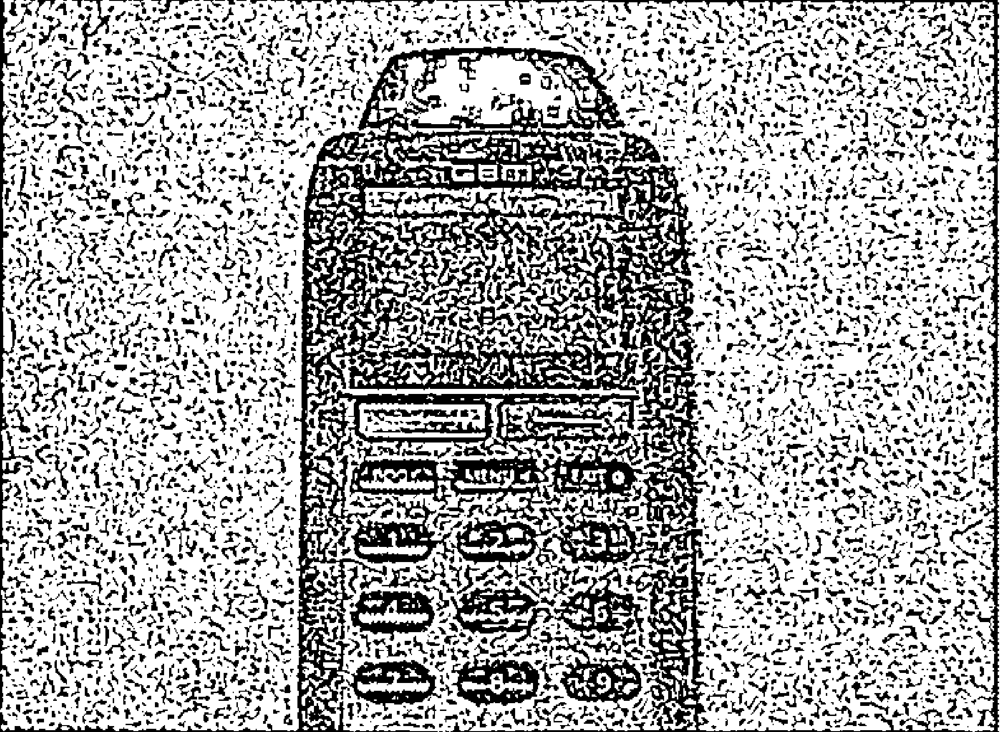


### Java游戏的兴起

Java是由Sun公司于1995年推出的程序设计语言和平台，它依靠自身强大的可扩展性和移植性，成为了智能手机诞生之前在手机圈最通用的一种游戏格式。从画质来看，Java游戏已经足以超越任天堂旗下的Game Boy Color(GBC)，而以Gameloft为代表的公司开发的KJAVA游戏，其画面和游戏性甚至接近Game Boy Advance(GBA)的水平(图3)。也就是从这个时期开始，游戏手机才真正有了叫板“掌上游戏机”的潜质。


虽然Java游戏适用于更多品牌的手机，但遇到不同分辨率和配置不一的具体手机型号，依旧存在非常明显的适配问题(表现在兼容和耗电上)，很多低端机型遇到某些Java游戏会出现明显的卡顿感。因此，想100%兼容且流畅运行所有Java游戏大作，就需要当年的用户非一线品牌的中高端手机“不选”了，而这类定位较高的手机，就可号称是当年的“游戏手机”了(图4)。

### 游戏平台化


继Java之后，手机游戏逐渐有了平台化的趋势，以诺基亚塞班(Symbian)、多普达Windows Mobile为代表的手机，有了针对本系统定制的专属游戏，无论是画质还是流畅度都较Java游戏有了明显的提升。这个时期，“游戏手机”有了(相对)更为广阔的市场，而诺基亚也借此次大势在2003年推出了N-Gage手机(图5)，专用的游戏卡带、独立的方向键和横屏设计可以更好地控制游戏中的角色，带来了可真正媲美掌上游戏机的操作体验。

然而，N-Gage手机的市场表现并不理想，缺少优质游戏开发商支持的它很快就退出了历史舞台，并以“N-Gage游戏商店”的身份在N81等高端机型中“续命”。N81、N96等支持N-Gage平台的手机，可以直接下载运行N-Gage游戏(图6)，而且这些手机大都还采用了双向滑盖的设计，下滑屏幕可以露出独立的游戏按键，配合方向键可以进一步提升操作性(图7)。

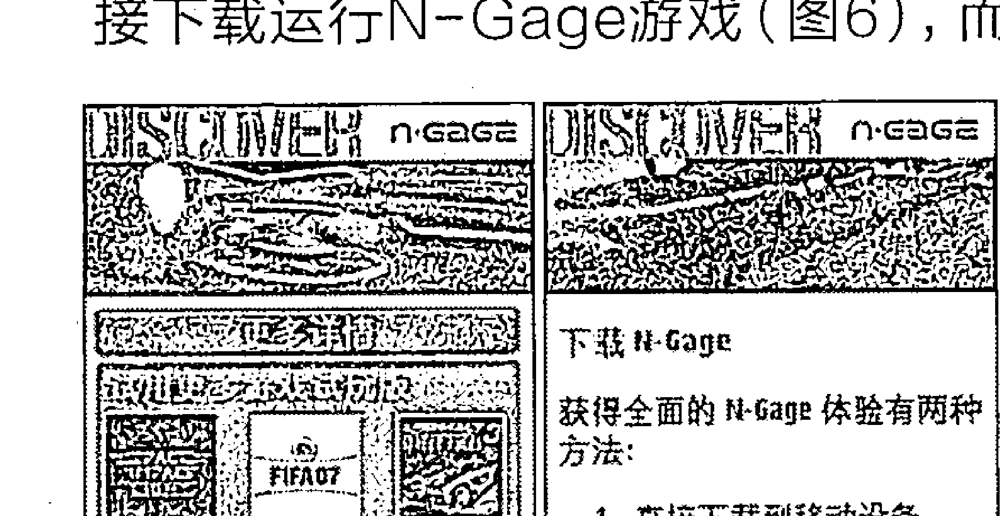

+   1. 直接下载到移动设备。[需要网络连接]
+   2. 下载到电脑上，然后再通过USB线传输到移动设备。

值得一提的是，诺基亚N系列手机后期还都升级到了塞班S60系统，除了支持Java、塞班平台游戏和N-Gage游戏(仅限高端机型或破解）外，还能通过各类模拟器玩到FC、SFC、MD和GBC等游戏主机的游戏。可以说，当年诺基亚的N系列手机，大都可荣获同期“游戏手机”的光荣称号。

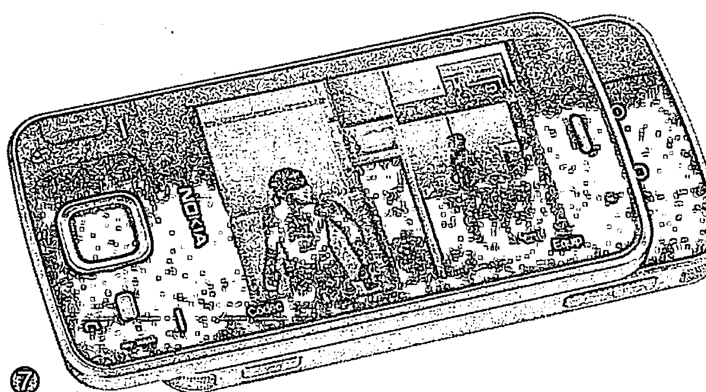

问题是，哪怕是支持N-Gage游戏的高端诺基亚手机，其画质也就是略胜于GBA，和同一时期索尼PSP、任天堂NDS等游戏掌机不可同日而语。没办法，无论是塞班还是Windows Mobile系统，在设计之初就没有考虑到硬件加速这个概念。手机游戏画质要想进一步进化，需要一场软硬件层面的革命性变革。

### 智能手机带来画质革命

iPhone和App Store的出现，掀开了“智能手机”时代的华丽序幕，随后而来的Android系统和谷歌商店，对智能手机硬件和应用下载渠道也做出了硬性规定。至此，智能手机不断上演一轮又一轮的“军备竞赛”（处理器核心数量、内存容量、屏幕分辨率等），而应用商店模式的成功，也吸引了更多优质游戏开发商的入驻（图8），为手游的崛起奠定了基础。

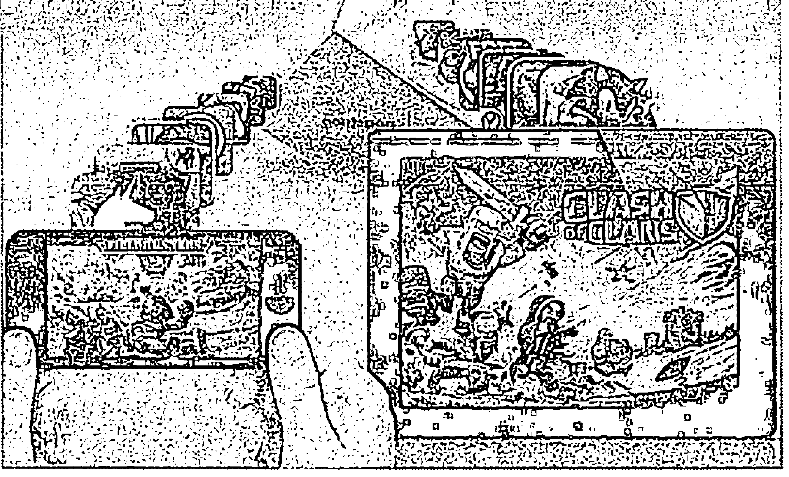

可以说，自iPhone 3GS之后起，智能手机的游戏画质已经全面超过了PSP游戏掌机，从2011年开始普及的双核手机，甚至足以流畅运行PSP和NDS模拟器！同时，以《狂野飙车》、《N.O.V.A》、《愤怒的小鸟》和《植物大战僵尸》为代表的游戏诞生，也是手机游戏逐渐走向成熟的标志。

在此期间，索尼于2011年推出的Xperia Play，可被视为Android领域的专业“游戏手机”（图9）。这款产品通过下滑屏幕的设计加入了类似PSP的方向键、开始、选择、X、O、△、□、L和R物理键，可通过PlayStation One线上商店下载经典PS主机游戏。可惜，Xperia Play虽然操作手感一流，但并没有迎来续作，在智能手机追求轻薄化设计的理念下也只能退出历史舞台。

Xperia Play之所以吸引了无数玩家关注，是因为它可以完美匹配各种家用机模拟器的按键映射，比起通过屏幕的虚拟按键操作更具手感，有效地避免了误操作。而Xperia Play之所以没能掀起更大的波澜，则源于模拟器游戏只是小众用户的最爱，而Android（包括iOS）下的原生游戏都是针对触控优化的操作形式（图10），反而对物理按键缺乏优化。可以说，是手机游戏长期以来对物理按键的“不感冒”，影响了类Xperia Play设计手机的发展。

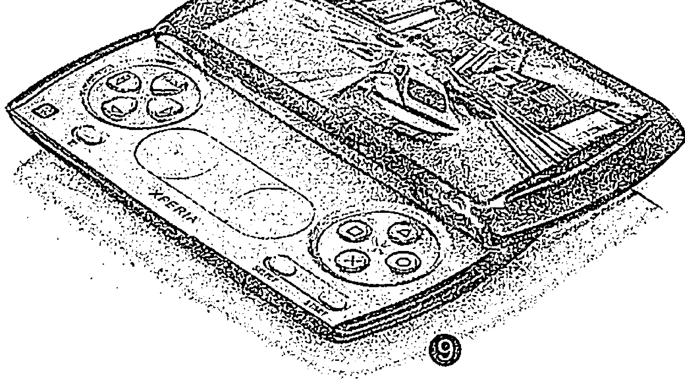

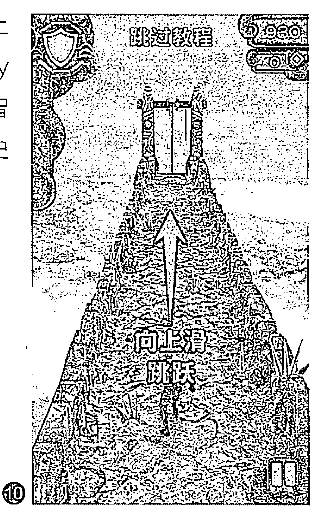

好消息是，这种将“手机+掌机”结合的设计理念并没有就此没落，以摩奇为代表的品牌一直都在更新类似的产品（图11）。随着4G网络和电竞类手机游戏的兴起，智能手机对物理按键的需求则有上升势头。

### 4G见证电竞手游辉煌

3G和4G带来的不仅仅是更高速的网络，同时也是网络游戏在手机领域生根发芽的催化剂。《炉石传说》、《部落冲突》、《皇室战争》等游戏成为了消磨碎片化时间的最佳项目，而《王者荣耀》、《穿越火线》以及各种“吃鸡类”手机游戏，更是对《英雄联盟》等PC平台游戏造成了极大的冲击——这年头回家不开PC的人多了，但不玩《王者荣耀》的用户却越来越少。

以《王者荣耀》为代表的手机游戏已经可以划入“电竞游戏”的列表，而电竞游戏对网络延迟、游戏帧数和操作准确性的要求极为苛刻，一次卡顿或误操作就会导致团战失利而输掉整场比赛（图12）。因此，电竞级手机游戏的兴起，对智能手机的性能和操作性也提出了更高的要求，“游戏手机”这个概念也再度复苏，其背后就是新一代电竞游戏的不断鞭策，而它也就成为了众多手机品牌用于营销中的最爱关键词。

+   摩奇原生按键游戏手机 深耕细分市场 8年10代产品

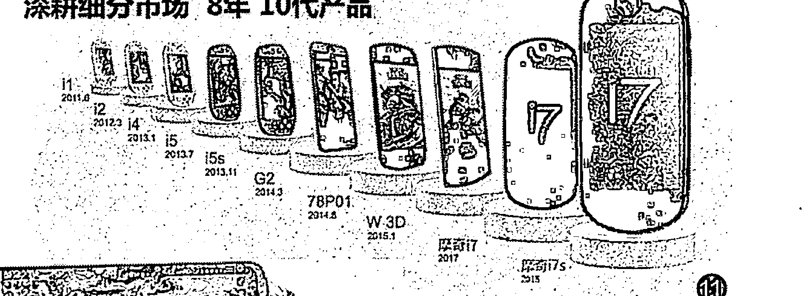

+   图12

但是，这年头什么样的手机，才算是真正的“游戏手机”呢？

### 磨砺中前行的游戏手机

手机游戏的电竞化，对手机性能以及用户的操作都提出了更严苛的要求，所以才需要游戏手机加以应对。但是，就好像笔记本领域的分支“游戏本”一样，新品类的发展并非一蹴而就，需要不断地在磨合和改进中前行。

+   图1

### 模拟掌机的形态

什么样的手机才有资格冠以“游戏手机”的称号？很遗憾，这并没有一个官方的标准，手机厂商们只能根据各自的理解加以研发。于是，就有了游戏手机的形态之争。

上个章节我们提到过，索尼Xperia Play并非是一种友好的游戏手机设计方案，滑盖设计和隐藏的游戏按键会显著增加手机的厚度和重量。虽然如今智能手机领域滑盖设计（滑盖全面屏）已再度复苏，但新品都是为了进一步提升屏占比参数，和“游戏手机”已经没有任何关联。

摩奇i7和i7s等产品虽然保持了直板手机的形态，但手机+手柄的二合一形态，依旧存在机身过于宽大且厚重的缺陷（图1）。实际上，此类产品更像是赋予了通话功能的掌机，类似索尼PSV掌机的按键布局、独立的L/R按键再加上双摇杆，无论是用小鸡模拟器运行各种家用游戏机游戏，还是通过按键映射的方式运行Android系统原生游戏都是一把好手（图2）。

但是，智能手机注定还是便携至上的移动设备，手机功能永远排在第一位，而游戏机的特质只能站在后排。因此，传统手机品牌都对掌机形态的手机表示排斥，并寻找另外一条突围之路。

+   一拖一拽，就能把按键设置好

+   图2

### 依靠外设变身流

既然掌机形态的手机难以摆脱臃肿不堪的弊病，那将手机和手柄结合的设计拆分不就结了？于是，在很久以前手机领域就出现了专用的游戏手柄，它们或者采用横向拉伸式结构（图3），或者采取固定支架的设计（图4），通过蓝牙与手机连接从而实现对游戏的操控。

这种蓝牙游戏手柄的价格浮动很大，不同品牌和型号的产品售价从百元到数百元不等，它们的差异主要体现在品牌、设计、做工、按键手感、是否支持2.4G、内置电池容量等。如今，手机+手柄外设的组合方案已经得到了不少手机品牌的认可，比如摩托罗拉（联想）旗下的MOTO Z就可选Gamepad游戏Mod配件（图5），可以让手机秒变游戏掌机，较之第三方品牌的手柄高档了不知道多少倍。

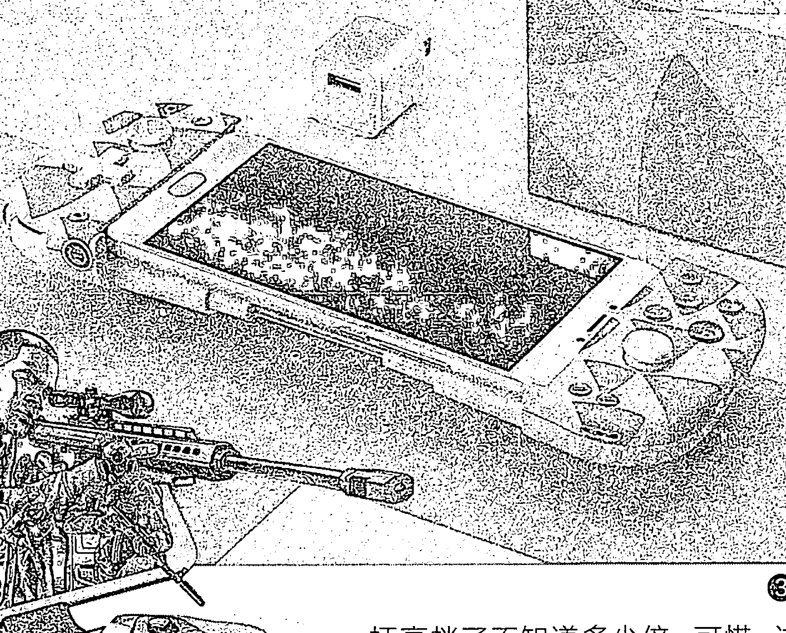

可惜，这个Mod配件的价格也不便宜，599元的开销也注定它只是少数不差钱用户的选择。

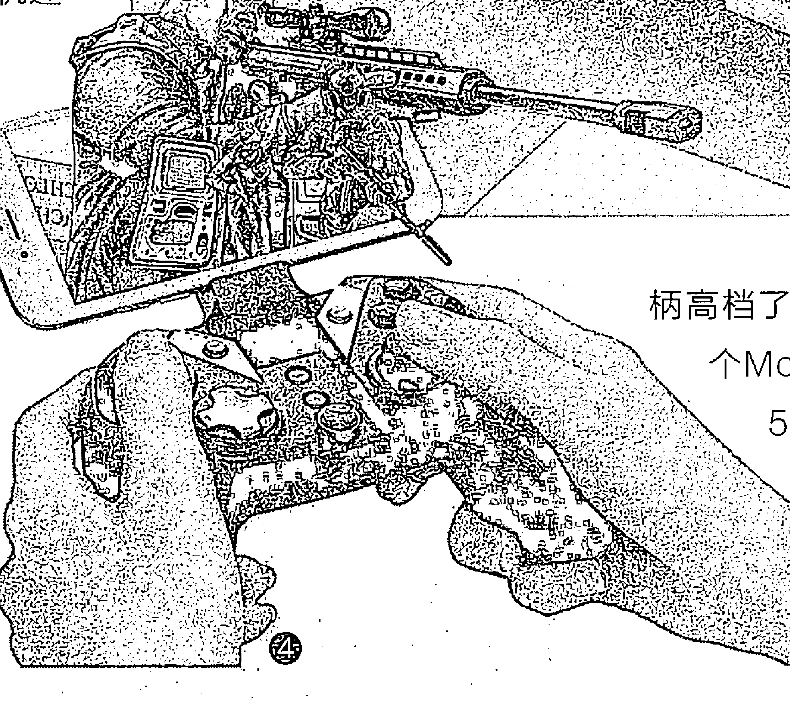

需要注意的是，所谓“官方”或“原装”游戏手柄在兼容性方面并不统一。前面提到的Mod配件仅兼容MOTO Z系列手机，黑鲨游戏手机的单边手柄也仅适合黑鲨手机。

不过，主打游戏的华为Mate 20X，官方却选择了和第三方外设品牌合作的形式，携手北通推出了G1游戏手柄（图6），其特色是和EMUI系统深度适配（图7），免物理映射和激活，无需下载第三方游戏大厅或APP，可以直接适配游戏官方版本。希望未来这种外设品牌和手机品牌携手定制的手柄可以成为行业趋势，让用户可以远离兼容和适配方面的困扰。

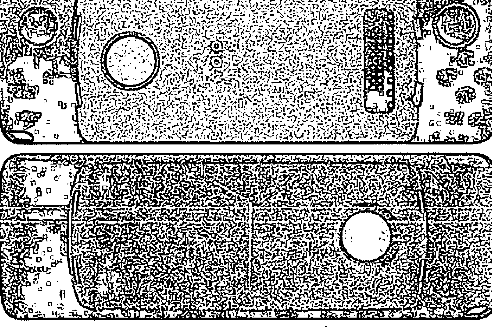


#### 一次不成熟的尝试

无论是原生还是通过配件的形式，将手机“掌机化”都是游戏手机发展过程中的尝试之一，对体验过家用游戏机的玩家而言，这种可以双手持握，通过摇杆和物理按键操作的感觉就是王道。那么，如果跳出手柄元素这个圈子，针对手机自身的游戏化设计有哪些？

早在雷蛇、黑鲨、红魔、华硕ROG手机诞生之前，宏碁在2015年就曾提出过专业“游戏手机”的概念，发布了搭载联发科Helio X20十核处理器和4GB内存的Predator 6——一款采用6英寸大屏幕且配备了4个扬声器的存在（图8）。

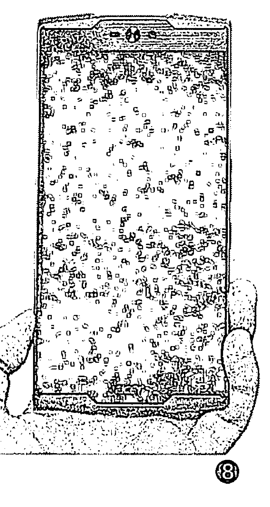

这款产品除了声音震撼外，还主打方向触觉反馈系统，将振动装置分布在手机左侧及右侧，在运行赛车游戏时可根据转向实现不同方向的振动效果，从而带来更逼真的游戏体验。

可惜，宏碁Predator 6最终并没有量产，原因也许是当时的手机游戏还不足以支撑起游戏手机这么一种分类。而以现在的眼光来看，Predator 6其实更适合作为“掌上影院”，更大的音量和震动反馈并不足以带来游戏体验上的大幅提升，也难以让Predator 6以游戏手机的身份实现大幅溢价。

#### 软件系统优化流

在消费者对游戏手机的需求成为刚需之前，手机厂商自然不会在设计和硬件上投入太多。为此，从软件和系统层面针对游戏进行优化就成为了整个行业的共识。于是，自2016年开始，手机领域就慢慢出现了“游戏加速”和“游戏模式”等特殊功能，从而让普通手机也有机会驰骋在更流畅的游戏世界。

需要指出的是，早期的游戏加速能力相对初级，它们大都可提供包括来电/通知免打扰、性能全开、按键防误触、游戏过程中禁止后台自动同步、内存清理和固定屏幕亮度等功能，少数手机的游戏模式则加入了《王者荣耀》的高分辨率模式（图9）。

2018年，华为/荣耀推出的“GPU Turbo”则可视为游戏加速功能的进阶，可以显著提升中低配置手机的最低帧数，让高配手机的帧数更加稳定。

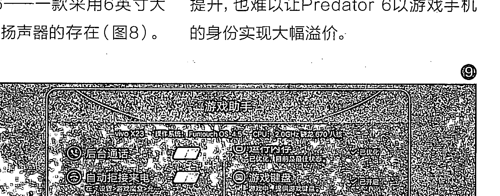

在2018年第23期特别话题中，CFan还曾提到过以《王者荣耀》为代表的游戏已经针对指定机型推出了“Vulkan”版本，本期我们就再来详细地了解一下Vulkan对手机游戏性能的影响。

手机游戏大都是基于OpenGL的API（绘图应用程序接口）开发，而Vulkan则是比OpenGL更高效的API，当游戏使用Vulkan接入硬件后，能以更低的功耗发挥更多的硬件性能，翻译过来就是玩游戏的时候更省电、游戏帧数更高、画面更流畅。但是，一款游戏要想将API从OpenGL转向Vulkan，基本就意味着重新开发，而且Vulkan接口需要最新的GPU和Android 7.0或更高版本的系统才能加以支持（图10）。因此，为了兼顾市面上海量的Android 6.x或更低版本的老手机，游戏开发商对Vulkan还是持谨慎的推广态度。

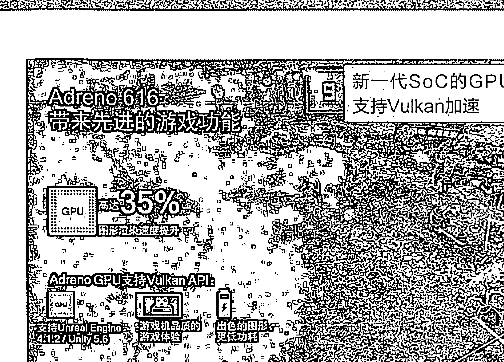

随着手机游戏逐渐电竞化，消费者已经愿意为更流畅的游戏体验多花钱（换新机），因此使用Vulkan API的游戏即将迎来一轮爆发，值得期待。从Vulkan版《王者荣耀》的实际表现来看，对搭载骁龙660级别SoC的手机，其游戏帧数能从老版本的50fps~60fps提高到55fps~60fps。从数字来看似乎提升不高？

实际上，Vulkan（也包括类似GPU Turbo技术）真正的刚需，其实是搭载骁龙636、骁龙625、麒麟659等中低端SoC的手机们，它们能在新API的帮助下，将最低帧数从20fps提升到30fps、从30fps提升到40fps以上甚至更高（图11），从而彻底告别游戏卡顿的困扰，让游戏体验出现质的飞跃。换句话说，一款旗舰手机支持Vulkan版本的《王者荣耀》从来都不是卖点，因为它们搭载的SoC本来就足以流畅运行。而支持新版本游戏的中低端手机，才是值得我们重点关注的产品，毕竟冠名以“游戏手机”或“旗舰手机”的产品都不便宜，而中低端才是更多用户可以接受的消费区间。

问题又来了，如今千元价位的手机已经逐渐成为骁龙636、骁龙660和麒麟710的天下，它们的配置辅以游戏加速和Vulkan API接口的游戏，似乎够用了？那为何很多手机品牌还要开辟专业的“游戏手机”战场？这些真正的游戏手机和那些玩游戏很流畅的传统手机又有什么差别？


### 专业游戏手机是否值得选

如今，搭载麒麟970或更高级别SoC的标准手机已经“沦落”主流市场，而哪怕是骁龙660/670/710级别的SoC也能流畅驾驭几乎所有的Android游戏。在这种大环境下，相对更贵的专业游戏手机是否还值得选择？

#### 专业游戏手机的诞生

雷蛇(Razer)旗下的笔记本，一直都被视为游戏本领域的标杆。2017年，雷蛇在收购一家名为Nextbit的云手机公司之后不久，推出了自主品牌的雷蛇手机(图1)。至此，真正被行业广泛认可的专业游戏手机就此诞生。2018年，专业游戏手机迎来了一波爆发期，努比亚推出了“红魔”，小米(生态链企业)放出了“黑鲨”，华硕祭出了“ROG”，再加上雷蛇最新的第二代游戏手机，凑出了专业游戏手机“四剑客”。


### 专业游戏手机四剑客

游戏手机都是从旗舰级手机中演变而来，它们都搭载了时下最强的SoC（图2），并辅以更大的内存、更高速的闪存，再加上确保足够续航潜力的大电池。但是，和常见的旗舰手机相比，游戏手机却又有着许多不一样的变化，从而更加符合游戏玩家的口味和需求。

就拿红魔Mars、黑鲨Helo、雷蛇手机2和华硕ROG手机为例，它们清一色都搭载了高通骁龙845移动平台，只是华硕ROG手机的骁龙845属于“超频版”，其主频较标准版提高了0.16GHz，具备更为强悍的性能动力（表1）。此外，这些专业游戏手机，从外观设计、屏幕、操作、散热和系统等方面，也都较标准手机有了很多不同。

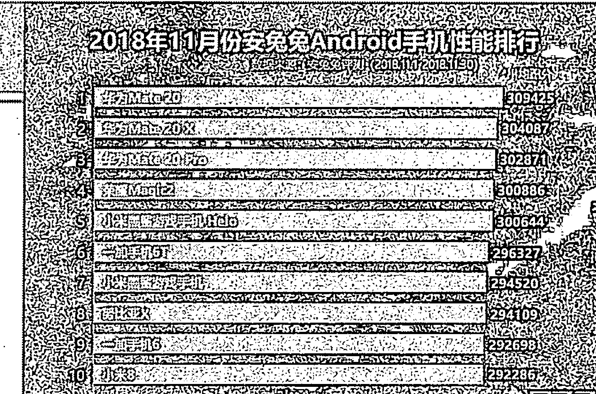

| 参数对比 | 红魔Mars | 黑鲨Helo | 雷蛇手机2 | 华硕ROG手机 |
| :--- | :--- | :--- | :--- | :--- |
| **网络** | 全网通（双卡双待） | 全网通（双卡双待） | 全网通（单卡） | 全网通（双卡双待） |
| **屏幕** | 6英寸TFT | 6.01英寸AMOLED | 5.72英寸TFT | 6英寸AMOLED |
| **分辨率** | 2160×1080像素 | 2160×1080像素 | 2560×1440像素 | 2160×1080像素 |
| **屏幕特色** | —— | 独立图像处理芯片 | IGZO技术、120Hz刷新率 | 90Hz刷新率 |
| **处理器** | 骁龙845（2.8GHz） | 骁龙845（2.8GHz） | 骁龙845（2.8GHz） | 骁龙845（2.96GHz） |
| **内存容量** | 6GB/8GB | 6GB/8GB/10GB | 8GB | 8GB |
| **存储空间** | 64GB/128GB | 128GB/256GB | 64GB | 128GB/512GB |
| **存储卡** | —— | —— | 最大支持1TB | —— |
| **摄像头** | 800万/1600万像素 | 2000万/1200万+2000万像素 | 800万/1200万+1200万像素 | 800万/1200万+800万像素 |
| **体积** | 158.25mm×75mm×9.85mm | 160mm×75.25mm×8.7mm | 158.5mm×78.99mm×8.5mm | 158.83mm×76.16mm×8.65mm |
| **电池/重量** | 3800mAh/193g | 4000mAh/190g | 4000mAh/不明 | 4000mAh/200g |
| **充电** | 16W | 18W | 24W | 30W |
| **特殊按键** | 电竞键、触控键×2 | SHARK键 | —— | 超声波侧键×3 |
| **参考价格** | 2699元起 | 3199元起 | 6000元以上 | 5999元起 |

#### Game范儿的设计

专业游戏手机最大的特色就是设计上极具Game范儿，让你一眼就能感受到它们专注“游戏”的市场定位。游戏手机四剑客在设计上都花费了很多心思，比如它们都在后盖的Logo或装饰中引入了可变色的呼吸灯，在夜间游戏时可以成为全场焦点（图3）。此外，红魔Mars在金属后盖表面上经钻石切割出来的菱形对称造型、黑鲨Helo在玻璃后盖上引入了X设计语言和不规则的三角装饰纹理、雷蛇手机2机身见棱见角的玻璃后盖可以充当镜子、华硕ROG玻璃后盖的非对称斜线造型更是令人印象深刻。

细心的用户不难发现，四剑客都没有追求极致的屏占比，红魔Mars没有继承家族特色的无边框设计，雷蛇手机2甚至还延续了16:9屏幕。之所以没有将边框压缩到极致，是因为这些产品更懂游戏，只有屏幕上下留出足够的横向持握空间才能最大限度避免游戏中的误触，并防止手指遮挡屏幕内容。

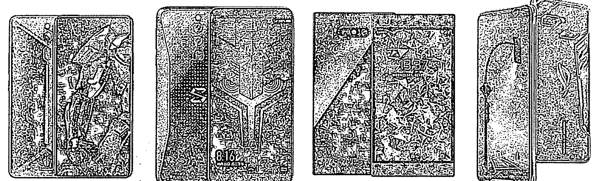

#### 不简单的屏幕

作为专业游戏手机，屏幕的品质自然也要与众不同才成。四剑客中，红魔Mars的TFT屏幕应该是规格相对中庸的，但看在其2699元起的超值售价上，这点遗憾也是可以接受的。

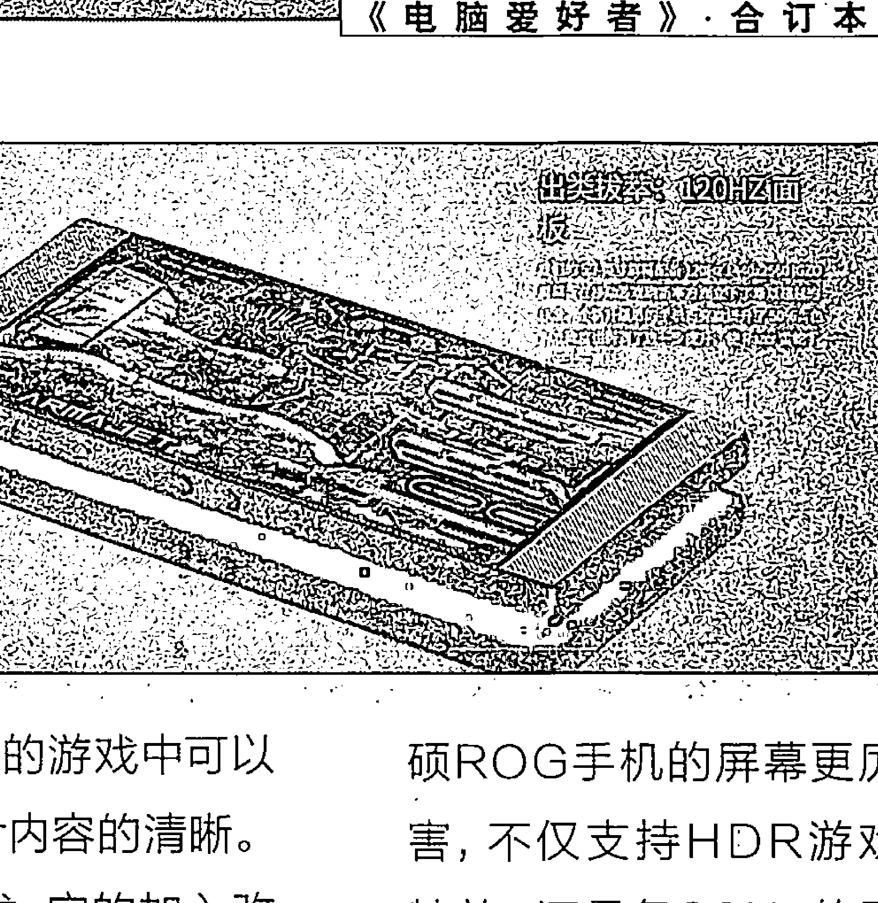

雷蛇手机2同样采用了TFT材质屏幕，但它却拥有2K级别分辨率，以及120Hz刷新率（图4）。套用游戏本领域的一个卖点，那就是它武装了“电竞屏”，在高速移动的游戏中可以减少运动模糊，在上网时快速滚动网页和文章，也能确保文字和图片内容的清晰。为了缓解2K屏幕的耗电问题，雷蛇手机2的屏幕还采用了IGZO技术，它的加入改善了原有TFT驱动的效率，而结合全新的设计可以带来功耗上的降低。

可以说，雷蛇手机2的屏幕是四剑客中素质最好的，可惜它的价格也是最贵的。

黑鲨Helo和华硕ROG手机都采用了AMOLED材质的屏幕，拥有更高的色域和对比度。其中，黑鲨Helo主打独立的图像处理芯片，从而支持HDR游戏特效，可显著提升昏暗游戏背景中的画面细节，或是让游戏画面更靓更鲜艳（图5）。


而华硕ROG手机的屏幕更厉害，不仅支持HDR游戏特效，还具备90Hz刷新率和1ms响应时间，高刷新率下也没有大多数AMOLED屏幕的拖影问题。

此外，四剑客都还采用了双喇叭的立体声扬声器系统，结合环绕音效和更出色的屏幕，可以带来更为震撼的视听环境，哪怕没有连接耳机也能分辨出枪声和敌人脚步的位置和方向。

#### 操控上的革新

作为专业游戏手机，操控性自然也需要重点考量。除了雷蛇手机2，其他三款游戏手机都提供了官方的手柄配件，其中黑鲨Helo和红魔Mars提供了双侧手柄（图6），华硕ROG手机则准备了更专业的双屏扩展盒。利用手柄可以大幅提升操作手感，避免错误的走位，让手机更像“游戏掌机”。

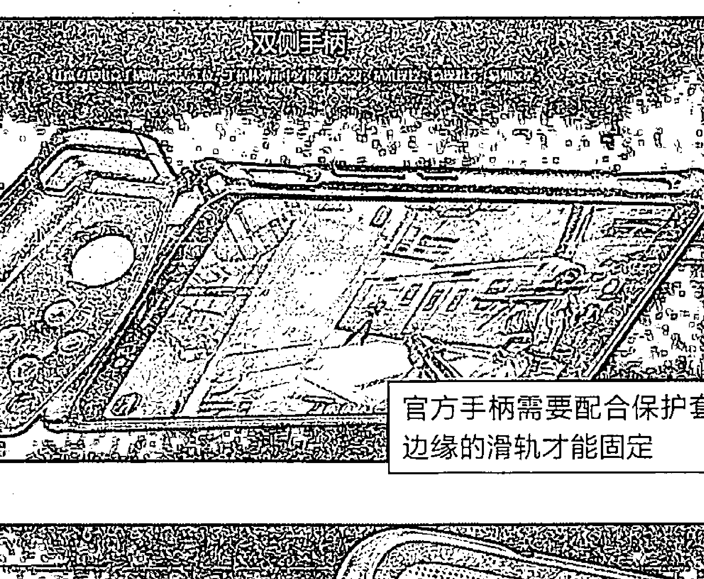

除了可选游戏手柄以外，红魔Mars和华硕ROG手机还通过取巧的设计，获得了L键和R键的操作体验。其中，红魔Mars在手机侧部边缘加入了灵敏的电容触控按键，可创建2个虚拟热键，跳跃、开镜、瞄准、射击，随你自定义（图7）。值得一提的是，红魔Mars电竞手机还新增了4D震感功能，其机身内部拥有一颗8V线性马达，可以根据不同的枪声来模拟震感。

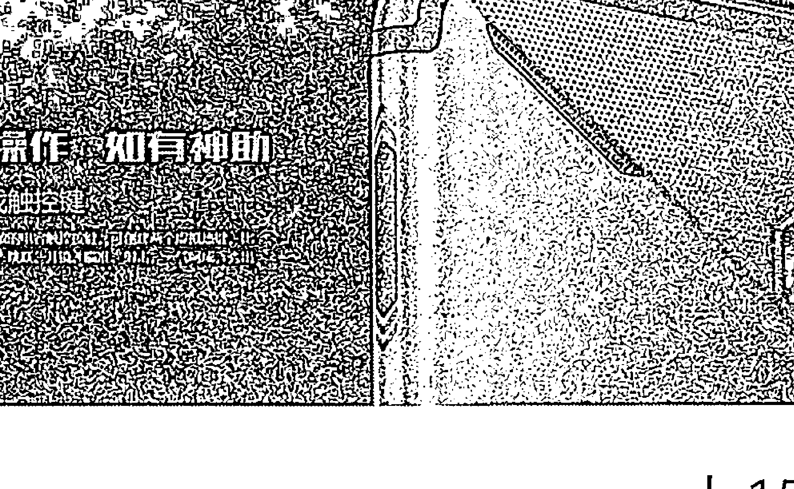

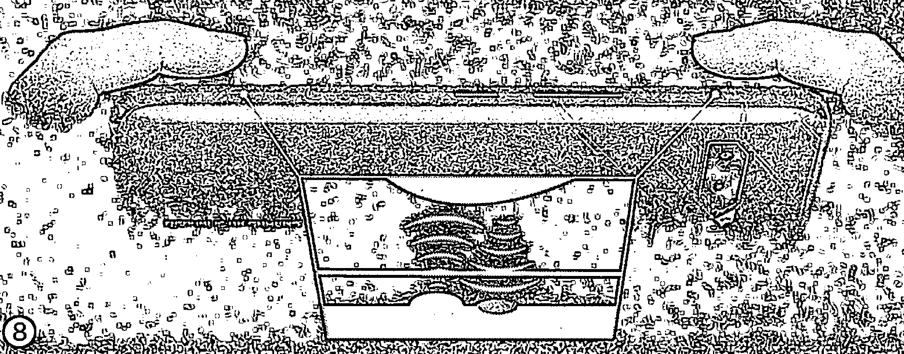

华硕ROG手机在右侧机身的上方和下方，以及左侧机身的下方各配备了1个超声波侧键区域（官方称为“AirTriggers”），右侧的2个按键在横屏握持时也可以模拟游戏手柄的L/R键（图8）。在竖屏操作时，左侧下方和右侧下方的按键则可实现挤压式操作，实现类似HTC Edge Sense的边框触控功能，可以自定义短时挤压及长时挤压的激活功能。

从操控性的细节来看，华硕ROG手机的考虑最为完美。这款产品还在机身右侧中间的位置提供了侧边定制接口（双USB Type-C，支持充电和HDMI输出），在横屏状态下游戏时再也不用担心充电线影响到手机的持握了（图10）。

#### 火速链接

如果你羡慕红魔Mars和ROG手机侧边的触控键设计，想让普通手机也能利用这个位置的按键成功“吃鸡”，可以考虑通过第三方的外设配件加以解决（图9）。具体的选购思路请参考本刊2018年15期《还原掌机操作手感 手机游戏手柄怎么选》这篇文章。

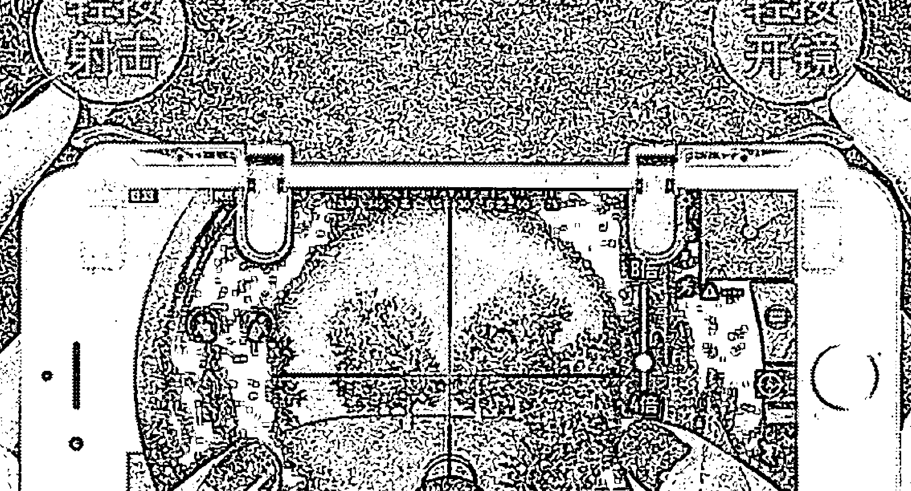


#### 更完美的散热

作为专业游戏手机，游戏时间肯定要以小时计算，而智能手机在全速运行时都存在过热降频的隐患，团战中的一次轻微卡顿都会导致战局的崩溃。因此，和同配置的旗舰手机相比，专业游戏手机会更加注重散热设计。

四剑客在散热设计上都有独到之处。比如，红魔Mars在发热源表面覆盖了一根热管，机身金属背板上还开有四个菱形风槽，可通过内外空气对流散发热量（图11），结合散热效果更出色的金属后盖，缓解骁龙845全速运行时的“热情”。黑鲨Helo采用了双排热管和分区散热模式来覆盖手机整个核心热源（图12）。

相对而言，雷蛇手机2和华硕ROG手机的散热设计更加豪华，前者覆盖了一整块定制的真空腔均热板（内置的铜片），可将热量扩散至整个手机，从而大大增加了散热表面积，减少了发热点。而后者则引入了高端显卡领域特有的3D Vapor Chamber冷凝系统（图13）。不同于普通的风冷、水冷，均热板是一个内壁具有微细结构的铜制真空腔体，通过真空腔底部的液体吸收热量→蒸发→冷凝变回液体的快速循环，实现双重散热。

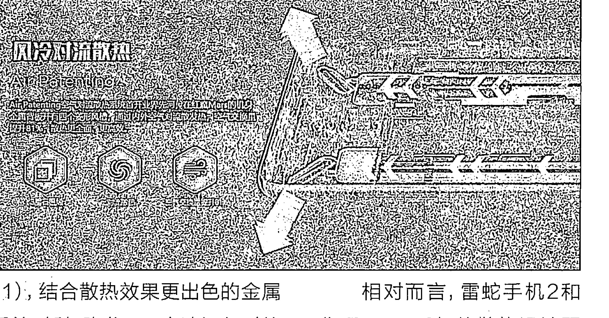

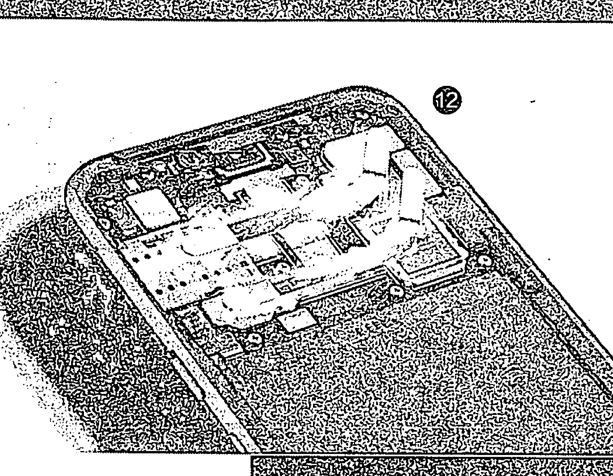

此外，华硕ROG手机还可通过侧边接口安装Aero Active酷冷风扇，让游戏运行得更稳定（图14）。

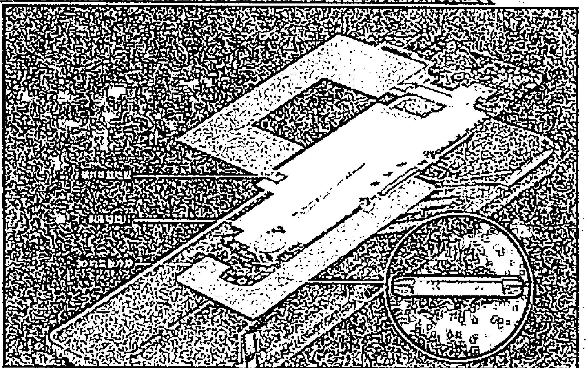

实际上，独立的热管并非专业游戏手机的专利，魅族16等高端手机内部也采用了类似的设计。只是，四剑客在散热模块的处理上要更加用心，可确保长时间游戏过程或是在较高温度环境下（比如夏日的室外）游戏中有着足够的散热冗余，并也从侧面体现了“一分钱一分货”的真谛——华硕ROG手机的散热虽然最好，但价格已经足够购买2部红魔Mars了。

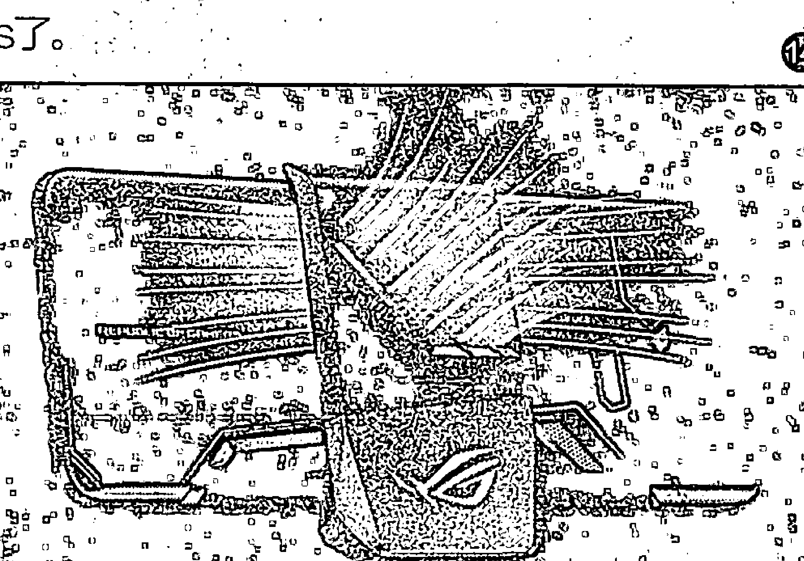

#### 沉浸式的系统

如今几乎所有的Android手机都支持游戏加速，作为专业游戏手机，它们在软件和系统层面的优化则更加到位。比如，雷蛇手机2增加了新的Cortex应用来帮助用户组织游戏列表，可通过游戏加速器模式来调整个人设置，比如CPU、分辨率和FPS等。红魔Mars、黑鲨Helo和华硕ROG手机则提供了独立的电竞键（ROG手机是通过按压AirTriggers开启X模式），一键就能进入专为游戏定制的沉浸式系统界面，同时火力全开、屏蔽可能的骚扰、激活炫酷的呼吸灯，还提供了可实时监测硬件信息和实时帧数的控制面板（图15）。


#### 小结

游戏手机时代已经来临，2019年哪怕是千元手机也能具备足够强大的游戏性能，而中高端手机则可在性能上留下更大的冗余空间。但是，这些都不妨碍专业游戏手机的发展，因为手机领域总是没有最强（散热和性能方面），只有更强。为了在游戏中远离因发热而引起的卡顿隐患，为了感受黑暗中的那一抹亮光（呼吸灯），为了更完美的操控体验（触控键和专用手柄），这类手机总能给我们带来惊喜。但不可否认的是，专业游戏手机的售价普遍偏高，同时四剑客的拍照性能也就是处于Android手机领域的主流标准。好消息是，红魔Mars打出了2699元起的超低起价，将专业游戏手机的定位进一步拉低。希望2019年我们可以看到更多品牌推出性价比出色的专业游戏手机，让掌上游戏世界变得更加精彩纷呈。

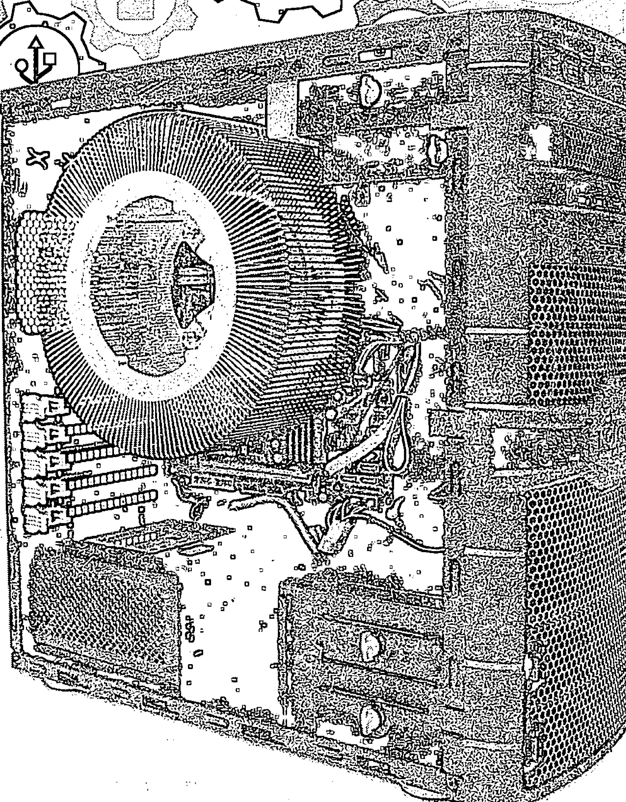

## 低噪声系统

文|谨行

不知不觉，凛冬已至，不知道大家身边是白雪皑皑还是狂风怒吼，抑或落叶仍在飞舞？不管是怎样的场景，相对于生机勃勃的春夏和满怀期许的金秋，冬日总给人一种落寞寂寥的感觉。在这个时候，身边电脑发出的声音即使并不算大，是不是也让人感到有些心烦呢？

其实随着PC市场的发展，各种特色产品日渐丰富，其中以静音为卖点的也不少。那么，希望享受宁静冬日时光的朋友们，就和笔者一起来了解一下这些产品和它们带来的清静世界吧。

### 处理器散热系统

处理器风扇，或者说散热器是电脑噪声的主要来源之一，越新型、越高端的处理器结构越复杂、频率越高，发热量常常就越大，处理器散热系统的能力也随之不断提升，其中最常见的方法当然就是增加散热风量，以吹除越来越多的热量，但因此带来的常常就是越来越明显的噪声。要想处理这部分的噪声，多从两个方面下手，一是降低风扇噪声；二是改变传统的设计思路。

#### 1. 静音风扇

散热器风扇提升风量的方式有两种，一是增加风扇转速，加快气流速度；二是加大风扇直径，加宽气流“通道”。其中增加转速的方式中，风扇自身高速运转和带来的快速流动、冲击元件的气流，都会产生更大的噪声；而加大风扇直径则可在获得同样风量的前提下，降低风扇转速和气流速度，因此噪声更低一些，是静音式风扇的主要选择。

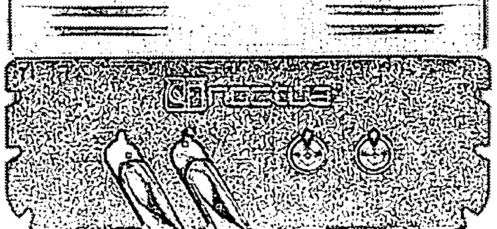

但需要注意的是，加大风扇直径的时候，必须对应地加大散热片的受风面积，因此在采用下压式风扇设计的散热器中，为了使用大直径风扇，常常不得不使用V型散热片，即底部面积较小、上部鳍片分散为较大的受风面积（图1）。这种设计虽然原理简单，但面积过大的处理器散热片难免影响到周边的元件设计和配件安装，例如常常紧挨处理器接口的内存插槽就很可能被遮盖起来，甚至连散热片自身的安装卡笋或螺丝都会被遮蔽，难以使用（图2）。

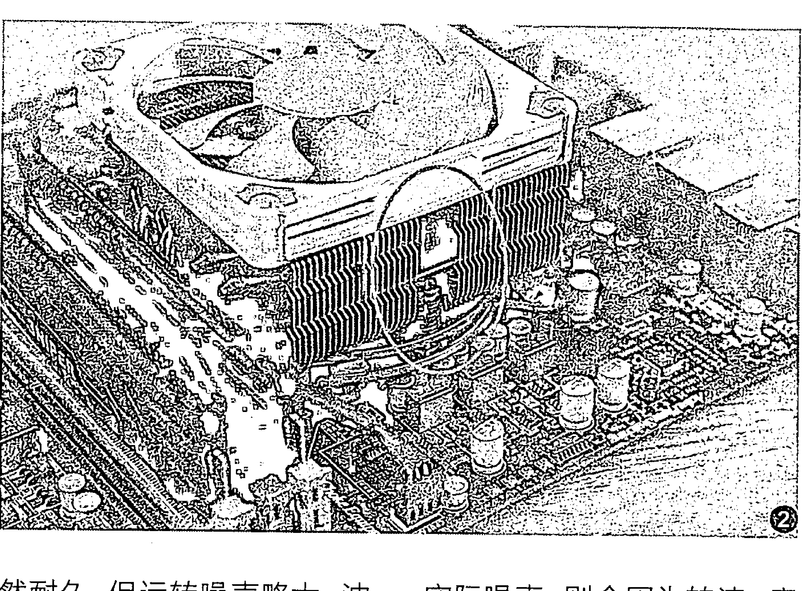

其实要让风扇增大风量、提升效率，同时更加安静，还有一些其他的方法，例如涵道式设计、优化扇叶形状、使用引流式设计等。简单地说，它们就是通过将风扇“包裹”起来避免气流向四周扩散，使用更符合空气动力学的扇叶安静地“切割”空气，利用风扇气流引导周围空气流动而非强行推动空气等。这些设计和理念大都已经包含在了各种新的静音风扇设计中，这里就不一一赘述了。

需要注意的是，很多厂商喜欢着重宣传自己的风扇轴承技术。理论上讲，滚珠轴承风扇虽然耐久，但运转噪声略大，油膜轴承的寿命略显不足。如果资金足够的话，建议选择磁悬浮轴承产品，可以综合两者的优点。但具体到某一款风扇的实际噪声，则会因为转速、扇叶设计、风道造型的不同而有着巨大差异，因此并不能仅凭风扇轴承来确定风扇的实际噪声水平。

#### 2. 转速控制

在实际挑选产品的时候，大家还必须注意一个非常重要的因素，那就是转速控制。由于处理器散热器的风扇能力是以满足高端高负载处理器的散热需求为目标，但实际使用中，大部分时间则应对的是中低负载和中端主流处理器，其实并不需要以最高转速运行，提供最大的风量，所以很多厂商会为其增加转速控制功能。

一款最高噪声达到30dB以上的风扇，如果支持转速控制的话，很可能大部分时间实际噪声都不到20dB（图3）。而一些转速控制并不好的风扇即使最大噪声仅有25dB，但一直以最大转速运行，使用体验可能还不如前者。

| 规格 | 参数 |
| :--- | :--- |
| 适用范围 | Intel Socket LGA 2011/2011-3/1366/115X /775 |
| 风扇转速（RPM） | 600-1600RPM(PWM)±10% |
| 风量 | 66.3 CFM ± 10% |
| 风扇尺寸 | 120x120x25mm |
| 散热片材质 | 4根直触热管/铝鳍片 |
| 散热器尺寸 | 116x60x160mm |
| 噪音 | 9-31 dBA |

性能强悍、最高噪声比较明显的风扇，通过转速控制，最低运行噪声仅有9dB。

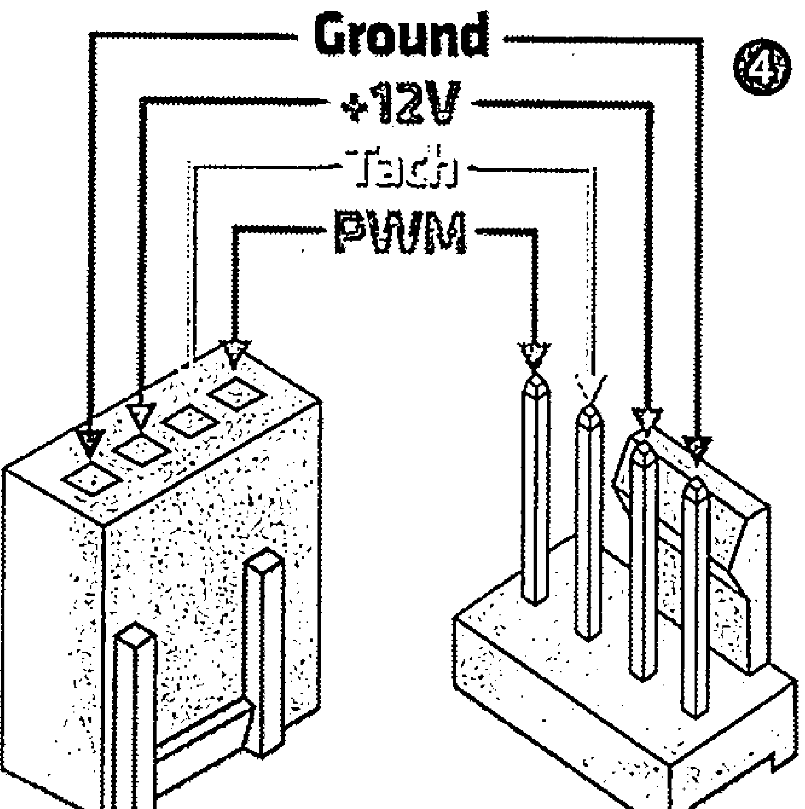

目前的主板大都可以支持自动转速控制，但最好使用4pin接口的风扇。3pin风扇接口使用pin1~pin3接口，未连接专门的转速操控功能（PWM）针脚（图4），不具备直接调速功能，虽然可以使用电压来控制转速，但在控制精度、效果方面要差得多。

#### 3. 优化散热片设计

随着对散热风量的进一步追求，12cm甚至14cm直径的风扇也出现在处理器散热器上。这些风扇及相应的散热片已经难以使用下压式风路设计，否则会遮盖太大的主板面积。所以一种新设计快速兴起，那就是让散热片“立”起来，充分利用主板的上部空间。这种设计还带来了一个额外的好处，它们可以更方便地使用双风扇设计（图5），进一步提升散热风量。

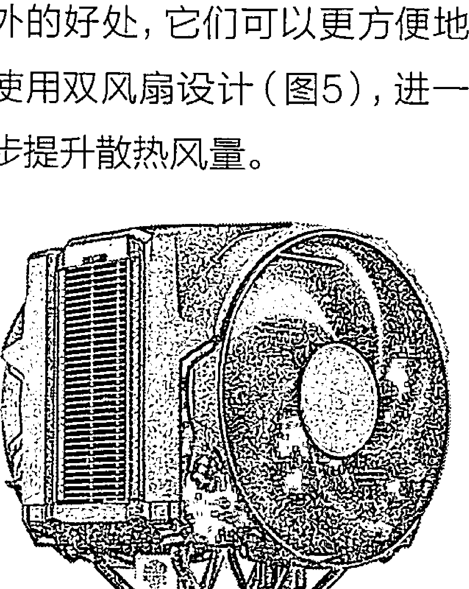

立置式散热片配合热管是目前的一种主流设计，这种设计可以在支持较大散热片的同时，为底部的内存、供电电路散热片等留下一定空间。热管的传热效率也比直接使用金属块、片更高，且重量轻得多。

此外，散热片还可以通过选择导热快的鳍片材质来加快散热速度，使用更薄而多的鳍片来提升散热面积，设计更符合散热风路的结构等方式来提升散热效率，并适当降低气流噪声。

#### 4. 与机箱一体化的散热设计

很多立置式散热器都可以很方便地装卸风扇，根据需要安装单、双风扇，甚至能调节散热风路状态，选择双风扇对吹或一吹一抽。后者可在对处理器散热的同时向主板上需要加强散热的方向吹风，能加强主板的散热能力，或将散热气流更好地融入机箱整体风路中。

需要注意的是，如果散热能力已接近极限，例如使用了发热量很高的处理器或进行极限超频时，排出的气流温度很高，则要改变思路，将散热气流排向主板低温区域而非本身发热量就较大的区域。此时如能与机箱形成一体式散热风路，充分利用机箱内的气体循环甚至直接将这部分热风排出机箱，都是不错的选择（图6、图7）。

其实利用与机箱的散热一体式设计，完全可以构建无风扇的处理器散热系统，或将整机热量集中处理，仅使用一两个大型风扇进行热量吹除，例如，现在典型的笔记本散热系统。当然这样的设计很难在使用量产商品的DIY系统里实现，一般都出现在品牌机或者高度定制化的MOD作品中。

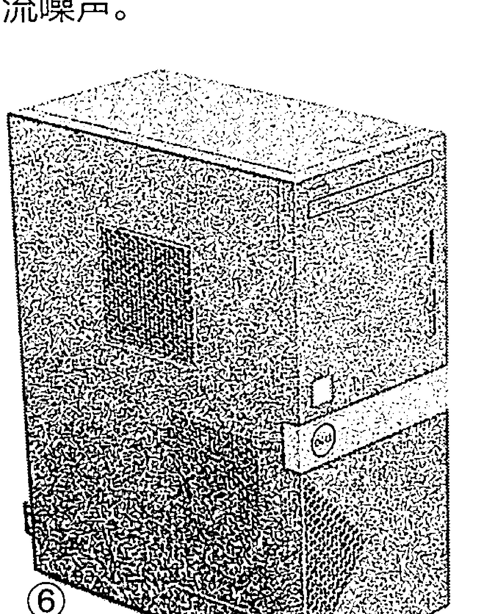

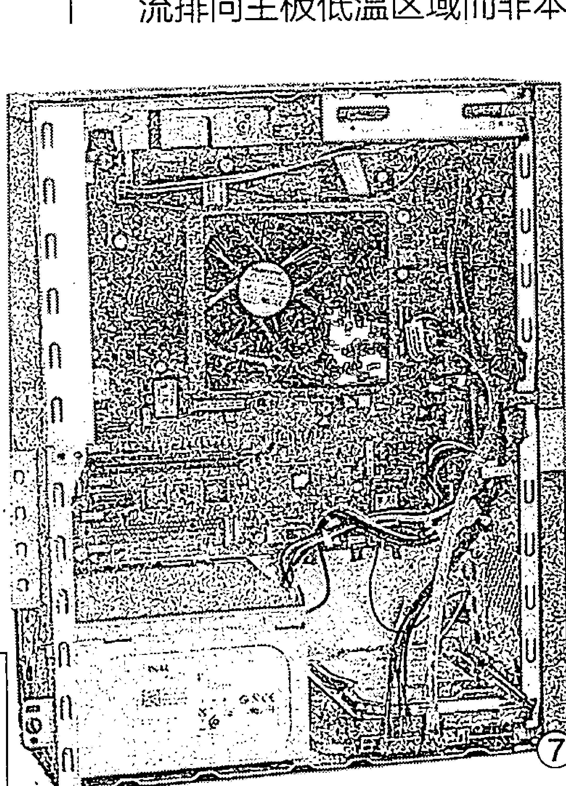

#### 5. 水冷散热器

在本刊2018年第24期的《淡季寻好价 体验水冷散热》一文中，还着重介绍了目前主流的水冷技术特色及产品。水冷同样适合追求低噪声散热系统的用户，不过这里必须要指出的是，水冷散热系统的噪声除了风扇噪声（一般会注明），还有水泵噪声（大部分产品的噪声标注中已包括），在非常安静的环境中，其实还能听到水流声。相对于机械噪声和风声，水流的声音对有些人来说更难以忍受，因此在购买水冷散热器的时候必须考虑到这一点。

### 显卡散热系统

作为复杂程度已经高于处理器的芯片，GPU及其栖身的显卡在发热量上也常常会超过处理器，因此散热能力同样非常重要，也常常成为机箱内非常重要的噪声来源。噪声控制方面，显卡散热系统在一定程度上可以借鉴处理器散热系统，如大直径风扇和转速控制、优化散热片等，但也有不同于处理器散热系统的特殊功能，例如三风扇设计、启停设计、外壳风路设计等。

由于显卡自身的限制，其上很难使用120mm和更大直径的风扇，根据显卡的实际形态，提升散热风量的最佳方式就是利用其体型，配置多风扇。目前中端显卡的主流配置已经是双风扇，三风扇设计也屡见不鲜。相对于提升单风扇的转速，多风扇可以在较低的转速下提供同等的散热风量，且散热气流分布更均匀，能同时为GPU、高频显存、供电系统等显卡高热区域散热。

对显卡来说，尽量安排更多风扇，同时又要消除同一平面内的多风扇产生的气流紊乱、风扇共振是独特的需求。针对这些需求，很多显卡采用散热器长度超过PCB板的设计以容纳更多的大直径风扇，并且采用对转或不对称风扇来避免共振、优化气流，或者对某些区域进行重点冷却（图8）。

> 采用不对称风扇设计的显卡，小直径风扇的转速控制方案也与另外两个风扇不同

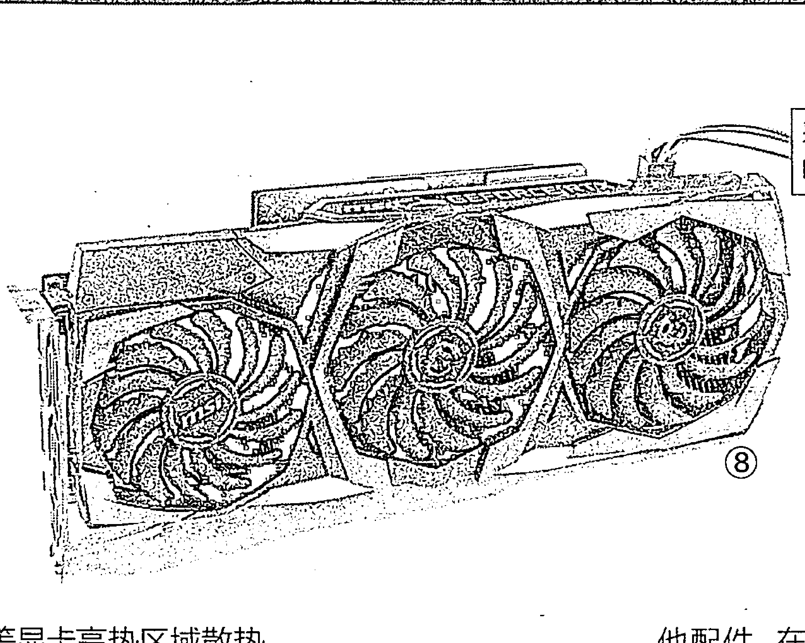

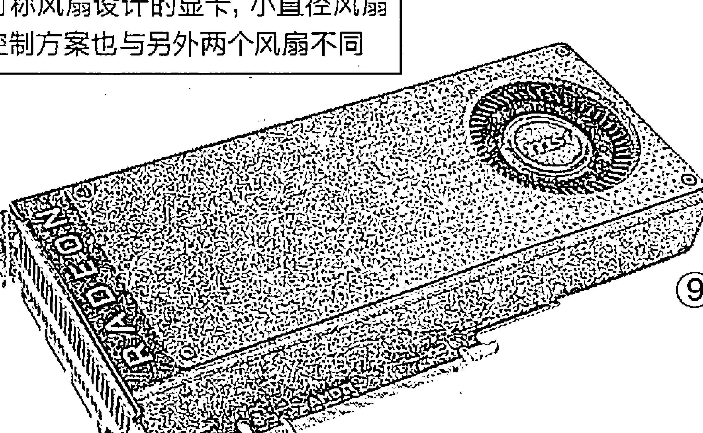

新一代显卡风扇大都拥有转速控制模式，在不启动游戏等3D应用的时候，因为GPU和显存以低负载方式运行，产生的热量极低，风扇可以用极低转速运转，甚至可以直接停转，仅靠被动散热就可以保证2D状态甚至简单3D图形处理时的显卡散热。

此外，显卡拥有比较宽阔的表面，也可以设计更有效的散热风路，例如用半封闭外壳，让散热气流吹向最需要的部分，并且从选定的方向排出。在与机箱内整体气流方向配合良好时，这种设计可以让热空气快速离开显卡表面，明显提升散热效率，为显卡制造更好的运行环境。

还有一些“极端”的显卡甚至会使用封闭式风路外壳，让热空气从显卡的接口面板方向排出机箱（图9），避免热空气加热机箱内的其他配件，在前几代显卡中曾广泛使用这种设计。然而这种设计通常采用涡轮风扇，虽然效率较高，但转速较快，因此会产生明显噪声，且成本较高，所以现在已经不再是主流的显卡设计。但在一些特殊应用环境，如内部散热环境不佳的小型机箱中，封闭外壳+向外排气的显卡散热设计还是一种不错的选择。

如果对性能要求不高的话，在选择入门级显卡的时候还可以考虑被动散热的产品，例如技嘉和EVGA的GT 1030显卡（图10、图11）。它们的性能略高于AMD Ryzen APU的内置显卡，更远高于英特尔核芯显卡，可满足主流网游和休闲单机游戏的需求，但无风扇设计使其运行时完全无噪声。此外两款产品都采用半高设计，也让它们能更好地用在小型机箱中。

显卡同样可以采用水冷方案，但水冷部分必须根据显卡设计进行适配（图12），因此只有比较流行的显卡才有相应的水冷套装出售，且因为产销量有限，价格通常比较昂贵。

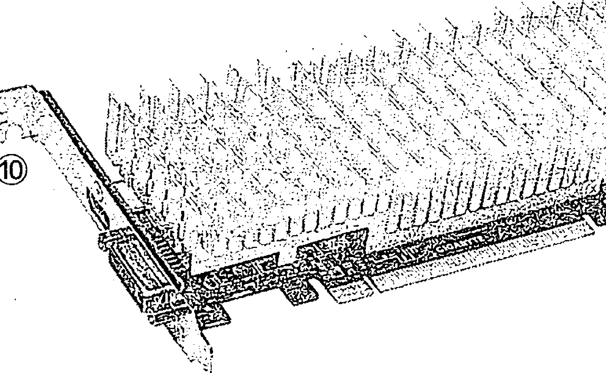

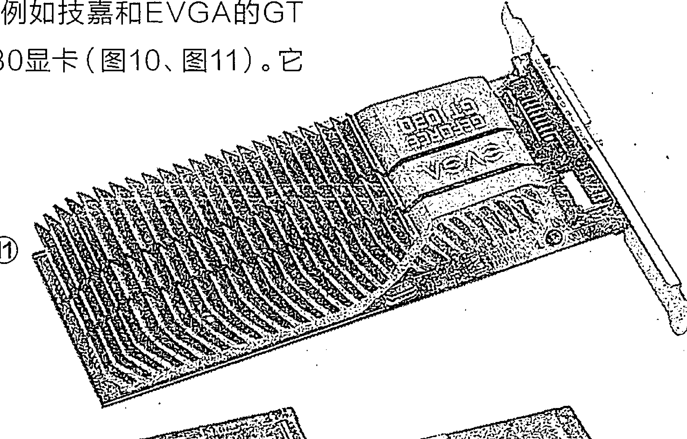

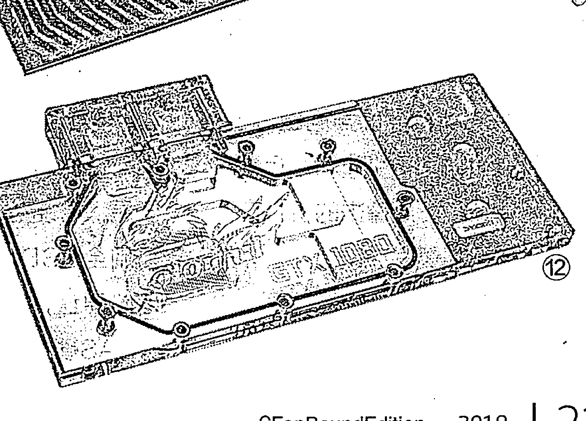

### 电源与机箱

电源、机箱中的噪声同样主要来自散热系统，特别是风扇，而且其散热需求同样是随着电脑性能不断提升的，因此噪声抑制越来越困难。总体来说，前两部分提到的提升散热能力，同时降低风扇噪声的措施在电源、机箱中大都可以实施，例如顶部/底部大直径风扇、多风扇配置、优化风路等已经是比较常见的设计了，一些电源中甚至也使用了无风扇设计。

与前两部分的风扇相比，电源和机箱通常可以采用14cm风扇，是最大口径的选择，同时因为并不需要对特定的高热区域进行强力冷却，更多的作用是将热空气“推向”希望的方向即可，所以一般噪声并不大。但在目前的主流系统中，电源与机箱风扇也支持动态调控甚至自动启停，在相应部分温度过高的时候同样会出现高转速、高噪声的情况。

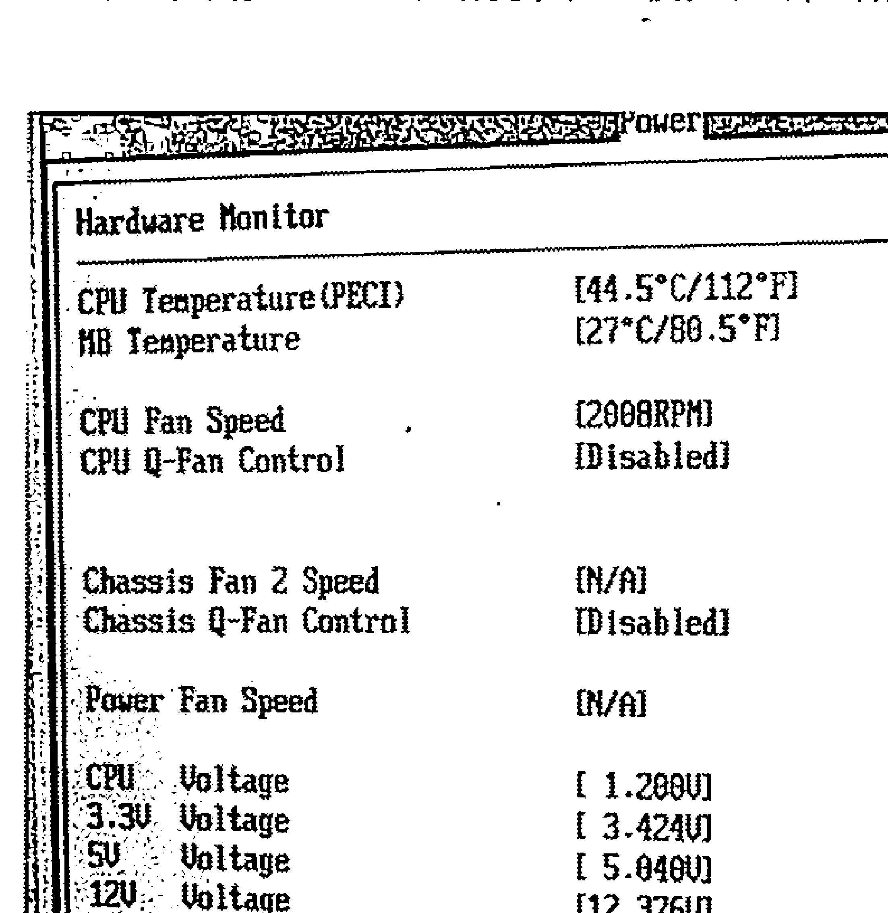

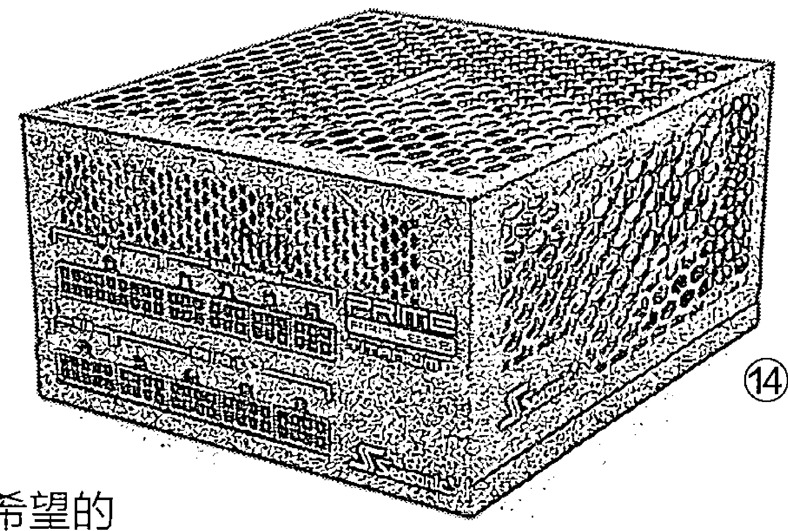

要降低这两部分的噪声，首先可以考虑配置更出色的风扇，避免出现过热提升转速的情况。其次是在BIOS中调节机箱风扇（英文一般为System Fan或Chassis Fan）的控制机制，一些主板也提供了电源风扇的控制选项（图13），在确认系统无需加强散热的情况下关闭自动调节功能或者降低转速。

与低端处理器、显卡才能考虑使用无风扇的被动散热不同，主流电源和机箱，甚至是高端产品也可以使用无风扇设计。例如海韵的旗舰级产品中就有无风扇设计的型号600 PRIME TITANIUM FANLESS（图14），在拥有600W功率和80Plus钛金级转换效率的同时，并没有配置风扇，仅使用近乎全部镂空的外壳，配合高品质元件与散热片等设计来提供足够的散热能力。当然比较复杂的做工与高品质元件也使其价格相对较高。

### 存储系统

作为存储系统的主要选择，机械硬盘是目前电脑中除了散热系统外唯一使用活动部件的配件，它通常无需使用风扇进行强制散热，但自身的机械属性就带来了噪声问题。硬盘的最高噪声通常在5dB以下，远低于风扇噪声，但以类似撞击的机械声和偶尔的电机启停声为主，且穿透力较强，对一些用户来说，这是比恒定的风噪更影响使用体验的声音。

好在存储系统已经有了与其他配件一样的半导体解决方案，即SSD。它完全没有活动部件，运行起来没有任何噪声，是绝对安静的存储方案。当然，各个厂商推出的新一代硬盘在噪声控制方面也表现不错，如果是为老硬盘的噪声所困扰，又无力采用全SSD存储方案，那么新一代存储硬盘，特别是追求“冷静”运行的NAS硬盘应该可以满足要求。

### 外设

也许很多人会感到奇怪，并没有散热风扇的外设，为什么也被列为噪声源。其实目前很多人选择的键鼠设备，在噪声方面同样是明显超过“前辈”的，例如已经成为主流配置的机械键盘、为游戏优化了手感与反馈感的电竞鼠标等，按键噪声都有所提升。这些噪声也许在鏖战游戏中并不会让人人感到烦躁，但退出“战场”，摘下耳机，开始上网、工作、学习的时候，噪声就可能会打扰到自己和周围的人了。很多厂商也注意到了这个问题，所以在不放弃手感的情况下，提供了一些较为静音的键鼠产品供大家选择，例如樱桃（Cherry）等厂商的静音轴产品。此外罗技G710+为代表的产品则是通过改装（图15、图16），获得了手感基本不变但声音更小的效果。另外如罗技G系列中普遍使用欧姆龙轴（G轴）等机械轴，本身的声音就并不大。在鼠标方面，不希望打扰别人的人可以选择按键声较小的产品。罗技G系列等产品还提供了滚轮键方式切换能力，可将带有段落感但声音较大的滚轴方式改变为顺滑无声音的滚动，使用中的噪声会有明显降低。

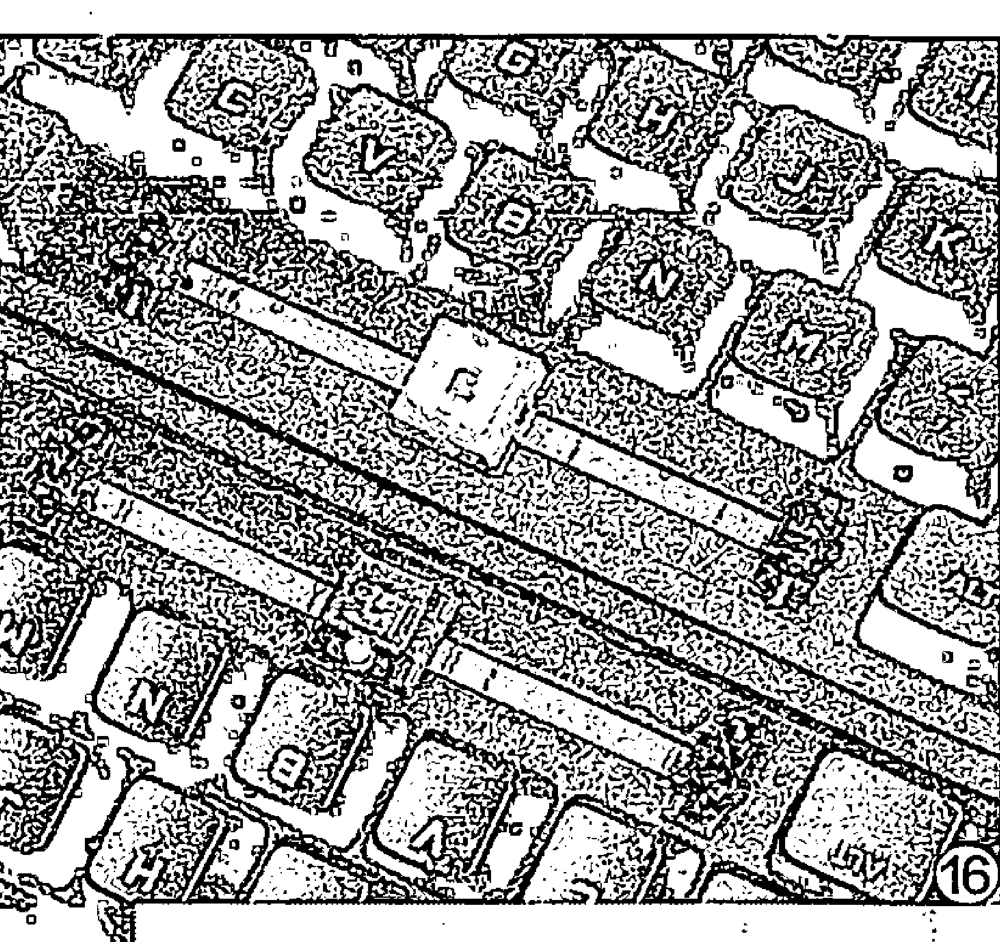

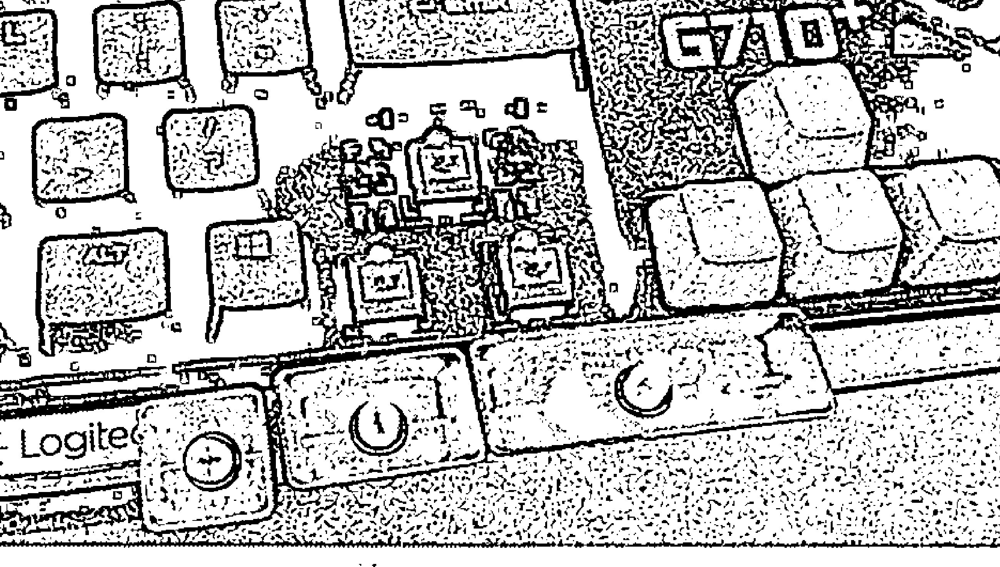


### 静音配置

其实对低噪声的极致追求，也是对电脑中机械活动部件的尽量摒弃。减少甚至去除了这些部件后，电脑的耐久度、抗震能力等其实都有所提升，完全可以看作是进化到了另一个层次。那么我们就来看一看如何构建一台这样的电脑吧。在这套主流静音系统中，仅使用了处理器散热器上的一个风扇，利用机箱侧板的大面积散热孔（图17），可将外部冷空气吸入。如果有一定的动手能力，其实也可以将处理器散热器更换为大型散热片，改在机箱侧板上安装大口径风扇甚至直接取消风扇，噪声还可以进一步降低。当然要体验更好的静音效果，在键鼠外设的选择上也要精心一些。考虑到处理器和显卡的散热需求，我们推荐的配置都仅选择了主流级产品，主要用于应对日常工作、学习和家庭娱乐，性能比较一般。而在综合考虑前面提到的各种因素之后，仅使用两三个大口径低转速风扇，配合转速控制、自动启停能力，甚至是水冷套件等，也可以搭建一套静音效果很好的中端甚至中高端游戏平台。虽然这些配置很难构建无风扇的完全静音系统，但基本可以做到日常使用几乎完全静音，让大家在办公学习的时候不会受到干扰；打开游戏之后，噪声虽明显增加，但也不至于非常喧闹，不仅让带着耳机的玩家可以接受，也不会对周边的人产生太大影响。

| CPU | 酷睿i5-8100 | 899元 |
| 主板 | 华硕PRIME H310-PLUS | 699元 |
| 内存 | 金士顿骇客神条Fury DDR4 2666 8GB | 439元 |
| 显卡 | 技嘉GT1030 Silent Low Profile 2G | 699元 |
| 电源 | GW-ATX400NF | 399元 |
| 存储 | 金士顿A1000 240GB | 349元 |
| 散热器 | 盒装自带 | 0元 |
| 机箱 | 银欣PS08B | 209元 |
| 总计 | | 3693元 |

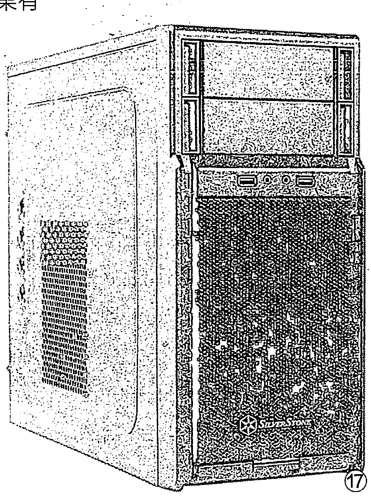

## 充电那点事儿

策划:《电脑爱好者》编辑部

随着手机更新换代频率的加速，很多家庭都拥有数个甚至数十个手机充电头。问题来了，这些充电头能否混用? 能否为所有手机提供快充? 如何搭配才能确保最高的充电效率? 本期特别话题，就让我们来聊一聊每天都在用，但却很少静心研究的手机充电头的那些事儿。


扫一扫，
更多精彩内容立现！

### 看懂手机充电器的参数

手机充电器从专业角度可以称为“电源适配器”，而更贴近民间的叫法则则是“充电头”，它们虽然体积小巧，但却承担着随时为手机电池补充电力的重任，充电效率和安全是它们之间比拼的重点。想了解手机充电器，首先就需要先从它们的基本参数谈起。

#### 体积不一为哪般

充电器是所有智能手机包装里的标配。因此，用户更换新机的频率越高，家中闲置的充电器也就越多。如果你曾长期关注过手机充电器，不难发现它们的体型经历了从大到小，再从小到大的两个过程。

早期手机的充电器体型都偏大，基本会占据1/3个手掌的空间（图1），那个时候以苹果iPhone为代表的超迷你充电器，就成为了众多品牌和第三方充电器竞相模仿的对象（图2）。但是，自从“快充”概念出现之后，手机充电器的充电功率就一路从5W、10W、18W、24W增长到了最高50W，而这也就导致充电器的体型逐渐变大（图3）。

没办法，充电器功率越高，其工作时就会释放更多的热量，也需要更高档次的滤波、保险、电容和变压器等元器件的配合，自然也就很难压缩体积了。


#### 读懂铭牌上的参数

细心的用户不难发现，手机充电器都印有花里胡哨的参数铭牌，其中既有图案也有中英文的字符（图4），它们都代表什么意思？

简单来说，手机充电器铭牌上的图案大多是认证标识。比如，“小房子”图标是“仅限室内使用”的标识，代表该产品在非室内环境中使用可能会带来危害；“回”图标是“双重绝缘”标识；“椭圆内带有3个C”图标是符合“3C安全认证”的标识；“带箭头圆环内印有10或20”图标是“可以循环使用”标识，如果圈内是10代表可循环使用10年，20就是循环使用20年；“圆圈内带拉丁数字字母”图标是“能效认证”图标，如果圈内是V就代表5级能效，VI就是6级能效（图5）。此外，常见的认证还有欧盟绿色认证(ROSH)、不能放在垃圾桶里的标识等。

对手机充电器而言，认证越多，意味着它的可靠性更高。但是，真正决定它的性能（充电效率）的，还是铭牌上面那些中英文的字符。其中，最核心的两组数据就是充电器的输入和输出参数。

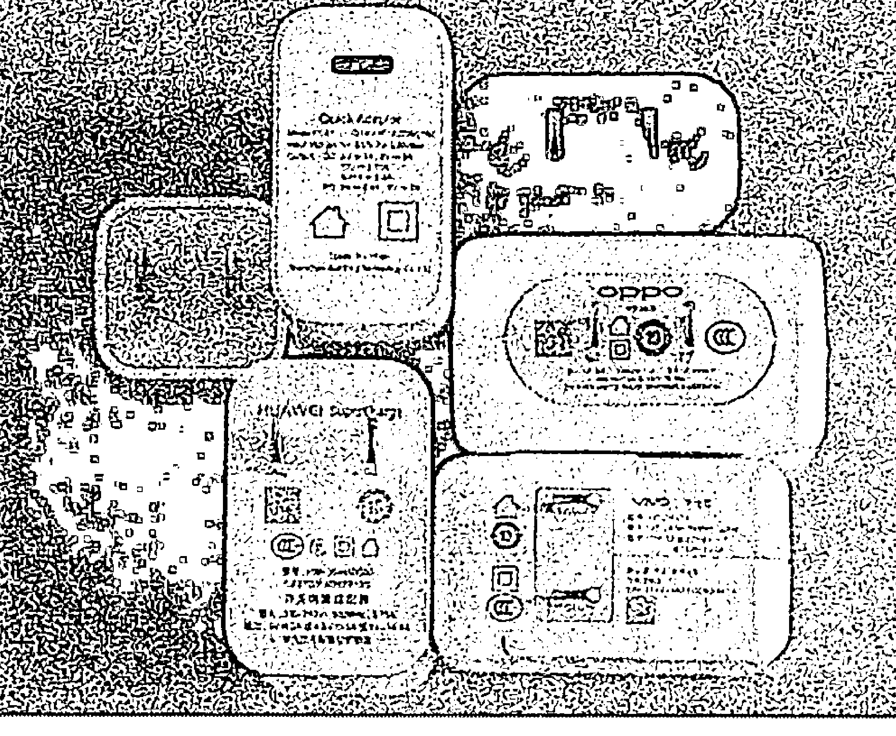

我们不用太多关注充电器的输入参数，只要是正规厂家出厂的合格产品都具备合理的输入指标。

充电器的输出参数，是我们最应关注的核心指标，它主要由输出电压和输出电流组成，二者相乘就可以得出该充电器所能实现的最大输出功率。早期智能手机充电器的输出标准大都是5V/1A，即5W的充电功率。随着手机屏幕和电池容量的不断增大，以及各种快速充电技术的普及，充电器大都可以兼容多组输出标准，并在铭牌上加以注明。比如荣耀Magic 2的充电器就支持5V/2A或9V/2A或10V/5A，可实现10W、18W和50W三档输出功率（图7）。

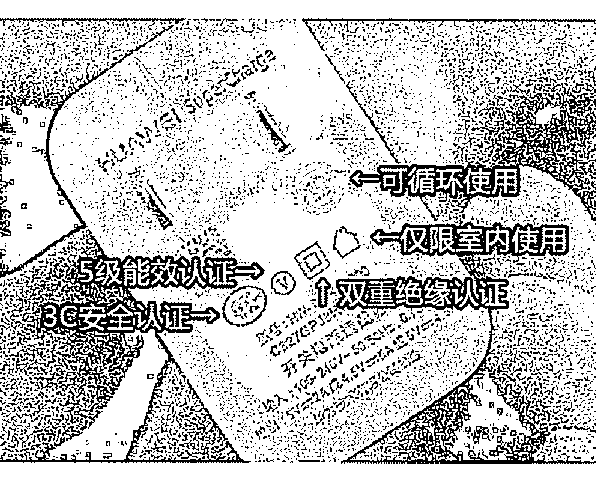

总之，手机充电器所支持的输出功率越高，就越能缩短手机的充电时间（快速充电需要二者相互匹配，具体本文后面会加以详述）。但是，更高的输出功率也往往导致充电器体积变大，影响外出携带，鱼和熊掌难以兼得。

大家可以拿起家里的任意手机充电器看看，它们的输入参数基本都是“AC 100V~240V 50/60Hz xA”格式，指的是该充电器能插在交流100V~240V、频率为50Hz或者60Hz的电源插座上使用，在工作状态其允许通过的最大电流为xA，根据充电器型号不同，输入电流的大小从0.5A到1.5A不等（图6）。

我们可以将手机充电器理解为一个“减压阀”，它能将输入进来的高压电流转换成手机能接受的范围再输出给手机。一般来说，我们不用

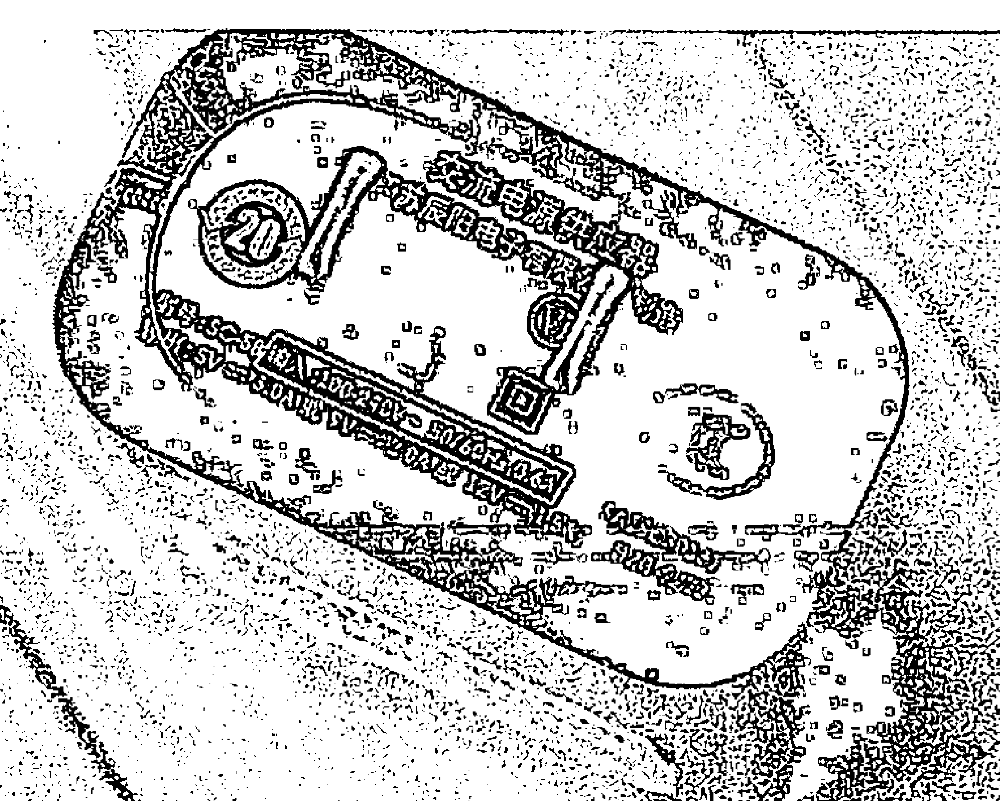

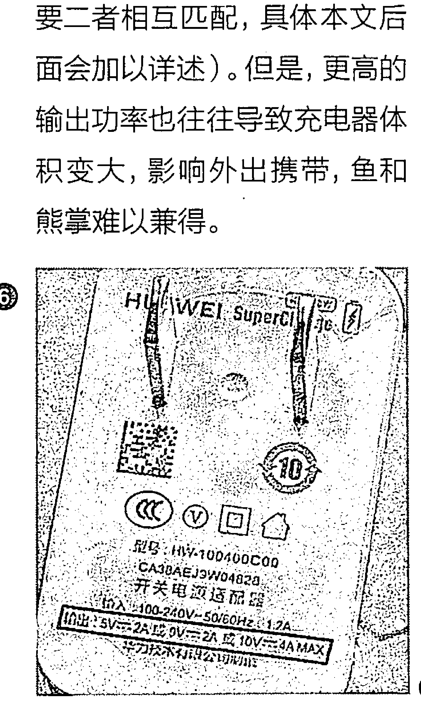

### 手机充电器的安全使用

随着手游的兴起和网剧的热播，我们每天大部分的碎片化时间都交给了手机，而这就导致电量快速往下掉，每天与充电器打交道的频率也显著增加。因此，我们有必要聊一聊充电器在使用上的一些安全问题。

#### 充电时的先后顺序

身边曾有很多朋友都问过笔者一个问题：给手机充电时，是先将手机和充电器相连再插入电源插座，还是先将充电器插入插座再连接手机？理论上，正规充电器是不用考虑这个问题的。但是，考虑到充电器插入电源插座的一瞬间会产生冲击电流，如果电源插座或充电器自身有质量隐患，有很小的几率会对连接着的手机造成伤害。所以，建议大家还是选择第二种充电顺序比较好。
此外，早期的智能手机还曾出现过一个类似Bug的现象，那就是先连接数据线与手机，再连接充电器与电源插座，最后连接数据线和充电器。这种极端的案例有可能让手机错误读取USB接口+D-D线的信息，导致手机识别当前为USB连接模式，只能以0.5A的电流输入。

#### 充电器的“驻扎”问题

相信很多用户都有同样的疑问：手机在不充电时，充电器长期留在电源插座上安不安全？费不费电？反正，笔者以前的习惯就是充电器始终“驻扎”在电源插座，永不分离（图8）。那么，这种习惯到底值不值得提倡？
答案自然是否定的——不提倡。
充电器长期留在电源插座上，只要充电器是正品，理论上就不存在安全隐患。但是，手机充电器只要插在电源插座上，就都需要经历降压、整流、滤波等一系列流程，哪怕数据线这边没有负载（没有连接手机），也存在一定的“空载损耗”。
曾有网友对不同型号的手机充电器的空载耗损进行过测试，结果呈现“冰火两重天”的局面：手机充电器最低的空载功耗只有0.004W，几乎没有耗电，而空载功耗最高的却可高达1W（图9）！
换句话说，手机充电器空载损耗的大小取决于其自身的品质，在空载状态下品牌充电器的平均功耗都可被控制在0.1W以内，而一些山寨或质量堪忧的充电器，其功耗却能“突破天际”。以那个空载功率为1W的充电器为例，其1年的消耗可达8.76度电，按照1度电0.5元计算，1年的电费约为4.38元。换句话说，手机充电器1年的平均空载功耗（按0.1W计算）大约是0.438元。看起来不多？但请不要忘记，每个家庭成员手机标配的充电器，都可能会消耗一个电源插座。而且我国如今的总人口接近14亿，如果大家都觉得这每年0.438元是一笔微乎其微的开销，但加在一起的耗损却是非常可观的。作为个体，如果我们每个人都能养成不充电时拔下手机充电器的习惯，就能长期起到类似‘地球熄灯一小时’的公益效果。

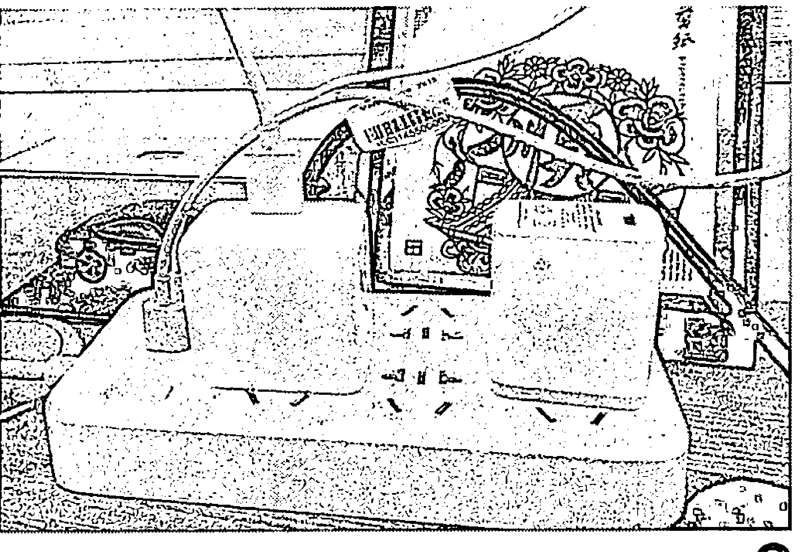

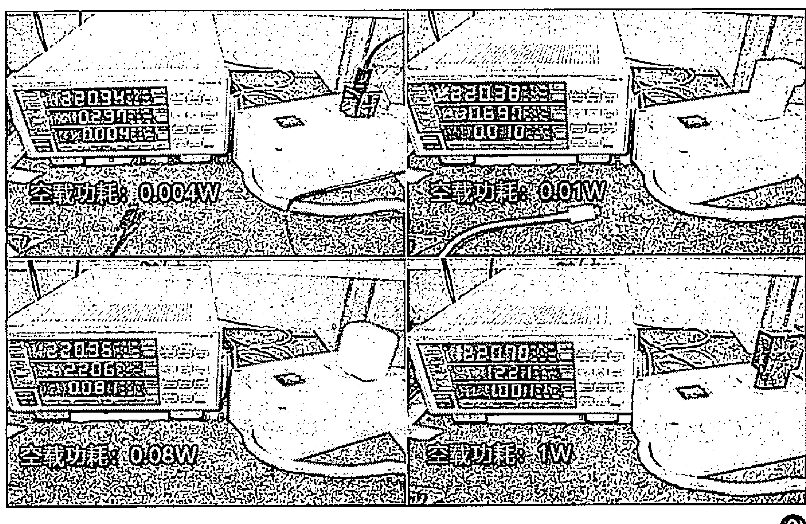

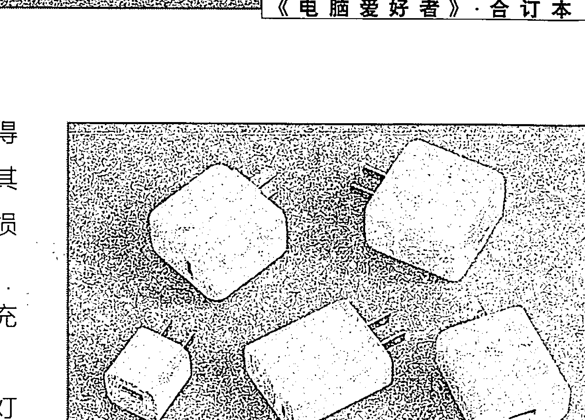

### 充电器的兼容安全问题

正如引言所述，如果家里长年累积了数款甚至数十款手机充电器（图10），每次给手机充电前都必须找到原装的那款充电器吗？如果充电器混用会不会产生危险？

这是一个老生常谈的话题：只要是正规厂家出品的充电器，无论是手机的、平板电脑的、便携/蓝牙音箱的，只要充电器支持5V标准的输出电压，那它们之间都是相互兼容的，可以给智能手机充电。

原因很简单，手机充电器所能输出的电压和电流大小，取决于手机内部充电电路和电池对电流的承受能力。充电器内部都有完善的保护电路，一旦输出电流过大，保护电路就能暂停或降低电流输出，避免发生危险。

假如一款手机仅支持5V/2A的电源输入；你给它用上支持5V/4A的充电器，后者最多也仅能以2A的电流输出；如果手机支持5V/4A的电源输入，5V/1A的充电器也能给它充电，但最多只能输出1A的电流，效率降低了75%。换句话说，不同品牌型号的手机充电器之间是可以相互兼容的（图11），只是不合理的搭配会影响手机的充电时间。

但是，我们仍要尽量避免‘小牛拉大车’，比如拿5V/0.5A或5V/1A的充电器给最新款手机充电。由于新款手机大都支持快充，充电过程中会触发充电器长时间运行在它最大输出功率的状态上，从而容易导致充电器自身发热量的增加。此时，如果充电器自身的保护电路不够完善，长期的过热使用或小概率的浪涌就会带来一定的安全隐患了。

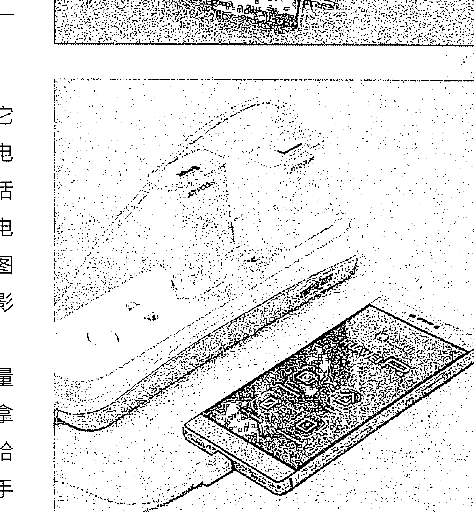

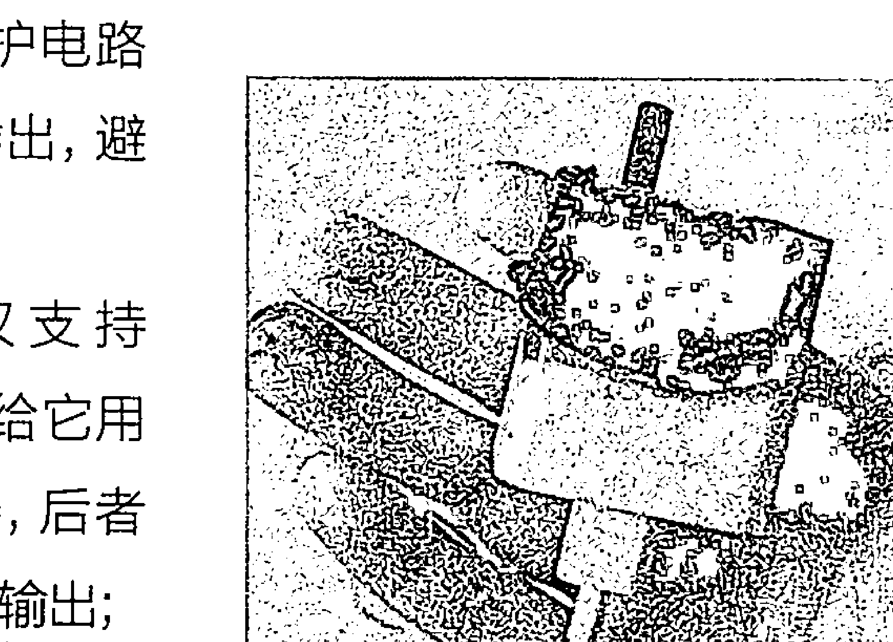

网上流传的那些手机充电时爆炸、着火等事故，大都是因质量不佳的第三方充电器所引起的（图12）。此外，上文提到的充电器长期不拔的问题，如果充电器品质不好，长期的空载和空载电流也有一定几率引起短路，从而引发火灾、爆炸、意外触电等事故。因此，从安全的角度考虑，建议是充电器偶尔的混用问题不大，但长期使用时还是尽量选择和原装充电器搭配使用，避免成为那可能低于万分之一的‘受害者’。

同理，手机边充电边玩游戏或看视频，同样会增加充电器和手机内置电池的负担（发热更高），养成充电时不玩手机（运行高负载应用）的良好习惯也非常重要。

### 留心充电器和数据线的真伪

在前文中笔者不止一次强调“品牌”或“原装”充电器，这是因为市面上存在很多山寨和高仿的型号，它们是引发充电安全事故的“最主要元凶”。为了手机和自身安全着想，我们还需在充电器的鉴别上多下一番功夫。

### 充电器的内部探秘

虽然每一款手机包装里都会标配充电器，但手机的使用场合却非常分散。此外，现在支持快充的移动电源（充电宝）也非常火爆，但这些产品却通常不会配备充电器，需要我们自行另配。因此，几乎所有用户都会面临购买第二个……第N个充电器，以备在多个场合随时补电（图1）。

问题来了，同一型号或同一标准（如都支持QC3.0）的充电器，售价却往往存在1倍甚至数倍的差距。抛开品牌、真伪不谈，一款充电器的价格，的确可以体现在更好的用料和做工上（图2）。

大家千万不要小看小小的充电器，它内部的复杂程度有可能超出你的想象。以华为40W SuperCharge超级快充充电器为例，为了解决散热压力，它在输出接口附近的元器件之间注满了白色灌胶，PCBA输入端也注满了黑色导热胶，后者可以与外壳紧密贴合，起到良好的导热作用（图3）。将这些导热胶搅碎后，才能看到精密的电路部分（图4），固态电容滤波、避免输出干扰的Y电容、NTC热敏电阻、共模电感线圈、慢熔保险丝、平板变压器、初级侧控制芯片、协议识别芯片（非常关键，后文会加以详述）和肖特基二极管等元件无一缺席。

可以说，输出功率越高的充电器，其内部构成就越复杂，用料成本也就越高。山寨高仿充电器往往会在散热设计、保护电路和电容电感规格上加以缩水，虽然不影响正常使用，但却存在输出功率不达标、发热量严重、转换效率低下、遇到电涌等小概率事件时容易出现短路燃烧等隐患。

因此，笔者才反复强调不要在充电器的选购上“抠门”，如果你觉得品牌原装充电器太贵，那也要选择正规的第三方品牌旗下产品，如品胜、绿联、公牛和ANKER等。


#### 如何判断充电器真伪

问题又来了，这年头高仿充电器无处不在，我们又该如何鉴别它们的真伪呢？最简单的方法，就是不贪便宜，只在正规渠道购买，比如京东、天猫的品牌旗舰店，又或是手机品牌线下的体验店等。那么，在第三方渠道购买时，又该注意哪些问题呢？

首先，拿到充电器时我们需要查看铭牌印刷，正品充电器铭牌字迹清晰，而高仿或山寨充电器的字迹往往比较模糊；其次，正品充电器的插头多为合金材料，不会吸附磁铁，而高仿充电器的插头则大都选择廉价的铁，用磁铁一吸一个准（图5）；接下来就是看做工细节，比如缝隙是否紧密和有无毛边、金属插头表面是否圆润光滑等。

除了上述辨别方式，还有一个最简单的方法，那就是掂分量。高仿充电器为了节省物料成本，它们的重量往往要比原装的轻10g以上。原因很简单，高仿充电器内部的结构简陋，其危险电压和安全电路大都存在于同一块电路板上，线路间没有任何的隔离，这些缺失的部分就造成了“缺斤短两”。


#### 小心数据线拖后腿

和充电器相比，相信大家家里闲置的USB数据线（充电线）会更多吧？大到平板和音箱，小到蓝牙耳机和物联网设备，它们在充电时也会使用和手机通用接口的线缆。问题是，数据线之间虽然通用（需要区分Micro USB或USB Type-C接口标准），但它们也可能成为充电速度异常的罪魁祸首。

USB数据线虽然看起来都差不多，但它们所能承载的电流却可能存在极大的差距。大家不妨观察一下，给蓝牙耳机充电的数据线都很细，而支持超过20W快充的数据线则更加粗。没错，通过数据线的粗细，我们往往就能判断出它们的品质高低。

低价或劣质USB数据线为了降低成本，在内部线芯数量和单股线芯的材质上会大幅缩水，通常还会阉割全金属屏蔽层（图6）。比如，同一款手机使用同一个充电器，用四种不同的数据线进行充电，从监测的实时电流数据来看，从1.81A到1.21A，充电电流最多相差1/3（图7），这意味着当你使用最差的数据线充电时，所需的等待时间也会延长1/3！

总之，数据线因为太常见太廉价（非原装）所以最容易被用户所忽略，因此我们总喜欢随便找一根线（比如某移动电源自带的线、某数码音箱自带的线、某USB台灯自带的线）就拿来给手机充电。虽然它们的接口可能通用，但线缆里的猫腻咱们却无法辨别。所以，给手机充电时尽量还是一直使用原装线吧，退一步也要选择知名的第三方品牌旗下的数据线（图8）。


> **小提示**
> 苹果手机的数据线接头中都会嵌入一颗MFI认证芯片，而山寨iPhone数据线则会选择破解版的认证芯片，除了存在Android数据线线缆质量差的缺陷以外，还存在用一段时间就无法给iPhone充电的隐患（破解芯片失效）。


### 快速充电的兼容性探讨

从2013年开始，手机充电标准就迈过了5V/2A（10W）的门槛，“快速充电”概念逐渐在智能手机领域生根发芽。然而，要想正确地激活手机的快速充电功能，手机、充电器和数据线这三要素的搭配就显得尤为重要了（图1）。

#### 快充标准的乱战

根据“P=UI”公式，我们可以知道提升手机充电功率无非就是增大输入电流或输入电压的大小。但是，到底是以提升电压为主，还是增大电流为主，又或是二者同时增加？由于业内没有统一的共识，才逐渐衍生出了高通QuickCharge（QC）、联发科Pump Express（PE）、华为Fast Charge Protocol（FCP）和USB PD等快充标准。

高通QC是智能手机领域普及度最高的快充方案，其中QC2.0和QC3.0的普及率最高，它们可以带来9V/2A或12V/2A即最高24W的充电功率（为了控制热量，绝大多数QC方案手机都将最高功率控制到18W左右）。以小米8和坚果R1为代表的高端手机还支持最新的QC4+快充，但由于QC4+充电器的成本至少2倍于QC3.0的充电器，所以这些新品即使支持QC4+，但其标配的充电器大都也仅停留在QC3.0的标准上。和QC3.0相比，QC4+不再局限于“高压低电流”，开始支持5V/5.6A和9V/3A输出，其最大充电功率可达28W（理论值），并加入了对USB PD 3.0（PPS）协议的支持，充电效率可提升约30%，充电更安全且速度更快（图2）。

联发科PE已经迭代更新到了PE5.0标准，但由于其近2年的市场占有率逐年下降，所以我们最熟悉的快充方案还停留在PE2.0的时代（9V/2A或12V/2A）（图3）。实际上，联发科从PE3.0开始也引入了3V~6V/5A的“低压高电流”快充，最新PE5.0的握手协议更是迎合了国际最新快充标准USB PD3.0（PPS）。

对智能手机厂商而言，既然手机都搭载了高通或联发科旗下的SoC，那直接套用高通/联发科原生的快充技术就是最经济的选择。但是，为了实现差异化竞争，现在有越来越多的厂商开始了快充技术的自研之路。


> **火速链接**
> 如果你想了解手机快充技术的发展史，可用PC或手机浏览器访问 http://www.cfan.com.cn/2018/0516/130814.shtml 网址查看《快速充电哪家强？扒一扒手机快充技术背后的隐秘》这篇文章。

### 扩展阅读：快充“万金油”USB PD3.0

OPPO在2014年就推出了自研的VOOC闪充，开创了“低压高电流”（5V/4.5A或5V/4A）的先河，也是旗下高端手机主打的核心卖点。2018年，OPPO还为旗舰级的Find X和R17 Pro武装了“Super VOOC”超级闪充技术(图4)，可以实现10V/5A即50W的充电功率！为了避免大电压大电流可能带来的发热和安全隐患，支持Super VOOC技术的手机都采用了串联双电芯技术。以R17 Pro为例，它就内置两块1850mAh的电芯（共计3700mAh），最终把10V/5A电压调整为5V/5A并平均分配给两块电池，既保证了每个电芯的低电压输入，又提升了两个电芯同时充电的总功率(图5)。


一加手机从一加3开始引入了DASH闪充的概念，这个技术来自OPPO VOOC提供的授权，可以实现5V/4A（20W）的充电功率。2018年，一加手机为年度旗舰一加6T的迈凯伦定制版准备了全新的Warp快充，可提供高达5V/6A(30W)的充电功率，拉开了与其他骁龙845旗舰手机在快充功率之间的距离(图6)。无论是VOOC、DASH还是Warp，这类“低压高电流”快充方案都有一个特色——由于手机内置锂电池的充电电压都是5V，因此当充电器以5V电压输入时就无需加入额外的降压电路，从而避免了高压电流需要降压带来的额外发热，让边玩游戏边(快速)充电成为了可能。


vivo很早以前就在X系列手机上引入了“双引擎闪充”的概念，只是其早期的双引擎闪充本质上都源于高通的QC方案，而后期高端机型则改用了vivo自研的快充技术。以2018年主打的X23、NEX等新机为例，它们的充电器都支持10V/2.25A(22.5W)功率，虽然属于“高压低电流”，但依旧可以实现“边玩边快充”的功效(图7)。


2017年，USB-IF组织发布了全新的USB PD 3.0标准，通过PPS协议获得了强大的可编程能力，输出电压范围从5V扩展到3.0V~21V，步进调幅电压为20mV，让低压大电流直充方式成为可能。PPS“收编”了时下主流的快充方案，实现了“无数标准，一个对策”的解决方案：苹果快充、高通QC4+、联发科PE5.0和华为超级快充都能向下兼容USB PD 3.0，获得18W左右的充电功率。

华为（荣耀）也是自研快充技术的代表厂商，其快充技术经历了从FCP到Super Charge（超级快充）的进化。其中，支持FCP快充的代表主要是中端机型，可以实现最高9V/2A即18W的充电功率。而超级快充则可分为5V/4.5A（22.5W）和10V/4A（40W）两个级别，前者是华为（荣耀）中高端手机的标配，如荣耀V20、Mate 20、P20等；而40W超级快充则是荣耀Magic 2、Mate 20 Pro等顶配旗舰才能享用的大餐（图8）。


### 能握手才是好朋友

手机圈的快充方案有很多，这就导致了不同型号手机和充电器之间的兼容性问题。简单来说，手机内集成有电源管理IC，充电器内也集成了专用的识别IC，当手机和充电器通过数据线连接，两颗IC芯片相互识别认证并成功“握手”之后才能激活快充功能（图9），即充电器端按照手机端发出的升压或降压的信号实时调整电压/电流参数。如果IC芯片之间认证失败，充电器就只能保持默认的5V/2A输出了。

支持QC快充的手机之间，它们的充电器都是可以相互兼容的。比如，你能用联想Z5的充电器（QC3.0，9V/2A）给同样支持QC快充的小米、努比亚、360等品牌的手机快速充电。

但是，以OPPO VOOC闪充为代表的快充技术，对数据线还提出了苛刻的要求。

具体来说，像OPPO R15这些采用Micro USB接口的手机，想要激活VOOC闪充，需要原装充电器以及原装数据线（针脚为7针，标准Micro USB只有5针）。而像OPPO R17这些升级USB Type-C接口的手机，也必须使用原装数据线，其他品牌的USB Type-C数据线无法激活VOOC（图10）。原因很简单，Micro USB数据线是无法稳定承载超过2.5A电流的，所以VOOC原装Micro USB数据线通过更多的线缆和针脚用于识别协议和承载更大的电流。而OPPO原装USB Type-C数据线内嵌有独立的识别IC，只有它同时与手机和充电器内的识别IC握手后才能激活VOOC。

一加6T迈凯伦定制版的快充协议也比较特殊，一加6T原装的充电器和数据线无法激活Warp闪充，但迈凯伦定制版的Warp闪充配件则可向下激活一加6T的快速充电功能（20W）。


> > **小提示**
> 快充技术默认都可“向下兼容”，即QC3.0向下兼容QC2.0，华为超级快充向下兼容FCP，USB PD3.0向下兼容PD2.0。


需要注意的是，华为22.5W/40W超级快充对数据线的要求就没有这么高，任意USB Type-C数据线与原装充电器搭配都可触发快充。

但是，市面上很多廉价USB Type-C数据线的品质都不高，无法稳定承载超过4A以上的电流。所以，大家在购买第三方USB Type-C数据线时，一定要购买支持5A电流的产品哦（图11）。


### 无线充电迈入快充时代

本刊在2018年12期《摆脱线缆的束缚 浅析智能手机的无线充电技术》一文中，曾介绍过无线充电技术的原理和Qi快充协议的发展史。当有线快充技术已经达到最高50W之际，无线充电技术也开始突破10W的封锁，最新的15W无线充电功率已经非常接近QC和FCP等最大18W的有线快充标准了（图12）。

截至2018年12月，智能手机领域支持无线充电功能的手机共计135款，其中正在热销的代表包括iPhone 8之后的6款新品、谷歌Pixel3系列、华为Mate 20 Pro、雷蛇手机2、三星Galaxy S和Note系列、坚果R1、索尼Xperia XZ3和小米MIX2S/MIX3等。其中，苹果系支持7.5W无线充电，三星系的充电功率为10W，只有华为Mate 20 Pro/保时捷设计和雷蛇手机2的功率达到了15W，实现了Qi1.2标准的最高上限。


据悉，2019年无线充电会成为Android旗舰手机的标配，包括小米、OPPO和魅族都在研发15W的无线快充技术，届时会有更多新品无需数据线也能享受超过10W的准快速充电体验，一起期待吧。

请放心，市面上在售的无线充电底座都符合Qi标准，它们可以给任意支持无线充电的手机补电。但是，无线充电底座根据定位和售价的不同，其所支持的充电功率也包含5W、7.5W、10W和15W四个档位，我们需要根据手机所支持的最高上限加以筛选（图13）。此外，我们还需小心那些“阉割”了FOD异物检测功能的超低价位产品，没有该功能的保护，一旦有金属物体不慎放在了充电器表面的线圈感应位置，金属便会被迅速加热，很容易造成意外。


## 数码相伴过好年

文|青岚

2019年已经“施施然”地来到我们面前，即将到来的各种考试、考核虽然让人感到压力满满，但也让人不禁憧憬其后即将到来的农历新年。和家人团聚的地方，很可能距离我们熟悉的学校或单位有相当的距离，在漫长的旅程或远离自己小窝的地方，排遣寂寞与分享时光，已经都离不开数码与网络的帮助。为我们的团聚之旅，应该做好哪些准备？怎样让团聚和旅途更加精彩呢？

### 随身伴侣 旅途乐趣放大器

在大家的随身行李中，各种适合随身携带、能在旅途中使用的电子产品已经是很重要的组成部分了。相信大家对笔记本电脑、手机、平板电脑甚至常见的充电宝等配套设备已经相当了解，所以这里就不赘述了，不过也有一些会让旅途更加有趣的实用小物件，常常会被大家忽略。

### 移动电源新体验

移动电源或者说充电宝，是所有数码玩家在旅途中不可或缺的配置，应该也是比较熟悉的产品，似乎并没有什么“技术含量”和升级的冲动。不过近期兴起的一些新型移动电源却提供了不同的使用体验，在资金允许的情况下，可能会成为大家陪伴旅途的新宠。

首先当然是快充技术，随着这一技术的成熟，目前市场中可以给手机进行快速充电，或者自身可以快速补电的移动电源越来越多，价格也比较合理。快充技术在本刊中已经进行了很多介绍，但在这里我们还是必须提示大家，由于快充标准没有统一，必须双方匹配才能获得良好的快充效果。

比如华为10000毫安移动电源9V2A快充版(图1)，它采用的是华为自家的海思快充协议，可对支持快充的华为、荣耀等手机进行快速充电。与普通的5V/2A充电方式相比，其充电速度可提升50%以上，以华为P10为例，使用普通移动电源和这款移动电源，在半小时内的充电量分别为29%和48%。当然它也支持5V/2A和5V/1A的常见充电模式，以兼容其他品牌手机和华为系的旧型号产品。


它自己也支持快速补电，同样为9V/2A的快充模式，且采用新手机更流行的USB Type-C接口进行补电(图2)，大部分华为系新机都无需携带额外线缆。这款产品的长、宽、重量都与手机类似，只是厚度略大，放在各种行李背包的手机位置都没有问题，而合金外壳则赋予了它比较坚固的体质，所以不仅便于旅途携带，也比较耐用。

其次，一些大容量移动电源还提供了笔记本电脑充电能力，如果携带的笔记本电脑恰好是使用USB Type-C接口充电的话，那么也可以使用移动电源进行充电了，这显然是厂商迎合目前大量轻薄本的设计趋势而推出的产品。例如爱国者E20000+(图3)，不仅能为相应的手机快速充电，还能为Switch掌机和联想、华为、苹果等品牌的新型笔记本充电(需支持USB Type-C充电和PD协议)。这款移动电源拥有3个输出接口，其中侧面的USB Type-C接口可支持最高18W输出(12V/1.5A)，为笔记本电脑充电(图4)，也可通过附赠的USB Type-C转Lightning接口为苹果手机快速充电；它还有一个可支持5V/3A、9V/2A快充的Type-A接口，可为多种品牌和型号的手机进行快速充电。E20000+带有电量显示屏，支持多接口同时输出，使用很方便。不过较多的功能使其略显厚重，且没有提供双头USB Type-C连线，需要为笔记本电脑充电的话，还要自己另购相应的线缆。

当然，有些笔记本电脑对充电电压的要求不高，使用普通的USB Type-C移动电源即可进行充电，但充电非常缓慢，甚至还不如正常使用时的耗电快，且对移动电源和笔记本电脑都可能存在一定的危险，并不建议这样做。

最后，来看能让手机摆脱束缚的无线充电。目前支持无线充电的移动电源价格也已经降到了完全可接受的水平，与有线产品相差无几。以羽博WX10000(图5)为例，其价格与同品牌类似档次的移动电源价格仅相差20元，提供了双有线充电接口及可兼容大部分品牌无线充电手机的无线充电能力。


虽然内置无线充电线圈，但它还是将厚度控制在较好的水平，13mm虽然比常见的手机要厚一些，不过在口袋中、行李中与手机一起携行仍然很方便，一边走一边就可以进行充电。此外它还可以同时进行双有线+无线三机充电(图6)，快速为多个数码设备或者为多个朋友的手机补电力。需要注意的是，如果乘坐飞机的话，将其与无线充电手机置于一起时一定要关闭充电功能，否则可能因为较强的电磁信号而影响正常飞行。


此外还有一些厂商“脑洞大开”的移动电源产品，即将电池装在各种随身产品中，可将电量和其他产品一起“分享”，类似产品在后面也会有所提及。

### 指点江山更容易

在漫长的旅途中，只靠手机和平板消磨时间略显无聊，拿出笔记本电脑玩一玩或者工作一会儿也算是一种调节吧。不过触控板在浏览与文件操作时表现尚可，需要稍微复杂一些的操作，比如玩小游戏、处理图片等，就会感到力不从心了。而旅途中的空间通常也不适于使用传统鼠标，此时有两种设备可以替代触控板和传统鼠标，其一为轨迹球，另一个就是更有未来科技感的“指环鼠标”。相对于更适合精准定位、价格昂贵、体积较大的轨迹球，百元左右的入门级指环鼠标(图7)是大家更好的选择。

目前的指环鼠标已经从早期的有线连接全面过渡到无线连接，其中入门级的2.4G产品价格通常不足百元，蓝牙产品则略高于一百元。它们通常采用尼龙弹性指环，可套于右手食指或中指上，在拇指一侧设置按键与滚轮，可将光学窗口按在笔记本电脑触控板侧面空间使用(图8)，甚至可以悬空使用。

在很多应用中，手指鼠标的使用体验超过触控板，但与传统鼠标还是有一些差距的。以消磨时间的游戏来说，手指鼠标在玩SLG、塔防等游戏的时候可以减少误触，更快地移动，比触控板更方便，也不逊于传统鼠标；但要用来玩FPS、动作类游戏就有些勉强了，此时便携手柄是更好的选择。

### 分享精彩

单身的旅途难免寂寞，如果有几个伙伴相陪当然是最好的。虽然现在伙伴们在一起也常常是刷手机看剧，不过分享一些精彩的节目，引起共同的话题，也不失为数码时代、宅男女们社交的一种方式。

对现在的数码玩家来说，无线分享已经取代了传统的闪存盘与移动硬盘，成为最方便的共享方式，而面向这类场景推出的无线存储器也通常支持多个设备，甚至拥有可以直接点播的连接速度，很适合伙伴间同时分享感兴趣的番剧等内容。当然，如果是喜欢影视等内容的用户，在选购这些产品的时候一定要注意挑选足够的容量，笔者建议大家至少1TB起步(图9)，千万不要贪便宜购买老式的500GB等规格产品，在续航时间、连接速度、存储能力等方面都会受到明显的限制。


如果伙伴比较多，而且旅途更自由，比如选择自驾方式的话，用蓝牙音箱播放音乐、投影机播放视频，肯定能让大家度过更欢乐的旅程(当然要注意千万不能影响到司机的注意力)。在近期的市场中，投影机同样是一个值得关注的热点，从体型上看，手掌大小，甚至比手机还小的产品已经相当成熟；从分辨率上看，1280×720 (800P)等级分辨率的产品已经降至2000元以内，无论是便携性还是实用性都有大幅提升。

微麦(VMAi) M100是一款超迷你的投影机，体积甚至比鸡蛋还小一些(图10)，重量仅有112g。它提供了TF卡、闪存盘（Micro USB接口）连接播放能力，也可支持手机有线和无线播放功能，甚至还自带变焦轮和顶部操控键（图11）。当然其非常小巧的体积也影响到了一些性能，亮度、对比度、分辨率、音量、电池容量等都比较小，更适合在小型空间使用。

## 场景展示 随心畅玩

03 现代科技 优质光学感应器


澳典M19、联想火辣椒T3等200g~300g级别的微型投影机（图12）体积略大一些，但已经可以提供720p级别的分辨率，较高的亮度、对比度，内置大容量存储，续航时间较长。它们不仅可以打发旅途中的无聊，也很适合带回家里使用，与家人一起感受大屏幕的震撼，也更便于播放手机等设备中存储的影像，回忆一年中的精彩时刻，为自己在外打拼的时光。


### “传统”与混搭

在比较“传统”的旅途设备中也有一些新产品很值得关注，例如新一代苹果Air笔记本拥有更出色的屏幕和增强的安全性；华为MateBook（图13）与小米笔记本的新品则为追求高便携性以及一定游戏能力的用户提供了新选择。此外手机市场在年底也有大批新机上市，正准备换手机的朋友也可以考虑换个新机陪伴自己，它们的基本情况可以参考本刊近几期的相关文章。

此外市场中还有一些比较特殊的产品，比如混搭作品希捷Joy Drive乐备宝移动硬盘（图14），同时提供了1TB数据容量及3000mAh电量，连接方式更是包含了标准PC和USB OTG，可以直接备份手机数据。虽然其电量并不算大，但也可以为主流手机紧急“延寿”，满足一定时间的使用。类似的产品还有蓝牙音箱+移动电源等产品，有“手机低电量恐惧症”的用户可以优先选择这种产品。


### 远隔千里 体验如一

归家的游子虽然会沉浸在团聚的欢乐中，不过也会怀念自己远方小窝里的生活，担心小窝的安全。其实借助一些并不算昂贵的设备和服务，我们就算身处千里之外，也能随时使用自己电脑中的数据，观察小窝里的情况。


### 更便携的电脑

笔记本电脑当然是在不同地点使用的很好选择，不过要说到最便携的话，现在的微型台式机却是胜过笔记本电脑的存在。英特尔NUC、技嘉BRIX、联想ThinkCentre M7（图15）系列等，一般配置下的重量都不超过1kg，且在性能达到中高档轻薄本甚至是性能向笔记本电脑的同时，价格也比较实惠。在没有旅途中使用的需求时，这些微型台式机显然是更适合携带、在不同地点使用的电脑类型。当然迷你台式机对使用地点有一定的要求，必须拥有市电连接，配置额外的输入设备和显示设备。好在对目前的一般家庭来说，这并不是什么很过分的要求，大量已经拥有台式机的家庭更是有现成的外设使用。如果家中没有这些外设可用，则可以考虑增购，即使是已经习惯使用笔记本电脑的家庭用户，大屏幕显示器和手感更好的输入设备也能提升体验。在新购产品时，最好购买拥有多个常用视频接口，并且带有USB扩展能力的产品（图16）。这样既可以通过多个视频接口同时接入原有和带回的电脑，也可以将键鼠连接在显示器上，使用不同电脑时只需要转移显示器USB接口就可同时连接键鼠，避免反复切换造成线缆缠绕等问题。


### 远程带回也能用电脑

虽然迷你电脑的重量不足1kg，一些轻薄本的重量不足1.5kg，即使是中端游戏本，重量也只有2kg上下，在如今的交通状态下都不是很重的负担。不过俗话说“长路无轻载”，如果家中也有不错的电脑，确实没有必要携带自己的电脑踏上路途。那么在假期中如果需要使用一些自己电脑上的数据又怎么办呢？其实有条件持续上网的用户，不妨考虑直接使用远程控制，随时操控自己位于远方的电脑。以目前最受欢迎的TeamViewer（图17）为例，只需要使用ID和密码，就可以直接访问另一台运行TeamViewer的电脑，即使被控端没有固定IP也可以访问。更重要的是其安装和设置也相当简单，在放假前只要实操几小时，就基本能够顺畅使用了。当然，打开远程操控功能的电脑在安全方面更加脆弱，因此一定要使用更加安全的密码，如果有经验的话；配合虚拟机方式运行更好。需要注意的是，TeamViewer是一款商用软件，虽然它面向个人使用是免费的，但如果因为长时间连接等原因被判断为商业行为，就会被强制断开。另外为了保证正常使用，在离开宿舍前，最好将TeamViewer设置为随Windows启动。

## 小窝安全不放松

## 云端服务随身行

长假期间也是宿舍等一些区域盗窃案的高发时段，虽然人已在家中，但小窝的安全还是要顾到的。随着监控市场的透明化，目前适合个人使用的视频监控解决方案也已经相当便宜，不妨趁此机会入手一套，不仅可以度过安心的假期，未来也可以在工作、休假时关注小窝的安全。

与大家的想象不同，其实目前一些商用监控大厂已经推出了不少面向普通用户的廉价监控产品，例如海康威视的消费级摄像头产品，借助其商用系统的经验，它们拥有出色的拍摄效果、良好的网络、云端支持能力，而且还增加了如TF卡存储等功能。笔者认为，对普通用户来说，“吓阻”远比真正拍摄嫌疑人更加重要，因此建议选择外形“威猛”醒目的海康威视200万像素无线摄像头（图18），根据实际需要可选择2.8mm广角到8mm长焦的不同型号。

这款产品可采用Wi-Fi或网线连接，具有清晰的夜视能力和音频监听功能，支持移动侦测和警报推送功能，有较好的三防能力。它支持内置存储卡或外部硬盘存储，也可以使用萤石云进行多平台同步，支持Android、iOS移动设备和Windows平台、WEB网端访问。

在这个云服务已经非常发达的时代，借助各种云端服务，同样能很方便地同步与共享文件、数据。从大家最常使用的百度云到Windows自带的OneDrive、iOS自带的iCloud以及很多设备附赠的云空间，再到各具特色的云服务商们，都可以很方便地在不同设备乃至不同用户间分享文件。

其实对普通用户来说，云服务虽然可以随身而行，但考虑到数据成本，主要还是在家庭网络中使用，这也是为什么笔者将它作为适合归家后使用的产品而非旅途伴侣。至于具体的云服务，特别是云存储产品及特色，在本刊的软网生活栏目中有很多相关的介绍，这里就不再赘述了。

总之，活用最新的技术与产品、服务，我们可以获得一次完全不同以往的春节归家之旅。那么，在年底的忙乱之中，让我们抽出一些时间，抓紧为行囊补充新的产品，为归途增加新的伴侣吧。

## 切出来的视觉

### 手机屏幕还能怎么变

2017年，智能手机正式进入到了“全面屏”时代。2018年，全面屏手机迭代更新的背后总离不开一个名为“屏占比”的参数，追求正面“几乎都是屏”的视觉效果，也因此衍生出了“刘海屏”、“美人尖”、“水滴屏”、“滑盖全面屏”、“魅眼全视屏”、“极点全面屏”等全新的屏幕形态，带给了消费者不同风格的视觉盛宴。那么，在手机屏幕变革历程的背后，又隐藏着哪些值得我们关注的秘密呢？

### 切出来的完美“视界”

2019年，中高端智能手机的屏占比参数有望全面突破90%大关，可以在用户面前呈现一个更为沉浸式的震撼“视界”。然而，这种更具诱惑屏幕的诞生，很大程度就源于屏幕“切割”工艺的升级。

#### 直角屏幕时代的终结

大家还记得2017年以前的智能手机屏幕有效显示区域的四角是什么形状吗？没错，就是笔直的“L”型，横竖呈90度的夹角（图1）。那个时候，智能手机们比拼的都是谁的屏幕黑边（BM区）和屏幕边框更窄。

2017年底，“全面屏”概念逐渐深入人心，智能手机领域展开了一轮轰轰烈烈的“边框歼灭战”。就在屏幕（上下）边框越来越窄之际，屏幕四角的形状也出现了分歧，有一些全面屏手机沿用了传统的“L”形直角屏幕，而更多的新品则给屏幕边缘“切”出了“C”形弧角（图2）。2018年之后，几乎所有的新品都参考后面的弧角屏幕设计，而大家比拼的重点，则聚焦在一个名为“R角”的曲线上。

#### 追求更完美的“R角”

手机的四个边角在业内有个别称——“R角”，由于它是用户在持握时与手机接触的重要支点，为了提升手感，手机的R角大都存在一定的弧度曲线。从设计美学的角度来看，曲线越圆，过渡越平滑流畅。换句话说，手机的R角越趋近于圆形，其观感和手感也就越好。

就手机领域，其R角曲线可以划分为G0、G1、G2、G3四个等级（图3）。从视觉效果而言，R角曲线等级越高，机身边缘曲率过渡得就越加平滑，同时R角也更加圆润，与人手高度契合，从而能给用户带来最佳的握持体验。

问题来了，全面屏手机始终以将上下边框压缩到极致为己任。随着手机屏占比参数的不断提升，屏幕边缘的直角与手机边缘的R角距离也随之拉近。R角的曲率越高，当手机边缘受到挤压时屏幕直角碎屏的几率也就越高（图4）。于是，全面屏手机的屏幕第一次经历了“切割”宿命。

#### 屏幕的R角切割

手机屏幕根据上边框的宽度，以及机身R角的曲率，需要对屏幕边缘的直角开刀。当然，考虑到消费者对屏幕边角曲率的接受度，以及出于产品定位（成本）的原因，业内出现了多种解决方案：

- 第一种是像华为Mate 10 Pro和努比亚Z17s那般，让机身采用曲率较小的R角，并保留足够宽的上边框，如此一来就不需要对屏幕的边角进行切割了（图5），省事又遵循传统。
- 第二种是像红米Note5那般，在保留较宽上边框的情况下，依旧对屏幕进行了R角切割，只是曲率较小（图6），可以带来更圆润的视觉效果。
- 第三种是尽可能压缩上下边框的宽度，然后将屏幕边角切割出小于或等于机身R角的曲率，最具代表性的产品就是小米MIX2系列（图7）。如今，采用这种切割形式的手机已经成为了市场中的绝对主流，而大家所比拼的方向，就是呈现尽可能让视觉效果更好的大R角，并尽可能让机身和屏幕R角的曲率完全相同，手机上边框和两侧边框等宽，如此才能被冠以“最完美R角”的称号（图8）。

> **火速链接**
想要进一步压缩手机上下边框，特别是下边框的宽度，涉及到采用不同屏幕材质和COG、COF、COB（适用于LCD）和COP（适用于OLED）屏幕封装工艺的影响。如果你对这个内容感兴趣，可参考本刊2018年第8期《刘海屏vs屏占比》这篇文章。

#### 再进一步的“异形切割”

问题又来了，美颜自拍和人脸识别技术已经成为新一代手机的核心卖点，为了在手机屏幕正面能有至少一颗摄像头用于自拍识别，同时还能将屏幕上边框压缩到极致，就需要改变手机的形态或对屏幕进行“异形切割”了（又称Notch屏）。

改变手机形态很好理解，像小米MIX1/2/2S的前摄像头下置、MIX3/荣耀Magic 2/联想Z5 Pro引入的滑盖全面屏设计、vivo NEX /OPPO Find X带来的升降摄像头模块以及vivo NEX双屏版和努比亚X的前后双屏幕设计等等（图9）。

而“异形切割”屏幕，则主要是指对屏幕顶部进行U型开槽切割，呈现类似刘海、美人尖、水滴、珍珠等形状（图10）。需要注意的是，上述手机虽然对U型开槽的叫法不同，但它们的本质却都是相同的，都是借助激光或CNC研磨的方式进行U型开槽切割。为了确保异形全面屏良好的观感和使用体验，挖槽之后还需要以精工钻石铣刀对普遍仅有0.3mm厚的玻璃进行打磨，然后用CNC精雕细琢，从而保证U型开槽的边缘足够圆润没有锯齿感，同时还需增加缓冲泡棉等进行边缘补强，以防止碎屏。

随着产业链的不断成熟，位于屏幕顶部边缘的隐藏式听筒/扬声器和更小的前置摄像头模组已经普及，所以从2018年下半年开始，U型切割的全面屏手机逐渐成为了市场的主流。同时，更多的软件和游戏APP也针对不规则的异形屏进行了显示方面的优化（图11），早前屏幕R角和U型凸起容易遮挡按钮图标的问题得到了有效的缓解（图12）。当然，用户还能在显示设置中选择隐藏屏幕顶部的U型区域，让手机屏幕变成18:9全面屏的显示状态（图13）。

**扩展阅读：LCD和OLED谁更好切**
相对而言，由于OLED面板可以做成柔性屏幕且具备自发光的优势，所以它更容易进行异形切割。而LCD面板采用玻璃基板这类硬材料，在异形切割的难度上要增加不小。切割之后还要避免漏光问题。

#### 屏幕从‘切’到‘挖’

到了2019年，全面屏手机再次迎来了一种全新的异形切割屏幕设计，它和前辈相比，从“切割”进化到了“挖孔”，在工艺难度上有所提升。为了展现新屏幕的炫酷特性，采用该设计的手机都被起了一个响当当的外号——比如三星Galaxy A8s的“黑瞳全视屏”、华为nova 4的“极点全面屏”以及荣耀V20的“魅眼全视屏(图14)。

在视觉效果上，以上三款手机都在屏幕的左上角“挖”出了一个小孔，里面镶嵌着前置摄像头模块，从而“解放”了原本属于刘海、水滴和珍珠屏幕上方顶部的凸起空间。这种设计的好处是，在熄屏状态下真正实现了“正面几乎都是屏幕”的感官特效，在亮屏后这个小孔的位置也不算特别醒目(图15)，在优化过的UI界面的帮助下可以带来更完美的沉浸感。如果不出意外，2019年几乎所有手机品牌都会加入“挖孔屏”设计的大军之争，它们可彻底释放屏幕上边框的空间，也有机会引入更大的R角，让手机更耐看，使屏幕四边完整，再无遮“栏”。

问题又来了，当“挖孔屏”成为主流后，不同品牌和型号之间的产品还能比什么？

#### ‘通孔’和‘盲孔’之别

其实“挖孔屏”专利很早就被曝光出来了，起初业界一直以为它是OLED屏幕的专利，是屏下指纹识别技术的最佳搭档。然而，第一批上市的三款“挖孔屏”手机却都采用了LCD屏幕面板，属于定位主流市场的存在。

LCD屏幕没有自发光的特性，所以它需要表面的保护玻璃+中间的LCD屏幕面板+用于打光的背光板这“三大件”，而前置摄像头则位于背光板的更下层。想让前置摄像头能透过屏幕进行自拍，就必须对LCD屏幕面板和背光板进行打孔，从而“露出”镜头。

现阶段“挖孔屏”设计存在“盲孔”和“通孔”两种方案（图16）。其中，“盲孔”方案是仅在LCD屏幕最下层的背光板上挖孔，从而让外部光线通过屏幕玻璃和液晶面板两层结构，最终到达摄像头内的CMOS上。而“通孔”方案则是不仅打穿了LCD屏幕的背光板，同时还打穿了液晶显示面板，将摄像头暴露在屏幕玻璃之下，而这也是传统前置摄像头所采用的方法。

相对而言，“通孔”方案的优势是镜头没有了液晶面板的遮挡，可以增加透光率，提升暗光下的自拍表现。但是，“通孔”为了隐藏好前置摄像头模块的外圈，需要将孔径尽可能地挖大，从视觉效果来看就是屏幕左上角的“窟窿”更加明显。此外，一旦手机外屏碎裂，“裸泳”的摄像头表面极易受伤。

而“盲孔”方案的最大优势，就是可以将孔径尽可能缩窄，从而让它可以和信号栏的图标并列，进一步释放屏幕顶部有效的显示面积。同时，“盲孔”对于摄像头的保护（外屏碎裂还有液晶面板的保护）、防尘防水性能更好。作为对比，采用“盲孔”方案的华为nova 4摄像头开孔仅有4.5mm，而采用“通孔”方案的三星Galaxy A8s则要大于6.5mm（图17）。nova 4和荣耀V20的盲孔特色还表现在摄像头周围采用了双层应力缓冲支架，将摄像头牢牢地“封印”住，大大提高了稳定性和结构强度。

但是，“盲孔”方案的缺陷我们还是需要了解一下的，没挖透屏幕玻璃会降低前置摄像头的进光量，如果封装工艺不够好存在漏光的风险，需要将摄像头中心与屏幕开孔中心的公差控制在0.1mm以内（加工难度非常大），需要根据孔径定制更小的前置摄像头，最后就是摄像头开孔区域是无法触控操作的（图18）。

> 三星Galaxy A8s的摄像头开孔则支持触控，即使它挡到了某些APP界面按钮也不影响点触操作

> **小提示：**
要想充分发挥出“挖孔屏”设计的优点，理论上还是需要和OLED屏幕搭配，因为后者只有两层结构（屏幕玻璃+OLED面板），而且面板的厚度较之LCD液晶面板还要薄很多。

#### 反其道而行之：屏幕指纹识别拒绝屏幕开孔

智能手机的屏幕通过“切割”和“挖孔”的方式衍生了多种形态。在此期间，指纹识别模块也经历了一番进化，只是它采用了和异形全面屏相反的设计思路，彻底放弃在机身前、后和侧面挖孔的形式，而是将指纹识别模块隐藏在屏幕内层（图1），从而带来了“再无槽点”的解锁体验。

#### 屏幕指纹技术由来

2017年初，汇顶科技就通过三星Galaxy S7 Edge和vivo Xplay6两款改版手机演示了屏下指纹识别的案例，这种无需在屏幕上开孔的指纹识别技术吸引了无数玩家的关注。从2018年初的“曲高和寡”，再到2018年底OPPO将支持屏幕指纹的K1打入到1599元的普及价位（图2），这种“黑科技”即将成为2019年智能手机领域的“标配”。那么，早期的屏幕指纹和最新的屏幕指纹方案之间存在哪些差异？为何如今武装这一技术的新品越来越便宜，而指纹识别的准确性却反而有所提升呢？

#### 屏幕指纹技术的发展史

屏幕指纹识别从技术层面可以衍生出“光学”（也可称为“光电”）和“超声波”两大类别。可惜，超声波屏幕指纹方案暂时还没有成功的商用案例，从2018年到2019年初的屏幕指纹都是光学屏幕指纹方案的天下。理论上，光学屏幕指纹技术在识别率和解锁速度方面都能无限接近传统的电容式指纹识别技术。

以汇顶科技最新的屏下光学指纹模块（CMOS方案）为例，其既适用于OLED软屏，还能用于OLED硬屏（超声波方案不能用于硬屏），并独创了分离式设计，让光学指纹模组不再需要贴合到OLED屏上（超声波方案需要贴合到屏上），从而大大减轻了商用难度，有效降低了生产的隐形成本和风险成本。因此，光学比超声波有着更大的成本优势，屏体分离可有效降低生产成本，而且它采用的也是完全成熟的产业链。

光学屏幕指纹技术需要光的发射和感应装置，理论上TFT（LCD）和OLED屏幕都可以作为光源。但是，TFT屏幕是被动发光的，需要底部的LED背光板透过TFT面板才能发光显示。如果想在TFT屏幕内实现屏幕指纹识别技术，需要整个模组进行一番“大手术”，成本极高。反观OLED，由于它具备超薄且支持自发光的特性，可以精确控制每一个子像素点。

屏幕指纹的大致原理是当用户手指轻微按压屏幕时，OLED屏幕的RGB pixel会发出光线，透过OLED屏幕的小孔到屏幕表面将指纹纹理照亮。因为手指的不同纹路导致反射的光线不同，达到指纹的光线反射穿透屏幕再到达指纹传感器，最后指纹传感器就能根据反射光线形成指纹图像（图3）。

以vivo为例，其早在2018年1月就量产了全球首款屏幕指纹识别手机vivo X20 Plus，随后X21、NEX、X23和NEX双屏版则分别武装了第二代、第三代、第四代和第五代光电屏幕指纹技术。

##### 第一代：屏下指纹传感器方案

第一代屏幕指纹又称“准直器方案”，vivo X20 Plus、X21、小米8探索版、华为Mate RS屏下指纹版和魅族16th等早期支持屏幕指纹识别的手机，它们都在OLED屏幕下方嵌入了指纹识别传感器（图4），通过微透镜收集从OLED屏幕小孔透下来的光线成像，从而实现对指纹信息的识别（图5）。考虑到OLED的像素排列方式可能会产生摩尔纹影响识别，所以这类手机的指纹传感器大都采用倾斜一定角度的方式来消除摩尔纹（图6）。

为了得到清晰的指纹图像，“准直器方案”还需要在传感器和OLED屏幕之间加入一个“准直层”来过滤掉折射和散射的光线，确保到达感光元件的光线是准直光。此外，在准直层方案的基础上还衍生出了“小孔成像方案”，它可以进一步降低模组厚度和成本，让到达光线传感器的指纹图像更清晰。

可惜，屏下指纹传感器方案并不完美。首先，这种方案的模组必须和OLED屏幕紧密贴合，工艺难度较高且存在良品率的问题。其次，该方案的成本和有效的指纹识别区域成正比，用于采集指纹的面积越大，成本也会蹭蹭往上涨。

此外，为了让隐藏在屏幕之下的传感器最大限度地接收穿透屏幕的光线，那就必须提高屏幕的透光性，于是所有采用“准直器方案”的手机都有一个通病——屏幕在强光下可以隐约看到指纹传感器的轮廓（图7），非常影响观瞻。

##### 第二代：屏下摄像头传感器方案

从vivo NEX开始，以OPPO R17、K1为代表的新品大都采用了第二代屏幕指纹识别技术，它们将隐藏在屏幕内的指纹识别传感器换成了特殊的摄像头模组（由指纹芯片、超短焦CMOS鱼眼摄像头、光线传感器、NOR FLASH和滤光片几个部分组成），也因而被称为“CMOS方案”，其本质上是通过“屏下摄像头”来完成指纹的采集和比对（图8）。

和第一代“准直器方案”相比，“CMOS方案”的模组无需和OLED屏幕结合，只要固定在框架上即可，工艺难度和成本大幅降低。此外，该方案无需考虑准直孔的问题，只需提高摄像头的像素就能进一步提升成像质量（图9），强光下也很难看到屏幕内的指纹模块（镜头）了。2018年早期“准直器方案”的拒识率是7%~8%，如今“CMOS方案”则已经降低到了2%，而且解锁速度也从早期的1秒降低到了0.24秒。

价格方面，在“准直器方案”时期的屏幕指纹芯片成本约8美元到9美元，额外的模组成本约7美元到9美元，整套方案下来的总成本高达15美元到18美元，也就是约合103元到123元人民币。如今，“CMOS方案”的屏幕指纹芯片已经降到了6美元，模组成本也仅需2美元，约合55元人民币的开销已经为其成为主流价位手机（1500元以上）的标配奠定了基础。

“CMOS方案”还有一个杀手级的优势——既然它的主体就是摄像头，所以可以引入和相机相关的技术来进一步提升成像质量和识别的效率。作为首批采用“CMOS方案”的手机代表，vivo NEX就增加了多帧合成、畸变处理、判稳、划痕检测等大量源自摄影的技术，以及特征提取优化、动态BASE自适应、MASK机制、DPI适配等针对指纹图像的算法优化。

到了X23，vivo更是联合高通在SoC层面进行了深度优化，推出了“屏幕指纹DSP加速技术”，将原本由CPU负责的指纹图像增强和对比识别的工作交给了Hexagon DSP，效率大幅提升且功耗明显下降（图10）。同时，X23还将屏幕下的指纹摄像头图像密度提升到750ppi，光圈增长到F1.5，通过后期的OTA系统更新还能进一步优化首帧加速、HBM同步、水波纹消除、蒙版预加载和移除等算法，让X23的指纹解锁速度从发布之初的0.35秒进一步提升到了0.24秒！

最新上市的vivo NEX双屏版采用了“第五代光电屏幕指纹”，它将2P镜头升级到了3P镜头，并在SoC（CPU）上开辟了指纹处理专区，结合DSP级优化在亮屏解锁速度上再次获得突破。总之，“CMOS方案”拥有成本更低，以及通过类似相机算法可不断优化升级的特点，已然成为了新款手机最热衷武装的光学屏幕指纹解决方案。

扩展阅读：
手机厂商采购的屏幕指纹模块并非直接来自新思、汇顶和思立微这些指纹芯片厂商，而是丘钛科技、信利和欧菲科技等这类屏幕指纹模组供应商。如今指纹芯片厂商与指纹模组厂商已经形成了强强联合的格局，丘钛科技的指纹芯片主要来源于汇顶，信利的指纹芯片来源于思立微，欧菲的指纹芯片主要来源于汇顶、FPC以及思立微。

##### 屏幕指纹方案三分天下

如今能生产屏幕指纹识别芯片的厂商主要以新思科技（Synopsys）、汇顶科技（Goodix）和思立微（Silead）为主。其中，采用新思科技方案的产品包括vivo X20 Plus、X21、小米8探索版、魅族16等；思立微的客户主要以OPPO R17为主；而汇顶科技占据了这个市场绝大多数份额，华为Mate RS保时捷设计、vivo X21（新思和汇顶方案混用）、NEX、X23、NEX双屏版、一加6T、荣耀Magic 2、联想Z5 Pro等都是它的客户（图11）。

##### 超声波和TFT屏幕指纹的展望

虽然目前屏幕指纹技术已被OLED和光学方案“垄断”，但这并不代表TFT（LCD）屏幕和超声波方案没有机会。要知道，OLED屏幕较TFT屏幕贵了20美元左右，所以一旦产业链做好准备，TFT屏幕指纹方案的整体成本还能大幅降低。

超声波屏幕指纹技术的代表厂商以高通和FPC（FingerPrint Cards）为主（图12），理论上超声波屏幕指纹可以实现湿手解锁，而且还能在显示面板上的任何位置捕捉指纹，无需像光学屏幕指纹技术这般只能轻触指定位置才能识别指纹，届时半屏指纹解锁甚至全屏指纹解锁都不是梦想。在2019年上述技术能否成为现实？让我们一起期待吧。CB

## “年味”尝新年味 数码闹新春

己亥年春节又要来了，虽然大家都感慨年味渐淡，但阖家欢聚的温馨、火热庆祝的热闹仍然是必不可少的。手机拜年、群发红包、网络春晚等现象的出现，已经在逐渐改变春节的面貌，更多地将热闹与温馨转移到了网络、数码平台上。

虽然会有人觉得这样的春节已经不够传统了，不过已经离不开数码的年轻人，不妨纵情体验一下数码新年味，过一个真正痛快的、属于自己的春节。如果可以的话，带领我们的长辈或晚辈一起来体验，也是不错的选择呢。

### 大小礼包皆欢喜

说到春节，无论是小朋友们从长辈处接到红包，还是大朋友们为长辈献上新年礼物，都是让大家非常期待、未来也会时时怀念的场景。特别是准备带领一家大小体验数码新年的话，首先要给他们提供靠谱的数码平台，所以我们就从回家后的各式数码礼物说起吧。

### 数码平台要备齐

虽然平板电脑在手机、轻薄本的冲击下，似乎日渐边缘化，不过对懵懂的孩子和视力不佳的老人来说，它却是相当不错的数码生活好伴侣。当然这一群体对平板电脑的需求和数码市场的主力消费年龄层还是有差别的，所以在将平板电脑作为礼物的时候，还是要动一番脑筋，才能找到最合适的产品。

在尺寸方面，笔者比较推荐10英寸左右的产品，虽然8英寸左右的平板电脑已经可以具备不同于主流手机的应用能力，但较小的显示面积对孩子和老人都不算很友好。这些产品无需追求高性能，只要能流畅运行一些日常、教育应用和简单的娱乐应用即可，拥有高端游戏等能力的平板电脑很可能会以增加体积、重量为代价，让孩子和老人无法轻松掌控。

由于孩子和老人的理解能力、操控能力等方面多少存在一些短板，所以平板电脑必须足够可靠。除了硬件质量外，也包括软件设计、服务能力等，一些小品牌不太靠谱的应用市场、内置消费行为、隐私保护等都可能造成问题，所以需要选择大牌产品。

从目前的市场来看，虽然出色的产品很多，但它们的定位和设计特色常常使其并不适合孩子与老人。例如口碑甚佳的微软Surface系列产品（图1），对办公用户甚至创作人员来说都是很不错的选择，但对孩子与老人来说，它的键盘不见得好用，反而是累赘；出色的配置则造成体积与重量偏大，难以长时间握持；操作系统更适合习惯电脑的用户，而不是需要轻便易用的用户。

那么有没有比较适合的产品呢？答案当然也是有的，例如荣耀平板5（图2）。在比较合理的价格下，它提供了高清屏、出色的音质、较好的性能，支持指纹解锁和AI人像解锁，带有多重智能护眼功能，而且为儿童使用进行了优化，例如安全有趣的儿童乐园功能等。

对略大一些的孩子来说，2018款iPad（图3）是更好的选择，它可支持Touch ID指纹功能、拥有高清晰度的Retina显示屏，轻薄便携，更重要的是可以支持Apple Pencil手写笔，写写画画能让孩子体验更多、学到更多。当然苹果系统的稳定性、应用的多样性和目前iPad相对合理的价格也是笔者推荐的原因。还有一种比较独特的平板电脑——以Kindle为代表的电纸书。对喜欢阅读的长辈或正需要学习知识的孩子来说，电纸书对眼睛刺激性极小，可以存储大量图书，且轻薄便携，是数码化阅读的不错选择。

笔者推荐性价比比较好的Kindle Paperwhite（图4），其屏幕虽然仅有6英寸，但用来阅读一般书籍、文章已经完全够用。如果更喜欢杂志或者大字体版式，且资金充裕的话，则可以考虑7英寸的Kindle Oasis。

在平板电脑市场中还有一些为孩子、老人设计的产品，例如AMAZON Fire 10儿童版平板电脑（图5）。除了靠可爱圆润的外形吸引孩子外，牢固的设计、标配缓冲外套让它更适合“毛手毛脚”的孩子们使用，不会轻易被损坏。

也有一些长辈可能在工作、生活中已经习惯使用电脑，春节也是为他们升级或更换电脑的好时机，我们完全可以采购一些带有鲜明年味或者传统设计样式的产品，符合春节的气氛。例如要升级、装机的话，就不妨根据长辈的喜好使用典雅的三星S24E360HL（图6）或热情的乔思伯RM3（图7）来装点电脑桌，特别是后者，在春节期间开箱使用的话，大红的主色调映衬着春联、窗花以及窗外的焰火，绝对是个很应景的礼品。

### 智能陪伴是方向

只有春节能长时间陪伴家人的朋友，一定会觉得很亏欠家人吧。那么怎样才能为家人提供更多的陪伴呢？近期逐渐成熟的智能产品应该是不错的选择，也是很适合这个春节的“另类”礼品。

智能音箱是目前最常见的智能陪伴设备，它们的主要功能其实就是语音交互，可以和用户进行一些基本的对话，不过更多的还是搜索并播放各种信息，例如老人可以直接命令它播放戏剧、查询天气，孩子则可以要求它播放儿歌、朗读故事等。这些功能当然对年轻朋友也是很有帮助的，比如陪伴孩子睡觉的时候可以不用自己昏昏欲睡地读童话，让智能音箱代劳就好。此外起床后可以在洗漱、化妆、穿衣的时候让它播放音乐、新闻、天气，省去了看手机的麻烦，节约时间。

智能音箱的品牌很多，但其中大部分都是直接使用目前的主流语音数据库和语音识别解决方案，理论上讲效果不会有太大差异。不过一些大品牌产品可以加入一些自己的技术，比如利用边缘计算等技术加速语音识别，并且增加一些资源数据库，可提供更多的歌曲、故事等。而且大品牌产品与语音识别技术厂商、语音资源厂商的合作也比较稳固，可以更放心地长时间使用。

很多硬件、软件、网络服务厂商都推出了自己的智能音箱，其特色也根据厂商的特长而有所不同。如小米、华为、京东智能音箱可以和自家的手机、家电等设备更好地融合，形成比较完善的智能数码家庭配置；小度、腾讯则结合了自己在网络服务方面的技术，提供了支持视频通话的智能音箱，可以直接和远方的家人亲密对话（图8）；喜马拉雅音箱当然就依靠自己的语音资源，为喜欢读书的用户提供了更轻松的“听”书体验（图9）。此外如小米米兔故事机等“特质化”的产品，也是很符合家庭定位的。

其实带有显示屏的智能音箱，在某些方面的配置已经接近于另一种陪伴设备——智能机器人。从语音交互这个基础能力上看，智能机器人其实与智能音箱差别不大，不过它们标配的显示屏和摄像头不仅可用于视频通话，还常常可以通过屏幕表情、摄像头与用户进行更多的互动，有些甚至带有底部滚轮或更多的可动部件，可以进行头部自动对准、自主跟随、语音指挥行动（图10）等。

在这些产品中，拥有自家智能语音技术的讯飞显然是比较突出的，其机器人均没有移动能力，只有头部能活动，但因为采用自家的智能语音技术，所以交互表现较好，其中阿尔法蛋（图11）等产品更是针对儿童教育提供了很多资源。

拥有轮式运动能力的产品价位分布比较广，从数百元的诺巴曼（NuoBaMan）小胖机器人到数千元的华硕小布（Zenbo Qrobot）（图12）等产品，在设计、功能、性能等方面差异相当巨大，大家可以根据自己的需要和可承受的价格进行挑选。不过需要注意的是，这些活动型机器人对使用者的年龄有一定的要求，一般至少需要年满3岁才能使用。

### 特别的爱给特别的你

除了这些比较具有普适性的数码过年礼品外，如果用心的话，还能发现很多实用、实在，同时又很有面子的数码礼物，小到让孩子喜欢的卡通手机/平板电脑套，大到爱人喜欢的粉嫩色笔记本电脑等等。其实春节的数码礼物并不在于贵重，而在于心意，只要能表达自己的心意，体现自己的感情，就是最好的春节礼物。

### 打破传统 过年这样玩

虽然前面已经提到，我们早已进入了数码时代，各种数码产品和应用在春节的作用也越来越重要，但相信还是有很多朋友的标准春节过法仍然是一桌不散的麻将、一台反复播放的春晚。其实放开麻将，我们也有很多可以合家共享的数码娱乐项目，而关掉电视，也有很多更接地气的节目等着我们去观看呢。

### 看举国共庆 视频过年新方法

春节联欢晚会都有一个重要的特点，就是将全国各地的新年气氛集中在一个舞台上。作为一台时间仅有几个小时、主演仅有百十人的节目，它的承载能力已经达到了极限，却仍然难以让人满意。而不同的是在互联网视频中，无数网络视频服务商、UP主和主播，正在分享着不计其数的过年节目和花絮，对喜欢春节气氛的用户来说，绝对是比春晚更过瘾的节目。

#### 抖音热搜

实时热点 包罗万象

在与春节相关的网络视频内容上，现在分化成了不同的样式，如优酷、爱奇艺、腾讯视频、Bilibili等网站财力雄厚，有能力自己举办所谓的“网络春晚”，这种春晚除了文艺界人物外，常常还会有一些网络红人加盟，呈现出与电视台春晚不同的气氛。此外一些相声团体的封箱演出、大牌影视剧、动漫等也可能会被这些网站买下版权，作为春节期间的特别奉献节目。

而更喜欢“原生态”节目的观众，则可以关注Bilibili、ACFan等视频网站的直播频道、专业直播网站，以及快手、抖音等短视频应用（图13），看看各地UP主上传的相关节目和直播。例如笔者肯定就会特别关注各个美食、野食UP主与主播的节目，有条件的话，还可以按照分享的食谱自己做一做试试。

#### 娱乐应用

至于数码时代老少咸宜的娱乐活动就更多了，比如能让长辈和孩子们停不了口、笑不拢嘴的《汤姆猫》（图14）及其各种衍生、类似的应用就是很多年轻人吸引家人走入数码时代的“杀手锏”。一些互动应用，比如多人触控游戏、电脑上的摄像头体感游戏等更是数不胜数，只要认真选择，肯定能给家里带来更多的笑声。

此外笔者也为大家推荐一些比较特别的应用，例如在一些全面禁放烟花的大城市里，大家可以下载《2019年烟花》（图15）或者类似的应用，在移动设备上生成烟花影音，可以用手指控制烟花的地点、形态、频率等，还可以直接保留作为壁纸。虽然少了硝烟味，但可以安全环保地再次回味童年，也是很独特的体验了。

#### 数码加持更好的欢聚时刻

其实即使比较“保守”，并不想完全改变欢度春节、家人团聚的方式，我们也可以通过数码产品来让这一时刻变得更好更有趣。

首先又要说到传统过节方式中必不可少的春晚，在经历了CRT、平板电视之后，如今的家用投影机在OLED等新技术进入主流市场之前，首先抢占了超大屏市场。目前市场中2000元~4000元的投影机已经可以提供很不错的性能，且体积轻巧、易于使用，对成员比较多的家庭来说，是比购买超大尺寸电视更好的解决方案。这些投影机可以在墙面或幕布上轻易投出百英寸级别的画面，全家一起看春晚或者赏电影、追剧，再也不会觉得拥挤了。

以极米（XGIMI）Z6（图16）为例，它在不到3000元的价位上可提供1080P分辨率以及最大700流明亮度，此外还支持运动补偿、HDR10解码、遥控器语音控制、开机极速自动对焦等功能，并且内置哈曼卡顿音箱，1.2:1的投射比可在较近的距离上就投射出大幅画面。极米品牌的其他产品同样很适合家用，而坚果（JmGO）、暴风、宏碁、NEC等厂家也在这一价位段投入了不少有特色的产品。

每年春节的全家福，也是很多家庭一直坚持的习惯吧，今年我们在正襟危坐之外，还可以尝试很多新方法，比如手机自拍，特别是手机特效自拍。随着大家对个性化的需求越来越大，目前各种趣味自拍APP或者自拍APP中的趣味选项，甚至手机内置拍照功能的特效应用越来越多。其中既有传统的背景自定义、色调调节、自动美颜等，也有自动加兔耳兔牙、京剧脸谱等趣味特效，很多人喜欢的自动修体功能则正在逐步普及。有些应用还支持拍摄有声特效视频（图17）或GIF文件，便于共享。

拍摄了更有趣的照片之后，除了在数码设备间共享，也可以将其中最精彩的照片打印出来作为更好的纪念。目前佳能、富士、柯达等品牌的掌上照片打印机都已经降至千元以内（图18），更有小米等厂商搅动市场，让包括耗材在内的相关产品价格都有所走低，降低了打印成本。在春节打印店纷纷关门的时候，我们也无需等待，使用这些设备就能很方便地打印照片，一张的成本仅需两三元甚至低至一元多。

很多其他的娱乐活动，在数码设备上也可以轻松实现，且方便使用，比如以全民K歌、唱吧（图19）为代表的数码平台K歌应用，让家人无需冒着严寒出外花钱K歌，如果配合前面提到的投影机等设备效果更佳。这些应用还让我们可以很方便地带着自己的记录和喜爱的歌曲到其他家庭甚至户外一展歌喉，例如对南方的小伙伴来说，选一个气温回升的天气出外游玩，还能在休息时和家人或朋友一起唱起喜爱的歌曲，感觉一定很棒。这些应用大都具有修音功能，可以让大家的“唱功”再进一步，拿来分享也是“倍儿”有面子的。

此外在这个春节，我们也不妨尝试一下通过各种生鲜外卖来获得最新鲜的食材而无需在节前囤积，亦可通过各种外卖软件品尝出名的过节菜品而无需到饭店订座……种种数码时代新的春节过法，一定会让你和家人都有着与往年不同的感受，甚至可能会成为一次非常难忘的春节假期呢。那么在收拾行囊的时候，不妨将本文也收藏一下，准备一次数码庆新年活动吧。CF

## 特别话题

### 电脑爱好者 2019年合订本(一)

## 回看2018 DIY经典产品与配置
文|知行


热闹的春节已经过去，重新返回工作岗位或准备新学期的朋友们，现在最重要的任务是什么？也许对过去一年工作的回顾、知识的复习就是大家正在进行的工作吧。在这个最适合静下心来回顾的日子里，笔者也带大家回看一下2018年的DIY市场，看看都有哪些精彩的产品和配置在过去的一年曾经带给我们快乐吧。而且温故以求新，这些配置在2019年会以什么形态出现？同样也是我们希望能够借此了解的。

### 入门配置

#### 新处理器改变定位

一般来说，入门级配置的主机价格在2000元~3000元，可满足最基本的应用需求。在2018年初之前，这一档次的产品通常被称为“学习办公型”、“日常家用型”，甚至和所谓上网本定位类似的“上网主机”等。
由于成本限制，这些入门级产品无法配置具有较好3D能力的独立显卡，仅能使用集成显卡或者最低端的“亮机卡”，使其3D处理能力非常低下，在游戏整体转向3D化的今天，可以说是完全没有游戏娱乐能力的。此外视频、图片等2D应用依赖的处理器、显卡运算能力在入门级产品上也比较弱，因此这些主机常常连新兴的高端影音娱乐都难以胜任，例如在播放4K视频的时候就大都不太流畅。

#### 2018年初典型入门级配置
| 组件 | 型号 |
| :--- | :--- |
| CPU | AMD速龙II X4 860K |
| 主板 | 技嘉F2A88XM-DS2 |
| 内存 | 金何DDR3 1600 8GB |
| 显卡 | 镭风RX 550 |
| 电源 | 鑫谷核动力-巡洋舰（额定300W） |
| 存储 | 东芝1TB 7200转32MB |
| 散热器 | 盒装自带 |
| 机箱 | 航嘉睿智S |
| 时价 | 约2450元 |

| 配件 | 型号/规格 |
| :--- | :--- |
| CPU | 英特尔奔腾G4400（散装） |
| 主板 | 铭瑄撼地者H110M Combo |
| 内存 | 十铨DDR3 1600 4GB |
| 显卡 | 集成HD Graphics |
| 电源 | 机箱配套230W电源 |
| 存储 | 东芝1TB 7200转32MB |
| 散热器 | 酷冷至尊夜鹰 |
| 机箱 | 金河田荣耀550（套装） |
| 时价 | 约1250元 |

从两款典型配置上看，它们最大的差别其实就是是否采用独立显卡，不过这块成本接近整机1/3的独显（图1）也只能胜任2D显示和一些辅助3D任务，要玩游戏的话，其表现其实与移动平台的满血版MX150差不多，只能在720P分辨率下玩一些对性能、画质、帧速要求都较低的游戏。


#### 2018年中期典型入门级配置

2018年初英特尔和AMD都发布了新一代入门级处理器，其中基于第八代酷睿架构的奔腾在配置上已经接近第七代酷睿i3、而AMD新一代APU则同时使用新架构CPU和GPU，两者都带来了大幅超越前辈的性能表现，让入门级平台摆脱了只能“办公学习”、“日常家用”的形象，但两种入门级平台的意义却又不一样。

另外一点变化就是SSD从年初开始价格松动，实用性强的240GB产品价格很快就与入门级配置常用的1TB~2TB硬盘接近，成为了这类配置中的新宠。

2018年中期的两种典型入门级配置侧重点各有不同，英特尔新奔腾平台有较低的价格，单条内存配置、更好的独显支持能力等，让人对未来升级持有美好的想法。不过其应用能力存在明显短板，特别是图形方面，内置核显不仅3D游戏性能很差，而且2D性能并不能让人满意，4K视频帧速、4K桌面的刷新率都很低。

| 配件 | 型号/规格 |
| :--- | :--- |
| CPU | 奔腾G5400套装 |
| 主板 | 华硕H310M-D |
| 内存 | 金士顿DDR4 2400 8GB |
| 显卡 | 内置核芯显卡 |
| 电源 | 鑫谷核动力-巡洋舰Q5（350W） |
| 存储 | 希捷酷鱼1TB 7200转64MB |
| 散热器 | 盒装自带 |
| 机箱 | 航嘉睿智S/MAX |
| 时价 | 约2050元 |

AMD的新APU（图2）平台则是比较全面、平衡的配置，处理器性能完全可满足一般应用的需求，同时内置显卡也让用户能够在全高清分辨率、较好画质下玩主流网游，更能提供60Hz的4K视频帧速和桌面刷新率。


| 配件 | 型号/规格 |
| :--- | :--- |
| CPU | AMD锐龙3 2200G套装 |
| 主板 | 技嘉A320M-S2H |
| 内存 | 威刚DDR4 2400 4GB×2 |
| 显卡 | 集成Radeon Vega8 |
| 电源 | 金河田龙霸400 |
| 存储 | 东芝TR200系列240GB |
| 散热器 | 盒装自带 |
| 机箱 | 先马(SAMA)梦想家1 |
| 时价 | 约2300元 |

#### 2019年的入门级配置

2019年英特尔、AMD虽然会有重大的架构升级，但英特尔新架构年底才会出现，应该不会在年内推出入门级产品；而AMD新处理器的7nm工艺的技术难度较大，也不会很快将其应用在入门级产品上。芯片组、显卡方面，入门级市场同样是比较“冷”的，出现值得应用的新品可能性不大。

既然入门级市场迎来新平台的可能性不大，那么比较有可能影响入门级配置结构和价格的，就主要来自波动频率和幅度都很大的固态存储市场了。2019年是将配置中的SSD升级到500GB级别，抑或是不得不降低内存配置，主要看这一市场的变化。

### 主流配置 波澜不惊

3000元~5000元价位上的配置拥有非常多的可能性。这样的资金已经可以购买拥有较好性能的处理器或游戏显卡，也有富余资金可以投入到其他配置中，可在“够用”的基础上，追求“好用”，甚至个性化了。当然这一价位还不足以全面使用高性能配件，所以在配置的时候常常不得不有一定的侧重，或者留下一些遗憾。

#### 2018年初期典型主流配置

从下面两个配置中可以看到，如果要将预算压缩在5000元以内，那么高配处理器和更好性能的显卡就只能任选其一。前者可以赋予用户出色的日常应用体验和更高的专业处理能力，而后者当然会在游戏中给力得多。因为资金略微富余，因此在这一配置中可以尝鲜一些新技术新产品，例如追求高速的M.2 SSD（图3）。

年初时英特尔虽然已经有第八代主流处理器i3-8100，但对应芯片组却仅有Z370一款，因此选择新处理器的话，不得不使用价格相对较高的Z370主板，影响到了性价比。

| 配件类型 | 型号 |
| :--- | :--- |
| CPU | 酷睿i3-8100 |
| 主板 | 华擎Z370M Pro4 |
| 内存 | 英睿达DDR4 2400 8GB |
| 显卡 | 耕升GeForce GTX1060追风 |
| 电源 | 酷冷至尊MASTERWATT LITE 400W |
| 存储 | 金士顿A1000 240GB |
| 散热器 | 盒装自带 |
| 机箱 | 先马奇迹3 |
| 时价 | 约4800元 |

| 配件类型 | 型号 |
| :--- | :--- |
| CPU | 锐龙5 1600 |
| 主板 | 华硕TUF B350M-PLUS GAMING |
| 内存 | 金士顿DDR4 2400 8GB |
| 显卡 | 昂达GTX1050典范2GD5 |
| 电源 | 振华 冰山金蝶450战斗版（额定450W） |
| 存储 | 三星850 EVO 120GB |
|  | 西数蓝盘2TB 7200转64MB |
| 散热器 | 盒装自带 |
| 机箱 | 乔思伯U4 |
| 时价 | 约4700元 |


#### 2018年中期典型主流配置

2018年内，主流处理器仅新增了一个重要成员——锐龙5 2400G，其主要规格和性能与锐龙5 1500X基本相当，又搭载了性能可观的内置显示单元，毫无疑问是最强的四核八线程锐龙。

锐龙5 2400G平衡且比较强大的性能，让它特别适合小型机、微型机以及DIY一体机（图4）。这一配置已经可以流畅解码4K视频，玩主流3D网游，而且因为处理器足够强大，电源也比较给力，未来增加一块2000元级别的短板显卡亦没有问题，性能可达到中端机（5000元~8000元）的水平。

| 配件类型 | 型号 |
| :--- | :--- |
| CPU | AMD锐龙5 2400G（盒装） |
| 主板 | 华擎A320M PRO4 |
| 内存 | 金泰克X3 Pro DDR4 2666 |
| 显卡 | 集成Radeon RX Vega Graphics |
| 电源 | 机箱附带（400W） |
| 存储 | 西数Green 120GB |
|  | 希捷2TB 7200转64MB |
| 散热器 | 九州风神玄冰400 |
| 机箱 | HKC X320Plus显示器机箱 |
| 时价 | 约4300元 |

2018年初推出的英特尔B360、H310芯片组及相应主板，也降低了主流酷睿平台的价格，提升了性价比，不过酷睿平台的改变也仅限于此，所以就不专门给出新的配置了。

直到2018年过去，英特尔和AMD都没有扩充主流处理器产品线，AMD更是一直雪藏早已曝光的锐龙3 2300X，造成这一价位的可选处理器极度缺乏，加上相应价位段显卡市场的平静，使得配置方案几乎全年都没有什么大的变化。

#### 超频之选

在主流处理器中有一个比较特殊的产品——未锁屏的英特尔i3-8350K（图5），在这一价位下，能超频的处理器其实并不少，AMD锐龙全系就都没有锁频，但英特尔仅有高端芯片组支持超频的设计，却让i3-8350K比较尴尬。在使用Z370芯片组主板，开启其超频能力的情况下，配置的整体价格是否还能处于主流区间呢？答案是肯定的。

尽管处理器自身、高端芯片组主板、强力散热器都增加了数百元成本，但放弃独显后，其总体价位还是可以保持在5000元以内，让主流DIYer也能享受超频带来的乐趣。

| 组件 | 型号 |
| :--- | :--- |
| CPU | 英特尔i3-8350K |
| 主板 | 华擎Z370M-ITX/ac |
| 内存 | 金泰克磐虎DDR4 2400 8GB |
| 显卡 | 集成UHD Graphics |
| 电源 | 长城 双动力400SEL-P4（额定300W） |
| 存储 | 三星850 EVO 250GB |
| 散热器 | ID-COOLING IS-40pro |
| 机箱 | 鑫谷白萌萌 |
| 时价 | 约4350元 |

#### 2019年的主流配置

2019年新一代GPU和处理器的逐步推进都将涉及到主流平台。无论是NVIDIA还是AMD的新一代GPU，都有可能在年内支持到2000元以下的显卡，取代目前的GTX 1050系列和Radeon 560/570。不过其实际架构尚存在很大的不确定性，例如很多分析家认为NVIDIA不会将图灵（Turing）架构下放到这一价位，而是有可能使用改名版的GTX 1060。AMD的7nm工艺也要优先满足Vega及其继任核心，其次才是中端显卡，2000元以下显卡是否能被顾及仍不确定。

相对来讲，AMD新架构主流处理器应该要靠谱一些，目前新一代锐龙的基本规格（图6）已经放出，其中锐龙3 3300/3300X显然将是面向主流配置的型号，它们的核心/线程数增加到了6/12，锐龙3 3300的TDP也降至50W，可见7nm工艺的效果还是很明显的。

那么未来一年可能出现的新主流配置是什么样的呢？笔者可以比较确定的是右边的方案。

| 组件 | 型号 |
| :--- | :--- |
| CPU | AMD锐龙3 3300 |
| 主板 | A320主板 |
| 内存 | DDR4 3000 8GB |
| 显卡 | GeForce GTX 2050 |
| 电源 | 350W~400W |
| 存储 | M.2 SSD |
| 散热器 | 自带 |
| 机箱 | 不限 |
| 时价 | 约4500元 |

| 型号 | 核心/线程 | 基础频率 | 加速频率 | TDP | 发布时间 |
| :--- | :--- | :--- | :--- | :--- | :--- |
| **锐龙3000系列入门级产品** | | | | | |
| 锐龙3 3300 | 6/12 | 3.2GHz | 4.0GHz | 50W | CES 2019 |
| 锐龙3 3300X | 6/12 | 3.5GHz | 4.3GHz | 65W | CES 2019 |
| 锐龙3 3300G | 6/12/15CU | 3.2GHz | 4.0GHz | 65W | 2019年第三季度 |
| **锐龙3000主流系列** | | | | | |
| 锐龙5 3600 | 8/16 | 3.6GHz | 4.4GHz | 65W | CES 2019 |
| 锐龙5 3600X | 8/16 | 4.0GHz | 4.8GHz | 95W | CES 2019 |
| 锐龙5 3600G | 8/16/20CU | 3.2GHz | 4.0GHz | 95W | 2019年第三季度 |
| **锐龙3000中高端系列** | | | | | |
| 锐龙7 3700 | 12/24 | 3.8GHz | 4.6GHz | 95W | CES 2019 |
| 锐龙7 3700X | 12/24 | 4.2GHz | 5.0GHz | 100W | CES 2019 |
| **锐龙3000顶级系列** | | | | | |
| 锐龙9 3800X | 16/32 | 3.9GHz | 4.7GHz | 125W | CES 2019 |
| 锐龙9 3850X | 16/32 | 4.3GHz | 5.1GHz | 135W | 不详 |

### 中高端配置

5000元以上价位的主机就可以保证处理器、显卡两个主要配件都选择高性能的中端主流型号，如酷睿i5、锐龙5处理器和GeForce GTX 1060、Radeon RX 580显卡，能够比较容易地配成无短板的所谓“水桶机”。这一档次的电脑可以满足当下和一段时间内的应用需求，特别是在大家很关心的游戏能力方面，可在全高清分辨率和高画质下玩转绝大多数3A游戏。

#### 2018年初典型中高端配置

这一时期选择酷睿i5处理器的话，同样只能使用Z370主板，因此平台总价较高。在类似水平的配置下，英特尔平台和AMD平台的价差达到了1000元左右，这明显影响到了英特尔平台的性价比。

| 组件类型 | 型号 |
| :--- | :--- |
| CPU | 英特尔i5-8400 |
| 主板 | 华擎Z370M Pro4 |
| 内存 | 阿斯加特 洛极DDR4 2400 16GB |
| 显卡 | 耕升GTX1060追风6G |
| 电源 | 安钛克VP500P（额定500W） |
| 存储 | 创见MTS820 120GB |
| 散热器 | 自带 |
| 机箱 | 追风者416P |
| 时价 | 约6800元 |

| 组件类型 | 型号 |
| :--- | :--- |
| CPU | AMD锐龙5 1600 |
| 主板 | 微星B350M BAZOOKA |
| 内存 | 威刚DDR4 2400 8GB |
| 显卡 | 迪兰RX 580 8G X-Serial战神 |
| 电源 | 台达NX400（额定400W） |
| 存储 | 建兴睿速系列V5G 128GB |
| 散热器 | 自带 |
| 机箱 | 游戏帝国碳60 |
| 时价 | 约5800元 |

#### 2018年中期典型中高端配置

2018年上半年AMD推出的第二代锐龙处理器效率更高，价格相当合理，因此很快替代了对应价位上的第一代锐龙处理器。

比较有趣的是，在第二代锐龙推出时，同样出现了仅有高端芯片组的问题，虽然新一代锐龙可以使用更早的A320、B350、X370主板，不过要充分发挥第二代锐龙的能力，却必须使用价格相对较高的X470主板。好在下半年的B450主板改善了这一问题，进一步提升了第二代锐龙5的性价比，2018年初推出的英特尔B360芯片组同样提升了酷睿i5平台的性价比。不过两款新芯片组对应的配置变化较小，这里就不再赘述了。

| 组件类型 | 型号 |
| :--- | :--- |
| CPU | 锐龙5 2600X |
| 主板 | 微星X470 GAMING PRO |
| 内存 | 海盗船复仇者LPX DDR4 3000 8GB |
| 显卡 | 迪兰RX 580 8G X-Serial战神 |
| 电源 | 航嘉JUMPER450B |
| 存储 | 金士顿A1000 240GB |
| 散热器 | 盒装自带 |
| 机箱 | 先马奇迹3 |
| 时价 | 约6000元 |

#### 2019年的中高端配置

2019年有多款中高端处理器、显卡已经排上了日程，例如第九代酷睿的新型号处理器、GeForce RTX 2060显卡（图7）等，它们在年初或者年中就会出现在市场上。随着这些产品的推出，新的中高端配置方案也呼之欲出。

由于相关产品在上市初期已经可以看到明显的溢价，追求新品配置的价格也就显得略高了一些，不过在稳定供货一段时间后，最晚到2019年底，这一配置的价位应该就可以降至6800元左右。

在2019年末，还有多款重要的中高端配件可能会面世，例如英特尔的10nm制程新处理器（图8）、AMD的7nm制程处理器（图9）和消费级GPU等。但除了新一代锐龙外，这些产品的具体价位、性能、名称大都很难猜测，甚至连是否会在2019年内推出都不是很确定，所以我们就不推荐配置了。


| 组件类型 | 型号 |
| :--- | :--- |
| CPU | 酷睿i5-9400 |
| 主板 | B360主板 |
| 内存 | DDR4 3000 16GB |
| 显卡 | GeForce RTX 2060 6GB显卡 |
| 电源 | 450W |
| 存储 | M.2 SSD |
| 散热器 | 盒装自带 |
| 机箱 | 任选 |
| 时价 | 约7500元 |


### 高端配置

8000元以上的主机搭配周边外设后的电脑总价可超过万元，也就是高端乃至顶级家用电脑了。在这一价位上可以选择酷睿i7、锐龙7等高端处理器以及Radeon RX VEGA、GeForce GTX 1070/1080这样的高端显卡，组建一台可以应对任何3A游戏大作、高端影像处理，甚至专业级应用的电脑平台。

#### 2018年初典型高端配置

对高端配置来说，任一主要配件的少许提升，带来的可能都是千元级的资金消耗，所以我们这里仅以相对“平实”的配置作为本年度的典型对比。

CPU | 英特尔i7-8700
--- | ---
主板 | 华擎Z370 Gaming-ITX/ac
内存 | 金士顿Fury DDR4 2400 16GB
显卡 | EVGA GTX1060 6G REF ACX 2.0
电源 | 益衡ENP 7145B（额定450W）
存储 | 创见MTS800系列 512GB M.2
散热器 | 自带
机箱 | Warhead nano
时价 | 约11600元

#### 2018年底典型高端配置

2018年下半年，第九代酷睿（图10）改变了高端市场的格局，加上英特尔有意无意的通过第八代酷睿i7断货、价格不断下调等方式刺激，使得很多高端用户转向了第九代酷睿平台。

CPU | 酷睿i7-9700K
--- | ---
主板 | 微星MAG Z390 TOMAHAWK
内存 | 海盗船复仇者DDR4 3000 8GB×2
显卡 | 微星GeForce RTX 2070 ARMOR 8G
电源 | 先马金牌750
存储 | 三星970 EVO 500GB
 | 希捷酷鱼2TB 7200转 256MB
散热器 | 盒装自带
机箱 | 安钛克星盾
时价 | 约11800元


需要注意的是，由于高端平台倾向于采用大容量内存、SSD，而这两个配件的价格从年初到年底的变化特别大，使得用户在升级采用更高的一代处理器、主板、显卡后，总体价格与年初的配置差异不大。

#### 2019年的高端配置

由于在核心数量方面的优势被英特尔逐渐赶上，AMD高端处理器的表现在年底有些不够亮眼，不过其进度更快的7nm制程产品应该会重新夺回高端多核平台的份额，要知道16核心32线程的配置，已经达到了准专业级处理器的水平。此外随着AMD新一代消费级显卡的上市和自身1000系列显卡逐渐出清，NVIDIA的RTX系列显卡应该会进行一些价格调整，更值得选择。

CPU | AMD锐龙7 3800
--- | ---
主板 | X470主板
内存 | DDR4 3400 8GB×2
显卡 | 7nm Radeon或RTX 2070
电源 | 700W电源
存储 | 500GB M.2 SSD
散热器 | 自带
机箱 | 任选
时价 | 约9000元

##### 总结

2018年对每个人来说，意味着不同的经历，对DIY市场来说也是如此。细看不同价位的配置，我们会发现它们各有特色的发展趋势，例如可以全面配置SSD、3D性能倍增的入门级产品，在体验上会给人以耳目一新的感觉，而同时高端产品则随着时间的发展，已经悄悄地完成了主要配件的跨代。那么在2019年，究竟还会有怎样的惊喜等待着我们呢？笔者都有些等不及想知道你呢？


每年的CES国际消费电子展都是科技圈的盛会，也是未来一年电子设备发展的风向标。在刚刚结束的CES2019中，英特尔终于正式揭开了10nm平台的规划，英伟达也补全了GeForce RTX20系列显卡，笔记本的形态更是出现了诸多变化。可以说，透过CES2019，你将知道手里的银子应该何时花出去了。本期特别话题，就让我们抢先了解一下和笔记本有关的未来宿命吧。

## 硬件平台的革新

8年前（2011年），英特尔通过“超极本”（Ultrabook），重新塑造了笔记本电脑的设计形态（图1）。联想Yoga、微软Surface、戴尔XPS13、惠普Spectre、LG Gram，这些翻转本、二合一、超轻薄笔记本其实都是超极本概念的延续。在CES2019中，英特尔再次提出了“Project Athena”（雅典娜计划）概念（图2），从而让我们有望摸清笔记本下一个8年的发展脉络。

### Project Athena计划

2011年，英特尔提出超极本概念，是为了反击苹果MacBook Air。如今，厚度不足10mm、重量低于900g的极致轻薄笔记本已不鲜见，那笔记本未来的出路在哪里？


英特尔早期为超极本定制的“三步走”规划

Project Athena（具体品牌名称还未最终确定，也许英特尔还会起一个类似“超极本”这种朗朗上口的代号），就是用来解决当前笔记本创新相对匮乏问题的产品规范。英特尔表示，Project Athena旨在带来一种新型的高级笔记本，并充分利用5G、AI等新一代技术，集一流的性能、超长续航时间、连接性、时尚美观的设计于一身（图3），预计相关的产品会在2019年下半年面世。


和超极本相比，Project Athena对笔记本的硬件搭配和设计要宽松许多。

简单来说，Project Athena并不强制使用最新的10nm Ice Lake平台处理器，现有的U、Y系列酷睿处理器都能与其搭配。同时，Project Athena并不追求极致，比如一款笔记本的厚度低于9mm，那它可能就没有资格冠以Project Athena的称号了，因为这种极致轻薄的笔记本电池容量不够大。对于内置风扇的笔记本，Project Athena甚至允许它的厚度超过15mm。

没错，Project Athena更加强调笔记本的综合表现，英特尔移动创新部门总经理Josh Newman曾表示，Project Athena需要做三件事，一是聚焦的能力，二是适应一天之内用户需求变化及角色变化的能力，三是随时待命。比如，Project Athena需要有更加快速的响应时间，从“休眠→唤醒→待命”只需瞬间，在同时打开多个文件或程序时，Windows 10系统界面上将不再有“旋转的圆圈”。

此外，Project Athena普遍都会集成4G或5G基带（Snow Ridge），并引入AI人工智能等新一代技术，可选英特尔2018年展示的功耗只有1瓦特的屏幕，而且还同时兼容Windows 10和Chrome系统，在开放性上走得比超极本更远。

总之，符合Project Athena规范的笔记本并不见得比现有的轻薄本更薄，但它的综合体验却能愈加趋于完美，并对搭载高通骁龙8cx芯片的“Always Connected PC”保持压制（性能碾压，续航相近）。目前，Project Athena已经得到了包括宏碁、华硕、戴尔、谷歌、惠普、群创光电、联想、微软、三星、华为、小米和夏普在内的无数合作伙伴的支持（图4）。如果不出意外，从2019年底开始，未来的轻薄本们就都将成为Project Athena概念的延续。

### 10nm Ice Lake发布同期

按照经典的“嘀嗒”（Tick-Tock）战略，英特尔从2016年的第七代酷睿（Kaby Lake）开始就应该换装10nm工艺了。然而，由于种种原因10nm遭遇延期，逼得英特尔只能不断打磨现有的14nm，且在此基础上衍生出了14nm+和14nm++工艺并沿用至今。在CES2019中，英特尔终于宣布了10nm Ice Lake移动处理器最终的落地时间——2019年圣诞节前后（图5）。

移动锐龙处理器内置的Vega 8核显。可以说，Ice Lake的出现将进一步压缩入门级独立显卡的生存空间，未来轻薄本独显的性能如果达不到GeForce MX150的级别，都不好意思塞进笔记本里。

从已知的资料来看，Ice Lake平台移动处理器的CPU部分将基于“Sunny Cove”（阳光海湾）架构设计。早前GeekBench曝光了Ice Lake平台酷睿i5处理器的缓存信息，它的L1缓存从32KB提升到了48KB，L2缓存翻番到512KB，L3缓存则达到了8MB，这是一个令人欣喜的变化。要知道，从酷睿2时代起，英特尔就一直维持为每个核心仅配备32KB的L1缓存，L2缓存大都也仅是128KB。缓存容量的提升，理论上对Ice Lake实际性能的改善帮助很大。

此外，Ice Lake还有望支持LPDDR4X内存，并成为首个原生支持Thunderbolt 3（雷电3）的移动平台，同时它将最新高速的Wi-Fi 6无线标准作为标配，使用全新的AI指令集（DLBoost）来加速人工智能工作负载。总之，当Ice Lake将这些特性与超长的电池续航时间相结合，可以打造出超轻薄、超便携的设计（Project Athena的绝配），同时其性能和响应速度可保证用户更好的计算体验（图6）。

Ice Lake平台移动处理器的GPU部分将集成英特尔第11代（Gen 11）核芯显卡，据悉它的浮点性能高达1TFlops，约等于英伟达GeForce GTX750，媲美AMD


### 无限可能的3D芯片封装技术

2017年底，英特尔携手AMD发布了“联合处理器”，即第八代酷睿处理器家族中的“Kaby Lake-G”平台，它将Coffee Lake-H架构的CPU、AMD Vega架构的GPU以及4GB HBM2显存封装在了同一颗芯片上（图7）。而将这些不同架构和工艺串联在一起的技术，则是一个名为“EMIB”（Embedded Multi-Die Interconnect Bridge，嵌入式多芯片互连桥接）工艺的2D封装技术。

虽然EMIB属于2D封装技术，但它和业内常见的2.5D封装技术相比技术含量更高。简单来说，传统2.5D封装整合的CPU核心、GPU核心、内存控制器及I/O核心都只能使用同一种工艺制造，而EMIB则允许多模块和多工艺的“混搭”，比如将10nm工艺的CPU和GPU、14nm的I/O单元和通讯单元、22nm的内存部分做成单一处理器，具有封装良品率高、无需额外工艺和设计简单等优点（图8）。


### 2D和3D封装驱动全新的设计灵活性


总之，EMIB是处理器、独立显卡和高带宽内存之间的智能信息桥，并将这些组件紧密地联合在一个封装中，从而可大幅节省空间，确保创新型轻薄设备能够提供高性能表现，更好地支持要求严苛的内容创作、游戏和虚拟现实体验。


可惜，EMIB依旧存在缺陷，那就是它只能不断地在一个2D平面上覆盖芯片，整合的模块越多对芯片表面积的要求越大（图9），总有“地皮不够”的时候。为此，英特尔在2018年底的架构日活动中发布了全新的“Foveros”3D芯片封装技术，并在CES2019中展示了首批样品。


和EMIB的2D封装不同，Foveros首次为CPU引入了3D堆叠设计（图10），将多芯片封装从单独一个2D平面，变为3D立体式的堆叠，从而大大提高集成密度，设计人员可以在新的产品形态中“混搭”不同工艺和技术的专利模块、存储芯片、I/O配置，并使得产品能够分解成更小的“芯片组合”（图11）。

据悉，Foveros 3D封装的最下面是封装基底，其上是一个底层芯片（Bottom Chip），起到主动中介层（Active Interposer）的作用。中介层里还含有大量的TSV 3D硅穿孔，负责联通上下的焊料凸起（Solder Bump），让上层芯片和模块与系统其他部分通信。而在中介层之上，就可以继续堆叠不同工艺的模块了，比如CPU、GPU、内存、基带、传感器、功率调节器、无线电、光电子等，无论是英特尔自家IP还是第三方IP都可以和谐共处，客户完全可以根据需要自由定制。理论上，Foveros还能进一步PoP整合封装内存芯片（就好像手机主板上，通常都会将CPU和内存芯片封装在一起以节省PCB主板空间）。

英特尔强调Foveros 3D封装虽然不一定能降低成本，但它的重点原本也不是成本，而是如何把最合适的IP放在最合适的位置上完成混搭，这才是真正的驱动力。在CES2019中，英特尔还展示了首款通过Foveros技术打造的“混合X86处理器”（Hybrid X86 CPU），一颗仅有12mm×12mm×1mm的芯片，其体积比10美分硬币还要小（图12）！


### Lakefield向ARM宣战

在智能手机领域，高通、三星、海思、联发科每次发布全新的SoC，我们最关心的就是其集成了几颗大核、几颗小核、核心架构是个啥。比如麒麟980就采用了ARM原生的2×Cortex-A76（大核）+2×A76（中核）+2×A55（小核）（图13），而骁龙855则配备了由Cortex-A76魔改而来的Kryo 485核心组成了三丛集架构群。

在ARM处理器领域，这种采用大小核搭配的技术就是“big.LITTLE”（后来又升级为“DynamIQ”），其初衷就是为了实现更好的能效比，听歌、看视频、看小说时只启动省电的小核工作，而玩游戏时则激活高性能的大核。

可以说，big.LITTLE和DynamIQ技术就是ARM和X86架构处理器之间最大的差异点之一，以往X86要想获得最佳能效比，只能依靠降低默认主频、拉高最高睿频加速频率的方式。那么，当X86处理器遇到了“大小核”，是不是一种非常梦幻的组合呢？

得益于Foveros 3D芯片封装技术，英特尔终于有机会向ARM宣战。在CES2019中，英特尔展示了一款代号为“Lakefield”的全新客户端平台，它的处理器部分（就是前文提到的混合X86处理器），就整合了一大四小五个CPU核心，颇有一番big.LITTLE的味道。

具体来说，Lakefield是一套主板原型，其本质是一个片上系统（SoC）。它的CPU模块采用了最新的10nm工艺设计，并集成了1个Sunny Cove架构的“大核”（和Ice Lake平台相同），其拥有自己的0.5MB LLC缓存，主打高性能；Lakefield还集成了4个Atom（有可能是Tremont新架构）的“小核”，共享1.5MB二级缓存，所有核心共享4MB三级缓存。同时，它还整合了第11代核芯显卡、内存控制器和各种I/O模块（图14）。以上这些元素，都被塞进了12mm×12mm×1mm的芯片内，其待机功耗只有0.002W，最高功耗也不超过7W，能效比较现有的酷睿M更高，完美体现了Foveros封装技术的优势。

苹果MacBook 12的PCB主板应该是所有笔记本中最为迷你的代表，但它也有一个巴掌的大小（图15）。而英特尔展示的Lakefield主板原型，其尺寸却仅和M.2 2280 SSD差不多大小，也就是两根手指的表面积（图16），但它却集成了包括处理器、内存、SSD、无线网卡、雷电3控制器等在内的完整PC组件（图17），加上电池、外壳和屏幕就是一款标准的笔记本。没错，Lakefiled的最大特色，就是可以进一步帮助笔记本瘦身，或是将更多的内部空间留给电池，结合其自身超省电的优势实现Always Connected PC的梦想。

总之，无论是10nm Ice Lake处理器，还是Lakefield客户端平台，它们的出现都能进一步加速英特尔Project Athena创新计划，赋予未来笔记本以更多的可能。

### AMD移动锐龙3000降临

作为英特尔最大的竞争对手，AMD自然不能眼睁睁看着英特尔继续在移动市场做大，在本届CES中AMD也首次曝光了第二代锐龙3000系列移动平台（图18），以及Athlon 300和第7代A系列处理器三大产品线，与英特尔的全线产品展开“肉搏战”。

Ryzen 3000系列基于12nm Zen+架构设计（Ryzen 3 3200U为14nm），后缀带“H”的拥有35W TDP，而后缀带“U”的则为15W TDP版，分别适用于游戏本和性能级轻薄本（表1）。需要注意的是，这一次Ryzen 3000同级别的H系列和U系列参数完全相同，比如Ryzen 7 3750H和Ryzen 7 3700U、Ryzen 5 3550H和Ryzen 5 3500U之间只是TDP有别，这意味着Ryzen 7 3700U和Ryzen 5 3500U在笔记本散热足够好时，其爆发性能完全可以媲美H系列的兄弟。

| 参数对比 | Ryzen 7 3750H | Ryzen 7 3700U | Ryzen 5 3550H | Ryzen 5 3500U | Ryzen 3 3300U | Ryzen 3 3200U |
| :--- | :--- | :--- | :--- | :--- | :--- | :--- |
| 制程工艺 | 12nm | 12nm | 12nm | 12nm | 12nm | 14nm |
| TDP功耗 | 35W | 15W | 35W | 15W | 15W | 15W |
| 核心/线程 | 4C/8T | 4C/8T | 4C/8T | 4C/8T | 4C/4T | 2C/4T |
| 基础频率 | 2.3GHz | 2.3GHz | 2.1GHz | 2.1GHz | 2.1GHz | 2.6GHz |
| 加速频率 | 4.0GHz | 4.0GHz | 3.7GHz | 3.7GHz | 3.5GHz | 3.5GHz |
| GPU核心 | 10CU (640) | 10CU (640) | 8CU (512) | 8CU (512) | 6CU (384) | 3CU (192) |
| GPU频率 | 1.4GHz | 1.4GHz | 1.2GHz | 1.2GHz | 1.2GHz | 1.2GHz |

Athlon 300是AMD针对入门级市场推出的产品，其规格和定位如下表所示。

| 参数对比 | Athlon 300U | A6-9220C | A4-9120C |
| :--- | :--- | :--- | :--- |
| 制程工艺 | 14nm | 28nm | 28nm |
| TDP功耗 | 6W | 6W | 6W |
| 核心/线程 | 2C/4T | 2C/2T | 2C/2T |
| 基础频率 | 2.4GHz | 1.8GHz | 1.6GHz |
| 加速频率 | 3.3GHz | 2.7GHz | 2.4GHz |
| GPU核心 | 3CU (192) | 3CU (192) | 3CU (192) |
| GPU频率 | 1.0GHz | 720MHz | 600MHz |

## 特别话题
### 《电脑爱好者》·合订本


定制的移动处理器，它基于12nm的第一代Zen架构设计，采用2核4线程，集成Vega 3CU的核显。而AMD第7代A系列处理器此次也迎来了更新，A6-9220C和A4-9120C采用了老迈的28nm工艺，集成的GPU也是Radeon R5/R4（并非Vega架构），性能较为孱弱，主要用于Chromebook设备，与英特尔旗下的奔腾/赛扬对飙（表2）。

AMD在2018年主打的移动锐龙处理器可以算是笔记本领域的一批黑马，当Zen架构的CPU和Vega架构的GPU结合后，以Ryzen 7 2700U和Ryzen 5 2500U为代表的处理器在轻薄本市场创下了不俗的声望。

2500U为代表的处理器在轻薄本市场创下了不俗的声望。然而，Ryzen 3000系列和上述前辈相比并没有太大的变化，只是CPU主频略有提升，GPU规格毫无变化。

根据AMD官方资料称，Ryzen 7 3700U的编辑视频性能比酷睿i7-8550U快29%，Ryzen 5 3500U网页载入速度比i5-8250U快14%（图19）。但是，英特尔的八代酷睿家族已经完成了由Kaby Lake Refresh（如i5-8250U）向Whiskey Lake平台（如i5-8265U）的进化，Ryzen 3000系列和Whiskey Lake相比，其优势已然被最大限度地稀释。

虽然第二代锐龙3000系列处理器的性能可能没有达到不少玩家的预期，但只要它们能维持锐龙笔记本现有的性价比优势，无疑可以进一步提升AMD在轻薄本领域的竞争力。还有一个好消息是，AMD已经承诺Radeon Software Adrenalin（肾上腺素版驱动）将从Q1开始面向所有集成Vega的Ryzen处理器开放，届时搭载锐龙处理器的笔记本也将可以从中获益。

## 笔记本的新变化

虽然英特尔发布的Project Athena、10nm Ice Lake、Foveros和Lakefiled都有着不俗的表现，但它们毕竟还处于“PPT阶段”，距离实物上市还有很长一段时间。因此，CES2019中最应引起我们关注的，还是那些已经“照进现实”的产品和技术。

### 来自屏幕的进化

对笔记本而言，“面子”往往比性能更重要，毕竟屏幕是和用户交互最直接的窗口。在CES2019中，不少新品都针对屏幕进行了优化升级。

#### 3D玻璃屏驾到

在智能手机领域，三星Galaxy S系列是辨识度最高的机型之一，原因就是它采用了独特的3D曲面屏幕，着实让其他高端竞品“羡慕嫉妒恨”。此次，联想通过YOGA S940首次为笔记本换装了3D玻璃屏幕（仅限表面的保护玻璃），虽然没有太多实际意义，但屏幕边缘的3D曲面会让掀开屏幕时的手感更好(图1)，而该产品还可选4K HDR屏幕规格，并内置AI智能助手，可实现诸如“刷脸”登录、实时翻译、声音智能识别、AI传感器人眼追踪、视频自动暂停与播放等体验。


#### 电竞屏升级240Hz

为了避免3D游戏出现画面撕裂和模糊等问题，高端游戏本纷纷以配备“电竞屏”为荣，而只要刷新率达到120Hz或144Hz的屏幕，就都能被冠以“电竞屏”的称号。如今，笔记本屏幕刷新率纪录终于被打破，惠普旗下的Omen 15(暗影精灵)提供了最高240Hz刷新率屏幕的可选配置(图4)，结合英伟达RTX20系列独显可以带来更震撼的游戏画面表现。


#### 刘海屏玩跨界

如今“全面屏”已经制霸智能手机领域，而笔记本也在尝试通过超窄边框设计来提升屏占比。但是，想大幅压缩屏幕上边框的宽度很有难度，因为摄像头只有位于屏幕上方才能确保最完美的拍摄角度，如果上边框太窄就没有空间来安置摄像头了。


作为掀起窄边框风潮的代表，戴尔XPS 13就为了压缩屏幕边框而选择了摄像头下置，也因此饱受争议。在CES2019中，戴尔带来了新一代XPS 13 9380，该产品引入了笔记本领域当前最小的四元透镜式摄像头(图2)，2.25mm的大小可以和微边框融合在一起，从而弥补了前辈的遗憾。

好消息是，以联想YOGA S940和华硕ZenBook S13为代表的新品(还包括ROG全新冰刃3s Plus等游戏本)，将“刘海屏”元素引入到了笔记本领域，它们通过将屏幕顶部中央的特定位置加宽的方式，专门为摄像头(包括针对Windows Hello功能设计的红外镜头)等模块开辟空间，在不影响屏占比的情况下带来了更友好的视频聊天角度(图3)。


既然提到了摄像头，那我们不得不提一下戴尔Latitude 7400二合一笔记本。这款产品在红外摄像头的基础上还增加了基于英特尔环境感应技术的接近传感器，它可以检测最远1米距离的运动。该产品可以感知到用户接近时自动亮屏，如果人脸识别判定为主人，还会省去键入密码的环节，享受无缝登录体验。

#### 再现OLED屏

武装OLED屏幕曾一度是笔记本的一大卖点，比如惠普在CES2016上就曾带来过配备OLED屏幕的Spectre X360(13英寸版本)。但是，OLED因成本高、影响续航(白色显示太费电)而陆续被笔记本厂商们所抛弃。然而，在CES2019中，惠普竟然再次给新一代Spectre X360(15英寸版本)提供了OLED屏幕的可选配置，戴尔G7(17英寸)很快也会增加OLED屏幕的型号，这也许预示着大屏OLED的成本已经有所松动? 可以预见，2019年OLED屏幕会成为更多新品的可选配置(图5)。


> OLED屏幕有着更高的色域和对比度，可带来显著的画面提升

### 来自设计的变化

由于配置逐渐趋于同质化，新款笔记本想在一众竞品中突围，免不了在设计层面多下功夫。在游戏本领域，就逐渐开辟出了从光影特效到设计形态方面的两条突围路线。

以联想发布的拯救者Y740（国内对应型号为Y9000K）为例，该产品除了更轻薄且将机身材质升级为三面全金属以外，还在左右两侧以及后部的四个出风口内都隐藏了可自定义颜色的LED背光灯，夜间从里面露出的灯光效果颇有一种野兽咆哮的感觉（图6）。此外，戴尔Alienware Area-51m同样在尾部也加入了一圈U型的背光灯，犹如来自未来的宇宙飞船推进器（图7），这种内外结合的炫酷背光特效，必将成为2019年度游戏本们竞相模仿的设计。

在CES2019中，游戏本也出现了类似“二合一”的全新形态设计。首先就是宏碁掠夺者Triton 900，该产品通过Ezel Aero Hinge铰链设计，将17.3触控英寸屏幕固定在一个独特的支架中（类似设计宏碁曾在Aspire R14上使用过），从而可以进行360度翻转，带来笔记本、帐篷、演示和平板四种使用模式（图8）。别看Triton 900样子很唬人，但它的厚度其实还可以接受，在同尺寸游戏本中依旧具备较好的移动性。

华硕Mothership GZ700（国内型号为超神X）的形态就好像超大号的Surface，它将主板、CPU、GPU、内存、硬盘和电池等硬件都集中在了17.3英寸屏幕后面，独特的“站立式”设计能将更多空气吸入其先进的散热系统当中（图9）。它的键盘分离和折叠设计可适应不同的场景，让用户可以自由地找到完美的摆放/使用位置。


#### 扩展阅读：双屏笔记本要来了

在CES2019举办前夕，美国商标和专利局还通过了来自戴尔的一项新专利：拥有多个可拆卸显示器的信息处理系统，其整体设计就是一台笔记本+多个可拆卸的显示器（图10）。从戴尔提供的资料来看，用户可以将这样的信息处理系统用于方案演示，比如一块屏幕面向讲解者，另一块屏幕面向客户。当用户独自使用时，两个屏幕结合可提供更大的显示面积，无论是拓展显示还是复制双屏图像，都能在一定程度上提高工作效率。


#### 火速链接

如果你想进一步了解英伟达GeForce RTX20系列移动显卡的规格，请参考本刊2019年第4期《GPU的实力之谜 浅析台式机和笔记本显卡的性能差异》这篇文章。

### 游戏本向两个极端迈进

随着英伟达GeForce RTX20系列移动显卡的发布，游戏本在3D性能上得以再进一步，结合八代酷睿处理器足以挑战同级别的台式主机。为了让RTX20更加适合游戏本的散热环境，英伟达此次还大力推广Max-Q设计，而几乎所有的笔记本品牌，都已经或计划推出武装RTX20独显的新机了（图11）。

虽然RTX20系列移动显卡的TDP功耗较GTX10系列有了大幅提升，但在Max-Q设计的帮助下并不影响游戏本们“减肥”。比如微星就在CES2019中发布了全新的GS75，别看它采用了17.3英寸超大屏幕设计，还塞进了最高RTX2080独显，但GS75的厚度却仅有18.95mm，2.25kg的重量比很多15.6英寸游戏本还要轻盈（图12）。华硕旗下的ROG冰刃3s Plus的配置和GS75相似，


而18.7mm的厚度也使其成为了最薄的17英寸游戏本。此外，宏碁发布的掠夺者Triton 500同样是新一代的性感游戏本，它采用15.6英寸屏幕且可选RTX2080独显，但整机重量却仅有1.85kg，堪比同尺寸的轻薄本。

当然，游戏本越薄，它同时就需要承担更大的散热压力，售价也会随之上涨。因此，为了追求更顶级的性能动力，游戏本除了更轻薄，同样也朝着更强大的道路上迈了一步。其中最具代表性的产品就是前文中提到的Alienware Area-51m，“台式机可超频CPU和可升级CPU/GPU模块”就是这款产品的最大亮点。

简单来说，Area-51m搭载的是第九代酷睿i7-9700K或i9-9900K桌面处理器，显卡方面则是MXM标准的RTX2060/2070/2080移动显卡（可替换升级），通过内置的Command Center软件还能对CPU进行一键超频，豪华的散热模具和双适配器设计（图13），让它无需担心碰上功耗墙和温度墙，从而获得媲美同配置台式机的游戏动力。

#### 扩展阅读：DUAL-DIRECT GFX增强显示技术

联想在Y9000K身上带来了一个名为“DUAL-DIRECT GFX”的增强显示技术，其主要功效就是增强性能和降低功耗。我们都知道，英特尔每一颗移动处理器内都附赠了免费的核芯显卡，因此每款游戏本其实都内置了双显卡（少数机型会屏蔽核显），它们的显示原理是始终通过核芯显卡直连屏幕，经独立显卡处理的游戏画面，也需要通过核芯显卡才能输出到屏幕上，存在一定的性能耗损。而“DUAL-DIRECT GFX”就是一种切换机制，在增强模式下，GeForce RTX独立显卡可以直连屏幕（屏蔽核显），最大限度发挥显卡性能；而在混合模式下则由核显负责画面输出，暂时屏蔽独显，较增强模式可以增加40%~50%的续航时间（图14）。


> 当你拿到本期杂志时，武装RTX20系列独显的游戏本应该已经大量上市了，虽然它们的售价都比搭配上一代GTX10系列独显的型号贵了不少，但从实际的游戏体验来看还是值得发烧级玩家投资的。对普通用户而言，降价后的配备GTX1060独显的老型号也已经可以纳入候选名单了。

### 有何不同
细看品牌台式机

文|墨汁做寿

在传统上，DIY是追求出色游戏性能的玩家、追求最佳性价比的主流用户、对成本非常在意的商业用户等消费者最喜欢的购机方式。不过这些年以来，品牌机正在迅速改变这一态势，很多出色的产品不仅让用户体验到了更好的设计、服务，甚至在性价比、配置平衡性等方面的表现也相当出色。


> > 那么，这些成功侵蚀了DIY市场的品牌机究竟有什么特色？又能带给我们的DIY产品怎样的启示呢？无论是准备坚持DIY的用户还是考虑选购品牌机的朋友，了解这些情况，对未来的选购和使用都能带来不少益处。

#### 廉价商用型

在性能够用的基础上追求廉价，是很多商用电脑的需求。与家用和游戏电脑不同，一些公司对电脑的需求甚至会精细到软件版本，例如能流畅运行某版本的办公软件、某版本的财务软件、某版本的特定开发软件、某版本的特定虚拟机等等。在这些软件“寿终正寝”后，公司会将硬件与软件一同淘汰，选择与新版本软件适配更好的下一台电脑。这种选择方式有其特殊的意义，首先是用尽量低的采购和运营成本（例如电费等）满足办公的实际需求；其次是很多办公软件的实际淘汰周期非常长，常常在更新两三个版本后，才会有新的模式、格式流行起来，而其周期与电脑硬件的淘汰周期已经很接近，所以并没有必要为以后的版本升级留下性能冗余。

##### 品牌机的应对

相对于DIY，目前瞄准廉价商用市场的品牌机不仅能满足基本应用需求，还常常有一些有针对性的设计、服务，以吸引用户的购买欲望。例如在外形方面，品牌机厂商可以提供更小体积的产品，而且针对不同的需求，还可以分为小型机、迷你机等多种尺寸以及集成度很高的一体机。由于品牌机厂商可以直接进行主板、机箱、散热、接口等一体式优化设计，所以这些产品在稳定性、噪声、易用性等方面常常比DIY的类似主机表现更好。此外，具有影响力的品牌机厂商还可以与软件厂商合作，为用户提供一些随机福利，例如自带操作系统、折扣办公软件等（图1）。


##### 戴尔OptiPlex 3060MFF

| 项目 | 规格 |
| --- | --- |
| 处理器 | 奔腾G5400T或酷睿i3-8100T/i5-8500T |
| 内存 | 4GB/8GB |
| 硬盘 | 128GB/256GB固态硬盘或500GB/1TB机械硬盘或1TB机械硬盘+128GB/256GB固态硬盘 |
| 显卡 | 内置核显 |
| 主机尺寸 | 182mm × 178mm × 36mm |
| 电源功率 | 外置65W |
| 显示器 | 可选19.5英寸~23.6英寸 |
| 键鼠 | 有线键鼠 |

小型化是品牌办公电脑的一大优势，戴尔OptiPlex 3060MFF的主机（图2）仅比成人手掌略大略厚，可以轻松隐藏在办公桌或会议室的角落，亦可采用贴附在显示器背后的方式，极大地节省了桌面空间。其机箱自带的多种安全锁扣（图3）更是DIY作品难以提供的。

它配置主流处理器，内存和存储容量足以满足常见的办公需求，提供了4个USB 3.0接口、HDMI+DP视频接口、多用途读卡器等比较先进且实用的外设连接能力。对需要显示器的用户，其显示器套装方案的性价比也较高，且有IPS升降旋转显示器和高端设计类显示器等不同定位的产品。


##### 惠普战60Pro 600G4

| 项目 | 规格 |
| --- | --- |
| 处理器 | 酷睿i3-8100T/i5-8500T |
| 内存 | 4GB/8GB |
| 硬盘 | 1TB机械硬盘或128GB固态硬盘+1TB机械硬盘 |
| 显卡 | Radeon 530 2GB独显 |
| 主机尺寸 | 489.1mm × 363.7mm × 208.5mm |
| 电源功率 | 180W |
| 显示器 | 21.5英寸 |
| 键鼠 | 有线键鼠 |

一体机是更加节省空间的办公电脑设计，当然其价格相对也略高一些，但它们在综合设计方面的优势更是DIY产品难以企及的。从配置上看，内置独显的惠普战60Pro 600G4（图4）综合能力较好，与大多数显示性能“羸弱”的办公电脑不同，但相对于自家的“小欧”系列等家用一体机，其中规中矩的外形显然更适合办公室应用，105万小时平均无故障时间更是稳定办公的保障。

这款产品的内部配置体现了够用即可的理念，完全可满足大部分办公应用的需求，而接口则比较丰富，有4个USB 3.0接口和USB 2.0 Type-C接口、DP接口（图5），此外还带有Wi-Fi、蓝牙无线连接功能，并可选配DVD刻录机。其屏幕尺寸并不大，不过凭借超窄边框，可以获得很好的视觉效果；内置可伸缩式摄像头对重视安全性的办公用户也非常实用，物理关闭方式可避免意外开启视频或被黑客利用而泄露商业秘密。

##### 联想天逸510S

从外形上看，联想天逸510S的主机（图6）设计似乎比较“保守”，不过它的尺寸其实比常见的中塔式机箱要小得多，容积仅有7.4升，扩展能力高于mini主机，可提供PCI-E ×16扩展插槽，而占用空间还算比较小。在厂商定位上，这款产品属于家用办公系列，但从其使用内置核显、音频接口极度简化、提供VGA和串口（图7）的配置方式来看，显然是更适合办公室环境和一些专业应用的产品。因为一些设计虽老但使用周期很长的商用和专业外设，如收款机、针式打印机、签到机、专业测试设备、专业调试工具等都仍需要串口连接电脑，淘汰较慢的老式显示器、旧式投影机则需要使用VGA接口。

> VGA和串口虽然是濒临淘汰的接口形态，但对很多商业用户来说却是不可或缺的

在性能方面，笔者建议选择基于较新核心的赛扬、酷睿处理器，其搭配的NVMe固态硬盘、傲腾内存等对性能提升也是相当明显。而且除了兼容老设备的旧式接口外，它也提供了不少适配新设备的高速新型接口，例如Wi-Fi+蓝牙无线网卡、双前置USB 3.1 Gen 2 (10Gbps)接口、DP和HDMI接口等。此外这款电脑经过了80万小时的稳定性测试，可以确保长时间运行的稳定性。

| 项目 | 规格 |
| --- | --- |
| 处理器 | 赛扬G4900/酷睿i3-8100/i5-8400 |
| 内存 | 4GB/8GB |
| 硬盘 | 1TB机械硬盘或128GB固态硬盘或128GB固态硬盘+1TB机械硬盘或16GB傲腾内存+1TB硬盘 |
| 显卡 | 集成核显 |
| 主机尺寸 | 344mm × 297mm × 90mm |
| 电源功率 | 180W |
| 显示器 | 可选19.5英寸~23英寸 |
| 键鼠 | 有线键鼠 |


#### 主流家用型

其实很多办公型电脑是同时针对家用办公设计，不过笔者认为，家用电脑的应用需求更多样，使用环境也大有不同，所以并不建议使用小尺寸显示器、纯核心显卡等配置，且外形最好能与家居环境配合，例如使用更活泼的配色、更个性化的外形。

##### 品牌机的选择

对不追求游戏能力的家庭用户，品牌机采用了类似廉价办公型的设计，但设计理念略有变化，在尽量追求性价比的同时，针对影音播放需求、外形装饰能力进行一些优化。例如采用比核显能力更好、便于集成在内部、成本也较低的Radeon 530、GeForce MX130等低端GPU，可提供更流畅的视频播放甚至4K播放能力，以及提供更好的音频处理和输出能力等。

在家用机方面，比较值得选择的型号集中在小型化产品方面，而大中型独立主机使用低成本配置显得有些浪费，所以大部分厂商会选择安装主流或更高端显卡，成为面向游戏娱乐用户的产品。

##### 宏碁蜂鸟C24-700S

| 项目 | 规格 |
| --- | --- |
| 处理器 | 酷睿i5-8250U |
| 内存 | 8GB/16GB |
| 硬盘 | 1TB机械硬盘或128GB/256GB/512GB固态硬盘或128GB/256GB固态硬盘+1TB机械硬盘 |
| 显卡 | Radeon R5 M230 2GB独显 |
| 主机尺寸 | 546mm × 386mm × 120mm |
| 电源功率 | 外置65W电源 |
| 显示器 | 23.8英寸 |
| 键鼠 | 无线键鼠 |

厚度仅有8mm的屏幕、圆弧形的简洁支架、可移动的外置摄像头，宏碁蜂鸟C24-700S一体机的外部设计美观、实用而且有趣（图8）。它外形小巧，重量仅有3kg，且采用无线键鼠和无线网络连接，更便于在家庭中布置使用，内置音箱则可满足一些基本的听音需求。

为了保持轻薄的体型，这款产品采用了超低功耗处理器，好在其更好的散热条件可以让处理器更长时间工作在睿频频率下，所以性能完全可以满足日常办公、学习、影音娱乐甚至轻度游戏的需求。由于显示器纤薄、主机安装空间较小，所以它难以自行升级，且接口略显不足，例如仅提供了一个HDMI输出接口，只有5个USB接口（含2个USB 3.0），不过它默认提供了较大容量的内存和硬盘，且使用无线键鼠和蓝牙技术也可“节省”USB接口，基本可满足使用需求。

##### 惠普小欧24

- 处理器：酷睿i3-8100/i5-8250U/i5-8400T
- 内存：4GB/8GB
- 硬盘：1TB机械硬盘或128GB固态硬盘或16GB傲腾内存+1TB机械硬盘
- 显卡：GeForce MX110 2GB独显
- 主机尺寸：584.2mm × 425.2mm × 196.9mm
- 电源功率：外置65W电源
- 显示器：23.8英寸
- 键鼠：无线键鼠

外形轻灵典雅的惠普小欧24采用特殊的金属支架设计，节省空间的同时更能融入一些偏金属、简洁风的家居（图9）。2.6mm的侧边框使其视野更宽广，屏幕底部集成的3W音箱能提供较好的音响效果，顶部摄像头带有手动拨片，可对镜头物理遮蔽，保证隐私，防止误发视频或黑客偷窥。

这款产品采用主流处理器和低端独显，拥有较好的影音娱乐能力和轻度游戏能力。它的接口配置不算丰富，不过采用无线键鼠，且可以使用蓝牙技术连接一些外设，能减少对USB接口的需求。这款产品采用比较“传统”的一体机设计，配件安装区较大，因此有光驱扩展位、M.2接口等可升级项目。


#### 电竞游戏型

近些年电竞游戏品牌机的吸引力提升是最明显的，大量机型无论是配置水平还是价格方面的表现都接近了DIY作品。而品牌机厂商在外形定制、内部规划、质量保证方面的优势，让这些产品成为了很多新老玩家甚至铁杆DIY爱好者的选择。

##### 典型品牌机

电竞游戏型品牌机有三种不同的配置模式。首先是追求性价比，可以满足主流游戏需求的产品，它们使用可满足主流游戏基本需求的配件，如GTX 1050/1050 Ti等主流游戏显卡、酷睿i3/i5和Ryzen 3、Ryzen 5处理器等，主机可以设计得比较纤薄小巧，甚至提供一体机模式。其次是追求足够游戏性能和一定个性的性能级产品，采用酷睿i7、Ryzen 7处理器、GTX 1060/1070/1080、RX 580/590/Vega等配件，可满足大多数3A游戏的最高画质需求，甚至可在2K分辨率下流畅运行这些游戏，也能玩主流VR游戏。最后则是追求绝对性能、充满个性化的旗舰级产品，使用最新最强的处理器、显卡，例如第九代酷睿i7/i9、RTX 2070/2080显卡等，其价格动辄在万元以上，可以在4K分辨率下流畅运行游戏，或者应对未来的游戏大作。

需要注意的是，后两种产品随着时间的推移是可能出现定位转换的，例如目前一些性价比较好的酷睿i7性能级型号，可能就曾经是价格万元的旗舰级产品。

###### 联想拯救者刃7000 II UIY

在理解这款电脑之前，首先要知道UIY (Update It Yourself) 的含义，它是一种用户自主升级方式，即品牌机厂商允许用户自行升级配件，并为此将主要部件设计为易拆装甚至可徒手拆装模式。当然联想官方也提供了丰富的个性升级套装，例如可选择加装灯效升级套装(图10)。其自行升级后不能享受7天无理由退换，不过仍以主机购买日期为标准提供三包权益，所以建议用户在购买后尽快进行升级。

拯救者刃7000 II (图11) 在提供主流甚至较高端游戏配置的同时价格相当亲民，其配置总价甚至与自行DIY总价类似，但拥有更充分的测试、更个性化的外部设计，以及超过常见机箱的方便拆装、扩展设计。例如其机箱上方的提手设计、3.5英寸硬盘和M.2固态硬盘的免工具拆装设计等，3.5英寸硬盘甚至可进行热插拔。

需要注意的是，其可选显示器大约需要增加1800元预算，而类似显示器(联想拯救者Y25f)单独购置的价格其实仅为1499元，所以并不建议大家选择套装。


- 处理器：酷睿i5-8400/i7-8700
- 内存：8GB
- 硬盘：128GB/512GB固态硬盘 或128GB固态硬盘+1TB机械硬盘
- 显卡：GeForce GTX 1060 3GB/6GB独显
- 主机尺寸：508mm×440mm×184.5mm
- 电源功率：400W电源
- 显示器：可选24.5英寸144Hz电竞显示器
- 键鼠：无

###### 雷神911黑幽灵U16

- 处理器：酷睿i7-8700
- 内存：8GB
- 硬盘：256GB固态硬盘+1TB机械硬盘
- 显卡：GeForce GTX 2060 6GB独显
- 主机尺寸：489mm×424mm×190mm
- 电源功率：500W电源
- 显示器：无
- 键鼠：无

从雷神针对台式机市场推出的多款产品可以感受到其设计和配置的日臻成熟。外形炫酷、性能强大的黑幽灵U16 (图12) 及更高型号，在配置新一代显卡甚至新一代高端处理器的同时，提供了相当有吸引力的价格，很适合追求高性价比和最新最强配置的玩家。


黑幽灵U16采用的酷睿i7-8700在很多方面的性能不逊于新一代处理器，而GTX 2060更是被称为近期“最甜的甜点”级显卡，以GTX 1070的价位提供了超过GTX 1070Ti的性能，是面向4K级和未来光线追踪游戏的显卡。此外如NVMe高速固态硬盘、易升级内存、炫酷灯效、顶部提手、顶置接口等设计，都可以提供更好的使用体验。

#### 从台式机学习DIY

说来说去，其实品牌台式机也只是更有保障的组装产品，在基本组合方式上与用户自行DIY没有太大差别，所以在自行DIY的时候汲取一些出色品牌主机的经验，同样能让DIY作品变得更好。那么从现在最受欢迎的品牌主机中，我们能学到哪些经验呢？

##### 小巧实用

目前小型化的主板、显卡等产品已经能提供与标准尺寸产品基本相同的性能，同时价格基本相同，是非常不错的选择。不仅是小型化的主机，很多标准尺寸的品牌机电脑也会采用MATX主板和短板型显卡，完全可以满足当前的需求和未来的升级要求，而节省的空间可以用来容纳大型静音散热系统、较为复杂的免工具设计，甚至被“浪费”在各种凹凸有致的机箱个性化设计中，例如现在特别流行的主机提手等。


##### 低配适用

很多面向日常办公和家庭娱乐的品牌机配置看起来都相当低，基本配置为奔腾甚至赛扬、标配内存仅有4GB的比比皆是。其实目前除了一些专业应用和游戏外，电脑硬件是性能严重过剩的，与其考虑未来需求而选择高配置，不如在满足目前需求的情况下，选择更好的外观、更易用的外设、更冷静节能的配置、更好的质量保证和售后服务等。这一点在游戏电脑中同样适用，除非性价比诱人，否则并没有必要为了一些锦上添花的画面特效、更高的帧速去选择高端或新型显卡、处理器，将这些钱投资在显示器、键鼠、耳机等外设上或者升级为带有Wi-Fi、USB 3.1、DP等接口的主板显卡等配件，都能获得更好的使用体验。

##### 细节的作用

为什么同样的配置、更好的品牌或型号，DIY作品总是会出现这样那样的问题，而品牌机则要稳定得多。其实除了最基本的安装之外，品牌机通过更牢固稳定的安装、精心布置走线和理线、防尘设计、简化设计等，就能避免很多“低级”问题。例如在很多主机中，我们可以看到线缆被牢固捆扎并布置在不影响板上风扇、不接触板卡边缘的位置（图13），既减少了线缆被打坏、割伤的可能性，也为电子元件提供了更好的散热空间，并且在安装、保养、升级的时候更方便。此外在很多连线接口的位置，还会采用树脂材料进行粘贴封闭，而板卡则使用压盖等方式将其更好地固定。

单条内存、傲腾内存这些对DIYer来说很少使用的配置方式和配件，是很多品牌机高性价比和出色体验的关键。这些看起来的“低配”方式或配件，可以在对性能影响不大的情况下明显降低成本，或者在对价格影响不大的情况下明显提升性能，是值得DIYer学习的配置技巧。

##### 总结

其实对电脑用户来说，无论是单纯地倒向品牌机，抑或是死守自己的DIY经验不放，都不是科学的选购方式。更明白自己的使用需求、更合理地选择购置方式和产品，才是让我们用最少的钱获得最好体验的方式。■

## 起来追光

### 深度解读武装RTX20独显的笔记本

游戏，始终是鞭策PC不断前行的动力之源，从2D平面到3D立体画面，再从满屏的“马赛克”（早期3D游戏画面不够精致，放大后更是不堪入目）到CG动画级别的实时渲染画质，游戏画面愈加趋近于真实。2018年，英伟达发布了GeForce RTX20系列显卡，PC游戏正式进入了“追光”时代（支持硬件级的“Ray Tracing”光线追踪技术），使得PC游戏画面能够在真正意义上媲美电影画质。

从2019年2月开始，笔记本也开始正式猎装RTX20系列显卡（图1），让追求光与影的梦想不再局限于桌面，凡是有新款游戏本的地方，方寸之间就能体验追光特效。那么，游戏本专用的GeForce RTX20系列移动显卡和桌面版有何不同？它们的性能较上代GeForce GTX10系列移动显卡有了多少提升？首批面世的新品又是否值得我们第一时间入手呢？

#### 追光从图灵之芯开始

英伟达每一代显卡的架构都有着响亮的代号，比如“费米”（Fermi，以GeForce 400M/500M系列显卡为主）、“开普勒”（Kepler，以GeForce 600M/700M系列显卡为主）、“麦克斯韦”（Maxwell，以GeForce 800M/900M系列显卡为主）、“帕斯卡”（Pascal，以GeForce GTX10系列显卡为主）。GeForce RTX20系列显卡架构的代号为“图灵”（Turing），而它就是笔记本追光之梦开始的地方（图2）。


策划《电脑爱好者》编辑部

扫一扫，更多精彩内容立现！

78 电脑爱好者 2019年合订本(一)

#### 浅析图灵架构

和我们熟悉的帕斯卡等英伟达早期显卡架构相比，图灵在架构底层上就出现了变化——它除了传统的GPC（图形处理簇）、TPC（纹理处理簇）、SM（流式多处理器）和内存控制器以外，还加入了全新的“RT核心”和“Tensor核心”两个单元，而它们就是实现光线追踪技术（RayTracing，简称RTX）的根本（图3）。


其中，“RT核心”支持微软的DirectX Raytracing、英伟达OptiX、Vulkan等图形接口，能在图形渲染过程中实时跟踪物体和环境的光线，准确进行光线反射和折射、全局照明、物理阴影的绘制，从而让实时的游戏场景渲染出媲美真实电影级别的光影质感成为了可能（图4）。以RTX2080Ti为例，它集成了68个RT核心，每秒可计算100亿条光线，其RTX-OPS性能是GTX1080Ti的10倍。

“Tensor核心”主要负责深度学习，它在图像处理中最典型的应用案例就是DLSS（深度学习超级采样抗锯齿，可以将图形因角度或分辨率等因素产生的误差通过深度学习进行优化），在提供与TAA抗锯齿技术几乎相同画质的同时几乎不会影响到游戏性能（图5）。按照英伟达的说法，RTX2080 DLSS的性能较GTX1080 TAA提升了100%。

图灵架构改用了台积电12nm FFN工艺，并对流式多处理器（Streaming Multiprocessor，简称SM）进行了革新，每个流处理器在原有FP32浮点单元的基础上新添了名为INT32的整数计算单元，可以和浮点数据路径同时执行。同时，图灵的SM设计还为共享内存、L1和纹理缓存引入了全新的统一缓存架构，结合INT32的加盟可让每个CUDA核心的性能较帕斯卡提升巨大（图6）。


此外，图灵架构还支持名为NGX的深度学习框架，以及包括网格着色技术Mesh Shading、可变速率着色VRS、纹理空间着色和多视图渲染在内的四种全新渲染模式，并在AI推理和深度学习方面得以优化。

GDDR6显存（图7）、NVLink和VirtualLink等新技术也被图灵一网打尽，GDDR6可带来14000MHz的等效频率。NVLink是英伟达首次在民用显卡中使用的专属高速总线，可用来取代过去的SLI，而VirtualLink则可通过USB Type-C接口和VR设备互联。


##### 衍生三大核心

图灵架构目前已经衍生出了三大核心，它们是TU102、TU104和TU106。其中，TU102对应顶级的TITAN RTX和RTX2080Ti，TU104对应RTX2080，而TU106则成就了RTX2070和RTX2060，分别对应TU106-400和TU106-200，后者将SM单元从36组减少至30组，光栅、纹理、RT和Tensor单元也都有所缩水。

在CPU领域，无论是ARM还是X86处理器都在想办法通过新工艺在增加晶体管数量的同时减小核心面积从而帮助设备瘦身。然而，图灵架构虽然制程工艺有所升级，但晶体管数量和核心面积却出现了等比增长，较之同级别的前辈大了一圈（图8）。以采用TU106-200核心的RTX2060为例，它相比于上代GTX1060（GP106核心），核心面积翻了一倍有余，晶体管数量也从44亿随之增长到108亿。


##### 移动/桌面版的差异

根据英伟达历代显卡的推广策略，都是桌面版为先，并由顶级型号开道。因此游戏本专用的GeForce RTX20系列移动显卡拖到2019年2月才姗姗来迟。那么，图灵显卡的桌面版和移动版之间的差异又体现在哪里？

笔者整理了GeForce RTX20系列桌面版和移动版显卡的规格，同时还加入了GeForce GTX1060和GTX1070移动版显卡作为参考（表1）。

本刊在2019年第4期《GPU——浅析台式机和笔记本显卡的性能差异》这篇文章中曾介绍过英伟达GeForce GTX10系列桌面和移动显卡之间的规格和性能差异，GTX10系列的桌面/移动版规格相仿，部分移动版在参数上甚至还略有提升。然而，英伟达GeForce RTX20系列的移动版就没有前辈们那般“好命”了。

| | RTX2080 Ti | RTX2080 | RTX2070 | RTX2070 | RTX2060 | RTX2060 | GTX1070 | GTX1060 |
| :--- | :--- | :--- | :--- | :--- | :--- | :--- | :--- | :--- |
| 版本 | 桌面版 | 移动版 | 桌面版 | 移动版 | 桌面版 | 移动版 | 移动版 | 移动版 |
| 核心架构 | Turing | Turing | Turing | Turing | Turing | Turing | Pascal | Pascal |
| 制程工艺 | 12nm | 12nm | 12nm | 12nm | 12nm | 12nm | 16nm | 16nm |
| 晶体管数 | 136亿 | 136亿 | 108亿 | 108亿 | 108亿 | 108亿 | 72亿 | 44亿 |
| 核心型号 | TU104-400 | TU104-400 | TU106-400 | TU106-400 | TU106-200 | TU106-200 | GP104-200 | GP106-400 |
| 流处理器 | 2944 | 2944 | 2304 | 2304 | 1920 | 1920 | 2048 | 1280 |
| 光栅单元 | 64 | 64 | 64 | 64 | 48 | 48 | 64 | 48 |
| 纹理单元 | 184 | 184 | 144 | 144 | 120 | 120 | 120 | 80 |
| Tensor核心 | 368 | 368 | 288 | 288 | 240 | 240 | - | - |
| RT核心 | 46 | 46 | 36 | 36 | 30 | 30 | - | - |
| 核心默认 | 1515MHz | 1380MHz | 1410MHz | 1215MHz | 1365MHz | 960MHz | 1442MHz | 1404MHz |
| 核心加速 | 1710MHz | 1590MHz | 1620MHz | 1440MHz | 1680MHz | 1200MHz | 1645MHz | 1670MHz |
| 显存版本 | GDDR6 | GDDR6 | GDDR6 | GDDR6 | GDDR6 | GDDR6 | GDDR5 | GDDR5 |
| 显存位宽 | 256bit | 256bit | 256bit | 256bit | 192bit | 192bit | 256bit | 192bit |
| TDP功耗* | 225W | 150W | 175W | 115W | 160W | 80W~90W | 100W~115W | 80W |
| Max-Q版* | - | 80W~90W | - | 80W~90W | - | 60W~70W | 80W~90W | 60W~70W |

*显卡的TDP是个浮动值，OEM厂商可以根据产品定位，设定不同的TDP上限和浮动区间先来看看好消息。GeForce RTX20的桌面版和移动版采用了相同的核心，都是TU104-400和TU106-400/200，它们在底层架构、特色功能上没有半点差异。此外，所有的GeForce RTX20移动版全都搭配GDDR6显存，14000MHz的显存频率也没有缩水。以移动版的RTX2060为例，虽然它的显存位宽只有192bit，但得益于更高的显存频率，其显存带宽也暴涨到了336.1GB/s，比桌面版GTX1070的256GB/s还要高！

再来看看不好的消息。GeForce RTX20系列显卡由于新增了RT核心和Tensor核心这两个“电炉丝”，导致其TDP较之上代有了大幅提升。作为针对游戏本定制的移动版，为了将功耗控制在散热模块和标准电源适配器可以承担的范围内，其在核心基础和Boost加速频率上都出现了大幅缩水，比如RTX2060（移动版）的核心/Boost频率较桌面版就分别下降了405MHz和480MHz（图9）。

至于GeForce RTX20系列的Max-Q版显卡，其功耗和核心频率更是进一步下调。以RTX2080 Max-Q为例，它的TDP从移动标准版的150W进一步下调到了80W或90W，其中80W版本的核心/Boost频率也仅有735MHz和1095MHz。同理，RTX2070 Max-Q的频率也下降不少，核心/Boost频率分别为885MHz和1185MHz（图10）。

没错，大家最担心的问题成为了现实。受制于核心频率的下调，GeForce RTX20的桌面版和移动版在性能上也将拉开较大的差距！


#### 理论性能对比

在帕斯卡时代，GeForce GTX10系列移动版和桌面版显卡之间的性能差异多在5%到10%之间，只要笔记本散热设计和功耗墙阈值不拖后腿，在实际游戏的帧数表现上相差无几。但是，进入图灵时代后，一切都变了。

RTX2060移动版与桌面版之间有着20%到28%的理论性能下降，而这就是400MHz核心频率下调和TDP砍半的代价。

但是，得益于图灵架构的先天优势，RTX2060（移动版）还是表现出了秒杀上代前辈GTX1060的资质，在3DMark的各项测试中平均性能提升了至少30%，虽然依旧不如GTX1070，但也足够令人满意了。要知道，GTX1070移动版的TDP可是115W，而RTX2060移动版的TDP却只有80W左右，如果笔记本厂商可以提供解锁RTX2060移动显卡功耗墙的vBIOS，达到甚至超越GTX1070也并非不可能！从3DMark的理论测试对比来看，移动版RTX2070的性能基本等同于桌面版的RTX2060或移动版的GTX1080，RTX2070 Max-Q版相当于移动版的RTX2060，而RTX2080 Max-Q版则等同于移动版的RTX2070。换句话说，当RTX20系列显卡采用Max-Q设计后，其性能会下降一个大的档次，这一点大家需要做到心里有数（图11）。

表2：英伟达GeForce RTX20系列移动显卡3DMark软件理论性能对比

| 显卡型号 | GTX1060移动版 | GTX1070移动版 | GTX1080移动版 | RTX2060桌面版 | RTX2060移动版 | RTX2060 Max-Q | RTX2070移动版 | RTX2070 Max-Q | RTX2080移动版 | RTX2080 Max-Q |
| :--- | :--- | :--- | :--- | :--- | :--- | :--- | :--- | :--- | :--- | :--- |
| 显卡版本 | 移动版 | 移动版 | 移动版 | 桌面版 | 移动版 | Max-Q | 移动版 | Max-Q | 移动版 | Max-Q |
| Fire Strike | 11558 | 17236 | 21394 | 19421 | 15389 | – | 19353 | 16533 | 24142 | 20276 |
| FS-Extreme | 5380 | 8999 | 9994 | 8932 | 7098 | – | 9478 | – | 11539 | – |
| FS-Ultra | 2540 | 4408 | 4963 | 4402 | 3316 | – | 4591 | – | 6093 | – |
| Time Spy | 3656 | 6015 | 6670 | 7801 | 5735 | – | 7666 | 6234 | 9542 | 7497 |
| Port Royal | – | – | – | 3913 | 3000 | – | 4095 | – | 5589 | – |
| *测试成绩仅取GPU子项分数 | – | – | – | – | – | – | – | – | – | – |

\*测试成绩仅取GPU子项分数


#### 游戏实测对比

3DMark毕竟只限于测试理论性能，相信大家更关心的还是武装RTX20系列移动显卡的游戏本在实际游戏中的表现吧？好消息是，在绝大多数3D游戏中，RTX2060都能大幅领先上代显卡中更高一级的GTX1070，只有在《正当防卫4》和《刺客信条：奥德赛》等游戏中处于下风。同时，游戏实测数据再次印证了前文提到的RTX2070 Max-Q≈RTX2060和RTX2080 Max-Q≈RTX2070的结论（表3）。

换句话说，凡是武装RTX20系列显卡的游戏本，哪怕是RTX2060，也具备在1080P+最高画质下流畅运行几乎所有大型3D游戏的实力。当然，如果你想在外接2K或4K分辨率的显示器环境下玩游戏，就需要至少RTX2070或更高级别显卡的帮忙了。

问题来了，英伟达GeForce RTX20系列又称“追光显卡”，当游戏本开启光线追踪特效之后，以RTX2060为代表的移动显卡还“Hold得住”吗？

#### 体验追光的代价

前文我们提到过，DXR实时光线追踪和DLSS深度学习超采样抗锯齿技术是GeForce RTX20系列显卡的杀手级卖点，但至本文截稿时（2019年2月中旬），能同时支持DXR和DLSS技术的游戏却只有《战地5》（想激活DLSS必须同时打开DXR），而2019年内包括《原子之心》、《逆水寒》、《剑网3》、《机甲战士5：雇佣兵》、《古墓丽影：暗影》、《地铁：离去》也会陆续加入对两种技术的更新，只是具体时间还未确定。

因此，《战地5》就成为了检测实时光线追踪技术的主战场。需要注意的是，《战地5》在开启DXR特效后（图12），游戏画面中的场景、物体，其渲染方式和效果都和DX12模式相同，只有那些被开发者标记成“可反射”的部分才会加入光追场景数据。因此，《战地5》中的野外场景能看到光追特效的地方并不多，只有城市场景才能一睹光追特效的风采。但是，只要你开启了DXR特效，无论当前场景画面内是否存在光追渲染的内容，游戏帧数都会较关闭DXR特效时骤降40%到60%（视DXR特效等级）！虽然理论上通过后期优化可以不断减少DXR特效对性能的耗损，但这显然还需要不短的等待时间。

以采用八代酷睿i7-8750H和RTX2060显卡搭配的新款游戏本为例，在1080P分辨率、50%动态模糊、开启DX12、开启垂直同步和画面质量预设高的模式下，运行《战地5》（第一章 节）在关闭DXR特效时的平均帧数在90fps左右，最低帧数也可维持在70fps以上。但在开启DXR特效后，平均帧数将大幅降到45fps左右，最低帧数更是仅有36fps，基本上损失了50%的性能。因此，如果你想体验《战地5》光追特效且让游戏帧数始终保持在50fps以上，至少需要游戏本武装RTX2070标准版显卡，哪怕是RTX2070 Max-Q也不够资格！

总之，DXR实时光线追踪虽然可以让游戏呈现更真实的光影特效，但代价也非常巨大，需要显卡承担40%以上的性能耗损。想彻底解决这个问题，还需要英伟达和具体的游戏厂商进行更多的适配优化。目前除了英伟达的RTX技术、微软的DirectX Raytracing以外，诸如AMD ProRender渲染引擎、EA寒霜引擎、EA Seed、Unreal引擎、3DMark、Unity引擎也将引入对实时光线追踪技术的支持（图13），随着“追光显卡”有了更多可供发挥的舞台，其执行效率也会不断优化升级，让我们一起期待吧。


从2019年2月开始，武装英伟达GeForce RTX20系列移动显卡的游戏本就开始正式发售了（图1），这意味着笔记本也有资格展开追光之旅的梦想，在方寸之间就能体验更为真实的游戏世界。但是，作为新品，RTX20游戏本自然难免和配备上代GTX10系列显卡的前辈发生冲突，在这个新旧交替的时节，作为普通消费者有没有必要在第一时间“上车”呢？


#### 追光游戏本怎么选

#### RTX20游戏本高调上市

在DIY领域，GeForce RTX2060显卡最低也要2799元，这意味着武装该显卡的游戏本也注定不会便宜。事实也的确如此，哪怕是素以“价格杀手”著称的神舟，首发的RTX2060游戏本（战神ZX8-CR5S1）也达到了8999元（首发秒杀价7899元），较同配置的GTX1060前辈贵了2000元左右。

其他品牌也没有“幸免”，为了彰显RTX2060作为“新品”的身份，新款笔记本往往还会搭配更大容量的内存和SSD，而这就导致RTX2060游戏本的均价达到了10000元左右（图2），入手门槛极高。作为对比，采用GTX1060的游戏本价格普遍维持在6500元到9000元的价位区间，因此想要实现“追光之梦”，首先就要掂量一下自己的钱包。


¥7899.00
神舟(HASEE)战神ZX8-CR5S1 RTX2060独显游戏本 来袭，i5-8400
已有3400+人评价
神舟电脑京东自营旗...


¥8799.00
惠普(HP) 暗影精灵4 Pro 15.6英寸游戏 144Hz电竞屏专业电竞屏，RTX开
已有16万+人评价
惠普京东自营官方旗...


¥9599.00
微星(msi)冲锋坦克GL63 15.6英寸游戏本
过年不打烊! 全新RTX2060显卡
已有1.5万+人评价
微星游戏本京东自营...


¥11999.00
戴尔(DELL) 旗舰店 游匣G7-7590 15.6
新G7上市，下单送外星人AW959键
已有0人评价
戴尔官方旗舰店


¥12999.00
雷神 911pro追光者超薄游戏本笔记本电 【RTX20系列新品 绝版首发】[下
已有30+人评价
雷神游戏本旗舰店

#### 认清RTX20显卡定位

先别急着遗憾，要知道，GeForce RTX2060可不是GeForce GTX1060的接班人，它所取代的对象其实是GTX1070，满血的RTX2060（90W TDP）可是有着比肩GTX1070的实力，更高一级的RTX2070就能颠覆GTX1080的统治地位。因此，RTX2060游戏本卖得贵不贵，需要着眼于GTX1070游戏本的售价。

好消息是，RTX2060游戏本的价位区间，恰好覆盖了GTX1070前辈所统治的战场。换句话说，我们现在可以用购买GTX1070老款游戏本的价钱，直接购买配备RTX2060的游戏本新品，享受新模具（如更换窄边框的戴尔G7），以及感受DXR实时光线追踪的画面特效（图3），也算是一种“加量不加价”的表现吧。


当然，通过前面章节的介绍，我们也了解到RTX2060可能还无法完美驾驭开启DXR特效后的游戏，需要更高一级的RTX2070才能胜任（图4）。而现阶段武装RTX2070的游戏则都是万元起步，覆盖10000元到20000元甚至更高的价位区间，至于RTX2080游戏本，则都是19999元起步的“怪兽”了。


#### // 理性和钱包的较量

对于不差钱的游戏玩家而言，性价比什么的都是浮云，此类用户只需认准RTX2070或RTX2080即可，而且还要避免Max-Q的显卡版本。对于普通消费者而言，是否购买RTX20显卡游戏本，就需要进行一番理性的思考了。那就是，你是否真的需要DXR光追特效？

从英伟达和游戏开发商的展示来看，DXR光追特效的确可以带来震撼人心的真实光影效果。但是，在紧张的游戏过程中，你是否真的有闲情雅致来欣赏映照在汽车、水面和玻璃上的光影呢？考虑到DXR特效对显卡性能的耗损，为了追求更流畅的帧数，现实中更多玩家在感受几次DXR特效的震撼后，还是会选择关闭它，以免出现关键时刻的卡顿现象。和DXR特效相比，DLSS深度学习超采样抗锯齿技术可能会更加实用（图5），它能在不损耗显卡性能的前提下实现媲美TAA抗锯齿技术的画质。

另一方面，短期内能同时支持DXR和DLSS技术的游戏毕竟还是少数，哪怕你现在就购买了RTX20显卡的游戏本，也会面临英雄无用武之地的窘境。作为新品，刚上市时注定会有一段的价格虚高期，等其“降温”后再入手，往往可以享受到更大的实惠。何况第九代酷睿处理器的移动版很快也要问世，相同的价格购买九代酷睿+RTX20显卡岂不更加靠谱？

随着RTX20系列显卡入驻笔记本，采用GTX1060/GTX1070的老将们也必定会经历一轮调价。只要你不外接2K分辨率的显示器，可以适当牺牲一点点画质，现阶段还真没有GTX1060跑不流畅的游戏。既然不到7000元的产品（GTX1060显卡）就能满足你的游戏需求，现阶段还有必要多花2000元入手RTX2060的新品吗？何况GTX1060笔记本的价格未来还会持续走低。

这是一个值得思考的问题。


> 小提示
> 出于产品定位的原因，有些GTX1060游戏本原本就不便宜，比如机械师F117-FP6等。当这些产品升级到RTX2060后价格虽有提升，但性能价格比更高，在这种前提下新品自然就可优先选择了（图6）。


#### // GTX16x0再“补刀”

RTX2060的优质性能源于其内部的图灵架构，考虑到并非所有用户都需要DXR和DLSS技术，如果能在TU106-200核心的基础上削减RT核心和Tensor核心来降低成本，相信同样会受到不少玩家的青睐。于是，就有了英伟达进一步细分GTX1060和RTX2060之间市场的计划（首发桌面平台），而GTX1650、GTX1660和GTX1660Ti就是这个大环境下的产物（图7）。


从已知的消息来看，GTX1660和GTX1660Ti会采用图灵架构的最新成员——TU116，两款显卡的CUDA单元数量分别为1280和1536个，显存位宽保持192bit不变，只是GTX1660的显存还会进一步缩水为GDDR5，拥有3GB和6GB两个版本。此外，GTX1650的规格较低，是用来取代现有GTX1050Ti的新品。

简单来说，GTX1660/Ti将是继GTX1060之后的又一款“甜品级”显卡，由于它们阉割了光线追踪和深度学习技术，所以在游戏中将无法开启DXR和DLSS选项。CUDA单元数量的减少，也将进一步影响它们的性能表现。就桌面显卡来看，GTX1660Ti的性能应该接近GTX1070，而GTX1660可以小幅领先GTX1060，至于GTX1650则会取代GTX1050Ti。而这些显卡的移动版性能几何，还得看英伟达能为它们赋予多少核心频率，以及在TDP功耗上的限制。

如果你对“追光”不感冒，那就不妨等等GTX1660移动版的上市吧，届时这款显卡会取代现有GTX1060的地位，在6000元到8000元的笔记本区间贡献力量，从而进一步拉低高性能游戏本的入手门槛。

#### 追光笔记本推荐

虽然现在可能并非入手RTX20游戏本的最佳时机，但考虑到仍有不少朋友已经准备好了钱包，所以下面咱们就来看看几款值得考虑的追光新品吧。

##### 惠普暗影精灵4 Pro

- 屏幕：15.6英寸（1080P、144Hz、72% NTSC）
- 处理器：酷睿i5-8300H
- 内存/硬盘：8GB/512GB SSD
- 显卡：RTX2060（6GB）
- 接口：读卡器、USB3.0×3、雷电3、HDMI、miniDP、RJ45、音频接口
- 厚度/重量：26mm/2.3kg

暗影精灵4 Pro是目前最实惠的RTX2060游戏本之一（8799元），它延续了上代产品的模具，只是将GTX1060换成了RTX2060，并将散热模块升级到4根热管和2个集成三相马达的风扇，并提供了可让CPU/GPU长时间满血运行的狂暴模式。如果你未来对RTX2060的性能不满意了，还可通过雷电3接口连接外置显卡扩展坞，升级潜力较为出色。


##### 微星冲锋坦克GL63

微星GL63的模具较老，并没有引入窄边框设计，30mm的机身厚度也谈不上纤薄，但它的优势则在于配置均衡，酷睿i5+RTX2060的组合起价只有8999元，同时还集成杀手有线网卡和赛睿键盘，双风扇七热管的散热模块设计也堪称豪华，适合预算相对有限的用户考虑。

- 屏幕：15.6英寸（1080P）
- 处理器：酷睿i5-8300H
- 内存/硬盘：8GB/128GB+1TB
- 显卡：RTX2060（6GB）
- 接口：读卡器、USB3.0×3、USB Type-C、HDMI、miniDP、RJ45、音频接口
- 厚度/重量：30mm/2.3kg


##### 机械革命Z2

- 屏幕：15.6英寸（1080P、144Hz、72% NTSC）
- 处理器：酷睿i7-8750H
- 内存/硬盘：16GB/256GB+1TB
- 显卡：RTX2060（6GB）
- 接口：读卡器、USB3.0×2、USB2.0、USB Type-C、HDMI、miniDP×2、RJ45、音频接口
- 厚度/重量：23mm/2.1kg

Z2是机械革命旗下经典的轻薄型游戏本代表，窄边框和超轻薄就是它的名片。这一次Z2也换装RTX2060显卡，在性能上实现了再度飞跃。可惜，机械革命为新Z2搭配了更大的内存和SSD，所以导致价格也提高到了10999元。希望日后可以推出8GB内存的低配版，尽可能降低入手门槛，留给用户后期升级的空间。


##### 戴尔游匣G7-7590-1765

- 屏幕：15.6英寸（1080P、72% NTSC）
- 处理器：酷睿i7-8750H
- 内存/硬盘：8GB/128GB+1TB
- 显卡：RTX2060（6GB）
- 接口：读卡器、USB3.0×3、雷电3、HDMI、miniDP、RJ45、音频接口
- 厚度/重量：24mm/2.5kg

戴尔游匣G7-7590采用了全新的模具，它采用了三面窄边框设计，整个机身显得更为紧凑，便携性明显提升，同时还进一步优化了散热模块，改用了双三相马达风扇和四个出风口，并为RTX2060准备了180W的电源适配器。这款产品起价11999元，并可选144Hz电竞屏以及RTX2070 Max-Q和RTX2080 Max-Q显卡。


##### 联想拯救者Y9000K

- 屏幕：17.3英寸（1080P、144Hz、72% NTSC）
- 处理器：酷睿i7-8750H
- 内存/硬盘：16GB/512GB+2TB
- 显卡：RTX2060（6GB）
- 接口：USB3.1、USB3.0×2、雷电3、HDMI、miniDP、RJ45、音频接口
- 厚度/重量：25.45mm/2.9kg

拯救者Y9000K是一款拥有17英寸视野的大屏游戏本，它采用了全新的模具，在灯光特效上堪称拯救者家族中最为炫酷的代表。Y9000K提供RTX2060（12999元）和Max-Q版的RTX2070/RTX2080可选（14999元/19999元），显然还是低配版最为超值，其配置也堪称一步到位，无论是性能还是扩展能力都没有明显的瓶颈。


##### ROG枪神2s

- 屏幕：15.6英寸（1080P、144Hz、72% NTSC）
- 处理器：酷睿i7-8750H
- 内存/硬盘：16GB/512GB+1TB
- 显卡：RTX2060（6GB）
- 接口：读卡器、USB3.1、USB3.0×2、USB Type-C（3.1）、HDMI、miniDP、RJ45、音频接口
- 厚度/重量：26mm/2.3kg


ROG枪神2s的机身棱角分明，前置的海岸灯RGB光效灯条和A面钻石斜切质感工艺让人印象深刻。该产品的配置可谓一步到位，16GB内存和大容量SSD组成的双硬盘，再结合八代酷睿i7和RTX2060（13999元），基本没有再升级的必要。枪神2s的特色还在于内置的散热系统，12V风扇内配有除尘通道，长时间使用不怕灰尘堆积，神光同步技术可以和外设联动打造炫酷的光影特效。

##### Alienware M15

- 屏幕：15.6英寸（1080P、144Hz、100% sRGB）
- 处理器：酷睿i7-8750H
- 内存/硬盘：16GB/256GB+1TB
- 显卡：RTX2060（6GB）
- 接口：USB3.1×3、雷电3、Alienware显卡扩展坞、HDMI、miniDP、RJ45、音频接口
- 厚度/重量：17.9mm/2.16kg

全新的M15是Alienware家族中最轻薄的15.6英寸产品，即便与13英寸的Alienware 13相比也减少了5%的厚度和20%的重量，并提供热情的红色外观版本可选。这款产品的售价为18999元，提供了杀手品牌的无线/有线网卡以及更加出色的Cryo-Tech v2.0散热系统，后者可以确保100%驱散GPU满血运行时的热量，同时确保CPU可长时间获得最高性能。

##### 雷神911 Pro追光者

- 屏幕：15.6英寸（1080P、144Hz、72% NTSC）
- 处理器：酷睿i7-8750H
- 内存/硬盘：16GB/512GB+1TB
- 显卡：RTX2070（8GB）
- 接口：读卡器、USB3.0×3、USB Type-C、HDMI、miniDP、RJ45、音频接口
- 厚度/重量：21mm/2.0kg

这款产品最大的特色就是轻薄，在21mm厚度和2kg重量的身材内就实现了更加澎湃的性能动力。为了兼顾不同预算的用户，911 Pro追光者可选RTX2060（11999元）、RTX2070（14999元）和RTX2080 Max-Q（19999元）三个版本，从性能价格比的角度来看，RTX2070的版本最为超值，适合发烧级游戏玩家尝鲜。


## IT产品的售后服务

每年的这个时候，对产品质量的关注度都会呈直线上升，而在近几年的质量问题中，以售后保障为代表的服务类问题越来越重要。相对于其他产品，我们的读者最关心的IT数码类产品本身就存在着结构复杂、难以修理、质保承诺复杂等问题，相关事件也因此屡见不鲜。


扫一扫，更多精彩内容立现！

当然，作为实际消费者，谁也不希望自己成为服务纠纷的受害者，但同时也并不希望将自己的纠纷闹大到人尽皆知，希望所有的事情都能简单快速地解决。虽然《消费者权益保护法》、国家规定的三包政策及一些补充政策法规等已经比较详细地规定了各种售后服务的细则，但可以钻的空子，以及一些实际遇到的特殊情况还是很多的。那么对一般消费者来说，售后服务到底有哪些需要注意的问题和需要避开的陷阱呢？

### 网络购物大胆维权小心陷阱

在网络购物中，有种服务经常让很多消费者感到困惑，也常常因此受到损失，那就是七日退换货规定。首先，这里要明确一件事，那就是所谓的七天退换货规定其实有两种，一种是出现质量问题后的退换货，一种是所谓的“七天无理由退货”。


> 对出现了质量问题的商品，按照最新的《中华人民共和国消费者权益保护法》第二十四条规定：“经营者提供的商品或者服务不符合质量要求的，消费者可以依照国家规定、当事人约定退货，或者要求经营者履行更换、修理等义务。没有国家规定和当事人约定的，消费者可以自收到商品之日起七日内退货；七日后符合法定解除合同条件的，消费者可以及时退货，不符合法定解除合同条件的，可以要求经营者履行更换、修理等义务。依照前款规定进行退货、更换、修理的，经营者应当承担运输等必要费用。”

#### 七天无理由退货 自行承担部分费用

目前各大电商平台上的“支持七天无理由退货”（图1），并不需要商品存在质量问题，对产品接口、颜色等选择错误，疑似二手商品，乃至于送礼对象拒绝等种种非质量问题同样可以进行退换。

而第二十五条则规定了极少量不支持“七天无理由退货”的商品种类。仅包括四种产品，即：“1.消费者定作的；2.鲜活易腐的；3.在线下载或者消费者拆封的音像制品、计算机软件等数字化商品；4.交付的报纸、期刊。”

很明显，很多消费者已经习惯的自行承担回递费用、以售出为七日计时起点等退换货要求，其实都是不符合规定的，如果近期出现了这种情况，大家可以投诉没商量。

“七天无理由退货”虽然更多的是一种额外承诺，但目前也已经有了相应的规定，即《网络购买商品七日无理由退货暂行办法》，其中有一些比较详细的规定，例如“七日期间自消费者签收商品的次日起算。”

无理由退货对消费者也有一些额外的要求，例如“消费者退货时应当将商品本身、配件及赠品一并退回。”“消费者购买商品时采用信用卡支付方式并支付手续费的，网络商品销售者退款时可以不退回手续费。”这一服务对运输费用也没有明确规定，一般商家会要求消费者承担全部或部分费用。

特别需要注意的是，“七天无理由退货”对商品本身也有更多的限制，例如《网络购买商品七日无理由退货暂行办法》第七条规定，“下列性质的商品经消费者在购买时确认，可以不适用七日无理由退货规定：（一）拆封后易影响人身安全或者生命健康的商品，或者拆封后易导致商品品质发生改变的商品；（二）一经激活或者试用后价值贬损较大的商品；（三）销售时已明示的临近保质期的商品、有瑕疵的商品。”

#### 留证习惯很重要

的临近保质期的商品、有瑕疵的商品。”

- （一）食品（含保健食品）、化妆品、医疗器械、计生用品：必要的一次性密封包装被损坏；
- （二）电子电器类：进行未经授权的维修、改动，破坏、涂改强制性产品认证标志、指示标贴、机器序列号等，有难以恢复原状的外观类使用痕迹，或者产生激活、授权信息、不合理的个人使用数据留存等数据类使用痕迹；
- （三）服装、鞋帽、箱包、玩具、家纺、家居类：商标标识被摘、标识被剪，商品受污、受损。”

需要注意的是，由于网络购物的交付情况比较特殊，虽然根据如下规定，已经无需大家在收取的时候与快递员进行先签收还是先检查这样的扯皮，但七天时间也并不算长，所以大家在收取物品时要注意一些事项。

首先是尽快开包使用和检查，两种退货程序都要求用户在七日内提出退换货要求，七天的时间说长也不长，要在这段时间内确认商品并不符合自己的需求还比较容易，而有些质量问题并不一定在七天内就能发觉。

其次是保留快递签收、商品包装、开箱照片（图2、图3）等证据，除了证明签收时间外，也可以很好地证明退换货的正确性，商品包装和商品的串码等信息，可以很明确地证明其购买来源，避免一些无良店主对商品来源的质疑。

根据国家法规，大型电器、电脑整机、电脑配件等本身的质保时间就较长，有些品牌、电商平台或店铺还会提供更长的保修、退换货时间承诺，其中有相当一部分就会直接要求用户保留原包装。这不仅是为了退换货的校验，也是便于商家回收产品。特别是对一些大件商品如冰箱、空调、电视、显示器、台式机等来说，这一要求尤其重要，如果嫌包装太大占地而随意丢弃，甚至只是丢弃内部的缓冲材料，都很可能在退换、保修时产生纠纷。


### IT数码做礼物 包装与生产日期很重要

春节、情人节等节日刚过不久，现在IT数码产品已经成为年轻人很重要的节日礼品，而对于这些礼品来说，售后服务同样成为了一个问题。考虑到国人的送礼习惯，极少会将发票附在礼品包装中，而收礼人通常并非直接从商家接收礼品，又缺乏证明购买时间和购买人的发票作为证据，怎样享受限时质保呢？这时包装与产品自带的一些信息就非常重要了。

虽然很多厂商并没有具体规定，但消费者是可以用商品生产日期作为证据，要求限时质保的。一般来说，生产日期会隐藏在商品一些比较隐秘的位置，例如壳体内部（图4）等，而很多笔记本电脑等产品则可在底部贴纸等处找到标志产品生产信息的条形码、串码等信息。在使用中要特别注意保护这些信息。


此外要获得厂商的认可和保修，还需要证明为产品的合法所有者。对没有发票的用户，厂商通常会要求提供原包装，这首先可以证明产品并非赃物等非法手段获得，其次可以通过包装上更丰富的信息（图5）了解产品的实际生产、流通情况。例如没有包装的所谓“工包”产品，就因为缺乏流通、销售情况，很难得到厂商的正式售后保障（厂商一般与OEM客户另有质保协议，独立销售工包行为本身就违反了这一协议）。


### 主要部件保修期详解

在电脑产品市场上，很多厂商的质保承诺中都会提到“主要部件”这个概念，其保修时间比其他部件要长一些。不过在实际生活中，消费者会发现《微型计算机商品修理更换退货责任规定》中主要部件的定义实际上是有一定缺陷的，例如笔记本微型机的主要部件就未包括显卡。更严重的一体机作为同样集成了显示器的产品，在规定中并没有涉及（图6），如将显示器作为外设而非一体机的一部分，那么其保修时长就降为1年，而显示器出问题后，实际上一体机主机的使用能力会受到极大的影响，这一点与笔记本电脑类似，所以将其割裂处理是不合理的。

### 详细细则实例

#### 附件1：实施三包的微型计算机商品目录

| 名称 | 三包有效期 (年) | 主要部件名称 | 折旧率 (日) % | 备注 |
| :--- | :--- | :--- | :--- | :--- |
|  | 整机 | 主要部件 |  |  |
| 台式微型机主机 | 1 | 2 | 主板、CPU、内存、硬盘、驱动器、电源、显示卡 | 0.25 |  |
| 笔记本微型机 | 1 | 2 | 主板、CPU、内存、显示器、硬盘驱动器、键盘、电源适配器 | 0.25 |  |
| 手持式个人信息处理设备 | 1 |  |  | 0.25 | 含掌上电脑、电子记事簿、电子词典等 |
| 显示器 | 1 |  |  | 0.25 | 含液晶显示器 |
| 扫描仪 | 1 |  |  | 0.25 |  |
| 针式打印机 | 1 |  |  | 0.25 |  |
| 喷墨打印机 | 1 |  |  | 0.25 |  |

3）部件保修期：主要部件的约定参照“三包”规定。

| 部件类别 | 部件名称 | 保修期 |
| :--- | :--- | :--- |
| 主要部件 | 主板、CPU、液晶屏、内存、硬盘驱动器、电源适配器、键盘、显示卡（独立） | 两年 |
| 其他部件 | 光驱、外壳、升压板、触摸板、鼠标按键板、触摸板到主板排线、屏线、摄像头、摄像头排线、无线网卡、USIM卡、电池、3G模组等 | 一年 |
| 附件 | 随机附件（光盘、电源线等） | 三个月 |
|  | 笔记本电脑包 | 无 |
| 软件 | 预装软件 | 一年 |
|  | 随机软件 | 三个月 |

针对这些问题，有些厂商会主动进行修正，例如某游戏笔记本厂商，在其质保政策中，将独立显卡也列入了主要部件名单，提供两年质保（图7）。但也有厂商并无意提供高于三包政策的质保承诺，因此导致了一些问题，例如某大品牌厂商的一体机就因为屏幕问题引起了不少纠纷。

- ▲保修期限表所提及的部件不应该被理解是对您所购买产品的配置的承诺和描述，产品配置应根据您购买的具体机型以装箱单为准。
- ▲预装软件：预装软件是指与产品捆绑发售且在产品出厂时就已经安装好的操作系统软件；
- ▲随机软件：随机软件是指随同产品配套出售的软件，该软件作为产品的一部分。一般指的是产品的驱动程序，随机软件会随产品的不同而不同。

#### 1.6 软件维修服务

### “X天上门”的讲究

对购买了笔记本、台式机、显示器、打印机等较大型设备的用户，即使对方承担运费，将产品递送回厂或者维修点也是比较麻烦的事情。

更不要说电脑中常常存储有一些敏感信息，或者需要经常使用、持续在线而不能离开使用地点，这在商用办公场所是很常见的需求。因此很多厂商推出了X天上门服务的承诺。

这一服务承诺看似非常贴心，但在不同厂商的详细规定和操作方式上却可能存在不小的差异。例如上门的时效、覆盖范围、服务时间、是否额外收费等。方面却有非常明显的区别，甚至对不同的产品也是有区别对待的，这经常会造成用户的误解，影响大家享受相关的服务。

我们要知道，这一服务承诺目前缺乏法规限制，是由厂商自行掌握的，所以各个厂商之间的差异非常大，大家最需要注意的就是上门时间和服务定制。在上门时间方面，比较常见的是“次日”或“N天内”两种承诺，而这两种承诺都很可能标注为“工作日”，也就是说所谓的次日上门服务，如果在周五报修，那么极可能要在周一才能获得上门维修，而N天内当然也要减去其中的法定节假日，如果碰上长假就需要等待更长的时间。在这里厂商可能会玩一个花样，那就是特别强调其7×24服务，其实这一服务一般是保修电话值班，并非是维修工程师可以随时出动。

在服务定制方面，主要包括对上门时间的定制和上门服务本身的定制化需求，前者是可以花更多的钱，将上门服务的等待时间缩短，例如从“N天内上门”变成“次日上门”，确实需要工程师随时快速上门解决问题的高端产品，还可能有反应更迅速的上门服务方式。而后者则更需要注意，一些产品可能在销售时就默认提供上门服务，而同品牌的不同型号，则可能需要花钱才能将质保服务提升至上门服务（图8），所以需要这种服务的用户，一定要在购买的时候认真了解质保承诺，及时购买相应的服务。

### 中国市场上的服务特性比较

| 通过电话和在线方式提供技术支持 | 硬件维修模式 | 通过专属热线电话直接联系或支持专家 |
|---------------------------------|--------------|----------------------------------------|
| （对应图片中表格的具体内容）   | （具体内容） | （具体内容） |

### 软硬件使用与升级的讲究

随着用户对定制化的需求越来越高，现在很多厂商不仅在销售的时候允许进行一定的定制，而且还允许用户自行升级配件。不过在自行升级的时候一定要注意，即使是所谓的UIY（Update It Yourself，自行升级）电脑，实际也是更推荐选购厂商升级服务的，自行购买配件安装会对质保产生影响。

在自行拆装电脑或配件的时候要特别注意厂商的一些限制，有些电脑允许开盖、升级，但不允许拆卸某些部件，例如某款UIY主机就不允许更换处理器、主板和电源，其他产品允许的自行拆装范围当然更“保守”一些。此外凡是有密封、粘贴的接口，最好不要自行拆装。

除了自行升级安装的配件不能得到质保，一些可能受到其影响的其他原厂部件质保也有变化，例如自行安装内存后如果因为电压、频率不匹配造成不稳定甚至损坏了原装内存、主板，厂商就可能会拒绝提供质保。因为根据《微型计算机商品修理更换退货责任规定》第二十八条，“属下列情况之一的微型计算机商品，不实行三包：”中，就包括“（二）未按产品使用说明的要求使用、维护、保管而造成损坏的；（三）非承担三包的修理者拆动造成损坏的；……（六）三包凭证上的产品型号或编号与商品实物不相符合的。”

另外需要小心的是，自行升级软件造成的损坏，厂商也是可以拒绝提供质保的。同样在《微型计算机商品修理更换退货责任规定》第二十八条中，不实行三包的微型计算机产品就有“（七）使用盗版软件造成损坏的；（八）使用过程中感染病毒造成损坏的。”这要求大家在升级、使用一些核心软件时也必须小心注意。

对于这些使用、升级中出现的问题，我们也能以这是产品本身的瑕疵为理由提出异议，例如是否原装内存、主板、电源本身的耐受程度就不符合国家标准等，要求厂商自行举证。根据《中华人民共和国消费者权益保护法》第二十三条的规定，“经营者提供的机动车、计算机、电视机、电冰箱、空调器、洗衣机等耐用商品或者装饰装修等服务，消费者自接受商品或者服务之日起六个月内发现瑕疵，发生争议的，由经营者承担有关瑕疵的举证责任。”

### 退还是换有讲究

如果在保修期内多次维修后再次出现问题，很多用户会对产品乃至整个品牌产生不信任，常常会要求退货。但需要注意的是，根据《微型计算机商品修理更换退货责任规定》，退货需要收取一定的折旧费，而电脑、主要部件、外设的折旧费均为每日0.25%（维修时间不能算入），在使用100天后就不得不付出1/4的折旧费，相当不划算。

所以在使用较长时间后，要求更换才是比较划算的选择。根据《微型计算机商品修理更换退货责任规定》第二十条、第二十一条，“整机换货时，应当提供新的商品。” “整机换货后的三包有效期自换货之日起重新计算。由销售者在发货票背面加盖印章，并提供新的三包凭证。”

此外，产品没货、停产、召回等，都不是要求用户“退货”而不提供更换的理由。《微型计算机商品修理更换退货责任规定》第十三条、第二十四条等均规定，无原规格型号产品时，“应当调换不低于原商品性能的同品牌商品。”

### 拒绝返修货

前面已经提到，在换货的时候，根据国家有关规定，应该为用户提供全新产品而非返修货，而且《微型计算机商品修理更换退货责任规定》第二十二条也规定，“更换主要部件时，应当使用新的主要部件。更换后的主要部件三包有效期自更换之日起重新计算，记录在维修记录的维修情况一栏中。”

不过很多厂商的售后支持部门独立性很强，无法直接对销售、生产部门下达送货指示，而自身又不太可能囤积大量的全新整机、配件，所以更换的商品、部件实际为返修产品的情况非常多，很多消费者也以为是正常现象。其实如果厂商没有特别通知（图9），或者要求签署相关协议的话，我们完全可以拒绝接受返修货，要求厂商提供全新产品，并重新计算三包期限。

### 靠谱与黑维修点

在产品出现问题，需要寻求维修的时候，很多人会习惯性地打开搜索引擎，甚至是直接打开电子地图，搜索附近有没有维修点。这是一个非常不好的习惯，在搜索引擎和电子地图中，很多所谓的维修点只要自己在网页或地图上提供了相关信息就能被收录。这些没有得到授权的品牌维修点当然不可能提供前面提到的“全新主要部件”、“重新计算三包期限”等服务，甚至会出现漫天要价、更换问题部件、越修越坏等情况。

其实要寻找正牌维修点，只要在厂商官网的维修点查询即可，厂商会通过地图或文字、表格，为用户提供不同地区的签约正式维修点地址、电话号码、负责人、维修范围等信息。

在自行送修的时候还需要特别注意，一些大品牌的认证维修点附近，可能有不少“蹭热度”的第三方维修点，并且挂出明显的品牌维修标志，当认证维修点本身就处于电子产品市场等区域时被“山寨”的可能性更高。其实要对其识别并不难，首先可以观察维修点是否只为一个品牌服务，同时挂出多个品牌标志的门店、摊位几乎不可能是真正的认证维修点。对不熟悉的维修点，更是一定要拨打官网提供的电话号码进行当面确认。

当然，除了这些最常遇到的问题，在IT产品的售后服务方面，各种或大或小的“坑”还有不少，大家在获取商品保障的时候一定要注意。此外，其实大多数厂商执行的售后服务标准，都来自《微型计算机商品修理更换退货责任规定》，这是一款并不长也不复杂的法规，有兴趣的读者朋友完全可以找来看一看，对保护自己的切身利益还是很有帮助的。

## “设置”按钮无效 也能重置电脑

文/波波

在使用Windows 10的过程中，如果我们遇到系统严重错误或系统使用起来特别卡顿，而一时又找不到好的解决办法，可以通过重置电脑来恢复Windows默认设置。重置电脑一般是通过点击系统“设置”按钮，进入“更新和安全”窗口，选择“恢复→重置此电脑”来进行（图1）。但是，有时系统“设置”按钮会失去作用。这时，我们可以选择如下三条途径，进入重置电脑的环境。

### 1 利用“开始”菜单

首先，如果只是“设置”按钮不起作用，而这时“开始”菜单还有效的话，可点击“开始”按钮并单击菜单中的电源按钮，当出现“睡眠”、“关机”和“重启”等选项时，按下Shift键不放，然后点击“重启”选项（图2）。随后，系统会重新启动并自动进入高级选项设置窗口；进入“疑难解答”窗口中，选择“重置此电脑”即可。

### 2 利用锁屏界面

如果已经登录到Windows桌面，但“设置”按钮无法使用，甚至“开始”按钮和任务栏均没有反应，在这种情况下，我们可以通过锁屏界面，进入系统高级选项设置，选择重置电脑。
尝试按下Win+L组合键，进入屏幕锁定界面；之后，屏幕上只能看到左下角的日期显示和右下角的网络图标；点击屏幕空白处，屏幕右下角会出现包含电源图标在内的更多图标；随后，按下键盘Shift键不松开，点击电源按钮并选择“重启”（图3）。这样，电脑重新启动后就会自动进入高级选项设置模式，就可以在其中选择重置电脑了。

### 3 利用命令提示符

进入重置电脑的环境，还可以尝试在命令提示符窗口中下达专用命令来实现。如果别的渠道都行不通，但按下Win+R组合键仍能够有效地启动“运行”窗口，可在其中执行CMD命令（图4），启动到命令提示符窗口；在命令提示符窗口中，执行如下命令（图5）：

```
shutdown /r /o /f /t 00
```

之后，系统就会自动重启并进入到高级选项设置窗口，我们便可以选择重置电脑了。

## 开启登录审核 监视用机情况

文|吕梁

启用Windows 10系统的审核功能后，系统就会跟踪并记录系统使用事件。利用系统审核功能，我们不仅可以根据系统运行状态对故障进行排除，还可以监视用户在计算机上进行的操作。如果要判断在自己没有使用电脑的情况下，电脑是否被其他人登录造访，只要保证在开启了系统登录审核功能的情况下，借助Windows事件查看器就能一探究竟。

### 1 通过组策略开启登录审核功能

在默认的情况下，Windows的登录审核策略处于关闭状态，我们需要首先开启此功能。按下Win+R组合键启动“运行”程序框，在运行框中输入GPEDIT.MSC并回车，启动组策略编辑器（图1）。在组策略编辑器的左侧窗格导航栏内，依次定位到“计算机配置→Windows设置→安全设置→本地策略”，然后单击下属的“审计策略”组，以显示其包含的各种审核项目（图2）。接下来，双击右侧窗格列表中的各种审核策略，尤其是“审核登录事件”和“审核账户登录事件”，在审核操作列表中，将“成功”和“失败”选项均加以勾选，最后点击“应用”和“确认”按钮（图3）。

### 2 通过事件查看器查看非法登录

右键单击Windows 10的“开始”按钮，然后点击弹出菜单中的“事件查看器”选项，启动事件查看器（图4）。在事件查看器窗口左侧的导航栏内，依次点击“Windows日志→安全”；随后，在中部窗格中会出现许多具有登录日期和时间戳的条目（图5）。由于每次登录时，Windows会在数分钟内记录许多登录条目，故而可以此来判断系统被执行登录操作的时间。

双击“任务类别”为Special Logon (特殊登录)的条目，在打开的“时间属性”窗口中，可看到登录账户名、账户域等信息（图6）。此外，通过事件窗口右侧的“筛选当前日志”链接，可根据情况有目的地筛选日志记录，以便更快、更精准地定位和深入研判登录情况。

尽管可以在上述事件窗口中看到这些系统登录的日志，但对于足够聪明的入侵者来说，完全可以在访问后清除掉所有的事件日志。为了预防这种情况的发生，我们可以通过设置，让系统记住上次登录的事件，并使这些信息不能被删除。为此，需要借助于注册表编辑器来完成任务。

按下Win+R组合键，启动“运行”对话框，输入REGEDIT打开注册表编辑器。在注册表编辑器内，依次定位到“HKEY_LOCAL_MACHINE\SOFTWARE\Microsoft\Windows\CurrentVersion\Policies\System”（图7），右键单击System项，选择“新建→DWORD(32位)值”，新建一个DWORD值（图8）；随后，将该新建值的名称修改为DisplayLastLogonInfo，双击编辑DisplayLastLogonInfo值，将其“数值数据”修改为1，然后点击“确定”（图9）。这样，当下次登录到计算机时，将会首先看到上次登录Windows的时间以及任何尝试的失败记录，不论是自己登录系统还是陌生人登录系统的记录，都会有所记录和提示。

> **小提示**
>
> 上述修改针对专业版以上的Windows 10系统。家庭版的Windows系统虽然没有内置组策略功能，但由于开启了审核功能和事件跟踪，因此不用执行上述过程，仍不影响查看跟踪事件。

安全审核无论对于个人计算机还是企业的系统，都非常重要。由于审核日志能够记录是否有违反安全的事件发生，如果遭到入侵，正确的审核日志设置所生成的事件记录，将包含非常有用的入侵信息，为进一步研判入侵事件提供重要的依据。因此，对资料安全比较敏感的个人或部门，要充分用好这一特性设置。

## 注册表搜索与使用管理步步高

文/波波

注册表作为Windows 10的一个维护工具，功能十分强大。然而若仅仅依靠系统自带的注册表编辑器，会让初学者感到莫测和高深，很难感觉到方便和体贴。在搜索和使用注册表项目时，我们除了可以充分利用系统自带的注册表编辑器的搜索功能，最好能够配合使用诸如RegScaner和Reg Organizer的第三方注册表管理工具，让注册表的操作和使用管理更加得心应手。

> 小提示：通过项目的右键菜单命令，还可以导出选择的项目、删除选择的项或键值、拷贝项或键值等，可以根据需要灵活选择操作。

### 用好系统自带的注册表搜索功能

查找某个项目在系统注册表中的位置，其实用Windows 10自带的注册表编辑器就可以进行。例如要找到Bluetooth项在注册表中的位置，首先按下Win+R组合键并输入而运行REGEDIT命令，启动到注册表编辑器窗口（图1）。

在注册表编辑器窗口中，先将光标点击到注册表目录树的根位置‘计算机’，然后点击菜单命令‘编辑→查找’（或者直接按下Ctrl+F组合键），启动查找窗口（图2）。在查找窗口中输入要查找的项目名称，然后选定查看的类别范围，例如只搜索‘项’则仅选择‘项’即可，若不确定查找的项目所属的类别，则可以将3个复选框都选中，然后点击‘查找下一个’按钮（图3）。

当查到包含有所查项目的条目后，该条目会被点亮，若未看到该关键词，双击点亮条目下的项目，在打开的窗口中即可看到有关项目（图4）。

如果注册表中存在多处与所查项目符合的位置，选择执行‘编辑→查找下一个’命令（或直接按下F3功能键），即可搜索到下一个符合条件的项目。

### 借用软件 实现更专业的搜索

如果觉得在Windows注册表编辑器中寻找一个项目，犹如在茫茫大海里捞针，心里没个底，那么，我们不妨借用一个第三方的注册表搜索工具RegScaner，实现目标更加明确的精准搜索。

启动RegScaner软件后，会自动打开搜索窗口（点击工具栏上的搜索按钮也能启动搜索窗口）。在搜索窗口的Find String文本框中输入要搜索的项目字串，后面的Case Sensitive表示大小写精确匹配；在Matching下拉列表框中，选择匹配的方式（共有9种选项可选）；在Look At后面的复选框列表中，选择匹配的项目类型，分别表示值、数据、项等。下方还可以按照条目限定数、时间区间、注册表结构范围等进行范围圈定。所有选项设置好之后，点击Scan按钮开始搜索（图5）。如果搜索过程中已经出现期望的选项，不希望继续搜索了，可以用Esc键停止搜索。之后，RegScaner软件窗口中会列出所有搜索结果。这样管理搜索结果，要比系统自带的注册表编辑器更人性化，我们需要对哪条结果进行处理，只需右键单击该项，然后从菜单选择Open In RegEdit，即可自动启动到系统注册表编辑器打开该项（图6）。

> 小提示
>
> 无论是直接操作注册表，还是通过第三方工具操作注册表，都可能对系统本身带来不可预计的安全风险。因此，需要提前做好创建系统还原点和备份注册表的防范工作。

> 火速连接
>
> 更多关于Reg Organizer软件优化系统的用法，请参见本刊2018年第20期文章《系统优化不“动”注册表》。

### 3 使用专业搜索+注册表清洁软件

上述两种方法仅仅实现对注册表项目的搜索。如果要实现更加强大的管理功能，比如搜索+清洁优化，使用Reg Organizer这款软件更能让人得心应手。

如果要实现高级搜索，启动Reg Organizer软件后，在左侧栏的MISCELLANEOUS TOOLS下找到并点击REGISTRY EDITOR，在右侧窗格中输入搜索条件、开始搜索的范围（可用户自定义），之后即可自动定位到符合条件的注册表项目（图7）。

如果要清洁优化注册表，点击左侧栏内的REGISTRY OPTIMIZATION选项，启动注册表优化窗口，点击Perform registry optimization选项，按照提示关闭正在运行的程序，然后对注册表进行优化即可。

## Windows 10夜间模式问题全解决

文|波波

Windows 10在显示颜色设置方面引入了“夜间模式”。开启夜间模式可减少显示屏刺眼的光线对人眼的刺激，有助于保护视力。该模式不仅可应用于夜晚上机的环境，还适用于环境光线较暗时需要保护视力的任何时段。但在使用Windows 10夜间模式的过程中，可能会遇到一些问题。

> 小提示
> 首先需要明白，Windows 10的夜间显示模式要依赖于显卡的功能。因此，要让该功能正常发挥作用，请正确安装显卡驱动程序，最好在显卡官网下载和安装对应的驱动程序。

### 1 夜间模式未在预设时间亮起

夜间模式未在预设时间亮起的问题往往发生在两个方面，一个是时钟，另一个是位置。如果时区设定为某个时区，而你却在相距比较远的另一个地区工作，自动定位又没有打开的情况下，便会发生这种情况。

进入系统“设置”的“时间和语言”，点击“日期和时间”，如果自动开关已经打开，可以先关闭它，然后手动选择你所在的时区(图1)。

随后，通过“设置→隐私→位置”，进入位置设置窗口，点击“更改”按钮将设备的定位功能打开(图2)。这样设置之后，夜间显示模式就会在预设的时间段内发挥作用。

### 2 夜间模式开关无法切换

一般来说，夜间模式的开关可以保持灵活的开关选择，但偶尔会发现该模式开关被卡在“开”或“关”的位置不能动弹。如果遇到这种情况，请右键单击开始按钮，选择“关机或注销→注销”，然后重新登录系统，模式开关会恢复正常(图3)。

> 扩展阅读
> 万一上述方法都不能解决，而你又不想重装系统，可尝试借用第三方软件来代替，到应用商店中下载f.lux这款应用即可（图5）。

### 3 夜间模式开关灰色不可选

还有一种情况是夜间模式开关变成灰色不可选状态，可用注册表编辑器来解决。打开注册表编辑器并定位到 “\HKEY_CURRENT_USER\Software\Microsoft\Windows\CurrentVersion\CloudStore\Store\Cache\DefaultAccount”，展开DefaultAccount分支，删除如下两个子文件夹(图4)：

```
$$windows.data.bluelightreduction.bluelightreductionstate
$$windows.data.bluelightreduction.settings
```

最后关闭注册表编辑器，重启电脑即可。

## 用好新版Windows 10记事本

文|汾水

Windows 10系统中最没出息的软件也许要数“记事本”了，十多年来几乎没见有啥长进，直到Windows 10到来时也不例外。不过，最新1809版的Windows 10自带的记事本却多了几个非常方便的功能。

### 1. 不开浏览器 关键词即时在线搜索

以往我们在用记事本软件编辑一篇文档时，如果碰到有疑惑的词语需要上网搜索，免不了先打开网络浏览器，复制或输入词语到搜索框中，再执行搜索。这一过程显然比较繁琐。现在，我们只需在记事本中选中要搜索的词语，右键单击并选择“使用Bing搜索”（或者执行“编辑→使用Bing搜索”菜单命令或直接按下Ctrl+E组合键）（图1），随后便会自动开启默认的浏览器并打开Bing搜索引擎，自动以上述选定的关键词进行搜索，显示包含关键词相关信息的搜索结果（图2）。

> 小提示
> 页面输入值不能随文件保存。当下次打开文件需要打印时，需要重新设置其页面控制输入值。

### 2. 不用记忆 一键获取页面“输入值”

我们知道，通过在页眉或页脚中输入一些特定的代码，记事本也能进行一些必要的页面输出设置。以前觉得记忆这些代码比较麻烦。现在，我们不需要记忆这些代码，通过“文件→页面设置”，进入“页面设置”窗口，实时一键点击“输入值”链接即可（图3）。随后，会自动进入输入值说明页，从中引用必要的输入值即可（图4）。例如，希望在页脚打印页码，可输入“第 &p 页”，希望页码文字靠左或靠右则追加输入&l或&r；居中就输入&c；希望打印日期或时间，就输入&d或&t；希望打印文档名称，就输入&f等。

### 3. 不用设字体 快速缩放页面文字

此前，要在记事本中显示更大的字号，需通过“格式→字体”菜单命令来设置。现在，在1809新版Windows 10的记事本中，只需通过按下Ctrl与加号或Ctrl与减号的组合，即可轻松缩放页面文字。如果要恢复成初始显示，按Ctrl加0组合键。这一操作也可以通过“查看→缩放”菜单实现（图5）。

## 保存文件搜索结果列表方法多

文|波波

在本地搜索符合特定条件的文件后，文件搜索结果列表如何保存？保存文件搜索结果列表的方法有很多，我们既可以不借助于任何工具，调用Windows自身的功能来实现列表保存，也可以借助于一些高效的搜索软件或专用列表保存软件，结合Windows自身的功能或办公软件，更加快速高效地完成任务。

> 小提示
> 命令行中/S参数代表包含子目录搜索，/ON表示以文件名排序结果，/B表示以纯文件名输出结果而不包含其他属性。LIST.TXT是收纳搜索结果的文本文件，文件名可由用户自定义。

### 用内部命令直接保存搜索列表

最高效的文件搜索方法莫过于使用系统内部命令DIR。通常，DIR命令输出的信息是在屏幕上显示的，列表显示之后，如果关掉了搜索窗口，文件搜索结果将不复存在。例如，我们要搜索E:盘中保存的所有TXT文件。首先按下Win+R组合键启动“运行”对话框，输入CMD命令并运行，启动到命令提示符窗口。在命令提示符窗口中，先输入E:并回车，切换到E:盘，然后执行如下命令显示TXT文件搜索列表（图1）：

```
DIR *.TXT /S /ON /B
```

但是，这时的文件搜索结果只是显示在命令提示符窗口中，并没有保存起来，那么如何保存呢？当然，可以用笨办法复制窗口中的结果并粘贴到记事本中，但对于搜索结果很海量的条目来说，操作起来是个负担。其实，只需在上述命令的基础上添加一个重定向符号“>”即可解决问题（图2）：

```
DIR *.TXT /S /ON /B > LIST.TXT
```

执行上述命令之后，在屏幕上并没有看到命令搜索的输出结果。但是，当我们到E:盘根目录查看，发现多了一个LIST.TXT文件；双击打开查看，正是所要的搜索结果，与上述未用重定向符号时在命令提示符窗口中显示的搜索结果完全一致（图3）。

### 添加右键命令保存搜索列表

如果觉得用上述命令较为繁琐，还可以通过给文件夹添加保存列表的专用选项来实现。这只需要写几行注册表脚本即可，将这个脚本文件命名为‘文件列表生成(含子目录)右键菜单.reg’，文件内容如下(图4)：

```
Windows Registry Editor Version 5.00

[HKEY_CLASSES_ROOT\Folder\shell\生成文件列表]
[HKEY_CLASSES_ROOT\Folder\shell\生成文件列表\command]
@="C:\\WINDOWS\\system32\\cmd.exe /C DIR \"%1\" /B /ON /S > \"%1\\*.TXT\""
```

执行上述文件后，在资源管理器的文件夹上右键单击，即可出现‘生成文件列表’选项，选择该项则可获得与该文件夹同名的搜索结果TXT列表文件。

### 巧用Everything的EFU文件编辑器

列表保存还可以借用Everything软件的EFU文件编辑功能来完成。Everything软件搜索以快著称，在其搜索框中输入‘E:\*.*TXT’立即出现符合上述条件的TXT列表。但通过‘工具’菜单中的‘文件列表编辑器’命令，呼出的却是一个空白窗口(图5)。其实，只需先使用该软件的‘文件→导出’命令，将列表导出为EFU格式的列表文件，然后再通过文件列表编辑器，就可以获得列表文本了。

### 工具结合使用 实现筛选结果保存

先用DirPrintAdv文件列表打印工具，输入文件筛选条件进行搜索，搜索结果显示出来之后，选择保存类型为Excel文件类型，也可以选择TXT类型，然后点击Save按钮，将搜索结果保存为CSV文件或TXT文件(图6)。最后用Excel打开该CSV文件，可实现文件搜索结果列表的行列式管理(图7)。此外，还可以先用Windows文件搜索功能，再借用拖把更名器的列表保存功能来完成。先用Windows资源管理器，在文件列表的右上角输入筛选条件进行条件搜索，当搜索结果显示完成之后，启动拖把更名器软件，将Windows窗口中的筛选结果列表拖动到拖把更名器窗口中，再通过拖把更名器的列表保存功能，将文件列表保存为TXT文件(图8)。

## 解决Windows磁盘签名冲突

文|波波

克隆磁盘或克隆系统是升级磁盘的最快捷方法。然而，或许当我们在Windows 10系统中添加一块新克隆的硬盘或挂接一个新克隆的VHD虚拟磁盘时，新增的磁盘会在磁盘管理器中显示“该磁盘处于脱机状态，因为它与另一个联机磁盘发生签名冲突”的提示（图1）。那么，什么是磁盘的“签名冲突”？又该如何避免这种情况的发生呢？

### 1 何为磁盘“签名冲突”

要弄明白磁盘签名冲突，首先要了解“磁盘签名”。磁盘是计算机系统中保存、转移和读取数据文件的重要存储设备。为了区分计算机系统上的存储设备，每个磁盘都用唯一编号的“磁盘签名”进行标记。磁盘签名的唯一标识符作为磁盘主引导记录的一部分存储。如果我们用新购的一块硬盘克隆原有硬盘的内容，且两块硬盘挂接在同一个系统下进行工作；或者我们通过虚拟机克隆的办法产生了一个或多个VHD磁盘挂接在同一个系统下工作，这时，就会遇到签名冲突的问题。因为这些同时使用的磁盘是相同的磁盘副本，这些副本具有相同的磁盘签名，当同时使用时，就会遇到磁盘签名冲突的问题。

### 2 不同版本系统签名冲突的处理

当两个磁盘具有相同的磁盘签名时，Windows系统不允许两个磁盘同时工作，因此会发生磁盘签名冲突。那么，不同版本的Windows系统处理签名冲突的办法一样吗？使用Windows XP和Vista等较老的Windows版本，由于Windows系统会自动替换报告有重复签名的磁盘签名，因此签名冲突通常不会引起我们的注意。但在使用Windows 7、Windows 8和Windows 10系统时，情况就发生了变化。当两个存储设备具有相同的磁盘签名时，新添驱动器将被关闭，处于脱机状态，需要重新签名才能使用。

### 3 解决磁盘签名冲突的两种方法

解决磁盘签名冲突最方便的办法是通过磁盘管理器。右键单击“开始”按钮并选择“磁盘管理”，启动磁盘管理器（图2）。在磁盘管理器中，右键单击标记为脱机的磁盘并选择菜单中的“联机”选项。在选择联机选项时，Windows便会生成一个新的磁盘签名，这样便可以解决签名冲突的问题（图3）。

但有时如果遇到磁盘管理器出现问题不能进入的特殊情况，可尝试使用命令来解决磁盘签名冲突。在Cortana中输入“命令提示符”，点击最佳匹配搜索结果中的“以管理员身份运行”，启动管理员模式的命令提示符窗口（图4）。

键入diskpart命令并回车运行，开启磁盘管理任务（图5）。

运行list disk命令，显示系统中的所有可用磁盘（图6）。

接下来，请注意列表中状态为“脱机”的存在问题的磁盘编号，按照如下格式编写选择脱机磁盘命令：select disk x

其中x为有问题的磁盘编号。比如，select disk 1命令显示磁盘1为所选磁盘（图7）。

紧接着使用uniqueid disk命令显示磁盘签名的ID编码（图8）。

要更改磁盘签名并设置磁盘联机，需键入形如uniqueid disk ID= (New signature)的命令。实际使用时，其中(New signature)处替换为新的ID（十六进制数）。例如，要将新ID设置为唯一磁盘ID=1345ABCD，则命令行使用uniqueid disk ID=1345ABCD（图9）。

上述命令执行完毕之后，重新启动系统，该磁盘就可以正常使用了。

> 小提示：如果给出的签名ID格式有误，将显示错误信息提示，要求以十六进制形式给出MBR磁盘的ID，或以GUID码形式给出GPT磁盘的ID。由于本例中的磁盘使用传统MBR格式，因此使用十六进制码；若使用GPT磁盘格式，则要使用长GUID码字符串。

## 用好Windows 10内存诊断工具

文|吕梁

由于内存条的质量良莠不齐，加之和各种主板或硬件的兼容性具有很大的随机性，因此由内存引起的系统问题也很常见。经常性的电脑死机、无故重启或蓝屏等，很多往往与内存问题有关。要进行内存故障检查，可使用系统自带的内存诊断工具。

在“开始”菜单程序列表中选择“Windows管理工具”组并展开，可找到“Windows内存诊断”程序。此外，也可以通过Cortana直接呼唤“内存诊断”，选择“Windows内存诊断桌面应用”启动内存诊断程序(图1)。

内存诊断程序不能马上在当前Windows环境下运行，由于对存在问题的内存检查会使计算机信息丢失或停止工作，因此，系统采用“立即重启并检查”和“下次重启后自动检查”两种方式来运行该程序。此时此刻，若想立即运行该功能，可在保存好工作数据之后，选择“立即重新启动并检查问题（推荐）”运行该程序；如果手头的工作无法暂停，则需要选择“下次启动计算机时检查问题”（图2）。

> 小贴士
> 如果发现每次启动电脑后自动出现内存检查程序，而系统运行似乎又没有什么问题，可通过系统“管理工具”下的“任务计划程序”，在“任务计划程序库”的“Microsoft→Windows”下找到MemoryDiagnostic项并展开，右键单击其下的两个项并选择“禁用”即可（图4）。

电脑启动后进行的内存自动检查分两个阶段进行，屏幕上会显示阶段进度百分比，并在下方显示检测到的问题。如果希望改变测试方式，可按下功能键F1，然后在基本、标准和扩展3种模式之间选择，这3种模式一级比一级严格。

如果要查看内存检测结果，在检查完毕并正式启动Windows后，在“运行”框中输入eventvwr打开事件查看器，导航到“Windows日志→系统”，点击右侧窗格中的“筛选当前日志”项，在下拉列表中勾选“MemoryDiagnostics-Results”，即可筛选出所有内存诊断的结果日志，双击任意结果即可查看详细信息(图3)。

### 更进一步 用好图片缩略图文件

文|吕梁

Windows缩略图缓存文件（thumbs.db或thumbcache_x.DB文件）是系统隐含数据文件，其中包含了只有在Windows “缩略图” 视图模式下查看文件夹时才会显示的小图像。此前本刊曾介绍过禁止Thumbs.db文件产生和删除该文件的方法。本文进一步讲述禁止某些系统自动删除缩略图文件的技法，以及不打开文件夹直接查看缩略图文件中所包含的图片的方法。


> > **火速连接**
>
> 《就是删不掉！顽固的Thumbs究竟是什么？》：http://www.cfan.com.cn/2017/0929/129447.shtml

#### 1 禁止自动删除缩略图文件

如果使用的Windows 10版本为1709版，自动维护任务中有被标识为SilentCleanup的任务，会在用户每次重启或关机时自动删除缩略图文件。这样，如果磁盘中保存的图片数量非常庞大，重建缩略图会影响到浏览图片的效率。要解决这个问题，只需通过注册表编辑器停用此任务即可。

打开注册表编辑器并依次导航到“HKEY_CURRENT_USER\Software\Microsoft\Windows\CurrentVersion\Explorer\Advanced\”，在右窗格中，双击DisableThumbnailCache值，并将其值数据设置为1。如果DisableThumbnailCache一项不存在，则先使用该名称创建一个新的DWORD值（图1），然后将DisableThumbnailCache的数值数据设置为1（图2）。这样就可以禁用缩略图文件的自动删除了。


#### 2 利用第三方工具查看缩略图图片

即便是删除了磁盘中的图片文件，图片缩略图仍将可能保留在此前生成的相应.db文件中。因此，如果仅仅删除了图片而不清理这些.db文件，仍可能泄露隐私。因为通过一些软件，就可以查看到.db文件中的缩略图图片内容。

要查看上述.db文件中的缩略图图片，可使用Thumbs.db Explorer软件预览.db文件中的图片，并将一个或多个图片分别保存为PDF文件（图3）。此外，我们还可以使用Thumbnail Database Viewer软件来查看，可将当前预览的小图以BMP、JPG、GIF或PNG等常用格式保存为图片文件（图4）。

### 深度控制隐私 要靠隐私仪表板

文|波波

Windows 10设置窗口中提供了关于“隐私”设置的基本选项。然而，到底有哪些数据被保存在微软的服务器上，我们从本地电脑上很难完全看到。如果需要对涉及个人隐私的项目进行个性化控制，可以通过“隐私仪表板”来实现。


隐私仪表板在哪里

也许你会首先在Cortana中输入“隐私仪表板”调用隐私仪表板，但遗憾的是，这种途径无法实现。我们只能通过老路来设置——进入Windows“设置”的“隐私”窗口，在“常规”页下点击“隐私仪表板”链接进入（图1）。


> 小提示
Microsoft Edge的浏览历史记录也会保存到本地，如果不想在本地留下历史痕迹，请使用Ctrl+Shift+P组合键开启InPrivate标签页或窗口，如此浏览之后则不会在本地留存浏览记录。


隐私仪表板怎么用

隐私仪表板的设置并非是在Windows程序窗口中进行，而要到网络浏览器环境下完成。首先用邮箱地址登录Windows账号，Microsoft会通过电子邮件发送验证代码，收取验证代码并输入之后，登录到Windows云账户，便可以根据需要选择性地删除隐私信息（图2）。

除了通过系统设置进入隐私仪表板外，我们还可以直接访问：https://account.microsoft.com/privacy/

如果要管理在使用Cortana和Edge时收集的网页浏览地址记录，点击“管理浏览数据”选项，从列表中选择需要清除的记录，点击“清除”即可将相应的记录从云端清理掉（图3）。

若要查看和删除通过必应进行搜索的关键词信息，点击“清除搜索历史记录”选项，然后在“搜索”栏目中查看搜索过的关键词索引记录，有选择地进行删除（图4）。

位置信息会泄露你的行踪，这些信息以地图的方式记录在服务器中。点击“查看位置数据”，随后会显示你曾经到过的地区的地图信息。要消除踪迹历史记录，点击地图下的“清除”按钮即可。

要说隐私记录花样最多的，还要数Cortana功能开启后所记录的内容，包括列表、提醒、闹钟、兴趣、收藏等一应俱全。这些数据也都被记录在微软的网络服务器中，要清理此类数据，点击“编辑Cortana的笔记本”，进入后按类别选择清理即可。

### 三项附加防护 升级Windows 10安全

文|波波

如果在Windows 10中安装过第三方防护软件，安全中心的“病毒和威胁防护”定期扫描功能可能会被关闭，这时Windows系统原生的多项有益防护功能将不能发挥作用。此外，即便是在不用第三方杀软的情况下，系统默认开启的实时保护、云保护、自动样本提交等三项功能，也仅能提供基本的安全保护（图1）。若希望获得更加符合个人意愿的安全保护，还需主动设置和利用好三种附加安全防护。


> ## 火速链接
实现Windows Defender与第三方杀软共存的方法，请参见本刊文章（http://www.cfan.com.cn/2018/0914/131407.shtml）。

#### 1 应对勒索 开启文件夹访问限制

在“文件夹限制访问”一栏下，点击“管理受控文件夹访问权限”蓝色文字链接（图2）；在勒索软件防护窗口中，将“文件夹限制访问”开关滑动到“开”的状态；然后点击“受保护的文件夹”链接，点击“添加受保护的文件夹”按钮，设定需要保护的文件夹。如果要对应用进行受限设置，点击“通过文件夹限制访问某个应用”链接。如果受控制的文件夹访问功能阻止了你信任的某个应用，可以点击“添加允许的应用”按钮，这将允许该应用对受保护的文件夹进行更改（图3）。


#### 2 防止误报 亲手添加需排除的项目

如果有软件或文件被系统访问限制功能所误判，可通过“排除项”下的“添加或删除排除项”链接设置放行。点击“添加排除项”按钮添加要排除的项目，这样Windows Defender就不会再拦截这些项目（图4）。


> ## 小提示
注意，已被排除的项目可能会包含攻击性的威胁。因此，如果是测试软件的需要，请最好在临时虚拟系统环境下，开启排除选项进行测试，在担负重要任务的电脑上，不要轻易放行此类软件。

#### 3 自行定义 防止漏报安全通知项

Windows Defender防病毒程序默认会发送包含安全信息的通知，从而让用户了解设备运行的安全状况，但并不是所有通知都是用户想看到的内容。为此，可依次点击“更改通知设置→管理通知”，自行设定需要接收的安全通知类型。

### 八个实用设置 藏于桌面右键

文|波波

我们除了在桌面上执行鼠标单、双击操作外，常常也会用右键菜单命令查看文件或显示属性等。其实，除此之外，桌面上还隐藏着不少可被我们利用的实用右键操作项目。下面的这些Windows 10桌面右键操作技巧，不知有几个你还没有用过？


#### 1 通过用户头像锁定桌面

如果暂时离开需要锁定桌面，我们最常用的组合键应该是Win+L。但是，有时由于软件热键设置冲突，甚至键盘上这两个键位出现故障，无法用这种方法锁定屏幕了，怎么办？其实，这时我们还可以通过在开始菜单中的用户头像上单击右键，选择“锁定”来锁定屏幕（图1）。这样用纯粹的鼠标点击代替键盘操作，是不是就可以免去键位冲突或键盘损坏的尴尬了？


#### 2 设置开始菜单常用功能

在Windows 10开始菜单的左侧工具栏内，列出了包括用户、文档、图片、设置、电源等5个常用功能按钮。你千万别以为这里只能访问这几个系统常用功能。其实，通过在这几个按钮上单击右键，选择“对此列表进行个性化设置”，可在这些图标的基础上，增加更多自己认为常用的实用按钮（图2）。随后，只需从常用程序列表中控制打开或关闭开关，即可灵活确定可见的常用按钮了（图3）。

#### 3 快速控制桌面速览功能

当你打开了许多工作文档或软件，而又临时想去桌面上查看某项内容时，该怎么办？你一定会说，只要轻轻地将鼠标移动到任务栏系统托盘最右侧的那个“桌面速览”按钮上，不用点击就能OK。然而，有时你会发现光把光标移动上去是不行的，还需要点击一下才能出现桌面。怎么回事呢？其实，这是桌面速览功能被关闭了的缘故。此时此刻，只需右键单击桌面速览按钮，从弹出的菜单中选中“在桌面上速览”就可以了（图4）。

#### 右击开始显示桌面内容

要临时显示桌面内容，除了用上述方法外，还可以借助于开始按钮的右键菜单。在打开多个桌面窗口的工作环境下，右键单击开始按钮，然后选择最下部的“桌面”选项，这时全部窗口立马隐藏，桌面出现。再次执行该操作，则所有工作窗口恢复原样（图5）。

#### 一键开启关闭专注助手

Windows 10将所有通知汇聚于右侧的弹出式通知栏内。为了让用户灵活控制弹出的通知，更加专注于当前工作的内容，新版Windows 10中增加了“专注助手”工具。通过系统的“设置→系统→专注助手”路径，可设置包括“仅限闹钟”、“仅优先通知”和“关闭”3种通知模式。其实，这一模式的设置不用走这样的弯路，直接右键单击通知栏按钮，选择“专注助手”的下一级功能即可（图6）。是不是方便多了？

#### 右击解决时钟走时不准

Windows 10环境下的时钟之所以走得那么准，是因为系统默认开启了网络自动校时功能。但有时候因为设置或软件冲突，也会出现时间阴差阳错的情况。这时，我们也不必经过多次点击，到系统设置窗口中去设置时区或时钟，只需在时间与日期图标上点击右键，然后选择“调整日期/时间”选项（图7）。随后，检查时区的正确性并重新设置，然后将“自动设置时间”按钮重新打开即可。


#### 右击开启任务栏网络搜索

平时我们的网络搜索都是在IE、Edge或其他网络浏览器中完成，实际上，我们可以开启屏幕下缘的任务栏搜索功能。在任务栏空白处单击右键，选择“工具栏→地址”，即可开启方便好用的网络搜索功能（图8）。

#### 右击启用高级音效功能

Windows 10在声音播放方面，原生支持许多高级音效和设备。一般来说，设置这些项目需要通过系统“设置”的“系统→声音”窗口，然后点击“高级声音选项”来完成。其实，这也不用那么复杂，只需在系统托盘的声音小喇叭上单击鼠标右键，然后从“空间音效”下面，选择包括DTS Sound、Dolby Access或Windows Sonic等高级音效即可（图9）。

### 多方适应 视频节目轻松播

文|吕梁

说起视频播放软件，无论是对媒体格式的支持还是操控的人性化，我们向来不敢恭维微软Windows自带的播放器，但目前最新版Windows自带的“电影和电视”应用，已经可以让我们刮目相看。Windows 10自带的“电影和电视”应用，基本可以胜任来自本地、移动设备和媒体服务器等三种来源的常见视频的播放任务。


#### 本地播放 添加更多位置

首先，我们可以在打开“电影和电视”应用界面后，通过点击“视频文件夹”按钮，选择添加本地视频文件（图1）。“电影和电视”支持的媒体文件类型包含常见的AVI、MP4、MKV、3GP、MOV、TS等二十多种媒体文件格式，已经基本够用。


除此之外，我们还可以通过点击右上角的三点式按钮，选择“设置”进入软件设置窗口，然后点击“选择我们查找视频的位置”，再点击“+”号按钮添加更多的视频文件（图2）。

#### 播放移动设备的媒体文件

电脑中安装的磁盘容量毕竟有限，加之现有的高清影像的“个头”都很大，因此，借助外部移动介质存储影视节目也很普遍。如果要播放外部设备存储的影视节目，在插入移动设备之后，“电影和电视”会自动扫描并显示移动设备中的媒体文件，显示其列表，我们从中选择播放即可（图3）。


#### 自动连接无线媒体服务器

“电影和电视”更大的潜在应用魅力在于无线播放。如果电脑连接有其他无线或蓝牙设备，点击“媒体服务器”按钮，软件会自动感知周围这些设备的存在，从列表中选择设备播放即可。若此处没有出现设备，可点击“打开设置”按钮，跳转到系统设置窗口进行添加操作（图4）。


> 小提示 快速重播 用好时间线
在“电影和电视”的设置窗口中，“新功能”提示我们，在新版Windows的时间线上，可查看到播放过的视频历史记录（图5）。利用此功能，我们可以快速重温播放过的媒体文件。


### 快速切换用户 出没随心掌控

文|波波

Windows 10支持多用户同时登录和账户随时切换，然而，如果切换到另一个用户之后，不慎关机或重启，就会丢掉前一个用户未保存的数据。因此，有时出于安全考虑，需要关闭这一功能。那么，如何才能做到快速用户切换功能的随心开启或关闭呢？


> 小技巧：快速切换用户方法多
如果要在多用户登录的Windows 10中快速切换用户，除了可在开始菜单的电源按钮或用户头像上操作，以及在桌面上按下Ctrl+Alt+Delete选择外，还能用Alt+F4组合键，从列表中选择“切换用户”（图1）。另外，通过在任务管理器中的“用户”上右键单击，选择“断开连接”，也能选择切换到其他用户。


#### 1 用注册表控制用户快速切换

通过注册表编辑器修改相关项目，是适用于所有Windows 10版本的通用控制方法。按下Win+R组合键启动运行框，输入REGEDIT并回车启动注册表编辑器。在注册表编辑器中依次定位到“HKEY_LOCAL_MACHINE\SOFTWARE\Microsoft\Windows\CurrentVersion\Policies\System”；右键单击System分支并选择“新建→DWORD(32位)值”（图2）；将这个新创建的DWORD值命名为HideFastUserSwitching，双击该值并将其数值数据设为0，表示设为启用，改为1表示禁用（图3）。
随后，重新启动计算机使更改生效。


#### 2 用组策略编辑器实现切换控制

如果使用高于家庭版的Windows 10系统，还可以使用组策略编辑器，以更为简单的操作方式控制用户切换功能。在Cortana中输入“组策略”，搜索到“编辑组策略”并启动它。在组策略编辑器内，依次导航到“计算机配置→管理模板→系统→登录”，在右侧窗格中找到“隐藏快速用户切换的入口点”，双击该项启动配置窗口，在其中点击“已启用”，则将隐藏位于登录界面、开始菜单和任务管理器中的用户切换入口（图4）。选择其他两项则开放这些入口。
设置完成之后，退出组策略编辑器，重启计算机即可。

### 全面修复Windows图标显示错误

文|波波

如果我们看到Windows环境下的图标显示为一片空白或有残缺，刷新之后仍不见好转，很可能是图标缓存已经遭到破坏。同样，在查看图片时，若图片本身完好无损但缩略图出现类似情况，也可能是缩略图缓存损坏所致。遇到这种情况，可以通过手动、批处理或第三方软件等多种方法，清除和重建其缓存并加以恢复。


> 小知识：图标显示是调用哪个文件？
Windows显示图标时，不是直接调用程序或文件本身的图标，而是从图标缓存文件中调用，这样可以更快速地刷新图标。图标缓存是以数据库文件IconCache.db来存储的，其中存储了所有图标的副本。

| 名称 | 修改日期 | 类型 | 大小 |
|---|---|---|---|
| NotifyIcon | 2018/11/21 9:00 | 文件夹 | |
| ThumbCacheToDelete | 2019/1/14 10:40 | 文件夹 | |
| ExplorerStartupLog.etl | 2019/3/2 13:04 | ETL文件 | 504 KB |
| ExplorerStartupLog_RunOnce.etl | 2019/1/14 8:52 | ETL文件 | 24 KB |
| iconcache_16.db | 2019/1/14 9:18 | Data Base File | 1,024 KB |
| iconcache_32.db | 2019/1/14 9:18 | Data Base File | 1,024 KB |
| iconcache_48.db | 2019/1/14 9:18 | Data Base File | 1,024 KB |
| iconcache_96.db | 2019/1/14 9:18 | Data Base File | 0 KB |
| iconcache_256.db | 2019/1/14 9:18 | Data Base File | 1,024 KB |
| iconcache_768.db | 2019/1/14 9:18 | Data Base File | 0 KB |
| iconcache_1280.db | 2019/1/14 9:18 | Data Base File | 0 KB |
| iconcache_1920.db | 2019/1/14 9:18 | Data Base File | 0 KB |
| iconcache_2560.db | 2019/1/14 9:18 | Data Base File | 0 KB |
| iconcache_custom_stream.db | 2019/1/14 9:18 | Data Base File | 0 KB |
| iconcache_exif.db | 2019/1/14 9:18 | Data Base File | 0 KB |
| iconcache_idx.db | 2019/1/14 9:18 | Data Base File | 8 KB |
| iconcache_sr.db | 2019/1/14 9:18 | Data Base File | 0 KB |
| iconcache_wide.db | 2019/1/14 9:18 | Data Base File | 0 KB |
| iconcache_wide_alternate.db | 2019/1/14 9:18 | Data Base File | 0 KB |
| thumbcache_16.db | 2019/1/14 10:40 | Data Base File | 0 KB |
| thumbcache_32.db | 2019/1/14 9:51 | Data Base File | 1,024 KB |
| thumbcache_idx.db | 2019/1/14 10:40 | Data Base File | 0 KB |

#### 图标缓存文件的清理和恢复

如果需要在Windows 7/8中重建图标缓存，首先打开文件资源管理器，启动“文件夹选项”窗口，在“查看”选项卡下将对“隐藏受保护的操作系统文件”的选择取消，同时勾选“显示隐藏的文件、文件夹和驱动器”选项，点击“应用”并确定（图1）。最后转到“C:\Users\%username%\AppData\Local”文件夹下，将具有隐含属性的文件IconCache.db删除掉。重新启动系统，Windows将清除并重新建立图标缓存。


如果使用的系统是Windows 8.1/10，则需要导航到“C:\Users\%username%\AppData\Local\Microsoft\Windows\Explorer”文件夹下，这时会看到iconcache_32.db、iconcache_48.db等一系列以.db为扩展名的图标缓存文件。删除这些文件可以清除Windows中的图标缓存。删除了这些文件之后，该目录下将可以看到一个名为IconcacheToDelete的新文件夹，这个文件夹将随着资源管理器或系统的重启而消失（图2）。

如果其中的一些文件无法删除，可先关闭所有打开的程序，然后打开任务管理器，找到“Windows资源管理器”进程，右键单击并选择结束该进程。接下来，从任务管理器的“文件”菜单下选择“运行新任务”，在新建任务对话框中键入CMD.EXE，选中“以系统管理权限创建此任务”复选框，点击“确定”进入管理员命令提示符窗口（图3）。之后，依次输入并执行如下命令（图4）：

```
cd /d %userprofile%\AppData\Local\Microsoft\Windows\Explorer
attrib -h iconcache_*.db
del iconcache_*.db
start explorer
```

这样便彻底清除并重建了Windows图标缓存。

### 小知识：不同版本Windows的缩略图文件位置
缩略图文件在不同的系统版本中也有所不同。Windows XP缩略图文件thumbs.db分散在各处图片文件夹中，而Windows Vista以上版本的缩略图文件存储在与图标缓存文件位置相同的“C:\users\%userprofile%\AppData\Local\Microsoft\Windows\Explorer”文件夹中。

### 火速连接
有关缩略图文件的更多技巧，请参看《就是删不掉！顽固的Thumbs究竟是什么？》（http://www.cfan.com.cn/2017/0929/129447.shtml），以及本刊2019年第3期文章《图片文件夹被删 内容继续看》。

### 2. 图片缩略图缓存的清理和恢复
如果要清除并重建这些缩略图缓存，可执行与上述类似的操作过程（图5）。具体方法是在结束了占用.db资源的文件管理器进程之后，在管理员命令提示符窗口中执行下述命令：
- `cd /d %userprofile%\AppData\Local\Microsoft\Windows\Explorer`
- `attrib -h thumbcache_*.db`
- `del thumbcache_*.db`
- `start explorer`

### 3. 借用第三方工具 一键清理并重建
在Windows 10系统中，我们还可以借助于一款工具软件Thumbnail & Icon Cache Rebuilder，通过简单的选择和点击动作，即可完成选择性清理以及重建图标缓存和缩略图缓存的任务。
如果要删除并重建图标缓存或缩略图缓存，只需选中Delete Icon Cache选项或Delete Thumbnail Cache选项（或者可以两项同时选择），然后点击Rebuild按钮即可（图6）。

## Windows 10游戏全屏使用卡顿为何救
**文|波波**

在Windows 10环境下玩全屏游戏的过程中，若开启输入条、消息栏或Xbox游戏栏，有时会带来游戏帧数下降或输入延迟等问题。这很可能是一项叫做“全屏优化”的功能在作怪。在这种情况下，如果实时地控制“全屏优化”功能，使用体验就可能会得到改善。那么，全屏优化为何物？又该如何根据需要来控制全屏优化呢？

### 小知识: 全屏优化的来历和现状
要谈全屏优化（Fullscreen Optimization），不能不说在老版本的Windows中，我们常用的一种称为独占全屏（Exclusive Fullscreen）的模式。当我们在较老版本的Windows中玩一些游戏时，如果切换到全屏模式，游戏会独占显示屏幕，这时Windows就不会对桌面任务栏等游戏之外的组件进行渲染。玩全屏游戏的过程中，输入中文不会出现词语选择框，按动音量调节键也不会显示音量进度条，且不会显示推送通知等。针对这种“独霸”的死板情况，微软从Windows 10 1709版开始，对所有全屏游戏启用了全屏优化（Fullscreen Optimization）的功能，改变了全屏游戏只能独占显示屏的格局，从而使游戏画面之上可以叠加游戏界面之外的组件（如输入法指示条、系统推送通知、音量条、Xbox游戏栏等）。虽然这个想法不错，然而有的用户发现，在某些环境下这一功能的开启会带来诸如帧数下降、输入延迟等弊端，而关闭全屏优化后这种情况会有所好转。尽管微软在新版中隐去了这一功能的设置，但并不表示人人都不需要这一功能。这一功能到底是否需要开启，还要看具体的电脑配置和游戏体验之间的平衡，是否能够达到用户的需求。因此，我们仍需要掌握开启和关闭这一功能的方法。

| 名称 | 类型 | 数据 |
| :--- | :--- | :--- |
| (默认) | REG_SZ | (数值未设置) |
| GameDVR_DX... | REG_DWORD | 0x00000000 (0) |
| GameDVR_EFS... | REG_DWORD | 0x00000000 (0) |
| GameDVR_Ene... | REG_DWORD | 0x00000001 (1) |
| GameDVR_FSE... | REG_DWORD | 0x00000002 (2) |
| GameDVR_Ho... | REG_DWORD | 0x00000000 (0) |
| Win32_AutoGa... | REG_BINARY | 02 00 01 00 00 00 64 20 00 00 00 00 00 00... |
| Win32_GameM... | REG_BINARY | 01 00 01 00 01 00 67 00 61 00 6d 00 65 00 70... |

### 1 两种基本方法 控制全屏优化
如果是使用具备“全屏优化”选项的版本（1803之前的一些版本），那么可以使用如下方法进行设置。进入Windows 10的“设置”程序，依次选择“系统→显示→高级图形设置或图形设置”，在“全屏优化”分组下，取消对“启用全屏优化”选项的选择，这样就可以禁用该功能。

全屏优化还可以通过游戏栏设置来控制。在“开始”按钮上单击鼠标右键，选择“设置”，然后在设置窗口中找到“游戏”，点击进入“游戏”设置窗口后，点击左侧栏内的“游戏栏”，然后在右侧窗格中，将“在我玩Microsoft已验证的全屏游戏时显示游戏栏”的选择取消。这样也可以禁用全屏优化，玩全屏游戏时若出现卡顿现象时，可以尝试一下（图1）。

但是，由于目前的多数Windows 10版本在升级之后取消了系统“设置”中的全屏优化控制选项，如果系统默认开启了全屏优化功能，要控制全屏优化项目，需要寻求另外的解决办法。

### 没有基本控制项 如何控制全屏优化
如果是使用1803以上版本的Windows 10，或者在当前版本中未找到“全屏优化”选项，无法直接控制全屏优化，可以通过注册表编辑器来控制全屏优化。

首先按下Win+R组合键启动“运行”对话框，输入REGEDIT并回车，启动注册表编辑器（图2）。在注册表编辑器中，沿着如下路径依次定位到“HKEY_CURRENT_USER\System\GameConfigStore”，在右侧窗格空白处单击鼠标右键并选择“新建→DWORD (32位)值”（图3）。接下来，将新建的DWORD (32位)值更名为GameDVR_DSEBehavior并回车保存（图4）。双击GameDVR_DSEBehavior值，在其编辑窗口中，将数值数据修改为2，表示禁用全屏优化。若将该值修改为0，则是启用全屏优化（图5）。

上述值修改之后，关闭注册表编辑器并重新启动系统，即可使设置生效。

### 不离应用程序 也能控制全屏优化
全屏优化不但可以通过系统设置和注册表修改来完成，还可以通过游戏或程序本身来控制。

如果要禁用当前用户对某个软件或游戏的全屏优化功能，还可以右键单击该软件的主程序，在弹出的快捷菜单中选择“属性”选项，在“属性”窗口中点击“兼容性”选项卡，然后在“设置”分组选项下，选择“禁用全屏优化”选项（图6）。若保持该项为未选中状态，则默认全屏优化为开启状态。

如果要控制全部用户对全屏优化的功能，可在上述“兼容性”属性设置窗口中，点击“更改所有用户的设置”按钮，然后在“所有用户的兼容性”设置页中，将“设置”分组框下的“禁用全屏优化”选中，即可禁用所有用户的全屏优化功能（图7）。

## Windows 10传递优化的配置技巧
文|万立夫

传递优化是Windows 10系统中新增加的一个功能，它可以帮助系统在更新补丁以及下载应用程序时提升速度。但是由于这个功能是基于类似P2P下载技术而开发的，所以会占用大量的磁盘空间以及网络带宽，如果设置不好的话反而会造成系统以及网络的缓慢。因此我们需要根据自己的实际情况，有针对性地对传递优化功能进行配置操作。

> ★如果“绝对最大缓存大小”这个选项设置为0的话，那么就表示没有任何空间大小的限制。
★如果用户的系统没有组策略编辑器，那么首先打开注册表编辑器，通过鼠标展开到[HKEY_LOCAL_MACHINE\SOFTWARE\Policies\Microsoft\Windows]这个位置。接着在该项目上点击鼠标右键，选择“新建”菜单中的“项”命令，将新建的项目名称重命名为“DeliveryOptimization”。然后在右侧窗口中新建一个名为“DOAbsoluteMaxCacheSize”的DWORD（32位）值，最后在“数值数据”中设置一个数值就可以了。

### 1 减小占用的磁盘空间
既然传递优化功能会给其他的电脑系统分享已经下载的相关文件，那么这些文件必然侵占大量的磁盘空间。如果用户的磁盘空间有限的话，那么可以为其设置一个最大的磁盘空间限度。
首先按下组合键Win+R打开系统的“运行”框，在其中输入“gpedit.msc”后按下回车键，打开系统的组策略管理窗口。依次展开左侧列表“计算机配置→管理模板→Windows组件→传递优化”，在右侧窗口可以看到“绝对最大缓存大小（以GB为单位）”的项目（图1）。直接双击该选项打开它的配置窗口，在弹出的对话框中选择“已启用”选项，然后在“绝对最大缓存大小”输入框里面设置一个最大的数值即可（图2）。如果以后下载存储的文件超过了设置的最大值，那么系统会自动将较老的补丁文件进行删除。

### 2 缩短缓存的保留时间
除了对磁盘空间的大小进行限制以外，我们也可以对文件保存的时间进行设置，这样即使在某一段时间内下载文件占用了较大的磁盘空间，但是时间一到系统也会自动将它们从磁盘中进行删除。
按照前面的方法打开组策略的“传递优化”位置，接着在右侧窗口中找到“最大缓存保留时间（以秒为单位）”选项。现在双击该选项打开它的配置窗口，在弹出的对话框中选择“已启用”选项后，在“最大缓存保留时间（以秒为单位）”输入框里面设置一个数值即可（图3），系统默认设置的时间是三天，我们可以改成一天或者两天甚至半天都可以。

## 多方掌控资源管理器状态条
文|吕梁

Windows 10资源管理器的状态条能够显示所选项目的一些属性，例如共有几个文件、选中了几个、文件大小等，此外还能够控制切换文件的详细信息显示和大缩略图显示，为及时了解文件资源的情况提供了方便。然而，有时我们可能会发现它不显示任何信息了。遇到这种情况，可以通过如下三种途径，控制状态条信息的显示。

### 1 通过系统自身设置
首先，我们可以通过Windows自身的设置来开启状态栏显示。打开文件资源管理器，在键盘上按下Alt+F组合键，然后按下Y键（或单击“选项”）（图1）。在随后开启的“文件夹选项”窗口中，点击“查看”选项卡，然后从“高级设置”列表中滚动到“显示状态栏”一项，如果此项为未选中状态，则表示禁用了状态栏，将其选中后依次点击“应用”和“确定”按钮即可（图2）。

### 2 借用注册表编辑器
如果资源管理器发生问题或“选项”按钮操作无效，可通过注册表编辑器来解决。按下Win+R组合键启动“运行”对话框，输入REGEDIT并回车，启动注册表编辑器。在注册表编辑器窗口中，依次定位到“HKEY_CURRENT_USER\Software\Microsoft\Windows\CurrentVersion\Explorer\Advanced”，在右侧窗格内寻找一个名为ShowStatusBar的项，若未找到，则新建一个DWORD (32位)值，并命名为ShowStatusBar；双击该值，将其数值数据修改为1，表示状态条显示有效（若将该数值数据改为0，则表示禁用状态条信息显示）（图3）。修改完毕之后，重启电脑使设置生效。

### 3 用第三方软件来解决
如果对修改注册表不太放心，可借助于一个第三方软件Ultimate Windows Tweaker来更方便地开启或关闭状态条信息显示。在该软件的左侧功能栏内点选Customization选项，然后点击右侧窗格中的Files Explorer选项卡，最后选中Show Status Bar In File Explorer复选框，这样也可以开启状态条信息显示（图4）。

## 选择性隐藏Ctrl+Alt+Del安全选项
文|波波

我们知道，在Windows 10 环境下，通过Ctrl+Alt+Del组合键，可以启动包括更改密码、锁定计算机、任务管理器、切换用户、注销等系统安全登录选项。那么，如果出于安全或其他方面的考虑，希望藏起其中的某个或几个选项，该怎么办呢？

在Windows XP系统中，按下Ctrl+Alt+Del组合键，打开的是Windows任务管理器。自从Windows Vista之后，按下Ctrl+Alt+Del组合键，打开的是一个由多个选项组成的安全登录屏幕，而开启任务管理器的组合键更改为Ctrl+Shift+Esc。本文的方法同时适用于Windows 7、Windows 8、Windows 8.1和Windows 10等系统环境。

### 1 借助组策略 安全登录项自定义
如果你所使用的系统是Windows 10专业版或更高版本的系统，通过组策略，可轻松地修改和自定义Ctrl+Alt+Del启动的屏幕选项，这样便可以让安全登录屏幕上只出现自己需要的选项。

首先按下Win+R组合键，启动“运行”对话框。在“打开”文本框中输入GPEDIT.MSC，然后点击“确定”按钮，启动本地组策略编辑器（图1）。

在本地组策略编辑器窗口左侧的导航栏内，依次展开“用户配置→管理模板→系统”，这时可以看到的第一个项目便是“Ctrl+Alt+Del选项”。点击该项之后，在右侧窗格中可以见到四个选项，分别为删除“更改密码”、删除“锁定计算机”、删除“任务管理器”、删除“注销”等（图2）。若有多个用户登录，还会出现删除“切换用户”选项。

要删除以上选项中的一项或多项，双击这些项目，如这里我们双击“删除‘锁定计算机’”选项，然后在开启的配置窗口中选择“已启用”选项，点击“应用”和“确定”按钮，这样选定的项目将不再出现在Ctrl+Alt+Del组合键所启动的选择窗口中（图3）。如果要禁止在安全登录窗口中显示“任务管理器”，则只需双击“删除‘任务管理器’”一项，然后将其设为“已启用”即可（图4）。其他项目的设定方法也如此。

小提示
为防止发生意外，请在修改前先对注册表进行备份。

小提示
如果上述项目已经存在，直接双击修改数值数据即可。

### 2 通过注册表编辑器自定义登录项
不是所有用户都能使用上述方法方便地控制 Ctrl+Alt+Del 窗口的选项。对于使用家庭版的 Windows 10 用户来说，由于家庭版中限制了组策略编辑器的使用，因此只能使用编辑注册表的方式来实现上述修改。

按下 Win+R 组合键后，在“运行”框中输入 REGEDIT 并回车，启动注册表编辑器。在注册表编辑器中，依次定位到 “HKEY_CURRENT_USER\Software\Microsoft\Windows\CurrentVersion\Policies\System”（图5）。在 System 分支的右侧窗格中，双击“默认”名称，在弹出的“编辑字符串”对话框中，将“数值数据”设定为 1，然后确定（图6）。

为实现上述选项的禁用，接下来在右侧窗格中进行操作。

如果要禁止锁定屏幕，点击右键新建一个名为 DisableLockWorkstation 的 DWORD (32 位) 值，然后双击该项，将其数值数据设定为 1，点击“确定”按钮（图7）。同样，如果要禁止更改密码，新建一个名为 DisableChangePassword 的 DWORD (32 位) 值，接着将其数值数据更改为 1（图8）。

类似地，如果要禁止“切换用户”，只需建立一个名为 HideFastUserSwitching 的 DWORD (32 位) 值，并将其数值数据设定为 1；如果要禁止“注销”，只需建立一个名为 NoLogoff 的 DWORD (32 位) 值，并将其数值数据设定为 1；如果要禁止安全登录菜单中的“任务管理器”选项，只需建立一个名为 DisableTaskMgr 的 DWORD (32 位) 值，并将其数值数据设定为 1。

## Windows 10中键鼠还能这样用
文|波波

在Windows 10中，常用的键盘或键鼠组合操作大家应该用得不少。然而，如果换一种方式，使用一些不太常用的键盘组合、键鼠联合操作，操作效率会大大提高。不知你会喜欢吗？

### 一、双‘键’合璧 出奇能制胜

#### 1 切换选项卡 不用鼠标点击

平时，我们在窗口中切换选项卡，都是通过点击鼠标来完成。假设关键时刻鼠标出现问题，用键盘怎么操作呢？其实，只需按下Ctrl+Tab组合键，就可以快速切换选项卡了。例如在任务管理器窗口中，切换选项卡操作就是这么简单（图1）。


若正在桌面上整理文件，也可用左手按下Shift键不放，然后将文件拖动到回收站，彻底删除文件（图4）。


#### 2 不论前后台 快速切换打开程序

有时我们打开了许多程序或文档，有的在前台显示，有的退缩隐藏在任务栏中，如果要在这些程序之间进行切换，虽然用Win+Tab组合键也能打开时间轴选择任务，但选择时还需动用鼠标点击或再按另一个键选择。其实不必点击窗口或图标，按下Alt+Tab组合键是最快速的切换途径。只需不断按动该组合键，切换到所需窗口后放开即可。

#### 3 快速打开程序的系统控制菜单

标准的Windows程序窗口都有一个系统控制菜单，位于窗口的左上角，点击图标才能打开。其实，按下键盘上的Alt+空格键组合，就可以快速打开这个菜单（图2）。

#### 4 关机不用等 快速关闭所有窗口

即便是保存了工作任务后关机时，我们往往还会发现有一些窗口要求等待关闭，点击关闭或等待自动结束后才能关机。其实，如果想快速关机，一直按下Alt+F4，即可关闭所有打开的窗口和应用程序，然后弹出关机对话框。

#### 5 快速打开管理员方式的命令窗口

要进入管理员模式的命令提示符（或管理员模式的Windows PowerShell）窗口，往往需要通过开始菜单、文件菜单或Cortana至少操作两次才能完成。其实，只需按下Win+X组合键再按A，即可进入快速打开相应菜单，并自动选择相应命令，进入管理员命令提示符（或Windows PowerShell）窗口（图3）。


> 小提示
按下Shift键不放，再用四个方向箭头键，也可以选择多重文件或文本。

#### 6 快速彻底删除文件 总有好办法

Windows设了回收站，也许是为了让大家吃“后悔药”。但如果铁定不需要某些文件了，那么，在选中文件后按下Shift+Del组合键，就能不经回收站直接彻底删除文件。


#### 7 键鼠联合 发挥高效能

##### 1 控制+拖动 多重选择快无敌

如果我们选择多个连续的或不连续的文件，或者在文本中选择多段连续的或不连续的文本，按下Ctrl或Shift键后再用鼠标拖动，能很快选择需要的部分（图5）。


##### 2 不用右键菜单 快速打开属性

在希望打开文件或文件夹的属性窗口时，常用的方法是右键单击后选择“属性”。其实，先按下键盘Alt键，然后双击文件或文件夹就可以了（图6）。

##### 3 不用右键 快速创建快捷方式

创建文件或文件夹的快捷方式，我们平时的做法是单击右键，选择“创建快捷方式”命令。其实，快速创建文件或文件夹的快捷方式，通过按下Alt不放，然后将文件或文件夹拖放到目的地，即可在此建立文件或文件夹的快捷方式（图7）。


##### 4 显示功能扩展的右键菜单

我们平时看到的右键菜单其实还有一些保留的项目被系统隐藏了起来。要看到这些保留的项目，请在右击项目之前按下Shift不放，这样就能看到扩展项目了（图8）。


> 小提示
如果仅仅按下Ctrl后再拖动，则建立文件或文件夹的副本。

##### 5 通过任务栏右键退出资源管理器

如果资源管理器窗口无法关闭，可通过任务栏右键菜单退出。按下Ctrl+Shift组合键，然后在任务栏空白处单击右键，选择“退出资源管理器”即可（图9）。


## 字体显示异常 重建字体缓存
文|吕梁

在Windows 10的使用过程中，有时我们可能会遇到电脑桌面或窗口中字符显示空缺或混乱的情况。平时很正常的字符为何会显示异常呢？这种情况往往是字体缓存损坏所致，需要清除并重建字体缓存来解决。而上述操作又需要通过Windows服务管理器来实现。


首先，我们应该明白，Windows系统为了在每次启动系统程序、加载应用程序时能够更快地显示字体，专门为字体建立了缓存。如果字体缓存文件遭到破坏，就会体现在Windows显示无效字符的情况发生。因此，修复字体显示问题要从字体缓存下手。


首先，在Windows 10中点击Cortana搜索框，输入services.msc，在自动搜索结果中点击“服务桌面应用”，开启Windows“服务”管理器窗口（图1）。

在服务列表中找到Windows Font Cache Service服务，双击打开其属性对话框。在“服务状态”一栏下点击“停止”停止服务，并在“启动类型”列表下选择“禁用”（图2）。同样地，定位到Windows Presentation Foundation Font Cache 3.0.0.0服务，双击启动其服务属性，将其服务状态设置为“停止”，然后将启动类型设为“禁用”（图3）。

设置上述服务之后，打开文件资源管理器，通过“文件夹选项”设定显示隐藏的文件和文件夹，然后手动导航到如下位置：

C:\Windows\ServiceProfiles\LocalService\AppData\Local

如果有系统访问权限要求，放行并进入。进入该文件夹之后，删除以FontCache打头的所有.dat文件（图4）。

接下来，打开看到的FontCache字体缓存文件夹并删除其中的所有内容。如果无法删除某些文件，请重新启动计算机并重试。由于上面我们禁用了这两个相关服务，它们将不再会启动，因此我们就能顺利删除所有的字体缓存相关文件了。

删除了所有的字体缓存相关文件之后，最后再通过“服务”管理器，启用上述两个服务，并将它们设定为“启动”状态。这样就可以重建字体缓存了。

## Windows 10新增云备份和语音存储
文|俞木发

最近Windows 10更新到了最新的1809（OS内部版本18317.1000），新版增加了不少功能，其中从18312版就开始引入的预留存储（Reserved Storage）引起不少用户的关注。


经常升级Windows 10的朋友都知道，每次新版本的升级都会占用大量的系统空间。因为系统分区没有足够空间导致的升级失败，想必很多朋友都遇到过。预留存储则为保证新版本正常升级保留了足够的空间，包括Windows更新所需要的空间，以及应用临时文件时的存储空间（此空间大小会依据实际更新动态调整）。


> 小提示
> 除了上述预留空间的改变，此次新版本还增加了其他一些实用的功能，比如新增屏幕截图功能，新版系统可以随时按下Win+Shift+S键就可以激活该功能进行截图。另外增加了“剪贴板历史记录”功能，可以保留多个剪贴板内容，还有可以在手机上体验Windows系统（与Android手机同步壁纸和Office文档）等功能，有兴趣的朋友不妨先去尝尝鲜。

不过默认情况下我们看不到实际保留的空间，想要查看可通过修改Windows的设置来实现。首先按Win+R键调出运行对话框，输入“regedit”命令后按回车键，启动注册表编辑器，然后定位到[HKEY_LOCAL_MACHINE\SOFTWARE\Microsoft\Windows\CurrentVersion\ReserveManager]，将右侧窗格“ShippedWithReserves”的值更改为“1”（图1）。

关闭注册表编辑器，进入系统的“设置”窗口，点击左侧的“存储”项，然后点击右侧系统分区下的“显示更多的类别”（图2）。

在打开的窗口中继续点击其中的“系统和保留空间”，它的“保留的存储”就是预留存储所占用的空间大小了，不过这个空间是动态调整的，每个人电脑上显示的数值并不相同。需要注意的是，这个系统预留空间是更新所必需的，切勿自行清理（图3）。

Windows 10系统对预留存储的管理相当智能，对于应用程序及系统在创建进程时产生的临时文件，将自动放置到预留存储中，系统则借助存储感知技术自动删除不需要的临时文件，从而始终保持预留存储有足够的空间。另外当需要下载系统更新的时候，预留存储中临时不需要的OS文件也将被删除，为更新文件保留一片完整的区域，从而使得大多数电脑都有足够的空间来下载所需的系统补丁并正常完成更新。

## 电脑驱动程序“吃”过多空间
文|波波

驱动程序作为Windows 10必备的组件，为系统安全平稳地运行提供了有力的保障。为了驱动程序的安全，系统或软件在安装时会对驱动程序做必要的储备，这一储备具体体现在系统DriverStore驱动文件夹。然而，该文件夹中的文件不一定是当前系统必不可少的，仅在驱动失效、缺失或重装时才可能会用到。如果系统空间确实紧张而又没有别的办法，可将其中作为储备而暂时用不着的文件清理掉。那么，如何才能判断和清理暂时无用的文件呢？


> **小提示**
> 如果有驱动正在使用，不小心勾选了这些程序也没关系。因为此软件会自动阻止对这些驱动的删除。但是，如果勾选了“强制删除”选项并进行了删除，那么就只能重装驱动恢复了。


### 1 查明DriverStore文件夹所占空间

首先要快速检查DriverStore所占空间，可利用SpaceSniffer软件完成。如果安装有两个以上的Windows系统，软件会让用户作出选择，选择系统路径之后，点击Start按钮开始扫描（图1）。如果DriverStore空间占用特别大，软件会将其优先显示在视图的前列，一眼便可以看出该文件夹的大小（图2）。

此外，如果安装有快速搜索软件Everything，也可以用该软件来查找。只需在Everything软件的搜索窗口中输入DriverStore，便可立即找到该文件夹，右击显示其属性窗口，即可看到该文件夹所占空间的大小（图3）。

### 2 找出并删除驱动程序的旧版本

摸清了DriverStore文件夹所占空间后，如果确认其所占空间出乎寻常，便可以对其进行清理。清理该文件夹可使用专用软件DriverStore Explorer来完成。注意，使用DriverStore Explorer软件要以管理员模式来运行，否则无法对启动库中的文件进行删除操作。DriverStore Explorer软件运行后，会自动扫描DriverStore文件夹中的冗余驱动文件，用户可根据显示内容，选择删除一些重复的旧驱动程序（图4）。

## 三管齐下 提升系统整体效率
文|波波

Windows系统效率是由多方面因素决定的，在硬件配置已经确定的情况下，单从软件方面来说，需要进行全方位的优化设置，才能从总体上尽最大可能提高系统运行效率。

### 1 "启动"优化 要谨慎操作

Windows系统优化，人们往往首先想到的是关闭不用的“启动”项目。通过一些优化软件的开机加速选项，可以进行开机加速优化。但是，这些软件往往比较武断，不小心一键点击，就可能将自己辛苦设好的所有第三方自启动程序给优化掉。因此，通过任务管理器的“启动”列表亲手优化，是比较踏实的选择。


> **小提示**
> 使用系统优化工具提供的“系统加速”选项，稳妥的方法是点击“详情”，选择好需要优化的项目后，再点击“优化”按钮。

### 2 应用程序与进程项目优化

即便是将“启动”选项卡下的项目全部关闭，Windows启动时还要加载许多软件进程。对用户来说，这些软件进程有的纯属多余。

软件进程手动优化，分别在任务管理器“进程”列表中的“应用”、“后台进程”和“Windows进程”三组中进行。其中的“应用”进程，既可能有系统中的应用程序（例如资源管理器、任务管理器等），也有外部软件。选择不需要的项目，右键单击并选择“结束任务”即可将其终止（图1）。“后台进程”的判别就显得比较麻烦，要通过其右键菜单的“详细信息”、“文件所在的位置”和“在线查询”以及“属性”等选项，综合判断确定其是否有用以及能否停用。

在大量的“Windows进程”中，有的进程你永远用不到。通过右键菜单的“详细信息”，转到任务管理器的“详细信息”栏，在相应项目上单击右键并选择“服务”，跳转到“服务”选项卡，通过服务选项卡中相应项目的右键菜单，选择“打开服务”。在打开的服务窗口中，就会看到关于该服务的详细描述，是否有用和能否停用，就会一目了然了（图2）。

如果觉得手动优化比较麻烦，也可以用优化软件来释放内存，以达到辅助优化的效果。如用金山毒霸的“运行加速”，以多选的方式选中需要优化的项目，点击“一键加速”即可释放这些软件占用的内存资源。


### 3 系统控制与设置的优化加速

系统控制与设置的优化借助于组策略编辑器易于操作，但Windows家庭版用户无缘这种方式，只得依靠注册表编辑器来完成。作为安全而方便的选择，用优化软件来代替上述两种系统优化工具，是较好的选择。例如，用金山毒霸所附带的“系统加速”模块，即可非常方便地对系统控制与设置进行自动优化（图3）。这既可以提高效率，又可以避免优化时对系统可能造成伤害的风险。

## 跟踪工作组模式下的用户活动
文|吕梁

许多学校、办公室或小型组织，常采用WorkGroup工作组的方式使用Windows 10，通常会有一个管理员负责用户在其中工作的活动管理。有时，有用户会超出其权限限制，修改工作组模式中配置的账户，这可能对系统安全造成影响，因此需要跟踪用户的活动，对工作组和组中用户的变动情况有一个清晰的了解。那么，如何实现工作组模式下用户活动的跟踪呢？


> 小提示
> 本文所讲述的方法同样适用于Windows 8.1系统。


### 使用审核策略实现活动跟踪

要实现活动跟踪，首先需要启用与此相关的本地安全策略。按下Win+R组合键启动“运行”框，在“运行”框中输入secpol.msc命令并回车运行，启动“本地安全策略”窗口（图1）。

在本地安全策略窗口中，从左侧窗格中依次选择“本地策略→审核策略”，在右侧窗格中会看到9个不同的审核策略，这些策略的默认“安全设置”均为“无审核”状态（图2）。

最后，一一双击这些策略，从“审核策略更改”操作窗口中，依次将这9个策略的审核操作选项“成功”和“失败”均选中，然后单击“应用”按钮并点击“确定”（图3）。设置之后的列表显示状态如图所示（图4）。


通过上述操作之后，Windows被配置为跟踪用户活动状态。接下来就可以跟踪用户活动，并获取跟踪记录了。

### 用事件查看器跟踪查看用户活动情况

按下Win+R组合键，在“运行”对话框中运行eventvwr命令，启动事件查看器（图5）。

在事件查看器的左侧窗格中，依次选择“Windows日志→安全”，之后，我们在中部窗格的记录中，便可以看到Windows开始记录所有与安全有关的事件（图6）。

双击中部窗口中的任意事件，在弹出的“事件属性”窗口内，可看到事件ID信息（图7）。根据事件ID的序号，可判断创建组或用户时记录的事件。具体情况分为用户管理、账户管理、组管理三类情况，分述如下：

要查看工作组中用户的创建或删除情况，可通过相应的ID号来判断。如果是在工作组中创建了用户，就会出现4728、4720、4722、4738、4732等事件ID；若是删除了用户，就会出现4733、4729、4726等事件ID。具体情况见表（表1）。

要查看用户账户的启用、禁用、密码重置、配置文件变动、账户更名等情况，只需通过如表中所示的与用户账户相关的几个ID事件，即可获知具体情况（表2）。

有关本地组的变动情况，如创建本地组、删除本地组、重命名本地组或从本地组删除与添加用户等活动，也可以通过如表中所示的一些ID事件的序号查看（表3）。

**表1**
| 事件类别 | ID | 审核成功 | 类别 | 描述 |
| :--- | :--- | :--- | :--- | :--- |
| 创建用户 | 4728 | 审核成功 | 安全组管理 | 已将成员添加到启用了安全性的全局组中 |
| 创建用户 | 4720 | 审核成功 | 用户账户管理 | 创建了用户账户 |
| 创建用户 | 4722 | 审核成功 | 用户账户管理 | 启用了用户账户 |
| 创建用户 | 4738 | 成功审核 | 用户账户管理 | 用户账户已更改 |
| 创建用户 | 4732 | 成功审核 | 安全组管理 | 已将成员添加到启用了安全性的本地组 |
| 删除用户 | 4733 | 成功审核 | 安全组管理 | 已从启用安全的本地组中删除成员 |
| 删除用户 | 4729 | 成功审核 | 安全组管理 | 已将成员添加到启用了安全性的全局组中 |
| 删除用户 | 4726 | 成功审核 | 用户账户管理 | 用户账户已被删除 |

**表2**
| 事件类别 | ID | 类型 | 类别 | 描述 |
| :--- | :--- | :--- | :--- | :--- |
| 禁用用户账户 | 4725 | 成功审核 | 用户账户管理 | 用户账户已被禁用 |
| 启用用户账户 | 4738 | 成功审核 | 用户账户管理 | 用户账户已更改 |
| 启用用户账户 | 4722 | 成功审核 | 用户账户管理 | 启用了用户账户 |
| 启用用户账户 | 4738 | 成功审核 | 用户账户管理 | 用户账户已更改 |
| 用户账户密码重置 | 4724 | 成功审核 | 用户账户管理 | 试图重置账户密码 |
| 用户账户配置文件路径设置 | 4738 | 成功审核 | 用户账户管理 | 用户账户已更改 |
| 用户账户重命名 | 4781 | 成功审核 | 用户账户管理 | 账户名称已更改 |
| 用户账户重命名 | 4738 | 成功审核 | 用户账户管理 | 用户账户已更改 |

**表3**
| 事件类别 | ID | 类型 | 类别 | 描述 |
| :--- | :--- | :--- | :--- | :--- |
| 创建本地组 | 4731 | 成功审核 | 安全组管理 | 已创建并启用了本地安全组 |
| 创建本地组 | 4735 | 成功审核 | 安全组管理 | 更改了启用安全的本地组 |
| 添加用户到本地组 | 4732 | 成功审核 | 安全组管理 | 已将成员添加到了安全本地组 |
| 从本地组删除用户 | 4733 | 成功审核 | 安全组管理 | 已从安全本地组删除成员 |
| 删除本地组 | 4734 | 成功审核 | 安全组管理 | 已删除安全本地组 |
| 重命名本地组 | 4781 | 成功审核 | 用户账户管理 | 账户名称已更改 |
| 重命名本地组 | 4735 | 成功审核 | 安全组管理 | 更改了启用安全的本地组 |


> 小提示
> 如果要获知更多关于当前事件的信息，单击“事件属性”窗口的“详细信息”选项卡，可在“友好视图”列表或“XML视图”列表中进行阅读（图8）。

## 全面医治桌面图标加载缓慢的问题

文/吕梁

你有没有遇到过启动Windows时桌面图标加载缓慢的问题？如果在使用Windows 10的过程中，发现桌面图标加载缓慢，可从多方面寻找原因并加以解决。加载更多的启动程序、用户配置文件损坏、图标缓存问题等，均可能会造成上述现象，需对照检测处理。


> **小技巧**
>
> 通过第三方软件，如WinPatrol免费软件，可以让自启动程序延迟启动（图3）。这样，便可以让自启动程序的控制更加灵活。

### 1 自启动程序不合适

Windows启动时会运行一些自启动程序，如果其中的一些程序加载缓慢或运行延时，可能会造成桌面图标加载缓慢。

使用Windows 10系统，首先按下Ctrl+Shift+Esc组合键，启动“任务管理器”。在任务管理器窗口中点击“启动”选项卡，可看到所有自启动程序（图1）。从中选择怀疑的项目，点击右下角的“禁用”按钮将其禁用，然后再测试桌面启动刷新速度。逐个禁用逐个测试。

使用Windows 7或Windows 8系统，也可通过“运行”对话框运行MSCONFIG命令，在“系统配置”程序中点击“启动”选项卡，然后点击“打开任务管理器”，在任务管理器中管理“启动”部分的项目（图2）。逐个禁用并测试桌面显示情况。


### 2 用户配置文件损坏

由于用户配置文件损坏，也可能会造成系统桌面图标显示缓慢。要排除这一可能性，可切换为通过其他用户的身份登录，然后观察桌面图标的显示速度是否有所改观。

在“开始”按钮上单击，选择“关机或注销→注销”，然后选择其他用户登录即可（图4）。如果只有一个用户，可再新建一个用户测试。

### 3 图标缓存文件损坏

桌面图标刷新缓慢的另一个原因，可能是图标缓存文件已损坏所致。这时，可以运行专为Windows 10设计的缩略图和图标缓存重建程序Thumbnail & icon cache rebuilder，重建桌面图标缓存（图5）。如果用工具重建缓存之后，重启系统问题再次出现，可手动重建图标缓存。

### 4 加大图标缓存文件容量

桌面图标刷新缓慢，除了可能是图标缓存文件损坏引起外，图标缓存文件太小也是该问题产生的原因之一。为此，可通过修改注册表的办法，增加桌面图标能够使用的缓存大小。具体方法是，将注册表中“HKEY_LOCAL_MACHINE\SOFTWARE\Microsoft\Windows\CurrentVersion\Explorer”分支下的Max Cached Icons字符串值的数值数据修改为8192（图6）。

### 5 移除电脑预装的多余软件

如果电脑中预装的软件有多余不用的，它们的存在也可能在某种程度上造成桌面加载缓慢，最好将其移除。移除预装多余软件的方法，最省事的莫过于直接点击程序组中的软件卸载项，但有的软件不会在程序组菜单中留下该卸载项目。这时，可进入软件的安装目录，查看是否有UNINSTALL.EXE或类似的卸载程序，如果有，直接运行卸载即可（图7）。更有甚者，为了防止用户轻易卸载软件，有的预装软件统统不设上述两种卸载方式。这时，我们只能通过“开始”按钮的右键菜单选项“应用和功能”，选择卸载相应的软件。如果电脑中安装了软件管家之类的工具，可以直接在软件快捷方式上，使用右键菜单命令“强力卸载此软件”来快速卸载预装软件。

### 6 在清洁启动状态下排除故障

如果经过上述操作后仍加载缓慢，则可以进入Windows清洁启动状态排除故障。具体方法是，右击开始按钮并选择“运行”，在运行框中输入MSCONFIG并回车，进入系统配置窗口，在“常规”选项卡下选中“有选择的启动”，选中“加载系统服务”，去掉“加载启动项”（图8）。随后，再逐一放行“启动”项目以排除。


> 关于图标缓存清理和重建的具体方法，请参见本刊2019年第4期文章《全面修复图标显示错乱》。


### 图片批处理 命令更全面

文/阿楠

此前，我们在进行图片格式的成批转换时，几乎都是在图形界面中进行，通过选择各种参数来完成。实际上，图形界面只是一个外壳，如果说转换的高效性，用命令的方式会更胜一筹。那么，是不是用命令来转换图片就比较复杂呢？其实也不见得。借助于一个简单的转换程序文件NConvert，以及其完善的格式帮助信息，一行简单的命令就可以完成复杂的成批图片转换任务，相比层层菜单或窗口的操作，其实更简单一些。

NConvert程序是以命令行的形式来运行的，只需打开命令提示符窗口，然后以“NConvert 参数序列 文件名”的形式组织命令行运行即可。如果图片直接存放在与NConvert相同的文件夹中，则命令行中将可省去冗长的路径。下面以实际例子来一一说明。

如果要成批转换图片格式，例如要将本目录下所有以file打头的png图片转换为tiff格式，可使用下面的命令（图1）：

```
nconvert -out tiff file?.png
```

NConvert还能进行图片分辨率的成批转换。若要将所有扩展名为png的图片转换为640×480像素，可以使用带-resize参数的命令（图2）：

```
nconvert -out png -resize 640 480 *.png
```

在图片缩放的同时，还可以保持纵横比。例如，下面这行带纵横比参数-ratio的命令，在将所有jpg图片宽度缩放为480的同时，保持纵横比不变，这样图片高度会按比例自动确定，转换图片为jpeg格式(图3)：

```
nconvert -out jpeg -ratio -resize 480 0 *.jpg
```

如果要在图片转换时进行颜色控制，可添加颜色参数。例如，下面的命令使用了-truecolors参数，表示在将gif图片转为jpeg的同时，将颜色设为真彩(图4)：

```
nconvert -out jpeg -truecolors *.gif
```

下面的命令则增加使用了-dither参数，将在转换时采用256色和拜耳抖动转换：

```
nconvert -out gif -dither -colors 256 *.jpeg
```

文件格式转换和缩放也可以同时进行。例如，下面的命令均是在将jpeg图片转换为png格式的同时，改变分辨率或图片大小比率(图5)：

```
nconvert -out png -resize 510 230 *.jpeg
```

```
nconvert -out png -ratio -resize 510 0 *.jpeg
```

```
nconvert -out png -ratio -resize 0 510 *.jpeg
```

```
nconvert -out png -resize 200% 200% *.jpeg
```

格式转换过程中还支持文件序号更名。例如，下面的命令就是在将所有的file打头的pic图片转换为jpeg，同时以文件名res01到res10这样的数字尾号序列命名(图6)：

```
nconvert -out jpeg -n 1 10 1 -o res#.jpg file##.pic
```

格式转换时还支持文件名模糊替换。例如，下面的命令在将file.tga转换为jpg格式的同时，输出文件名直接引用原文件名(图7)：

```
nconvert -out jpeg -o result_%.jpg file.tga
```

You can use % to specify source filename in dest filename.

如果要将上述命令引入到批处理文件中，则将%号重复书写为%%的形式。在批处理中写入如下命令，即可将所有tga格式的图片文件，转换为以result_前缀加原文件名、格式为jpeg的文件(图8)：

```
nconvert -out jpeg -o result_%%.jpg *.tga
```


> **小提示**
> NConvert是一个功能强大的命令行多平台批处理图像处理器，拥有80多个命令形式，兼容500种图像格式。NConvert是一款免费软件，它既没有广告或恶意捆绑，免费提供给私人或教育用途（包括非营利组织）使用。用户可以通过小额捐赠来帮助开发人员，但若作为商业用途，则必须购买许可证。


> **小提示**
> 如果对上述nconvert命令所用的个别参数的意义不明白，可在命令提示符窗口中运行如下命令寻求帮助：
> nconvert -help
> 如果希望将帮助信息收集到一个文本中，可运行如下命令来完成：
> nconvert -help > nchelp.txt
> 其中nchelp.txt为生成的帮助文本文件，此文件名可由用户任意指定，用记事本打开查看即可。

## 强力无敌 文档内容批量处理 文/惠香

日常处理文字资料或程序代码，常会涉及到在多个文件中对内容进行统一处理的情形。如对批量替换某些文字或按行替换某些内容，或对文档按内容进行分割、合并等，这些操作单靠常用的编辑器来完成，效率不会很高，难点在于多个文件。一款专门用于多文件内容转换的软件TextConverter，可以轻松高效地完成各种文件内容的批量转换任务。

### 1. 构建条件 批量替换文档内容

如果要批量替换一批文档中的某些内容，点击“File→Open Files”命令（或按Ctrl+O组合键），打开这些文档。选择右侧窗格中的Replace Text复选框，点击其后的Options按钮，在Search for框中输入要替换的内容，在Replace by框中输入要替换为的内容。这时在左侧窗格下部的Preview窗口中，会显示替换前后的内容预览。点击Replace按钮执行替换（图1）。

如果文档中需替换的内容不止一处，则可以先构造所有替换条件，再行替换。为此，只需在输入完一组Search for和Replace by条件后，点击Add按钮，将该条件加入复合替换列表。选中Show Settings for mutiple Replacements选项，显示所有构造的条件。所有替换条件构造完成后，点击Convert and Save按钮完成替换并保存文件（图2）。

替换的文件也可以保存到一个新文件中，以便留存原文件。先通过“View→Saving Options”命令开启保存选项对话框，然后选择Save as new File选项，在Floder框中指定保存新文件的文件夹，在Name框中指定文件名称格式（支持通配符格式和自定义格式），在Format框中指定文件格式类型（支持文本、图片、网页、程序代码和用户自定义格式）。若不需要保留原文件，选择Delete Original Files选项，替换后会自动删除原文件。条件设好之后，点击Convert and Save替换保存（图3）。

### 2. 按行批量替换文档内容

文档内容不但可以按关键词实现批量替换，还可以按照行来实现替换。这里的“行”我们可以理解为一个自然段，它可以是一行程序代码，也可以是文章中的一段文字。如果要将某几个行的内容替换为同一段内容，选中Line Number选项，然后输入行号（两个行号


### 3. 多行或多段的批量删除

不但可以实现成批替换，我们还可以用TextConverter一次性删除多个文本中的多行或多段内容。

要删除某些文本，在Actions栏内选择Delete Text，然后在Delete this Text框中输入要删除的内容，点击Add添加更多要删除的内容，执行删除操作。如果要按行作为删除条件进行删除，则选择Delete Lines复选框，然后从列表


### 4. HTML代码批量处理

编写网页时，如果要批量处理HTML代码，也可以利用上述软件的批量功能来完成。

在Actions窗格中选择HTML Actions复选框，然后在列表中就可以通过选择，完成移除HTML标记、建立Web链接、建立E-mail链接、删除无用的制表符、替换各种网页代码符号等网页文件的处理任务（图6）。

### 5. 批量连接和分割文件

有时，我们需要将一些分散的文本连接成一个文件，例如小说章回的连接；有时，又可能需要将其分割来进行处理。要实现此类任务，可利用TextConverter软件的Join Files和Split Files两个Action选项来完成。只需在选中了Join Files和Split Files复选框之后，点击选项后的Options按钮，构造连接条件或指定分割位置，执行连接或分割操作即可。


### 6. 在文档中显示文件属性

如果希望在许多文档中自动显示其所在文件的某些属性，例如路径和文件、扩展名文件日期、文件大小、文件类型等，可在文档中以一个通用的常量来表示这些值，在用TextConverter软件转换时，会自动把这些常量转换为该文件的对应属性（图7）。具体操作时，只需在文档的适当位置引用如图所示的常量，在TextConverter中对Constant选项打钩，执行成批转换即可。

## 随心所欲 铃声制作超简单 文/阿楠

我们常会听到千篇一律的手机出厂设置铃声。何不为自己的手机打造一段个性化的铃声呢？通过已有的一段音乐文件或录音，利用简单易用的铃声制作工具Free Ringtone Maker，即可很快制作出属于自己的手机铃声。

运行Free Ringtone Maker软件，点击Choose a Song from My Computer按钮，从电脑中选择一个MP3文件，作为铃声处理的原始素材（图1）。由于该软件支持导入的格式仅有一种MP3格式，因此，如果来源文件为MP3之外的格式，请用格式工厂或其他软件将其转换为MP3格式。


音乐文件载入之后，窗口出现剪辑画面。通过左侧的播放和停止按钮试听音乐文件。如果只需要将其中的一个片段作为铃声，则通过拖动左右两个滑块，确定片段的起始位置和终止位置。片段确定好之后，点击Next按钮继续处理（图2）。

剪辑操作完成之后，下一步出现保存窗口。点击Save Ringtone to My Computer按钮，将剪辑后的MP3文件保存到电脑中（图3）。最后，将保存后的MP3文件上传到手机，设置成手机铃声即可。


> **小技巧**
> 如果需要制作淡入淡出的手机铃声，请在上述剪辑窗口中，同时选中Fade in（淡入）和Fade out（淡出）两个复选框，然后再制作。


> **扩展阅读**
> 如果自己所喜欢的音乐为一首单声道的乐曲，也可以将其转换为立体声音乐。在Free Ringtone Maker主界面点击Convert Mono Songs to Stereo按钮，下载一个软件，运行后载入单声道音乐，按提示转换，即可获得立体声效果的音乐（图4）。该软件为收费软件，有Demo版可用。此外，国内的一款免费软件“酷狗手机铃声制作”也值得推介，该软件不但可以制作MP3铃声，还能制作成WAV格式，支持淡入淡出、声音增强和双声道、单声道的文件转换和保存。

## 文本转图片 不怕字体变 文/阿楠

一些网页或文档中如果使用了特别的字体，有可能会因为系统中缺乏这种字体而被别的字体所替代，这样会使显示效果“失真”。为了让作品中的字体永远能保持原样，可以通过一个小软件Text Images，先将文字段落转换为图片，然后将转换后的文字图片用于网页或文档中。

首先运行Text Images软件，在Text文本框中输入或粘贴要显示的文字段落。注意，文本框的下面有两个选项，其中一个Write the whole text on one image，意思是将所有文本输出为一幅图片；而另一个选项则是将每行作为一幅单独的图片来保存(图1)。


由于默认显示的字体不是我们所需要的样子，字体大小也不合适，因此需要点击Font and Format选项卡，进行一些必要的设置。例如，这里将字体大小(Font Size)设置为20，将字体类型(Font)设置为“华文琥珀”，字体格式(Format)设置为斜体(Italic)，再设置一组文字前景和背景颜色(图2)。


这时，如果发现文字的行间距不满意，点击Margins and Spaces选项卡，在其中设置Line Height为12或其他，这样视觉上会更加清爽一些(图3)。

最后，需要对图片的保存项目进行必要的设置。点击Save选项卡，在Directory框中选择图片保存的文件夹，在File Name文本框中输入文件名，通过File Format框选择保存的图片类型(有20多种图片格式可选)(图4)。


一切设置完成之后，点击Create and Save按钮，就可以在输出文件夹中获得文字图片。

> **小提示**
> 对于自动命名的文件名，可通过Options for File Names按钮，进行个性化的文件名设置，可设项目为大小写、序号、文件名长度和字符规则等(图5)。

# 全方位出击 文件批量变更

文|南溪

给批量文件更名，由于更名的文件名和条件具有不确定性，因此找到一款合适的文件更名软件非常重要。FileRenamer软件能对文件和文件夹按照名称、扩展名、属性等进行全方位、多条件的批量更名，是完成不确定条件下的文件批量更名的理想选择。

小提示：FileRenamer对个人用户全功能开放。作为商业用途需要付费使用，个人用户也可以按需自愿捐赠。


更名前，首先点击FileRenamer窗口左下角的Add Files按钮，添加要处理的批量文件（图1）。如果包括文件夹也要处理，选中Folders复选框。如果要过滤符合特定条件的文件，点击Filter按钮设定条件（图2）。对于英文阅读困难的用户，可通过Settings菜单将软件语言设置为简体中文界面操作。

### 1. 灵活设置 批量修改文件名

单击右侧窗格“更改”栏下“名称”后的小三角按钮，展开名称设置面板，设置按名称更名。假设要将含有“说明”字样的文件名，均替换为“介绍”，则在“搜索”框中输入“说明”，在“替换为”框中输入“介绍”，随后预览窗口将实时显示更名效果。最后点击窗口右下角的“应用更改”按钮完成更名（图3）。

### 2. 一步到位 批量更改扩展名

如果要通过对扩展名的重新构造，达到批量更名的目的，选择右侧窗格“更改”栏下的“扩展名”三角按钮，展开扩展名设置面板，进一步选择扩展名更名方案，点击“选项”进行设置（图4）。具体操作方法与上述文件“名称”更名的操作类似。

### 3. 批量更改文件有关属性

除了按照文件名或扩展名更名外，还可以批量更改文件的属性。例如，要将具有只读属性的文件的“只读”属性去掉，同时将文件的创建日期更改到某个日期，则需要将更改条件选择为“属性”，然后选中“仅只读”和“移除属性”，选中“创建”和“更改到”并设置创建时间，最后点击“应用更改”即可（图5）。

## 检查硬盘健康状况与性能

文/亦云

机械硬盘（HDD）和固态硬盘（SSD）的寿命有限，使用中都存在安全隐患。因此，了解硬盘的具体性能和使用情况，及时把握硬盘的健康状况，对保证系统的安全非常必要。我们可以用一个小软件HDDExpert检查硬盘的性能和健康状况，以便为硬盘的安全使用提供可靠的依据。

运行HDDExpert，该软件会自动检测系统中挂接的硬盘，包括SSD固态硬盘和HDD机械硬盘，同时自动检测硬盘的各种参数。参数分为基本参数栏（General）和详细参数表（Details/SMART Attributes）两个区域显示。


如果查看的是HDD机械硬盘，除了上述基本参数外，在最下面还会显示一项硬盘的缓存大小（Cache Size）（图3）。

在基本参数栏（General）中点击要查看的硬盘图标，硬盘图标下方会立即显示包含硬盘制造商（Manufacturer）、型号（Model）、容量（Capacity）、固件版本（Firmware）、序列号（Serial #）等信息。中间一栏的三个图标，由上到下分别会显示硬盘的当前温度、加电次数、总使用时间等参数。在右侧窗格中，则显示硬盘温度、健康状况、风扇升级建议、备份购买建议等信息（图1）。


硬盘的参数不止于上面这些，硬盘的SMART属性包含许多方面。为此，软件将SMART属性专门用一个详细的列表列出，并转换为易读的信息。具体信息可通过详细参数表（Details/SMART Attributes）区域阅读（图4）。


如果需要将这个详细报告导出为文件或进行打印，可通过Export菜单，选择Text导出到TXT文件中。

小提示：如果显示的温度不是我们惯用的摄氏度，可通过软件菜单命令“Options→Temperature”进行选择（图2）。


HDDExpert为硬盘驱动器的健康和性能提供了清晰的“透视”，它不但可以提供基本参数和健康指标，还可以将检测到的故障情况一一列出，根据硬盘上检测到的故障数量，提供进行各种维护的建议（如风扇升级、备用购买、备份等）。我们要用好这一工具。

## 下载新军——可替代迅雷的Aria2

文|平淡

每当我们说到下载的时候，许多人首先想到的就是迅雷。实际上，迅雷的下载效率虽高，但是它对系统资源的占用也很大，导致系统和网络变慢。另外迅雷对非会员的限速也越来越明显，让人用得十分不爽。如果你有这方面的困扰，不妨试试用下载神器Aria2来替代迅雷。

### 简捷命令行实现极速下载

和迅雷相似，Aria2支持的链接类型非常广，包括HTTP、FTP、BT、Magnet磁力链接等多种类型的文件下载。而Aria2的最大特色，就是它支持命令行方式操作，并可以跨平台运行。下面我们就来演示通过Aria2命令行进行高速下载。

首先到https://aria2.github.io下载Aria2安装包，解压后将全部文件复制到C:\Windows\System32文件夹下备用。接下来我们启动Windows的命令提示符窗口，输入“aria2c -h”获取Aria2的帮助文档，可以看到它的基本命令格式为“aria2c 实际下载链接”（图1）。

这里我们就以下载Aria2的64位安装包为例，打开下载页面后，右击下载链接，从弹出的菜单中选择“复制链接地址”，将文件的实际地址复制到剪贴板上（图2）。

```
aria2c https://github.com/aria2/aria2/releases/download/release-1.34.0/aria2-1.34.0-win-64bit-build1.zip -d, --dir=d:\downloads
```

这一命令表示将下载的文件保存到D:\downloads文件夹下（需要预先建立好这个文件夹），按回车键后即开始执行下载了（图3）。

通过Aria2c命令，我们可以灵活地实现自定义下载，假设我们所居住的小区网速一般在半夜时才比较快，这时便可以利用Aria2c在半夜开始下载大型资源。首先获取资源的实际下载地址，然后启动任务计划程序，制定一个深夜0点开始执行的任务计划，执行的程序是“C:\windows\system32\aria2c.exe”，参数是“https://cb/build1.zip -d, --dir=d:\downloads”。设置完毕，到了夜里0点，电脑就会自动开始下载所需的资源了（图4）。


### 零门槛使用Aria2c图形化界面

如果想要批量下载（比如下载某些连续剧），我们可以通过记事本新建一个批处理，每行一个下载链接（格式同上述的单行命令），在批处理的最后再添加一行关机命令“shutdown -s -t 3”。保存好批处理文件，并为它设置一个任务计划，就可以在指定时间自动进行下载，并且下载完成后自动关机了。

命令行的下载虽然高效，但是对于很多新手来说，它的使用和配置有一定难度，这种情况下我们可以借助Persepolis Download Manager（以下简称为PDM）实现Aria2c下载。PDM封装了Aria2c内核，并为其套上图形界面，启动后可以看到它和常用的下载软件非常类似。如果要下载软件，点击主界面的“+”按钮，然后在弹出的窗口中输入下载地址，点击OK即可。

因为PDM已经将Aria2c的所有配置文件封装在一起，所以要进行其他配置，点击相应的选项进行设置即可（图5）。

返回程序窗口可以看到下载进程，下载完成后的使用和常规软件是一样的（图6）。

当然Aria2c还有Web控制端版本，这些版本可以方便地实现远程下载，有兴趣的朋友可以到https://pan.baidu.com/s/1nuRSFzz下载懒人版试试。这一版本中包含一个“Aria2启动.VBS”文件，启动Aria2c后使用浏览器访问http://aria2c.com即可使用Web端进行文件的下载（图7）。

当然这个控制端也可以安装在服务器上，我们在公司先安装好上述懒人版并设置下载，下载好的文件就存放在公司电脑上。等到下班回家后，在本地打开Aria2c控制台，点击“设置”，将“JSON-RPC Path”里的IP更改为服务器的地址（需要预先在服务器做好设置）。如此一来在家里就可以远程下载服务器上已经下载好的软件了，类似迅雷的离线下载服务，但是这个可是完全免费的（图8）。

Aria2c支持Android、iOS设备，大家可以将自己的路由器打造为远程下载服务器，利用手机实现远程下载，本文限于篇幅就不在此展开介绍了，有兴趣的朋友可以研究研究。

## 尝鲜开源系统——可装EXE程序的ReactOS

文|俞木发

Windows XP已经停止技术支持，对于仍然依恋这一系统的用户来说，开源系统ReactOS是个非常不错的替代品，它不仅操作方法与Windows XP相近，而且还可以安装兼容于Windows的EXE可执行程序。下面我们就来看看如何将ReactOS安装到本地硬盘使用。

首先到https://sourceforge.net/projects/reactos下载操作系统镜像，下载到的是一个标准ISO格式文件。下载后可以通过多种方法安装，常见的方法有以下三种：

- 第一种是在传统BIOS引导的电脑上，可以准备一个1GB以上的闪存盘，然后启动UltraISO，点击菜单栏的“启动”按钮，选择“写入硬盘映像”，在弹出的窗口中直接点击“写入”按钮，将写入方式选择为“USB-HDD+”，然后重启并用这个闪存盘引导安装即可。
- 第二种是在EFI引导的电脑上，先将闪存盘格式化为FAT32格式，然后使用WinRAR将下载到的镜像文件全部解压到闪存盘中，重启后选择这个闪存盘作为启动设备，引导安装就可以了。
- 第三种是在Windows 10电脑上直接通过Hyper-V虚拟机进行安装。虚拟机安装不会对原来的系统造成破坏，而且对原来的系统运行影响也不大，因为ReactOS的系统要求很低，最低配置只需128MB内存、1GB硬盘可用空间就可以了。

笔者选择的是安全、便捷的虚拟机来安装ReactOS。在Windows 10搜索框中输入“启用或关闭Windows功能”，在打开的窗口中勾选其中的“Hyper-V”，按提示安装该组件后重启（图1）。

系统重启后运行Hyper-V管理器，点击“新建”，按提示建立一个虚拟机，虚拟机代数选择“第一代”，在安装选项中设置“从可启动的CD/DVD-ROM安装操作系统→镜像文件”，再选择下载到的ReactOS安装文件即可（图2）。

在虚拟机列表里选中新建立的虚拟机，点击“启动”。


小提示：虽然ReactOS支持EXE运行，但是由于兼容性的原因，可能自行下载的EXE程序还是无法在ReactOS中完美运行，而在“应用程序管理器”中列出的程序则基本上不会有什么问题。


小提示：因为ReactOS是开源系统，平时遇到的很多问题都可以登录https://reactos.org/gallery#User-interface查找解决方案。

进入ReactOS的安装界面，它的安装和Windows XP的安装非常类似，一直按回车键选择默认设置，复制完文件后重启就可以了（图3）。重启后继续ReactOS的安装，按提示完成系统组件的安装和驱动的识别，进入桌面后就可以开始使用ReactOS了。看看它的界面是不是和Windows XP非常相似？先来玩一把经典的扫雷游戏吧（图4）。不过ReactOS使用的是Windows NT5.2的核心，系统版本比较老，所以很多驱动还是无法识别，比如笔者电脑的虚拟网卡就没有识别到，因此要正常使用ReactOS系统，我们还要根据自己的实际情况安装驱动。在ReactOS中点击“开始→关闭计算机”，关闭虚拟机后，返回虚拟机窗口点击“文件→设置”打开设置窗口，点击“硬件→添加硬件→旧网络适配器”，按提示为虚拟机添加一块网卡（图5）。

添加好之后，在右侧硬件列表中会出现一个旧版网络适配器，为它选择一个虚拟交换机，这里笔者选择的是默认交换机，单击“应用”保存设置后退出（图6）。接下来到https://0x9.me/UP7Nt下载所需的网卡驱动文件，下载后将其放到使用UltraISO制作的ISO文件中并加载到虚拟机里，再次启动ReactOS，进入系统后会提示找到新硬件（即上述添加的旧版网络适配器），按提示定位到虚拟光驱即可安装好网卡驱动，然后在设备管理器就能看到新增的Network Adapters设备了（图7）。

桌面上的“应用程序管理器”，可以看到ReactOS为我们提供了很多应用程序，只要按提示下载安装即可在ReactOS中使用了。当然ReactOS还有一些不足，比如对中文支持不太好（中文显示方框），原因是缺少中文字体，我们可以手动把当前系统的宋体（Simsun.ttc）放到Fonts文件夹中，然后在注册表的[HKEY_LOCAL_MACHINE\SOFTWARE\Microsoft\windows NT\CurrentVersion]的“Fonts”中添加StringValue，名字为“SIMSUN”，值是“Simsun.ttc”，再到“FontSubstitutes”中将“Helv”、“MS Shell Dlg”、“MS shell Dlg2”、“Tahoma”这四项改成“SIMSUN”，重启即可正常显示中文。

## 浑然天成——AI自动线稿上色

文|平淡

日常生活中，有时我们会遇到图片上色的需求，比如将黑白旧照片变成彩色照片，或者将自己绘制的线稿涂为彩色画稿等。其实图片手工上色的难度是非常大的，专业人士可以通过Photoshop等专业软件一点点上色，而对我们这些不懂美术的普通用户来说，则可以借助Style2Paints提供的在线服务自动完成上色。

首先我们准备一张需要上色的原稿，然后打开 https://s2p.moe，点击“上传”按钮，按提示将需要上色的原稿上传到网页（图1）。需要注意的是，因为服务免费，所以服务器对在线用户有限制，如果提示用户过多，请等待其他在线用户退出才可以使用。

完成自动上色后，如果查看上色的细节，可以滚动鼠标对上色的图片进行缩放，通过点击手势图标进行图片的移动，方便我们对每个上色的部位进行详细的查看（图4）。

当然在实际使用中对于自动上色效果可能并不满意，我们可以对上色的结果进行更多的微调操作，使得最终的上色效果达到我们的预期。

成功上传后在网页可以看到一个类似画图的画布，为了达到更好的自动上色效果，这里可以依次拖动调整滑块进行调整，注意尽量不要在画布上出现太多的空白区域，初次操作尽量选择更小的区域（如半身像比全身像更容易上色），完成选择后点击OK（图2）。

可以看到网站已经内置很多AI画师的设置，上色的操作非常简单，我们只要在右侧面板简单地点击，原稿就会被自动完成上色，可以看到上色的速度非常快，而且效果也较为专业（图3）。

### 局部颜色微调

对于精益求精的用户，在AI完成上色后需要对细微部位进行颜色微调。可以在上色图片中点击需要微调的区域，此时在选定的区域会增加一个小的矩形区域，按提示在右侧面板中点击需要微调的颜色（为了保证整体效果，这里微调颜色建议选择和原色大体一致的颜色）。为了方便对前后效果进行对比，可以随时点击上方的方格图标查看底色（图5）。

如果要选择画面中的颜色，则可以按住Alt键，此时在屏幕界面会出现一个吸管的图标，点击需要选择颜色的区域即可完成颜色的选择，选取自己需要的颜色后按提示点击涂抹到需要的区域即可（图6）。

小提示：在内置上色效果中有两种模式，分别为：细心模式（Careful mode），选择该模式后人工智能会细心地涂抹平滑，颜色效果更为精细，但是这个模式下的人工智能会限制自我的发挥，并不能自动获得最佳效果，建议老手使用这个模式，可以在后期进行更多的人工处理。粗心模式（Careless mode），人工智能会自己发挥，但是可能细节上会出现丢失，不过对于普通用户来说，这种上色效果已经足够，建议新手选择使用。

### 添加局部光影

在上色操作中，为了突出某些区域的效果，我们可以为其添加光影效果。Style2Paints的在线服务也可以为区域添加这个效果。比如我们现在需要在人物的脸部区域添加光影效果，点击网站上方的添加亮度图标（渲染效果图标），接着点击下方的圆圈图标，在人物脸部需要添加光影效果的区域点击，选择×形图标则是删除标记区域。此时在网站右侧会出现光线调节参数，从上到下依次是光源颜色RGB亮度、光源位置和亮度调节参数，按提示拉动不同的滑块进行微调即可（图7）。

操作同上，按提示点击需要处理的区域，并且对光影的参数进行调整。完成所有的操作后，再次点击渲染图标进行渲染，这样就可以得到最佳效果，按提示点击“下载”按钮，将其下载到本地使用即可（图8）。

当然这个网站也可以用来对其他文稿进行上色。比如我们可以在PPT中手动绘制一个苹果Logo图形，将其导出为图片后上传到上述网站，点击一种或多种调色效果并进行渲染，可以看到AI这里会将你制作的Logo填充为各种好看的颜色，当然也可以根据上述操作对这个Logo进行光影效果、颜色的填充和微调（图9）。

最后点击下载，在打开的页面可以看到各种效果的渲染图，按提示选择一幅自己喜欢的效果图，然后将其插入到PPT中即可使用了（图10）。

## 极限瘦身 PS打造小人国特效 文|平淡

在一些科幻片中我们经常看到一些小人国的形象，像人物站在一幅比自己身高高得多的靴子旁边，或者将人物和常见物体使用夸张的比例共存（图1）。虽然现实中并没有小人国，但是利用神奇的PS（即Photoshop，下同），我们可以打造出类似的小人国特效图。

从下面的图片可以看到，实际上这种特效的图片主要是利用PS的抠图功能将人抠出来后微型化，并将其叠加在另一幅正常图片上产生的特效图。因此要做出类似特效的图片，我们只要准备好合适的背景图和人物图，然后在PS中进行组合操作即可。

为了获得更好的对比效果，在制作这些特效图片的时候，我们首先要选好后景和前景图片，前景人物和后景物体要有比较强烈的反差。比如我们可以准备一张水果如香蕉作为后景的照片，将自己宝宝睡眠的照片作为前景，打造一个宝宝趴在香蕉上的效果照片。

首先准备一张香蕉照片，在PS中打开后点击“图像→裁剪”，对原照片进行裁剪，将不必要的留白和其他元素裁剪，使得整个香蕉的主体更为突出，同时旋转合适的角度更便于后续宝宝人物的趴睡，完成裁剪操作后按回车键确认修改（图2）。

继续在PS中导入宝宝趴睡的照片，点击左侧菜单的“快速选择工具（W）”，然后拖动选区工具，将整个趴睡的宝宝勾勒出来（如果多选了不必要的区域，可以按住Alt键进行移除）。这里抠图时注意宝宝的手指、脚部区域的选择，尽量将这些细节完整地选择出来（图3）。

在手动完成选区的选择后，点击上方的“调整边缘”，在打开的窗口，边缘检测下勾选“智能半径”，半径设置为“3”像素，平滑设置为“10”，羽化设置为“3”像素，移动边缘设置为“125%”，然后再对脸部、脚部区域进行选择，这样可以获得更佳的抠图效果（图4）。这里要注意的是，边缘调整设置需要根据你实际选择的照片进行设置，这里只是给出相应的参考数值，对于不同的照片的参数设置大家可以尝试设置不同的参数以获得


> **小提示**

对于小人照片，可以看到如果背景复杂会给我们抠图带来很大的不便，为了减少抠图的难度，可以在拍摄宝宝照片之前做好背景颜色设置，比如让宝宝趴睡在纯色床罩上，并将手指、脚部区域伸展开来，这样PS的“快速选择工具（W）”可以很轻松地选择到整个宝宝的轮廓。当然我们也可以通过旋转制作出其他特效图片，比如宝宝双手展开趴在床的照片，通过旋转角度可以抠出来作为攀爬的动作。


完成选区的勾勒和选取后，按下Ctrl+C复制选区。接着切换到上述准备的香蕉图片，按Ctrl+V将其粘贴到上方作为另外一个图层。选中粘贴的宝宝图层，点击“图层→智能对象→转换为智能对象。转换为“智能对象”后，后续我们即使放大或缩小这个图片也不会变形（图5）。


完成上述操作后就基本完成特效照片的制作，不过由于这是两张照片的简单合成，为了实现更佳的合成效果，我们还需要对合成照片进一步修饰。点击“图层→新建调整图层→色相/饱和度”，在弹出的“新建图层”的对话框中勾选“使用前一图层创建剪贴蒙版”。在打开的窗口对宝宝的照片进行饱和度的调整，拖动饱和度的滑块，使得宝宝的照片看上去和背景颜色的饱和度一致，这里数值请根据自己的照片实际情况进行调整（图7）。

因为这里宝宝是抠图合成的，他的边缘比较锐利，还可以通过模糊滤镜进行弥补。在右侧窗格选中宝宝图片这个图层，点击“滤镜→模糊→高斯模糊”，在打开的高斯模糊调整窗口，将高斯模糊的半径设置为“1.7”，这样宝宝的边缘锐利效果就不会那么明显了（图8）。

点击“图像→编辑→自由变换”，此时在宝宝的身上会出现矩形的选择框，按住Shift键（这样人物的比例不会变形）并调整选择框的大小和旋转方向，使得宝宝正好趴在整根香蕉的弧形位置，整个样子就像趴在香蕉上酣睡（图6）。

当然为了获得更好的效果，我们还可以进行更多的细节操作，比如在宝宝图层下方新建一个图层，使用柔边圆形笔刷，使用透明度很低的黑色在宝宝和香蕉接触的区域轻轻地画上阴影，使得宝宝和香蕉的接触看上去更为自然。完成上述所有操作后，点击“图层→拼合图像”，这样一张宝宝在香蕉上趴睡的特效照片就完成了。当然大家可以发挥自己的想象力制作出更多小人国的特效照片来。


### 一键操作 效率秒速提高

文|万立夫

我们每天在电脑上要执行很多操作，有时候某个操作可能需要多个步骤才能完成，大大降低了工作效率，解决这一问题的有效方法就是使用快捷键。本文介绍的OneQuick效率增强软件，不仅具有功能独特的快捷键操作，而且还对屏幕边缘也转变成快捷键区域，从而有效减少操作步骤，提高工作效率。

#### 巧用屏幕边缘来操作

调节系统的音量大小，一般都是点击系统托盘中的音量图标，然后拖动滑块调整。平时这样的操作并不觉得麻烦，但如果在全屏状态下观看视频的话，就会非常不便了。现在我们就用OneQuick解决这一问题。

首先登录OneQuick软件的官方网站（https://onequick.org/），下载适合自己系统的版本来进行操作。运行以后软件会静悄悄地待在系统托盘里面，以后当我们需要调整系统音量的时候，只需要将鼠标移动到屏幕的左上角，然后滚动鼠标中的滑轮就可以进行音量大小的调整（图1）。不过需要提醒大家的是，当用户将鼠标移动到左上角的时候不会有任何的提示。

其实在屏幕的上下左右以及四个角上一共有八个位置，用户可以根据自己的需要来定义每一个位置对应的动作，从而有效地提高自己的工作效率。现在双击系统托盘中的软件图标，在弹出的软件界面中点击“屏幕边缘”标签，这时我们可以看到有六个位置已经默认设置了动作。比如我们想通过在屏幕右下角进行操作，来快速启动系统的注册表编辑器，那么首先在“屏幕边缘”的右下角点击一下。接下来在右侧的“滚轮”列表中选择“自定义”选项，然后在“滚轮↑”列表中选择“运行命令”这项，在下面的输入框中设置为“regedit”。以后我们只需要将鼠标移动到屏幕的右下角，然后向上滚动鼠标的滑轮就可以成功地启动注册表编辑器（图3）。

#### 一键完成文本的搜索

上网时发现不熟悉的单词，我们可以先选中它，然后右击进行快速查询。那么本机文件中遇到这种情况时，是否也能这样快速进行查询呢？通过OneQuick就可以实现。OneQuick处于运行状态时，我们在文本窗口中按Ctrl+C复制相关词汇，然后再分别按下快捷键Ctrl+C和B就可以快速打开百度自动搜索查询了（图4）。


> 小提示
如果用户使用的是Windows 10系统，可以在微软的应用商店下载UWP的版本（图2）。


OneQuick软件调用的都是系统默认的网页浏览器，如果用户不喜欢使用系统默认的浏览器，就需要将自己常用的浏览器设置为系统默认的浏览器才可以。

OneQuick软件不仅可以在文本窗口对选中的词组进行搜索，还可以直接对选中的命令词组进行快速的执行操作。比如我们选中Regedit这个命令词组，同样连续两次按下Ctrl+C，再按下Ctrl键就可以快速启动注册表编辑器。

当然并不是所有的用户都喜欢使用百度这个搜索引擎，如果用户想要使用其他搜索引擎的话，那么可以打开这款软件的操作界面。选择其中的“复制搜索”标签后，在列表中就可以看到其他内置的搜索引擎。在每一个搜索引擎名称后的“热键”选项中都可以看到一个快捷键，以后点击它就可以进行快速的搜索操作。比如要使用新浪微博进行搜索的话，只需要连续两次按下Ctrl+C快捷键后，再按下W键即可。

如果用户经常使用的搜索引擎并没有在列表当中，那么用户还可以通过自定义的方式来进行创建。首先在列表的空白处点击鼠标右键，在弹出的菜单中选择“添加”选项，这样我们就可以在窗口最下方看到几个输入框。比如我们这里要添加俄罗斯的搜索引擎Yandex，首先在第一个输入框里面设置搜索引擎的名称。接下来在第二个输入框中设置快捷键的名称，我们这里就设置的是X。第三个输入框可以保持空白的状态，在第四个输入框中设置搜索引擎的搜索命令，即https://yandex.com/search/?text=%s。以后只需要连续两次按下Ctrl+C快捷键，再按下X键就可以利用yandex搜索引擎进行检索（图5）。

#### 不同按键也能被替代

我们知道现在常用的键盘都是按照乱序的状态来排序的，这样用户在使用一些比较复杂的快捷键的时候就会很麻烦，所以我们就需要想办法将这个快捷键进行简化。而简化的方式通常有两种，第一种就是将快捷键重新进行组合，从而使得按键操作起来更加的方便。而第二种方法就是对快捷键进行简化，从而通过更少的按键来达到同样的效果。而现在利用OneQuick就可以很好地解决问题。

首先选择操作界面中的“按键映射”标签，在下面的列表空白处点击鼠标右键，在弹出的菜单中选择“添加”命令，这样就出现了一条键盘隐射的条目。比如我们打算用L键代替X键的话，首先选中条目中的第一个输入框，按下键盘中的X键。接下来选中条目中的第二个输入框，然后按下键盘中的L键。设置完成以后勾选上前面的“启用”选项，这样就可以完成L键对X键的替代操作（图6）。

## 不装软件 批处理为文件夹加锁

文|俞木发

每个人电脑上都有一些小秘密不想让人知道，常规的方法是使用第三方加密软件进行保护。不过加密软件会占用系统资源，而且密码的记忆也让人很头疼。对于Windows 10用户，保护秘密文件可以借助系统自带的批处理来完成。

首先到http://suo.im/5e1J6i下载所需的批处理文件，下载后将其保存为Lock.bat放置在桌面备用，如果需要自行更改加密参数，请参考“代码解读”的说明进行更改（图1）。

上述批处理加密文件是通过创建类标识符，将普通目录伪装为系统的网络目录，并且为其设置系统、隐藏属性而实现。批处理先在当前目录下创建一个名为“Private”的子目录，设置密码（通过“if NOT %pass%== cfan”语句创建，默认为“cfan”），然后使用ren命令将其重命名为“网络.{208D2C60-3AEA-1069-A2D7-08002B30309D}”。这里的{208D2C60-3AEA-1069-A2D7-08002B30309D}是系统的类标识符，如果你要使用其他的目录名，可以参考下图的提示，使用“系统目录名.对应的类标识符”格式进行替换即可，比如使用“打印机.{2227A280-3AEA-1069-A2DE-08002B30309D}”，那么创建的就是“打印机”目录（图2）。

这样当我们需要隐藏文件时，只要将上述批处理复制到需要隐藏文件的目录下，接着以管理员身份运行上述批处理，运行后会自动在当前目录下创建“Private”文件夹（图3）。

按提示将需要加密的文件全部移动到上述加密目录中，完成文件的移动后继续运行上述批处理，在屏幕提示是否加密该目录时，按提示输入“Y”确认（图4）。

按提示输入Y确认后，此时批处理会自动将“Private”文件夹重命名为“网络”（文件夹自动变为系统文件夹网络），同时被自动添加上系统、隐藏属性。


## 常见系统目录的类标识符

| 系统目录 | 类标识符 |
| :--- | :--- |
| 我的电脑 | {20D04FE0-3AEA-1069-A2D8-08002B30309D} |
| 我的文档 | {450D8FBA-AD25-11D0-98A8-0800361B1103} |
| 拨号网络 | {992CFFA0-F557-101A-88EC-00DD010CCC48} |
| 控制面板 | {21EC2020-3AEA-1069-A2DD-08002B30309D} |
| 计划任务 | {D6277990-4C6A-11CF-8D87-00AA0060F5BF} |
| 打印机 | {2227A280-3AEA-1069-A2DE-08002B30309D} |
| 记事本 | {1FBA04EE-3024-11D2-8F1F-0000F87ABD16} |
| 网络邻居 | {208D2C60-3AEA-1069-A2D7-08002B30309D} |
| 回收站 | {645FF040-5081-101B-9F08-00AA002F954E} |
| 公文包 | {85BBD920-42A0-1069-A2E4-08002B30309D} |
| 字体 | {BD84B380-8CA2-1069-AB1D-08000948F534} |
| Web文件夹 | {BDEADF00-C265-11d0-BCED-00A0C90AB50F} |


加密文件夹被重命名为“网络”


输入访问密码


访问加密目录

```
H:\>attrib -h -s "网络.{208D2C60-3AEA-1069-A2D7-08002B30309D}"
H:\>ren "网络.{208D2C60-3AEA-1069-A2D7-08002B30309D}" Private
H:\>
```


文件夹查看方式设置


用户打开无法看到加密文件


手动解密文件夹

添加上述属性后“Private”文件夹就会被自动隐藏（图5）。
因为上述创建的文件夹变为系统文件夹，并且被自动添加系统、隐藏属性。因此默认情况下用户无法看到该目录（需要在文件夹查看方式设置为“显示隐藏文件、文件夹和驱动器”，并且去除“隐藏受保护的操作系统文件”的勾选），这样用户才能看到这个加密的文件夹（图6）。
通过上述批处理，我们已经成功地将原来的“Private”目录伪装成为系统的“网络”了，即使用户设置了显示所有文件夹，用户双击打开后也看不到其中的文件，打开的是系统的网络目录（图7）。

如果自己需要访问加密目录，同上再次运行批处理，在打开的窗口中，此时命令提示符会要求我们输入密码，按提示输入访问密码“cfan”（图8）。
输入正确的密码后，系统会提示文件夹已解锁。通过批处理代码可以看到，解锁的过程实际上是批处理在后台先去除网络系统文件夹的隐藏、系统属性，并将其重命名为“Private”，同时调用“Explorer Private”，自动打开加密文件夹，这样在打开的窗口就可以访问加密文件夹了（图9）。
如果需要再次加密文件夹，同上访问完目录后再次运行批处理即可重新加密隐藏。从代码可以看到整个加密和解密的原理，实际上是对“Private”和“网络.{208D2C60-3AEA-1069-A2D7-08002B30309D}”目录名称互换，添加或去除系统、隐藏属性。因此如果你忘记了访问密码，那么直接利用批处理也可以实现对加密目录的访问。

同上先到链接https://share.weiyun.com/5E15axS下载所需的批处理文件Unlock.bat，和加密目录放置在一起，运行该批处理后，完成系统、隐藏属性的去除和目录重命名后就可以直接打开加密目录了（图10）。

## 如梦如幻 图片双重曝光

文|俞木发

双重曝光是指在同一张底片上进行多次曝光，以往只有高级相机才有此功能，而现在利用专业软件，即使是手机拍照也可以轻松实现。

### 就地取材 使用AutoDesk Pixlr实现双重曝光

现在很多照片都是通过手机拍摄的，如果想拥有双重曝光的效果，在手机上利用AutoDesk Pixlr就可以实现。

在手机上启动AutoDesk Pixlr后点击“照片”，然后在照片列表选中需要双重曝光的照片，在打开的照片窗口点击左下角的第一个图标，在弹出的菜单选择“工具→双重曝光“（图1）。

接着在弹出的窗口点击“添加图片“，然后再选择一张作为曝光效果的图片。这里要注意的是作为曝光的底片最好颜色鲜艳一些、背景丰富，而作为上层曝光的图片则要背景单纯一些，这样曝光的效果才会更好（图2）。

叠加上需要双重曝光的照片并且改变合适的位置、大小（可以直接通过手指完成操作），然后在下方选择曝光的效果，拖动滑块可以调节曝光度。比如上述照片选择正片叠底和颜色加深，都可以获得很好的曝光效果，完成效果的选择后确认即可（图3）。

因为AutoDesk Pixlr可以非常方便地实现双重曝光的效果，因此在其他场合，如为稿件配图等需要类似效果的配图，我们同样可以通过微信、QQ等将电脑上的图片传到手机上处理。比如需要表达一个人在城市行走的主题，那么我们只要下载好一张城市夜景和人物背景图片，方法同上，导入AutoDesk Pixlr后选择“颜色加深“，这样再回传到电脑上即可轻松获得一张双重曝光效果的图片了（图4）。

### 自己动手 使用PPT制作双重曝光图片

通过上面的效果图片可以看到，双重曝光图片实际上是将一张没有背景的图片叠加到另一张背景丰富的图片上面，然后再对叠加图片进行透明化、合成等处理实现的。对于类似图片的叠加效果，我们借助常用的PowerPoint也可以轻易实现。这里以图4效果图的制作为例。


首先在PPT中导入下载的人物行走的背景图，点击“图片工具→格式→删除背景”，按提示将图片的多余背景全部删除，同时使用裁剪工具，裁剪为人物背景区域保存备用（图5）。

继续在PPT中插入夜景图片，然后将上述处理好的人物背景图片叠加在夜景图片的上方。选中人物图片，右击选择“设置图片格式”，将其填充使用夜景图片进行填充，并且设置相应的发光元素，将夜景图片的背景亮度适当调低，这样类似双重曝光的效果图片就制作好了（图6）。

不过这里只是简单地将两张图片叠加在一起，实际曝光的效果还是较差。如果要实现更佳的效果，我们还可以通过勾勒人物背影图形进行制作。同上先将人物背景的其他颜色去除，接着点击“插入→任意多边形”，使用多边形工具将人物背景整个勾勒出来作为一个矢量图形使用（图7）。

将勾勒好的多边形人形移出，这样得到的就是一个人物背景的矢量图形，因为是矢量图形，我们可以通过编辑顶点编辑人物的形状（比如编辑头部定点改变人物头部形状、编辑脚步等）。设置图片形状格式则可以通过设置填充颜色设计出任意颜色的人物背景，通过拖动颜色透明度的滑块调节透明度，通过发光设置等对人物矢量图形进行更多的效果编辑（图8）。

操作同上，将矢量图形叠加到夜景图片上，再通过对矢量图形的发光设置、透明设置等操作，这样就可以实现更加完美的双重曝光效果。完成上述设置后，将所有图形选中，点击“绘图工具→组合→组合”成为一个完整的曝光图形即可（图9）。

### PS高手自制双重曝光效果图

当然了，因为是针对图片的处理，如果你熟悉Photoshop（PS）的操作，那么曝光效果的处理更简单。只要先使用抠图工具将叠加图片抠出来，然后再将夜景图片作为另一个图层。这样载入复制图层的选区后，填充为纯色颜色或者渐变色，并修改图层混合模式，同时调低透明度，也可以做出精美的双重曝光效果图。

## Windows 10剪贴板的云同步

对于有一定电脑常识的人来说，都知道在A电脑上按Ctrl+C键复制的内容，在B电脑上再按Ctrl+V键是粘贴不出的。不过微软在10月份推出的Windows 10正式版中已增加“剪贴板云同步”功能，从而打破了许多人习惯性的认知。

### 加强自身剪贴板的功能

一直以来，Windows自带的剪贴板功能非常单一，比如当我们复制新内容时，之前剪贴板中的内容就会被覆盖，这样剪贴板中永远只会保存一个最新信息，很是不便。以前我们通过安装Ditto、CLCL、ClipX等第三方剪贴板增强工具来解决这类问题，而现在新版的Windows 10系统自身就可以解决了，不必再请“外援”。

首先打开Windows 10系统的设置窗口，找到其中的“系统”选项并点击它，选择左侧列表中的“剪贴板”选项。点击这个选项以后在右侧窗口里面，可以看到“剪贴板历史记录”的功能。现在我们将这个功能进行激活，然后按照传统的方法进行复制粘贴操作就可以了（图1）。

> 小提示
点击“设置”窗口下面的“清除”按钮，就可以一次性将剪贴板中的历史记录清除，但是被固定的剪贴板信息除外。

> 小提示
虽然同步功能强调的是同步文本，但是经过测试发现也可以同步其他的文件。不过用户要同步这些文件的话，还是建议通过网盘等其他方式来操作。

当我们想要查看剪贴板中的历史记录时，只需要通过快捷键Win+V，就可以调出剪贴板历史记录（图2）。对于不需要的剪贴板记录，只需要点击该条记录右上角的删除按钮即可。如果哪一条记录又想重新使用的话，只需要在该条记录上点击鼠标左键，这样这条记录就会自动载入到剪贴板里面，接下来重新进行粘贴操作就可以了。对于那些需要长期使用的信息，可以点击右上角的固定按钮将其固定起来。

### 同步剪贴板的内容信息

如果用户想要将剪贴板中的内容同步到其他的设备里面，那么首先在系统的“设置”窗口中激活“跨设备同步”这个选项。不过在使用这项功能的时候，微软会要求确认用户的身份。首先会要求用户输入自己捆绑的安全账号，然后向这个账号发送一个验证码，只有成功通过这一步操作后才可以进行接下来的操作（图3）。

接下来在“设置”窗口里面，会要求选择“自动同步”的方式。如果用户选择的是“自动同步复制的文本”选项，那么复制到剪贴板的信息将同步到云端服务器里面。如果用户选择的是“从不自动同步我复制的文本”选项，按照前面的方法打开剪贴板的历史记录窗口，找到需要同步的相关信息后点击右侧的“同步到其他设备”按钮，就可以将指定的信息同步到云端服务器（图4）。以后当我们在其他的电脑设备中使用同一个账号进行登录后，云端服务器中的剪贴板信息就会同步到这个设备里面，从而解决了不同电脑之间信息共享的难题。

## 无需软件 在线完成图片编辑

文/万立夫

很多用户经常要进行一些图片编辑操作，但是除了专业人士以外，普通用户一般不会安装Photoshop之类专业的软件，因此要想进行图片的一些基本操作，往往会临时下载一款图片编辑软件来使用。其实除了这些图片编辑软件以外，我们还可以利用一些在线服务来实现常规操作。

### 轻松实现图片的裁剪

有的时候我们在处理一些图片素材时，只需要用到素材中的一部分内容，这样就需要对图片进行切割操作。现在我们首先通过浏览器打开ResizePixel这项服务（https://www.resizepixel.com/），点击网页正中的“UPLOAD IMAGE”按钮以后，在弹出的对话框中选择要进行编辑处理的图片。当图片上传到服务页面后，在窗口里面就可以看到多个编辑功能。

现在点击编辑页面左侧列表中的“Crop”选项，在出现的“Aspect ratio”列表中可以看到，该服务为用户提供了一些常见的比例可选项。我们在选择需要的比例选项后，在页面右侧的预览窗口中就可以看到一个选择框，通过鼠标将选择框拖动到需要的位置以后，点击“Crop Image”按钮就可以开始图片的裁剪操作（图1）。

如果列表中没有用户需要的比例选项，那么我们可以选择列表中的“Custom”这一项。然后在预览窗口通过鼠标拖动选择框的边框，从而进行自定义的比例选项设定。

当图片裁剪完成以后，在预览窗口中就会显示出需要的部分。然后我们点击编辑页面右下角的“Done get image”按钮，可以在弹出的页面对剩余部分进行一个较完整的预览。如果没有问题的话，点击“Download image”按钮就可以进行下载（图2）。如果用户对预览效果不满意的话，那么可以点击“Start over”按钮在弹出的菜单中选择“Continue editing”命令，然后返回到刚刚的编辑页面中重新进行编辑。

### 图片比例的缩放操作

现在利用手机随手拍非常方便，有的时候我们想将拍摄的照片作为电脑桌面来使用。但是由于手机拍摄照片的分辨率和电脑显示器的分辨率不匹配，因此我们就需要对照片的分辨率进行相应的调整才行。现在点击编辑页面左侧列表中的“Resize”选项，在“Width”和“Height”输入框里面，就会显示出当前照片的分辨率信息。由于现在主流的电脑显示器都采取的是1920×1080像素的分辨率，因此我们就在输入框里面分别设置这两组数据。最后点击“Resize Image”按钮，就可以完成照片分辨率的修改操作（图3）。

如果上传的照片采用的是传统的4：3比例，那么直接设置成1920×1080像素这个分辨率的话，就会形成照片信息的扭曲。因此我们可以先利用“Crop”功能进行照片的裁剪，使得照片的主要内容保持在16：9比例这个流行的分辨率上，剪裁完成以后再对其分辨率进行调整修改即可。除此以外，如果用户想要保持当前照片的比例，那么需要勾选上“Resize Image”这个选项。然后用户无论是设置“Width”或者“Height”选项，那么另外一个选项都会自动地进行调整。

## 简单音乐软件 不凡播放管理

文/雅南

现在播放音乐的软件非常多。如果要选择一款简单易用、功能不凡的音乐软件，且要求纯净不带广告，那么不妨试试 Easy Music Player这款音乐播放和管理软件。

启动Easy Music Player 软件，首先添加音乐到窗口。点击“File→Open File or Files” 菜单命令，按文件类型选择载入音乐文件（支持MP3、OGG、WMA、WAV等4种主流音乐文件）。

载入音乐文件还可以通过设定条件搜索，实现个性化筛选载入。通过“File→Search in Folder”菜单命令开启搜索窗口，设定更多条件搜索要添加的音乐文件。例如是否包括子目录，是否只添加列表中不存在的文件等（图1）。此外，它还支持通过拖放来添加音乐文件。

音乐搜索不但可以在添加时进行，添加动作完成后，如果播放列表中载入的文件太多，还可以通过进一步搜索来寻找播放目标。在Search菜单中选中Search选项（或用Ctrl+F组合键），开启搜索框输入关键词搜索；如果选中Search with Regular Expressions，则可按正则表达式构建搜索条件；若选中Search Options选项，则可在搜索面板中选择更多搜索条件（图2）。

搜索到所需的音乐文件后，选中并点击播放工具栏上的播放按钮即可播放。播放也可以用功能键来控制，F2播放、F3停止、F4切换前一首、F5切换下一首。
我们不光可在软件窗口中控制音乐的添加和播放，还可以将软件和资源管理器集成，通过音乐文件上的快捷菜单选项直接播放。要实现此快捷功能，点击“Settings→Shortcuts with Files and Folders”，在Shortcuts集成设置窗口中进行注册，分别点击4个Register按钮，实现对文件播放列表（*.EMP）、“发送到”菜单、音乐文件右键菜单、音乐文件夹右键菜单的注册。注册之后，就可以在资源管理器中直接通过右键菜单命令来播放音乐文件了（图3）。

此外，我们还可以通过Playlist菜单，将音乐列表以TXT或HTML的形式导出保存，以便再度快速载入。在导出列表的过程中，可以选择各种变量（例如艺术家、标题、长度、音轨、文件名、年月日等），重新构建列表的具体显示内容。与此同时，还可以利用筛选器、替换器等，对音乐列表进行筛选和编辑处理（图4）。

## 开动脑筋 数独游戏变着玩

文/阿楠

数独游戏是一种锻炼大脑灵活性和记忆力的游戏。数独游戏要求“所有数字都必须准确出现一次”，这是一个类似于魔方的逻辑难题。正是这样的难题，才使其成为锻炼大脑的最好工具之一。让我们利用一个可以灵活设置的免费数独游戏小软件Sudoku，锻炼一下自己的大脑吧。

Sudoku软件只有一个EXE文件，不需要安装直接运行即可。软件窗口左侧为游戏区，右侧为设置控制区。左侧窗格又有“在计算机上玩”（Playing at Computer）和“打印模式”（Print Mode）两个选项卡可选。如果要通过计算机屏幕进行游戏，先通过Game列表框选择游戏级别和类型，然后点击下方的Start Game按钮开始游戏，随后在左侧窗格中进行游戏操作即可（图1）。

Game级别选择框下拉列表有7个内置模式可选，包括：训练和初级、高级、专业级等自由模式；还有初级、高级、专业等经典模式；此外，通过用户自定义模式（User Defined），还可以进行个性化界面设定（图2）。

默认的7种内置方案均是以蓝色数字形式显示的。如果希望改变一下颜色，可在自定义模式中选择Red Numbers，将显示颜色改变为红色。在自定义模式中，可指定方格的个数、已知元素的数量、符号的类型等（图3）。符号类型除了默认的数字类型外，还可以选择字符类型（Characters）或图形符号（Symbols）（图4）。

游戏还支持打印在纸张上的传统玩法。如果要将游戏打印出来玩，选择Print Mode选项卡，在Print菜单下选择每页打印的游戏区域数量，点击Prepare按钮准备打印，选择好要使用的打印机，待软件准备好方案之后，点击Print按钮打印即可（图5）。作为一种特殊的打印方案，我们还可以将游戏方案输出为PDF文件保存。

> 小提示
通过每个屏幕的Help文字提示，可获知操作方法。

## 一个软件 阅读常见格式电子书

文/惠香

谈到电子书的格式，我们往往首先会想到PDF，然而ePub、MOBI、CHM、XPS、DjVu、CBZ等格式也比较常见。阅读某种格式的电子文档，需要支持该格式的对应阅读器，但能够通吃上述多种格式的阅读器并不多见。其实，只需一款便携式的小软件Sumatra PDF，即可轻松阅读多种主流格式的电子书了。

Sumatra PDF软件既有安装文件，也有不用安装直接运行的便携包提供，软件针对不同版本的Windows系统，提供32位和64位两种版本，我们可根据当前使用的系统位数进行选择。

软件运行后可见到异常简洁的界面。除了工具栏上的翻页和缩放等常见按钮，主窗口中只显示Frequently Read（经常阅读的文件）标题、Open a document（打开文档）链接以及右下角的Hide frequently read（隐藏经常阅读的文件）链接（图1）。

软件功能仅限于此吗？不是的。其实，简单的软件界面中还藏着丰富的功能。点击软件窗口左上角很不起眼的折叠式图标按钮，可以看到图书阅读软件应有的功能菜单。通过Settings菜单，可改变软件界面语言为中文并进行软件的基本设置和高级设置（图2）。

> 扩展阅读
如果安装了Ghostscript插件，Sumatra PDF软件将可以支持PostScript格式的文件（.ps, .eps）阅读。

要阅读一本图书，点击打开文件按钮，在文件打开类型选择列表中按类选择，可见支持的文件格式包括PDF、XPS、DjVu、多种eBook格式、Comic漫画书格式、微软HTML编译格式等（图3）。实际上，软件还支持多种图片的阅读，具体详尽的文件格式支持请参见图中所示（图4）。如果不确定自己所要阅读的文档类型是否能在该软件中打开，只需在打开文件的窗口中，将文件类型选择为“所有支持的文件”（All files），然后选择要阅读的图书，尝试打开即可。

图书打开之后，通过工具按钮或软件菜单命令，可实现页面跳转、视图变换、页面缩放、页面收藏等实用操作。CF

## 让剪贴板有更大作为

文/汾水

通常情况下，剪贴板中的内容使用一次就被忘却，它只作为一个过渡性工具。其实，剪贴板还可以大有作为，将剪贴板中的内容作自动编辑处理或图片保存为文件，可让其符合用户的特定使用要求或供后续利用。通过Clipboard Saver软件可以实现上述需求。

Clipboard Saver软件启动后，选中左侧历史记录（History）窗格下的Add Text to History和Add Image to History复选框，即可对复制的文字或图片进行自动记录（图1）。

若要将剪贴板内容每条自动保存为一个文件，在Actions动作列表中选择Clipboard Text: Save automatically复选框，然后分别指定存放目录、文件名、扩展名即可。其中文件名支持表达式和用户自定义，扩展名可选预设的4种格式或由用户自定义（图3）。

剪切板中的文字可以自动替换。例如，希望复制之后，剪贴板中所含的“AAA公司”文字自动变成“BBB公司”，只需在执行复制后选中该条目，在Actions列表中选择Clipboard Text: Search and Replace, Search for框中输入“AAA公司”, Replace by框中输入“BBB公司”（图2）。

这样，下次选择历史记录中的该剪贴条目，得到的就是“AAA公司”被“BBB公司”所替代的文本内容。

除了自动替换内容外，它还可以自动添加前后缀文本。例如添加型号前缀或数据的单位，只需在点选剪切条目后选择Actions下的Clipboard Text: Add Text, 然后在In Front和Behind文本框中输入要添加的前后缀文本即可。

对于图像剪切内容也支持多种自动处理。用Clipboard: Cut to Size选项，可自动将图片裁剪到指定像素大小或范围；用Clipboard: Resize选项，可自动重设图片的大小。上述两项调整适用于对屏幕截图大小不太满意的情形。剪贴板中经过自动修改的图片同样可以保存为单独的文件，设置方法与文本类似（图4）。

> > **小提示**
> 如果要替换的内容不止一种，可在选中Show Options for multiple Replacements复选框后，通过Add to Table按钮，逐条添加替换条件。

剪贴工具“兼职”快捷管理员

文|亦云

常见的具有多重剪贴功能的剪贴板软件，仅是实现了剪切内容的保存和重复使用。如果给剪贴的内容赋予快捷调用键，当剪贴的内容是程序、网址或其他项目时，让快捷键能够直接启动对应的剪切内容（打开程序或网页等），那么，多重剪贴工具就成为一个快速启动管理器。使用QuickTextPaste软件，就可以同时实现剪贴管理和快速启动管理这两项任务。

QuickTextPaste软件官方提供的绿色便携版，仅有一个100KB上下的可执行文件，直接运行即可进入软件界面（图1）。点击菜单栏最后的“到托盘”标识，软件会以一个图标的方式退缩在系统托盘上。在系统托盘图标上单击鼠标，或通过其右键菜单选择“首选项”，均可以启动到软件设置界面，该软件的设置界面也是软件的主界面。若启动后界面显示为英文或乱码，请点击软件状态栏最后的LNG标识，选择设置为简体中文界面。由于在设置一些快捷项目时要求以管理员方式启动该软件，因此，若遇到操作权限问题，可通过托盘上软件图标的右键菜单命令Restart as Admin，将软件启动到管理员模式状态。

### 1. 在一个软件中定义多组剪贴板

与普通剪贴板有所不同，QuickTextPaste并非及时不断地自动监控剪贴板中的内容。仅从这一点上来说，它算不上强大。QuickTextPaste的强大之处，在于它的多重剪贴板定义功能和快捷键触发功能。
我们可以定义多个剪贴板。在定义第1个剪贴板复制项目时，“添加文本”处输入“copy_slot:1”，“菜单文本”处输入“Copy to clipboard slot 1”，然后指定快捷键为左Win+1，最后按“添加”按钮；同样，第2个剪贴板复制项目添加文本定义为“copy_slot:2”，菜单文本定义为“Copy to clipboard slot 2”；以此类推。接着定义剪贴板1粘贴项目的添加文本为“paste_slot:1”，菜单文本为“Paste from clipboard slot 1”；剪贴板2粘贴项目的添加文本为“paste_slot:2”，菜单文本为“Paste from clipboard slot 2”；以此类推。上述快捷键均指定为左Win+1（图2）。


> 小提示
用快捷键定义工具条中间的“<? >”按钮，可测试定义的组合键是否与已有的组合键冲突。若发生冲突，会有提示信息。


> > 小提示
> QuickTextPaste软件的功能远不止这些，更多使用方法和参数说明，请单击“信息”菜单在线查看。

经过上述定义之后，假设我们在文本编辑器中选择了一段文本，要复制到上述剪贴板1中，按下Win+1组合键，然后从菜单中选择“Copy to clipboard slot 1”；要在编辑环境的某处粘贴时，从菜单中选择“Paste from clipboard slot 1”即可（图3）。

多组剪贴板的复制和粘贴，均可按上述思路进行自定义和调取。定义时，只需改变上述数字编号，然后添加即可。组合快捷键既可以使用软件默认的Win+1组合键，也可以用用户自定义组合键，只要不和系统组合键冲突即可。

### 2. 一组快捷键同时选择多种粘贴结果

我们可以用一组热键同时定义多组不同的粘贴内容。例如，分别定义用左Win+A组合键显示“这是按下左Win+A后的选择之一”、“这是按下左Win+A后的选择之二”、“这是按下左Win+A后的选择之三”三句内容。这样，当编辑环境下按下左Win+A组合键后，在快捷菜单中就可以同时看到上述定义的三组文本，只要点击选择需要的一句即可（图4）。

在实际应用当中，利用这一特性，我们可以快速填表和输入登录账号密码信息，还可以实现聊天个性化内容的快速回复。只需用两组快捷键分别定义账号和密码，或者定义常用的个性化聊天文本，需要时按下快捷键，从菜单中选择就可以了。

### 3. 一组快捷键同时管理不同快捷项目

QuickTextPaste软件中的快捷键不仅仅能够调用剪贴的文本内容，还能够实现诸多实用功能。例如，按下快捷键后启动软件、启动到网页等。

如果要用快捷键来启动软件，只需在“添加文本”处输入“Run:”后加软件程序文件名，指定快捷键即可。例如，我们指定记事本软件和注册表编辑器软件的快捷键为左Win+N，则任何时刻按下这一组合键，即可从菜单中选择启动这两个常用软件了（图5）。更多常用软件的添加以此类推。

如果要用快捷键来启动某个网页，可在“添加文本”处输入“Run:”后紧跟网址，例如要打开《电脑爱好者》网站，输入“Run:http://www.cfan.com.cn”。这样，当按下设定的组合键之后，选择菜单中的电脑爱好者网站项目，就会自动启动网络浏览器，进入到电脑爱好者主页（图6）。

设计参考 轻松掌握所有字体

文|馨雅居

经常设计页面，电脑里安装的字体会越来越多，从中挑选一款合适的字体往往需要反复重设比对，比较繁琐。借助于一款免费的字体管理软件Print My Fonts，可将Windows系统中已安装的字体或系统外未曾安装的字体，以自定义的字样打印输出，或者作为图片、PDF文件、HTML格式、Word文档等形式保存下来。这样一来，字体管理就会变得轻松自如、一目了然。

首先下载Print My Fonts，只有一个EXE可执行文件，直接运行无需安装，运行后显示英文界面，通过“Settings→Language Settings”菜单命令，可设置为简体中文界面。软件启动后会自动扫描并显示Windows系统中安装的所有字体的样式，显示所用的字样内容是“Example Text”。如果要将这些字样打印到纸上，点击Print按钮即可（图1）。


在上图中我们看到，对于汉字来说，“Example Text”这样的字样内容不足以表现字体的外观特征。选中右侧窗格的Text written in the Font复选框，在下方输入字样汉字词句，例如“这就是此字体的真实模样”。左侧窗格随机会显示每一种字体所对应的字样（图2）。


> 如果需要测试某个字库中是否包含某个汉字，只需在字样文本框中输入要检测的汉字，若显示为空白，即可确定不包含此汉字。


如果从外部获得了一些字体文件，一时拿不准需要使用哪些字体，可先在软件右侧窗格中选中Fonts from Font Files复选框，然后点击Manage Font Files按钮，接着点击Add Files按钮，从外部载入字体文件，就可以在不安装字体文件的情况下，从软件列表中对比查看这些字体样式了（图3）。

字样不光可以显示和打印，还可以保存为图片、DOCX/ODT/RTF等办公文档、HTML网页文件；如果安装了虚拟打印机软件，还可以通过Print按钮，选择输出为PDF文档保存（图4）。

> 小提示
通过Font Style Filter字体过滤选项，可以按字体类型、格式、线粗等筛选字体。

万能“吸管” 颜色管理更轻松

文|惠香

当我们在某个软件中进行图片设计时，如果需要使用来自另一个作品或软件中的某个颜色，如何才能快速知道颜色参数值并利用到当前环境中呢？通过一个绿色便携软件Pipette就能快速实现。该软件可拾取屏幕上任何区域的颜色，并以任选的一种颜色模型保存，还可以将自定义的颜色保存在列表中以便于调用。

Pipette软件运行后默认显示英文界面，首先通过“Settings→Language”菜单命令，将软件设置为简体中文界面后再使用。

要进行取色，在Pipette软件中点击“吸管”按钮，然后将鼠标移动到屏幕的取色区域，所取颜色可以是桌面背景色，也可以是桌面上显示的图片、文档或另一个软件窗口中的任一部分组件的颜色。在取色过程中，当吸管光标在屏幕上移动时，各颜色模型中的所有相关值会立即发生变化。单击鼠标即可吸取鼠标所在处的颜色。取色之后，在颜色列表中随即会增加一条RGB颜色值（图1）。

当取色完成之后，我们可以看到软件窗口下方的颜色模式列表中自动生成相应的各种模式对应的颜色参数。该软件支持的颜色模型有：RGB（含十六进制、绝对值、百分比等3种）、CMYK、CMY、HSV、TColor和XYZ等常见种类。

> 如果想要进一步了解和学习关于颜色的相关知识，通过软件的“在线”菜单，可及时获取关于各种颜色模式的介绍、颜色词库的解释、各种颜色图表的参考等（图2）。

如果需要将获取的颜色应用到其他程序中，只需单击颜色模式列表后的剪贴板图标，就可以将颜色模型中的值复制到剪贴板中，立即在其他应用程序中使用它们。颜色值还可以手动调整。利用键盘上下箭头键或滚动鼠标滚轮，可以同时改变颜色模式面板中的参数值，相关模式颜色值发生联动变化。获取的颜色列表还可以保存起来，点击“文件→保存颜色列表”保存。再次利用时，执行“载入颜色列表”即可（图3）。

> 通过“设置”窗口中的选项，可设置取色数字精度，包括小数位、每次鼠标滚轮滚动的精度，还可以设置将颜色添加到颜色列表的动作，以及吸管模式使用时所采用的鼠标动作等（图4）。


快速搭建网络投票系统

文/阿立

不管平时在单位工作，还是日常生活中的朋友聚会，当大家意见存在分歧时，就会考虑通过投票的方式来解决。今天我们就来快速搭建一个网络投票系统，可以非常方便地随时使用。

### 一分钟创建调查问卷

网上有很多投票系统可以选择，本文介绍的则是Polls.io网站提供的服务。进入该网站的首页(https://www.polls.io)，在弹出的网页窗口中点击左上角的语言列表，选中“ZH”项，就可以让网页变成中文版，方便大家后面的操作。

接下来根据提示在“在下面输入调查问题”输入框中，设置要进行调查问卷的标题信息（图1），设置完成后按下回车键，再分别设置调查问卷信息的选项内容。Polls.io云服务默认提供五个选项输入框，当用户在第五个选项输入框设置完成后，就会自动出现第六个选项框，以此类推可以创建更多的选项。

调查问卷全部设置完毕，点击“创建这个民意调查”按钮，就可以生成一个调查问卷链接（图2）。点击“Copy Link”复制链接，然后分享给自己的朋友就可以开始调查了。过一会点击这个链接左下角的“查看结果”按钮，可以显示出最终的调查统计数据信息。


> > 小提示
> Rapidpoll服务的一个优势，就是用户可以直接调用其他人的调查问卷，进行修改后就可以变成自己的调查问卷了。

### 创建多个问题的问卷

Polls.io操作起来虽然简单，但是每一个调查问卷只能使用一次，如果以后还要进行问卷调查就需要重新创建，有些麻烦。如果有更复杂的调查需求，还可以试试Rapidpoll。进入它的首页后(https://www.rapidpoll.co)，点击“Create”按钮创建一个调查问卷。

在新打开的网页中可以看到三个输入框，分别输入调查问卷的标题、描述信息和标签信息，不同的标签之间用“#”符号进行分隔。接下来分别输入调查问卷的其他选项，和前面介绍的云服务不同，Rapidpoll用户可以点击每一个选项上面的“Image”按钮，在弹出的对话框中选择和该选项相对应的图片，这样我们的调查问卷就可以看上去更加图文并茂了（图3）。

设置完成后点击“Create poll”按钮，即可进行调查问卷的创建。

创建完成后，在弹出的新窗口中，通过右上角的按钮可以将调查链接分享到社交网络，当然也可以复制链接到剪切板，再通过电子邮件等其他方式发送出去（图4）。

以后如果要进行类似的调查，只需要登录到Rapidpoll的后台，点击自己的用户名链接，就可以看到曾经创建的所有调查问卷，既可直接重新使用，也可以稍作修改后再使用，十分方便。

巧用WebDAV协议使用坚果云

文|万立夫

用户在使用坚果云的时候，如果想要管理文件，就必须安装官方的客户端软件才行。假如你不想或者不方便安装客户端软件，这时可以利用WebDAV技术，在系统中直接对云存储中的文件进行管理。

### 激活坚果云的WebDAV服务

坚果云支持WebDAV，但是在默认状态下并没有激活它，所以要想使用这项技术必须在后台进行激活。

打开坚果云首页后登录到网站后台，点击页面右上角的账户名称，在弹出的菜单中选择“账户信息”项，在弹出的设置页面中选择“安全选项”（图1）。找到“第三方应用管理”项，点击下面的“添加应用密码”按钮，在弹出的输入框中设置相应的名称。接下来点击后面的“生成密码”按钮，就可以看到这个服务对应的密码了，将其复制后准备后面的操作。


> **小提示**
WebDAV服务如果不能连接的话，首先启动系统的服务管理器，在右侧窗口中找到名为“WebClient”的服务，双击打开该服务的属性窗口，将该服务的启动类型设置为“自动”，点击“确定”按钮确认就可以了。

### 本地系统映射WebDAV服务

由于笔者使用的是最新版本的Windows 10系统，所以首先在系统桌面上找到“此电脑”的图标，右击此图标，选择菜单中的“映射网络驱动器”命令。接下来将会弹出一个对话框，在“驱动器”列表中选择一个驱动器盘符，再在“文件夹”输入框中设置WebDAV地址，刚刚我们已经看到坚果云的WebDAV地址是https://dav.jianguoyun.com/dav/。勾选“登录时重新连接”和“使用其他凭据连接”两个选项，最后点击“完成”按钮即可（图2）。

这时会弹出一个对话框要求用户输入对应的账号密码信息。需要提醒大家的是，这里的账号是坚果云的注册账号（图3），密码信息则是刚刚产生的那一串密码信息，并不是坚果云登录使用的那个密码。登录成功就可以在“此电脑”的磁盘列表中看到多出一个“网络位置”盘符，双击打开它即可看到自己坚果云中存储的所有文件，直接将文件保存到这个位置上就会自动同步到服务器中。

如果用户不想再使用这项服务了，那么在系统桌面上找到“此电脑”的图标，在图标上点击鼠标右键，选择菜单中的“断开网络驱动器的连接”命令，在弹出的对话框中选中不想使用的服务后，点击“确定”按钮就可以将其删除（图4）。

### 删除不需要的WebDAV服务

因人而异管理系统Hosts文件

文|老万

系统中的Hosts文件是个非常重要的文件，通过它可以进行很多和网络相关的操作，比如域名解析或者广告过滤等等。但是要想对这个文件进行管理却非常的麻烦，有些时候还会受到系统权限的干扰。其实对于不同环境的网络用户，我们可以采取不同的修改方法，从而方便快捷地对Hosts文件进行管理。

### 多个Hosts文件快速切换

由于Hosts文件在系统里面只有一个，因此用户将所有的信息都写入到这个文件里面，这样就给管理造成很大的不便。为了更好地对这个文件中的内容进行管理，我们可以通过SwitchHosts这款软件将Hosts文件中的内容分成好几个文件。

首先下载运行SwitchHosts这款软件（https://github.com/oldj/SwitchHosts/releases），解压后运行文件夹目录中的可执行文件。为了方便后面更好地操作，我们首先点击“File”菜单中的“Preferences”命令，在弹出的对话框中选择“Custom commands”列表中的“简体中文”选项，最后点击“Set and relaunch”按钮，软件的操作界面就会变成简体中文（图1）。

通过SwitchHosts这款软件的左侧列表，我们可以看到三个不同的选项。其中的“系统Hosts”选项就是当前系统中Hosts文件的所有信息内容，如果用户对“系统Hosts”选项中的内容进行了修改，那么原始的Hosts文件内容就会显示到“Backup”选项里面。如果用户不想对原始的Hosts文件进行修改，就可以直接在“My Hosts”选项里面进行设置。SwitchHosts软件的编辑方法和我们使用文本编辑器的操作一样，但是当我们在SwitchHosts里面点击每一行前面的行号时，软件就会在这一行信息前面添加一个解释符号，从而使得这一条信息失去相关的效果。编辑完成以后点击选项名称后面的开关，就可以激活这个选项中的信息内容。而且用户可以根据需要，只激活其中的一个选项或者同时激活多个不同的选项（图2）。

### 创建新的Hosts文件内容

除了SwitchHosts这款软件默认的三个选项以外，我们还可以点击窗口左侧列表左下角的加号按钮，在弹出的对话框中根据自己的需要创建新的Hosts选项。比如我们知道有些用户会定时发布一些Hosts规则来进行域名解析、广告过滤甚至恶意网站拦截等操作，因此


小提示
对于编辑完成后的Hosts信息内容，我们可以点击“文件”菜单中的“导出”命令进行备份，这样在重装系统以后可以快速地导入到软件里面来。

如果用户对上面介绍的两款软件不满意的话，那么还可以试一试“Hozz”这款软件（http://blog.zhangruipeng.me/Hozz/）。它的具体功能和SwitchHosts这款软件差不多，这里就不再作相关的介绍了。

我们就可以像广告过滤软件订阅规则那样，对相应的Hosts规则进行订阅，从而定时更新相应的信息内容。

需要遵守该文件中的内容。但是有的时候我们需要对Hosts信息进行测试，所以只想让网页浏览器遵守Hosts文件中的内容，而不想让其他的网络软件使用相关的内容，这时候就需要进行相当繁琐的操作。而现在利用“Multiple-host”这款工具，就可以很好地解决这个问题。

首先下载运行“Multiple-host”这款工具的最新版本（https://github.com/liyangready/multiple-host），该软件可以针对我们常见的谷歌浏览器、火狐浏览器以及IE浏览器等进行专门的信息设置。不过该工具在默认的情况下都是按照浏览器的默认安装路径来进行操作的，如果用户对浏览器的安装路径进行了修改，那么首先需要点击左侧列表中的“设置”按钮，然后根据提示分别修改谷歌浏览器以及火狐浏览器的启动路径并进行保存（图4）。

首先在弹出的“添加Hosts规则”对话框中选择“远程”按钮后，在“Hosts 方案名”输入框中设置一个名称，比如我们这里就设定为“恶意网站拦截”。接着在“URL地址”中输入该规则更新的网页链接地址，然后在“自动更新”列表中选择一个更新时间，通常选择24小时就可以了（图3）。最后点击“确定”按钮，这样软件就会从网络中自动下载该规则的内容，并且在窗口列表中创建一个新的选项。

接下来点击工具左侧的“代理host”选项，在右侧窗口中我们就能看到一个默认的虚拟沙箱环境。双击该环境的名称后就可以在对话框中设置需要的Hosts规则信息，最后点击“保存”按钮进行保存操作（图5）。我们接下来点击“新建环境”按钮，就可以创建不同的Hosts文件，从而更好地对信息内容进行管理操作。然后点击工具左侧的“开始使用”选项，在右侧窗口的下方选择要使用的浏览器类型后，点击窗口正中的按钮就可以让浏览器使用设置的Hosts内容信息进行操作了（图6）。由于我们常见的Hosts信息是保存在虚拟沙箱里面的，因此和系统里面的Hosts文件并不会发生冲突。

### 让Hosts在沙箱里面运行

Hosts作为系统里面一个非常重要的文件，所有的网络软件都

## 第三方软件为百度网盘下载提速
文|万立夫

经常在网上共享资源的朋友可能知道，用百度网盘分享文件非常便捷，但是收到链接的网友下载时却很慢。遇到这种情况，我们不妨通过第三方软件“速盘”来解决。

### 为下载百度网盘文件提速

百度网盘分享的文件都有一个特定的链接网址，复制此链接，然后运行最新版本的“速盘”客户端 (http://www.speedpan.com)，在弹出的窗口中点击“下载”按钮，速盘将自动读取复制到剪贴板中的链接内容，读取成功后弹出对话框展示分享文件的相关信息。如果未能成功读取到剪贴板上的内容，那么用户只要点击“下载分享链接”按钮，将复制的分享链接粘贴到“输入分享地址”框，然后点击“分析”按钮即可(图1)。

如果百度分享链接是个加密链接，那么速盘在分析成功后会弹出对话框(图2)，我们将密码输入其中并点击“OK”按钮，就可以成功地查看到分享文件了(图3)。在对话框列表中选中需要的文件，点击“下载”按钮，在弹出的设置框中设置下载文件的保存目录，然后点击“下载”即可开始文件的下载(图4)。

由于速盘在后台使用了Aria2技术，所以不仅下载速度非常快，而且还支持多个文件同时下载。当然用户也能在选中文件后，点击左下角的“保存到我的网盘”按钮，这样就能将分享的文件转存到自己的百度网盘中。

- ★如果直接下载网友分享的文件速度比较慢，那么建议大家将文件转存到自己的网盘后再进行下载，或者可以改用迅雷的下载引擎来试一试。从http://www.speedpan.com/soft/xl.zip下载迅雷下载引擎文件，将其解压到速盘的安装目录中，然后重新运行速盘，点击操作界面中的“设置”按钮，在弹出窗口的“下载引擎”列表中选择“迅雷”项即可。
- ★用速盘下载时，我们可以将分享链接和分享密码一次性输入进去，格式为“百度网盘的链接地址 密码:XXXX”（其中XXXX用具体的密码替换）。

### 文件资源的快速搜索

速盘除了下载功能外，还提供了强大的搜索功能，可以快速找到我们想要的文件。首先点击速盘主界面中的“资源搜索”按钮，在搜索框中输入所需要文件的关键字，这里就以“红楼梦”为例。稍等片刻，我们就可以在窗口列表中查看到搜索结果，如果有我们需要的内容，直接点击该信息后面的“下载”按钮，就会马上跳转到下载列表中进行下载了（图5）。

### 离线下载需要的文件

百度网盘除了用于存储文件，很多用户还使用它进行“离线下载”，这样可以帮助用户更快地下载需要的文件。在速盘中，我们可以很方便地使用该功能，不过在操作之前，我们需要进行登录。

点击主界面中的“离线下载”按钮，在弹出的窗口中点击“登录”，再在弹出的对话框中进行登录操作。由于这是一款第三方的百度网盘客户端，为了保证用户账号密码的安全，笔者建议用户通过手机百度客户端扫描二维码的方式进行登录。

接下来根据自己的需要，点击左上角的“新建BT任务”或“新建链接任务”按钮（图6）。在弹出的对话框中，选择BT种子文件或者粘贴下载任务的链接，点击“确定”按钮后就可以进行离线下载了。如果百度网盘服务器中已有这个文件的话，瞬间即可完成下载（图7）。

### 网盘文件的快速管理

当文件下载完成以后，点击软件界面中的“我的网盘”按钮，就可以看到自己百度网盘中的所有文件。根据刚才下载文件时设置的保存目录，找到要下载的文件后点击后面的“下载”即可（图8）。如果找不到下载的文件，那么可以在“我的网盘”右上角输入框中输入关键字，通过搜索功能进行查找。

百度网盘和我们的电脑磁盘一样，也有空间大小的相关限制，所以为了更有效地利用百度网盘，需要定时进行清理。最常见的方法就是找到不需要的文件，点击后面的“删除”按钮删除它们即可。另外网盘中可能存在大量的重复文件，这时可点击主界面中的“更多”按钮，在弹出的窗口中点击“扫描重复文件”，扫描完成后将会弹出一个窗口，将重复的文件或文件夹选择删除，这样就又可以节省出不少网盘空间了（图9）。

## 即开即用 浏览器在线优化图片
文|平淡

很多在线网站都有图片大小的限制，我们在上传图片的时候就需要进行压缩或者转换操作。常规的方法是借助专业图片处理软件进行处理，现在则可以通过https://squoosh.app提供的在线服务完成转换。比如现在手机的像素都很高，拍摄的照片体积很大，如果要上传到网络相册中，就可以通过该网站进行压缩。

登录上述网站，点击“Select an image”，然后选择一张需要处理的图片上传。图片成功上传后，网站会使用默认的压缩格式进行预览处理，左右分别是压缩前后的效果对比。为了方便进行比对，我们可以左右拉动滑块，查看压缩前后的实际对比效果（图1）。

可以看到在使用默认压缩率和品质的前提下，图片压缩前后的效果从肉眼上基本分辨不出来有什么区别，压缩后文件的体积则从5.31MB缩减为753KB，文件体积得到明显的减小。点击右侧的下载按钮下载到本地，即可完成图片的压缩（图2）。

这是使用默认的设置，我们还可以进行更多个性化的设置。比如笔者手机拍摄的照片默认分辨率是3456×4608，而现在QQ相册只想保留600×800尺寸的照片，那么只要勾选右侧的“Resize”，依次输入600和800数值，同时可以在“Compress”（压缩率）选择“WebP”（适合在网页显示的质量）。可以看到经过这样的调整后文件的体积直接变为30.4KB，体积缩小了非常多（图3）。

Squoosh和常见的在线处理页面不同的是，即使是脱机状态，它仍然可以对上传的照片进行脱机处理。这样我们在处理照片的时候即使断网仍然可以使用，非常方便我们的使用。网站支持将处理后的照片输出为PNG、JPG、WebP三种格式，这样我们还可以利用它来实现这三种常见文件格式的免费在线转换（图4）。

## 巧妙隐藏系统功能
文|万立夫

平时我们害怕有人修改我们电脑中的文件，于是会将某些重要的文件进行隐藏。其实除了这些文件以外，有的人还喜欢对电脑中的某些设置也进行修改，这样还有可能造成系统的不稳定。为了防止此类事件的发生，我们可以对重要的功能进行隐藏，从而杜绝他人修改相关的设置。

### 隐藏重要的软件程序

如果我们的电脑中有一些非常重要的软件，但是出于特殊原因电脑要暂借他人使用，或者家里来了亲戚朋友要玩电脑，为了预防他们无意中破坏或误卸载这些重要软件，我们可以将已经安装的软件程序从“应用和功能”列表中进行隐藏，从而杜绝有可能的误卸载操作。

我们首先从网上下载“Hide From Uninstall List”这款小工具（https://www.sordum.org），在工具窗口的列表中我们就可以看到已经安装的所有软件程序名称。该工具为用户提供了两种不同的隐藏方式，用户可以根据自己的需要进行设置。比如我们在列表中勾选上某一款软件程序的名称后，点击工具栏中的“在程序和功能的列表中隐藏此选项”按钮就可以进行隐藏设置。或者直接去除掉该软件程序在列表前的对钩，使得在“状态”选项中显示出“hide”选项即可。这样我们再一次打开“应用和功能”列表，就会发现设定的软件程序已经从列表中消失了（图1）。

### 隐藏重要的系统项目

如果用户觉得一个一个进行软件程序的设置很麻烦的话，那么可以选择更加简单的方法进行操作。那就是在“Hide From Uninstall List”小工具的操作界面中，勾选右上角的“隐藏（程序和功能）”选项，这样就可以直接将操作系统里面的功能进行隐藏，这样任何人都无法查看到该功能的列表信息。除此之外，如果用户想对系统里面的其他功能进行隐藏设置的话，那么又应该如何进行操作呢？

现在从网上下载“Windows 10 Settings Blocker”这款工具，在弹出的工具列表中可以看到四个选项。现在选择其中的“1-hide pages”这项后，点击列表后面的加号按钮，在弹出对话框的“Windows Settings Pages”列表中选择要进行隐藏的项目名称，然后点击“Add to List”按钮将它添加到窗口列表中（图2）。按照同样的步骤选择其他要进行隐藏的选项进行添加，添加完成以后点击对话框中的“Close”按钮，从而返回到工具的主窗口里面。最后点击上面的绿色对钩按钮，就可以对选择的项目进行隐藏操作了（图3）。

> 小提示
> 如果想将隐藏的项目重新进行显示，那么首先在主窗口的列表中选择“0-disable blocking”这一项。然后在窗口列表中选中要进行显示的项目名称，最后点击工具栏中的减号按钮就可以了。

## 更新信息打包到系统安装盘
文|老万

我们在解决一些顽固的电脑问题时，重装系统有时是一种最便捷的方式。不过在重装系统后，那些已经打好的系统更新包也得重新安装，白白花费大量的时间和精力。其实我们可以将系统更新包和操作系统安装盘打包在一起，这样重装系统后这些更新就不用再装了，省时省力。

### 选择相应的系统版本

要想完成这样的操作，首先需要从网络中下载一款名为“UUP dump downloader”的小工具（https://gitlab.com/uup-dump），打开它的官方网页以后我们可以看到很多的版本。这里我们建议用户选择标记有“Compiled version”的版本，因为只有这样的版本才是经过编译完成的，这样直接下载到硬盘里面就可以马上进行使用（图1）。

> **小提示**
> 如果用户不想将安装盘以及更新文件进行打包，而是想单独进行更新文件的下载操作，那么只需要按照前面的操作进行配置，并且选中“Save UUPs to "UUPs" subdirectory”和“Skip UUP to ISO conversion”这两个选项后进行下载。在设定的保存目录中就可以看到所有的离线安装包文件，这样在系统安装完成以后就能利用它们快速完成升级更新操作。

运行下载的“UUP dump downloader”工具以后，在“Build selection”列表中选择要使用的操作系统版本。这里面既包括已经发布的正式版本，也包括已经推送的测试版本。不过无论是哪一个版本，名称后面标注有AMD64标志的版本，就表示该系统是64位的操作系统。如果没有该标识，就表示是32位的操作系统。另外即使是标注为AMD64的版本，英特尔的操作系统同样也可以正常使用。

### 打包下载的文件

接下来我们在“Language”列表中选择操作系统的语言类型，我们这里自然就选择代表简体中文的“Chinese Simplified”这一项。由于微软现在发布的操作系统安装盘会同时包括专业版、家庭版等多个不同的版本，用户可在“Edition”列表中根据需要进行选择。如果这些版本都同时需要的话，那么就选择“All editions”这一项即可（图2）。

然后点击“Save options”选项后的“Browse”按钮，设置打包完成后的安装包存放目录。设置完成以后点击“Start Process”按钮，会弹出一个命令提示符窗口，通过窗口中的提示我们就可以看到正在进行相关信息的下载（图3）。当这些信息下载完成以后，它就会自动转换成我们常见的iOS格式的安装盘。以后利用这个安装盘就能一次性完成系统安装以及系统升级等一系列操作。

```
12/04 19:13:16 [NOTICE] Allocating disk space. Use --file-allocation=none to disable it. See --man page for more details.
DL: 2:2318 0.9611/1.2311(79%) #7ee921 17611/2.0111(88%) #df20ec 25611/2.4111(100%) #1
12/04 19:13:17 [NOTICE] Verification finished successfully. file=UUPs/openssh-client-package-amd64.cab
12/04 19:13:17 [NOTICE] Download complete: UUPs/openssh-client-package-amd64.cab
... (命令行输出节选)
```

## 通过多国语言——尝鲜在线AI辅助翻译
文|俞木发

平时我们上网浏览或者查找外语资料，经常要用到在线翻译，不过之前大多是机器翻译，翻译速度虽然很快，但是翻译的效果却不敢恭维。现在腾讯AI实验室发布了一款AI辅助翻译产品——腾讯辅助翻译（Transmart），它可以满足用户快速翻译的需求，又快又准地完成翻译。

腾讯辅助翻译(https://transmart.qq.com/index)的使用很简单，打开上述网址后直接将需要翻译的内容粘贴到文本框，然后选择需要翻译的语言，这样在右侧的窗口就可以看到翻译的内容了(图1)。

不过这只是常规的机器翻译，可以看到这里“Santa Clauses”被翻译成了“圣诞老人条款”(准确翻译应为“圣诞老人”)。腾讯辅助翻译和普通的机器翻译不同的是，它可以结合人工翻译，比如可以选中上述词语，此时划线翻译就可以出现正确的翻译结果。在下方的“修改译文”框中点击“插入机译”，将原来包含“Santa Clauses”语句的机器翻译内容插入，定位到该词对应的位置，点击“插入编辑框”即可进行正确的替换，这样可以通过人工干预实现更准确的翻译(图2)。

因为机器翻译是机械的，实际使用中很多短语无法实现合适的翻译。比如谚语“It is a silly fish that is caught twice with the same bait.”，意为智者不上两回当，但当我们直接使用机器翻译的时候，机器会译为“这是一条愚蠢的鱼，用同一个饵抓了两次”，显然这并不是我们想要的结果(图3)。

腾讯辅助翻译借助AI大数据学习，对于类似的常见英语的谚语数据，它会在参考释义里匹配到最佳的谚语数据。我们只要点击“插入编辑框”，就可以将正确的翻译插入到修改译文下的文本框，通过替换实现正确的翻译了(图4)。

## 人在画中游——Photoshop分层动画

文|梦寻

《清明上河图》描绘了北宋京城汴梁及汴河两岸的繁华景象，成为中国十大传世名画，而今人利用最新的电子技术将它动画化，更为栩栩如生，效果令人震撼。本文分析该动画中运用到的分层技巧，可应用到自己的图片中，将自己的静态图片变成动感十足的动画。

### 静态图像的分层解析

动画制作中有一个技巧，就是制作分层。我们看起来是在同一个平面中的画面，实际上其中的许多元素是在不同的图层中的，比如天空是一个独立图层，背景的树木及前景的花草也分别是独立的图层，需要做动作的人物也是单独的图层。这样做既可以让人物在不同图层中穿越产生超强的立体感，同时大大节约了成本——只需要改变人物的状态就可以了，其他的元素不必改变，省时省力。

我们以动画版《清明上河图》中的一个片段为例来分析，它至少分了五大图层：背景村落、大路、前景左侧大树、前景右侧房屋以及人物（图1）。除了人物在移动外（蓝色标志处），其他几个图层的景色都是静态不动的，又因为几处景物已经被分层，所以人物可以在不同图层的景物中穿梭，十分真实。

### 平面国画分解多个图层

掌握了上述原理，再加上Photoshop（本文以CS5版为例）强大的图层分层功能，即使我们没什么绘画功底，同样也可以制作出类似效果的动画。

首先准备制作动画的图像素材，这里笔者选用的是清朝画家吴云所作山水图的局部，一叶小舟漂在水面，我们要让这条船动起来（图2）。选用这张画，是因为它的构成元素比较简单，容易操作。

现在我们来进行分层操作，显然这张画可以分成四大图层：江面、背景中的岛、前景树木以及小船。其中江面的色彩比较单一，通过魔棒工具就可以将它们提取出来。操作之前最好对原图进行一下备份，在图层面板中，将“背景”图层拖放到“创建新图层”按钮上，放开鼠标键之后即可将当前背景图层复制出一份，双击新图层名将其改名为“江面”。

选中魔棒工具，在江面图层上点击，将江面部分智能选中，如果自动选取的部分超出自己想要的内容，可以在上面的工具栏中调整容差值，直到对所选的内容满意为止。另外，对于漏选的部分，可以按Shift键不放，再用魔棒工具点击，就可以将该部分内容添加到已有的选区中。

接下来按快捷键Ctrl+Shift+I进行反选，紧接着再按Ctrl+J键将反选出来的小岛、树木、小船等复制到新的图层中，将这个图层重命名为“渔岛”。现在江面和渔岛图层分别如图所示，其中方格表示透明的区域，没有任何颜色（图3、图4）。

通过图章工具进行复制，将江面中空白的地方都填满成一色的水面颜色，作为大背景放在下面。

将渔岛图层再复制两份出来，并分别重命名为“前景树木”和“小船”。接下来的操作比较简单，在渔岛图层，除了渔岛之外，其他的所有元素都用橡皮擦工具擦掉，小船图层除了小船之外其他的元素全部擦掉，以此类推。

最后要注意各图层的排列顺序，本例中由上到下分别为渔岛、前景树木、小船和江面（图5）。

### 静态国画变动态图

Photoshop自带专业的动画制作工具。点击菜单“窗口→动画”命令，主界面下方将出现动画窗格，默认已有一帧画面了。第一帧画面中，我们将江面、前景树木、小船和渔岛这四个图层都选中，让它们全都显示出来。接下来的操作，主要在小船图层中展开，让它沿着红色箭头的方向移动（图6）。

点击动画窗格下方的“复制所选帧”按钮新建一帧，在这一帧中我们将小船的位置移到前景树木的后面，并稍稍旋转一下船的方向（图7）。

> **小提示**
> 过渡帧越多，动画就越平滑，但是最后生成的动画文件也会越大。反之，过渡帧越少，动画文件也就会变小，但是动画效果会比较生硬。

此时我们已创建了两帧，点击动画窗格下方的播放按钮，可以看到船真的动了，不过闪得太快，很不自然。所以我们需要在这两个关键帧之间添加一些过渡帧。选中第二帧，点击下方的“过渡动画帧”按钮（多个小方块连成线的图标），在弹出的对话框中设置过渡帧的帧数，点击“确定”后便会自动生成一系列的过渡帧。现在再点击播放，效果就自然多了（图8）。

小船如果不是直线前进，可以多设置几个关键帧，再在各关键帧中间添加过渡帧。设置完毕点击播放，感觉效果满意后，就可以按Ctrl+Shift+Alt+S键将其存为GIF格式的动画了。因为我们已为图像进行了分层，所以小船会从前景树木的后面绕过去，非常有立体感。感兴趣的朋友们，不妨也试试吧。

## 单位强力显示 比较与转换

这个世界，对物质、时间、空间的衡量都离不开度量单位。每个国家或地区可能有不同的度量单位，而不同时间也有不同的度量单位。为了交易或对接，不同的单位之间需要进行换算。通过一款免费软件Unit Converter，可轻松实现各种单位的显示、比较与转换。

### 1. 单位的显示与单一转换

如果希望列出数量为1的某个单位在所有国家、组织或时期的不同单位值，首先在Category列表中选择这一单位（如选择长度Length单位m），然后通过Display列表选择Table with all Units（表示列出所有单位），随后在下方的列表内，就会出现所有与1m（米）等量的所有不同单位的长度（图1）。

如果要知道对应于其中某个单位的数值，例如1m（米）对应于中国旧市尺为多少，只需在System一列中找到Chinese，然后点击“市尺”一行，即可知道1m（米）对应于3市尺了。

> **小提示**
> 本软件包含33个类别的4500多个单位。用户还可以通过Program菜单下的Create User-Defined Units命令自定义更多的单位。

由于每一种度量单位的分类数量都很大，因此靠浏览定位比较费时。这时，还可以在Filter一栏中输入关键词进行筛选。比如限于中国的单位，则输入Chinese，然后再定位就容易多了（图2）。

### 2. 单位的复合对比与转换

有时要同时获取两个以上量之间的数值换算关系。这时，先通过Category列表选择类别，如选择时间（Time），然后通过Display列表选择Compare two Units（比较两个单位）或Compare three Units（比较三个单位）。例如这里比较三个单位，分别选择单位类型为年（Year）、月（Month）、小时（Hour）。

随后，只要在3个单位的任一个中指定数值，其他的两个就会跟着变化（图3）。

转换结果可以复制利用。只用数值，则点击数值框后的第一个复制按钮；若数量一并复制，则点击后面的按钮。选择下方的复选框，复制内容会同时显示在文本框中（图4）。

## 条理分明 请个索引专家

文|惠香

为了提高信息查阅效率，许多时候需要建立索引，包括文本中的索引、文件的索引、关键词索引等。如果采用手工方式添加项目或链接，效率会非常低。借助于Index Author这款免费软件，可以非常方便地对各类资料建立索引。

Index Author软件不需要安装，下载解包后直接运行唯一的EXE文件即可。软件启动后会出现一个向导，对创建3种类型的索引情况给出简介，直接点击相关项目，可进入该类索引的创建。之后随时可以用左侧导航栏功能按钮进行操作（图1）。

### 1. 为文本创建索引

要为一个文本创建索引，单击Text Index选项。在文本索引创建窗口中，先通过Search按钮指定要创建索引的TXT或Word文档；单击next按钮，分别指定页码、索引创建标准等，完成设置和索引创建工作（图2）。

### 2. 创建文件的索引

如果有一批文档或网页，需要组织在一个页面中管理和调用，可使用File Index建立文件索引。点击File Index按钮，通过Search添加要组织的文件，或直接选中文件后拖动到软件窗口。随后，按照向导指示或直接点击Settings按钮，完成列表参数的设置。最后点击Create Index按钮，完成文件索引的创建（图4）。

其中，页码可选择每行作为一个单独的索引标记，也可以自行设置文档中的某行对应于某个索引标记。在标准（Criteria）设置中，可指定大小写、是否显示列表的白名单和黑名单等。

> **小提示**
> 如果需要创建一个无页码的文档索引，请使用Tools菜单下的White Folio to Text工具。

### 3. 创建关键词索引

如果要将文档中出现的关键词做成索引列表，点选左侧功能菜单中的Keyword Index选项，按照向导提示添加要提取关键词的文档，然后设置提取关键词的条件选项，包括需要移除的内容、词语白名单和黑名单等。最后点击Create Index按钮，即可创建符合条件的关键词索引。

参数设置完成之后，点击Create Index按钮，创建索引。创建后的索引在窗口中会出现预览内容，通过To Clipboard可将其拷贝到剪贴板中；点击Save Text按钮保存为TXT文件；点击Save Index按钮保存为IDX专用索引文件（图3）。

## 图像变变变 “软”见分明 文/阿楠

当我们仅需要改变一些图片的分辨率、裁剪尺寸、添加水印、标注文本、更改图片颜色，或将一种图片转换为另一种格式时，总比较讨厌使用一些大型的图像处理软件，尤其是当尚未安装此类软件时，更是如此。实际上，只需一款免费版的Image Converter，即可轻松解决这些问题。

### 1. 图片预览与方向变换

首先加载要处理的图片文件。依次点击“Files→Open Folder With Images”菜单命令，或点击Open Folder按钮，浏览并添加图片文件。若仅需符合特定条件的图片，可点击Filter按钮进行过滤，选中Only the following selected Formats选项，在下方的列表中选择需要的文件类型，点击OK即可（图1）。

### 2. 分辨率变换与幅面裁剪

要将图片转换为特定分辨率显示，先选择Change Image Size复选框，然后从列表中选择纵横像素，或通过User Defined选项进行自定义。注意下面的四个Options选项，它们用来指定纵横或大小与原图对比不太合适的图片的处理方法（图2）。

如果需要对图片进行裁边，先选中Actions列表中的Cut Image to Size复选框，随后通过指定左、右、上、下边的裁剪宽度决定裁剪尺寸。最后点击Convert and Save进行转换。

### 3. 颜色与用光调整

我们还可以对图片进行细微的颜色调整。在Actions列表中选择Color复选框，然后调整Red（红）、Green（绿）、Blue（蓝）三色的值，或者设置反色、颜色交换等参数，达到个性化颜色调整的目的（图3）。

> **小提示**
> 如果要连同子文件夹中的图片一并处理，请选中文件地址框下方的Search Subfolders复选框。选中Get Images from Clipboard复选框，可从剪贴板中获取图像。

如果需要对图片的用光进行调整，可选中Actions列表中的Brightness Contrast Saturation，然后对Brightness（亮度）、Contrast（对比度）、Saturation（饱和度）分别进行调整。

### 4. 虚化和锐化图像

拍摄的照片在虚化程度或锐度方面也许不能令人满意，这时可借助软件提供的虚化度和锐度调整功能来进行调整。选择Blur（虚化）Actions，通过设置水平和垂直虚化参数进行虚化程度调整。如果要调整图片的锐度，先选中Sharpness（锐化），然后在下方调整两个锐化相关参数，即可看到调整的效果。调整完毕后，点击Convert and Save进行转换（图4）。

### 5. 添加水印、其他图像和文本

为了特定的目的，有时需要在图片上添加水印或其他图片。先选中Add Watermark or Image复选框，点击Open Image按钮添加水印或附加图片，在Transparency下面调整透明度参数，在Size of Image下调整水印图片的尺寸，在Position of the Watermark下确定水印的位置。设好之后进行转换即可（图5）。

要在图片上添加文本，选中Add Text复选框，输入文字并设置颜色、透明度、文字大小、文字位置即可（图6）。

### 6. 制作带相框的作品

如果需要制作带有相框的图片艺术作品，可选中Draw Frame around the Image动作复选框，然后指定相框的宽度、颜色即可。默认的相框会占用一部分图片，如果需要保持图片大小，可选中下方的Enlarge选项（图7）。

### 7. 批量转换格式

在进行上述各种转换的过程中，我们还可以指定输出成果图片的格式类型，以实现图片格式的转换。为此，只需在保存图片之前，于Save一栏下的Format列表中，指定输出所使用的图片扩展名，最后再点击Convert and Save按钮即可（图8）。

## 音乐播放 要绿色还要个性

文|南溪

现在，音乐播放器的可选余地很大。然而，不少音乐播放器带有烦人的广告。此外，如果要调节播放节奏或实现变声等效果，也不是都能做到。利用两款小软件，可营造无广告的播放环境，实现音乐节奏的快慢调节或变声播放。

### 1. 全能搜索 专心播放无广告

首先，我们用Tuniac软件来搭建一个绿色的音乐播放环境。该软件可以播放包括MP3、APE、FLAC等在内的数十种常见音乐格式。注意，在安装Tuniac时，需要下载安装DirectX XAudio和VC++ 2017运行库（图1）。

启动Tuniac，可右击左侧的Source窗格创建播放列表。点击Files菜单，选择Import Files命令载入音乐文件，如果要将整个目录中的音乐载入到列表，选择Import Directory菜单命令批量导入。选中列表中的一首歌曲，然后点击菜单下的黑三角播放按钮即可播放（图2）。

> **小提示**
> 通过“Options→Column Selection”菜单命令，可开启列表项目显示的自定义。

如果列表中的音乐文件太多，找歌比较困难，可以在列表右上角的搜索框中输入关键词进行搜索，默认按名称关键词搜索。点击搜索框右侧的“？”按钮，可按照文件名之外的项目，如艺术家、专辑、年费、类型、扩展名等进行搜索。

### 2. 特殊效果 变速变声任我控

如果要改变音乐播放速度或获得变声效果，可以利用Impulse Media Player软件来实现。首先点击播放控制工具条的最后一个按钮，载入要播放的音乐文件。接下来，调节播放控制工具条左上方的滑块，可改变音色，控制变声效果，将演唱者的声音调为男声、女声等不同的效果；通过播放控制工具条右上方的滑块，可控制播放速度的快慢（图3）。要控制左右声道的音量，滑动最下端左侧的滑块；要控制总体音量，滑动最下端右侧的滑块即可。
点击播放器最下端工具条上的第二个按钮，可呼出播放列表；点击第三个按钮，可呼出平衡器，作为简单的调音台来使用（图4）。若要回到主界面，点击第一个按钮即可。

> **小技巧**
> 将变速和变声两种效果结合起来使用，会生成各种更加有趣的声音效果。

## 看图与转图 软有“小贝心”

文|阿楠

看图软件往往在图像处理功能方面欠缺，而图像处理软件又在图像浏览方面不够人性化。如果要看图和图像处理二者兼顾，可尝试免费软件FocusOn Image Viewer。该软件除具备非常方便的集成化看图功能外，还能实现图像编辑、旋转、裁切、调整大小、格式转换等常用功能。

FocusOn Image Viewer采用文件列表、预览窗口、缩略图控制三合一集成设计，看图操作非常方便。需要浏览图像时，在左侧文件夹导航栏内定位图片文件夹，右侧窗格显示图片缩略图。若缩略图尺寸不能令人满意，可通过工具栏右边的滑块进行调节。点击缩略图列表中的某个图片，左侧下部预览窗格会显示图片预览。如果觉得图片预览面积太大或太小，拖动预览窗格的上边框或右边框进行缩放（图1）。

点击工具栏上的View按钮，可切换到更加专注的图片浏览视图（图2）。在该窗口中，通过4个缩放调整按钮，可调整图片的视觉尺寸；通过左右箭头按钮或滚动鼠标滚轮，可切换显示图片；通过裁切按钮和三个旋转按钮，可对图片的形态或方向进行调整。如果要编辑图片，点击Edit按钮。此外，还可以通过对应的按钮对图片进行压缩、打印、分享等操作。

如果要对多个图片进行幻灯片播放，执行“Tool→Slide Show”菜单命令（或用Shift+Enter组合键）。若需要改变幻灯片自动播放的方向或显示延时以及播放图片的质量和缩放方式、播放次序等，通过“Tool→Options”菜单命令，进入设置窗口，点击View选项卡进行设置（图3）。

看图之外，FocusOn Image Viewer还可以进行图片批量操作。如果需要进行图片尺寸的成批转换，执行“Tool→Batch Resize”命令（快捷键Ctrl+F3），调出成批转换窗口进行设置和转换。若需要进行图片名称的成批变更，执行“Tool→Batch Rename”命令（快捷键Ctrl+F2），呼出成批更名窗口，进行设置和转换（图4）。

## P2P分享文件新选择

文|老万

我们常见的P2P分享都是被动进行的，也就是别人分享什么我们就下载什么。其实在下载分享文件的过程中，我们同时也可以将相关的文件主动分享出去，从而形成一种更好的分享互动形式。

### 创建文件分享链接

之前我们可以通过国外的软件Resilio Sync来完成这样的操作，但是现在国内也推出了类似的软件，这样给用户在分享文件的时候就提供了一种新的选择。首先通过浏览器打开“微力同步”的官方网站(http://www.verysync.com/)，下载相应的客户端软件压缩包。解压后运行文件夹中的客户端软件程序，这时软件会自动弹出文件分享的操作界面。如果没有弹出操作界面的话，那么我们只需要在系统托盘中找到客户端软件的图标，点击鼠标右键以后选择菜单中的“打开主界面”命令就可以了。


接着在弹出的操作界面中点击左上角的加号按钮，在弹出的菜单里面选择“标准文件夹”命令。然后在弹出的“选择目录”对话框中，选择一个用于进行文件分享的文件夹目录(图1)。当分享文件夹创建完成以后，会再弹出一个文件夹权限设置的对话框，用户可以根据需要选择“只读”或者“读写”选项。如果用户同意其他用户分享文件并进行上传，那么就选择“读写”这一个选项(图2)。如果不允许其他用户进行上传，那么就选择“只读”这一项就可以了。最后将“地址”栏中的链接复制下来，通过电子邮件或者即时通讯软件等方式分享出去。


### 分享文件同步传输

当其他用户获取到我们分享的地址链接后，按照之前的方法打开“微力同步”的客户端软件。点击操作界面右上角的加号按钮，在弹出的菜单中选择“输入密钥或链接”命令。在弹出的对话框中输入获取到的地址链接，点击“下一步”按钮后设置一个文件保存的文件夹目录(图3)。这样就可以完成两台设备的连接，然后会获取分享文件夹目录的大小索引信息，最后就可以在两台设备之间进行文件同步传输。如果有更多的用户加入到这个P2P文件分享的网络中，那么就可以从多台设备中同时下载需要的文件，从而更好地提高网络带宽的使用效率。


### 有效管理分享文件

我们在进行文件分享的时候，有时也需要从网络中下载其他的文件。为了避免分享的文件过度占用网络带宽，因此可以将分享文件暂时停止，当文件下载完成以后再进行分享操作。这时我们只需要在操作界面的列表中找到分享项目，点击鼠标右键，在弹出的菜单选择“暂停同步”命令即可。除此之外，我们通过这个菜单还可以进行“移除目录”、“重新扫描目录”等其他的一系列操作(图4)。


## Windows 10新功能解决大问题

文|万立夫

Windows是一个操作平台，需要进行大量的设置以后，才能满足不同用户的操作需求，其中很多设置的步骤十分繁琐，比如字体的安装以及输入法的固定等等。一个好消息就是，Windows 10的最新测试版中增加了一些新的功能，只需在设置窗口中简单操作，就可以省去以前很多繁琐的步骤。

### 利用拖动安装字体文件

为了让自己在电脑上阅读的时候更加的舒服，每个人都会在系统中设置不同的字体。但是传统的字体安装方法，是将文件复制粘贴到C:\Windows\Fonts这个文件夹目录，虽然操作起来也非常方便，但是这个方法并没有相关的安装提示，因此用户很难知道安装操作是否成功。而在最新的Windows 10系统测试版本中，用户只需要通过鼠标拖拽的方式，就可以完成字体文件的安装使用。


> **小提示**
有些字体文件的安装实际上是对已有字体文件的替换，因此用户在安装以前最好对现在的字体文件进行备份，以免安装完成后的效果可能还不如以前的整体效果。

我们首先下载需要使用的字体文件，比如我这里下载的就是苹果系统自带的“苹方字体”文件。首先打开Windows 10系统的设置窗口，点击列表中的“个性化”选项。在弹出的窗口选择左侧的“字体”按钮。接下来在右侧窗口里面可以看到一个名为“拖动到安装”的提示框，现在我们只需要利用鼠标选中下载的字体文件，然后将其拖放到这个提示框的区域里面（图1）。当提示框检测到正确的字体文件后，就会看到提示框中出现一个“复制”的提示信息，松开鼠标左键后就会看到字体文件的安装进度，当进度条走到头以后就表示该字体已经安装完成。然后在下方的字体列表中就可以找到刚刚安装的字体，并且在其中对安装的字体进行预览、删除等一系列的管理操作。

### 锁定默认的输入法选项

每个用户在使用电脑的时候，都可能会安装一个或者多个不同的输入法。但是为了占据输入法的市场，不少的输入法在安装完成后会将自身设置为默认的输入法，这样就会对用户默认使用的输入法进行篡改。而现在系统提供了一个默认输入法的保护选项，从系统级别来杜绝默认输入法被篡改的情况发生。


同样首先打开Windows 10系统的设置窗口，点击里面的“时间和语言”选项，在弹出的窗口点击左侧的“语言”选项（图2）。接下来在右侧窗口的最下方可以看到一个名为“选择始终默认使用的输入法”的选项，点击它以后，在弹出的窗口列表中选择自己常用的默认输入法，这个输入法就会被固定到系统输入法列表中的第一位（图3）。如果用户在使用默认输入法的情况下，可能还会使用到其他不同的输入法，那么最好将下面的“允许我为每个应用窗口使用不同的输入法”选项勾选上。


## 精打细算 快快乐乐简单记账

文|俞木发

为了控制自己的消费让自己的花费更明白，很多朋友都爱使用一些记账软件或者APP来辅助记账。不过每天记流水账是件很枯燥的事情，现在借助一些有趣的记账软件就可以让无聊事变得简单易行。

### 无需安装在线随时记账

现在很多网站提供在线记账服务如“爱记账”（http://www.ajzhan.com），这样我们无需安装软件就可以随时随地实现在线记账。

打开上述网站后按提示注册，成功登录后按自己的实际需要选择“快记模式”或者“传统模式”就可以开始记账了。这里以适合大部分人使用的“快记模式”为例。进入该模式后选中需要记账的日期，输入消费的金额，并选择消费类别，简单添加注释（文本和图片），点击“记一笔”即可完成记账，如果是收入则需要在类别中选中“+收入”（图1）。

完成上述的记账后，以后可以随时点击“报表”，在报表中我们就可以看到所有消费和收入的详细信息了，钱用在什么地方一目了然，月光族可要注意自己的消费了（图2）。

对于喜欢“剁手”的朋友，我们还可以先做好当月的预算。只要点击“预算”，在打开的页面按照自己的实际需求制作好预算。这样保存后可以随时看到实际消费和预算的比较图表，如果超过预算就要引起自己的注意了（图3）。

当然了，“爱记账”也提供手机客户端的下载。这样我们无论是在线的记账消费还是手机上的记账，这些数据都有可以实现同步查看。

### 简单易行笨笨家庭记账本

在线记账虽然简单，不过数据是在线保存在服务器。有些朋友可能会担心隐私泄露，对于这类朋友可以使用“笨笨家庭记账本”在本地电脑进行记账。

记账自然是为了量入为出，启动软件后，切换到“预算管理”，先按自己的实际需要制定预算。在项目名称选择自己想要的项目，比如水果，然后为其制定实际的预算，这样方便将其数据和实际的消费进行比对（图4）。


切换到“支出”，选择消费日期和金额，分类和账户可以直接使用内置的类别（也可以自行添加），最后点击“保存”，这样即可在软件主界面看到详细的支出提示图表，这里还可以对预算进行核对，看看是否超出之前的预算（图5）。

同上，我们可以收入下添加同样的项目。这样到了月底，我们可以点击“分类报表”，每个月的每类支出和收入都一目了然。软件还提供了分类图表、流水报表、预算管理等相应的模块，通过“笨笨家庭记账本”可以将你的支出/消费记录得非常详细（图6）。

### 手机玩着就记好账

现在我们越来越离不开手机，因此使用手机APP更方便我们随时记账。记账城市APP则将枯燥的记账变得更为有趣，它将生活中的记账行为内化成游戏的形态，而玩家的目标便是通过记录每一笔开销来建造一座属于自己的繁华城市。

在手机上启动“记账城市”后会提示先记录一笔账，而且自带相应的背景音乐和音效，记账过程中就像是在玩某款游戏（如果要关闭背景音乐和音效，可以进入设置进行关闭）。开始记账后点击“新建”，我们只要选择日期和消费的金额，在类别选择一个大类，最后点击对钩即完成一笔账务的记录了（图7）。

组件。我们可以随时点击建筑资讯来查看自己的游戏组件，随着消费的增加，这些建筑组件越来越多，最终形成一个功能齐全的城市，当然城市功能越完善，意味着你的消费能力越强（图8）。

当然“记账城市”也具有财务分析功能，可以清楚地将你每个月的消费情况以图表形式呈现出来。只要在主界面点击左下角的“分类报告”图标，在打开的窗口可以选择月份查看这个月每天的支出和收入（图9）。

除了单月的分类报告，在报表统计中还可以切换到报表统计（对每一笔消费支出包括最高支出、类别占比等）、趋势分析（统计花钱进度）、支出频率（每类商品的消费频次）等进行多维的分析，让我们更加理性地进行消费（图10）。


## 把精彩留住——打造美妙的新春相册

文|俞木发

时光如梭，一眨眼元旦、春节，一个个节日就要来临。节日到了，我们少不了要拍摄各种照片，将照片制作成相册或者新春贺卡无疑是个不错的选择。

### 百度随时制作免费H5相册

如果你不是经常需要制作相册，或者不方便在电脑（如办公电脑）上安装相册制作软件，那么利用百度H5服务可以轻松制作现在流行的H5相册。

在浏览器中打开https://h5.bce.baidu.com/store，选择一种自己喜欢的模板点击后可以进行预览，如果满意则点击“使用模板”，这样可以直接套用网站内置的模板来制作音乐相册（图1）。

在打开的模板设置窗口，设置好自己相册的名称后即可开始编辑模板。选中模板的第一幅图片，点击其中的名称图片进入编辑页面，点击“来源”按钮，然后将自己制作的相册封面照片上传到H5网站并应用，这样即可将模板的照片替换为自己的图片。切换到“动画”，在动画列表为图片的出现选择一种动画效果（选择后可以立即预览），还可以为动画设置时间、延迟效果等参数（图2）。

在左侧窗格切换到第二场景，点击照片，同上选择一张需要制作相册的照片进行替换。选中文字即可进行编辑，按提示输入和照片的内容相符的文字，同样可以对文字进行动画、延迟等参数的设置。点击上方的按钮，还可以按自己的需要插入文字、图形、多媒体等元素，让自己的照片更有视觉效果（图3）。

操作同上，继续插入其他需要制作相册的照片并进行个性化设置。可以随时点击“添加页面”，为相册添加页面。完成相册的制作后点击“发布”，在弹出的窗口设置好自己相册的域名，最后点击“提交”（图4）。

继续设置分享的链接地址，这样成功发布后，任何人都可以通过链接地址或者二维码进行分享浏览。当然由于这是H5页面，可以非常方便地发布在微信里和好友共享，好友在微信里点击就可以浏览相册了。当然了，利用该服务我们可以制作新春照片贺卡（图5）。


### 手机“就地”制作相册

现在很多朋友的照片都是保存在手机上，因此如果要制作电子相册，直接在手机上制作更为方便。小年糕公众号就提供免费的相册制作功能，无论是Android还是iPhone都可以轻松地在自己的手机上制作相册。

启动微信后搜索“小年糕相册”公众号并关注，进入公众号后点击“制作影集”，在打开的页面点击“上传照片”，然后选择手机里需要制作相册的照片，一次最多选择9张照片上传，也可以上传视频(图6)。

完成照片的上传后就可以为相册选择内置的模板，这里的模板都可以点击预览，预览满意后再进行选择(图7)。

完成模板的选择后可以切换到字幕，为你制作的相册添加相册主题、制作者姓名等信息。完成上述的设置后点击“提交制作”，网站开始在后台生成所需的相册。完成相册的制作后返回公众号，点击“我→我的影集”，完成的相册都在这里，点击即可在手机上直接播放了(图8)。

因为是在公众号里制作，我们选中相册后点击右上角的分享按钮，可以非常方便地将相册分享给微信、QQ好友。而且点击相册上方的“编辑”按钮，在打开的窗口可以对模板、背景音乐、封面等进行更多个性化的修改(图9)。

通过上述方法制作的相册，我们既可以直接保存在小年糕网站上，也可以点击“保存→下载”，进入小年糕的小程序后，将相册保存到手机或者电脑上进行播放。在打开的窗口点击“保存到手机”，成功下载后相册会默认保存在“文件管理→分类→视频”中，下载到的是.MP4格式，可以直接在手机上播放，或者将它分享给好友(图10)。

如果要将相册下载到本地硬盘，打开电脑浏览器输入“x.xiaoniangao.cn”，接着使用手机扫描其中的二维码，在打开的页面点击“下载影集”，可以将制作好的影集下载到本地硬盘播放(图11)。

## 快捷易用的超级工具条uTools

文|万立夫

我们平时需要借助各种软件工具来完成繁杂的工作，不过零散的工具不便于管理，往往在需要时却怎么也找不到。现在有了uTools这款跨平台的桌面增强软件，这一问题迎刃而解。它提供了一个可以随时呼之欲出的搜索框，想要使用的工具，一键搜索即可快速调用。而且它还以插件的形式集成了不少实用工具，同样可以快速调用。

### 快速搜索秒速启动软件

我们首先从https://u.tools下载安装uTools，完成以后就可以在系统托盘处看到它的图标。以后要进行任何电脑操作时，只需要双击该图标就会在系统桌面中出现一个搜索框。在搜索框中输入软件名称或者文件名称的关键词，即可迅速找到该软件程序或者要进行操作的文件。

uTools对关键词的使用也非常灵活，比如我们要启动“千千静听”这款播放器，可以在搜索框中输入“千千静听”的中文，也可以输入它的汉语拼音缩写，当然更可以输入它的程序文件名称（图1）。无论用户选择哪一种方式进行输入，都可以快速找到该播放器，找到后直接按下回车键就能快速启动它了。

为了更快捷地激活搜索框，我们还可以利用软件默认的快捷键Alt+Space来操作。如果默认快捷键已经被其他软件占用，那么在系统托盘的图标上点击鼠标右键，选择菜单中的“偏好设置”命令，在弹出的对话框中对“全局显示快捷键”进行重新设置即可（图2）。

不仅仅是启动软件，uTools对系统的一些功能同样也能调用。比如有时我们想对系统进行一些设置，需要进入控制面板等区域，然后进行一系列的点击，最终打开设置窗口。而在uTools中可以搜索控制面板中的项目直接打开，如搜索“系统配置”就可以快速打开配置窗口。

### 磁盘文件也可快速查找

如果直接在搜索框中输入软件的文件名，你会发现是无法搜索到相关文件信息的。因为在默认状态下软件无法对磁盘中的文件进行搜索，需要安装相关的功能插件才可以。同样是在系统托盘右键点击软件图标，在弹出的菜单中选择“插件管理”命令。然后在弹出对话框的左侧找到“本地搜索”这一项，点击右侧的“下载”按钮，就可以完成该插件的下载及安装操作（图3）。

接下来当我们在搜索框中输入要查找的磁盘文件名称后，会在搜索框的下方出现“本地搜索”这一项。点击它以后首先会对磁盘文件进行一个索引，当索引完成后就会将搜索到的相关文件依次显示到列表中（图4）。由于该插件以Everything作为内核进行开发，所以无论在搜索速度以及操作方式上，和Everything这款软件都没有任何的差别。


## 密码管理也很方便

现在很多服务都是通过在线服务来完成的，这样每一个服务就需要注册一个网络账号才行。但是账号一多给用户的管理就带来了麻烦，为此很多人都采取使用一个密码的方法来解决。可是这种方法非常的不安全，所以我们只能借助于密码管理插件来操作。

首先我们按照前面的方法打开“插件管理”界面，找到“密码管理”这个插件后进行安装。以后当我们要进行密码管理的时候，首先在搜索框中输入“密码管理”并按下回车键，这样就进入到密码管理的登录页面（图5）。第一次使用这个插件需要输入一个主密码，它的主要作用是用于确认用户的身份，避免其他用户随意查看保存的密码信息。接下来在窗口中分别输入标题、账户名、密码、链接等等，其中“标题”信息主要用于对不同的账号密码进行区别，以后通过管理窗口中的搜索栏就可以快速进行账号的查询（图6）。除此之外，通过窗口下方的添加或者删除按钮，就可以对账号密码信息进行管理。


对于那些不知道如何创建高强度密码的用户，uTools同样提供了相应的工具，在搜索栏中输入“随机密码”后回车，就能够通过插件帮助用户进行密码创建了。

### 方便快捷的创建任务

我们每天都要处理很多大大小小的任务，可能还会临时加入其他的一些任务。为了避免忘记要办理的任务，因此现在网络中出现了很多任务管理软件。可惜这些任务管理软件都非常的专业，对于普通用户来说反而有一些无从下手的感觉。其实通过插件就可以快速创建相关的任务列表。

按照前面的方法首先安装Todo这款插件，安装完成以后，当我们想创建相关的任务时，只需要在搜索框中输入Todo并回车。接着在弹出的对话框中选择左侧列表中的“待处理”选项，然后在右侧窗口点击右上角的加号按钮，在输入框中输入自己要办理的一条任务即可（图7）。以此类推，我们就可以创建当天所要处理的所有任务信息，当某一条任务完成以后，只需要在前面勾选上对钩，就表示该任务已经成功顺利地完成了。


### 二维码的编辑和识别

随着移动互联网的快速发展，二维码也得到了非常大的普及。现在很多文章的下面都带有一个二维码的图片，用户通过这个图片就可以快速地进行扫描。但是要想在电脑上进行二维码的扫描却很困难，不过现在利用一款插件就能很方便地解决。

按照前面的方法首先安装“二维码处理”这款插件，安装完成以后，当我们想分析二维码的时候，只需要通过鼠标选中二维码图片并将其拖拽到搜索框释放。这时会弹出一个“二维码解析”的选项，点击它以后就能解析出二维码中的内容（图8）。不过在有的Windows系统中无法完成图片的拖拽操作，那么只需要首先将二维码图片进行复制，然后通过Ctrl+V这个快捷键粘贴到搜索框中即可。


如果用户想要自己创建二维码，那么只需要在搜索框中输入“二维码”并回车。在弹出的对话框的下方输入二维码的内容，这样在窗口上方就会自动显示出对应的二维码图片。

## 不背词典 获得精准汉语知识

文|南溪

学习汉语知识，如果去查传统纸质词典太费事，而仅仅依靠网络搜索，搜索结果鱼龙混杂，很难获得精准的结果。如果能充分利用“百度汉语”服务，可高效、快速、精准地掌握包括词语、成语、诗词等在内的汉语知识。

### 1. 各类词语 实现汉语圈内精准搜索

如果要搜索一个汉语词语，在普通的网页搜索引擎中，你会得到许多鱼龙混杂的答案，一些解答有失偏颇甚至有误。而百度汉语的搜索结果会避免这种情况的发生。例如，我们输入一个词语，便会获得对这个词语的专业解释，它们或者来源于专业的汉语词典，或者来源于内容经过筛查的百度百科（图1）。

通过百度搜索的大数据，在百度汉语搜索框中输入关键词的同时，还能智能感知相关内容，可谓触类旁通（图2）。

### 2. 人机互动 最高效的成语接龙游戏

输入一个成语之后，在内容介绍的后续部分会看到“成语接龙”项目。这一成语接龙模式，相较于其他方式的成语接龙要高效得多。对列表中的成语简单一击，内容自明，不需要像其他环境下的成语接龙那样，对不懂的成语还需要启动搜索引擎去查询（图3）。

如果对列表中的某个成语的含义没有把握，只需点击该成语，即可进入其解释页面。
单击接龙成语列表的最后一个成语，可以将成语接龙这一趣味活动向后延续。

### 3. 何止三百 无尽诗词掌握易如反掌

如果需要学习诗词知识，可以通过诗词名切入，获得丰富的鉴赏和相关内容。在赏析部分，可通过链接进入比较有名的“古诗词网”和“诗词名句网”，获得更加丰富的诗词鉴赏内容（图4）。
此外，还可以一句不完整的诗词切入，通过搜索自动感知技术，选择获得需要的内容（图5）。


> **小提示**
> 通过网址https://hanyu.baidu.com/，或直接在百度中搜索“百度汉语”，访问“百度汉语”服务。

## 移动存储 丢失数据恢复易

文|南溪

目前，使用各类存储卡存储数据的数码设备越来越多，这些存储设备在使用时难免会因各种原因造成数据的损坏或丢失。但无论哪种类型的卡，通过一个简单的读卡器或将设备通过USB接口连接到电脑上，即可将其一视同仁地看成是一个USB外置存储设备。然后，只需利用相应的文件恢复软件对该USB存储设备进行扫描，即可恢复其中的数据。mmCard Recovery这款小软件，就能够轻松恢复各类存储卡中丢失的文件，它支持常见的FAT格式和NTFS格式存储介质。

启动mmCard Recovery软件后，首先从左侧驱动器栏内选择要恢复的磁盘，然后点击右下角的大三角按钮进入下一环节（图1）。


> **小提示**
> 即便是存储卡被格式化了，也能够用上述办法扫描恢复文件。

接下来，在左侧窗格选择要恢复的文件类型，主要有图片和多媒体两大类，有许多常见文件格式可选。随后在右侧窗格中选择扫描模式（Scan Mode），分快速扫描（Quick Scan）和完全扫描（Full Scan）两种，前者只扫描被删除的文件，后者则扫描包括删除和丢失的文件。设置之后继续点击大三角按钮进入下一步（图2）。


随后，软件会自动扫描选定的设备中已被删除或丢失的文件，其中已经被破坏的文件用红色Damaged字样标示，可恢复的文件则显示为普通颜色。选定要恢复的文件，点击Save Files按钮保存即可（图3）。


如果需要指定恢复存盘文件的名称为个性化的文件名，点击软件左下角的齿轮设置按钮，然后输入文件前缀即可（图4）。

mmCard Recovery软件还内置了驱动器擦除和格式化工具，单击工具栏的第一个扳手按钮，即可选择使用这两个工具（图5）。软件注册之后，将可以使用全部功能。

## 音频录制 在线离线它都行

文|阿楠

除了平时通过麦克风录制声音外，我们还可能需要对游戏原声、电台、视频会议、音乐平台等进行录音。如果觉得系统的录音机太简单，可以利用Apowersoft Free Audio Recorder在线录音服务，或利用该服务所对应的PC录音工具，进行各种音源的声音录制。这两项服务可以原声录制电脑中的一切声音，包括系统声音、麦克风声音及二者混合录制。

### 1. 安装插件 轻松进行在线录音

首先访问免费在线录音服务网站：https://www.apowersoft.cn/free-audio-recorder-online（图1）。首次使用，在点击“开始录音”按钮之后，会要求下载安装一个apowersoft-online-launcher.exe启动器（图2）。

之后，在弹出的录音界面中，点击左下角的喇叭图标，在弹出的音源选择列表中选择音源（系统声音、麦克风、系统声音和麦克风）之一，然后点击红色录音按钮，就可以开始录音了（图3）。需要停止录音时，再次点击录音按钮，这时有一个动画图标飞向右下角，表示在列表中添加了录音文件。

最后，点击右下角的三杠列表按钮，切换到录音文件列表界面。选择录制的音轨，可通过控制窗口底部或音轨文件之后的播放按钮进行音乐文件的播放。此外，还可以通过之后的音乐识别和音乐ID标签编辑按钮，进行相应的属性操作。例如，点击第三个标签按钮，编辑音乐标签。这个内置的ID3编辑器可为录制完成的音频文件添加封面、艺术家、专辑、流派等信息，这样在便携设备中就会更容易识别自己喜爱的歌曲了（图4）。

应用场景：选择音源为“系统声音”时，可录制网络音乐、音乐电台、在线教育音频等。选择音源为“系统声音加麦克风”，可在播放节目的同时，用麦克风录制配音或解说；在播放伴奏的同时，用麦克风放歌一曲，录制合成音乐；还可以录制聊天、在线会议的录音。


> > **小提示**
> > 如果需要返回继续录音，只需点击音乐列表窗口右下角的麦克风按钮即可回到录音界面。


> > **小提示**
> > 如果人不在电脑旁，还可以选择“录制完成后关机”选项，让电脑在任务完成后自动执行关机任务。录制过程中还可以通过快捷键来完成，为此，可通过软件右上角的设置按钮，选择启用热键，对录音控制功能热键进行设置。此外，本软件还附带音频转换器、音频编辑器、视频转音频、CD刻录、CD抓取等工具，均可以通过右上角的工具列表按钮进行选择（图7）。


```
html
<div class="start-audio-recording"><div class="record-btn"><span>开始录音</span></div></div>
<script src="https://apowersoft.cn/audio-recorder/api/zh-CN/api.js"></script>
```

### 2. 下载PC版录音软件进行录音

Apowersoft Free Audio Recorder不仅可以通过浏览器在线运行启动器的方式进行录制，还可以下载单独的PC桌面版进行录音。为此，需要先通过在线主页下载PC桌面版streaming-audio-recorder-cn.exe并安装。Apowersoft Free Audio Recorder桌面版安装的中文名为“录音精灵”。录音精灵免费使用的曲目和时长有所限制，注册后可全功能使用。需要录音时，点击录音精灵左侧栏内的“录音”图标，然后点击右下角的声音图标，选择声音来源；再点击右下角的第三个按钮，选择录音文件的格式；最后点击红色的录音按钮，即可开始录制（图5）。

在PC版的录音软件中，我们还可以建立定时录音计划任务。点击软件下端的“计划任务”按钮，在弹出的窗口中给计划任务命名，然后在触发条件中选择录音的周期，是否需要每天录音，若只录一次则不需要选择。随后选择录音的开始时间并指定录制时长，或通过选择开始录制时间和停止时间来指定录音时长。最后点击“创建”按钮创建好计划录制任务即可（图6）。

### 用录音API实现录音无限扩展

如果要在博客、教育平台、网站上实现实时在线录音功能，可通过本软件主页上的API按钮进入，先选择一个录音按钮的样式，接着输入录音按钮上显示的文字，最后只需复制粘贴简单的代码至自己的网页代码中，即可快速调用此录音应用服务并集成于自己的网站，便于随时将麦克风及电脑声音录制下来，展示给网站访问者（图8）。

## 禁止谷歌浏览器扫描清理

文|万立夫

新版谷歌浏览器增加了一项清理功能，通过它可以对系统中的恶意软件进行扫描和删除。但是这个功能针对的样本主要是国外的恶意软件，对国内的恶意软件查杀效果非但不明显，而且还会占用更多的系统资源。在安全和效率之间进行权衡之后，笔者决定将这个功能禁用。

### 利用组策略禁用清理

打开谷歌浏览器的设置页面，点击展开“高级”，再单击其下的“重置并清理”项，在新打开的页面中可以看到“查找并移除有害软件”项，点击其右侧的“查找”按钮即可对系统中的恶意软件进行扫描。这一功能没有关闭选项，如果想禁用它，可通过谷歌提供的组策略配置文件来实现（该文件也可从https://dwz.cn/F7f41AUF处获取）。

打开系统的组策略编辑器，依次展开左侧列表的“计算机配置→管理模板”，在此选项上右击，选择“添加删除模板”命令。接着在弹出的对话框中点击“添加”按钮（图1），选择刚刚下载的配置文件，即可在组策略编辑器中看到“计算机配置→管理模板→经典管理模板→Google→Google Chrome”项。此时在右侧窗口将显示出“在Windows上启用Chrome清理工具”项，直接双击该选项打开配置窗口（图2），选择“已禁用”项，退出后就可以禁用谷歌浏览器的清理功能了（图3）。


### 通过权限管理屏蔽

我们知道，Windows家庭版没有组策略编辑器，这种情况下只能通过修改系统权限的方法来解决。在谷歌浏览器的地址栏中输入“chrome://version/”，按下回车键打开浏览器的版本信息页面，在其中找到“个人资料路径”选项，其后可以看到一个完整的路径信息，这便是存放浏览器配置文件的位置。打开这个文件夹，找到“User Data\Stability”子文件夹，其中的文件就是用于恶意软件扫描的程序文件了，只需将这些文件删除即可（为了安全起见，最好在别处做一个备份）。接下来右击Stability文件夹，选择“属性”，在弹出的属性对话框中切换到“安全”标签。首先在“组或用户名”列表中选择当前系统登录的用户名，再在权限列表中找到“写入”权限，勾选“拒绝”项（图4）。以上设置完毕，即使谷歌浏览器发现该功能的文件没有了，也无法对其恢复，从而达到屏蔽该功能的目的。

## 巧用Aria2下载百度网盘文件

文|老万

百度网盘是国内的主流网盘之一，很多用户通过它来分享文件。但是对于普通用户来说，百度网盘的下载速度实在太慢。下面笔者就来分享一个方法，通过Aria2来为百度网盘下载提速。

### 导出链接后进行下载

Aria2虽然是一款非常优秀的下载工具，但是它只能在命令行下进行操作，所以建议使用Photon这款下载工具 (https://github.com/alanzhangzm/Photon)，这是一款图形化的Aria2，所以只需要下载安装运行即可。

除此以外，我们还需要安装一款名为“百度网盘助手”的浏览器扩展，通过它就可以将下载文件的链接地址传递到这款下载工具中。点击火狐浏览器右上角的“打开菜单”按钮，在弹出的菜单里面点击“附加组件”命令后，在弹出的窗口里面点击“获取附加组件”按钮。接下来在出现的右侧窗口里面点击最下方的“查看更多附加组件”按钮，这样就可以打开火狐浏览器的应用商店。在应用商店里面搜索“百度网盘助手”这个关键词，然后根据提示就可以进行这个扩展的安装操作。

以后当我们要下载百度网盘中的文件时，首先进入到该文件的分享页面，这时我们就会在分享页面发现多了一个“导出下载”的按钮。在列表中选中要下载的文件后，点击该按钮，在弹出的菜单中选择“Aria2 RPC”这一项（图1）。这样它就会把该文件的下载地址传递到下载软件，然后Photon就会自动开始该文件的下载，下载完成后会通过提示音的方式告知用户（图2）。

> > **小提示**
> > 如果用户懒得进行配置的话，也可以配合Photon这款下载软件进行使用，当用户点击“导出到 Aria2 RPC”命令后，就可以将链接导出到该软件进行下载。


### 导出和下载合二为一

现在很多用户使用的是谷歌浏览器，以及在谷歌浏览器的基础上开发的360浏览器、百度浏览器、搜狗浏览器等等。由于上面的浏览器扩展无法安装到这些浏览器上面，因此我们需要安装Aria2 for Chrome这款扩展才行。这款扩展的优势在于它将导出和下载合二为一，而缺点是需要用户进行一些简单的配置才能使用。

扩展安装完成以后点击工具栏中的扩展图标，在弹出的配置页面中点击左侧的“Ariang 设置”按钮。再点击右侧窗口中的加号按钮，在弹出页面的“Aria2 RPC 地址”中输入“127.0.0.1”（图3）。配置完成后我们可以在左侧的“Aria2 状态”中看到“已连接”的提示，这样就表示刚刚的配置已经完成了。以后当我们想要进行文件下载时，只需要在文件的下载链接上点击鼠标右键，选择菜单中的“导出到 Aria2 RPC”命令，就可以将下载链接导出到扩展进行下载。

加速跳过广告 清清爽爽看视频
文—万立夫

很多视频网站在播放视频前，一般都会插一段广告，当有人想出办法屏蔽这些广告时，网站就会运用各种手段进行反制，以至于有些视频最后都无法正常播放。其实我们无需和网站“作对”，可以另辟蹊径，通过加快视频播放的方式来快速跳过广告。

### 安装视频加速脚本

这里笔者以Opera浏览器为例，启动之后点击浏览器左上角的图标，在弹出的菜单中选择“扩展”，再在子菜单中选择“获取扩展”命令。

接着在浏览器的应用商店中，搜索并安装Tampermonkey功能扩展。当然大家也可以试试Violent monkey这款功能扩展，它和Tampermonkey一样都是为后面加载的功能脚本进行管理。


接下来打开脚本下载网站Greasy Fork (https://greasyfork.org/zh-CN)，搜到“计时器掌控者”的页面后，点击其中的“安装此脚本”按钮，将会弹出一个脚本文件的安装窗口，点击“安装”按钮再一次进行确认，就可以将它集成到刚刚安装的功能扩展里面了（图1）。

> 小提示：如果用户使用的是谷歌、火狐等其他的浏览器，那么建议使用Tampermonkey这款功能扩展，它的应用效果会更好些。


### 控制视频播放速度

现在我们打开腾讯视频、爱奇艺或者优酷等国内知名的视频网站，搜索播放自己喜欢的视频节目，当视频中播放广告时，在浏览器左侧的边框就可以看到一个绿色的悬浮框，将光标移动到这个悬浮框上，就会出现一排相关的工具按钮（图2）。点击“»”或者“>”按钮，网页播放器中就会显示出加速播放的速度，广告内容迅速快进，很短的时间就可以跳过，从而进入正式视频内容的播放。

> 小提示：如果按照上面的方法没有出现绿色的悬浮框，那么肯定是受到了广告过滤功能的干扰。用户要么暂时关闭广告过滤功能，要么将当前视频网站的链接加入到广告过滤功能的白名单里面，即可解决这一问题。


当进入正式视频的播放后，就需要将视频的播放速度恢复正常。再次将光标移到绿色的悬浮框上面，在弹出的工具栏中点击最上面的按钮，这时会弹出一个对话框要求我们输入需要的播放倍数，设置为“1”后点击“确定”，就可以按照正常的速度播放了（图3）。当然我们也可以点击工具栏中最下面那个按钮，这样就能一键快速恢复到正常的播放速度。

提前预约 聚会时间巧安排
文—老万

大家平时工作很忙，即便是节假日，几个好友想要凑齐也很不容易。对于这一难题，可以借助在线服务发起简单的调查问卷，让每个人根据自己的时间来投票表决，最终总会达成一致。

### 快速设定聚会的调查问卷

首先打开Xoyondo首页（https://xoyondo.com），点击网页正中的“安排您的会议”按钮，在弹出的网页中根据需要分别设置活动的主题、活动内容以及主办人姓名等相关信息（图1）。设置完成后点击“下一步”按钮，在弹出的日历中选定活动的候选日期。由于春节假期大家都比较忙，因此不可能有整天的时间进行选择，所以我们最好选中日历下方的“指定每一天的不同时间”项（图2）。

点击“下一步”按钮，根据每一天的实际情况，设定一个大家都有空的时间段。接下来可以设置一些“高级选项”，比如勾选“匿名见面问卷”后点击“下一步”，就可以看到两个不同颜色的网页链接，上面为红色，下面为黑色（图3）。将上面的网页链接分享给需要参与活动的朋友，让他们根据自己的情况进行选择。再通过下面的链接，在后台查看调查问卷结果，这在一定程度上保护了你所邀请的人的隐私。


如果用户在“高级选项”中选中了“是-否-可能投票”项，那么就会在调查问卷中出现一个“可能”参与的选项，并且会用黄色的图标来进行显示。

设置了“匿名投票”，那么被邀请者是看不到其他人的投票记录的。

### 登录后台查看统计结果

当收到邀请的亲朋好友打开链接后，根据调查提示设置自己的名字或者昵称，接着根据自己的计划选择可以参与活动的时间，设置完成后点击“保存”按钮，即可完成调查。注意，如果发送邀请的人设置了“匿名投票”，那么被邀请者是看不到其他人的投票记录的。

当所有亲朋好友完成调查问卷后，我们作为组织者，打开之前页面中下面的黑色链接，即可进入后台管理页进行查看。首先可以看到不同用户的调查结果，绿色对钩表示可以参加这个时段的活动，红色叉叉则表示不能参加这个时段的活动。调查问卷的最下方则有系统统计的结果，数字越大就表示可以参与的人数越多（图4）。选择人数最多的那一项，就可以确保尽可能多的好友参与到聚会中了。

百毒不侵打造安全软件试验基地

当下的网络环境并不安全，一不小心系统就可能遭遇各种病毒、木马的侵害，于是不少人采用影子系统进行保护。然而从Windows 10开始，由于系统内核的升级，导致很多影子系统无法再使用。不过大家不用担心，微软新近推出的Windows Sandbox提供了一个很好的替代方案。

## 替代影子系统的Windows Sandbox

Windows Sandbox（Windows沙盒）的工作原理和影子系统比较相似，它通过搭建一个虚拟的桌面环境来隔离真实系统，其中运行的各种程序的读写数据都会被重定向到虚拟桌面环境中，一旦系统重启，所有写入虚拟环境的数据都会被清零，从而达到保护系统的目的（图1）。

### 为应用Windows Sandbox准备好软硬件

目前这项新功能可在AMD64架构的Windows 10 Pro Build 18301以上的系统中使用，硬件要求为至少4GB以上内存、双核CPU。大家可以在Windows 10中打开“设置→Windows更新”，点击“OS内部版本信息”，在这里就可以看到自己的系统是否符合上述要求（图2）。

此外我们需在BIOS中开启虚拟化功能（Virtualization），以技嘉主板为例，开机进入BIOS设置后，切换到“Configuration”，将其中的“Intel Virtual Technology”设置为“Enabled”即可（图3）。

### 集成Windows Sandbox

如果你的电脑符合上述要求，Windows Sandbox便可以集成到系统中了。在搜索框中输入“启用或关闭Windows功能”，在打开的窗口中勾选“Windows Sandbox”，然后点击“确定”，按提示安装Windows Sandbox所需的组件并重启后就可以使用了（图4）。


> 小提示
如果你的系统启动“启用或关闭Windows功能”后没有看到“Windows Sandbox”，请确保你的系统硬件已经符合上述要求，并且使用系统更新功能升级到最新版本。


> 小提示
虽然Windows Sandbox是和真实系统隔离的沙盒系统，但它其实仍然是一个相对独立的系统，请勿在其中测试盗号木马等危险病毒，因为在其中你的密码会被真正盗取的。

### 应用Windows Sandbox测试软件

成功安装Windows Sandbox后它就成为系统的一个内置程序，在开始搜索框输入“Windows Sandbox”，搜到后点击启动即可（图5）。

Windows Sandbox启动后展示的是一个和当前系统一样的桌面系统，具体的使用就像是一个刚刚安装好的Windows 10系统（图6）。

当我们需要执行比较危险的操作，比如测试带毒的网站，那么可以在Windows Sandbox中启动浏览器对危险的网站进行访问，即使不小心从病毒网页中下载到病毒或者恶意代码，在关闭Windows Sandbox后，这些病毒和恶意代码就会被自动清理干净（图7）。

当然因为Windows Sandbox是和真实系统隔离的沙盒系统，我们同样可以在其中安装软件，或者在其中安装微信、QQ等聊天工具，使用它们来进行比较机密的聊天，当关闭Windows Sandbox后不会在本机留下任何痕迹。

不过我们需要注意的是，Windows Sandbox不支持需要重新启动的安装程序，也不支持Windows商店，因此也就无法测试其中的应用。如果我们在测试系统中需要保留文件或者数据，那么只要在Windows Sandbox中打开需要保留的文件，将其复制然后粘贴到真实的Windows系统中即可（图8）。

寻找WebQQ替代者 在线可以继续聊
文—俞木发

不少公司禁止上班聊天，常常采取封禁QQ、关闭端口等方法，导致很多聊天软件无法使用。以前我们可以通过WebQQ绕开限制，不过WebQQ在2019年1月1日开始停止服务，想要继续隐蔽地聊天，就只能找其他一些替代工具了。

### 就地取材使用系统自带工具

对于在同一个局域网内的用户，Windows 7及以上系统已经自带聊天工具msg命令，不过在使用它之前需要稍加设置。这里假设我们发送消息的电脑为A，接收消息的电脑为B。首先在B电脑上进行操作，启动注册表编辑器，定位到[HKEY_LOCAL_MACHINE\SYSTEM\CurrentControlSet\Control\Terminal Server]，将右侧的“AllowRemoteRPC”的值更改为“1”（图1）。

现在回到A电脑上，打开它的控制面板，依次展开“控制面板→用户帐户和家庭安全→凭据管理器”，点击“添加Windows凭据”，在打开的窗口中按提示依次填入B电脑的局域网IP地址、登录B电脑的用户名和登录密码（图2）。

在A、B两台电脑上都打开控制面板，依次展开“控制面板→系统和安全→Windows防火墙→允许的程序”，点击“允许运行另一程序”，然后将“C:\Windows\System32\Msg.exe”添加到允许列表中（图3），设置完毕将两台电脑重启。

以后当我们需要在A电脑上将信息发送到B电脑时，只要启动命令提示符，在其中输入执行“msg /server:192.168.20.38 * 今天17点开会”之类的命令，就可以在B电脑上弹出消息框显示信息（即使用用户的屏幕在待机界面也会弹出）。因为是使用命令行进行消息的发送，为了提高发送速度，还可以复制“server:192.168.20.38 *”，粘贴到命令提示符后再直接输入信息文本即可（图4）。

因为这里使用IP作为接收信息的地址，所以要将局域网电脑的IP地址固定，这可以在网卡属性中进行手动设置。


## 局域网聊天室

对于不喜欢命令行的用户，则可以试试“局域网聊天室”这款软件。聊天双方安装好这一软件，启动后首先设定自己的个人信息，这样在打开的聊天室里就可以看到自己的昵称及局域网IP地址等信息，还可以看到局域网内其他的登录用户（图5）。选中需要聊天的用户，在打开的对话窗口中按提示输入对话内容，点击“发送”，聊天室中的所有人都会看到消息（图6）。

### Hack.Chat在线热聊

上述方法只适用于局域网内聊天，我们还可以通过Hack.Chat和外网的朋友在线热聊。在浏览器地址栏输入http://hack.chat/?mycfan（mycfan为自行创建聊天室名称，可以任意定义），进入页面后会弹出“Nickname”的提示，即让你设置在聊天室中所使用的名称，输入名称后点击“确定”（图7）。在打开的页面中可以看到一个简单的对话窗口，在下方文本框中输入对话内容，点击“确定”即可发送消息。将上述创建的聊天室网址（http://hack.chat/?mycfan）发送给在线好友，就可以将他们加入聊天室中，对方同样登录并设置好昵称，大家就可以热聊了（图8）。当然这个网址也可以在电脑、手机之间进行对话，只要一方先创建聊天室并设置昵称，其他用户就可以通过浏览器（包括移动设备）加入创建的聊天室，无需安装额外的软件，使用非常方便（图9）。

Toolz——搞定各种应用的网页版“瑞士军刀”
文—平淡

日常操作中我们经常会用到各种功能，比如制作表情包、生成二维码等，如果每使用一个功能就需要安装一款软件显然极不方便；其实通过Toolzl ( http://www.toolzl.com ) 提供的在线工具，不用安装软件即可用上各种想要的功能（图1）。

### 快速分享生成个性二维码

在智能手机如此普及的今天，我们很多东西都要借助二维码分享，比如苹果手机都是需要到App Store去下载APP，默认是进入App Store后进行搜索下载，这对新手来说极不方便。现在我们可以将App Store的APP网址做成二维码分享，这样用户只要识别二维码即可直接下载了。

在自己苹果手机的App Store中找到需要共享的APP，点击页面右侧的分享按钮，在弹出的窗口选择“分享APP”，接着选择QQ分享，在QQ中打开分享的链接，点击左上角的复制按钮复制链接（图2）。

打开上述网址，切换到“开发工具→二维码生成→生成带Logo的二维码”，选择APP的Logo图标，在数据文本框中粘贴上述获得的APP下载地址，点击“生成”，这样一个苹果APP的下载二维码就生成了（图3）。

现在我们只要将上述二维码截图，然后通过微信、QQ等分享给其他用户，用户只要打开二维码图片，长按选择“识别二维码”，这样即可自动跳转到App Store下载APP了。

> 小提示
App Store中的APP下载地址都是类似“https://itunes.apple.com/cn/app/应用名称/应用ID?mt=8”的形式，只是其中的“应用名称→应用ID”不同，应用ID代码是开发者在上传App Store时获得的APP代码，只要替换这个代码即可快速获得其他APP下载地址。

> 小提示
如果是一名开发者，可以通过生成二维码快速分享自己的产品。其实Toolzl网站还内置了很多的实用工具，比如“进制转换”（可以方便地在二进制、十进制等进制之间实现转换）、在线运行JS/HTML（直接打开在线窗口运行和预览JS代码）等，就是针对开发者而提供的（图4）。

### 网站运维在线监测开放端口

作为网站运维人员，我们经常需要检测服务器的开放端口，检测死链、网站日志分析等操作。现在Toolzl提供了很多在线维护工具，比如需要检测自己的服务器是否开放危险端口，切换到“网站运维→端口检测”，然后直接输入需要检测的网站地址，点击“检测”就可以看到详细的端口信息了（图5）。


### 随心所欲玩斗图

Toolzl当然不只是为开发和编程人员提供工具，针对日常应用也集成了非常丰富的工具。比如现在很多朋友在微信里一言不合就斗图，自己手上没几个搞笑的表情自然无法参加战斗。Toolzl集成的“为所欲为斗图生成器”则可以让你战无不胜。

切换到“为所欲为斗图生成器”，打开后选择一个自己喜欢的角色，比如可以选择土拨鼠，然后按自己的需要输入对话的语言（注意字数和语气意思尽量和原图表情匹配，如“金坷垃好处都有啥”可以替换为“金坷垃好处有啥捏”），点击“生成”，在右侧页面即可看到生成的表情GIF图片（图6）。

#### 动态表情轻松制作

当然仅仅靠“为所欲为斗图生成器”肯定无法满足表情狂的需要，Toolzl的“视频转GIF工具”和“自定义GIF图片”可以让我们为所欲为制作更多的表情。比如很多网友都在使用某些影视作品搞笑片段作为表情。现在先准备需要截取的视频，播放后记住需要截取的视频片段的起始位置（如25秒开始）。接着切换到“开发工具→视频转GIF工具”，开始时间输入“25”（即从25s处开始截取），截取时间输入“10”（即截取10s时长，否则生成的图片体积过大，不方便在微信发送），宽和高依次输入200和100（即200×100的分辨率）。最后点击“浏览”上传上述的视频文件，这样就会自动生成所需的表情图片（图8）。

如果你截取的视频没有对话，或者需要自行添加对话文本，使用上述方法制作好表情图片后，切换到“GIF斗图”，在打开的页面设置自己需要的尺寸和添加的文字，最后点击“浏览”上传上述截取到的表情图片重新制作即可（图9）。

当然了，Toolzl还内置许多非常实用的工具，大家可以收藏上述网址，需要的时候打开直接使用即可。

## 晓日程——微信公众号与PC桌面同步

文|俞木发

现在大家学习和生活的节奏越来越快，日常很多杂事就容易忘记，不过对于办公一族来说，在自己的电脑桌面和手机上添加一个有效的任务管理及记事提醒工具，就会让我们的工作事半功倍。笔者今天介绍的晓日程便是这样的工具，它可以有效管理我们的日常生活，并实现手机、PC之间的数据共享。

> 小提示
对于一些特殊日期，晓日程还提供了订阅功能。在公众号中切换到“热门日历→中国假期”，选中“中国假期”，点击“订阅”，以后切换到有中国假期的日历时，就可以看到详细的假期信息了。另外还可以自行订阅2019资质考试时间表、著名球队比赛时间等日历提醒。

### 与好友共同分享日程提醒

对于手机用户，晓日程使用公众号实现所有功能。这样无论是Android还是苹果用户，只要搜索并关注“晓日程”公众号，进入公众号后就可以使用日历提醒功能了。

在公众号中点击“晓日程”进入我的日程，点击右侧的“+”即可新建日程。假设准备周末和好友聚餐，可以设置一个提醒日历，按提示设置聚会地址、开始和结束提醒的时间，再在分享列表中选择“需要报名参加”，最后点击“保存”（图1）。

完成日程创建后就可以点击右上角的分享按钮，在微信好友列表中选择准备参加聚餐的朋友，将日历分享给他们。好友收到日程分享后，如果需要参加这样的聚会，点击“确认参加”即可（图2）。确认参加的好友，数据将回馈给邀请发起人，这样我们就能掌握聚会到底有多少人会参加了。


### 打通手机和PC

除了在手机上制定日程任务，晓日程还可以实现手机和PC之间的同步，这样我们在手机上完成日程的创建后，在电脑上也可以同步地看到最新的日历信息。

晓日程支持Windows侧边栏小工具，打开http://xricheng.com/index.html，下载并安装晓日程。启动后使用微信扫码登录，上述在公众号添加的日程就会自动同步到电脑端了，选中上面制定或者订阅的任务，在桌面上就可以看到同步的任务了（图4）。

对于每个月都需要制定的任务，或者是一些比较复杂的任务，我们可以在电脑上利用键盘快速操作，它同样也会自动同步到手机上（图5）。

电脑上的提醒方式可以选择弹出消息，或者添加声音提醒。完成任务同步后，如果你在电脑边，那么提醒时间到了桌面就会弹出提醒窗口，同时在手机上也会收到晓日程公众号推送的消息提醒，重要的信息就不会再忘记了。


### 特殊事件的特殊提醒

对于一些不确定的事宜，我们可以在制定任务的页面点击“待定事项”，然后输入待定任务说明。比如某些证件的年审，只是需要在某个指定日期之前完成即可，那么就可以将其归入待定任务中，其状态将会显示为“未完成”，并可以根据事务类型设置优先级，这样方便我们选择一个合适的时间去完成（图3）。


## 在线智能图片压缩

文|万立夫

春节长假期间，亲朋好友欢聚一堂免不了要拍照留念，如果当时无法立即分发，过后通过网络再将照片传送给各人也不迟。不过现在无论是用手机还是数码相机拍摄，照片文件都非常大，不利于在线传输，所以分发之前我们最好将照片进行相应的压缩，在保证质量的前提下让文件变得更小。

### 自主设定图片压缩比参数

如果只是偶尔用到压缩功能，我们不必安装软件，通过一些在线服务即可完成。笔者在此给大家推荐Optimizilla网站，它不但提供了简便易行的压缩服务，而且还能让我们根据实际情况调整压缩的参数。

打开Optimizilla主页(https://imagecompressor.com/)，首先在网页上方的语言列表中选择“中文”，将界面切换到简体中文，方便后面的操作。接下来点击“上传文档”按钮，在弹出的对话框中选择要压缩的照片文件（可以多选），将其上传到网站。

该服务会针对图片的内容进行分析，并提供具有针对性的压缩操作，完成即可通过缩略图查看压缩比的提示（图1）。与此同时，可以在下方看到原图片和压缩后图片的效果对比，用户可以对图片的细节进行放大，从而更好地了解压缩后的效果（图2）。如果用户对该服务默认的压缩效果不满意，那么可以调整效果图右侧的“质量”滑杆，当对预览效果满意后点击“应用”按钮进行确认。最后点击每张图片下面的“下载”，或者直接点击“合并”按钮，就可以将压缩过的图片下载到本机上了。


### 多重压缩让用户随意选择

Recompressor网站同样提供图片压缩服务，不过它不必用户手动调整压缩参数，而是自动将上传的图片进行多次不同的压缩，让用户自行选择效果满意的图片下载。

打开Recompressor主页(https://recompressor.com/)，同样也可以通过语言列表将操作界面切换到“简体中文”。接下来可以看到，该服务提供了三种不同的方式让用户提交图片，除了常见的鼠标拖拽以及点击“选择图像进行压缩”按钮提交外，还可通过Ctrl+C和Ctrl+V的形式粘贴上传（图3）。

Recompressor自动采用不同的参数压缩后，将通过列表和曲线图的方式显示压缩结果，并且它会根据压缩质量以及压缩大小等参数的对比，推荐一个最优结果给用户。用户点击“查看”可以查看细节，如果满意的话直接点击“下载”即可（图4），如果不满意的话还可以选择其他的压缩图，非常人性化。

## 频率分离 美出最真实的美丽

文|梦寻

如今通过软件美化照片非常普及，甚至大部分相机应用自身都内置了美化功能，拍照的同时就完成了美化处理，根本无需用户操心。然而我们在享受自动化处理的便捷之时，也就无法避免美化过度、千篇一律的问题，自动美化的照片总给人虚假的感觉。若想获得优美却又不失真实的照片，利用频率分离技术则是个不错的解决方案。

### 图像中的高频与低频

图像中的频率（Frequency）主要指的是细节密度，像皮肤上的皱纹和毛孔、人或动物的毛发、纺织品上的纹理等等，细小而密集，这些就是高频部分。反之，像天空、云朵、阴影等色块面积较大的区域则是低频部分（图1）。而所谓的频率分离（Frequency Separation），就是将图像中的高频和低频分解到不同的图层中，再分别独立编辑处理，从而在美化图像的同时又能保留原有的真实细节。

### 快速图像频率分离

启动Photoshop（本文以CS5版为例）并打开需要处理的图像，然后按F7键调出图层面板，拖动“背景”图层到面板下方的“创建新图层”按钮上，放开鼠标键后即可复制该图层。依照同样的方法一共复制出两个图层，双击图层名称，分别将它们重命名为“高频”和“低频”。我们首先来提取低频数据，所以暂时将“高频”图层隐藏起来，点击关掉它前面的眼睛图标即可（图2）。通过模糊处理可以将图像中的细节隐藏起来，剩下的主要就是低频数据了。在图层面板中点选“低频”图层，然后再点击“滤镜→模糊→高斯模糊”菜单命令，在弹出来的对话框中将半径设置为5~8个像素，点击“确定”（图3）。接下来提取图像中的高频细节。选中“高频”图层，鼠标单击点亮它前面的眼睛图标使其显示，接着点击“图像→应用图像”菜单命令，在弹出的对话框中设置应用的图层为刚刚制作的“低频”图层，混合模型为“减去”，补偿值设置为128，缩放值设置为2（图4）。点击“确定”后，图像中仅留下细节极为丰富的部分，其他区域都变成灰色了（图5）。

现在我们将“高频”图层的模式设置为“线性光”，就会发现这两个图层混合起来的效果，和原有的图像一模一样，唯一改变的是高频和低频已经被分解到了两个不同的图层中，可以进行独立的编辑处理了。


### 保留细节精修图片

接下来我们可以动用Photoshop中的所有工具，对图像进行调色、调亮度、去瑕疵等精编细修。一般来说，我们主要在低频图层进行编修即可，只要保持高频图层不动，就可以尽可能多地保留下原有图像的细节，不受修图的破坏。

为了让 人 物 的 皮肤更加平滑细腻，需要进行模糊操作。这里我们进入“低频”图层，适当调整亮度后，再次执行“滤镜→模糊→高斯模糊”命令，可以适当加大模糊的强度，即使人物模糊不清了也没关系（图6）。后面在重新使“高频”图层显示之后，皮肤上原有的细节都会恢复过来，而整体图像则比原来更加明亮艳丽（图7）。

### 轻轻松松上彩妆

频率分离给了我们更多发挥的空间，在此基础之上，我们可以轻松地对人物的局部进行编修，甚至在人物脸部不同的区域尝试各种彩妆效果。本例中，我们觉得人物的眼部比较暗淡，此时可选中工具箱中的减淡工具在暗部涂抹，可以发现眼皮变亮了，而原有的眉毛部分并没有受到影响。

更进一步，我们可以选择画笔工具，然后再设置一种比较鲜艳的色彩（比如红色），给人物涂抹上鲜艳的唇彩。因为只是在“低频”图层操作，所以唇部的纹理、高亮等高频细节不受影响，使得最终的效果非常真实（图8）。

## 实现一站式PDF全能处理

PDF是大家最常接触的电子文档格式，然而，在阅读、编辑和处理PDF时，我们常常需要通过不同的软件来解决。如果采用ApowerPDF方案，就可以通过在线服务或者客户端软件，一站式解决PDF的所有问题。

### 1. 在线方式处理PDF文档

首先访问ApowerPDF服务页面https://www.apowersoft.cn/pdf-editor。点击“在线启动”按钮后显示正在启动，然后提示下载启动器（图1），需要为浏览器下载一个启动器插件，这样通过该插件即可访问PDF处理功能了。插件安装之后，点击页面中的“在线启动”按钮，会启动ApowerPDF处理窗口。若弹出的界面为英文，通过“View→Language→简体中文”，将界面切换为中文（图2）。

在ApowerPDF处理窗口中，直接点击“新建”按钮后选择“空白文件”，可新建一个空白PDF文件；然后点击“编辑”按钮，开启编辑工具面板，对PDF进行内容添加和编辑制作；通过“页面”按钮，可插入页面或对页面进行删除、提取、替换、裁剪、旋转等操作。此外，还可以通过“转换”、“保护”、“签名”、“注释”等功能按钮，实现PDF与图片格式的转换、PDF的内容保护、PDF签名和注释等操作（图3）。

### 2. 桌面版PDF的基本处理

除了在线使用启动器编辑PDF外，我们还可以通过独立的PC版来完成对PDF的处理。在ApowerPDF在线服务页面中，点击“下载桌面版”按钮，下载和安装ApowerPDF客户端软件。离线客户端和在线服务页面窗口如出一辙。


> **小提示**
在未注册登录的情况下使用，会出现广告或水印。可通过“登录&注册”按钮进行注册登录。若不想注册或登录使用，直接点击“试用”按钮进入。


点击窗口中部的“编辑PDF”或菜单命令“新建→从文件夹”，在已有PDF或其他文档的基础上，调入内容进行编辑。内容调入后将会自动弹出编辑工具面板，然后就可以和使用其他办公软件那样，添加图文或设置版面格式了（图4）。

我们不仅仅需要在单个页面上进行内容编辑，处理页面的关系也是PDF编辑的一项主要任务。例如，在PDF文档中插入页面，或提取部分页面作为一个文件保存，替换其中的某些页面，某些页面的旋转或裁剪，或者干脆将PDF文件按一定规则分割为多个文件等。上述这些需求都可以通过点击“页面”按钮，启动页面处理工具面板来完成。点击某项任务，如“提取页面”，然后设定要提取的页码，选择提取的页面是否保存为单一的文件，最后点击“确定”即可（图5）。

若要将多个单独的PDF文件合并为一个PDF文档，可点击软件主界面窗口选项“合并PDF”，在随后弹出的列表窗口中添加要合并的PDF文档，调整好合并顺序，然后进行合并即可。

### 3. 桌面版PDF的高级处理

除了基本的页面编辑和页面关系处理外，经常还会有一些更高级的处理需求。例如，给PDF文档添加备注、进行文件签名和文件加密保护、加入表单等。

当需要给PDF文档添加备注时，在PDF编辑环境下，点击“注释”按钮，然后选择注释标记工具，就可以输入文字添加备注内容了。要进行文件签名或保护设置，点击“签名”或“保护”按钮，然后进行签名认证并放置签名，或输入密码进行文件保护（图6）。

如果需要在PDF文档中设计类似于Office文档的由各种基本控件组成的选择表单，在文档编辑窗口中点击“表单”按钮，然后在弹出的表单面板中选择需要的控件，进行组合设计即可（图7）。

### 4. Office格式到PDF的转换

我们可以根据需要将照片或各类办公文档转换为PDF。

点击软件首页窗口中部主菜单的“创建PDF”，然后选择图片或Word、Excel、PPT、TXT等文档，即可将图片或Office文档、TXT文本转换为PDF格式的文件（图8）。

## 榨尽免费图片管理者的潜能

谈到看图工具，大家也许熟悉XnView软件，它以支持500多种图片格式的预览而堪称强大。XnView Classic是我们最常用的版本，而XnView MP则是它的功能增强版，且针对个人用户完全免费使用。既如此，就让我们充分利用好这款免费的专业看图软件，让它发挥出最大的潜能。

### 1. 高效览图 一键重建缩略图

在XnView MP图片浏览管理窗口中，图片是以文件列表、缩略图和预览图三种形式呈现的。其中缩略图作为最直观和易于管理的形式，最为人们所乐见。但是，缩略图的大小并非一成不变，它可以根据用户的不同需求而改变。要改变缩略图的尺寸，点击“查看”菜单下的“缩略图尺寸”项，然后从子菜单中选择规格，或者点击“自定义”指定个性化的缩略图尺寸(图1)。

重新指定缩略图尺寸之后，要达到快速显示目录中图片的目的，还需要重建缩略图。为此，只需通过“查看→重建缩略图”命令，即可达到重建的目的。

### 2. 过滤图片 依照质量与标记

文件夹中的图片不一定是我们都需要的。除了按照图片文件本身的属性来进行文件筛选外，我们还可以分别给图片添加不同的质量评分或颜色标记，然后以这些标记为关键字进行筛选。添加标记是在选择了图片之后，右键单击图片并选择“评分和颜色标签”实现的。可通过菜单完成，还可以通过相应的热键组合来完成评分(图2)。

当所有的图片文件标记了评分和颜色之后，通过“查看→过滤”菜单下相应的评分或颜色分类命令，就可以筛选出符合条件的照片了(图3)。


> **小提示**

为使用方便，建议在启动向导中选中“为右键菜单添加使用XnView MP浏览选项”，这样在预览图片时，可直接在资源管理器的图片文件夹上单击右键，选择命令，便可启动XnView MP软件。


### 3. 信息面板 图像属性能透视

对于数码照片来说，通过查看图片的直方图、EXIF、地理位置等信息，可快速获取图片的曝光或拍摄所用的器材、参数以及拍摄地点等数据。为了能方便快速地查看这些数据，需要呼出相应的参数面板。点击“查看→信息面板”，然后选中相应的项目，对应面板就会显示在软件的窗口中（图4）。

### 4. 无损转换 JPG图片也清晰

大家知道，许多软件往往在将图片转换为JPG格式的过程中，会损失图片质量。因此，如果出于保证图片质量的用途，人们往往不用这种格式。其实，如果使用JPG无损转换，仍可以获得满意的效果。在XnView MP软件中，点击“工具”菜单下的“无损JPEG转换”命令，然后再从下级选单中选择转换方式，即可实现JPG无损转换（图5）。

### 5. 批量转换 复合需求也搞定

对于图片的批量转换，我们也许不仅仅满足于其单一的功能转换，很多时候我们会希望同时改变图片的多个属性。例如在成批改变文件名的同时，对图像进行旋转、加水印或应用滤镜等操作。这时，可在选中批量图片文件后，通过“工具→批量转换”命令或Ctrl+U组合键，启动批量转换设置窗口，然后指定转换的具体动作（可多重指定）；接下来在“输出”设置中指定文件名和文件格式等规则；最后点击Convert按钮进行转换即可（图6）。

### 6. 图片列表 输出格式自定义

如果要根据需要对图片建立一个文件列表，可通过“创建→文件列表”菜单命令或Shift+L组合键，启动文件列表创建设置窗口，指定目录文件名、文件大小、文件格式、文件注释，选择文件存盘格式（TXT、XML、CSV三种）、是否包含子目录下的图像等，然后点击“另存为”即可将文件列表保存为上述三种格式之一（图7）。

### 7. 相版文件 一张纸印多张相

将多张相片以小图的方式排版并印刷在一张纸上，是谓“相版”。如果要给多张图片创建相版文件，可在选中这些图片后执行“创建→相版”菜单命令，然后在“创建相版”设置窗口中设置版面参数和缩略图个数，设置输出参数，最后点击“创建”按钮即可创建照片相版（图8）。

## 屏幕变黑板 “草图板”寻替代

大家应该知道新版Windows 10自带的“草图板”软件吧，它位于Windows Ink工作区。草图板可以将屏幕当作一块黑板来使用，演示非常方便。如果你还在使用未含此软件的更早版本的Windows，或者觉得该软件功能还不够强大，可以寻找一些相关的第三方软件来替代使用。

### 1. 要专业 理科师生最爱“白板”

对于理科师生来说，使用内置了许多数学工具的WhiteBoard软件，能大大提高工作效率。启动WhiteBoard软件，屏幕出现全屏画板。之后便可用下方工具栏上的“笔”按钮，任意徒手画草图；点击“文本”按钮，可标注文字；点击“图形”按钮，从中选择规则图形进行组合或二次创作。如果觉得这些基本工具还不够，点击“工具”按钮，在弹出的工具面板中选择直尺、三角板、量角器、圆规等教具，在屏幕上任意作图（图1）。

点击“教具”中的“数学画板”，弹出更加专业的数学画板创作窗口。我们不但可以用“创建”按钮创建各种面、组合、旋转体，还能通过“构造”按钮，创建各种线的组合图形；通过“动画”按钮，可创建包括平移动画、旋转动画、显隐动画、颜色动画、圆弧动画在内的各种动画。如果需要构造函数，点击“函数”按钮，然后从函数面板中选择函数类型进行添加。当需要测量图中某个部位的参数时，可点击“测量”按钮，然后从弹出的面板中选择测量的目标类型，如长度、角度、面积等进行测量，还可以用“计算”按钮进行计算（图2）。

### 2. 要极简 就用大鸿屏幕画笔

有时，我们并不需要上述专业而复杂的工具，而需要的仅仅是基本的画笔功能。那么，使用“大鸿屏幕画笔”就可以了。

大鸿屏幕画笔是一款极简单的屏幕画笔软件。启动软件后进入设置窗口。通过滑块调节画笔的粗细，然后通过画笔颜色选框选好画笔的颜色。点击“最小化”按钮，软件就开始待命了（图3）。当需要在屏幕上画写时，按下F1即可看到画笔光标，用鼠标画画和书写即可；如果要结束画写，按下F2功能键即可（图4）。

> 如果需要在桌面背景上进行写写画画，点击“控制”按钮，画板将被藏起，露出桌面，只剩下工具条，就可以在桌面上写写画画了。

> 如果选择了软件设置界面中的“自动还原”选项，画写完毕后按F2键，会自动弹出设置面板。否则，结束绘画后，将不会弹出任何窗口。


- 小提示：屏幕画图保存在哪里？只需右键点击任务栏上的软件图标，选择“设置”，就可以选择图像文件的保存位置。如果希望在退出绘制状态时自动清理屏幕上的画写内容，可选中“退出绘图状态时自动清屏”选项（图6）。


- 小提示：Pointofix工具面板上还有放大镜和坐标区域显示按钮，可根据需要选择使用。


### 3. 最规矩 使用条理分明的屏笔软件

如果要在“专业”和“极简”之间寻找一个折中的方案，那么“屏笔”软件是一个不错的选择。“屏笔”是一款条理分明的屏幕画笔工具。打开“屏笔”，界面只有一个工具条，上面的7个按钮将软件功能划分得非常明确。点击第一个按钮，可将鼠标功能切换为绘图和普通鼠标；点击第二个按钮选择笔型，第三个按钮选择线型，第四个按钮选择笔画颜色，然后就可以作画了。如果画错了，用第五个按钮清除屏幕。最后，如果需要保存画写内容，点击第六个按钮保存文件。不画了，就用最后一个按钮退出软件（图5）。一切，就是这么的简单和有序。

### 4. 图文兼顾 功能非常强大的屏幕画笔

也许大家已经注意到，上面介绍的几款软件要么偏重于数学专业，要么只偏重于画笔涂抹而文字标注功能欠缺。那么，有没有兼顾图文的屏幕画笔呢？我们看看这款名为Pointofix的屏幕画笔软件。

运行Pointofix之后，屏幕上出现仅有一个“开始”按钮的极简界面（图7）。点击该按钮之后，弹出绘图工具条，上面从文字标注到颜色（含渐变）、线条、粗细、形状等工具一应俱全，俨然不亚于Windows画笔软件。从绘图工具栏上选择工具，就可以随意在屏幕上写写画画了。完成之后，还可以点击存盘按钮保存或通过打印机按钮进行打印（图8）。

# 火狐全屏 快速显示链接的网址 文/阿木

前段时间百度搜索指向自家的百家号事件闹得沸沸扬扬，虽然百度迅速作出调整，但是他们调整的不是搜索结果，而是将搜索结果的网址掩盖起来。其实不仅是百度，网上也有许多这种挂羊头卖狗肉的做法。那么对那些故意掩藏了链接网址的网页，如何才能快速显示出其真实的链接地址？

对于常见的网址，我们一般只要将鼠标悬停在文字的链接上面，浏览器的下方就可以直接看到实际网址，大家在访问网站或者下载软件的时候都可以使用这种方法先行预览，防止进入错误网站或者下载到广告、流氓软件（图1）。


鼠标悬停可以直接看到实际网址，不过现在很多下载软件使用的是跳转网址，悬停法看到的只是跳转网址。对于这类网址，很多网站的下载页面只是一个类似http://moban.alixixi.com/download.asp?softid=40&downid=11&id=79的地址，鼠标悬停后看到的是一个跳转地址，点击后会跳转到真实的下载地址。为了方便使用迅雷等下载软件，我们可以借助http://tool.alixixi.com/downaddress提供的服务查看真实的下载地址。打开上述页面后，将原来的跳转网址输入文本框，点击“查询”，这样就可以看到原始地址和跳转后的真实下载地址了（图2）。


为了便于在微信、QQ好友中共享，很多网址是通过短链接的方式发出的，为了识别真实的网址，可以借助https://duanwangzhihuanyuan.51240.com提供的服务进行网址还原。打开上述网址后，按提示将短网址粘贴到输入框，点击“还原”即可看到原来的网址了（图3）。

- 小提示：短网址的提供商大多提供复原网址的服务，如果你的短网址无法复原，可以尝试到短网址服务商主页去进行还原。


一些网址可能进行了加密，对于加密的网址可以借助http://www.3464.com/Tools/UrlED提供的解密服务来查看加密的网址。打开上述页面后输入加密的网址，点击“解密”，原来网址的实际代码就一目了然（图4）。

# 开源免费WinSCP搭建共享平台 文|阿木

现在很多企业业务的服务器都在使用Linux系统，因为Linux系统支持高效的命令行操作，这样只要设置好命令就可以让很多业务自动运行。不过对Linux系统毕竟很多朋友还是不熟悉，这样在服务器上部署的时候就非常不方便。现在可以借助开源免费的WinSCP在我们熟悉的Windows系统下实现文件部署了。

首先到https://sourceforge.net/projects/winscp/files/latest/download下载所需的软件，启动WinSCP后会自动弹出新建站点的窗口，这里按提示输入主机名（即服务器的IP地址）和登录账户、密码（图1）。


对于服务器的IP地址，如果是阿里云的用户，可以在登录阿里云后切换到“控制台→云服务器ECS”，选中需要连接的服务器后即可看到它的IP地址（图2）。


如果没有阿里云账号，则可以使用ROOT身份进入Linux系统后，在其终端窗口输入“ifconfig -a”，这样在命令提示符窗口即可看到当前服务器的IP地址（图3）。


成功连接后在WinSCP窗口可以看到左侧窗格是本地内容，右侧则是Linux服务器上的目录。如果要部署命令到Linux服务器，实际操作非常简单，只要将本地准备好的命令直接拖到右侧窗格对应的目录结构下即可（图4）。

同样的，如果要将Linux服务器的文件下载到本地，只需要将右侧文件拖到左侧窗格保存即可。可以看到借助WinSCP，我们无需在复杂的命令行下进行操作。文件的传输和部署只要在Windows下拖曳即可完成，大大方便我们对Linux服务器的文件管理。

- **小提示**：如果在连接的时候，WinSCP提示连接被拒绝，原因主要是由于未在Linux服务器安装SSHD所致，可以在终端窗口输入“sudo apt-get install openssh-server”等待安装，然后输入“y”进行安装即可。

# 零成本制作新年聚会电影 文|俞木发

如今手机就可以方便地拍摄视频，新春佳节，亲朋好友聚会一般会留下许多聚会的视频片段。那么如何将拍摄的多段视频整合在一起，制作成温馨的家庭电影呢？现在利用免费的软件就可以轻松实现。

### 简单裁剪的 “视频剪切合并器”

视频剪切合并器是一款可以在电脑上对视频进行简单裁剪和合并的免费软件。我们首先将手机上拍摄的视频复制到电脑中备用，然后启动软件，点击“+”按钮导入需要剪辑的视频。导入视频后拖动进度条即可对视频画面进行预览，按提示点击“[”和“]”按钮选择需要保留片段的起始及结束位置，点击“剪切”（图1）。

在打开的窗口中选择“直接剪切”，这样视频就只保留了被选取的片段，而且剪切的速度非常快。同上操作，对所有视频片段完成裁剪。接着切换到“视频合并”，按提示将处理好的视频全部导入到合并列表，最后点击“合并”，选择“直接合并”，即可完成视频电影的制作（图2）。

这款软件虽然只能对视频进行简单的剪切和合并，但我们可以变通操作，为视频添加片头片尾。先在其中导入其他视频进行裁剪，比如裁剪一段好莱坞大片素材作为片头，这样合并后的影片就会有更好的视觉效果了。

### 特效Apowersoft视频编辑王

上述软件的使用虽然简单，但是如果我们需要制作比较专业的电影，那么就需要使用“Apowersoft视频编辑王”之类更专业的视频编辑软件了。

启动软件后点击“导入”，将需要处理的视频导入处理列表，然后将其拖到下方的时间线上就可以进行编辑了。比如需要对视频进行分割剪辑，只要在时间线上拖动时间线进度条，在预览窗口选中需要分割的起始位置，点击“编辑→分割”，视频就分割为前后部分，按提示将视频分割为自己需要的几部分，然后选中不需要的片段，在时间线上右击选择“删除”即可（图3）。

如果要合并视频，可以先导人需要合并的视频并进行必要的裁剪，得到所有符合要求的视频后，右击选择“添加到轨道”，即可将裁剪好的视频合并在一起了（图4）。

除了常规的裁剪外，我们还可以为视频加上各种特效。比如需要在视频片头添加雪花滤镜，可以先切换到“滤镜”中，选中一种自己需要的滤镜片段，然后将需要的滤镜效果拖到下方的视频线下，这样在原来的视频上就会自动添加上滤镜效果了（图5）。

若是切换到“叠附”（相框），将叠附效果拖到下方的时间线就可以为视频添加相框效果，其他效果的添加类似。这里需要注意的是，如果效果添加到时间轨，那么效果和视频是叠加播放的，如果添加到视频中间，那么是前后播放（图6）。

完成上述的编辑后点击“导出”，在打开的窗口中可以根据自己的实际需要选择导出格式和导出设备，还可以直接导出为音频。这样借助“Apowersoft视频编辑王”，就可以轻松制作出各种酷炫效果的家庭电影了（图7）。


- **小提示**：很多免费视频软件制作出来的视频经常会有自动添加的片头或者片尾广告，这类视频同样可以利用上述方法将广告删除后再重新合并。


### Quik视频编辑器让手机直接剪辑

因为很多视频都是在手机上拍摄的，因此我们可以借助Quik视频编辑器直接在手机上制作温馨的家庭电影。

在手机上启动该应用后点击“+”按钮，在打开的视频目录里选择需要处理的视频文件并将其添加到处理列表，在视频预览窗口点击笔形按钮调出编辑菜单，点击“修剪”或者“分割”按钮，然后在打开的窗口中拖动需要裁剪的部分，完成后点击“确认”即可（图8）。

如果要将多个剪辑好的视频合并，则在新建视频窗口中选择需要合并的视频，添加到处理列表后为它们添加滤镜或其他特效，设置完毕可以及时进行预览（图9）。

完成这些操作后点击“下载”按钮，在弹出的窗口中点击“下载”，再在打开的窗口中点击“保存而不分享”，即可将制作好的视频保存在手机上欣赏了（图10）。


# 快速变身 图片数学公式转换可编辑文档 文/平淡

数理化老师在日常教学中，经常要撰写各种公式，但由于公式并非简单的字符，并不能直接在Word中输入，所以输入那些非常见的公式，对老师们来说是个让人头痛的难题。不过我们可以借助Mathpix快速将手写的公式扫描识别，再通过LaTeX编辑处理，最后再导入大家常用的Office软件中。

### 快速识别数理化公式

Mathpix可以到https://mathpix.com下载（支持Windows、苹果及Linux），安装启动后就可以使用它的OCR识别功能了。由于Mathpix使用的是在线识别的方式，因此在使用过程中请确保本机联网。

首先将需要输入的公式写在普通的白纸上，为了识别更为准确，书写时一定要注意公式的规范、工整、字体清晰。然后使用微信拍摄传输到电脑上，在电脑微信端打开书写的公式图片（图1）。

此时按下Ctrl+Alt+M组合键进行截图，Mathpix即会快速识别，并自动输出可编辑的公式。

### 精确修正识别误差

Mathpix对手写公式的识别还有些许误差，如本例中的平均速度V的上划线以及‘t/2’都没有正确识别（图2）。

不过Mathpix的识别结果是可以编辑的LaTeX语法，我们可以直接双击下方的命令，然后在编辑窗口进行修改。熟悉LaTeX语法的朋友可以看到，公式中的各种位置的字符是通过可以编辑的语法命令组成的。比如我们要将V更改为平均速度，那么只要在t字母之前输入‘\overline{V}’代码即可实现。因此如果我们需要对识别的公式进行准确的编辑，那么只要根据LaTeX语法命令进行更改即可（图3）。

对于‘1/2t’的修改，按提示将原来语法中的t更改为‘{\frac{1}{2}t}’，这样就可以获得准确的公式了。完成上述的修改后点击‘Copy Png’，将当前公式复制为图片并粘贴到Word等软件中即可使用了（图4）。


- **小提示**：除了对公式进行识别外，Mathpix还可以对其他外文语言进行识别。比如一些无法编辑的英文PDF文档，或者某些图片上的文字需要转换为可编辑的文字。同上打开PDF文档后按下Ctrl+Alt+M组合键激活截图，截取PDF或者图片上的英文语句后就会自动转换为可以编辑的文本，按提示将其复制到记事本或者Word中进行编辑即可。同样对于其他我们无法识别的语言文本，如某些图片上的法语、德语，使用Mathpix进行识别后复制到百度翻译进行翻译即可（图7）。

平时很多公式，老师们是通过互联网的搜索获取的，我们同样可以在打开的网页中直接进行截取并识别，然后在Mathpix中进行精确修改，从而将网上的图片公式快速转换为可编辑的公式（图5）。

### 直接手工输入公式

既然Mathpix的公式实际是由命令代码组成的，那么我们直接编辑代码也可以生成各种想要的公式。同时按下Ctrl+Alt+M组合键激活Mathpix，接着在其编辑窗口输入自己需要生成的公式代码，主窗口上方即可显示相应的公式了（图6）。

LATEX数学公式基本语法可以打开https://www.cnblogs.com/houkai/p/3399646.html查看，大家可以根据其中的介绍自己“写”出各种需要的格式。

通过上述介绍可以知道，Mathpix是通过扫描图片公式变为可编辑的LATEX语法实现公式的编辑和输入的，它和Word里的插入公式不同。在Word里我们只能输入有限、系统预置的公式，并且只能进行简单的编辑。虽然Word还提供一个手写输入公式的方法让我们实现自定义输入，但是和Mathpix相比，识别率更低，显然无法和直接可以编辑的LATEX语法相比。强烈建议经常需要输入公式的教师们使用Mathpix进行公式的识别和输入（图8）。

## 打造Windows和MacOS图库管理

文|俞木发

现在大家的电脑上图片都很多，有的是从网上下载的，有的是从手机或者数码相机中导入的，还有的是从QQ、微信上共享的。对应的设备也很多，有的需要在苹果笔记本上浏览，有的则需要在Windows的PC上查阅。图片和设备多了以后如何管理就成了一个难题。Eagle作为一款同时支持MacOS与Windows系统的优秀图片管理工具，可以帮助我们轻松地在各种设备上管理海量的图片。

### 图片导入一键完成

现在很多朋友喜欢使用手机拍摄照片，为了便于图片的存储和管理，我们经常需要将手机拍摄的照片导入电脑中。Eagle支持文件夹照片的导入，使用数据线将手机和电脑连接，启动Eagle后先建立一个资源库。接着在资源管理器中直接将需要导入的文件夹拖到左侧面板，这样即可在Eagle中建立普通的图片文件夹（图1）。

为了便于对后续导入图片的管理，Eagle还支持智能文件夹的导入。智能文件夹是满足一定规则的图片智能集合，我们可以通过预设一定的规则来快速导入。比如可以将包含某一旅游点的照片集合在一起。在右侧面板点击智能文件夹下的“+”，在弹出的窗口输入文件夹名称，选择标签包含“大金湖”的照片，点击“创建文件夹”（图2）。

这样照片库里所有包含“大金湖”标签的照片就会自动包含在上述智能文件夹里了。通过同样的方法可以归集不同种类的照片。对于经常需要在网上下载图片的用户，可在浏览器中安装Eagle插件，这样当需要保存网页上的图片时，只要将图片拖曳，此时在屏幕上会出现Eagle图标，按提示拖到其中即完成图片的保存了（图3）。

拖曳保存图片默认会自动保存在Eagle资源库中，在资源库中打开后可以看到其来源网址，可以为这些图片添加“网页保存”标签，这样添加一个智能文件夹（包含所有“网页保存”标签图片）后就可以将网页保存的图片全部整理在一起了（图4）。


### 图片管理智能快速

导入海量的图片后，Eagle还可以对其进行高效管理。我们将照片导入到Eagle后，可以根据很多条件的筛选来快速查找照片，Eagle也会自动读取原来照片默认的标签数值。因此在查找照片的时候，我们就可以通过很多筛选条件来进行查找和排序。比如可以在照片库中右击旅游照片文件夹选择“自动添加标签”，然后输入旅游地名称作为该目录下所有照片的标签。这样以后需要查找这些地方拍摄的照片，只要在搜索框输入地名，所有同一标签的照片都会自动找出来（图5）。

对于很多模糊搜索，我们也可以利用Eagle的特色功能进行查找。比如很多时候我们只是想在照片库中查找同样颜色的照片，如查找在某个旅游景点绿色草地的照片，这种模糊查找条件通过关键字是无法进行搜索的。首先在照片库中找到任意一张草地照片，此时在右侧面板可以看到照片，按提示选择绿色区域，点击选择“查找相同颜色照片”，这样照片库中所有同样颜色的照片都会自动找出来（图6）。

### 图片同步一气呵成

对于需要在不同地方或者不同电脑上使用Eagle的朋友，肯定少不了需要进行图片库的同步了。Eagle支持多个网络硬盘的自动同步，比如Windows 10用户可以直接使用系统自带的OneDrive来实现。

在Eagle面板点击“菜单→资源库”，然后记住当前资源库的位置。比如笔者电脑上是“D:\Eagle.library”，关闭Eagle，然后将“D:\Eagle.library”剪切到资源管理器的“Onedrive”下（图7）。

再次启动程序，在Eagle面板选择重新打开资源库，点击打开其他路径的资源库，将其定位到“C:\user\当前登录用户\Onedrive\Eagle.library”，Eagle的资源库就保存在Onedrive目录下。在Ondrive中设置自动同步该目录，这样Eagle的资源库就会自动同步到Ondrive服务器了。我们在其他电脑上使用Windows 10就可以实现自动同步，如果要在苹果笔记本电脑上使用，同样在其中安装Onedrive和Eagle即可实现同步（图8）。

当然Eagle还有很多特色功能，比如已经存在资源库里的照片，如果需要查找同样的照片，那么只要右击选择“使用Google以图找图”功能，就会自动调用Google进行以图找图的操作。

如果要阻止重复图片的收藏，那么只要在“偏好设置”里勾选“添加重复图片，显示提示通知”，这样在导入同样图片的时候就会弹出提示，提醒我们资源库里已经有重复的照片。


## Cloudreve快捷搭建私人网盘

文|老万

现在国内可以选择的网盘越来越少，而很多国外的网盘又不符合中国人的使用习惯，这给不少人带来了很大的麻烦。其实与其在为数不多的网盘中进行选择，还不如自己利用服务器搭建一个网盘，这样不仅文件非常的私密，而且使用起来也没有任何的限制。

### 买服务器安装面板

个人用户要想搭建一个网盘，首先需要拥有一台属于自己的服务器。好在现在国内有阿里云、腾讯云、百度云等很多云服务器的提供商，他们已经提供了很多便宜实用的服务器供用户选择。比如我们这里就选择阿里云的“轻应用服务器”(https://dwz.cn/9Hs435Lf)来进行操作。首先打开该服务器的购买页面，在“选择镜像”中点击“应用镜像”标签。接着选择其中的“BT-Panel 5.2.0”选项，设置完成以后点击“立即购买”即可(图1)。

付款成功以后点击页面中的“进入管理控制台”按钮，我们就可以看到刚刚购买的服务器。现在点击左侧列表中的“应用详情”按钮，这时我们就可以在右侧看到“BT-Panel 5.2.0”应用的详细信息。根据提示打开该应用的管理页面，输入相应的用户名和密码信息进行登录(图2)。登录到管理页面后会弹出一个提示框，这里我们就直接点击左侧Inmp下面的“一键安装”即可，这样就可以快速完成服务器运行环境的搭建操作。

### 下载文件搭建网盘

有了自己的服务器以后，我们就可以开始网盘的搭建操作。首先通过浏览器打开Cloudreve网盘程序的网站(https://cloudreve.org/)，点击网页中的“立即下载”按钮，这样我们就能下载该网盘程序的安装包。现在点击面板管理页面中的网站“添加”按钮，在弹出的对话框中设置一个域名，再在“数据库”列表中选择MySQL选项。这时会自动生成一个数据库的用户名和密码，记录下来这些信息后点击“提交”按钮(图3)。当网站创建完成以后点击面板管理页面左侧的“数据库”按钮，找到我们刚刚创建的数据库后点击后面的“管理”按钮，在弹出的数据库管理页面中，点击工具栏中的“导入”按钮。接着点击“要导入的文件”中的“选择文件”按钮，选择网盘程序安装包中的Mysql.sql文件，最后点击“执行”按钮完成该文件的导入操作(图4)。


小提示：凭借学生证等信息，用户可以在国内的云服务提供商购买针对学生用户的更便宜产品。

小提示：如果网盘安装程序在检测后发现某些组件不合格，那么根据相关的提示重新修改设置即可。

小提示：该网盘也支持大家常用的离线下载功能，点击加号菜单中的“离线下载”命令。在弹出的对话框设置文件的下载链接或者磁链接，就可以进行文件的下载操作。

小提示：由于该网盘支持WebDAV这项技术，因此我们可以借鉴2019年第2期的《巧用WebDAV协议使用坚果云》这篇文章，在电脑中对网盘文件进行管理操作。


接下来再点击面板管理页面左侧的“文件”按钮，在右侧列表找到网盘使用的域名后，将列表中默认的四个文件进行删除。然后点击“上传”按钮，选择刚刚下载的网盘程序安装包进行上传，当上传完成以后勾选上安装包并点击后面的“解压”按钮，就可以将安装包的所有文件解压到网站列表中。在浏览器的资料里面输入“http://域名/CloudreveInstaller/”，这时网盘程序会对当前系统进行一次检测，查看是否满足网站程序的运行标准。如果没有问题的话就点击右下角的按钮，在新的页面中根据提示分别设置数据库的名称、用户名和密码。最后点击“开始安装”按钮就可以完成网站程序的安装操作，这样属于我们私人的网盘就搭建完成了。

### 登录网盘上传文件

当网盘程序安装完成以后，网页中会给出一个管理员链接，以及对应的管理员账号密码。我们通过浏览器打开这个链接，输入账号“admin@cloudreve.org”和密码“admin”就可以登录网盘的管理页面。为了避免使用默认的账号密码出现问题，所以首先点击管理页面右上角的头像按钮，在弹出的菜单中选择“设置”命令。在弹出的对话框中选择“修改密码”标签，然后根据提示重新设置一个新的密码即可（图5）。

有了网盘以后我们首先考虑的就是要上传文件，于是点击网盘管理页面工具栏中的加号按钮，在弹出的菜单中选择“上传文件”命令。接着在弹出的对话框中，我们可以看到网盘提供了两种文件上传方式。其中最便捷的就是直接在磁盘中选择要上传的文件，通过鼠标拖拽的方式进行上传。但是要想使用这种方式的话，浏览器必须是支持最新的HTML5技术才行。如果用户使用的浏览器版本比较老，点击“选择文件”按钮，在弹出的对话框选择要上传的文件即可（图6）。

### 管理文件 分享文件

当网盘里面有了文件以后，我们肯定需要对它们进行定时的管理，不然查找起来就会很麻烦。当我们要对一个文件进行管理时，只需要选中该文件以后点击鼠标右键，在弹出的菜单中可以进行下载、分享、预览、重命名等常见操作（图7）。比如我们点击预览命令，在弹出的对话框中就可以对指定的文件进行读取，这样就可以查看到文件中的相关内容信息，从而避免以前需要先下载到本地硬盘，再通过软件打开该文件的繁琐操作。

很多用户使用网盘其实是想将喜欢的文件分享给自己的朋友，而这个网盘也能满足相应的分享操作。通过右键菜单中的分享命令，在弹出的对话框中可以选择公开分享和私密分享。根据需要选择相应的分享方式后，就可以得到一个对应的分享链接（图8）。但是分享链接也存在一个问题，因为它采用的是网盘程序开发商的域名，而不是我们网盘所使用的域名。所以我们需要通过手动的方式进行域名替换，再发给别人才可以成功地进行访问。


## 悬浮画中画——边看电影边工作

文|俞木发

为了放松自己的心情，很多朋友喜欢在桌面上边看电影边工作，只是网页中的视频无法独立显示，而系统默认的播放软件又不能置顶，导致看视频很不方便。本文给大家介绍多种工具，让播放的视频“悬浮”起来，就可以实现工作娱乐两不误了。

### 浏览器悬浮播视频

现在很多视频是通过浏览器在线播放的，对于这类用户，借助浏览器的一些插件就可以轻松实现悬浮播放。
QQ浏览器的用户，如果想边工作边看爱奇艺视频（这里只是以爱奇艺为例，对于优酷、腾讯、B站等的设置一样），只要在浏览器中打开需要播放的视频，然后将光标移动到它的右上角，等浮现“窗口弹出”按钮时（图1），按提示点击，即可将当前视频转变为悬浮在桌面的播放窗口了。接下来按自己的需要移动窗口到合适的位置，点击其上的固定按钮，就可以一边在Word中撰写文档（或做其他工作）一边欣赏视频了（图2）。
Firefox浏览器的用户可以借助Popup Tool插件实现上述效果。首先在Firefox浏览器中打开https://addons.mozilla.org/zh-CN/firefox/addon/popup-tool/，点击“添加到Firefox浏览器”，按提示安装该插件。然后在浏览器中播放视频的时候，我们只要点击视频播放窗口右上角的“网页全屏”，此时播放窗口将自动变为悬浮播放窗口，将其移动到合适的位置播放即可（图3）。
Chrome浏览器的用户则可以到谷歌插件商店下载“悬浮画中画播放器”扩展，安装后通过浏览器播放视频的时候，在播放窗口上点击扩展栏上的按钮，然后再点击“使用悬浮播放器”即可（图4）。
IE的用户，目前并没有相应的插件可以实现（Edge及其他无相关插件的浏览器皆可），这类用户需要借助第三方软件实现。首先到网上下载安装Windows On Top，启动后再打开IE，然后将Windows On Top窗口的手型按钮移动到IE窗口上，使得IE窗口可以始终置顶(图5)。现在用IE播放在线视频，由于播放窗口始终置顶，我们就可以像上述浏览器一样将IE播放窗口拖到任意位置悬浮播放。为了方便在小窗口中浏览全部视频画面，还可以在IE中将鼠标焦点移动到其他位置，这样在IE窗口的右下角会出现悬浮播放窗口，将其拖动到适中位置并调整合适的缩放比例即可。当然使用同样的方法可以将任意程序，如Windows Media Play、资源管理器等悬浮显示(图6)。


### 扩展阅读 手机播放也玩悬浮

上面我们主要介绍电脑上的操作，随着手机的普及，我们也可以在手机上实现类似的悬浮效果。比如Android用户，如果要实现类似的视频播放悬浮，可以使用手机QQ浏览器实现。在手机上启动QQ浏览器后打开视频播放网址，此时点击视频播放窗口右上角的悬浮按钮，然后按提示点击“去设置”，设置浏览器可以在上层显示(图7)。在打开的页面中按提示开启“在其他应用上层显示”，这样悬浮窗口就可以在任意应用(包括桌面)上层显示了。返回QQ浏览器播放窗口，再次点击悬浮按钮，此时就可以将播放窗口移到任意应用的上面进行播放，这样无论你是刷微信还是打电话，都不会影响你观看视频(图8)。如果你经常在手机上播放本地视频，那么还可以使用MoboPlayer播放器实现悬浮播放。在手机上启动MoboPlayer播放器(一款万能播放器，可以播放大多数常见格式的视频)后播放视频，接着点击播放界面的菜单按钮，在弹出的界面点击“悬浮窗”，同上设置允许上层显示(图9)。这样播放的视频窗口就可以悬浮在桌面的任意位置，将其拖到自己喜欢的位置播放视频即可(图10)。

## 数码照片 轻松变身艺术作品

文|南溪

在一幅数码照片的基础上生成具有艺术效果的图像作品，以往我们常常使用Photoshop加相关滤镜来处理。使用Photoshop处理照片，除了需要具备该商业大型软件外，还需要一定的专业操作技能。其实，我们完全可以依靠两款免费的小软件XnSketch和XnRetro，生成具有卡通效果、素描效果、复古效果和其他艺术效果的图像作品。

### 1. 照片变身卡通素描画

首先启动XnSketch。软件启动后，可以看到明显的3个区域：上端为软件菜单和工具栏；下方是模板套用选择区域，含效果（Effect）和遮罩（Mask）两个选项卡；右侧窗格为参数调节区域（图1）。
要将一幅图片转换为卡通或素描效果，首先点击“File→Open”菜单命令，或直接点击工具栏的第一个按钮，在文件打开窗口中，选择需要处理的图片打开即可。我们看到，XnSketch软件支持的图片格式非常丰富，其中包含各种主流单反相机的RAW格式在内的200多种常见图片格式（图2）。

图片打开后，软件会自动对其应用一种默认的特效。如果需要套用别的特效，在下方的Effect特效列表中，只需单击相应的特效图标，即可应用该种效果（图3）。Effect列表中提供的特效共有18种之多，含黑色笔画、白色笔画、粉笔、铅笔素描、彩色素描等等，可瞬间生成对应效果的作品。

如果需要给特效图片添加遮罩，单击下方的Mask选项卡，然后点击遮罩样式中对应的模板，即可将所选遮罩应用于当前特效图片（图4）。

除了套用模板外，作品效果还可以通过手动调整参数的办法进行改变。在右侧窗格中，通过拖动参数滑块即可进行调整。小提示：通过工具栏上的相应按钮，可实现图片的放大、缩小和还原。此外，还可以根据需要，按顺时针或逆时针旋转图片。


- 块，可调整亮度(Brightness)、对比度(Contrast)、饱和度(Saturation)，还可以对曝光(Exposure)、边缘(Edges)、透明度(Opacity)、颜色(Color)等进行调节(图5)。

### 2. 秒间制作复古艺术照

将一幅数码照片变为复古效果的艺术作品，应用某种效果的光影效果，然后给照片加上一个适当的相框，打印出来挂在墙上，别有一番风味。这样的效果制作起来也并不复杂，用免费小软件XnRetro在几秒钟之内即可轻松搞定。


首先打开要处理的照片。如果照片存在偏差，也可先通过右侧的参数调整滑块面板，对亮度、对比度、伽玛值、曝光度、饱和度、红绿蓝平衡、噪点、四周暗角、透明度等参数进行细微调整。随后，点击下方的复古设置标签Retro，从给出的20种复古效果中选择自己需要的效果，点击加以套用(图6)。

我们还可以为复古照片添加灯光效果。点击Light选项卡，从15种现成的灯光效果模板中选择某种效果，即可为照片添加灯光效果(图7)。

此外，还可以为照片添加边缘虚化效果。点击Vignette选项卡，列表中显示5种虚化模板，选择其中之一，例如呈圆角方形虚化效果，这样在照片的四周就形成了一个虚化的区域(图8)。

接下来，点击Frame选项卡，从多达30种的相框模板中选择自己中意的相框样式，为复古画添加一个更显古朴的相框。这样，一幅带有的复古气息的作品就诞生了(图9)，按下Ctrl+S保存起来即可。

最后，还可以通过“File→Share”菜单命令，将自己的作品通过社交媒体或以邮件的方式分享出去(图10)。


## 图片批量成批转换一条龙

文|南溪

本期的一篇文章中介绍了将普通照片变身为艺术照的专用工具XnSketch和XnRetro。在图片处理过程中，有时我们需要同时对一批图片进行多方面的转换操作。例如，在添加文字和水印的同时，还要进行裁剪和旋转、缩放、颜色替换、分辨率转换等操作，每种转换都包含非常细致的参数设置要求。在这种情况下，Xn免费图像处理系列软件中的另一款强力工具XnConvert可发挥作用，它能够实现500多种图片的常用复合转换任务。

### 1. 添加并确定图片序列

首先启动XnConvert软件，通过“添加文件”或“添加文件夹”按钮添加需要处理的图片。对于已经加入列表中的图片，若有多余图片，可利用“移除”按钮剔除。此外，还可以在搜索框中输入关键词，搜索符合某种条件的图片，然后用“移除已过滤的”或“移除未过滤的”按钮来排除某些图片（图1）。

> 小提示
为便于图片的添加，可通过点击“常用文件夹”按钮，然后点击“添加文件夹”，在常用文件夹面板中添加自己常用的图片目录（图2）。

再如，要将所有照片都转换为老照片样式，选择“添加动作→映射→老照片”，然后通过滑块调节老照片“老化”的程度即可。

### 2. 为图片转换指定动作

接下来指定图片转换的具体动作。点击“动作”选项卡，然后点击“添加动作”按钮，根据需要在下级菜单中选择图像、映射、滤镜或其他类别的子菜单，从中选择需要添加的动作类型。

例如，要为所有图片添加同样的版权文字，则选择“添加动作→图像→文字”，然后在文字添加动作框中输入要添加的文字，指定文字的显示位置、字体属性、文字外观样式、阴影颜色和样式等（图3）。

同样地，我们还可以通过“滤镜”菜单添加更多的变换样式。通过“其他”菜单可添加花样边框或其他特效。特别说明：以上所有不同类别的动作，可同时施加在一系列图片文件上。

### 3. 确定输出格式并转换输出

当所有转换条件设置完成后，点击“输出”选项卡，指定输出的文件夹，点击“文件名”后的黑三角按钮可套用文件名模板，点击“格式”后的小三角菜单指定文件输出的格式（图4）。

最后，点击Convert按钮，即可执行图片的成批转换操作。


## 系列图片 轻松变视频

文|阿楠

将图片做成视频动画这样的工作，如果是你，你会怎么做？是寻求他人的帮助，在半专业的指导下使用专业软件完成，还是选用简明易懂的软件强化自己的动手能力呢？看完本篇的介绍再作决定吧。

此次为大家介绍的是JPGAvi这款小巧的软件，启动后，它首先会自动弹出配置属性窗口，在这里可以指定图片的输入目录（Input Directory）、视频输出目录（Output Directory）、输出视频的文件名（Output File），还有默认的图片文件类型（Default file）等（图1）。


接下来，点击左侧栏内的Video项，在右侧窗格设置视频参数，包括每秒显示的帧数（Frames per Second）、版权信息（Copyright）、文件排序方法（File Sorting，分修改时间、创建时间、字母升序、字母降序等）（图2）。


接下来，点击左侧栏的Video Presets项，选择视频的制式和分辨率，根据选择，可生成不同分辨率的DVD或SVCD、VCD画质的AVI视频（图3）。


随后，在Advanced设置窗口中，可通过Audio组的音频输入框指定WAV音频文件，作为视频的配音。如果需要轮番播放，选中Loop Audio复选项。注意，先选中Use Audio file选项，然后才能选择上述选项。如果需要在画面中显示版权信息和文件名，需要选中Output Copyright Info和Write File Names选项（图4）。


设定好上述参数之后，返回到软件主窗口中。先通过File文件菜单或文件打开按钮添加图片文件。然后通过右侧窗格指定AVI文件的类型为Single AVI file，表示将所有图片保存为独立的AVI文件；指定是否缩放或镜像、旋转；调节对比度和亮度等。


最后，点击工具栏上的双箭头按钮，按设定参数处理所有图片。处理完毕之后，点击存盘按钮，即可将处理后的配乐图片保存为AVI视频文件（图5）。

## 数据安全清除 要快还要狠

文|阿楠

数据安全不仅是要保护数据不被窃取或删除，另一方面还包括清理掉的数据不能被恢复。因此，简单地删除文件或格式化磁盘的做法是不安全的。借助于两款小软件，便可做到快速而安全地清除任意文件、文件夹或磁盘分区、整个磁盘中的数据。此外，对回收站或磁盘空闲存储区域中已被删除的文件，也可以有效地安全清理。

### 1. 安全删除文件或文件夹

文件或文件夹的快速安全删除，可通过Glary Utilities文件粉碎器来完成。启动Glary Utilities，选择“隐私与安全→文件粉碎器”。在文件粉碎器窗口中，点击“添加文件”或“添加文件夹”按钮，添加要删除的文件或文件夹，然后通过选择设置“重复删除次数”，最后点击“开始粉碎”按钮，执行对文件或文件夹的安全删除操作（图1）。


### 2. 空闲空间安全清除莫忽视

除了文件和文件夹外，回收站和磁盘空闲空间中曾经存有的数据有被恢复的可能，因此也有安全隐患，需要加以清理。要对回收站中的数据进行安全清除，可通过Macrorit Data Wiper软件来实现。先在操作向导的Wipe target（擦除目标）中选择Recycle bin选项，接下来从Security列表中选择一种安全删除的方式，最后点击Wipe Now按钮，可完成对回收站的安全清理（图2）。要安全地清理某个磁盘分区中的空闲空间，选择Free space only选项并选择安全清理方式，接着在分区列表中点击选择要清理的磁盘分区，最后点击Wipe Now按钮开始清理（图3）。


### 3. 安全清除磁盘或分区数据

若是整个分区或磁盘不再使用，要对其进行清理，先在向导中选择Entire drive or disk，然后选择安全清理方案。接下来在向导3中选择目标，如果是清理分区，则只点击分区块状图标；如果是清理整块磁盘，则需点击前面的Disk n图标，这样该磁盘包含的所有分区都会被选中。最后点击Wipe Now按钮，完成分区和磁盘的清理（图4）。


## 系统装驱动 一键能搞定

文|惠香

安装Windows系统之后，首先要进行设备驱动程序的安装。虽然目前先进的Windows 10系统已经能够兼容和识别多数设备的驱动，但仍有一些硬件无法被识别或很好地驱动。而从设备官网下载驱动并安装尽管值得推介，但过程比较繁琐。其实，我们还可以用一款驱动总裁（DrvCeo）软件，实现一键安装和升级设备驱动。

驱动总裁(DrvCeo)不含捆绑和广告，保证使用过程中不受无关信息的侵扰。官方提供离线标准版、OL在线版、离线精简封装版和万能网卡版等多种版本。其中万能网卡版可保证在系统安装后，首先识别网卡以支持更新系统或软件。离线精简封装版包含常用的、最新的设备驱动，适合于系统封装使用，若系统部署过程中驱动总裁自带的离线驱动不能满足安装要求，会在进入桌面并联网后自动安装缺失的驱动。


完成Windows安装之后，安装并运行驱动总裁。软件运行时首先检查本身版本是否为最新，若不是最新版，点击“立即更新”按钮更新该软件（图1）。


随后，软件会自动扫描本机设备的驱动情况，列出需要安装或可升级的设备驱动。软件默认选择以“稳定模式”安装或升级驱动，用户也可以选择“最新模式”来安装或升级，其中的驱动可能是测试版，有不稳定因素存在。选择需要安装或升级的项目之后，点击“一键安装”按钮进行安装或升级（图2）。如果仅仅要安装某项驱动，也可以手动点击该项驱动后的“安装”或“下载升级”按钮，直接单独安装或升级。


如果仅需要保存某个设备的驱动但不执行安装，可选择软件菜单中的“设置”，然后选中“仅解压或下载对应驱动但不进行安装”，指定解压或下载驱动的保存目录，这样点击升级或安装按钮后，便会将所需驱动下载到指定的文件夹中。如果不希望下载的驱动占用本地磁盘空间，选中“安装完成后删除驱动目录”（图3）。


驱动总裁的强大功能在于其丰富的驱动库，每个用户均可通过自定义添加的办法，为库中一键智能添加驱动。要新增自定义驱动到库中，首先可到设备官网下载对应的驱动，解压到一个文件夹中；然后打开驱动总裁，通过右上角的软件菜单选择“自定义添加驱动”，把上述解压的驱动文件夹拖动到该窗口中，点击“添加”完成驱动的添加（图4）。

## 在线制作手机铃声

文|老万

铃声是手机的一个重要符号，用户可以通过它判断自己是否有来电，别人也可以借此了解到你的审美等信息。不过很多用户购买手机后，默认只是使用自带的铃声，最多就是在自带的铃声之中进行选择切换。其实为了更好地和其他手机进行区分，我们可以制作出属于自己的个性化铃声。

### 铃声文件在线编辑

我们不需要安装软件，通过Ringer在线网站（https://www.ringer.org）就可以实现上述的需求。打开该网站后，首先在网页上方的语言列表中选择“中文”，将网页切换到中文界面。接下来点击“上传文档”按钮，在弹出的对话框中选择要进行加工的音频素材文件。网站支持MP3等多种音频格式，并且允许用户一次性上传多个音频素材，从而在一个网站中对多个素材同时进行编辑。

音频素材文件上传完成后，在列表中点击要进行编辑的素材名称，在下面的图谱里面即可看到音频信息的内容。现在我们点击工具栏中的播放按钮，对素材文件进行在线预览，当播放到需要的音乐片段时，点击工具栏中的暂停按钮，然后拖拽音频图谱左上方的滑块，将其定位到手机铃声的起始位置。接下来我们继续点击播放按钮，到了需要的音乐片段的结束位置时，再次按下暂停键并且拖拽音频图谱右上方的滑块将其进行定位。

小提示
在文件的输出格式上，该在线服务提供了M4R和MP3两项，如果用户使用的是苹果设备的话，那么就选择M4R项。

如果用户觉得通过拖动滑块的方式无法精确定位，那么也可以直接在“开始时间”和“结束时间”输入框中输入具体的准确时间（图1）。
确定手机铃声所需要的范围后，点击工具栏中的播放按钮，这时网站就会对选取的区域进行循环播放。如果发现有问题的话，还可以通过上面的方法对区域重新进行调整；如果没有问题的话，那么就可以选择文件的输出方式，并且点击“制作铃声”按钮。这样就可以对选定的区域进行裁剪，裁剪成功以后会弹出一个对话框，点击窗口中的“下载”按钮，即可完成手机铃声的制作（图2）。

### 添加淡入淡出效果

很多用户在使用手机铃声的时候，喜欢增加一些淡入淡出的效果，从而避免手机突然响起吓自己一跳。如果想要这样的效果，那么可以试试Audio Trimmer（https://audiotrimmer.com），上传需要处理的音频后，再在 "Fade In/Out" 列表中进行选择即可。用户既可以单独选择 "Fade In" 添加淡入效果，也可以选择 "Fade Out" 添加淡出效果，当然还可以直接在列表中选择 "Both"，同时添加淡入和淡出两种效果（图3）。所有的设置完成以后点击 "Crop" 按钮，就可以完成手机铃声的制作了。


相比Ringer，Audio Trimmer的功能更为全面，不过Audio Trimmer不提供中文界面，对不懂英文的朋友略有一些障碍。另外Audio Trimmer明确限定了文件的大小，超过100MB的文件直接不予处理，而Ringer则支持超过100MB的文件（上限不清）。所以如果只是想对音频文件作简单的裁剪处理，那么无需Audio Trimmer，还是使用Ringer更为方便。

### 转换铃声的比特率

有的时候我们会发现，生成的手机铃声体积非常大，这样就不利于在自己的手机中进行操作。之所以会出现这样的情况，主要是因为我们使用的素材采用了比较高的比特率。为了解决这样的问题，我们可以通过文件转换的方式，将生成的手机铃声转换为比较低的比特率，从而降低文件的体积大小。

首先在Audio Trimmer在线服务的页面中，点击最上方的 "MP3 Converter" 链接，在弹出的页面中点击 "选择文件" 按钮，选择刚刚创建的手机铃声文件。接下来在 "Bitrate" 列表中选择最下方的 "Smaller (64k)" 选项，然后点击 "Convert" 按钮开始转换。当文件转换完成后，根据提示下载到本地硬盘（图4），最后传到手机上应用即可。

### 调整铃声播放速度

我们除了对音频素材的内容进行编辑外，有时候还需要对它的节奏感进行必要的调整。比如用户觉得默认状态节奏较慢，就可以加快它的节奏感，反之也是一样。

现在点击在线服务页面最上方的 "Tempo Changer" 链接，同样还是点击页面中的 “选择文件” 按钮，在弹出的对话框中选择要进行变速调整的素材文件。接下来点击 "Tempo" 列表，根据需要在列表中选择变速的倍数，该在线服务可以选择从0.5倍到2倍的变速设置（图5）。设定完成以后点击 "Change Speed" 按钮，就可以对该素材文件进行变速设置，完成 后下载到本地硬盘进行操作就可以了。

### 反转效果快速实现

现在有一种全新的特效效果，就是对多媒体文件实现倒播，从而得到一种全新的感觉。而 "Audio Trimmer" 这个在线服务，也可以非常方便地实现类似的操作。

首先点击在线服务页面最上方的 "Audio Reverser" 链接，按照前面的方法进行文件的上传，然后点击 "Reverse it" 按钮进行倒播操作就可以了（图6）。

## 事半功倍 巧用插件扩展制作思维导图

文|俞木发

平时在进行一些比较复杂的工作时，我们经常要借助思维导图来辅助操作。不过思维导图的制作大多是借助专业软件来完成，如果只是临时制作思维导图，现在我们还可以通过在线或者常用软件的插件来完成。

### 拿来即用——在线制作思维导图

假设出差在外或者借用他人电脑的情况下，一般不方便在电脑上安装软件，那么此时可以使用免费的在线工具ProcessOn(https://www.processon.com/)来制作思维导图。
ProcessOn是一个免费的在线制图工具网站，它支持流程图、思维导图、原型图、UML、网络拓扑图、组织结构图等的制作，利用网站内置的工具，我们可以快速制作一款简单的思维导图。打开上述网站后按提示注册用户并登录，切换到“模板”，我们可以直接利用内置的模板，比如要制作一张头脑风暴的思维导图，切换到

搜索页面后，在模板类别中选择“思维导图”，输入“头脑风暴”即可快速找到很多模板(图1)。
选中自己需要的模板，点击右侧面板的“克隆此模板”，即可进入编辑窗口，在这里可以根据自己的实际需要对模板的元素进行增删。我们可以为原来的项目添加标识符号，或者按自己的需要添加箭头标记等，页面设置则可以对页面大小、填充等进行个性化的设置(图2)。
因为思维导图实际上是多种图形和文字的组合图案，对于动手能力强的用户也可以自己手动制作。可以自己先用钢笔绘制好需要的思维导图，然后在上述画板窗口按照草图的需要添加文字和组合图形即可。完成思维导图的制作后，点击“文件→下载为→选择图片类型”，就可以将制作好的图片下载到本地使用了。另外网站还支持多用户协作，对于一些比较复杂的思维导图，我们可以制作完成一部分后通过共享协作邀请其他用户一起完成(图3)。


### 扩展插件——Chrome也能制作思维导图

对于经常使用谷歌Chrome的用户，现在可以直接利用Coggle插件完成思维导图的制作。首先登录https://coggle.it，按提示使用自己的谷歌或者微软账户登录，接着进入相应账户的邮箱确认授权，再次打开上述网址就可以使用Coggle提供的思维导图制作服务了。

很多老师们都喜欢使用思维导图制作学期的课程安排，同样地我们可以直接使用Coggle内置的模板来快速制作思维导图。登录上述网址后切换到“画廊”，在右侧可以看到很多网友已经制作好的思维导图成品，按自己的需要选择一款适合自己的思维导图。

在打开的窗口中可以看到模板的实际效果，如果觉得可以使用，则点击网页右上角的“Use as templete”（将它作为模板），这样在打开的页面中就可以根据自己的实际需要进行编辑了。网站提供了很多操作快捷键，按照提示进行各种修改即可。

对于动手能力强的用户，我们可以自己先行绘制草图，将草图转换为图片后导入电脑，再在画图中打开，然后按照草图的结构，依次点击“+”增加各个主干分支和细支，同时按照草图的提示加上文字，拖动分支尾部的“+”可以使用鼠标任意调整分支的大小和方向，右击分支则可以调整分支的颜色。

完成思维导图的制作后，点击网页右上方的“下载此Coggle”，可以将制作好的思维导图导出为PDF、JPG等常用的文件格式。Coggle同样也支持协作，使用谷歌或者微软账户登录即可。

### 就地制作——GitNote借扩展制作思维导图

思维导图经常要用在笔记软件中，对于使用GitNote笔记软件的用户，可以借助GitNote的扩展插件直接制作思维导图。

启动GitNote后切换到“插件→插件市场”，然后选中其中的“Kityminder”插件并点击“安装”，成功安装插件后返回插件市场，在此就可以看到安装的“Kityminder”插件。

按提示点击插件的“打开”，启动插件后看到的是类似上述在线页面的功能，新建一个主题后按提示点击“插入下级主题”或“插入同级主题”，再根据自己的草图结构制作出思维导图，完成后点击“Export”将其导出为图片，这些图片可以直接插入GitNote笔记中使用，当然也可以发给好友共享。

## 轻松一键系统备份与还原 文|老万

当我们遇到一些棘手的电脑问题时，重装系统是干净利落的解决方法之一。不过重装系统涉及繁杂的操作，因此很多人不到万不得已的时候是不会选择它的。其实我们可以像很多品牌电脑一样，在安装好系统后立即进行备份，从而在需要的时候进行快速恢复。以前这样的操作一般都是利用Ghost软件来完成，不过现在我们有了更加方便快捷的选择。

### 打造一个干净的系统

笔者为了打造一个干净的系统备份，准备首先重装一个全新的Windows 10系统，为此从网上下载安装了“一键还原系统”软件（http://www.kaka888.net）。启动后选择操作界面中的“重装系统”，接着点击其中的“一键重装”按钮，开始自动对当前系统的版本进行识别，并下载对应的重装方案文件，准备妥当后自动进入到系统的重装流程。

当操作系统安装完成后，为了避免以后的繁琐操作，可以先对当前的系统漏洞进行修复。由于在安装系统以及修复系统漏洞的过程中会产生大量的垃圾文件，因此可以在一键还原系统软件的操作界面中切换到“清理垃圾”，接着再将列表中的选项通通勾选，最后点击“立即扫描”按钮完成垃圾文件的扫描和清理。这样操作的目的在于还原系统以后，得到一个真正“干净”的操作系统。

> 小提示
如果用户的磁盘空间有限，那么在备份之前可以点击“高级设置”按钮，在弹出的界面中找到“压缩等级”选项，通过对压缩等级的调整，就可以对生成的备份文件体积进行调整。压缩等级越高生成的备份文件就越小，与此同时备份的速度也就越慢。设置完成以后点击“保存设置”按钮进行修改确认。

### 一键完成系统备份

现在我们就可以开始系统的备份了。首先点击操作界面中的“备份还原”，然后点击其中的“一键备份”按钮，将会弹出一个对话框，告知用户在重新启动电脑后就会对当前系统进行备份操作。如果同意的话点击“确定”按钮，就会马上重启并自动对当前的系统进行备份，整个过程基本不需要用户的干预。

除了自动系统备份操作外，我们也可以通过简单的步骤手动备份。重启电脑后，在启动界面看到系统选择的列表时，通过键盘方向键将光标移到“一键还原系统”选项上，按下回车键确认，在弹出的操作界面中选择“立即备份”按钮，同样可以完成系统的备份。

### 系统还原一键完成

以后当我们的电脑系统遇到问题想要恢复到干净状态时，只需要选择备份软件中的“备份还原”，接着点击其中的“一键还原”按钮就会重新启动系统，然后自动完成系统的还原操作。同样地我们也可以按照前面的方法在启动系统时选择“一键还原系统”选项，在弹出的操作界面中选择“立即还原”按钮进行恢复。

## 悄悄改变跨平台下载

文|平淡

现在很多下载服务商出于各种原因，总是人为地设置各种障碍，给一般用户的下载造成麻烦。今天笔者就给大家带来另外一种选择，推荐大家使用Motrix，这是一款开源、免费的下载软件，不只跨Windows、Mac、Linux三大系统，还支持下载HTTP、FTP、BT、磁力链接以及下载百度网盘等各种主流资源。

首先到https://motrix.app下载所需的软件，安装后启动可以看到它的界面非常简洁。

下载资源，对于使用谷歌浏览器的用户，Motrix还提供百度网盘下载插件，借助插件可以直接下载百度网盘资源。在程序面板切换到“偏好设置→实验室”，点击“百度插件”下载所需的插件，然后将其解压到桌面备用。

现在很多媒体资源都是通过磁力链接下载的，之前我们需要借助迅雷等专用软件，现在通过Motrix即可。首先在下载页面复制得到的链接地址，点击“任务→新建任务”，粘贴得到的下载地址，点击“提交”即可。

Motrix默认可以使用16线程进行下载，这样只要种子的质量好，使用Motrix就可以进行高速下载。而且由于Motrix支持Windows、Mac、Linux三大系统，因此使用多平台设备的用户，可以在不同设备上使用Motrix作为默认下载软件，以便获得完全一样的下载体验。

除了支持常见的下载资源，对于使用谷歌浏览器的用户，Motrix还提供百度网盘下载插件，借助插件可以直接下载百度网盘资源。在程序面板切换到“偏好设置→实验室”，点击“百度插件”下载所需的插件，然后将其解压到桌面备用。

这样以后当我们在谷歌浏览器中打开百度网盘的下载资源页面时，先按F5键刷新，当页面提示初始化成功，此时在百度网盘资源页面会出现“Moapp”按钮，按提示选择需要下载的资源后点击“Moapp→使用Mo下载”，这样无需安装其他软件就可以直接下载百度网盘资源文件了。

启动谷歌浏览器后，在地址栏输入“chrome://extensions/”进入扩展程序标签，点击“加载正在开发的扩展程序”，然后选择上述解压目录完成插件的安装，并将其设置为“已启用”。

## 免费好用的PDF编辑器

文|俞木发

平时工作中，为了让对外的文档显得正规，我们往往先在Word中编辑好文档，然后再转成PDF格式发布。假如生成PDF之后，突然发现有一两处小错误，这时不必重回Word编辑再转换，直接在Icecream PDF Editor（冰淇淋PDF编辑器）中就能搞定。

与Acrobat、Foxit PDF Editor等付费软件不同，Icecream PDF Editor是免费的，而且功能还十分强大，不只能在PDF文档中直接编辑文字，还能操作图形、绘制图形等。这一软件可以从http://download.icecreamapps.com/pdf_editor_setup.exe直接下载，安装过程中它会智能识别出语言区域，自动变成中文界面，大大方便了我们的使用。

软件启动后，点击主界面的“打开”（或者菜单“文件→打开”），导入需要编辑的PDF文件，比如公司制作的产品说明PDF文档。现在需要对其中的一些文本进行更改，那么只要点击工具栏中的“编辑”选项，然后双击选中需要编辑的文字直接进行更改即可，具体操作就像是在Word中一样。

除了简单的文字增删编辑，我们还可以设置字体、字号和颜色等，只需双击选中相应的文字内容，再在左侧属性窗格中设置就可以了。

PDF文档中的图像同样也能编辑，点击选中图像，图像四周将显示8个红色的锚点，拖动锚点可以任意调整图像的大小，按住鼠标左键不放并拖动，则可以任意调整图像在页面中的位置。

更令人惊喜的是，Icecream PDF Editor还能对PDF中的表格进行编辑。假设我们要给原文档中的表格添加一行，那么只要在文档中选中单元格元素，然后进行调整，最后在调整出来的空间添加新行的内容即可。其他元素的调整操作类似。

不只是编辑功能，Icecream PDF Editor同时提供了一些创作工具，在左侧工具条中选取适当的工具，便可以绘制简单的圆形、方形、线条等，对这些简单的几何图形进行组合，就可以创作出比较复杂而优美的图案了。

当然，更多的时候我们是在阅读PDF电子书，Icecream PDF Editor同样可以作为PDF阅读器来使用，并且可以方便地添加注释或便签，方便我们的学习。

操作方法很简单，点击上方工具栏中的“注释”，左侧将显示十多个和注释相关的工具。选中文字工具，再在页面上点击，即可输入注释内容。如果选中便签工具，在页面中点击后将显示一个便签图标，而左侧显示一个大的文本框，供我们记下便签的内容。

## 快速解决系统缺少的DLL

文|万立夫

当某些软件在运安装运行过程中，出现提示框告诉我们系统XX DLL文件的话，那接下来的工作是无法正常进行的。至于如何修补DLL，将系统内缺少的文件补全，直接有效的方法就是重装操作系统了，但其实还有下面这两种方法，会让我们省时省力一些。

> 小提示
点击“检测并修复”按钮之前最好先点击它旁边的按钮，勾选菜单里面的“同时更新C++”复选框，这样在修复文件的同时也会更新Visual C++运行库。

### 自主在线下载缺少的文件

在遇到这一类问题的时候，最简单的方法就是根据提示框中的信息，搜索并下载相应的DLL文件。

首先打开https://www.dll-files.com网站，点击页面右上角的“语言”按钮，在弹出的菜单中选择“中文”，将界面切换到我们熟悉的中文。

接下来在搜索框中输入需要的文件名，点击后面的“搜索DLL文件”按钮，当出现搜索结果后，找到我们需要的文件链接，点击进入该文件的下载页面。由于现在的文件通常分为32位和64位的版本，因此用户在下载列表中可以根据自己的系统版本找到对应的文件版本，点击后面的“下载”。

下载所得的文件需要存放到相应的位置才行，通常我们有三个位置可以选择：该软件程序的安装目录、系统的C:\Windows\System32目录及C:\Windows目录。如果使用的是64位操作系统，那么也可以将文件复制到C:\Windows\SysWOW64目录下。接下来重新启动之前的故障软件，就会发现它可以正常使用了。

### 专业软件下载修复

如果感觉手工方法操作比较麻烦，我们也可以使用专业的工具进行修复操作，不过https://www.dll-files.com网站提供的工具需要收费，所以我们可以选择另外一款名为“DirectX修复工具”的软件来操作（https://dwz.cn/LKf6OLEz）。解压后运行文件夹中的可执行文件，在弹出的界面中点击“检测并修复”按钮。DirectX组件并非是独立的，它和非DirectX组件的其他系统DLL文件存在着相互关联和依托的关系，所以在检测修复DirectX时，DirectX修复工具也会对其支持的其他DLL文件同步进行扫描，一旦发现缺少的文件就会自动从网络进行下载。

有些DLL文件复制到相关的文件夹中后，用户也许会发现它没有起到任何的作用，这是因为没有对该文件进行注册造成的。要想注册DLL文件，首先点击“DirectX修复工具”操作界面“工具”菜单下的“选项”按钮，在弹出的对话框中选择“高级”标签，最后点击“注册系统文件夹中所有DLL文件”按钮就可以了。如果使用的是64位的操作系统，那么还需要勾选“包括64位的DLL文件”选项。

## 以假乱真 湿玻璃效果后面的风景

文/梦寻

俗话说 “朦胧产生美” ，不管什么样的风景，一旦在前面挡上一层湿琉璃，立即会显示出不一样的韵味。不过这种朦胧的情境是可遇不可求的，好在我们有强大的Photoshop，它如同魔术师一样，可以为任意一张照片蒙上一层几可乱真的“湿玻璃”。

首先要确保准备处理的照片为“RGB/8位/通道”模式。在Photoshop(本文以CS5为例)中打开图像，点击菜单“图像→模式”即可看到，如果不是，则直接在其子菜单下点击勾选这两项即可。

在图层面板中选中背景图层，按Ctrl+J键即可快速复制出一个图层，将其改名为“原图”。选中“原图”层，再次按Ctrl+J键复制一个图层，并将其改名为“模糊”。

选中“模糊”图层，然后点击菜单“滤镜→模糊→高斯模糊”，在打开的对话框中，将模糊半径设置为60像素(可根据自己的感觉调整)。点击“确定”返回主界面，接着点击菜单“图层→图层蒙版→显示全部”，给“模糊”图层添加一个蒙版。

接下来点击菜单“图层→新建→图层”，在弹出的对话框中将新图层命名为“水滴”，点击“确定”，确保创建的新图层在“模糊”图层的上方。

选中“原图”层后按Ctrl+J键，然后将复制出来的新图层命名为“叠加”，并移到“水滴”图层的上方。确保“叠加”图层为选中状态，此时点击菜单“图层→创建剪贴蒙版”命令，将它添加为“水滴”图层的蒙版，此时图层面板上“叠加”图层的图标缩进了半格，并显示一个箭头链接到“水滴”图层，表示它们已链接到一起，底下的“模糊”图层被显示出来。

按D键恢复默认的前景和背景色，然后选中工具箱中的画笔工具(快捷键B)，再在上方的工具栏中点击“画笔预设”下拉按钮，选一种不规则的笔刷形状。

确保选中了“水滴”图层，用画笔随意进行涂抹，将会发现涂抹过的地方显示出原有的清晰图像，而没有涂抹过的地方则还是模糊的。因为水滴都是从上往下流动，所以我们尽可能涂抹垂直线。涂抹过程中（输入法要在英文状态下），随时按“[”和“]”键可以自由调整笔刷大小。

为了让水滴更为自然，可以点击菜单“滤镜→扭曲→波浪”，在调出的对话框中设置“波长”、“波幅”等参数，尽可能让水流的曲线自然些。更进一步，还可以点击菜单“滤镜→扭曲→波纹”，调整波纹的细节。

现在就是见证奇迹的时候了。从网上搜索（或者自己拿手机随意拍摄）带有水雾的玻璃素材照片，将它拖放到我们所编辑的图片最上层，然后按Ctrl+T键调整图片的大小，使之与当前图片匹配。

最后将这个水雾玻璃图层的模式改为“柔光”，一张湿玻璃效果的图片就制作完成了。如果不满意，我们还可以进一步进行调整。首先是“水雾”玻璃图层的不透明度，不同的数值效果会大不相同。其次是“水滴”图层，可以擦除效果不好的部分，也可以添加新的水滴效果。另外就是“模糊”图层，调整它的不透明度，也会有很大的效果反差。

### 扩展阅读

除了上面的介绍，我们还有另外一种方法实现，总体上差不多，只是中间过程用到了不同的技术。

同样是创建“背景”、“原图”和“模糊”三个图层，然后右击“模糊”图层，选择“转换为智能对象”，接着再对此图层进行模糊处理，无需再像前面那样创建图层蒙版。

接下来的方法与上面相似，新建图层绘制水滴，并将原图调整到最上方设置为“水滴”图层的剪贴蒙版，最后再融入水雾图片素材。这一方法有两处不同，一是水滴的绘制更容易操作，二是它的模糊效果是智能的，可以随时双击调出模糊对话框，重新设置模糊的参数。

以上两种方法其实各有所长，各人可根据自己的喜好及对Photoshop不同工具的熟悉程度进行选用。

## 精雕细琢制作PPT趣味动画

文|任向阳

PowerPoint在教育领域有着非常广泛的应用，不过想要把PPT课件做得“出彩”，除了精心准备素材，还得对PPT自带的各类动画效果非常熟悉才成。接下来，笔者就将自己制作PPT动画课件中的一点经验和大家分享。

### PPT中模拟动物运动

在教学中，出于对教学内容以及提高学生兴趣的需要，我们往往在课件中模拟动物的运动。如果通过Flash实现，难度大且效率低，显然并不适合工作繁忙的教师使用。其实在PowerPoint中就能实现这一目的，下面笔者以模拟小狗奔跑为例来作一介绍。

首先需要说明的是，本例中的小狗奔跑特效，用到了进入动画“闪烁一次”，这在PowerPoint 2016等版本中是没有的。好在许多学校的老师都保留有PowerPoint 2007版本，我们可以借助它来制作小狗奔跑的特效。制作完成的作品，在PowerPoint 2016中播放则完全没有问题。

运行PowerPoint 2007后，创建文档“奔跑.pptx”并插入一张背景图，接着单击“文本框”按钮，在幻灯片中插入一个文本框，然后在文本框中输入若干个英文状态下的下划线且用空格隔开（本例需要插入7张小狗图片，则应该插入7个下划线）。再选中该文本框，切换到“格式”选项卡，单击“文本效果→转换→正方形”，为其添加正方形转换效果，最后调整好文本框的大小（图1）。

右击右数第一个矩形，选择“设置文字效果格式”，打开同名对话框并切换到“文本填充”选项，勾选“图片与文本填充”单选框并单击“文件”按钮，将事先准备好的第一张小狗奔跑图片添加进来。重复上述过程，为其他六个黑色矩形添加剩余的六张小狗奔跑图片（图2）。

选中小狗图片，单击“开始”选项卡中的“字符间距”按钮，选择“其他间距”，打开“字体”对话框的“字符间距”选项卡，将“度量值”参数设置为“60”磅即可。完成上述操作后，大家就会发现所有的小狗图片重叠在一起了（图3）。

最后就是添加动画特效了。首先是添加“闪烁一次”动画。选中图中的小狗，单击“添加效果→进入→其他效果→闪烁一次”，为小狗添加一个“闪烁一次”动画。


### 制作“摘苹果”动画特效

特效。再双击右侧上数第一个“文本框2”选项，打开“闪烁一次”对话框并执行以下操作：在“效果”选项卡，将“动画文本”设置为“按字母”，将“字母之间延迟”设置为“100%”；在“计时”选项卡，将“速度”设置为“0.25”秒，“重复”设置为“直到幻灯片末尾”，并单击“确定”即可。

接下来设置小狗的运动轨迹。选中小狗图片并单击“添加效果→动作路径→向左”命令，为其添加一个往左奔跑的轨迹，再双击右侧第二个“文本框2”选项，打开“向左”对话框，然后将“效果”选项卡中的“动画文本”设置为“按字母”，将“计时”选项卡中的“开始”设置为“之前”，“速度”设置为“非常慢”就可以了。

经过以上步骤的操作之后，按下F5快捷键并单击鼠标一次，就可以看到小狗从右往左奔跑的效果了（图4）。

在课堂上，如果教师将知识点都做成苹果，每解决一个知识点，就“摘”一个苹果，那一定会引起孩子浓厚的学习兴趣。制作“摘苹果”动画特效，我们需要执行以下操作。

首先要做的是导入图片及添加文字，启动PowerPoint 2016后，创建一张不包含任何内容的幻灯片，并为其插入背景。接着在“插入”选项卡，单击“图片”按钮，插入准备好的苹果树素材，然后按照同样的步骤，插入一张苹果图片并调整好大小。再在苹果图片上插入一个文本框，输入某个知识点（如汉字“侣”），最后右击苹果和汉字“侣”，选择“组合→组合”，将其组合到一块即可。

复制苹果“侣”并粘贴之，右击粘贴的苹果“侣”，选择“组合→取消组合”，将汉字“侣”修改为其他汉字并重新组合好。重复粘贴苹果“侣”并修改成其他汉字，在制作好其他苹果后将所有的苹果放到树枝上即可。

接下来添加动画特效。选中图中已组合好的苹果“侣”，在“动画”选项卡单击“添加动画→飞出”按钮，为其添加一个“飞出”动画特效。再双击图右边的动画选项“组合2”，打开“飞出”对话框的“计时”选项卡，将“期间”设置为“中速”。紧接着再单击该对话框的“触发器”按钮，勾选“单击下列对象时启动效果”单选框并单击右侧的下拉箭头，最后选择“组合2”，单击“确定”按钮即可。

仿照上面的操作，为图5所示的其他苹果分别添加“飞出”动画特效，这样具有摘苹果动画特效的课件就做好了。按下F5快捷键，当学生掌握了某个汉字，单击对应的苹果，则该苹果会慢慢落地并消失不见（图6）。

有此需求的教师不妨一试，相信一定能够起到活跃课堂气氛、调动学生积极性的目的。

## 无需编程 制作交互式填空题课件

文|马震安

在制作试题课件时，用得最多的就是选择题幻灯片。该类幻灯片不仅要求能完成项目的选择或输入，还要能在答题提交之后，自动判断答题的一种或多种结果（图1）。其实，不用借助于任何冗长的代码，就可以制作交互式的填空题幻灯片。只需在Articulate Storyline 3软件中，充分利用好输入型变量就可以了。

### 1. 界面设计

打开Articulate Storyline 3，新建一个项目。在“故事视图”状态，双击“无标题幻灯片”进入编辑窗口。在空白处右击，选择“设置背景格式”，在弹出的窗口设置好所需要的背景；切换到“设计”选项卡，点击“文章大小”，在弹出的窗口中根据需要设置好幻灯片的大小。切换到“插入”选项卡，点击“图片→来自文件的图片”，插入所需要的插图，再利用形状、文本框等插入装饰性的元素及必要的文字说明；接下来，依次点击“输入→数据条目→文本输入字段”，在幻灯片的合适位置画出输入框，选中这个输入框，设置好它的边框、填充色、字体及字号等。当在幻灯片中插入元素时，就会在时间轴上显示相应的元素名称及内容。为了将这些输入文本框区分开，可以在元素相应的时间轴上双击，更改它们的名称，如可以将第1个输入文本框的名称更改为“sz1”，将第2个输入文本框的名称更改为“sz2”，以此类推。再插入一个按钮，设置好它的图标及文字等。这样，交互式填空题幻灯片的界面就设计完成了(图2)。

### 2. 添加交互显示

在右侧“幻灯片层”处，点击“新建层”，双击新建的这个层的名称，将其更改为“正确”，并在这个图层中利用形状中的图形或其他图片等，设计好正确时所需要显示的界面。再新建一个图层，将其名称更改为“错误”，同样为这个图层设计好错误时所需要显示的界面（图3）。

在本例的交互中，涉及到“正确”答案的情况，可能会有“6乘3加2”、“3乘6加2”或“3乘4加8”等情况，为此需要全面考虑各种可能进行设计，才能不漏掉所有的正确答案，做到更完美。下面以“正确”交互中的前两种情况为例介绍。

切换到“基础层”，选定“完成”按钮，新增触发器，在弹出窗口的操作处选择“显示图层”，图层处选择“正确”，时间处选择“用户单击”，对象处选择“按钮1”，点击“显示条件”；点击“+”，在弹出的窗口选择“变量”，如果处选择“文本输入题”（即sz1），运算符处选择“==等于”，类型处选择“值”，值处输入“6”（这个数字为图片每行的数量）；再点击“+”，在弹出窗口的“和/或”处选择“AND”，列表处选择“变量”，如果处选择“文本输入题1”（即sz2），运算符处选择“==等于”，类型处选择“值”，值处输入“3”（即图片的数）；再点击“+”，在弹出窗口的“和/或”处选择“AND”，列表处选择“变量”，如果处选择“文本输入题2”（即sz3），运算符处选择“==等于”，类型处选择“值”，值处输入“2”（即不满足成行的图片数）；再点击“+”，在弹出窗口的“和/或”处选择“AND”，列表处选择“变量”，如果处选择“文本输入题3”（即sz4），运算符处选择“==等于”，类型处选择“值”，值处输入“20”（即算式的计算结果）。这样，有关“正确”的第一种情况就表达完成了。

接下来设置“正确”的第二种交互情况。新增触发器，在弹出窗口的操作处选择“显示图层”，图层处选择“正确”，时间处选择“用户单击”，对象处选择“按钮1”，点击“显示条件”；点击“+”，在弹出的窗口选择“变量”，如果处选择“文本输入题”（即sz1），运算符处选择“==等于”，类型处选择“值”，值处输入“3”（这个数字为图片每行的数量）；再点击“+”，在弹出窗口的“和/或”处选择“AND”，列表处选择“变量”，如果处选择“文本输入题1”（即sz2），运算符处选择“==等于”，类型处选择“值”，值处输入“6”（即图片的数）；再点击“+”，在弹出窗口的“和/或”处选择“AND”，列表处选择“变量”，如果处选择“文本输入题2”（即sz3），运算符处选择“==等于”，类型处选择“值”，值处输入“2”（即不满足成行的图片数）；再点击“+”，在弹出窗口的“和/或”处选择“AND”，列表处选择“变量”，如果处选择“文本输入题3”（即sz4），运算符处选择“==等于”，类型处选择“值”，值处输入“20”（即算式的计算结果）。这样，第二种交互情况的表达就完成了。如果还有其他情况，可依此类推（图4）。

- 6乘3加2
- 3乘6加2
- 3乘4加8


同样道理，“错误”提示的显示设置与这个类似。如新增触发器，在弹出窗口的操作处选择“显示图层”，图层处选择“错误”，时间处选择“用户单击”，对象处选择“按钮1”，点击“显示条件”；点击“+”，在弹出的窗口选择“变量”，如果处选择“文本输入题3”（即sz4），运算符处选择“! =不等于”，类型处选择“值”，值处输入“20”。这样，当计算结果不等于“20”时，则显示错误提示。如果还有其他情况，依此类推（图5）。


### 3. 作品发布

点击“播放器”按钮，在弹出窗口的功能选项卡中，将资源、菜单之类的勾选全部去掉。最后，点击“发布”按钮，在弹出的窗口选择Web选项卡，输入标题，设置好发布文件夹，发布就可以了。

## 双创合璧 Excel+Visio制作组织流程图

文|小文龙

出于宣传的需要，许多公司都要制作流程图，以说明公司内存在的上下级领导等各种关系。此外，一些比较复杂的工作环节，如果通过流程图来向客户作说明，则可以让他们迅速、准确地了解相关内容。接下来，笔者就通过实例来说明一下使用Visio（本文为2016版）及Excel（本文为2016）制作流程图的几个小技巧，从而帮助大家快速制作出美观大气的流程图，以提高工作效率。

### Visio+Excel快速制作流程图

小王在一家私企做文秘工作，由于私企人才流动比较频繁，因此公司宣传栏中，表示各级领导隶属关系的组织结构图也得经常更换。以往此类流程图，小王都使用Visio绘制，没个把小时根本弄不好，不过请来Excel“帮忙”，短短几分钟就绘制好了。

首先是制作领导隶属关系表。运行Excel，创建一个Excel文档（图1），其中A列单元格是不同等级的领导的姓名，B列单元格是每位领导的上级（本例中“吕国庆”是大Boss，所以他的上级为空），D列和E列单元格则分别是每位领导的职务及所在部门。上述信息编辑完毕，将该Excel文档保存到硬盘任意位置备用。

下一步是导入数据生成流程组织结构图。运行Visio，单击“文件→新建→组织结构图向导”命令，打开“组织结构图向导”对话框。接着单击“下一步”并选中“Excel文件”选项，然后将上一步保存好的“人员信息表.XLSX”添加进来，最后继续单击“下一步”直至完成即可。这样一来，Visio就生成了表示领导隶属关系的组织结构图（图2）。

> **小提示**
> 对于图例中所示的数据，建议大家从单位已有的员工信息表中复制，以达到节约时间、提高工作效率的目的。

### “拿来主义”让流程图更美观

小马是一家汽车4S店的销售人员，由于许多客户都是贷款买车，因此他每天都得重复N次贷款买车的流程，弄得自己口干舌燥，心情也不好了。其实，将贷款买车的诸多环节用流程图表示，客户获取相关信息就省事多了。

运行Visio，单击“新建→空白绘图”，创建一个空白绘图文件，然后单击“插入”选项卡中的“插入图片”按钮，插入事先准备好的若干张PNG格式的素材，并如图所示进行排列(图3)。同时选中这些图片，右击之，在弹出的右键菜单中选择“组合→组合”，将其组合到一块儿即可。

如果大家经常制作同一类型的流程图，不妨将常用到的一些图片素材保存为模板，这样以后制作此类流程图时，就更省事了。

单击Visio“插入”选项卡中的“文本框”按钮，往Visio编辑区域插入一个“文本框”，输入与所制作流程图有关的说明性文字（如“某4S店贷款买车业务办理流程”）。接着选中所输入的文字并右击之，在弹出的右键菜单中，设置好字体、字体大小及颜色等参数，使之整齐美观。重复上述过程，再在小圆里输入与贷款买车各环节所对应的文字（图4）。

> **小提示**
> 上面图例中的组织结构图员工照片位置默认是空白的，如果需要添加照片，可右击该区域，选择“图片→更改图片”，将事先准备好的图片添加进来就可以了。

### 素材变模板流程图制作更简单

开始之前先搜集图片素材。打开第1PPT网（http://www.1ppt.com/）；以“流程图”为关键词进行搜索，并下载自己喜欢的素材（图5），然后选中幻灯片中的某个图片（如图5中所示的红色的树），右击之，选择“另存为图片”，将其保存为PNG格式的图片备用即可。

重复这一步骤，再将该PPT模板中自己喜欢的其他图片素材保存为PNG图片备用就可以了。

现在来制作流程图模板。在Visio的主界面中，单击菜单“文件→打开”命令，打开“C:\Users\Administrator\Documents\我的形状”目录下的“收藏夹.VSSX”文件（Administrator是当前登录的系统账户）；接着在Visio左侧的“模具”模板中（图6），右击并选择“新建主控形状”，按照提示创建一个名为“树”的主控形状，然后在右边的显示区域，插入刚刚准备好的对应的PNG图片。重复上述步骤，再创建多个主控形状，并将其他PNG图片素材添加进来。

最后单击菜单“文件→导出”命令，将制作好的流程图导出为PDF格式文件，这样无论是打印还是直接通过微信、QQ等途径分享给客户，都非常方便。

最后将该文件保存为“我的模板.VSSX”就可以了。以后创建相关流程图文件，只需打开模板文件，将左侧“模具”面板中的相应素材拖到右侧的显示区域，就可以很方便地制作新的流程图了。


> 小提示
> 虽然Visio自带了一些模板素材，但显示效果欠佳，而充分利用网上已有的图片素材，可制作出效果更好的、更适合自己的流程图模板。


> 小提示
> 在“素材中国”（网址：http://www.sccnn.com），以“流程图”为关键词搜索，也能搜索到不少PSD格式的精美模板，可使用“Fireworks”打开之，提取所需素材并保存为PNG格式。


## PowerPoint也做歌曲MV

文|闫智飞

我们在唱KTV的时候，大屏幕上播放的MV歌词会随着音乐的节奏变色，起到很好的提示作用。其实我们通过PowerPoint也可以制作出类似效果的MV来，这样在家中就可以自娱自乐了。

### 未雨绸缪准备MV素材

首先准备歌曲素材，我们不只需要搜集相关的MP3格式的歌曲文件，还要找到与其相对应的LRC歌词文件，然后在记事本中打开歌词文件快速浏览歌词内容（图1），再根据这些内容搜集相应的图片素材备用。本例中，笔者选用的歌曲包含“月亮”、“马”、“草原”等内容，所以笔者从网上找到了与之对应的一些壁纸图片备用。

### 歌曲MV封面的制作

完成各种素材的准备工作后，运行PowerPoint（笔者使用的是2016版），新建一个名为“走天涯MV.PPTX”的PPT文档，然后插入一张不包含任何内容的空白幻灯片。接着右击幻灯片的任意空白位置，选择“设置背景格式”，打开一个与之同名的对话框，按照提示将自己事先下载好的图片素材设置为幻灯片的背景。最后在幻灯片中输入歌曲名字、主唱、作词、作曲以及MV制作人等文字信息（图2）。

选中所有的文字信息并右击之，选择“组合→组合”，将其组合到一起，接着切换到“动画”选项卡，为组合的文字添加一个“淡出”动画特效，动画的“开始”参数设置为“与上一动画同时”，“持续时间”设置为“06.50”即可。

接下来切换到“插入”选项卡，依次单击“音频→PC上的音频”，将事先下载的MP3音频插入进来。再切换到“动画”选项卡，将MP3的“播放”参数设置为“上一动画之后”就可以了。

### 歌曲MV演唱提醒LOGO

不知大家注意过没有，一般在唱KTV时，与MV前奏响起的同时，屏幕左下方会有五个圆点依次消失，以提醒歌手正


> 演唱提醒Logo制作完成后，按下F5键，大家会发现五个红色小圆点同时出现，然后由右至左依次消失，以提醒歌手开始演唱。不同歌曲的提醒Logo从出现到消失，其时间差不多长，即大约10秒钟。


正式开唱了，这个我们同样可以制作。

在封面幻灯片之后，插入第二张幻灯片并添加与歌词内容对应的图片(图3)。切换到“插入”选项卡并选择“形状”，在屏幕左下端插入一个小圆点并设置为红色。接着复制这个红色小圆点并粘贴四次，最后将五个小圆点排列成一行。

依次选中每个小圆点，分别添加一个“出现”动画特效，“开始”参数设置为“与上一动画同时”，“持续时间”参数设置为“02.50”。然后再为每个小圆点添加一个“消失”动画特效，每个小圆点的“开始”参数都设置为“与上一动画同时”，“持续时间”参数设置都为“00.50”。最后为右起每个小圆点的“延迟”参数分别设置为“04.00”、“04.75”、“05.50”、“06.25”和“07.00”即可。

### 见证奇迹！歌词同步

在演唱提醒Logo下面插入一个文本框，然后复制图1中所示的第一句歌词“月亮依旧停在旷野上”并粘贴进来，将字体颜色设置为白色，同时设置好字体、字体大小等参数。再次复制第一句歌词并执行粘贴操作，将复制的歌词的字体颜色设置为红色。将红色歌词放在上方，且红色和白色歌词完全重合。最后再依此步骤添加后续的所有歌词。

选中第一句红色歌词，分别添加一个“擦除”和“消失”动画特效，再分别打开“擦除”和“消失”对话框的“计时”选项卡(图4)，每个对话框的“开始”、“延迟”和“期间”参数依图中所示的数值设置即可。

选中白色的第一句歌词，为其添加一个“消失”动画特效，打开“消失”动画框的“计时”选项卡(图5)，将“开始”参数设置为“与上一动画同时”，“延迟”参数设置为“11.5”秒。

完成上述设置后，选中红色的第二句歌词，为其添加一个“擦除”动画特效，并设置好“擦除”对话框的“开始”、“延迟”和“期间”参数即可。制作过程中可随时按F5键预览效果，并及时进行调整。

### 预览及导出音乐MV

完成首句及次句歌词的添加后，大家可以复制第二张幻灯片并执行粘贴操作，再将新粘贴的幻灯片的背景更换为其他图片，然后将第三张幻灯片中的歌词修改为歌曲的第三、四句，同时修改“擦除”和“消失”对话框的各个参数，以使得词曲同步即可。

重复这个步骤，直到将所有的歌词添加完毕，并设置好词曲同步的动画。最后按下F5快捷键，就可以预览到效果了(图6)。

最后单击“文件→导出→创建视频”，还可以将制作好的歌曲MV导出为MP4格式的视频文件，这样MV播放就更方便了。

## 制作PPT箭头循环图

文|马震安

作为汇报总结的大杀器，图表在PPT中的位置举足轻重、不可撼动。PowerPoint中甚至还自带专门的图表工具SmartArt，使用频率之高可见一斑。但尽管如此，图表的类型还有很多。接下来我们看看如何利用iSlide插件的“环形布局”功能，制作关系图中的分段循环图（图1）。

首先，下载并安装好iSlide插件。新建空白幻灯片，设置好背景颜色。选择“插入”选项卡，按住Shift键，插入形状中的1个圆环，再插入1个箭头。分别拖动这两个图形的黄色控制点，根据需要调整它们的形状，将“圆”和“箭头”上下、左右居中对齐（图2）。


选中图形中的“箭头”，选择“iSlide”选项卡，点击“设计排版→环形布局”，在弹出的窗口中，根据需要设置箭头数量（即把这个圆环分隔成几份）；在“布局半径”处拖动滚动条进行调整，使每个箭头的尖端处在圆环轨道的正中间；在旋转方式中选择“自动旋转”，布局方向根据需要进行选择即可（图3）。


接下来，按住Ctrl+A全部选定所有图形，选择“格式”选项卡，点击“合并形状→拆分”，再用鼠标删除多余部分即可（图4）。

接着，选定拆分后图形的不同部分，根据需要分别进行形状的填充颜色设置，设为无边框。最后，根据需要再插入相应的图标，配上必要的文字说明，一个漂亮的箭头循环图就制作完成了。


### 应用扩展

其实，利用iSlide插件的“环形布局”和其他形状，还可以制作出更加绚丽的循环套图。比如，利用扇形和圆形等图形进行组合、拆分，可以制作出另类的循环套图（图5）。

## 巧用直方图分段统计

文|马震安

学校经常进行考试，每次考试结束后，老师都要对学生分数进行统计分析，统计出各个分数段的学生分布状态。如果通过直方图，可以很直观地看出数据分布的形状。接下来，我们就看看如何利用直方图来统计各分数段学生的分布情况（图1）。

首先，根据需要在原数据的基础上添加辅助列，设置分段点。这里设置分段点570、580、590、600、620、640，表示统计570分及以下、571-580分、581-590分、591-600分、601-620分、621-640分及640以上各个分数段的人数分布情况（图2）。

接下来，选择“数据”选项卡，点击“数据分析”，在弹出的窗口中选择“直方图”，确定后在直方图窗口“输入”的“输入区域”处选择“$B$1:$B$19”，“接收区域”处选择“$E$1:$E$7”，勾选“标志”，“输出选项”处选择“输入区域”，选择“$G$1”，勾选“图表输出”。单击“确定”，即可生成默认效果的直方图和一个列表（图3）。

接着，把G列的分段点修改一下，这样图表水平轴将更加直观。删除图例，双击图表的数据系列，在窗口右侧的“设置数据点格式”的“系列选项”中，“系列重叠”设置为0%，“间隙宽度”设置为2%（图5）。

最后，根据需要对图表进行相应的美化就可以了。


### 小提示
如果找不到“数据分析”按钮，可以点击“文件→选项”，在Excel选项窗口选择“加载项”，在窗口下方点击“转到”按钮，在弹出的窗口勾选“分析工具库”就可以了（图4）。

## 圆形百分比图怎么做

文|马震安

我们经常会从电视新闻中看到关于完成率百分比的圆形图表，不要以为这样的圆形图表是用饼图完成的。其实，利用柱形图和圆形图形，才能更好地制作出这样的效果（图1）。

首先，选中数据插入一个簇状柱形图；选中插入的图表，在“设计”选项卡中点击“切换行/列”，让两个数据形成两个系列；删除图表中不需要的元素，如图例、网格线、横坐标轴等；选中图表纵坐标轴，右击，选择“设置坐标轴格式”，在右侧窗口的“坐标轴选项”选项卡中，设置坐标轴的最大值为1、最小值为0；选中图表中的任一系列，将“系列选项”的“系列重叠”值设置为100%， “间隙宽度”设置为0（图2）。


接下来，任选一空白单元格，点击“插入→形状→椭圆”，按住Shift键绘制一个正圆，选中这个正圆，切换到格式选项卡，通过“形状填充”、“形状轮廓”设置这个正圆的样式；选中绘制好的圆形，按住Ctrl键拖动，再复制出一个正圆，设置好这个新圆的大小与轮廓线条；将这两个正圆都选中，利用对齐工具居中对齐并组合。复制组合的图形，选中图表中的“计划”系列，粘贴。再次选中组合圆中的那个中间小圆，设置它的填充色为另一种颜色；再选中这个组合图形，复制，选中图表中的“实际”系列，粘贴。右击图表中的数据系列，选择“设置数据系列格式”，在右侧窗口的“填充”中选择“层叠并缩放”，“Units/Picture”处设置为“1”（图3）。


这时候如果我们调整图表大小，圆形会变形，那怎么办？这时，可在图表里面添加一个系列，把新系列更改为“饼图”，然后设置饼图无填充、无线条就好了。饼图会强制图形为正方形显示，所以不管你怎么拉大拉小，它都是正圆。

右击图表，选择“选择数据”，点击“添加”，在弹出窗口的“系列名称”处输入“饼图”，系列值处输入“={1}”；添加完系列后，右击图表，选择“更改图表类型”，将添加的图表类型改为“饼图”。这样无论如何更改整个图表的大小，图表都是正圆显示了（图4）。

最后，删除纵坐标轴，根据需要添加好数字标签、标题，并设置好所需要的格式就可以了。


## PPT中巧作形意信息图

文|马震安

幻灯片中经常展示信息图，可用来制作信息图的第三方软件很多。其实，不需要额外的信息图的设计制作软件也能制作信息图，只需要在PPT幻灯片中，将所需图标与自选图形巧妙拆分，再通过颜色的设置、图标的添加，一份漂亮的形意信息图就非常容易制作出来（图1）。

首先，新建空白幻灯片，设置好背景颜色。选择“插入”选项卡，点击“图标”，在PPT自带的图标库中选取所需要的图标插入到幻灯片中（当然，也可以根据需要下载你喜欢的）。根据需要调整好插入图标的大小，选中插入的图标；选择“格式”选项卡，点击“转换为形状”；再切换到“插入”选项卡，点击“形状”中的“矩形”，在幻灯片中画出一个矩形，根据需要调整其长度和宽度；根据需要复制多份这个矩形，利用“格式”选项卡中的“对齐”，将它们进行纵向分布和横向分布（图2）。


接下来，按住Shift键分别选中所有矩形及插入的图标，切换到“格式”选项卡，点击“合并形状→拆分”，删除不需要的部分图形（图3）。


接着，根据需要选择拆分后的图形中的部分，选择“格式”选项卡，利用“形状填充”来更改形状颜色。最后，再根据需要为相应部分插入所需图标及文字说明。这样不借助任何外部软件或插件，一个漂亮的形意信息图就制作完成了。

利用“合并形状”不但可以制作漂亮的形意信息图，而且还可制作出各式的图标。比如通过一个圆角矩形、一个梯形再加一个圆形的“结合”，就可生成一个“铃铛”图标（图4）。再比如，利用形状中的圆形与图片“相交”进行抠图，就能生成一个人物头像图标（图5）。

## 就地取材制作个性化PPT时间轴

文|俞木发

PPT中表达时间序列的概念，比如企业发展史、软件进化过程等，往往以时间轴的方式来呈现。通过PowerPoint 2016自身提供的功能和素材，我们可以轻松地制作出时间轴图形。下面就为大家介绍两种个性化的时间轴图形制作方法。

### 智能SmartArt轻松制作时间轴

SmartArt是PowerPoint自带的智能图表组件，里面内置了很多流程图表素材，利用这些素材可以快速制作出时间轴图形。下面笔者要制作一个表达公司业务日益发展的时间轴，通过其中的“箭头形状”即可实现。

点击“插入→SmartArt”，在打开的窗口中切换到“流程”，选择右侧的“向上箭头”，在幻灯片中插入这个形状后，一个简单的时间轴便初具规模了（图1）。

接下来根据实际情况进行更多的个性设置，如果有更多的时间点，那么右击图形选择“添加形状→在后面添加形状”，就可以增加新的节点了。点击提示的“文本”字样，输入自己设定的时间点名称，一个完整的时间轴图形便制作成功了。最后还可以作更多的细节调整，比如旋转箭头的方向，对形状添加发光、3D特效等，使得时间轴的效果更为突出（图2）。

另外我们还可以为SmartArt时间轴变换形状特征，比如上例所示的销售额是起伏变化的，那么可以右击上图选择“更换形状”，选择“下弧形箭头”，然后再根据实际数值调整文本框的位置，这样就可以完成时间轴的“换装”了（图3）。

### 自定义形状组合时间轴

虽然SmartArt使用方便、快捷，但想要制作出更具个性化的时间轴，还得需要我们手动操作，充分利用PowerPoint自带的各种形状组合出新图形。

这里我们试试通过简单的箭头线和圆点图形，快速制作一个SmartArt模板中所没有的时间轴。点击“插入→形状→选择箭头”，按住Shift键，插入一条水平箭头，然后调整其颜色和粗细。


### 复杂图形组合透视时间轴

上面的时间轴较为简单，下面我们试试更为复杂的图形组合。

首先插入一个梯形，然后旋转它的形状并调整好大小、长度，接着右击梯形选择“编辑顶点形状”，将其调整为合适的形状并填充灰色，设置好形状效果、阴影、三维等参数，完成一个具有透视感的时间轴轴线(图5)。

继续插入一个“泪滴形”，旋转并调整大小，使之成为一个类似地图定位形状的图形。右击图形选择“粘贴为图片”，将图形转换为图片(这样方便后续的排列和调整大小，而且形状不会发生变化)，按住Ctrl键依次复制，并将其放置在梯形上方排列，调整每个泪滴形状的大小(依据“近大远小”的透视原理进行)，让每个形状上方水平对齐，对齐操作可以借助PowerPoint的参考线进行(图6)。

依次在图片中插入文本框并输入合适的文字说明，同样依据“近大远小”的透视原理设置文字大小，以及依据“近明远暗”的原理修改形状的颜色，越靠前的文字就越大越亮。最后调整整个幻灯片的背景色彩，一个透视效果的时间轴就制作完成了(图7)。

### 个性化的曲线时间轴

如果企业的发展历程比较曲折，或者需要在一张幻灯片中表现比较多的年份的发展，那么我们可以插入一条曲线，然后将泪滴图片依次排列在曲线上的合适位置，并且将不同年份的形状填充为不同的颜色(选中图片后点击“格式→颜色”设置即可)，最后输入相应的文字说明，即可完成一条曲折发展的时间轴图形(图8)。

总之，利用PowerPoint的各种形状，包括对形状的大小、颜色、效果等进行各种组合，以及根据实际情况叠加图片、人物等，就可以制作出更多个性化的时间轴图形(图9、图10)。

## 五彩缤纷PPT清单列表

文|一叶

我们平时在完成一些较为复杂的任务时，一般事先会规划出一个清单列表，把要做的每件事都标示清楚，以免遗漏。在PPT中要想把一个复杂的事情讲清楚，这种清单列表的方式也很有效。这里笔者分享两款极为个性化的清单列表的制作方法，提供给大家参考。

### 螺旋发散式列表

在开始制作之前，先让我们看一下本例的最终效果（图1）。从效果图中可以看出，这个列表的难点是中间组成螺旋图形的三个基本形，只要制作出其中的一个，另外两个通过复制和旋转就可以快速完成了。

首先切换到“插入”选项卡，点击“形状”，选择基本形状中的椭圆形，接下来按住Shift键不放，这样就可以用鼠标绘制出一个规则的正圆形。将这个圆形再复制出两个，交叉重叠放到一起，然后按Ctrl键不放，鼠标依次点击其中的两个圆形，将它们同时选中（图2）。注意，为了演示的方便，笔者将三个圆形设置成不同的颜色，实际操作中这一步骤并无必要。

接下来切换到“格式”选项卡，点击工具栏中的“合并形状”，从下拉菜单中选择“相交”，此时这两个圆形将变成橄榄形（图3）。

同时选中橄榄形和剩下的圆形，再次点击“合并形状”，这次选择“剪除”命令，我们所需要的月牙形状的基本形便制作成功了（图4）。

将这个基本形再复制出两个，分别设置为不同的颜色，然后通过旋转和位移将它们重新拼合成一个圆形，每个基本形之间留出一点空隙。效果满意后将它们全选，鼠标右击，从弹出的菜单中选择“组合→组合”，合成同一个图形（图5）。

最后就是调整大小并添加相应的标题、文字等元素，就可以得到文章开始所示的效果图了。


### 数字长投影列表

同上，我们先来看看本例的最终效果（图6）。这个列表图形的特色，是数字与图形整合成一体，图形仿佛成了数字的长长投影，效果很美观。

首先制作轮廓字效果。插入一个文本框，输入数字“1”，为了让数字有立体感，这里我们选择Arial Black字体，并设置为最大字号的96。将这个数字再复制出两个，然后选中其中的一个，鼠标右击，从右键菜单中选中“设置形状格式”命令，在右侧打开设置窗格。点击上方的“文本选项”，在下面将文本填充方式设置为“纯色填充”，颜色则设置成自己想要的边框色（这里笔者设置为灰色）。再将文本边框设置为“实线”，颜色同上面的填充色。最后调整宽度值，数字越大字体就会膨胀得越大（图7）。

再选中一个数字“1”，同样操作将它放大，不过颜色要设置为白色，另外要比第一次放大的数字略小一点。剩下最后一个数字“1”，除了设置成自己想要的颜色外（如蓝色），其他的不作任何调整。最后将三个数字重叠在一起，由顶到底的顺序依次为蓝字、白字和灰字，居中对齐后一个轮廓字就制作完成了（图8）。

紧接着再绘制一个矩形，填充色为白色，边框色同上面灰字的颜色，并适当调整边框的粗细。然后将这个矩形框放置到蓝色数字和白色数字之间的层中，调整好位置和大小（图9）。

接下来再绘制一个矩形框，与蓝色数字一样的颜色，并与数字连接为一体（图10）。

最后全选上面所有的图形，按Ctrl+C键复制，粘贴出实际需要的列表数，排列好阶梯位置后，直接修改数字，并添加上相应的文本内容，就可以实现前文所示的效果图了。

## PPT文字3D旋转动画巧制作

文|马震安

在PowerPoint幻灯片中，文字动画也能实现3D旋转效果？没错！在PowerPoint幻灯片中，只需要利用Nordri Tools插件，就能轻松实现3D文字旋转动画效果。

首先，下载并安装好Nordri Tools插件。新建空白幻灯片，设置好背景颜色；插入1个文本框，输入所需要的文字，调整好大小及字体。右击文字，选择“设置形状格式”，在右侧选择“形状选项卡→大小与属性”选项卡，记下形状的宽度，如“12厘米”，再选择“效果”选项卡，展开“三维旋转”，在“距底边高度”处输入宽度的一半（注意要带单位），如“6厘米”，回车后就会自动转换成相应的磅数（图1）。

接下来，复制这个文字，粘贴一份出来，将复制出来的文字“三维旋转”的X旋转设置为270度，这样字体就会往左偏，然后消失不见（图2）。选中幻灯片中的文字，点击“选择→选择窗格”，在选择窗格中按住Ctrl键选中所有文本框。选择“Nordri Tools”选项卡，点击“补间动画”，在弹出的窗口设置补间帧数为12、时长为0.02，当然也可以根据自己的需要设置帧数和时长，以达到自己所需要的效果（图3）。

确定后就会出现好多个文本框，全部选定它们，在“格式”选项卡中将它们设置为水平居中、垂直居中。这样，就实现了文字的3D旋转（图4）。

同理，再插入同样字体、大小的文字，设置好距底边的高度，复制出的文字旋转由右侧旋转90度。选中所有文字，将它们水平居中、垂直居中。最后，将文本框1的旋转也设置成270度就大功告成了（图5）。

## 名单行列巧转换

文|马震安

表格内同一个部门的人员姓名都挤到一个单元格内，如何才能把这样的数据转换成一人一格的列表呢（图1）？其实，利用拆分列及逆透视列就可以轻松实现。

首先，选中数据区域中的任意单元格，选择“数据”选项卡，点击“自表格/区域”按钮，在弹出的窗口中会自动选中表中数据的来源区域，即A1:B7，勾选“表包含标题”，确定后，Excel自动打开“查询编辑器”界面。

单击“负责人”所在列的列标，选择“转换”选项卡，点击“拆分列→按分割符”，在拆分对话框中，分隔符选择“自定义”，输入“、”（顿号），确定后，“负责人”列就会按人名拆分成若干列（图2）。

接下来，按住Ctrl键不放，依次选中“负责人”所在的相应几个列，在“转换”选项卡中点击“逆透视列”。这样，所有“负责人”所对应的若干列就合并到一列了（图3）。

最后，右键单击“属性”列的列标，删除，点击“开始→关闭并上载”。这样就会生成一个新的工作表，名单行列转置完成了。

### 应用扩展

那么，反过来，如何利用Power Pivot（查询编辑器）进行同类项的合并呢？首先，将鼠标光标置于数据区域任一位置，选择“Power Pivot”选项卡，点击“添加到数据模型”，就会弹出“Power Pivot for Excel”窗口，会看到新建的表名，如“表2_25”。

接着，将“Power Pivot for Excel”窗口最小化，在数据源工作表窗口点击“度量值→新建度量值”，在弹出窗口的公式处输入“=CONCATENATEX('表2_25','表2_25'[负责人]，"、")”（图4）。

打开刚才最小化的表工具窗口，选择“主页”选项卡，新建一个数据透视表，在右侧的“数据透视表”窗口将“表2_25”展开，勾选“销售点”和度量值。这样，就实现了同类项的合并（图5）。

## Excel工作表序号填写不简单

文|马震安

Excel工作表中的数据很多情况下都标有序号。序号的添加一般是先在单元格中输入1、2，然后选中这两个单元格后向下填充。这种方法虽然方便快捷，但也有缺点。当有数据删除时，序号就不连续了，还得重新选中填充，并且上述方法还不能按部门填写序号，还不能筛选后保持连续的序号。接下来，我们就通过以下几种方法，解决上述方法中所产生的问题。

### 1. 借助名称框输入序号

利用这种方法能够生成数量较多的序号，基本上有多少条记录就能够生成多少个序号。在A2单元格中输入"=ROW(A2)-1"，向下拖动填充到所需要的记录，这样就能够生成连续的序号。如果记录太多，拖动填充太麻烦的话，可以在A2单元格中输入数字"1"，在名称框内输入"A2:A1001"（1001是最后记录的行号），然后在编辑栏中输入"=ROW(A2)-1"，按Ctrl+回车键，即可生成1至1000的连续序号（图1）。

> 小提示
如果从第2行开始填充序号，输入"=ROW(A2)-1"；如果是从第1行填充序号，则输入"=ROW(A1)"。这种填充序号方法的好处是，即使删除某条记录或多条记录，序号依然是连续的，并不需要重新填充。

### 2. 按部门填写序号

有的工作表要求按部门分别填写序号，不同部门的序号都从1开始，同一部门按顺序递增，这可借助COUNTIF函数来实现。
在A2单元格输入"=COUNTIF(B$2:B2,B2)"，向下拖动填充到最后的记录即可（图2）。

> 小提示
使用这种方法，需要提前按"部门"排序，将同一部门的记录放在一起。

### 3. 筛选后保持连续的序号

按常规方法输入序号后，一旦数据经过筛选，序号就会发生错乱。如果需要筛选后序号仍然保持连续，可以在A2单元格输入公式"=SUBTOTAL(3,B$1:B2)-1"，向下拖动填充到最后的记录即可（图3）。

### 4. 合并单元格添加连续序号

对于有合并单元格的工作表序号的填充，需要借助MAX函数来实现。比如需要在A列所有的合并单元格中加入序号，首先选中要添加序号的单元格，编辑栏输入公式"=MAX($A$1:A1)+1"，按Ctrl+Enter键进行填充即可（图4）。

## Excel中巧用Ctrl+Enter组合键

文|刘伟

Excel中Ctrl+Enter组合键可以对选中的所有单元格进行统一的操作。利用这个功能，我们可以解决日常制作统计表时遇到的一些问题，提高工作效率。

### 1 查找错误数值快速操作

平时我们使用Excel处理数据表格时，经常会用到一些查询公式，在返回的结果中，有时会夹杂一些错误值（图1）。对于这些错误值的删除、赋值等操作，直接使用“查找和替换”功能无法实现，一一手动处理太笨拙，严重影响工作效率。要快速地对多个结果进行统一操作，可尝试如下方法。

首先，选中带有公式的这一列，按下快捷键Ctrl+G，选择“公式”，勾选“错误”并确定（图2），此时即选择了所有返回值是错误的单元格。这时切记不要再用鼠标选取单元格，否则需要返工。

现在，如果需要删除错误值，只需按下Backspace键，看到第一个数值被删除后，再按下Ctrl+Enter组合键，所有的错误数值即被删除。如果需要赋一个新的值，则输入新值后按下Ctrl+Enter组合键，所有的错误数值即被赋予新值。

### 2 拆分合并单元格快速赋值

制作数据表最头疼的就是合并单元格比较麻烦，不但影响筛选，还没法制作透视表。怎么能比较快速地解决这个问题呢？

首先选择需要拆分的单元格，在菜单栏中点击“合并后居中”命令，然后按下Ctrl+G，定位条件选择“空值”并确定（图3），这时输入“=C2”

（最上面一个非空值），再按下Ctrl+Enter组合键，所有的空值都赋上了正确的值。

需要注意的是，下面的单元格里是公式而非数值，当第一个单元格的值发生变动时，会影响下方的单元格。解决的办法是选中这一列并复制，然后右击选择“选择性粘贴”，选择“数值”并确定即可。

### 3 复杂逻辑公式快速复制

当处理很长的数据表时，批量添加公式要上下拉动表格，比较繁琐，有什么好办法呢？首先选择需要添加公式的单元格，直接在名称框中输入公式后，按下Ctrl+Enter组合键，所有单元格都添加了公式，效率非常高。这是简单的公式输入。

对于公式逻辑比较复杂，无法直接类比的情况，可采取特殊的办法来处理。比如需要给单位所有人员进行编号，号码为三位数字，第一位为部门编号，后两位为顺序号。只需将每一个部门第一个人的号编好后，利用上面所述定位空值的办法，选择其他未编号的单元格（图4），输入“=D2+1”（最上面一个非空值），再按下Ctrl+Enter组合键，所有的空值都赋上了正确的值，再利用选择性粘贴将公式变为数值即可。

## 办公3+2 灵活使用WPS集成环境

文字、表格、幻灯片，日常办公任务基本离不开这三方面的软件。然而，效率时代又催生了新的要求和产品。现在，除了上述三方面的任务，我们经常要处理的还有思维导图和跨平台轻型多媒体演示等。那么，还需为此安装更多软件吗？其实，只用一个WPS 2019软件，便可以在集成环境下灵活地完成任务。

### 1. 3+2集成办公 一键分合任我行

启动WPS 2019，在文件标签栏上单击加号小按钮，开启新建类别选择窗口，选择文字、表格、演示、思维导图、秀堂H5等按钮，即可马上新建对应类型的文档。新建的不同类型文档集成在同一个WPS窗口中，实现了不同类别文档的同窗口共存（图1）。

如果希望采用独立的窗口工作，如要将表格和演示同屏对比，可通过在某个文档标签上单击右键，然后选择“转移至工作区窗口→新工作区窗口”命令，将当前窗口与默认窗口实现分离。反之，如果要将某独立窗口与主窗口合并显示，只需在窗口文件标签上右击，然后选择“转移至工作区窗口→默认工作区”即可（图2）。

### 2. 账号+云端 工作资料保安全

WPS文字、表格、演示虽均可仅在本地创建保存，但本地文档存在先天的安全隐患和移动性差的缺陷。硬盘损坏或机器丢失，文档可能就不复存在；创建的文档忘记上传或随身携带，外出就不能继续编辑。先在WPS中登录网络账号，让编辑的文档自动同步到WPS云端，可避免上述两种情况的发生（图3）。

与上述三大件有所不同，如果要用“思维导图”创建知识结构图，或用“秀堂H5”创建HTML5多媒体作品，必须先登录网络账号，否则无法使用。这两个软件的登录，既可以通过用户已有应用的关联账号（如微信、QQ、微博、小米、校园邮），还可以通过手机号注册新的专用账号（图4）。登录之后，制作思维导图或多媒体作品的文档，会实时地保存在云端服务器。当然，也可以将其导出保存在本地。

### 制作自动显示子菜单的下拉菜单

文/马震安

下拉菜单在Excel中经常会被用到。通常，点击菜单后只显示一级菜单。如果要在单击这个菜单后，在其下面显示与这个菜单相应的子菜单的内容，利用worksheet的change事件、offset函数、match函数组成的简单代码，就能轻松实现（图1）。

首先，构造子菜单及与之相关的内容。如在A1单元格输入一个子菜单，在A2:A7输入点击这个子菜单后需要显示的内容；在B1单元格输入另一个子菜单，在B2:B3输入与这个子菜单相关的内容；其他，依此类推（图2）。

接下来，选择“公式”选项卡，点击“名称管理器”，在弹出的窗口中点击“新建”，在弹出窗口的“名称”处输入“日系”，“引用位置”处选择A2:A7。新建名称“韩系”，“引用位置”处选择B2:B3，依此类推；新建名称“临时选择”，引用位置处选择G1；新建名称“提取”，引用位置处选择I1:L1（图3）。

接着，选中G1单元格，选择“数据”选项卡，点击“数据验证”，在弹出窗口的“设置”选项卡验证条件的允许处选择“序列”，来源处选择A1:D1，这样在G1单元格就建立了下拉菜单。

```
Public Sub ss()
    Dim i, j, k As Integer
    For j = 1 To 4
        i = WorksheetFunction.CountA(Cells(1, j).EntireColumn)
        For k = 2 To i
            Sheet1.Range("c" & k) = Sheet1.Range("a1").Offset(k - 1, WorksheetFunction.Match(Sheet1.Range("g1"), Sheet1.Range("a1:d1"), 0) - 1)
        Next
    Next
End Sub
```

选择“开发工具”选项卡，点击Visual Basic，在编辑窗口中，点击“插入→模块”，在右侧窗口输入如图所示的几行代码（图4）。

双击Sheet1，在右侧的编辑窗口输入如下代码：

Private Sub Worksheet_Change(ByVal Target As Range)
Application.EnableEvents = False
Call ss
Application.EnableEvents = True
End Sub

如果窗口中没有“开发工具”选项卡，可以点击“文件→选项”，在弹出的窗口中勾选“开发工具”就可以了。

最后，再选中G1单元格，设置好它的字体、字号等，点击“文件→另存为”，在弹出窗口的文件类型处选择“Excel启用宏的工作簿（*.xlsm）”，进行保存就可以了。

## 新年专属知识问答大抽奖

文|闫智飞

年关将近，为更好地激励员工，除了发丰厚的年终奖以外，许多单位还举办迎新晚会、年会以拉近员工之间的距离，提高员工之间的凝聚力。当然，在迎新晚会、年会活动中，抽奖是必不可少的一个环节。好的抽奖工具一来要公平、公正和公开，二来其界面也要“高大上”，只有这样，才能很好地调动员工的参与热情。今天，就给大家介绍两款可以满足上述要求的PPT版抽奖工具的制作。

### 转盘抽奖转出好运

在电视上或超市里，我们经常会看到一些转盘抽奖工具，只需转动转盘，就完成抽奖，很是方便。其实，制作此类抽奖工具，使用PPT即可轻松搞定。

首先设计抽奖界面。启动PowerPoint（本文以2016版为例），新建一个名为“转盘抽奖.pptx”的PPT文档并保存之。接着在“插入”选项卡中单击“图片”按钮，插入准备好的一张背景图片。然后按照同样的步骤，插入一张转盘图片、一个红色的箭头，调整好它们的大小。再在转盘中心插入一个圆形的图片按钮“开始抽奖”，在转盘左边和右边输入“过新年”及“抽大奖”之类的说明性文字。最后根据自己的喜好，设置好字体、字体大小及颜色等参数就可以了（图1）。

接下来要添加动画。先选中图1中所示的红色箭头，然后在“动画”选项卡中依次单击“添加动画→更多强调效果→陀螺旋”，为其添加一个陀螺旋动画特效，再双击右侧“动画窗格”中新出现的“图片13”动画选项，打开“陀螺旋”对话框并执行以下操作：

> 对于转盘中的奖品，大家可以使用PS打开转盘，然后导入相关的奖品图片，调整好大小和角度并保存为PNG格式图片就可以了。此外，对转盘中奖品图片的大小调整及角度操作等，则可以在PowerPoint中直接完成。

在“陀螺旋”对话框的“效果”选项卡中，单击“动画播放后”右边的下拉箭头，为箭头旋转停止后指定一个颜色（如“蓝色”）。

在“陀螺旋”对话框的“计时”选项卡中（图2），将“期间”参数设置为“0.04秒”，“重复”参数设置为“直到幻灯片末尾”。接着勾选“单击下列对象时启动效果”单选框并选中“图片6”（即图片“开始抽奖”）。完成上述操作后，单击“确定”以使上述修改生效。

经过以上步骤的操作，此时按下F5快捷键，单击“开始抽奖”按钮，箭头就开始不停地旋转，单击“开始抽奖”按钮，则会停止抽奖，此时就会看到抽奖结果了（图3）。

> 小提示
在图5所示的界面中，与按钮“1”所对应的奖品图片，为其添加完“展开”动画特效后，需要右击之，选择“置于底层→下移一层”，将其移动到按钮“1”下边，否则动画播放时奖品图片直接出现，就穿帮了。


> 小提示
对于“展开”对话框的“计时”选项卡，与“图片30”展开动画特效有关的“期间”、“触发器”参数的设置，与图6所示的对应参数值完全相同。

### 九宫格抽奖好运要‘长久’

除了转盘抽奖以外，九宫格抽奖也是一种很常见的抽奖形式，它的制作方法也很简单。

同样的，我们首先设计九宫格的界面。先创建一个名为“九宫格抽奖.pptx”的PPT文档，并插入自己喜欢的背景，接着插入PNG格式的正方形图片当作按钮，并在该按钮图片中输入数字“1”。然后右击按钮图片及数字“1”，选择“组合”将它们组合到一起，再复制按钮“1”，并粘贴8次，最后将这8个按钮中的数字分别修改为2~9的数字并排列好（图4）。

接下来也是添加动画的过程。选中图4中所示的按钮“1”，单击“添加动画→更多退出效果→收缩”，为该按钮添加一个收缩动画特效。


然后插入与按钮“1”所对应的奖品图片（如手机），调整其大小，使其比按钮“1”略小一点（图5）。最后选中该图片，单击“添加动画→更多进入效果→展开”，为奖品图片添加一个展开动画特效。

接下来修改动画参数。双击右侧“动画窗格”面板中的“组合1”选项（即按钮“1”），打开“收缩”对话框的“计时”选项卡（图6），然后将“期间”参数修改为“非常快（0.5秒）”，将触发器设置为“组合1”，再单击“确定”按钮，以使得修改生效。

双击“动画窗格”面板中的“图片30”选项（即和按钮“1”所对应的奖品图片），打开“展开”对话框的“计时”选项卡，将“开始”参数设置为“上一动画之后”。

另外还有其他按钮及对应奖品的动画设置。仿照前面的操作，分别为“2”至“9”这8个按钮导入对应的奖品图片，调整好奖品图片的大小，并为按钮、奖品图片添加“收缩”和“展开”动画特效，最后修改动画参数就可以了。

上述步骤完成后，PPT版的九宫格抽奖工具就做好了，按下F5快捷键以播放之。当员工选择某个自己喜欢的数字（如数字“1”），主持人单击对应的按钮，所有人就可以看到对应的奖品了（图7）。当然，如果奖品总数量多于9个，可复制图5所示的幻灯片并粘贴之，然后随意修改各个按钮后面的奖品图片就可以了。CF


## 双管齐下 让2016版Office不再 “窝里斗”

文|智飞

由于工作需要，笔者购买了正版授权的Office 2016、Project 2016及Visio 2016软件，开始只安装了办公 “三件套” Word、Excel及PowerPoint，激活后使用正常。后来再想继续安装Visio 2016及Project 2016等工具时，却出现了错误提示（图1）。网上搜索后，发现有不少人遇到和笔者一样的问题，下面就把笔者的解决方案分享给大家，让Office不再“窝里斗”。

### 手动安装解决问题

首先要修改程序默认的安装目录。单击“开始→运行”，然后在弹出的“运行”对话框中输入“regedit”，接着单击“确定”，打开“注册表编辑器”并定位到“HKEY_LOCAL_MACHINE\SOFTWARE\Microsoft\Windows\CurrentVersion”分支下。右击右侧显示区域中名为“ProgramFilesDir”的字符串值（图2），将其默认参数“C:\Program Files”修改为“D:\Program Files”。最后关闭“注册表编辑器”，重启系统以使之生效即可。

接下来安装2016版的Office、Visio、Project。先要删除电脑中已安装的Office 2016，并从微软官网下载“Visio 2016”，其ISO镜像已包含所有Office组件以及Visio和Project，用WinRAR打开并解压到G盘根目录下备用。然后从网上搜索下载相应的“Office Install.RAR”，解压运行后它的界面如图所示（图3）。勾选需要安装的Word、Excel、PowerPoint等Office组件，以及要新增的Project和Visio，再分别单击对应的下拉箭头，选择“Office 2016”及“x86”，单击“使用离线安装”按钮，浏览定位到G盘根目录，最后单击“安装Office”按钮就可以了。


完成上述操作后，马上就可以看到熟悉的Office安装界面了（图4），若干分钟后，就会完成微软“三件套”及2016版Visio和Project的安装。


> 小提示
由于2016版Visio、Project等工具都采用了名为 “Click-to-Run” 的新安装技术，不允许用户修改程序安装位置，因此修改注册表，将其安装到“D:\Program Files”目录，以避免因系统盘体积臃肿而拖慢运行速度。


> 小提示
使用此方式安装微软“三件套”、2016版Visio和Project之后，桌面不会有任何快捷方式，可打开“D:\Program Files\Microsoft Office\root\Office16”目录，为相关程序创建快捷方式并发送到桌面即可。


### 一键静默式安装方法

如果在单位为多个同事安装上述软件，第一种方案就显得比较繁琐了，不过我们可利用一个小工具，来实现一键静默式安装。
网上有网友提供相应的“Configure.rar”文件，下载后解压，然后用“UltraISO”打开下载的Visio2016.ISO，将从“Configure.rar”中解压到的“Configure.bat”、“Configure.exe”和“Configure.xml”三个文件添加进来（图5），最后保存之即可。使用虚拟光驱加载ISO格式的光盘镜像文件Visio 2016（图6），运行其中的Configure.bat，就可以实现一键静默安装Word等“三件套”、2016版的Visio和Project了。
如果不愿意额外下载，可以使用虚拟光驱加载ISO格式的光盘镜像文件Visio 2016，也可以使用WinRAR直接解压安装，但由于其体积巨大（近1.4GB），且包含很多体积很小的文件，所以解压需要一段时间。

> 小提示
★本文所用的Office Install工具，在百度以“Office 2016 C2R Install”为关键词可以搜索得到。Configure文件则是笔者根据微软推出的Office部署工具“Office Deployment Tool”制作的（简称ODT）。ODT是一款命令行工具，通过它可以下载部署Office 365/Office 2016专业增强版，更好地控制Office的安装，如定义要安装哪些产品和语言，应该如何更新产品，以及是否向用户显示安装体验等。这一工具可从微软官方网站搜索下载。
★从网上获取的相关文件及工具，使用之前一定要用安全软件先行检查，确认安全后再行使用。另外使用之前，先要明确这些文件工具的具体内容，确认它们的实际功能，最好是在沙箱或虚拟机等安全环境中先行使用确认后，再在系统中应用。

## 轻松玩转PPT秒针倒计时

文|小文龙

平时工作中许多场景会用到倒计时，比如数学课中老师让学生体验一下一分钟大约有多久，演讲比赛或体育赛事中的倒计时等等。我们不必浪费钱特意购买秒表，通过Fireworks和PowerPoint的组合，可以轻松制作出免费的倒计时工具。

### Fireworks编辑秒针图片

在PowerPoint中制作图片的旋转动画，必须保证秒针整张图片的高度（直径）是秒针中心点到末端的高度的2倍（半径），只有这样，秒针旋转起来才逼真、自然。使用Fireworks，只需调整一下画布的高度，即可满足PPT中所用秒针的要求。

运行Fireworks并打开已下载的秒针图片（图1），然后使用QQ中的截图工具将秒针圆点中心到末端的部分截取下来并保存到桌面。右击该图片，选择“属性”，打开“详细信息”选项卡（图2），大家会发现秒针图片从圆点中心到末端的高度是260像素。最后单击图1中所示的“画布大小”按钮，将已经打开的秒针图片画布高度修改为520像素，并保存为PNG格式的图片备用。

### 倒计时界面的设计

启动PowerPoint 2016，新建一个名为“倒计时.PPTX”的PPT文档并保存之，接着在“插入”选项卡中单击“图片”按钮，插入事先准备好的背景图片（图3）。按照同样的步骤，插入一张PNG格式的钟表图片，插入一张PNG格式的秒针图片，并调整好它们的位置及大小。再新建一张空白幻灯片，插入一个提示时间到的图片（如热气球），输入文字“时间到”，设置好字体、字体大小及颜色等参数，把热气球及文字组合到一块儿（图4）。最后将提醒图片热气球复制到表盘所在的幻灯片并排列好即可。


> 小提示
如果一张幻灯片中包含重叠在一起的多个元素，可先在一张草稿幻灯片中编辑好，然后按重叠顺序复制到正式幻灯片中。这样操作，貌似比较麻烦，但避免了因为误操作而出错的可能性，反而提高了工作效率。


> 小提示
因为秒针转一圈是60秒，正好转了360°，即秒针1秒旋转6°。所以如果倒计时的总时长为其他时间时（如100秒），则需将“效果”选项卡中“数量”参数的值“360° 顺时针”修改为“600° 顺时针”（6° × 100 = 600°）（图7）。其他时长，依此类推。


### 动画的添加

钟表倒计时界面设计完毕，想让其“动”起来及具有到时提醒功能，还得为其添加动画特效才可以。

首先选中图3中所示的热气球图片将其移到一边，并选中已添加的、指向12的秒针图片（图5），然后在“动画”选项卡中依次单击“添加动画→更多强调效果→陀螺旋”，为其添加一个陀螺旋动画特效。双击“动画窗格”中新出现的“图片”动画选项，打开“陀螺旋”对话框，将“期间”参数设置为倒计时的总时长（如“60”秒），并单击“确定”按钮即可（图6）。

### 提醒动画的添加

将刚刚移动了位置的提醒气球图片移回原位置并选中它，然后单击“添加动画→飞入”，为提醒气球添加一个飞入动画特效。双击“动画窗格”中新出现的与之对应的动画选项（如“组合1”），打开“飞入”对话框的“计时”选项卡，将“开始”参数设置为“上一动画之后”，“期间”参数设置为“非常快”。最后将“飞入”对话框“效果”选项卡中的“方向”参数设置为“自底部”并单击“确定”按钮即可。

经过以上步骤的操作，这个具有秒针走动动画特效的倒计时小工具就做好了，按下F5快捷键并在幻灯片的任意位置单击鼠标，倒计时小工具的秒针从数字12的位置就开始往前走了（图8），而事先设定好的倒计时时长结束后，提醒时间到的气球就会从底部飞入到图1所示的气球所在位置。当然，倒计时时长的修改也很方便，只需要修改图3中所示的“期间”参数及“效果”选项卡中的“数量”参数就可以了。CF

## “一笔一画”教孩子写汉字

文|闫智飞

对于语文或书法老师来说，为了让孩子的字写得更规范、更美观，老师往往会制作汉字的手写特效，让孩子观摩。在PowerPoint 2016中，可以轻松实现对任何字体、任何文字的手写动画效果。接下来，笔者就以汉字“智飞”为例，给大家介绍一下如何来实现。

### 添加示例汉字

运行PowerPoint，创建一个名为“手写文字.PPTX”的PPT文档。然后插入一张背景图片，在“开始”选项卡选中“文本框”按钮，在幻灯片中的任意位置插入一个文本框。最后在文本框内输入文字“智飞”，根据需求设置好文字的字体、颜色及大小即可（图1）。

### 一笔一笔拆分笔画

选择“开始”选项卡中的“矩形”按钮，往幻灯片中插入一个矩形，接着调整其大小，并旋转之，移动到汉字“智”的第一笔——撇，使得矩形正好覆盖住撇（图3）。最后同时选中文本框和矩形，在新出现的“合并形状”选项卡中，单击“相交”按钮，就将汉字“智”中的第一笔撇给“抠”出来了（图4）。

笔画“撇”抠出来后，将其粘贴到另一个新PPT文档并保存之，再按下Ctrl+Z快捷键若干次，撤消所有操作，返回图1所示的状态。依照上述的步骤，将与汉字“智飞”有关的所有笔画给“抠”出来备用。此外，抠出的“笔画”，还可以根据需求为其填充颜色，使得汉字更美观。

### 添加动画效果

选中图1中所示的汉字并右击之，选择“置于底层→置于底层”，将汉字置于底层，然后将之前抠出来的所有笔画粘贴过来，覆盖住汉字“智飞”的所有笔画（图5）。再选中“智”的第一笔——撇，单击“添加动画→更多退出效果→擦除”，为“撇”添加一个擦除动画特效。最后双击“动画窗格”中出现的动画选项，在打开的“擦除”对话框“效果”选项卡中，将“方向”参数修改为“自右侧”就可以了（图6）。

用同样方法，为汉字“智飞”的其他笔画分别添加擦除动画特效，再将“擦除”对话框“计时”选项卡中的“开始”参数修改为“上一动画之后”即可（图7）。

经过以上步骤的操作，具有按笔顺书写效果的文字就做好了，按下F5快捷键，就可以看到黑色的汉字“智飞”了（如图5所示，笔画填充色设置为黑色）。在幻灯片任意位置单击鼠标，就会发现汉字“智飞”黑色的笔画依次消失，露出白色的汉字了（图8）。

> 小提示

制作按笔顺书写的PPT动画，需要用到PowerPoint中的“合并形状”功能，但PowerPoint 2016版在默认状态下该功能没有显示，需要进行一些设置：依次单击“文件→选项→自定义功能区”调出“PowerPoint选项”对话框（图2），分别新建一个名为“合并形状”的选项卡和组，最后选中左上角的“不在功能区中的命令”及下面的“相交形状”，单击“确定”即可。


> 小提示

由于汉字的书写顺序遵循“从上到下”、“从左到右”的书写规则，因此对“从上到下”的笔画（如竖画）、“从左到右”的笔画（如横画），在“擦除”对话框的“效果”选项卡中，将“方向”参数修改为与之对应的“自顶部”、“自左侧”就可以了。

## 一个页面实现多页滑动显示

文|马震安

PPT利用菜单进行幻灯片的显示，往往是在多个幻灯片之间进行切换。其实，如果利用多个矩形，再加上触发器的辅助，就能够轻松实现只在一张幻灯片中进行多页滑动切换的效果（图1）。

首先，新建空白幻灯片，设置好背景色，利用自选图形中的图形插入所需要的菜单，设计好菜单样式，将菜单拖放到合适位置；再在幻灯片中利用插入矩形等图形和页面中所需要的图片、文字，设计好它们的样式，排列好位置，选中这些图形、图片和文字等，将它们组合，选择“开始”选项卡，点击“选择→选择窗格”，在选择窗格窗口，双击组合的名称，将名称更改为“组合1”；复制并粘贴这个组合，将新粘贴出的组合名称更改为“组合2”，根据需要更换组合2中的图片和文字。以此类推，有多个菜单就复制粘贴出多少个组合（图2）。

接下来，在幻灯片中选中“组合6”，选择“动画”选项卡，点击“添加动画→更多进入动画”，在弹出的窗口选择“切入”，“效果选项”处选择“自左侧”，点击“触发器→通过单击”，选择“矩形6”（即菜单6）；选中“组合5”，设置它的退出动画效果为“切出”，“效果选项”处选择“到右侧”，开始处设置为“与上一动画同时”，点击“触发器→通过单击”，选择“矩形6”。以此类推，将组合4、组合3、组合2、组合1都添加“切出”的退出动画效果，“效果选项”处都选择“到右侧”，开始处都设置为“与上一动画同时”，触发器都设置为点击“矩形6”（图3）。

同理，在幻灯片中选中“组合5”，也设置它的进入动画为“切入”，“效果选项”也是“自左侧”，点击“触发器→通过单击”，选择“矩形5”（即菜单5）；选中“组合6”，添加退出动画“切出”、“到右侧”、“与上一动画同时”，点击“触发器→通过单击”，选择“矩形5”。以此类推，将组合4、组合3、组合2、组合1都添加退出动画“切出”、“到右侧”、“与上一动画同时”，触发器都设置为点击“矩形5”。同样，其他组合的出现、退出设置与之相似，只不过是触发器不同而已。最后，把所有组合全部选中，把它们顶端对齐、左对齐就可以了（图4）。


# 用好WPS 2019文件名标签

文|惠香

WPS 2019文件窗口中能同时打开多个不同类别的文件标签。别小看这些简单的标签，其实我们可以用它们来方便地完成许多平时通过别的途径来实现的任务。

### 1. 不惧丢失 文档一键备份于网络

右键单击某个文件标签，从弹出的菜单中选择“保存到WPS云文档”，就可以将当前文档保存到WPS云端。同时还可以新建文件夹、为文件更名或更改文件的保存类型等（图1）。

### 2. 格式转换 实现文档最大化兼容

右键单击文件标签，选择“另存为”，可实现当前文档的格式转换。从这里另存的文件目标地可为云端，还可以是本地，标签所在文档的类别不同，可选的另存项目类型也会不同（图2）。

### 3. 没带路径 文件在哪很快能知道

由于WPS 2019打开的文件标签上并未显示文档的路径，这样如果要获知文件保存在哪里，还得通过搜索或另存定位。其实不用那么复杂，只需右键单击文件标签，选择“打开所在位置”，即可自动打开文件所在文件夹并定位到该文件（图3）。

### 4. 文档版权 随心修改外加自定义

通过在文档标签右键菜单中选择“属性”，然后在“摘要”选项卡下，即可填写或修改作者、经理、单位等版权信息。此外，在“自定义”选项卡中，还可以对更多的版权信息项目进行修改、删除，或添加新的版权项目（图4）。

### 5. 文件更名 无需退出编辑再操作

以往我们要对正在编辑的文件进行更名，需要存盘后再改名或在另存时重新起名。现在只需在文件标签上右键单击，选择“重命名”，即可更改当前文件的名称了（图5）。这样，点击存盘图标，会直接以更名后的名称保存文件。

> 小提示：将文档保存到WPS云端的前提是，先要以网络账号登录WPS 2019。

## 巧做抽奖大转盘幻灯片

文|马震安

在公司举办的活动中，想通过幸运大抽奖来达到宣传产品的目的。参与者通过点击幻灯片中的按钮使转盘转动，当转盘停止时指向的相应商品即为参与者抽取到的奖品。这样的抽奖效果在PPT幻灯片中实现起来不是很容易。但如果在Articulate Storyline 3软件中，通过变量和旋钮控件，就非常容易实现（图1）。

### 1. 界面设计

打开Articulate Storyline 3，新建一个项目。在“故事视图”状态，双击“无标题幻灯片”进入编辑窗口，设置好所需要的背景。切换到“插入”选项卡，点击“形状→饼图”，画一个饼图，通过调整饼图的黄色控制点，调整它的形状为正圆的八分之一（可根据奖品数量决定）；复制并粘贴出7个这样的饼图，把每个饼图根据需要设置成不同的填充色，将它们拼接成一个圆盘。根据需要为每个饼图插入图标、文字，选定所有图标、文字、饼图进行组合。将整个组合选定，右击另存为图片；删除整个组合，将刚才保存的图片插入到幻灯片中，对这个图片进行剪切，删除多余的白边，在时间轴上双击这个图片，重命名为“转盘”；画一个正圆，设置好大小及样式，将其拖放至转盘的正中间，置于顶层，右击它，选择“编辑文本”，输入“点击抽奖”；再画一个箭头作为指针，将指针下移一层，置于转盘和按钮之间。这样，抽奖转盘界面就基本制作完成了（图2）。

### 2. 添加旋钮控件及动画

右击基础层，选择“重复”，双击新复制出的图层标题，命名为“转盘动画”；切换到“转盘动画”图层，选中幻灯片中的转盘图片，切换到“插入”选项卡，点击“旋钮→转换为拨号盘”，这时就在幻灯片中添加了一个拨号盘；切换到“拨号盘→设计”选项卡，旋转处设置为360，开始值设置为0，结束值设置为360，初始值设置为90，步长值设置为45；在幻灯片页面外画一个矩形，选定它，切换到“动画”选项卡，点击“添加动作路径→基本→线条”，持续时间设置为“0.5”；再选定转盘，添加进入动画“自旋”（图3）。再在幻灯片层处点击“新建层”，层命名为“提示”，双击这个图层，在弹出的幻灯片属性窗口，可见性处取消“隐藏其他幻灯片层”；在这个图层的合适位置处，插入一个矩形，设置好它的样式，插入文本框，编辑文字为“123”，再插入一个按钮，按钮文字为“确定”（图4）。

> 小提示
以上变量a的取值都是根据图层1中插入的拨号器的设置决定的。

```javascript
var player=GetPlayer();
var max_tmp=360;
sjs_tmp=parseInt(Math.random()*max_tmp);
player.SetVar("a",sjs_tmp);
```

*   OR a == 等于 45.00
*   OR a == 等于 90.00
*   OR a == 等于 135.00
*   OR a == 等于 180.00
*   OR a == 等于 225.00
*   OR a == 等于 270.00
*   OR a == 等于 315.00
*   OR a == 等于 360.00

| 触发器层 | 操作 | 图层处 | 时间处 | 对象处 | 备注 |
| :--- | :--- | :--- | :--- | :--- | :--- |
| 基础层触发器 | 显示图层 | 转盘动画 | 用户单击 | 按钮 | |
| 转盘动画层触发器 | 更改以下项目的状态 | 转盘1 | 隐藏 | 动画完成 | 转盘1 进入 |
| 转盘动画层触发器 | 更改以下项目的状态 | 转盘2 | 正常 | 动画完成 | 转盘2 进入 |
| 转盘动画层触发器 | 移动 | 矩形1 | 直线动作路径1 | 时间轴开始 | 矩形1 |
| 转盘动画层触发器 | 移动 | 矩形2 | 直线动作路径1 | 动画完成 | 矩形1 直线动作路径1 |
| 转盘动画层触发器 | 暂停时间轴 | 此图层 | 变量更改 | a | a==等于0 OR a==等于45 OR a==等于90 OR a==等于135 OR a==等于180 OR a==等于225 OR a==等于270 OR a==等于315 OR a==等于360 |
| 转盘动画层触发器 | 显示图层 | 提示 | 变量更改 | a | 同上5 |
| 转盘动画层触发器 | 调整变量 | 转盘1 | 运算符处 | =分配 | 变量处 选a | 变量更改 | a | 同上5 |
| 转盘动画层触发器 | 执行JavaScript | 如图6 | 动画完成 | 矩形1 | 直线动作路径1 |

### 3. 添加变量及交互动画

在窗口右侧的触发器面板中点击“管理项目变量”，在弹出的窗口中点击“+”添加新变量，名称为“a”，类型为“数字”，默认值为0；再新建一个变量，名称为“jp”，类型为“文本”。这样，变量管理器中就有3个变量了，两个是上面创建的，另一个是在上面创建拨号盘时建立的变量“转盘1”。

分别切换到“基础层”和“转盘动画”层，建立如表中所示的触发器（表），其中触发器5的建立如图5所示（图5），触发器8的建立如图6所示（图6）。

切换到“提示”图层，选中文本框中的文字“123”，选择“插入”选项卡，点击“引用”，在弹出的窗口中选择变量“jp”。新建触发器，在弹出窗口的操作处选择“调整变量”，变量处选择“jp”，运算符处选择“=分配”，值处选择“值”，右侧选择“谢谢参与，继续努力！”，时间处选择“变量更改”，变量处选择“a”，条件为a等于0时；再新建触发器，在弹出窗口的操作处选择“调整变量”，变量处选择“jp”，运算符处选择“=分配”，值处选择“值”，右侧选择“恭喜你，抽到‘液晶电视’！”，时间处选择“变量更改”，变量处选择“a”，条件为a等于45时。依此类推，直到a等于360时，jp被赋予不同的显示值（图7）。

再新增触发器，在弹出窗口的操作处选择“跳转到幻灯片”，幻灯片选择“1.1无标题幻灯片”，时间处选择“用户单击”，对象处选择“按钮1”。

### 4. 作品发布

点击“播放器”按钮，在弹出窗口的功能选项卡中，将资源、菜单之类的勾选全部去掉。最后，点击“发布”按钮，在弹出的窗口中选择Web选项卡，输入标题，设置好发布文件夹，发布就可以了。

## 科技感爆棚 打造技术流风格的PPT

文|一页

现在不少公司的业务与科技有着千丝万缕的联系，所以制作的PPT也要求体现出科技感，这样才能与主题完美地融合。本文将介绍PowerPoint中几款图形的制作方法，其中包含了各种科技元素，供大家参考使用。

### 电子芯片风格的PPT

当下各种电子产品中，芯片是不可或缺的核心组成部分，因此芯片的外形自然而然也就成了科技的象征。通过PowerPoint自带的功能可以快速制作出芯片图形，而且通过模拟芯片引脚与电路的连接，形成曲曲折折的网络，还可以把PPT中的其他内容有机地联系到一起（图1）。

启动PowerPoint后（本文以2016版为例），新建一个文档，然后切换到“插入”选项卡中，点击“形状”，再从弹出的菜单中点选矩形图标。接下来回到文档中，按住Shift键不放，用鼠标绘制一个大小适中的正方形。鼠标右键点击正方形，从弹出的右键菜单中，分别点击“填充”和“轮廓”，将它们都设置为黑色（图2）。

绘制一个新的正方形，右击它并点击右键菜单中的“轮廓”，将其设置为“无轮廓”。为了增强立体感，接着点击右键菜单中的“填充”，选择“渐变”，从弹出的样式表中选择一种渐变样式（图3）。

将新的正方形适当缩小后，叠加到之前绘制的黑色正方形上，芯片的“粗坯”就差不多了。为了进一步增强立体感，可以右击正方形，从右键菜单中选择“设置形状格式”，在右侧打开的窗格中切换到“效果”选项（点击上方的五边形图标）。接下来展开“三维格式”，点击“顶部棱台”，从弹出的列表中选择一种立体样式即可（图4）。

芯片的引脚制作非常简单。首先绘制一个比正方形略长一些的垂直长条图形，填充为黑色，再将这个长条复制出多份，一起排列好。为了让几个长条的间距一致，可以将它们全部选中，然后切换到“格式”选项卡，点击“对齐”，选择“横向分布”就可以了。在全选的状态下，鼠标右键点击，从右键菜单中选择“组合→组合”，将它们组合在一起即可。用同样的方法制作几个横条，也置于芯片底部，引脚部分便制作完成了（图5）。

曲折的线路制作有一个小技巧，不要用直线拼接，而是选择形状中的“任意多边形”，然后就可以绘制连续的折线了，折线绘制完成时可按Esc键结束。在右侧设置形状格式的窗格中，展开“线条”选项，在这里可以设置线条的颜色、宽度等参数。点击“箭头末端类型”，还可以为线条的末端添加小圆点图形，使得线路图形更接近真实电路板的效果（图6）。

芯片的主题部分制作完成后，就可以继续添加其他的图形、文字等内容，完成如前文所示的最终PPT页面效果。

### 云图效果的PPT

云计算是近两年来非常时髦的一个概念，各种网站和在线服务都会声称自己具有云计算技术，相应的在PPT中也就“云集”了各种云图。下面我们就来试试在PowerPoint中快速制作云图形，开始之前先看看本例最终的制作效果（图7）。

云图形看起来复杂，其实只需简单地画几个圆圈就可以实现。在PowerPoint中新建一个文档，然后切换到“插入”选项卡，单击“形状”，选中其中的“椭圆”。接着按住Shift键不放，在文档空白处绘制一个正圆形，再将这个圆形多复制几个，调整成不同的大小，堆叠到一起（图8）。

现在全选这些圆形，然后切换到“格式”选项卡，点击左侧的“合并形状”，再从弹出的菜单中选择“联合”，将多个圆形合并成同一个图形。

下面我们来把这个云轮廓变成有厚度的三维方体云。右击它，选择“设置形状格式”，在右侧打开的窗格中切换到“效果”选项，点击“三维格式”下的“顶部棱台”，选择圆角风格的立体效果，并将高度值增加一倍。

接下来展开“三维旋转”项，调整X、Y和Z这三个旋转的角度，一个三维立体的云图便制作好了（图9）。

依照上面的方法再制作两个云图，适当调整好大小和色彩，再将它们叠加到一起，按大小排列好图层顺序。接下来再添加相应的文字内容以及装饰图标，就可以实现前图所示的效果了。

科技的领域有很多，每个领域都会有其代表性的图形元素，只要能分析出它们的图形构成要领，大部分在PowerPoint中就可以绘制，而不必麻烦地去借助第三方软件了。

## 虚实结合 折线图显示更抢眼

文|马震安

公司经常用折线图显示不同部门、不同月份的销售情况，在默认情况下，插入的折线图表简直像一团乱糟糟的麻。如果利用下拉列表做个交互图表，当进行不同的选择时，折线图能够根据选择进行虚实显示，那么，这样的折线图势必会更抢眼、更明晰（图1）。

首先，单击数据区域的任意单元格，插入带数据标记的折线图。选中图表中的任意一个数据系列，右键单击，选择“设置数据系列格式”，在右侧“设置数据系列格式”窗口的“系列选项→填充与线条”选项卡中，设置线条为淡灰色；然后依次单击其他数据系列，按F4键，将线条颜色全部设置为淡灰色；再选中其中一个数据系列，设置数据标记的填充色为淡灰色；再依次分别将其他数据系列的数据点的填充色和边框色都设置为淡灰色。最后，删除图表的网格线及图例（图2）。

接下来，选择“开发工具”选项卡，点击“插入→表单控件→组合框”，在工作表中合适的位置画出一个下拉列表框；右键单击该列表框，选择“设置控件格式”，在弹出窗口的“控制”选项卡中，“数据源区域”处选择A3:A8，“单元格链接”处选择J1。选择“公式”选项卡，点击“名称管理器”，在弹出的窗口点击“新建”，名称处输入“se”，引用位置处输入“=OFFSET($B$2:$G$2,$J$1,)”，在J2单元格中输入“=OFFSET($A$2,$J$1,)&"上半年销售情况"”，用于图表的标题。

接着，右键单击图表，选择“选择数据”，在弹出窗口的右侧点击“添加”按钮，系列名称处输入“se”，系列值处输入“=Sheet1!se”。添加完成后，图表中的线条就是有颜色的了。这时，可通过设置数据系列格式，对这个系列加以美化（图3）。

选中图表标题，在编辑栏内输入“=”，然后点取J2单元格，回车，这样图表标题就会跟随下拉列表的变化而变化了。

最后，对图表的绘图区和图表区根据需要设置填充颜色。右击下拉列表，拖动它到图表区，将图表与下拉列表进行组合。这样，一个带有交互功能的、能够进行虚实切换的折线图就制作好了。

## Word文档与Excel表格相互管理

如果Word文档中涉及到Excel表格，或者Excel表格中要提到Word文档，如何才能在不退出当前文档或表格窗口的情况下，实现所需表格或文档的轻松调用？使用超链接会影响到打印的美观，又如何解决呢？

### 1. 创建超级链接文档表格互管理

在用Word制作报告时，如果涉及到一些表格或图表资料，跳出Word环境再打开Excel查看，显然比较麻烦。这时，在Word中创建Excel表格链接，就会给使用带来很大的方便。

首先打开Word文档，将光标置于要插入Excel链接的地方；依次点击“插入→链接”，选择“链接”按钮（图1）。随后，在打开的插入链接对话窗口中，定位要插入的Excel表格；在“要显示的文字”框中，输入链接显示文字；点击“屏幕提示”按钮，输入当鼠标置于链接上时显示的屏幕提示信息；最后点击“确定”按钮将Excel链接插入到Word文档中（图2）。

之后，我们便会看到，光标处新增了带有下划线的蓝色文字，显示为设置的表格名称。使用时，只需将鼠标移动到链接上，即可看到关于表格的说明。这时在按下Ctrl键的同时，点击该蓝色链接，即可打开链接的Excel表（图3）。

同理，如果要在Excel中管理一些Word文档，也可以通过插入链接的方式，加载Word文件（图4）。

### 2. 妙用Ctrl+Z显示打印两全其美

用超级链接实现文档表格互相管理会有一个问题：无论是在Word中插入Excel，还是在Excel中插入Word，下划线都会影响美观，尤其是打印的时候。若不希望打印时在纸上出现下划线，可在打印前先删除这些链接属性，然后开始打印；打印完毕后，反复使用Ctrl+Z组合键，撤销刚才所做的系列删除动作，即可恢复超级链接。

> 小提示
由于表格本身没有内置于Word文档中，因此在制作Word文档时，引用的表格最好放在Word文档所在的目录中，相对位置不要发生变化。

## 幻灯片中如何自定义倒计时

文|马震安

在幻灯片中制作倒计时效果，一般是输入若干文本框，每个文本框中放入连续不同的数字，设置它们完全重合，再设置为按一定的时间出现和消失，从而实现倒计时效果。此种方法至少有两个缺点，一是制作费时费力，二是倒计时时间固定，如果想更改还得重新制作，毫无交互性。若使用Articulate Storyline 3软件，利用变量制作交互式的倒计时效果，不仅制作简单，而且倒计时时间可灵活输入，交互性非常强（图1）。接下来我们就学习它的制作方法。

### 1. 设计倒计时界面

打开Articulate Storyline 3，新建一个项目。在“故事视图”状态，双击“无标题幻灯片”进入编辑窗口。在空白处右击，选择“设置背景格式”，在弹出的窗口设置好所需要的背景；选择“插入”选项卡，点击“滑块”选择喜好的滑块样式，在幻灯片的合适位置画出一个滑块控件，选中它后切换到“设计”选项卡，设置其开始为0，结束为90，初始为0，步长为1，变量处使用默认的“滑块1”（上述参数可按需调整）；选择“格式”选项卡，按需设置滚动块和轨道的填充、边框效果等。在滑块的右侧插入一个文本框，输入“123”，设置好其大小、字体、颜色等样式，用来显示当前滑块的值，即倒计时的总时间；利用形状，在幻灯片中央画一个正圆，右击并选择“编辑文本”，输入“456”，设置其大小、字体、颜色等样式，用来显示当前不断变化的倒计时时间；切换到“插入”选项卡，点击“按钮”，按需选择按钮样式；在幻灯片合适的位置画出一个按钮控件，同样按需选择按钮的样式；再利用文本框在幻灯片中标注好所需要的文字说明（图2）。

### 2. 添加控制变量

在窗口右侧的触发器面板中点击“管理项目变量”，在弹出的窗口中点击“+”添加新变量，名称设为djs，类型为“数字”，默认值为0，这样项目中就有了两个变量，一个是新建的djs，一个是上面创建滑块时建立的变量“滑块1”。

### 3. 添加时间控制动画

利用形状工具，在幻灯片的外面画一个矩形。选中这个矩形，选择“动画”选项卡，点击“添加动作路径→线条”，“持续时间”处设置为1，即完成这个路径动画需要1秒（图3）。

> 小提示：如果不使用滑块，在“插入”选项卡中点击“输入→数据条目→数值条目字段”，在幻灯片中插入可用键盘输入的控件。

这个提示时间非常重要，它的设置标志着倒计时时间的准确程度。

### 4. 添加变量到幻灯片

切换到“插入”选项卡，选中幻灯片文本框中的123，点击“引用”，在弹出的窗口中选择变量“滑块1”。这样，当滑块的值改变时，这里的显示也跟着改变。同样，选中正圆中的456，点击“引用”，选择变量djs（图4）。

### 5. 设置触发器

在右侧触发器面板中，点击“新建触发器”，在弹出窗口的操作处选择“调整变量”，变量处选择djs，运算符处选择“=分配”，值处选择“变量”；选择“滑块1”，时间处选择“用户单击”，对象处选择“按钮1”。这样，当点击“开始”按钮时，滑块的当前值就赋给了变量djs（图5）。

再新增触发器，在弹出窗口的操作处选择“移动”，对象处选择“矩形1”，路径处选择“直线动作路径1”，时间处选择“用户单击”，对象处选择“按钮1”。这样，当点击“开始”按钮时，矩形就会沿直线路径移动，移动时间是1秒。由于矩形放在了幻灯片外面，所以播放时是看不到的（图6）。

在新建触发器中双击矩形下的触发器，在弹出窗口的操作处选择“调整变量”，变量处选择djs；运算符处选择“-减去”，值处选择“值”，输入1，时间处选择“动画完成”，对象处选择“矩形1”，动画处选择“直线动作路径1”；点击“显示条件”，点击“+”，在弹出的窗口选择“变量”，如果处选择djs，运算符处选择“>大于”，类型处选择“值”，值处输入0（图8）。

### 6. 作品发布

最后，点击“发布”按钮，在弹出的窗口中选择Web选项卡，输入标题，设置好发布文件夹发布即可。

## PPT中的地球动起来

文|闫智飞

在科学或地理课中，老师们往往会讲到地球、月球运动方面的知识，如果仅仅凭老师枯燥地讲述，那效果当然不会好。其实可以通过PPT模拟上述运动效果，就能让学生们有个形象的理解了。

### 快速模拟地球自转

由于老师带到课堂上的地球仪太小，演示时估计除了老师以外，能看清楚的学生没几个。而使用PPT来模拟地球自转，则可以在大屏幕上投影播放，就不会有上述的弊端了。下面我们就来试试在PowerPoint中制作地球自转动画。

首先准备一个遮罩图片，这可以在Fireworks之类的图像软件中实现。点击Fireworks的“文件→新建”菜单命令，打开“新建文档”对话框，按照提示创建一个尺寸为1080×610像素的背景透明的画布。接着点击菜单“文件→导入”命令，将作为模拟地球自转的PPT背景图片添加进来，然后单击左侧“位图”面板中的“椭圆选取框”按钮，按住Shift键的同时，在画布中心画出一个圆，再按下Ctrl+X快捷键，将画出的圆删除，最后将其保存为PNG格式的图片备用即可（图1）。

现在运行PowerPoint（以2016版为例），创建一个名为“地球仪.PPTX”的PPT文档并保存之。接着在“插入”选项卡，单击“图片”按钮，插入作为模拟地球自转的PPT背景图片，然后按照同样的步骤，插入一张世界地图图片，复制并粘贴之，并将它们拼到一起（图2）。最后同时选中两张世界地图并右击之，选择“组合→组合”命令，将其组合到一块儿就可以了。注意，复制并将两张内容完全相同的世界地图“组合”到一块，不是必需的操作，但经过这样的处理，地球转动时的效果会更好一些。

接下来我们来添加动画效果。选中世界地图图片，在“动画”选项卡中单击“添加动画→其他动作路径→向左”命令，为其添加一个向左运动的动画特效。再双击打开“向左”对话框并执行以下操作（图3）：

在“计时”选项卡中，将“开始”参数设置为“上一动画之后”。“期间”及“重复”参数分别设置为“中速”和“直到下一次单击”。切换到“效果”选项卡，将“平滑开始”、“平滑结束”及“弹跳结束”三个参数设置为“0”秒并单击“确定”按钮即可。

最后添加遮罩图片，切换到“插入”选项卡，单击“插入”按钮，将前面编辑好的遮罩图片添加进来并排列好（图4），然后按下F5快捷键就可以预览到模拟的地球自转效果了。

> 小提示：PowerPoint虽然具有制作遮罩图片的功能，但一来操作繁琐，二来制作好的遮罩图片不能很好地与PPT的背景图片融为一体，所以本例中笔者使用Fireworks先期制作遮罩图片。

### 地球和月球一起动起来

我们都知道，地球、月球不但自身转动，而且同时月球绕着地球转、地球绕着太阳转。这个复杂的运动关系，同样可以使用PPT动画表现出来。

首先创建一个名为“地球月亮与太阳.PPTX”的PPT文档，插入一张亮黑色的背景图片作为宇宙。接着将自己事先准备好的太阳、地球和月球图片添加进来，并将它们排列好（图5）。

选中地球图片，同时单击“添加动画→其他动作路径→圆形扩展”命令，为其添加一个“圆形扩展”动画特效，然后调整其运动轨迹的大小及位置，使得太阳正好处于运动轨迹所在圆的中心地带（图6）。再选中地球图片，单击“添加动画→陀螺旋”命令，为其添加一个陀螺旋动画特效。

双击右侧“动画窗格”中与“圆形扩展”动画有关的选项（上数第一个），打开“计时”选项卡（图7），将“开始”参数设置为“上一动画之后”，“期间”参数设置为“30秒”，“重复”参数设置为“直到幻灯片末尾”。

双击右侧动画窗格中与“陀螺旋”有关的选项，打开“计时”选项卡（图8），将“开始”参数设置为“与上一动画同时”，“期间”参数设置为“快速”，“重复”参数设置为“直到幻灯片末尾”。

完成上述动画参数的设置之后，再仿照前面的操作过程，选中图6中所示的月亮，分别为其添加“圆形扩展”、“陀螺旋”动画特效，并为这两个动画特效设置与地球相同的动画参数即可。

> 小提示：对于“圆形扩展”动画特效，地球的运动轨迹与月球的运动轨迹为同一个圆（可通过调整它们的圆形运动轨迹的位置及大小，使之重合来实现）。此外，选中月球“圆形扩展”动画特效的运动轨迹并旋转之，使得月球运动的起点避免与地球重合（圆形轨迹上的小三角形），这样就可以实现月球自转的同时，绕着地球转了。

经过以上步骤的操作，按下F5快捷键，就可以看到地球在自转的同时，围绕着太阳转了（图9）。与此同时，月球在自转的同时，也会围绕着地球转。

## 教你制作灵活可变的Excel工作计划表

每个月都是从1号开始，但每个月的总日期却不一定相同，有30天也有31天的，另外每个月的1号也不一定正好就是周一。这样当我们使用固定格式制作周或者月计划时，就需要根据每个月（每周）的实际情况进行调整，比如月末总结默认安排在每月最后一天，但是如果该天是周六休息，计划就需要更改到周一或者提前到周五完成。每月计划都要手动调整显然极为不便，现在借助Excel函数，我们可以轻松打造出可变的Excel（本文以2016版为例）工作计划表。

首先按提示制作一个计划工作表的模板，在A1输入计划年份，B1输入月份数字，C1输入“月工作计划”字样。接着在C3输入公式“=IF(DAY(DATE($A$1,$B$1+1,0))<COLUMN(A1),"",COLUMN(A1))”，在C2输入公式“=IF(C3="","",TEXT(DATE($A$1,$B$1,C3),"aaa"))”。设置完毕，C3会自动显示1日，同时在C2显示当日对应的星期（图1）。

因为我们选择不同的年份、月份时，每月1号显示的数值都是不同的，上述函数会自动根据实际日期显示不同的数值，大家可以打开系统日期进行核对看是否正确（图2）。

因为月份只有1~12，为了方便我们选择不同的月份，快速生成任务计划表，这里可以对B1设置数据有效性。选中A17，在A17~A28依次填充1~12的数值作为月份的选择。选中B1，点击‘数据→数据验证→数据验证’，在打开窗口的验证条件中选择‘序列’，来源选择‘A17:A28’的数据源（图3）。

现在返回Excel窗口，日期设置为2019年1月，然后选中C2、C3，依次将其向右拖动填充公式，将C2和C3填充到AG列（即1月31日处），可以看到随着数据的填充，日期上方的星期数据也会随着同步填充（图4）。

接着在B5处输入“=B1+1”，在C6输入公式“=IF(C7="","",TEXT(DATE($A$1,$B5,C7),"aaa"))”，即将原来公式中的“$B$5”更改为“$B5”，这样下拉公式的时候，月份就会自动进行填充，函数读取的月份参数才不会错误，原来的公式是锁定B1的显示。同样将C5公式更改为“=IF(C7="","",TEXT(DATE($A$1,$B5,C7),"aaa"))”，然后选中“A5:C8”区域向下填充，选中C6:C7向右填充，这样一个整年的计划表就自动生成了（图8）。

“开始→条件格式→突出显示单元格的规则→文本包含”，在打开的窗口中输入“六”，设置为选择自定义格式，将符合条件的单元格填充为绿色显示（图5）。操作同上，再将包含“日”的单元格填充为红色文本，这样本月里包含周六、周日的日期就会自动填充为上述设置的醒目颜色（图6）。

以后当我们需要制作月度工作计划表的时候，打开上述文档后，只要在B1下拉列表选择自己需要的月份，上述日期和星期数据会同步发生变化，我们只要按自己的实际计划填入相应的文本数据即可。可以看到当我们选择2月份，数据只会自动显示到2月28，这样每个月的工作计划表只要在B1选择需要的月份即可，而且由于有星期的醒目提示，工作就不会安排在周六、周日的休息时间了（图7）。

## 实现带开关的数据突出显示

文/马震安

在利用Excel工作表进行数据说明时，往往利用条件格式来说明所要强调的数据。但在进行具体数据的显示时，根据说明者的需求，有可能需要进行突出与非突出显示的切换，这就需要对条件格式进行开关控制。其实，利用一个复选框，就能很好地实现上述效果（图1）。接下来，我们就看看这种效果是如何实现的。

首先，需要对数据应用条件格式，标示出所要突出说明的数据。在工作表中选定所要突出说明的数据，选择“开始”选项卡，点击“条件格式→数据条”，根据需要选择一种填充方式（图2）。

接下来，就要为条件格式添加开关了。选择“开发工具”选项卡，点击“插入”按钮“表单控件”下的“复选框”，在工作表的合适位置双击插入一个复选框，更改复选框的标签为所需内容。右击复选框，选择“设置控件格式”，在弹出窗口的“控制”选项卡，“值”处勾选“已选择”，“单元格链接”处选择G1，当然可根据需要选择任一空白单元格（图3）。

接着，选中数据区域B1:E9，切换到“开始”选项卡，点击“条件格式→新建规则”，在弹出窗口的“选择规则类型”处选择最下面的“使用公式确定要设置格式的单元格”，在“为符合此公式的值设置格式”处输入“=$G$1=FALSE”，不要设置任何格式（图4）。

确定后，保持数据单元格区域的选中状态，点击“条件格式→管理规则”，在弹出的对话框中，选中第一个格式规则，勾选“如果为真则停止”（图5）。这样，就实现了用复选框来控制数据的突出显示了。

## 轮盘式图片切换效果巧实现

常见的幻灯片图片切换往往是通过按钮或菜单进行的，比较呆板乏味。如果换成轮盘式，通过旋转按钮进行图片的切换，就别具一格（图1）。那么，这种效果如何实现呢？

首先，打开Articulate Storyline 3，新建一个项目。在“故事视图”状态，双击“无标题幻灯片”进入编辑窗口。在空白处右击，选择“设置背景格式”，在弹出的窗口设置好所需要的背景；切换到“设计”选项卡，点击“文章大小”，在弹出的窗口中根据需要设置好幻灯片的大小。在右侧“幻灯片层”处，点击新建层，双击层名称更改为“图1”，在这个图层中插入所需要的图片，切换到“动画”选项卡，选中图片，点击进入动画处的下拉列表，选择所需要的动画效果；再新建一个图层，名称更改为“图2”，同样插入图片并选择动画效果；依此类推，插入多个图层。当然，在图层中也可以添加其他元素（图2）。

切换到“基础层”，选择“插入”选项卡，点击“旋钮→拨号盘”，在幻灯片合适的位置画一个拨号盘；选中拨号盘，切换到“设计”选项卡，调整拨号盘的红色拖动钮，根据图片的多少（即图片所在图层的多少）以确定拨号时的旋转角度；设置拨号盘的开始值为1，结束值为5（即需要切换的图层个数），初始值为1（可根据需要设置），步长值为1；变量为默认的“拨号盘1”就可以；再根据需要可以利用文本框为拨号盘添加标签（图3）。

接下来，在触发器面板中，点击“新增触发器”，在弹出窗口的操作处选择“显示图层”，图层处选择“图1”，时间处选择“拨号盘转动”，拨号盘处选择“拨号盘1”，条件处选择“==等于”，输入“1”；再新增触发器，在弹出窗口的操作处选择“显示图层”，图层处选择“图2”，时间处选择“拨号盘转动”，拨号盘处选择“拨号盘1”，条件处选择“==等于”，输入“2”；依此类推，设置好其他图层切换。再新增触发器，在弹出窗口的操作处选择“显示图层”，图层处选择“图1”，时间处选择“时间轴开始”，对象处选择“1.1无标题幻灯片”。这样，在幻灯片开始播放时，显示的就是图层1中的图片了（图4）。

最后，点击“发布”按钮，在弹出的窗口选择Web选项卡，输入标题，设置好发布文件夹，发布就可以了。

> 小提示：在基础层也可以添加一些其他元素，如图片、Logo、文本等。

## 实现聚光灯联动式数据查询

**文/马震安**

如果Excel表格中的数据繁多，查询起来就比较麻烦。若通过点击上下箭头按钮的方式，在表格源数据上形成聚光灯效果，能够上、下、左、右移动，且对应的图表也随之联动变换，数据显示就会一目了然。那么，这样的效果是如何实现的呢？其实，利用条件格式、OFFSET函数及表单控件相结合，就能轻松实现（图1）。

### 1. 插入微调框

在工作表中选择“开发工具”选项卡，点击“插入”按钮，选择“表单控件”下的“数值调节钮”，在工作表的合适位置双击插入一个微调框，这个微调框用于变换项目。右击插入的微调框，选择“设置控件格式”，在弹出对话框的“控制”选项卡中，“当前值”处设置为“2”，“最小值”处设置为“1”，“最大值”处设置为“6”，“步长”处设置为“1”，“单元格链接”处选择工作表中的一个空白单元格（如B10）。这样，当点击微调框的上、下箭头时，B10单元格的值就会发生相应的变化。同样道理，再插入一个微调框用于变换产品，其最大值设置为10，“单元格链接”处设置为“B11”。再分别利用文本框为两个微调框插入标签，将微调框与各自的标签进行组合（图2）。这里需要说明的是，微调框的最大值是根据数据表中的项目数、产品数决定的。

### 2. 输入公式

在C10单元格输入公式“=INDEX(A2:A7,7-$B$10)”，这样就能根据B10单元格的值从A2:A7单元格区域中获取相应的项目名称，即可根据变换项目的微调框进行相关项目名称的获取；在C11单元格中输入公式“=INDEX(A1:L1,1,13-$B$11)&""”，这样就能根据B11单元格的值从A1:L1单元格区域中获取相应的产品名称，即可根据变换产品的微调框进行相关产品名称的获取；在C12单元格中输入公式“=VLOOKUP($C$10,$A$2:$L$7,13-$B$11,0)”，这样可以根据C10和B11单元格的值获取到数据区域中相应的值；在C14、C15、C16、C17单元格分别输入预算、毛利率、实际毛利率、上年售价、实际售价，在D13单元格输入公式“=C11”，在D14单元格输入公式“=VLOOKUP(C14,$A$2:$L$2,13-$B$11,FALSE)”，在D15单元格输入公式“=VLOOKUP(C15,$A$3:$L$3,13-$B$11,FALSE)”，在D16单元格输入公式“=VLOOKUP(C16,$A$5:$L$5,13-$B$11,FALSE)”，在D17单元格输入公式“=VLOOKUP(C17,$A$6:$L$6,13-$B$11,FALSE)”，这样就获取了相关数据作为图表的数据源（图4）。

### 3. 设置条件格式

切换到“开始”选项卡，点击“条件格式→管理规则→新建规则“。在弹出窗口的“选择规则类型”处选择最下面的“使用公式确定要设置格式的单元格”，在“为符合此公式的值设置格式”处输入“=A2=$C$10”，点击“格式”按钮，将填充色设置为深绿色，文字设置为白色，确定后点击“应用于”处的箭头，选择“A2:A7”。

分别选中图表，设置好它们的背景色及柱体填充色，添加数据标签；利用形状中的矩形画一个背景，将其置于底层，拖动图表及微调框的位置到矩形背景，对齐两个微调框，将背景、图表及微调框进行组合；调整组合大小，并拖动它到合适的位置，将不需要的数据进行遮挡即可。

同理，再依次新建规则并设置：新建规则，公式为“C1=$C$11”，“应用于”处选择“=$C$1:$L$1”；新建规则，公式为“=B2=$C$12”，“应用于”处选择“=$B$2:$L$7”；新建规则，公式为“=$C$11=B$1”，“应用于”处选择“=$B$2:$L$7”，将填充色设置为灰色；新建规则，公式为“=$C$10=$A2”，“应用于”处选择“=$B$2:$L$7”，将填充色设置为灰色。

利用管理规则窗口中的上、下箭头调整规则顺序，使填充色为灰色的放置于填充色为深绿色的下面（图5）。

通过上述设置，就可以达到点击微调框进行显示聚焦的效果了。

**小提示**：如果在Excel菜单栏中未能发现“开发工具”选项卡，请先单击“文件”菜单并选择“选项”，然后在弹出的“Excel选项”设置窗口中，点击左侧栏内的“自定义功能区”，最后选中右侧列表中“主选项卡”下的“开发工具”选项，确定即可（图3）。

### 4. 插入图表并进行美化

选中C13:D15单元格区域，插入簇状柱形图，选中插入的图表，点击“设计→切换行/列”，再为图表添加图例；选中C16:D17单元格区域，同样插入簇状柱形图，设置好水平（分类）轴标签；调整好这两个图表的大小，删除垂直轴标签、标题及网格线（图6）。

## PPT动态演示数学定理

文/钟信

数学课上老师经常会讲一些与三角形、平行四边形、梯形有关的基本定理或公式，但对于此类公式或定理，学生往往只知其然而不知其所以然。由于不能透彻地了解相关知识点，解答题目时就往往会出错。其实，相关定理可以用PPT进行动态演示，这样学生就非常容易理解了。接下来笔者就以“三角形的内角和是180° ”为例，给大家介绍一下如何来实现。

### 构思及基本图形的设计

三角形内角和的动态演示，其构思如下：幻灯片中先出现一个三角形，然后三角形的三个角分别往里折，组成一个平角，由此得出结论“三角形的内角和是180° ”。因此，我们首先要设计好演示三角形的内角和所用到的各个基本图形。

启动PowerPoint（本文以2016版为例），创建一个名为“动态演示数学定理.PPTX”的文档。接着在“插入”选项卡中单击“图片”按钮，插入一张背景图片并保存之。再在幻灯片中插入一个矩形，调整好大小并设置好填充颜色（如浅蓝色），然后单击“绘图”工具栏中的“弧形”按钮，插入一个弧形，设置好“颜色”、“粗细”等参数并移动到矩形下端（图1），在该弧形下面输入文字“180° ”，最后在右上角插入一个大三角形，并设置好填充色即可。

接下来先插入一个小三角形，填充色设置为粉红色，复制并粘贴之，然后选中粘贴的三角形，在“格式”选项卡中依次单击“旋转→水平翻转”，对其执行水平翻转操作。最后将原三角形与粘贴的三角形“拼”在一起，形成一组轴对称三角形备用即可。仿照上述步骤再制作两组轴对称三角形，并将其颜色分别设置为草绿色和紫色就可以了。

现在我们来进行素材拼装。将图1所示的左上角的矩形移动到幻灯片的中间，用浅蓝色的大三角形覆盖住矩形，并把弯曲箭头、文字“180° ”分别放到大三角形的上边及下边（图2）。接下来把图1中所示的三组轴对称三角形移动到大三角形上并调整每组轴对称三角形的大小，使得它们正好覆盖住大三角形。选中图2中所示的弯曲箭头，选择“置于顶层→置于顶层”，将其置于顶层即可（图3）。

> > 所有矩形、三角形等素材拼成图3所示的效果之后，再将其分散成图1所示的效果图。这样貌似比较麻烦，但对最终的效果图却有了直观的认识，而且也方便在后续的操作中选中分散的各个素材，并为其添加动画特效。

> > 对于插入的弧形，选中并单击“绘图”工具栏中的“形状轮廓→箭头”，可以为弧形末端添加箭头。

### 添加动画

选中图1中所示的矩形，在“动画”选项卡中单击“添加动画→进入→出现”命令，为其添加一个出现动画特效。选中弯曲箭头，单击“添加动画→进入→擦除”命令，为其添加一个擦除动画特效。选中文字“180° ”，为其添加一个擦除动画特效。

选中图1中所示的大三角形，单击“添加动画→进入→缩放”命令，为其添加一个缩放动画特效，然后再单击“添加动画→退出→消失”命令，为其添加一个消失动画特效。

接下来选中“三角形1”，单击“添加动画→进入→淡出”命令为其添加一个淡出动画特效。接着单击“添加动画→更多退出效果→层叠”命令，为“三角形1”添加一个层叠动画特效。最后选中“三角形2”，单击“添加动画→更多进入效果→伸展”命令，为其添加一个伸展动画特效。

依照上述操作，为图1中所示的“三角形3”、“三角形6”分别添加淡出动画和层叠两个动画特效，为“三角形4”、“三角形5”各添加一个伸展动画特效。

### 动画特效排序

完成矩形、三角形等素材动画特效的添加后，再将它们按照前文所述的“素材拼装”方法，拼成图3所示的效果，再单击“动画”选项卡中的“动画窗格”按钮，就可以看到已添加的多个动画选项了（图4），然后对其顺序作以下调整。

在“动画窗格”中，从上到下，各个动画选项的名称分别是：大三角形缩放动画，矩形出现动画，三角形1、3、6这三个的淡出动画，大三角形消失动画，三角形1的层叠动画，三角形2的伸展动画，三角形3的层叠动画，三角形4的伸展动画，三角形6的层叠动画，三角形5的伸展动画，弯曲箭头的擦除动画以及文字“180°”的擦除动画。

完成上述所有操作之后，这个“三角形的内角和是180°”的PPT动态演示就做好了。按下F5快捷键预览之，单击鼠标，大家就会发现出现一个大三角形，然后此三角形的三个内角会分别往里对折，从而形成一个矩形且三个内角形成一个平角（图6），这就形象地说明了“三角形的内角和是180°”。

### 勾股定理的动态演示

勾股定理的演示与上一例有许多相似之处，所以笔者简要叙述一下制作流程，一些具体操作步骤就简单带过了。

首先同样是绘制基本图形。先新建一张空白幻灯片，接着插入一个直角三角形，再复制并粘贴七次，最后将这八个直角三角形，其中六个填充色设置为绿色，两个设置为灰色（图7）。

在幻灯片中插入四个正方形，然后把三个正方形的填充色设置为透明，线条颜色设置为红色，另一个的填充色设置为暗青色。灵活调整三个透明正方形的大小，并排成图7右下角所示的样式，最后输入相关文字。

接下来就是组合图形及添加动画了。将图7所示的右侧幻灯片显示区域中的三角形及暗青色正方形，“拼”成图7左下角所示的组合图形。需要注意的是：组合图形左上角及右上角的直角三角形下面，是两个灰色的直角三角形。

对于图7左下角所示的组合图形，将左上角的直角三角形移动到右下角，右上角的直角三角形移动到左下角，则会发现一个大正方形的面积变成了两个小正方形的面积，即：a²+b²=c²。

我们根据上述思路，以及仿照“三角形的内角和是180°”中各图形动画特效的添加方法，为图7组合图形的左上角、右下角、右上角、左下角四个直角三角形添加相关动画特效就可以了。至于组合图形中的其他图形，大家也可以根据自己的喜好，灵活地添加一些进入类的动画特效即可。

**小提示**

★图4所示“动画窗格”中的第1、3、4、5、6、9、11以及13这8个动画选项，左侧分别有数字1~8，对于这8个动画选项，双击打开其动画选项的“计时”选项卡（图5，第1个动画选项的“计时”选项卡），其“开始”参数应该修改为“单击时”。其他6个动画选项“计时”选项卡的“开始”参数应该修改为“上一动画之后”。

★至于图4所示的所有动画选项，“计时”选项卡、“效果”选项卡中的“期间”参数、“方向”等参数，大家可以根据自己的喜好灵活修改。

## 超凡业绩 从完美的KPI仪表板开始

文/一页

一年之计在于春，又到了各个公司制订KPI定任务的时候。KPI是Key Performance Indicator的首字母缩写，意为关键绩效指标，它能够让部门主管明确部门的主要责任，并且以此为基础明确各部门人员的业绩衡量指标。在演示报告中，KPI常常以图形的方式表现，看起来清晰明了。

确定KPI指标有一个重要的SMART原则，其中的M是Measurable的首字母，表示绩效指标应该是量化的，数据不可模糊。本例通过类似仪表板的图形，对指标进行形象化的量化处理。我们首先展示一下最终的效果图（图1），然后再还原其制作步骤。

在弹出的菜单中选择“无轮廓”（图2）。

这个仪表板看似复杂，但仔细分析就会发现，它其实就是由几个圆形组合而成的。

接下来再绘制一个圆形，比刚才的圆要小一些，以圆心为参考对齐位置。为了方便操作，可以将它设置成不同的颜色。全选两个圆形，然后切换到“格式”选项卡，点击工具栏左侧的“合并形状”（图3）。

启动PowerPoint后（本文以2016为例），在默认的“开始”选项卡中，点选“绘图”中的椭圆形，然后在文档空白处单击鼠标，即可快速绘制出一个正圆形。按住Shift键不放，拖动圆形四角的任一锚点，可以调整圆形的大小。右击圆形，在弹出的菜单中点击“轮廓”，再

从弹出的菜单中选择“剪除”，即可得到一个独立的圆环图形。选中此环形并按Ctrl+C键复制，然后再按Ctrl+V键粘贴，得到一个新的环形，分别将它们一个填充为灰色，一个填充为绿色（图4）。

将两个圆环完全重叠，绿色圆环放置在顶部。接着绘制任意一个多边形，形状不拘，但是要对绿色圆环有一个精准的比例切割（图5）。

接下来是关键的操作，一定要先点选圆环，再按Ctrl键不放，然后再点选多边形，这一顺序不能颠倒。选取完毕，切换到“格式”选项卡，点击工具栏“合并形状→剪除”，即可将圆环多余的部分清除掉。如果想要增强立体感，首先可以在圆环中心再添加一个小的灰色圆环，颜色略深。然后右击顶部的绿色圆环，从右键菜单中点击“设置形状格式”，并在右侧打开的设置窗格中，切换到“效果”选项，为圆环增加“阴影”效果。最好再输入精准的数值，一个数值仪表板就完成了（图6）。根据KPI项目的多少，将仪表板复制出相应的份数，并修改数值和图形，最后添加上其他的元素，就可以得到本文开篇处所示的效果图了。

如果舍得花些时间，我们还可以制作成带指针的仪表板，更加形象逼真（图7）。这幅图形的难点，在于同一个圆弧有三种不同的颜色。其实我们可以换一个思路，将这个圆弧分割成三块，这样每一块就可以单独赋予颜色了。同上例，我们首先绘制出一大一小两个圆形，并以圆心为中点将两个圆形叠加在一起（同图3），然后

全选这两个圆形，并切换到“格式”选项卡，点击工具栏“合并形状→剪除”，从而得到一个圆环。接下来我们再绘制一个任意多边形切割圆环，仅保留一小段圆弧（图8）。将得到的圆弧再复制出两份，并分别进行旋转操作（点选图形后，鼠标按住上面的弯箭头图标转动），将三个圆弧拼接到一起（图9）。此时因为几个圆弧都是独立的，所以可以单独为其填充不同的颜色了。最后再绘制一个细长的三角形作为指针，再以一个灰色的半圆作为背景，一个指针式仪表板便大功告成了。

## 手机查询成绩 安全、省心又方便

文/钟熠霄

出于保护学生隐私的需要，几乎所有学校都不会张榜公布学生的考试成绩。因此，家长只能不断地给老师打电话询问，老师真是既劳累又不堪其扰。此时，如果能建立一个成绩查询系统，让家长通过二维码以自己孩子的姓名及学号来查询考试成绩的话就方便多了。接下来，笔者就给大家介绍一下如何实现。

### 第1步 注册易查分账号

我们所创建的手机查分系统，是由“易查分”免费提供的，因此，教师需要在该网站注册一个账号。其方法如下：

打开易查分的官网：https://yichafen.com/，然后单击已打开网页中的“教师注册”按钮，此时就会弹出注册页面（图1）。然后教师在此页面中输入“手机号”、“单位”和“密码”等注册信息并点击“提交”按钮，完成账户的注册操作即可。

### 第2步 上传学生成绩

完成易查分账号的注册并登录后，先单击“易查分”主界面中的“新建查询”按钮，根据提示输入与成绩查询有关的说明性文字（如“某小学三年级第三次月考成绩查询”）并单击“下一步”按钮。然后单击“点击下载演示Excel成绩表”链接，下载Excel成绩模板文件（图2）；再把自己电脑已保存的学生成绩数据，复制到图2所示的Excel模板中。最后将包含了学生成绩数据的Excel模板上传到“易查分”官网的服务器中即可。

> 对于图2所示的成绩模板，用不到的字段（如“外语”、“历史”等），可以删除；此外，教师也可以在“总分”后边添加“名次”字段并复制进相关数据即可。

### 第3步 查询成绩

完成Excel成绩模板的上传之后，易查分会自动生成一个专门用于查询学生成绩的二维码，将该二维码发到家长微信群中就可以了。

家长扫描了该二维码之后，依次轻触“点击成绩查询→成绩查询系统”，就会打开查询界面（图3）。在图3中输入自己孩子的“学号”、“姓名”信息并轻触“查询”按钮，就可以查到与该学生所对应的考试成绩了（图4）。

> 为避免调皮的学生根据学号、姓名等信息查询自己同学的成绩，以造成隐私泄露，教师也可以将图2“A1”单元格中的“学号”修改为“身份证号”并把学生的身份证号复制进来，以学生的身份证号及姓名来查询学生的考试成绩。

## 让手机编辑文档变得更加容易

随着智能手机的功能越来越强大，我们用其进行办公的情况越来越多。但是，在手机上进行文字编辑还是非常的麻烦，不如在电脑中进行处理那样方便。那么，通过什么方法可以尽量弥补手机文字编辑的不足呢？

在手机中进行文档编辑之所以困难，除了没有相应功能的快捷键以外，就是不能方便地进行光标定位。所以我们可以通过安装一款名为“增强输入”的应用（下载地址: http://suo.im/53qwV2），就可以有效解决这些问题。第一次使用该应用需要点击应用左上角的按钮，在弹出的菜单中选择“设置”命令，然后在弹出的列表中激活该服务（图1）。


以后当我们在手机编辑文档时，如果想要对刚刚输入的文字进行修改，下滑手机的通知栏就可以看到“增强输入”的一个提示框（图2）。点击它以后就会弹出一个虚拟的编辑框，通过编辑框中的命令我们可以对输入的文字进行撤销、查找以及替换等常见的编辑操作（图3）。比如点击“替换”命令后，分别设置要查找以及替换的信息，点击“替换”命令进行替换操作。编辑完成以后点击编辑框中的对钩按钮进行确认，就可以完成对文字的快速编辑操作。

## 为不同应用设置不同的音量大小

一般来说，手机中的应用使用的都是手机默认的音量大小，在不同环境播放声音时，往往需要针对不同APP的音量进行手动调节，从而避免对他人的影响。那么，如何才能在手机系统中对不同的应用设置不同的音量大小呢？

CFan早前曾介绍过类似的方法，而本文则推荐一款名为“场景模式”的小应用（下载地址: http://suo.im/5aWJKz）。启动以后它会要求用户开启“辅助服务”的相关功能，点击“开启”按钮后自动跳转到系统的“无障碍服务”列表。在列表中找到“场景模式”应用的名称后，点击它进行权限的开启即可（图1）。

接下来我们启动“场景模式”这款应用，在列表中就可以看到已经安装的所有应用（图2）。比如我们想对“新浪微博”的应用进行音量大小的设置，就在列表中找到“新浪微博”并点击它，在弹出的对话框中我们首先将自定义功能进行开启，然后根据提示分别设置“媒体音量”、“通知音量”等信息。除此之外，我们还可以根据需要对该应用的屏幕亮度进行单独的设置，这样就可以避免长时间阅读出现的视觉疲劳情况（图3）。


## 二维码分享 让英语听力更便捷

文｜闫智飞

对于英语老师来说，经常会给学生布置听力作业，比如把相关音频发到班级群中，然后家长用手机下载并播放给学生听。由于群中信息较多，往往得刷屏多次才能找到下载链接。此时，我们不妨利用百度网盘的二维码分享功能，将听力音频以二维码的方式分享到朋友圈，这样学生完成英语听力作业就方便多了。

首先在PC端登录“百度网盘”，将给学生听的英语音频文件上传到百度网盘并右击之，选择“分享→无提取码”（百度网盘手机客户端暂时无法完成该操作），创建一个无提取码的分享链接。此时在弹出的“分享文件”对话框中就可以看到对应的二维码了（图1），最后使用QQ自带的截图工具，将该二维码截取并分享到微信朋友圈即可。

经过以上步骤的操作，当学生扫描教师分享的二维码时，微信会提醒自动登录百度网盘开发的小程序，然后学生就可以看到教师分享的英语音频了，而轻点该音频，百度网盘小程序就会开始播放相关的英语听力音频了（图2）。

如果要把文字信息制作成二维码，以方便分享给别人，可登录“草料二维码”（https://cli.im/），输入对应的文字信息，生成二维码并保存到手机中，然后通过微信聊天或朋友圈等方式完成分享操作即可。


## 手机玩“变脸”“羊毛”薅得更开心

文｜小文龙

现在不少优惠活动对用户所用手机都有诸多限制，比如支付宝扫码领红包，一手机一天只能扫一次等等。其实，只要对手机的imei、imsi等参数进行修改，让手机“变脸”为一台新的就能解决上述问题。这样一来，“薅羊毛”就能更开心了。下面，笔者就给大家介绍一下如何来实现。

先从“https://dwz.cn/bimEXdIZ”下载笔者所提供的手机参数修改工具，下载之后大家会发现压缩包中分别包含“XposedInstaller.apk”和“realTool.apk”两个手机APP，将其下载到手机并依次完成安装操作即可。

安装完毕后先运行“Xposed”，依次轻触“框架→安装更新”，按照提示完成Xposed的激活操作（图1）。然后依次轻触“模块→信息修改器”，以启用“信息修改器”模块（图2），再运行“realTool”（图3），轻触“随机并保存”按钮，realTool就会随机生成一套包括imei、imsi等在内的新的手机参数，最后重启手机就可以了。

手机重启完毕后，卸载原来的支付宝，重新下载并以另一个支付宝账号登录之，就可以继续扫码领红包了。


> 小提示：realTool修改手机的各个参数，只对ROOT过的Android手机有效。

## 手机系统升级后悔怎么办

文｜天涯衰草

为了提升竞争力，手机厂商每年都会给系统进行一次大的版本升级，比如MIUI8到MIUI10、EMUI 8到EMUI 9等等。

但是，某些机型在系统经历大版本升级后偶尔会存在Bug或更加耗电等问题，如果我们不幸遇到又该如何操作呢？

以华为/荣耀手机为例，当老款手机升级到EMUI 9.0版本后，可以通过华为手机助手“降级”回EMUI 8.1的官方稳定版本，但前提是手机当前版本没有进行过任何解锁和ROOT操作，在降级前还要做好数据备份。

> 其他品牌手机也都有各自的系统回退方式，比如小米手机在解锁BL后用Miflash线刷，在品牌官方论坛都能找到相关的教程，需要的朋友可以自行搜索。


在PC上下载安装华为手机助手，用USB线将手机和PC相连，当PC和手机屏幕上弹出授权窗口时都允许（图1）。点击华为手机助手窗口中的“系统更新”，在弹出的系统更新界面点击“切换到其他版本”（图2），在这里我们就能将手机恢复到早期的官方系统版本了（图3），确保已备份好重要数据后，点击“恢复”按钮并在弹出框中点击继续即可。


## 拍摄GIF动图如何保质保量

文｜镜花水月

现在很多智能手机都在相机APP内集成了拍摄GIF动图的功能，而没有类似功能的手机也可借助第三方APP加以实现。但是，很多GIF拍摄软件，不是画质清晰但体积偏大，就是体积小巧但画质模糊，如果你有在微信公众号上传GIF图片的需求就会很麻烦（不能大于2MB）。

笔者向大家推荐一款免费且操作简单的GIF拍摄软件——“GIF Me!”（各大应用商店都可下载），这款APP可以拍摄15帧的动图，分辨率为480×480像素，画质非常清晰且照片体积也能被控制到1.5MB以内（色彩越鲜艳体积越大）。

启动APP时点击主界面的“Camera”就能进入拍摄界面（图1），点击拍摄界面的右上角可以启动闪光灯，点击底部的开始按钮就能进行拍摄（图2）。拍摄结束会进入编辑界面，在这里我们可以增加滤镜，添加文字和背景图案（图3），满意后点击右上角的下载图标，在新窗口中点击“Save into Album”就能将照片保存在手机存储根目录的“Pictures/GifMe”文件夹内（图4）。


## 让卡顿无处遁形：实时监测手机游戏帧数

文｜镜花水月

在PC上我们可以通过Fraps来实时监测游戏帧数，但在Android手机上却没有类似的便捷方案。早前CFan曾和大家分享过使用“GameBench”监测游戏帧数的方法，但这个APP需要付费才能长期使用。今天，笔者给大家推荐一个更好用的APP，让游戏过程中出现的卡顿无处遁形。

这个APP名为“KFMARK”（快否，下载地址：http://kfmark.com/），点击官网主页“下载及安装”按钮可以找到资源下载页，我们需要下载在手机上安装的“KFMARK.Beta.Android.apk”以及在PC上解压运行的“KFMARK.PC.Assistant.zip”（图1）。

在手机上安装apk文件并运行APP后，我们还需激活隐藏的“开发者模式”（在关于手机界面中连续点击系统版本号），并打开“USB调试模式”（图2）。接下来用数据线将手机和PC相连，在PC上运行之前下载的压缩包中的“KFMARK.exe”，当手机屏幕弹出授权提示窗口时点击确定（图3），此时PC屏幕的KFMARK软件窗口会提示激活手机成功。

激活成功后，在手机的KFMARK界面上就会出现添加游戏的窗口了（图4），将我们需要监测帧数的游戏添加进去，点击运行按钮后就会在屏幕顶部弹出一个显示实时帧数和开始记录的悬浮窗口（图5），在游戏前选择开始记录，游戏后点击停止录制后就会弹出测试结果页。

在测试结果页，我们可以查看当前手机在KFMARK记录期间的平均帧数、帧数的浮动情况、CPU核心频率是否存在波动以及耗费的电量信息（图6）。


> > **小提示**
>
> OPPO旗下手机和华为Mate20运行KFMARK时需要手机始终和PC保持连接（不能拔下数据线）。其他品牌手机在PC端提示激活成功后拔下数据线则不会终止后台调试程序。但是，一旦手机关机/重启，运行KFMARK前需要再次连接PC运行一次激活程序。


## 缓解OLED屏幕的频闪问题

文｜镜花水月

OLED（AMOLED）屏幕拥有高色域、自发光的优势，不仅色彩表现更好，还具备纯黑显示几乎不耗电、可适配屏幕指纹识别技术等优势。但是，OLED屏幕还存在一些缺陷，比如烧屏和低亮度下频闪的问题，前者可以通过经常更换主题壁纸的方式加以缓解，那后者又该如何处理呢？

OLED屏幕的手机大都采用低频PWM调光，在低亮度下每次闪烁发光的持续时间都比较短，而频繁的闪烁极易引起视觉疲劳，导致眼睛发干发痒。

此时，我们可以借助“闪烁保护”（下载地址：https://dwz.cn/u0Do7JDN）这款APP缓解OLED屏幕在低亮度时的频闪问题。

首次运行该APP会提示我们开启无障碍服务的权限（图1），接下来就能通过弹窗修改像素过滤等级和基础物理亮度（图2），点击窗口右上角的“启动服务”按钮即可生效（图3）。

这款APP的原理是不影响系统亮度的实际值（依旧很高，此时屏幕并不闪烁），通过关闭部分像素点和添加透明黑色遮罩层来降低屏幕亮度，从而起到护眼的作用。

总之，启动APP服务后给人的视觉效果就是屏幕变暗了（这种暗不存在闪烁问题），因此它最适合在夜晚或光线不佳的环境下手动激活，取代屏幕自动降低亮度（存在闪烁）的方式。


## 拦截短信中的风险链接

文｜镜花水月

随着移动支付和理财应用的普及，我们的手机面临着更大的安全风险，一旦被植入木马或遭遇嗅探攻击会造成严重的财产损失。而垃圾短信中存在的外部链接（图1），就是绝大多数风险的入侵渠道，所以我们首先要做的就是防止误点它而步入致命的陷阱。

短信的外部链接可以跳转到内含木马的网页，又或是假冒淘宝或运营商的官网，让人防不胜防。好消息是，现在很多新款手机都在短信APP中集成了防止短信诈骗的功能，而我们要做的就是找到并开启它们。

以华为/荣耀手机为例，在短信界面点击右上角的三点图标进入设置，就能看到“恶意网址识别”选项（图2），它的功效就是自动联网识别短信中外部链接的真假和安全性，如果有风险，当你点击时就会弹出警告提示。

而OPPO手机可进入“设置→系统应用→信息”，在这里也能看到“恶意网址识别”的功能（图3），可以随时开启和关闭。

**小提示**
不同品牌手机的设置入口和名称可能存在差异，大家可以耐心寻找一下。


## 教你找到更多免费的4G移动流量

文｜镜花水月

很多中国移动的4G用户都在使用默认的58元流量套餐，每月的免费流量只有1GB，根本不够用。实际上，中国移动每月都会开展很多免费领取流量的活动，稍加利用就能解决每月流量极易超标的问题。

无需安装移动APP，我们只需在微信中搜索“10086”就能找到对应本地的中国移动公众号，点击它就能直接查询剩余的套餐流量话费、办理各种套餐以及我们所需的可免费领取流量的优惠活动入口（图1）。

需要注意的是，这些优惠活动都会不定期更新，但总存在随机抽取GB流量的小游戏，或是通过分享瓜分GB流量的活动（图2）。但是，上述流量多是限时的（有效期只有1天到3天），有些的有效期则是1个月，大家要注意领取流量的时限，过后就会消耗手机号默认的有限的流量了。

此外，现在中国移动还联合支付宝展开了双V会员的服务（图3），开通会员后我们每次用支付宝支付都会获赠一定额度的流量，可随时提取成1GB到10GB的日流量包，足够月底几天的应急之用了（图4）。

除了中国移动，中国联通和中国电信也有类似的活动入口。如果你嫌麻烦，还可以直接更换1天1GB的套餐，三大运营商都提供了类似的服务，具体详情和资费可咨询当地运营商。


## 有效管理微信中的语音文件

文｜天涯衰草

随着微信的普及应用面越来越广泛，很多工作已经从QQ转到了微信上面，客户/领导的很多要求都会通过语音的方式来下达。问题来了，有时我们的手机会自动对微信中的缓存信息进行删除，这样就会造成语音任务被我们忘掉。那么，如何快速有效地管理和备份微信中的语音文件呢？

要说对微信数据的了解，肯定没有人比得上腾讯公司，因此建议大家安装最新版本的“腾讯文件管理器”（下载地址：https://dwz.cn/IrlLubQB）。打开它以后点击工具栏中的“微信文件”按钮，这时管理器会对微信中的数据进行扫描，并且将找到的数据一一进行分类（图1）。接着点击工具栏中的“语音”按钮，就可以按照时间或者人物对文件进行排序，这样可以很方便地帮助用户找到需要的语音文件。

当我们找到要管理的语音文件后，对该文件进行长按操作，就可以选中这个语音文件（图2）。然后通过下方工具栏中的按钮，就可以进行语音文件的传输、备份、删除等相关操作（图3）。比如我们需要进行备份操作，首先点击工具栏中的“云备份”按钮，在弹出的对话框中利用QQ账号进行登录。登录成功以后该文件就会备份到对应的微云空间里面，以后我们只需要在微云空间里面就能随时浏览该语音文件。


## 教你尝试开启双电信卡

文｜镜花水月

中国电信在2018年底宣布开通了VoLTE业务的全面试商用；这意味着很多新款手机都能体验到高清语音、视频通话，实现边打电话边上网、边聊天边购物、边游戏边对话等服务新体验。少数支持双电信卡的机型，甚至可以尝试同时使用双电信卡了。

在确认当地支持VoLTE服务且你也已经开通两张电信卡的VoLTE业务后（图1），可以按照如下操作设置：


进入手机的“设置→无线和网络→双卡管理”，打开“启用双卡4G”开关。回到“无线和网络→移动网络”界面，打开副卡对应的“VoLTE高清通话”开关，同时也需要将主卡的“VoLTE高清通话”开关也打开（图2）。

如果你的手机支持双电信卡，此时两张卡对应的信号栏都会显示“HD”的图标（图3）。如果你的手机不支持双电信卡，又或者副卡未开通VoLTE业务（或没有打开副卡VoLTE开关），副卡信号栏会显示无服务或仅限紧急呼叫。

此外，如果你经常外出办事，如果所处环境的电信LTE网络覆盖很差，此时副卡也会显示无服务或仅限紧急呼叫状态，唯有等运营商加大网络覆盖才能解决。

MIUI手机（如小米8）可以在拨号界面输入“*#*#86583#*#*”指令打开手机VOLTE功能，然后输入“*#*#4636#*#*”打开手机综合指令，手机信息1网络选择“LTE ONLEY”，手机信息2网络选择“CDMA ONLY”（只能通话不能上网）。最后再进入手机设置，开启双4G并启动VOLTE高清通话功能。

> > **小提示**
>
> 如果只有一张卡开通了VoLTE业务，需要将另一张未开通VoLTE的卡设置为默认移动数据卡，同时开启另一张卡的VoLTE高清通话开关。


## 善用OPPO手机的智能侧边栏功能

文｜镜花水月

很多OPPO手机在更新到ColorOS 5.2版系统后，都新增了一个名为“智能侧边栏”的功能。有了它，就再也不用担心多个APP之间切换的繁琐、玩游戏时不方便跳转程序查看消息了。

以OPPO R17为例，在“设置→智能便捷”中就能找到“智能侧边栏”功能的入口，激活该功能后就会在屏幕侧边出现一个半透明的条形悬浮窗（图1），按住它向内划就能调出智能侧边栏的悬浮窗口，其中包括文件台和语音助手、截屏和录屏以及常用APP的快捷启动入口（图2）。

其中最实用的就是APP的快捷入口，因为点击它们并非是单纯的程序切换，而是将APP以悬浮窗的形式随时调出（图3）。


如此一来，当我们玩游戏、看视频时有好友发来微信或QQ消息，我们就能随时在悬浮窗进行查看和回复，方便快捷，再也不用担心玩手机的时候忘记回复朋友的消息了！


需要注意的是，添加到快捷入口的APP，需要提前在“手机管家”中赋予它们对应的悬浮窗显示的权限（图4）。


# 不要忽视手机的紧急呼救功能 文|镜花水月

2018年顺风车事故给不少用户敲响了警钟，危险就在你我身边。为了应对随机性的紧急状况，很多Android手机都在系统中集成了SOS紧急呼救功能，找到并开启它们就是新买手机后必做的功课。

华为/荣耀手机在“设置→安全和隐私”中可以找到“SOS紧急求助”选项，在这里可以添加紧急联系人（图1），遇到危险无需掏出手机，只需连续点击5次电源键（无论是亮屏还是熄屏时都有效），就会给紧急联系人发送带有当前位置信息的求助短信（图2），在一定程度上起到预警的作用。

OPPO手机在“设置→安全”中可以看到“SOS紧急联络”选项，同样可以通过连按5次电源键激活（图3）。但是，OPPO手机的SOS机制和华为的有所出入，其逻辑是先拨打110、119或120中的默认号码，同时再向添加的紧急联系人发送带有当前位置、当前环境照片和5秒录音的求助信息（图4）。


其他品牌手机大都也提供了类似功能，激活后我们需要注意的就是避免（连续）误碰电源键。同时，由于求助短信涉及到定位，所以千万不要屏蔽短信APP获取位置信息（以及联网）等权限哦。

# 让状态栏时间精准到秒 文|镜花水月

一般情况下，Android手机无论是时间插件还是状态栏的时间信息，都只能显示小时和分钟，无法显示当前的秒数（图1），对于想精准掌握时间的用户而言并不友好。那么，如何让手机在状态栏可以显示秒数的变化呢？

想实现这个目的需要我们安装“快速启动”（英文名为QuickShortcutMaker，下载地址：https://dwz.cn/W00RS7nM）。

在手机安装该APP并运行后，先在顶部搜索栏搜索“演示”并进入到“系统界面演示模式”界面（图2）。接下来依次进入“启动→状态栏”（图3），找到时间选项并将其设定为“显示小时、分钟和秒”（图4）。

此时，再回到状态栏，时间是不是已经可以精准到秒了（图5）？


在修改设置完成后，哪怕我们卸载快速启动后依旧有效，想恢复初始状态需要按上述重新操作一次并选择“显示小时和分钟（默认）”。这个APP是一个功能非常丰富和强大的系统配置应用，大家尽量不要用其对系统其他功能进行修改，否则可能引起各种异常问题。

# 为每个联系人设定不同的铃声 文|镜花水月

如今很多用户每天都会接到无数骚扰电话，而我们的选择也大都是无视它们，但如此一来就容易出现漏接重要来电的问题。此时，如果能为每一个重要联系人都设定不同的铃声，就能瞬间知晓来电人的身份，做到第一时间忽视或接听。

绝大多数Android手机都已经提供了为指定联系人进行铃声单独设置的功能，而该功能并没有集成在“设置→声音与震动”的选项中，而是多隐藏在“联系人”这个应用里。以360手机为例，进入联系人界面（或从拨号界面切换到联系人的选项卡），点击某个具体的联系人，依次进入“编辑→添加其他字段→铃声”中就能更换该联系人默认的铃声了（图1、图2）。


以OPPO手机为例，在具体联系人的编辑界面（图3），同样可以直接看到“来电铃声”的选项（图4），点击它就可以随意修改了。当我们给所有重要联系人自定义铃声后，来电时无需看屏幕就能知晓对方的身份，是不是非常惬意呢？


# 无需重启 解决APP启动报错问题 文|镜花水月

相信很多使用Android手机的用户都遇到过类似的情况：有时打开某个APP（如相机）时会出现启动报错（图1），或是反复闪退的问题。此时，我们能做的就只有重启手机或重新下载安装这个APP，耗时非常长。那么，有没有更快速解决上述问题的方法呢？

APP突然出现启动报错或闪退现象，大都是缓存数据冲突引起的，常发生在新旧手机刚刚完成数据迁徙、系统版本经历较大更新的时候。实际上，我们可以通过清除APP缓存数据的方式，绕过重启手机或卸载重装APP的繁琐流程。

> 小提示
> 选择清除数据/缓存后，该APP的所有设置和数据信息都将被删除，比如QQ和微信的聊天记录等。如果有重要数据，记得提前备份后再执行该命令。

以OPPO手机为例，在系统的“设置→应用管理”中我们能看到所有已安装APP的列表（图2），找到并点击出现报错或闪退APP的图标就能进入应用信息界面（图3），点击“存储占用”后就能看到“清除数据”和“清除缓存”的功能按钮（图4），点击它们就等于重置了这个APP，可以瞬间解决各种兼容方面的问题。


● 如果是系统预装APP出现问题，还需点击右上角的“显示系统进程”才能看到它们

# 免费尝鲜Android Pie 我的通知栏我做主 文|镜花水月

很多老款Android手机的系统始终无法迎来最新的版本升级，而很多新款Android手机的通知栏界面也谈不上美观。好消息是，只需一款APP，我们就能让任意Android手机免费用上Android Pie（9.0）风格的通知栏。

首先，我们需要在手机上安装Power Shade这款APP（通知面板更换器，下载地址: https://www.lanzous.com/i1qhjxg），由于它涉及到各种功能开关和通知读取，所以建议大家在权限管理中赋予它足够的权限。


这款APP的界面非常简洁，主页仅提供5个功能图标（图1），通过顶部的滑块可以启动/关闭应用程序，在开启之前我们需要先进入“触发”界面，确认“使用触发器”处于激活状态（图2）。在“布局”界面，我们可以调节背景亮度，修改网格行列数量，只是后者需要升级到Pro版才能实现（图3），需要付费，而Power Shade免费的功能模块其实就已经足够满足我们的需求了。


在“颜色”界面，我们可以修改通知主题风格，自定义面板背景、磁贴图标、亮度滑条、通知背景的颜色（图4），一切随你心意。而在“附加功能”界面，我们则可修改头像，自定义运营商名称等信息。


一切就绪后就能通过滑条启动Power Shade了，此时会弹出启动权限的提示（图5），点击对应的按钮就能进入相关的设置界面，设置起来毫无难度。


现在，咱们再来对比一下系统默认的通知栏（图6）和Power Shade创建的通知栏（图7），不知道你更喜欢哪一个?


# 全面屏绝配 教你自定义更好用的手势功能 文|镜花水月

如今新款Android手机大都集成了手势控制功能，但是否合理和好用就不一定了。比如，有些人喜欢通过沿着屏幕两侧向中间滑动实现返回功能，但手机系统却只能通过沿着屏幕底部两侧上划才是返回。那么，如何才能打造最顺手的手势操作呢？

“悬浮侧边栏”（下载地址：https://dwz.cn/gbb7MZmi）是一款功能强大的手势控制APP，在手机上安装该APP后需要赋予其辅助服务、开启通知和浮窗权限（图1），按照屏幕提示依次开启即可。

悬浮侧边栏APP可以在屏幕顶部、屏幕两侧和屏幕底部这三个位置添加半透明的操作区域。以屏幕底部为例，勾选开关后就会在屏幕底部出现半透明的操作区域，我们可以通过“外观”选项对它的位置和大小进行微调，并在“手势栏”里自定义各种点按和滑动所触发的功能（图2）。触发的功能非常丰富，既可以是应用程序，也可以设为模拟各种功能按键，还可以触发快捷开关或一键支付的快捷入口（图3）。


同理，我们还能同时添加屏幕侧栏的操作区域，赋予其滑动时触发返回的功能后，就可以实现引言中的既定目标了（图4）。请放心，通过微调操作区域的透明度和宽度，我们可以将操作区域完全隐藏或变成不起眼（图5），不会影响手机正常的显示。


由于这个APP需要无障碍的辅助功能，如果程序关闭重新启动，还需要重新开启无障碍权限，非常麻烦。所以建议大家将其添加到后台清理程序的白名单中，同时为了防止它与系统默认的手势操作相冲突，建议在系统中设定为使用虚拟按键操作，并将虚拟按键隐藏起来（图6）。


> 小提示
> 如果有APP图标或功能按键恰好被悬浮侧边栏的操作区域所覆盖，可能造成点击无效的问题。所以，我们在设置操作区域的位置和大小时，要尽量避开操作频繁的区域。

# 对饼状图的细节进行调整 文|老万

Q: 在制作饼状图的时候，不同的部分都是连在一块的。为了更好地突出不同部分的差异，我想将不同的部分进行分离。请问能不能实现这样的操作？如果可以，应该如何实现呢？

A: 通过鼠标选中要调整的饼状图，点击鼠标右键，选择菜单中的“数据系列格式”命令。这时在窗口右侧就会弹出一个对话框，只需要对“第一扇区起始角度”和“点分离”数值进行修改，就可以实现所需要的效果了。


为了让图表看上去更加美观，可以在图表的属性窗口中，将“边框与线条”中的“边框”设置为“无线条”。


**傻博士有话说**

### 用图片填充饼状图的相关部分

Q: 在制作表格的时候，会遇到各种各样的图形，其中饼状图就是其中最常见的一种，通常会用不同的颜色区分不同的部分。除了使用颜色以外，能不能用不同的图片来填充相关的部分？

A: 按照通常的方法画好饼状图，点击“插入”标签中的“联机图片”按钮，通过搜索查找自己需要的图片，查找到以后将它插入到软件窗口中。在图片上按下Ctrl+C进行复制，然后连续两次点击图形中需要填充的部分，再通过Ctrl+V进行粘贴即可。

### 让标题自动出现在每一页的表头

Q: 最近制作了一个表格文件，一共有好几页的内容信息，为了让其他同事更好地了解表格的信息，需要在每一页的表头上显示出表格的标题。请问怎样才能实现相关的操作？

A: 选择表格中标题栏所在的那一行，点击鼠标右键，选择菜单中的“表格属性”命令，在弹出的对话框中选择“行”标签，然后在下面的“选项”区域勾选上“在各页顶端以标题行形式重复出现”选项，确定退出以后就可以获得相关的效果。


### 设置公式与文字水平对齐

Q: 有一个朋友是学校的老师，需要经常和同事编辑一些试卷，这其中就免不了数学公式等信息，但是每次编写的数学公式都和中文文字没有对齐，看上去很不协调。如何才能将它们进行对齐？

A: 在文字所在的段落点击鼠标右键，在菜单中选择“段落”命令，会弹出一个对话框，选择其中的“中文版式”标签，在“文本对齐方式”列表中选择“居中”这个选项，这样就可以实现信息的对齐操作了。

### Word文档中隐藏回车符

Q: 在编辑Word文档的时候，每当创建一个新的段落就可以看到，软件自动生成了一个回车符号。如果不想让这个符号显示在文档中，需要进行怎样的操作？

A: 点击Word操作界面左上角的“文件”，在弹出的菜单中选择“选项”命令，在Word选项窗口点击左侧列表中的“显示”标签，在右侧窗口的“始终在屏幕上显示这些格式标记”区域去除“段落标记”复选框即可。


## 系统的dmp文件在哪里

Q: 使用微软的系统出现蓝屏是经常的事情，但是遇到这样的情况在反映问题时，软件开发商往往需要用户提交dmp文件，可是不知道这个文件放在什么地方。请问在Windows 10系统中，从哪里可以寻找到这个文件？

A: 在系统桌面的“此电脑”上点击右键，选择菜单中的“属性”命令，在弹出的对话框中点击左侧的“高级系统设置”命令，然后点击“启动和故障恢复”下的“设置”按钮。这样就可以看到一个“存储文件”的目录，其中就存储着我们所需要的文件。


## 系统升级后没有声音

Q: 最近将Windows 10系统升级到最新的版本，但是升级以后发现了不少问题，其中最大的一个问题就是系统提示“未安装音频输出设备”。这个问题该怎么解决？

A: 打开系统的“设备管理器”，展开列表中的“系统设备”，找到“智能音频技术驱动程序”。点击鼠标右键打开“更新驱动程序”命令，选择“浏览我的计算机以查找驱动程序软件”，再从设备驱动程序列表中选择“High Definition Audio设备”，这个问题就解决了。

## 导出“默认应用”的关联配置

Q: 系统默认会指定某一款软件来打开某一类的文件，但是有的时候用户对打开的软件程序并不满意，因此就需要对“默认应用”这个设置进行修改，可是重装系统以后又需要重新进行设置。如何对已经设置好的信息进行导出？

A: 通过管理员权限打开系统的命令提示符窗口，在其中输入 `dism /online /Export-DefaultAppAssociations:"D:\abc.xml"` 这行命令并回车，就可以在系统的D盘生成一个名为abc.xml的备份文件。


通过 `dism /online /Import-DefaultAppAssociations:"D:\abc.xml"` 命令可以进行恢复。


## 下载进度停在0%的解决方法

Q: 经常有安全人士提醒用户，要及时更新系统的补丁，避免病毒和黑客的入侵。可是今天我在升级系统补丁的时候，下载进度条一直停留在0%的地方不走。请问如何才能解决这个问题？

A: 打开系统的服务管理器，在其中找到“Windows Update”服务后，将这个服务进行停止操作。找到C:\Windows\SoftwareDistribution文件夹，删除其下的DataStore和Download两个文件夹，并且把SoftwareDistribution重命名为SoftwareDistribution.old即可。


## 让Cortana搜索变得又快又好

Q: Windows 10系统最大的一个特色，就是增加了小娜Cortana搜索的功能，但是这个功能对网络搜索比较有用，对系统内部的搜索往往比较差。通过什么方法可以增加它对系统内容的搜索能力？

A: 首先将Windows 10系统升级到最新的版本，接着打开系统中的设置窗口，可以看到其中新增了一个名为“搜索Windows”的选项。点击它以后，在弹出的对话框中点击右侧窗口中的“增强”选项，这样系统中的小娜搜索功能就可以得到增强。

# 防止硬盘数据被恢复 文|老万

Q：无论是从单位离职还是出售自己的旧电脑，都害怕硬盘中的数据会泄露自己的个人隐私，但是常规删除到回收站的方法，可以非常方便地利用专业软件进行恢复。有没有什么方法可以彻底地删除指定的文件信息，避免文件删除后被恢复的尴尬情况呢？

A：其实这一类的工具有很多，比如Eraser就是其中的一款。运行它以后，首先点击“Edit Erasing Preferences”按钮，在弹出的对话框列表中选择文件的清除方案。接着点击软件窗口中的“Browse”按钮，在弹出的窗口中选择要删除的文件，点击“Erase”按钮，就可以对文件进行彻底删除了。


> 虽然很多安全软件都有“彻底删除”的功能，但是由于不同软件采取的原理不一样，所以并不能保证文件不会被恢复。

## 快速方便地管理系统的UAC功能

Q：Windows系统从Vista版本开始，就推出了一个名为UAC的功能，可是有的时候运行软件程序时，它老是弹出一个对话框，非常烦人。虽然通过系统的功能可以关闭它，但是又降低了系统的安全性。通过什么方法可以更好地进行管理？

A：下载运行“TweakUAC”这款小工具，运行以后，在弹出的对话框中选择需要的选项，其中可以选择“立即关闭UAC”、“使UAC在安静模式下运行”或者“完全启用UAC”功能等。


## 快速完成时间的间隔计算

Q：在电视或者其他新闻报道中经常都会听到今天距某一个日子已经过了多少年、多少月、多少日。除了比较笨的计算方法以外，有没有更加快捷方便的解决方法？

A：打开Windows 10系统自带的计算器应用，点击窗口左上角的按钮，在弹出的菜单中选择“日期计算”这一项。接下来分别设置相应的日期信息，设置完成以后就可以计算出间隔的天数了。


## 在系统中实现画中画效果

Q：现在在很多视频网站中都会发现拥有画中画的效果，这样在一边播放视频的时候还可以进行其他网页的浏览操作。在系统中能不能实现相关的效果？

A：利用第三方工具“PiP Tool”就可以实现相关的效果。打开这款工具以后它会选择让哪一个当前的窗口作为画中画的内容，用户进行选择以后，就可以在浏览其他内容的时候，在窗口一侧实现画中画的效果。

## 快速输入特殊的文字符号

Q：有的时候在进行文本操作时，会需要输入一些非常少见的特殊信息，而要想输入这些信息需要进行输入法的重新设置，或者有些输入法根本就没有这些信息的输入选项。如何才能解决快速输入的问题？

A：从网上下载SymWin这款工具（https://github.com/mjvh80/SymWin），运行以后长按键盘中的Caps Lock键，然后按下想要输入的特殊字符对应的英文键，根据提示点击相应的按键就可以完成输入操作。

### 检测电子邮箱地址是否存在

Q：有的时候在发送一个电子邮件后，邮件很快就被邮件服务商给退回了，出现这样的问题可能就是输入的电子邮箱地址存在错误。通过什么方法可以判断这个邮箱地址是否存在？

A：通过浏览器打开 “Sift.email” 这个服务的页面 (https://sift.email/)，在网页正中的输入框里设置要检测的电子邮箱地址，然后点击下面的按钮就可以进行检测操作。如果结果显示的是笑脸，那么就说明这个邮箱地址存在，否则就说明这个邮箱地址不存在。


### 快速复制GitHub的分享代码

Q：GitHub是一个非常有名的代码分享网站，很多用户都可以在里面查询到所需要的代码，但是要想进行代码的下载，就需要很多的操作步骤。有什么方法可以快速进行代码的复制操作？

A：通过浏览器的应用商店安装一款名为 “CodeCopy” 的功能扩展，安装完成以后打开该网站的代码页面，在页面的右上角就会出现一个复制的悬浮框，点击该悬浮框按钮，所有的代码信息就会一键复制到系统的剪贴板中。


### 火狐浏览器对Mailto链接的支持

文|老万

Q：在浏览器中点击一个电子邮件的链接时，就会弹出一个选项菜单，通过菜单可以选择发送邮件的客户端，但是并不是所有的用户都使用了客户端来发送邮件，很多用户只是利用网页版来进行邮件的管理操作。如何才能接管相关的管理权限？

A：将火狐浏览器升级到最新版本，打开Windows 10系统的设置窗口，点击其中的 “应用” 选项，在弹出的对话框中选择 “默认应用” 这一项，在列表中找到 “电子邮件”，选择菜单中的火狐浏览器选项，就可以解决这个问题了。


### 让分享信息自动销毁

Q：有的时候在网络中分享的信息会被搜索引擎的爬虫检测到，如果分享的是私密信息，就比较麻烦。如何能在分享以后自动将分享的信息进行删除？

A：打开 1ty.me 这个服务 (https://1ty.me)，在网页的输入框中设置要分享的内容，点击下面的 “Generate Link” 按钮，就会得到一个分享链接。当他人打开这个分享链接查看的同时，分享的信息就会从服务器中自动删除。


### 将所有信息保存到一个网页中

Q：所有的网页浏览器都有一个保存的功能，但是在保存网页以后我们会发现，诸如脚本代码等信息还是无法进行保存的。通过什么方法可以将网页中的所有信息完整地保存到一个网页文件中？

A：无论是谷歌浏览器还是火狐浏览器，首先需要安装一款名为 “SingleFile” 的功能扩展。以后想进行网页信息保存的时候，只需要点击工具栏中的功能扩展图标，就可以进行整体的保存操作了。

### 自定义安装NVIDIA驱动组件

Q：在重装系统以后，首先就需要安装各种各样的驱动程序，其中显卡驱动程序尤为重要，但是现在显卡的驱动程序安装包越来越大，因为其中安装了很多不必要的功能组件。如何才可以自定义安装相关的功能组件？

A：显卡现在主要分为A卡和N卡，如果使用的是N卡，首先下载运行“NVSlammer”这款工具，然后点击右上角的“Load”按钮，加载N卡的驱动安装程序文件。在列表中勾选需要的功能组件后，点击“Apply”按钮和“Install”按钮就可以进行安装操作了。


> 傻博士有话说：点击“Repackage”按钮可以对安装包进行重新打包，这样既方便以后的安装操作，也可以分享给其他用户。

### 禁止系统蓝屏后自动启动

Q：最近一段时间Windows 10系统的问题特别多，以至于蓝屏的情况不断地发生，而通常情况下系统蓝屏后都会自动进行重新启动。怎样禁止系统在蓝屏后自动启动？

A：在系统桌面的“此电脑”上点击右键，选择菜单中的“属性”命令，在弹出的对话框中点击左侧的“高级系统设置”命令，然后点击“启动和故障恢复”下的“设置”按钮，在弹出的对话框中将“自动重新启动”选项的对钩去掉即可。


### 让电脑系统待机更加省电

Q：现在都倡导绿色生活，因此在暂时不使用电脑的时候，想尽量让电脑系统更加省电。请问通过什么样的方法才能实现这样的目的？

A：下载运行“AutoPowerOptionsOK”这款小程序，在程序窗口的上部设置鼠标或者键盘没有动作的时间，以及时间一到关闭显示器进入休眠状态。而下面就是当鼠标或者键盘开始动作后，切换到系统的那一项特定的电源计划。


### 恢复系统丢失的文件

Q：之前曾听说Windows 10系统在更新的时候会出现文件丢失的情况，但是没有遇到过就没有特别关注，前几天更新到最新的测试版后却出现了这样的问题。请问应该如何找回丢失的文件？

A：每次Windows 10系统更新以后，都会在磁盘目录下生成一个名为“Windows.old”的文件夹，里面包含了用户系统的重要信息，当系统更新失败后就可以通过它回滚到以前的版本。利用“Recover Personal Files”这款软件，就可以从备份的文件夹中恢复相关的文件信息。

### 资源管理器显示图片分辨率

Q：平时经常从网上下载一些图片文件，作为相关的素材进行保存，由于每张图片的分辨率不一样，查找起来非常麻烦。在系统的资源管理器中，如何才能显示出图片的分辨率信息？

A：在资源管理器中点击鼠标右键，选择“排序方式”菜单中的“更多”命令，在弹出的对话框列表中勾选上“分辨率”选项，确定退出以后，就会在资源管理器的列表中显示出“分辨率”这个项目了。

### 在手机中完成视频的嗅探操作

Q：使用过傲游浏览器的用户都知道，该浏览器自带一个嗅探器的功能，通过它可以快速找出视频文件的链接地址。在手机中通过什么样的方法，可以完成相关的嗅探操作？

A：其实用户常用的X浏览器的开发者开发的另外一款名为“Pure”的浏览器，就具有嗅探器的功能。打开包含视频信息的网页链接后，点击左上角的按钮，在弹出的菜单中点击“嗅探媒体资源”命令就可以进行嗅探操作。


### 在微信中查看股票信息

文|老万

Q：最近跟朋友一起学习炒股票，由于是刚刚开始学习，因此不想安装那些复杂的炒股软件。能不能在微信中简单地了解一些股票最新的动态？最好是包括中国内地、中国香港以及美国股市的相关情况。

A：可以在微信中关注一个名为“腾讯微证券”的公众号，关注完成以后点击下面的“微证券”按钮，在弹出的窗口上方就可以输入自己需要关注股票的代码或者名称。找到以后点击后面的按钮，就可以加入到列表中，这样就可以实时地进行关注了。


### 在手机系统中快速找到应用

Q：很多时候需要在手机中安装各种应用，从而满足自己不同的需求，但是应用一多，在管理和查找方面非常麻烦。如何才能在众多的应用中快速找到所需要的应用？

A：安装“快启动”这款应用，启动这款应用以后弹出的会是一个卡片，在卡片的下方有一个九宫图的键盘。通过这个键盘输入相关的信息，就可以进行应用名称的过滤，从而快速定位到所需要的应用程序。


### 为手机系统添加负一屏功能

Q：现在很多手机系统中都增加了负一屏的功能，这样可以快速找到一些常见的命令，但是我现在使用的手机就没有负一屏的功能。怎样才可以添加上类似的功能？

A：下载安装“全局负一屏”这款APP，启动以后根据提示开启应用中的相关功能。在这些功能生效以后会在手机界面中出现一个蓝色的区域，通过这个区域的提示进行滑动，就可以模拟出负一屏的效果了。

### 将重要信息钉在通知栏

Q：每天都会遇到各种需要处理的事情，对于这些事情，有的人通过闹钟的方式来进行提醒，而有的人会选择其他的方式来进行处理。有没有什么方法可以将需要办理的事情订在手机的通知栏上？

A：可以试一试“Scrittor”这款应用，打开这款应用以后点击右下角的按钮，就可以输入需要办理的事情。输入完成以后它就会出现在系统的通知栏，当一个事情办理完成以后，将它向右进行滑动就可以删除掉。

### 生成高强度的密码信息

文|老万

Q：每次在网络中创建一个网络账号时，都需要创建一个对应的密码信息，但是如果这个密码信息的强度不够，服务商就会禁止用户进行注册。通过什么方法才能创建一个高强度的密码信息？

A：下载运行“Sordum Random Password Generator”这款小工具，在弹出的操作界面中设置所需密码的长度，在下面勾选密码信息中所需要的内容，比如英文的大小写信息、数字信息以及特殊字符信息，最后点击“Generate password”按钮就可以创建一个密码。


> 建议配合使用“KeePass Password Safe”这款软件，以便帮助用户更好的记录密码信息。

### 将APE格式转为AAC格式

Q：平时听音乐喜欢使用APE这种格式，但是由于自己的手机空间非常有限，因此就需要转换成其他的格式。听说AAC这种格式的效果非常不错，不知通过什么方法可以将文件转换成AAC这种格式？

A：使用Foobar 2000这款播放器，就可以实现这种文件格式的转换操作。首先通过该播放器载入要进行转换的音频文件，在音乐列表中点击鼠标右键，选择菜单中的“转换”命令，从子菜单中选择所需要的音频格式就可以进行转换操作。


### 禁止移动设备在系统中的操作

Q：由于我的电脑经常会存储一些从网上下载的公开课，因此不少的同学会通过移动设备从我的电脑拷贝文件，但是最近有人在拷贝文件的时候给我的电脑传播了病毒，因此就不想让其他人再通过移动设备来拷贝文件了。如何才能禁止在系统中使用移动设备？

A：从网上下载“Removable Access tool”这款工具，在弹出的软件界面中选择“阻止USB存储设备”选项，再点击“应用更改”按钮，就可以进行禁止操作了。

### 对软件程序的弹窗进行拦截

Q：现在很多软件都会通过弹广告的方式来进行宣传，这样会让用户觉得非常厌烦。有什么方法可以对这些软件的弹窗进行有效的拦截，从而还给用户一个清静的电脑桌面？

A：可以安装“净网专家”这款软件，它会对系统中已经安装的软件程序进行扫描。一旦扫描出有软件存在弹窗的行为，用户就可以根据个人习惯，在“拦截方式”中进行自定义的设置。


### 快速清理电脑系统的缓存文件

Q：现在很多安全软件中都有垃圾清理的模块，这些模块的分类非常详细，有的时候稍微不注意就会将有用的内容删除掉。怎样可以快速便捷地对系统的Temp文件夹进行清理？

A：下载运行“Temp Cleaner”这款小工具，运行以后看不到任何的操作界面，它就会在系统后台自动运行。运行完成后会弹出提示框告诉用户，清理了多少体积的垃圾文件。

### 检查网页广告是否夸大其词

Q：最近一个朋友开了一个网店，自然会在网店中添加各种内容的广告信息，但是又害怕这些广告内容宣传过头了。有没有方法可以对发布的广告内容进行自动检测？

A：通过谷歌浏览器的应用商店安装一款名为“违禁词检查”的功能扩展，安装完成以后打开需要检测的页面链接，然后点击工具栏中的扩展按钮。这样扩展就会对网页中的内容进行检测，发现有夸大其词的内容就会提醒用户进行修改。

### 在线将PDF文件转换成Office文件

Q：平时在使用微软Office办公软件的时候，很容易将Office的办公文件转换成PDF格式的文件，但是要想进行反向操作就非常困难。通过什么方法可以完成PDF文件转换成Office文件的操作？

A：要想完成这样的操作，最好的方法就是通过在线服务来进行。首先通过浏览器打开“easyPDF Cloud”这项服务（https://www.easypdfcloud.com/），根据网页中的提示选择要转换的类型，再点击该按钮选择要进行转换的文件就可以了。


### 可以分享大文件的网盘

Q：现在很多人都通过百度网盘进行文件的分享，但是普通用户在使用百度网盘时会受到很多的限制，比如上传文件的大小就有限制。除此以外，还有什么可以免费使用，且没有文件大小限制的网盘？

A：其实国外有很多免费的网盘可以满足用户的需求。比如打开“MailBigFile”（https://free.mailbigfile.com/），点击左侧面板中的按钮，添加要进行分享的文件，然后在下面输入对方的电子邮箱以及文件的发送信息，点击“Send File”按钮后，就可以进行上传并且把下载链接发送到对方的邮箱中。


ShareFiles (https://sharefiles.app/)、Firefox Send (https://send.firefox.com/) 等服务也可以选择。

### 让Firefox能够识别WebP格式图片

Q：WebP是谷歌开发的专门用于互联网的图片格式，现在包括谷歌浏览器和Opera已经实现对WebP的支持，但是火狐浏览器目前还不支持这个格式。请问怎么才能让火狐浏览器也支持这种格式？

A：在地址栏输入命令“about:config”，在搜索框输入参数名称“image.webp.enabled”，按回车键进行搜索，找到这个参数以后双击它将参数修改为true。再搜索“image.http.accept”这个关键词，将内容修改为“image/webp, */*”即可。

### 在线将HEIC转换为JPEG格式

Q：苹果公司在推出iOS 11以后，所有拍摄的照片都会保存为HEIC或HEIF格式，而常见的软件却不支持这两种格式的读取。如何才能在线将HEIC转换为JPEG格式？

A：通过浏览器打开“Convert Heic to JPEG”这项服务（https://heictojpg.com/），点击网页中的白色区域，选择要进行转换的照片文件。该服务最多一次支持50张照片的转换，转换完成以后就能进行下载。


### 对文档中的内容进行搜索

文|老万

Q：通常要查找某一个文件，只是对文件的名称进行搜索，如果突然记不起文件名称，就需要对文件的内容进行搜索。通过什么方法可以对文件中的内容进行搜索？

A：要想解决这个问题也有很多方法，比如安装运行最新版本的“WPS Office 2019”。安装完成以后，在软件的启动界面中就可以看到一个搜索框，在其中输入文件内容的关键词，就可以对磁盘中的相关文件进行搜索查找了。


其实包括EmEditor在内的很多文本编辑器都有类似的功能，但是这些编辑器只能对纯文本文件进行搜索。

## 傻博士有话说

### 将特殊字体随PPT一起保存

Q：字体在制作文档的时候往往会起到重要的作用，因此在制作PPT文档时有时会选择一些特殊的字体，但是由于这些字体在其他的系统中并不存在，其他用户就不能看到相应的效果。如何才能将字体和PPT文档一起保存？

A：点击PowerPoint操作界面左上角的“文件”，在弹出的菜单中选择“选项”命令，在PowerPoint选项窗口点击左侧列表中的“保存”标签，在右侧窗口中选中“将字体嵌入选项”即可。


### 突出表格中某一列的数据信息

Q：在制作PPT文档的时候，肯定会用到各种各样的表格，这些表格中有的数据特别重要，需要特别突出地进行显示。通过什么样的方法才能将表格中的某一列内容特别突出地进行显示？

A：选中要突出显示的那一列内容，通过修改字体颜色及底纹的方式来突出，然后对所选列的内容进行复制，在空白处进行粘贴，这时就出现了一个副本。对这个副本进行复制，选择右键菜单中的“粘贴为图片”，最后通过“格式”标签中的“图片效果”命令对图片进行修饰即可。

### 把PPT文件转换成一张长图

Q：之前由于微博字数的限制，很多用户在发表文字比较多的时候，都会采取长微博的形式进行发表。能不能将PPT文档转换成类似于长微博那样的一张长图片？

A：要实现这个操作需要分为两个步骤。首先在PowerPoint软件中利用“另存为”命令，将当前的PPT文档保存为图片格式。接着通过“美图秀秀”这样的编辑软件，将保存的图片进行拼接操作，就可以实现长图片的效果。


### 快速去掉复制信息中的网页样式

Q：有时从网上复制一些资料进行保存，或者粘贴到文本编辑器中进行使用，但是在复制粘贴后往往会发现，它在网页中所带的样式也一起粘贴过来了。怎样在复制粘贴的过程中将网页样式快速地进行清除？

A：安装运行PureText这款小工具，打开工具的选项窗口，设置一个粘贴的快捷键。设置完成以后，只需要按照通常的方法进行复制，然后利用设置的快捷键完成粘贴操作。这样在经过这款工具的处理后，所有的网页样式将会自动进行删除。

## 利用蓝牙传输无损音频

Q: 现在越来越多的手机已经没有了耳机插孔的设置，因此要想进行音乐的收听必须使用蓝牙耳机等设备，可是蓝牙在传输音频时的效果并不好。通过什么方法可以解决这个问题？

A: 如果用户的手机系统已经升级到了Android 8.0，那么利用系统的LDAC技术就可以解决这个问题。首先打开系统中的开发者选项，在弹出的菜单中找到“蓝牙音频编解码器”命令，点击它以后就可以选择菜单中的“LDAC”这一项，这样就可以享受到类似于CD的音频效果。


## 对全面屏手机进行控制

Q: 最近买了全新的小米8手机，这款手机采用了全面屏的设置，因此它的底部空间非常小，想对手机进行控制就比较麻烦。如何才能更好地对这类全面屏手机进行控制？

A: 安装“MyGesture”这款应用，按照提示开启系统的悬浮窗和无障碍服务的权限，然后就可以根据个人的习惯来设置手势触发的区域以及自定义手势等选项。设置完成以后，就可以通过它更好地对全面屏手机进行控制了。

## 实时关注商家促销的价格变化

文|老万

Q: 眼看马上就要过春节了，有的电商又开始了新一轮的促销，现在的商家促销套路很多，经常都是先涨价后降价。请问如何才能实时关注商品的价格变化？

A: 可以安装“慢慢买”这款应用，在应用的搜索框中粘贴某商品的链接，或者直接在其中输入关键词进行搜索。找出这个商品以后，就可以在下面看到其价格的一个走势图，从而全面了解该商品是否真的进行了降价。


通过这款应用还可以进行优惠券的领取，从而可以变得更加实惠的价格。


## 浏览新浪微博更方便

Q: 现在的新新浪微博APP的体积越来越大，虽然我已经很少发微博了，但有时间还会浏览关注一下。有没有什么方法可以更快更方便地浏览微博？


A: 如果仅仅是用于浏览微博，那么只需要在微信里面添加一款名为“热门微博”的小程序即可。打开这个小程序以后，登录自己的新浪微博账号，就可以实时地浏览关注微博信息了。

## 利用蓝牙技术在线聊天

Q: 虽然现在的手机网络非常好，但是在高铁等特殊环境中依然呈现出不稳定的状态，这时想和朋友聊天就非常困难。如何才能很方便地同周围的朋友进行在线聊天呢？

A: 在手机网络不稳定的情况下，可以利用蓝牙技术来进行点对点的聊天。首先安装一款名为“左右手”的应用，安装完成以后点击界面中的“蓝牙聊天”功能，然后可以通过二维码或者手机扫描等方式查询周围的蓝牙设备，当匹配成功以后就可以像QQ那样进行在线聊天了。

### 在线完成个性化的图片压缩

Q: 为了更好地进行传输或者使用，常常需要将一些比较大的图片进行压缩，使用的服务通常都是采用默认的参数进行操作的。通过什么样的服务可以在压缩的时候对参数进行个性化的设置？

A: 可以使用YouCompress在线压缩服务（https://www.youcompress.com/），在弹出的网页中点击下面的按钮选择要进行压缩的图片文件并进行上传，就可以对指定的文件进行压缩操作。压缩完成以后可以看到该文件的压缩比，然后点击链接下载到本地硬盘进行保存。


### 更精确的在线翻译服务

Q: 由于接触的外文信息越来越多，需要使用在线翻译进行辅助阅读，可是很多翻译服务的翻译效果并不很理想。有没有更加精确的在线翻译服务可以推荐一下？

A: DeepL Translator就是这样一款在线翻译服务（https://www.deepl.com/translator），打开网页后直接将要翻译的内容粘贴到对话框，或者将要翻译的文档进行上传。


### 将所思所想直接粘贴到网页

Q: 在进行网页阅读的时候，有的时候会有一些灵感需要记录，如果调用笔记软件进行操作会觉得很麻烦。有没有什么方法可以直接将自己的所思所想记录到当前的网页或者网站中？

A: 如果使用的是谷歌浏览器，可以先安装一款名为“Sticky Notes”的功能扩展。安装完成以后，在需要进行记录操作时，点击一下该扩展的图标，在弹出的对话框中就能进行记录操作。

### 对微博内容进行过滤

Q: 微博是一个很大众化的社交平台，我平时也喜欢在里面浏览，但是发现越来越多的人在上面进行营销，就特别反感这些内容。通过什么方法可以对这些内容进行过滤？

A: 在浏览器中安装一款名为“Yet Another Weibo Filter”的脚本，安装完成后登录到新浪微博的首页。点击脚本进入到它的设置窗口，在设置窗口中输入要过滤的关键词，就可以对包含关键词的内容进行过滤了。

### 拖拽文件快速上传图片

Q: 公司有多个公众号需要管理，每次在发表文章的时候都需要插入一些图片，一张一张进行上传很麻烦，所以我们通常都会将图片上传到图库，然后直接粘贴文件链接来操作，但是这样又会在多个软件之间频繁地切换。如何在浏览器中快速地完成图片的上传？

A: 给浏览器安装一款名为“微博图床”的扩展，安装完成后点击工具栏中的扩展图标，将要上传的图片拖拽到弹出的对话框中，这样就可以完成图片的快速上传操作，从而避免频繁地在多个软件程序中进行切换。


## 限制麦克风的音量大小

Q: 平时将耳机插入到电脑中的时候，系统会提示用户控制音量的大小，但是当插入麦克风的时候，却没有相关的提示信息。如何才能控制好麦克风的音量大小？

A: 下载运行“Limit Microphone Volume”这款小工具 (https://github.com/jmautari/LimitMicVol)，通过名称就可以了解到该工具最大的特色就是限制麦克风的音量。当设定好麦克风音量的最大值之后，即使输入的音量很大也会得到有效的控制。


## 体验Windows Defender沙箱模式

Q: 不久之前微软公司宣布，将在以后Windows 10系统的Windows Defender杀毒软件中引入全新的沙箱运行机制，使整个杀毒软件处于沙箱的保护状态之中。由于该功能目前还处于测试阶段，因此在默认状态下并没有激活这一运行机制。我们能不能提前感受到这个功能？

A: 用管理员权限打开命令提示符窗口，在命令提示符窗口中输入“setx /M MP_FORCE_USE_SANDBOX 1”命令并回车，当运行后提示“成功: 指定的值已得到保存”，就表示命令执行成功。


## 用快捷键快速切换浏览器的标签

文|老万

Q: 很多人都喜欢用鼠标来进行电脑的控制，但是我个人却喜欢通过键盘来进行快速的操作，可是这些操作对常用的火狐浏览器并不适合。使用什么快捷键可以进行浏览器标签的快速切换？

A: 在火狐浏览器中安装一个名为“TabNav”的功能扩展，就可以快速地进行浏览器标签的切换。例如Alt+Shift+“←”就是切换到上一个标签页，Alt+Shift+“→”就是切换到下一个标签页。


## 快速进行Windows Defender设置

Q: 由于系统自带的Windows Defender杀毒软件功能越来越强大，因此很多人现在开始放弃第三方的杀毒软件，但是这款杀毒软件也有一个小的问题，就是在设置方面非常复杂。有没有什么方法可以快速地进行相关功能的设置？

A: 下载运行ConfigureDefender这款小工具，在弹出的界面中可以看到基础设置和高级设置两个标签。在这两个标签中，可以分别寻找自己需要进行设置的功能，然后对其开启或者调整设置。


## 批量关闭Edge下载完成提示框

Q: 平时使用的是Windows 10系统自带的Edge浏览器，觉得操作起来很不错，但是有一个地方感觉很麻烦，就是在批量下载完成以后，它会弹出一堆提示对话框。有什么方法可以快速地将这些弹出的提示框关闭？

A: 点击任意一个提示框中的“查看下载”按钮，就可以进入到浏览器的下载列表中。点击列表中的“全部清除”按钮，就可以批量关闭这些下载完成提示框。

## 在Word中设置自动求和

文|老万

Q: 通常要进行自动求和操作，都是通过电子表格软件来进行的，但是有时在Word中添加一些表格，也需要进行自动求和的运算。如何才能在Word中完成相关的操作？

A: 选中要进行求和运算的表格，点击表格中要输出结果的位置，然后选择“布局”标签中的“公式”按钮，这时可看到格式已经自动输入好了。在“编号格式”中选择“0.00”这一项，点击“确定”按钮，就可以完成表格的求和操作。


傻博士有话说
在“公式”列表中，还可以自定义其他的运算公式。

## 去除文档中的页眉

Q: 单位里不同的部门对文档的编辑有不同的要求，有的部门要求在文档中增加一个页眉，而有的部门则不需要增加这个页眉。怎样将已经添加的页眉去除？

A: 点击“开始”标签中的“样式”按钮，在弹出的对话框中选择“页眉”并点击“修改”命令。在“修改样式”对话框中点击“格式”按钮，在弹出的菜单中选择“边框”命令，在“设置”列表中选择“无”就可以了。


## 快速进行文档的隔行删除

Q: 从网上下载了一篇资料，发现这篇文章中每一行都有重复的内容，如果手动进行删除会非常麻烦。通过什么方法可以批量进行隔行的快速删除操作？

A: 对文档内容进行全选，点击“插入”标签中的“表格”下拉按钮，在菜单中选择“文本转换成表格”命令，在弹出的对话框中将“列数”设置为2，然后在“文字分隔位置”设置为“段落标记”。确定以后就可以看到一个表格，将表格中的第二列删除，再进行表格的合并单元格操作即可。


## 显示文档内容的格式信息

Q: 有时从网上下载一个文档，发现里面的排版很不错，但是不知道其中的文字格式等信息到底是如何设置的。通过什么方法才能够了解到相关的信息，并且进行模仿操作？

A: 要想解决这个问题很简单，首先通过鼠标选中要进行识别的段落，按下快捷键Shift+F1，这时就会在编辑窗口的右侧出现一个“显示格式”的对话框。在其中就能看到所选文章的格式，其中包括字体的大小、类型、字号等等。

## 去掉文档中的超链接信息

Q: 在Word文档中输入一个网址或者电子邮件后，它会自动转换成超链接的信息，这样可以方便用户进行快速的访问操作，但是有的时候也会给用户的操作带来麻烦。如何删除其中的超链接信息？

A: 在超链接上点击鼠标右键，在弹出的菜单中选择“编辑超链接”命令，在弹出的对话框中点击“删除链接”选项，就可以解决这个棘手的问题。

## 系统更新导致UWP应用无法联网

Q: 电脑上的Windows 10系统开通了测试服务功能，因此经常会推送一些测试版本进行安装，可是最近安装了测试版本以后，发现系统自带的UWP应用无法联网。怎么才能解决这个问题？

A: 进入系统的控制面板，选择“网络和Internet”选项后进入“网络和共享中心”。在“网络和共享中心”中找到经常使用的网络连接，点击右键打开它的属性窗口，将“Internet协议版本6（TCP/IPv6）”进行勾选即可解决。


## 删除软件在系统中添加的光驱符号

Q: 电脑没有安装光驱，所以有的时候为了运行镜像文件，就安装了一款名为“软碟通”的软件，安装完成以后它会在系统目录中添加一个光驱符号。如何将这个光驱符号删除？

A: 运行“软碟通”这款软件，点击“选项”菜单中的“配置”命令，在弹出的配置对话框中选择“虚拟光驱”标签，在“设备数量”列表中设置为“无”，确认后就可以删除系统磁盘列表中的光驱符号。

## 禁止系统自动挂载硬盘

文|老万

Q: 电脑硬盘使用很长一段时间后，就会出现很多的文件碎片，有的时候甚至还会出现坏道等严重情况，这时如果随系统启动而自动进行挂载，可能就会造成系统无法正常开机。如何禁止Windows 10操作系统自动挂载硬盘？

A: 在系统右下角的搜索框中输入cmd，在弹出的菜单中找到“命令提示符”，点击鼠标右键，选择菜单中的“以管理员身份运行”命令。在命令提示符窗口中输入“diskpart”命令并回车，在弹出的窗口中再执行“automount disable”这一行命令即可。


如果想恢复自动挂载硬盘，执行“automount enable”命令即可。

## 让系统更新不包括驱动程序

Q: 经常利用系统的更新功能来安装补丁，该功能还会自动下载相关的驱动程序进行安装，可是有的驱动程序安装完成以后，反而造成系统的不稳定。能否禁止系统更新功能的驱动更新操作？

A: 启动组策略编辑器，依次展开左侧列表中的“计算机配置→管理模板→Windows组件→Windows更新”，在右侧窗口看到“Windows更新不包括驱动程序”的项目。双击该选项打开它的配置窗口，在弹出的对话框中选择“已启用”即可。


## 在SSD上禁用硬件BitLocker加密

Q: 不久之前看到一个新闻，说某些型号SSD的内置硬件加密存在问题，可能导致硬盘中的数据无需密码即可访问。而Windows中的BitLocker功能在默认情况下是依赖SSD的硬件进行加密的，不知能否禁用操作系统中的这个功能？

A: 通过“gpedit.msc”命令启动组策略编辑器，依次展开左侧列表中的“计算机配置→管理模板→Windows组件→BitLocker驱动器加密”，在右侧窗口中可看到“配置对操作系统驱动器使用基于硬件的加密”的项目。双击该选项打开它的配置窗口，在弹出的对话框中选择“已禁用”即可。

### 微信启用延时到账设置

文|老万

Q: 个人有点马大哈的感觉，经常在处理一些事情的时候出现错误，比如有的时候转账就会出现问题。听说现在微信可以启用延时到账的设置，如何才能启用这个功能？

A: 打开自己的微信钱包，点击右上角的“支付中心”按钮，在弹出的列表中选择“支付管理”选项。这样就能看到“转账到账时间”的设置选项，在其中将默认的“实时到账”修改为“2小时到账”或“24小时到账”即可。


### 让微信零钱像余额宝产生利息

Q: 现在使用微信和支付宝的时候越来越多，我们通常在支付宝中将钱存到余额宝，在微信中则将钱存在零钱里面，可是存放在微信里的钱是没有利息的。如何让微信像余额宝一样能产生利息呢？

A: 微信支付刚刚进行了升级，可以将零钱中的存款像余额宝那样随意地进行存取。但是要想使用这个服务，首先需要接收微信支付零钱理财服务的升级邀请。当用户收到这个升级邀请后，点击立即升级按钮，根据向导进行升级。以后即可以像余额宝一样随存随取，还可以产生一定的利息收益。


### 像Safari那样的移动阅读模式

Q: 现在使用手机的频率越来越高，由于手机的屏幕大小有限，因此显示的字体都比较小，长时间阅读就会造成视觉疲劳。有没有什么手机浏览器可以像Safari浏览器那样，有一个网页阅读模式？

A: 神奇浏览器可以满足这个需求。安装打开该浏览器后选择要访问的页面，点击地址栏后面的按钮，在弹出的对话框中选择“阅读模式”，这样网页就会自动切换到阅读模式。如果觉得默认的阅读模式不能满足需要，还可以再次点击该按钮，在弹出的对话框中就可以设置字体大小以及主题颜色等。


### 利用支付宝快速拍摄证件照

Q: 经常需要拍摄一些证件照，马上去找照相馆的话恐怕又找不到，所以只能临时使用一些方法来进行操作，可是手机自带的拍照应用都无法完成证件照的拍摄。通过什么方法能快速解决这个问题？

A: 可以打开常用的支付宝应用，在搜索框中输入“证件照”后进行搜索，在弹出的列表中可以看到“证件照拍摄-所在城市”这个选项。点击它，在弹出的界面中选择一个合适的尺寸，然后点击“开始拍摄”按钮就可以解决这个问题。


### 将QQ语音转发给微信好友

Q: 腾讯下面包括QQ和微信两款即时通讯软件，不同的用户主要使用其中的一款，可是这两款软件的信息不能互通。如何才能将QQ好友发送的语音信息转发给微信中的好友？

A: 安装“微痕迹”这款应用，它会自动读出系统中QQ以及微信的相关信息，包括图片、视频、语音等等。在“语音”列表中找到要转发的语音信息后，选择要发送的音乐文件，点击“发送”，就可以发送给微信的好友。

## 快速在地铁站查询厕所

Q: 现在很多地铁站都没有厕所，但是人难免会遇到一些紧急的情况，需要在特殊的情况下快速寻找厕所的位置。请问通过什么方法可以快速查询到拥有厕所的地铁站信息？

A: 安装“玩转地铁”这款应用，在列表中选择当前所在的城市，就可以看到该城市所有的地铁线路图。点击线路图右上角的搜索按钮，在搜索框中输入“厕所”这个关键词，就可以查找到相关的厕所信息。

## 与朋友约定一起聚会的时间

Q: 好不容易盼到春节了，可以有自己的时间和朋友相聚一下，但是一个一个打电话约时间很麻烦。有没有比较方便的约定方法，可以设定约会的时间以及参加的人数信息？

A: 通过微信关注“晓日程”这个公众号，点击公众号下方的“晓日程”按钮，就可以设定一个聚会的时间任务。将这个任务通过微信分享给好友或者微信群，当好友关注了该任务后就可以选择是否参加这次聚会。


通过“晓日程”的小程序，也可以进行相关的设置。

## 在手机中体验人工智能

Q: 现在人工智能这个话题非常火，有的电视台还专门开展了相关的节目。对于普通的用户来说，能不能通过周围的环境来感受人工智能的神奇效果呢？

A: 说到人工智能可能最常见到就是一些智能音箱，如果没有这样的设备，可以在手机中安装相应的AI应用。比如在微信中安装一款名为“腾讯AI体验中心”的小程序，通过它就可以体验到OCR扫描、人脸识别、文本分析、情感分析等人工智能的相关服务。


## 防止手机屏幕进入休眠

Q: 有的时候需要同时在手机和电脑上进行操作，稍不留神手机屏幕就进入了休眠状态，又要重新激活，频繁操作非常麻烦。如何才能防止手机进入休眠状态？

A: 安装“Caffeinate”这款应用，安装完成后下拉手机的消息栏，在消息栏中就可以看到一个让屏幕继续点亮五分钟的按钮，点击它就可以进入一个倒计时的状态。当五分钟到了，手机就会进入原始的休眠状态。如果想要延长10分钟，那么就连续点击两次该按钮。

## 权限要求少的浏览器

Q: 之前看到很多新闻报道说，国内有一些网页浏览器滥用手机权限，不是窃听用户的通话就是随意调用摄像头。有没有权限少的网页浏览器可以推荐一下？

A: 其实要想解决这个问题有两个方法。首先就是在系统的权限管理中，对网页浏览器的权限进行严格的限制。其次就是选择一些国外的网页浏览器来使用，比如谷歌浏览器、火狐浏览器、Yandex浏览器等等。

## 为表格单元格快速添加编号

文|老万

Q: 在制作完成一个表格后，被要求在每个表格前面添加一个编号，如果手动进行操作肯定是比较麻烦的。如何自动完成这些编号的添加设置？

A: 首先在当前的表格之前添加一列，用于添加编号的输入设置。接着点击“开始”标签，找到“段落”区域中的“编号”选项，点击旁边的小三角按钮，在弹出的对话框中选择一个需要的编号方案即可。


## 修改Word默认的字体

Q: Word软件默认的字体为宋体，但是个人还是比较喜欢雅黑，因此每次编辑完成以后都需要对字体进行重新的设置，这样久而久之自然非常麻烦。能不能将软件默认的字体设置为雅黑呢？

A: 点击“开始”标签中“字体”区域右下角的按钮，在弹出的对话框中分别设置需要的“中文字体”或者“西文字体”。设置完成以后点击左下角的“设为默认值”按钮，在弹出的对话框中选择“基于所有Normal模板的文档(A)”即可。


## 在文档中插入需要的数学公式

Q: 作为一个初中的数学老师，经常需要给学生们出一些相关的数学题，而在Word中输入公式往往比较麻烦，尤其是一些比较复杂的运算公式。通过什么方法可以快速方便地解决这个问题？

A: 将鼠标定位到要插入公式的位置，点击“插入”标签中的“公式”按钮，在弹出的“设计”标签中就可以看到很多的公式类别。根据自己的需要点击它以后就可以选择公式的模板，然后填入相关的数字信息即可。

## 将Word表格转换成Excel表格

Q: 在编辑一个文档的时候，在里面插入了一个表格信息，而领导要求将这个表格的内容单独做成一个表格文件上交。怎样才能将Word中的表格信息转换成Excel表格？

A: 打开文档并将鼠标移动到表格的左上角，在一个十字光标的图形上点击它，从而选中所有的表格内容。接着打开Excel办公软件，在一个单元格中点击鼠标右键，选择菜单中的“保留源格式”命令，粘贴完成后表格中的内容就被成功地复制过来，对表格稍加编辑修改就可以完成转换操作。

## 修改Word默认的保存目录

Q: 通常情况下Word会将文档默认保存到系统的“文档”目录中，但是我的网盘指定的是另一个文件夹目录。在保存Word文档的时候，如何才能自动保存到网盘指定的目录，从而完成文档的同步上传操作？

A: 点击Word操作界面左上角的“文件”，在弹出的菜单中选择“选项”命令，在Word选项窗口中点击左侧列表中的“保存”标签，点击“默认本地文件位置”后的“浏览”按钮，选择网盘指定的文件夹目录即可。


## 利用小窗口监控系统资源

Q: 以前要想对系统资源进行监控，往往需要安装类似于安全卫士这样的工具，但是由于这些工具自身会占用大量的系统资源，因此反而会造成系统运行的缓慢。利用其他的方法能不能实时监控系统资源的变化？

A: 在系统的任务栏上点击鼠标右键，选择菜单中的“任务管理器”命令，在弹出的对话框中选择“性能”标签，这时就可以在左侧看到CPU、内存、磁盘等相关信息。在这些信息上直接双击，就可以发现该窗口变成了一个迷你版的窗口，利用它就可以实时监控系统资源。


## 给“电影和电视”安装编解码器

Q: 平时在电脑中观看视频文件，首先需要安装各种各样的解码器，才能对不同的视频格式文件进行解码，现在Windows 10系统中主要利用“电影和电视”应用来进行视频的播放。为什么安装了解码器却无法进行文件的识别？

A: 因为“电影和电视”并不是常见的可执行程序，因此这些解码器无法对其进行支持。如果想让该应用支持更多的格式，首先打开系统的应用商店，搜索“解码器”这个关键词，将搜索到的解码器一一进行安装即可。

## 调整系统菜单的显示速度

文|老万

Q: 现在的Windows 10系统又重新恢复了大家喜欢的开始菜单，但是在点击开始按钮时发现菜单的显示不是那么顺畅，老感觉有一些延迟。如何才能调整菜单的显示速度？

A: 在“运行”框输入“regedit”命令打开注册表，展开到HKEY_CURRENT_USER\Control Panel\Desktop，在右侧窗口中找到一个名为MenuShowDelay的项目，双击打开它，在弹出的对话框中将“数值数据”设置为小于400即可。


> 如果该数据设置为0，就表示完全禁用开始菜单的视觉效果。

## 启用关闭事件跟踪程序

Q: 通常在进行关机或者系统重启时，都是直接执行这些相关的操作。如果有些机器非常重要，不想让其他人随意地进行重启或者关闭，需要怎样进行设置？

A: 通过“gpedit.msc”命令启动组策略编辑器，依次展开左侧列表的“计算机配置→管理模板→系统”，在右侧窗口中看到“显示‘关闭事件跟踪程序’”的项目。双击该选项打开它的配置窗口，在弹出的对话框中选择“已启用”，最后在“‘关闭事件跟踪程序’应显示”列表中选择“始终显示”即可。


## 在设备上快速查询电池健康

Q: 对于使用笔记本电脑的用户来说，设备电池的健康程度尤为重要，因为它关系着设备的续航能力。以前要想查询电池的健康都需要使用第三方工具，能不能利用系统自带的功能进行检测？

A: 在系统右下角的搜索框中输入cmd，在弹出的菜单中找到“命令提示符”，点击鼠标右键，选择菜单中的“以管理员身份运行”命令。在命令提示符窗口中输入“powercfg /batteryreport /output 'C:\batteryreport.html'”命令并回车，这样就会在系统的C盘中创建一个电池健康的检测报告。

```
powercfg /batteryreport /output 'C:\batteryreport.html'
```

## 删除QQ浏览器中的驱动文件

文|老万

Q: 平时上网使用QQ浏览器进行浏览，这个浏览器和很多国内浏览器一样，都添加了一系列的驱动文件。想请问一下傻博士，如何才能将这些驱动文件删除？

A: 如果已经安装有QQ浏览器，首先需要将这个浏览器进行卸载，然后从网上下载最新的安装包，利用7Zip这款压缩软件对安装包进行解压。在解压出的文件夹中将Driver目录进行删除，最后运行浏览器的主程序文件即可。


由于删除了驱动文件，浏览器自带的防护功能就失去作用。


## 图形化的Aria2文件下载操作

Q: 以前常用的下载软件包括迅雷和QQ旋风，现在QQ旋风不开发了，迅雷也变得越来越难用，所以朋友介绍了一款名为Aria2的下载软件，但是这个下载软件是命令行下操作的工具。有没有什么方法让它可以图形化操作？

A: 很多网友都遇到类似的问题，于是就有网友在Aria2的基础上，开发了一款名为“Persepolis Download Manager”的图形化下载工具(https://persepolisd.github.io/)。其实它的核心就是Aria2，下载运行后点击加号按钮就可以创建下载任务。


## Google Chrome更改为老主题

Q: 现在的谷歌浏览器更换了新的主题，但是个人不喜欢这个主题，之前谷歌允许用户通过修改参数的方法返回老主题，可是现在这个方法已经给关闭了。还有其他方法可以返回到老的主题吗？

A: 现在只剩下更换主题这一个方法了。可以登录到国内一些浏览器的应用商店，找寻喜欢的主题文件后下载并更换，这样就可以对当前使用的主题信息进行替换。

## 简单好用免费的OCR识别工具

Q: 网上很多信息都是通过图片或者PDF文件的格式发布的，要想获取文件中的文字信息只能使用OCR技术。通常包含这项技术的软件都是专业软件，不但操作麻烦，而且占用大量的系统资源。有没有一些小巧迷你的工具可以完成类似的操作？

A: “黑洞OCR文字识别”就属于这类小工具。下载运行它以后会在系统托盘出现一个图标，点击右键菜单中的命令，利用鼠标框选要进行识别的区域，框选完成后它会自动对选定的区域进行上传，从而对其中的文字信息进行识别。


## 解决Word已停止工作的问题

Q: 在利用Word编辑文档的时候，偶尔会出现一个提示框，告诉用户“Word已停止工作”。这个时候如果不进行操作的话，刚刚编辑的文档信息就会完全消失。如何才能让Word不出现这个提示框？

A: 打开系统的资源管理器，在管理器的地址栏中输入地址%appdata%\microsoft\templates并回车，然后找到文件夹目录中的normal.dotm文件，将这个文件进行删除就可以解决这个问题。

## 论坛发帖窗口无法编辑

Q: 准备在一个论坛发表一个帖子，但是在输入内容以后发现编辑窗口中的工具栏无法起作用，使得内容根本无法编辑。请问是什么情况造成这个问题的？

A: 出现这样的情况有多种可能，比如广告过滤软件过滤了某些重要的链接，使得相关功能无法正常地进行加载。建议更换一款浏览器试一试，或者将浏览器切换到传统的IE浏览器内核再看看。

## 将指定文件发送到对方的邮箱

Q: 想发送一个比较大的文件到对方的电子邮箱，但是通过附件的形式无法完成这样的操作。通过其他什么样的方式，可以将这么大的文件发送到对方的邮箱里？

A: 在国外有很多网盘服务，都可以将上传的文件发送到对方的邮箱，比如“Files to Friends”（https://www.filestofriends.com/）这款网盘就是这样。打开这个网页链接，将要上传的文件拖拽到网页正中，在下方输入对方的电子邮箱并点击按钮进行上传，上传完成后就可以将文件链接发送到对方的邮箱。


## 返回 WordPress 老版本编辑器

文|老万

Q: 单位有一个博客用于发表一些最新成果，最近博客程序 WordPress 发布了最新的版本，而这个版本最大的特色就是启用了全新的编辑器。由于这个编辑器改动实在是太大，使得我们在操作时完全无从下手。如何才能返回到以前的编辑器？

A: 很多用户都遇到了这样的情况，不过要想解决这个问题也非常简单。首先进入到博客的后台管理页面，点击左侧列表中的“插件”选项，在弹出的子菜单中选择“安装插件”命令。通过搜索框搜索“Classic Editor”进行安装，就可以对新的编辑器进行屏蔽并启用以前的老编辑器。


也可以考虑安装其他第三方编辑器来进行操作。

## 快速检测域名证书的有效时间

Q: 现在很多域名都加入了SSL证书，这样可以保证数据在传输的过程中进行加密，但是由于免费的证书往往只有几个月的时间，因此需要经常关注证书是否会过期。通过什么方法才能快速检测证书的有效时间？

A: 通过浏览器打开 https://certificatemonitor.org/ 这项服务，在网页的输入框中分别输入自己的网站域名以及接收通知的电子邮箱。设置完成以后该服务会帮助用户定时检测域名证书的有效性，当域名要到期时就会通过电子邮件的方式提醒用户。


网站域名以及接收通知的电子邮箱。设置完成以后该服务会帮助用户定时检测域名证书的有效性，当域名要到期时就会通过电子邮件的方式提醒用户。

## 实现网站链接的重定向

Q: 最近这段时间帮助朋友进行海淘，在打开国外网店的官方网站时，发现速度非常慢。这是什么原因造成的？应该如何解决？

A: 因为国外的网站会调用很多成熟的库资源，这样就会访问第三方的网页链接，使得访问速度比较慢。要想解决这类问题，可以安装 URL Redirector 这个功能扩展，它可以将访问的第三方链接重定向到国内的服务器地址，这样就能帮助用户加快访问速度。

## 对修改内容重点标注

文|老万

Q: 经常遇到一个问题，就是辛辛苦苦修改完一个文档，结果领导还问到底修改了哪些地方。如何才可以对修改的内容进行重点标注，让领导一眼就可以看出来？

A: 以后只需要在修改文档之前，点击Word的“审阅”标签，然后点击“显示标记”旁边的按钮，选择“批注框”中的“在批注框中显示修订”命令。这样所有的修改内容都会在批注框中显示。


也可以选择对修改内容进行文字加粗等方式来重点标注。

## WPS中快速转换英文大小写

Q: 平时使用的是国产的WPS Office办公软件，在编辑文档时经常要输入英文信息的内容，按照规则英文单词的首字母需要大写，这样在输入时就非常麻烦。在编辑时怎样进行首字母大小写的快速设置？

A: 通过鼠标选中要进行修改的英文单词或句子，按下快捷键Shift+F3，就可以将小写的单词首字母改变成大写。如果再次按下该快捷键，那么小写的单词将会全部改成大写字母。

## 将Word文档转换成PPT文档

Q: 最近应邀到一个单位进行演讲，于是用Word写了一个演讲稿的提纲，而在演讲的时候需要通过PPT文档的方式进行演示。如何能将这个Word文档转换成PPT的格式？

A: 运行PowerPoint，点击“开始”标签的“新建幻灯片”按钮，在弹出的菜单中选择“幻灯片从大纲”命令，在弹出的对话框中选择要进行转换的Word文档，载入该文档后就会自动完成文档的转换操作。


## 用Word快速制作试卷填空题

Q: 在编写试卷的时候经常会遇到各种各样的填空题，在试卷的位置需要留下相应的空白区域，以前都是通过不停地按空格键来解决，但是这样就会影响到试卷的编写速度。除此以外还有其他的解决方法吗？

A: 其实在编写试卷的时候，可以将试题和答案一次性编写完成。通过鼠标配合Ctrl键的方法选中答案的区域，将选择区域的字体颜色设置成白色，并且添加上相关的下划线，就可以解决这个问题。


## 在Word中完成一键刷屏

Q: 个人的工作效率有的时间快有的时间就比较慢，有的时候如果被领导发现效率比较低时，就会被领导批评。有没有什么方法可以在Word中快速输入一段文字信息，哪怕这段信息没有任何的意义？

A: 在Word中有一个函数rand()，只需要在Word的任何一行敲入“=rand()”并回车，页面中就会随机出现一段文字。而且在这个函数的括号里还可以设置相关的数据，比如设置5就代表自动生成五段文字信息。

## 系统提示“CPU Fan Error”

Q: 系统每次在开机的时候，都会出现“CPU Fan Error”的提示，但是经过检查发现处理器的风扇并没有问题。请问如何才可以避免这个问题？

A: 在开始按钮上点击鼠标右键，选择菜单中的“电源选项”命令，点击当前使用电源计划右侧的“更改计划设置”选项，在出现的对话框中点击“更改高级电源设置”选项，然后在弹出的高级设置对话框中，点击对话框中的“还原计划默认值”按钮即可。


## 系统更新出现错误的解决

Q: 最近在更新Windows 10系统的时候出现了错误，系统给出的错误代码是0x80240034。虽然通过搜索引擎找到了解决方法，但是这些解决方法都不能解决问题。请问傻博士有没有其他的解决方案？

A: 通过管理员权限打开命令提示符，输入“SFC/scannow”命令后回车，对系统进行相关的扫描操作。扫描完成以后再输入“dism /online /cleanup-image /restorehealth”这行命令，就可以正常地进行更新操作。

## 命令提示符中使用历史记录

文|老万

Q: 经常在命令提示符中执行命令，有的时候一个命令可能会多次调用，但是命令复杂的话输入就比较麻烦。命令提示符有没有类似于其他软件的历史记录功能，可以将已经使用过的命令进行记录，从而方便用户快速地进行查看和操作？

A: 通过管理员权限打开命令提示符窗口，按照需要在里面执行相关的命令。当我们要执行刚刚运行过的命令时，按下键盘中的快捷键F7，在弹出的窗口中就可以看到之前执行过的命令。利用键盘进行上下选择后回车，就可以快速执行相关的命令。


> 傻博士有话说

在命令提示符中执行“doskey /history”这行命令，也可以完成相关的查看操作。

## 以命令行执行Windows Update

Q: 为了更好地保护系统安全，需要进行系统补丁的安装，但是现在的Windows Update功能不像以前直接在开始菜单中存在，而是隐藏得比较深。通过其他方法能不能快速地进行升级操作？

A: 在系统的开始图标上点击鼠标右键，在弹出的菜单中选择“Windows PowerShell（管理员）”这个命令，在弹出的对话框中输入“Install-Module PSWindowsUpdate”后回车，然后分别执行“Get-WindowsUpdate”和“Install-WindowsUpdate”即可。

## Windows 7 64位有哪些好的优化软件

Q: 系统用的是Windows 7 64位的版本，现在每次系统启动的时候都非常缓慢，因此想对系统进行一些优化设置。不知道哪些优化软件比较好用，能不能推荐一下？

A: 系统运行缓慢最大的问题就是启动时加载的项目比较多，因此可以对这些加载的启动项进行一些优化。常用的安全软件通常就包含有相关的系统优化功能，如果想要使用专门的优化软件，可以试一试CCleaner、Glary Utilities、WiseCare 365这几款。


## 自动进行网页的翻页
文|老万

**Q: 在浏览网页的时候，经常发现有些网站为了让用户更多地浏览到广告信息，把一个网页分割成多个网页让用户点击，这样操作起来就很麻烦。如何才能自动地进行网页的翻页？**

**A: 通过浏览器自带的应用商店，搜索并安装一款名为 "AutoPagerize" 的功能扩展。安装完成以后，当浏览到类似网页的底部时，该功能扩展就会自动地帮助用户加载下一页的内容，从而省去了点击翻页的操作。**


如果不方便安装功能扩展，使用“Super_preloaderPlus_One”这款功能脚本也能实现类似的操作。


## 快速隐藏桌面图标

**Q: 个人平时有一些懒散，经常将一些文件或者文件夹堆在系统桌面上，这样会影响到自己的工作效率。有没有什么方法可以对桌面上的内容进行隐藏，从而可以更好地安心工作呢？**

**A: 下载运行“AutoHideDesktopIcons”这款小工具，运行后在左下角设置一个时间，当这个设定时间一到，系统上的信息就会被自动隐藏。如果想恢复的话，只需要在系统桌面上点击一下鼠标左键即可。**


## 点击网页链接自动弹出迅雷下载

**Q: 平时使用的迅雷下载软件是网友制作的绿色版，可是在点击网页链接后，它并不会像正常版本那样弹出文件下载的对话框。请问怎样才能解决这个问题？**

**A: 通常下载的绿色版本的文件夹里面，会有一个相关的批处理文件，需要先运行该批处理文件，才可以完成相关插件的注册，这样在点击网页链接后会弹出下载文件的对话框。当然也可以在迅雷的设置窗口中打开“监视剪贴板”选项，只需要复制链接就可以自动进行文件的下载。**


## 为Aria2的BT下载加速

**Q: 现在使用Aria2这款下载软件来下载文件，虽然这款下载软件也声称可以下载种子文件，但是测试后发现经常没有下载速度。如何才能有效地解决这个问题？**

**A: 要进行BT种子的快速下载，往往需要活跃的Trackers列表，因此只需要添加新的列表就可以了。首先打开https://github.com/ngosang/trackerslist获取列表，然后添加到Aria2的配置文件aria2.conf中即可。**

## Office 2019与Office 365的区别

**Q: 办公的时候主要使用Office软件，但是现在Office有两个不同的版本，分别是Office 2019和Office 365。想问一下这两个版本有什么区别？应该如何选择使用？**

**A: 这两个版本在功能上没有任何的区别，区别主要是在购买方式上。Office 2019这款软件用户一旦购买就可以终身使用，而Office 365这款软件主要是采用订阅的方式来使用。如果用户订阅了一年的使用期一到，那么这款软件就无法继续使用了，需要继续订阅才能使用。**

## 为WordPress编辑器增加字体格式

**Q:** 最近朋友搭建了一个Wordpress博客，在编辑文章的时候发现不能修改字体的格式，经过检查后发现问题出在使用的博客主题上。通过搜索了解到需要添加一段代码，但不知要添加到什么地方？
**A:** 进入到博客的后台，点击左侧工具栏中“外观”下面的“编辑”选项，进入到该主题的编辑窗口。点击右侧“模板”中的functions.php选项，在编辑框的最下面添加上字体格式的对应代码，最后点击“更新文件”命令保存即可。


## 获取最准确的IP地址信息

**Q:** 有的时候需要对IP地址的服务商进行查询，但是网络上的这类服务使用的数据库都比较老，造成很多查询的信息结果并不准确。有没有比较新的IP地址数据库查询方式？
**A:** 通过浏览器打开https://ispip.clang.cn/这个网站，该网站会每天定时更新国内各大运营商的IP地址段。点击其中某一个运营商的链接后，通过浏览器的查找功能对要查询的IP地址进行匹配，当匹配成功以后就知道是哪一个运营商的IP地址了。

## 无广告插件的免费软件下载平台
文|老万

**Q:** 虽然网上有很多免费软件可以选择，但是这些免费软件里面充斥着各种广告信息，有的则捆绑了大量其他的软件，更有甚者利用软件来进行挖矿操作。有没有一个提供免费无广告插件的下载平台？
**A:** FossHub就是这样一个软件下载平台（https://www.fosshub.com/）。进入该网站后可以看到很多热门的软件分类，或者下载人数较多的软件推荐。通过这个平台就可以找到相关的软件来进行下载使用，而且所有的软件都保证是绿色免费的软件。


该平台提供的软件基本都是国外的软件，所以在操作方式上和国内的软件可能有些区别。

## 自带搜索引擎的BT下载工具

**Q:** 对于一些体积比较大的文件，我还是选择BT下载这种常见的方式，但是有的时候寻找BT种子文件却非常困难，下载的种子经常都是名不符实的内容。通过什么方法可以下载到需要的BT种子？
**A:** 以前网上有一款资源搜索工具，利用电驴的网络来查询资源。现在有一款名为“Rats on The Boat”的BT下载软件（https://github.com/DEglTx/rats-search），该软件就自带有种子文件的搜索功能。下载后只需要在输入框中设置需要的关键词，就可以进行搜索下载。

## 包括离线下载功能的免费网盘

**Q:** 虽然有的网盘具有离线下载功能，但是在使用的时候有诸多的限制。除了百度网盘以及115网盘可以选择以外，是否还有其他具有离线下载功能的免费网盘？
**A:** “比特球云盘”就是这样的一款网络硬盘（https://pan.bitqiu.com/）。进入该网盘后，按照向导注册一个账号，注册完成后登录到网盘的管理页面，点击“云下载”按钮，在弹出的对话框中粘贴下载链接，就可以进行离线下载了。


## 利用呼噜声判断身体健康
文|老万

**Q:** 很多人在睡觉的时候都会发出打呼噜的声音，对于这种声音不同的人有不同的看法，有的人认为是睡眠比较好，而有的人则认为是睡眠比较差。如何通过呼噜声对身体的健康进行判断？
**A:** 下载安装“眠云”这款应用，打开以后根据应用的提示填写一些信息，比如自己的身高、体重、血压等。根据提示对自己的呼噜声进行记录，当记录完成以后该应用就会对这些信息进行评估，然后得出一个与身体健康相关的结论。


> 该结论仅仅适用于身体健康方面的参考。如果身体不适还是去医院进行检查。


## 快速方便的比价操作

**Q:** 买书之前需要进行一些简单的比价操作，这样就可以看看在哪里购买更加实惠，但是通常需要安装专业的比价软件。不安装的话，有没有什么方法可以快速地进行操作？
**A:** 打开微信中的“扫一扫”命令，点击工具栏中的“封面”按钮，通过摄像头对准要比价的书籍进行扫描。当扫描出这个书籍以后，就可以看到当前多个网络购物平台的价格，从而完成简单的比价操作。


## 返回微信以前的版本

**Q:** 不久之前腾讯公司刚刚将微信升级到最新的7.0版本，相较于以前的版本有了很大的变化，所以在操作上有很大的不适应。怎样才能返回到以前的版本？
**A:** 将最新版本的微信客户端进行卸载，打开酷市场、豌豆荚或魅族自带的应用商店进行搜索查找。找到微信客户端的应用后进入到相关的介绍页面，就可以看到“历史版本”的选项，在其中就能找到以前的版本进行安装操作。

## 手机快速完成Office文档的编辑

**Q:** 经常需要在手机上进行文档的编辑，由于这些文档往往是以Office的文档格式存在的，所以很多常见的应用无法对其进行编辑。如何在手机中快速地进行Office文档的编辑？
**A:** 除了可以通过WPS进行编辑以外，通过“QQ邮箱”应用也可以解决。在“应用”列表中就可以看到“在线文档”这个选项，点击它以后，在出现的界面中点击右上角的加号按钮，就可以在线创建文档或者表格文件。所有的文档都存储在云端，这样通过电脑打开QQ邮箱也能快速地进行查看和编辑。


## 重复显示指定应用的通知内容

**Q:** 手机系统的通知栏可以让我们在第一时间了解到某些应用新的信息，但是如果没在第一时间查看，只有点击手机应用才可以看到相关的信息。有没有什么方法可以让应用通知重复地显示？
**A:** 安装运行“Pixel Pulse”这款应用，根据提示开启相关的权限。在应用列表中找到要重复进行提醒的应用名称，然后点击该应用右侧的“Pulse”选项进行激活，再选择“Show All”选项，就可以显示出该应用的所有通知信息。

## 批量卸载手机中安装的应用

**Q:** 在手机中进行浏览时，经常会莫名其妙地安装一些手机应用，这些应用安装多了会影响手机的正常运行。通过什么方法可以批量卸载手机应用，从而避免一个一个卸载的麻烦？
**A:** 安装“UnApp”这款应用，运行以后会在软件列表中显示出系统中已经安装的所有应用。勾选上要进行批量卸载的应用，点击下方的“Uninstall”按钮就可以批量完成这些应用的卸载操作。


## 自动划给家人零花钱

**Q:** 每个月都需要给上大学的小孩划一笔零花钱，但是常常因为工作繁忙而忘记这件事，于是就会被电话催促。如何设置可以定时把零花钱自动划给小孩的账户呢？
**A:** 利用微信钱包的“亲情卡”功能就可以完成这样的操作。首先打开自己的微信钱包，点击右上角的“支付中心”按钮，在弹出的列表中选择“亲情卡”选项。接着在弹出的列表中选择小孩的微信账号，然后设置一个零花钱的数额就可以了。


## 禁用手机屏幕的触控功能

**Q:** 每天晚上喜欢在手机上看一些视频，经常不小心会对手机的屏幕进行触控，使得正在观看的视频出现消失等情况。有没有什么方法可以对手机屏幕的触控功能进行禁用，需要的时候再打开相关的触控功能？
**A:** 可以安装“Touch Protector”这款应用。在需要禁用手机屏幕触控的时候，只要将手机的消息栏进行下滑，点击消息栏中的“Touch Protector”菜单，屏幕就无法再进行触控操作了。


以后随便按下一个手机的实体键，就可以对禁用的功能进行解锁。

## 删除GIF图片中的广告

**Q:** 在聊天中发表情包已经不是什么新鲜事了，很多人喜欢收集各种各样的表情包，但是最近发现有的表情包里面有广告信息。怎样才能将这些表情包的广告内容删除？
**A:** 出现这样的情况一般都是GIF图片，所以可以下载运行“GIF助手”这款应用。点击应用中的“GIF分解”按钮，选择对应的表情包图片后，它会将GIF分解出来的图片放到同一个文件夹。将拥有广告信息的图片进行删除以后，再将这些图片重新合成一个GIF图片即可。

## 自定义功能按键启动应用

**Q:** 随着全面屏手机的快速普及，手机自带的按键变得越来越少，要想进行一些操作就变得繁琐起来。有没有什么方法可以像电脑那样，通过一些自定义按键进行快速操作？
**A:** 下载安装“易按键”这款应用，根据提示在系统中开启相关的权限设置。点击应用窗口中的加号按钮，在弹出的向导对话框中根据提示按下要设置的实体按键，根据需要分别设置按键的动作，以及对应的启动应用或功能就行了。


## Xshell无法启动的解决方法
文|老万

**Q:** 平时都是通过Xshell这款软件来进行网络管理，但是前几天在运行这款软件的时候，弹出了一个提示信息：“要继续使用此程序，您必须应用最新的更新或使用新版本”。请问如何才能解决好这个问题？
**A:** 这个提示就是强制用户升级到最新版本。如果不想升级，可以通过网盘下载一个dll文件（https://pan.baidu.com/s/1M81AAfpSbh9mvFbmW5zsRg），然后将它解压到该软件的安装目录，替换掉以前的文件即可。这样在启动时就会避免相应的提示信息弹出。


## 直接对网页内容进行朗读

**Q:** 经常在网络中看到很多比较长的内容，阅读起来非常费劲，即使是将网页调整到阅读模式依然如此。有没有什么方法可以对网页中的内容直接进行朗读，从而让用户通过收听的方式获取到网页中的信息？
**A:** 通过360极速浏览器、QQ浏览器等打开自带的应用商店，安装一款名为“Clearly”的功能扩展。安装完成以后，当要对网页内容进行朗读时，点击工具栏中的扩展图标，这时网页就会被切换到阅读模式。点击阅读模式右侧工具栏中的小喇叭按钮，网页中的内容就会马上被朗读出来。


## 输入文字时显示放大镜效果

**Q:** 这段时间自己的视力不太好，因此在操作电脑时常常需要对字体的大小进行调整，可是每款软件都进行调整设置比较麻烦。通过什么方法可以在输入文字的时候，快速显示一个放大镜的效果？
**A:** 下载运行BigType这款小工具，在软件的设置窗口中设置放大镜的倍数，设置完成以后双击系统托盘中的图标激活该放大镜功能。以后在进行文字输入的时候，就可以看到一个同步的输入放大效果。

## Firefox的硬件加速功能

**Q:** 平时使用Firefox浏览器进行上网，现在的浏览器都有一个硬件加速的功能，可是在它的设置选项里并没有找到这个功能。请问在哪里可以找到这个功能并进行设置？
**A:** 在地址栏中输入命令“about:config”，进入到Firefox浏览器的设置界面。在搜索框输入参数名称“layers.acceleration.disabled”后按回车键进行搜索，找到这个参数以后双击它，将参数修改为true即可。


## 关闭Edge浏览器下载询问对话框

**Q:** 在使用Edge浏览器进行文件下载操作时，它会弹出一个提示框询问用户接下来的操作。其实我们都是选择“保存”按钮保存到本地硬盘的，所以觉得这个提示框有些多余。如何才能将这个提示框关闭？
**A:** 点击浏览器右上角的“设置及其他”按钮，在弹出的菜单中选择“设置”命令，在设置列表的最下方就可以看到一个“下载”选项的区域，将“每次下载都询问我该做些什么”选项关闭即可。


## 百度网盘的空间为何会缩小

**Q:** 前几天看到一条公告，说百度网盘会由现在的2TB改成200GB。百度网盘为什么会缩小？如何才可以避免这个问题？
**A:** 主要是现在很多用户只是从百度网盘下载别人分享的文件，没有登录到自己的百度网盘进行操作。为了减少资源的浪费，百度网盘才会出现这样的决定。要想避免这样的情况，只需要通过网页或者客户端的方式，经常登录使用自己的百度网盘即可。

## 免费且存放时间较长的网盘
文 | 老万

**Q:** 春节时家庭聚会拍摄了不少视频，春节以后需要分发给亲朋好友，但是百度网盘对下载有速度的限制。除此以外还有哪些网盘，没有文件大小的限制，而且存放的时间比较长？
**A:** 国外有很多网盘都能满足这些要求，比如 Smash 网盘 (https://fromsmash.com/) 就是这样。通过浏览器打开网盘的网页，点击网页中的按钮或者通过鼠标选择要上传的文件拖拽到网页中释放，然后输入对方的电子邮箱地址，就可以进行文件的上传和分享。


这个网盘可以免费存放 14 天的时间，14 天以后就会自动删除文件。

## 利用云服务完成网页的截图操作

**Q:** 现在很多网页的内容比较长，超出了网页浏览器的范围，这样在截图的时候就比较麻烦。除了使用传统的专用截图软件以外，还有什么方法可以完成截图操作？
**A:** 通过浏览器打开“Screen Guru”这项服务 (https://screen.guru/)，在网页的输入框中设置要截图的网页链接地址。点击“Create”按钮，云服务就会对当前的网页链接进行读取，并且将链接中的内容通过 PNG 格式的图片进行下载。


## 快速方便去除图片的背景

**Q:** 通常我们找到的图片都有主题和背景两个部分，有的时候背景可能不太符合我们的要求，因此需要快速地将背景信息去除，但是利用传统的图片编辑软件进行操作很麻烦。有没有比较快速有效的解决方案？
**A:** 通过浏览器打开 ZenFotomatic 这项服务 (https://www.zenfotomatic.com/)，点击“Upload”按钮，选择要去除背景的图片。点击旁边的“Process”按钮，该服务就会自动对背景信息进行识别，然后给出去除背景后的信息供用户下载。


## 把电脑网页发送到手机

**Q:** 有的时候在网上发现一些有意思的手机应用，需要将该页面发送到手机系统中，然后下载介绍的手机应用进行安装，但是并不是每一个网页都有分享功能可以选择。如何能快速地把这个页面发送到手机中？
**A:** 在谷歌浏览器、QQ浏览器、360极速浏览器或百度浏览器中安装一款名为“Chrome QR”的扩展，安装完成以后会在浏览器的工具栏中看见该扩展的图标。以后要想分享网页页面到手机上，只需点击这个图标就会生成一个二维码信息，然后通过手机进行扫描就可以在手机上打开访问。

## 更方便地编辑Hosts文件
文|老万

Q: Hosts文件是系统中的一个重要文件，经常需要对这个文件进行编辑修改，从而进行一些相关的操作。通常我们都是利用记事本来进行编辑的，有没有专业的编辑工具可以让编辑效果更加直观？

A: 下载运行“HostsMan”这款专业的编辑器，它会以表格的形式将现有的内容显示出来。选中表格中的某一行内容，点击工具栏中的删除按钮，就可以将其快速地删除。按照同样的道理点击加号按钮，就可以很方便地添加新的Hosts内容。

利用该工具还可以快速地完成Hosts文件的备份、恢复等操作。

## 批量获取系统文件夹目录

Q: 有的软件安装完成以后，会在安装目录中创建多个不同的子文件夹目录，如果想复制这些子文件夹目录，一个一个地进行复制非常麻烦。在Windows 10中有没有简单快捷的解决方法？

A: 首先进入到该软件程序的安装目录，通过鼠标配合Shift键选择所有的子目录。点击“主页”标签中的“复制路径”按钮，就能将这些子文件夹的路径进行全部的复制操作。

## 查看操作系统的序列号信息

Q: 电脑买的是品牌机，出厂的时候就安装了正版的操作系统，最近打算对操作系统进行重装，需要获取系统的序列号信息。请问通过什么方法可以获取这些信息？

A: 下载运行ProduKey这款小工具（www.nirsoft.net），在弹出的操作界面中就可以看到获取的所有序列号信息。在其中找到操作系统的选项后双击它，在弹出的对话框中就可以看到对应的序列号，将它记录下来即可。

## 类似于苹果电脑的暂存软件

Q: 平时将常用的文件堆放在系统的桌面上，这些文件一多，不但桌面显得杂乱无章，而且寻找起来也特别麻烦。有没有类似于苹果电脑的暂存软件推荐一下？

A: 暂时没有这样的软件可以推荐，但是可以在任务栏上点击鼠标右键，选择“工具栏”菜单中的“新建工具栏”命令，然后选择存放文件的文件夹，这样文件夹中的文件就会被添加到任务栏。按住Shift进行文件的移动，就可以将文件暂存到任务栏中。

## 禁止Update不影响正常使用

Q: 现在微软系统的升级频率越来越高，经常在用户不了解的情况下进行升级操作，所以我通过关闭Windows Update这项服务来禁止系统升级，但是这样又造成了很多应用无法使用的情况。如何避免这种情况的发生？

A: 按“Win+R”打开“运行”框，在“运行”框输入“gpedit.msc”启动组策略。依次展开左侧列表中的“计算机配置→管理模板→Windows组件→Windows更新”，在右侧窗口可以看到“配置自动更新”选项。直接双击该选项打开它的配置窗口，在弹出的对话框中选择“已禁用”即可。

### WPS中设置英文换行

Q: 在编辑文档的时候，经常会插入一些英文信息，由于英文和中文的排版不一样，有的时候会出现单词自动断开的情况，看上去就非常不美观。怎样才能不让它随意自动换行？

A: 首先对所有的文档信息进行全选，在选中的信息上点击鼠标右键，选择菜单中的“段落”命令，在弹出的对话框中选中“换行和分页”标签，取消“允许西文在单词中间换行”这个选项就可以了。

### 让复制粘贴的数据自动更新

Q: 经常将表格中的一些数据复制粘贴到Word文档中进行编辑，如果这个表格修改以后，这些数据又需要重新进行复制粘贴。能不能在修改完表格以后，让这些数据自动更新到Word文档中？

A: 复制表格中的数据后，在粘贴到Word文档中的时候，点击工具栏的“粘贴”命令，在弹出的菜单中选择“选择性粘贴”，然后点击“粘贴链接”选项，再点击“Microsoft Excel工作表对象”选项并确定，这样数据就可以自动更新了。

### 快速检测文档中的修改内容

文|老万

Q: 同事对文章进行修改以后，通常我们并不知道具体修改了哪些内容，需要慢慢进行对比。通过什么方法可以快速完成文件的对比，从而了解到文档的修改内容？

A: 点击Word文档中的“审阅”标签，点击“比较”按钮，在弹出的菜单中选择“比较”命令，然后在弹出的对话框中分别选择文档的源文件以及修改后的文件，最后点击确定按钮，就可以在窗口中显示出两个文档的差异内容。

通过“Total Commander”等第三方文件管理器，也可以完成文档的对比操作。

### WPS中快速插入日期信息

Q: 由于经常使用WPS Office办公软件处理公司的一些通知等信息，需要在通知后面快速加入日期等内容。如何在这款办公软件中快速插入日期等信息内容？

A: 在要插入日期的位置点击鼠标左键，点击“插入”标签中的“日期”按钮，在弹出的对话框左侧选择一个需要的日期格式，勾选下面的“自动更新”选项，点击确定，就能插入当前的日期信息。

### Word转PPT的快速调整

Q: 将Word文档转换成PPT文档后经常会发现一些问题，比如由于Word文档中的内容比较多，转换成PPT文档以后一页无法存放这么多的内容，这样就需要对内容进行相关的调整。如何快速完成这样的调整设置？

A: 点击PPT文档中的文本框，在文本框的左下角会出现一个“自动调整选项”按钮，点击它以后在菜单中选择“将文本拆分到两个幻灯片”。这样一页的内容就会被拆分成两页，看上去就不会那么拥挤了。

## Cfan 为你选

拍照实力派

### 魅族Note8 PK 联想S5 Pro

对千元价位的智能手机而言，鲜有绝对完美的存在，这个领域的机器要么追求极致的性价比，要么在其他特色功能上有所建树，才能得到更多消费者的关注。作为千元机中主打拍照的代表，魅族Note8和联想S5 Pro谁更适合你？

| 参数对比 | 魅族Note8 | 联想S5 Pro |
| :--- | :--- | :--- |
| 网络 | 全网通（双卡双待） | 全网通（双卡双待） |
| 屏幕 | 6英寸（2160×1080像素） | 6.2英寸（2246×1080像素） |
| 处理器 | 高通骁龙632 | 高通骁龙636 |
| 内存/存储 | 4GB/64GB（支持存储卡） | 6GB/64GB（支持存储卡） |
| 前置摄像头 | 800万像素 | 2000万+800万像素 |
| 后置摄像头 | 1200万+500万像素 | 1200万+2000万像素 |
| 尺寸 | 153.6mm×75.5mm×7.9mm | 154.5mm×75.45mm×7.7mm |
| 电池/重量 | 3600mAh/168g | 3500mAh/170g |
| 参考价格 | 1298元 | 1398元 |

#### 设计上的差异

魅族Note8和联想S5 Pro采用了相似的工艺，它们都是全金属一体化机身以及穹顶式的U型信号条，而并非时下最流行的双面玻璃设计。其中，魅族Note8提供粉色、红色、黑色和蓝色四种颜色版本；而联想S5 Pro则可选金色、黑色和蓝色，二者的三围和重量也在伯仲之间。

两款手机在设计上最大的差异，就是魅族Note8保持着传统的18:9比例的全面屏；联想S5 Pro则是屏占比更高的刘海屏。此外，魅族Note8的后置双摄、闪光灯和指纹识别模块都位于后盖中间，采用了对称式的设计（图1）；而联想S5 Pro则将后置双摄和闪光灯都放在了后盖的左上角且呈竖行排列（图2），两种风格各有味道。

#### 性能层面的对比

魅族Note8和联想S5 Pro都搭载了高通骁龙600系列移动平台，其中魅族Note8为该家族的最新成员骁龙632，我们可以将这颗芯片视为骁龙625的升级版，CPU核心从公版Cortex-A53架构换成了基于Cortex-A73/A53魔改而来的Kryo 250，支持LPDDR4X内存以及AI运算。可惜，骁龙632的GPU和基带与骁龙625一样都是Adreno 506和骁龙X9 LTE，在图形和网络性能上没有提升。

表1：骁龙632和骁龙636规格性能对比表

| 参数对比 | 骁龙632 | 骁龙636 |
| :--- | :--- | :--- |
| 制程工艺 | 14nm | 14nm |
| 大核 | 4核Kryo 250 (A73; 1.8GHz) | 4核Kryo 260 (A73, 1.8GHz) |
| 小核 | 4核Kryo 250 (A53, 1.8GHz) | 4核Kryo 260 (A53, 1.6GHz) |
| GPU | Adreno 506 | Adreno 509 |
| 基带 | 骁龙X9 LTE | 骁龙X12 LTE |
| 综合性能 | | |
| 安兔兔V7 | 102910 | 116642 |
| CPU性能(GeekBench4) | | |
| 单核 | 1264 | 1337 |
| 多核 | 4919 | 4928 |
| GPU性能(3DMark) | | |
| Sling Shot Extreme | 520 | 1011 |
| Extreme Vulkan | 462 | 760 |

骁龙636虽然上市时间较早，但它的定位却属于骁龙630的升级版，因此骁龙636无论是规格还是实际的性能都要强过骁龙632，特别是GPU性能更是不在一个档次之上(表1)。考虑到魅族Note8采用的是4GB内存和骁龙632搭配，而联想S5 Pro则为骁龙636准备了6GB内存搭档，所以综合性能显然还是后者占优。

#### 来自影像的较量

魅族Note8前置摄像头为800万像素，拥有F/2.0光圈，支持虹软美颜算法，能给肤色实时提亮美肤(图3)。这款产品的后置双摄为1200万+500万像素，其中主摄的传感器型号为索尼IMX362，支持Dual PD全像素双核对焦，较传统的相位对焦提升了4倍，暗光下快至7.5倍，最快对焦速度可达0.3s。

联想S5 Pro的刘海区域集合了红外灯、2000万像素摄像头、听筒、800万像素的IR摄像头以及光线距离传感器(图4)，前置双摄不仅可以带来硬件级的背景虚化能力，红外相机的加入也解决了纯黑环境下的面部解锁问题。这款产品的后置双摄为2000万像素长焦镜头和1200万像素的广角镜头组合，可带来2倍光学变焦拍照功能。

就自拍美颜效果而言，前置双摄的联想S5 Pro表现更佳；就后置主摄的表现来看，魅族Note8武装的IMX362传感器潜力更足，而联想S5 Pro的优势则是更好的变焦拍照能力。

虽然联想S5 Pro采用了刘海屏设计，但它依旧在屏幕顶部有限的空间里塞进了红外...

#### 其他细节的考量

魅族Note8预装基于Android O深度定制的Flyme 7系统，新升级的家庭守护和游戏模式3.0不仅好玩还更好用。此外，该产品的电池容量比联想S5 Pro多了100mAh，支持18W功率的mCharge快充(图5)，可惜它的USB接口还停留在MicroUSB标准上。联想S5 Pro同样支持18W快充，而且USB接口也升级到了最新的Type-C标准(图6)，具备“反正都能插”的优势。

值得一提的是，联想S5 Pro在屏幕上方的听筒里还隐藏着一个扬声器，和机身底部的扬声器组合可带来双扬声器环绕音效。

> 作为千元机中的新势力，魅族Note8和联想S5 Pro都有着不错的做工用料。魅族Note8的优势在于更低的售价，以及IMX362传感器带来的拍照体验。而联想S5 Pro的亮点则是更强的性能，以及前置双摄和支持暗光(面部)解锁的体验，如果你的预算更多，联想S5 Pro的综合表现不会让你失望。

### 游戏本中的“空气”

### 机械革命Z2 Air PK 雷神911 Air

最早将“Air”一词引入到笔记本领域的机型是苹果MacBook Air，特指极致轻薄的产品形态。如今，“Air”已经蔓延到了笔记本领域，而机械革命Z2 Air和雷神911 Air就是其中将高性能和超便携完美结合的代表。那么，它们之间谁更适合你？

#### 更轻薄的游戏本

既然能被冠以“Air”的称号，轻薄自然就是机械革命Z2 Air和雷神911 Air的特征标签了。机械革命Z2 Air机身厚度不足20mm，重量也是低至1.82kg，哪怕是和绝大多数15.6英寸轻薄本相比也是不遑多让。而这款产品轻薄的秘诀，就是采用了时下最流行的超窄边框设计，屏幕两侧边框宽度只有5.2mm，屏占比高达86%。

雷神911 Air星战版同样是一款以轻薄见长的游戏本，它的机身厚度介于19mm到22.9mm之间，重量约为2.0kg，虽然不如机械革命Z2 Air那般极致，但也绝对属于游戏本领域的“性感选手”了。这款产品同样采用了超窄边框设计，左右边框为6mm，拥有82%的屏占比参数。

#### 设计上的差异

机械革命Z2 Air的A面采用了拉丝金属材质，中心为机械革命特有的品牌LOGO，这款产品的C面和D面都是塑料复合材质。雷神911 Air星战版整机都是以塑料复合材质为主，只是A面引入了星战主题的ID，两道棱线带来了立体视觉感，黑色盖板辅以蓝色的呼吸灯，看起来更加炫酷（图1）。

机械革命Z2 Air采用了支持四分区独立调节的RGB炫彩键盘，可以带来不同风格的色彩变化效果，在键盘上方电源键旁边还配备了一颗独立的状态切换按钮（图2），可以随时在办公/游戏模式间切换，获得更长的续航或更强的性能表现。这款产品还在触控板右上角集成了按压式的指纹识别模块（图3），可以带来类似手机的指纹解锁体验，两个扬声器则分别位于机身底部两侧靠近用户的位置。

雷神911 Air星战版采用了支持多级亮度调节的白色背光键盘，“X架构”的平行四连杆机构在很大程度上保证了键盘敲击力道的一致性，敲击手感非常出色，而且还具备不错的静音效果。它的扬声器位于键盘上方与屏幕之间的网点装饰区域内（图4），三角形的电源键位于键盘的左上角位置。

#### 配置上的对比

机械革命Z2 Air全系列都采用了72% NTSC色域的15.6英寸屏幕，搭载八代酷睿i7-8750H处理器，可选GTX1050Ti或GTX1060两个档次的显卡，只是武装GX1060 Max-Q的高配版价格也达到了8799元。雷神911 Air系列成员有很多，但只有星彩版、星战版和电竞版采用了72% NTSC色域的屏幕，所有版本的独立显卡则都是GTX1050Ti，本文涉及的星战版则是目前性价比最高的型号。

两款游戏本的核心配置相同，差异在于硬盘的搭配上。机械革命Z2 Air标配512GB SSD，只是官方没有注明是否为PCIe通道。雷神911 Air星战版采用了128GB PCIe SSD和1TB双硬盘的组合，在容量和性能上得以平衡。

#### 扩展和散热的比拼

别看机械革命Z2 Air更轻薄，但它在接口的种类和数量上却更占优势，提供了2个miniDP和1个HDMI，可轻松实现三屏输出。雷神911 Air星战版在接口上的特色是USB Type-C的速度达到了USB3.1 Gen2的标准，而且兼容DP输出，配合额外的HDMI可外接两个显示器。

两款游戏本的拆机都不难，拧下D面所有螺丝就能拆下底盖。机械革命Z2 Air和雷神911 Air都内置2个内存插槽，最高可以升级到32GB内存。机械革命Z2 Air的特色是提供2个M.2插槽，算上2.5英寸硬盘位最多可加装3块硬盘（图5）。此外，这款产品不仅拥有2个散热风扇，还具备4个散热通风口，即4组散热鳍片，因此从散热效果来看，它要比采用双风扇三热管+2组散热鳍片的雷神911 Air星战版更加出色一些（图6）。

作为轻薄游戏本中的代表，机械革命Z2 Air和雷神911 Air都拥有更适合外出携带的便携属性，八代酷睿和GTX1050Ti起步的硬件搭配，也能满足流畅“吃鸡”的重任。只是，机械革命Z2 Air的身材更性感，且还具有支持指纹识别、安装更多硬盘和更好的散热优势，在价格相同时选购的优先级要更高一些。

| 参数对比 | 机械革命Z2 Air | 雷神911 Air星战版 |
| :--- | :--- | :--- |
| 屏幕 | 15.6英寸（1080P, 72%NTSC色域） | 15.6英寸（1080P, 72%NTSC色域） |
| 处理器 | 八代酷睿i7-8750H | 八代酷睿i7-8750H |
| 内存/硬盘 | 8GB/512GB SSD | 8GB/128GB SSD+1TB |
| 显卡 | GTX1050Ti | GTX1050Ti |
| 接口 | 读卡器、USB3.0×2、USB2.0、USB Type-C、HDMI、miniDP×2、RJ45、音频接口 | 读卡器、USB3.0×2、USB Type-C (USB 3.1 Gen2, 支持DP输出)、HDMI、RJ45、音频接口 |
| 体积 | 359.8mm×243.3mm×19.6mm | 361.6mm×243.4mm×22.9mm |
| 电池/重量 | 46Wh/1.82kg | 52Wh/2.0kg |
| 参考价格 | 7299元 | 7299元 |## 更便携的游戏本

◎ 神舟战神Z7M-KP5GZ

◎ 惠普光影精灵4代

### 神舟战神Z7M PK 惠普光影精灵4代

随着消费者对移动性能越加看重，游戏本已经渐渐摆脱了昔日“傻大黑粗”的呆板设计，随时背着它们外出打游戏不再是幻想。神舟战神Z7M和惠普光影精灵4代就是具备不错便携属性的游戏本，它们之间谁更适合你？

| 参数\机型 | 神舟战神Z7M-KP5GZ | 惠普光影精灵4代 |
|---|---|---|
| 屏幕 | 15.6英寸IPS (1080P, 72% NTSC) | 15.6英寸IPS (1080P) |
| 处理器 | 八代酷睿i5-8300H | 八代酷睿i5-8300H |
| 内存/硬盘 | 8GB/128GB SSD+1TB | 8GB/128GB SSD+1TB |
| 显卡 | 英伟达GTX1050Ti | 英伟达GTX1050Ti |
| 接口 | 读卡器、USB3.0×2、USB2.0、USB Type-C、HDMI、miniDP×2、RJ45、音频接口 | 读卡器、USB3.0×3、USB Type-C、HDMI、RJ45、音频接口 |
| 机身体积 | 360mm×243mm×20mm | 365mm×256.5mm×25.4mm |
| 电池/重量 | 46Wh/1.82kg | 52.5Wh/2.17kg |
| 参考价格 | 5999元 | 5999元 |

#### 窄边框成就便携性

在过去的一年中，窄边框元素逐渐在游戏本领域普及开来，惠普光影精灵4代算是第一批引入这一设计的产品，在传统14英寸笔记本模具的基础上塞进了15.6英寸屏幕，大幅缩减了机身尺寸。不过，光影精灵4代的身材谈不上极致轻薄，25.4mm的厚度和2.17kg的重量，以时下的眼光来看只能算是基本达标。

神舟应该算是最晚一批引入窄边框的游戏本品牌，而其首发的窄边框游戏本隶属战神Z7M家族，相信大家看到它的第一眼都会感到非常熟悉。没错，神舟战神Z7M采用了同方国际的公版模具，所以它的内外设计和我们之前介绍过的机械革命Z2 Air基本相同，20mm的厚度和1.8kg左右的重量，已经堪比往日很多14英寸轻薄本了。

#### 设计上的差异

惠普光影精灵4代采用了左右两边窄边框设计（图1），摄像头依旧嵌入到了顶部边框正中的位置。这款产品的A面采用了黑色哑光漆面，四周引入了斜面切边设计，结合底部的两道微微向上收窄的多边形腰线，整体看上去棱角分明，更加立体。光影精灵4代的C面采用了有着拉丝金属工艺的合金盖板，键盘上方用于隐藏B&O扬声器的菱形栅格非常时尚（图2），还可选择绿色的绿刃版、白色的冰锋版以及紫色的破晓版（包括顶盖的Logo灯、键盘背光和底部的脚垫颜色）。

①

神舟战神Z7M的A面采用了金属材质的顶盖，除了左上角的Logo外没有其余的装饰，它的屏幕则采用了三面窄边框的设计，因此摄像头就只能转移到屏幕的下边框正中的位置了。战神Z7M选用了四区域背光RGB键盘（图3），用户可以根据个人喜好在内置软件GAMING CENTER中调节背光颜色以及背光亮度，键盘右上角除了电源键外还配有可一键激活高性能模式的快捷键。

## 配置上的异同

神舟战神Z7M和惠普光影精灵4代的配置基本相同，都是英特尔第八代酷睿i5-8300H处理器，标配8GB DDR4内存，128GB SSD和1TB双硬盘，以及英伟达GTX1050Ti独立显卡。需要注意的是，光影精灵4代还可选GTX1050独显的低配版，而两款产品还都提供了武装GTX1060独显的高配版。

就本文涉及型号的配置来看，神舟战神Z7M-KP5GZ的优势是屏幕色域标准达到了72% NTSC（图4），色彩显示更真实。如果你很看重显示效果，则可考虑光影精灵4代中配备144Hz刷新率的电竞屏版本，售价较文中的版本贵了500元。从性能来看，i5-8300H和GTX1050Ti的组合已经足够运行绝大多数3D游戏，中画质下“吃鸡”也没有太大压力，性能价格比算是所有配置版本中最高的。

#### 散热和扩展的对比

神舟战神Z7M和惠普光影精灵4代在扩展能力上的差异较大。别看战神Z7M更轻薄，但它的接口种类和数量却更加丰富，一共配备了2个miniDP和1个HDMI视频输出接口，可以同时与更多显示设备相连。光影精灵4代只提供了1个HDMI输出接口，其身上的USB Type-C仅支持数据传输而不支持视频功能。

从散热设计来看，惠普光影精灵4代采用了双风扇双热管，2组散热鳍片和出风口都位于机身后部（图5）。神舟战神Z7M则采用了双风扇四热管，在机身左右和后部一共开了4个出风口，拥有4组散热鳍片（图6）。因此，从散热的效果来看，神舟战神Z7M的表现理论上较之光影精灵4代会更加出色一些。

在内部扩展能力上，神舟战神Z7M和惠普光影精灵4代都提供了2个内存插槽，只是战神Z7M同时提供了2个M.2插槽和1个2.5英寸硬盘位，比光影精灵4代增加了1个M.2插槽，可以比它多安装一块SSD，从而获得更大的硬盘容量。

> 步入2019年后，游戏本领域将全面进化到“全面屏”时代（即采用窄边框设计），类似神舟战神Z7M和惠普光影精灵4代这些集性能和轻薄于一身的机器会越来越多。就这两款产品来看，战神Z7M更加适合追求便携性能的玩家，而对品牌更加看重的用户则可考虑光影精灵4代。CF

### 传统和新形态的较量

### 一加手机6T PK 努比亚X

2018年底，Android手机领域出现了很多高端新秀，而一加手机6T和努比亚X可以算是最受用户关注的新品，前者代表传统形态的最强标杆之一，而后者则代表双屏设计的创新形态。那么，就这两款新品而言，谁更适合你？

#### 屏占比的较量

一加手机6T和努比亚X都是时下屏占比参数极高的代表，可以带来非常出色的沉浸式观感。其中，一加手机6T是通过AMOLED材质屏幕和COF封装工艺缩小了“下巴”，利用曲线更柔和的水滴屏释放了“额头”空间（图1），属于最主流的解决方案。

努比亚X的屏占比参数较一加手机6T更高，从正面看起来视觉效果更为震撼。这款产品取消了前置摄像头设计，并通过家族特色的aRC技术实现了左右视觉无边框的效果。值得注意的是，努比亚X虽然没有采用AMOLED屏幕，但却带来了LCD+COB屏幕封装技术，将下巴和额头压缩到了极致。

#### 不一样的玻璃后盖

一加手机6T和努比亚X都采用了金属中框和双面玻璃的设计，只是一加手机6T的后盖就是单纯的玻璃，利用双缸染色工艺可以带来灵动的“S”光纹特效（墨岩黑版为磨砂金属质感），较之时下流行的渐变色工艺也是不遑多让。

而努比亚X则在玻璃后盖内嵌入了一面来自京东方OLED材质以及TFE柔性贴合技术的5.1英寸副屏，支持熄屏显示，在没有点亮屏幕的情况下可以做到视觉上的隐藏以及和整块后背玻璃的浑然一体。努比亚X的副屏拥有4档护眼级别，在游戏中还能激活副屏触控手柄功能，可将L/R两个按键映射到副屏内，比如作为刺激战场的瞄准和开枪的快捷键（图2），正面不误操作走位，堪称吃鸡神器。

| 参数对比 | 一加手机6T | 努比亚X |
| --- | --- | --- |
| 网络 | 全网通（双卡双待） | 全网通（双卡双待） |
| 屏幕 | 6.41英寸AMOLED（2340×1080像素） | 6.26英寸（2280×1080像素） 5.1英寸OLED（1520×720像素） |
| 处理器 | 高通骁龙845 | 高通骁龙845 |
| 内存/存储 | 6GB/128GB（不支持存储卡） | 6GB/64GB（不支持存储卡） |
| 前置摄像头 | 1600万像素 | 无 |
| 后置摄像头 | 1600万+2000万像素 | 1600万+2400万像素 |
| 体积 | 157.5mm×74.8mm×8.2mm | 154mm×73.3mm×8.4mm |
| 电池/重量 | 3700mAh/185g | 3800mAh/181g |
| 参考价格 | 3399元起 | 3299元 |

#### 解锁方式的差异

得益于AMOLED材质屏幕，一加手机6T带来了屏幕指纹解锁技术，而且还加入了独特的一键快启功能：解锁后继续长按指纹区域能呼出付款二维码（图3），也支持自定义唤醒其他应用，快捷又便利。

由于努比亚X采用了LCD屏幕，硬件上就无法实现屏幕指纹，而它配备副屏的后盖也没有空间来安置指纹解锁模块，所以这款产品就只能引入小众的侧面指纹解决方案了。有趣的是，努比亚X在机身两侧都集成了指纹识别模块，从而成为了全球第一款双侧面指纹机型。指纹识别区域不仅可以用于指纹解锁，它们还担负了双屏切换与快捷操作两个功能（图4）。比如，当你想切换到另一块屏幕显示时，只需在（黑屏）屏幕向上的情况下同时按住两个指纹区域即可，进一步提升了操作的便利性。

#### 性能层面的对比

一加手机6T和努比亚X的核心参数相同，都是骁龙845处理器，具备一流的性能动力。一加手机6T标准版3399元，还可选8GB+128GB版本（3599元）和8GB+256GB版本（3999元）。努比亚X标准版3299元，8GB+128GB版为3699元。努比亚X的起价更低，一加手机6T的中配版更值。

一加手机6T的前置摄像头为索尼IMX371传感器，通过AI人像美拍功能可以智能识别用户的面部轮廓和背景自然分割，从而让人像识别更为精准，背景虚化更有意境。它的后置双摄分别为IMX519（主摄）和IMX376K（图5），主摄支持双核对焦和OIS光学防抖功能，并引入了超级城市夜景模式。

努比亚X虽然没有前置摄像头，但背部副屏的加盟，让它可以成为后置双摄的取景器，从而实现自拍的能力。这款产品的主摄同样是索尼IMX519传感器（图6），努比亚还针对自拍推出了专门的NeoVision ET版智能拍照算法，无论是自拍（副屏取景）还是正常拍摄（主屏取景）的效果也都是一流水准。

> 作为旗舰机中的标杆，一加手机6T和努比亚X都有着出色的做工和一流的性能，无论是日常使用还是游戏娱乐都接近完美。只是，一加手机6T提供了最热的屏下指纹识别技术，经典的产品形态也更易上手；而努比亚X则带来了更高的屏占比，副屏的引入大大提升了系统的可玩性，更加适合追求个性和喜欢游戏的玩家选择。CF

### 雷神911黑武士 对比 戴尔灵越MAX

#### 游戏本难掩锋芒

对发烧级游戏玩家而言，哪怕是接近万元的游戏本也存在性能和散热方面的瓶颈，对预算有限的用户来说游戏台式机则是更具性价比的选择。在5000元到6000元的价位区间里，雷神911黑武士和戴尔灵越MAX都是口碑不错的代表，它们之间谁更适合你？

虽然如今游戏本所武装的处理器和移动显卡的性能都非常接近同级别的台式机配件，但受制于温度墙和功耗墙，游戏本在长时间满负载运行时依旧存在性能“打折”的问题，而游戏本和台式机性能越接近，前者的售价也就越高昂。以配备GTX1060独显的游戏本为例，售价大都在7000元以上，而性能领先于它的台式机售价则大都不足6000元，后者还同时具备出色的DIY潜力，更加适合没有移动性需求的家庭用户选择。

雷神911黑武士A56和戴尔灵越MAX就是此类台式机的标杆，前者可选i5-8400或i7-8700处理器，显卡提供GTX1060（3GB）、GTX1060（6GB）、GTX1070Ti、GTX2070和GTX2080五个型号，由于3GB版的GTX1060性能有一定的缩水（图1），所以其中性能价格比最好的版本还是6GB版的GTX1060。戴尔灵越MAX可选英特尔（6799元起）和AMD两大平台，其中AMD平台起价更低，竞争力更为优秀。本文所涉及的型号，都是它们各自家族中最经济的代表。

| 参数对比 | 雷神911黑武士A56 | 戴尔灵越MAX·战5675 |
|----------|------------------|--------------------|
| 处理器   | 八代酷睿i5-8400 | AMD R7-1700X       |
| 内存     | 8GB DDR4-2400    | 8GB DDR4-2400      |
| 硬盘     | 128GB SSD+1TB    | 128GB SSD+1TB      |
| 显卡     | GTX1060（6GB）     | GTX1060（6GB）       |
| 电源功率 | 400W             | 460W               |
| 机箱体积 | 489mm×424mm×190mm | 458mm×437mm×216mm |
| 质保     | 全国联保1年,主要部件3年 | 全国联保3年   |
| 参考价格 | 5399元（无显示器） | 5799元（无显示器） |

#### 外观设计的较量

雷神911黑武士A56和戴尔灵越MAX的机箱属于标准的中塔式，体型较为硕大，超过12kg的重量移动起来颇为不易。因此，在机箱顶部加入了提手设计的雷神911黑武士就显得更为人性化了。

两款台式机的设计风格差别迥异，其中雷神911黑武士的外观参考了星球大战中反派BOSS达斯·维达的形象，前盖板酷似黑武士的黑色头盔，两道斜纹向上的红色背光条就好似两把激光剑，而雷神的Logo和盖板内部也有独特的红色背光设计，昏暗环境下看起来极为炫酷。在机箱顶部，该产品还“挖”出了很大一个收纳仓的空间，里面隐藏着2个前置USB3.0和音频输入输出接口，这个凹槽平时还可以将手机、闪存盘、资料等东西放在里面（图2）。

戴尔灵越MAX机箱虽然没有黑武士那般复杂，但下半部分加入的不对称斜向百叶窗散热格栅依旧带来了极强的视觉冲击力，镂空的设计可充分发挥内部蓝色背光灯的动感效果，两种不同风格面板的混搭非常优美。该产品的机箱侧板也设置了斜向的扇叶状装饰结构，给人一种类似厚重铠甲的感觉。戴尔灵越MAX的前置接口都位于机箱面板的上方，DVD刻录光驱、USB Type-C和读卡器插槽的引入，让这款产品可以随时刻录读取光盘，并兼容更多外设（图3）。

#### 配置和性能的对比

雷神911黑武士A56和戴尔灵越MAX都武装了6GB显存的GTX1060，可以轻松“吃鸡”。它们在配置上的主要差异，源于它们分别选择了英特尔和AMD两家的处理器平台。其中，雷神911黑武士A56搭载了英特尔八代酷睿i5-8400，这是一颗6核心6线程的处理器，其默认和最大睿频加速频率分别为2.8GHz和4.0GHz，TDP功耗为65W，零售价约为1599元。

戴尔灵越MAX搭载了AMD锐龙R7 1700X，它是一款8核16线程的处理器，和R7 1700相比主频更高，它的默认和加速频率分别达到了3.4GHz和3.8GHz，TDP功耗为95W，零售价约为2199元。从理论的CPU性能而言，拥有更多核心和线程的AMD锐龙R7 1700明显占优，但是在绝大多数实际游戏和视频编辑等应用场景下，i5-8400的表现反而更好一些。因此，如何取舍，还得看你平时都运行哪些程序。

#### 不要忽视DIY升级潜力

得益于较大的机箱空间，雷神911黑武士A56和戴尔灵越MAX都预留了足够多的扩展位以及友好的固定方式（硬盘有免工具拆卸的托架）（图4）。需要注意的是，雷神911黑武士标配的电源功率只有400W（图5），在升级更高档次处理器和显卡时要注意总功率是否足够。

戴尔灵越MAX的主板虽然配备了两条完整规格的PCI-E X16显卡插槽（图6），但要想升级双显卡，其标配的460W电源也需要替换。相对而言，戴尔灵越MAX的升级潜力要更好一些。

> 作为5000元到6000元的游戏台式机，雷神911黑武士A56和戴尔灵越MAX都有着炫酷的外观、够强的性能和足够的DIY潜力，它们的价格并没有比自行DIY的成本高出太多，所以更加适合缺少DIY经验的游戏玩家选择。黑武士A56的优势在于起价更低，灵越MAX的优点是质保时间更长，如何取舍还得看你对英特尔和AMD两个平台的喜好。CF

### 传统和激进的对决

### 魅族16X PK 联想Z5 Pro

如今搭载骁龙710移动平台的手机最低已经卖到了1199元起，堪称“白菜价”。但正所谓“一分钱一分货”，骁龙710阵营中依旧有不少接近2000元的存在，而魅族16X和联想Z5 Pro就是这些中端机型中的代表。

| 参数对比 | 魅族16X | 联想Z5 Pro |
| :--- | :--- | :--- |
| 网络 | 全网通（双卡双待） | 全网通（双卡双待） |
| 屏幕 | 6英寸AMOLED（2160×1080像素） | 6.39英寸AMOLED（2340×1080像素） |
| 处理器 | 高通骁龙710 | 高通骁龙710 |
| 内存/存储 | 6GB/64GB | 6GB/64GB |
| 前置镜头 | 2000万像素 | 1600万+800万像素 |
| 后置镜头 | 1200万+2000万像素 | 1600万+2400万像素 |
| 体积 | 151mm×73.5mm×7.5mm | 155.12mm×73.04mm×9.3mm |
| 电池/重量 | 3100mAh/154g | 3350mAh/210g |
| 参考价格 | 1798元 | 1998元 |

#### 骁龙710的怒吼

骁龙710是高通在2018年推出的“次旗舰”，它采用了与骁龙845相同的10nm LPP工艺，核心架构则是由Cortex A75/A55“魔改”而来的Kryo 360，GPU也进化到了Adreno 6系，并改进了ISP、Hexagon DSP和调制解调器，在拍照、AI和下行速率方面都有所提升。虽然它的性能依旧不如骁龙845，但却较麒麟710等同期竞争对手更强，流畅“吃鸡”毫无压力。换句话说，凡是搭载这颗芯片的手机，短时间都不用担心性能落伍。

魅族16X和联想Z5 Pro就是两款武装骁龙710的经典产品，其中魅族16X还同时提供了6GB+128GB的高配版，售价为2098元。而联想Z5 Pro也可选6GB+128GB版，售价为2298元。值得一提的是，联想Z5 Pro还准备了搭载骁龙855的GT版（2698元），只是上市时间还没有最终确定。

#### 经典和激进的设计形态

虽然硬件配置相同，但魅族16X和联想Z5 Pro在设计上却有着极大的差异。魅族16X延续了魅族16th的血统，传统16：9比例的“全面屏”、正面标志性的大R角、悬浮点胶技术造就的窄边框和上下对称的设计美学都被16X继承了下来（图1）。

这款产品的后盖和边框是全金属一体化设计，略带弧度的机身配合圆润的中框，持握手感非常出色（图2）。金属后盖表面还应用了四层光学镀膜工艺和疏油层，最大程度防止指纹对金属后盖的污染。

和魅族16X的“保守”相比，联想Z5 Pro则采用了更为激进的设计形态——它通过滑盖全面屏免去了前置摄像模块的困扰，搭配2.07mm的超窄边框，让该产品获得了高达95.06%的屏占比参数，正面几乎全是屏幕（图3）。
Z5 Pro通过“双螺旋动力+六位制导”实现了滑盖结构，没事就“咔哒、咔哒”滑盖的感觉非常“解压”。Z5 Pro的康宁大猩猩玻璃后盖也采用了四曲面设计，并搭配了陶瓷光感镀膜技术，手感和抗指纹效果都非常不错。

#### 来自细节上的差异

得益于魅族16X传统的直板形态，它的机身厚度只有7.5mm，而联想Z5 Pro为了实现滑屏结构厚度也突破了9mm大关，再加上210g的体重多少会影响一些持握手感。此外，联想Z5 Pro取消了3.5mm耳机孔，为了让滑盖操作不影响充电需要搭配原装充电线（接口部分被削薄）（图4）。魅族16X保留了3.5mm耳机孔，还内置了线性马达，这些都是令人喜闻乐见的设计。

#### 相同的屏幕指纹解锁

魅族16X和联想Z5 Pro都采用了AMOLED材质屏幕，也因此获得了屏幕指纹解锁的机会，息屏时我们只需把手指轻放于指纹图标上，隐藏在屏幕下方的新一代光学指纹模组会让你欣喜不已。不过，由于Z5 Pro屏幕的比例更长，所以它的分辨率要比魅族16X纵向多了280个像素，整体感觉会更细腻。

#### 来自摄像头的较量

联想Z5 Pro在滑盖之后就能露出隐藏在屏幕底下的前置双摄模组，包括1600万像素主摄和800万像素红外摄像头，同时还隐藏着一颗红外相机，除了美颜自拍的底蕴更高以外，还支持80度广角零光感的人脸解锁（图5）。联想Z5 Pro后置双摄为索尼IMX576（1600万像素）和索尼IMX519（2400万像素）的组合，支持AI超级夜景拍摄和超级AI视频拍摄。
魅族16X在摄像头的搭配上继承了魅族16th基因，它前置超小的2000万像素摄像头，后置索尼IMX380（1200万像素）和索尼IMX350（2000万像素），支持四轴光学防抖和三倍无损变焦等功能（图6），夜拍效果要明显优于联想Z5 Pro。

> **小结**
作为骁龙710阵营中的高端机型，魅族16X拥有“不跟随”的设计理念，18:9全面屏可以带来更小的机身和轻盈手感，IMX380加持的拍照能力进一步提升了它的竞争力。而联想Z5 Pro的优势则在于全新的滑屏设计，在操作上可以带来更新奇的体验。如果你不猎奇，更便宜的魅族16X可以帮你省下更多预算；如果你追求潮流，Z5 Pro则是同形态手机中最便宜的。CF

### 后置双摄已经OUT

### 武装三颗摄像头的手机起点

为了提升智能手机的影像实力，让后置摄像头“脱单”就是最好的解决方案，于是我们便看到了双摄手机在各个价位区间内的普及。那么，如何再进一步提升手机的拍照效果？没错，此时就轮到武装三颗（后置）摄像头的手机登场了。

#### 从双摄到三摄

智能手机的拍照效果（白天）在很早以前就能媲美卡片相机，只是无法调节摄影焦段始终是它的死穴。没办法，手机身材纤薄，很难搭载传统相机镜头式的变焦结构，所以只能通过多摄方案，内置多枚不同焦段镜头来实现光学变焦功能（图1）。于是，双摄手机出现了。

手机摄像头的进化，总离不开标杆性产品的铺垫。

比如，虽然iPhone 7 Plus并非第一款后置双摄手机（全球首款为2007年上市的三星SCH-B710），但随后爆发的双摄热却都以iPhone 7 Plus作为标杆对比；虽然华为P20 Pro也不是第一款后置三摄手机（全球首款为2016年发布的联想PHAB2 Pro），但它却是名声最为响亮的一款（图2）。

原因无他，无论iPhone 7 Plus还是P20 Pro，它们后置的多摄模块都不是装饰噱头，而是真正带来了拍照体验上的变革。

无论如何，手机后置摄像头的“脱单”之旅已成定局，无论你喜不喜欢，它们都是未来智能手机的发展趋势。双摄如此，三摄的普及也将在2019年提速。

曾经也出现过支持光学变焦的手机，比如华硕ZenFone Zoom和三星Galaxy Zoom，只是此类手机太厚太重，已被历史淘汰

#### 从二到三的意义

在双摄时代，两颗镜头到底应该是用来改善画质，还是弥补手机的拍照功能？这是一个鱼和熊掌难以兼得的问题。从改善画质的角度来看，主摄+景深镜头可以带来硬件级的背景虚化效果（如小米8青春版），主摄+黑白镜头（如荣耀10）可以提升画面细节，主摄+另一颗主摄可根据环境自动切换（如OPPO R11s），带来“智选双摄”的体验。

从功能的角度来看，主摄+长焦镜头可以带来光学变焦的无损特效（如小米MIX3）；而主摄+超广角镜头（如vivo X23）则解决了用户以往在拍摄风景或合影时的掣肘，让美不再有缺失，更带来更强的视觉冲击（图3）。问题是，双摄手机除了主摄以外就剩下一颗辅摄的位置，到底是放景深、黑白、长焦还是超广角？如何取舍都会带来遗憾。
而当手机进入三摄时代后，可以选择的余地就更大了。比如，除了用于日常拍照的主摄之外，既可以额外搭配用来拍摄浩瀚景深的超广角镜头，也能通过长焦镜头记录远处的风景。同时，还能根据手机的定位，将其中的一颗换成景深或黑白镜头来降低成本。当然，想将这些常见镜头一网打尽也不是没有方法，那就是直接引入“四摄”模组（图4），以满足用户所有的潜在拍摄需求。

#### 镜头数量和画质的关系

很多用户在挑选手机时都会陷入一个误区，总以为摄像头数量越多拍照效果越好。实际上，多摄模块带来的多是功能上的增益和小幅的细节提升，真正决定最终成像效果的，还是作为主摄的传感器型号、光圈大小、是否支持光学防抖以及相机APP的算法优化。接下来，就让我们盘点一下市售所有搭配三颗摄像头（后置）的手机都有哪些吧。

##### 联想Z5s

- 屏幕: 6.3英寸 (2340×1080像素)
- 处理器: 高通骁龙710
- 内存/存储: 6GB/64GB (支持存储卡)
- 前摄像头: 1600万像素
- 后置三摄: 1600万(主摄)+800万(长焦)+500万像素(景深)
- 体积: 156.7mm×74.5mm×7.85mm
- 电池/重量: 3300mAh/172g

联想Z5s应该是目前最便宜的后置三摄手机，长焦镜头的加盟让其可以实现2倍光学变焦功能，而武装骁龙710移动平台和6GB内存的组合(1598元)也让它获得了足够强大的性能动力。这款产品还提供4GB+64GB的低配版，起价只有1398元，性价比非常出色。

##### 三星Galaxy A9s

- 屏幕: 6.3英寸AMOLED (2220×1080像素)
- 处理器: 高通骁龙660
- 内存/存储: 6GB/128GB (支持存储卡)
- 前摄像头: 2400万像素
- 后置四摄: 2400万(主摄)+1000万(长焦)+800万(超广角)+500万像素(景深)
- 体积: 162.5mm×77mm×7.8mm
- 电池/重量: 3800mAh/183g

三星Galaxy A9s的售价为3499元，它主打后置四颗摄像头，将常见的主摄、长焦、超广角和景深镜头一网打尽，也是目前拍照功能最为丰富的智能手机。这款产品还采用了2+1的SIM卡槽设计，双卡双待和存储卡扩充两不耽误。可惜，Galaxy A9s搭载的骁龙660处理器性能相对偏弱，没能引入屏幕指纹识别技术也是它的主要遗憾之一。

##### 三星Galaxy A8s

- 屏幕: 6.4英寸 (2340×1080像素)
- 处理器: 高通骁龙710
- 内存/存储: 6GB/128GB (不支持存储卡)
- 前摄像头: 2400万像素
- 后置三摄: 2400万(主摄) + 1000万(长焦) + 500万像素(景深)
- 体积: 158.4mm×74.9mm×7.4mm
- 电池/重量: 3400mAh/173g

和A9s相比，三星Galaxy A8s拿掉了超广角镜头，以后置三摄的姿态出现在我们面前，2798元的售价入手门槛更低。这款产品是三星首款采用屏内开孔技术的手机，虽然屏幕材质不再是AMOLED，但更高的屏占比看起来更显震撼。值得一提的是，A8s的处理器升级到了骁龙710，其性能表现已然超越了作为老大哥的A9s。

##### OPPO R17 Pro

- 屏幕: 6.4英寸AMOLED (2340×1080像素)
- 处理器: 高通骁龙710
- 内存/存储: 8GB/128GB (不支持存储卡)
- 前摄像头: 2500万像素
- 后置三摄: 1200万(主摄) + 2000万像素(辅摄) + TOF 3D摄像头
- 体积: 157.6mm×74.6mm×7.9mm
- 电池/重量: 3700mAh/183g

OPPO R17 Pro是首款引入TOF 3D立体摄像头的手机，与后置的两颗镜头组成了三摄阵列，TOF 3D镜头可实现3D建模，将拍照从2D推向3D时代。这款产品的主摄还采用了F1.5/F2.4可变光圈，进一步提升了拍照潜力。R17 Pro的特色还在于搭载骁龙710，支持屏幕指纹和50W功率的超级闪充，而它的售价在近期也跌破了4000元大关。

##### 荣耀Magic2

- 屏幕: 6.39英寸AMOLED (2340×1080像素)
- 处理器: 麒麟980
- 内存/存储: 6GB/128GB (不支持存储卡)
- 前摄像头: 1600万+200万+200万像素
- 后置三摄: 1600万(彩色) + 2400万(黑白) + 1600万像素(超广角)
- 体积: 157.32mm×75.13mm×8.3mm
- 电池/重量: 3500mAh/206g

荣耀Magic2是目前采用滑盖全面屏设计的新品中唯一引入后置三摄的手机，超广角镜头的加入可以让它收纳更多美景，前置三摄和屏下指纹识别技术的应用也大幅提升了荣耀Magic2的竞争力，从而对得起其3799元的起价。

##### 华为nova 4

- 屏幕: 6.4英寸 (2310×1080像素)
- 处理器: 麒麟970
- 内存/存储: 8GB/128GB (不支持存储卡)
- 前摄像头: 2500万像素
- 后置三摄: 4800万或2000万(主摄) + 1600万(超广角) + 200万像素(景深)
- 体积: 157.0mm×75.1mm×7.77mm
- 电池/重量: 3750mAh/172g

华为nova 4分为标准版(3099元)和高配版(3399元)，二者的差异在于主摄的传感器，标准版为2000万像素的CMOS，高配版则为首发4800万像素的IMX586，可以带来更为出色的拍照底蕴，而超广角镜头的引入也可同屏记录更大范围的美景。这款产品还主打极点全面屏设计，带来了更加震撼的视觉冲击力。

### COLOR GELS LACQUERS

HIGH SATURATION PERMANENT LIQUID LACQUER

WANT TRENDING RECIPES & COLOR CHARTS AT YOUR FINGERTIPS 24/7? DOWNLOAD THE STYLESTATION APP TODAY! Search 'Redken Style Station'

| COOL | NATURAL | WARM NATURAL | FASHION |
| :--- | :--- | :--- | :--- |
| BLUE/PEARL<br>CORRECTIVE TONE | BLUE/VIOLET<br>BLUE/VIOLET | GOLD/BEIGE<br>NATURAL LEVEL<br>YELLOW/ORANGE<br>ORANGE | RED/RED |
| ASH BROWN*<br>NATURAL ASH | NATURAL NATURAL*<br>NATURAL* | GOLD BEIGE<br>NATURAL WARM*<br>WARM GOLD*<br>COPPER BROWN* | RED/RED |

BLACK TO GRAY BACKGROUND COLOR

BROWN TO TAN BACKGROUND COLOR

NO BACKGROUND COLOR

| 10 ULTRA PALE BLONDE | 9 VERY LIGHT BLONDE | 8 LIGHT BLONDE | 7 MEDIUM BLONDE | 6 DARK BLONDE | 5 LIGHT BROWN | 4 MEDIUM BROWN | 3 DARK BROWN | 2 DARKEST BROWN | 1 BLACK |
| :--- | :--- | :--- | :--- | :--- | :--- | :--- | :--- | :--- | :--- |
| | 9NA 9.01<br>Mist<br>9N 9.0<br>Café au Lait<br>9GB 9.31<br>Butter Cream<br>9NW 9.03<br>Cream Soda | 8NA 8.01<br>Volcanic<br>8NN 8.00<br>Creme Brulee<br>8N 8.0<br>Mojave<br>8NW 8.03<br>Safari | 7NA 7.01<br>Pewter<br>7NN 7.00<br>Cocoa Powder<br>7N 7.0<br>Mirage<br>7GB 7.31<br>Butterscotch<br>7NW 7.03<br>Milk Tea<br>7RR 7.66<br>Flame | 6ABn 6.19<br>Brown Smoke<br>6NN 6.00<br>Chocolate Mousse<br>6N 6.0<br>Moroccan Sand<br>6NW 6.03<br>Brandy<br>6WG 6.33<br>Mango<br>6CB 6.45<br>Amber Glaze<br>6RR 6.66<br>Blaze | 5NA 5.01<br>Smoke<br>5NN 5.00<br>Cafe Mocha<br>5N 5.0<br>Walnut<br>5NW 5.03<br>Macchiato<br>6CB 5.45<br>Brownstone | 4ABn 4.19<br>Dark Roast<br>4NN 4.00<br>Coffee Grounds | | | |

CLEAR

"Gray Coverage Family" "All Carmin"R" and R5 shades should be used alone or intermixed with any other R5 or Carmin"R shade. Mixing Carmin"R or R5 shades outside the range can cause unpredictable results.

Shade contains Rubilane® copper dye

Shade contains R5 red dye

Shade contains Carmin"R red dye

### 传统和新锐的较量
联想小新Air13
PK 华为MateBook 13

在轻薄本领域，13英寸+独显的组合无疑是最容易打动用户的品类，它们通常都集轻薄和性能于一身，真正解决了移动和生产力难以兼顾的问题。作为传统和新锐品牌的代表，联想和华为旗下都有一款13英寸杀手级的标杆之作——小新Air 13和MateBook 13，它们之间谁更适合你？

### 尺寸相近差在哪

联想小新Air 13和华为MateBook 13虽然都是13英寸超窄边框轻薄本，但它们的体型还是存在着较大的差异。具体来说，小新Air 13是16:9显示比例的13.3英寸屏幕，虽然它大幅压缩了屏幕左、右和上边（较两侧略宽）的边框，但下边框却非常醒目。MateBook 13采用的是3:2显示比例的13英寸屏幕，屏幕高度基本和整机宽度持平，所以它额头与下巴的宽度也相当紧致，“屏占比”参数更高达88%，这在5000元级别的轻薄本中属于极高的存在了。

两款轻薄本都采用了金属一体式机身设计，表面阳极氧化铝喷砂工艺让它们显得非常上档次。得益于屏幕比例，华为MateBook 13的机身长度较联想小新Air 13少了22mm左右，虽然它1.3kg的重量不及小新Air 13的1.25kg轻盈，但整体的便携性却表现得更好。

与华为MateBook 13更迷你机身对应的，则是布局更紧凑的键盘，以及面积更大的触控板。两款机器都支持指纹验证，只是小新Air 13将指纹识别模块放在了掌托右上角（图1），而MateBook 13则将其和电源键合二为一（图2），关机时按一下电源键就可完成开机+指纹识别进入桌面的工作。

| 参数对比 | 联想小新Air 13 | 华为MateBook 13 |
| :--- | :--- | :--- |
| 屏幕 | 13.3英寸IPS (1920×1080像素) | 13英寸IPS (2160×1440像素) |
| 处理器 | 八代酷睿i5-8265U | 八代酷睿i5-8265U |
| 内存 | 8GB LPDDR3 | 8GB LPDDR3 |
| 硬盘 | 256GB PCIe SSD | 256GB PCIe SSD |
| 显卡 | 英伟达GeForce MX150 | 英伟达GeForce MX150 |
| 接口 | USB3.0×2、USB Type-C、HDMI、音频接口 | USB Type-C×2（其中一个支持DisplayPort输出） |
| 尺寸 | 308.3mm×211mm×14.8mm | 286mm×211mm×14.9mm |
| 电池/重量 | 45Wh/1.25kg | 42Wh/1.3kg |
| 参考价格 | 5299元 | 5399元 |

#### “视界”的对比

联想小新Air 13和华为MateBook 13的屏幕都是IPS材质，拥有接近180度的可视角度，而且表面都还覆盖着一层保护玻璃，以后擦拭屏幕时再也不用担心伤到脆弱的LCD面板了。但是，保护玻璃的存在也带来了一定的镜面反光问题，虽然它们的表面都涂有防眩光涂层，但依旧不能100%避免（图3）。

两款轻薄本的屏幕都拥有100% sRGB色域，这个标准的实际表现还要在72%的NTSC色域之上。但是，小新Air 13的分辨率却是标准的1080P，即1920×1080像素。而MateBook 13的分辨率却已达2K标准，2160×1440像素的细腻屏幕在绘图和视频编辑等领域可以起到更大的增益效果。由于MateBook 13的屏幕还是少见的3:2比例，在Windows 10系统相同的缩放比例情况下，它在浏览相同网页时可以纵向显示更多内容，而这也是微软Surface系列始终以3:2屏幕作为标准的原因。

#### 配置层面的对决

联想小新Air 13和华为MateBook 13都武装了英特尔最新的Whiskey Lake平台，可选八代酷睿i5-8265U或i7-8565U两款处理器，内置8GB或16GB容量的LPDDR3板载内存以及256GB或512GB容量的PCIe SSD。需要注意的是，虽然小新Air 13和MateBook 13的显卡都来自英伟达的GeForce MX150，但小新Air 13的MX150却属于“低功耗版”，其核心/显存频率分别为937MHz和1253MHz。反观MateBook 13，它的MX150属于“满血版”，核心/显存频率达到了1469MHz和1502MHz，所以后者的3D性能有着10%左右幅度的领先。


为了缓解八代酷睿和MX150独显的发热，联想小新Air 13和华为MateBook 13都优化了内部散热模组设计。其中，小新Air 13采用单风扇双热管（图4），双热管将CPU和GPU的热量传递到5cm涡轮风扇的散热鳍片上，并由大风量完成冷热交替。MateBook 13采用了双风扇双热管设计，并将CPU和GPU芯片分别安装在风扇两侧，如此设计的好处是两大发热源的热量不堆叠，利于快速排出（图5）。从细节来看，MateBook 13内置的均热板还覆盖了包括内存、供电模块等部位，无论是用料还是散热效果，它都要比小新Air 13来得出色。

#### 扩展能力的比拼

作为PC的分支，轻薄本免不了与各种外设打交道，因此它们所提供的接口种类和数量也需要引起我们的重视。联想小新Air 13此次提供了2个标准的USB3.0接口、1个USB Type-C（支持视频输出功能）、HDMI和耳机接口，同时还配有专用的圆头充电插口（图6）。这意味着，无需任何转接头，小新Air 13就能使用绝大多数的闪存盘和外设。

华为MateBook 13在接口布局的设计上采用了相对“激进”的策略，它整机仅提供2个USB Type-C接口（其中一个支持视频输出）和耳机孔。这意味着，当我们想接驳闪存盘、无线键盘鼠标和HDMI接口的显示器时，需要额外购买USB Type-C扩展坞，而目前可同时转接USB和HDMI的扩展坞价格多在百元起。但是，华为MateBook 13使用USB Type-C接口充电且支持PD充电协议还有一个隐藏的卖点，那就是可以使用支持45W（或更高）输出功率和PD充电协议的移动电源给其充电。


> 华为MateBook 13拥有更便携的身材、更细腻的屏幕以及更好的性能和散热，如果你注重细节和体验，这款产品价格贵了一点，但却也物超所值。联想小新Air 13的优势则在于入手价格更低，丰富的接口也可实现“上手即用”，免去了另配各种转接器的事项。CF

### 千元机的新代表
#### 荣耀畅玩8C PK 小米Play


荣耀畅玩8C


小米Play

高端手机市场即将上演骁龙855和麒麟980的争霸，但对绝大多数普通消费者而言，千元机市场才是最切合实际的战场。作为千元机战线的新秀，荣耀畅玩8C和小米Play都是颇受用户关注的存在，它们之间谁更适合你？

| 参数对比 | 荣耀畅玩8C | 小米Play |
| :--- | :--- | :--- |
| 网络 | 全网通(双卡双待) | 全网通(双卡双待) |
| 屏幕 | 6.26英寸(1520×720像素) | 5.84英寸(2280×1080像素) |
| CPU | 高通骁龙632 | 联发科Helio P35 |
| GPU | Adreno 506 | PowerVR GE8320 |
| 内存/存储 | 4GB/32GB(支持存储卡) | 4GB/64GB(支持存储卡) |
| 摄像头 | 800万/1300万+200万像素 | 800万/1200万+200万像素 |
| 尺寸 | 158.72mm×75.94mm×7.98mm | 147.76mm×71.89mm×7.8mm |
| 电池/重量 | 4000mAh/167g | 3000mAh/150g |
| 参考价格 | 999元 | 1099元 |

#### 上演高颜值诱惑

虽然荣耀畅玩8C和小米Play的起价都在千元左右，但它们却都具备超高的颜值。比如荣耀畅玩8C就提供了幻夜黑、铂光金、极光蓝（渐变色）和星云紫四种时尚配色，而小米Play也拥有梦幻蓝（渐变色）、暮光金（渐变色）和黑色可选（图1），给人的第一印象就是好看，远不像传统千元机那般中庸。

需要注意的是，荣耀畅玩8C和小米Play的后盖并非想象中的玻璃，而是塑料材质，它们只是通过特殊的涂层（纳米级炫光纹理）获得了和玻璃相似的光影特效，从而在视觉上提高了机器的档次感。作为千元机，我们自然不能指望它们可以用上屏幕指纹技术，所以对嵌入到后盖中心偏上的圆形指纹识别模块也只能选择接受了（图2）。

荣耀畅玩8C和小米Play都采用了时下流行的异形全面屏设计，只是前者以“刘海屏”的样式呈现在了我们面前，而后者则引入了更加灵动的“水滴屏”。可惜，两款机器受制于定位，它们屏幕两侧和下巴的边框宽度并不极致，也因此影响了整体的屏占比表现。

#### 配置和性能的对决

由于荣耀畅玩8C的屏幕更大，所以它的身材要比小米Play大了一圈，如果用传统手机的尺寸来形容，那荣耀畅玩8C就好像昔日5.5英寸的大屏手机，而小米Play的手感则更接近5.2英寸的小屏手机。可惜，荣耀畅玩8C的屏幕虽大，但它的分辨率却停留在720P+级别，也就是1520×720像素。小米Play屏幕虽小，但分辨率却达到了2280×1080像素，在显示效果上表现得更加细腻。


荣耀畅玩8C搭载了高通最新的骁龙632移动平台，我们可以将其视为骁龙625的升级版，它基于14nm工艺设计，采用了八个Kryo250核心架构(由4颗Cortex-A73+4颗Cortex-A53魔改而来)，虽然主频被限定在1.8GHz，但其性能依旧要远高于前代。此外，骁龙632还支持LPDDR4X内存，对AI也进行了一定的优化，唯一可惜的就是GPU和骁龙625相比没有变化，依旧是相对孱弱的Adreno 506。

小米Play搭载了联发科最新推出的Helio P35，它基于12nm工艺设计，采用了八个Cortex-A53架构核心（最高主频为2.3GHz），集成PowerVR GE8320 GPU，同样支持LPDDR4X内存。Helio P35的定位介于Helio A22和Helio P60之间，同样是一颗定位主流市场的芯片。

从安兔兔的跑分来看，骁龙632可以取得102821的总分数（图3），而Helio P35的跑分成绩则是86660分（图4），前者的综合性能更强。从对各项子成绩的分析来看，骁龙632的最大优势还是CPU性能，基于Cortex-A73魔改的Kryo250核心要明显优于Helio P35公版的Cortex-A53核心，哪怕后者的主频更高。不过，两颗芯片的GPU性能相差无几，这意味着它们都有着相似的游戏性能，能以58fps的平均帧数运行《王者荣耀》，29fps左右的平均帧数驰骋《刺激战场》。


#### 续航和流量的战争

荣耀畅玩8C的屏幕分辨率虽然低，但这也同时带来了更低的耗电量，再加上该产品配备了4000mAh超大电池，哪怕是重度使用也能坚持两天一充，从续航的角度来看，仅内置3000mAh电池容量的小米Play显然不具优势。

但是，小米Play却在营销上更进一步，购买这款产品的用户可随机获赠一个小米Play的流量免费特权卡（联通4G），电话卡自激活之日起一年内流量免费（图5），每个月有10GB的高速流量，可选5元来电显示，国内语音为0.1元/分钟，国内短信为0.1元/条。

换句话说，购买小米Play后，我们可将其附赠的特权卡作为流量卡，而主卡则可改为保号套餐来降低每个月的话费开销，这样一年下来也能节省数百元的开销。当然，如果你所在的城市有更超值的流量套餐，小米Play的特权卡营销模式的效果将大打折扣。好消息是，荣耀畅玩8C和小米Play都采用了2+1的SIM卡托，可以同时安装2张nanoSIM卡和1张存储卡（图6），真正实现双卡双待和扩容两不耽误。


作为千元机的代表，荣耀畅玩8C和小米Play都有着不错的颜值和够用的性能表现，属于买到就不亏的存在。如果你比较在意续航，当地有实惠的流量套餐可选，999元起的荣耀畅玩8C更具性价比。如果你每月的开销都浪费在了购买流量上，买手机就送每月10GB流量的小米Play则属于“细水长流”的选择，这算起来其1099元的售价也并非不可接受。

## 看清品牌组装机

文|赵飞乐 青岚


又到一年春节了，买一台能玩游戏的电脑来犒劳自己、放松一下是不错的选择，但又苦于不了解电脑配置，过年也不方便麻烦朋友，那应该怎么办呢？或许品牌组装机就是一个好的选择。

### 品牌组装机是什么

组装机对于喜欢DIY的朋友来说不陌生，顾名思义就是个人购买电脑零部件进行组装。品牌组装机也很好理解，就是一些销售组装机的商家将自己的组装机品牌化，并给与配套的服务与质保（图1）。比如宁美国度与雷霆世纪等大牌品牌组装机厂商就是从线下实体店转型成为电商品牌的，在装机经验与配件选择上有保证。相比于传统大厂商的品牌机，品牌组装机的配置更为灵活，用户还可以根据自己所需进行调整，价格也很实惠。

有的人就会问：品牌组装机那么便宜，是不是用的都是二手零件、返修零件，甚至偷工减料啊？不可否认，一些规模较小的电商有时候确实会通过这些方法来增加利润，但是大的品牌组装机电商则没必要这样做。首先这些品牌组装机厂商会与一些硬件厂商签订协议，获得较高的供货等级，代理抽成少，拿货价格比一般组装机店要便宜一些。另外针对大品牌电商，一些硬件厂商也会提供工包产品和OEM产品。工包产品的型号、配置、质量与零售产品一样，但销售的时候只有包装袋与挡板等基本附件，没有保修卡、外包盒、说明书等附件（图2）；而OEM板卡更会针对前期销售的反馈进行精简，例如根据实际需求减少PCIe插槽、降低供电配置、摒弃超频能力和相关配置等，它们的供货价格当然也就比零售产品更低。此外相比于传统品牌机厂商，品牌组装机厂商不需要在线下部署大量的零售点与维修点，这就极大地降低了售后成本。通过上述方式，最终使得品牌组装机比品牌电脑甚至个人装机价格更便宜。


琳琅满目的组装机


工包产品在正规的零售渠道是无法买到的，价格相对便宜一些

### 选购品牌组装机需要注意什么

现在大部分的品牌组装机都不会再搞那些无聊的“高主频六核心(实际是几年前就淘汰的服务器处理器洋垃圾)”、“鲁大师跑分××万吃鸡显卡(通过跑分作弊的老旧低端卡)”这些简单得不能再简单的噱头(图3),但是在其他细节上也确实有“门道”可言，有些还需要在购买的时候小心应对。

#### 型号模糊法

一般来说，品牌组装机都会清清楚楚写明产品的基础信息，让用户了解自己买的是什么。但是提供基础信息可不是提供具体型号，这里是有很多不同的。比如商家宣称主板使用华硕B350M，那么是B350M-GAMING还是B350M-K或是B350M-PRO呢？虽然都是B350芯片组的MATX主板，但是用料上相差的可不是一点半点(图4)。


#### 升级障眼法

有的品牌组装机在配置宣传图上会标明限时升级的活动，比如500GB机械硬盘升级为120GB固态硬盘(图5)、4GB内存升级为XX牌8GB内存。这么做看似超值，但对商家来说价格其实没差多少。比如虽然500GB硬盘大多都是库存产品，但是已全部统合在大厂旗下的机械硬盘相比各种来路不明的固态硬盘，质量上显然靠谱得多。而内存升级大多也是这个套路，将容量小的二线牌子替换成淘宝商家自己组装的产品，这种便宜不贪为好。


#### 配置缩水法

大的品牌组装机商基本不会用上述两种方法，但是为了节约成本总是会在电源、机箱以及处理器散热器上做点文章。虽然不影响正常使用，验收的时候也不会发现什么问题，但升级扩展能力不佳，甚至可能影响长时间高负载使用的稳定性。如果有DIY经验，买整机时一定要上网查找一下电源与散热器型号，问一下了解的朋友，电源是否够用，散热器效果是否够好。

### 产品推荐

说了这么多的注意事项，笔者这里就挑选了几款性价比与质量可以兼得的产品，供大家参考。此外大家记住选择4000元以上的品牌组装机为好，因为价格越高，对于商家来说利润越高，在硬件的选择上也会更好。而商家是不会和本刊装机栏目一样写出“入门办公型号”这种定位词，告诉性能“够用就好”的，在价格较低的情况下，为了给出亮眼的测试成绩和好看的配置，常常会选择杂牌产品来凑数。

#### 名龙堂游戏台式电脑主机

- 处理器：AMD锐龙7 2700
- 显卡：蓝宝石RX580 8G
- 内存：金邦DDR4 2666 8GB×2
- 硬盘：金泰克240GB
- 主板：华擎B350M-HDV
- 散热：赛普雷幻灵120
- 电源：TT TR2-600（额定500W）
- 机箱：宁美国度战灵

名龙堂这套配置在同类产品中价格非常突出，主要零件都选择了大牌产品，更使用了自有品牌的水冷与机箱。当然更低的价格也是牺牲了一些配置的，例如其电源配置就比较“抠门”，未来增配的时候可能会受到限制，可以考虑更换为450W~500W电源。


#### 宁美国度高配组装机水冷游戏主机

- 处理器：英特尔酷睿i5-8500
- 显卡：影驰GTX1060 6G
- 内存：金邦 DDR4 2666 8GB
- 硬盘：西部数据240GB
- 主板：技嘉B360M-power
- 散热：名龙堂MC-2 120
- 电源：鑫谷核动力-超级战舰S7（额定400W）
- 机箱：名龙堂光锐

宁美国度这套配置在价格上还算实惠，默认配置中大量使用二线品牌，但基本保持了产品质量，方便玩家到手即用。整机搭配上没有什么短板，而且在5000元价位上使用这样的配置和水冷散热，一般个人组装机很难做到。如果有条件的话，购买的时候最好添置一块大容量机械硬盘，并且换用更大品牌的SSD，其他都不成问题。

#### 雷霆世纪复仇者V137S

- 处理器：英特尔酷睿i5-8400
- 显卡：技嘉GTX1060-6G
- 内存：金士顿 8GB DDR4
- 硬盘：金士顿A100 240GB
- 主板：技嘉B360M-GAMING HD
- 散热：采融B41（雷霆世纪定制版）
- 电源：全汉蓝宝炫动二代400W
- 机箱：技嘉GX500V

对动手能力较强的用户来说，除了已经配置完备的品牌组装机外，准系统也是个不错的选择。准系统是一种半成品的组装机，一般内置主板、电源，很多还带有处理器，并可直接使用处理器内置显卡。它们的尺寸比一般台式机要小，用户需要自行购买处理器、内存、硬盘装入电脑中，有些还可以安装额外的独立显卡。

雷霆世纪在类似价位上提供的是英特尔+英伟达的配置方案，内存容量略低，且未使用水冷散热，但更大牌的SSD等配置保证了更好的稳定性。这款产品的相对短板在电源部分，如果要增配机械硬盘，未来升级为i7处理器或更高端显卡的话，最好更换电源以保证稳定性。


#### 英特尔NUC8i7HVK

一提到微型准系统，近几年最热门的非英特尔骷髅峡谷（Skull Canyon/Hades Canyon）系列莫属了。它是英特尔NUC产品的高端型号，采用的处理器上集成了“对手”AMD的Radeon RX Vega M显示核心以及高速显存，让这个巴掌大的主机拥有了超过GTX 1050 Ti的3D性能，加上i7处理器的加持，整体性能非常强劲，不过售价也相对较高。如果仅仅是办公使用，不妨选择普通版本的NUC，入门级产品的价格仅有骷髅峡谷的一半。


外观炫酷的骷髅峡谷


> 发烧友挖掘了很多华擎DeskMini的有趣玩法

#### 华擎DeskMini 310

- 处理器: 自选
- 显卡: 不支持
- 内存: 自选
- 硬盘: 自选
- 主板: 华擎H310 STX
- 散热: 自选
- 电源: 120W

华擎DeskMini系列在很多NAS与软路由用户中很有口碑，较小的尺寸与较大的内部容积方便了多硬盘用户。相比配置来说虽然千元的价格稍贵，但是也没有更好的选择。

#### 索泰ZBOX EN1070K

- 处理器: 英特尔酷睿i7-7500T
- 显卡: GTX 1070
- 内存: 自选
- 硬盘: 自选
- 主板: 定制
- 散热: 风冷集成
- 电源: 230W

索泰ZBOX E系列有很长一段时间没有更新过了，最新款的处理器还是7代酷睿，但是这并不妨碍其“最强迷你准系统”的称号。完整规格的GTX 1070显卡带来了强劲的3D性能，更高端的发烧友甚至还能选择内置GTX 1080显卡的版本，只是价格更加昂贵。高端独立显卡占用了较大空间，使其主板上几乎已经不可能再扩展其他板卡，但是机箱内部容量较大，带有2.5英寸硬盘位，扩展存储还是很方便的。


索泰ZBOX拥有更小的尺寸、更强的性能

超值迷你电脑的对决

## 英特尔NUC8i5BEK PK 技嘉BRI5H-8250

在迷你电脑阵营中，存在一种仅集成CPU（包含散热模块）的“准系统”，用户买来后可自行购买和安装内存/硬盘（图1），从而有效控制成本支出。作为准系统中的主流代表，英特尔NUC8i5BEK和技嘉BRI5H-8250谁更适合你？

### 来自身材的较量

作为迷你电脑形态的准系统，英特尔NUC8i5BEK和技嘉BRI5H-8250最大的特色就是表面积只有巴掌大小，可以轻松隐藏或固定在显示器的背后（通过壁挂支架），即时获得类似一体电脑的简约体验（图2）。

需要注意的是，搭载英特尔八代酷睿的NUC存在后缀为“BEH”和“BEK”的两种版本，前者为标准版，厚度达到了51mm，略显臃肿。而后者（本文涉及的型号）则为迷你版，将厚度削减到了36mm，显得更加轻盈，但代价则是取消了安装2.5英寸硬盘的固定位置。两个版本的售价、设计和接口完全一致，如何取舍就看你的喜好了。技嘉BRI5H-8250的表面积和英特尔NUC8i5BEK相似，只是厚度达到了46.8mm，身材上处于下风。

| 对比项 | 英特尔NUC8i5BEK | 技嘉BRI5H-8250 |
| :--- | :--- | :--- |
| 处理器 | 八代酷睿i5-8259U | 八代酷睿i5-8250U |
| 内存 | 笔记本内存插槽×2 | 笔记本内存插槽×2 |
| 硬盘 | M.2 SSD插槽×1 | M.2 SSD插槽×1<br>2.5英寸SATA接口×1 |
| 核芯显卡 | Iris Plus 650 | UHD620 |
| 无线网卡 | 英特尔AC9560 | 需自行购买(M.2插槽) |
| 前置接口 | USB3.1 Gen2×2、<br>复合音频接口 | USB3.1 Gen1、<br>USB Type-C 3.1(Gen2)、<br>复合音频接口 |
| 后置接口 | MicroSD读卡器、USB3.1<br>Gen2×2、雷电3、HDMI、<br>RJ45 | USB3.0×2、HDMI、miniDP、<br>RJ45 |
| 体积 | 117mm×112mm×36mm | 119mm×112mm×46.8mm |
| 电源功率 | 95W | 65W |
| 参考售价 | 2999元 | 2899元 |

### 前后接口的对比

迷你电脑再小也是PC，需要足够丰富和数量的扩展接口随时待命。英特尔NUC8i5BEK在前面板提供了2个USB3.1（Gen2）接口、音频接口以及电源开关（图3），其他接口则全都集成在了机身后部，其最大的优势就是武装了雷电3（可连接外置显卡扩展坞），2个USB Type-C还都支持10Gbps（USB3.1 Gen2）的速度，机身左侧还内置了支持UHS-I的存储卡插槽，省去了我们自行购买读卡器的开销。

技嘉BRI5H-8250在前面同样配备了2个USB3.1(Gen2)接口，只是它们分别为标准和USB Type-C的接口形态（图4）。这款产品的后置接口包括2个USB3.0、HDMI和miniDP，虽然说依旧“够用”，但远不如NUC8i5BEK来得豪华。毕竟即使在台式机领域，雷电3和USB3.1接口都还未全面普及。

### 性能和配置分析

作为准系统，英特尔NUC8i5BEK和技嘉BRI5H-8250所集成的CPU都是无法替换的，所以必须一步到位。其中，NUC8i5BEK搭载了英特尔28W TDP的i5-8259U，而BRI5H-8250所配备的是15W TDP的i5-8250U，前者除了主频更高以外还集成了性能接近英伟达GeForce 940MX独显的锐炬Iris Plus 650核显（见表），综合性能要强一些。如果你平时经常玩《守望先锋》和《星际争霸2》一类的游戏，NUC8i5BEK可以帮你将更多画质选项设定得更高一些。当然，i5-8250U集成的UHD620核芯显卡也不算太差，流畅运行《英雄联盟》还是毫无压力的。

为了100%发挥出核芯显卡的性能，这两款机器都需要搭配双通道内存。现在金士顿4GB DDR4-2400内存价格约为249元，2条的开销不足500元，日常应用8GB容量的内存也够用了。英特尔NUC8i5BEK受制于超薄的身材，虽然在主板上预留了SATA插槽，但里面却没有空间安置2.5英寸硬盘（请参考图1）。因此，除非你能忍受让它开盖“裸奔”，否则就只能加装1个M.2 SSD。目前500元可以选择480GB SATA通道的M.2 SSD，又或是256GB PCIe通道的M.2 SSD。

技嘉BRI5H-8250得益于宽松的身材，可以安装双硬盘的组合，比如选择256GB M.2 SSD和1TB HDD硬盘的搭配，实现磁盘容量和速度的均衡（图5）。需要注意的是，这款产品默认并没有集成无线网卡，需要我们自行购买并安装才可以（图6），像英特尔Wireless-AC 9260NGW级别的M.2网卡价格约为130元，这些都需要计算到最终的总开销中。

当我们自行给上述产品配齐内存和硬盘，其总开销会在4000元左右，此时它们的性能基本和4500元到5000元价位之间的轻薄本持平，用于日常的办公和娱乐都非常轻松，升级维护起来也远比笔记本和DIY台式机来得方便。

| CPU型号 | i5-8250U | i5-8259U |
| :--- | :--- | :--- |
| 核心/线程 | 4/8 | 4/8 |
| 基础频率 | 1.6GHz | 2.3GHz |
| 加速频率 | 3.4GHz | 3.8GHz |
| TDP功耗 | 15W | 28W |
| 最大内存 | 32GB | 32GB |
| 核芯显卡 | UHD620 | Iris Plus 650 |

英特尔NUC8i5BEK在性能和接口的设置上优势明显，还免去了我们自行安装无线网卡的繁琐；而技嘉BRI5H-8250的优势则在于支持安装双硬盘，65W总功率长期使用下来更加省电节能。如果你懒得自己DIY，在京东和天猫等电商平台中还可以直接购买已经安装好内存和硬盘的机器（图7），有时候价格比我们自己购买还要实惠。

麒麟980双星谁更值

## 华为Mate20 PK 荣耀V20

麒麟980是时下Android手机领域最强的SoC之一，凡是搭载这颗芯片的手机在性能上都可位列第一梯队。问题来了，荣耀V20和华为Mate 20都以麒麟980作为主打卖点，但它们的售价却相差1000元，那我们有必要选择更贵的Mate 20吗？

### 屏幕形态的差异

荣耀V20和华为Mate 20在设计上的最大差异，就是采用了不同的屏幕形态。其中，荣耀V20引入最新的“挖孔屏”，荣耀官方将其称为“魅眼全视屏”，它通过“盲孔”方案带来了业内最小的4.5mm开孔，将屏下摄像头与LCD屏幕融合于一体，在熄屏状态下呈现了“几乎都是屏幕”的视觉效果（图1）。

华为Mate 20的屏幕采用了早前流行的“珍珠屏”（图2），属于相对传统的设计，没有荣耀V20给屏幕挖孔的科技感。但是，Mate 20屏幕的显示素质却更高，它支持DCI-P3色域标准，色彩显示更真实。此外，Mate 20的“下巴”较荣耀V20还要略窄一些，而且Mate 20还在额头听筒内隐藏了额外的扬声器单元，和屏幕底部的扬声器一起构成了立体声模组，在杜比全景声音效的加持下，Mate 20在方寸之间就能呈现出色的音量和音质。

| 参数对比 | 荣耀V20 | 华为Mate20 |
| :--- | :--- | :--- |
| 网络 | 全网通（双卡双待） | 全网通（双卡双待） |
| 屏幕 | 6.4英寸 (2310×1080像素) | 6.53英寸 (2244×1080像素) |
| 处理器 | 麒麟980 | 麒麟980 |
| 内存/存储 | 6GB/128G (不支持存储卡) | 6GB/64GB (支持NM存储卡) |
| 前置摄像头 | 2500万像素 | 2400万像素 |
| 后置摄像头 | 4800万像素<br>TOF立体深感镜头 | 1200万像素 (主摄)<br>1600万像素 (超广角)<br>800万像素 (长焦) |
| 尺寸/重量 | 156.9mm×75.4mm×8.1mm | 158.2mm×77.2mm×8.3mm |
| 电池/重量 | 4000mAh/180g | 4000mAh/188g |
| 参考价格 | 2999元 | 3999元 |

### 后盖设计的对比

荣耀V20和华为Mate 20都采用了3D弧面的玻璃后盖，可以带来非常出色的持握手感。但是，两款机器在后盖的纹理和光影变化上却存在较大的差异。荣耀V20通过独特的镀膜工艺带来了V型光影视觉特效，如果你已经看腻了各种渐变色的格调，这种在光线下可呈现V型光影的风格绝对可以让你感到眼前一亮。华为Mate 20则应用了多层光学结构和微米滤光晶体，在表层内呈现出细密的类似蛇纹的鳞片，看起来更显大气。

### 配置上的对决

两款手机都搭载了麒麟980处理器（图3），安兔兔测试可轻松跑出超过30万的分数，其综合性能仅次于刚刚量产的高通骁龙855，短期内还没有它玩不流畅的游戏。荣耀V20提供6GB+128GB（2999元）和8GB+128GB（3499元）两个配置版本，虽然不支持存储卡扩容，但起步就是128GB的容量也极具诚意了。

而华为Mate 20则提供了6GB+64GB（3999元）和6GB+128GB（4499元）两个版本，售价分别较荣耀V20贵了1000元。

华为Mate 20支持NM存储卡扩充，只是这个存储卡的售价远高于我们熟悉的MicroSD（TF），64GB/128GB/256GB容量的NM存储卡售价分别为199元/399元/799元。如果你没有安装双SIM卡的需求，Mate 20低配版+64GB NM存储卡的组合比直接购买高配版更划算。

问题来了，荣耀V20起价比华为Mate 20便宜很多，同属128GB容量的版本更是相差1500元。Mate 20除了前文提到的屏幕素质更高和配备双扬声器以外，究竟还有什么特别之处？

### 单摄VS三摄

荣耀V20在背后嵌入了两颗镜头，分别是基于索尼IMX586传感器打造的4800万像素摄像头（图4），以及额外的一颗TOF立体深感镜头。

需要注意的是，TOF立体深感镜头对成像的增益效果不大，它主要的任务是结合APP实现深度测量、扫描建设、骨骼识别以及运动捕捉等能力，也因此解锁了更多新鲜好玩的功能，比如3D美体塑形和YOYO炫舞等。

华为Mate 20的镜头模组堪称豪华，它配备了由徕卡认证加持的三摄模块（图5），分别是1200万像素的广角镜头（索尼IMX380传感器）、1600万像素的超广角镜头以及800万像素的长焦镜头，当我们按下相机APP取景框中的变焦按钮，从1X切换到2X或0.6X其实就是在三颗摄像头之间切换的过程，而华为则将其称为“矩阵多焦影像系统”。

从理论成像效果来看，索尼IMX586（单个像素0.8微米，四像素合一为1.6微米）和索尼IMX380（单像素1.55微米）在暗光下拍摄效果差不多，但Mate 20同时还能提供2倍无损变焦拍照和更完美大气的超广角拍照模式，在实用性上较荣耀V20更加出色。

### 来自细节的分析

荣耀V20和华为Mate 20在续航能力上基本一致，它们都内置4000mAh电池且支持22.5W超级快充功能。不过，荣耀V20进一步强化了散热，它配备了THE NINE液冷散热技术（图6），并支持Link Turbo全网络聚合技术（理论上Mate 20可通过系统升级获得类似的功能）。而华为Mate 20的优势，则在于支持更多国家和地区的网络频段，真正实现了“全球通”，对经常出国的商务用户而言更加友好。

### 家用一体机的较量

### 宏碁蜂鸟C24 PK 惠普小欧24

对于家庭用户而言，在挑选5000元价位的PC时，总会面临在一体机和笔记本之间取舍的问题，前者具备更震撼的视野，而后者则拥有更灵动的身材。5000元价位的笔记本CFan过去曾做过多次PK，而今天我们就来看看两款超值一体电脑的较量吧。

| 参数对比 | 宏碁蜂鸟C24 | 惠普小欧24 |
|----------|-------------|------------|
| 屏幕 | 23.8英寸IPS (1080P) | 23.8英寸IPS (1080P) |
| 处理器 | 八代酷睿i5-8250U | 八代酷睿i5-8250U |
| 内存 | 8GB DDR4 | 8GB DDR4 |
| 硬盘 | 128GB SSD+1TB | 16GB傲腾内存+1TB |
| 显卡 | GeForce MX130 | GeForce MX110 |
| 接口 | USB3.0×2、USB2.0×3、HDMI、RJ45、音频接口 | USB3.0×2、USB2.0×2、HDMI、RJ45、音频接口 |
| 重量 | 3kg | 5.92kg |
| 参考价格 | 4999元 | 4999元 |

#### 窄边大视野

宏碁蜂鸟C24和惠普小欧24的型号中虽然都带有“24”，但它们屏幕的实际尺寸却都是23.8英寸，且有着接近180度的可视角度以及1920×1080像素分辨率，可以带来非常震撼的视觉享受。同时，蜂鸟C24和小欧24还都引入了窄边框，无论是玩游戏还是看视频，都有着更强的沉浸感体验。

宏碁蜂鸟C24采用了上、左、右三边框等宽的超窄边框设计，同时它的下边框也被大幅压缩，堪称一体电脑领域的“全面屏”。这款产品的机身厚度最薄处仅有8mm，3kg的重量堪比很多17英寸笔记本。要知道，尺寸相同的惠普小欧24，其重量已经达到了5.92kg，几乎是蜂鸟C24的2倍。由于蜂鸟C24的边框很薄，所以宏碁为它准备了一个可拆卸的磁吸式摄像头模块(图1)，它通过USB2.0接口和蜂鸟C24相连，平时可以固定在屏幕任意方向的边框上，也可以安装在其他PC设备上。

#### 捕捉每个动人角度

惠普小欧24在设计上的亮点是将屏幕左右边框压缩到了极致(仅有2.6mm)，给人一种“视界无边”的感官体验。不过，该产品的上下边框较宽，上边框中间嵌入了摄像头，下边框内则隐藏着两个2W的扬声器，表面的网格纹理非常具有家居范儿，独特的金属支架也显得极为个性(图2)。值得一提的是，小欧24为摄像头准备了独立的拨动式开关，关闭时镜头会被遮挡从而不用担心病毒木马偷拍隐私，安全系数大增（图3）。

#### 笔记本的配置

如果你平时非常关注笔记本，那看到宏碁蜂鸟C24和惠普小欧24的配置时一定会有种熟悉之感。没错，这两款产品的硬件都是笔记本专属，我们可以将它们视为在屏幕背后塞进笔记本硬件的显示器。

两款一体电脑都选用了英特尔第八代酷睿i5-8250U处理器，其性能基本和桌面版酷睿i3-8100持平，用于日常的办公娱乐毫无压力。同时，蜂鸟C24和小欧24还都内置了8GB DDR4内存，拥有1TB机械硬盘作为主要存储空间。

本文涉及的小欧24采用16GB的英特尔傲腾内存与机械硬盘搭配（图4），前者可以起到为整个1TB硬盘提速的效果。和蜂鸟C24相比，小欧24硬盘上的任何程序和文件都能因傲腾内存而获益提速，而蜂鸟C24只有安装在SSD中的程序和文件才能享有较高的读写速度。

两款产品在配置上的差异主要体现在第二块硬盘和显卡两个方面，蜂鸟C24选用了128GB SSD和机械硬盘搭配，并武装有英伟达GeForce MX130独立显卡，我们可以将其视为早期940MX独显的超频版，性能介于940MX和低功耗版的MX150之间。

在独立显卡方面，小欧24选用的是英伟达GeForce MX110，其规格相当于早期的920MX，游戏性能相对一般。

#### 扩展大比拼

由于宏碁蜂鸟C24和惠普小欧24都属于一体电脑中的“迷你选手”，所以它们在扩展能力上都要逊色于传统的一体电脑。比如，它们在前面板和侧面边框的位置都没有安置USB等接口，想接驳鼠标、闪存盘等外设，都需要在它们的后部寻找匹配的接口，稍显麻烦。

宏碁蜂鸟C24配备了2个USB3.0、3个USB2.0接口，并提供HDMI接口和RJ45网线端口（图5）。惠普小欧24则是USB2.0和USB3.0接口各两个，同样提供HDMI接口和RJ45网线端口。从USB数量上来看蜂鸟C24占优，但它的可拆卸摄像头也需要占用1个USB接口的位置，所以两款产品的扩展能力其实是不分伯仲的。可惜，两款机器都没有配备最新的USB Type-C接口，它们的HDMI接口也只支持视频输出（将一体电脑的画面传输到更大的显示设备上），其实如果能换成HDMI输入接口，让一体电脑的屏幕可以扮演手机、平板、游戏主机的显示器无疑会更加实用。

宏碁蜂鸟C24和惠普小欧24都内置1个2.5英寸硬盘位和1个M.2插槽，如果你对现有的硬盘搭配不满意，后期可以自行升级。惠普小欧24内置2个内存插槽，同时还预留了光驱的扩展位（图6），后期升级的潜力更加出色一些。

作为5000元价位的一体电脑，宏碁蜂鸟C24和惠普小欧24都有着极具家居范儿的外观设计，可以作为家里的时尚点缀。从性能价格比的角度来看，蜂鸟C24凭借GeForce MX130显卡在3D性能上更占优势，而其仅3kg的体重也更加利于随时“转移阵地”。小欧24的优势则在于后期的升级能力，更适合有一定DIY情结的玩家选择。

# 给手腕添点颜色 教你挑选最新款智能手环

智能手表和智能（运动）手环，是穿戴式设备中最典型的腕上装备，除了传统的运动计步以外，此类设备还逐渐引入了运动轨迹记录、心率检测、刷公交、移动支付甚至生成心电图等功能，变得愈加强大。那么，如何挑选更超值且更适合自己的腕上装备呢？

## 手表和手环的较量

选智能手表还是智能手环？这个问题困扰着很多消费者。智能手表的优势在于屏幕更大，可以随时更换炫酷的表盘（图1），可以轻松展示支付宝付款码等图像，还能通过安装SIM卡实现4G联网或通话功能，从而衍生出了儿童电话手表、高端商务手表等品类。其中预装Android Wear系统的产品还能安装专属APP，在一定程度上取代智能手机的工作，只是智能手表功能越多售价越贵。


高端功能的智能手表（图2），其续航时间大都仅有1天，对智能手机“从不离手”的消费者来说，高端智能手表的很多功能其实都是和手机重复的。可能有用户会问了，智能手表中还包含非Android Wear系统且不支持通话的产品，此类设备续航可达一周左右，同样具备通知提醒、心率检测、移动支付等常见功能，选择此类产品不是更加划算？理论上是，但不要忘记，腕上装备除了智能手表以外还有智能手环。如今绝大多数新款手环都引入了OLED触控屏幕，不仅可以实现90%以上的智能手表功能，售价也大幅降低，同时还可以提供更轻盈的佩戴舒适性和更为持久的续航。在这个大环境下，我们有什么理由“舍近（便宜）求远（昂贵）”呢？

## 被小觑的智能手环

在很多用户的潜意识中，身材小巧的智能手环在功能层面肯定是不如智能手表的，这个观点在2017年或更早时期可能成立，但从2018年下半年开始，最新上市的智能手环在屏幕素质、触控操作、运动健康监测和特殊功能方面都实现了大幅优化，而它们的售价也变得愈加亲民。那么，在挑选智能手环时，我们又该从哪些方面着手考察呢？


### 屏幕的显示和操作性

智能手环的屏幕素质至关重要，OLED材质的屏幕可以提供更好的显示质量且具备节能省电的优势，而屏幕尺寸和分辨率越高，在出现短信、微信、QQ等APP的消息提醒时可以同屏显示更多的文字（图3）。为了方便用户操作，如今新款智能手表的屏幕都加入了触控功能，操作是否流畅、操作逻辑是否合理也是需要我们考核的重点。


### 运动监测是否更精准

运动计步是智能手环的最基础功能，但现阶段运动爱好者更加看重手环对运动模式的识别（如户外跑步、室内跑步、骑行、自由训练和游泳等），能否在APP中生成精准的运动轨迹（需要通过GPS、GLONASS和北斗同时定位）（图4）。以上功能需要手环内置更高端的陀螺仪、多轴传感器和导航定位芯片，而这也是智能手环间最容易拉开差距的环节之一。


### 健康监测是否更“走心”

心率监测已经成为智能手环的标准功能之一，其原理是通过手环背部的PPG光电传感器照射皮肤，通过反射光感应血液流动时血管体积的变化从而生成心率数据。由于所有手环都已标配PPG光电传感器，所以不同品牌产品之间比拼的就是统计算法（图5），一些大品牌（如华为）会选择和权威医学中心进行合作，对心率进行24小时监测，生成的数据可在部分医院进行临床对比验证。

此外，现在还有不少智能手环在PPG的基础上增加了ECG心电芯片（表现为手环背部的2个金属片，监测原理为“心电信号法”，测试时需要将手环背部贴紧皮肤），二者结合可以生成即时心电图（图6）。需要注意的是，门诊时医生一般不会采纳这类自采数据，因此智能手环所生成心电图的警醒意味远高于医疗价值——当多次生成的心电图都显示异常时，作为我们赶紧就医的提醒。


### 能否进行移动支付

只要智能手环的屏幕分辨率足够细腻，就都具备了一个潜在的功能——移动支付。通过手机对应的APP，可以将支付宝客户端和智能手环绑定，在手环屏幕上随时调出支付宝支付的二维码或条形码（图7），哪怕手机不在身边，依靠手环也能进行扫码支付。可以说，移动支付，是智能手环的杀手级核心卖点。不过，由于手环支付可以离线，所以一旦手环丢失，存在被捡到手环的人盗刷的风险。因此，在手环丢失或不想再使用时，需要进入支付宝客户端删除对它的授权。


### 替代公交卡的可能性

很多智能手环都会被细分为标准版和NFC版，有了NFC，智能手环就具备了刷公交甚至门禁卡的可能（图8）。不过，能开通哪些城市的一卡通功能，需要视具体手环厂商的品牌影响力和推广力度。如果你想用手环替代公交卡，需要根据所居住城市的公交系统所支持的智能手环再加以筛选。


### 还有更多特色功能

除了上述核心功能，智能手环还可以实现不少特色功能，比如寻找手机、遥控拍照和听歌时的音量/切歌控制等。手环的表带是否可拆卸替换、表带材质是否亲肤，能否实现IP67或更高级的防水，这些也需要我们加以留意。下面，笔者再向大家推荐4款性价比和口碑较好的手环产品。

### dido G19

这款手环的售价为419元，受制于屏幕分辨率并不支持离线支付，但它却提供了PPG+ECG血压心率检测功能，可生成心电图作为心脏健康的参考依据。同时，该产品自带USB接口，取下腕带就能直插电脑或USB充电器，不需要额外的充电线。


### AMAZFIT米动手环2代

这款产品的售价为299元，它采用了1.23英寸的IPS触控屏幕，同时支持离线支付和NFC功能，目前已支持全国163个城市的公交卡刷卡功能，并提供了“运动副屏”和控制音乐等特色功能。


### 小米手环3代NFC版

这款产品仅售199元，也是目前最便宜的支持刷公交的智能手环之一，它可选5种颜色的亲肤腕带，支持京津冀、广东、羊城、深圳、合肥、江苏、武汉、吉林和广西等城市或地区的一卡通。

### 荣耀手环4代NFC版

荣耀手环4代的标准版199元，其特色在于屏幕分辨率更高，且支持支付宝移动支付功能。而该产品同样提供了NFC版（249元），可以支持北京、上海、武汉、广西、岭南和深圳等地区的一卡通。