# 电脑爱好者2019合订本（三）

ISSN 1005-0043
9 771005 004195

邮发代号 82-528
零售价 36.00元

2019年13期~18期精华内容集合


精选每期实用技巧文章，收入内容更多更全；栏目归类深度整合，便捷查阅触手可及

## 电脑爱好者

2019年合订本（三）

电脑爱好者杂志社

## 《电脑爱好者》2019年合订本（三）

| 项目 | 内容 |
| :--- | :--- |
| 主管 | 中国科学院 |
| 主办 | 北京《电脑爱好者》杂志社<br>中国计算机世界出版服务公司 |
| 编辑出版 | 《电脑爱好者》杂志编辑部 |
| 顾问 | 郭传杰 |
| 社长 | 葛程远 |
| 总编辑 | 张博 |
| 出版部 | 聂静（主任） |
| 作者 | 《电脑爱好者》编辑部 |
| 发行部 | 杨波（发行总监） |
| 读者服务部（发行） | 手机短信/电话：13801293315<br>（周一至周五 9:30~11:30 13:30~17:00） |
| 上门订阅杂志地址 | 北京市海淀区翠微中里14号楼5层 |
| 订阅 | 全国各地邮局（所） |
| 编辑部地址 | 北京市海淀区翠微中里14号楼5层 |
| 邮编 | 100036 |
| 国内发行 | 北京报刊发行局 |
| 邮发代号 | 82-528 |
| 中国标准连续出版物号 | ISSN1005-0043<br>CN11-3248/TP |
| 印刷 | 北京新华印刷有限公司 |
| 广告经营许可证号 | 京海工商广字20170127号 |
| 出版日期 | 2019年9月30日 |
| 法律顾问 | 周涛律师 |
| 网站 | www.zt148.cn |
| 电话 | 13366185341 |

本书如有印刷或装订质量问题，我们负责调换。
图文版权所有，未经同意不得转载、翻印

定价：36元

## CONTENTS 目录

《电脑爱好者》2019年合订本（三）

[邮发代号 82-528]

### 特别话题

- 10nm工艺 + 第十代酷睿 英特尔移动处理器能否 “十全十美” ..................................................................... 7
- 快乐暑期 游戏平台大变样......................................................................................................................... 18
- 妥协还是趋势 回顾智能手机的减配之路.................................................................................................... 24
- 10年代的最终乐章 即将来临的平台大升级................................................................................................ 33
- 解锁未来 5G已来................................................................................................................................. 40
- 10年追忆 从兴起到衰落的超频运动.......................................................................................................... 51
- 差之分毫谬之千里 直击笔记本的选购细节................................................................................................ 58
- “老兵”不灭 PC旧货指南........................................................................................................................ 70
- 准备出击 拿好你的移动电竞装备.............................................................................................................. 77
- 走出象牙塔 选好装备方能纵横职场.......................................................................................................... 89
- 我可以不用 但你不能没有 细数手机上那些被忽视的功能............................................................................ 95
- 概念纷飞 走近显示新时代...................................................................................................................... 107

### 系统应用

- 清理或重置 恢复Chromium版Edge.......................................................................................................... 114
- 系统重置中途出错的解决办法................................................................................................................ 115
- 这些桌面快捷方式 你会创建吗.............................................................................................................. 116
- 软件寻替代 任务管理更轻松................................................................................................................ 118
- Windows 10任务栏透明度可以这么玩................................................................................................... 119
- 进一步用好Microsoft Print To PDF....................................................................................................... 120
- 在Windows 10中更好地使用RAW照片................................................................................................... 122
- 桌面一键快速访问常用网站................................................................................................................... 123
- 一条命令三种习惯 速清剪贴板.............................................................................................................. 124
- 巧用画中画 新版Edge充当播放器.......................................................................................................... 125
- 有备无患 Windows 10注册表自动备份/还原............................................................................................ 126
- 将驱动器钉在Windows 10任务栏........................................................................................................ 128
- 系统另类备份 找回数据免恢复.............................................................................................................. 129
- 双系统变“单身” 操作须谨慎................................................................................................................ 130
- 超速实用 用好Windows 10计算器.......................................................................................................... 132
- Windows 10 “快速访问”完全控制........................................................................................................ 134
- Windows Defender通知DIY................................................................................................................. 135
- Windows 10操作 小技巧有大作用.......................................................................................................... 136
- 彻底弄懂Windows 10环境变量............................................................................................................ 138
- 组策略出马 助力资源管理提升.............................................................................................................. 140
- 用好Windows 10保留的存储空间.......................................................................................................... 142
- Windows 10跳转列表由我掌控............................................................................................................. 144
- 更换Windows 10驱动器图标................................................................................................................ 145
- 系统跨机转移 仍能照用不误................................................................................................................ 146
- 依据删除策略 正确插拔设备................................................................................................................ 147
- 彻底消除锁屏图片的困扰................................................................................................................... 148
- 系统使用期间为什么会无故重启............................................................................................................ 149

### 软网生活

- 简单易用 高效恢复文件....................................................................................................................... 150
- 磁盘维护 贴心六合一......................................................................................................................... 151
- 快速创建屏幕GIF动画...................................................................................................................... 152
- 获取免费的PDF阅读与编辑器............................................................................................................. 153
- 磁盘文件 分类管理更轻松.................................................................................................................. 154
- 播放全能 字幕高手........................................................................................................................... 155
- 全面增强系统安全——火绒安全软件5.0公测版.......................................................................................... 156
- AI神助力 黑白照片快速变彩照........................................................................................................... 158
- 自己动手DIY谷歌浏览器绿色版........................................................................................................ 159
- 放下手机 电脑桌面也能听喜马拉雅..................................................................................................... 160
- 提高效率 Python助力Windows 10..................................................................................................... 161
- 远程登录轻松控制异地电脑.............................................................................................................. 162
- 多方法抠图 产品“脱颖而出”............................................................................................................. 164
- 代理扩展为谷歌浏览器上网提速........................................................................................................ 166
- 电脑配置情况 轻松快速透视............................................................................................................ 167
- 全介质恢复 数据不怕丢................................................................................................................... 168
- Windows剪贴板的透视与增强........................................................................................................... 169
- 快速全能 文件压缩解压简单才好..................................................................................................... 170
- 硬件性能监测 小软出手搞定............................................................................................................ 171
- 增强Windows文件批量更名功能................................................................................................... 172
- 全面快速 清除系统垃圾与隐私................................................................................................... 173
- 音频录编任我行.............................................................................................................................. 174
- Premierer巧为定格造型“解锁”...................................................................................................... 175
- 穿透内网控制管理电脑.................................................................................................................... 176
- draw.io替代Visio绘制流程图......................................................................................................... 177
- Movavi四门绝技 照片瞬间大不同................................................................................................ 178
- 为记忆减负 打造密码“存储箱”.................................................................................................... 180
- 注册表修复清理优化看我的............................................................................................................ 182
- 简而不凡 记事贴也要个性化....................................................................................................... 183
- PhotoScape出马 照片魅力骤增.................................................................................................... 184
- 给你的用户画个像.......................................................................................................................... 186
- 超美海报设计5大招.................................................................................................................... 188
- 网盘变身本地磁盘...................................................................................................................... 190
- 为资源管理器寻找好“替补”......................................................................................................... 191
- 只需几步 批量添加图片水印...................................................................................................... 192
- 拒绝窥视 给电子邮件加锁......................................................................................................... 194
- 超越拼写的英语纠错.................................................................................................................. 196
- 用对工具 软件残余卸载不留痕................................................................................................... 198
- 增强Windows自启动管理........................................................................................................... 199
- 轻松制作与处理图标.................................................................................................................. 200
- 简易创建特效视频...................................................................................................................... 202
- 注册表备份恢复修复一条龙........................................................................................................ 203
- Freemake让视频“通行”移动平台..................................................................................................... 204
- 新浪微博图床之外的选择............................................................................................................ 206
- 动感宣传 短视频制作超简单...................................................................................................... 208
- 网页浏览器变身录屏软件............................................................................................................ 210
- 零美术基础也能设计精美海报.................................................................................................... 211
- 文本编辑 功能扩展无限............................................................................................................. 212
- 文件查重清理 缓解空间紧张...................................................................................................... 213

# 资源管理功能缺失 第三方软件弥补 214
# 快速清查电脑中的死链接 216
# 调查不求人 自制在线调查表 218
# 玩转“数字底片” 多工具编辑RAW图像 220
# 网页保存可以更灵活 222
# 密码信息巧妙藏身图片中 223
# 窗口操作 透明与动感全都要 224
# 桌面窗口 全面实现标签化管理 225
# PDF文件“缩身”的多方之选 226
# 监视进程对注册表的修改 228
# 文件受损丢失 免费恢复找回 229
# HTML5助力 浏览器离线为文件加密 230
# 阻止谷歌浏览器自行添加跟踪器 231
# 防盗版 视频加密一机一码 232
# 图形设计快手Designer Pro X 234
# 美丽错觉 黑白图片瞬间变彩色 236
# 办公世代
# Excel轻松提取文件名 238
# Excel公式为何不能自动更新数据 239
# Y轴上下皆为正 别样柱图巧制作 240
# 秀出真我的风采——人物介绍型PPT这么做 242
# 动画接力 让航天飞机飞起来 244
# PPT助力 连词成句纠错更容易 246
# 巧用空白行分隔不同项目 247
# 利用文本转换 实现特殊图形效果 248
# 制作飘带环绕PPT动画 249
# 三种不同方法 求取单元格方根值 250
# 深入挖掘实用的Excel打印秘诀 251
# 数据百变 玩转Excel单元格自定义格式 252
# 告别侵权 PPT字体自己造 254
# 节能又环保 打造PPT版井字棋小游戏 256
# 简单易操作 Excel热图轻松做 258
# 交互式图表动态显示引用数据区域 260
# 制作强调前后数据的柱形图 262
# 一个好汉三个帮 图表插件武装Excel 264
# 巧做水滴下落形成水波效果 266
# 条形图+散点图 数据升降巧比对 267
# 用好Click-to-Run 全面维护Office 268
# PPT演示三大企业分析模型 270
# 藏起公式 我的算法要保密 272
# 在Office中还原文档的早期版本 273
# 多走几条道 找回丢失的Word文档 274
# 动静相宜 PPT遮罩实现“追光灯” 276
# 合二为一 PPT制作超酷对比图 278
# Excel小操作中的大智慧 280
# 将Excel数据表转换为PPT演示 282
# PPT中动态文字效果巧实现 283

# 移动新天地
- 一行代码删除系统自带的APP [290]
- 轻松拍摄双重曝光的照片 [290]
- 华为/荣耀手机巧用速记功能 [291]
- 解决蓝牙听歌的非整数倍src问题 [291]
- 关闭游戏加速中的高性能模式 [292]
- 提升屏幕指纹解锁的成功率 [292]
- 华为/荣耀手机体验视频来电 [293]
- 释放被APP占用的空间 [293]
- 迁移手机内的NFC虚拟公交卡 [294]
- 不让APP读取无关信息 [295]
- 解决手机信号强但网速慢的问题 [295]
- 智能手机如何体验“魔法换天”功能 [296]
- 游戏过程如何快速截屏 [297]
- 告别数据线 用电脑无线管理华为/荣耀手机 [297]
- 搜表情查文章 新版微信的隐藏功能 [298]
- 手机屏幕变身呼吸灯 [299]
- 让家长的手机“慢下来” [299]
- 给你后悔药 照片误删、短信误发怎么办 [300]
- 用黑屏手势替代快捷键 [301]
- 让手机根据位置触发提醒 [301]

# 傻博士
- 傻博士 [302]

# CFan为你选
- 升级后的较量 联想拯救者Y7000 对 惠普暗影精灵5 [332]
- 高性价比旗舰之争 联想Z6 Pro 对 一加7 [334]
- 显卡中的“甜点” 高端游戏本需认准GTX1660Ti [336]
- 第二代移动锐龙来袭 如何挑选AMD新款笔记本 [339]
- 主流实力派 OPPO K3 对 vivo Z5X [342]
- 性价比之争 RedmiBook 14 对 机械革命S1 Pro [344]
- 第二代移动锐龙加持 惠普战66 对 联想小新14 [346]
- 主流旗舰之争 荣耀20 对 Redmi K20 Pro [348]
- 取代台式电脑 17.3英寸巨屏游戏本怎么选 [350]
- 窄边新势力 宏碁暗影骑士4 对 戴尔新G3 [354]
- 骁龙845新旧代表之争 红魔Mars 对 iQOO Neo [356]
- 来自GTX1660Ti的怒吼 飞行堡垒7 对 战神Z7-CT5NA [358]
- 时尚对决 OPPO Reno Z 对 小米CC9 [360]
- 性价比之争 荣耀MagicBook锐龙版 对 宏碁蜂鸟Fun [362]
- 游戏手机标杆之争 黑鲨2 Pro 对 ROG手机2 [364]
- 容量还是效率 理性挑选移动电源 [366]

# # 10nm工艺+第十代酷睿
## 英特尔移动处理器能否“十全十美”

2006年，英特尔将奔腾打入冷宫，同时叩响了酷睿时代的大门，名曰“Core”的微构架是英特尔狙击AMD多核架构的利器，并最终成为了AMD复兴梦想的终结者，让英特尔在未来十年的CPU战争中始终保持优势地位。

在笔记本领域，英特尔将2010年推出的“Arrandale”划入了第一代酷睿处理器平台，随后又经历了Sandy Bridge→Ivy Bridge→HasWell→BroadWell→Sky Lake→Kaby Lake→Coffee Lake→Coffee Lake Refresh的进化。

2019年，移动酷睿平台即将进行第十次迭代更新，而英特尔全新的10nm制程工艺也进入了量产阶段，基于10nm工艺打造的第十代酷睿处理器Ice Lake在COMPUTEX 2019正式亮相，这意味着英特尔针对笔记本定制的移动酷睿平台即将上演一出“十全十美”的好戏（图1）。

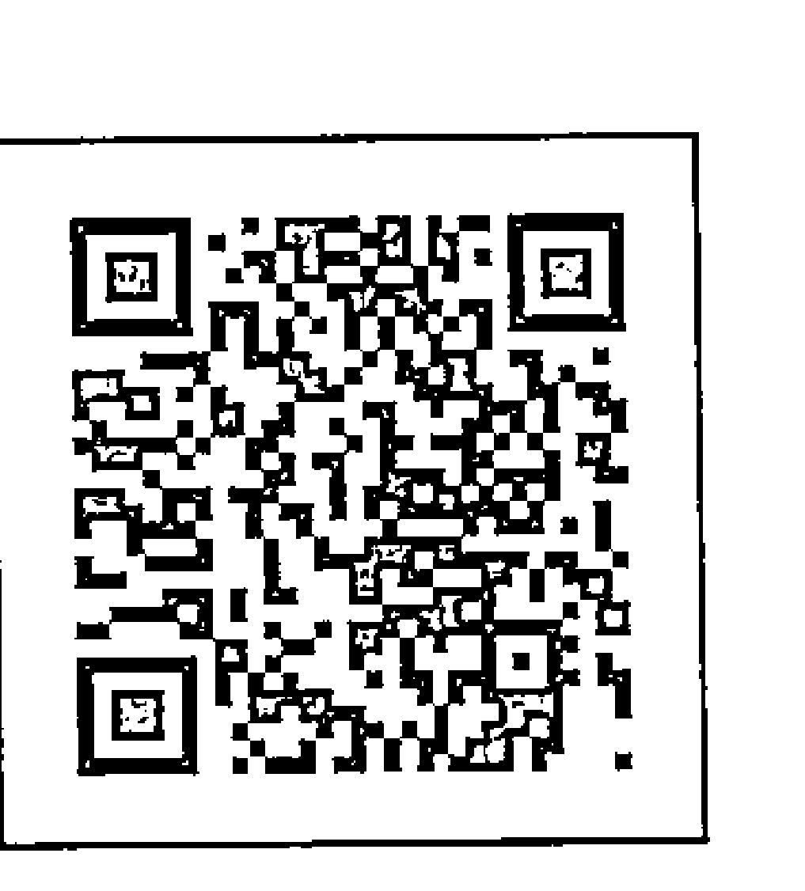

# # 浅析第十代移动酷睿平台

细心的朋友不难发现，英特尔第八代移动酷睿处理器（Kaby Lake-U）诞生于2017年8月。问题来了，第九代移动酷睿处理器在2019年4月才刚刚发布，第十代移动酷睿平台的诞生是否太过急躁？

英特尔在COMPUTEX 2019上发布的代号为“Ice Lake”的第十代移动酷睿处理器隶属于Y系列（Ice Lake-Y, 9W TDP）和U系列（Ice Lake-U, 15W和28W TDP），也就是专门针对无风扇、标准、高性能轻薄本定制的超低功耗版酷睿平台，而2019年

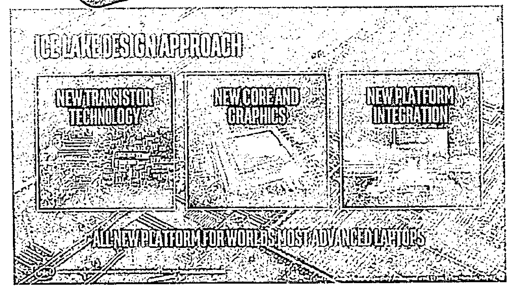

> 火速链接

如果您想了解第九代移动酷睿处理器，以及它的最佳搭档GTX16系列显卡的规格特性，请参考本刊2019年第11期的特别话题《九代酷睿遇到GTX16独显 新一代游戏本值得买吗》。

4月份面世的第九代移动酷睿平台则隶属于H系列（Coffee Lake Refresh-H），仅适用于高性能的游戏本。

如你所见，Y系列和U系列酷睿直接跳过了第九代——2019年下半年你所能买到的轻薄本产品要么搭载第八代酷睿（如i5-8265U），要么武装第十代酷睿（如i5-1035G1）。如此算来，Ice Lake发布的时间节点其实是刚刚好。

接下来，我们将对“十全十美”的Ice Lake的一些特性进行前瞻性的解读。

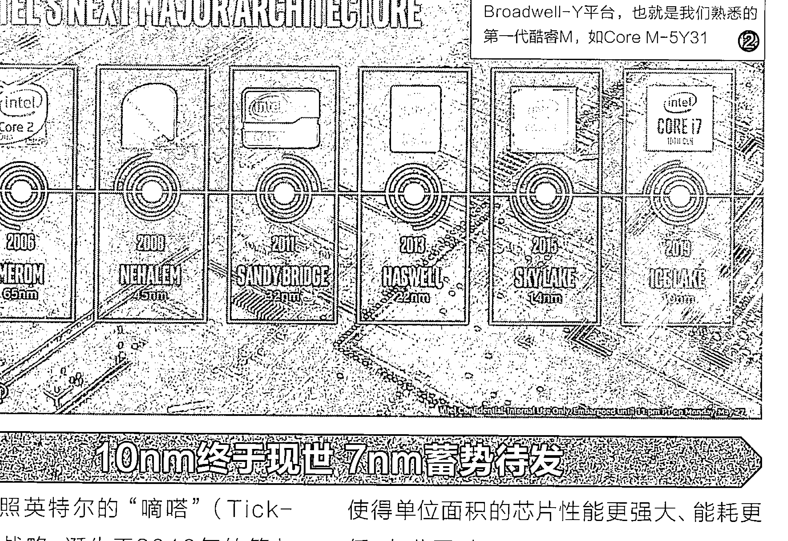

# 10nm终于现世 7nm蓄势待发

按照英特尔的“嘀嗒”（Tick-Tock）战略，诞生于2016年的第七代酷睿（Kaby Lake）就应该使用10nm工艺制造了。然而，10nm制程的不断延期，逼得英特尔只能打磨现有的14nm，且在此基础上衍生出了“14nm+”和“14nm++”工艺并沿用至今（图2）。

我们不妨将目光投向手机芯片领域。台积电早在2018年就量产了7nm制程工艺，并成就了苹果A12、麒麟980和骁龙855的赫赫威名。2019年下半年，台积电将推出引入EUV极紫外光刻技术的第二代“7nm+”工艺，该技术可以让晶体管的位置更精确，芯片上的晶体管密度可以增加20%，使得单位面积的芯片性能更强大、能耗更低。与此同时，三星7nm EUV工艺也将在2019年内量产，二者在“纸面的数字”上都能继续保持对英特尔工艺的压制。

在竞争对手即将带来7nm EUV工艺的时间节点，英特尔才推出10nm工艺，是不是有点晚？

按照英特尔的话说，三星和台积电以往采用的晶体管工艺计算公式并不科学（图3）。如果从晶体管密度和最小栅极间距两个参数来看，英特尔14nm比对方10nm还要先进，自家的10nm则可媲美对方的7nm工艺。但是，台积电和三星即将量产的却是有着EUV技术加持的第二代7nm工艺，它与英特尔的10nm工艺究竟孰强孰弱，还得等实物上市后才能知晓。但是，竞争对手的7nm EUV不会比英特尔的10nm差却是不争的事实，这意味着后者已经无法占据工艺层面的制高点了。

> 英特尔给出的逻辑晶体管密度计算公式

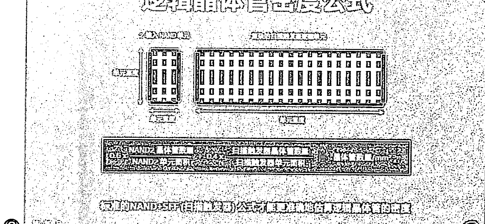

> 小提示

英特尔曾在2018年推出过i3-8121U这样10nm制程工艺的“样品”，但这款处理器的规格较低，孱弱的性能并未发挥新工艺的优势，很快就淡出了消费者的视野。

实际上，英特尔10nm制程工艺之所以屡屡跳票，是因为工程师在基础设计阶段过于激进，实际晶体管的密度难以达到最初设计的预期值。

据英特尔首席工程官兼技术、系统架构和客户端产品部分总裁文卡塔·伦度金塔拉透露，英特尔已经在10nm的曲折经历中吸取了大量经验，而7nm工艺将由独立的体系和团队负责（与10nm同步展开），因此新工艺的晶体管密度、功率、性能以及进度可预测性较上代有了大幅进步，有望在2020年就正式推出采用EUV技术的7nm芯片，并重新在微观水平上兑现摩尔定律。如果一切顺利，刚刚量产的10nm很可能成为英特尔所有制程里最“短命”的一代（图4）。

但无论如何，随着搭载10nm工艺的第十代移动酷睿Ice Lake处理器的笔记本上市，英特尔有望逐步收复过去一年来流失的份额，全面迎击AMD移动锐龙家族的挑战。

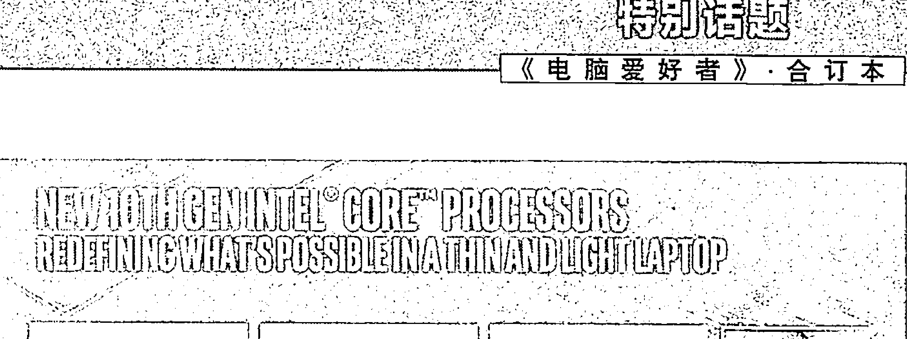

# 微架构升级 核显再度进化

为了展现“十全十美”这个美好词汇，英特尔Ice Lake集最先进的晶体管技术和全新的微架构于一身，从CPU到GPU、从内存到多媒体、从显示输出到图像处理，再从互连总线到雷电3，第十代移动酷睿处理器堪称“全新打造”，也是迄今为止最为先进的笔记本平台。

为此，英特尔还专门为Ice Lake平台的酷睿i7、酷睿i5、酷睿i3三大产品序列和锐炬Iris Plus核芯显卡都更换了全新的Logo标识，看起来更具科技感和仪式感（图6）。接下来，我们就将对Ice Lake平台的全新特性依次进行解读。

# 来自微架构的升级

除了采用10nm制程工艺以外，第十代移动酷睿Ice Lake最大的特色就是改用了全新的“Sunny Cove”微架构，有关这个架构我们曾在2019年第5期《CES2019 我“本”精彩》一文中进行过介绍，它通过更深（Deeper，缓存更大）、更宽（Wider，执行管线更多）、更智能（Smarter，更好的算法）的特性大幅提升了IPC性能（图7），并在AI、存储、网络、矢量等方面进行了全方位的改进，将成为英特尔未来诸多新架构的开山之作。

IPC（Instruction Per Clock，每个时钟的指令），它将决定CPU每一时钟周期内所执行的指令多少，是衡量CPU微架构性能的重要指标。业内用于判断CPU性能的基本公式为IPC×时钟频率（MHz），翻译过来就是在主频相同时，IPC性能提升多少，就代表这颗CPU的性能提升了多少。

根据英特尔的数据显示，Ice Lake的IPC性能相较

> 扩展阅读：
14nm继续“督战”
第十代移动酷睿Ice Lake处理器在一个基板上同时封装了CPU（包含集成的GPU）和PCH（传统意义上的南桥）双芯片，其中CPU部分虽然采用了最新的10nm制程工艺，但PCH部分却还停留在14nm工艺时代，相当于一颗芯片，两种工艺。在具体的封装尺寸上，15W和28W TDP的Ice Lake-U处理器芯片规格为50mm×25mm×1.3mm，针脚间距为0.65mm，插槽规格为1526。而9W TDP的Ice Lake-Y处理器芯片规格为26.5mm×18.5mm×1.0mm，针脚间距为0.43mm，插槽规格为1377。如图所见，后者体型更迷你（图5），可以塞进更轻薄的无风扇设计的设备中。

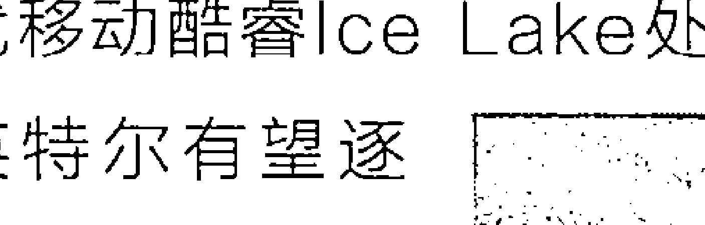

> **小提示**

由于Sunny Cove微架构大幅提升了IPC性能，所以即便第十代移动酷睿处理器的主频有所降低，其CPU性能也有机会超过上代同档次但主频更高的前辈们。至于实际的性能差异，感兴趣的朋友请关注CFan的后续报道。

细心的朋友可能已经发现了一个问题——Ice Lake的最高主频只有4.1GHz（图9）？要知道在第八代移动酷睿处理器阵营中，同属U系列的i7-8565U、i7-8559U、i7-8650U、i5-8269U的主频分别达到了4.6GHz、4.5GHz、4.2GHz和4.2GHz，为啥有着全新工艺和架构支持的新一代酷睿最高主频不升反降？

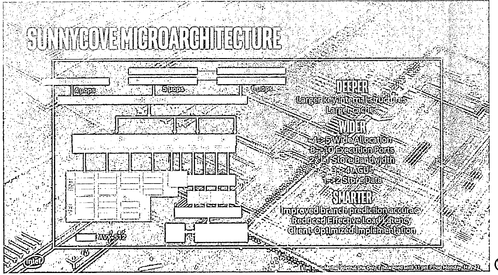

# 核显游戏不是梦

在第八代移动酷睿处理器家族中，其集成的核芯显卡（下文简称核显）存在24个EU执行单元的UHD620，以及48个EU执行单元的锐炬Iris Plus 650两个版本，EU单元越多性能越强。其中，UHD620用于5W TDP的Y系列（如i5-8200Y）和15W TDP的U系列（如i5-8265U），而锐炬Iris Plus 650则是28W TDP的U系列（如i5-8259U）专属。

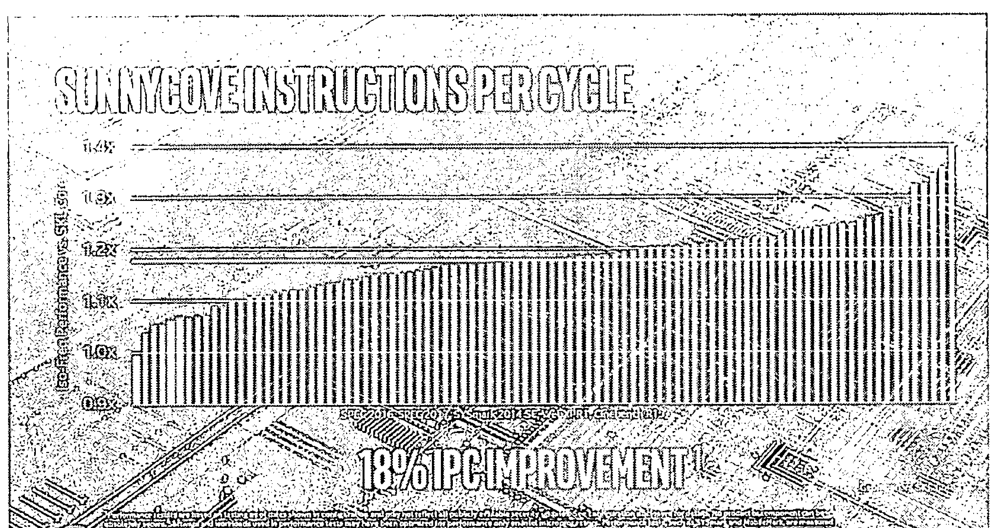

第十代移动酷睿Ice Lake的第二大特色，就是提供集成了32个EU执行单元的UHD（具体型号未知），以及集成48个或64个EU执行单元的锐炬Iris Plus核显（具体型号未知）。其中，UHD主要用于9W TDP的Ice Lake-Y系列，而48/64个EU单元的Iris Plus则分别适配15W和28W TDP的Ice Lake-U系列。换句话说，英特尔要大幅提升Y系列处理器的图形性能（EU单元从24个提升到32个），并让Iris Plus逐渐走向主流市场（首次被15W版本的U系列搭载）。

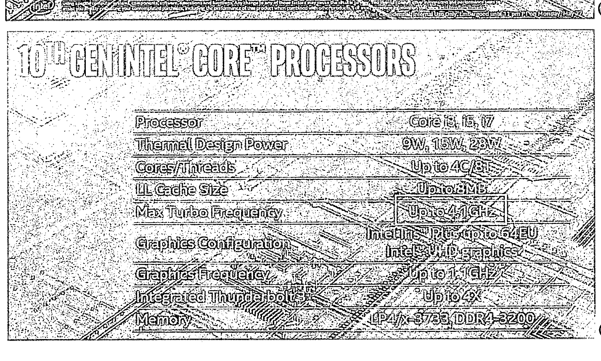

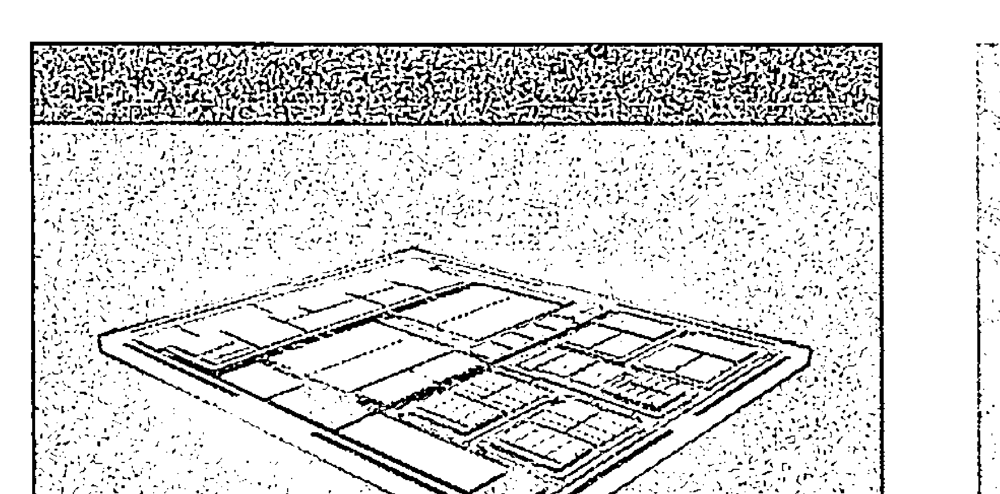

除了增加EU单元数量以外，Ice Lake的核显架构也升级到了Gen 11（八代酷睿以Gen 9.5为主），它支持VNNI、Cryptographic ISA、AVX-512指令集，并对每个EU内的FPU浮点单元都进行了重新设计，包括拓宽架构、优化能效、重塑内存子系统、增强光栅器、增大三级缓存等（图10）。同时，Gen 11核显还引入了“Adaptive Sync”（自适应垂直同步技术，类似英伟达的G-Sync），可以让高刷新率的显示器自动实时同步游戏的帧速，从而有效避免画面撕裂的问题。

此外，Gen 11核显在多媒体和显示性能上也进行了优化，比如支持HEVC(H.265)/VP9视频解码（10bit 4K@60FPS或8K@30FPS），支持DP1.4 HBR3、HDMI2.0b和三屏独立输出功能，集成FP16 HDR显示流水线，支持HDR10、杜比Vision和BT.2020色域等（图11）。别小看这些功能哦，要知道想在4K@60FPS下实现完整的HDR效果，在过去可是只有GeForce GTX 10系列的高端独立显卡才能实现的！

由于Gen 11核显拥有更强悍的游戏动力和多媒体功能，其全速运行时需要消耗更多的功耗。

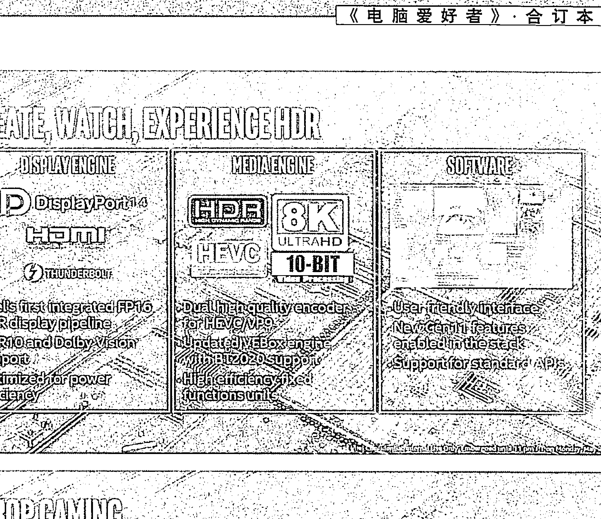

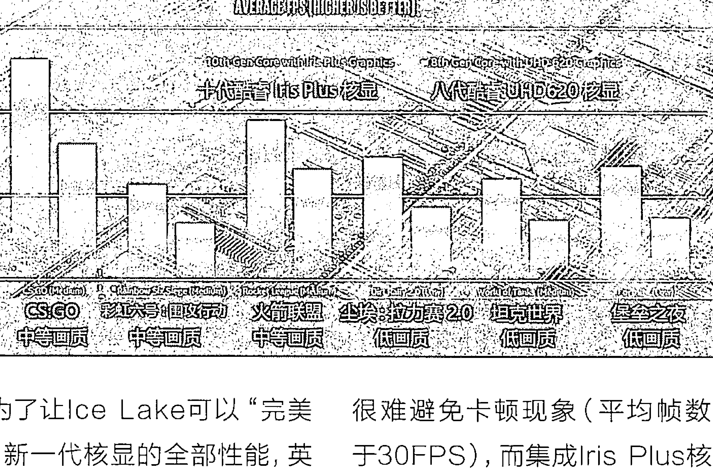

为了让Ice Lake可以“完美驾驭”新一代核显的全部性能，英特尔不得不限制第十代移动酷睿CPU部分的最高主频，用“节省”下来的TDP来驱动GPU核显，而这就是十代酷睿主频不升反降的根本原因。同时，第十代酷睿Y系列的TDP从上代的5W拔高到了9W，也从侧面反映出Gen 11核显的翻天变化。

那么，Gen 11核显究竟有多强？根据英特尔公布的对比数据来看，八代酷睿集成的UHD620除了《CS: GO》以外，在《彩虹六号：围攻行动》、《火箭联盟》、《尘埃：拉力赛2.0》、《坦克世界》和《堡垒之夜》等主流游戏中很难避免卡顿现象（平均帧数低于30FPS），而集成Iris Plus核显的十代酷睿则可轻松突破30FPS大关，从而带来更流畅的游戏体验（图12），足以媲美甚至超越往日入门级的独立显卡。

值得关注的是，此次英特尔还有意引导OEM厂商在第十代移动酷睿的cTDP设计上下功夫。

所谓cTDP，即允许厂商针对产品特点对CPU进行定制功耗。以标准15W TDP的U系列酷睿为例，其可配置的TDP-up最高可达25W，而可配置的TDP-down则低至10W。在英特尔的DEMO展示中，搭载第十代移动酷睿的笔记本可以一键在15W TDP（标准模式）或25W TDP（类似狂暴模式）间切换（图13）。据悉，U系列十代酷睿在25W下的游戏帧数相较15W时可以再提升33%，此时的性能甚至可领先于AMD最新移动锐龙7-3700U集成的Radeon RX Vega 10核显！总之，在Gen 11核显的帮助下，让第十代移动酷睿无需搭配额外的独立显卡，就具备在中低画质下流畅运行主流3D游戏的资质，从而让OEM厂商可以优化主板布局以增加电池容量或继续瘦身。希望DEMO展示中的可切换TDP设计能成为新一代笔记本的标准功能，并迫使英伟达和AMD进一步提升入门级独立显卡的规格，赋予轻薄本更强悍的游戏性能。

# ## 第一次拥抱AI

毫无疑问，AI人工智能是未来所有计算设备都应具备的基础能力，因此英特尔从第十代移动酷睿Ice Lake开始第一次大规模部署AI。

具体来说，Sunny Cove架构支持DL Boost机器学习加速，兼容Windows ML、Intel OpenVINO、苹果CoreML等框架，结合全新的Gen 11核显和低功耗加速器，其AI性能相比八代酷睿提升了最高2.5倍（图15）。

在实际应用中，基于AI机器学习的Dynamic Tuning 2.0动态调节技术可以预测工作负载，分析并判断出哪些核心处于最优状态，在高负载任务时会优先选择这些核心来承担工作压力，从而让处理器更长时间运行在更高性能状态。在过去，英特尔的加速功能是通过随机抽选核心来承担高负载任务，而这些核心当时可能并未处在最优状态，由此可能造成效率的滞后。

同时，在Adobe After Effects这类视频编辑软件中（图16），用户只需从几个关键画面帧中圈中需要抠掉的人物，人工智能就可以自动识别整段视频帧中所有涉及相关人物的画面并将其抹掉，同时填补被路人遮挡的区域，并不需要用户逐帧处理。再以本地图像识别为例，八代酷睿需要数分钟才能完成的AI识别和推理工作，新一代酷睿

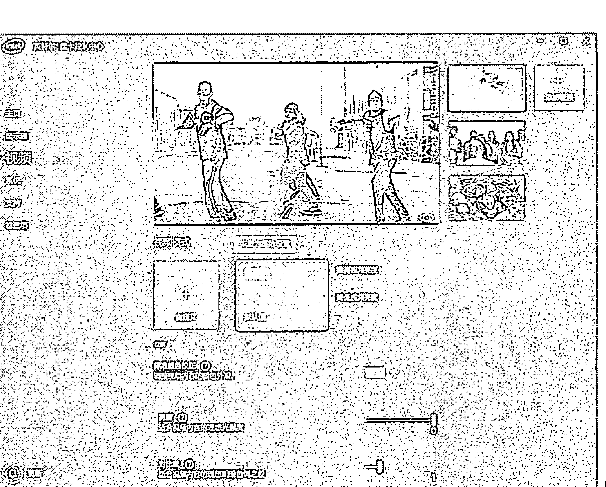

> **小提示**
为了配合Gen 11核显，英特尔还准备了新一代显卡控制中心（图14），它增加了很多类似NVIDIA Experience的功能，现已支持超过400款游戏自动优化，并且可以针对每一款游戏提供详细的参数设置。

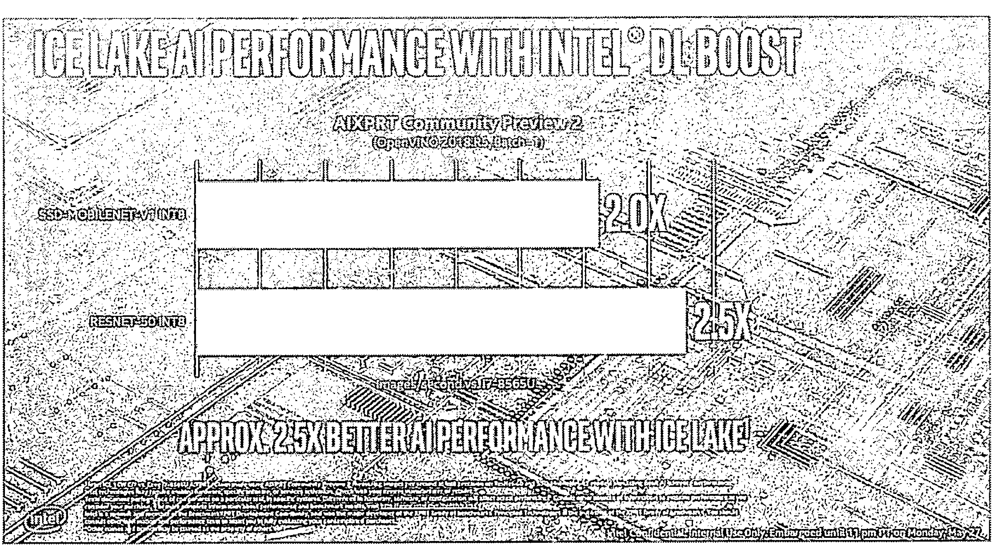

可能只需要数十秒即可完成。换句话说，就好像当年热门应用逐渐引入GPU加速功能一样，未来会有更多程序将带来AI加速选项，而第十代移动酷睿Ice Lake在开启这类功能时就能实现更高的执行效率。

### 更出色的周边性能

前文已经提到，第十代移动酷睿Ice Lake将采用Gen 11核芯显卡，虽然更多的并行处理单元可提升性能，但也代表着需要更高的内存带宽才能“火力全开”。因此，英特尔对内存控制器进行了升级，让其支持最大32GB容量的LPDDR4-3733MHz内存（板载内存颗粒形态，四通道32bit），或最大64GB容量的DDR4-3200MHz内存（传统内存条形态，双通道64bit），超过50GB/s的内存带宽足以释放Gen 11核显的性能潜力（图17）。从图17中我们还能看到Ice Lake的CPU部分集成了两个关键单元，其一是第四代的图像处理单元（IPU），它支持最高1600万像素的摄像头，可进行1080P@120FPS或4K@30FPS视频录制，通过单个IR/RGB摄像头模组就能实现Windows Hello人脸识别技术。此外，Ice Lake还是英特尔旗下首款直接集成雷电3控制器的处理器平台（图18），兼容未来的USB 4规范，这意味着今后搭载十代酷睿处理器的笔记本都有机会将“接口中的皇帝”——雷电3作为标配，获得40Gbps的传输速度、100W PD协议的供电能力，可以让轻薄本通过外置显卡随时获得同期高端台式机的游戏动力。

虽然Ice Lake上的PCH芯片还停留在14nm时期，但它的功能依旧不可小觑（图19），让第十代移动酷睿的无线通讯技术提升到了Wi-Fi 6 GIG+，支持802.11ax，单个无线连接带宽可达2.4Gbps，相对上代Wi-Fi 5（802.11AC）延迟降低75%、覆盖范围提升4倍，支持更多设备的稳定连接（图20）。当然，英特尔并没有强制OEM厂商必须为十代酷睿笔记本搭配支持Wi-Fi 6 GIG+的无线网卡（AX201），所以大家不要指望定位偏低的新品可以享受到第六代Wi-Fi的魅力。

除了上述特性以外，第十代移动酷睿Ice Lake还支持全新的傲腾H10混合固态硬盘（英特尔16GB/32GB傲腾内存与256GB/512GB/1TB QLC固态硬盘的结合体），并对从八代酷睿开始引入的Audio DSP功能（低功耗下的语音唤醒）进行了升级，具备更好的功耗表现。

### 下一代笔记本的变化

总之，第十代移动酷睿Ice Lake通过全新的工艺和架构实现了性能上的突破，并集全新的无线网络技术、存储技术和AI技术于一身，打破了过去移动平台在图形性能（Gen 11核显）、网络性能（Wi-Fi 6）、存储性能（傲腾H10）、连接性能（雷电3）、人工智能（DL Boost）等方面的瓶颈，让新一代轻薄本得以全方位的体验升级，从而诠释了“十全十美”的既定目标。

在年初的CES2019中，英特尔曾透露过“Project Athena”（雅典娜计划），在5月底的COMPUTEX 2019上，英特尔正式发布了该计划的更多细节（图1）。在第十代移动酷睿处理器即将诞生之际，我们不难通过它们提前展望下一代笔记本（准确来说应该是轻薄本）的变化。

#### MOBILE GO-GETTERS WHO ARE THEY?

根据英特尔的研究，如今有一类新型的年轻消费群体正在崛起，他们并不属于单纯的个人或商务用户，笔记本在他们手中将承担工作和生活中的更多场景：追求激情、有趣、娱乐、休闲和高效学习。

为此，英特尔给这类消费群体起了一个新的名字——“Mobile Go-Getter”，即“移动派”（图2）。

为了满足“移动派”的个性需求，需要不断的创新加以支撑。然而，创新的成本和难度绝非某个OEM（原始设备制造商）、ODM（原始设计制造商）、IHV（独立硬件厂商）或产业链成员“单打独斗”可以完成的。英特尔的“雅典娜计划”，就是一种意欲重塑笔记本行业，真正适应新时代和新需求的开放策略。

简单来说，英特尔将在中国上海市、台北市和美国的加州Folsom建立三座24小时开放的实验室，ODM和IHV厂商可以随时进入，对系统组件进行评估、开发、测试、调优并提供建议，而OEM厂商也可指定他们合作的组件厂商参加这一计划（图3）。换句话说，“雅典娜计划”属于生态系统集成范围的扩展，有利于OEM提升组件选择效率，并基于真实工作负载和使用模式进行评估。

当然，为了确保每一款基于“雅典娜计划”而生的笔记本都拥有良好的口碑，英特尔需要对该计划进行规范，于是就有了贴合真实应用场景的“关键体验指标”（KEI）——运行常规背景任务和程序的同时，通过具有代表性的默认设置，在OEM设备上进行评估，并分为电池运行、插电运行两种情况。

#### 雅典娜计划执行流程

| OEM厂商 | IHV厂商 | 先决条件准备 | 开放实验室 | 进入雅典娜计划推荐组件清单 |
| :--- | :--- | :--- | :--- | :--- |
| 提交设计清单材料 | 基于英特尔选择标准 | 组件筛选、低功耗组件列表和低功耗选择标准 | 共同评估、优化解决、满足标准则批准 | 组件被批准，进入推荐清单 |

#### 基于人类理解能力的笔记本电脑创新——雅典娜计划目标规范1.0

| 响应式的感应 | 性能与响应能力 | 自适应智能协作 | 沉浸式娱乐 | 快速连接与互动 |
| :--- | :--- | :--- | :--- | :--- |
| 唤醒时间<1秒 | Intel Core处理器 | Intel OpenVINO | 注重电池续航 | Wi-Fi 6 |
| 传感环境感知 | 高性能SSD | Windows Modern Standby | 自适应性能 | Thunderbolt 3 |
| 始终在线连接 | 高性能集成显卡 | 工作负载感知 | 沉浸式音频 | 伴侣设备联动 |
| 智能协作场景优化 | 16GB+ RAM， 256GB+ SSD | 人工智能加速 | 真实环境交互 | 跨设备文件共享 |

同时，雅典娜计划目标规范1.0也正式出炉（图4），包括但不限于采用三面窄边框和超薄二合一/翻盖式触控屏幕设计；支持指纹/人脸等生物识别登录功能；通电/使用电池情况下都可在1秒内从休眠状态唤醒；支持雷电3、Wi-Fi 6 Gig+和千兆级LTE方案；提供16小时本地视频播放，在实际场景下提供9小时以上的无线上网时间，支持快速充电功能等。未来，英特尔每一年都会提升雅典娜计划的关键体验指标，包括响应速度、电池续航、图形性能、沉浸式娱乐、环境感应、人工智能等等。

目前已经有5款产品通过了雅典娜计划目标规范1.0，它们是宏基Swift 5、戴尔XPS 13二合一、惠普Envy 13 Wood和联想Yoga S940，但其中只有戴尔XPS 13二合一采用了第十代酷睿平台，其他产品获选的原因源于独特的设计和语音识别/唤醒等创新功能。

据悉，2019年内将有十多款雅典娜计划成员产品上市，它们将基于八代酷睿、八代博锐、十代酷睿等硬件平台设计，且售价不会低于800美元（约合人民币5531元）。从现有的硬件条件来看，凡是搭载第十代移动酷睿处理器的轻薄本只要采用触控屏幕且解决了续航和快充问题，就都有位列雅典娜计划的资质，所以这类产品的普及还是可以预期的。

## 聚焦第二块屏幕

除了雅典娜计划以外，英特尔还在倡导另一种笔记本的形态，那就是赋予其另外一个“视界”。

在COMPUTEX 2019的开放日中，英特尔展示了引入类似“Touch Bar”概念的原型机，以及一款双屏笔记本电脑。其中，前者采用了OLED触控屏柔性屏幕，在屏幕闭合时曲屏边缘会露出一条触控区域，通过它可以随时查看当天日历信息、控制Spotify，甚至可以显示亚马逊数字助手Alexa（图5）。这个设计和三星早期的Galaxy Note Edge手机，以及苹果MacBook Pro配备的“Touch Bar”很像，如果软件跟得上，实用性还是蛮不错的。另一款双屏笔记本电脑采用了两块12.3英寸触控屏幕，该主机主体被包裹在一个织布材质的保护套中，整体看起来很像一本书（图6）。

当然，英特尔给出的仅仅是参考设计，但在现实中拥有第二块屏幕的笔记本其实已经很多了，而且完成度和实用性较之英特尔展示的概念机还要出色。

比如，华硕最新发布的灵耀X2 Pro和Project Precog就是两款极具特色的双屏笔记本。其中，灵耀X2 Pro和一般意义上的“双屏笔记本”不同，它保留了键盘，只是将触控板移到了右侧，并随键盘整体下移，将原本键盘的区域留给了一块32:9显示比例的“副屏ScreenPad Plus”，它和主屏幕一样都达到了4K分辨率（图7）。我们可以将ScreenPad Plus视为Touch Bar的放大版，可以显示工具栏、运行独立的应用程序，或配合Adobe、微软的一些软件实现更多的操作。同时，在《英雄联盟》等游戏中，玩家还能用ScreenPad Plus实时显示对局、出装等赛场的情况，也可以将这款屏幕设为主屏的扩展，显示更长的区域。

惠普幻影精灵X游戏本也采用了和华硕灵耀X2 Pro类似的设计，将键盘下移并在原区域嵌入了第二块副屏，只是副屏的尺寸和分辨率要小很多（图8）。幻影精灵X的副屏可以边看直播画面边玩游戏，把《英雄联盟》的小地图挪到副屏，又或者显示《守望先锋》瞄准镜中的放大内容，帮你精准远程杀敌。

华硕Project Precog采用了和英特尔双屏概念机相似的设计，但做工更加精致，两块触控屏幕是由铰链式转轴连接，可以进行360度翻转（图9）。除了形态新颖以外，这款产品还带来了更多关于AI的思考，具备了一定视、听以及距离感应等感知的能力。比如，它可以根据用户手指放置的位置来呈现C面虚拟键盘的位置，一旦触控笔靠近Project Precog会自动进入触控笔模式并自动关闭屏幕的触屏功能，从而防止用户误触。

此外，联想在5月中旬还展示了全球第一台13.3英寸屏幕的可折叠屏电脑的原型机ThinkPad X1系列（图10），它采用了类似三星Galaxy Flod和华为Mate X的折叠屏幕设计，其重量只有900g，折叠后的尺寸接近普通图书，但它却同时具备完整的PC级别计算性能。可以预见，待OLED折叠屏幕技术成熟之后，笔记本也有望跟随智能手机的脚步，进入到折叠屏时代。

总之，有了第二块屏幕，可以给笔记本带来更便捷的操作，并扩展视觉的边界。只是，当为了实现双屏幕而取消实体键盘之后，如何确保敲字的手感？这应该是更多用户最为关心的问题吧？

## 快乐暑期游戏平台大变样

漫长的暑假即将到来，不少公司也会选择在这样酷热的季节让员工休息，消耗掉年假。如果不想顶着酷暑出门的话，很多人的选择就是用游戏消磨时间，那么能让人痛快玩游戏的电脑当然是必需的。然而之前忙于学业、工作的玩家们在暑期攒机、升级的时候会发现，今年暑期的游戏配件市场有了大变化，很多之前的经验、配置都失效了。这是什么情况？自己的游戏平台又该怎么选呢？在大家的暑假来临前，我们先搞清楚这些问题吧。

### 游戏平台大不同

### 这些变化是主因

在2019年的暑期市场中，游戏平台从最基础的处理器、显卡到内存、存储设备，都出现了非常明显的改变。而且最近市场变化之巨大，涉及面之广，在近几年以来非常少见，这其中既有新产品带来的惊喜，也有老相识降价带来的实惠。

### 处理器 新品诱人

在暑期的处理器市场上，英特尔第九代酷睿和AMD第三代锐龙无疑是两组“最亮的星”。随着第九代酷睿全系产品的逐步上市，主流和中端产品不仅性能表现出色，而且价格也相当合理，特别是大批不带核显的F型产品，报价不仅远低于同型号的含核显酷睿，甚至还低于第八代产品，如i3-9100F和i5-9400F。虽然它们取消了核显，但在配置独显的游戏平台中，这一点对应用能力几乎没有影响。酷睿i3-8100因其不错的游戏能力，很长时间以来都是英特尔入门游戏平台的首选，不过i3-9100F一上市就终结了它的地位。在规格上，i3-9100F与i3-8100最大的差别是取消核显及支持睿频，而且睿频幅度还不小，这在提升性能的同时，也有助于降低运行功率。

| 项目 | 测试 | i3-9100F | i3-8100 | 相对性能 |
| :--- | :--- | :--- | :--- | :--- |
| CPU-Z | 单核 | 457 | 421 | 108.55% |
| | 多核 | 1750.6 | 1613 | 108.53% |
| FritzChess | 多核 | 12158 | 11481 | 105.90% |
| CINEBench R15 | 单核 | 166 | 158 | 105.06% |
| | 多核 | 601 | 587 | 102.39% |

从测试结果看，i3-9100F的性能并没有大幅超越i3-8100，仅从这方面看吸引力显然是不足的。不过另一方面，i3-9100F在性能全面略强于i3-8100的情况下，电商平台上的价格却低了200多元（图1），这也使得i3-9100F与B360主板的板U套装价格甚至低于i3-8100与H310的板U套装，这才是它真正诱人的地方。

i5-9400F的情况也非常类似，它在性能高于i5-8400的情况下，价格远低于后者，当然也更低于第一批九代酷睿i5（图2）。更高的性价比和合理的价格，使其改变了主流游戏平台的配置方式和能力。

如果说英特尔游戏处理器的改变主要在中低端市场上，那么7月初上市的AMD第三代锐龙显然就是中高端游戏平台的新军，而这一批新军同样性能更强，且价格也并不昂贵，在用实力“顶替”掉之前产品的同时，展现出了较好的性价比。

目前来看，价格最接近，同时规格差距最大，因此可以最“轻松”地取代第二代锐龙同档次产品的，恰恰是最适合中高端游戏平台的锐龙7 3700X（图3），它在价格与锐龙7 2700X很接近的情况下，功耗更低，缓存几乎倍增。而这款产品在价位、性能方面都比较有“默契”地与前述的高性价比九代酷睿拉开了距离，市场定位非常明确。

| 型号 | 核心/线程 | TDP (W) | 自动超频/基准频率 (GHz) | 总缓存 (MB) | PCIe 4.0通道数 (处理器+AMD X570) | 电商建议零售价 (人民币) | 预计上市时间 |
| :--- | :--- | :--- | :--- | :--- | :--- | :--- | :--- |
| 锐龙9 3900X处理器 | 12/24 | 105W | 4.6/3.8 | 70 | 40 | 3999 | 2019年7月7日 |
| 锐龙7 3800X处理器 | 8/16 | 105W | 4.5/3.9 | 36 | 40 | 3199 | 2019年7月7日 |
| 锐龙7 3700X处理器 | 8/16 | 65W | 4.4/3.6 | 36 | 40 | 2599 | 2019年7月7日 |
| 锐龙5 3600X处理器 | 6/12 | 95W | 4.4/3.8 | 35 | 40 | 1999 | 2019年7月7日 |
| 锐龙5 3600处理器 | 6/12 | 65W | 4.2/3.6 | 35 | 40 | 1599 | 2019年7月7日 |

## 显卡 全价位震撼

在并不算长的时间内，从1000元到4000元，与大部分玩家相关的主要显卡价位段都在短时间内经历了更新。而随着7月初AMD Navi显卡进入市场，这些价位的选择将进一步增加。在这些价位上新出现的所有显卡都采用了革命性的新核心，形成了全价位的显卡能力大升级，这在最近几年也极为少见。

在英伟达方面，Turing (图灵) 核心基本完成了从最高端到入门级游戏显卡的全面铺开。在寒假时我们见到的还是价格比较昂贵、含有全功能模块的RTX 20系列，而在这个暑期，虽然RTX 20仍然是让人流口水的高端选择，但新的“甜点级”显卡已经是同为Turing核心，但进行了精简，价格更实惠的GTX 16系列显卡(图4)，覆盖主流玩家更关注的1000元~2000元价位。

至于AMD的新一代显卡，截至发稿时为止，比较确定的仅有Radeon RX 5700系列两款显卡 (图5) 以及50周年特别版。它们采用新的RDNA架构，效率比使用了很久的GCN架构更高，性能可达到甚至超过RTX 2070的水平，价格则要便宜得多，为2999元和3599元。虽然第一代RDNA核心并不支持深受关注的硬件光线追踪计算能力，但在总体性能、图像优化、游戏生态等方面都有在幅进步。

调整也相当给力，很多产品通过降价将自身定位降低了一档甚至两档，与新品进行错位竞争，性价比同样非常出色。例如最近价格逐渐降至1200元的Radeon RX 590，性能明显超过目前处于这一价位的RX 580，甚至也略高于1400元左右价位的GeForce GTX 1060 6GB，性价比非常突出。类似的产品还有降至2100元以下的Radeon RX Vega 56 (图6) 等。

| 显卡型号 | 计算单元 | 流处理器 | TFLOPS | GDDR6 (GB) | 基础频率 (MHz) | 游戏频率 (MHz) | 加速频率 (MHz) | 电商建议零售价 (人民币) |
|----------|----------|----------|--------|------------|----------------|----------------|----------------|-------------------------|
| Radeon RX 5700 XT 50周年纪念版 | 40 | 2560 | 10.14 | 8 | 1680 | 1830 | 1980 | 3999元 |
| Radeon RX 5700 XT | 40 | 2560 | 9.75 | 8 | 1605 | 1755 | 1905 | 3599元 |
| Radeon RX 5700 | 36 | 2304 | 7.95 | 8 | 1465 | 1625 | 1725 | 2999元 |

## 内存 低价引导产品升级

随着内存价格的不断降低，近期主流内存条 (8GB) 已经接近甚至低于200元价位，这一般是内存产品的极限低价位，价格下探空间已经很小。每次主流内存条达到价格谷底的时候，因为更大容量、更高频率内存的价位会随之达到用户的心理价位，所以常常能带来一波用户对内存选择的升级，本次也不例外。

除了价格原因之外，本次内存选择的升级也有着实际需求，那就是新一代处理器的标配内存频率大幅提升，以及游戏的内存容量需求倍增。首先就是频率，以即将上市的第三代锐龙和已经公布了### U-SERIES PROCESSOR FEATURE BENEFITS

| FEATURES | BENEFITS |
| :--- | :--- |
| CPU | 10nm CPU / 14nm PCH |
| GFX | Gen 11 Intel Graphics Engine, U42 up to 64EU |
| Memory | DDR4 up to 3200, LPDDR4/x 3733* |
| Imaging | Enhanced IPU4p, 16Mp, 4k30, 4 Cameras, RGB+IR camera* |

具体规格的第十代酷睿为例，下一代处理器的标配内存频率一下子都跳到了DDR4 3200，第十代酷睿甚至可支持3733MHz的内存（图7）。

而在容量需求方面，很多非3A高端游戏的内存需求开始朝着8GB前进（图8），3A游戏的推荐配置更是齐刷刷写着16GB。加上新一代处理器可支持的内存容量也有了进一步增长，16GB作为主流甚至基本配置的时代快速到来了。

在这样的情况下，如果你还是一条4GB的低频率内存，比如DDR4 2133/2400，想添一条一样的内存组双通道，就不如直接更换为DDR4 3000左右的8GB、16GB条。不过如果未来升级不准备保留内存条，或者用的是DDR4 2666及更高频的4GB条，升级4GB组双通道也是可行的。

如果因为升级等原因留着一对低频小容量内存，又购买了一对DDR4 3000甚至更高频率的内存，那干脆彻底换掉之前的内存吧。因为内存组会以最低频率为准运行，让高频内存难以发挥（图9、图10），在频率/容量相差很大的情况下，低频内存就不值得保留了。

在容量方面，笔者仍然建议购买时以单条8GB内存为主。这首先是因为16GB的容量价格比还没有明显高过8GB条；其次是大容量的16GB条更容易有Bank数量（图11）的问题，使用双条甚至4条的时候可能会超过CPU的内存管理能力，性能反而下降。

由于内存价格已近谷底，同时存在着内存降价压力、厂商限产压力、市场供需压力等多种价格影响因素，所以市场价格非常混乱且变化很快。例如8GB内存条隔天有10元甚至是二三十元的波动很常见，是目前价格变动最快的配件。所以要出手时必须静下心来，持续关注价格，才能尽量“捞到”近期的最低价。

## SSD NVMe越来越普及

SSD市场上的现状与内存非常类似，由于价格大幅下跌，使得主流产品有了升级的可能，不仅主流容量从250GB逐渐转向500GB，而且主流接口也从低速的SATA逐渐转向了高速的NVMe（M.2）。

在目前的市场中，除了少数高端型号外，250GB/500GB的SATA SSD的容量价格比已经普遍高于1GB/元，而且500GB产品的容量价格比更高。不过SATA SSD的价格已经不再是主流用户最关注的，因为随着整体价格的下降，特别是大容量QLC颗粒对市场的冲击，一些NVMe SSD的容量价格比同样突破了1GB/元。要知道即使是低端的入门级NVMe SSD，其顺序读取、随机读写速度也都倍于甚至数倍于高端的SATA SSD，顺序写入速度则至少相同，主流产品同样可以达到数倍于SATA SSD的水平。

QLC颗粒的普及，使得NVMe SSD有望在1TB容量上拥有更高的容量价格比

事实上，一些使用了新的QLC技术或者主打高性价比的新品牌NVMe SSD，已经可以在容量价格比方面“吊打”传统的SATA SSD（图12），在市场局部出现了产品定位的逆转。

## 重拳出击 不同价位的装机新方案

在最重要的几大配件快速变动后，游戏平台的主体也随之有了重大变化，我们就以比较典型的入门级、主流和中高端价位为例，看一看适合这个暑假的新配置方案吧。

## 入门级游戏平台

在入门级平台中，我们选择了i3-9100F与B360电竞级主板（图13）的套装，价格与H310套装相差不多。其内存选用了DDR4 3000，价格仅比同品牌的DDR4 2400/2666贵10元，但无论是性能还是未来的应用能力都更好。此外RX 590显卡使其拥有在高画质下流畅运行绝大部分3A游戏的能力，傲腾+机械硬盘的组合可以提供近似于SSD的体验，对傲腾的支持能力也是我们选择B360主板的原因。

总体来看，这一配置已经超过了绝大部分3A游戏的推荐配置水平，可以让玩家在全高清分辨率和高画质下流畅（60+FPS）地运行目前市面上几乎所有的游戏。即使是一些要求比较苛刻的游戏，只要增加一条内存，基本上也就足以应对了。

至于资金比较窘迫的玩家，还可以选择锐龙3 1200+RX 580 2048SP的组合，可将总价降至3000元左右，能保证性能高于3A游戏的基本配置，但不能保证达到推荐配置需求。

| 配件 | 型号 | 价格 |
| :--- | :--- | :--- |
| CPU | 酷睿i3-9100F套装 | 1240元 |
| 主板 | 技嘉B360 M AORUS PRO | 套内0元 |
| 内存 | 威刚XPG-Z1金色威龙DDR4 3000 8GB | 259元 |
| 显卡 | 讯景RX 590 8G黑狼版 | 1189元 |
| 散热器 | 盒装自带 | 0元 |
| 硬盘 | 英特尔傲腾16GB | 149元 |
| | 希捷2TB 256MB 7200RPM | 378元 |
| 电源 | 鑫谷核动力-超级战舰S7 | 159元 |
| 机箱 | Tt启航者S3 | 139元 |
| **总价** | | **3513元** |

## 中端游戏平台

i5-9400F成为中端游戏平台的首选产品，它的性价比不仅高于第八代酷睿i5，也并不逊于老对手锐龙5 2600。而在显卡方面，GTX 1660也是这一价位目前最好的选择(图14)，可以让大部分3A在2K超高分辨率下流畅运行。

但需要注意的是，这两个选择都是基于AMD产品尚未覆盖相应的价位而做出的，如果锐龙5 3600或Vega 56降价至更低价位，或者Navi显卡推出1500元价位型号，i5-9400F和GTX 1660就不再是最佳选择了。

| 部件 | 型号 | 价格 |
| :--- | :--- | :--- |
| CPU | 英特尔i5-9400F套装 | 1729元 |
| 主板 | 华硕TUF B360M-PLUS GAMING S | 套内0元 |
| 内存 | 威刚XPG-Z1金色威龙DDR4 3000 8GB×2 | 518元 |
| 显卡 | 索泰GTX1660 X-GAMING OC HA | 1599元 |
| 散热器 | 盒装自带 | 0元 |
| 硬盘 | 海康威视C2000 512GB | 489元 |
| 电源 | 长城HOPE-6000DS | 239元 |
| 机箱 | Tt启航者S3 | 139元 |
| 总价 | | 4713元 |

### 扩展阅读：

## 第三代锐龙的主板选择

AMD处理器对老主板的持续支持是其优良传统，在新一代锐龙上也是如此，很多B450和X470主板在更新BIOS后就可以支持第三代锐龙。不过需要注意的是，从目前的消息来看，旧主板将失去一项非常重要的升级——PCIe 4.0，因此无法发挥出未来高速NVMe SSD的性能。至于显卡方面则无需担心，Radeon RX 5700尽管支持PCIe 4.0，但因为目前显卡的运算过程主要集中在显卡自身内，对外通信的带宽需求不是很大，400系列芯片组的PCIe 3.0 ×16插槽带宽就足够了。

此外，目前已经公布的第三代锐龙均不支持入门级芯片组A320，相应主板当然也不具备升级条件。而锐龙9因为超高的核心、线程、缓存配置，笔者也并不建议使用旧主板升级使用，X570芯片组应该才是它最好的搭档。

## 中高端游戏平台

AMD的新一代产品中，性价比较高的一些型号恰好符合中高端游戏平台的定位，由于截稿时尚未得到各厂商的B550、X570芯片组主板定价，所以这里暂时使用可兼容第三代锐龙的400系列芯片组主板(图15)。至于显卡方面，我们选择了相对比较便宜的Radeon RX 5700显卡，如果不考虑在这一档次显卡上并不实用的光线追踪技术的话，其性能完全可以压制类似价位的RTX 2060，且可满足3A游戏在4K分辨率下的流畅运行。

为了满足对内存性能较敏感的锐龙处理器的需求，我们选择了价格比DDR4 3000明显高一些的DDR4 3200内存，希望它能物有所值。此外，本文撰写期间，有消息称英伟达将推出价格更低、配置更高的Turing核心显卡，这一产品也许会对中高端游戏平台的显卡选择产生影响。

| 部件 | 型号 | 价格 |
| :--- | :--- | :--- |
| CPU | 锐龙7 3700X | 2599元 |
| 主板 | 微星X470 GAMING PLUS | 969元 |
| 内存 | 金士顿骇客神条Fury DDR4 3200 8GB×2 | 598元 |
| 显卡 | Radeon RX 5700 | 2999元 |
| 散热器 | 盒装自带 | 0元 |
| 硬盘 | 英睿达P1 1TB | 649元 |
| 电源 | 酷冷至尊GX550 | 399元 |
| 机箱 | Tt启航者S3 | 139元 |
| 总价 | | 8352元 |

在很多人的印象中，电子设备总在不断地“堆配置”（包括硬件升级和添加全新软件功能）以获得更强的竞争力。然而，以智能手机为代表的产品却存在一条容易被忽视的“减配之旅”，随着时间的推移很多经典的设计和功能都被精简了。在这些淡出历史的“减配”元素中，有些确实属于理应淘汰的范畴，但其中却也不乏一些令人扼腕叹息的设计。本期特别话题，就让我们回顾一下智能手机的减配之路吧。

# 实力不等于成功

### ——回顾智能手机的减配之路

策划《电脑爱好者》编辑部

# 被舍弃的全键盘设计

在功能机，或者说是以塞班系统为代表的“准智能手机”时代，QWERTY全键盘无疑是最酷最实用的设计之一，并成就了黑莓手机和诺基亚E系列手机的赫赫战功。实际上，在Android手机刚刚崛起的年代，全键盘也曾是盛行一时的设计（图1），只是出于种种原因成为了智能手机“减配”道路上搬开的第一块石子。

扫一扫，更多精彩内容立现！

# 全键盘遇到智能机

2008年，尚处于全键盘手机的黄金年代，哪怕是全球首款Android手机——HTC Dream（G1）也不得不通过侧滑盖的形式保留了QWERTY全键盘设计，作为触控屏幕的辅助输入手段。随后，摩托罗拉旗下的里程碑（Milestone）和索尼Xperia X10也引入了类似的设计，在编写邮件和玩模拟器游戏时的效率远胜于其他纯触控操作的手机。很多学生朋友甚至可以眼睛盯着黑板，但手中的手机却依然可以行云流水地聊QQ，这就是全键盘设计的魅力。

# 减肥风和输入法的逆袭

全键盘固然可以提升输入效率，但它却与智能手机追求纤薄化的设计趋势相矛盾，时至今日除了被TCL收购的黑莓手机还固执地保留全键盘元素，其他型号的手机早已向现实妥协。令人惊讶的是，没有全键盘的智能手机在输入效率上的影响其实并不大，究其原因则是输入法、OCR文字识别和语音识别技术的成熟。

以输入法为例，随着云词库、划词手势、模糊拼音和智能纠错等技术的引入，极大地提升了文字输入效率和准确度。遇到文字摘抄和大量文字录入的情况，我们还能通过文字扫描以及语音输入加以解决（图2）。特别是语音输入，找个安静的环境，手机可以准确识别你所说的每一个字并添加标点，在效率上甚至可以媲美外接键盘（图3）！

总的来说，全键盘成为智能手机时代的“弃子”可谓大势所趋，不留遗憾。如果你需要在手机上输入大量的文字，所处环境又不适合语音识别，可以考虑使用手机专用的迷你蓝牙键盘（图4），或通过OTG功能外接任意USB键盘。如今的手机输入法都可完美适配第三方键盘，进行类似PC的文字录入操作。

> **小提示**
全键盘并非为了手机瘦身而牺牲的唯一设计，可换电池设计、独立的存储卡插槽设计等也被淹没在历史的尘埃里。

# 岌岌可危的物理按键和接口

除了全键盘设计，Android手机还曾在功能按钮上无比纠结过。昔日的“三大金刚按键”从物理键变成了虚拟键，随着魅族Zero和APEX 2019概念机以及三星Galaxy Note 10的即将上市，无任何按键和开孔的手机即将成为未来趋势。

# 按键由实转虚

你还记得第一款Android手机身上有多少颗物理按键吗？抛开电源键和音量键不谈，HTC Dream可谓一款集大成之作——它从黑莓手机身上请来了“轨迹球”，从诺基亚手机那边借来了“接听”和“挂断”，将iPhone的Home键摘抄，同时还原创了一个“返回”。没错，这款手机身上竟然有5个功能键！

“接听”和“挂断”，将iPhone的Home键摘抄，同时还原创了一个“返回”。没错，这款手机身上竟然有5个功能键！

实际上，在Android手机刚刚诞生之际，无论是谷歌还是HTC、三星等手机厂商都不清楚哪些按键是可以取消的，毕竟经历多年功能机时代的洗礼，绝大多数用户都习惯了通过点击拨号和挂断按钮来处理来电。因此，不仅是HTC，早期的Android手机屏幕下方都挤满了各式按键(图5)。

随着Android系统的成熟和对APP控制的规范，“三大金刚按键”(返回、主页、最近任务或菜单键)逐渐统一江湖，并延续至今。只是，三大金刚键还经历了从物理按钮→屏幕下边框上的触控按键→屏幕内的虚拟按键(可隐藏)的表现形态，并逐渐被全面屏手势控制功能所取代(图6)。

### 扩展阅读：

### 差异化的按键设计

为了提升辨识度、优化操作或实现特殊功能，智能手机也存在额外增加按键的情况，比如早些年集成指纹识别功能的实体Home键、一加手机特色的状态切换侧滑键、黑鲨手机可一键进入“Shark Space”空间的游戏模式键、vivo X27可一键唤醒Jovi语音助手的智慧按键等等(图7)。

# 那些消逝的接口

早期很多Android手机都标配Micro HDMI或Mini HDMI接口，可直接将画面输出到更大的显示设备中(图8)。然而，为了保持身材，HDMI成为了第一个被智能手机抛弃的接口，而一种全新的，集数据和视频传输功能于一身的MHL接口也慢慢浮出了水面。

我们可以将MHL接口理解为做成Micro USB接口模样的HDMI，它可以同时传输视频和音频信号，一根线搞定(图9)。可惜，MHL接口存在一定的成本，同时还会影响手机充电功能，当无线显示功能成为Android 4.x系统的标配后，即宣告了MHL的“死刑”。

电功能，当无线显示功能成为Android 4.x系统的标配后，即宣告了MHL的“死刑”。

• 索爱MT15i手机顶部的HDMI、耳机孔和Mini USB接口

时至今日，主流Android手机都已经换装USB Type-C接口，华为、荣耀和三星旗下的部分高端机的USB Type-C接口还兼容视频输出，并在此基础上开发出了华为PC模式和Samsung DeX——当系统检测到手机通过USB Type-C视频传输线与显示设备（如电视）相连后，就能触发第二套类似Windows 10系统风格和操作形式的启动器运行，并将其输出到电视屏幕上（图10）。

# 手机投屏功能演示

我们都知道，手机屏幕可以投射到智能电视或连接着网络盒子的普通电视上。除此之外，笔记本的屏幕（包括内置无线网卡的台式机显示器）也能享受这一待遇，只要手机和电脑处于同一个Wi-Fi环境即可。

以Windows 10系统为例，进入“设置→系统”，可以看到“投影到此电脑”的选项，点击它就能开启投屏功能了。虽然我们是在局域网内操作，但出于安全考虑，笔者还是建议开启“需要PIN才能进行配对”（图11）。

以OPPO Reno手机为例，进入“设置→其他无线连接→多屏互动”，打开多屏互动功能就能搜索出之前开启投影功能的笔记本（当智能电视或电视盒子打开无线显示功能后，也能在这个界面内被搜索到，操作和下面的方法相同），点击它会弹出需要我们输入PIN的对话框（图12）。此时，电脑屏幕的右下角也会弹出手

机正在尝试连接的提示，点击它就会进入等待连接界面，将上面的PIN码输入到手机上即可完成投屏操作（图13）。

稍等片刻，你的手机画面就会出现在笔记本屏幕上了（图14），此时如果能进入支持横屏显示的应用界面（如游戏），就能将画面填充满整个屏幕（图15）。

需要注意的是，笔记本和手机进行投屏连接时，笔记本自身无法操作，接收不到QQ和邮件等提醒消息，只有在手机上关闭多屏互动功能后才能退出。因此，使用上述操作时，请确认在此期间不影响正常的工作。

### 无开孔手机扮演“终结者”

2019年初，魅族和vivo先后发布了无孔无按键的概念手机，它们最大的特色就是彻底干掉了所有的开孔、接口和物理按键，手机就是浑然天成的整体。

其中，魅族Zero采用Unibody一体式设计，背部材质为陶瓷并和整个中框融为一体(图16)。vivo APEX 2019采用一体玻璃成型设计，它通过全屏幕指纹解锁满足了视觉上的一体化享受和更便捷的操作，彻底打破屏幕解锁区域的限定，实现在屏幕任何位置触摸手指均可解锁的自由解锁方式(图17)。

可能朋友会问了，这两款手机要如何弥补无开孔和物理按键引发的“后遗症”？

- 解锁方式——两款手机都通过OLED和屏幕指纹识别技术，无需为指纹模块开孔；
- 声音外放——两款手机都支持屏幕发声技术（屏幕激励器方案）替代了原有的听筒和扬声器。以APEX 2019为例，它在早期APEX以及NEX屏幕发声技术的基础上进行了优化，在一体化玻璃后盖上实现了外放功能，避免了扬声器开孔问题，也保证了外放音质的效果。
- 操作方式——引入类似“压感按键”的技术替代传统的电源和音量键(图18)，虽然会牺牲部分手感，但却避免了为实体按键开槽的问题，确保整机无孔的设计形态。
- 充电方式——魅族Zero支持最高18W的无线快充，而APEX 2019则采用了磁吸式接口，替代了原有的充电插口。
- 上网方式——我们都知道手机需要安装SIM卡才能联网通话，为了去掉SIM卡槽的开孔，魅族Zero可通过eSIM技术实现空中发卡，目前联通已经提供了eSIM卡服务，相信移动和电信随后也会跟进。

虽然魅族Zero和APEX 2019还处于概念机阶段，但这种设计理念已经成为了行业共识，堪称手机物理按键和各种接口的“终结者”。无孔手机的最大好处就是美观时尚，并显著提升防水等级(图19)，只是这种设计会显著提高成本并增加维修难度，即便量产也仅限于顶配手机尝鲜。

### 由奢入俭的闪光灯

俗话说“由俭入奢易，由奢入俭难”。在手机圈，就存在这么一种由奢入俭的组件，它就是（后置）闪光灯。

#### 昙花一现的氙气闪光灯

在功能机和准智能手机时代，氙气闪光灯曾经是高端手机的必备，索爱K790和诺基亚N82就是第一批武装这种闪光灯的存在（图1），并在当年掀起一阵拍照风潮。随后，氙气闪光灯还被诺基亚下放到了定位中低端的6720C手机身上，并随Lumia928入住Windows Phone平台（图2），这种“亮度超高、接近自然光谱”的闪光灯，就是手机挑战卡片DC的最大本钱。

当Android系统崛起后，氙气闪光灯曾被三星Galaxy Zoom系列手机所装载（图3），它们主打内置支持10倍光学变焦的伸缩式镜头，可以提供媲美入门级相机的拍照实力。可惜，Galaxy Zoom系列身材臃肿，而氙气闪光灯也因成本高、费电、无法长时间开启（不能当做手电筒）等缺陷，没能在智能手机领域普及。

#### 玩出花样的环形闪光灯

在智能手机时代，闪光灯在很长一个时期的功能都非常单一，它就是用于夜晚照明的“手电筒”，以及在拍照时照亮身前几米范围的补光灯。为了实现差异化竞争，不少手机厂商都打起了闪光灯的主意，其中最具代表性的品牌就是魅族，其曾在魅族Pro 6系列等手机身上引入了圆环形状的闪光灯设计——将五对双色温闪光灯（共计十颗）围绕在激光对焦模组周围，可以显著提升补光亮度和效果（图4）。

随后，魅族还在魅蓝E2等手机机身上采用了将冷、暖、冷、暖两对四颗闪光灯横向排列的设计形式（图5），并将它们嵌入到了贯穿摄像头的天线带之中。在“系统设置→辅助功能”中，用户可以激活闪光灯特效，当有来电、闹铃、短信和红包等提醒时，这四颗闪光灯可以呈现不同的闪烁效果，就好像跑马灯一般，在夜晚看起来格外醒目和炫酷（图6）。

#### 不断“减配”的闪光灯

原本以为手机厂商会在闪光灯的创意设计上越走越远，现实情况却是闪光灯遭遇一路减配，在两年前刚刚成为标配的“双色温”闪光灯，转眼间就被很多新品抛弃，比如小米9、荣耀20 Pro等新品就已改回了单色温的一颗或两颗闪光灯设计(图7)。我们都知道，得益于双色温闪光灯中暖灯的存在，缓解了普通高亮LED灯带来的色彩失真、皮肤惨白等缺陷，使补光后的色彩变化更加接近被摄物体的实际色彩。这种看似最合理的设计，为何正逐渐走向衰退呢？

答案很简单，更高端的CMOS传感器以及更优秀的AI手持夜景算法，已经具备了媲美甚至超越闪光灯补光的能力。我们不妨做个实验，透过高层酒店的窗户拍摄夜景，分别在普通拍摄(图8)、夜景模式(图9)和打开闪光灯(图10)三种条件下成像，可见夜景模式已经足够留下更多夜间画面中的细节了，而闪光灯在这个拍摄场景下反而成了拖累，拍出的照片更像是抽象派的作品。

实际上，在夜间拍摄街边景物时，闪光灯同样会拖后腿，它会让我们想记录的远处景物变暗，只能拍清楚被闪光灯照亮的眼前的一亩三分地。未来手机提升夜拍效果的方式，将是传感器尺寸、ISO和夜景模式算法的比拼(图11)，只要镜头和算法素质足够好，无需闪光灯也能将夜晚拍出白天的味道。

#### 闪光灯的未来

随着越来越多的手机都将拍照视为重点改进的项目，闪光灯的地位也会随摄像头素质的提升而进一步下降，留给它的应用场景也就剩下手电筒了，毕竟进入漆黑的环境，或是夜晚解锁共享单车还离不开它的照明。除此之外，闪光灯其实还有一些实用玩法，比如很多第三方软件可以通过闪光灯“三短、三长、三短”的节奏闪烁模拟SOS求救信号，在一些危机时刻可以派上用场。此外，Android手机用户还可通过“来电闪光”一类APP，在来电、来短信和应用通知消息时让闪光灯常亮或者闪烁(图12)，在夜晚看起来非常个性炫酷。

### “哑火”的手机 Hi-Fi

曾几何时，“Hi-Fi”是高端手机必备的特性，否则都不好意思抛头露面。然而，Hi-Fi在经历几年的攻城拔寨之后，却走向了“哑火”的边缘。

#### 从热转冷的 Hi-Fi

在Hi-Fi手机的推广历程中，vivo功不可没。早在Xplay时期，vivo便提出了Hi-Fi 1.0架构概念，通过OPA2604运放芯片，以及和ES9018解码芯片（DAC）的搭配，让手机可以推动更高端的耳机，从而实现更出色的音质表现。随后，vivo还带来了双ES9028+三OPA1612的Xplay5以及ES9038+三OPA1612+DSD格式硬解功能的Xplay6，最大限度还原了对“Hi-Fi手机”的定义（图13）。在这个过程中，小米、努比亚、魅族、锤子、联想和华为等品牌也推出过主打Hi-Fi概念的手机，比如小米Note、nubia Z9、魅族Pro系列、锤子M1、联想乐檬X3和华为nova2s等。

然而，上述品牌的Hi-Fi手机大都是“一代而终”，哪怕是vivo，2019年也只有3998元的X27 Pro这么一款产品还保留了独立的AK-4377A DAC芯片。要知道，在2018年X23还全系标配AK-4377A芯片呢。实际上，从vivo近年来主打Hi-Fi手机的参数来看，哪怕是NEX旗舰版也不如早其两年的vivo Xplay6。

没错，智能手机在Hi-Fi芯片的档次上也走向了减配之路。

#### Hi-Fi 的硬件限制

Hi-Fi芯片通常泛指独立的DAC或它与运放芯片的组合。问题来了，对寸土寸金、惜电如命的手机而言，Hi-Fi芯片会占用宝贵的主板空间（图14），还会带来额外的耗电。以vivo第一代Xplay为例，它配备DAC芯片的工作电压甚至超过了锂电池可以提供的4.2V，以至于vivo不得不增加了一套额外的电压转换电路，从而大幅提升了Hi-Fi模式下的耗电。虽然后续ESS和AKM等专业音频芯片厂商都推出了适用于手机的DAC，但依旧存在不小的耗电，也无法解决占用主板空间的问题。

此外，在以平方毫米计的手机主板上，DAC和运放芯片如何排布（可通过立体堆叠封装将它们二合一）？如何解决CPU和MEM等数字部分对Hi-Fi模拟电路产生的高频干扰（处理不好就存在底噪声）？手机厂商自家的技术团队能否搞定后期的音质调校？这些都是导致Hi-Fi没能在手机圈普及的原因。

当然还有最关键的一点，那就是USB Type-C接口的普及，以及越来越多的高端手机都取消了3.5mm耳机孔设计（图15）。

CFan在过去曾介绍过手机播放音乐的流程原理，数字信号的音频文件可通过CPU内集成的Codec转换为模拟信号，再通过3.5mm耳机孔输出到耳机端。其中，如果厂商可以用独立的DAC和运放芯片替代CPU内集成的Codec，那它就可以被冠以“Hi-Fi”手机的称号。但是，无论DAC和运放芯片的型号是哪一款，它们最终都需要3.5mm耳机孔才能将转换而来的模拟信号输出出去。

因此，现阶段没能保留3.5mm耳机孔的手机，理论上就已经不符合Hi-Fi手机的定义了。那么，没有耳机孔的手机，难道就无法享受接近Hi-Fi效果的音乐了吗？答案自然是否定的。最新的USB Type-C接口可同时兼容模拟信号输出和数字信号输出，如果某手机的USB Type-C支持数字信号输出，我们只需购买内置独立DAC芯片的转接器（图16）或USB Type-C耳机，同样可以享受高质量的音乐（图17）。

但是，受制于转接器和USB Type-C耳机的内部空间和供电限制，它们内置的DAC性能肯定无法媲美ES9038+三颗OPA1612这种手机内集成的Hi-Fi芯片模组，这一点大家需要心里有数。目前内置DAC芯片的转接器代表就是魅族Hi-Fi解码耳放（169元），它的整体设计和普通转接线类似，只是在内部集成了一颗Cirrus Logic CS43131独立DAC解码芯片，支持高达120dB的动态范围并支持32bit/384kHz的PCM和DSD64/DSD128解码能力，32Ω阻抗可以提供双声道30mW功率，600Ω阻抗也可以提供双声道6.7mW功率，推力强劲。这款产品不仅限于魅族品牌，所有采用USB Type-C接口且支持音频输出功能的手机都能使用。

独立DAC芯片的转接器又称Hi-Fi解码耳放或USB小尾巴

#### 来自流媒体的呼唤

在过去，我们聆听Hi-Fi音乐，通常都是先将无损音频文件下载到手机存储空间中，再用音乐APP播放。如今，主流大众的听歌方式已经开始向“流媒体”倾斜，哪怕是专业的Hi-Fi播放器也都加入了联网功能，无需插卡即可随时聆听高品质的音乐了。

与流媒体一同崛起的，还有以苹果AirPods为代表的蓝牙耳机。虽然最新的AirPods2还没能引入和融入高品质蓝牙协议，但随着蓝牙5.0技术和各种高品质的蓝牙协议的普及（HWA、LDAC、aptX HD等），让蓝牙也有机会实现超过无损等级的Hi-Res音质（图18）。同时，以高通TWS-Plus为代表的方案，可以让双耳真无线耳机实现不分主副机同时连接手机，大大降低了延迟，避免了断连的烦恼。

需要注意的是，通过蓝牙听歌存在非整数倍src的频率转换会损失音质的问题，比如从44.1kHz转换到48kHz。问题来了，Android系统在连接蓝牙耳机后，会自动以耳机支持的最高采样率进行输出，比如支持aptX的耳机就以48kHz输出，支持LDAC的耳机就以96kHz，但流媒体类音乐普遍都采用了16bit和44.1kHz的采样率，此时就需要我们进入开发者选项对蓝牙进行相关的设置（图19）。

可以说，流媒体和蓝牙耳机的搭配，将成为未来智能手机领域最主流的聆听音乐的方式。但无论你使用蓝牙耳机，还是通过USB Type-C接口的转接器或集成DAC的耳机聆听音乐，都已经和手机Hi-Fi这个命题无关了。

在整个市场即将迎来的巨大变化中，如果说产品、市场是厂商“玩家”们手里的一副牌（图1），那么牌面应该就是产品的能力、价格等因素，而在牌面之下，真正决定了牌面大小的，却是一些核心技术，其中最突出的就是制程和架构。

2019年下半年，“制程”将是新产品们特别吸引眼球的特性。AMD的CPU与GPU全面进入7nm时代，而英特尔的10nm制程也终于成熟，相关产品都会在下半年逐步进入市场。在同样的架构下，更精细的制程工艺可以让晶体管更小巧，芯片面积、成本、功耗等都会随之降低。

当然，要想获得更好的表现，还需要用更适合制程进步的架构设计。例如AMD的7nm CPU和GPU就分别采用了新的Zen 2和RDNA架构，Intel也在首批10nm工艺CPU中使用新的Sunny Cove微内核架构，不过它在很长时间内将是移动平台的独享。

借助新制程与新架构，PC中最重要的两个核心芯片——CPU和GPU都将在2019年下半年实现一次跨代。与之前的产品相比，这些引领我们进入20年代的新产品，究竟有着怎样的实力呢？

## 第三代锐龙 性能为王

在进入Zen架构时代后，AMD CPU又一次有了与英特尔争夺性能皇冠的实力，近几年也屡次夺得了最强消费级CPU的桂冠，虽然英特尔也屡次迅速反应，重返性能宝座，但比Zen老得多的酷睿架构却逐渐露出了疲态。这一次的新架构锐龙将更加难以应对，甚至已经展现出了长期霸占王座的能力。

在第二代锐龙推出时，很多人就在质疑为何不采用改进更大的Zen 2架构，而是渐改架构Zen+。而在第三代锐龙现身后，这一问题终于有了答案。很明显，Zen 2在设计时就已经考虑到使用更先进的7nm制程，不仅提升核心效率，而且还结合新一代Infinity Fabric互联总线技术，实现了更灵活的模块化配置。

针对核心效率，Zen 2架构的主要改进包括分支预测改进、整数吞吐提升、浮点模块翻番、内存延迟降低、三级缓存容量翻番、频率大幅提高等，将代表核心效率的IPC（每时钟周期指令数）再次提升了15%，单线程性能提升了多达21%。在消费级市场中，核心效率的提升主要表现在游戏能力方面，同样是8核心16线程，锐龙7 3800X相比于锐龙7 2700X，在主流游戏大作的帧速中可以提升少则10%、多则34%以上。而在之前的Zen、Zen+核心效率已经接近英特尔酷睿的情况下，这一次的效率提升实际上也让锐龙的单核性能达到了与酷睿并驾齐驱的水平。在已经公布的很多测试中，第三代锐龙从单核到多核，也都确实表现出了与对手同等甚至更高的能力。不过作为通用性极高的计算单元，它是否能在很多针对英特尔优化的软件中有更好的表现，或者获得厂商的承认，同样进行足够的优化，我们尚未可知。而在这方面，近期的一个例子就是最新版的Windows 10终于修正了一个针对锐龙CPU的Bug，使得锐龙CPU的效率，特别是多核效率有了明显提升。虽然这一示例对用户来说是积极的，但在初代锐龙已经上市两年多之后才修正了这样的Bug，也说明AMD的厂商优化之路仍然很长。

除了核心效率的提升之外，Zen 2的多芯片设计也更加灵活。毋庸讳言的是，7nm制程在目前仍然是比较困难的，而且对很多芯片来说也是并无必要的技术，所以第三代锐龙采用了I/O部分与CPU分开的设计（图2），在I/O部分中仍然使用12nm制造工艺，也就是所谓的chiplet多芯片设计，或者说是俗称的“胶水”芯片。不过这一设计还是相当实用的，除了降低核心规模、提升良品率外，还可以更加灵活地组合CPU模块，构成更多核心，甚至升级为超多核心的霄龙(EPYC) CPU。

为了保证这样的多芯片设计不会影响整体性能，AMD还使用了第二代Infinity Fabric总线，提升模块之间的通信带宽，降低响应延迟。它提升了带宽，采用总线频率、内存频率分离式设计，单位功耗降低了27%，可支持PCIe 4.0标准，特别是为消费级CPU应用进行了优化（图3）。

第三代锐龙的基础模块仍然是含有4个物理核心的CCX（CPU Complex），两个CCX组成一个CCD（CPU Complex Die）独立芯片。其中每个CCX的共用三级缓存增加至16MB，比第二代锐龙翻番，一级缓存也进行了调整以提高效率。不过在大幅度增加缓存的情况下，得益于新架构| 型号 | 线程/核心 | TDP | 基础频率 | 自动超频 | 总缓存 | 电商建议零售价 |
| :--- | :--- | :--- | :--- | :--- | :--- | :--- |
| 锐龙9 3900X | 12/24 | 105W | 3.8GHz | 4.6GHz | 70MB | 3999元 |
| 锐龙7 3800X | 8/16 | 105W | 3.9GHz | 4.5GHz | 36MB | 3199元 |
| 锐龙7 3700X | 8/16 | 65W | 3.6GHz | 4.4GHz | 36MB | 2599元 |
| 锐龙5 3600X | 6/12 | 65W | 3.8GHz | 4.4GHz | 35MB | 1999元 |
| 锐龙5 3600 | 6/12 | 65W | 3.6GHz | 4.2GHz | 35MB | 1599元 |

和新工艺，三代锐龙的每个CCX模块面积却从二代锐龙的60平方毫米缩小为31.3平方毫米，有利于在同样封装下集成更多的核心(图4)。

单独的I/O Die集成了输入输出控制中心、一体化内存控制器。每个CCD有各自的Infinity Fabric PHY物理层，可直连I/O Die芯片内的数据总线(Data Fabric)。不过各个CCD芯片之间没有直接通道，通信必须经过I/O Die，这样可以保证不同核心、缓存之间的延迟是一致的，让多线程性能提升几乎达到了完全的线性。

Zen架构的内存延迟是比较明显的，也一直是为人诟病且影响性能提升的问题。在第三代锐龙中，内存延迟大幅降低，加上支持更高的DDR4内存频率、翻倍的三级缓存、更准确的分支预测能力，使其性能有了明显提升。

此外第三代锐龙在计算单元的设置、微指令、操作方式等方面也进行了改进，并且支持单操作AVX-256、更快的虚拟化安全、硬件增强安全防御等等，CPU模块设计和操作方式上进行了全面强化和革新。最后，Zen 2作为新的架构，在设计中就已经考虑到从硬件层面避免Meltdown、Spectre等CPU架构漏洞，所以基于这一架构的第三代锐龙也就成了一款相对安全且无需任何底层系统补丁，不会因此造成性能损失的CPU。

12线程，这已经超过了数年前的高端CPU，让主流机型的应用能力大幅提升。而在高端CPU中，它提供的12核心24线程配置则达到了之前专业级CPU的水平，在消费级电脑中运行专业软件会成为很平常的事。

当然，这样的设计会进一步推动对手的CPU不断增加核心/线程，同时消费级应用软件的多线程利用率也必须提升，才能适应CPU的发展趋势。

在市场方面，第三代锐龙的出现在高低两方面对市场的推动最为明显。低端方面将主流平台的起始标准拉到了6核心

## AMD Navi核心 意料之外的新架构

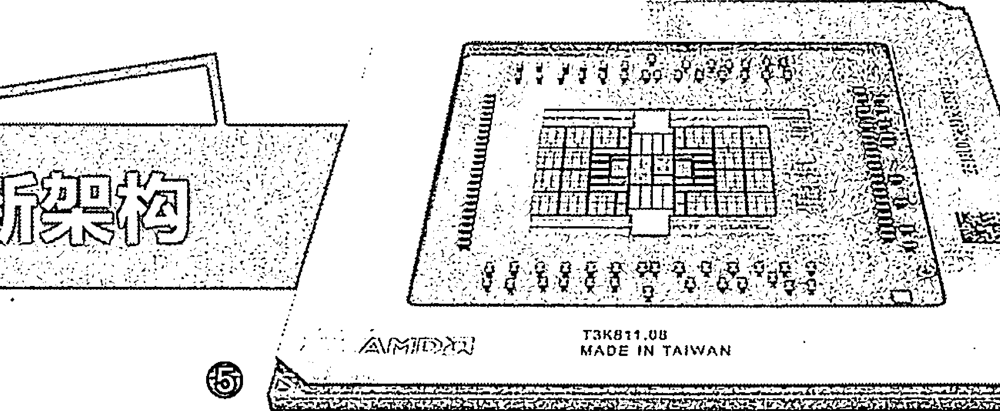

基于7nm新工艺的AMD Navi核心一直被认为仍继承GCN架构，因此很多人对其性能也就不太看好。不过随着它的正式公布，全新的RDNA架构(图5)突然出现在世人面前，随之而来的还有出乎很多人预料的性能。

要知道，随着GPU架构日益复杂，现在设计一个新的GPU架构甚至比设计一个新的CPU架构还要难，本次的RDNA架构就花费了长达四年的时间进行研发。它仍采用统一着色器方式，但标量和矢量单元走向融合，支持SIMT(单指令多线程)、ILP(指令集并行)、SIMD(单指令多数据流)，使得单线程性能和指令集执行效率都大大提升。它同时集成了GCN架构的指令以保持向下兼容，所以很多基于GCN的技术和优化设计在RDNA架构上也可以得到支持。

已经公布的Radeon RX 5700/5700XT(图6)采用的是Navi 10核心，集成了103亿个晶体管，比Vega 64的125亿个少了大约18%，核心面积更是小了近一半，只有251平方毫米，但性能却比Vega 64提升了14%，同时功耗降低了23%，因此单位面积性能提升了足足1.3倍，能效比则提升了50%(图7)。

## THE BEST 1440P GAMING GPUs

| 型号 | Core Clock | Boost Clock | Memory Clock | Memory Size | Memory Interface | Bus Width | Power Consumption |
|------|------------|-------------|--------------|-------------|------------------|-----------|-------------------|
| RTX 2060 SUPER | ... | ... | ... | ... | ... | ... | ... |
| RTX 2070 SUPER | ... | ... | ... | ... | ... | ... | ... |
| RTX 2080 SUPER | ... | ... | ... | ... | ... | ... | ... |

除了RDNA新架构，Navi核心还有支持GDDR6显存、PCIe 4.0总线、Radeon媒体引擎、Radeon显示引擎等全新特性。不过它却没有内置硬件光线追踪引擎，这也说明了GPU开发的复杂性，毕竟在4年前预测现在的需求是非常困难的事情。

RDNA架构的设计理念主要有四个方面，性能上要满足现代游戏的需求，能效上要充分优化功耗和带宽利用率，功能上要壮大生态，扩展性上要从移动到桌面到云端通吃。为实现上述目标，RDNA架构主要从CU计算单元、缓存、流水线三大方面进行了变革。

以目前已经公布的Navi 10核心为例，它拥有40组新型计算单元，每组有2个标量处理器、64个流处理器、4个64位双线性过滤单元。虽然每一组的流处理器数量没有变化，但执行延迟更低，整体计算能效比GCN架构有着巨大的提升。从实际游戏测试看，RX 5700(图8)和RX 5700 XT(图9)相对于类似价位的对手，在游戏性能方面都拥有比较明显的优势。

最后，它在AMD着力推广的异步计算能力方面也有加强，可以在DX12、Vulkan API下表现更好，更精准地实时控制其他模块。它还借鉴了Zen架构设计的一些先进理念，比如在时钟门控方面提升效率和能效比，同时减少了逻辑层级以达到更高的频率。

需一根数据线即可输出最高4K@240Hz、8K@60Hz的画面。同时它也优化了VR头显显示输出，提供了标准HDR和FreeSync 2 HDR画面输出能力，并针对高分辨率HDR显示器进行了优化。

RDNA架构集成了Radeon多媒体引擎大大改进了视频编解码，增加了新的H.265 HDR/WCG编码器，全面支持H.264

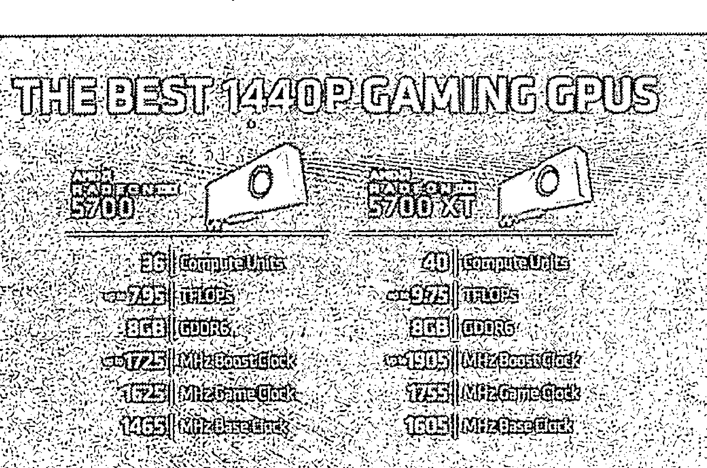

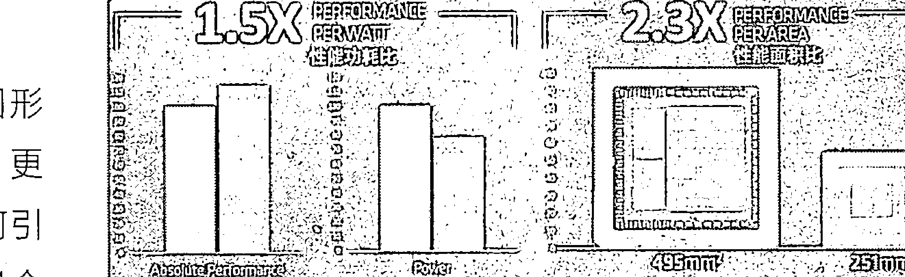

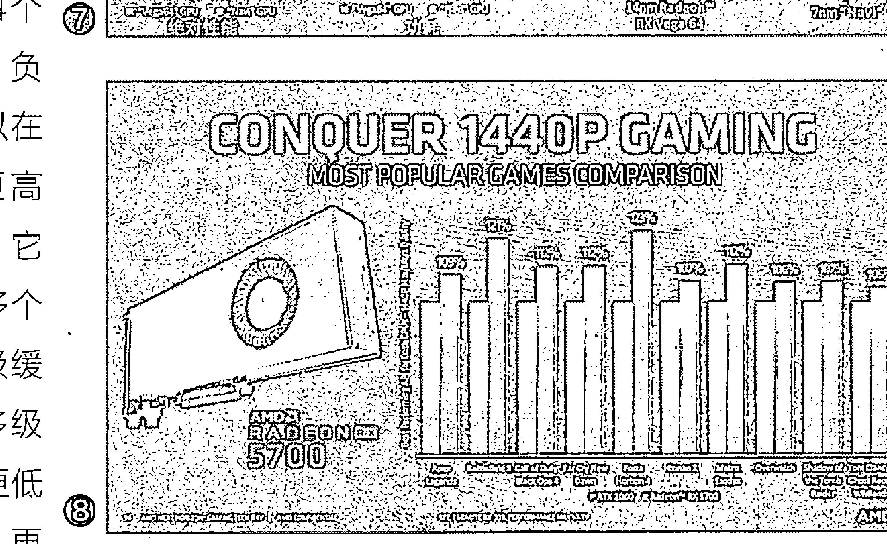

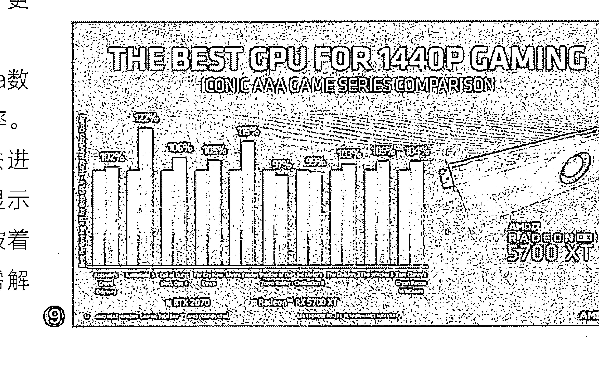

## Radeon Rays

1080P@600Hz、4K@150Hz、8K@30Hz解码和1080P@360Hz、4K@90Hz编码，H.265 1080P@360Hz、4K@90Hz、8K@24Hz解码和1080P@360Hz、4K@60Hz编码，VP9 4K@90Hz、8K@24Hz解码，整体编码速度加快40%。


虽然从功耗、特效支持等角度看，第一代RDNA还算不上成熟，但作为第一款使用7nm制程的消费级GPU，它还是给我们带来了不少新体验，例如超高的图像输出、视频处理能力等。而对玩家来说，细看其游戏测试就会发现，这是一款已经完全为1440P（2K分辨率）游戏优化的GPU和显卡，会推动这一分辨率为新的游戏主流设置。这一趋势也影响到了对手的产品，随后推出的英伟达RTX Super系列GPU中，面向最主流用户的RTX 2060 Super就将显存增加到了更适合1440P分辨率的8GB。

虽然目前的第一代RDNA架构没有专门的硬件光线追踪加速能力，不过AMD面向专业应用的ProRender早就提供了Radeon Rays光线追踪功能（图10），面向内容创作渲染和游戏开发，将其转移到消费级产品中应该并非不可能。据称在下一代RDNA架构上，AMD就会通过硬件单元支持光线追踪效果，不过AMD认为将其全部交给本地硬件处理的效率低下，未来会更多借助云计算来实现全场景的光线追踪，这一点与英伟达的DLSS抗锯齿技术有几分相似。

## 英特尔 Ice Lake 管窥未来架构

与前面提到的另外两款产品不同，英特尔新制程、新架构的Ice Lake CPU，或者说是第十代酷睿面向移动平台的产品，不仅推出时间更晚，也很可能不会有相应的桌面级产品。所以我们对它的了解，只能说是英特尔未来架构的一种管窥，希望能够窥一斑而知全豹，但免不了有所遗漏。在各种场合介绍Ice Lake的除了基于产品自身能力的性能、能耗、功能方面改进之外，RDNA架构还扩展到了移动市场上，授权给三星移动CPU使用，这一新兴的市场也许会让AMD显示技术获得更大的发展。同时AMD GPU也被新一代游戏主机继续采用，作为在PC之外的市场获得了广泛支持的显示架构，AMD GPU在未来的跨平台游戏、云游戏等应用模式中应该能取得一定的先机。

同时，英特尔特别强调的一点就是改变定位，它不是独立的CPU产品，而是英特尔六大技术支柱综合战略的一部分。而六大支柱指的是制程和封装、架构、内存和存储、互联、安全、软件（图11），它们将帮助英特尔从晶体管为中心转型到数据为中心，并且成为未来发展的基础。尽管CPU作为一款产品，在新

尽管CPU作为一款产品，在新

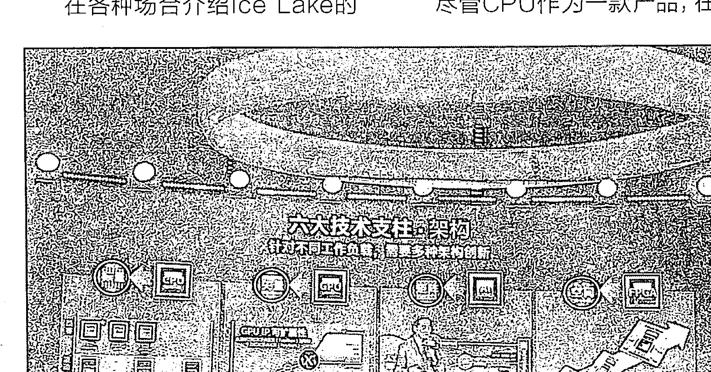

战略中的地位有所下降，但它却仍然是综合了六大支柱的能力的典型代表。以Ice Lake为例，它采用全新的Sunny Cove架构及Gen11核显（图12）、10nm制程、支持高达3733MHz的LPDDR4内存和傲腾技术、集成雷电3和Wi-Fi 6，并且进行了安全及软件优化，几乎涵盖了六大支柱的所有方面，是一款可以综合反映英特尔未来战略的产品。

首先是制程和封装，仅从14nm再到10nm的提升，就使得晶体管密度提升了2.7倍，达到了1亿个晶体管/平方毫米，为提升计算能力打下了基础。而在封装方面，Ice Lake也是用了更灵活的I/O控制模块与CPU模块分离的设计，并使用了钉等新材料（图13）。

英特尔未来还将引入3D封装技术Foveros，让设计人员可以在同一封装内“混搭”不同的计算单元、存储芯片和I/O配置功能模块，甚至其他各种功能模块，让芯片架构从二维走向三维，将带来指数级的性能和功能增长。

对英特尔来说，架构创新仍然是整体战略的主要驱动力，其中当然也包括Ice Lake使用的Sunny Cove架构。在内部计算能力的增强方面，其做法与AMD的Zen 2架构有异曲同工之妙，同样调整了缓存，将L1缓存增加了50%，L2缓存翻倍，同样提高了分支预测精度，降低了延迟，也大幅提升了支持的内存频率。

单元接口从8个增加到10个，提高了微架构的并行性能，这显然也是针对核心规模不断增长作出的调整。除此之外，它还提升了一些特定应用的能力，比如通过增加新的AES、SHA-NI指令提高了加解密性能等。所有这些调整的综合效果使IPC效能增长达到了18%，是自第六代酷睿推出以来最大的性能提升。

不过Ice Lake的通用计算能力增长与其核显的能力增长相比就不算什么了，它采用的核显升级到了Gen11架构，EU单元从目前Gen 9/10的最高24个提升至64个，在1.1GHz频率下，浮点性能高达1.12TFLOPS，FP16半精度更是高达2.25TFOPS。在游戏能力方面，它已经可以达到甚至超过锐龙7 3500U内置显示单元的水平（图14），可以在全高清分辨率下保证主流网游流畅运行，甚至运行3A大作时也可以达到30FPS以上的速度。

此外，Gen 11核显在解码、视频输出、垂直同步技术上大幅升级，双解码单元支持HEVC、VP9硬解，可使用DP 1.4、HDMI 2.0b接口进行三屏独立输出，最高可输出8K@30Hz、5K@60Hz、

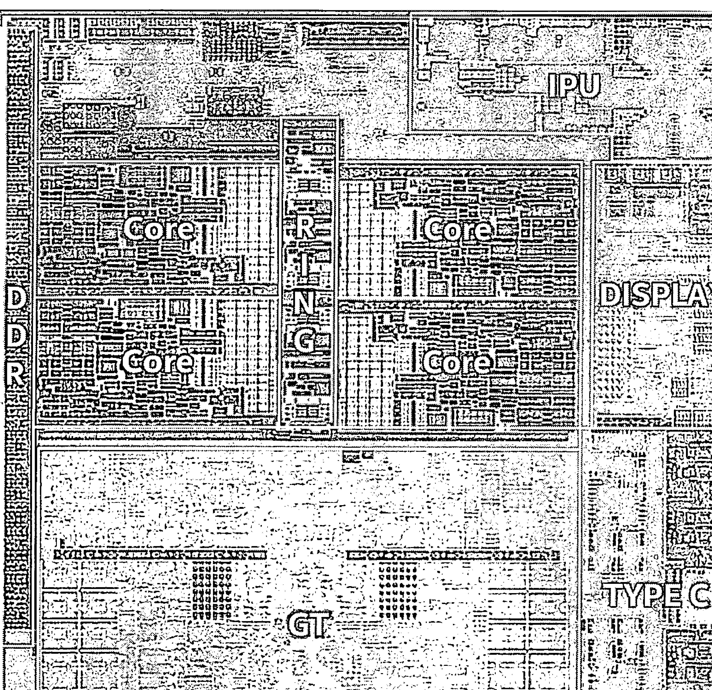

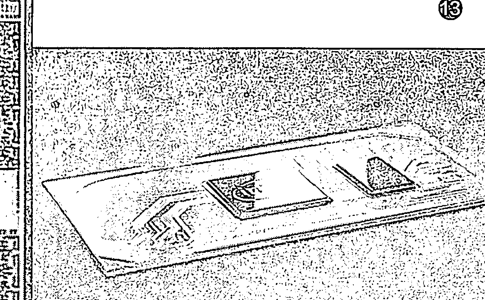

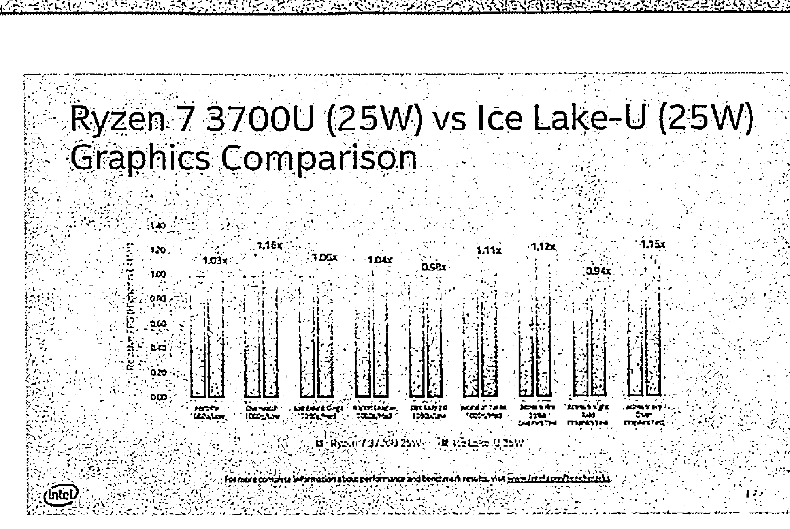

## 其他

4K@120Hz的10-bit画面，而且还支持Adaptive Sync自适应垂直同步技术，防止高速画面出现撕裂的问题。

存储方面，LPDDR4-3733MHz内存以及DDR4-3200内存可大幅提升外部数据交换能力，并且一举改变英特尔CPU在内存频率支持方面的短板。傲腾内存则拥有远高于一般SSD，更接近DDR4内存的读写性能，可以弥补内存与SSD之间的性能鸿沟。

在Ice Lake平台中，40Gbps速率的雷电3接口、近10Gbps的Wi-Fi 6无线标准都会成为内置标配。在这个数据为王的时代，更快速地连接海量数据也将带给Ice Lake巨大的优势。关于这两个技术及其应用、产品我们已经进行过比较

至于软件优化、安全性等方面的表现，Ice Lake及其配套芯片的表现同样会更加优秀。为了简化开发者的难度，Intel将推出One API的战略，可以简化跨CPU、GPU、FPGA、人工智能加速器等各种计算引擎的编程。该项目包括一个全面、统一的开发工具组合，以将软件匹配到能最大限度加速软件代码的硬件上。以AI加速为例，使用新的高效率AI指令后，Ice Lake CPU的AI性能相比八代酷睿可提升2~2.5倍。

详细的介绍，这里就不赘述了。

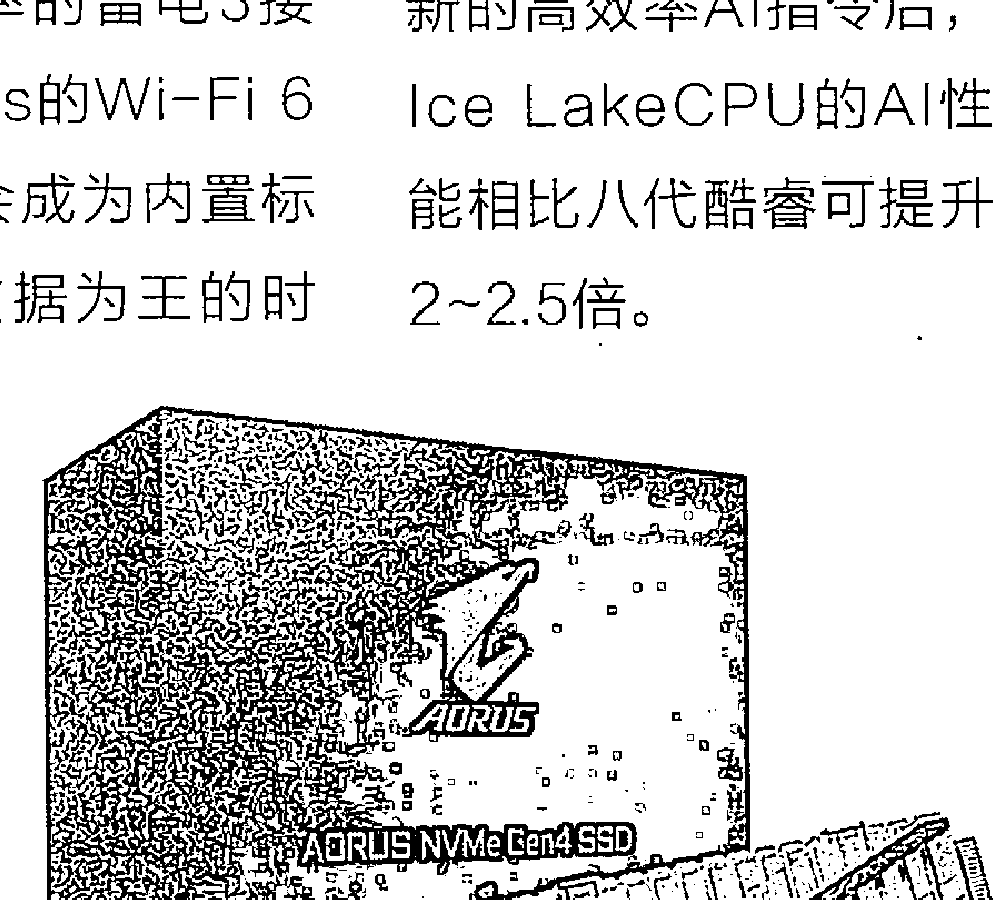

尽管除了CPU平台和显卡之外的各种产品，在2019年甚至2020年中并不会有形态方面的巨大改变，不过一些相关技术、产品却已经呼之欲出了。在这些新平台中，PCIe 4.0标准、雷电3、USB 4、Wi-Fi 6等技术将会造就更多强大的产品，虽然这些产品进入主流可能尚需时日，但它们对PC使用体验的提升将是非常巨大的，甚至可能会改变很多PC的传统应用模式。

以PCIe 4.0为例，AMD的第三代锐龙及其X570芯片组将提供带宽倍增的PCIe 4.0通道，同时基于Navi GPU的显卡也将支持这一标准。虽然从目前来看，主流独立显卡对外部带宽的需求远没有达到PCIe 3.0的极限，只有目前最强的旗舰级显卡在组建多显卡模式(PCIe 3.0 ×8通道)的时候，才会有外部带宽不足的问题。不过在显卡之外，目前另一个PCIe通道的主要用户——M.2 SSD却已经迫切地呼唤着带宽的突破了，支持PCIe 4.0的SSD主控芯片和相关产品(图15)已经进行了展示，而传输速度则突破了5GB/s，将彻底改变目前数据存储成为PC中最主要“瓶颈”的尴尬地位。

解决目前的瓶颈之后，我们会发现基于PCIe 4.0×4通道的SSD速度已经非常接近内存，那么存储系统只作为一个数据存储的空间使用就有些浪费了，一些新的应用方式将出现在新的PC中。比如可以将高速SSD融入CPU-内存体系中，让一些原先易失性的数据在SSD上获得半永久的保存，关机后内存数据并不会丢失，下次开机后就能直接进入关机前的运行状态，例如QQ直接在线、所有工作可继续进行等。而在笔记本电脑耗尽电力、台式机突然断电的情况下，这一能力更会为用户带来前所未有的便利与安全。

这样的愿景还远非这次平台升级带来的最大变化，因为我们即将迎来的这次PC平台升级影响将极为深远，很可能会在20年代带给我们完全不一样的PC设计和使用体验，让大家进入一个全新的PC时代。


## 解锁未来

## 5G已来

在2019年第7期的特别话题栏目中，我们通过巴塞罗那MWC2019大展分析了智能手机未来的发展趋势。2019年6月26日~28日，上海世界移动大会（MWC19上海）再次于上海新国际展览中心拉开帷幕，5G成为了本次展会中的重头戏，无论是运营商、芯片供应商、OEM厂商还是其他产业链相关的企业都进行了和5G相关的技术示范和体验活动。可以说，我们和5G之间只差临门一脚。本期特别话题，就让我们聚焦5G手机和相关应用的最新进展吧。

### 5G技术不仅仅是高速

CFan曾不止一次解读过5G技术，感兴趣的朋友可以参考本刊2018年第20期《写在5G时代来临之前 理性看待第五代移动通信技术》这篇文章。5G技术最大的特色就是快（图1），然而，普通消费者也非常容易因为这个特性而忽略5G技术的其他特征。

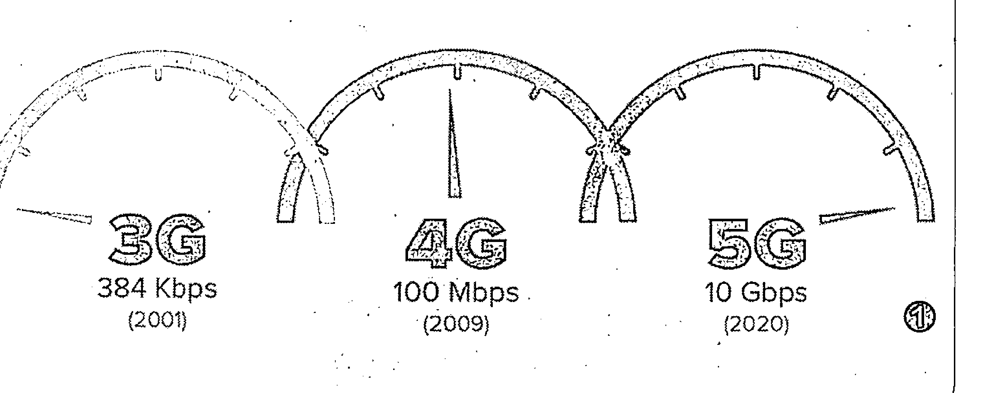

### 只认速度你就输了

我们都知道，手机联网速度的快慢取决于调制解调器（基带芯片）和天线设计。在天线不拖后腿的前提下，4G手机时代的巅峰是2Gbps（骁龙855搭配的骁龙X24 LTE基带芯片）（图2），而5G网络初始的下行峰值速度就能达到10Gbps，后续还能进一步加速到20Gbps。当然，这些都是理论参数，第一批5G手机理论的峰值速度只有4.5Gbps左右，实际速度还得再打一番折扣。

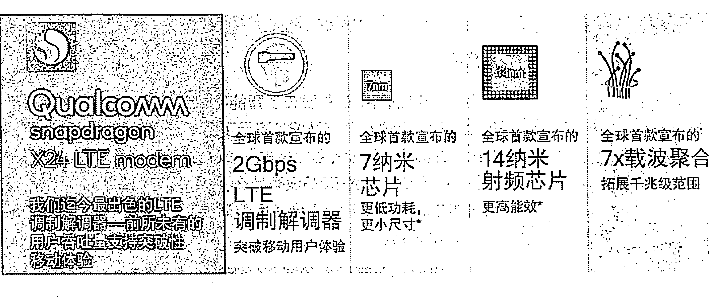

但是，5G拥有10倍于4G的速度依旧是不争的事实，而这也让10秒钟下一部高清电影变成了可能。相信很多朋友对5G的理解，也仅限于x秒下电影这个卖点吧？然而，超高的网速仅仅是5G技术的特色之一，国家的天量投资不可能只是为了方便大家追剧这么简单。

实际上，4G网络诞生之初，很多人对它的理解也是在线看视频更爽，仅此而已。然而，4G网络真正搭好之后，我们才发现它推开的其实是真正意义上移动互联网时代的大门，移动支付、快车外卖、智能家居的崛起，它颠覆了无数领域原有的运行轨迹，让我们的生活变得更加便捷智慧。

5G网络也是如此。我们现在只能说，它将打开一扇“走向未知的大门”，5G会将网络的边界，从连接人与人，拓展到万物互联，从而为各行各业都带来具有无限想象空间的全新业务场景。5G到底能颠覆哪些行业，开创哪些奇迹，只有过些年返回头才能后知后觉。

## 5G带来的种种可能

除了速度更快（eMBB，增强移动宽带），5G技术还有很多改进，但其中最核心的则是两个杀手级特色，那就是低于1毫秒的延迟（uRLLC，超可靠低时延通信），以及可以万物互联的属性（mMTC，海量物联网）（图3）。其中，低延迟为无人驾驶和远程手术等应用奠定了坚实的基础。

在MWC19上海5G峰会现场，就进行了一次实时的5G远程手术指导演示：凭借中国移动提供的5G网络连接，巴塞罗那临床医院胃肠手术服务负责人在上海新国际博览中心的场馆里，为上海东方医院手术室提供了远程实时指导（图4）。医院现场执刀医生表示，与4G时代网络延迟造成的图像卡顿不同，5G网络下图像和视频影像传输的清晰度和速度都有极大的提升，毫无卡顿和延迟，这对于医生实际手术提供了非常大的帮助。在可以遇见的未来，患者只要上了救护车，就等于已经进了手术室，利用5G提供的超低时延和超快速度，远在医院的主治专家就可以实时对救护车内的情况进行指导和监控，所有的患者监测数据也都会实时进行传输。

如果说远程手术与我们相距太远，手机厂商在MWC19上海中演示的5G应用场景则更具实际意义。在OPPO/vivo展台，Reno 5G版

本图来自中国移动官网5G专题截图

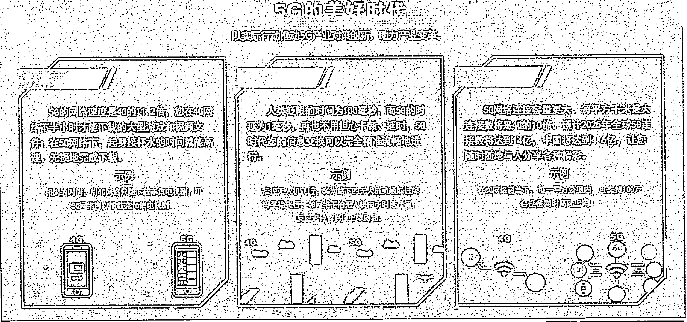

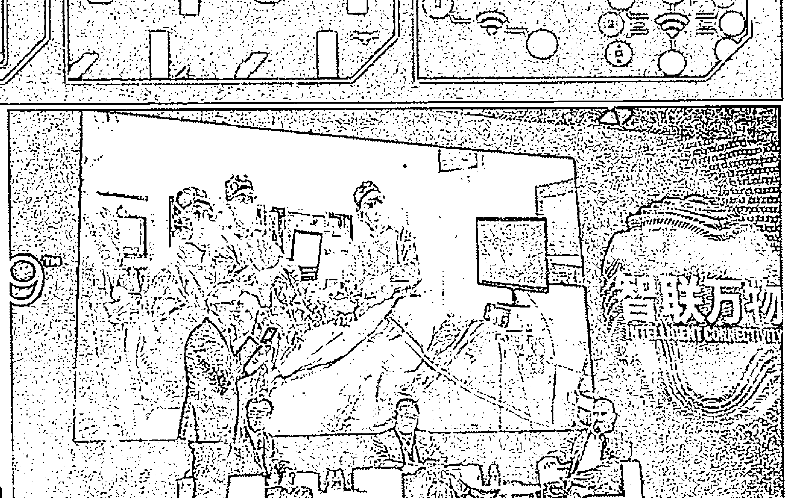## 小提示

在MWC19上海中，三星发布了智能手机新拍照技术，高通带来了智慧型无线音频方案，OPPO演示了屏幕摄像头技术和可让手机变身对讲机的“无网络通信技术”，vivo还曝光了120W超快闪充技术。上述技术虽然和5G没有什么关系，但它们却都能显著提升用户的实际体验，CFan也会在后面几期杂志中对这些新技术进行解读，敬请期待。

和iQOO 5G版手机可以在云端极速加载大型手游(无需下载客户端)或PC平台的游戏(如《英雄联盟》)(图5)，可立刻让“手机变电脑”，搭配键盘鼠标就能相对完美地运行。没错，这就是我们常说的“云游戏”(对这个话题感兴趣的朋友可参考本刊2019年第12期《云游戏 浅析游戏主机的“终结者”》这篇文章)，5G网络让手机的云游戏体验接近完美。


存储空间和PC、服务器等设备共享的方案，让每个人都能拥有专属的高速“VIP云盘”。

华为在MWC19上海展示了5G网络技术、行业应用方案和终端产品，其中最引人注目的就是通过5G网络进行8K分辨率的现场刺绣视频直播(图8)，结合8K高清电视的清晰画面，让整个过程的细节都能尽收眼底，观感震撼。

vivo在MWC19上海中还展示了vivo AR眼镜(图6)，连接手机后它可以实现移动办公、AR游戏、3D高清视频、识人识物等功能。借助5G网络的高速和低延迟特性，AR眼镜可以更加充分地挖掘手机的计算能力和联网能力，并将它们扩展到增强现实世界的范畴中(图7)。同时，vivo还提出了通过5G将手机的

总之，小到IoT物联网设备、智能手机、个人电脑，大到智能电视、智能汽车，以及面向行业的工业物联网、智慧城市、智慧交通，这些领域都会因5G网络以及人工智能、物联网和大数据等新技术的融合而带来各种场景体验革新，一幅由数字化赋能的美好未来即将在我们眼前展开，从而诠释4G改变生活、5G改变社会的历史意义。


## 5G崛起就在今朝

步入2019年，整个世界都加快了对5G网络的推广步伐，比如韩国、美国、瑞士、英国最早在4月、5月份就先后开通了5G网络的试运营。6月6日，我国工信部也正式向中国电信、中国移动、中国联通、中国广电发放5G商用牌照（图9）。


## 现在的5G还不是真5G

虽然5G商用牌照已经发放，但我们还是需要认识到一点：5G标准至今还没有被完全制定下来。关于5G，业内将其划分为R15和R16两大阶段，其中R15还可细分为R15 NR NSA (新空口非独立组网, 2017年12月已完成)、R15 NR SA (新空口独立组网, 2018年6月已完成)和R15 Late Drop (原计划2018年12月完成，但却推迟到2019年3月才完成)。R15 Late Drop标准的延期，也拖累了R16标准的制定，从原计划的2019年12月推迟到2020年3月，而R16 ASN.1则更是要推迟到2020年6月（图10）。换句话说，真正的5G标准，可能要等到明年年中才能最终确定。当然，这并不妨碍5G网络和手机的推广计划，毕竟4G标准也是一路优化升级下来的，你不能说第一批4G手机因速度慢（相对4G+）、标准略有落后就不是4G手机。

## 运营商的推广计划

在MWC19上海展中，7个展馆全部实现了5G网络覆盖，中国移动包揽了整个场馆的沉浸式5G体验。在展会期间，中国移动正式发布了5G品牌“5G+”，并计划在2019年内建设超过5万个5G基站，并在超过50个城市提供5G服务。中国电信2019年关于5G的推广规划，是将在超过40个城市推出5G NSA/SA混合组网，目标在2020年率先启动SA网络升级。在MWC19上海展中，中国电信演示了5G在针对垃圾分类、远程操控、生活机器人和智能水循环的海绵城市建设等项目中起到的作用。中国联通在今年的计划则是在7个特大城市、33个大城市提供5G网络覆盖，并将重点覆盖多个垂直行业应用。和移动、电信相比，中国联通更加注重在eSIM上的探索和布局，而且联通还是北京冬奥会以及残奥会的官方通信服务伙伴，在智能化观众体验和高清转播等5G服务方面应该更有心得。

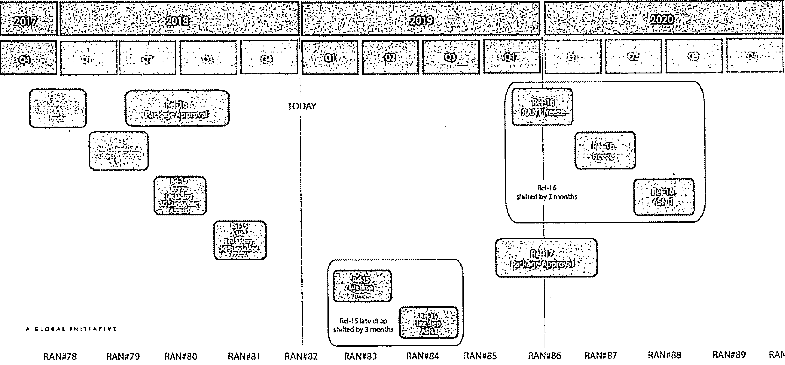

## 2G和3G何去何从

随着5G商用步伐的临近，不少依然在使用2G和3G（主要指终端设备，如老年手机或四五年年前的老款手机）的边缘用户群体又该何去何从？
据统计，目前我国2G/3G用户分别有2.4亿和1.3亿，这一体量甚至超过了全球大多数国家的总体移动电话用户量。因此，即使三大运营商很早就开展了2G退网的工作，但短时间内彻底关闭2G网络并不现实，要知道现在很多语音通话还运行在2G网络上，而2G网络还承载着一部分物联网的任务。相对而言，中国移动的3G（TD-SCDMA）很可能会早于2G退网，中国移动在2018年7月发布的《5G终端产品指引》就显示不再要求终端支持TD-SCDMA（图11）。

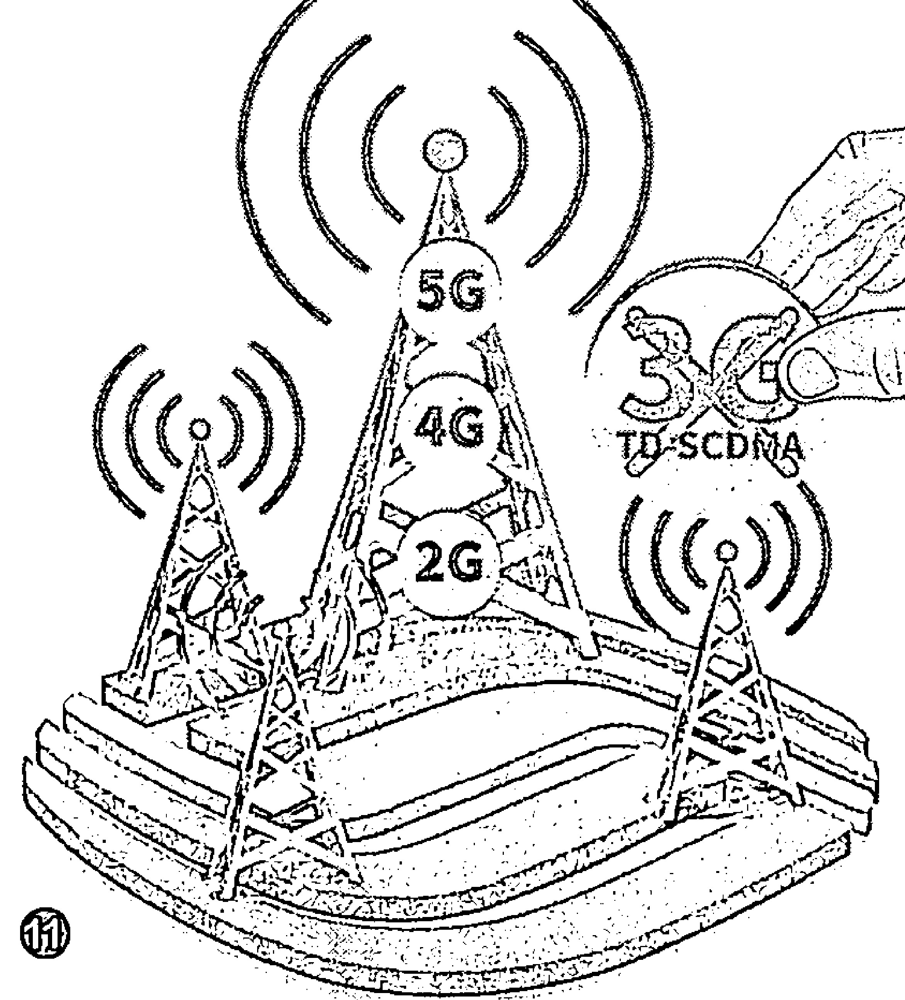

总之，虽然4G已经普及，5G商用在即，但2G/3G彻底退出历史舞台却仍然需要许多年的过渡。换句话说，在你现 在正用的2G、3G老款手机坏掉之前，依旧可以放心地拨打电话。

> **扩展阅读：**

### 虚拟运营商的败退

在4G时代，虚拟运营商曾一度风生水起，差异化的流量套餐计费方式曾吸引过不少用户尝鲜。然而，近年来虚拟运营商却深陷各种负面的漩涡，搜索虚拟运营商，“被工信部约谈”、“诈骗的代名词”、“失控的170号段”、“流量造假”、“骚扰短信/电话”、“不支持绑定网易邮箱”、“无法携号转网”等关键词历历在目。步入5G时代后，虚拟运营商的处境能否有所好转？这还得等时间来证明。

## 真伪5G之争

在GTI2019峰会中，中国移动董事长杨杰曾提到：“从2020年1月1日起，单模NSA的手机将不可入网。”没想到，这句话却在手机圈掀起了轩然大波——“只有华为是真5G，高通5G手机明年就断网”一类的言论在网上疯传。那么，事实真的如此吗？

> **知识点一**

### 关于SA/NSA两种组网模式

**NSA，“非独立组网”（Non-Standalone）的5G网络模式**


**SA，“独立组网”（Standalone）的5G网络模式**


## NSA与SA组网之别

和4G相同，5G也是需要不断完善优化的，特别是连5G标准还未最终确定的今天，5G网络的搭建需要经历从NSA（非独立组网）向SA（独立组网）的过渡。这两种组网方式都符合3GPP制定的5G规范，共用一套通用的空口物理层，它们的差异主要体现在：
NSA非独立组网是给现有的4G基站加装5G网络所需的硬件，属于在原4G基站基础上的优化升级，4G和5G共用核心网，运营商能借此节省早期基站建设的开销，但缺点是无法支持5G专属的低延时等新特性。而SA独立组网指的是另起炉灶，采用5G专用的硬件直接建立全新的5G基站，可以提供更好的5G性能并享受低延迟和万物互联等新特性，只是SA独立组网的成本更高，需要更长的部署时间(图12、图13)。

换句话说，NSA是5G的初期方案，而SA则是5G的终极形态。

目前己经量产的5G基带芯片只有华为巴龙5000和高通骁龙X50，前者可以和麒麟980移动平台搭配，而后者则是骁龙855的最佳搭档，赋予手机5G高速联网的能力。

问题来了，由于骁龙X50仅支持NSA非独立组网(图14)，想要同时支持5G和4G，在外挂骁龙X50基带的同时还需捆绑骁龙855内集成的基带，无形中增加了耗电。同时，当骁龙855和骁龙X50结合后，高通系的5G手机将不再支持双卡双待，重新复古回归单卡时代。华为巴龙5000支持SA/NSA双模5G组网，一颗基带就能满足4G/5G联网需求，而且可同时支持一张5G卡和一张4G卡，符合5G网络未来的发展趋势。

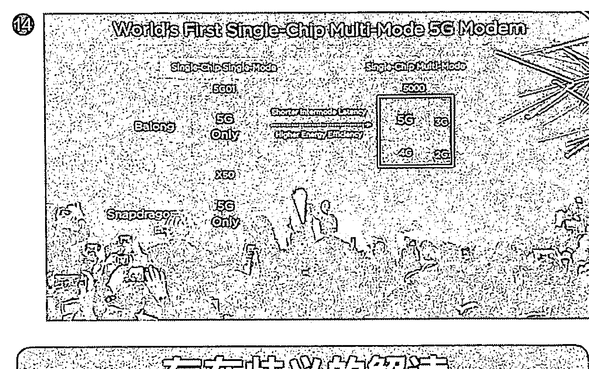

## 存在歧义的解读

中国移动将在2020年1月停止单模NSA手机的入网，并非是关停单模NSA的5G网络，而是在明年之后不再给单模NSA的手机提供进网许可证。换句话说，2020年1月1日起，所有的新款手机必须支持SA/NSA双模5G组网，但这并不影响2019年内发售的骁龙系5G手机的使用。而到了2020年，高通系新机也都会升级到骁龙865和骁龙X55基带的组合。

这一点其实不难理解，就连中国移动旗下的自主5G品牌手机——先行者X1都选择了骁龙855和骁龙X50基带的组合，你觉得中国移动在未来会切断自家产品的5G信号吗？

### 知识点二

## 支持SA/NSA的5G双模手机有什么好处

好处就是: 适用范围更广!
5G双模手机，在SA/NSA两种网络环境下均能使用。

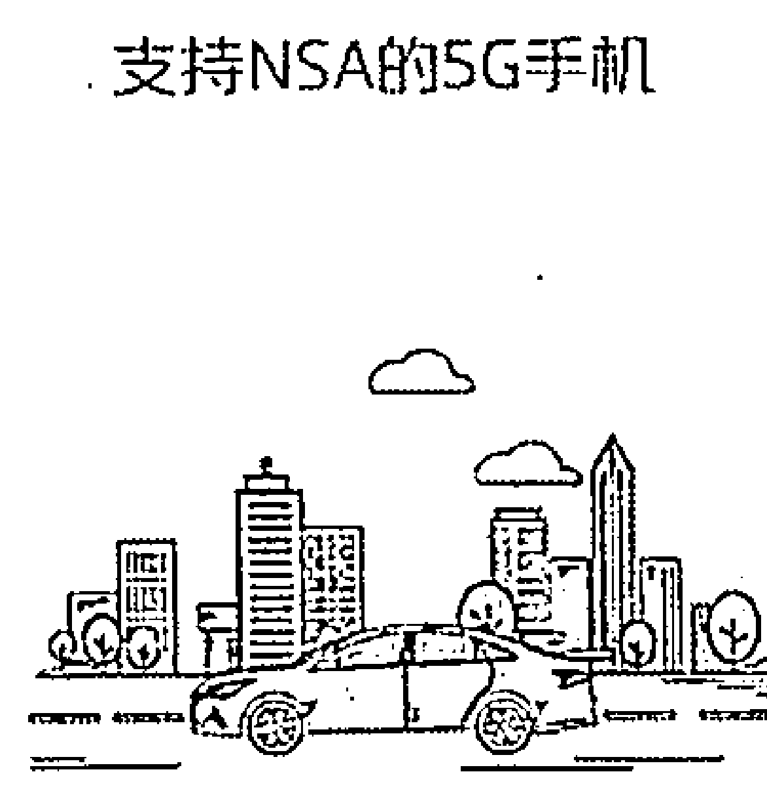

支持NSA的5G手机

我只能在公路上行驶


支持SA/NSA的5G双模手机

公路/山路我全都能行驶

## 不存在真伪5G手机

虽然SA独立组网优势多多，但当第一代5G手机退役之前，SA基站也许还没有大范围铺开。因此，在未来很长一段时间内，无论是NSA还是SA的5G手机，使用体验都是一致的(图15)，只能说华为系的5G手机占得了先机，但它在产品的丰富性和性价比方面却无法和高通骁龙系5G手机抗衡，而后者在网速上也不会输给前者就对了。当然，额外的耗电和仅支持单卡，这口苦水就必须忍痛咽下了。


## 5G手机普及之路漫漫

随着5G商用牌照的发放，距离第一批5G手机上市的时间节点也越来越近。那么，如果你希望第一时间感受5G的极速，可选的5G终端都有谁呢？

## 旧瓶装新酒的策略

在国内，编号001的首张5G终端电信设备进网许可证被华为拿下，但该品牌推出的第一款5G手机却并非最高旗舰Mate 20 Pro或P30 Pro，而是定位影音游戏的Mate 20X 5G升级版（图1）。这款产品拥有7.2英寸的超大屏幕和5000mAh的超大电池，从侧面也预示着影音娱乐和更大的电池就是5G手机的标准特性。

与此同时，OPPO、vivo、三星、小米和努比亚也公布了旗下首款5G手机的信息，而这些产品和华为Mate 20X 5G版相同，都采取了“旧瓶装新酒”的策略——在原有产品的基础上外挂5G基带芯片，从而获得了5G通讯的能力。

其中，OPPO首推Reno 5G版，该产品的前身是Reno十倍变焦版，凭借骁龙855移动平台、潜望式的长焦镜头、10倍混合变焦以及60倍数码变焦的特色，堪称未来一段时期拍照最强的5G手机。

vivo选用了因充电速度快、游戏体验出色、性价比高而闻名于世的子品牌iQOO作为旗下5G手机的先行军（图2），被赋予5G功能后有望继续保持其高性价比的优势。

小米和努比亚的5G手机分别以MIX3和nubia X为原型，前者主打滑盖全面屏，而后者则以前后双屏设计为特色，让经典的前辈获得了更高的联网速度。此外，三星的5G手机源于现有的Galaxy S10、S10+以及A80，该品牌为了推广5G手机，还推出了“5G先锋计划”——

从即日起到8月31日期间购买三星Galaxy S10系列或者A80手机，可通过支付99元加入“三星5G俱乐部，当三星5G手机正式推出之后，俱乐部成员通过办理运营商指定的合约和话费预存，可最低0元置换三星5G手机（图3）。这样一来，三星的5G新品说不定反而会成为未来最实惠的选择。

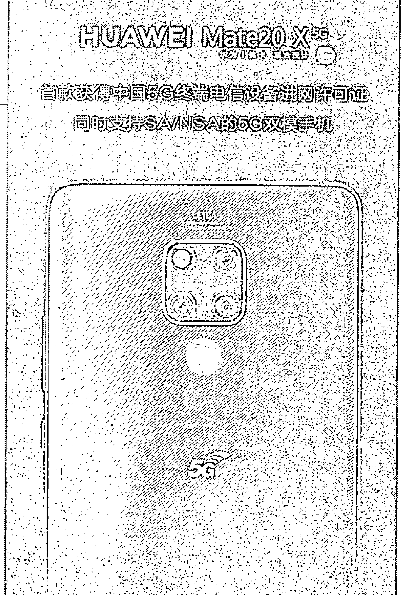

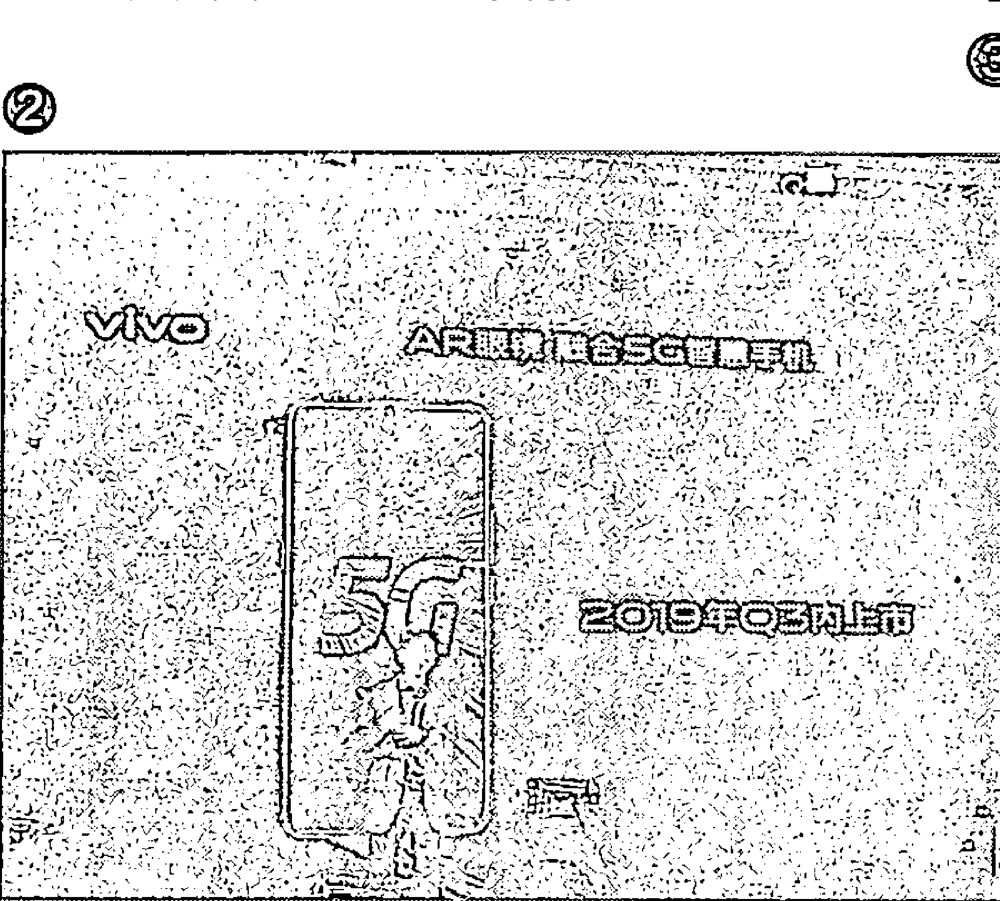

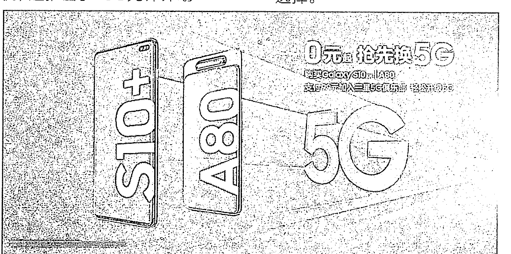

## 理性看待第一批5G手机

### 扩展阅读：运营商也来凑热闹

中国移动也计划在8月份推出首款自主品牌5G手机——先行者X1(图4)，这款手机将搭载高通骁龙855芯片，采用6.47英寸Amoled柔性水滴屏，拥有高达120% NTSC色域的屏幕，再结合双SmartPA、超线性双扬声器和DTS-X Ultra纯美音质，可以更好地发挥5G网络在影音游戏方面的体验优势。

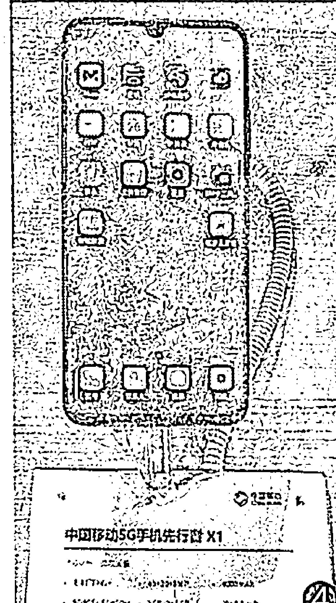

理论上，5G手机就是在原4G手机的基础上外挂一颗5G基带芯片即可，但其背后却还涉及到很多问题。vivo 5G通信研究院总经理秦飞就曾表示：“5G终端对天线设计和布局(图5)、主板面积、散热问题、协议适配及稳定性都提出了更高要求，研发难度要比4G设备更高。” 实际上，除了开发难度提升外，外挂的5G基带还会带来额外的耗电。因此，除了小米MIX3 5G版对电池容量有所增加外，其他5G手机如果在电池不变的基础上引入5G功能，其续航时间难免会出现一定的缩水现象。

在MWC上海的中国移动5G+发布会上，中国移动副总裁李慧镝表示，中国移动将在7月正式发售5G手机；但由于首发机型都属于各大终端厂商的旗舰升级版，所以售价都不便宜。但是，随着5G大规模商用，手机厂商肯定会把5G终端从旗舰机拓展到中端或者低端机型。而中国移动计划在2020年底推出1000元~2000元档的5G手机，直切普及价位。

总之，2019年无疑是5G手机的普及元年，但就好像当年4G手机刚上市时一样，第一批产品也会面临售价不便宜、网络覆盖不完善、套餐价格相对高昂的问题。因此，对普通消费者而言，我们没有必要为了5G而推迟现有的购机计划，5G网络真正普及的时间节点，最早也得是2020年底，届时咱们再换一台第二代甚至第三代5G手机岂不更好？

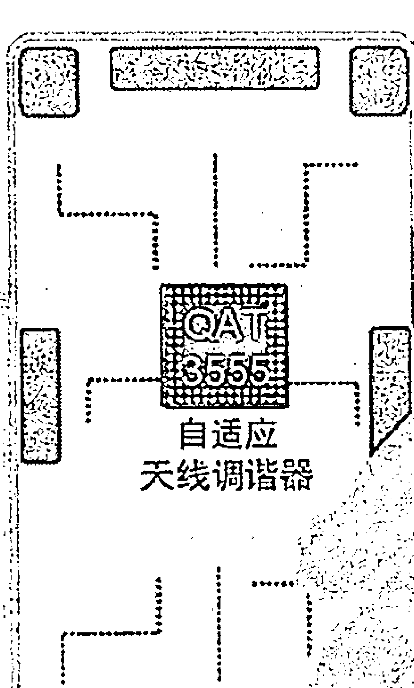

## 关于5G收费的标准探讨

既然5G手机即将来袭，另一个重要问题也要提上日程了，那就是——5G的收费标准高不高？

## 区分理论网速和实际网速

如今中高端4G手机所集成的调制解调器(基带芯片)的理论下行速率就达到了600Mbps或800Mbps (这个数字除以8就是我们熟悉的MB/s下载单位了)，而旗舰级4G手机则具备超过1Gbps的理论下行速率。

然而，现实中4G手机在绝大多数地区所能取得的实际下行速率却只有30Mbps到100Mbps之间，也就是4MB/s~12.5MB/s。大家在使用4G网络下载更新《王者荣耀》升级包时，是不是就这个网速？

未来的5G手机同样会面临这个问题。

以华为巴龙5000基带芯片为例，它在Sub-6GHz频段(低频频段，5G的主用频段)具备4.6Gbps的理论下行速率，在毫米波(高频频段，5G的扩展频段)则可达到

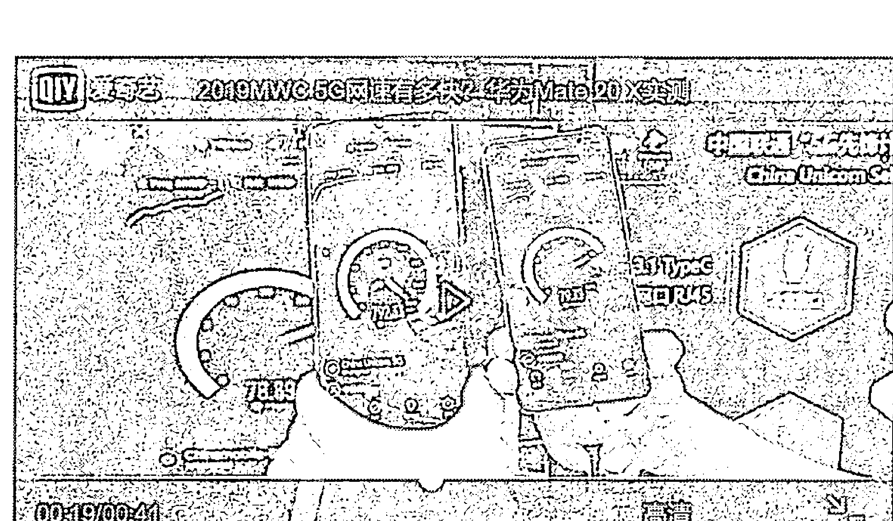


6.5Gbps。然而，无论是搭载麒麟980+巴龙5000的华为Mate 20X，还是武装高通骁龙855+骁龙X50的iQOO 5G版，它们在MWC上海现场实测的下行速率却都在800Mbps到1000Mbps之间（图6），距理论值还有很远的距离。

从这个现象我们不难得出一个结论，理论速率都是在实验室环境下测得的数据，实际生活中想想就好（受制于运营商4G/5G基站覆盖范围和强度，5G手机基带和天线矩阵的性能）。

即便如此，5G手机的下载速度远超4G手机却是不争的事实，二者相差10倍左右（5G实际上传速度提升了2倍~3倍）。下载一部1GB的标清视频，4G手机需要80秒，而5G手机则只需8秒。除了网速更快以外，5G还解决了网络拥堵和信号延迟的问题（图7），在聚集大量用户的体育馆等封闭场所，4G手机经常出现网络瘫痪的现象，而5G手机则能继续保持远超4G网络的信号和速度。

## 5G测试统一套餐曝光

和从3G升级4G手机需要更换USIM卡不同，理论上现有的4G USIM卡都能直接支持5G网络。中国移动在5G+媒体沟通会上就曾表示，该公司将于2019年9月底前在超过40个城市推出“不换卡、不换号”的5G服务，并曝光了5G测试统一套餐——包含200GB流量/月、1000分钟语音/月和100条短信/月（图8），但具体价格未定。

那么，200GB/月的流量够用吗？

考虑到如今4G手机用户每月的平均流量都不足20GB，哪怕5G的网速10倍于4G，200GB流量应该也是够用的。但是，正是因为5G网络太快了，这就需要我们养成更好的联网习惯。

- 避免因Wi-Fi信号差而自动切换回5G联网
- 熄屏后清理后台程序
- 防止浏览器/软件商店自动下载升级APP
- 防止视频类APP自动缓存整部剧集


> 【#中国移动5G测试套餐#曝光：多少钱你可以接受？🙂】今日，中国移动5G测试统一套餐曝光，200GB流量/月、1000分钟语音通话/月、100条短信/月，唯独没有提到套餐价格，你觉得5G套餐定价，多少钱你可以接受？ #中国移动5G测试套餐# 曝光：多少钱你可以接受？
> 06月25日 15:01 来自 微博 weibo.com

总之，进入5G时代后，按照流量计费的方式是最不合理的，虽然运营商和手机系统都能随时查看流量或发送流量使用情况的通知（或短信），但因步骤繁琐或通知延迟，当你收到提醒时往往又已经耗费了更多的5G流量。因此，流量全包（按月或天设定指定流量，超过限速）和定向流量（指定APP不计流量免费用）可能更适合5G时代的发展。

> **扩展阅读：**

**国外运营商5G如何收费**

以沃达丰在英国7座已经开通商用5G网络的城市为例，计划采用高速网络和不限量流量套餐的运营策略。具体来说，网速最高为2Mbps的5G套餐资费为每月23英镑（约合198元人民币）；网速最高为10Mbps的5G套餐资费为每月26英镑（约合224元）；不限速5G套餐为每月30英镑（约合259元）。

## 来自第六代Wi-Fi的反击

随着第五代移动通信技术（5G）正式商用，同属第五代的Wi-Fi技术（802.11ac）的处境就非常尴尬了，除了不存在流量费用外，无论是网速、设备连接数还是网络延迟，5G都拥有秒杀802.11ac的资质。那么，当5G网络和5G手机普及后，Wi-Fi又该如何应对？

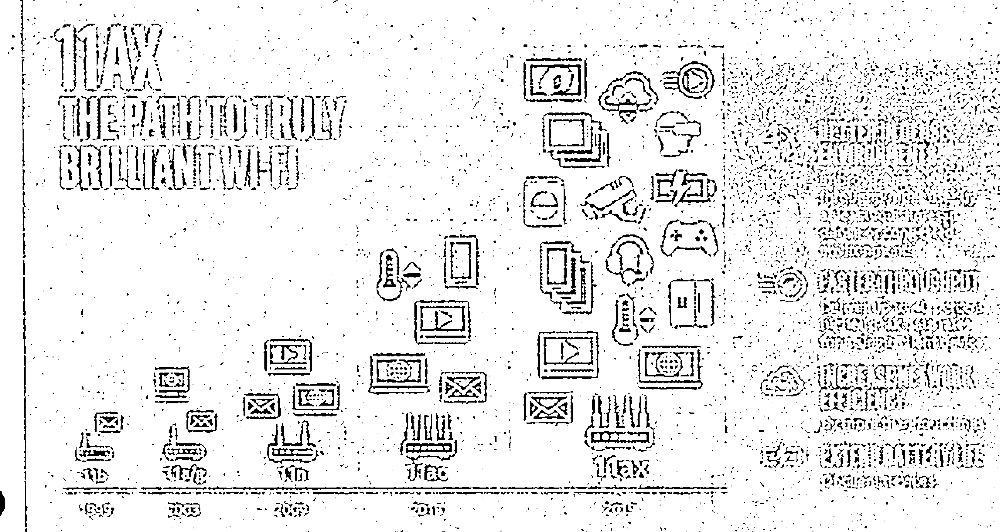

## 第六代Wi-Fi技术出炉

既然移动通信技术能从4G迭代到5G，Wi-Fi自然也具备进化的能力。这不，第六代Wi-Fi（Wi-Fi 6，即802.11ax）就已经做到了迎击5G的准备。简单来说，Wi-Fi 6融合了很多5G的关键技术（如MU-MIMO），其理论峰值速度可达9.5Gbps，和5G理论的峰值速度处于同一个档次。同时，Wi-Fi 6较之上代Wi-Fi 5的网络带宽提升了4倍，可同时连接更多设备，覆盖范围扩大20%，网络时延降低至20ms，支持全新的安全协议WPA3，优化功耗表现，还可兼容过去的Wi-Fi标准（图10）。

需要注意的是，Wi-Fi联盟需要等到2019年秋季才会正式推出Wi-Fi 6的认证计划，虽然现在已经有不少路由器和终端设备都号称支持第六代Wi-Fi（在参数上会注明802.11ax-ready），但只有贴上Wi-Fi 6认证标签的产品才能确保100%的性能、兼容性和完整的功能。

## 与5G形成优势互补

当5G和Wi-Fi 6的速度有所重叠后，并不代表相互取代，这两种无线技术的协同合作，才是未来移动生活体验的最大保障。

5G的优势，是只要在5G信号覆盖的范围内，你随时都可以通过移动网络进行超高速、低延迟的联网。但是，由于5G的频谱、频段和频率较高，所以5G信号的穿墙能力相对薄弱，在密集楼宇的室内、密闭的电梯和地下室等环境中，如果没有运营商部署的大量微基站，很可能会自动降速到4G网络甚至没有信号。而Wi-Fi 6则可通过路由器、中继器和电力猫，将信号覆盖到室内每一个角落，不留死角。

此外，就普及速度和搭建难度而言，5G要比Wi-Fi 6困难得多。对5G来说，你首先需要购买一部5G手机，还必须身处运营商5G基站的覆盖范围。

内，瓶颈源于运营商，个人无法干预。而Wi-Fi 6则只需购买支持该技术的终端（手机、笔记本等），再购买一台支持Wi-Fi 6的路由器即可使用，这种成本凭借个人能力就能解决。因此未来很长的一段时间内，我们可能会过上在室内使用Wi-Fi 6、出门使用5G网络的生活，两者在工业生产、物联网、智能驾驶等诸多领域都有很大的应用潜力和想象空间，帮助各行各业迸发出新的生产力（图11）。

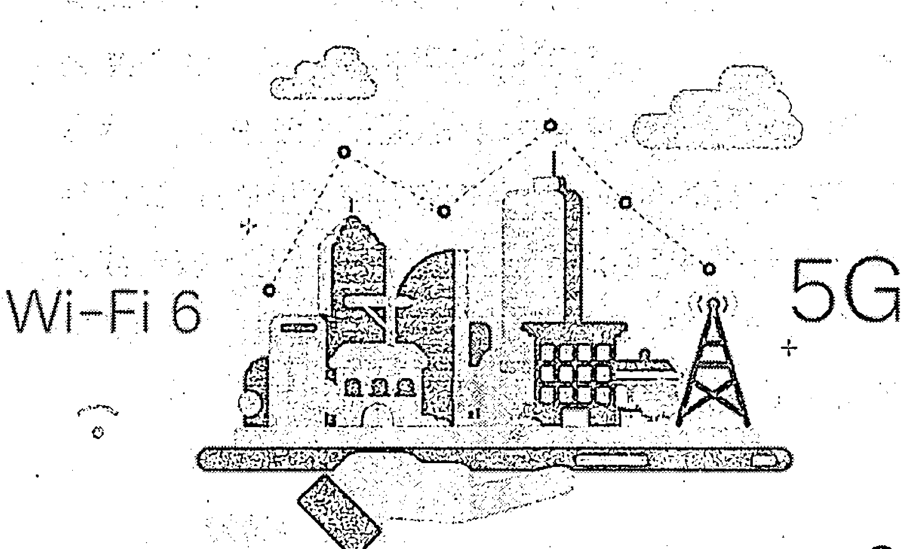

## 支持Wi-Fi 6的设备

目前支持Wi-Fi 6的手机处理器（SoC平台）只有高通骁龙855和骁龙730（图12）。但是，Wi-Fi 6对这些SoC而言也属于可选功能，比如搭载骁龙730的Redmi K20和联想Z6就都不支持Wi-Fi 6（图13），搭载骁龙855且支持Wi-Fi 6的旗舰手机中，也仅限于三星Galaxy S10系列。因此，如果你希望未来的手机能进行高速Wi-Fi连接，那就需要仔细查询官网参数列表有关Wi-Fi性能的描述了（图14）。

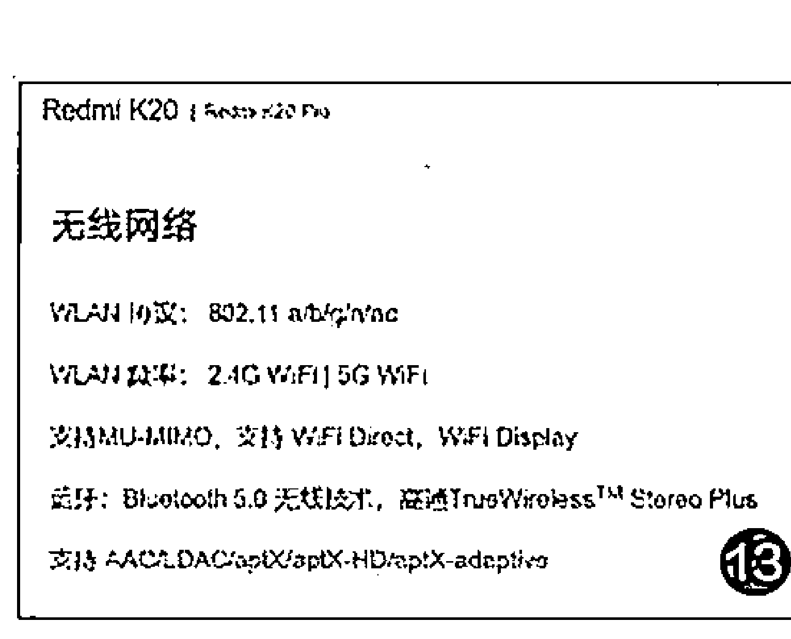

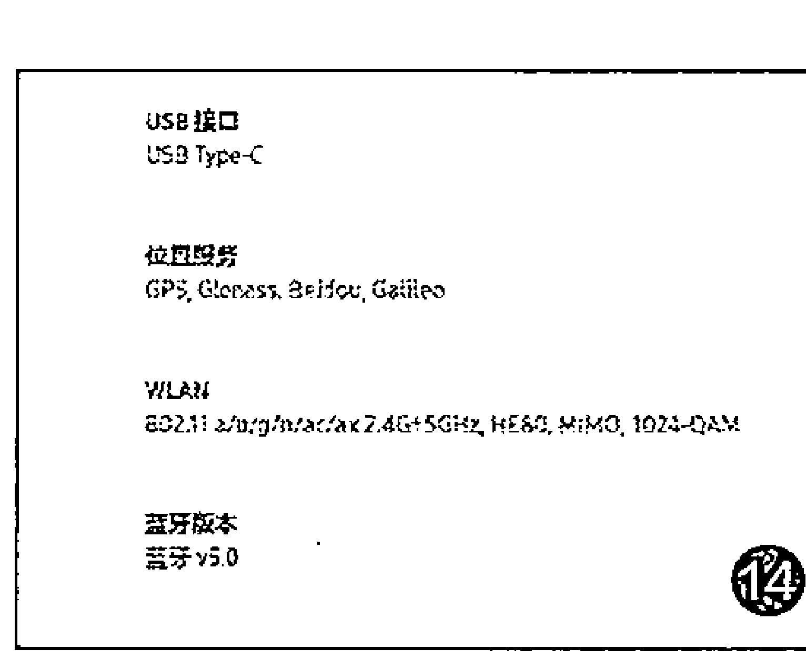

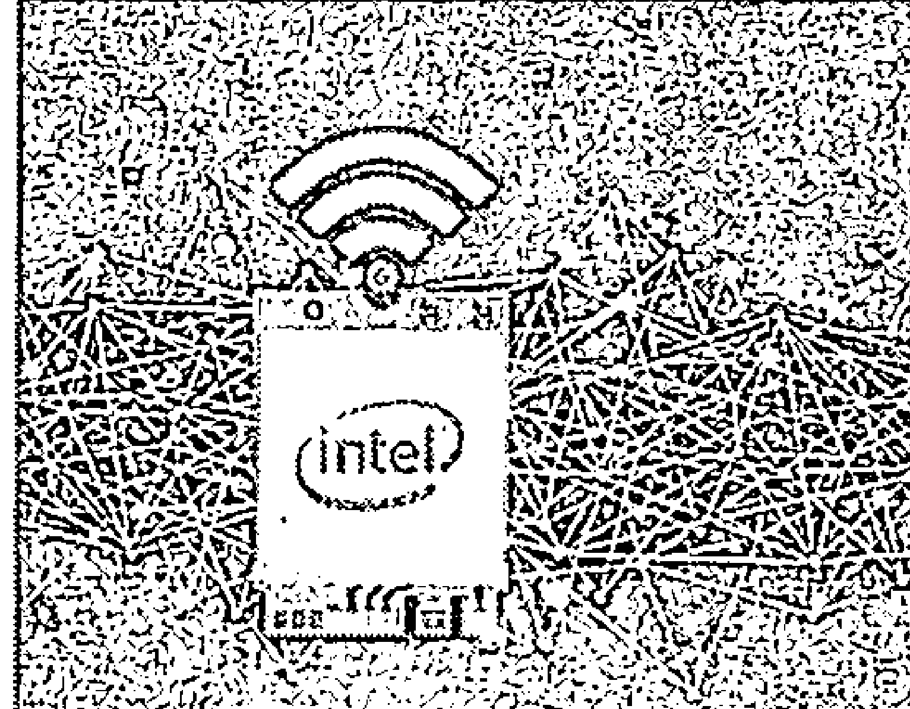

在PC领域，支持Wi-Fi 6的无线网卡只有英特尔Wireless AX200系列以及Killer AX1650 “杀手”网卡等极少数型号（图15）。目前，极少数高端笔记本已经配备了AX200无线网卡，而英特尔也将Wi-Fi 6作为第十代酷睿Ice Lake的推荐功能（供OEM选配，并不强制）。

> **小提示**
虽然以三星Galaxy S10为代表的手机已经支持Wi-Fi 6，但它最高的传输速度却只有1.2Gbps（约153MB/s），距离Wi-Fi 6的理论速度还相差甚远。实际上，无论是5G还是Wi-Fi 6，它们都有一个慢慢提速的过程，需要硬件端经历几年的迭代升级才能满速运行。但是，哪怕5G和Wi-Fi 6初期只有1Gbps的实际速度，也足够应付4K、8K流媒体以及各种高强度的网络应用环境了。

可惜，在个人Wi-Fi 6网络部署中最关键的部件，Wi-Fi 6路由器暂时还处于被ROG和网件顶级型号“承包”的状态，高达3000元左右的起价可谓昂贵（图16）。因此，和5G相同，Wi-Fi 6能否普及的关键，就是相关路由器何时可以入驻千元价位，届时才能被更多普通消费者所接受，并进一步加速支持Wi-Fi 6技术的终端设备普及。

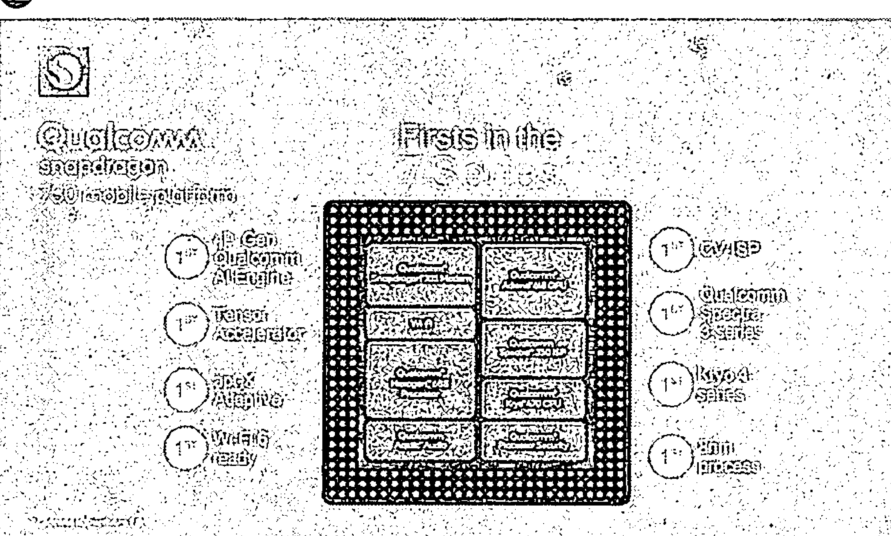

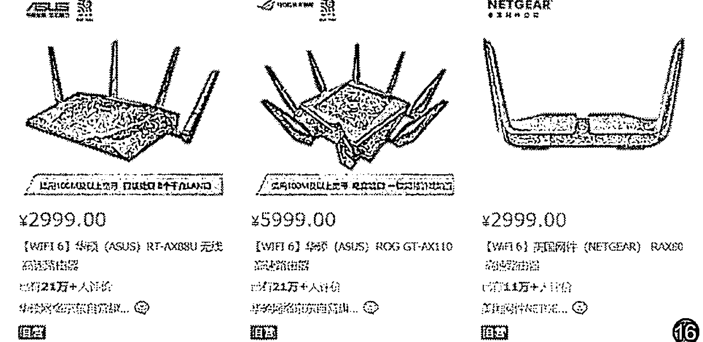

## 10年回忆 从兴起到衰落的超频运动

“超频”，不知道大家看到这个词语有什么感觉，如果你马上想到了激情澎湃的年代，感到了频率飙升的冲动，那么你应该是已经在DIY领域浸渍了不少年的“老鸟”了。而如果你的想法是带不带K，是不是Z字头芯片组，甚至是感到非常陌生，那么你一定是这一领域的新鲜人了。

为什么“超频”这个词在不同时代的DIYer中会有着截然不同的概念呢？这其实恰恰说明了这一概念在今天的“沦落”，或者说至少是与之前的繁盛已经完全无法相比的现状。那么，为何一个可以说是DIY领域最吸引人的玩法，到现在会逐渐式微，而它当年又是如何兴起的呢？

## 处理器超频 曲折之路

要说第一块让DIYer们开始接触超频的处理器，一般会认为是英特尔在25年之前推出的486DX（图1）。这块处理器型号中的DX表示它是一款使用倍频设计的产品，因此在主板上出现了基础频率（外频）与倍频的设置，两者的乘积就是处理器的实际运行频率，这也构成了用户调节频率的基础条件。当用户把处理器频率设置得超出默认频率时，超频的概念也就出现了。

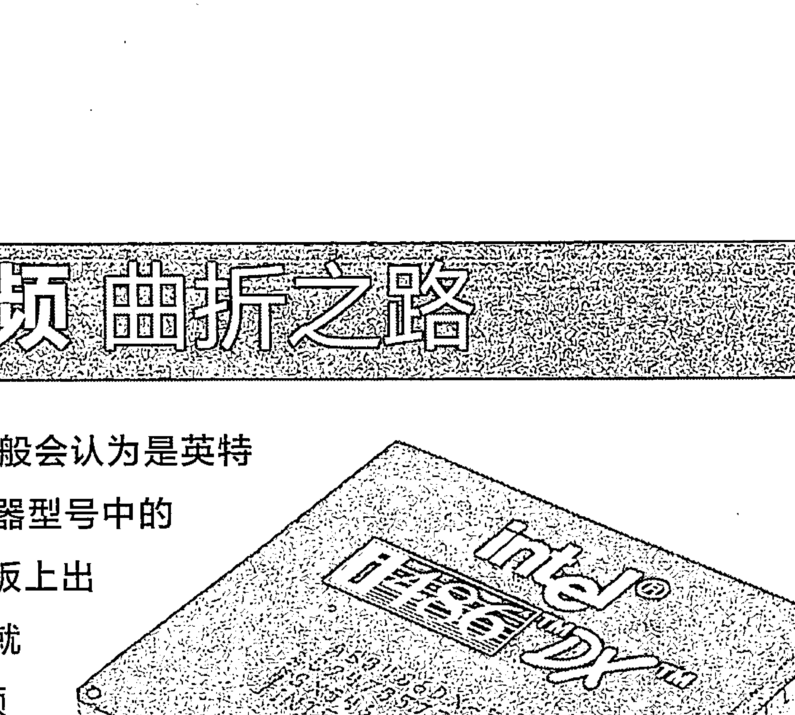

## 跳线超频 486时代

在早期的超频操作中，主频和倍频是需要在主板上调节跳线来选择的(图2)，比如对于486 DX-50来说，可以将其25MHz的外频设置为33MHz，如果遇到一颗品质好的产品，就可以稳定运行在66MHz下，成为价格高出不少的486 DX-66；同样的，后来还有将486 DX-66超频为DX-80、486 DX4-100提升为DX4-120甚至133等操作，有些极品甚至可以超频两档。当然，虽然现在看起来，这些几十MHz的超频只是小意思，但其相对幅度其实远超现在的大部分超频操作，而且超频方法比较复杂，因此一时不注意设置了不支持的组合或者超频过度的事情屡见不鲜。因为是硬件强制设置，所以处理器并不会自行降频，且关机重设需要一定的时间，也很容易造成硬件损伤。

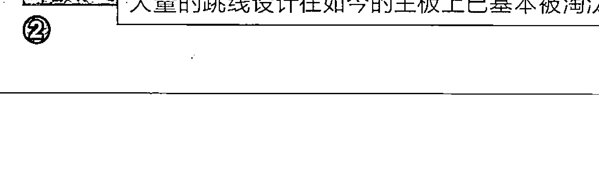

## 极品处理器成就辉煌 赛扬和K7

486到奔腾时代的超频还是一些DIY老手的战场，一般用户没有能力也没有兴趣进行超频。不过随着英特尔两款处理器的出现，局势突然发生了变化，超频第一次成为了大众话题，而且让超频活动和这两款处理器一样，疯狂了起来。

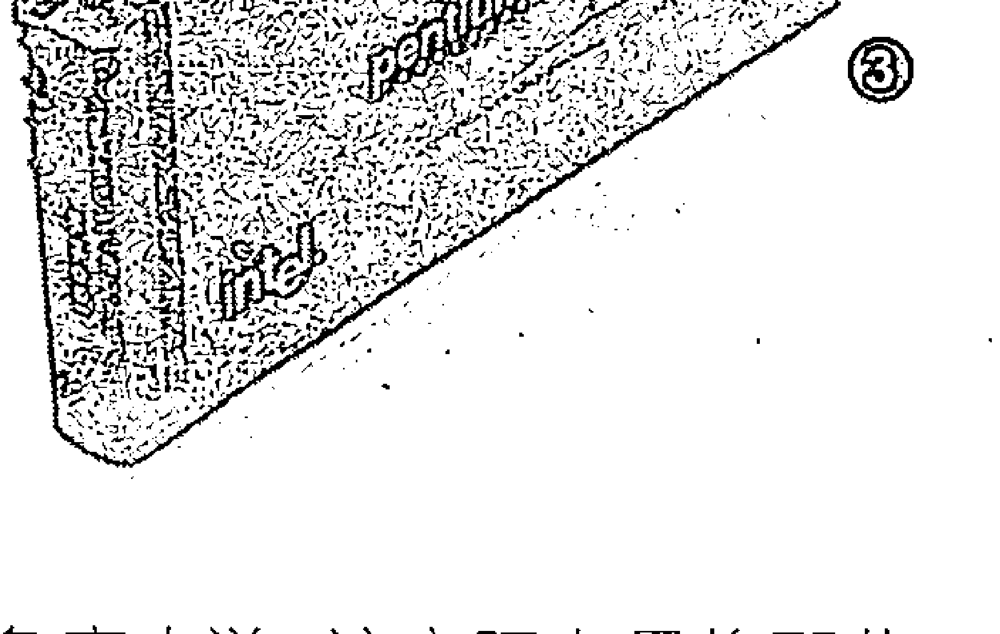

1997年，英特尔推出了一款现在看仍然显得非常特立独行的处理器——奔腾2（Pentium II），这款产品一改传统的封装和接口，采用类似板卡封装方式和“单边接触式”（SECC）接口(图3)。从实用角度来说，是因为处理器频率较高，大容量二级缓存无法做到同频运行，所以索性独立出来，再将处理器与缓存集成在一块电路板上。而从商业角度来说，这实际上是将那些获得了x86授权的兼容厂商一口气甩脱的策略，只需要申请处理器插槽（SLOT 1）的专利，就能让这些兼容厂商无法继续跟踪英特尔的步伐。

在奔腾2的设计中，有经验的超频玩家看到了一个新的希望，那就是异步运行的缓存。正如英特尔这种设计的初衷之一，无法跟上处理器频率的缓存在很大程度上成为了处理器频率提升的障碍。将缓存从处理器核心取出后，处理器的频率可以继续提升，当然超频能力也就得到了释放。奔腾2一出现，就有超频玩家开始通过调节缓存的异步运行倍率，例如从1/2降至1/3，来让处理器获得提升频率的空间。这一招相当奏效，加上当时的频率设置已经集成到主板BIOS中，很容易调节，使得超频成为高端用户的一个热门玩法。不过这还只是开始。

由于奔腾2的复杂使其成本居高不下，那么低端市场怎么办？英特尔索性就推出了完全去掉外部缓存模块的处理器，并将其命名为赛扬（Celeron）品牌(图4)，早期的两款赛扬分别为266MHz和300MHz。让人始料未及的是，由于完全不用再去考虑缓存倍率，而且频率设置较

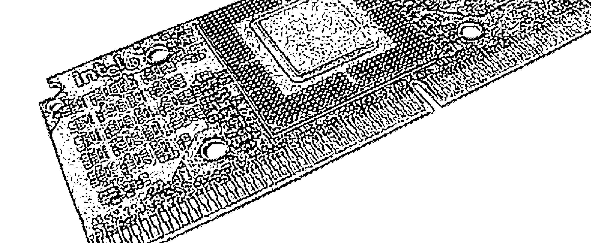

低但生产工艺已经比较好（此时奔腾2 400MHz已经可以稳定供货），所以相当多的赛扬核心实际也同样可以达到奔腾2核心的频率，完全是一顿免费的大餐。

更重要的是，除了一些高端创作、办公软件之外，当时的二级缓存对大部分日常、娱乐应用的性能影响并不大，特别是主流用户喜爱的游戏、上网、影音娱乐等方面，超频到同等频率的赛扬与奔腾2表现几乎别无二致。

不过因为完全没有二级缓存，所以首批赛扬虽然游戏能力出色，但在办公等应用中的表现特别糟糕，还是会影响到很多用户的体验。随后赛扬300A的出现彻底改变了市场。它将较小容量的二级缓存直接集成到了处理器内部，同时超频能力也不弱于之前的赛扬，甚至有人认为赛扬300A的默认主频就应该是400MHz~450MHz，超不上去才是小概率事件。

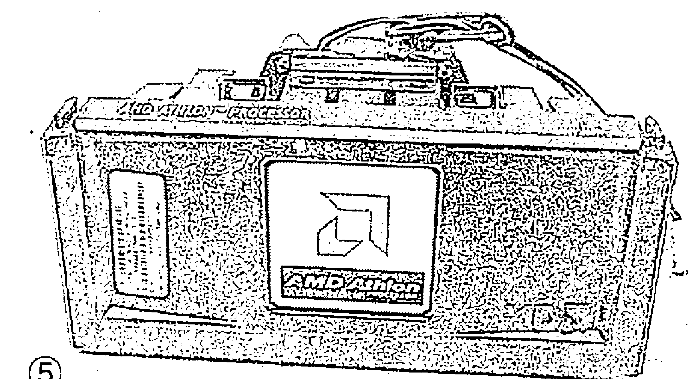

在容量虽小，但能同频运行的缓存支持下，超频到450MHz甚至更高的赛扬300A，在大多数日常应用中的体验与当时的旗舰产品奔腾2 450MHz相差无几，这当然引起了一轮超频狂潮。

力、增加处理器电压……将常用且有效的超频方式进行了一次充分的官方展示。

最终，GHz争夺战以英特尔首先不稳定地冲线，AMD随后推出稳定的量产产品而结束。这次官方超频战虽然让DIYer饱了眼福，但也引起了一个副作用，那就是官方对高频处理器的渴望，使得处理器的可超频空间被挤压，因奔腾2而起，以赛扬为主菜，中途加入了AMD速龙调剂的超频盛宴，也就逐渐结束了。

其实在超频的辉煌时代，还有一场官方超频的大戏，那就是AMD的速龙（Athlon，K7核心）面世后与英特尔奔腾2、奔腾3展开的频率大战，特别是争夺首颗GHz处理器桂冠的战争（图5）。这次官方的频率大战几乎是将超频玩家的招数用了一个遍，比如降低缓存倍频、提升处理器散热能

AMD的Athlon处理器既然能够与奔腾2和单边接触式的奔腾3争夺频率冠军，就说明它本身也是适合高频架构的产品，所以同样被很多用户拿来超频，且有一定的成绩。不过真正为很多超频爱好者念念不忘的K7架构超频神器，同样需要Athlon精简结构后才会出现。

### 特别的爱 龙之家族

单边接触式处理器封装现在看来是走了一段弯路，奔腾2的改进版奔腾3和Athlon新核心都重新回到了SOCKET封装之上，当然也都采用了将二级缓存容量适当减少，改为同频，并集成进核心的设计。

奔腾3的核心已经可以达到GHz频率的水平（图6），不过为了主流用户的需求，大量品质较好的核心被标定为主打频率，因此造就了奔腾3 600MHz~700MHz等超频潜力出色的产品。


相对于中规中矩的奔腾3及新赛扬，新形态的速龙及AMD的“赛扬”——钻龙（Duron，DIY市场根据读音称为“毒龙”）超频方式非常特殊，给人留下了更深的印象。这两种处理器同样采用了当时流行的On Die（FC-PGA）封装，其实就是直接暴露出最简封装的硅片层，所以周边用于安装针脚的基板就显得很空旷。在这片基板上会看到几组触点及它们之间的金属连线，其中不少是用激光切断的（图7）。很快，有些超频玩


家就发现这些触点和连线其实就是新一代的频率调整“跳线”，速龙和钻龙的基础频率、倍频等是通过金属触点之间导电与绝缘（切断连线）的组合决定的。而要改变频率最简单的方法就是找到相应的设置方法，然后连通这些金属触点（图8）。于是，在那一时期用铅笔超频成为了非常有趣的风景线，这是因为铅笔芯中的石墨是比较好的导体，只需很方便地画线就可以让触点之间重新导电，而且尝试失败还可以很方便地擦掉。此外一些厂商把原先用于一些专业领域的导电笔（图9）也推向了超频市场。

虽然现在看来，On Die封装的处理器和单边接触式的封装一样，都是并不成功的尝试，但这一代处理器在超频方面的影响持续至今，例如广泛“锁频”的处理器、高频和超频内存、为超频优化的散热器设计等。其中锁倍频逼迫超频玩家开发出了铅笔超频法，也因为超外频对内存的影响，让超频者开始关注内存的频率问题。而超频散热器则不仅需要提供更好的散热能力，还因为这一代处理器直接暴露出脆弱而小巧核心的封装方式，使得散热器必须设计更科学、做工更精细、材质更合理，才能通过很小的接触面积快速转移热量，同时又不会压坏脆弱的核心，所以产生了如铜柱或铜底散热器、底部抛光工艺、热管散热器、蜗式散热片（图10）、侧风扇设计等众多延续至今的方案。

也许是在频率方面的竞争失败对英特尔的刺激比较大，它随后推出了全新的NetBurst架构处理器奔腾4（图11），起始频率很高，频率提升也很快。而AMD也在成功的K7架构后，推出了效率更出色的64位处理器架构K8（图12）。这两个处理器架构本身都是适合高频率运行的，但因为普遍锁倍频的原因，使它们只能靠提升基础频率来超频，而这种设置会直接影响到内存、北桥的频率，因而危险性大增，成功率锐减。当然，在频率大战仍历历在目的时代，超频仍然有其独特的魅力，无论是AMD推出的黑盒版不锁频产品（图13），还是奔腾4不断刷新的超频纪录，都仍然是厂商能力和架构优势的表现方式。


## 官方超频 新超频时代

从英特尔酷睿2处理器开始，一种官方超频方式被引入了频率设置之中。在温度和功率未达到一定的指标时，处理器或其中的一些核心会尝试提升频率，而不是“死守”在标准频率之下(图14)。这一技术也被后来的智能酷睿(酷睿i)处理器吸收，即睿频(Turbo)，并且被AMD锐龙处理器所借鉴，即Boost频率。


目前主流的处理器——英特尔智能酷睿和AMD锐龙，在用户超频方面的设计有明显区别。英特尔的大部分智能酷睿处理器完全不允许用户自行调节频率，但推出了一些专门放开频率调节能力的K系列处理器，并且必须搭配顶级的Z系列芯片组主板才能进行超频。而AMD处理器则全面支持超频，且除了最低端的A系列芯片组外，所有主板都可进行频率调节。

为何英特尔在智能酷睿架构中这样严格地限制用户自行修改频率呢？这与其结构有关，智能酷睿采用的QPI总线并非传统的基础频率，而是会随着处理器频率变化的。所以改动处理器频率的时候，处理器的总线频率及相应的内存频率等也都会受到影响，造成不稳定。此外第二代智能酷睿开始普遍配置的核芯显卡频率也会受到处理器频率的影响，因此成了超频的一大限制因素。

在主流DIYer逐渐远离用户自主超频的今天，AMD和英特尔先后推出的智能超频工具又给了喜欢自己动手的超频爱好者一个打击。AMD的PBO全称为Precision Boost Overclock(精细增压超频)，是面向品质较好的X系列处理器的一种自动超频工具，在温度未达到危险程度的情况下，它会破除处理器的功率墙，通过对电压、频率的自动精细调整，为用户提供超频运行频率。

英特尔则在最近推出了“英特尔性能最大化”(Intel Performance Maximizer)软件(图15)。其工作方式与AMD PBO有些相似，会根据处理器型号(图16)、体质、散热情况，自动调节频率和电压，以期达到最高同时也最稳定的工作频率。

睿频与Boost频率已经让超频变成了鸡肋，除了AMD与英特尔的“原厂”自动超频工具之外，华硕等主板厂商也提供了自动或半自动超频工具。这些能自动榨干CPU超频能力的官方超频软件更是让手动超频变成了一种吃力、危险而受益不大的活动。缺乏超频的乐趣与收获，让今天成为了一个既全民超频(官方超频)，又无人超频的年代。当然液氮极限超频一类的高手炫技、厂商宣传活动仍然存在，但对普通用户来说显然已经缺乏实用意义了。


| 下载文件 | 操作系统 | 语言 | 大小 | MD5 |
|----------|----------|------|------|------|
| Core(TM)i9-9900K Installer.zip | Windows 10, 64-bit* | English | 1517.38 MB | f8bc4061268aeaa41fbd2c13b68b318c |
| Core(TM)i5-9600K and Core(TM)i7-9700K Installer.zip | Windows 10, 64-bit* | English | 1513.35 MB | 1f286608c5a07a2a723ae85fa9b0d127 |
| Intel(R) Performance Maximizer 1.0.1 User Guide.pdf | | English | 0.72 MB | f1c5393a0191abe1c4fad8f303aef314 |

针对不同的型号，英特尔性能最大化软件有不同的版本

## 显卡超频 无法燃起的火花

当图形芯片进化为GPU，成为电脑中可以与处理器相提并论的重要芯片之后，其“频率”同样成为了影响性能表现的重要因素。那么，我们是否也能通过自行提升GPU的频率来获得更好的显示性能呢？答案是可以，不过因为更大的危险性，只是少数人在较短时间内的一种“极客”式玩法，并没有像处理器超频那样被广泛普及和长期持续。

## 显卡超频与限制

其实作为与处理器平台类似，也由核心（GPU）、内存（显存）、主板（显卡PCB）组成的系统，显卡超频的玩法也不少，而且很早就开始使用软件超频，如老资格的显卡/屏幕功能配置工具Powerstrip就具有调节GPU、显存频率的能力。此外，还可以通过刷BIOS（图17）获得更加稳定的超频状态。

不过设计状态稳定、难以DIY的显卡，其超频遇到的困难也更大，比如很难自行更换散热系统来加强超频时的散热、PCB版设计对频率影响较大等。而且因为一直没有类似赛扬300A这样出色的超频型号，使其获益常常远低于需要面对的风险。

## 同样遇到了“官方超频”

就在显卡超频本身不温不火的同时，近期AMD与英伟达的GPU也都加入了类似睿频的技术，如英伟达RTX系列显卡的BOOST 4.0技术，它们同样是动态调节GPU频率，调节幅度大都在100MHz以上，已经和很多非专业用户对显卡的超频幅度一样了。

除此之外，很多显卡厂家也推出了自己的显卡控制软件，其中超频也是很重要


的项目。在这些显卡控制软件中, 通常有OC MODE (超频模式)、Game MODE (游戏模式) 等不同的超频预设 (图18), 辅以相应的风扇转速等配置, 常常可以提供超过基础频率200MHz以上的频率提升, 基本将GPU的超频潜力彻底挖光了。


## 其他超频 别样的精彩

其实除了处理器、GPU这样的运算芯片之外, 有频率特征的芯片还有很多, 其中不少同样可以超频, 如前面已经提到过的内存/显存, 还有SSD使用的主控与NAND闪存芯片、路由器芯片、显示器控制芯片等。例如早期内存被迫披上散热“马甲”, 就有厂商为了加快推出高频产品, 对内存进行了超频的原因。

路由器芯片和显示器芯片大家也许比较陌生, 超频方法和相关报道都不多, 但对其超频同样具有一定的趣味性和实用性。例如对现在搭载USB接口、内置一些网络服务功能的高速路由器来说, 其实际表现都是很依赖芯片性能的, 多系统共享文件与打印机的Samba服务, 在不同性能的芯片下表现就明显不同。而显示器芯片在经过超频后, 可以提供更高的视频带宽处理能力, 最直观的表现就是可将显示器的刷新率提升, 让用户获得更高速、更稳定的画面。


不过这些比较特殊的超频玩法对用户的DIY能力要求也更高, 比如超频路由器的话, 常常需要拆解路由器, 并且自行添加芯片散热措施 (图19), 显示器超频要求就更高了, 超频改装难度还要远高于路由器。

给路由器芯片增加散热片

## 总结

从启动“全民超频”时代的赛扬266到完全锁频的酷睿, 在不足10年的时间里, 传统的处理器超频从极盛到凋零。而有趣的是, 在全锁频处理器发展了10年后, 官方却又推出了更智能的超频软件, 开始鼓励大家挖掘处理器的潜力。显卡作为电脑中的另一大传统硬件及超频对象, 其实也走出了类似的道路, 在主动超频几乎已经彻底消失的时候, 官方超频却越来越高调。这样看来, 也许在传统超频时代已经逐渐走远的今天, 新超频时代的大门已经在不远处, 并且准备开启了呢。

如今越来越多的个人或家庭都将笔记本列入了首选PC名单，而这种轻薄化的PC品类也非常“争气”，主流价位的轻薄本新品身材越来越“骨感”，而高端游戏本的性能也直逼同价位的台式机电脑。但是，和台式机可随时升级替换硬件不同，集成度更高的笔记本在配置的搭配上缺乏足够的自由度，因此很多消费者在选购时只关注表面的配置以及售价。实际上，很多隐藏于笔记本参数背后的细节，才是影响后期使用体验的关键。

## 差之分毫 远之千里 直击笔记本的选购细节

策划《电脑爱好者》编辑部

扫一扫，更多精彩内容立现！

## 先从最基本的售后谈起

和绝对的性能相比，笔记本电脑其实还有一个非常重要的指标，那就是质保。任何电子产品都存在一定比例的故障率（笔记本电脑低于1%），如果你不幸“中奖”，有无质保将直接决定维修成本的高低。

## 确定保修时长

如今笔记本的处理器和显卡芯片都是直接封装在主板上的，这两颗芯片以及主板上的其他元件无论哪个出现问题往往都需要更换整套主板。这项服务在质保期内免费，质保期外的开销基本都是2000元起步（整机越贵这个价格就越高），质保的重要性可见一斑。按照三包规定，笔记本电脑至少都会提供一年的保修时间，而笔记本厂商则会根据具体产品的定位，对主要部件（如处理器、主板、内存、硬盘和显卡等)提供额外的第二年或第三年保修，有些高端机型甚至可以在两年内进行免费的上门维修服务(图1)，无需用户自己往返售后服务中心。

-   第八代智能英特尔酷睿i5-8265U 1.6GHz 6M四核
- Windows 10专业版
- 8G
- 512G SSD
- <1.5kg
- 13.3英寸宽屏16:9 LED背光1920×1080
- 上门服务，一年质保

- 笔记本x1
- 电源线x1
- 电源适配器x1
- 保修卡x1

| 类型 | 部件 | 保修期限 | 维修方式 |
|------|------|----------|----------|
| 笔记本 | - | 整机三年(部分一年) | - |
| 三包服务 | 主板、CPU、内存; 硬盘、硬盘驱动器、键盘、电池适配器(合同期后) | 1年(指按出厂日期计算, 个人用户两年, 即发票日期为起始日的用户) | - |
| 非主要部件 | 独立的显卡、网卡、风扇、摄像头、扬声器、触摸板、各类卡、线材(包括屏线、电源线等) | 1年 | - |
| 附件 | - | 2年(第二年送修) | - |
| 软件 | 预装软件 | 按国家三包规定 | 提供1年送修服务 |

(图2)，而价位相似的星系列的主要部件却支持两年保修，暗影/光影精灵系列游戏本同样也支持两年质保(图3)。

问题来了，现在很多消费者都喜欢网上购物，而很多商家对质保时间的标注信息却并不直观，甚至还有错误。因此，笔者建议大家在下单前，先到品牌官方网站查询中意笔记本的详细质保说明，以防吃亏上当。以惠普笔记本为例，战66二代等机型就仅支持一年保修

同一品牌给旗下不同系列的笔记本制定不同的保修策略，这个现象并不鲜见，定位越低售价越便宜的机型质保时间普遍只有一年，而中高端产品则可提供更久的质保，符合“一分钱一分货”的真理。在设计、性能、功能和售价相近的产品之间，质保时间更长的产品自然更值得购买，对售后比较敏感的用户也能自行购买延保服务(图4)，只是需要付出更多的购机成本。

### 有效的保修证明

对笔记本电脑而言，有效的保修证明就是购机发票(纸质或电子发票均可)和包装内附送的三包凭证(质保卡，线下购买需盖章生效)。当笔记本出现质量故障时，在售后出示发票和质保卡就能享受应有的三包服务。同一款笔记本，京东、天猫等电商平台之所以价格略高，是因为报价中已包含发票成本，一些线下卖场或淘宝商家则仅提供购机收据，由此可以省下6%左右的税点。问题来了，有些品牌的售后规定是不认收据，如果没有发票就只能按照笔记本出厂日期计算剩余的保修时间(图5)。因此，如果你要买的笔记本刚刚上市不久，有没有发票其实意义不大，按照出厂日期延后保修的计时，基本和购机发票时间相差不多。但是，如果你购买的笔记本属于上市很久的老型号(图6)，要么让商家挑一款近期出厂的批次，要么就老老实实选择开具发票吧。

关于质保时间的查询很容易，在笔记本底部和三包凭证上都印有SN条码，很多笔记本官网都提供质保查询的入口，输出SN码就能看到出厂和剩余保修时间的列表（图7）。对从电商平台购买笔记本的用户而言，笔者建议大家选择电子发票，不怕丢失，可随时重复下载。如果选择了纸质发票，但因自己的原因而不慎丢失，需要支付额外的6%税点（图8），商家才会给你补开发票。

## “想当然”的态度不可取

当我们计划选购笔记本时，一定会在网上搜索查阅无数相关的新闻、导购、评测以及技术功能的解读类文章。但是，盲目而非系统性的阅读，很可能让我们陷入某个先入为主的陷阱，以“想当然”的态度在错误的道路上蒙眼狂奔。

## 屏幕参数之间的关系

如今很多人购买游戏本时都会首选“电竞屏”，因为它们不仅拥有120Hz或144Hz的刷新率，还“好像”都是IPS材质和高色域。实际上，电竞屏也许并没有你想象中那么完美。以120Hz刷新率的屏幕面板为例，就存在IPS材质+45% NTSC色域、IPS+72% NTSC和TN+94% NTSC这三种参数搭配的型号（见表），如果笔记本采用的是第一类电竞屏，色彩表现显然不达预期。好消息是，现阶段144Hz刷新率的屏幕都是IPS和72% NTSC的组合，普遍具备良好的显示素质。

笔记本屏幕属于个体差异最大的配件，不同型号的LCD面板在发色数、色域、亮度和可视角度方面都存在细微的差别。最关键的问题是，同一款笔记本往往存在多家面板供应商，并采用不同批次随机搭配的生产策略（图9）。因此，我们在网上看到的评测效果也许并不代表你买到产品的实际表现，厂商能做到的也只是最大限度保证这些面板具备相近的显示效果而已。

| 刷新率 | 分辨率 | 屏幕类型 | 色域标准 |
|---|---|---|---|
| 60Hz | 1920×1080像素 | TN | 45% NTSC |
| 60Hz | 1920×1080像素 | IPS | 45% NTSC |
| 60Hz | 1920×1080像素 | IPS | 72% NTSC |
| 60Hz | 1920×1080像素 | IPS | 100% sRGB |
| 120Hz | 1920×1080像素 | IPS | 45% NTSC |
| 120Hz | 1920×1080像素 | IPS | 72% NTSC |
| 120Hz | 1920×1080像素 | TN | 94% NTSC |
| 144Hz | 1920×1080像素 | IPS | 72% NTSC |

因此，在下单之前，建议大家一定要提前和商家确认所选笔记本屏幕的材质、刷新率和色域，这三个参数一个都不能少。

## 相同模具的细节差异

细心的朋友可能还会发现一个问题，除了联想、戴尔、惠普和宏碁等品牌以外，其他厂商旗下的笔记本总有几款“长得特别像”的，比如来自蓝天和同方国际的公模就已经遍布了整个游戏本市场。

我们曾在2019年第15期《取代台式电脑 17.3英寸巨屏游戏本怎么选》这篇文章中，介绍了多款采用同方国际17英寸公模的产品，它们之间的差异就具备普遍性——机身的部分材质有金属和塑料之别，RGB背光键盘有三区调整和可全区域自定义的差别（图10），键盘是手感更好的Cherry矮轴还是最普通的薄膜键盘（还涉及键程键距等细节），更多呼吸灯位置的开孔（如顶盖的Logo、机身两侧或机身前端的海岸线背光），是否配备红外镜头（支持人脸识别）和指纹识别模块等等。

实际上，上述这些差异影响的只是感官体验，对真实操作和性能的影响不大。真正的理性用户，会将注意力放在公模产品之间（也包括配置和价格相近的私模产品）的内部用料、扩展能力和散热供电层面。下面，咱们就来作进一步的细节分解。

## 扩展接口的待遇之别

每一款最新上市的笔记本身上都会配备两种USB接口，一种是标准的USB Type-A，另一种就是USB Type-C，后者也就是新款手机常用的支持正反插的新型接口。但是，“长得一样”的USB接口，在传输速度和功能上可能却会存在极大的差异。如果你觉得笔记本只要有某个接口就够了，很可能就会失去很多更好的体验。

以USB Type-A为例，就存在USB2.0、USB3.0（经常被厂商标注为USB3.1 Gen1）和USB3.1 Gen2，三种标准的理论传输速度分别为480Mbps（约60MB/s）、5Gbps（625MB/s）和10Gbps（1250MB/s）。如果你经常使用SSD移动硬盘，那就一定要优先挑选配备USB3.1 Gen2接口的笔记本，在传输大量文件时它能帮你节省不少等待的时间。

| 标准 | 理论传输速度 |
|------|---------------|
| USB4 Thunderbolt 3 | 40Gbps |
| USB3.2 Gen2x2 | 20Gbps |
| USB3.1 Gen2 / USB3.2 Gen2 | 10Gbps |
| USB3.1 Gen1 / USB3.2 Gen1 / USB3.0 | 5Gbps |
| USB2.0 | 480Mbps |

笔记本身上的USB Type-C接口存在USB3.1 Gen1和USB3.1 Gen2两个标准，同时还能可选USB PD协议的充电功能，以及DP视频输出和雷电3技术。

对于轻薄本而言，如果USB Type-C接口支持充电，以后出门只需携带一个USB Type-C充电器就能解决轻薄本和手机/平板电脑的充电需求；如果支持DP视频输出，配合HDMI就可以实现双屏输出，和笔记本自带的显示器构成三联屏的显示环境；如果支持堪称接口中“皇帝”的雷电3，那这款笔记本将可以连接拥有无数扩展接口的扩展坞，又或是外置显卡随时提升游戏性能。

很多笔记本会根据具体配置选择USB Type-C的具体功能，比如顶配版才支持雷电3，而中低配可能连DP视频输出都不支持

和USB接口境遇类似的还有HDMI和DP视频输出接口的标准。比如现在用于笔记本身上的HDMI就存在HDMI1.3、HDMI1.4、HDMI1.4b和HDMI2.0之别，从HDMI1.4（带宽10.2Gbps）开始才能以30FPS的帧数播放4K视频，而HDMI2.0（带宽18Gbps）则能以60FPS的帧数播放4K视频，还拥有更好的色彩和声音输出表现。因此，如果你家里有4K分辨率的显示器或喜欢播放超高清视频，选择配备HDMI2.0接口的笔记本还是很必要的。遗憾的是，并非所有厂商都会在产品的宣传页注明每一种接口的详细标准，如果你对USB或HDMI的版本有具体要求，就需要深入品牌官网或媒体评测寻找答案了（图13）。既然提到了HDMI接口，那我们还需要了解独显笔记本特有的一个‘Bug’——很多用户都曾遇到过使用HDMI连接显示器，显示器端却无法显示任何画面的问题。实际上，这是独显笔记本的通病，厂商默认的做法都是使用（处理器集成的）核显连接内置显示器（笔记本屏幕），使用独显连接HDMI接口用于外接显示器。因此，当我们在显卡控制面板屏蔽了独显时（如强制使用集显运行），HDMI自然就无法输出画面了（图14）。至于辨别自己的笔记本HDMI接口对应显卡的方法很简单，进入英伟达显卡控制面板，切换到‘设置PhysX配置’，就能看到相关的信息了（图15）。

火速链接
如果您对USB技术感兴趣，请参考本刊2019年第9期《混乱伊始 抢先认识未来的USB接口》这篇文章，涉及USB各类标准以及最新USB4技术的展望。

## 关注内存升级的潜力

就Windows 10系统以及当前软件和游戏的负载情况，一步到位选择8GB内存还是很有必要的。对于因预算有限而不得不购买仅内置4GB内存低配笔记本的用户，则一定要注意选购笔记本的内存升级潜力——是否有额外的内存插槽可供后期升级（图16）？如果该笔记本采用的是板载内存设计，今后遇到‘吃内存’的软件或游戏，就只有重新置换笔记本这么一条出路了。此外，还有些标配8GB内存的笔记本采用的是4GB+4GB双内存的组合（图17），这种笔记本日后升级会比较麻烦，要么选择升级一条更大容量内存组成不对称的双通道，要么同时更换两条，成本相对会更高一些。

从成本的角度来看，LPDDR3也许要比DDR4低一些，所以从这个角度可以讲通。但从更理性的分析来看，轻薄本青睐板载LPDDR3内存还是有些原因的。

还好，一款轻薄本的内存规格到底是LPDDR3还是DDR4，在日常体验中根本察觉不出来。所以，我们只要做到心里有数即可，不必太过纠结于轻薄本们的内存版本。

首先，一款笔记本采用哪种内存，受处理器平台的制约。比如，AMD移动锐龙平台只支持DDR4内存，所以无论锐龙笔记本价格多少都是DDR4内存。而英特尔哪怕是最新的第九代酷睿平台也同时兼容DDR4或LPDDR3，给后者留了“后门”。此外，极致轻薄的笔记本主板都很小，可以容纳内存颗粒的空间更小，只能安排数量有限的DRAM内存颗粒。问题来了，LPDDR3内存颗粒的尺寸比DDR4内存颗粒更小，所以大家普遍才会在有限的空间塞进更多LPDDR3颗粒，从而换取更大的内存容量（图18）。

细心的用户可能还会发现一个问题，现在都2019年了，为啥很多采用板载内存的轻薄本依旧抱着DDR3的“大腿”不放呢？无论是戴尔XPS13，还是苹果新一代MacBook 13，其板载内存规格都是LPDDR3-2133MHz。作为对比，还有很多轻薄本虽然也是板载内存，却选用了DDR4-2400MHz甚至更高频率的内存。难道DDR3的成本比DDR4低，所以OEM厂商想从这个方面省钱？

| 配置项 | 第九代智能英特尔® 酷睿™ i5-9300H | 第九代智能英特尔® 酷睿™ i7-9750H |
|--------|-----------------------------------|-----------------------------------|
| 操作系统 | Windows 10 家庭单语言版 | Windows 10 家庭单语言版 |
| 显卡 | NVIDIA® GeForce® GTX 1650 4GB GDDR5 | NVIDIA® GeForce® GTX 1660 Ti 6GB GDDR6 含Max-Q设计 |
| 内存 | 8GB 2x4GB DDR4 2666MHz | 16GB 2x8GB DDR4 2666MHz |
| 存储 | 512GB M.2 PCIe NVMe 固态硬盘 | 1TB M.2 PCIe NVMe SSD |

### 小提示

轻薄本为了“瘦身”，普遍会选择全板载内存，或板载4GB内存颗粒+一个内存插槽的设计；只有少数产品会选择只提供一个内存插槽（只能单通道运行，会影响处理器内集成的核显性能）或配备两个内存插槽。

## SSD只看容量你就输了

我们都知道，SSD具备秒杀HDD的读写性能，是快速开机和高速响应的保障，所以追求更大容量的SSD准没错。然而，SSD固然是容量越大性能相对（同型号小容量版本）越强，但SSD之间依旧存在强弱之别，如果两款做工、（其他）配置、价格相近的笔记本之间，你只认SSD容量更高的型号，也许就会输在起跑线上了。

简单来说，如今无论是轻薄本还是游戏本都内置至少一个M.2插槽，也青睐使用M.2接口的SSD。但是，M.2 SSD存在SATA、PCIe 3.0×2和PCIe 3.0×3三种通道的

## 别让散热和电源拖后腿

当笔记本的处理器、显卡、内存和硬盘型号完全一致时，它们之间仍然可能出现20%甚至更大的性能差距，原因就是来自“温度墙”和“功耗墙”的制约。关于这“两堵墙”，CFan在过去曾不止一次介绍，所以本文我们就不再赘述，大家只要知道温度墙受制于笔记本的散热模块设计（图20），散热模块越豪华，笔记本就越不容易撞上这堵墙，CPU和GPU不易降频，可以更长时间地运行在满载状态。

功耗墙受制于笔记本标配的电源适配器（图21），比如都是采用i7-8750H+GTX1050Ti的游戏本，有些产品标配的电源适配器功率只有120W（双烤下CPU功耗仅能维持35W，翻译过来就是实际主频远不如标称的最高主频），有些产品的适配器功率则达到了150W，在相同的跑分软件测试中，后者往往可以跑出更高的分数。同理，对那些武装GTX1060/GTX1660Ti独显，但适配器功率不足180W的游戏本而言，同样存在“带不动”的隐患。

因此，当我们看到两款看着差不多的笔记本时，不妨在网上搜索一下它们的适配器参数和拆机图片，适配器功率越高，散热模块的设计越豪华，在价格相近时就越值得选择。

> 小提示
对笔记本的散热模块而言，热管数量一眼便知，所以很多人都会认为热管数量越多越好。然而，热管的粗细有时比数量更重要，比如8mm+8mm+6mm的三根热管，其导热效率就不如两根10mm的热管。此外，散热风扇的数量和转速，以及对应散热鳍片的数量和整体面积，同样对散热效率有着至关重要的影响。

### 扩展阅读：关注SSD的散热

很多笔记本在使用时可能出现突然卡顿，或是拷贝大量文件时速度骤然下降的现象。除了CPU过热引发的降频可能带来这个问题，PCIe通道的M.2 SSD也可能成为“背锅侠”，因为PCIe SSD运行时发热量非常高，如果笔记本在设计之初没有考虑过SSD方面的散热，当SSD温度过高时就容易出现“掉速”的问题。因此，很多轻薄本会采用金属材质的底盖，通过导热硅胶片与SSD表面的芯片接触（图22），充当大号的散热板使用。还有一些产品，比如惠普暗影精灵系列，SSD芯片朝内，直接与散热风扇的金属底座接触（图23），同样可以达到较好的散热效果。还有些产品，SSD芯片朝内却没有采取任何辅助散热的措施，热量堆积无法释放。

## 意识形态的较量 游戏本的选购思路

随着《英雄联盟》等竞技类游戏的兴起，越来越多的用户都更加关注笔记本的游戏性能。同时，笔记本性能强悍固然重要，但便携属性依旧是关键指标的概念也深入人心。于是，如今的轻薄本变得越来越强，而游戏本则变得越来越轻。此时，这两大笔记本的品类，就难免上演一出“关公战秦琼”的好戏了。

## 能玩游戏的“轻薄本”

如今“游戏轻薄本”的代表有小米笔记本Pro GTX版、神舟精盾U65以及惠普星15能量版，这三款产品的前身都是非常经典的轻薄本，1.9kg左右的重量具备不错的便携性。其中，小米笔记本Pro拥有类似MacBook的工艺，神舟精盾U65的特色就是价格便宜，而惠普星15则主打对散热更友好的“翘臀”设计(图1)。


上述游戏轻薄本都搭载了英特尔低功耗平台（如i5-8265U），处理器的TDP只有15W，显卡方面则都配备了英伟达GeForce GTX1050系列的Max-Q版（图2），从而将整机的功耗都降低到了80W左右，只需90W的电源适配器版本就能“满血”驱动。


小米笔记本Pro和惠普星15能量版与同家族采用MX250独显的型号相比强化了散热，比如小米笔记本Pro GTX就在标准版的基础上增加了1根6mm热管，贯穿显卡供电与核心，连接到右边的风扇(图3)。此外，惠普星15能量版的散热模块则是2根8mm热管共同穿过CPU和GPU并分别和一组风扇和散热鳍片相连，神舟精盾U65采用的是单风扇双热管的组合。从游戏本的角度来看，这种级别的散热设计只能算一般，但考虑到15W TDP处理器和Max-Q显卡的发热量相对可控，所以这些产品的散热也都算合格了。

## 更加轻薄的“游戏本”

如今重量低于2kg的“轻薄游戏本”则更多，比如机械革命Z2 G（机械师F117B、火影影刃Z5）、Z2 Air（神舟Z7M KP5GZ、炫龙耀7000等）、雷神911 Air、微星GF65和GS65等等，它们同样具备媲美轻薄本的体重，便携性一流。上述产品的共性是，都搭载了英特尔第九代酷睿处理器中TDP达到45W的H系列（如i5-9300H或i7-9750H），同时还配备英伟达GeForce GTX1050 3GB或更高级别的独立显卡，起价普遍在5500元左右，最高则可突破万元大关（体现在处理器和显卡型号，以及有没有增加雷电3接口等）。

## GTX1050成冲突前线

就性能而言，哪怕是定位略低的i5-9300H，也具备秒杀15W TDP的顶配处理器i7-8565U的实力，这一点毋庸置疑。至于对游戏性能影响更大的独立显卡，“游戏轻薄本”和“轻薄游戏本”比拼的就是GTX1050系列显卡和最新图灵架构显卡的真实对比了。

伴随第九代酷睿平台而来的游戏本，除了GTX1650和GTX1660Ti这两款全新图灵架构的显卡以外，还新增了3GB显存版本的GTX1050，与2GB、4GB和Max-Q设计的GTX1050构成了“N世同堂”。

如果再算上GTX1050Ti，是不是有种看晕了的感觉？

简单来说，判断笔记本显卡强弱的顺序应该是先看型号，然后才是显存。以英伟达为例，主流独显的性能排行是MX230<MX250<GTX1050<GTX1050Ti<GTX1650<GTX1060<GTX1660Ti，Max-Q的性能稍弱于标准版，但却强过次一个级别的显卡，比如GTX1050Ti Max-Q就比标准版的GTX1050更强。至于显存容量自然是越高越好，但更高显存的作用并非表现在跑分层面，而是当游戏中开启高分辨率和高渲染级别的抗锯齿时，同型号显卡的显存容量越大帧数会略有提升。

需要注意的是，GTX1050 3GB版比较特殊，它将流处理器的数量从640个提升到了768个（图4），和GTX1050Ti相同。换句话说，3GB版的GTX1050属于GTX1050Ti的弱化版，其性能介于GTX1050 4GB和GTX1050Ti之间，而且更加靠近后者。

从性能对比数据来看，游戏轻薄本们配备的GTX1050 Max-Q设计显卡虽可以秒杀传统轻薄本最爱的MX250，但距离最新的GTX1650显卡依旧非常遥远（见表）。这其实很好理解，轻薄游戏本们为了驱动GTX1650，所标配的电源适配器都是120W~180W，更多的电量输入自然可以换取更强的性能输出。此外，这类产品大多采用了标准的内存插槽，配备至少1个M.2插槽和1个2.5英寸硬盘位，散热模块的设计也更加豪华。


## 英伟达主流移动显卡性能对比

| 显卡型号 | MX250 | GTX1050 Max-Q | GTX1050 | GTX1050Ti Max-Q | GTX1050Ti | GTX1650 |
|---|---|---|---|---|---|---|
| 3DMark11-P | 4489 | 7091 | 7633 | 8781 | 9590 | 13236 |
| 3DMark-Time Spy | 1101 | 1596 | 1599 | 2245 | 2451 | 3518 |
| 3DMark-Fire Strike | 3610 | 5697 | 6008 | 7281 | 7742 | 9262 |
| F1 2019 | 25 | - | 55 | - | 63 | 84 |
| 暗黑血统3 | 21 | 37 | 39 | 44 | 52 | 61 |
| 战地5 | 22 | 40 | 42 | 48 | 50 | 71 |
| 使命召唤：黑色行动 | 18 | - | 35 | 45 | 48 | 72 |
| 刺客信条：奥德赛 | 14 | - | 31 | 34 | 40 | 47 |
| 绝地求生 | 23 | 43 | 45 | 50 | 55 | 80 |

数据来源于notebookcheck.net，取所有搭载该显卡笔记本的平均成绩，3DMark取GPU子项分数，游戏测试取1080P+High画质帧数（FPS）

总之，轻薄游戏本和游戏轻薄本的绝对性能根本就不在一个档次上，哪怕它们的身材相仿。如果你真的很在乎游戏性能，一定要优先考虑“轻薄游戏本”，而且还要绕过采用GTX1050 3GB的低配版，一步到位选择武装GTX1650或更高显卡的版本(图5)，500元以内的价差绝对可以换来游戏体验质的飞跃！

## 差异在哪里

所谓“存在即有理”，虽然游戏轻薄本的绝对性能处于弱势地位，但它其实还有很多隐藏卖点，说不定可以帮你打消选择轻薄游戏本的计划。

首先，游戏轻薄本的电源适配器只有90W(图6)，相对较轻，可大幅减轻整体的“旅行重量”（主机+适配器），而轻薄游戏本的适配器都堪称“铁疙瘩”，外出时会给肩膀造成额外的负担。其次，小米笔记本Pro GTX版以及惠普星15能量版都支持快速充电功能，40分钟可以充到50%，经常出差的用户知道这意味着什么。此外，由于CPU的TDP更低，所以游戏轻薄本在电池容量一定时可以带来更好的续航表现，强制使用全局集显运行，播放本地视频或轻办公坚持6小时到8小时没啥压力，而轻薄游戏本嘛，能坚持3小时以上就不错了。


总之，现阶段轻薄游戏本和游戏轻薄本在价格段上略有重叠，因此我们在选购前一定要搞清楚自己需要的到底是什么。

扩展阅读：笔记本内的主板飞线

很多人都喜欢苹果MacBook高集成度的主板布局，整个PCB主板浑然一体(图7)。但是，这种设计的代价也非常高，比如内存和SSD以颗粒的形式直接焊在主板上无法升级。一体化的主板，当其中某个芯片或接口出现问题，需要更换整个主板，如果笔记本过了质保期费用将极为高昂。因此，现在很多笔记本都喜欢大板(集成CPU和GPU的部分)+小板(集成机身左右接口)的设计，虽然看起来不太规整(图8)，但好处是如果小板上的接口损坏，直接更换小板即可(图9)，无需更换整个主板，维修成本更低。


## 笔者梦想中的笔记本

除了现有的轻薄游戏本和游戏轻薄本，英特尔还通过Project Athena（雅典娜计划）对未来的超薄本和2合1设备进行了标准化的认证（图10），但它们依旧不是笔者梦想中完美笔记本应有的形态。

## 既是轻薄本 也是游戏本

如今轻薄本和游戏本之间可谓泾渭分明，就如前文所述，虽然轻薄本可以通过GTX1050级别的独显提升游戏动力，但依旧无法撼动游戏本在3D性能层面的霸主地位。所以，经济条件相对宽裕的用户往往会购买两部笔记本，一部长期放在固定场所，一部用于临时的外出（图11）。

笔者梦想中的笔记本，它应该既是轻薄本，又是游戏本。

具体来说，这款笔记本要搭载游戏本专用的“心脏”，即英特尔H系列酷睿处理器平台（如i7-9750H），确保足够的运算动力（图12）。同时，这款笔记本根本无需配备独立显卡芯片（节约空间，降低成本、功耗和发热），只需要处理器内集成的核显用于画面输出即可（新一代核显也足够运行LOL级别的网游了）。


没错，笔者需要的其实就是一款搭载了游戏本处理器且无需独立显卡的轻薄本，这样可以将整机的功率控制到80W左右，使用还没有巴掌大小的90W USB Type-C适配器就能供电，让旅行重量（主机+适配器）保持在2kg左右。当然，这款机器还需要OLED或高色域的IPS屏幕、手感更好的Cherry矮轴键盘，最关键的是还需要一个最核心的接口——雷电3，它拥有40Gbps的传输速率，可以将外置显卡的性能无损输出给笔记本使用（图13）。

笔记本单独使用就是轻薄本，但它的CPU性能却远远超过传统的轻薄本。当笔记本和外置显卡扩展坞连接后，它就变身为游戏本，具备流畅驾驭绝大多数3A游戏大作的性能动力。


## 外置显卡的标准

目前使用雷电3接口的外置显卡扩展坞体型都非常臃肿，原因是为了兼容各种规格和尺寸的桌面显卡，以及提供足够多的扩展接口。实际上，对绝大多数用户而言，只需外接GTX1060和GTX1660Ti这种“甜点级”的显卡就足够了，只要能将扩展坞做轻做薄，哪怕失去自行更换显卡型号的功能也并非不可接受。


在外置显卡的历史上，有两款极具代表的产品其实已经实现了上述目标。第一款是索尼在2011年推出的VAIO Z，它也是当年第一款将标准电压的酷睿i7塞进超薄本机身内的产品，并重新设计了双风扇散热模组保证散热性能。同时，这款产品只内置HD3000核心显卡，但却可以通过定制的Light Peak光纤接口随时连接AMD Radeon HD6650M独立显卡的超薄扩展坞（图14）。可惜，当年Light Peak接口的带宽有限，HD6650M的性能比较孱弱，让VAIO Z这项创新技术的实用性大打折扣。


第二款是联想针对IdeaPad 720S等轻薄本定制的Thunderbolt 3 Graphics Dock（图15）。和市面上常见的雷电3外置显卡扩展坞不同的是，这款产品内置的显卡不可更换（将GPU和显存芯片都封装在了主板上）（图16），而且内置的显卡也是移动版的英伟达GeForce GTX1050（4GB）。由于这款GPU的TDP不高，所以Thunderbolt 3 Graphics Dock的体型非常轻薄，足以应付短途的外出游戏需求（同时携带笔记本、扩展坞和电源适配器出门）。可惜，移动版的GTX1050显卡性能谈不上太强，只能在中画质下运行《绝地求生》级别的游戏。

虽然上面两款扩展坞都不完美，但它们却给这类产品的未来设定了一种可行的发展方向——内置移动版GPU从而降低功耗和发热量，进而缩减体积变身“迷你扩展坞”。当这种扩展坞用上GTX1660Ti独显，并与前文提到的搭载H系列酷睿处理器的轻薄本搭档，则堪称最理想的“游戏套装”。

当然，这种设想的普及离不开更多消费者和OEM厂商的认同，也就是笔记本和扩展坞要具备良好的兼容性，而且售价都不能太过高昂。好消息是，从第十代酷睿处理器平台开始，雷电3功能有望彻底普及，当所有笔记本都有了外接显卡提升3D性能的需求后，外置显卡的春天也即将到来（图17）。


## “老兵”不死

## PCIe老卡告白

> 策划《电脑爱好者》编辑部

“买新不买旧”是DIY领域非常简单而又适应性非常强的配件购买原则，相信大家已经很熟悉了。那么，旧货真的就没有意义了吗？其实也不完全是这样，例如很多人装机时追求的升级潜力，其实就默认了新老配件搭配也能有很不错的效果。所以今天咱们就来专门谈一谈这些“老兵”，比如如何发挥它们的余热，如何判断它们的“成色”，又有哪些值得入手珍藏或回忆的经典“老兵”等等。

## 如何升级 旧配件也强力

升级，是很多DIY用户非常关注的能力，在这个过程中，一些保留的旧配件和新的、更强的配件结合，可以为用户提供比原有配置更强的性能。而且对好的升级方案来说，其性能、功能应该是接近类似定位全新平台的。这点说起来简单，做起来却有一定的难度，毕竟每一代配件在性能、功能方面都会有提升，旧配件多少会存在缺陷，在升级后可能成为配置中的短板。要想获得最好的升级效果，当然就是选择保留“最长”的那块板，并且尽量选择性能与其更加平衡的升级配件，而不是追求最高性能。

## 搭配方案很重要

在升级时，保留哪些配件，优先升级哪些配件，才能花费最少、获益最大呢？这里笔者可以给大家一个原则，那就是架构升级越快、应用需求越高的配件，越要优先升级。比如在目前的三大件——处理器、显卡、主板中，显卡在以1年~2年的速度进行核心升级，性能、效率会有明显的提升，更会提供不少新技术、新功能(图1)；而处理器虽然同样一两年推出一代，但并不是每一代产品都改变核心，功能更是数年都不会有大变化，极少出现某款软件在接近的两代处理器上运行速度、效果差异巨大的情况。在这种情况下，升级时当然应该以显卡为先了。


## 升级效果实际体验

而在周边配件中，内存、硬盘都是留有不少增配余量的，常常只要增加数量就好。我们建议现在的主力PC应将内存升级到8GB~16GB，此外至少应配置一块全速SATA SSD或M.2 SSD，如何选择、配置及其效果在之前的文章中多有提及，这里就不赘述了。至于机箱、电源、散热器等配件，规格主要是与主板配套，一般也不需要更换。

那么，我们以这种模式试一试升级效果吧。考虑到主板对目前配件的支持能力和架构成熟度，目前值得升级的最低端平台是第二代智能酷睿，那么我们就看一看当年花去我们不少大洋，对升级能力抱以厚望的第二代高端酷睿处理器能力如何吧。

| 配置对比 | 老配置：酷睿i7-2600K平台 | 新配置：酷睿i7-7700K平台 |
| :--- | :--- | :--- |
| 主板 | Z77主板 | Z270主板 |
| 内存 | DDR3 1333 4GB×4 | DDR4 2666 16GB×2 |
| 显卡 | 英伟达GTX 1080 | 英伟达GTX 1080 |
| SSD | SATA 6Gbps SSD | SATA 6Gbps SSD |


测试中我们以酷睿i7-2600K（图2）+Z77主板为基础平台，升级到英伟达GTX 1080显卡、4×4GB DDR3 1333内存，并且增加了一块SATA SSD作为系统安装盘。将其与超过了目前几乎所有游戏推荐配置的酷睿i7-7700K（图3）+32GB DDR4 2666内存平台进行对比。考虑到购买i7-2600K的实际需求，我们还对其进行了超频，选择了这一型号很容易达到的4.7GHz超频频率，如果超频能力不足，也要考虑对散热器进行升级。


从测试结果看，酷睿i7-2600K在大部分应用中，性能都达到了i7-7700K的七成以上，如果进行适度超频，实际性能甚至可达九成，这说明基于这一平台的升级是相当有效且实用的。此外，GTX 1080其实是略有些过头的显卡升级选择，一般来说，我们更建议在这些超过5年的老平台上升级性能足够、功耗更小的甜点级显卡，如英伟达GTX 1060/1660或AMD RX 580/590显卡，这样对平台的性能压力和电源供电压力都要小得多，更适合它们的发挥。

| 测试项目 | 设置 | 酷睿i7-2600K | 酷睿i7-2600K@4.7GHz | 酷睿i7-7700K |
| :--- | :--- | :--- | :--- | :--- |
| PCMark 10 | 总分 | 4303 | 4795 | 5057 |
| 3DMark（物理计算） | Fire Strike | 9519 | 11865 | 13644 |
| | Time Spy | 3319 | 4145 | 5371 |
| 7-Zip | 多核 | 23731 | 31167 | 34846 |
| 坦克世界enCore | 平均帧速 | 208.8 | 266.8 | 303.4 |
| 古墓丽影10（DX12） | 全高清 最高画质 | 70.4 | N/A | 104.2 |
| 孤岛惊魂5 | 全高清 最高画质 | 76 | 98 | 116 |
| 奇点灰烬（DX12） | 全高清 最高画质 | 52 | 64.5 | 66.4 |

## 二手市场看分明

在升级比较老旧的平台时，难免会碰到一些目前市场中已经下架，只能从二手市场采购的配件。另外为了省钱，真正体现节约高效的升级初衷，很多人也会选择到二手市场淘货。这里一定要注意，二手配件虽然价格诱人，但不是都值得买的，而且买的时候很有讲究。

## 处理器

现在的英特尔处理器频繁更换接口、锁频，而AMD处理器则是不同等级核心、频率等规格差异明显，所以不容易造假，也不值得造假。而且只要不是极限超频或出意外，处理器一般寿命都很长，值得考虑二手。


选择二手处理器，首先得确认顶盖表面字迹清晰，防备一些QS等不太稳定的测试版本处理器被打磨为正式版产品。其次注意针脚面，触点应光亮没有疑似焦点，底部如有贴纸也应无烧灼痕迹，支持超频的处理器更是要仔细检查这点（图4），确认无误才能放心安装使用。另外对使用针脚的AMD处理器，必须仔细检查针脚是否有弯折，不要直接安装，否则可能使一些略微弯曲的针脚伤势加重。

## 内存

和处理器类似，内存条的寿命也很长，除了超频过压等问题，几乎不会损失寿命，而且还能适配多代处理器。

在购买内存的时候同样要注意颗粒表面字迹是否为清晰刻印，仿造或打磨产品的字迹通常为印刷上去的或镂刻得很粗糙（图5）。此外注意针脚是不是有烧灼痕迹，PCB闻起来是不是有烧灼气味，如有就说明它经历了过热和高电压，很可能是极限超频使用，对寿命有害，坚决不能要。


## 显示器

显示器的寿命同样很长，而且主流规格已经长时间没有大变化，一些比较“古老”的型号现在用起来性能足够。

在买二手显示器的时候要注意开启后不应有明显电流声或继电器频繁的咔哒声。另外显示应该无偏色，亮点和暗点较少，不能存在整条坏点。还要考虑接口，只支持VGA或不支持HDMI、DP的显示器最好就别要了，显卡淘汰VGA甚至DVI，转向HDMI和DP接口已经是趋势，升级显卡后它很可能就无法使用了。


## 机箱

机箱的架构变化非常缓慢，所以十几年前的产品现在用起来仍然没问题。大家挑选机箱的时候应首先看外观和构架有没有缺陷，比如硬盘安装位、板卡扩展槽位置有没有变形，会不会影响安装，然后注意免工具配件是否完整。最后提醒大家，品牌机机箱看起来更酷，质量也更可靠，但大厂产品可能使用的是特殊尺寸的主板、显卡和电源，购买前一定要确认它的支持能力（图6）。


## 显卡

尽管二手显卡市场的“危险性”较高，但因为中高端显卡价格高、更新换代比较快，因此相对廉价的二手产品仍然是很多用户会冒险的项目，也是二手市场的热点之一。这里就来专门说一下选购二手显卡时需要注意的主要问题吧。

对于二手显卡来说，最重要的问题就是是否被“超负荷”使用过，在网吧和某些需要连续高负载计算的应用模式下（图7），显卡都超过了每天8小时~16小时的设计使用时长，因此GPU、显存、风扇、PCB的寿命都被大幅消耗。即使是比较新的显卡型号，经过几个月到一年的使用后，其体质也已经相当于使用了很多年的产品。

对这些显卡来说，如果能直接接触到实卡，可以首先观察是否有长时间高负载使用留下的痕迹，大致有以下几项。首先是元件焊点、PCB板是否有变黄问题，如果在GPU背面带有贴纸，在长时间高温使用下，更容易有严重变黄甚至变黑的情况。这里需要注意的是观察点，PCB表面一些生产时没有洗干净的涂料本身就发黄，并不能作为判断标准，一定要观察干净的焊点和PCB部分。


其次，嗅觉较好的用户可以仔细闻一闻PCB、风扇部分是否有烧灼的味道或者新的化学洗剂味道，前者说明有过度使用的情况，后者则说明在出售前进行了专业的清洗以消除一些痕迹，那么就应该怀疑显卡的实际状态了。再次可以注意风扇是否过度磨损或过新，输出接口是否几乎没有使用过的痕迹。前者说明过度使用或因为过度使用而更换过风扇，后者则说明几乎没有插拔过视频接口，或者就没有使用视频接口，这同样是网吧显卡或者高强度计算显卡的使用特征（图8）。


最后，对某些型号和卖家要特别提高警惕，一般来说，高强度计算应用中要考虑电费和电源能力，主要使用的是功耗较低的中低端显卡，如AMD RX 460/470/560/570/580、英伟达GTX 1060等。而网吧则使用的是中端到高端显卡，且以英伟达显卡为主，如英伟达GTX 960/970/1060/1070等。而对卖家，大家可以注意他的商品数量和成交记录，如果是大量出售显卡，而且同型号显卡很多的话，基本可以肯定是在处理网吧及高强度计算的旧卡，最好不要考虑他的商品。

## 其他

电脑配件虽多，但比较靠谱的二手产品其实就上面这几种，其他比如主板、硬盘（SSD）、电源、散热器、键鼠等并不是不能用旧产品，而是二手市场的“坑”太多，最好不要从信誉不明的陌生人手里购买二手产品。即使是

从熟人或信誉较好的二手商手中购买的产品，使用时也必须小心。比如硬盘或SSD都有一定的使用寿命（图9），使用时间或数据量达到一定程度后，性能与稳定性就会下降，但这一数据是可以被奸商重写的，所以二手硬盘中千万不要保存重要资料；二手主板则最好先进行全面测试，确认自己需要的接口、功能全都能正常使用。


在PC的历史中，大量经典的配件是PC及应用发展的重要推手和基石，在“利用”PC旧货的方法中，收藏经典，甚至组一台经典电脑也是一种不错的方式。它们不仅可以用来回忆、炫耀，还能够体验一些经典应用、游戏，带来不少特殊的乐趣。那么，有哪些配件是值得大家收藏的呢？

## CPU

CPU代表着电脑发展的阶段，经典产品众多，笔者从大量产品中选取了一些具有代表性的产品。


8086和80286这两种CPU即使对很多DIY老鸟来说也是“史前”产品了，它们不仅性能很低，而且在形态方面也仍进行着探索，还在使用双列直插等安装方式（图10），后期的80286才开始使用Socket接口（图11）。


在这一时期，多家CPU厂商和多种CPU参与了竞争，其中在80486时代，因为授权比较广泛，AMD、IBM等厂商都可以直接生产。到了专利受限的奔腾时代后，这些厂商也通过更强劲的486或者AMD K5、Cyrix/IBM 5x86等产品（图13），为用户提供了不同的选择。但它们的产品相对少得多，影响力也不足，感兴趣的用户可以酌情收购鉴赏。

上世纪90年代中期个人电脑开始进入广大家庭，其中的主流CPU就是80486和奔腾MMX（图12）两款CPU，其中奔腾（Pentium）的商标一直持续到今天。所谓的MMX就是这款处理器为增加图形、游戏等性能增加的扩展指令集，这种方式一直持续到今天，有了多媒体指令集SSE、64位扩展指令集、安全指令集AES等更多的扩展指令集。


在奔腾2时代，英特尔通过更换接口类型、大幅提升性能、推出赛扬系列高性能低价格处理器等方式，进一步甩掉了对手，不过也迎来了更强劲的对手，那就是AMD架构的K7架构处理器，其速龙（Athlon）的品牌也一直沿用到现在。这些板卡型的处理器外形很特殊，也很酷，强烈建议收藏。


奔腾2实际上是由技术跨度过大因而不算成功的Pentium Pro发展而来，因为按照传统，它应该算是686级电脑，所以也出现了很多名称有点山寨感的竞争者，比如Cyrix/IBM 6x86、AMD K6等。这些产品不仅价格较低，还兼容Pentium主板，技术跨度也比较小，更适合中低端用户以及一些传统应用。在英特尔的绝对性能压力下，它们同样是小众型的产品，不过其中的AMD K6处理器不仅通过增加扩展指令集3D Now!（图14）提供了独特的应用能力，还与K7处理器同样组成了高低搭配，预示着之后英特尔最大敌手的诞生，是很有意义、型号特殊但又比较容易找到的收藏品。


在其后的处理器发展过程中，奔腾3铜矿核心、AMD低端品牌钻龙（Duron，有些用户也习惯称其为毒龙）同样非常经典，其后就是将CPU带入64位时代、AMD不久前还在使用的K8架构处理器和英特尔比较失败的奔腾4处理器。这些产品都很值得收藏，特别是某些奔腾3和钻龙、Athlon处理器采用的基板比较脆弱（图15），很容易制作成工艺品，是喜欢这种方式的用户最好的收藏品。


之后的CPU中已经被淘汰，可以廉价收购作为收藏品的主要是酷睿2和第一代智能酷睿。A粉也可以考虑收购AMD早期的APU和FX系列处理器，但它们的外观与K8系列的其他处理器分别不大，观赏性差一些。

## 主板和内存

早期系统的内存支持主要与主板芯片组有关，我们在收藏时不妨同时进行采购，还可以考虑搭配CPU后成为体验平台。在主板方面，笔者比较推荐一些曾经非常著名但目前已经消失的品牌，比如海洋（octek）的486主板（图16），它搭配FPM内存，目前已经非常少见。升技奔腾主板（图17）是当时比较常见的选择，在稳定性、超频能力方面有不错的表现，它搭配EDO内存，可以作为DOS、Windows 95、Windows 98操作系统和经典应用不错的体验平台。使用插槽式处理器接口的奔腾2主板，配合SDRAM，可以作为Windows Me/2000及经典应用、游戏的主要体验平台。


此外喜欢新鲜感的用户还可以考虑收一块英伟达nFoce芯片组主板（图18），它首创了SLI双显卡并联方式、内置高性能音效芯片等设计，曾经是AMD与英特尔处理器非常优秀的搭档。它们与奔腾3、奔腾4或K7处理器的组合很适合体验Windows XP系统及其上的经典应用、游戏。


## 显卡

在显卡发展过程中，2D显卡的典型代表S3 V64+配合3D辅助显卡Voodoo、Voodoo2（图19）是不错的选择，可以用来体验最早的3D游戏，如Quake、古墓丽影、最终幻想7等。其后英伟达的启动之作Riva 128、追赶3Dfx的Riva TNT、开创GPU时代的GeForce 256（图20）也都很值得收藏。然后就是ATI开创A卡新时代的Radeon 8500显卡（图21）。


对显卡感兴趣的用户，还可以收藏一些现在看来是失败者，但当年曾经有一定影响力的产品，比如Matrox的G200/G400/幻日显卡（图22）、3Dfx的Voodoo 3/4/5/6和Banshee（女妖）显卡，以及目前已经主攻手机平台的PowerVR显卡等。如果准备体验早期平台，也可以考虑收一块视频加速卡，它主要用来弥补当时处理器、显卡在播放视频能力方面的短板（奔腾2 300才能直接用CPU以正常帧速解码、播放DVD级别视频），让视频播放更流畅。


## 总结

PC虽然是一种“越新越好”的装备，但它曲折的发展历程，以及发展历程中在软硬件方面的大量经典，使其旧货有着独特的魅力，不管是升级、淘货、收藏还是重温经典，都会给我们带来独特的体验。有兴趣的朋友不妨放下手中最新的PC，试试在旧货中寻找新的乐趣吧。CF


Matrox显卡以专业能力著称，双DVI输出接口等配置是其鲜明的特色


## 准备出发

## 拿好你的移动电竞装备

策划《电脑爱好者》编辑部

和很多传统体育项目相比，电子竞技无论是群众基础还是奖金数额等方面已经犹有过之，影响力也是与日俱增。虽然绝大多数普通玩家很难转变为职业的电竞选手，但游戏却是繁忙的学习、工作和生活中的最佳“调味剂”，何况谁不希望能在游戏的世界中先人一步？因此，我们在挑选电子产品时也更容易被打上“电竞标签”的产品所吸引。鼠标、键盘、耳机等外设如此，智能手机如此，笔记本电脑也是如此。本期特别话题，就让我们聊一聊和“电竞游戏本”和“电竞手机”有关的那些事儿吧。

## 方寸之间的游戏舞台——游戏本的选购

随着英特尔、英伟达和AMD移动版处理器/显卡规格的不断提升，让笔记本和台式机之间的性能差距在不断缩小，一些专业的电竞赛事也开始拿游戏本作为比赛专用主机。问题来了，作为喜欢游戏的普通玩家，我们有必要选择专业的“电竞游戏本”吗？

## 电竞游戏本

提起“电竞游戏本”，相信很多用户首先就会联想到ROG和ALIENWARE（外星人）等品牌，第一印象就是价格高昂，没有万元以上的预算想都别想。笔者整理了所谓的“专业电竞品牌”旗下电竞游戏本的基本规格和价格对比（表1），从中不难归纳出它们的特性。


## 电竞游戏很惶恐

面对非常昂贵的电竞游戏本，以《英雄联盟》、《星际争霸2》、《魔兽争霸3》、《刀塔2》、《穿越火线》等作为电竞项目的PC游戏却表示非常“惶恐”，因为它们真的用不到如此豪华的配置（图1）。如果你平时也只玩上述游戏，一步到位选择电竞游戏本无疑有些许浪费之嫌，毕竟很多5000元级别的普通游戏本就足以胜任了。然而，电竞游戏本的诞生并非只为电竞项目，而是为现在和未来几年内的3A单机游戏大作留下足够的冗余空间，是可以完全取代传统台式机在家庭地位的PC品类。

### 主流一线品牌电竞级游戏本对比表

| 型号 | 屏幕 | 处理器 | 内存 | 硬盘 | 显卡 | 厚度 | 重量 | 特色 | 参考价格 |
| --- | --- | --- | --- | --- | --- | --- | --- | --- | --- |
| 联想拯救者Y9000K | 17.3英寸144Hz | i7-9750H | 16GB | 1TB SSD | RTX2060 | 21.9mm | 2.90kg | 支持独显直连 | 13599元 |
| ROG魔霸3 | 15.6英寸144Hz | i7-9750H | 16GB | 512GB SSD | GTX1660Ti | 25.8mm | 2.40kg | 起价低于万元 | 9999元 |
| ROG 幻15 | 15.6英寸144Hz | i7-9750H | 16GB (板载) | 512GB SSD | GTX1660Ti | 19.9mm | 2.00kg | 超薄设计 | 13999元 |
| ROG枪神3 | 15.6英寸240Hz | i7-9750H | 16GB | 1TB SSD | RTX2060 | 24.9mm | 2.57kg | 超高刷新率 | 14999元 |
| ROG 枪神3 Plus | 17.3英寸144Hz | i7-9750H | 16GB | 1TB SSD | RTX2070 | 16.2mm | 2.85kg | 底部环形灯带 | 16999元 |
| ROG冰刃3s新锐 | 15.6英寸240Hz | i7-9750H | 16GB (板载) | 1TB SSD | RTX2070 | 18.9mm | 2.00kg | 可升降底盖 | 19999元 |
| ROG 冰刃3s Plus | 17.3英寸144Hz | i7-9750H | 16GB | 1TB SSD | RTX2070 | 18.7mm | 2.70kg | 可升降底盖 | 24999元 |
| 掠夺者战斧300 | 15.6英寸144Hz | i7-9750H | 8GB | 512GB SSD | GTX1660Ti | 22.9mm | 2.30kg | 起价低于万元 | 9998元 |
| 掠夺者刀锋500 | 15.6英寸144Hz | i7-9750H | 16GB | 512GB SSD | RTX2060 | 17.9mm | 2.10kg | 超薄设计 | 13999元 |
| 掠夺者战斧700 | 17.3英寸144Hz | i9-9980HK | 最大64GB | 2TB SSD+2TB | RTX2080 | 不明 | 不明 | 创新设计 | 暂未上市 |
| 掠夺者刀锋900 | 17.3英寸4K翻转触控屏 | i9-9980HK | 32GB | 1TB SSD | RTX2080 | 23.5mm | 4.10kg | 创新设计 | 39999元 |
| 戴尔G7-15 | 15.6英寸240Hz或OLED | i7-9750H | 16GB | 1TB SSD | GTX1660Ti | 19.9mm | 2.62kg | 屏幕素质更高 | 11998元 |
| 戴尔G7-17 | 17.3英寸144Hz | i7-9750H | 8GB | 1TB SSD | GTX1660Ti | 24.1mm | 3.14kg | 更酷设计 | 11498元 |
| ALIENWARE M15 | 15.6英寸高色域 | i5-9300H | 8GB | 256GB SSD | GTX1650 | 20mm | 2.16kg | 超薄设计 | 9999元 |
| ALIENWARE M17 | 17.3英寸高色域 | i7-9750H | 16GB | 256GB+1TB | GTX1660Ti | 23mm | 2.62kg | 超薄设计 | 14499元 |
| ALIENWARE 51M | 17.3英寸144Hz | i7-9700K | 16GB | 256GB+1TB | RTX2070 OC | 27.6mm | 3.87kg | 台式机处理器，显卡可升级 | 28999元 |
| 惠普暗影精灵5 Air | 15.6英寸高色域 | i7-9750H | 8GB | 512GB SSD | GTX1660Ti | 20mm | 2.40kg | 起价低于万元 | 9499元 |
| 惠普暗影精灵5 Plus | 17.3英寸144Hz | i7-9750H | 8GB | 512GB SSD | GTX1660Ti | 27mm | 2.92kg | 更震撼视野 | 12499元 |
| 惠普幻影精灵X | 15.6英寸144Hz | i7-9750H | 16GB | 512GB SSD | RTX2070 Max-Q | 20mm | 2.45kg | 配第二块屏幕 | 19999元 |
| 雷蛇灵刃15标准版 | 15.6英寸144Hz | i7-9750H | 16GB | 512GB SSD | RTX2060 | 19.9mm | 2.03kg | 超薄设计 | 16999元 |
| 雷蛇灵刃专业版 17 | 17.3英寸144Hz | i7-9750H | 16GB | 512GB SSD | RTX2060 | 19.9mm | 2.75kg | 超薄设计 | 20999元 |

## 电竞游戏本为何高贵

首先，这些专业级电竞游戏本大都遵循了“一步到位”的原则——屏幕大多是刷新率高于144Hz的电竞屏，起步就是第九代酷睿i7处理器和英伟达GeForce GTX1660Ti独显组成的搭档，标配16GB内存和1TB SSD的配置也并不鲜见。为了彰显身份，更高价位的电竞游戏本还会引入类似机械键盘、翻转触控屏、240Hz刷新率或OLED材质的屏幕、辅助屏幕以及各种夸张炫酷的设计等元素(图2)。总之，就是让你一眼就能看出“它很厉害哦”就对了。

当然，电竞游戏本中也有配置相对较低的存在，比如ALIENWARE M15，它最低配置的版本仅选择了i5-9300H处理器，8GB内存、256GB SSD和GTX1650独显的组合。这套配置是不是看起来很熟悉？没错，很多5000元~6000元游戏本的规格就和它相同。问题来了，像ALIENWARE M15这类电竞游戏本，它们凭什么比普通游戏本更高贵？

作为游戏本中的“皇帝”，电竞游戏本中都有着“品牌信仰”加成，总有玩家愿意为了贴有Alienware和ROG Logo的机器买单，哪怕它们的价格貌似很贵。此外，电竞游戏本由于定位高端市场，所以都勇于“下血本”——采用更高档次的用料和结构设计（如防滚架），配备功率冗余量更高的电源适配器，所有的USB都是3.1 Gen2标准，通过杀手网卡和软件系统层面的优化来尽可能降低网络方面的延迟（图3）。也正因为如此，我们才能看到不足20mm厚度和2.0kg左右的顶配电竞游戏本，在方寸之间就能释放出不逊于万元级DIY台式主机的游戏性能，而且玩网络游戏真的鲜有延迟。


## 更加豪华的散热模块

除了更炫酷的外观和更好的品质以外，电竞游戏本还有一个特色，它们的性能往往比配置相近的普通游戏本更高一些，玩起游戏来帧数更稳定。而这一特性的背后，体现的就是电竞游戏本们更好的内部散热设计了（图4）。如果将几款游戏本的拆机图摆在一起，我们一眼就能认出哪一款是电竞游戏本，它们往往武装了更多和更粗的热管，配备3个或4个散热出风口，散热鳍片的面积更大（图5），有着更为充裕的散热冗余量，供CPU和GPU可以持续“满血运行”更久的时间。


就散热模块的设计而言，新款Razer Blad灵刃应该是最为独特的存在，该系列机型并没有选择传统的热管，而是直接在芯片等主要发热元件表面覆盖了一大片均热板，在提高导热散热效率的同时，更能够将高温区域的热量迅速导出，减少热量堆积，让用户不会在个别区域感到烫手（图6）。

表2：游戏本在核显/独显输出下的性能对比

| 游戏 | 核显输出 | 独显输出 | 提升幅度 |
| :--- | :--- | :--- | :--- |
| 杀手 | 44 | 62 | 40.9% |
| 古墓丽影：暗影 | 57 | 79 | 38.5% |
| GTA5 | 73 | 91 | 24.6% |
| CS: GO | 108 | 159 | 47.2% |
| 守望先锋 | 103 | 112 | 8.7% |
| 孤岛惊魂5 | 60 | 86 | 43.3% |

注：测试平台为ROG冰刃3s新锐，采用GTX2070独显，测试环境为1080P极限画质，单位为FPS。


## 留心显卡的输出模式

我们都知道，英特尔酷睿处理器（移动版）内都集成了核芯显卡，这意味着每一款游戏本都内置双显卡。为了让系统可以根据运行的程序自动在核显或独显间切换，出现了类似英伟达“NVIDIA Optimus”这类的双显卡自动切换技术（图7）。可惜，为了形成无缝切换显卡的效果（无需重启系统），就必须始终让集成的核显连接笔记本的屏幕（这种状态非常省电），独显只是在需要的时候介入处理。在玩游戏时，独显处理的数据需要通过核显中转才能输出到屏幕上，也因此会出现一定的性能耗损（表2）。目前，绝大多数游戏本采用的都是基于Optimus技术的独显+核显的“混合模式”（核显输出），还有极少数的游戏本会选择屏蔽核显，采用独立显卡直接和笔记本屏幕连接的“直连模式”（独显输出）。而电竞游戏本为了压榨出每一分游戏潜力，多会优先考虑屏蔽核显，或提供能在“混合模式”和“直连模式”间切换的功能，只是该技术需要在主板上添加额外的电路，存在一定的硬件成本，所以短期内很难普及。联想Y9000K（还包括部分型号的Y7000和Y7000P）和部分ROG电竞游戏本就可以通过游戏控制中心一键在核显输出或独显输出状态间切换（需要重启系统）（图8）。如果你对性能非常在意，可以优先挑选支持屏蔽核显或支持独显输出的品牌型号；如果你平时都是背着游戏本出差办公（为啥不选轻薄本？），希望在不插电的情况下获得更长的续航时间，就需要游戏本保留核显并选用“混合模式”了。


## 泛性能游戏本

电竞游戏本固然既有颜值又有实力，是所有游戏玩家的“梦想装备”，但不可否认的是，有着“信仰加成”的电竞游戏本售价非常昂贵，万元起步的开销并非所有普通用户都能承受。那么，对于非职业和非发烧游戏玩家的我们，又该如何挑选适合自己的游戏装备呢？此时，就轮到“泛性能级游戏本”登场了。


### 游戏本中的贵族

游戏本其实是一种非常宽泛的概念，理论上只要搭载了标准电压处理器（如英特尔H系列的酷睿处理器，拥有45W TDP），以及GTX级别（如GTX1050）的独立显卡，就都能被冠以“游戏本”的称号，泛指——能玩游戏的笔记本（图9）。

但是，游戏本根据配置和售价的不同，性能上也存在着云泥之别，前文提到的电竞游戏本就好比该家族中的“皇帝”，坐享顶级的配置和奢华的装潢。既然我们受制于预算，无缘和游戏本中的皇帝结交，那退而求其次揽游戏本中的“贵族”入怀也不失为一个好主意。这里的贵族，就是性能足够强悍、价格相对亲民，又足以应对游戏大作挑战的“泛性能游戏本”。那么，什么样的游戏本才够格呢？

### 以游戏帧数为门槛

在玩游戏的过程中，画质和帧数无疑是最核心的指标。“泛性能游戏本”需要能在1080P+极限画质（所有能开的特效都打开，并调整到最大）的基础上，确保绝大多数游戏大作都能运行在40FPS的底线之上（有些类型游戏需要60FPS以上才无卡顿感）。对今天的游戏本而言，只要搭载了第八代酷睿i5（或第七代酷睿i7，也就是四核八线程）或更高级别的处理器，就不必考虑CPU拖后腿的问题。至于显卡，则建议大家认准刚上市不久的GTX1660Ti。

表3：英伟达中高端独立显卡性能对比

| 测试项目 | GTX1650 | GTX1050 | GTX1660Ti | RTX2060 | GTX1080 | RTX2070 | RTX2080 |
| :--- | :--- | :--- | :--- | :--- | :--- | :--- | :--- |
| 3DMark 11 Performance | 13575 | 15607 | 20940 | 22299 | 31412 | 26975 | 35701 |
| 3DMark Fire Strike | 9536 | 12298 | 15482 | 16647 | 23091 | 21138 | 25341 |
| 3DMark Time Spy | 3751 | 3790 | 5931 | 6586 | 7166 | 8000 | 10151 |
| 实际游戏测试 (1080P+Ultra, FPS) | | | | | | | |
| F1 2019 | 65 | 68 | 99 | 97 | 115 | 123 | 148 |
| 狂怒2 | ----- | 52 | 68.8 | 70.5 | 90.5 | ----- | 119 |
| 纪元1800 | 22.7 | 25 | 39.6 | 36.9 | 38.5 | 39.5 | 54 |
| 全境封锁2 | 43 | 47 | 63 | 67 | 83 | 79 | 103 |
| 尘埃拉力赛2.0 | 44.1 | 45 | 62.3 | 66.3 | 68.9 | 75.2 | 99 |
| 赞歌 | 46.2 | 48 | 71.8 | 68.8 | 77.1 | 79.8 | 112 |
| 孤岛惊魂：新黎明 | 56 | 60 | 81 | 72 | 77 | 83 | 95 |
| 地铁：离去 | 25.9 | 31 | 39.6 | 43.7 | 57.7 | 54.1 | 72 |
| Apex英雄 | 67.4 | 69 | 98.6 | 104.4 | 124.9 | 132 | 144 |
| 刺客信条：奥德赛 | 43 | 40 | 59 | 49 | 60 | 58 | 67 |
| 堡垒之夜 | 72.3 | 84.4 | 107 | 118 | 160 | 149 | 177 |
| 绝地求生 | 70.7 | 53 | 109 | 112 | 93.4 | 130 | 174 |

> 小提示

和RTX2060相比，GTX1660Ti砍掉了对RTX光线追踪和DLSS超级采样抗锯齿技术的支持，在显存（不支持GDDR6）、流处理器、光栅/纹理单元数量上也有所降低，也因此获得了更低的成本。如果你对英伟达RTX和GTX显卡的区别感兴趣，可关注本刊2019年第11期的特别话题栏目。

```
3DMark - Time Spy Score 2560x1440
min: 3437  avg: 3597.9  median: 3573 (27%)  max: 3751 Points
9 benchmarks and specifications  Show comparison chart

3DMark - Time Spy Graphics 2560x1440
min: 3433  avg: 3526  median: 3515 (25%)  max: 3700 Points
10 benchmarks and specifications  Show comparison chart
```

```
Anno 1800: 2019
low 1280x720: 49.2 63.1 ~ 56 fps  Compare
med. 1920x1080: 45.2 60.8 69.8 ~ 59 fps  Compare
high 1920x1080: 38 42.4 44.7 ~ 42 fps  Compare
ultra 1920x1080: 19.2 21.7 22.7 ~ 21 fps  Compare
QHD 2560x1440: 13.8 fps  Compare
4K 3840x2160: 8.3 fps  Compare
With all tested laptops playable in detail settings high.
```

## 兵家必争之地

CFan曾在2019年第13期《显卡中的“甜点” 高端游戏本需认准GTX1660Ti》一文中单独介绍过GTX1660Ti，它是英伟达图灵（Turing）架构时代的“甜点级”产品，也是上代GTX1060的完美接班人。之所以“泛性能游戏本”推荐以这款显卡为基准，是因为唯有GTX1660Ti才能保证在《纪元1800》和《地铁：离去》这类2019年最新上市的“硬件杀手”级别游戏中获得40FPS左右的运行帧数，也给未来1年~2年的3A游戏大作预留出足够的性能冗余空间（表3）。

当然，如果你每次玩游戏都会外接显示器，并将画面设定在2K甚至4K分辨率下，此时哪怕GTX2070都会有些力不从心之感，唯有最顶级的RTX2080独显才能胜任。反之，如果你平时只玩《英雄联盟》、《Apex英雄》、《堡垒之夜》等全民型电竞游戏，哪怕是GTX1650也能确保60FPS以上的流畅帧数。只是，当未来出现可能令你动心的游戏时，GTX1650级别显卡存在“后劲儿”不足的尴尬，如果遇到适当降低画质都无法流畅运行的游戏，难道届时你还能直接换部全新的游戏本？

对笔记本厂商而言，电竞游戏本属于“形象代言人”，用于彰显技术实力和提升品牌影响力，堪称职业游戏选手量身定制的存在。但是，对99%无法转型为职业玩家的普通用户而言，电竞游戏本却又存在造型太浮夸、性能过剩、“光污染”过重、买不起（重点）的问题。为了抓住更广泛的爱玩游戏的群体，其实几乎所有品牌旗下都存在泛性能游戏本的品类，比如联想拯救者系列、惠普暗影/光影精灵系列、华硕飞行堡垒、戴尔游匣G3、宏碁暗影骑士、神舟战神等等，是“兵家必争之地”。

泛性能游戏本的典型特征，就是并不追求“一步到位”，而是提供了更具弹性的配置选项。以惠普暗影精灵5为例，官方就提供了13个配置的版本，根据不同型号的处理器、内存、硬盘、显卡和屏幕组合，售价覆盖5799元~11999元价位区间（图11），其中配备GTX1660Ti或更高独显机型的USB Type-C接口还兼容雷电3，内部的散热模块也进行了强化。

其他品牌的泛性能游戏本也是如此，而我们所要做的，就是根据预算，从中挑选性能价格比最高的型号。至于具体的筛选逻辑顺序可参考表4。

- 1. 显卡型号
- 2. 散热设计
- 3. 屏幕标准
- 4. 内部扩展
- 5. 外部扩展
- 6. 内存硬盘
- 7. 处理器
- 8. 其他
- 9. 外设配件

| 配置 |
| :--- |
| Windows 10 家庭版(i5-9300H 8G 512GSSD GTX1650 4G独显) |
| Windows 10 家庭版(i5-9300H 8G 512GSSD GTX1650 4G独显) |
| Windows 10 家庭版(i5-9300H 8G 512GSSD GTX1650 4G独显) |
| Windows 10 家庭版(i5-9300H 8G 512GSSD GTX1650 4G独显 144Hz) |
| Windows 10 家庭版(i7-9750H 8G 512GSSD GTX1650 4G独显 144Hz) |
| Windows 10 家庭版(i5-9300H 8G 512GSSD GTX1660Ti 6G独显) |
| Windows 10 家庭版(i5-9300H 8G 512GSSD GTX1660Ti 6G独显 144Hz) |
| Windows 10 家庭版(i5-9300H 8G 512GSSD RTX2060 6G独显 144Hz) |
| Windows 10 家庭版(i7-9750H 8G 512GSSD GTX1660Ti 6G独显 144Hz) |
| Windows 10 家庭版(i7-9750H 8G 512GSSD RTX2060 6G独显 144Hz) |
| Windows 10 家庭版(i7-9750H 8G*2 1TBSSD RTX2070MaxQ 8G独显 240Hz) |
| Windows 10 家庭版(i7-9750H 8G*2 1TBSSD GTX1660Ti 6G独显 144Hz) |
| Windows 10 家庭版(i7-9750H 8G*2 1TBSSD RTX2060 6G独显 144Hz) |

## 小结

总之，无论是电竞游戏本还是泛性能游戏本，它们只是以品牌、性能和功能为基准，对游戏本进行的强行分类而已。每个人都有自己喜欢的游戏类型，只要能满足所爱游戏的流畅运行需求，那它就是适合你的“电竞游戏本”，抛开实际的预算和需求谈配置都是脱离实际的。

## 股掌之间的游戏舞台——游戏手机的选购

如今的电竞比赛已经不再局限于PC端，以《王者荣耀》和《QQ飞车》为代表的手游也变成了电竞项目（图1），而用户每天用于游戏的时间也在逐渐增加。在这种大环境下，游戏性能更好的手机自然会更受青睐。于是，一种全新的电竞手机品类就此出炉。

### 游戏手机先看“芯”

CFan在过去曾不止一次强调过，影响智能手机性能强弱的核心，就是它们内部所搭载的SoC（也可理解为处理器，SoC是CPU、GPU、DSP、ISP和基带的集合体）（图2）。2019年下半年中高端手机常用的SoC，将主要以麒麟810、麒麟980、联发科Helio G90、高通骁龙710、骁龙730、骁龙845和骁龙855为主。笔者整理了它们的基本参数，以及在GeekBench（CPU性能基准测试软件）和3DMark（GPU性能基准测试软件）中的跑分成绩（表1）。


表1：2019年下半年中高端SoC基本规格和理论性能对比

| 芯片型号 | Helio G90 | 麒麟810 | 麒麟980 | 骁龙710 | 骁龙730 | 骁龙845 | 骁龙855 |
| :--- | :--- | :--- | :--- | :--- | :--- | :--- | :--- |
| 制程工艺 | 12nm | 7nm | 7nm | 10nm | 8nm | 10nm | 7nm |
| CPU大核最高主频 | A76 2.05GHz | A76 2.27GHz | A76 2.6GHz | Kryo 360 2.2GHz | Kryo 470 2.2GHz | Kryo 385 2.8GHz | Kryo 485 2.84GHz |
| GPU型号 | Mali-G76MP4 | Mali-G52MP6 | Mali-G76MP10 | Adreno 616 | Adreno 618 | Adreno 630 | Adreno 640 |
| GeekBench4 | 2576 7724 | 2825 7830 | 3371 10143 | 1856 6042 | 2544 6987 | 2394 8914 | 3509 11107 |
| 3DMark | ----- 2415 | 2421 2506 | 4335 4425 | 1934 1726 | 2183 2007 | 5194 3965 | 6250 4416 |

GeekBench4测试取单核/多核成绩，3DMark测试取Extreme离屏模式下的Sling Shot和Vulkan成绩。


### 理论和实际的冲突

从理论性能来看，定位中端的联发科Helio G90、麒麟810和骁龙730与旗舰级SoC的差距还是非常明显的。以Helio G90和骁龙855为例，前者的CPU性能落后约30%，GPU性能落后近50%，理论上在实际游戏中的表现应该出现非常明显的差距才对。然而，从联发科官方公布的数据来看，Helio G90在《王者荣耀》、《和平精英》、《QQ飞车》、《穿越## 源于软件层面的优化

以《王者荣耀》和《和平精英》为代表的全民型手游为例，游戏开发商都会为其设定多种画质选项，比如《王者荣耀》就提供了低、中、高、超高的画面质量，以及标准、高、超高的分辨率设置（图4）；《和平精英》提供了流畅、均衡、高清、HDR高清和超高清五种画面品质，以及低、中、高、超高和极限五挡帧数设置（有些手机只能显示前三挡）。问题来了，一款手机能以哪种画质、分辨率和帧数游戏，取决于并非手机硬件本身，而是游戏开发商的一段代码（即官方认证）。

都是搭载骁龙855移动平台的旗舰手机，魅族16s玩《和平精英》的帧数就被限定到了最高40FPS，而有些竞品则可开启60FPS模式，在流畅度方面显然是后者占优（图5）。网上还有很多通过手动修改手机内的配置文件，用于强制激活《和平精英》HDR高清+60帧模式的教程，有网友实测搭载骁龙730的Redmi K20在该模式下可以取得57FPS左右的平均帧数。此时，你能说Redmi K20（骁龙730）比魅族16s（骁龙855）还要强？


| 游戏 | 设定 | SD730G | SD855 |
| --- | --- | --- | --- |
| 王者荣耀 | 满帧/高画质/极高帧率(需适配) | 60.3 | 60.4 |
| 和平精英 | 60帧/流畅/极限帧率 | 58.2 | 59.4 |
| QQ飞车 | 60帧/高画质 | 60.1 | 60.2 |
| 穿越火线 | 60帧/高画质 | 59.8 | 58.9 |
| 荒野行动 | 60帧/高画质 | 60.5 | 59.9 |
| 明日之后 | 60帧/高画质 | 59.8 | 60.0 |


再比如，都是搭载骁龙710的手机，有些型号玩《和平精英》的最高帧数上限是40FPS，有些却只有30FPS，差距就这样被拉开了。换句话说，只有设定在相同画质、分辨率和帧数上限的手机之间，实测游戏的平均帧数这组数据才有可比性。

然而，这还并不能解答Helio G90和骁龙855实测游戏性能几乎一致的问题，毕竟它们测试的游戏都运行在相同的60FPS帧数标准上。这个现象其实也很好理解，联发科用于对比的游戏，对硬件性能的要求都谈不上太过苛刻，以致于非旗舰级的SoC，也具有“完美驾驭”它们的可能。如果换成《崩坏3》、《方舟生存进化》、《火力全开2》和《NBA 2K19》等游戏，在最高画质下骁龙855的平均帧数就能甩下Helio G90一大截了。此外，这里的“完美驾驭”也是有前提的，就是需要SoC芯片厂开发专属的游戏引擎优化，以便在玩指定游戏时让SoC内的CPU和GPU可以“满血运行”以获得更高的帧数。还是以Helio G90为例，联发科为其引入了独有的MediaTek HyperEngine游戏优化引擎，它结合了众多用于提升手游体验的技术（图6），包括网络优化（网络延迟优化、智能双路Wi-Fi并发、来电不掉线等技术）、操控优化（芯片操控延迟可小于16.6ms，提升游戏跟手性和触控反应速度）、画质优化（支持HDR10、10位色彩深度、Rec.2020色域和局部调光）以及智能负载调控等多项引擎技术（精准预测场景负载，智能调节CPU/GPU的频率和游戏帧率，让游戏更平滑流畅并降低功耗、延长续航）。

同理，华为最新发布的麒麟810芯片，在底层也引入了名为麒麟Gaming+的优化增强技术（图7），通过AI调频调度可以智能预测每一帧画面的负载，高负载时及时加速以保证性能，低负载时则迅速降速以节省功耗。正是有了全新游戏引擎的加入，才让Helio G90和麒麟810这类中端SoC，在运行“指定游戏”时可以犹如“打鸡血”般满速运行，进而明显提升游戏帧率，改善游戏体验。

好消息是，旗舰级SoC也没闲着，比如高通就针对骁龙855（Plus）推出了名为“Snapdragon Elite Gaming”的解决方案（图8），它打通了硬件与软件之间的桎梏，专门针对游戏而优化，并集诸多先进软硬件特性于一身，在手游的画质、音效、性能、功耗、网络延迟等方面都带来了全新的体验。此外，骁龙730G也能够支持Snapdragon Elite Gaming的部分特性，如果未来该方案可以继续下放到骁龙6系移动平台，无疑可以进一步提升千元级骁龙手机的游戏体验。


说了这么多，笔者想要表达的就是——中端手机通过软硬件层面的优化，在绝大多数游戏中的确可以获得媲美旗舰手机的流畅体验。这并非作弊，而是一种更合理调度软硬件资源的方式。但是，所谓的“媲美”并非“超越”，因为平均帧数在真实的游戏过程中并非最关键的指标。


## 最低帧数才关键

我们都知道，一只木桶能装多少水，取决于它最短的那块木板。手机在玩游戏的过程中到底会不会出现卡顿感，取决的并非最高和平均帧数，而是“最低帧数”。现在很多用户都喜欢安装KFMARK来测试手机监测游戏帧数和波动，我们不妨拿两款分别搭载麒麟810和骁龙855芯片的手机，对比它们在《崩坏3》（极限画质）下的帧率曲线（图9）。排除过场动画和关卡加载期间造成的帧数骤降部分，麒麟810的最低帧数已经低于50FPS，而骁龙855则可始终保持在55FPS~60FPS之间，差距还是很明显的。


以对配置要求不高的《王者荣耀》为例，笔者找了两款搭载骁龙710的手机，它们的平均帧数分别为56FPS和60FPS（图10），从这个数值来看都应该非常流畅。但是，从帧数波动的频率和范围来看，有一款的表现却非常差劲，其最低帧数甚至只有30FPS左右，已经属于略有卡顿感的范围了。同一款SoC的手机在玩同一款游戏（相同画质和帧数上限）时之所以仍会存在帧数上的差异，主要源于手机的散热设计，以及系统集成的游戏模式、游戏助手、游戏空间一类功能的机制和效果，在一定程度上可以反映出手机厂商的软硬研发实力。


## 电竞手机值得选吗

正是由于越来越多的消费者都更加关注游戏，所以专业的“电竞手机”就此出炉，在国内最具代表的机型就是努比亚红魔3、黑鲨2 Pro和华硕ROG 2代手机（图11）。那么，它们和普通的旗舰级手机的差别大吗？我们不妨用红米K20 Pro和这几款电竞手机作一番对比（表2）。


| 参数对比 | 红魔3 | 黑鲨2 Pro | ROG手机2 | 红米K20 Pro |
| :--- | :--- | :--- | :--- | :--- |
| 屏幕 | 6.65英寸AMOLED | 6.39英寸AMOLED | 6.59英寸AMOLED | 6.39英寸AMOLED |
| 刷新率 | 2340×1080像素 | 2340×1080像素 | 2340×1080像素 | 2340×1080像素 |
| 屏幕特色 | 90Hz刷新率 | 独显DC调光 | 120Hz刷新率 | VDE低蓝光护眼认证 |
| 处理器 | 骁龙855（2.84GHz） | 骁龙855 Plus（2.96GHz） | 骁龙855 Plus（2.96GHz） | 骁龙855（2.84GHz） |
| 内存容量 | 6GB LPDDR4X | 12GB LPDDR4X | 8GB LPDDR4X | 6GB LPDDR4X |
| 存储空间 | 64GB UFS2.1 | 128GB UFS3.0 | 128GB UFS3.0 | 64GB UFS2.1 |
| 前摄像头 | 1600万像素 | 2000万像素 | 2400万像素 | 2000万像素 |
| 后摄像头 | 4800万像素 | 4800万+1200万像素 | 4800万+1300万像素 | 4800万+1300万+800万像素 |
| 厚度/重量 | 9.65mm/215g | 8.77mm/205g | 9.48mm/240g | 8.8mm/191g |
| 电池/充电 | 5000mAh/27W | 4000mAh/27W | 6000mAh/30W（选配） | 4000mAh/27W（选配） |
| 扬声器 | 双超线性扬声器 | 双超线性扬声器 | 双超线性扬声器 | 单超线性扬声器 |
| 散热 | 高效能离心风扇<br>液冷铜管导热装置 | 液冷板<br>液冷管分区散热 | 铜制导热片<br>3D真空腔均温板 | 石墨立体散热结构 |
| 特色功能 | 竞技键<br>触控键×2<br>扩展坞接口 | Shark键<br>压感屏幕 | 触控键×2<br>扩展坞接口 | 升降式摄像头<br>NFC功能 |
| 参考价格 | 2599元起 | 2999元起 | 3499元起 | 2299元起 |

## 专业的就是不一样

电竞手机和普通旗舰手机所用的SoC都是一个级别的，之所以黑鲨2 Pro和ROG手机2能用上高通最新的骁龙855 Plus（图12），并非后者是电竞手机专享，而是它们的上市时间恰好赶上了骁龙855 Plus的量产。2019年下半年，这颗SoC会成为更多高端新品的御用“心脏”。实际上，电竞手机最大的杀手锏，主要体现在灯光特效、屏幕显示和更高效的操作和灵敏度等层面。

比如，红魔3和ROG 2手机都主打更高刷新率的屏幕，而黑鲨2 Pro则内置独立显示芯片用于硬件DC调光。此外，这几款电竞手机都针对散热设计进行了强化，风扇和3D真空腔均温板等经常出现在游戏本身上的装备也被引入到了手机体内（图13），独立的快捷键（包括竞技键、侧肩键和压感屏幕等）可极大地提升射击类游戏的胜率，而双扬声器和更大的电池也是电竞手机的标配。


电竞手机的主要服务对象就是发烧级玩家，而此类用户最受不了的就是网络延迟以及操作上的滞涩感。因此，电竞手机往往会强化4G和Wi-Fi天线的设计，确保室内外任何环境下都不会因为网络延迟而影响比赛，同时这类手机还对“触控采样率”这个参数更加看重。以黑鲨2 Pro和ROG手机2为例，它们就主打高达240Hz的触控采样率，让屏幕触控的延迟从43ms降低到了34.7ms，并对屏幕映射进行了优化（图14），翻译过来就是指哪打哪，触控操作更加精准，系统反应更加迅速。


既然电竞手机这么好，那我们直接选择此类手机不就结了？

## “得”之东隅，“失”之桑榆

电竞手机在本质上属于旗舰级手机的细分产品，将更多的成本和资源都放在了针对游戏体验的优化上。但正所谓“有得必有失”，电竞手机在非游戏的应用环节往往处于下风。比如，前文提到的三款电竞手机新品都不支持NFC，也就无缘虚拟公交卡、银行卡和门禁卡等实用功能。此外，电竞手机在后置摄像头的搭配上也仅是“够用”，而普通旗舰手机已经过渡到超高清主摄+超广角+长焦的组合，主打更出色的超级夜景和更远的混合变焦能力。最后一点，是电竞手机都太重了，超过200g的重量长时间使用对手腕也是一种负担。

> 小提示
普通手机可以通过外设提升游戏体验，比如可以固定在机器边缘的肩键（图15）、第三方游戏手柄以及通用型的背夹风扇。虽然配件+手机的形态没有电竞手机那般的整体感，拆卸也较为麻烦，但胜在成本低廉，至少比购买配置相近的电竞手机更划算。

实际上，电竞手机主打的更高屏幕刷新率、更高触控采样率，对于非职业玩家而言还是一种很玄乎的概念，很多用户甚至难以察觉出它们和普通手机的细微变化，最多就是感觉似乎更顺手了一些。换句话说，只有少数专业玩家才能更加直观地对这些变化作出反应，从而最大限度地提升比赛胜率。

总之，就好像上个章节的电竞游戏本一样，电竞手机的实际受众群体其实更为小众，毕竟游戏只是手机休闲娱乐的方式之一。对绝大多数普通用户而言，如果你平时玩的只是《王者荣耀》和《和平精英》，在预算有限时选择搭载骁龙7系、Helio G90和麒麟810的手机足矣，没必要咬牙拔高预算。反之，当你的预算足够充裕时，则要在专业游戏和日常生活的体验之间加以取舍。如果你更多的休闲时间都留给了游戏，黑鲨2 Pro在3000元价位就提供了目前最强的SoC（骁龙855 Plus）、最大的内存（12GB）和最快的闪存（UFS3.0）；如果游戏只是你生活中的调味剂，同价位集AI三摄、红外遥控和NFC功能于一身的普通旗舰手机无疑会更加合理。


# 走出象牙塔

### 选好装备方能纵横职场

8月末至9月初，在渐渐不再那么酷热的天气中，这个暑期入职的新人们也拿到了自己的第一个月或第二个月的薪水。体验了试用期的手足无措和开始着手工作时的手忙脚乱，大家是不是已经发现了自己缺少一些帮手——适合工作的各种IT、数码设备和外设呢？那么，到底什么样的装备适合武装刚入职的新人？又能带来怎样不同的使用体验和工作帮助呢？

对刚入职不久，很多还在试用期内的朋友来说，本来薪水就不算多，再加上一些刚入职时的需求，比如租房、购买生活用品等，可以投入到这些装备上的资金并不是很充裕。所以笔者建议暂时放弃那些看起来很美，但一时还“够”不到的装备，主要关注那些价格更合适的产品。相信只要装备趁手，工作效率提升，那些现在的“梦想”，只要经过一段时间的积累，就一定可以握到手中。

#### 电脑 现代工作的最佳伴侣

在现代办公乃至几乎所有的工作中，电脑几乎已经完全替代了纸、笔、计算器，乃至画板、设计图等从低到高的各档次、各类型、各专业的办公工具。所以在进入职场后，选择一台趁手的电脑就成了第一要务。与强调个性、实惠、游戏性能的学生电脑不同，办公电脑有着完全不同的需求与设计。

#### 文员办公 商务笔记本的主战场

经常需要出差、端着笔记本去开会的职员，或者在电脑上最重要的工作就是制作文档和表格的文员们，大都会选择笔记本电脑，而且会倾向于轻巧便携、外形简洁美观、续航时间超长的轻薄型、低功耗办公型笔记本电脑。
在目前的市场上，这一类型也是商务笔记本电脑的争夺重点。从经典的苹果MacBook Air、联想ThinkPad X系列、戴尔XPS系列，到新兴品牌小米/红米和华为/荣耀，各种档次、价位和各具特色的产品层出不穷（图1）。相关产品、技术我们在各期的“特别话题”、“CFan为你选”等栏目中已经多次进行介绍，这里就不再赘述了。


#### 设计师电脑 内容创作平台

在办公用户中，也有不少人的性能需求是非常高的，比如处理海量或大型图片、编辑高清甚至超高清视频，还有使用建筑、设计、动画等行业的专业应用软件等，都需要适合内容创作的高性能电脑平台。近期英特尔提出的“创意设计PC”分类，或者其他厂商提出的设计师电脑等概念，就是针对这些用户的需求。

我们以目前市场上的英特尔创意设计PC为例。仅限于固定使用的时候，对性能的需求从低到高，可以选择以酷睿i5、酷睿i7/i9、酷睿X系列为核心的台式机，配合傲腾技术，从简单的短视频到8K甚至VR视频；从图片处理到大型工程设计，都可以获得很不错的使用效果。

对需要移动办公的创意人群，同样有采用U系列和H系列处理器的高性能笔记本电脑可选，配合移动版傲腾、显卡等，可提供较好的内容创建能力。一些厂商甚至还设计了使用高性能处理器、拥有更高配置，甚至内置大尺寸显示器的专业型移动产品（图2），为外景拍摄、野外科考等用户提供了远超过常见笔记本电脑的应用性能。

设计师电脑对稳定性、接口、显示能力等方面也有一定的要求，与游戏电脑等高性能电脑有了明显的区别。例如设计师电脑不追求超频能力，但必须配备高速外设接口（例如雷电3），需要更好的色彩、高分辨率显示能力等。此外还有外形以简洁实用为重点，并不需要个性化装饰（图3），输入设备需要精准而非速度等。

自身配置较高，又来自新的电脑品类，使得大部分设计师电脑的价格相当昂贵，而且这一类型的电脑有面向不同应用方向的设计，要根据单位工作、软件配置的实际情况购买，所以并不适合个人选购。笔者建议需要的用户向单位提出申请，由单位购买和配置。个人则可以为设计师电脑配置更符合自己习惯的键鼠等外设。

还有一种比较独特的内容创建平台，也就是程序员电脑。这里必须指出，苹果电脑的平台相对封闭、产品较少、软硬件升级较慢等问题，对需要平台稳定的程序开发来说反而是好事。而且目前苹果的iOS系统仍然是移动应用的重要平台，这都使它成为了很受欢迎的软件开发平台。

此外，微软的Surface电脑也是很适合开发Windows应用的，操作系统厂商自家推出的硬件平台，兼容性自然是非常可信。当然，苹果和微软的电脑产品价格都相当昂贵，如果真的希望换装这两个厂商的产品，除了尽量攒钱外，如果有可能，还可以最后利用一次高校优惠，一般能获得10%的折扣（图4）。


| 新款 | 新款 |
| --- | --- |
| 1.6GHz 双核处理器, Turbo Boost 最高可达 3.6GHz | 1.6GHz 双核处理器, Turbo Boost 最高可达 3.6GHz |
| 128GB 存储容量 | 256GB 存储容量 |
| 触控ID | 触控ID |
| RMB 8,099 高校优惠价 | RMB 9,599 |
| RMB 8,899 无优惠价格 | RMB 10,399 |# 办公电脑外设 妥协与需求并重

有时候我们无法对办公电脑做出自己的选择，真正能做的其实只是自行配置键鼠、耳机等外设，以尽量贴近自己的使用需求和习惯。这些产品的选购门槛远低于电脑，很多学生时代没有自己买过电脑的用户，却极可能已经买过，甚至还买过多次这些外设了。不过这里也要注意，适合办公室的外设也与学校中的使用需求有着明显的不同。

以键鼠为例，学校中的年轻人更加个性张扬，所以有着花哨的外形、靓丽的灯效、点击时声音有些夸张的“重磅”键鼠，比如青轴、加钢板的黑轴键盘和专业游戏鼠标等最受欢迎。但在办公室中，这种产品显然是非常不适合的。可很多已经在学校被养“刁”了的双手很难接受无手感的产品，那怎么办呢？其实解决方法也是有的，比如静音机械键盘和静音游戏鼠标。

以大家现在已经非常习惯的机械键盘为例，选择噪声相对较小的轴体或者对噪声有一定抑制的键盘，都可以在基本保持手感的情况下，让机械键盘的噪声不至于引起办公室的“天怒人怨”。比如喜欢青轴的用户，就可以考虑保留了段落感、力度与青轴近似的茶轴产品（图5），它相对低沉的回馈声也能提供不错的节奏感，但声音的传播能力、“扰民”能力，都比清脆的青轴要小很多。

喜欢黑轴沉重手感的用户，虽然并无类似轴体可选，但也可以通过选择无钢板键盘、静音黑轴产品，将用力按下时明显的噪声尽量降低。例如Cherry原厂的G80系列产品中，就包括了一款静音黑轴产品，它在黑轴的轴体内增加了缓冲和消音设计（图6），从内部降低了噪声，同时压力感和普通黑轴保持一致。作为商用产品起家的厂商，Cherry在G80的设计中也更偏向于办公应用，并没有在外形、灯效等方面进行过度装饰，非常适合摆放在办公室内使用。


类似的情况，目前静音化设计也是办公鼠标的趋势，从大部分办公鼠标的相对静音，到Pebble等几乎按键完全静音的设计，曾经在办公室里响成一片的鼠标咔哒声也逐渐沉寂了下来。当然，对于新入职场的用户，特别是曾经在宿舍中手持游戏鼠标纵横驰骋的朋友们，笔者并不建议直接使用这些外形小巧、轻薄，且性能一般、速度较低的鼠标。大家可以考虑一些外形相对低调，但性能较好、握感也更接近游戏鼠标的产品，比如华硕UX300 PRO（图7）。

其实从外形、性能上看，华硕UX300 PRO就是一款标准的游戏鼠标产品，较大的体型、拇指托和橡胶层、侧面按键、DPI调节按键，以及高DPI带来的快速移动能力，应该会让很多玩家感到非常熟悉。不过这款鼠标同样采用了静音设计，且外形相对低调，使用时并不会因为明显的按键声或特立独行的外观而吸引同事们的注意。此外这种设计更接近游戏鼠标的产品，也可以让大家发挥在游戏中练就的一些技巧，比如通过切换DPI，可以在不同的应用中使用不同的移动速度，进行更高效的操作。


另外一个可能会被初入职场的用户忽视或错误选择的还有耳机。在学生时代，庞大或精巧的耳机几乎是不会离身的装备，做作业甚至做论文时，耳边的音乐、有声书、相声、演讲等更是让人沉静下来的良方。不过在办公室中，巨大的耳机或时刻不离耳畔的耳塞，都会引起领导的质疑，在很多情况下也影响了随时需要的交流。对一般用户来说，办公室中最好的耳机就是不要佩戴耳机，甚至连午休时间都最好放弃特别显眼的耳机，更多与同事交流才好。

不过，也有一些需要使用耳机的职业，比如需要大量通话的产品服务人员、销售人员，需要检查效果的视频编辑，以及确实需要更独立、更沉浸的工作，如软件开发等。在这些情况下，我们也可以选择不同的耳机作为办公室伴侣。

产品服务人员和销售人员是最常见的办公室耳机用户，因此很多厂商推出的所谓办公耳机，实际上就是为这些用户设计的。这些办公耳机可以分为两种，其中有线耳机更适合售后售前服务等坐席人员使用（图8），这些耳机与我们


常见的3.5mm接口耳机有较大的区别，目前更多的是使用USB或直连电话接口。考虑到语音服务效果，这些耳机一般会由单位统一配置。

另一种办公耳机就是无线产品，而且以蓝牙无线耳机为主，这种办公耳机更适合随时需要移动，而且主要连接手机使用的销售人员，且大都会让员工自行选购，或者有一定的范围可选。

这里必须强调一点的是，由于办公耳机需要在通话语音方面拥有更好的稳定性，不妨碍与同事的交流，并且更适合长时间连续佩戴使用，所以其设计与常见的通话耳机、运动型耳机等类型都有区别。例如会更加强调麦克风，尽量将其中


设计得靠近嘴部，如捷波朗MOTION UC魔音耳机（图9）；或者在设计上借鉴有线耳机，采用单耳头戴式，减少对耳朵的压力。

也有一些设计与常见的蓝牙耳机非常相似的所谓蓝牙办公耳机，比如双耳头戴式、耳塞式、绕颈式等。笔者不建议大家选择这些产品，因为它们除了麦克风可能更好之外，与类似设计的消费级产品差异很小，很多产品甚至还留有消费级产品的弊端，比如不方便同事间交流等，但价格却要高上不少。

至于音视频处理工作和希望拥有沉浸式工作状态的用户，当然可以直接选择家用娱乐型产品，但不要选择灯效等会打扰其他人员的设计。此外，也有一些工作可能需要监听级耳机，这类耳机的价格比较昂贵，佩戴舒适性等则与个人习惯有关，建议大家先确定需要的型号后，再申请由单位定向购买。

# 办公装备的补充 数码产品小升级

如果说电脑是职场人的主武器，那么现在各种数码产品就是大家不可或缺的副手武器了。工作上的各种联系、旅途上的短暂办公，甚至是一些商务演示，都需要依靠数码产品，如智能手机、平板电脑。一般来说，这两种设备大家在校期间应该都已经拥有了，不过要成为商务办公中的伴侣，还需要增加一些小配件。

# 支架

对视频编辑、编程等职业的用户来说，跨平台的测试是非常必要的，有时候需要在电脑、手机、平板电脑间快速切换。这时优秀的支架可以让数码设备以最好的角度呈现出来，免去了经常需要拿起来观看的麻烦，而且节约了桌面空间。

对于办公应用，我们可以考虑一些中高端产品，它们不仅能够固定、支撑平板电脑或手机，还可以很方便地调节角度、距离，适应不同的桌面环境。其中有些还能牢固地粘贴在桌面或侧壁上，且在不使用时可以折叠（图10）。


# 键盘

对于平板电脑办公方式，笔者比较倾向于只在旅途中使用，与之相配的键盘当然也需要足够便携，其中直接与保护壳融合的设计可以最大限度降低重量（图11），同时它的使用也很方便，只要打开保护壳就能自动开机、连接蓝牙、开始输入。

如果已经考虑使用前文提到的支架，那么有些适合桌面使用的独立键盘也可以考虑，比如罗技K480，其重量与保护壳键盘相差不大，也可以支撑平板电脑，甚至还能同时再支撑一个手机（图12），通过键盘上的拨盘在设备间切换。与保护壳键盘不同，K480也很适合在办公室中配合支架使用，而且更大的键程、键帽、回馈力度等也使其敲击手感比常见的保护壳键盘更好。


# 舒适办公 装备最好要看环境

还有一些价格不贵，也能明显提升办公能力，特别是舒适性的装备，但它们的外形、尺寸有些过于“扎眼”，无法在一般的办公室使用。对于这些装备，我们只建议那些SOHO办公、自由职业，或者办公室环境非常宽松的用户考虑。

# 双显示+支架

双显示器是现在高效办公的一种好选择，庞大复杂的图表、大量的资料数据、测试与开发窗口……很多在一个屏幕上显示时混乱不堪、让人头疼的办公需求，在双显示器配置下都会清晰易用。

对很多办公人员来说，如果能够更轻松地移动显示器的位置、角度就更方便了，这时就需要第三方显示器支架了（图13）。很多显示器支架同时也


带有笔记本和平板电脑托板，可以形成笔记本/平板电脑+显示器的格局，在使用时另有一种独特的体验。
由于双显示器相对昂贵，笔者建议大家在需要的情况下申请由单位购买，或者由单位购买一台，自行购买一台。而支架则更需要根据自己的使用习惯来选择，且价格相对便宜，建议大家自行购买，但固定支架可能会对办公桌有一些损伤，一定要向上级报备并获得同意方可安装使用。

# 人体工学电脑桌

目前兴起的一种新型电脑桌是可以放在传统电脑桌之上的“桌上桌”，它可以通过自有的升降机构调节高度，快速切换坐姿和立姿办公状态，减少久坐对身体的伤害，而且舒展筋骨的同时不耽误工作。只是这种装备不光自身比较显眼，在立姿办公的时候也有些特立独行，一定要确认领导和同事都能接受才可使用（图14）。
设计比较好的人体工学电脑桌不仅能摆放笔记本电脑，还会提供键盘托、鼠标托，甚至能支撑两台显示器，一些不方便用于单位电脑桌的显示器支架也可以固定在它上面。


# 人体工学电脑椅

虽然办公室统一配置的办公座椅也大都有一定的人体工学设计，但为了适合大部分办公室的环境，这些座椅的细节设计、舒适性、方便性等方面大都不如特别强调人体工学设计的产品。
如果允许自行购置办公椅，那么在选购时，已购买、体验过各大品牌游戏、电竞电脑椅，而且已经比较适应的用户，不妨去看一看这些厂商是否推出了办公产品（图15），如果有的话可以优先考虑。
其次，大家也可以考虑一些专业的人体工学办公座椅厂商的产品，它们对办公环境的适应性也比较好，可以满足大部分用户的需求。需要注意的是，选择自己的电脑椅时最好考虑到办公环境，不要购买一些特别强调个性的人体工学电脑椅（一般是游戏、电竞向，或者高端办公设计），而且一定要注意座椅的尺寸，否则很容易出现滚轮盘或靠背等部位过大、无法塞入工位的情况。


# 总结

希望我们这次对职场装备的介绍能为新人们带来一些启示，让大家选到最适合自己的产品，使工作能力更上一层楼。因为与在学校中的定期考试不同，在职场上，大家的成绩都来自平日里的高效工作和出色业绩，所以借助这些装备，在职场上更早、更好地交出自己的新“答卷”，将会为今后的事业发展打下最坚固的基础。


# 我可以不用 但你不能没有

### 细数手机上那些被忽视的功能

策划|《电脑爱好者》编辑部

在2019年第14期《妥协还是趋势 回顾智能手机的减配之路》特别话题中，我们回顾过智能手机的“减配之旅”。像QWERTY全键盘、轨迹球和多余物理按键和接口、小众的闪光灯矩阵和Hi-Fi功能等实用性不高或被淘汰的设计消逝在历史长河中很好理解，但一些颇为实用的功能或设计如果也被厂商精简就不是什么好消息了。本期特别话题，就让我们再次将目光投向那些容易被忽略的功能吧。


# 手机变身遥控器——红外

在很多智能手机的顶部，除了降噪MIC和耳机孔的“窟窿”以外还有一个额外的开孔，里面普遍藏有红外发射模块，可以用于遥控绝大多数使用红外控制的电器（图1）。有了这个功能，就再也不用担心遇到找不到遥控器或遥控器内电池没电的尴尬情况了。

### 红外遥控的生存现状

在过去，红外遥控曾一度出现在三星、HTC、乐视和努比亚等品牌手机的身上，如今该功能却逐渐成为了小米（红米）和华为（荣耀）旗下少数手机的专利。特别是最近一年来，该功能还进一步被很多新品所精简。


比如，小米8、Redmi K20和K20 Pro、华为P30、荣耀20和荣耀20 Pro就因取消了红外遥控功能而饱受争议。需要注意的是，华为定位更高端的P30 Pro却得以保留了红外遥控模块，而荣耀20系列顶部虽然有“疑似”红外模块的开孔（图2），但里面嵌入的其实却是光线和接近传感器，用于判断手机通话状态（靠近人耳时）自动熄屏。

换句话说，未来我们在选购手机时不能“凭经验”，想当然地以为某款支持红外功能手机的“下一代”还能继续保留该功能，也不能“认错”手机顶部的多余开孔，一切都要以官网的具体参数列表和图示中的说明为准（图3）。

导致红外功能在很多新品身上消失的因素有很多，比如采用升降式（前置）摄像头方案的手机（图4），就会因复杂的物理模块占用了手机顶部太多的空间而无法再来安置红外模块。此外，手机厂商也会因为产品的定位或成本的角度，有选择地添加或删除这个功能。

问题来了，如果某款手机哪都好，就是没有红外遥控，我们总不能就为了这个小功能而放弃它吧？


### 通过外设获取红外光

CFan曾向大家介绍过使用3.5mm耳机孔和手机连接的红外线发射器，这种只有防尘塞大小的小家伙平时可以绑在钥匙链上（图5），使用时能通过手机的耳机孔供电并被系统识别，再通过第三方遥控类APP让任意智能手机都能获得控制电器的能力。

问题又来了，现在很多中高端智能手机连耳机孔都没了，又该如何“获取红光”？


答案很简单，使用充电接口即可。现在网上可以买到采用Micro USB、USB Type-C或Lightning接口的红外线发射器（图6），它们在使用上和使用3.5mm耳机孔的发射器相同，都需要在手机端安装遥控大师一类的APP，只是在与手机接驳时需要开启设置中的“OTG功能”。

有了这些外设的帮助，红外遥控似乎不再是智能手机的“刚需”。但是，3.5mm接口的红外线发射器售价大约在15元到30元之间，而USB接口的红外线发射器售价更是高达35元到60元，需要我们付出更多的开销，还得解决如何携带以便随用随装和防止遗失的问题，在可靠性和易用性上终归无法和标配红外遥控的手机相比。

# 手机模拟各种卡——NFC

对智能手机而言，NFC并非什么新鲜的技术，早在Android 4.0系统时期该技术就崭露头角。可惜，当初NFC的应用场景很少，所以被很多品牌“嫌弃”。如今，NFC功能已经渐渐成为中高端手机之间的分水岭，并有望进一步向普及发起冲击。

### 来自二维码的冲击

从2017年开始，很多城市在公交和地铁系统中都引入了刷二维码乘车的方式。以北京为例，只需下载“易通行”APP，注册并与支付宝绑定之后就能扫码通过闸机（图7）。当时，很多人都认为随着二维码乘车方式的兴起，NFC即将走向没落。然而，如今除了联想、努比亚和黑鲨等小众品牌，华米OV（华为、小米、OPPO、vivo）和苹果三星旗下很多中高端手机都将NFC列入标配功能，眼看着支持NFC的手机型号越来越多，这是怎么回事？

这个问题的答案来自很多方面。比如，生成二维码并计算扣费额度离不开网络的支持，北京地铁10号线就曾在早高峰期间出现手机信号网络故障，三大运营商在该区间内均无信号，造成大量使用易通行APP的乘客无法正常刷二维码进出站。从体验、效率和可靠性的角度来看，不依靠手机网络就能使用的NFC公交卡依旧明显优于二维码乘车。


另一方面，则是与NFC功能有关的生态链也已经逐渐成熟。

### 逐渐全能的NFC

从2018年开始，绝大多数支持NFC功能的手机，都符合“全功能NFC”标准，不仅可以用来虚拟银行卡和公交卡，手机厂商还在“钱包”一类的APP中添加了虚拟门禁卡（不支持加密门禁卡）的功能（图8），进一步拓展了NFC的应用领域。

另一方面，支持NFC虚拟公交卡的城市也越来越多，而且相关部门还联合手机厂商实现了“免开卡费”（部分城市还开通了旧款NFC手机退还虚拟公交卡开发费的窗口），进一步降低了使用NFC充值乘车的门槛。

此外，为了和微信、支付宝竞争，中国银联已联合各大商业银行及华为、小米、三星、OPPO、魅族等主流手机厂商启动了银联手机POS产品的合作，支持NFC且开通该功能的手机可以体验更便捷的支付服务并享受一定的专属优惠。


# NFC之间比什么

当新品都将NFC纳入标准之后，更现实的问题便出现了——大家在NFC上的体验都一样吗？

答案自然是否定的。以虚拟公交卡为例，一款手机的NFC能免费开通哪些城市的一卡通服务，取决于该品牌的推广和影响力，目前华为和小米旗下的手机支持的城市最多。此外，能否支持新旧手机之间的虚拟公交卡迁移（图9）、将实体公交卡的余额“吸取”进手机的虚拟公交卡中（图10），也是展示手机厂商软硬件开发和协调能力的所在（需要当地市政一卡通的支持）。


在虚拟门禁卡方面，考虑到加密门禁卡无法被手机的NFC模块模拟，所以现在不少厂商都在钱包APP中新增了“数字门禁卡”选项，可以将手机拿到物业处，由工作人员将门禁卡信息写入手机的NFC单元中（图11）。需要注意的是，这种方式并不适合早期的加密卡，仅适用于近几年才出现的数字卡的模拟。


总之，如今的NFC已经不再是噱头，而是可以让实用性和易用性显著提升的一系列功能的基础，已然成为了时下标榜旗舰和全能型手机的标配（表1）。未来的中高端手机再怎么精简，也不应该拿NFC开刀，而主流价位手机最应该引入的功能，NFC也绝对可以位列前三甲。

表1：NFC已经成为几乎所有高端新品的标准功能
| 品牌 | 支持NFC的新款手机型号 |
|---|---|
| 华为 | P30系列、Mate20系列、nova5系列 |
| 荣耀 | 荣耀20系列、荣耀V20系列 |
| 小米 | 小米9、小米CC9、MIX3 |
| OPPO | OPPO Reno、OPPO K3 |
| vivo | X27 Pro、下一代NEX |
| 魅族 | 魅族16、魅族16s、魅族16 Pro |
| 三星 | Galaxy S10、Note10、A60、A80 |
| 苹果 | 市售产品均支持 |
| 其他 | iQOO、一加7系列、中兴天机Axon 10 Pro、华硕ROG2等 |

### 最普通却最复杂——USB

位于手机底部的USB应该是我们最为熟悉的接口，它从形态标准上可以分为Micro USB和USB Type-C（图12）。但是，手机USB接口在速度和功能层面，却很容易成为被精简的对象。

#### 没人提及的USB3.0

如今新款智能手机的存储空间都是64GB起步，足以用于临时的数据中转，使用数据线和PC连接就能扮演闪存盘的角色。但细心的朋友不难发现一个问题，为什么手机和电脑之间的传输速度远远慢于专业的闪存盘？

答案是，99%的智能手机的USB接口还停留在USB2.0的标准上，而闪存盘早在多年前就已经全面过渡到了USB3.0（USB3.1 Gen1）。有趣的是，哪怕是剩下1%支持USB3.0的手机，也鲜有将其作为主要卖点并加以宣传的，只能在官网参数列表的角落中找到和速度有关的说明（图13）。更有意思的是，以华为Mate20 Pro和荣耀V20为代表的支持USB3.1 Gen1的手机，其标配的数据线竟然仅支持USB2.0，想体验USB3.0的传输速度还得自己配线。

实际上，不仅仅是华为/荣耀，近些年小米、魅族、坚果和三星等品牌旗下支持USB3.0的手机标配的线缆也多是USB2.0规格的，而且也没有谁以更高传输速度为卖点大肆宣传的。没办法，当手机以USB3.0的模式进行数据传输时会影响到Wi-Fi和4G信号，这个问题暂时无解。因此，可能是手机厂商们也懒得多作解释，何况手机和电脑之间传输数据并非“刚需”，只是偶尔为之，USB2.0的速度也算够用。但作为理性的消费者，笔者还是希望大家能识别到隐藏在手机USB接口背后的速度之谜，如果你经常要用手机（连接电脑）备份数据，支持USB3.0的型号可以优先考虑，只是在传输数据时注意其对当前网络的影响即可。

| 数据线接口 | Type-C, USB 3.1 GEN1 | 备注：*USB 3.1 GEN1功能需搭配支持USB 3.1 GEN1的数据线（非标配，需另行购买）使用。*标配数据线支持USB 2。 |
| :--- | :--- | :--- |
| 耳机接口 | Type-C | 备注：支持Type-C模拟和数字耳机。 |

*⑬ 华为Mate20 Pro支持USB3.1 Gen1*

#### 有线视频输出遇冷

华为、荣耀、三星和坚果品牌旗下的高端手机的USB Type-C接口都支持视频输出，而这些品牌也针对“有线投屏”（使用线缆和显示器相连）定制了专属的类似Windows 10系统的操作界面，比如华为/荣耀的电脑模式、三星Samsung DeX和坚果的TNT系统等（图14）。

然而，USB Type-C接口的视频输出能力也即将面临被精简的风险。以荣耀系列手机为例，2018年底上市的荣耀V20还能通过USB Type-C接口和显示设备连接，从而通过“有线投屏”启动“电脑模式”。然而，到了2019年5月上市的荣耀20，其USB Type-C接口却不再支持视频输出（图15），只能通过“无线投屏”的方式启动“电脑模式”（图16）。

和“有线投屏”相比，“无线投屏”存在一定的延迟问题，在稳定性方面稍显不足。但是，这种方案对USB Type-C接口无任何要求，可以省去和视频输出相关的解码和控制芯片的成本，无线传输画面的方式也不再受线材的束缚。目前华为P系列、Mate系列、nova系列和荣耀的数字系列、Note系列和Magic系列在升级到EMUI9.0或更高系统版本后都能通过无线投屏启动电脑模式。

据悉，三星在前不久也申请了DeX Live的商标，如果不出意外的话，它将能够帮助三星未来的Galaxy旗舰手机实现无线DeX功能。届时，手机硬件端的视频输出功能也许真的就要退出历史舞台了。当然，我们也希望随着5G、Wi-Fi 6和双频双路Wi-Fi等技术的出现，无线投屏可以真正解决延迟问题，只有这样才能让有线形式的视频输出功能可以安心退出历史舞台。

> **火速链接**
如果你对智能手机的视频输出功能感兴趣，可以参考本刊2018年第20期《手机就是PC 教你挑选更便携生产力工具》这篇文章。

## 留意音频输出模式

由于很多中高端手机都取消了3.5mm耳机孔设计，所以很多用户都选购了采用USB Type-C接口的耳机。问题来了，这种耳机在有些手机上可以正常使用，有些手机却没有声音，这是怎么回事呢？

USB Type-C可以用于充电、传输数据、USB3.0、视频输出、音频模拟信号输出和音频数字信号输出。但是，只有充电和传输数据是USB Type-C接口的必选项目，其他功能都是可选，手机厂商可以根据产品定位和成本加以取舍。

很多保留有耳机孔的手机，其USB Type-C接口的音频输出功能自然就不是刚需，所以以OPPO Reno为代表的产品就无法使用USB Type-C接口的耳机。为了推广高端耳机和外设，部分取消了耳机孔，仅保留USB Type-C接口的手机（如魅族16s）还会取消该接口的模拟信号输出功能，必须购买内置独立DAC芯片的转接器（图17），或者支持数字信号输入的高端Hi-Fi耳机。

总之，手机身上的USB Type-C能否用来听歌，以及支持哪种类型的Type-C耳机，都需要视具体的手机/耳机型号而定。对绝大多数消费者而言，USB Type-C接口的功能自然是越多越好，支持USB3.0可以更高效地传输数据，支持视频输出可以零延迟将画面输出到更大的显示设备上，支持各种音频信号输出，就能无需考虑让人头疼的兼容性问题了。

## 快速充电终于离线——无线充电

随着电荷泵技术的出现，智能手机的有线充电功率和效率都有了进一步的提升，充电功率超过24W的产品越来越多，高达100W的快充技术也蓄势待发。但是，当有线快充功率在不断攀升的同时，来自无线充电技术领域的变化也需要引起我们的关注（图1）。

### 更高功率和私有协议

虽然早在2011年就出现了支持无线充电技术的手机，但截至2019年底，支持该技术的手机新品也仅限苹果iPhone系列、小米9、MIX4、华为Mate 30、Mate 20 Pro、P30 Pro、三星Galaxy S10、Note 10、中兴Axon 10 Pro等极少数的高端手机，短期内还看不到太多普及的曙光。但是，无线充电技术在近一年来还是出现了令人欣喜的改进。

目前所有支持无线充电的手机都符合“无线充电联盟”（WPC）颁布的Qi无线充电标准（图2），购买市面上任何符合Qi认证的无线充电底座（或支持无线充电的移动电源等外设），这些手机都能获得至少5W的充电功率。为了提升竞争力，以华为、小米和三星为代表的品牌，还纷纷祭出了无线充电领域的“快充技术”，并在其中加入了仅限自家产品使用的私有协议。

### 反向无线充电初现

除了功率越来越高外，很多支持无线充电的手机都新增了一项名为“反向充电”的功能，即可以反向给支持无线充电的其他数码设备充电。可惜，以现有的电池技术，智能手机自身的续航能力都表示堪忧，这个“反向充电”的实用性其实极为有限，它仅适用于给AirPod应急充电（图4）。如果你没有类似的支持无线充电功能的蓝牙耳机，“反向充电”就并非刚需功能。

比如，华为Mate 20 Pro、P30 Pro和三星Galaxy Note 10+都支持最高15W的无线快充，小米9利用电荷泵技术将无线充电的功率提升到了20W（图3），而华为即将发布的Mate 30 Pro更是有望引入25W~30W的无线充电功率。换句话说，无线充电已然超越了有线快充中普及度最高的18W标准，无需线缆隔空就能实现“充电5分钟，通话2小时”的惬意体验。

可惜，这些超过10W的无线快充技术都属于私有协议，不同品牌的手机和无线充电器之间可能无法完美兼容（只能以Qi标准的5W充电）。因此，如果你新买的手机支持更高速的无线快充技术，记得一定要购买与之匹配的无线快充底座哦。

## 正视无线充电的缺陷

无线充电虽然方便，但它依旧存在明显的缺陷。比如，无线充电需要在手机后盖内添加专用的金属线圈(图5)，对手机厚度提出了更高的要求，那些采用升降摄像头或滑屏设计的产品将没有足够的空间来安置。

此外，无线充电过程中的发热量很高，如果充电底座内部的温度控制电路、NTC热敏电阻器和其他发热元器件的品质不过关，工作时表面的温度会明显上升，顺便也会进一步拉高放置在其上的手机的温度。问题是，智能手机端为了确保无线充电的安全，当系统监测到温度超过某个阈值时就会强行降低无线充电的输入功率，快充瞬间变慢充。因此，功率和兼容性相同的无线充电底座之间，内置散热风扇的型号更值得选择(图6)。

总之，无线充电在未来的很长一段时间内，都是高端手机的“可选功能”，有了它，手机将不再担心USB接口的磨损和寿命问题。随着采用瀑布屏和无孔设计的概念手机的流行，无线充电可能迎来一波普及的高峰，但它何时才能被千元级手机全面搭载，还要看周边产业链的成熟，以及相关硬件成本的降低。

## 影响网络体验的技术——Wi-Fi

2019年是5G手机元年，但短期内5G终端的售价很高，5G信号基站的覆盖不完善，5G资费也谈不上便宜。因此，如果你非常在意网络体验，还是应该将目光放在我们最为熟悉的Wi-Fi（WLAN）技术方面。

### 好事皆成双

提升上网体验的方式有很多，但最简单的思路就是“好事成双”。在Wi-Fi领域，就存在“双频Wi-Fi”和“双路Wi-Fi”两种加速技术。其中，“双频Wi-Fi”即手机可以搜索和使用2.4GHz（穿墙能力好）和5GHz（速度更快）两个频段的Wi-Fi信号（图7），2019年上市的新品几乎都支持“双频Wi-Fi”，所以大家只要对其了解即可。

“双路Wi-Fi”又称“2×2 MIMO”，我们可以将其理解为在手机内部集成了两套无线网络模块（天线组），相较传统的单天线手机可以获得更强的无线信号搜索能力以及覆盖能力（图8）。此外，得益于两套无线模块的应用，支持“双路Wi-Fi”的手机不仅可以共享4G流量作为Wi-Fi热点，还能将当前连接的Wi-Fi信号也当做热点进行分享。

| 无线连接 | WLAN协议: 802.11 a/b/g/n/ac |
| :--- | :--- |
| WLAN频段: 2.4G WiFi 5G WiFi | 支持WiFi 2x2 MIMO技术 支持MU-MIMO, WiFi Direct, WiFi Display, 支持WPA3 |
| 蓝牙: Bluetooth 5.0 无线技术, 高通TrueWireless™ Stereo Plus | 支持AAC/LDAC/aptX/aptX-HD/aptX-adaptive |

⑧ • 如果手机支持该技术会在参数页面注明

华为/荣耀手机主打的“WLAN信号桥”(图9)、OPPO手机集成的“WLAN网络共享”(图10)就都是基于“双路Wi-Fi”而来，可以让手机瞬间变身“中继器”，进一步扩大Wi-Fi信号的范围。如果你家里有好几部支持“双路Wi-Fi”的闲置手机，利用该功能可以让一个普通路由器的信号覆盖满多层的别墅。

### 更高级的玩法

在网络的更高级“玩法”中，华为/荣耀手机主打的“Link Turbo技术”以及OPPO从ColorOS 6逐步引入的“双Wi-Fi技术”应该最具代表性。

其中，“Link Turbo技术”带来了“智能链路分流”和“智能链路聚合”两大模式，“智能链路分流”模式可以将不同的APP应用于不同的网络，实现支付/打车/聊天4G不卡顿，后台下载用Wi-Fi省流量的效果。比如，你正蹭着商场的Wi-Fi缓存视频（网速变慢），在结账时系统会让支付宝临时通过4G网络单独联网，完成支付后，支付宝会自动切回Wi-Fi网络以节省流量。相较于市面上其他品牌手机只能在Wi-Fi和4G网络间“一刀切”（Wi-Fi和4G无法同时使用，只能当某一个信号弱时自动切换到另一个），该模式无疑更加实用和智能。

对于需要高吞吐量的业务场景，比如游戏、高质量在线视频等，可以通过“智能链路聚合”模式使用“Wi-Fi+4G”，将全网络资源叠加，在部分支持该模式的APP下可以实现150MB/s的巅峰网速(图11)。

OPPO的“双Wi-Fi技术”可让手机基于双频并发/双频同步的芯片底层能力，通过策略路由和链路聚合分流技术，同时连接两个Wi-Fi热点，并能通过先进的算法自动判定在网络状况差、下载速度慢的情况下启用该功能。早期支持所谓“双Wi-Fi技术”的手机，只能同时连接同一个路由器建立的2.4GHz和5GHz网络，实际意义并不大。而“真双Wi-Fi技术”，则可同时连接由两个路由器建立的不同的SSID热点(图12)，官方称该技术可以让下载速度最高提升322%，网页加载速度提升44.5%。

并非所有APP都支持Wi-Fi+4G模式

> **小提示**
除了双频Wi-Fi，GPS也有双频。搭载双频GPS的智能手机，可以使用两个GPS频段进行定位和互补，能够有效地提高定位的精准度和定位的时间。

## 影响性能和体验的所在——散热

CFan曾不止一次提到过，搭载相同SoC的智能手机之间，在跑分和游戏帧数上会存在一定的差异，很大程度就是受到了散热设计的影响。在手机屏占比越来越高、玻璃后盖的光影效果越来越酷、摄像头数量和像素值不断增加的今天，我们更需要留心手机在散热设计上的精简和强化。

### 芯片布局影响热感

如果手机在玩游戏时发热严重，当热感传递到手掌之间，哪怕画面依旧流畅也会严重影响游戏的心情。那么，如何降低芯片（主要就是处理器）的热感影响呢？抛开手机内散热用料的品质不谈，最简单的方式就是挪动芯片所在的位置。

目前绝大多数智能手机都采用了内存芯片（上）和处理器芯片（下）堆叠封装的设计（图13），并将它们安置在电池上方的位置。这种布局的优势是成熟可靠，对PCB主板的设计要求较低。但是，发热源位于手机顶部区域会带来一个较为严峻的问题——当我们横屏玩游戏时，注定会有一只手（指）要与这个主要发热源进行亲密接触（图14），如果手机发热严重就尴尬了。而此时，我们最多只能改变持握姿势，让手指尽量避开发热最高的位置。

相对而言，采用“L”型PCB主板的手机，则可以有效地规避上述问题。以苹果iPhone Xs系列、三星Galaxy S10和华硕ROG2游戏手机为代表的产品，就将处理器芯片放在了L型主板的侧边拐角处（图15），处于横屏持握手机时的“死角”，由此便有效降低了游戏过程中你所能感受到的热量。可惜，这种设计需要更复杂的PCB主板布局，对电池的形状和容量也影响颇大，所以始终是手机领域的少数派设计。

### 常规散热设计探讨

如何缓解芯片的发热？最简单的散热原理就是将热量快速传递并分摊到更大的散热面积上，从而加速热量的散发。在这个过程中，散热材料和结构具有至关重要的影响。

在常规的散热设计中，石墨散热膜是应用最为广泛的材料，其经常被贴在屏幕面板下方、处理器表面和后盖内层。我们可以将石墨散热膜理解为超薄的散热片，它可以将热量分散，将温度均匀化（图16）。

此外，如果手机采用了金属材质的后盖、中框或内部的骨架，也能起到传导和分散热量的功效，它们与多层石墨散热膜的结合，就构成了绝大多数手机常用的常规散热设计。

> **小提示**
> 现在还有部分手机机会选用超薄的铜箔替代石墨散热膜（图17），就散热的效果而言，铜箔要在石墨之上。

### 更高级的散热方式

在《愤怒的小鸟》和《植物大战僵尸》等手游最热的年代，上述传统散热方案足以“镇压”游戏过程中的温度。然而，如今手机常玩的游戏已经换成了《王者荣耀》、《和平精英》和《崩坏3》，特别是《崩坏3》往往需要CPU和GPU满负荷运行才能确保帧数的稳定。此时，手机芯片的发热量很容易便超过了石墨和金属框架所能吸收热量的上限，于是就出现了发热严重和因降频引起的游戏卡顿等问题。

为了缓解手机处理器全速工作时的“热情”，热管散热技术逐渐在中高端手机领域普及。手机专用的热管在结构上和笔记本散热模块里的热管相同，都是由纯铜打造的一种中空结构的“金属管道”，内部为真空环境，并填充着纤维和冷却液（以纯水为主），通过冷却液在热管两端不断地蒸发和冷凝实现热量的高速传递（图18）。

问题来了，手机内部空间有限，可以容纳的热管长度和厚度有限，在极端情况下依旧存在“压不住”处理器发热的情况。此时，就轮到全新散热材料登场了。

首先就是“均热板”，我们可以将其理解成“大片状”的热管，均热板是一个内壁具有微细结构且注有冷却液的真空铜腔体，原理同样是依靠冷却液受热源蒸发→冷凝不断循环（图19）。对手机而言，加入更长的热管并不现实，但塞进表面积更大的均热板却问题不大，由此可以带来比热管更高效的散热。黑鲨2 Pro和ROG2等手机，就是依靠均热板实现了比竞品更好的散热效果（图20）。

同样是以均热板为主的多层散热结构，但ROG2的均热板面积更大，所以其散热效果要远远优于黑鲨2 Pro。

此外，石墨烯也是一种比石墨更先进的材料，它不仅具备更好的导电性（提升电池寿命、缩短充电时间），在相同厚度下它的散热性能也要比普通的石墨散热膜提升20%，导热性能更是纯铜的2.8倍。因此，将石墨散热膜换成石墨烯散热膜，同样可以进一步提升手机的散热性能。可惜，石墨烯成本较高，至今貌似也只有华为Mate 20X一款产品用上了这种散热材料（图21）。

21• 华为Mate 20X散热结构示意图

### 来自系统层面的优化

除了通过硬件提升散热能力，从系统和软件层面降低处理器的发热也是一种行之有效的手段。自从华为推出GPU Turbo以来，OPPO、小米和vivo也纷纷祭出了自家的“Turbo”技术，它们的原理都是更智能的AI调度机制，让CPU和GPU资源可以根据当前运行的具体程序和负载进行合理分配。

比如，哪怕是《刺激战场》这种对整体性能的调度需求更快且更加无序的游戏，也能通过AI预测可能的游戏场景，以及CPU和GPU所需要匹配的最佳频率，然后提前作出预判，从而实现游戏过程中的性能最优，功耗和发热量反而有所降低。

### 通过外设改善散热

对配置相同的手机而言，石墨散热膜层数越多、热管越粗越长、均热板面积越大，其散热性能也就越给力，玩同样的游戏发热更低，跑分软件的成绩也能更高一些。问题是，对于那些散热效果表现一般，但价格却更加实惠的手机而言，我们就只能放弃了吗？

答案自然是否定的。现在网上可以买到各种款式的手机专用的散热器（图22），有和手柄托架连为一体的（持握感更好），有通过扣架固定在手机背部中间的，还有通过吸盘贴在手机后盖上的，它们的售价从30元到百元不等，在游戏的过程中都能达到较好的改善散热的效果。至于此类产品应该如何选购，CFan会在近期制作相关的内容，敬请期待。

## 概念纷飞 走近显示新时代

显示器，或者更大范畴的显示设备，是电脑用户与冰冷硬件交互的最重要窗口，虽然它的性能提升相对于显卡、处理器等配件来说略显缓慢，但却从未停下自己前进的步伐。而且身为外设产品，显示器的发展除了更高的性能外，也在不断加强个性化的设计以满足有特殊需要的人群，如超宽显示器、曲面显示器等，更有性能与个性结合的产物，如电竞显示器。这些新技术、新产品到底有什么特色？哪些是未来的标准，值得格外关注？而在显示新时代，曾经的主流技术与产品，如TN面板、全高清显示器，又是否即将走到尽头呢？本篇就让我们来盘点近期一些显示设备的热点，看看是否能回答这些问题吧。

### 超宽屏兴起 体验不同的视界

“带鱼屏”曾经是大家对宽高比超过16:9的屏幕的称呼，当时21:9已经是让人印象相当深刻了。而现在，更宽的产品也已经不再新鲜，这些产品是为何而生，又有什么特色呢？

其实超宽屏显示器的需求，与我们常见的另一种显示器使用方式有很大的关系，那就是多显示器阵列。对商业应用来说，多显示器的益处非常大，比如内容创建用户可以同时监控多个处理进程；或者将日常应用、其他功能集中在一屏，在其他屏幕上专心进行图像处理；即使是最简单的汇总表格、撰写报告、股市监控等工作，用多个屏幕同时浏览网络、本地信息的方式，同样可以大幅提升效率（图1）。

不过多显示器阵列有几个比较明显的问题，首先是无法避免的边框影响视觉，其次是需要占用多个视频接口，另外还有显示器之间的分辨率匹配、软件的适应性等多种问题。超宽屏显示器则可在类似的显示能力下完全解决这些问题，因此成为了商业用户的新宠儿（图2）。

当然超宽显示器本身也存在一些问题，例如更“糊涂”的尺寸标识、更严重的边角色彩和画面失真。

要说显示器尺寸，目前最主流的标称是对角线长度，单位是英寸（inch, ≈2.54cm）。以目前最主流的16:9显示器和21:9的主流屏幕作对比（图3），同为30英寸的时候，面积分别为192.29平方英寸和162.94平方英寸，相差18%以上，这两种“同尺寸”显示器的面积差别肉眼几乎可以直接看出（图4）。

另外一个严重的问题就是过大的观看角度和视距差，会使得超宽屏显示器的远端色彩失真，图形可能也会有一定的变形。这一问题的解决之道早已出现，那就是曲面显示器（图5），不过超宽屏显示器即便使用同样的曲度，总弧度也会变得非常大，因此制造更加困难，成本较高。

此外，考虑到必需的高度和起码的纵向分辨率，要想设计成超宽屏，总体尺寸和总分辨率就会变得非常大。例如同样使用全高清分辨率的1080纵向分辨率，那么32:9的屏幕横向分辨率就达到了4K级别的3840；如果纵向分辨率达到2K级别的1440，那么横向分辨就会达到5K级别的5120……所以对超宽屏显示器来说，虽然仅需使用一个视频接口是其优势，但也因此对视频接口提出了非常高的要求，只有高带宽接口才能满足要求，例如最近出现的DP（DisplayPort）2.0、HDMI 2.1等。

其实道理也很简单，长方形越扁平，对角线相对来讲就越长，用来表示尺寸的话，就“显得”越大。例如30英寸的21:9显示器，实际面积就比28英寸的16:9显示器还要小一点。那么超宽屏显示器就存在更明显的问题，例如一款32:9规格、42英寸的产品，似乎尺寸很大，但其实际显示面积只相当于两台23英寸的16:9显示器，用来做设计的话就显得有些不够了。

而且弧度非常大的超宽屏显示器，还出现了一个问题，那就是对内容创建、影像处理来说，在如此大的弧形屏幕上看到的景象虽然没有了近大远小的感觉，但有可能产生卷曲错觉。所以有些专业用户宁可使用平面产品，靠身体左右大幅移动来观察图形。

### 到底有什么不同？看清DP 2.0

HDMI和DP作为两种数字式的视频接口，就和USB、雷电3等其他数字化接口一样，其性能，也就是传输速度（带宽）是不断提升的，形成了不同的版本（图6）。

DisplayPort带宽演进图
横轴：DP 1.1, DP 1.2, DP 1.3/1.4, DP 2.0
纵轴：0-100 (Gbps)
曲线：Max Link Bandwidth, Max Payload Bandwidth, Link Efficiency (Payload/Link Bandwidth)
关键数据点：
- DP 1.1: ~10.8 Gbps
- DP 1.2: ~21.6 Gbps (效率约80%)
- DP 1.3/1.4: ~32.4 Gbps (效率约90%)
- DP 2.0: 77.4 Gbps (效率约97%)

+   **Single display resolutions**
- One 16K (15360×8460) display @60Hz and 30 bpp 4:4:4 HDR (with DSC)
- One 10K (10240×4320) display @60Hz and 24 bpp 4:4:4 (no compression)

**Dual display resolutions**
- Two 8K (7680×4320) displays @120Hz and 30 bpp 4:4:4 HDR (with DSC)
- Two 4K (3840×2160) displays @144Hz and 24 bpp 4:4:4 (no compression)

**Triple display resolutions**
- Three 10K (10240×4320) displays @60Hz and 30 bpp 4:4:4 HDR (with DSC)
- Three 4K (3840×2160) displays @90Hz and 30 bpp 4:4:4 HDR (no compression)

显示器画面的分辨率越高，显示每一幅画面所需要的数据量也就越大，这和静态图片很类似。而刷新率越高，每秒传输的画面数量也就越多，需要传输的数据量当然也更大。除了更高的分辨率和刷新率之外，如果想要更多的色彩、使用更真实的光线效果如HDR等，也需要更多的数据，必须使用高带宽接口。比如现在高端显示器的4K分辨率+120Hz刷新率+10bit色彩+动态HDR显示能力，得使用较新的HDMI 2.1和DP 1.4才能满足要求；未来升级到8K甚至10K分辨率（图7）的话，目前就只有DP 2.0能很好地支持了。

| Full HD (1920×1080) | 4K (3840×2160) | 5K (5120×2160) | 8K (7680×4320) | 10K (10240×4320) |
|---|---|---|---|---|

DP 2.0的特色首先是带宽高，其理论带宽达到了80Gbps，且实际利用率也达到了97%，即实际的数据传输速度为77.4Gbps。相对来讲，目前的HDMI、DP接口因为要传输控制信号等，所以带宽的实际利用率都只有80%左右（图8）。

另外面向视频传输的DP 2.0标准，所谓的带宽主要是单向输出，而不像需要双向传输的USB、雷电接口那样计算的是双向总带宽，所以这77.4Gbps的数据量全都可以转换成影音信号，最高可提供16K@60Hz、10bit色彩、动态HDR的单显示器画面，甚至可同时为3台显示器提供10K@60的画面（图9）。

DP 2.0的另一大特色是灵活，与HDMI标准要考虑电视等家电连接，所以不得不死守HDMI接口设计不同，主要用于电脑、数码领域的DP标准接口选择更自由，DP 2.0就可以使用USB Type-C接口。这种接口因为体积小、无正反、速度快、供电能力强等原因，正成为很多接口标准的首选接口模式（图10），也是很多电脑，特别是高端电脑和轻薄型电脑的必备甚至唯一接口类型，这无疑会让DP 2.0未来的使用远比HDMI更方便。

当然，DP 2.0这样的超高速标准在使用时也有一些要求，比如必须使用更好更昂贵的线缆，需要显卡和显示器都支持这一标准等。好在预计8K标准开始普及的2022年之前，相应的线缆、设备应该就会便宜得多，它们也许会成为大家观看冬奥会的首选。

### 广色域面板普及 颜色并没有那么简单

不知道从何时开始，广色域面板变得很普通，很多面向普通消费者的主流价位显示器也会采用VA、IPS广色域面板。这里我们不讨论这些面板的档次等问题，只说说那些达到了9x%sRGB、7x%NTSC甚至更高色域，可以说是真·广色域面板的显示器存在的色彩问题。

很多人在精心挑选了这样的广色域显示器后，仍然会发现颜色不太对劲，特别是需要看图做设计的小伙伴，在其他显示器上观看自己的作品时更会发现颜色有偏差。这是怎么回事呢？其实这事很简单，那就是这些广色域面板显示器虽然色彩够丰富，但是不准确。

### ◎色差这件事

先说说比较“专业”的原因，那就是“色差”问题。因为液晶面板生产线进化很快，广色域面板越来越便宜，但是要精确控制越来越多的色彩需要更高性能的芯片，它的发展和降价要慢得多，所以有些显示器用广色域面板搭配性能不足的芯片来节约成本，其计算能力不足以精确控制这么多种色彩，就会有显示色彩不准确的情况了。

所以需要准确色彩的用户，在挑选显示器时除了色域外，必须注意色差（也叫色准），一般写作ΔE或者DeltaE。它是指显示器呈现出的色彩和实际色彩（输入色彩信号）的差异（图11），数值越小，说明显示的色彩越准确。

一般来说，家用显示器ΔE<5就不影响正常使用；想要作图或处理视频的话，显示器应达到ΔE<3的水平，可以保证一般人很难看出作品的色彩问题；如果要做专业设计，那么需要选择ΔE<2的显示器，就可以保证作品和标准的色彩几乎没有差别了（图12）；ΔE<1的显示器则达到了人眼可分辨的色彩极限，但相应的显示器既少又昂贵。

如果从更专业的角度挑选的话，就要注意显示器的色差并不是在显示所有色彩时都完全一样，每一台显示器都会有一些色彩相对准确，另一些色彩偏离较多。比如（图13）的测试中，红色部分ΔE值<3，但蓝色等偏差有点大，平均ΔE值差不多是<5，即较好的主流显示器，但有些厂商可能会取最好的成绩，将其标为ΔE<3，宣称它的色差达到了专业水平，这也是很多主流显示器色差标称值非常好，但实际效果一般的原因。

### 色温问题

还有一种更明显的色彩问题，就是感觉整个屏幕发红或者发蓝，对显示器的RGB色彩进行逐个调节时，因为三种颜色的互相影响，也很难得到最自然、最标准的色彩，这就是“色温”的问题。

色温其实可以看作是集成好的色彩场景预设。比如在夕阳或者阴天等情况下，自然场景中的色彩全部受到影响，很难以RGB三色来分别表达，就可以用色温的形式进行定义。色温的度量单位是xxxxK，来自它的原始概念，即黑体辐射体的温度。色温的数字越高，场景越偏蓝，感觉越“冷”；数字越小，场景越偏红、黄，感觉越“暖”，所以也被叫做冷色调和暖色调（图14）。

在显示器上的色温也是如此。因为每个人的生理结构和生活环境不同，对颜色的感受也不一样，比如东方人一般觉得6500K是最自然的颜色，西方人就认为9300K色温的景物颜色最自然，所以在显示器里干脆内置了这两种色温（也有暖色/泛红、冷色/泛蓝等叫法）（图15）。

如果选错了自己习惯的色温，就出现感觉显示偏红/偏蓝的问题。

此外有时我们需要对图片进行调节，也能用上色温这种色彩表达方式，根据实际场景直接选上接近的色温，就能基本还原真实的颜色了。

### 游戏显示器 从高端走向主流

现在游戏显示器的价格越来越低，或者从另一个角度来说，就是越来越多的主流显示器可以提供高刷新率和防撕裂技术这两个游戏显示器的基本特色。与此同时，游戏显示器的类型也在不断扩大，几乎与所有的传统显示器分类都产生了交集，比如广色域面板、曲面设计、2K和4K分辨率等等。

### 配套做好 游戏能力充分发挥

然而，这些游戏显示器的快速扩展，特别是走向主流市场后，面对经验更少的玩家和较低的电脑配置，也出现了一些问题，比如很多用户反映感觉不到游戏显示器和普通显示器有什么差别。要知道，游戏显示器至少应该具有游戏帧速流畅、画面稳定不晃眼、完整无缺陷、明暗适宜等特色，到底是什么导致了游戏显示器无法正常展现这些能力呢？

首先，游戏显示器的画面都是显卡输出的，如果显卡自己不给力，每秒只能生成30帧、40帧画面，那显示器的画面最高也只有这么多（图16），移动速度快的时候就感觉自己“闪现”或者“丢帧”了，玩得时间长难免有点晕。所以要让游戏显示器发挥速度优势，配合给力的中高端显卡很重要。

其次，除了显卡够劲外，如果用的是2K或更高分辨率的显示器，那还必须连接较高版本的HDMI或者DP接口才行。至于DVI接口，它在2K分辨率只能输出最高每秒60帧的画面，显卡再强大，显示器画面也显得不够流畅。至于有些高端显卡保留的DVI接口，那主要是为了保持兼容性，绝对不是给游戏显示器准备的。

游戏显示器的另一个优势就是可以防止画面撕裂和图像错位，对需要图像精确的FPS一类游戏很有用。不过现在的两种主流防撕裂技术里，Freesync主要是A卡支持，而G-Sync则主要是N卡支持，所以要注意显示器和显卡的对应。另外在连接显示器之后，还要在显卡驱动里开启这些功能（图17）。

至于阴影加亮效果（图18），虽然在不同品牌中的名称各不相同，但大部分都需要在显示器上使用游戏模式，或者开启相应的阴影、明暗控制功能后才能实现。这是因为加亮效果如果用在一般家庭娱乐、办公软件中，可能就会显得画面太亮太刺眼了，所以显示器不会默认开启，小伙伴也应该习惯在玩游戏的时候切换模式或者打开设置才行。

游戏显示器还有一些提升游戏体验的设计，比如高度、俯仰调节、外接快速调节按键等，也都要充分利用才会让人感觉到它的使用体验真心不一样。如果像普通显示器那样拿来就用，不好好琢磨、设置一下的话，那么游戏显示器就真的会被用成一台普通显示器了。

### 矛盾综合体 游戏显示器的现状

虽然游戏显示器正以一种横扫市场、吸收所有品类的模式不断发展，但实际上其内部却有着多个明显的矛盾，让我们在选择时难以抉择，而解决这些矛盾，应该也是今后其发展的主要方向。

首先是刷新率和分辨率、面板之间的矛盾，现在主流价格的游戏显示器通常可以提供1080P@144Hz的刷新率，较高端的产品，例如所谓的四大金刚，则普遍提供了2K分辨率和165Hz左右的刷新率，并且使用广色域面板，但价格却陡然上升了一倍有余；而近期一些高达240Hz的显示器（图19）更是成为了游戏市场的热点，但它们却普遍为24英寸1080P分辨率产品。

与此同时，中端显示器向27英寸、广色域面板的推进已经成为了潮流，这一尺寸产品的价格早已落到了消费者的心理价位之内，例如大牌主流27英寸显示器的价格仅有1000元出头，加上一些特色功能或者使用广色域面板的产品则为1500然而，27英寸显示器使用1080P分辨率的话，画面会有明显的颗粒感，但使用2K分辨率又限制了刷新率，如果再加上广色域面板，那么追求高刷新率的话，价格就会直接来到2500元甚至更高。目前来看，DP 2.0的成本下降后可以解决高分辨率与高刷新率之间的矛盾，但前面已经提到，其成本下降恐怕会比较缓慢，真正普及要到2022年左右，我们真的等得及吗？

另外一个矛盾来自画面防撕裂技术，前面已经提到，FreeSync技术来自AMD，它因为成本较低，所以普及度更高，相应显示器的价格也较实惠，但实际上使用A卡的玩家却相对较少；G-Sync技术符合更多使用N卡的玩家需求，可是相应的显示器产品因为需要使用额外的硬件（图20），因此价格较为昂贵。理论上讲，两种防撕裂技术的融合是大势所趋，甚至已经有了相应的技术和少量产品，但实际上出于商业目的，它们真正的融合恐怕需要很长的时间。在目前的情况下，笔者只能建议广大的N卡玩家朋友，尽量在折扣较好的时候入手G-Sync显示器，要想获得良好的游戏画面，“出点血”仍然是不可避免的。

## 其他

在近期的显示设备市场中还有一些其他的变化，例如激光投影机的价格迅速下降，相应的家用产品，甚至是小型化产品大量上市。由于激光具有亮度高、色纯度高等优势，它极有可能快速改变投影机市场的现状。此外，8K甚至更高分辨率技术、OLED面板的进一步发展以及柔性材料的逐渐成熟，也同样可能逐渐改变显示设备市场。这些技术目前距离我们普通用户还比较遥远，相关产品暂时难以进入我们的生活，不过，希望在不久的将来，我们就能迎来这些产品的普及，让它们成为下一次显示市场盘点的主角。

## 清理或重置 恢复Chromium版Edge

文|波哥

微软推出基于Chromium的Edge浏览器，软件目前处于测试阶段。如果在试用该软件的过程中遇到问题一时不知该如何处理，其实也不必急于重装浏览器，这时可尝试对浏览器数据进行选择性清理或重置浏览器。相比于普通的网络浏览器，其独有的按时间范围清理和彻底重置功能，可以让我们有更多的选择，通过灵活的选择和设置，问题一般可以得到解决。

### 1 选择性清理浏览数据

如果在使用Edge的过程中遇到故障，首先可以尝试清理浏览的数据来解决。打开Microsoft Edge浏览器，然后按照“Settings→Privacy and services→Clear browsing data”设置路径进行操作(图1)。

启动此清理程序时，有两个不同的选项，即“Basic”（基本）和“Advanced”（高级）。使用基本清除功能可以删除Cookie、历史记录、密码等内容，几乎可以将浏览器数据返回到零字节（图2）。高级模式包括所有基本模式的数据项目，以及下载历史记录、密码和自动填充表单数据（图3）。

### 2 重置浏览器解决问题

如果单靠清理操作不能解决问题，可执行浏览器的完全重置。重置操作可在Microsoft Edge中通过“Settings→Reset settings”路径进行。点击Reset settings按钮，软件将弹出警告，说明完成该过程后将丢失的内容。重置过程将重置启动页、新选项卡页、搜索引擎和固定选项卡，它还将禁用所有扩展并清除临时数据（如Cookie）。用户的收藏夹、历史记录和保存的密码将不会被清除（图5）。

此外，我们还可以选择清理的时间范围。完成后，只需点击Clear按钮清理即可（图4）。

## 系统重置中途出错的解决办法

文|吕梁

当我们在使用Windows时遇到问题后，如果无法用常规的办法轻易解决，重置系统便是比较方便的一招（图1）。但有时在执行系统重置操作的过程中，当重置进行到某个百分比时，会出现错误提示，重置不能继续进行。这时，我们可以尝试用下面的办法来解决。

如果是在无法进入Windows 10桌面的情况下重置系统，可反复使用电源按钮强制关机并重启，经过几次操作后一般会进入RE恢复模式，之后选择“疑难解答→重置此电脑”进行重置即可。如果这种方法亦无济于事，那么就只能重新安装系统了。

### 1 修复系统组件后进行重置

若桌面仍可以进入，点击搜索按钮搜索“命令提示符”，选择“以管理员身份运行”，在管理员命令提示符窗口中执行以下命令，查看映像文件是否损坏（图2）：

```
DISM /Online /Cleanup-image /Scanhealth
```

再执行如下命令，查看映像的损坏程度：

```
Dism /Online /Cleanup-Image /CheckHealth
```

然后执行如下命令，进行系统映像的修复：

```
DISM /Online /Cleanup-image /Restorehealth
```

如果仍无法重置，还可以尝试用如下命令扫描系统的完整性，并修复系统文件（图3）：

```
SFC /scannow
```

### 2 排除系统之外的软件后重置

如果担心是第三方软件的干扰，可暂时卸载第三方防护软件，进行干净启动，然后再重试。干净启动的具体操作如下：

按下Win+R组合键打开“运行”对话框，输入MSCONFIG并运行，打开系统配置实用程序。点击“服务”选项卡，勾选“隐藏所有Microsoft服务”，然后点击全部禁用（图4）。接着点击“启动”选项卡，点击“打开任务管理器”，然后禁用全部启动项并确定。

重启电脑，再次进入系统设置进行系统重置。

### 3 升级Windows之后再进行重置

若上述办法均无效，可下载微软升级助手，运行该工具，对当前系统进行升级。刚刚升级后的系统是比较完整的系统，且会保留应有的用户设置，在此基础上进行系统重置，一般可以正常进行。

## 这些桌面快捷方式 你会创建吗

文|波哥

说起创建桌面快捷方式，你一定首先会想到“发送到→桌面快捷方式”和“新建→快捷方式”这两种简单易行的右键菜单命令。没错，这两条命令可以解决大多数文件或文件夹快捷方式的建立，然而还有不少需要建立快捷方式的情形，仅知道这两条命令就有点为难了。

### 创建远程桌面连接快捷方式

在任务栏搜索框中输入“远程桌面”，搜索结果中出现“远程桌面连接”应用，点击打开远程桌面连接窗口。点击“显示选项”按钮，展开到含有选项卡的页面。在“常规”选项卡下，填写计算机名和用户名，点击“另存为”按钮，将当前连接设置保存到一个RDP文件中（图1）。

右击刚才创建的RDP文件，向桌面发送一个快捷方式，之后就可以利用这个快捷方式，打开“远程桌面连接”客户端软件，连接到远程计算机了（图2）。

> 如果以后要编辑该远程控制设置，右键单击桌面快捷方式图标，从菜单中选择“编辑”命令即可。

### 电源管理命令的快捷方式

如果我们觉得点击“开始”菜单选择关机、重启、注销、睡眠、休眠等电源管理命令太麻烦，还可以将这些命令分别以快捷方式的形式放到桌面上。

首先，在桌面空白处点击鼠标右键并选择“新建→快捷方式”（图3）；在弹出的“创建快捷方式”向导中，“请键入对象的位置”处填入“Shutdown -s -t 00”命令（图4），并在下一步的快捷方式名称中填入“关机”字样，即可创建“关机”快捷方式。

如果要创建“重启”的桌面快捷方式，只需在上述步骤中将命令改为“Shutdown -r -t 00”，并将名称改为“重启”即可。

若要建立“注销”的桌面快捷方式，只需将上述步骤中的命令改为“Shutdown.exe -L”，并将名称改为“注销”即可。

若希望创建“睡眠”的桌面快捷方式，将上述步骤中的命令改为如下命令，并将名称改为“睡眠”：

```
rundll32.exe PowrProf.dll, SetSuspendState
```

### 为滑动式关机创建快捷方式

Windows 8.1或Windows 10平板或触摸设备可通过在屏幕上由上向下滑动来关闭电脑，但远距离滑动总不如简单的点击来得方便，因此我们可以为此滑动操作创建一个点击操作的快捷方式来替代。

滑动关闭过程是由一个位于“C:\Windows\System32”的SlideToShutDown.exe程序来控制的。为该程序创建桌面快捷方式，可在桌面空白处右键单击并选择“新建→快捷方式”，在新建快捷方式向导的键入对象位置框中填入如下命令（图5）：

```
%windir%\System32\SlideToShutDown.exe
```

将此快捷方式命名为“滑动关机”，当想关闭平板或触摸设备时，只需点击此图标即可。此外，还可以将它固定在任务栏上。

### 创建切换用户的桌面快捷方式

通常，当我们要在Windows 10中切换用户时，需要按下Ctrl+Alt+Delete，然后选择“切换用户”。其实，也可以给“切换用户”创建桌面快捷方式。

在“C:\Windows\System32\”系统文件夹中，有一个名为tsdiscon.exe的EXE文件，它是会话断开实用程序（Session Disconnection Utility），用于断开当前会话的连接。我们只需在桌面上创建它的快捷方式，并将快捷方式命名为“切换用户”即可。

> > 小提示
> 我们还可以利用第三方免费软件Handy Shortcuts，方便地创建睡眠模式的快捷方式。

为此，只需在创建快捷方式的命令框中键入如下命令（图6）：

```
C:\Windows\System32\tsdiscon.exe
```

之后，通过“切换用户”快捷方式，即可立即进入登录屏幕，选择切换用户了。

### 创建桌面防火墙开关快捷方式

Windows防火墙在不同的环境中有不同的开关需求。当我们连接到公共网络（如图书馆或咖啡厅）时，可能需要阻止所有传入连接；而如果是在家中等安全环境中，则不需要有这么严苛的设置。如果经常需要禁用或启用Windows防火墙，可为其创建快捷方式，代替通过控制面板的麻烦操作。

如果要创建禁用防火墙的快捷方式，在创建快捷方式的对象框输入如下命令（图7）：

```
netsh firewall set opmode disable
```

将快捷方式命名为“禁用防火墙”。

反之，若要创建开启防火墙的快捷方式，则输入如下命令即可：

```
netsh firewall set opmode enable
```

将快捷方式命名为“启动防火墙”。

这样，就可以通过这两个图标轻松地开关防火墙了。

### 创建打开可移动媒体的快捷方式

每当我们要打开USB驱动器或DVD等可移动媒体时，都必须先打开资源管理器，然后打开相应的设备，下次访问还需要再进入资源管理器。其实，只需在移动媒体盘符上直接按下右键拖拽，即可创建这些移动媒体的快捷方式。此外，右键拖拽操作还可以制作局域网共享文件夹等多种快捷方式。

如果觉得每次拖拽太麻烦，还可以使用Desktop Media、Desk Drive和DriveShortcut等免费软件，自动在桌面上为移动媒体创建快捷方式。插入介质后自动创建桌面快捷方式，拔出介质后快捷方式自动消失。

## 软件可替代 任务管理更轻松

文|吕梁

> System Explorer 软件启动时，提示可使用其提供的在线安全检查服务，检查系统中存在的可疑文件。如果同意，单击 Start Security Check 按钮进行检查。

以往，我们常常使用 Windows 自带的任务管理器来管理进程和查看系统效能等。由于人们所使用的 Windows 版本高低不同，所能享受到的任务管理服务也不尽相同。现在，我们可以用一个免费的 System Explorer 软件来替代 Windows 的任务管理器，这样，无论你使用的是哪个版本的 Windows，都可以享受到同样高级的系统任务管理服务了。

### 1 树状目录 进程管理更清晰

启动 System Explorer，点击 Processes 标签进入进程管理页面。点击该标签下的第4个按钮，即树状图标按钮，开启进程的树状显示模式。
如果我们要设置进程的优先级别，右键单击某个进程后在菜单中选择 Process Priority 进行操作。通过右键菜单 End Process 和 End Process Tree，可选择结束进程和程序目录树。要了解进程所在的文件信息，选择 File Details；要进入文件目录，选择 File Directory Explorer。如果对文件信息不够明确，可用右键菜单命令 File info Search 进行搜索（图1）。

### 2 图形显示 系统效率更明了

以图形方式显示系统效率会让人一目了然。点击 Performance 标签，即可看到包括处理器的使用效率、内存和交换文件的使用效率、输入输出 (I/O) 系统的读写效率等情况。此外，我们还可以通过托盘上的软件图标，显示详细的系统资源使用情况（图2）。

### 3 详尽列表 网络使用更明白

如需获知进程使用网络的具体情况，点击 Connections 选项卡，可看到各进程所用网络 TCP/IP 地址、入口和出口地址、访问状态等情况（图3）。

### 4 如实记录 进程活动有依据

了解进程活动的历史情况有利于对电脑的使用情况进行追根溯源。点击 History 标签，可看到包括使用进程的时间、进程的具体名称、父子进程编号、进程的活动类型、进程的详细描述、进程对应的命令行等详细情况的记录（图4）。

## Windows 10任务栏透明度可以这么玩

文|阿立

Windows 10刚发布时移除了不少Windows 7的特色功能，比如任务栏透明效果就没有了，虽然在一些用户的不断呼吁下，微软在新版Windows 10 1903中重新加入了该效果，但只能简单地开启或关闭它，却不能根据实际需要改变透明度。下面我们就来介绍两种方法，教大家如何设置出满意的透明效果。

### 激活系统任务栏的透明效果

我们首先打开Windows 10的设置窗口，点击其中的“个性化”选项，在弹出的窗口中选择左侧列表的“颜色”，接着在右侧窗口就可以看到“透明效果”的选项，点击将其开启(图1)。

开启透明效果后，随着使用不同的桌面壁纸，或者选择不同的任务栏颜色，就会发现默认的透明效果不是太明显，而设置窗口中又没有相应的调整项。这时我们可以通过手动修改注册表的方式，让透明度变得更为明显。

按Win+R键调出“运行”对话框，输入“regedit”并按回车键，在打开的注册表编辑器中，展开[HKEY_LOCAL_MACHINE\SOFTWARE\Microsoft\Windows\CurrentVersion\Explorer\Advanced]。接着在右侧窗口中，点击鼠标右键并选择菜单中的“新建→DWORD（32位）”命令，将新建项的名称重命名为“UseOLEDTaskbar Transparency”（不含外侧引号），然后双击它，在弹出的对话框中将“数值数据”设置为“1”（图2）。

重启系统，按照前面的方法再次打开颜色设置窗口，将“从我的背景自动选取一种主题色”、“开始菜单、任务栏和操作中心”、“标题栏和窗口边框”等三个选项先行关闭，最后再重新激活这三个选项，就可以看到透明效果明显增加了。

### 利用傻瓜工具快速设置

如果嫌手动修改注册表太麻烦，也可以借助现成的小工具来实现上述效果。首先下载最新版本的TaskbarTool（https://github.com/Elestriel/TaskbarTools），解压后运行它的主程序文件，然后在“Accent State”列表中选择需要的透明状态即可。如果想使用Windows系统当前的颜色，那么就勾选“Use Windows Accent Colour”项。另外也可以点击“Gradient Color”选项后的按钮，在弹出的对话框中设置一个自己喜欢的颜色，然后拖动“Windows Accent Alpha”选项的滑钮，对透明度的强弱进行调节(图3)。设置完毕，单击“Start”按钮，马上就可以看到新的透明效果了。

> 小提示：在TaskbarTool窗口中，点击“Options”命令后勾选“Start Minimized”和“Start With Windows”项，可以让该工具随系统的启动而自动运行。

## 进一步用好Microsoft Print To PDF

文|吕梁

我们知道，通过Windows 10自带的虚拟打印程序Microsoft Print To PDF，可以将MS Office、WPS等常见文档转换为PDF格式。其实，除此之外，我们还可以用这一技术实现更多的虚拟打印任务。此外，在进行虚拟打印的过程中，如果遇到找不到组件或打印失灵的问题，该如何解决呢？

> ### 小提示
> 我们还可以利用“Windows Scan”这款商店应用生成扫描件的PDF文档。在扫描程序界面中，会有一个PDF选项，只需选上这一选项，即可直接生成PDF文档。


### 将更多内容“打印”为PDF格式

除了各种办公文档外，网页、数码照片或其他一切可显示的内容也均可以一步转换为PDF格式，只需用相应的网页浏览器、图像软件或其他软件打开这些文档，然后在当前应用程序中执行“打印”命令，将打印机设置窗口中的打印设备选择为“Microsoft Print To PDF”，执行打印操作即可获得PDF文档（图1）。


利用这一特性，我们还可以将纸质材料扫描件直接转换为PDF文档。以往我们更多的是先将纸质材料扫描为图片，再将图片做成PDF电子书的方法。其实，只需先在电脑上连接扫描仪，然后用“Windows附件”中的“Windows传真和扫描”进行扫描，最后通过“文件”菜单，将扫描件用Microsoft Print To PDF打印转换为PDF文档即可。


此外，Microsoft Print To PDF虚拟打印技术，还可实现在免安装第三方工具的情况下，进行PDF文档页面的抽取。如果要从一个PDF文件中抽取部分页面，只需在打印设置对话页面的“页面范围”分组下，选择“页码”区间，并将打印机选择为“Microsoft Print To PDF”，执行打印即可（图2）。这样免去了使用页面分割软件的麻烦。


## 使用Microsoft Print To PDF的问题

在利用Microsoft Print To PDF进行虚拟打印的实践中，也可能会遇到一些问题。例如：打印时，在Windows系统中找不到Microsoft Print To PDF打印机选项，虚拟打印无法使用；或明明安装了Microsoft Print To PDF虚拟打印机，在虚拟打印时系统却提示打印机未安装。这些问题都会影响虚拟打印的顺利进行。

## 找不到Microsoft Print To PDF选项

如果我们在使用Microsoft Print To PDF虚拟打印时，找不到Microsoft Print To PDF选项。这时，可以右击开始按钮并选择“应用和功能”，然后在“相关设置”中选择“程序和功能”(图3)，在随后开启的控制面板“卸载或更改程序”页面左侧，选择“启用和关闭Windows功能”，进入Windows功能列表之后，找到Microsoft Print To PDF选项将其选中，确定即可(图4)。

## 安装了虚拟打印程序却显示找不到打印机

如果已经安装了Microsoft Print To PDF，但在使用时发出打印命令后，显示“无法打印，似乎未安装打印机”的信息。首先请右键单击开始按钮并选择“设备管理器”，在设备列表中找到“打印队列”，展开并找到Microsoft Print To PDF，右键单击该项，选择“卸载设备”后执行刷新操作(图5)。

若执行上述操作后仍无法虚拟打印，可进入控制面板，选择“设备和打印机”，在打印机列表中找到Microsoft Print To PDF，右击该项并选择“疑难解答”，按照向导的指引执行修复操作(图6)。

如果依然不能执行虚拟打印，可启动系统“服务”窗口，找到Print Spooler服务，右键单击该服务并依次选择“停止”和“启动”，重新启动此服务(图7)；最后选择“属性”，在属性窗口中将启动类型设置为“自动”，在“依存关系”选项卡，点击并开启所有具有依存关系的组件(图8)。

## 在Windows 10中更好地使用RAW照片

文|波哥

对于使用单反相机的用户来说，用RAW原始格式来拍照，是保证照片后期处理效果的必要选择。以往，我们在Windows环境下使用单反拍摄的RAW原始格式数码照片，需要安装相机厂家或第三方软件商提供的专用图像处理软件。目前，在新的Windows 10 1903系统中，即便不安装相机商家或第三方的软件，也可以浏览或处理各种RAW专业格式的照片了。


### 用“照片”应用查看和处理RAW照片

虽然Windows的“照片”应用能够直接打开某些RAW格式文件，但在安装了Raw Image Extension扩展之后，对各类专业格式的RAW文件的支持就更加广泛。在“照片”应用中，我们可以像以往处理JPG格式图片那样直接处理RAW格式文件，并将处理结果保存为常用的一些图片格式。在RAW图片上单击右键并选择用“照片”应用打开，接下来的一些操作同处理普通格式照片相似(图1)。

> **小提示**
> 当前版本的Raw Image Extension扩展增加了对大多数流行的原始图像格式的支持。如果想知道支持的相机列表，请访问(https://www.libraw.org/supported-cameras)页面，查看支持的相机列表（图2）。


> **火速链接**
> 关于图片缩略图问题的解决，请参阅本刊2019年第4期文章《全面修复Windows图标显示错乱》。更多关于文件缩略图的用法，请参见本刊2018年第13期文章《用好Windows 10文件缩略图》。

### 添加RAW微软扩展的注意事项及问题

关于Raw Image Extension的具体使用和操作，本刊“傻博士”栏目2019年第7期系统文章曾有详细介绍，可参考。

需要强调的是，必须运行1903版Windows 10(内部版本18323或更高版本)或更高版本的Windows 10测试版，才能安装上述扩展。该扩展不支持早期版本的Windows 10。

一旦安装了Raw Image Extension原始图像扩展，所有已经安装的使用Windows图像组件框架解码原始RAW的Windows应用程序，都将支持RAW图像的缩略图显示、图像预览、图片查看和处理(图3)。

如果在安装了上述扩展后，仍无法在文件资源管理器中查看照片的缩略图，请重新启动Windows文件资源管理器或重新启动电脑。如果问题仍然存在，请参阅本刊关于解决无法预览文件缩略图的文章。

## 桌面一键快速访问常用网站

文|吕梁

如果你在每天上网时，总习惯于先打开某个或某几个相对固定的网站浏览，如何才能用最少的点击数，快速开启这些网页呢？其实，通过创建桌面快捷方式或批处理的方法就可以轻松解决。


> **扩展阅读**
> 我们还可以先在任务栏空白处单击右键，并选择“工具栏→链接”，开启任务栏“链接”图标，然后将一个或多个网页地址图标从Web浏览器中拖动到该图标上，这样可以创建更多网页在任务栏上的快捷方式（图3）。

### 1 创建单一网页的桌面快捷方式

如果仅仅是创建一个网页的桌面快捷方式，有三种创建方法（以在Windows 10中使用Internet Explorer 11为例）。

- 方法一：右键新建桌面快捷方式，并在“对象位置”处键入需要访问的网页地址。
- 方法二：打开喜爱的网页，在网页空白处单击右键，选择“创建快捷方式”，弹出对话框询问是否要在桌面上放置此网站的快捷方式，确认即可（图1）。
- 方法三：直接将网页地址栏前的小图标拖动到桌面上（图2）。


### 2 一个批处理 同时打开多个网页

如果每天需要固定打开的网页有多个，可通过创建批处理的方法，为它们创建桌面快捷方式。

首先用记事本建立一个桌面批处理文件，例如“上常用网.BAT”。在批处理的开头写入“@echo off”语句，以关闭无关的显示提示信息；以Start打头加空格，接着写入一个网页地址，每行写入一个start URL语句。例如，如下批处理可实现同时打开《电脑爱好者》、CCTV、新浪等三个网页（图4）。

```
@echo off
start www.cfan.com.cn
start www.cctv.com
start www.sina.com
```

以上均是以系统默认的浏览器打开网页的。如果系统中安装了不同的Web浏览器，希望用指定的浏览器打开指定的网页，则可以在命令中加上浏览器的程序名，例如：

```
@echo off
start iexplore www.cfan.com.cn
start chrome www.cctv.com
start firefox www.sina.com
```

这样就实现了一次点击，用三个不同浏览器打开不同网页的任务。

## 一条命令三种习惯 速清剪贴板

文|波哥

Windows剪贴板若不能及时清空，存在隐私泄露的风险。那么，除了拷贝新内容覆盖旧内容外，还有什么办法可以清空剪贴板呢？其实，根据自己使用习惯的不同，我们只需利用同一条命令，即可以不同的方法清空剪贴板。

> **小提示**
> 如果觉得手动调整注册表比较麻烦，还可以使用Ultimate Windows Tweaker工具，轻松地将清除剪贴板命令添加到右键菜单中。

一般用户比较畏惧使用命令操作，那么可创建一个清空剪贴板的桌面快捷方式，当需要清空剪贴板时，随手双击该快捷方式即可。

右键单击桌面空白处，选择“新建→快捷方式”。在“请键入对象的位置”框中，键入以下内容(图1)：
`%windir%\System32\cmd /c echo off | clip`
单击“下一步”，将快捷方式命名为“清空剪贴板”。单击“完成”。
最后，还可以右键单击此快捷方式并选择“属性”，点击“更改图标”按钮为其指定一个更加个性化的图标；在“运行方式”中选择“最小化”，使其以最小化窗口的方式运行；还可以选择“快捷键”框，为其指定键盘快捷键，实现用键盘快速清空剪贴板(图2)。


如果你对直接使用Windows命令操作情有独钟，也可以直接使用一条简单的命令，快速清空剪贴板历史记录。只需在命令提示符窗口中执行 `"echo off | clip"` 命令即可(图3)。


如果觉得下命令麻烦、桌面放快捷图标碍事儿，我们还可以将清空剪贴板的命令添加并隐藏到桌面右键菜单中。

打开注册表编辑器并导航到以下位置：
`HKEY_CLASSES_ROOT\Directory\Background\`
在左窗格中，右键单击Shell并选择“新建→项”，然后将新建项命名为Clear Clipboard。接下来，右键单击新建的Clear Clipboard项，选择“新建→项”并将其命名为Command。在右侧窗格中双击“默认”，在“数值数据”框中输入以下内容(图4)：
`cmd.exe /c echo off | clip`
单击“确定”。按F5刷新注册表并退出。之后，便会在桌面右键菜单中看到“Clear Clipboard”条目。

## 巧用画中画 新版Edge充当播放器

文|吕梁

一般来说，我们播放常见格式的本地视频文件，需要使用专用的视频播放软件。其实，如果我们用上了基于Chromium的Microsoft Edge，该浏览器本身就可以充当本地视频的播放器；它特有的“画中画”功能，更可以让上网、看片两不误。


### 1 在浏览器内播放常见视频文件

要播放本地视频文件，首先我们需要获得该文件的路径，然后将包含媒体文件名在内的完整文件路径提供给基于Chromium的Microsoft Edge浏览器进行解码播放。虽然可以手动输入路径，但当媒体文件埋藏较深时，手动输入会很麻烦，这时我们可先在资源管理器中按下Shift键不放，右击该文件，从菜单中选择“复制为路径”（图1）。


> **小提示**
> 浏览器中播放视频仅限于Windows支持的网络视频格式（.MP4），对于其他视频，播放时可能会出现有声无画、有画无声或不能播放的情况。

文件路径复制完成后，打开基于Chromium的Microsoft Edge浏览器，点选地址栏，粘贴上述复制的路径，注意要去掉自动加上去的前后引号。回车执行，便可在浏览器中播放视频了（图2）。


> **小提示**
> 除了Google Chrome（V70及更高版本）和基于Chromium的Microsoft Edge，PiP画中画功能也存在于其他浏览器中，包括Vivaldi和Opera。Mozilla也在为火狐开发类似的功能。迟早，几乎所有的主流浏览器都会有这样的功能。

如果你习惯于使用拖动的操作方法，也可以直接将视频文件从文件资源管理器中拖动到Edge浏览器中进行播放。

### 2 开启画中画 上网看片两不误


浏览器中播放视频似乎没什么稀奇的，但特别之处是隐含在Edge浏览器中的一个特殊功能——PiP（画中画）（PiP是Picture in Picture的简写）。

在网页中开始播放视频之后，我们只需在网页显示的视频画面上单击鼠标右键，然后选择Picture in Picture（图3）；执行此命令后，视频开始在位于桌面右下角的一个新开的小窗口中播放，这时我们可以在屏幕上对其执行拖动、调整大小、暂停或关闭的简单控制操作。这个播放器可谓简单实用，没有其他额外的不必要功能（图4）。

如此一来，网页可以继续浏览，视频也能播放，上网看片两不误。

## 有备无患 Windows 10注册表自动备份/还原

文|俞木发

注册表是Windows的核心组件，一旦其受损很容易导致系统崩溃。Windows 10 1803之前的版本，系统默认会对注册表进行自动备份，但是之后的版本却默认将这个功能关闭了。那么对于1803之后的Windows 10系统，如何才能恢复对注册表的自动备份呢？当注册表出现问题后又该如何进行恢复？下面就给大家提供几个解决方案。


### 1 修改注册表恢复自动备份功能

对于升级到1803之后的Windows 10系统，我们可以通过修改注册表的方法重新开启注册表自动备份功能，下面以Windows 10 18362.175版本为例说明。

启动注册表编辑器后，在左侧导航栏中依次点击定位到[HLM\System\CurrentControlSet\Control\Session Manager\Configuration Manager]项，然后在右侧窗格空白处右击，选择“新建→DWORD(32位)值”，按提示新建一个名为“EnablePeriodicBackup”的项，并将其值设置为“1”（图1）。

设置完毕重启系统，Windows 10就会自动备份注册表至“C:\Windows\System32\config\RegBack”文件夹中，打开该文件夹即可看到自动备份的文件（图2）。


### 2 系统命令快速恢复备份的注册表

从上述文件夹里可以看到，系统备份的是注册表各大主键文件。因为系统在运行的时候，这些键值文件会被系统调用，因此如果要进行注册表的恢复，我们需要进入修复模式进行替换。

右击任务栏上的“开始”按钮，依次点击打开“设置→更新和安全→恢复”，然后单击右侧窗格中“高级启动”下的“立即重新启动”（图3）。

重启电脑后进入高级启动菜单，按提示依次点击“疑难解答→高级选项”，接着在高级选项窗口点击“命令提示符”（图4）。

启动命令提示符后，按提示输入下列命令进行注册表文件的替换，最后重启系统即可。这里需要注意的是，注册表的恢复可能会造成严重后果，替换之前请做好数据的备份工作（图5）：


```
cd C:\Windows\System32\config\RegBack
rem 查看备份的注册表文件
dir
rem 将备份的注册表文件替换
copy *.* C:\Windows\System32\config\n
```

### 3 灵活备份及恢复部分注册表

上述方法是备份整个注册表，恢复操作比较麻烦。如果只是备份注册表的部分数据，那么还可以使用注册表编辑器的自身功能来实现。比如IE主页的设置键值是[HKEY_LOCAL_MACHINE\SOFTWARE\Microsoft\Internet Explorer\Main]，为了防止其他程序更改主页设置，那么可以在系统正常的时候启动注册表编辑器，定位到该键值后，接着点击“文件→导出”，将上述键值导出备份为“ie.reg”（图6）。


以后如果发现自己的IE主页设置被恶意更改，那么只要双击上述导出的注册表文件，将其导入注册表中覆盖被篡改的设置即可（图7）。


```
替换注册表文件
Microsoft Windows [版本 10.0.18362.175]
(c) 2019 Microsoft Corporation。保留所有权利。
C:\WINDOWS\system32>cd C:\Windows\System32\config\RegBack
C:\Windows\System32\config\RegBack>dir
驱动器 C 中的卷没有标签。
卷的序列号是 7A79-E936
C:\Windows\System32\config\RegBack 的目录
2019/06/30  01:10    <DIR>          .
2019/06/30  01:10    <DIR>          ..
2019/06/30  01:10        27,998,438,404 DEFAULT
2019/06/30  01:10           65,536 SAM
2019/06/30  01:10           65,536 SECURITY
2019/06/30  01:10       463,004,672 SOFTWARE
2019/06/30  01:10        24,209,408 SYSTEM
               5 个文件    47,327,438,404 字节
               2 个目录 439,935,682,560 可用字节
C:\Windows\System32\config\RegBack>copy *.* C:\Windows\System32\config
```

### 4 自建脚本备份及恢复注册表

可以看到Windows 10注册表文件实际上就是C:\Windows\System32\config下的“Default”、“SAM”、“Security”、“Software”和“System”这5个文件，系统自动备份虽然方便，但是我们却不知道系统会在什么时候创建备份。因此对于经常需要备份注册表文件的用户，我们还可以自己建立自动备份脚本。


在笔者的电脑上，首先在D盘根目录下建立一个名为“back”的文件夹，接着启动记事本新建一个文件，并将其保存为脚本文件back.bat，放置在D盘根目录下。脚本文件中的代码如下：

```
copy C:\Windows\System32\config\Default d:\back
copy C:\Windows\System32\config\SAM d:\back
copy C:\Windows\System32\config\Security d:\back
copy C:\Windows\System32\config\Software d:\back
copy C:\Windows\System32\config\System d:\back
```

代码的意思是使用Copy命令将上述注册表文件复制到D:\back下保存。这样当我们需要备份注册表时，同上进入高级启动选项，启动命令提示符后按提示输入“D:\back.bat”，即可自动完成注册表文件的备份了（图8）。
如果需要恢复注册表时，同上进入D:\back后，使用“copy d:\back\*.* C:\Windows\System32\config”进行文件的恢复即可。

## 将驱动器钉在Windows 10任务栏  文/吕梁

在Windows 10环境下，我们每次访问某个驱动器，总需要先打开资源管理器，然后选择驱动器图标。如果将常用的驱动器图标固定在任务栏上，用到时直接点击进入，岂不更方便？


> > 小提示
>
> 若觉得需要区分一下不同驱动器快捷图标的样式，可通过属性窗口的“更改图标”按钮，将图标更改为系统库中的图标或另外下载的第三方图标。

以往，在Windows中可用两种方法将驱动器固定到任务栏上。一是先创建一个可执行程序的快捷方式，并固定在桌面上，然后更改程序目标为驱动器盘符，实现“偷梁换柱”式的固定。二是先将驱动器固定到开始菜单，然后再将此快捷方式固定到任务栏。然而，在最新版的Windows 10中，上述两种方法均失去了作用。


不过，我们可以用变通的方式，将驱动器的快捷方式固定到任务栏，方法仍然还是从在桌面上创建驱动器快捷方式开始。首先在文件资源管理器中点击选中某个驱动器图标，然后将该图标拖动到桌面空白处，这时桌面上会出现该驱动器的快捷方式图标（图1）。创建驱动器桌面快捷方式还可以用右键拖动图标到桌面，然后选择“在当前位置创建快捷方式”。


接下来，需要更改桌面驱动器快捷方式的目标和起始参数设置。首先右键单击快捷方式，选择“属性”（图2）；在快捷方式属性窗口中，点击“快捷方式”选项卡，将“目标”框中的内容“C:\”更改为“explorer.exe c:\”；单击“应用”按钮，然后关闭窗口（图3）。同理，如果要更改的是别的驱动器，只需将其中的盘符C:\用别的盘符替代即可。

完成这个简单的自定义过程后，右键单击快捷方式，然后选择“固定到任务栏”，快捷方式现在应该就能显示在任务栏上了（图4）。单击任务栏上的盘符图标，就会将文件资源管理器启动到自动打开目标驱动器的位置。

此技巧适用于Windows 10 1809和1903版，及以上预览版。

## 系统另类备份 找回数据免恢复  文/波哥

按照Windows原生的主流备份方法，将Windows系统备份之后，当前系统损坏时，要从备份文件中获取用户数据，需先恢复系统。但如果使用两种非主流的系统备份方式，当系统出现问题后，可以不进行系统恢复，就能将先前的用户数据从备份映像包中提取出来。


> 火速链接
TIB文件的用法还可参见本刊2014年第10期文章《TIB备份的另类用法》。

小提示
如果右键菜单中出现“装载”选项，也可以直接选择打开VHDX备份文件。

### 提取使用VHDX备份的系统数据

由于从Windows 8开始，Windows原生支持VHD虚拟系统，因此越来越多的人使用VHD或VHDX的虚拟系统方式。这样一来，某个系统的备份文件就只对应于一个扩展名为VHD或VHDX的备份文件，非常简单，且易于管理。使用这种形式的系统备份，系统出现问题需要恢复其中的文件时，只需启动本机或其他电脑上的另一个Windows 8或Windows 10系统，直接打开VHD或VHDX文件即可。
具体操作方法：在Windows资源管理器中右键单击VHDX备份文件，选择“打开方式…”命令（图1）；接下来，在“你要如何打开这个文件？”对话框中，选择使用“Windows资源管理器”为打开此文件的应用（图2）；点击“确定”按钮之后，Windows会以一个新盘符打开上述VHDX文件，我们就可以像浏览一个系统分区那样，浏览并提取其中的文件了。


> Acronis True Image软件个头不算小，如果电脑中已卸载或未安装该软件，可以用另一款小软件“TIB文件浏览打开工具”，浏览并提取TIB中的文件。下载解压该软件后，运行其中的命令文件TIBSHELL.CMD，然后找到要浏览的TIB文件，双击就能打开了（图3）。

### 提取使用ATI工具备份的系统数据

在原生的VHD出现之前的Windows系统中，使用Acronis True Image专业备份软件进行系统备份的人不少。由此软件生成的TIB格式的系统备份文件，也没有必要先将系统恢复之后再提取其中的有用数据。
在安装了Acronis True Image的电脑中，只需用右键单击TIB文件并选择用Acronis True Image打开，或者直接双击TIB文件，即可在资源管理器中以目录树的形式开启对TIB文件的浏览，从中找到自己需要的文件并复制利用即可。
此外，也可以在Acronis True Image软件中选择“恢复数据”，在恢复过程中选择自己需要的文件夹进行恢复，这样也可以避免为恢复几个文件而恢复整个系统分区。

## 双系统变“单系统”操作须谨慎

文/波哥

如果我们不再使用Windows双系统中的某个系统，可将其彻底清理，以节省磁盘存储空间。Windows双系统变单系统的操作需要非常谨慎，操作不慎会造成用户数据丢失甚至无法启动系统。那么，将Windows双系统精减为单系统，需要注意哪些问题呢？

> 小提示
若是因删除了某系统的菜单项，该系统已无法进入，但系统分区内的文件尚未删除，可进入另一个系统访问即将删除的系统的“桌面”文件夹。若提示无用户权限，在文件夹属性的“安全”设置中，添加曾用的登录用户名，并取得文件夹的访问权限。


### 备份用户数据 保留双系统核心文件

Windows双系统一般安装在不同的硬盘分区中，但启动文件和菜单文件只存在于其中的一个分区或另外的单独分区中。随意地删除不需要的系统分区，除了容易造成用户的重要数据丢失外，还很容易造成系统启动文件的丢失，让系统无法启动。因此，需要特别引起注意。

在双Windows系统的电脑中，用户数据分区和系统默认的视频、图片、文档、下载、音乐等目录下存放的文件一般容易引起用户重视，删除系统时会首先备份。最容易忽视的是“桌面”的内容，不少人习惯于临时性地将重要文件随手保存在桌面上，也许仅是一个TXT文件，但其中含有非常重要的信息未作备份（图1）。这样，不小心将该系统所在分区格式化后，桌面上的文件就随之消失。因此，桌面文件需特别留意查看，及时备份。

轻举妄动可能造成的另一个悲剧是系统无法启动。这主要是由于系统引导信息和系统菜单文件被删除所致。从双系统的某个系统启动电脑，若执行删除启动文件的操作，一般会有系统保护提示，无法删除。但有的用户可能会使用PE等启动盘启动，然后删除或格式化不需要的分区和系统，在这种情况下，由于缺乏系统保护提示，就可以轻而易举地删除双系统的启动文件和菜单。因此，强烈建议在删除双系统中的某个系统分区或文件时，不要使用PE等启动盘来操作。既然是双系统，就要用好另一个系统，要优先使用保留的Windows启动，然后对另一个Windows系统文件或分区执行删除操作。

### 2 谨慎删除系统文件与系统菜单项

在保留了用户的有用数据和Windows双系统启动核心文件之后，就可以对计划放弃的Windows系统执行删除操作了。

先用拟保留的Windows系统启动电脑，直接通过操作系统本身的删除命令，或使用DiskGenius工具，将要弃用的Windows所在分区中的系统文件夹、程序文件夹和用户文件夹进行删除。若双系统启动文件不在该分区中，我们甚至可以直接将该分区进行格式化处理。

删除了一个分区中的系统相关文件后，双系统配置菜单中还会原样保留该系统的项目，当再次启动系统时，照样能够看到双系统选择菜单。这时，可用保留的Windows启动电脑，右键单击“开始”按钮并选择“运行”，输入并执行MSCONFIG命令；随后，在“引导”选项卡下，选中已经删掉的系统项目，点击“删除”按钮将其删除即可（图2）。

如果上述工具出现问题，“删除”按钮为灰色，无法删除已弃用的系统选项，可尝试使用BCDEDIT命令来完成。首先在管理员命令提示符窗口中执行BCDEDIT命令。在该命令执行结果中，可见到形如{01135355-6fda-11e9-bb13-00e04c062a0a}的系统ID，这样的一个ID代表一个系统，其中第一个为默认系统（图3）。记下要删除的系统的ID号，方法是先在黑色窗口中用鼠标选择ID字符串，之后按下回车键，ID号就到了剪贴板中。获取了要删除的ID之后，执行如下格式的删除命令：

BCDEDIT /delete {ID} /f

注意，命令中ID部分要替换为上述已经复制的系统ID（图4）。

> 关于如何用BOOTICE添加系统菜单项，请参见本刊文章《玩多系统 不会编辑启动菜单怎么行》（http://www.cfan.com.cn/2017/0904/129282.shtml）。


```
C:\Windows\system32>BCDEDIT /delete {e500cb72-710c-4701-baa2-0ac981bb2973} /f
```

| 物理磁盘 | 磁盘镜像 | BCD编辑 | 实用工具 | UEFI | 命令行参数 | 关于 |
|---|---|---|---|---|---|---|
| 使用说明<br>BOOTICE可用于安装和维护磁盘的主引导记录或分区上的引导记录。支持的引导程序主要有 WEE, GRUB4DOS, Grub2, Syslinux, Plop Boot Manager, 1JF9, MS-DOS 及 Windows NT 5/6 等。<br>此外，BOOTICE还提供扇区编辑、扇区备份与恢复、分区管理、磁盘重新分区以及分区格式化等功能。 |
| 目标磁盘<br>HD0: GLOWAY.FER120GS3-S7 (111.8 GB, E: F:) | | | | | | |
| [刷新(R)] [主引导记录(M)] [分区引导记录(P)] [分区管理(G)] [扇区编辑(S)] | | | | | | |
| http://www.ipauly.com | [退出(X)] | | | | | |


### 3 系统启动文件丢失后的挽救措施

那么，万一因操作不小心，误将含有双系统启动文件或菜单文件的分区格式化掉了，仅靠留下的另一个分区中的系统文件夹、软件文件夹和用户文件夹等，根本无法完成启动Windows的任务，这时该如何补救呢？

首先，利用系统分区维护工具BOOTICE，对启动文件进行重新创建。在BOOTICE的“物理磁盘”选项卡下，先选择要存放启动信息的目标磁盘分区，然后点击“主引导记录”按钮，创建主引导记录；接下来点击“分区引导记录”按钮，创建分区引导文件（图5）。在创建主引导记录时，如果存留的系统为Windows 7以上系统，选择最后一项“Windows NT 5.X/6.X MBR”，然后点击“安装/配置”按钮。在创建分区引导记录时，首先选择启动目标分区，然后选择BOOTMGR一项，该项同样适合于Windows 7以上系统，最后点击“安装/配置”按钮进行创建（图6）。

引导文件生成后，按我们之前文章中曾介绍过的添加系统菜单项的方法，用BOOTICE工具将当前保留系统文件的菜单项加入到启动菜单中即可。

## 趣速实用 用好Windows 10计算器  文/吕梁

在我们的印象中，Windows的“计算器”只是一个简单的计算工具，在涉及到一些常用的计算时，总免不了一番加减乘除，方能求得结果；此外，计算步骤回顾和记忆功能也很差。其实，现在新版Windows 10中自带的计算器已经大有长进，不但有丰富多彩的实用转换功能让计算效率更高，而且“记忆”功能也非常体贴实用。

### 1 超快的天数日期计算

如果要计算两个日期间的天数，例如计算自2008年北京奥运会开幕至今过去了多少天，首先点击“计算器”左上角的汉堡式菜单，选择“日期计算”。在随后弹出窗口的“日期之间的相隔时间”项目下，选择开始日期和结束日期，“间隔天数”下会自动显示计算结果（图1）。


> 如果快速输入特定的年份，不要使用日历屏幕中的箭头进行年份选择，请改为单击左上角的日期，就会弹出年份选择（图2）。


如果要求取的是若干天前后的具体日期，而不是计算天数，需要从日期计算方式菜单下选择“添加或减去天数”。例如，计算从今天开始，一年半之后是什么日期。设定当前日期，选择“添加”，后延年月日选择为1年6月0天，即可获得目标日期（图3）。


> 若是向后推算，选择“减去”选项即可。目前，“计算器”还不允许以小时、分钟或秒数来确定两个日期之间的差异。

### 2 电脑与网络数据的计算

我们可以用计算器快速计算带宽与下载速度的关系，例如计算千兆网的理论下载速度。首先，在“计算器”菜单中选择“转换器→数据”（图4）；在接下来弹出的“数据”计算窗口中，Mb单位上输入1000，下方的MB单位之上会自动出现换算结果为125。也就是说，千兆带宽理论上可以达到125MBps的下载速度（图5）。与此同时，我们可以看到计算器顺便会将125MB的容量转换为其他单位。等于它会同时告诉我们若下载...了约125MB的数据，相当于约0.13GB；若存放在标准CD光盘中，要占用一张光盘容量的17%。同理，如果将这些数据换算为以Gb表述的带宽占用，那么此数据相当于占用1Gb带宽。

与计算带宽类似的是，我们有时需要计算电脑的存储容量。例如，要计算一块4TB的硬盘能备份多少张普通DVD数据盘。只需在“数据”计算窗口中，将上面的单位切换为TB，将下面的单位切换为GB，这样就可以通过计算器自动获得需要792.6张DVD的结果（图6）。

Windows 10“计算器”功能的增强主要体现在“转换器”模块的不断增加，不断添加的实用转换器，能使原来需要大量基本计算步骤的计算任务，变成只需几个简单的点击操作。在未来的几年里，“计算器”会有更大的改进，因为微软最近已经开放了该应用程序的源代码，所以开发人员可以为自己感兴趣的新功能做出更多的贡献，并与软件巨头进行更多、更新的合作。

> **小提示**
内存和历史记录功能在标准计算模式、科学计算模式和程序员计算模式下均可发挥作用，但在日期计算和转换器计算模式下无效。

# 3 用好计算器的“记忆”功能

在用Windows 10计算器进行计算的过程中，我们还可以充分利用它所提供的“记忆”功能来提高计算效率。Windows 10计算器的记忆功能主要是通过“内存”和“历史记录”两个选项卡实现的。
在计算过程中，如果我们要将一个计算结果或中间数据保存起来，随时可以点击MS“内存存储”键（或按下Ctrl+M组合键），将数据保存在一个内存单元中。保存在内存单元中的数据还支持累积存储（用M+按钮完成）。每次保存在内存单元中的数据，都会在“内存”选项卡列表中得以体现（图7）。
除了能够记忆数据之外，Windows 10计算器还能够记忆计算过程的每一个步骤。点击“历史记录”选项卡，我们可以看到曾经计算过的步骤列表。如果要利用某个计算步骤中的计算结果，只需点击该步骤，左侧上部窗口就会再现这一步骤。之后，我们便可在此结果的基础上进行计算，或者将该结果保存起来再利用（图8）。


# Windows 10 “快速访问” 完全控制

文|波哥

Windows 10的“快速访问”能让我们快速回到工作过的位置或打开编辑过的文件，而另一方面，如果出于隐私保护等原因，我们又希望对其加以控制。之前本刊曾介绍过手动删除或临时屏蔽快速访问记录的方法，但在使用过程中，我们还可能会遇到一些问题，例如：快速访问功能消失或无法显示最近的操作记录，该怎么办？为保护隐私，希望将快速访问从资源管理器导航栏中彻底删除，又该如何操作？


> 小提示：如果需要恢复快速访问，请右键单击HubMode值，然后单击“删除”选项即可。

# 1 “快速访问”消失或失灵的解决

如果导航栏中未能发现“快速访问”选项，首先打开文件夹选项窗口，在“打开文件资源管理器时打开”列表中，选择“快速访问”。同时，选中“隐私”选项下有关最近使用文件和常用文件夹的两个选项（图1）。

如果快速访问不起作用或不显示最近的文件，还可以尝试先禁用，然后再启用该选项的方法。此外，也可以尝试先清除快速访问历史记录，再查看记录作用是否恢复。

其次，如果在“开始”跳转列表设定中关闭了相关选项，快速访问也不会显示最近使用的文件，需要将其打开。右键单击“开始”按钮并选择“设置”，进入系统设置窗口后选择“个性化→开始”，在“开始”设置窗口中，将“在‘开始’菜单或任务栏的跳转列表中以及文件资源管理器的‘快速使用’中显示最近打开的项”的开关置于“开”的状态（图2）。

# 2 如何彻底删除“快速访问”选项

如果出于隐私保护考虑，希望从导航栏内彻底取消“快速访问”项目，我们可以通过修改注册表的方法来解决。


打开注册表编辑器，依次导航到“HKEY_LOCAL_MACHINE\SOFTWARE\Microsoft\Windows\CurrentVersion\Explorer”分支，右键单击Explorer并选择“新建→DWORD（32位）值”（图3），将新建值更名为HubMode，双击该新建值并将其数值数据修改为1（图4）。这样，“快速访问”就可以从导航栏内彻底消失。

# Windows Defender通知DIY

文|吕梁

作为Windows 10内置的安全保护软件，Windows Defender的通知一般默认只会给出查杀建议或处理结果的提示信息，用户似乎只能听之任之。其实不然，我们还可以根据需要选择通知范围，甚至还可以自定义个性化的通知信息内容。


# 通过系统设置定制通知的项目

首先，我们可以通过设置控制系统通知项目。点击Windows的“搜索”按钮，输入“通知”，在最佳匹配结果中点击“通知和操作设置”。进入“通知和操作”设置窗口后，单击蓝色的“编辑快速操作”文字链接；随后弹出快速操作列表窗口，通过右键菜单可以选择设置与Windows Defender有关的通知项目，例如可减少通知查看或关闭通知等（图1）。

此外，在Windows安全中心的“病毒和威胁防护”下点击“管理设置”，进入设置窗口，点击“更改通知设置”文字链接，也可设置Windows Defender可以显示的通知项目，包括病毒和威胁防护、账户保护通知、防火墙和网络保护等类别下的可选项目（图2）。

# 用组策略编辑器定制个性化通知

如果我们使用的是Windows 10专业版或企业版，可以通过组策略，自定义Windows Defender通知的内容。

首先在“运行”对话框中输入GPEDIT.MSC，启动本地组策略编辑器。依次定位到“计算机配置→管理模板→Windows组件→Windows Defender防病毒程序→客户端界面”，在右侧窗格中找到“当客户端需要执行操作时向其显示附加文本”（图3）；接下来双击该选项，在配置窗口中选中“已启用”选项，然后在“当客户端需要执行操作时向其显示附加文本”框中输入要提示的文字；最后单击“应用”按钮并确定即可（图4）。

附加文本框提供了一个自定义通知或警告信息的机会，其中可自由输入警告信息、联系人信息、提醒信息等，例如输入“呼叫公司技术支持的电话号码”。客户端界面仅会显示最多1024个字符，更长的字符串会被截断显示。

最后，关闭组策略编辑器，不需要重新启动，所作的修改将会自动生效。如果想返回到以前的配置，只需再次打开组策略编辑器，撤销以前所作的修改即可。


# Windows 10操作 小技巧有大作用

文|波哥

在目前流行的Windows 10系统中，不乏一些含而不露但非常快速实用的操作小技法，如果我们平时能够注意利用这些小巧的操作技法，会少走弯路或减少对第三方软件的依赖，大大提高操作效率。


# 1. 聊天或输入环境 非凡符号快速调用

不同的聊天软件，一般会自带不同的表情符号库。但在Windows 10 1809或1903版环境下聊天，无论我们使用什么聊天软件，都可以使用系统自带的Emoji表情符号。
在任一个聊天软件窗口中按下“Win+.”组合键或“Win+;”组合键，随即弹出Emoji表情符号窗口，选择需要的表情符号即可（图1）。系统将Emoji表情符号分为动物和笑脸、人物、庆祝和物品、食品和植物、交通和地点、符号等类别，从输入窗底部的工具栏点击进行切换。
除了Emoji表情符之外，从上述输入面板的顶部还可以点击切换使用“颜文字”，颜文字是许多由简单字符组成的常用表情图案，是一种字符拼图。此外，点击顶部的第三个按钮，可切换到特殊符号分类选择界面（图2）。颜文字和特殊符号也均可通过底部的分类工具栏进行分类选择。
其实，除了聊天环境外，我们在任何环境的输入过程中，还可以通过微软拼音输入条上的笑脸符号，或直接按下Ctrl+Shift+B组合键，调出符号输入面板，快速选择表情符号或特殊符号。这一方法在低于1903版的Windows 10环境下也均适用。但微软拼音环境下的符号输入面板，与1809或1903版系统下直接用“Win+.”调出的符号面板的界面与分类均有所不同，其分类项目菜单更加清晰明了（图3）。

# 矩形或其他 快速截取任意区域画面

此前我们曾介绍过Windows 10自带的截图组合键、截图工具或借用Win+G游戏捕获功能截图的方法。其实，在Windows 10 1903版系统中，我们还可以用另一组组合键“Win+Shift+S”，实现更为灵活方便的截图。

当按下上述组合键之后，屏幕上会出现截图功能选择条，我们可以从矩形截图、任意形状截图、窗口截图、全屏幕截图等选项中按需进行选择(图4)。截获的图片会保存在系统剪贴板中，并在点击提示信息后会出现在自动打开的“截图与草图”软件窗口中，可保存为PNG、JPG、GIF等三种常见类型。


# 不用其他软件 电脑间快速倒腾信息

如果拥有一部Windows 10笔记本电脑，同时身边还有一部Windows 10 PC台式机，若要在两台电脑间传输信息，以前我们总需借助于某通讯工具或传输软件。现在，只需将两台电脑的系统均升级为Windows 10 1809或1903版，并用自己的相同账号登录这两台电脑，然后在系统“设置”窗口中选择“系统→剪贴板”(图5)；在随后开启的剪贴板设置窗口中，将“剪贴板历史记录”开关和“跨设备同步”开关均打开，与此同时，选择“自动同步复制的文本”选项(图6)。这样，在其中一台电脑中复制内容，到另一台电脑上就可以直接粘贴使用或通过剪贴板历史记录引用了。

> 小提示
如果不手动选择清理，系统还将会在升级10天后，自动清理Windows.old文件夹。


# 命令提示符窗口 字号缩放更加快速

在Windows 10 1903版之前，如果我们对命令提示符窗口的字号大小不满意，只能通过标题栏右键菜单选择“属性”，然后在命令提示符属性窗口的“字体”标签下改变字号，操作比较繁琐(图7)。

现在，在Windows 10 1903版本中，通过在命令提示符窗口中按下Ctrl键，然后滚动鼠标滚轮，就可以实现像桌面或Web浏览器那样快速改变窗口字号的效果(图8)。


# 另有途径 快速删除Windows.old文件

Windows 10系统的版本升级之后，系统中可能会保留有标示为Old的原系统文件夹内容。在1903之前版本的Windows 10中，如果要清理掉这些内容，需要针对系统分区使用磁盘清理实用工具，或借助于第三方系统优化软件来实现。在Windows 10 1903版环境下，我们可以使用更省事的“存储感知”功能，顺其自然地加以解决。

大家知道，“存储感知”能够感知系统空间的紧张程度并提示清理或自动清理。在系统升级到Windows 10 1903版之后，如果因升级带来旧有系统的Old文件夹残留，在系统“存储感知”的选项列表中，就会出现“删除以前版本的Windows”的清理选项。这时，只需将该项选中，执行立即清理操作，即可为系统分区腾出更多空间。不必专门利用磁盘清理实用程序来解决了。

# # 彻底弄懂Windows 10环境变量

文|吕梁

每当我们进行系统清理时，清理软件总能自动找到Windows的临时文件夹之所在，然后加以清理，即便是我们重定向了TEMP目录也是如此。究其原因，是因为清理软件会根据TEMP环境变量来判断现有临时文件夹的实际位置，这就体现了环境变量的优势。其实，TEMP环境变量只是Windows中众多环境变量中的一个。

```
Microsoft Windows [版本 10.0.18362.239]
(c) 2019 Microsoft Corporation。保留所有权利。

C:\Windows\system32>set
ALLUSERSPROFILE=C:\ProgramData
APPDATA=C:\Users\Common\AppData\Roaming
CommonProgramFiles=C:\Program Files\Common Files
CommonProgramFiles(x86)=C:\Program Files (x86)\Common Files
CommonProgramW6432=C:\Program Files\Common Files
COMPUTERNAME=DESKTOP-4DEI0GS
ComSpec=C:\Windows\system32\cmd.exe
DriverData=C:\Windows\System32\Drivers\DriverData
HOMEDRIVE=C:
HOMEPATH=\Users\Common
LOCALAPPDATA=C:\Users\Common\AppData\Local
LOGONSERVER=\\DESKTOP-4DEI0GS
NUMBER_OF_PROCESSORS=2
OneDrive=C:\Users\Common\OneDrive
OS=Windows_NT
Path=C:\Windows\system32;C:\Windows;C:\Windows\System32\Wbem;C:\Windows\System32\WindowsPowerShell\v1.0\;C:\Windows\System32\OpenSSH\;C:\Users\Common\AppData\Local\Microsoft\WindowsApps;
PATHEXT=.COM;.EXE;.BAT;.CMD;.VBS;.VBE;.JS;.JSE;.WSF;.WSH;.MSC
PROCESSOR_ARCHITECTURE=AMD64
PROCESSOR_IDENTIFIER=Intel64 Family 6 Model 58 Stepping 9, GenuineIntel
PROCESSOR_LEVEL=6
PROCESSOR_REVISION=3a09
ProgramData=C:\ProgramData
ProgramFiles=C:\Program Files
ProgramFiles(x86)=C:\Program Files (x86)
ProgramW6432=C:\Program Files
PROMPT=$P$G
PSModulePath=C:\Program Files\WindowsPowerShell\Modules;C:\Windows\system32\WindowsPowerShell\v1.0\Modules
PUBLIC=C:\Users\Public
SystemDrive=C:
SystemRoot=C:\Windows
TEMP=C:\Users\Common\AppData\Local\Temp
TMP=C:\Users\Common\AppData\Local\Temp
USERDOMAIN=DESKTOP-4DEI0GS
```

### 用户变量
| 变量名 | 值 |
| --- | --- |
| OneDrive | C:\Users\Common\OneDrive |
| TEMP | C:\Users\Common\AppData\Local\Temp |
| TMP | C:\Users\Common\AppData\Local\Temp |

### 系统变量
| 变量名 | 值 |
| --- | --- |
| ComSpec | C:\Windows\system32\cmd.exe |
| DriverData | C:\Windows\System32\Drivers\DriverData |
| NUMBER_OF_PROCESSORS | 2 |
| OS | Windows_NT |
| Path | C:\Windows\system32;C:\Windows;C:\Windows\System32\Wbem;C:\Windows\System32\WindowsPowerShell\v1.0\;C:\Windows\System32\OpenSSH\;C:\Users\Common\AppData\Local\Microsoft\WindowsApps; |
| PATHEXT | .COM;.EXE;.BAT;.CMD;.VBS;.VBE;.JS;.JSE;.WSF;.WSH;.MSC |
| PROCESSOR_ARCHITECTURE | AMD64 |

# ## 1 环境变量及其基本创建方法

“环境变量”是微软从DOS到Windows 10操作系统一脉相承的一种基本变量，它可以被系统功能组件、软件或用户调用。除了如上所述的控制系统临时文件夹的环境变量TEMP外，环境变量还有许多，我们可以通过命令提示符窗口，输入SET命令查看所有可用的系统环境变量（图1）。注意：各行等号前为环境变量，等号后是该环境变量代表的具体路径或值。

在Windows图形界面环境下，我们可以从如下位置查看环境变量：在Windows 10的“开始”按钮上单击鼠标右键，选择“系统”进入“关于”信息窗口，选择其底部的“系统信息”，开启控制面板的“系统”窗口，点击“高级系统设置”之后，在“高级”选项卡下，我们会看到“环境变量”的入口（图2）。

Windows的环境变量有两种类型，一种是系统变量，另一种是用户变量。系统变量是针对系统本身的一类环境变量，而用户变量是只针对当前用户发生作用的一类环境变量。常用的系统变量或用户变量可以从点击上述“环境变量”按钮之后弹出的环境变量窗口中看到。例如：环境变量ComSpec指定命令提示符文件所在的路径与执行程序；NUMBER_OF_PROCESSORS指定本机所配CPU的个数；OS指定本操作系统的类别名称；Path指定系统可以自动识别的软件路径（图3）。

我们可以在Windows环境下创建新的环境变量。例如，要创建名为“WangDong_A”的用户环境变量，指定其代表程序“D:\NT6快捷安装器 1.1.exe”，点击用户变量分组下的“新建”按钮，输入如图所示的参数即可（图4）。之后就可以在程序代码或命令窗口中，以WangDong_A来引用这个程序路径。

### 创建与编辑环境变量的更多方法

最初在DOS时期，由于没有图形用户界面，环境变量的操作只能由命令来完成，这样的命令延续到当今的Windows 10系统依然有效。例如要显示当前系统可以识别的程序路径，只需在命令提示符窗口中输入Path命令即可（图5）。如果要在原有程序路径的基础上添加一个新路径，只需使用“PATH <新路径>; %PATH%”格式命令（图6）。其中“<新路径>”为包含完整的驱动器和文件夹的路径名，而“; %PATH%”表示将新建路径附着在原有路径上。

创建环境变量还可以在Windows 10的PowerShell窗口中进行，比如，执行“[Environment]::SetEnvironmentVariable(“某环境变量名”, “某环境变量值”, “User”)”命令，可创建某用户的某个环境变量值。

环境变量的创建或修改还可以通过注册表编辑器来完成。按下Win+R组合键并运行REGEDIT命令，启动注册表编辑器。如果要编辑用户环境变量，依次定位到“\HKEY_CURRENT_USER\Environment”，在右侧窗口中双击要编辑的环境变量，修改其数值数据即可（图7）。若需要新建环境变量，只需右击Environment并新建一个字符类型键值，并设置其值即可。

如果要编辑系统环境变量，需依次定位到“\HKEY_LOCAL_MACHINE\SYSTEM\CurrentControlSet\Control\Session Manager\Environment”，然后在Environment所在的右侧窗格中双击修改已有环境变量的值（图8）。

## 组策略出手 助力资源管理提升

文|波哥

Windows 10文件资源管理器的大部分管理或设置操作可以通过菜单命令或“选项”设置窗口完成，但我们在使用过程中还会遇到一些无法用上述方法完成的特殊任务。这时，借助于组策略编辑器来解决，就会方便得多。
要在组策略编辑器内控制文件资源管理器，首先按下Win+R组合键，运行GPEDIT.MSC命令，打开本地组策略编辑器；然后，依次展开到“本地计算机策略→用户配置→管理模板→Windows组件→文件资源管理器”，在“文件资源管理器”分支下开展工作。

> ### 小提示
待应用软件使用完毕后，将该项设置为“未配置”或“已禁用”，即可恢复系统Win键的功能。

### 1 让步个别程序 临时屏蔽Win键

个别应用程序中设计了使用键盘的Win键作为快捷键，使用过程中会与Windows系统默认的Win键或Win键组合产生冲突。为了使应用程序中Win键正常发挥作用，使用该应用程序前，需要屏蔽Windows的Win键。为此，需要在组策略的“文件资源管理器”分支下找到“关闭Windows键热键”，双击该项，将其设置为“已启用”（图1）。

### 2 挽救不可选的动画效果设置项

在Windows 10中关闭常用控件和窗口的动画效果，不但可以在一定程度上提高电脑的性能，而且还能延长电池使用时间。此外，对部分有视力残障的用户，禁用动画效果有助于改善其视觉感受。但有时，在系统高级属性窗口中，关闭动画效果的选项可能会出现灰色不可选状态，无法优化动画设置。这时，我们可以尝试利用组策略进行设定。只需定位到组策略的“文件资源管理器”分支，找到“关闭常用控件和窗口动画”，双击该项并将其设置为“已启用”即可（图2）。

### 3 屏蔽权限更改 禁用“安全”选项卡

大家知道，右键点击某文件夹并选择“属性”，在“安全”选项卡中，可设定或添加用户权限，从而突破对文件夹的访问限制。由此可想而知，若能将“安全”选项卡去掉，就无法改变文件夹权限，从而能够在一定程度上起到安全保护的作用。
为达到上述目的，我们可以在组策略的“文件资源管理器”分支下，找到“删除‘安全’选项卡”一项，双击该项并将其设置为“已启用”（图3）。
如此设置之后，当打开文件夹、文件、快捷方式和驱动器的“属性”对话框时，将无法看到“安全”选项卡，无法查看与此相关的所有用户列表，自然也就无法分配访问权限了。

### 4 个性保护 锁定文件夹“选项”

我们知道，通过文件夹“选项”，可以更改文件和文件夹的打开方式、导航窗格中的显示内容以及其他高级视图设置。若自己设好的文件资源管理器布局或设置不想被别人破坏，我们也可以通过锁定资源管理器的文件夹“选项”设置按钮，对其加以保护。操作同样可用组策略编辑器来完成。

在组策略的“文件资源管理器”分支下，选择“不允许从彩带的‘视图’选项卡上的‘选项’按钮中打开文件夹选项”并双击该项目，在弹出的设置窗口中，将配置选项选择为“已启用”（图4）。

经过上述设置后，再点击资源管理器中的“选项”按钮或控制面板中的“文件资源管理器选项”时，将会收到错误消息，并无法打开“文件资源管理器选项”窗口。

### 5 只许看不能动 保护重要驱动器

为了保护系统分区或重要数据分区，我们可以设置防止从文件资源管理器中访问某驱动器。例如，将系统盘C盘保护起来，避免轻易删除或修改与系统有关的文件。

首先，在组策略的“文件资源管理器”分支下找到“防止从‘我的电脑’访问驱动器”一项，双击该项目（图5）；在设置窗口中选择“已启用”，然后从选项列表中选择需要保护的驱动器或驱动器组合，点击“应用”按钮并确定（图6）。

经过上述设置之后，我们虽然仍可以在资源管理器中看到此驱动器图标，但已经不能通过点击来访问其中的内容。对于使用已经安装的程序访问本驱动器，不会受到此设置的影响。同时，我们也仍可以使用“磁盘管理”查看或更改该驱动器的属性。

### 6 彻底藏起桌面与资源管理器右键菜单

桌面和资源管理器的右键菜单本是为方便操作而设的，但有时在一些公用的演示设备上，右键菜单又会增加使用的安全隐患。这时，需要将其屏蔽掉，以防不测。具体方法如下：

进入组策略编辑器的“文件资源管理器”分支，找到“删除文件资源管理器的默认上下文菜单”一项，双击该项并将其设置为“已启用”（图7）。

这样，当右键单击桌面或文件资源管理器中的项目时，便不会出现菜单。但是，如果我们使用其他途径调用原右键菜单中显示的命令，上述设置将不会阻止这些命令的执行。

## 用好Windows 10保留的存储空间

文|吕梁

Windows 10 “保留的存储”本是为保证系统成功更新和获得良好性能而预留的存储空间，但另一个方面，它也占用了更多的磁盘空间，可谓各有利弊（图1）。因此，在了解保留的存储空间是如何运作的情况下，掌握在不同版本的Windows中开启这一空间的方法，以及如何减少对该空间的占用，都有其必要性。

> > **小提示**
>
> 保留的存储空间也不是绝对地能够包容一切临时性文件，尽管保留的存储空间充足，但一些软件仍会使用保留的存储空间之外的磁盘空间作为自己的临时文件夹。此外，即便是使用保留的存储空间，当保留的存储空间已满，无法腾挪时，也可能会临时占用保留区域以外的一些磁盘空间。系统更新时，如果保留的磁盘空间之外的磁盘剩余空间也不够使用，Windows会提示我们通过外部存储设备（如高速闪存盘）临时扩展存储空间，或者会指导我们如何释放更多磁盘空间以完成更新，不过这种情况出现的几率会较小。

### 1 保留的存储空间及其工作原理

以往，如果没有保留的存储空间，若是用户的数据填满可用存储空间时，Windows和应用程序就变得不稳定、不可靠。这时，如果Windows和应用程序需要更多可用空间才能正常工作，则它们可能无法按预期正常运行。有了保留的存储空间，这种情况就不再会发生。从1903版开始，Windows 10对磁盘空间的管理方式进行了改进，通过启用保留的存储空间，一些磁盘空间被系统特别地划出，以供系统更新、应用程序、临时文件和系统缓存使用，其目标是通过确保关键的操作系统功能始终有足够的磁盘空间，来改进电脑的日常性能。Windows 10保留的存储空间功能是默认开启的，我们不需要作任何设置，只要系统一启动，此进程便在后台自动运行。

那么，保留的存储空间是如何工作的呢？在具有“保留的存储”的设备上，当应用程序和系统进程创建临时文件时，这些临时文件不会占用可用的用户空间，它们将自动放入保留的存储空间中。如果由于某种原因，保留区域已填满，系统存储检测功能将会自动删除不需要的临时文件，Windows将得以继续按预期运行。这将使大多数电脑无需释放任何磁盘空间就可以下载和安装更新，因此即使我们看到系统分区的剩余磁盘空间已经很小了，但更新仍不会受到影响。

### 2 查看Windows 10保留的存储空间

在Windows 10 1903版中，最基本的保留的存储空间从7GB开始，但保留的空间大小将随着时间的推移而变化，具体取决于使用设备的方式。例如，当前在设备上占用一般可用空间的临时文件，将来可能会占用保留的存储空间。

要查看保留的存储空间占用量，依次点击“设置→系统→存储”，在“存储”窗口中展开存储的使用方式以及空间的释放方式列表；点击“系统和保留空间”（图2），在随后弹出的列表窗口中，可以看到“保留的存储”空间的占用量。

### 3 精简无用功能 减小保留空间占用

微软在关于保留空间的介绍中称：“你无法完全删除保留的空间，但可以通过精简不需要的功能来减小它的占用。”那么，“不需要的功能”可能包含哪些内容呢？

首先是关闭已开启但不常用的系统可选功能。Windows 10中已经预安装了许多功能，通过点击“设置→应用→应用和功能→程序和功能→启用或关闭Windows功能”，我们可以查看设备上安装了哪些预设功能（图3）。这些功能默认没有完全开启，通过选择，可以手动选择开启或关闭。但开启了可选功能后，Windows为确保在安装更新时，设备上有足够的空间来维护此功能，将增加保留的存储空间占用量。因此，如果某些已经开启的功能对于自己来说并没有多大用处，通过清除选项来关闭该功能，便可以减少设备上保留的存储所需的空间量。此外，在“应用和功能”窗口的“可选功能”列表中，也可以通过卸载无用的功能来减少保留的存储空间占用量（图4）。

其次，我们可以卸载已安装的多余语言模块。Windows 10安装程序默认包含了多种本地化语言。虽然我们大多数人一次只使用一种语言，但也不能排除有些客户经常需要在两种或多种语言之间切换（如有多国业务往来的商人或技术人员），因此系统中可能会同时存在两种或两种以上的语言包，这样Windows将增加保留的存储空间占用量，以确保在安装更新时有空间维护这些语言。如果我们只使用一种语言，可通过卸载不使用的语言，减少设备上保留的存储所需的空间。点击“设置→时间和语言→语言”，查看设备上安装了哪些语言，选择将多余的语言删掉即可（图5）。

### 4 为低版本Windows 10开启保留空间

低于1903版的Windows 10无法享用保留的磁盘空间的“福利”，但我们可以通过修改注册表的办法，为其增加这一功能。

运行REGEDIT命令打开注册表编辑器，依次定位到“\HKEY_LOCAL_MACHINE\SOFTWARE\Microsoft\Windows\CurrentVersion\ReserveManager”，在右侧窗格找到“ShippedWithReserves”项，双击该项，将数值数据修改为“1”，点击“确定”保存（图6）。若无该项，建立并将值设为“1”即可。这样就可以避免由于磁盘占满，系统无法自动升级的尴尬。

## Windows 10跳转列表也玩定制

文|波哥

通过Windows 10任务栏或开始菜单的跳转列表，可以方便地管理程序或文档。此前我们在《别小看它！Windows跳转列表效率高》一文中介绍过跳转列表的基本用法。其实，我们还可以根据需要，对跳转列表执行关闭，或进行条目数自定义等操作。

### 小技巧:清除Windows 10中的跳转列表

在Windows 8.1和Windows 7中，我们可以用右键直接清除跳转列表历史记录。但在Windows 10中，清除跳转列表历史记录的选项已被移动到“设置”应用。要清除跳转列表历史记录，只需关闭上述开关，然后再将其打开一次即可。

扩展阅读：有一个名为JumpListsView的便携程序，可以查看Windows中“跳转列表”功能存储的所有信息。

火速连接：跳转列表的基本用法请参见本刊文章《别小看它！Windows跳转列表效率高》（http://www.cfan.com.cn/2016/0630/126682.shtml）。

### 1 跳转列表 说关就能关

如果出于某种原因，想禁用Windows 10中的跳转列表功能，可以通过“设置”应用程序来实现。

右键点击桌面的空白区域，点击“个性化”选项；随后会打开“设置”应用的“个性化”部分，点击“开始”一项，关闭“在开始菜单或任务栏的跳转列表中以及文件资源管理器的快速使用中显示最近打开的项”开关即可（图1）。

### 2 跳转列表 条目自定义

虽然跳转列表非常有用，但Windows 10不提供直接更改跳转列表显示的项目数的入口。使用默认设置，Windows 10在任务栏跳转列表中最多显示12个项目。但是，如果想增加到15、20或30的数量该怎么办呢？我们可以通过手动编辑注册表来更改。

通过“开始”或任务栏搜索框键入regedit并回车，打开注册表编辑器。在注册表编辑器中，依次导航到以下项：“HKEY_CURRENT_USER\SOFTWARE\Microsoft\Windows\CurrentVersion\Explorer\Advanced”（图2）。

在右侧窗格查找名为JumpListItems_Maximum的项。如果JumpListItems_Maximum不存在，右键单击空白处并选择“新建”，单击DWORD（32位）值，然后将其命名为JumpListItems_Maximum。双击JumpListItems_Maximum，将基数更改为十进制，并将值设置为0到40之间，以增加或减少要在跳转列表中显示的项目数（图3）。

修改之后退出注册表编辑器，设置立即生效，无需重启Windows资源管理器或电脑。

## 更换Windows 10驱动器图标

文|波哥

并非所有用户都喜欢Windows 10中的驱动器图标。如果希望将资源管理器中默认的驱动器图标更改为自己喜欢的图标，可以使用如下两种办法。

小提示：如果要还原图标，请从驱动器根目录中删除 autorun.inf 和驱动器图标，然后重新启动计算机。

### 1 简单易行 手动配置.inf文件

首先，将要设置为驱动器图标的图标文件复制到目标驱动器的根目录下（例如 D:\）。新的驱动器图标文件必须为 .ico 格式。
接下来，打开“记事本”程序，在编辑窗口中写入如下形式的两行内容（图1）：
[autorun]
ICON=Drive.ico
注意，在实际使用时，要以想用的图标文件名替换上述第二行中的“Drive.ico”。
输入完毕后，保存文件，注意要选择“所有文件”保存类型，文件名输入 autorun.inf。文件要保存在与图标文件相同的驱动器根目录下。
最后，重新启动计算机，查看新图标的应用效果。

小提示：Drive Icon Changer 会在所选驱动器的根目录下创建 autorun.inf，并将所选图标保存在同一位置。若需恢复原图标，方法同第一种。

### 2 专用工具 替换图标更加方便

如果不想手动编辑脚本，也可以借助于第三方工具软件 Drive Icon Changer 来完成图标的替换。该软件为绿色软件，可直接运行，但运行需要 .Net Framework 3.5 的支持，若系统中没有该组件，会提示自动下载安装该组件。我们也可以通过 Windows 10 的启用或关闭 Windows 功能窗口，选择开启并安装该组件（图2）。
启动 Drive Icon Changer，选择要更改图标的驱动器，然后选择图标文件（.ico格式）。Drive Icon Changer 附带了许多免费的酷图标，在该软件的 Icons 文件夹内，可直接调用（图3）。单击“Save”按钮应用新驱动器图标（图4）。同样，需重启系统后，新图标才能生效。如果电脑重启后看到的仍是旧图标，请重建图标缓存。

## 系统跨机转移 仍能照用不误

文|波哥

重装电脑时，如果旧电脑中已经安装了许多软件，在新电脑中重新安装这些软件比较麻烦，更麻烦的是一些已有的系统设置、软件设置、操作习惯设置等还需要重来一遍。若将旧电脑的Windows系统盘直接挂接到新电脑上启动，或者将旧电脑中的系统备份并恢复到新电脑的硬盘中，由于硬件不同了，很可能会出现蓝屏或死机等问题，令系统无法启动。但现在我们可以用如下两种办法来解决问题。

> 小提示
上述ATI 2015异机还原方式可适用于从Windows XP到Windows 10的任意版本的操作系统。

### 1 用ATI 2015的“异机还原”功能

ATI 2015 (Acronis True Image 2015的简称) 的“异机还原”功能，允许将一台电脑中的Windows备份，还原到另一台硬件完全不同的电脑硬盘中，并正常启动。在执行系统异机还原的过程中，自动剥离系统组件设备对特定驱动程序的依赖，还原过程中检测计算机类型并为硬件抽象层 (HAL) 自动安装适当的基础驱动程序，以便可以正常启动Windows。同时，除了原有的驱动程序外，仍保留所有必要的操作系统文件、数据、配置、应用程序和其他内容。


> 小提示
由于更换了硬件环境，在系统恢复之后，Windows可能会变为非激活状态。这时，请根据自己所拥有的Windows版本授权信息，按正常方式重新激活Windows即可。

在安装了ATI 2015软件后，我们只需再下载并安装Acronis Universal Restore for Acronis True Image 2015异机还原附加组件，便具备了异机还原的条件。异机备份还原的具体步骤：

先用原来的系统启动电脑（或用ATI 2015启动盘启动系统），将新硬盘挂接到旧电脑上并进行初始化（可用USB硬盘底座或硬盘盒）。用ATI 2015将原电脑中的Windows备份为TIB文件。在ATI 2015中选择上述TIB备份文件执行系统还原，目标磁盘选择新硬盘，注意要选中“使用异机还原”选项（图1）。要使系统盘能够自动引导系统，还必须将MBR主引导记录一并进行恢复，为此需点击“显示MBR”文字链接，然后将MBR选项一并选中。最后点击“立即恢复”按钮，执行系统的异机还原（图2）。

### 2 用Windows 10的组件重新配置功能

如果我们正在使用Windows 10，那么，还可以不使用ATI 2015，仅用Windows 10系统的组件自动重新配置功能，便可完成系统迁移之后的正常启动和配置。

将系统盘从旧电脑上拆下，挂接到新电脑上并设置为启动盘。启动时，Windows 10在检测到显示或其他配置不匹配时，会启动其最基础的内核支持。以显示系统为例，它会以Windows 10的基本显示内核，以最低分辨率进行显示，以保证信息可见。随后，Windows 10会在后台自动重新检测并匹配最佳的设备驱动，完成系统的基本更新。若网络可用，还会进一步进行系统的自动更新。

系统恢复完成之后，将新硬盘从这个电脑上取下，挂接到新电脑上作为启动盘重新启动，便可以启动到基本的Windows环境。这时，显示和基本的输入设备都能够正常工作，但设备驱动不处在最佳性能状态，只需手动安装设备的驱动程序就可以了。

## 依据删除策略 正确插拔设备

文|吕梁

从Windows中移除移动设备时，或移动设备使用过程中，其性能或安全性会受到设备删除策略的影响。那么，我们应该如何正确认识Windows中的两种删除策略？又该如何利用好删除策略设置，从而更安全、更高效地使用移动设备呢？

> 在选择了“更好的性能”选项后，如果选择“启用设备上的写入缓存”，可通过设备上的写入缓存，进一步改善系统的使用性能。但在停电和设备出现故障的情况下，可能会导致数据丢失。

### 1 移动设备的两种删除策略

Windows为移动设备从系统中的移除定义了两个策略：“快速删除”和“更好的性能”，它们控制系统如何与外部存储设备进行交互。在之前的系统中，“更好的性能”是默认设置，但从Windows 10的1809版开始，微软将默认设置改为“快速删除”。

### 2 开启或更换移动设备删除策略

Windows中移动设备的两种删除策略不是固定不变的，我们可以根据需要，将删除策略从“快速删除”切换到“更好的性能”，或者由“更好的性能”改为“快速删除”。Windows会记住每个存储设备的设置并自动使用它。
要在Windows 10中修改移动设备的删除策略，首先需要将移动设备连接到Windows 10 PC。按下Win+X组合键显示系统管理菜单，选择“磁盘管理”（图1）。
在磁盘管理器中，右键单击磁盘列表中的外部存储设备标签，然后从菜单中选择“属性”（图2）。
在移动设备属性窗口中，点击切换到“策略”选项卡，选择“快速删除”或“更好的性能”选项，然后点击“确定”按钮，完成设置过程（图3）。


### 3 使用删除策略的注意事项

“快速删除”是更安全的选择，因为它可以确保设备能随时直接从Windows PC断开，但无法将设备的性能发挥到极致，是以安全换性能的一种选择。Windows 10从1809版开始，默认采用“快速删除”策略，也是基于安全考量的综合选择。“快速删除”适用于经常拔插的外部设备，我们经常用来临时交换数据的USB闪存盘，采用这种模式比较合适。
由于“更好的性能”选项需要用户在拔下外部存储设备之前使用“安全删除硬件”选项，否则可能导致数据丢失，因此，这种模式更适合于挂接于电脑但不常拔下来的外部设备，例如用来下载或做固定数据仓储用的USB移动硬盘。

## 彻底消除锁屏图片的困扰

文|吕梁

如果我们不小心将一张难看的图片设置为Windows 10的锁屏背景，当我们找遍Windows的图片目录并删除了疑似图片之后，锁屏图片可能会依旧展示。这是由于我们没有从根源上删除这张图片。那么，如何才能彻底找到并删掉这张锁屏图片呢？


之所以不能轻易找到锁屏图片，是因为它被保存在受Windows保护的系统文件夹中。具体来说，是“C:\ProgramData\Microsoft\Windows\SystemData\User_Account_Security_Identifier\ReadOnly”文件夹。

但是，ProgramData文件夹是隐藏的。要访问和查看它，需在“文件夹选项”窗口中选择“显示隐藏的文件、文件夹和驱动器”开启选项(图1)。

隐藏文件夹显示出来后，打开ProgramData文件夹并依次查找“Microsoft\Windows”文件夹。接下来双击SystemData文件夹，但此时，系统会提示无权访问该文件夹，点击“继续”后，看到另一条错误消息，提示拒绝访问该文件(图2)。


这时，我们需要通过文件夹属性的“安全”选项卡，取得访问权限。右键单击SystemData文件夹，选择“属性”，在属性窗口中点击“安全”选项卡，单击“高级”按钮(图3)。在打开的高级安全设置窗口中，单击“所有者”旁的“更改”链接，打开“选择用户或组”对话框，点击该对话框中的“高级”按钮。接着点击下一窗口的“立即查找”按钮，从“搜索结果”列表中选择自己的Windows用户名，自动返回上一窗口后点击“确定”。自动返回到高级安全设置窗口，选择“替换子容器和对象的所有者”选项，点击“应用”并确定。最后回到“安全”选项卡，将用户权限设为“完全控制”。至此，文件夹授权访问生效。

取得了SystemData文件夹的所有权限后，双击打开它，看到以下形式的文件夹：

S-1-5-21-随机数-随机数-随机数-随机数。在该文件夹中有一个ReadOnly文件夹。打开ReadOnly文件夹后看到以下文件夹：LockScreen_O LockScreen_W。注意，对于每台计算机，这些文件夹的数目可能并不相同。在每个文件夹中，将看到锁屏背景历史图片名中有原始分辨率标识(如1366_0768)(图4)。


最后，将这些图片文件删除。完成之后，我们便无法在“设置”应用的锁屏背景历史记录列表中看到该照片。

## 系统使用时为何会无效重启

文|吕梁

此前本刊曾介绍过Windows 10升级后关机时出现自动重启故障问题的解决办法。Windows 10自动重启的问题并不局限于升级所引起的关机时自动重启，在平时使用的过程中，也可能会发生定时或不定时自动重启的故障。这时，可尝试用下面的办法来解决。

> 小提示

虽然自动重启的原因具有其复杂性，但也可以根据不同的情况作初步判断：如果是因软件不兼容引起，应是在使用过程中出现；若是自动运行程序的问题，应是启动后无任何操作的情况下出现。

### 软件不兼容引起的系统失败

软件不兼容会引起系统自动重启。系统默认会将发生的此类特殊事件写入日志，与此同时，在用Windows默认解决方法自动处理失败后，系统自动进行重启，而这一过程是由Windows系统“启动和故障恢复”中的选项来控制的。在该窗口中关闭这一选项，就可以避免因这方面的原因引起的系统重启。具体操作方法如下：

右键单击“开始”按钮并选择“系统”选项。随后，在“系统”窗口中选择“高级系统设置”（图1）。接下来，在“系统属性”窗口的“高级”选项卡下，点击“启动与故障恢复”分组下的“设置”按钮（图2）。在随后出现的“启动和故障恢复”窗口中，将“系统失败”分组中的“自动重新启动”复选框中的√去掉，然后点击“确定”按钮即可（图3）。


### 自启动程序不合适引起的系统重启

自启动程序本身不合适也会引起系统重启。这时，可先以安全模式启动Windows，然后按下Win+R组合键，运行MSConfig命令。在启动的系统配置窗口中，选择“常规”选项卡中的“诊断启动”，以便使启动时仅加载基本的设备和服务（图4）。重启系统，然后再次进入系统配置窗口，点击“服务”选项卡，选中“隐藏所有Microsoft服务”复选框，从服务列表中选择需要随系统自动启动的项目进行测试（图5）。为确定问题具体是由哪个程序引起，可一次只选一个程序做实验，直到确定出问题的程序为止。


> 火速连接

如果仅是发生在关机时反复重启，请参阅本刊2019年第9期文章《解决Windows无法正常关机的问题》中介绍的解决方案。

## 简单易用 高效恢复文件

文|董乐安

常常见到有人因不小心删除了有用文件而捶胸顿足或垂头丧气。其实，即便是清空了回收站，甚至是格式化了存储设备，文件也还可能有救。我们可以尝试用一款免费软件Orion File Recovery来恢复文件。

首次运行Orion File Recovery软件时，会有一个软件推广页出现，为避免不必要的麻烦，注意要让所有选项都留空，然后点击Finish按钮开始运行本软件（图1）。


接下来，在软件主窗口显示的同时，会弹出功能类型选择对话框，Recover为文件恢复，Scrub为文件永久擦除。我们要恢复文件，因此选择Recover项（图2）。


之后，指定恢复文件的范围。首先选择要恢复的文件类型(File Type)，如果不确定要恢复哪一类文件，可选择All；如果要恢复的文件类型是列表之外的文件类型，可在File extension框中输入文件的扩展名。接下来指定要恢复文件的文件名(Filename)，这在能够知道文件特征名称时有用，如果不确定文件名，则只需将此框留空即可。最后是进行文件位置的选择(File Location)，如果原文件放在“我的文档”中，则选My Documents folder选项；若恢复回收站中的文件，则选Recycle Bin选项；若是某个特定的文件夹，则通过Other folder框指定文件夹；若只知道文件是在某驱动器中，但目录不确定，则选择最后一个选项并指定驱动器号（图3）。


> 小提示
Orion File Recovery支持最常用的NTFS和FAT32格式文件系统，可对各种可擦写存储介质中的丢失文件进行恢复。


点击“完成”按钮，软件开始扫描被删文件。扫描结束后，以列表形式显示找到的文件记录，列表中的每个条目前有个颜色图标，用于标识每个文件的状态。如果代码是绿色的，文件有很大的机会被恢复，黄色代码标识恢复有问题的文件，而红色代码标识不可恢复的文件。右键单击要恢复的文件，然后选择Recover Files（或直接按F9键），即可恢复指定的文件（图4）。

## 磁盘维护 贴心六合一

文|波哥

要提高磁盘使用效率，我们有必要定期对磁盘进行维护管理。一般来说，检查和清理磁盘、删除历史记录或空文件夹、修复无效的快捷方式、擦除磁盘空间需要用到不同的工具，操作比较麻烦。现在，我们可以利用一个Puran Batch Fix免费工具，将这些操作合而为一，可一次完成维护，又可以组合进行。

首先启动Puran Batch Fix，在上方窗格内选择要维护的驱动器，从维护列表中选择维护项目，包括：Disk Check（磁盘检查）、Disk Cleaner（磁盘清理）、Delete History（历史记录清理）、Delete Empty Folders（空文件清理）、Fix Shortcuts（快捷方式修复）、Wipe Disk（空闲空间擦除）等。这些项目既可以单选，也可以复选，选择之后点击Scan按钮进行扫描。如果窗口中部的Result栏内显示Scan completed，表示该项任务已经完成（图1）。


> 小提示
若扫描和修复过程尚未结束，但操作者需要马上离开，可选择Shutdown when fixed复选框，这样，在修复结束后，软件会自动执行关机操作。


> 小提示
需要注意的是，Delete History（清除历史记录）功能所包含的清理结果不仅是选定的分区，还包括系统分区中的操作历史记录，含各类浏览器中的文件或注册表中的键值（图3）。


扫描完成后，我们不能立即看到扫描结果。如果要查看最终的扫描结果，需选中应用名称（见App Name一栏），然后点击Show App按钮，启动该应用窗口，在其中才会显示此前的具体扫描结果（图2）。


扫描任务结束后，如果需要修复，点击Fix按钮。我们还可以让扫描和修复一体化进行，点击Scan and Fix按钮，即连续自动完成扫描和修复过程。

当然，除了手动维护外，我们还可以选择进行自动定时维护。点选软件底部的Run at Scheduled Time复选框，然后单击Configure按钮进行配置。在配置窗口中，指定自动维护的分区和维护项目，定义自动维护的时间和周期，最后点击Apply按钮，即可使自动维护设置生效（图4）。

## 快速创建屏幕GIF动画

文|阿楠

在日常网络交流或展示中，我们常需要将屏幕操作录制成动画的形式来播放，GIF动画是很常用的一种表现形式。使用Screen To Gif软件，便可以轻松地创建屏幕GIF动画。

### 1. 简单记录自定义屏幕区域

启动Screen To Gif软件，点击“录像机”按钮，启动屏幕录制窗口。移动录制窗口的位置并调整其大小，确定一个合适的捕获区域。点击“录制”开始录制，在录制窗口中执行必要的操作，这些操作将被记录下来。完成录制时点击“停止”按钮（图1）。预览录制的内容，如果满意点击“另存为”，保存为GIF格式即可。


> 小提示 除了录制屏幕动画，Screen To Gif还支持通过摄像头录制或通过画板创作GIF动画。

### 2. 进行更深入的个性化定制

以上步骤只是创建一个简单的GIF。若要进行个性化的录制，可以在记录GIF之前和之后，花些时间进行必要的设置。

首先进行录前配置。在录制窗口底部栏上，通过改变“每秒最大帧数”参数，确定每秒要捕获多少帧。点击“设置”按钮，在“键盘快捷键”栏内，可指定录制所用的快捷键；在“临时文件”栏内，可指定配置文件和临时文件的存放位置（图2）。此外，在“应用程序”栏内，还可以指定录制时是否显示鼠标光标，以及是否检测鼠标点击（图3）。


当录制操作结束后，会自动启动动画编辑器，在该窗口中可以进行后续的动画配置。利用“编辑”菜单和底部的帧导航栏，添加或删除帧图片，设定帧的顺序，进行延时设定等。利用“图像”菜单中的大小和位置命令调整大小，进行裁剪或翻转、旋转；利用文本命令，添加标题或文字；用绘制工具绘制所需的图案（图4）。此外，还可以通过“图像”菜单中的有关命令，制作模糊、水印、微动效果；通过“过渡”菜单下的命令，应用淡出和滑动效果。

如果在编辑过程中发生错误，在“主页”菜单下，通过逐步按下每个步骤的“撤销”按钮或“重置”按钮重新开始编辑过程来纠正错误。


制作结束后，通过“播放”菜单的按钮预览制作的动画，不合适的再返回重新编辑。最后，点击“文件→另存为”，选择将作品保存为GIF文件。

## 获取免费的PDF阅读与编辑器

文|阿楠

由于PDF文档的阅读需求很大，因此各种阅读与编辑PDF的工具漫天飞，而针对PDF编辑功能的收费软件又占绝大多数。其实，对于用户来说，最香的还是免费软件。这不，Ashampoo PDF开始免费让我们全功能使用了，它不但能阅读PDF文档，还能让我们编辑和管理PDF文档。

### 1. 随心阅读 灵活控制

如果将PDF文档关联到Ashampoo PDF，双击PDF文档即可阅读。通过页面下方阅读控制工具条上的按钮，实现页面缩放、前进后退等操作；还可以通过“视图”菜单命令进行页面控制；当然也可以通过Ctrl+0到Ctrl+3这4组热键进行控制操作（图1）。


### 2. 编辑管理 样样胜任

Ashampoo PDF安装之前需要用...右击文档页面并选择“页面”菜单，可选择从文档中插入内容到当前文档；还可以从当前文档中提取内容；选择“旋转”旋转页面，选择“调整尺寸”改变当前页面的大小，选择“重新排序”调整页面顺序（图2）。


如果要统计文档的字数，可在文档中右击并选择“文档→字数统计”，在随后弹出的字数统计窗口中，指定统计的范围（从第几页到第几页或当前文章），点击“计数”按钮即可统计出符合给定范围的文档字数（图3）。


Ashampoo PDF的模式由“工具→工作模式”来选择，可切换为“浏览”或“注释”或“编辑”模式。在编辑模式下，我们可以利用文本添加工具为文档添加文本，用注释工具为文档添加各类线条、便签、图章等（图4）。在软件的工具栏上，有各种各样的工具和格式按钮，可实现对文档的多样化编辑。


### 3. 打印生成 广泛兼容

类似于微软提供的虚拟打印程序，Ashampoo PDF本身也提供了一个内置的打印机驱动，通过该内置打印机驱动，可以从任意Windows程序创建PDF文档。例如，我们用写字板编辑了一份文档，如果要输出为PDF，则只需在打印时，选择打印机为Ashampoo PDF，即可获得PDF文档（图5）。


## 磁盘文件 分类管理更轻松

Windows默认的文档、图片、音乐、视频文件分类管理体系比较死板，多数用户又不习惯于用“库”来管理文件。为了改善文件管理的状况，我们可以借助于一款针对个人免费使用的文件管理工具Puran Disk Files，灵活地对文件进行分类管理。

### 1 用好默认文件分类管理体系

首先，我们要充分利用软件默认提供的5种文件分类来管理文件，此分类包括常见的图、文、声、像4种类别，另外还有压缩类别。选择要管理的磁盘分区，点击Scan按钮开始扫描；扫描结束后，软件按照默认的5大分类，显示文件统计结果（图1）。点击OK之后，软件默认会显示前500个搜索结果。Top 500表示前500个文件，不分类别。如果要查看图文声像中的某类文件，请从文件类别列表中选择要显示的文件类别；如果只查看压缩文件，则选择Compressed Files项；要查看上述类别之外的其他类别文件，选择Other Files选项。Show Result会重新显示先前软件自动搜索的结果（图2）。


### 2 跨越分区 合并分析和管理文件

如果需要一次性显示两个或多个分区中的文件分类信息，先选中需要同时分析的分区，然后点击Scan按钮进行扫描，随后即可按上述方法对文件进行分类查询（图3）。这样，跨越分区或磁盘类型的界限，可以实现文件的混合管理。

### 3 个性管理 实现文件类别管理自定义

仅用上述5种类别管理文件仍显笼统和缺乏个性化，而且默认的每类文件所包含的格式总类也有限。如果要增加文件分类的个数，或者增加某种类别中文件格式的数量，可点击软件窗口中部的Edit Files Types List按钮，然后在文件类别编辑窗口中进行编辑。点击ADD按钮以添加类别，选择一种类别后点击Edit按钮，可对此类中的扩展名进行增删改操作（图4）。这样，有了类别自定义的协助，我们就更能随心所欲地按自己所需，分类管理电脑中的文件了。

## 播放全能 字幕高手 文|惠香

在播放一些视频大片时，寻找合适的字幕是个问题。此外，播放器不能支持某些特殊格式的视频文件也是一件令人头痛的事。利用一款免费的视频播放软件ALLPlayer，上述问题就会迎刃而解。

> 小提示
如果打开电影文件有问题，ALLPlayer自带一个LiveUpdate函数，可实时地根据播放的格式，更新编解码器以取得播放支持。

### 1. 通用播放 格式不再成问题

首先，我们可以用ALLPlayer软件播放平常可以见到的几乎所有视频或音频文件格式。启动ALLPlayer，点击文件夹按钮，在弹出的菜单中选择“打开视频文件”或“打开音频文件”，载入音视频文件进行播放(图1)。


与大多数播放器不同，ALLPlayer不仅仅是MediaPlayer的覆盖层，还使用DirectX（版本越高越好），因此对视频文件的支持比较好。此外，ALLPlayer还可以播放音频光盘或直接播放URL网络音视频地址链接的媒体文件。


### 2. 播放控制 菜单面板都贴心

在播放过程中，如果要改变播放画面的尺寸、纵横比或播放效果、颜色设置等，可通过右键菜单命令进行设置。如果要截获播放画面快照，可按下F12功能键。在未完成播放时，如果希望下次播放能够继续进行，请在右键菜单中选择“自动继续”命令。如果希望在影片播放结束后自动执行关机、休眠、关闭显示器、关闭播放器等动作，可通过右键菜单中的“关闭”子菜单进行选择（图2）。

当鼠标滑动到播放窗口的右侧窗格边框时，会自动浮出一个工具面板。通过面板上的工具，我们可以方便地放大或缩小播放窗口，开启播放列表选择。点击放大镜按钮，可开启网络视频搜索框进行搜索。点击收音机按钮，可开启网络音频选择列表，进行网络音频节目的选择播放（图3）。


### 3. 影片字幕 自动手动任我行

如果播放的影片缺乏字幕，可用该软件的自动搜索匹配字幕的功能，为影片配上合适的字幕。此外，通过工具栏上的字幕工具按钮，可选择显示字幕，或搜索本地驱动器、网络服务器中的字幕文件。

我们还可以自行制作字幕文件，然后通过“AllContainer→将字幕插入到电影中”命令，让字幕得以显示（图4）。通过字幕按钮旁的字幕设置按钮，可自行调节字幕的显示速度。


## 全面增强系统安全——火绒安全软件5.0公测版
文|俞木发

火绒安全软件一直主打系统安全防护，而随着网络安全形势的变化，火绒安全软件5.0公测版（以下简称为5.0公测版）开始了多方向升级，一方面它增强了对来源于网络入侵的防御，另一方面它对系统修复、故障解除、弹窗干扰等与安全相关的电脑故障问题，也给出强大的解决方案。下面让我们一起来看看5.0公测版的这些新功能。

### 内外兼修防范病毒和黑客

在系统的安全防护上，5.0公测版增加和强化了多个安全防护组件，可以为我们带来全面的防护，主要是在对外防御和对内阻截这两方面。

对外是指拦截和阻止外来病毒进入，或者黑客的入侵。比如“Web扫描”组件，它的主要功能是用户在访问网络的时候提供先行的安全扫描。现在很多网络威胁，包括各种病毒、木马等，大多是在访问网站时下载的，这些恶意软件一般内嵌在网页之中，当我们无意（或者被诱导）点击这些网站后就会在后台自动下载。5.0公测版的“Web扫描”功能可以在我们使用浏览器访问网站前对返回的网络流量数据进行扫描，一旦发现异常就会自动进行拦截，以确保访问网站的安全（图1）。

另外为了防止黑客入侵，5.0公测版增加了“远程登录保护”，这个功能可以阻止黑客们使用暴力破解工具对系统的登录密码进行破解登录。针对服务器用户则提供“Web服务保护”，它对服务器用户常用的数据库、Web服务器、Web应用和后门进行有效的防护，更好地保护服务器系统的安全，当然这些安全防护中心默认都是开启的（图2）。

对内则主要侧重于阻截我们的电脑向外发起的攻击，比如公司的电脑都是处在一个局域网中，一旦病毒或者黑客程序进入电脑后，这些恶意程序会利用该电脑向其他电脑终端发起攻击，从而使整个网络上的电脑受到感染，并且导致网络瘫痪。5.0公测版新增的“对外攻击拦截”则可以有效地阻止这类事件的发生，启用该防护组件后本机对外攻击会被火绒自动拦截，并且通过安全日志还可以知道攻击电脑的实际IP，方便网管快速找到局域网里感染病毒的电脑（图3）。

对于个人用户，5.0公测版新增的“僵尸网络防护”则可以有效地保护我们的电脑不会成为黑客的“帮凶”。被黑客控制的电脑也被称为“肉鸡”，它经常会被黑客们用来攻击其他设备，比如点击包含病毒的网页等。“僵尸网络防护”则可以阻止自己的电脑对外发起攻击，这些设置在5.0公测版中是默认开启的(图4)。

这样通过内外兼修的安全防护，5.0公测版就可以更好地保护我们电脑的安全了。当然除此之外，之前4.0版就具备的病毒扫描、文件加固、邮件监控等防护组件也在5.0公测版中进行了优化，可以发挥更强的防护功能。

### 摄像头保护

现在很多笔记本都自带摄像头，一些木马能够强制开启摄像头，导致我们的隐私被网络直播。为了堵住这个安全漏洞，5.0公测版增加的“防护中心→系统防护→摄像头保护”可以对电脑的摄像头提供更好的保护(图5)。这样当电脑中有程序调用摄像头的时候，5.0公测版就会进行提示。系统默认是阻止任何程序自动开启摄像头的，只有我们手动允许才能开启摄像头，可更好地保护我们的隐私不被偷窥(图6)。

### 弹窗拦截

现在很多软件安装后默认都会出现弹窗功能，弹窗里很多是不健康或者有害的链接，如果不小心点击很容易误入一些危险的网站。为了阻止这些弹窗的出现，5.0公测版增加的“弹窗拦截”组件可以很好地对付这些弹窗，阻止弹窗可能给我们带来的危害。在主界面点击“安全工具→系统工具→弹窗拦截”，可以看到本机所有的弹窗程序都会被火绒自动检测到，我们只要手动进行开启或者关闭就可以阻止这些弹窗的出现(图7)。

### 断网修复和系统修复工具

对于其他常见的和安全相关的问题，5.0公测版也增加了相应的组件。比如安全软件大多需要联网升级病毒库才能更好地进行杀毒，现在如果网络出现问题，在5.0公测版主界面点击“安全工具→网络工具→断网修复”，火绒便可以自动找出可能导致无法联网的几个原因，并且支持一键修复操作(图8)。如果电脑出现一些莫名的故障，点击主界面的“安全工具→系统工具→系统修复”则可以快速地帮助用户检测系统的一些异常问题，并进行修复。

## AI神助力 黑白照片快速变彩照

文|阿立

用过图片编辑软件的人都知道，将彩色照片转换成黑白照片很容易，但如果反过来将黑白照片转换成彩色照片的话，不但过程非常麻烦，而且效果也非常不好。不过现在利用AI和大数据技术，我们就可以轻松地将黑白照片变成彩照了。

### Colorize Photos在线照片转换

首先打开Colorize Photos主页(https://colorize.cc/)，在网页左侧可以看到，它为用户提供了两种图片上传的途径 (图1)。如果处理的是本地硬盘上的照片，那么点击“Select file”，在弹出的对话框中选择要处理的照片上传。如果要处理的照片已经存在于网络中，那么点击“Use image url”，再按提示输入在线图片的地址即可。


上传完毕，点击“Start”开始处理，网页右侧将会弹出一个输入框，要求用户输入自己的电子邮箱地址，输入完成后点击“Next”。


接下来打开自己的电子邮箱页面，其中就会收到Colorize Photos网站发来的名为“Hello”的电子邮件，打开后可以看到里面提供了两个文件下载的链接，其中一个是经过处理后的图片文件，另外一个则是将处理前和处理后的照片整合在一起的文件。由于处理过的照片存放在国外的服务器，因此我们下载会感觉非常缓慢，所以建议大家利用百度网盘的离线下载功能来操作。首先复制任意一个下载链接的地址，接着打开百度网盘的网页，点击“离线下载”功能按钮。在弹出的对话框中点击“新建链接任务”按钮，将刚刚复制的链接粘贴到输入框里面进行下载（图2）。


### Algorithmia即时彩照转换

打开Algorithmia的彩照服务网页(https://demos.algorithmia.com/colorize-photos/)，点击“Upload”按钮上传需要处理的图片(图3)，上传完毕，很快在网页下方就可以看到处理后的图片效果了。在预览窗口的正中有一条对比拖拽线，通过鼠标可以将拖拽对比线向左或向右滑动，从而更加全面地了解处理前后的效果(图4)。


预览窗口下方提供了两个下载链接，其中“Download Comparison”下载的是当前预览窗口中的图片显示结果，而“Download Colorized Image”下载的则是处理后图片的完整效果。

Colorize Photos用起来简单，不过也有点小问题，就是它只支持JPG格式的图片，当遇到其他格式的图片时，如果不想转换格式那么麻烦，不妨直接试试Algorithmia提供的在线服务。

★由于网站使用的AI技术是按照一定的算法来完成操作的，难免存在一定的局限性，最终的修复及着色会存在一定程度的偏差，所以本文介绍的两项在线服务，算得上一种有趣的体验，还不能大规模地应用。
★上文介绍的两项服务，在处理后的图片中都会添加水印，如果不想让其显示水印，需要先注册网站的账号，登录后再进行操作。

## 自己动手DIY谷歌浏览器绿色版

文|剑侠

一直以来，有不少人借助GreenChrome和MyChrome来制作绿色版谷歌浏览器，可惜的是GreenChrome已经停止开发，MyChrome也很久没有更新了，要想获得最新的绿色版谷歌浏览器，只能我们自己动手制作了。

### 获取安装文件和便携启动器

首先从https://tools.shuax.com/chrome下载新版谷歌浏览器的完整安装包，再到https://github.com/henrypp/chrlauncher下载一款便携启动器Chrlauncher。

> > 便携启动器的版本需要和谷歌浏览器的版本相同，比如同为32位，或者同为64位。


```
ChromiumBinary=chrome.exe
ChromiumDirectory=.\bin
ChromiumCheckPeriod=0
FlashPlayerPath=.\plugins\pepflashplayer.dll
```

### 修改默认的配置参数

现在不要急着运行谷歌浏览器或便携启动器，而是先通过记事本程序打开便携启动器的Chrlauncher.ini文件。这一文件中的参数

> > 除了谷歌浏览器之外，还有不少浏览器也是基于Chromium内核开发的，对于这类浏览器，在上述参数中需要相应地修改主程序名称。另外"ChromiumCheckPeriod"参数的值保留为默认的"1"，表示需要自动检测当前Chromium内核的最新版本。

### 添加绿色Flash插件

由于国内很多网站现在还在用Flash技术进行开发，而浏览器默认调用的是系统里自带的Flash插件，对于便携版来说这样就非常不方便，因此我们需

要将Flash插件和谷歌浏览器文件一起打包。首先在“Google Chrome”文件夹里面创建一个名为“Plugins”的子文件夹，接下来下载Flash插件的绿色版并解压到该子文件夹中。一切准备好之后，在Chrlauncher.ini文件里面找到“FlashPlayerPath”参数，将它的值修改为“.\plugins\pepflashplayer.dll”。当所有的配置完成后，运行Chrlauncher.exe即可创建一个完整的绿色版谷歌浏览器了（图3）。将打包好的所有文件拷贝到闪存盘或其他移动设备上，就可以随时随地使用自制的绿色版谷歌浏览器了。

## 放下手机，电脑桌面也能听喜马拉雅

文|俞木发

不少人通过手机上的喜马拉雅APP收听各种音频节目，不过上班时间使用手机总是不太方便，这时我们不妨试试喜马拉雅APP的电脑桌面版。因为每个人的操作系统各不相同，下面笔者就分头给大家介绍其使用方法。

### 新版Windows轻松用磁贴

笔者这里所说的新版Windows，指的是Windows 8及其后更高的所有版本。从Windows 8开始，微软推出了“Windows应用商店”，打开它之后搜索“喜马拉雅”，找到之后简单点击“获取”自动安装，安装完毕点击“启动”即可打开它收听节目了（也可以在开始菜单的磁贴中启动）。喜马拉雅的使用和常规的播放软件类似，只要切换到“分类”，然后选择自己喜欢的节目收听即可（图1）。


首先到https://github.com/zenghongtu/Mob/releases/latest，根据自己的系统下载合适版本的Mob客户端。安装启动Mob后，可以看到它的界面和我们常用的音频播放软件类似，节目按照推荐、排行和分类的方式进行排列，点击相应的节目即可开始在电脑上播放了。

Mob同样支持将节目下载到本地，点击播放栏的“下载”，在弹出的窗口选择保存位置，即可将此节目下载到本地（图3）。


> 小提示
除了Windows系统，还有不少人在用Mac或Linux，对于这类用户，在上述链接中同样可以找到相应的桌面版本，下载安装后，它们的使用方法基本相同。

Mob还支持各种快捷键的操作，更加方便我们收听节目。快捷键支持自定义设置，在主界面点击右上角的“设置”按钮，进入设置界面后将“是否开启快捷键”设置为“开启”（图4）。


点击“设置快捷键”，在打开的窗口中就可以自行定义播放上一首、下一首、暂停、增加/减少音量等快捷操作了。比如当有人过来找我们说事情的时候，可以快速按下Alt+Z键切换到暂停状态，等说完事情之后，再次按下Alt+Z键就可以继续收听了（图5）。

### 另辟蹊径 Windows 7用Mob

当下还有不少人在用Windows 7系统，对于这类用户，我们只能另辟蹊径，通过Mob来收听喜马拉雅的节目了。


# 提高效率 Python助力Windows 10

文/闲飞

Python本是一种编程语言，主要用于Web、人工智能等大型项目的开发，不过因为它能够方便地调用本地系统命令，所以同样可以用来扩展系统的功能，从而大大提升系统的使用效率。

如今我们想在Windows 10上使用Python，一是可以从Python官方网站（www.python.org/downloads）下载安装；另外一种方法就是，当你的Windows 10版本为17763.0或者更高的时候，则可以进入Windows 10的应用商店，搜索“Python 3.7”安装（图1）。


# Python调用Windows命令行工具

Python安装好之后，直接在Windows命令提示符中输入“python”并按回车键，即可进入Python的运行环境，此时的提示符将变成三个大于号的形态“>>>”，在其后输入Python语句命令立即就可以执行相应的操作了。本例笔者依次输入以下命令，每输入一条命令即按回车键立即执行，完成后将显示本地网络的各项参数（图2）：


```
import os
os.system("ipconfig")
```

在上面的例子中，第一条命令用来导入os模块，为后面的操作做准备。接下来的“os.system("ipconfig")”则是对系统命令“ipconfig”的调用。

除了os模块之外，Python还可以通过commands模块、subprocess模块等等多种方法调用系统命令，它们的功能各有不同，限于篇幅，本文不再详细介绍，有兴趣的朋友可以参阅Python的帮助文档。

# Python编制批处理脚本

一次一行地执行命令有着很大的局限性，其实我们可以将Python命令集中到一起并保存在文档中，这样就可以轻松利用编程语言的优势，从而实现更为复杂的功能。下面我们通过一个简单的实例，来示范如何制作Python脚本并运行它。

假设我们每天到了单位，开机之后先是将a文件夹中的文件内容全部复制到b文件夹中，做好工作内容准备，然后再启动TIM程序正式进入办公状态。这种重复性的工作，可交由Python脚本自动完成。首先在文本编辑器中输入以下内容：

```
import os
org_files = r'C:\a'
res_files = r'C:\b'
copy_files = 'copy "' + org_files + r'\*" "' + res_files + r'"'
os.system(copy_files)
os.startfile("C:\Program Files (x86)\Tencent\TIM\Bin\QQScLauncher.exe")
exit()
```

以上代码中，第2~4行主要是合成命令字符串“copy C:\a\* C:\b\”，第5行才是真正执行Copy命令，第6行是调用TIM。将以上内容保存为扩展名为“py”的文件，如“test.py”，我们直接双击该脚本文件即可运行脚本了（图3）。

在以上内容的基础上，我们可以加入更复杂的操作，并且可以利用Windows的任务计划让脚本自动运行，从而大大提高我们的工作效率。

# 远程登录轻松控制异地电脑

文|平淡

远程登录可以解决很多问题，比如帮异地的朋友修复电脑故障，从外地获取家里电脑上的急需文件等。我们今天给大家介绍的远程登录工具Remote Utilities（以下简称为RU），要比Windows系统自带的远程桌面好用得多，并且还支持手机等移动设备的控制。

# 受控端电脑的设置

RU可以从https://www.remoteutilities.com/download下载获得，它包括主控（Viewer）和受控（Host）两个客户端，这里我们假定主控端安装在电脑A上，受控端安装在电脑B上。

首先在电脑B上启动RU受控端程序，右击任务托盘上的RU图标选择“Host设置”，在打开的设置界面中切换到“通用→仪表盘”，这里可以看到默认连接属性设置，如果要实现跨网络（在公司控制家里电脑）的连接，就需要开启“互联网账号连接”设置（图1）。

点击“互联网账号连接”下的“配置”按钮，在打开的窗口中记住ID。这是默认连接使用的ID，如果怀疑自己的ID泄露，可以随时点击“获取新账号”，变更连接ID。接下来点击“高级”，在弹出的菜单中点击“关闭”，


①设置界面


②互联网账号连接配置

将其状态切换到“打开”状态，这样其他安装Viewer主控端的电脑就可以远程登录该电脑了（图2）。

返回设置窗口，切换到“安全→授权”，可以看到这里RU提供了多种连接方式（至少需要勾选一种）。对于简单的连接，我们可以设置仅依靠密码连接。在右侧窗格勾选“单一密码”，点击“变更密码”，按提示设置需要连接到该电脑的密码，这样其他电脑需要连接到电脑B时就必须输入这里设置的连接密码（图3）。


③设置连接密码

RU连接还提供很多的设置，我们可以根据自己的需要添加连接账户和授权。比如希望用户连接到我们的电脑后只能浏览文件，那么可以勾选“RU安全”，点击“用户访问和控制”，在打开的窗口中点击“添加”，按提示添加一个连接账户“cfan”，接着在权利列表中只勾选“仅查看”项，这样我们的电脑就只允许使用cfan账户连接并仅查看文件（图4）。


④访问权限设置


⑤新建连接

账户远程登录，并且登录后只有查看文件的权限，从而更好地保护电脑的安全（图4）。

# 设置主控端电脑远程登录

完成上述设置后，切换到安装了主控端的电脑A上，启动RU的Viewer程序，点击“添加连接”，在打开的窗口中设置连接名称，在“IP地址、Inter-ID或DNS名称”下输入电脑B的互联网账号ID，连接方式选择“完全控制”（图5）。

返回Viewer主界面，双击前面添加的连接，在弹出输入密码窗口时，按提示输入在图3窗口中设置的连接密码（图6）。如果连接时一直显示连接失败，请返回电脑B的窗口，打开图1所示的界面，确保“互联网账号连接”下状态显示的是“准备连接”，而不是“关闭”状态。

完成密码验证后就可以连接到电脑B的桌面了，这样通过RU，我们在公司的电脑A上就可以轻松地远程控制家里的B电脑了。远程操作和本地基本是一样的，我们可以任意运行电脑B上的程序（图7）。

远程连接比较耗费资源，如果只需要执行一些简单的操作，比如远程关机或者注销，那么只要在Viewer主界面上右击建立的连接，选择“其他模式→电源控制”，在打开的窗口中选择“注销远程用户”，输入连接密码后就可以直接实现电脑B的“注销”操作了（图8）。

# 手机远程获取文件

如果出门在外，身边一时没有电脑，我们还可以使用携带的手机进行远程控制。iPhone用户到苹果商店下载，Android手机用户可以到https://downloadapk.net/Remote-Utilities.html下载客户端。在手机上启动客户端后，按提示输入安装Host电脑的互联网账号连接ID，点击“Connect”进行连接（图9）。

接着按提示输入连接密码，成功连接后就可以在手机屏幕上看到电脑桌面，并可执行很多远程操作，比如可以在手机上进行远程关机，或者直接启动电脑QQ将文件传输到手机QQ上等，是不是非常方便（图10）？

# 多方法抠图 产品“脱颖而出”

图像处理过程中我们经常要用到抠图操作，也就是保留图片中的主体对象而把背景去掉。经过抠图处理后的产品图，可以灵活应用到不同的场景中，从而更好地展现产品特色。下面介绍的几种抠图方法，可以快速地让图片中的产品对象“脱颖而出”，同时这些方法也能应用到自己的照片上，让自己变得更突出。

# 找回Photoshop的抽出神器

旧版Photoshop中有个抽出滤镜，用来抠图特别有效，而在新版中却去掉了，现在我们就把它找回来。笔者所用的是Photoshop CS5，所以打开网页https://supportdownloads.adobe.com/detail.jsp?ftpID=4688，下载可选插件包，解压后将其中的ExtractPlus.8BF复制到Photoshop安装目录的“Plug-ins”文件夹中即可（注意有32位和64位版本之分）。以上设置完毕，启动Photoshop，打开需要抠图的图片，这里我们选的是边缘极为不齐整的蔬菜产品图。点击菜单“滤镜”，将会发现其中多出一项“抽出”命令（图1），点击该命令后打开一个独立的操作窗口。选中左侧工具箱中的第一个工具，然后对需要“抠”出来的对象进行勾边，形成一个闭合的图形。接着再选择第二个填充工具，在对象内部点击一下，填充蒙版颜色（图2）。此时主要的工作已经完成，点击“Preview”按钮预览，如果效果满意的话就点击“OK”确认，返回Photoshop主界面即可看到对象已提取成功，变成透明背景了（图3）。这里我们简单做个测试，替换成不同的背景来看看效果（图4）。

> 小提示 ★本文以CS5版本为例，其他版本的Photoshop，可以在上述网页中点击“SEARCH”按钮，再按版本号设置关键词，如CS4版的可按关键词“CS4 Optional Plugins”进行搜索。

# 智能调整边缘抠图

在Photoshop CS6和CC版中，可选的抽出滤镜也很难找到了，这些版本的用户不妨使用替代工具——调整边缘，这一工具其实在CS5版中就已经出现，它并非滤镜，而是一个选取工具。打开需要抠图的图片，首先用任意选取工具大致选出要抠图的对象，比如我们现在这个例子中盛牛奶的杯子，笔者使用磁性套索工具快速勾出它的轮廓（图5）。接下来点击菜单“选择→调整边缘”命令打开设置对话框，选区外的背景立即自动消失了，不过仔细观察后就会发现，所选对像的边缘有明显的不规则锯齿形状。我们一边拖动对话框中的各个滑钮，进行平滑、羽化、半径大小等调整，一边进行预览，直到达到想要的


效果（图6）。

点击“确定”返回Photoshop主界面，此时牛奶杯已被精确选中，按Ctrl+J键将它复制到新的图层中，再将原来的背景图层删除，一个透明背景的抠图就完成了。

# 第三方专业抠图PhotoScissors

如果我们经常需要进行抠图操作，又不想安装Photoshop这样功能复杂的软件，那么不妨试试专业的PhotoScissors (https://www.photoscissors.com/download.html)。

首次运行，PhotoScissors会弹出一个向导窗口，简单示意软件的用法（图7）。点击OK确定后，打开需要处理的图片，想要去掉的背景部分用红色笔涂抹，想要保留的部分用绿色笔涂抹，轻轻松松就完成了抠图（图8）。

不过接下来还要进行一些微调。滚动鼠标滚轮，可以快速放大或缩小图像，然后选择左侧的画笔或擦除工具修改多选或少选的部分，并通过右侧的参数调整平滑度及羽化效果等。调整满意之后，保存结果就可以了。

# 在线抠图Background Burns

对于只是偶尔抠图的用户来说，不用专门安装软件，试试在线抠图服务Background Burns即可。首先打开它的首页https://burner.bonanza.com，点击“Choose a photo”按钮，选择需要抠图的图片上传之后，网站将自动进行抠图操作，并分别给出多个结果，选择效果最好的那一项，点击进入编辑页面（图9）。

它的操作方法和PhotoScissors接近，绿色笔涂抹保留区域，红色笔涂抹要去掉的背景，得到需要的效果时，点击“Finish”完成，最后点击“Log in to download”登录并下载就可以啦。

# 模拟现实的组合图效果

抠图之后的主要应用，除了像前文那样根据需要置换任意背景外，我们还可以将许多本来风马牛不相及的元素组合到一起，产生不同的效果。

启动Photoshop，打开上面我们分别制作的蔬菜及手机产品的透明背景图。以手机图片为主图，用魔棒工具在手机屏上点击一下，选中所有黑色后按Del键删除，这一部分也便成了透明背景。

接着将蔬菜产品图全选复制过来，放到手机图层的下方，调整好大小，让它正好填满手机的屏幕（图10）。

将蔬菜图层再复制出一份，并将其放大数倍，作为整个图的背景，然后通过高斯模糊滤镜进行模糊处理。最终形成的效果，就如手机正在拍摄产品，模糊的背景和手机中清晰的前景形成对比，形成现实中的景深效果，还不错吧（图11）？

# 代理扩展为谷歌浏览器上网提速

谷歌浏览器的代理功能相对来说比较弱，这是因为它自身并未提供该功能，而是调用Windows系统的内置功能，因此有很大的局限。所以我们要想提高谷歌浏览器的代理功能，就得借助第三方工具来完成。

# 多代理协议任意切换

我们首先到https://github.com/FelisCatus/SwitchyOmega下载SwitchyOmega，这是一款浏览器扩展插件，提供针对火狐和谷歌浏览器（及基于Chromium内核的其他浏览器）的两种版本。安装包下载后，通过谷歌浏览器的“扩展程序”导入安装即可，这时在谷歌浏览器地址栏右侧，将看到圆圈形状的SwitchyOmega图标。

点击SwitchyOmega图标，在弹出的菜单中点击最下方的“选项”，打开配置窗口后选中左侧的“Proxy（代理）”，即可在右侧进行相关的代理设置了（图1）。

如果要加入新的代理，可以点击左侧列表中的“新建情景模式”，将会弹出新建情景模式对话框。首先设置一个情景模式名称，再为新的情景模式选择“代理服务器”类型，完成后点击“创建”按钮（图2）。

接下来在“代理服务器”列表中，根据自己的实际情况分别设置代理协议、代理服务器以及代理端口等信息，SwitchyOmega几乎支持所有主流的代理协议，包括HTTP、HTTPS、SOCKS4、SOCKS5等，非常全面（图3）。所有配置完成后，点击左侧的“应用”按钮返回主界面即可。


以后点击SwitchyOmega图标，就可以在菜单中看到我们创建的代理名称了，简单点击即可快速进行切换，从而通过该代理服务上网了。

# 根据规则自动进行切换

我们上网时可能遇到过这样的情况，打开某一国外网站时，如果该网站同时提供了中国网站域名，就会自动转到中文网站上。如果我们本意是为了看外文网站，这样的跳转就有些不方便。为了避免这样的情况发生，我们可以针对这些网站进行特别的设置，使得在访问这些网站时自动通过代理来进行访问，从而避免“被动”跳转。

首先选择配置窗口左侧“情景模式”下的“Auto switch（自动切换）”命令，在“条件类型”列表中选择“域名通配符”，然后在“条件设置”中设置该网站的官方域名，最后在“情景模式”列表中选择我们之前设置的代理名称，设置完成以后对其进行保存。

以后点击SwitchyOmega菜单中的“自动切换”选项，当我们访问该网站的时候就会自动启用代理进行访问。而对于没有添加到规则中的网站域名，则依旧会按照传统的方式直接进行访问（图4）。

# 电脑配置情况 轻松快速透视

文/童乐安

要获知电脑软硬件配置、网络使用情况，仅通过Windows 10自身的功能查看往往不尽如人意。这时，我们可以借助于一个小软件Belarc Advisor，轻松查看电脑的软硬件配置或网络使用情况，并获得详细的检测报告。

在管理员模式下运行Belarc Advisor软件，软件首先会自动检测当前安全定义文件的版本并提示升级，按照提示下载并升级（图1）。

# 1.自动扫描 生成配置文件

完成安全定义文件的检查更新后，Belarc Advisor会自动检测系统硬件、软件的配置情况，并自动更新与系统配置有关的Profile概要文件；随后，Belarc Advisor会自动检测本电脑网络使用的详细情况。如果我们不需要这两个项目的情况，只需点击Skip This Step按钮，跳过扫描过程即可（图2）。

# 2.分类浏览 自由保存报告

硬件、软件、网络等所有检查过程结束后，Belarc Advisor会自动打开网络浏览器，列出检查结果报告（图3）。报告内容包含已安装的各种硬件设备配置，如主板、处理器、内存、驱动器和其他外设；还包括系统组件或已安装软件的详细情况，其中包括一些主要软件使用的序列号，还有详细的软件版本列表都会列出来；另外还会给出网络使用地图，其中包含使用网络的各软件组件的IP地址，我们只需将鼠标停留在某IP地址上，就可以看到该IP硬件设备的物理地址。此外，在系统方面，还会列出已安装的系统补丁程序和缺失的安全更新，以及病毒防护情况等信息（图4）。


小提示
通过左侧栏目的分类选项，可按类别选择浏览报告。如果希望导出检查结果报告，只需将当前的检测结果网页保存下来即可。

全介质恢复 数据不怕丢

丢失数据的情形不仅发生在闪存盘或硬盘，光盘或其他存储设备中的数据同样会发生丢失。数据丢失以后，可以试试用MiniTool Power Data Recovery这款软件来恢复，它支持从硬盘/RAID设备、CD/DVD光盘，以及存储卡、记忆棒和各类闪存驱动器中恢复数据（免费版每次可恢复1GB数据）。

### 1. 选择媒体类型及文件系统与文件类型

启动软件之后，从左侧栏选择恢复的媒体类别。恢复本地分区内的文件选择This PC。若是硬盘已被格式化，则要选择Hard Disk Drive选项。同理，恢复各类光盘选择CD/DVD Drive选项；恢复闪存盘、读卡器或各类移动设备要选择Removable Disk Drive选项(图1)。


由于各种存储设备所使用的文件格式不同，因此，为了更好地匹配和恢复当前设备中的数据，需点击Settings按钮，设置相应的文件系统格式。如果希望恢复特定扩展名的文件，可在Extra search for know file types列表内，选择文件类型和支持恢复的具体文件格式(图2)。


> 如果要将可恢复文件的列表保存下来，点击Export Scan Result按钮，即可保存为一个rss文件。


### 2. 选择文件预览并恢复指定的文件

完成媒体扫描之后，在Path列表以目录树的方式列出可恢复分区和文件夹。选中某个目标文件夹，然后选择希望恢复的文件，在右侧窗格中点击Preview按钮，预览当前文件的内容。如果确认要恢复某文件，单击Save按钮保存即可(图3)。

如果不确定自己要恢复的文件是在哪个文件夹中，但可以确定丢失的是哪一类的文件，那么可切换到Type选项卡，按照文件类别来显示被恢复的文件。比如，要恢复JPG图片文件，在All File Types的Graphics&Picture分支下，选中jpg选项，然后在右侧窗格中挑选需要恢复的图片即可(图4)。

依靠浏览文件类别的方式在茫茫的文件海洋中找到自己需要的那个也比较费事。这时，还有更精准的办法来实现文件定位。如果知道具体的文件名或文件名的一部分，可利用工具栏上的Find按钮搜索，或使用Filter按钮启动高级筛选窗口，按照文件扩展名、大小、日期等进行快速搜索。

Windows剪贴板的透视与增强

文/阿楠

Windows剪贴板是一个数据临时存储区域，复制内容之后，若要回顾其中的内容，不通过粘贴，一般难以看到。此外，系统本身对剪贴板的管理功能也很薄弱，并存在易丢失和难利用的短板。借助于一些剪贴板小工具或应用，可改善这种状况。

### 1. 看清究竟剪切了什么

早在Windows XP的“附件”中，曾有一个剪贴板查看器（图1）。该工具对应的程序文件clipbrd.exe位于“C:\Windows\System32”。但在Windows 7/8/10等高版本系统中，这个程序便不复存在了。不过，我们可以试着将该文件从Windows XP中拷贝到高版本Windows的System32文件夹中，只要两种系统的位数相匹配，一般能正常工作。

由于Windows 7/8/10下没有直接查看剪切板的工具，因此一些剪贴板查看软件便应运而生。常见的工具有：ArchiveClipboard、Enhanced Clipboard Manager、CopyCat、Clipboardic、Orange Note、Ditto、Clipboard Magic等。此外，我们还可以用一款免费工具Karen's Clipboard Viewer查看剪贴板。该软件不仅能查看剪贴板中的文本内容，还可以查看BMP、WMF、DIB等位图（图2）。

- ArchiveClipboard
- Enhanced Clipboard Manager
- CopyCat
- Clipboardic
- Orange Note
- Ditto
- Clipboard Magic


火速连接
新版Windows 10增加了剪贴板历史记录管理功能。本刊2019年第11期文章《让剪贴操作更上一层楼》介绍了这一功能及其具体用法。


在Windows 8/10系统中，我们还可以利用一些剪贴板应用，如Clipboard app、Clipboard Plus、Clipboard+、Clipboard Circle等，进行系统剪贴板的查看（图3）。

### 2. 增强管理 用好剪贴板

如果需要对剪贴内容作更进一步的管理，可使用Clipboard Magic这款软件。该软件可以保存大量复制的内容条目，并可以将复制内容作为文件保存，形成剪贴内容的备份文件，作为电脑故障后剪贴板内容的恢复或操作环境改变后剪贴板内容的再利用（图4）。我们还可以手动编辑或添加内容到剪贴列表中。此外，利用热键定义、拖放操作、内容排序等，更能为剪贴操作增速提效。

快速全能 文件压缩解压简单才好

文/童乐安

WinRAR、7-Zip、WinZip等软件是我们比较常用的几款文件压缩软件，然而这些软件有的共享收费，有的对格式有所限制，有的用户界面不尽如人意。其实，除此之外，用一款简单实用的免费压缩软件Ashampoo ZIP FREE，可以更为方便地完成文件的压缩或解压任务。

> **小提示**
获取Ashampoo ZIP FREE的长期免费使用权，需通过邮箱免费索取安装激活码，运行安装程序时根据向导申请激活码并在邮箱中激活，拷贝激活码后即可安装软件。

Ashampoo ZIP的方便之处要从安装和首次使用时的文件关联开始。虽然我们可以通过软件的主界面进入使用，但在资源管理器内通过右键命令操作，最符合用户的文件使用习惯。因此，一定要选中文件关联选项，确认文件关联对话（图1）。


软件安装后，如果要压缩文件，在资源管理器内选中文件并右键单击，选择相应的快速压缩命令即可方便地压缩文件。若要进行自定义设置，依次选择“Ashampoo ZIP Free→压缩&E-mail +选项”（图2）；在打开的文件压缩窗口中，可选择目标格式、压缩方式、压缩程度、加密与否、是否分卷等个性化设置项目。设置好后，点击“新建”开始压缩（图3）。


> **小提示**
该软件支持30多种文件格式，内置预览功能，支持多种图像、文本及其他文件格式的内容预览。

如果要对压缩包进行解压，右键单击压缩包，可在快捷菜单中选择解压目的地，实现简单快速的解压。若要进行个性化设置，可选择“Ashampoo ZIP Free→使用Ashampoo ZIP打开”命令，进入软件窗口进行具体处理（图4）。


Ashampoo ZIP方便好用的右键菜单绝不仅仅是默认的那些命令，我们可以通过软件设置窗口的“右键菜单”选项卡，对整合到资源管理器内的右键菜单进行个性化定制。通过增删操作，可制定一个更符合自己使用习惯的菜单体系。此外，软件支持的文件格式也可以通过“文件格式”选项卡进行个性化定制（图5）。


> **小提示**
通过软件的工具菜单，可选择对压缩包进行修复、新建自解压文件、分割原始ZIP为分卷文件等功能。

硬件性能监测 小软出手搞定

文/童乐安

你想知道自己所用电脑的性能如何，发热是否严重，风扇能不能发挥应有的效力吗？恐怕直接用Windows查看比较困难。这时，利用一个SpeedFan小软件，便可以实时地监控电脑组件的温度、风扇速度、电压等情况，甚至还可以通过自动控制技术，实现超频或降低电脑的噪音。

首先运行SpeedFan，软件会自动检测系统核心组件，检测并显示硬盘和CPU的温度。在软件默认显示的Readings选项卡中，我们会看到实时CPU使用占比和硬盘、CPU等温度信息。SpeedFan能通过访问并控制数字温度传感器，相应地改变风扇转速，从而降低电脑的噪音。如果希望风扇能够根据温度的变化进行速度调整，选中Automatic fan speed复选框即可（图1）。


利用SpeedFan还可实现CPU超频。切换到Clock选项卡，点击Read clock可读出当前使用的主频数值，从频率列表选择一个新参数，点击Set clock按钮，可改变当前CPU主频（图2）。但需要注意的是，不正确的参数设置会导致系统蓝屏、死机或损毁电脑硬件。在没有扎实硬件知识的前提下，请大家不要贸然尝试。


如果要查看内存条的信息以及SMBus系统管理总线设备的信息，点击Info选项卡，在DIMM info下单击Read info或Find SMBus devices按钮，即可查看到具体信息。


> 关于软件的详细使用，可在使用过程中随时按下F1键寻求帮助。

我们还可以用该软件来进行硬盘的监测。通过访问S.M.A.R.T.信息（全称Self-Monitoring Analysis and Reporting Technology，即硬盘状态自我监测、分析及报告技术），可显示硬盘的各种具体参数。从硬盘列表中选择要检测的硬盘，然后点击相应的测试按钮进行检测（图3）。


为了更加直观地看到系统参数的变化，我们可以启用图示的形式。点击Charts选项卡，通过Analyze下拉列表选择温度、电压或风扇速度选项，在列表中选择要查看的设备，即可在上方的窗口中看到设备参数的动态显示图表（图4）。

增强Windows文件批量更名为能

文/南溪

Windows自身的文件批量更名功能一向都比较弱，即便是到了Windows 10这一代系统也是如此。如果我们希望拥有简单易用而功能强大的批量文件更名方法，可借助于第三方免费工具软件Ant Renamer Portable来解决。

下载软件并解包后，直接运行其中的EXE启动该便携软件。启动后可通过“Option→Language”将软件界面设置为简体中文。

首先选择要更名的文件。点击“文件”选项卡下的“添加文件”或“添加目录”按钮添加文件。默认的文件列表中只有目录和文件名两个项目，若要增加更多项目以利于灵活排序，可右击列表标题栏，从中选择并添加项目（图1）。

接下来指定文件重命名的规则。点击“操作”选项卡，从左侧窗格的列表中选择文件命名规则类别，例如可选择以扩展名更名、插入或替换字符串、删除字符串、更改文件名中的大小写等。每当点击一个项目之后，右侧窗格便会出现与之对应的参数设置，在其中按需设置即可。如果需要将文件名中某个固定位置的字符串移动到一个新的位置，可选择“移动字符串”项目，指定参数并执行更名。如果要在文件名的某个位置插入序列号，可选择“枚举”类型执行更名。


另外，根据需要，我们还可以从文件的创建时间或修改时间中抽取信息，作为文件名的一部分，选择“使用日期与时间”，按说明构造表达式即可（图2）。

文件命名还会涉及到一些特殊的场合或需求。例如出于实验或生产的某种需要，希望生成随机的文件名，则选择“随机命名”，选择三种类型的随机文件名之一，构造参数表达式执行更名（图3）。如果需要按隐藏在MP3音乐文件中的标签信息自动命名文件，可选择“使用MP3标签信息”选项进行命名。如果需要从数码照片文件的EXIF信息中提取某些信息构成文件名，选择“使用相片EXIF信息”选项，然后按照模板说明构造文件表达式即可（图4）。

若有更多复杂的文件命名需求，还可选择“正则表达式”构造属于自己的表达式，实现个性化更名。此外，还可以通过“从列表读取”，实现从现有的文件名列表中读取文件名进行批量命名。

全面快速 清除系统垃圾与隐私

文/阿楠

Windows系统中的垃圾文件分布于不同的文件夹，会给集中清理带来麻烦；各种隐私信息遗留也会带来安全隐患，集中清理也有所不便。为此，我们可以用一个Glary Tracks Eraser小软件，对系统垃圾文件和隐私信息进行集中管理和清理。

首先运行Glary Tracks Eraser。软件运行后，会自动扫描系统中存在的各类垃圾文件，并以分类目录树和文件列表的形式进行展示（图1）。如果打开软件之后又运行了其他软件或执行了其他操作，建议点击“重新扫描”按钮重新扫描。


### 1. 一键清理上网产生的垃圾与隐私

上网痕迹是最敏感的隐私之一。如果要清理上网浏览隐私信息，在左侧同时选中“IE浏览器”和“Microsoft Edge”选项，在右侧窗格中选择需要清理的项目并按下“清除选中的踪迹信息”绿色按钮执行清除（图2）。


> 小技巧：要获知某个具体隐私项目的属性或所在的文件夹，可通过隐私清理器下部的“属性”按钮和“打开文件夹”按钮来查看。


### 2. 集中清理应用软件产生的垃圾

敏感隐私的另一个方面就是使用各类应用软件留下的痕迹。若要集中清理电脑中应用软件使用所留下的隐私记录，点击左侧目录树中的“插件”选项，然后从列表中选择要清理隐私的软件项目，执行清理操作（图3）。


> 小技巧：若希望了解某个插件项目在注册表编辑器中的位置，选中项目之后点击“用注册表编辑器打开”即可。

### 3. 一站式清理系统本身的零散垃圾

需要注意的是，系统垃圾不单单是网络浏览器和各类应用程序的使用踪迹，运行Windows操作系统本身所遗留的各种记录信息也五花八门，算起来也有十多项。例如：最近打开的文档、临时文件、剪贴板、回收站、网上邻居、事件日志、搜索历史等。在集中清理时，注意不要遗漏。选择“Windows操作系统”选项下的项目来清理这些痕迹（图4）。

> 小提示：如果有的项目需要保留，点击“添加到排除列表”将其列入禁止清理的行列。对禁止清理列表的编辑修改，可通过“忽略列表管理器”来进行。

音频录编任我行

文/童乐安

Windows 10自带的“录音机”软件功能比较简单，如果你需要更加灵活方便和功能强大的音频录制和编辑工具，可以试用免费的音频录编软件WavePad Sound Editor。

#### 1. 录制或添加 生成音频文件

要录制音频文件，首先在电脑上连接好音源和录音设备，启动WavePad Sound Editor软件，按下Ctrl+N组合键打开一个新文件，按下F5功能键开始录音（图1）。

除了直接录制外，我们还可以按下Ctrl+V组合键，将先前复制的音频文件粘贴到新文件窗口。当然，也能用拖放的方法，将任何音频或音乐文件添加到新建窗口中。录制或添加文件之后，按下磁盘按钮保存文件。

> **小提示**
还可以利用窗口左下角的录音工具条按钮进行操作。


#### 2. 音频编辑 提速还要增“效”

如果要对录制的音频文件或外部的音乐文件进行编辑，首先通过“Home→Open”打开音频文件，或直接将音频文件拖动到软件的编辑窗口中。选中要处理的音频片段，点击Home菜单，用工具栏上的工具按钮，对音频片段进行复制、剪贴、粘贴等操作（图2）。

还可以点击Edit菜单，通过工具栏上的Copy to New按钮，将片段保存为一个新文件。如果觉得文件太长，可用Split按钮，将音频文件分割为若干片段。如果需要补充，可以用Join按钮，加入外部的音频片段进行完善。上述操作还可以通过右键菜单进行操作（图3）。

我们有时需要制作音乐特效，如添加回声或混响等效果。以添加回声为例，点击Effects菜单下的Echo按钮，然后根据提示设置添加回声的位置，选择回声效果，设置回声的强度和长度，最后点击“应用特效”按钮完成添加。

> **小提示**
WavePad Sound Editor不但可以编辑wav或mp3文件，它还支持包括vox、gsm、wma、real audio、au、aif、flac、ogg在内的许多其他文件格式。

同理，可用Reverb按钮添加混响效果；用Chorus按钮制造合唱效果。上述效果的应用，也可以用右键菜单来操作完成（图4）。

Premiere巧为定格造型“解锁”

Adobe Premiere Pro CC（以下简称Premiere）是一款功能极其强大的视频剪辑软件，本文将通过它制作一个定格造型解锁特效：画面首先展示人物的多个定格造型，然后演员一路奔跑，每经过一个造型时，该定格造型就会自动解锁转换为动态（图1）。

## 素材的准备

首先用手机或微单拍摄一段摆造型的高清视频，注意拍摄视频时，演员每走两步就摆个造型，最后可以用一个跳跃的动作结束，镜头可适当移动跟踪，拍摄要保持水平和稳定。

## 定格造型解锁特效制作

本次以1080P视频为范例，所以启动Premiere新建项目和序列时，将序列的预设选为高清1920×1080像素，码率为24帧。接下来导入先前拍摄好的视频素材，把素材拖放入时间线窗口的视频轨道V1上，在时间线窗口的时间码位置处，将播放指针移动到摆造型的帧上，依次打上标记点（图2）。

在时间线窗口中，把播放指针分别移动到三个摆造型的标记点处，单击节目窗口中的“导出帧”工具（图3），在弹出的导出帧对话框中，勾选“导入到项目中”项（图4），然后单击“确定”，依次导出定格帧图片，并保存导入素材箱里。


现在把第一个定格帧图片放入视频轨道V2上，并选中它（图5），然后在效果控件栏上，展开“不透明度”选项组，用钢笔工具为第一个定格帧图片创建轨道蒙版，并耐心细致地把人物选取（抠）出来（图6）。为方便快捷精确地抠出人物，可以把节目窗口放大显示。

用同样的方法把第二个定格帧图片放入视频轨道V3上，并选中它。再为其创建轨道蒙版，将人物精心选取出来。同理，把第三个跳跃的定格帧图片放入视频轨道V4上，创建轨道蒙版，并选取出跳跃的人物。

以上操作完成后，再给整个视频配上合适的背景音乐，然后导出MP4格式的视频文件，就可以在视频播放器中播放欣赏了。我们还可以将视频分享给其他好友，这一超酷的定格造型解锁特效一定能让他们惊艳。

# 穿透内网控制管理电脑

文|剑侠

一般单位的电脑都处于内网之中，无法从外网直接访问，如果我们想从家里对办公室的电脑进行控制，就需要进行端口映射等一系列操作，十分繁琐。不过有了AllProxy的协助，一切就变得简单多了。

### 配置工具所需参数

我们首先通过办公室的电脑打开http://trs.ai，通过网页中的提示下载文件allproxyC_win.exe和conf_client.yaml，并将它们存放在同一个文件夹中。接下来通过文本编辑器打开conf_client.yaml，根据自己的情况调整其中的参数。由于AllProxy是通过中间代理服务器进行数据中转的，所以首先要把serverAddr参数设置为“conn2.trs.ai:9082”，这是官方免费提供的代理服务器地址（图1）。

上面示例中的“auth: user:123456”，表示用户名为“user”，密码为“123456”。这里只是一个示例，为了安全起见，实际使用中请替换成更复杂一些的密码。

AllProxy支持目前常见的HTTP与Socks5两种代理类型，为了保证数据传输的安全，我们可以为每一种代理设置一个确认信息，分别在“- name: http”和“- name: socks5”下面，添加一行“auth: user:123456”。如此设置之后，在连接代理服务器之前会进行相应的身份确认，从而避免自己的办公室电脑被其他人远程控制。

以上配置完毕，再通过管理员权限运行allproxyC_win.exe，在弹出的命令提示符窗口中就可以看到两个代理信息了（图2）。

### 激活代理远程控制

开始使用AllProxy之前，首先需要激活系统自带的代理功能。打开Windows 10系统的设置窗口，点击其中的“网络和Internet”选项，在弹出的对话框中点击右侧的“代理”选项，将右侧窗口里面的“手动设置代理”选项打开。接下来根据上面命令提示符窗口中的提示，在地址里面输入“conn2.trs.ai”，在端口里面输入“38707”（图3）。

- 每次AllProxy创建的代理端口都不相同，因此需要根据生成的端口进行实时的配置修改。
- 由于Windows系统只支持HTTP代理，因此如果想用Socks5类型的代理，就需要借助SocksCap64或者DeProxifier等软件来辅助操作。

所有的配置完成后，我们打开本地的远程桌面功能，输入办公室电脑的局域网IP地址，就可以对办公室的电脑进行控制了。如果在办公室的电脑上搭建了FTP服务，那么利用FTP软件还能进行文件的传输。

```
#Tunnel服务地址
serverAddr: conn2.trs.ai:9082
#代理协议
protocols:
- name: http
  auth: user:123456
- name: socks5
```

```
[Mon, 03 Jun 2019 16:58:12 CST] [Tip] Begin connect to server: [conn2.trs.ai:9082]
[Mon, 03 Jun 2019 16:58:14 CST] [Tip] 您已成功连入allproxy server
[Mon, 03 Jun 2019 16:58:14 CST] [Tip] Your public proxy address is [http://conn2.trs.ai:38707]
[Mon, 03 Jun 2019 16:58:14 CST] [Tip] Your public proxy address is [socks5://conn2.trs.ai:45369]
```

## draw.io替代Visio绘制流程图

文|一阵风

画流程图一般会用到微软的Visio，不过这一软件并不包括在常规的Office套件中，需要另外付费购买，对于不经常使用它的人来说实在有些不合算。如果只是偶尔画画流程图，我们完全不用再装软件，通过在线draw.io就可以轻松绘制。

### 初步设置并创建新图表

在浏览器中打开https://www.draw.io/，首先会弹出对话框询问文件保存的位置，我们可以选择保存到微软的OneDrive网盘上（需要进行一系列的登录操作），也可以点击右侧的磁盘图标选择保存在本地磁盘上（图1）。

> 体验过draw.io的易用和精彩后，如果不满足于在线操作，我们还可以将draw.io“搬回家”，点击菜单“Help→Download draw.io Desktop”即可下载到它不同版本的客户端软件了。

另外此对话框右下角还有“Language（语言）”项，点击后从弹出的列表中选择“简体中文”，再根据提示刷新页面，即可自动切换为汉化版。以上设置完毕，点击“创建新图表”按钮继续（图2）。

### 快速绘制个性化流程图

接下来弹出样式模板窗口，点击左侧各个项目，即可在右侧预览到各种图表样式。这里我们选中“流程图”，再在右侧点选喜欢的样式（图3）。

单击“创建”按钮进入编辑页面，点击选中不需要的图形、箭头或文字，按Delete键可以直接删除。如果操作失误，则按Ctrl+Z键即可恢复。其他如Ctrl+C键复制、Ctrl+X键剪切、Ctrl+Shift+F键图形上移、Ctrl+Shift+B键图形下移等等操作，几乎和在本机上操作软件的感觉差不多，使用起来毫无障碍。

本例中，笔者所要用到的流程图跟模板样式几乎相同，所以只简单地双击文字替换成自己需要的文字内容就可以了。多余的元素删除，缺少的元素从旁边的图形工具箱中直接拖拽即可添加（图4）。

修改完毕，点击上方的“File”菜单，选择“Save”保存即可。当然我们还可以选择“导出为”子菜单，选择导出为PNG、JPG等图形文件，甚至是PDF文档或者HTML网页文件。

### 无所不能的draw.io

在绘制图表方面，draw.io几乎无所不能，除了流程图之外，它还可以绘制商务图、工程图、软件图、网络图、思维导图等，足以满足我们平时的需要。

为了创建新图表，一方面可以点击下方的“+”号按钮增加任意的新页面，另外也可以点击菜单“File→New”创建新文件。此时将回到样式模板选择页面，选择流程图之外的其他样式，进入绘制页面后，接下来的操作方法同上，都极其简单，这里就不再细说了。

## Movavi四门绝技 照片修饰大不同

文|一页

在我们人生中每个重要的时刻，都会希望留下照片作为纪念，以前通过相机拍摄，现在更多人使用手机。不过对普通人来说，按下快门很容易，但是拍摄出来的照片效果却不尽如人意。如果你觉得自己拍的照片有缺憾，那就请Movavi Photo Editor来帮忙吧，让我们看看它的“四门绝技”，如何快速提升照片的品质。

### 清除照片中多余的对象

我们实际拍摄照片的时候，很多细节往往被忽略，比如被不相干的人抢了镜头，或者拍照时没注意，等到回家检查照片时却发现多出一些莫名其妙的垃圾等。Movavi Photo Editor（下文简称为Movavi）可以很轻松地将这些多余的人或物清除出去。

Movavi提供收费及免费试用版本（有限保存），可以从https://www.movavi.com/download-photoeditor下载，安装后启动，直接将需要编辑的图片拖放到它的主界面中即可打开（或者点击“Browser for Images”按钮打开）。下面我们就来演示，如何把照片中墙角的交通警示牌清除掉（图1）。

点击上方的“Object Removal”，右上角将会弹出一个示例窗口，简单演示清除操作的步骤，任意点击后该窗口消失。

为了便于操作，我们拖动左下角的放大滑钮放大图像，然后同时按下鼠标的左键和右键，光标将变成手形状，此时可以任意拖动图像定位到需要操作的区域（图2）。

如果清除的只是点状垃圾，比如一片树叶，直接以鼠标点击即可选取。如果清除的是比较大的物体，可以像画笔一样涂抹，将清除对象完全覆盖（图3）。

选好之后，点击“Start Erasing”按钮启动清除操作就可以了，可以看到照片墙角处的交通标志牌已经没有了。有时清除之后可能会出现一些残余，这时可重复上面的操作，直到清除干净为止（图4）。

### 照片划痕快速修补

许多珍贵的老照片是通过胶片相机拍摄的，随着时光的流逝，这些老照片渐渐有了不同程度的损坏，比如划痕、污渍等。一个比较好的抢救办法，就是通过扫描或翻拍将这些照片数字化后，再通过软件进行修复。

Movavi提供了专门的照片修复功能。首先打开需要修复的照片，然后点击切换到"Restore"中，在右侧将看到"Enhance photo"和"Colorize photo"两个选项，选中这两项后点击"Restore"按钮，即可开始自动修复照片了。如果没有选中"Colorize photo"项，则最后修复成功的照片将自动转为黑白照片（图5）。

### 多变靓妆随意换

生活中想要换一个妆，不但要准备粉底、口红、睫毛膏等物品，还需要花上半天的时间化妆，而在Movavi中，瞬间就可以变化出多种风格的妆容。而且它不只给人化妆，还可以给自己身边的宠物轻松换妆。

首先打开需要处理的照片，然后点击切换到"Retouching"中，在右侧我们可以看到丰富的选项（图6）。

最上方是Skin（皮肤）相关的润饰工具，其下依次是Eyes（眼睛）、Mouth（嘴）、Hair（头发）等等。这里我们尝试为一只蓝眼睛的猫咪换上橙色的"美瞳"。点击左侧"Eye color"进入下一级菜单，拖动"Brush size"滑钮设置好笔刷的大小，然后点击颜色下拉按钮，选择橙色。回到主界面中，在猫咪的眼睛上点击涂抹，即可为猫咪的眼睛换一种颜色了（图7）。

点击选项窗格上方的左方向箭头返回上一层菜单，接下来我们还可以通过"Lip color"为猫咪的鼻尖换一种颜色，也可以通过"Hair color"为猫咪的毛换一种颜色等等，操作方法都大同小异，非常方便。除此之外，针对人物还有除纹、去皱、祛斑、瘦脸、瘦身等等功能，基本都是傻瓜化操作，这里不再一一细述了。

### 灰暗照片瞬间变亮丽

Movavi除了修图功能之外，还可以快速增强照片色彩，将本来灰蒙蒙的照片，瞬间变得亮丽。

打开照片后，点击切换到"Adjust"中，右侧可以看到多个色彩调整的选项。不过自己手动调整太麻烦，而且也不一定能调整合适，此时我们不妨直接点击上方的"Magic Enhance"，再边拖动滑钮预览效果，满意后点击绿色对钩按钮确认就可以了（图8、图9）。

当然，除了以上介绍的四门绝技，Movavi还有其他很多图片增强功能，想让自己的照片超凡出众的朋友，不妨试试吧。

## 为记忆减负 打造密码“存储箱”

文|俞木发

现在很多网络账号都需要密码，密码多了以后就容易造成我们的记忆负担。那么如何为记忆减负呢？借助BitWarden提供的服务，我们可以将密码全部存到服务器上，如同给密码建了个“存储箱”，随时使用随时提取。

### Windows上用BitWarden

对于Windows用户，我们可以利用浏览器插件直接使用BitWarden服务，它支持Chrome(以及相同内核开发出来的QQ浏览器、360浏览器等)、Opera、火狐、Edge等等，这里以QQ浏览器为例。

打开QQ浏览器，到https://0x9.me/Egtwh下载BitWarden插件，在QQ浏览器中点击“菜单→应用中心”，然后将下载到的插件拖到窗口中，并在弹出的窗口中点击“添加扩展程序”即可完成插件的安装(图1)。

返回QQ浏览器主窗口，点击插件栏里的盾牌按钮激活BitWarden。接着在弹出的窗口中点击“新建账号”，按提示注册账号并登录(这个账号密码是访问数据库的主密码，请一定牢记)。

现在打开一个需要账号密码登录的网页，比如阿里云登录页面，返回BitWarden主界面点击“添加项目”，按提示输入阿里云用户名和密码，点击“保存”(图2)。操作同上，继续添加其他项目到密码库中。

以后当我们需要登录阿里云时，只要在QQ浏览器中打开阿里云登录页面，激活BitWarden并切换到“密码库”，点击保存的阿里云项目，账号和密码就会自动输入了(图3)。

### 移动设备上用BitWarden

因为密码是保存在BitWarden服务器上，因此无论我们使用哪个系统(Windows、MacOS、Linux)或者哪种设备(Windows平板、Android、iPhone)，都可以同步使用。

这里以iPhone为例，在应用商店安装BitWarden，启动后按提示使用上面注册的BitWarden账号登录(图4)。

### 允许BitWarden填充密码

> 小提示：自行部署BitWarden的操作比较复杂，感兴趣的用户可以参考https://blog.mynook.info/post/selfhost-bitwarden/进行手动部署。

### 两步登录确保密码安全

为了确保所保存密码的安全，我们还可以为BitWarden开启“两步登录”，以阻止其他人恶意登录。在BitWarden插件主界面点击“设置→两步登录”，然后按提示连接到BitWarden主页选择验证方式，BitWarden支持使用邮箱、手机、Google Authenticator等进行再次验证，这里以邮箱验证为例，在打开的页面中点击Email后的“Step”，然后按提示输入验证邮箱即可（图7）。

这样当我们退出BitWarden，或者在其他设备上首次登录BitWarden时，在输入BitWarden的主密码后，还需要输入邮箱里收到的6位数字验证码才可以正常登录。如此一来，即使BitWarden的主密码泄露，我们也可以很好地保护自己密码的安全（图8）。

### 创建自己的密码服务器

以上都是直接使用BitWarden提供的在线密码存储服务，密码保存在BitWarden服务器上。对于安全性要求较高的用户，还可以将BitWarden部署在自己的服务器上，这样就可以更好地提高密码的安全性。

首先需要申请一个域名和服务器，并在服务器上安装Docker环境。接着在服务器上启动终端输入下载所需的组件，接着再准备一个配置文件，最后启动服务即可开始使用BitWarden了，具体使用和上述介绍的大同小异，一样的简便易行。

```
sudo curl -L https://github.com/docker/compose/releases/download/1.22.0/docker-compose-$(uname -s)-$(uname -m) -o /usr/local/bin/docker-compose
```

BitWarden支持两步登录使用以下方法：

**免费**
- 认证器应用，如Authy或Google Authenticator → 设置
- 邮箱 → 设置

**高级**
- Duo Security，支持Duo推送、短信、电话和U2F安全密钥 → 设置
- YubiKey（任何4/5系列设备或YubiKey NEO/NFC） → 设置

## 注册表修复清理优化看我的

文|阿楠

注册表在Windows中发挥着举足轻重的作用，它的工作状态决定着系统的稳定性和运行效率。我们可以借助于一个免费软件Registry Life，对注册表进行“体检”，修复其中的错误，清除无效的残留信息，并对其执行压缩和优化，从而提高系统的稳定性和运行效率。

### 1. 扫描并修复注册表中的问题

首先运行Registry Life软件，软件启动过程中，会自动扫描系统中注册表存在的问题，并在首页用红色字体报告存在的问题数量，点击Run registry check按钮进行注册表的问题检查（图1）。

> 小提示：在安装Registry Life软件的过程中，会有一个Soft Organizer软件的推荐选项，若不需要这个软件，请不要选中此选项。

在紧接着弹出的Registry Cleanup窗口中，软件会自动扫描完成注册表检查（Check Registry）过程；接着报告检查出的问题，并确认修复，点击Fix problems按钮进行修复；修复完成后，点击Finished完成整个过程（图2）。

> 小提示：Registry Life软件可检查十多种注册表问题，并能删除注册表中的垃圾信息。如果要查看详细的问题说明，请单击Fix problems页中的Show invalid entries文字链接，打开细目表进行查看。

### 2. 通过重组和压缩优化注册表

除了修复错误外，对注册表信息进行优化重组和压缩，也能提高系统运行效率。在首次运行软件后，软件会提醒尚未对注册表进行过优化和压缩，这时点击Run optimization执行优化和压缩。我们也可以在软件左侧的Main Functions栏下，点击Registry Optimization选项启动该过程。

在Registry Optimization窗口中，只需点击Perform Registry Optimization按钮，即可自动对注册表进行分析，并执行压缩和优化。根据电脑中安装和使用软件情况的不同，这一过程可能需要的时长也差别很大。如果担心在下班前整理注册表等待太久，可将Shut down the computer after the optimization后的开关拨动到Yes的状态，这样结束后会自动关机（图3）。

### 3. 修复或优化后出现问题的处理

如果对注册表进行修复或优化后，发现系统出现问题，这时，可通过软件左侧栏Supplementary组下的Undoing Changes Center（撤销更改中心），进入还原页面，选择还原点，将系统还原到之前的某个状态。

# 简而不凡 记事本也要个性化

文|童乐安

Windows 10自带的便笺工具仍比较简单，对于完成一些个性化的记事设置和管理任务，依然无能为力。如果你希望给它寻求更强的替代，使用一个便携小软件ANotePortable，便可以轻松实现更具个性化的记事任务。

ANotePortable软件运行后，会有一个黄色图标驻留系统托盘，只需用鼠标左键点击该图标，即可创建一个新便笺（图1）。ANotePortable外表看起来与Windows 10便笺一样简单，然而它具有不凡的实用功能。

### 1. 便笺虽简 颜色字体任设置

Windows 10的便笺只有7种颜色可选，但ANotePortable的便笺颜色可以任意设置。如果要创建一种个性化颜色的便笺，只需右键点击便笺，选择Note color，然后从弹出的调色板中选择基本颜色，或点击“规定自定义颜色”按钮，进行颜色自定义（图2）。

Windows 10便笺的字体格式可选粗体、下划线、斜体等，但字体只能沿用默认的一种。ANotePortable则可以使用系统中安装的各种字体。右键单击便笺并选择Font项，从弹出的字体设置窗口中进行选择即可改变字体。

### 2. 垂直贴靠 腾出桌面省空间

不知你是否注意到，在便笺右上角最小化按钮的左侧，有一个竖线小按钮，当按动这个按钮后，便笺会缩小成一个竖条，以与原标签相同的纵向位置贴靠在屏幕的右侧，这样会大大节省屏幕空间的占用（图3）。


### 3. 个性标题 易于区分好辨认

如果有多个便笺，为便于识别不同的内容，只需双击标题上的Untitled，然后将便笺标题改为有代表性的名称即可。注意，便笺标题还可以用系统日期或时间来自动命名。这需要在标题中引用%time%代表时间，或引用%date%代表日期。

### 4. 重要事件 设定时间来提醒

如果需要在某个日期的某个时点设置提醒，可在便笺上单击右键并选择Alarm，然后在弹出的Set alarm对话框中选择日期和时间，并选中Use alarm复选框，点击OK即可（图4）。

### 5. 导入导出 便于保存与分享

如果有重要的便笺内容需要导出保留或进行分享，可通过托盘图标右键菜单，选择“Import/Export→Export”导出。在需要导入时，只需选择“Import/Export→Import from Backup”即可（图5）。

# PhotoScape 出手 照片魅力骤增

文|南溪

智能手机的盛行让人人充当“摄影师”的梦想变成可能，而照片处理APP的唾手可得，让特效照片的制作也变得异常简单。但若是在PC中处理照片，如果你对Photoshop心存恐惧，或对某些美图类的流行软件感到厌倦，那不妨尝试使用PhotoScape这个免费照片处理软件，它不但可以让普通用户非常轻松地制作出富有趣味的特效照片，而且对于专业摄影师来说，通过详尽的参数调整，也能制作出更有创意的个性化照片。

### 1. 普通用户 看图特效生成一键完成

启动软件，进入软件主页。可通过上方的工具菜单或窗口中的功能大转盘图标进行选择操作（图1）。

点击“照片浏览”按钮，切换到照片预览界面，从左侧的目录树选择照片目录，右侧窗口会出现照片的预览。通过预览窗口底部的工具按钮，可进行幻灯片播放、全屏显示、查看照片Exif信息以及打印等操作，右下角的滑块则可以改变照片缩略图的大小。

如果需要将照片做成某种特殊效果，只需点击“编辑”选项卡，然后从窗口左侧的目录导览中选择需要处理的照片，在右侧窗格中点击“滤镜”按钮，最后从弹出的滤镜菜单中选择要利用的滤镜效果，即可快速获得某种特效照片（图2）。如果特效选项具有下级菜单，还可以通过点击小箭头展开菜单，作进一步选择。

### 2. 专业影友 个性编辑修改随心所欲

如果要对照片作更进一步的细化设置或专门设置，可通过编辑窗口右侧窗格下方的工具面板进行。通过“裁剪”菜单，进行照片尺寸修剪；通过“对象”菜单，调出图形或文字工具，在照片上添加文字或进行各种形状的绘制；点击“工具”菜单，对画面进行移动、消除红眼、消除黑点、变马赛克，以及选择笔刷、橡皮图章、效果笔刷等特殊需求的编辑操作（图3）。

选择“主页菜单”，从相框菜单中挑选中意的相框并设置相框效果。还可以通过选择调整大小、亮度和色度、自动色阶、锐化、胶卷、朦胧、背光等设置菜单，进行相关方面的效果细化设置（图4）。

> > 在软件安装过程中，有一个安装Google Chrome浏览器并设为默认浏览器的选项，请去掉对该选项的选择后继续安装过程。


### 3. 特殊处理 选择专用模块 轻松搞定

除了大小、颜色、特效的编辑外，我们还可能有另外方面的日常需求，例如批量处理照片、将照片做成GIF动画、进行照片页面拼图或合并等。

如果需要批量对照片进行处理或套用同一种效果，可点击“批处理”选项卡进行操作。要调整为同样的大小或应用同一种边框，点击“主页”选项卡，然后从相框列表或调整大小列表中进行选择并设置（图5）。若要对所有照片应用同一种滤镜效果，点击“滤镜”选项卡，选中“应用滤镜”复选框，然后从滤镜列表中选择滤镜，并点击下箭头，从列表中选择该滤镜的详细种类或级别。选择完成之后，点击“转换所有图片”按钮对图片进行批量转换（图6）。

如果要制作照片GIF动画，先点击“GIF动画”选项卡，然后将系列照片拖动到编辑窗口中央或用“添加”按钮添加照片，点击“改变时间”按钮设定间隔时间，点击“改变动画效果”按钮选择动画效果，点击“保持第一张图片大小”选择动画尺寸所依据的大小，或用下方的分辨率输入框或滑动条改变动画图片的尺寸，还可以设置大小比率；选择动画背景的颜色和背景的种类，选择图片对齐的方式。这样，预览窗口中会出现动画效果，如果要在浏览器中预览，点击“在浏览器中预览”按钮即可。效果满意之后，点击“保存”按钮保存GIF动画即可（图7）。

页面拼图也是一种时髦的照片展示方式。要进行页面拼图，点击“页面”选项卡，先从右侧窗格选择拼图结构模板，然后从左侧图片列表拖动图片到中部的工作区，最后在右侧窗格中设置拼图页面的尺寸、边距、是否为圆角、背景颜色等。此外，通过点击“相框”和“滤镜”按钮，还可以给拼图加上相框，或使用某种滤镜。制作完成之后，点击“保存”按钮保存拼图页面（图8）。

# 给你的用户画个像

文/一帆

用户画像（User Persona）是产品设计及运营人员常用的一个术语，它不是我们平常所指的用画笔给人物画肖像，而是指通过搜集整理目标用户的生理、心理及社会等各方面属性，虚构出一个真实可信的人物原型，从而更加形象地了解某一类用户的需求目标，并精准地为他们提供相应的产品和服务（图1）。不只企业有必要创建用户画像，其实个人也可以在这一过程中受益，比如将老板当成自己的客户，将同事当成自己的合作伙伴，为他们构建出用户画像，就可以更好地与他们沟通合作了。

### 用户画像流程的主要步骤

用户画像一般要经过四大步骤：识别用户、数据采集、分析建模及最终的画像呈现（图2）。

识别用户本质上就是市场细分，为产品寻找目标市场的过程其实就是识别用户的过程。明确了用户之后，接下来就是对用户数据的采集，比如用户的年龄、性别、职业、收入、去过哪个网站、到过什么地方旅行等。有了足够的数据便可以分析建模了，即从采集到的数据中提炼出用户的典型标签，比如一个男性用户的标签可能是“IT”、“中产”、“有房有车”、“游戏”等等。将这些标签按一定的体系维度及权重等参数组织起来，一个特征鲜明的人物模型也就建立起来了。

### 创建标签云式角色模型

用户画像的最大优势，就是让冷冰冰的数据变成感性的形象，这就涉及到最后的画像呈现。有很多种方法可以将用户的角色模型形象化地展现出来，我们首先介绍比较新奇的标签云式（图3），这种形式的角色模型很难通过手动制作，我们可以通过在线工具WordArt来自动生成。

首先打开WordArt首页https://wordart.com，点击“CREATE NOW”按钮进入制作界面（图4）。

针对企业来说，用户标签是从大量的用户数据中提炼出来的，不过对于我们自己或者身边的朋友，因为平时非常熟悉，所以无需数据提炼的过程，直接就可以总结出许多标签。将筛选过的用户标签一一输入“Filter”列的单元格中，再通过其后的“Size”、“Color”、“Angle”及“Font”等项调整每个标签文字的大小、颜色、角度及字体等。对于重要的标签，可以适当将字体设置得大一些、醒目一些（图5）。


为了让标签云呈现出一种图形，可以点击展开“SHAPES”，然后点击选一种图形即可（图6）。我们也能将自己的人物照片转换为标签云，点击“Add image”将自己的人物图像添加进去即可。默认情况下，WordArt无法正常显示中文，所以还需要点击展开“FONTS”，然后再点击“Add font”按钮添加一款中文字体。此时点击上方的“Visualize”按钮，即可看到标签云效果了。如果对此样式不满意，还可以分别展开“LAYOUT”和“STYLE”，调整不同的布局和样式（图7）。效果满意后，点击上方的“DOWNLOAD”，再从下拉菜单中选择一种图形格式保存就可以啦（即下载）。

### 快速制作简历式角色模型

用户画像另一种常见的呈现方式就是简历式角色模型，这种模型的制作基本就是一个填表的过程，最后的简历样式则交由软件或在线工具来完成。这类在线工具有很多，这里我们以HubSpot提供的服务为例。首先打开https://www.hubspot.com/make-my-persona，点击“Build My Persona”进入制作界面。第一步输入用户的名字并为用户选择一个头像，然后点击下一步按钮（图8）。接下来按照提示设置用户的其他参数选项，如年龄、文凭、行业、公司规模、职位等，勾勒出用户的职业生涯轮廓，最后生成用户画像页面，点击“Download”下载就可以啦（图9）。

### Excel模版制作用户画像

在网上以“用户画像Excel免费模板”或者“user persona excel free templates”为关键字搜索，可以找到很多免费的用户画像模板。这些模板的使用非常简单，在Excel中打开后，按照提示输入相应的标签内容就可以了。如果下载的模板项目与自己的实际要求有一定的距离，可以自己手动进行编辑、增删，使其合乎自己的要求。另外，本期《一个好汉三个帮 图表插件武装Excel》一文中介绍的Data Chart插件，可以协助Excel生成标签云图，有兴趣的朋友不妨也试试。

# 超美海报设计5大招

文|起风了

无论是网络上还是现实生活中，平面海报都是非常流行的一种宣传方式。今天我们就来介绍一些平面海报制作中的方法技巧，让我们的创意得到更好的展现。海报设计最为关键的是创意，作为辅助创作的软件工具反倒并不重要，所以下面的实例中，我们将不拘泥于某一种软件的使用。

### 抠图式设计

所谓抠图式设计，就是通过遮罩将图片遮挡起来之后，再进行局部抠图，从而只露出一小部分的图片内容，这样既可以达到“犹抱琵琶半遮面”的效果，又能体现出丰富的层次感。这一手法在海报设计中经常被使用。这里首先放出一个效果图，然后再简单介绍一下制作过程（图1）。

启动Photoshop（本文以CS5版为例），创建一个国际标准纸张A4大小的新文件，并填充浅灰的底色。接下来打开背景图片，全选复制后，切换到新文件上再按Ctrl+V键粘贴，复制的图片会自动创建一个新图层。按Ctrl+T键调整背景图片的大小，使其居中排列。

在图层面板中，按Ctrl键不放并点击图片图层的图标，将自动全选该图片。此时再新建一个空白图层，并在选区中填充上白色，从而将底下的背景图片完全覆盖。接着通过选取工具及文字工具，画出一个大方框，输入相应的文本和一个巨大的字母符号（本例为字母“A”）。Photoshop默认字号最大为72点，不过我们可以手动输入字号，比如输入360点，从而得到超大字母符号（图2）。

最后通过魔棒工具快速选中方框及字母符号（注意先将其转换为普通图层），按Delete键进行删除操作，则相应区域的背景部分显示出来，从而得到前文所示的抠图效果。

### 透明叠加式设计

当我们用十分复杂的图片作为海报的背景时，添加文字就变得很麻烦，因为文字会被背景干扰，变得很不明显。如果背景图片不能替换，这时我们不妨试试透明叠加式设计，给文字加个底纹框，从而让文字突出起来。

首先在Photoshop中打开背景图片，然后新建一个图层，并通过选取工具绘制大小适中的一个选取框，为选区填充上白色（图3）。

接下来选中文字工具，输入相应的主题文字，并调整好字体、大小和布局。另外，这个底纹框的透明度是可以调整的，设置一定的透明度后，既可以突出文字，又尽可能不影响背景图片的展示（图4）。


① 抠图式设计效果图


在白色填充图层上绘制方框及字母 ②


给文字添加半透明的底纹 ④


### 景深增强式设计

在用相机拍摄的时候，聚焦的部分会异常清晰，焦点之外的部分则渐渐模糊，这就是所谓的景深，它让照片极具立体感。景深这种由清晰与模糊对比所产生的特别视觉效果，我们在设计海报的时候完全可以借鉴。

相机的景深受硬件的诸多约束，而我们在软件中设计时就要自由得多了。同样在Photoshop中打开图片素材，我们可以将照片划分成任意多个区域，并为不同的区域进行等级不同的模糊处理（图5）。


### 网格式设计

网格本来是在绘画、设计过程中起辅助作用的，传统设计师在设计完成之后，大都会把网格擦掉。不过现在的设计软件一般都提供网格显示的功能，不用我们手工进行擦除，它们最终不会出现在成品中。

不过也有人反其道而行，故意将辅助用的网格保留下来，运用得当，也能产生意料不到的有趣效果。下面的例子中，首先在PowerPoint（以2016版为例）的空白页面上右击，选择“网格和参考线→网格线”，然后以网格线为参考，通过直线工具绘制实实在在的网络，并设置为白色，最后再添加图片和文字便大功告成了（图7）。


### 纯文字式设计

最后我们介绍一个纯文字的设计方法。

在海报设计作品中，文字有着奇特的作用，一方面它担当着作品内容传递者的角色，另一方面它又同样是美学构成的元素。当把文字作为设计元素来看时，单个的文字可以看作是设计中的点，一连串的文字（一句话）则可以看作是设计中的线，一大片的文字（段落）则起到“面”的视觉效果，而点、线、面正是平面设计最基本的构成要素。所以巧妙地运用文字，同样可以设计出图形的既视感，以下即是在PowerPoint中纯用文字的一个示例，一个标题加两段文本，配上不同的背景色，在视觉上构成了鲜明的三块图形（图8）。

# 网盘变与本地磁盘

文|老万

现在很多人喜欢利用网络硬盘来存储文件，一般我们都是通过网页或者客户端的方式进行文件管理的，比较起来客户端的管理更加方便，但并不是所有的网络硬盘服务商都提供有客户端供用户使用，这样就给很多用户的管理造成了很大的麻烦。不过我们可以借用第三方的软件程序，来对相关网络硬盘中的文件进行管理。

### 安装软件映射网盘

我们首先下载安装RaiDrive这款客户端软件（https://www.raidrive.com），它最大的特色就是将网盘映射到系统的磁盘目录，这样用户就可以像管理本地硬盘中的文件那样对网盘文件进行管理（图1）。


> **小提示**
网络硬盘的映射操作是通过这款软件来执行的，如果用户不运行这款软件将无法完成网络硬盘的映射操作。为了避免用户的不便，建议点击“设置”按钮，在弹出的菜单中勾选上“在Windows启动时自动运行”选项。

启动RaiDrive，在弹出的窗口中点击右上角的“Settings”按钮，接着在弹出的菜单中的“Language”列表中选择“中文简体”这项，从而使得软件界面变成我们熟悉的简体中文（图2）。


现在点击“设置”前面的箭头按钮，将当前的设置菜单进行关闭，从而返回到软件的主窗口里面。接着点击右上角的“添加”按钮，在弹出的菜单中我们可以看到软件支持的服务类型。其中包括国外一些知名的网盘服务，以及WebDAV协议、FTP协议、SFTP协议等服务。由于现在很多网络硬盘都支持WebDAV协议和FTP协议，所以我们可以利用它进行网络硬盘的添加设置。

### 添加所需网络硬盘服务

比如1Fichier这款网络硬盘就支持FTP协议，因此点击“服务类型”列表中的“FTP”这项。接着在“虚拟驱动器”列表中设置一个盘符，这样当我们设置完成以后，就会在磁盘列表中，通过这个盘符显示网络硬盘中的文件。然后选择“登录后自动连接”选项，并且在下面分别设置网络硬盘的FTP连接地址，以及对应的网络硬盘账号和密码信息（图3）。


设置完成以后点击“确定”按钮，就可以自动返回到软件主界面，并且开始对设定的网络硬盘进行连接。一旦连接成功，这个网络硬盘的信息就会自动出现在软件的主界面列表中。双击该网络硬盘的选项，就会自动跳转到该网络硬盘在磁盘列表中的虚拟盘符，这样我们就可以对其中的文件进行上传、重命名、删除、重组等一系列的管理操作。

> **小提示**
如果用户拥有多个不同的网络硬盘，也可以按照上面的方法进行添加设置。这样不仅可以摆脱客户端进行文件管理，还能在不同的网络硬盘之间进行文件的移动传输。

为资源管理器寻找好“替身”

文|阿楠

Windows 10资源管理器的功能并没有完善到让每个人都很满意的地步，许多与快捷操作的问题还需要各种第三方软件的帮助。例如，我们可以用一个免费的资源管理软件Multi Commander临时替代Windows资源管理器，满足我们对文件资源管理的更多需求。

> 小提示
> 借助于窗口下部面板上的工具，可完成许多基本的文件操作。

### 1. 祭出“双股剑”超越资源管理器

在Windows文件资源管理器中比较两个文件夹，或同时处理多个文件夹，需要打开多个资源管理器操作，多有不便。使用Multi Commander，则可以在同一个窗口中并列开启两个子窗口加以对比。与此同时，每个窗口都可以开启多个文件夹标签。要新增文件夹标签，只需在标签栏空白处双击鼠标即可（图1）。标签的优势是占用空间小，一个页面可以同时开启许多文件夹标签。


> 小提示
> Multi Commander软件现已免费，有Portable便携版，不安装即可使用。运行时有Commander风格、Windows资源管理器兼容风格和自定义三种界面风格可选。

### 2. 不需专用软件 批量快速更名文件

使用了Multi Commander之后，我们再也不用为文件的批量命名去找专门的更名软件了。只需点击“扩展→批量重命名”命令，在开启的窗口中构造文件名表达式，即可实现批量更名。文件名表达式中支持插件、计数器、正则表达式等（图2）。

### 3. 免装压缩软件 通吃常用压缩格式

Windows资源管理器使用ZIP格式之外的其他格式一般需要安装压缩软件。在Multi Commander中，要实现文件的压缩或解压，只需在选中文件后点击工具栏上的压缩或解压按钮即可。Multi Commander支持的压缩文件格式包括zip、7-zip、rar、tar、gz、bz2、jar等在内的一些常见格式（图3）。


### 4. 注册表与目录树合二为一和谐共处

在Multi Commander中，若要使用注册表编辑器，只需点击窗口下部面板上的“注册表”按钮，即可在文件目录树的下方紧接着开启注册表目录树，点开分支进行操作即可（图4）。


只需几步 批量添加图片水印

文/剑侠

为了防止自己的图片被他人盗用，我们在将图片放到网上之前，一般会加上水印标注。虽然添加水印的操作并不困难，但如果需要处理的图片数量太多，一个一个操作仍然很繁琐。在这种情况下，我们其实可以借助一些工具，批量为图片添加水印。

## 在线服务为图片批量加水印

我们首先打开Batch Watermark的官方网站(https://batchwatermark.com)，由于这项服务使用了大量的HTML5技术，因此建议用户在打开网站之前将浏览器升级到最新的版本。该服务会自动判断用户电脑系统的语言类型，并且根据判断结果将网站文字进行切换。如果没有完成自动切换，接下来点击网页下方的地球按钮，在弹出的对话框中选择“Chinese (Simplified)-简体中文”项，从而将网站的语言切换成简体中文的状态(图1)。


我们可以直接以拖拽的方式，将要添加水印的图片拖拽到网页的虚线框中(图2)。或者点击网页中的“选择图片”按钮，在弹出的对话框中进行图片的选择。接下来网页会询问添加水印的类型，用户可以选择添加图片水印或者添加文字水印。比如我们要想添加“文字水印”，那么首先点击“文字水印”的选项，接下来在“水印文字”输入框中设定相应的文字信息，并且点击后面的按钮对文字的颜色进行设定(图3)。


如果用户要想添加图片水印，那么选择“图片水印”选项后，根据向导选择需要作为水印的图片。

该服务为用户提供了九个不同的水印设置，用户可以根据自己的需要进行选择。另外在“水印位置”选项的下方还有一个“瓷砖”选项，如果用户点击该选项的话，那么设定的水印就会像瓷砖一样铺满整个图片的上方，因此在通常情况下不建议用户使用该功能。

现在依次设定“水印旋转”、“水印填充”、“水印尺寸”、“可见水印”等选项，用户在进行每一步设置的时候，右侧的预览窗口中都可以实时预览效果。如果没有问题的话，那么点击下方的“开始”按钮，这时该服务就会批量为设定的图片进行水印的添加。当水印添加完成


> Batch Watermark并不完全依托于服务器进行，很大一部分操作是在用户电脑本地完成的，因此用户只需要第一次加载该网页，以后即使是在断网的状态下也能完成图片的水印添加操作。


后，该服务会对所有处理完成的图片进行打包，并弹出下载对话框供用户进行下载(图4)。

## 傻瓜工具完成水印的添加

如果用户使用的操作系统或者浏览器版本比较低，不方便使用Batch Watermark的话，那么还可以使用Image Tuner这款傻瓜软件来进行。

首先从该软件的官方网站下载安装它的最新版本(http://www.glorylogic.com/)，接下来点击工具栏中的“Add Images”按钮，在弹出的对话框中批量选择要进行处理的图片文件，或者点击工具栏中的“Add folder with images”按钮，直接选择存放有要处理的图片文件的文件夹目录(图5)。

当图片文件选择完成后，在软件的列表框中就能对这些文件进行预览。点击窗口右侧的“Add Tasks(Ins)”按钮，在弹出的对话框中可以看到很多任务的名称，我们直接点击其中的“Watermark”按钮，通过它就可以完成水印信息的添加设置(图6)。

和Batch Watermark一样，该工具允许用户添加图片水印和文字水印。如果用户需要添加图片水印的话，那么首先选择“Image”标签，然后点击“Watermark image”选项后的按钮，在弹出的对话框中选择要作为水印的图片文件。

接下来在“Position”列表中选择水印添加到图片的位置，同样该工具提供了九个不同的位置供用户选择。除此以外，我们还可以设置水印的透明度以及距离边框的位置等信息，其中“Opacity”参数设置得越小说明水印越透明。

当所有的配置完成以后点击OK按钮，就可以完成该任务的设定操作了(图7)。接下来点击工具栏中的“Process”按钮，这时工具会弹出一个对话框，要求用户设置处理后图片文件的保存位置，选择完成后就可以批量完成所有图片水印的添加操作。

如果用户想要设置文字水印的话，那么在配置窗口选择“Text”标签，接着在“Watermark text”输入框中设置水印的文字信息，然后可以设置文字的大小以及颜色，还可以设置文字使用的字体以及字形。除此以外，如果勾选上“Use file name as text”选项的话，就会使用图片的文件名作为水印信息，比如图片文件名是“IMG_20140324_132512”，那么水印信息就会显示出该文件名信息。

安装过程中用户需要注意，在最后的环节安装程序会诱导用户安装其他的软件程序，这时直接点击“Cancel”按钮取消这些选项不安装即可。

如果用户经常在图片水印和文字水印之间交叉使用，而不知道当前设置的是哪一种状态的话，只需要在“Tasks”列表中查看“Watermark”选项后面的文字即可，如果显示Text就表示是文字水印。

拒绝窥视 给电子邮件加锁

文|俞木发

电子邮件是商业往来中非常重要的媒介，不过它的明文内容在网上很容易泄露，如果邮件里包含了商业机密，就有可能会造成重大损失。本文介绍的一些工具可以对电子邮件进行加密，从而提高对邮件内容的安全保护，阻止无关人员偷看其中的内容。

## 用好邮件客户端的证书加密

目前流行的邮件客户端都有相应的加密组件，这类用户直接使用客户端的加密功能即可，下面我们以Outlook 2016 (以下简称Outlook) 为例进行演示。

Outlook使用的是证书加密邮件，我们首先了解一下证书加密。数字证书采用公钥体制，即利用一对互相匹配的密钥进行加密、解密。每个用户自己设定一把特定的仅为本人所有的私有密钥（私钥），用它进行解密和签名。同时设定一把公共密钥（公钥）并由本人公开，为一组用户所共享，用于加密和验证签名。当发送一份加密邮件文件时，发送方使用接收方的公钥对数据加密，而接收方则使用自己的私钥解密。

假设A、B是商业伙伴，现在A要将加密邮件发送给B阅读，那么A就需要B的公钥进行加密。A获取B的公钥的方法是先接收B的一封带签名的邮件，这里B需要申请一个加密证书并导入其电脑中使用，免费证书可以到https://www.trustauth.cn进行申请，证书下载后打开它并将其导入。

B在自己的电脑上启动Outlook，点击菜单“文件→选项→信任中心→信任中心设置→电子邮件安全性”，在打开窗口的右侧窗格的“加密电子邮件”中，勾选其中的“加密待发邮件的内容和附件”和“给待发的邮件添加数字签名”项，点击“数字标识”下的“导入→导出”，按提示将上述获得的证书导入使用(图1)。

B在Outlook中新建邮件（建议使用163邮箱的账户可以自动配置证书），点击“证书”，导入上述获取的证书，然后将邮件发送给A。这样A收到B的签名邮件后，在Outlook中将其添加到联系人中并保存签名，就可以获得B的公钥了。A在Outlook中新建邮件，收件人选择B并使用签名将邮件发送给B，这样B可以使用其证书私钥自动进行解密和阅读。如果其他用户收到这封邮件，因为没有相应的私钥无法解密，自然无法阅读，这就很好地保护了商业往来的邮件安全。


> **小提示**
> QQ邮箱的加密实际上是借助压缩软件进行加密的，因此如果你的Web邮箱没有加密功能，那么可以将机密内容（包括文本和附件）先使用压缩软件加密压缩，然后作为邮件附件发送给对方即可。

## 在线邮箱的自带加密

使用证书加密有时会感觉不方便，对于使用WEB邮箱的用户，可以直接应用Web邮箱自带的加密组件。以QQ邮箱为例，进入QQ邮箱后新建邮件，完成邮件的撰写后点击正文下方的“其他选项”，在展开的菜单勾选“邮件加密”，在弹出的窗口按提示输入加密的密码（图2）。这样用户收到邮件后需要输入设置的密码才能打开，从而有效地保证邮件的安全。QQ邮箱针对正文和附件进行加密，如果对方也是QQ邮箱用户，可以在输入密码后直接打开查看邮件。非QQ邮箱的用户，邮件内容是一个加密的压缩包存放在邮件附件，需要下载后使用WinRAR等工具解密查看（图3）。

## 借助外援使用专业软件加密

Web邮箱的添加方法虽然简单，但是安全性并不高。对邮件安全性要求较高的用户，可以利用一些专业的加密软件来加密，比如“密信”，它可以对电子邮件全内容加密、全程加密及全自动加密，并且支持Android和iPhone客户端，我们在手机上也可以对邮件进行加密。密信支持大多数常见邮箱，这里依旧以QQ邮箱为例。首先登录自己的QQ邮箱，依次进入“设置→邮箱设置→账户设置→账户→POP3/IMAP/SMTP/Exchange/CardDAV/CalDAV服务”，按提示将这里的所有服务全部设置为开启（图4）。返回桌面，启动密信客户端，使用上述设置的QQ邮箱登录，这里要注意的是，登录密码需要输入QQ邮箱提供的授权码才能在密信里成功登录邮箱。成功登录后，就可以看到自己QQ邮箱中的内容了（图5）。现在如果需要发送加密邮件，按提示点击“写邮件”，接着在打开的窗口中撰写邮件，在“发件人”右侧可以根据自己的需要选择发送内容，除了加密，还可以添加时间戳、签名等信息（图6）。

这样收到信件的用户进入他的邮箱后会显示收到一份加密邮件，这封邮件需要使用密信客户端才能打开，收信用户启动密信客户端后就可以自动解密。密信的加密使用的也是证书加密，不过它和Outlook操作不同，加密证书和V1签名证书都是自动配置，用户只要使用密信客户端就可以实现邮件发送自动加密和解密（图7）。对于经常使用移动设备办公的用户，则可以使用密信的移动端进行邮件的加密和解密。以Android用户为例，在手机上启动密信并成功登录后，即可在密信里查看或者撰写加密/解密邮件了。不过由于QQ邮箱使用第三方客户端登录都需要生成授权码，所以建议使用163等可以直接登录的邮箱（图8）。

## 动动拼写的英语纠错

文|即刻

我们都知道Word有自动校对的功能，不过它主要针对拼写错误的单词，而对于我们来说，最不容易发现的其实是语法上面的错误。今天笔者就给大家介绍几款工具，根据不同的需要对英语文档进行纠错，不只是给出正确的表达方式，还会给出风格上的改进，让我们所写的英文稿件更加完美。

### Grammarly智能纠正语法错误

Grammarly是一个非常好的英语写作助手，它很容易发现你写作过程中出现的语法、时态等错误，并及时给出修改建议。

打开网页https://www.grammarly.com/之后点击“Check a document”，将会提示你注册一个账户，注册并登录，首先是个小调查，以了解你的英语水平（图1）。

点击“Continue”进入下一个页面，网站给出了免费和收费服务的项目对比，这里我们点击“Continue to Grammarly(It's Free)”尝试一下他们的免费服务。在演示文档中，可以看出Grammarly主要给出了三大类的校正。

首先红色标志的主要是拼写和语法错误，比如“That is when I decided getting on the bike”一句中，Grammarly指出动词decided后面通常紧跟着的是to不定式而不是动名词，点击绿色提示词即可用“to get”替换掉错误的“getting”（图2）。

其次蓝色标志纠正的并不是错误，而是将我们的句子修改得更容易理解。以“I loved this style of traveling because it lets you really appreciate what you are seeing around you”为例，这句中的really似乎没什么必要，只会让句子变得冗长，按提示点击即可删除掉它（图3）。

还有一类是增强性修改，包括条件句和不完整句的修改、复合句的修改、更优词语的选择，甚至是标点符号的修改等，不过这些是在付费项目中，免费版将无法享受。

当一篇文档校正完毕，可以点击左上角的下载按钮，然后再选择下载、打印或复制到剪贴板的方式保存。


### ProWritingAid快速改进语句风格

ProWritingAid不仅具备一般的语法检查，它还提供风格(Style)改进的功能，尽可能让我们的文本变得完美。ProWritingAid为各大主流浏览器提供插件支持，对Word等字处理软件也提供有插件支持。这里我们试试它的免费功能。

首先打开https://prowritingaid.com，按提示注册一个账户并登录，进入ProWritingAid主界面(图4)。

按照提示，可以点击“upload a document”链接上传需要校对的文档，也可以点击“use a sample”链接通过网站提供的样本来体验它的功能。打开样本后，将光标指向“Real-time”，从弹出的菜单中可以看到，该样本文档有12处语法错误、7处风格问题以及3处拼写问题(图5)。将光标指向蓝色标志的位置，ProWritingAid将弹出对话框，解释此处语法为何有错，点击即可自动纠正。如果点击“Disable Rule”则禁用这一替换规则，点击“Ignore”则忽略此处的修改(图6)。

如前所述，ProWritingAid的特色之一是风格改进，即句子没有太大的错误，但是可以进行更好的表达。点击上方的“Style”，可以显示文档中检出的所有风格问题，在左侧选中某一项后点击弹出的箭头按钮，可以直接切换到问题所在的位置进行修改。本例“At this time the jungle is strangely subdued”一句中的被动语态显得不够直接，建议替换成主动语态的表达，这是一个不错的建议(图7)。

ProWritingAid还有其他多项功能，句子(Sentence)、结构(Structure)、可读性(Readability)检查等，都非常的实用。

### Copyscape另类校对反抄袭

除了以上介绍的几款工具之外，还有一个比较另类的校对工具——Copyscape，它不是校对错误，而是通过比对，查看谁在抄袭你的内容。

Copyscape的使用其实非常简单，它有点类似搜索引擎，打开https://www.copyscape.com页面后，只要输入要检测的网页地址，再点击“Go”，就可以搜索到有哪些人在引用甚至Copy你的文章了。

## 应对工具 软件完全卸载不留痕

文|童乐安

如果仅仅是清理常规的系统垃圾或隐私项目，使用本刊第14期文章《全面快速 清除垃圾与隐私》中介绍的软件即可快速搞定。但由于软件卸载方法不当、设计不完善、运行出错等原因，卸载软件后，系统中仍可能会残留一些与软件相关的文件或信息，上述工具可能无法完全清理掉。此外，浏览器中多余的工具栏或插件的卸载，也是令人头痛的事。为消除上述烦恼，我们可以尝试使用Advanced Uninstaller Pro这款软件。

### 1. 已装软件的快速卸载

Windows软件管理器只能一次卸载一个软件，Advanced Uninstaller Pro则可以一次性卸载多个软件。依次点击“General Tools → Uninstall Programs”（图1），之后，软件会自动扫描并给出已安装软件的列表，从中选择需要卸载的所有软件，点击Uninstall按钮，完成多个软件的一次性快速卸载。若只卸载一个软件，选中该软件后点击Uninstall按钮即可。


### 2. 监控安装 卸载更干净

在安装软件时，可以请Advanced Uninstaller帮忙，就不用担心软件无法卸载干净。在安装软件之前，首先依次选择“General Tools → Monitored Installations”启动软件安装监视器，按下Start按钮，然后开始软件安装操作，监视器会记录下所装软件对系统的一切修改信息。之后需要卸载这款软件时，进入软件安装监视器，按下Uninstall monitored按钮，选择该软件进行卸载，监视器便会按先前记录的安装信息，对软件执行反向于安装过程的卸载操作（图2）。


### 3. 快速卸载浏览器插件

许多浏览器插件是在安装软件或访问网站时无意中加上去的，并无多大实际用途，反而却成了累赘。如果要快速卸载这些插件，可依次选择“Internet Browser Tools”，然后从右侧窗口中按照所用浏览器的类型选择Add-ons，即可卸载（图3）。


除了软件卸载外，Advanced Uninstaller Pro还提供了一些轻松优化与清理系统的功能。点击File and Registry Tools菜单，可选择清理重复文件、Windows临时文件，实现系统文件的压缩，还可以进行注册表的清理、优化和备份恢复等。通过General Tools菜单命令，可实现自启动程序的管理和优化、系统服务的管理和优化、开始菜单中非关键选项的清理等任务。

## 增强Windows自启动管理

文|童乐安

自启动程序是随Windows系统启动而自动运行的程序，由于软件自动添加、广告捆绑等原因，过多增加的自启动项目会严重影响系统效率，这时，我们可利用Autorun Organizer这个免费软件，对自启动项目进行更加有效的管理。

### 1. 单条自启动项的处理

启动 Autorun Organizer，软件会自动扫描系统中包含的自启动项目。在列表中点击需要管理的自启动项目，如果需要临时挂起该项目，选中 Disable temporarily 选项（在Windows XP中不可用）；如果需要设置为延迟启动，在“Delay Load…”选项列表中选择；如果需要在自启动列表中永久移除该项目，点击Remove按钮即可（图1）。


> 小技巧：指定自启动顺序
通过设定自启动项目的延时启动时间，可对自启动项目启动运行时间进行排序。这样先后出场的自启动程序就可由用户轻松把控了。

如果需要在自启动列表中添加绿色软件或用户自定义的自启动项目，点击Add按钮，然后添加自启动程序所在的路径和程序名称，点击Forward按钮后，选择添加到的注册表项自启动位置（图2），然后点击Finish完成添加。


对于自启动列表中已禁用的项目，项目上均会被加上显眼的删除线。如果要解禁这些项目，点击项目后将 Disable temporarily 前的选择对钩去掉即可（图3）。


> 小提示
在安装Autorun Organizer软件结束前，有一个选项提醒所需功能需要上传用户数据，这些数据为用户电脑中的启动项目列表，其目的是为检查这些项目中是否包含病毒。若不需要查杀，请不要选中Enable打头的选项。

### 2. 一次改变多条自启动项

如果要一次性处理多个自启动项目，例如要一次性删除几个多余的自启动项，点击Bulk Entries Changing按钮，然后便可以在自启动列表中复选多个项目；之后，通过选择动作类型，可对这些项目进行临时禁用、延时启动或彻底清除（图4）。


## 轻松制作与处理图标

在制作软件、网页、多媒体作品时，常常会涉及到各种各样的图标。要制作这些图标，我们当然可以使用Photoshop这样的专业软件，但用该软件制作，操作不见得简单。其实，我们只需使用一个便携版的AniFX Portable软件，便可以更加快速地完成图标的制作和处理任务。

> **小技巧**
在绘制过程中，若要改变线条的宽度，可直接使用1到7的数字键。在绘制椭圆时，如果按下Shift键，可绘制出正圆形。同理，绘制矩形时按下Shift键，就可以获得正方形图案。

### 1. 自由创建属于自己的图标

首先，我们可以用AniFX创建属于自己的图标。启动软件，单击工具栏上的新建按钮，开启New Image窗口，从Cursor Type中选择图标的类型，CUR为静态图标，ANI为动画图标；然后从Colors列表中选择颜色的类型；再从Size列表中选择图标的尺寸（图1）。之后开启图标编辑窗口，利用右侧窗格中的工具面板和调色板，绘制各种形状或线条的图案（图2）。还可以用文字工具，给图标添加文字。

基本的图标绘制好之后，接下来可以建立图标的自定义效果。点击“Effect→Custom Filter”菜单命令，自定义效果可套用软件内置模板，从Samples列表中选择即可（图3）。如果要建立图标的快照，点击“Cursor→Create Snapshot”菜单命令进行抓取。对加工修改后的图标感到满意之后，点击“File→Export Image”菜单命令，保存为BMP、PNG、JPG或GIF文件格式。

### 2. 提取或更改EXE文件中的图标

我们可以从现有的EXE或DLL文件中提取图标。要从这些类别的文件中提取图标，只需点击“File→Extract”命令，选择图标进行保存即可（图5）。

若要对EXE文件中的图标进行编辑，点击“Tools→Resource Editor”命令，调出图标资源编辑器进行编辑。


> - AniFX不但支持光标文件.CUR或.ANI、图标文件.ICO或.ICNS，还能打开常用格式的图片文件以及程序和运行库（图4）。
- 我们还可以通过“Tools→Resource Editor”，建立自己的32位图标库（CUL格式文件）。

> - 如果要实现跨越窗口的拖动操作，点击“Option→Preference”，在Options选项卡下选中“Selection can be dragged between windows”选项。
- 要实现跨越图层的操作，选中一个对象后，按End键将其设为背景；按下Home键，则可以将其提到前景的位置。

### 3. 实现图片、GIF动画与图标互转

利用AniFX软件，还可以实现图片、GIF动画与图标之间的互转。如果要将自己喜爱的图片转换为图标文件，点击“File→Import Image”命令，载入图片并保存，即可完成转换任务。我们也可以直接拖动图片到AniFX窗口中，将图片保存为图标文件。已有图片也可以直接导入保存为图标文件，点击“Cursor→Import image”，导入图片并保存为图标即可。此外，我们还可以将桌面的一部分作为图标来使用，只需用“File→Capture”命令执行抓取操作即可。若要将GIF动画转换为图标文件，先打开GIF动画文件，然后点击“Cursor→Properties”，改变动画图标的帧频（图6）；点击“Cursor→Cursor Test”测试图标显示效果；最后，点击“File→Export Image”命令，导出为图标文件。将动画图标文件转换为GIF动画的过程，与上述过程相似。

### 4. 涉及多个图标文件的批处理操作

有时我们还会遇到需要一次性对一批图标进行处理的任务，这时，可点击“Tools→Batch Process”命令，按需选择参数执行批处理操作。此操作不但可以实现一批图片到图标的文件互转，还可以从成批文件资源中提取图标文件。要执行批量转换任务，首先从批处理窗口中选择转换的类型（Action to perform）；接下来点击Add按钮添加要转换的文件；选择相应的文件格式，选择文件输出的路径，点击OK按钮执行转换（图7）。

## 简易创建特效视频

文|南溪

说起视频创建或特效视频编辑，我们可能首先会想到Premiere之类的大块头专业软件。其实，除了使用大型的视频编辑软件外，我们还可以使用VideoPad Video Editor这样的轻小型软件，轻松应对视频和特效视频的创建和编辑处理任务。

### 1. 利用各种来源的素材创建视频

启动VideoPad软件后，首先会弹出功能选择面板，首次操作可选择Getting Started以向导方式进行操作；熟悉软件之后，可直接点击New Project，创建新的工程文件，在工程文件中进行视频制作（图1）。


由于VideoPad支持在DV摄像机、VHS家用录像系统、网络摄像头等采集的视频文件（如AVI、WMV、MPV和DivX等格式）的基础上制作视频文件，因此，要制作视频文件，可直接在软件中点击“File→Add Files”菜单命令，根据情况从下级菜单中选择添加来自于剪辑（Clips）、声音（Audio）、图像（Images）等来源的文件（图2）。

当这些元素被添加到窗口中之后，我们可以对初步形成的视频进行效果预览，然后用Save Project命令对形成的工程文件加以保存，或利用Export Video命令对形成的基本视频文件按特定的格式加以导出和保存。

### 2. 应用模板和滤镜制作特效视频

在建立了基本的视频文件之后，如果希望增强视频的视觉效果，我们可以套用软件内置的50多种视觉效果和过渡效果，生成特效视频。

点击“Effects→Video Effects”，从下拉列表中选择视频效果实现效果一键套用。可选效果包括运动与变换（Motion and Transforms）、混合和颜色校正（Blending and Color Correction）、艺术效果（Artistic）等类别（图3）。

### 3. 按需刻录DVD或蓝光视频光盘

制作完成的视频文件除了可以在电脑中直接欣赏或共享外，我们还可以根据需要，将其刻录成DVD光盘或蓝光光盘在影碟机上播放。

要生成DVD光盘，选择软件“Export→DVD→DVD Movie Disc”菜单命令进行刻录（图4）。若要生成蓝光光盘，从“Export→Blu-ray”菜单下选择刻录。光盘刻录过程按照向导进行操作即可，注意光盘刻录需要刻录机的支持。

## 注册表备份恢复修复一条龙

文|惠香

如果Windows注册表出现问题，系统就会出现不稳定或其他各种问题，但我们普通用户很难判断注册表的问题所在。这时，我们可以利用Free Window Registry Repair这一软件，对注册表进行自动扫描，发现问题并自动修复。若修复出现意外，还可以随时恢复系统。

首先启动Free Window Registry Repair, 点击Options按钮，进入软件设置窗口，我们需要将Create a system restore point before Repairing errors选项选中，这一选项可以保证在修复注册表前建立一个系统还原点，以备不测时恢复之用。第二个选项Ignore missing files on removable drives要保持选中状态，意味着不对移动设备中丢失的文件进行扫描和修复，这样可以加快系统扫描和修复的速度（图1）。


如果你是普通的Windows用户，对注册表不够了解，比较保险的做法是点击Full Scan按钮，对系统注册表进行整体自动扫描。扫描结果显示所有存在的问题，以及对应的文件和注册表路径的列表（图2）。


对注册表有所了解的高级用户，或者希望执行有针对性的注册表操作，可选择对注册表的某个特定分支进行扫描。点击Custom Scan按钮，然后从注册表分支列表中进行选择，最后点击Start Scan按钮进行扫描（图3）。


待扫描结束后，如果希望修复错误，点击软件左侧栏内的Fix Errors按钮，执行修复操作。这时，首先会自动创建一个系统还原点。如果显示还原点创建失败，可通过Windows本身的还原点创建窗口，先行创建还原点（图4）。

如果修复之后出现了一些意想不到的问题，令系统变得不稳定或出现错误，可通过Restore按钮，选择先前建立的注册表备份，将系统还原到其原先的状态。

## Freemake让视频“通行”移动平台

文|俞木发

移动平台上的一些应用，它们对视频格式的限制比较多，有时我们需要对一些视频进行格式转换后才能在上面发布。Freemake Video Converter（以下简称为FVC）就是一款非常棒的视频转换器，尤其对iPhone、iPad、Android及黑莓等移动设备和平板电脑有着极好的支持。除了转换之外，FVC还能将静态照片快速制作成动态视频，带给我们意外的惊喜。

### 视频格式转换及简单剪辑

当下移动平台上的热门应用当数微信之类的社交媒体了，不过它们一般只支持通用的MP4视频格式，其他格式的视频要想在其上发布，就需要进行相应的转换。下面我们以网站FLV视频转换为例，演示一下FVC的使用方法。

启动FVC后点击菜单“文件→选项→简体中文”，将软件切换到中文界面。接着在主界面中点击“+视频”，按提示将下载到的FLV视频添加到转换列表中，就可以看到FVC会自动读取加入的视频信息（图1）。

因为朋友圈视频有大小的限制，如果需要转换的视频太大，此时还可以借助FVC对视频进行裁剪。点击“裁剪”按钮，在弹出的窗口中对视频进行预览。由于朋友圈视频一般只能保持在15秒长度，按提示依次点击“开始选取范围”和“结束选取范围”，选中15秒的部分进行裁剪（图2）。

点击“OK”返回FVC主界面，此时可以看到这里选取的就是上述选择的视频部分。点击下方的“转为MP4”，在打开的窗口中，从预先设定的下拉列表中选择“HD 720p”，这是输出的视频编码格式，大家可以根据自己的手机选择合适的编码。比如一些老旧的手机，视频编码可以选择“MPEG 4”格式，音频编码则选择“MPEG 3”格式，确保转换后的视频可以直接播放（图3）。

对于主流的手机如三星Android机型、iPhone等，FVC已经内置模板支持，可以直接选用。如果其中没有适合自己手机尺寸的模板，还可以自行添加。比如iPhone XR的分辨率是1792×828像素，在FVC主界面点击“+视频”添加iPhone XR视频文件，接着在输出格式中选择“自定义”，在打开的窗口中按提示输入相应的分辨率（图4）。

> 小提示
对于需要精确裁剪的视频片段，可以依次点击“逐步后退”和“逐步前进”按钮，这样视频会按照每帧的进度后退和前进，方便我们精准地选择画面。


> 默认情况下，视频长度是以相册的时间为准，如果背景音乐过长会被自动裁剪。为了让视频相册背景音乐可以和图片有更好的吻合度，需要适当做些调整。在导入照片并设置好每张照片的前后播放时间后，整个相册播放时间会显示出来，我们可以根据这个时间显示来确定音频的长度。比如相册时间是250秒，那么我们就可以预先导入一段大于250秒的音频，如果相册播放时间更长，则合并多个音频。由于FVC无法对音频直接进行剪切，所以可以先将音频转换为MP4格式，再用前文介绍的方法裁剪为250秒，这样音乐和照片就可以无缝结合在一起了。

窗口点击下方的“转为Apple”，在打开的窗口中，设置一个标题为“iPhone XR”的预设项目，宽度为“1792”，高度为“828”，其他设置为默认值。这样转换后的视频，就可以在iPhone XR上完美地全屏播放了（图4）。

选择保存转换视频的位置后，点击“转换”即可。转换完成后我们可以将这个MP4的视频发到朋友圈中，或者通过QQ、微信等传输给好友共享。因为转换后的是通用的MP4格式视频，一般的移动设备基本都可以直接播放（图5）。不过这里需要注意的是，很多视频是有版权保护的，请勿在朋友圈分享受保护的版权作品。

### 静态照片快速制作视频

上面的转换过程中对长视频进行了裁剪，其实如果是多个短视频，FVC还可以将它们合并为一个。同上将需要合并的视频都导入处理列表（可以导入不同格式的视频），点击主界面中的“结合文件”按钮，将其设置为“ON”，选择一种自己喜欢的视频格式，其他操作同上，即可完成多个视频的合并了（图6）。

上面介绍的是对视频的剪辑和合并处理，对于希望将照片转换为视频的用户，同样可以借助FVC进行转换。将照片转换成视频，其实算是一种另类的制作了。

在FVC的主界面上点击“照片”，按提示将需要转换为视频的照片全部导入到处理列表。当然对于视频相册少不了配乐，可以自行根据照片的主题添加背景音乐，点击照片后方的“没有音频/加入音频”，在弹出的窗口中将音乐添加到处理列表即可（图7）。

在下方选择一种自己需要的格式，其他操作同上进行转换即可。这样转换后的照片就变为视频相册，可以在手机上直接进行播放（图8）。

## 新浪微博图床之外的选择

文/阿立

我们无论是通过Markdown进行文章创作，还是直接与网友进行图片的分享，往往都会使用到图床这个图片分享平台。以前很多用户都是利用新浪微博的图床来进行操作的，但是现在新浪微博的图床已经屏蔽了外链的功能，所以我们只能寻找新的图床来替代它了。

### 多种方式完成上传分享

ImgURL是国内新近推出的一个免费图床网站 (https://imgurl.org/)，首先通过浏览器打开该网站的首页，这样我们就可以看到网站为用户提供了三种不同的图片上传方式(图1)。比如我们点击上传区域的图标后，在弹出的对话框中选择要上传的文件，即可立即上传到服务器中，并且自动生成URL、HTML、Markdown等五种不同状态的代码，供用户进行快速复制以及调用(图2)。除此以外，也可以在资源管理器中将要上传的图片直接拖拽到网页上，放开鼠标后即可完成上传。我们还可以在资源管理器中复制图片文件，然后在网站中按下快捷键Ctrl+V进行粘贴上传。

不过，可惜这个网站并没有提供相应的客户端软件，不过我们改用其他的方式仍然可以解决问题。通过浏览器打开https://github.com/helloxz/imguri-static，根据提示点击下载Master.zip文件后进行解压，以后直接用浏览器打开其中的index.html文件，可以看到它的界面和图床网站的界面是一样的，按照之前的操作就能快速完成图片的分享了(图3)。

如果用户连这个文件包也不想下载的话，那么可以通过浏览器打开Greasy Fork网站 (https://greasyfork.org/zh-CN)，在网站的搜索框里面输入“ImgURL上传脚本”进行搜索，在搜索结果中点击相关的脚本链接，再点击页面中的“安装此脚本”按钮，这时会弹出一个脚本文件的安装窗口，点击“保存”按钮将它安装到浏览器中。从此以后，在任意一个打开的网页右下角都可以看到一个图标，点击该图标后会弹出一个和图床界面一样的窗口，通过它就可以快速进行图片的上传和分享了(图4)。

### 利用网页工具或脚本快速上传

每一次图片上传都需要打开图床网站，这样的操作有些麻烦，如果能有专业的客户端进行操作就方便多了。以上无论是网页文件还是脚本文件，都充当了一个简易客户端的角色，非常方便。

### 突破约束用图床

ImgURL图床和其他常见的图床一样，或多或少都有一些使用上的限制，比如该图床就限制普通用户每天只能上传10张图片，而且每张图片的大小不能超过5MB。如果用户不想被这些限制所约束，那么可以考虑换用国外的Postimage图床。

首先通过浏览器打开Postimage的官方网站(https://postimages.org)，接着在网页正中的“不缩放”列表中，根据需要选择是否要对上传图片的分辨率进行调整，使创建的文件分享链接更适合于相关的网络环境。另外点击“No expiration”列表，可以设置图片文件存放的时间，如果是永久存储的话，那么选择默认状态就可以了。最后点击下面的“选择图片”按钮，就可以进行图片的选择以及上传操作(图5)。上传的图片除了可以获得常见状态的链接以外，还专门有一个特别的删除链接，以后我们只要点击这个链接，就可以将上传的文件进行在线删除(图6)。

### 专业客户端上传分享

和ImgURL图床不一样的是，Postimage图床专门提供了一个Windows系统的客户端软件，以方便用户可以更加快速地进行图片的分享操作。当用户下载运行客户端程序后，在系统托盘中点击客户端程序的图标，在弹出的菜单中选择“Upload images”命令，就可以快速完成图片的上传操作。上传以后在弹出的对话框中，我们就可以获取文件最简单的分享链接。点击对话框中的列表选项，可以在其他的分享状态中进行选择(图7)。如果用户想要获取所有的分享状态链接，可以点击对话框中蓝色的链接，在弹出的网页中就可以查看到所有的分享状态链接。

Postimage图床的客户端软件，自身还含有图片的截取和编辑操作。当我们在系统托盘里面右键点击客户端图标后，在弹出的菜单中可以看到三种不同的截图方式，包括自定义截图、窗口截图以及全屏截图等等。点击菜单中的“Window”命令后，再利用鼠标点击要进行截图的窗口，这样客户端就会将这个窗口进行截图操作。当截图完成后客户端会弹出一个编辑窗口，让用户对当前截取的图片进行编辑(图8)。编辑完成以后再点击右下角工具栏中的“Upload”按钮，就可以完成该图片的上传分享了。

如果用户选择的是菜单中的“Region”命令，那么当自定义截图完成后，直接点击工具栏中的“Upload”按钮就可以快速进行分享。

## 动感宣传 短视频制作也简单

文/小麦

随着抖音、快手等的火爆，轻量级的短视频大行其道。其实不只是手机应用，短视频在网站、博客等上面使用也很广泛，是一个非常不错的内容营销渠道。今天我们要给大家介绍的Animoto，即是一个在线视频编辑工具，不用安装软件，就可以方便快捷地制作出动感十足的短视频。

### 静态照片快速生成短视频

首先打开网页https://animoto.com，点击“GET STARTED”，在弹出的窗口中点击“SIGN UP WITH EMAIL”，然后按照提示注册一个账户(图1)。接下来是一个三步制作视频的演示教程，连续点击“NEXT STEP”阅读之后，最后点击“PICK A TEMPLATE”进入制作界面。

浏览网页，选择适合自己故事的模板，点击后会在下方看到关于该模板的简单介绍。如果出现“Flash Player Required”的提示，那么点击其下的“Download the Latest Version”链接，并允许网站运行Flash，此时光标指向模板即可看到它的动态演示了(图2)。

点击“CHOOSE TEMPLATE”按钮进入下一个界面，单击左侧的“UPLOAD”按钮上传自己的素材图片，也可以直接将图片素材（或视频）拖放到项目框中上传（图3）。

现在双击打开选中的模板，将自己的图片素材拖进模板中，即可替换其原有的图片了。接下来点击页面右上角的“T”图标，切换到文字编辑界面，在这里我们可以输入自己的文字以替换模板中的原有内容，并且可以设置字体的大小、颜色等(图4)。

点击麦克风图标切换到画外音(Voiceover)选项中，按住“HOLD TO RECORD”按钮不放，对着麦克风说话即可为视频进行配音了。

操作过程中，我们可以随时点击“PLAY”按钮查看效果。当制作完成后，即可点击上方的“PREVIEW”按钮进行渲染，然后按提示给视频设置封面、标题、描述及制作者信息，最后点击“FINISH”(图5)。

稍候片刻视频即可渲染完成，网站将会给出该视频的链接网址，复制下来后，既可以分享给在线好友，也可以嵌入到自己的博客中。点击上方的“DOWNLOAD”，还可以将视频下载到本地。网站提供多种分辨率供选择(图6)。

### 百分百原创短视频

上面我们是在模板的基础上制作的视频，而且用的是静态图片。现在我们可以先用手机拍一小段真正的视频，然后再到Animoto上进行编辑处理。

同上操作，进入Animoto编辑界面后，将手机拍摄的视频拖到项目面板中上传。接下来把右侧故事板(Storyboard)中的视频全部删除，并将我们上传的视频拖到故事板中，双击打开，依照上一例中的方法，调整视频大小，添加文字，以及添加配音等。编辑完毕，点击右上角的“Close”返回主界面。

点击左侧的“Design”切换到设计界面。如果想给自己的视频添加水印，可事先准备好水印图片（最好是透明背景的PNG图片），然后通过点击上方的“UPLOAD”按钮即可上传添加。下面的选项，分别用来设置字幕文字的颜色、大小及字体等（图6）。

> > 小提示
>
> 上面的示例可浏览https://animoto.com/play/GG1ct1hCElK4RM15PCLYwA查看，需要注意的是，免费试用的Animoto会有水印、时长及帧率等限制，不过对个人制作短视频来说，已经很不错了。

点击左侧的“Style”切换到风格界面，单击“CHANGE”，可以为字幕文字挑选一个不同的风格样式。接下来的“Ratio”则是为视频设置不同的纵横比，可以采用默认值，不用管它。再接下来就是“Filters”滤镜项了，默认提供了多款滤镜，点击即可应用到当前视频中（图7）。

最后是“Music”项，网站已为我们内置了多首背景音乐，点击“CHANGE”可以挑选音乐，并且还可以上传使用我们自己准备好的音乐。通过“TRIM SONG”，可以对背景音乐进行裁剪。

所有的设置完成后，点击“PREVIEW”进行渲染，最后再下载制作好的短视频就可以啦。

### 带文字片头的短视频

一般的视频都会有一个片头，以文字形式显示片名、制作者、内容简介等内容，这在Animoto中也很容易制作。

打开https://animoto.com之后，点击右上角的“CREATE”，然后在接下来的页面中，点击右上角的“START FROM SCRATCH”，在打开的页面中，包含的都是带文字片头的视频模板了。光标指向某个模板，就会动态显示其效果，选中之后点击右侧的“CHOOSE STYLE”按钮进入制作界面。

上传自己的图片或视频素材之后，将其拖到右侧的Block区域中（图8）。接下来的操作和前面一样，双击打开后，点击“T”图标切换到文字编辑界面，简单输入文字即可。我们无需设置文字的动画样式，最后渲染生成视频之后，就会发现文字动画效果已经自动生成了，非常酷炫。

## 网页浏览器变身录屏软件

文/剑侠

把屏幕操作过程录制下来一般要使用录屏软件，但如果我们只是偶尔为此，为此还要安装一款软件的话就有些不值。下面我要给大家介绍一种方法，可以让浏览器代行录屏软件之职，非常的方便。

### 直接在浏览器中完成录屏

我们首先打开RecordScreen网站主页（https://recordscreen.io），接着点击网页中的“Record”按钮，在弹出的对话框中将显示两种录像方式：一种是系统屏幕加摄像头的录制，还有一种仅仅是对系统屏幕进行录制。用户根据自己的实际情况进行选择后，点击下面的“Start Recording”按钮开始操作（图1），这时浏览器会弹出一个询问框，询问用户是否在屏幕录像的同时，还对用户的语音进行录制，如果需要就点击“允许”，否则就点击“禁止”。

接下来浏览器会弹出“共享屏幕”的对话框（图2），如果用户将对整个屏幕进行录制，那么选择“您的整个屏幕”选项。如果只想对某一个软件窗口进行录制，那么就选择“应用窗口”选项，再在列表中选择要进行录制的应用程序窗口。无论用户选择哪一种录制区域，都需要点击下面的“分享”按钮才可以开始，然后会在系统桌面的下方看到一个控制工具条。现在我们只需要将浏览器窗口最小化，并在电脑上进行各种相关操作。这期间所有的操作步骤都会被记录下来，如果我们选择的是“应用窗口”模式，则只记录该窗口中发生的所有操作。

当屏幕录制完成的时候，点击工具栏中的“停止共享”按钮，接着将隐藏的浏览器窗口还原，就可以在窗口中看到一个视频预览窗口。点击工具条中的播放键，可以对刚刚录制的视频进行预览，如果没有问题，那么点击“Download Video”将录制的视频保持到硬盘里面即可（图3）。

### 文件格式转换成MP4

由于浏览器录制生成的视频文件是谷歌的Webm格式，而不是我们通常常见的MP4格式，老版本操作系统自带的播放软件就无法进行播放。这时有两个解决方法，第一种是打开录制该视频的浏览器，将视频文件拖拽到窗口中释放，即可利用浏览器来播放。

另外一种方式就是将格式转换成我们常用的MP4格式。在浏览器中打开https://convertio.co/zh，再在弹出的网页中点击电脑图形的按钮，接着在弹出的对话框中选择要进行转换的文件，并且在列表的转换格式中设置为MP4格式（图4）。然后点击“转换”按钮就可以将该文件上传到云端服务器中进行转换，转换完成后就可以得到所需的MP4格式的文件了。

## 零美术基础也能设计精美海报

文/阿立

现在利用海报可以进行各种各样的宣传，但是对于绝大多数人来说，因为没有经过专业的美术学习，所以设计出来的海报很难吸引人。今天笔者给大家带来的一款在线工具DesignCap，就是为这一类用户排忧解难的，即使没有美术基础的人通过它也能设计出精美的宣传海报。

### 调用模板修改其中内容

首先打开DesignCap的首页(https://www.designcap.com)，点击网页中的“Make a Free Poster/Flyer”按钮跳转到海报制作页面，接着点击页面左下角的齿轮按钮，在弹出的菜单中选择“Language”，然后选择“简体中文”项将页面转换为中文界面，这样不仅是方便我们的操作，更重要的是如此设置后才可以在设计过程中使用中文字体。

配置完成后返回设计页面，点击左侧工具栏中的“模板”按钮，可以看到DesignCap提供了大量的模板，选中合适的模板后，点击加载到窗口右侧的编辑区域。

如果对当前所选模板的背景图不满意，我们可通过鼠标选中背景图，再在弹出的照片属性对话框中点击“删除”按钮将原有背景图删掉(图1)。接着点击左侧工具栏中的“背景”按钮，从DesignCap提供的大量背景素材中重新选择。当然我们也可以点击左侧工具栏中的“照片→添加照片”来上传自己的图片素材，或者点击“搜索”后输入关键词在线进行搜索。

当找到自己所需要的图片素材后，点击它将其添加到编辑区域，然后拖拽图片四周的锚点将其放大，最终使其覆盖到整个编辑区域。接下来在照片属性对话框中，点击“图层”中的“置于底层”按钮，将图片设置为海报的背景图即可。为了使背景图不喧宾夺主，我们还可以调整“特效”中的透明度大小，将背景图进行虚化等处理(图2)。

通常海报除了图片以外，还会添加很多宣传语内容，所以我们在选择的模版中，首先将不需要的文字信息进行删除，接着在需要的文字上双击，将文字修改为自己的内容即可。在弹出的文字属性对话框中，还可以对文字的字体、大小、颜色、对齐方式等进行设置(图3)。另外点击左侧工具栏中的“文字”按钮，还有很多的文字特效可以选择。

### 保存分享设计成果

当海报制作完成后，即可点击编辑窗口上方的“保存”按钮，在弹出的对话框中分别设置海报的名称、文件格式和尺寸大小等，接着点击“保存→免费保存”，就可以下载保存到本地硬盘中了(图4)。如果海报是为了发布在网站或者博客里面，那么可以直接复制对话框中的海报链接，将其粘贴到适当的位置就可以了。

## 文本编辑 功能扩展无限

文/阿楠

Windows自带的“记事本”在界面定制、标签管理、段落调整和功能扩展等方面功能欠缺，因此，人们纷纷寻找第三方文本编辑软件对它进行替代。有一款名为AkelPad的文本编辑软件，正可以弥补上述不足，满足我们对文本编辑的更多需求。

### 1. 自定义字体与软件界面

在AkelPad中，我们不但可以更换字体，还可以通过对各部分组件的颜色设置，实现软件界面的自定义。点击“查看→颜色”，从“颜色方案”下拉列表中套用现成的颜色方案（如标准、Notepad++），通过中部窗格定义各种组件的颜色并保存为可选方案，实现对软件各部分组件颜色的自定义。此外，我们还可以为软件指定背景图像，同时还可以设置其透明度（图1）。

> 小提示：标签的操作还可以通过在标签上单击右键，用右键菜单来完成。

### 2. 一个窗口管理多个标签

在一个窗口中启用多个标签，能够大大地方便文档的管理。如果我们要启用多窗口标签模式，首先选择“选项→窗口模式→多窗口”，然后再点击“窗口→标签”，选择标签的位置和类型（图2）。要添加标签，只需在标签栏空白处双击即可，多次双击标签栏空白处即可添加多个标签。用鼠标中键单击标签，可删除该标签。

### 3. 一键搞定缩进与空格处理

如果我们希望增加段落缩进，选择“编辑→选择”，然后选择“制表符缩进”或“空格缩进”；若要将已有的缩进去掉，选择“制表符反缩进”或“空格反缩进”即可（图3）。

如果在文档中遇到多余空格的困扰，要去掉行末的空格，点击“编辑→选择→去除尾部的空格”；要去掉段落中的多余空格，点击“Delete selection whitespaces”命令即可。

### 4. 依赖插件实现更多功能

若菜单命令无法满足需求，我们可以利用AkelPad的插件来弥补。点击“选项→插件”菜单命令，启动插件管理窗口，选择需要的插件并点击“调用”按钮即可启用插件。比如：调用FullScreen.dll插件，可实现全屏显示；调用SaveFile.dll插件，能自动保存文档。我们还可为每个插件指定一个热键（图4）。

## 文件查找清理 缓解空间紧张

文|阿楠

如果磁盘中收藏了许多照片、视频、音乐或电子书等文件，当遇到磁盘空间紧张的情况时，查找重复的文件并对它们进行清理，是腾出磁盘空间的手段之一。利用Auslogics Duplicate File Finder软件，可以高效地查找并清理电脑中重复的文件。

一般来说，对同一个文件夹下的文件进行排序，是查找重复文件副本、释放磁盘空间的最简单办法。但如果这些文件存在于不同的分区或文件夹中，让它们参与统一的排序，操作起来就比较麻烦。Auslogics Duplicate File Finder软件不但可以跨分区、跨文件夹搜索，而且在比较文件名和文件大小的同时还使用智能算法比较文件内容，这样可以确保没有错误的搜索结果。

首先，启动Auslogics Duplicate File Finder软件，在中间一栏的目录导航列表中选择要处理的驱动器或文件夹。接下来，在窗口右侧一栏中选择要扫描的文件类型，如果要扫描全部文件，选择Look for all file types选项；若要选择指定的文件类型，则先选中Look for these file types only选项，然后在下面的列表中选择图像、音频、视频、压缩包、应用程序等文件类型（可以复选）。选择之后，点击Next按钮进入下一步操作（图1）。


> 小提示
> 图1所示的Search按钮默认使用的是用户定义的扫描设置方案。如果要按软件默认的设置进行扫描，请点击Search按钮右侧的小箭头下拉列表，然后选择Search With Default Settings选项。若要定义用户扫描方案，点击软件左侧栏上的“Options & Settings→Settings”项，在Duplicate File Finder View选项卡中设定包含是否预览视频文件或文件大于某个值的文件、是否搜索隐含文件夹等；在Duplicate File Finder Ignore List选项卡下，设定搜索文件时忽略的系统文件类型和用户指定的文件类型等（图3）。


接下来，根据向导的提示，指定忽略搜索的文件范围，包括小于或大于某个限定值的文件；再指定是否忽略文件名、日期或隐含文件等条件；最后指定重复文件删除的去向（包括：回收站可恢复、安全中心可恢复、永久删除不可恢复）。当所有的条件设置完毕后，点击Search按钮进行重复文件的扫描。最后，在文件列表中选择重复的文件，然后点击Delete Selected Files按钮进行删除（图2）。

## 资源管理功能缺失 第三方软件弥补

文|童乐安

Windows 10升级到19H1版之后，文件资源管理功能依然有所缺失。我们除了使用针对某项功能的专用工具软件外，还可以通过具有相应功能的第三方文件资源管理器，作为Windows文件资源管理器的临时替代，完成相应的文件资源管理任务。

### 1. 搜索重复文件以释放空间

电脑中存储的重复文件会侵占磁盘空间，尤其是重复的视频文件或大量的重复照片。我们可以通过Xplorer2这一第三方资源管理器软件，查找并清理重复文件，腾出更多磁盘空间。启动Xplorer2，从目录树中选择要查找的文件夹，然后点击工具栏上的“重复”按钮，这时会开启一个虚拟文件夹窗口，并弹出“重复项检测”对话框。在其中选择比较的基准项目，如文件名称、大小、日期等。如果要按内容进行比较，例如要查找画面相同的图片，这时需选择“内容”选项（图1）。点击“确定”开始比较，然后对比较结果中的重复文件进行清理即可。

### 2. 设置个性化的资源管理器字体

Windows资源管理器的字体只能沿用系统设定的字体，若用户希望使用个性化的字体，无法单独设置。如果使用知名的第三方资源管理软件Total Commander，则可以单独设置该资源管理器自身的字体。启动Total Commander，选择菜单命令“配置→选项”，进入软件“配置”窗口；点击“显示”分组下的“字体”选项，右侧窗格出现字体设置，之后通过点击三个不同的按钮，分别对资源管理器的主窗口字体、文件列表字体、对话框字体进行单独设置（图3）。如果我们希望主窗口的字体更醒目一些，点击“主窗口字体”一栏后的“更改字体”按钮，在弹出的字体设置对话框中选择字体为“方正小标宋简体”，字形选择“常规”，字号选择“小四号”，这时“示例”下会出现字体预览，若觉得合适，点击“确定”按钮（图4）。点击“应用”按钮并确定后，可见该资源管理器主窗口显示的字体已经变化。


> 小提示
> 若是希望通过文件的其他属性来进行比较，选择对话框中的列表选项，并滚动弹出的列表，从中选择要比较的项目（图2）。


> **小提示**
> 如果要对剪贴板中的内容进行编辑，从“特殊粘贴”子菜单下选择“编辑剪贴板”命令，在打开的编辑器中进行操作。


### 3. 让剪切与粘贴更加灵活方便

Windows资源管理器的剪贴板剪切什么、粘贴到哪里，往往只有一个简单的选择动作，如果我们希望更加灵活地确定剪切的属性或内容，以及对粘贴目标进行选择，可使用XYplorer这个资源管理器的替代品，它具有非常丰富的剪贴板相关命令。

当我们选择了一个文件之后，右键单击该文件，选择“到剪贴板”命令，可以从下级菜单中选择非常丰富的复制内容。其中包含文件与路径及其组合，文件名称、字节数、日期、版本、路径以及MD5校验码等信息的组合。还可以通过选择“文本”或“图像”选项，只提取所选信息中的文本或图像到剪贴板（图5）。

对于复制到剪贴板中的内容，我们可以利用“编辑”菜单下的“特殊粘贴”命令，执行非常灵活的粘贴操作。我们既可以将复制的内容粘贴到指定的文件夹或位置，移动、复制或备份信息，粘贴为快捷方式、硬链接或符号链接，还可以粘贴为ZIP、文件夹结构或粘贴到新文件中（图6）。

### 4. 利用软件校验码验证软件真假

在许多涉及软件下载的场合，我们会见到MD5校验码的身影。MD5校验码作为软件完整性和真实性的验证信息之一，常常会被一些软件的提供者或下载者所使用。例如，微软官方或开发者社区所提供的Windows ISO安装包下载页面中，就能够看到这样的校验信息。

如果我们要将软件上传到网上供别人下载时，如何提供与软件包对应的MD5校验码呢？Windows资源管理器本身显然不能直接提供。这时，我们可以利用免费的资源管理器FreeCommander来解决。

在FreeCommander窗口中，首先选中要生成MD5校验码的文件，然后选择“File→Create MD5-checksums”（或直接按下Ctrl+K组合键），弹出MD5校验码创建窗口，指定文件生成目标后，选中“Store checksums”复选框，点击Run按钮即可生成MD5校验文件（图7）。

如果要校验下载的文件与MD5校验码文件中所包含的信息是否相符，执行“File→Verify MD5 checksums”命令，选择MD5文件与同名的源文件进行比对，即可验证下载的文件是否完整或被修改过。

还有许多Windows资源管理器所不具备的功能，依靠一些第三方资源管理器软件能够完成。例如，要在同一窗口中创建多个标签，可以用Explorer++软件；要直接处理ZIP、RAR、7-ZIP等常用压缩文件，可以使用EF Commander软件；要实现更多的扩展功能，可以利用Directory Opus软件的插件功能进行添加。

## 快速清理电脑中的死链接

文|童乐安

在使用电脑的过程中，我们常常会遇到死链接的情况。常见的死链接除了网页中无效的链接外，比较棘手的要数电脑中大量无效的快捷方式文件，以及收藏夹中的无效网页链接。借助于相应的工具或插件，我们可以快速找出这些死链接，并一次性将其清理掉。

### 1. 清除无效的快捷方式文件

对于单个的快捷方式文件的有效性检验，其实微软Windows自身就提供了解决方案。双击桌面上的快捷方式图标，如果其链接目标已经失效，系统会弹出“快捷方式存在问题”的提示框，并询问是否删除该快捷方式，确认删除即可。

对于电脑中隐藏着的大量无效快捷方式文件，我们可以使用专门为此而生的工具软件来扫描和清理。例如：Bad Shortcut Killer、Broken Shortcut Fixer、Fix Shortcuts、Shortcut Scanner等软件，均是为完成此任务而开发的。

在Bad Shortcut Killer软件中，点击Find Bad Shortcuts按钮对系统进行扫描，扫描结束后如果要全部清理扫描到的无效快捷方式文件，点击Check All按钮进行全部选择，最后点击Delete Selected Shortcuts按钮进行彻底清理（图1）。

再如，使用Broken Shortcut Fixer软件，点击Scan Shortcuts按钮，查找损坏的快捷方式。扫描结束后，双击无效的快捷方式条目，查看其在Windows中的位置；将鼠标悬停在快捷方式上，可以查看其目标所在的原路径。最后点击Delete Broken Shortcuts按钮，将选定的快捷方式发送到回收站（图2）。

除了使用专用软件扫描和卸载外，用系统优化工具附带的快捷方式清理功能进行处理也很方便。例如，使用本刊曾介绍过的Puran Utilities套件中的Fix Shortcuts组件，即可快速扫描和处理无效的快捷方式，其中提供了手动和自动修复以及删除的选项（图3）。Glary Utilities套件的磁盘空间工具中，也有“删除损坏的快捷方式”项目可供选用（图4）。


### 2. 清除收藏夹中的死链接

网页中的链接是否为死链接，点一点就知道，但收藏夹的大量链接中哪些为死链接，就不那么容易判断了。我们可以借用一个AM-DeadLink工具软件来解决问题。

> 小提示：安装AM-DeadLink软件时选择Install as portable application onto your USB-Stick选项，可将该软件安装到USB启动器中，作为便携软件绿色运行（图5）。

启动AM-DeadLink，从左上角的下拉列表中选择网络浏览器的名称或HTML、CSV格式的收藏夹地址文件，然后窗口中会自动列出这些浏览器或地址文件中收藏的所有地址；点击工具栏上的圆形绿底白色对号按钮，检查列出的地址的有效性，对于有效的地址，“状态”一栏会显示“好的”信息，如果地址已经无效，则显示红色的“错误”信息，对其进行清理即可（图6）。

在AM-DeadLink软件的“设置”窗口中，点击“检查”选项卡，可设置检查链接有效性过程中使用的网络连接数量、超时参数以及检查尝试的次数（图7）。通过“书签文件”选项卡，可设置IE之外的一些主流浏览器所使用的网络地址书签文件的位置，软件会以这里设定的位置，自动扫描各种网络浏览器所收藏的书签（图8）。

扫描和清除浏览器中收藏地址的有效性，除了使用专用工具软件外，还可以使用浏览器插件来完成。例如，对于Chrome内核的网络浏览器来说，可以使用插件BookmarkSentry.crx（书签小哨兵），完成地址书签的扫描和清理任务。在浏览器中导入该插件，进入其“选项”设置，使用默认设置开始扫描，扫描过程中可即时看到完成率及有问题的地址数量；扫描结束后，会开启新的窗口列出有问题的书签，最后选择并清理即可。

## 调查不求人 自制在线调查表

文|平淡

企业对市场需要深入了解，个人遇到难题想要征求大家的意见，这时最好的方法就是做调查。以往这些活动一般是在线下进行的，需要投入大量的人力物力，而随着网络的普及，我们完全可以将调查移到网上，从而大大节省活动成本。

### 简单好用的在线调查——问卷网

问卷网 (https://www.wenjuan.com) 针对广大用户提供简单易用的在线调查服务，并且针对个人提供了免费功能版。打开上述网址后，使用QQ或者微信账号登录，切换到“免费模板”，可以看到网站已经内置了很多常用的调查模板，我们只要根据自己的实际需要选择，然后稍加修改即可。比如公司的HR需要制作一个薪酬调查模板，切换到HR模板，然后打开一份自己喜欢的模板，点击“引用该模板”（图1），一个标准化的模板就自动生成了。

接下来按照实际情况稍加修改，比如公司员工年龄在18岁~29岁之间，那么就可以对模板中的第2道问答进行编辑，删除其余的年龄选项。此外还可以对是否单选或多选、是否自行添加调查项目等进行更多的设置（图2）。

完成模板的编辑后点击“发布并分享”，网站会自动生成在线调查的网址和二维码，手机用户扫码就可以直接进行答题了。

对于答题它还提供非常丰富的设置，比如可以制作答题海报、设置每个微信只能答题一次、设置关注公众号才可以答题等，非常方便我们进行推广。

最后将调查表的二维码发给每位员工，员工们通过手机就可以快速完成调查。等到所有员工都完成问卷调查后切换到“报表统计”，在统计页面即可看到员工详细的调查数据。如果参与的员工较多，还可以直接将数据导出，导出的是xls格式的文件，我们可以借助Excel进行更多的分析(图3)。

### 全部功能免费的在线调查——腾讯问卷

问卷网的使用虽然简单，但是免费版的服务还是有一定的限制，如问卷网调查的红包奖励、一些专业收费模板等，免费版就无法使用。如果你需要制作更复杂的调查报表，并且需要得到更专业的统计效果，那么可以借助腾讯问卷(https://wj.qq.com)提供的免费服务。


腾讯问卷的使用和问卷网非常相似，使用自己的QQ或者微信登录网站后，切换到“创建问卷”，网站提供了适用于调查设计能力较强用户的“空白问卷”，适用于常见调查的可以直接套用的“选择问讯模板”，以及适用于需要自行编辑格式的“文本编辑问卷”。对于普通用户来说，点击“选择问讯模板”，直接选择常见模板即可（图4）。选好模板样式后，点击“使用该模板创建问卷”，在打开的页面中就可以直接进行编辑了。具体操作和问卷网类似，可以在此对模板的大纲、控件、具体内容等进行各种编辑。完成问卷的编辑后切换到“设置”，在打开的窗口中可以看到，这里各项功能都是免费使用的，比如问卷网需要收费的调查红包等在这里就可以直接使用，对于复杂的问卷，还可以协同操作让部门多个员工参与编辑等（图5）。

### 随时随地手机调查——问卷星APP

很多时候上司会要求我们马上制作调查表，如果此时身边一时没有电脑，那么可以利用问卷星APP在手机上直接创建问卷。启动问卷星APP后点击“创建新问卷”，APP已经内置“调查”、“考试”、“投票”、“表单”四大类模板，根据自己的需要选择创建即可。比如是公司理财产品的调查，可以直接切换到“调查→产品调查→理财产品的市场调查”（图7）。打开模板后，点击“复制此问卷”，该模板的问卷会被自动引用，切换到“投放”项中，这里同样可以生成调查网址和二维码，最后点击“开始回收”，就可以开始在线调查了。调查完成后切换到“统计”项，我们可以在此对调查结果进行详细的分析（图6）。

接着在打开的新问卷中就可以根据自己的需要进行编辑修改了。比如可以先将调查名称更改为“XX公司XX理财产品调查问卷”，对于每道题目，只要点击选择后就可以进行相应的编辑（图8）。完成问卷的编辑后点击“发布”按钮，APP会将你的问卷自动生成在线调查的网址和二维码，PC和手机用户都可以方便地参与问答（图9）。同样在手机上我们也可以查看问卷结果，登录APP后选择已经发布的问卷，在弹出的菜单中选择“结果”，在手机上就可以看到详细的调查结果了。当然，如果调查的数据比较多，点击右上角的“菜单”按钮，还可以将调查数据下载到手机或者电脑上分析，下载到的是docx文档，可以在电脑上使用Word或WPS打开，编辑和统计起来会非常方便（图10）。

## 玩转“数字底片” 多工具编辑RAW图像

文|梦寻

RAW是一类很特别的图像，它并非指某一种图像格式，而是对所有保存有原始数据的数码照片的统称，因为它包含的图像数据未经任何压缩处理，所以又被称为“数字底片”。RAW图像的特殊性，导致一般的图像处理软件无法对其进行编辑，所以笔者特意选出三款可编辑RAW图像的软件工具，供大家选择参考。

## 如何获取RAW图像

在介绍RAW编辑软件之前，我们先简单了解一下获取RAW图像的方法。这一图像的主要来源是数码相机，通过相机内置的CMOS或者CCD图像感应器，把能够捕捉到的所有光源信号转换为数字信号，然后再将这些原始信息，以及相机拍摄时所产生的ISO设置、光圈值、快门速度等数据一并保存起来，就构成了完整的RAW图像文件。

RAW图像的另一个来源，是通过扫描仪将传统的胶片图像进行数字化，不过这种方法显然不可能再现拍摄现场的各种原始数据了，因此很少被应用。

目前的手机大多数也支持RAW图像的采集，不过一般都需要第三方应用的支持。在Android手机中，我们可以安装Camera FV-5这款APP，启动它之后，点击右上角的设置图标，再在设置界面中点击左侧的文件格式图标，如果你的手机硬件支持的话，就可以勾选右侧的“Enable DNG raw capture”项了。设置完毕，再拍摄出来的照片就会保存为RAW图像(图1)。

如果使用的是iPhone手机（以6Plus为例），首先通过苹果商店搜索安装DSCO，当启动它进行拍摄时，将左下角的“RAW”图标点亮，上方将会显示RAW标志，此时拍摄的便是RAW图像了（图2）。


Android手机通过Camera FV-5拍摄RAW照片


iPhone 6 Plus通过DSCO拍摄RAW图像

## 客串的Photoshop和专业的Lightroom

因为Photoshop和Lightroom同为Adobe公司的产品，所以笔者将它们放在一起介绍。Photoshop作为Adobe家族的当家花旦，自然少不了对RAW图像的支持。启动Photoshop之后（本文以CS5版为例），点击“文件→打开”，选中RAW图像打开（本例是在iPhone下通过DSCO拍摄的DNG图像），首先弹出的将是一个独立的RAW编辑窗口（图3）。


Photoshop以独立窗口编辑RAW图像

通过右侧的多个选项，我们可以自由地调整图像的白平衡、色温、色调、曝光、镜头校正、相机校准等参数。这些参数调整与一般图像编辑的最主要区别就在于，它的效果等同于我们在拍摄现场对相机所作的调整（原始数据），而不是靠软件后期的计算处理，因而它的真实还原度极高。调整完毕，点击“完成”即可离开RAW模式进入普通图像编辑阶段，此时RAW的各种选项不再可用。

小提示
虽然RAW图像大致遵循着共同的模式，但不同厂商设备所生成的RAW图像的格式却不尽相同，比如上面手机APP所生成的RAW图像，使用的是Adobe的DNG格式（扩展名.dng），而另外还有尼康的NEF（扩展名.nef）、佳能的CR2（扩展名.cr2）、柯达的KDC（扩展名.kdc）等几十种。一般各厂商推出的软件只会支持自家的格式，所以要想处理大多数的RAW图像，就需要第三方软件的支持。


Darktable显示详细的图像拍摄信息


Darktable中的RAW图像编辑界面


Darktable的“数字暗房”可以对照片随心所欲地进行“洗印”


多种选项组合运用调出景深的感觉

Photoshop毕竟是面向设计的，所以它对RAW图像只能算是“客串”，要想专业编辑RAW图像，可以试试同为Adobe出品的Lightroom。这款软件的试用版可以从https://dwz.cn/bTINCexG下载（此为处理过的短网址），免费试用七天，安装时需要注册Adobe ID。启动Lightroom后打开需要处理的RAW图像，就可以对照片进行编辑处理了。

## 免费替代者Darktable

Lightroom是一款收费软件，有着非常多的限制，所以笔者在这里推荐免费且专业的Darktable，它绝对是一个非常不错的替代选择。

我们首先打开Darktable的主页https://www.darktable.org，点击Install链接进入下载页面，这里提供了Windows、MacOS、Linux等几乎所有系统平台的版本，根据自己的系统选择相应的版本下载安装即可。

安装后，如果Darktable没有自动在桌面建立快捷方式，可手动进入C:\Program Files\darktable\bin文件夹，双击Darktable.exe运行。

Darktable运行后，直接将要处理的RAW图像拖放到软件主界面中即可导入。当然我们也可以点击展开左侧的“Import”，其下提供了图像、文件夹、数码摄影设备等多种导入方式。选中已导入的图像，再点击展开左侧的“Image information”，可以查看该RAW图像的各种详细信息。

本例所用的图片信息显示，该图由NIKON D5200拍摄，镜头型号为Nikon AF-S DX VR Zoom-Nikkor 18-105mm，光圈F/5.0，曝光1/160等等(图4)。

双击导入的图像即可进入编辑界面，左侧是信息查看的相关选项，作用不大，我们主要应用的是右侧的编辑调整项。右侧最上方是图像当前的直方图，用来观察调整后图像变化的状态。下方的几个图标选项，分别用来调整当前图像已激活的模块、色彩、色调、特效等(图5)。

这里我们以特效为例，切换到该选项后，点击展开“Vignetting”项，图像中将显示两个圆圈，拖动圆圈上的锚点，即可调整图像的光晕特效。右侧的多个选项，可以设置光晕的亮度、聚焦点的位置等(图6)。如果打开其中的“Blend”项，选择不同的混合模式，还能得到反差极其明显的多种特效。

Darktable的强大，当然不仅仅是以上几项，点击右下角的“More modules”，从弹出的菜单中可以发现，Darktable对RAW的处理竟然有六七十项之多，而且每一项之下还有多个参数供调整，足够发挥我们的无限创意了(图7)。

## 网页保存可以更灵活

文|剑侠

每一个浏览器都有网页保存的功能，但是由于现在网页中的元素特别复杂，因此保存后的网页在打开时常常不能完整展示，有时甚至无法正常打开。其实只需要在浏览器中安装相应的功能扩展，不仅可以解决上述问题，而且还能有选择地灵活保存，屏蔽掉网页中的无用内容。

## 对所选区域进行保存

首先打开SingleFile扩展的官方网站(https://github.com/gildas-lormeau/SingleFile)，该扩展既支持火狐浏览器，也支持以Chromium为内核开发的其他浏览器。安装好相应版本的功能扩展后，就可以在浏览器工具栏中看见SingleFile的图标。以后遇到想要保存的网页，直接点击该图标，即可显示一个网页保存进度条，保存完毕将会弹出提示框告知用户，而保存完整的网页将会存储到浏览器默认的下载文件夹中。


> 小提示：如果想对浏览器中打开的多个标签页同时进行保存，那么只需点击右键菜单中的“保存所有标签页”命令即可。

通常浏览器都只能对整个网页进行保存，但是一般网页会分为几个不同的区域，包括正文、导航、广告等等。通过SingleFile扩展可以选择只保存正文区域的内容，将广告或者其他链接的区域进行屏蔽。首先在网页上方点击鼠标右键，在弹出的菜单中选择“SingleFile”中的“保存选中部分”命令(图1)，接下来将光标移动到网页上方时，就会自动对网页的相关区域进行框选。框选我们需要的区域内容后，点击鼠标左键进行确认，就可以只对选中的区域内容进行保存操作了。


## 对网页进行压缩保存

由于现在每个网页中的元素都非常多，因此保存的网页文件的体积也变得越来越大。这时可以借助另外一款名为SingleFileZ的功能扩展(https://github.com/gildas-lormeau/SingleFileZ)，在保存网页的同时对保存的文件进行压缩。由于这两款扩展都出自于同一个作者，因此其安装和使用方法完全相同。

由于通过SingleFileZ保存的网页是经过压缩处理的，所以当通过7-Zip等压缩软件打开这个网页时，不但可以看到详细的网页元素信息，而且可以快速地对这些内容进行提取和调用(图2)。

也正是由于网页被压缩过的原因，因此在Chromium基础上开发的浏览器，在打开这个网页时会出现错误。要解决这个问题也很简单，首先在浏览器图标上点击鼠标右键并选择其中的“属性”命令，在弹出的属性窗口里面选择“快捷方式”标签。找到“目标”这个项目，在后面加上“--allow-file-access-from-files”这个参数(图3)，保存以后就可以成功打开压缩过的网页文件。

## 密码信息巧妙藏身图片中

随着各种各样的网络服务越来越多，用于个人身份验证的密码也越来越多。如果将所有密码都设置为同一个，容易引来安全隐患，所以一般会为每个服务设置不同的密码，不过如此一来又很不容易记住，这就需要将这些密码记录下来。问题是按照通常的方法记录，很容易被其他人发现，所以今天我就教大家将密码隐藏到一张毫不起眼的图片里面。

## 将压缩包隐藏到图片中

我们首先将密码记录到一个文本文件里面，并且将其压缩成ZIP或RAR格式的文件，接下来再找到一张图片做准备。从网上下载一款名为Steganography的小工具，安装运行后根据提示点击“Image”按钮，在弹出的对话框中选择准备好的图片文件。接着点击“File”按钮，在弹出的对话框中选择记录有密码的文本文件，然后在“Output name”输入框里面设置一个新的文件名，再点击“Output location”按钮选择文件的保存目录（图1）。最后点击“Create”按钮就可以将这两个文件进行捆绑，与此同时密码也就被隐藏到图片里面了。


## 文本信息直接嵌入图片

如果用户只是临时隐藏密码，那么专门安装一款相关的软件就比较麻烦，其实我们也可以利用现成的云服务来进行操作。首先打开txtninja网站的主页（https://txtninja.xyz），


> 如果想把隐藏的密码显示出来，那么只需要点击小工具中的“Open”标签，再点击“Image”按钮，然后选择保存有密码的图片，点击“Open”按钮就可以进行分解操作了（图2）。除此之外还有一个更简单的方法，就是将生成图片的后缀名改成一个压缩格式，然后用压缩软件进行解压就可以获得密码文件。


在网页上方的“Write or paste your Text”输入框中设置要保存的密码信息。接着点击“Upload”按钮，在弹出的对话框中选择要进行隐藏的图片文件。然后在“Enter your Password”输入框中设置一个加密密码，最后点击“GO”按钮就可以完成密码信息和图片的捆绑操作了（图3）。捆绑制作完成以后，在网页下方的窗口中可以对设定的信息进行预览，如果没有问题的话，点击“Download Image”按钮将制作完成的图片保存到本地硬盘就可以了（图4）。

当我们需要对图片中的密码信息进行读取时，首先打开txtninja网站的解密网址（https://txtninja.xyz/extractor.php），在“Enter your Password”输入框中输入加密的密码信息，再点击“Upload”按钮上传要进行解密的图片文件，最后点击“GO”按钮就可以显示出隐藏在图片中的所有信息了（图5）。


## 窗口操作 透明与动感全都要

文|南溪

也许你对Windows 7的窗口透明效果和Windows 10的窗口动感排列分布都感兴趣，然而你不能同时使用这两个系统，或者你甚至仍在使用更低版本的Windows，那该怎么办呢？就让我们用AquaSnap软件来实现自己的梦想吧！它可以让窗口操作兼具透明和动感两种效果。

### 1. 简单手势 桌面窗口动感停靠拆分

大家知道，在Windows 10的多任务处理设置中，有一个多窗口沿着桌面边缘或角落自动排列的功能。使用AquaSnap，同样能够完成上述任务。运行该软件后，当我们将窗口拖动到桌面边缘时，窗口自动向该边框贴靠并占据桌面的一半空间；如果将此窗口拖到屏幕的一角，它将自动向角落贴靠并占据桌面四分之一的空间。

> **小提示** AquaSnap的这一功能在4K监视器或多监视器上也可用，这会给显示以更多的扩展可能。


> **小提示** AquaSnap的所有功能都可以通过易于记忆和自定义的键盘快捷键访问，在软件‘设置’窗口中，点击‘热键’选项卡，可以设置属于自己的键盘热键，其中包括停靠、拉伸、移动、调整等设置（图3）。


### 2. 窗口平铺 Ctrl配合完成联动调整

有时，将桌面分成两半或四分之一是不理想的。这时，可在两个或多个窗口并排贴靠时，按下Ctrl键不放，调整其中一个窗口的大小，另外的窗口大小也将随之联动调整。AquaSnap的窗口联动调整，像磁石一样相互吸引着周边的窗口，这让多窗口的调整变得非常方便和智能化。

### 3. 窗口拉伸 剩余空间一键自动分配

还有另一种在多窗口之间快速占用桌面剩余空间的方法。双击窗口的边框，可使该窗口在一个方向上最大化。按下Shift键并双击窗口边框，可使窗口在该方向的两端实现最大化。这样就能够快速分配桌面的剩余空间（图1）。

### 4. 摇动置顶 提升透明窗口优先地位

工作中，如果需要有一个窗口始终保持在桌面的最前端，可以点中此窗口的标题并摇一摇，这个窗口将会变得像Windows 7那样透明，并会一直保持在最上面。再次摇动，可使其恢复正常状态（图2）。

## 桌面窗口 全面实现标签化管理

文|童乐安

用标签化的方式来管理网页、程序和文档，不但便于切换，还可以大大地节省对桌面空间的占用。但是，目前许多Windows应用程序（例如记事本、计算器、资源管理器等），并不具备标签管理功能。不过，我们可以借助于一个第三方软件TidyTabs，将打开的任意窗口以标签的方式集成到同一个窗口中。

运行TidyTabs程序之后，除了系统托盘中的一个软件图标外，我们似乎看不到什么别的变化。但实际上，TidyTabs软件已经在后台起作用了。现在，我们打开一个记事本文档，貌似与平时使用的记事本窗口没什么两样，但当我们将鼠标移动到窗口边框左上角时，便会出现一个标签。在标签的右侧，有一个加号按钮，点击之后便开启了一个新的记事本文档标签。照此执行，多次点击便可以在同一个窗口的上方开启多个记事本标签（图1）。


同理，打开资源管理器、Word、Excel等办公软件或其他Windows应用程序，大多数都可以在窗口上方创建同类程序的多个标签。这样，只需一方之地，就可以容纳多个窗口了。

如果我们要关闭某个标签，或实现标签的组合与分离，可通过右键菜单来完成。右键单击标签，选择Close tab关闭当前所选标签、选择Close other tabs关闭所选标签之外的标签、选择Close all tabs则关闭当前窗口及其依附的所有标签。若是希望当前标签与窗口分离，选择Ungroup tab；如果希望让依附当前窗口的所有标签都实现分离，选择Ungroup tabs。这些操作还可以用对应的组合热键来完成（图2）。

我们甚至可以将来自不同应用程序的窗口组合在一起。如果要实现不同标签窗口的组合，可以通过拖动一个窗口的标签到另一个窗口标签栏的方法实现。如图所示即为我们将Word文档、EmEditor文档和一个资源管理器窗口，三者集成到一个窗口中的情形（图3）。

TidyTabs的标签一般会保持半透明状态，如果我们对标签显示或拖拽过程的半透明程度不满意，可通过Settings窗口的Appearance选项卡进行设置。此外，不是每一个窗口都一定需要标签，TidyTabs会智能地猜测哪些窗口类型不需要标签，从而不再显示它们，但它有时也会判断失误。这时，我们可以通过Settings设置窗口的Exclusion选项卡，添加白名单或黑名单，将需要或不需要添加标签的程序列入到规则列表中。经过处理之后，某程序是否可以开启多标签窗口，就全听我们的了。

## PDF文件“瘦身”的多方之选

文|童乐安

如果一个PDF文件太大，我们希望将其进行压缩，凭借Windows系统自身的功能来压缩会显得比较困难。如果借助于办公软件、工具软件或一些在线服务，就能够很容易地将此类PDF文件压缩得更小。

### 1. 用Windows应用软件压缩PDF

在Windows环境下，我们首先可以使用Microsoft Word压缩PDF文件。大多数人知道，Word从2013版开始支持创建和编辑PDF文件，但是，并非所有用户都知道Word可以用于压缩PDF文件。

以在Word 2019中操作为例，如果我们有一个PDF文件需要压缩，首先用Word打开该文件，然后将PDF文件另存为PDF格式，在另存文件的对话框中，确保选择“最小文件大小”选项，然后点击“保存”按钮进行保存，这样就可以减小PDF文件的大小（图1）。

除了使用Word软件外，我们还可以使用一个免费软件PDF Compressor对PDF文件进行压缩。下载并安装PDF Compressor后，启动该软件，将要压缩的PDF文件拖放到程序窗口中，然后点击Start Compression按钮，即可用软件默认的设置开始压缩PDF文件（图2）。

### 2. 使用网络在线服务压缩PDF

本刊曾介绍过利用Smallpdf.com在线服务进行PDF文件格式快速转换的方法，其实，Smallpdf.com还能压缩PDF文件。首先访问Smallpdf.com页面，单击“Compress PDF”选项，然后拖动PDF文件到当前页面，或单击“Choose file”上传PDF文件。之后，它会自动上传文件并出现压缩文件的选项（图3）。压缩之后，显示下载按钮，同时还显示文件的压缩率和压缩后PDF文件的大小。这样，下载文件之前就可以了解到目标文件的大小，免去下载后才发现压缩效果不理想的尴尬（图4）。

如果觉得上述服务的选项单一，我们还可以利用另外一个PDF在线压缩服务PDFZipper.com，来缩减PDF文件的大小。在PDFZipper.com服务页面中，我们可以通过“选择文件”按钮上传本地的PDF文件，还可以指定一个URL地址，转换网上连接的PDF文件。


文摘链接
本刊文章《海量PDF文件轻松管理》介绍了通过Smallpdf.com进行PDF文件格式快速转换的方法（http://www.cfan.com.cn/2019/0624/132378.shtml）。

### Compress PDF

Reduce the size of your PDF online

We compressed your PDF by 21.98%. The file is now 3.81 MB -> 2.97 MB.

20条后期效率提升指南-compressed.pdf


### PDFzipper.com

WELCOME Optimize the size of your PDF files with this free online PDF compressor. Size reduction is done by optimizing embedded fonts, removing unused data and stream compression. Optionally you can optimize contained images for web viewing, which will reduce the file size even more. www.PDFzipper.com is free of charge and no registration is required. No ads or branding will be added to the compressed PDF.

Upload a file: [选择文件] 未选择任何文件

Or enter a URL:

Maximal supported file size: 12 MB

Compression level: ○ Print ● Screen

Print: Resulting document quality will be sufficient for printing. Screen: Document is optimized for Screen View (72 dpi images). The 'Screen' compression rate results in smaller PDFs than 'Print'.


### 小提示

除了转换和压缩外，Smallpdf.com还提供了一个解锁受密码保护的PDF文件的工具。


Select compression options

(recommended)

- Low Quality less quality, smallest file size
- Good Quality favorable quality, moderate level of compression
- High Quality best quality of image, minimal compression done

COMPRESS


### 延伸阅读

大家都知道非常专业的PDF阅读工具Adobe Acrobat Reader，其实，与它对应的，另外还有一个名为Adobe Acrobat Pro的PDF编辑制作专业工具，该软件附带了一个专用的PDF优化器工具，它也提供了许多选项，用来减小PDF文件的大小。但与Adobe Acrobat Reader不同的是，这是一个商业软件，需要付费使用。

PDFZipper.com允许在“Print”（打印）和“Screen”（屏幕）两种压缩级别之间进行选择。使用打印压缩级别压缩PDF文件以满足打印的需求。如果选择屏幕选项，将针对屏幕显示的需求（72 dpi）对PDF文件进行优化。上传PDF文件并设好压缩选项后，点击Start按钮开始压缩，完成压缩后下载PDF文件即可（图5）。但是，PDFZipper.com在线服务最大只支持12MB的PDF文件转换，因此对有小文件转换需求的用户比较适用。如果处理文件的大小不能满足要求，还可以有另一个选择——使用soda Compress PDF在线服务压缩PDF文件。soda Compress PDF在线服务支持处理的最大文件是200MB，考虑到我们平时使用的大多数PDF文件的大小都低于50MB，所以200MB的容量限制，将能够满足大多数场合的需求。具体压缩时，只需访问soda Compress PDF在线网页（https://www.sodapdf.com/compress-pdf/），然后从电脑中拖动PDF文件到转换窗口（或点击Open a File按钮添加PDF文件）（图6）；上传文件之后，选择低、中、高三种压缩质量之一，然后点击Compress按钮进行压缩（图7）；最后下载压缩后的文件即可。

## 监视进程对注册表的修改

**作者：惠香**

对程序运行期间的注册表变化进行追踪记录，可以了解程序的运行状况，甚至发现某些恶意的操作行为。如果我们想知道某个程序在启动时或运行过程中对注册表做了哪些修改，通过RegFromApp这一免费小程序，进行详细的监视和记录。

启动RegFromApp软件后，首先会主动弹出进程窗口，要求选择要监视的进程，这些进程是系统中正在运行的进程。选择要监视的进程（例如这里选择一个抓图软件Snagit的进程），然后点击OK按钮（图1）。接下来，RegFromApp会开始监视进程对系统的变化情况，一旦监测到有变化，就会在中间的空白窗口区域中，显示注册表发生变化的信息（图2）。


如果我们需要保存上述信息，可以点击工具栏上的磁盘按钮，将上述注册表变化的数据写入到一个标准注册表文件（.reg）中。以后需要用时可用注册表编辑器导入该文件。我们还可以保存软件运行前后不同的注册表文件，然后利用WinMerge工具来比较软件使用前后注册表的差异。

**小提示**

RegFromApp有32位和64位版本之分，对应于不同架构的Windows版本。但要监视32位的应用程序，即便是在64位的Windows中运行，也需要使用32位的RegFromApp软件。


这里需要注意，软件Options菜单下的Add Only Modified Values选项要保持勾选，这样会显示有改动的注册表信息。而Display Mode有两种显示模式可选，第一个Show Last Modified Values选中后，会显示最后经过更改的注册表信息；选择另一个Show Original Values，则显示更改之前的原始注册表信息（图3）。

除了可以监视已经启动的程序进程外，我们还可以利用RegFromApp监视新启动的程序引起的注册表变化情况。要监视一个新程序，点击软件工具栏上的第二个按钮（Start New Process），然后在Process框中指定要监视的程序，勾选Start tracing immediately表示立即执行跟踪，最后按下OK按钮开始监视（图4）。

## 文件受损丢失 急要恢复找回

**作者：南溪**

我们偶尔会遇到光盘介质因刮擦或磨损，部分数据无法读取的情况，或者会遇到硬盘或移动设备中的有用文件被意外删除而无法使用的情况。如果遭遇这些情况，可以尝试利用Puran Utilities免费套装软件中的两个小工具来恢复文件。

### 1. 从受损的光盘介质中抢救文件

首先，将光盘放入光驱中，记下读取存在困难的目录或文件。然后，启动Data Recovery软件，点击Add按钮添加目标读取文件夹，或者点击Add Files按钮添加目标读取文件。

接下来设定恢复参数。点击工具栏右侧的Level列表，会看到可选择的级别列表，其中包括从Level 1到Level 7的7个基本恢复级别，和从Extreme Level 1到Extreme Level 5的5个超速恢复级别。软件默认恢复使用的是第4级参数，我们可以按需选择其他参数选项。注意，数字编号越大，执行速度越快；但恢复速度越快，恢复成功的数据可能就会越少（图1）。

最后，点击Recover Data and Copy To按钮，将指定的文件夹或文件拷贝到新的目标目录（图2）。

> 小提示
在恢复的过程中，窗口下方的信息栏会显示出恢复的信息。如果希望在恢复时跳过出现的类似错误并继续恢复，可选中Skip Files on first error复选框。


### 2. 从硬盘或移动设备中恢复文件

如果硬盘或移动设备中的文件被意外删除，需要恢复，首先启动File Recovery软件，从驱动器列表中选择要恢复的存储设备名称，点击Scan按钮开始扫描；扫描结束后，会显示找到的可恢复文件的数量，并以列表形式列出这些文件。在列表中选择要恢复的文件，然后点击Recover按钮，将文件恢复到指定的目录中（图3）。

有时候，软件默认的文件类型设定无法满足我们对文件恢复的特殊需求，这时，可进一步设定更为详细的文件扫描条件。选择Deep Scan复选框，从自定义扫描列表中选择需要扫描的文件类型。若这些类型仍不能满足要求，可点击Add按钮，添加自己指定的文件类型（图4）。

## HTML5助力 浏览器离线为文件加密

**作者：剑侠**

为了保护系统中重要的文件不被他人查看，有时我们会选择对其进行加密设置。如果你的电脑中一时没有安装相关的加密文件，不用着急，只要你安装了浏览器，那么通过最新的HTML5技术，就可以借助浏览器来完成加密操作。

### 浏览器也可以完成加密

首先通过浏览器打开在线服务 https://hat.sh/，点击“Browse”按钮后选择要加密的文件。这个服务一次只能对一个文件进行加密操作，如果有多个文件需要同时加密的话，建议将这些文件压缩为一个压缩包后再进行设置。当要加密的文件选择完成以后，接着在下面的输入框中设置加密文件所使用的密码，如果用户一时想不出好的密码，也可以点击后面的圆圈按钮，让这个服务随机生成一个（图1）。接下来点击“Encrypt”按钮，就开始进行文件的加密了。


> 小提示
我们在对文件进行解密操作时，需要使用加密密码作为凭证，如果刚才随机生成的密码没有记录的话，现在还可以点击“Decryption Key”按钮，在弹出的对话框中进行查看。一旦离线之后，如果用户没有记住这个密码，那么以后自己也将无法对加密的文件进行解密了。


> 小提示
虽然这项服务是离线进行文件加密和解密的，但是我们还是需要每次打开这个服务的网页后才能进行操作。如果用户所处的环境经常断网或者没有网络，那么可以点击网页最上方的“Download”链接，下载该服务提供的客户端程序来进行设置。由于客户端的操作界面和网页版一模一样，所以这里就不再进行详细的介绍了。

该服务使用了最新的HTML5技术，利用浏览器自身的WebCryptoAPI接口并通过AES-256-GCM加密算法进行文件加密，因此它的整个加密过程是在本地的浏览器中完成的，不需要上传文件，所以和其他的在线服务比较起来相对更安全一些。

当文件加密完成以后会弹出一个提示框，点击提示框下面的“Encrypted File”按钮，就可以将加密文件保存到本地硬盘中（图2）。加密后的文件从表面上看和原文件没有任何差异，但是打开以后我们会发现其中的内容都是经过加密后的乱码，这样就起到了保护信息的作用。

### 文件解密也简单

当我们需要对加密的文件进行解密操作时，同样通过浏览器打开该服务的网站，点击“Browse”按钮后选择要进行解密的文件，接着在下方输入加密密码，最后点击“Decrypt”按钮就可以在浏览器中完成文件的解密操作了。文件解密完成后再点击“Decrypted file”按钮，就可以将解密后的文件保存到硬盘里面使用了（图3）。

## 阻止谷歌浏览器自行添加跟踪器

**作者：阿立**

虽然现在的网页浏览器里面都有一个“请勿跟踪”的功能，但即使用户开启了这一功能，很多网站还是会在后台默默地对用户行为进行跟踪，为此火狐浏览器在不久前推出的版本中，加入了默认阻止网络跟踪器的功能，这样就可以有效地保护用户的隐私。不过许多人使用的谷歌浏览器却没有相应的功能，所以我们只能通过功能扩展的方式来弥补这个缺憾。

### 广告和跟踪拦截两不误

Avira作为全球著名的网络安全公司，提供了一款名为Avira Browser Safety的功能扩展，通过它就可以有效地对网络跟踪器进行拦截。

首先打开网站 https://www.avira.com/zh-cn，在首页中找到“Browser Safety”后点击它，在弹出的网页里面找到“立即添加到Chrome”链接进行安装。

安装完成后我们可以在浏览器的工具栏中看到该扩展的图标，点击这个图标，在弹出的窗口中点击右上角的齿轮按钮，接着将其中的“发送不要跟踪头文件”、“阻止广告和网站跟踪”、“阻止社交媒体跟踪”等选项激活（图1）。以后当我们打开任意一个网站网页时，这个扩展只要发现有对应的网络跟踪器存在，就会自动对它们进行拦截（图2），并且通过数字的形式在扩展图标上显示，从而提醒用户注意。


> 小提示
网络跟踪器也和病毒一样层出不穷，所以建议用户定时在设置窗口中更新跟踪器的数据库。另外在设置窗口的“常规设置”中，将“默认拦截添加到Ghostery的新跟踪器”这一项选中，即可在第一时间对最新的网络跟踪器进行拦截。


### 自定义跟踪器拦截信息

Avira Browser Safety的最大特色是操作简单，但是它也有一个非常明显的缺点，就是无法显示出网络跟踪器的详细信息。网络跟踪器在不断推新，如果用户对网络跟踪器拦截的要求比较高，那么可以改用Ghostery这款功能扩展。

进入该功能扩展的官方网站 https://www.ghostery.com/，点击“install Ghostery”按钮，找到谷歌浏览器的图标后点击安装。

安装完成后点击工具栏中的扩展图标，在弹出的窗口中点击右上角的按钮，接着在弹出的菜单中选择“设置”命令，这样我们就可以看到这个扩展目前可以拦截哪些网络跟踪器。默认状态下该扩展已经选中一些网络跟踪器了，用户可以根据自己的需要进行选择和修改（图3）。以后当该扩展发现访问的网页存在跟踪器时，只需要根据提示点击扩展图标，在弹出的窗口中选择“详细视图”选项，就可以将拦截的跟踪器一一显示出来，这样我们就可以知道是哪些跟踪器在后台监视操作了（图4）。


## 防溢版视频加密一机一码

**作者：阿木**

随着在线有偿课程的普及，很多朋友都会在网上发布自己的课程，但是目前网络的版权保护意识并不高，自己辛苦制作的视频课程很容易被其他人盗取。今天就让我们来看看，如何通过对视频进行一机一码的加密方法来保护自己的作品。

### PC桌面一机一码视频加密

对于一机一码的保护可以借助“Password Protect Video Master”（以下简称为PPVM）来实现，它是一款特殊的加密软件，可以将加密视频和机器码绑定，从而保证我们的视频只能在指定授权的电脑上播放。

首先准备好需要加密的视频，启动PPVM后点击“选择视频”，然后导入需要加密的视频文件。PPVM支持常见的MP4、FLV、RM、AVI等格式，如果是PPVM不支持的格式，可自行使用“格式工厂”等进行转换。在“加密密钥”框中输入“123456”（这个是用来生成播放密码的密钥，请自行设置更为强健的密码）。在“加密文件输出模式”中选择“输出独立的EXE文件，将播放器和加密视频文件混合在一起”，这样用户就可以在电脑上直接进行播放。在“选择加密模式”中单选“计算机绑定，一台计算机，一个密码”（图1）。

其他选择默认设置，点击“加密”，这样在桌面上可以获得一个和视频同名的“aa.exe”加密文件。默认情况下双击该文件，此时会弹出一个“播放密码验证”窗口，这里需要输入相应的播放密码才可以播放，播放的密码则是和机器码一一对应的（图2）。

复制这里显示的“机器ID”，返回PPVM窗口，切换到“创建播放密码”，在“输入用于加密文件的加密密钥”框中输入前面设置的密钥数字，在“输入计算机的机器ID”中粘贴上述获得的机器码，然后点击“创建密码”即可获得该加密视频的播放密码，在上图中按提示输入这里创建的密码即可在电脑上进行播放了（图3）。

为了更好地保护自己的视频版权，PPVM还具有阻止用户录屏或者在虚拟机中播放等保护措施，只要切换到“安全”项，按提示勾选相应的保护选项即可。我们还可以自行设定阻止进程，或者在检测到可疑活动时弹出显示词语，这样可以更好地干扰用户的恶意录屏操作。


### 小知识：什么是一机一码加密保护

很多安装过收费软件的朋友都知道，在进行软件注册的时候，软件授权页面经常会出现本机的机器码提示，这种机器码可以通过和本机的硬盘、主板、网卡等硬件ID绑定，从而确保获得的注册码可以和本机一一对应，这就是典型的一机一码保护。一机一码视频加密保护与之类似，也是通过将播放密码和本机的机器码对应，从而实现加密视频只能在特定的电脑或者手机上播放。

（图4）。

对于播放密码的创建，如果你一时没有在电脑旁边，那么还可以到软件主页下载Android手机端密码生成APP。在手机上启动APP后，在“Encryption Key”处输入上述设置的密码，在“Machine ID”处输入机器ID，接着点击“Next”，按提示生成一种限制方式的播放密码，最后将在手机上生成的播放密码发送给用户进行播放即可（图5）。

## 为移动设备创建一机一码加密视频

上面我们主要介绍在电脑上播放视频的加密保护，随着移动设备的普及，越来越多的视频是在手机、平板上播放。如果要限制加密的视频在这类移动设备上播放，可以借助“金盾视频加密系统”实现，它的使用和加密原理与PPVME类似。这里以“金盾视频加密系统”免费试用版为例，试用版无法更改加密密钥，加密后会出现版权水印，但是不影响我们日常的加密试用。

在电脑上启动金盾视频加密软件，切换到“文件加密”，导入需要加密的视频。在“加密模式”中选择“硬件绑定模式：一机一码，不同电脑需要不同的播放密码，每次播放都认证”，在“与用户硬件绑定方式”中选择“绑定用户移动设备”。其他选择默认模式，点击“开始加密”，这样会在视频同名目录下生成一个与当前视频同名的扩展名为“.abc”的加密视频（图6）。

完成视频的加密后，使用电脑QQ将视频传输到手机上。这里以Android手机为例，在手机上安装TIM，然后将加密视频在电脑QQ上传给“我的设备→我的安卓手机”。在手机上安装“金盾视频加密安卓播放器”（软件还支持iPhone、Mac，请自行安装对应的播放器）。启动播放器后点击“快捷进入→内存卡”，依次定位到“当前目录/storage/0/tencent/TIMfile_recv”目录下，选中上述的加密视频进行播放，此时会弹出一个机器码显示窗口（图7）。

按提示记住这里的机器码，返回电脑版的金盾视频加密软件窗口，切换到“创建播放密码”，在这里输入机器码，点击“创建播放密码”（图8），然后在手机上输入这里创建的播放密码即可播放了。

## 图形设计快手Designer Pro X

文|起风了

Designer Pro X（下载地址：www.xara.com/us/designer-pro/download）具有强大的插图工具、创新的照片编辑功能，以及灵活的页面布局和无与伦比的WYSIWYG（所见即所得）网页设计能力，让设计者们爱不释手。下面就让我们来见证一下它的超凡魔力（一般用户可免费试用7天，注册网站账号后则可以延长至30天）。

### 轻松手绘3D立体字

启动Designer Pro X（以下简称Designer）试用版后，在提示框中点击“Continue using trial→Continue”进入软件主界面，此时默认已经新建了一个空白文档。虽然Designer提供有文字工具，不过我们还是来体验一下手绘的魅力。点击左侧工具箱中的第四个图标，从弹出的子工具箱中选择第四个形状画笔工具（图1）。

此时在上方的属性栏中设置好笔触的大小，然后就可以在文档中随手涂鸦了，这里笔者写的是“CFan”。接下来选中左侧工具箱中的箭头工具，然后分别点选刚才所写的内容，并点击下方的色块，即可为其填充相应的颜色。

改变图形的颜色还有一种方法，即选中工具箱中的第八个填充工具，然后点选某个图形后，再在下面点选相应的色块即可。如果此时按住鼠标画线，还可以设置渐变效果（图2）。

接下来我们制作3D立体效果。首先添加立体阴影，通过工具箱第一个箭头工具框选所有的图形，然后选择工具箱第十个阴影工具，此时在文档中略微拖拽一下鼠标就可以拉出一道立体阴影了。接下来再选择第十一个立体工具，将会发现图形四周出现一些双箭头图标，拖拽这些图标，3D立体效果就立即呈现出来了，是不是非常快速简捷（图3）？

### 混合图形大玩变脸术

网上曾经流行过混合变脸的小游戏，选择两个不同人的脸，混合后得到一个新的面貌。Designer虽然不能玩真人变脸，但是它可以对两个不同的矢量图进行混合，从而生成各种好玩的图形。下面的例子中，我们首先画一个圆形和五角形，并设置不同的颜色（图4）。

接下来从立体工具的子工具箱中选择第二个混合模式，然后在圆形和五角形之间拉出一条直线，一个混合立体形就完成了（图5）。不过这个效果看起来太过粗糙，所以我们在上方的属性面板中，将步进值（Step）改为48，图形就会变得流畅多了，另外对文字也可以应用这一特效（图6）。

### 五分钟建立创新网页

Designer在图形制作方面有许多特长，而这些特长恰好可以用到网页制作方法。下面我们演示一个极简的网页制作过程。

首先我们像平时做图一样，导入图像、添加文字、设计各种装饰图形等（图7）。接下来添加相应的链接，以箭头工具选中要加链接的文字（或者其他元素），然后点击菜单“Utilities→Web link”，在打开的对话框中，选中“Link to Web or Email address”项，再在其下的文本框中输入相应的网址，设置完毕点击“OK”返回（图8）。

这里我们只是做一个简单的示例，不再进行更复杂的设计。现在我们点击菜单命令“File→Preview web page”，即可打开一个独立的窗口进行网页的效果预览。在这个预览窗口的右上角可以看到Chrome、Firefox、IE、Opera、Edge等浏览器的图标，点击它们，即可模拟出此网页在相应浏览器中的真实效果（图9）。我们可以试着点击链接，测试刚刚设置的链接是否有效。

如果一切都没有问题，关闭预览窗口返回Designer，点击菜单命令“File→Export”，然后选择HTML格式导出为网页就可以了，效率是不是极快？

> 小提示
Designer和Photoshop一样，也支持切片处理，将图形设计好之后，再根据网页的布局，将图形切分成对应的一个个网页区域，以便于我们在网页编辑器中进一步进行处理。

## 美丽错觉：黑白图片缘何变彩色

文|一帆

俗话说“眼见为实”，然而事实并非如此，现实生活中我们观察一些物体的时候，经常因为经验主义或者因为不恰当的参照，形成各种错误感知，这就是所谓的视错觉。比如同样形状、同样大小的两个图形放到一起，因为颜色的不同，就可能出现膨胀和收缩的面积错觉，或前进和后退的距离错觉等。下文中的两个实例，演示了一静一动两种视错觉效果，它们都可以让黑白图片产生彩色的感觉。

### 快速制作颜色同化网格

国外数字媒体艺术家Kolås最近试验出一种“颜色同化网格错觉”，他通过彩色网格将灰色照片分割成一块一块很小的面积，使得灰色部分的视觉刺激减弱，从而被彩色网格所同化，让人产生彩色的错觉（图1）。

现在我们根据这一原理，也来试试将黑白图片快速转变为彩色图片。虽然我们可以手工一条一条地绘制网格，但那样效率太低了，其实在Photoshop中通过图案填充的方法，可以很轻松地绘制出想要的网格。

启动Photoshop之后（本文以CS5版为例），新建一个极小的正方形图像文档，宽和高都为24像素，分辨率为120像素/英寸，颜色模式为“RGB颜色”，背景内容为“透明”（图2）。

设置完毕点击“确定”，一个透明背景的图像文档就建立好了。为了便于后续的操作，连续按Ctrl+“+”键放大文档视图。接下来以人的肤色为参考设置前景色，本例的颜色值为R: 236、G: 200、B: 192，然后选中工具箱中的直线工具，绘制垂直交叉的两条直线。注意，一定要取消上方对“消除锯齿”项的勾选（图3）。接下来我们点击菜单“编辑→定义图案”，为新图案取名为“十字线”，点击“确定”返回。

现在我们打开需要处理的黑白图片，然后使用套索工具将人物露出来的皮肤部分全部选中，有大致的轮廓即可，不必太细致。接着选中工具箱中的填充工具，再点击上方的“图案”，从中点选刚刚制作的十字线图案（图4）。

新建一个空白图层，然后将光标移到选取区域中点击一下，就可以看到选区内已经自动填充满我们所需要的方格了。接下来我们修改之前十字线的颜色，改为蓝色，并定义为新图案，然后使用套索工具选中人物的上衣，填充上蓝色方格。以此类推，为沙发、抱枕等都填充上不同颜色的方格，一个黑白的照片是不是瞬间有了彩色照片的感觉（图5）？

如果嫌上面制作的方格过于中规中矩，我们还可以将图案稍作改变，从而生成其他风格的网格效果。比如我们将十字线变成两条斜线（图6），那么生成的网格风格就会截然不同（图7）。依照同样的方法，就可以变化出无数风格的网格，如点状网格，甚至是文字网格等，这里不再一一详述。

### 费希纳效应黑白动图变彩色

静态图片通过彩色网格可以转换成彩图，而著名的费希纳颜色效应（Fechner color effect）则完全靠黑白色产生出彩色的错觉，最能体验这一效应的例子就是贝纳姆转盘（Benham Disk），下面就让我们试着制作贝纳姆转盘的动图效果。

启动Photoshop之后，新建一个文档，然后绘制出一个基本图形，因为它主要是由圆形和弧线组成的，所以绘制非常简单（图8）。接下来将上面图形的图层复制出5个，并将每个图层中的图形稍作旋转（图9）。

点击菜单命令“窗口→动画”，在下方打开动画面板，创建一个6帧的动画。每一帧中，只显示某一个对应图层，比如第3帧中只显示第3个图层，其他图层全部隐藏（图10）。

设置好每帧所显示的图层内容，以及每帧的显示时间之后，点击菜单命令“文件→存储为Web和设备所用格式”，在打开的对话框中，选择“GIF”格式，然后保存，就可以生成GIF动图了（图11）。打开这一动图后，眼睛盯住快速旋转的图像，就会发现原来纯黑白的图形，里面的弧线显示出红黄蓝的色彩出来。

费希纳颜色效应及其他的视错觉，它们不仅仅是人类的一种游戏，更被应用到许多实用的领域。比如在各类广告中就大量运用视错觉原理进行设计，使得广告作品对消费者产生强烈的视觉冲击力，从而第一时间吸引消费者的注意。

> > **小提示**
> 对于贝纳姆转盘的动图效果，有些人不适合长时间观看，尤其是对闪光灯过敏以及光敏感性癫痫症患者等，最好不要观看。

## Excel轻松提取文件名

文|马震安

想将某个文件夹所包含的文件的文件名提取出来，放在工作表中作为他用，如果一个一个地录入或用复制粘贴的办法都是非常费事的。其实，只需要FILE、INDEX这两个函数配合使用，文件名的提取就是小事一桩。

首先，打开Excel文件，切换到“公式”选项卡，点击“定义名称→定义名称”，在弹出窗口的名称处输入“获取文件名”（当然，这个名称可以根据自己的需要来起），在引用位置处输入“=files("D:\mazhenan123\培训内容\*.*")”。注意：函数中的引号为英文引号，引号中的内容为所要获取文件名所在文件夹的绝对路径（图1）。

> 小提示
(1) FILES函数的语法格式：FILES(directory_text)。其中directory_text指定从哪一个目录中返回文件名，它必须是绝对路径；同时，directory_text接受通配符问号?和星号*，?号是指匹配任意单个字符，*号匹配任意字符序列，比如directory_text如果是“D:\mazhenan123\培训内容\*.doc”，则表示返回扩展名是“.doc”的Word文档。
(2) 关于directory_text的输入，可以打开所要获取文件名所在的文件夹，在文件夹的地址栏单击，这样就将文件夹的绝对路径选中了，按下Ctrl+C进行复制，然后进行粘贴就可以了（图2）。

接下来，在工作表A2单元格中输入“=INDEX(获取文件名,ROW(A1))”，然后下拉，直到取完为止，即出现错误值。这样，就获取了“D:\mazhenan123\培训内容”文件夹下的所有文件（图3）。

注意：如果名称引用位置处输入的是“=files("D:\mazhenan123\培训内容\用户*.*")”，则只能提取文件名开头包含“用户”两个字的所有文件（图4）。

当然，提取出的文件名还可以用MID、LEN等函数，提取出不包含扩展名的纯文件名。如在B2单元格中输入“=MID(A2,1,LEN(A2)-4)”，向下拖动填充，这样所需要的纯文件名就提取出来了（图5）。

## Excel公式为何不能自动更新数据

文|惠香

在复杂的Excel表格数据计算过程中，公式无疑是提效的一个法宝。然而，有时我们会发现，Excel表格中的公式无法自动更新数据了。这是什么原因引起的？又该如何解决？

### 1. 公式计算配置为“手动”所致

将Excel的公式计算配置为“手动”状态，这是最常见的公式无法自动计算的原因之一，因此也是我们在检查Excel公式“失效”时，需要执行的第一道检查程序。

启动Excel，单击“公式”选项卡，然后单击“计算选项”按钮，在下拉菜单中，将计算选项设置为“自动”即可（图1）。

### 2. 单元格的格式为“文本”引起

不小心将单元格（包括公式）格式化为“文本”可能是导致此问题的另一个原因。我们知道，如果是文本格式，单元格将不会按预期的公式设定进行计算。

单击单元格，检查“开始”选项卡的“数字”组。如果显示“文本”，请使用下拉菜单将其更改为“常规”（图2）。

现在，通过双击单元格并按下回车键，重新计算单元格中的公式即可。

### 3. “显示公式”按钮已打开所致

如果“公式”选项卡上的“显示公式”按钮处于启用状态，则公式将不起作用。这种情况可能是由用户或以前使用此工作簿的人意外操作所致。此按钮主要用于审核公式，因此它显示公式而不是最终结果。但是，此选项卡在解决公式错误时非常有用（图3）。

要解决此问题，只需单击“显示公式”按钮并将其关闭即可。

> 小提示
一般情况下，Excel表格默认的计算选项为“自动”状态，但此设置在某些情况下可以由“宏”或以前打开的其他Excel工作簿进行更改。因此，如果我们不知道此设置，而宏或其他工作簿自动更改了此设置，就会导致含有公式的单元格不能自动更新数据的问题发生。

### 4. 等号前输入的空格所造成

最后一个原因可能是在键入公式时，如果不小心在“=”之前输入了一个空格，则公式将无法计算。由于视觉的差别很小，因此这一个错误很难被注意到，常常无法识别。

通过双击单元格，选择公式中“=”之前的区域，检查是否有空格并选中，如果有，请将其删除，之后公式将获得更新（图4）。

## Y轴上下皆为正 另类柱图巧制作

在Excel中，通常柱形图的Y轴坐标上为正值、下为负值，但有时为了突出表现，需要将下面的值也显示成正值效果。那么，这样的图表效果是如何实现的呢（图1）？其实，如果利用好散点图，上述效果很容易实现。

### 1 整理及构建图表数据

要想制作出上述图表效果，需要对源数据进行整理。首先，需要将工作表源数据中的“预计支出”处理成负值，在J2单元格输入“=0-B2”，向下拖动填充到J13，然后将J2:J13选定，复制，选中B2，粘贴时选择“值”；在D2处输入“=B2-300”，拖动填充到D13；在E2处输入“=C2+300”，拖动填充到E9。

接下来，就是构建散点图坐标了。在F1处输入“X”，在F2:F13单元格区域输入“0”；在G1处输入“Y”，在G2处输入“3000”，G3处输入“2500”，向下填充，直到G13处输入“-2500”，这些数据的输入都是根据D列和E列的极值输入的；在H1处输入“坐标轴标签”，复制G2:G13数据区域，粘贴到H2:H13，并将H2:H13区域中的负值更改成正值（图2）。

### 2 创建图表

选中B1:E14单元格区域，切换到“插入”选项卡，点击“二维柱形图→簇状柱形图”，这时就会在工作表中插入一个柱形图；选中图表中代表“笑脸”的系列，右击，选择“更改图表类型”，将其更改为“带数据标记的折线图”，将代表“哭脸”的系列也更改为“带数据标记的折线图”；选中图表中代表“实际收入”的系列，右击，选择“选择数据”，在弹出的窗口右侧“水平(分类)轴标签”处点击“编辑”，在弹出的窗口选择A2:A14单元格区域（图3）。

### 3 设置坐标轴

选中图表中的“实际收入”系列，右击，选择“设置数据系列格式”，在“系列选项”中，系列重叠处设置为“100%”；选中横坐标标签，标签位置处选择“无”；选中纵坐标轴，在“设置坐标轴格式”中的“坐标轴选项→坐标轴选项”中，边界处设置最小值为“-2500”，最大值为“3000”，单位大处为“500”，刻度线处的主刻度线类型设置为“外部”，坐标轴标签设置为“无”（图4）。

最后，可对图表进一步美化，将柱形图的颜色设置为与相应的笑脸、哭脸颜色一致，去除图例中不需要的元素，添加图表标题即可。

### 4 添加散点图

选中G1:G13, 复制, 选中图表区, 粘贴; 选中图表中的Y系列, 右击, 选择“选择数据”, 在弹出的窗口左侧选中“Y”, 右侧“水平(分类)轴标签”处点击“编辑”, 在弹出的窗口选择F2:F13单元格区域; 右击图表, 选择“更改图表类型”, 将Y系列的图表类型更改为“仅带数据标记的散点图”; 选中图表中的Y系列, 在系列选项中, 系列绘制处选择“主坐标轴”; 选中横坐标轴, 在“设置坐标轴格式→坐标轴选项”中, 坐标轴位置处选择“在刻度线上”(图5)。

### 5 设置Y轴标签

选中图表中的Y系列, 右击, 选择“添加数据标签”, 选中数据标签, 在“设置数据标签格式”的“标签选项”中, 标签位置选择“靠左”; 选中Y系列, 在“设置数据系列格式”的“填充与线条→标记”中, 标记选项处设置为“无”; 选定标签, 在标签选项中, “标签包括”处去除“Y值”前面的勾选, 勾选“单元格中的值”, 选择H2:H13单元格区域(图6)。

### 6 美化图表

在工作表中插入一个笑脸和一个哭脸图标, 复制笑脸图标, 选中图表中的笑脸系列, 粘贴; 同样, 将哭脸图标粘贴到图表中的哭脸系列; 选中图表中的哭脸系列, 添加数据标签, 选定标签, 在标签选项中, “标签包括”处去除“值”前面的勾选, 勾选“单元格中的值”, 选择A2:A13单元格区域, 标签位置处选择“靠下”(图7)。

| 月份 | 预计支出 | 实际收入 | 哭脸 | 笑脸 | X | Y | 坐标轴标签 |
|------|----------|----------|------|------|---|---|------------|
| 1月 | 1003 | 1411 | -1303 | 1711 | 0 | 3000 | 3000 |
| 2月 | 1664 | 1914 | -1964 | 2214 | 0 | 2500 | 2500 |
| 3月 | 1859 | 2245 | -2159 | 2545 | 0 | 2000 | 2000 |
| 4月 | 1466 | 1531 | -1766 | 1831 | 0 | 1500 | 1500 |
| 5月 | 789 | 1091 | -1089 | 1391 | 0 | 1000 | 1000 |
| 6月 | 1376 | 1643 | -1676 | 1943 | 0 | 500 | 500 |
| 7月 | 1525 | 2320 | -1825 | 2620 | 0 | 0 | 0 |
| 8月 | 1501 | 1831 | -1801 | 2131 | 0 | -500 | 500 |
| 9月 | 1358 | | -1658 | | 0 | -1000 | 1000 |
| 10月 | 1296 | | -1596 | | 0 | -1500 | 1500 |
| 11月 | 988 | | -1288 | | 0 | -2000 | 2000 |
| 12月 | 959 | | -1259 | | 0 | -2500 | 2500 |

## 秀出真我的风采——人物介绍型PPT这么做

文|仲勇

在PPT设计制作中，或多或少会遇到一些介绍个人或团队的页面。一份好的推介页面，可以给整个演示文稿增色不少。无论是个人还是团队的介绍，基本上都离不开照片、文字及背景三要素。那么怎样排版才能让介绍页面“高大上”呢？

### 个人展示各有不同

个人展示通常会包含个人照片和相关的文字，一般要借助图形、色块等元素进行辅助装饰。如果只有一张大头照，并且个人介绍的文本比较多（图1），我们可以用裁剪、添加线框等方式来进行处理。

将大头照裁剪成圆形，绘制一个空心圆，将圆的边框线型设为虚线。将文本介绍中的重点部分提取出来，进行分段，将姓名部分进行浅加工，为了加强变化为姓名添加拼音和符号修饰（图2）。图片裁剪成圆形，可选中图片后，切换到“格式”选项卡，单击“裁剪”按钮选择“裁剪为形状”下的“椭圆”，但是某些大头照直接裁剪后，可能会出现该保留的部分没有保留，此时可换用“合并形状”功能来裁剪。绘制一个圆，覆盖在图片的需要部分，然后先选中图片再选中圆，选择“合并形状”下的“相交”，即可裁剪出需要的部分。

如果要保证大头照的完整性，又想让整个页面多些层次感，我们可以修改背景色，添加色块和阴影（图3）。大头照添加阴影效果，背景采用渐变色，圆形色块和文本色块的颜色都是使用“取色器”从大头照中选择的，包括文本的颜色也来自于大头照的颜色，这样整体色调看上去更加协调，也有层次感。

如果个人照片是较完整的全身照，那么就能呈现更艺术化的效果。如钢琴演奏家郎朗的简介，由于图片的背景是纯色，很容易抠出人物，这样就能突破背景的限制，使用线条绘制一个不封闭的线框，线框部分覆盖在照片上，部分位置断开，这样让人物跃然纸上，使人物介绍凸显更好的空间感、设计感（图4）。

有时将文本介绍的内容进行竖排，会有一种中国风的效果（图5）。将文本全部竖排，并在名字下方添加一块墨迹，局部放大文字内容，能突显重点，还能看清整体框架。颜色上需要有一定的把控，红黑是不错的选择，少用阴影。墨迹图形可以从PPT插件“美化大师”的“资源广场”中搜索下载。

如果个人照片是大图，则可以尝试进行全图型排版，这样更有冲击力。文本中重要的内容字号尽量大，颜色要显眼，非重要文本不能抢走重要文本的风头。另外文字的字号变化最好不要超过3种。

### 多图应用的团队介绍

团队介绍类页面通常可以做得更加丰富一些，因为里面可能会有更多的图片，带来的版式变化相对来说就多了很多。下面我们还是通过观看效果图来探索其中的妙处。

以领导班子成员介绍为例（图6），主要运用色块、小阴影，特别是“对齐”应用很全面，照片、姓名、职务、简介等都是均匀对齐。另外照片的外形可以稍作变化，这样版面会多些灵气。通过统一人物图片的形状，让页面更具有秩序感。

如某高中的领导班子，由于该校的壮大主要得益于该校长，所以突出了校长的照片（图7）。照片背后是根据照片的外形进行描边，使用“形状”中的“任意多边形：自由曲线”，绕着照片边框进行绘制，封闭后设置为白色，这样就让人物更加凸显出来。

对于一个团队图片来说，由于图片的高度和比例不一样，在对齐时要选择一个参照物，这里是以人物的眼睛为参照，人物的视线是在同一水平线上（图8）。

再有一些人物较少的团队（图9），由于背景是纯色，并且比较有型，因此采用了图形作为人物的脚垫，让人物和文本呈现对称式“站立”，整体很协调，暗示亲密无间的合作。

另外一种是团队的人物众多（图10），没有需要重点突出的，主要是体现多。为高效排版，选中所有图片后，切换到“格式”选项卡，单击“图片”按钮选择合适的版式。为了淡化照片的聚焦作用，可在上方覆盖一个半透明的矩形作为蒙版。

制作“高大上”的推介页面需要从三方面着手：照片尽量选用职业装，并且最好能去除背景，后期处理会更灵活；文字介绍要条理规范，字体可选用微软雅黑或方正粗宋，排版时适当加大行距可使版面显得整洁；背景通常选用跟职业接近的主题背景，或者使用渐变色（蓝色、咖啡色等）、咖色背景。

## 动画魔力 让航天飞机飞起来

文/小文龙

在科学课上，老师往往会讲到航天飞机或火箭发射方面的知识，如果仅仅凭老师枯燥地讲解，那效果当然不会好。其实使用PowerPoint就可以制作出航天飞机及火箭发射的动画，从而让学生更加容易理解相关的知识。

### 添加背景及复制幻灯片

运行PowerPoint（本文以2016版为例），创建一个名为“航天飞机.PPTX”的PPT文档。接着插入一张空白幻灯片，右击幻灯片的任意位置，选择“设置背景格式”，打开与之同名的面板并勾选“渐变填充”单选框，然后以黑色、暗红色为底色，对幻灯片的背景进行渐变填充（图1）。

完成上述操作后，复制图1左侧的幻灯片1，并粘贴三次。最后选中幻灯片4，在“插入”选项卡中，单击“图片”按钮，插入一张与夜晚星空有关的背景图片即可。

### 导入图片素材及添加动画

打开链接https://pan.baidu.com/s/1bL9-BVwv1hJ4irCqgeXJ8Q（提取码：a8ml），下载“航天飞机.RAR”并解压之，切换到幻灯片2，将解压得到的“大航天飞机1.PNG”、“大航天飞机2.PNG”导入进来（图2）。最后切换到幻灯片3，将解压得到的“小航天飞机.PNG”导入进来备用即可。

现在我们来添加动画效果。选中图2右侧有火焰的大航天飞机，在“动画”选项卡中，单击“添加动画→进入→出现”，为其添加一个出现动画特效。单击“添加动画→其他动作路径→向上”，为其添加一个向上动画特效。

对于向上、向下等其他动作路径，对应的动画特效添加之后，会有一条虚线表示动画对象运动的轨迹，此虚线，大家可以根据需求灵活调整其长度。

接着选中图2左侧无火焰的大航天飞机，单击“添加动画→进入→飞入”，为其添加一个飞入动画特效。单击“添加动画→更多退出效果→消失”，为其添加一个消失动画特效。

继续切换到下一张幻灯片（图3），为有火焰的小航天飞机添加一个向上的动画特效。最后切换到幻灯片4，选中导入的星空背景，单击“添加动画→进入→淡入”，为其添加一个淡入的动画特效。

### 修改动画参数

首先是对有火焰的大航天飞机动画参数进行修改。选中图2中所示的有火焰航天飞机，双击最右侧的“动画窗格”上数第一个选项，打开“出现”对话框的“计时”选项卡，将“开始”参数设置为“与上一动画同时”，“延迟”参数设置为“0.8秒”。然后双击上数第二个动画选项，打开“向上”对话框的“计时”选项卡（图4），将“开始”参数设置为“与上一动画同时”，“延迟”参数设置为“2”秒，“期间”参数设置为“慢速”。最后切换到图4所示的“效果”选项卡，将“平滑开始”参数设置为“2.26”秒。接下来是对无火焰的大航天飞机的动画参数进行修改。选中图2中所示的无火焰航天飞机，双击上数第三个动画选项，打开“飞入”对话框的“计时”选项卡（图5），将“开始”参数设置为“与上一动画同时”，“延迟”参数设置为“0.1”秒，“期间”参数设置为“非常快”。然后切换到图5中所示的“效果”选项卡，将“弹跳结束”参数设置为“0.3”秒。最后双击上数第四个动画选项，打开“消失”对话框的“计时”选项卡，将“开始”参数设置为“与上一动画同时”，“延迟”参数设置为“0.8”秒。还有就是对有火焰小航天飞机的动画参数进行修改。在图3所示的界面中，切换到幻灯片3，双击右侧“动画窗格”中唯一的动画选项，打开“向上”对话框的“计时”选项卡，将“开始”参数设置为“与上一动画同时”，“延迟”参数设置为“5”秒，“期间”参数设置为“非常慢”（图6）。最后是对星空背景的动画参数进行修改。在图3所示的界面，切换到幻灯片4，双击打开“淡入”对话框的“计时”选项卡，将“开始”、“延迟”、“期间”参数分别设置为“与上一动画同时”、“5”秒及“0.75”秒即可。

### 素材拼装及效果预览

各图片素材动画特效添加完毕，并完成动画参数的修改之后，剩下的工作就是将各图片素材整合到一张幻灯片中，使得不同图片素材的动画能够像接力赛跑一样，按顺序播放就可以了。图片素材的拼装步骤如下：先将两大一小三张航天飞机图片及星空背景均复制到幻灯片1中，接着选中图2左侧的无火焰航天飞机，往右移动，使得它与右边有火焰的航天飞机完全重合。最后把小航天飞机放到最下端（图7），并移动星空背景，使得该背景覆盖住整个幻灯片的显示区域即可。完成上述操作后，删除幻灯片1以外的其他所有幻灯片，并按下F5快捷键预览，就会看到一架无火焰的航天飞机突然出现。接着该航天飞机自动点火发射，缓缓升空（如图7右侧所示），然后自动切换到星空背景。此时会发现飞行中的航天飞机已经变小（图8），并继续翱翔于茫茫太空中。

## PPT助力 连词成句纠错更容易

文|闫智飞

连词成句是小学语文一种非常常见的题目类型。讲解这类题目时，为追求直观形象，老师往往会把学生的不同回答写在黑板上，然后通过分析，找出没有语病、表述正确的句子。这是一个非常繁琐的过程，在讲解多道类似题目时尤其如此。下面我们通过一个PPT模板即可解决上述问题，只需轻点鼠标，即可排成对应的句子，且方便老师讲解。

### 模板使用方法

首先从https://pan.baidu.com/s/1INYF-lQUE1SufsMEgh_B8A（提取码：lm10）下载“连词成句.RAR”，解压到硬盘的任意位置（如“D:\连词成句”）。接着运行PowerPoint（本文以2016版为例），打开“D:\连词成句”目录下解压得到的Rearrange2.ppt，然后按下F5键，在幻灯片界面中输入任意名字并单击“组词成句”按钮，就可以看到PPT模板中所包含的连词成句题目了（图1）。单击下侧某个备选的词语（如“长大”），该词语就会自动移动到上边的橙色正方形里边。重复这个步骤，将下边备选的词语或标点符号都移动到上边的橙色正方形里边，以组成一句完整的话。最后单击“下页”按钮，并完成其他连词成句题目的解答即可。

> 小提示
> Rarrange2.txt中的其他参数：
> “[tFont]”设置幻灯片中文字的字体；“[fSize]”设置字体大小（不建议修改）；“[ShpID]”设置幻灯片中文字背景图形的形状（默认为圆角正方形），修改其数值（如更改为3），可以将默认的圆角正方形背景修改为梯形。

### 添加新题目

对这个PPT连词成句模板有了一个大体的了解后，我们就可以根据需要添加新的连词成句题目了。添加题目不用修改PPT本身，只需修改一个TXT文本文件即可。
用记事本打开“D:\连词成句”目录下的Rarrange2.txt文件（图2），在参数“[content]”下边就是所添加的连词成句题目的内容，简单分析这些内容可知：一方面，每道连词成句的题目独占一行；另一方面，每道题目各个词汇或标点符号都用正斜杠“/”分开，且词汇及标点都按照正确答案的顺序排列。
理解了与添加连词成句题目有关的“[content]”参数之后，大家就可以根据自己的需求灵活添加题目了。多道连词成句题目添加完毕后，保存对Rearrange2.txt所作的修改，然后再一次运行Rearrange2.ppt并按下F5键，即可解答新添加的连词成句题目了（图3），且能够对学生的回答判断正误。
当然，在实际操作过程中，如果某道题目学生的回答不正确，可重新运行Rearrange2.ppt，单击图1中所示的“下页”按钮，以切换到刚刚答错的题目，再给学生一次新的回答机会，直到答对为止。有此需求的朋友不妨一试。

## 巧用空白行分隔不同项目
文|马震安

在工作表中存放了大量数据，想将相同项目类别的数据存放在一起，并且不同项目类别的数据间用一个空白行隔开，这样的操作如何才能完成呢？其实，利用一个特殊公式外加条件定位就能轻松实现了。

以分班分配住宿为例，我们要将不同班级的人员用空行分开。首先，按“班级”字段名以升序的方式进行排序，将具有相同数据“班级”的记录项目存放在一起；然后，再增加一个辅助列E，在辅助列的第二个空白单元格中输入公式“=0/(A3<>A2)”，并向下拖动填充(图1)。

接下来，选中整个辅助列，点击“查找和选择→定位条件”，在弹出的窗口中选择“公式”，将“错误”前面的勾选去掉，点击“确定”，这样辅助列中值是“0”的单元格就被选定了(图2)。

再接着，在任意选定的“0”值单元格中单击鼠标右键，选择“插入”，在弹出的窗口中选择“整行”，点击“确定”，这样就在辅助列每个“0”值所在行的上面插入了一个空行(图3)。

至此，辅助列已经完成其历史使命，因此我们需要将整个辅助列选定，并将其删除就可以了。

反过来，如果出于某种需要，希望将这些空行统统删除，只需要选定A列中的数据区域，然后依次点击“查找和选择→定位条件”，在弹出的窗口中选择“空值”，这样A列数据区域中的所有空值就都被选定了；右击其中的某个空值，选择“删除”，在弹出的窗口中选择“整行”，点击“确定”，这样数据区域中的所有空行就都被删除掉了(图4)。

> >在实际办公过程中，“定位条件”还是经常会被用到的。比如，对于复制带有隐藏行或列的数据区域，如果不想将被隐藏行或列中的数据复制上，在选择定位条件时，只需选择“可见单元格”，确定后再复制、粘贴就可以了。

## 利用文本转换 实现特殊图形效果
文|马震安

在制作PPT幻灯片的过程中，文本效果的转换一般多用于文本动画。其实，如果在对文本的转换后，通过利用颜色、三维属性、阴影等，稍加设置之后，就会产生特殊的图形效果。例如，如图所示的这个五彩变换叶轮图案，就是由4个简单得不能再简单的字符“\”经过变换和设置而来的（图1）。你想知道这样的效果是如何实现的吗？

首先，新建一空白幻灯片，利用文本框输入所需要的特殊字符（这里要输入4个“\”），设置好字符大小，如45磅，字体为“Segoe UI”，加粗，加文字阴影效果（图2）。

接着，选中文本框，切换到“格式”选项卡，依次点击“文本效果→转换→不规则圆”，这时文本框就发生了变化。拖动文本框的控制点，将文本框放大些；再利用鼠标拖动文本框中的黄色控制点，这时便会显示一个内圆，调整这个内圆的大小（图3）。

接下来，右击这个文本框，选择“设置形状格式”，在右侧面板切换到“文本选项”选项卡，点击“文字效果→三维格式”，顶部棱台处选择“斜面”，宽度6磅，高度0.5磅；深度处大小为14磅；材料处选择“特殊效果”处的“柔边缘”；将“三维旋转”展开，预设处选择“适度宽松”，当然也可以根据需要来调整Y旋转和透视角度等（图4）。

最后，选中文本框中的一个“\”字符，切换到“文本填充与轮廓”，文本填充处选择“渐变填充”，类型为“线型”，角度为90度，根据需要设置好颜色；其他3个“\”字符的颜色设置以此类推（图5）。

这样，一个五彩缤纷的叶轮图案就诞生了。

电脑爱好者

## 制作飘带环绕PPT动画
文|马震安

我们常常会看到飘带围绕人或物体运动的动画效果。你是不是觉得用PPT制作具有3D效果的飘带环绕动画有些难度呢？其实，只要利用好图形的填充效果及图层的关系，在PPT幻灯片中制作出飘带环绕效果还是很容易的（图1）。

首先，新建空白幻灯片，插入所需要的图片，按需要调整好图片的大小及位置，选择“文件”选项卡，将幻灯片保存成JPEG图片；再新建空白幻灯片，将这个幻灯片的背景设置成刚才所保存的JPEG图片（图2）。

随后，利用图形中的“曲线”画出飘带效果，设置好曲线的粗细及线条颜色，将飘带与背景中图片的位置关系调整好（图3）。

接着，在曲线上需要遮挡的位置插入矩形，调整好矩形的大小，利用矩形的旋转工具调整好它的角度（图4）。

接下来，用鼠标右键单击矩形，选择“设置形状格式”，设置为无线条，在填充处选择“幻灯片背景填充”。这样，就有了初步的静态飘带环绕3D效果了（图5）。

最后，选中飘带，设置动画效果。先添加进入的动画效果，将进入的动画效果设置为“擦除”，自底部；再添加退出的动画效果为“擦除”，自底部。

经过如上设置之后，具有飘带3D环绕的动画效果就制作完成了。在PowerPoint中按下F5功能键，测试一下运行效果，开始时彩带绕人体螺旋式动态环绕出现；点击鼠标之后，彩带又以螺旋式运动的方式逐渐隐去。

## 三种不同方法 求取单元格方根值
文|雅南

Excel表格单元格的计算常常会涉及到求取平方根或n次方根的情况，其中有的方根次数是已知的，例如求平方根或立方根，而有时求几次方要根据上一级参数的值来决定，是个变量。那么，到底用什么方法在单元格中进行“方根”求取运算更合适呢？这就要分情况进行说明了。

### 1.简单平方根求取:直接用SQRT函数
如果只是求取平方根，Excel提供了SQRT函数，可直接求取平方根。该函数很容易使用，我们只需传递一个具有数字的SQRT函数的单元格的编号或引用即可实现平方根的求取。

SQRT函数的语法格式为：SQRT(number)。其中的number变量可以是一个数字，也可以是某个单元格的引用（图1上方部分）。但直接使用SQRT有一个小问题，如果将负数传递给SQRT函数，则它将显示“#NUM!”错误（图1中间部分）。

因此，建议在使用SQRT函数的同时使用ABS函数，例如“=SQRT(ABS(A2))”。其中ABS函数将负数转换为正数，即先求取绝对数（图1下方部分）。

### 2.借用幂函数间接求取n次方根
SQRT函数只能求取平方根，遇到求立方根或更高的n次方根，就派不上用场了。这时，我们可以借用幂函数POWER来求取一个数的方根（当然包括平方根）。

幂函数语法：POWER (number, power)

这里，number为底数，指的是数字或单元格引用；power为幂指数，底数将按该指数次幂乘方，也可以引用单元格值。

作为一个特例，当求取一个数的平方根时，我们可以使用“1/2”作为幂，公式变成POWER(number，1/2)。例如，用幂函数在Excel中求一个数25的平方根，构造公式“=POWER(A2，1/2)”（图2）。

当我们希望求取n次方根时，如要对一个数开3次方，那么公式改写为“POWER(number，1/3)”；若是开6次方，则公式为“POWER(number，1/6)”即可。以此类推。

### 3.不用函数 指数公式计算已知方根
使用函数的好处是更加灵活，变量可以随意代表任何未知数，适合于在程序或代码中相互引用。但如果参数相对固定，仅计算已知参数的简单单元格，我们也可以不用函数，只用公式就可求取一个数的方根。这里要用到指数公式。

仍然以上述求取A2单元格的平方根为例，我们只需构造一个“=A2^(1/2)”函数，即可求得A2单元格的平方根（图3）。如果将公式中的指数1/2改为1/3或更高，即可方便地求取开立方或更高次方的结果。

## 深入挖掘实用的Excel打印秘诀
文|周建峰

我们在打印Excel表格的时候，经常会遇到一些意想不到的问题。比如表格一页多一点，想打印在一页纸上，这就需要调整；还有就是一个大型数据表，只需打印其中的一部分，此时就需要将这些数据进行分离……其实巧妙地应用Excel打印选项中的一些功能，我们可以轻松解决这类问题。

### 被忽视的打印预览
大多数人将Excel的打印预览窗口当成打印过程中的一个过渡，其实它里面包含了不少隐秘的实用功能，可以让我们事半功倍。单击菜单“文件→打印”即可进入打印预览窗口（图1），单击其中的“显示边距”按钮，可以看到周围出现调节线，拖动可以调节上下左右的边距，以及页眉页脚的边距。在“缩放窗口”中则可以调节工作表的大小，比如，将行或列或整个工作表调节为一页。

### 按需打印指定内容
有时我们只需要打印工作簿中的一小部分内容，这时可以切换到“页面布局”选项卡，选中表格中需要的内容，然后单击“打印区域”下的“设置打印区域”。如果有多项内容则分别选中后，再单击“添加到打印区域”即可（图2）。另外在打印预览窗口中，还可以设置打印活动工作表、整个工作簿或者指定页面等。除此之外，在这里还可以指定页面宽度或高度的页数，对整个页面进行缩放打印。

### 重复打印某个区域
若要让打印的表格标题重复，可以在“页面布局”的“打印标题”中进行设置，但是如果要重复的部分在页面底部该怎么办呢？比如我们的表格打印出来，要求每一页底部都要有签名、时间等相同的信息。其实这种情况，我们可以将这一部分内容做成图片，然后插入到里面作为页脚。首先切换到“视图”选项卡，单击“页面布局”让表格分页显示，再在表格底部制作好相关信息，以及设置好格式。完成后，用QQ或微信将这部分内容截屏成图片并保存。返回Excel中，进入“页面布局”选项卡，打开“页面设置”窗口（图3），切换到“页眉/页脚”，单击“自定义页脚”弹出对话框，然后单击“插入图片”按钮，将底部信息图片插入到页面中间。如果要重复打印Logo，则可以插入到页眉中。也可以将Logo的位置摆放在顶端标题位置，这样该区域的图片也能重复打印出来了。其实在“页面设置”窗口中，也还有其他不少实用设置，在“页边距”选项中，可以设置让打印出来的表格水平或垂直居中，在“工作表”选项中，可以设置顶端标题和左侧重复列（图4）。对于单元格底纹不需要打印的，可以选择“单色打印”，工作表中的注释内容也可以选择“空白”而不打印（或设置将其打印在表中间位置或工作表的底部）等等。

## 数据百变 玩转Excel单元格自定义格式
文|俞木发

我们经常会在Excel中输入不同格式的数据，用来表达不同的含义，比如百分比经常用来表达趋势的变化，积分数字表达不同的级别等等。不过依靠传统数字并不能直观地表达出实际变化，所以我们需要灵活用好单元格自定义格式，让数字具有更加形象的效果。

### 手机号码自定义分段显示
平时我们输入员工手机号码的时候，为了方便识别经常使用分段的形式，不过分段的时候如果手动加入空格，既不方便，也会破坏原来的数据形式，所以下面教大家一个设置自定义分段显示的方法。

选中需要输入卡号的单元格，右击选择“设置单元格格式”，在分类列表中选择“自定义”，接着在右侧类型下输入“000 0000 0000”，即将手机号码分段显示为类似“139 1234 5678”的形式(图1)。

以后我们再在单元格中输入手机号，输入完成后每个号码就会自动显示为上述示例的三段式，更方便我们对手机号码的识别了(图2)。

### 数值单位自定义显示
日常统计中对于一些较大的数字，为了方便核查，可以使用自定义的数值单位进行显示。假设某张数值表中销售额都在十万以上，此时就可以自定义数值单位为“万”，这样更方便直观地看到销售额。

首先选中销售数据列，然后右击进入单元格自定义设置，在自定义格式中添加一个“0!.00,\"万\"”的类别(注意不含外侧中文引号，里面的数值单位要用半角双引号标注)。设置完毕，以后我们输入的销售数值就会自动添加上“万”的单位显示，查看起来更方便了(图3)。

需要注意的是，这里单位值“万”是任意设置的文本，因此在使用这类数值单位时一定要根据实际数值设置，比如可以设置为“十万”、“百万”，设置什么就显示什么。使用同样的方法可以在数值前面添加字符，比如在销售额前添加“华南市场”，将会显示为“华南市场56万”的字样(图4)。

### 自设代码将数值转为等级显示
在对一些数据进行考核的时候，我们经常要将一定数值范围的数据归为某一类别。比如某移动公司将用户月消费数据分成0~50、51~99及100以上三档，分别将他们定义为普通客户、中级客户和VIP客户，针对不同级别提供不同的服务。当各位客户的月度消费数据汇总后，借助自定义数据就可以快速地将不同数据区间的用户转换为上述级别显示。

选中消费数据列，右击进入单元格自定义设置，在自定义格式中添加下列格式：

[>99]\"VIP客户\";[<50]\"普通客户\";\"中级客户\"

这里使用“[]”设定条件，语句的写法类似IF函数，但是不用考虑什么嵌套（图5）。

使用上述自定义格式后，原来的数值就会自动根据代码显示为对应的级别，不过定位到单元格后仍然可以看到实际的数字，这样的显示不会影响原来数据的统计、排序等应用（图6）。

当然Excel的单元格支持很多代码，我们可以根据自己的实际需要使用其他代码实现更多的自定义，并且这个代码格式是可以填充或者复制的，比如可以直接下拉进行格式的填充，或者使用格式刷快速进行同类需求数据的转换（图7）。

### 数据变色+箭头让升降更直观
我们经常使用一些数字来表示趋势，常见的如使用百分比表示增长率等。不过使用简单的数字还是无法直观地表达趋势的变化，下面让我们试试“数据变色+箭头”的方法，让表达更完美。

这里我们使用上下箭头来表达增长率，并且将负增长数字变为红色显示。首先在任意单元格使用输入法的特殊符号输入“↑”和“↓”的形状，同上进入自定义格式设置后，在自定义格式输入下列代码：

[黑色]\"↑\"同比增加 0.00%;[红色]\"↓\"同比减少 0.00%

这样当我们在单元格输入百分比增长率数值时，正增长率前就会添加黑色向上箭头和同比增加字样，反之，负增长率则会以红色向下箭头表示，如此一来数据就更加直观明了了（图8）。

| 季度 | 同比增长 | 添加自定义数据 |
|------|----------|----------------|
| 1季度 | 56.00% | ↑同比增加 56.00% |
| 2季度 | 45.00% | ↑同比增加 45.00% |
| 3季度 | -23.00% | ↓同比减少 23.00% |

## 避免侵权 PPT字体自己造
文|平淡

很多朋友还不知道，我们每天面对的字体都是有版权保护的，如果对这方面的内容不了解，一不小心就可能造成侵权。那么我们在日常设计PPT文稿的时候，如何避免字体侵权呢？首先我们得懂得如何查看版权信息，另外还需要学会寻找免费可用的字体，甚至我们可以自创字体以避免侵权。

### 字体侵权应该知道的那些事
在Windows系统中，如果要查看某字体的版权，只要打开C:\Windows\Fonts目录，找到需要查看的字体，右击选择“属性”，在“详细信息”标签中即可看到（图1）。

一些字体版权方只是授予某个主体可以免费使用，典型例子如Windows系统中的“雅黑”，字体版权方是北大方正电子有限公司，我们平时只能在Windows中可以免费使用它，如果挪到Linux、淘宝网页、实体设计图纸中使用，那么就构成侵权了。

除了上述情况外，网上很多字体仅仅是对个人使用免费授权，而针对商业使用则需要付费购买，我们在下载使用前也要查看清楚。

### 自造字体告别侵权
在PPT设计中，我们可以通过自造字体的方式来避免侵权。为了让自造字体容易些，可以寻找一些能自由编辑并能重新发布的开源字体作为基础，在其上进行改造。在https://fontlibrary.org网站上，就能找到许多支持OFL（SIL Open Font License）协议的可用的开源字体（图2），这一协议有详细的版权说明页，大家可以找来仔细阅读。

启动PowerPoint（本文以2016版为例），输入需要编辑的文字（如HERO），并将其设置为用上面方法所获得的开源字体，然后使用多边形工具进行临摹：切换到“插入”选项卡，点击“形状→任意多边形”后，将光标定位到H字母的上方，接着单击鼠标左键绘制直线的起点，按住Shift键不放，再次在H字母的下方单击，将H字母的“丨”两点之间用一条直线连接。同上，再次单击连接其他点，直至绘制出整个H字母的形状（图3）。

小知识：什么是OFL协议
SIL Open Font License（开源字体许可协议，简称OFL），旨在促进全世界协作字体项目的发展，支持学术和语言学团体的字体创作活动，以及为可能与他人合作共享和改进的字体提供自由而开放的框架。OFL协议允许自由地使用、研究、修改和再分发授权的字体，该字体不得被单独销售。因此对于使用OFL协议授权的字体，我们只要遵循其规定，就可以对这些字体进行修改并免费使用。

## 变形后的HERO字体效果

> **小提示**
> 由于航天飞机、火箭升空动画的制作方法完全相同，因此本文以航天飞机为例进行讲解，而火箭升空动画的制作，只需将航天飞机素材替换为火箭素材就可以了。

## 编辑形状

> **小提示**
> 如果是非授权更改的字体，那么只有对字体每个笔画的粗细、长短、弧度、偏旁部首比例等都进行调整，形成能够明显区分的独创性，这样才能规避侵权风险。

## 完成汉字组合

## 旋转形状

## 网络大补贴

- 网上可以找到许多可直接免费使用的字体，这里列举一些，仅供大家参考。下载使用前，请以字体作者具体的版权说明为准，自行甄别。
- 设计师有免费商用字体：https://huke88.com/article/1589.html
- 200款免费商用字体：https://www.uisdc.com/200-models-free-commercial-fonts
- 免费可商用的中文字体：http://www.tuyiyi.com/v/56117.html

## 多边形组装字体

使用鼠标将绘制的多边形移动出来，接下来可以根据自己的需要对这个形状进行编辑。右击形状选择“顶点编辑”，然后将H字母进行变形，并且为其加上“透视阴影”效果（图4）。

操作同上，继续将E、R、O全部绘制出来。这样我们使用多边形就将HERO整个字体全部临摹出来了。最后根据自己的需要进行顶点编辑和其他效果的处理，就可以制作出一个属于自己的“英雄”字体了（图5）。

那么我们还可以利用其他的形状自行“组装”出个性字体。比如现在需要在PPT中制作一个宣传新茶的主题，可以利用PowerPoint制作出茶叶形状，然后再组装出一个独特的“茶”字来。

点击“插入→形状”，插入一个圆形。选中插入的形状，同时将其填充和轮廓颜色全部设置为“绿色”。接着右击选择“编辑顶点”，将其上下顶点进行拉伸，使得整个形状类似一片茶叶（图6）。

按住Ctrl键复制形状，然后按照“茶”的笔画顺序依次进行旋转排列。为了方便对形状进行旋转，在操作时可以选中形状，切换到“绘图工具→格式→旋转→其他旋转选项”，

然后在右侧窗格使用鼠标对旋转的角度进行大小调整即可（图7）。

完成“茶”字的形状组合后，我们还可以根据自己的需求，对各个笔画形状进行顶点编辑，使得笔画的形状更为美观、大方，甚至我们还可以为形状添加阴影、3D等效果。完成上述设置后，切换到“绘图工具→格式→组合→组合”，将其组合成一个完整的“茶”字，这样方便进行整体大小的调整（图8）。

用类似的方法，我们还可以制作出各种特色的汉字，这些字体是没有版权的，我们自己就可以任意使用了。

# 节能又环保 打造PPT版井字棋小游戏

文|闫智飞

井字棋是很多人小时候都喜欢玩的一种游戏，玩的时候需要在纸上不停地画出O或×，繁琐不说，关键还浪费纸张。其实，使用PowerPoint就可以制作出互动性极强的井字棋小游戏，这样既能和家人朋友开心地玩游戏，还能节省纸张，节能又环保。

### 棋盘的设计

运行PowerPoint(本文以2016版为例)，创建PPT文档“井字棋.pptx”，插入七张空白幻灯片并保存之。接着切换到幻灯片1中，单击“绘图”工具栏中的“矩形”按钮，在幻灯片中插入九个5×5厘米的正方形。然后分别右击之，选择“设置形状格式”，打开“设置形状格式”面板，勾选“纯色填充”单选框并将透明度设置为“100%”。最后将这9个透明的正方形拼成一个九宫格当棋盘(图1)。

复制九宫格，再分别切换到幻灯片4、5、6中，执行三次粘贴操作。然后将幻灯片4中的九宫格线条颜色设置为浅蓝色，将幻灯片5中的九宫格线条颜色设置为红色。

现在切换到幻灯片4中，在“开始”选项卡的“编辑”工具栏中，依次单击“选择→选择窗格”按钮，打开“选择”面板(图2)，由左至右依次选中上数第一行的三个正方形，将“选择”面板中对应的名称修改为“XS11”、“XS12”和“XS13”。接下来将上数第二行的三个正方形的名称，由左至右依次修改为“XS21”、“XS22”、“XS23”。最后再将上数第三行的三个正方形的名称，由左至右分别修改为“XS31”、“XS32”和“XS33”。

依照上述方法，切换到幻灯片5中，将幻灯片中的九个正方形的默认名称分别修改为“OS11”、“OS12”、“OS13”……“OS33”(将上述实例中的XS替换为OS)。切换到幻灯片6中，将九个正方形的名称分别修改为“D11”、“D12”、“D13”……“D33”(XS替换为D)。

### 棋子的设计

现在我们来制作棋子。首先切换到幻灯片2中，分别绘制两条粗细为5磅的浅蓝色线段，并组合到一起，以

> **小提示**
> 对幻灯片中的棋盘组件、棋子组件分别进行重命名，是为了避免在下边的动画添加及触发器设置过程中，因为数量多而出错。

**小提示：** 为棋盘添加的每个“消失”或“出现”动画特效，需要双击打开每个动画特效的“计时”选项卡，将“开始”参数设置为“与上一动画同时”。

**小提示：** 由于动画特效的设置方法都是雷同的，在此不再赘述，如不熟悉，大家可以从https://pan.baidu.com/s/1qrypyVhShFyzgDvobRRzsg（提取码：lp7l）下载笔者已经制作好的“井字棋.pptx”实例深入了解。

制作好一枚棋子X。复制该枚棋子并粘贴八次，并将所有九枚棋子X排成九宫格的样式，最后将其默认名称修改为“X11”、“X12”……“X33”（图3）。

仿照上一步的操作，切换到幻灯片3中，插入九个直径为3.5厘米的红色圆，并排成九宫格的样式，然后将各个棋子O的默认名称分别修改为“O11”、“O12”……“O33”。

### 游戏组件动画的添加

我们先来为棋盘添加动画。切换到幻灯片5中，选中左上角的正方形“OS11”，单击“动画”选项卡中的“添加动画→消失”九次，为该正方形添加九个消失动画特效。单击“添加动画→出现”九次，为该正方形添加九个出现动画特效（图4）。

重复上述步骤，为图4中的“OS12”、“OS13”、“OS21”……“OS33”等正方形分别添加消失动画特效、出现动画特效各九个。

上述步骤完成后，切换到幻灯片6中，为每个正方形添加两个出现动画特效备用即可（图5）。

接下来为棋子添加动画。分别切换到幻灯片2和3中，并选中幻灯片中的九个棋子，“添加动画→淡入”命令，为每枚棋子各添加一个淡入动画特效。然后打开“淡入”对话框的“计时”选项卡，将“开始”参数设置为“单击时”，“期间”参数设置为“0.2秒”就可以了。

### 游戏组件的拼装及动画触发器的设置

最后我们将所有游戏组件拼装到一起。分别复制幻灯片1~6每张幻灯片中的棋盘及棋子，将它们按照先后顺序粘贴到幻灯片7中，使得所有素材一层层地“摞”在一起，并排列整齐（图6）。

接下来设置触发器。双击一个“淡入”动画特效“O11”，打开“淡入”对话框的“计时”选项卡，单击“触发器”按钮，勾选“单击下列对象时启动效果”单选框并选择“OS11”，将该动画特效的触发器设置为“OS11”（图7）。

仿照此步骤，将D11、OS11~OS33等九个“消失”动画特效的触发器设置为“OS11”。

触发器设置完毕，删除幻灯片1~6，然后按下F5快捷键预览，就可以和朋友“厮杀”一番，共同回味儿时的快乐时光了，感兴趣的朋友不妨一试（图8）。

（错误：无法查看给定的图片。请提供图片以便提取内容。）

操作同上，选择另一个控件，单元格链接的值选择 “$H$2”。接着选中E2:E17数据，点击“开始→条件格式→使用公式确定要设置格式的单元格”，接着在公式框输入 “=IF($H$1=TRUE,IF(E2>=LARGE($E$2:$E$17,3),TRUE,FALSE))”（图6）。

公式解释：
这里使用IF嵌套LARGE函数来筛选E列最大的三个值（即进步最快三个同学），IF函数条件是通过H1的数值进行判断。当复选框的控件被选中时，控件关联的H1数值是TRUE（否则为FALSE），接着通过LARGE函数在E2:E17中选择最大的三个数值。

继续点击“格式”，在打开的窗口中选择“填充”，将符合条件的数据单元格填充为蓝色，这样成绩进步最快

的三个同学会被标注为蓝色。

操作同上，点击“开始→条件格式→使用公式确定要设置格式的单元格”，接着在公式框输入“=IF($H$2=TRUE,IF(E2<=SMALL($E$2:$E$17,3),TRUE,FALSE))”，这里条件判断使用H2单元格数值，最小的三位数则使用SMALL函数进行筛选，将符合条件其条件的单元格填充为紫色显示（图7）。

完成上述的设置后，如果我们需要查看进步最快的三个同学的成绩，那么只要勾选“进步最快三位同学”控件的复选框，符合条件的三位同学会被填充为蓝色，从而快速显示出来。因为是复选框控件，我们也可以根据自己的需要对进步、退步的同学选择进行热图的动态显示（图8）。

## Excel热图美化

为了让热图的显示更为美观，最后还可以进行对齐美化。首先将单元格的大小调整为7.2×7.2像素，并将字体调整为居中显示。选中B2:E17区域，点击“开始→边框→无边框”，将数据区域设置为无边框显示。点击“插入→形状→矩形”，在控件下方插入一个矩形并置于底层，将控件和插入的矩形组合在一起。

最后再为热图的形状颜色添加文字说明，这样最终的热图看起来就更为专业、美观了。当然我们还可以将最终显示的热图导出为图片，放置在PPT中进行展示（图9）。

# 交互式图表动态显示引用数据区域

文|马震安

如果交互式图表在进行动态变化时，数据源区域中图表所引用的数据也相应地发生变化，形成图表与数据的动态显示效果，那么这样的图表无疑会让使用者感到耳目一新（图1）。其实，这样的效果只需要利用定义名称、条件格式及几个函数就能轻松实现。

### 1. 构建交互菜单

首先，根据数据源中的数据利用表单控件制作交互菜单。在数据表空白处输入交互菜单列表，如分别在L2、L3中输入“A区”、“B区”，在M2:M8输入相应的月份；接下来，切换到“开发工具”选项卡，点击“插入”按钮“表单控件”下的“组合框”，在工作表的合适位置画出一个组合框，这个组合框用于设置其中一个交互菜单列表。右击插入的组合框，选择“设置控件格式”，在弹出对话框的“控制”选项卡中，“数据源区域”处选择L2:L3单元格区域，“单元格链接”处选择工作表中的一个空白单元格（如L4）。这样，当点击组合框中的菜单时，L4单元格的值就会发生相应的变化。同样道理，再插入一个组合框控件用于设置另一个交互菜单列表，这个组合框的“数据源区域”处选择M2:M8单元格区域，“单元格链接”处选择L5单元格（图2）。

> 小提示
> x的意思是根据L4的值进行判断，再利用OFFSET函数结合L5处的值获取单元格区域作为图表的数据源；y的意思为：如果L4=1，则引用C3:C17区域，否则引用C18:C28区域，将y的引用结果作为图表的标签值。

### 2. 定义名称

切换到“公式”选项卡，点击“名称管理器”，在弹出的窗口点击“新建”，在弹出新窗口的名称处输入“x”，在引用位置处输入“=IF($L$4=1,OFFSET($C$3:$C$17,0,$L$5),OFFSET($C$18:$C$28,0,$L$5))”；再点击“新建”，名称为“y”，引用位置处输入“=IF($L$4=1,$C$3:$C$17,$C$18:$C$28)”。这样，就完成了图表所需数据源的构建（图3）。

### 3. 插入图表

图表的数据源构建完成后，就可以插入图表了。切换到“插入”选项卡，选中任一空白单元格，点击“二维柱形图→簇状柱形图”，插入一空白图表，右击此图表，选择“选择数据”，在弹出窗口的右侧点击“添加”，在新弹出窗口的系列值处输入“=Sheet1!x”，这

### 4. 添加条件格式

为了更加突出图表交互变化显示引用数据区域，需要对单元格设置条件格式。选中数据区域，切换到“开始”选项卡，点击“条件格式→新建规则”，建立如下表中规则，规则类型全部为“使用公式确定要设置格式的单元格”。

| 序号 | 公式 | 格式 | 应用于 |
|------|------|------|--------|
| 1 | =COLUMN()=2 | 红底白字 | =$B$2 |
| 2 | =COLUMN()=3 | 绿底白字 | =$C$2 |
| 3 | =$L$4=1 | 红底白字 | =$B$3:$C$17 |
| 4 | =$L$4=2 | 红底白字 | =$B$18:$C$28 |
| 5 | =COLUMN()=$L$5+3 | 蓝底白字 | =$D$2:$J$2 |
| 6 | =AND(COLUMN(D$4)-3=$L$5, OR(IF($L$4=1, ROW()<18, ROW()>17))) | 蓝底白字 | =$D$3:$J$28 |

### 5. 美化图表

根据需要设置好图表标题、背景色、柱形颜色、标签颜色等，分别右击两个组合框，将它们都置于顶层，拖动两个组合到图表的合适位置。最后，再将图表和组合框进行组合。这样，图表与数据的动态显示效果便制作完成了。当我们选择下拉菜单中的区域和月份时，不但图表跟着发生变化，而且数据源区域也会根据选择进行相应的变化（图6）。

> **小提示**
> 规则中的格式可根据自己的需要进行设置。关于第6条规则的意思，当列数减3等于L5时（至于为什么是减3，因为A,B,C列不在数据区内）同时满足下一个条件：当L4=1，即选1区时，包含到第17行，当L4=2时，即选2区时，包含从第18到表的最后行，这个区域即为名称管理器中x的区域。当然，如果公式变成“=AND(COLUMN(F$4)-5=$L$5, OR(IF($L$4=1, ROW()<18, ROW()>17)))”也可以，只要是列数减去相应的值能够得L5单元格就可以。

规则建立完成后，对所有规则均匀勾选“如果为真则停止”，选中规则，利用上、下箭头调整好规则顺序（图5）。

# 制作强调前后数据的柱形图

文|马震安

在使用柱形图时，有时我们只关心数据源的前几项和后几项数据的结果，对中间的数据可以不详细展开，只展示趋势即可，这时候可以使用具有强调前、后几名的柱形图来展示（图1）。

### 1. 插入辅助列

首先，将原始数据按指标值从高到低排序；复制原始数据的前几名、后几名分别粘贴在数据工作表中，注意前几名和后几名中间需要有若干空白单元格，空白单元格的数量为中间不需要显示数据单元数量的一半。如实例中整个原数据共20条，减去前3名、后3名，剩余14条不需要显示，那前几名和后几名中间的空白单元为7个，如果中间是15条不需要显示，则取8个空白单元格；再将原始数据中除去前几名、后几名后的中间数据复制粘贴到另外列的空白单元格中，这组数据前、后空白单元格的数目为前几名、后几名及它们中间空白单元格的和（图2）。

### 2. 插入图表

选中辅助列中的数据，需要注意的是，选中数据时辅助列中的数据只选中从前几名到后几名及中间空行区域，按住Ctrl键从辅助列第3列最前面的空行开始选起，直到这列数据后与上面相应的空行数为止，即图中所示带边框的空白单元格为止（图3）。
切换到“插入”选项卡，点击“插入→柱形图→簇状柱形图”，得如图所示图表，这时候我们看见这两个图表是分开的（图4）。

### 3. 设置图表

选中图表中代表中间数据的系列，右击选择“设置数据系列格式”，在“系列选项”选项卡中，“系列绘制在”处选择“次坐标”；切换到“设计”选项卡，点击“添加图表元素→坐标轴→次坐标轴→无”。选中图表中的次坐标轴，按Delete键删除。选中图表中代表前、后几名的系列，右击选择“设置数据系列格式”，在“系列选项”选项卡中，设置“系列重叠”为0%，“分类间距”为合适的值（图5）。

| A | B | C | D | E | F |
|---|---|---|---|---|---|
| 1 | 姓名 | 指标 | | | |
| 2 | 张三 | 100 | | 张三 | 100 |
| 3 | 李四 | 97 | | 李四 | 97 |
| 4 | 王五 | 96 | | 王五 | 96 |
| 5 | 赵六 | 91 | | | |
| 6 | 孙七 | 90 | | | |
| 7 | 周八 | 84 | | | |
| 8 | 吴九 | 84 | | | |
| 9 | 郑十 | 82 | | | |
| 10 | 冯十一 | 81 | | | |
| 11 | 陈十二 | 78 | | | |
| 12 | 褚十三 | 72 | | | |
| 13 | 卫十四 | 71 | | | |
| 14 | 蒋十五 | 66 | | | |
| 15 | 沈十六 | 63 | | | |
| 16 | 韩十七 | 58 | | | |
| 17 | 杨十八 | 54 | | | |
| 18 | 朱十九 | 54 | | | |
| 19 | 秦二十 | 40 | | 秦二十 | 40 |
| 20 | 尤二一 | 33 | | 尤二一 | 33 |
| 21 | 许二二 | 29 | | 许二二 | 29 |

| A | B | C | D | E | F |
|---|---|---|---|---|---|
| 1 | 姓名 | 指标 | | | |
| 2 | 张三 | 100 | | 张三 | 100 |
| 3 | 李四 | 97 | | 李四 | 97 |
| 4 | 王五 | 96 | | 王五 | 96 |
| 5 | 赵六 | 91 | | | |
| 6 | 孙七 | 90 | | | |
| 7 | 周八 | 84 | | | |
| 8 | 吴九 | 84 | | | |
| 9 | 郑十 | 82 | | | |
| 10 | 冯十一 | 81 | | | |
| 11 | 陈十二 | 78 | | | |
| 12 | 褚十三 | 72 | | | |
| 13 | 卫十四 | 71 | | | |
| 14 | 蒋十五 | 66 | | | |
| 15 | 沈十六 | 63 | | | |
| 16 | 韩十七 | 58 | | | |
| 17 | 杨十八 | 54 | | | |
| 18 | 朱十九 | 54 | | | |
| 19 | 秦二十 | 40 | | 秦二十 | 40 |
| 20 | 尤二一 | 33 | | 尤二一 | 33 |
| 21 | 许二二 | 29 | | 许二二 | 29 |一个好汉三个帮 图表插件正茂Excel

文|俞木发

我们经常在Excel中制作图表，对于简单的图表直接套用内置模板即可完成。不过要想制作出独具个性的精美图表，提高制作图表的效率，我们还得请第三方插件来帮忙。

一键生成可视化动态图表——Zebra BI

一般来说，动态图表更能体现出数据的变化趋势，不过要在Excel中生成动态图表并不容易，需要进行很多步的操作才能完成，而有了Zebra BI插件之后，只需要简单的几步即可。

Zebra BI安装完成后，在Excel菜单栏中将新增“Zebra BI”菜单。初次启动Zebra BI将会弹出使用向导，先按提示切换到“简体中文”界面，接着点击演示数据的任意位置，在“可视化”标签组中选择自己需要的动态图表格式，立刻就可以生成动态图表了。

通过教程熟悉插件的使用后，我们便可以在Excel中输入自己的原始数据，然后按提示选中相应的内容，同上选择报表类型后，即可快速生成动态图表。除此之外，Zebra BI还提供报表、导出图表、显示差异和颜色、添加评论等特色功能。

快速生成甘特图——BlueExcel

平时进行项目管理、生成项目计划以及跟踪项目进展的时候，为了更直观地进行管理，我们经常在Excel中制作甘特图来展示项目进度。虽然Excel可以生成甘特图，但是操作起来非常繁琐，而借助BlueExcel插件则可以很快实现。

BlueExcel安装后会在Excel菜单栏中新增“加载项”菜单，点击该插件的“Plan Tool Bar”按钮，显示“Plan Tool Bar”工具栏，点击其中的“创建模板”按钮新建一个模板，在打开的模板窗口中按照自己项目的实际要求，输入计划的起始日期和结束日期等信息。

BlueExcel会自动生成项目任务的甘特图，通过移动工具还可以对甘特图进行压缩。如果你自己已经准备了数据，也可以选中单元格覆盖任务的起始日期，通过工具栏上的创建任务条按钮直接生成任务条即可。

某楼盘原始数据

| 楼盘名 | 地址 | 经度 | 纬度 | 联系电话 | 单价 |
|---|---|---|---|---|---|
| 铂洲 | 福州市仓山 | | | 400-... | 11000 |
| 中庚 | 福州市塔 | | | 400-... 转27667 | 15000 |
| 万科 | 福州市新 | | | 400-... 转90748 | 15000 |
| 正祥 | 福州市闽 | | | 400-... 转22303 | 7500 |
| 万科 | 福州市国 | | | 400-... 转22894 | 12000 |
| 中庚 | 福州市领 | | | 400-... | 7500 |
| 泰禾 | 福州市国 | | | 400-... | 9700 |
| 中海 | 福州市国 | | | 400-... 转26562 | 13000 |
| 乌龙 | 福州市马 | | | 400-... 转39925 | 14000 |
| 铂悦 | 福州市仓 | | | 400-... 转23784 | 17000 |
| 融侨 | 福建省福 | | | 400-... 转41985 | 20000 |
| 天泽 | 福州闽侯 | | | 400-... 转41150 | 8000 |
| 泰禾 | 福州市长 | | | 400-... 转21975 | 12000 |
| 中仕 | 福州市国 | | | 400-... 转26017 | 10000 |
| 长乐 | 福州市首 | | | 400-... 转59205 | 9600 |
| 贵安 | 福州市连 | | | 400-... 转16916 | 7000 |
| 华润 | 福州市仓 | | | 400-... 转16557 | 14000 |
| 万达 | 福州市马 | | | | |
| 联汇 | 福州市桂 | | | | |
| 阳光 | 福州市快 | | | | |
| 鑫苑 | 福州市连 | | | | |
| 三盛 | 福州市秀 | | | | |
| 宏泰 | 福州市连 | | | | |

轻松生成热度地图——Power Map

为了更好地表达一些数据的聚集效果，比如标识各地的温度、某产品在各个区域的占有量等，此时使用热度地图来表达将会有更好的效果。不过Excel并没有内置地图素材，所以我们需要借助Power Map插件来生成热度地图。下面以制作某地区新建楼盘分布图表为例。

成功安装Power Map插件后点击“插入→三维地图”，在打开的窗口右侧选择“位置→省份”，接着在打开的地图上定位到需要的省份区域，再选择“地址→具体地址”。接下来就可以选择所需的图形类别了，因为这里是展示楼盘数据，建议选择“柱形图”图形，这样我们在源数据中选中“单价”作为高度，根据“楼盘名”进行分类，很快就可以生成一张楼房热图了。

生成新奇的文字云图——Data Chart

Data Chart插件为我们提供了很多Excel中原本没有的图表类型，比如在PPT中我们经常看到一些文字云图。

安装Data Chart插件后会在Excel中新增“数据图表”菜单，如果要生成文字云图，点击“数据模板→文字云-A”即可。

设置好之后，当前表格就会出现各种文字提示，其中频率表示该文字在图表中的大小。当然这里的所有数据都是可以修改的，在图标的右方还有各种功能按钮，比如切换图表形状、进行缩放等各种功能。预览满意后，点击上方菜单栏的“导出图片”，这样文字云图会导出为图片保存，最后再将导出的图片插入到PPT中使用即可。

当然这一插件还包含常见的折线图、饼图、柱形图等，以及更加高端的散点图、关系图、极坐标图等模板，有需要的朋友可以试试。

巧做水滴下落形成水波效果

文|马震安

在用PowerPoint制作幻灯片的过程中，为了增添幻灯片演示的灵动效果，有时可能需要给PPT添加水滴下落形成水波的动画效果。那么，如何才能实现这种效果呢？其实，制作这样的动画效果不需要借助于第三方工具软件或PPT插件，只需在PowerPoint中利用其本身关于对象的出现、强调、退出等效果的设置，就可以轻松实现了。

1. 绘制基本形状

首先，新建一个空白幻灯片，设置好背景色，利用自选图形中的“泪滴形”画出一个水滴，通过控制这个图形的黄色控制点调整水滴的形状，设置好填充色；再绘制一个扁状椭圆，然后复制两个一样的图形，将三个椭圆设置成浅蓝色，设置颜色时，三个椭圆要亮度不一。

> 小提示：表中的参数可以根据需要进行调整。如果对强调效果的“放大/缩小”不太满意，可以右击这个效果，利用效果选项来调整百分比。

2. 设置动画选项

选中一个椭圆，切换到“动画”选项卡，添加进入动画为“出现”，开始为“上一动画之后”，延迟为0.1秒；添加强调动画为“放大/缩小”，开始为“与上一动画同时”，持续时间为0.3秒，延迟为0.1秒；添加退出动画为“淡入”，开始为“与上一动画同时”，持续时间为1秒，延迟为0.1秒。再选中第2、第3个椭圆，设置同样的动画效果，只不过这两个椭圆各个动画效果的持续时间和延迟有些变化（见下表）。选中三个椭圆，切换到“格式”选项卡，对齐处设置为水平居中、垂直居中。

| 椭圆 | 出现-持续 | 出现-延迟 | 强调-持续 | 强调-延迟 | 退出-持续 | 退出-延迟 |
|------|-----------|-----------|-----------|-----------|-----------|-----------|
| 第1个椭圆 | 自动 | 0 | 0.3 | 0.1 | 1 | 0.1 |
| 第2个椭圆 | 自动 | 0.2 | 0.3 | 0.4 | 1 | 0.4 |
| 第3个椭圆 | 自动 | 0.1 | 0.3 | 0.3 | 0.5 | 0.3 |

接下来，设置水滴的动画效果。选中水滴，进入动画设置为“其他动作路径→向下”，拖动终点到椭圆中心，开始为“与上一动画同时”，持续时间为2秒；再添加退出动画为“消失”，开始为“上一动画之后”。最后，在动画窗格中将水滴的动画效果拖动到所有动画的最上面就可以了。这样，水滴动画的制作就算完成了。

条形图+散点图 数据升降巧比对

文|马震安

在用Excel进行数据的对照显示时，为了更加明确地表示数据升降的情况，我们需要在数据表中用不同的颜色和符号来分别表示上升和下降的情况。例如，要比较某公司近两个月在各地的销售变化情况，上升则自动标绿色箭头，下降则标红色箭头。利用条形图和散点图相结合的方法，即可实现这样的效果。

首先，在原数据中添加几个辅助列。其中，“上升”、“下降”字段是用来定位“标签”字段的横向坐标，“Y”字段用来进行纵向定位。“上升”字段处的公式为“=IF(G4>0,C4+3,NA())”；“下降”字段处的公式为“=IF(G4<0,C4+3,NA())”；“标签”字段处的公式为“=(C4-D4)/D4”，单元格格式为“百分比”。以上3个字段均向下填充。“Y”字段分别输入4.75、3.75、2.75、1.75、0.75（这些数字可按需设置）。

接着，插入图表。选定地区、本月、上月、上升及下降数据区域（即B3:F8），切换到“插入”选项卡，点击“柱形图→二维条形图→簇状条形图”，插入一个簇状条形图。右击图表左侧的纵坐标轴，选择“设置坐标轴格式”，在右侧窗口的“坐标轴选项”下勾选“逆序类别”；在图表中选择代表“上升”的系列，右击，选择“更改系列图表类型”，在弹出窗口的“上升”、“下降”处都选择“散点图”；再选中任意条形系列，在右侧“系列选项”的“间隙宽度”处设置为“50%”。

接下来，选择代表“上升”的系列，右击，选择“选择数据”，在弹出窗口的左侧“图例项”处选择“上升”系列，点击“编辑”，在弹出窗口“编辑数据系列”的“X轴系列值”处，选择“E4:E8”数据区域，“Y轴系列值”处，选择“H4:H8”；同样，“下降”的“X轴系列值”处，选择“F4:F8”，“Y轴系列值”处也选择“H4:H8”。右击图表右侧的次坐标轴，选择“设置坐标轴格式”，在“坐标轴选项”的“边界”处，最小值设置为“0”，最大值设置为“5”，“单位”的“大”处设置为“1”，“小”处设置为“0.2”。

在图表中选中代表“上升”的系列，在右侧“系列选项→填充与线条→标记”的“标记选项”处选择“内置→图形”，在弹出的窗口中选择所需图形，无线条；同样，设置“下降”系列的标记。

最后，添加所需要的标签，设置好字体颜色等，再根据需要进一步美化图表，完成整个图表的制作。

用好Click-to-Run 全面维护Office

在安装了Microsoft Office之后，Windows系统中会驻留一个名为Microsoft Office Click-to-Run的进程，该进程能够为Microsoft Office的安装、升级和维护提供方便的“即点即用”服务。在使用Microsoft Office的过程中，如果我们需要更新、卸载Office及其组件，或Office遇到问题需要修复，Click-to-Run均可以为我们提供快速方便的服务。

1. 用Click-to-Run更新Office

Click-to-Run能够自动下载并安装Office软件的组件及其补丁程序，可以大大缩短Office程序在线下载、安装和升级的时间。一般来说，Click-to-Run会在后台自动下载Office更新文件，更新文件会自动推送到电脑中。由于使用了先行推送，因此在用Click-to-Run更新Office的整个过程中，大多数更新操作不需要连接Internet，但需要关闭Office程序后才能应用更新。

如果我们需要立即更新Office，打开Office程序（如Word），单击“文件”选项卡，选择“账户”，然后单击“Office更新”执行更新操作即可。

如果个别更新需要实时地连接Internet进行，我们将会收到一条必须保持Internet连接的提示消息。

2. 用Click-to-Run修复Office

有时，在启动某个Office组件时，可能会遇到功能中断需要修复的提示。这时，我们也可以借助于Click-to-Run提供的服务修复Office组件。

首先用Cortana搜索“控制面板”，点击进入系统控制面板窗口，单击“程序”类别，然后单击“程序和功能”；在程序列表中找到Microsoft Office程序，单击“更改”按钮。接下来，在修复选择窗口中，先尝试选中“快速修复”，该选项无需连接Internet，即可快速解决大多数问题。若选该项不能修复Office，再选择“联机修复”，然后单击“修复”按钮进行在线修复。

小技巧：Click-to-Run自动更新占用网速和硬盘使用率偏高，若要阻止Click-to-Run更新占用硬盘和带宽，可打开Office，选择“文件→账户”，然后在“更新选项”下拉菜单中选择“禁用更新”。

> 如果在使用Office的过程中，出现Office组件无法启动或卸载的情况，则有可能是Microsoft Office即点即用服务被禁用所造成。这时，通过“服务”列表，找到“Microsoft Office即点即用服务”项，将启动类型改为“自动”，点击“启动”按钮即可。

> 在用Click-to-Run更新、修复Office的过程中，我们自己用Office创建的文件不会被删除，但自定义的软件设置可能会被替代。如果希望保留所有自定义设置（以Word为例），请在卸载之前通过Office菜单中点击“Word选项”，然后选择“自定义功能区”，点击“导入/导出”，选择“导出所有自定义设置”。

3. 用Click-to-Run卸载Office

如果不再使用Office或Office出现问题需要卸载后重新安装，同样可以利用Click-to-Run服务进行程序的快速卸载。启动“控制面板”，选择“程序→程序和功能”，在程序列表中选择Microsoft Office组件，点击“卸载”按钮，即可利用一键卸载Office。

4. Click-to-Run疑难问题解决

有时，由于某种原因，可能会造成Office出现问题后卸载不够完全，进而导致系统中仍然存留顽固的Microsoft Office Click-to-run进程。在这种情况下，可用如下方法对其执行永久性关闭。

打开任务管理器，点击“服务”选项卡；在“服务”选项卡窗口下方，点击“打开服务”链接，在打开的服务窗口中，找到“Microsoft Office即点即用服务”项，右键单击并选择“属性”；在接下来弹出的即点即用服务属性窗口中，点击“停止”按钮，在“启动类型”列表中选择“禁用”，最后点击“应用”和“确定”按钮。

| 姓名 | 指标 |
|---|---|
| 张清 | 100 |
| 李俊 | 97 |
| 林冲 | 96 |
| 杨志 | 91 |
| 公孙胜 | 90 |
| 秦明 | 84 |
| 武松 | 82 |
| 呼延灼 | 81 |
| 董平 | 80 |
| 花荣 | 79 |
| 史进 | 77 |
| 雷横 | 75 |
| 李俊 | 72 |
| 李逵 | 70 |
| 吴用 | 68 |
| 张顺 | 65 |
| 朱仝 | 64 |
| 宋江 | 40 |
| 关胜 | 33 |
| 戴宗 | 29 |

→次要横坐标轴”。这时，不需要强调显示的中间数据系列就到了图表的上面部分。

接下来，选中右侧的次数值坐标轴，在右侧的“设置坐标轴格式”的“坐标轴选项”中，横坐标轴交叉设置为“自动”，这样图表中不需要强调的中间数据、前几名、后几名系列就都在同一横坐标轴上了。

4. 美化图表
选中次横坐标轴，在右侧的“坐标轴选项”中，“刻度线”处的主要刻度类型、次要刻度类型设置为“无”，“标签”处的标签位置设置为“无”；同样，选中右侧的次数值轴，将它们的刻度类型、标签都设置为“无”。
最后，再进一步美化图表，设置图表标题，更换图表背景，将柱形图的填充色设为一致，无边框。这样，强调前、后几名的柱形图就制作完成了。

应用扩展
还可以通过其他的制作方法完成，例如用REPT函数、行高设置等也能非常巧妙、简单地实现上述效果。
首先，在原数据的C2单元格输入公式“=REPT("|",B2*2)”，向下拖动填充，选中填充过的单元格，将字体设置为“Haettenschweiler”。这样，单元格中所填充的“|”恰似一个条形图；接下来，将不需要强调显示的中间数据的行高设置为8，就非常巧妙地实现了折叠效果。
最后，将不需要强调显示的中间数据的姓名和数值通过设置字体颜色为白色，隐藏起来；再将C列各单元的字体颜色分别设置为绿色、灰色和红色，隐藏网格线，以实现突出强调。这样，也能很方便地实现强调前、后几名的柱形图效果。

## PPT演示三大企业分析模型

文|将夜

许多企业经常要用到SWOT、PEST及波特五力等分析模型，由它们得出的分析结果一般会应用到PPT演示报告中。下面我们介绍的方法主要是对这几种模型图的修饰，使得它们更具有视觉冲击力，从而给观众留下更深刻的印象。

## SWOT分析模型

SWOT模型主要根据企业的内部和外部环境，找出企业自身的优势（Strengths）、劣势（Weaknesses）、机会（Opportunities）以及威胁（Threats）之所在，然后给出应对的方法。这一模型的名称正是由上述几个英文单词的首字母缩写而来。

一般情况下，SWOT模型最典型的布局是矩阵形式（图1），不过这个矩阵过于简陋，所以大多数人都会装饰一下。比较常用的方法就是首先插入一个3行3列的表格，然后拖动表格线设置好表格的布局，再为每个单元格填充上不一样的颜色，最后将表格线设置为白色使其“隐形”，让单元格呈现分离的状态，并填写相应的文字即可（图2）。

上面的图还是有些中规中矩，其实我们可以进行一些变异处理，让图片看起来更漂亮。下面这个实例中，最主要的变化就是将列表变成了立体圆角矩形（图3），其中立体圆角矩形的制作方法也很简单。首先绘制一个圆角矩形，然后调出“设置形状格式”窗格，在“三维格式”中选择“顶部棱台”效果，再适当调整深度及光源就可以了（图4）。

## PEST分析模型

PEST模型从政治（Politics）、经济（Economic）、社会（Society）、技术（Technology）等四个方面切入，是对企业外部宏观环境的一种分析。PEST模型在图形表现形式上和SWOT模型比较接近，常常也是通过列表的形式来表现的（图5）。

上例图形看起来很漂亮，而实际的制作方法却极其简单。首先绘制几个长条的圆角矩形，勾上细细的白色轮廓，再分别填充不同的颜色，然后在每个矩形中添加一个圆形，并配上相应的字母标志，最后为每一项填写详细的文字内容就可以了。

因为SWOT和PEST在形式上比较接近，这两者的图形常常可以互换，比如将上例中的字母“PEST”替换成“SWOT”，也丝毫没有违和感。


### PEST模型的变异处理


当然，PEST模型图还可以制作得更为复杂一些，下图就是很好的一例（图6）。这个图形的制作技巧，就在于将多个半圆进行无缝链接，这在PowerPoint中会有些麻烦，所以我们可以先借助第三方软件完成图形的初步效果，然后再导回PowerPoint中继续制作。这里以Photoshop CS5为例，分别绘制出四个圆形，每个圆形独占一个图层，然后将多余的部分删除就可以了（图7）。

## 波特五力分析模型

波特五力模型，是上世纪80年代初由迈克尔·波特（Michael Porter）提出来的，这一模型针对某一企业，解析供应商的议价能力、购买者的议价能力、潜在竞争者进入的能力、替代品的替代能力、行业内竞争者的竞争能力等五种力量，以及这五种力量将会给企业带来什么样的利润潜力变化。

可以看出，波特五力模型对各要素之间的相互变化十分敏感，所以相应的波特五力模型图也要体现出这种变化，最直接的方式，就是通过箭头表示出各元素之间的联系（图8）。

上图的制作，其实就是在一个圆形的上面加上箭头图标而已，但它使得整个图似乎转动起来。在PowerPoint中，首先绘制出圆形，然后再等距离加上箭头形状就可以了。本例中箭头的制作有一个小技巧：首先绘制一个箭头，填充好颜色，然后将其复制一份，并将复制的箭头填充上白色，最后把两个箭头叠加在一起，略微错开点位置，即可为其添加立体感效果了（图9）。

## 隐藏公式 我的算法要保密

文|李政浩

在Excel表格中使用公式，可以极大地提高计算效率，但在某些情况下，公式作为一种工作技巧，也许是我们自己的保留内容，我们不希望将所用的公式公之于众。这时，我们可以将表中的公式隐藏起来并加上密码保护。这样，在不影响使用者高效处理数据的同时，我们就可以对自己的计算技术加以保护了。

通常，Excel表格的某个单元格内所用的公式，在选中该单元格之后，将会默认显示在公式栏中（图1）。如果要显示表格中的所有公式，可以单击“公式”选项卡的“公式审核”部分的“显示公式”，这时含有公式的所有单元格中，将会显示所用的公式（图2）。


如果我们不希望别人在查看电子表格时看到公式，可以隐藏公式。为此，需先选择要隐藏其公式的单元格区域；接下来，右键单击选区并在弹出的菜单中选择“设置单元格格式”（图3）；在弹出的“设置单元格格式”对话框中，点击“保护”选项卡，然后选中“隐藏”复选框，最后单击“确定”按钮（图4）。


最后，需要保护Excel工作表。单击Excel“开始”选项卡的“单元格”部分中的“格式”，从下拉菜单中选择“保护工作表”，在随后弹出的“保护工作表”对话框中，选中“保护工作表及锁定的单元格内容”复选框，另外还需要在上方的密码字段中输入工作表的保护密码（图5）。在确认密码对话框中再次输入密码，然后单击“确定”。之后，就看不到Excel表格中的公式了，但这时公式仍在计算中起作用。


小提示：设置了公式隐藏之后，如果我们需要再次修改公式，或觉得需要取消工作表保护并再次显示公式，可选择“开始→单元格→格式→撤销工作表保护”选项，然后在“撤销工作表保护密码”框中输入保存的密码即可。

## 在Office中还原文档的早期版本

文|惠香

Microsoft Office是目前Windows平台上使用最广泛的办公套件，它同时也有Mac、iOS和Android等不同平台的版本。在Microsoft Office应用程序的功能当中，有一个功能对我们非常有用，但许多人没能好好地利用它，这一功能就是查看和还原文档早期版本的功能。

### 1 使用文档早期版本的必要条件

在Office中恢复文档的早期版本有一个前提条件：所处理的文档必须是保存在微软云端（OneDrive或SharePoint Online）。对于在网页中使用的Office Online或Office 365，默认一般以网络账号登录，文档就是保存在云端的。而如果使用的是Office for Windows（Office 2016或2019）或Office for Mac、iOS等，则需要在使用时以网络账号登录，才可能启用该功能。但使用Android版Office套件的用户，暂无法享受到这一便利。

### 2 在可用环境下还原文档的历史版本

在Windows版的Office 2016中，将文件还原到早期版本比较容易。如果编辑文档之后将文件保存到了云中，之后点击“文件→历史记录→查看并还原以前的版本”，选择要还原的版本，单击“还原”按钮，即可调用文档的早期版本（图1）。


在Office 2016 for Mac中，点击“文件→浏览版本历史记录”，选择要打开的版本，可在单独的窗口中查看历史文件。若是用平板或手机在iOS平台的Office中进行操作，点击“文件→历史记录”选择历史文件，或在OneDrive文件列表中选择文件并点击功能区上的“版本历史记录”进行查看。

如果使用的是Office 365，需要通过套件的如下路径查看和恢复文档的历史版本：“文件→信息→查看并还原以前的版本”。

使用Office Online查看和还原文档的历史记录，同样可以通过OneDrive文件列表选择“版本历史记录”。对于已经打开的文档，点击“文件→信息→版本历史记录”，选择还原历史版本。

### 3 历史记录与“自动保存”联用

文档版本的历史记录一般与“自动保存”选项一起发生作用，当文档存储在OneDrive或SharePoint Online中时，会自动保存文档。在Windows和MacOS平台的Office中、Office 365的Word、Excel和PowerPoint中均可获得该功能。自动保存大约每10分钟执行一次，但微软表示，时间还取决于正在处理的项目以及在文档中所做的修改。

对于Microsoft云中的文件，“自动保存”始终默认为“开”。但如果我们对个别文件关闭了“自动保存”，则程序将记录此设置，并在每次重新打开此文档时始终将其禁用。如果要关闭所有文档的自动保存功能，可在所用软件的“保存”选项的设置页面中，取消对自动保存文件选项的选择（图2）。


## 多走几条道 找回丢失的Word文档

文|李政浩

我们知道，Word具有自动保存文档的功能，然而，由于使用过程中的种种意外因素，会发生因文档没有来得及保存而丢失、难以找回的情况。这时，若熟悉访问Word文档自动保存路径的更多方法，就可为找回丢失的文档提供更多的机会。

### 1. 检查Word默认“自动保存”设置

要使用Word自动保存服务，必须首先激活该功能。具体操作步骤如下：启动Word，点击“文件→选项”菜单命令，单击左窗格菜单上的“保存”。确保选择“保存自动恢复信息”选项，并选择自动保存的时间间隔。在“自动恢复文件位置”字段，我们可以看到自动保存目录的默认位置为“C:\Users\<Your_username>\AppData\Roaming\Microsoft\Word\”（图1）。在用上述方法找到Word文档的自动保存位置之后，定位到该路径所在的位置，就可以找到自动保存的文件。但需要注意的是，AppData文件夹是隐藏在电脑中的，我们可能看不到它的存在。不过，通过复制并粘贴上述文件夹地址到文件资源管理器中，就可以快速访问到该文件夹。

### 2. 利用AppData文件夹下可能的位置

如前所述，Word的默认自动保存位置是AppData文件夹下的某个文件夹，但根据所用系统和程序版本的不同，Microsoft Word还可以将文件保存在不同的位置，其中包括“C:\Users\<Your_username>\AppData\Local\Microsoft\Word”、“C:\Users\<Your_username>\AppData\Local\Temp”、“C:\Users\Your_username\AppData\Local\Microsoft\Office\UnsavedFiles”等位置。我们可以在上述文件夹中找到Word的临时文件，这些文件的文件名前有一个波浪符，后面有分配给它们的3位或4位数字。自动保存文件夹中的Word文档格式为：~wrdxxx.tmp，临时文档的文件格式为：~wrfxxx.tmp, 自动恢复文件的格式为: ~wraxxxx.tmp (图2)。


> **小提示**
>
> 如果需要自定义位置，单击“浏览”按钮，设定首选位置。


| 名称 | 修改日期 | 类型 |
| --- | --- | --- |
| af397e28e4ba951ba4b8646a5d38cf54.db.ses | 2019/08/05 9:04 | SES 文件 |
| af397e28e4ba951ba4b8646a5d38cf54.db | 2019/08/05 9:04 | Data Base |
| 2345_minipage_flash_cmd.exe | 2019/08/02 16:09 | 应用程序 |
| 54FCA1B06627684CC8E84BE22979B6C477BD8F... | 2019/08/02 16:15 | TMP 文件 |
| 7A96B446CEC4856F8FCE167158CE973 | 2019/08/02 17:01 | 文件 |
| 1C11ADEB1D97172CF337BBB96C3EA7E0FEF5928... | 2019/08/05 9:00 | TMP 文件 |
| ORCT3Y_J0UNT2127F191R.xml | 2019/08/05 9:59 | XML 文档 |
| ~wra0534.tmp | 2019/08/05 10:02 | TMP 文件 |
| ~wra0438.tmp | 2019/08/05 10:02 | TMP 文件 |
| ~gu3-ver.dat | 2019/08/02 14:21 | DAT 文件 |
| ~glaryutilities-version.dat | 2019/08/02 13:57 | DAT 文件 |
| ~DFF9B4FC17F011FFB.TMP | 2019/08/02 9:06 | TMP 文件 |
| ~DFBADC87C2D2B0107B.TMP | 2019/08/02 16:55 | TMP 文件 |
| ~DF53147DF6CD993153.TMP | 2019/08/05 8:59 | TMP 文件 |
| ~DF1246F9827E0AA94B.TMP | 2019/08/02 16:55 | TMP 文件 |
| ~DF7E7FC14E13B4E2C1C.TMP | 2019/08/05 8:59 | TMP 文件 |
| ~DF7A39413E7A897EEA.TMP | 2019/08/02 16:55 | TMP 文件 |

> **小提示**
>
> 本文是在Windows 10环境下，以Word 2019为例来说明的，Word 2016同样适用。

tmp为不完整的临时文件，对于完整的自动恢复文件，并没有.tmp扩展名，我们看到的将是扩展名为.wbk或.asd的文件。找到这样的文件之后，双击它，将会在Word中打开文档。文档打开之后，将其保存，即可恢复文件了。因此，我们可以优先寻找.wbk或.asd文件，再寻求.tmp文件来解决。tmp文件若可用，更改为.doc扩展名或直接将其拖动到Word窗口即可打开。

### 3. 使用‘恢复未保存的文档’选项

如果Word意外崩溃或我们在使用过程中意外关闭了Word程序，这时请不要惊慌，我们仍可以按照以下方法找到自动保存的位置：打开Word，点击“文件”菜单，选择“最近打开的文档”，然后单击“恢复未保存的文档”。这时我们可以看到“自动保存位置”文件夹，选择未保存的文档进行还原即可。

访问自动保存位置的另一个选择是依次导航到下列路径：“文件→信息→管理文档→恢复未保存的文档”，选择未保存的文档，在打开此文件后，再将其保存即可恢复(图3)。

### 4. 检查Word文档所在的目录

在某些情况下，可以在保存Word文档的同一目录中找到自动保存的文件。但是，这些文件通常是隐藏的，我们可以按照以下步骤显示它们：启动Word，打开“文件”菜单，然后单击“打开”。单击“浏览”按钮，导航到保存文件的目录，将文件类型从“所有Word文档”更改为“所有文件*.*”。这时，如果有备份文件存在，我们应该能够看到。这些文件很容易识别，因为其名称中将包含“Backup of”字样。选择并打开备份文件，然后再将其保存即可恢复(图4)。

### 5. 全面搜索.asd或.wbk文件

虽然Word会自动保存文件，但由于某些特殊原因，有些情况下很难找到自动保存位置。如果我们用上述方法找不到自动保存文件的位置，还可以用搜索特定扩展名文件的办法来查找。我们可以按照以下方法来搜索这些文件：

启动文件资源管理器，定位到系统分区所在的盘符，单击右上角的搜索栏，键入“.wbk”或“.asd”(无引号)，然后按回车键，系统将搜索所有的.wbk和.asd文件。右键单击这些文件并选择“打开文件位置”。这样将打开Word的“自动保存位置”，就可以查看到所有自动保存的Word文件了(图5)。

如果在找不到任何.asd或.wbk文件的情况下，我们还可以搜索.tmp文件。但需要注意的是，tmp文件种类繁多，不一定与Word相关，它也许是其他应用程序产生的临时文件。这时，我们可以用方法2中介绍的方法，找出与Word关联的临时文件(图6)。

## 动静相宜 PPT遮罩实现“追光灯”

文|俞木发

在PPT演示中，为了突出幻灯片中的一些人物或者元素，经常需要将它们进行高亮显示，比如促销海报中高亮显示商品。在PowerPoint（本文以2016版为例）中高亮操作可以借助遮罩来实现，而且可以根据不同的需要打造出动静相结合的效果。

### 静态高亮显示——布尔运算+矩形遮罩

如果只是要静态突出某一元素，可以借助布尔运算+矩形遮罩来实现。比如制作某电商促销脐橙PPT，现在需要突出切开新鲜脐橙，体现出其新鲜度。

首先找到一张合适的素材图片导入PPT中，如果图片有背景，可以借助“图片工具→格式→删除背景”删除。删除背景后点击“插入→形状”，在下方切开的半边脐橙上方插入一个圆形，使得圆形可以覆盖半个脐橙。选中插入的圆形，点击“绘图工具→格式→形状轮廓→无轮廓”，将圆形轮廓设置为无，填充颜色设置为灰色，并且设置适当的透明色，方便查看该形状是否完整覆盖脐橙（图1）。

依次选中原来的图片和插入的圆形，点击“绘图工具→格式→合并形状→相交”，将半个脐橙的图片提取出来备用（图2）。

新建一张幻灯片，插入初始素材图片，同上在其上继续插入一个无轮廓的矩形。将插入的矩形填充为灰色背景并设置适当的透明度，使得整张素材图片亮度变暗。然后将上述提取出来的半个脐橙图片粘贴到原来位置的上方，并且设置适当的边缘效果，使得前后景的过渡更为自然。这样整张图片就突出显示半个脐橙，最后添加上适当的文字说明即可（图3）。

### 动态高亮显示——动画+矩形遮罩

上述介绍的是静态突出显示，如果要实现动态高亮显示，我们还可以借助动画来实现。比如要实现类似追光灯的效果，在PPT播放时将高亮效果显示在半个脐橙上方。

同上先在幻灯片中导入原始素材图片，在其上插入一个和原始图片大小一致的无轮廓矩形，填充颜色设

### 小提示

这里的形状可以根据不同的物体灵活插入，比如脐橙是插入圆形提取，如果是其他不规则形状，则可以插入自由曲线，或者多边形工具进行手动描绘。


设置形状格式，在右侧窗格矩形的填充选择“渐变填充”，类型选择“射线”，射线方向选择“从中心”，这样可以看到一个类似追光灯的效果（图4）。

移动矩形遮罩到半个脐橙的位置，然后调整渐变光圈的大小和位置，使得整个高亮的光圈显示正好完整显示半个脐橙。这里只要对渐变光圈列表的三个光圈进行调整，其中（从左至右）第一个光圈调整的是脐橙显示的亮度，第二个调整的是显示射线的范围，第三个光圈调整的是显示位置，按提示拖动光圈滑块依次进行调整即可（图5）。

完成上述的操作后，切换到“动画→添加动画→自定义路径”，按提示添加一个可以依次显示其他脐橙的动画路径，将其持续时间设置为2秒。这样在动画播放的时候就像舞台的追光灯效果，“灯光”会依次打在其他脐橙上，并最终落在半片脐橙的位置（图6）。

操作同上，在幻灯片上继续添加说明文字。为了突出显示文字效果，同样可以对文字进行动画遮罩设置。这里以依次动态显示“坐享脐橙”四个字为例。

在原始图片上方输入“坐享脐橙”，同上插入一个和文本框大小一致的无轮廓矩形，填充颜色也设置为“黑色”。同上为其添加一个直线动画效果，效果选项选择“右”，接着对动画显示进行调整，往左拖动矩形使得整个矩形可以覆盖文字，然后拖动动画路径，使得动画在播放时可以依次显示“坐享脐橙”四个字。这样在预览的时候就可以看到随着动画播放，在矩形遮罩下方会依次显示“坐”、“享”、“脐”、“橙”（图7）。

完成上述的设置后预览一下所有动画效果，看看是不是先显示的是类似追光灯的效果，接着出现文字效果，在屏幕上依次显示“坐享脐橙”四个字。这样在幻灯片中实现动态高亮显示，可以将观众的目光引导到我们需要突出显示的元素上（图8）。

当然这里我们只是以显示脐橙为例，大家可以举一反三使用类似的方法制作更多的遮罩效果。比如可以将追光灯效果用在班级合影上，在制作同学会演示PPT时，将追光效果依次展示在班长、学霸头部高亮显示，可以更好地吸引大家的目光。

## 巧用PPT制作超酷对比图

文|俞木发

没有对比就没有差距，在PPT中我们为了突出某种事物的变化，经常会把它们改变前后的效果放到一起比较，比如某地春冬景色对比、某地地震后的建设对比等。不过如果只是将两张图片机械地排在一起，有时效果并不是很好，而借助PowerPoint（本文以2016版为例）自带的工具，我们可以打造出更酷的对比效果图。

### 动画加载图打造冬春效果对比

如果需要在PPT中对一些事物进行对比，比如为了突出冬天的皑皑白雪和春天的春意盎然，我们就可以通过PowerPoint的动画组件+截图来制作一张冬春景色对比效果图。

首先准备两张主题相似的图片，这里我们以教堂的冬春背景图片为例。启动PowerPoint后新建一张幻灯片，将准备好的两张图片插入到同一张幻灯片中，将它们的大小调整为一致，并且重叠放置（图1）。可以看到，如果只是机械地将两张照片摆放在一起，照片之间缺少过渡，并不能很好地表达出我们需要的主题。

现在让我们为照片添加上动画效果。首先选中照片1，切换到“动画”，选择其中的“擦除”效果，接着在“效果选项”中将方向设置为“自左侧”，开始播放设置为“单击时”，持续时间设置为“5.5秒”（时间越长越方便后续截图），其他保持默认设置（图2）。

继续选中照片2，同上也为“擦除”效果，在“效果选项”中将方向设置为“自右侧”，开始播放设置为“与上一动画同时”，持续时间也为“5.5秒”，其他保持默认设置。完成上述设置后单击“预览”，可以看到两张照片会使用相反方向的擦除动画效果，并且会在重叠区域叠加擦除效果，我们需要的正是重叠部分的过渡效果。等预览到自己满意的过渡效果后，按下键盘上的PrintScreen键进行截图，接着打开“画图”程序粘贴截图，将其中自己需要的对比效果图复制保存（图3）。

返回PowerPoint窗口，再次将上述复制的图片插入到幻灯片中，此时在重叠部分可以看到很自然的过渡了，整张照片的效果从皑皑白雪的冬天过渡到了绿意盎然的初春。这样的对比效果是不是比两张图片的简单并排更好呢（图4）？

最后可以在效果图上添加文字说明，为了能够更好地突出文字效果，可以通过插入矩形的方法在其上添加一层蒙版。点击“插入→形状→矩形”，在图片上插入一个和图片大小一致的矩形，同时将矩形填充为灰色并设置合适的透明度，然后在其上添加主题文字并稍加修饰，如将“冬”和“春”字粘贴为图片并设置为白色和绿色。这样一张表达冬去春来的景色对比幻灯片就完成了（图5）。

### 形状加蒙版让过去与现在组合

如果要在PPT中表达某个地方的前后效果对比，此时可以借助PowerPoint的形状填充+蒙版组合来实现。比如我们要制作反映某地地震后建设的对比图。首先准备两张同一地点震后的废墟图片和建设后的图片，然后在幻灯片中插入震后废墟图片。为了更好地突出废墟效果，建议将照片调整为黑白显示，选中照片，点击“图片工具→格式→重新着色→灰度”即可（图6）。

继续在另一张幻灯片中插入地震后重新建设的图片，点击“插入→形状→自由曲线”，然后按自己的实际需要，画出一个不规则的曲线，这里自由曲线范围需要包含两张图片的共有区域（如示例图片中都有的公路）。

接着复制地震后重新建设的图片，右击曲线选择“设置图片格式”，在右侧窗格中切换到“形状选项→填充与线条”，选择“图片或纹理填充→剪贴板”，使用地震后重新建设的图片进行填充（图7）。

复制这个形状并粘贴到废墟图片上，同时调整大小和位置，尽量将两张图片有同一特征点的位置重合（如示例中的公路）。选中插入的形状，右击选择“设置图片格式”，在右侧窗格切换到“效果→柔化边缘”，将其柔化设置为15磅，这样图片之间的过渡就显得更为自然（图8）。

最后再为图片添加一个矩形蒙版，填充设置为“渐变”，同上在图片上插入主题文字。这样一张地震废墟以及地震之后建设对比效果的幻灯片就制作完毕。当然我们还可以根据自己的实际需要进行更多的拼接对比，比如左右对比、上下对比，只要将前后同一标志物（如某条路、某座大厦）衔接在一起就可以了（图9）。

## Excel小操作中的大智慧

文|波哥

在使用Excel处理数据的过程中，有时我们会因处理的数据量不大，觉得手动重复操作也不费事，因而忽略了对一些高效操作小技巧的利用，其实最后总算下来，也会浪费掉不少宝贵的时间。下面这些看似动动手指就能完成的简单小操作，可以让Excel表格的操作效率大增，或者能减少一些使用中的麻烦。

### 1. 用好自动填充与快速填充

自动填充是Excel的一个非常有用的功能，它可以根据已有单元格的模式自动填充一系列单元格。假设我们想输入一个具有月份名称的列，从2018年9月开始，需要按月递增，只需在第一个单元格A2中输入2018-9，选择该单元格并按下右下角的填充柄将其向下拖动，自动填充功能便可以根据上一个单元格的模式，神奇地填充其余单元格的月份名称（图1）。

快速填充是Excel中更加智能的一种输入方式，它可以根据第一列中输入的数据模式自动提取或合并数据。例如，我们希望将第一列中所有类似于值“abc/123/xyz”的中间部分数值123提取到第二列中，只需在第二列第一个单元格B2中输入数据123，然后，在Excel中选择“数据→数据工具”组中的“快速填充”，这样，在第二列的其余单元格中，就会自动抽取对应于第一列单元格中间段的数据，并进行填充（图2）。

同样，我们也可以使用快速填充来组合数据。例如，如果第一列的审核结果均为“某某某已通过审核”，其中的名字来源于第二列的姓名字段，则可以根据第二列的姓名，与“已通过审核”文字字段进行组合，通过“快速填充”命令，实现在第一列中自动填充审核结果（图3）。

### 2. 使用F4键自动执行重复任务

F4键是Excel中很体贴人的一个键盘快捷键，它可以为我们节省时间。如果我们需要一次又一次地重复相同的步骤，可以使用F4键自动执行重复的任务。但请注意，F4键只重复最后的操作或命令。例如，我们在A2单元格中填入数值1之后，将该单元格的背景颜色设置成了黄色，如果下面的相邻单元格也需要设置这样的背景色，那么，在设置完A2单元格的背景色之后，只需按动↓键，然后按下F4键，就能让下面的单元格重复上面单元格的颜色。以此类推，不断按动下箭头和F4键，就能...

> 小提示
> 此外，还可以使用F4键关闭工作簿和Excel窗口。按Ctrl+F4组合键，可以关闭工作簿；按Alt+F4组合键，能够关闭Excel。

### 3. 用好Ctrl+Shift快捷键快速选取

用 `Ctrl+Shift` 快捷组合键进行快速选取。
- `Ctrl+Shift+↓`：选择当前单元格下方列中的所有数据。
- `Ctrl+Shift+↑`：选择当前单元格上方列中的所有数据。
- `Ctrl+Shift+→`：选择本行中当前单元格右侧的所有数据。
- `Ctrl+Shift+←`：选择本行中当前单元格左侧的所有数据。
- `Ctrl+Shift+End`：将光标跳到工作表中包含数据的右下角单元格，并选择从当前单元格到该右下角单元格之间的所有数据。

### 4. 让公式和函数的含义一目了然

我们可以使用一个简单的注释函数来注释单元格，这将可以帮助我们记忆复杂的函数和公式，并向其他使用该电子表格的用户作出必要的解释。要对单元格的内容进行注释，只需在公式末尾添加 `+N("注释内容")` 即可。例如，当我们单击某个单元格时，其中显示 `=B2*C2+N("产量乘以单价就能算出产值")`，此内容就包含公式和注释两部分。这时，对于附加的 `+N("产量乘以单价就能算出产值")`，无论其中引用的内容如何，均不会影响到原有公式的正确计算（图6）。

### 5. 用选择性粘贴快速进行计算

通过使用特殊的“选择性粘贴”而不是使用公式，可以在电子表格中执行快速的简单计算（包括加、减、乘或除）。例如，计算某种产品的产值，如果每个月的产量已知，该产品的单价一年内未发生变化，均为500元，则可以先在产值栏内输入500，复制1到12月的产量，然后在“产值”栏内执行“选择性粘贴”并选择“乘”，确定之后，“产值”栏内便会自动填入计算结果（图7）。

## 将Excel数据表转换为PPT演示

文|吕梁

与数据相关的报表往往多用Excel表格来制作，但为了呈现由Excel创建的各种数据分析报表或报告，我们又常常会使用PowerPoint进行专业演示。那么，Excel数据如何才能转换为PPT演示呢？

### 1. 拷贝Excel数据到PowerPoint中

一种最为简单直接的方法，是将数据从Excel表格中拷贝到PowerPoint中。首先打开要复制的Excel文件，拖动所需数据区域选择要复制的数据。点击“开始”选项卡，单击“复制”。接下来，在PowerPoint中打开要粘贴电子表格数据的幻灯片，右键单击幻灯片并从菜单中选择粘贴选项，通过单击不同类型的剪贴板图标，进行不同方式的粘贴。完成后，单击“保存”应用更改（图1）。

注意，利用这种方式，在更改或更新电子表格数据时，PowerPoint中的数据不会自动更新。

> 小提示：如果重命名了Excel源文件或将源文件从原始位置移动到别处，上述动态链接技术将无法工作，这是因为链接将无法搜索到该文件所致。

> 火速链接：工作表的数据链接还有更高级的用法，我们可以通过一小段代码，在PPT中实现Excel图表的交互展示。欲了解详情，请参阅本刊之前的文章《PPT图表也能实现交互效果》（http://www.cfan.com.cn/2019/0221/131972.shtml）。

### 2. 把工作表连接到PowerPoint

如果要实现PowerPoint演示文稿与Excel表格数据的联动效果，可以将Excel电子表格以对象的方式插入到PowerPoint文稿中。
打开PowerPoint，点击“插入”选项卡，单击“文本”组下的“对象”，弹出“插入对象”对话框。单击“由文件创建”单选钮，然后单击“浏览”按钮，选择要将数据连接到PowerPoint的Excel电子表格，选择“链接”框并单击“确定”（图2）。
最后，在PPT幻灯片中调整电子表格快照的大小到合适即可。这之后，若在PowerPoint中双击电子表格，便可以自启动Excel并打开该表格文件。

### 3. 将数据段落连接到PowerPoint

我们不但可以连接整张Excel表格到PowerPoint中，甚至还可以只连接Excel中的一节数据。启动Excel并打开要连接到PowerPoint的电子表格，拖动选择要插入的数据区域；点击“开始”选项卡，然后单击“复制”。
接下来，启动PowerPoint并打开要插入数据的幻灯片，点击“开始”选项卡，单击“粘贴”选项旁边的箭头并选择“选择性粘贴”，在“选择性粘贴”对话框中，单击带有选项“粘贴链接”的单选按钮，并选择“Microsoft Excel工作表对象”，然后单击“确定”（图3）。

## PPT中动态文字效果巧实现

在PPT幻灯片中展示标题时，如果将标题文字制作成动态效果，就可让幻灯片显得与众不同。将标题文字制作成动态效果，可以使用三种方法：遮罩法、占位符法和填充法，每种方法各具特色。

### 1. 遮罩法

首先，在幻灯片中利用文本框插入所需文字，设置好字体、字号；再插入一个矩形，设置矩形的填充色与幻灯片的背景色相同，无边框，并设置此矩形与文本框大小一致；将矩形与文本框完全重合，并选中它们，切换到“形状格式”选项卡，点击“合并形状→组合”，这样就形成了镂空效果。接下来，插入一幅动态图片，如颜色过渡的GIF图，将GIF图片置于底层，调整其大小与镂空后的形状大小一致，将两个图形完全重合，这样就形成了动态文字效果（图1）。

此方法需要矩形的填充色与幻灯片的背景色保持一致。

### 2. 占位符法

新建一个空白幻灯片，切换到“视图”选项卡，点击“幻灯片母版”，进入母版视图，在“幻灯片母版”选项卡下，点击“插入占位符→图片”，在幻灯片合适的位置画出图片占位符，再利用文本框输入所需要的文字，设置好字体及大小。选中占位符，按住Ctrl再选中文本，切换到“形状格式”选项卡，点击“合并形状→相交”，就会形成如图所示的效果（图2）。

接下来，退出母版视图，右击相应的幻灯片，选择“版式”，选中刚刚设置的母版样式，点击占位符后，在弹出的窗口中选择所需要的动态图片（图3）。这样也能制作出动态文字效果。

此方法的动态效果极易修改，与幻灯片的背景色无关。

### 3. 填充法

首先，在幻灯片中插入文本框，输入所需要的内容，设置好字体、大小；右击此文本框，选择“设置形状格式”，切换到“文本选项”，选择“图片或纹理填充”，点击“文件”，选择所需要的GIF动态图片（图4）。

接下来，切换到“形状选项”，选择“图片或纹理填充”；点击“文件”，选择和文本填充一样的GIF动态图片，调节文本框填充透明度为100%（图5）。如此，也能够形成动态文字效果。

此方法文字修改十分方便，可调整文本样式，添加阴影、边框、倒影等。

## PPT制图 形象解析商业模式

许多人认为商业模式不过就是简单的企业如何赚钱的问题，但其实并非如此，商业模式是包括企业如何创造价值、传递价值以及获取价值的一个完整系统，并且根据不同的商业理论，还可以划分出更为复杂的构成要素。今天就让我们以图解的方式绘制几大流行的商业模式图，这样不但能以此为工具分析企业自身的资源，还可以应用到PPT中作为宣传。

### 魏朱六要素商业模式

在魏炜和朱武祥两位教授合著的《发现商业模式》一书中，他们总结出一套商业运作的模式，共有定位、业务系统、关键资源能力、现金流结构、盈利模式及企业价值等六大要素，从而被称为魏朱六要素商业模式。其中的定位，就是企业先要明确应该做什么，为什么样的客户提供什么样的服务，这是商业模式的起点。企业价值即企业的投资价值，是对企业商业模式优劣的一个评判标准。除去这两个要素之外，其他四要素构成了商业模式的运行机制，它们互相关联。

下面我们就以图形化的方式来展示这一商业模式。

启动PowerPoint后（本文以2016版为例），在新建的文档中，首先画一个椭圆及两个弧线箭头定下大致的框架（图1）。

接下来使用PowerPoint内置的图形绘制一个宽箭头图形，旋转它使之与之前所画的弧线箭头的方向一致。为了便于操作，可将两个图形分别设置为不同的颜色，并将宽箭头置于最底层。右击宽箭头，从右键选单中选择“编辑顶点”，然后以弧线箭头为参考，对宽箭头进行弯曲处理（图2）。

注意在弯曲箭头的时候有一个小技巧，有些顶点的弧线可能会扭曲变形，非常难看，这时可以将该顶点的两个弧度控制点（白色锚点）和顶点叠加在一起。接下来通过同样的方法，以椭圆形及另一个弯曲箭头为参考，制作一个环形流动的箭头组（图3）。最后将魏朱商业模式的六个要素加上去，即可完成该模式的图形化处理了（图4）。

火速链接

不同风格的商业模式画布的绘制方法，可参阅本刊2019年第8期《装点计划书里的商业模式》一文。

## 快速制作商业模式画布

**小提示**

精益创业 (The Lean Startup) 是由美国作家埃里克·莱斯编写的一本书，主要讲述如何创业制造创新的产品，其中也提供了一种商业模式画布，名为精益画布 (Lean Canvas)，格局与商业模式画布 (Business Model Canvas) 完全一样，但是每个构造块的内容则不同。不过对于我们来说，如果只是为了制作商业模式图形，则完全可以将商业模式画布移植到精益画布中。

**商业模式画布**

和魏朱六要素商业模式比较起来，商业模式画布 (Business Model Canvas) 相对倾向于静态结构，它将商业模式分解成客户细分 (CS)、价值主张 (VP)、渠道通路 (CH)、客户关系 (CR)、收入来源 (RS)、核心资源 (KR)、关键业务 (KA)、重要合作 (KP) 和成本结构 (CS) 等9大构造块，然后再将它们组合到同一块画布上。

商业模式画布的制作非常简单。首先绘制一个表格，然后为每个不同的单元格设置不同的颜色，并按商业模式画布的原理分别填充相应的内容即可。为了美观起见，可以将表格线设置得粗一些，然后再将其设置成白色，使得各单元格之间产生一定的分离感 (图5)。

对于商业模式画布中最重要的两个构造块——价值主张和客户细分，我们可以为其设置两个个性化的图标。价值主张一般选用礼品盒图标，象征给予到客户的价值。这个图标看起来有些复杂，实际只是由三个矩形和两个三角形叠加而成 (图6)。而客户形象图标，也只是两个椭圆形叠加而已，其关键的步骤，就是对下面的椭圆通过“编辑顶点”操作略加变形 (图7)。

## 全高亮格让Excel单元格完全显示文本

文|平淡

平时我们在使用Excel制作表格的时候，经常会遇到由于文本内容较多，导致这些内容无法在一个单元格中完全显示。常规的方法是将单元格设置为“自动换行”，但是这样会影响整个文件的美观。下例是某小区的入住登记数据，备注一栏的内容较多，如果使用常规的自动换行，表格的美观度显然较差（图1）。现在我们可以有更好的方法实现文本显示，而且并不会影响表格的美观度。

### 借力VBA自动滚动显示

上述示例中的备注栏文本显示，我们可以借助VBA将其设置为滚动显示，效果类似很多门店上的LED显示屏，这样文本在单元格中会自动滚动。

点击“开发工具→Visual Basic”，在打开的VB设计窗口中点击“插入→模块”，接着到https://dwz.cn/iCjz8vx8（提取码：etmw）下载所需的代码文件，下载后将其中的代码粘贴到右侧的代码窗口中并保存（图2）。

这里代码的作用实际上是建立一个标签，利用VBA脚本调整单元格内文字的左右边距，当边距等于文字长度时重复循环，这样就可以实现文本左右自动滚动了。代码中默认文本在D1单元格中显示，大家可以根据自己的实际需要进行更改。

返回Excel窗口，取消D1单元格的自动换行显示，将其行距调整到和其他单元格一致。接下来点击“开发工具→宏”，就可以看到这里新增了两个宏，其中“滚动显示”是执行文本的左右滚动显示，另一个则是停止滚动（图3）。

为了方便操作，选中“滚动显示”，点击“选项”，为其设置一个快捷键Ctrl+W。同样选中另一个宏，为其设置快捷键Ctrl+S（图4）。

以后如果要滚动显示上述文本，我们只要按下Ctrl+W就可以让D1的文本自动滚动显示。为了加强显示效果，还可以将单元格的底色设置为黑色，将文本设置为白色，这样的效果就类似LED显示屏了（图5）。

### 插入控件实现水平滚动显示

上述方法是使用VBA脚本实现的，操作比较复杂，其实对于新手还可以使用插入滚动条的方法手动显示。

> 如果将“scrollbars”的属性值设置为1，则为水平滚动条，我们可以根据自己的实际需要进行设置。

定位到D1单元格，点击“开发工具→插入→ActiveX控件→文本框控件”，在D1单元格上插入一个文本框控件（图6）。
选中插入的控件，在文本框控件上点击右键选择“属性”，在打开的属性设置窗口中，将“MultiLine”（即是否开启文本框的自动换行）属性设置为“True”。
继续更改“ScrollBars”属性为“2-fmScrollBarsVertical”，即纵向滚动条（图7）。
完成上述操作后返回Excel，

将文本框的大小调整为和D1单元格大小一致，接着点击“设计模式”退出设计。现在在上述文本框中输入内容“备注：这里入住时间以户主在本小区登记为准”，就可以看到文本框中会自动出现上下滚动条，点击滚动条即可显示单元格中的所有内容了（图8）。

### 表头数据跨列居中显示

如果较多的文本内容是表头数据，常规的方法是使用合并居中显示。由于合并单元格会给后续的数据统计和排序带来麻烦，所以对于这类表头数据其实可以借助跨列居中的方法来实现，这样既不用合并单元格，又可以完整地显示表头的内容。
首先选中A1～E1单元格，右击选择“设置单元格格式”，接着切换到“对齐”标签，在水平对齐方式下选择“跨列居中”（图9）。
返回Excel窗口，就可以看到原来在A1中的文本内容变为跨列居中显示了。这样不仅可以完整地显示文本内容，而且由于没有合并单元格，对于后续的筛选、排序操作也不会有任何影响（图10）。

## 不走寻常路 巧用文本框制作PPT背景

文|俞木发

制作PPT的时候往往需要很多背景图片素材，从网上下载的图片容易侵犯版权不说，而且大多数无法进行编辑。现在我们利用PowerPoint（本文以2016版为例）的文本框输入特定字符，制作出很多个性的背景素材，就不用再担心上述问题了。

### 简单排序将文本变射线图案

在设计很多PPT的时候，我们需要一些放射线的背景来烘托前景。比如很多节日促销海报就经常使用放射线背景来吸引观众的目光，对于类似的背景素材，借助文本字符就可以完成制作(图1)。

新建幻灯片，点击“插入→文本框”，按提示插入一个文本框并在其中输入多个“-”字符，为了让射线的显示效果更好，这里的字体选择“黑体”、“加粗”，字号设置为“72”。完成字符的输入后切换到“绘图工具→格式→文本效果→abc转换→弯曲→圆形”，可以看到字符变为一个圆形(图2)。

因为我们只要外圈的字符，按提示选中内圈的字符将其删除（如果没有显示一个完整的圆形，请添加输入“-”字符）。接着拖动圆心中间的黄点，将圆心的内径缩小，这样一个完整的圆形射线就初步完成了(图3)。

在示例中射线的颜色是白色，背景是绿色，而且射线的中心略微偏左下角。根据这些要求对生成的射线背景进行调整，按提示将幻灯片的背景设置为绿色，将字符的颜色设置为白色。接着调整文本框的大小，使得射线的圆心在偏左下的位置，并且将射线铺满整张幻灯片的位置。可以将幻灯片进行缩放显示（缩放为40%），这样方便对射线文本框进行大小的调整(图4)。

完成上述设置后，将包含射线的幻灯片进行截图并且导入新建的幻灯片中。最后将促销的内容放置在上面，这样一张类似示例的促销图片就制作完成了(图5)。

拖动圆心的小黄点可以对内径大小、射线的分布进行排序，大家可以多调整几次以达到自己满意的效果。当然这里也可以通过插入“►”、“◄”等字符来展示更好的射线效果。

### 文本替换生成更多个性背景

上面介绍的是输入“-”字符并通过字符的文本效果转换实现射线背景的生成，其实这一文本可以替换，并且通过填充不同颜色的图片，从而实现更多背景效果的制作。比如想制作一个情人节主题的PPT，那么就可以使用“❤”字符来制作一个浪漫的背景。这类字符的输入建议使用QQ拼音或搜狗输入法自带的特殊字符组件，下面我们以QQ输入法为例。

同上在幻灯片中插入文本框后切换到QQ拼音输入法，右击输入法图标选择“符号输入→特殊符号”，在特殊符号列表中选择“❤”字符，按提示在文本框中输入多个该字符，并将该字符颜色设置为红色，96号雅黑字体（图6）。

同上切换到“绘图工具→格式→文本效果→abc转换→跟随路径→圆形”，调整文本框的形状为正方形，这样一个心形组成的圆环就完成了。继续切换到“绘图工具→格式→文本效果→发光→橙色效果”，为其加上发光效果，最后再添加一些说明文字即可（图7）。

因为字符是可以使用图片进行填充的，因此通过文本效果的转换，再填充一些主题图片，就可以制作出更多效果的字符背景图。比如要制作一张中国风主题的幻灯片，我们可以使用“-”字符加波形效果再填充中国水墨画来实现。

同上例，插入文本框并输入多个“-”字符，接着在文本效果中选择“波形”，拖动其中的小黄点使得文本效果成为一把折扇的形式。下载好一张中国水墨画备用，右击波形图选择“设置文字效果格式”，在右侧窗格中切换到“文本选项→图片或纹理填充”，点击“文件”，选择上述下载到的图片进行填充，一幅中国风的折扇PPT即制作完毕（图8）。

当然大家可以举一反三制作出更多适合不同风格的背景素材。比如上述文字效果选择“顺时针”，然后使用电影的海报作为填充图片，再通过3D旋转适当的角度，可以制作出立体效果的电影海报；或者插入多个组合字符，制作出更复杂的效果（图9）。

## 一行代码删除系统自带的APP

文|镜花水月

每一款Android手机都会预装很多无法卸载的APP，比如XX输入法、XX商城、XX社区等。在不ROOT系统的前提下，如何才能将这类不需要的系统自带APP卸载呢？

为了方便开发人员调试，谷歌为Android系统准备了Fastboot和ADB工具包（网上可随处下载），在电脑上下载这个工具包后，将其解压后建议将文件夹改名为adb并保存在C盘根目录（为了方便定位）。以删除华为手机自带的百度输入法为例，使用数据线将手机与电脑连接，以管理员运行CMD（图1），然后输入“cd c:\adb”（进入adb文件夹）后回车。在手机端打开USB调试模式（开发者选项可通过连续点击系统版本激活），在弹出的对话框中允许当前电脑对手机进行调试（图2）。

接下来，在CMD中输入“adb devices”并回车，检查手机是否连接成功。如果成功，输入“adb shell pm uninstall --user 0 com.baidu.input_huawei”并回车，如果CMD返回“Success”即表示成功卸载（图3）。

```
adb shell pm uninstall --user 0 com.baidu.input_huawei
```

> 小提示：删除程序的命令中，“com.xxxx.xxxx_huawei”是该APP对应在系统中的名称，只要你知道其他系统自带APP的名字，也能通过这组代码强制卸载。但是，删除系统APP后要想恢复，往往需要恢复出厂设置才能解决，所以切忌删除类似相机、日历这种关键系统级APP。

## 轻松拍摄双重曝光的照片

文|镜花水月

在拍照摄影中，双重曝光算是比较高深的技巧，普通用户很难完成。实际上，很多第三方APP都提供了超简单的照片后期编辑功能，实现双重曝光也只是几键就能搞定的操作。

首先，我们需要从手机自带的应用商店中下载名为“Snapseed”的修图软件。以需要在某张照片中添加月亮的双重曝光为例，先在网上下载和月亮有关的素材图并保存在手机内。打开Snapseed，选择需要加工的照片，然后点击底部的“工具”按钮，在弹出的菜单中选择“双重曝光”功能（图1）。

接下来，点击底部带有加号的图标选择和月亮有关的素材图（图2、图3），将月亮放大或缩小并移动到需要的位置，最后点击右下角的对钩即可。如果你需要对照片进行艺术加工，还能通过该界面下边的功能按钮进行微调优化（图4）。

## 华为/荣耀手机巧用速记功能

文|镜花水月

笔记（便签或备忘录）类APP是手机中最受欢迎的小程序，它们能随时记录我们灵光一闪的思考。然而，“返回桌面→找到并打开笔记APP→新建笔记”这个流程还是比较繁琐的，如何一键进入速记界面，最大限度简化上述流程呢？

如果你的手机是华为或荣耀品牌，且系统版本在EMUI9或更高，备忘录APP自身就支持一键速记功能。进入备忘录APP，点击右上角的三个点图标进入设置(图1)，点击“速记”(图2)，在弹出的界面中激活速记功能，就能通过按住屏幕两侧然后向内滑动的手势一键激活速记窗口了(图3)。

速记窗口虽小，但功能却非常全面，我们可以选择拍照、语音输入、键盘输入以及插入图片等多种方式(图4)，足以应对任何需要记录思考的瞬间。

> 小提示：无论你在上网、玩游戏还是看视频，通过手势都能弹出速记窗口，但前提是需要赋予其弹窗和显示在其他应用上层的权限。

## 解决蓝牙听歌的非整数倍src问题

文|镜花水月

在本期特别话题栏目，我们谈到了使用蓝牙耳机听流媒体音乐时的非整数倍src问题——流媒体多以44.1kHz采样，而Android系统碰到采用aptX或LDAC的耳机都会以默认48kHz/96kHz输出，这种非整数倍的频率转换会损失音质。

要解决这个问题其实很容易，新款Android手机都在开发者选项（可通过在关于手机中连续点击系统版本号激活）中集成了高级蓝牙设置功能(图1)。以LDAC无线耳机为例，我们只需先进入“蓝牙音频编解码器”选择LDAC(图2)，再返回上级界面进入“蓝牙音频采样率”选择44.1kHz(图3)。当然，采样率需要根据手机内将要播放音频文件的实际参数为准，只是流媒体多以44.1kHz为主而已。

如果你觉得每次都要进入开发者选项太麻烦，可以在酷安等应用市场下载“Hiby Blue”，这款APP无需激活开发者选项，就可以对连接的蓝牙设备进行管理，操作设置非常简单(图4)。

## 关闭游戏加速中的高性能模式

在上期杂志的特别话题栏目中，CFan提到了游戏加速中的“高性能模式”，对性能过剩的手机来说会带来额外耗电的问题。那么，我们又该如何规避呢？
如果你的手机处理器为骁龙710或更高级别，在《王者荣耀》中无需高性能模式；如果你的手机搭载了骁龙845/麒麟980或更高级别，玩所有游戏其实都无需高性能模式。至于关闭它的方法，需要视手机型号而定。
以OPPO手机为例，你安装的游戏会自动添加到游戏加速的列表中且无法删除，所以我们需要在桌面上找到并进入“游戏空间”，点击左下角的按钮就能设定处理器的运行状态，将其设定在“均衡模式”下即可（图1）。对于vivo手机，我们可以进入“游戏魔盒”，关闭其中的“性能优先”选项（图2）。同理，魅族手机在游戏模式中关闭“火力全开”的选项也能起到省电的作用（图3）。对预装EMUI系统的华为/荣耀手机而言，可以在应用助手中将对性能要求不高的游戏踢出游戏加速的列表（图4），该思路也同样适合360、诺基亚等可手动添加游戏到游戏模式列表中的手机。

## 提升屏幕指纹解锁的成功率

如今越来越多的新品都用上了屏幕指纹识别技术，但无论它采用了第X代光电方案，在实际使用中其识别率始终不如传统的电容式指纹识别方案。那么，如何才能最大限度提升屏幕指纹的识别率呢？
从2018年下半年开始，几乎所有采用屏幕指纹识别技术的手机，用的其实都是屏下摄像头方案，即在OLED屏幕下方隐藏一颗超短焦CMOS摄像头，通过OLED屏幕局部补光并透过屏幕玻璃对按压其上的手指拍照成像（图1），从而实现指纹识别的过程。因此，增加透光率就是提升识别率的最佳方案。
想增加透光率，最简单的方法就是别给屏幕贴膜，因为任何材质的贴膜或多或少都会影响透光参数。一些手机出厂就已贴好了保护屏，但这类贴膜的质量很一般，如果正对指纹识别区域的部分出现了划痕，就会影响指纹识别的准确率，需要及时更换贴膜。需要注意的是，撕下贴膜或更换贴膜后，都需要我们重新录入一次指纹信息。
此外，屏幕指纹识别技术最忌在阳光直射下解锁，找个阴凉处或用另一只手挡住阳光，再解锁时是不是容易多了？如果你是初次接触屏幕指纹解锁的手机，解锁时手指需要稍微用力按压屏幕，以往轻触屏幕就能解锁的体验并不适用于这种新技术。如果你给手机选择了较厚的钢化膜，可以尝试将类似手套模式的功能打开（图2），在一定程度上可以提升指纹解锁的灵敏度。

## 华为/荣耀手机体验视频来电

文|镜花水月

过去CFan曾和大家分享过如何给每个联系人设定不同的来电铃声，但在追求个性的时代，用铃声区分联系人的方式已经有些过时了，如果能换成炫酷视频作为来电提醒，无疑可以吸引更多人的关注和羡慕。

对华为或荣耀品牌手机而言，只要系统版本升级到了EMUI 9.1或MagicUI 2.1，就能直接使用视频来电功能。进入“设置→声音”，点击“卡1来电铃声”或“卡2来电铃声”（图1），就能进入来电铃声或来电视频的选择界面了（图2）。在这里，我们可以将自己拍摄的视频，或是从网上下载的小视频（需要放入DCIM/Camera文件夹里），作为视频来电的封面（图3）。

对小米/红米手机而言，依次进入“设置→壁纸→更多壁纸→动态壁纸”，可以将喜欢的动态壁纸下载到本地，然后点击底部的“设为来电秀”按钮，同样可以达到来电视频的效果。

对于其他品牌的手机而言，想实现视频来电就需要借助第三方APP的帮忙了。在手机自带的应用商店搜索“来电视频”，就能看到很多相关的应用（图4），选择下载量和好评率最高的一款即可。


## 释放被APP占用的空间

文|镜花水月

很多手机用户不难发现，随着使用时间的增加手机存储空间总在不断变小，哪怕64GB或128GB也禁不起这种不断的消耗。那么，如何为手机释放更多的空间？

除了拍摄的照片和视频，APP在运行过程中缓存的数据，就是占用空间的最大“元凶”。比如，《王者荣耀》在经过几次版本更新后，会占用超过4GB的空间（图1），如果游戏安装比较多，空间能不越用越少吗？对于这种情况，我们只需进入“设置→应用管理”，找到对应的游戏，点击“存储占用”，并在弹出的界面中选择“清除数据”即可（图2），这个操作会删除期间累计的升级包数据，不会影响游戏的运行。

微信这种社交APP同样是消耗空间的典型，但使用上述方法会导致聊天记录的丢失。此时，我们可以进入“我→设置→通用→微信存储空间→管理微信存储空间→管理当前微信账号聊天记录”，在这里我们能以聊天对象为单位，删除对应的各种数据（图3）。

如果你嫌上面的方法太麻烦，可以下载腾讯手机管家这个APP，它提供了专用的微信清理功能，使用起来更加简单。此外，以OPPO为代表的手机，在系统上直接集成了微信/QQ专清等功能，在这里也能按照时间、联系人和文件类型，对占用空间的各种数据进行清理（图4）。


## 迁移手机内的NFC虚拟公交卡

文|镜花水月

如今很多中高端Android手机都内置NFC，并支持虚拟公交卡或门禁卡等功能。问题来了，当我们更换新手机时，保存于旧手机内的虚拟公交卡怎么办？如何保住余额和最初的开卡费用？

目前华为/荣耀和小米手机，都已经在钱包中添加了公交卡迁移的功能。其中，小米手机支持深圳通、岭南通、京津冀互联互通卡、江苏交通一卡通的迁移，而华为/荣耀则支持深圳通、京津冀互联互通卡、江苏交通一卡通、吉林通、厦门e通卡和海南一卡通的迁移（支持的城市会陆续增加）。

其中，小米手机进入小米钱包并点击主界面上方绿色区域的公交卡后，再点击右上角的“三个点”进入我的公交卡选项，此时就可选择并切换需要迁出的虚拟公交卡了（图1）。华为/荣耀手机也是进入华为钱包，在卡包→交通卡界面上就能看到“卡片迁移”的按钮，点击它就能将手机内的虚拟公交卡信息（包括卡号、刷卡记录和余额）上传到云端（图2）。


> **小提示**
华为/荣耀手机在吸卡的过程中如果选择不作废实体卡（付费），则在手机中开通的新卡片与实体卡是两张不同的卡片，不支持金额共享，但这两张卡都可以单独充值使用。


在小米、华为/荣耀手机上登录旧手机的账号，进入钱包公交卡的界面就能找到迁入的选项，点击它就能将云端的虚拟公交卡下载到新手机上（图3）。


华为/荣耀手机最近还增加了一个新功能，那就是支持羊城通的“吸卡”，可以将实体羊城通卡信息转移至支持交通卡功能的华为手机里。

具体操作时打开华为钱包，在交通卡→羊城通界面中就能找到“从羊城通实体交通卡转出余额”的选项（图4），此时我们可以进行免费或付费的吸卡方式，前者在吸卡后实体卡将作废，后者则会从实体卡的余额中扣除10元开卡费，剩下的余额将转移至手机羊城通卡中，实体卡保留当月乘车次数，可继续使用和充值。


随着支持NFC的手机品牌和型号越来越多，公交卡迁移注定会成为一种“刚需”，大家不妨留意自己手机的系统更新，说不定哪次更新后就会在钱包中加入这类功能呢。

### 不让APP读取无关信息

文|镜花水月

Android手机有一个让人非常头疼的问题，那就是第三方APP总是读取与其无关的个人信息。比如一款天气类APP，却需要赋予其读取联系人、通话记录、短信和数据写入的权限，否则就不让运行。面对这类问题，我们又该如何防止隐私泄露呢？

如今主流Android手机厂商都在系统中集成了权限管理的功能，可以手动禁止任意APP读取某个权限。然而，有些“流氓APP”不给权限就无法运行，此时我们可以通过名为“App Ops”的应用（下载地址和教程可自行搜索），开放系统权限让“流氓APP”正常运行，并由App Ops给其发送一份伪造的空白数据（图1），让流氓APP“以为”获得了权限，从而保护了个人隐私。

如果你正在使用OPPO手机且系统版本为Color OS6，可直接进入“设置→安全→保护个人信息”，在这里我们可以选择“智能开启保护”（图2），或者手动禁止通话记录、联系人、信息和日程等敏感隐私数据被指定APP读取（图3）。请放心，这种禁止并非不让APP使用相关权限，而是系统开放权限，但返回给APP读取的数据却是空信息，进而起到保护个人隐私的作用。


### 解决手机信号强但网速慢的问题

文|镜花水月

不知道大家有没有遇到过这个问题：信号栏的4G网络明明显示满格，但网速却只有几KB甚至断网，加载网页或APP需要等待极长的时间。此时，我们应该怎么办？

造成上述问题的因素有很多，我们需要一一排除。首先，进入手机的电池管理界面，看看是不是不小心激活了“超级省电模式”或“深度省电”一类的功能（图1），在这些模式下手机的网络功能会受到限制，从而出现网速慢甚至断网的问题。

- 如果是某个APP无法联网，可以进入联网防火墙（类似流量管理功能），看看是不是关闭了该APP使用移动数据或者WLAN的权限（图2）。


有些品牌手机（如iPhone）提供了“还原网络设置”的选项（图3），当网络不正常时使用该功能可以解决因VPN、数据漫游、VoLTE等设置而引起的问题。如果你的手机没有该功能，就需要手动关闭或删除曾建立的VPN，并可尝试关闭“双卡4G”功能（主副卡的网络会不定时产生信号交互，导致网速受到影响）（图4）。


此外，我们还可以打开手机的飞行模式，然后再关闭，如此就能将网络重置，与重启手机的效果一样。

### 智能手机如何体验“魔法换天”功能

文|镜花水月

小米CC9最大的卖点就是设计和拍照，特别是一个名为“魔法换天”的功能更是炫酷，官方表示该功能还会陆续下放到其他产品线。问题来了，如果我们的手机并非小米系，有没有办法也体验一把魔法换天的神奇？

实际上，“魔法换天”只是一种PS算法，在很多第三方APP中都含有类似的功能，并非什么新奇的技术。我们可以通过手机自带的应用商店下载名为“MIX”（滤镜大师）的APP，这款应用内置无数滤镜，可以一键搞定很多复杂的修图和特效。其中，该APP主界面“编辑”（图1）中的“魔法天空”（图2），就是类似小米CC9魔法换天的替代功能。

进入“编辑”后，我们可以选择需要换天的图片（为了保证效果，天空尽量占据主图的1/3以上），然后在底部的功能切换中找到“魔法天空”，就能在无数特效样式中随意变天了，无论是夕阳、彩霞还是极夜，几乎是应有尽有（图3）。此外，我们还能在编辑工具箱中对照片作进一步的色彩调节，轻松打造大片级别的炫酷风景（图4）。

和小米主打的魔法换天相比，Snapseed、Poco、泼辣修图、MIX等第三方APP使用类似功能需要单独下载软件，再从无数功能中找到换天的功能子项，步骤较为繁琐。而小米手机的魔法换天功能则直接集成在相机→编辑→滤镜中，没有第三方APP耗费系统资源。


### 游戏过程如何快速截屏

文|镜花水月


Android手机都能通过同时按下电源和音量键进行截屏，但这种方式在激烈的游戏过程中很容易造成误操作，一次失误也许就会导致团战失利。那么，如何才能在游戏过程中进行快速截屏呢？

需要注意的是，很多手机运行游戏后都会激活游戏模式，而在游戏模式中很可能会屏蔽一些手势操作。以华为/荣耀手机为例，就需要进入“设置→应用→应用助手→点击右上角图标选择设置”(图2)，确保屏蔽指关节和三指截屏都处于关闭状态(图3)，否则游戏过程中就无法享用它们的便利了。

为了提升用户的操作效率，很多手机厂商都在系统中集成了体感手势功能，如果在这里有类似“摇晃截屏”或“三指截屏”一类的选项(图1)，打开它后就能在游戏中使用对应的手势截屏了，是不是比同时按电源和音量键方便许多？

以OPPO手机为例，在“游戏空间”的设置中激活“游戏助手”的侧边栏功能后(图4)，在游戏中只需从屏幕左侧滑动屏幕就能调出游戏侧边栏，里面有一键截屏的按钮(图5)，点击即可截屏，同样方便快捷。


### 告别数据线 用电脑无线管理华为/荣耀手机

文|镜花水月


如今华为/荣耀新款中高端手机都支持Huawei Share 2.0功能，通过它可以让处于同一个局域网（连接相同的Wi-Fi）内的电脑无线访问手机中保存的文件和图片，彻底摆脱数据线的束缚。

以华为Mate 20 Pro为例，在“设置→设备连接”中进入并激活Huawei Share功能，同时勾选“共享至电脑”，在“电脑端访问验证”中输入用户名和密码，防止同一个局域网内的其他同事看到你的隐私(图1)。

接下来，在PC端（以Windows 10系统为例）的“此电脑→网络”中(图2)，就能搜索到你的手机信息了，双击它输入用户名密码验证后就能无线访问了(图3)。


在这个过程中，最容易出现的问题就是Windows 10系统搜不到手机，此时可以进入“控制面板→程序→程序和功能→启动或关闭Windows功能”，确保“SMB1.0/CIFS”处于开启状态(图4)。


## 搜表情查文章 新版微信的隐藏功能

文|镜花水月

微信最近的一次更新添加了很多新功能，比如除了公众号文章，小程序、收藏、文件预览和音乐等都可以设为悬浮窗，而且最多支持5个。除了这类新增的特性外，其实微信中还有很多容易被我们忽略的功能。

### 搜表情更轻松

在微信聊天中，一个有趣的表情，往往胜过千言万语。因此，很多用户平常都非常在意表情的收集，在群聊中看到有趣的就随手保存。但是，对表情包经常到达上限、每天斗图（表情）到不亦乐乎的用户而言，需要一个更灵活的收集方式，比如——搜表情。


进入微信的搜索界面，在搜索指定内容中可以看到单独的“表情”选项（图1），点击它就能按照关键字直接搜索相关的表情了（图2），点击满意的图片就能将其添加到表情。此外，在这里还支持使用已有的表情搜表情，直接搜出与其同属一个系列或风格的内容（图3），这样以后斗图时就再也不怕斗不过别人了。


### 查文章更精准

相信很多经常阅读公众号文章的用户，都遇到过想找某篇曾经阅读过的文章，却忘了它出自哪里，于是后悔自己没有及时收藏。实际上，微信提供了更高级的搜索方式，可以最大限度方便我们找到需要的内容。在微信的搜索中选择“文章”，输入你希望查找文章里的关键词，比如“麒麟810”（图4）。使用搜索结果列表顶部的“搜索范围”，可以在“最近读过”、“已关注的公众号”和“朋友分享过”中筛选（图5）；使用顶部结果列表顶部的“排序”，则可以按照“发布时间”和“阅读量”加以筛选（图6）。此时，按照“最近读过”和“发布时间”的查找逻辑，是不是很快就找到需要的文章了？


> 小提示
在表情搜索结果中，存在版权的正版表情是无法保存的。

## 手机屏幕变身呼吸灯

文|镜花水月

在全面屏手机时代，很多产品都取消了呼吸灯设计，如果没听到来电、短信和聊天的声音提醒，很容易错过重要的消息。如果你的手机采用了OLED屏幕且系统版本高于Android 8.0，那就不妨将屏幕本身变成呼吸灯使用吧。

Notify Buddy（下载地址：https://dwz.cn/Vlg3Tvjh）是一款可以通过屏幕模拟显示呼吸灯样式的APP。之所以建议OLED屏幕手机使用，是因为这种屏幕具有自发光的特性，模拟呼吸灯时几乎不耗电，而该APP在设计之初也考虑到烧屏问题，所以可以放心使用。


首次运行Notify Buddy需要用户按提示赋予其悬浮窗和读取通知的权限（图1），接下来在手机上安装的所有APP列表中，勾选需要及时通知的APP（如电话、短信、微信和QQ等）（图2），点击对应的软件名称还能进入高级设置界面，在这里可以更改通知颜色，下方两个长条是透明度调整与明暗度调整（图3）。

> **小提示**
为了让呼吸灯效果始终有效，建议大家将Notify Buddy添加到内存清理的白名单中，防止它被系统的省电机制查杀。


此时，当勾选的APP收到新消息时，手机在熄屏状态下，顶部就会闪烁起呼吸灯的效果，防止我们错过重要的消息。

## 让家长的手机“慢下来”

文|镜花水月

为了方便微信联系和支付，很多人都给家长购买了智能手机。对年轻人来说，手机是反应越快越好。但对很多岁数较大的家长来说，系统反应太快反而不美，容易导致桌面图标混乱、错删程序、动不动就点错其他程序或功能。此时，如果能让家长的手机“慢下来”，就能避免很多上述的尴尬。

Android手机在设置中都提供了“无障碍”的设置，在这里可以找到“触摸与按住延迟”，将其设定为“长”（图1），就能在一定程度上拖慢系统反应的时间。


进入系统设置的关于手机界面，连续点击系统版本激活开发者选项，在开发者选项中找到窗口动画缩放、过渡动画缩放、动画程序时长缩放，并将它们都设置在“2X”左右（图2），这样在界面切换的速度上就会慢下来。


接下来，长按手机主界面的空白区域进入桌面设置，很多手机都在这里提供了类似“锁定布局”的选项（图3），将它打开就能避免家长不小心拖拽桌面图标将它们打乱的问题。


此外，还有些品牌会提供程序启动动画速度的控制功能，如果有，将其设置为“较慢”即可（图4）。


## 给你后悔药 照片误删、短信误发怎么办

文|镜花水月

我们的手机里都保存着无数自己拍摄或下载收集的照片，而最令人尴尬的事情就是不小心将重要的照片误删。那么，如何才能避免这个问题？如果真的误删了照片还能找回来吗？

### 开启云服务

现在的手机品牌都提供了云服务功能，其中就包含自动同步照片的选项（图1），如果你存在经常误删文件的坏毛病，将其开启就能随时通过云服务找回需要的照片了。需要注意的是，云服务的空间容量存在上限，需要我们定期对同步的照片进行清理，或者手动上传重要的照片，避免空间不足的问题。

### 相册回收站

很多手机厂商已经考虑到照片存在被误删的可能，以华为、小米、OPPO和vivo为代表的手机都在相册中提供了“回收站”或“最近删除”的文件夹，在里面就能恢复被误删的照片了（图2）。

### 照片恢复软件

问题来了，如果我们“手欠”连回收站或最近删除中的照片都删除了，才发觉里面有重要的照片没备份，又该怎么找回呢？此时，大家可以通过名为“DiskDigger”（可使用手机自带的应用商店下载）的应用尝试照片恢复。

进入“DiskDigger”界面后，点击“开始基本照片扫描”（图3），该APP就会自动检索所有文件夹中曾被删除的照片。如果你不希望等待太长时间，可以点击右上角的设置图标，通过文件大小和时间对检索文件夹的范围进行缩小（图4）。当APP检索完毕后，在想要恢复照片的预览图上打钩，点击底部的“恢复”按钮，就可以选择将其发送到指定邮箱、本地指定文件夹或FTP服务器（图5）。一般来说选择恢复到本地文件夹即可，方便查找。但如果需要恢复的照片至关重要，就需要尽量选择FTP储存了，保存到本地有一定几率会覆盖被删除的文件，如果恢复失败就很难再找回来了。

### 短信延迟发送

照片误删有一定的几率找回，那误发出去的短信有可能撤回吗？这个问题的答案取决于具体手机型号的短信APP中有没有提供类似功能。以华为/荣耀手机为例，进入短信的“设置→高级”，打开“取消发送”功能即可，在误发短信的6秒内可以通过双击信息气泡框取消发送（图6）。


## 用黑屏手势替代快捷键

为了提升使用的便利性，很多手机都配备了独立的快捷键，比如一加手机特色的三段式开关、vivo中高端手机特色的智慧按键、黑鲨等游戏手机特有的电竞专属按键等。对于没有这些快捷键的手机，如何才能体验类似的便捷操作呢？

很多Android手机虽然缺少独立的快捷按键，但在系统中大都提供了黑屏手势功能，利用它往往可以实现比物理按键更方便的操作。以OPPO Reno手机为例，依次进入“设置→便捷辅助→手势体感→黑屏手势”（图1），在这里就能自定义各种熄屏状态下的手势控制功能了。


除了画O或画V启动固定设置外（图2），OPPO手机还能对更多手势进行自定义（图3），包括解锁、打电话给某人或打开某个指定的程序（图4），我们可以根据习惯和平时使用率最高的应用进行设置（图5）。需要注意的是，无论是解锁还是打开指定应用，都需要使用指纹或面部识别验证之后才能继续，安全性还是很有保障的。


## 让手机根据位置触发提醒

很多人都会通过闹钟或日历添加提醒，到了指定的时间手机会响起铃声提醒你。然而，这种方式存在缺陷，比如闹钟虽然提醒你下班后记得到快递柜取快件，但却因为临时加班或其他事情耽误了第一时间取件，于是就忘了取件这回事儿。那么，有没有更好的提醒方式呢？

以华为/荣耀手机为例，其预装的“备忘录”APP就自带解决上述问题的功能。打开备忘录后切换到“代办”选项卡，点击右下角的“+”新建代办事项（图1），在窗口中输入代办事项的内容，并点击“闹钟”的图标（图2），会弹出“指定时间”、“指定位置”和“智能出行”的窗口（图3）。


为了防止遗忘，此时我们需要选择“指定位置”。以提醒到丰巢取快件为例，在地图界面长按快递柜所在的位置，精准范围选择100米到500米之间都可以（图4）。如此当你走到指定范围时，手机就会收到闹钟提醒了。其他品牌手机可以通过第三方APP实现。


## 把Windows 10登录界面变成命令行模式

文|老万

Q：平时我使用的是Windows 10操作系统，现在开始学习了解Linux操作系统。Linux操作系统在登录的时候都是通过命令行的方式进行操作的，请问能不能将Windows系统的登录方式也改成命令行的模式，让自己可以更加熟练地利用命令行进行登录？
A：在“运行”框输入“regedit”打开注册表编辑器，展开到HKEY_LOCAL_MACHINE\SOFTWARE\Microsoft\Windows\CurrentVersion\Authentication\LogonUI\TestHooks，在右侧窗口中找到一个名为ConsoleMode的DWORD（32位）值，将“数值数据”设置为1就可以了。


如果想还原到以前的图形化登录模式，只需要将这个参数修改为0即可。

### 关闭XBOX Live在系统后台的录制

Q：玩过XBOX Live的网友都知道，该功能会在系统后台进行录像，这样就会占用大量的系统资源，使得游戏过程中出现卡顿的状况。我想问问能不能将该功能的录像功能进行关闭？
A：打开Windows 10系统的设置窗口，点击其中的“游戏”按钮，在弹出的对话框中选择左侧的“屏幕截图”选项，然后在右侧窗口中将“当我玩游戏时在后台录制”复选框进行关闭即可。


### 解决系统与VMware Player不兼容

Q：为了进行一些相关的软件测试，我在电脑中安装了虚拟机软件，而虚拟机使用的是知名的VMware Player。最近发现系统和虚拟机出现了不兼容的情况，请问如何解决这个不兼容的问题？
A：由于现在的Windows 10系统也引入了基于Hyper-V虚拟化容器的安全机制，因此就造成了和VMware Player不兼容的情况发生，所以最简单的方法就是对系统的相关功能进行禁用。首先通过管理员权限打开命令提示符窗口，输入“bcdedit /set hypervisorlaunchtype off”这行命令后重启系统即可。

### 在单独的进程中打开文件夹窗口

Q：使用过谷歌浏览器的用户都知道，它的每一个网页标签窗口都有一个单独的进程，当一个窗口出现问题时不会造成整个浏览器的崩溃。在Windows 10中有没有类似的功能？如果有的话应该如何进行操作？
A：在资源管理器窗口点击“查看”标签中的“选项”按钮，在弹出的对话框中选择“查看”标签，在“高级设置”列表中勾选上“在单独的进程中打开文件夹窗口”选项，就可以很方便地解决此问题。


### 可免费商用的阿里巴巴普惠字体

Q：前段时间由于字体和图片的乱用，出现了很多版权纠纷方面的新闻。不知现在有哪些免费的字体可以直接用于商业用途，而不会引起相关的法律纠纷呢？
A：之前有包括思源黑体、思源宋体、思源柔黑等少数开源的中文字体，可以免费用于商业用途。最近阿里巴巴也发布了一款名为“阿里巴巴普惠体”的中文字体，用户也可以将其下载到系统中免费用于商业用途。

## 将数据的回车键转换成逗号

Q：在利用Word文档进行日常办公的时候，经常需要导入一些现成的数据内容，由于导入的数据格式不一样，需要进行必要的转换操作。如何才可以将数据后的回车键替换成逗号？
A：在表格中复制要导入的数据，将它们粘贴到记事本中使其成为无格式的数据，然后将其复制粘贴到Word文档中。打开Word的“查找和替换”对话框，在“查找内容”输入框中输入“^p”，在“替换为”输入框中设置需要的逗号，这样就可以进行批量的转换操作。


## 在文档中添加竖线分隔线

Q：平时通过WPS Office来进行文档操作，今天遇到一个难题，就是想添加一个竖线分隔线的符号。通常都是在文档中添加横线的分隔线，如何在文档的中间进行竖线分隔线的添加？
A：在办公软件中选择需要分隔的文字，点击“页面布局”中的“分栏”按钮，在弹出的下拉菜单中选择“更多分栏”命令，然后在弹出的对话框中选择“两栏”这个选项，再勾选上“分隔线”选项就可以了。

## 快速计算两个时间的间隔

文|老万

Q：经常会遇到这样的情况，就是要计算两个时间之间的间隔时间，比如间隔多少天或者间隔多少月份等等。最笨的方法就是直接通过数数的方式来解决，还有其他快速的解决方法吗？
A：在Excel的两个单元格中分别输入要查询的两个日期，利用“DATEDIF”函数，就可以很方便地解决这个问题。由于这个函数属于隐藏函数，因此只能直接输入，公式为“=DATEDIF(开始日期, 结束日期, d)”，然后点击确定按钮就可以进行计算。


将计算公式中的参数d修改为m，就可以计算出它们之间相差的月份数。

## 表格中相同位置的内容批量替换

Q：在制作表格的时候有时会遇到一个问题，就是单元格中某些位置的内容需要统一替换，比如为了保密，手机号码中的几位数字统一用*号代替。通过什么方法可以快速地进行批量替换？
A：在Excel中点击“插入函数”，在弹出的对话框中搜索“REPLACE”函数，在弹出的对话框中根据提示进行相应参数的设置。在第一个输入框中设置要进行替换的单元格位置，在第二个输入框中设置从第几个字符开始进行替换，在第三个输入框中设置要替换的位数，在第四个输入框中输入要进行替换的内容。最后拖动单元格的右下角完成所有的替换操作。


## 取消文档四周的裁剪符号

Q：在编辑文档的时候，常常会在办公软件页面的四角看到四个裁剪标记的符号。在WPS办公软件中，如何将这四个符号进行删除或者隐藏？
A：点击WPS办公软件左上角的小三角图标，在弹出的菜单中选择“工具”菜单中的“选项”命令，然后在弹出的对话框中点击左侧的“视图”选项，将“显示裁剪标记”前面的对钩去掉，就可以解决这个问题。

## 跨平台的文字识别工具

文|老万

Q：家里有两台电脑，一台安装的是常见的Windows操作系统，还有一台则是苹果电脑。现在需要安装一款文字识别工具，但是常见的工具只支持Windows系统。有没有同时支持这两个操作系统的文字识别工具？

A：“树洞OCR文字识别”就是一款跨平台的文字识别工具（https://github.com/AnyListen/tools-ocr），用户可以根据自己的操作系统下载对应的版本。安装完成以后，只需要在操作界面中点击截图按钮，通过鼠标框选需要识别的区域，选择完成后就可以识别出区域内的文字内容。


注：由于该工具是使用JavaFX开发，所以使用前需要安装Java8运行环境。

## 无需索引库文件的搜索软件

Q：Everything是一款非常不错的搜索软件，但它的搜索是依据索引库来完成的，而我在使用这款软件的时候，经常无法加载索引库的信息。有没有不需要索引库的搜索软件？

A：“Wise JetSearch”也是一款非常优秀的搜索软件，下载运行它以后，只需要在磁盘列表中选择要搜索的范围，然后在后面的输入框中设置查找的关键字，就可以快速完成文件的搜索操作，而且这款软件还可以在WinPE环境下运行。


## 快速清理操作系统的系统资源

Q：以前是利用安全工具中的功能对系统资源进行及时清理，由于这些安全软件本身占用系统资源就比较大，现在我已经将它们进行了卸载。除此以外还有其他相关的工具可以选择吗？

A：“Wise Memory Optimizer”就是一款简单实用的工具，当用户觉得系统资源占用比较大的时候，只需要点击“Optimize Now”按钮就可以马上对内存进行清理优化。在设置对话框中还可以开启自动清理内存的选项，用户根据自己的内存大小设置一个自动清理的阈值就可以了。

## 强制启用Chrome 74的深色模式

Q：谷歌浏览器最新的74版本，最重要的一个功能就是为了配合Windows 10操作系统添加了深色模式的功能，但是我找来找去并没有找到这个功能，无法使用该功能。请问如何解决这个问题？

A：谷歌浏览器的新版本的确增加了这个功能，但是它只针对部分用户进行了推送。如果想要强制激活该功能，首先打开谷歌浏览器快捷方式的属性窗口，在属性窗口的“目标”后面加上一个“--enable-features=WebUIDarkMode --force-dark-mode”参数即可。


## 让火狐继续使用userContent.css文件

Q：在火狐浏览器中，用户可以通过修改userchrome.css文件的方式，来对浏览器界面进行自定义设置，但是现在火狐的最新版本禁用了该文件。如何才能继续使用该文件进行操作？

A：在地址栏输入命令“about:config”，进入到火狐浏览器的设置页面。在搜索框输入“toolkit.legacyUserProfileCustomizations.stylesheets”，按回车键进行搜索，找到这个参数以后双击它，将参数修改为true，重新启动浏览器即可。

## NoScript扩展的替代选择

Q：NoScript是火狐浏览器中一个非常重要的功能扩展, 通过它可以对网页中的脚本进行拦截。这样既可以加快网页的加载速度, 又可以对恶意的脚本进行拦截。不过这个扩展只针对火狐浏览器, 使用谷歌内核的浏览器有没有类似的扩展可以选择?
A：其实NoScript扩展已经正式发布了谷歌内核的版本, 可以通过登录浏览器的应用商店进行这款功能扩展的下载安装。除此以外, 还有一款名为uMatrix的功能扩展 (https://github.com/gorhill/uMatrix), 也可以达到类似的拦截效果。


## 临时的文本信息分享服务

文|老万

Q：虽然通过即时通信软件来分享文字非常方便, 但是如果文字内容较多, 操作起来仍然非常麻烦。除了将文本信息保存为文件进行发送, 有没有专门的文本分享服务推荐?
A：通过浏览器打开Pasted.co这项服务, 在弹出的网页中分别设置文本的标题以及内容, 最后点击“Submit”按钮获取到一个分享链接。将该分享链接发送给其他网友, 对方点击后就可以阅读到我们分享的文本信息。


如果分享的内容比较私密, 还可以设置一个访问密码。

## 为网页内容添加朗读功能

Q：虽然现在有很多软件可以对文字内容进行朗读, 但是这些软件都无法对网页中的内容进行朗读。有没有可以为网页内容添加朗读功能的方法?
A：如果使用的是谷歌浏览器或者火狐浏览器, 可以安装一款名为“Read Aloud”的功能扩展。以后想要对网页中的内容进行阅读时, 直接点击工具栏中的扩展图标, 再点击弹出对话框窗口中的播放按钮。

## 关闭Nagle提升网络稳定性

Q：最近听游戏圈的朋友介绍说, 将系统中的Nagle算法进行关闭, 可以有效地提高小数据包的传输速度, 避免出现网络延迟的情况发生。请问通过什么方法才能将这个算法进行关闭?
A：打开注册表编辑器, 展开到HKEY_LOCAL_MACHINE\SYSTEM\CurrentControlSet\Services\Tcpip\Parameters\Interfaces, 在它的下方可以看到几个子选项, 从中找到含有“DhcpIPAddress”的那一项。再新建两个DWORD (32) 值, 分别命名为“TcpAckFrequency”和“TCPNoDelay”, 将“数值数据”设置为1即可。


## 查看离日落还有多长时间

Q：现在有一些软件是通过日出和日落的时间点来进行判断工作的。用什么方法可以查看到当地的日出日落时间, 并且准确地给出离日落还有多长时间?
A：通过浏览器打开https://sunshine.fyi/这个网站, 浏览器会弹出一个提示框, 要求获取用户当前的地理位置。同意获取地理位置后, 它就会分析出当地的日出日落时间, 并且通过一个圆形的时间轴, 显示出日落的倒计时时间。


## 系统激活信息的快速备份

文|老万

> Q: 最近一段时间我的电脑运行非常缓慢，因此我想将操作系统重新安装，在重新安装之前必须将系统的激活信息进行备份。有什么方法可以很方便快捷地进行备份操作？

> A: 可以下载Dism++的最新版本，解压以后在程序目录创建一个名为ActiveBackup的文件夹。运行后点击操作界面左侧的“工具箱”命令，在右侧窗口就可以看到“激活备份”选项，点击它，再点击下面的“备份”按钮，就可以快速进行备份操作并显示在列表中。重装系统以后再打开该功能，点击列表中的备份信息，再点击“还原”按钮就可以进行激活设置。


该功能不仅可以支持Windows 10系统，而且还支持之前的Windows系统。

## 删除任务栏中的任务视图图标

> Q: 在Windows 10系统之前推出的版本中，添加了一个“任务视图”的功能，通过它可以快速切换到某个应用某一个时间段的界面。我个人不使用该功能，请问如何将该功能的图标从任务栏删除？

> A: 在Windows 10系统的任务栏上点击鼠标右键，在弹出的菜单中可以看到一个名为显示“任务视图”按钮的命令，将这个命令前面的对钩去除就可以解决这个问题。

## 激活系统自带的颜色滤镜

> Q: 现在很多人由于长时间使用电子设备，眼睛常常觉得非常不舒服。为了解决这样的问题，有的用户安装了第三方的滤镜软件，使得整个屏幕的色彩看上去更加柔和。那么系统中有没有相关的功能可以直接使用呢？

> A: 点击系统设置窗口中的“轻松使用”按钮，在弹出的窗口中选择左侧的“颜色滤镜”选项，在右侧窗口中找到“打开颜色滤镜”选项并激活它，然后根据自己的实际情况，可以在下方进行相应的修改。

## 关闭登录界面的毛玻璃效果

> Q: 最新版Windows 10系统的登录界面增加了一个毛玻璃的效果，但是我个人还是喜欢传统的图片效果，觉得看上去更加实在。如何才能关闭这个毛玻璃效果？

> A: 在“运行”框输入“regedit”打开注册表编辑器，展开到HKEY_LOCAL_MACHINE\SOFTWARE\Policies\Microsoft\Windows\System。在右侧窗口中找到一个名为DisableAcrylicBackgroundOnLogon的DWORD（32位）值，将“数值数据”设置为1。


## 快速安装系统的运行库

> Q: 在系统中运行软件程序，都需要各种运行库的支持，虽然网上有很多运行库的合集，但是又不敢保证安全没问题，通过手工的方式下载安装又很麻烦。有没有安全快速的解决方法？

> A: 下载运行“DirectX修复工具”，点击“检测并修复”按钮旁边的按钮，勾选菜单中的“同时更新C++”复选框，然后点击“检测并修复”按钮，就可以自动下载并安装现在常见的运行库。


## 避免天价抗癌药的烦恼

Q: 通过各种媒体经常看到关于癌症天价药品的新闻，这样的天价药对于每一个普通用户来说都是非常难以接受的。请问通过保险的方式能不能部分解决天价药的问题？

A: 不久之前腾讯推出了“药神保”的服务。首先在微信客户端搜索并安装一款名为“微保”的小程序，打开它以后就可以看到一个名为“抗癌特药保障”的服务，用户可以根据自身的需要进行投保操作。


如果用户不幸罹患癌症，就可以利用该保险进行药品的支付。

## 支持功能扩展的手机浏览器

Q: 现在电脑上主流的网页浏览器都可以通过安装功能扩展来不断地拓展功能，但是在手机浏览器中除了火狐浏览器以外，还没有其他浏览器支持相关的功能。请问傻博士有没有其他的选择推荐呢？

A: “Kiwi Browser”就是为数不多的支持功能扩展的手机浏览器，可以将它视为谷歌浏览器的加强版。


要想安装功能扩展，首先需要将扩展进行下载，然后在地址栏中输入“chrome://extensions”，打开开发者模式后点击“Load”按钮进行安装。

## 支付宝让你快速进入睡眠

文|老万

Q: 现在很多人都有睡眠障碍，到了晚上总是辗转反侧无法入睡，以至于第二天很难全心投入到工作中。虽然现在网上有很多类似于帮助睡眠的应用可以选择，但是对我来说效果并不是那么好。除此以外还有其他的选择吗？

A: 打开支付宝客户端，通过搜索框输入“小睡眠”进行查找，查找到以后就能看到多种不同的帮助睡眠的方式。比如有些人一上课就有打瞌睡的习惯，那么就在其中选择一个自己非常不喜欢的课程名称，点击它以后就可以在老师的“谆谆教导”之中安静入睡。

该功能还有多种不同的特效声音可以选择。


## QQ聊天窗口的耳朵符号

Q: 今天我在通过手机QQ客户端和好友聊天时，发现在他的名称前有一个类似于耳朵的符号，之前没有看到过类似的符号。请问这个符号有什么作用？通过什么方法才可以将其消除？

A: 如果对方给你发送的是语音信息，如果没有这个图标，这个语音信息就会通过外放的形式进行播放；如果有这个图标，就只能通过听筒的方式进行播放。当用户点击每一个语音信息后，在它的旁边就会有一个提示按钮，可以在这两种方式中进行切换选择。

## 利用手机QQ对相册进行分类

Q: 随着手机摄像头的分辨率越来越高，我的手机里也拍摄了不少的照片，而要想对这些照片进行管理，需要安装专门的软件。利用常见的软件能不能对这些照片进行管理操作？

A: 将手机QQ升级到最新版本，然后打开手机QQ中的QQ空间，点击工具栏中的“相册”按钮，就可以看到一个“智能助手”命令，点击它就可以对手机相册中的照片进行智能分类。分类完成以后，点击“传相册”按钮就可以上传到QQ空间。


## 打开网页后提示“ad blocker”

文|老万

Q: 今天通过网页浏览器打开一个软件网站时，网页弹出了一个对话框，上面提示“禁用广告屏蔽(ad blocker)，刷新页面继续浏览”这段信息。我平时使用的是Adguard广告过滤扩展，请问如何才能过滤掉这个对话框内容？

A: 打开这款广告过滤扩展的设置页面，在页面左侧找到“用户过滤器”这一项并点击它，然后在右侧窗口中输入“域名###r1nocheckbbb”这行规则，当右下角提示保存完成以后关闭它。以后再打开该网站的时候，就不会出现相关的对话框信息了。


> 规则中的域名前面不需要加入http等前缀信息。

## 限制JavaScript延长续航时间

Q: 现在的浏览器都有一个JavaScript引擎，通过它可以对网页中的JavaScript进行解析，但是这个引擎也会对设备的电池造成很大的影响。如何能在Edge浏览器中通过限制这个引擎，来延长移动设备的电池续航时间？

A: 启动Edge浏览器，在地址栏中输入about:flags命令后按下回车键。通过快捷键Ctrl+Shift+D查看到浏览器中隐藏的其他参数选项，将“允许背景标签页处于低功率模式下”和“允许限制呈现管道以改善电池使用时间。此标志被ForceVsyncPaintBeat锁定为false”两个选项进行勾选即可。


## PotPlayer如何显示英文字幕

Q: 平时都是通过PotPlayer这款播放器来播放视频，但是最近我看国外的原版视频的时候，需要一些和视频对应的字幕信息。我想问问通过什么方法可以找到视频对应的英文字幕信息，从而更好地了解剧情的内容？

A: 打开这款播放器，在软件界面正中点击鼠标右键，选择“字幕”菜单中的“在线字幕搜索”，再选择其中的“下载字幕”命令，然后在弹出的对话框中输入视频对应的关键词，最后点击“按标题搜索”按钮进行查找即可。


## GreenChrome如何继续使用

Q: 虽然知道GreenChrome增强工具不再开发，但是由于它之前仍然可以使用，所以我就没太关心其他的事情，但是谷歌浏览器升级到最新的版本后，发现该增强工具已经无法使用了。请问有什么方法可以让它继续发挥作用？

A: 这里提供两个解决方法。最简单的方法就是将工具名称修改为version.dll，运行谷歌浏览器后就可以继续使用。或者从它的官方网站下载一个批处理文件 (https://blog.shuax.com/archives/setdll.html)，复制到谷歌浏览器的安装目录执行操作即可。

## 禁用新版谷歌浏览器的Dark主题

Q: 现在谷歌浏览器也添加了Dark主题，这样可以随着系统的设置进行自动切换，但是我个人并不喜欢这类主题，所以想将这个主题模式关闭，可是没有找到相关的功能。请问如何才可以将这个主题关闭？

A: 首先在谷歌浏览器的快捷方式上点击鼠标右键，选择菜单中的“属性”命令，在打开的属性窗口中找到“目标”这个参数，然后在这个参数的后面添加上一个“--disable-features=DarkMode”的内容就可以了。

## 在线完成图片的马赛克操作

Q: 有时在分享图片之前，为了对某些部分进行隐藏，往往需要进行马赛克的操作，而常见的软件都无法进行相关的操作。利用在线服务能不能完成类似的操作？

A: 通过浏览器访问https://marky.space/redacted/这个网站，点击网页中的“select image”按钮，在弹出的对话框中选择要处理的图片，然后利用鼠标选择需要打马赛克的位置，选择完成以后就可以直接打上马赛克。在选中的区域上双击鼠标，还可以替换不同的遮蔽形态。


## 检索鲁迅说过的那些话

Q: 平常在网络中看到有网友引用鲁迅说过的某些话，但是这些内容真真假假无法进行分辨。通过什么方法才能确认这些话是鲁迅曾经说过的呢？

A: 不久之前北京鲁迅博物馆开发了一个系统，通过它就可以对相关的内容进行查询。通过浏览器打开该服务的网站（http://cx.luxunmuseum.com.cn/），在搜索框中输入要查找的文字内容，点击“检索”按钮就可以进行查询，这样就可以知道这些文字是否是鲁迅说过的话。

## 新版Edge浏览器如何调用IE

文/老万

Q: 在使用系统默认的Edge浏览器访问网站时，如果发现不兼容的网页就会提示用IE浏览器打开。新版本的Edge浏览器默认没有这个功能，如何可以实现相关的功能？

A: 在地址栏输入“edge://flags/”并按下回车键，点击右上角的菜单按钮并选择“查找”命令，在弹出的搜索框中输入关键词“Enable IE Integration”，查找到这个选项后点击列表中的“Enabled”选项。以后只需要点击窗口右上角的按钮，在弹出的菜单中选择“更多工具”中的“Show this page using Internet Explorer”命令，就可以通过IE浏览器进行访问。


在edge://flags的设置页面中，还可以激活其他的一些隐藏功能。

## 利用在线邮箱接收单位邮箱信息

Q: 我平时都是使用Foxmail这款客户端来接收邮件的，最近在接收单位邮箱的信息时老是出现错误，但是使用Windows 10自带的邮箱应用可以接收。而科室的Windows 7系统没有这个应用，应该如何解决这个问题？

A: 可以利用国内的邮箱来帮助接收单位邮箱的信息。比如打开QQ邮箱的网页后，点击其中的“设置”命令，在弹出的窗口中选择“其他邮箱”链接，再根据向导添加要接收的单位电子邮箱账户即可。

## 在浏览器中也能玩超级玛丽

Q: 每天都面对很多繁重的工作，所以经常处于高度的紧张状态中。

那么在工作之余有没有什么休闲游戏可以玩一玩呢？就是那种随时可以打开、随时可以退出的休闲游戏。

A: 我想你一定听说过“超级玛丽”这款游戏吧，现在有网友制作出一个在线的版本（http://www.infernoplus.com/royale/）。通过浏览器打开它的网址后，点击“PLAY NOW!”按钮就可以随时随地玩耍了。不过需要提醒大家，WASD几个键代表上下左右，Shift进行加速，空格键进行跳跃。


## Everything对文件内容进行搜索

文老万

Q: Everything软件默认只能对文件名称进行搜索，如果有时我们只能记住文件内容的话，那么通过它就不能完成搜索操作。请问这个软件到底能不能对文件内容进行搜索操作呢？

A: 其实Everything软件带有一个 "content:" 参数，通过这个参数就可以进行文件内容的搜索。这个参数的搜索规则是："搜索路径" ansicontent:"搜索关键词"。比如要在D盘的ABC这个文件夹目录中搜索关键词“流年”，那么就输入"e:\快盘" ansicontent:"流"这一行命令。


我们经常使用ANSI和UNICODE两种不同的编码，因此还可以将utf16content替换为ansicontent。

## 快速在Word中旋转字体

Q: 我在一个广告公司工作，经常需要通过Word软件来设置一些广告文案，有的时候就需要将设置的字体效果进行旋转。对于所有的字体都需要旋转的情况，如何能快速地完成此操作？

A: 在Word软件中选中要设置的字体内容，选择“字体”区域右下角的“字体”按钮，在弹出的对话框中，首先设置需要的中文字体选项，然后在字体选项前添加一个@符号，这样就可以在下方看到对应的预览效果。


## Word文档也能添加书签

Q: 有的时候从网上下载了一个Word文档，由于内容比较长，很难一次性阅读完，而下一次要重新阅读的时候，需要花费很长的时间去寻找上次结束的位置。通过什么方法能解决这个问题？

A: 每次阅读完成以后，点击Word软件中的“插入”标签，选择“链接”区域中的“书签”按钮，在弹出的对话框中设置一个书签名称，并点击“添加”按钮。以后按照同样的步骤打开书签对话框，点击书签名称后点击“定位”按钮，就可以快速找到以前的位置。

## 快速绘制单元格表头斜线

Q: 在制作表格的时候，往往会输入很多的内容，为了方便用户了解其中的内容，往往会在单元格的表头输入一些介绍信息，而这难免就要进行表头斜线的设置。如何快速完成相关的设置？

A: 在表头的单元格上点击鼠标右键，选择菜单中的“设置单元格格式”命令，在弹出的对话框中选择“边框”标签，然后在边框选项中点击右下角的斜线按钮即可。


## PPT文档添加公司Logo图标

Q: 为了更好地对公司的产品进行宣传，我们制作了大量的PPT文档。领导要求我们在每一个文档中都加入公司的Logo，如果一页一页手工添加的话，不但不精准，而且很麻烦。有没有什么方法能够批量完成添加操作？

A: 打开要进行添加操作的PPT文档，选择“视图”标签中的“幻灯片母版”按钮，切换到幻灯片母版的编辑模式，然后根据需要添加所需的Logo图标，这样就能实现每一张PPT页面中都出现相关的图标。

## 手机QQ如何退出运行状态

Q: 我平时在看书的时候，经常受到手机QQ各种信息的打扰，无法认真地进行阅读。所以我想请问一下如何退出手机QQ的运行状态，使它处于离线的状态？

A: 点击手机QQ左上角的头像按钮，在弹出的菜单中点击“设置”命令，找到“账号管理”选项并点击它，在最下方就可以看到退出命令，点击它以后就可以使QQ处于离线的状态。

## 将城市地图设置为手机桌面壁纸

Q: 平时我都是使用手机系统自带的桌面壁纸，很少对它进行更换操作，最近发现一个朋友的手机壁纸是用所在城市的地图来设置的。如何才能完成这样的操作？

A: 通过浏览器打开https://alvarcarto.com/phone-background/，点击“Start designing”按钮，在网页的输入框中设置所在城市名称的汉语拼音，在下方的手机列表中选择一个和自己手机的分辨率一样或者类似的手机型号，这样在右侧就可以实时显示出地图。用截图软件将地图截取下来，发送到手机中进行设置即可。

## 免费安全的可选相册

Q: 手机应用中曾经出现过很多相册服务，允许用户将照片存储到其中进行保存，但是现在很多相关的服务已经停止了。请问现在还有哪些免费而且安全的相册可以选择？

## 手机也能完成一键抠图操作

Q: 在分享图片之前，往往都会对图片进行一些编辑操作，甚至有时还会将不同图片的内容进行移植，但是要想完成抠图操作却非常麻烦，所以只能上传到电脑才能进行操作。在手机中能不能很方便地进行抠图操作呢？

A: 首先安装“AI Photo+”这款手机应用，安装完成以后点击应用界面中的空白处，在弹出的手机相册中选择要处理的图片，在下面选择要处理的方式，比如选择“人像抠图”选项。该应用就会对图片进行自动扫描，扫描完成以后就可以自动完成抠图。


该应用还支持其他一系列的处理操作，比如背景虚化、滤镜调节等等。

腾讯公司作为国内知名的网络服务提供商，其相关服务还是有保障的。可以安装“腾讯相册”的应用或者小程序，然后利用微信账号进行登录，登录成功后就可以将手机中的照片上传到服务器进行保存。

## 利用微信机器人返利是否可靠

Q: 一个网友发给我一个微信机器人的账号，通过它不仅可以获取淘宝某个商品的优惠券，还可以获取到相关的返利。请问这种操作是否靠谱？

A: 现在各种各样的返利五花八门，如果想要在淘宝获取返利，那么还是使用淘宝自己的“一淘”最为稳妥。在“一淘”里面搜索相关的商品后，在每一个商品的下方就可以看到相关的返利信息。当用户购物完成后确认付款，返利就会直接返到对应的支付宝里面。


## 利用重置功能删除品牌机预装软件

文|老万

> Q: 最近从网站购买了一个品牌电脑，拿回家以后发现该电脑中安装了很多预装的软件，而这些软件我平时根本不会用到。如何快速有效地将这些软件删除？

A: 打开Windows 10系统的设置窗口，点击其中的“更新和安全”按钮，选择左侧列表中的“恢复”命令，然后点击右侧窗口中“重置此电脑”下面的“开始”按钮，根据提示进行操作，就可以还原一个干净的电脑系统。


> 如果用户已经使用过该电脑，建议首先对重要的数据进行备份。

## 更新出现错误代码0x80070057

> Q: 在给系统打补丁的时候出现了蓝屏的状况，提示错误代码为0x80070057。咨询了周围的朋友，有一些朋友也遇到了同样的问题。请问这个问题该如何解决？

A: 在“运行”框输入“regedit”打开注册表编辑器，展开到HKEY_LOCAL_MACHINE\SOFTWARE\Microsoft\WindowsUpdate\UX。在右侧窗口中找到一个名为IsConvergedUpdateStackEnabled的DWORD (32位)值，将“数值数据”设置为0。


## 快速对显卡驱动进行重启

> Q: 在使用电脑系统时，偶尔会遇到系统花屏或者任务栏丢失的情况，通常只需要重新启动一下操作系统即可。但是有的时候不方便重新启动操作系统，这个时候应该如何解决？

A: 可以按下快捷键“Win+Ctrl+Shift+B”，这时电脑屏幕会出现短暂的黑屏状况，稍等片刻就可以重新看到恢复正常的系统桌面。之所以出现这样的情况，是因为该快捷键主要是对显卡的驱动程序进行重新启动，而不会影响其他软件的正常运行。

## 删除系统中不要的本地链接

> Q: 在安装操作系统以后，由于不同的网络环境，可能会产生多个不同的网络本地链接。对于那些不使用的网络链接信息，请问应该如何进行快速的删除？

A: 首先打开注册表编辑器，展开到HKEY_LOCAL_MACHINE\SOFTWARE\Microsoft\WindowsNT\CurrentVersion\Network List\Profiles。分别点击下面的每一个子选项，在右侧窗口就可以看到网络连接的名称，将不需要的子选项进行删除。

## 禁用系统的全屏优化功能

> Q: 现在的操作系统为游戏提供了全屏优化的操作，这样可以让用户更好地进行游戏，但是对于一些老版本的游戏来说，该功能反而显得有些多余。如何在玩老版本游戏时禁用全屏优化的功能？

A: 通过右键菜单打开游戏的属性对话框，点击对话框中的“兼容性”标签页，勾选下面的“禁用全屏优化”选项，就可以解决该问题。


## 通过手机快速查询不认识的字

Q: 现在由于经常使用电脑，不仅出现了提笔忘字的情况，有些汉字看着熟悉却不知道怎么读。在书籍中遇到这样的汉字时，如何快速地进行查询操作？

A: 以前遇到不认识的汉字我们都是通过《新华字典》来解决的，现在仍然可以采取这个方法，但是这里所说的《新华字典》不是传统意义上的，而是微信中的一款小程序。安装它以后，可以通过偏旁部首、笔画的方式，来查询不认识的汉字。

## 免费无广告的文件管理器

Q: 虽然现在的手机系统中都带有文件管理器的功能，但是自带的功能相对有限，而像ES文件浏览器、Solid Explorer这样的文件管理器，不是更新太慢就是有广告。有没有免费且功能强大的文件管理器推荐呢？

A: “Cx File Explorer”是一款全新的文件管理器，不仅可以支持浏览、移动、复制、压缩、删除、搜索等操作，还可以支持连接到各种常见的局域网电脑，以及通过FTP、FTPS、SFTP、WebDAV等访问远程服务器。

## 激活小米手机的来电拦截功能

Q: 最近一段时间经常有一个公司打电话要我加入他们的微信号，为我进行理财投资的咨询，虽然我多次表示不需要相关的服务，但是他们还是经常打电话来骚扰。请问如何激活小米手机中的来电拦截功能？

A: 打开系统中的“安全中心”，找到“骚扰拦截”选项后，点击右上角的齿轮按钮，在弹出的设置列表中找到“来电拦截”选项，将“拦截标记号码来电”中的选项进行激活即可。


## 在微信里开通电子社保卡

Q: 现在我们的城市可以开通电子社保卡，通过社保卡除了可以查询自己的社保信息和医保信息外，还可以了解到更多的内容。请问在微信客户端里如何开通电子社保卡的服务？

A: 打开微信客户端，点击界面右上角的放大镜按钮，搜索“我的社保卡”这个关键词。找到以后点击该公众号进行关注，在弹出的公众号里面根据提示点击“开通电子社保卡”选项，然后根据向导一步步进行验证即可申请。


有的城市是和支付宝进行合作，可以在支付宝的“城市服务”中进行申请。


## 集笔记待办提醒于一身的应用

Q: 我的手机中安装有多种多样的应用，比如笔记应用用于记录生活工作的点点滴滴，To-Do用于设置要办理的事务，但是手机应用安装过多，系统就会运行缓慢。有没有一个应用将所有的功能集于一身？

A: 最近新浪推出了一款名为“喵记”的应用，该应用集成了笔记、待办事项、提醒等功能。当应用安装运行以后，点击下方的铅笔按钮，就可以像平时那样创建自己需要的笔记。如果想创建待办事务，在编辑窗口添加上复选框，并且设置对应的事物名称即可。


## 查询自己的密码是否被泄露

文|老万

Q：经常在网上看到某个网站的数据库被窃取，要求用户尽快修改账号密码的新闻，但是这些新闻也是真真假假，让很多用户都非常紧张。通过什么方法可以查询自己的密码是否被泄露？

A：不久之前火狐浏览器推出了一项名为“Firefox Monitor”的服务，通过它就可以对账号密码是否泄露进行快速的查询。首先通过浏览器打开这个网站（https://monitor.firefox.com/），在输入框中设置自己账号的邮箱，点击下面的按钮就可以进行查询操作。


Firefox Monitor的查询结果不但包括哪些网站的账户被泄露，还可以显示出泄露日期以及泄露的其他资料内容等。

## 快速清除图片中的水印信息

Q：在新浪微博发布图片以后，所有的图片都会被自动加上水印信息，而有时我们需要另外在别的地方使用这些图片，就需要将这些水印信息去除。如何能快速去除这些水印信息？

A：在Apowersoft的网站（https://www.apowersoft.cn）打开其中的“在线水印管家”链接，点击“图片去水印”按钮，选择要去除水印的图片，点击“添加框选”按钮移动到要去除水印的位置，最后点击“开始去除水印”按钮进行操作。


## 为截图文件添加需要的边框

Q：在手机上进行截图以后，可以通过一种服务为截图添加上手机外壳的边框。在电脑中进行截图操作后，能不能也完成类似的添加边框操作？

A：打开Screely服务的网站（https://www.screely.com/），点击“Browse files”按钮，选择要操作的截图文件。该服务为图片准备了无窗口模式、普通窗口模式以及浏览器窗口模式，根据需要进行设置后再下载到硬盘中即可。

## 没有提取码如何下载百度分享文件

Q：很多人喜欢通过百度网盘来分享文件，分享的时候往往会有一个提取码，但是有时在分享的时候可能忘了分享提取码。遇到这样的情况如何进行文件的下载操作？

A：通过浏览器打开分享链接，在链接的baidu后面加上wp并回车，这样就会跳转到一个网页版的百度下载器页面。由于这个下载器会对访问量比较大的分享链接所对应的提取码进行记录，一旦用户打开这样的链接就会自动输入提取码信息。

## 免费快捷的图片分享方式

Q：有个朋友喜欢做航模，常常会将航模拍摄成照片发到网上和网友分享，之前他一直都是利用新浪微博来进行图片分享，但是现在新浪微博进行了图片外链的限制。还有其他方法可以选择吗？

A：通过浏览器打开https://img.onl/这个网站，根据网页中的提示将要分享的图片进行上传。当上传完成以后就可以自动获取到一个图片的分享链接，这样就可以很方便地进行图片分享操作。


## 新版Edge如何支持Chromecast

Q: 新版本的Edge浏览器虽然具有投屏的功能，但是仅支持Miracast和其他相关的投屏技术。如果想让它支持Chromecast, 需要进行怎样的操作？

A: 在地址栏输入“edge://flags/”并按下回车键，在弹出页面的搜索框中输入关键词“load-media-router-component-extension”和“views-cast-dialog”，查找到以后将这两个选项分别激活即可。以后只需要通过“更多工具”中的命令，就可以支持Chromecast。

## 老版本火狐扩展无法使用的解决

Q: 不久之前火狐浏览器出现了一个重大的问题，就是由于证书失效使得所有的功能扩展无法使用。为了解决这个问题火狐浏览器已经升级了最新的版本，对于使用老版本的用户应该如何解决？

A: 火狐已经宣布通过扩展的方式来解决这个问题。首先打开火狐浏览器的应用商店，搜索“Disabled Add-on Fix”这个关键词，在出现的搜索结果中可以看到每个关键词后面有一串数字，该数字就代表对应的火狐浏览器版本号，用户可以针对自己的版本号进行安装解决。


## WinRAR无法为7z格式添加文件

Q: 我平时使用的压缩软件是WinRAR，在编辑压缩文件的时候，喜欢通过压缩软件打开压缩文件，然后利用鼠标拖拽的方式来添加或者删除文件。但是今天在进行相关的操作时，软件提示说不支持7z格式的操作。应该如何解决这个问题？

A: WinRAR只支持对RAR以及ZIP格式的编辑操作，对于其他的格式暂不支持，所以要想解决这类问题，只能将现有的文件格式转换成所支持的文件格式。首先在压缩文件上点击鼠标右键，选择菜单中的“转换压缩文件”命令，设置转换后文件的保存位置，点击“确定”按钮进行快速的转换操作。


当然也可以选择先解压，再重新压缩的方法来进行操作。


> 傻博士有话说

## 如何体验火狐的WebRender

Q: 几年前火狐推出了Firefox Quantum引擎，极大地提升了Firefox的性能，但是当时自带的WebRender还不完善，现在据说这个功能已经完善了。请问如何才可以体验这个功能？

A: 在地址栏输入命令“about:config”，进入到火狐浏览器的设置界面。在搜索框输入参数名称“gfx.webrender.all”，按回车键进行搜索，找到这个参数以后双击它，将参数修改为true即可。


## 谷歌浏览器新建标签页的新动画

Q: 由于现在新版本的Edge浏览器也使用了谷歌浏览器的内核，因此谷歌也开始学习Edge浏览器的一些特点，比如最新的版本就增加了新建标签页时的动画效果。通过什么方法可以激活这个动画效果？

A: 在地址栏输入“chrome://flags”并按下回车键，在网页的搜索框中输入关键词“Enable grid layout for NTP shortcuts”，查找到这个选项后点击列表中的“Enabled”选项，就激活了谷歌浏览器的相关动画效果。

## 将不同格式的文档进行合并

文|老万

Q: 我想将电脑中的多篇文档进行合并，但是这些文档不是同一个格式，因此常见的软件都不支持相关的合并操作。除了手工进行合并以外，就没有其他可以选择的方法了吗？

A: 在进行合并操作以前需要将文档存放在同一个文件夹目录，然后点击WPS Office软件“插入”标签中的“对象”按钮，在弹出的菜单中选择“文件中的文字”命令，再在弹出的对话框中选择所有要合并的文档，这些文档中的内容就会全部加载到刚刚创建的文档中。


如果在弹出的对话框中没有看到要合并的文档，则在“文件类型”列表中选择“所有文件”选项。

> 傻博士有话说

## 快速在文档中插入二维码

Q: 二维码在我们的日常生活中和工作中使用越来越广泛，但是要想制作二维码并插入到文档中却需要很多步骤。如何才能直接在编辑文档的时候，快速插入所需要的二维码信息？

A: 如果使用的是WPS Office，点击“插入”标签中的“功能图”按钮，在菜单中选择“二维码”命令，在弹出的对话框中输入二维码所对应的信息，点击“确定”，就可以直接将生成的二维码插入到文档中。


## 为纯文本添加上表格

Q: 通常在制作表格的时候，首先会创建一个表格，然后在表格中插入需要的文本信息。如果已经有相应的文本信息，如何为这些信息添加上表格？

A: 在WPS Office中全选上相应的文字信息，点击“插入”标签中的“表格”按钮，在弹出的菜单中选择“文本转换成表格”命令，就可以快速地为所选的文字添加上表格。

## 表格文件添加图片后体积大增

Q: 在制作表格文件的时候，难免也会添加一些图片文件进行说明，但有时会发现添加的图片文件体积较大，最终使得生成的表格文件很大。如何能使表格文件的体积变小呢？

A: 按照常规的方式插入图片，点击“格式”标签中的“压缩图片”按钮，在弹出的对话框中选择“电子邮件(96ppi)：尽可能缩小文档以便共享”选项，这样在输出表格文件时就会自动对其中的图片进行压缩处理。


## Excel的统计和计算器的不一样

Q: 在制作Excel表格的时候，经常会利用软件对输入的数据进行加总统计。今天发现软件的统计和我用计算器的汇总不一样，请问这是什么问题造成的？

A: 单击右键并选择菜单中的“设置单元格格式”命令，在弹出的对话框中选择“数字”标签中的“数值”选项，然后在窗口右侧的“小数位数”一栏中输入3。检查输入的信息哪些小数点后没有三位，然后对这个数据重新进行输入。

## 如何对固态硬盘进行优化

Q：越来越多的人开始使用固态硬盘，网上有人说需要对固态硬盘进行各种优化，才能让它更好地运行。请问通过什么方法可以对固态硬盘进行有效的优化？

A：如果使用的是Windows 10系统，首先打开一个磁盘的属性窗口，点击“工具”标签中的“优化”按钮，在弹出的对话框中点击“更改设置”按钮，然后勾选上“按计划运行”选项，并且将“频率”设置成“每周”即可。


## 为鼠标更换一个彩色的箭头

Q：平时使用的鼠标都是白色的箭头，如果当前操作的窗口背景是白色的，要想寻找鼠标就比较困难，所以我想将鼠标箭头换成其他的颜色。请问通过什么方法可以实现？

A：打开Windows 10系统的设置窗口，点击其中的“轻松使用”按钮，在弹出的窗口中选择左侧的“光标和指针”选项，然后在右侧窗口中点击“更改指针颜色”中的第四项，根据自己的需要设置一个颜色即可。


## 非活动窗口也可以同时使用滚轮

文/老万

Q：通常情况下鼠标只能对当前活动的窗口进行滑动，但是有时需要对两个窗口中的内容进行对比，这时就需要对两个窗口进行滑动操作。如果按照以前的方法进行操作，就需要在两个窗口中不停地切换。如何在不切换活动窗口的情况下，对非活动窗口进行滑动？

A：打开Windows 10系统的设置窗口，点击其中的“设备”按钮，选择左侧列表中的“鼠标”命令，然后将右侧窗口中的“当我悬停在非活动窗口上方时对其进行滚动”选项进行激活。以后将鼠标移动到非活动窗口上，再滚动滑轮就可以进行窗口的滚动操作。


如果使用的是老版本的操作系统，那么可以安装第三方软件AlwaysMouseWheel来进行操作。

## 删除休眠文件增加磁盘空间

Q：很多人的系统盘都改用固态硬盘，但是由于现在的固态硬盘容量还相对较小，因此需要想尽各种办法来节约硬盘的使用。而系统的休眠文件会占用大量的磁盘空间，如何才能将这个休眠文件进行删除？

A：利用管理员权限打开系统的命令提示符窗口，输入“powercfg /h off”命令后回车，就可以关闭Windows系统的休眠功能。重新启动一下操作系统，被休眠功能占用的磁盘空间就会被释放。

```
powercfg /h off
```

## 利用任务栏快速访问文件目录

Q：通常要访问一个文件，首先需要打开文件管理器，再访问相关的文件夹。如果系统桌面处于全屏操作的时候，如何快速地打开相关的文件夹目录？

A：在系统的任务栏上点击鼠标右键，选择“工具栏”菜单中的“地址”命令。这时在任务栏中就会出现一个地址输入框，在其中输入要访问文件夹的地址并回车，就可以通过资源管理器跳转到该文件夹目录。

## 一次性完成多张图片的去背景操作

文|老万

Q：图片去背景是现在很常见的一个图片处理要求，不同的用户会分别选择软件或者云服务来进行操作，但是无论选择哪一种方式，通常一次只能对一张图片进行去背景操作，而无法进行批量操作。通过什么方法可以一次性对多张图片进行去背景的操作？

A：remove.bg最近推出了一个客户端程序，不仅可以一次性完成多张图片的去背景操作，而且还可以对花朵等其他物体的背景进行去除。首先根据提示申请一个“API key”，接着点击客户端窗口左上角的加号按钮，在弹出的对话框中选择要进行操作的图片文件，最后点击“Start”按钮上传图片进行操作。


## 论坛帖子留言的图片不能显示

Q：我平时喜欢到国内知名的一些软件论坛上看看，但是今天登录到卡饭论坛后发现，很多网友发布的帖子里面的图片无法显示。是什么原因造成的这个问题？

A：出现这个问题最主要的原因可能是系统的DNS受到污染造成的，所以建议用户更换一个DNS服务器来进行访问。现在国内免费的DNS服务器包括Public DNS (https://www.dnspod.cn/)、阿里公共DNS (http://www.alidns.com/)、DNS派 (http://www.dnspai.com/)等。

### 傻博士有话说

如果使用Photoshop，可以在应用商店中安装“remove.bg for Adobe Photoshop”这款插件。

## 在线收听各式各样的爵士音乐

Q：很多人在工作之余都喜欢通过听音乐的方式来减轻工作的压力，但是每个人所听的音乐类型却不一样，像我个人就比较喜欢听爵士音乐，但是这类音乐在国内的音乐网站中却不多。在哪里可以听到更广泛的爵士音乐？

A：通过浏览器打开Jazz Radio这个网站(https://www.jazzradio.com)，在网页的“filter by style”选择喜欢的爵士音乐类型。这样在网页下方就可以看到大量的音乐选项，将鼠标移动到音乐专辑的图标上，就可以点击它进行在线播放。


## 通过网页方便显示倒计时信息

Q：现在利用手机可以很方便地完成倒计时操作，但是有时在电脑上进行操作时不方便同时使用手机。遇到这样的情况，在电脑中如何进行倒计时显示？

A：通过“E.gg Timer”这个在线服务(https://e.ggtimer.com/)，就可以非常方便地解决这个问题。在网页的“Start a timer”输入倒计时的时间，点击后面的按钮就开始进行倒计时操作。需要提醒大家的是，默认设置的单位时间为秒，用户可以根据提示修改为分钟或者小时。


## 一键拉黑微博评论点赞的用户

Q：微博上的水军越来越多，经常可以看到某条微博下面出现很多类似的评论内容，而且还有大量的用户为其点赞。如何将这些莫名其妙的用户进行屏蔽？

A：如果使用的是Chromium内核开发的浏览器，可以为它安装一个名为“OneKBlock”的功能扩展。安装完成以后，将鼠标移动到某一条微博评论上时，就会出现一个“一键拉黑点赞”的选项，点击它就可以将所有点赞用户进行屏蔽。

## 微软五笔如何进行混合输入

Q: Windows系统中自带有五笔输入法，所以我就选择微软的五笔输入法来进行操作。其他的很多五笔输入法都有混合输入的功能，我想问问微软五笔能不能激活这样的功能？

A: 点击输入法在系统托盘中的图标，在弹出的菜单中选择“语言首选项”命令，然后在弹出的窗口中选择“微软五笔”，并且点击下面的“选项”按钮，在“输入模式”中切换到“五笔拼音混输”选项即可。

## Opera GX可以控制占用多少内存

Q: 现在玩网游的时候流行网络直播，但是一边网游一边打开网页浏览器，就会占用大量的系统资源。通过什么方法可以对浏览器的资源占用进行专门的控制？

A: 不久之前，Opera发布了第一款游戏浏览器Opera GX。打开浏览器以后点击侧边栏的“GX control”按钮，在弹出的对话框中就可以激活内存限制器和CPU限制器，然后根据自己电脑的实际情况，分别设置内存以及CPU的限制数值。


## 关闭硬件加速功能节省系统资源

文|老万

Q: 我通常都是使用谷歌浏览器来上网的，但是自己并没有安装几个功能扩展，可这个浏览器的系统资源占用却非常多。通过什么方法可以更好地节省系统资源？

A: 关闭谷歌浏览器的硬件加速功能，可以节省不少的系统资源。首先打开谷歌浏览器的设置页面，滚动到最下方后点击“高级”选项，找到“使用硬件加速模式”选项并进行关闭，重新启动浏览器后就可以发现节省了不少系统资源。


> 其实不光网页浏览器，很多软件在关闭硬件加速功能后，都可以节省不少的系统资源。


## 激活火狐中的跟踪器拦截功能

Q: 很多网页都加入了跟踪器的代码，通过它可以对用户的行为进行跟踪和分析。从个人隐私的角度出发，自己很反感这样的做法，想问一下通过火狐浏览器如何对跟踪器进行拦截？

A: 打开火狐浏览器的选项窗口，选择左侧列表中的“隐私与安全”选项，在右侧窗口中选中“自定义”选项，勾选上“跟踪器”这个选项，在后面的列表中选择“所有窗口”即可。


## 能开多个管理标签的文件管理器

Q: 我平时使用的文件管理器是Q-Dir，这个文件管理器每次最多只能打开4个标签窗口。我想问问有没有可以同时打开更多标签窗口的文件管理器？

A: 虽然现在的文件管理器默认都只能打开2个或4个标签窗口，但是我们可以自定义添加更多的标签窗口。以Q-Dir这款文件管理器为例，点击“选项”菜单中的“标签栏”命令，在弹出的子菜单中选择“新建标签页”命令，这样就可以通过创建多个不同的标签页来实现类似的效果。

## 快速实现表格中的各种计算

文|老万

Q：平时在制作表格时经常需要对其中的内容进行计算，要计算就必须用到各种各样的函数。对于求和、计算平均值等一些比较常见的计算，有没有更加简单快捷的操作方法？

A：首先对表格内容进行全选，按下快捷键Ctrl+T，在弹出的对话框中点击“确定”按钮。切换到“设计”标签并勾选“汇总行”选项，这样在数值的下方就会多出一个合计的项目，点击该项目后的三角按钮，就可以选择平均值、最大值、最小值、求和等相关命令。


利用快捷键Ctrl+T，还可以实现表格美化、数据筛选等其他操作。

## 一秒钟实现两列数值的对比

Q：平时为了保证提交的表格数字准确无误，单位都会安排两个同事来进行输入，然后对他们输入的内容进行对比。通过什么方法可以快速实现两列内容的对比操作？

A：对两列数值进行全选，按下快捷键Ctrl+\，一秒钟就可以完成两列数值的对比。如果发现存在差异的数值，软件就会通过框选进行重点标识。为了让其他同事也能方便地查看，可以对框选的内容进行颜色修改或者字体修改等操作。


## 多段文字内容快速对齐

Q：在输入完成一篇文字内容后通常都需要对其进行编辑操作，而对齐操作就是最常见的一个步骤。除了通过按空格键来实现对齐操作，通过其他的方法能不能更方便地实现对齐操作？

A：点击Word软件“视图”标签中的“标尺”选项，对文章内容进行全选，然后在标尺上选择要对齐的位置，将鼠标定位到每一个段落的开头，按下键盘中的Tab键就可以实现段落的快速对齐。


多段文字内容如何实现快速对齐：Q：我们在输入完成一篇文字内容后，都需要对它进行编辑操作，而对齐操作就是最常见的一个步骤。那么除了通过按空格键来实现对齐操作，通过其他的方法能不能更方便的实现对齐操作呢？A：我们首先点击Word软件中“视图”标签中的“标尺”选项，接着对文章内容进行全选，然后在标尺上选择要对齐的位置，将鼠标定位到每一个段落的开头后，按下键盘中的Tab键就可以实现段落的快速对齐（如图2）。

## 单元格内如何实现换行

Q：在制作Word文档的时候，要想换行只需要按下回车键，但是在制作Excel表格时，按下回车键就跳转到下一个单元格。如何实现在同一个单元格中的换行操作？

A：要想实现在同一个单元格中的换行操作，只需要按下快捷键Alt+Enter就能完成，而不需要其他的相关操作。

## 临近单元格的内容快速复制

Q：平时要想对某一个单元格中的内容进行复制粘贴，首先需要对这个单元格的内容进行复制，再切换到另一个单元格中进行粘贴。有没有什么方法可以对临近单元格的内容进行快速的复制粘贴？

A：其实通过一些快捷键，就可以完成临近单元格的复制操作。比如按下快捷键Ctrl+D，就可以将当前单元格上方的内容进行复制粘贴；而按下快捷键Ctrl+R，就可以对当前单元格左侧的内容进行复制粘贴。

### 解决边走路边看手机的难题

Q: 在下班回家的路上，难免会接到各种各样的手机信息，所以会边走路边看手机，这样会出现一些安全问题。通过什么方法可以比较好地解决这个问题？

A: 下载安装一款名为“窗口相机”的应用，安装完成后根据应用的提示赋予它悬浮窗口的权限。通过这个悬浮窗口就可以调用手机的摄像头，对当前的路况进行显示，避免出现一些安全问题。但是我们还是建议大家，在走路的时候不要看手机。


### 让朋友圈发的文字不折叠

Q: 如果在朋友圈里面发一段稍长的文字，就会发现发送后这些文字只能显示第一句的内容，要想查看后面的内容，需要点击下面一个按钮，从而形成一种被折叠的效果。如何才能使发送的文字不折叠？

A: 可以安装最新版的讯飞输入法，将输入法自带的“剪贴板”功能移动到工具栏中。将要发送的文字内容复制到“剪贴板”，然后在朋友圈发布窗口中调用“剪贴板”中的内容，这样发送出去的文字就不会像以前那样被折叠了。


通过另外一款名为“不折叠输入法”的应用，也可以完成相关的操作。

### 有效提升手机的拍摄效果

Q: 现在手机的拍摄硬件规格都很高，由于不同的手机使用的算法不一样，拍摄出的效果也有很大的差异。对于效果不好的手机，如何能提升它的拍摄效果？

A: 谷歌从Android 5.0版本开始，提供了一个Camera2 API的接口，通过它可以有效地提升成像的质量。首先安装“Manual Camera Compatibility Test”这款应用，通过它可以判断当前使用的系统是否支持这个接口，如果支持就可以安装“谷歌相机”等第三方应用来进行拍摄。

### 详细了解每个权限的具体含义

Q: 虽然现在的手机系统都可以在应用启动时，提示用户该应用申请了哪些权限，但是我们并不了解这些权限的具体含义，通过这些权限能够完成什么样的操作。那么通过什么方法可以详细地了解某一个权限的具体作用？

A: 安装“权限图书馆”这款应用，安装后在界面的“应用”列表中可以看到已经安装的应用名称。点击某一个应用名称，就可以查看到这个应用需要调用的权限，并且在每一个权限的下方都有详细的介绍。


### 一加手机如何完成屏幕滚动截图

Q: 最近买了一个一加手机，通过传统的方法可以完成屏幕的截图操作，但是我今天想进行滚动截图，却不知道应该如何操作。请问傻博士该如何解决这个问题？

A: 首先通过一加手机的三指下滑功能进行截图，截图完成后在下方可以看到一个工具条，点击工具条中的虚线长方形按钮，就可以开始进行滚动截图操作了。

## 关闭系统服务让系统运行更流畅

文|老万

Q：虽然现在系统硬件的配置越来越高，用户不再会为系统是否流畅而烦恼，但是不必要的功能还是想将它们关闭。系统有哪些不重要的功能可以关闭，从而让系统变得更加流畅？

A：系统服务是Windows系统的核心功能，但是并不代表每一个服务都重要，而关掉一些不重要的服务就可以让系统变得更流畅。首先打开系统的服务管理器，在其中找到“Connected User Experiences and Telemetry”服务，将这个服务停止。


Diagnostic Execution Service、Diagnostic Policy Service、Diagnostic Service Host、Diagnostic System Host等四项服务也可以停止。

## 离开登录后自动锁屏

Q：我在办公室有一台笔记本电脑，离开的时候经常有同事在里面乱动。为了避免这样的情况出现，能不能在离开办公室的时候，自动对电脑进行锁屏操作？

A：首先需要通过蓝牙将笔记本跟手机进行配对，打开Windows 10系统的“设置”窗口，点击“账户”按钮，选择左侧的“登录选项”命令，然后勾选“允许Windows在你离开时自动锁定设备”激活动态锁功能。这样笔记本电脑检测到配对的蓝牙设备，在你离开时就会自动锁屏。


## 对非NTFS格式的磁盘文件进行搜索

Q：Everything软件在默认情况下只能对NTFS格式的文件进行搜索，而现在的闪存盘、存储卡等设备都采用的是FAT32、exFAT这样的格式，因此在默认状态下就无法对这些文件进行搜索。有没有什么方法可以解决这个问题？

A：运行最新版本的Everything，点击“工具”菜单中的“选项”命令，在弹出的设置窗口中点击左侧“索引”项目下的“文件夹”命令，在右侧窗口中点击“添加”按钮，在弹出的列表中选择相关设备的磁盘盘符，就可以对非NTFS格式的磁盘文件进行搜索。

## 系统无法找到局域网其他电脑

Q：通过电脑系统的“网络”功能，可以查找到局域网中的其他电脑，方便和这些电脑进行文件的交换。最近发现Windows 10系统无法找到局域网中的电脑，应该如何解决这个问题？

A：打开系统的控制面板，在弹出的窗口中点击“卸载程序”命令，在新的操作窗口中点击左侧列表的“启用或关闭Windows功能”命令，在弹出的对话框中选择“SMB 1.0/CIFS文件共享支持”复选框进行安装。


## Windows 10系统能不能激活上帝模式

Q：之前的Windows系统中都有一个“上帝模式”，可以将控制面板中的隐藏功能进行显示。在Windows 10操作系统中，有没有类似的“上帝模式”功能？

A：在系统桌面上创建一个空白的文件夹，点击鼠标右键，将其命名为“上帝模式.{ED7BA470-8E54-465E-825C-99712043E01C}.”，回车后文件夹就会变成一个控制面板的样式，双击打开它就可以看到所有隐藏的控制面板功能。

## 利用Photoshop制作图表

Q: 在日常办公中经常会制作各种各样的图表，通常是利用Office办公软件来进行操作，但是它生成的图表有一个问题，就是不利于后期的编辑和修改。如何可以更加灵活地制作出需要的图表？

A: 可以给Photoshop软件安装一款名为“PS拉框助手”的插件，安装完成后，从插件面板中选择需要的图表类型，根据需要设置相应的参数，就可以快速完成图表的制作。这个插件的官方网站还提供了很多模板，可以根据需要下载使用。


## 快速完成节目单的编辑

Q: 在制作节目单的时候，往往需要将节目单的序号、节目名称、表演者等一一列出，然后再对这些信息进行相关的编辑。通常的方法是不断地按空格键来完成，除此以外有没有更高效的解决方法？

A: 首先对节目单中的内容进行全选，接着在间隔位置对应的标尺上点击鼠标右键，设置相应的制表符。将光标定位到需要间隔的文字位置上，按下Tab键就可以实现快速的编辑操作。

## 让不同的文字呈现等高的状态

文|老万

Q: 在编辑一个PPT文件的时候，除了输入中文信息以外，有时还会输入英文等其他内容，输入以后会发现，不同的内容呈现出不一样的高低状态，看上去就不太美观。如何让所有的文字处于等高的状态？

A: 在PowerPoint中选择要处理的文字内容，点击鼠标右键，选择菜单中的“字体”命令，在弹出的对话框中勾选上“效果”中的“等高字符”选项，确定后，所有的内容都会呈现出一个等高的状态。


该选项并不是对所有的字体都有效，因此在发现没有效果时，需要先对文字的字体进行更换。

## 快速将大纲标题放在所有页面上

Q: 在编写一篇文章的时候，通常会先写一个大纲，然后根据它再进行内容的输入，但是当编辑完一段内容后，又必须返回到文章的开头来查看大纲，这样就会显得很麻烦。如何将大纲标题放置在每页的上方？


A: 选中编辑好的大纲内容，点击鼠标右键，选择菜单中的“段落”命令，在弹出的对话框中切换到“换行和分页”标签，勾选上“段前分页”选项，就可以将每个提纲内容放置到每一页的上方。

## 不让文本框的内容超出范围

Q: 有的时候需要将一些文档转换成PPT格式的文档，但是在转换完成以后会发现一些文本内容超出了文本框的范围，这时要进行调整就很麻烦。怎样使文本限制在文本框的范围里？

A: 点击要进行处理的文本框，在文本框的左侧可以看到一个文本调整按钮，点击该按钮，选择“自动调整选项”中的“根据占位符自动调整文本”命令，这样就可以快速解决所遇到的这些问题。

## 批量删除数码照片背后的信息

文|老万

Q: 通过手机等数码设备拍摄照片后，生成的照片都会保留很多相关的信息，很容易就成为信息的泄漏源。如何才能将这些信息批量地删除？

A: 通过“Image Tuner”载入要处理的照片文件，点击窗口右侧的“Add Tasks(Ins)”按钮，在弹出的对话框中点击“Remove Info”按钮，返回到主界面后点击“Process”按钮，就可以批量删除数码照片中的所有信息。


> 傻博士有话说
该命令除了可以删除EXIF信息以外，还可以删除标题、备注、大小等其他信息。

## 批量实现简体繁体中文的转换

Q: 最近从网上下载了一堆资料，发现居然是繁体中文的内容，虽然勉强看也能看懂，但还是没有简体字看着习惯。如何将这些文件内容批量地转换成简体中文？

A: 下载运行ConvertZ这款转换工具，在系统托盘的图标上点击鼠标右键，选择菜单中的“纯文字文件转换”命令，在弹出的窗口中点击“来源文件”，选择要转换的文件存放目录，点击“开始转换”按钮开始操作。


## 对谷歌浏览器去除相关提示

Q: 最近启动运行谷歌浏览器的时候，总是会出现“请停用以开发者模式运行的扩展程序”的提示。通过什么方法可以将这个烦人的提示去除？

A: 打开系统的注册表编辑器，展开到HKEY_CURRENT_USER\Software\Google\Update\ClientState\{8A69D345-D564-463c-AFF1-A69D9E530F96}，在右侧窗口中新建一个名为ap的字符串值，将“数值数据”设置为x64-dev。

## 能拦截桌面弹窗的安全软件

Q: 现在国产软件的弹窗越来越厉害，已经到了匪夷所思的地步。哪些软件可以对这些弹窗进行有效的拦截，避免它们对用户的干扰？

A: 其实包括腾讯电脑管家、火绒安全软件等都有类似的功能。比如点击火绒安全软件中的“安全工具”，在弹出的窗口中点击“弹窗拦截”，激活该功能后，就可以对主要的软件弹窗进行拦截。对于没有拦截的窗口，还可以点击“截图拦截”，通过手工的方式进行拦截。


## 批量完成文件的重命名

Q: 今天我想对一堆数码照片进行重命名，发现压缩软件自带的插件功能很简单，无法实现自己的重命名要求，而一些文件管理器虽然可以实现，但是操作起来又很复杂。有没有简单实用的文件管理软件？

A: 下载运行Imagine这款图片浏览器，在左侧列表中选择存放照片的文件夹目录，点击“工具”菜单中的“Batch rename”命令，在弹出对话框的“Rename mask”中自定义重命名的规则，最后点击“开始”按钮就可以完成批量的重命名操作。

## 功能全面的图片在线服务

Q: 网络中有很多在线的图片处理网站，这些网站的功能都相对单一，比如图片的压缩或者图片的转换等。有没有一个网站可以将多个图片处理功能集合在一起？

A: iLoveIMG (https://www.iloveimg.com) 就是这样的一个在线服务网站，通过它可以完成图片的压缩、大小调整、转换等一系列的操作。只需要点击每个功能模块的按钮，根据提示上传图片后就可以快速完成相关的操作。


## 火狐浏览器自动生成注册密码

文|老万

Q: 在注册一个网络服务时，经常会对设置什么样的密码非常纠结。之前谷歌浏览器已经自带有相关的密码生成功能，我想问问在火狐浏览器中有没有类似的功能，如果有应该如何使用？

A: 火狐浏览器的这个功能目前还处于测试状态，要想使用的话，首先在浏览器的地址栏输入命令“about:config”，然后在搜索框分别输入“signon.generation.enabled”和“signon.generation.available”，找到参数以后将其修改为true，重新启动浏览器即可。


> 建议开启浏览器自带的密码保存功能，这样可以对生成的密码进行保存，避免用户将生成的密码遗忘。

## 怎么下载Flash插件的国际版

Q: 我现在使用的Flash插件还是老版本的，最近在访问视频网站时一直提示版本较低，所以我想对版本进行升级，但是网友都建议使用该插件的国际版。请问怎么下载这个插件的国际版？

A: 这个插件之所以有很多争议，主要是它针对内地用户的版本有“耍流氓”的问题。这里给大家提供一个该插件国际版的完整安装程序链接（https://www.lanzous.com/i3491sf），安装的时候一定要通过系统的防火墙功能，阻止安装程序对互联网的访问，不然安装程序又会将程序替换成内地的版本。

## 制作类似于抖音效果的图片

Q: 现在手机中的抖音APP非常火爆，而类似于抖音的“故障艺术”图片也因此火了起来。请问通过什么方法可以快速地制作出类似的图片效果？

A: 通过浏览器打开PhotoMosh服务的网页（https://photomosh.com/），点击“Load file”按钮，选择要处理的图片文件，然后在右侧列表中选择需要的故障特效，就可以马上显示出对应的图片效果，如果没有问题即可下载。


## 怎样查出哪个软件访问了某个IP

Q: 单位的网管通知我，说我的电脑在访问某一个特定的IP地址，怀疑我的电脑系统中了病毒程序。我想问一下，通过什么方法可以快速查询到电脑中哪一个软件访问了这个IP地址？

A: 下载运行CurrPorts这款网络工具（http://www.nirsoft.net/utils/cports.html），在工具列表中就可以显示出当前系统正在访问网络的所有进程。点击“编辑”菜单中的“查找”命令，在弹出的对话框中输入IP地址，就可以马上找到是哪一个进程在访问。


# 将Word文档转换为网页文件

Q: 最近从网上下载了一个Word文档，发现里面的内容很不错，于是想发送给其他的朋友，但是有些朋友的电脑中并没有安装Office软件，无法进行读取操作，所以需要将文档转换成网页文件。请问在Office软件中如何实现相关的操作？

A: 通过Office软件打开文档，点击“文件”菜单中的“导出”命令，在弹出的窗口中点击“导出”列表中的“更改文件类型”选项，然后在“其他文件类型”中选择“单个文件网页”，这样就可以将其转换成网页格式的文件。

> 其实也可以考虑将文件转换成PDF格式，其他用户通过常用的浏览器就可以进行浏览阅读。

# 快速制作整齐的下划线

Q: 在制作合同等文档时，经常需要设置下划线这样的内容，传统的方法都是先利用空格设置好位置，然后再添加下划线的相关内容，但是这样常常使得下划线不整齐。有什么方法可以让下划线显得更加整齐？

A: 选中要添加下划线的内容，在标尺终止的位置上进行双击，在弹出的对话框中选择“引导符”中的“4____(4)”这一项。接下来将光标定位到每一个要添加下划线内容的后面，再按下键盘中的Tab键就可以完成下划线的操作。

# 在Word中快速生成表格

Q: 平时在Word软件中创建表格，通常都是通过“插入”标签中的命令来完成的。除此以外，还有没有其他方法可以快速创建表格？

A: 其实只需要输入“+-+”并回车，就可以快速创建一个表格，并且软件会自动将光标定位在表格中，这样用户就可以很方便地进行输入。另外在表格中点击鼠标右键，还可以快速完成表格的插入和删除。

# 自动输入各种固定信息

Q: 在编辑各种信函的时候，经常需要输入单位的电子邮箱、联系地址等信息，由于这些信息内容比较长，输入起来会非常麻烦。如何才能简化这些信息的输入？

A: 首先在Word软件中完整地输入单位的地址信息，通过鼠标将这段信息选中，点击“插入”标签中的“文档部件”按钮，然后选择“自动图文集”菜单中的“将所选内容保存到自动图文集库”命令，在弹出的对话框中进行编辑即可。

# 在Word中调出开发工具标签

Q: 经常在网络中看到各种各样的Word技巧，其中就有一些涉及到“开发工具”的设置，但是在普通的界面中无法找到“开发工具”的标签。如何才能看到这个标签？

A: 启动Word软件后点击“文件”菜单中的“选项”命令，点击左侧列表中的“自定义功能区”命令，在右侧窗口的“自定义功能区”列表中，勾选“开发工具”这个选项，最后点击“确定”按钮退出设置对话框，就可以看到“开发工具”的标签。

# 荣耀20如何切换手机流量

Q: 我的手机一直使用两张手机卡，以前要想切换手机卡的流量使用，只需要从屏幕上方下划功能面板即可，但是现在更换了荣耀20后发现没有这个功能。请问可以在哪里进行切换？

A: 点击桌面上的“设置”按钮，在菜单中选择“无线和网络”选项，可以看到“双卡管理”的选项，点击它可以在卡1和卡2中进行切换，就可以使用不同的手机流量。

# 在微信中提起投诉操作

文/老万

Q: 现在不少商家通过微信来收款，但有时我们收取的货物与实物不相符合。如果对方执意不退款的话，能不能像PayPal那样，对相应的商家提起争议操作？

A: 首先在微信中打开对方的个人介绍页面，点击右上角的按钮，在弹出的菜单中可以看到一个“投诉”的选项。点击它，根据实际情况选择投诉的原因，然后根据向导提示上传证据等信息，等待微信的解决。

> 如果对方已经将我们进行了拉黑，通过此方法也可以进行投诉操作。

# 如何更好地完成垃圾分类

Q: 除了上海市以外我们这个城市也被列入了垃圾分类的试点城市，但是对于我们很多人来说并不知道应该如何准确地进行处理。通过什么方法可以帮助用户准确地进行分类操作？

A: 在微信中安装“垃圾分类工具”小程序，这款小程序最大的特色在于当用户不知道如何进行垃圾分类时，可以通过小程序对垃圾进行拍摄，然后再识别出垃圾的类型并给出相关的建议。

# 手机系统应用删除后如何恢复

Q: 最近购买了一个一加手机，结果在操作的过程中不小心将系统自带的应用给删除了。请问通过什么方法可以将该应用进行恢复？

A: 由于是系统自带的应用，因此通过应用商店也无法解决。可以利用一加手机自带的同步功能，对手机中的数据进行备份操作，然后点击设置按钮，选择“系统”选项中的“重置选项”，点击“清除所有数据”命令，将手机恢复到出厂状态，就可以将删除的应用进行恢复。

# 在手机上也能一心二用

Q: 由于Android系统的特殊性，往往桌面上只能存在一个窗口，如果想执行其他操作，就需要先切换到其他的窗口。如何能做到桌面上同时显示两个窗口？

A: 虽然现在Android系统带有分屏功能，但是应用窗口的大小会受到影响，所以建议安装“Floating Apps Free”这款应用。安装后从窗口上方下划任务栏，在列表中点击并启动该应用程序，就可以在当前窗口的上方悬浮显示出另外一个窗口，需要的时候可以调出它进行操作，不需要的时候可以隐藏到任务栏。

# 在浏览器中检查语法拼写

文/老万

Q: 使用过Office办公软件的用户都知道，它有一个语法拼写的检查功能，通过它可以对文档的语法错误进行检查。在浏览器中有没有什么方法可以实现类似的操作？

A: 无论使用的是国产浏览器还是火狐浏览器，都可以通过它们的应用商店安装一款名为“LanguageTool”的功能扩展。安装完成以后就会在网页的文本框下方出现一个图标，点击该图标后就可以对文本内容的语法进行检测，如果发现问题就会提示用户哪些语法有错误。

如果检测没有问题则会通过对勾的图标来告知用户。

# 禁止火狐浏览器的视频自动播放

Q: 平时使用的是火狐浏览器，这个浏览器的最新版本增加了一个视频自动播放的功能，可是很多视频的音量大小并不一样，有时突然开始播放往往会吓人一跳。如何才能将这个功能禁止？

A: 在浏览器的地址栏输入命令“about:config”，然后在搜索框分别输入“media.autoplay.default”，找到这个选项以后将其参数修改为1或者2即可。其中参数1代表禁止自动播放，而参数2代表播放时提醒用户，可以根据自己的需要进行设置。

# 在屏幕的窄小区域上阅读小说

Q: 有的时候上班不忙的情况下，想通过看小说的方式来打发时间，但是又怕被领导批评。通过什么方法可以比较好地解决这个问题？

A: 下载运行“Thief-Book”这款工具(https://github.com/cteams/Thief-Book)，在系统托盘找到工具的图标，点击右键打开它的设置窗口，添加要阅读的小说文件，这样就可以在系统桌面上一个很窄小的窗口中进行小说的阅读。

# 自动翻页模式下快速回复

Q: 浏览器中安装了一个Super_Preloader脚本，通过它可以快速地进行网页的翻页操作，但是有些论坛中的帖子回复特别多，如果要进行回复必须翻到最后一页。如何才能快速地进行回复操作？

A: 按住键盘中的Ctrl键，再长按鼠标左键，就可以让自动翻页功能暂停。这样在当前页面的左下角就可以看到“回复”按钮，点击它就可以快速地完成论坛帖子的回复操作。

# 方便快捷地完成视频压缩

Q: 最近通过QQ离线传输视频文件的时候，老是提示说传递的文件体积太大，所以我考虑将视频文件进行压缩。请傻博士可否推荐一款简单好用的视频压缩软件？

A: 下载运行“小丸工具箱”这款小工具，点击“视频”标签中的“视频”按钮，在弹出的对话框中选择要压缩的视频文件，选择完成后再点击“压缩”按钮，就可以按照软件默认的配置来进行视频的压缩操作。

### 快速制作所需要的Hosts文件

Q: 听说系统的Hosts文件可以加速网站域名的解析操作，所以我想将自己经常访问的一些网站域名解析规则添加到这个文件中。通过什么方法可以快速地制作出相应的规则内容？

A: 下载运行DNSQuerySniffer这款小工具，这款软件就可以在系统后台记录每一个所访问网站的解析情况。点击“文件”菜单中的“保存所有项目”命令，将内容保存为一个文本文件，并按照Hosts文件的格式进行编辑即可。

### 在线查询IPv6地址的来源

Q: 上网的时候经常需要对IP地址的所属地域进行查询，而现在IPv6的网络地址已经开始在网络中逐步推广。如何在线完成IPv6地址所属地的查询？

A: 通过浏览器打开“IPLlist”服务（https://iplist.cc/），在网页的输入框中粘贴上要查询的IPv6地址信息，下面就可以显示出包括注册者、地区代码、地区名称等在内的相关信息。

### 在线免费制作个性二维码

Q: 现在二维码在我们的日常生活中出现的频率越来越高，但是要想制作个性化的二维码也不是那么容易。请问如何才能快速有效地制作出各种个性化样式的二维码？

A: 通过浏览器打开“Free QR Code Generator”服务（https://www.beaconstac.com），根据提示分别设置二维码的内容、颜色以及Logo图片，点击“Generate QR Code”按钮，就可以快速生成所需要的二维码信息。

### 注重个人隐私的搜索引擎

Q: 很多搜索引擎为了推广广告，都会对用户的行为进行跟踪，而现在大家都越来越注重个人的隐私安全，所以就越反感相关的跟踪行为。有没有比较注重个人隐私的搜索引擎推荐？

A: “秘迹搜索”（https://mijisou.com/）就是国内一个宣称“不追踪”的搜索引擎，用户可以打开感受一下它的效果。如果满意的话，可将它添加到浏览器中，设置为默认的搜索引擎进行使用。

### 免费下载使用以前的海报图片

Q: 最近在制作宣传资料时，需要使用一些以前的海报资料，但是不知道从什么地方可以下载到。请问傻博士能不能提供一个相关的途径？

A: “Free to Use and Reuse Sets”（https://www.loc.gov/free-to-use/）是美国国会图书馆提供的一个项目，它可以免费为用户提供海报、报纸、手稿等相关素材。打开这个网站后，根据类别进行查找，找到以后就可以免费进行下载和使用。

### 怎么判断电脑显卡是否支持4K

文/老万

Q: 现在国家开始大力推广4K超高清的业务，但是要想使用这样的业务必须具有一定的硬件条件支持，比如需要支持4K的电视机和机顶盒。如何判断自己的电脑显卡是否支持4K？

A: 下载运行“DXVA Checker”这款小工具，点击操作界面中的“Decoder Device”标签，在每一个格式的背后就会显示出当前显卡支持的分辨率。如果标注里面有4K标志，就表明该视频格式支持4K标准。

如果用户的电脑安装有多个显卡，可以在下方的GPU列表中进行选择切换。

### 如何了解内存颗粒的情况

Q: 听说内存条的好坏和它使用的颗粒有很大的关系，如果用好的内存颗粒不仅可以更好地进行超频，而且可以让系统运行更加稳定。通过一般的硬件检测软件都无法查看内存颗粒的相关情况，有没有软件可以解决这个问题？

A: 下载运行“Thaiphoon Burner”这款小工具，它就是一款专门查看内存颗粒和SPD信息的程序。单击工具栏中的“Read”按钮，在弹出的报告中就可以看到内存颗粒的情况，比如我的内存颗粒就是“Micron Technology”生产的。

### 禁止远程访问修改注册表

Q: 由于注册表是操作系统一个重要的组件，其中保存了大量和系统相关的信息，因此系统默认允许远程对注册表进行修改，但是这样也会带来很多的安全问题。如何禁止对注册表的远程操作？

A: 按“Win+R”打开“运行”框，在“运行”框输入“gpedit.msc”启动组策略。依次展开左侧列表中的“计算机配置→Windows设置→安全设置→本地策略→安全选项”，在右侧窗口找到“网络访问：可远程访问的注册表路径”并打开它，最后将其中的内容全部删除即可。

### 检查电脑系统的虚拟化是否开启

Q: 现在很多的软件功能都需要系统的虚拟化服务支持。除了使用第三方软件程序进行检测以外，利用系统自带的功能可否快速查看虚拟化功能是否开启？

A: 在系统任务栏上点击鼠标右键，选择菜单中的“任务管理器”命令，在弹出的窗口中选择“性能”标签，在窗口的右下角就可以找到“虚拟化”这个选项，在其中就可以查看该选项是否被激活。

### 查看哪些应用程序支持高分屏

Q: 以前我们使用的是传统的显示器，随着技术的不断发展，同一个面积中的像素越来越高，高分屏也就应运而生，但是对应的问题也出现了，比如很多应用程序无法在这种屏幕上正常地显示。我想询问一下如何检测出哪些软件支持这种屏幕？

A: 打开任务管理器，点击“详细信息”标签，在任意一个标签栏上点击鼠标右键，选择菜单中的“选择列”命令，在弹出的对话框中勾选“DPI感知”选项。确定退出以后，在列表中就能查看到哪些软件程序可以在这种屏幕上正常地显示。

### 在手机上了解博物馆藏品

Q: 中国很多的大城市都有很多知名的博物馆、艺术馆，其中有很多知名的藏品，而对于我们这种身处小城市的人来说，要想去一次大城市也相当不容易。请问在手机中能不能方便地了解博物馆的藏品？

A: 不久之前，谷歌公司针对中国内地的用户开发了一款名为“观妙中国来自谷歌艺术与文化”的手机应用。打开应用的界面后，在其中就可以看到内地知名的博物馆名称，点击要查看的博物馆就可以浏览到其中知名的藏品。

### 利用百度网盘完成笔记操作

Q: 虽然现在网上有很多知名的笔记应用，但是由于这些应用的功能都比较多，对于我们来说反而有些无所适从。请问有没有一些简单的笔记应用，最好可以实现数据与云端同步？

A: 最新版本的百度网盘客户端就加强了笔记功能的设置，只需要点击操作界面中的“笔记”按钮，在弹出的界面上再点击“添加”按钮，就可以创建一篇新的笔记。除此之外，在其他应用浏览到有用的信息时，通过分享按钮也可以快速保存到百度网盘的笔记中。

### 手机上快速进行ETC的申请

文/老万

Q: 现在政府要求取消省级之间高速公路的收费站，于是很多银行开始推广ETC这样的业务，可是我的银行卡在捆绑了支付宝和微信钱包后，不知道扔到什么地方去了。请问能不能在手机上完成这一项业务的申请操作？

A: 其实现在在微信和支付宝都可以进行ETC业务的申请。比如打开支付宝客户端，在搜索框输入ETC这个关键词，在搜索结果中点击“ETC服务”这一项，在弹出的操作界面中根据向导进行申请操作，然后支付宝会将相关的设备邮寄给你。

> > 在微信钱包的“城市服务”里面，也可以找到ETC的办理项目。

### 不让微信朋友圈的视频自动播放

Q: 我的朋友喜欢在微信朋友圈中发小视频，可是我的手机套餐流量比较少，每次自动播放这些视频都会消耗大量的流量。请问如何才能关闭视频的自动播放功能？

A: 打开微信的“设置”功能，在列表中找到“通用”并点击它，在弹出的列表中找到“照片、视频和文件”选项，点击它，将“移动网络下视频自动播放”选项关闭就可以了。

### 其他手机如何使用魔法换天功能

Q: 最近小米发布的新款手机中增加了一个“魔法换天”的功能，可以帮助用户快速更换一个不一样的天空。如果不是使用小米的用户，通过什么方法也能实现类似的功能？

A: 在手机中安装一款名为“MIX”的手机应用，打开它以后进入到编辑模式的状态，选择要进行操作的照片文件。在滤镜中找到“魔法天空”功能，通过它就可以实现小米手机的“魔法换天”功能。

## 升级后的较量

### 联想拯救者Y7000  惠普暗影精灵5

如今，笔记本已经全面进入了“九代酷睿”时代，而来自英伟达旗下的GTX16系列显卡也成为了主流游戏本的最爱。在这个大环境下，全新升级的联想拯救者Y7000和惠普暗影精灵5谁更值得选择？

| 参数对比 | 联想拯救者Y7000-2019款 | 惠普暗影精灵5 |
|----------|------------------------|----------------|
| 屏幕 | 15.6英寸IPS (1080P, 45% NTSC) | 15.6英寸IPS (1080P, 72% NTSC) |
| 处理器 | 九代酷睿i5-9300H | 九代酷睿i5-9300H |
| 内存/硬盘 | 8GB/512GB PCIe SSD | 8GB/512GB PCIe SSD |
| 显卡 | 英伟达GTX1650 | 英伟达GTX1650 |
| 接口 | USB3.1 Gen1×3、USB Type-C(支持DP)、HDMI、miniDP、RJ45、音频接口 | USB3.1 Gen1×3、USB Type-C、HDMI、miniDP、RJ45、音频接口 |
| 机身 | 360mm×267mm×23.9mm | 360mm×263mm×25mm |
| 电池/重量 | 52.5Wh/2.3kg | 52Wh/2.32kg |
| 参考价格 | 5999元 | 6299元 |

### 了解各种配置版本

联想拯救者Y7000和惠普暗影精灵5都提供了丰富的配置版本，比如3GB显存版本的GTX1050，其性能介于4GB显存的GTX1050和GTX1050Ti之间。同时，两款游戏本还有GTX1650和GTX1660Ti可选，前者性能较GTX1050Ti提升了大约30%，而后者则较GTX1060提升了30%，在和八代酷睿i5-9300H搭配时的价差在1200元左右。

需要注意的是，暗影精灵5还提供了配备RTX2060显卡的顶配版，并将标准的USB Type-C接口换成了雷电3，只是售价超过了8000元。考虑到GTX1660Ti的性能和RTX2060基本持平，只是缺少了对光线追踪技术的原生支持，如果你的预算在在7000元以上，笔者强烈建议武装GTX1660Ti显卡的版本，性价比更高。

在屏幕的规格方面，拯救者Y7000存在45% NTSC和72% NTSC色域的差异（图2）。

不同配置型号列表：
- i5-9300H/2019款高色域/8G/512G SSD/1650/Windows 10 家庭中文版/深色
- i7-9750H/2019款高色域/8G/512G SSD/1650/Windows 10 家庭中文版/深色
- i5-9300H/2019款高色域/8G/512G SSD/1650/Windows 10 家庭中文版/深色
- i5-9300H/2019款高色域/8G/1T SSD/1650/Windows 10 家庭中文版/深色
- i7-9750H/2019款高色域/8G/1T SSD/1650/Windows 10 家庭中文版/深色
- i7-9750H/2019款高色域/8G/1T SSD/1660Ti/Windows 10 家庭中文版/深色
- i5-9300H/2019款/8G/512G SSD/1650/Windows 10 家庭中文版/深色

2），后者价格要比同配置低色域的型号贵上300元。暗影精灵5全系都配备了72% NTSC色域的屏幕，只是可选144Hz刷新率的电竞屏，后者价格同样要贵上300元左右。换句话说，如果你追求更高色域的屏幕，Y7000和暗影精灵5的价格就将“撞车”（相同），如何取舍还得进一步分析。

### 特色功能的比拼

联想拯救者Y7000和惠普暗影精灵5的配置相同，所以它们的性能也处于同一个档次上，我们不妨将目光投向两款产品的特色功能方面。其中，拯救者Y7000支持Dual-Direct GFX双模增强显示（GTX1050版不支持），与传统游戏本的核芯显卡+独立显卡的混合显示模式相比，它增加了独立显卡直连屏幕输出的功能，可进一步发挥显卡性能（图3）。此外，Y7000还能通过“FN+Q”进入野兽模式，通过增加风扇转速和提升TDP让CPU/GPU超水平发挥。

暗影精灵5的特色功能主要体现在OMEN Command Center控制中心上，在这里可以进入狂暴模式，可根据游戏的运行情况来管理CPU和GPU的功率，从而进一步强化系统能效。此外，在控制中心中还集成了游戏串流功能（图4），它可以通过无线网络将在暗影精灵5上运行的游戏画面同步到家里的其他PC设备上（比如一体电脑或轻薄本），体验上有点像“云游戏”，只是你的暗影精灵5就是云端主机。

### 散热和扩展能力对比

联想拯救者Y7000和惠普暗影精灵5在散热设计上存在一定差异。其中，拯救者Y7000采用了2根8mm+1根6mm的热管（上代为2根6mm+1根8mm），机身两侧和后面共计4组出风口并改用纯铜散热鳍片，芯片组、供电和显存芯片上都覆盖有大面积的散热片（图5）。暗影精灵5采用了2根6mm+1根8mm的热管，只有后部2个散热出风口和鳍片，芯片组“裸露”在外（图6）。就散热效果而言，拯救者Y7000明显占优。还好，i5-9300H的发热量不高，暗影精灵5可轻松驾驭，但如果你想要购买搭载i7-9750H处理器的高配版，这款产品就将承受较大的散热压力了。

两款游戏本都内置2个内存插槽（标配1根8GB内存），提供1个M.2和1个2.5英寸硬盘扩展位，最多可以再安装一块SATA接口的HDD或SSD，而它们的电池容量也都是52Wh左右，理论续航时间也在一个水平上。

作为新一代游戏本的代表，联想拯救者Y7000和惠普暗影精灵5虽然外观毫无变化，但CPU和GPU的升级让它们实现了价格不变、性能大幅升级的进化。在6000元价位上竞争力十足。相对来说，拯救者Y7000适合对散热更加看重的用户，而暗影精灵5则适合希望尝鲜类似云游戏体验的玩家。

## 高性价旗舰之争：联想Z6 Pro 对决 一加7

对喜爱游戏的玩家而言，骁龙855无疑是Android手机阵营中的“最强之心”，而3000元价位市场则是各国产品牌旗舰机的兵家必争之地。作为该价位的旗舰新秀，联想Z6 Pro和一加7各有特色，那么它们之间谁更适合你？

| 参数对比 | 联想Z6 Pro | 一加7 |
| --- | --- | --- |
| 屏幕 | 6.39英寸AMOLED (2340×1080像素) | 6.41英寸AMOLED (2340×1080像素) |
| 处理器 | 高通骁龙855 | 高通骁龙855 |
| 内存/存储 | 6GB/128GB (支持存储卡) | 8GB/256GB (不支持存储卡) |
| 前置摄像头 | 3200万像素 | 1600万像素 |
| 后置摄像头 | 4800万+1600万+800万+200万像素 | 4800万+500万像素 |
| 体积 | 157.5mm×74.6mm×8.65mm | 157.7mm×74.8mm×8.2mm |
| 电池/重量 | 4000mAh/186g | 3700mAh/182g |
| 参考价格 | 2899元 | 2999元 |

### 相似的水滴屏设计

作为旗舰，联想Z6 Pro和一加7在设计上都趋于保守，没能带来更具科技感的升降式摄像头。它们均采用了主流的水滴屏，差别在于一加7屏幕顶部的“水滴”过渡的曲线更大，好似还未成型的水滴，而联想Z6 Pro则好像即将滴落的水滴，至于哪种更好看就得视大家的审美了。

两款手机都采用了金属中框和3D曲面玻璃后盖，一加7提供了曜岩灰和珐琅红两种颜色可选，摄像头和LOGO位于中轴线，符合“对称美学”概念（图1）。联想Z6 Pro提供了蓝、黑两种版本，表面经过17层3D流光渐彩镀膜工艺，在光线的照耀下会呈现随光波动的视觉特效，而这款手机的摄像头和LOGO都位于后盖右侧边缘呈竖行排列，在视觉上有些卡片相机的味道（图2）。

### 硬件上的差异

联想Z6 Pro和一加7都采用了来自三星旗下的AMOLED屏幕，支持DCI-P3色域和屏幕指纹识别技术，在设置中也提供了低亮度下DC调光的选项，可有效解决AMOLED屏幕在低亮度下的屏闪问题。同时，两款手机都支持杜比全景声音效，但配备双立体扬声器的一加7在声音表现力上（外放）要比仅搭配1个实体音腔的Z6 Pro更为出色。

在骁龙855的加持下，联想Z6 Pro和一加7均具备顶级的性能表现。联想Z6 Pro提供6GB+128GB（2899元）、8GB+128GB（2999元）、8GB+256GB（3799元）和12GB+512GB（4999元）四个配置可选，一加7可选8GB+256GB（2999元）和12GB+256GB（3499元）两个版本。需要注意的是，一加7内置的闪存为最新的UFS3.0，持续读取速度可达1500MB/s（图3），远远超过Z6 Pro内置UFS2.1闪存的818MB/s（图4）。联想Z6 Pro的电池容量比一加7多了300mAh，拥有更持久的续航潜力，而一加7则支持20W（5V/4A）的OnePlus闪充（图5），在充电速度上较Z6 Pro的18W更快。在特色功能方面，联想Z6 Pro内置热管（图6），玩游戏时更“冷静”，一加7则内置NFC模块，使用虚拟公交卡时更方便。

### 影像上的对比

就综合性能而言，一加7略占优势，但就影像实力而言，联想Z6 Pro则有望扳回一局。后者采用了高达3200万像素的前置摄像头，后置更豪华的四摄阵列，由上到下分别为1600万像素超广角镜头、4800万像素主摄（F1.8光圈，三星GM1传感器）、800万像素长焦镜头和200万专用夜拍镜头（F1.8光圈，2.9um，支持OIS）。这款手机支持超广角、2X光学变焦、4X混合变焦和8X数码变焦拍照，200万像素的专用夜拍镜头的加盟也为联想Z6 Pro带来了更加出色的超级夜景拍摄能力。

一加7采用了1600万像素的前置摄像头，后置的双摄模块分别为4800万像素主摄（F1.7，索尼IMX586传感器，支持OIS）以及500万像素的景深镜头。虽然IMX586传感器的成像素质优于GM1传感器，但缺少了广角和长焦镜头的辅助，一加7在拍照功能上存在“死角”，在拍摄微距、宽幅照片和远距离风景时不如竞争对手。

## 显卡中的‘甜点’ 高端游戏本请认准GTX1660Ti

随着电子竞技行业的兴起，越来越多的玩家都对游戏本的性能提出了更为苛刻的要求——随时随地都能确保流畅的游戏体验。在这个大环境下，认准GTX1660Ti这款新一代“甜点级”显卡就显得尤为重要了（图1）。

### 谁是新的“甜点”显卡

在移动显卡领域，GTX1060（6GB）是帕斯卡（Pascal）架构时代的“甜点级显卡”，它足以在1080P+中高画质下驾驭绝大多数3A游戏大作。进入图灵（Turing）架构时代后，有关谁是新“甜点”却引发了争议，因为GTX1650、GTX1660Ti和RTX2060都有足够的理由： RTX2060移动版的优势是支持RTX光线追踪和DLSS超级采样抗锯齿技术，而且综合性能可以领先上代更高端的GTX1070，可惜配备该显卡的游戏本价格普遍都在9000元以上，很难被更多普通用户接纳，也因此无缘“甜点级”的称谓； GTX1650移动版的优势是规格比桌面版更高，性能够用，而且可以将游戏本的总价控制到6000元以内，入手门槛更低，可以列入备选； GTX1660Ti的性能介于上代GTX1060和GTX1070/RTX2060之间（图2），但TDP功耗和发热量较之后者有所降低，能将价格控制到7000元到8000元价位，同样可以纳入候选名单。 那么，就GTX1650和GTX1660Ti而言，谁更符合“甜点级显卡”的定义？ 我们还是需要对它们进行一番对比才能确定。

### 理论实际性能再比拼

在2019年第11期特别话题栏目中，CFan曾简单对比过从GTX1050到RTX2060显卡的3DMark理论测试数据，只是其中部分成绩来源于网络。在这里，笔者重新整理了CFan评测室实测过的几款游戏本数据，并将它们在3DMark中的GPU子项分数进行了汇总（表1）。

| 测试软件 | 测试项目 | GTX1650 | GTX1060 | GTX1660Ti | GTX1660Ti（桌面版） | GTX1070 |
|----------|----------|---------|---------|-----------|-----------|---------|
| 3DMark11 | P档      | 12852   | 15431   | 20379     | -         | 25355   |
|          | X档      | 4018    | 4966    | 6429      | 6995      | 8084    |
| 3DMark   | Time Spy | 3412    | 4048    | 5580      | 6368      | 6015    |
|          | Fire Strike | 9184  | 12273   | 15029     | 16183     | 15832   |
|          | FS-Extreme | 4058  | 5768    | 6769      | 7392      | 8999    |
|          | FS-Ultra | 1729    | 2761    | 2960      | 3312      | 4408    |
|          | Sky Diver | 32525  | 40884   | 50184     | 52205     | 64137   |
| 测试机型 | -        | 机械师T58-V | 宏碁Helios 300 | 宏碁暗影骑士5 | 桌面版显卡 | 宏碁Helios 500 |

通过对比可见，GTX1650的性能还是明显落后于上代GTX1060，而GTX1660Ti虽然领先GTX1060很多，但依旧无法撼动GTX1070的地位（DX11游戏性能差距较大，DX12游戏比较接近）。和桌面版本的GTX1660Ti相比，移动版GTX1660Ti的性能有着5%~10%左右的缩水。

理论性能固然重要，但游戏本最关键的考核项目还是在实际游戏中的表现。为此笔者整理了GTX1650、GTX1060和GTX1660Ti三款移动版显卡在notebookcheck.net网站中收录的游戏平均帧数，并将它们进行了汇总对比（表2）。

通过分析可见，虽然GTX1650和GTX1060在3DMark上的差距较大，但在绝大多数游戏中的差异却并不明显，比如以《赞歌》、《Apex英雄》和《尘埃拉力赛2.0》为代表的游戏甚至只差1FPS~2FPS。但我们也需要注意到，对《纪元1800》和《地铁：离去》这个级别的游戏而言（图3），GTX1650运行起来的压力很大，19FPS和26FPS的平均帧数意味着存在明显的卡顿感，而GTX1060的表现就要好看很多。

### 表2：游戏测试对比（单位FPS）

| 测试游戏 | GTX1650 | GTX1060 | GTX1660Ti |
| :--- | :---: | :---: | :---: |
| 纪元1800 | 19 | 25 | 31 |
| 全境封锁2 | 43 | 47 | 63 |
| 尘埃拉力赛2.0 | 44 | 45 | 62 |
| 赞歌 | 46 | 48 | 72 |
| 孤岛惊魂：新黎明 | 55 | 60 | 81 |
| 地铁：离去 | 26 | 31 | 38 |
| Apex英雄 | 67 | 69 | 98 |
| 战地V | 65 | 71 | 93 |
| 刺客信条：奥德赛 | 34 | 40 | 59 |
| 数据来自notebookcheck.net，画质标准为1080P+ Ultra | | | |

在这个环节里，GTX1660Ti的表现非常惊艳，它能以31FPS的平均帧数驾驭《纪元1800》，除了《地铁：离去》只有38FPS的平均帧数外，其他游戏都能获得60FPS或更高的帧数。这意味着，只要你不外接2K或更高分辨率的显示器，GTX1660Ti可以在1080P+所有特效全开的情况下驾驭你能下载到的所有游戏！面对几年后的3A级大作，GTX1660Ti在适当调低画质后也能保持流畅运行。

因此，从性价比的角度来看，GTX1660Ti才是GTX1060真正意义上的接班人，而它也是当前能让你将任意游戏的画质特效调到极限也能流畅游戏的显卡下限。

### 游戏本和攒机谁更值

问题来了，GTX1660Ti游戏本的售价普遍都要7000元起步，如果选择DIY攒机的方式能否获得更强的性能？我们不妨实际对比一番（图4）。

如今7000元起步的GTX1660Ti游戏本普遍都采用15.6英寸1080P的高色域屏幕，搭载第九代酷睿i5-9300H/i7-9750H处理器和HM370芯片组，内置8GB DDR4内存和512GB PCIe SSD硬盘。如果我们攒一部配置相似且配好机箱电源和显示器的主机，总成本大约在6500元左右（表3）。

### 表3：DIY攒机配置表

| 配件类型 | 型号 | 价格 | 机械革命X3（游戏本） |
| --- | --- | --- | --- |
| 处理器 | i5-9400F | 1299元 | i7-9750H |
| 主板 | H370 | 900元 | HM370 |
| 内存 | 8GB DDR4 | 260元 | 8GB DDR4 |
| 硬盘 | 512GB PCIe SSD | 600元 | 512GB PCIe SSD |
| 显卡 | GTX1660Ti | 2199元 | GTX1660Ti |
| 机箱电源 | 中档标准 | 500元 | - |
| 显示器 | 中档标准 | 800元 | 17.3英寸144Hz电竞屏 |
| 合计 | 6558元 | 7299元（最低曾卖到6999元） |

### 游戏本价格差在哪

GTX1660Ti游戏本的价格差很大，目前最低只需5699元（神舟Z1M-C5T战斗版），而最高则可达17199元（微星GS65），平均价位则处于7xxx元。抛开品牌（如外星人肯定贵）和设计（越轻薄价格越高）的影响，相似配置的游戏本之间存在价差是正常现象吗？

答案是肯定的，是正常现象。以采用相同模具和相同配置的游戏本为例（如机械革命Z2 Air、炫龙耀7000、火影Z5和神舟战神Z7M-KP7GZ等），虽然在外壳材质、散热模块设计、处理器和主板上的电容电阻等元器件可能完全一致，但OEM厂商却可以通过采购不同品牌和规格的内存硬盘节省成本。

比如，某游戏本标配的内存来自GoldKey或金泰克（图5），而标配的PCIe SSD则来自FORESEE或群联的OEM SSD（都是PCIE3.0×2通道，读取速度为1500MB/s左右）（图6）。而另一款游戏本的内存来自三星或金士顿，SSD型号为三星PM981或西数SN750（PCIE3.0×4通道，读取速度超过3000MB/s），两套配置组合的价差可能超过300元，而且在磁盘性能上也会出现极大的差距。对于不同品牌型号的游戏本而言，大家的差异则主要表现在屏幕的刷新率（高于120Hz可称为电竞屏），是否提供风扇转速控制软件和游戏/办公模式切换（图7），以及键盘手感和背光颜色。

而笔者希望大家能留意游戏本的USB接口功能，比如USB3.1到底是Gen1（5Gbps，USB3.0的马甲）还是Gen2（10Gbps）？USB Type-C是否达到了USB3.1 Gen2的速度？是否支持DP视频输出和雷电3功能？如果游戏本可以配备雷电3接口，那它在未来将可以接驳更多高速外设，比如超高速的SSD介质闪存盘和外置显卡等。

> 小提示：相同配置的游戏本之间可能存在较大的性能差距，而这背后的原因主要来自散热模块设计和标配电源适配器的功率。对GTX1660Ti游戏本而言，双风扇三热管是最基础的散热用料要求，适配器也需要180W才能保证足够的冗余量。对散热模块缩水，或者仅配备150W或更低功率适配器的游戏本而言，其自然更容易撞上温度墙和功耗墙而触发降频机制了。

## 第三代移动锐龙来袭

### 如何挑选AMD新款笔记本

在台式机领域，AMD发布的第三代锐龙终于实现了对英特尔同级处理器的全面压制，结合更具性价比的售价，DIY市场由此迎来了一场饕餮盛宴。在移动市场，AMD全新第二代移动锐龙处理器的表现也毫不含糊，给入门级笔记本领域带来了不小的变数（图1）。那么，挑选新一代锐龙笔记本时都应该注意哪些问题？

### 3000不等于第三代

本刊曾在2019年第10期《“芯”升级 浅析AMD第二代移动锐龙处理器》一文中介绍过AMD最新的移动锐龙处理器。虽然锐龙5-3500U和锐龙7-3700U等新品在型号命名上被归类到3000系列，看起来和台式机领域的第三代锐龙7-3800X等型号位处同一个“世代”，但它们却没有采用7nm工艺和Zen 2架构，两者没有半点“血缘关系”。锐龙5-3500U等新品属于锐龙5-2500U的升级版，其本质属于“第二代”锐龙处理器的移动版。

### CPU性能等同八代酷睿

虽然和最新的桌面版锐龙处理器没法比，但如果将其和第一代移动锐龙（如锐龙7-2700U）相比，第二代移动锐龙处理器则通过优化架构（Zen+）和提升主频（增加100MHz或200MHz）的方式，让综合性能较之上代产品提升了10%左右，主流级别的锐龙5-3500U基本和英特尔第八代酷睿家族的当家花旦i5-8265U处于同一档次（图2）。同时，得益于12nm工艺（此前为14nm），新版移动锐龙在续航方面的表现更好，弥补了上代前辈相对费电的遗憾。

换句话说，新一代锐龙笔记本在CPU性能方面已经不存在短板，锐龙R5和酷睿i5、锐龙R7和酷睿i7在体验上已经没有差别，在不考虑其他因素影响的情况下，谁的价格更低，谁就更值得选。

### GPU性能难掩独显锋芒

我们都知道，AMD移动锐龙处理器最大的优势就是集成自家的Radeon Vega核显，其3D性能足以秒杀英特尔第八代酷睿处理器集成的UHD620核心显卡。然而，为轻薄本搭配额外的独立显卡是当下的主流趋势，而来自英伟达旗下的GeForce MX250则是当前最热的独显型号。那么，第二代移动锐龙处理器“打得过”MX250吗？

表1：Radeon Vega核显和MX250独显性能对比

| 测试项目 | R5-3500U (Vega8) | R7-3700U (RX Vega10) | GeForce MX250 |
| :--- | :--- | :--- | :--- |
| 显存规格 | 双通道内存 | 双通道内存 | 2GB GDDR5 |
| 3DMark11 P档 | 3688 | 4111 | 4681 |
| 3DMark Time Spy | 705 | 779 | 1130 |
| 3DMark Fire Strike | 2442 | 2581 | 3664 |
| 3DMark Sky Diver | 7989 | 9514 | 12077 |
| 3DMark Cloud Gate | 17980 | 18378 | 22615 |

很遗憾，现阶段核显和独显之间还存在明显的差距，即便Radeon Vega也无法填补两者之间的鸿沟（表1）。从对比数据可见，哪怕是锐龙R7-3700U集成的RX Vega 10核显，也落后于MX250平均30%左右的性能。而R5-3500U集成Vega 8核显的差距则更加巨大。因此，所谓Radeon Vega核显具有“媲美独显性能”的论调，指的其实是Radeon R520/R530和英伟达GeForce 920MX等早期入门级别显卡。如果你希望笔记本可以跑出更高帧数的游戏，MX250依旧是轻薄本的绝配。

### 轻薄本中的“二等公民”

理论上，如果有一款极致轻薄的笔记本，它没有空间安置独立显卡，此时如果能搭载第二代移动锐龙处理器，其实际表现无疑要比英特尔酷睿版更具吸引力——Radeon Vega核显虽然性能不如MX250，但在适当降低画质后依旧足以驾驭绝大多数热门网络和单机游戏。

可惜，纵观与AMD合作的OEM品牌，推出的锐龙版笔记本竟然没有一款具备极致轻薄的属性，它们所用的模具，大都也存在搭配酷睿处理器的“姊妹版”，比如联想小新14、惠普星14青春版和荣耀MagicBook等，就都被细分为了锐龙版和酷睿版，只是锐龙版的售价普遍更加便宜（图3）。换句话说，OEM厂商都将第一等的模具留给了英特尔，比如华为MateBook 13、联想小新Air 13、戴尔XPS13、惠普ENVY13、宏碁Swift 5等（图4），而AMD锐龙笔记本的整体观感较之上述产品就要逊色一筹了。

### 价格是核心竞争力

考虑到第八代酷睿i5-8265U和MX230/MX250是时下轻薄本的主流配置，平均售价处于4000元到5000元之间。从这个角度来看，最适合第二代锐龙处理器发挥的舞台，其实是低于4000元的入门级战场，这个价位的酷睿笔记本要么没有独显，要么仅配备R530这种入门级独显，在综合性能上很难与第二代锐龙笔记本抗衡。下面，笔者就向大家推荐四款锐龙笔记本家族中的“爆款”，希望其中能有适合你的那一款。

荣耀MagicBook 2019锐龙版

- 屏幕：14英寸IPS
- 处理器：锐龙R5-3500U
- 内存/硬盘：8GB/256GB PCIe SSD
- 显卡：Radeon Vega 8
- 接口：USB3.0、USB2.0、USB Type-C（可充电）、HDMI、耳机孔
- 体积：323mm × 221mm × 15.8mm
- 重量：1.45kg
- 参考价格：3999元起

和上代产品相比，MagicBook 2019锐龙版支持指纹识别，改用了更高速的PCIe SSD硬盘，再结合第二代移动锐龙处理器的加持，整体性能有了明显的提升。此外，该产品还支持Magic-link魔法互传2.0，除了可以实现一碰传图片/视频以外，还加入了一碰传文档和共享剪贴板的功能，对于商务办公用户而言可以极大地提升操作效率。

## 惠普星14-青春版

- 屏幕：14英寸IPS
- 处理器：锐龙R5-3500U
- 内存/硬盘：8GB/256GB PCIe SSD
- 显卡：Radeon Vega 8
- 接口：读卡器、USB3.0×2、USB Type-C、HDMI、RJ45、音频接口
- 体积：324mm×225.9mm×19.9mm
- 重量：1.47kg
- 参考价格：3599元起

星14-青春版应该算是锐龙笔记本中最超值的代表了，它的起价仅3599元，而且还支持快速充电功能，45分钟可充到50%。这款产品的优势还表现在扩展能力上，内置2个标准的内存插槽和M.2/2.5英寸双硬盘位，可以随时升级双通道内存和双硬盘阵列（硬盘线需另购），喜欢DIY的用户不容错过。

## 惠普战66 AMD升级版

- 屏幕：14英寸IPS
- 处理器：锐龙R5-3500U
- 内存/硬盘：8GB/256GB PCIe SSD
- 显卡：Radeon Vega 8
- 接口：读卡器、USB3.0×2、USB2.0、USB Type-C（支持DP和充电）、HDMI、RJ45、音频接口
- 体积：324.2mm×237.7mm×17.95mm
- 重量：1.6kg
- 参考价格：3999元

惠普战66 AMD升级版对应英特尔版的战66二代，其便携性和做工品质较上代有了明显的进步，并保留了双内存和双硬盘位的扩展设计。这款产品有个隐藏的卖点，那就是身上的USB Type-C不仅支持DP视频输出，还能使用支持PD协议的充电器充电，从而轻松带来三屏联动功能以及出门时手机和笔记本共享一个充电器的便捷。

## 联想小新14锐龙版

- 屏幕：14英寸IPS
- 处理器：锐龙R5-3500U
- 内存/硬盘：8GB/256GB PCIe SSD+1TB HDD
- 显卡：Radeon Vega 8
- 接口：读卡器、USB3.0×2、USB Type-C、HDMI、音频接口
- 体积：320mm×226mm×17.9mm
- 重量：1.55kg
- 参考价格：3899元起

联想小新14锐龙版在细节设计上非常用心，它的屏幕支持180度开合，摄像头表面还有独立的物理开关，可有效防止意外或黑客攻击导致的隐私泄露。该产品的优势还表现在标配SSD+HDD双硬盘，可以通过“Fn+Q”键随时在安静、长续航和高性能之间切换状态。

> **小提示**
>
> 如果你的预算超过4000元或更多，从性能价格比的角度来看，笔者还是更推荐八代酷睿和MX150/MX230/MX250独显组合的轻薄本们。此外，对绝大多数普通消费者而言，选择锐龙5-3500U足矣。锐龙7-3700U虽然有着更好的3D性能，但第一是受制于散热和功耗很难100%发挥；第二则是同价位已经可以买到前面提到的组合产品了，现阶段锐龙7-3700U的性价比着实不高。

## 主流实力派

### OPPO K3 vs vivo Z5X

在近期上市的千元级爆款手机中，来自OPPO和vivo旗下的K3和Z5X无疑是最受人瞩目的代表，它们都出身名门且搭载了高通骁龙710移动平台，在性能上不逊于同品牌旗下2000元到3000元价位中的前辈。那么，就这两款千元爆款手机而言，谁更适合你？

| 参数对比 | OPPO K3 | vivo Z5X |
| :--- | :--- | :--- |
| 屏幕 | 6.5英寸OLED (2340×1080像素) | 6.53英寸 (2340×1080像素) |
| 处理器 | 高通骁龙710 | 高通骁龙710 |
| 内存/存储 | 6GB/64GB (UFS2.1) | 6GB/64GB (UFS2.1) |
| 前置镜头 | 1600万像素 | 1600万像素 |
| 后置镜头 | 1600万+200万像素 | 1600万+800万+200万像素 |
| 机身尺寸 | 161.2mm×76mm×9.4mm | 162.39mm×77.33mm×8.85mm |
| 电池/重量 | 3765mAh/191g | 5000mAh/204g |
| 参考价格 | 1599元 | 1498元 |

### 设计形态的差异

虽然价格不贵，但OPPO K3和vivo Z5X却都有着远超同价位手机的屏占比参数。究其原因，是因为它们引入了更先进的全面屏解决方案。其中，OPPO K3采用了升降式摄像头设计（图1），0.74s的升降速度不会影响到我们的自拍体验，当手机不小心发生跌落时摄像头还会自动收起，最大限度保证了硬件安全。

vivo Z5X采用了“极点全面屏”，也就是我们常说的“挖孔屏”，在屏幕左上角4.59mm的孔径内隐藏着一颗1600万像素的前置摄像头，在视觉上较之水滴、刘海等异形屏方案更能保证屏幕的整体性。

OPPO K3采用了OLED材质屏幕，不仅拥有更高的色域和（显示深色背景时）省电的特性，同时还配备了全新一代屏幕指纹识别技术（图2），在补偿式投光方案的帮助下解锁速度提升了28.5%。vivo Z5X由于选用了LCD屏幕面板，所以无缘屏幕指纹识别功能，而是延续了传统的后置电容式指纹识别方案。

### 值得留意的细节

由于OPPO K3和vivo Z5X定位主流市场，所以它们的后盖材质都并非玻璃，但3D弧度的背部曲线却都能很好地贴合手掌，拥有不错的持握手感。OPPO K3可选星云紫、晨曦白和秘境黑三种渐变配色，在不同的光线下会呈现不一样的“S型”光柱的视觉特效。vivo Z5X则可选极夜黑、幻影黑和极光色三种版本，在光线下呈现的则是类似极光的变幻效果。

OPPO K3采用了对称式的设计语言，升降镜头和后置双摄都位于中轴线上，下面则是金色的“DESIGNED BY OPPO”的字体以及新款OPPO Logo，看起来非常美观。同时，这款产品还配备了USB Type-C接口，充电或传输数据时再也没有插错方向的尴尬了。vivo Z5X将后置三摄安置在了左上角并呈竖行排列，还给超广角镜头添加了一道亮边，看起来更为醒目。这款产品的特色还表现在配有独立的Jovi智能按键以及一拖三的SIM卡槽设计（图3），用户无需在存储卡和副SIM卡之间难以抉择。可惜，Z5X的充电接口还停留在Micro USB接口时代，而这也是它被很多用户所吐槽的地方。

独立AI按键，Jovi多轮对话
Jovi智能助手
一键为你大显身手
配备独立Jovi AI智慧按键，长按即可唤醒Jovi智能语音助手。享受最接近自然的对话方式，让Jovi像朋友一样和你聊天交谈。短按触屏即智能识图功能，轻松识别购买同款、外文菜单直接翻译，学习作业秒出答案。Jovi，一键开启你的AI智慧生活。

### 配置上的异同

OPPO K3和vivo Z5X都搭载了高通骁龙710移动平台，以及LPDDR4X和UFS2.1闪存的组合（图4），在千元级手机中属于相对豪华的配置。两款手机的最大差异在于电池容量，OPPO K3只有3765mAh，但vivo Z5X却配备了5000mAh的电池（图5），就续航能力而言无疑是后者更占优势。但是，Z5X为了实现更好的续航，整机重量也突破了200g大关，压手感比较明显。OPPO K3由于引入了升降镜头的物理模块，其191g的重量也谈不上轻盈，所以两款手机没有必要在重量上较真，半斤八两。

1600万主摄+800万广角+200万虚化摄像头
超广角AI三摄
捕捉更广阔天地

OPPO K3支持和Reno系列一脉相传的VOOC闪充3.0功能，虽然其功率依旧是20W，但基于优化的VFC算法，它的充电速度却提升了23.8%。vivo Z5X支持18W双引擎闪充和OTG反向充电功能，将大电池的潜质最大限度地挖掘了出来。

OPPO K3和vivo Z5X在配置上的最大遗憾，就是没能武装时下最热门的4800万像素的IMX586传感器，它们的后置主摄都是1600万像素。vivo Z5X的优势要更多一些，它还额外搭配了800万像素的超广角镜头（图6），可以记录120度的超大视界，将壮阔的自然风光、空间建筑和多人合影收纳其中。

作为新一代千元级手机的代表，OPPO K3和vivo Z5X都拥有“越级挑战”的实力，前者的优势在于集最新的升降式镜头和屏幕指纹识别技术于一身，而后者则主打超大的5000mAh电池以及三摄模块，骁龙710和UFS2.1闪存的搭配也不存在性能上的短板。CF

### 性价比之争

## RedmiBook 14 对 机械革命S1 Pro

在第十代酷睿即将面世之际，八代酷睿迎来了最后的“疯狂”——RedmiBook 14和机械革命S1 Pro都在不足4000元的价位上就提供了i5-8265U和MX250独显组合的配置，性能价格比堪称一流。那么，就这两款产品而言，谁更适合你？

| 参数对比 | RedmiBook 14 | 机械革命S1 Pro |
| :--- | :--- | :--- |
| 屏幕 | 14英寸IPS (1080P) | 14英寸IPS (1080P) |
| 处理器 | 八代酷睿i5-8265U | 八代酷睿i5-8265U |
| 内存 | 8GB DDR4 (板载) | 8GB DDR4 (可升级) |
| 硬盘 | 256GB SATA M.2 SSD | 512GB SATA M.2 SSD |
| 显卡 | GeForce MX250 | GeForce MX250 |
| 接口 | USB3.0×2、USB2.0、HDMI、音频接口、电源插孔 | 读卡器、USB3.0×2、USB Type-C、HDMI、音频接口、电源插孔 |
| 机身尺寸 | 323mm×228mm×17.95mm | 323mm×222mm×18.4mm |
| 电池/重量 | 46Wh/1.5kg | 50Wh/1.5kg |
| 参考价格 | 3999元 | 3999元 |

### 轻薄金属派

RedmiBook 14和机械革命S1 Pro虽然价格不贵，但它们在做工上却都不含糊——通过屏幕两侧窄边框设计大幅缩减了机身宽度，而金属材质的机身也确保了整机的可靠性，CNC工艺的加盟则进一步提升了档次感（图1）。

两款轻薄本的身材相似，18mm左右的厚度属于时下轻薄本的主流标准，而1.5kg的重量虽然谈不上极致轻盈，但考虑到两款机器都有14英寸的视野和独立显卡加持，也算不错的成绩。

### 相同核心硬件

RedmiBook 14和机械革命S1 Pro的屏幕都是IPS材质，拥有较高的可视角度。可惜，受限于定位，它们并没有选择高色域的面板，都是标准的45% NTSC，可谓半斤对八两。

两款轻薄本都搭载了英特尔第八代酷睿中口碑最好的Whiskey Lake平台，升级到14nm++工艺和对架构层面进行些许优化后，让酷睿i5-8265U获得了媲美同属八代酷睿中i7-8550U的性能。同时，两款产品还都武装了英伟达最新的GeForce MX250独显，我们可以将其视为MX150的“官方超频版”，可以完美驾驭《守望先锋》级别的游戏，哪怕面对《生化危机2重置版》这类新作也能在适当降低画质后流畅运行。

### 来自内部的差异

RedmiBook 14和机械革命S1 Pro都标配8GB DDR4内存，但RedmiBook 14却采用了板载内存设计，日后无法进行升级（图2）。而机械革命S1 Pro则内置1个标准的笔记本内存插槽（图3），日后如有需求，用户可以自行将标配的8GB内存替换成16GB容量的内存条。

3999元版本的RedmiBook 14和机械革命S1 Pro分别内置256GB和512GB的SSD，它们都采用了M.2插槽，可惜都是SATA通道版，持续读取速度只有500MB/s左右。好消息是，两款机器的M.2插槽都兼容PCIe通道，如果你对磁盘性能非常看重，日后可以自行升级到PCIe NVMe SSD。

值得一提的是，机械革命S1 Pro除了M.2插槽外还保留了2.5英寸硬盘位（图4），这意味着用户可以随时安装第二块硬盘，进一步拓展存储空间。在过去，小米笔记本都主打内置2个M.2插槽，而作为其同宗兄弟，RedmiBook 14仅保留1个M.2插槽，在升级潜力上处于下风。

RedmiBook 14采用了单风扇单热管的散热模块，但大直径风扇和较粗的热管依旧可以带来不错的散热效率。机械革命S1 Pro内置双风扇双热管（图5），拥有更大的散热鳍片面积，理论上的散热效果更为理想。


### 特色功能的对比

RedmiBook 14支持DTS音效，可以营造一个三维立体声场，在外放时也能带来不错的环绕效果。同时，该产品还支持Modern Standby瞬间唤醒功能，如果你正在使用小米手环3/4或黑加手环，将手环升级至最新固件后，只需轻轻掀开屏幕，电脑就能在顷刻间解锁（图6），在体验上比指纹识别还要便捷。此外，使用原装的65W充电器可以激活RedmiBook 14的1C快充技术，35分钟即可充电达50%。

机械革命S1 Pro内置更大的50Wh电池，在接口方面比RedmiBook 14多了1个USB Type-C接口以及三合一的读卡器，同时键盘支持三档亮度的背光调节，内置无线网卡的型号为英特尔AC9560和2×2天线，无线传输速率最高可达1730Mbps。


> 作为新品，RedmiBook 14和机械革命S1 Pro不足4000元的起价都极具诚意，而且它们都还选用了时下最热门CPU和GPU的组合，就性能而言甚至不逊于5000元价位的竞品。相对来说，RedmiBook 14得益于营销更具知名度，小米手环疾速解锁非常炫酷。而机械革命S1 Pro则拥有更大的存储空间、更出色的升级潜力和无线上网速度，竞争力更加出色。

## 第一代移动锐龙加持
### 惠普战66 & 联想小新14


CFan曾在上期杂志中介绍过多款武装AMD第二代移动锐龙处理器的笔记本，它们和英特尔酷睿+英伟达显卡组合的竞品相比最大的优势就是售价更低。那么，作为新一代锐龙笔记本的代表，售价同是3999元的惠普战66和联想小新14谁更适合你？

### 工业设计的对比

惠普战66和联想小新14都采用了14英寸屏幕和窄边框设计，将机身长度压缩到了320mm左右，整机尺寸和过去的13.3英寸轻薄本持平，便携性还是很不错的。联想小新14还大幅压缩了屏幕上边框的宽度，其机身宽度比战66短了10mm，所以可以带来一种屏幕似乎更大的错觉，沉浸感更好。

需要注意的是，惠普战66的A面和C面都是航空5系高强度铝合金材质（图1），而小新14只有A面是金属材质，只是联想通过特殊的喷涂工艺，消除了小新14不同材质间的色差，整机看起来似乎都是金属。

| 参数对比 | 惠普战66锐龙版 | 联想小新14锐龙版 |
| :--- | :--- | :--- |
| 屏幕 | 14英寸IPS（1080P） | 14英寸IPS（1080P） |
| 处理器 | 锐龙R5-3500U | 锐龙R5-3500U |
| 内存/硬盘 | 8GB/512GB SSD | 8GB/512GB SSD |
| 显卡 | Radeon Vega 8 | Radeon Vega 8 |
| 接口 | 读卡器、USB3.0×2、USB2.0、USB Type-C（支持DP和充电）、HDMI、RJ45、音频接口 | 读卡器、USB3.0×2、USB Type-C、HDMI、音频接口 |
| 尺寸 | 324.2mm×237.7mm×17.95mm | 320mm×226mm×17.9mm |
| 电池/重量 | 45Wh/1.6kg | 52.5Wh/1.55kg |
| 参考价格 | 3999元 | 3999元 |


### 特色功能的比拼

由于两款笔记本的硬件配置相似，都搭载了AMD第二代移动锐龙R5-3500U处理器，8GB双通道内存和512GB NVMe SSD（PCIe 3.0×2）的组合，所以它们的性能表现基本相同。此时，我们就需要将注意力放在惠普战66和联想小新14的特色功能方面了。

联想小新14为屏幕顶部的摄像头设立了防窥视的物理开关（图2），不使用时可以将其关闭，从而彻底解决摄像头容易被黑客劫持偷拍个人隐私的问题。这款产品可以通过“Fn+Q”快捷键在安静、长续航和高性能模式间切换，比搭配联想小新智能键盘通过Windows 10电源管理和BIOS设置手动调节快捷方便得多。此外，小新14支持杜比音效，还可以搭配小新智能键盘（需自行购买），弥补了14英寸笔记本无法容纳数字小键盘的遗憾（图3）。


作为一款定位商务的笔记本，惠普战66通过了13项军标测试，同时还配有防泼溅的键盘，再结合按压式的指纹识别模块，在安全和可靠性方面的表现更好。此外，这款产品身上的USB Type-C接口不仅可以传输数据，还支持DP视频输出和PD协议的充电功能。如果你经常出差，可以只携带一个65W的USB Type-C PD充电器（需自行购买），既能给惠普战66充电，也能给绝大多数智能手机充电。配合另外一个HDMI接口，战66可以同时连接两款4K分辨率的显示器实现三联屏显示功能（图4）。


### 扩展能力的对决

AMD移动锐龙处理器最大的特色就是集成了媲美入门级独立显卡的Radeon Vega核显，但想100%发挥核显的性能需要双通道内存模式并消耗一部分的内存容量。以联想小新14锐龙版为例，系统默认就会划出2GB内存用于共享显存，实际可用的内存容量只有6GB。因此，如果你经常需要处理耗费大量内存的任务，升级内存就必然会提上日程。

联想小新14采用了板载4GB内存，以及标配一根4GB内存条的设计，如果你想升级内存就需要替换原有的4GB内存条，可以实现8GB+4GB或16GB+4GB的内存组合，即最大20GB容量的不对称双通道内存（图5）。这款产品还预留了一个2.5英寸硬盘扩展位，有需要的用户可以购买SATA接口的HDD或SSD硬盘升级。

惠普战66内置两个内存插槽，默认是4GB+4GB的双内存条配置（图6），用户日后可以自行升级到8GB+8GB，即最高16GB双通道内存模式（不支持单条16GB内存）。这款产品同样预留2.5英寸硬盘扩展位，可实现双硬盘扩容。

在散热模块的设计上，惠普战66采用单风扇双热管，联想小新14配备了单风扇单热管，但后者热管更粗且距离散热鳍片更近，就实际的散热效果而言两款机器差别不大，都足以驾驭锐龙R5-3500U满血输出。


> 作为新一代锐龙笔记本代表，惠普战66和联想小新14都有着较高的颜值，并在3999元价位提供了足够的硬件配置，无惧《守望先锋》级别3D游戏的压力。相对来说，惠普战66的做工更好，全功能USB Type-C接口和指纹识别功能也为其加分不少，在价格相同时可以列入首选名单。联想小新14的优势是促销时力度更足，内置1TB SSD硬盘高配版的售价一度低于4000元，对这款产品感兴趣的用户不妨等待促销时机再入手。CF

## 主流旗舰之争：荣耀20 @ Redmi K20 Pro

在手机圈，2000元到3000元是竞争最激烈的价格段，绝大多数品牌都在这个价位部署了“水桶旗舰”，比如荣耀20和Redmi K20 Pro就是其中知名度最高的新品代表。那么，这两款产品谁更适合你？


### 设计形态的差异

荣耀20在设计上延续了前辈荣耀V20的“媚眼屏”，3200万像素的前置摄像头潜隐于屏幕下方，也就是我们常说的“挖孔屏方案”。Redmi K20 Pro则采用了时下流行的升降摄像头方案，2000万像素的前置摄像头平时可以隐藏在机身顶部之内，打开相机或其他需要使用前置镜头的APP时就能自动弹出，镜头两侧配有呼吸灯（图1），结合跌落保护和按压保护功能，我们无需为其使用寿命而担心。

| 参数对比 | 荣耀20 | Redmi K20 Pro |
| :--- | :--- | :--- |
| 屏幕 | 6.26英寸 (2340×1080像素) | 6.39英寸AMOLED (2340×1080像素) |
| 处理器 | 麒麟980 | 高通骁龙855 |
| 内存/存储 | 8GB/128GB (不支持存储卡) | 8GB/128GB (不支持存储卡) |
| 前置镜头 | 3200万像素 | 2000万像素 |
| 后置镜头 | 4800万+1600万+200万+200万像素 | 4800万+1300万+800万像素 |
| 体型 | 154.25mm×73.97mm×7.87mm | 156.7mm×74.3mm×8.8mm |
| 电池/重量 | 3750mAh/174g | 4000mAh/191g |
| 参考价格 | 2699元 | 2799元 |


Redmi K20 Pro采用了来自三星的AMOLED屏幕，色彩饱和度很高，在硬件DC调光技术的帮助下还解决了低亮度下频闪的问题。这款产品同时搭配有第七代屏幕指纹识别技术，感光面积提升100%，软件算法大升级，解锁更快、更智能、更安全。荣耀20的屏幕材质为LCD，所以无缘屏幕解锁，但为了减少玻璃后盖的开孔，这款产品采用了少见的侧边指纹识别技术，将指纹识别模块和电源键功能融为一体（图2），一键即可熄屏解锁。同时，荣耀还给这枚指纹键赋予了更多高科技功能，比如长按1s快速唤醒YOYO，实现更多新奇玩法。


荣耀20可选幻影蓝、幻夜黑和冰岛白三种配色，背部采用玻璃层、着色层和幻镜纹理层三层膜片工艺，在光线照耀下可以呈现纯净通透且深邃的立体镜面效果。Redmi K20 Pro准备了碳纤黑、火焰红、冰川蓝三种颜色版本，黑色的碳纤维纹理质感出众，而红蓝色的火焰纹理则更加动感炫酷。

### 配置性能的对比

荣耀20和Redmi K20 Pro分别搭载了麒麟980和高通骁龙855，二者的CPU性能接近，但骁龙855在3D性能上更加出色一些。荣耀20系列中最超值的就是8GB+128GB版（2699元），如果你的预算在3000元左右，建议一步到位选择荣耀20 Pro，后者电池容量更大、摄像头素质更好。Redmi K20 Pro的起价更低，只有2499元（6GB+64GB），但考虑到该产品不支持存储卡，选择128GB的高配版还是很有必要的。

荣耀20支持22.5W超级快充，Redmi K20 Pro则支持和小米9相同的27W快充技术，就充电和续航表现来看后者更占优势。两款手机都支持NFC，可以虚拟公交卡和门禁卡（图3），实用性非常出色。可惜的是，无论荣耀20还是Redmi K20 Pro此次都取消了红外遥控模块，无法再通过手机直接控制家里的电器了，而荣耀20的USB Type-C接口也不再支持DP视频输出功能，无法再通过连接显示器激活PC模式。


两款手机都支持双频GPS，定位更精准。而荣耀20在功能上的优势还表现在支持方舟编译、Link Turbo技术以及超级蓝牙功能，在无障碍测试下蓝牙连接beatsX耳机的极限距离可达200米，远超于同期旗舰。

### 影像实力的对决

作为主流旗舰，荣耀20和Redmi K20 Pro都非常在意影像实力，两款手机都将索尼4800万像素的IMX586传感器作为主摄，差异是荣耀20还额外搭配了1600万像素的超广角镜头、200万像素的超级微距镜头和200万像素的景深镜头（图4），组成了豪华的AI四摄阵列。Redmi K20 Pro则额外配备了支持2X光学变焦的800万像素长焦镜头以及1300万像素的超广角镜头（图5），数量上处于下风。

两款手机都支持手持超级夜景，具备一流的拍摄底蕴。相对来说，长焦镜头的实用性要高于微距镜头，在混合变焦时对成像有更好的增益效果。


> 作为旗舰，荣耀20和Redmi K20 Pro都有着一流的性能表现，麒麟980和骁龙855足以应付未来2年内所有的3D新作。相对来说，荣耀20适合注重实际体验，而Redmi K20 Pro更适合玩游戏，在续航方面的表现也更加抢眼，升降式摄像头和屏幕指纹识别技术都是潮流科技的代表（图6）。但是，K20 Pro配置越高性价比就越低，比如文中8GB+128GB的版本和荣耀20相比就已经是各有优劣了，其顶配版更是将要面临荣耀20 Pro的降维打击。


## 17.3英寸巨屏游戏本怎么选

随着第九代酷睿处理器和英伟达图灵架构显卡的普及，游戏本的性能再度升级，在方寸之间就能提供不逊于中高端台式电脑的游戏动力。而在游戏本中，最有机会能逼得台式机“下岗”的，无疑就是拥有17.3英寸震撼“视界”的巨屏游戏本们，它们完全可以扮演好家中唯一一部高性能PC的角色。


### 不断缩短的距离

笔记本和台式机之间的最大差异，主要就源于整体性能和屏幕尺寸。其中，性能部分在英特尔、英伟达和AMD的不断努力下，移动版CPU/GPU和同级别桌面版之间的差距正在逐渐缩小，比如移动版九代酷睿处理器足以媲美桌面版的同级八代酷睿，移动版图灵架构显卡在散热不拖后腿时也有着同级桌面版显卡90%以上的性能，哪怕是九代酷睿i5+GTX1650显卡的组合，也足以（在中高画质下）流畅驾驭绝大多数3A大作了。如果你适当提升预算，选择配备GTX1660Ti显卡的游戏本，更是能画质全开地在游戏世界驰骋。


> > 火速链接
> GTX1650和GTX1660Ti差多少？感兴趣的朋友可参考本刊2019年第13期中的《显卡中的“甜点” 高端游戏本需认准GTX1660Ti》这篇文章。

屏幕尺寸方面，在窄边框元素全面爆发的今天，15.6英寸游戏本的三围堪比往日的14英寸，而采用17.3英寸巨屏设计的游戏本，也有着往日15.6英寸游戏本的身材。为了提升竞争力，17.3英寸游戏本正在经历一场轰轰烈烈的“减肥风暴”，厚度不足25mm、重量低于2.5kg将是未来这种巨屏游戏本的“标配”，这意味着此类产品也具备了短途外出的便携能力，所适用的消费群体也不再局限于“宅男宅女”。在价格方面，17.3英寸巨屏游戏本较配置相似的15.6英寸型号只贵了500元到1000元，但却可以换来更震撼的“视界”以及更加宽松的内部空间（大都配有低音炮单元），对非专业用户而言足以省去一部显示器的开销。

### 巨屏游戏本比什么

几乎每个笔记本品牌都有对应17.3英寸的产品线，面对形形色色的巨屏游戏本们，我们又该如何筛选？首先，巨屏游戏本主打的就是震撼视野，所以屏幕的色域必须要达到72% NTSC（或100% sRGB）标准，注重游戏体验的则可选刷新率在120Hz以上的“电竞屏”。其次，考虑到巨屏游戏本将替代台式机的工作，所以我们必须对它们的扩展能力提出较高的要求——最多可以安装几块硬盘？是否配备雷电3接口或USB3.1 Gen2接口？有没有读卡器？

> > 小提示
> 很多游戏本在电商或官网上标注的参数都不准确，比如厚度是最薄还是最厚，以及miniDP和HDMI的具体版本（比如DP1.3和DP1.4）。因此，本文中的产品涉及的参数都以官网为准，官网参数不全则以京东商城的参数补全，仅供参考。

此外，在配置相近时，散热模块的设计将决定巨屏游戏本能否发挥出100%的实力。市面上17.3英寸游戏本中有不少都采用了同方国际的模具，它们虽然外观设计相似，但散热模块却存在双热管、三热管和五热管（以及五热管优化版）的区别，而且标配的M.2 SSD也有PCIe 3.0×2（速度约为1500MB/s）和PCIe 3.0×4通道（速度可超3000MB/s）的区别。因此，大家在挑选某个具体型号前，最好可以先在网上搜索拆机评测，提前做到心里有数。

接下来，咱们就一起看看万元内，采用九代酷睿和图灵显卡组合的巨屏游戏本都有谁吧。

## 神舟战神G7M-CT7NA

- 屏幕: 17.3英寸72% NTSC色域
- 处理器: 九代酷睿i7-9750H
- 内存/硬盘: 8GB/512GB SSD
- 显卡: GeForce GTX1650
- 接口: 读卡器、USB3.1 Gen1×2、USB2.0、USB Type-C、miniDP、HDMI、RJ45、音频接口
- 体积: 400mm×282mm×29mm
- 重量: 2.6kg
- 扩展能力: 内存插槽×2、M.2插槽×2、2.5英寸硬盘位×1
- 参考价格: 6299元

和其他竞品相比，神舟战神G7M-CT7NA最大的优势就是便宜，6000元出头就能买到九代酷睿i7和GTX1650独显的组合。这款产品的特色还在于采用双风扇三热管的散热模块设计，电池可拆卸，内部提供2个M.2插槽和1个2.5英寸硬盘位，在性能和扩展能力上非常平衡。如果你的预算较为充裕，还可考虑144Hz电竞屏和GTX1660Ti独显组合的高配版。


## 雷神五代新911耀武青春版

- 屏幕: 16.6英寸144Hz电竞屏
- 处理器: 九代酷睿i5-9300H
- 内存/硬盘: 8GB/512GB SSD
- 显卡: GeForce GTX1650
- 接口: 读卡器、USB3.1 Gen1×3、USB Type-C 3.1 Gen2、HDMI、miniDP1.3、RJ45、音频接口
- 体积: 不明
- 重量: 2.4kg
- 扩展能力: 内存插槽×2、M.2插槽×1、2.5英寸硬盘位×1
- 参考价格: 6599元

雷神第五代911最大的特色就是采用了小众的16.6英寸屏幕，在同样的窄边框设计下，第五代911可以更接近传统15.6英寸游戏本的身材，便携性更加出色。这款产品标配144Hz电竞屏，同时USB Type-C接口也支持USB3.1 Gen2标准且兼容DP输出，6599元的售价入手门槛更低。五代911采用了双风扇三热管设计，用于CPU散热的主热管宽度达10mm，所以我们无需为它的散热能力担忧。


## 惠普光影精灵5 Plus

- 屏幕: 17.3英寸72% NTSC色域
- 处理器: 九代酷睿i5-9300H
- 内存/硬盘: 8GB/512GB SSD
- 显卡: GeForce GTX1650
- 接口: 读卡器、USB3.1 Gen1×2、USB Type-C 3.1 Gen2、HDMI、RJ45、音频接口
- 体积: 405mm×282mm×25mm
- 重量: 2.74kg
- 扩展能力: 内存插槽×2、M.2插槽×1、2.5英寸硬盘位×1
- 参考价格: 6699元

光影精灵5 Plus延续了光影精灵4的设计风格，在增加17.3英寸型号的同时，还将机身最薄处做到了25mm，只是它的身材和重量与同尺寸竞品相比还是略显超标。这款产品采用了双风扇三热管（其中一根仅负责供电元器件散热），散热效果较上代产品有所提升，对游戏性能要求较高的用户还可考虑搭配GTX1660Ti和144Hz电竞屏的高配版。


## 机械师T90 Plus

- 屏幕: 17.3英寸72% NTSC色域
- 处理器: 九代酷睿i7-9750H
- 内存/硬盘: 8GB/256GB SSD+1TB
- 显卡: GeForce GTX1650
- 接口: 读卡器、USB3.1 Gen1×2、USB2.0、USB Type-C、miniDP×2、HDMI、RJ45、音频接口
- 体积: 396mm×261mm×27.5mm
- 重量: 2.5kg
- 扩展能力: 内存插槽×2、M.2插槽×2、2.5英寸硬盘位×1
- 参考价格: 6999元

机械师T90 Plus同样采用了同方国际的工模，外观和火影X9 PLUS、机械革命旗下的17.3英寸游戏本相似。这款产品的特色是标配双硬盘，A面拉丝金属的质感非常强烈。和火影X9 PLUS一样，T90 Plus的散热模块也是双风扇双热管并联散热，用于压制GTX1650的发热量毫无问题。


## 未来人类T7光影刺客

- 屏幕: 17.3英寸144Hz电竞屏
- 处理器: 九代酷睿i7-9750H
- 内存/硬盘: 8GB/256GB SSD×2+1TB
- 显卡: GeForce GTX1660Ti
- 接口: 读卡器、USB3.1 Gen1×2、USB Type-C 3.1 Gen2×2、miniDP、HDMI、RJ45、音频接口
- 体积: 399mm×268mm×19.9mm
- 重量: 2.6kg
- 扩展能力: 内存插槽×2、M.2插槽×2、2.5英寸硬盘位×1
- 参考价格: 8699元


## 机械革命X3

- 屏幕: 17.3英寸72% NTSC色域
- 处理器: 九代酷睿i7-9750H
- 内存/硬盘: 8GB/512GB SSD
- 显卡: GeForce GTX1660Ti
- 接口: 读卡器、USB3.1 Gen1×2、USB2.0、USB Type-C 3.1 Gen1、HDMI、miniDP1.3×2、RJ45、音频接口
- 体积: 397mm×266mm×31.2mm
- 重量: 2.5kg
- 扩展能力: 内存插槽×2、M.2插槽×2、2.5英寸硬盘位×1
- 参考价格: 6999元

机械革命X3虽然看着和X9Ti R很像，但它却属于前者的简化版，机身尺寸略大，键盘也换成了可四分区调节背光灯效的普通键盘，所有的USB3.1接口也都停留在Gen1标准上(USB3.0的“马甲”)。但是，X3却拥有更加出色的性价比优势，将九代酷睿i7和GTX1660Ti独显的组合控制到了7000元以内，并改用了和X9Ti R类似的双风扇五热管的豪华散热模块，结合震撼的高色域巨屏，可以在方寸之间营造出色的游戏环境。

未来人类T7光影刺客同样是一款主打纤薄的巨屏游戏本，它的厚度不足20mm(最薄处)，三面窄边框设计使其屏占比达到了89%，并在触控板内隐藏了指纹识别模块，两个USB Type-C接口都达到了USB3.1 Gen2的速度，其中一个还支持DP视频输出功能。这款产品的特色还表现在三风扇三热管的散热模块设计，只是接近9000元的售价不算便宜。

## 火影X9 PLUS


- 屏幕: 17.3英寸144Hz电竞屏
- 处理器: 九代酷睿i7-9750H
- 内存/硬盘: 8GB/256GB SSD
- 显卡: GeForce GTX1650
- 接口: 读卡器、USB3.1 Gen1×2、USB2.0、USB Type-C、miniDP×2、HDMI、RJ45、音频接口
- 体积: 395mm×260mm×28mm
- 重量: 2.35kg
- 扩展能力: 内存插槽×2、M.2插槽×2、2.5英寸硬盘位×1
- 参考价格: 6999元

火影X9 PLUS采用的是同方国际的工模，其外观设计和机械革命X3/X8Ti Plus/X9Ti R非常像，同样是一款轻薄型的巨屏游戏本。这款产品的优势是配备了144Hz刷新率的电竞屏，同时还可选搭配GTX1050（3GB）显卡的低配版（5999元）。需要注意的是，火影X9 PLUS的散热模块只有双风扇双热管，散热效果不如机械革命旗下的新品。

## 微星GF75

- 屏幕: 17.3英寸72% NTSC色域
- 处理器: 九代酷睿i5-9300H
- 内存/硬盘: 8GB/512GB SSD
- 显卡: GeForce GTX1650
- 接口: USB3.1 Gen1×2、USB Type-C、HDMI、RJ45、音频接口
- 体积: 397mm×260mm×23.1mm
- 重量: 2.2kg
- 扩展能力: 内存插槽×2、M.2插槽×1、2.5英寸硬盘位×1
- 参考价格: 6999元

微星GF75是目前最轻薄的17.3英寸游戏本之一，2.2kg的重量和很多15.6英寸窄边游戏本持平，可惜它的接口数量和种类较少，读卡器的缺失对摄影爱好者而言并非好消息。GF75的特色还表现在散热模块的设计上，它的CPU和GPU各自采用了一个风扇+两根热管+两组散热鳍片，不存在热量堆叠的问题，而且风扇在效能全开时的噪音也不足40dB。如果你对性能还有更高的要求，还可以考虑微星旗下的GP75和GE75，它们分别武装GTX1660Ti和RTX20系列显卡。


## 机械革命X9Ti R

机械革命X9Ti R的外观设计和上代X8Ti Plus相同，配备了手感出色的RGB光轴机械键盘，机身前端也配有海岸线呼吸灯，轻薄之余炫酷非常。需要注意的是，X9Ti R的USB Type-C支持3.1 Gen2的传输标准，miniDP接口也升级到了1.4标准。此外，该产品的内部结构出现了变化，芯片组挪到了内存右侧（原先在内存左侧），延续双风扇+5根散热铜管的同时，X9Ti R最下方的热管得到了延长，可以覆盖到显存芯片上，对散热有着更好的增益效果。

- 屏幕: 17.3英寸144Hz电竞屏
- 处理器: 九代酷睿i7-9750H
- 内存/硬盘: 16GB/512GB SSD+1TB
- 显卡: GeForce RTX2060
- 接口: 读卡器、USB3.1 Gen1×2、USB2.0、USB Type-C 3.1 Gen2、HDMI、miniDP1.4×2、RJ45、音频接口
- 体积: 395.7mm×260.8mm×27.45mm
- 重量: 2.5kg
- 扩展能力: 内存插槽×2、M.2插槽×2、2.5英寸硬盘位×1
- 参考价格: 9499元


# 窄边新势力

### 宏碁暗影骑士4


在入门级游戏本领域，宏碁暗影骑士和戴尔G3都是知名度很高的代表，可惜它们的上代产品（八代酷睿版）都没能引入窄边框设计，在“视界”和便携性的表现上落后于同期的竞品。步入第九代酷睿时代之后，这两个最经典的游戏本家族终于迎来了加入窄边框元素的新品，全新一代的宏碁暗影骑士4和戴尔新G3谁更适合你？

### 戴尔新G3


### 外观设计的差异

虽然宏碁暗影骑士4和戴尔新G3终于引入了窄边框元素，但它们在设计理念上还是存在明显的差异。其中，暗影骑士4采用了比较“偷懒”的设计，它的模具和上代暗影骑士3进阶版非常像，只是它的表面不再都是光雕碳纤维质感的纹理，而是只有A面两侧边缘加入了带有三角形光雕纹理的斜纹，并对底盖的进风孔形状进行了重新设计，同时还在机身右侧新增了一组散热通风口（包括内部的散热鳍片），整体的散热效率有所提升。

戴尔新G3摆脱了前辈“傻大黑粗”的设计形态，在风格上颇有几分Alienware（外星人）的味道，其设计灵感来源于隐形攻击机，居中的转轴和后掠翼的散热栅格设计动感时尚（图1）。值得一提的是，戴尔新G3是极少数提供白色面板可选的游戏本，对喜欢干净简约的女性玩家极有吸引力。

| 参数对比 | 宏碁暗影骑士4 | 戴尔新G3-15 |
|---|---|---|
| 屏幕 | 15.6英寸IPS (72% NTSC色域) | 15.6英寸IPS (72% NTSC色域) |
| 处理器 | 九代酷睿i5-9300H | 九代酷睿i5-9300H |
| 内存/硬盘 | 8GB/512GB PCIe SSD | 8GB/512GB PCIe SSD |
| 显卡 | GTX1650 (4GB) | GTX1650 (4GB) |
| 接口 | USB3.1 Gen1×2、USB2.0、USB Type-C、HDMI、RJ45、音频接口 | 读卡器、USB3.1 Gen1、USB2.0×2、USB Type-C（支持DP）、HDMI、RJ45、音频接口 |
| 厚度 | 363.4mm×255mm×25.9mm | 365.5mm×254mm×21.6mm |
| 电池/重量 | 58.75Wh/2.15kg | 51Wh/2.4kg |
| 参考价格 | 5999元 | 5899元 |


### 配置方面的对比

本文涉及的宏碁暗影骑士4和戴尔新G3硬件配置完全相同，它们拥有相同的理论性能。宏碁暗影骑士4全系都搭配72% NTSC色域的屏幕和红色的背光键盘（图2），不用担心买错。这款笔记本存在配备GTX1050（3GB）独显的低配版，考虑到该显卡的性能和GTX1650相差大约50%而价格却没便宜多少，所以建议大家直接跳过这个型号，认准武装GTX1650或GTX1660Ti独显的中配或高配版。


戴尔新G3存在采用45% NTSC色域以及128GB SSD+1TB HDD的低配版，价格较本文型号便宜一些，如果你从事图形设计一类的工作，或非常注重游戏画面细节的表现，认准72% NTSC色域屏幕这个参数还是很有必要的。可惜，GTX1650独显版的新G3没有背光键盘，配备GTX1660Ti独显的高配版则加入了四区域的RGB背光键盘，炫酷的代价就是更加昂贵。

和暗影骑士4相比，戴尔新G3在接口方面具备一定的优势，它保留了SD读卡器，对使用单反的摄影师而言非常友好。此外，这款产品身上的USB Type-C接口还支持DP视频输出功能（图3），配合HDMI接口可以实现三联屏的显示环境。

需要注意的是，从戴尔官方网站的参数来看，戴尔新G3内置的8GB内存是由两条4GB内存组成（图4），这意味着将来如果你想给G3升级内存，老内存就得“下岗”。宏碁暗影骑士4则是直接标配一条8GB内存，不存在取舍的问题。


### 散热和扩展能力的对决

两款游戏本拆机难度都不高，拧下D面所有螺丝就能拆下底盖。戴尔新G3采用双风扇双热管的散热模块设计（图5），特色在于新增异形散热鳍片，可最大限度增加铜管与空气的接触面积，而底部四角L型橡胶底托也能有效阻止热风回流。新G3可以通过G-key（F7）一键进入游戏模式，可瞬时提高风扇转速，有效避免机器因过热而宕机。

宏碁暗影骑士4采用了连体双风扇和三热管的散热模块设计（图6），散热出风口提供了面积足够大的散热鳍片。这款游戏本可通过预装的Nitro Sense软件对电源模式、风扇转速进行调整控制，同样可以在游戏中让风扇满速运转。和戴尔新G3相比，暗影骑士4多增加了1个M.2硬盘插槽，最多可以安装3块硬盘（2个M.2 SSD和1个2.5英寸硬盘），轻松实现容量或性能的平衡。


在更新窄边框设计后，宏碁暗影骑士4和戴尔新G3在颜值和便携能力上都有所提升。第九代酷睿i5和GTX1650独显的组合，也足够驾驭绝大多数最新3D游戏大作了。相对来说，暗影骑士4的优势在于可安装更多硬盘、高色域屏幕和背光键盘一个不少，而戴尔新G3的特色则源于更时尚的外观设计以及支持DP视频输出的USB Type-C接口。如何取舍，就得看你更加注重游戏本的哪方面表现了。CF

# 骁龙845新旧代表之争

### 红魔Mars vs iQOO Neo


在高通骁龙家族中，8系列始终是定位旗舰的存在，哪怕是2018年初诞生的骁龙845，其威严也不是骁龙730等后辈可以挑衅的。因此，iQOO Neo依靠骁龙845“降维打击”同价位搭载骁龙7系的竞品，就成为了手机圈最热门的话题之一。那么，作为武装骁龙845的“老将”，当红魔Mars和iQOO Neo摆在一起时，我们又该作何抉择呢？


红魔Mars

iQOO Neo

### 不再高贵的骁龙845

随着武装骁龙855的新一代旗舰手机陆续上市，搭载骁龙845的上代旗舰们也纷纷进入了“清仓”模式，在不足2000元的价位区间里我们就可以买到红魔Mars、小米8、小米MIX2S、魅族16th和中兴AXON 9简约版等经典老将。

| 参数对比 | 红魔Mars | iQOO Neo |
| :--- | :--- | :--- |
| 屏幕 | 6英寸 (2160×1080像素) | 6.38英寸AMOLED (2340×1080像素) |
| 处理器 | 高通骁龙845 | 高通骁龙845 |
| 内存/存储 | 6GB/64GB (不支持存储卡) | 6GB/64GB (不支持存储卡) |
| 前摄镜头 | 800万像素 | 1200万像素 |
| 后置镜头 | 1600万像素 | 1200万+800万+200万像素 |
| 厚度 | 158mm×75mm×9.58mm | 159mm×75mm×8.13mm |
| 电池/重量 | 3800mAh/193g | 4500mAh/198g |
| 参考价格 | 1899元 | 1798元 |

其中，红魔Mars和iQOO Neo的定位最接近，它们都在内部加入了热管辅助散热（图1），同时还支持4D智能震感，在游戏体验方面的表现极为出众，因此值得我们对比一番。至于为什么不用小米CC、红米K20、联想Z6标准版等同价位的新品和iQOO Neo对比，是因为前者的性能与骁龙845根本就不在一个档次上，意义不大。

### 新旧手机的设计差异

由于红魔Mars是2018年11月底发布的产品，所以它在设计和功能上可能存在跟不上潮流的问题。比如，红魔Mars的屏幕比例是标准的18:9全面屏，保留有较宽的上下边框，同时还采用了传统的后置指纹识别模块设计。


反观iQOO Neo，它通过水滴屏获得了90%的屏占比参数，在AMOLED屏幕的基础上还实现了屏幕指纹识别功能，无论是视觉效果还是解锁体验都更加出众。此外，这款产品还在机身左侧配备了一颗独立的AI按键，可以快速唤醒Jovi智能语音助手（图2），唤醒更加准确高效。


但是，iQOO Neo毕竟是一款全新上市的主流价位手机，而红魔Mars却是努比亚在2018年的旗舰，所以后者在细节上依旧具备很多不容忽视的优势。具体来说，红魔Mars采用了全金属纳米立体后盖设计，“X”的线条造型在提升辨识度之余，4个开口还能起到加速空气流通的效果（官方称为风冷），兼具颜值和实用性（图3）。

同时，这款产品还加入了独立的竞技键和RGB呼吸灯。在进入竞技模式之后，手机背面的RGB灯带就会被点亮，星际带、天际线、彩虹带、激光波等炫酷效果可以在游戏或者来电的时候按照节奏闪烁，而用户也能通过灯效编辑器按照自己的喜好自定义RGB灯带的闪烁效果。

作为一款“游戏手机”，红魔Mars还在机身右侧的边框加入了两个电容式的触控按键（图4），在游戏中可以给它们映射不同的功能，比如“吃鸡”类游戏中最常用的瞄准和射击功能，结合立体声双扬声器带来的“听声辨位”能力，熟悉使用后可以明显提升游戏胜率。

- 图3
- 图4

### 影像和软实力的对比

红魔Mars太过专注于游戏体验，而这也导致它在影像实力方面有所不足。这款产品前置800万像素摄像头，后置摄像头的传感器型号为索尼IMX519，1600万像素和F/1.8光圈属于2018年中端手机的水准。

作为新品，iQOO Neo采用了1200万像素且支持双核对焦的前置摄像头，同时还引入了时下最流行的后置AI三摄模块（图5），主摄传感器型号为索尼IMX363，拥有F/1.79光圈并支持全像素双核对焦，配合800万像素的120°超广角镜头和200万像素专业虚化镜头，以及包括手持夜景在内的全新拍照模式的加持，虽然尚不如当前武装IMX586传感器的新机，但在拍照方面的表现力也足以领先红魔Mars这类老将不少了。

红魔Mars的软实力主要表现在RedMagic游戏专属界面上（图6），在这里用户可以快速预览手机的GPU频率、CPU占用率、机身温度、网络状态，它提供了超级性能、4D震感、触控按键、手柄设置、来电/短信等免扰信息的快捷开关。iQOO Neo的软实力则体现在vivo最新的Monster编译增强技术上，较Android系统传统ART“边解释边执行”的方式，Monster在应用运行时可提前进行预编译，大幅改善底层编译效率并提升手机性能和APP响应速度。

- 图5
- 图6

> 理论上，用iQOO Neo对比一款上市大半年的产品并不公平，但在中端新品都选用骁龙7系移动平台的当下，能和骁龙845新品抗衡的就只有降到2000元左右的昔日旗舰了。红魔Mars在工艺和沉浸式游戏体验上的表现的确优于iQOO Neo，但后者凭借更高的屏占比、更大的电池、后置AI三摄以及屏幕指纹识别功能的帮助，更加适合喜欢追新或注重平衡的用户选择。CF

# 来自GTX 1660Ti的怒吼
### 飞行堡垒7 vs 战神Z7-CT5NA

对游戏本而言，英伟达GeForce GTX 1660Ti无疑是2019年度的“甜点级”显卡，它在保持GTX 1060功耗的前提下获得了堪比GTX 1070的性能，足以在最高画质下驾驭绝大多数顶级3D大作。在武装GTX 1660Ti显卡的游戏本中，华硕飞行堡垒7和神舟战神Z7-CT5NA应该算是价格最为划算的代表，它们之间谁更适合你？

| 参数对比 | 华硕飞行堡垒7 | 神舟战神Z7-CT5NA |
| :--- | :--- | :--- |
| 屏幕 | 15.6英寸IPS (1080P, 120Hz刷新率) | 15.6英寸IPS (1080P) |
| 处理器 | AMD锐龙7-3750H | 英特尔酷睿i5-9300H |
| 内存/硬盘 | 8GB/512GB PCIe SSD | 8GB/512GB SSD |
| 显卡 | GTX 1660Ti (6GB) | GTX 1660Ti (6GB) |
| 接口 | USB3.0×2、USB2.0、HDMI、RJ45、音频接口 | 读卡器、USB3.0×2、USB2.0、USB Type-C、HDMI、miniDP、RJ45、音频接口 |
| 机身 | 360mm×262mm×26.8mm | 361mm×258mm×25mm |
| 电池/重量 | 48Wh/2.3Kg | 41Wh/2.2Kg |
| 参考价格 | 6299 | 5899元 |

### 处理器平台的较量

华硕飞行堡垒7和神舟战神Z7-CT5NA是6000元价位上少数可以武装GTX 1660Ti显卡的游戏本代表，但它们在处理器平台的选择上却出现了分化——飞行堡垒7搭载了AMD第二代移动锐龙7-3750H（12nm工艺，Zen+架构）。和我们熟悉的锐龙5-3500U/锐龙7-3700U等处理器相比，后缀带“H”的锐龙7-3750H将TDP从15W提升到了35W（图1），从而换取了更高的主频。

神舟战神Z7-CT5NA搭载的是英特尔第九代酷睿i5-9300H处理器（14nm++工艺，Coffee Lake Refresh-H架构），拥有45W的TDP（图2），较第八代酷睿i5-8300H的主频更高，且引入了基于温度的自动性能提升技术和英特尔动态调优技术。就性能而言，第九代酷睿i5-9300H的综合表现可以全面压制AMD第二代移动锐龙7-3750H（见表），CPU单核性能的优势更加明显，搭配GTX 1660Ti独显时在很多游戏中可以跑出更高的帧数。

| 性能测试软件 | 测试项目 | i5-9300H | R7-3750H |
| :--- | :--- | :--- | :--- |
| 国际象棋 | 每秒千步 | 14212 | 13610 |
| CPU-Z | 单核 | 423 | 356 |
| CPU-Z | 多核 | 2117 | 2345 |
| CineBench R15 | 单核 | 178 | 151 |
| CineBench R15 | 多核 | 846 | 760 |
| CineBench R20 | 单核 | 429 | 385 |
| CineBench R20 | 多核 | 1758 | 1709 |
| 3DMark Time Spy | 物理子项 | 3563 | 3205 |
| 3DMark Fire Strike | 物理子项 | 11166 | 10493 |

### 配置细节的对比

对游戏本来说，CPU和GPU的性能虽然最关键，但其他硬件的规格也需要引起我们的关注。飞行堡垒7和战神Z7-CT5NA都采用了15.6英寸IPS材质的全高清屏幕，色域都是45% NTSC，但飞行堡垒7的屏幕却有着120Hz刷新率的支持(图3)，在游戏中可以享受到更流畅的画面。

此外，两款游戏本虽然都标配512GB M.2 SSD，但战神Z7-CT5NA的SSD却是普通的SATA通道版本，持续读取速度只有500MB/s左右。飞行堡垒7内置的SSD则是PCIE 3.0×4的NVMe SSD，读取速度是前者的4倍左右(约为1800MB/s)。

我们再来对比一下两款游戏本的扩展能力，华硕飞行堡垒7将接口全部集中在机身左侧，紧凑的布局注定接口数量和种类方面难以令人满意——没有读卡器、没有USB Type-C型接口，只有一个HDMI接口可以进行视频输出。神舟战神Z7-CT5NA在接口的搭配上就要好上很多，miniDP和HDMI再加上自身的屏幕，可以创建三联屏的显示环境，保留的读卡器也方便单反用户随时读取最新拍摄的照片或视频。

### 散热和升级潜力

两款游戏本的拆机难度都不高，拧下D面所有螺丝就能拆下底盖。需要注意的是，神舟战神Z7-CT5NA采用了可拆卸的电池设计，长期插电使用时可以取下电池以延长电芯寿命，在拆机时需要注意电池下面也有几颗固定螺丝。这款游戏本采用了双风扇四热管的散热模块，显存和供电芯片表面也覆盖有大面积的散热片，再加上三组散热鳍片和通风口，整体设计比较豪华。此外，战神Z7-CT5NA除了标配的512GB SSD外还额外预留了1个M.2插槽(仅支持PCIe SSD)和2.5英寸硬盘扩展位，最多可以加装3块硬盘(图4)。

华硕飞行堡垒7采用了双风扇三热管的散热模块设计(同样是三组散热鳍片)，其特色在于可以依照使用需求让风扇在加速模式、平衡或静音模式间切换，并在风扇边缘增加了专用的防尘通道，如此可防止散热片积垢，随时将尘土微粒排到机壳外，从而大幅降低拆机除尘的频率。这款产品预留了1个2.5英寸硬盘位，可以随时扩展第二块硬盘(图5)。

# 品味外观设计

华硕飞行堡垒7和神舟战神Z7-CT5NA都采用了微边框设计，身材在15.6英寸的游戏本中属于主流水准。战神Z7-CT5NA在设计上的特色是A面引入了呼吸灯设计，在黑暗环境下显得更加炫酷。飞行堡垒7的外壳采用华硕特色的梯形切割技艺(图6)，辐射状X设计并搭配喷砂或发丝纹涂装，可有效避免出风口被遮挡。同时，该产品还通过了严格的军规级MIL-STD-810G耐用性测试。

有了GTX 1660Ti的加持，让飞行堡垒7和战神Z7-CT5NA都可以较为轻松地驾驭热门3D游戏。相对来说，战神Z7-CT5NA拥有更强的CPU性能、更丰富的接口和升级潜力，在价格方面也有数百元的优势；而飞行堡垒7则具备更强的磁盘性能，屏幕和扬声器素质更好，用料做工更有保障。CF

### 时尚对决
# OPPO Reno Z 与 小米CC9

在手机领域，并非所有用户都追求顶级性能，搭载骁龙855和麒麟980的旗舰手机终究属于相对小众的类别。对更多普通消费者而言，售价适中、设计时尚的中端机型往往更具诱惑。那么，作为近期时尚手机的代表，OPPO Reno Z和小米CC9谁更适合我们？

| 参数对比 | OPPO Reno Z | 小米CC9 |
| :--- | :--- | :--- |
| 屏幕 | 6.4英寸AMOLED (2340×1080像素) | 6.39英寸AMOLED (2340×1080像素) |
| CPU | 联发科Helio P90 (2.2GHz) | 高通骁龙710 (2.2GHz) |
| GPU | PowerVR GM9446 (9XM-HP8) | Adreno 616 |
| 内存/存储 | 6GB+256GB或8GB+128GB 不支持存储卡 | 6GB+64GB或6GB+128GB 支持存储卡 |
| 前置摄像头 | 3200万像素 | 3200万像素 |
| 后置摄像头 | 4800万+500万像素 | 4800万+800万+200万像素 |
| 尺寸 | 157.3mm×74.9mm×8mm | 156.8mm×74.5mm×8.67mm |
| 电池/重量 | 4035mAh/186g | 4030mAh/179g |
| 参考价格 | 2299元 | 1799元/1999元 |

### 经典的延续

OPPO Reno Z和小米CC9都属于“经典的延续”。比如，OPPO Reno Z就延续了Reno的设计语言，除了将侧边升降（前置镜头）结构改为了水滴屏，整体设计几乎一般无二。它们都采用了中轴对称加玻璃后盖的设计，并在后置镜头下方增加了闪光灯，同时还保留了陶瓷材质的O-Dot（图1），不仅提升了时尚感，放置在桌面时还能避免划伤镜头和后盖。此次OPPO Reno Z提供了珊瑚橙、星辰紫、极夜黑、珠贝白四种颜色可选；全新凝光渐变工艺让最终呈现的色彩渐变效果更具质感。

小米CC9的外观设计也和小米9如出一辙，都是时尚的水滴屏以及“全曲面”的玻璃后盖，整个后盖没有一处是纯平的，可以更好地贴合手掌。虽然小米CC9取消了独立的AI键，但在手机顶部增加的3.5mm耳机孔和红外遥控端口无疑更具实用性（图2）。小米CC9可选白色恋人、深蓝星球和暗夜王子三种颜色，前两个版本的色彩变幻效果更加浪漫神秘。

好消息是，OPPO Reno Z和小米CC9都在没有明显增加厚度和重量的前提下，将电池容量提升到了4000mAh以上，并分别支持20W的VOOC 3.0和18W快充，为持久的续航奠定了基础。

### 配置上的差异

两款手机在配置上的最大差异，就是采用了不同的移动平台。其中，OPPO Reno Z搭载了联发科最新量产的Helio P90，它采用12nm工艺设计，由双核Cortex A75和六核Cortex A55组成，GPU也从ARM公版的Mali换成了来自Imagination的PowerVR GM9446（9XM-HP8）。此外，这颗芯片还将内置的APU从1.0升级到了APU 2.0，AI性能是上代Helio P60的四倍，达到了手机芯片领域的第二梯队水准。

小米CC9搭载的是高通最经典的骁龙710，它采用10nm工艺设计，由两个高主频的Kryo 360以及六个低主频的Kryo 360核心构成，集成Adreno 616 GPU。就理论性能而言，Helio P90的AI运算性能和CPU性能在骁龙710之上，3D性能则处于劣势，综合来看则是半斤对八两，属于同一个档次的存在（见表），我们没有必要在这方面耗费精力。

| 测试软件 | 测试项目 | Helio P90 | 骁龙710 |
| :--- | :--- | :--- | :--- |
| 安兔兔 | 总分数 | 164150 | 178257 |
| 鲁大师 | 总分数 | 210760 | 215952 |
| AI Mark | 总分数 | 32588 | 18758 |
| GeekBench 4 | 单核 | 2021 | 1856 |
| GeekBench 4 | 多核 | 6891 | 6042 |
| 3DMark Extreme | Sling Shot | 1225 | 1934 |
| 3DMark Extreme | Extreme Vulkan | 1463 | 1726 |

OPPO Reno Z提供了6GB+256GB和8GB+128GB两个配置的版本，售价都是2299元，前者适合需要更大存储空间的用户，而后者则偏向于注重娱乐体验的玩家。小米CC9可选6GB+64GB和6GB+128GB两个配置的版本，售价分别为1799元和1999元，考虑到小米CC9支持存储卡扩充，所以预算有限的用户可以选择低配版+存储卡的组合，入手门槛更低。

值得一提的是，两款手机内置的NAND闪存都是UFS 2.1，并非过去中端机型常用的eMMC 5.1，读取速度有着2倍以上的提升，在日常操作和APP启动过程中可以达到很好的增益效果。此外，两款手机还都支持NFC功能（图3），可以轻松实现手机刷公交/银行卡的梦想。

### 来自影像的对决

OPPO Reno Z和小米CC9都非常注重拍照体验，它们均配备了前置3200万像素摄像头，支持AI智慧美颜。两款手机的后置主摄也都来自索尼IMX586（图4），手持夜景模式的加入可以带来较为完美的夜拍表现。OPPO Reno Z的优势是主摄光圈更大（F1.7），而小米CC9的亮点则是除了景深镜头外还增加了一颗800万像素的超广角镜头，同时还在系统中集成了Mimoji萌拍和魔法换天功能（图5），进一步提升了实用性和趣味性。

> 小米CC9的魔法换天功能可以通过“MIX”（滤镜大师）等APP代替，具体的操作方法请参考本刊上期移动新天地栏目中的《智能手机如何体验“魔法换天”功能》这篇文章。

OPPO Reno Z和小米CC9并非追求旗舰性能和追求性价比的手机，它们的特色在于更加时尚的外观设计以及瞄准年轻用户的精准营销。相对来说，小米CC9的优势是价格更低，超广角镜头的加盟可以在一张照片内收录更多内容，而OPPO Reno Z的配色更多，杜比全景声、OSIE超清视效和HDR 10技术则可进一步增强娱乐体验（图6）。

### 性价比之争
# 荣耀MagicBook锐龙版
### 宏碁蜂鸟Fun

对很多普通用户而言，4000元算是选购笔记本的预算上限，而该价位最热门的配置组合就是AMD第二代锐龙以及英特尔八代酷睿和MX 250独显的组合了。那么，作为采用上述配置的代表，荣耀MagicBook 2019锐龙版和宏碁蜂鸟Fun谁更适合你？

| 参数对比 | 荣耀MagicBook 2019锐龙版 | 宏碁蜂鸟Fun |
| :--- | :--- | :--- |
| 屏幕 | 14英寸IPS (1080P) | 14英寸IPS (1080P) |
| 处理器 | AMD锐龙R5-3500U | 英特尔酷睿i5-8265U |
| 内存/硬盘 | 8GB/256GB SSD | 8GB/256GB SSD |
| 显卡 | Radeon Vega 8 | GeForce MX 250 |
| 接口 | USB3.0, USB2.0, Type-C(可充电), HDMI, 耳机孔 | USB3.0×2, USB2.0, Type-C, HDMI, RJ45, 耳机孔 |
| 厚度 | 323mm x 221mm x 15.8mm | 328.8mm x 236mm x 17.95mm |
| 电池/重量 | 57.4Wh/1.45kg | 48Wh/1.5kg |
| 参考价格 | 3999元 | 3999元 |

### 设计上的差异

荣耀MagicBook 2019锐龙版和宏碁蜂鸟Fun都是14英寸窄边框轻薄本，只是前者屏幕的左右边框更窄，机身整体更小更薄，在便携性方面略占优势。MagicBook 2019锐龙版可选冰河银、星空灰和星云紫三种颜色，其A面、C面和D面都是金属材质，在提升整机强度的同时还能承担一定的散热功效。

宏碁蜂鸟Fun属于蜂鸟Swift 3 (314) 系列的简化版，虽然二者外观看起来非常像，但蜂鸟Fun只有A面是金属材质，并取消了掌托右上角的指纹识别模块，键盘也不再支持背光。这款产品提供了银、蓝、灰和红四种配色，目前上市的暂时只有前两种颜色的版本。

### 特色功能的比拼

荣耀MagicBook 2019锐龙版的屏幕可以开合到180度，键盘支持防泼溅功能，还能进行三段亮度的背光调节。这款产品将电源键和指纹识别模块合二为一（图1），用手指按下电源键可以同时实现开机+解锁，无需单独输入密码或重复解锁，极大地简化了安全登录系统的流程。

此外，MagicBook 2019锐龙版支持杜比全景声音响系统，荣耀/华为系列的高端手机还可以通过NFC和笔记本右侧掌托的Magic-link魔法互传标签，实现一碰传图片、视频、文件等操作。

档和共享剪贴板的功能(图2)，对于商务办公用户而言可以极大地提升操作效率。值得一提的是，该产品以USB Type-C作为充电接口，标配的65W电源适配器非常小巧，还能直接给手机充电，长途出差只需带这么一个充电器就够了。

宏碁蜂鸟Fun的定位较低，所以缺少特色功能方面的加持。不过，蜂鸟Fun在内部的扩展能力上却占据优势。MagicBook 2019锐龙版采用了板载内存设计，内存无法升级，只有1个M.2硬盘位意味着今后升级更大的SSD时就必须替换原有硬盘。蜂鸟Fun采用的是由4GB板载内存颗粒+4GB内存条构成的8GB容量(图3)，未来可以自行升级到12GB(4GB+8GB)或最大20GB(4GB+16GB)，同时该产品还预留了一个2.5英寸硬盘的扩展位，今后可以自行加装第二块2.5英寸硬盘实现扩容。

### 性能和散热的对决

荣耀MagicBook 2019锐龙版的最大特色就是搭载了AMD第二代移动锐龙平台(图4)，R5-3500U的CPU性能和第八代酷睿i5-8265U处于伯仲之间，其集成的GPU核显性能甚至可以超越英伟达早期的940MX独显，可以流畅驾驭《英雄联盟》一类的主流网游。

宏碁蜂鸟Fun采用的则是酷睿i5-8265U和MX 250独显的组合，在第十代酷睿新品发售前，这套配置堪称轻薄本中的“顶配”，其综合性能(主要是3D性能)要在MagicBook 2019锐龙版之上，在一些游戏中可以跑出更高的帧数。

最后我们再来看看两款产品的散热设计。宏碁蜂鸟Fun采用了单风扇+单热管的散热模块设计(图5)，一根热管贯穿CPU和GPU芯片并与风扇顶部的散热鳍片相连，在独显轻薄本领域处于比较一般的水平。如果你最终选择了这款产品，最好可以单独配一个散热底座，在玩游戏时通过底座改善散热环境。

MagicBook 2019锐龙版采用了单风扇双热管设计，风扇尺寸更大，表面还采用了铜壳设计，可以更好地辅助散热(图6)。相对来说，这款产品的散热更加优秀，可以充分释放锐龙5-3500U处理器的性能潜力并避免过热降频的风险。

荣耀MagicBook 2019锐龙版和宏碁蜂鸟Fun都有着非常出色的性价比，前者在赶上促销时往往可以卖到3699元甚至更低，所以如果你中意MagicBook 2019锐龙版，可以关注天猫上的第三方卖家或官方旗舰店的优惠促销活动。宏碁蜂鸟Fun的配置更为均衡，MX 250独显暂时还不是锐龙处理器集成的核显可以“挑衅”的。如果你对指纹识别、散热和机身材质有着更高的要求，还可以考虑宏碁蜂鸟Swift 3标准版，只是售价会贵上几百元。

## 黑鲨2 Pro 和 ROG手机2

为了满足发烧级游戏玩家的苛刻需求，手机领域衍生出了专业的游戏（电竞）手机分类，而黑鲨2 Pro和ROG手机2就是最新上市的游戏手机代表。那么，它们之间谁更适合你？

### 极具辨识度的设计

在专业游戏手机中，黑鲨和ROG手机都是极具辨识度的存在。作为新品，黑鲨2 Pro和ROG手机2更是将这种特色设计进一步发扬。其中，黑鲨2 Pro背部经典的X框架采用了航空铝和玻璃等材质的结合，无论是手感还是观感都有所突破（图1）。此外，这款产品还提供了更加清新的冰魄灰和更具动感的橙色和蓝色组合的风行蓝配色，机身后盖的Logo和机身侧面都藏有呼吸灯，我们可以根据喜好对颜色和闪烁风格进行调节，炫酷非常。

ROG游戏手机2延续了上代手机的设计风格，深灰色玻璃材质的后盖上刻有机甲线条图案，右侧挖出了一个机翼状区域用于散热，里面点睛似的暗金色散热格栅条和以RGB发光的ROG Logo更是极为醒目（图2）。和其他游戏手机相比，ROG游戏手机2最大的特色就是在机身左侧提供了定制的Side Mount接口，不仅可以方便在手机横屏游戏时充电，还能接驳众多ROG手机专用的扩展设备。

| 参数对比 | 黑鲨2 Pro | ROG手机2 |
| :--- | :--- | :--- |
| 屏幕 | 6.39英寸AMOLED | 6.59英寸AMOLED |
| 处理器 | 骁龙855 Plus | 骁龙855 Plus |
| 内存/存储 | 12GB/128GB UFS3.0 | 8GB/128GB UFS3.0 |
| 前置摄像头 | 2000万像素 | 2400万像素 |
| 后置摄像头 | 4800万+1200万像素 | 4800万+1300万像素 |
| 厚重/重量 | 8.77mm/205g | 9.48mm/240g |
| 电池/充电 | 4000mAh/27W | 6000mAh/30W（选配） |
| 参考价格 | 2999元起 | 3499元起 |

### 更震撼的影音体验

两款手机都采用了AMOLED材质的屏幕，差异体现在ROG游戏手机2屏幕的刷新率高达120Hz（可手动在60Hz、90Hz和120Hz间切换），并通过240Hz触控IC来降低触摸延迟，可带来49ms的触控响应速度，操作游戏时的跟手感更好。此外，这款产品的屏幕还支持10bit HDR显示，右侧边框两端配有AirTriggers双肩键（图3），前置立体声双扬声器和线性+普通双马达的设计，从而让ROG游戏手机2有着趋于完美的显示、操作、声音和震感体验。

黑鲨2 Pro的屏幕特色在于内置独立图像处理芯片，可实现硬件级的DC调光和更好的色彩表现。这款产品的触控报点率同样高达240Hz，最快触控响应速度为34.7ms，正面双扬声器设计也能带来听声辨位的功效，压感屏幕还可以让左右屏幕区域随时变身“快捷键”使用(图4)。

相对而言，ROG游戏手机2屏幕的素质更好，虽然我们很难直观地看出120Hz和60Hz刷新率屏幕上的差别，但长时间用过高刷新率的屏幕之后，再用回普通屏幕就总有一种不适应的感觉了。

### 性能续航和相机的对决

黑鲨2 Pro和ROG手机2在配置上都堪称Android手机中的“顶配”，它们都搭载了高通最新的骁龙855 Plus移动平台，并内置UFS3.0闪存，持续读取速度可以突破1500MB/s大关。黑鲨2 Pro的优势在于标配更大的12GB内存，而3499元的ROG手机2仅配备8GB内存。不过，ROG手机2的电池容量更高，6000mAh足以更长时间驰骋游戏战场而无需为续航担忧。当然，更大的电池也让ROG手机2的重量达到了240g，压手感比较明显。

为了确保长时间的游戏体验，两款手机都强化了散热设计。其中，黑鲨2 Pro采用了液冷板+液冷管的分区散热方案（图5），ROG手机2选用了真空腔均温板（即液冷板）和铜铝导热片（图6），根据网上的各种拆机评测来看，ROG手机2的液冷板面积更大，实际散热效果更加出色。

为了确保拍照表现，两款游戏手机都采用了后置双摄模块，主摄型号也都是索尼IMX586传感器。它们的差异在于副摄的搭配上，黑鲨2 Pro采用了1200万像素的长焦镜头，在变焦拍照时画质更清晰。而ROG手机2则采用了1300万像素的超广角镜头，在拍摄大幅风景或群体合影时的效果更好。换句话说，两款手机的拍照底蕴相似，在拍照的功能上各有考量，整体表现符合中高端Android手机的水准。

作为最新游戏手机的代表，黑鲨2 Pro和ROG手机2都有着出色的颜值、光效、性能和操控表现，足以拉开和普通骁龙855旗舰手机间的距离。黑鲨2 Pro的优势在于性能价格比更高，2999元就提供了当前手机领域最大的12GB内存容量，堪称一步到位。ROG手机2的特色是拥有更完美的屏幕、散热和续航，但3499元的售价和240g的重量，很容易劝退不少普通玩家的购机热情。CF

## 理性挑选移动电源

如今智能手机的续航待机普遍不佳，所以很多用户都需要配备移动电源来随时补电。然而，在选购此类产品时，有人只认容量，有人则仅关注充电功率。其实，只有根据自己的实际情况（出行习惯、手机型号）着手，才能以最小的开销选择最适合自己的产品。

### 不必追求最大容量

市面上的移动电源主要以5000mAh、10000mAh、20000mAh和30000mAh四个档位为主，容量越大给手机充电的次数也就越多，因此很多消费者都喜欢“一步到位”选择更大容量的型号。那么，这种选购思路是否正确呢？

答案是因人而异。如果你需要长途外出(如户外工作者)，期间很难找到固定的充电场所，此时自然是容量更大的移动电源才能满足随时随地给手机充电的需求。反之，更大容量的移动电源就容易成为我们外出时的负担了。

先来看看容量和重量的关系。10000mAh移动电源的重量约在220g到250g之间，20000mAh的重量在350g到400g之间，30000mAh则很容易突破600g大关(图1)。这是什么概念？一罐330ml的可乐约为350g，大家可以自行计算。

移动电源容量越大，意味着给其充满电的耗时更长。很多低价位型号的输入功率只有10W(5V/2A)，充满10000mAh容量至少需要7个小时，20000mAh约为14个小时，30000mAh就需要将近一整天了。因此，对大容量移动电源而言，支持“双向快充”是必备的一个功能，18W(9V/2A)的输入功率可以将充电时间缩短一半。

如果你经常出差，还必须考虑到民航对旅客携带移动电源的乘机限制：额定能量不超过100Wh的可以直接登机，额定能量在100Wh~160Wh之间的，在通过航空公司批准后才可以合法登机。

移动电源内置锂电芯的工作电压多为3.8V，10000mAh型号的能量即为38Wh，20000mAh和30000mAh分别对应76Wh和114Wh。显然，30000mAh已经超过了可以直接登机的规定，需要在安检之前到航空公司的柜台申报携带移动电源的情况，填写一份“锂电池及充电宝运输申请单”(图2)。虽然在绝大多数机场也不影响登机，但却需要耗费更多的处理时间，比较繁琐。

既然大容量移动电源限制多多，那选择5000mAh容量的型号岂不更轻更省事？答案自然也是否定的，移动电源给手机充电涉及到电压升降和转换电路的耗损，实际可用的容量普遍只有标称的60%左右。换句话说，5000mAh的移动电源实际只能输出3000mAh的电量，10000mAh、20000mAh和30000mAh分别对应6000mAh、12000mAh和18000mAh（图3）。如果你的手机电池容量为4000mAh，5000mAh的移动电源连一次都充不满，而10000mAh的型号可充1.5次，基本可以满足一整天外出的补电需求。

| 属性 | 值 |
| :--- | :--- |
| 产品型号 | C30-L |
| 颜色 | 白色 |
| 重量 | 612g |
| 电芯容量 | 30000mAh |
| 规格尺寸 | ≈158×73.5×32.5mm |
| 输入接口 | Type-C / Micro |
| 输入参数 | 5V/2.0A(MAX) |
| 输出接口 | USB×3 |
| 输出参数 | 5V/2.1A(MAX) |

### 充电功率和充电协议

除了容量以外，移动电源还有两个核心指标，即充电功率和充电协议。其中，充电功率可以细分为输入功率（给移动电源自身充电）和输出功率（移动电源给其他设备充电），一般来说只要功率大于等于18W就符合“快充”标准，输入输出都能达到18W就算支持“双向快充”。既然移动电源的输出功率越大，给手机充满电的时间就越短，那我们直接购买输出功率更高的产品不就可以了吗？答案自然是否定的。紫米“10号移动电源”有着最大20000mAh的容量，输入充电功率高达45W（输出为40W），售价为299元。华为“超级快充移动电源”只有12000mAh的容量，（双向）充电功率为40W却卖369元（图4）。如果要“以功率论英雄”，这两款产品的售价应该调过来才对，难道是华为太“黑心”？这就是移动电源的另一个关键参数——充电协议带来的问题了。紫米“10号移动电源”所支持的40W（20V/4A）输出功率仅限PD充电协议（向下兼容9V/3A、12V/3A、15V/2.6A），只有搭配MacBook和MateBook这类同样支持PD充电协议的笔记本时才能触发。在给手机（或用手机充电器给自身）充电时，它最大的充电功率则只有18W。换句话说，这款产品并不适合给手机用（性价比很低），仅适合需要随时给任天堂Switch游戏主机或部分轻薄本充电的用户使用（图5）。华为“超级快充移动电源”所支持的40W充电功率不仅限于PD充电协议，还支持高端华为/荣耀手机特有的40W Super Charge/Magic Charge充电协议，并向下兼容22.5W的Super Charge充电协议，以及18W的高通QC和华为FCP充电协议。换句话说，这款产品不仅能给Switch或部分轻薄本充电，也支持更多快充协议的手机，适用面更广泛（图6）。

| 产品名称 | ZMI双向快充移动电源(27W版) |
| :--- | :--- |
| 产品型号 | QB822 |
| 电池能量 | 74Wh (20000mAh 3.7V) |
| 额定容量 | 12600mAh 5V (4.5A) |
| 产品尺寸 | 149.3 x 70 x 25mm |
| 产品重量 | 374g |

### 影响价格和体验的参数

本刊曾在2019年第5期《起步都是万毫安 移动电源价差体现在了哪里》一文中简单介绍过影响移动电源价差的因素，本文我们则就大家更关心的几个问题加以解答。

#### 无线充电功能有用吗

移动电源的使用场景多是户外，而无线功能需要手机紧贴移动电源（图8），这意味着充电时很难操作手机。因此，如果你经常边充电边玩手机，无线充电就是个伪需求，完全不值得为该功能买单。

#### 输出接口越多越好吗

移动电源输出接口越多，就能同时给更多设备充电。但是，移动电源总输出功率是固定的，同时充电的设备越多，输出功率会被平均，造成快充变慢充（图9）。此外，给多部设备充电还会增加发热量，得不偿失。比起更多的USB输出接口，输出功率这个参数其实更重要。

#### USB Type-C一定比Micro USB好吗

很多品牌的移动电源都会同时提供USB Type-C和Micro USB两种接口的型号，前者的售价更高。实际上，如果这款产品不支持PD协议充电（必须使用Type-C），这种接口最大的意义就是和新款手机相同，以后长途出门带一根USB Type-C线就能给手机和移动电源充电。如果你觉得多带一根线不麻烦，其实Micro USB接口版本更超值。

| 品牌 | 容量 | 接口 | 功率 | 售价 |
| :--- | :--- | :--- | :--- | :--- |
| 荣耀 | 10000mAh | Micro USB | 18W | 89元 |
| 荣耀 | 10000mAh | USB Type-C | 18W | 129元 |
| 华为 | 10000mAh | Micro USB | 18W | 99元 |
| 华为 | 10000mAh | USB Type-C | 18W | 139元 |

#### 金属材质比塑料更好吗

移动电源的材质有金属、塑料、布艺等等，相对而言金属材质看起来更高档，对内部电芯的保护更好，还有利于散热。因此，在价格相近时，金属材质的移动电源的确更值得选择。