# 电脑爱好者2019合订本（二）

计世传媒 荣誉出品
ISSN 1005-0043
2019年合订本（二）
邮发代号 82-528
零售价 36.00元
2019年7期~12期精华内容集合


# 电脑爱好者
2019年合订本(二)

# 《电脑爱好者》2019年合订本(二)

| 主管 | 中国科学院 |
| --- | --- |
| 主办 | 北京《电脑爱好者》杂志社 |
| | 中国计算机世界出版服务公司 |
| 编辑出版 | 《电脑爱好者》杂志编辑部 |
| 顾问 | 郭传杰 |


| 董事长 | 洪京一 |
| --- | --- |
| 副董事长 | 熊晓鸽 |
| 董事 | 万鹏远 许伟明 刘学义 |
| 社长 | 葛程远 |
| 出版人 | 许伟明 |
| 总编辑 | 张博 |
| 出版部 | 聂静（主任） |
| 作者 | 《电脑爱好者》编辑部 |
| 发行总代理 | 北京爱好者文化传媒有限公司 |
| | 杨波（发行总监） |
| 读者服务部(发行) | 手机短信/电话：13801293315 |
| | （周一至周五 9:30~11:30 13:30~17:00） |
| 上门订阅杂志地址 | 北京市海淀区曙光花园智业园A座16D |
| 订阅 | 全国各地邮局（所） |
| 编辑部地址 | 北京市海淀区翠微中里14号楼4层 |
| 邮编 | 100036 |
| 国内发行 | 北京报刊发行局 |
| 邮发代号 | 82-528 |
| 中国标准连续出版物号 | ISSN 1005-0043 |
| | CN11-3248/TP |
| 印刷 | 北京新华印刷有限公司 |
| 广告经营许可证号 | 京海工商广字20170127号 |
| 出版日期 | 2019年6月30日 |
| 法律顾问 | 周涛律师 |
| 网站 | www.zt148.cn |
| 电话 | 13366185341 |

## 特别话题

- MWC2019闭幕 智能手机未来怎么变 ... 7
- 明天的内存 今天的选择 ... 18
- 超高速存储 深度解读SSD ... 24
- 动手玩转BIOS 主流设置详解 ... 34
- 欲穷千里目 智能手机镜头的变焦史 ... 41
- 数字新世界 看清游戏设置与硬件需求 ... 51
- 不服跑个分 Android手机如何区分高下 ... 57
- 电脑安全大话题 层层深入保平安 ... 69
- 九代酷睿遇到GTX16独显 新一代游戏本值得买吗 ... 75
- 过犹不及 DIY中的搭配误区 ... 86
- 追本溯源 谁在影响手机续航 ... 92
- 缤纷之选 黑白不是我们的追求 ... 101

# 系统应用

- 重启Windows 10的电量剩余指示 ... 108
- 设备升级问题 回退驱动解决 ... 109
- 让双系统使用更轻松 ... 110
- “徒手”创建可启动的VHD系统 ... 112
- 四表合一 玩转Windows 10闹钟与时钟 ... 114
- Windows 10账户的删除、禁用与启用 ... 115
- Windows 10音量控制不犯难 ... 116
- 修复文件复制时的“未指定”错误 ... 118
- 禁止Windows 10系统的目标广告 ... 120
- 认识Windows程序安装缓存文件 ... 121
- Windows 10锁屏界面玩通透 ... 122
- 解决Windows无法正常关机的问题 ... 124
- 别让“永久删除”忽悠了你 ... 126
- 窗口崩溃 如何才能不伤无辜 ... 127
- 改变Windows 10默认登录验证方式 ... 128
- 修复文件夹无权访问的问题 ... 130
- 日夜分明 Windows 10主题模式自动换 ... 132
- 恢复Windows纯色极简登录 ... 134
- 系统反应迟缓？整理优化注册表 ... 135
- “发送到”菜单问题巧解决 ... 136
- 让剪贴操作更上一层楼 ... 138
- 迁移通过Wubi方式安装的Ubuntu系统 ... 140
- 三管齐下 系统更新灵活把控 ... 142
- 在Chromium Edge中使用聚焦模式 ... 144

# 软网生活

- 电源操作 右键菜单统一管理 ... 145
- 三条捷径 获取纯文本 ... 146

# 电脑爱好者 2019年合订本(二)

# 目录

- 资料上微云 备份省心又安心 ... 147
- 动画保护 给GIF加上水印 ... 148
- 搜我听歌 想听就听 ... 150
- 实用插件助阵 Foobar2000再战江湖 ... 152
- 拖拖拽拽 快速编辑图片 ... 154
- 摆脱软件束缚 云端处理PDF ... 155
- 多个文档 批量自动查找替换 ... 156
- 图片轻松变身ASCII艺术画 ... 157
- 电源控制任我行 ... 158
- 脑袋也能当鼠标 ... 159
- 不容重复 冗余文件“杀无赦” ... 160
- 编程从娃娃抓起 了解编程Scratch语言 ... 162
- 分门别类 照片快速有效分组 ... 164
- 百度网盘失效链接的另类起死回生 ... 165
- Windows文件批量命名步步高 ... 166
- 全面字体管理 绕过版权字体的“坑” ... 167
- 图片放大不求人 ... 168
- WebDAV统管“编外”网盘 ... 170
- Windows 10应用信息备份与恢复 ... 171
- 卸掉“赘肉” 让Windows轻松前进 ... 172
- 感知键鼠动作 自动控制电源 ... 173
- 简简单单 创建HTML动画 ... 174
- 右键调用 多重更名更方便 ... 175
- 桌面鼠标操作 如此使用更贴心 ... 176
- 免费给笔记本加装个指纹锁 ... 178
- 事半功倍 在线调试正则表达式 ... 180
- 多软件多功能快速调用 ... 182
- 无惧平台差异跨设备粘贴 ... 184
- 三个小软件 轻松解决文本操作难题 ... 186
- 摸清系统效率与设备品质 ... 188
- 文件操作 补齐Windows 10短板 ... 190
- 还一片纯洁的天空——保护儿童绿色上网 ... 192
- 自创云雾缭绕“仙境”照 ... 194
- 寻找无版权素材放心用 ... 196
- 为Windows 10开启应用程序防护 ... 198
- 免费创建PDF文档 ... 199
- 文件意外丢失 免费应急找回 ... 200
- 全面管理应用程序音量 ... 201
- 系统调整优化 免费全能搞定 ... 202
- 文件一“转身” 离了软件也能用 ... 204
- Evoluted Directory Listing创建私密空间 ... 206
- 体验Chromium内核的Edge浏览器 ... 207
- 云端编辑 在线搞定GIF动图表情 ... 208
- 替代离线传送 共享文件随时收取 ... 210
- 新版本Edge浏览器使用技巧 ... 211
- CC许可 寻找可免费使用的图片 ... 212
- 猪年画小猪 ... 213
- 一键发送文件到固定邮箱 ... 214
- 浏览器摇身变迷你办公软件 ... 215
- 这儿错那儿卡 清理一下注册表 ... 216
- 居家设计 2D+3D建模很轻松 ... 217
- 一站式完成系统“删除”性维护 ... 218
- 免费“阿香婆” 照片处理四合一 ... 220
- DIY Windows便携软件 ... 222
- 图像不合适 在线来转换 ... 223
- 小模型打造大片既视感 ... 224
- 自定义Windows 10新版搜索 ... 226
- 不懂参数也玩高级视频压缩 ... 227
- 照片转手绘——纯滤镜圆画家梦 ... 228

# 办公世代

- PPT中如何制作进度条 ... 230
- 一键输入选择性符号 ... 231
- 单元格一点 交互图表立现 ... 232
- 三道防线 保证WPS文档安全 ... 233
- 如何制作轻巧型Word文档 ... 234
- PPT助力 物理概念不再难懂 ... 236
- 自动化 轻松提高Excel数据处理效率 ... 238
- PPT里的2019 ... 240
- 排好“字外符”或“字外框” ... 242
- 让标题内容与表格筛选联动 ... 243
- 拉幕式动画演示巧制作 ... 244
- 玩转单元格选择和定位 ... 246
- 巧用窗体域 控制Word文档修改区 ... 248
- 装点计划书里的商业模式 ... 249
- 仿Flash效果动画的PPT制作 ... 250
- PPT比较图表——没有比较就没有伤害 ... 252
- PPT动态演示销售数据 ... 254
- 为PPT制作炫酷卡通字 ... 255
- 解决Excel公式自动填充问题 ... 256
- 课件导入GIF失真巧解决 ... 257
- 让PPT“动起来”的DNA更易懂 ... 258
- PPT文本框的另类应用 ... 260
- 就地取材 PPT中快速制作工笔画 ... 262
- 巧用Word替换 纠正角标跑偏 ... 264
- 替换排序 让Word习题编辑“随心所欲” ... 265
- 不用控件 制作关联式动态图表 ... 266
- 换个口味 免费办公 ... 268
- PPT完美演示动态日月食 ... 270
- 巧做带异形标签的饼图 ... 272
- 开启Office文档缩略图预览 ... 273
- 入乡随俗 Excel排序可以更智能 ... 279
- 简单组合制作多变异形图 ... 280

# 移动新天地

- 自选音轨 Android手机惬意看电影 ... 282
- 让EMUI9.0手机只能用密码解锁 ... 283
- 善加利用通话录音功能 ... 283
- 让微信、QQ信息不再“覆水难收” ... 284
- 如何让QQ、微信运动一骑绝尘 ... 284
- 手机下载可以更加方便灵活 ... 285
- 一键完成网易相册的迁移操作 ... 285
- 手机变黑板 课堂演示省心又省力 ... 286
- 避免重要应用被后台查杀 ... 287
- 免ROOT 用“太极”替代Xposed框架 ... 288
- EMUI9系统如何健康用手机 ... 289
- 让重要联系人更醒目 ... 289
- 华为/荣耀手机轻松管理密码 ... 290
- 多个音乐平台的聚合搜索与收听 ... 290
- Android手机如何实现双系统 ... 291
- 快速分享手机中的超大文件 ... 291
- 如何减少朋友圈的精准推送广告 ... 292
- 不要忽视开发者选项 ... 293
- 输入法的两个小技巧 ... 293

### 傻博士

- 傻博士 ... 294

# CFan为你选

- 光追不重要 主流游戏利器GTX 1660 Ti ... 324
- 主流游戏本的较量 联想拯救者Y7000P PK 炫龙耀7000 ... 328
- 三摄新势力的对决 三星Galaxy A8s PK 小米9SE ... 330
- 续航还是性能 华硕a豆14和戴尔新灵越14的较量 ... 332
- 骁龙855旗舰之争 小米9和iQOO手机谁更好 ... 334
- “指”掌天下 不一样的触控电脑 ... 336
- 来自RTX2060的怒吼 神舟战神ZX8 PK 惠普暗影精灵4 Pro ... 340
- 4800万像素拍照达人 魅族Note9 PK 红米Note7 Pro ... 342
- 无限视野 走近“带鱼”屏 ... 344
- 简约时尚的选择 如何选购一体电脑 ... 347
- MX250普及正当时 惠普战66 G2 PK 机械革命S1 ... 350
- 百元机的较量 Redmi 7 PK 联想S5 ... 352
- 追求更震撼的视界 戴尔游侠G3-17 PK 机械革命X8Ti Plus ... 354
- 影像实力派的对决 华为P30 Pro PK OPPO Reno变焦版 ... 356
- 只为更高屏占比 感受智能手机前置摄像头的变化 ... 358
- 感受轻薄韵味 华为MateBook 14 PK 华硕灵耀S2代 ... 362
- 中端新势力的对决 荣耀20i PK 三星Galaxy A60 ... 364
- “奇葩”还是神作 AMD的新入门级处理器 ... 366

## MWC2019元春
## 智能手机未来怎么变

策划|《电脑爱好者》编辑部

2019年2月25日~28日，世界移动通信大会MWC2019如约在巴塞罗那举行。和1月份举办的以PC行业为主导的CES2019大会（详见本刊2019年第5期的特别话题）相比，MWC2019堪称移动设备的饕餮盛宴，未来一年内智能手机的发展脉络都已在此尽显——以武装骁龙855之芯为荣的新品；以5G为代表的技术；以内翻、外翻为代表的折叠屏幕形态，都能给智能手机带来更加酣畅淋漓的出众体验。本期特别话题，就让我们品味一下来自MWC2019的特色技术、功能和产品吧。

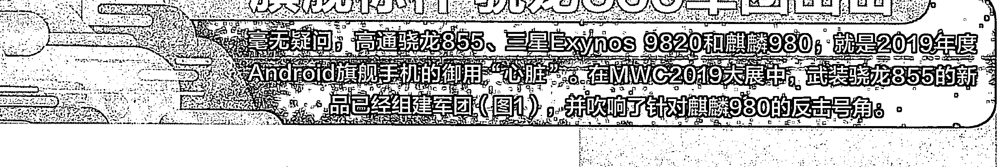

## 骁龙855的反击

作为2019年度旗舰SoC的“三剑客”之一，麒麟980在2018年底就已经量产（图2），并成就了华为Mate 20系列、荣耀Magic 2和荣耀V20的赫赫威名。这一次，高通加速了反击的节奏，除了提前上市的联想Z5 Pro GT和小米9以外，本届MWC也不再是三星手机的“专场”，除了Galaxy S10系列以外，小米MIX3、索尼Xperia 1、LG G8 ThinQ/V50 ThinQ、中兴天机Axon 10 Pro，以及OPPO和一加等品牌都有搭载骁龙855移动平台的新品亮相。

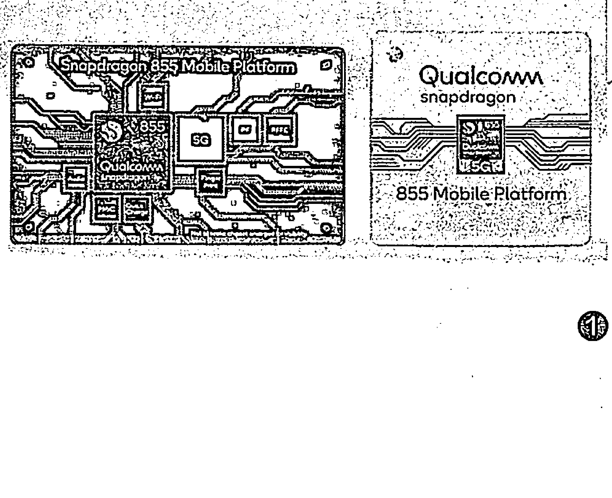

## 高通重树性能威望

由于三星Exynos 9820仅被用于欧版和韩版的Galaxy S10，所以在国内我们可以接触到的旗舰级SoC其实就只剩下了骁龙855和麒麟980（表1）。有关这两颗芯片的参数和功能差异，CFan曾在2019年第2期《Android最强“芯脏”浅析高通855移动平台》这篇文章中作过介绍，而本文我们需要进行的，则是它们之间的真实性能对比（图3）。

表1：骁龙845、骁龙855和麒麟980基本规格对比
| 参数对比 | 高通骁龙845 | 高通骁龙855 | 海思麒麟980 |
| :--- | :--- | :--- | :--- |
| 制程工艺 | 10nm | 7nm | 7nm |
| CPU大核 | 4×Kryo 385 (2.8GHz) | 1×Kryo 485 (2.84GHz) | 2×A76 (2.6GHz) |
| CPU中核 | ---- | 3×Kryo 485 (2.42GHz) | 2×A76 (1.92GHz) |
| CPU小核 | 4×Kryo 385 (1.8GHz) | 4×Kryo 485 (1.8GHz) | 4×A55 (1.8GHz) |
| GPU型号 | Adreno 630 | Adreno 640 | Mali-G76MP10 |

表2：骁龙845、骁龙855和麒麟980理论性能对比
| 测试软件 | 测试项目 | 骁龙845 | 麒麟980 | 骁龙855 | 领先幅度 |
| :--- | :--- | :--- | :--- | :--- | :--- |
| 安兔兔V7 | 总分 | 296238 | 307191 | 367559 | 19.6% |
| 安兔兔AI | AI测试 | 93169 | 68477 | 191306 | 279% |
| 鲁大师V9 | 总分 | 337403 | 337971 | 375766 | 11.2% |
| AI Mark 2.0 | 总分 | 18069 | 18360 | 49090 | 267% |
| PCMark | 工作2.0 | 8654 | 9216 | 9216 | 0% |
| GeekBench4 | 单核 | 2394 | 3371 | 3509 | 4.1% |
| GeekBench4 | 多核 | 8914 | 10143 | 11107 | 9.5% |
| 3DMark | Slingshot Extreme | 5194 | 4335 | 6250 | 44.2% |
| 3DMark | Slingshot | 6564 | 5459 | 7896 | 44.6% |
| 3DMark | Extreme Vulkan | 3865 | 4426 | 4416 | 0% |
| GFXBench | Car Chase ES3.1 | 32 | 28 | 42 | 50% |
| GFXBench | 曼哈顿ES3.1 | 55 | 53 | 70 | 32% |
| GFXBench | 曼哈顿ES3.0 | 87 | 85 | 101 | 19% |
| 测试手机 | ---- | 一加6T | 荣耀V20 | iQOO | ---- |

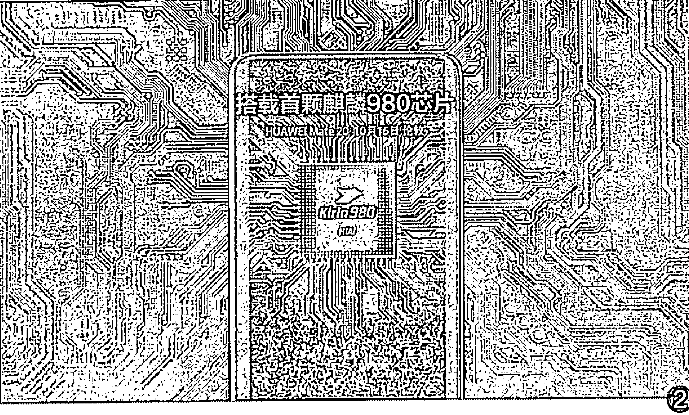

在安兔兔和鲁大师这两个国内知名的综合性跑分软件中，骁龙855的性能较麒麟980分别有着大约20%和10%的提升。但是，在PCMark这个专注于办公性能的跑分软件里，麒麟980则能扳回一局，和骁龙855取得了相同的成绩。GeekBench 4和GFXBench/3DMark分别是专业的CPU和GPU测试软件，骁龙855的CPU单核性能较麒麟980提升了4.1%，CPU多核性能提升了9.5%，而骁龙855的GPU性能在不同的测试项目中则可领先对手19%到50%（表2），可见骁龙855可凭借Adreno 640 GPU获得更为出众的游戏动力。

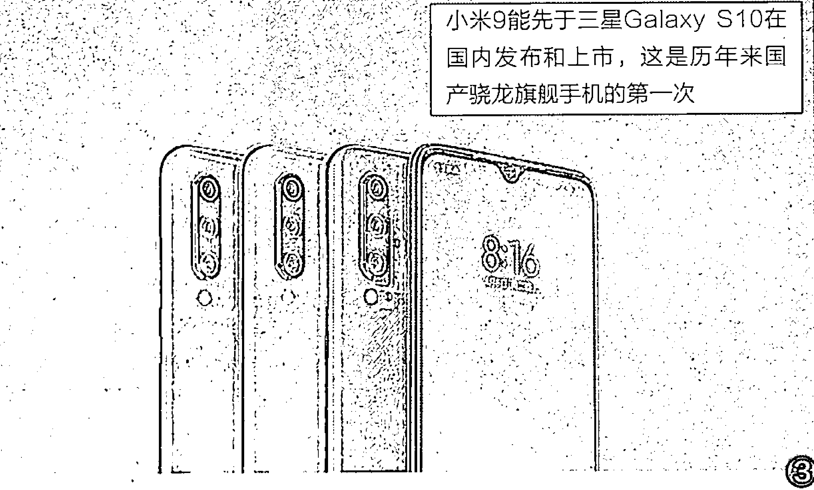

安兔兔在前不久推出了专用的AI测试软件，麒麟980在这里的表现令人大跌眼镜，68477的分数还不如骁龙845，骁龙855的分数更是它的2.79倍。对于这个原因，安兔兔主编张鹏曾在微博中作出了回复（图4），称这只是对AI性能的检验，并不代表整体性能，而这个结果也是得到海思认可的。可见，对移动处理器（SoC）而言，并不是有了独立的双核NPU就等于AI很厉害，没有底层的支持NPU也派不上用场。

鲁大师旗下的AI Mark在2月份也推出了2.0版，对AI的评测算法进行了更新升级，沿用了成熟的Inception V3、ResNet34神经网络模型，而原本的VGG16被取消，新增全新的SSD、DEEPLAB V3+测试项目，因此AI Mark 2.0的评分体系也发生了改变。旧版的AI Mark 1.0跑分普遍在1000分到2000分，而新版的AI Mark 2.0跑分则普遍在10000分到20000分。在这个APP中，骁龙855的成绩是49090，同样和麒麟980拉开了非常大的差距（图5），是后者的2.67倍。

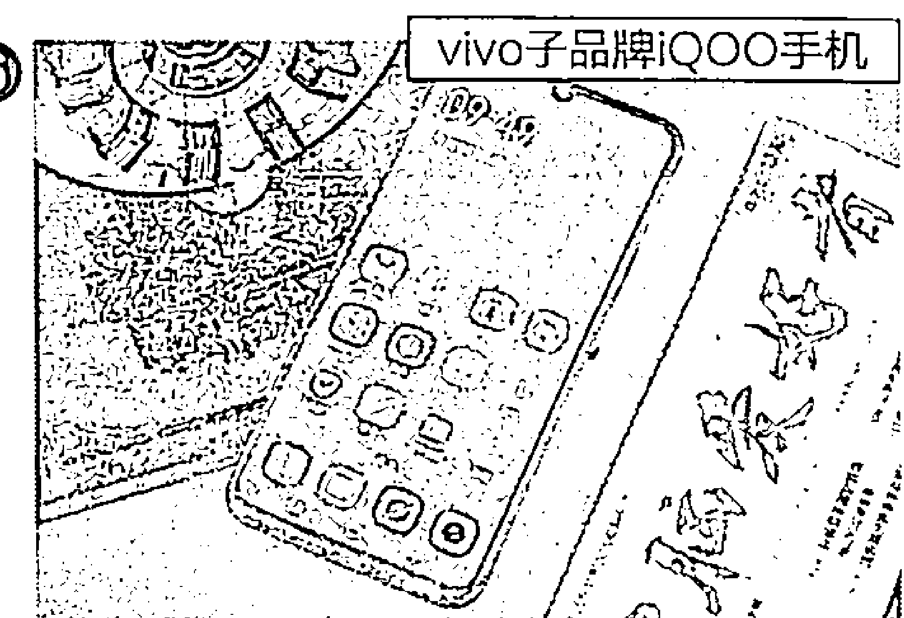

## 理性看待跑分数据

智能手机的跑分只能作为理论参考，同样搭载骁龙855的手机之间，在同一跑分APP下的成绩还有高低之分呢。不过，骁龙855的综合性能，特别是3D性能领先麒麟980却是不争的事实。然而，Android手机日常操作是否流畅、玩游戏时帧数是否稳定、同容量电池和应用环境下续航时间的多少，这些问题都要受到系统优化和散热设计的影响。对于搭载骁龙855和麒麟980的旗舰手机而言，性能在绝大多数时间里都是“过剩”的，在选购智能手机时性能也绝对不是唯一的参考要素。

除了在MWC2019上发布的骁龙855手机以外，vivo、iQOO、魅族、黑鲨等国产品牌也已经准备好了骁龙855新机（图6），当您拿到本期杂志时，相信会有更多骁龙855新机都已经发布甚至上市了。

## 蓄势待发 5G天团降临

在本届MWC2019中，5G无疑是最为核心的话题，无论是高通等芯片商、华为等5G设备供应商、来自全球的运营商和手机终端制造商都纷纷展示自家最新的5G进展。那么，5G手机真的已经到了“瓜熟落地”的地步吗（图7）？

## 5G手机扎堆亮相

在MWC2019中发布的智能手机有很多，但新品中并非全部支持5G网络。如果将5G手机做个盘点，可以叫上型号的新机包括三星Galaxy S10 5G版、小米MIX3 5G版、华为Mate X、中兴Axon 10 Pro和LG V50 5G版等，再加上OPPO和一加展示的5G原型机，表面上一幅欣欣向荣的景象。


> **火速链接**
> 如果你想了解5G网络和4G网络之间的差异，以及它还有哪些特色功能，请参考本刊2018年第20期《写在5G时代来临之前 理性看待第五代移动通信技术》这篇文章。

之所以用“表面”这个词，是因为上述手机都还停留在“PPT”阶段，无论是Galaxy S10 5G版还是小米MIX3 5G版的上市时间都要等到5月之后，其他品牌的5G手机还要更晚才能量产。实际上，在MWC2019上的5G手机也只是集体“走秀”而已，中兴在5G网络下播放了一段视频，华为Mate X测试了一下5G网络下的下载速率，小米基于欧洲运营商Orange的5G网络演示了一段视频通话，OPPO用5G网络来了一次视频直播（图8）……都只是最基础的应用环境。

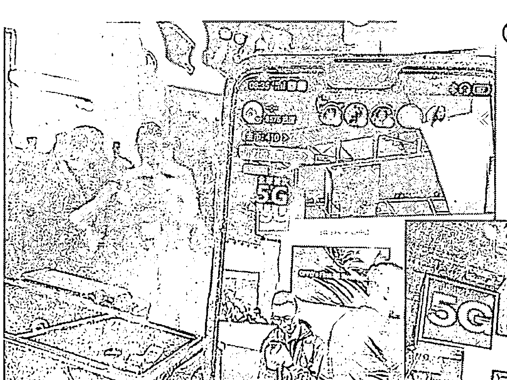

看起来很熟悉？没错，5G云游戏就是英伟达早些年针对PC提出的“GeForce Now”的手机版（图10）。然而，英伟达黄仁勋也曾表示，云游戏永远也不可能替代PC，其背后的主要原因就是延迟，这是无法规避的物理法则。虽然GeForce Now现在已经能以60fps运行某些1080P游戏，延迟可以做到16ms，但这对于很多竞技类游戏和发烧玩家而言仍旧不够。

智能手机依靠5G网络搭建的云游戏环境能否打破来自延迟的僵局？这个问题就只能等时间来验证了。

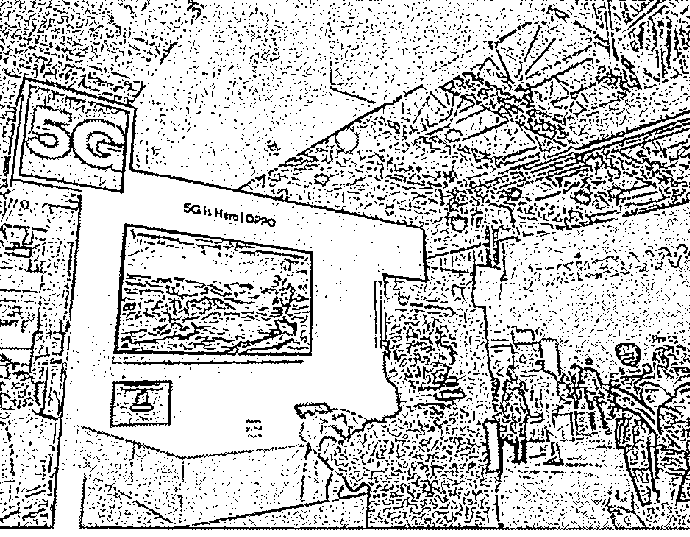

### 熟悉的5G硬件组合

细心的朋友不难发现，虽然在MWC2019上亮相的5G手机不少，但它们在5G硬件上却都仅来源于骁龙855+骁龙X50或麒麟980+巴龙（Balong）5000的组合。其中，骁龙855和麒麟980都是SoC，但它们默认整合的却都是4G基带（调制解调器，即Modem），之所以前文中的新款手机能用上5G网络，就是因为它们都“外挂”名为骁龙X50和巴龙5000的5G基带（图11）。

可以说，2019年5G手机的较量，本质上就是5G基带的战争。那么，骁龙X50和巴龙5000，它们之间谁更强？

不过，OPPO和一加演示的“5G云游戏”未来场景还是很有意思的——玩家只需一部5G手机和一个游戏手柄，就可以随时体验从前只能在PC端实现的大型游戏（图9）。5G云游戏可以突破手机自身性能的限制，将云主机强大的计算能力与5G手机便携易用、待机时间长的特性完美结合，大型游戏不仅无需下载，还能实现高清的画质和极低的延迟，并让手机同时保持较低的功耗和散热，号称是5G时代移动娱乐的划时代解决方案。

> ### 火速链接
> 智能手机要想支持5G网络，除了5G基带以外，还需要匹配更加复杂的天线阵列，在本期技术殿堂栏目的《网络信号全靠它 浅析智能手机的天线设计》一文中会有详细介绍。

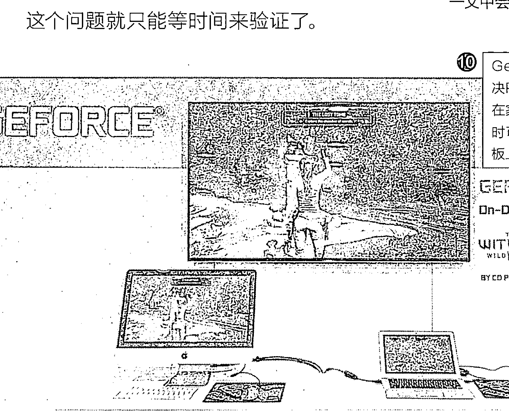

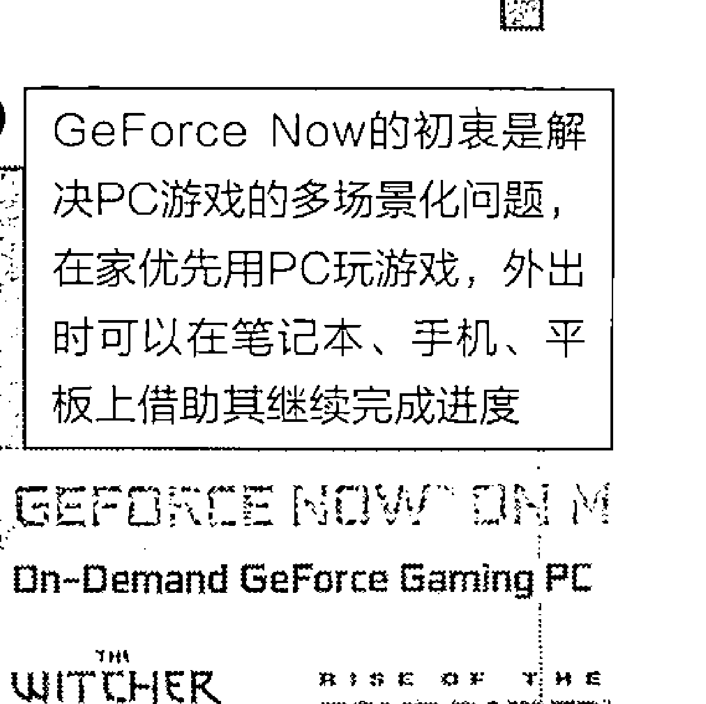

### 骁龙和巴龙的较量

骁龙X50是高通早在2016年就发布了的基带芯片，并曾计划以28nm工艺生产。还好，骁龙X50最终量产版改用了10nm工艺，可惜由于它立项较早，在功能方面用今天的眼光来看就有些落伍了。比如，骁龙X50的理论峰值速度为5Gbps，且不支持SA架构和FDD。换句话说，骁龙X50只支持5G网络，想在更多的国家地区使用4G/3G/2G网络，还必须同时搭配对应的4G基带芯片。如果不出意外，2019年内与骁龙855搭配的基带应该都是骁龙X50（图12）。

巴龙5000是华为在2019年1月才正式发布的基带芯片，它基于和麒麟980相同的7nm工艺设计，也是有史以来第一款兼容SA（5G独立组网）和NSA（5G非独立组网）双架构的5G基带芯片，能够在单芯片内实现2G、3G、4G和5G多种网络制式，这意味着搭载这颗基带芯片的手机无论在4G阶段还是非独立组网的NSA阶段，甚至到运营商切换到SA组网时都可以完美兼容网络而无需换机，堪称5G时代的“全网通”（图13）。

据悉，巴龙5000在Sub-6GHz频段（低频频段，5G的主要频段）可实现4.6Gbps的峰值速率，在mmWave毫米波频段（高频频段，5G的扩展频段）中更是可以达到6.5Gbps的峰值速率，于5G NR+LTE模式下甚至可以实现7.5Gbps的峰值速率。

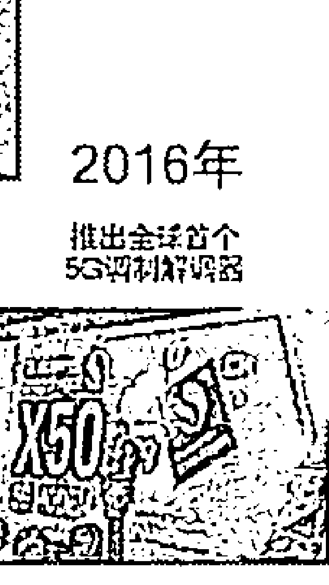

当然，高通也不可能让华为独美于前。就在巴龙5000发布不久，高通也同时祭出了全新的骁龙X55基带芯片。据悉，骁龙X55同样基于台积电7nm工艺设计，同时兼容SA和NSA组网，并实现从2G到5G网络“通吃”的能力（图14）。从峰值速率来看，骁龙X55在毫米波频段可以带来7Gbps的速度，和巴龙5000处在同一个层面上。高通在MWC2019上还透露了全球首款集成5G基带的骁龙移动平台芯片的消息，预计2019年第二季度流片、2020年上半年商用，其很可能就是传说中的“骁龙865”。

除了高通和华为以外，参与5G基带竞争的厂商还有很多，比如联发科旗下的曦力M70、英特尔主推的XMM 8160、三星自家的Exynos 5100。在MWC2019中，紫光展锐也重磅发布了其首款5G基带芯片“春藤510”（图15），迈入全球5G第一梯队。据悉，春藤510采用12nm工艺设计，支持多项5G关键技术，包括单芯片2G/3G/4G/5G多种通讯模式，支持3GPP R15、Sub-6GHz频段、5G SA和NSA两种组网方式。

总之，2019年只是5G的试水年，相关的产品全部主攻高价，在当地运营商没有做好准备之前，无论是5G信号覆盖还是相关的资费都存在较大的问题。对普通消费者而言，第一时间入手5G手机显然并不是什么好主意，静观其变才是王道。

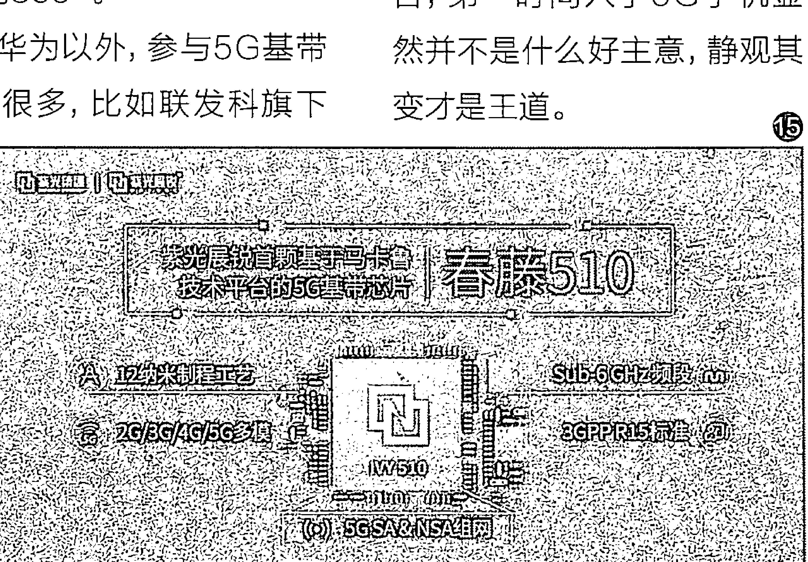

## 噱头还是趋势 来自折叠屏的讨论

在MWC2019上，智能手机除了即将插上5G的翅膀外，昔日停留在实验室阶段的“折叠屏”形态设计也从梦想照进了现实，当折叠屏手机展开的一瞬间，仿佛这就是未来（图1）。然而，折叠屏却意外地引起了广泛争议，有人认为是趋势，有人表示不屑，还有人保持中立态度。那么，可以从手机秒变平板电脑的折叠屏手机，到底值不值得我们期待呢？

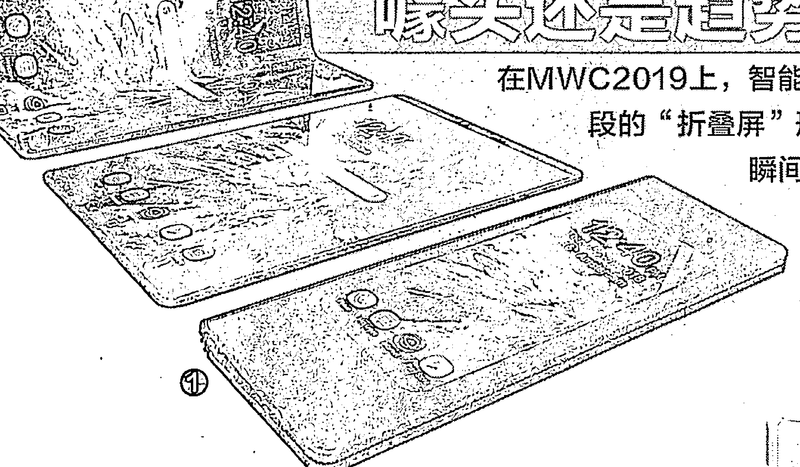

## 折叠屏手机爆发的前奏

折叠屏手机其实并非什么新鲜概念，早在3年前的TechWorld大会上，联想就曾经发布了一款型号为Folio的折叠屏手机（图2）。只是当年还没有窄边框和全面屏的概念，柔性屏和铰链等产业链也还没成熟，所谓折叠屏只是存在于传说中的“PPT手机”。

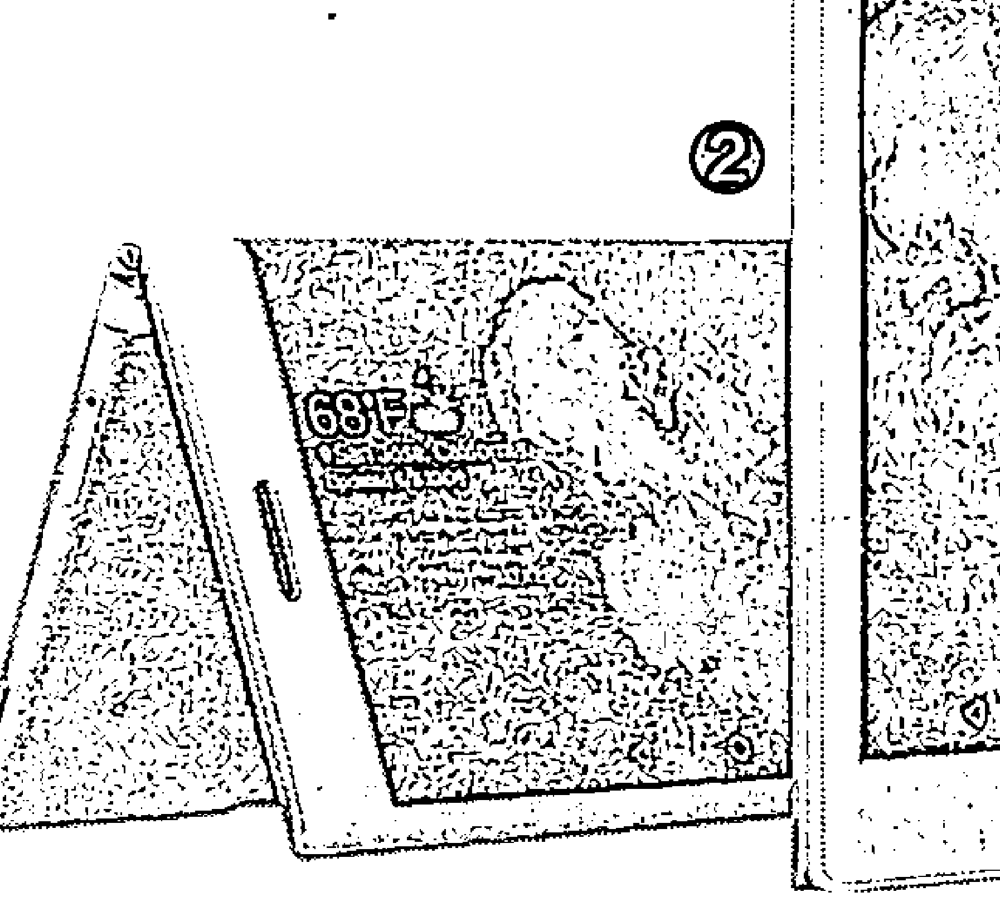

2019年1月23日，小米集团总裁林斌在微博上曝光了一段小米双折叠手机的演示视频，并称“在攻克了柔性折叠屏技术、四驱折叠转轴技术、柔性盖板技术，以及MIUI适配等一系列技术难题后，我们做出了第一台折叠屏手机，应该也是全球第一台双折叠手机。这种对称双外折叠的形态，完美结合了平板和手机的使用体验，既实用又美观”（图3）。

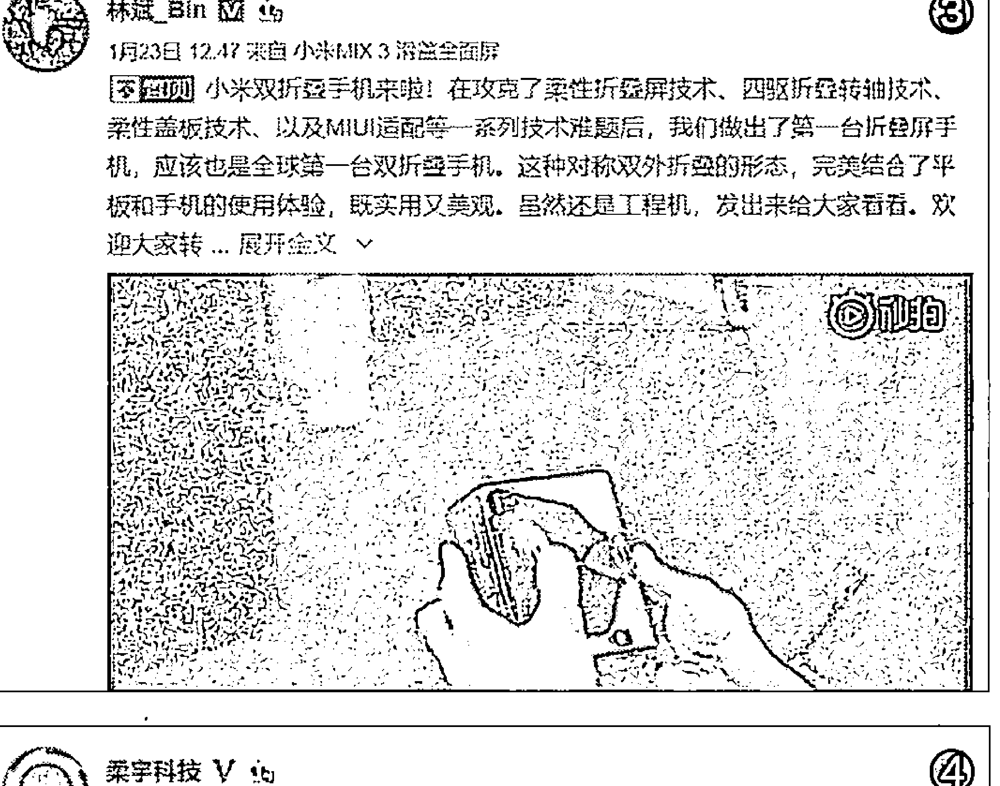

没想到，小米却因双折叠手机的曝光而与柔宇科技打起了“口水仗”。1月24日，柔宇科技的高层在微博发表了对小米双折叠手机的看法，称其“买的别人尚未量产的概念柔性屏幕和概念机，自家于2018年10月发布的柔派才是全球首款真正的可折叠柔性屏手机”（图4）。我们不去讨论孰对孰错，两家企业在网络上的唇枪舌战，无形中却让“折叠屏手机”的概念深入人心。

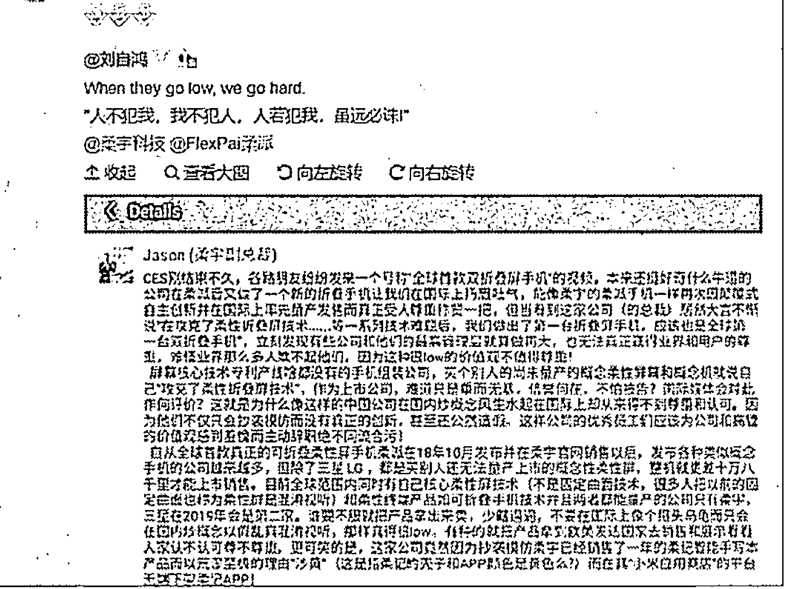

真正让“折叠屏手机”彻底沸腾的标志，则是MWC2019期间三星Galaxy Fold和华为Mate X两款绝代双骄的发布，而它们的诞生也进一步刷新了Android手机的高价纪录。

三星Galaxy Fold拥有前后两面屏幕，正面的副屏是4.6英寸的AMOLED屏幕（1680×720像素），而背面Dynamic AMOLED材质的主屏在展开后可达到7.3英寸（2048×1536像素）。这款产品搭载了高通骁龙855移动平台，内置12GB LPDDR4X内存、512GB存储空间（全球首款UFS 3.0）和高达4380mAh容量的电池。Galaxy Fold的特色还在于配备了6颗摄像头，在折叠和展开后可以满足不同场景的拍摄需求（图5）。该产品的售价为1980美元，约合人民币13376元，将于4月26日正式开售。

### 折叠屏之间比什么

作为全新的偏概念形态产品，折叠屏手机的技术含量还是非常高的，除了影响性能的处理器、内存、闪存和摄像头等硬件参数以外，屏幕折叠的方向、铰链的设计以及系统针对双屏交互的优化，才是影响折叠屏体验的最核心要素。

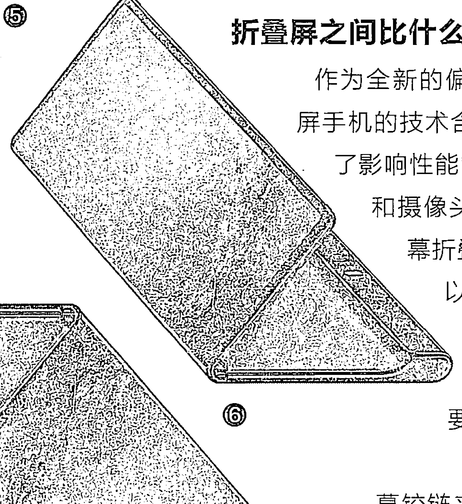

华为 Mate X 的 AMOLED 材质柔性屏来自京东方 BOE，它的正面屏幕尺寸为6.6英寸（2480×1148像素），背面屏幕大小为6.38英寸（2480×892像素），展开后可以合成一块8英寸且分辨率高达2480×2200像素的震撼视界（图6）。这款产品搭载麒麟980且外挂巴龙5000基带，也是业内首款支持5G的折叠屏手机，同时还内置4500mAh容量电池，支持55W超级快充。Mate X 的定价为2299欧元，约合人民币17470元，预计于今年6月份上市。

就拿折叠屏手机的屏幕铰链来说，它是连接两块屏幕之间的转轴，虽然毫不起眼，但无论是双折叠、单折叠和全打开都会让柔性屏幕处于不同的形态，承受不同的应力（图8）。如何在整机和转轴设计上尽可能保护好屏幕，背后涉及到数学、物理学、材料科学、工业设计等多门学科技术攻关，从运动原理到子功能模块的设计，再到材料的选择，以及不同表面处理的尝试，直接决定了折叠屏手机的成败。

同时，TCL 在 MWC2019 上也展示了自家的折叠屏手机，其屏幕部分来自华星光电的柔性屏方案，并首创了 DragonHinge 折叠屏铰链技术。这款产品采用了和 Galaxy Fold 类似的前后屏设计，展开后可获得7.2英寸2048×1536像素的视野（图7）。和竞争对手相比，TCL 的折叠屏手机主打足够低的成本，号称人人都能买得起。

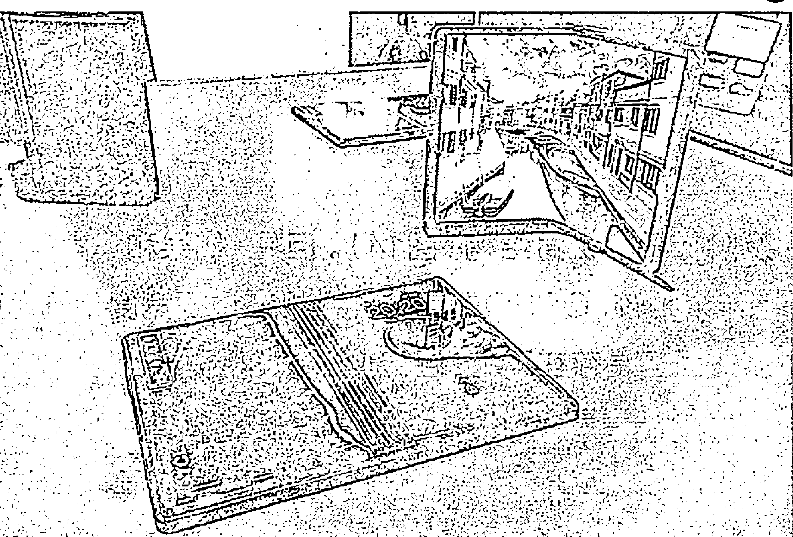

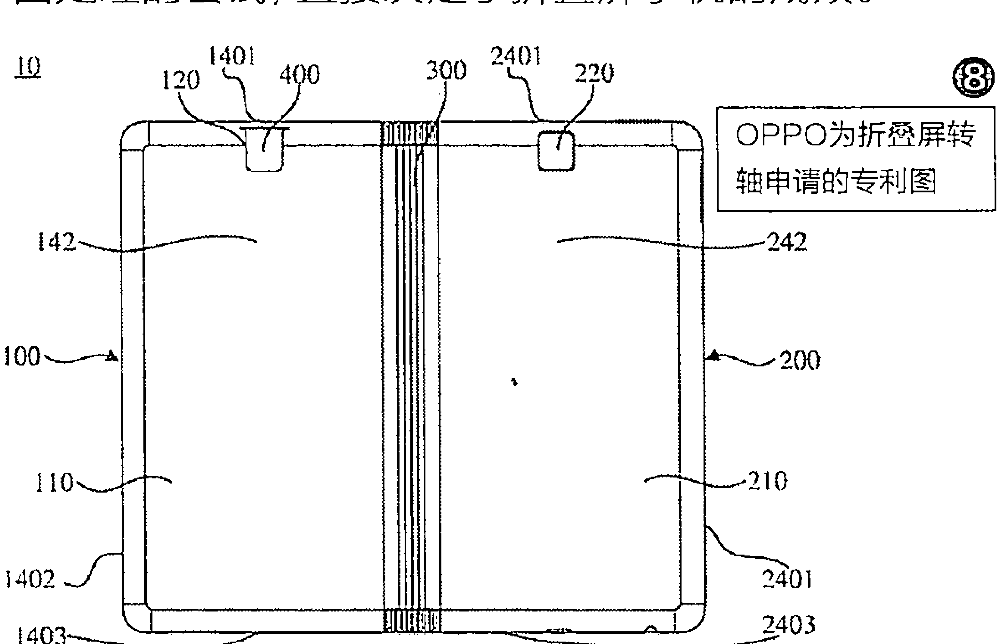

就拿前文中已经亮相的折叠屏手机来说，它们所采用的铰链和折叠设计就存在极大的不同。

以 Galaxy Fold 为例，它采用的是“内翻”（向内折叠）的铰链设计，将主屏幕放在机身内侧可以起到最大程度的保护作用（图9）。但为了在闭合状态下也不影响使用手机，Galaxy Fold 必须在外侧添加另一面副屏，在系统层面还需要考虑展开过程中内屏和外屏之间如何无缝切换应用的问题，其成本和设计难度很高。

## 特别话题

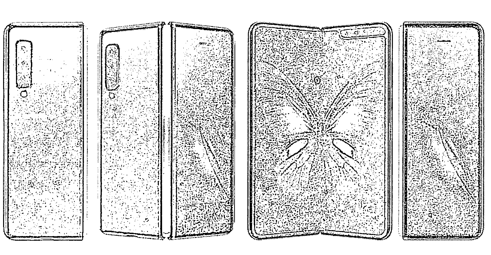

华为Mate X属于“外翻”（向外折叠）的代表，而官方则将其称为“鹰翼”式折叠设计，其最大的特点是支持0度到180度任意折叠，折叠时紧密贴合，展开时又平坦自然。既保证了折叠后单手使用的屏幕尺寸，同时展开后也更加便于握持（图10）。和Galaxy Fold的内翻设计相比，外翻设计无需单独准备额外的副屏，而Mate X又通过独特的阶梯式设计，将摄像头都集中在了机身一侧的柱状空间内（图11），屏幕闭合时是便携舒适的6.6英寸大屏手机，展开后又能变身为仅有5.4mm轻薄厚度（屏幕部分）、轻盈灵巧的8英寸平板电脑。

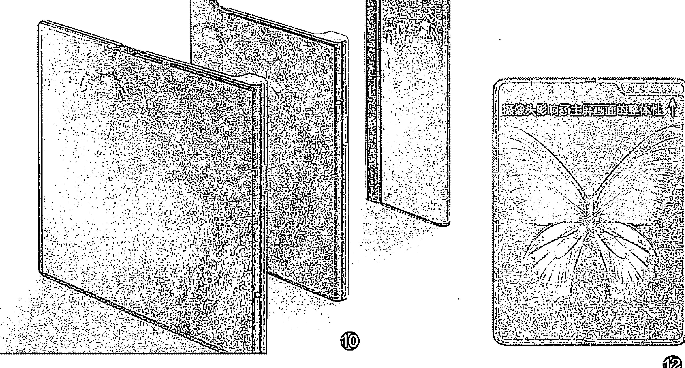

得益于外翻折叠屏设计，华为Mate X还实现了后置徕卡三摄和前置镜头的统一，支持镜像智拍和双屏预览等功能。在拍摄对方的同时，她也能从副屏看到自己，可随时调整姿态。作为对比，三星Galaxy Fold为了在展开屏幕的平板状态下完成自拍，在内屏右上角加入了类似“刘海”的空间来安置摄像头，多少有些破坏了屏幕的整体性（图12）。

需要注意的是，哪怕采用了相似的折叠屏结构，不同型号的手机之间还是可以体现出工艺层面的差异。

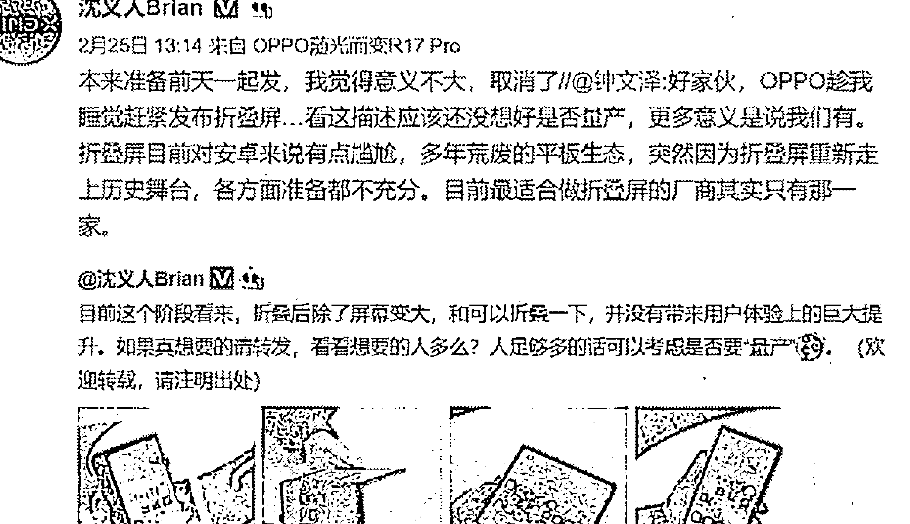

比如，OPPO虽然没有在MWC2019上发布折叠屏手机，但其副总裁沈义人却在2月25日的微博上曝光了OPPO正在研发过程中的折叠屏样机（图13），它采用了和华为Mate X相似的外翻式转轴，以及阶梯状的机身结构（图14）。但是，如果和华为Mate X作个比较，OPPO的折叠屏样机在边框宽度和机身厚度方面还是存在不足（图15）。

再来看看柔宇科技旗下的柔派，它同样是外翻式转轴风格，但在铰链的处理上却存在缺陷，在闭合时可以将一块大屏“弯折”，但却无法做到折叠时紧密贴合，中间存在缝隙，从而影响了厚度和持握手感（图16）。

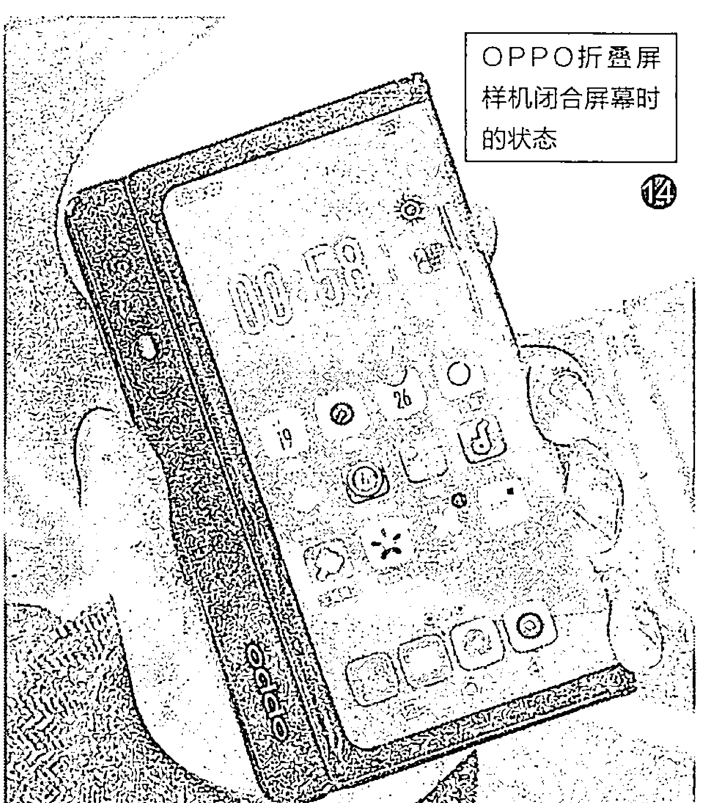

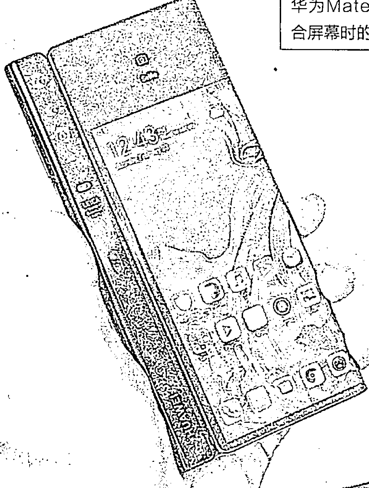

小米早前曝光的双折叠屏手机相当于内置2个外翻式转轴，展开时是一款硕大的平板电脑，屏幕两侧都能沿着铰链向后折叠（图17），最终变成一款普通手机的形状，演示效果最酷，但相应的成本也会更高。

## 折叠屏手机的阵痛

> > 小米在和柔宇科技微博论战时曾表示：“每一款划时代的创新产品都源自于上游供应链厂商和终端厂商共同倾注的大量研发心血。产业链不同环节术业虽然有专攻，但协同倾力研发，才能为用户提供真正优秀的产品和体验。”

对于折叠屏手机而言，依靠某个厂商“单打独斗”是肯定不行的，需要上下游产业链携手作战，才能在最短的时间将最成熟可靠的量产型号推向市场。然而，就目前来看，折叠屏手机想要普及，也远非短时间内可以实现之梦。

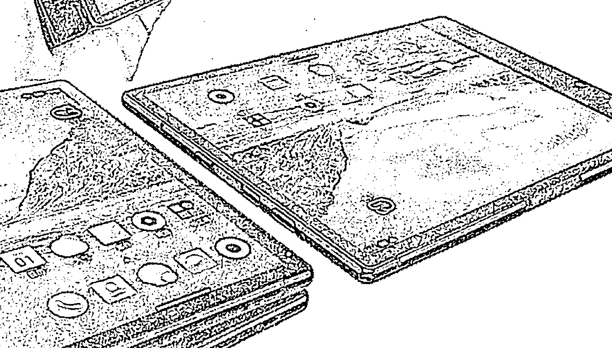

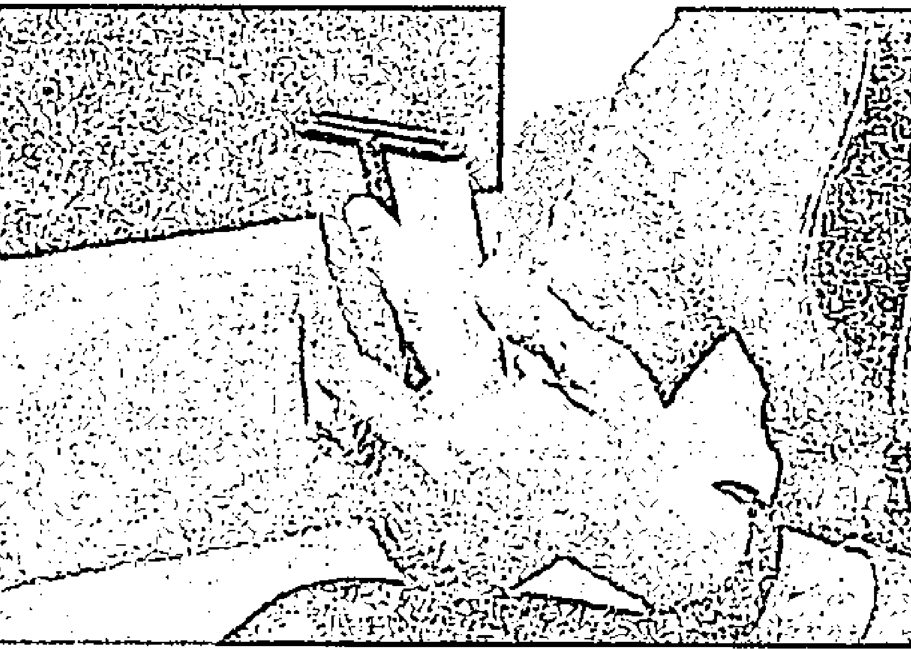

原因很简单，可折叠屏和可卷曲屏设计都仍有诸多技术难点需要去解决，哪怕在不考虑良品率的情况下，单纯折叠屏幕的材料（包括铰链元器件）成本就比新款iPhone的屏幕高出约60%。作为全新形态的产品，折叠屏很难在短期内形成规模效应，上下游各环节都无法降低成本（图18）。

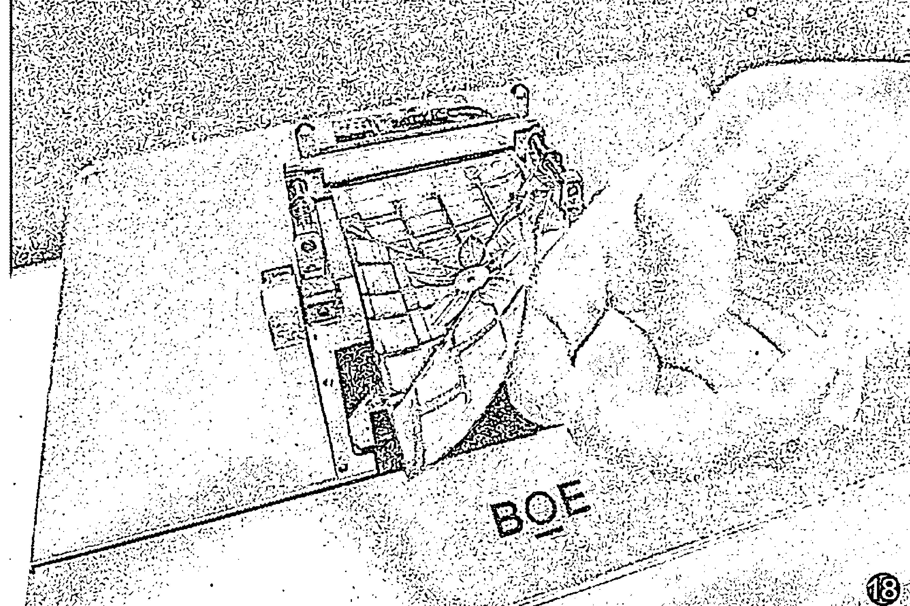

同时，折叠屏手机还将面临一个非常尴尬的问题：由于玻璃在常温下是无法弯曲的，所以三星Galaxy Fold和华为Mate X等折叠屏手机的屏幕都采用了塑料材质的面板，其在抗划性上远不如我们熟悉的大猩猩玻璃，在不贴膜的情况下很难避免划伤。此外，现在无论哪个方案暂时还都解决不了折叠平整和塑料折痕的问题（图19），有强迫症的用户看到这些折痕时会极为影响心情。

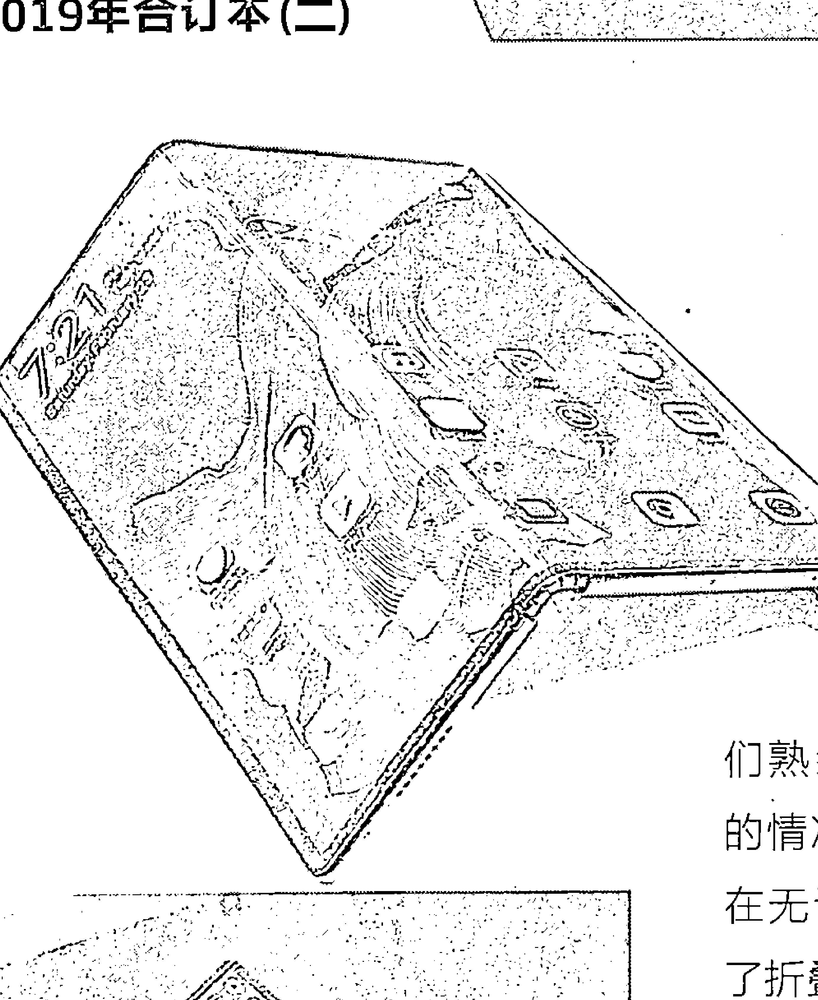

此外，折叠屏手机在APP适配方面还存在较大的问题，特别是游戏在接近方形的屏幕比例下如何显示（图20）？要知道Android系统针对平板电脑优化的APP生态并不成熟，折叠屏手机除了折叠后屏幕更大，并没有带来用户体验上的巨大提升。过高的成本，远不如一款高端手机+高端平板电脑来得实际和实惠。

相对于Android系统，如果苹果今后推出折叠屏版本的iPhone就不存在这个问题，因为iOS系统可以让它在屏幕闭合时以iPhone应用显示，在展开屏幕时无缝切换到iPad应用界面。

总之，折叠屏手机是手机形态演进路上的一种探索，但它能否成为未来手机形态的发展趋势还有待商榷。至少，在解决成本、铰链折叠寿命、屏幕折痕、续航压力（对展开后动辄8英寸的折叠屏手机，至少需要5000mAh+级别的电池才能保持和普通手机相近的续航）、APP适配之前，作为普通用户还是仅需了解一下就好。

### 扩展阅读

3月初，康宁公司总经理John Bayne已确认公司正在为折叠屏开发保护玻璃，康宁的目标是打造0.1mm厚、弯曲半径3mm到5mm的超薄玻璃，使得折叠手机非打开状态下依然可以控制在6mm到10mm厚。当这种可弯曲玻璃问世后，就能有效解决当前折叠屏手机使用塑料面板易划伤和出现折痕的问题。

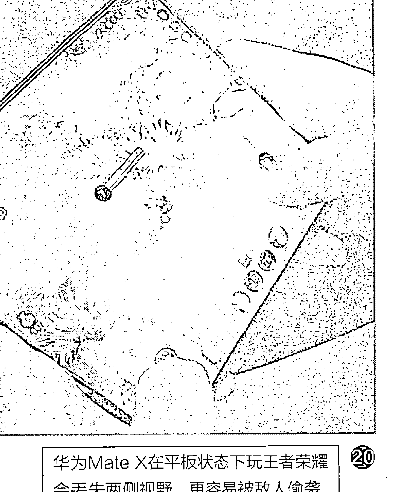

## 华为Mate X在平板状态下玩王者荣耀会丢失两侧视野，更容易被敌人偷袭

## 镜头更多 拍得更远

自从2018年华为P20 Pro引入(后置)三摄模块之后，武装更多镜头就成为了2019年旗舰手机的标准装备。而在MWC2019上，手机后置摄像头的规格再度得以进化，“翻译”过来就是数量更多，或是拍得更远。

## 更多数量的镜头

在MWC2019中亮相的诺基亚9 PureView就是“数量更多”的代表（图21），它在背部集成了5颗蔡司认证的镜头，它们都是1200万有效像素（索尼IMX386传感器）、F1.8光圈、1.25微米像素尺寸，只是其中2个是RGB彩色镜头，其他则是黑白镜头（图22）。

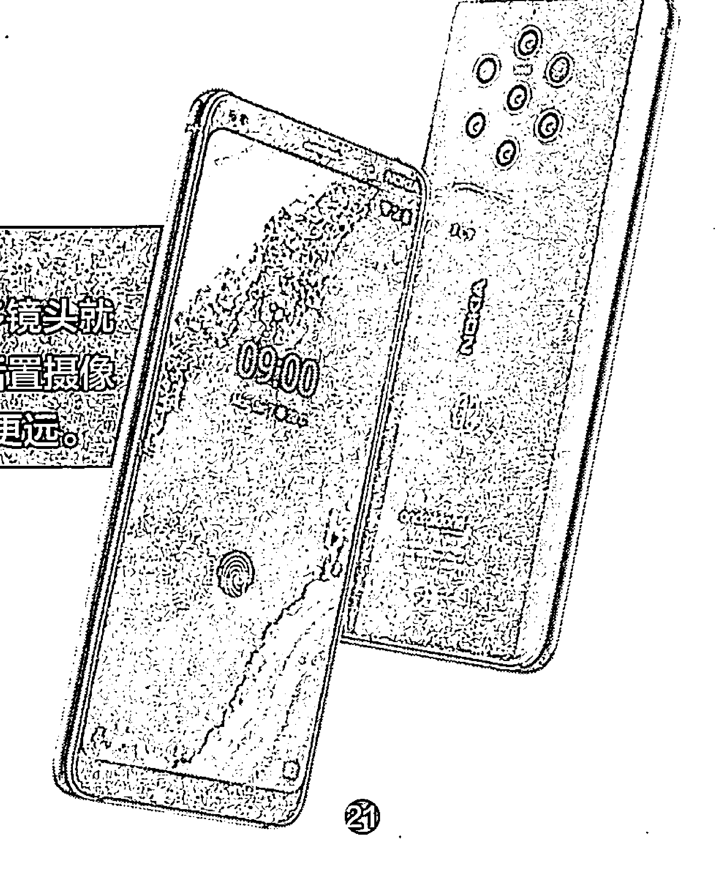

由于诺基亚9 PureView搭载的骁龙845最多仅支持三摄，所以这款产品单独定制了由Light公司提供的ISP，用于驱动5颗索尼IMX386。在拍照时，诺基亚9 PureView的5颗镜头会同时拍摄不同曝光的照片，然后结合协处理器和多帧合成算法，输出画质表现更高的照片。

在MWC2018上，小米也宣布将与Light公司达成合作，寻求研发新的智能手机图像技术解决方案，目标是将多镜头设备的成像达到单反级别。

不过，就诺基亚9 PureView的5颗同型号镜头来说，它们都是为了输出更好的日常照片而服务，缺少了光学变焦、超级广角等拍照选项的它，在可玩性和实用性方面并没有发挥更多摄像头的优势。未来智能手机镜头的发展趋势，还是主摄和各种特殊拍摄场景专用的辅助镜头为主。

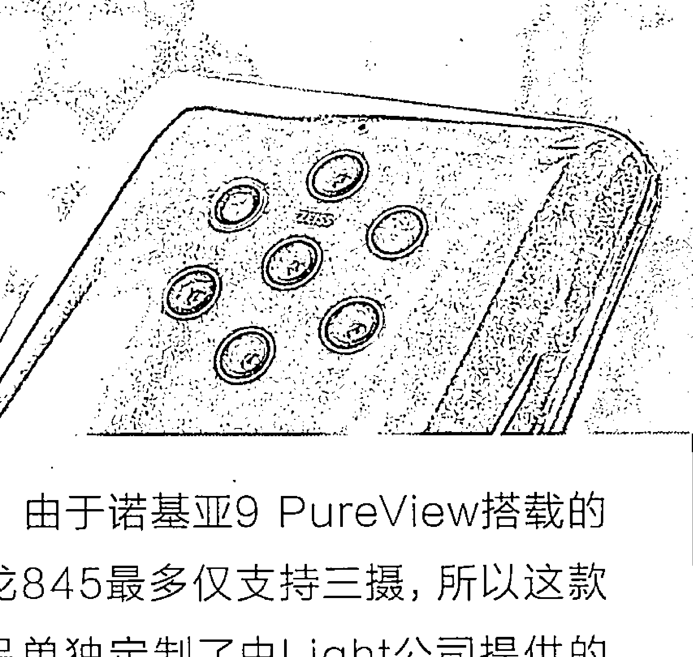

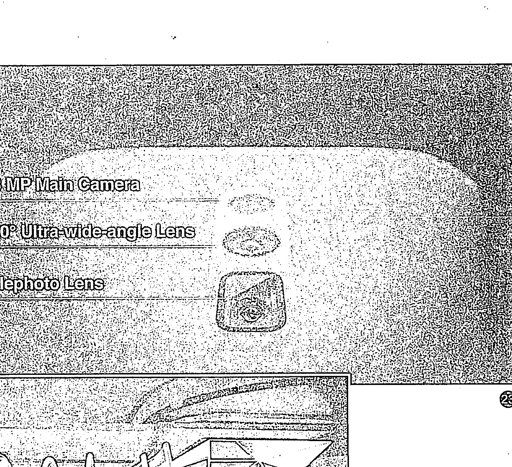

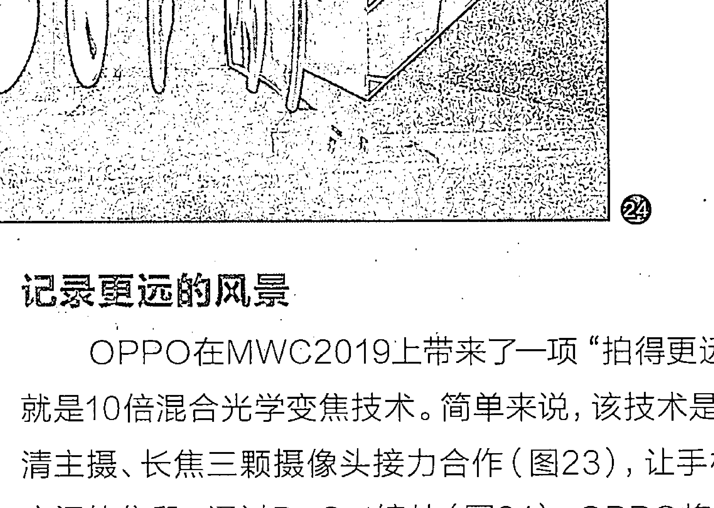

## 记录更远的风景

OPPO在MWC2019上带来了一项“拍得更远”的技术，那就是10倍混合光学变焦技术。简单来说，该技术是由超广角、超清主摄、长焦三颗摄像头接力合作(图23)，让手机可以覆盖更广阔的焦段。通过D-Cut镜片(图24)，OPPO将三摄模组的厚度控制在了6.76mm，并使用主摄+超广角AF共马达技术，进一步压缩模组体积，确保摄像头不突起、机身更轻薄。此外，OPPO还在超清主摄和长焦摄像头上引入双OIS光学防抖，长焦镜头防抖精度高达0.001445°，并使用了更大的传感器，变焦拍摄照片同样清晰(图25)。

继2倍光学变焦和超广角拍摄成为主流功能后，5倍光学变焦和10倍混合变焦能力就成为了旗舰手机的发展方向，有消息称华为也会在随后发布的P30 Pro身上带来10倍光学变焦功能，只是成像原理可能与OPPO不同，让我们一起期待吧。


## 明天的内存 今天的选择

DDR4刚刚基本一统消费级内存市场，DDR3的退场似乎还有些依依不舍。但时间不等人，新一代内存的规格之争已经开始。尽管DDR5似乎已经被“内定”为下一代主流PC内存，但无论是已经在显存市场打出“一片天”的HBM内存，还是在PCI-E 4.0身后虎视眈眈的新形态内存，甚至是DDR5的“继承人”DDR6内存，都已经在觊觎着消费级内存市场了。那么，未来的内存市场究竟会有哪些实力强劲的选手加入，最终又会花落谁家呢？今天市场与用户的选择，也许就将影响未来整个市场的内存形态，乃至整个PC的形态。

## 法定继承人DDR5

要说到DDR5，必须首先明确一个问题，它与目前主流的DDR5显存，即GDDR5并不是一回事，虽有一定的血缘关系，但关系已经相当远了。DDR5是从目前主流的DDR4发展而来，但GDDR5却是从DDR3进化而来的。此外还有另一个发展路线上的低功耗产品LPDDR5，虽然技术有些关联，但主要面向移动、集成市场(图1)。

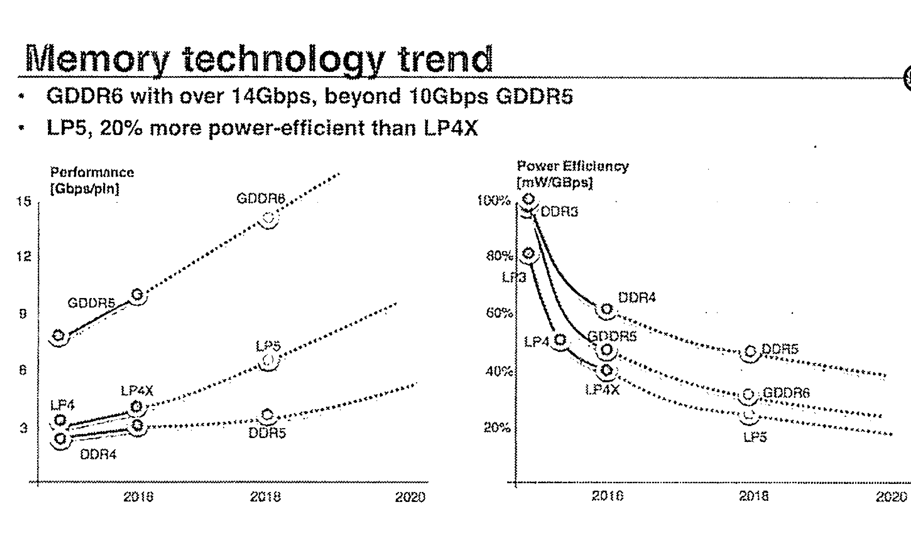

| 项目 | 描述 |
| :--- | :--- |
| GDDR6 | 速率超过14Gbps，超越10Gbps的GDDR5 |
| LP5 | 能效比LP4X提升20% |

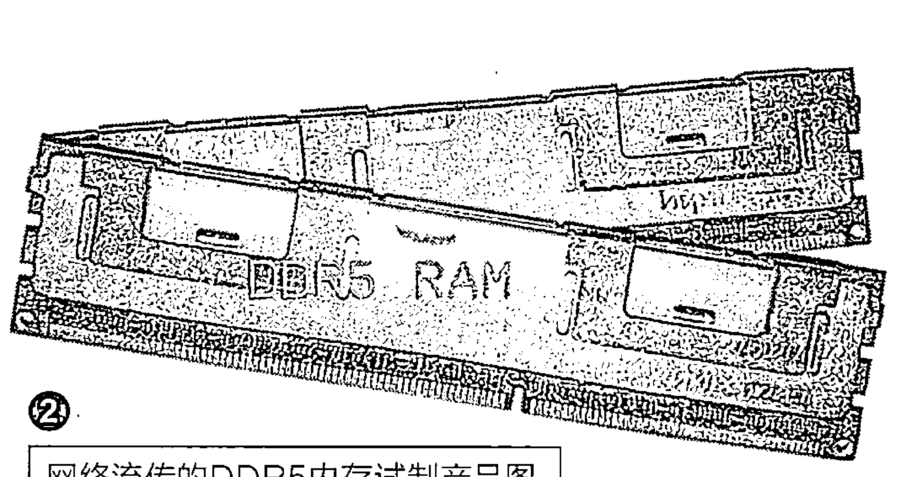

DDR5的规范其实在2016年就开始规划，也就是说DDR4刚刚开始走上正轨，厂商们就在筹划下一代内存了。这一规范主要由三星提出、美光参与，具体性能方面，规划中的DDR5从3.2GHz等效频率起跳，主流频率会达到6.4GHz，容量则为16GB起跳，电压1.1V。而从目前公布的一些DDR5颗粒来看，似乎厂商有意直接出货6.4GHz左右的高频产品(图2)，与目前已经进入主流价位的DDR4 3x00内存拉开档次。

## 微小的进步和出色的兼容性

总体来看，DDR5其实就是等效频率翻倍的DDR4，而其翻倍的方式也和之前的DDR2、3、4一样，利用了每个时钟周期内电平的不同来触发(图3)，在保持基础频率的基础上可以获得数倍的等效运行频率。这样渐进式的发展兼容性更好，是DDR5成为下一代标准的主要原因之一。

当然，DDR5已经需要在一个时钟周期内触发惊人的32次动作，所以需要非常精确地测量时钟脉冲和电平，并且维持非常高的运行速度和稳定性。为此DDR5颗粒和内存条中也增加了一些新模块、电路和算法，比如用来修正时钟相位、减小时钟误差的相位插值/旋转器(Phase Rotator)，用来调整均分时间的延迟锁定回路(Delay-Locked Loop)，以及注入锁相振荡器(Injection Locked Oscillator)和前向反馈均衡电路(FFE)等。很显然，虽然DDR5没有进行架构大改，但更复杂的电路及元件以及早期的良品率问题还是会明显提升成本，所以预计其上市价格将大幅高于DDR4内存。

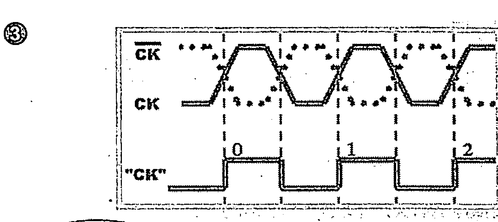

## DDR6紧随其后

作为DDR5最有可能的后继产品，DDR6也已经初露端倪。这次的先行厂商是SK海力士，其开发的DDR6内存预期速率12GHz，即DDR6-12000，正好又是主流DDR5速率的两倍。DDR6还可能采用更高的每周期数据传输能力等技术进一步提升性能，使其成为一次性性能跨越较大的内存升级。根据媒体采访透露出的信息，SK海力士预计DDR6将在5年~6年内发展完成，正式进入主流市场。

需要注意的是，SK海力士在研的“后DDR5”产品仍为技术概念，目前成型的主要有两种，其中一种是延续现有的数据传输规范，另一种则是将DRAM与CPU等片上系统的处理技术结合。很显然，后一种其实和目前HBM内存的使用方式很类似。

## GDDR显存与LPDDR内存

在内存规范中，很多人经常会被GDDR和LPDDR搞糊涂。其实GDDR基本与同代DDR没有什么关系，而是有着自己的发展路线，只是有时会有一些交叉。比如GDDR2是DDR2内存的优化版本，而GDDR3内存基本上是原封不动照搬了DDR3颗粒，后续的GDDR4、GDDR5(图4)、GDDR5X都是进一步优化的GDDR3(DDR3)。GDDR6(图5)的变化更大一些，每个芯片配置了两条×8/×16通道，而GDDR5仅有一条通道，此外电压下降到1.35V，耗能降低了35%左右，因此获得了和HBM甚至HBM2显存一较高下的能力。同时其针脚数量也比GDDR5X有所减少，生产、使用都更方便。

当然与DDR内存颗粒相比，GDDR还是有一些改变的，比如修改了外部接口，使用更高的集成度，可以用更少的颗粒提供足够的带宽，但在一定程度上牺牲了延迟，尺寸也略大一些。GDDR还会尽量提升运行效率，获得更高的等效频率，同时降低功耗。当然这些能力除了对架构、工艺的修改外，也是因为显存利润较高，所以厂商也更倾向于在GDDR颗粒的制造中投入更新的技术、制程。

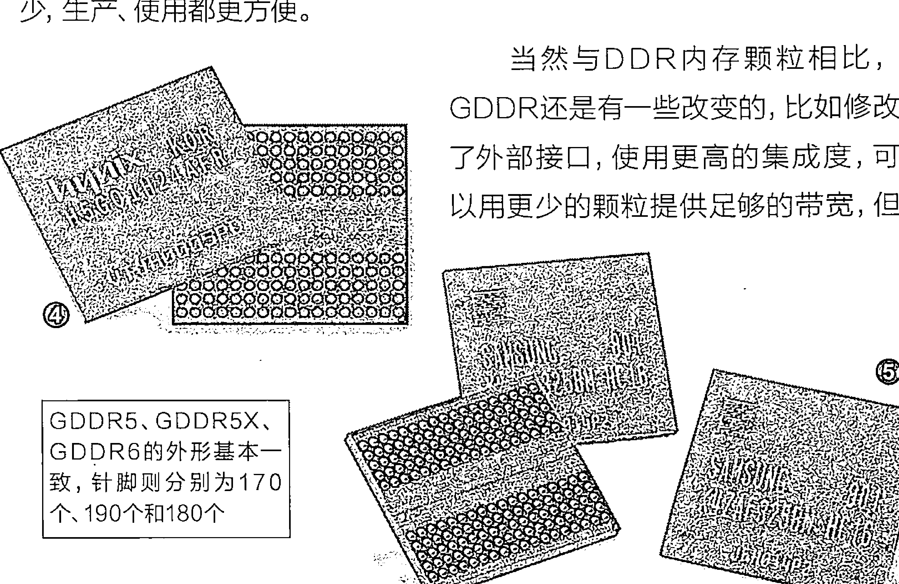

至于LPDDR系列，则是Low Power Double Data Rate SDRAM（低功耗DDR内存）的简称，它们的技术、架构与同代DDR内存基本相同（图6），但使用非常低的电压，如LPDDR4使用1.1V电压，使其功耗大幅降低。

需要注意的是，LPDDR和低电压DDR内存如DDR3L也不一样，其电压更低，功耗也更小，因此平台定位就完全不同，前者主要用于手机、平板电脑等设备，而后者则和普通DDR内存的应用方式基本相同，主要用于笔记本电脑，也大量用于台式电脑中。

## 蛰伏的HBM

除了DDR5，目前已经很成熟的内存技术还有HBM（高带宽内存）；它在高端显卡上的表现也很抢眼。为什么来自CPU大厂AMD，并且早就宣布过要进军PC内存市场的HBM，却迟迟没有真正的动作？它又会不会借着第二代产品HBM2的成熟和本次PC内存的升级进入内存市场呢？要理解这些问题，咱们先得了解HBM内存及其特点。

顾名思义，HBM内存最大的特色就是位宽特别高，可以在较低频率下实现很高的数据传输率。如果以道路进行比喻，那么DDR内存就是通过不断提高车速来换取更快的数据运输速度，而HBM则是把路尽量拓宽，通过并行更多的车辆来换取更大的数据运输量。HBM的封装构造也和DDR内存完全不同，是多层颗粒层叠放置（图7），所以体积可以做得很小（图8）。

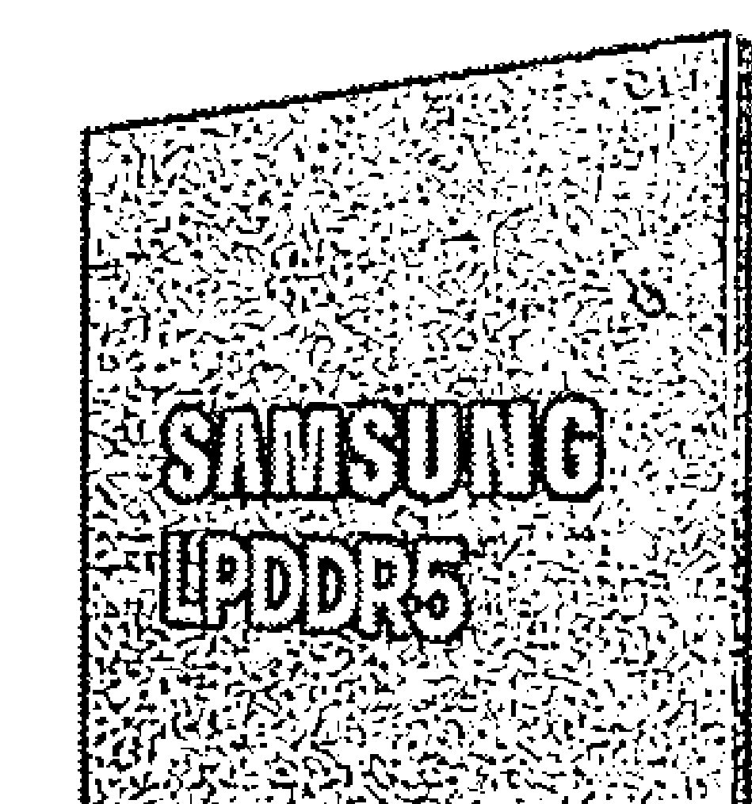

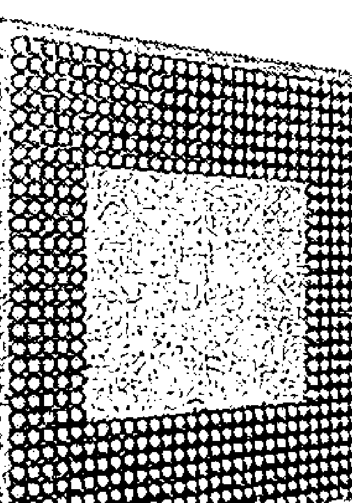

HBM内存的问题也恰恰在于它的工作方式，由于带宽非常大但频率相对较低，所以与核心连接的线路更复杂、对延迟的敏感度更高。要用HBM做PC内存的话，内存插槽与处理器接口间就必须尽量接近，而且线路非常复杂密集；而如果像GPU一样把它直接做在CPU封装内（图9），就要放弃内存插槽，这都需要对主板结构进行大改。

另外的问题来自CPU，HBM能用于GPU的原因是现在GPU显存位宽都很大，主流产品192bit起步，使用HBM内存的Vega 64（图10）和Titan V更达到了2048bit和3072bit。但目前主流CPU的内存控制器只能使用128bit双通道，根本没法充分利用HBM的高带宽，甚至还限制了可用的内存容量。

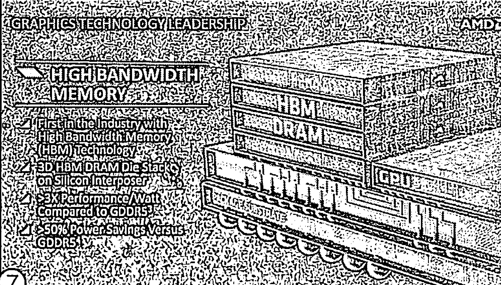

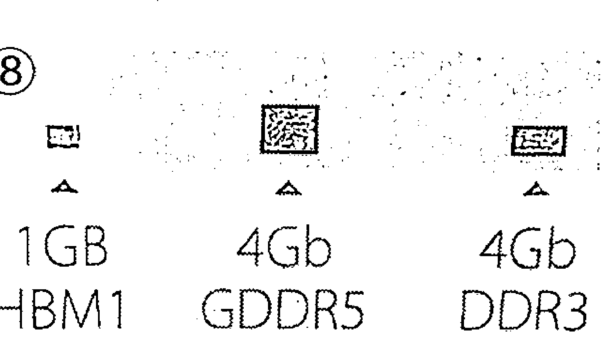

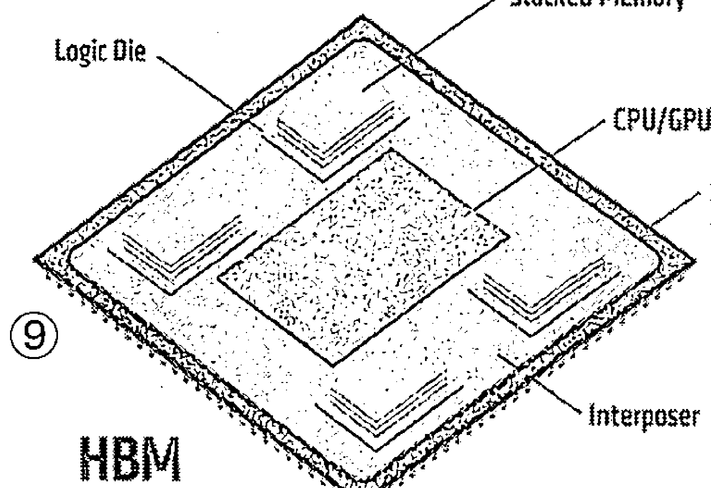

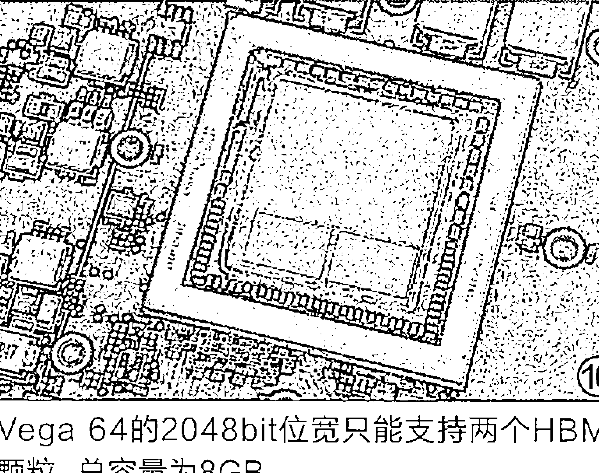

## HBM仍需机会

DDR内存终归是一种改进式产品，速率一直加倍、加倍就需要越来越精细地控制、识别时钟电平，稍微有一点波动就会造成频率不稳，长远看来必然难以为继，这也是为什么在“后DDR5”时代的内存开发中，出现了类似HBM的与CPU集成的方案。

笔者认为，HBM或者更新架构的内存无疑是未来的发展方向，不过这需要处理器、主板甚至整个PC架构大改，因此仍需要等待机会。

目前看来，HBM的机会主要有两种，一是遇到了非常强力的推手，例如支持HBM，同时具有划时代意义的处理器及相应平台。但在目前已知的下一代产品如第三代锐龙、Sunny Cove中，都没有确认会支持HBM，而且它们似乎都没有采用超高内存带宽的设计，应该也无法发挥HBM的能力。

二是DDR模式的渐改方式出现问题，过高的频率和过于精细的分频让DDR内存变得非常不稳定，或者需要添加更多额外的元件、电路，使得成本无限制地上涨。此时HBM或其他类型的内存，以及新的PC架构就会占有成本优势，进而成为新的主流。

## 目前的内存选购策略

从目前的情况可以判断，两种淘汰DDR内存的机会最近都不会出现，所以DDR内存的生命还是相当长的。对准备装机的用户来说，并未商品化的DDR5也无需等待，从平台支持和自身的成本来看，它大规模取代DDR4内存估计要到2022年了，近期公布的处理器如锐龙300和X570芯片组即使开始支持DDR5，也必然会保留对DDR4的支持，且主流主板肯定也会有DDR4插槽的。

## 彻底革命 新的内存方式

作为目前电脑中的主力通信协议，PCIe的历史已经很长了，即使是PCIe 3.0也有着近10年的历史。这在电脑设备标准中是比较少见的长寿了。而从PCIe 1.0到3.0，虽然每一代的带宽只提升为两倍（图11），但实际体验却有很大的区别。

以显卡为例，一代PCIe可以很好地支持早期GPU，PCIe 2.0时代可以让显卡配合处理器进行异构运算，PCIe 3.0足够的带宽让双显卡并联完全可以不用桥接器。另外比如现在流行的高速M.2 SSD，也只有在单通道达到1GB/s的PCIe 3.0时代才能拉开与SATA接口的差距。

那么PCIe 4.0呢？现在的RTX 2080 Ti已经把PCIe 3.0 ×8的带宽吃得干干净净，实际带宽需求在PCIe 3.0 ×10左右（图12）。所以不用等下一代显卡，现在RTX 2080 Ti SLI就需要PCIe 4.0提供更充足的带宽。

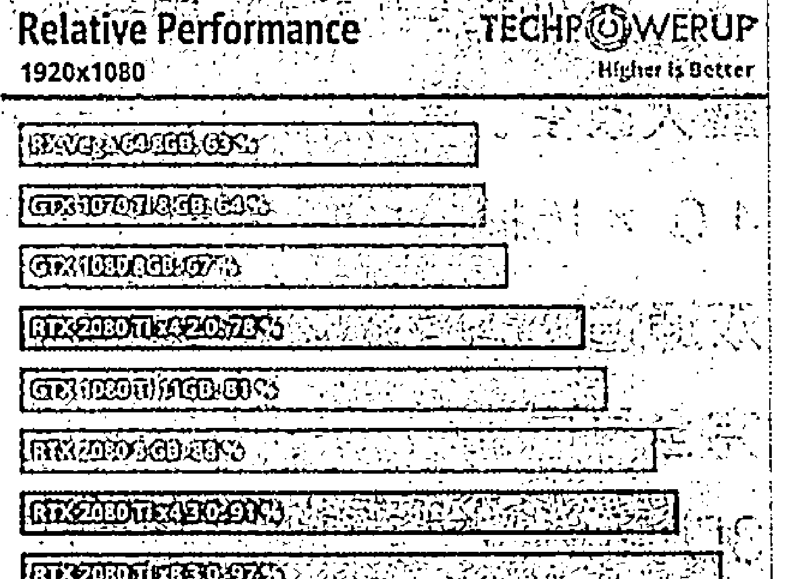

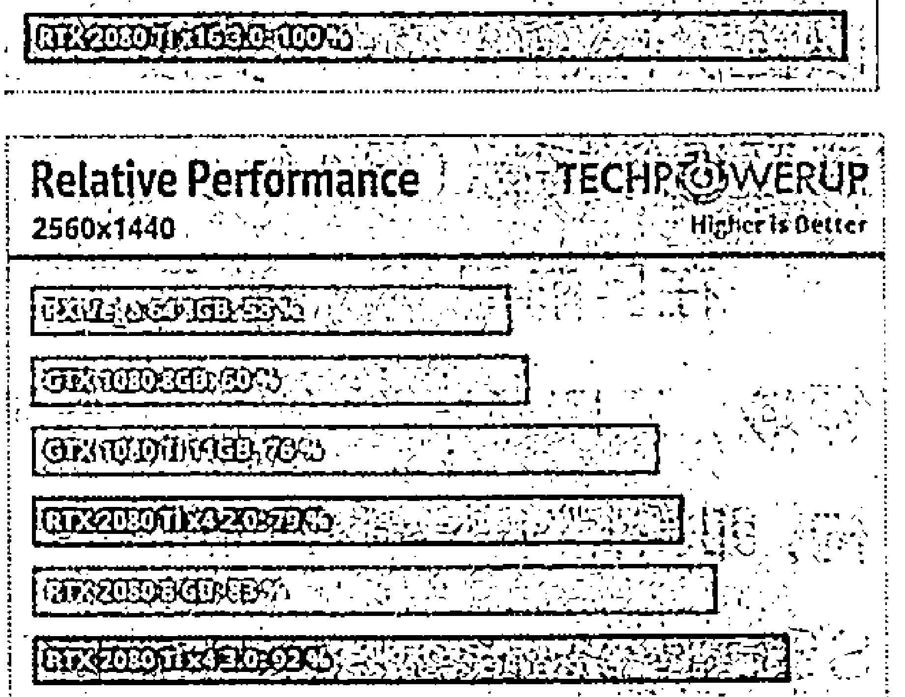

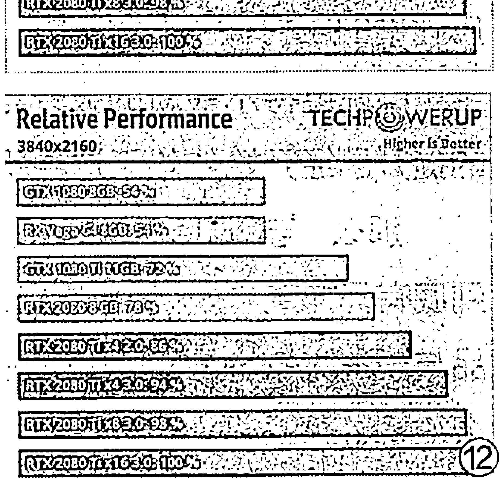

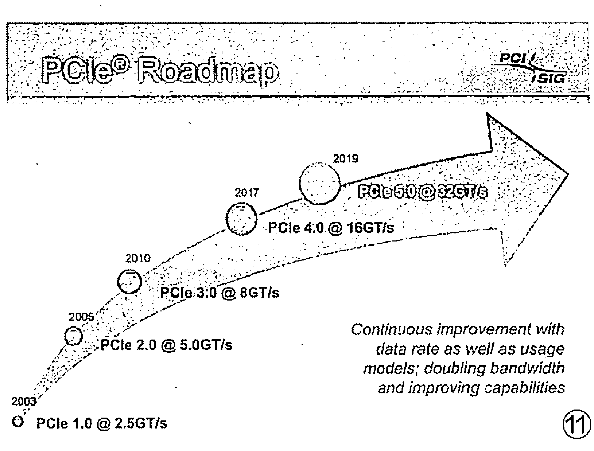## 超高速传输 深度解析SSD

策划《电脑爱好者》编辑部

扫一扫，更多精彩内容立现！

## SSD和HDD的区别

民用PC硬盘主要以HDD（机械硬盘）和SSD（固态硬盘）为主，其中HDD包括2.5英寸（笔记本用）和3.5英寸（台式机用）两种形态，以及内置大容量闪存的SSHD（混合硬盘）。SSD则包括SATA、mSATA、M.2、U.2和PCIe五种接口形态，分别适用于不同的PC设备或环境。

## HDD机械硬盘

- 容量/价格比: 1GB/0.1元~0.3元
- 持续读取速度: 较慢
- 随机读写速度: 极慢
- 写入次数: 无限制
- 工作噪音: 转速越高噪音越大
- 防震能力: 极差
- 数据恢复: 容易

## SSD固态硬盘

- 容量/价格比: 1GB/1元
- 持续读取速度: 极快
- 随机读写速度: 极快
- 写入次数: 视闪存单元结构
- 工作噪音: 零噪音
- 防震能力: 极好
- 数据恢复: 极难

SSD没有HDD复杂的机械结构，是由NAND闪存芯片、主控和缓存（可选）构成的以电子芯片为主的存储设备，闪存芯片越多，其存储空间越大。影响SSD性能的因素包括NAND闪存单元结构、主控芯片型号、缓存容量等。SSD的主要优势是速度快、重量轻且不怕震动，可靠性极高。

HDD的内部比较复杂，由磁盘盘片、磁头、主轴与传动轴等机械结构组成。HDD的工作原理类似老式的留声机，只是HDD内每张盘片都对应上下两个磁头，而且主轴转速远高于留声机，因此这种硬盘在读取/写入数据时最怕晃动和磕碰，耗电量相对较高。

(8+8)或者RTX未来的顶级Titan型号就已经需要更大的带宽了。此外使用PCIe 4.0的SSD性能也非常强，传输速度已经可达到6.4GB/s级别（PCIe 4.0 x4），而且已经有用于服务器中的产品（图13）。

然而这些传统应用并不是PCIe 4.0带来的最大改变。其实我们计算一下就会发现，PCIe 4.0 x16插槽的带宽已经达到了32GB/s，接近双通道DDR4 2400内存（38.4GB/s）的带宽，完全是内存级别的传输速度。而在其上运行的3D Xpoint产品则拥有极强的潜力，目前已经可以提供远超NAND，更接近内存的传输速度、响应延迟等指标（图14）。

## REIMAGINING THE DATACENTER MEMORY AND STORAGE HIERARCHY

在目前已经大量使用PCIe 4.0的服务器领域，英特尔已经推出了一种新形态的存储架构，即将基于3D Xpoint技术的产品作为内存与SSD存储之间的缓冲（图15），可以大幅降低相应元件的压力，同时大幅提升系统整体性能。甚至可以说英特尔最新的服务器芯片，在性能方面的提升已经开始依赖于这种新架构了（图16）。

那么，与PCIe 4.0搭配的3D Xpoint技术到底有何神奇之处，用于服务器的3D Xpoint产品与现在大家熟悉的用来加速硬盘的傲腾有什么不同呢？

## 改变格局的搭档 3D XPoint

3D XPoint是一种由英特尔与美光（Micron）共同开发的存储技术，虽然其具体原理和结构都仍在保密中，不过基本可以确定，它是一种使用电阻来标记数据状态的新型存储技术。由于电阻这种特性无需电荷来维持，所以其存储的数据是“非易失性”的，也就是除非进行主动擦除，否则断电之后数据仍然存在。

3D XPoint的结构非常简单，由选择器与内存单元共同构成，它们位于线路的交叉位置，可以通过电流快速改变内存单元的电阻，或者读取其中的电阻状态。这一过程中电阻的改变是非常快的，而同时所需的电压也比目前的NAND擦写更低。

3D Xpoint不仅读写快，而且因为始终是以bit为基本单位进行操作，在擦写时的系统消耗更是远低于NAND，因为后者在这一过程中需要进行至少Kbit为单位的数据块操作，而不能直接以bit为单位进行擦写。所以3D Xpoint设备并不需要NAND设备使用的垃圾回收机制等设计，可以极大地简化控制器与固件结构，同时也可以提供更高的性能与更低的功耗。

## 3D Xpoint和PCIe 4.0应用模式

目前的NAND SSD速度为500MB/s~6GB/s，而高速系统内存的带宽则为48GB/s（双通道DDR4 3000），两者间差了一个数量级；NAND颗粒的延迟为100微秒，DRAM只有十几纳秒，相差了4个数量级左右。目前的3D Xpoint性能恰好在其中间，且更加靠近内存，例如其延迟比NAND小1000倍，与DRAM一样为纳秒级别，如果作为系统内存，可以获得与DRAM类似的性能，同时还具有关机数据保留、低功耗等很多与现在完全不同的应用能力（图17）。

借助PCIe 4.0 ×16通道的力量，3D Xpoint设备带宽则可达到32GB/s，同样更接近系统内存带宽。我们这里讨论的带宽还只是单条插槽的能力，如使用类似内存的多插槽多通道技术，3D Xpoint存储带宽还可倍增（图18）。而即使是目前在消费级平台上更常见的NVMe接口3D Xpoint设备，在同样常用的NVMe（PCIe 4.0） ×4通道支持下，带宽也可达到6.4GB/s~8GB/s，很适合作为内存与SATA SSD、HD之间的存储缓冲设备。

## 其他存储技术和PC形态

除了3D Xpoint之外，相变存储器、高速磁存储设备等新形态存储产品，在高带宽的PCIe 4.0或者未来的PCIe 5.0时代，也都可能成为改变电脑内存架构的新力量。而其高性能的基础，除了更先进的高速存储技术之外，新的PCIe总线、插槽提供的高带宽也是必不可少的。

当然，也许要到PCIe 5.0甚至更遥远的PCIe 6.0时代，新形态的存储技术和应用模式才能真正成熟。不过在PCIe 4.0时代，以3D Xpoint为首的新存储技术至少已经揭开了PC架构发展的契机，未来的PC形态，就在这一刻悄悄地开始改变了。CF

## 特别话题

曾几何时，SSD固态硬盘还是一种昂贵的存储方案，仅限顶级PC尝鲜。如今，用“旧时王谢堂前燕，飞入寻常百姓家”来形容SSD的境遇再合适不过。从2018年开始SSD的价格持续下降，至今已经跌破了1元1GB的大关，售价低于400元的480GB SSD并不鲜见。随着3D NAND Flash从64层向96层和128层推进，未来SSD的成本还将进一步降低。可以预见，2019年SSD将成为更多PC用户的攒机/升级首选，并进一步挤压传统HDD机械硬盘的生存空间。

那么，SSD的价格为何能持续走低？如今廉价的SSD和昔日昂贵的SSD比在性能、可靠性方面有没有缩水？在挑选新款SSD时我们又该从何处下手？本期特别话题，将带大家深入到SSD的微观世界，进而了解这种高速存储方案背后的秘密。

## SSD固态硬盘家族分类

SSD固态硬盘家族中，SATA、mSATA和M.2形态较为常见，只是mSATA SSD已被历史淘汰，而U.2和PCIe则还未普及。

| SSD形态 | 最高速度 | 规格/长度 | 接口界面 |
| :--- | :--- | :--- | :--- |
| M.2 SSD | 32Gbps | 42mm、60mm、80mm | PCI-E×2、PCI-E×4、SATA |
| SATA SSD | 6Gbps | 2.5英寸 | SATA |
| mSATA SSD | 6Gbps | 50mm、30mm | SATA |
| PCIe SSD | 32Gbps | 170mm以上 | PCI-E×2、PCI-E×4 |
| U.2 SSD | 32Gbps | 2.5英寸 | PCI-E×4 |

M.2是目前最主流的高速SSD形态，在采用PCI-E×4通道和NVMe协议下，其最高读取速度可轻松突破3000MB/s大关。

2.5英寸硬盘就是标准的笔记本硬盘，而SATA3.0也是普及度最高的硬盘接口，其最大瓶颈就是最高读取速度只有550MB/s左右。

mSATA SSD可以视为迷你版固态硬盘，曾经是早期超极本和迷你电脑的专属接口，如今已经被更迷你和高速的M.2 SSD所取代。

PCIe SSD可以直接插在PC主板的PCI插槽上，其PCB主板上可由多块M.2 SSD组成RAID阵列，是性能最强的硬盘形态，但过高的成本也注定它仅是少数发烧玩家的专属。

U.2 SSD虽然依旧是2.5英寸硬盘的形态，但其却可实现最高32Gbps的传输速率，且更换了全新的物理接口。U.2 SSD的成本高昂，普及度不高，普通用户可以忽略之。

## SSD的结构分解

无论是哪种形态的SSD，它们都是以NAND闪存、DDR缓存和主控芯片为最核心部件，而之所以同形态、同容量的SSD在价格和性能上存在较大差距，就是受到这三颗芯片的规格影响。因此，我们接下来就要了解一下SSD的这些核心单元。

## 主控芯片

用途: 连接DDR缓存、NAND闪存和PC之间的枢纽。一款SSD速度几何，很大程度上就取决于主控芯片的型号，通过固件更新可不断完善固件算法，从而起到提升性能和延长寿命的作用。

## DDR缓存

用途: 以低功耗的DDR4 SDRAM为主，用于缓存数据。理论上增加缓存芯片和缓存容量可以延长SSD的寿命，对性能也有一定的增益。如果想取消缓存，需要全新主控和算法的支持。

## NAND闪存

用途: NAND闪存是比传统硬盘驱动器更好的存储设备，它使用的是非易失性存储技术，即断电后仍能保存资料的存储设备。SSD、闪存盘、手机、平板电脑等设备的存储单元都是NAND闪存。

## NAND闪存的进化之路

SSD自诞生之日起，就不断朝着更强的性能、更高的容量和更低的价格进化。想完成这三个目标，首先就需要从NAND闪存着手，包括引入更先进的生产工艺、可存储更多数据的多层单元，以及从2D平铺向3D堆叠的结构转变。

## 制程工艺

和我们熟悉的CPU相同，NAND闪存芯片也是由硅晶圆片切割而来，其电气性能受到制程工艺的影响。当CPU改用更先进的制程工艺后（如从14nm升级为10nm），可以在更小尺寸的芯片中集成更多的晶体管，并改善栅极间的漏电率，从而获得更高的频率（性能）和更低的功耗。NAND闪存芯片也是如此，更先进的工艺，可以在相同芯片面积的情况下获得更大的容量。

## 多层单元

硅晶圆片工艺的升级进度很慢，赶不上市场对SSD容量的需求变化。因此，从NAND闪存的单元层数入手，就是缓解这一矛盾的有效手段。NAND闪存是由多个以bit(比特)为单位的单元构成，这些单元通过电荷被打开或关闭来记录存储状态(0，1)。

### SLC (单层单元) Single Level Cell

一般的存储单元，无论是DRAM、SRAM还是ROM，都只能记录1bit的数据。在NAND闪存中，这种只能记录1bit的就被称为“单层单元”，也就是我们经常念叨的“SLC”。

### MLC (多层单元) Multi Level Cell

多层单元即MLC，其特色是在SLC的1bit/单元基础上变成了2bit/单元，可以记录00、01、10和11四个状态，从而能在相同的芯片面积下保存更多的数据，即提升了存储容量。

- 擦写寿命：100000次
- 优点：读写性能最强；循环擦写寿命周期最长；读写错误率低，可靠性更好
- 缺点：容量较小；成本高昂
- 现状和选购建议：适合服务器或每天都需要大量读写的应用环境，目前消费级市场基本已经绝迹

- 擦写寿命：10000次
- 优点：读写性能很强；寿命和稳定性较TLC有着巨大的优势
- 缺点：不如SLC耐用可靠
- 现状和选购建议：适合频繁使用电脑的用户和游戏玩家，目前只有一些已停产的老产品还在使用MLC闪存

### TLC(三层单元) Triple Level Cell

TLC三层单元闪存可保存3bit/单元，可记录000、001、010、011、100、101、110和111八个状态，进一步提升了存储密度，但其读写的生命周期也同时被大幅缩短。

- 擦写寿命: 500到1000次
- 优点: 容量大幅提升；成本明显降低
- 缺点: 性能和寿命下降明显
- 现状和选购建议: 适合非专业领域的普通用户，目前TLC闪存基本已经一统SSD江湖，我们没得选择

### QLC(四层单元) Quad-level cells

QLC四层单元是目前闪存生产中最低廉的规格，4bit/单元可记录0000、0001……1111等十六个状态，较TLC的存储密度提高了33%，但其性能和擦写寿命也进一步降低。

- 擦写寿命: 150到1000次
- 优点: 可进一步提升容量；成本进一步降低
- 缺点: 性能相对最差
- 现状和选购建议: 适合追求容量价格比的用户，2019年基于QLC闪存设计的廉价SSD会越来越多

扩展阅读:

### 为何从SLC到QLC性能越来越差

NAND闪存单元层级提升的代价是设计难度的提高以及性能的降低。假设闪存工作电压为2V，SLC闪存的1个bit有两个状态，每个状态可平均分配1V电压；MLC的四个状态可平均分配0.5V电压；到了QLC，每个状态只能分配0.125V。更多的状态和更小的电压，将导致电压区隔越小越难控制且干扰问题严重，这些都会影响闪存的性能、可靠性及稳定性。

## 立体堆叠

NAND闪存虽然可以通过制程工艺的提升来增加容量并降低成本，但更先进的工艺也会导致NAND的氧化层变薄进而影响可靠性。同时，NAND闪存从SLC→MLC→TLC→QLC，每一次都会招来质疑和谩骂。为了解决上述问题，3D NAND闪存堆叠和硅穿孔（TSV）封装技术便孕育而生了。

所谓3D NAND（三星还将自家的技术称为V-NAND），就是一种类似“盖楼”的立体堆叠技术，可以在单芯片面积的基础上堆出更多容量。如今，64层的3D NAND闪存已经渐成市场的主流，三星已经在2018年量产了96层3D NAND SSD（970 EVO Plus SSD），东芝和金士顿的96层产品（BG4和A2000）也陆续上市，2019年初东芝甚至宣布了128层的3D NAND颗粒已经开发成功。

过去，NAND闪存都是以2D封装为主，一款SSD想获得更多的容量，需要同时在PCB主板上嵌入更多颗NAND闪存芯片，可能128GB容量就需要整整10颗，占满整个PCB主板的空间。

3D NAND技术的好处多多，比如64层3D NAND就能在单颗粒上实现1GB容量，还能明显降低成本和功耗，甚至可以将理论擦写寿命仅有150次的QLC闪存延长到1000次擦写！

## 闪存的高级应用

消费者对存储性能的需求是无止境的，当SSD的容量足够大售价足够低后，如何才能成就更强的性能？英特尔、三星和西部数据就给出了自己的答案。

## 英特尔Optane

Optane傲腾内存是基于英特尔和镁光合作研发的3D XPoint存储技术，它拥有接近于内存的性能以及可掉电保存数据的特性，延迟、耐擦写性、介质速度等几个关键指标也大大优于传统的闪存芯片。

- 用途：傲腾内存（系统高速缓存，使用M.2接口）；傲腾硬盘（超高速SSD，使用U.2或PCI接口）

## 西部数据LLF NAND

LLF (Low Latency Flash) 存储芯片的每GB成本介于DRAM内存和传统3D闪存之间，其采用SLC或者MLC颗粒，延迟在微秒级。

- 用途：超高速SSD (使用PCI接口)

## 三星Z-NAND

Z-NAND是64层堆叠的、运行在SLC模式下的MLC快闪存储器。其先进的地方在于封装，面向超级计算、AI分析等的最高级企业存储，对标英特尔傲腾技术，而后者先进的地方在存储介质的进步。

- 用途：适用于需要低延迟、高性能和长寿命的工作环境，接口界面未知

## 主控芯片的重要性

对SSD而言，主控芯片扮演了“大脑”的角色，其本质是基于ARM或RISC架构设计的嵌入式处理器，其性能受核心数量、频率、支持的闪存通道数量以及接口总线的影响。2.5英寸SSD硬盘的主控很难在性能上拉开太大的差距，但M.2 SSD硬盘主控则会因搭配的闪存颗粒、支持的闪存通道和接口总线的不同而出现云泥之别。

主控的作用
- 调度多颗闪存芯片间的协同工作。
- 负责数据在闪存和外部接口间的中转。
- 通过各种固件算法，完成内部各项指令，比如错误检查和纠正、磨损平衡、坏块映射、Read Disturb、缓存控制、GC垃圾回收、Trim指令和数据加密等。

火速链接
如果你对SSD主控的原理和功能感兴趣，请参考本刊2018年第20期《看懂主控芯片 明白SSD的灵魂》这篇文章。

目前比较热门的新一代SSD主控芯片
| 品牌   | 型号          | 缓存 | 闪存支持      | 闪存通道 | 支持接口     |
|--------|---------------|------|---------------|----------|--------------|
| 三星   | Phoenix       | Y    | 3D TLC        | 8        | PCI-E3.0×4   |
| 三星   | MJX           | Y    | 3D TLC/QLC    | 2        | SATA3.0      |
| 闪迪   | SanDisk 20-82-007011 | Y    | 3D TLC        | 8        | PCI-E3.0×4   |
| Marvell| 88SS1084      | Y    | 3D TLC/QLC    | 4        | PCI-E3.0×4   |
| Marvell| 88SS1100      | Y    | 3D TLC/QLC    | 8        | PCI-E3.0×4   |
| 慧荣   | SM2270        | Y    | 3D TLC/QLC    | 16       | PCI-E3.0×8   |
| 慧荣   | SM2266EN      | Y    | 3D TLC/QLC    | 8        | PCI-E3.0×4   |
| 慧荣   | SM2263XT      | N    | 3D TLC        | 4        | PCI-E3.0×4   |
| 群联   | PS5008-E8T    | N    | 2D/3D TLC     | 4        | PCI-E3.0×2   |
| 群联   | PS3111-S11T   | N    | 3D TLC/QLC    | 2        | SATA3.0      |
| 群联   | PS5012-E12    | Y    | 3D TLC/QLC    | 8        | PCI-E3.0×4   |
| 群联   | PS5016-E16    | Y    | 3D TLC/QLC    | 8        | PCI-E3.0×4   |
| 德一微 | MAP1001       | Y    | 3D TLC/QLC    | 8        | PCI-E3.0×4   |
| 德一微 | YS9203        | Y    | 3D TLC/QLC    | 8        | PCI-E3.0×4   |
| 芯聪   | AS2258        | N    | 3D TLC/QLC    | 2        | SATA3.0      |
| 硅格   | SiS832        | Y    | 3D TLC        | 4        | PCI-E3.0×4   |

目前新一代SSD主控都支持64层或更高层级的3D NAND闪存，同时引入了对QLC闪存的优化。随着更多PC（包括笔记本）都将M.2插槽作为标配，因此PCIe NVMe SSD就成为了固态硬盘的主战场，相关主控芯片迭代更新的频率更快（见表）。一般来说，当主控芯片相同时，SSD的性能将受到闪存颗粒的级别（TLC还是QLC）和数量影响，在相同容量下，闪存颗粒越多越容易取得更出色的写入速度。

## NAND闪存的黑白之分

相同容量的SSD，一线品牌和山寨品牌之间的价格可能相差2倍。除了品牌和主控上的差异以外，NAND闪存颗粒的来源更为关键，只有原装片和自封片才能确保100%的稳定，白片稍逊一些，至于那些基于黑片或拆机片打造的SSD，再便宜我们也得敬而远之。毕竟，SSD自身有价，但其保存的数据却是无价的。

作为普通消费者，我们很难在付款前就知晓一款SSD内置的闪存颗粒到底是什么类别，哪怕有实物拆机，也很难从芯片表面的标识辨别（造假很厉害）。因此，笔者希望大家可以认清SSD是“一分钱一分货”的事实，优先从一线品牌中筛选产品，哪怕性能差一些也没有质量之忧。

## NAND闪存类别

| 类型   | 简介                                                         | 表现形式                                             | 品质 |
| ------ | ------------------------------------------------------------ | ---------------------------------------------------- | ---- |
| 原装片 | 英特尔、美光、西部数据（闪迪）、东芝、三星和海力士等生产的原装颗粒 | 有芯片商原厂的激光打标                               | 优秀 |
| 自封片 | 从闪存生产厂商处购买的原厂完整晶圆，再自行切割封装的闪存颗粒 | 有SSD厂商的激光打标                                  | 优秀 |
| 白片   | 原片在封装之后的再检测中存在些许瑕疵的颗粒，但不影响正常使用 | 通常会印有SSD厂商标识或只有编码                     | 一般 |
| 黑片   | 在原料阶段就被淘汰的部分，往往需要屏蔽部分容量才能正常使用   | 无任何标识或者打磨（伪造）出芯片厂或SSD厂商的标识 | 极差 |
| 拆机片 | 通过二手或洋垃圾渠道回收的闪存颗粒，品质取决于回收源的品类和质量 | 无任何标识或者打磨（伪造）出芯片厂或SSD厂商的标识 | 极差 |

## 如何看SSD的参数

SSD品牌林立、型号众多，想从中筛选出最适合自己的产品，首先就要通过它们的官方参数入手。

如今SSD主要以2.5英寸和M.2两种形态为主，其中2.5英寸SSD受限于SATA3.0接口的限制，其顺序读写速度多在500MB/s到550MB/s，随机读写速度很难突破10K IOPS。M.2 SSD的优势是可以选择更高速的PCI-E3.0×4通道和NVMe协议（需要PC设备兼容），从而实现更加极致的性能。

| 参数             | 数值        | 数值         | 说明                                                         |
| ---------------- | ----------- | ------------ | ------------------------------------------------------------ |
| 可用容量         | 500GB       | 500GB        | SSD普遍都会设置OP预留空间，用于主控的各种优化机制，再加上单位换算的差异，才会有480GB、500GB、512GB之别 |
| 顺序读取速度高达 | 560 MB/s    | 3400 MB/s    | 可理解为SSD读取大型文件时的最高理论速度                     |
| 顺序写入速度高达 | 530 MB/s    | 2500 MB/s    | 可理解为SSD写入大型文件时的最高理论速度                     |
| 随机读取速度高达 | 95000 IOPS  | 410000 IOPS  | IOPS即SSD的每秒读写次数，但根据测试与使用环境的不同，不保证该数值具有正确性和参考性。该数值会受读取及写入的比例、线程数量、访问队列深度、数据区块的大小、系统设置、驱动程序和操作系统后台运行的作业等因素影响 |
| 随机写入速度高达 | 84000 IOPS  | 330000 IOPS  |                                                              |
| TBW              | 200         | 300          | SSD在服役期间可以写入的最高容量，TBW数值越高，意味着该SSD寿命越长 |

如果你注重SSD的性能，在相同容量和价位的SSD之间，优先考虑顺序/随机读写速度更高的型号即可。SSD的质保时间普遍是3年或5年，考虑到SSD一旦报废，其内部数据很难找回，所以我们还需要更加注重“TBW”这个参数，通过它可以计算出SSD在质保期内每天可以写入的最大数据量。

硬盘每天写入 = (SSD的TBW (TB) × 1000) / (365天 × 年数 × 固态硬盘容量)

假设一款500GB的SSD，其质保期为3年，耐用等级为200TBW，将上述数据代入公式可得：

硬盘每天写入 = (200 × 1000) / (365天 × 3 × 500) = 0.365次或36.5%的每天用户容量，即500GB × 36.5% ≈ 182GB。

也就是说，理论上除非你每天都能往SSD中写入超过182GB的数据，才能在3年的质保期内用废这块500GB容量的SSD。实际上，一线品牌的SSD在正常情况下都无需为寿命担心，以使用QLC闪存的三星860 QVO为例，其1TB、2TB和4TB容量版本的写入总量分别为360TBW、360TBW和1440TBW，在3年的保修期内根本用不完。

## SSD的兼容问题

看到这里，相信大家已经对SSD有了初步的认识，接下来就到了选购环节。考虑到SSD的两种常见形态，我们需要分别对待。

## 选购建议

- 闪存芯片优先级: MLC > TLC > QLC
- 3D NAND优先级: 96层 > 64层 > 32层
- 性能优先级: 随机性能 > 顺序性能
- 质保时间和TBW越高越好

## 2.5英寸SSD

对2.5英寸SSD而言，只要你的PC有SATA插槽，就可以将它收入门下。对笔记本电脑而言，则需要2.5英寸硬盘位，又或是提供了光驱扩展位（需要专用支架）才能加以安装。由于这种SSD都采用了SATA3.0总线，所以其性能相差不大，质保时间和TBW总量往往比速度更有意义。

## M.2 SSD

在选购M.2 SSD之前，首先需要考虑兼容性问题，即PC主板上的M.2插槽采用的是Socket 2 (B Key) 还是Socket 3 (M Key)，然后根据这一插槽和预算，再来选择兼容的M.2 SSD。如果主板插槽为“B Key”，很遗憾，它只能使用SATA总线的M.2 SSD。如果插槽为“M Key”标准，那它就可同时兼容SATA或PCIe总线和NVMe协议的M.2 SSD。

## 选购建议

- 闪存芯片优先级: MLC > TLC
- 3D NAND优先级: 96层 > 64层 > 32层
- 总线优先级: PCI-E ×4 > PCI-E ×2 > SATA (在兼容的情况下)
- 性能优先级: 随机性能 > 顺序性能
- 质保时间和TBW越高越好

M.2 SSD硬盘上的接口，可以分为“B Key”、“M Key”以及“B&M Key”三种标准。其中，“B Key”接口的SSD早已停产，市面上你能买到的M.2 SSD都是“M Key”或“B&M Key”。其中，“M Key”接口的M.2 SSD都采用了PCI-Ex2或PCI-Ex4总线，且只支持同标准的主板插槽。而“B&M Key”接口的M.2 SSD则几乎都是SATA总线，可以安装在任意PC主板的M.2插槽上。

火速链接
有关硬盘的选购问题，感兴趣的读者可以参考本刊2019年第2期《打造最高效数据仓库 教你挑选笔记本硬盘》以及2018年第19期《接口空置真可惜 M.2 SSD这样选》这两篇文章。

# 动手玩转BIOS 超频设置详解

以前咱们总是用“发烧友”、“新手”来形容DIYer或者电脑用户的水平，虽然具体的水平有很多不成文的评估方法，但有一种能力却可以让人几乎无可争辩地从“新手”跃升为“发烧友”，那就是掌握BIOS的基本设置。

### 从BIOS说起

BIOS这个名称相信大部分电脑用户在刚接触电脑的时候就听到了，不过真正见识，乃至实际操作的机会大概不多，除了喜欢钻研和追求的DIYer，相当多的用户在使用了多年电脑后，仍然对BIOS相当陌生。所以，咱们今天就先从BIOS的定义和基本功能说起吧。

### ◎BIOS是什么

BIOS全称为Basic Input Output System（基本输入输出系统），“真身”则是储存在主板闪存芯片中的一小段代码，由于这块闪存通常是CMOS（Complementary Metal Oxide Semiconductor，互补金属氧化物半导体）芯片（图1），所以有时BIOS也被称为主板CMOS。主板上的BIOS，或者说电脑的BIOS和数码产品的“固件”定位差不多，负责主板和板载配件之间数据通信、电力支持等方面的最基本能力，是电脑硬件与硬件之间、软件和硬件之间的桥梁。需要注意的是，其实显卡等配件因为结构比较复杂，自身也带有BIOS，不过这些BIOS仅负责独立配件的运作，其重要性与负责整个电脑运作的主板BIOS不可同日而语，本文提及的BIOS如无特别说明，均指主板BIOS。

### ◎BIOS的工作方式

用户开机的时候，首先会载入并运行BIOS，之后根据BIOS的内容设置并唤醒其他电脑配件，顺序一般为CPU、内存、显卡、其他板卡、外设。由于唤醒电脑配件的过程会对配件是否存在、是否符合BIOS设定状态、能否正常运行进行检测，所以这一过程也被叫做“自检(POST)”。

如果主要配件的唤醒与检测都没有问题，在短促的“滴”声后，BIOS会开始搜索可启动设备，根据设置的顺序载入相关的启动信息和操作系统，一次启动过程就结束了。如果自检过程中，主要配件出现问题，那么BIOS会通过不同的警报声来进行提示，如果板载Debug灯、Debug显示屏（图2），或者安装了Debug卡等，也能获得相应的启动错误信息。

需要注意的是，近期的主板上，放弃板载扬声器（Speaker）已经成为主流设计，但大部分入门和主流主板并没有能充分显示信息的Debug显示屏。所以笔者建议喜欢折腾的用户，还应通过主板提供的Speaker针脚（图3）安装扬声器，便于判断和处理电脑错误。

### ◎UEFI与传统BIOS

近期的主板上，BIOS中引入的一种全新控制模块——UEFI逐渐成为主流，其功能更加强大，也更加人性化。UEFI的全称为Unified Extensible Firmware Interface（统一的可扩展固件接口），这种接口使用模块化设计，可分为硬件控制和OS软件管理两部分，从前端到底层的顺序为：操作系统—可扩展固件接口—固件—硬件。

UEFI的优点很多，例如启动更快、可以支持更大的硬盘、更新的操作系统、界面更人性化、支持鼠标操作等，而其最基本的优势实际是不再拘泥于传统BIOS的形态，成为一种软硬件结合的新型接口，可直接适应软硬件的需求而不是让软硬件去适应它的设置。未来传统BIOS可能会被彻底淘汰，UEFI将完全接管电脑底层操控和设置，也就是所谓“没有BIOS”的时代。

介于传统BIOS的2TB硬盘限制，以及对最新操作系统的支持能力问题，笔者在本篇会主要介绍基于UEFI的BIOS能力和设置，以符合目前的实际应用需求。

### BIOS基本界面

进入BIOS界面的方式根据厂商的不同有很大的区别，最主要的方式是按Del键，此外按F1、F2、F11等也是常见的方式，一般在启动过程中会有相关的提示（图4）。

无论是传统BIOS还是新的UEFI界面，虽然布局各不相同，但一般都分为几个最基本的页面（图4），其中“Advance（高级）”、“Monitor（监视器）”、“Boot（启动）”是大部分主板都有的，它们的内容分别是板上设备设置、主板运行状态和启动设备设置。此外还有负责处理器、内存等主要配件的频率、电压等设置的页面，不同的品牌甚至不同的子品牌主板常常有不同的名称，例如华硕玩家国度（ROG）主板中被称为“Extreme Tweaker”（图5），在微星主板中则是“OC”（图6）。另外还有一个常常被忽略，但也比较重要的主板信息和基本设置页面，主要显示主板的型号、BIOS版本、语言、日期、处理器和内存信息等，这在华硕主板中被称为“Main”页面，而在微星主板中则是“System Status（系统状态）”。在市占率比较高的主板品牌中，技嘉的设置页面比较独特（图7）。其中“M.I.T”为频率设置页面；“System Information（系统信息）”为主板、BIOS、配置基本信息；“BIOS Features（BIOS设置）”则是时间、BIOS语言等设置；板载设备、功能根据外部设备支持和内部设置，被分为“Peripherals（集成外设）”和“Chipset（芯片组）”两部分；“Power Management（电源管理）”页面类似其他主板的“Monitor”页面；“Save & Exit（存储和退出）”中则包括了启动设备管理。

## BIOS常见设置

了解了BIOS的基本页面和功能后，我们应该可以根据自己的需要找到相关的设置页面了，不过一些比较具体的设置及其含义，我们还是必须比较准确地掌握，才能避免出现设置错误。在BIOS中，我们要了解的主要设置包括处理器、内存、硬盘，以及一些比较有特色的优化设置项目。由于各个品牌的主板对同一功能的中英文描述可能都存在差异，所以我们提到的项目名称可能与大家的主板有一定的区别，但不同主板的设置内容不会相差太多，大家可以根据中英文含义进行理解。

### 处理器设置

在如今的电脑中，由于英特尔主流处理器大部分进行了锁频，且仅有Z系列芯片组支持超频，所以很多配置中都完全用不到这一项目，相应的功能有缩减的趋势（图8）。而AMD的锐龙系列处理器和芯片组则大部分支持超频，因此BIOS中的处理器设置功能也就更加“发达”一些。在处理器设置中比较常见的项目如下，其中如无特别标注，均为英特尔、AMD处理器同时支持的项目。**CPU Ratio:** CPU倍频，通常会有几个选项，“Auto”、“All Core”、“Per Core”、“Specific Per Core”。其中“Auto”就是默认的CPU倍频，“All Core”是所有核心同时达到的最高倍频，“Per Core”是可以设置单核心能够达到的最高倍频。“Specific Per Core”则比较独特，它主要给极限超频用户使用，可以根据每个核心的素质分别设置不同的倍频。

**Multi Core Enhancement:** 强制所有核心运行在最高频率，关闭此选项可以省电。

**CPU Cache Ratio:** CPU缓存倍频，如果要提升超频成功率就不要设置得太高，够用就好。

**Minimum CPU Cache Ratio:** 最低CPU缓存倍频，适当设置可防止缓存与处理器频率相差太大影响性能。

**BCLK Frequency:** 外频，早期处理器同样可进行设置以提升频率，目前的处理器中一般被锁定，只能查看不可设置。

**BCLK Spread Spectrum:** 外频扩展频谱，可应对主板上的电磁干扰，让运行时钟更精确。如果进行大幅超频最好关闭，以防止它对频率的介入调节影响超频稳定性。

**Boot Performance Mode:** 进入操作系统之前的CPU状态。选项中的Max Battery为最节能状态，CPU会工作在最低倍频的状态下，直到进入开始载入操作系统；Max Non-Turbo表示CPU会工作在自动倍频下；而设置为Turbo Performance时CPU会在开机后就运行在最大速度下。

**AVX Ratio Offset:** AVX倍频补偿，即AVX指令集与CPU实际运行频率的差距。AVX指令集调用时，CPU的功耗发热都非常大，适当降低AVX频率有助于提升超频成功率。一般每一档为降低100MHz，建议设置为3，即对4.0GHz的CPU来说，AVX指令集会以3.7GHz的速度运行。

**Ring to Core Ratio Offset:** 英特尔CPU中环形总线与核心倍频比自动调整。如果你手动设置了缓存频率，这个选项通常不管用。

**Intel SpeedStep Technology:** 英特尔CPU节电技术。英特尔CPU会根据处理器任务量自动调整频率和电压。如果禁用，那么Windows电源管理中的“最小CPU速度”会失去作用。

**Intel Speed Shift Technology:** 英特尔CPU变频技术，可以大大提高处理器在各个不同休眠状态下的唤醒速度，提高性能。

**Intel/AMD Turbo Boost Technology:** 英特尔/AMD CPU睿频/Turbo Boost技术。英特尔和AMD处理器都采用动态频率，除了基本频率外还有一个最高可用频率，CPU会根据需要自行调节。要进行超频的话，建议关闭这一选项，进行全手动频率设置。

**Long Duration Power Limit:** 长期CPU功耗限制。

**Long Duration Maintained:** CPU长期功耗限制的周期时间。

**Short Duration Power Limit:** 短时间CPU功耗限制。以上三个功率限制项目，在超频时都应设置为最大值，以免出现因功率限制造成降频。

**CPU Core Current Limit:** CPU核心电流限制。过大的电流可能造成处理器寿命下降，但为保证超频成功率，应适当加大。

**CPU VCore:** CPU核心电压调节，适当增加电压可提升处理器的稳定性，超频时可适当提升，注意电压过高可能会损坏处理器。

## 内存设置

目前的主流平台已经基本普及DDR4内存，我们下面的说明均以DDR4内存为例（图9）。

**Extreme Memory Profile(X.M.P.):** 这是一种内存认证标准，可以直接选择内存的XMP状态，即可自动设定为最佳运行模式。

**Primary Timing:** 第一时序，内存的响应时间等工作细节，可调节项目一般包括CL、tRP、tRCD、tRAS。在一些内存的参数贴纸上会标注有相关信息（图10）。

**DRAM Reference Clock:** 内存参考源时钟，可以看作是内存的“外频”。目前的高频内存实际上是从这一基本频率进行翻倍得到的。由于DDR4的倍频设置比较复杂，建议使用Auto模式，需要修改频率的时候直接设置XMP或者内存工作频率即可。

**CAS Latency:** 内存CL，也称tCL值。这是发送给内存地址的数据起始延迟，是最影响内存性能的一个时序参数，直接影响到内存的延迟。

**RAS to CAS Delay:** tRCD值，打开内存行和访问内存列的延迟周期，一般比前两个值高1~2。

**Row Precharge:** tRP值，RAS to CAS Delay的充电周期，通常和RAS to CAS delay设置的值一样。

**RAS Active Time:** tRAS值，内存颗粒激活与发出内存充电指令的周期。这个参数必须比前两个值加起来大。比如内存为16-16-16-36，那么最后这个值必须比16+16=32要大。通常情况下为了稳定性，还要再稍微加一些周期，比如设置在36。

**DRAM Frequency:** 内存工作频率，即DDR4的等效工作频率，例如DDR4 2666的频率为2666MHz，也有些主板会标注为一半，即DDR4 2666设置为1333，DDR4 2800则设置为1400。

## 存储设置

BIOS中的存储相关设置可能并不算复杂，但与操作系统相关性非常大，也很容易出问题，是资深DIYer和电脑用户必须掌握的内容。存储设置一般与接口、芯片组设置位于同一设置页面下，存在一些功能交叉。此外一个很重要的存储设置内容——启动管理则可能位于Boot或Save & Exit等最“靠后”的设置页面中。

**SATA Controller:** SATA控制器启用或禁用。

**SATA Controller Speed:** SATA控制器速度。

**Hard Disk S.M.A.R.T:** 硬盘状况报告，会给系统提供硬盘温度、寿命等相关信息，特别是在出错时会及时进行报告。

**SATA Mode Selection:** SATA控制器模式。目前一般为AHCI模式（SATA模式）和RAID模式，已经不再提供兼容老式并行硬盘的IDE、Compatibility模式。对于使用旧型号傲腾内存的用户（仅限英特尔部分平台）来说，最好在安装操作系统之前，设置为Intel RST或Optane模式（图11）。

- **Third Party SATA3 Controller:** 有些主板使用第三方生产的SATA控制器，此选项可以启用或禁用它。
- **ASMedia SATA3 Mode:** 以使用ASMedia公司的第三方SATA控制器为例。此选项可以调整该SATA控制器的工作模式。
- **Boot Option Priorities:** 启动优先权，即启动顺序，按照给出的顺序进行启动，只有当前一选择不存在或者无法启动的时候，才会在后一设备上搜索操作系统引导信息。
- **Boot Override:** 优先启动权，无论是否存在启动优先权设置中的设备，都优先从这一系列存储设备中启动操作系统（图12）。

### BIOS设置注意事项与小技巧

在BIOS设置中，除了所谓的基本功能和高级功能外，其实还有一些可能被忽略但非常重要的注意事项与小技巧，可能会对大家的使用产生明显影响。

#### 安装操作系统

前面已经提到，在安装Windows操作系统前一定要注意SATA模式的选择，在安装完操作系统之后如果更改SATA模式，可能会造成引导错误，无法正常进入操作系统。

此外在安装Windows之前，要特别注意选择BIOS工作模式，笔者推荐使用目前已经很成熟的UEFI模式，对新型、大容量硬盘和操作系统的兼容性都更好。这里也同样要注意，在安装后，BIOS中的启动顺序里可能会同时出现UEFI和非UEFI引导两个选项（图13），必须选对才能正常启动操作系统。

#### 截图与鼠标操作

目前的主流BIOS设置界面已经引入了鼠标操作，而且很多BIOS默认使用更便于鼠标操作的界面。一些厂商虽然使用比较旧式的BIOS主界面，但也可以通过快捷键切换为适合鼠标操作的界面（图14）。

此外还有一些厂商的BIOS界面可进行截图，极大地方便了用户间的交流，大家可以仔细观察BIOS界面底部或侧面的使用说明（图15），或者在Help（帮助）界面中寻找相关功能。

#### BIOS更新更方便

如今的BIOS更新已经不再是复杂的过程了，在Windows下更新、调用硬盘文件更新、上网更新方式大大简化了工作量，降低了难度和危险性。不过在进行更新的时候也有一些要注意的事项。

首先是直接调用硬盘上的BIOS文件时需要注意，目前的主流Windows在分区时会在主分区前划出数个功能小分区，虽然在操作系统中不可见，但在BIOS操作时是可见的。所以当用户打开第一个硬盘分区，发现上面全都是不认识的文件夹，但却看不到BIOS更新文件时千万不要慌张，一般C盘会是BIOS识别的第二或第三个分区。

其次，在使用笔记本电脑或支持Wi-Fi的主板时，可能会发现无法联网在线更新。这其实并不是主板或网站出现了故障，而是在BIOS中仅内置了有线网卡的驱动，只有在连接有线网后才能正常联网、在线更新BIOS。

#### 特殊设置需经验

此外在BIOS中会有一些比较难预料的交叉影响因素，通常需要有一定DIY经验，对电脑架构有一定了解的用户才能进行正确设置。例如在某款主板中，雷电3接口与M.2插槽共用PCIe通道，只要开启雷电3支持（图18），那么即使在未连接雷电3设备的时候，M.2接口也会从×4通道（32Gbps）降速至×2通道（16Gbps）。相关的设置比较零散，原理则相当庞杂，这里就不展开讨论了，相信在积累了足够的经验后，大家会对这些比较特殊的设置有更深的了解。

#### 设置出错不用怕

对于经验不足或者比较胆大敢干的用户，BIOS也准备了自己的保护措施。一般情况下，设置BIOS后无法正常启动的话，只要强制关机，或者等待电脑自行重启，BIOS就会自动进入比较安全的设置，并在启动后直接进入设置界面，要求用户进行重新设置。此外很多主板还提供了清除BIOS跳线、按键，技嘉等双BIOS主板则提供了BIOS备份与切换功能，可以恢复被设置得“过头”的BIOS。

如果多次重启未能进入正常设置界面，那么可以关机后拔下外接电源线或取下笔记本电脑电池。然后从主板上取下为CMOS芯片提供电源的纽扣电池（图16、图17），静置数分钟，让CMOS丢失对BIOS设置的记忆，之后再安装电池，启动电脑，BIOS就会进入初始状态，一般可正常启动到设置界面中。

那么，在了解了最基本的BIOS知识之后，你是否做好了实际操作一下、积攒经验甚至直接Level Up!的准备呢？那就别犹豫，打开电脑，按下Del或者F2键，来一次BIOS“探险之旅”吧。

# 放大手机日
智能手机镜头的变焦史

策划《电脑爱好者》编辑部

曾几何时，但凡著名景点或是游春时节，我们总能看到扛着“长枪大炮”的游客，走到哪里都能听到来自快门的“咔咔”声。

随后，智能手机慢慢取代了传统的卡片相机的角色，随着AI智能场景和超级夜景等功能的加入，“随手拍出好照片”已经成为了新款手机拍摄能力的基础下限。

如今，在多摄阵列的帮助下，智能手机更是获得了超广角和超长焦模式的助力，特别是潜望式长焦镜头和全新混合变焦技术的出现，让10X变焦从传说照进了现实，也让智能手机真正有机会取代入门级单反，扛起了拍照的大梁。那么，你有没有想过，智能手机是如何一步步“看得更远”的？

### 数码 光学 混合
了解变焦中的技术流派

所谓“变焦”，最通俗的理解就是使光学设备（相机、望远镜等）能够捕捉更远/近处的画面，在数码相机领域的变焦通常是依靠光学镜头的物理结构实现的。而在智能手机领域，变焦则可被细分为数码变焦、混合变焦和光学变焦三大技术流派（图1）。

#### 数码变焦

打开相机APP，当我们用两指点触屏幕并逐渐向两边移动，就能看到取景画面不断变大（图2），这个过程就是数码变焦。数码变焦的背后原理是将图片内的每个像素面积增大，相当于在后台进行了一次局部剪裁，并对剪裁下来的画面进行放大显示。

因此，数码变焦会因分辨率的降低而出现较为明显的颗粒感，数码变焦的倍数越大，马赛克问题就越严重。为了弥补这一问题，很多手机会在相机APP中引入软件插值算法，尽量弥补细节的缺失。但是，这种软件层面的优化通常只对3X以内的数码变焦有效，变焦倍数再高就没有意义了。

#### 光学变焦

理论上，光学变焦是通过镜头内镜片的物理位移来放大或缩小需要拍摄的景物，变焦倍数由镜头、物体和焦点三方的位置而定。但对智能手机而言，所谓的“光学变焦”大都是由一款固定焦距的长焦镜头实现的（以2X长焦镜头最为常见），从1X到2X之间是由主摄进行数码变焦（图3），只有2X模式下才会切换到长焦镜头进行“光学变焦”拍摄，而超过2X的变焦则又会转为数码变焦模式。

因此，一款手机要想实现更大的光学变焦拍摄能力，就需要不断优化长焦镜头的内部结构，让它在保持轻薄设计的前提下支持更长的焦段。需要注意的是，很多手机由于长焦镜头并不支持OIS光学防抖，所以在光线不足的情况下进行2X变焦拍摄时，有可能是用主摄的2X数码变焦模式代替，只有光线足够好时才能切换到长焦镜头工作。

#### 混合变焦

混合变焦是智能手机专属的变焦技术，它通常适用于采用超高像素摄像头，或配备两颗或更多摄像头阵列模组的产品。混合变焦的基本原理是在一颗镜头进行数码变焦的基础上，再由其他镜头拍摄取景，用来补充变焦后所丢失的细节（图4），其最终成像的效果介于数码变焦和光学变焦之间。为了便于宣传，混合变焦在业内还有一个别称，即“无损变焦”。

比如，魅族16系列的长焦镜头原生支持2X光学变焦，主打3X的混合变焦功能；华为P20 Pro的长焦镜头原生支持3X光学变焦，可实现5X的混合变焦；华为P30 Pro武装原生支持5X光学变焦的长焦镜头，并带来了10倍的混合变焦能力。混合变焦充分利用了长焦镜头+主摄+其他副摄联合成像的优势，只是最终效果如何，还得看DSP和ISP的性能，以及相关厂商对成像算法的优化能力。

### 温故而知新
回顾变焦手机的发展

#### 2004年5月
夏普V602SH
第一款支持光学变焦的手机

自从手机和摄像头联姻之后，就一直试图可以拍摄更清晰的远方风景，而提供光学变焦能力就是实现上述目标的捷径。下面，我们就来回顾一下配备变焦镜头手机的发展脉络。

夏普V602SH采用了独特的翻盖旋屏式设计，通过旋转可以把2.4英寸主屏作为取景器。其内置的202万像素CCD镜头支持2X光学变焦，可以拍摄最大分辨率为1600×1200像素的照片（图5）。2005年，夏普还推出了这款手机的升级版——拥有320万像素且支持2X光学变焦的V903SH。三星也于同年推出了型号为M339的手机，后者采用了滑盖键盘的设计，配备320万像素且支持3X光学变焦的镜头。

#### 2006年7月
诺基亚N93
第一款支持3X光学变焦的准智能手机

诺基亚N93/N93i采用了类似DC的旋转屏幕设计，并在转轴内部嵌入了一颗由卡尔蔡司认证，可实现3X光学变焦的320万像素摄像头，同时还支持20倍数码变焦和30帧每秒的480P视频录制（图6）。由于N93预装的是塞班系统，所以我们可以将其视为“准智能手机”，可玩性较早前的变焦手机好上不少。

#### 2013年6月
三星Galaxy S4 Zoom
第一款支持10X光学变焦的手机

我们可以将Galaxy S4 Zoom视为一款可以打电话的数码相机，该产品配备了一个1600万像素长焦镜头，支持10X光学变焦、OIS光学防抖和氙气闪光灯，拍照性能直追入门级的卡片式DC。可惜，S4 Zoom的厚度达到了27mm，而且拍照时耗电量极高，经过Galaxy S5 Zoom和Galaxy K Zoom两次迭代更新后就退出了历史舞台（图7）。

#### 2013年9月
索尼QX10/QX100
适用于手机的外挂式变焦镜头

为了让智能手机实现光学变焦拍摄的能力，索尼在这一年推出了QX系列外挂镜头，它能通过Wi-Fi和智能手机连接，并利用伸缩式支架固定在手机背后，带来类似专业数码相机的使用体验。其中QX100采用了2020万像素背照式CMOS传感器，拥有等效28mm~100mm卡尔蔡司大光圈镜头，其理论素质和同期的RX100 M2相同（图8）。2015年，OPPO也推出了类似的外挂镜头O-lens1，可惜此类设备售价较高，实际拍照效果还是不如专业相机，因此并没能成为市场上的主流。

小提示：在手机发展的历史上，采用和Galaxy S4 Zoom类似变焦镜头的手机还包含功能机时代的代表三星SCH-M339、SCH-V770、天语C700等；而智能机时代则以三星M8920、LGL-03C和Altek A14 Leo为主。

#### 2015年12月
华硕ZenFone Zoom
第一款配备潜望式变焦镜头的手机

这款产品外号“鹰眼”，其最大的特色就是在11.95mm的机身厚度内实现了3X光学变焦的能力。ZenFone Zoom第一次在智能手机领域带来了潜望式镜头结构，并在里面塞进了10枚镜片，支持4级光学防抖OIS功能，结合专业级的SmartFSI图像传感器，在当年堪称手机中的数码相机。可惜，该产品搭载了非主流的英特尔Atom处理器，性能和兼容性方面表现一般（图9）。

## 2016年6月 MOTO Z和哈苏模块 可以瞬间变身卡片相机的手机

联想MOTO Z是主打纤薄设计的Android旗舰家族，最大特色就是支持MOTO Mods模块。其中，哈苏摄影模块就是帮助MOTO Z获得媲美专业卡片相机的配件，它包含一个支持10X光学变焦的1200万像素镜头、氙气闪光灯、内置电池以及独立快门和电源按钮。问题是，哈苏摄影模块自身的厚度为15.1mm，和手机结合后无论是厚度还是重量都将严重超标，而该模块昂贵的售价也制约了MOTO Z系列手机的销售(图10)。

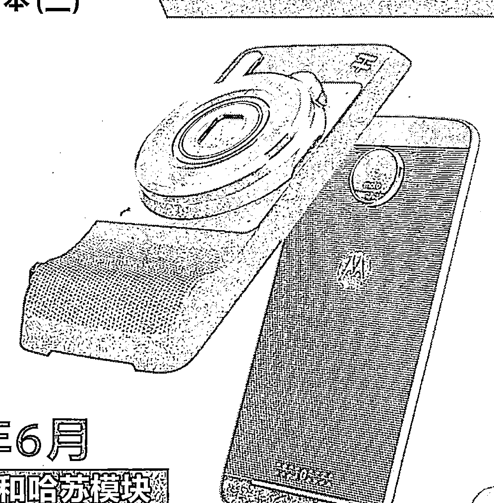

## 2016年9月 苹果iPhone 7 Plus 树立光学变焦手机的标杆

iPhone 7 Plus除了具备当年最强的硬件性能以外，它最大的特色就是首次带来了广角镜头+长焦镜头的组合，后者可以实现硬件级的2X光学变焦拍摄能力(图11)。此后，长焦镜头就慢慢成为了高端智能手机的标配，也是能让手机清晰记录更远处风景的基础保障。

可惜，苹果虽然通过iPhone 7 Plus推开了(超薄型)智能手机光学变焦的大门，但在这一技术的优化升级方面却逐渐落于下风。就在iPhone XS Max依旧保持2X光学变焦不变的今天，Android手机却已经进化到了5X光学变焦以及10倍的混合变焦了。

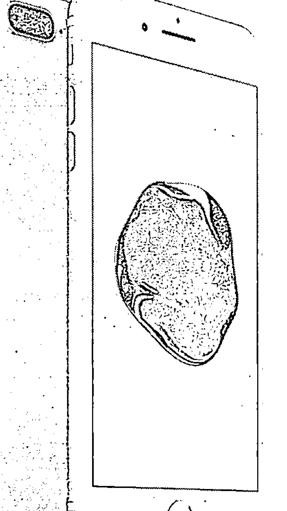

## 结构的转变 手机镜头如何实现更远变焦

通过前文的回顾，我们不难发现三星Galaxy S4 Zoom手机早在2013年就能实现10X光学变焦能力。但是，2019年却仅有OPPO Reno和华为P30 Pro才刚刚带来了5X/6X光学变焦和10X混合变焦技术。难道这是历史的倒退？

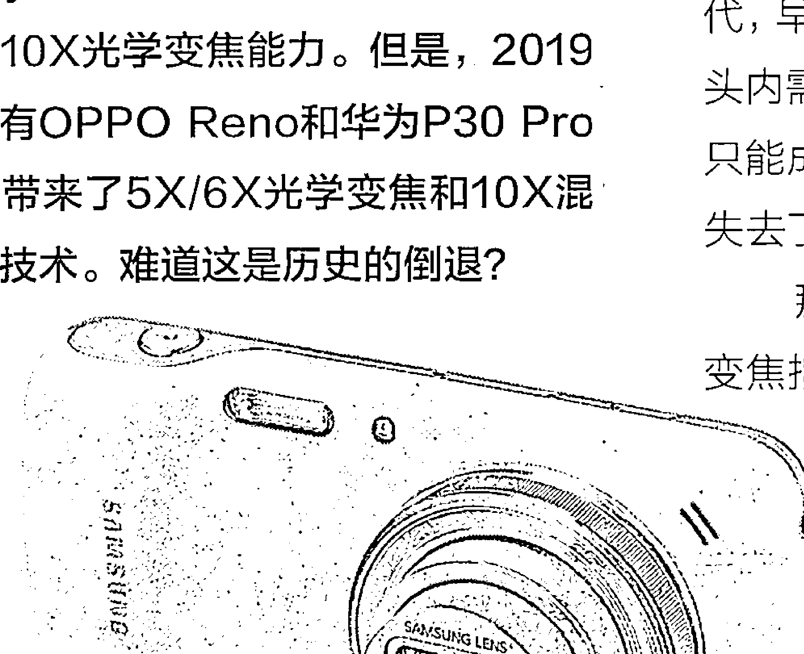

## 不能因变焦牺牲手感

早在功能机时代，支持光学变焦的镜头就已经为少数产品服务了，但无论是夏普V602SH还是诺基亚N93，它们不仅价格(相对同期其他机型)昂贵，尺寸和重量也严重超标，哪怕到了智能手机时代，早期支持“光变”的手机同样以臃肿著称。没办法，光学变焦镜头内需要容纳马达和镜片位移的空间，如果强行将其塞入手机体内，只能成就Galaxy S4 Zoom这类堪比卡片相机的产品形态(图12)。失去了良好握持手感的手机，注定会被普通消费者所抛弃。

### 伸缩式镜头的尝试

根据镜头的伸缩模式，伸缩式镜头可以被细分为“内伸缩式”和“外伸缩式”。其中，夏普V602SH/ V903SH和诺基亚N93系列就是“内伸缩式”镜头的代表，它们都将光学镜片位移的轨道隐藏在整个摄像头模组内（图13），整个变焦过程都是在镜头模组内完成的。
三星Galaxy S4 Zoom和Altek A14 Leo等手机则是“外伸缩式”镜头的代表，它们的光学镜片平时都隐藏在镜头的套筒内，只有启动相机APP后镜头模组才会探出，并随着变焦调节进行机械上的前后位移，其表现形式和传统卡片相机相同（图14）。

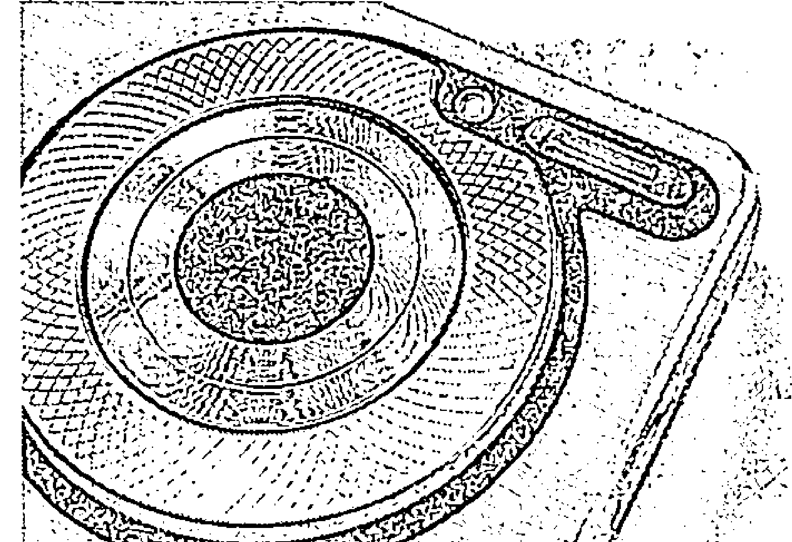

可惜，无论是哪种形态的伸缩式镜头，都不符合时下用户的审美观，“内伸缩式”镜头需要手机变身手持DV形态，而“外伸缩式”镜头则会换来和卡片DC相似的身材，你会乐意吗？

### 潜望式镜头的首秀

伸缩式镜头之所以臃肿，是因为它们的传感器、镜头和镜片都呈垂直排列，需要占用极大的纵向空间，所以才不适合手机搭载。为了解决这一问题，“潜望式”镜头便出现了。
华硕ZenFone Zoom就是第一款引入潜望式镜头的智能手机，而且还是进阶版的“二次反射潜望式镜头”。这款产品在镜头模组内集成了10枚光学镜片，并呈“凹”字排列，凹字两个顶点分别对应镜头和传感器，而中间下凹的横线处则排列着可横向位移实现变焦的光学镜片，这些镜片则通过边缘的两次折射最终让画面得以“传输”（图15）。
为了精准地控制变焦时镜片移动的距离，以及优化成像算法，

ZenFone Zoom还需要集成独立的ISP和相关的供电芯片，整套相机模组需要更大的PCB主板面积（图16）。如此复杂的物理结构，注定要占用5倍~6倍于传统手机摄像头的空间。因此，ZenFone Zoom最终的产品厚度还是达到了12mm左右，依旧与轻薄绝缘。
此外，由于ZenFone Zoom只有一颗摄像头，并采用了复杂的二次反射潜望式结构，虽然可以带来1X~3X的“光学线性变焦”能力（无论哪个焦段都是光学变焦），但其在1X正常拍摄下的成像质量却较为一般。
硬件模组庞大、综合拍照能力一般、成本和耗电量突出，这些都是ZenFone Zoom“二次反射潜望式镜头”特色的缺点。因此，这一方案自然无法成为主流，只能作为一段令人惋惜的历史供人回顾。


## 长焦镜头的局限性

对智能手机而言，“随手拍出好照片”才是刚需，而“变焦拍摄”只是锦上添花的卖点，光学线性变焦更是属于“伪刚需”。

这就好像玩单反的用户，变焦镜头远不如多个定焦镜头实际（图17）。在这个理念下，采用主摄（随手拍）+定焦镜头（变焦拍）的组合便成为了中高端新品的标配，前者只需满足25mm~28mm的日常黄金焦距拍摄，而后者能覆盖50mm、85mm、135mm等几个黄金焦距即可。


| 拍摄模式 | <0.6X | 0.6X~1X | 1X~2X | 2X | 2X~10X |
| :--- | :--- | :--- | :--- | :--- | :--- |
| 主摄像头 | 不支持 | 启动正常拍摄 | 启动数码变焦 | 关闭 | 关闭 |
| 长焦镜头 | 不支持 | 关闭 | 关闭 | 启动光学变焦 | 启动数码变焦 |

*小米等配备长焦双摄手机的变焦逻辑也是如此

## 重温“变焦”的流程

为了让大家更好地理解智能手机的变焦拍照，我们还需重温一下焦距和变焦的关系。

所谓“焦距”，就是指手机镜头内从光学镜片中心到底片、CCD或CMOS等成像平面的距离。焦距数值越小，镜头的视角也就越大，同等距离内可以拍下更为广阔的空间；焦距数值越大，镜头视角越小，可将距离很远的被摄物体拉至画面中很近的位置（图18）。

一般来说，一颗焦距在16mm左右的摄像头，就可被称为“超广角镜头”。
一颗焦距在25mm到30mm左右的摄像头，就属于“广角镜头”，或者称为“标准镜头”，也就是智能手机上的“主摄”。

只要镜头的焦距大于50mm，在手机领域它就可以被归类到“长焦镜头”，焦距越大，其“光学变焦”的倍数也就越大。
以苹果iPhone为例，从iPhone 7 Plus到iPhone XS Max采用了28mm或26mm焦距的“主摄”，以及56mm焦距的“长焦镜头”。56mm÷28mm=2，所以iPhone家族的长焦镜头刚好可以实现2X的光学变焦。
采用28mm和56mm双定焦镜头的iPhone的拍照逻辑是，默认状态下以28mm镜头进行1X拍照，当切换至2X时则启动56mm镜头拍照。在1X~2X之间变焦时由28mm镜头负责，由于此时画面只有轻微的拉伸，借助算法可以实现接近无损变焦的效果，画面损失不大。当进行超过2X的变焦时，则会在56mm镜头的基础上进行数码变焦（表1）。

以华为Mate 20 Pro为例，这款三摄手机由16mm焦距的“超广角镜头”、27mm焦距的“主摄”以及80mm焦距的“长焦镜头”组成（图19），由于80mm÷27mm=2.96≈3，所以它的长焦镜头就拥有了（近似）3X光学变焦的能力。
作为对比，华为Mate 20的长焦镜头焦距只有52mm，所以它的光学变焦能力就只有2X的水准。
需要注意的是，华为Mate 20 Pro的主摄像素高达4000万，在特殊的算法加持下，这款产品同时还支持135mm等效焦距的5X混合变焦，以及270mm等效焦距的10X数码变焦，前者是利用三颗镜头协同作战达成，而后者就完全是数码变焦

了，画质损失极大(表2)。由于有着超广角镜头的加持，所以Mate 20 Pro的整个变焦焦段覆盖了0.6X~10X的超大范围。
由此可见，智能手机能实现几倍的光学变焦，完全取决于长焦镜头的焦段。因此，智能手机要想“看得更远”，就得从这颗镜头的内部结构加以优化了。

表2：华为Mate 20 Pro(还包括P20 Pro)手机的变焦流程
| 变焦模式 | 0.6X | 1X | 1X~3X | 3X | 1X~10X | 5X~10X |
| :--- | :--- | :--- | :--- | :--- | :--- | :--- |
| 超广角镜头 | 启动 | 关闭 | 关闭 | 关闭 | 启动混合变焦 | 关闭 |
| 主摄像头 | 关闭* | 启动 | 启动数码变焦 | 关闭* | 启动混合变焦 | 关闭* |
| 长焦镜头 | 关闭 | 关闭 | 关闭 | 启动光学变焦 | 启动混合变焦 | 启动数码变焦 |
*在3X或更高变焦过程中，如果环境光线不佳或大光圈模式下是由主摄进行数码变焦


## 软硬算法皆升级 潜望式镜头再次出击

长焦镜头的焦距并非想增加就能增加的，一个5X定焦镜头的模组厚度可能就要超过12mm，而智能手机的平均厚度不过8mm，根本塞不进去。此时，前文提到过的“潜望式结构”终于有机会再次登场了。

### 潜望式镜头再登台

早在2017年的MWC2017上，OPPO就曾带来过业界首款潜望式双摄像头(广角+长焦)的结构(图1)，支持5倍无损变焦，只是受限于当时的传感器素质、光学结构和成像算法等技术难点，一直都停留在概念阶段。
如今，华为和OPPO几乎同时量产了潜望式镜头模块，并将其用在了旗下最新的旗舰之作——P30 Pro和Reno(10倍变焦版，下同)身上，分别主打最高50倍数码变焦以及10倍的混合光学变焦能力。至此，Android手机的拍照能力即将迎来一次飞跃性的进步。

### 和ZenFone Zoom的差别

前文提到过，华硕ZenFone Zoom才是智能手机领域用上潜望式镜头的“前辈”。作为后来者，华为P30 Pro和OPPO Reno的潜望式镜头有什么变化吗？
简单来说，我们可以将华为P30 Pro和OPPO Reno的潜望式镜头视为ZenFone Zoom镜头的简化版，后者通过更复杂的二次反射和更多的光学镜片以及位移马达等部件，获得了1X到3X之间自由光学变焦的能力，是一颗潜望式的“变焦镜头”。
没错，华为和OPPO搭配的其实只是一颗潜望式的“定焦镜头”，它们通过在光学镜头(Lens)、音圈马达(VCM)、红外滤光片(IRCF)、图像传感器(Sensor)的基础上，增加了额外的镜片和光线转向元件，并将它们横向设计(图2、图3)，从而实现了125mm(P30 Pro)和160mm(Reno)的焦距，较之Mate 20 Pro的80mm焦距的3X长焦镜头有了大幅提升。


不要因为P30 Pro和Reno的潜望式镜头只支持定焦就小看它们哦，要知道P30 Pro的机身厚度仅有8.41mm，Reno也仅是9.3mm的身材而且镜头不凸出，它们都没有因更强的拍照性能而牺牲便携性和持握手感。


### 全新潜望结构是如何炼成的

华为P30 Pro和OPPO Reno的潜望式镜头结构大致相同，光线转向单元都包括棱镜外壳、棱镜、棱镜座、支承轴套、支承轴和支承卡座。其中，OPPO Reno的内部镜片采用了定制的D-Cut模组和非对称注塑成型工艺，犹如在圆形镜片上平行切割了两刀，在保证有效光学尺寸的同时降低了镜片厚度（图4），最终将整个长焦潜望模组的厚度缩减到了5.75mm，从而可以轻松地塞进智能手机体内且不凸出。为了确保变焦拍摄时的稳定，两款手机都在主摄和潜望式镜头端集成了OIS光学防抖功能。

### 来自变焦定义的差异

华为P30 Pro与OPPO Reno潜望式镜头结构相似，但它们对光学变焦的焦段定义却存在差异，也因此前者主打“5X光学变焦”，而后者却强调“10X混合光学变焦”的戏码（见表）。

华为P30 Pro与OPPO Reno潜望式镜头设计的不同之处在于，P30 Pro没有为了曲率而去切割镜片，镜片都还是圆形，所以在厚度上略有增加，而且焦段比Reno少了35mm（125mm VS 160mm）。从工艺的难度来看，OPPO Reno占有一定的优势（图5）。

| **华为P30 Pro与OPPO Reno后置三摄规格对比** |
| :--- |
| **参数/型号** | **华为P30 Pro** | **OPPO Reno** |
| 广角镜头 | 2000万像素<br>F2.2光圈<br>16mm焦距 | 800万像素<br>F2.2光圈<br>16mm焦距 |
| 主摄像头 | 4000万像素<br>F1.6光圈<br>27mm焦距<br>OIS光学防抖 | 4800万像素<br>F1.7光圈<br>27mm焦距*<br>OIS光学防抖 |
| 长焦镜头 | 800万像素<br>F3.4光圈<br>125mm焦距<br>OIS光学防抖 | 1300万像素<br>F3.0光圈<br>160mm焦距<br>OIS光学防抖 |
| 后置ToF镜头 | 有 | 无 |
| *OPPO Reno并未公布主摄的具体焦距，27mm为近似值 |

## 变焦模式

后置摄像头：5倍光学变焦（5倍变焦为近似值，镜头焦段分别为16mm，27mm，125mm。）、10倍混合变焦（三个摄像头通过不同组合实现各种环境下出色的10倍变焦效果）、50倍数字变焦
前置摄像头：不支持

> 华为在官网也强调
5倍变焦为近似值

简单来说，华为P30 Pro将4000万像素主摄像头的27mm焦距定义为1X，此时它2000万像素广角镜头的16mm焦距就等效为0.6X（16mm÷27mm≈0.6）变焦，而800万像素潜望式长焦镜头则恰好接近等效5X（125÷27mm=4.6≈5）的焦段（图6），因此P30 Pro才能在宣传中强调“支持5X光学变焦”这个卖点。至于其主打的10X混合变焦和50X数码变焦，则分别对应270mm和1350mm焦段。


### 来自变焦算法的差异

潜望式镜头最早出现在卡片相机领域，但它很快就被淘汰，原因是受限于镜头模块体积，效果很难媲美传统伸缩式镜头。那么，潜望式镜头会不会拖累智能手机的成像？

答案自然是否定的。首先，无论华为P30 Pro还是OPPO Reno，它们的潜望式镜头只负责变焦模式，日常拍照的成像还是依靠更高品质的主摄像头。其次，在新一代SoC强大的处理能力，以及有着AI加持的场景识别和多帧堆栈等技术的帮助下，这

两款手机在10X以内变焦的过程中并非仅靠（镜头）硬件完成，而是一整套软硬件的联合算法（图8）。

简单来说，华为P30 Pro和OPPO Reno都提供了两种变焦方式，其一是直接使用拇指在取景范围内进行缩放，其二是点击取景界面内的“1X”图标。P30 Pro可以在1X、5X、10X和广角模式之间一键切换，然后通过双指捏合屏幕进入最高50X的变焦模式；OPPO Reno可以在1X、2X、6X、10X和广角模式间一键切换，然后可以捏合屏幕进入最高20X的变焦模式。

OPPO Reno将800万像素超广角镜头的16mm焦距定义为1X，而它的1300万像素潜望式长焦镜头则拥有160mm的焦距，基于超广角镜头的等效焦段恰好覆盖了从1X~10X的区间，在这个广阔的焦段中，都能通过镜头的光学能力提供影像信息（图7）。

但是，如果按照华为P30 Pro那般将主摄的27mm焦距定义为1X，OPPO Reno长焦镜头的光学变焦倍数就应该是等效6X（160mm÷27=5.9）。因此，OPPO才会将10X拍照模式称为“混合光学变焦”，而不是直接标成“10X光学变焦”。

在算法方面，华为P30 Pro在相机APP中引入了名为“视场融合”的系统，其最大的特色是将光学变焦和由算法驱动的数码变焦相结合，可根据放大倍数启动和切换不同的摄像头组合。

据悉，华为P30 Pro在3X以内的变焦全部都是由主摄像头负责，属于“数码变焦”的过


程，只是此时主摄可以通过超分辨率算法确保成像质量，实现“无损变焦”的效果；在进入3X拍照模式后，主摄和潜望式长焦镜头同时运行，属于“混合变焦”的过程，此时系统会合并这两颗镜头记录的图像数据，比如画面中心的最佳细节图像数据就来自长焦镜头；进入5X拍照模式后，主摄自动关闭，由潜望式长焦镜头独自完成此时的拍摄任务（图9），属于光学变焦；而P30 Pro主打的10X混合变焦，则是由3颗摄像头共同参与成像；至于从10X到50X之间就完全属于由长焦镜头独自进行的数码变焦了，没有三脚架支撑，很难拍摄出稳定的画面。

OPPO Reno在相机APP引入了“接棒式”的系统，让三颗摄像头像三名田径队员一样完成这场接力长跑（图10）。在1X和2X模式下由主摄负责（无损变焦）；6X拍照模式由潜望式长焦镜头独自完成，属于光学变焦；10X变焦状态是主摄和长焦镜头共同作用，属于混合变焦；10X到20X之间的拍照也是通过长焦镜头进行的数码变焦。


和以往的手机相比，潜望式结构让镜头获得了更大的焦段，P30 Pro和Reno在125mm和160mm以下的焦段都是有镜头的光学能力打底，可以确保无损效果。


这两款手机分别武装了IMX650（首创RYYB红黄黄蓝传感器）和IMX586传感器，都有着超大像素以及“大底”（传感器尺寸）的先天优势（图11），可以在混合变焦时提供足够多的画面细节信息用于裁剪和插帧，从而让它们的10X变焦不再是噱头，而是真正可以看清画面细节的拍照模式！

这两款手机分别武装了IMX650（首创RYYB红黄黄蓝传感器）和IMX586传感器，都有着超大像素以及“大底”（传感器尺寸）的先天优势（图11），可以在混合变焦时提供足够多的画面细节信息用于裁剪和插帧，从而让它们的10X变焦不再是噱头，而是真正可以看清画面细节的拍照模式！


> **小结**

**虽然武装潜望式长焦镜头的P30 Pro和Reno比较昂贵，但它们却给智能手机影像的未来提供了一个极具前景的发展方向。虽然基于混合变焦的10X模式还无法和专业单反和长焦相机相比，但对普通用户而言却是一件值得庆幸的事情——用更小巧、更便宜（相对专业DC）的手机，就能享受单反相机“套装”70%的变焦乐趣（图12），这就足够了。** CF


> 如今游戏对游戏的画质表现力要求越来越高，这推动了游戏制作技术的不断提升，复杂精美的游戏对硬件，特别是对显卡的要求也同样水涨船高，而显卡性能的提高又推动了成本的上涨和价格提升。绕了一个圈，最终还是回到了玩家们的腰包。

# 数字新世界

## 看清游戏设置与硬件需求

游戏与硬件之间的关系在玩家日益高涨的需求下互相促进、共同提高。硬件价格越贵，性能越好（图1），游戏体验也就越棒，这一点毋庸置疑。但“只买贵的”是土豪玩家才能做到的，对于非土豪玩家来说，如何能将现有的硬件水平发挥到极致才是物尽其用的最佳选择。

在硬件层面上的合理搭配、超频优化；软件层面的BIOS优化、驱动版本选择、功能设置都是老生常谈的话题。除此之外，了解游戏运行与画面处理的实际需求也很重要，这样可以通过选择最适合的游戏设置来更合理地利用已有平台，也可以根据自己希望的游戏效果来选择最适合的配件。当然，游戏中各种画面设置、游戏特效选项所依赖的硬件机能各不相同，如果能够知晓它们之间的关系，那么调和起游戏与硬件之间的关系就更加游刃有余了。况且对于一名合格的硬核玩家来说，依照自身的机器性能与硬件水平调校游戏的设置选项也是一项基本功。本篇就来介绍一些游戏中最普遍的设置，看看它们如何影响画质，对硬件的需求又如何。

| 京东热卖 |
| --- |
| **品牌型号** | **商品编码** | **性能指标** | **价格 (元)** | **链接** |
| 华硕 DUAL-RTX3060-O12G-V2 | 100039824361 | NVIDIA GeForce RTX 3060 / 12GB GDDR6 / 192bit | 2599.00 | [链接](javascript:;) |
| 影驰 GeForce RTX 3060 Ti 星曜 OC LHR | 100023038403 | NVIDIA GeForce RTX 3060 Ti / 8GB GDDR6 / 256bit | 2899.00 | [链接](javascript:;) |
| 七彩虹 iGame GeForce RTX 3060 Ti Ultra W OC 8G LHR | 100036220024 | NVIDIA GeForce RTX 3060 Ti / 8GB GDDR6 / 256bit | 3099.00 | [链接](javascript:;) |
| 技嘉 GV-N306TGAMING OC-8GD 12G | 100015703813 | NVIDIA GeForce RTX 3060 Ti / 8GB GDDR6 / 256bit | 3199.00 | [链接](javascript:;) |
| 华硕 TUF-RTX3080-O10G-GAMING | 100020372434 | NVIDIA GeForce RTX 3080 / 10GB GDDR6X / 320bit | 5499.00 | [链接](javascript:;) |
| 七彩虹 iGame GeForce RTX 3090 Vulcan OC 24G | 100028516007 | NVIDIA GeForce RTX 3090 / 24GB GDDR6X / 384bit | 11999.00 | [链接](javascript:;) |
| 影驰 GeForce RTX 3070 Ti 星曜 OC LHR | 100032818559 | NVIDIA GeForce RTX 3070 Ti / 8GB GDDR6X / 256bit | 4499.00 | [链接](javascript:;) |
| 微星 MSI GeForce RTX 3080 GAMING X TRIO 10G LHR | 100019940126 | NVIDIA GeForce RTX 3080 / 10GB GDDR6X / 320bit | 5999.00 | [链接](javascript:;) |
| 华硕 ASUS TUF GeForce RTX 3070 Ti O8G GAMING | 100031637128 | NVIDIA GeForce RTX 3070 Ti / 8GB GDDR6X / 256bit | 4799.00 | [链接](javascript:;) |
| 影驰 GeForce RTX 3090 金属大师 OC LHR | 100029536229 | NVIDIA GeForce RTX 3090 / 24GB GDDR6X / 384bit | 12499.00 | [链接](javascript:;) |


## 帧率

调节游戏设置的一大目的就是在可接受的画质下得到足够流畅的帧率，也叫帧速，那么帧率是什么？要达到怎样的标准才能叫流畅呢？

我们从显示器上看到的动态游戏画面其实都是一幅幅并不会动的图片组成的，这些图片在短时间内按序展现，由于视觉暂留现象，会让大脑产生错觉，认为其中一些改变了位置的景物是在连续运动的。在这个过程中，每秒播放的图片数量就是帧率。对一般视频来说，帧率只要高于24FPS就会感觉很流畅。不过游戏有玩家操作和反馈问题，所以只要低于30FPS，玩家就会感觉到有延迟了。

那么是否达到30FPS就足够了呢？也并非如此，首先是平均帧速和最低帧速的问题，因为游戏过程中的场景复杂度与战斗状态一直在变化，所以画面处理速度也持续变化。要想做到完全感觉不到延迟，那么在游戏过程中的最低帧速也不能低于30FPS（图2）。


其次，对于某些有特殊要求的玩家来说，帧率还需要高于30FPS，甚至多多益善。我们在这里举个最常见的简单例子来帮助理解。比如在高强度射击类游戏，特别是在在线游戏中，玩家看到和瞄准的敌人位置已经是1/N秒之前的（N为当时的帧速），经过人脑反应后经过手指和鼠标给游戏下达射击命令也需要毫秒（1/100秒）级别的反应时间，再加上其他延迟因素的影响，如网速（毫秒级）、鼠标键盘信号传输延迟（微秒级）等，这样叠加起来的延迟时间就很可怕了。

如果玩家自己也在高速运动，那么每毫秒与敌人的位置差距都是要考虑的，此时显然需要追求最高的帧速，以尽量减少时间损失，获得实时的敌人位置等信息。这也是为什么这些在线游戏常常会显示帧速与网络延迟，让玩家随时可以了解自己的游戏状况。

## 分辨率

要弄明白分辨率就必须先搞懂什么是像素。像素是构成数码图像的基础单位，是屏幕上一个个拥有自己明确位置和色彩值的小块，通过像素的配合，就可以呈现出各种图像。

屏幕分辨率就是像素数量的一种表达方式。如4K即3840×2160分辨率，指的是水平方向的像素数量为3840，垂直方向的像素数量为2160，二者相乘即为整个屏幕显示的总像素数量。同一幅图像的分辨率越高，也就是像素越多，看起来也就越精细（图3、图4）。

3D图像也是如此，在目前的显卡中，游戏3D图像被分拆为像素进行处理。理论上讲，一个流处理器或者CUDA核心一次负责一个像素点的处理，所以它们的处理频率（不一定与GPU频率一致）和GPU内的流处理器/CUDA核心总数，就决定了它的像素处理速度，而这一速度理论上讲就是分辨率（每帧图像像素数）×帧速。


从这方面来看，显卡生成一张1024×768分辨率的3D图像只需要配置好786432个像素色彩值和它们的位置就好了，但是生成一张4K画质的图片却要配置8294400个像素，对显卡性能的不同要求可想而知。


而且除了像素之外，更精细的画面也需要更多、更精细的材质表面，也就是材质分辨率更高，同时也会带来更多的显存占用（图5、图6）。


根据角色所处的位置和视线，GPU可以判断哪些景物需要处理，哪些不需要处理。

贴图，这些图片数据除了占用计算能力之外，还因为体积较大，需要占用很多的显存容量和显存-GPU信息通道，即所谓的显存带宽（图5、图6）。

当然，现在的显卡和游戏引擎都非常智能，可以根据实际的显示需求判断哪些像素/贴图需要重新计算（图7），哪些需要简单处理，哪些无需改变，所以分辨率×帧速并不能完全代表画面需求和显卡的实际计算能力。

虽然分辨率越高，游戏画面越精细，但它实际呈现在我们眼前的时候，却要受到显示器显示能力的限制。使用低分辨率显示器显示高分辨率画面的时候，效果与显示器相同分辨率的画面相比提升非常有限，有些浪费显卡机能。而在显示器分辨率很高、显卡性能不足的情况下，使用低分辨率游戏画面虽然不会损失画质，但却有锯齿等问题，我们后面会单独来谈。

## 视距与景深

游戏画面中的玩家视野距离即视距，这个选项控制着游戏将多远的物体进行简化甚至不显示，同样是关系画面精细度的设置。对于沙盒或大场景的游戏来说，这个选项对画面和游戏体验的影响还是相当大的。前面提到，游戏和显卡为了最大限度地利用硬件机能，对于画面中物体的处理也是有取舍的，远处的画面由于近大远小的透视关系并不需要呈现非常好的细节，玩家根本不会在意一千米开外树上的叶子有没有纹理，所以对远处物体的视觉呈现就会缩水。但随着玩家的移动，远处的物体逐渐变近，呈现更多细节就非常必要了。

很明显，视距开得越大，需要处理的3D场景、物体越多越精细，但和提升分辨率一样，对显卡的显存速度、容量，流处理器/CUDA核心数量、频率的要求也就越高。在实际调节时，根据自己对景物的敏感程度，将视距调整到你能够接受多远的物体突然出现或多远的物体细节弱化的距离就可以了，没必要开到最大。不过快速移动时如果显示反应不够快，就可能有远处凭空出现物体的情况，如果是敌人就更麻烦了，所以赛车、飞行等游戏中还是应该适当增加视距。此外需要随时关注远处细微变化的游戏如生存竞技类网游、射击类游戏的狙击角色等，也需要将视距尽量调大（图8）。

景深是指在空间中可以清楚成像的距离范围。具体来说，当我们的视线聚焦于某一距离的物体上，那么距离相差较大的其他物体将会呈现出模糊的效果（图9）。游戏中的景深效果可以增加真实感和空间感，不过其默认焦点一般在近景上，所以开启景深，远处的物品将会呈现出一种模糊的视觉效果，而近处的物体则会更加清晰，二者的反差对比在人的感官经验上就会产生纵深感，即用二维呈现出更加逼真的三维空间效果。


景深很好理解，聚焦一个物体后其他距离的物体就会呈现出虚化的效果。

虽然同样是模糊一部分景物，但景深却与视距不同，反而会增加显卡的工作压力，因为这些看似模糊的景物还是需要实际计算出来，并且增加一次模糊计算。这一功能主要对显卡核心的计算性能有要求，因为不需要处理图像材质，所以对显存带宽、容量的要求没有变化。

## 抗锯齿

抗锯齿是消除本应平直或圆滑的图形边缘的凹凸状锯齿。当图像以低分辨率显示，或者无法准确运算出3D图形坐标定位时就会产生锯齿，前者比较容易理解，后者则是因为在3D游戏中，物体的相对位置不停地变化，而用来表现图像的像素数量终究是有限的，所以在某些时候，显示采样时无法让物体边缘精确对准每一个像素，只能按照近似位置来定位，而这就会让显示失真（图10）。举个简单的类比例子就能理解：打开画图软件画一条直线然后放大，因为可以很方便地精确采样，所以会展现出完美的直线，但是画一条斜线再放大，在无法完美采样的比例下，就会明显看到台阶状的像素，这就是因为无法精确定位而产生的锯齿。

锯齿对游戏体验有两种影响：第一，让游戏画面变得不真实，因为真实世界中的视觉是看不到锯齿的；第二，锯齿的频繁闪烁容易加速视疲劳。如今的抗锯齿技术较为成熟，超级采样抗锯齿（SSAA）、多重采样抗锯齿（MSAA）、覆盖采样抗锯齿（CSAA）、深度学习超级采样（DLSS）


相继问世，通过针对性的优化设计，目前采用抗锯齿模式比直接提升分辨率更节约资源，处理速度更快，对边缘平滑度的提升效果则毫不逊色。因此使用较新的显卡玩3D游戏时，如果感觉到图像边缘出现锯齿，或者不得不使用低分辨率的话，建议尽量打开抗锯齿功能，可以用较小的代价获得更好的视觉体验和沉浸感。

## 垂直同步

垂直同步是用来避免游戏产生画面撕裂的技术。所谓画面撕裂就是画面所显示的物体会有错位和割裂现象，画面撕裂会时刻提醒玩家游戏是不真实的，很影响游戏的沉浸感和体验感。画面撕裂产生的原因在于游戏画面的显示机制，显卡在输出画面的同时显示器也在显示显卡输出的上一个画面，二者是同步进行的。而显示器显示图画的原理是按照分辨率逐个显示像素，即逐行扫描。那么问题来了，如果显卡输出画面的速度大于显示器显示的速度，就会发生这样的事情：显示器没显示完上一张图片时就要立刻显示下一张图片，即显示器在显示当前画面的下半截时也在显示下一张图片的上半截（图11），这就是我们看到画面里物体错位的原因，也就是画面撕裂。


垂直同步的原理就是显卡要等待显示器将上一个画面显示完毕后才绘制并输出下一个画面，这样就不会在显示器上产生画面堆叠从而出现画面撕裂的现象。但同时又出现一个问题，显卡的工作进度要等待显示器，画面的显示速度被显示器的显示频率，即刷新率给限制住了，如果显示器的刷新率小于显卡处理画面的速度，就会极大地浪费显卡的性能。

举个例子，显示器1秒显示30张画面，即刷新率为30Hz，显卡1秒能产生60张画面，即帧率为60FPS，不开垂直同步画面会撕裂，而开启后游戏的可见帧率就被显示器钳制在30FPS。这还是理想情况，即显卡计算速度远高于显示器的刷新速度，而且生成每帧图像的时间一样，能保证每次都有恰好对应刷新的画面输出。如果显卡一秒钟只能产生40帧画面，而且时间不平衡，其中有些需要1/10秒，有些则仅需要1/100秒，就无法对应显示器输出时间和刷新率，可能造成很关键的图像或者连续多帧图像被抛弃，使得画面明显不连贯，实际帧数也大幅下降，出现卡顿。

当然也有办法应对，那就是建立双重缓冲与三重缓冲。双重缓冲就是在显卡与显示器之间设立两个预备区，显卡绘制输出的画面并不马上给显示器显示，而是放在预备区，也就是缓冲区内等待，显示器显示的图片是从缓冲区拿来的，这样显卡就可以持续用稳定的速度向缓冲区里输出而不必等待反应慢的显示器了。而三重缓冲即缓冲区是使用三个预备区，显卡输出图像1给A缓冲区，输出图像2给B缓冲区，图像3给C缓冲区，此时显示器从A缓冲区拿到图像并显示图像1。下一帧，显卡输出图像4给A缓冲区，输出图像5给B缓冲区，图像6给C缓冲区，此时显示器从B缓冲区拿到图像2并显示图像2。这样，显示器的频率就不会将显卡的频率限制住，帧率也不会因此而卡死，且能够平均分配显示与生成的图片。

在使用高端显卡配合一般显示器（刷新率为60Hz~75Hz）的情况下，开启垂直同步与三重缓冲是很有必要的，这样既消除了画面撕裂，又能保证充足的帧率，对显卡性能的消耗也并不多。目前英伟达和AMD提供的画面防撕裂技术，其实也是采用了类似的方式，不过更加智能，且与显示器的互动更完美。

## 阴影质量与阴影距离

阴影对于游戏来说是一个提升真实性和空间感不可或缺的元素（图12）。不过阴影质量选项并非设置得越高越好，因为一般情况下游戏中的阴影从关闭/低质量到中等质量，对场景的真实度提升明显，一般也足以让玩家通过影子获得敌方位置等相应信息，而从中等质量到高或超高质量时视觉效果、信息展示能力都没有特别大的提升，但对显卡计算资源的占用却会高很多。

阴影距离是指在多远的距离外就不再呈现阴影，随着玩家的移动，当进入设置距离内阴影会突然出现。如果这一距离设置得太小，阴影出现后会让玩家可见的景物突然出现变化，这样很违和的视觉体验严重影响游戏的真实感和体验的沉浸感，有时候甚至会惊吓到本就紧张的玩家。因为显卡对阴影的绘制会占用大量的计算能力，不在乎阴影，或者不希望影子突然出现的玩家可以关掉阴影与阴影距离，一劳永逸，而对于在意的玩家来说则需要根据自己的显卡性能合理配置。


## 环境光遮蔽

环境光遮蔽是用来描绘物体和物体相交或靠近时，互相遮挡周围漫反射光线的效果，让多个物体阴影叠加起来的效果更真实、更具有层次感。环境光遮蔽对于提升写实类游戏的画面表现力有着重要的作用，如今年2月上市的末世射击大作《地铁：离去》中拥有大量的光影渲染效果，开启与不开启环境光遮蔽对于这款游戏来说简直就是两种视觉体验（图13）。

由于环境光遮蔽需要对阴影进行更细致的计算与绘制，所以对GPU计算能力乃至显存性能的占用都会明显提高，而这也直接导致帧率的下降。玩家需要根据自身显卡性能和其他特效均衡考虑来对环境光遮蔽进行设置，对中端显卡来说，将其设置为较低，不影响体验即可，而低端显卡则最好关闭这一设置，毕竟它基本上是一种画质优化，并不会影响玩家的观察。


## 其他

以上的游戏设置与硬件需求主要是目前游戏中最常见的设置和画质调整项目，其实还有一些非常典型的画面特效，但它们或者使用并不广泛，或者是最近才进入游戏领域，也有一些更多跟随其他设置，很少有自己独立的设置项目。

其中如粒子特效、水面效果就非常考验GPU的计算能力；而光线追踪（Ray Tracing）技术则是最近才成熟，它通过追踪每一条光线路径，获得最真实的光线反射、散射效果，让画面更真实（图14），但即使在对其进行了优化的GPU上也会消耗掉大量的额外计算能力，开启后会明显影响帧速。

此外还有一些游戏效果不仅对显卡能力提出了要求，也需要CPU、内存的配合，对它们的性能有一定的需求。

例如一些支持场景破坏的游戏，如果打开了这一选项，或者因为其他设置影响而提升了相应的效果，那么场景破坏时的


物体重新建模、物体碰撞效果和线路等，都需要CPU进行计算。此外一些游戏允许用户自行设置NPC的数量和智力，这些也都需要CPU进行计算处理，设置得越高，对CPU性能的要求越高。

对一些仅针对新游戏画面需求升级了较高显卡的老平台，这方面的设置显然要比较节制才好。

在对游戏设置有了简单的了解之后，大家不妨试一试对自己正在玩的游戏或者之前感觉性能略显不够而放弃的游戏进行一下针对性的调整，看看是否能进一步提升游戏画面、速度，或者让这些心向往之的游戏在自己的平台上流畅地跑起来吧。

## 不服跑个分
### Android手机如何区分高下
策划 | 《电脑爱好者》编辑部

随着骁龙855和骁龙675等新一代SoC、三星GM1和索尼IMX586等新一代4800万像素传感器、屏幕开孔和弹出式摄像头等全新设计形态的出现，Android手机驶入了新一轮迭代更新的高速公路。在这段期间，你将面临无数新品的“轮番轰炸”，并陷入选购的“纠结综合症”——究竟哪一款手机的性能价格比更高？

抛开品牌信仰、设计和特殊功能的加持不谈，又该如何衡量一款手机的性能？通过感性的操作体验可能很难将优势量化，所以还是需要发扬“不服跑个分”的精神，借助理论跑分软件对手机的性能进行数字量化的对比，从而方便我们从中筛选。

需要注意的是，如今中高端Android手机的性能基本都处于“性能相对过剩”的状态，如果你只玩《王者荣耀》和《刺激战场》一类的游戏，很多千元价位的手机都能非常流畅地运行，不必太过纠结于跑分的高低。因此，本文针对的其实是更理性的玩家，以及希望将每一分钱都花在绝对性能表现上的用户。

## 跑分逆天？审视冒进式宣传
为了造势，很多新品在预热期间总会曝出逆天的跑分成绩（图1）。以安兔兔为例，小米9在发布时主打387851的分数，黑鲨游戏手机2发布前曝出过430882的高分，联想常程也曾透露Z6 Pro可跑出403077分的成绩。然而，很多用户买到手机后的实测分数却远不如宣传中那般逆天，比如CFan实测黑鲨游戏手机2的安兔兔成绩只有355274，这又是怎么回事？

### 警惕跑分作弊
跑分作弊，应该是最为用户不齿的手段，通过修改API等方式，甚至可以让骁龙855平台在安兔兔中跑出76万分的成绩。当然还有一些比较取巧的手法，比如利用系统权限漏洞而造成UX项目跑分异常，从而大幅提升总体成绩。针对这种情况，跑分类APP也会随着版本更新而不断修复漏洞（图2），但正所谓“魔高一尺，道高一丈”，跑分作弊绝对不是孤立事件，作为消费者的我们应该有最基本的辨别跑分可能存在造假问题的认知。

## 揭秘实验室跑分
很多手机厂商在曝光新品跑分成绩时，都会强调“实验室分数”（图3），我们则可将其视为一份“免责声明”，因为实验室下的跑分数据往往会高于用户真实的实测分数。究其原因，是因为实验室环境下的温度可以自定义，技术人员也能选择以超频的方式压榨出SoC的全部性能潜力。对此，安兔兔主编张鹏在微博中也发表了自己的观点：实验室跑分意义不大，关键还是得看用户跑出来的平均分数（图4）。

## 正确的测试方法
那么，对普通消费者而言，如果你希望自己的手机可以跑出比其他人（或同款手机）更高的分数（图5），又该如何操作呢？这个问题的答案可以从环境温度和系统层面的优化入手。

环境温度很好理解，在炎炎夏日的户外和开着空调的室内，手机的散热压力存在云泥之别，两个环境下的跑分成绩可能相差20%甚至更高。原因就是夏日的户外手机更容易因发热量过高而触发降频机制，从而导致性能骤降影响跑分表现。大家不妨尝试一下，运行跑分软件的过程中将手机放在冰箱的冷藏柜里（非冷冻柜！），是不是跑分更高了？

2019年3月份安兔兔Android手机性能排行（Top10）

| 排名 | 设备型号 | 跑分成绩 |
| ---- | ---- | ---- |
| 1 | iQOO（搭载骁龙855） | 370170 |
| 2 | 小米9 | 371073 |
| 3 | vivo iQOO Monster | 368850 |
| 4 | Galaxy S10e | 359807 |
| 5 | Galaxy S10 | 359117 |
| 6 | vivo iQOO | 358131 |
| 7 | HUAWEI Mate 20 Pro | 318901 |
| 8 | LG V40 ThinQ | 319209 |
| 9 | LG G8 | 305603 |
| 10 | HUAWEI Mate 20X | 303172 |

> 前七款手机都搭载了骁龙855，安兔兔跑分成绩相差最高7%

系统层面优化，首先就要看厂商给SoC预设温度墙和功耗墙的上限，越耐高温的手机跑分越高。同时，如果厂商对某款手机的散热有信心，还可能会提供特别的超频版固件，从而起到进一步提升游戏性能的效果。行业内的普遍观点是，只要厂商愿意承受超频固件可能引发的售后风险，这种行为并不算跑分作弊（图6）。

此外，笔者还有两个可提升跑分成绩的小窍门。第一是进入手机的省电设置，看看里面有没有类似“高性能模式”的选项（图7），如果有就打开它，然后再运行跑分软件。

现在很多手机都内置游戏空间或游戏助手，添加其中的游戏可以充分调用系统资源（图8），还能屏蔽来电和通知，提升游戏体验。实际上，这些针对游戏定制的功能，同样适用于跑分软件，我们可以将需要运行的APP都提前加入到游戏空间的列表中（图9），再次运行就能获得“满血运行”的效果了。

## 担心退货？验机过程不可少
现在很多用户都喜欢在“拼多多”上购买手机，但该平台上山寨手机相对较多，贪图便宜的话很容易上当受骗。因此，在介绍跑分软件之前，笔者还是先和大家分享一下快速验机的方法吧。

### 验机APP推荐
#### AIDA64
- 所需权限：短信、相机

喜欢DIY的玩家肯定用过PC版的AIDA64，而这个APP针对Android平台也推出了相应的版本，可以查看系统、处理器、显示、网络、电池和传感器等丰富的软硬件信息（图10）。可惜，AIDA64信息太过庞杂，涉及到硬件ID和很多专业知识，普通用户可能“看不懂”。因此，该APP更适合对手机软硬件有足够了解的专业用户使用。

#### 安兔兔验机
所需权限：电话、短信、位置信息、相机、存储空间、读取手机识别码

在手机上安装并运行安兔兔验机后，只需点击“立即验机”按钮，稍等片刻就能生成一份验机报告，其中涉及机型信息、处理器型号以及各种传感器对比，如果顶部提示“真机”就能放心购买了（图11）。

此外，安兔兔验机还能对手机硬件功能进行故障排查，能在最短时间里找到其可能存在的质量隐患（图12）。需要注意的是，运行安兔兔验机时必须允许其使用相机和存储空间的权限，否则验机时会报错（图13），且无法通过硬件检测。

### 小提示
包括跑分软件在内，很多APP要想运行都需要授权无数的权限。没办法，国内Android系统APP都存在过度使用权限的问题，作为消费者的我们没得选择。

## 不服跑个分？理论测试APP大盘点
虽然对Android手机的实际体验而言，“不服跑个分”有些片面，但不可否认的是它能以最快速且直观的方式展现手机的理论性能，足不出户就能完成和其他机型的对比。毕竟，不是所有用户都有时间和条件去卖场真实体验每一款感兴趣的手机。下面，我们就从跑分软件的分类，对媒体们常用的跑分APP加以介绍吧。

### 综合跑分类APP
如何快速判断多款手机之间综合性能的强弱？最简单的方法就是看它们在综合跑分类APP中的成绩，而安兔兔和鲁大师，就是国内知名度最高的跑分软件之一。

#### 安兔兔评测
所需权限: 电话、短信、相机、存储空间、读取手机识别码

安兔兔评测提供了鉴别手机真伪、压力测试和功能测试（电池耗损、屏幕坏点等）等功能，但其最为核心的还是对手机综合性能的考量，点击APP界面上方的“立即测试”，待下载安兔兔3D测试资源后就能进行跑分了。

为了便于大家比较，笔者整理了在售Android手机处理器在安兔兔跑分中的TOP10以及它们的具体分数（表1），感兴趣的朋友不妨和自己的或打算入手的手机对比一番。

安兔兔评测的成绩由五部分组成，分别是总成绩、CPU、GPU、UX和MEM（图1）。其中，总成绩就是我们拿来和其他手机比对的数据，自然是越高越好。CPU和GPU分别考察的是处理器的运算和3D游戏性能，MEM体现内存和闪存性能，而UX则是用户体验测试。UX测试包含数据安全、数据处理、策略游戏、图像处理、界面延迟测试、网页渲染测试和二维码扫描测试等内容，系统优化层面的权重较高，所以也最容易成为“注水”拔高总成绩的对象。

> 小提示
安兔兔和鲁大师这类综合性跑分APP都集成了各种广告和推送，鲁大师甚至还会修改锁屏界面。因此，如果你还不想卸载它们，记得在APP的设置选项中关闭这些臃肿功能的入口（图2）。此外，安兔兔和鲁大师每一次大的版本升级（如安兔兔V6→V7）都会改变测试内容，从而对成绩造成非常大的影响而失去可比性。因此，跑分对比的前提，就是跑分APP的大版本一致。

**表1：安兔兔评测TOP10排行榜**

| 排名 | 处理器 | 安兔兔总分数 | 测试机型 |
| ---- | ---- | ---- | ---- |
| TOP1 | 骁龙855 | 372072 | 小米9尊享版 |
| TOP2 | 骁龙845 | 315200 | 红魔Mars |
| TOP3 | 麒麟980 | 306306 | 荣耀V20 |
| TOP4 | 麒麟970 | 209525 | 荣耀Note 10 |
| TOP5 | 骁龙675 | 179575 | 魅族Note9 |
| TOP6 | 骁龙712 | 178750 | 小米9SE |
| TOP7 | 骁龙710 | 174459 | vivo X27 |
| TOP8 | 骁龙670 | 156830 | OPPO R17 |
| TOP9 | 麒麟710 | 140297 | 荣耀20i |
| TOP10 | 骁龙660 | 131322 | Nokia X71 |

*数据来源于安兔兔和CFan评测数据库，由于同款手机在不同测试环境下的得分都会存在差异，所以本表以及后文的对比表格成绩都仅供参考

#### 鲁大师评测
所需权限：电话、短信、位置信息、相机、读取手机识别码

鲁大师评测提供了性能评测、体验评测、AI性能评测（即下文的AIMark）、VR评测和HTML5评测，其中性能评测是其核心考核项目，首次运行还需要下载测试专用的数据包。和安兔兔相似，鲁大师的性能评测同样被细分为总成绩、CPU、GPU、内存和存储四个部分（图3），只是它将体验和浏览器测试单独提出来作为两个额外的测试项目，所以总成绩的参考价值更高。至于其他项目的内容，感兴趣的朋友可以自行跑跑看。

需要注意的是，鲁大师评测里的广告较多，很多特色功能都会诱导你再安装其他APP。所以在评测完成后建议直接卸载，避免其在后台浪费更多资源，而下面则是鲁大师评测TOP10排行榜（表2）。

**表2：鲁大师评测TOP10排行榜**

| 排名 | 处理器 | 总分 | 测试机型 |
| :--- | :--- | :--- | :--- |
| TOP1 | 骁龙855 | 422375 | 黑鲨游戏手机2 |
| TOP2 | 骁龙845 | 348887 | 红魔Mars |
| TOP3 | 麒麟980 | 340664 | 荣耀V20 |
| TOP4 | 麒麟970 | 283334 | 华为nova4 |
| TOP5 | 骁龙712 | 227235 | 小米9SE |
| TOP6 | 骁龙710 | 217535 | OPPO Reno |
| TOP7 | 骁龙675 | 209078 | 魅族Note9 |
| TOP8 | 骁龙670 | 198707 | OPPO R17 |
| TOP9 | 麒麟710 | 181756 | 荣耀20i |
| TOP10 | 骁龙660 | 163343 | Nokia X71 |

*数据来源于鲁大师和CFan评测数据库

### CPU跑分类APP
细心的朋友不难发现，综合跑分类APP似乎不够严谨，比如骁龙675的定位明明低于骁龙710，但它在安兔兔跑分中的总成绩却比骁龙712还要高。因此，如果你非常在意CPU或GPU的单项成绩，还是需要依靠更加专业和精准的APP加以测试。

#### GeekBench 4
所需权限：短信

GeekBench 4是最专业且跨平台的处理器评测软件之一，其测试处理器过程中的负载都是仿照现实生活中的应用而定制的，这些负载测试利用复杂的设计，可避开内存和系统等其他软硬件的影响，从而可最大限度还原CPU的真实性能（图4）。

> 小提示
运行GeekBench 4需要手机处于联网状态（记得赋予该APP联网权限），否则它将提示无法连接服务器而拒绝执行。

**表3：GeekBench 4.2.3评测TOP10排行榜**

| 排行榜 | 处理器 | 单核 | 多核 | 测试机型 |
|--------|--------|------|------|----------|
| TOP1   | 骁龙855 | 3526 | 11207 | 黑鲨游戏手机2 |
| TOP2   | 麒麟980 | 3317 | 9992 | 荣耀V20 |
| TOP3   | 骁龙845 | 2379 | 8922 | Nokia 9 PureView |
| TOP4   | 骁龙675 | 2382 | 6476 | 红米Note7 Pro |
| TOP5   | 麒麟970 | 1908 | 6828 | 荣耀Note10 |
| TOP6   | 骁龙712 | 1911 | 6009 | 小米9SE |
| TOP7   | 骁龙710 | 1848 | 5958 | vivo X27 |
| TOP8   | 骁龙670 | 1700 | 5828 | OPPO R17 |
| TOP9   | 骁龙660 | 1636 | 5791 | 360 N7 Lite |
| TOP10  | 麒麟710 | 1594 | 5604 | 华为nova3i |

*数据来源于CFan评测数据库

在最新版本的GeekBench 4中还加入了针对GPU的运算跑分，但在参考价值上就没有其CPU测试具备说服力了。通过GeekBench 4的跑分对比（表3），我们不难分析出骁龙675反超骁龙7系的原因——骁龙675的CPU架构为Kryo 460，是基于Cortex A76内核“魔改”而来。作为对比，骁龙7系所用的Kryo 360架构都是从Cortex A75魔改而来，所以它们单就CPU一项而言自然要处于下风。

> 小提示
考察CPU性能的基准APP还包括Basemark、JetStream、Octane和Speedometer等，只是它们在国内没什么知名度，本文就不再赘述了。

### GPU跑分类APP
随着各种手游大作的兴起，智能手机GPU性能的权重也在不断地提升。因此，如果你更在意游戏体验，在同价位的手机之间，优先挑选GPU子项分数更高的产品准没错。

#### 3DMark
所需权限: 短信、存储空间

3DMark是PC上大名鼎鼎的基准测试软件，作为它的Android版自然也是可靠的保证，首次安装运行该APP时需要下载数据包（图5）。3DMark目前主打的测试项目为Sling Shot Extreme，可选以Vulkan或OpenGL ES3.1的API运行，包括多个渲染目标、实例化渲染、统一缓冲区和变换反馈，测试包含大面积照明和景深，并使用计算着色器来获得后处理效果。

> 小提示
3DMark默认测试的时间较长，如果你想缩短等待时间，可以点击APP主页右上角的图标进入设置界面，取消“包含演示”的勾选即可。

Sling Shot Extreme 是针对最新高端智能手机和平板电脑，一个苛刻的基准测试。如果你的设备支持的话，可以选择使用 OpenGL ES 3.1 或 Vulkan API 来做测试。由于未优化的驱动程序，Vulkan 的性能在某些设备上，可能会低于预期。

考虑到手机屏幕分辨率存在720P、1080P、2K和4K的差异，而分辨率越高对GPU渲染的压力也就越大，同款处理器的手机之间屏幕分辨率越低跑分越高，非常不公平。因此，运行3DMark时推荐选择“Unlimited”（离屏）测试（图6），该模式下3DMark能无视分辨率对性能的影响而跑出更加真实的分数。


从TOP10的对比来看，麒麟家族处理器的GPU在OpenGL ES 3.1 API接口下的性能要普遍弱于同级别的骁龙家族，但在Vulkan API接口下的性能则非常抢眼（表4），比较意外的是作为新品的骁龙675，其GPU性能甚至还不如骁龙660。可见，如果你更喜欢玩游戏，主流价位还是搭载骁龙7系的手机更值得选。

### 表4：3DMark评测TOP10排行榜
| 排行 | 处理器 | OpenGL ES3.1 | Vulkan | 测试机型 |
| :--- | :--- | :--- | :--- | :--- |
| TOP1 | 骁龙855 | 6313 | 4427 | 黑鲨游戏手机2 |
| TOP2 | 骁龙845 | 5903 | 4376 | 一加手机6T |
| TOP3 | 麒麟980 | 4337 | 4611 | 荣耀V20 |
| TOP4 | 麒麟970 | 3054 | 3351 | 荣耀Note10 |
| TOP5 | 骁龙712 | 2081 | 1990 | 小米9SE |
| TOP6 | 骁龙710 | 1981 | 1702 | 魅族16X |
| TOP7 | 骁龙670 | 1766 | 1282 | OPPO R17 |
| TOP8 | 骁龙660 | 1435 | 1302 | Galaxy A9 |
| TOP9 | 骁龙675 | 1085 | 1170 | 红米Note7 Pro |
| TOP10 | 麒麟710 | 953 | 1123 | 华为nova3i |

*数据来源于3DMark和CFan评测数据库


## VRMark

所需权限：电话、短信、存储空间、读取手机识别码

虽然最近一年来VR的热度大减，但这并不妨碍它是手机“硬件杀手”的事实——没有强悍的CPU和GPU组合很难驾驭未来的VR大作。和3DMark一样，VRMark同样来自Futuremark，也是Android上最权威的VR性能基准测试软件，首次安装运行时需要下载数据包，然后点击界面上的运行按钮就能等待成绩出炉了（图7）。

VRMark Amber Room是比较当前智能手机和下一代智能手机VR性能的理想基准测试。该测试设计要点是运行在第一代Daydream设备上，性能要求非常高。低帧率是正常的。这并不表示您的手机或测试有问题。Amber Room基准测试通过运行一次测试来衡量您手机的峰值性能。测试结果会给您的设备一个分数，您可以用它来跟其他机型做比较。Amber Room体验模式可让您用自己的眼睛判

> > Amber Room 是更具前瞻性的VR测试项目，建议以此为准

> > **小提示**
Futuremark官网并没有VRMark的数据库，而笔者以前也没有刻意测试过这个项目，所以暂时无法提供相关的排行信息。但从骁龙710在Amber Room测试才能跑出20FPS的成绩来看（图8），想要流畅运行至少需要麒麟980或更高级别的处理器支持。


## GFXBench

所需权限：短信、相机、存储空间

在智能手机领域，GFXBench的影响力甚至要在3DMark之上(图9)，其最新的版本为GFXBench 5.0，同样支持OpenGL和Vulkan两种API，在霸王龙、曼哈顿、Car Chase的基础上新增了High Tier和Normal Tier模式下的全新测试场景Aztec Ruins，测试时建议选择离屏模式。

可惜，GFXBench在国内没有服务器，无论是登录官网下载还是运行GFXBench安装数据包都需要修改VPN才能继续，所以不建议普通用户尝试。GFXBench的测试排名和3DMark相似，只是骁龙675的成绩终于可以无限接近骁龙660了(表5)。

表5：GFXBench 4评测TOP10排行榜（单位fps）
| 排名 | 处理器 | 曼哈顿ES3.0 | 曼哈顿ES3.1 | 赛车ES3.1 | 测试机型 |
|---|---|---|---|---|---|
| TOP1 | 骁龙855 | 101 | 70 | 42 | iQOO |
| TOP2 | 骁龙845 | 87 | 55 | 32 | 一加手机6T |
| TOP3 | 麒麟980 | 85 | 53 | 28 | 荣耀V20 |
| TOP4 | 麒麟970 | 63 | 38 | 22 | 荣耀10 |
| TOP5 | 骁龙712 | 36 | 26 | 15 | 小米9SE |
| TOP6 | 骁龙710 | 33 | 23 | 13 | vivo X27 |
| TOP7 | 骁龙670 | 29 | 20 | 11 | OPPO R1 |
| TOP8 | 骁龙675 | 22 | 15 | 9 | 红米Note7 Pro |
| TOP9 | 骁龙660 | 22 | 16 | 8.6 | 红米Note7 |
| TOP10 | 麒麟710 | 21 | 14 | 7.7 | 华为nova3i |

*数据来源于CFan评测数据库


## 办公和续航类APP

手机跑分越高代表理论性能越强，但这并不代表它的“生产力”更高，在运行办公类APP时系统层面的优化更加重要。如果你经常在手机上编辑文档和视频、处理邮件和其他工作事宜，PCMark成绩的参考价值会更高一些。

## PCMark

所需权限：短信

没错，PCMark也是来自Futuremark，其目前主打的测试项目为“工作2.0”（需要下载数据包）（图10），包含网页浏览、视频编辑、编辑文档、图片编辑和数据操作几个部分，可以充分调用手机软硬件的资源，CPU和GPU绝对性能的权重有所降低，所以可以更加真实地反映一款手机在日常办公中的潜力(表6)。


| 排行 | 处理器 | 工作2.0分数 | 测试机型 |
|---|---|---|---|
| TOP1 | 骁龙855 | 9886 | Galaxy S10e |
| TOP2 | 骁龙845 | 9857 | OPPO Find X |
| TOP3 | 骁龙660 | 8520 | OPPO R15梦镜版 |
| TOP4 | 骁龙710 | 8447 | 魅族16X |
| TOP5 | 麒麟980 | 8257 | 荣耀V20 |
| TOP6 | Helio P60 | 8090 | OPPO R15 |
| TOP7 | 骁龙835 | 8079 | 努比亚红魔 |
| TOP8 | Helio P70 | 8032 | OPPO F11 Pro |
| TOP9 | 麒麟970 | 7359 | 华为P20 Pro |
| TOP10 | 麒麟710 | 7034 | 华为P Smart+ |
*数据来源于PCMark官方2019年4月排行

《数据详细信息》
工作2.0电池使用寿命
10小时26分
抱歉，我们没有足够的数据来对比此设备的分数。

PCMark同时还提供了续航测试功能，限制好手机屏幕亮度，将手机电池充到80%以上就能运行，该APP会反复运行工作2.0中的测试项目直至手机电量降低到20%，根据电消耗量和实际运行的时间，推算出这款手机的理论续航成绩（最好晚上睡觉前测试，早上睡醒正好查看成绩）（图11）。可惜，PCMark的续航测试存在很多Bug，测试期间非常容易被手机的消息通知、省电机制（如后台清理）、低电量提醒、待机熄屏等功能打断，哪怕将PCMark添加到锁屏保护和清理内存白名单也难以避免。


## 闪存性能评分软件

在手机领域，虽然SoC越来越强，内存和存储空间越来越大，摄像头都能拍月亮了，但就存储性能而言，却始终是其综合表现的最大短板。目前手机圈流行的闪存主要以eMMC5.1、UFS2.1单通道、UFS2.1双通道和UFS3.0为主，我们可以通过AndroBench对其性能进行量化对比。

## AndroBench

所需权限：短信

AndroBench是一款容量很小却很强大的闪存性能基准测试软件，在手机安装后我们只需点击“Run ALL Benchmarks”按钮（图12），等待1分钟左右就能测试完毕。这款APP的测试项目包含顺序读写、随机（4K）读写和数据库性能，读写测试的单位为MB/s，数字越高越好，而数据库测试单位为s，数字越低越好。


### 扩展阅读

### 手机闪存分类

在新款手机常用的闪存中，eMMC5.1的性能最低，它经常与骁龙4系、骁龙6系、骁龙7系、麒麟6系、麒麟7系、联发科Helio P系列搭配，主要定位在2000元价位以内的主流市场；UFS2.1根据通道数量的不同，性能存在很大的差距。其中，单通道UFS2.1主要和骁龙7系结合，定位中高端，双通道UFS2.1主要和骁龙8系、麒麟9系结合，定位高端；作为最顶级的UFS3.0，在2019年Q1才刚刚量产，它是骁龙855的梦幻装备，暂时仅被三星Galaxy Fold所独装（表7）。相同的闪存，根据NAND颗粒（如MLC、TLC、QLC等）和容量的不同，其读写速度会存在一定的差异，一般情况下相同闪存颗粒时是容量越大性能越强。

| 测试项目 | eMMC5.1 | UFS2.1单通道 | UFS2.1双通道 | UFS3.0 |
| --- | --- | --- | --- | --- |
| 顺序读取 | 281MB/s | 500MB/s | 822MB/s | 1507MB/s |
| 顺序写入 | 214MB/s | 201MB/s | 242MB/s | 396MB/s |
| 随机读取 | 53MB/s | 115MB/s | 168MB/s | 153MB/s |
| 随机写入 | 18MB/s | 25MB/s | 30MB/s | 30MB/s |
| SQLite Insert | 1.73s | 1.09s | 0.81s | 0.86s |
| SQLite Update | 0.99s | 0.69s | 0.54s | 0.57s |
| SQLite Delete | 0.92s | 0.58s | 0.46s | 0.47s |
| 测试手机 | Nokia X71 | OPPO Reno | iQOO | Galaxy Fold |

## AI性能评分软件

从“先拍照后对焦”到“3D面部建模捏脸”，从“语音助手”到“智能识图”，AI在手机上的应用已经越来越多。对于消费者来说，要想辨别市面上各色手机的AI性能，仅仅依靠使用体验来判断是远远不够的，而且目前很多AI运用都基于算法底层，很难直接感受到。这时候，让AI性能“有分可查”就显得非常重要了。

## AIMark

所需权限：电话、短信、存储空间、读取手机识别码

AIMark是鲁大师评测的一个子项分支，可以独立下载单独的测试APP，如今已经升级到了2.0版。AIMark 2.0沿用了成熟的Inception V3、ResNet34神经网络模型，取消VGG16，新增SSD、DEEPLABV3+测试项（图13）。首次运行AIMark时需要联网并下载数据包，然后该APP就能自动完成测试流程并给出最终的得分（表8）。

| 排名 | 处理器 | 分数 | 测试机型 |
| --- | --- | --- | --- |
| TOP1 | 骁龙855 | 47127 | iQOO |
| TOP2 | 骁龙675 | 21547 | 红米Note7 Pro |
| TOP3 | 骁龙845 | 18822 | vivo NEX双屏版 |
| TOP4 | 麒麟980 | 18479 | 华为Mate 20 Pro |
| TOP5 | 骁龙710 | 18459 | OPPO Reno |
| TOP6 | 骁龙712 | 18379 | 小米9SE |
| TOP7 | 骁龙670 | 18051 | vivo X23 |
| TOP8 | 骁龙835 | 13816 | 努比亚Z17s |
| TOP9 | 骁龙820 | 13194 | 360 Q5 Plus |
| TOP10 | 骁龙660 | 12354 | vivo X20 |


*数据来源于鲁大师AIMark官方排行

## 安兔兔AI评测


所需权限：电话、短信、相机、存储空间、读取手机识别码

和AIMark相比，安兔兔AI评测更加注重AI在实际应用中的效率，它的评测分别针对图片分类以及对象识别（图14）。其中图像识别分类是基于Inception v3神经网络进行，测试200张图片的类别，而对象识别是基于Mobilenet ssd神经网络进行，测试数据为一段600帧的视频。在安兔兔AI评测中，麒麟系的处理器跑分明显偏低，而安兔兔官方暂时还未发布该APP的跑分排行，所以笔者只能从CFan评测过的手机中加以对比（表9）。

表9：安兔兔AI评测跑分对比

| 处理器 | 总分数 | 测试机型 |
| :--- | :--- | :--- |
| 骁龙855 | 191306 | iQOO |
| 骁龙675 | 105674 | 魅族Note9 |
| 骁龙845 | 94335 | Nokia 9 PureView |
| 骁龙710 | 90228 | OPPO Reno |
| 麒麟980 | 68477 | 荣耀V20 |
| 骁龙660 | 48686 | Nokia X71 |

*数据来源于CFan评测数据库

## AI Benchmark

所需权限：短信、存储空间

AI BenchMark是国外用户非常认可的一项AI跑分软件（图15），它使用了包括MobileNet-V1、InceptionV3、Resnet-V1等在内的9种神经网络模型进行测试。具体项目包含2个物体识别分类、2个超分辨率，其余是人脸识别、图像去模糊、语义图像分割、图片增强和内存极限测试（表10）。


表10：AI BenchMark跑分对比

| 排行 | 处理器 | 总分数 | 测试机型 |
| :--- | :--- | :--- | :--- |
| TOP1 | 骁龙855 | 24488 | Galaxy S10+ |
| TOP2 | 麒麟980 | 23874 | 华为P30 Pro |
| TOP3 | 骁龙845 | 18885 | Galaxy S9+ |
| TOP4 | 麒麟970 | 9055 | 荣耀10 |
| TOP5 | Helio P70 | 7101 | vivo V15 |
| TOP6 | 骁龙675 | 7075 | 魅族Note9 |
| TOP7 | 骁龙712 | 6556 | 小米9SE |
| TOP8 | 骁龙710 | 6505 | vivo X27 |
| TOP9 | 骁龙835 | 5059 | Galaxy Note8 |
| TOP10 | 麒麟710 | 4038 | 荣耀10 Lite |

*数据来源于AI BenchMark官方排行

## 小结

看到这里，相信大家已经对Android平台中常见的跑分软件有了直观的认识。跑分只是量化手机理论性能的一种手段，它并不能反映手机真实的使用体验（如操作流畅度、发热控制等），因此它只能作为我们选购手机时的一个参考，在品牌知名度、设计、配置和功能相近的前提下，跑分越高的手机自然就越值得入手。


我们常说，电脑的硬件虽然不便宜，但与其中的数据信息相比，其实就不值什么了。所以，相对于硬件级别的安全运行等问题，现在的信息安全才是用户与厂商最关心的，成为了电脑安全的主要内容，本篇也不例外。那么在这里，我们就来简单地梳理一下如何尽量保护我们的电脑安全吧。

# 电脑安全大专题

### 层层深入保平安

策划《电脑爱好者》编辑部

在电脑安全，也就是我们前面提到的，主要是信息安全上有两个要防范的方向，即信息丢失和信息泄露。对前者来说，硬件级问题造成的数据丢失事故一般用户难以处理，例如移动存储设备丢失、损坏，电脑存储设备故障等，所以最佳解决方法当然是备份和同步，让重要信息随时拥有“分身”。而后者则是指的一些比较特殊的数据信息，其价值常常就在于隐秘性和独特性，例如一些家庭的个人信息、财务信息，商业上的客户信息、投资者信息等。这些数据一旦被人偷窥甚至截取，抑或是被别人掌控的话，不光信息价值会大打折扣，还会带来不少麻烦（图1），因此要减少其暴露在各种场合下的机会。

比较有趣的是，大家会发现，其实两种防范的方向多少有点矛盾：防止数据丢失的最佳方式就是多点存储，大量备份；而防止敏感信息泄露的方式则是集中存储，减少存储渠道。那么有没有办法解决两者的矛盾呢？其实也是有的，那就是加密，让别人无法解除信息、无法截取信息、无法识读信息。在实际运用中，这也是最适合的电脑安全防护方式，那么对普通用户来说，是否有办法实施这些措施呢？其实在普通的电脑和操作系统、网络服务等方面，已经为我们准备了很多相应的选项，只待用户去启用。


## 文件加密

在很多时候，电脑的开放是无可奈何的事情，比如家用电脑或办公室的共用电脑、数码设备、移动存储设备等都不得不与人分享，并且需要开放存储等权限，不可能避免别人触及自己的文件信息。在这样的情况下，用户最容易做到的信息保护措施就是对文件/文件夹加密，对普通用户来说，比较容易做到的有如下几种方式。## Windows自带

在Windows操作系统中自带对文件和文件夹的加密功能，只要右键点击想要加密的内容，选择“属性→高级”就可以看到“加密内容以保护数据”的选项（图2）。需要注意的是，在加密文件的时候，考虑到开启文件时的副本问题，Windows会默认使用父文件夹全部加密（图3），如果没有这种打算，一定要注意选择，否则可能加密一些非必要文件，造成麻烦。将文件或文件夹加密后，只有在本机以相应账号登录才能正常使用，即使文件被窃取或以其他账号登录打开都无法正常使用。这一方式虽然对加密用户来说使用非常方便，每次开启无需输入密码，但也造成加密文件没有移动和共享能力，即使是加密用户，一旦重装操作系统、转移平台等，即使使用相同的登录名、Windows账号，都无法直接使用文件（图4），因此最好在加密后马上备份相应的加密证书，以防电脑出现故障，需要重装系统。

## 压缩软件

由于压缩软件是普通用户电脑中必备的应用软件，所以使用压缩文件进行文件存储同时加密是很常见的做法。目前最常见的压缩软件WinRAR和7-Zip均支持压缩和加密功能，而且各有特色。WinRAR用户可在右键菜单中选择“添加到压缩文件”，在“高级”页面下，选择“设置密码”即可。它不仅能设置密码，而且还支持隐藏文件名（图5），即点击压缩文件后仅跳出密码输入窗口，必须输入密码后才能看到目录结构和文件名，保护更加充分。而在7-Zip的加密选项中，可选目前民用级别最强的标准之一，即AES 256，而且其加密选项就位于压缩主界面中，且同样支持文件名加密（图6）。很明显，作为很多商用软件的选择，7-Zip在对加密的重视程度上是超过WinRAR的。

> 小知识: AES 256
AES的全称为Advanced Encryption Standard（高级加密标准），又称Rijndael加密法，是美国联邦政府采用的一种区块加密标准。它同时也被全世界很多国家和地区、各种领域所承认和使用，已成为对称密钥加密中最流行的算法之一，也是公认的较为安全的对称加密算法。
AES在软件及硬件上都能快速地加解密，且只需要很少的存储器。目前比较常见的AES 128和AES 256指的是密钥长度不同，分别是128bits和256bits，对应的加密处理次数不同，分别是10轮和14轮，后者的强度高于前者。其实AES 128已经极难破解，AES 256则更加安全，几乎不可能被一般黑客破解。

## 办公文件

一般用户产出的主要知识产权文件就是Word、Excel、PPT等办公软件生成的文件，这些文件一般都自带加密功能，只需要在生成的时候进行相应的处理即可。例如在Word 365中，选择将文件“另存为”，在另存界面中点击“工具→常规选项”（图7），即可开启密码设置界面。在这一界面中可以设置多种密码，防止其他人打开或修改文档（图8）。

此外如PDF、Flash等文件，同样可以在生成时进行保护，不仅是防止他人获得信息或非法使用，还可以保护其中的一些图片、动画等组件不被剽窃。

## 系统权限

对电脑开启各种不同的使用权限，不仅可以保护其上的文件内容，还可以防止误删除、下载病毒等一些妨碍电脑安全的情况。而电脑的使用权限从基于硬件开机的BIOS密码到操作系统功能开放程度的Windows权限等，有多种不同的选择。

### Windows权限

在Windows自带的加密功能中，系统账号、权限是很主要的认证方式。对于不止一个人使用的电脑，开启多个不同权限的账号，设置不同的帐户，对文件、文件夹、注册表等的访问能力是很好的保护方式。此外Windows 10还支持多种方式登录，也可以用来作为不同用户的识别和登录途径。

一般来说，我们只需要根据系统设置管理员（Administrators）和访客（Guest）两种权限的用户（图9），并分别为敏感文件设置不同的读写权限即可（图10）。不过对一些用户比较复杂的电脑，还可以直接为不同的用户设置独立的权限，这一操作比较复杂，也较少用到，这里就不赘述了。针对一些用户构成比较复杂的电脑，例如电教教室中的演示电脑等，最好将注册表、USB接口、上网等组件和功能也设置权限。

### BIOS权限

通过直接在BIOS中设限，可以让其他人根本无法开机，对电脑的保护作用更强。其设置非常简单，一般在主界面或最后一个页面中，注意很多BIOS实际上是有三个密码项目，分别是User Password、Administrator（或Supervisor）Password、Boot Password（图11），前两者主要是针对BIOS访问权限的，分别只能查看BIOS设置和允许进行修改，而后者才是启动密码。设置了Boot Password后会在启动至BIOS引导时就要求用户输入密码，正确才能继续启动过程。

需要注意的是，BIOS设置的启动密码虽然可以让未授权用户完全无法进入硬件引导过程，但也可以通过硬件层面直接绕过，比如拔掉电池强制清除BIOS，或者干脆卸除硬盘进行窃密。因此这一方式必须与其他防护方式配合使用，例如锁住机箱、文件加密等。

## 存储盘加密

在文件与文件夹的更上一层，我们还可以直接对存储盘进行加密，最常见的是闪存盘与移动硬盘，很多品牌都会直接提供加密工具，仅需要简单设置，就能将存储空间完全“锁”住。目前很多相关的加密工具已经可以支持AES算法，有些甚至达到AES 256，安全性极高（图12）。但设置时也要非常小心，因为一些厂商表示用户加密后连返厂都是无法破解的，厂商能做的也只是将密码和数据一起“抹除”。

## 虚拟系统

加密并不是一劳永逸的，设置的密码安全性再高，如果直接被窃取了密码的话，黑客同样可以对用户的文件进行任意处理。而窃取密码最常见的就是种植木马，通过记录用户的输入或软件的反应，即可直接得到密码。那么，如果必须运行一些比较可疑的程序又该怎么办呢？最简单的办法就是将其与带有各种用户、密码的操作系统分离，建立虚拟系统是比较简单的方式。

Windows 10系统自带的虚拟PC工具以及主流处理器自带的虚拟化设置，以及第三方虚拟机程序，我们进行过很多相关的介绍，这里就不再赘述了。需要注意的是，即使是在虚拟系统中，在运行“可疑”程序之前也应该有一定的准备。例如注意其中的浏览器等“不起眼”的应用中，是否启用了自定义ID和密码，因为借助这些ID与密码，黑客同样可以通过分析或不断渗透，来获得更多的用户信息。特别是一些采用邮箱或手机号注册，同时又喜欢使用统一密码的用户（图13），只要被攻破一点，就会造成个人信息的全面丢失。

## 硬件解决方案

大家可能早已习惯了在手机上通过指纹、面孔解锁屏幕或为付款等应用授权。其实在PC上也完全可以实现这些能力，而且处理器中也内置了专门的安全模块，即英特尔的博锐（vPro）技术和AMD的GuardMI技术，虽然其中大部分产品、功能是针对商用系统设计的，但也有很多消费级处理器、消费级电脑同样带有这些功能，且可以对消费级应用提供良好的支持。例如最常见的就是可以更好地使用电脑上的指纹识别系统（图14），将其纳入整体应用和安全体系内。

### 英特尔博锐技术

曾经主要面向商用领域的英特尔博锐技术现在已经出现在很多消费级处理器中，成为酷睿家族相当一部分成员的标配。它不仅是一种集成在处理器中的安全模块，也是一种基于整个平台的安全解决方案，还包含特定的芯片组、管理优化的网络，以及高端存储设备和I/O组件。例如高速有线和无线网络、Thunderbolt 3接口、英特尔SSD Pro系列固态硬盘、傲腾技术等，这些快速数据访问能力可以让博锐技术打造安全且响应迅捷的系统，不会损失PC的生产力，尤其适合需要处理各种复杂任务的商用PC和员工。

博锐技术也支持和兼容各种英特尔或其他厂商的安全技术和解决方案，厂商在博锐技术和平台基础上加入自己的技术与功能，就能提供具有出色安全性的PC。对越来越重视安全性的消费级PC来说，它无疑也是非常不错的选择，而随着博锐技术被消费级市场接受，消费级PC甚至成为了博锐市场的基础（图15）。

当然，对于家庭、游戏、娱乐等“纯”消费级PC来说，博锐技术能发挥的作用只是提高一些安全认证功能的速度，但是很多消费级PC实际上是参与办公应用的，博锐技术能发挥的作用就更大了。例如与英特尔主动管理技术（AMT）结合，通过许多方式提升软件与操作系统维护能力。通过独立于操作系统的远程控制功能，可以更轻松地对PC进行例行维护，例如更新操作系统和安装补丁，也可以进行备份和系统安装。

### 基本资料

| 项目 | 内容 |
|---|---|
| 昵称 | （图片模糊） |
| 账号 | （图片模糊）@sina.com |
| 等级 | 104 ♡♡♡♡♡ |
| 在线总时长 | 22139小时 |
| 金沙 | 22168克 金沙记录 |

## 特别话题

### AMD GuardMI技术

在AMD针对商业PC推出的锐龙PRO处理器内，都带有强大的安全协处理器，可通过AMD GuardMI技术实现运行期间的全程保护。这一独立且隔离的安全引擎性能强大，可在虚拟化应用、启动过程、运行过程中保护PC，同时支持DRM和TPM设备，可尽量减少恶意攻击。

GuardMI技术采用内置独立模块（图16），内建AES 128bit加密引擎，支持Windows 10企业安全技术、fTPM/TPM 2.0功能（图17），大大提升了商用电脑的数据安全性。与酷睿处理器相比，锐龙Pro的产品定位更广泛，包括锐龙3 Pro、锐龙5 Pro、锐龙7 Pro，同时在同档次下还拥有更多的线程，可以辅助安全模块进行计算处理。AMD为一般消费级PC只提供12个月的有限保修，采用锐龙PRO处理器的OEM厂商则可获得长达36个月的有限保修。

在GuardMI技术的支持下，锐龙Pro提供了安全启动（Secure Boot Process）、安全内存透明加密（Secure Memory icon with Lock）、执行受信任应用程序、安全生产环境（GuardMI secure Production Environment Icon）等功能。而且它也可以与AMD的自有管理工具DASH结合，提供安全灵活的远程管理能力。

在这些功能中，安全启动能够确保电脑只使用电脑制造商信任的BIOS软件进行启动，让安全始于电源开启那一刻，能够在威胁攻击系统之前，即为PC提供安全保护；安全内存透明加密支持独立于操作系统和应用程序的内存空间加密，而且无需修改软件，形成又一层防护网，可对抗PC运行期间受到的各种攻击。

执行受信任应用程序功能是以硬件信任为基础运行受信任的应用程序，可大幅提升安全性，主要用于OEM厂商构建定制的安全解决方案。安全生产环境也是基于OEM的安全功能，即在出厂时就必须验证正确的固件、执行一系列生产验证，以便确保产品在离开OEM工厂之前所有安全部件都设置正确，让安全始于生产的那一刻。

英特尔与AMD这两款硬件级安全解决方案不仅更加安全、快速，而且从减少安全损失和提升维护效率方面看，都会让PC的使用成本更低。随着这两种技术向消费端、低端市场的渗透，未来的电脑也许不会再惧怕病毒、担心木马，使用更放心，上网也更安全，无需再关注每一期杂志的“病毒播报”栏目。

## 九代酷睿加持 GTX16登场
### 新一代游戏本值得买吗

策划《电脑爱好者》编辑部

2019年4月25日，英特尔如约发布了面向笔记本电脑市场的第九代酷睿处理器（H系列，代号为Coffee Lake Refresh-H平台），至此笔记本终于可以驰骋在8核16线程以及最高5.0GHz频率的“高速公路”上，为工作和娱乐再提速（图1）。那么，和我们熟悉的第八代酷睿处理器（除非刻意强调，下文涉及的酷睿处理器默认均为移动版）相比，全新一代的酷睿都有了哪些改变？当它们与英伟达全新的GeForce GTX16系列独显（除非刻意强调，下文涉及的英伟达显卡默认均为移动版）搭配后，又能碰撞出怎样的火花？

## 第九代酷睿家族参上

毫无疑问，英特尔每一次对酷睿家族的迭代更新，都是刺激消费者下定换机决心的关键理由之一。那么，酷睿家族中的“九代目”表现如何？

### 孤独的九代酷睿战士

在英特尔历代移动版酷睿处理器的发展史上，几乎都遵循着低功耗版（U/Y）先行、高性能版（H系列）靠后的节奏。比如，2017年8月英特尔首发第八代酷睿家中的Kaby Lake Refresh平台（15W TDP，如i7-8550U），主要用于轻薄本市场（图2）；2018年4月补全了第八代酷睿家中的Coffee Lake-H平台（45W TDP，如i7-8750H），主打性能级的游戏战场。

问题来了，既然H系列的九代酷睿已生，那U/Y系列的九代酷睿在哪？

实际上，英特尔在2018年8月也曾推出过一批15W TDP的低功耗处理器，其平台代号为“Whiskey Lake”（如i7-8565U和i5-8265U）。虽然这些新酷睿改用了14nm++的生产工艺，支持千兆级别的Wi-Fi控制器和USB3.1控制器，通过增加频率大幅提升了性能，但英特尔却并没有将它们冠以九代酷睿的称号，而是依旧将其纳入了第八代酷睿处理器家族的矩阵之中（图3）。

现在，大家就不觉得H系列的九代酷睿来得突兀了吧？它不是没有兄弟姐妹，只是英特尔没有将它们划在同一条战线之上。如果不意外，Coffee Lake Refresh-H平台将成为移动版九代酷睿家族的唯一成员，直至第十代酷睿新品接班。

究其原因，就是受10nm制程工艺不断延期的拖累，打乱了英特尔固有的产品规划。而这一切，则有望在年底实现终结——英特尔计划在2019年Q3推出10nm Ice Lake移动处理器（感兴趣的读者可参考本刊2019年第5期《CES2019 我“本”精彩》这篇文章），延续低功耗版先行、高性能版靠后的迭代节奏（图4）。

大背景介绍到此结束，相信朋友们更想知道的是，第九代酷睿家族都有谁？它们的性能较之前辈能有多少提升？下面，就让我们一起深入了解全新的酷睿军团吧。

## 深入九代酷睿家族成员

英特尔第一批上市的第九代酷睿处理器共计七款型号，横跨i5、i7和i9三大产品线（图5），笔者整理了它们与第八代酷睿i9/i7/i5的基本参数（表1），由此不难发现新一代酷睿的变化。

### 注意特殊的型号

在九代酷睿家族中，i7-9850H和i5-9400H除了主频稍高

| PROCESSOR NUMBER | BASE CLOCK SPEED (GHZ) | MAX PROCESSOR FREQUENCY (GHZ) | THERMAL DESIGN POWER | CORES/THREADS | CACHE (MB) | MEMORY SUPPORT |
|------------------|------------------------|-------------------------------|----------------------|---------------|------------|----------------|
| i7-8565U         | 1.6                    | 4.6                           | 15                   | 4C/8T         | 8          | LPDDR3/DDR4    |
| i5-8265U         | 1.6                    | 3.9                           | 15                   | 4C/8T         | 6          | LPDDR3/DDR4    |
| i3-8145U         | 2.1                    | 3.9                           | 15                   | 2C/4T         | 4          | LPDDR3/DDR4    |
| i7-8500Y         | 1.5                    | 4.2                           | 5                    | 2C/4T         | 4          | LPDDR3         |
| i5-8200Y         | 1.3                    | 3.9                           | 5                    | 2C/4T         | 4          | LPDDR3         |
| m3-8100Y         | 1.1                    | 3.4                           | 5                    | 2C/4T         | 4          | LPDDR3         |

| 型号 | i9-9980HK | i9-9880H | i7-9850H | i7-9750HF | i7-9750H | i5-9400H | i5-9300H | i9-8950HK | i7-8750H | i5-8300H |
| :--- | :--- | :--- | :--- | :--- | :--- | :--- | :--- | :--- | :--- | :--- |
| 隶属平台 | Coffee Lake Refresh-H（九代） | Coffee Lake-H（八代） |
| 制程工艺 | 14nm++ | 14nm++ | 14nm++ | 14nm++ | 14nm++ | 14nm++ | 14nm++ | 14nm++ | 14nm++ | 14nm++ |
| 核心/线程 | 8/16 | 8/16 | 6/12 | 6/12 | 6/12 | 4/8 | 4/8 | 6/12 | 6/12 | 4/8 |
| 基础频率 | 2.4GHz | 2.3GHz | 2.6GHz | 2.6GHz | 2.6GHz | 2.5GHz | 2.4GHz | 2.9GHz | 2.2GHz | 2.3GHz |
| 加速频率 | 5.0GHz | 4.8GHz | 4.6GHz | 4.5GHz | 4.5GHz | 4.3GHz | 4.1GHz | 4.8GHz | 4.1GHz | 4.0GHz |
| 高速缓存 | 16MB | 16MB | 12MB | 12MB | 12MB | 8MB | 8MB | 12MB | 9MB | 8MB |
| TDP功耗 | 45W | 45W | 45W | 45W | 45W | 45W | 45W | 45W | 45W | 45W |
| 最大内存 | 128GB | 128GB | 128GB | 128GB | 128GB | 128GB | 128GB | 64GB | 64GB | 64GB |
| 核芯显卡 | UHD630 | UHD630 | UHD630 | 无核显 | UHD630 | UHD630 | UHD630 | UHD630 | UHD630 | UHD630 |
| GPU基本频率 | 350MHz | 350MHz | 350MHz | —— | 350MHz | 350MHz | 350MHz | 350MHz | 350MHz | 350MHz |
| GPU加速频率 | 1.25GHz | 1.2GHz | 1.1GHz | —— | 1.15GHz | 1.1GHz | 1.05GHz | 1.2GHz | 1.1GHz | 1.0GHz |

此外，还支持英特尔博锐、TSX-NI、稳定映像平台和可信执行等技术，是针对高端商务本定制的处理器型号。而i7-9750HF也较为特殊，它屏蔽了内部集成的核芯显卡，是一颗更为纯粹的游戏本处理器，必须和独立显卡搭配才能点亮。

## 与桌面版同步八核

考虑到游戏玩家对性能的要求日趋苛刻，所以英特尔再次拔高了第九代酷睿的性能上限——全新的移动版酷睿i9拥有和桌面版i9相同的8核心16线程规格，其中i9-9980HK更是拥有最高5.0GHz的睿频加速频率，同时还支持超频和Intel Thermal Velocity Boost（基于温度的自动性能提升技术）——只要笔记本散热设计允许，CPU还能进一步自动提升性能！

线程数量较之前辈（八代）并没有提升，依旧是6核心12线程和4核心8线程。那么，在核心架构（基于Coffee Lake优化）和制程工艺（14nm++）没有太大变化时，九代酷睿靠什么拉高性能？

核心数量的增加对游戏帧数的提升可能并不明显，但更多的物理核心往往意味着更强的多任务性能，这对当前最热的游戏视频直播等行业意义重大。如果你经常要用游戏本直播3A游戏大作，也只有新一代i7和i9，才能保证CPU在高画质流畅运行游戏的基础上还有余力用于驱动直播/录制软件。

没错，通过表1的对比我们可以迅速找到答案——频率和L3高速缓存的提升，就是第九代酷睿（仅限i7）的信心所在。

## 频率缓存节节高升

对普通消费者而言，酷睿i9太过遥远，万元内游戏本最常见的处理器还是i7或者i5。令人遗憾的是，第九代酷睿i7和i5的核心/线程数量较之前辈（八代）并没有提升，依旧是6核心12线程和4核心8线程。那么，在核心架构（基于Coffee Lake优化）和制程工艺（14nm++）没有太大变化时，九代酷睿靠什么拉高性能？

英特尔在第九代酷睿处理器中引入了八代酷睿家族中Kaby Lake-G平台（英特尔和AMD联合打造，集成Vega核显）特有的英特尔动态调优技术（Intel Dynamic Tuning）。在过去，酷睿处理器的CPU和其集成的GPU（核芯显卡）共享一个功耗阈值，但在实际使用中，系统并不清楚何时应该为CPU和GPU单独分配多少功耗资源。

在动态调优技术的加持下，第九代酷睿处理器可以根据当前的任务需求和负载情况，实时动态地调整CPU、GPU核显和独立显卡这三个特定单元的性能与功耗分配。据悉，动态调优技术只需45W功耗就能获得没有该技术的60W平台的性能表现，而这也就是新一代酷睿在45W TDP功耗不变的基础上获得更高加速频率的原因所在。

细心的朋友不难发现，在第八代酷睿家族的移动版中，i5和i9的每一个核心都能平均分配到2MB的高速缓存。但移动版i7却似乎受到了歧视，每个核心仅能分配1.5MB的高速缓存，显得非常“不公平”。到了第九代酷睿时代，i7终于也可以享受到每个核心2MB高速缓存的福利了，而拥有8个物理核心的i9更是拥有共计16MB高速缓存，这意味着它们在大型游戏、多媒体创作等的延迟敏感型应用环境中，将能够带来前所未有的性能变化。

据悉，第九代酷睿i7-9750H和3年前的第六代酷睿i7-6700HQ对比，在运行《全面战争：战锤2》这类3A游戏时帧率表现可提升56%，4K视频的处理速度也快了54%，在进行生产力创造时还可享受高达38%的效率提升，这些就是主频和高速缓存双提升的最直观表现。

需要注意的是，第九代酷睿家族中只有i7和i9享受到了主频和高速缓存节节高升的礼遇，i5在规格方面则没能和前辈拉开差距，100MHz的频率提升就显得诚意缺缺了。

## 九代酷睿的其他福利

英特尔每一次酷睿平台的迭代更新，除了CPU性能有所提升外，往往还能带来更多的功能或技术，此次的第九代酷睿自然也不能例外。

### 128GB海量内存

你没有看错，英特尔第九代酷睿平台真的支持最大128GB DDR4（2666MHz）内存，而早前的移动版标压酷睿处理器最高只能支持64GB内存。但是，大家不要被这个参数所迷惑哦，当前最大容量的单条内存容量只有16GB，而游戏本普遍也只内置2个内存插槽，实际可以达到的最大容量依旧是32GB。

> 小提示
> 英特尔在桌面版九代酷睿的导热材料中加入了钎焊，该工艺是指低于焊件熔点的钎料和焊件同时加热到钎料熔化温度后，利用液态钎料填充固态工件的缝隙使金属连接的焊接方法，可将核心内部产生的热量高速传递到外部的散热器上，有利于进一步提升频率。由于移动版酷睿处理器都采用了没有顶盖、核心芯片裸露的BGA封装，所以无缘这种很有意义的导热工艺材料。

### 第六代Wi-Fi标准

对游戏本而言，CPU和GPU性能固然重要，但在玩竞技类游戏的过程中，因遭遇网络方面的延迟卡顿而影响成绩，无疑是更加令人郁闷的事情。针对第九代酷睿平台，英特尔同步推出了符合Wi-Fi 6标准（802.11ax）的AX200无线网卡，并同时支持蓝牙5.0技术。

和Wi-Fi 5（802.11ac）相比，新一代Wi-Fi在密集用户环境中可将用户的平均吞吐量提高至少4倍，可以同时向8个终端共享上行、下行的MU-MIMO数据包，同时延迟也大大减少，能够更好地支持室内外场景和密集用户环境，让大量用户和设备连接时保持稳定。这意味着，九代酷睿平台在搭配AX200无线网卡时，哪怕在机场、酒店等环境也能享受稳定低延迟的数据连接，最大限度告别掉线和延迟的困扰。

虽然Wi-Fi 6看起来风光无限，但想使用它也需要一个前提条件，那就是你所接入无线热点的路由器也支持这个标准。换句话说，你家的路由器也该一起换了！

### 支持混合型傲腾

英特尔傲腾内存在发布之初着实火过一段时间，能让普通HDD机械硬盘秒变接近SSD的性能体验，堪称杀手级卖点。可惜，随着SSD价格的一路走低，傲腾内存的缺陷也显露无疑——很多笔记本仅内置一个M.2插槽，如果安装傲腾内存就无法安装SSD，在480GB M.2 SSD逐渐跌破350元的今天，傲腾内存存在的意义已经不大了。

为了解决上述缺陷，英特尔在2019年初发布了傲腾H10混合型SSD，即在一张M.2 2280规格的PCB上同时整合了Optane Memory和普通的3D QLC闪存，我们可以将其视为傲腾M10与660P SSD的“混合体”。该产品使用3D Xpoint存储芯片作为大容量缓冲区，具有极高的随机存储速度和极低的延迟优势，与QLC闪存搭配之时可有效避免传统SSD的掉速问题，同时延长了QLC闪存的使用寿命。

在第九代酷睿平台中，英特尔为其加入了对混合型傲腾的原生支持，也算是对傲腾技术的一次优化升级。但是，SSD的价格如今依旧处于下行的通道中，混合型傲腾能否得到更多OEM厂商和普通消费者的认可，还得视其具体的价格而定。

### 距离雷电3普及又进一步

雷电3（Thunderbolt 3）是USB Type-C型接口的终极形态，其集充电、数据传输、视频传输等功能于一体，不仅速度快，而且功能强大。在早前的酷睿中，游戏本要想支持雷电3，需要在主板上加入额外的雷电3控制器，成本高昂。如今，第九代酷睿平台直接集成了雷电3控制器，减轻了OEM厂商的开发成本，为雷电3的普及提供了可能。

可惜，纵观已经上市的第九代酷睿游戏本，凡是采用老模具的机型依旧没有雷电3，而采用新模具的产品能加入雷电3的也是凤毛麟角。可见，哪怕雷电3如今已经不需要什么成本，但真正重视它的OEM厂商还是极少数。

## 九代酷睿性能大比拼

看完英特尔第九代酷睿处理器平台的基本介绍，接下来就是大家更加关心的性能对比环节了。考虑到九代酷睿i5和八代酷睿i5基本没有提升，所以下文我们的主要目标，还是放在九代酷睿家族中普及度最高、口碑最好的i7-9750H身上，看看它与前辈i7-8750H之间的性能差异。

### 谁在影响CPU的性能

睿频（Turbo Boost）是英特尔酷睿处理器主打的一项可动态调整频率的技术，它能在必要的情况下，将CPU实时主频提升到远超默认主频的水平上，尽快完成高负载任务，尽早回到闲置状态，从而实现更好的节能目标。但是，在必要的情况下将CPU主频提升多少？持续多久？这就是造成同一款处理器在不同品牌（型号）笔记本身上所发挥出来的性能可能存在极大差距的原因所在。

对OEM厂商而言，英特尔允许他们设置两种功耗值，其一是CPU Power Limit 1，即“PL1”（长时功耗限制），它将决定CPU在持续负载情况下的最高主频；其二是CPU Power Limit 2，即“PL2”（短时功耗限制），它决定了CPU在调高主频的时段内允许消耗多少电量。对游戏本而言，PL2基本都是以毫秒为单位，并没有太大的实际意义，因此PL1就成为了最值得我们关注的核心参数了。

> 小提示
> PL1和PL2设定的功耗越高，持续时间越久，该CPU在按照该标准运行时的发热量也就越高。为了避免烧毁硬件，OEM厂商会根据散热模块的实际效率对这两个阈值（可理解为功耗墙）进行增减，并结合温度墙进行保护——当系统温度过高时，CPU将被迫缓慢降低主频，直到回到标称的TDP值为止。PL1/PL2值可以使用英特尔XTU软件进行解锁，但这个操作存在一定的风险，不建议普通用户尝试。

以搭载了第九代酷睿i7-9750H处理器的机械师T58-V为例，我们可以在AIDA64软件的“主板→CPUID”列表中查看它的PL1（45W，28s）和PL2值（68W，2.44ms），这是一组相对保守的设定。在国际象棋软件中，机械师T58-V可以得到16000的分数。

以另一款搭载第八代酷睿i5-8300H的游戏本为例，它的PL1和PL2值分别达到了65W/56s和80W/2.44ms，显然这款机器的功耗墙设定得更为激进，在国际象棋软件中可以轻松取得15300的分数。

此时，我们能说i7-9750H和i5-8300H的性能相差无几吗？要知道，i5-8300H仅仅是一颗4核8线程的处理器！

这就是PL1值设定的重要性。以i7-9750H为例，当PL1值为35W时，CPU在100%负载时的最高主频可以保持在2.6GHz的水平上；当PL1值为45W时，CPU在100%负载时的最高主频可提升到3.0GHz左右；当PL1值超过70W后，CPU最高频率则可达到3.6GHz。

至于为何无法达到官方标称的4.5GHz？答案很简单，这个状态下的频率可能需要接近100W的功率支持，笔记本的散热模块和电源适配器根本带不动！它只能存在于任务管理器“一闪即逝”的监测中。

以另一款搭载i7-9750H的游戏本为例，它的PL1和PL2值分别为60W和75W，此时在国际象棋软件中的跑分已经可以超过20000大关！

### 来一场公平的对决

为了避免因PL1和PL2值的差异影响性能比对，让第八和第九代酷睿可以来一场趋近于真实的公平对决，笔者找来了机械师T58-V和机械师T90作为测试平台：两款机器分别搭载i7-9750H和i7-8750H，PL值和散热模块设计接近，因此它们之间的CPU性能差异将很有代表性。

通过成绩对比（表2），我们不难发现两代酷睿i7之间的性能还是存在一定差距的，i7-9750H除了在CPU-Z测试的单核成绩上出现异常，在其他测试项目中都有着0.68%到22.8%的优势，其中多核性能领先幅度更大。如果将11项测试成绩平均，i7-9750H相对前辈则有着10%左右的性能提升，符合我们对其的基本预期。

总的来说，九代酷睿i7-9750H拥有更高主频和更大高速缓存的优势，至于其性能到底可以发挥几何，主要取决于笔记本的散热设计和PL1、PL2的设定值了。

| 测试软件 | 测试项目 | i7-9750H | i7-8750H | 提升幅度 |
| :--- | :--- | :--- | :--- | :--- |
| 国际象棋 | 每秒千步 | 16000 | 15891 | 0.68% |
| CPU-Z | 单核 | 474 | 482 | -1.7% |
| | 多核 | 3469 | 2864 | 21.1% |
| CineBench R11.5 | 单核 | 2.07 | 1.92 | 7.8% |
| | 多核 | 12.61 | 11.57 | 8.9% |
| CineBench R15 | 单核 | 181 | 168 | 7.7% |
| | 多核 | 1127 | 1022 | 10.3% |
| 3DMark Time Spy | 物理子项 | 5389 | 5047 | 6.8% |
| 3DMark Fire Strike | 物理子项 | 16207 | 14109 | 14.9% |
| GeekBench 4 | 单核 | 4991 | 4553 | 9.6% |
| | 多核 | 19214 | 15643 | 22.8% |
| 测试机型 | 平均 | 机械师T58-V | 机械师T90 | 9.9% |

值设定，并不是所有搭载i7-9750H的新品都具备远超搭载i7-8750H老将的实力。因此，如果你非常在意游戏本的CPU性能，在相同价位内挑选散热模块更加豪华的机型准没错。

最后再来谈谈九代酷睿i5-9300H，由于它和前辈i5-8300H的差异只是100MHz的主频（GPU核心显卡的频率提升可以无视，毕竟游戏本都会捆绑更高性能的独显），在散热设计相近时的性能领先幅度大约在5%左右（还是得益于动态调优技术），远没有i7-9750H的提升令人心动。

## GTX16系列显卡登场

和第九代酷睿处理器平台一起解禁的，还有来自英伟达的GeForce GTX16系列移动显卡，这套全新CPU+GPU的组成，将成为2019年下半年游戏本市场中的一道靓丽风景。那么，GTX16系列显卡都有谁？它们的性能是否值得期待呢？

### 图灵家族的最后一块拼图

CFan曾在2019年第6期《一起来追光 深度解读武装RTX20独显的笔记本》一文中解读过英伟达GeForce RTX20系列移动显卡，RTX2060、RTX2070、RTX2080和它们各自的Max-Q设计型号最大的特色就是全部基于12nm工艺和“图灵”（Turing）架构设计，引入了全新的“RT核心”和“Tensor核心”两个单元，从而获得了对光线追踪技术（RTX）和深度学习超级采样抗锯齿技术（DLSS）的原生支持。可惜，RTX20系列显卡成本太高，功耗也非常“感人”，对绝大多数普通游戏玩家而言并不经济。

考虑到RTX和DLSS功能并非“刚需”，所以更多玩家都将目光放在了图灵家族的最后一块拼图——GTX16系列显卡（移动版）身上，也就是传说中的GTX1650和GTX1660 Ti。

## 移动版和桌面版之别

在台式机领域，英伟达一口气推出了GTX1650、GTX1660和GTX1660Ti三款桌面型号，它们的流处理器数量分别为896、1408和1536个。在笔记本领域，英伟达则仅推出了GTX1650和GTX1660Ti两款移动型号，它们的流处理器数量分别为1024和1536个。

没错，GTX1650移动版的性能底蕴甚至要在桌面版之上（我们可以将其理解为传说中的GTX1650Ti），而GTX1660Ti移动版则采用了与桌面版“同心”的策略，它们和桌面版的主要差异源于核心频率和TDP功耗。比如GTX1660Ti桌面版的核心加速频率可达1770MHz，TDP也高达120W，而该显卡的移动版则将加速频率降到了1590MHz，TDP也缩水到80W，它们在短时间的爆发性能可能接近，但要论持久作战能力无疑还是桌面版更加稳定。

## 浅析GTX16显卡之“心”


和RTX2060系列相同，移动版的GTX1650和GTX1660Ti也全都基于12nm的图灵架构设计，它们具体的GPU核心分别为TU117-400和TU116-400(图3)。我们不妨将它们和英伟达图灵架构的GTX2060，以及帕斯卡架构的GTX1050/Ti和GTX1060进行一番对比，看看新一代显卡在参数上都有了哪些变化(表1)。

| 参数 | RTX2060 | GTX1660Ti | GTX1650 | GTX1060 | GTX1050Ti | GTX1050 |
| :--- | :--- | :--- | :--- | :--- | :--- | :--- |
| 核心架构 | Turing (图灵) | | | Pascal (帕斯卡) | | |
| 制程工艺 | 12nm | | | 16nm | | |
| 核心型号 | TU106 | TU116 | TU117 | GP106 | GP107 | GP107 |
| 流处理器 | 1920 | 1536 | 1024 | 1280 | 768 | 640 |
| 光栅单元 | 48 | 48 | 32 | 48 | 32 | 32 |
| 纹理单元 | 120 | 96 | 56 | 80 | 48 | 40 |
| Tensor核心 | 240 | ----- | ----- | ----- | ----- | ----- |
| RT核心 | 30 | ----- | ----- | ----- | ----- | ----- |
| 核心默认 | 960MHz | 1455MHz | 1395MHz | 1404MHz | 1493MHz | 1354MHz |
| 核心加速 | 1200MHz | 1590MHz | 1560MHz | 1670MHz | 1620MHz | 1493MHz |
| 显存版本 | GDDR6 | GDDR5 | GDDR5 | GDDR5 | GDDR5 | GDDR5 |
| 显存位宽 | 192bit | 192bit | 128bit | 192bit | 128bit | 128bit |
| TDP功耗* | 80~90W | 60~80W | 35~50W | 80~100W | 35~50W | 35~50W |

*TDP是个浮动值，OEM厂商可根据产品定位和散热设计上下调节

和同宗兄弟RTX2060相比，GTX16系列显卡砍掉了Tensor核心和RT核心，显存也从GDDR6降级为更主流的GDDR5，流处理器、光栅/纹理单元数量也有所降低。和家族前辈GTX10系列相比，GTX1660Ti较之GTX1060提升巨大，GTX1650也远非GTX1050Ti可比。

问题来了，理论参数固然重要，但要想说服消费者买单，还是离不开真刀真枪的性能对比。

## GEFORCE GTX 1650
千元RMB价位级别的电竞入门显卡，好像更好


这是英伟达对GTX1650桌面版性能的宣传，在笔记本身上也同样适用

## 解读GTX16显卡的性能

GTX1650是图灵家族中定位最低的存在，我们可以将其视为英伟达上代GTX1050Ti的接班人，最高可以搭配4GB GDDR5显存，拥有128bit的显存位宽，像素填充率和材质填充率分别为49.9GPixel/s和132.6GPixel/s（图4）。

GTX1660Ti是图灵家族中的中流砥柱，虽然它的定位低于RTX2060，但更合理的功耗和成本控制，却让它成为了继GTX1060之后的又一款“甜点级显卡”，它可搭配6GB GDDR5显存并拥有192bit的显存位宽，像素填充率和材质填充率进一步提升到了76.3GPixel/s和203.5GPixel/s（图5）。

GTX1050Ti应该是大家最为熟悉的一代经典显卡了，它常被5500元到6500元价位的游戏本所武装，因此我们将它在3DMark软件中的跑分作为基准（100%），再来对比其他显卡相较于GTX1050Ti的性能提升幅度。作为帕斯卡家族定位最低的存在，GTX1050的性能只有GTX1050Ti版70%的性能，而这也是CFan曾不止一次强调游戏本要跳过GTX1050，“非Ti不娶”的原因所在。

作为新品，GTX1650的TDP虽然和GTX1050Ti持平，但却在新架构的加持下获得了平均15.6%的性能提升（图6），但从Fire Strike Ultra测试项目跑分低于GTX1050Ti的现象来看，GTX1650在增加流处理器数量的同时却没有同步提升功耗，在高负载环境下会比较吃力，显存占用越多性能越差。换句话说，指望GTX1650可以越级挑战GTX1060前辈的朋友可以洗洗睡了（表2）。


和GTX1650相比，GTX1660Ti的表现就非常抢眼了，这款显卡的性能较GTX1050Ti提升了98.2%，和GTX1060（6GB）也拉开了较大的差距，基本达到了RTX2060或者上代GTX1070的水平。要知道，GTX1660Ti的TDP功耗比GTX1060还要低10W左右！总的来说，在GTX1660Ti显卡的帮助下，新一代游戏本在《Fortnite堡垒之夜》和《Apex》等游戏中都能达到100fps以上的帧数。对GTX1650而言，也能提供60FPS左右的流畅运行能力，整体表现较之GTX1050Ti的“勉强可玩”改善巨大。

表2：GTX16系列3DMark软件理论性能对比表
| 说明 | GTX1050 | | GTX1050Ti | | GTX1650 | | GTX1660Ti | | GTX1060 | | RTX2060 | |
| :--- | :--- | :--- | :--- | :--- | :--- | :--- | :--- | :--- | :--- | :--- | :--- | :--- |
| | 分数 | 比率 | 分数 | 比率 | 分数 | 比率 | 分数 | 比率 | 分数 | 比率 | 分数 | 比率 |
| Fire Strike | 5963 | 75% | 7944 | 100% | 9184 | 115% | 14457 | 182% | 11558 | 145% | 15389 | 194% |
| FS-Extreme | 2685 | 71% | 3744 | 100% | 4058 | 108% | 6336 | 169% | 5380 | 143% | 7098 | 189% |
| FS-Ultra | 1210 | 67% | 1790 | 100% | 1729 | 96.5% | 3104 | 173% | 2540 | 142% | 3316 | 185% |
| Time Spy | 1663 | 69% | 2382 | 100% | 3412 | 143% | 5370 | 225% | 3656 | 153% | 5735 | 240% |
| 平均提升 | ---- | -29.5% | ---- | 100% | ---- | +15.6% | ---- | +87.2% | ---- | +45.7% | ---- | +102% |

*仅取GPU子项分数

## 光线追踪并非梦想

虽然GTX16系列显卡砍掉了RT和Tensor单元，但这并不代表它们与光线追踪技术绝缘。据悉，英伟达即将开放GTX1060（6GB）和GTX1660Ti的光线追踪技术，只是没有专门硬件支持的它们，只能依托于现有的光线追踪编程接口——微软旗下的DXR（DirectX RayTracing）（图7），所以在执行效率上会大打折扣；在游戏中只能开启较低质量的光线追踪渲染。但是，有就比没有强，对囊中羞涩的玩家而言，能免费观赏一下光线追踪的魅力就足够了，要知道RTX2060在开启该功能时也不算流畅。


## 如何看新显卡

随着GTX16系列显卡的上市，同样作为新品的RTX2060其实最为尴尬——它的性能和GTX1660Ti相差不大，但价格和功耗却增加了许多，远没有GTX1660Ti来得经济。另一方面，GTX1660Ti肯定会和第九代酷睿处理器平台搭档（图8），强强联合之后的综合性能，也要远超过采用八代酷睿和GTX1060显卡的老将们。因此，如果你的预算在7000元以上，强烈推荐武装GTX1660Ti显卡的游戏本，哪怕它的处理器只是九代酷睿i5-9300H。GTX1650的表现虽然不够惊艳，但它却也对得起6000元以内游戏本‘御用GPU’的荣誉称号，常见的3A大作都能流畅运行，这就足够了。值得一提的是，英伟达在图灵架构显卡中还更新了直播部分的编码，当主播用武装该架构显卡的游戏本做直播，可以获得更好的画质，同时也不会影响到玩游戏，这在帕斯卡等旧款显卡上可是无法实现的哦。最后，建议大家时刻关注配备GTX1060游戏本的价格变化，这款显卡的性能较GTX1650有着30%左右的性能优势，当它们的售价降到6000元到6500元价位之间时，也不失为一个很好的选择（同样，哪怕搭载的还是八代酷睿i5-8300H）。有关新一代游戏本的具体选购思路，我们会在接下来的几期杂志中陆续揭晓，敬请期待。


如今的电脑市场中，DIY已经不是主流的购机方式，但随着人们对个性化的需求以及电竞的兴起，很多高端用户和玩家又开始考虑DIY购机模式。不过如今的DIY市场复杂程度已经远超以往，定制化的产品、个性化的设计、针对性的价位……让人眼花缭乱，要讨好所有的需求，最容易出现的问题就是过度配置，浪费了金钱也浪费性能，甚至可能造成配置很高，使用体验却下降的情况。那么怎样才能订出一张平衡又实用的配置单？在DIY配置中，有哪些容易“用力”过度或不足的地方呢？本篇就来为大家讲讲这方面的问题。


## 过犹不及 DIY中的搭配误区

### 正确认识应用需求

在拟定攒机计划之前，我们都会对电脑的硬件需求有一定的认识，根据这些需求设计配置单，然后进行选购。不过对很多典型应用，我们的认识是否真的正确呢？比如一说起游戏，就想起高端电脑，想起旗舰处理器、高端显卡、电竞键鼠……一说起视频处理，就想起超多核心、超大内存、专业显卡……一说起服务器就更是最高配置+最强散热一类的了。而一说办公、学习电脑，则要么是非酷睿不用，要么是能多省钱就多省钱……

### 游戏平台

在游戏平台的选择方面主要有两个倾向，一是追求高配，一是对品牌兼容性的错误概念，我们就分别来说说吧。
对游戏电脑来说，是否一定要配到i7这样的高端处理器和GTX 1070/1080、RTX 2070/2080这样的高端显卡呢？这先得看你喜欢玩什么样的游戏，比如喜欢玩网游的话，我们可以看看几款主流游戏的官方配置需求。

《英雄联盟》官方配置需求表
| 项目 | 最低配置 | 推荐配置 |
| :--- | :--- | :--- |
| CPU | Intel(R) Core(TM)2 Duo CPU E4600 @ 2.40GHz<br>Pentium(R) Dual-Core CPU E2210 @ 2.20GHz | Intel(R) Core(TM) i3-2120 CPU @ 3.30GHz<br>Intel(R) Core(TM) i3-2100 CPU @ 3.10GHz |
| 内存 | 2GB | 4GB |
| 硬盘 | 5GB以上（空闲） | 5GB以上（空闲） |
| 显卡 | 512MB显存 | 1024MB显存或以上 |
| 操作系统 | Windows XP、Vista、Windows 7、Windows 8（32bit/64bit）、Windows 2003 Server | Windows XP、Vista、Windows 7、Windows 8（32bit/64bit）、Windows 2003 Server |
| 驱动程序 | DirectX 9.0c | DirectX 9.0c |

《英雄联盟》极其火爆的原因之一就是非常亲民的配置（图1），其推荐配置仅需要早期i3处理器、4GB内存和1GB显存的显卡，后者大约相当于2014年的主流显卡，如GTX 750等。

但实际上对很多应用、用户来说，这些配置方式非但不必要或浪费钱，还可能产生更多烦恼，我们就用事实来看看这些应用的实际需求吧。

那么3D对战游戏呢？对抗不算很激烈的《坦克世界》最低配置(图2)与英雄联盟基本相同，说明只想体验主流网游的话，其实对硬件配置的需求都很低。不过由于可设置为更宏大精致的场景，所以其推荐配置较高，但也只是目前主流甚至较低配置电脑的水平。

至于最新也是目前最受欢迎的生存类竞技网游，比如《APEX》，可以发现其配置需求(图3)明显高于《坦克世界》，当然更高于《英雄联盟》，不过推荐配置也只是目前游戏平台的主流水平而已。

那么一些“显卡杀手级”的单机3A游戏呢？咱们来看看《古墓丽影：暗影》(图4)、《刺客信条：奥德赛》(图5)、《孤岛惊魂：新曙光》(图6),会发现这些游戏的配置需求其实非常相似，最低配置需要第三代酷睿i3或第二代酷睿i5+GTX 660级别显卡+8GB内存，而推荐配置为第四代酷睿i7+GTX 970级别显卡+16GB内存，仅有《刺客信条：奥德赛》的最低配置与推荐配置非常接近，这是因为其画面引擎相对较老，可提升的画面精细度、复杂度比较有限。

在这些游戏的官方配置中，还出现了一个非常“良心”的说明，那就是《孤岛惊魂：新曙光》的配置(图7)中，比较明确地说明了最低配置和推荐配置到底是什么意思：最低配置为720P+低画质可玩，推荐配置为1080P+高画质可玩(一般为平均帧速60FPS左右)。

那么，对喜欢追新的玩家，需要对未来的游戏准备怎样的配置呢？咱们就来看看最新鲜热辣的《Rage 2（狂怒2）》吧（图8），其最低配置的处理器、最低和推荐配置的显卡部分都高于前述的3A游戏，不过推荐配置的处理器却并没有太大变化。这说明高端游戏和未来游戏最重要的需求仍然是显卡性能。

在这里我们可以进行一个测试，用相对较老，但仍是很多游戏推荐硬件的酷睿i5-4590处理器和较新的高端处理器酷睿i7-8700K，同时搭配常见的推荐硬件GTX 1060显卡。从测试结果可以看出，由于显卡目前接管了越来越多的图形甚至物理计算，处理器对游戏性能的影响相当小。实际游戏中，只有在画质设置较低或者有大量NPC需要进行智能化运算，比如玩SLG的时候，CPU才能发挥其作用。

不过从这些3A游戏的配置中可以看出，较新的高端处理器和显卡都完全没有出现过，这是不是说明这些配置对游戏平台来说没有意义呢？其实答案就在前面提到的游戏“Ultra”配置这一不常见的配置需求中。例如《Rage 2》在常见的配置需求外，其实也存在Ultra配置，具体为Windows 10系统（仅64位版）；英特尔酷睿i7-6700K@4.0GHz或AMD锐龙7 1700X@3.4GHz或更高级处理器；英伟达GeForce GTX 1080 SLI或AMD RX Vega 56 CFX显卡（8GB显存，支持Shader Model 5.0或更佳）；16GB内存。这一配置的目标是在4K分辨率（2160P）、高/终极画质下，获得60FPS以上的帧速。

了解了各种游戏的实际硬件需求之后，也就可以根据这一点配置游戏平台了，比如只是偶尔玩《英雄联盟》的话，一般的办公、学习向电脑也完全没有问题，只是最好安装一块目前的入门级独显。例如RX 550、GT 1030等，使用锐龙APU的机型甚至直接使用内置显卡即可。对其他游戏的爱好者来说，可直接按照推荐配置搭配硬件，也可采用目前的主流硬件，基本能达到面向未来游戏的水平。例如最新的第八、九代酷睿i5，其性能类似于第六、七代酷睿i7，已超过目前最常见的3A游戏推荐处理器——第四代酷睿i7，且恰好与代表未来的《Rage 2》的Ultra级配置处理器一致；而最新的主流乃至旗舰级显卡，则基本可达到未来游戏的高端画质需求，且更可以更高效地实现一些最新画面特效（图9）。

至于处理器和显卡的阵营选择，同样可以从配置需求中看到。例如锐龙的效率已经得到了游戏开发者的认可，第一代锐龙成为推荐配置，与第七代i5、第四代i7等处理器并列，更强大的第二代、第三代锐龙用于未来游戏或者4K等更高游戏设置当然也完全没问题。而A卡显然也与同一代N卡的地位非常相似，并没有被游戏厂商“嫌弃”。


> 《古墓丽影：暗影》使用最新一代显卡进行开关光线追踪、DLSS的帧速对比

| 项目 | 项目细节 | GTX 1060 i5-4590 | GTX 1060 i7-8700K |
| :--- | :--- | :--- | :--- |
| 处理器 |  |  |  |
| 3DMark | FireStrike | 10052 | 11804 |
| 3DMark | FireStrike Extreme | 5461 | 6045 |
| 3DMark | TimeSpy | 2915 | 3124 |

### 专业处理

视频编辑、3D设计、图像处理等用户需要的电脑当然需要高配，毕竟越高的配置就能提供越高的效率，而在这些用户看来，效率带来的是真正的金钱。不过将资金花在哪些方面才是真正值得的，就是可以商榷的话题了。

由于这几种常见的专业处理都涉及到了图像图形，因此在很多用户心中，高端显卡都是必不可少的。不过遗憾的是，对基于PC而非工作站的设计软件以及消费级显卡来说，软件不会利用显卡的大规模并行能力，显卡本身也不支持通用运算加速是很常见的情况。大多数2D、3D处理都是利用CPU的多线程进行逐个区域甚至逐个像素的渲染（图10），所以CPU的多线程能力比显卡要重要得多。


此外，由于专业处理软件的针对性较强，所以英特尔处理器的表现大幅超过AMD同等级产品的情况很正常，在一般情况下，同一代、核心线程数类似时，可优选英特尔处理器，但同价位下AMD处理器的核心线程数几乎倍增的时候（图11），还是可以考虑的。


此外与玩游戏、办公、影音娱乐不同，专业处理的数据流通常是持续存取的，此时适合消费级产品的高速读取、中速写入SSD就有些不适用了，高速读取同时高速写入的SSD才是最好的选择，还可以考虑搭配低数据深度读取能力很好的傲腾产品作为缓存（图12）。


所以，对专业处理来说，处理器才是一切，内存乃至存储都是比显卡更重要的配置。

# 服务器

最后来说说服务器，其实很多时候，我们需要的服务器性能都低得惊人，例如某中型论坛，近期升级后的配置甚至远比低端办公用机还要寒酸（图13），却可以支持数百人同时在线、图片上传，以及很多基本和高级论坛语言。

如果观察目前市场中的NAS产品，就会发现主流配置也与前面提到的论坛服务器类似，而且其中有很多也确实可以提供类似的网站建设功能。很显然，其配置对自行DIY家庭、小型办公室文件服务器或个人网站服务器也是有借鉴意义的。

硬件升级完毕，是不是有种嗖嗖的快感？

- CPU: 2核心
- 内存: 2048 MB
- 独享带宽: 4 Mbps
- 服务器硬盘: 140 G

所以对个人服务器来说，双核以上的奔腾、赛扬甚至APU，以及4GB内存+1TB硬盘完全够用。这样的入门级硬件平台功耗较低，还可大幅降低耗电量、减少散热需求，有利于长时间稳定、安静、节省地运行。

# 定制配置要了解

虽然电脑配件的高兼容性是一大趋势，但出于竞争的需要或者技术发展的限制，目前市场中却出现了不少接口（电气结构）兼容，但无法发挥能力，甚至无法正常配合使用的产品，让很多对电脑产品了解不深的用户掉进了“陷阱”。

首先就是超频芯片组的限制，在英特尔方面，即使选择了酷睿i3-9350K这款主流甚至偏低的处理器，要想实现超频的话，就必须购买高端的Z370或Z390芯片组主板，H310、B360等其他芯片组虽然可以正常搭载这款处理器使用，却不能进行超频。而在AMD方面，虽然所有处理器都支持超频，芯片组限制也相对放宽，但最低端的A320芯片组也同样是不支持超频的，所以选择锐龙3的用户如果想超频，那么至少需购买中端的B350、B450芯片组主板。

其次是同接口的处理器兼容问题，在英特尔方面，第六、七、八、九代处理器虽然均使用LGA 1151接口，但却使用了三代芯片组，即第六代的100系列、第七代的200系列和第八、九代的300系列，且互不兼容。因此一块LGA 1151处理器与任何一块LGA 1151接口的主板虽然都可以正常配对安装，但不一定能开机使用。在即将到来的AMD第三代锐龙中也会出现这一问题，虽然同为AM4接口，但已经基本确定A320将不再支持第三代锐龙（图14）。

此外，只能用于200和300系列中高端芯片组的傲腾，同样让H310和AMD平台用户只能空留遗憾。

COMPETITIVE MOTHERBOARD LINEUP

| Chipset | CPU | Overclock | Multi GPU | CrossFire | SLI | Max DDR4 (MHz) | RAM Slots | Max RAM | U.2 | SATA | M.2 | USB 3.1 Gen2 | USB 3.1 Gen1 | USB 2.0 | PCIe x16 | PCIe x4 | PCIe x1 |
| :--- | :--- | :--- | :--- | :--- | :--- | :--- | :--- | :--- | :--- | :--- | :--- | :--- | :--- | :--- | :--- | :--- | :--- |
| Enthusiast | X470 | ✓ | ✓ | ✓ | ✓ | 2933 | 4 | 64GB | ✓ | 8 | 2 | 2 | 10 | 6 | 2 | 2 | 3 |
| Enthusiast | X370 | ✓ | ✓ | ✓ | ✓ | 2667 | 4 | 64GB | ✓ | 8 | 2 | 2 | 10 | 6 | 2 | 2 | 3 |
| Mainstream | B450 | ✓ | ✓ | ✓ | No (optional) | 2667 | 4 | 64GB | No | 6 | 2 | 2 | 6 | 6 | 1 | 1 | 3 |
| Mainstream | B350 | ✓ | ✓ | ✓ | No (optional) | 2667 | 4 | 64GB | No | 6 | 2 | 2 | 6 | 6 | 1 | 1 | 3 |
| Economy | A320 | No | No | No | No (optional) | 2667 | 2 | 32GB | No | 4 | 1 | 1 | 6 | 6 | 1 | 0 | 2 |

入门级芯片组在AMD 400系列芯片组中已经缺席，不知道第三代锐龙如何处理这一市场缺口。

# 升级预留莫过分

与定制配套关系很大的DIY误区，还有一个升级预留问题。很多用户喜欢在装机中留下一定的冗余性能，为以后升级其他相关配件留下余量。这一点当然无可厚非，甚至可以说比较明智，不过也必须考虑到市场的实际情况和技术发展。我们这里举几个目前比较常见的反面典型。

首先是追求高端主板，其实对主流用户来说，高端芯片组的功能和他们一般没太大关系，比如英特尔的Z系列芯片组支持超频，对多路显卡支持更好，但这只有K系列处理器和用多显卡并联方式的顶级玩家家用得到，大多数用户最终升级也不会选择这样的方式，所以B360主板其实完全够用。

而ATX全尺寸大板和mATX小板相比，主要优势就是插槽更多（图15），一些用户希望未来通过PCI-E板卡扩展电脑的功能。不过现在主流系统只有28个~40个PCI-E通道，还得分给M.2、USB 3.1等接口，因此多出的插槽不是要和M.2共享PCI-E通道就是速度打折扣。而且现在主板的集成度很高，集成功能的表现也比较好，一般用户其实很少会用到扩充板卡，所以大量的PCI-E插槽用处并不大，反而可能影响更有用的M.2、USB 3.1接口正常工作。


在具体配置方面同样有些没必要追的“超规格”设计，比如主板的供电相数，现在的高端主板10相供电都是小意思了，但其实对不超频的主流处理器来说，5相供电就足够了。相对简单、分散的供电电路（图16）散热更好、相互干扰较小，稳定度其实不降反升。

至于其他高配方案，如固态电容、高端音效芯片、USB 3.1和Type-C就更是很难说清的问题。比如一体式的金属电容也有可能是电解电容，这点从顶部的“K”型、“X”型防爆凹槽就可以看出来（图17）。而且实际上，只要性能达标，那么电解电容并不会影响主板性能。还有高端音效芯片，其实在大块的散热片下，可能仍然是个比较高级的Codec解码芯片（图18）而已，只要不是宣称板载“独立”音效芯片的，就没必要为此多花钱。

至于所谓的USB 3.1接口、Type-C接口，很多仅达到了USB 3.1 Gen1标准（5Gbps）的速度，即传统说法的USB 3.0。而即使有一些真正达到了USB 3.1 Gen2（10Gbps）的速率，用户却又极少有这样的高速外设与之匹配，最终也是当作USB 3.0接口使用而已。

此外还有如选择超高功率电源、高端风扇，以期在未来升级中可以直接使用，搭配未来的平台。这一配置方式首先是忽略了电源、风扇接口的进化，并且可能高估了未来配件的功耗/散热需求。比如对主流甚至高端处理器、显卡来说，虽然越来越高的复杂度确实带来了高功耗、高发热量的压力，但厂商会根据实际需求进行降频、精简，所以同一定位的产品功耗、发热量每一代变化不会很大。其次则是在本可以比较安静的主流系统中，引入了这两个比较大的噪声源，还很可能为此必须选择更大的机箱、主板等，其实是得不偿失，甚至影响使用体验的。


# 使用体验最重要

那么，说了这么多，究竟怎么样的配置才是最合适的呢？笔者认为，除了规避这些配置陷阱和过度配置外，最适合的配置方式就是满足目前和可预见未来内的应用需求即可。而在各种常见的升级预留方式中，只有处理器是比较值得先期投资的，更强的处理器可以在使用时提供从办公、学习到娱乐、专业应用各方面的更强性能，而且从测试也可以看出，升级后用老架构处理器搭配未来的新架构显卡完全没有问题，性能损失并不算大，完全可以应对未来的游戏或应用需求。

此外，其实一款使用舒适、性能不错的外设，也是真正的“传家宝”。如果资金略有富余，但并不足以在处理器、显卡等主要配件方面提升档次的话，不妨将其投入到显示器、键鼠等设备上，更好的画面、操控能力，比处理器或显卡提升一个档次带来的体验提升更明显。当然，这些设备本身的升级比较缓慢，保值率较好，也是笔者推荐这种配置方式的原因之一。■


扫一扫，更多精彩内容立现！

# 电池潜力

## 谁在影响手机续航

策划|《电脑爱好者》编辑部

如今智能手机已经成为了我们生活、工作和娱乐中不可或缺的伙伴，而“断网”和“断电”则成为了使用手机过程中最恐怖的两个“梦魇”。其中，断网问题相对可控，只要你选择当地信号更好的运营商，选择流量足够大的4G套餐就没有问题，即便没有网络，也不影响我们欣赏本地的影音资源，一些支付工具也能离线支付，忍一忍也就过去了。但是，一旦手机的电量低于50%，我们长途外出时就会产生莫名的焦虑感，在没有移动电源随时补电时，甚至“不敢”高频率地使用手机。因此，一款手机的续航能力，在很大程度上要比性能和拍照等功能更加重要。

### 遭遇瓶颈的电池容量

智能手机的续航基础源于电池容量。既然增大电池就能提升续航，如此简单的逻辑在现实中为何无法持续呢？

### 电池的物理瓶颈

智能手机内置的锂电池都是由正极材料（如LiCoO2）、电解质、隔离膜和负极材料（如石墨）构成（图1）。由于目前还没有更经济的可以显著提升能量密度的正负极材料，所以想增加锂电池的容量，就必然需要加大锂电池的体积，最终导致手机变厚变重。


> > 本图来自汽车人参考

### 实际案例分析

我们不妨以小米手机和三星Galaxy Note系列为例，看看8年来智能手机电池容量的变化趋势（表1）。其中，小米手机电池容量最大的跨越来自小米2→小米3时期，后者的电池增加了1050mAh，厚度反而还减少了2.1mm，难道小米3颠覆了物理定律？

很遗憾，小米3电池的激增，源于其屏幕尺寸也同步扩大，并牺牲了可拆卸电池的设计（图2），手机没电后再也无法通过换电池实现“原地满血复活”。从小米6开始，为了将机身厚度控制到8mm以内，同时集成NFC和无线充电模块，到了小米9，相较小米8甚至出现了不升反降的情况。

三星Galaxy Note电池容量的变化也几经波折，自Note2大幅扩容电池后就陷入了增长停滞状态，原因是后续新品的电池采用了奇葩的长条形设计（图3），哪怕Note5改用了不可拆卸的电池设计，其容量也因“减肥”（厚度减少了0.9mm）而没能增长。

到了Note7，三星终于又激进了一回，将电池容量增加了500mAh，同时还保留前后3D曲面玻璃、防水功能、无线充电等“浪费空间”的设计。结果大家都很清楚，如此紧凑的空间和结构，已经超出了原先对电池的保护能力，Note7遭遇的“爆炸门”事件是近年来手机领域最严重的安全事故，并最终导致Note8采用了极为保守的设计——屏幕尺寸和厚度增加，电池容量反而降低。直到Note9三星才找回了自信，通过更小尺寸的元器件，让它在保持身材的基础上将电池容量提升了21%（图4）。

| 型号 | 屏幕尺寸 | 厚度 | 电池容量 | 型号 | 屏幕尺寸 | 厚度 | 电池容量 |
| :--- | :--- | :--- | :--- | :--- | :--- | :--- | :--- |
| 小米1 | 4英寸 | 11.9mm | 1930mAh | 三星Note1 | 5.3英寸 | 9.65mm | 2500mAh |
| 小米2 | 4.3英寸 | 10.2mm | 2000mAh | 三星Note2 | 5.5英寸 | 9.4mm | 3100mAh |
| 小米3 | 5英寸 | 8.1mm | 3050mAh | 三星Note3 | 5.68英寸 | 8.3mm | 3200mAh |
| 小米4 | 5英寸 | 8.9mm | 3080mAh | 三星Note4 | 5.7英寸 | 8.5mm | 3000mAh |
| 小米5 | 5.15英寸 | 7.25mm | 3000mAh | 三星Note5 | 5.7英寸 | 7.6mm | 3000mAh |
| 小米6 | 5.15英寸 | 7.45mm | 3350mAh | 三星Note7 | 5.7英寸 | 7.9mm | 3500mAh |
| 小米8 | 6.21英寸 | 7.6mm | 3400mAh | 三星Note8 | 6.3英寸 | 8.6mm | 3300mAh |
| 小米9 | 6.39英寸 | 7.61mm | 3300mAh | 三星Note9 | 6.4英寸 | 8.8mm | 4000mAh |

# 如何面对容量的瓶颈

学会取舍，是我们面对电池容量瓶颈的唯一方法。小米9因为电池太小而饱受诟病，所以我们不妨将目光投向红米K20 Pro，虽然后者机身变厚变重，但在性能和拍照方面依旧是旗舰水准，再加上更便宜的售价，适合不在乎压手感的用户选择。华为P30 Pro相对P30、一加7 Pro相对一加7、荣耀20 Pro相对荣耀20、OPPO Reno 10倍变焦版相对Reno标准版，它们都具备更大的电池和更好的拍照效果（图5），只是你需要为其付出更多的开销和体力（机身更重）。


对手机厂商而言，弥补电池容量不够用的最佳解决方案，就是引入更高功率的快速充电技术，并利用电荷泵等技术让手机在亮屏使用状态也能进行快充。当然，这些并不是作为消费者的我们可以决定的，只是在售价、配置和功能相似的前提下，充电耗时更短的手机更值得选择。

# 警惕温度对续航的影响

同一型号的两款手机在清理后台内存后（排除系统的影响），在同一亮度和音量下使用相同APP观看相同的在线视频，1小时后有的只耗电5%，但有的却耗费了10%的电量。这是为什么？

## 锂电池和温度的关系

我们都知道，锂电池放电的过程就是锂离子从负极到正极的移动过程，从而为手机提供运行所需的电能。问题是，同一块锂电池，在不同温度的环境下，它所能释放出来的能量是存在差异的。

手机专用的锂电池推荐的工作温度普遍为0℃到40℃（图6），当温度低于0℃时，锂电池放电能力会变弱，此时手机“掉电”的速度会变快，甚至还会触发电池自保护机制致使手机自动关机。换句话说，环境温度越低，手机的续航时间可能也就越短。


iPhone、iPad、iPod和Apple Watch运行的最佳温度在0℃至35℃（环境温度32℉至95℉）之间。存放温度：-20℃至45℃（环境温度-4℉至113℉）。


当温度超过40℃，很容易破坏电池内的化学平衡，特别是当温度持续升高时，锂离子电池的容量会出现不可逆的损失（电量永久变小），还有极小概率引起电解液气体膨胀（电池鼓包），存在爆燃的风险，因此很多手机当检测到电池温度过高时会弹出暂停使用的提示（图7）。

### 小提示

手机在温度过低时自动关机，除了保护电池外，还能避免手机从过低温度的室外进入到室内，凝结的水汽进入手机内部导致主板受潮。

## 芯片和温度的关系

需要注意的是，温度不仅会影响电池的性能和寿命，同时也会影响芯片（主要以SoC，即处理器）的耗电量。只是，环境温度越低，处理器工作的能效比也就越高（省电），还可以避免卡顿降频的问题。而环境温度越高，或者手机内部散热设计不过关，当处理器温度升高时则会显著增加功耗，即“掉电”更快。

原因很简单，温度越高，电子元器件的热阻也就越高（热电阻效应），从而导致通过的电流增大，也就是增加功率耗电。现在很多手机都主打类似笔记本的热管或液冷板散热设计（图8），除了可以让处理器长时间运行在“满血”状态提升性能以外，另一个潜在的优势就是减少了满载时的耗电量（降低温度和热阻），在一定程度上起到延长续航时间的效用。


# 如何缓解温度的影响

想缓解温度对手机续航时间的影响，关键就在于冬季的“保温”和夏日的“散热”。由于我们没有能力改变大自然，所以就只能从日常的使用习惯着手了。比如，如果你想让手机在冬天保持正常的续航能力，就应尽量避免在寒冷的户外使用，手机贴身放置以保持手机温度；在炎炎夏日，不要在湿度大、温度高、阳光直射的户外长时间使用手机，搭配的保护套最好设计有散热孔，尽量不要选择特别厚实的三防型产品，增加手机外壳和冷空气接触的面积。

如果你想让手机可以持续玩更久的游戏，一款带风扇的手机散热器，也许就能达到不错的效果，减少处理器发热带来的额外耗电问题（图9）。现在还有很多所谓的“手机降温APP”，它们的基本原理就是通过查杀后台进程，控制和降低手机待机时的负载，并没有什么实际意义。考虑到新款手机的系统都已集成限制后台自启和关联唤醒的功能（图10），所以这类APP反而成为了额外耗电和增加热量的存在，笔者并不推荐大家下载安装。


什么降温APP也比不上在电池设置中选择省电模式。

# 网络信号对续航的影响

细心的用户不难发现，智能手机从2G→3G→4G网络的进化过程中，虽然网速出现了质的飞跃（从KB/s提升到了MB/s），但续航时间却呈逐渐下降的趋势。步入5G时代后，这个趋势将更加明显。

## 使用场景的变化

简单来说，网络升级对续航的影响主要体现在使用场景的变化，以及硬件模块自身的损耗方面。我们先来看看使用场景的变化。2G网络时代，手机主要就是用来通话和发短信，这种应用场景的耗电量相对偏低，续航自然持久；3G时代开始，在线看电子书、上网查资料、QQ微信等社交软件的流行，它们都会加速对电池的消耗；步入4G时代后，在线视频和手游成为了耗电大户（图11），它们能在几小时内就耗光所有的电量；当5G降临后，极致的网速和更低的延迟，手机在同一时间可以处理更多的任务，而这就是5G手机更费电的原因之一。


游戏是最费电的使用场景。

## 来自硬件的耗损

每一次网络的升级，都需要手机同步更换天线、射频和基带芯片。以即将诞生的5G手机为例，它们需要采用Massive MIMO（大规模多入多出）技术（图12），内置至少8根天线，射频模块的功率更高，麒麟980/骁龙855平台想使用5G还需采用外挂基带芯片的设计，这些都会显著增加功耗，影响续航时间。


## 信号强度的影响

受运营商基站覆盖范围的限制，以及建筑楼宇等环境的遮挡，任何一种网络都存在信号不稳的情况。系统为了确保手机信号的稳定，在这种情况下会自动切换至信号更好的数据网络模式。问题来了，信号本身的强弱搜索、切换都存在耗电，而这也就是我们身处信号不好的环境下（如电梯里），手机电量下降速度更快的原因。

> 小提示
如果你的手机没有安装SIM卡，你会发现它的续航能力要比安装SIM卡的手机持久很多。同理，安装2张SIM卡的手机，也要比安装单卡更费电。

## 缓解信号的耗电问题

作为消费者，我们无法决定运营商的基站信号和手机内置的基带和天线设计，只能从系统设置层面尽可能降低和网络信号有关的耗电隐患。比如，很多手机系统支持Wi-Fi和4G信号的联动，例如华为/荣耀主打的“Link Turbo”和OPPO手机特色的“双通道网络加速”功能（图13），在游戏和高质量在线视频时可以让两种网络叠加工作，虽然可以提升网速，但也会带来额外的耗电。

此外，如果你不怕游戏过程中来电断网，可以关闭SIM卡设置中的“VoLTE高清通话”的功能（图14）。如果你所处环境的4G信号非常好或特别不好，可以在拨号界面输入代码（每个品牌手机不同，请根据品牌在网上搜索）进入工程模式，将首选网络类型设定在仅4G或仅2G/3G的状态（图15），离开这个区域再手动改为自动模式，可在一定程度上减少频繁搜索网络的耗电问题。


## 看得见的“耗电大户”

对智能手机而言，屏幕是所有硬件当中公认的“耗电大户”。因此，如果你想延长续航时间，减少屏幕的耗电就是最有效的手段之一。

### 尺寸和亮度的影响

屏幕耗电量的多少，取决于它的尺寸、亮度、材质、分辨率和刷新率。我们都知道，屏幕尺寸越大，亮度越高，其耗电量也就越明显。为了将它们的影响量化，曾有媒体以双屏折叠手机中兴Axon M进行过实验(图1)，分别在单屏/双屏显示状态(尺寸变化)和50%/100%亮度下持续播放1小时的720P视频，统计这个期间的实际耗电量变化(表1)。

如果你非常在意续航，在电池容量和其他配置相近的情况下，可优先挑选屏幕更小的机器，并尽可能使用手动调节亮度的方式，在不影响显示效果的前提下将亮度设定得更低一点(图2)。

### 表1：中兴Axon M在不同环境下的耗电量对比
| 屏幕状态 | 屏幕亮度 | 耗电量 |
| --- | --- | --- |
| 单屏 | 50% | 7% |
| 单屏 | 100% | 15% |
| 双屏 | 50% | 16% |
| 双屏 | 100% | 21% |


> **小提示**
当我们启动相机APP时，系统往往会自动将屏幕亮度调到最高。如果你经常拍照，在拍照时可通过手动设定亮度以降低耗电。

### 区分OLED和LCD

手机屏幕材质主要以OLED(包括AMOLED)和LCD(IPS)为主，很多人都说OLED更省电，这种说法既对也不对。对的地方，是OLED在显示纯黑或暗色背景时耗电量极低。但是，当OLED显示纯白或亮色背景时，耗电量反而会超过LCD。

为了实现屏幕指纹识别技术，OLED在中高端智能手机领域的普及度越来越高。对这类手机而言，大家可以在显示设置或省电管理中看看有没有类似“深色省电皮肤”的选项(图3)，打开它就能将设置界面以黑色背景显示，从而发挥OLED的省电优势。如果手机没有这类选项，我们可以在主题商店下载以黑色为主的主题(或壁纸)(图4)，将常用的浏览器、电子书等常用APP的背景色也修改为深色系(图5)，总之就是尽量避免OLED屏幕大面积显示白色。


## 别让特色功能成拖累

为了提升视觉效果，针对屏幕的特色功能越来越多。比如，2K或2.5K的分辨率，更高的PPI可以带来更加细腻的显示效果，降低OLED像素阵列带来的锯齿感。但是，屏幕的分辨率和耗电量成正比，如果手机设置中提供了“智能分辨率”的选项就尽量打开它，当电池电量低于50%则可考虑强制让屏幕以可选的最低分辨率显示（图6）。

在主打游戏的电竞手机领域，出现了刷新率可达90Hz或更高的“电竞屏”，可以缓解游戏画面拖影的问题，在操作上也能提升滑动屏幕时的流畅性（跟手感更好）。

但是，刷新率同样和耗电量成正比，所以采用电竞屏的手机大都可以手动设定刷新率（图7），在长途外出时不妨关闭它以获得相对更持久的续航。

此外，手机屏幕还有很多特色的功能都会带来额外的耗电，比如采用OLED屏幕的新款手机主打的全程DC调光，在指定视频类APP中可以激活的HDR10和视频增强显示等功能（图8），在外出时还是能关就关吧。

总之，手机屏幕可以借助很多特色功能提升显示质量，但背后的代价往往是相对更高的电量消耗。是否开启它们让眼睛看着更舒服，就得看手机当前的剩余电量和身边是否有可随时充电的环境了。


## 来自芯片的能耗影响

除了屏幕，手机内部集成的各种芯片和零部件同样需要电力驱动，而不同的芯片搭配，往往也会影响到最终的续航结果。

## 内存芯片

如今手机内存主要以LPDDR4和LPDDR4X为主（图9）。和更早期的LPDDR3内存相比，LPDDR4将运行频率从933MHz提升到了1600MHz，工作电压也从1.2V降低到1.1V；LPDDR4X的Vddq电压则进一步从1.1V降至0.6V（Vdd2电压保持1.1V不变），运行频率最高可达2133MHz，不仅效率（性能）更高，功耗最多也能下降40%。

通过内存生产工艺的升级，其功耗还能进一步降低。据悉，三星第二代10nm工艺的LPDDR4X内存已经量产，相比第一代虽然性能没有提升，但是功耗却可再降10%，可使手机平板等移动设备更省电。因此，在电池和其他硬件一致时，手机如果能搭配10nm工艺的LPDDR4X内存，在续航潜力的表现上自然更加值得期待。


此外，内存性能越高，意味着手机可以在更短的时间内完成数据交互，同样有利于节省电力。以LPDDR4X内存为例，它就可以运行在单通道（多与骁龙4系搭配）、双通道（骁龙6/7系）和四通道（骁龙8系，麒麟980）模式，通道数越多性能越强。在不久的将来（预计2020年），手机内存还会进化到LPDDR5时代（图10），抛开性能不谈，LPDDR5内存较LPDDR4X的功耗还能再降30%，它自然又是可以延长续航时间的芯片之一。


## 闪存芯片

闪存芯片大家应该会更熟悉一些，目前手机领域主要以eMMC5.1和UFS2.1为主，一加7首发UFS3.0闪存。以持续读取速度为例，eMMC5.1最高约为400MB/s，UFS2.1平均在900MB/s左右，而UFS3.0则可突破1500MB/s大关（图11）。速度的增加，可以让UFS闪存在更短时间内完成数据的读写，从而更快地进入省电待机状态。最新的UFS3.0还进一步通过2.5V VCC电压降低功耗，并支持最新NAND Flash技术，工作温度范围也从-25摄氏度~85摄氏度扩展到了-45摄氏度~105摄氏度，可避免在极高/低温环境下手机停止工作的情况。可见，当手机用上UFS2.1或UFS3.0闪存后，无论是性能、功耗（主要在效率更高）还是可靠性都能进一步提升，当它们与10nm LPDDR4X或LPDDR5内存搭配后，就手机存储单元的功耗表现将更加理想。


## 通信芯片

手机内置的通信芯片（4G+蓝牙+Wi-Fi+GPS）同样是手机硬件耗电的主要来源，在上层的应用都是通过调取这些器件产生耗电。其中，基带和射频模块会影响4G+蓝牙+Wi-Fi的性能和功耗，苹果去年发售的iPhone XS和iPhone XS Max之所以4G信号和续航不理想，很多业内人士就都将矛头指向了其内置的英特尔基带芯片上。当我们启动定位或导航应用时，就该轮到GPS芯片运行了，它是否支持GPS、GALILEO、QZSS和GLONASS四大定位系统，采用了单天线还是双定位天线设计都会影响其定位能力。当然，耗电量也是考核GPU芯片的指标之一，以国内首款支持新一代北斗三号信号体制的多系统多频高精度SoC芯片HD8040为例，它的定位精度最高可达±1米的亚米级（图12），而且连续定位功耗也降低了30%，待机功耗最低只有1uA。如果你从事车辆运营行业，需要长时间定位导航，选择一款定位更准、导航时更省电的手机还是很有必要的。


## 移动平台

手机搭载的处理器（准确来说是SoC或移动平台），应该是耗电量最高的芯片（图13），而关于它的功耗等级，很多用户还存在一些误解。

比如，采用最新工艺的新款处理器，它的耗电量就一定远低于上代前辈吗？这个问题的答案自然是否定的。以台积电7nm工艺为例，官方对其的描述是——新工艺性能可提升35%或者功耗降低65%。请注意其中的“或”字，骁龙855相对骁龙845、麒麟980相对于麒麟970，它们的实际表现都是功耗保持不变或小幅下降的同时大幅提升性能。毕竟，在宣传上更省电远没有更强悍让人印象深刻。


另一个误解则是，高端处理器就一定比主流处理器费电吗？在工艺相同时（比如都是10nm），高端处理器比主流处理器还要省电并非不可能。比如骁龙855和骁龙710的工艺相同，前者满负载时的功耗更高。但是，很少有APP需要处理器始终满负载输出，而是属于阶段性的忽高忽低。而高端处理器，能在更短的时间完成处理任务然后进入休息期，而主流处理器则需要更长的时间去处理相同的任务，所以反而会耗费更多的电力。

现在很多手机都主打“游戏模式”，只要启动游戏，手机就会自动清理后台，将处理器设定为“满血”状态。实际上，只要你的手机搭载了骁龙710或更高级别的处理器，游戏模式往往会成为“电池杀手”。

原因很简单，以《王者荣耀》为例，哪怕是骁龙660，在没有游戏模式加持的情况下也能跑出40FPS到60FPS的帧数，基本感觉不出卡顿。同理，骁龙710可以维持在50FPS到60FPS，骁龙855可以稳定在55FPS到62FPS。所谓“游戏模式”，只能帮手机减少帧数的波动，比如让骁龙855稳定在60FPS满帧运行，波动范围在1FPS左右（图14）。

问题来了，在游戏的过程中如果不看帧数监测，你能感觉得出50FPS和60FPS这两种帧数时的差异吗？答案是不能，而游戏模式带来的后遗症，就是让处理器在不知不觉中产生了更多的耗电，得不偿失。

从笔者的经验来看，游戏模式其实最适用于骁龙6系玩《和平精英》、骁龙7系玩《崩坏3》这种级别的游戏，将最低帧数从25FPS提升到30FPS，让平均帧数从30FPS变成35FPS，这才有意义。因此，当你用手机玩原本就很流畅的游戏时，最好关闭游戏模式，如此才能更大限度延长手机的续航潜力。

## 延长续航的小技巧

> 虽然我们掌握了影响手机续航的诸多因素，但真正能为我们控制的却仅限于日常的使用习惯。因此，如果你想让手机待机更久，不妨从以下思路着手优化。

首先，像NFC和蓝牙这类功能，在不使用时可以通过下拉快捷菜单的方式将其设定为关闭状态；在手机设置的通知管理中，关闭除了电话、短信和微信等通信类APP以外所有应用的通知提醒功能；关闭手机的振动功能，只保留静音时振动即可；合理利用手机自带的省电设置和安全中心，让手机平时运行在非性能模式，限制APP自启和关联唤醒功能。

如果你的手机没有提供类似的功能，可以参考本刊2018年第6期《无解难题？手机为何越来越慢》这篇文章，里面有关于使用黑狱和冰箱这两款APP管理后台应用的技巧。


扫一扫，更多精彩内容立现！

## 缤纷之选

## 黑白不是我们的追求

策划《电脑爱好者》编辑部

高雅白、办公黑、时尚银，这样的形容词在目前的电脑产品上非常少见，但比较悲哀的是，它们不被提及的原因是过于普及。虽然在电脑的发展过程中，外观艳丽的产品一直不是主流，但却非常吸引大家的关注。对于不想被这些常见色彩限制的用户，我们是否有得选？又该如何看这些个性色彩的产品？它们只是纯粹的样子货吗？本篇我们就来看看，这个绝对不应该是“非黑即白”的电脑市场，带给了我们怎样多彩的选择吧。

## “脸”上有颜色 显示器与机箱


无惧游戏-完美诠释 144Hz刷新率

就像现在流行的彩壳手机一样，最重要的色彩当然要炫在面子上。所以显示器与机箱这两个电脑的“皮肤”与“面子”，使用个性炫酷的色彩是最多人的选择，大概也是最适合的选择。由于这两种外设比较明显的区别，在本身就有发光属性的显示器上，更多见的是个性色彩，而在比较“沉闷”的机箱上，更多见的则是比较灵动的彩色灯效。那么，这两种产品的色彩到底有什么特色？又有什么典型产品呢？

### ⊙ 显示器

在目前的显示器市场中，最常见的彩色产品是游戏/电竞显示器，而最常见的配色则是红色（图1）。这并非仅仅出于个性化的需求，而是红色确实有提振精神的作用，同时与常见的电竞游戏画面也更协调，不会出现屏幕内外“撞色”的情况。

虽然较为少见，但显示器，特别是电竞显示器上也有搭载灯效的产品。其中一部分当然是纯粹为了炫酷，比如装在背部的灯光，可以在显示器背后投射出个性光影；也有一部分则考虑到了实际需求，在显示器下方安装了一些灯效，如Acer X27（图2），这不仅很酷很个性，同时也照亮了附近的桌面，用来调整一下键盘、整理一下耳机等都很方便，在高端电竞玩家习惯的黑暗环境中，这些微弱的环境光也可以降低屏幕的刺激性。


当然除了电竞显示器之外，家用甚至商用显示器也有自己的色彩可以展现，比如三星S24D360HL（图3），其屏幕侧面和支架的浅蓝色透明感装饰，给人一种非常清凉柔美的感觉。无论是配合日常办公、上网或视频娱乐，色彩搭配都很不错，让人更加放松。


### 机箱

当我们希望把机箱从桌面之下移到桌面之上的时候，机箱的外形就显得尤为重要了，而鲜艳的色彩当然是让它成为桌上“尤物”的一个重要原因。

比较有趣的是，目前我们更多见的机箱色彩其实来自灯效而不是涂装。这也不奇怪，因为现在的灯效不仅色彩、闪烁方式可以自定义，很多主板、显卡还提供了同步接口，连接到机箱LED后，机箱灯效也可以随着运行状态变化，温度、负载或风扇转速等信息抬头即见，不仅炫酷，还相当实用。

在灯效的配置上，机箱有非常多的方式，最简单的方式当然就是透明侧板，直接反映内部灯效，自身灯效则从外壳配置灯带到自配风扇各不相同。相对来讲，自配外壳灯效的机箱还是比较少，而且价格普遍较贵，但也有一些特例，例如九州风神玄冰55同时提供了外壳灯效、自配RGB风扇以及透明侧板，而价格仅有180元（图4）。

至于没有自带灯效的侧板机箱，当内部带有比较强烈的配件灯效时，仅从一面透光多少有点奇怪。笔者建议最好选择可扩展灯带或者格栅、网格前后面板，以便加装灯效风扇，提升机箱的色彩均衡性。

当然外部涂装色彩就很艳丽的机箱也是有的，不过目前来看价格也比较夸张，很多机箱几乎就是当MOD作品在卖，比如INWIN（迎广）的一些机箱，价格都在千元以上（图5）。相对来讲，点缀一些色彩的机箱价格要合理得多，例如PHANTEKS（追风者）416PTG（图6），透明侧板下的电源仓和前面板部分都以红色装饰，价格则不足250元。


## 手下的多彩选择 键盘和鼠标

键鼠作为电脑的重要外设，也是展现用户个性的重要途径，所以彩色的选择也就相当多了。以键盘为例，不同的色彩不仅使其更具个性化，而且对玩家等用户来说，也可以是标记一些常用按键的方式，非常实用。

键盘的色彩展示同样分为两种，即彩色背光和彩色外壳/键帽，其中彩色背光现在的应用非常多，单色背光一般支持动态灯效，有些可支持分区明暗，便于按键识别。而RGB灯效的用法就更多样了，不同的区域可定义为不同的色彩（图7），或者使用更炫酷的多彩动态灯效。不过对仅支持动态灯效的RGB键盘，笔者就觉得有些浪费能力了，如果价格比单色版本贵很多，那么是不值得选择的。


除了部分全彩色产品，如雷神K750、K75系列（图8）之外，对轴体比较通用化的机械键盘来说，还有另一种按键的色彩玩法，就是通过更换键帽，让按键区变得更加色彩斑斓（图9），用来标识常用键完全没问题。

至于鼠标，也许是因为不存在标识按键等实用能力，所以彩色外壳产品并不多，但也不是没有（图10）。至于选择，笔者认为既然没有太明显的实用意义，那么就按照自己的审美选择就好。比如喜欢色彩的选一个支持RGB灯效的鼠标，比较低调的则可以选一个支持单色灯效，甚至没有灯效、色彩的鼠标都很好。


## 不甘寂寞 板卡也多彩

外设的色彩非常醒目，那么被装在机箱内的板卡呢？实际上让人比较惊讶的是，无论是数量还是比例，拥有彩色和RGB炫光配置的板卡都不比外设少。为什么隐藏在机箱内的板卡也会有这么多彩色产品呢？这说明它们必然有一定的实用性。

首先，位于机箱“深处”的板卡，有些时候需要易于辨识的能力，例如内存插槽、显卡插槽、SATA接口、前面板扩展针脚等，在比较阴暗的机箱中，使用鲜艳的色彩可使它们更容易辨识，对相应的设备和连线也更便于寻找合适的位置进行安装（图11）。在一些比较“极端”的例子中，甚至有些主板会搭配不同代的内存插槽（图12），如果不使用比较明亮的不同色彩，内存条就很容易插错。

据称这一色彩也具有更强的散热能力，因此造就了这一系列主板的更高稳定性和良好口碑。

此外在一些带有4个内存插槽的大型主板上，也常常用不同的色彩区分通道，便于用户选择安装（图13）。一些支持双显卡的高端主板中，甚至会用色彩来标识能安装显卡的PCI-E×16/×8通道插槽，而那些电气结构为PCI-E×16，但实际只拥有PCI-E×4通道的插槽就只能“享受”到最普通的黑色插槽了。

除了主板之外，显卡界也有鲜明的阵营与产品档次之分，而其中A卡和N卡在市场上更是针锋相对，甚至出现了一些仅支持其中一个阵营的板卡厂商。而同时支持两个阵营的显卡厂商，有些就会用特殊的方式来“表达”某块显卡的立场。例如同属华硕ROG系列的高端显卡，除了名称不同外，还特意分别使用“AMD红”与“英伟达绿”这两种厂商的代表色彩来含蓄地标识其“血统”（图15）。

至于整个PCB板的色彩，则是很多主板用来显示自己特色或者某些系列的手段，例如曾经有品牌特别偏好绿色或蓝色，而以红色、黑色作为高端型号、系列的PCB主色调，也是一种很流行的做法。此外某些目前很流行的主板型号还打破了主板PCB的常用深色调选择，采用了银白色的PCB（图14），除了更加个性化和吸引眼球外，当然除了这些比较实用的意义之外，不可否认的是，也有相当多的板卡采用的是纯装饰性的色彩搭配，只是为了呈现独特的效果，讨用户的“欢心”。例如为了增强科技感，采用破碎式迷彩的主板（图16）在实用方面就没有太大意义，甚至让布局有些混乱，安装时不“清爽”。还有为了突出自己的系列特征，带有巨大红色X框架的显卡，实际上也因此使得厚度、高度等指标超过了同等级产品，不利于安装（图17）。在封闭的机箱中，它们只是默默地进行着自己的工作，不过在搭配透明侧板后，这些色彩就可以很鲜明地展现在眼前。

至于灯效这种在板卡上非常流行的装饰，除了在透明机箱中展现魅力之外，同样也有着自己的实用意义。其实在板卡开始配置灯效的时候，直观地显示工作状态是其设计主旨之一，本意也不是为了安装在透明机箱中，而是在完全敞开的系统中，让DIY和超频玩家观察系统状态，其中早期的内存灯效几乎全部具有这一设计。时至今日，很多板卡的灯效虽然更偏向于炫酷，但反映运行状态这一能力还是保留着的。例如在华硕全系产品的AURA灯效控制功能中，针对板卡就可以设置根据CPU温度、风扇转速、系统负载等多种情况变换不同的颜色（图18）。为了保证直观性，避免误判，这种设置下的色彩表现方式一般是固定的，即低温度、低转速、低负载为冷色调，如绿、蓝等，而随着相关状态的提升，逐渐转为温色调乃至红色、紫色等。

不过当这些板卡被装入了机箱，即使有透明侧板乃至全透明机箱，相关的灯光色彩信息也很难被用户第一时间察觉，此时灯效同步就可以发挥作用了。目前华硕、技嘉等大厂的灯效技术不仅能通过驱动程序与自家的其他板卡、外设同步，还开放给了很多其他品牌（图19）。这样在实际使用中，如果处理器温度、系统负载等达到了较高水平，用户只要通过键盘、鼠标，甚至面前的显示器，就能马上得到提示，进行实时处理。

## 它们也有色彩SSD和硬盘

更加深藏在机箱内的SSD和硬盘，因为安装位置的原因，在工作时几乎是“不见天日”的，所以很多人可能都没有意识到，它们也有自己的色彩设计和使用规律。

要说硬盘的色彩，大家第一时间想到的可能就是西数以颜色区分的硬盘定位，例如环保节能的绿盘、普惠大众的蓝盘、高性能的黑盘、商务应用的金盘等。其实以颜色的辨识度而言，西数的SSD显然比自家的硬盘更胜一筹（图20），绿盘、蓝盘及黑盘的区别远比硬盘贴纸侧面的小色块明显得多。

在另一大硬盘厂商希捷的产品线中，SSD的色彩同样也很醒目，黑红搭配的高端高速FireCuda 510 SSD和白绿色系的消费级BarraCuda 510 SSD，即使不看名称也能快速分辨（图21）。

有趣的是，随着透明机箱的流行和SSD安装位置向主板上转移（M.2 SSD），在其上安装RGB灯效的产品也出现了（图22、图23），不过这些产品目前看来多少有点缺陷。比如为了安装LED灯，使得它们比一般产品更厚；为了支持动态灯效，需要额外安装灯效同步线等。至于实用意义，目前的很多SSD灯效纯粹是一种“光污染”的炫酷表演，而且由于存储系统不同于其他元件的使用方式，即使通过灯光对容量、温度等指标进行报警，用户也难以第一时间进行处理，只能继续报警并等待未来增加硬盘或者开启机箱、增加风扇和散热片等。

## 火红与酷蓝散热器

在透明机箱中，最醒目的灯效其实并不是来自板卡，而是风扇，它们数量多、亮度高，且一般可以做到LED灯效正对外部，更具有转动时产生的独特灯光效果（图24）。

作为电脑稳定的重要支柱之一，风扇灯效的实用意义当然不言而喻，对转速的直观反映可以让用户快速确定目前的散热系统工作情况。不过时至今日，这一对自身状态的显示功能基本已经让位于纯粹炫酷和整体灯效的同步。比如前面提到的大品牌板卡的灯效同步能力，就少不了处理器、水冷和机箱风扇。

## 定制化

说完主要的配件色彩问题，再来看一看更高端的色彩配置——定制化。其实定制化说白了也是一种DIY，有经验的用户可以直接购买LED灯带（图25），在机箱内外布置成自己最满意的样子。随着几种主流灯效同步技术的兴起，还可以让自己部署的灯带也呈现出更多样、更实用的动态效果。

更进一步，高端DIYer甚至MOD制作者，还能根据自己的理解、兴趣、审美来改造机箱甚至板卡，喷涂色彩、增加灯效就更是小意思了。这类产品可以最大限度地展现个性，其炫酷程度远非直接购买多彩或灯效配件可比。

如果自己没有这么强的动手能力，其实在淘宝、京东等网上平台上，也可以找到一些MOD和改造工作室。这些MOD产品的价格从相对亲民到非常高昂不等（图26），可以根据自己的喜好和能力来选购。但必须注意的是，针对机箱、板卡等商品的改造，通常是不能获得原厂质保的。无论是自己动手还是购买工作室的成品，如果出现质量问题，甚至由此造成了较大的损失，就只能自负损失或者寻求工作室的质保和赔偿。

## 重启Windows 10的电量剩余指示

文|平淡

细心的朋友可能已发现，Windows 10最近升级到创作者更新版后，没法查看电池剩余时间的提醒了，这给平板和笔记本用户带来不便。下面笔者就教给大家找回这一功能的方法。

电池剩余时间提醒功能依然包含在Windows系统中，只不过微软修改了注册表中的相关键值，导致它不能显示，我们只要将这些键值重新改回来即可。

首先启动注册表编辑器，在地址栏中直接输入“计算机\HKEY_LOCAL_MACHINE\SYSTEM\CurrentControlSet\Control\Power”，按回车键定位到该键值，然后将右侧窗格的“EnergyEstimationEnabled”和“UserBatteryDischargeEstimator”键值删除（图1）。

接着在右侧窗格空白处右击，选择“新建Dword（32位）值”，新建一个名为“EnergyEstimationDisabled”的键值，保持其默认的键值“0”，它的作用就是允许用户查看电池剩余时间的提醒（图2）。

关闭注册表编辑器并重启电脑，再次进入系统后，将鼠标移到任务托盘的电池图标上，就可以看到电池剩余时间以及电量的百分比了（图3）。

## 电池优化技巧

很多Windows 10笔记本的用户喜欢一直插着外部电源，这样容易给电池造成过充伤害，我们通过修改注册表可以设置充电阈值，从而来保护电池。这里以笔者的联想笔记本为例，首先通过系统更新Power Management Driver和Lenovo Settings Dependency Package这两个组件，同上打开注册表编辑器，定位到[HKEY_LOCAL_MACHINE\SOFTWARE\Wow6432Node\Lenovo\PWRMGRV\Data]，将右侧窗格“ChargeStartControl”和“ChargeStartPercentage”的值更改为“25”（即表示电量低于25%时开始充电），“ChargeStopControl”和“ChargeStopPercentage”更改为“95”（表示电量达到95%后停止充电）。设置完毕重启，电池将只会在上述的阈值之内才会进行充电，从而防止过充对电池造成伤害（图4）。

## 设备升级问题 回退驱动解决

文|吕梁

> 若回退按钮为灰色不可选状态，则说明系统中没有保留这一驱动的备份或备份已被删除，这时就只能重新安装设备的驱动程序了。值得注意的是，Windows为驱动回退而存储了前一版本的驱动程序，但它不保存驱动程序的更旧版本的副本。所以，我们唯一可能的选择是当前版本之前的一个版本。回退驱动程序后，操作系统将从计算机中删除当前版本，然后重新安装旧版本。

最新的驱动不一定是最合适的驱动，有的电脑就会因随系统更新而来的驱动更新不合适，引起不稳定或其他问题。这时，我们可在不进行系统回退的情况下，用驱动回退的办法，让设备归于正常运转。

### 1 驱动升级产生的问题

驱动程序是重要的系统组件，它允许PC操作系统向软件程序和硬件设备传达指令。由于Microsoft定期推出Windows操作系统的更新，这就需要确保驱动程序也能跟上系统的改进，于是我们会默认系统升级过程中对设备驱动的更新。但是，在某些情况下，新的驱动程序会出现错误，或者它们的性能还不如其所替换的旧版本好。这时，重回旧驱动便成了我们所希望做的一件事情。

### 2 驱动程序回退的方法

要实现驱动程序的回退，需先以管理员权限登录用户账户。注意，在继续下一步之前，请先创建PC备份。接下来，在键盘上按Win+X组合键，从超级控制选项菜单中选择“设备管理器”（图1）。设备管理器启动后，查找导致问题的设备所在的类别，单击类别展开分支，查找具体发生问题的设备。找到设备后，右键单击并选择“属性”（图2）。接下来，转到“驱动程序”选项卡，如果“回退驱动程序”按钮有效可选，点击该按钮便可将该设备的驱动回退到之前的状态（图3）。选择了回退驱动的命令之后，将看到系统警告，询问为什么要将驱动程序回退到旧版本。选择一个响应，然后单击“是”。还可以在窗口底部的“告诉我们更多”字段中写下注释。

### 3 驱动安全升级与危险防范

如果需要重新安装设备的驱动程序某一版本，而手动在网上又难以找到设备的驱动程序，这时比较安全高效的办法是用Auslogics Driver Updater、驱动精灵、驱动人生、驱动总裁等驱动管理软件，自动扫描和下载更新设备驱动，有的软件可以选择驱动版本进行升级或安装。更新驱动程序导致问题的原因有很多。除了驱动程序本身的原因外，也不能排除恶意软件进入了你的电脑，破坏了驱动程序。因此，为了保护驱动程序免受威胁和攻击，请安装运行一款可靠的安全保护软件加以防护。

## 让双系统使用更轻松

文|吕梁

如果电脑中已安装了使用很顺手的Windows系统（如Windows 7或Windows 10的某个版本），微软新近又推出一个Windows 10的版本，而你又想在不影响工作的前提下体验一把，这时，在原有系统的基础上搭建双系统是理想之选。下面的几种工具和方法，可助力双系统的安装和使用。

### 1 建立USB启动盘 创造安装维护条件

安装双系统，除了在已有系统的基础上运行Setup程序添加外，也可以通过USB启动盘进行安装。但是，如果当前系统出现问题无法启动，需要添加另外一个系统进行维护，那么就必须要用到USB启动盘了。此外，含有维护工具的USB启动盘，也能为特殊情况下的双系统维护提供极大的方便。为此，需要制作一个USB安装启动盘备用。制作USB安装启动盘可以通过Easy USB Creator软件来进行。

首先需要准备Windows的安装映像ISO文件包。运行Easy USB Creator软件，点击ISO File文件框后的按钮，指定Windows安装映像文件ISO文件；随后，从下方的Destination Drive目标驱动器列表中，指定启动系统的USB驱动器；最后，点击Create USB按钮，生成Windows安装启动盘（图1）。

之后，将系统启动顺序设置为USB启动，用这个USB驱动器启动安装程序后，选择全新安装Windows并与现有Windows组成双系统即可。

### 2 轻松编辑双系统启动菜单

在双系统的电脑上，选择进入系统的关键一环是系统启动菜单。有时，由于操作不当或环境遭破坏，系统的启动菜单项目可能会丢失或失去作用，但这并不一定表示双系统中的一个已经丢失。菜单的无从选择可能只是一个假象，实际上只是因为系统菜单的指向或参数被修改或破坏所致。通过EasyBCD软件，我们可以轻松地编辑或修改双系统菜单，让菜单复活。

要查看当前系统的启动菜单代码，运行 EasyBCD软件并点击“查看设置”按钮，在右侧窗格中，以“概述”模式显示本机系统菜单中所包含的系统项目，有几个条目就有几个系统（图2）。切换到“详细（调试模式）”，将会看到包含一个统揽全局的Windows Boot Manager代码段，和若干个分管各系统引导的Windows Boot Loader代码段（图3）。其中，启动引导分区的位置以及菜单显示延时参数、默认启动的系统等参数均列于Windows Boot Manager代码段中；而负责各个系统的Windows Boot Loader代码段中，则指定了系统所在的设备、Windows系统引导文件winload.exe的具体位置等。如果系统菜单正确无误，则上述参数无须人为干预，均沿用系统自动产生的代码即可。个别手动修改（如对延时设置的修改）也会体现在上述代码参数的变化上。但是，如果菜单出现问题，选择后无法进入系统或者菜单项丢失，我们就需要对引导菜单进行编辑。通过选择软件左侧工具箱中的“编辑引导菜单”项，可进行简单的菜单项顺序调整、名称修改、默认启动项设置等（图4）。假如某个启动项目丢失，需点击“添加新条目”添加启动菜单项，先选择添加的系统类别（如Windows），指定要添加的Windows版本类型，为其定义一个名称，指定驱动器号，点击“添加条目”；如果是外接的介质或虚拟介质，需要指定介质的类型（如虚拟系统为VHD），指定名称和所在的路径，最后点击“添加条目”进行菜单项的添加（图5）。如果是启动菜单遭到破坏无法使用，可点击“BCD备份/修复”选项，根据情况在右侧选择恢复配置或重新创建，还可以修改引导文件、更改启动驱动器等，然后执行修复动作。此外，我们还可以从这里备份或还原引导设置（图6）。

小提示 如果希望创建一个可启动的外置介质，首先选择“BCD部署”，然后指定外置分区和MBR配置类型（Vista以上系统选择第一项bootloader），最后点击“安装BCD”完成引导介质的建立（图7）。

### 3 优先启动 托盘搞定系统切换

双系统或多系统建立之后，如果下次启动要进入某个系统，除了可以通过启动菜单进行手动选择外，也可以通过MSCONFIG命令进入配置程序，提前设定默认启动项。但是，这样都比较繁琐。借助于一款iReboot软件，我们只需在系统托盘上选择下次进入的系统，然后重启系统就可以了（图8）。

## “徒手”创建可启动的VHD系统

文|波哥

本刊曾介绍过创建Windows 10 VHD虚拟系统的方法，创建这样的系统除了需要用到Windows 10的ISO安装文件外，还要用到相应的第三方工具。实际上，不用任何第三方工具，仅通过Windows 10本身，也可以创建Windows 10 VHD虚拟系统。

> 小提示：需要保证保存VHD虚拟文件所在的磁盘分区的剩余空间，一定要能够满足所定义的虚拟文件大小。例如，我们定义了30GB的虚拟系统，这个系统要存储在D盘上，那么D盘的剩余空间至少应该有36GB左右。

### 1 创建VHD虚拟磁盘驱动器

首先，右键单击“开始”按钮并选择“磁盘管理”；或者也可以在文件资源管理器中右击“此电脑”并选择“管理”，点击“磁盘管理”，进入“磁盘管理”窗口(图1)。

在磁盘管理窗口中，选择“操作→创建VHD”命令，开始创建VHD虚拟盘(图2)。

在“创建和附加虚拟磁盘”的对话窗口中，指定虚拟磁盘的容量和单位。例如，这里我们指定为30GB，这基本可以满足安装Windows 10以及一些常用工具的办公软件。选择虚拟磁盘的格式为VHDX，选择虚拟磁盘类型为“动态扩展”。点击“浏览”按钮或直接输入文件路径与文件名，指定生成的VHDX虚拟文件的存放位置和文件名。最后点击“确定”创建虚拟磁盘(图3)。

接下来对创建的磁盘进行初始化操作，这有点类似于对一块新买来的硬盘进行初始化操作。在“磁盘管理”实用程序中，右键单击新创建的驱动器，并选择“初始化磁盘”(图4)。随后为磁盘选择分区形式，可选择老式的MBR形式或新式的GPT形式。确定之后，右键单击相应的未分配空间并选择“新建简单卷”(图5)。按照向导提示，选择简单卷的大小，分配驱动器字母，指定文件系统、单元大小、卷标等参数，并选择对其进行格式化操作(图6)。

| 卷 | 布局 | 类型 | 文件系统 | 状态 | 容量 | 可用空间 | % 可用 |
|----|------|------|----------|------|------|----------|--------|
| DATA-SSD (E:) | 基本 | NTFS | 状态良好 ( ... ) | 51.79 GB | 1.32 GB | 2% |
| WIN10_1809_VH... | 基本 | NTFS | 状态良好 ( ... ) | 30.00 GB | 2.69 GB | 10% |
| Windows 10 SSD... | 基本 | NTFS | 状态良好 ( ... ) | 50.00 GB | 6.67 GB | 13% |
| 影音 (D:) | 基本 | NTFS | 状态良好 ( ... ) | 991.51 GB | 14.32 GB | 2% |

-   - 格式化分区
- 要在这个卷上存储数据，你必须先将其格式化。
- 选择是否要格式化这个卷；如果要格式化，要使用什么设置。
- ○ 不要格式化这个卷(D)
- ◉ 按下列设置格式化这个卷(O):
  - 文件系统(F): NTFS
  - 分配单元大小(A): 默认值
  - 卷标(V): 新加卷
  - ☑ 执行快速格式化(P)
  - □ 启用文件和文件夹压缩(E)

> 火速链接
> 如果在使用VHDX虚拟系统的过程中出现空间不足的情况，请参阅本刊2017年第17期文章《Windows 10 VHDX虚拟系统扩容方法多》，为该文件进行扩容。

> 扩展阅读
> 将这个VHDX文件用移动设备带在身边，就等于带着自己的Windows系统了。以后无论将这个VHD系统挂在哪台机器上，只需使用一个系统菜单配置小工具（如BOOTICE），为现有系统添加启动项，或为一块装有该VHDX文件的新磁盘建立引导文件和启动菜单，就能启动到这个虚拟的Windows 10了。

```
F:\sources>Dism /apply-image /imagefile:install.wim /index:1 /ApplyDir:D:\
```

```
F:\sources>bcdboot D:\windows
```

### 2 在VHDX磁盘中安装Windows 10

为了安装Windows 10，我们首先需要一个Windows 10的安部署文件包（可以是微软官方提供的正式版或预览版的ISO文件，也可以是Windows安装文件夹），其中主要用到的文件是install.wim。如果使用的是ISO文件，可直接用Windows文件资源管理器打开为一个虚拟的文件夹；如果是Windows安装文件夹，则拷贝到硬盘的数据分区的任何位置均可。使用管理员权限运行命令提示符，在管理员命令提示符窗口中，导航到install.wim的位置（它位于安装程序包的sources目录中），例如“F:\>sources”。在上述管理员命令提示符窗口中，输入如下命令以释放系统文件（图7）：

```
Dism /apply-image /imagefile:install.wim /index:1 /ApplyDir:D:\
```

注意，在“/ApplyDir:D:\”参数中，D是分配的VHD驱动器字母。等待上述命令执行过程完成后，新的Windows系统文件就部署完毕，只等配置过程的进行了。返回命令提示符窗口，在不改变提示符位置的情况下，执行如下命令以添加系统引导信息（图8）：

```
bcdboot D:\windows
```

同样，这里的D是VHD驱动器的字母。执行上述命令后，下次启动操作系统时，新增的系统引导选项将变得可用。选择新添加的开机菜单选项，就会进入我们很熟悉的Windows安装设置过程，Windows 10安装配置工作自动开始，根据向导进行简单的选择或输入，在观看提示中等待，很快即可配置好Windows 10。

## 四表合一 玩转Windows 10闹钟与时钟

文|波哥

手机上很容易设置闹钟、时钟、倒计时、秒表等，但以往要在Windows PC中设置这些项目，往往需要第三方软件的协助。现在，我们使用新版Windows 10的“闹钟和时钟”应用，就可以轻松完成上述任务。

### 1. 轻松随意设闹钟

要设定一个闹钟，点击“闹钟”标签，打开闹钟开关，点击“+”号按钮添加闹钟。先通过滚动列表选择闹钟时间，然后指定闹钟个性化名称，选择重复周期（从周一至周日多选），选择铃声类型，选择暂停提醒时间，最后点击存盘按钮保存闹钟（图1）。

### 2. 多地时钟同时定

如果需要关注不同地点的时差，可先定制这些地区的时钟。点击“时钟”标签，单击“+”号按钮，输入要添加的地区名称并选择具体位置进行添加（图2）。依次添加时钟后，地图上会按位置显示各地的时钟标签。如果要比较某个时点各地时间的不同，可单击窗口右下角的“比较”时钟按钮，在随后出现的时间条上点击需要比较的时间点，上面的时区标签就会跟着变化显示各地的不同时间（图3）。

### 3. 多重计时一起来

有时，我们需要在不同的时间起点给多人记录不同时间要求的倒计时事件，这时可创建并使用多重倒计时。点击“计时器”标签，然后通过“+”按钮可添加多个计时器。点击时间标签编辑倒计时时间，点击计时开始三角按钮开始倒计时。若要放大到满窗显示，点击双箭头放大按钮（图4）。

### 4. 分圈分段掐秒表

要记录比赛所用的时间，可以使用秒表功能。点击“秒表”标签，点击“开始”三角按钮开始秒表计时。计时开始后，左侧的“重置”按钮处变为“分圈计时/分段计时”按钮，分别点击可开始分圈计时或分段计时（图5）。如果要重新计时，点击左侧的圆环箭头状“重置”按钮重新开始。

## Windows 10账户的删除、禁用与启用

Windows 10可以支持多个本地账户。当我们暂时不用某个账户时，是删除账户还是禁用账户？二者有何区别？禁用后如果要启用，又该怎么做？

```
C:\Windows\system32>net user wangqiang_ /active:no
```

> 小提示
> 如果记不住要禁用的账户名，可通过命令来找到它。只需执行net user命令，在列表中查看账户即可（图3）。

### 1 禁用账户≠删除账户

禁用账户与删除账户是两个不同的概念。删除账户会将原有账户内包括个性化设置、应用程序和文件等在内的用户内容删除；而禁用账户只会删除该账户的登录图标，账户所涉内容全部保留。如果暂不希望其他用户访问某账户，禁用该账户是一个很好的辅助安全措施。如果不再使用某个账户，直接删除即可。

### 2 如何禁用用户账户

删除用户账户很容易在用户账户管理窗口中做到，但禁用用户账户又该如何操作呢？
对于使用家庭版或专业版、企业版的Windows 10用户，均可用命令提示符的方法来实现。单击“开始”按钮并键入cmd，点击最佳匹配结果“命令提示符”，然后选择“以管理员身份运行”（图1）。在管理员命令提示符窗口中，输入如下格式的命令并回车，即可禁用指定账户（图2）：

```
net user <username> /active:no
```

注意在实际使用时，上述命令中的<username>要用希望停用的账户名替代（例如本例为wangqiang）。
使用Windows 10专业版的用户，还可以用计算机管理工具来禁用Windows账户。右键单击“开始”按钮并选择“计算机管理”，在“计算机管理”窗口中，依次导航到“系统工具→本地用户和组→用户”，点击要禁用的用户账户，然后右键单击该账户，单击“属性”。在打开的“属性”窗口中，选中“账户已禁用”复选框。单击“应用”和“确定”保存更改（图4）。关闭“计算机管理”后，用户账户将被禁用。

### 3 重新启用用户账户

重新开启被禁用的用户账户的过程，与禁用账户时的过程大致相同。如果使用管理员命令提示符，执行下述命令：

```
net user <username> /active:yes
```

如果使用计算机管理工具，导航到本地用户和组下的“用户”，在被禁用的用户属性窗口中，取消选中标识为“账户已禁用”的复选框，单击“确定”保存更改即可。

## Windows 10音量控制不担效

文|吕梁

说起Windows 10的音量控制，你一定会说很简单，点击托盘上的小喇叭不就OK？其实，Windows音量的控制方法也不是那么单一，控制方法多种多样并各有其适用条件和优势。此外，如果在控制音量的过程中遇到一些问题，也不是点击一下小喇叭就能解决的。

### 调整音量 四条途径步步高

调整音量的最简单方法，莫过于使用键盘上的音量调整按键。但是，此方法只局限于笔记本电脑和键盘上有音量调整按键的PC。在一些笔记本电脑上还有静音键，直接按下可以静音(图1)。在按下音量调整按键的同时，屏幕上也会出现音量变化的提示图标。

如果键盘上没有音量控制按键，那么就只能使用任务栏系统托盘上的音量控制图标了。这也是大多数人所熟悉并常用的音量控制方法。点击小喇叭图标，用音量滑动条上的小滑块实现音量调整。注意，如果要实现静音，需将滑块调整到最左侧的0位置，当小喇叭上出现叉号，即表示静音状态开启(图2)。

使用小喇叭滑块控制音量虽然快速简单，但它不提供为单个应用程序调整音量的选项。如果要为单个程序调整音量，除了使用程序本身提供的音量设置功能外，可以使用系统音量混合器，单独更改应用程序的音量级别。当我们想提高一个程序的音量，然后为另一个应用程序调低音量时，这种方法非常有用。例如，为了从正在玩的游戏中获得完整的音乐体验，同时仍能不耽误听到QQ的通知，需要将各自的音量调到合适的位置。为此，可以按照以下方法调整音量混合器的设置：

右键单击任务栏右下角的音量控制图标，从选项中选择“打开音量混合器”(图3)。随后弹出一个新窗口，出现正在运行的涉及音量的应用程序列表。如果想调整某个应用的音量，可以上下移动其下方的滑动条。当更改一个应用程序的音量时，不会影响其他程序的音量设置。这时，将游戏程序和QQ的音量分别调整到需要的值即可(图4)。

调整音量的另外一种选择是使用第三方软件。不少声卡和音频驱动程序自带音量控制程序，程序启动后，托盘上会出现一个不同于系统小喇叭的音量控制图标，利用它我们可以很容易地控制音量。大多数第三方音频控制软件还包含声音增强选项，我们可以为音频添加不同的效果。此外，这些工具还配有均衡器，可以优化声音质量。其中一些还允许保存不同的音频和均衡器设置。这样，只需单击选择一个方案，就可以在各种声音预设值之间进行切换。

## 音量控制 问题解决不犯难

如果音量控制图标不见了，可能是系统图标被关闭所致。这时，可以右键单击任务栏空白处并选择“任务栏设置”。进入任务栏设置窗口之后，向下滑动窗口并找到“打开或关闭系统图标”蓝色文字链接(图5)。随后，在出现的系统图标开关列表窗口中，将“音量”开关拨到“开”的位置(图6)。这样，系统托盘上的音量图标便会重现。

许多用户喜欢点击键盘控制按钮来改变电脑的音量。但是，有时，控制音频音量的按键会出现故障，例如控制按钮不起作用，或者音量控制图标变灰了，怎么办？此问题通常是由驱动程序问题所引起。通过修复音频设备驱动程序，可恢复音量控制功能。

修复音频驱动的任务可以手动执行，但此过程可能比较耗时甚至含有风险。我们必须到制造商的网站上寻找与自己所用的系统版本兼容的合适的驱动程序。如果碰巧安装了错误的驱动程序，可能会破坏电脑的环境。为此，我们可以选择更可靠和方便的解决方案。例如，使用Auslogics Driver Updater软件。运行此软件后将自动识别系统版本，然后自动识别本系统中各硬件组件的类别和型号(图7)。找到需要更新的音频组件，只需单击一个安装或升级按钮，就会为你的计算机找到并装上合适的音频驱动程序。

如果音量按键或按钮设置一切正常，但还是无法发出声音，可尝试用一款Wise Drive Care软件所附带的音频修复工具进行一键修复(图8)。

> **火速连接**
> 有关自动检查和安装驱动程序的方法，还可以使用本刊2019年第6期文章《系统装驱动 一键能搞定》中介绍的免费软件“驱动总裁”。

## 修复文件复制时的“未指定”错误

文|波哥

有时，在Windows中复制文件时，会出现文件未指定的错误，明明是选择了文件，指定的目标位置也很明确，系统却说“未指定”。这是何故？又该如何解决呢？

> 小提示
> 如果目标硬盘分区或存储设备上有关键数据，但出现了“未指定”的错误，在尝试解决问题之前，最好先提取有用的文件。如果提取文件的过程中产生错误，可以使用比较可靠的数据恢复软件，如Auslogics File Recovery，恢复丢失的文件（图1）。该软件可从硬盘、USB存储设备和存储卡等丢失的分区中恢复所有类型的文件。

### 1 造成“未指定”错误的原因

在Windows中复制文件时出现“未指定”的错误，原因可能来自多个方面。因此，首先需要对发生这种问题的可能原因做到心中有数，然后根据情况进行排查。

如果正在复制包含大数据的文件，但目标驱动器或分区中没有足够的可用空间，除了给出空间不足的提示外，可能还会给出上述提示。在试图将一个大于4GB的文件传输到FAT32分区的设备上时（例如SD卡或USB驱动器），也可能会发生这种情况。如果试图将文件粘贴到写保护或只读的分区或驱动器时，也会出现这种提示。此外，如果试图将文件传输到损坏的磁盘，或者是复制的文件可能已加密，均可能会出现上述错误提示。另外，由于系统的限制（例如文件夹或文件所有权已更改的情况下），也可能会使得传输文件或文件夹无法成功。

### 2 压缩文件解决空间问题

如前所述，如果试图传输的文件或文件夹太大，而目标分区受FAT32格式限制，这时可以将文件或文件夹压缩，将其大小限制在4GB以内。在文件资源管理器中选择要压缩的文件或文件夹，右键单击并选择“发送到→压缩(zipped)文件夹”（图2）。输入压缩文件名，然后按回车键。压缩文件或文件夹后，再次尝试传输它们，查看错误是否已消除。

如果单个压缩目标文件无法限制在4GB以内，可尝试使用WinRAR或好压等压缩软件的分卷压缩功能，将文件分为小于4GB的分卷进行压缩。此外，还可以采用文件分割工具（例如Puran Splitter），将文件直接分割为小于4GB的文件，然后再进行传输（图3）。

## 3 移除对目标磁盘的写保护

如果提示目标磁盘分区或存储设备处于写保护状态，无法写入数据而出现了上述情况，可以通过调整Windows注册表来删除写保护。

在键盘上按下Win+R组合键开启“运行”对话框。在“运行”对话框中键入REGEDIT并回车，启动注册表编辑器。依次导航到如下路径“HKEY_LOCAL_MACHINE\SYSTEM\CurrentControlSet\Control\StorageDevicePolicies”。如果找不到StorageDevicePolicies，则必须手动创建它。在右侧窗格的空白区域，单击右键并选择“新建→DWORD(32位)值”，将新的DWORD项的名称更改为WriteProtect。双击新创建的WriteProtect键，设置其数值数据为0，单击“确定”保存更改（图4）。


## 4 将目标磁盘分区转为NTFS

如果在复制过程中出现上述错误，而目标磁盘为NTFS之外的别的分区格式，还可以考虑将目标磁盘分区转为NTFS后再执行复制操作。但为不丢失数据，需要先将目标盘中的有用文件拷贝出来。

首先搜索“命令提示符”，从选项中选择“以管理员身份运行”（图5）。打开管理员命令提示后，依次运行以下命令（图6）：
- diskpart
- list disk

接下来运行以下命令选择需要格式化的分区：
- select disk X

注意：要用分配给目标分区的磁盘号替换“X”，确保选择正确的分区或磁盘。否则，可能会无意中擦除硬盘的数据。

现在，输入并运行clean命令。屏幕上会出现一条消息，显示清洁过程已成功。

之后，运行以下命令创建和激活指定的分区：
- create partition primary
- active

紧接着，运行以下命令格式化目标驱动器（图7）：
- format fs=ntfs label=X

注意将“X”替换为要格式化的驱动器的名称。

最后，运行assign命令。关闭命令提示后，再次尝试传输文件或文件夹，检查“未指定”错误是否已消失。

如果是由于文件夹或文件被加密，或者所有权权限更改引发的上述问题，则需要在取得相应的权限后，才可以复制。

## 禁止Windows 10系统的目标广告

文|万新

软件公司为了自身的发展，往往通过内嵌广告的方式来获取收益。不过以前只是一些应用软件这么做，而现在作为操作系统的Windows 10竟然也开始这么干，大大影响到我们的使用。好在我们可以通过一系列的相关设置，对Windows 10系统内的广告进行禁止。


### 1 设置窗口关闭用户ID

Windows 10系统中的广告和我们常见的广告推送方式不一样，它被称作“目标广告”。因为每一个Windows 10系统都有一个唯一的ID信息，而所有的广告都是针对每一个不同的ID进行推广发送的。因此我们只需要对自己的ID进行屏蔽，就可以禁止Windows 10系统的相关广告推送。

首先打开系统的“Windows设置”窗口，点击窗口中的“隐私”按钮后，在弹出的窗口中选择左侧的“常规”选项，就可以在右侧看到一组“更改隐私选项”的内容，找到其中的“允许应用使用广告 ID”选项后将其关闭，重新启动系统后就可以杜绝广告的推送了（图1）。


### 2 利用组策略禁用ID

利用系统设置虽然方便，但如果用户是一个管理员，需要管理大量的电脑，这时操作起来就很繁琐。所以除了在“Windows设置”窗口中进行设置外，还可以通过系统的组策略对用户的ID进行关闭，然后将相关的配置文件粘贴到其他电脑系统中，即可批量快速地完成设置。

首先按Win+R键打开运行对话框，输入“gpedit.msc”后按回车键启动组策略编辑器，接着依次展开左侧列表的“计算机配置→管理模板→系统→用户配置文件”，在右侧窗口看到“关闭播发 ID”的项目（图2），直接双击该选项打开它的配置窗口，在弹出的对话框中选择“已启用”即可。最后分别点击“应用”和“确定”按钮，对刚才的设置进行确认就可以了（图3）。

接下来打开系统的资源管理器，在地址栏中输入“C:\Windows\System32\GroupPolicy”这个文件夹地址，按下回车键进入到和组策略配置文件相关的文件夹中，将其中的所有文件复制到移动设备或者网盘里面。

最后我们在其他的电脑系统中，将备份的文件复制粘贴到GroupPolicy这个目录下，然后通过管理员权限打开命令提示符窗口，执行“gpupdate / force”命令，即可强制刷新本地策略。

当然这一方法具有一定的风险，对系统不了解的用户，不建议使用。


### 3 安装系统直接屏蔽ID

如果用户打算重新安装操作系统，那么在安装系统的过程中也可以对这个广告ID进行屏蔽。当我们安装完系统进入到系统的配置步骤时，会看到一个名为“为你的设备选择隐私设置”的窗口，在其中就有一个名为“广告ID”的选项，将这个选项关闭后完成系统的配置安装，这样就可以杜绝后面的一系列相关设置操作了。

## 认识Windows程序安装缓存文件

文/波哥

① Windows程序安装缓存文件（Windows Installer Cache）非常重要，它的存在可以保证软件的卸载、修复、更新，若维护不当造成缺损可能让这些过程无法进行。因此，正确认识和保护好安装程序缓存文件很有必要。

| 名称 | 修改日期 | 类型 | 大小 |
|---|---|---|---|
| {3B536D64-CB61-4DEC-856C-26FBCD99A698} | 2018/11/20 14:14 | 文件夹 | |
| {9A5F8458-84B3-42F2-8AAC-77118A574FE8} | 2018/11/20 9:30 | 文件夹 | |
| {052CFB79-9D62-42E3-8A15-DE66C2C97C3E} | 2019/01/15 17:16 | 文件夹 | |
| {72114C73-7AAB-43B6-81A3-5C0BEA3A6BD9} | 2018/11/20 14:02 | 文件夹 | |
| MSI18C.tmp | 2018/11/20 14:13 | 文件夹 | |
| MSI7094.tmp | 2018/12/12 14:44 | 文件夹 | |
| MSI8B91.tmp | 2018/12/12 14:44 | 文件夹 | |
| MSIA39.tmp | 2018/11/20 14:13 | 文件夹 | |
| MSIF65F.tmp | 2018/11/20 14:02 | 文件夹 | |
| MSIFB03.tmp | 2018/11/20 14:02 | 文件夹 | |
| 16a36e.msi | 2018/09/06 13:38 | Windows Installer 程序包 | 13 KB |
| 115c32a.msi | 2018/12/04 13:58 | Windows Installer 程序包 | 1,320 KB |
| 115c323.msi | 2018/12/04 13:58 | Windows Installer 程序包 | 10,736 KB |
| 115c331.msi | 2018/12/04 13:58 | Windows Installer 程序包 | 532 KB |
| 115c340.msi | 2018/12/04 13:58 | Windows Installer 程序包 | 13,544 KB |
| 142f89c.msi | 2018/11/27 14:41 | Windows Installer 程序包 | 2,019 KB |
| 138069d.msi | 2018/12/28 18:54 | Windows Installer 程序包 | 616 KB |
| 3cc10c.msi | 2018/09/16 17:37 | Windows Installer 程序包 | 12 KB |
| b6d8f9.msi | 2018/10/08 0:31 | Windows Installer 程序包 | 804,436 KB |
| f0d237.msi | 2018/11/20 15:10 | Windows Installer 程序包 | 14,128 KB |
| SourceHash{01FE8DFA-275C-432A-8272-C53F27...} | 2018/12/12 14:44 | 文件 | 20 KB |
| SourceHash{3B536D64-CB61-4DEC-856C-26FBC...} | 2018/11/20 14:13 | 文件 | 20 KB |
| SourceHash{4C02EDFD-9285-438D-A451-6DDB...} | 2018/11/27 14:41 | 文件 | 20 KB |

### 1 Windows程序安装缓存文件的位置

Windows程序安装缓存文件夹位于“C:\Windows\Installer”，是一个带有隐藏属性的系统文件夹（图1）。当用户在Windows系统中安装以Windows标准开发的应用程序时，都会在这里留存更改的系统和软件信息的副本。

### 2 程序安装缓存文件不能删除的原因

Windows程序安装缓存文件是在软件安装的过程中生成的。在软件安装完成后，如果由于某种原因需要卸载该软件，卸载时要调用此缓存文件中的信息。如果删除了此文件夹下与该软件相关的文件，便可能无法使用Windows Installer程序正确卸载该软件。如果软件出现问题需要修复或需要自动更新，也可能会收到无法修复或更新的错误信息。这就是我们为什么不应该删除Windows程序安装缓存文件夹中内容的原因。

有时，我们并未从Windows程序安装缓存文件夹中删除任何文件，但也可能会遇到某程序无法卸载、修复或更新的问题。这可能是由于Windows Installer缓存文件夹已经受损所致。


### 3 Windows程序安装缓存包丢失的解决

在早期的Windows 7等系统中，可利用Windows程序安装缓存验证程序包故障排除程序（Windows Installer Cache Verifier Package），执行自动诊断分析，以识别解决方案，找到是否缺少Windows安装程序缓存文件并获得修复。访问Microsoft Fix it Center Pro并使用自己的Microsoft账户登录。在分析包的列表中，搜索并单击Windows Installer Cache Verifier Package。按照屏幕说明下载并运行，等待查看分析结果，按提示尝试恢复。

Windows 8或Windows 10的用户，可以使用一个PowerShell脚本“Restore-InstallerFiles.ps1”（从TechNet脚本中心下载：https://0x9.me/27OZU），扫描丢失的Installer文件，尝试从不同的源（如本地文件夹、共享文件夹）恢复它们（图2）。

如果Microsoft故障支持服务或第三方软件无法帮助我们恢复丢失的Windows安装程序缓存文件，就只能重新安装该软件，或者使用系统还原点或系统备份恢复系统，甚至重新安装操作系统来解决了。


## Windows 10锁屏界面玩通透

文|吕梁

本刊此前的文章已介绍过多次，但关于Windows 10锁屏界面的使用方法和技巧，其实还有许多内容需要我们去好好把握和利用。


### 放弃聚焦 轮播个性化图片

如果厌倦了微软自作多情提供的聚焦锁屏图片，我们完全可以放弃聚焦锁屏演示，转而让锁屏界面轮播自己设定的图片内容。

依次通过系统的“设置→个性化→锁屏界面”打开锁定屏幕设置（图1）。从“背景”下拉菜单中选择“幻灯片放映”，选择“图片”，然后单击“删除”，接着单击“添加文件夹”（图2）。随后，选择用作锁屏演示的图片文件夹，单击“选择此文件夹”按钮（图3）。


单击“高级幻灯片放映设置”作进一步设置。如果将“包括来自这台电脑和OneDrive的本机照片文件夹”选项切换为“开”，那么，通过本机Windows相机拍摄的照片，以及所有共享设备OneDrive的“本机照片”文件夹中的照片，都将会在锁屏界面上轮番演示。打开“仅使用最适合我的屏幕的图片”开关，能确保只显示适合当前设备屏幕尺寸的图像。在此页面最后的选择框中，还可以配置系统在电脑不活动时一直显示锁定屏幕（选择“不要关闭”选项），或在指定的幻灯片放映时间后自动关闭屏幕（30分钟、1小时或3小时可选）（图4）。


### 锁屏界面 定制应用程序通知

在锁屏界面中还可以显示某应用的详细状态信息通知，或者显示某些应用的快速状态的通知信息。如果希望在锁屏界面中显示某个应用的详细状态信息通知。在“设置”窗口打开“个性化”，然后单击“锁屏界面”，导航到“选择要显示详细状态的应用”，点击其下方的图标，从中选择要获取详细信息的应用程序。如果要设置快速应用程序通知，在“选择要显示快速状态的应用”下点击加号按钮，添加应用程序，以获取其快速通知（图5）。

### 3 清爽登录 移除登录锁屏图片

如果不希望在登录屏幕使用锁屏背景图片，而是更希望以一个纯净的颜色背景来作为登录背景，则可以按照如下步骤进行操作，禁用锁屏界面的背景图片显示功能。

启动Windows“设置”应用程序，打开“个性化”设置窗口，单击并进入“锁屏界面”。将“在登录屏幕上显示锁屏界面背景图片”选项开关切换为“关”的状态(图6)。这样，就可以达到禁用锁屏背景图片的目的。


### 4 智能先行 锁屏界面也用Cortana

不要以为在启动进入Windows 10桌面后才可以使用Cortana助理服务，其实，在锁屏界面中就可以使用这项体贴的服务。不过，如果这项功能没有打开，就体验不到这样的服务。为此，需要保证在系统设置中打开该项功能。

在系统“设置”窗口中依次定位到“个性化→锁屏界面”，在“锁屏界面”设置窗口中，找到“Cortana锁屏界面设置”一项并点击。在“对Cortana说话”窗口中，向下移动到“锁屏界面”一栏，在“即使在设备锁定时仍可使用Cortana”选项下，将开关拨动到“开”的位置。如果希望在设备锁定期间，可以通过Cortana语音服务访问日历、电子邮件、消息等应用，可同时选中“设备锁定时允许Cortana访问我的日历、电子邮件、消息和Power BI数据”复选框(图7)。


### 5 锁屏多久 时长还可以你说了算

在装有Windows 10系统的电脑中，我们还可以指定接通电源后，屏幕自动关闭的延迟时间。

首先通过系统的“设置→个性化→锁屏界面”进入锁屏界面设置窗口，在“锁屏界面”窗口的底部找到并单击“屏幕超时设置”链接(图8)。移动到“屏幕”部分，选择“在接通电源的情况下，经过以下时间后关闭”框中的时间间隔。这个时间就是在通电的情况下，屏幕可以显示设定画面的时间。如果选择了“从不”，锁屏画面将会一直显示(图9)。


## 解决Windows无法正常关机的问题

文|波哥

Windows使用中可能会遇到这种奇怪的事，下达关机命令之后，没有关机却重启了电脑，反复如此只能强行按下电源按钮或拔掉插头关机。如果你的电脑是Windows 8.1或Windows 10系统，在使用过程中万一遇到了这样的故障，该怎么处理呢？

### 1 关闭启用快速启动选项

Windows的快速启动功能通常是导致关机问题的主要原因，可按照以下步骤关闭快速启动选项。

同时按下Win+I组合键，打开系统“设置”主窗口。点击“系统”项，进入系统设置选择窗口。点击“电源和睡眠”一项，进入电源和睡眠设置窗口。在“电源和睡眠”窗口底部的“相关设置”处，单击“其他电源设置”（图1）。

随后，进入控制面板的电源设置窗口，在左侧窗格的菜单中单击“选择电源按钮的功能”，然后点击“更改当前不可用的设置”（图2）。之后，如果“启用快速启动”选项处于选中状态，则取消对它的选择，单击“保存修改”。最后再尝试关闭系统，看问题是否得到解决。


### 2 求助于Windows疑难解答

如果关闭快速启动功能后电脑依然无法关机，接着尝试其他解决办法。首先，可以利用Windows疑难解答。Windows疑难解答能以向导的方式解决各种PC问题，包括硬件和设备、系统故障、应用程序等。使用Windows疑难解答向导，需按照以下步骤启动故障诊断程序：

在Cortana搜索框中输入“控制面板”，在搜索结果中单击并打开“控制面板”（图3）。在控制面板窗口中，找到并单击打开“疑难解答”（图4）。在“解决计算机问题”列表的“系统和安全性”分组下，单击“使用Windows更新解决问题”（图5）。系统会自动检查出现的问题，并以向导方式给出处理提示，按照提示操作即可。最后，尝试关机，看自动重启问题是否得到解决。


## 3 更新Windows系统或驱动程序

Windows系统更新和驱动更新可以纠正因操作系统本身引起的各种问题。如果通过上述操作仍未能解决问题，可先尝试手动更新Windows操作系统。通过系统设置程序进入Windows更新窗口，对系统进行更新（图6）。

之后，再更新驱动程序。由于很难确定是哪个特定的驱动程序导致的问题，所以应该通盘考虑，更新计算机中的所有驱动程序。使用Auslogics Driver Updater软件，或国产的驱动精灵、驱动人生、驱动总裁等，都可以方便地做到这一点。启动软件之后进行驱动自动扫描，对于出现问题的驱动和需要更新的驱动，可一次单击进行更新。Auslogics Driver Updater的好处在于它只下载和安装与本机特定组件兼容的官方驱动程序版本，因此不会造成驱动程序冲突和设备损坏（图7）。

## 4 安全模式下取消自动重启

最后还有一个解决方案可以尝试，就是以安全模式启动电脑，并取消自动重启选项。具体方法是：在开始菜单的“电源”子菜单下选择“重启”按钮之前，先按下Shift键不松开，然后再点击“重启”。电脑重启后，通过更新和设置窗口的“恢复”选项，选择重启并选择进入安全模式。在安全模式的Windows环境下，依次执行以下操作：

在Windows搜索框中键入“sysdm.cpl”并按回车，启动到“系统属性”窗口。在“系统属性”窗口中点击“高级”选项卡，在该选项卡窗口的“启动和故障恢复”一栏中，点击其“设置”按钮（图8）。随后，会进入“启动和故障恢复”设置窗口，这时如果“自动重新启动”处于被选中状态，请点击取消选择它。最后，单击“确定”按钮，然后重新启动计算机即可（图9）。


## 别让“永久删除”忽悠了你

文|吕梁

Windows 10的“永久删除”可让我们不经回收站直接删除文件。但是，这个功能很容易让一些初级的Windows用户认为，被“永久删除”的文件他人无法发现。


> **小技巧**
如果觉得Windows 10提供的“永久删除”操作不方便，还可以在选中文件后直接按下Shift+Del组合键删除；或者干脆把Del键打造为“永久删除”键：右键单击回收站并进入其“属性”窗口，选中“不将文件移入回收站中。移除文件后立即将其删除”选项（图2）。

### 1 “永久删除”文件 真的永久吗

要在Windows 10中不经回收站直接删除文件，先在资源管理器中选中要删除的文件，然后依次点击“主页→删除→永久删除”即可（图1）。虽然这里所谓的“永久删除”操作可让文件不见踪影，通过回收站无法找回，但实际上被删除文件的每个字节仍然留存在磁盘的扇区中，并且这些数据还可能会被一些特殊的数据恢复软件所还原。可见，Windows 10“永久删除”概念中的“永久”是相对的。


### 2 粉碎性删除才是真的“永久删除”

为达到文件真正永久删除的目的，需要借助于专用软件来处理，这类软件一般称为“文件粉碎”工具。它们是通过不同的算法，以不同的次数重写目标文件所在的扇区数据，从而确保文件数据的永久消失。

用来粉碎性删除文件的软件很多，以比较专业的Eraser为例，该软件内建了符合美国国防部U.S. DOD 5220.22-M标准的U.S. DOD 5220.22-M (C and E)擦除算法，可以彻底防止软件和硬件恢复工具对文件的恢复。运行该软件，右键单击软件界面空白处，选择New Task；点击Data选项卡，从中选择要擦除的目标，包括驱动器上不使用的空间（Unused space on drive）、文件夹中的文件（Files in folder）和文件（File）三类，选择之后单击“确定”执行擦除（图3）。

要选择更多的安全擦除方案，在文件删除任务属性窗口中，点击Files选项卡，在Erase with列表下选择文件擦除方法（图4）。点击New按钮，还可以定制自己的擦除方法。

## 窗口崩溃 如何才能不伤无辜

文|波哥

在Windows 10 1903版（也称19h1）出现之前，如果在Windows 10中打开多个窗口后，若其中一个窗口出现锁死，别的窗口可能也会跟着不能操作，包括任务栏上的所有按钮都无法点击了，一个窗口的问题让其他窗口跟着受累。1903版Windows 10的出现，让这种情况得到改观，窗口崩溃后对其他窗口的挽救变得更容易实现。


**小提示**

微软后续可能会将这一功能随系统升级应用到之前的Windows版本中。此外，类似的进程管理方式在网络浏览器中也存在。例如Google Chrome中浏览器标签的工作方式，在打开多个网页的情况下，也会创建单独的进程，以防一个网站停止响应后影响其他网页的浏览。


### ① 早期版本如何解决

如果使用1903之前的Windows 10版本，当开启多个窗口之后，若因一个窗口的锁死而导致所有窗口无法选择，可通过Ctrl+Alt+Del组合键呼出系统超级控制菜单并选择启动“任务管理器”，在“进程”选项卡选择“Windows资源管理器”，单击窗口右下角的“重新启动”（或右键单击后选择“重新启动”）（图1）。之后，系统会自动关闭资源管理器进程，任务栏上所有的图标都将消失，然后自动重新刷新桌面并启动先前未发生问题的其他窗口。这一过程需要等待，所需时间与系统配置及打开的窗口数量有关。

### ② 1903新版的解决之道

上述旧版Windows 10中之所以会发生如此问题，是因为此版本的系统中打开的所有文件夹窗口由单一的Windows资源管理器进程所控制。在新的1903版本中，这一控制方式得到改观。从1903版开始，Windows 10文件资源管理器中的新窗口可在单独的进程中启动，因此，如果Windows中使用多个文件夹，则会出现属于同一文件资源管理器的多个进程同时运行。由于资源管理器中开启的每一个窗口变为可以单独控制的进程，这样，如果其中某个窗口锁死无法操作，只需进入任务管理器，点开“Windows资源管理器”进程，在它的下面选择发生问题的窗口进程，然后点击“结束任务”即可（图2）。

Windows 10 1903的“文件夹选项”窗口中有一个选项，可让开启的多窗口中的每一个窗口占用一个单独的进程。从文件资源管理器的“查看”菜单下点击“文件夹选项”按钮，在开启的文件夹选项窗口中点击“查看”选项卡，在“高级设置”列表中的“文件和文件夹”分组下，就会看到这个“在单独的进程中打开文件夹窗口”选项（图3）。

## 改变Windows 10默认登录验证方式

文|波哥

在早期的Windows XP或Vista系统中，密码凭据是登录系统的唯一选项。Windows 10则大大不同，它在登录时能够提供包括本地账户密码、网络账户密码、Pin码、图形码以及其他各种验证识别方式等多样化的登录验证选项。如果我们希望每次登录Windows 10系统时，出现的默认选择项都是其中某种特定的方式，该如何进行设置呢？


火速链接
Windows中通常采用GUID码代替CLSID码标识设备或功能的唯一性。关于CLSID的概念和GUID代码的详细介绍，请参阅本刊2018年第22期文章《揭开控制面板中程序入驻和隐藏之谜》的有关部分。

### 1 多种登录验证方式是如何实现的

Windows 10之所以能提供多种登录验证方式，是因为Windows 10系统内含多种凭据提供程序。因此，通过改变Windows 10的默认凭据提供程序，可实现登录验证方式的变化。

默认凭据提供程序的自定义设置，不能在系统设置窗口中进行，但可以通过修改注册表和编辑组策略结合的方法完成。具体设置分两步进行：首先要用注册表编辑器，取得所需默认登录方式的凭据提供程序所对应的CLSID码；然后，利用组策略编辑器，将对应的CLSID码设置为默认的凭据提供程序。

### 2 获取默认凭据提供程序的CLSID码

首先按下Win+R组合键，呼出“运行”对话框，在“打开”框中输入REGEDIT，然后点击“确定”按钮，启动注册表编辑器（图1）。

在注册表编辑器中，依次导航到“HKEY_LOCAL_MACHINE\SOFTWARE\Microsoft\Windows\CurrentVersion\Authentication\Credential Providers”（图2）。在此分支下，我们便可以看到所有已注册的凭据提供程序的GUID码列表。这些长字符串名称的长密钥就代表Windows中的CLSID，它们对应于特定的凭据提供程序。


要查看某个CLSID对应的凭据提供程序，需要在子键下的右侧窗格内双击其默认名称。例如，我们双击“{60b78e88-ead8-445c-9cfd-0b87f74ea6cd}”下的默认名称，可看到数值数据显示为PasswordProvider，说明凭据提供程序为密码凭据（图3）；双击“{2135f72a-90b5-4ed3-a7f1-8bb705ac276a}”下的默认名称，可看到其数值数据为PicturePasswordLogonProvider，说明凭据提供程序为图片密码凭据（图4）；双击“{94596c7e-3744-41ce-893e-bbf09122f76a}”下的默认名称，可看到其数值数据为Smartcard Pin Provider，说明凭据提供程序为PIN码凭据（图5）。更多凭据提供程序的查询方法以此类推。

如此，就可以知道哪个CLSID对应于哪个凭据提供程序了。记住要设定的CLSID序号，以便在后续设定中使用。


如果你使用的是家庭版的Windows 10，用不了组策略，请参看《电脑爱好者》一篇文章中介绍的家庭版如何找回组策略的技巧（http://www.cfan.com.cn/2017/1205/129871.shtml）。


### 3 分配默认的凭据提供程序

再次启动“运行”对话框，输入GPEDIT.MSC命令并回车，启动组策略编辑器（图6）。

在本地组策略编辑器窗口的左侧窗格内，依次展开并定位到“计算机配置→管理模板→系统→登录”，然后在右侧的设置窗格内找到“分配默认凭据提供程序”一项（图7）。

双击“分配默认凭据提供程序”项，在随后弹出的配置窗口中，首先选中“已启用”选项；接下来，在窗口左侧的“选项”窗格内，“分配以下凭证提供程序作为默认凭证提供程序”文本框处填写此前曾经记录下的CLSID码。例如我们希望默认以PIN码登录，则输入“{94596c7e-3744-41ce-893e-bbf09122f76a}”即可（图8）。


最后，依次点击“应用”和“确定”按钮，退出组策略编辑器，重新启动系统后设置便自动生效。

## 修复文件夹无权访问的问题

文|吕梁

有时，当我们升级完系统之后，或将数据存储设备从一个系统接入到另一个系统后，打开某个文件夹时会收到没有访问权限的提示。那么，在用户对文件夹既没有加密，又没有主动锁定的情况下，为何就无权操作了呢？遇到这种情况该怎么办？

### 1 文件夹无权访问的原因

文件夹没有访问权限的一个最普遍情形，是发生在系统从Windows 7升级到Windows 10之后，不少用户遇到过这种情况。这些文件夹往往是在老的系统中建立的，新系统安装之后，出现无法访问、删除或重命名的情况。这时，即便是使用管理员账户登录，也存在这样的问题。产生这一问题的原因，是在Windows 7这样的老系统中，可能有一个旧用户账号，用户在该账号下建立了文件，而到了Windows 10之后，不再使用该用户，因此文件夹会被系统锁定，操作时系统会告知用户没有权限。对于无权访问的文件夹，在该文件夹属性窗口“安全”选项卡的“组合用户名”列表中，往往找不到其本来所属的用户或组，因此该用户或组对该文件夹的访问功能会被拒绝。


### 2 取得文件夹的所有权

如果没有访问某文件夹的权限，可先尝试用如下办法取得其访问权限：右键单击受影响的文件夹，然后选择“属性”。转到“安全”选项卡，请单击“高级”按钮（图1）。进入文件夹的高级安全设置窗口后，在顶部的所有者部分单击“更改”链接，这样便会打开“选择用户或组”窗口，在该窗口中点击“高级”按钮（图2）。

在随后出现的“选择用户或组”窗口中，单击“立即查找”按钮，会看到当前可用账户列表，请选择自己正在使用的账户，然后单击“确定”（图3）。

之后自动返回到“高级安全设置”窗口，出现“替换子容器和对象上的所有者”选项，一定要记得将这个选项选中，然后单击“确定”保存更改（图4）。

如果是存在于文件夹中的文件无权访问，还可能是文件被添加了只读属性，造成文件不能编辑修改。

## 3 向所有人开放权限

如果针对性地对某个用户的权限重新设置不起作用，我们还可以通过对所有人提供权限，尝试对文件夹的放权。

打开文件资源管理器，右键单击受影响的文件夹，从菜单中选择“属性”。在属性窗口中，打开“安全”选项卡，然后单击“编辑”按钮。选择“添加”，然后键入“everyone”。单击“检查名称”，然后单击“确定”（图5）。返回权限设置窗口，选择“Everyone”，选择“完全控制”为“允许”。单击“应用”并确定（图6）。


> 扩展阅读
如果在尝试了上述所有方案之后，仍无法打开文件夹，最后的办法就是检查电脑是否感染了病毒或被恶意软件挟持。由于某种不明的原因，恶意软件可能已经住进你的电脑并阻止对文件夹的访问。请使用与Windows Defender无冲突的杀毒软件进行查杀。

### 4 去除文件夹只读属性

升级系统后，有的文件夹可能被加了只读属性，到了新系统后无法修改文件，这时只需将只读属性去掉即可。这种情况虽然相对较少遇到，但文件夹中文件无法被修改的原因，也不能排除这种情况。

要去除文件夹只读属性，右键单击受影响的文件夹，从菜单选项中选择“属性”，在打开的属性窗口中选择“常规”选项卡，取消对“只读”选项的选择，单击“应用”按钮后点击“确定”保存更改（图7）。注意在确认界面中，要选中“将更改应用于此文件夹、子文件夹和文件”选项。


> 小提示
上述命令中的“文件夹或驱动器的完整路径”，在实际操作时要更换为要获取权限的驱动器或文件夹的路径。命令中的参数解释，参见图中所示的说明（图8）。

### 5 在命令提示符窗口中解决

除了上述方法外，我们还可以使用命令的方式，一次性取得Windows根文件夹的所有权。

按下Win+S组合键，键入“命令提示符”，右键单击结果中的“命令提示符”，然后选择“以管理员身份运行”选项。启动管理员命令提示符后，运行以下格式的命令：

takeown /f “文件夹或驱动器的完整路径” /A /R /D Y

执行上述命令后，重新启动计算机使授权生效。

```
C:\Windows\system32>takeown /?
TAKEOWN [/S system [/U username [/P [password]]]]
        /F filename [/A] [/R [/D prompt]]
```

```
描述:
该工具以重新分配文件所有权的方式允许管理员重新获取先前被拒绝访问的文件访问权。

参数列表:
    /S    system            指定要连接到的远程系统。
    /U    [domain\]user     指定用户上下文，命令在此上下文中执行。
    /P    [password]        指定给定用户上下文的密码。如果省略，提示输入。
    /F    filename          指定文件名或目录名模式。可以用通配符 "*" 指定模式。允许共享名\文件名。
    /A                       将所有权给于管理员组，而不是当前用户。
    /R                       递归：指示工具运行于指定的目录和子目录里的文件上。
    /D    prompt            当前用户在一个目录里没有“列出文件夹”权限时，使用默认答案。当在子目录里进行递归（/R）操作时会发生这种情况。用有效值 "Y" 获取所有权或用 "N" 跳过。
    /SKIPSL                 不遵循符号链接。仅适用于 /R。
```

## 日夜分明 Windows 10主题模式自动切换
文|万立夫

Windows 10系统在之前就加入了“夜间模式”的功能，这样设定的时间一到系统就会自动调节显示器的色温，从而减少蓝光对用户眼睛的刺激。随着Windows 10系统的不断升级，最新版本又加入了“深色主题”的功能，通过它可以让系统的窗口整体呈现出黑色。但是“深色主题”需要用户通过手工的方式开启，频繁的手工切换非常麻烦，其实我们完全有办法让系统自动地在不同的模式之间进行切换。


## 开启系统深色主题任务

首先在Windows 10系统的搜索框里面输入“任务计划”关键词，搜索到“任务计划程序”后点击启动它。接下来点击窗口右侧列表中的“创建任务”命令，在弹出的“创建任务”窗口里面点击“常规”标签，接着在“名称”输入框里面创建一个任务名称，比如我们这里就设置为“开启系统深色主题”。然后在最下方的“配置”列表里面，选择“Windows 10”项（图1）。

然后在“触发器”标签点击“新建”按钮，在弹出的窗口中选择“开始任务”列表中的“启动时”选项。然后选择“每天”项，并且在时间列表中设定激活“深色主题”的时间，比如我们这里就设置为19:00（图2）。设定完成后点击“确定”按钮，再切换到配置窗口的“操作”标签，点击“新建”按钮，在弹出窗口的“操作”列表里面选择“启动程序”选项。然后在“程序或脚本”输入框里面设置注册表编辑器“Reg.exe”，再在“添加参数”中输入“add HKCU\SOFTWARE\Microsoft\Windows\CurrentVersion\Themes\Personalize /v SystemUsesLightTheme /t REG_DWORD /d 0 /f”（图3）。最后连续点击“确定”按钮，就可以创建所需的任务计划了。当我们设定的时间一到，就可以通过修改注册表参数的方式，切换到系统的“深色主题”状态了。

## 开启应用深色主题任务

不过上面的配置并不完美，因为最新的 Windows 10系统中，将“深色主题”分成了系统模式和应用模式两种。系统模式只针对系统窗口的内容进行设置，而应用模式则会针对系统中的软件程序的窗口进行设置。我们刚刚的任务计划是只针对系统的，所以接下来我们还需要针对软件程序进行设置。

```
add HKCU\SOFTWARE\Microsoft\Windows\CurrentVersion\Themes\Personalize /v AppsUseLightTheme /t REG_DWORD /d 0 /f
```

我们首先按照前面的方法来创建一个新的任务计划，接着将这个计划的名称设置为“开启应用深色主题”。接着按照前面的方法设置任务的激活时间以及启动程序等内容，然后在“添加参数”中输入上述命令，最后点击“确定”按钮完成这条任务计划的创建（图4）。


## 关闭相关深色主题任务

系统的“深色主题”适合晚上使用，白天用起来则不太方便，因此我们在每天白天还需要将系统切换到默认的“浅色主题”。

```
add HKCU\SOFTWARE\Microsoft\Windows\CurrentVersion\Themes\Personalize /v SystemUsesLightTheme /t REG_DWORD /d 1 /f
```

我们首先按照前面的方法创建一个新的任务，将其命名为“关闭系统深色主题”。接下来在“触发器”标签点击“新建”按钮，在弹出的窗口中选择“开始任务”列表中的“启动时”选项（图5）。然后在“添加参数”中输入上述命令即可。再按照同样的方法创建一个名为“关闭应用深色主题”的任务计划，其他的配置内容和“关闭系统深色主题”一模一样，不过要把“添加参数”修改为

```
add HKCU\SOFTWARE\Microsoft\Windows\CurrentVersion\Themes\Personalize /v AppsUseLightTheme /t REG_DWORD /d 1 /f
```

。以后当系统启动的时候，任务计划就会自动地将深色模式关闭，从而避免了手工操作的麻烦。


> **小提示**
如果用户选中了“Use Location Service”这个选项，那么它就会按照日出日落的时间来进行主题颜色的切换。

## 利用工具快速创建相关任务

如果用户觉得手工配置任务计划很麻烦，那么可以安装一个小工具Auto Dark Mode来解决上述问题 (https://github.com/Armin2208/Windows-Auto-Night-Mode)。软件启动后，在它的操作窗口中勾选“Enable automatic theme switching”项，这样就能让系统在主题颜色之间自动切换了。接下来分别在“Apps”、“System”、“Edge”等三个不同的选项列表中，选择要使用的主题颜色。然后分别在“Light”和“Dark”选项里面，分别设置启用浅色主题和深色主题的时间。所有的配置完成以后，点击“Apply”按钮，就可以自动创建相应的任务计划（图6）。


## 恢复Windows纯色极简登录
文|吕梁

在Windows 10登录对话框出现之前，会显示三种类型的锁屏图片之一；且在登录界面中，背景默认也会以图片的形式显示。但有的用户因误将某张不喜欢的图片设置为锁屏图片，不知该如何删除；还有的用户更喜欢纯色的登录界面。那么，如何才能去除锁屏图片，并将登录背景设为纯色显示的极简登录状态呢？


## 系统设置法 取消锁屏背景图

若使用高版本的Windows 10，可直接通过系统的“设置”窗口，点击“个性化”，然后点选“锁屏界面”，在“锁屏界面”窗格中，找到“在登录屏幕上显示锁屏界面图片”开关，将其置于“关”的状态即可（图1）。

## 工具软件法 控制颜色更随意

如果希望自己指定一种特定的登录背景色，可使用Windows 10 Login Background Changer工具软件。点击软件窗口底部的“Choose a”按钮，从色板中选择一种纯色作为登录背景色。选好之后，点击“Change Background”执行更换背景操作（图3）。

## 修改注册表 解决设置的问题

如果遇到上述设置开关无效，或开关显示为灰色、无法选择的问题，可尝试修改注册表来解决。打开注册表编辑器，依次导航定位到“HKEY_LOCAL_MACHINE\SOFTWARE\Policies\Microsoft\Windows\System”。在右侧窗格新建名为DisableLogonBackgroundImage的DWORD（32位）值。双击新建值，将其数值数据修改为1并确定（图2）。之后，按下Win+L锁定计算机或重新启动，就能看到纯色登录背景的效果。

## 编辑组策略 取消锁屏图片

在将登录背景图片极简化之后，去掉登录之前的锁屏图片，可以让登录过程更加简化。这可以通过组策略编辑器来解决。右键单击“开始”按钮并选择“运行”，在“运行”窗口中输入GPEDIT.MSC后回车，启动本地组策略编辑器。在组策略编辑器中，依次打开并定位到“计算机配置→管理模板→控制面板→个性化”，在右侧窗口中找到“不显示锁屏”配置项，双击该项，将其设置为“已启用”，点击“应用”并确定即可（图4）。

## 系统反应迟缓？整理优化注册表
文|波哥

频繁的软件安装、使用和卸载，尤其是不规范的软件卸载或使用，会使系统注册表中积累一些无用的信息，这将会影响到系统的运行效率，具体可能会表现为间歇性的停顿、程序响应缓慢等。通过对注册表进行碎片整理和压缩优化，可以让系统性能得到改善。


在Windows中整理注册表碎片和压缩优化注册表，单靠手动的办法难以进行。我们可以使用一款免费软件Auslogics Registry Defrag来完成上述任务。为了方便使用，在安装过程中选择Create a desktop icon选项在桌面建立程序的快捷方式图标，选择Launch program at Windows startup选项以保证程序随系统自动启动。另外需要特别注意，软件安装过程中会有两个相关的系统优化共享软件推广选项，若不需要这些，可点击Skip all offers跳过安装（图1）。


启动软件后，默认显示注册表碎片整理优化界面，点击右下角的Analyze按钮，开始分析。注册表碎片整理分三个阶段进行，第一阶段（Registry Analysis）为分析并确定碎片，第二阶段（Fragmentation Details）显示具体情况，第三阶段（Defragmentation）进行碎片整理（图2）。注册表碎片整理的方式，可选择整理后立即重启，或选择下次启动系统时进行自动整理（图3）。


如果要对注册表进行压缩优化，点击窗口左侧的第二个按钮或“View→Registry Optimization”菜单命令进行。该功能监视注册表中的错误或未使用的项，并对发现的问题加以解决。点击Enable automatic Optimization绿色按钮，可启动注册表自动优化功能（图4）。


**扩展阅读**
点击左侧工具栏的最后一个按钮，或执行“View→System Health”菜单命令，可获得系统健康状况的报告，这将以列表的形式给出系统中存在的其他问题（图5）。如果要解决系统的这些问题，可安装另一款软件Auslogics Boostspeed来处理。

## “发送到”菜单问题巧解决
文/波哥

此前，我们已经通过本刊的一些文章熟悉了通过手动或软件的方法定制“发送到”菜单的基本方法。在使用“发送到”菜单的过程中，还可能会遇到一些问题。例如：“发送到”菜单越用越长，能不能在不编辑删减的情况下，调用时让它短一些？如果是使用过程中遇到“发送到”菜单空白或失效，又该如何解决？

### 1 “发送到”菜单臃肿的另类解决

通过Windows自带的“发送到”菜单项，我们可以快速将文件发送到某个设备，或用某个程序打开文档、发送邮件、压缩文件等（图1）。默认的发送到项目相对固定，这些项目其实是位于“%systemdrive%\Users\Username\AppData\Roaming\Microsoft\Windows\SendTo”文件夹中的一些快捷方式。当右键单击某个文件或文件夹并选择“发送到”时，我们所看到的是所有的可选项目。以往，如果我们嫌这个菜单太长，往往要靠右键菜单编辑工具来精减。其实，我们还可以使用一种临时隐藏的办法，如果在选择文件或文件夹之前按下Shift键，然后再选择“发送到”命令，某些项目就会被隐藏起来，这样就可以减小菜单的长度。


以一个图片文件来测试。当右键单击该图片文件并选择“发送到”选项时，出现如图所示的11个可选项（图2）。但是，在同样的图片上进行实验，如果先按下Shift键，再用右键菜单选择“发送到”时，菜单项目就少了2个，一个是“文档”，一个是“临时服务器”（即网络文件夹的映射盘符）（图3）。具体请参见图2和图3的对比所示。如果电脑中安装的软件向“发送到”菜单添加了许多项目，这样在使用时挑选起来比较麻烦，若是不想用优化软件删除其中的项目，可以通过先按下Shift键，再配合以右键菜单操作的办法，就可以让可选菜单的长度有所减小。


在不同种类的文件或文件夹上做同样的测试，也会有类似的结果，但具体被隐藏的项目可能会有所不同，具体的不同会因各自所安装的软件种类的不同而定。


### 2 “发送到”菜单空白或无效怎么办

“发送到”菜单如此方便，但有时也有不幸发生。例如：忽然发现“发送到”菜单里一片空白，或虽有选项内容，但选择之后无法工作。遇到这种情况，可以用如下办法进行处理。

首先，将如下地址修改并复制到文件资源管理器的地址栏中（注意将<username>替换为自己的用户名），点击“转到”按钮，进入“发送到”所在的文件夹（图6）：

```
C:\Users\<username>\AppData\Roaming\Microsoft\Windows\SendTo
```

如果该文件为空，说明项目已丢失，只能手动添加或通过安装软件来自动添加“发送到”项目。如果项目还在，但只是“发送到”菜单打开显示缓慢，则可以尝试减少该文件夹中的项目数一试。

如果“发送到”菜单根本不显示或不起作用，则可能是系统文件或注册表设置已损坏。这时，可先创建一个系统还原点以备不测，然后执行系统文件检查命令“sfc /scannow”，该命令将自动扫描系统文件的完整性，并自动替换找到的已损坏文件。扫描之后重启计算机再行测试。

若文件扫描没有问题，则很有可能是以下注册表项值已损坏：

```
HKEY_CLASSES_ROOT\AllFilesystemObjects\shellex\ContextMenuHandlers\SendTo
```

这时需要编辑注册表进行修复。先通过记事本建立一个内容为下列3行代码的REG文件，注意扩展名为REG而不能为TXT（图7）：

```
Windows Registry Editor Version 5.00

[HKEY_CLASSES_ROOT\AllFilesystemObjects\shellex\ContextMenuHandlers\SendTo]

@="{7BA4C740-9E81-11CF-99D3-00AA004AE837}"
```

然后，以管理员权限运行上述REG文件，将其条目添加到注册表中，即可恢复Windows默认的“发送到”菜单项目。

### 扩展阅读

使用Shift键配合右键操作，还可以在Windows中显示隐藏起来的菜单项目。例如，在文件列表的空白处单击右键所显示的菜单，与在单击前加上一个Shift按键操作所显示的右键菜单，其差别为后者多了一个“在此处打开PowerShell窗口”选项（图4）。而如果是在一个文件或文件夹上配合Shift键单击右键，则可以获得“复制为路径”选项，以便快速获得文件或文件夹的位置地址（图5）。


## 让剪贴板操作更上一层楼
文|吕梁

Windows 10剪贴板虽然方便，但也有功能不完备之处。我们除了要充分挖掘新版Windows 10系统剪贴板的功能之外，还需要利用那些能为操作提速带来好处的第三方剪贴工具。


### 1 自带剪贴板 深入利用好

Windows XP自带剪贴板查看工具clipbrd.exe，但其后的Windows版本就没有了查看剪贴板的独立工具，用户只得利用第三方软件来查看剪贴板。最新版Windows 10虽仍未有这样的独立工具，但内置的剪贴板功能有所增强。

设置Windows 10剪贴板，是在“设置”程序中选择“系统”，然后选择“剪贴板”进行（图1）。如果要开启多个项目的剪贴管理功能，需要先开启剪贴板历史记录开关；然后可以按下Win+V组合键，呼出剪贴板历史记录窗口。剪贴板历史记录以标签的形式出现（图2）。

如果需要清除剪贴板数据，在图1所示的“清除剪贴板数据”项下，点击“清除”按钮即可，但其中不包含已经固定的数据。如何固定剪贴板中的数据呢？其实很简单。当我们用Win+V组合键打开剪贴板历史记录之后，只需在某个剪贴板历史条目上单击大头针按钮，即可将该条目固定下来。这样，即便是执行了清除剪贴板的操作，或者重新启动了电脑，该条内容仍可被重复利用（图3）。

新版Windows 10自带剪贴板云同步功能，可实现剪贴板内容的跨设备同步。在图1所示的“跨设备同步”项下，点击“开始”按钮进行同步，然后便可在同账号登录的其他设备上使用剪贴板数据。

### 2 远程剪贴板 共享再利用

如果希望在本地和远程电脑之间共享剪贴板的内容，可通过免费的远程控制软件TeamViewer来实现。这里的关键问题是组合键的有效性设置。例如，在远程控制窗口开启的情况下，按下Ctrl+C组合键，复制的是本地窗口的内容还是远程窗口中的内容？按下Ctrl+V组合键，是将复制的内容粘贴到本地还是远程电脑？其实，这要由TeamViewer的一个选项来控制。

开启TeamViewer远程控制窗口，展开上部的控制面板，单击“动作”选项卡，然后选中“远程互动”分组中的“发送组合键”选项，即可实现组合键的远程传送。组合键发送的选项还可以在TeamViewer选项窗口的“远程控制”设置页中进行设置（图4）。


上述设置完成后，从本地获取的剪贴内容，转到远程窗口后，利用Ctrl+V就可以马上应用到远程电脑。同样，在远程窗口中剪切获得的内容，转到本地窗口后，也可以通过Ctrl+V加以利用。

如果在远程桌面无法使用组合键或剪贴板功能，请在Windows 10的远程桌面连接窗口的“本地资源”选项卡下，查看“应用Windows组合键”和“剪贴板”选项是否被选中（图5）。

> 关于跨设备共享剪贴板的内容，还可以使用第三方软件来完成。详情请参见本刊2019年第9期的文章《无惧平台差异 跨设备粘贴》。

## 3 清空剪贴板 隐私防泄漏

虽然执行完Windows复制操作后，剪贴板中的内容隐含不可见，但很容易被别人粘贴再利用。因此，对于执行过一些安全性资料的复制操作之后，不及时清空剪贴板也有一定的危险性。

清除剪贴板历史记录的最佳方法是覆盖它。你可以简单地复制一些乱七八糟的文字，或者也可以从网站复制图像。但是还有另一种方法，可以创建一个桌面快捷方式来清除剪贴板。

首先，在桌面上用右键菜单命令新建一个快捷方式，在键入对象位置对话框中输入如下代码（图6）：

```
cmd /c "echo off | clip
```

接下来，为该快捷方式指定名称“一键清空剪贴板”。之后，只要执行桌面上的“一键清空剪贴板”快捷图标，即可立即清空剪贴板内容。

## 4 净化剪贴板 只要纯文本

有时候我们仅需要利用一些内容中的文本信息，但Ctrl+C复制的内容可能会连一些格式一并复制下来。这时，用一款Pure Text工具，可让粘贴的过程自动过滤格式。该软件让本来属于粘贴的组合键Ctrl+V，被一组新的自定义组合键所替代，这组组合键在执行过程中，会自动获取剪贴板中的内容并过滤文本之外的格式。

## 5 第三方工具 剪贴有特色

如果需要获得更加丰富的剪贴板功能，可以尝试安装一些免费的Windows剪贴板管理器软件。例如，Clipa. Vu Microsoft应用可将文本从一个应用程序传输到另一个应用程序，并可以轻松管理剪贴板历史记录；在应用程序中粘贴时，还将为文档标记添加时间戳。Clipboard Magic软件可以保存上网时获得的名称和各种网址，使用时可将它们粘贴到任何文档或Web表单中。而PhaseExpress软件具有图文自动收集、自动完成、文本扩展、拼写检查、启动程序管理等功能。读者可按需选择使用。

> 火速前往 Pure Text软件的详细使用方法，请参见本刊2019年第7期文章《三条捷径 获取纯文本》的第2部分。


# 迁移通过Wubi方式安装的Ubuntu系统

当通过Wubi安装了Ubuntu系统的电脑需要升级更换硬盘，或者同一台Windows电脑希望同时安装32位和64位的Ubuntu时，直接迁移Ubuntu无疑是比较好的方法，它既不用重装系统，也不用一个个重置大量的应用程序，省时省力。本文即为大家介绍不同情况下Ubuntu的迁移方法。

```
[boot loader]
timeout=15
default=multi(0)disk(0)rdisk(0)partition(2)\WINDOWS
[operating systems]
multi(0)disk(0)rdisk(0)partition(2)\WINDOWS="Microsoft Windows XP Professional" /noexecute=optin /fastdetect
C:\wubildr.mbr="Ubuntu Studio"
C:\wubildr.mbr="Ylmf OS Studio"
```

① 编辑Windows XP的Boot.ini文件

```
@echo off
 color 1f
 bcdedit.exe /timeout 7
 for /f "delims={}" tokens=2" %%a in ('bcdedit /create /d "Grub" /application bootsector') do set Guid={%%a}
 bcdedit /set %Guid% device partition=C:
 bcdedit /set %Guid% path \wubildr.mbr
 bcdedit /set %Guid% locale zh-CN
 bcdedit /displayorder %Guid% /addlast
 bcdedit /set %Guid% description "ubuntu64"
```

Windows 7下的启动脚本代码 ②


③ Windows 7启动脚本的运行

> 小提示
本文涉及的配置文件和脚本，可从https://pan.baidu.com/s/1QFb2AgfEVtMus44oFhiGlw下载（提取码: emvz），需要注意的是，此文档仅供大家参考，大家需要根据自己电脑和系统的实际情况对相关参数进行调整。

### 1 Wubi安装的Ubuntu迁移原理

Linux有许多发行版本，Ubuntu便是其中之一，相比其他版本的Linux，Ubuntu更加易用，即便是Windows用户也能快速上手使用。Wubi则是指Windows下的Ubuntu安装程序（Ubuntu Installer for Windows），它让Ubuntu就好像是普通的Windows程序一样，可以简单地进行安装、删除或卸载等操作。


为Windows添加的启动菜单项 ④

### 2 单个Ubuntu的迁移

首先拷贝X:\ubuntu\文件夹到Windows电脑上的一个NTFS分区中，再拷贝X:\ubuntu\winboot\文件夹下的Wubildr和Wubildr.mbr引导文件到Windows系统所在的盘（假设为C盘）。

通过Wubi安装的Ubuntu系统实际存于X:\ubuntu\disks（此处X为Wubi安装的Ubuntu系统所在分区）文件夹下的Root.disk镜像文件中，Root.disk也是Linux的ext3文件系统的虚拟磁盘。打包拷贝X:\ubuntu\文件夹，复制到任何一台Windows电脑上，略加配置，不用重装便可以使用Ubuntu系统了。

修改Windows引导菜单，如果是XP系统，则修改文件C:\boot.ini（系统默认是隐含和只读的，需要修改其属性才能编辑），在其最后加上一行代码：C:\Wubildr.mbr="Ubuntu"（图1）。

如果用户使用的是Windows 7系统，则需要以管理员身份执行一个相应的BAT批处理脚本（图2、图3）。

重启系统后，启动菜单中将多出“Ubuntu”选项，选择它启动电脑(图4、图5)。

迁移的电脑硬盘分区与原安装电脑根本不同，引导Ubuntu就会出现uuid错误并进入initramfs系统。可以键入“ls -l /dev/disk/by-uuid”命令，得到分区和uuid信息，记住这些信息后键入“reboot”重启电脑(图6)。

电脑再次启动，选择Ubuntu的同时键入“e”，修改硬盘分区和uuid信息，按Ctrl+X或者F10键进入Ubuntu系统(图7)。

进入Ubuntu系统后，为保证下次正常引导，修改“/boot/grub/grub.cfg”配置文件完成迁移的最后工作，修改的内容就是硬盘分区与uuid信息(图8)。


### 多个Ubuntu的迁移

当一台电脑希望有两个Ubuntu系统（32位和64位系统）迁移并共存时，有两种方法实现。一种方法是拷贝并公用一套引导文件Wubildr和Wubildr.mbr，引导菜单中保持一项“Ubuntu”，每次引导系统前，将引导的X:\ubuntu\文件夹保留，另外一个重命名为X:\ubuntuxxx。按上面单个Ubuntu系统的迁移方法分别引导并修改硬盘分区和uuid信息。

第二种方法是使用两套引导文件Wubildr和Wubildr.mbr，引导菜单中建立两项“Ubuntu”和“Ubuntu32”，两个系统文件夹X:\ubuntu\和X:\ubuntu32\。为区分两套引导文件Wubildr和Wubildr.mbr，必须构建新引导文件并命名为Wubil32和Wubildr32.mbr，同时拷贝到Windows系统盘，然后按上面单个Ubuntu系统迁移的方法，分别引导修改硬盘分区和uuid信息。

### 构建新Wubildr和Wubildr.mbr引导文件

Wubi安装的Ubuntu成功后会自动生成Winboot文件夹及Wubildr、Wubildr-bootstrap.cfg、Wubildr.cfg、Wubildr.mbr和Wubildr.tar文件。

构建新Wubildr.mbr为Wubildr32.mbr，新Wubildr为Wubil32，需要Wubildr.cfg和Wubildr-bootstrap.cfg文件。如果新引导文件引导的Ubuntu系统存放于X:\ubuntu32\文件夹，需要修改Wubildr.cfg文件，将Wubildr.cfg文件中所有的“/ubuntu/”替换为“/ubuntu32/”，然后执行下面的Shell脚本，即可构建新的引导文件Wubildr32.mbr和Wubil32了(图9)。


```
#构建新引导文件wubildr32.mbr和wubildr32
if [ -d tmpmbr ] ; then
    rm -rf tmpmbr
fi
mkdir tmpmbr
cp -f /host/ubuntu/winboot/wubildr.cfg tmpmbr
cp -f /host/ubuntu/winboot/wubildr-bootstrap.cfg tmpmbr
/usr/lib/grub/i386-pc/grub-mkimage --prefix=/boot/grub -o tmpmbr/wubildr32.mbr
cd tmpmbr && tar cf wubildr.tar wubildr.cfg
cd ../
if [ -d grubcore ] ; then
    rm -rf grubcore
fi
mkdir -p grubcore
grub-mkimage -O i386-pc -c tmpmbr/wubildr-bootstrap.cfg -m tmpmbr/wubildr.tar -o grubcore/core.img
loadenv normal biosdisk part_msdos part_gpt fat ntfs ext2 ntfscomp iso9660 loopback search halt help ls reboot echo test configfile gzio sleep readlist tar font gfxterm gettext true p
cat /usr/lib/grub/i386-pc/lnxboot.img grubcore/core.img > tmpmbr/wubil32
```

# 三管齐下 系统更新灵活把控

文|波哥

Windows 10系统的升级控制一度以不够人性化而备受诟病。因系统自动更新造成的突然重启，或因更新不合适造成的蓝屏死机等情况不在少数。由于系统给出的升级人为控制选项有限，因此一些被此类问题困扰的普通用户迫切希望微软能提供更加灵活的升级控制选项。随着Windows 10版本的不断升级，我们终于可以通过更加灵活多样的设置控制系统升级了。与此同时，我们还可以选择用组策略或注册表修改的方法，解决升级控制的问题。


## 在“Windows更新”中实现简单控制

通过新版Windows 10 1903的“Windows更新”窗口，可方便地控制系统更新的下载和暂停。当设备收到新的更新时，可以手动点击“立即下载并安装”进行安装，也可以点击“暂停更新7天”控制更新延后7天（图1）。
更新暂停之后，在7天期限内，恼人的重启或提示将不再发生。之后，可随时点击“继续更新”按钮，恢复执行更新任务；还可以点击“再暂停更新7天”，延迟下一个7天暂停更新（图2）。

## 利用“高级选项”实现更灵活的控制

在“Windows更新”的“高级选项”窗口中，我们可以选择是否显示更新通知和完成更新时需要重启的通知，还可设置在安装更新之前可以暂停等待的时间。此外，还可以选择安装更新可以延迟的天数，包括“功能更新”和“质量更新”的延迟天数。其中，暂停更新可在35日内任意选择日期；功能更新可选择1天到365天延迟，选择0为不延迟；质量更新可选择1天到30天延迟，选择0为不延迟（图3）。

Windows 10 1903的升级新策略已在之前的版本（如1809版）中得到部分应用。相比1903之前的版本，1903版增加了两项高级设置项目。例如“更新选项”下的“当需要重启以安装更新时，请尽快重启该设备。在重启之前，Windows将显示一则通知，并且设备必须打开并接通电源。”开关，它给予用户更多升级的知情权和选择权；在“暂停更新”选项下，还增设了“选择日期”列表框，可以由用户灵活选择暂停的时间（图4）。而低版本系统只能一次性选择暂停35天，且不具备上述这两个选项（图5）。

## 3 “设置”选项失效时的解决办法

如果遇到在Windows 10“设置”中无法使用上述功能选项的特殊情况，可通过组策略编辑器来控制设置。打开本地组策略编辑器，依次定位到“计算机配置→管理模板→Windows组件→Windows更新”。分别在右侧窗格中选择“为自动重新启动指定使用时段范围”、“允许自动更新立即安装”、“指定自动更新和重启的最后期限”等项目，双击进入配置窗口进行相应的期限设置即可（图6）。

对于使用Windows家庭版的用户来说，由于不能直接使用组策略，如果“设置”出现问题无法操控，可通过添加相应的注册表项来解决。打开注册表编辑器，依次定位到“HKEY_LOCAL_MACHINE\SOFTWARE\Policies\Microsoft\Windows\WindowsUpdate”。如果要设置默认的自动更新期限，新建一个DWORD 32值，命名为SetComplianceDeadline，双击该值，将其基数类型选择为“十进制”，然后在“数值数据”中填入更新时间即可（图7）。

如果需要配置“质量更新”的最后期限，新建名为ConfigureDeadlineForQualityUpdates的DWORD 32值，将其十进制的“数值数据”中填入质量更新的期限天数即可。同样，若需配置“功能更新”的最后期限，创建一个名为ConfigureDeadlineForFeatureUpdates的DWORD 32值，将其十进制基数的“数值数据”填写为需要设置的天数即可。

最后，还可以配置一个宽限期时间。用同样的方法创建一个名为ConfigureDeadlineGracePeriod的DWORD 32值，双击该值，将其十进制基数的“数值数据”填写为需要的天数（图8）。


# 在Chromium Edge中使用聚焦模式

文|吕梁

在如今的这个纷杂世界里，影响我们视觉感官的因素太多了，于是乎才有了“聚焦”一说。作为人们与世界交流的重要窗口，网络浏览器也不例外。这不，微软即将发布的基于Chromium的Microsoft Edge浏览器，就为我们提供了一种“聚焦模式”（Focus Mode），它能够让我们专注于某个网页的核心内容的阅读，而屏蔽掉一切与此无关的弹出或闲杂信息。


> **小提示**

类似的“聚焦模式”（Focus Mode）新功能在Chrome中也即将出现。由于Windows 10将摒弃以EdgeHTML为核心的Edge浏览器，过渡到基于Chromium的Microsoft Edge，而基于Chromium的Microsoft Edge兼容Chromium内核浏览器的许多丰富功能，如大量的扩展插件，因此新的Edge会给用户带来极大的方便和广阔的使用空间。


首先下载并运行基于Chromium的Microsoft Edge浏览器测试版。注意，它与当前Windows 10中自带的Edge各行其道，运行不会有冲突，生成的图标也不会相互覆盖。

在地址栏中键入以下命令：
`edge://flags`
在搜索结果中查找以下标志（图1）：
`Focus Mode`

我们也可以将以下URL复制并粘贴到Microsoft Edge的地址栏中直达目标（图2）：
`edge://flags/#focus-mode`

在Microsoft Edge中，聚焦模式当前设置为Default，默认情况下该功能暂不启用。单击该下拉菜单并选择Enabled启用。点击Relaunch重新启动浏览器，才能应用更改（图3）。


下次启动浏览器时，在网页选项卡的右键菜单中，能看到一个Focus this tab新选项（图4）。这将允许我们在聚焦模式下启动网页，从而在窗口中不使用任何其他选项的情况下读取内容。这对专注于网上阅读文章，或浏览那些老是弹出广告或无关信息的网页，将起到非常好的“净化”作用。

若需要返回到原来的网页，只需在聚焦窗口的右键菜单中选择Open browser window即可（图5）。

## 电源操作 右键菜单统一管理

文|童乐安

从Windows XP到Windows 10，我们使用电源管理操作命令，无论是关机、重启，还是执行锁定、休眠、注销等操作，往往至少需要三次点击动作。借助于两个超级小工具，可以用一个右键菜单统管所有电源操作命令，简化电源管理操作。

首先可以使用HotShut软件，下载解包后直接运行HotShut 1.2.exe文件即可，程序图标便会常驻系统托盘。当需要进行某项电源功能控制时，右键单击该图标，然后选择相应的菜单命令即可：选择Shutdown关闭电脑，选择Restart重启电脑，选择Log Off/Sign Out注销或切换账户，选择Hibernate休眠，选择Lock锁定电脑（图1）。


> 小提示
为安全起见，如果在执行上述命令前需要确认，请将右键菜单中的“Ask For Confirmation→Yes”命令选中（图2）。此外，如果软件开机后没有常驻系统托盘，请再次运行软件，在系统托盘的软件右键菜单中选择“Start With Windows→Yes”命令即可。

若感觉上述软件功能简单，还可使用另一个软件NPower Tray，它同样也是一款绿色软件。软件运行后自动常驻系统托盘，同样也用右键菜单控制。当我们不需要它时，可选择右键菜单中的Close Tray Icon命令。同样，如果需要关机、重启、休眠、睡眠，或者需要对电脑进行锁定、注销或改变登录用户，直接通过软件的右键菜单选择相应的命令即可。

比HotShut强大的是，NPower Tray的右键菜单中有个特殊选项子菜单(Special Options)，它包含了两组强制性的操作：第一组分别为强制关机、强制重启、强制休眠、强制睡眠、强制注销；第二组分别为能够阻止唤醒事件的休眠、睡眠和强制休眠、强制睡眠，这些都能够预防休眠或睡眠后被意外事件唤醒的情况发生（图3）。

此外，如果我们需要设定定时关机任务，可通过Shutdown after右键子菜单，选择在若干分钟或若干小时之后自动关闭电脑（图4）。

## 三条捷径获取纯文本

文|童乐安

在制作文档或网页时，如果需要引用一些已经含有版面格式的内容（例如HTML或Word文本），已有的格式可能会给排版带来诸多麻烦。虽然Word软件包含文本选择性粘贴功能，但我们不能指望每个编辑软件都能有此功能（图1）。因此，需要找到能够快速提取纯文本的办法。

### 1 简单易行 借助Windows记事本

首先，可通过Windows记事本的中转和自动过滤功能，获取纯文本内容。在桌面上新建一个文本文件并用记事本打开它。接下来从网页或含有版面格式的编辑器内选择并复制需要的文字内容。随后，回到记事本窗口执行粘贴操作。最后，再从记事本中复制这些文本，并回到目标编辑环境中执行粘贴命令，完成纯文本的提取（图2）。


使用PureText的原理是，定义一组热键专门来接管纯文本的提取任务，当我们复制了带有格式的文本内容之后，在目标环境下按下自定义的粘贴热键，即可直接获得不含有格式的文本内容。


由于Windows记事本只支持最基本的文本格式，所以，一旦我们在其中粘贴了复制的文本，就意味着自动放弃了原有页面中存在的所有格式，从而轻松地完成了格式的过滤。

### 2 专事专办 纯文本软件PureText

如果觉得用上述记事本中转法稍显复杂，那么可以借助于一款小软件PureText，更为轻松地直接获取纯文本内容。


> 小提示
选中 Automatically run each time you log on to Windows 复选框，以便每次启动Windows后该软件能一直起作用。

运行这款绿色的PureText软件，它会以一个图标退缩在系统托盘上。右击该图标并选择Options，在设置窗口中，设置一组获取纯文本的组合键（图3）。记住这组热键，以后需要粘贴纯文本时，按下它即可。

### 3 就地解决 用好浏览器自身功能

如果所用的网络浏览器带有复制纯文本的命令，只需选中网页文本，选择该命令并到目标环境下粘贴，即可获得不带格式的文本内容。例如，搜狗浏览器的右键菜单就有这样的“复制为纯文本”命令（图4）。


## 这样上微云 备份省心又安心

文|童乐安

我们平时往微云网盘中保存文件，要么是通过QQ顺手存入微云，要么是使用微云客户端手动上传。那么，能否做到在一个文件夹中工作，自己不需要作任何干预，便可让各种工作文件自动上传到微云网盘，与此同时，还要保证重要文件的安全保护呢？借助“微云同步助手”这款小软件，便可实现这一想法。

安装微云同步助手软件后，首先设置同步目录。右键单击任务栏系统托盘上的“微云同步助手”图标，选择“同步选项”（图1）。接下来，点击“设置同步目录”按钮，选择想要与此电脑同步的微云文件夹，以及同步文件在本地电脑上保存的位置（图2）。确定之后，就可以在设定好的本地同步文件夹中工作了。工作文件夹中文件的增、删、改操作，都将实时地上传到微云网盘空间。从此，你不用再为是否忘记备份工作文件而操心了。

要查看微云中的工作资料，右键单击系统托盘上的微云同步助手图标，选择“查看本地文件”，将自动打开本地工作文件夹（即同步文件夹）（图3）。选择“查看云端文件”，将自动启动浏览器并自动登录腾讯微云Web客户端（图4）。微云云端和本地文件的同步，也可以通过桌面微云同步助手图标，进入微云同步助手面板中，选择手动同步或暂停同步操作（图5）。如果要查看同步过的文件记录，选择右键菜单中的“查看历史记录”。如果对某些资料有更为保密的要求，可开通微云会员，然后使用“保险箱”功能。这样，将涉密资料保存在微云的保险箱内，在微云网盘账号密码保护的基础上，再加一道保险箱密码保护，将会使得文件资料更加安全（图6）。

> 小提示：如果同步出现了异常，请点击设置窗口的“重置同步信息”按钮进行修复。


## 动画保护 给GIF加上水印

文|南溪

为了保护GIF动画，防止被人轻易盗用，人们往往会为自己的GIF动画加上文本或图像水印。要为GIF动画添加保护性的水印，我们可以选择安装第三方工具软件，还可以直接通过在线服务的方式来完成保护任务。

### 1. 使用第三方工具添加水印

首先，可以使用Watermark Software这款软件为GIF动画添加水印。启动Watermark Software软件，在软件主窗口中点击ADD IMAGES按钮添加GIF图像；如果要处理多个图像，请点击ADD FOLDER按钮添加存有GIF图像的文件夹（图1）。

要给某个GIF添加文字水印，先从软件窗口下方的图片列表中选中要处理的GIF图片，然后点击软件功能标签栏的Text选项卡；在右侧面板中点击Type Text按钮，在出现的Settings对话框中输入要添加的文字内容，设置其大小、角度、透明度、距离、颜色等属性；在右侧的面板中，通过Text Effects工具，选择文字特效；点击Add Symbol & Information面板中的工具按钮，还可添加各种特殊符号（图2）；将文本拖动到预览区域上进行定位，最后点击磁盘按钮创建并保存一个新图层。

如果需要给GIF添加图片水印，点击Image选项卡，在右侧的Watermark Sample列表中选择水印图片样例，或直接点击Add按钮添加用户自定义的水印图片；接着，在弹出的Settings面板上定义水印的透明度、旋转角度、颜色、阴影等（图3）；最后，同样将水印调整到合适的位置，保存为一个新图层。

此外，我们还可以对动画图像应用某种特效。点击Effect选项卡，从Special Effect面板中选择合适的特效。


> 小提示
可以组合使用上述所有类型的水印，因为它们都可以作为单独的层添加。


效果样式，点击套用即可（图4）。如果需要给动画图像添加漂亮的相框，点击Frame选项卡，在右侧出现的面板，从给出的5类相框中选择合适的相框套用即可（图5）。当所有水印或效果添加设置完成之后，点击Run按钮，指定输出文件的格式为GIF动画，指定输出文件夹、透明与否、颜色类别等，最后点击Run生成添加水印的GIF动画（图6）。

### 2. 用在线服务方式添加水印

不用安装任何软件，使用在线服务，也可以完成GIF动画的水印添加。首先访问 https://www.watermark.ws/ ，注册一个账号或使用已有的社交账号登录，点击Get Started按钮开始（图7）。接下来，从照片来源列表中选择Select from Device，从本地选择要处理的GIF动画图片上传（图8）。上传图片加载之后，单击选中要编辑的文件，然后点击Edit按钮进入编辑环境；接下来，选择Text按钮，在GIF上添加文字；调整文字大小、旋转方向，调节透明度和颜色；在平铺或单张之间选择，然后单击Apply保存更改（图9）。如果需要添加图片水印，选择Logo并单击Upload Custom Logo上传图片，使用鼠标将Logo标志拖动到预览区域的位置，按需调整比例、旋转和不透明，点击Apply保存。按右上角的Done按钮完成操作。在新的提示消息中单击Skip按钮跳过，选择Save As Template，允许稍后将其用作其他文件的水印。等待要处理的文件处理完毕后，按Download按钮即可获取处理后的GIF动画文件。

## 搜索听歌 想听就听

文|俞木发

如今提供在线歌曲的网站有很多，比如QQ音乐、虾米及网易云音乐等，因为版权的原因，每家网站提供的曲库都是不同的，有时想听一首歌就得在这些平台中来回地搜索。现在我们借助一些浏览器的扩展，就可以在这些网站上集中搜索，不必再一家一家网站地去寻觅了。

### Chrome——Search to Play the Song集中搜歌

对于使用Chrome的用户，通过Search to Play the Song插件即可实现上述目的。首先到 https://www.crx4chrome.com/crx/90622 下载所需的插件，启动Chrome浏览器后点击“设置→扩展程序”，打开扩展程序设置窗口后，将上述下载到的插件拖到插件设置窗口，弹出安装提示窗口时点击“添加扩展程序”（图1）。

安装成功后，在浏览器地址栏后方将出现该插件按钮，以后需要听歌的时候点击该按钮，在弹出的插件窗口直接输入需要欣赏的歌曲名称进行搜索即可。我们可以自行选择在QQ音乐、虾米还是网易云音乐中进行搜索，搜索到喜欢的歌曲后直接点击后方的播放按钮即可（图2）。

对于喜欢的歌曲，在开始播放后还可以点击“收藏”，以后想再听时不必再搜索，直接从收藏中调用就可以播放了（图3）。

> 小提示
Search to Play the Song还支持歌词显示（在播放界面点击歌词切换按钮可切换到歌词显示），在线广播（点击左上方的切换按钮进行听歌/听广播的切换），打榜歌曲（切换到榜单可以自由选择多个榜单歌曲播放）等，方便我们以各种方式听歌。


### 火狐——Listen 1集中搜歌

对于火狐浏览器用户，要实现集中搜歌的功能，可以借助Listen 1来实现，它可以搜索和播放来自网易云音乐、虾米、QQ音乐、酷狗音乐和酷我音乐网站的歌曲。

首先下载所需的插件到桌面备用，启动火狐浏览器后在地址栏输入“about:config”打开设置页面，找到“xpinstall.signatures.required”，右击选择“设置→修改”，将其值修改为“false”（图4）。

继续点击“设置→附加组件→插件”，点击右侧的“设置→从文件安装附加组件”，选择上述下载到的插件进行安装，安装成功后会在地址栏上出现一个L1图标，点击即可激活该插件。插件的使用非常简单，只要在搜索框中输入需要欣赏的歌曲名即可进行播放（图5）。

点击“添加到歌单”，此功能类似上述插件的收藏，这样各个平台的歌曲都可以聚合在一个播放列表中播放。点击链接则跳转到实际网站的在线播放页面，这是为了方便我们用原网站的客户端下载歌曲。点击歌曲图标则可以切换到歌词显示，具体使用和我们常用的播放软件类似（图6）。

Listen 1同样支持Chrome浏览器，而且还支持Windows、Linux、Mac系统，这样无论是使用哪种设备的用户都可以使用它的集中搜歌服务。极端情况下，假设我们连上面的两款浏览器也没安装，我们还可以使用Listen 1 For Windows客户端，这是独立的软件，它的使用和上述插件的使用方法基本一致，输入自己喜欢的歌曲名搜索，然后选择相应的平台进行播放就可以了（图7）。

### IE——直接使用在线音乐聚合搜索

从上面的介绍可以知道，插件的主要作用是对各大音乐网站进行聚合搜索。对于IE用户虽然没有类似的插件，但是我们仍然可以直接使用在线音乐聚合搜索服务，比如 http://www.gequdaquan.net/gqss/ 。登录该网站后切换到“歌曲搜索”，然后在打开的搜索窗口中输入需要搜索的歌曲，在网易云、QQ、酷狗、百度和虾米的音乐频道中搜索，找到歌曲后播放即可（图8）。

如果要将不同平台的歌曲聚合在同一个播放列表中，可以切换到“播放列表→播放历史”，可以看到这里整合了不同平台搜索到的歌曲（图9）。


> 小提示
因为上述网站提供的是在线服务，因此对于手机用户来说，也可以直接在浏览器中打开上述网址进行同样的操作，实现在手机上的聚合搜索听歌（图10）。


## 实用插件助阵 Foobar2000 重出江湖

文|平淡

说起Foobar2000，很多新生代网民可能没听说过，不过在上世纪90年代的播放器市场中，它可是大名鼎鼎。相对于现在流行的傻瓜式播放器，Foobar2000的最大特色就是它的超强定制能力，有着品种繁多的插件可选。

### Foobar2000插件通用安装方法

Foobar2000的官方网站提供了专门的插件频道 ( http://www.foobar2000.org/components )，可以看出它们一直保持着更新。每个插件后面都有相应的功能介绍，点击进入某一插件的页面中就可以下载了。下载完成后，启动Foobar2000，然后点击“文件→参数选项→组件”，再点击“安装”，选择下载到的插件，点击“应用”并重启Foobar2000即可(图1)。

### 直接播放压缩包中的音乐

有时我们会把多个音乐文件打包在一个压缩包中，这样既节约空间又方便分享给好友。不过如此一来，在需要听音乐的时候就得进行解压，十分不便。借助Foobar2000的foo_unpack插件，我们就不必如此麻烦了，直接就可以播放压缩包中的音乐。

首先确保foo_unpack插件已经安装，然后返回Foobar2000的主窗口，将包含音乐文件的压缩包直接拖到播放窗口中，压缩包里所有的音乐文件将会自动添加到播放列表中，我们只需选择相应的音乐进行预览播放即可(图2)。

有时我们需要在压缩包中寻找某些特定的音乐文件，可以先通过上述方法将压缩包中的音乐文件导入播放列表中，然后在播放列表里选中相应的音乐，右击选择“属性→详细信息”，即可看到音乐文件的采样率、比特率等信息了，按条件筛选即可。

另外，如果音乐文件本身的信息不全，我们还可以在属性对话框中切换到“元数据”标签，然后自行进行编辑或添加新的信息字段，方便我们以后搜索(图3)。


# 无损音乐轻松享受

比起MP3等进行了有损压缩的音乐格式，无损音乐拥有更好的音质。Foobar2000通过插件扩展，对APE、WAV、FLAC等常见的无损音乐格式都有着很好的支持，比如Monkey's Audio解码器可以播放APE音乐，Organya decoder可以播放ORG音乐等。借助这些第三方解码器插件，Foobar2000就成了一款万能播放器（图4）。

首先确保自己的Foobar2000已经安装了转换器插件，然后在播放列表里选中需要转换的音乐，右击选择“快捷转换”，接着在转换格式列表中选择“MP3 (lame)”，剩余的操作按屏幕提示完成即可（图5）。

当然我们也可以完成其他格式的转换，比如无损音乐的体积一般都比较大，如果要在手机上播放，那么同样可以借助上述方法转换为MP3，这样就可以大大缩小音乐文件的体积。

# 音乐格式快速转换

有些时候我们需要对音乐的格式进行转换，比如免费会员在酷我下载的很多音乐文件都是WMA格式，但是很多手机默认并不支持这种格式，这时就需要将它们转换为MP3格式，才能在手机上播放。

# 统一音量播放

在网上下载到的音乐，有时不同音乐之间的音量大小起伏不定，导致我们在听的时候需要不断地调整音量，其实借助Foobar2000的“播放增益扫描”插件，就可以快速解决这一问题。将需要调整的所有音乐文件导入Foobar2000的播放列表后，按Ctrl+A键全选所有文件，右击选择“播放增益”扫描每个文件的音轨增益，自动扫描完成后，点击“更新文件标签”就可以完成音量的统一了（图6）。

Foobar2000还有很多插件，大家可以根据自己的实际需要下载使用。借助这些万能插件，Foobar2000就几乎可以解决日常听歌时遇到的各种难题了。

另外，作为一款优秀的播放器，Foobar2000同样支持iOS、Android系统，因此在这些移动设备上也可以使用它作为自己的播放器，比如在Android手机上安装后默认就可以播放绝大多数格式的音乐（WMA、APE、FLAC等）（图7）。

# 拖拖拽拽快速编辑图片

文|老万

无论编辑文档还是制作网页，我们都会使用大量的图片，可是通过网络找到的图片往往不能令人满意，这时就要对这些图片进行再加工。不过对一般人来说，不一定有时间学习专业软件的使用，这种情况下，我们不妨试试一些在线服务，简单地拖拽就能完成素材图片的制作。

# 直接可用的图片素材

Moose Photos是一个免费的在线服务，打开它的页面后（https://photos.icons8.com/creator），点击其中的“Start Creating”按钮，就可以看到很多网友自己做出的素材图片。从中选择一个满意的素材图片点击，在弹出的网页里面就可以马上应用这一素材（图1）。如果认为素材图片不合适的话，还可以对它们进行在线编辑。

> 小提示
如果想让该在线服务保存用户编辑好的素材内容，那么最好注册一个该服务的账号信息，这样编辑好的内容就会存储到该账号里面。

# 组合素材进行编辑操作

如果图库中没有自己满意的内容，那么点击“Create new photo”按钮，就可以在弹出的网页中立即在线创建自己需要的素材。和其他常见的免费图库不一样，Moose Photos会将内容分为人物、物品和背景三部分。比如当我们点击网页左侧的“Backgrounds”按钮后，在网页的左侧列表中就可以看到大量背景的素材图片。从中选择一个满意的素材后，点击一下就能自动添加到右侧的编辑窗口中。依照同样的方法，我们还可以分别添加人物以及物品等素材。

添加到编辑页面中的素材图片并不一定合适，所以我们还需要对它的大小等属性进行调整。首先选择要进行调整的素材，再通过鼠标拖拽边框四角的锚点，就可以调整素材图片的大小。按住鼠标左键拖动，可以将图片摆放到合适的位置上（图2）。点击旁边的“Add shadow”按钮，则可以给当前素材添加阴影，从而使其和背景图片更加融合。如果调整后依然不满意，则可以点击旁边的垃圾桶图标删除当前的图片，然后重新再来。

# 导出最终图片内容

当素材图片加工完成后，点击编辑页面上方的“SLR camera”按钮，在弹出的列表中根据需要选择导出的分辨率类型，其中包括鱼眼相机常用的3：2分辨率，以及苹果手机、三星手机等在内的常见分辨率（图3）。最后单击旁边的“Export”按钮，即可导出图片。不过要想导出Photoshop的PSD格式是需要收费的，用户只能免费下载PNG格式的图片。

# 摆脱软件束缚 云端处理PDF

文|老万

PDF是我们在日常办公中常见的文件格式，但是它有一个非常致命的问题，就是要想对它进行编辑修改会非常麻烦，需要安装多个相应的软件才能完成。不过现在我们利用PDFYeah在线服务，在不装软件的情况下即可编辑PDF文件，并可修复这类文件常见的一些问题。

# 修复损坏的PDF文件

有时我们遇到的PDF文件，本身就已经无法正常浏览，更别说转换、编辑了，处理这样的PDF文件，当务之急是进行修复。首先在浏览器中打开PDFYeah网站 (https://www.pdfyeah.com, 图1)，然后点击“Edit PDF”菜单中的“Repair PDF”命令，按照前面的方法点击“Browse”按钮进行文件的上传，即可很方便地对损坏的PDF文件进行修复 (图2)。当提示文件修复完成后，点击下载链接保存到硬盘中即可。

> 小提示：利用“Edit PDF”菜单中的“Compressor PDF”命令，我们可以对编辑完成的PDF文件重新进行压缩操作。

> 小提示：利用“PDF Security”菜单中的“Protect PDF”命令，我们可以将编辑后的PDF文件重新添加一个加密的密码。

# 对压缩的PDF进行解压

有时我们会发现，某些PDF文件并没有任何损坏，可以正常打开浏览，但是就是无法进行正常的转换。之所以出现这样的问题，主要是由于该PDF文件进行了压缩操作，在进行相关的编辑处理之前，我们必须对它进行解压。

点击PDFYeah网站中“Edit PDF”菜单下的“Decompress PDF”命令，在弹出的网页中选择要进行解压缩的PDF文件上传，这样就可以在云端对这个PDF文件进行解压缩操作了。解压完成后，先将处理好的文件下载，然后重新上传到PDFYeah上在线进行编辑处理即可 (图3)。

# PDF文件在线解锁

有时我们会给PDF文件设置一个密码，从而保护其中的内容，不过这会导致该PDF文件无法转为其他的格式。要想解决这一问题，同样可以请PDFYeah相助，将PDF文件中的密码去除。

点击PDFYeah网站中“PDF Security”菜单下的“Unlock PDF”命令，在弹出的网页里面点击“Browse”按钮选择要处理的PDF文件。接着在“Enter password”输入框里面设置对应的加密密码，如果不正确设置这个密码就无法完成密码的去除设置。接下来再点击“Unlock PDF”按钮进行上传 (图4)。这样PDFYeah服务器首先会利用已有的密码正确打开该PDF文件，再将其转换为没有密码的版本，最后提供一个没有密码的PDF文件供用户下载。

# 多个文件批量自动查找替换

文|童乐安

从记事本的TXT文件到各种程序的源代码，我们在使用电脑的过程中会涉及到许多文本文件。然而，要同时从多个文件中搜索和替换内容，是一件比较棘手的事，单靠Windows本身的功能很难完美实现。借助于两款小软件，完成这件事就会变得易如反掌。

首先，我们可以利用Actual Search & Replace软件。启动该软件，从Path框指定搜索的路径，在Masks列表下选择*.txt，指定搜索的类别为TXT格式，然后在Find选项卡的Type列表中指定搜索的类型（例如段落、单词、多行、注册表项目等），条件构造完成后，点击Find按钮即可开始搜索（图1）。

如果要实现内容的成批替换，点击Search and Replace选项卡，然后在Search Type下选择搜索类别。接下来，在Modification Type下选择修改类型：如果是替换，则选择Replace；若需要在查找的内容前后插入内容，则选择Insert Before或Insert After；若需要将找到的内容成批删除或清理掉，则选择Delete或Clear选项。随后，根据选择，在下方的查找和替换框中写入相应的内容，最后按下Modify按钮执行替换操作即可（图2）。

上述软件还支持成批对HTML文档进行搜索和替换，只需从Masks列表下选择HTML或HTM即可。该软件有试用期30天的限制。若不想注册使用，还可以选择另一款完全免费的软件InfoRapid Search & Replace。运行InfoRapid Search & Replace。在搜索类型中指定文件类型（有Text文本、HTML文件和C源代码3种），然后指定搜索路径并指定要查找的内容，点击Start按钮执行搜索（图3）。

如果要执行替换操作，切换到Replace选项卡，填入要替换的内容（支持批处理和换行、跳格等转义符号输入）（图4），然后点击Start按钮启动查找过程，最后确认并执行替换操作即可。

# 图片轻松变身ASCII艺术画

文|童乐安

也许你见过这样的画面，远看是一幅不折不扣的图片，但凑到近前一看，原来是由许许多多的ASCII码字符组成。将各种各样的ASCII字符以适当的方式进行排列，最终以图片的形式展现给读者，这种以ASCII符号表现图片的方法被称为ASCII艺术。借助两个小软件，即可轻松制作这类艺术画。

首先，可以使用ASCII Art Studio软件，用照片生成ASCII艺术画。运行ASCII Art Studio软件，从File文件菜单中选择Convert Picture to ASCII Art（转换图片到ASCII艺术画），点击Browse按钮浏览并选择要转换为ASCII的图片，打开它（图1）。接下来，在Characters字符组下的三个黑框选项中，选择你想用的字符类别，在Do not use框中写下不想用的字符（图2）。按下OK按钮之后，就会生成新的ASCII图画（图3）。

> 小提示
此外，还可以将现有图片转换为ASCII艺术图。如果直接在一幅白色画布上用上述工具和选定的字符，便可以徒手绘制和创作全新的ASCII艺术画。

接下来，通过选取窗口底部字符列表中的某个字符，配合使用左侧工具箱中的绘制工具，还可以对转换之后的ASCII图像进行手工绘制和修改。

最后，通过“File→Save Picture As”命令，可将字符画保存为新的图片。用“File→Save As”命令，起一个扩展名为.TXT的文件，可保存字符的布局。此外，直接复制整个字符画段落，将其插入到文本字段中，可实现字符画的共享。

我们还可以用另一款软件Images to Ascii Art，让图片直接变身为ASCII艺术图。运行Images to Ascii Art，单击左上角的文件夹按钮，选择所需的图像并按Open打开，马上就会生成ASCII字符画。通过选择Palette下拉菜单中的选项，可定义绘图方法，生成不同的字符画（图4）。

最后，单击Save text as text file按钮，可以保存字符布局；单击Save text as image file按钮，保存新图像文件。同样可以复制画布中的所有字符内容，实现与他人的成果分享。

# 电源控制任我行

文|童乐安

Windows自身只提供了关机、睡眠、重启等手动的电源控制按钮，如果要实现在某个特定时刻执行这些动作，还需要借助于系统的计划任务来完成，操作比较复杂。若借助一款小巧的免费电源管理软件AutoOff，可实现各种电源管理任务的轻松控制。

> **小提示**
在安装软件时，要选中Run automatically when Windows starts选项，这样才能使得设定的自动关机功能永久起作用（图1）。

AutoOff软件运行后，以一个红色电源图标常驻系统托盘。电源管理操作可通过该图标的右键菜单，选择相应的功能进行。除了常用的关机、重新启动和睡眠外，我们还可以选择“关闭显示”以节省电能，选择“锁定Windows”以避免隐私泄露（图2）。

要实现电源的按时自动操作，从右键菜单中选择“添加计划”，在下拉列表中选择计划类别，然后选择执行的时间或周期，点击“计划”按钮添加计划。如果要重复计划这一任务，点击“重复计划”按钮即可。此外，还可以点击“在桌面上创建一个快捷方式”放置桌面快速访问链接（图3）。要显示所有已定制的电源计划，点击“计划”选项卡。点击Status选项卡，则可以显示电源管理的运行状况。

> **小提示**
通过“选项”选项卡，可找回丢失的软件自启动功能，还可以设定关机或重启前系统给出确认提示的时间。此外，还可以指定报警声音（图5）。

为了避免电源设置被随意改动，可通过右键菜单中的密码锁功能，给软件加锁。这样，拥有密码才能访问软件（图4）。使用密码锁，可以禁止电源管理任务计划的更改和程序被随意终止。

# 用摄像头当鼠标

文|童乐安

对于四肢健全的人来说，用鼠标操控电脑是轻而易举的事。但对于手有残疾、无法使用鼠标的人来说，就需要另想办法了。除了语音控制外，其实还可以借助于摄像头，通过头部的运动来控制屏幕画面。为此，可以借助于两款小软件来实现目标。

首先，可以尝试使用Enable Viacam软件。使用该软件的硬件要求是，PC上要配备网络摄像头，这对于目前的笔记本来说不成问题。如果台式机未带摄像头，只需插入一个USB摄像头即可。该软件的原理是，用摄像头捕捉用户头部的动作，将之模拟为鼠标的动作，从而控制软件操作。

首次运行Enable Viacam软件，它会自动检测摄像头，若未检测到摄像头，软件会提示并自动退出。检测到摄像头之后，软件自动运行配置向导(图1)。首先进行摄像头设置，然后依次进行面部检测设置，执行指针校准。最后进行点击模式测试和设置，通过上方的按钮可切换鼠标的不同动作，通过下方的按钮配合向不同方向移动头部，完成摄像头中头部点击动作的设定(图2)。

> 小提示
用头部动作来代替鼠标操作需要一个适应过程，别指望一开始就那么容易操作。因此，需要多次调整和校准鼠标速度以适应自己的动作。如果无法使用屏幕键盘，请先禁用用户账户控制（UAC）后再试。

所有设置以默认值保存。之后，如果发现指针移动过于敏感或难以控制，还可以通过设置窗口更改相应的参数。软件设置之后，在电脑屏幕的顶端会出现一个控制栏，允许我们执行诸如双击、左键单击、右键单击、拖放等动作(图3)。

除上述软件外，我们还可以使用另一款软件Camera Mouse。启动软件后首先同样需要检查并确认摄像头的连接情况(图4)，然后进入主界面，点击Settings按钮进入设置窗口，进行控制（Control）、敏感度（Sensitivity）等设置(图5)。首先设置脸上的一个点为跟踪点，以控制光标。当光标置于屏幕的某个部分一段时间后，双击动作将被执行。可以根据需要来设置光标延迟时间。之后，便可以按照设置的动作，用头部运动来控制屏幕光标了。

# 不容重复 源文件“杀无赦”

文|阿楠

在电脑使用过程中，系统中可能会产生一些重复文件。这些重复文件中，有的文件名和内容都相同，有的文件名不同而内容完全相同。对于产生的重复文件，有的可以将副本删除，有的却不能，否则会影响软件的运行。我们可以借助于专门的工具软件来扫描并判断重复文件，从而作出正确的处理。

## 1. 重复图片文件的搜索处理

查找和处理电脑中的重复图片，可使用Visual Similarity Duplicate Image Finder软件。首先，点击工具栏或右侧栏上的Add Folder按钮，添加要搜索的图片文件夹（如果要搜索子文件夹，选中Scan subfolders复选框）。随后，在右侧栏Scan组下的Method框中选择比较方法，在Similarity列表框中选择照片相似度，在Cache列表中选择缓存文件（如果先前已有缓存文件，则选择现有文件，可加快扫描速度）（图1）。

接下来，在窗口底部的“Autocheck & Delete / Move or Copy”选项卡下，选择指定自动检查图像的类型，选择重复图像的去向（删除到回收站、删除、移动、拷贝等），还可以选择是否删除空文件夹和保持原有文件夹的结构等。

为了提高图片扫描效率，可点击工具栏上的Filter按钮，对图片进行筛选。设定不扫描的文件夹，例如系统盘上的所有文件夹；设定某些不希望扫描的图片文件类别。之后点击OK按钮确认（图2）。

所有比较条件设定好之后，点击工具栏或右侧窗格下方的Start Scan按钮，开始重复图片的扫描。扫描结果会显示在软件的图片列表中，并自动选中重复的图片。按照先前设定的重复图片处理条件，点击Perform按钮执行处理（图3）。

## 2. 重复音乐文件的搜索和处理

重复音乐文件的搜索和处理，则可以使用Duplicate MP3 Finder软件。以往有些软件是按照音乐文件的ID3标签来判断重复音乐的，这种方法不太靠谱，因为有的音乐的ID3标记可能是空白或被修改过，因此即便音乐内容真的重复了，可能也查不到。而Duplicate MP3 Finder## 3. 其他重复文件的搜索处理

除了图片和音乐文件外，电脑中可能会有其他的重复文件。但是，有的重复文件不一定能够像音乐或图片文件那样随意删除，例如系统或软件的库文件等，这些重复文件可能有其存留的必要性。这时，可用另一款完全免费的软件Fast Duplicate File Finder，判断和处理重复文件。该软件采用逐字节优化的算法，比较文件的二进制数据，这样即便它们拥有不同的文件名，也会发现重复的数据。

该软件可以对系统文件夹和文件进行专门的保护。当我们添加了文件夹进行重复文件扫描时，软件会提醒系统文件夹和文件保护已经开启（图6）。但这时要注意，一些置于其中的文件（例如桌面文件夹或文件）可能无法被搜索到。

执行重复文件扫描之后，可以用软件内置的预览支持，对各种重复的图像、视频、音乐和文本文件进行预览（图7）。此外，还可以以二进制模式预览文件（例如程序或库文件等）。

则是以“听”的办法来查找重复的音乐，也就是说，它是通过内容而不是标签来判断重复与否，不管音乐文件是以什么文件格式存储的，均可以判断。该软件可以判断包括MP3、WAV、OGG、AAC、MP4、FLAC、WMA等主流格式在内的多种音乐文件。

要查找重复音乐，首先在Duplicate MP3 Finder软件中点击Add Folder或Add按钮，添加要处理的音乐文件夹。接下来，在右侧窗格的Scan栏内，从Method列表框选择比较的方案，从Similarity框中选择相似度，从Cache列表中选择缓存文件，从After Scan列表中选择扫描后是否保存工程文件以及自动执行何种电源管理操作。上述设定完成后，按下Start Scan按钮开始扫描（图4）。

当文件扫描结束后，重复的音乐文件会被自动选中。文件列表的Similarity一栏以颜色显示相似度百分比，其中100%为绿色显示，其他百分比则以不同的颜色显示。随后，软件窗口底部自动显示Preview选项卡，在其中可以选听列表中的任何一个文件。点击Auto Check选项卡，在After Scan Actions框中可设定扫描后对重复文件执行的动作，包括移动重复的文件和删除重复的文件，点击相应的按钮，即可完成对重复文件的处理（图5）。

> **小提示**
>
> 上述软件支持300种以上格式的图片，包括专业单反的RAW格式。由于采用了高级算法，因此可以查找不同图像格式、不同位深和大小的重复图像。但软件演示版对处理的文件数量有所限制。

> **小提示**
>
> 通过Filter或Advanced高级选项，可设定排除的文件夹。


# 编程从娃娃抓起 了解编程Scratch语言

文|平淡

说到编程，可能很多朋友都觉得非常高深，其实随着编程开发技术的发展，让孩子在娱乐中学会编程技术并不是难事。近日美国麻省理工学院为儿童编程开发的Scratch语言就升级到了3.0版，新版进一步降低了编程难度，增加了学习的乐趣，玩着就学会了编程。

## 简单拖曳编制自己的动画程序

首先打开浏览器登录https://scratch.mit.edu/projects/editor，点击语言选择切换到“简体中文”，就可以开始在线学习编程了。比如我们可以简单做个小猫散步的动画程序，小猫一碰到边缘就反弹回来。切换到“代码”选项卡，在“运动”下选中“移动10步”，然后将这个模块拖到右侧窗格中。这一个模块对应一段代码，不过对于孩子们来说无需了解这段代码，它们已经被开发者封装起来了（图1）。

操作同上，继续添加一个“碰到边缘就反弹”的模块。接下来选中“声音”，为小猫走路添加一个声音模块，将它附加在上一个模块的下方。然后选择“控制”，添加一个“当绿色旗帜被点中”的运行模块。这样一个简单的动画程序就完成了（图2）。

现在将最右侧窗格中的小猫图标移到任意位置，再点击上方的绿色旗帜按钮，然后每点击一次小猫，它就开始向右走10步并且播放上述设定的声音，而且在碰到边缘后会自动反弹（图3）。

可以看到我们只要将合适的模块添加到右侧窗格，运行后就可以实时预览效果。孩子们可以发挥自己的想象力，任意添加自己喜欢的模块。比如想让小猫一直重复走动，那么只要切换到“控制”中，将“重复执行”模块添加到右侧窗格，并且选择将其包含到重复操作的代码中间，这样激活后小猫就会不停地走路了（图4）。

> 小知识：什么是Scratch
>
> Scratch是一款面向少年的简易编程工具，它使用模块化设计，界面通过色彩进行分类，可以让孩子们轻松上手。这一工具还支持在线设计，孩子们可以直接在Web浏览器里创建、编辑和查看项目。


## 用好逻辑制作一个游戏程序

对于喜欢编程的孩子来说，我们需要培养他们的逻辑意识，编制出更复杂一些的程序，从而更好地理解编程知识。这里以制作一个猫抓老鼠的小游戏为例，游戏的画面有猫和老鼠两个元素，猫和老鼠在同一方向运动，当猫和鼠相遇时表示抓到老鼠。

同上在浏览器界面中，切换到右下角的角色，点击“添加→搜索”，然后在搜索页面输入“Mouse”，搜索到自己需要的老鼠角色并选择。如果没有搜索到合适的角色，还可以自行制作上传到网站（图5）。

在角色框中选中“老鼠”，再在右侧代码框中切换到“事件”，将“当按下空格键”代码拖到右侧窗格（这是激活事件，可以根据自己的需要灵活选择“鼠标点击”、“接受消息”等）。操作同上，继续添加“面向鼠标指针”、“移到鼠标指针”（表示老鼠会根据鼠标的移动而移动）。重复执行上述两个代码，这样只要按下空格键，小老鼠就会跟着鼠标的方向运动（图6）。

接下来设计猫抓老鼠的动作。同上，在角色框中切换到“猫”，插入“当按下空格键”、“面向Mouse1角色”、“在3秒内滑行到Mouse1”，这样当我们按下空格键，小猫就会跟着小老鼠的方向运动，同时猫和鼠有三秒的时差（图7）。

完成上述代码的设计后，按下空格键，同时移动鼠标，这样小老鼠会跟着鼠标指针跑，后面的小猫则跟着老鼠在滑行，一场猫抓老鼠的游戏就正式上演了。通过游戏实际测试后，大家可以返回代码窗口对游戏的进度、背景、触发条件等进行更多的设置，让孩子们制作的猫抓老鼠的游戏更为有趣（图8）。

完成代码的设计后还可以点击“文件→保存到电脑”，将其导出为.sb3文件（可以借助Scratch客户端进行离线编辑），或者注册Scratch账户，将自己的作品和好友共享。

家长朋友们可以举一反三，运用同样的思路让你的孩子制作出更多好玩的游戏。不过如果要制作出更复杂的游戏，我们还需要教会孩子了解一些编程的基本语法，比如在“控制”中的“如果……那么……否则”模块，就是编程中常用的“IF……Then……Else”语句，孩子们插入该语句并结合自己制作的游戏，就可以更好地了解该语句的应用和内涵了。总之，通过Scratch，即使是三四岁的孩子，也可以轻松制作出各种好玩的动画、游戏。

## 分门别类照片快速有效分组

文/万立夫

当我们将手机中的大量照片传到电脑上的时候，一般都要进行分组管理，这些如果仅凭手工操作的话会非常繁琐，而利用Photos2Folders这款软件却可以轻松实现。

## 设定照片整理规则

Photos2Folders可以从https://www.photos2folders.com下载安装。软件启动后，点击“These are the photos I want organized”选项后面的按钮选择存放照片的位置，接下来点击“I want the organized photos to go here”选项后面的按钮，选择存放整理后照片的位置。


设置完毕，点击软件界面下方的“Folders”标签。Photos2Folders和其他管理软件类似，也是通过不同的规则来进行区分的，它允许用户按照不同的命名规则，为存放照片的文件夹设置最多四层的子文件夹。比如软件在“Level 1 Folder”和“Level 2 Folder”列表中，分别默认设置的是“Year”和“Month”，根据照片的年份和月份来整理。如果我们不喜欢默认的设置，可以点击列表并在菜单中选择“Event Name”项。如果我们不想使用那么多的层级，则可以在列表中选择“None”项（图1）。

## 自定义命名的名称

接下来点击“Image Options”标签，根据自己的实际需要勾选相关的选项。如果害怕整理过程中出现问题，那么就将“Move files instead of copying”项取消掉，这样软件就会采用复制文件的方式进行整理，从而保留原始文件进行备份。另外软件默认采用的是整理照片的时间，所以如果想采用照片的拍摄时间，那么就需要选择“Use 'Date Taken' for JPG images”项（图2）。

当所有的配置操作完成后，点击下面的“Start Sorting”按钮即可开始分析。

软件首先会对照相的时间进行分析，完成后将会弹出一个窗口，将不同时间的照片进行分组，其中“Group found”项显示的是这些照片具体的分组数量。接下来要做的是对每一个分组进行对应的命名设置，比如我们之前在设置命名规则的时候，在第三层选择的是“Event Name”选项，这时它就会提醒用户在“Event Name”输入框中设置名称，这里我们输入照片的拍摄地点作为名称，完成后点击后面的“Add folder”按钮即可（图3）。再接下来点击“Next Group”按钮，按照刚刚的方法对其他分组进行命名设置。

当所有分组命名完成后，将会弹出一个对话框窗口，点击其中的“Done sorting”按钮开始整理，操作完成后进入到设定的文件夹中，即可看到分组完成的所有照片，现在是不是井然有序了（图4）？

164 | 电脑爱好者 2019年合订本（二）

## 百度网盘失效链接的另类起死回生

文|新玲

百度网盘中包含了海量的文件资源，但有时自己千辛万苦搜索到的文件资源，相关资源链接却显示失效了（图1），这的确是一件令人感到沮丧的事。其实以失效的链接为线索，还是有办法下载到对应的文件资源的，从而让这些资源起死回生。

## 以失效链接为线索找回资源

有不少百度网盘链接，因为超过了分享期限而失效，而实际的文件资源其实还在，对于这种情况，我们可以通过“百度网盘失效资源找回工具”（下载地址：https://pan.baidu.com/s/11x3i_ta1vO25jpp4YPil_w, 提取码：8h8y）来解决。


下载到的“百度网盘失效资源找回工具”是一款绿色软件，解压后运行即可。软件启动后，在“失效链接”右边的文本框内，粘贴相关失效的百度网盘链接，然后单击“修复链接”按钮，修复成功后单击“复制已修复链接”按钮，将它复制到剪贴板中备用（图2）。

> 小提示：对于某些文件资源，即使其体积很大，刚刚点击“上传”按钮，文件瞬间就上传成功，这是由于在百度网盘中早有用户上传了该文件资源的缘故。因此对于某一资源，往往存在多个百度网盘下载链接，利用“盘搜”搜索到能够下载的其他链接，即可完成对应资源的下载操作。

接下来登录自己的百度网盘账号，然后在网页浏览器的地址栏中，将刚刚修复好的下载链接粘贴过来并按回车键，就会看到所分享资源的对方不完整的百度账号（图3）。单击“立即订阅”按钮，订阅该百度网盘账号的动态信息，最后单击“更多”，在新出现的界面中单击“分享动态”按钮，就可以看到该用户分享的所有百度网盘资源了（图4）。

## 搜索替代文件资源

某些百度网盘资源，如果分享者取消了分享，或者相关下载链接有提取码却未公开，对于此类文件资源，我们可以通过搜索、下载其替代资源来解决问题。

比如笔者找到的与文件资源“高中数学PPT教案”有关的链接，因为没有提取码而无法下载，且当时又急着要使用，于是笔者打开“盘搜”（http://www.pansoso.com），然后以该关键词进行搜索，立即搜索到许多与之相关的百度网盘共享链接，选择下载就可以了。

## Windows文件批量命名步步高

文|吕梁

虽然Windows内部提供的原生批量命名法可实现简单的批量文件序列命名，但不能满足我们对批量文件个性化命名的需求。为了进行批量文件的高级个性化命名，我们需要借助于一个小软件vRenamer。

## 1. 以文本和序列号组合命名

如果需要以某个特定文本加序列号命名，序号要从某个数字起始，以一定的步长和位数进行批量命名，Windows自身的命名做不到。这时，启动vRenamer软件，首先在Path路径框中打开文件所在的文件夹；接下来，在Main tasks标签下的Combine（组合）框列表中，选择Text类别，输入文本内容；随后，点击后边的绿色加号，添加组合条件，这里选择Sequence选项，表示添加序列号条件，在后面的数字框中依次指定位数、起始数、步长等参数；之后，Preview预览框中即会出现按上述条件命名的文件名列表。如果正确无误，点击右上角的绿色Check按钮，即可使命名生效（图1）。


## 2. 文件名中自动套用文件夹名

如果需要在系列文件名中引用其所在文件夹的名称，只需选择组合条件Folder name，然后与其他条件进行自由组合，即可将文件夹的名称作为文件名的一部分（图2）。

## 3. 将照片拍摄日期写入文件名

有时文件的日期具有特殊意义（例如有纪念意义的照片），需要体现在文件名中，但由于文件日期容易被软件所更改，所以在拍摄之后重命名文件时加上日期，判断起来就很容易。要将照片的拍摄日期体现在文件名中，在组合条件中选择Date类别，然后指定日期格式，并与其他条件组合，即可生成具有日期标志的文件名（图3）。

## 4. 照片和音乐参数的利用

在照片和音乐这两类常用文件中，往往还隐藏着诸如照片拍摄参数、音乐专辑版权信息等内容，若能将此类参数反映到文件名中，使用者便会一目了然。为此，可在构建命名条件时，从组合列表中选择Camera类别，然后选择照片参数（如相机厂商参数Make）；或者选择Music类别，然后选择音乐标签参数。最后与别的条件进行组合，即可将照片或音乐的参数体现在文件名中（图4）。

## 全面字体管理 绕过版权字体的“坑”

文|老万

许多人可能不知道，我们电脑上用到的字体都是有版权的，有些字体可以任意使用，而有些字体则只针对个人免费，一旦应用到商业活动中（比如公司制作对外宣传的海报），就有可能触及版权问题，从而给公司造成巨大的经济损失。所以，我们只有对系统中各种字体的版权及其他属性有深入的了解，才能避免与之相关的许多麻烦事。

## 快速查询字体文件

我们可以借助专门的软件工具来解决上述问题，笔者为大家推荐名为“字由”的客户端软件（http://www.hellofont.cn），它可以很好地对字体进行各种管理操作。字由是一款绿色的软件程序，解压后直接双击可执行文件即可运行，首次使用它会弹出一个登录对话框，通过自己的微信客户端进行扫描即可登录。登录成功后我们会发现，软件窗口左侧有“发现字体”和“我的字库”两个选项，点击“发现字体”按钮就可以在其中寻找自己需要的字体了（图1）。

查询字体的方法有很多种，比如我们点击窗口工具栏中的“搜索”按钮，在弹出的搜索框中输入字体的名称，就可以搜索到自己需要的字体文件了。除此以外，也可以点击工具栏中的“筛选”按钮，根据相关的条件对字体库中的文件进行筛选。为了避免因字体造成的版权纠纷，我们还可以找到“授权范围”这个选项，根据需要勾选“商用免费”、“淘宝天猫平台免费”以及“京东平台免费”等条件，就可以筛选出满足相关条件的字体了（图2）。

> **小提示**
>
> 由于字由客户端软件并没有真正将字体下载到本地系统中，而是依然保存在云端服务器里面，所以这个客户端只是起到了服务器与本地系统之间桥梁的作用，因此用户在使用相关字体的时候，不要随意关闭该客户端，不然的话字体文件将无法正常使用和显示。

## 调用字体进行替换

找到喜欢的字体文件后，直接双击就可以完成字体的调用了。如果暂时不方便使用，也可以点击预览窗口右上角的五角星按钮，在弹出的菜单中将它添加到“我的收藏”里面，以后点击窗口左侧的“我的收藏”选项后，就可以快速寻找到所需要的字体。

当字体调用完成后，点击软件窗口左侧的“我的字库”选项，接着在调用字体的预览窗口上点击鼠标右键，选择右键菜单中的“激活字体”，就可以让操作系统知道刚刚安装了一款新的字体（图3）。接下来我们只需要打开软件程序中的字体更换功能，就可以找到刚刚调用安装的字体进行设置（图4）。

+ 小提示
★如果字由软件无法正常启动，可以去官方网站下载对应的补丁程序后再尝试运行。
★如果不安装客户端软件，也可以直接登录到字由的官方网站，利用微信客户端扫码登录后，同样可以在线进行字体的管理。


## 图片放大不求人

文|俞木发

有时我们辛辛苦苦找到的一张图片，却发现尺寸太小而不能用，一时又没有其他图片可以替代，此时必定焦急万分。虽然不少图像软件支持图片放大，但放大处理后会出现严重失真的现象，影响展示效果。其实不用着急，无需安装专业的软件就可以实现图片放大操作。

### 拿来主义 Bigjpg直接在线放大

在浏览器中打开Bigjpg的主页https://bigjpg.com，点击“选择文件”，然后选择本地需要放大的图片上传(图1)。

图片上传完成后点击“开始”，根据自己图片的实际情况选择类型和放大倍数，噪点选择“无”，点击“确定”即可(图2)。

图片放大完成后下载到本地，与其他常规方法放大的图片进行对比，可以看到Bigjpg在线放大的效果明显好得多，不仅没有明显的锯齿，而且噪点也几乎没有。这是因为它使用最新人工智能深度学习技术——深度卷积神经网络，在放大过程中会将噪点和锯齿的部分进行补充，从而实现图片的无损放大(图3)。

### Bigjpg本地放大更灵活

Bigjpg还提供了本地客户端，从上述网址下载对应自己系统平台的客户端后，安装运行，点击“选择图片”，切换到“设置”，勾选“开启自动下载”，设置一个保存图片的位置(图4)。

其他操作同在线版一致，这样通过客户端放大后的图片会自动下载到指定目录保存。客户端支持离线放大操作，成功上传图片后就可以关闭软件使用放大功能了。Bigjpg还支持手机端的操作，微信用户可以扫描上述小程序的二维码，然后在微信上点击“选择文件”(图5)。

选择手机上需要放大的图片，点击“选择”，再点击“完成”，返回小程序主界面后点击“放大”，剩余的操作同在线页面的操作相似，完成放大后点击下载到手机上即可。这样通过手机我们就可以随时实现图片的智能放大了(图6)。


### Bigjpg的幕后功臣

使用Bigjpg的免费用户，在上传图片后需要排队等待网站的处理，有时需要等待较长的时间，这时我们不妨直接打开http://waifu2x.udp.jp，使用waifu2x的在线放大服务，Bigjpg其实就是基于这一服务实现的。打开上述网站后点击“选择文件”，或者直接使用图片的在线地址（图7）。点击“人机身份”验证，通过验证后点击“转换”，在打开的新页面中就可以直接看到放大的最终效果了，按提示将图片保存到本地即可（图8）。waifu2x的在线放大服务速度非常快，不足的是只能放大到2倍。因此，需要提高放大倍数的用户，只要再次上传放大的图片，重复进行放大操作，即可获得自己需要的倍数。


### 就地取材使用系统工具辅助放大

因为使用waifu2x每次都需要通过人机验证才可以完成操作，而Bigjpg的服务又需要排队等待，所以为了提高操作效率，我们不妨利用系统的Windows照片查看器预先进行放大处理。启动Windows照片查看器，打开需要处理的图片，点击左下角的缩放滑块，向上拖动滑块，以不会出现明显锯齿为准（图9）。调整到合适的倍数后，按下PrintScreenSysrq键进行截图，将其保存在画图中，然后再上传到上述网站进行放大，这样就可以有效提高操作效率了。其实在画图中，我们也可以自行放大图片。打开图片后点击“重新调整大小”，在弹出的窗口选择百分比，按自己的需要输入放大比例（同样以不出现明显锯齿失真为准）进行放大保存，最后再上传到网站进行在线处理即可（图10）。

## WebDAV终结“额外”网盘

文|万立夫

利用网盘进行文件存储和传输，肯定比用移动设备要方便得多，但几乎所有的网盘都需要利用专门的客户端软件才可以方便地管理，如果遇到使用的系统自身不提供客户端的话就会很麻烦。不过现在很多网盘开始支持WebDAV协议，有了它就可以摆脱客户端软件的束缚了。下面笔者就以日本的TeraCloud网盘为例，一方面介绍该网盘的使用，另一方面也来实践一下WebDAV的使用。

### 在线管理文件信息

首先打开TeraCloud网盘的官方网站（https://teracloud.jp/en），点击“Create Account”链接后根据提示输入相关的信息进行注册。需要提醒大家的是，该网盘的注册邮箱和注册ID是两个概念，如果用户搞混的话可能会对后面的使用造成一定的麻烦。当账号注册成功后，点击网页中的“File Browser”链接，就可以进入到网盘的管理页面，通过工具栏中的按钮，我们可以执行文件的上传、下载、删除、复制等一系列的操作了（图1）。


我们这里以CarotDAV为例（http://rei.to），运行后点击“File→New Connection”菜单命令，在弹出的子菜单中选择“WebDAV”，在弹出对话框的“Setting Name”中设置网盘的名称，再在“URL”里面输入网盘的WebDAV地址“https://yura.teracloud.jp/dav/”，然后分别在“User name”和“Password”中输入网盘的ID和密码，最后点击“Test”和“OK”按钮完成配置（图2）。


### 利用客户端来操作

一般来说，我们都习惯通过客户端来管理网盘，虽然TeraCloud并未提供自己的客户端软件，但好在它支持WebDAV协议，也就是说通过支持WebDAV协议的GoodSync、Cyberduck、CarotDAV、WinSCP等软件，同样可以在客户端对它进行文件管理。

以后当我们需要对TeraCloud中的文件进行管理时，只需要在客户端的列表中双击网盘名称，就会自动连接到TeraCloud的服务器，连接成功后即可看到网盘中的所有文件，通过鼠标右键中的管理命令，就可以对文件进行复制、粘贴、上传、下载等操作（图3）。无论是文件上传还是下载，客户端都会弹出一个进度对话框，通过它我们即可看到文件的传输速度以及传输百分比等相关信息，感觉非常方便（图4）。

> 小提示
这个网盘默认分给用户10GB的空间，如果觉得不够用的话，那么可以点击管理页面右上角的“我的页面”按钮，在弹出的对话框中找到“Get more capacity”选项，然后输入“F7FBY”就可以再增加10GB的空间。


## Windows 10应用信息备份与恢复

文|万立夫

Windows 10系统中，UWP应用是最大的亮点，很多操作都是通过UWP应用来完成的。但是和我们常用的软件程序一样，重装系统后我们需要重新对UWP应用进行配置，相当麻烦。不过我们可以提前对UWP应用的配置信息进行备份，这样在重装系统后就可以快速恢复了。

### 设置备份信息的保存目录

由于UWP应用和我们常见的软件程序结构完全不一样，所以传统的备份软件已经派不上用场，我们需要全新的备份工具来实现，这里笔者推荐使用CloneApp。


> 小提示
如果想把系统里面安装的所有UWP应用的配置信息都进行备份，那么直接全选列表中的这些UWP应用，即可一次性进行备份操作。此过程中如果没有检测到对应的UWP应用，它会自动跳过并对下一个UWP应用进行检测和备份。

首先从http://www.mirinsoft.com下载CloneApp，解压后双击运行文件夹中的可执行程序。接着点击CloneApp左侧的“Settings”按钮，在右侧列表的“Clone Path”选项后点击“Browse”按钮，在弹出的对话框中选择一个用于存储备份信息的文件夹目录（图1）。需要注意的是，由于重装系统会对系统盘中的数据进行完全的清除，因此建议大家将备份信息存储到非系统盘中。


> 小提示
有的时候某款UWP应用运行缓慢时，我们可以先将该UWP应用卸载，然后重新下载安装该款UWP应用，完成后再利用CloneApp快速进行配置信息的恢复，这样就不会影响到用户对该UWP应用的正常使用了。


### 选择需要备份的应用名称

点击CloneApp左侧的“Home”选项，在右侧窗口列表中就可以看到哪些UWP应用可以备份（同样支持传统的软件程序）。勾选需要备份的UWP应用后，点击左侧列表中的“Backup”按钮，将会弹出一个对话框询问用户是否进行备份，点击“是”按钮即可开始备份。备份过程中，通过右侧窗口可以看到备份的进度条，每当备份完一个软件程序（或者UWP应用）就会出现一条提示（图2）。有时当CloneApp发现备份的UWP应用正在使用，它就会弹出对话框提醒，点击“是”按钮确认即可。

### 快速还原配置信息

以后当我们重装系统后，首先还是点击CloneApp的“Settings”选项，接着在“Clone Path”选项后设置我们存放备份信息的路径。接下来点击左侧的“Home”选项，选择要进行还原的UWP应用名称。最后点击“Restore”按钮，会弹出一个对话框询问用户是否进行备份信息的恢复，点击“是”按钮就可以快速完成配置信息的还原操作（图3）。

## 卸掉“赘肉” 让Windows轻松启动

文|波哥

Windows系统中有许多你永远都不会用到的组件或功能，还有使用过程中安装后闲置的软件以及运行中产生的无用数据。所有这些，都是对宝贵资源的浪费和效率提升的“绊脚石”。就让我们通过Auslogics Windows Slimmer软件，给Windows彻底“瘦身”，提升系统运行效率。

### 1.一键优化 完成大项维护

对于造成系统“臃肿”的主要项目，可针对性地进行一键优化。从软件左侧栏中选择One-Time Maintenance后，在右侧窗格中选择清理的项目，最后点击Start Scan进行扫描和处理（图1）。


注意，一次只能选择一个项目，一项接一项地分别优化。如果要清理过时的WinSxS库文件，选择Outdated WinSxX libraries；清理禁用系统组件，选择Disabled components；清理系统升级时留下的旧系统备份，选择Old Windows Version；清理系统升级临时文件，选择Windows Update files；清理系统演示内容，选择Windows demo content；清理系统还原文件，选择System Restore points。

### 2.任意选择 维护常规项目

除了清理上述系统大项外，就是一些常规性的文件，即电脑使用过程中产生的文件。从左侧栏选择Regular Maintenance，然后在右侧窗格选择维护项目。其中包括：内存压缩（Memory Dumps）、光盘烧录缓冲清理（CD/DVD Burning Cache Folder）、回收站清理（Recycle Bin）、临时文件夹清理（Temporary Folders）、应用日志清理（Application Logs）。上述项目可以多选，选好后点击Start Scan按钮进行扫描。扫描结束后，列表显示可清理的空间量，最后点击Start Cleanup按钮进行清理即可（图2）。


扩展应用
点击左侧栏下部的Advanced Cleanup按钮进行高级清理，包括磁盘碎片和隐私痕迹等。不过，要清理这些项目，需要额外安装Auslogics BoostSpeed清理优化工具（图4）。

### 3.不用就删 清理闲置应用

除了上述两项系统占用因素外，无用的或长期不用的应用程序也是侵占硬盘空间的大户；有的可能还会常驻内存，侵占内存资源。这些也是清理的主要目标。在软件左侧栏内选择App List Cleanup，从右侧窗格选择软件，通过下拉菜单命令Uninstall卸载软件，或通过Force Remove强制移除顽固的软件（图3）。如果选中的是Windows商店应用，则只能选择卸载一项。


## 感知键鼠动作 自动控制电源

文|南溪

通常，Windows 10的电脑节能只能按系统设置方案执行。试想，如果能根据监测到的当前键盘或鼠标无动作的情况，决定监视器关闭与否、电脑是否睡眠，或根据键盘或鼠标在多长时间后有动作，来执行系统中的某套电源管理方案，那么电源管理就更加灵活智能了。通过一个电源控制小软件AutoPowerOptionsOK，便可实现上述想法。

首先，启动AutoPowerOptionsOK。若首次启动后出现乱码，可点击软件状态栏上的“# LNG”链接，将界面语言选择为English。软件启动后即进入设置窗口，分为上中下三个部分：上部分用来设置自动关闭显示器的条件，中间部分用来设置自动进入系统休眠状态的条件，而下部分用来设置切换到特定电源计划方案的条件。


如果我们要设定在鼠标或键盘没有动作5分钟后，便自动关闭显示，则在上部的时间框选择5min，动作选择Keyboard or Mouse events。如果只想监测鼠标动作，则选择Mouse events；同样，只想监测键盘动作，则选择Keyboard events（图1）。


若是希望鼠标或键盘没有动作后的30分钟，电脑自动进入睡眠状态，则在中部的时间框选择30min，动作选择Keyboard or Mouse events（图2）。也可单独设置。


如果希望在自动检测到鼠标或键盘有了动作后的10秒内，将电源方案自动切换为“高性能”方案，则在Auto Power Options Switch组下，将时间选择为10sec，动作选择为Keyboard or Mouse events（图3）。若键鼠均无动作要选择“节能”方案，则通过Otherwise框，选择“节能”方案即可（图4）。


> 小提示
修改电脑的各种电源管理方案，大可不必去找系统电源选项菜单。只需点击AutoPowerOptionsOK软件状态栏的最后一个#号按钮，即可立即进入“电源选项”窗口。要使本软件一直发挥作用，可执行软件的“Program→Start with Windows”菜单命令。

## 简简单单创建HTML动画

文|童乐安

在如今的网络世界里，通过动画或视频来说明事物是大家所喜闻乐见的形式。目前，Flash在网页动画中逐渐失去了主导地位，网页动除了直接引用GIF图像外，HTML动画逐步成为主流，如HTML5动画、CSS动画、SVG动画等。HTML动画的创建并不复杂，用Hippo Animator软件，经过几个必要的步骤即可完成。


首先，下载并安装Hippo Animator。该软件有三种版本，最后一项Starter Edition供个人用户自由使用，该版本为基本的HTML动画和GIF动画创建提供了足够的特性，我们可以选择安装该版本（图1）。


通过软件窗口上部的工具栏按钮，向库中添加预置的各种对象，包括线条、形状、图像、文本、按钮、声音、链接、热点等。然后，从库中拖动对象到空白画布上。此外，还可以通过Import按钮，导入各种图像、声音甚至视频（图3）。如果觉得对象形状或大小不合适，可使用右边的属性窗格更改其形状和样式。

> 小提示 为每个对象添加一个层，并切换其可见性，可方便地控制和使用单个对象。


将对象放到适当的位置后，右键单击时间线，然后选择Add Frame添加帧（图4）。将时间线滑块向右移动，移动得越多，下一个动画需要的时间就越长。选择要成为动画的对象，并将其移动到一个新的位置。形状和类型也可以调整。再次右键单击时间线添加帧，如此继续，直到所有的对象都按照希望的方式设置为动画的形式。动画设置完成后，点击Export按钮，并选择所需的格式来导出动画。Hippo Animator创建的动画可用在PC、iPhone、iPad和Android平台的Internet Explorer、Firefox、Chrome、Safari、Opera等浏览器环境中，实现跨平台使用。动画创建后，导出为HTML、GIF或PNG，使用一行简单的代码即可将其添加到网页或发布到网上。


## 右键调用 多重更名更方便

我们平时使用的批量文件更名软件，一般需要先启动软件再定义更名。现在，用FocusOn Renamer即可实现在资源管理器中以右键菜单命令启动批量文件更名，操作非常简便。

### 1. 右键激发 自动启动更名

软件安装之后，选中要批量更名的文件，在选区上单击鼠标右键，然后选择菜单中的FocusOn Renamer项，随即便会自动进入软件窗口并自动将文件列表添加到更名列表中（图1）。


### 2. 定义模板 批量更名文件

在Name文件名定义框中，我们既可以直接输入新命名文件的名称代码，也可以从下方的文件名模板中选择合适的类型，然后点击Add按钮添加到上方的Name框（图2）。其中的模板包括的内容有原文件名及其扩展名、文件大小、文件夹名称、文件的各种日期等。条件构造完毕后，点击Rename按钮替换。


### 3. 定义序号 更改文件序列

如果要给批量文件指定序号，可在Name框下方的Start Num处填写起始序号，在Increment框中填写增量。这样在系列文件名中就会出现从某序号开始，以一定增量排列的带序号的文件名。序号可以和其他文件名元素进行任意组合，可出现在文件名的任意位置。

如果要将文件名中的字母转换为特定的大写或小写字母，可通过Change Case选择框来完成。在该列表下，可选择将文件名（包括扩展名）全部转换为大写或小写字母，也可以仅转换主文件名或扩展名。最后，点击Rename按钮替换（图3）。

### 4. 关键词语 名称成批替换

如果在批量文件名中，某个名称或字段不合适，要统统替换为另外一个内容，则可以利用Replace功能来替换。首先在Find what框中输入要替换的内容，在Replace with框中输入要替换为的内容。如果还要顾及大小写条件，则选中Case Sensitive选项（图4）。最后点击Rename按钮替换即可。

## 桌面鼠标操作 如此使用更贴心

文/童乐安

在Windows桌面上用鼠标进行的某些操作，如果要呈现更炫酷的效果，或让操作更富有人性化，单靠系统自身提供的功能有所欠缺。若借助于相应的一些鼠标辅助类小工具，操作起来就会更加得心应手。

### 1. 魔幻轨迹 鼠标运动动感十足

如果你觉得系统自带的鼠标轨迹图标太平淡，那么可以使用MagicMouseTrails来增强其效果。该软件所含的许多魔幻轨迹主题会让我们耳目一新。

启动软件之后，动一动鼠标就可以看到不一样的鼠标轨迹。我们所看到的动感鼠标轨迹效果，是软件默认提供的一套轨迹方案在起作用，从Theme框中可以看到这一默认设定（图1）。如果觉得图标的大小、速度、角度等不够令人满意，还可以通过下方的6个滑块和1个类型选择框，重新进行设置，以满足个人的不同要求。

如果觉得默认的这套方案还不够酷，可以通过Theme下拉菜单选择更多的方案。此外，还可以点击Theme框后的三点式按钮，对方案进行重新设定和组合，以拼出更加符合个性的鼠标轨迹图案（图2）。

### 2. 滚轮越轨 后台窗口也能管理

鼠标滚轮一般只管当前窗口的滚动或选择，通过AlwaysMouseWheel软件，我们可以让鼠标滚轮管理底层窗口。

如果在AlwaysMouseWheel窗口中开启“只透传滚轮命令”选项，那么，当鼠标移动到当前窗口之外的窗口上时，即便是不点击，直接用滚轮也可以滚动该窗口中的内容（图3）。

通常我们要将后台的一个窗口提前，需要点击该窗口。现在，利用AlwaysMouseWheel软件的“（滚轮滚动时）将窗口提至最前”选项，可以实现当鼠标滚轮在前台窗口之外的窗口滚动时，自动将该窗口切换为前台窗口（图4）。


### 3. 定住速度 不让鼠标自动变速

有时候，由于使用的系统版本或其他软件的原因，鼠标速度会莫名其妙地变慢或变快，于是我们不得不去控制面板中调整鼠标的速度。如果利用KeepMouseSpeedOK软件来协助，就可以定住鼠标的速度，让它不再乱动。

启动KeepMouseSpeedOK软件后，将鼠标速度用滑块调整到自己认为最合适的位置，然后选中Keep this Mouse Speed选项，并选中Start with Windows选项，最后最小化这个窗口。这样，就不用担心鼠标速度被随意更改了（图5）。

如果需要设置鼠标的其他参数，可通过“Mouse→Settings”菜单命令快速进入，不必到系统设置或控制面板中层层寻找（图6）。

### 4. 鼠标休息 桌面图标自动隐藏

再漂亮的桌面壁纸，也会因满布于桌面的图标而大煞风景，因此，人们常常用隐藏桌面图标来解决问题。平时，我们隐藏桌面图标并不能约定时间隐藏，只能是在想隐藏的时候依靠鼠标右键点击，选择命令来隐藏。现在，我们让鼠标休息一下，用AutoHideDesktopIcons这个工具，按设定的时间自动隐藏桌面图标。

如果希望在某段时间之后，桌面图标自动隐藏起来，露出干净的桌面背景，只需在AutoHideDesktopIcons的设置窗口中用滑块设定倒计时，设定的时间到达后，桌面图标就会自动隐藏起来。如果要让桌面图标再现，可通过特定的鼠标点击动作来实现，而这需要在右侧“通过桌面显示点击”选项中设置，例如用鼠标左键、中键、右键点击桌面，或桌面上下文菜单来显示桌面图标。此外，选中“永久隐藏桌面图标”后，再将选项取消选择，也可以让桌面图标再现。当然，如果想直接手动控制隐藏桌面图标，也可以直接将“永久隐藏桌面图标”选项选中（图7）。

> > **小提示**
> 利用 AutoHideDesktopIcons中的“隐藏任务栏”选项，还可以自动隐藏任务栏，让桌面更洁净。

如果想用鼠标中键来隐藏桌面图标，可点击“更多选项”，然后选择“通过鼠标中键隐藏”。还可以选择用Win+D显示桌面图标或当鼠标在桌面上移动时显示桌面图标。此外，还能选择在程序启动时隐藏桌面图标（图8）。

## 免费给笔记本加装个指纹锁

文/平淡

在这个什么都需要密码的时代，相信很多人都有忘记系统登录密码而被挡在“窗”外的经历。利用指纹登录系统可以很好地解决这一问题，只不过很多笔记本或者台式机并没有指纹设备。好在现在我们利用一些软件，可以借助Android手机的指纹设备来登录Windows 10系统，省去了记密码的麻烦。

RFU支持Windows Vista以上版本的系统，以及Android 6.0 Marshmallow或更高版本且具备指纹传感器的手机。首先确保你的手机和系统在支持列表中，然后打开浏览器，到http://t.cn/EJzoqbF下载RFU电脑端，按提示在电脑上完成安装。成功安装后按下Win+L键锁定电脑，查看登录界面左下角是否多了一个“Fingerprint Unlock”的选项，切换到该登录选项后可以看到指纹登录界面，就表示已经成功安装了电脑端。在这里记住电脑的Session ID，后续选择解锁电脑时就要依据这个ID进行选择（图1）。

接着准备好支持指纹识别的Android手机，到https://www.idongdong.com/app/129560.html下载安装手机端。在手机端启动应用后，点击左上角的“菜单→扫描”（手机和电脑需要在同一局域网内），开始扫描本地支持解锁的电脑（图2）。

此时应用会扫描本地所有安装了RFU并且处于登录状态的电脑，按提示选中需要用于指纹登录的电脑（图3）。

按提示将电脑的名称更改为“家庭电脑”（或其他自己容易记忆识别的名称），这样如果在局域网里有多台电脑需要解锁登录，那么通过计算机名可以很方便地进行区分。接着在弹出的窗口中点击“管理账户”（图4），继续在打开的窗口中按提示输入需要解锁的电脑账户名称和密码。这里需要注意的是，如果使用微软账户登录的Windows 10系统，这里输入的账户是微软账户的名称（即邮箱地址@前面部分），密码则是微软账户的登录密码。

> **小知识：Android手机如何登录Windows 10系统**
> 这类软件往往是通过局域网实现“无线隔空解锁”的，比如下面将要介绍的Remote Fingerprint Unlock（以下简称RFU）。我们首先在手机和电脑上都安装好该款应用，并预先保存好Windows 10系统账户登录密码，以后只要手机和电脑连接在同一Wi-Fi网络上（路由器），就可以在手机上进行指纹验证，并将预存的密码传输到Windows上，从而实现Windows系统的隔空解锁。


登录Windows 10系统，账户名称要输入完整的账号。

点击“保存”后输入指纹确认，将在屏幕上显示需要解锁电脑的Session ID，确保这里选择的电脑和上述登录界面显示的ID是一致的（图5）。

完成上述操作，以后如果我们需要使用RFU来解锁电脑，那么在启动Windows 10进入登录界面后（或者在离开后按下Win+L键锁定了电脑），此时在手机上运行RFU，点击“菜单→我的账户”，在账户列表选中当前需要解锁的电脑（图6）。

在打开的主界面中，此时按提示按下Android手机的解锁指纹，成功识别指纹后将在手机屏幕上显示“账户xxx已解锁”的字样，同时你的Windows 10就实现自动登录了（图7）。

可以看到借助RFU解锁Windows 10的前提，是要将系统登录账户和密码先添加到RFU中让其识别，因此对于经常忘记账户密码的朋友，不妨在能够记住密码的时候，先按照上述方法在电脑和自己的Android手机上安装RFU，这样以后就可以直接使用Android手机的指纹验证登录了。一旦以后忘记了自己的账户密码，还可以在成功登录Windows 10系统后，在桌面右击“计算机”，依次选择“管理→本地用户和组→用户”，在右侧窗格选中忘记密码的账户，右击选择“设置密码”（图8），在打开的窗口中按提示输入需要登录的新密码进行重置即可。

需要注意的是，上述操作是对账户进行密码强行重置，重置之前如果你使用EFS加密过文件，请一定要预先导出密钥，否则这些文件将很难再找回。并且在重置之后，还需要在手机端重新添加账户，否则后续无法使用RFU解锁系统（图9）。

## 事半功倍在线调试正则表达式

文/平淡

不管是编程高手还是一般的办公一族，在执行批量操作的时候往往需要用到正则表达式。不过对于一些复杂的正则表达式，我们通常很难保证准确性，导致后面的操作要花费大量的时间去调试。其实借助一些网站就可以实现正则表达式的在线调试，这样就可以大大节约我们调试的时间了。

### 正则表达式翻译家——Regex101.com

正则表达式是一串描述文本规则的代码。对于一些比较复杂的代码，我们在书写或者给新手们讲解时需要花费大量的时间去解释，现在借助Regex101.com的在线服务，无论多么复杂的表达式都可以实现“在线翻译”。

在浏览器中打开https://regex101.com，按提示先选择对应的编程语言，然后在上方的文本框中输入正则表达式，比如勾选Python语法，输入“cfan@cfan\.com\.cn”这个正则表达式，可以看到网站会自动识别语法中的“转义符（\）”，在右侧窗格中可以看到该语法的解释，这段语法的意思是提取指定字符串中的指定字符“cfan@cfan.com.cn”（图2）。

在下方的“Test string”中可以输入字符串进行测试，比如输入“fjkgsdggcfan@cfan.com.cnkfdsjupesjgsr”，就可以看到符合要求的字符被高亮显示，这表示我们输入的正则表达式是没有错误的（图3）。

如果输入错误语法，那么错误部分会被高亮红色显示，方便我们快速找到错误。我们还可以点击其他语言，看看在其他语言下的语法代码是怎样的（图4）。


### 小知识：什么是正则表达式

正则表达式（Regular Expression）是一串描述文本规则的代码，它能帮助你方便地检查一个字符串是否与某种模式匹配。正则表达式是计算机科学的一个概念，它的应用领域非常广泛，无论是C++、PHP、.NET、Javascript、Python等编程语言，还是我们日常使用的Word、Excel等办公软件，都可以在其中看到正则表达式的应用。比如在Word的“查找与替换”组件中，类似的“([!a-zA-Z0-9\]]) ([!a-zA-Z0-9\]])”语句就是一种正则表达式，表示查找的内容不包括英文字母、数字和符号“]”等（图1）。

```
([!a-zA-Z0-9\]]) ([!a-zA-Z0-9\]])
```

### 中文化注释——Tool.lu

上述网站都是使用英文方式解释代码的，对于很多新手来说，还可以使用https://tool.lu/regex提供的中文在线工具进行测试。打开上述网站，选择需要的中文正则表达式，代码会自动在代码框中显示，当我们在下方的文本框中输入测试字符串时，符合正则表达式的字符就会被高亮标注（图5）。

对于测试没有错误的正则表达式，点击“生成程序代码”，在弹出的窗口中将直接生成JS、PHP等常见的代码，这些代码可以直接部署到网站中使用（图6）。

### 图形化注释——Debuggex.com

对于比较复杂的正则表达式语法，我们构造和解读起来都比较不便。Debuggex.com则将代码使用可视化的方式进行分解，方便我们对语法进行解读。

打开上述网站后；在代码框输入正则表达式语法，比如输入“\w[-\w.+]*@([A-Za-z0-9][-A-Za-z0-9]+\.)+[A-Za-z]{2,14}”（匹配邮箱语法），可以看到网站会将其分解为三部分，当我们在字符串文本框中输入符合的文本时，会自动被标记为高亮显示。选中测试文本还可以看到其对应的代码位置，这样通过可视化的分段解读，让我们更方便地了解正则表达式的语法（图7）。

上面我们了解了关于正则表达式语法的知识，其实很多正则语法都可以应用在我们常见的软件中。比如在整理Word文档时，如果需要把“HT#”这种格式文本替换成“${HT}”，那么我们可以先将查找规则定为“([A-Z]{2})(#)”，替换规则定为“${\1}”，先在上述网站测试，确认可以选择到符合条件的字符后，在Word查找和替换中输入上述正则表达式，就可以实现替换了（图8）。


## 多软件多功能快速调用

文/万立夫

有些工作，需要多款软件的协作才能完成，这就需要我们不断地寻找、切换不同的工具，从而大大降低了工作效率。好在我们现在有了Quicker这款效率增强工具，就可以有效解决这一难题了。

### 快速添加常用工具

一般人都喜欢在桌面上为常用软件建立一个快捷方式，方便自己随时调用，不过常用软件一多，桌面就变得十分凌乱，反而影响了寻找。假如你有如此的烦恼，那不妨试试Quicker (http://getquicker.net)，它不但能起到快速调用软件的目的，还能自编动作，执行快捷方式所不能完成的复杂操作。

Quicker运行后，将会在系统托盘中显示一个图标，点击即可打开，第一次使用它需要进行注册，按提示操作即可快速完成。Quicker默认已经添加了一些常用工具，以系统计算器为例，在Quicker界面中简单点击“计算器”按钮即可快速调用（图1）。

Quicker默认添加的工具有限，所以我们需要根据自己的实际情况添加新工具。以笔者为例，因经常要测试注册表的功能技巧，所以决定添加一个注册表编辑器的快捷启动按钮。首先将光标移到Quicker界面中的空白区域，当光标悬停到一个位置时就可以看到一个“+”号按钮，点击它以后在弹出的菜单中选择“运行命令”，这时就会弹出一个对话框，在“路径命令”输入框中输入“Regedit”命令，然后勾选“用管理员身份运行”选项（图2）。最后在右侧的“文字标签”中输入“注册表编辑器”并保存，就可以在Quicker的工具面板中看到多出了一个按钮，点击它就可以快速启动系统的注册表编辑器了。


小提示：点击操作面板“默认”旁的按钮，在弹出的对话框中可以创建多个面板，将不同类型的快捷方式进行归纳。比如我们可以把系统命令放到一个面板中，这样可以快速地进行查询和启动。


### 自定义想要的动作规则

除了快速调用常用工具外，有时我们还需要进行更加复杂的操作，比如要在电脑磁盘中寻找一个文件，往往需要打开文件搜索工具，然后将文件的关键词复制粘贴到输入框中，这样才能找到相关的文件。其实有了Quicker，只要编写一个相关的寻找动作，就可以非常方便地解决这个问题。

一般通过文件名查找可以分为两个不同的步骤，第一步是获取文件名的关键词，第二步就是在搜索工具中...

小提示
★网友分享的动作内容非常丰富，用户可以根据这种方法进行快速的安装，从而有效拓展这款效率增强工具的功能。如果某一个动作不再需要的话，那么右击它之后选择删除即可。
★有时候我们导入的动作无法正常使用，这时可以打开该动作的编辑窗口，查看它所设定的软件路径是否和我们自己的软件路径相同，如果不相同的话就修改为我们自己的软件路径再进行测试。

进行查找。因此首先在Quicker工具面板中找到加号按钮，点击后在弹出的菜单里面选择“组合动作”命令，这时将会弹出一个对话框窗口（图3），点击窗口左侧工具栏中的“所有模块”按钮，接着在列表中找到“获取选中的文本”项，然后双击该选项，在弹出的对话框中可以看到多个参数。我们将“文本数据格式”选项进行默认设置，接下来在“输出内容”的列表中选择“Context”这个参数，设置完成后点击“保存”按钮即可（图4）。

接下来在左侧的列表中找到“运行或打开”项，在该项后面的“路径和命令”列表中，设置文件查找所使用的软件程序，这里笔者使用的是Everything工具。现在点击“参数”项后面的按钮，在弹出的菜单中选择“插入变量”并选择子菜单中的“Context”项，由于Everything在调用参数的时候需要配合自己的相应参数，所以最终在参数输入框中输入“-s {context}”这段信息。接下来勾选“用管理员身份运行”项，点击“保存”按钮返回到上一级窗口。最后在右侧的“文字标签”中输入一个名称，这样我们就完成了这个查找动作的配置（图5）。

以后当同事通过QQ向我们寻求一个文件的时候，我们只需要在QQ的对话框中通过鼠标选中文件名称，接下来点击鼠标中键的滑轮或者长按鼠标右键，就可以调出Quicker界面。点击其中设定好的“文件查找”按钮，就会立即启动Everything软件对磁盘文件进行检索，检索到的文件将出现在Quicker列表中，通过鼠标选中该文件，直接就可以拖拽到QQ的聊天窗口中进行发送了。

# 直接调用网友分享的动作

对于普通用户来说，自己编写相关动作有点困难。正因为如此，官方为普通网友创建了一个共享库，这样大家就可以下载调用其他网友创建的动作来进行操作了。首先通过网页浏览器打开Quicker的官方网站，点击网页右上方的“共享库”链接后，用户可以根据需要查找相应的动作类型。比如我这里需要对图片中的文字内容进行识别，这时就点击网页中的OCR选项，在弹出的网页中可以看到其他网友分享的相关动作。

选择列表中的“截图OCR”选项并点击它，在出现的新页面中点击“复制到剪贴板”按钮，当网页提示复制成功后再打开Quicker界面（图6），在添加动作的菜单里面选择“粘贴分享的动作”命令，就可以快速地将网友分享的动作添加到自己的工具面板中了。以后当我们要对图片中的文字内容进行识别时，只需要点击工具界面中的“截图OCR”按钮，整个系统桌面就会呈现出一种反选效果，通过鼠标选中需要进行识别的区域，完成后在弹出的对话框中即可显示出识别出来的文字内容（图7）。

# 无惧平台差异 跨设备复制粘贴

文/俞木发

平时我们在电脑上发现某个有趣的网站或者某段有用的文章时，如果想在其他电脑甚至其他移动设备上打开，常规的方法就只能通过QQ、微信等传输。不过现在借助一些免费的第三方软件，我们可以轻松实现跨设备的复制/粘贴。

# 打通Windows和Android——Alt-C

Alt-C是一款免费的剪贴板同步软件，它可以在Windows 10和Android等系统之间，进行跨设备的复制/粘贴操作。

首先我们需要在Windows电脑和Android手机上均安装Alt-C。电脑端到https://altcopy.net/下载（需要先安装.NetFramework 4.0），安装后启动，先输入自己手机的名称，方便后续的复制/粘贴操作（图1）。

手机端也通过应用市场安装上Alt-C，启动后点击“Get my code”，按提示获取设备代码，这个代码用于和电脑端配对。按提示将手机上显示的代码填入电脑端的代码框，点击“Register PC”，成功完成手机和电脑的配对后就可以进行跨设备的复制/粘贴操作了。

假设我们在电脑上浏览网站看到一段精彩的文章需要保存到手机上，那么只要选择需要复制的内容并按下Alt+C键，然后切换到Android手机上，打开记事本或备忘录之类的编辑器，长按后粘贴就可以了。反之，手机上的内容长按选择复制后，再到电脑上按Alt+V键粘贴即可（图2）。

# Chrome浏览器扩展——Clipbrd

对于使用Chrome浏览器的用户，借助Clipbrd插件也可以实现Windows和Android设备之间的剪贴板同步。在电脑上到https://pan.baidu.com/s/1hrOZIN6下载所需的插件，启动Chrome浏览器后切换到“菜单→更多工具→扩展工具”，在打开的页面中开启“开发者模式”，然后将上述下载到的插件拖到窗口中完成安装（图3）。

完成插件的安装后，点击浏览器菜单栏的插件按钮，启动插件后按提示注册一个Clipbrd用户并登录，这样在其他设备上使用同一账户登录后就可以进行剪贴板内容的跨设备同步了（图4）。在Android手机上到http://az3.paopaoche.net/az3/ClipbrdBeta.apk下载Clipbrd，启动应用后使用上述注册的Clipbrd账号登录，这样就可以开始在电脑和手机之间同步剪贴板数据了。以后只要在Chrome浏览器中打开需要复制的内容，那么登录了同样账号的其他设备（包括Android手机）都会自动接收到该文本内容并复制到该机器的剪贴板上。

# iPhone和Android设备互通——快贴

如果我们想在iPhone和Android设备之间进行互通，可以借助快贴来实现。iPhone用户到苹果商店下载快贴应用，在手机上启动应用后切换到“更多”，按提示注册一个用户并登录（图5）。Android用户到http://clipber.com/clipber/index.html?style=blue下载客户端，启动应用后使用同一账户登录。这样我们在Android手机中打开需要复制的内容，比如某股票软件的新闻，选择复制的内容，这样内容会自动同步到快贴中（图6）。此时在iPhone的快贴应用中可以看到在Android手机中复制的内容，如果要将其传输到其他应用中，则在此进行复制即可。同样的，在iPhone手机上复制的内容也会同步到Android手机上（图7）。

其实快贴也支持电脑端的操作，在Windows电脑上安装并启动快贴后，上述手机上复制的内容也会自动同步到PC上，我们只要右击任务托盘的快贴图标选择需要粘贴的内容，点击“复制并粘贴”即可传输到电脑上了（图8）。

## 三个小软件 轻松解决文本操作难题

文/童乐安

TXT文本操作在Windows操作中算是比较容易的事了，但简单的文本操作也会遇到难题。例如，对于我们反复需要使用的多个信息，如果仅靠Ctrl+C和Ctrl+V来回复制、粘贴，效率会极低；再如，对于一些软件组件中显示的文本信息，若需要二次利用，我们不一定能轻松将其复制下来。如果能够利用好几个小软件，上述问题就会迎刃而解。

## 1. 按下一组快捷键 常用信息全呼出

自己常用的地址、邮编、邮箱等信息输入麻烦，可以用QuickTextPaste软件将某组合键（如“左Win+1”），定义为呼出该组信息的快捷键，当需要输入此类信息时，只要按下“左Win+1”，菜单中就会出现所需信息的列表，按需选择即可输入（图1）。

要实现上述效果，首先在QuickTextPaste的“添加文本”框中输入个人地址信息，然后在“菜单文本”框中输入代表这一地址的菜单名“我的地址”，在下方的快捷键组合选择列表中选择快捷键“左Windows键”和“1”，最后点击“添加”按钮完成添加。同理，可完成“我的邮编”、“我的邮箱”或更多其他个人信息的定义（图2）。

我们可以用同样的方法，定义其他诸多难以记忆的代码、编号、术语等信息。例如，为了规避代码难以记忆的麻烦，可将各小组的代码定义为用“左Win+2”组合键输入。这样，只需在菜单中选择小组名称，就能自动输入小组代码了（图3）。

## 2. 复制粘贴一对一 对应信息快速来

上述方法的特点在于先将多组内容固定下来，然后以一键呼出菜单的形式调用。

我们还可以换另一种思路：不固定复制的内容，但采用一对一的方式，先定义若干组复制、粘贴快捷方式。也就是说，每组内容的复制和粘贴由一组对应的组合键来完成，前后不会相互影响。例如，Ctrl+1负责复制第一组内容，Alt+1负责粘贴；Ctrl+2负责复制第二组内容，Alt+2负责粘贴……这样的快捷键可以定义10组。

> 小提示
>
> 如果要给显示的菜单进行排序，可通过“选项→粘贴菜单”命令，选择排序方式。若希望在鼠标移动到菜单文本上时自动显示菜单的内容，选中“显示信息工具提示”选项即可（图4）。

利用QuickTextPaste软件，还可以调用程序、网址或其他项目。具体方法参见本刊2019年第2期文章《剪贴工具“兼职”快捷管理员》。

要实现上述思路，可用一款免费软件MultiClipBoardSlots。在MultiClipBoardSlots软件窗口中，只需选中“和Windows一起启动”复选框，然后为每组复制与粘贴快捷键定义组合键，保证软件处于运行状态，就可以利用各组快捷键完成互不干涉的复制和粘贴操作了（图5）。在组合键选择列表框中，如果选择“禁用”则可以禁用某组组合键。复制和粘贴操作，还可以用播放声音的方式提醒用户，是否需要声音提醒，可通过软件的“选项”菜单来选择（图6）。

## 3. 组件文本难复制 小软一款能搞定

与上述堪称“豪华”的复制粘贴方式截然相反，另有一些时候，我们连复制一个简单的信息也变得“可怜”。当我们要利用一些软件组件中显示的文本，若用Ctrl+C和Ctrl+V以及右键菜单这样的常用方法根本无法完成复制，这时，可以尝试用GetWindowText软件来解决问题。

当程序组件窗口中出现无法用常规方法复制的文本内容时，启动GetWindowText软件，用鼠标左键按住窗口中的图标，然后拖动到要读取文本信息的组件窗口中，松开鼠标后即可完成信息读取（图7）。

通过这个小工具可获取位于编辑窗口、静态栏、分组框、控件等组件中的文字，只要是以Windows标准开发的软件组件中的文本，都可以用这种方法抓取出来。该软件不但可以读取文字区域，还能读取目录树或视图列表的内容，具体可通过“选项”菜单来选择（图8）。

## 摸清系统效率与设备品质

文/阿楠

Windows系统的效率或电脑组件的品质如何，靠肉眼是不能精准评估的。利用相应的一些精小软件，可实现对系统效率或组件品质的评估，从而为我们在系统升级或使用方面提供必要的参考或指导。

## 1. 一键评估系统效率

没有了Windows 7系统那样的直接效率体验评估，但我们还可以利用ExperienceIndexOK这样的软件，读取和显示Windows 8.1或Windows 10下的系统效率体验。软件有32位和64位之分，对应于不同位数的系统版本。

ExperienceIndexOK运行后，会自动评估当前电脑配置组件项目的得分，并在下方显示当前系统的版本号。点击“重新运行评估”链接，可以重新进行评估(图1)。

## 2. 快速测试CPU频率

电脑运行缓慢，是CPU效率低下的原因吗？我们不妨利用一款名为CpuFrequenz的CPU测试小软件，测试一个CPU的频率。此工具不需要安装，可直接拷贝到USB移动设备上，插入系统中直接运行，即可进行测试。

> 小提示
通过软件的“系统”菜单，还可以方便地直接调取一些常用的系统功能组件，如任务管理器、磁盘管理、计算机管理、磁盘碎片整理程序、系统信息窗口、系统属性显示、控制面板等(图2)。

软件运行后，直接点击Test按钮，可测得一组CPU频率数值(图3)。通过Measuring time选择测试时间，通过Loops选择测试循环次数，自由选择频率检测的时间和循环数组合，可测得更精准的频率数据。在右侧的CPU-Info图示框中，我们还可以看到实时的CPU频率和负载的直观图形显示(图4)。

## 3. 测试存储设备性能

硬盘、闪存盘或其他USB存储设备的性能，都会对系统效率造成影响。为测试和掌握存储设备的性能状况，我们可以利用IsMyHdOK软件，对包括SSD、HDD、SD卡、USB闪存盘等在内的一切存储设备进行快速测试。

首次运行IsMyHdOK软件，选择界面语言为简体中文，软件提示过多测试可能会减少硬盘、固态硬盘等驱动器的寿命（图5）。
先在驱动器列表框中，选择所要测试的驱动器编号，然后选择测试期间类型（包括快速测试15秒、短期测试30秒、长期测试60秒、很久测试4分钟），选好之后点击“开始”按钮进行测试（图6）。
随后，软件分别对不同数据块的读取和写入速度进行测试，并给出测试结果。最后的测试结果显示如图所示（图7）。

## 4. 测试显示器的坏点

如果显示器上的坏点太多，会影响视觉效果。那么，就让我们用一款IsMyLcdOK软件，测试一下显示器的完美状况吧！
启动软件后，会显示操作向导界面，主要是用一些按键代号来完成不同颜色和线条的功能测试（图9）。如果软件启动后显示出现乱码，请按下L键，在弹出的菜单中选择English或简体中文选项，将软件改变为英文或简体中文显示。
测试时，选择按下数字键1到8，可进行各种纯色下的屏幕坏点测试；按下数字键0和9进行渐变色测试；按下F7键（或V键）进行垂直线测试；按下F8键（或H键）进行水平线测试。在当前颜色或线条显示下，按下其他任意键，可进入下一个测试项目。按Esc键退出测试。

# 文件操作 补齐Windows 10短板

文/童乐安

在Windows 10中处理文件，有时系统本身提供的功能不能满足一些特殊需求。例如：在测试压缩软件的压缩性能时，需要不同大小和可压缩性的文件、获取成批文件的列表清单或修改其时间属性、将纸质文件扫描后转成PDF发送等。要完成这些任务，若借助于相应的第三方工具，就会变得轻松自如。

## 1. 文件同样大小 极限压缩悬殊大

文件压缩时间的长短，不能光看其文件大小，压缩时间往往与文件的可压缩性密切相关。在我们测试WinRAR、好压等软件的压缩性能时，往往需要一些不同大小和可压缩性的原始文件素材。例如，两个同样为1GB的文件，都用WinRAR来压缩，其压缩时间可能差别很大，生成的压缩包也很悬殊。那么，如何才能找到大小正好为1GB，而可压缩性相差很大的两个文件呢？手动在Windows中制作显然困难。借助于NonCompressibleFiles软件，可以轻松地自动生成满足要求的文件。

启动NonCompressibleFiles，先选择存放即将生成文件的目标文件夹；接下来选择文件类型，有“不可压缩文件”或“最大可压缩文件”两个选项可选；在下方定义需要生成的文件数量和每个文件的大小；最后点击“开始”按钮，即可自动生成需要的文件（图1）。

我们分别用上述方法中的“最大可压缩文件”类型和“不可压缩文件”类型各生成一个大小同样为1GB的文件。在生成的文件中，文件“maximal_compressible__001_0373246775813485.file”表示最大可压缩文件；文件“non_compressible__001_4677544286475211”表示不可压缩文件。

最后，我们用WinRAR压缩软件，采用“标准”压缩的方式压缩这两个文件。结果显示，压缩maximal_compressible文件所用的时间为13秒，压缩non_compressible文件所用的时间为1分10秒。non_compressible生成的压缩文件为257MB，而maximal_compressible的压缩文件仅有不足83KB。可见，同样大小的文件所用压缩时间上的悬殊，以及压缩结果容量上的悬殊（图2）。

如果要进入扫描图片所在的临时文件夹，点击“Options→Open Temporary Folder”。通过PDF Page-Size可调节页面尺寸，通过PDF Quality可选择PDF文件的输出质量（图7）。


## 2. 轻松修改批量文件时间属性

虽然Windows资源管理器可以显示文件的几种时间属性，但若要对文件时间属性作统一修改，单靠资源管理器不行。通过NewFileTime这款软件，可对文件和文件夹的多种时间属性进行轻松修改。

- 首先添加文件，最直接的方法是通过拖放的方式添加，如果不限于本级目录，可选择“包括子文件夹”；
- 还可以用按钮来添加，点击“导入”按钮也可以导入需要修改时间属性的文件。
- 如果希望文件的时间统一为某个固定的时点，可以直接在日期和时间框中选择或输入这一时点（图3）。
- 如果希望文件的时间比当前的文件时间早或晚，可点击“更早一些”或“更晚一些”选项卡，然后指定更早或更晚的天数和时间（图4）。

在所有时间参数设定好之后，点击文件列表上方的“应用时间”按钮，使文件的时间属性修改生效。

## 3. 简单获取批量文件列表

如果要将某个文件夹中的文件列表通过打印机打印出来，或者将其以某种文件的形式输出，可借助于一款专门的软件DirPrintOK来处理。

首先选择要生成列表的文件夹，在“包含文件”和“排除文件”条件框中设定好筛选条件，点击“打印”按钮即可开始打印文件列表（图5）。

如果要将文件列表改为以文件保存，选择“文件→导出”命令，然后指定输出的文件类型（可选TXT、CSV、html、XLS、DOC等类型），保存即可。

## 4. 纸质文件扫描转换一体化

我们要对一些纸质的文件进行电子化处理，一般需要先扫描，然后用软件制作成PDF电子版的形式。如果利用WinScan2PDF这款软件，就可以将两项任务合而为一。

首先将电脑连接扫描仪，点击“选择来源”选择扫描仪，放好待扫描文件页，点击“扫描”按钮开始扫描。如此，逐一扫描完所有文件页，扫描的页面将以图片的方式保存到一个临时文件夹中。文件扫描完毕后，点击“生成PDF”按钮，自动生成PDF文件（图6）。

## 还一片纯洁的天空——保护儿童绿色上网

文|俞木发

现在的网络鱼龙混杂，尤其是一些色情之类的网站网页，对于自我发展还不完全的少年儿童来说，毒害非常大。那么作为父母，如何更好地保护孩子们的上网？这就需要我们通过软件工具，打造一个安全的系统环境。

### 用好Windows 10的过滤设置

对于Windows 10用户，系统已经内置家庭选项，可以保护孩子们的上网安全。在任务栏搜索框输入“家庭选项”，点击“家庭设置”，按提示登录后点击“添加家庭成员”，然后为孩子账户开通保护（图1）。

成功添加成员后切换到“内容限制”，在这里按照自己的需要对孩子账户进行有针对性的设置。比如在“应用、游戏和媒体”里可以设置分级内容，阻止孩子们接触一些不健康的游戏。在“Web浏览”里将“阻止不适当网站”设置为开启，并且可以将常见的不健康的网站添加到阻止访问的列表中（图2）。

完成上述设置后，当使用上述账号登录系统时，如果访问一些不健康的网站或者游戏，系统就会自动进行阻止了。

### 专业鉴黄过滤软件保驾护航

虽然Windows 10的设置简单实用，但是在实际防护中功能还是较弱。如果要更好地保护孩子们的上网安全，我们还可以借助一些专业的鉴黄过滤软件，比如“净网卫士”就是一款免费的专业反黄软件。

净网卫士首次启动后会弹出设置窗口，我们这里根据自己的需要进行设置。比如对于很多色情网站都是通过一些不健康的图片诱惑孩子们，此时可以勾选“智能过滤图片”，勾选“启动时自动清理IE浏览器缓存”，这样则可以将孩子们曾经误打开或者访问的恶意网站全部清空（图4）。

点击“开启健康之旅”，这样软件就会在后台开始保护孩子们的上网了。孩子们在使用搜索引擎搜索图片的时候，如果其中包含一些不健康的图片或网站，那么这些图片或网站会被软件自动屏蔽显示（图5）。

自动拦截和屏蔽不是万能的，净网卫士还允许我们手动进行过滤和设置。在程序主界面中点击设置按钮进入设置中心，切换到“关键字词”，这里可以添加关键词来进行特定网页的拦截。比如需要阻止孩子搜索“性感”这个关键词，在“添加关键词”文本框下输入上述关键词并将其添加到列表中（图6）。

成功添加上述关键词后，右击任务托盘程序图标，选择“工具→开启窗体巡警”，这样当孩子们在搜索引擎输入上述关键词进行搜索时，净网卫士会自动探测到并强制将搜索窗口关闭，阻止孩子使用这类字词搜索不健康的内容（图7）。

同样在设置中心切换到“黑白网址名单”，我们可以将网友收集到的常见黄、赌、毒网站添加到黑名单列表中。切换到“禁止访问的网站列表”，在空白处右击选择“批量导入”，将准备好的网址列表（文本文件，每个网址一行）文件导入，这些网站就不能访问了（图8）。

当然大家还可以根据自己的需要灵活设置，某些网站内容确实需要访问，但是其中穿插的广告图片不适宜孩子观看，则可以将这些网站添加为“不显示图片的网站”，这样既不影响孩子访问，同时又可以拦截不健康图片的显示。


> 小知识：软件如何识别不健康图片
黄色图片和正常图片相比，它们的特征点是不同的，比如黄色图片衣着大多比较暴露，软件根据这些图片的不同提取出特征点并数字化，然后根据这些特征点对访问的图片进行判定。一般是给出一个概率（0～1之间的分数），比如得分小于0.2的表示图像很可能是安全的，评分大于0.8的则基本可判定其属于色情图片。这样用户在访问图片时，软件会预先进行判定，符合要求的正常显示，判断为黄色图片的则拦截显示（图3）。

### 手机反黄之骑士网盾

随着手机、平板等设备的普及，移动端的反黄也是刻不容缓，对于经常让孩子接触这些设备的家长，我们同样需要在这些设备上安装一些反黄软件。Android用户可以安装“骑士网盾”，在手机上启动应用后，要先按照软件的说明进行拦截设置（图9）。

完成上述设置后就可以保护我们的手机上网了。现在如果孩子们试图访问一些不健康的网站或图片，软件就会在后台进行拦截，从而保护孩子们的上网安全（图10）。


## # 自创云雾缭绕 “仙境” 照

**文|梦寻**

平时我们常说“朦胧美”，神话电影中的仙境场景，也总是通过云雾缭绕的效果表现出朦胧的美感。不过现实中的云雾场景很难碰到，我们要想给照片增加点“仙气”韵味，不妨自己动手营造。下面笔者将要介绍的方法，可以借助Photoshop给任意照片增加云雾效果。

### 快速制作云彩素材

启动Photoshop（本文以CS5版本为例），新建一个空白文件，然后单击工具箱底部的“默认前景色和背景色”按钮，将前景色设置为黑色，背景色设置为白色。接着点击菜单“滤镜→渲染”，从子菜单中可以看到，Photoshop提供了两个云彩滤镜，这里我们选择“分层云彩”（图1）。

分层云彩滤镜不需要设置更多参数，自动生成云彩图片，这一滤镜的效果是随机的，连续按Ctrl+F键，直到出现自己想要的云彩形状为止。因为是黑白色，可能感觉不太像云，但如果将前景色变成蓝色，就会看到逼真的蓝天白云了（图2）。

### 将云彩合成到任意照片

按Ctrl+A键全选云彩图，再按Ctrl+C键复制。接下来打开需要添加效果的任意照片，按Ctrl+V键粘贴，复制过来的云彩图将自动创建一个新图层。将云彩图层的混合模式设置为“变亮”，即可看到照片上显示出朦胧的烟雾效果了（图4）。

如果对混合的效果不是很满意，我们可以进一步调节。首先是亮度上的调整，点击菜单“图像→调整→曲线”，拖动曲线成S形，一边预览效果，得到满意的云雾形状后，单击“确定”（图5）。

接着再适当调整云彩图层的透明度，在图层面板的“不透明度”中直接输入数值即可（或点击后拖动滑钮），一张普通照片即可变成云雾缭绕的“仙境”图了（图6）。


> ### 小提示 > 云彩和分层云彩的区别
虽然两者都是随机生成云彩图案，但效果还是有不小的区别。云彩滤镜比较单一，每次都是全新的随机效果，而分层云彩滤镜则总是在上一次效果的基础上进行变化，所以重复多次后，立体感越来越强，而且有很明显的油彩效果（图3）。

### 手动绘制云雾效果

除了通过特效制作云雾效果外，我们还可以手动绘制。没有美术功底的朋友们不必担心，利用网络上Photoshop的笔刷资源，我们只需要随手涂鸦就可以轻松实现。

首先在网上以“Photoshop”、“笔刷”、“Brushe”、“Cloud”、“Smoke”及“Fog”等关键字联合搜索，可以找到很多与云、雾、烟等相关的Photoshop笔刷资源，下载后一般得到的是后缀为abr的文件。

右击桌面的Photoshop图标，选择“打开文件所在的位置”命令快速找到它的安装位置，再进入其下的“Photoshop\Presets\Brushes\”子文件夹，将笔刷文件复制到其中（图7）。

接下来启动Photoshop，打开需要添加云雾效果的照片，然后选中工具箱中的“画笔”，再点击上方工具栏中的“画笔预设”按钮，弹出画笔窗口。单击画笔窗口右上角的三角按钮，从弹出的菜单中可以看到我们刚刚添加的笔刷（图8）。

接下来会询问以什么方式添加笔刷，如果点击“确定”，则将之前的笔刷全部清空。这里我们点击“追加”，添加新笔刷的同时保留旧有的笔刷（图9）。

新笔刷将显示在画笔窗口的末尾，点选之后，设置好前景色，在照片上随意涂抹，就可以营造出云雾的效果了。绘制之前，我们最好新建一个图层，这样万一涂抹的效果不理想，也不会破坏原有的照片。绘制过程中，则可以随时按“[”或“]”键快速调整云雾（笔刷）面积的大小。很快，一幅云雾朦胧的照片就大功告成了（图10）。

> 小提示
下载使用Photoshop的笔刷，一定要注意制作者的版权声明，有的可以免费使用，有的对个人免费但是商业用途收费等等，以免不小心造成侵权，从而带来麻烦。

> 小提示
生活中的云雾场景可遇不可求，不过天上的云彩却很容易见到，我们用自己的手机随便拍一张就好，不过最好选择多云的天气拍摄，效果更好。有了这样的素材，就可以略去上述的云彩制作，直接跳到后面的效果合成部分就可以了。


## # 寻找无版权素材放心用

文|阿立

随着国内用户对版权意识的不断增强，很多人在网络素材的使用上都非常小心，害怕由于素材版权而引起相应的法律纠纷。但是很多用户都无法分辨哪些素材拥有版权，哪些素材没有版权。好在现在网络中有大量的CC0（Creative Commons Zero）网站提供不少素材，可供用户个人进行下载使用，有些甚至可以商业使用。

### 免费图片随便选择

无论是普通用户还是商业用户，图片都是他们最常使用的一种素材。虽然我们通过搜索引擎可以非常方便地查找到很多图片，但是这些图片即使没有版权的问题，也会存在很多质量问题。因此寻找免费并且清晰度较高的图片，就会让很多人变得束手无策。

Pixabay (https://pixabay.com/) 是一个提供免费图片素材的网站，提供了大量免费的图片、插画以及矢量图供用户选择。当我们通过浏览器进入到这个网站以后，在网页的最下方可以看到一个提示条，点击 "Choose your language" 后面的 "简体中文" 选项，切换到我们熟悉的简体中文界面。接下来在网站主页，我们可以看到提供的最新图片素材，如果其中没有满意的，那么直接在输入框中输入关键词搜索查询（图1）。在搜索框的后面还可以设置搜索的范围，比如 "照片"、"插图"、"矢量图" 等等。

当我们找到需要的图片素材后，点击它，在弹出的对话框中就可以对这个素材进行预览，在网页的右侧有时可以看到 "可以做商业用途 " 这个提示。在预览图的下方，网站会推荐和该图片类似的其他图片，用户可以根据需要对这些图片进行对比，这样就能更好地选择到称心如意的素材（图2）。最后点击网页右侧的 "免费下载" 按钮，在弹出的菜单中我们可以看到多个不同的分辨率，从中选择自己需要的分辨率后，再点击下面的 "下载" 按钮，就可以下载该图片了（图3）。

### 高清视频任意下载

现在很多企业都通过公众号等社交媒体来进行宣传，而各种各样的视频成为他们宣传的另外一种途径。但是要制作视频的话就需要大量的相关素材，那么从什么地方可以寻找到免费并且清晰度较高的视频素材呢？

Videvo (https://www.videvo.net) 就是一个非常不错的网站，它不仅提供有大量免费的视频素材，而且还提供了大量高清的动画素材。该网站为用户提供了三种不同的视频素材查询方式，首先我们可以直接在网站的首页，从网站推荐的视频中寻找需要的视频素材。或者在网页最上方的视频分类中，通过分类的方式逐级进行寻找。如果从中没有发现可以使用的素材，也可以直接在网页的搜索框中输入关键字，通过搜索的方式来查找相应的素材（图4）。

当我们在搜索结果中寻找到满意的视频素材后，首先将鼠标移动到该视频素材的缩略图上，这样我们就可以看到这个视频的长度、分辨率以及收费等信息。如果缩略图上显示有“Free”，就说明这个视频素材是免费的。接下来点击视频的缩略图链接，在弹出的网页中不仅可以对视频素材进行预览，还可以看到该视频素材更加详细的参数。最后点击绿色的“Free Download”按钮，就可以进行这个视频素材的下载操作（图5）。

### 音频信息也能找到

当我们从上面介绍的网站下载了需要的视频素材后，往往都会发现一个非常奇怪的现象，那就是所有的素材只有画面没有任何的声音。其实这并不是什么问题，因为很多声音也是需要版权的，就像我们收听的流行音乐一样。如果用户发布的宣传视频还需要声音的话，那么则需要单独去寻找相应的声音素材，然后通过编辑软件将它们进行整合。

Audionautix(https://audionautix.com)就是众多免费音频网站中的优秀代表，当我们通过浏览器访问该网站后会发现网站的首页非常的简洁。和我们之前介绍的免费素材网站类似，网页中会直接提供众多免费的音频素材。在每一个素材的下方我们可以看到关于该素材的相关信息介绍，其中包括该素材的时间长度、类型、节奏快慢以及模式等等。直接点击下面的播放按钮，就可以在线收听到该素材的内容（图6）。

如果在首页中没有找到满意的音频素材，那么我们可以向下拖动浏览器的侧边栏，这样就可以看到一个筛选的功能区域，从中选择所需音乐的流派、速度快慢、心情等选项后，点击“Find music”按钮，就可以在所有的数据库中进行筛选（图7）。如果对某一个素材非常满意的话，那么直接将鼠标移动到下方的下载按钮上，点击鼠标右键，通过“文件另存为”命令即可将该素材保存到硬盘上。这里需要提醒大家的是，由于现在的浏览器都支持音频文件的在线播放，如果直接点击该按钮就会进行在线播放而不是下载操作。


> **小提示**
网上还有一些类似的网站，大家可以深入了解，如Designers Pics (http://www.designerspics.com/)、Pexels (https://www.pexels.com)、Pixel Mob (https://pixelmob.co/)、Colorhub (https://colorhub.me/) 等等。

> 免费的音频素材网站也不少，大家可以在多个网站中搜索，如MUSOPEN (https://musopen.org)、ccMixter (http://beta.ccmixter.org/stems)、FreeSound (https://freesound.org/)等等。

> 标注免费的，不一定就是可以商业使用的，有可能只是针对个人用户免费，所以大家下载各种图片、视频、音频等素材时，可仔细查看该素材的授权。对于免费的视频素材，还可以试试在以下几个网站寻找，如Pexels (https://www.pexels.com/videos/)、Pixabay (https://pixabay.com/)、Distill (http://www.wedistill.io/videos)等等。


## 为Windows 10开启应用程序防护

文|阿立

我们知道微软的操作系统历来是黑客攻击的重点，为此微软每次在系统版本升级的时候，或多或少都会加入一些和安全相关的功能。比如最近就在最新的Windows 10/19H1/Build18358测试版中，加入了一个名为“Windows Defender Application Guard”的功能，通过它可以有效地帮助用户杜绝上网浏览所遇到的安全问题。如果用户不喜欢安装第三方安全软件的话，那么可以考虑激活这个功能，从而全面杜绝通过网页这种方式进行的入侵。

### 安装应用程序防护功能

这一新功能是在Hyper-V的隔离容器中打开网站链接的，由于它是在沙箱的状态中和主机系统进行了隔离，这样无论网页含有任何的攻击代码都不会对系统造成安全问题。不过用户要想使用这个功能，必须自己的电脑硬件支持Hyper-V才行。

首先在“开始”按钮上点击鼠标右键，从弹出的菜单里面选择“应用和功能”命令，再在弹出的对话框中点击“程序和功能”命令，然后在新的操作窗口中点击左侧列表中的“启用或关闭Windows 功能”命令，弹出一个对话框后，选择其中的“Windows Defender应用程序防护”项，最后点击“确定”，系统就会自动连接到互联网下载安装包进行程序的安装操作（图1）。安装完成以后，根据提示重启系统就完成了所有的准备。

不过在有的版本中我们会发现这个选项处于灰色状态，这时我们还可以在系统的“开始”按钮上点击鼠标右键，在弹出的菜单里面选择“Windows PowerShell（管理员）”命令，在弹出的对话框里面输入“Enable-WindowsOptionalFeature –online –FeatureName Windows-Defender-ApplicationGuard”后回车。当这个命令执行完成后会提示用户重新启动操作系统，按下Y键重启系统即可。


接下来我们打开Windows 10系统的应用商店，搜索并安装一款名为“Windows Defender Application Guard Companion”的应用。如果没有搜索到，那么通过浏览器的应用商店，安装一款名为“Application Guard Extension”或者“应用程序防护扩展”的功能扩展。当功能扩展安装完成后，会对系统的相关状态进行检测（图2）。如果没有发现“Windows Defender Application Guard Companion”这个组件就会提示用户，点击提示框中的“从Microsoft Store安装应用程序防护伴侣应用并重启你的设备”链接，点击该链接后就会自动打开系统的应用商店并跳转到该功能的安装页面。

### 利用沙箱阻断网页攻击

当所有的设置完成后，如果我们要想访问某个网页链接又害怕受到攻击，这时就可以点击Edge浏览器窗口右上角的“设置及其他”按钮，在弹出的菜单中选择“新建应用程序防护窗口”命令。这样浏览器就会创建一个名为“应用程序防护”的标签页，在这个标签页里面即可利用沙箱隔绝所有的恶意攻击。如果用户使用的是火狐浏览器或其他浏览器，那么只需要点击扩展图标，在弹出的菜单中选择“新应用程序防护窗口”命令，就可以打开应用程序防护窗口了（图3）。

## 免费创建PDF文档

文|阿楠

支持阅读PDF文档的免费工具很多，而用来制作PDF文档的免费软件却相对较少。在为数不多的PDF文档创建免费软件中，PDFCreator就比较灵活易用，它可以在任意类型文档的基础上，通过多种方式创建PDF文档。

### 1. 通过“打印”创建PDF

首先用自己所熟悉的任意图文编辑软件（如记事本、写字板，或Word、WPS等）编辑文档，或打开现有的文档。接下来，在文档编辑器中执行“打印”命令，当“打印”对话框出现时，将默认打印机更改为PDFCreator（图1）。
这与打印到微软的虚拟打印机Microsoft Print to PDF的操作方法很类似，但PDFCreator打印有更多的设置可选。在随后弹出的PDFCreator打印设置窗口中，可填写有关创建PDF的一些信息，如文档标题、作者、主题、关键字等，单击“保存”按钮保存为PDF文件（图2）。


如果PDFCreator不是默认打印机，软件会请求临时成为默认打印机，以便完成任务。完成该过程后，会恢复原来的默认打印机。

### 2. 通过资源管理器创建PDF

在文件资源管理器中，右键单击任意文档，然后选择Convert with PDFCreator（图3）。


### 3. 通过拖放创建或合并PDF

将一个可打印的文档拖动到PDFCreator程序图标上（图4），然后会弹出如上所述的打印文件配置窗口，按同样的方法进行设置和打印。通过拖放，还可以简单地添加PDF文件而无需打印，这样就可以合并两个文档。只需将要合并的文件拖动到PDFCreator程序图标上，在配置窗口中点击“合并”按钮即可。


### 4. 通过命令行创建PDF文档

按下Win+R组合键启动“运行”对话框，在“打开”框中键入：
注意要确保键入PDFCreator.exe的完整路径（图5）。
也可以在快捷方式、批处理文件中使用此命令。

```
PDFCreator.exe /PrintFile="要转换的文件路径"
```

## 文件意外丢失 免费应急找回

文|阿楠

如果我们误删文件后又清空了回收站，就只能通过反删除软件来恢复文件。由于Windows本身不带文件反删除工具，而第三方的反删除软件多为收费版，免费工具的恢复效果又不尽如人意，因此，当遇到文件丢失时，不少用户颇为着急。其实，我们可以利用收费软件Auslogics File Recovery提供的免费试用期，应急恢复文件。

### 1. 确定文件位置和时间

首先启动Auslogics File Recovery，从窗口左侧栏内选择需要恢复的文件所在的驱动器。若要恢复回收站内已清除的文件，选择“Other→Recycle Bin”。接下来，在右侧窗格中选择恢复的文件类型（图1）。


**小提示**
Auslogics File Recovery为共享软件，提供30天免费试用期。试用期间有每次恢复10个文件的限制，但有效期内可多次使用。

点击Next按钮后选择恢复文件的时限。若对最后修改的时间不作限定，选择Ignore last modification date；若需要指定最后更改文件的日期，先选择Search files that have been modified，再从列表中选择日期（图2）。


### 2. 指定文件的搜索范围

进入下一步，指定文件搜索的范围。我们可以选择Search for all file names搜索所有文件，也可以在File name contains the following选项下指定文件搜索的关键词进行搜索。

文件搜索还可以指定附加搜索条件：选择Perform deep scan选项进行深度扫描；选择Skip zero-size files选项跳过0字节文件；选择Skip temporary and system files选项跳过临时文件和系统文件（图3）。

### 3. 按需选择恢复文件

条件选好后，点击Search按钮开始扫描丢失的文件。扫描结束后，选择扫描结果列表中的文件，如果是图文类文件，右侧窗格会出现内容预览画面。选择要恢复的文件，点击工具栏上的Recover Selected按钮，将文件恢复到指定的位置（图4）。

## 全面管理应用程序音量

文|童乐安

从Windows 7开始，Windows可以用音量混合器来控制应用程序的音量。音量混合器对于一般应用程序的音量控制基本够用，但如果涉及到软件左右声道的音量控制，或需要管理的软件较多时，使用起来就力不能及了。若是使用AppAudioConfig这款小软件，就可以在所有版本的Windows中更好地控制应用程序的音量。

### 1. 查看音量属性

启动AppAudioConfig软件后，会显示当前正在运行的每个使用音频的程序的进程情况，包括进程对应程序的详细路径、音频设备名称和标题、设备是否处于激活状态等。此外，列表中还会显示每个使用音频的进程当前的音量、是否为静音、左右声道的音量，以及对应的注册表键值、注册表项的修改日期等参数（图1）。
由于每条进程的属性在窗口中显示跨越的空间较宽，查看起来不太方便，因此，我们可以直接调用单条进程的属性窗口，以查看音量的设置情况。选中某条进程，单击工具栏上的“属性”按钮（或直接按下Alt+Enter组合键），即可呼出该进程的音量属性窗口（图2）。


> 小提示
按下F7键，可为当前进程设定静音；按下F8键，则可以取消静音。


### 2. 生成音量报告

如果需要生成某条或某几条进程的音量属性报告，可在选中这些进程之后，点击磁盘按钮，生成TXT格式的音量属性报告。若需要生成HTML格式的报告，可通过View菜单选择相应的HTML报告命令。


### 3. 控制音量大小

如果要设置某个进程的音量，点击软件工具栏上的第三个按钮，或右键单击窗口列表中的进程，也可以在选中进程之后直接按下F2功能键。之后，音量设置窗口便会出现，选中Set application volume，在其后的数字列表中选择总音量的百分比；选中第二个复选框，在下方的Left和Right框中分别设定左、右声道的音量百分比（图3）。


### 4. 修改音量键值

若要对某条进程涉及音量的注册表项进行编辑，不必在启动注册表编辑器后再查找相关键值，只需在本软件的进程右键菜单中选择Open In RegEdit，即可自动打开注册表编辑器，并定位到相关的键值（图4）。

## 系统调整优化 免费全能搞定

文|阿楠

说起系统调整优化，往往会涉及到令人不爽的三件事：手动调整的繁琐、免费捆绑的烦心、收费掏腰包的不甘心。那么，有没有这样的软件，能在抛开上述烦恼的同时，很好地完成系统的调整优化呢？Ashampoo WinOptimizer FREE这款免费软件就可以满足我们的要求。

### 1. 免费使用 索取完全版注册码

要合法地免费使用Ashampoo WinOptimizer软件的全部功能，需要在线获取免费注册码，才能激活安装过程。首先运行安装程序，点击“获取免费注册码”按钮；接下来，输入自己的E-mail地址，点击“申请完全版注册码”（图1）；软件官网接收到用户的申请后，会返回一个注册码，我们将该注册码复制并填写到前述的注册码输入页面，点击“立即激活”即可顺利完成安装（图2）。

### 2. 一键单击 快速扫描完成优化

WinOptimizer软件安装之后，桌面会生成一键优化的快捷图标，双击该图标会启动到One-Click-Optimizer窗口。这时，优化程序会按照默认的设定，自动进行包含驱动器清洁、注册表优化、浏览器缓存、浏览器历史记录和Cookie清理在内的一系列常规系统优化过程（图3）。

除了使用桌面一键优化快捷方式外，还可以在启动WinOptimizer后，在默认的“概述”窗口中，选择“快速扫描”或“完整扫描”，然后点击“开始优化”，进行一键优化操作（图4）。

### 3. 针对进行 选择模块专门优化

上述优化过程是按软件自身默认设定进行的优化，虽然速度快、效率高，但灵活性不强，功能也不够全面。如果要根据自身需要灵活地、针对性地优化系统，需要在WinOptimizer的主程序窗口中，选择“模块”选项卡进行操作。


要对系统进行清理，可选择“清洁系统”模块，然后选择 Drive Cleaner，可清理硬盘空间，删除无用的文件历史记录；选择 Registry Optimizer，可对注册表中失效的对象和索引进行检测和修复；如果要对上网时浏览器中遗留的缓存文件、历史记录、Cookie 等数据进行清理，可选择 Internet Cleaner 进行操作；而 One-Click Optimizer 按钮则可以将上述三类优化集成为一键进行操作（图5）。
如果需要优化系统性能，选择“优化性能”模块。然后，可用 Defrag 3 分析和整理硬盘碎片；用 StartUp Tuner 优化自启动项、服务和插件等项目；用 Process Manager 对程序和进程进行优化管理；用 Internet Tuner 对 Internet 连接进行设置，以加速网络访问（图6）。

对于涉及隐私和安全的方面，可通过“隐私&安全”模块进行设置。AntiSpy 反间谍软件可禁止未授权的访问；File Wiper 工具可对文件、文件夹以及回收站的内容进行永久性安全粉碎；而 File Encrypter&Decrypter 工具则可以对涉密的文件进行加、解密操作，甚至可以生成带密码的 EXE 文件（图7）。

通过 WinOptimizer 软件的“调整系统设置”模块，可获得系统功能和性能调整的一站式服务。要调整系统性能设置、显示和驱动器设置，可选择 Tweaking；要调整图标、透明度和桌面可视化设置，可点击 Visual Styler 按钮；要备份和还原桌面图标的布局，可选择 Icon Saver 工具；要对右键菜单进行管理和操作，可使用 Context Menu Manager 模块（图8）。
如果要测试系统性能和磁盘的使用情况，并要求给出报告，可启动“诊断和信息”模块选择操作。

## 文件“一转” 丢了软件也能用

在使用图、文、音乐或压缩包时，我们往往首先会考虑用什么软件来打开它们。其实，如果将这些文件转换为EXE格式，就可以在脱离相关应用软件的情况下，直接运行EXE文件进行阅读或欣赏了。

### 1. 脱离阅读器 仍能阅读PDF

利用PDF2EXE软件，完成从PDF格式到EXE格式的转换，就能让电子书脱离阅读器而直接打开阅读了。

运行PDF2EXE软件后，首先设定一些转换选项，主要包括是否禁止保存或打印某些方面的内容、设置口令等。选项设置完成之后，点击工具栏上的第一个按钮，打开要转换的PDF文档。这时，页面右侧会出现PDF文档的预览页面。通过工具栏上的相应按钮，可进行页面的切换、旋转、缩放、幻灯片预览等操作（图1）。

设置好选项之后，单击工具栏上的磁盘按钮（或直接按下Ctrl+S组合键），打开“另存为”对话框，将“保存类型”选择为“Executable Files(*.exe)”，为EXE文件命名，点击“保存”按钮，即可获得转换后的EXE自动运行文件（图2）。

### 2. 图片相册 不用软件也演示

借助于一款PicturesToExe软件，我们可以将图片制作成能够独立运行的EXE电子相册，让图片脱离图片管理软件自动演示。

启动PicturesToExe，打开图片所在的目录，通过软件底部的Slides选项卡，设置图片演示的顺序；通过Timeline选项卡，以时间轴的方式控制每一幅图片出现的时间。点击窗口底部的Slide Options按钮，在弹出的窗口中选择Transition选项卡，可在丰富多彩的过渡效果中进行选择（图3）。

最后，点击Publish菜单，选择Executable File for PC (EXE)（或直接按下F9键），生成EXE自动演示文件。如果选择Safe Executable File for Internet选项，则可生成能在Internet上安全使用的


## 3. 不用压缩软件 解开压缩包

我们平时使用文件压缩包，一般都需要利用压缩软件来解压。实际上，如果利用压缩软件（如“好压”）自带的格式转换工具，将压缩包转换为EXE格式的文件，就可以实现脱离压缩软件的文件自解压了。

首先在资源管理器中选中某个压缩包，右键单击该文件并选择“用好压打开”（图5）。在随后弹出的好压窗口中，点击工具栏上的“自解压”按钮；选择自解压模块，然后指定自解压文件的路径，点击“确定”按钮，即可生成EXE格式的自解压压缩包文件（图6）。

（图5）

（图6）

> 我们甚至还可以为图片的EXE自动演示文件加入背景音乐。关于制作带有背景音乐的图片EXE文件的技法，请参阅《电脑爱好者》2017年第13期《数码照片变身EXE音乐相册》一文的详细介绍。

## 4. 离了播放器 音乐也能播放

MP3音乐文件也可以脱离播放器独立播放。我们只需利用一个MP3TOEXE软件，将MP3文件转换为EXE文件即可。

启动MP3TOEXE软件，点击“歌曲文件”框后的“选择”按钮选择MP3歌曲文件；随后，EXE文件框中会自动出现同名的EXE文件名，若需要更改EXE文件的存放路径和文件名，点击该框之后的“选择”按钮，指定一个新的路径和文件名（图7）。最后，点击“快速转换”，用最快的速度将选定的MP3文件转换为能够独立播放的EXE文件；如果选择“优化转换”按钮，转换速度会慢一些，但质量会有所提高。

转换完成之后，以管理员的方式运行转换所得的EXE文件，即可开启黑底绿字的播放窗口，自动播放音乐了（图8）。

（图7）

（图8）

小提示
该软件不仅支持转换MP3格式的音乐文件，还能支持WMA、MID、WAV等常见音乐格式到EXE的转换。

## Evoluted Directory Listing创建私密空间

文|万立夫

最近一段时间国内知名的云服务厂商都开始了新一轮的春季促销活动，由于网络空间的费用非常便宜，使得普通用户也可以轻松拥有。有了网络空间后，不同的用户会有不同的用途，最简单的用途就是搭建一个属于自己的私人网盘，从而摆脱各种网络硬盘的使用限制。下面笔者将利用一款免费开源的Evoluted Directory Listing网盘程序，轻松实现私人网盘的搭建。

## 准备空间下载网盘文件

通常我们可以从云服务商处购买的产品包括两种，一种叫做“虚拟服务器”，另一种叫做“虚拟空间”。虚拟服务器的使用需要搭建相应的运行环境，所以对于普通用户来说比较麻烦。而虚拟空间购买后就可以直接使用，对于普通用户来说更加简单方便，所以下面我们就使用虚拟空间。

首先打开Evoluted Directory Listing的官方网站（https://github.com/XnSger/EvoDire），从列表中下载它的最新版本。不过我们今天使用的是网友制作的汉化版，这样可以方便后面的文件管理操作（https://pan.baidu.com/s/1FO-7ifs2byYe7vuYuXJ3Rw，提取码：pu4m）。

> 小提示
通过手机浏览器访问网盘地址，也可以进行文件的上传等管理操作。

## 修改密码搭建私人网盘

下载的网盘文件实际上只有一个PHP文件，现在我们用文本编辑器打开它，搜索关键词“public $password”，查找到以后对后面的参数进行修改。因为这个参数就是登录网盘时的密码，如果使用默认密码可能会造成文件的泄露（图1）。

> 小提示
关于虚拟服务器运行环境的搭建，可以参考之前的《Cloudreve快捷搭建私人网盘》一文。

修改保存后，打开虚拟空间的后台管理面板，点击网页中的“文件管理”命令，再点击文件列表中的“文件上传”按钮，然后在弹出的对话框中选择修改后的PHP文件进行上传，当这个文件上传完成后，我们的私人网盘也就快速搭建完成了（图2）。


## 访问网盘方便管理文件

接下来我们通过浏览器访问网盘空间的地址，在弹出的页面中会出现一个密码输入框（图3），在其中输入刚刚修改的密码，就可以登录到自己搭建的私人网盘里面。Evoluted Directory Listing的功能相对比较简洁，比如我们在“文件夹名称”输入框中设置一个名称，点击“创建文件夹”按钮，就可以在网盘中创建需要的文件夹目录。然后点击“上传文件”中的“选择文件”按钮，在弹出的对话框中选择要上传到网盘进行存储的文件，再点击“立即上传”按钮，就可以将这些文件上传到网盘中进行保存（图4）。除此之外，对于那些不需要的文件或文件夹，在列表中找到它们后，点击文件名称后面的“删除”按钮，就可以将它们从网盘中快速删除了。


## 体验Chromium内核的Edge浏览器

文|阿立

2019年年底，微软突然宣布放弃Edge浏览器原有的渲染内核，转而改用由谷歌公司发布的Chromium内核，如今这一新型的Edge浏览器已经推出（75.0.111版），就让我们看看它到底有了哪些不同。

## 焕然一新的首页

新版Edge的首页风格有了很大改变，上方一个简单的搜索框，主界面是用户经常访问的网站书签，下方状态栏中显示出分类频道，简洁明了(图1)。

网站书签可以定制，右击某个不常用的书签图标，选择“删除”即可将其清理出首页。点击“+”号图标，则可以任意添加自己需要的网站书签。其实首页中的书签还可以智能设置: 在Edge书签设置中，将“显示访问量最大的网站”项打开，即可自动将我们平时经常访问的网站留驻在首页了。

使用必应搜索的朋友都知道，它的首页每天都会更换一张美轮美奂的壁纸。新版Edge同样有此功能，在上面的设置页面中，打开“每日一图”选项即可。

### 小提示

- ★Windows 10原先的Edge是UWP应用，而此次的新版本则回归到传统的应用程序（需要下载安装包安装），所以这两个版本在同一个系统中可以并存。
- ★新版Edge暂时没有中文语言包，但是有热心的网友制作出了汉化包，只需将它复制粘贴到浏览器的Locales子文件夹中即可完成汉化。
- ★与旧版Edge不同，因为使用了Chromium内核，所以新版Edge同样可以在Windows 7等老系统中使用。


会自动导入谷歌浏览器的书签、保存密码、自动填单等数据，保证两款浏览器的无缝对接。如果我们想对同步功能进行更加详细的设置，可以点击浏览器窗口右上角的按钮，在弹出的菜单中选择“Settings”命令，点击窗口中的“Sync”选项，即可对要同步的项目分别进行设置。

## 异地及本地浏览器信息同步

配置新版Edge时，它会在系统后台对相关的信息进行检测，比如在Windows 10系统中，如果发现用的是微软账号登录，那么它就会自动同步这一账号的数据，这样你在其他电脑中所作的设置，可以轻松移植到本地。

## 多种方法安装第三方扩展

和其他主流浏览器一样，新版Edge开始支持第三方功能扩展，点击浏览器窗口右上角的按钮，在弹出的菜单中选择“Extensions”命令，然后在弹出的窗口中点击“Get Extensions from Microsoft Store”链接，在弹出的网页里面就可以看到当前能够安装的功能扩展了。由于新版Edge目前还处于测试中，因此能够选择安装的功能扩展相对较少(图2)。

除此以外，微软还为用户提供了其他两种不同的安装方式。可以将扩展窗口右下角的“Developer mode”和“Allow extensions from other stores. Learn more”两个选项激活，这样用户既可以通过访问谷歌浏览器应用商店的方式来进行安装(图3)，也可以通过其他途径将功能扩展下载到硬盘中，解压后点击“Load unpacked”按钮来导入解压的功能扩展文件。

## 云端编辑 在线搞定GIF动图表情

GIF动图与普通的图片不同，想要编辑它往往需要安装多款不同的软件才行。如果用户要长期使用这些软件倒也无可厚非，但有时只是偶尔使用一两次，为此而装软件的话很不划算。这种情况下我们完全可以借助一些在线服务，不用安装更多软件也能制作、编辑GIF动图。

## 利用图片制作GIF

想要自己制作出富有个性的GIF表情图，我们可以试试EZGIF的在线服务。首先打开网页https://ezgif.com，接着点击工具栏中的“GIF Maker”选项，在弹出的对话框中点击“浏览”按钮，选择要制作成GIF图片的相关素材。如果用户用于制作GIF图片的素材比较多，那么可以将这些素材首先压缩成一个ZIP格式的压缩文件，然后选中这个压缩文件，点击“Upload and make a GIF”按钮，就能将它们上传到云端服务器里面了(图1)。

这时在弹出的新网页中，可以看到我们刚刚上传的素材文件，这样我们就能根据相关的参数来对这些素材文件进行编辑操作。接着可以根据用户的需要通过拖动鼠标，对它们进行重新的排序操作。当排序完成后，我们可以点击每个素材下方的按钮，对这个素材进行专门的设置(图2)。比如点击素材下的“Skip”按钮可以隐藏此素材，点击“Copy”按钮可以将该素材复制再移到其他位置上，等等。

素材排序完成后，要想让素材实现淡入淡出的效果，那么就勾选上“Crossfade frames”选项即可。当所有配置完成后，点击“Make a GIF”按钮就可以开始这个GIF图片的制作了。制作完成后会在编辑窗口的下方预览到效果，而且还可以看到关于该GIF图片的相关参数，其中包括文件大小、分辨率等等(图3)。最后点击工具栏中的“Save”按钮，将这个GIF图片保存到本地硬盘上即可。

## 视频片段转换为GIF

除了通过图片素材来制作GIF文件以外，网络中很多的表情包其实都是通过视频素材转换而成的，诸如“sorry为所欲为”、“你怎么会有女朋友”等几个著名的表情包都是如此。如果我们想制作类似的表情包，那么首先点击工具栏中的“Video to GIF”选项，该功能不仅允许用户选择本地硬盘中的视频素材进行上传，还可以直接设置视频的链接地址进行在线下载。当用户设定完成以后点击下面的“Upload video”按钮，就可以将视频素材上传到云端服务器中了。在弹出的页面中可以对上传的视频素材进行预览，同时我们还可以了解到该视频素材的大小、分辨率、时长以及格式等相关信息。如果用户只想截取视频素材中的一段，那么就在“Start time”和“End time”选项中设置截取的起始和结束时间，然后分别在下面设置视频的大小以及速度等选项，而且选中“Optimize for static background”项还可以对背景信息进行优化（图4）。最后点击“Convert to GIF”按钮就可以将该视频素材转换为我们需要的GIF动图了。同样，制作完成的GIF图片会在窗口下方进行预览，我们只需要点击“Save”按钮保存即可。


## GIF文件大小裁剪

虽然GIF图片的制作非常容易，但是我们也会面对一个问题：如果采用的素材分辨率比较高，那么生成的GIF图片分辨率自然也会很高，这样就不利于进行表情包的发送。因此我们需要对分辨率较高的GIF图片进行适当的裁剪。对于刚刚制作完成的GIF图片，我们可以点击预览框下方工具栏中的“Crop image”按钮，然后进行相应的操作。如果想对本地硬盘中的GIF图片进行调整，那么首先点击该网站上方的“Crop”按钮，在弹出的网页中按照之前的操作进行选择并上传即可。接下来在弹出的页面中我们可以预览到上传的GIF图片，同时在预览窗口的上方会有一个选择框，通过“Aspect ratio”中的选项，可以快速设定选择框的形态。接下来通过鼠标对选择框的边框进行调整，设定剪裁的范围。如果手工调整不够精确的话，也可以在预览图下方的“Width”和“Height”选项中，手动输入所需要的大小。最后点击下面的“Crop image”按钮，完成GIF图片的裁剪操作（图5），再点击工具栏中的“Save”按钮保存即可。

## 优化压缩GIF文件

不仅GIF图片的分辨率太大不方便发送，有时它的体积过大也同样不方便发送，因此我们就需要对一些体积较大的GIF图片进行压缩优化，从而达到相对适合的体积大小。现在点击工具栏中的“GIF optimizer”选项，选择要进行压缩的GIF图片后点击“Upload”按钮进行上传，当上传到云端服务器后，在弹出的网页中，不仅可以看到它的预览画面，还有各种参数信息。接下来在“Optimization method”列表中选择一种优化压缩方式，再拖动滑钮来调整压缩大小的参数，这里设置的参数越小则压缩比越小，反之，参数越大则压缩比也就越大（图6）。设置完成后点击“Optimize GIF”按钮，就可以在线压缩优化了，优化完成后保存下来就可以啦。

## 替代离线传送 共享文件随时收取

文|阿立

虽然平时我们可以通过QQ或者微信等即时通讯工具传输文件，但一般需要对方同时在线才行，否则虽然能离线发送，但传送文件的大小会有所限制。如果使用百度网盘进行传输，则会受到下载速度等方面的限制。其实我们可以将文件传输到临时分享平台上，然后将分享链接发送给接收方，对方就可以在规定的时间里全速接收了。

### 火狐提供临时分享服务

现在网络中有很多临时的文件分享服务，比如火狐开发的Firefox Send，随着测试的结束已经发布了最新的正式版本。

打开Firefox Send的官方网站https://send.firefox.com之后，点击网页中的“选择要上传的文件”按钮，在弹出的对话框中选择要分享的文件添加到列表中。如果文件比较隐私，可以勾选“密码保护”项，然后在后面的密码输入框中添加密码（图1）。


虽然该服务对文件上传的个数没有限制，但是对文件上传的大小却有限制，普通的匿名用户只允许上传不大于1GB的文件（比微信的10MB限制大多了）。如果文件大于1GB的话，可以有两个解决方法：一个是采用分批上传的方法，另一个是注册火狐账号就可以获得2.5GB的大小权限。注册用户还可以在列表下方设置文件的下载次数，以及文件分享的时间等。

设置完毕，点击下方的“上传”按钮，该服务就会将所有的文件进行打包，然后上传到服务器。文件上传完成后会自动创建一个文件分享链接，将该链接复制后发送给自己的朋友（图2）。当他们接收到这个链接后打开，再点击“下载”按钮就可以接收文件了（图3）。注意，如果共享设置有密码，下载人还得输入正确密码才可以继续。

### 像取快递一样下载文件

除了火狐的Firefox Send外，国产的AirPortal也是一个不错的相关服务。如果用户想通过它进行文件分享，那么同样在浏览器中打开它的官方网站https://airportal.cn，接下来点击网页中的“发送”按钮，在弹出的对话框中选择要分享的文件。当文件选择完成后，我们同样可以设置文件的分享密码，以及该文件能够下载的次数（图4）。

所有设置完成后，点击“上传”按钮，文件就被上传到服务器中保存。接下来该服务提供了三种不同的分享方式，分别是下载链接、取件码以及二维码（图5），用户可以根据自己的需要选择分享方式。如果分享的是取件码，那么其他用户只需要访问该服务的官方网站，点击网页中的“接收”按钮，然后输入对应的取件码，就可以像取快递一样将文件下载到本地硬盘了。

## 新版本Edge浏览器使用技巧

文|阿立

微软已经正式推出Chromium内核的Edge浏览器，现在每个用户都可以下载安装它。由于这是微软一款全新的网页浏览器，因此其使用方法与之前的Edge浏览器会有所不同。下面就让我们来体验一番其中的几个小技巧。

### 快速制作便携版本

由于新版Edge是基于Chromium内核开发而成的，所以我们利用GreenChrome这款插件就可以为它打造一款便携版。首先从网上下载Edge的安装包，并将其解压。接着下载GreenChrome插件，将插件文件解压到Edge的解压目录中。接下来将插件默认的名称修改为Version.dll，然后运行Edge的主程序文件（图1），这样将会在Edge目录中看到一个保存配置信息的“User Data”文件夹。至此一个便携版Edge就快速制作完成，将其拷贝到闪存盘中，就可以在其他电脑上直接运行了。


### 激活阅读模式功能

现在很多浏览器都添加了阅读模式功能，新版Edge自然也添加了此功能，但是默认情况下微软并没有启用它，需要我们通过手动的方式将其激活才行。

首先在地址栏输入“edge://flags/”并按下回车键，点击右上角的菜单按钮并选择“查找”命令，在弹出的搜索框里面输入关键词“edge-reading-view”，查找到这个选项后点击列表中的“Enabled”选项，按照提示重新启动浏览器即可（图2）。以后当我们打开网页链接后，就会在地址栏的后面看到一个书籍的图标，点击该图标，当前网页就会切换到阅读模式，这样网页看起来就方便多了（图3）。


> 小提示
> 注意，使用的GreenChrome插件版本需要和Edge的版本相对应才行。
> 另外使用这款插件还可以对浏览器的功能进行拓展，比如直接在标签上双击就可以关闭页面等操作。

### 在线朗读网页内容

当我们长时间使用电脑后，一定会有一些视觉疲劳，为了避免这样的情况发生，新版Edge增加了一个“朗读”功能，可以将网页中的文字信息朗读出来。

当我们打开一个网页链接后，如果想通过阅读的方式收听网页内容，那么点击浏览器右上角的“更多设置”按钮，在弹出的菜单中选择“朗读”命令。这时我们可以在网页的上方看到一个阅读条，并且开始自动对网页中的内容进行选择。通常该功能是从网页中的第一个字开始朗读的；如果用户想跳过那些没有意义的信息，可以通过鼠标选中要阅读的部分再点击朗读命令。除此以外，用户还可以点击阅读条中的“语音选项”，在弹出的对话框中对朗读的速度以及朗读的语音进行选择设置（图4）。


## CC许可 寻找可免费使用的图片

每当我们需要图片素材的时候，许多人首先会想到上网搜集，不过网上的图片版权复杂，如果不小心使用了商业图片造成侵权，就有可能被版权人追责，从而带来许多麻烦。其实网上还是有不少“免费的午餐”的，就看我们会不会找了。

## “走钢丝”的知识共享CC协议

传统版权有两个极端，一端是“版权所有”，另一端是进入公有领域的“不保留任何权利”。而知识共享CC协议（Creative Commons license的简称）则在两者之间“走钢丝”找平衡，既可以让创作者“保留部分权利”，又能确保促进文化、知识的进步。CC协议给出了四种权利，即署名权的Attribution（BY）、非商业用途的Noncommercial（NC）、禁止演绎的No Derivative Works（ND）和相同方式共享的Share Alike（SA），创作者可以挑选其一，或者挑选多项进行组合使用（图1）。


## 寻找可用的CC协议作品

网上虽然不乏许多CC协议的作品，不过若想以一己之力找到它们却也很难。利用谷歌、百度等通用搜索引擎，搜到的也多是不相关的网页，筛选起来很是麻烦。不过我们可以通过一些专业的CC搜索引擎，快速找到自己想要的作品。

以图像为例，我们可以试试https://ccsearch.creativecommons.org，打开它的首页，在搜索框中输入图像的关键词（比如“moon”），即可搜索到许多精美的月亮摄影图片，将光标移到图片上，其左上角即会显示出CC版权图标（图2）。我们需要注意的是，并非看到有CC标志的作品就可以随意使用，本例显示该图片可用于商业用途，也可以编辑修改（因为未标示禁止演绎等标志，且延伸作品无须使用与原作品相同的版权协议）。如果觉得适合自己使用，点击进入该图页面即可下载该图，并可以看到更详细的作者信息及图片来源等说明（图3）。

如果想要寻找自由度比较大的CC协议作品，可点击右上角的“Filter”，在弹出的菜单中点击展开“All Licenses”，选择适合自己使用的授权协议，然后再进行搜索，就可以进一步缩小目标了。选择包含的协议内容越少，该作品的使用也就越自由，不过用户对由此延伸出来的作品的控制同样也就越少（图4）。

（本文仅代表作者本人对CC协议的解读，供大家参考。有关CC协议的权利与义务，皆以CC协议本身的细则为准。）

## 猪年画小猪

文|一页

猪年的到来使得小猪成为吉祥物。无论是工作文档、生日贺卡、个人心情日志等等，在适当内容上配几幅小猪图画，会让文档变得更为活泼。而如果我们能够自己手动画图，一定会比从网上找到的小猪图片更具个性化。

## “画图”轻松绘制小猪佩奇

不少朋友担心自己不会画画，其实只要能画出简单的几何图形，“拼装”后就可以绘制出各种各样的小猪。画图软件不需特意寻找，使用系统自带的软件即可。以Windows 10为例，在“开始”菜单的搜索框中输入“画图”，找到该应用后点击即可启动。


## 防抖笔自动绘制卡通小猪

用鼠标画画的一个最大的问题，就是手容易发抖，导致线条曲折不平，这可以通过AutoDraw（https://www.autodraw.com）提供的在线绘画工具来解决，它可以自动平滑线条，从而让我们画出的线条变得优美。

点击展开工具栏上的“形状”，选中“椭圆”，然后按Shift键不放，用鼠标画出一大一小两个连接的圆形。这里为了方便展示，笔者将图形设置成了不同的颜色（图1）。


除了上述功能外，AutoDraw还能根据简单几笔所画的示意图，猜出你真正想要画的内容。比如我们随意画个猪头的表情（图6），它就会在上方显示出多个相似的参考图，点击某个参考图后，它将会自动显示在中间的画笔中，可比我们自己画的好看多了（图7）。


继续添加其他的元素，其中的曲线略有些难度：首先画直线，到了终点后放开鼠标左键，然后再次按下鼠标键不放，此时随着鼠标的拖动，直线自动变成曲线了，调整好后放开鼠标左键即可固定（图2）。


接下来继续绘制多个圆形，作为小猪佩奇的鼻孔、眼睛、耳朵、嘴巴等的形状参考。这些圆形可以随手画，不必太规则，才会显得自然（图3）。大体轮廓都出来之后，我们再去用“橡皮擦”擦掉多余的线条即可（图4）。


当然，AutoDraw不仅仅可以自动绘制出猪的卡通图片，其他各种动物、植物、山水、房屋，只要你能画出大概的模样，它便会生成你想要的图形。有兴趣的朋友，快去一展你们的绘画天赋吧！

轮廓图画好后，通过“油漆桶”工具为其上色，一个粉萌可爱的小猪佩奇就画好了（图5）。


## 一键发送文件到固定邮箱

文|童乐安

平时我们用邮件发送文件时，一般是先通过邮件服务器Web页或邮件管理客户端登录邮箱，再添加附件，然后发送。若是经常向同一目标邮箱地址发送文件，这一过程就显得有点繁琐。借助于一款MailMyFile软件，可以实现用文件右键的邮件发送菜单命令，一键发送文件。

### 1. 先行配置邮件服务器参数

首先下载并安装MailMyFile，注意安装和运行该软件需要.NET Framework 3.5（包括.NET 2.0和3.0）的支持，若系统中未安装此组件，软件会自动下载安装。随后，点击Install按钮正式安装该软件，安装过程中会自动完成MailMyFile右键菜单的配置（图1）。


> > 小提示
不用担心邮箱密码泄露，当输入密码并保存软件设置时，邮箱密码会被加密存储。


MailMyFile安装完成后，点击Close按钮会自动打开软件设置窗口。首先填写邮箱的用户名（Username）和密码（Password），填写邮件服务器地址（Host）和端口号（Port），然后在Email to框中填入要将邮件发送到的目标地址。接下来，在Title框中写入邮件的标题，在Message框中写入邮件的提示信息。最后，点击Save按钮保存参数设置信息（图2）。


> > 小提示
要实现自动发送邮件，需要在上述邮箱服务配置窗口中选中Auto Send Mail复选框。

### 2. 右键命令快速发送文件

如果要将文件发送到已设定的目标邮箱中，只需右键单击要发送的文件并选择“MailMyFile”，便会按目标地址自动发送邮件（图3）。邮件发送结束后，会显示发送成功的提示信息。这样，不需要先登录邮件服务网站，便完成了邮件的快速发送任务。

### 3. 快速进入设置修改参数

如果需要修改邮件发送的目标地址、提示信息，或修改邮件服务器的设置，只需在选中一个文件后按住Shift键并右键单击该文件，然后从快捷菜单中选择MailMyFile Settings命令，即可进入设置窗口更改相应的设置（图4）。


## 浏览器摇身变迷你办公软件

文|阿立

平时我们办公，通常使用的是微软的Office或者国产的WPS Office办公软件，不过这两款软件功能繁多，导致体积都比较大，而实际上其中的很多功能我们平时根本用不上，实在是资源浪费。普通的文本编辑器倒是很轻便，但是它们的功能又实在太少。所以笔者今天给大家介绍一种方法，将浏览器变身为办公软件，既比专业软件轻便，又比文本编辑器功能丰富。

### 安装对应的功能扩展

最近谷歌在“谷歌文档”的基础上，开发出了一款名为“Office Editing for Docs, Sheets & Slides”的浏览器扩展，通过它就可以在浏览器中完成对Office文档的查看以及编辑操作。只要用户的浏览器使用的是Chromium内核（国内主流浏览器几乎都是），就可以通过其自带的应用商店进行下载安装。当然我们也可以将扩展文件安装包下载后，直接拖放到浏览器的“扩展程序”界面中导入安装（图1）。


### 创建需要的文档格式

以上功能扩展安装完成后，我们就可以在浏览器的扩展栏中看到它的图标，点击该图标，在弹出的菜单中就可以根据需要创建Word、Excel和PowerPoint等格式的文档了（图2）。比如我们点击“Word文档”后，就会在浏览器中弹出一个新的页面，页面的内容和我们常见的办公软件布局类似，直接在编辑窗口输入相关的内容即可。

我们开始输入的时候，在网页上方将会看到红色提示框，告知用户此时所做的编辑是不会进行自动保存的（图3）。如果担心内容丢失，可以按照提示点击后面的“立即保存”按钮，在弹出的对话框中输入保存文档的名称，就可以将文档保存到本地硬盘中了。而且只需操作一次，在该文件的后续操作中，都将会自动进行保存。不过需要提醒大家的是，自动保存仅针对当前设置过的文件，对新打开的其他文件无效。

### 利用拖拽打开现有文件

如果用户想对硬盘里面现有的Office文档进行编辑，那么在打开浏览器的情况下，直接通过鼠标将文档拖拽到浏览器窗口中释放，该功能扩展就会自动识别文档的格式，并将它在新的标签页中打开。虽然是打开硬盘里面的文档，但是该功能扩展仍然会提示用户进行一次保存操作，不然后面所有的编辑都无法进行自动保存。

这个扩展现在的功能还比较简单，除了可以输入、编辑文字，改变字体、字号以及进行对齐等常见的操作，尚且不支持图片插入、表格插入等其他操作。不过对于文档中已经插入的图片等内容，该功能扩展仍然可以进行正确的读取和操作。总之有了这一功能扩展，应对一般的Office文档编辑工作就已经足够了。

小提示：如果没有设置自动保存，在关闭该网页时，将会弹出一个提示，提醒用户保存内容（图4）。另外，当该网页关闭以后，设置的自动保存也同样失效了，下次打开该文件编辑，还需要重新进行设置。

## 这儿借那儿卜 清理一下注册表

本刊第10期《系统反应迟缓？整理优化注册表》一文曾介绍了通过Auslogics Registry Defrag软件对注册表进行碎片整理和压缩优化，以提高系统运行效率的方法。除了运行的流畅度外，Windows系统稳定性的问题也与注册表密不可分。当我们的电脑遇到弹出错误信息、响应停顿等问题时，系统内部随之发生的一定会有注册表项目的丢失、错乱等问题。这时，我们不妨使用另一款免费软件Auslogics Registry Cleaner，对注册表进行扫描和清理，也许问题就会得到解决。


首先安装上述软件。注意在安装时选择Create a desktop icon，在桌面建立程序快捷方式；选择Launch program at Windows startup以保证软件随系统自启动(图1)。另外请注意，进入下一步后有一个Auslogics优化套装的推广，选择Skip all offers跳过即可。

> 小提示
在扫描结果中，如果有些是确认不需要优化的项目，可在扫描结果窗口中将这些项目添加为Ignore予以忽略，然后这些项目会出现在软件设置窗口的Ignore List列表中。


软件启动后，从左侧窗格列表中可以选择包括快捷方式、文件、软件、系统等4类优化项目，每类下又分列多个子项目可供选择。选择所需扫描的项目后，在右侧选择Scan进行扫描，或选择Scan and Repair扫描并修复。如果选择前者，扫描结束后，点击Repair按钮进行手动修复。若选中了Back Up Change选项，则会将改变前的注册表保存为备份，需要时可执行反悔操作(图2)。


在需要对特定注册表项进行筛选清理时，可点击左侧栏的第二个按钮，然后在Look for框中输入注册表键值关键词进行搜索。在上方的Filter菜单中，还可以选定搜索的范围(图3)。

如果清理不当出现问题，可点击Rescue Center进入软件安全中心窗口，在Backups一栏下选择先前备份的数据进行注册表还原；或在Restore Points一栏下，选择系统还原点进行系统还原(图4)。

## 居家设计 2D+3D建模很轻松

文|童乐安

现在是个性化的时代，年轻人在布局新房和家具时，往往希望亲手设计一番。利用一款名为Sweet Home 3D的免费设计软件，便可以轻松完成房间和家具的平面和3D建模设计。

> Sweet Home 3D安装时提供32位和64位两种版本选择，需根据当前所用的Windows版本进行选择，以便能够兼容并提高效率。

Sweet Home 3D可在绘制二维平面图的基础上，使用一些常用的居家设计组件，构造出三维的立体设计模型；加之一些材质和外部物件的应用，可绘制出非常逼真的居家设计方案。


打开软件之后，我们可以看到窗口右侧带有标尺的画布，这是我们发挥创意的“主战场”。左侧一栏是软件自身提供的居家设计组件模板库。在实际开始创作时，首先需要绘制房间和墙体，通过“平面图”菜单中相应的绘制命令，如“绘制墙体”、“绘制房间”进行绘制即可(图1)。


> 起初使用该软件设计可能不够熟悉，可通过“文件→来自范例”命令，选择一个现成的范例，对照二维平面图、图层窗格以及3D图示进行揣摩，就能很快找到设计的方法和奥妙（图3）。

房间或墙体的框架搭成后，需要绘制里面的家具组件。这时，只需从左侧组件栏内找到某个组件，点击后拖动到右侧的画布中适当的位置即可。当上方的画布上绘制了二维平面图之后，下方窗口中随即会出现对应的3D示意图（图2）。每一个画布代表一个楼层，如果希望构建多个楼层的模型图，可通过“平面图→添加楼层”命令（或Ctrl+Alt+N组合键），以标签的方式添加一个新楼层。


虽然左侧的设计模板库中已经提供了50多种不同的家具，从床、桌子到灯一应俱全，基本可以满足我们日常设计的要求，但如果有的组件库中没有提供，我们还可以利用“平面图”菜单中的“创建折线和曲线”、“绘制标注”、“添加文本”等命令，创建属于自己的家具组件图案。

此外，通过“物件”菜单的“导入纹理”和“导入物件”命令，可导入纹理图案或物件图片，这样就可以给墙面、地面贴上想要的壁纸，或挂上心仪的绘画作品等（图4）。

## 一站式完成系统 “删除” 性维护

文|吕梁

Windows 10系统维护常会涉及到一些“删除”性质的操作项目。系统虽自带了一些此类工具，但这些工具太过简单，分散分布，不易调用；此外，有的维护任务靠系统自带的工具也无能为力。如果借助于免费的套装维护工具Puran Utilities，就可以轻松地做好系统的删除性维护工作。

Windows系统维护过程中涉及到的删除性维护项目包括：删除历史记录、删除重复文件、删除空文件夹、永久删除文件和擦除磁盘、卸载软件、系统功能最小化等。这些项目均可通过Puran Utilities中的有关组件来完成。

Puran Utilities套装中包含20个针对个人和非商业用途免费的工具。这些工具可以在集成环境下，通过专门的图标进行调用，也可以通过单独运行对应的程序，以独立的方式使用。为使用软件方便，可点击集成窗口左下角的Create Desktop Icon按钮，在桌面上建立程序的快捷方式。为安全起见，在进行系统维护之前，可点击Create Restore Point按钮，建立系统还原点（图1）。

如果需要删除历史记录，双击Delete History按钮，进入历史记录清理窗口。在左侧窗格中列出了可选的历史记录类型和清理的项目。大类包括：各类网络浏览器、文件资源管理器、系统System目录、各类压缩工具、媒体播放工具、图片浏览工具、下载管理工具、文本编辑工具等软件的历史记录。还可以通过Exclude List添加排除的项目。点击Scan按钮进行扫描，点击Delete Now按钮，即可执行清理操作（图2）。

对于重复文件，可利用Duplicate File Finder工具来处理。首先点击Add按钮添加要扫描的文件夹，点击Include List按钮定义文件范围，Exclude List按钮定义文件排除的范围。之后，通过Search下拉列表选择搜索范围，然后点击Scan按钮开始扫描。扫描结束...


免费“阿香婆”照片处理小合集

文/童乐安

组织、编辑、演示、分享，这是我们日常管理和处理照片的四项主要任务。虽说针对这些任务均有专门的图片软件来应对，但我们一定更希望能由一款简单而好用的免费软件来全盘搞定这一切。使用Ashampoo Photo Commander Free（“阿香婆”免费图片工具，以下简称APC），便可以实现我们的心愿。

## 1. 全面组织与管理照片

APC软件可以全面组织和管理图片。与此同时，它甚至还可以关联视频和音频，实现音视频一并管理。这在软件运行初期的弹出向导中就有体现。在安装向导的文件类型关联设置页中，我们既可以选择仅关联图像文件，也可以将包括图像、视频、音频在内的文件全关联到该软件。这有利于多媒体照片作品的制作和管理。

在安装向导的布局选择页面中，我们可以设定软件启动后的默认窗口布局。如果常用来管理和组织图片用作浏览，选择“管理/组织”；如果为便于图片编辑使用，选择“图像编辑”；若是经常展示照片，则选择“电影胶片”（图1）。当然，这些布局还可以在软件界面中随时进行更改。

要管理和组织照片，进入软件界面后，在左侧的文件导航栏内定位照片所在的文件夹，随后中部窗口中会出现所选中图片的预览，而右侧的图片列表中则会显示当前文件夹中所有图片的缩略图展示。若要对选中的图片进行操作，通过工具栏上的按钮或用菜单命令进行操作。此外，通过“文件信息”按钮，可以查看详尽的照片属性信息，还可以更改照片文件的日期、设置DPI等（图2）。

## 2. 照片调整优化与编辑

如果要对照片进行调整优化，可使用直观的向导，以最快捷的方式获得较好的效果。为此，只需在选中照片后点击“快速调整”菜单，然后再点击“优化”子菜单下的“完整优化”命令，即可进入自动优化向导（图3）。此外，也可以选择该窗口工具栏上的多种调整按钮，对照片进行旋转、大小调整、裁剪、扭正等常用操作。

拍摄的照片不一定就十全十美，通过对照片进行降噪、去痕、去红眼、去除杂物等操作，可让照片变得更加完美。要完成这些任务，只需通过“快速调整”窗口中工具栏上的相应按钮，如“修补”工具、去红眼工具、擦除工具等，即可完成相应的调整任务。


> 小提示
> 要获取全功能免费使用APC的权限，安装软件时，需要根据软件的提示，用自己的邮箱免费索取软件安装注册码。获取并输入注册码后，点击“立即激活”按钮即可开始安装。

> 小提示
> 利用屏幕上的小导航窗口，我们可以快速地定位到需要调整或编辑的位置。

通过“快速调整”窗口工具栏上的“聚焦效果工具”，我们可以对一幅普通照片实施类似于单反或无反相机大光圈镜头的虚化效果；通过“移轴效果工具”按钮，可实现建筑专用移轴镜头才有的移轴拍摄效果，达到照片中物体变形的最小化。

如果我们希望给照片制作特效，除了手动调整各种参数外，还可以利用软件内置的数十种现成的特效模板。只需在选中照片之后，在“快速调整”菜单下选择“效果”子菜单，然后在弹出的“效果”面板中套用自己需要的特效模板即可。在“效果”面板中，通过调整效果强度参数，可以达到效果的个性化（图4）。

若需要在照片上添加线条、形状、文字、图案等，在选中图片后，点击“编辑”按钮，进入编辑模式，然后通过工具栏上的各种标注按钮，为照片添加文字标注、对话气泡，绘制各种形状，手写各种文字或手动绘制形状，添加图章水印等（图5）。

除了上述照片调整优化和编辑操作外，我们还可以用APC进行多个方面的批处理操作。例如：图像文件格式的批量转换、批量文件的重新命名、批量更改文件日期、批量打印图像等。这些任务均可以通过“工具”菜单中的相应命令来启动（图6）。

## 3. 多种形式展示照片

辛辛苦苦编辑调整好了照片，其最终都是以展示为目的。为此，我们可以利用APC软件提供的丰富的“创建”功能，将我们心仪的数码照片创建为幻灯片、HTML相册、日历、拼贴画、全景图、相框照或贺卡等类型的照片作品以展示。

要完成这些类型的作品，需先点击软件的“创建”菜单，然后选择相应的功能按钮，在开启的向导窗口中，添加照片素材，调整其顺序，然后按向导操作，即可迅速完成指定类型的照片展示作品（图7）。

## 4. 轻轻松松分享照片

独乐乐不如众乐乐，分享是一种快乐。将自己的照片作品上传到社交网络或通过电子邮件共享，就可以把美好的东西让大家一起分享。

如果要通过邮件发送当前的文件，在APC软件中按下Ctrl+E组合键进行操作；如果要将作品上传到一些社区网站，按下Ctrl+U组合键进行操作。

DIY Windows便携软件

文|阿楠

Windows软件多数需要安装后才能运行，但这样的软件不具有便携性，直接拷贝安装目录运行往往行不通。为了实现已安装软件的便携化使用，我们可以通过一款Total Uninstall软件来解决问题。

## 监控软件安装过程

首先要通过监控软件的安装过程，摸清软件安装对系统造成的改变，为便携化修改提供依据。

## 导出软件注册表信息

启动Total Uninstall，依次点击工具栏上的“已监控程序”和“安装”按钮；随后弹出新建系统快照窗口，点击“下一步”建立系统快照（图1）。之后弹出监控程序设置窗口，指定被监控程序安装文件所在的目录和程序名，点击“启动安装程序”链接。此时，Total Uninstall自动退入后台，软件安装过程启动。按正常步骤完成软件的安装后，返回Total Uninstall窗口，点击“程序已安装”链接（图2）。软件将创建程序安装过程日志，并对日志进行比较，最后显示安装日志创建成功。

执行“文件→导出→注册表修改”菜单命令，弹出对话框，选择全部导出范围，分别选择“安装文件”和“卸载文件”导出类型，导出“<软件名>安装.reg”和“<软件名>卸载.reg”两个注册表变化文件（图4）。将两个reg文件拷入上述拷贝出来的软件文件夹中，可一并拷入USB闪存盘中，便携版的软件制作完成。

> 软件的便携化操作由于涉及到注册表信息的导出导入，如果导出的注册表信息含有软件商业授权等信息，使用者要注意在软件协议允许的范围内进行该操作，以避免造成软件版权纠纷。

> 软件安装过程中还会产生一些冗余的注册表信息（如无关进程对注册表的更改），可在导出reg信息之前，在右侧的注册表监控窗口中予以剔除。

## 软件的便携化和卸载

运行“<软件名>安装.reg”文件，将软件安装注册表信息导入系统，之后执行软件主程序，便可以便携化的形式运行软件了。若不再需要该软件，运行“<软件名>卸载.reg”文件，清理掉注册表信息即可。

## 拷贝软件安装目录

返回到已监控程序窗口，在左侧栏会看到刚才安装的软件记录，右侧栏则显示详细的修改项目。在右侧窗格中找到新安装软件后新增的软件文件夹，右键单击该文件夹并选择复制，将软件的安装文件夹连同文件一并复制出来待用（图3）。

> 本刊2014年第21期文章《重装不麻烦 自己制作绿色软件》，曾介绍过用另一款软件Cameyo制作绿色软件的方法，也可参考。

图像不合适 在线来转换

文|童乐安

在共享社区或网站上使用照片或图片，往往需要将图像文件转换为符合特定条件的尺寸或格式，有时甚至会涉及到特殊效果的处理。另外，若原始照片只有单反RAW格式的文件，这时一般要安装专业图像处理软件才能解决。事实上，即便是不安装任何图像处理软件，直接在浏览器内，用免费的在线图片处理服务FixPicture.org，就可以完成上述需求的图像转换任务。

首先访问FixPicture.org图片在线服务网站（网址：**https://www.fixpicture.org/**）。在打开的页面中可以看到，简明的软件介绍和操作区域被一条横线分割。在操作区域中，主要包括图像载入和转换按钮、输出质量和输出格式选择等几个部分（图1）。

FixPicture.org图片在线服务不但支持流行的图片文件格式（包括JPEG、TIFF、PNG、GIF、BMP……），还支持各种照相机的原始RAW专业格式图片（如CRW、NEF、RAF、CR2、DNG……）的转换，支持的格式达400多种。除了格式和尺寸转换外，还支持对照片进行灰度、对比度、水平校正等调整，甚至还支持老照片之类的效果输出。

要转换一张图片，首先点击BROWSE按钮，在弹出的“选择要加载的文件”对话框中，选择需要转换的图像文件，然后点击“打开”按钮（图2）。

随后，在OUTPUT列表中选择输出图像文件的格式。若选择为JPEG格式输出，在JPEG Quality选项列表中，可选择JPEG图片输出的质量，包括Good、Better和Best三个档次。参数选择好之后，点击CONVERT按钮，网站开始进行图片转换，转换时间根据图像文件的大小和网速而定。等待片刻之后，网页下方会收到网站服务器传递过来的转换结果，提醒用户在2小时内点击其提供的链接下载转换后的图片，否则网站会将其删除（图3）。

上述转换仅仅是一个简单的格式和质量转换，并未对图片的大小、方向、效果等进行任何转换处理。若需要同时进行这些方面的设定，需要在执行转换动作之前，点击OPTIONS选项小箭头，展开选项面板，在其中选择RESIZE参数重设图像大小，选择ROTATION参数进行旋转或翻转，选择EFFECT参数改变效果等（图4）。

小模型打造大片既视感

文|阿飞

不少人喜欢搜集一些动画模型、人物手办等，工作学习之余将这些模型摆放到桌上“排兵布阵”，别有一番乐趣。不过今天笔者要教给大家一个新玩法，就是用手机将模型拍摄下来，然后再通过Photoshop（本文以CS5版为例）打造魔幻般的特效，让小小模型也能产生大片的既视感。

## 准备模型图片素材

模型拍摄很简单，用随身携带的手机就可以了，不过有几点需要略加注意。首先是拍摄角度的问题，比如笔者准备制作一款“超人战巨龙”的大片，那么龙和人物的照片一定要取侧面，这样才能达到双方对峙的效果，正面照则很难表现。另外龙是在天上飞的，它要由上往下攻击，最好采用俯视的角度。还有就是为了后期容易添加特效，照片的背景要尽可能简单，以方便抠图（图1）。

## 布局和提取角色对象

将龙的照片拖放到超人图片上，它会自动创建一个新图层，将图层名改为“龙”。现在我们把龙从背景中剥离出来，因为它的背景是纯白色，所以用魔棒工具点击一下，自动选中所有白色背景后，按Del键删除之就可以了。然后调整龙的大小和位置，旋转好角度，简单的布局便完成了（图2）。

超人图片的背景略有些复杂，提取出来有些麻烦。切换到超人图层后，将图像放到足够大，再按住Shift键不放，用魔棒工具连续点击超人的周边，选中他的大轮廓线。选得不精确也没关系，点击工具箱最底下的按钮切换到蒙版模式，此时选中的部分呈现透明状，而未选中的部分则呈现红色。此时再用画笔和橡皮擦工具，连涂带抹，将超人完全描出来（图3）。

编辑好蒙版之后，再次点击工具条底部按钮，切换到选区状态，然后按Ctrl+J键，上一步中选中的超人对象会自动复制到新的图层中，将该图层改名为“超人”，原有的照片图层改名为“背景”。

## 渲染背景氛围

照片中的家居场景，与超人战巨龙的氛围显然不太搭，我们可以为其增加一点“战火”的味道。在背景层上新建一个空白图层，然后将前景色设置为浅黄色，背景色设置为深一点的桔黄色，并点击菜单命令“滤镜→渲染→分层云彩”，然后连续按Ctrl+F键，直到接近火焰的形式后停止。接下来将此图层的模式设置为“柔光”，降低其不透明度，使之与背景图融为一体（图4）。

为了避免作为主角的龙和超人被淹没在背景中，可以为他们增加一点外闪光特效。以超人图层为例，选中该图层之后，点击图层面板下方的“fx”按钮，从弹出的菜单中选中“外闪光”，再在打开的对话框中设置外闪光的颜色和大小等参数，确定即可（图5）。

## 风滤镜制作前景火焰

新建一个图层，将前景色设置为白色，然后选中工具箱中的矩形工具，再在上方选中“填充像素”模式，在新图层中绘制一个竖的白色矩形（为了便于看清演示，笔者在新图层下面放了一个填充了黑色的背景图层，调试完毕可将其删去）。

点击菜单“滤镜→风格化→风”，在打开的对话框中，方法设置为“风”（或“大风”），方向设置为“向左”，点击“确定”（图6）。接下来连续按Ctrl+F键重复这一滤镜，最终可获得风的特效（图7）。

点击菜单“滤镜→液化”，在液化窗口中选中“湍流工具”，然后在刚刚制作的大风效果图上随意扭曲，得到火焰的初步形态（图8）。

接下来先点击菜单“滤镜→模糊→高斯模糊”对火焰稍作处理，然后将前景色设置为浅黄色，背景色设置为桔黄色，并点击菜单“滤镜→渲染→云彩”，为火焰上色即可（图9）。

## 制作巨龙吐息

龙最让人震慑的进攻法术就是龙焰（龙息），最后我们就来添加龙焰效果，它的制作方法与上面的前景火焰相似，只是过程中略有一些变通。

首先是火焰的形状，先画一个细长的椭圆形，从龙口中延伸，指向超人。其次使用风滤镜时，左右两个风向都要用到。

最后的关键是，火焰初步形状制作好之后，要再复制出一份，一个用作焰心，色彩要选择亮一些，其他部分可适当降低亮度，这样龙焰就会显得层次分明，更加真实（图10）。

自定义Windows 10新版搜索

Windows 10的任务栏中有一个搜索框，通过它可以完成大量的搜索操作，在最新的Windows 10 1903版本中，微软更是对这个搜索框进一步增强，并且允许用户根据自己的使用习惯对这个功能进行设定。

## 修改搜索框的显示方式

新版Windows 10将任务栏上的Cortana和搜索框进行分离，这就使得Cortana多占用了一个图标位置，对于没有接入麦克风等相关设备的用户来说，这有点浪费。其实我们完全可以将Cortana图标隐藏起来，右击系统任务栏，在弹出的菜单中点击取消对“显示Cortana按钮”项的勾选就可以了。除此之外，如果觉得搜索框占用了太多任务栏的面积，那么还可以在右键菜单中选择“搜索→显示搜索图标”项（图1），即可将搜索框缩小为图标。以后当我们想要搜索时，点击该图标，再在弹出的对话框中输入对应的关键词即可。

## 设定搜索范围及内容

旧版Windows 10搜索框主要应用的是必应网页搜索，新版中这一功能的搜索范围得到了很大的拓展，不过如此一来搜索结果一下子变多了，就会出现很多我们并不需要的数据。这种情况下，我们可以根据实际需要对搜索的范围进行限制。

首先打开Windows 10的设置窗口，点击其中的“搜索”按钮，接着选中左侧列表的“权限和历史记录”，再在右侧进行具体设置。由于Windows 10搜索反馈的内容很大一部分来源于网页，其中很容易包含一些不健康的内容，为此我们可以在“安全搜索”中对这些内容进行设置，使得相关内容在反馈结果中不被加载。

Windows 10新版搜索增加了对与微软账号相关的网盘及邮件内容的搜索，内容可能比较敏感，如果我们不想让搜索功能接触到这些内容，那么可以在“云内容搜索”中，将“Microsoft账户”以及“工作或学校账户”的选项关闭（图2）。

## 索引与搜索合并

老版Windows系统里面有一个“索引”功能，通过它可以对磁盘中的文件进行搜索，现在这个功能也和系统的搜索功能进行了整合。

我们点击搜索设置窗口左侧的“搜索Windows”按钮，在右侧可以看到“查找我的文件”选项，如果用户选择的是“经典”项，那么默认只能对系统的库文件以及桌面文件进行搜索。其实我们还可以点击下面的“在此自定义搜索位置”链接，在弹出的索引配置对话框里面，添加其他要搜索的文件夹目录（图3）。在“增强”选项中，我们还可以进一步设置对系统中的所有文件进行搜索，当然也可以点击下面的“添加排除的文件夹”按钮，将一些敏感的文件夹屏蔽掉。

通过上面的介绍，可以看出新版Windows 10的搜索功能变得更强，而且也更灵活，快去定制适合自己的系统搜索吧。

## 不懂参数也玩高级视频压缩

我们平时遇到的压缩文件大多是ZIP、RAR之类的压缩包形式，其实压缩文件还有另外一种形式，就是通过改变原有文件的编码进行压缩，比如我们通常所遇到的音频或者视频文件。这种编码压缩形式，一般涉及大量参数设置，对普通用户来说往往一头雾水。不过现在网上出现了不少相关的云服务，普通用户也可以试试编码压缩了。

## 一键完成视频的压缩

我们首先打开YouCompress网站首页 (https://www.youcompress.com)，在弹出的网页窗口中点击“Select File”按钮，然后选择本地要进行压缩的视频文件，再点击下面的“Upload File & Compress”按钮，就可以将文件上传到服务器中进行压缩了(图1)。

文件上传后不需要用户进行任何的参数设置，服务器会自动对文件进行分析，选择最优的压缩方案进行操作。当文件压缩完成后，既可以看到文件压缩前后的大小对比，又可以获取最终的压缩比信息。点击提示页面中的“Download”链接，就可以将压缩后的文件下载下来了(图2)。文件下载后，如果不想让其他用户下载我们压缩过的文件，可以点击“Delete converted file now”链接将该文件从服务器中删除。


> 小提示
以上两款在线压缩服务，不仅可以对视频文件进行压缩，还支持图片、PDF等其他文件的在线压缩操作。


## 支持更多的格式压缩

YouCompress用起来比较方便，但它支持的视频格式有限，并且上传的文件不得超过500MB，当遇到它所不支持的视频文件时，我们不妨改用其他的在线压缩服务，这里笔者推荐Apowersoft。

首先打开Apowersoft官方网站 (https://www.apowersoft.cn)，点击网页上方的“产品&解决方案”，在弹出的列表中选择“在线应用→在线文件压缩”，接着在弹出的网页中点击“添加文件”按钮，选择要进行压缩的视频文件。

当视频文件添加到压缩列表后，可以根据自己的需要对“压缩选项”、“输出格式”以及“输出分辨率”等进行设置(图3)。设置完成后再点击“压缩”按钮，它就会将该文件进行上传并按照用户的设置开始压缩操作。文件压缩完成后，同样可以在列表中看到压缩前后文件大小的对比，以及压缩比等相关的信息。最后点击“下载全部文件”按钮，就可以将压缩后的文件下载到本地硬盘保存了。

## 照片转手绘——实现绘画梦想

许多人都有一个画家梦，不过如果想成为一个画家，不但要有天赋，还需要长时间的练习，一般人很难做到。而随着科技的发展，普通人的画家梦终于有了实现的机会——我们可以先用手机拍下风景，再用Photoshop将它转成手绘效果的画，就如同我们自己画的一样。

## 多滤镜组合照片快速变手绘图

让人比较安慰的是，下面的操作完全不用我们手工绘画，只需要将Photoshop（本文以CS5版本为例）的几个滤镜组合起来使用，便可以产生手绘图的效果。

启动Photoshop后，打开所需处理的照片，然后按Ctrl+J创建一份照片的备份。现在点击菜单命令“滤镜→风格化→扩散”，在打开的对话框中，选择“各向异性”项，点击“确定”。接着连按3次Ctrl+F键，重复应用这一滤镜（图1）。

接下来点击菜单“图像→调整→阴影/高光”打开一个对话框，点击勾选“显示更多选项”将对话框展开（图2），对图像中的阴影、高光、色彩等参数进行调整，简单拖动各选项的滑钮，再实时预览，达到自己想要的效果后点击“确定”，即可看到出现了不同的效果。

现在图片的手绘效果已经出来了，我们继续为其添加绘画效果。首先点击菜单“图层→合并可见层”（或按Shift+Ctrl+E键），然后点击菜单“滤镜→滤镜库”，在打开的对话框中，展开中间的“艺术效果”，点选其下的“绘画涂抹”，再在右侧将画笔类型设置为“宽锐化”，并调整画笔大小和锐化程度（最好设置为0），一边实时预览效果，满意后，点击“确定”返回（图3）。

现在我们还剩下最后一步，将图像的边缘变暗，以完成最终的手绘效果。再次打开滤镜库，展开“艺术效果”，选中其中的“海报边缘”，将边缘厚度和强度都设置为0，将海报化程度设置为最大，点击“确定”就可以了（图4）。让我们看看原图和最终效果的对比，是不是还不错（图5）？


## 另类滤镜组合制作韵味国画

其实在Photoshop中，不仅只有以上滤镜可以实现照片转绘画的效果，下面我们再试试其他滤镜组合，会略有一些国画的韵味。

继续在Photoshop中打开另外一张需要处理的图，最好是风景或静物的照片，效果会更好。

按F7键调出图层面板，在背景图层上右击，从弹出的右键菜单中选择“转换为智能对象”（图6）。这一步操作，主要是为了最后的时候能任意返回滤镜库，对已经制作好的图像重新进行各种微调（所谓的“非破坏性编辑”）。


现在点击菜单“滤镜→滤镜库”，在打开的滤镜库窗口，展开“艺术效果”，选中其中的“干画笔”滤镜，再对照样本照片，在右侧将画笔大小设置为6，画笔细节设置为8，纹理则保持默认的1（图7），完成后点击“确定”返回。

此时照片基本上已经有了手绘效果，我们接下来进一步强化色彩。点击菜单“窗口→调整”，在打开的对话框中，单击“‘色相/饱和度’预设”项（图8），在随后出现的属性面板中，拖动饱和度滑钮，使其数值在60以上，这是用来增加照片中的色彩强度的，强调了绘画的外观。设置完毕，点击左下角的箭头按钮返回（图9）。


至此大功告成，一幅色彩鲜艳的“国画”画作就制作完毕，最终的效果还不错吧？将其转换成灰度图后，又是另有一番风味（图10）。如果我们对最终的效果不满意，还可以回到图层面板，双击其中的任一调整层，再重新编辑各项参数，非常方便。


## PPT中如何制作进度条
文|马震安

在进行幻灯片放映时，有时利用一个进度条来控制更加方便。那么，在PPT中如何设计进度条呢？其实，只需要利用自选图形，配合自定义动画，就能制作出理想的进度条。

首先，设置好幻灯片的背景色。对于进度条的外框，可利用自选图形画出一个圆角矩形，注意外框的线条要设置粗一点；选中这个圆角矩形，复制，粘贴出一个新的圆角矩形，修改它的填充色为所需要的颜色，如红色，并把外框线给去掉；再复制一个圆角矩形，将填充色修改为黑色；将这3个自选图形进行层次排列，位置关系依次是：黑色的在顶层、红色的在中间、带边框的在底层（图1）。


接下来，再画一个圆角矩形，纯色填充，无边框；把粘贴出的图片和圆角矩形放在一起，让图片处于顶层，将它们垂直居中；选中图片，对其进行裁剪，高度和进度条一样，宽度不限制。将这个裁剪后的图形复制一个，然后选择进度条，右击选择“设置形状格式”，填充处选择“图片填充”，点击“剪贴板”，勾选“平铺为纹理”（图4）。


接下来，就该设置动画效果了。选中最顶层的黑色图形，切换到“动画”选项卡，选择“退出”动画中的“擦除”，点击“效果选项”，选择“自左侧”，速度可根据需要自定义；选中这三个图形，将它们水平居中、垂直居中对齐；最后，还可以加入文字特效装饰一下，这样就更完美了（图2）。


如果想要更绚丽的进度条效果，可将进度条设置成彩条样式。首先，画两个矩形，调整好角度，设置好填充色，无边框，排列好；然后，复制粘贴几组。为了看上去分布更加均匀，全选，在对齐选项中选择横向分布。全选，右键复制，粘贴时粘贴成图片（图3）。


最后，将这个填充后的圆角矩形的动画效果设置为“擦除→从左侧”，再画一个圆角矩形，无填充，边框设得粗一些，这个矩形的高度、宽度和填充后的圆角矩形一致，把两个图形居中、垂直对齐就可以了。

## 一键输入选择性符号
文|马震安

在Excel中录入数据时，有时要用到带小方框的对钩或叉号，以表示“是”或“否”的选择。一般情况下，采用表单的复选框控件可以实现这种效果，但比较麻烦。也会有人利用“Wingdings 2”字体，通过手工输入相应的字符来实现，但寻找字体和插入字符的过程也比较繁琐，反复复制粘贴也比较麻烦。其实，如果使用数据有效性并配合特殊字体，可以让上述字符的输入通过一键选择来完成。

首先，选中需要输入选择性符号的单元格区域，如实例中的B2:B11；选择“数据”选项卡，点击“数据验证→数据验证”，在弹出窗口的“设置”选项卡中，“验证条件”下的“允许”处选择“序列”，“来源”编辑框内输入“R,S”（图1）。


接下来，保持B2:B11单元格为选中状态，切换到“开始”选项卡，设置字体为“Wingdings 2”。这样，以后只要点击B列，点击单元格右侧的小三角，选择R就能输入带框的√号，选择S就是带框的×号（图2）。


**小提示**

使用“Wingdings 2”字体，还能够输入很多有趣的图形效果。例如，输入字母U，显示效果就是带圈的“×”；输入大写字母X，显示效果就是带圈的“\”；输入英镑符号£，显示效果就是白方框。如果需要做一些标志符，例如电话、邮箱等图形标志，可以利用Wingdings字体来制作。比如要输入电话图形标志，只需切换到“开始”选项卡，点击“插入→符号→其他符号”，在弹出窗口的“符号”选项卡“字体”下拉框中选择Wingdings，在中间的符号区就可发现“电话”标志，选定该符号，单击“插入”，最后点击“关闭”按钮即可（图3）。


**扩展阅读**

如果觉得通过Webdings字体列表选择某个符号比较麻烦，又不愿意使用有效性设置，还可以通过为符号指定快捷键来快速输入。例如，要输入阴阳八卦符号，先将该符号选中后，为其指定快捷键“Ctrl+B,G”（这里B和G为“八卦”的首字母，便于记忆），以后在Word中按下“Ctrl+B,G”就能输入阴阳八卦符号了（图4）。


## 单元格一点 交互图表立现
文|马震安

很多动态图表一般都是通过与控件的互动而产生交互效果。其实，舍去控件，单纯地通过点击单元格也能实现交互式动态图表效果，只需要定义名称并有几句VBA代码的配合就可以了（图1）。

首先，选择“公式”选项卡，点击“名称管理器”，在弹出的窗口中点击“新建”，“名称”处输入“sjrtmp”，“引用位置”处输入“=OFFSET($B$1:$I$1,CELL("row")-1,)”（图2）。


接着，选定一空白单元格，根据需要插入一个图表，如带数据点的折线图。右击图表，选择“选择数据”，在弹出窗口的左侧点击“添加”，“系列名称”处输入“源数据”，“系列值”处输入“=sheet2!sjrtmp”，在右侧的“水平轴标签”处点击“编辑”，选定数据源中所需要的标签区域，如B1:I1（图3）。


接下来，选定数据区域A1:I8。切换到“开始”选项卡，点击“条件格式→管理规则”，在弹出窗口的选择规则类型处选择最下面的“使用公式确定要设置格式的单元格”，在为符合此公式的值设置格式处输入“=AND(CELL("row")=ROW(),CELL("col")=COLUMN())”，点击“格式”，将填充色设置为绿色，文字设置为红色（可根据需要自行设置）。这样，当点击相应的单元格，被选定的单元格就发生颜色填充及文字变色（图4）。

```
Private Sub Worksheet_SelectionChange(ByVal Target As Range)
Calculate
Dim ch As ChartObject, rng As Range
Set ch = ActiveSheet.ChartObjects("Chart 1")
If Target.Count > 1 Then Exit Sub
With ch
    .Left = Target.Left
    .Top = Target.Top + Target.Height
End With
Set ch = Nothing
End Sub
```


这时，当点击单元格时，图表的相应变化总是慢半拍，并且图表的位置总是固定不变的，可添加一小段VBA代码来增加交互时的流畅性。选择“开发工具”选项卡，点击“Visual Basic”，在出现的VBA代码编辑窗口中，双击图表所在的工作表，如Sheet2，在右侧编辑窗口输入如图所示的一小段代码（图5）。

这样，当点击单元格时，图表内容及其位置将发生相应的变化。

## 三道防线 保证WPS文档安全
文|惠香

对于内容涉密的文档，保证文档在访问、存储、传输时的安全非常重要。充分利用WPS 2019的账号加密、密码加密、文档认证技术，可以保证WPS文档的安全。

### 1.用WPS账号加密文档

WPS文档支持网络存储，而网络存储需要账号的支持。WPS账号加密即是在WPS账号的基础上对文档进行的加密。使用WPS账号加密的文档，只有加密者本人或授权的用户才可以打开，其他人将无权限打开。同时，加密文档只允许加密者本人解除加密状态。

要用WPS账号加密文档，打开文档后选择“安全”菜单，点击“文档加密”按钮，在文档安全窗口中选择“WPS账号加密”选项卡，显示当前文档为“未加密”状态，点击“使用WPS账号加密”按钮，即可将文档按账号加密（图1）。

加密之后的文档在安全窗口中显示“已加密”状态，用账号登录该窗口之后，点击“解密当前文档”按钮即可解密。

### 2.用文件密码加密文档

账号加密需要网络的支持，没有网络怎么办？不考虑网络支持的加密方式有文件密码加密，文件密码加密的权限包括打开权限和编辑权限两种。当我们拥有打开权限密码时，才能打开加密文档；而编辑权限密码用来限制对文档的编辑，如果没有该密码，则打开的文档只能阅读无法编辑。

要给文档设定文件密码，在文档安全窗口中点击“密码加密”选项卡，然后输入打开权限或编辑权限密码，点击“应用”即可（图2）。

### 3.文档DNA认证

如果对文档内容的真实性有严格要求，希望用户获得的文档不被篡改，使用文档认证就非常必要。文档认证是通过WPS的文档认证程序，生成“文档DNA”代码的过程。文档DNA是根据文章部分内容，通过特有算法得出的全网唯一不重复的ID。

要对WPS文档进行认证，打开文档后点击“安全→安全认证”，或在文档安全窗口中选择“安全认证”，然后在认证窗格内点击“开始认证”（图3）。认证成功之后，显示认证日期和文档DNA代码。点击“复制DNA代码”，然后将该代码与文档一同发送给目标用户即可（图4）。

> > 小提示
>
> 点击“高级”文字链接，可设定加密类型，不同的类型对应于不同的密钥长度。


## 如何制作轻巧型Word文档
文|惠香

通常，Word文档的文件不会很大，但有时你可能也会发现，一个内容并不是太多的Word文档却会出奇地大，看起来似乎很不合理。此外，如果要制作一个涉及很多内容或页码比较多的Word文档，如果文件过大会直接影响到文档打开和编辑的效率。因此，在可能的情况下，尽量将文档制作得轻巧一些，将对提高效率和减少资源占用有益。

### 1.文档中插入适当的内容

有些Word文档的内容引自网络，由于从网络直接复制过来的内容除了文本之外，往往会含有各种格式控制内容，因此，若直接复制，势必会造成Word文档的“臃肿”。

鉴于此，需要使用适当的插入文字内容的方法：先复制网络文本并粘贴到记事本文档中，接下来从记事本中复制刚才粘贴的内容，最后再将从记事本中复制过来的内容粘贴到Word文档中(图1)。这样，由于记事本不具备留存网页格式的功能，所有与文本无关的格式将被过滤掉，因此最终在Word中获得的是纯文本内容，占用空间自然也是最小的。

同样，对于图像内容的插入也是如此。首先将图片从网页中复制到某个图片编辑器中（如“画图”或Photoshop），接下来在图片编辑器中对图片进行编辑，取消其不必要的无关分层、底图、框架等成分，之后复制图片并插入到Word文档中。

但是，这种办法依然不是最佳的，由于受图片格式的影响，插入文档中的图片依然可能无意间带上一些多余成分。比较保险的办法是，先在上述图片编辑器中将图片保存为PNG文件或一定质量的JPG文件，最后利用Word的“插入”图片命令，将保存的文件插入到Word文档中即可(图2)。

> 小提示
造成Word文档太大的原因主要是大图像文件、嵌入的字体和其他元素等。Word大文档在本地使用的影响还不算明显，但如果涉及到网络传输或分享，则可能会严重影响传输速度和时间，甚至会因超出空间限制而被拒绝。


### 2.压缩内容以缩小文档

即便是用上述办法插入了适当的文本或图片内容之后，我们依然可以通过压缩内容的办法来压缩文档。通过压缩，可以获得图片质量相对较低但视觉上说得过


具体的压缩方法为：在Word菜单中选择“另存为”命令，然后选择保存目标，在“另存为”对话窗口中，选择“工具”下拉菜单中的“压缩图片”选项（图3）。接下来，在“压缩图片”选项窗口中选择图片的分辨率，分辨率可根据最终文档的用途来选择，例如用于打印还是网页查看或投影播放，或者发送电子邮件，抑或是要求图片高质量的场合使用等（图4）。图片压缩选项选择好之后，点击“保存”即可获得图片压缩之后的文档。

### 3 移除不必要的文档内容

在完成了上述精简和压缩任务之后，还可以通过移除Word文档中不必要的内容，继续减小其文件的大小。例如，内嵌于Word文档中的字体文件，这其中有的是考虑到改变环境之后，系统中可能未安装这种字体，担心无法正常显示应有的字体样式，所以才嵌入到Word文档中的。但还有一些字体是系统中所包含的常用基本字体，即便是不用嵌入Word文档中，一般也会正常显示的，就没有必要嵌入到文档中而徒占空间。为此，可通过如下方法来移除多余的嵌入字体。

在Word文档中，选择“文件”菜单下的“选项”一项，随后在弹出窗口的“保存”选项卡下，把“将字体嵌入文件”选项的选择取消，然后按下“确定”即可（图5）。或者，如果你使用了一种非常特殊的字体，不得不保留这些字体，这时可选中“将字体嵌入文件”项，但同时选中“不嵌入常用系统字体”，而不选择“仅嵌入文档中使用的字符（适于减小文件大小）”选项，同样也可以起到减小文件大小的作用。

### 4 从格式入手压缩整个文档

在做好上述所有工作之后，我们仍然还有机会进一步压缩整个文档的大小。如果考虑到文档与低版本软件的兼容性，事先将文档保存为DOC格式了，那么通过转换文档的格式为DOCX，仍有希望将整个文档进行压缩，从而得到更小的Word文档。

将DOC文档转换为DOCX文档的方法是：在Word中打开该文档，然后选择“另存为”命令，将文档保存为DOCX格式即可（图6）。当然，如果你是直接使用Word 2007以上的高版本Word的默认设置生成的文档，由于其格式已经为DOCX，因此便不存在这一考虑。


> 减小Word文档大小的目的，除了考虑减少空间占用外，主要还是考虑系统性能的提高。为了提高系统性能，除了上述为文档精简而付出的努力外，其实还可以通过对系统进行许多方面的优化，从而提高效率。为此，我们可以使用Aulogics Boostspeed这款专门的系统优化软件，自动完成系统优化工作（图7）。

# PPT动画物理概念不再难懂

文/智飞

透彻地理解各种概念是学好物理课的前提，但物理概念具有准确性、简练性等特点，因此理解起来难度比较大。比如，物体保持静止状态或匀速直线运动状态的性质，称为惯性。对于“惯性”这个概念，又是静止、又是运动，绝对会让不少同学迷糊。不过如果能够用PPT动态演示一下，相关的物理概念就比较容易懂了。接下来，笔者就以物理概念“惯性”为例，给大家介绍一下如何来实现。

## 构思设计及组装基本图形

本实例是通过载有木块的小车来演示“惯性”概念的。即：第一步，向右运动的小车突然停下，车上的木块（做匀速直线运动）向前倒；第二步，突然向右拉动小车，小车上的木块（保持静止状态）向后倒。这两个PPT动画的制作方法是相同的，因此本文就以第一个动画为例来介绍。

继续单击“形状”按钮，选择“直线”，在幻灯片中绘制一条直线，并将颜色设置为灰色，调整其长度及宽度，当作小车行驶的路面。再单击“形状”按钮，分别选择“圆形”和“三角形”，在幻灯片中绘制一个圆及三角形，三角形的填充色设置为白色，圆形设置为无填充色且线条颜色设置为白色，然后将圆形和三角形组合到一起作为播放按钮。最后单击“图片”按钮，将事先准备好的两个车轮图片导入进来。

运行PowerPoint（本文以2016版为例），新建一个名为“惯性.PPTX”的PPT文档，接着在“插入”选项卡中单击“图片”按钮，插入一张背景图片并保存之。再在幻灯片中绘制一个矩形当作小车的车身，调整好大小并右击之，选择“设置形状格式”，在弹出的“设置形状格式”面板中，将矩形的填充色设置为暗红色。

接下来“组装”小车，先把图1中所示的直线移动到幻灯片的中间当路面，然后在路面的左侧分别放置两个轮子，接着在轮子上放置小车的车身，再在左数第一个轮子稍微靠右的位置，放置长方形的矩形当作木块。最后在路面右侧放置正方形的木块作为障碍物，并在路面右下方放置圆形的播放按钮。

仿照上述步骤，再分别绘制一个矩形当作木块，一个正方形当障碍物，填充色都设置为灰色，调整好两个矩形及一个正方形的大小备用（图1）。

经过以上步骤的操作，利用小车演示惯性的效果图就做好了（图2）。


> 小提示
将素材组装成小车，然后又“拆”成图3所示的素材图，这样虽然比较麻烦，但一来方便动画特效的添加及调试，二来对最终的效果图有了更直观的认识，避免因为误操作而导致失败。


> 小提示: 除了“触发器”参数设置为“AutoShape 36”（播放按钮），其他动画参数的设置不具备唯一性，大家可根据自己的实际情况及喜好，灵活修改。

## 给小车添加动画

因为小车是由多个不同的图形组成的，所以要分别添加动画效果。首先给车身添加动画，将图2中所示已经“组装”好的小车“拆开”（图3），然后选中上数第二个长方形，在“动画”选项卡中，单击“添加动画→其他动作路径→向右”，为其添加一个向右的动画特效。
接着给木块及车轮添加动画。选中图3中所示左上角的木块，根据上一步的操作，为木块添加一个向右的动画特效。单击“添加动画→更多强调效果→陀螺旋”命令，为木块添加一个陀螺旋动画特效。
仿照上述为木块添加向右、陀螺旋动画特效的方法，分别为图3中所示的两个车轮添加向右、陀螺旋两个动画特效就可以了。

## 精细调整动画参数

选中图3中所示的木块，单击右侧“动画窗格”中与“向右”动画有关的选项（上数第四个），打开“向右”对话框的“计时”选项卡（图4），先将“开始”参数设置为“与上一动画同时”，然后单击“触发器”按钮，勾选“单击下列对象时启动动画效果”单选框并选中“AutoShape 36”（图3所示右下角的播放按钮）。
单击图3所示“动画窗格”中与木块“陀螺旋”动画有关的选项（上数第七个），打开“计时”选项卡（图5），将“开始”参数设置为“上一动画之后”，“期间”参数设置为“非常快”，“触发器”参数设置为“AutoShape 36”。最后切换到“效果”选项卡，将“数量”参数设置为“90°顺时针”。
仿照上述步骤，修改与每个车轮分别对应的“向右”及“陀螺旋”动画的各个参数，修改与车身“向右”动画有关的各个参数即可。

## 动画排序及素材‘组装’

对图3所示的“动画窗格”面板中的动画选项进行排序，使得上数1~7分别是：车身“向右”动画、车前轮“向右”动画、车后轮“向右”动画、木块“向右”动画、车后轮“陀螺旋”动画、车前轮“陀螺旋”动画、木块“陀螺旋”动画。将所有素材重新“组装”成图2所示的样子，成为一辆在路面上行驶的小车。
对于“突然向右拉动小车，小车上的木块（木块保持静止）向后倒”的动画设计，其所用素材、添加的动画特效，以及动画参数的修改，都和上例相似（图6）。

## 效果预览

完成上述步骤后，与惯性演示有关的PPT动画就做好了，按下F5快捷键预览，单击上边的播放按钮，就会发现小车往右行驶，遇到障碍物突然停下后，木块则会向前倒。单击下边的播放按钮，由于突然向右拉动小车，则小车上的木块则会向后倒（图7）。如此形象的展示，再加上老师的解说，惯性的概念是不是很好理解了？

# 自动化轻松提高Excel数据处理效率

文|小文龙

工作中使用Excel，有时我们会遇到计算量比较大或者操作比较繁琐的问题，如果靠纯手工来完成工作效率是相当低的。此时，我们应充分发挥Excel的特长，提高数据处理的自动化程度，只有这样才能提高工作效率。接下来，笔者就结合工作中遇到的实际问题，分享一下自己的解决方案，希望大家能够有所帮助。

## 一键合并Excel工作簿

学校要求以班为单位，汇总学生的家庭成员信息（图1），由于表格中的信息牵扯到个人隐私，为避免泄密，以往都是学校印发相关表格，让家长手工填好，然后老师收齐，手工输入到Excel表格中。工作量大、累人不说，关键是容易出错。如果直接让家长填写Excel表格并核对，再通过QQ或邮箱发给老师，老师只需一键完成相关Excel工作簿的合并，即可轻松搞定学生家庭成员信息的汇总工作。

运行Excel（本文以2016版为例），首先需要修改宏安全等级。单击“文件→选项→信任中心”，在弹出的“Excel选项”对话框中单击“信任中心设置”按钮，打开

“信任中心”并选中左侧的“宏设置”选项（图2），勾选右侧的“启用所有宏”单选框并单击“确定”按钮即可。接下来从https://dwz.cn/0D8NDF1k下载“模板.xlsm”并保存到D盘根目录，然后在Excel中打开，将图1所示的表头内容复制进来（图3）。按下Ctrl+A快捷键，选中所有单元格并右击之，在弹出的右键菜单中选择“设置单元格格式”，打开与之同名对话框的“数字”选项卡，选中“文本”，将所有单元格的数据类型设置为文本并单击“确定”。老师将学生家长发来的学生信息表全部保存到D盘根目录下，然后单击图3中所示的“汇总”按钮，稍等片刻，就会完成该目录下所有学生家庭成员信息的合并


> 小提示
对于图1所示发给家长的表格，老师也应提前设置好所有单元格的数据为文本类型，以保证家长在输入数据时，能够实现“所输即所得”，否则N多家长的N多咨询问题，会让老师疲于应付。


> 小提示
本例中用到的Excel文档合并工具，包含有宏代码，为使其正常运行，需要先启用所有宏。


> **小提示**
不要将包含宏代码的Excel文档直接提交给学校主管部门，因为这既不方便对方打开，关键也不符合学校的要求。


某小学绩效考核表（五年级）2019.1
| 姓名 | 职业能力平均分 | 职业能力优秀率 | 职业能力及格率 | 职业能力(全县最好)平均分 | 职业能力(全县最好)优秀率 | 职业能力(全县最好)及格率 | 确认签字个人成绩(外比) |
|------|----------------|----------------|----------------|-------------------------|-------------------------|-------------------------|-----------------------|
| 张三 | 84.1 | 92.30% | 95.40% | 90.2 | 98.5% | 98.4% | 6.78 |
| 李四 | 84.3 | 98.50% | 96.90% | 90.2 | 98.5% | 98.4% | 6.93 |
| 王五 | 85.1 | 93.80% | 98.40% | 90.2 | 98.5% | 98.4% | 6.92 |
| 赵六 | 84.1 | 95.40% | 92.30% | 90.2 | 98.5% | 98.4% | 6.74 |
| 钱七 | 88.4 | 96.90% | 97.60% | 90.2 | 98.5% | 98.4% | 7.05 |
| 孙八 | 88.5 | 98.40% | 86.20% | 90.2 | 98.5% | 98.4% | 6.76 |
| 周九 | 85.4 | 92.30% | 95.40% | 90.2 | 98.5% | 98.4% | 6.82 |
| 吴十 | 90.2 | 98.50% | 95.40% | 90.2 | 98.5% | 98.4% | 7.07 |
| 郑十一 | 80.9 | 86.20% | 90.80% | 90.2 | 98.5% | 98.4% | 6.45 |
| 冯十二 | 84.4 | 95.40% | 92.50% | 90.2 | 98.5% | 98.4% | 6.76 |
| 陈十三 | 86.7 | 93.80% | 96.90% | 90.2 | 98.5% | 98.4% | 6.92 |
| 褚十四 | 83.7 | 87.50% | 92.40% | 90.2 | 98.5% | 98.4% | 6.53 |
| 卫十五 | 88.5 | 95.40% | 91.30% | 90.2 | 98.5% | 98.4% | 6.85 |
| 蒋十六 | 89.2 | 98.30% | 92.30% | 90.2 | 98.5% | 98.4% | 6.82 |
| 沈十七 | 88.6 | 90.80% | 96.50% | 90.2 | 98.5% | 98.4% | 6.82 |


操作（图4）。全选图4中所示的所有单元格，复制并粘贴到一个新的Excel文档中，并以“某年级某班学生信息表.XLSX”保存之，最后把这个Excel文档提交给学校主管部门就可以了。

及格率、平均分、优秀率，以及全县最好的及格率、平均分、优秀率等不同的数据。据此设计出表格（图6），然后从考试成绩明细中，将对应的数据复制过来备用。

按钮，打开“定位条件”对话框（图8），再选中该对话框中的“常量”单选框并单击“确定”。按下Ctrl+1快捷键，打开“设置单元格格式”对话框的“保护”选项卡，取消勾选“锁定”复选框并单击“确定”，最后在“审阅”选项卡中，单击“保护工作表”按钮，根据提示输入密码就可以了。

## 自定义公式让计算更快

为了解学生的考试情况，以及对教师工作进行量化考核，每次月考结束后，笔者所在学校都会以“外比成绩”为标准，将老师的成绩与全县最好的进行排名。“外比成绩”的计算方法（图5），如果靠计算器来算，工作量无疑是相当大的。其实，我们完全可以将该繁琐的公式转换成Excel所能“听懂”的公式，就可以快速计算出每位老师的“外比成绩”了。

根据图5所示的“外比成绩”计算公式，可知表格中至少要有个人的及格率、平均分、优秀率，以及全县最好的及格率、平均分、优秀率等不同的数据。据此设计出表格（图6），然后从考试成绩明细中，将对应的数据复制过来备用。

对比图5所示的“外比成绩”计算公式，以及图6所示与之相关的数据，先在H4单元格中输入公式“=D4/G4*20*55%*25%+B4/E4*20*55%*25%+C4/F4*20*55%*15%”（不包括外侧引号），然后按下回车键，就可以计算出第一位老师的外比成绩了。最后将光标定位到H4单元格，往下拖动填充手柄至最后一位老师“外比成绩”所对应的H列单元格（如H22单元格），即可算出所有老师的外比成绩（图7）。

经过以上步骤的操作，以后将鼠标定位到H列的包含公式的某个单元格，如果无意中修改了公式，则会提示输入密码，公式的修改才会生效，这就避免了公式被误修改的可能性。而下次再计算“外比成绩”时，只需把与个人以及全县最好成绩有关的及格率、平均分、优秀率等数据复制到图7所示的B列至G列单元格中（无须输入密码），则会自动计算出每位老师新的外比成绩，真的是非常方便。

选中图7所示Excel表格的任一单元格，然后按下Ctrl+G快捷键，并根据提示单击“定位条件”按钮，打开“定位条件”对话框（图8），再选中该对话框中的“常量”单选框并单击“确定”。按下Ctrl+1快捷键，打开“设置单元格格式”对话框的“保护”选项卡，取消勾选“锁定”复选框并单击“确定”，最后在“审阅”选项卡中，单击“保护工作表”按钮，根据提示输入密码就可以了。

# PPT里的2019 文|一页

对于国人来说，只有过完春节才感觉是真正新的一年了。新的一年我们要开始做各种计划，整理各种数据报告，其中的日期“2019”开始十分频繁地出现。本文介绍PowerPoint中几种“2019”的特效制作，让我们的报告有一个新气象。

## 透视效果的立体2019

一般来说，给平面的文字添加上立体特效，会大大增加视觉冲击力。在实际制作之前，首先让我们看看本例的最终效果(图1)。

启动PowerPoint(本文以2016版为例)，新建一个PPT文档。在“开始”选项卡中，点选“绘图”中的矩形图标，然后在文档空白处随意点击一下，即可自动绘制出一个矩形(也可以按住Shift键不放，然后用鼠标手动绘制)。

调整好矩形的大小后，右击它，在弹出的菜单中点击“轮廓”，再在弹出的菜单中选择“无轮廓”。再次右击矩形，此次点击“填充”，在弹出的菜单中将矩形设置为浅蓝色(各人可按自己的需要设置)(图2)。

虽然在此基础之上，我们借助PowerPoint的3D功能可以快速创建立方体，但这样的立方体缺少透视变化，显得很不自然。所以接下来我们通过几个矩形进行

变化、组合，手动创建带透视效果的立方体。首先将刚才绘制的矩形再复制出两份，并将它们设置为更深一点的蓝色，然后拼贴在一起(图3)。

接下来右击上方的矩形，从弹出的菜单中选择“编辑顶点”，此时矩形的四角显示出四个黑色的锚点，拖动这些锚点，可以任意改变矩形的形状。我们按照“近大远小”的透视原理，将矩形变成梯形，作为立方体的顶面。再以同样的方法将侧面的矩形也变成梯形，一个立方体就制作完成了(图4)。

以同样的方法再绘制出两个大小相仿的立方体，并在正面的矩形中双击，分别输入数字2、0、1，设置好字体和大小(图5)。

最后一个数字9，我们要给它多一些变化，让它呈现倾斜的状态。其实绘制方法也很简单，根据“三点透视”的原理，将正面的矩形也变成梯形，两点斜边向着消失点的方向靠近。另外两个面按照同样的原理变成相


## 这里是标题这里是标题这里是标题


应的梯形即可（图6）。

四个数字立体制作完毕，排列好之后，整体为它们添加矩形阴影背景；再加上标题及相应的文字内容，如开篇所标示的超强立体感的PPT页面就制作完成了。

新的许多数据都是呈向上发展的趋势。搭配一幅立体趋势图，会让这些数据看起来更“带感”。同样的，我们先来看一下最终效果图（图7）。

在这一效果图中，数字不再附着于立方体中，所以要把它们变成立体字，需要使用不同的方法。

首先插入文本框，并输入数字“2019”。为了体现一种趋势，我们可以将这几个数字的字号变成由小到大。设置好之后，右击数字，从弹出的菜单中选择“设置形状格式”，再在右侧打开的设置窗格中，切换到“文本选项”，并选中其中的“文字效果”项，其下就是设置立体字的各种选项了。

点击展开“三维旋转”中的“预设”，选择一种立体样式，本例选择的是“极左极大透视”效果。接着不停地点击上方“深度”右侧的向上箭头，就可以看到字体渐渐变成立体了（图8）。

效果图中立体箭头的制作其实也很简单。切换到“插入”选项卡，点击“形状”，选择右箭头图标，然后在空白文档中任意绘制一个箭头。注意观察箭头四周八个白色的锚点，拖动它们可以整体调整箭头的大小，另外两个黄色的锚点，拖动它们，一个可以调整箭头“尖”的大小，另一个则可以调整箭头“把”的粗细（图9）。

想要把箭头的“把”变成弯曲的形状，可以右击箭头，从弹出的菜单中选择“编辑顶点”，箭头四周显示出黑色顶点，在红色的边框线上右击还可以添加新的锚点（图10），拖动这些顶点，就可以任意扭曲图形。当我们点击顶点后，它旁边会显示两个白色锚点，拖动这两个锚点，即可将直线变成平滑的曲线，最终变成我们想要的曲线效果（图11）。

接下来的操作就很简单了，右击箭头形状，选择“设置形状格式”，然后在“效果”项中，选择预设的旋转样式，并加大“深度”值，一个立体的箭头便制作完成（图12）。

最后添加标题及文字内容，以及添加其他的辅助元素（地球图片及插入柱状图等），就可以实现前面所展示的最终效果图了。

## 排好“字外符”或“字外框”

文/惠香

汉字排版具有非常丰富的样式需求。有时，人们会为给汉字或词语加上各种形状的外框或拼音等符号的排版问题而挖空心思，于是也曾产生过不少关于实现此类需求的奇思妙招。实际上，如果使用WPS 2019办公软件，“字外符”或“字外框”的编排问题便可以轻松解决。

### 1. 给已故作者名加上显眼提示符

制作书籍时，作者列表中若有已故作者，常常会对该作者加框排版。此前曾见到过有人用叠加矩形图形的办法给人名加框的，但该法在版面变动后很容易错位。利用WPS 2019的“字符边框”特殊文字工具，可实现文字与框的一体化版式。

首先输入作者列表，选中要加框的作者，点击特殊文字工具“文”按钮后的小箭头，按下B键，即可为文字加上框线（图1）。之后，框线会随着文字的变化而变化，不会出现版面错位的情况。


### 2. 排出符合规范的完美拼音作业

有些师长在给小学生打印拼音作业纸时，排版采用汉字和拼音分行录入以及间距、字体调整等办法寻找版面协调。这种方法费时费力，弄不好动一个字就会引起全版混乱。如果采用WPS 2019的拼音文字工具，这种情况就可避免。

先选中要加拼音的一行汉字，点击特殊排版工具“文”字按钮后按下U键。之后，拼音指南工具出现，调整字体、字号、偏移量等，点击“确定”完成拼音加汉字的任务（图2）。


> **小提示**
> 按下“组合”按钮，整行文字与拼音将会被作为一个整体图形看待，无法分别编辑，只能一体化改变。

### 3. 全面更正输入不符规范的英文

字母大小写、首字母大写、半角与全角等规则，在英文排版中有着严格的规定。如果一段英文全是大写，要将其更改为规范的每句首字母大写，可在选中该段文字后点击特殊排版工具中的“更改大小写→全句首字母大写”，实现一次性转换（图3）。其他类似的全角与半角的转换、小写与大写的转换等，只需选择对应的选项即可。


### 4. 不同形状的带圈字符一键搞定

前面讲过人名带框，有时还需要给某个汉字或字符加上一个特定的“圈”符号，这个“圈”可能是圆圈，也可能是三角形、四边形或菱形符号。利用“带圈字符”特殊文字工具（点击“文”字工具箭头菜单后按下E键），输入文字，指定圈号类型和样式，点击“确定”即可获得所需的带圈字符（图4）。


## 让标题内容与表格筛选联动

文|马震安

在处理表格数据时，很多情况下要根据内容的筛选结果进行打印。一般来说，表的标题是不会随筛选的变化而变化的。若需要不同的标题，则需要打印前手动更改标题。那么，有没有筛选时标题跟随内容自动变换的方法呢（图1）？其实，只需利用辅助列，配合VLOOKUP和SubTotal函数的应用，就能完美实现筛选表标题的自动变化了。

首先，需要在原数据的左侧添加一辅助列“序号”。在原数据下面插入“合计”，在数量对应的合计单元格中输入“=SUBTOTAL(109,C3:C21)”，并填充到相应的单元格中。这样，当进行筛选时就会根据筛选的结果自动进行合计（图2）。

接下来，在原数据“序号”列的A2单元格中输入“=SUBTOTAL(103,$F$2:F2)”，用这个公式进行序号的生成，这样当进行筛选时，序号依然是1、2、3……（图3）。

最后，在字段名上方插入一空行，合并相应单元格，输入“="结算表（"&VLOOKUP(1,A3:F22,6,FALSE)&"）"”（图4）。这样，标题就会根据F列（即销售人）的筛选而发生变化。

> ### 应用扩展
> 如果想要标题根据B列（即产品）的筛选而变化，只需输入“="结算表（"&VLOOKUP(1,A3:F22,2,FALSE)&"）"”就可以了（图5）。


## 拉幕式动画演示巧制作

文|马震安

在用幻灯片进行某个实体展示时，不少情况下需要先展示实体的外表，然后再切换到实体内部进行展示。这种切换方式可采用拉幕式的交互效果，但这样的效果在PPT幻灯片中不容易实现。如果通过Articulate Storyline 3添加图层和滑块控件，实现起来就非常容易（图1）。

### 1. 设置图片

打开Articulate Storyline 3，新建一个项目。在“故事视图”状态，双击“无标题幻灯片”进入编辑窗口，设置好所需要的背景。切换到“插入”选项卡，点击“图片→来自文件的图片”，插入所需图片，即实例图和解剖图，将实体图置于顶层，将两个图片完全对齐（图2）。

### 2. 插入滑块

在“插入”选项卡，点击“滑块”，选择所需要的滑块，在幻灯片中拖动插入滑块；选定插入的滑块，切换到“格式”选项卡，设计好滑块的样式，调整其长度大小与图片一致；切换到“设计”选项卡，设置好滑块的初始值、开始值、结束值及步长值等（图3）。

### 3. 添加图层

选中实体图片（不是解剖图图片），剪切，在右侧的幻灯片层处点击“新建层”，粘贴，将实例图片粘贴到新建层中，双击层名称，更改为“正常”；右击这个“正常”层，选择“重复”，双击新建立的重复层名称，更改为“1”，选中这个层中的图片，切换到“格式”选项卡，点击“裁剪”，拖动裁剪控制块对图片进行裁剪，剪去的部分是根据滑块设置的步长值设置的，如滑块的最大值是10，步长值是1，裁剪去的部分就是图片的十分之一；同样，右击这个名称为“1”的图层，选择“重复”，将新的重复层名称更改为“2”，选中其中的图片，进行裁剪，剪去的部分是原图片的十分之二……依此类推，根据滑块的最大值新建出相应的图层，并且对各处图层中的图片进行相应的裁剪（图4）。

> > **小提示**
> >
> > 如果想让拉幕效果更显得平滑，可以将滑块的最大值设置得大些，同时新建的图层也相应的多些，每个图层中的图片裁剪时比前面的图片要稍微少些。当然，还有一个办法，就是将滑块的长度设置得小一些，也能使拉幕效果更显得平滑。


### 4. 添加交互动作

切换到“基础层”，右击触发器窗口，点击“新建触发器”，在弹出窗口的操作处选择“显示图层”，图层处选择“正常”，时间处选择“滑块移动”，滑块处选择“滑块1”，条件处选择“==等于”，输入“0”；新增触发器，在弹出窗口的操作处选择“显示图层”，图层处选择“1”，滑块处选择“滑块1”，条件处选择“==等于”，输入“1”；新增触发器，在弹出窗口的操作处选择“显示图层”，图层处选择“2”，滑块处选择“滑块1”，条件处选择“==等于”，输入“2”……依此类推，设置好其他图层的切换（图5）。

再新增触发器，在弹出窗口的操作处选择“显示图层”，图层处选择“正常”，时间处选择“时间轴开始”，对象处选择“1.1无标题幻灯片”。这样，当幻灯片开始播放时，显示的就是鱼的实例图片，而不是解剖图片了（图6）。

最后，点击“发布”按钮，在弹出窗口的选择Web选项卡输入标题，设置好发布文件夹，发布就可以了。

这个动画效果除了可用图层实现外，还可以使用图片的状态来实现。同样，在基础图层中选中实体图片，在“状态”选项卡下点击“编辑状态→重复状态”，在弹出的“添加”窗口，状态名称处输入“1”，选中状态1中的图片，切换到“格式”选项卡，点击“裁剪”，裁剪方法和上述图层中的方法一样；选中状态1，点击“重复状态”，在弹出的“添加”窗口，状态名称处输入“2”，选中其中的图片进行裁剪……依此类推，根据滑块的最大值新建出相应的状态（图7）。

接下来，在“基础层”添加触发器，在弹出窗口的操作处选择“更改以下项目的状态”，在对象处选择“图片2”（即实体图片），目标状态处选择“正常”，时间处选择“时间轴开始”，对象处选择“1.1无标题幻灯片”；再增加触发器，操作处选择“更改以下项目的状态”，在对象处选择“图片2”（即实体图片），目标状态处选择“1”，时间处选择“滑块移动”，滑块处选择“滑块1”，条件处选择“==等于”，值处输入“1”……其他状态的显示依此类推（图8）。

## 玩转单元格选择和定位

文|俞木发

在Excel中整理、分析或者查找数据的时候，我们大多是围绕单元格进行操作的，这便离不开对单元格的选择和定位。下面笔者就给大家介绍如何快速高效地定位单元格的几种方法。

### 精准定位——快速找到符合条件的单元格

在统计数据的时候，我们经常需要对特定行列的数据进行统计排序。比如公司每月都要对销售额排名前三的员工进行奖励，以下图所示的销售数据为例，现在每月输入员工的销售数据后，要将排名前三的数据自动同步到A2:C2带颜色的单元格中(图1)。

我们首先利用Column函数，在C列中定位前三名数据，然后使用Large函数填充到A2:C2单元格。现在定位到A2单元格，输入公式“=LARGE($C$5:$C$12,COLUMN(A1))”，然后右拉填充到C2即可。由于这里使用公式填充，因此只要员工的销售数据变化，排名就会同步发生变化，始终选取的都是前三名的数据(图2)。

公式解释：
使用Column函数在指定列(C2:C12，使用绝对引用)之间获取销售数据的列号，然后使用Large函数进行排序并填充到指定的单元格。

### 模糊定位——单元格数据查询

在日常数据统计中，我们经常需要对不特定的对象进行查询。比如在上述例子中，为了查看某个业务员的实际业绩，现在需要制作一个查询数据库，只要输入特定员工的姓名就自动列出他的销售业绩数据。对于这类模糊定位，可以借助Match和Index函数实现。

定位到A15单元格，点击“数据→数据验证→设置”，在允许列表中选择“序列”，点击来源后的按钮，序列的内容选择“=$B$5:$B$12”，即员工姓名列表的内容，这样通过下拉列表就可以直接选择需要查询的员工(图3)。

返回工作表，定位到B15单元格，输入公式“=MATCH(A15,$B$5:$B$12,0)”，公式的意思是使用Match函数根据A15输入的内容在B5:B12(使用绝对引用)找到员工对应的行数。在C15输入公式“=INDEX($C$5:$C$12,B15)”，意思是根据B15显示的行数，找到对应行的销售额数值。这样当我们

```
=LARGE($C$5:$C$12,COLUMN(A1))
```

```
=INDEX($C$5:$C$12,B15)
```

```
=MATCH(A15,$B$5:$B$12,0)
```


在A15下拉列表选择特定员工的姓名时，比如选择“黄可”，其所处行数是6（相对B5），对应的销售额为156，如此通过Index函数就可以轻松进行特定数据的查询了（图4）。

### 高亮定位——快速显示指定单元格

为了方便在一堆数据中快速找到自己所需的数据，我们可以设置特定的单元格高亮显示，这样方便我们一目了然找到所需的数据。比如在上述实例中，销售数据还要经财务核算才最终生效，为了方便查看数据是否已核算，我们可以利用条件格式对已核算的单元格数据进行高亮显示。

选中A5:D12区域（如果只要D列单元格高亮，则选择D5:D12区域），点击“添加格式→新建格式规则”，在规则列表选中“使用公式确定要设置格式的单元格”，在公式栏输入“=$D5="已核算"”，点击“格式”，在打开的窗口中选择“填充”，将符合条件的单元格填充为“绿色”（图5）。

这样一来，在A5:D12区域中，只要我们在D5:D12单元格中输入“已核算”，那么这列的单元格就会自动被填充为绿色高亮色，这样数据是否核算是不是一目了然了呢（图6）？

### 分类定位——隐藏特定单元格

日常操作中，为了方便后续的输入，我们在一些工作表中经常会预留很多不连续的空白行（预备行不可删除，以备后续填充内容），现在工作表制作完成后，为了美观需要隐藏这些空行的显示（图7）。

以上借助SpecialCells函数结合VBA脚本就可以轻松实现。按Alt+F11键启动VBA编辑器，点击工具栏中的“插入→模块”，将下列的代码粘贴到代码框，完成后运行这个脚本就可以隐藏指定的空行了（图8）。

### 写在最后

单元格作为Excel中最基本的独立单元，几乎所有的操作都是围绕单元格进行的，因此熟悉单元格的选择和定位可以给我们的日常操作带来很多的便利。不过由于单元格只是基本独立的单元，这些定位函数也只有基本的应用，所以我们应该将其和其他函数结合起来，这样才能充分发挥这些定位函数的作用。

## 巧用窗体域控制Word文档修改区

文|新玲

有时我们发给别人的Word文档，仅仅需要对方修改其中的一小部分，比如房屋出租合同中的房屋承租人信息、采购清单中的数量信息等。这类文档中的其他信息，一般不希望对方进行修改。通过Word的窗体域功能，我们可以轻松实现这一目的。

### 文本域控件指定文字的修改区

文本域控件在Word（本文以2016版为例）的“开发工具”选项卡里面，使用前需要进行开启。在Word主界面中，单击“文件→选项”，打开“Word 选项”对话框的“自定义功能区”分支，勾选右边列表框中的“开发工具”复选框并单击“确定”按钮即可（图1）。


接下来打开需要自定义文字修改区域的Word文档（图2），并定义到需要修改文字的具体位置（如“以下简称甲方”的右侧），单击“开发工具”选项卡中的“旧式工具”按钮，选择“文本域”控件，在“以下简称甲方”右边插入一个文本域控件。复制该控件，在需要自定义修改区域的其他位置，执行粘贴操作就可以了。


完成文本域控件的添加后，单击“开发工具”选项卡中的“限制编辑”按钮，调出“限制编辑”面板（如图2右侧所示），勾选“仅允许在文档中进行此类型的编辑”复选框并选择“填写窗体”，最后单击“限制编辑”面板中的“是，启动强制保护”按钮，按照提示为该Word文档添加密码并保存即可。

完成上述操作后，本例所示的文档就只有“文本域”所在的位置可以修改相关文字内容，而其他位置的文字是不可以修改的。

### 组合框限制文字输入内容

对于Word文档中某些文字的修改，有时我们要求更严格，即仅仅允许对方从若干备选文字中进行多选一，此时可以通过Word的组合框来实现。


打开某个需要限制文字输入的Word文档（图3），在需要限制文字输入内容的位置（如图3所示“打印纸”右边的单元格），在“开发工具”选项卡中单击“旧式工具”按钮，选择插入“组合框”。双击该组合框，打开“下拉型窗体域选项”对话框（图4），再在下拉项下边的文本框内输入该组合框的第一个选项，单击“添加”按钮完成添加操作。最后完成该组合框其他选项的添加操作，并单击“确定”按钮就可以了。

完成所有组合框的添加后，仿照前边所示的操作，勾选“仅允许在文档中进行此类型的编辑”复选框并选择“填写窗体”，然后为Word添加密码就可以了。这样一来，在图3所示的“办公耗材采购清单”中，单击相关的下拉箭头，在弹出的下拉菜单中，就可以选择相关的选项了。而该位置，组合框选项之外的其他文字，则无法输入。

> 小提示：设置各个下拉选项的组合框，同样支持复制粘贴操作。

## 装点衬托丰富的商业模式

在许多商业报告中，对公司的商业模式进行分析是一项重要内容。当下十分流行的商业模式画布（Business Model Canvas），就是用来分析商业模式的一款好用的工具，它通过图表的形式对商业模式进行了系统的解析。当我们把分析结果应用到PPT演示中的时候，可以对纯数据的列表进行一番美化，从而让它更有冲击力。

## 快速图表式商业模式画布

商业模式画布就像是块拼图，它将商业模式分解成九大元素（图1）。我们在PowerPoint中，可以通过表格的形式快速将这些元素组合到一起。

启动PowerPoint（本文以2016版为例），新建一个文档，默认情况下页面中已有一个标题框和文本框，点击文本框中的表格图标，从弹出的窗口中设定参数为2列2行，确定后即可快速创建一个表格（图2）。

拖动表格线，将表格调整成上大下小的格局，再拖动选中第1行的两个单元格，然后右击，从右键菜单中选择“合并单元格”。接着右击第1行，选择“拆分单元格”，在弹出的窗口中，设置为5列1行，点击“确定”（图3）。

之所以先合并再拆分，是因为5列是个奇数，只有这样才能拆分均匀。我们再以同样的方法，将第1行中的第2和第4单元格拆分成2行，大体的布局就确定下来了。接下来先把整个表格的背景色统一设置成浅蓝色，再将表格的框线设置为白色并适当加粗，即可得到一个分割效果的表格。

最后在每个单元格中输入相应的元素名称，并插入矩形框作为内容输入的区域，一个简洁明快的商业模式画布便制作完成了。另外我们还可以用“Business Model Canvas Logo”作为关键字搜索，可以从网上找到不少相关的图标，对商业模式画布作进一步的装饰美化（图4）。


## 为简单画布添加复杂变化

上面我们通过表格快速制作出一款商业模式画布，而在此基础上稍加变化，还可以生成更为复杂的图形（图5）。

从上图的效果可以看出，基础表格部分是一致的，主要只有两大变化，一个是每个单元格设置了不同的颜色，一个是某些单元格伸出一些“突起”，契合到其他单元格中，表现出两者间的紧密关联。

不同的单元格设置不同的颜色，这个很容易实现。依次选中单一的单元格，再在“设计”选项卡中单击“底纹”，然后选择不同的颜色即可。

将两个单元格契合为一体，制作也很容易。绘制出小三角形后，旋转它，让三角形的一条边呈垂直状态，并将它与单元格贴拼合到一起，最后将它设置为“无轮廓”，填充色则与拼合的单元格一致即可（图6）。

通过上面的例子，有兴趣的朋友可以举一反三，制作出更多不同风格的商业模式画布的图形。

## 仿Flash效果动画的PPT制作

文|马震安

在利用PPT展示作品时，为了使页面内容更生动，往往需要将图片制作成炫酷的动画效果。有人可能首先会想到利用Flash软件完成动画的制作，然后将Flash动画插入到PPT中。但是，这样做太费事了，对于不熟悉Flash的人来说更显吃力。其实，制作类似于Flash动画效果的PPT（如模拟植物生长、钟表指针旋转、饼图旋转等效果），都可以利用PPT插件“口袋动画PA”中的补位工具（即动画中心）+自定义动画来实现。下面就让我们以模拟植物生长和钟表指针旋转为例，看看这样的动画效果是如何实现的。

### PPT中模拟植物生长效果

- 1. 构建素材

新建空白幻灯片。利用自选图形，分别绘制一个梯形、一个圆角矩形，它们的填充均设为渐变填充、线性、180度，两个色系相近的颜色，位置都是50%，无边框，将两个图形进行组合作为花盆；再利用任意多边形，通过对控制点的调整绘制出植物的茎，将其置于底层；利用自选图形中的泪滴形绘出叶片，同样设置为渐变填充、线性、180度，两个色系相近的颜色，位置都是50%，无边框（图1）。

- 2. 设置动画中心点

选定叶片，切换到“口袋动画PA”选项卡，点击“动画中心”，通过拖动“中心预览”中的十字控制点调整叶片的中心位置为其根部。这样，当设置叶片的“跷跷板”动画效果时，就会以其根部作为中心点产生动画效果（图2）。

- 3. 设置动画效果

选定花盆，切换到“动画”选项卡，在“更多进入效果”中选择“基本缩放”，再点击“添加动画”，选择“强调”中的“放大/缩小”，开始处选择“与上一动画同时”。

选定植物的茎，设置进入的动画效果为“擦除”，效果选项处选择“自底部”，开始处设置为“与上一动画同时”，持续时间设置为“0.75”，延迟设置为“0.5”。


选定叶片，添加进入动画效果为“基本缩放”，开始处设置为“与上一动画同时”，持续时间设置为“0.5”，延迟设置为“0.6”；点击“添加动画”，选择“强调”中的“跷跷板”，开始处设置为“与上一动画同时”，持续时间设置为“1”，延迟设置为“0.6”；点击“添加动画”，选择“强调”中的“放大/缩小”，开始处设置为“与上一动画同时”，持续时间设置为“0.25”，延迟设置为“1.1”（图3）。

将叶片置于底层，选中它，复制，粘贴出几个叶片，调整好各个的大小，将复制出的叶片的每个动画效果的持续时间及延迟时间进行相应的设置，将这些叶片拖放到茎、花盆进行相应的位置，调整叶片的层次关系。这样，在播放时，植物就有了从下向上生长的动画效果了（图4）。

钟表指针的转动效果，也可以利用调整图片中心位置及自定义动画的方式来实现。

在幻灯片中插入表盘、时针、分针及秒针（表盘和指针可以通过网络下载或自己绘制），选定时针，切换到“口袋动画PA”选项卡，点击“动画中心”，在弹出的窗口通过拖动“中心预览”中的十字控制点设置时针的转动中心；同理，分针、秒针的转动中心也进行相应的调整（图5）。

选定时针，设置其动画效果为“强调”中“陀螺旋”，在动画窗格右击此动画效果，选择“计时”选项卡，开始处设置为“与上一动画同时”，延迟处设置为“1秒”，期间处输入“2:24秒”，重复处选择“直到幻灯片末尾”；选定分针，也设置其动画效果为“陀螺旋”，开始处设置为“与上一动画同时”，延迟处设置为“0.8秒”，期间处输入“12秒”，重复处选择“直到幻灯片末尾”；选定秒针，设置其动画效果为“陀螺旋”，开始处设置为“与上一动画同时”，延迟处设置为“0.6秒”，期间处输入“1秒”，重复处选择“直到幻灯片末尾”（图6）。

最后，拖动时针、分针及秒针，将它们的旋转中心与表盘的中心对齐。这样，在播放时，钟表就有了指针转动效果了（图7）。


## PPT比较图表——没有比较就没有伤害

文|一叶

我们在制作PPT演示的时候，经常要对不同的项目、不同的产品或不同的服务等进行比较，从而让观众清晰地理解它们的优劣。今天我们就来制作几个不同风格的比较图表，让PPT更具视觉冲击力。

## 列表式多顶比较

当需要同时比较的项目比较多的时候，使用列表的方式最为简捷明了，当然这个列表往往要进行一番装饰，让差异的部分更突出。下面我们先来看一个示例，然后介绍它的制作（图1）。

上图中单元格的圆角形状，是没办法通过PowerPoint的表格来直接制作的（本文以2016版为例），我们可以通过迂回的方法来实现。首先插入一个9行6列的表格，注意其中右侧5列单元格的宽度是等大的，如果仅凭手工调整很难将它们设置为等大，这里需要一个小技巧：全选这5列之后，切换到“布局”选项卡，在上方工具栏的“宽度”中填写一个数值，即可将这几列变成等列。实际上在“高度”中填写一个数值，还能同时将所有单元格变成等高（图2）。

接下来绘制一个圆角矩形，让它的大小正好跟单元格相当。对于矩形圆角的大小控制，可以在选中矩形后，拖动它左上角的黄色锚点进行调整（图3）。

其他单元格中的圆角矩形不用一一制作，只需简单地复制粘贴就可以了。因为表格的作用只是用来定位布局的，所以我们要将它设置成没有表格线、没有背景色的隐形表格（图4）。

表示具有某种属性的绿色对钩图标，和表示不具有某种属性的红叉图标，它们的制作方法相似，这里就以绿色对钩图标为例简要说明：插入一个圆形之后，先将它设置为绿色，然后再选择渐变中的一种式样，即可得到一个立体圆形。图标上的对钩，在插入符号的时候，选择Webdings 2字体就可以找到（图5）。最后补充相应的标题文字，一个列表式比较图表即告完成。

## 单一数据的项目比较

当需要比较的项目比较单一，或者我们只需将不同项目的某个主要特征或数据提取出来进行比较，这时就不必采用列表清单的方式了，只要把各项的主要特点显示出来即可。我们同样先给出效果图（图6）。


## 单一项目比较的效果图


## 绘制同心圆


## 平衡式比较的效果图

这一效果图中的要点，就是上面表示比例的图形的制作。首先我们绘制出三个同心圆(由小到大层次由高到底)，将最中间的小圆填充为红色，其轮廓线则改为浅红色以示区别。外圈的两个圆都将设置为“无填充色”，仅保留轮廓。中间的圆，将它的轮廓线设置得粗一些(图7)。

接下来绘制任意一个多边形，将中间的圆的轮廓遮住一部分(图8)，然后将多边形的填充色和轮廓色全都设置成与背景相同的白色，于是得到一个被切割的弧形。

这一方法看起来很不完美，但确实达到了我们想要的效果，而且不留一点痕迹。接下来就是将这几个图形组合为一体，并且再复制几个，稍加修改后便得到其他的图形。最后输入相应的文字内容及其他装饰性的图标，即可完成前面所示的效果图了。

## 同项的平衡式比较

假设某个项目可以获取到许多利润，但同时也要付出许多成本，对于这种同一项目的利与弊的平衡比较，我们可以采取比较形象的图形来表示(图9)。

这个图形看起来很复杂，但实际上制作起来非常简单。仔细分析，可以看出它是由底座、平衡杆、托盘、以及表示数据的圆角方框组成的。

底座是个三角形，但为了美观被修改成了圆角。制作的时候，可以先绘制出三角形，然后右击三角形，从弹出的菜单中选择“编辑顶点”，这时三角形的顶点变成黑色锚点。点击某一锚点后其左右将显示出两个调整块，拖动调整块即可将三角形的直线变成曲线，从而改造出圆角的效果(图10)。

其实这些部分基本都是圆角矩形的变形，操作上没有什么难度，制作完成后添加文字内容，即可得到前面所示的效果啦。

## PPT动态演示销售数据

文/孙学荣

对于开网店的朋友来说，买家往往遍布全国各地，这样每个月的销售数据就很复杂，不容易让人准确地掌握各个地区的销售详情，从而采取针对性的措施以提高销量。其实，只需借助百度推出的“百度图说”在线图表工具，就可以在PPT中动态地展现各地的销售数据了。

### 安装Web Viewer加载项

想让PPT显示“百度图说”所生成的销售数据，我们需要为其安装一个名为Web Viewer的加载项才可以。加载项Web Viewer的安装方法如下：

运行PowerPoint（本文以2016版为例）后，切换到“插入”选项卡，单击“应用商店”按钮，打开Office应用商店界面，在左侧的搜索框中输入并搜索“Web Viewer”，最后单击搜索到的“Web Viewer”右边的“添加”按钮，按照提示完成该加载项的安装（图1）。


### 生成及分享动态销售图

打开百度图说（https://tushuo.baidu.com），以自己的百度账号登录，然后依次单击“开始制作图表→创建图表→地图→标准省市区地图”，打开地图版动态销售数据预览界面（图2），接着单击“数据编辑”按钮，打开图中左侧所示的，与右侧地图版动态销售数据所对应的Excel表格。

运行Excel 2016，创建如图2左侧所示的Excel电子表格，并根据自己的需求，将对应的销售数据添加进来，最后单击左侧的“导入Excel”按钮，将自己编辑好的Excel销售数据上传即可。

Excel销售数据上传完毕，单击“参数调整”按钮打开一个对话框（图3）。这里建议大家将地图版动态销售图表的白色默认背景修改为其他颜色。单击左侧的“标题”标签，根据销售数据内容的不同，修改其标题。当然其他默认参数，大家也可以根据需求灵活修改。

地图版动态销售图表默认参数修改完毕，单击上方的“分享”按钮，按照提示创建“私密分享”链接备用即可。

### PPT加载动态销售图

回到PowerPoint中，创建一个名为“动态销售数据展示.PPTX”的PPT文档，然后在“插入”选项卡中，单击“我的加载项→Web Viewer”，将该加载项添加到幻灯片中并调整好大小（图4），最后将刚刚生成的分享链接地址粘贴到文本框中就可以了。

完成上述操作后，按下F5快捷键，就可以在PPT中预览最终的效果了（图5），单击任意省份，就可以查看对应的销售数据。拖动左下角的“滑动条”，则可以以销售数据的多少进行筛选，查看满足某个销售指标的所有省份。有此需求的朋友不妨一试。

## 为PPT制作炫酷卡通字

文|马震安

在制作一些涉及儿童题材的教学幻灯片时，为了让演示更显活泼，我们可以给幻灯片配上具有卡通风格的主题文字。那么，如果不通过专门的三维文字动画软件，是否也能制作出这样的卡通字效果呢？其实，只需在PowerPoint软件中，通过对字形以及三维效果的设置，完全能够轻松制作出这种效果的字体。

我们先制作一组多彩流光立体卡通文字。首先，新建空白幻灯片并设置好背景色；利用文本框输入所需要的文字，如LOVE，设置字体大小为200，选择字体为Abelone字体（如果没有该字体，可从网上下载安装）；设置好每个字符所需要的颜色（图1）。


接下来，选定整个文本框，在边框上右击，选择“设置形状格式”，选择“文本选项→文字效果”选项卡，点击“三维格式”展开，“顶部棱台”处选择“圆形”，宽度设置为13磅，高度设置为10磅；“材料”处选择“特殊效果→柔边缘”；“光源”设置为“中性→柔和”，角度为0度。这样，经过简单的几步设置，别致的多彩流光立体卡通字就制作完成了（图2）。


> 小提示
对上述不同的参数进行适当微调，就可以制作出不同风格的立体卡通文字。


利用字体和三维效果，结合纹理素材，还可以制作出新颖别致的材质效果文字，如石头字。首先，利用文本框输入所需要的文字，将其字体设置为Prehistoric Caveman，设置好文字大小，如80磅；右击文字，选择“设置形状格式”，选择“文本选项→文本填充与轮廓”选项卡，“文本填充”处选择“图片或纹理填充”，“纹理”处选择“花岗岩”（图3）。

接下来，选择“文本选项→文字效果”选项卡，展开“三维格式”，“顶部棱台”处选择“角度”，宽度设置为7磅，高度设置为8磅；“底部棱台”处选择“角度”，宽度设置为5磅，高度设置为6磅；“材料”处选择“标准→亚光效果”；“光源”设置为“中性→粗糙”，角度设置为60度；再将“三维旋转”展开，X旋转设置为40度，Z旋转设置为10度。这样，具有石质效果的卡通字就制作完成了（图4）。

## 解决Excel公式自动填充问题

文|惠香

在Excel表格中，利用公式可以大大提高计算效率，而通过自动填充的方式将公式应用于更多的单元格，则可以再让效率猛增。但在具体使用公式填充的过程中，也可能会遇到一些问题。

### 1.向下填充公式时填充柄找不到

在单元格中正确填充公式的方法是，拖动含有公式的单元格右下角的黑色小方块填充柄（图1）。如果要引用公式的单元格中，明明有了公式，但未能出现填充手柄，可能是被隐藏的缘故。这时，可通过如下办法使其再次显示：

点击“文件→选项”菜单命令，在Excel选项窗口中点击左侧栏内的“高级”，然后在右侧窗格的“编辑选项”下，选中“启用填充柄和单元格拖放功能”复选框（图2）。


### 2.相邻单元格复制公式出问题

当向下填充公式时，默认采用“相对引用”的方式以确保公式针对每行进行调整。若引用方法不正确，会出现计算错误的问题。正确的填充方法是选择包含公式的单元格和要填充的相邻单元格，点击“开始→填充”，然后选择“向下”、“向右”、“向上”或“向左”等进行填充。其中的两项还可用键盘快捷执行方式：按Ctrl+D在列中向下填充公式，按Ctrl+R在行中向右填充公式（图4）。


> 小提示
公式自动填充默认采用的是“快速填充”，可按需改变填充方式。要更改填充所选内容的方式，请单击拖动完成后显示的“自动填充选项”小图标按钮，然后选择所需的选项（图3）。


### 3.打开工作簿时公式不自动计算

如果在打开工作簿后，其中的自动计算公式未能自动计算，说明未启用自动工作簿计算功能，开启后才能恢复自动计算。

> 小提示
上述技巧适用于Excel for Office 365、Excel 2019、Excel 2016、Excel 2013等主流的Excel版本。

在Excel中点击“文件→选项”菜单命令，开启“Excel选项”窗口，点击左侧栏的“公式”项，在右侧窗格的“工作簿计算”下，选择“自动重算”选项（图5）。

## 课件导入GIF失真巧解决

文|马震安

在利用Flash制作课件时，有时候需要导入高清的GIF动画片断，但当GIF动画导入到Flash后往往发生图像失真的现象（图1）。如果遇到这种情况，利用GIF分离+Flash逐帧动画就能轻松解决。

首先，将GIF动画分解成单个图像帧，这就需要使用GifSplitter 2.0软件。运行GifSplitter2.0，在窗口中选择所需要的GIF动画，设置好输出文件夹，点击“开始分离”。结束后，GIF动画就被分解成若干个长、宽相同的图像（图2）。

接下来，打开Flash软件，新建一个影片剪辑。点击“文件→导入→导入到舞台”，在弹出的“导入”窗口中，选择所有分离出来的图像文件，点击“打开”。这时所有的图像就会全部导入到舞台，并且是完全对齐的。按下Ctrl+A，选定所有图像，在舞台的图像上右击，选择“分散到图层”。这样，每个图像就会单独占用一个图层（图3）。

接着，在时间轴上选定IMG00001.bmp层中的关键帧，将它拖放到IMG00000.bmp层的第2帧上；选定IMG00002.bmp层中的关键帧，将它拖放到IMG00000.bmp层的第3帧上；以此类推，按图层的名称从小到大，将其关键帧依次拖放到IMG00000.bmp层的相应帧上（图4）。

> **小提示**
> 如果不希望生成的BMP图像占用过多的空间，可以利用“格式工厂”软件将生成的BMP格式的图像文件转换成JPG格式。

最后，将空白图层全部删除。这样，就形成了一个连续的动画效果，并且图像还不失真。这时，可以拖放影片剪辑到场景中，测试一下。如果觉得播放的速度太快，可以在相应的关键帧后插入一定数量的帧来调节播放速度（图5）。

## 让PPT“动起来”的DNA更易懂

文/孙学荣

生物课上DNA方面的知识往往很抽象，学生理解起来比较吃力，特别是DNA的结构更是如此。其实使用PowerPoint就可以模拟出DNA分子的动态结构图，这样一来，学生理解起相关知识就容易多了。下面，笔者就给大家介绍一下如何来实现。

### 构思及基本图形的设计

众所周知，DNA分子是由两条反向平行的脱氧核苷酸长链盘旋而成的。对于这样的“链条”，我们先制作一个最基本的“DNA链”，然后通过复制粘贴，“拼装”成完整的DNA分子，并为其添加相应的动画特效。具体说来，“DNA链”的制作，我们需要执行以下操作。

首先运行PowerPoint（本文以2016版为例），创建一个名为“DNA动画演示.PPTX”的PPT文档，接着在“插入”选项卡中，单击“图片”按钮，插入一张亮黑色的背景图片并保存之。再单击“插入”选项卡中的“形状”按钮并选择“椭圆”，按下Shift键的同时，在幻灯片中插入一个正圆，然后右击该正圆，选择“设置形状和格式”，按照提示将圆的填充色设置为白色，线条设置为“无线条”。最后再右击该圆，选择“大小和位置”，将其高度和宽度参数均设置为“0.49厘米”即可（图1）。

如图1所示，复制其左上角已编辑好的白色圆点，并粘贴两次，然后将粘贴的两个白色圆点移动间隔一定的距离（图1右侧所示的两个大点的白色圆点），接着右击左上角的白色圆点，选择“设置形状和格式”，打开该面板并将高度和宽度参数均设置为“0.09厘米”。复制调整好的圆点，并粘贴八次，最后将这九个小圆点放到两个大圆点中间，均匀地调整好每个小圆点的距离即可。

> > **小提示**
> > 由于白色圆点比较小，可通过按下若干个空格键盘，来实现均匀地调整圆点之间的距离。比如两个小圆点之间间隔2个空格，大点的白色圆点间隔20个空格等等。

> > **小提示**
> > 对于右下侧的白色大圆点，其淡入动画特效、向下动画特效的添加，以及动画参数的修改，与右上侧的白色大圆点完全相同，大家可以借鉴上面的步骤为其添加。

### 添加动画

我们需要为白色大圆点和小圆点分别添加动画特效。
先来为大圆点添加淡入动画特效。选中白色大圆点后，在“动画”选项卡中单击“添加动画→进入→淡入”命令，为其添加一个淡入动画特效。接下来双击“动画窗格”中新出现的“淡入”动画选项，打开“淡入”对话框的“计时”选项卡，将“延时”参数设置为“0.5秒”，“期间”参数设置为“快速”（图2），并单击“确定”即可。
继续为大圆点添加向下动画特效。再一次选中白色大圆点，单击“添加动画→其他动作路径→向下”命令，为其添加一个向下的动画特效。接着双击“动画窗格”中新出现的“向下”动画选项，打开一个对话框（图3），将其中的“平滑开始”参数设置为“0.62秒”，“平滑结束”参数设置为“0.63秒”。最后切换到“计时”选项卡，将“期间”参数修改为“1.25秒”，“重复”参数修改为4，单击“确定”按钮使之生效。
现在来为小圆点添加动画。按照前面的操作，为图1中所示的九个小圆点分别添加淡入动画特效，并为九个小圆点分别添加向左的动画特效。这两个动画参数的修改，与图2、图3中所示的参数类型及参数值完全一致。
大小圆点的动画特效添加完毕，“动画窗格”面板中各动画选项由上到下的排序方式如下：先是两个大白色圆点淡入动画特效，其中间是九个小白色圆点的淡入动画特效，再接着是两个大白色圆点向下动画特效，其中间是九个小白色圆点的向左动画特效（图4）。

### “拼装”动态DNA分子结构图

一个DNA“链”制作完毕，我们还需要复制之，然后修改某些动画参数，并将其“拼装”成动态DNA分子结构图。具体操作步骤如下。
复制图4左侧所示的幻灯片，接着执行七次粘贴。再切换到第二张幻灯片，分别单击“动画面板”大白色圆点的向下动画选项，九个小白色圆点的向左动画选项。打开相关对话框的“计时”选项卡（图5），将“延迟”参数都修改为0.25即可。
仿照上面的操作，再分别切换到第三至第八张幻灯片的向下或向左动画选项的对应“计时”选项卡，将“延迟”参数分别设置为0.5、0.75→1→1.25→1.5→1.75就可以了。
最后是“拼装”DNA分子。先分别复制第二至第八张幻灯片中的DNA“链”到第一张幻灯片中，并“拼装”成一个完整的DNA分子（图6左侧）。当然，为了效果更好，大家也可以复制该“拼装”好的DNA分子，粘贴出若干份，并调整好它们在幻灯片中的位置（图6右侧的三个DNA分子），最后把第二至第八张幻灯片删除即可。
经过以上步骤的操作，具有动态演示效果的DNA分子动画就做好了，按下F5快捷键预览效果（图7）。怎么样，有了这种具有动态旋转特效的DNA分子动画，学生理解起相关概念是不是更容易了呢？有此需求的朋友不妨一试。

## PPT文本框的另类应用

文|吴昊

在PPT中文本框无疑是应用最多的功能之一，那么文本框是不是只能用来输入文本呢？其实不是这样的，在一些优秀的PPT作品中，文本框可以做出很多意想不到的特效，有时甚至都看不出这是文本框做出来的。本文就和大家分享一些文本框的另类应用。

### 文本框绘制图形

用文本框绘图听起来有些不可思议，其实原理很简单，在文本框中输入符号，然后进行变形处理，再和图形进行合并形状操作，最后就能得到文本框绘制的图形。比如，我们要绘制一个用心形组成的圆形，该怎么做呢？

首先打开PowerPoint（本文以2016版为例），先插入一个文本框，在文本框中输入若干个心形的特殊符号：可以在搜狗、QQ拼音输入法中输入“xin”，此时就会看到此符号。选中文本框，切换到“格式”选项卡，选择“文件效果→转换”下的“跟随路径”中的“圆”（图1）。

如果转换后不能成为圆形，先在“格式”选项卡中将“大小”中的“高度”和“宽度”值修改为相同，这样就成为标准的圆了。如果圆是空缺不完整的，则拖动上面的调节小圆点，让两个圆点重合起来（图2）。如果还不能成为整圆，则在文本框中继续增加心形的数量，这样确保成为正圆。为了便于使用，可以将圆形文本框转换成图片，复制文本框后将其粘贴为图片即可。

文本框转换成图片后改变颜色并不是很方便，所以在将文本框转换成图形后，绘制一个矩形置于文本框下方，然后先选中矩形再选中文本框，切换到“格式”选项卡，选择“合并形状”下的“拆分”，删除心形以外的图形，并将心形组合（图3），此时在“形状格式”中就可以对心形的边框、线型、颜色等进行修改了，从而得到更多的变化。

### 形状各异的图片

文本框还可以用来分割图片，对图片进行变形处理，得到一些极具个性的艺术效果，其原理是给文本框中的符号填充图片，而分离的符号恰好将图片也分割。

首先插入文本框输入“-”（横线），切换到“格式”选项卡（图4），选择“文件效果→转换”下的“弯曲”中的“波形：下”，这样横线就成了波形条纹。

接下来插入一张图片，置于文本框下面，拖拉调整文本框的尺寸，让其基本与图片等大，拖拉文本框周围的红色圆点，可以对文本框进行变形微调。如果感觉文本间距较大，则切换到“开始”选项卡，单击“字符间距”选择“很紧”。如果还嫌间距大，则选择“其他间距”弹出对话框（图5），在“间距”中选择“紧缩”，“度量值”设置为“0”，这样字符间隙就会减小。

最后选中图片后按Ctrl+X键剪切图片，再右击文本框选择“设置形状”格式，单击“文本选项”，选择“文本填充”下的“图片或纹理填充”，单击“剪贴板”按钮将图片填充到文本中（图6），这样图片就被分割成特殊形状了。使用这种方法，我们可以将图片做成各种各样的异形效果。

除了使用文字转换效果外，笔者还发现改变符号的字体，也能得到很多另类的效果（图7），大家可以多试试。字体可以到“求字体”网站下载（www.qiuziti.com）。为了确保应用特殊字体的文本框不因为没有相应的字体而失去异形效果，在定稿后可以将文本框剪切，然后再粘贴转换为图片。

### 用文本框做动画

我们知道在PowerPoint内置的动画中，有一些针对文本的特效，可以将动画按照字符逐一呈现，而此类动画对填充了图片的文本框同样有效，这样就能衍生出不少特殊的图片出场效果。

选中填充图片的文本框，切换到“动画”选项卡，选择不同的动画效果，单击“动画窗格”，然后右击添加的动画效果，选择“效果选项”弹出对话框（图8），设置“效果”下的“设置文本动画”为“按字母顺序”，这样动画会按符号逐个出场。

## 轻松地PPT中快速制作工笔画

文|俞木发

工笔画的画风十分清新，常用于文案策划、促销海报中。一般来说，制作工笔画效果需要借助Photoshop等专业软件来完成，而如果手边一时没有这类软件，该怎么办呢？不用着急，我们平时常用的PowerPoint同样能做出类似的效果，轻松地将日常拍摄的普通照片快速转换为工笔画（图1）。

启动PowerPoint（本文以2016版为例），导入一张需要制作工笔画的图片，如果使用的是人物照，建议导入背景比较单纯的照片，这样既方便抠图，又可以很好地在后期添加自己所需的背景。选中导入的照片，切换到“图片格式→格式→删除背景”，按提示将图片的背景删除（图2）。

完成人物的抠图后进行裁剪，将空白区域全部删除。选中裁剪后的照片，按住Ctrl键拖动复制一份，并将两张照片并列排放在一张幻灯片中。选中第一张照片，切换到“图片格式→格式→色调”，在展开的列表中选择“11200K”，将图片调整成较暖的色调，这样方便工笔画效果的展示（图3）。PowerPoint集成了饱和度、色调、重新着色等处理工具，大家可以根据实际的照片进行调整。

继续切换到“艺术效果→纹理化”，此时在左边可以对纹理化的设置进行微调（图4）。透明度指的是纹理化效果的展示（越透明效果越不明显，一般设置为0），缩放则指的是对纹理大小的调整。如果是人物，建议缩放值设置小一些，本例是33；如果是物体（如瓷器等），则可以设置大一些，这样看起来工笔画效果更好。如果一次处理后的纹理化效果不明显，我们还可以将处理后的图片截图，然后再次对图片进行纹理化处理，以获得更好的效果。

选中另一张复制后的照片，同上切换到“图片格式→格式→色调”，在展开的列表中选择“饱和度：0%”，将图片调整为黑白效果。接着切换到“图片格式→格式→艺术效果”，在展开的列表中选择“线描图”。此时，我们可以看到两张照片并列排放在一张幻灯片中，一张是黑白的线描图，一张是暖色调的彩色图。将线描图叠放在暖色调的彩色图上，并设置线描图的“图片格式→格式→透明度”为80%，这样就可以得到一张具有工笔画效果的图片（图5）。如果对效果不满意，我们还可以调整线描图的透明度，或者调整暖色调彩色图的色调，以达到更好的效果。

## 音量控制 问题解决不犯难

如果音量控制图标不见了，可能是系统图标被关闭所致。这时，可以右键单击任务栏空白处并选择“任务栏设置”。进入任务栏设置窗口之后，向下滑动窗口并找到“打开或关闭系统图标”蓝色文字链接（图5）。随后，在出现的系统图标开关列表窗口中，将“音量”开关拨到“开”的位置（图6）。这样，系统托盘上的音量图标便会重现。

许多用户喜欢点击键盘控制按钮来改变电脑的音量。但是，有时控制音频音量的按键会出现故障，例如控制按钮不起作用，或者音量控制图标变灰了，怎么办？此问题通常是由驱动程序问题所引起。通过修复音频设备驱动程序，可恢复音量控制功能。

修复音频驱动的任务可以手动执行，但此过程可能比较耗时甚至含有风险。我们必须到制造商的网站上寻找与自己所用的系统版本兼容的合适的驱动程序。

Obобщая тенденции развития туризма — возрастание интереса к нестандартным и аттракционам временного пребывания. Специалисты не без основания отмечают, что именно аттракцион — основа современного туризма. Туристов интересует не только исторические места и достопримечательности, но и объединенность жизни провинции, интерактивные программы, развлекательные программы. Не случайно линейка трактурков стала расширяться за счет тематических и событийных поездок. В этом плане актуальным для развития туризма является расширение возможностей и максимальное использование потенциала народных промыслов и ремесел. Здесь уместно подчеркнуть, что укрепление жизненной силы сообщества, в том числе其中一些与民间工艺和手工艺相关。

Приоритетным направлением развития народных промыслов и ремесел считают использование их в качестве туристических аттракционов и как инструмент привлечения новых посетителей и удержания существующих. Дело в том, что уникальные народные промыслы и ремесла даже в рамках одного вида — неповторимы. Поэтому посетителям, знакомым с художественными традициями росписи в Палехе, с еще большим интересом будет знакомиться с художественными росписями Хохломы или Жостово.

Есть немало ставших классическими примерами народных промыслов и ремесел, которые пользуются заслуженной популярностью у туристов (Ростовская# 巧用Word查找 纠正角标错误

文/马震安

在一篇Word文档中，表示平方米的上标2全都走形，变成了普通的字符2。文档里这样的问题很多，一一手工修改显然太费事。怎么办？其实，如果用好Word的替换功能，只需几秒钟就能让角标正常归位。

首先打开文档，切换到“开始”选项卡，点击“替换”按钮，调出“查找和替换”对话框。切换到“查找”选项卡，在“查找内容”处输入“m2”，点击“在以下项中查找”，选择“主文档”。这样，就对主文档的所有“m2”进行了定位(图1)。

接下来，就是在已定位的“m2”中找出“2”。关闭当前的“查找和替换”窗口，再次点击“替换”，切换到“查找”选项卡，在“查找内容”处输入“2”，点击“在以下项中查找”，选择“当前所选内容”。这样，文档中所有“m2”中“2”就被定位了(图2)。

切换到“替换”选项卡，在“替换为”处输入“2”，点击“更多”，将光标定位到“替换为”处；点击“格式→字体”，在弹出的窗口勾选“上标”(图3)。

最后，点击“全部替换”后，在弹出的新对话框中会询问“是否搜索文档其余部分”，这时一定要点击“否”，否则，文档里表示数字的2也会被替换为上标状态。这样，文档中的“m2”就变成了正常的平方米了(图4)。

# 应用扩展

在Word中，替换的妙用还有很多，比如对表格中的成批数据加上人民币符号“￥”，这时调用“替换”对话框，基本上也可以在几秒钟内搞定。首先，选定表格数据，点击“替换”，在弹出的“查找和替换”对话框中，“查找内容”处输入“(<[0-9])”， “替换为”处输入“￥\1”，勾选“使用通配符”，点击“全部替换”，不搜索文档其余部分。这样，表格中的数字前面就都添加了人民币符号“￥”(图5)。

| 产品 | 红星商场 | 荣大商场 |
| --- | --- | --- |
| 产品A | 456 | 842 |
| 产品B | 1576 | 325 |
| 产品C | 782 | 687 |
| 产品D | 538 | 1361 |

| 产品 | 红星商场 | 荣大商场 |
| --- | --- | --- |
| 产品A | ¥456 | ¥842 |
| 产品B | ¥1576 | ¥325 |
| 产品C | ¥782 | ¥687 |
| 产品D | ¥538 | ¥1361 |

# **替换排序让Word试卷编辑‘随心所欲’**

文|新玲

老师在课堂上讲解题目时，为方便与同学核对，往往希望把答案放到每道题的后边。但是网上搜集的试卷，答案往往都在所有题目的末尾。如果将每条答案分别复制、粘贴到对应题目的后边，当题目较多时，那工作量无疑是相当大的。其实将题目与答案文本转换为表格，并进行排序，即可轻松解决上述问题。接下来，笔者就给大家介绍一下如何来实现。

# **试题及答案文本转换为表格**

先运行Word（本文以2016版为例）打开相应的文档（图1），然后按下Ctrl+H快捷键打开一个对话框（图2），在两个文本框内分别输入“^13([A-D]、)”（不包括最外侧引号，下同）、“^\1”，勾选“使用通配符”单选框并单击“全部替换”按钮以完成相关操作。再选中所有题目，然后切换到“插入”选项卡，依次选择“表格→文本转换成表格”，将所有题目文本转换成表格。最后选中所有答案文本，将其也转换成表格就可以了。

# **合并表格及替换多余字符**

分别右击两个表格（图3），在弹出的右键菜单中选择“表格属性”，打开“表格属性”对话框，将两个表格的“文字环绕”方式设置为“无”。选中包含答案文本的表格，将其与包含题目文本的表格“拼”到一块儿。最后仿照上边的操作，将字符串“、”替换为空。

+   ★ 通过观察图1中所示的题目文本，可知每道题目都有两个或更多个段落回车标志，而执行替换操作的目的是，避免每道题目文本占用两个或更多个单元格，从而在后续的步骤中，可以将答案放置到题目文本后边。
+   ★ 替换的字符串“、”，也可以选择试题中没有的其他比较冷门的符号，如“~”、“$”等等。

# **为表格排序**

选中已经合并好的包含题目及答案文本的表格，单击右侧“布局”选项卡中的“排序”按钮，打开一个与之同名的对话框（图4）。接着单击该对话框“类型”右边的下拉箭头，选择“数字”并勾选“升序”单选框，最后单击“确定”按钮即可。

经过以上步骤的操作，大家就可以发现，所有的答案文本都在对应的题目后边了（图5）。当然，如果大家觉得这些表格有碍观瞻的话，可右击该表格，在弹出的右键菜单中选择“表格属性”，打开“表格属性”对话框并单击“边框和底纹”按钮，按照提示将表格线条颜色设置为白色就可以了。有此需求的朋友不妨一试。

# 不用控件 制作关联式动态图表

文|马震安

在Excel中制作关联式动态图表，通常是利用控件或VBA代码来实现，这对于不熟悉代码的人来说显然比较困难。难道没有傻瓜式的关联式动画图表制作方法吗？其实，如果能够利用好Power View，就可以非常轻松地完成关联式动态图表的制作（图1）。

# 1.加载Power View

使用Power View之前，必须先安装Microsoft Silverlight，然后再加载Power View。启动Excel窗口，点击“文件→选项”，在弹出的“Excel选项”窗口中选择“加载项”，在“管理”处选择“COM加载项”，点击“转到”，在弹出的窗口中勾选“Microsoft Power View for Excel”，点击“确定”（图2）。

# 2.制作Power View动态表

打开存放数据的工作表，将鼠标放在有数据的表格的任意单元格中，在“操作说明搜索”处输入“Power View”，在出现的“操作”列表中点击“插入Power View报表”。窗口主要包含三部分：最左边的是显示画布区，可以放置多个Power View表格或Power View图表；中间是筛选器，即“Filters”；右侧是字段列表显示区，即“Power View Fields”（图3）。拖动插入的Power View动态表的控制按钮，对表进行放大、缩小或移动等操作。

小提示 生成的这3种类型的图表是有关联的，当点击一种图表中的一个部门时，其他2个图表也会相应地发生动态的变化。如点击柱形图中的“部门2”，条形图和饼图中“部门2”的系列会变亮，其他系列颜色会变暗，起到动态突出显示的作用（图6）。

# 3. 插入动态图表

在“Power View Fields”中通过复选框筛选字段，未选中的字段可以不显示在图表中，本例中依次勾选“部门”、“1月”；在空白处点击，在“Power View Fields”中依次勾选“部门”、“1月”；再在空白处点击，在“Power View Fields”中依次勾选“部门”、“1月”。这样，画布区就会出现3个Power View动态表。同样，每个动态表都是可以拖动的（图4）。 利用鼠标选中第一个动态表中的任意数据，切换到“设计”选项卡，点击“柱形图”中的“簇状柱形图”；选中第二个动态表中的任意数据，点击“条形图”中的“簇状条形图”；选中第三个动态表中的任意数据，点击“其他图表”中的“饼图”。这样，就插入了相应的3个图表。当然，这些图表的大小和位置也都是可以调整的（图5）。

# 4. 修饰图表

如果想给图表加上标签，可以选定相应的图表，切换到“布局”选项卡，点击“数据标签”，选择所需要的位置就可以了。如果不想显示图表的小标题，点击“标题→无”即可。

当然，如果想显示其他月份的数据，只需在“Power View Fields”中勾选其他的月份。在每个图表的上方都有“asc”或“desc”，点击它们，用于升序或降序排列的切换；其左边的“▼”可用于选择所统计的项目（图7）。而在“Power View Fields”面板的“VALUES”处，点击项目右侧的“▼”，可以选择统计方式，如Sum、Average、Count等；同时，可以在字段处选择相应字段拖放到“VALUES”处，以添加统计项目。而对于“Filters”（筛选器）的应用，可以切换到“CHART”选项卡，使用滑块对各个字段的数值进行范围筛选，也可以点击“→”自己设置筛选条件。如图中，对1月份各部门的销售金额筛选为大于等于260且小于等于273的数据。这样，相应的图表就显示的是筛选出的数据图表（图8）。

# 部门销售数据统计

# 换个口味 免费办公

文|惠香

看惯了微软Office或金山WPS Office的老面孔，想不想换个口味，尝尝“阿香婆”办公套件Ashampoo Office Free的滋味？该办公套件同样包含制作文档、表格、演示所对应的三个组件。当然，软件一定要免费、要兼容。OK! 那就让我们开始一试吧！

# 1. 免费获取 全功能正版随使用

办公软件当然要名正言顺用正版。对于个人用户来说，除了免费的金山WPS Office个人版，Ashampoo Office Free也是一个免费的好选择。首先运行下载的安装程序，看到安装需要激活码的提示。不要慌，点击Get free activation key按钮，可以免费获取激活码（图1）。软件会自动连接到其官网，输入我们自己的E-mail地址，点击“申请完全版本注册码”按钮。接下来输入简单的个人基本资料，点击“完成，继续”获取激活注册码。

从个人邮箱中获取安装激活码之后，输入并点击“Activate now”按钮激活安装过程。在安装过程中，它会询问是否将原有的Microsoft办公文档格式自动关联为Ashampoo Office的默认格式（图2）。选中这些选项，则以后只需直接双击此类文件，即可自动用Ashampoo Office打开文档了。

# 2. 积攒技能 制作全面兼容文档

使用Ashampoo TextMaker可以制作出与Word或WPS完全兼容的文档。启动Ashampoo Office软件后，会弹出“日积月累”对话框，显示一条基本的软件操作技法。每天看一条技巧，日积月累，技能提升不可估量。如果一条不过瘾，可点击“下一个提示”看更多。点击“高级”选项卡，可看到高级技巧（图3）。

除了最基本的文字、图片外，我们还可以通过“插入”、“对象”、“表格”等菜单中的命令，制作出Word中可以制作的几乎所有文档元素。文档制作完成后，通过“另存为”命令，将文档保存为目前主流的兼容格式，例如不同版本的Word文档、HTML文档等（图4）。

# 3. 制作图表 可以输出为PDF

如果我们要制作数据表格或图表，可使用Ashampoo PlanMaker软件来完成。PlanMaker包含类似于Excel或WPS表格软件的基本制作功能，通过工具栏或格式栏上提供的常用工具，加之“插入”菜单中可用的各种对象，可以完成各类常用数据表格的制作。

不仅限于简单的数据罗列，我们经常还要进行复杂的数据计算，利用PlanMaker内置的330多种计算功能，可以轻松地进行计算。点击“插入→函数”，在函数列表中选择所需的函数。函数选择窗口中还提供了运算符小面板，可在构建函数时直接选择，省去了手动输入运算符的麻烦（图5）。

为了使数据更加形象生动，我们还可以创建精美的图表。点击工具栏上的“插入图表框”按钮，开启“图表属性”对话框，在图表类型列表中选择所需的图表类型，然后选择子类型；确定数据源的范围，确定之后即可插入图表（图6）。

用PlanMaker制作的表格或图表，可以直接导出为PDF格式的文档，通用的公文PDF格式更便于分享。表格或图表制作完成之后，按下工具栏上的“导出为PDF”按钮，在导出设置中，灵活设置导出数据的范围，比如可以仅导出所选的单元格、工作表或当前工作簿。此外，还可以按选定的页面范围进行导出。进行必要的设置后点击“确定”，可将当前表格或图表导出为PDF格式的文件（图7）。

# 4. 动画幻灯基于DirectX技术制作

对应于微软Office套件中的PowerPoint或金山的WPS演示软件，我们可以用Ashampoo Presentations来制作专业的幻灯片演示文档。使用该软件提供的专业设计模板，可制作基于DirectX技术的过渡效果的华丽动画。

打开软件，执行“幻灯片→动画方案”命令选择动画方案。在方案列表中，选择合适的过渡动画方案，然后选择应用范围，勾选“预览”选项，即可看到动画效果了（图8）。

# PPT完美演示动态日月食

在科学或地理课上，老师往往会讲到日食、月食方面的相关知识，如果仅凭老师枯燥地讲解效果不一定会好。其实使用PPT就可以模拟上述动态效果，这样学生理解起相关知识就容易多了。下面笔者就给大家介绍一下如何来实现。

# 日食动态特效的制作

使用PowerPoint制作日食动态特效，我们需要先准备好两张包含透明圆的遮罩素材。此素材使用Fireworks就可以轻松做好，其步骤如下：

运行Fireworks，点击菜单“文件→新建”命令，打开“新建文档”对话框，按照提示创建一个尺寸为705×529像素大小的背景透明的画布。接着点击菜单“文件→导入”命令，将作为与日食有关的背景图片添加进来，然后单击左侧“位图”面板中的“椭圆选取框”按钮，按住Shift键的同时，在画布中心画出一个圆，并将其宽和高均调整为239×239像素。按下Ctrl+X快捷键将画出的圆删除之（图1），将其保存为PNG格式的图片备用即可。最后仿照上述步骤，另外制作一张背景为黑色的、包含同样大小圆的遮罩素材备用。

现在运行PowerPoint（本文以2016版为例），创建一个名为“日食效果.PPTX”的PPT文档并保存之，接着删除默认幻灯片中的所有文本框，在“插入”选项卡单击“图片”按钮，插入一张与日食有关的遮罩背景图片（图2，幻灯片1）。按照同样的步骤，插入三张空白幻灯片，选中第二张并插入第二张黑色背景的遮罩图片（图2，幻灯片2）。最后选中幻灯片3，插入两个直径大小为4.05厘米的圆，线条颜色均设置为无，两个圆的填充色分别设置为黑色、橙色备用即可（图2，幻灯片3）。最后从https://pan.baidu.com/s/1a6LYOWXHFdz5bBBppKXaHA（提取码：nscl）下载笔者所提供的光晕图片，插入到图2中橙色圆右边所示的位置。

接下来让我们来添加动画效果。选中图2所示幻灯片3中的黑色圆，单击“添加动画→动作路径→自定义路径”二次，为该圆添加两个向右运动的自定义路径动画（也可以用向右动画代替）。

仿照该步骤，选中图2所示幻灯片3中间的橙色圆，单击“添加动画→强调→强调颜色”二次，为其添加两个强调颜色的动画特效。

动画添加完毕，接着修改动画参数。

首先，选中图2所示幻灯片3中的黑色圆，分别双击右侧的两个黑色圆动画选项，打开“自定义路径”对话框的“计时”选项卡，将“开始”参数修改为“单击时”，“期间”参数修改为“10秒”（图3），并单击“确定”按钮以使之生效即可。

其次，选中图2所示幻灯片3中的橙色圆，分别双击右侧的两个橙色圆动画选项，打开“填充颜色”的效果选项卡，将“填充颜色”参数设置为“橙色”，“样式”参数设置为“橙色”渐变色（图4）。然后切换到“计时”选项卡，将“开始”参数设置为“与上一动画同时”，“延迟”参数设置为“3秒”，“期间”参数设置为“慢速”。为“慢速”。

动画效果设置完毕，最后对素材进行排序。先将图2所示幻灯片3的背景设置为黑色，然后把幻灯片3右侧的白色光晕移动到橙色圆的上面。复制图2所示幻灯片1中的背景，并粘贴到幻灯片3中，将幻灯片2中的黑色背景粘贴到幻灯片3中。最后调整橙色圆及两张遮罩图片素材的位置，使得橙色圆正好从遮罩图片素材抠掉的圆中显示出来即可。

完成上述操作后，删除幻灯片1~3，并在按下F5快捷键的同时，单击幻灯片中的橙色夕阳，就可以看到光线逐渐变暗的日食特效了（图5）。再次单击鼠标，则会看到消失的橙色夕阳会逐渐完整地显示出来。

# 月食动态特效的制作

月食动态特效的制作，其思路与日食动态特效的制作方法本质上是一致的。具体说来，其方法如下：

先打开“日食效果.PPTX”，将其另存为“月食效果.PPTX”，然后复制幻灯片1并执行二次粘贴操作，参照图2所示的幻灯片，将PPT文档“月食效果.PPTX”幻灯片1中除黑色圆、橙色圆及圆形光晕以外的其他素材删除。

将幻灯片2中除黑色背景图片以外的所有素材予以删除，把幻灯片1的背景色设置为蓝色，橙色圆的填充色设置成白色（图6，幻灯片1）。然后把幻灯片1中的白色光晕移动到中间的圆月上，将图6所示幻灯片2中的黑色背景复制粘贴到幻灯片1中并调整好位置，最后把蓝色幻灯片的背景修改成黑色即可。

经过以上步骤的操作，月食效果就做好了，按下F5快捷键预览之并单击幻灯片中的圆月，就可以看到逼真的月食特效了（图7）。

# 巧做带异形标签的饼图

文|马震安

对于普通饼图，无论标签加在内侧还是外侧，都觉得有些平淡。如果将标签制作成个性化的效果，相信这样的饼图定能给人耳目一新的感觉（图1）。

首先，创建饼图，并将图例置于右侧。切换到“插入”选项卡，选择“形状→弧形”，在工作表中画出一个弧形，并设置它的高度和宽度都是10厘米；用同样的方法再创建6条弧形，分别设置它们的高度为9.7、9.4、9.1、8.8、8.5、8.5，宽度值和高度值一致。选中这些弧形，切换到“绘图工具”选项卡，依次点击“水平居中”、“垂直居中”、“左对齐”、“顶端对齐”，并将这些弧形组合起来（图2）。

| 月份 | 销售所占百分比 |
|------|----------------|
| 1月  | 2%             |
| 2月  | 5%             |
| 3月  | 5%             |
| 4月  | 8%             |
| 5月  | 10%            |
| 6月  | 20%            |
| 7月  | 50%            |

从大到小顺时针错开，根据饼图各系列调整弧形的长度，分别添加指向圆心的直线，并将所有直线和弧形进行组合（图3）。

接着，删除图例和标题，将组合与饼图放在一起，通过控制弧形的黄色控制按钮调整弧形的旋转角度和长度，以及调整引导线的颜色、位置与饼图各系列相适应，将引导线全部指向饼图的中心，调整引导线、弧线的颜色与对应的饼图颜色一致（图4）。

> 弧形的条数根据数据进行创建。

添加横向引导线及文本框说明；设置好引导线及弧线的粗细；添加一横向文本框，输入标题；选中文本框，切换到“绘图工具→格式”选项卡，点击“艺术字样式→文本效果→转换”；选择圆形，旋转这个圆形文本标题到合适位置。最后选中所有元素进行组合就可以了（图5）。

# 开启Office文档缩略图预览

文|惠香

在Windows 10文件资源管理器中，如果以大图标或超大图标的方式显示Office文档，有的图标会显示内容预览的缩略图，有的则只显示一个大大的字母（图1）。那么，同样类别的文档，为何有这种差别？又如何才能让Office文档的缩略图显示文档的内容预览呢？

### 1. 文档缩略图预览显示与否的原因

Office文档中缩略图是否显示内容概览，是由保存文件时的缩略图参数所决定的，是否选择这个参数，决定缩略图中能否显示文件内容的预览。保存文档时选择保存缩略图选项，会创建两个文件，其中缩略图文件是隐藏的。

> 小提示
Office文档缩略图预览只有在新建（或另存）文件时创建，不能为现有已保存的文档启用缩略图预览。由于显示缩略图预览需要Microsoft Office的支持，因此，如果将带有缩略图的Office文档传送到不存在Office的PC中，将不会显示缩略图预览。

### 2. 为特定Office文档创建缩略图预览

首先，我们可以用如下办法，为Word或Excel文档创建缩略图预览。

打开Word或Excel应用程序，单击“文件”菜单，然后单击“另存为”，选择文档的保存位置，输入文档名称，选中“保存缩略图”复选框，最后单击“保存”按钮（图2）。

启用PowerPoint文档的缩略图预览，要使用下面的方法。这一方法也适用于启用Word、Excel文档的缩略图预览。

打开PowerPoint，单击“文件”菜单，然后单击“信息”。单击“属性”，然后单击“高级属性”。在“摘要”选项卡下，选中“保存预览图片”复选框，单击“确定”（图3）。

> 小提示
如果是在Word或Excel中，我们所看到的是“保存所有Word文档的缩略图”或“保存所有Excel文档的缩略图”选项。

> 扩展阅读
一旦为Office文档启用了缩略图预览，这些文档也支持文件资源管理器的文件预览（不是缩略图预览）。在文件资源管理器中选择Word、Excel或PowerPoint缩略图，然后同时按Alt+P查看文件预览（图4）。

# 图片动态报表巧制作
文/马震安

数字式报表总让人感觉有些单调、枯燥，如果将数字式报表改造成图片式的报表，将图片做成列表，可用滑块滚动浏览，当点击相应的图片时，就会出现该图片所对应的数据，这样的效果岂不别具一格（图1）？其实，利用Excel的Power View功能，便能完成这种动态报表的制作。

## 1. 构建数据和图片

Excel中的数据包含：数据源为品牌汽车的计划销售和实际销售统计表，数据源右侧为品牌汽车名称、LOGO的存放位置及项目类型的图标，文件夹中存放了相应的LOGO图片（图2）。

## 2. 建立数据关系

选中数据源区域（A1:C27），复制，切换到“数据”选项卡，点击“管理数据模型”，在出现的“Power Pivot for Excel”窗口的“主页”中点击“粘贴”，在弹出的“粘贴预览”窗口输入表名称“数据源”；切换到“Sheet1”，选中品牌LOGO区域（E1:F14），复制，切换到“Power Pivot for Excel”窗口，点击“粘贴”，在弹出的“粘贴预览”窗口输入表名称“品牌LOGO”；切换到“Sheet1”，选中项目类型LOGO区域（H1:I3），复制，切换到“Power Pivot for Excel”窗口，点击“粘贴”，在弹出的“粘贴预览”窗口输入表名称“项目LOGO”。这时，在“Power Pivot for Excel”窗口就存在3个数据表（图3）。

在“主页”面板中点击“关系图视图”，拖动“数据源”中的“品牌”到“品牌LOGO”的“品牌”上，形成关系链接；拖动“数据源”中的“项目”到“项目LOGO”的“项目类型”上，形成关系链接（图4）。

## 3. 设置字段类型

为了能在报表中显示图片，需要对“品牌LOGO”中的“图片地址”、“项目LOGO”中的“图片地址”字段进行设置。在“主页”面板中点击“数据视图”，切换到“品牌LOGO”数据表，选中“图片地址”列，点击“高级”面板，点击“数据类别：未分类”，选择“图像 URL”；同样，也将“项目LOGO”中的“图片地址”字段设置为“图像 URL”（图5）。

接下来，在“ALL”选项卡中将“数据源”表展开，依次勾选“品牌”、“项目”、“数量”，这时在报表区就会显示出相应的数据；在“FIELDS”处点击“数量”字段处的“▼”，选择“Do Not Summarize”，这时报表区的求和项就会取消了（图7）。

## 4. 创建Power View动态报表

打开存放数据的工作表（注意：不是“Power Pivot for Excel”窗口数据源），选中任一空白单元格，在“操作说明搜索”处输入“Power View”，在出现的“操作”列表中点击“插入Power View报表”。窗口主要包含三部分：最左边的是显示画布区，可以放置多个Power View表格或Power View图表，中间是筛选器，即“Filters”，右侧是字段列表显示区，即“Power View Fields”。这时的“ALL”选项卡包含了先前建立的3个关系表（图6）。

接着，展开“品牌LOGO”表，将“图片地址”拖放到“TILE BY”框中，这时会在窗口中出现黄色提示条，点击“Enable Content”，这时报表区上面就出现了品牌的LOGO图片；展开“项目LOGO”表，将“图片地址”、“项目类型”依次拖放到“FIELDS”框中，点击“FIELDS”框中“品牌”右面的“▼”，选择“Remove Field”。这时，当点击品牌的LOGO图标时，相应的项目数量就会随之变化（图8）。这里要注意“FIELDS”框中的上下关系，它直接影响报表区中的布局。

> 小提示
拖动插入的Power View动态表的控制按钮可以对表进行放大、缩小或移动等。

最后，点击“Click here to add a title”处为报表添加标题。当然，还可切换到“Power View”选项卡，为报表添加修饰性的图片。

# PPT拼图化整为零
文|梦与

平时工作中，如果对某一事物或现象不能很好地理解，我们不妨将其进行拆解，分成一个个小的部分，从而深入到事物的内部认清其本质。如果要将这一过程表现在PPT上，可以为每个部分配上独立的图形，而这些图形又能完美地拼接到一起，体现出它们既相互分离又相互联系的独特性。下面笔者就为大家介绍几种这类拼图效果的制作。

## 基本拼图形状的制作

相信微软Office的老用户对它的Logo图标一定印象深刻（图1），它是由几块形状完全相同的图形拼接组合到一起的，英语中称这种形状为Puzzle。

我们首先制作基本形。启动PowerPoint（本文以2016版为例），新建一个文档后，切换到“插入”选项卡，点击“形状”，然后分别绘制一个正方形和两个小圆形，并初步组合到一起（图2）。

注意，接下来的操作顺序一定不要弄错，否则会达不到预期的效果。首先同时选中正方形和任意一个圆形，然后切换到“格式”，点击工具栏“合并形状→剪除”。选中上一步所得的组合图及另外一个圆，再次点击“合并形状”，不过此次要选“联合”命令，即可得到需要的基本形了（图3）。

将制作的基本形再复制出三份，分别进行旋转操作，最后将它们拼接到一起，并右击填充上不同的色彩，一个基本拼图图形就制作完成了（图4）。

## 简单变异制作完整拼图页面

现在我们在上例的基础上，对拼图基本形稍加改造，再增加两个圆形组合。注意，组合操作主要应用的是“剪除”和“联合”，一旦没有得到预期的效果时，就换一个命令试试，最终得到更为复杂一些的基本形（图5）。

用同样的方法，将此基本形复制出多份，并旋转拼接，再添加上相应的文字图标，一个设计完整的PPT页面便制作完成了（图6）。

# 此处是标题此处是标题
文本文本文本文本

# 快速制作剪影拼图

将拼图和其他的图形特技结合到一起，更会达到意料之外的效果。比如将拼图和剪影效果进行组合，可以表达我们头脑中某个思想的各个组成部分。

首先按上面的方法制作拼图的基本形，然后复制多份组合到一起，并为每个基本形填充上不同的色彩，以及输入表达某一思想的文字或图形（图7）。

接下来找一张人物头像的剪影图，并覆盖在拼图上方。选中剪影图，然后切换到“格式”选项卡，点击工具栏上的“颜色”，从弹出的窗口中点击“设置透明色”（图8），再在剪影黑色的部分点击，就可以得到剪影效果的拼图了（图9）。

# 三维立体拼图效果

拼图可以组合出各种效果，本文不再一一举例，最后我们简单介绍一下立体拼图效果的制作。

在制作好拼图基本形之后，右击，选择“设置形状格式”，在右侧打开设置窗格，切换到“效果”选项中。首先展开“三维格式”，将其下的“深度”设置为20磅（可按自己的实际需要设置）（图10）。

现在看不出任何变化，别着急，继续展开“三维旋转”，连续点击调整其下X、Y、X三个轴的旋转参数，随着图形的转动，立体效果也就显示出来了（图11）。根据自己的实际需要分别制作若干份立体拼图，再按设计将它们组合到一起即可。

# 玩转Excel批注就两招
文|新玲

Excel文档中往往包含着大量数据，为了避免记忆混淆，对有些数据我们需要添加批注，以帮助理解这些数据的含义。不过问题是：一来Excel单元格添加的批注，其形状是单调、乏味的矩形；二来，当我们对包含相同内容的批注进行修改时，只能一个个地进行，效率会非常低。接下来，笔者就结合自己的工作经验，给大家提供一些解决方案。

# 批注外形随意选择

打开百度网盘链接“https://pan.baidu.com/s/19dnt08S9_qAgoUB1ClfQ4A”，输入提取码“5prs”，按照提示将笔者提供的Excel加载宏“添加个性化批注.xla”下载到硬盘的任意位置（如“D:\个性化批注”目录下）。然后运行Excel 2016，单击菜单“文件→选项”命令，打开“Excel选项”对话框的“加载项”分支。接着单击该分支下端的“转到”按钮，打开“加载宏”对话框（图1）。再单击“加载宏”对话框中的“浏览”按钮，将“D:\个性化批注”目录下的Excel加载宏文件“添加个性化批注.xla”添加进来，并勾选与之同名的复选框；最后单击“确定”按钮即可。

完成以上步骤的操作后，再打开需要添加批注的Excel文档（图2），选中某个需要添加批注的单元格（如“A8”单元格）并右击之，选择“添加个性化批注”，按照提示输入需要添加的批注内容（如“此生缺考”），此时就会弹出一个选择批注外形的对话框。最后输入与某个批注外形所对应的序号（如11）并单击“确定”按钮，就可以看到所添加的特殊形状的批注了（图3）。

# 批注内容一键替换

对于已添加相同批注内容的某类单元格，有时我们会根据工作需要修改多个批注的内容。比如本例所示的Excel文档“三年级期中成绩.xlsx”（图4），某些学生考试时对调的班级每次都有不同，如果将已添加批注的内容“到三年级三班考试的学生”修改为“到三年级五班考试的学生”，我们只需要替换一个XML文件中的对应内容即可。具体说来，其步骤如下：
先把Excel文档“三年级期中成绩.xlsx”的扩展名xlsx修改为rar，然后用WinRAR打开“三年级期中成绩.rar”，将该压缩包“xl”文件夹中的XML文件Comments1.xml解压到任意位置并用记事本打开之（图5），将其中的字符串“到三年级三班考试的学生”全部替换为“到三年级五班考试的学生”并保存，最后用修改的Comments1.xml替换RAR压缩包中的同名文件即可。
上述操作完成后，再把扩展名rar改回xlsx，并用Excel打开，当将鼠标移动到对应的单元格时，就可以看到修改后的批注内容了。有此需要的朋友不妨一试。

# 入乡随俗 Excel排序可以更智能
文|新玲

有时Excel默认的排序功能，可能并不符合我们的实际需求。比如，我们希望学生成绩的排名无论有几个并列第2名，之后的排名仍然是第3名；又比如，单位在进行竞选时，为公平起见，需要对候选人员名单进行按笔画排序等等。其实，只需精心“调教”，Excel完全可以更智能，满足我们的上述排序需求。

# 并列排名只占一个名次

对于学生成绩，如果在排名时，相同成绩的学生只占用一个名次，我们需要执行以下操作。

### 步骤1：创建数据透视表

首先运行Excel（本文以2016版为例），打开某个包含学生成绩的Excel工作簿（图1），然后选中其中某个单元格，在“插入”选项卡中，单击“数据透视表”，打开“数据透视表”对话框，勾选“新工作表”单选框并单击“确定”，此时Excel会自动插入一个名为“Sheet1”的表格（图2）。最后将右上端列表框中的字段“姓名”拖到“行”下边的显示区域，字段“总分”拖到“值”下边的空白区域两次。

> 小提示
由于创建数据透视表所生成的图2中的姓名数据与图1中的顺序不一致，而并列排名只占一个名次的排序数据也比较杂乱，因此我们需要进行相应的排序操作，这样图3中最终生成的排序效果就更完美了。

### 步骤2：生成及匹配排序数据

选中“求和项：总分2”以下的某个单元格并右击之，在弹出的右键菜单中选择“值显示方式→降序排列”，以完成学生成绩以“总分”为标准对应的排序操作。然后切换到图1所示的表格，选中所有数据，单击“数据”选项卡中的“升序”按钮，以使得图1中所示的学生名单排序与图2所示的一致。再复制图2所示C列中的所有排序数据并粘贴到图1所示的H列单元格即可。

完成排序数据的复制之后，选中H列的某个单元格，再一次单击“数据”选项卡中的“升序”按钮，所有的学生成绩就会以升序的方式排列，且并列排名的学生只占用一个名次（图3）。

# 人员姓名按笔画排列

现在许多单位在进行评优、评先选拔时，为了公平起见，往往要求候选人名单以姓氏笔画排列。其实只需轻点鼠标，即可轻松实现该目的。

打开需要进行按笔画排列的Excel工作簿（图4），然后选中某个单元格，单击“数据”选项卡中的“排序”按钮，打开“排序”对话框（图5）。接着单击“主要关键字”右边的下拉箭头，选择“姓名”并单击右上角的“选项”按钮。最后在弹出的“排序”选项对话框中，勾选“笔划排序”单选框，单击“确定”按钮，以使之生效即可。

上述操作完成后，大家就会发现表格中的候选人员名单以姓氏笔画进行排列了。有此需求的朋友不妨一试。

简单组合制作多变异形图
文一叶

PPT演示中往往包含自我介绍页面，其中少不了要放上演示者的照片，如果只是简单地把照片摆上去，显得过于中规中矩。我们不妨试试运用异形照片，再配上精致的版面，必然能给人留下深刻的印象。

单一圆角矩形组合异形图

制作异形图的常用方法，就是将多个简单形状组合到一起构成复杂图形，比如下面的例子中，仅用圆角矩形即可实现不一样的效果。

我们首先绘制一个圆角矩形，拖动左上角黄色的锚点，可以调整圆角的大小。接着再复制出几份叠加到一起，并使之长短不一。然后全选所有圆角矩形，执行“联合”将其变成一个整体，然后移到左侧适当的位置，再绘制三个矩形，将圆角矩形超出页面的部分遮起来（图1）。

接下来选中圆角矩形及任意一个矩形，执行合并形状中的“剪除”。注意，不能一次性选择所有图形，只能依次选择矩形进行“剪除”操作，即可裁去多余的部分（图2）。

最后导入照片，调整好大小和位置，再同时选中照片和圆角矩形，执行合并形状中的“相交”就可以了（图3）。

将页面中默认的标题及文本框缩小，对齐后移到右侧。标题框中输入自己的名称、头衔等，文本框中输入自己的详细介绍。整个页面的效果，就如传统的名片相仿，版式清新，简洁明了（图4）。

多重矩形异形图切分页面

如果我们的经历比较丰富，或者我们所经营的业务项目比较多，名片式介绍就会显得单一，这时不妨利用图片将整个页面划分成多个空间，每项介绍都单独占用一个空间（图5）。

上例中的图形看起来复杂，其实将其拆解之后，它的制作方法也就一目了然了，可以看出它主要就是由七个菱形


多项展示型页面效果


SmartArt对话框


自动插入的流程图


叠加在一起构成的（图6）。其关键技巧有如下几点：

- 菱形是由正方形旋转所得
- 通过“设置形状格式”将边框线加粗
- 将深色菱形框与一个小的菱形组合，再采用“剪除”的方法进行裁剪，就可以得到一个“残缺”效果的框架
- 中间的图形，应用的是上一例中介绍的方法

流程式介绍

如果我们的经历有着非常清晰的发展轨迹，那就不妨试试时间线的方式来介绍自己，这可以借助PowerPoint自带的SmartArt图形来实现。

首先切换到“插入”选项卡中，点击工具栏上的“SmartArt”，从弹出的对话框中可以看到各种形状，这里选择流程图样式（图7）。

选中某图后点击“确定”，SmartArt图形自动插入到页面中（图8）。

SmartArt图形一般都是组合图，无法直接融入图片，所以我们首先要右击它，从右键菜单中选择“组合→取消组合”为其解散组合。注意，一般我们要重复操作两次才能完全解散。

接下来的操作就简单了，借鉴上例中的方法，为每个图形植入一张照片，比如每个阶段自己的生活照（笔者这里随意找的图片代替），再在右侧添加相应的说明文字，一个流程式的介绍页面便制作完成了（图9）。

流程式介绍页面效果


自选音轨 Android手机惬意看电影
文|闫智飞

如今很多朋友在闲暇之余都喜欢用智能手机看电影，不过当Android手机播放某些包含中文音频的电影时，听到的却是英文，且找不到切换音频的选项。此外，使用手机看电影，我们总希望即点即看，不希望等待。接下来，笔者就给大家介绍一下如何解决上述问题。

## 音频切换 任君选择

下载的电影有时会包含普通话、英语或粤语等多条音轨，而默认播放的音频不一定是自己所需要的。令人遗憾的是，无论Android手机自带的视频播放器，还是应用市场下载的“暴风影音”等播放器，大都不具备音频切换功能。而使用MX Player看电影，则可避免遇到上述困扰。

通过手机自带的应用商店即可下载MX Player，安装运行并打开所要播放的影片，然后轻触播放界面右上角中间的音符图标（图1），在弹出的快捷界面中选择自己所需要的音频即可。


> 小提示
> 在图1中包含三条音轨，建议大家分别尝试另两条音轨，就能找到所需要的音频。

## 解码器安装 兼容性更佳

有时一部非常完整的电影，在手机中播放却没有声音。如果使用MX Player看电影时也遇到了类似的问题，可通过安装解码包来提高其兼容性。

从https://dwz.cn/HAuxirCT下载“AC3_DTS_最新解码器.ZIP”，然后轻触图1右上角的图标，选择“设置→解码器→自定义编解码器”（图2），在弹出的快捷界面中根据提示将刚刚下载到的“AC3_DTS_最新解码器.ZIP”添加进来，并重启MX Player即可。这样一来，当使用MX Player播放包含AC3、DTS、MLP等格式音频的影片资源时就可以正常听到声音了。


## 高人相助 手机电影在线播

现在的电影体积是越来越大，如果先下载再播放的话很浪费时间。而MX Player支持在线播放电影，且缓存速度极快（大约1至2分钟），这样我们就少了等待之苦。

现在Android手机可以通过各种APP搜索到许多影片的链接，在这类APP主界面的搜索框输入所搜索的影片名称（如“驯龙高手2”）并轻触放大镜状的搜索按钮，很快就会搜索到对应影片的链接，轻触以打开该链接，并点击所看到的影片简介，在出现的快捷界面中选择“MX Player播放”（图3），即可使用MX Player来在线播放对应的影片资源。


让EMUI9.0手机只能用密码解锁
文|镜花水月

人脸（非结构光）和指纹解锁固然方便，但它们却都存在一个小尴尬：在主人睡觉时，别人只需拿着你的手机在你脸前晃一下（有些手机无法识别睁眼/闭眼），或用你的手指在屏幕上按一下就能解锁。那么，如何才能防止“枕边人”偷窥你的隐私呢？


华为/荣耀手机的系统在升级EMUI9.0版本后，就可以避免上述问题了。以荣耀V20为例，依次进入“设置→安全和隐私→锁屏密码”（图1），点击“安全锁定设置”（图2）并开启“在关机界面使用锁定模式”即可（图3）。接下来，当你睡觉前，只需长按电源键，你会发现除了关机和重启按钮外还增加了一个“锁定模式”的选项（图4）。点击它以后，只要手机进入锁屏状态，系统会自动屏蔽人脸识别和指纹解锁功能，点亮屏幕后会自动进入输入密码的解锁界面，如果对方不知道你设定的密码，就只能干瞪眼了。


善加利用通话录音功能
文|镜花水月

很多人都知道Android手机支持通话录音，但真正使用该功能的用户却很少。原因则多种多样，比如担心隐私通话时被不小心记录下来而存在泄露风险，或者每次录音都需要手动点一下太麻烦。实际上，如今手机的通话录音功能已经非常成熟，设置起来也非常方便。


通话录音功能大都集成在“通话→设置”中，以360手机为例，可以一键开启“通话自动录音”，而我们还可以自定义录音文件的保存路径（图1）。在自动录音对象选项中，我们可选择自动录音的对象，比如来电或去电、卡1或卡2、通讯录指定联系人或全部都录音等，这种筛选录音的功能就能解决前文中的麻烦。

实际上，类似功能已经在Android手机领域普及了，以OPPO手机为例，在通话录音界面中同样可以选择指定号码才开启自动录音（图2），或者只录制陌生号码或所有联系人（图3）。怎么样，看到这里你是不是已经有录音计划了？将通讯录中所有客户都设定为自动录音，以防对方不认账；避免自动记录和某些好友之间可能存在隐私的通话，防止泄露风险。


让微信、QQ信息不再“覆水难收”
文|小文龙

当我们想查看微信或QQ的聊天信息时，最头痛的问题就是发现某些重要信息已经被对方撤回了。此时，如果手机安装了APP“防撤回神器”，即可轻松查看被撤回的信息，以避免漏掉重要的内容。

## 安装APP及开启相关权限

从“https://dwz.cn/OVWRL5od”（提取码：2lbf）下载“防撤回神器”并安装运行，轻触“检查权限”按钮（图1），如果发现某个权限没有打开，

## 开启微信消息栏通知权限

轻触“设置→通知栏设置→自定义通知”，在新出现的应用列表中轻触微信应用图标（图2），开启微信的消息栏通知权限（在通知栏可以看到微信聊天内容）即可。

经过以上步骤的操作，当在微信聊天窗口中看到有撤回信息的提示后，在“防撤回神器”的主界面，轻触下端的微信图标就可以看到撤回的聊天信息了（图3）。当然，除了查看微信撤回信息以外，“防撤回神器”还支持查看QQ以及TIM的撤回信息，其设置方法与微信是相同的，有此需求的朋友不妨一试。

> 完成“防撤回神器”各项参数的设置之后，建议大家重启手机并再次运行“防撤回神器”，这样各项参数的设置就生效了。不同品牌的Android手机，开启微信等应用的消息栏通知权限的方法，可能会有所不同。


如何让QQ、微信运动一骑绝尘
文|小文龙

现在许多朋友都喜欢在QQ或微信中晒运动步数，但喜欢运动的“大神”太多，自己往往排名在步行排行榜的后头。那么，如何才能修改QQ和微信中的运动步数，从而成为众多好友羡慕的焦点呢？

## QQ运动步数的修改

从“https://dwz.cn/Fs5IC6Yc”（提取码：scbm）下载并安装“运动助手”（图1），轻触“登录”按钮，根据提示输入自己的QQ账号及密码并登录。之后，在图1中输入需要刷的步数，单击提交即可。完成上述操作后，在QQ的主界面依次轻触“动态→运动”，就可以看到自己所刷的总步数了（图2）。

## 微信运动步数的修改

从“https://dwz.cn/VzxyHLII”下载“卓易健康”并安装运行，然后注册并登录，在其主界面轻触“我→微信运动”，按照提示完成“卓易健康”与微信的绑定操作。接下来再在图1所示的界面中，轻触“微信运动”按钮，输入自己已绑定微信的卓易健康账号及密码，完成登录操作。

最后，输入所要提交的运动步数（如“23333”步），并轻触“提交”按钮即可。经过以上步骤的操作，登录微信并轻触微信中的“微信运动”，就可以看到自己已刷的微信步数了（图3）。


手机下载可以更加方便灵活
文|天涯衰草

如今智能手机早已取代了绝大多数原本属于电脑的工作，但就下载一项来说，使用手机下载往往不如通过PC下载后再拷贝进手机。那么，如何通过手机进行更加方便的下载操作呢？

虽然手机系统中也有“迅雷下载”可以选择，但是这款应用有太多的限制，所以我们可以利用“闪电下载”这款应用来替代它。下载安装“闪电下载”后（下载地址：https://dwz.cn/uzyukqPP），在弹出的界面中点击右上角的加号按钮，接着点击弹出菜单中的“新建下载链接”命令，然后将下载文件的链接粘贴到输入框，点击“下载”按钮即可开始下载操作（图1）。


该应用为了方便用户进行文件的交流，还专门提供了一个“论坛”的模块。进入到论坛里面后就可以根据自己的需要寻找相应的资源，找到以后点击资源链接的名称，进行确认后就可以开始下载操作（图2）。


如果用户下载的是多媒体文件，不需要等到文件完全下载，可以实现边下边播：只需点击下载任务中的播放按钮，就可以打开播放界面进行观看。

如果观看几分钟以后发现内容不合心意，则可以长按下载任务，在弹出的菜单中选择“删除”命令，就可以将当前的下载任务进行移除（图3）。


一键完成网易相册的迁移操作
文|天涯衰草

网易相册即将在5月份停止服务，因此我们不得不将存放在其中的照片进行备份，但是通过手动方式一张张进行保存非常麻烦，如何才能将这些照片进行批量的下载或者转移呢？

最新版本的“百度网盘”中提供了“一键搬家”的功能，通过它就可以非常方便地将网易相册中的照片转移到百度网盘的空间里面。首先下载或者升级到“百度网盘”应用的最新版本（下载地址：https://dwz.cn/Pw5RUHh），接着点击下面工具栏中的“我的”按钮。在弹出窗口的第三排按钮下方，你会发现一个非常隐藏的向下的箭头，点击它以后就可以找到“一键搬家”的按钮（图1）。


点击这个功能按钮后，在弹出的界面中勾选下面的同意协议选项，然后点击“搬家至百度网盘”按钮（图2）。接下来在弹出的网页中输入网易相册的昵称，然后点击“确认转存”按钮即可。这样百度网盘就会利用云端服务器，对指定账号的网易相册中的照片进行下载（图3）。下载完成以后会将所有的照片文件保存到百度网盘以网易相册昵称为名称的文件夹目录里面。


> 这个“一键搬家”功能只能对公开的照片进行下载，如果用户有隐藏的照片，需要先设置为公开状态才可以。

手机变黑板 课堂演示省心又省力
文|闫智飞

如今智能手机的功能越来越强大，因此很多老师都会选择在手机上制作课件，再通过电子白板展示给学生看。可惜，对于数学老师来说，数学公式的输入始终是个问题。其实，只要选择好合适的APP，手机也可以输入各种数学公式以及几何图形。

## 数学公式的输入

从“https://dwz.cn/WSnZ0wUd”（提取码：5tav）下载“MathMagiclite”并安装运行。

在PC中用过MathType的朋友一定会发现，这个APP的工具栏与MathType非常相似（图1）。输入公式时，先轻触上方工具栏中的对应按钮，再轻触工具栏中的键盘图标，在下方弹出的快捷键盘中选择相应的文字，就可以完成相关公式的输入了。

选中输入的公式，然后轻触下方的“颜色”按钮，可以设置公式的字体颜色（图2）；轻触“字体”按钮，可以修改公式的字体参数；此外，输入的公式还支持复制粘贴操作。公式输入完毕后，轻触界面右上角的“:”按钮，在弹出的菜单中，选择“另存为”按钮，按照提示将其保存为PNG或JPG格式的图片就可以展示给学生看了。

## 几何图形的绘制

在上数学课时，根据课堂教学内容给学生展示一下相应的几何图形，这对于学生彻底理解教师所讲的内容很有帮助。

从“https://dwz.cn/5iflmLWb”下载并运行“青松画图”（图3），轻触右下角的“铅笔”按钮，即可打开绘图界面了（图4）。

在图4中，轻触下方的“六边形”按钮，在弹出的快捷菜单中选择相应的图形（如“三角形”），然后在屏幕中间的显示区域轻轻滑动就完成了三角形的绘制；而选择快捷菜单中的直线或虚线，还可以为三角形添加相应的辅助线段（如“高”）。

轻触图4中的“T”按钮，根据所绘制的几何图形为其添加相关的文字说明之后，一张言简意赅的教学示意图就做好了。最后，轻触图4右上角的“:”按钮，将绘制好的几何图形导出为JPG格式的图片，就可以在课堂教学中使用了。

小提示
绘制好的几何图形，在图3中就会出现对应的缩略图，轻触缩略图还可以对打开的几何图形进行编辑。这样一来，使用“青松画图”绘制某个类似的几何图形时，就可以利用以前绘制好的几何图形，稍加修改就能减少工作量。


避免重要应用被后台查杀
文|镜花水月

在2018年第19期《不落下每一条闲鱼通知》一文中，我们以OPPO手机为例介绍了如何不错过APP通知消息的技巧。但是，这个方法在其他品牌手机中可能不够严谨，容易出现因APP被后台查杀而错过消息的可能。本文，就让我们以EMUI系统为例，看看有关APP后台运行的问题。

无论是EMUI还是MIUI等最新版系统，为了延长续航，大都引入了更加灵活的查杀后台进程的机制，哪怕我们在多任务切换界面给某个APP上锁，也不能100%确保它能始终在后台运行。换句话说，如果你希望某个APP能长久驻留后台而不错过每一条通知，免不了一番手动操作。

以闲鱼APP（同样适用于微信、QQ和微博等）为例，首先在手机管家里面找到并进入“应用启动管理”（图1），关闭全部自动管理，开启批量手动管理功能（图2），找到闲鱼对应的列表，并将“自启动”（可选）和“后台活动”（必选）的勾选点中（图3）。


接下来进入“设置→应用→权限管理”（图4），点击右上角的更多设置，并选择“特殊访问权限”（图5），再点击电池优化（图6），在所有应用列表中找到闲鱼，将电池优化设定在“不允许”的状态上（图7），虽然可能会牺牲一部分电量，但却可永保该APP始终运行。

> **小提示**
> 其他系统手机的设置思路和文本大致相同，一般都能在类似手机管家（安全中心）、应用管理和省电设置中找到我们所需要的选项。


## 免ROOT用“太极”替代Xposed框架

喜欢玩机的用户肯定非常熟悉Xposed框架，它能扩展应用的功能从而使其更具可玩性。可惜，使用Xposed框架需要ROOT手机，存在很大的安全风险。去年CFan曾介绍过使用“VirtualXposed”这款APP免ROOT体验Xposed框架的内容，而本文我们将带来另一款更强大的、可配合Xposed框架任意修改手机各项功能的APP——太极。

太极是一款无需ROOT、不用解锁Bootloader、也不需要刷机就能使用Xposed模块的一个APP（下载地址：https://www.coolapk.com/apk/me.weishu.exp）。在手机上安装运行后，先点击右下角的悬浮按钮，然后选择“创建应用”（图1），将需要使用模块的应用勾选并选择下方的“创建”按钮（图2），等待一段时间后（时间长短视手机性能而定），会弹出提示需要卸载原有应用才能继续安装和使用的窗口（图3）。

换句话说，创建应用成功后会将原版应用卸载（资料丢失），再安装太极所提供的APP版本，因此对微信和QQ等类型的应用一定要记得提前备份数据哦。安装新版APP后，可能还需要进行优化（图4），这个优化的时间也比较长，请耐心等待。

接下来，再次点击主界面右下角的悬浮按钮，选择“模块下载”，里面汇集了与太极匹配的常见Xposed框架（图5），当然我们也可以自行在https://xposed.appkg.com/等框架平台选择下载。将这些框架下载并安装成功后，就能在“框架管理”界面看到它们了，此时我们可以随意勾选需要使用的Xposed框架（图6）。

现在回到太极的主界面，在已经创建的APP列表找到目标，长按或点击右侧的箭头，选择“强制停止”（图7），然后强制停止对应的APP。之后，再次运行该APP后（在太极中启动或点击该APP的桌面图标均可），对应的Xposed框架功能就能自动生效了。


> **小提示**
如果你曾建立过应用分身，在使用太极的创建应用功能时可能会失败，需要提前删除应用分身再进行操作。

## EMUI9系统如何健康用手机

文|镜花水月

如今华为/荣耀正逐步开放新旧手机升级EMUI9系统的步伐，新版系统增加了一项非常实用的屏幕时间管理助手——健康使用手机，这个功能适合给家里的小孩或总是管不住自己习惯的“强迫症”用户。

严格控制手机使用时长，可守护孩子健康成长。

在这里，我们可以看到今天或过去七天内应用使用时长和排行统计，是不是没想到自己竟然玩了这么长时间的微信（图2）？如果你已经意识到某个应用占用了你太长时间，或是不希望孩子长时间运行某些应用，可以在“屏幕时间管理”的“应用限制”和“可用时长”中，限制指定应用最长的持续使用时间（图3）。


“健康使用手机”位于设置选项列表中，它提供了“这是我的手机”和“这是孩子的手机”两种使用场景（图1），前者管控相对较轻松，以引导和提醒为主；后者管控相对严格。


如果你经常因为玩手机而耽误了睡觉时间，可以在“屏幕时间管理→睡眠时间”中打开指定时间段屏幕变灰，以及指定应用禁止启动等选项（图4），随时给自己提个醒。


## 让重要联系人更醒目

文|镜花水月

现在的手机早已不再限制联系人的数量，所以常年下来很多朋友的手机保存的好友已经达到了数百。为了便于查找，我们通常会给重要联系人前面加上一个数字或字母，才能让他们排列靠前。那么，有没有更人性化的方法呢？

实际上，每个Android手机厂商在联系人APP中都提供了可满足上述需求的功能，只是设置和表现形式有所区别而已。以360手机为例，进入联系人APP后，找到经常联系的重要联系人，然后点击右下角的“更多”按钮，在弹出的窗口里选择“收藏”（图1）。此时，这个联系人无论首字母拼音排序多少，都能自动出现在其他联系人的前面了。

“个人收藏”列表中，同样非常利于查找（图3）。此外，如果在联系人界面选择“加入VIP联系人群组”（图4），当这个联系人来电后将无视静音、免打扰和骚扰拦截等功能的影响，确保第一时间响铃和振动，100%确保不会漏接电话。

以OPPO手机为例，在联系人APP中，进入某个联系人的详细界面后选择“添加到个人收藏”（图2），这个联系人就会出现在主界面的


## 华为/荣耀手机轻松管理密码

如今几乎所有的第三方APP都需要登录后才能解锁全部功能，此时如何管理无数种账户和密码就是一种令人头疼的问题了。如果你的手机品牌恰好是华为或荣耀，在升级到EMUI9.0系统后就能解决上述困扰了。

华为/荣耀手机在升级到EMUI9.0系统后，就会在“设置→安全与隐私”中增加一项名为“密码保险箱”的功能（图1）。首次进入该功能需要输入锁屏密码，勾选“密码保险箱”后（图2），在启动某APP，输入账户和密码成功登录应用后便会提示“自动保存账号密码”，点击“保存密码”后，账户和密码便被保存。


再次登录该APP时，点击账户输入框时就会显示之前保存过的账户，选中账户后便会弹出验证窗口，你可以选择使用锁屏密码、指纹或者人脸进行验证，验证通过后便成功登录这款APP了。

> 小提示
新版微信、QQ、淘宝和银行类等APP不希望用户的账号密码信息交给第三方保管，因此应用方会强制禁用密码保险箱功能。此外还有小部分APP，因为应用本身采用特殊方式实现，绕过了Android的支持机制，也会造成密码保险箱无法适配。

你可以选择使用锁屏密码、指纹或者人脸进行验证，验证通过后便成功登录这款APP了。


## 多个音乐平台的聚合搜索与收听

很多人都喜欢听音乐减压，但由于版权等诸多因素等原因，有时为了查找一首音乐，需要在不同的音乐平台之间进行搜索。为了避免这样的繁琐操作，我们可以借助音乐聚合平台应用来进行查找。

首先下载安装“发条”这款应用（下载地址：http://www.clockworkapp.cn/），它提供了多种不同的音乐导入形式（图1）。比如通过社交媒体获取到其他网友分享的网页链接，我们需要将这个音乐分享信息复制下来，接下来点击主页面中的“导入歌单”按钮，将复制的信息粘贴到输入框里面后，再点击“导入”按钮就可以将音乐导入到默认的歌单里面（图2）。然后返回到应用的主界面，点击要播放的歌单后，在弹出的界面中点击播放按钮，就可以一次性播放该歌单中的所有歌曲（图3）。

对于一个音乐应用来说，最简单的方法还是通过搜索来查找音乐。点击工具栏的“搜索”按钮，输入关键字后，该应用就会同时在网易云音乐、QQ音乐、酷我音乐、酷狗音乐等多个音乐平台中进行查找。在搜索结果列表中点击所需音乐名称后的按钮，在弹出的菜单中点击“添加到歌单”命令（图4），我们就可以将该歌曲添加到默认的歌单里面。当然你也可以在这里创建新的歌单，然后选择添加到其中。


## Android手机如何实现双系统

在Windows系统中，我们可以利用多账户实现“多系统”，每个账户都有自己独有的空间，互不干扰。可惜，Android系统自身并没有提供类似的功能，想获得多账户的体验，就只能依靠手机现有的功能替代了。

以华为/荣耀手机为例，在EMUI8.x或以上版本的系统中，可在“设置→安全和隐私”中找到“隐私空间”功能的入口，通过该功能就能实现类似双系统的既定目标（图1）。首次使用“隐私空间”需要使用主系统密码激活，然后输入隐藏空间专属的新密码即可。

再次进入设置找“隐私空间”并进入，可以选择在主空间和新系统之间进行数据迁移（图2），将我们常用的联系人和APP迁移到隐私空间，就免去了重新下载安装的繁琐。

在隐私空间中，联系人的短信和通话记录都不会在主空间显示，是不是刚好符合你对双系统的预期？

其他品牌也有类似的功能，比如小米手机的“系统分身”。如果没有类似的功能，我们则可尝试使用其他方式替代。以OPPO手机为例，在“设置→安全”中可以找到“儿童空间”的入口（图3），在这里我们可以不限制使用时长，将常用的APP都添加到允许访问的列表，再进入儿童空间即可（图4）。虽然儿童空间的界面和主系统有着明显不同，但它也能变相实现“一机二用”的目标。


## 快速分享手机中的超大文件

在朋友聚会时我们总会用手机拍摄大量的视频，但受制于视频容量和长度，使用微信转发非常不方便，使用网盘也会受到诸多的限制。那么，还有更方便的分享方式吗？

“Firefox Send”是Mozilla推出的一款临时文件分享服务，而且针对Android系统推出了专门的客户端版本（下载地址：http://suo.im/5cxse4）。安装这个客户端应用以后，点击操作界面右下角的按钮，在弹出的窗口列表中就可以看到手机中刚刚创建的相关文件。如果你要分享的是以前创建的文件，首先点击窗口左上角的按钮，在弹出的菜单里面可以看到文件分类的选项。比如我们要想分享视频文件的话，点击“视频”命令就可以筛选出手机中的视频文件（图1）。

长按文件名称就可以选中要分享的文件，然后点击窗口上方的“打开”按钮将文件添加到上传列表中，最后点击下方的“upload”命令就可以将文件上传到服务器里面（图2）。当文件上传完成以后，该服务就会显示出一个文件分享的链接（图3）。点击“copy link”按钮将其复制到剪切板里面，然后通过电子邮件或者其他方式分享给朋友。当朋友收到并点击该分享链接后，点击“下载”按钮就可以将其保存到电脑或者手机里面了（图4）。


## 如何减少朋友圈的精准推送广告

文|镜花水月

如今我们正处于大数据时代，个人隐私安全形同虚设。也许你刚在浏览器查询过某类问题，微信朋友圈很快就会推送一条相关的广告信息，精准到无以复加。如果你想最大限度摆脱微信和QQ等腾讯系APP的广告推送，不妨尝试一下本文推荐的方法。

我们的搜索和浏览记录，很容易成为广告主投放的标签，如果你不想总是看到针对这一标签推送的精准广告，不妨登录APP运营方的官网查找关闭这个通道的入口。以腾讯为例，使用PC浏览器访问https://www.qq.com/（不建议使用手机浏览器，哪怕启动电脑版的UA标识显示上也会出现问题），点击页面最底部的“隐私政策”（图1）。

接下来，依次进入隐私政策选项列表中的“广告→关于广告”（图2），进入之后我们可以看到腾讯关于广告的说明，找到并点击其中的“管理”链接以修改腾讯为我们设定的广告策略（图3）。


点击管理按钮后会进入到“腾讯广告个性化管理”的页面，此时我们需要先点击右上角的登录选项，以QQ或微信账号登录，来分别管理QQ及微信中的广告推送（图4）。登录之后，我们可以手动关闭“根据您的信息展示广告”、“根据您与广告主的互动展示广告”、“根据用户类别展示广告”和“根据广告主提供的您的信息展示广告”四个类别的个性化服务设置（图5）。


需要注意的是，关闭上述服务仅意味着腾讯的广告系统不会再利用该类信息为我们展示精准广告，但在关闭该服务期间，仍可能收到腾讯投放的普通广告。此外，关闭个性化服务后只能保持6个月的有效期，届时我们还需再度手动操作一番才能继续维持（图6）。


> 如果你平时只玩微信，只需屏蔽微信的精准广告，可以使用手机依次进入微信的“设置→关于微信→《微信隐私保护指引》→我们如何使用信息→关于广告”，在这里可以看到前文提到的选项，选择关闭即可。

## 不要忽视开发者选项

文|镜花水月

Android手机在系统设置中都隐藏了一项名为“开发者选项”的功能，它能通过连续点击“设置→系统→关于手机→版本号”的方式激活。在很多用户的眼中，开发者选项就是“雷区”，一旦设置错误就会出现各种莫名问题。实际上，只要我们不胡乱设置，开发者选项中的很多功能还是非常实用的呢。

开发者选项中隐藏着很多高级设置，而手机厂商新开发的功能，也会在这里提前测试。以华为/荣耀手机EMUI9系统为例，在开发者选项中就隐藏了“阳光下可读性提升”的开关（图1），夏天户外阳光强烈，开启这个功能后就能有效解决强光下看不清楚屏幕的问题了。

以OPPO手机为例，每次用数据线和PC相连，默认都是“仅充电”，想要传输数据或照片需要手动选择。在开发者选项中，我们可以找到USB连接的相关设置，在这里可以设定默认的连接方式（图2）。此外，在使用蓝牙耳机听音乐时，如果你觉得音质不佳，也可以检查和蓝牙音频解码相关的设置（图3），手动将解码器设定在高音质的模式下（图4）。


总之，开发者模式中隐藏的功能涉及到方方面面，比如OPPO Reno在发布屏幕DC调光功能的固件更新之前，我们就能从开发者模式中提前体验。因此，建议大家不要谈虎色变，只要不盲目修改开发者选项中的设置，从中总能找到适合自己的炫酷功能。

## 输入法的两个小技巧

文|镜花水月

虽然手机打字的效率远不如PC，但在PC遇冷、手机永不离身的当下，我们在编辑少量文字信息时依旧离不开手机的帮忙。此时，输入法效率的高低就显得尤为重要了。

使用手机打字时，我们最常遇到的问题就是“不顺手”——手机屏幕越来越大，单手打字时总有大拇指够不到的区域，必须腾出双手操作。每到此刻，相信很多用户都会启动“单手模式”，将输入法窗口缩小并左移或右移。问题来了，如果手机不支持这类功能怎么办？

以百度输入法为例，点击输入窗口左上角的键盘图标就能进入快捷功能列表（图1），最下方的“单手键盘”和“悬浮键盘”就是我们需要的功能。其中，单手键盘可以让输入窗口更加紧凑并向某侧看齐（图2），而悬浮键盘则不仅可以让输入法窗口缩小，按住顶部的图标还能任意拖拽位置，可以将其移至屏幕任何区域，而且由于它处于悬浮层，还不影响当前窗口的显示（图3），实用性更加出色。

此外，输入法还有一个令人又爱又恨的功能——自造词，它能提升我们输入曾经输入过的常用词汇时的效率。但是，有时不小心打错字也会生成自造词，后续输入同样的拼音时会首选这些错误的自造词，给输入带来了不便。此时，我们可以进入输入法“设置→词库设置→同步个人词库”，登录后就能看到“清除词库”的选项了（图4），点击它就能恢复默认。


## 为系统启用保留空间

文|老万

Q：现在的电脑磁盘空间越来越大，但是如果系统盘划分不合理，在更新系统以及升级补丁的时候就会出现问题，为此微软在Windows 10系统中全新添加了一个“保留空间”功能。如何才可以启用这个功能？

A：这个功能目前还在测试，可在Windows 10 19H1中展开到HKEY_LOCAL_MACHINE\SOFTWARE\Microsoft\Windows\CurrentVersion\ReserveManager，在右侧窗口中找到一个名为ShippedWithReserves的DWORD（32位）值，将“数值数据”设置为1就可以了。


## 避免误按键盘启动系统

Q：最近电脑键盘坏了，换了一个新的功能键盘，安装后无意间按下了键盘的一个键，结果电脑系统就自动启动运行了。听说很多系统都可以通过键盘进行启动，如何才能关闭相关的功能？

A：打开系统的“设备管理器”，在左侧的列表中找到键盘的相关选项，在该选项上点击鼠标右键，选择菜单中的“属性”命令，在弹出的对话框中选择“电源管理”标签，将“允许此设备唤醒计算机”选项去掉即可。


## 让系统直接支持RAW格式图像

Q：我的数码相机通常使用的是RAW格式的图片文件，而我平时浏览图片都使用系统自带的照片应用，可是照片应用并不支持这种格式的图片。如何让照片应用可以支持这一格式的图片？

A：首先通过浏览器打开https://dwz.cn/WfJPTirk这个链接，点击网页中的“获取”命令后就会自动打开Windows 10系统自带的应用商店，并且自动跳转到该应用的安装窗口。在弹出的窗口中点击“获取”命令进行下载安装，当插件安装完成后，就可以在系统中通过照片应用直接读取RAW文件了。


## 批量查看系统驱动程序版本

Q：驱动程序对电脑硬件的影响非常大，所以很多用户比较关注驱动程序的版本，而通常要想查看驱动程序的版本，只能在设备管理器中进行查询。有没有什么方法可以批量查看所有驱动程序的版本？

A：在系统的开始图标上点击鼠标右键，在弹出的菜单中选择“Windows PowerShell（管理员）”这个命令，在弹出的对话框中输入“Get-WmiObject Win32_PnPSignedDriver| select DeviceName, Manufacturer, DriverVersion”后回车，就会显示当前系统中所有驱动程序的版本。

## 笔记本找不到无线信号

Q：之前安装的是Windows 10测试版，就出现过无法找到无线信号的问题，我以为这是因为测试版本存在的问题造成的，因此又重新装回了Windows 10系统的正式版，可是仍然遇到了同样的问题。到底是什么造成了这样的问题？应该如何解决？

A：出现这样的问题可能是笔记本网卡和路由器的无线信道不相同造成的。为了解决这样的问题，首先打开设备管理器，找到网络适配器并打开它的属性窗口，选择“高级”标签，在“Country Region(2.4GHz)”中选择“#1 (1-13)”即可。

## 关闭小米手机的小爱功能

Q: 最新的小米手机在系统中植入了一个小爱同学的功能，通过它可以进行一些语音的交互操作，但是感觉这个功能非常难用，甚至有的时候让人哭笑不得。如何才能关掉这个不实用的功能？

A: 点击手机桌面的“设置”功能按钮，在弹出的列表中就可以看到“小爱同学”的选项。点击它，找到“语音唤醒”命令并点击，在新的列表中将该功能关闭，就可以解决这个问题。


## 适合老年人用的手机输入法

Q: 随着智能手机的快速普及，很多退休的老年人也开始使用它们，而在使用智能手机的时候，文字输入却是他们最大的问题。有什么好用的输入法可以推荐一下吗？

A: 可以试一下百度最新推出的“百度输入法AI探索版”，这个版本和以前的输入法最大的区别在于，安装完成以后主要是通过语音输入的方式来完成文字输入的。如果用户的语音不标准，也可以直接在面板上通过手写进行输入，从而避免在不同输入方式之间切换的麻烦。


## 微信运动步数为何一直显示为零

文|老万

Q: 之前一直使用手环来进行运动的记录，最近手环坏了，于是改用微信来进行运动记录，但是试了几天以后发现，微信运动的步数一直显示为零。这是什么问题造成的？

A: 这个问题应该是以前绑定的数据来源没有切换造成的。首先在微信中打开“微信运动”功能，点击右上角的齿轮按钮，进入到“详细资料”页面，在列表中找到“数据来源”选项后点击它，然后选择“我的手机”进行确认即可。


## 在移动设备上查看搜索快照

Q: 通常在搜索引擎的链接上都可以看到一个搜索快照的链接，点击它就可以看到一些被删除网页的内容信息，但是这个功能在移动设备上无法显示。不知在移动设备上是否也能查看搜索快照？

A: 通过浏览器打开https://his.sh这个链接，在输入框中设置要打开查看快照的链接地址，然后就会出现一个新的网页。点击其中需要查看快照的搜索引擎名称，就可以快速打开相应的快照页面信息。

## 激活支付宝中的乘公交车功能

Q: 最近当地的公交车进行了提价，由原来的一块钱涨到了两块钱，这样对于我们这种经常乘公交车的用户来说就有压力。听说通过支付宝可以有优惠，请问如何才能在支付宝中激活相关的功能？

A: 现在支付宝在很多城市开通了电子公交卡，我们可以看看自己所在的城市是否开通了该功能。首先点击支付宝中的“城市服务”，在弹出的窗口中可以看到“电子公交卡”的功能，如果有这个服务就可以马上激活它。之后可以看到不同的优惠方式，用户根据自己的需要进行选择即可。但是需要提醒大家的是，每一个城市的优惠方法会有所不同。


## 激活炒股软件的缺口提示

文|老万

Q: 最近通过网络学习炒股，听说在大盘指数中有一个“缺口”的指标，通过炒股软件可以将缺口提示出来，但是有的软件并没有直接提示。如何才可以将这个功能进行开启？

A: 这里以“招商证券”的炒股软件为例，首先点击软件右上角的齿轮按钮，在弹出的菜单中选择“系统设置”命令，然后在弹出的对话框中选择“设置4”标签，勾选上“显示来回补跳空缺口个数”选项即可。


如果你用的是其他炒股软件，也可以在设置窗口中进行类似设置。

## 快速解除被锁定的磁盘文件

Q: 有的时候在进行磁盘文件操作时，会发现这个文件无法操作，很有可能是该文件被进行了锁定。虽然很多安全软件也有相关的解除功能，但是没有安装这些安全软件，通过其他的方法能不能解除？

A: 其实这类小工具有很多，比如ThisIsMyFile这款小工具（https://www.softwareok.com/）。运行该工具以后点击“文件/文件夹”按钮，选择要进行解锁的文件，然后根据需要点击“解锁”按钮，就可以完成该文件的解锁操作。


## 免费的WebDAV客户端程序

Q: 现在很多网站都提供了WebDAV这项服务，但是要想连接使用这项服务，需要相应的客户端程序，而有的客户端程序需要收费。有没有免费的客户端程序推荐一下？

A: WinSCP虽然是一款免费的FTP客户端软件，但是也支持WebDAV这项服务。只需要在“新建站点”的“文件协议”列表中，选择“WebDAV”这一项，再设定IP地址、用户名及密码等信息就可以了。


## Imagine插件的更新途径

Q: Imagine是文件管理器Total Commander中一个非常重要的插件，通过它可以完成文件的预览操作。最近发现有的第三方版本中升级了这个插件，可是在官方网页上并没有发现相关的更新。请问通过什么方法才能找到它的更新途径？

A: 如果在Total Commander的官方网站没有找到插件的更新，可以去插件的官方网站看看。首先从网站下载Imagine软件的压缩包，解压以后在其中就能找到对应的插件文件，然后将这个插件文件复制到Total Commander插件目录即可完成升级。

## 从安装包中取出需要的文件

Q: 很多软件在安装的时候都捆绑有其他的软件程序，不小心的话就会被安装到系统中。如何从安装包中提取需要的文件，从而避免其他程序被一起安装？

A: 下载运行7-Zip这款压缩软件，在安装包上点击鼠标右键，选择“7-Zip”菜单中的“提取到”命令，这样就可以对安装包进行反编译操作。当操作完成后进入到指定的文件夹中，就可以提取出相关的文件信息。

## 利用功能扩展在线听音乐

Q: 收听音乐是一个很好的休闲方式，但是由于版权等原因很多音乐分散在不同的音乐网站，因此要进行查找就非常麻烦。如何把多个不同的音乐资源整合在一起进行在线收听？


A: 如果用户使用的是谷歌浏览器及其衍生版本，可以给浏览器安装一款名为“SPS”的功能扩展。以后要收听音乐的时候，点击这个扩展图标，在弹出的对话框中输入音乐的名称，就可以同时在网易、虾米、QQ等多个音乐网站进行搜索查找。

## 对网站进行综合性测试

Q: 最近单位制作了一个网站，需要对网站的速度等信息进行一些测试，如果按照传统的方法让人进行访问，不但非常麻烦而且不科学。如何通过在线服务进行访问操作？

A: 通过浏览器打开“Testmysite.io”这项服务 (https://testmysite.io/)，在弹出的网页输入框中设置要检测的网站域名，点击后面的按钮，就可以利用全世界不同位置的服务器进行访问，最后根据访问的速度等信息得出一个测试报告供用户参考。

## 在线完成图片文字的转换

文|老万

Q: 很多时候需要使用图片扫描识别功能，而在使用的过程中要用到OCR这类软件，可是通常情况下这类软件不但收费，而且有的时候操作起来也比较麻烦。有没有免费的方案可以推荐一下？

A: 通过浏览器打开NewOCR这项服务 (https://www.newocr.com/)，点击“选择文件”按钮，选择需要分析扫描的文件。接下来选择要扫描文字的语言类型，然后点击“Upload”按钮进行上传，最后点击“OCR”按钮就可以开始在线分析扫描。


> 如果上传的文件包含了多种语言类型，以最主要的那种语言类型为准。

## 切换标签时显示网页缩略图

Q: 如果使用过老版本的Opera浏览器以及现在的Vivaldi浏览器，就会发现它们在切换浏览器标签时会显示一个该网站的缩略图，以帮助用户更好地了解网站的信息。使用其他浏览器的用户如何实现类似的效果？

A: 无论使用的是谷歌浏览器还是火狐浏览器，只需要通过它们的应用商店安装一款名为Astrolabe的功能扩展。安装完成以后点击该扩展图标，就会将当前浏览器打开的所有网页以缩略图的形式显示出来。这样就可以了解到所有网页的信息，并且在点击一个缩略图后快速切换到该网页。


## 在线了解不同国家或地区的签证

Q: 利用长假的时间可以到不同的国家或者地区去旅游，这就涉及到签证的问题，而不同的国家或地区对游客的签证要求是不一样的。通过什么方法可以快速地进行查询？

A: 通过浏览器访问VisaList这个网站(https://visalist.io)，就可以对不同的国家或者地区的签证情况进行查询。该网站为用户提供了多种不同的查询方式，比如输入国家或地区的名称，或者按照免签、落地签等签证方式来进行筛选。

## 批量设置文档中的图片标识信息

文|老万

Q: 在编辑文档的时候经常都会在其中插入大量的图片，然后在图片周围设置相关的图示信息，但是如果图片较多，一个一个地设置非常麻烦。如何才能快速批量地完成图示信息的设置？

A: 选择要进行编号设置的图片，在图片上点击鼠标右键，选择菜单中的“插入题注”命令，然后在对话框中点击“自动插入题注”按钮，勾选Word文档选项后点击确定按钮，就可以为每张图片设置一个图示效果。


## 在文档中添加复选框的标识

Q: 经常利用Office软件进行试卷的编写，在试卷中难免会出现一些多选题的内容，这样就需要设置一些复选框的标识。请问怎样在Word文档中设置复选框的标识？

A: 打开Word软件中的选项对话框，点击左侧列表中的“自定义功能区”命令，在右侧窗口中勾选“开发工具”选项，点击确定按钮，在软件的主界面中就会发现一个“开发工具”的标签，在其中就可以找到复选框的选项。


## 制作倒挂式的表格图表

Q: 为了更好地对表格进行说明，常常需要配合一些图表，比如柱状图就是最常见的。通常情况下柱状图都是垂直向上的，能不能制作成那种垂直向下的效果，就好像一个物体倒挂在那儿一样？

A: 首先按照正常的方式做成柱状图的样式，单击工具栏中的“布局”标签，选择“坐标轴”中的“主要纵坐标轴”命令，然后点击子菜单中的“其他主要纵坐标轴选项”命令，在弹出的窗口中选择“逆序刻度值”这一项，点击“关闭”按钮即可。

## 统一使用一种日期格式

Q: 在填写表格的时候往往需要设置一个日期，但是每个人在日期的书写方式上都不一样。通过什么方法可以让大家统一使用一种日期格式？

A: 在要插入日期的位置上进行定位，点击“开发工具”标签中的“日期选取器内容控件”按钮，点击工具栏中的“属性”按钮，在弹出的对话框中就可以设置规定的日期格式，从而避免每个人随心所欲地进行设置。


## 让PPT背景音乐淡入淡出

Q: 在PPT文档中往往会插入一些背景音乐，这样可以让PPT文档表现得更加完美。为了让背景音乐和文档内容融合得更好，最好让背景音乐有一种淡入淡出的效果。如何才可以做出这样的效果？

A: 在PowerPoint软件中插入背景音乐，点击工具栏中的“播放”标签，在“淡化持续时间”选项中调节背景音乐淡入淡出的时长。再点击“开始”列表，选择“单击时”这一项，并且选中“循环播放，直到停止”，这样背景音乐就可以从头播放到尾。

## 查看系统已经运行多长时间

Q: 最近一段时间小孩一直呆在家里，一有时间就上网玩电脑，为了监督他少玩电脑，需要查看Windows 10系统运行的时间。通过什么方法可以快捷方便地查看到系统开机到现在运行了多长时间？

A: 打开系统的任务管理器，选择其中的“性能”标签，然后点击左侧列表中的CPU选项，在下面就可以看到“正常运行时间”的标识，这里显示出系统到现在已经运行了多长的时间。


## 让系统图片查看器支持WebP格式

Q: 最近发现腾讯公众号中的图片都是WebP这个格式的，下载到电脑后需要通过第三方软件才能查看，而利用系统自带的图片查看器却无法查看。通过什么方法可以让图片查看器支持这种格式？

A: 只需要下载安装“WebP Codec for Windows”这个解码器（https://dwz.cn/yNqrMHJt），安装完成以后图片查看器就支持WebP这个格式了。这个解码器不光支持这个图片格式，还支持众多的多媒体文件格式。

## 查看电脑的启动时间

文|老万

Q: 最近一段时间Windows 10的电脑系统运行不太稳定，需要经常记录系统的启动时间，用于实时进行监控对比，但是有的时候启动电脑后忘记查看时间了。通过什么方法才能方便地查询到系统的启动时间？

A: 在系统的开始图标上点击鼠标右键，在弹出的菜单中选择“Windows PowerShell（管理员）”这个命令，在弹出的对话框中输入“wmic path Win32_OperatingSystem get LastBootUpTime”后回车，就可以详细地显示出Windows 10系统本次开机启动的精准时间。


小数点后面的数字分别显示的是毫秒以及当前时区。

## 系统沙箱无法运行

Q: Windows 10系统在最新的版本中增加了一个沙箱功能，通过它可以方便地进行软件或者文件的测试，检测其中是否含有恶意代码的内容，但是今天在运行该功能的时候提示无法成功运行。应该怎样解决这个问题？

A: 微软沙箱作为系统中自带的一个功能，和其他的软件程序一样，在无法正常运行时，可以考虑先把它进行卸载再重新安装。首先打开“程序和功能”中的“已安装更新”列表，找到KB4483214这个项目进行卸载，再对微软沙箱进行安装就可以了。

## 强制系统时间与微软服务器同步

Q: 每一个Windows系统的右下角都有一个时间的显示，在正常情况下它会与微软时间服务器进行同步，从而保证时间的准确显示，但最近发现系统的时间总出现问题，每次都需要手工进行调整。如何强制完成时间的同步设置？

A: 按快捷键“Win+R”打开“运行”框，输入“Services.msc”后回车启动系统服务管理器。在右侧窗口中找到一个名为“Windows Time”的服务，双击运行打开这个服务的配置窗口，将“启动类型”修改为“自动”就可以了。


## 将繁体中文转换成简体中文

文|老万

Q: 最近从网上下载了一个压缩包，发现里面的文本文件是繁体中文，这样阅读起来就比较麻烦。如何才可以将繁体中文转换成我们熟悉的简体中文？

A: 运行“排版助手”这款工具，点击工具栏中的“打开”按钮，选择要进行转换的文本文件，然后点击旁边的“便捷工具箱”，在弹出的菜单中选择“立即转换成简体字”命令，这样文本内容就会快速地完成转换操作。


利用常规的办公软件，也可以完成相关转换操作。

## 在谷歌浏览器标签页显示链接地址

Q: 每天通过浏览器访问网站时，都会一次性打开不少的网页链接地址，这样要想进行切换就变得非常困难。除了让浏览器的标签页显示出网页的标题以外，还能不能同时显示出该网页的链接地址？

A: 在地址栏输入“chrome://flags”并按下回车键，点击右上角的菜单按钮并选择“查找”命令，在弹出的搜索框中输入关键词“tab-hover-cards”，查找到这个选项后点击列表中的“Enabled”选项，以后当鼠标移动到标签页时就可以同时看到该网页的链接地址。

## 7-ZIP设置加密密码信息

Q: 以前使用的是WinRAR这款压缩软件，现在改用另外一款压缩软件7-ZIP，当要对一个文件进行压缩时，被要求设置一个密码信息，但是不知道在哪里进行操作。请傻博士给讲解一下？

A: 通过鼠标选中要进行压缩的文件，点击右键并选择“7-ZIP”菜单中的“添加到压缩包”命令，在弹出的对话框中就可以看到“加密”的区域，分别输入密码和确认密码后，就可以添加上需要的密码信息了。


## 只对当前桌面内容进行操作

Q: 现在的电脑都可以同时连接多个不同的显示器，这样在一台电脑进行操作的时候，其他显示器也会显示出同样的内容，比如按下快捷键“Win+D”就可以对当前桌面的内容进行隐藏。如何在按下这个快捷键的时候，只对当前桌面的内容进行隐藏，而不影响到其他显示器的内容？

A: 从网上下载ShowDesktopPerMonitor这款小工具 (http://suo.im/5aDsoC)，运行以后不需要任何的操作，以后只要按一下快捷键“Win+D”，就可以只对当前显示器的内容进行隐藏。


## IPv6可以使用的DNS服务器

Q: 最近这里的电信运营商开始测试IPv6的技术，我也想体验一下，但是要想使用IPv6，同样需要使用IPv6的DNS服务器才能进行域名解析。有没有IPv6的DNS服务器地址可以推荐一下？

A: 现在提供IPv6的DNS服务器的运营商还是有一些，比如下一代互联网国家工程中心的240c::6666和240c::6644、百度公共DNS服务器2400:da00::6666，以及中科大的DNS服务器2001:da8::666等等。

## 不用键鼠浏览器自动向下滚动

Q: 通常在打开一个网页链接后，都是通过滚动鼠标滑轮或者点击键盘的空格键来进行翻页操作的。有没有什么方法可以让网页自动进行滚动显示，而不必用户通过鼠标或者键盘来进行控制？

A: 首先给使用 Chromium 内核的浏览器安装一款名为 “Automatic Scrolling Tabs” 的功能扩展，安装完成以后点击工具栏中的该扩展图标，当前的网页内容就会自动进行滚动显示。当这一个网页滚动到最下方以后，扩展会自动切换到下一个标签进行滚动显示。

## 快速完成局域网的共享设置

Q: 在局域网中要想进行文件的共享设置有很多方法，最简单的方法就是利用系统的共享功能来进行操作，但是在系统中进行文件共享有时需要非常麻烦的设置。有没有更加快捷方便的方法完成局域网的共享操作？

A: 从网上下载一款名为 “局域网共享一键通” 的小工具，设置完成后可以选择 “匿名共享” 或者 “账号共享”，然后分别选择共享的协议及共享的目录，最后点击 “开始共享” 按钮完成共享设置。


## 免费图片的聚合搜索工具

文|老万

Q: 在制作文档的时候需要使用大量的图片资源，虽然网上也有很多免费的图片搜索工具可以选择，但是如果在不同的搜索工具间进行切换也很麻烦。有没有一个聚合搜索工具可以推荐呢？

A: “Pixel Mob” 就是这样的一个聚合搜索工具（https://pixelmob.co/），它可以搜索 Pixabay、Unsplash、Pexels 和 Stockvault 四个服务。通过任意一个浏览器打开该服务的官方网站后，在搜索框中设置相应的关键词就可以进行搜索。


输入的关键词暂时只能使用英文信息。

## 轻松去除图片的背景信息

Q: 在处理图片时，经常只需要图片的主要信息，而将其他的背景信息进行删除。除了使用专业的图像编辑软件以外，还有没有其他简单快捷的方法？

A: 其实在网上有很多专业去背景的云服务，比如 PhotoScissors 就是其中之一（https://online.photoscissors.com）。上传图片以后，首先通过绿色选择要保留的部分，然后通过红色选择要删除的部分，这样就可以快速选取所需要的内容。


## 不限大小的临时文件分享工具

Q: 经常读《电脑爱好者》杂志，发现其中介绍了不少临时分享的工具，但是这些工具好多都是国外的，网络连接起来也比较麻烦。有没有国内的类似工具可以介绍一下？

A: 其实国内也有类似的工具，比如 “奶牛快传” 就是其中的一个。首先打开它的官方网站（https://cowtransfer.com），点击网页中的 “添加文件” 按钮，从中选择要进行分享的文件。当文件上传完成后就可以生成一个分享链接，这样就可以快速进行文件的分享操作。

### 纯文本转换为 Excel 表格

Q: 本想晚上在家对学生的成绩进行统计，结果家里的 Office 办公软件无法使用，于是通过记事本进行了简单的记录，回到学校后想将文本中的内容转换成 Excel 表格。请问如何才能实现相关的操作？
A: 打开 Excel 软件，点击 “数据” 标签中的 “自文本” 按钮，在弹出的对话框中选择文本文件，会弹出一个对话框，将 “分隔符号” 下的选项都选中，然后点击 “下一步” 按钮，就可以将数据导入到表格中。


在数据导入之前，可以通过 “数据预览” 查看相关的效果。

### 视频文件无法插入文档

Q: 在制作 PPT 文档的时候，想在文档中插入一个视频文件，结果弹出一个提示框称无法插入视频，可是我在电脑中通过播放器可以正常地播放该视频。如何才能解决这个问题？
A: 出现这样的问题主要是因为该视频没有相应的解码器解码造成的。要想解决这个问题有两个方案，或者将该视频通过 “格式工厂” 转换为常见的视频格式，或者在系统中安装诸如 “K-Lite Codec Pack” 这种万能解码器。


### 更详细的页面布局设置

Q: 办公时统一使用的是 A4 纸，所以办公软件在相关设置上都是按照 A4 纸的情况来默认设置的，但是有时需要根据实际情况进行一定的修改。如何才能对相关信息进行详细的修改和设置？
A: 打开 Word 软件，选择 “布局” 标签，找到 “页面设置” 区域，点击该区域右下角的按钮，就会弹出 “页面设置” 的详细设置框，在其中就可以根据需要分别设置页边距、纸张方向、版式等相关信息。


### 在 WPS 中设置浮雕文字

Q: 平时利用 WPS 进行办公时，需要给文件添加一些有创意的字体效果，比如最近发现有的同事设计了浮雕的效果还不错。请问通过 WPS 如何完成相关的效果设置？
A: 在 WPS 文档的页面中插入一个浮雕效果的图片作为背景，选择插入一个矩形框并在其中输入相应的文字内容。单击 “文字工具” 下的 “文本效果”，在下拉菜单中选择 “阴影”，然后在阴影的下拉菜单中，选择 “内部” 中的右上角图标。


### 快速将文本内容提升为标题

Q: 有的时候在编辑文档时，需要将文档内容的一部分升级为标题，通常的方法都是复制粘贴再进行换行等操作。有没有更加简单方便的方法完成这一系列的操作？
A: 将光标定位到要提升为标题的文本内容，通过快捷键 Alt+Shift+“←” 就可以将文本内容提升为标题。如果要想将该标题降级为副标题，那么通过快捷键 Alt+Shift+“→” 就可以完成。

## 云闪付进行免费转账

Q: 虽然现在利用微信钱包和支付宝进行付账的机会很多，但是这两个应用也有一个小的问题，那就是进行银行卡转账的时候需要收费。除此之外还有没有可以进行免费转账的应用?

A: 中国银联现在推出了一款名为 “云闪付” 的应用，通过它就可以免费进行银行卡之间的转账操作，而且是即时到账，没有任何的延迟。用户只需要安装这款应用，点击操作界面中的 “转账” 按钮，设置对方的银行卡信息和转账金额即可。

## 对小米的杀毒引擎进行切换

Q: 小米手机自带有安全保护的功能，用来进行病毒的检测和查杀操作，因此植入了相关的杀毒引擎，默认使用的是安天的杀毒引擎。能不能切换成其他的杀毒引擎?

A: 点击小米桌面中的 “安全中心” 按钮，在弹出的界面中点击右上角的齿轮按钮，在最下方的功能列表中可以看到 “病毒扫描” 选项，点击它以后就可以看到 “选择杀毒引擎” 命令，这样就可以在三个不同的杀毒引擎之间进行选择和切换。


## 利用京东商城平台出售旧手机

文|老万

Q: 过年的时候一个亲戚送了我一部全新的手机，所以我想将手里的旧手机进行出售，但是普通的手机店铺收购价格很低。不知除此以外还有其他的收购途径吗?

A: 现在包括京东商城、微信以及淘宝都有旧手机回收的业务。比如这里打开京东商城的应用，在搜索框中输入 “手机回收” 这个关键词，找到以后就可以看到一个旧手机回收的界面，然后按照提示一步步进行设置即可。该功能会自动检测当前的手机型号，如果要售卖其他的手机，就点击 “手机免费估价” 按钮操作。


> 如果想卖到比较满意的价格，可以考虑将手机放到淘宝闲鱼中出售，这样手机的定价权就在自己手里。但是闲鱼平台也存在一定的风险，比如他人购买以后要求退货，可能出现手机损坏等一系列的问题。


## 手机中完成图床上传

Q: 有时为了更好地完成图片的分享操作，需要将图片上传到图床，然后快速获得一个图片的分享链接，但是这样的操作在手机中很难实现。如何快速地在手机中完成类似的操作?

A: 只需要在微信中安装一款名为 “图床神器” 的小程序，安装完成以后点击操作界面中的 “上传图片” 按钮，然后在弹出的对话框中选择要进行上传的图片。这样就可以很方便地将图片上传到图床中，并且获得对应的分享链接。


## 在手机电脑间进行剪贴板同步

Q: 现在同时使用手机和电脑的时间越来越多，因此需要在手机和电脑之间进行剪贴板的同步操作，但是找了半天也没找到相关的应用。请问如何才能完成类似的操作?

A: 其实利用 QQ 输入法就可以完成相关的操作。比如在手机中打开 QQ 输入法后，点击工具栏中的企鹅头像按钮，在弹出的面板中就可以看到一个 “剪贴板” 的命令，使用 QQ 账号进行登录以后就可以完成剪贴板的同步操作。

## Word 表格自动进行加总计算

文|老万

Q: 在进行 Word 文档的编辑时，经常会用到表格的内容，而在制作表格的时候又需要进行一些数字的加总计算，但是通常情况下都是通过手工的方式来完成的。如何自动完成相关的计算操作？
A: 在表格中要输出计算结果的位置上点击一下，接着点击 “布局” 标签中的 “公式” 按钮，在弹出对话框的 “公式” 输入框中，输入 “=SUM(LEFT)” 这个公式后点击 “确定” 按钮，就可以完成表格内容的自动计算。


> LEFT 参数是对表格的左侧数字进行加总。如果要对其他位置的数字进行加总，就需要对参数进行相应的修改。

## 一次性替换所选的符号

Q: 在文章的编辑过程中为了更规范，会使用各种各样的符号，但是有的时候在使用的过程中难免出错，比如这里需要将双引号替换为括号，如果一个一个手工操作肯定非常麻烦。怎样能批量地对这些符号进行替换操作？
A: 打开 Word 的 “查找和替换” 对话框，点击下面的 “更多” 按钮，勾选上 “使用通配符” 选项。接着在 “查找内容” 输入框中输入 “(*)(*)”，在 “替换为” 里面输入 “(\2)” 要替换的内容，最后点击 “全部替换” 按钮就可以一次性进行替换。


## 给文字添加或删除拼音

Q: 在所用的中文汉字里面，有一些文字属于多音字，因此有的时候就需要通过拼音进行重点的标注。如何才能快速地添加或者删除拼音信息？
A: 在 Word 办公软件中输入要标注拼音的文字信息，点击 “开始” 标签，在 “字体” 区域中点击 “拼音指南” 按钮，然后在弹出的对话框中就可以看到相关的拼音信息，根据需要进行相应的调整即可。

## 将表格中的数值设置为整数

Q: 在编辑表格的时候会输入大量的数字信息，其中很多数字信息都带有小数点的内容。怎样才能统一将有小数位数的变成整数，使得看上去更加简洁清爽？
A: 在表格中选中要进行编辑的内容，单击右键并选择菜单中的 “设置单元格格式” 命令，在弹出的对话框中选择 “数字” 标签中的 “数值” 选项，然后在窗口右侧的 “小数位数” 一栏中输入 0 即可。

## 不用插件统计字符数

Q: 平时编辑文章使用的是 EmEditor 软件，如果想在这款软件中统计文章的字符数，都是通过插件的方式来实现的，但是如果使用的是免费的版本，就无法使用插件功能。通过其他的方法能不能实现字符数的统计？
A: 首先点击 “工具” 菜单中的 “自定义” 命令，在弹出的对话框中选择左侧列表中的 “状态栏” 命令，然后将其中的 “字符数” 选项勾选上。以后只需要对文章的内容进行全选，就可以在状态栏显示出文章的所有字符数统计，其中包括中文、英文以及标点符号等所有信息的统计。


## 移除资源管理器的 “3D对象”

Q: 在 Windows 10 系统资源管理器的左侧列表中，有一个名为 “3D对象” 的选项。一直搞不懂 “3D对象” 选项的作用，而且平时也不使用这个功能。请问能不能将这个选项删除？
A: 运行 “regedit” 打开注册表，展开到 HKEY_LOCAL_MACHINE\SOFTWARE\Microsoft\Windows\CurrentVersion\Explorer\MyComputer\Namespace，在这个选项下面有一个名为 {0DB7E03F-FC29-4DC6-9020-FF41B59E513A} 的子选项，找到它以后将其删除就可以了。

## 让系统开始菜单显彩色

Q: 以前有一段时间非常流行对操作系统进行美化，所以在更新了 Windows 10 系统以后，就想方设法对系统进行各种美化设置。比如现在的开始菜单颜色非常单调，能不能让菜单的颜色更加鲜艳呢？
A: 打开系统的设置面板，点击面板中的 “个性化” 按钮，在弹出的窗口中点击左侧的 “颜色” 选项，在右侧窗口中分别勾选 “从我的背景自动选取一种主题色” 和 “‘开始’菜单、任务栏和操作中心” 选项就可以了。


## 将文件名清单输出为电子表格

文|老万

Q: 通常会在某一个文件夹或目录中保存多个不同的文件，这样要想告诉别人其中的文件名就非常困难，因此想将其中的文件名做成一个清单发送给别人。如何才能将这些文件保存为一个电子表格的样子？
A: 在 Windows 10 的资源管理器中打开该文件夹，通过全选的方式将所有的文件内容进行选择，点击控制面板中的 “复制路径” 命令。打开电子表格文件，在空白的单元格上点击右键，选择菜单中的 “仅粘贴文本” 命令，就可以完成相关信息的输出操作。

如果不是 Windows 10 系统，也可以通过一个批处理来完成。


## 命令提示符结果保存到文本文件

Q: 命令提示符是常用的功能，通过它可以执行相关的命令，通常我们都是通过复制粘贴的方法将结果进行保存的。有没有什么方法能直接通过命令将结果输出到文本文件中？
A: 在系统右下角的搜索框中输入 cmd，在弹出的菜单中找到 “命令提示符”，点击鼠标右键，选择菜单中的 “以管理员身份运行” 命令，然后输入命令 “command > D:\myoutput.txt”，就可以将结果保存到 myoutput.txt 文件中。

## 系统的右键新建菜单不见了

Q: 在微软的系统中，点击右键可以看到一个新建的菜单，从而可创建各式各样的信息文件，但是最近发现 Windows 10 的这个右键菜单没有了。如何才能重新将它添加上？
A: 在 “运行” 框输入 “regedit” 命令打开注册表，展开到 HKEY_CLASSES_ROOT\Directory\Background\shellex\ContextMenuHandlers\New，在右侧窗口中双击打开 “默认”，将 “数据数值” 修改为 {D969A300-E7FF-11d0-A93B-00A0C90F2719} 即可。


## 浏览器重启后恢复之前的标签页

Q: 平常使用的是火狐浏览器，而且喜欢在浏览器中一次性打开多个不同的网页链接，但是打开的网页链接一多，就会造成浏览器占用大量的系统资源，使得系统运行缓慢。有没有什么方法可以让浏览器重启后释放占用的系统资源并且自动打开之前访问的网页链接？

A: 在火狐浏览器中新建一个标签，在新标签的地址栏中输入 “about:RestartRequired” 命令后回车，这时就会在网页中出现一个提示信息，点击其中的 “重开 Firefox” 按钮就可以重新启动该浏览器，并且自动加载刚刚浏览过的网页链接。


如果是谷歌浏览器，则在地址栏中输入 “chrome://restart” 命令。

## 炒股软件中调出更多均线

Q: 最近一段时间学习炒股，发现我的炒股软件中只有四根均线，而朋友的炒股软件中却有七根均线。请问如何才能调出更多的均线进行查看？

A: 在任意的一条均线上点击鼠标右键，选择菜单中的 “修改当前指数公式” 命令，在弹出的对话框中就能添加需要的其他均线参数。

## WPS Office 彻底去广告信息

Q: 平时工作使用的是 WPS Office 办公软件，由于软件是免费提供的，因此会在其中添加不少的广告信息，这些广告信息往往会影响正常的工作，因此想将这些广告信息进行彻底的屏蔽。请问有没有什么方法可以做到？

A: 打开系统的 “应用和功能” 列表，在列表中找到 WPS 选项后对其进行卸载。WPS 会弹出一个询问框，这时选择其中的 “不喜欢弹窗广告”，再点击 “关闭广告” 按钮即可。


## 激活谷歌浏览器的标签预览功能

Q: 使用过 Edge 浏览器的用户都知道，当鼠标移动到某一个标签页时，就会弹出一个矩形的预览窗口，这样就可以很方便地了解到网页的大致内容，但是要想在谷歌浏览器中实现该功能需要安装相应的扩展。不安装扩展能不能实现类似的功能？

A: 现在谷歌浏览器正在测试相关的功能，如果想提前体验，就在地址栏输入 “chrome://flags” 并按下回车键，点击右上角的菜单按钮并选择 “查找” 命令，在弹出的搜索框中输入关键词 “Tab Hover Card Images”，找到这个选项后点击列表中的 “Enabled” 选项即可。

## 谷歌浏览器有没有 DNS over HTTPS 功能

Q: “DNS over HTTPS” 是火狐浏览器中的一个功能，通过它可以将 DNS 解析的请求转换成加密协议进行传输，从而避免被进行域名劫持等操作。想问一下，除了火狐浏览器以外，谷歌浏览器有没有类似的功能？

A: 除了火狐浏览器以外，其他的一些浏览器暂时没有类似的功能，不过可以借助 “DNSCrypt” 这个软件来实现相应的功能。打开软件的 “DNSCrypt 服务” 这一项，点击后面的按钮将其激活，找到 “DNSCrypt 模式” 下面的按钮，将这个按钮也进行激活即可。

## 根据需要打印键盘布局

Q: 平时使用键盘都是盲打，但是最近更换了一个键盘，发现它的布局和以前的不一样，这样打字的时候需要不停地看着键盘，从而影响到文字的输入速度。有没有什么方法可以将当前的键盘绘制出来，这样上下班的时候就可以随时进行了解和查看？

A: 打开http://www.keyboard-layout-editor.com/这个网站，点击“Add key”按钮，就可以根据需要添加键盘按键并对这些按键的布局进行自定义设置。设置完成以后，点击“Download”按钮就可以将布局进行下载，然后打印出来，就可以随时进行了解和查看。


## 将网页内容自动整理为表格文件

Q: 对于网页中的信息内容，不同的用户有不同的收集整理方式。请问一下傻博士，有没有什么方法可以将指定的网页内容输出为常见的电子表格文档，需要的时候可以快速地进行点击访问？

A: 通过浏览器打开“Listly”这个网站（https://www.listly.io/），在输入框中设置要输出整理的网页链接，然后点击后面的按钮开始整理。整理完成以后，在弹出的页面中先勾选“SHOW HYPERLINK”选项，再点击“Excel”按钮，就可以将信息输出为表格文件。

## 输入密码时提醒键盘大写锁定

文|老万

Q: 在英文输入状态中大写字母和小写字母是完全不同的两个信息，因此在输入密码时就需要特别注意进行区别，但是有时在输入密码时忘记了键盘大写是处于锁定状态。通过什么方法可以提醒用户注意？

A: 如果用户使用的是火狐浏览器，可以通过它的应用商店安装一款名为“Caps Lock Notifier”的扩展。安装完成以后，当鼠标处于密码输入框时，它就会通过显示一个三角形的图标来提醒用户键盘的大写处于锁定状态。


由于该功能扩展是对密码输入框进行侦测，所以在注册页面的密码输入框也会有提示。

## 快速查询软件的快捷键

Q: 为了更快地进行操作，现在逐渐学习利用软件的快捷键来进行软件控制，由于是刚刚接触快捷键，因此很多的快捷键命令并不熟悉。通过什么方法可以对软件的快捷键内容进行查询？

A: 通过浏览器打开“Use The Keyboard”这个网站（https://usethekeyboard.com/），在网站的列表中选择要进行快捷键查询的软件名称，点击该软件名称后，在弹出的页面中就会详细地列出该软件所支持的快捷键。


## 登录时自动检测账号的安全性

Q: 现在很多网站服务都需要登录才能使用，但是也会经常出现一些网站数据库被窃的情况，这时就会影响到用户网络账号的安全。以前都是用户自己去查询网络账号的安全性，不知有没有自动帮助用户检测的方法？

A: 通过自己常用的浏览器打开其自带的应用商店，下载安装一款名为“Password Checkup”的功能扩展，安装完成以后不需要任何设置。以后当用户登录到某一个网站时，该扩展就会对用户输入的账号进行检测，一旦发现问题就会通过红色提醒用户注意。

### 傻博士

## 删除系统中自带的UWP应用

文|老万

Q: Windows 10系统中自带了很多相关的UWP应用，平时根本无法用到，虽然通过“程序和功能”列表可以看到这些UWP应用的存在，但是点击以后发现“卸载”命令无法正常使用。对于这些相关的UWP应用，如何才能快速地进行卸载？

A: 下载运行“O&O AppBuster”这款工具，运行以后UWP应用就会在工具列表中一一显示。从中选择要进行卸载的UWP应用，点击右上角的“Remove”按钮，就可以完成该应用程序的卸载。


如果有一天觉得卸载的UWP应用有用，在列表中选中它以后点击“Install”按钮，就可以重新安装这个UWP应用。

## 阻止Windows Update更新设备驱动

Q: 在使用Windows Update的时候，除了可以对系统的漏洞进行修复以外，还可以下载更新系统的驱动程序，但是通过这个功能更新的驱动程序并不是最新的版本，而且有可能和现有的其他硬件不兼容。如何阻止该功能更新驱动程序？

A: 在“运行”框输入“regedit”命令打开注册表，展开到HKEY_LOCAL_MACHINE\SOFTWARE\Policies\Microsoft\Windows\WindowsUpdate，在右侧窗口中找到一个名为ExcludeWUDriversInQualityUpdate的DWORD (32位) 值，将“数值数据”设置为1就可以了。


## 启用Retpoline解决补丁降低性能问题

Q: 去年包括英特尔和AMD处理器在内都爆出了安全漏洞，虽然后来微软通过补丁的方式修复了这个漏洞，但是系统性能却大大地受到了影响，而谷歌开发的Retpoline技术就可以避免性能的下降，后来微软也采用了该技术但是并没有激活它。如何才能激活该项技术？

A: 打开注册表编辑器，展开到HKEY_LOCAL_MACHINE\SYSTEM\CurrentControlSet\Control\Session Manager\Memory Management，在右侧窗口中分别新建名为FeatureSettingsOverride和FeatureSettingsOverrideMask的DWORD (32位) 值，将“数值数据”设置为0x400就可以了。

## 快速重启Windows资源管理器

Q: 在进行了很多系统设置以后，都需要重新启动系统才可以完成设置的确认。除此以外还有什么方法，可以避免重新启动系统来进行确认？

A: 其实很多时候只需要重新启动一下系统的资源管理器，就可以解决相关的问题。首先打开系统的任务管理器窗口，选择“进程”标签并找到“Windows资源管理器”进程，选中它以后点击右下角的“重新启动”按钮即可。


## 让屏幕和触摸板同向滚动

Q: 平时通过电脑的触控板来控制屏幕，通常情况下屏幕内容的滚动方向和触控板的滚动方向是正好相反的。通过什么方法可以改变这个设置，让屏幕内容和触控板的滚动方向一致？

A: 打开Windows 10系统的“Windows设置”窗口，点击窗口中的“设备”按钮，在弹出的窗口中点击左侧的“触控板”选项，然后在右侧窗口找到“滚动和缩放”列表，选择其中的“向下移动时向下滚动”即可。

## 对手机耳机进行煲机

Q: 以前在购买一个电脑音箱以后，都会通过“煲机”的方式对它进行优化，而现在使用手机的频率远远高过电脑。有没有类似的方法对手机耳机进行“煲机”操作？

A: 下载安装“煲机助手MD”这款应用，打开它以后点击主界面中的播放按钮，就可以通过设定的音频对手机耳机进行“煲机”操作。除此之外，从屏幕左侧向右滑动，还可以调出应用的功能菜单，从而对“煲机”所用的音频进行切换。


## 另类的爱情表白方式

Q: 再过一段时间女朋友就要过生日了，而常见的表白方法都比较庸俗。有没有比较另类的表白方法，比如通过藏头诗来表达某些隐晦的意思？

A: 可以通过微信客户端安装一个名为“智能藏头诗”的小程序。打开这个小程序以后点击下面的“智能写诗”按钮，在对话框中分别选择诗的类型、作者以及文字，然后点击“开始作诗”按钮就可以了。

## 隐藏手机中的所有通知信息

Q: 现在有的手机系统内置了一个游戏模式，在这个游戏模式下可以对所有的通知信息进行隐藏，从而避免通知信息影响用户的游戏操作，但是并不是所有的手机系统都有类似的功能。通过哪些应用可以实现相关的功能？

A: 利用“Gamemode”这款应用就可以实现相关的功能。在下载和安装这款应用以后，首先根据向导开启相关的系统权限，然后激活应用的功能，就可以对所有的手机信息进行拦截屏蔽。不过需要提醒大家，这个应用并不能实现所谓的“游戏模式”，而是在任何状态下都能对信息进行拦截屏蔽。


## 关闭支付宝的花呗功能

文|老万

Q: 支付宝里面有一个花呗功能，可以帮助用户透支一些购物的花费。之前不小心开启了这个功能，为了避免自己过度消费，现在想将这个功能关掉。请问如何关闭这个功能？

A: 点击支付宝客户端的“我的”按钮，在弹出的功能列表中找到“花呗”选项，点击它并选择下面的“设置”按钮，在弹出的列表中选择“其他”选项，就可以看到“关闭花呗”的选项，点击它就可以将花呗功能关闭。


傻博士有话说：在成功关闭花呗功能之前，需要将之前的借款还掉。

## 摇晃手机打开手电筒

Q: 现实生活中有一种手电筒，不是通过电池来发光的，而是通过不停地摇晃来进行充电而发光的。有没有类似的手机软件，可以通过不停地摇晃手机来点亮手电筒呢？

A: 其实有一款名为“动能手电筒”的手机应用，就可以满足这个需求。打开这款手机应用以后，通过晃动手机就可以让闪光灯发光，但是默认情况下的发光时间很短，需要不停地晃动手机，晃动的时间越长，所能发光的时间也就越长。

## 删除WPS在磁盘列表中的符号

Q: WPS Office是一款很不错的国产办公软件，但是这个软件在安装完成以后，会在系统的磁盘列表中加入“WPS网盘”的符号，而我平时只是进行本地文档的处理，根本用不到这个功能。如何才能去除这个符号？

A: 运行WPS Office软件，在系统托盘中可以看到WPS的同步图标。在该图标上点击鼠标右键，选择菜单中的“设置”命令，在弹出的对话框中将“在‘我的电脑’显示WPS网盘入口”的选项去除即可。


## 降低不重要任务来降低内存使用率

Q: 谷歌浏览器是现在很多人使用的浏览器，国内的很多浏览器也是在它的基础上开发的，但是这个浏览器有个特别大的缺点，就是特别占用系统的内存。通过什么方法可以对内存占用进行优化？

A: 在地址栏输入“chrome://flags”并按下回车键，点击右上角的菜单按钮并选择“查找”命令，在弹出的搜索框中输入关键词“Skip best effort tasks”，找到这个功能以后将其进行激活即可。以后浏览器就会将优先级不高以及不重要任务的内存占用进行降低。

## uTorrent绿色版本的制作

Q: 现在迅雷这款下载软件越来越不好用，于是改用uTorrent这款下载软件，但是这款软件只有安装版没有绿色版。怎样才能制作出它的绿色版？

A: 首先对这款下载软件进行安装，安装完成后打开资源管理器，在地址栏输入“%AppData%\uTorrent”这行命令并回车。在它的配置目录中找到settings.dat这个文件后，将其剪切并粘贴到软件的安装目录，这样就完成了它的绿色版制作。


## 让谷歌浏览器也支持时间线

Q: Windows 10系统有一个“时间线”的功能，通过它可以访问以前的操作记录，但是常用的谷歌浏览器并不支持这个功能。如何才能让谷歌浏览器也支持“时间线”功能？

A: 通过谷歌浏览器访问一个功能扩展的应用商店，搜索并安装一款名为“Web Activities”的功能扩展，安装完成后就打通了谷歌浏览器与系统“时间线”的连接。以后在谷歌浏览器的访问记录，就可以通过“时间线”功能进行快速地查询。

## 将EmEditor变成免费版

Q: EmEditor软件是一款文本编辑器，通常利用它来编译各种各样的文本，但是这款软件以前有免费版，现在没有免费版提供下载了。如何才能继续使用它的免费版？

A: 下载安装它的最新版本，点击“工具”菜单中的“所有命令”，在弹出的菜单中点击“帮助”菜单中的“降级”命令，这时就会弹出一个提示框，点击“是”按钮后就会降级为免费版。与此同时，相关的一些功能也会受到限制而无法继续使用。


## 论坛的一些图片加载不上

Q: 通过浏览器访问某个著名的论坛时，发现论坛中的有些图片文件可以正常显示，而有些图片文件则一直在转圈无法显示。这个问题是怎么造成的？应该怎样解决？

A: 出现这样的情况应该是浏览器的缓存出现问题，因此建议将浏览器的缓存进行清理试一试。比如打开火狐浏览器的选项窗口，选择左侧的“隐私与安全”选项，然后点击“清除历史记录”按钮，选中所有的选项并进行清除即可。


## 让谷歌浏览器支持Windows MR

Q: Windows Mixed Reality是微软提供的一个全新平台，通过它可以下载很多种全新的游戏，但是很多软件程序并不支持这个功能，比如常见的谷歌浏览器就是如此。如何才能让谷歌浏览器支持该功能？

A: 在地址栏输入“chrome://flags”并按下回车键，点击右上角的菜单按钮并选择“查找”命令，在弹出的搜索框中输入关键词“Windows Mixed Reality”，查找到这个选项后，点击列表中的“Enabled”选项即可。


## 快速复制网页浏览器的所有链接

文/老万

Q: 在网页浏览器进行操作时，往往会一次性打开多个不同的网页链接，但是有时由于工作等原因，需要关掉电脑去忙别的工作。返回以后如何快速打开曾经访问过的网页链接？

A: 如果使用的是谷歌浏览器，或者是在其基础上开发的浏览器，可以通过应用商店安装一款名为“Copy All Urls”的功能扩展。以后当要离开电脑时，只需要点击该扩展图标，在弹出的对话框中点击“Copy”按钮，就能将所有打开的网页链接地址进行批量复制。


## 利用浏览器直接播放M3U8文件

Q: M3U8文件是一种流媒体的文件格式，通常通过它来在线进行直播的浏览，但是要使用这个文件需要使用播放器软件。既然是在线直播，能不能直接通过浏览器来打开这个文件？

A: 运行任意一款基于Chromium开发的浏览器，通过其应用商店安装一款名为“Play HLS M3u8”的功能扩展。安装完成以后打开M3U8的网页链接，就可以进行在线的直播操作了。

## 监控主机服务器的运行状况

Q: 公司为了更好地进行营销，通过租用服务器的方式搭建了网站、博客等，由于是租用别人的服务器，难免会出现宕机等不好的情况。如何才能实时监控主机服务器的运行状况？

A: 通过自己常用的浏览器打开http://ping.cat这个网站，在网站左侧的列表中，选择租用服务器所在的地理区域。比如想查看阿里云美国的服务器，就选择“北美”这一项，点击它之后，在右侧就可以实时监控到服务器的运行状况。


## 快速为电子表格添加星标符号

文/老万

Q: 现在需要为不同的项目通过添加新标的方式来进行评级，但是每次通过输入法来添加星标，不仅非常麻烦，而且效率极低。通过什么方法可以为所有的项目快速添加上对应的星标符号？

A: 在电子表格的一列中输入对应的项目测评数据信息，在另外一列中选择一个单元格，然后在Excel的公式输入框中输入对应的公式 “=REPT(“★”,数量单元格)”，点击公式前面的对钩按钮，这样表格就会自动添加上对应的星标符号。


“数量单元格” 需要根据自己的实际情况进行相应的设置。


## 在Office中快速进行划线操作

Q: 通过Office办公软件编辑文档时，经常需要在文档中划一些横线，用于将不同的区域进行分隔设置，通常的方法都是不停地按减号来进行操作。有没有更加快捷方便的操作方法？

A: 其实要解决这个问题非常简单，只要连续输入三个减号键然后按下回车键，那么一条横线就自动完成了。以此类推，比如输入三个“~”后回车就会自动完成一个波浪形的横线，输入三个“=”后回车就会自动完成一个双直线的设置。


## 批量删除空格符号

Q: 作为老师需要经常对学生出一些考试的试卷，在编辑这些试卷的时候，经常会在序号和符号之间加入了空格信息，但是多余的空格信息不利于后面对格式进行调整。怎样才能快速地对这些空格信息进行删除？

A: 首先对文章中的内容进行全选，点击“开始”标签中的“替换”按钮，在弹出的“查找内容”输入框中输入“^w”，然后在下面的“替换为”输入框中保持空白，点击“全部替换”按钮就可以了。如果有多个连续的空格信息，那么输入多个“^w”符号即可。

## 对指定单元格的数字进行计算

Q: 平时对表格进行计算的时候，最常使用的函数就是加法，不过这样的操作往往是对一行或者一列的数字进行操作。如何对表格中某几个单元格中的数字进行计算？

A: 点击表格上方的“插入函数”按钮，在弹出的对话框中搜索SUMIF这个函数并进行跳转，接着在弹出的对话框中分别设置数据计算的范围以及计算的条件，就可以在指定的单元格中显示出最后的计算结果。


## 快速完成多表格的合并

Q: 公司在不同的地方拥有不同的网点，这些网点会定时给公司上交相关的工作数据，但是每一个网点都是以单独的文件形式上交的，这样在对比的时候就非常麻烦。如何快速地将这些不同表格的数据进行合并？

A: 新建一个Excel表格文件，点击“数据”标签中的“获取数据”按钮，在弹出的菜单中选择“自文件”中的“从文件夹”命令，然后在弹出的对话框中设置存放表格文件的文件夹目录，最后在弹出的对话框中点击“合并”下的“合并和加载”按钮，就可以完成多个表格数据的合并操作。

## 夸克浏览器为何不能同步

Q: 夸克浏览器是UC开发的一款手机浏览器，由于它比较简洁，所以我一直通过它代替手机浏览器进行操作，以前通过它都可以完成相关数据的同步，但是最近无法进行同步操作了。请问应该如何解决这个问题？

A: 由于夸克浏览器是UC开发的，所以以前通过UC的账号就可以进行同步，但是现在这款浏览器需要独立的账号才能同步。因此需要点击浏览器下方的菜单按钮，在弹出的对话框中点击登录按钮，重新注册一个账号才能进行同步操作。


## 信用卡免费还款的其他选择

Q: 继微信之后支付宝现在还信用卡也要收费，对于不少用户来说又增加了一笔开支。除了微信和支付宝以外，还有其他可以免费还信用卡的方法吗？

A: 根据傻博士的了解，现在还可以免费还信用卡的应用包括“京东金融”和“云闪付”。比如打开“云闪付”的应用，点击“信用卡还款”选项按钮，按照提示添加自己的信用卡账号，到期后就可以免费进行还款操作了。


## 在线完成股票账户的注册

Q: 今年春节以后，中国的股市行情特别好，所以也想开一个股票账户来炒股，但是通常要想开户都需要去营业厅办理，这样就需要花费很多的时间。有没有其他的办理方法可以选择呢？

A: 现在证券公司都可以通过网上的方式进行办理，或者通过他们的手机APP进行办理，不过在办理之前需要准备好身份证以及对应的银行卡。比如打开“中信证券”的APP，点击操作界面中的“手机开户”按钮，然后根据向导就可以进行开户操作。


## 了解手机CPU的真实性能

Q: 现在每年都有很多的新手机发布，而CPU就是这些手机宣传的重要卖点，可是有的商家为了进行宣传，故意夸大CPU的性能，使得一些用户在购买后才发现上当。如何才能更好地检测CPU的性能？

A: 下载运行“CPU Throttling Test”这款应用，打开以后点击界面左上角的“START TEST”按钮，这时该应用就会对手动的CPU进行检测。通过操作界面中的曲线图，就可以看到CPU的运行曲线，以及在运行多少时间以后出现降频或者关闭处理器核心等相关操作。


## 通过航拍的方式查看景色全貌

Q: 中央电视台现在有一档节目名叫《航拍中国》，都是通过航拍的方式对各地的景色进行拍摄。在手机上能不能实现类似的效果，通过航拍的方式来查看某一个地方的景色？

A: 下载运行“720yun”这款应用，打开以后点击操作界面中的“城市”按钮，在列表中选择需要查看景物的所在城市，然后在列表中找到要查看的景物名称，这样就可以通过航拍的方式来查看这个地方的景色。

## 禁用系统的启动延迟

文|老万

Q: Windows 10系统有一个“启动延迟”功能，默认设置的是10秒钟的时间，在这10秒钟里面可以优先加载必要的进程和服务，然后再加载其他的软件程序。可是现在我的电脑配置比较高，根本不需要使用这个功能。如何才能禁用这个功能？

A: 在“运行”框输入“regedit”命令打开注册表编辑器，展开到HKEY_LOCAL_MACHINE\SOFTWARE\Microsoft\Windows\CurrentVersion\Explorer\Serialize，在右侧窗口中找到一个名为StartupDelayInMSec的DWORD（32位）值，将“数值数据”设置为0就可以了。


如果在注册表中没有发现Serialize项目，可以通过鼠标右键自定义创建一个。


## 通过注册表关闭Windows Defender

Q: Windows Defender是系统中自带的一个杀毒软件，但是很多用户不喜欢它所以想方设法将其关闭。但是随着这个软件版本的不断升级，以前的关闭方法往往都失去了效果。请问对于最新的版本如何进行关闭？

A: 打开注册表编辑器，展开到HKEY_LOCAL_MACHINE\SYSTEM\CurrentControlSet\Services\SecurityHealthService，在右侧窗口中找到一个名为Start的DWORD（32位）值，将“数值数据”设置为4即可。


## 启用Windows 10电量剩余时间提示

Q: 很多使用过智能手机的用户都会发现一个细节，就是当手机电量不多时会提示还可以使用多长时间。想问问在电脑中有没有什么方法可以实现类似的电量剩余时间提示效果？

A: 打开注册表编辑器，展开到HKEY_LOCAL_MACHINE\SYSTEM\CurrentControlSet\Control\Power，删除右侧窗口中的EnergyEstimationEnabled和UserBatteryDischargeEstimator项目，然后新建一个名为EnergyEstimationDisabled的DWORD（32位）项目即可。

## 将系统回收站放到任务栏托盘

Q: 平时使用的是Total Commander文件管理器，而且这款软件设置的是全屏操作，因此就不方便对系统桌面上的功能进行管理，比如要想对回收站进行管理就比较麻烦。请问能不能将回收站功能添加到系统的任务栏中？

A: 下载运行MiniBin这款小工具，运行以后在系统托盘中就可以看到它的图标，双击该图标就可以自动清空回收站中的信息。当然，点击鼠标右键后，选择“Configure”中的“Open”命令就可以打开回收站。

## 快速生成特定大小的文件

Q: 在购买了一台新电脑后，通常需要对这台电脑进行一些简单的测试，这时就需要准备各种文件来进行操作，但是有的时候并不能快速找到某一个特定大小的文件。通过什么方法可以快速创建一个指定大小的文件？

A: 下载运行NonCompressibleFiles这款小工具，切换到中文标签，点击“目标文件夹”后的按钮，设置创建文件保存的位置，然后在“文件大小”中设置需要的文件大小，点击“开始”，就可以快速创建所需大小的文件。


## 利用运营商拦截骚扰电话

Q: 经常接到不少办贷款、产品促销的骚扰电话，真的让人不胜其烦，虽然有的系统自带有拦截骚扰电话的功能，但是并不是所有的手机系统都有类似的功能。对于没有该功能的手机系统，可以通过其他的方法进行拦截吗？

A: 其实并不需要安装专门的软件应用，利用运营商的服务就可以杜绝相关的骚扰信息。如果你是中国移动的用户，可以通过发送指令KTFSR到10086来开通防骚扰的功能。如果你是中国联通的用户，可以先发送KT到10655587，等待验证短信到达后再发送Y进行确认即可。

## 在线观看电影的方法

Q: 现在的电影票越来越贵，所以不愿意去电影院观看电影，只能等待相关的电影在网上出现以后在线免费观看。通过什么途径可以在网上观看到免费正版的电影信息？

A: 安装最新版本的“豆瓣”客户端，通过搜索框搜索想要观看的电影名称，就可以在搜索到的页面中看到一个名为“可全片播放”的选项。如果这个选项有对应的片源途径，点击它就会自动跳转到诸如腾讯视频、优酷视频等页面进行播放。


## 用国家地理频道每日图片做壁纸

Q: 虽然现在很多手机系统都有壁纸更换的功能，但是自带的这些壁纸我并不喜欢，而国家地理频道每天都会推出一些图片，可以看到不同的自然风光等。能不能将这些图片制作成手机壁纸呢？

A: “Photo of the Day”是网友制作的一款手机应用（下载地址：http://suo.im/4rxS95），它的目的就是将国家地理频道每天发布的图片下载到手机中作为手机壁纸使用，但是默认情况下该应用并没有开启自动更换功能，需要用户在设置中手动进行开启操作。


如果选择最新，那么只会每日一更；如果选择随机显示，可以设定更新时间。

## 小内存手机如何使用京东商城

Q: 平时喜欢在京东商城购物，但是由于我的手机现在还是2GB的小内存，所以使用起来特别卡顿。除了安装官方的应用软件以外，还有其他可以解决的方法吗？

A: 可以利用京东的小程序来替代“京东商城”的应用程序。首先打开微信客户端，点击下面工具栏中的“发现”按钮，在列表中选择“小程序”后，搜索并安装一款名为“京东购物”的小程序，就可以解决所遇到的难题了。


## 时间轮盘壁纸的下载和安装

Q: 最近在“抖音”里面发现一个名为“时间轮盘”的手机壁纸非常好，想在自己的手机中安装这个“时间轮盘”壁纸。请问通过什么方法才可以实现这样的效果？

A: 其实包括小米手机在内的很多主题商店里面，都可以搜索并安装“时间轮盘”的主题或壁纸，安装完成以后，根据需要设置不同的模块信息即可。另外，如果用户的主题商店里面没有相关的内容，还可以到应用商店进行搜索，通过安装第三方应用的方式来实现类似的操作。

## 获取最新的网络IP地址

文|老万

Q: 由于IP地址的数量有限，现在很多用户的IP地址都是通过共享的方式来使用的，但是运营商会不定时地对这些IP地址进行更换。如何才能获取到最新的IP地址信息？

A: 下载运行“小恐龙IP监测器”这款小工具，打开该工具后就可以自动获取到当前最新的IP地址，其中包括公网的IP地址以及内网的IP地址。


如果想将实时监控的IP地址保存下来，勾选“写入文件”选项，然后设置一个保存文件的名称即可。

说明: 本程序免费使用,欢迎传播。作者:LONGTOP@TOM.COM

提示: 推荐和快盘之类的软件配合使用,可快速获取远程主机IP地址。想要开机自启动,建议使用系统自带计划任务功能添加本程序。


## 谷歌浏览器不能查看央视直播

Q: 平时很少打开电视机观看电视节目，需要时只是通过电脑在线看看直播，但是今天在打开中央电视台官网后，发现谷歌浏览器无法进行直播操作。应该怎么解决这个问题？

A: 由于中央电视台的在线播放器使用的还是Flash技术，而谷歌浏览器现在已经不主动支持Flash插件，所以可以在地址栏输入chrome://settings/content/flash，将“先询问”选项激活，再在允许的网站列表中添加中央电视台的网址即可。

## 快速查询域名的注册情况

Q: 最近公司想做一个网站，需要注册一个域名，听说域名包括常见的顶级域名，还有国家域名以及个性化的域名。如何才能快速检测这些域名中哪些被注册过，哪些没有被注册过？

A: 通过自己常用的网页浏览器打开https://tld.party这个网站，只需要在网页正中输入想注册域名的关键词，它就可以自动地在所有的域名中进行检测。如果发现没有被注册的域名后缀，就会在网页下方一一进行显示。


## 快速查找和复制特殊符号

Q: 在网络中进行文字输入时，经常会添加一些特殊的符号，特别是一些emoji表情，但是所用的谷歌拼音输入法中并没有自带这些相关的特殊符号。如果需要输入这些符号，应该怎么实现？

A: 通过自己常用的网页浏览器打开https://copychar.cc/网站，在弹出的网页中就可以看到很多常见的符号以及表情。直接用鼠标在符号上面点击一下就会进行复制，然后在需要的地方进行粘贴即可。


## 网页链接不能正常打开的修复

Q: 在使用网页浏览器的时候，通过一些快捷键可以完成相关的操作。比如通过“Ctrl+鼠标”点击网页链接时，就能在网页浏览器的新标签中打开指定的链接，但是并不是所有的网页链接都支持这样的操作。如何才可以修复相应的操作？

A: 无论使用的是360浏览器还是火狐浏览器，只需要通过自带的应用商店安装一款名为“Link Fixer”的功能扩展。安装完成后看不到任何图标，但是该功能会在浏览器的后台进行激活，以后再通过快捷键就可以完成指定的链接打开操作。

## 迷你版本的AIMP播放器

Q: 由于AIMP这款播放器的音质效果特别好，通常我都是通过它来播放音频文件，但是随着这款播放器的版本升级，不但操作界面发生了很大的变化，而且系统资源的占用也变得越来越多。有没有和它一样音频效果好，但是占用系统资源较少的播放器推荐？

A: AIMP播放器的音质效果好，主要是它采用了知名的BASS解码器，所以只需要在其他采用同样解码器的播放器中进行选择即可。比如Winyl就是这样的一款播放器 (https://winyl-player.github.io/)，运行这款播放器后点击左上角的按钮，在弹出的菜单中选择“媒体库”命令，然后添加音频文件所在的文件夹目录就可以开始播放。


## GreenChrome插件的替代方案

Q: 我平时都是通过GreenChrome这个插件制作绿色版的谷歌浏览器，再复制到闪存盘中进行携带操作的。可是这个插件最近宣布停止开发了，有没有其他的软件可以替代这个插件？

A: 下载谷歌浏览器的安装包，以及MyChrome这款引导器工具。运行引导器后，根据提示分别设置浏览器主程序的文件夹目录，以及存放配置信息文件的目录。以后只需要通过引导器启动浏览器，就可以完成绿色版谷歌浏览器的制作。


## 浏览器自动打开之前的标签页

Q: 平时使用浏览器的时候，都会一次性打开多个网页链接，但有时总会因为各种情况需要暂时退出。有没有什么方法可以让浏览器在下次运行时，自动打开之前浏览的标签页？

A: 其实现在主流的浏览器都有这个功能。比如打开火狐浏览器，点击右上角的“打开菜单”按钮，在弹出的菜单中选择“选项”命令，在选项设置窗口中勾选“启动”中的“恢复先前的浏览状态”选项，以后运行浏览器时就可以打开曾经浏览过的标签。

如果使用的是Edge浏览器，点击标签页前面的“浏览这些标签页”按钮才行。


## 节省火狐浏览器内存占用的最新方法

Q: 我喜欢用火狐浏览器来上网，但这个浏览器有一个非常明显的不足，就是占用系统的内存非常大。虽然通过一些方法进行了优化，但是效果并不明显。还有其他可以省内存的方法吗？

A: 在地址栏中输入命令“about:config”进入到火狐浏览器的设置界面，在搜索框输入参数名称“browser.tabs.unloadOnLowMemory”后按回车键进行搜索，找到这个参数以后双击它，将参数修改为true即可。


## 火狐浏览器启用画中画

Q: 现在除了国产的浏览器外，包括谷歌浏览器在内的很多浏览器，都增加了画中画的功能，但我常使用的火狐浏览器还没有这个功能。如何才能为火狐浏览器添加上画中画的功能？

A: 在地址栏中输入命令“about:config”进入到火狐浏览器的设置页面，在搜索框输入参数名称“media.videocontrols.picture-in-picture.enabled”后按回车键进行搜索，找到这个参数以后双击它，将参数修改为true。以后在视频播放的时候点击鼠标右键，就可以看到一个画中画的功能了。

## 精确替换单元格中的内容

文|老万

Q: 在制作成绩表的时候，如果想将成绩为0的单元格批量修改为“补考”，通过WPS Office的替换功能能不能实现这样的效果？因为有的成绩里面也有0这个数字，如果进行替换的话就会出现错误的替换内容。

A: 点击WPS Office中的“查找”按钮，在弹出的菜单中选择“替换”命令，在替换对话框中的查找内容输入0，替换为输入“补考”，然后点击右下角的“选项”命令，在弹出的对话框中勾选“单元格匹配”选项后进行替换，就不会出现错误的替换结果。


在微软的办公软件中进行操作，也可以按照类似的设置完成修改。

## 快速完成表格的数据填充

Q: 最近公司申请了企业邮箱，为每一个员工都配置了一个对应的邮箱。为了方便管理，所有的邮箱都是按照一定的规律自动生成的，而这个工作首先是在电子表格中完成。如何按照既定的规则快速生成相应的邮箱地址？

A: Excel 2016之后的版本中都包括一项名为AI快速填充的功能，通过它就可以帮助用户快速完成相关的操作。比如邮箱地址是按照企业名称缩写加序号的方式进行设置，那么就在表格的第一行输入“企业名称001”，第二行输入“企业名称002”。以后Excel会自动弹出提示，点击提示就可以自动完成操作。

## 二维表快速转换为一维表

Q: 按照传统的方式将报表提交给领导，领导要求按照新的格式进行修改，以前的格式都是传统的按月份进行设置，现在的格式是将所有的内容进行一行一行的设置。除了进行内容的复制粘贴操作以外，有没有其他快速的转换方法？

A: 其实这就是将二维表转换为一维表。首先点击Excel中的“数据”标签，点击“自表格/区域”按钮以后，会弹出一个对话框要求选中数据所在的范围。选择以后，在弹出的“Power Query编辑器”窗口中，选择“转换”标签中的“逆透视列”命令，就可以快速有效地进行转换。


## 将多个内容合并到一个单元格

Q: 领导要求每一个员工提交自己的身份证等个人信息，本来在制作表格的时候是按照姓名、身份证、性别等信息一列一列进行处理的，但是领导要求将所有的信息打包到一个单元格中。如何快速地进行合并操作？

A: 选中要复制的单元格，按下快捷键Ctrl+C复制到剪贴板，然后选择“开始”标签，点击“剪切板”命令右下角的箭头调出剪贴板。双击要复制到的目标单元格，点击剪贴板中对应的项目，这样多个内容就会合并到一个单元格中。


## 智能进行数据内容的拆分

Q: 在制作表格的时候，经常需要对表格中的数据内容进行拆分，但是传统的方法都是按照数据的长度进行拆分的，数据长度不一的情况就非常麻烦。除此以外还有其他的解决方法吗？

A: 可以先在第一行通过手工的方式将数据进行拆分，从而形成一个模板。接下来将鼠标移动到表格的第二行，按下快捷键Ctrl+E，这时软件就会智能地按照之前的模板进行快速的拆分操作。

## 快速调整文档的行间距

Q: 最近自己的视力下降非常严重，在查看Word文档时总觉得所有的文字是一团，看上去非常费劲。请问如何可以快速调整行间距，使文字看上去更加清晰？

A: 只需要通过几个快捷键，就可以很方便地对Word文档中的行间距进行调整。比如按下快捷键“Ctrl+1”，就可以设置为单倍行距；按下快捷键“Ctrl+2”，就可以设置为双倍行距；按下快捷键“Ctrl+5”，就可以设置为1.5倍行距。

## 表格内容如何进行隔列隐藏

Q: 今天收到一个Excel表格的文件，打开以后发现这个表格为了让人更加明白地进行阅读，每隔一列都增加了很多备注的信息。现在需要批量地将这些备注信息进行隐藏，不知应该怎样操作？

A: 打开Word的“查找和替换”对话框，在“查找内容”输入框中输入“备注”，点击“查找全部”按钮，在查找窗口的下方就可以显示出所有的信息，然后按快捷键“Ctrl+A”进行全选，按快捷键“Ctrl+0”就可以进行快速隐藏。


## 快速插入汉字偏旁部首

文/老万

Q: 在进行文档编辑操作时，偶尔需要对某一个汉字的偏旁部首进行标注，这时就需要单独输入这个偏旁部首，但是通过常见的输入法都无法完成类似的操作。请问通过其他方法如何解决这个问题？

A: 如果使用的是Windows 10操作系统，直接在搜索框中输入“字符映射表”关键词，查找到以后，在弹出的工具界面勾选上“高级查看”选项，然后在“分组依据”中选择“按偏旁部首分类的表意文字”，在弹出的对话框中可以看见常见的偏旁部首，利用鼠标进行点击就能完成输入操作。


如果使用的是老版本的Windows系统，在开始菜单中就包含这个工具。


## 在表格中快速进行筛选

Q: 有时在编辑表格中可能会遇到一些问题，就是同样的内容进行了错误的输入，这样就需要批量地进行修改。除了通过替换命令进行操作以外，有没有方法将错误的内容快速地进行筛选，进而将其他内容进行屏蔽呢？

A: 在表格中选择一个错误输入的单元格，点击鼠标右键，选择“筛选”中的“按所选单元格的值筛选”命令，就可以将所有的错误内容筛选显示出来，这样便于用户批量地进行查看和修改。


## 同列重复内容快速输入

Q: 在制作Excel表格的时候，经常会在同一列中输入一些重复的信息。对于需要重复输入的内容，如何能够更方便地进行快速输入，从而避免通过键盘输入或者复制粘贴的麻烦？

A: 只需要在单元格上点击鼠标右键，选择菜单中的“从下拉列表中选择”命令，在弹出的下拉列表中就能选择需要重复输入的内容。当然也可以直接按下快捷键“Alt+↓”，从下拉列表中进行选择。

## 安装RSAT远程服务器管理工具

文/老万

Q: 作为一个Windows Server管理员，以前都习惯于通过“服务器管理器”等工具进行管理。现在系统升级到Windows 10版本后，如何通过类似的工具进行管理操作？

A: Windows 10系统中的远程服务器管理工具，已经将所有的管理工具进行了集成，只需要安装它就可以进行管理操作。首先打开Windows 10系统的设置窗口，点击“应用”按钮，选择窗口中的“管理可选功能”链接，在弹出的列表中就可以根据需要安装对应的管理工具。


如果没有发现相关的功能安装选项，建议将系统版本升级到Windows 10 Version 1809。

> > 傻博士有话说

## 让系统驱动程序的安装更安全

Q: 如果没有成功安装驱动程序，电脑系统就无法正常运行，但是很多时候我们搞不清楚电脑硬件的型号，因此就需要借助于专业的软件帮助分析。如何能快速干净地进行驱动程序的安装操作？

A: 下载安装“Snappy Driver Installer”这款工具 (https://sdi-tool.org)，运行该工具后就可以对电脑硬件所需的驱动程序进行扫描。如果发现对应的驱动程序会在列表中显示，勾选上需要的驱动程序后点击“安装”按钮，就能快速完成这些驱动程序的安装。


## 让Windows系统也拥有四个触发角

Q: 接触过苹果电脑的用户都知道，苹果系统在桌面的四个角上都有触发功能，当用户将鼠标移动到该区域时就可以快速激活相关的功能。在Windows系统中能不能实现类似的效果呢？

A: 下载运行“HotCorners App”这款小工具，在弹出的工具配置窗口中就可以分别设置四个屏幕触发角的触发功能。该工具可以执行锁屏、显示桌面、执行快捷键或者运行特定的软件程序等等，根据需要设定完成后点击保存按钮即可。

## 暂时阻止系统进入休眠状态

Q: 为了让电脑设备更加节能，系统设置了一个自动休眠的功能，这样在用户长时间不使用的状态下可以更加省电。而有的时候出于某些原因不想让电脑进入自动休眠的状态，怎样才可以临时阻止它进入该状态？

A: 利用一款名为Insomnia的小工具，就可以很方便地实现这个功能 (https://dlaa.me/insomnia/)。只需要下载运行它，系统桌面就会弹出一个窗口，当这个窗口存在就会阻止系统进入到自动休眠状态。如果想让系统进入到休眠状态，将该窗口关闭即可。


## 快速更换Windows系统的字体

Q: 如果长时间在电脑面前工作，系统的字体设置就尤为重要，可是很多时候用户对系统默认设置的字体并不认可，这样就需要在不同的环境中对系统字体进行修改。有没有更加方便快捷的修改方法？

A: 下载运行“No!! MeiryoUI ”这款工具，点击“所有字体”后的“选择”按钮，根据需要选择相关的字体以及字体大小。如果其他位置也想使用相同的字体，就点击“设定全部”按钮。如果想单独设置每一个选项的字体，设置完成以后点击“设定”按钮即可。

## 如何获取富时A50指数的走势

Q: 最近开始学习股票投资，听说富时A50期货指数的走势对股票大盘的影响非常大，但是我下载了很多财经类的手机应用都无法查看这个指数的走势。请问通过什么方法可以查询到？

A: 可以安装“新浪财经”这款手机应用，打开它以后点击工具栏中的“自选”按钮，然后点击界面中的放大镜按钮，输入“富时中国A50指数”进行查找。这样就能将它添加到列表中，以后就可以很方便地进行该指数的查看。


## 快速鉴别化妆品的真伪

Q: 现在越来越多的人开始使用化妆品，由于化妆品的种类繁多，也有很多假冒伪劣的商品。通过什么方法可以对所购买的化妆品的真伪进行鉴别？

A: 可以在手机中下载安装由国家药监局推出的“化妆品监管”这款APP，安装运行以后，在搜索框中输入产品的名称，通过搜索就可以查询到该商品的相关信息。当然也可以利用“扫一扫”功能，直接对产品的条形码进行扫描。

## 解除支付宝捆绑的手机号

Q: 我分别用自己的手机号码和家人的手机号码注册了支付宝，但是实名认证都是采用家人的信息。现在想将我手机号申请的实名认证更改为自己的信息，请问应该怎样操作？

A: 首先需要将该支付宝账号捆绑一个邮箱地址，打开支付宝客户端的设置界面，在列表中点击“手机号”选项，在弹出的窗口中点击“关闭手机号登录”按钮，根据提示进行操作。之后只需要利用自己的手机号重新注册一个支付宝账号，并且捆绑上自己的实名信息就可以了。

## 将常用的手机功能整合在一起

Q: 手机和电脑操作一样，要执行相关的操作必须安装对应的软件才行，比如想翻译就必须安装翻译软件，但是有的时候只是临时使用一下，安装完成后又需要卸载。有没有什么手机应用，可将常见的功能集成在一起？

A: 打开微信客户端，点击下面工具栏中的“发现”按钮，在列表中选择“小程序”，搜索并安装一款名为“腾讯AI体验中心”的小程序，通过它可以进行OCR扫描、图片特效、图片识别、知识问答等一系列操作。


> 傻博士有话说：这个小程序的功能在不断地增加，以后就可以越来越多地利用它来替代一些常见的手机应用。

## 利用悬浮框隐藏正在浏览的网页

Q: 经常通过微信公众号浏览一些文章，如果这时有好友发送消息，就需要退出当前浏览的网页回复信息，这样的频繁操作很麻烦。除了利用分屏功能以外，还有什么方法可以快速地进行相关的切换操作？

A: 其实利用微信的“浮窗”功能，就可以很方便地解决这个问题。首先在网页页面点击菜单按钮，在弹出的对话框中点击“浮窗”，这时当前浏览的网页就会缩小成一个悬浮框。与朋友交流完成以后，再点击该悬浮框就可以快速切换到所浏览的网页。


## 谷歌浏览器有没有阅读模式

文/老万

Q: 现在很多主流的浏览器都有阅读模式功能，但是我发现谷歌浏览器却没有这个功能。到底是它没有这个功能，还是隐藏在什么位置我没有找到呢？请傻博士给一个答案。

A: 谷歌浏览器的确没有阅读模式的功能，但是它的最新测试版添加了该功能。如果想使用的话，可以下载测试版，在地址栏输入“chrome://flags”并按下回车键，搜索关键词“enable-reader-mode”，然后点击列表中的“Enabled”选项。以后想切换到阅读模式时，需要先点击浏览器右上角的按钮，在弹出的菜单中选择“提取页面”命令即可。


> 由于这是一个测试功能的命令，所以不敢保证以后会加入到正式版本中。

## 关闭谷歌浏览器的恶意文件拦截功能

Q: 谷歌浏览器自带有很多的安全功能，比如当它发现用户下载的文件存在安全问题时，就会自动阻止该文件的下载操作。但是谷歌浏览器的这些功能偶尔也会出现误报，怎样才能关闭谷歌浏览器的恶意文件拦截功能？

A: 首先关闭正在运行的谷歌浏览器，接着下载运行“Chrome Download Unblocker”这款小工具，在弹出的界面中点击“Unblock Downloads”按钮，就可以对该功能进行关闭操作。如果想恢复这个功能，再一次点击该工具的按钮就可以了。


## 批量管理浏览器的功能扩展

Q: 无论是谷歌浏览器还是火狐浏览器，都可以通过安装各种各样的功能扩展来不断地增强浏览器的功能，但是有的时候安装了过多的功能扩展，又会占用大量的系统资源，如果一个一个进行管理则非常麻烦。如何批量地对这些功能扩展进行管理？

A: 通过浏览器自带的应用商店下载并安装一个名为“Extensions switcher”的功能扩展，点击这个功能扩展的图标，在弹出的列表中就会显示出所有安装的功能扩展，直接点击后面的X按钮就可以批量地进行删除操作。如果仅仅是禁用扩展，去掉前面的对钩即可。


## 快速阻止用户访问指定的文件

Q: 系统中如果有比较重要的文件，为了避免他人进行访问，以前我都是采用隐藏文件的方式来解决，但是要想让隐藏的文件重新显示，就需要比较麻烦的设置。除此以外还有其他快捷的阻止方法吗？

A: 可以下载运行AskAdmin这款工具，将要阻止的文件和文件夹拖拽到工具界面释放。这时工具会提示用户重新启动资源管理器，启动完成以后访问该文件或者文件夹，系统就会出现访问失败的相关提示。

## 移除跟踪代码的Chromium版本

Q: Chromium是谷歌浏览器的一个开放源代码的版本，但是它和谷歌浏览器一样，默认添加了很多跟踪用户行为的代码。既然是开放源代码的版本，能不能将这些跟踪用户行为的代码删除掉呢？

A: 其实网上已经有网友发布了删除跟踪代码的Chromium版本（https://github.com/macchrome/winchrome），只需要下载后解压运行就可以了。不过删除了跟踪代码以后，一些功能也会受到影响。比如要想安装功能扩展，只能下载功能扩展的安装文件，解压后通过导入的方式进行安装。

## 将手机剪切板的内容同步到电脑

Q: 以前如果想将手机中的剪切板内容同步到电脑中，通常都是利用文字发送消息的方式来完成的，但是如果复制的不是文本信息，通过这种方式进行操作就比较麻烦。请问还有其他方便的同步方法吗？

A: 通过浏览器访问http://mfiles.maokebing.com/这个网站，安装它的客户端程序，通过手机客户端扫描电脑客户端的二维码进行连接，然后点击手机客户端中的“传送粘贴板”按钮，就可以直接将剪切板中的内容同步到电脑的剪切板。

## 对Cookie询问框进行拦截

Q: 最近在访问一些国外网站时，它会弹出一个对话框询问是否同意通过Cookie来收集用户信息，用户必须点击同意或者关闭才行。如果每一个网站都弹出这样的询问框就会让人非常讨厌，不知如何对这个询问框进行拦截？

A: 通过浏览器访问“I don’t care about cookies”扩展的官方网站 (https://www.i-dont-care-about-cookies.eu/)，在弹出的网页中选择自己浏览器的名称后访问它的应用商店，下载安装该功能扩展，以后它就可以自动地对询问框进行拦截。如果用户的浏览器安装有广告过滤扩展，订阅该网站提供的规则也可以获得相应的效果。


## 利用在线服务下载百度网盘文件

文/老万

Q: 百度网盘是现在国内为数不多的网盘服务之一，很多人都喜欢通过它来分享一些文件给大家，但是当下载体积比较大的文件时，百度会强制用户安装百度网盘的客户端。为了突破这样的强制限制，很多用户都想了各种各样的方法，其中包括使用第三方的下载软件。除此以外还有其他的选择吗？

A: 最近第三方的下载软件Pandownload推出了一个在线服务 ( https://www.baiduwp.com )，不需要借助任何软件程序，就可以直接完成百度网盘文件的下载。首先在该服务页面中分别粘贴上百度网盘的分享链接以及提取码信息，点击下方的“打开”按钮，就可以利用浏览器的下载功能进行该文件的下载操作。


还可以直接在分享链接的baidu后面加上wp，这样也可以快速跳转到该在线服务的解析下载页面。

## 将网站图片保存为特定格式

Q: 现在越来越多的网站开始使用WebP这种格式的图片，但是由于很多软件并不支持这种格式图片的浏览，因此在保存完这种格式的图片后还需要进行转换操作。如何在下载的时候就直接完成图片的转换操作？

A: 通过自己的浏览器打开自带的应用商店，搜索并下载安装一款名为“Save Image As You Want”的功能扩展。安装完成以后，当需要保存图片时，在图片上点击鼠标右键，选择菜单中的“Save Image As PNG”命令，就可以转换成PNG格式的图片进行保存。

## 检查系统中的字体能否商用

Q: 之前网络中出现过一个新闻，说由于没有得到字体文件的授权，因此一个公司遇到了相关的法律问题。请问如何快速检测系统中的字体能不能用于商业用途？

A: 通过浏览器打开https://fonts.safe.360.cn这个网站，该服务会对系统中已经安装的字体进行扫描，扫描完成以后会将每一个字体的用途进行标注，如果需要商业授权就会用红色的图标进行提示。


## 主流游戏利器 GTX 1660 Ti

文/墨汁做寿


在英伟达RTX 20系列GPU仍吸引着广大玩家目光的时候，它又启动了一个新的GPU系列，那就是GTX 16系列。从名称就可以看出，这是没有光线追踪（Ray Tracing）技术的产品，而随着相关型号的不断透露，可以看到它正在以接近一对一的方式，逐渐地替代目前的GTX 10系列，成为新一代入门到主流的游戏显卡。


## GTX 16系列与GTX 1660 Ti

作为GTX 16系列的第一波产品，GTX 1660 Ti的价格定位直指GTX 1060，之后的GTX 1660、GTX 1650则是面向更低端市场。

GTX 16系列也使用图灵（Turing）核心，GTX 1660 Ti/GTX 1660/GTX 1650的核心代号分别为Tu116-400、Tu116-300和Tu117，它们不仅去除了光线追踪模块，也不支持基于Tensor Core（张量计算核心）的DLSS抗锯齿功能，所以这一核心可能也被移除。而且从目前已经露面的GTX 1660 Ti核心来看，其面积相对于Tu106有了35%左右的大幅缩减。这些迹象都标明，GTX 16系列使用的是高度定制的芯片，而非RTX芯片简单屏蔽功能。

从这一市场规划可以看出，英伟达认为RTX 2060以下档次的显卡并没有能力开启光线追踪，与其给玩家一个画面炫酷的幻灯片引起不满，不如干脆取消这一功能。从目前的趋势来看，光线追踪技术在主流游戏里的普及也尚待时日，而放弃光追，关注主流游戏，追求更纯粹的高速游戏畅快感的话，GTX 1660 Ti完全可以满足要求。另外将RTX 20的低端搭档统一到GTX 16系列中，无论是显示其相对GTX 10系列的提升，还是明确其相对RTX 20系列的定位，都更为清晰。

| 规格       | GTX 1060          | GTX 1660 Ti       | RTX 2060          |
|------------|-------------------|-------------------|-------------------|
| 架构       | 帕斯卡(Pascal)    | 图灵(Turing)      | 图灵(Turing)      |
| 核心代号   | GP106             | TU116-400         | TU106-200         |
| 制造工艺   | 16nm              | 12nm              | 12nm              |
| CUDA处理器 | 1280              | 1536              | 1920              |
| 纹理单元   | 80                | 96                | 120               |
| ROPs       | 48                | 48                | 48                |
| RT Cores   | 0                 | 0                 | 30                |
| 显存容量   | 6GB               | 6GB               | 6GB               |
| 显存类型   | GDDR5             | GDDR6             | GDDR6             |
| 显存位宽   | 192bit            | 192bit            | 192bit            |
| 核心频率   | 1506-1708MHz      | 1500-1770MHz      | 1365-1680MHz      |
| 显存频率   | 8GHz              | 12GHz             | 14GHz             |
| 显存带宽   | 192GB/s           | 288GB/s           | 336GB/s           || 项目 | 设置 | RX590 | GTX 1660 Ti | RTX 2060 |
| :--- | :--- | :---: | :---: | :---: |
| 古墓丽影：暗影 (DX12) | 1080P 最高画质 | 72 | 91 | 111 |
| | 2K 最高画质 | 41 | 52 | 63 |
| 彩虹六号：围攻 | 1080P 最高画质 | 100 | 117 | 143 |
| | 2K 最高画质 | 57 | 66 | 81 |
| Forza Horizon 4 | 1080P 最高画质 | 72 | 84 | 103 |
| | 2K 最高画质 | 57 | 69 | 84 |
| 战地5 | 1080P 最高画质 | 115 | 124 | 152 |
| | 2K 最高画质 | 65 | 71 | 86 |
| 堡垒之夜 | 1080P 最高画质 | 97 | 111 | 135 |
| | 2K 最高画质 | 41 | 70 | 85 |

命名的精简，显然都更好理解。因此，在这几款产品以一月一款的高速进行布局的同时，很多人期盼的RTX/GTX 2050却没有了消息。同样，原先传闻中的GTX 1160也消失，现在看来，这一型号很可能是TU116这一核心编号引起的误解，实际上就是GTX 1660/1660 Ti系列。从核心配置来看，GTX 1660 Ti的CUDA核心数量等也比RTX 2060有了比较明显的缩减，但相对于GTX 1060优势还是非常明显的。那么，在实际游戏性能等方面，GTX 1660 Ti的表现如何呢？我们通过最近比较热的几款游戏进行了测试，其中对比用的中端主流产品选择了近期上市的AMD最新产品Radeon RX 590，其价格与GTX 1660 Ti更接近，而性能则比征战了多年的GTX 1060更加出色。GTX 1660 Ti在游戏速度上以明显的优势超越RX 590，算是给GTX 1060报了一箭之仇。在本次测试的所有项目上，GTX 1660 Ti和RTX 2060的帧速差距都在22%左右，这说明两者的内核架构、运行效率完全一致，性能差异完全来自CUDA核心数量和核心/显存频率的差距。从性价比来看，目前GTX 1660 Ti和RTX 2060显卡的主流价格为2199元和2899元，价差为30%以上，比游戏帧速的差距明显更大，可以说在目前的游戏中，其性价比还是超过RTX 2060的。但后者在新一代高端游戏中可以开启光线追踪、DLSS技术，明显提升画面质量，这是GTX 1660 Ti乃至整个GTX 16系列都无法做到的。

## 产品推荐

作为新一代高性价比主流显卡，GTX 1660 Ti也理所当然地受到了最广大玩家的关注，很多人可以停止为RTX 2060攒钱，准备出手这款显卡了。那么在现在的市场中，有哪些高性价比或特色鲜明的型号值得大家关注呢？

## 微星GeForce GTX 1660 Ti AERO ITX 6G OC

在GTX 1660 Ti产品中，短板产品的价格通常比较实惠，而其中微星GeForce GTX 1660 Ti AERO ITX 6G OC的价位与能力都比较突出。其长度仅有不足18cm，可以适应大多数支持独立显卡的ITX机箱，同时频率设置却相当高，1860MHz的最高频率达到了很多长板型、豪华版GTX 1660 Ti显卡的水平。


- 最高核心频率: 1860MHz
- 显存频率: 12GHz
- 尺寸: 178mm x 126mm x 41mm
- 输出接口: DP、HDMI、DVI
- 电源接口: 8Pin

## 七彩虹iGame GeForce GTX 1660Ti Ultra 6G

- 最高核心频率：1770MHz、1840MHz（超频）
- 显存频率：12GHz
- 尺寸：310mm × 126mm × 42mm
- 输出接口：DP、HDMI、DVI
- 电源接口：8Pin

在价格实惠的GTX 1660 Ti显卡中，也有如七彩虹 iGame GeForce GTX 1660Ti Ultra 6G这样体型巨大的产品。它不仅拥有3风扇等较为高端的配置，还带有RGB灯效，高端范儿十足。其接口面板中的超频键是近期七彩虹中高端显卡比较常见的设计，只需一按就进入超频状态，与其他品牌常用的软件调节方式各有优势。


## 技嘉GeForce GTX 1660Ti WINDFORCE OC 6G

技嘉近期的中等板长显卡通常采用对转双风扇，可以减少共振，提升散热效率。GeForce GTX 1660Ti WINDFORCE OC 6G同时还拥有较高的频率设置，以及全先进接口设计，完全放弃了很多同级显卡配备的DVI接口。

- 最高核心频率：1845MHz
- 显存频率：12GHz
- 尺寸：265mm × 121mm × 40mm
- 输出接口：DP × 3、HDMI
- 电源接口：8Pin


## 影驰GeForce GTX1660 Ti大将

色彩艳丽、灯效众多的影驰GeForce GTX1660 Ti大将是一款运行效果比较炫酷的产品，特别适合搭配透明机箱使用。不过在频率、板长、接口等方面，它的设计和配置就都显得比较中庸了。

- 最高核心频率：1815MHz
- 显存频率：12GHz
- 尺寸：246mm × 135mm × 43mm
- 输出接口：DP、HDMI、DVI
- 电源接口：8Pin


## 索泰GTX1660Ti-6GD6毁灭者OC HA


- 最高核心频率: 1800MHz
- 显存频率: 12GHz
- 尺寸: 218mm × 120.6mm × 41mm
- 输出接口: DP、HDMI、DVI
- 电源接口: 8Pin

长度不足22cm的索泰GTX1660Ti-6GD6毁灭者OC HA也可以适应很多小型机箱，且价格实惠。在目前的产品中，它属于频率设置比较保守的一款，与其名称中的OC（超频）似乎并不符合，不过对本身就担心散热的小机箱用户来说，这样的设计倒是更加让人放心。

## 华硕PH-GeForce GTX1660TI-O6G

- 最高核心频率: 1770MHz (游戏模式), 1800MHz (超频模式)
- 显存频率: 12GHz
- 尺寸: 177mm × 121mm × 39mm
- 输出接口: DP、HDMI × 2、DVI
- 电源接口: 8Pin

一向以高价著称的华硕显卡也为大家提供了一块外形小巧，但价格比较便宜的GTX 1660 Ti显卡。虽然这款显卡的频率设置也比较保守，而且看起来配置比较精简，不如其他产品设计精巧、配置豪华。但它增加的一个HDMI接口却相当实用，其接口数量是低价短板型乃至主流产品中比较多的，多设备输出能力更强。


这款显卡提供了一个额外的HDMI接口


## 耕升GeForce GTX 1660 Ti追风


- 最高核心频率: 1785MHz
- 显存频率: 12GHz
- 尺寸: 248mm × 131mm × 39mm
- 输出接口: DP、HDMI、DVI
- 电源接口: 8Pin

耕升显卡的外形设计一直比较抢眼，耕升GeForce GTX 1660 Ti追风也不例外，其红色装饰与尾部的上翘设计有一种机械的美感。它采用非公版设计，使用高品质元件，提供了3+2相供电、大面积散热器、直触式双热管、大尺寸散热风扇等配置，但频率设置却较为保守。

## 主流游戏本的较量

## 联想拯救者Y7000P PK 炫龙耀7000


虽然武装英伟达GeForce RTX20系列独显的游戏本已经上市，但它们的售价却多在8000元起步，入手机槛太高。对于热衷主流3D竞技类网游的玩家来说，配备GTX1050Ti独显的产品就能满足需求，6000元左右的售价也更具性价比。而联想拯救者Y7000P和炫龙耀7000，就是此类主流游戏本的代表。

| 参数对比 | 联想拯救者Y7000P | 炫龙耀7000 |
| :--- | :--- | :--- |
| 屏幕 | 15.6英寸 1080P (72% NTSC色域, 144Hz) | 15.6英寸 1080P (72% NTSC色域) |
| 处理器 | 八代酷睿i5-8300H | 八代酷睿i5-8300H |
| 内存/硬盘 | 8GB/512GB PCIe SSD | 8GB/512GB PCIe SSD |
| 显卡 | GTX1050Ti(4GB GDDR5) | GTX1050Ti(4GB GDDR5) |
| 接口 | USB3.0×3、USB Type-C (支持DP)、HDMI、miniDP、RJ45、音频接口 | 读卡器、USB3.0×2、USB2.0、USB Type-C、HDMI、miniDP×2、RJ45、音频接口 |
| 尺寸 | 361mm×267mm×26.9mm | 359.8mm×243mm×19.8mm |
| 电池/重量 | 52.5Wh/2.3kg | 46Wh/1.90kg |
| 参考价格 | 6399元 | 5799元 |

## 熟悉的味道

如今联想旗下的拯救者被细分为Y7000和Y7000P，后者改用金属材质的顶盖、挑高式转轴设计、144Hz刷新率的电竞屏幕，并优化了键盘和内部散热模块，售价较Y7000略高一点。而炫龙耀7000的外观大家应该也非常熟悉，机械革命Z2 Air和神舟战神Z7M-KP5GZ就都是它的“妹妹”，三款产品都选用了同方国际的公模，而炫龙耀7000则是其中同配置下售价最低的，唯一的不足就是取消了触控板上的指纹识别模块。

## 颜值上的对比

拯救者Y7000P是一款相对传统的游戏本，它的特色在于将屏幕上、左、右三侧边框压缩到了6.7mm，从而大幅削减了机身长度，并带来了“视界似乎变大了”的错觉。可惜，Y7000P在“减肥”之路上走得还不够极致，27mm的厚度和2.3kg的体重，长途外出对肩膀依旧是种负担。好消息是，这款产品在金属材质的A面中心加入了非常炫酷的Y型灯效(图1)，它与C面同样集成Y型灯效的电源键和白色背光键盘遥相呼应。

炫龙耀7000的特色在于将屏幕上、左、右三侧边框压缩到了6mm，同时还将厚度和重量控制到了20mm以内和1.9kg，在15.6英寸游戏本中属于绝对的轻薄选手。这款产品还选用了更亮丽的银色外观设计，结合RGB全彩背光键盘(图2)，让身为游戏本的它也显得颇为灵动时尚。


## 配置上的对决

联想拯救者Y7000P和炫龙耀7000都采用了IPS材质的15.6英寸屏幕，分辨率和色域都达到了1080P和72% NTSC，只是Y7000P屏幕的刷新率为144Hz，在高速变化的游戏画面中可以减轻拖影和画面撕裂的问题（图3），符合“电竞屏”的定位，而耀7000屏幕的刷新率则是标准的60Hz。


拯救者Y7000P除了本文的配置以外，还可选酷睿i5+GTX1060，或酷睿i7+GTX1050Ti/GTX1060的版本，售价从7599元到9999元不等。考虑到其他品牌的RTX2060游戏本起价多在8000元出头，所以高配版的Y7000P并不值得选择。炫龙耀7000出于定位的考虑，暂时还未提供酷睿i7和GTX1060独显的版本，只是在硬盘上还准备了256GB SSD和128GB SSD+1TB HDD的版本，前者的售价为5499元，入手门槛更低一些。

为了释放全部性能动力，联想拯救者Y7000P和炫龙耀7000都提供了“鸡血模式”，其中Y7000P可以通过“Fn+Q”激活，而耀7000则在电源键旁边单独准备了一键进入游戏模式的快捷按钮（图4）。由于两款产品的核心硬件相同，所以它们具备相近的性能动力，在1080P+高画质下运行《绝地求生》、《守望先锋》、《英雄联盟》游戏时的平均帧数分别在70fps、75fps和120fps左右。在内置的立体声扬声器方面，联想拯救者Y7000P选用了哈曼品牌音箱，并支持杜比高级音效，所以在声音的表现力上要更加出色一些。

# 扩展能力的比拼

联想拯救者Y7000P和炫龙耀7000的接口都被分布在了机身左右和后面，布局非常合理。其中，Y7000P的优势在于USB Type-C支持DP1.2视频输出功能，而耀7000的特色则是预留了标准的SD读卡器，同时配备了2个miniDP和1个HDMI共计3个视频输出接口。

在内部的扩展能力上，Y7000P除了标配的M.2 SSD以外，还可以再安装1块2.5英寸的硬盘，并最高支持升级到32GB内存。而耀7000则内置2个M.2插槽和1个2.5英寸硬盘位，最多可以同时安装3块硬盘（图5），内存也同样最大支持32GB的容量。

在散热设计上，两款产品都内置了较为豪华的散热模块，显存和供电单元表面也覆盖了面积硕大的散热片（图6），可以长时间稳定运行在高负载模式，大家不必担心它们会出现过热降频的隐患。


图5：炫龙耀7000的内部设计


图6：拯救者Y7000P的散热设计

> 拯救者Y7000P和炫龙耀7000在同配置的游戏本中都有着独到的卖点，前者拥有电竞屏和散热方面的优势，而后者则主打更加时尚和轻薄的设计。具体到两款产品身上，炫龙耀7000的入手门槛更低，只是炫龙线下服务点并不多，部分地区如果主机出现故障需要返厂维修，和售后联系也仅限QQ一个通道。相对而言，联想的售后就非常完美了，不仅在全国主要城市都有完善的线下维修点，还可以通过微信预约查询，更加适合没有太多自行排查软硬故障能力的普通用户选择。

## 三摄新势力的对决

## 三星Galaxy A8s PK 小米9SE

步入2019年后，Android手机正在全面向“三摄时代”进化，在拍照影像方面表现得愈加完美。作为2000元主流价位段的三摄代表，三星Galaxy A8s和小米9SE都有着不俗的竞争力，那么它们之间谁更适合你？


| 参数对比 | 三星Galaxy A8s | 小米9SE |
| :--- | :--- | :--- |
| 网络 | 全网通 (双卡双待) | 全网通 (双卡双待) |
| 屏幕 | 6.4英寸LCD (2340×1080像素) | 5.97英寸AMOLED (2340×1080像素) |
| CPU | 高通骁龙710 | 高通骁龙712 |
| GPU | Adreno 616 (500MHz) | Adreno 616 (610MHz) |
| 内存/存储 | 6GB/128GB (支持存储卡) | 6GB/128GB (不支持存储卡) |
| 前置镜头 | 2400万像素 | 2000万像素 |
| 后置镜头 | 2400万+500万+1000万像素 | 4800万+800万+1300万像素 |
| 体积 | 158.4mm×74.9mm×7.4mm | 147.5mm×70.5mm×7.45mm |
| 电池/重量 | 3400mAh/173g | 3070mAh/155g |
| 参考价格 | 2399元 | 2299元 |

## 来自“视界”的差异

三星Galaxy A8s是2018年12月上市的产品，它也是业内首批应用了屏内开孔技术（三星官方称为“黑瞳全视屏”）的手机，将2400万像素的前置摄像头嵌入到了屏幕左上角的小孔里（图1），从而最大限度提升了屏幕的整体感，带来了更具沉浸式的视觉体验。唯一可惜的是，Galaxy A8s并没能使用三星自家特色的AMOLED屏幕，而是传统的LCD，也因此失去了尝鲜屏幕指纹识别技术的机会。

小米9SE的特色在于选用了从三星定制的AMOLED屏幕，支持NTSC 103.8%超广色域，显示效果非常出色。同时，这款产品还大幅压缩了“下巴”的宽度，屏占比参数更高，而且还引入了第五代屏幕指纹识别技术（图2），独特的深色显示模式也能最大限度发挥AMOLED屏幕的省电优势，只是5.97英寸的“视界”大小不如Galaxy A8s来得震撼。


## 颜值和手感的较量

三星Galaxy A8s和小米9SE都采用了金属中框和双面玻璃的机身设计。其中，Galaxy A8s的后盖为3D曲面玻璃，可选精灵蓝、极光黑、外星银三种颜色的版本，在光线照耀下可幻化出不同的色彩变化。小米9SE的后盖为2.5D玻璃，可选幻彩蓝、幻彩紫和深空灰三种配色，前两种颜色版本还引入了纳米激光全息纹工艺，整体机身泛起朦胧迷幻又极具未来感的极光幻彩色。

虽然小米9SE的屏幕较小，但它也因此将机身宽度压缩到了70.5mm左右，可以带来媲美小米6（5.15英寸）的持握手感，155g的重量也更为轻盈，非常适合喜欢单手操作且讨厌压手感的用户选择。

## 配置层面的对比

三星Galaxy A8s和小米9SE分别搭载了骁龙710和骁龙712，我们可以将骁龙712视为骁龙710的小幅超频版（图3），其CPU（最高）频率和GPU频率分别提升了100MHz，可以带来一定程度的性能增益。但是，由于骁龙712的CPU架构和GPU型号都没有变化，所以二者在本质上还是同一个级别的芯片。Galaxy A8s可选6GB+128GB和8GB+128GB两个版本，后者的售价约为2599元。而小米9SE则提供6GB+64GB的低配版可选，1999元的售价入手门槛更低。

两款手机都支持NFC功能，可以用来虚拟公交卡出行。不过，小米9SE的NFC还能模拟（未加密的）门禁卡，同时还支持红外遥控功能，在特色功能上更占优势。此外，三星Galaxy A8s拥有更大的3400mAh容量的电池，而小米9SE的电池容量虽然只有3000mAh左右，但得益于屏幕尺寸更小和AMOLED在黑色显示时几乎不耗电的优势，二者在理论续航方面的表现应该在伯仲之间。


## 不一样的三摄组合

配备（后置）三摄是两款手机的主打卖点，只是它们在镜头的搭配上存在较大的差异。其中，三星Galaxy A8s采用了2400万像素的主摄（F1.7）、1000万像素的长焦（F2.4）和500万像素的景深镜头组合（图4），支持2倍光学变焦和智能场景优化功能。

小米9SE采用了4800万像素的主摄（F1.75）、800万像素的长焦（F2.4）和1300万像素的超广角（F2.4）镜头，支持2倍光学变焦、智能超广角和手持超级夜景模式（图5）。值得一提的是，小米9SE的主摄为索尼IMX586传感器，拥有4倍于主流1200万像素的分辨率，而1/2英寸超大感光元件面积也能让暗光下的照片更透亮、噪点更少、画质更精细。就拍照效果和特色功能方面来看，小米9SE的表现要较Galaxy A8s更为出色。


> Galaxy A8s是三星旗下最具性能价格比的新品，其价格也在不断的走低中，当你拿到本期杂志时，它的售价可能还会更便宜，且随时有货。小米9SE则是该品牌2019年初的“次旗舰”，其供货应该要比小米9更充足，拍照表现也要优于上代旗舰小米8，适合对极致性能不感冒，更加热衷于拍照的用户选择。CF

## 续航还是性能？

### 华硕a豆14和戴尔新灵越14的较量

得益于窄边框设计，如今13英寸轻薄本的便携性几近无敌，14英寸轻薄本也已大幅瘦身，而后者凭借相对更大的视野，较之13英寸产品更受普通消费者的欢迎。作为14英寸轻薄本领域的新品，华硕a豆14和戴尔新灵越14都有着独到的卖点，它们之间谁更适合你？


### 形态上的对比

从型号上我们就能得知华硕a豆14和戴尔新灵越14都采用了14英寸屏幕，拥有1080P的高分辨率视野。可惜，这两款产品屏幕的色域都是45% NTSC，并不具备时下热门的高色域特性。如果大家仔细对比它们的宽度参数，不难发现华硕a豆14比新灵越14短了24mm。为什么屏幕尺寸相同，笔记本机身尺寸却能出现如此大的差距呢？要知道这两款轻薄本都具备窄边框元素！

原因很简单，戴尔新灵越14采用的是“三面窄边框”设计（两侧最窄，上边框略宽一点），但同时却保留了非常宽大的“下巴”（下边框），相当于只是将传统14英寸笔记本的模具从两侧开始压缩（图1），前后的宽度保持不变。


华硕a豆14在设计上更为激进，它在传统14英寸笔记本模具的基础上，从两侧、上下都进行了压缩，最终实现了“四面窄边框”的设计（图2），通过缩短“下巴”的形式让整个机身较之同尺寸的竞品短了一截。此外，由于这款产品的机身厚度更薄，所以整机重量也更加轻盈。


2019年，想办法压缩屏幕“下巴”的宽度，将成为整个轻薄本领域的主旋律。

| 参数对比 | 华硕a豆14 | 戴尔新灵越14-5488 |
| :--- | :--- | :--- |
| 屏幕 | 14英寸<br>(1080P、45% NTSC色域) | 14英寸<br>(1080P、45% NTSC色域) |
| 处理器 | 八代酷睿i5-8265U | 八代酷睿i5-8265U |
| 内存和存储 | 8GB/256GB SSD | 8GB/256GB SSD |
| 显卡 | UHD620核芯显卡 | 英伟达GeForce MX250 |
| 接口 | 读卡器、USB3.0、USB2.0、<br>USB Type-C、HDMI、<br>音频接口 | 读卡器、USB3.0×2、USB2.0、<br>USB Type-C（全功能）、<br>HDMI、RJ45、音频接口 |
| 机身 | 323mm×208mm×16.5mm | 324mm×232mm×18.77mm |
| 电池/重量 | 72Wh/1.3kg | 42Wh/1.48kg |
| 参考价格 | 4999元 | 5198元* |

*戴尔笔记本针对官网和线上/线下卖场准备的产品型号名称和配置售价可能存在一定的差异，大家在选购时需要多加对比

### a豆14的优缺点分析

提起“a豆”大家肯定不会陌生，这是华硕在2018年推出的子品牌，早前上市的a豆13在C4信封袋的尺寸里就塞进了英特尔八代酷睿处理器以及标准功耗的英伟达GeForce MX150独显，长途外出时在给肩膀减负之余还能随时流畅来几局LOL。作为a豆家族的第二款成员，华硕a豆14最大的变化就是屏幕从13.3英寸增加到了14英寸，并保持了相近的厚度和重量，取消了位于触控板旁边的指纹识别模块。

需要注意的是，华硕a豆14为了追求超便携的属性，它依旧采用了板载8GB双通道LPDDR3 2133MHz内存颗粒的形式，用户后期无法对内存容量进行升级。此外，这款产品内置的SSD为SATA通道，并取消了内置独立显卡芯片的设计，至少第一批上市的全部都是集成英特尔UHD620核芯显卡的型号。

这意味着，a豆14虽然视野面积较a豆13更大，但在游戏性能上却存在极大的缩水。UHD620的性能虽然可以满足LOL的运行需求，但若碰到《守望先锋》级别的游戏就必须以大幅牺牲画质的代价换取游戏的流畅运行了。

缺少了独立显卡的加持，a豆14的竞争势必大减。为此，华硕赋予了这款产品另一个卖点，那就是支持“24小时营业”（图3），根据华硕给出的数据显示，a豆14内置超大的72Wh电池，在离线模式下播放1080P视频可以坚持25小时以上！作为对比，轻薄本领域另外一款内置超过70Wh电池且主打超便携设计的LG Gram 14 Z990要卖7999元（995g）。可以说，华硕a豆14是同价位同尺寸的产品中续航时间最持久的轻薄本之一。


### 新灵越14的优缺点分析

戴尔新灵越14延续了上代灵越5000的模具，无论是支持指纹识别功能的电源键（图4）、机身材质、接口布局、内部的扩展能力都完全相同，只是在硬件配置方面加以升级。因此，当你看到这款产品时一定会有种熟悉之感。好消息是，新灵越14此次的配置很有诚意，它搭载了英特尔最新的Whiskey Lake平台，而且武装了英伟达最新的GeForce MX250独立显卡，内置的256GB SSD也支持PCIe通道，无论是3D性能还是磁盘性能，都要远在华硕a豆14之上。

戴尔新灵越14的优势还表现在扩展能力上。这款产品除了标配M.2 SSD以外，内部还预留了一个2.5英寸硬盘扩展位（图5），对容量有要求的用户可以自行添加2TB的HDD硬盘。同时，新灵越14内置2个内存插槽，最高可升级到32GB DDR4内存容量。此外，新灵越14的USB Type-C还属于全功能型，不仅支持DP视频输出，还能搭配65W的USB PD充电器给其充电。


当然，戴尔新灵越14为了塞进独显和第二块硬盘，其内部格局自然更加紧凑，因此它的电池容量只有42Wh，属于同尺寸轻薄本中的平均值，官方给出的续航时间数据在10小时左右。


> 作为同属14英寸阵营的轻薄本新品，华硕a豆14和戴尔新灵越14都有着出色的品质，只是它们所针对的客户群体存在差异。a豆14拥有更轻盈的身材和更持久的续航，适合经常出差或需要长时间在无电源环境下工作的用户选择。新灵越14则是一款更加均衡的轻薄本，在提供较好便携性的同时还具备一定的DIY升级潜质，可以承担家里唯一一部PC的重任。

## 小米9和iQOO手机谁更好

### 骁龙855旗舰之争

在Android手机专用的SoC中，高通骁龙855在综合性能上处于绝对的领先地位，而这也就让武装该芯片的手机身价水涨船高。作为3000元价位最具竞争力的骁龙855新品，小米9和iQOO手机堪称“绝代双骄”，那么它们之间谁更适合你？


#### 骁龙855遭“贱卖”

作为高通年度旗舰SoC，骁龙855有着无与伦比的性能优势（图1），也是新品“提价”的底气所在。以三星品牌为例，哪怕是定位最低的Galaxy S10e也要4999元起。因此，小米9和iQOO能以低于3000元的价位上市，堪称“良心”所在。可能有不少用户会因小米9的起价高于小米8而不爽，但去年小米8刚上市时其6GB +128GB的版本也是2999元，如此看来心里是不是就平衡多了？

iQOO和小米9都搭载了骁龙855移动平台，内置LPDDR4X内存和UFS2.1闪存，在理论性能上基本持平。两款手机都集成了游戏模式和4D震感，可以针对游戏环境进行一定程度的加速效果，在部分游戏中可以获得更好的力反馈感觉。不过，iQOO手机在机身左侧增加了2个压感的触控按键（图2），我们可以在游戏中赋予它们快捷键映射的功能，比如在《刺激战场》上就可以设定为开镜和开枪键，无论是操作手感还是效率都有了明显的提升。

| 对比项 | 小米9 | iQOO手机 |
| :--- | :--- | :--- |
| 网络 | 全网通（双卡双待） | 全网通（双卡双待） |
| 屏幕 | 6.39英寸AMOLED (2340×1080像素) | 6.41英寸AMOLED (2340×1080像素) |
| 处理器 | 高通骁龙855 | 高通骁龙855 |
| 内存/存储 | 6GB/128GB（不支持存储卡） | 6GB/128GB（不支持存储卡） |
| 前置摄像头 | 2000万像素 | 1200万像素 |
| 后置摄像头 | 4800万+1200万+1600万像素 | 1200万+1300万+200万像素 |
| 机身 | 157.5mm×74.67mm×7.61mm | 157.69mm×75.2mm×8.51mm |
| 电池/重量 | 3300mAh/173g | 4000mAh/196g |
| 充电 | 27W快充+20W无线充电 | 22.5W（低配版）或44W快充 |
| 参考价格 | 2999元起 | 2998元起 |

#### 源于设计上的碰撞

iQOO和小米9都采用了AMOLED材质的屏幕和“水滴屏”设计，拥有较高的屏占比参数。如果只看正面，在熄屏状态下很难将它们区分开来，这两款手机在设计上的差异主要体现在边框和后盖的设计上。

小米9采用了金属中框和全曲面的3D玻璃后盖，整个后盖表面没有一处是纯平的，可以更好地贴合手掌。同时，这款产品还带来新鲜的全息幻彩蓝与全息幻彩紫配色版本，后盖表面经过纳米全息纹理工艺的打磨，再配合光学增亮镀膜，在光线的掩映下可呈现出彩虹般的色彩变化效果（图3）。


iQOO手机同样采用了金属中框，只是在两侧原本弧形的中框表面削出了一道超跑腰线，彩色亮边看起来更酷，还能起到较好的防滑效果。


iQOO在后盖表面还引入了超跑设计理念，增加了3D炫彩暗夜光轨纹理以及隐藏式的LED灯。在来电、听歌或游戏过程中，LED灯会泛出炫酷的呼吸灯效，昏暗环境下看起来格外炫酷（图4）。


从设计层面的辨识度来说，小米9和iQOO都是新款手机中的佼佼者，只是在配戴（不透明）保护套的情况下，小米9的全曲面和全息幻彩后盖的特色会被稀释，而iQOO特色的呼吸灯设计则不受保护套和白天黑夜的影响。

### 功能续航层面的对比

小米9和iQOO手机都在机身右侧提供了单独的快捷键，可以用于唤醒小爱同学或Jovi语音助手，当然也可以自定义触发其他功能。两款手机都内置NFC模块，可以实现模拟公交卡的功能，只是小米9可以在小米钱包中进一步虚拟门禁卡。同时，小米9还支持第五代屏幕指纹识别技术、红外遥控、双频GPS定位，以及27W的快速充电和20W的无线充电功能（图5）。


iQOO手机除了前文提到的后盖呼吸灯和2颗游戏用的压感按键以外，还保留了3.5mm耳机孔、超级液冷散热系统，支持第六代屏幕指纹识别技术、22.4W快速充电（中高配为44W）且内置更大的4000mAh容量电池，而特色胶囊充电线的USB Type-C接口为横向设计，充电时不影响持握感。

### 三摄背后的差异

手机拍照的好坏，很大程度就取决于主摄传感器的型号，并受到成像算法的影响。就主摄素质而言，小米9凭借索尼最新的IMX586传感器，具备“底大一级压死人”的天赋技能。iQOO手机的主摄传感器是索尼IMX363，1200双核对焦、1.4μm大像素和F1.79光圈等参数其实也不错，只是依旧不如IMX586的底子好（图6）。

因此，就理论的拍照效果而言，小米9的拍照潜质更为出色，而且它还同时提供了超广角和长焦镜头，在功能上也不留遗憾。iQOO虽然也提供了超广角镜头，但第三颗镜头却是普通的景深镜头，如果能换上长焦镜头就完美了。


**小提示**
本期杂志后面有iQOO手机的体验内容，扫描二维码还可以查看更多图赏和评测数据，感兴趣的读者可自行翻阅。

作为骁龙855的新品，我们无需担心小米9和iQOO手机的性能表现。小米9的核心优势是拍照效果更好，支持更大功率的无线充电功能。而小米9的缺点也非常明显，那就是3300mAh电池容量大小，长途外出少不了充电宝随时伺候。iQOO手机的优势则在于更好的续航，提供更像“游戏手机”的操控方式。如何取舍就看你的实际需求，以及两款手机谁更容易原价买到了。

## “指”掌天下

### 不一样的触控电脑

文|谦行

经过了数十年的发展，键鼠仍然是电脑最重要的交互输入设备，不过在移动设备上获得了绝对的统治权后，触控操作方式向电脑设备的“渗透”一直没有停止。通过触控方式，让电脑与移动设备的操控方式实现统一，才能为今后操作系统、应用软件的统一打下基础。虽然目前的电脑触控能力和移动设备相差还很大，远远谈不上统一使用体验，但已经可以实现一些比较独特的应用能力，在教育、商业、娱乐以及简化操作等方面具有明显的优势。

硬件方面，在显示器、触控板等设备中集成电容触控技术，实现多点触控已经完全不成问题，目前的发展方向是融合更多的功能。例如支持多级压感、电容笔等技术，而且要解决在移动设备基本不存在的手掌按压误操作问题，以提供更实用、更好的虚拟键盘与笔写输入体验。


而微软的Windows 7/8/10操作系统对触控不断进行优化，微软的Surface系列平板电脑（图1）更说明了它对自家Windows操作系统触控能力的自信，当然，微软的其他软件如Office系列等也对触控进行了优化。此外有不少教育、娱乐、创作软件也提供了比较成熟的触控设计，其中既有爱奇艺这种广泛使用的消费级应用，也有Adobe旗下的专业软件，还有如Drawboard PDF、Nebo这样小众但设计很出色的程序。

在定位方面，目前的触控屏和触控电脑产品主要面向教育、商用领域，并且向日常办公、专业设计等领域发展。例如很多智能化教室中配置的显示设备，就可以通过触控来提供更便捷而且更直观的教学模拟（图2），而在很多商场、银行等服务场所中，触控信息屏则成为了标配，能够有效地进行信息传播，大幅提升服务能力。而在很多家庭中，触控也成了游戏娱乐的重要方式（图3），对不适合键鼠操控的老人、孩子来说，甚至可能会成为主要的交互手段。


触控方式在各个领域都能创造出完全不同以往的交互体验

## 触控屏和触控电脑

随着技术的发展，目前触控屏的成本已经降到了很多消费者可以承受的水平，同时原来的增厚、增重、影响显示效果等问题也得到了大幅改善，无论是对于关注价格的普通消费者、看重显示能力的专业用户或是关注便携性的笔记本电脑用户来说，都已经是可以接受的选项了。

### 戴尔P2418HT

- 触控模式: 10点触控
- 屏幕尺寸: 23.8英寸
- 分辨率: 1920×1080
- 接口: VGA、HDMI、DP、USB×4


在目前的主流尺寸中，戴尔P2418HT是一款设计比较“完美”的触控屏，它采用三面窄边框设计，显示效果较好，防蓝光设计则让用户在近距离使用的时候受到更好的保护。它还使用了设计特殊的支架，可将其屏幕放置为近乎水平状态，提供了更多有趣实用的触控使用方式，例如虚拟键盘的角度更舒适、可以多人互动等。

### AOC E2472PWUT/BS

- 触控模式: 10点触控
- 屏幕尺寸: 23.6英寸
- 分辨率: 1920×1080
- 接口: VGA、HDMI×2、USB×3


AOC E2472PWUT/BS的性能与戴尔P2418HT类似，但使用了一种比较特殊的机体设计，有人形容是相框式设计，其实也非常像是一块巨大的平板电脑。其支架结构非常简单，可以轻松实现从竖直到完全“躺平”的多种姿态。其缺点是屏幕底部只能直接接触桌面，在竖直放置的时候对视线高度的要求与大部分显示器不同，所以AOC也为其提供了可选的升降旋转支架。

### 戴尔灵越AIO 5477

- 处理器: i5-8400T
- 内存: 8GB
- 显卡: GTX 1050 4GB
- 存储: 2TB HD
- 触控模式: 10点触控
- 屏幕尺寸: 23.8英寸
- 分辨率: 1920×1080
- 背部接口: HDMI in/out、USB×4、网线接口、音频接口
- 侧面接口: USB×2、音频接口、读卡器

同时拥有一定的3D游戏能力和触控能力，让戴尔灵越AIO 5477的应用能力更出色，在一些并不激烈但拟真效果很好的游戏，比如《模拟飞行》中，完全可以尝试用手指而非鼠标指针去点击“机舱”中的各种“开关”，享受“亲手”操作的快感。其屏幕采用三面窄边框设计，顶部带有弹出式摄像头，底部音箱支持CinemaSound技术，配合Waves Maxx Audio Pro软件，可提供良好的声场效果和比较震撼的声音体验。

这款产品留有一定的升级空间，可扩展为最大32GB内存，并安装最大256GB的NVMe固态硬盘。它还支持DMC（Dell Moblie Connec）技术，可以很方便地连接手机，实现双屏合一，充分发挥大屏触控的优势。


### 惠普星27 154cn

拥有27英寸、2K分辨率的惠普星27可以显示更多的信息，而大尺寸屏幕上的触控体验也相当不同。其性能比较中庸，可满足家庭应用的需求，也可以玩一些入门级3D游戏。它的屏幕较薄，采用美观小巧的“马蹄形”支架，即使与同尺寸显示器相比也并不显得厚重。不过这一支架功能简单，不具备大范围调节能力，更偏向于传统使用方式，适合偶尔进行触控操作的用户。

虽然整体比较轻薄，但这款产品还保留了一定的扩展能力，甚至提供了不常见的光驱扩展位。


- 处理器: i5-8400T
- 内存: 8GB
- 显卡: Radeon 530 4GB
- 存储: 128GB SSD+1TB HD
- 触控模式: 10点触控
- 屏幕尺寸: 27英寸
- 分辨率: 2560×1440
- 背部接口: USB 2.0×2、USB 3.0×3（USB Type-C×1）、HDMI in/out、网线接口
- 侧面接口: USB Type-C、读卡器、耳麦接口

### 微软Surface Studio 2

微软Surface Studio 2是一款典型的专业向触控设备，它不仅提供了效果出色的屏幕、较高的图形处理能力、精确的触控笔，还可以通过独特的Surface Dial附件提供与众不同的操控体验，特别是在色彩选择、旋转图形等操作中更加方便精确，可大幅提升工作效率和创作能力。它采用的零重力折页支架使其可以稳定在各个不同的角度，最大可以做到完全平躺，无论指控还是笔写都很舒适。

除了台式PC和一体机外，目前提供触控功能的笔记本电脑数量也在不断增加，其中既有Surface、MateBook这样的跨界选手，也不乏XPS 13、ThinkPad X1这样基于传统架构的笔记本电脑。此外现在支持多点触控和手势操作的触控板、支持多级压感的触控笔等外设和附件，也可以为用户提供完全不同于传统键鼠操控的体验。


- 处理器: i7-7820HQ
- 内存: 16/32GB
- 显卡: GTX 1060/1070
- 存储: 1TB/2TB HD
- 触控模式: 10点触控
- 屏幕尺寸: 28英寸
- 分辨率: 4500×3000
- 背部接口: USB 3.0×5（USB Type-C×1）、耳机插孔、网线接口
- 侧面接口: USB×2、音频接口、读卡器

# 触控软件

理论上讲，兼容Windows的所有软件都可以通过触控方式操作，不过进行了优化的软件才能展现出触控操作方式的不同魅力。例如在Windows 10的应用商店中专门提供的“Windows Ink”专集，就集合了所有支持触控笔的优秀应用，使用体验与类似功能的软件完全不同。

- 爱奇艺
作为一款支持Windows 10 UWP所有平台的视频播放软件，爱奇艺提供了和PC客户端一模一样的功能，但针对触控进行了UI体验优化。


- 微软Office
与微软在操作系统中不断推进触控能力同步，其Office工具也早已开始对触控进行优化，最早在Office 2013版本中，触控就已经能获得不同的使用体验了。例如检测到触控屏后，Office便会提供一个界面切换按钮，当使用触屏作为输入设备时将会自动放大功能栏UI的触摸面积，而使用键鼠时则会回到标准的“紧凑模式”。

- Nebo
要想更快更自由地记录信息，Myscript Nebo是不错的选择。它没有键盘输入文字和常见文本软件的选择框、文字行等限制，输入非常自由，无论是课堂笔记还是会议记录，都能实现更高的效率和直观性。它支持包括简体中文在内共58种语言的笔迹识别，可以很方便地转换成正规的文本记录文件。


- Sketchable
Sketchable是微软出品的一款手绘软件，功能强大，用户可以用来描绘图画、处理图片、设计艺术字等。它在图形绘制上提供了丰富的画笔工具，同时支持非常便捷又炫酷的Windows Dial操控方式。

# 来自RTX2060的咆哮
神舟战神ZX8 PK 惠普暗影精灵4 Pro


对游戏本来说，英伟达旗下的RTX2060移动显卡堪称梦幻装备，它拥有媲美上代GTX1070的3D性能，同时还支持光线追踪技术，可以呈现一个更加真实的游戏世界。作为第一批武装该显卡的代表，神舟战神ZX8和惠普暗影精灵4 Pro起价都在8000元左右，它们之间谁更适合你？

## 设计上的差异

神舟战神ZX8-CR5S1（下文简称战神ZX8）和惠普暗影精灵4 Pro都是拥有15.6英寸“视界”的游戏本，只是暗影精灵4 Pro将屏幕两侧的边框压缩到了4.99mm（图1），通过窄边框设计实现了大幅瘦身，其360mm×263mm的长宽只比14英寸普通笔记本稍大一点点而已，2.4kg的重量也能起到一定的减负作用。该产品的顶盖延续了X型的双纹理设计，金属拉丝和碳纤维纹理的融合，无论是视觉还是触觉都极具质感。


战神ZX8-CR5S1则是一款相对传统的游戏本，它屏幕两侧的边框较宽，30mm的厚度和3.5kg的重量并不适合长途外出携带。这款产品的特色是在A面顶盖内加入了发光Logo设计（图2），使整机辨识度更高。

| 参数对比 | 神舟战神ZX8-CR5S1 | 惠普暗影精灵4 Pro |
| :--- | :--- | :--- |
| 屏幕 | 15.6英寸IPS (1080P、72% NTSC) | 15.6英寸IPS (1080P、45% NTSC) |
| 处理器 | 桌面版酷睿i5-8400 | 移动版酷睿i5-8300H |
| 内存/硬盘 | 8GB/512GB PCIe SSD | 8GB/512GB PCIe SSD |
| 显卡 | RTX2060 (6GB GDDR6) | RTX2060 (6GB GDDR6) |
| 接口 | 读卡器、USB3.0×2、USB2.0、USB Type-C、HDMI、miniDP×2、RJ45、音频接口 | 读卡器、USB3.0×3、雷电3、HDMI、miniDP、RJ45、音频接口 |
| 厚度/重量 | 30mm/3.5kg | 25mm/2.4kg |
| 参考价格 | 7499元 | 8299元 |

## 配置上的对比

两款游戏本的屏幕都是高可视角度的IPS材质，且拥有1080P级别的分辨率。其中，战神ZX8屏幕的色域达到了72% NTSC，色彩表现更加真实，而8299元的暗影精灵4 Pro的屏幕却还停留在45% NTSC的级别上。如果你重视显示效果，可考虑配备144Hz电竞屏的暗影精灵4 Pro，只是在其他配置不变的情况下，其售价要比文中型号贵了500元左右。

神舟战神ZX8和惠普暗影精灵4 Pro在配置上的最大差异体现在处理器的版本上。战神ZX8之所以比对手厚重，是因为它内部搭载了一颗来自台式机领域的桌面版酷睿i5-8400，通过标准的LGA 1551接口“入驻”于战神ZX8体内。

暗影精灵4 Pro搭载的是酷睿i5-8300H，这是一颗TDP只有45W的移动版处理器，采用4核8线程设计，默认主频为2.3GHz，最高睿频加速频率为4.0GHz。作为对比，桌面版酷睿i5-8400拥有65W TDP，采用6核6线程设计，默认和睿频加速频率分别为2.8GHz和4.0GHz。由于i5-8400有着更多的物理核心且TDP冗余更高，所以它的理论性能要明显领先于i5-8300H（见表），仅次于移动版的酷睿i7-8750H。

| 测试软件 | 测试项目 | i5-8400 | i5-8300H |
| :--- | :--- | :--- | :--- |
| 国际象棋 | 每秒千步 | 17533 | 15389 |
| CPU-Z | 单核 | 466 | 460 |
|  | 多核 | 2652 | 2184 |
| CINEBENCH R15 | 单核 | 162 | 166 |
|  | 多核 | 939 | 801 |

# 扩展能力的比拼

神舟战神ZX8和惠普暗影精灵4 Pro都提供了丰富的接口，但就接口的质量来看还是暗影精灵4 Pro更占优势，它的3个USB都是3.0标准，而且身上的USB Type-C也兼容雷电3，可以接驳更高端的扩展坞以及外置显卡。

两款游戏本的拆机升级都很方便，拆下底盖就能替换主要硬件。战神ZX8的特色是采用了可拆卸的电池设计，如果你担心长时间插电使用会影响电池寿命，平时可以将其拆卸，需要时再安装即可。

暗影精灵4 Pro采用了双风扇四热管的散热模块，除了标配的SSD以外还能再安装一块2.5英寸SATA接口的硬盘（图4）。神舟战神ZX8为了“镇压”桌面处理器的高温，双风扇四热管的散热模块显得更为豪华（图5），同时还可以再加装一块M.2 SSD和2.5英寸硬盘，就扩展能力方面表现更好。


> 小提示
虽然神舟战神ZX8的CPU可拆卸替换，但考虑到系统的稳定性，笔者并不建议大家升级到桌面版的酷睿i7。

神舟战神ZX8和惠普暗影精灵4 Pro都内置8GB DDR4内存和512GB容量的M.2 PCIe SSD。需要注意的是，战神ZX8的SSD采用的是PCIE 3.0×2通道，而暗影精灵4 Pro内置的SSD则支持PCIE 3.0×4通道，所以后者有着更出色的读写性能。


两款游戏本都武装了英伟达GeForce RTX2060（图3），有关这款显卡的规格和性能，CFan曾在2019年第6期的特别话题中作过详解，我们只需知道现阶段还没有这个显卡玩不转的游戏，也是万元内游戏本可以用上的最强GPU。

作为市面上最实惠的RTX2060游戏本，神舟战神ZX8和惠普暗影精灵4 Pro都有着不俗的游戏实力，可以完全胜任“台式机替代者”的角色。如果你有经常携本外出的需求，更轻薄的暗影精灵4 Pro肯定最适合你。如果你预算有限，而且对攒机有特殊的情结，战神ZX8可以为你带来更多DIY的快乐。

# 4800万像素拍照达人
## 魅族Note9 PK 红米Note7 Pro


为了补全千元级（1xxx元）手机的最后一块短板，越来越多的新品都进一步优化了拍照性能，而魅族Note9和红米Note7 Pro就是其中的佼佼者，它们通过更换4800万像素传感器获得了更好的拍照底蕴。那么，就这两款产品而言，谁更适合你？


| 参数对比 | 魅族Note9 | 红米Note7 Pro |
| :--- | :--- | :--- |
| 屏幕 | 6.2英寸(2244×1080像素) | 6.3英寸(2340×1080像素) |
| 处理器 | 高通骁龙675 | 高通骁龙675 |
| 内存/存储 | 4GB/64GB（不支持存储卡） | 6GB/128GB（支持存储卡） |
| 前置摄像头 | 2000万像素 | 1300万像素 |
| 后置摄像头 | 4800万+500万像素 | 4800万+500万像素 |
| 体积 | 153.1mm×74.4mm×8.65mm | 159.21mm×75.21mm×8.1mm |
| 电池 | 4000mAh | 4000mAh |
| 重量 | 169g | 186g |
| 参考价格 | 1398元 | 1599元 |

# 形态和材质的异同

魅族Note9和红米Note7 Pro在设计上较为相似，它们都采用了时下流行的“水滴屏”，在息屏状态下很难将它们区别开来。但如果仔细观察，你会发现红米Note7 Pro比魅族Note9的机身更长一些，魅族Note9上下边框更窄，而且“水滴”占用屏幕空间的面积也更小，整体感觉更加精致（图1）。

两款产品在设计上的最大差异体现在后盖材质方面，魅族Note9的后盖为塑料复合材质，但在高光亮瓷堆栈工艺的帮助下，依旧带来了类似玻璃的质感和触感，而且还不存在磕碰碎屏的风险，同时也为魅族Note9的“减重”做出了贡献，其重量比红米Note7 Pro轻了20g左右，几乎没有压手感。

红米Note7 Pro的后盖和屏幕一样都是第五代康宁大猩猩玻璃，辅以特别调制潮流的渐变配色，触感和质感都非常出色。该产品整机还采用了P2i纳米防水镀层技术（图2），通过在手机表面形成一层均匀的斥水膜，当不小心水溅时手机表面能够像荷叶一样疏导水滴流走，起到一定的防水和抗油污指纹的功效。


# 来自骁龙675的首秀

魅族Note9和红米Note7 Pro都搭载了高通最新的骁龙675移动平台（图3），这颗芯片采用了最新的Kryo 460核心架构，其CPU性能甚至要在骁龙712之上。可惜，骁龙675集成的Adreno 612 GPU性能偏弱，仅和骁龙660相当。但是，考虑到魅族Note9和红米Note7 Pro的价格都不算昂贵，骁龙675在这个价位段中依旧有着出色的竞争力。

魅族Note9提供了4GB+64GB、6GB+64GB和4GB+128GB三个版本，售价分别为1398元和1598元。为了避免冲击到红米Note7的销售，红米Note7 Pro暂时仅提供6GB+128GB这么一个版本。从入手门槛来看魅族Note9更低，但魅族Note9高配版的配置就远不如红米Note7 Pro均衡了。


两款手机的屏幕色域都是84% NTSC，色彩表现处于伯仲之间，谈不上出色但也可以接受。作为定位“水桶机”的新品，魅族Note9和红米Note7 Pro都内置了4000mAh超大电池，且标配18W充电器，能在100分钟左右充满全部电力（熄屏状态下）。在特色功能方面，红米Note7 Pro支持红外遥控，SIM卡托为3选2结构，可以加装最大256GB容量的存储卡。

# 4800万像素镜头的差异

魅族Note9和红米Note7 Pro除了首发骁龙675以外，武装4800万像素摄像头也是它们的主要卖点之一。需要注意的是，都是4800万像素，但两款手机所选择的传感器型号却并不相同。

其中，魅族Note9的4800万像素后置主摄采用了三星旗下的ISOCELL GM1传感器（和红米Note7相同）（图4），而红米Note7 Pro的传感器则来自索尼IMX586（和华为nova 4、荣耀V20、vivo X27同款）。这两个传感器的尺寸都是1/2.0英寸，支持4×4的Quad Bayer阵列，理论上都符合“4800万摄像头”的定义。

但是，由于底层结构的不同，只有索尼IMX586才能实现4800万像素的照片“直出”（图5），而三星ISOCELL GM1的4800万像素的照片只能通过插值算法实现。换句话说，索尼IMX586有着比三星GM1更好的拍照底蕴。魅族Note9和红米Note7 Pro的前置摄像头分别为2000万像素和1300万像素，其中魅族Note9前置镜头的传感器和魅族16th系列同源，硬件层面魅族Note9可扳回一局。

> 火速连接
如果你对两款手机的摄像头很感兴趣，请参考本刊2019年第5期《4800万像素看世界 浅析更高分辨率的手机摄像头》这篇文章。


作为定位于千元级的手机，魅族Note9和红米Note7 Pro的屏占比虽然没有高端机型那般极致，但与同价位手机相比则可位列优秀水准。在骁龙675移动平台的帮助下，两款手机都能流畅驾驭最热门的3D手游。4000mAh大电池和18W快充也带来了更好的续航。魅族Note9的优势在于起价更低，适合预算有限的用户。而如果你的预算相对宽裕，拍照更好、支持红外遥控和P2i纳米防水的红米Note7 Pro，其竞争力就远非高配版的魅族Note9可比的了。

# 走近“带鱼”屏

文|赵飞乐 知行

首先说明，我们常说的“带鱼”屏可不是在显示器上放一条带鱼，而是指的屏幕长宽比大于16：9的显示器，因为它们的造型又长又细，类似带鱼，因而产生了这样的戏称。虽然造型有些古怪，但“带鱼屏”更适合人类扁而宽的视野，人机工程学实际上更好。不过也正因为其独有的造型，也在实际购买使用方面出现了一些独特的问题。那么“带鱼屏”究竟会带给用户怎样的不同体验？又该如何根据自己的实际情况选购呢？


# 超宽广视野“带鱼屏”新体验

长宽比高于16：9的屏幕规格比较多，不过目前比较常见的还是21：9，其长宽比几乎是人类视角的最佳比例，与最近很流行的宽银幕电影使用2.35：1的长宽比非常接近，可以更完美地充满我们的整个视野。在看影视作品的时候，这些“带鱼屏”显示器可以让用户心无旁骛地沉浸在作品当中，体验远超16：9屏幕，更不要说4：3等更传统比例的屏幕了。而在进行文本处理、网页浏览、图片欣赏的时候，用户可以充分利用其宽度划分区域，同时观看、处理多个文本或图片，大幅提升工作效率。

但是“带鱼屏”也有缺陷，比如长宽比如此之大的屏幕如果使用平面造型，那么显示器的长度会变得很夸张，34英寸以上的显示器一般需要占用近1米的桌面宽度，不仅占用空间大，而且显示器可能会伸到桌面以外，加上重心不稳，很容易产生磕碰甚至被掀翻。平面“带鱼屏”两侧与眼睛的视角、距离都比中央大很多，容易出现视觉失真。此外电脑交互界面并不会像影视作品那样主动将需要关注的焦点放置在屏幕正中，在Windows或各种应用中，很多位于屏幕边边角角的信息、操控也是很有用的，而宽度过大的屏幕会让用户不得不频繁转动眼珠、头部，才能将视线聚焦在边角位置的有效信息上，如果使用多屏组合的话，这个问题更加严重。那么有什么解决这些问题的方法呢？答案就是环绕用户的屏幕设计，也就是曲面屏。


# 难以兼顾的角度 “带鱼屏”与曲面屏

曲面屏并不是最新出现的技术，在16:9屏幕最流行的时代，它已经出现和成熟了。不过在屏幕长宽比并不算很大的时代，曲面屏的弯曲程度也无需很大，一些所谓的曲面屏3000R、4000R的曲率实际上与平面屏差不了多少。但对“带鱼屏”来说，2000R以下的曲率才是真正实用的标准。

曲面屏与人眼的环状视野更相近，因此在观看屏幕的时候可以减少眼球移动，降低视觉疲劳。此外，当用户位于最佳观赏位置时，曲面屏的边角、正中部分与用户的眼睛距离、角度都类似，也不会出现视觉失真问题。

不过对一些专业用户来说，曲面屏带来的生理感官差异可能是有害的，会出现设计与成品不符的情况，因此在选择曲面屏的时候一定要明确自己的需求是什么。如果是用来娱乐，曲面屏确实适合你，但如果是用来工作，还是用平面屏比较好。而高端电竞玩家，对视野的追求和对视野内所有微小变化的观察能力同样重要，那么1000R~2000R的曲面屏几乎是唯一的选择。


曲面屏与平面屏各有优劣，需要选择适合的产品

# 典型产品

对长宽比超大的“带鱼屏”来说，对角线长度相同时，显示面积明显小于小长宽比的显示器，特别是高度要小很多。所以笔者推荐选择此类显示器的时候，至少应选择27英寸以上的产品，才能保证足够的显示面积和显示高度。为了充分利用超宽屏空间，应优先选择提供分屏软件或快速分屏按键的产品，可进行快速分屏显示甚至具有多路输入分屏显示功能。

至于面板类型，目前“带鱼屏”显示器与普通显示器差别不大，TN、IPS、VA三种屏幕都较为常见。不过考虑到前面提及的视角问题，笔者强烈建议购买平面造型产品时，一定选择IPS、VA这样的广视角面板。

## 小知识

### 曲率是什么

曲面屏的曲率大小决定了显示器屏幕弯曲的程度，它指的是曲面显示器能组成的圆的半径大小，比如3000R曲率就指的是曲面显示器围成的圆圈半径为3000mm（3m）。曲率数字越小显示器弯曲程度越大，目前市场上绝大部分的显示器曲率都可以做到3000R以下，主流产品在2000R以下，还有一些比较极端的会做到800R左右。

需要注意的是，另一种常见曲面屏——电视机，由于自身尺寸较大、需要照顾较大空间和角度的观众等问题，所以普遍使用3000R、4000R曲率，这一曲率并不适合靠近使用的显示器，但切割的边角料却可以制造小型屏幕，例如显示器。这就是3000R、4000R曲率廉价曲面显示器产生的原因，这些显示器在正常使用距离下几乎感觉不到明显的视角改善，还有可能因为使用边角料而出现质量问题，所以并不建议选用。

## 飞利浦349X7FJEW 显示器

带鱼、高分辨率、高刷新，这款飞利浦349X7FJEW显示器都能满足你的高端需求。超过30英寸的21:9的屏幕使用曲面屏技术会更好地体现出曲面屏给用户带来的视觉感受，而100Hz的刷新率也可以满足快节奏游戏的需求。对于那些想体验更大、更逼真效果的用户来说，这款产品很适合他们。

- 尺寸: 31.5英寸
- 曲率: 1800R
- 分辨率: 3440×1440
- 屏幕比例: 21:9
- 面板类型: VA


349X7FJEW显示器 更大、更宽、更爽

灵活多样的分屏能力可充分利用超宽屏空间

- 尺寸: 34英寸
- 曲率: 平面
- 分辨率: 3440×1440
- 屏幕比例: 21:9
- 面板类型: VA


## 三星S34J550WQC

尽管采用平面造型，但三星S34J550WQC通过窄边设计、简化支柱等方式尽量节省桌面占用，亦可通过支架将其直接悬挂在墙面或其他显示器支架上。这款产品性能中庸，但提供了双信号双屏、画中画，以及快速分屏功能，特别适合办公使用。


## 价格实惠的 LG 29UM58

LG是将“带鱼屏”引入消费级市场的领导厂商之一，目前它旗下的产品类型也是最多样的，例如29UM58，其价位与类似性能的24英寸~27英寸主流显示器类似，但提供了更宽广的视野。此外它也具有一定的游戏电竞能力，并带有健康防护设计，当然还具有超宽屏显示器很重要的快捷分屏功能。


## 优派VX3015-C-PRO

“带鱼屏”也是不错的游戏显示器规格，例如优派VX3015-C-PRO就拥有144Hz刷新率，配合稳定同步技术，可提供稳定高速的游戏画面。不过它的曲面实际效果与平面差异不是很大，在正常使用距离上，对边角的视觉失真改善并不明显，所以并不适合电竞对抗玩家。

- 尺寸: 30英寸
- 曲率: 2500R
- 分辨率: 2560×1080
- 屏幕比例: 21:9
- 面板类型: VA

优派VX3015-C-PRO的优势在于宽广的视野，曲面设计只能说是略胜于无

## 简约时尚的选择

## 如何选购一体电脑

一体电脑（AIO）是PC中的一个重要分支，很多没有外出使用PC需求且注重家居整洁的用户，都会优先考虑它作为家中唯一一部PC。如果你也青睐这种充满简约范儿的计算设备，那就必须先从深入了解它们着手。

> 本刊曾在2018年第22期《计算谁为王 PC品类争霸战》一文中，详细解读了AIO（一体电脑）、PIO（可以DIY的一体电脑）和其他PC品类之间的区别，并指出了AIO的最大缺陷——存在严重的性能天花板，价格越高，其在性能上与其他PC之间的差距也就越大。而本文，我们将从AIO一体电脑更基础的选购层面展开讨论。

## 来自“视界”的诱惑

一体电脑充满诱惑的核心竞争力，就是拥有一块和传统台式机（显示器）大小相当的屏幕，在主流价位（6000元以内）市场覆盖了从18.5英寸、19.5英寸、21.5英寸、23.6英寸到27英寸等多种常见视野范围（图1），少数高端型号还可选更震撼的32英寸和34英寸屏幕（图2）。一般来说，一体电脑的屏幕越大，其硬件配置和定位也就越高，价格自然也就越贵，但从实用性和便携性的角度来看，23.6英寸应该才是最合理的大小版本。

好消息是，如今哪怕是最小的18.5英寸一体电脑，其屏幕也往往具备IPS/MVA面板和1080P分辨率这两项卖点，前者是提供接近180度可视角度的保障；而后者则是能否呈现足够细腻“视界”的最低标准。如果你经常从事修图一类的工作，还需优先挑选屏幕支持72% NTSC色域（或100% sRGB）的产品；如果你家有小孩或老人，一款屏幕支持触控操作的型号则可大幅提升操作乐趣和效率（图3）。


- 高速办公18.5英寸A4 7210 4G/64G
- 家庭娱乐21.5英寸A4 7210 4G/120G
- 曲面四边23.6英寸A4 7210 4G/64G
- 曲面游戏23.6英寸 7代I5 8/120 1050
- 大屏游戏23.6英寸 I5 7代8/120 1050
- 设计绘图 21.5英寸48四核 4G/120G
- 高性能强芯23.6英寸I5 7100 4/120G
- 网游畅玩27英寸 I5 7代8/120 1050
- 高性价比21.5英寸A4 7210 4/120G
- 高端应用21.5英寸A4 7210 4G/240G
- 网络游戏23.6英寸 A8四核4+120/ 1030
- 曲面高画质23.6英寸 I5 7代8+120/ 1050
- 曲面吃鸡23.6英寸 I5 7代8+120/1050
- 27曲面利器I5 7代8+240/1050Ti


针对游戏和电影爱好者，从23.6英寸开始的少数中高端一体电脑还引入了“曲屏”概念，这种内凹式的屏幕更加贴合人眼生理曲线构造，从而带来了零失真的视觉体验（图4）。需要注意的是，“曲率”是决定曲面显示器画质和现场感的核心参数，曲率的数值越小，弯曲的幅度越大，同时成本也就越高。

目前在一体电脑领域流行的屏幕曲率在1800R~3000R之间，考虑到一体电脑和用户之间的使用距离较近，而每个人对曲屏的耐受性也存在些许差异（看久了依旧不适应或不舒服），所以它们的屏幕也并非越弯越好。如果你喜欢曲屏的临场感，还是建议先去实体卖场体验一番再决定是否入手。


## 融入家居的潮流设计

一体电脑是最适合融入家居环境的PC，因为它们都有着极具科技范的外观设计，摆在哪里都能成为时尚点缀一般的存在。因此，选择一体电脑时其实更重“颜值”，更加迎合感性的消费。毕竟，喜欢玩游戏/预算有限的用户会选择DIY攒机，经常搬家/出差的必选笔记本，更理性的用户则可能会考虑NUC一类的迷你电脑和显示器的组合，相对“中庸”的一体电脑也就只能从设计上吸引眼球了。

一体电脑的设计要想“出彩”，普遍会在边框、厚度、摄像头和底座转轴这几个方面入手。比如，借鉴手机领域的“窄边框”和“全面屏”概念，将一体电脑的边框压缩到极致，就能带来更具沉浸感的视觉体验。但是，相较于压缩屏幕两侧边框，对上边框“手术”的难度要更大一些，因为这个位置是摄像头的“传统地盘”，如果为了压缩上边框而将摄像头下置（放在下边框），又会带来仰角自拍不好看的问题（图5）。


因此，为了让“全面屏”不影响摄像头的自拍角度，一体电脑领域慢慢兴起了弹出式的摄像头设计，就好像手机圈的vivo X27，摄像头平时可隐藏在上边框内防止被恶意偷拍，使用时只需按一下就能自动弹出来（图6）。此外，还有一些一体电脑采用了更取巧的设计，比如配备可拆卸摄像头（图7），使用时想放哪里就放哪里。


## 来自设计和配置的矛盾

在挑选一体电脑时，我们需要理性对待厂商提供的参数卖点。比如，很多一体电脑都主打“2mm微边框”，但这2mm的背后可能就注有水分，因为屏幕边缘还存在黑边和包裹屏幕面板的金属/塑料边框，这些元素加起来一定远大于2mm。此外，一体电脑在宣传厚度参数时往往也仅是“最薄处”，为了塞进处理器、内存、硬盘和散热模块，它肯定有某个部分是较凸出的（图8）。

底座转轴的样式，也可以成为一体电脑设计上的点睛之笔。圆形底座、方形底座、L形底座、人字形底座、镂空形底座……在可以帮助一体电脑稳定站立的同时，底座转轴既可以成为装饰性的存在，也将决定屏幕的倾角范围。如果一体电脑的屏幕支持触控，可以将屏幕进行大角度折叠从而进入“平板模式”的转轴，无疑就是最人性化的设计表现（图9）。


一体电脑要想做得更好看，就必须朝“全面屏”和“更性感”两个层面发展，而当这两个元素结合，就意味着一体电脑体内将再无多少冗余空间。比如，从声音的表现力来看，只有当两个扬声器都正对用户时才拥有最好的声场体验，但时下新品都在想尽办法压缩下边框的宽度，扬声器只能移到机身背后或底部，通过墙面/桌面的反射实现相对良好的声效环境。此时，如果厂商再进一步压缩产品的厚度，就只能搭配更低功率的扬声器了，无论音量还是音质都会再降一个台阶。

受限于一体电脑的“苗条身材”，必须严格控制与其搭配的CPU和GPU功耗。因此，绝大多数一体电脑都选用了笔记本平台的15W TDP处理器（如i5-8250U），即便武装台式机CPU，也仅是35W TDP的版本（i5-8400T）。至于GPU，最常见的也仅是MX110、MX130、MX150和R530，顶了天也就是GTX1050，玩《英雄联盟》毫无压力，但想要流畅“吃鸡”就别指望了。


空间冗余量不足，也意味着一体电脑并不具备多少DIY潜力，普遍只有1个内存插槽（对集显平台性能的影响很大）、1个M.2硬盘位和1个2.5英寸SATA硬盘位（图10），升级能力不会比轻薄本强上多少。考虑到一体电脑的拆机难度往往比笔记本更难，所以对普通消费者而言，在配置上的一步到位还是很有必要的。

> 本文有关一体电脑的讨论，都是基于品牌一体机，其性能价格比虽然不如PIO，但却拥有更好的外观设计、品控和售后保障。如果你希望拥有一款可以玩的一体电脑，那就需要从PIO阵营中加以筛选（图11）而这又是另一个选购故事了。[CF]


## MX250普及正当时

## 惠普战66 G2 PK 机械革命S1


在2019年第8期《马甲还是新秀 浅析英伟达GeForce MX200系列显卡》一文中，我们确认了MX250是MX150官方超频版的身份，如今这款独显已经逐渐取代了原本属于MX150的市场空间（价格基本持平），而惠普战66 G2和机械革命S1就是其中极具特色的两款新品。


## 依旧熟悉的面孔

理论上，惠普战66 G2和机械革命S1都并非新品，前者于2018年底上市，后者则诞生于2018年5月。战66 G2是该家族的第二代成员，其最大特色就是引入了窄边框设计，并衍生出了13.3英寸、14英寸和15.6英寸三种屏幕大小的版本。时隔一年，机械革命S1在设计上并没有什么变化，只是随着英特尔和英伟达的脚步，先后升级了处理器平台和显卡。

## 品味工艺和设计

惠普战66 G2和机械革命S1都采用了相对豪华的用料，代表了5000元价位轻薄本的较高水准。惠普战66 G2的A面和C面都是高强度铝合金材质，其中C面三侧边缘一体成型无拼接，触控板和指纹识别器边缘也引入了钻石切割工艺，可以展现较强的金属光泽。该产品的特色在于屏幕可以进行180度开合（图1），且通过了跌落、冲击等13项严格的军标测试，可以从容应对更加苛刻的户外使用环境。

| 参数对比 | 惠普战66 G2-14(三代) | 机械革命S1 |
|----------|----------------------|------------|
| 屏幕 | 14英寸IPS (1080P) | 14英寸IPS (1080P、72% NTSC) |
| 处理器 | 八代酷睿i5-8265U | 八代酷睿i5-8265U |
| 内存/硬盘 | 8GB DDR4/256GB PCIe SSD | 8GB DDR4/256GB PCIe SSD |
| 显卡 | MX250 (2GB) | MX250 (2GB) |
| 接口 | 读卡器、USB3.0×2、USB2.0、USB Type-C（支持DP和充电）、HDMI、RJ45、音频接口 | 读卡器、USB3.0×2、USB Type-C×2、HDMI、音频接口 |
| 尺寸 | 324.2mm×237.7mm×17.95mm | 322mm×222mm×15.9mm |
| 电池/重量 | 45Wh/1.6kg | 50Wh/1.18kg |
| 参考价格 | 5499元 | 5399元 |

机械革命S1的A面、C面和D面都是铝合金材质，其最大特色就是轻薄便携（图2），通过将屏幕三侧边框压缩到5.9mm，带来了81.4%的超高屏占比参数。而15.9mm的厚度和1.18kg的重量，在同规格轻薄本中也属于绝对的“魔鬼身材”。机械革命S1的屏幕同样可以开合到180度，并将指纹识别模块放在了触控板的左上角，只是摄像头位于屏幕下边框正中的位置，在视频聊天时需要调整角度才能找到最佳的自拍视角。


## 相似的硬件配置

惠普战66 G2和机械革命S1的硬件配置基本相同，它们搭载了英特尔Whiskey Lake家族中的酷睿i5-8265U（可选i7-8565U），得益于更高的主频，i5-8265U有着越级挑战i7-8550U的性能表现（图3），在英伟达GeForce MX250满血版独显的加持下，在最高画质下流畅运行《英雄联盟》毫无压力。


两款机器在配置上的最大差异，体现在屏幕的色域和电池的容量上。惠普战66 G2的屏幕色域为45% NTSC，而机械革命S1则主打72% NTSC色域的屏幕（图4），后者在色彩表现上更加真实。虽然机械革命S1更加轻薄，但它的电池容量却比战66 G2还要多出5Wh，拥有更持久的续航潜力。

同时，两款机器都内置8GB DDR4内存以及256GB PCIe SSD，拥有主流级别的存储性能。值得一提的是，战66 G2和S1都还内置英特尔AC9560 2×2无线网卡，其最高速度可达1730Mbps，较轻薄本常用的1×1天线的AC3168等无线网卡提升了4倍左右，解决了上网时信号延迟和稳定上的痛点。


## 扩展和升级潜力

虽然惠普战66 G2在便携性上有所缺失，但相对厚实的机身也换来了不少优势，比如它保留了RJ45网线接口，毕竟现在有线上网依旧是少数用户的“刚需”。此外，这款产品的USB Type-C接口还支持DP视频输出和DP充电功能（图5），这意味着战66 G2可以同时外接两台4K显示器实现三屏联动，而且出差时可以使用65W的第三方USB PD充电器同时给笔记本和手机充电。


在内部的升级潜力上，惠普战66 G2除了标配M.2接口的PCIe SSD外，还预留了一个闲置的2.5英寸SATA硬盘扩展位，并内置2个内存插槽，最多可升级双硬盘和双通道内存。机械革命S1为了瘦身并塞进更大的电池，仅保留了1个内存插槽和1个M.2硬盘位，想要升级更大容量的内存和硬盘就必须替换标配硬件（图6）。此外，机械革命S1的拆机难度较高，拆开底盖后还需进一步拆卸PCB主板，并将其翻转过来后才能看到内存和硬盘插槽。

虽然两款机器价格相似且都武装了MX250独显，但它们潜在的消费人群却存在较大的差异：惠普战66 G2拥有更出色的扩展能力，而且安全系数更高，适合偏商务用户选择；机械革命S1则拥有更加曼妙的身材，适合需要经常长途携本外出或不喜欢累赘的女性用户。

## 百元机的较量

## Redmi 7 PK 联想S5


对智能手机而言，如果没有玩大型3D游戏的需求，哪怕是千元级别的手机也足够我们“折腾”。那么，如果预算再削减一些，还有好的选择吗？Redmi 7和联想S5，也许就是“百元机”（低于千元）领域值得我们重点关注的代表机型。

## 新旧代表之争

红米在2019年1月宣布更名，并以“Redmi”为品牌独立运营，本文涉及的Redmi 7则是该品牌旗下的第三款新品。与Redmi Note 7/Note 7 Pro相比，Redmi 7的定位更低，699元的起价极具诚意。但是，从性能价格比来看，还是799元的中配版最值得选择。

联想S5是一款上市已经一年有余的老将，本文中的配置型号曾经的售价为1199元。随着时间的推移，这款产品经历几次调价之后终于稳定在798元，从而获得了和Redmi 7等入门级新品同台竞技的机会。

| 参数对比 | Redmi 7 | 联想S5 |
| --- | --- | --- |
| 网络 | 全网通（双卡双待） | 全网通（双卡双待） |
| 屏幕 | 6.26英寸(1520×720像素) | 5.7英寸(2160×1080像素) |
| 处理器 | 高通骁龙632 | 高通骁龙625 |
| 内存/存储 | 3GB/32GB（支持存储卡） | 4GB/64GB（支持存储卡） |
| 前/后摄像头 | 800万/1200万+200万像素 | 1600万/1300万+1300万像素 |
| 尺寸 | 158.73mm×75.58mm×8.47mm | 154mm×73.5mm×7.8mm |
| 电池/重量 | 4000mAh/180g | 3000mAh/155g |
| 参考价格 | 799元 | 798元 |

## 设计上的差异

作为新品，Redmi 7自然在设计上更加时髦，它采用了时下最流行的“水滴屏”（图1），屏幕表面覆盖了一块第五代大猩猩玻璃，同时对易碎的机身四角进行防护处理，机身表面支持P2i生活防水。可惜，受限于定位，Redmi 7采用的是塑料后盖，屏幕边框比较明显，同时还保留了一个“大下巴”，屏占比和小米9等高端产品相比有着不小的差异。

作为老将，联想S5的整个机身都是由一整块6系航工级铝合金板材制作而成，也就是我们常说的“全金属一体化机身”，穹顶式的U型纳米注塑工艺也是非常有档次的设计（图2）。这款产品采用的是传统的18：9显示比例屏幕，上下边框都很明显，就屏占比一项较Redmi 7还有所不如。


在机身配色方面，Redmi 7除了经典的亮黑色以外，还提供了魅夜红和梦幻蓝两种渐变色版本。联想S5则可以在烈焰红、星夜黑、真我金三种颜色之间选择，基本可满足绝大多数用户的品味。

## 配置上的对比

Redmi 7和联想S5在配置上的差别很大，Redmi 7的屏幕尺寸虽然更大，但分辨率却仅有1520×720像素，细看会存在一定的颗粒感。联想S5的屏幕虽小，但分辨率更高，显示效果更为细腻，同时也带来了更轻盈的身材。

Redmi 7和联想S5分别搭载了骁龙632和骁龙625，前者是高通在2018年底才正式量产的新品，而骁龙625则是诞生于2016年的芯片。虽然骁龙632的数字序列在骁龙630之上，但它在本质上却是骁龙625的升级版，只是改用了高通的Kryo 250魔改架构，GPU保持不变，同时改进了ISP和DSP，对AI运算进行了优化，在安兔兔测试中有着30%的性能提升。

799元的Redmi 7内置3GB内存和32GB存储空间，其特色在于支持红外遥控，采用了2+1式的SIM卡托，同时还配有4000mAh大电池设计。798元的联想S5优势在于内置更大的4GB内存和64GB存储空间，标配充电器支持最大15W快充，但它的劣势也很明显，3000mAh容量的电池注定续航时间会受到影响。

| 参数对比 | 高通骁龙632 | 高通骁龙625 |
| :--- | :--- | :--- |
| 制程工艺 | 三星14nm LPP | 三星14nm LPP |
| CPU大核 | 4×Kryo 250 (1.8GHz) | 4×Cortex A53 (2.0GHz) |
| CPU小核 | 4×Kryo 250 (1.8GHz) | 4×Cortex A53 (2.0GHz) |
| GPU单元 | Adreno 506 | Adreno 506 |
| DSP单元 | Hexagon 546 | Hexagon DSP |
| 下载速率 | 300Mbps | 300Mbps |
| 蓝牙技术 | V5 | V4.1 |
| 快充 | QC4 | QC3.0 |

## 摄像头的比拼

虽然价格不贵，但Redmi 7和联想S5都采用了后置双摄设计，其中Redmi 7选用1200万+200万像素镜头组合，主摄拥有1.25μm大像素卖点，其前置摄像头为800万像素，支持AI智能美颜和趣味五指自拍动作。联想S5的两颗1300万像素摄像头分别采用了黑白+彩色传感器，其前置摄像头为1600万像素，支持实时滤镜和100级美颜，就拍照的底蕴而言还是联想S5略占优势。

Redmi 7和联想S5都是极具诚意的百元机代表。Redmi 7的优势在于设计更时尚，骁龙632的综合性能更强，而且拥有更持久的续航能力；而联想S5的特色则在于工艺更显档次，内存和存储空间更大，黑白和彩色双摄拍照更为出色。至于如何选择，就看你更在意哪些特色了。CF

## 追求更震撼的视界
戴尔游匣G3-17 PK 机械革命X8Ti Plus

虽然游戏本市场正在逐渐转向九代酷睿和GTX16/RTX20系列显卡的组合，但这并不代表所有老款产品就不值得选购了，特别是在17.3英寸这种小众的大屏游戏本战场，戴尔游匣G3-17和机械革命X8Ti Plus就是值得我们继续关注的代表。那么，它们之间谁更适合你？

## 廉颇未老尚能饭否

在笔记本厂商的定位中，采用17.3英寸屏幕的机型大都主打高端市场，所以它们在与最新的九代酷睿和GTX16/RTX20独显搭配时售价较高，此时采用八代酷睿的老将在经历几番调价后，就将展露更出色的性价比。如今戴尔游匣G3-17和机械革命X8Ti Plus的售价就出现了松动，前者已经跌破了8000元，而后者也正逐渐向6xxx元价位发起冲击。

目前采用九代酷睿+GTX1650的游戏本售价普遍在6000元到7000元之间，这一配置机器的游戏性能还不足以冲击GTX1060的市场地位，唯有GTX1660才能战而胜之。换句话说，在未来的很长一个时期内，这两款游戏本的性能都不会落伍，大家可以放心购买。

| 参数对比 | 戴尔游匣G3-17 | 机械革命X8Ti Plus |
| :--- | :--- | :--- |
| 屏幕 | 17.3英寸IPS (72% NTSC) | 17.3英寸IPS (144Hz+72% NTSC) |
| 处理器 | 八代酷睿i7-8750H | 八代酷睿i5-8300H |
| 内存/存储 | 8GB/128GB PCIe SSD+1TB | 8GB/128GB PCIe SSD+1TB |
| 显卡 | GTX1060 Max-Q | GTX1060 |
| 接口 | 读卡器、USB3.0×2、USB2.0、USB Type-C(雷电3)、HDMI、RJ45、音频接口 | 读卡器、USB3.0×2、USB2.0、USB Type-C、HDMI、miniDP×2、RJ45、音频接口 |
| 尺寸 | 415.4mm×279.2mm×25mm | 395.7mm×260.8mm×27.45mm |
| 电池/重量 | 56Wh/3.27kg | 46.74Wh/2.5kg |
| 参考价格 | 7999元 | 7199元 |

## 设计理念的差异

戴尔游匣G3-17和机械革命X8Ti Plus是两种设计理念的代表。游匣G3-17在设计上比较保守，它的屏幕边框较宽，再加上17.3英寸屏幕本来就不小，导致其机身长度超过了415mm，重量也达到了3.27kg，唯一的亮点就是25mm的机身厚度还算相对纤薄。

机械革命X8Ti Plus在设计上的特色是引入了微边框元素，屏幕两侧边框缩窄到5mm，屏占比参数达到了88%。我们不妨拿它和游匣G3-17作个对比，其长度和宽度都比后者短了20mm左右，三维尺寸和非窄边框的15.6英寸游戏本差不多，再加上2.5kg的重量，就便携性而言表现还是非常优异的。

## 设计细节的对比

戴尔游匣G3-17整机都是由复合材质打造，为了彰显其游戏本的定位，它在C面掌托区域加入了IMR工艺的碳纤维网纹装饰，顶盖的Logo、触控板和按键都采用了蓝色的包边，和蓝色的背光键盘遥相呼应。机械革命X8Ti Plus采用了镁铝合金材质的顶盖，C面配备了支持RGB背光的光轴机械键盘，在电源键旁边还配备了能在办公/游戏模式间切换的快捷键，屏幕上边框内还嵌入了红外摄像头，可以配合Windows 10系统实现人脸识别功能。

## 配置上的较量

戴尔游匣G3-17并没有酷睿i5的版本可选，所以搭载八代酷睿i7-8750H的型号都不算便宜。本文中的配置版本屏幕色域达到了72% NTSC，同时还武装了GTX1060 Max-Q独显。机械革命X8Ti Plus可选酷睿i5或i7，在八代、九代酷睿交替的时节，再选择八代酷睿i7就有些不值当了。本文中的配置版本采用了刷新率达144Hz的电竞屏以及标准版的GTX1060独显。

我们可以将游匣G3-17配备的GTX1060 Max-Q显卡视为GTX1060的“官方降频版”；通过适当降低频率获得了更低的功耗和发热量。因此，就CPU性能而言，搭载i7-8750H的游匣G3-17占据很大的优势，但就GPU性能来看，X8Ti Plus则可借助标准版的GTX1060实现反超。

## 扩展和散热分析

戴尔游匣G3-17和机械革命X8Ti Plus都提供了丰富的接口，游匣G3-17的优势是USB Type-C支持雷电3功能，不仅兼容USB3.1 Gen2，还能外接桌面显卡实现3D性能的再提升。X8Ti Plus的优势在于主机内部还预留了一个额外的M.2插槽，结合标配的SSD+HDD，可同时安装三块硬盘实现磁盘容量和性能的平衡。

游匣G3-17采用了双风扇双热管的散热模块设计，用于镇压酷睿i7和GTX1060 Max-Q的“热情”只能算是“刚刚好”。X8Ti Plus则采用了双风扇五热管的散热模块设计，同时还在机身后部和两侧配备了四个出风口和对应的散热鳍片，结合发热量更低的酷睿i5，其在散热方面的表现更加出色。

当你拿到本期杂志时，这两款产品的售价可能已降到更低的价位。相对来说，戴尔游匣G3-17适合看重CPU性能、未来有计划通过雷电3接口体验外置显卡的玩家考虑；拥有更性感身材的X8Ti Plus，则适合对散热比较重视、有偶尔携本外出需求的用户选择。

## 影像实力派的对决
华为P30 Pro PK OPPO Reno变焦版

在过去，智能手机在夜拍和远距离拍摄方面的表现始终难以令人满意，而这个遗憾却随着华为P30 Pro和OPPO Reno 10倍变焦版（下文简称变焦版）的出现而有所改善。这两款产品都配备了潜望式的长焦镜头，结合软件算法可以实现10倍混合变焦的能力。那么，这两款手机中的“望远镜”，谁更适合你？

| 参数对比 | OPPO Reno 10倍变焦版 | 华为P30 Pro |
| :--- | :--- | :--- |
| 网络 | 全网通(双卡双待) | 全网通(双卡双待) |
| 屏幕 | 6.6英寸(2340×1080像素) | 6.47英寸(2340×1080像素) |
| CPU | 高通骁龙855 | 麒麟980 |
| GPU | Adreno 640 | Mali-G76MP10 |
| 内存/存储 | 6GB/128GB | 8GB/128GB(支持NM存储卡) |
| 前置镜头 | 1600万像素，前置柔光灯补光 | 3200万像素 |
| 后置镜头 | 4800万(主摄)+800万(广角)+1300万像素(长焦) | 4000万(主摄)+2000万(广角)+800万像素(长焦) |
| 尺寸 | 162mm×77.2mm×9.3mm | 158mm×73.4mm×8.41mm |
| 电池/重量 | 4065mAh/210g | 4200mAh/192g |
| 参考价格 | 3999元起 | 5488元起 |

## 10X变焦能力的对比

本刊曾在2019年第9期《欲穷千里目 智能手机镜头的变焦史》一文中，详细解读过P30 Pro和Reno变焦版潜望式镜头的原理，两款手机都武装了潜望式的“定焦镜头”，差别在于P30 Pro的焦距是125mm；Reno变焦版则为160mm，可分别实现（相对于主摄）等效5X和6X的光学变焦拍照能力，以及最高50X和60X的数码变焦拍摄功能。

相对来说，P30 Pro在拍照功能上显得更专业，最高50X数码变焦在搭配三脚架时也能保证最基本的成像能力。Reno在拍照功能上则主打简单易用，哪怕是没有玩过单反的普通用户也能轻松上手。

在进行10X混合变焦时，两款手机在光线充足的环境下对细节的还原能力处于伯仲之间，主要差异是色彩调校的风格有别。在夜晚或光线不足的环境下，P30 Pro在进行10X变焦成像时的画面解析力和压制高光表现更好一些，而这背后就要归功于华为和索尼联合定制的IMX650传感器（采用RYYB排列）。

## 配置和性能层面的对决

华为P30 Pro和OPPO Reno变焦版都采用了AMOLED材质屏幕，P30 Pro的优势在于曲面屏设计，进一步拓展了屏幕两侧的视野，对提升手机的持握和操作手感也有一定的增益效果。而Reno变焦版的特色则是引入了无闪屏护眼（DC调光）的功能，有效地缓解了低亮度下PWM调光伤眼的问题。

两款手机在配置上的差异很大，华为P30 Pro搭载了自家的麒麟980移动平台，集成Mali-G76MP10 GPU。OPPO Reno变焦版武装的则是高通骁龙855，集成Adreno 640 GPU。本刊在2019年第10期《不服跑个分 Android手机如何区分高下》一文中曾介绍过Android平台常见的跑分软件，而骁龙855可以在绝大多数测试项目中都能保持对麒麟980的压制，特别是理论3D性能领先的幅度更加明显。因此，如果你更喜欢玩游戏，OPPO Reno变焦版可以提供更多的性能冗余。

华为P30 Pro全系列都标配8GB内存，可选128GB（5488元）、256GB（5988元）和512GB（6788元）存储容量的版本，支持华为自家的NM存储卡扩容，因此5488元的版本最具性价比。OPPO Reno变焦版提供了6GB+128GB（3999元）、6GB+256GB（4499元）、8GB+256GB（4799元）三个版本，由于它不支持存储卡，所以对存储空间有特殊需求的用户推荐选择4499元的版本，而普通用户选择3999元的版本足矣。

为了打造“水桶型”旗舰，华为P30 Pro和OPPO Reno变焦版都内置了超过4000mAh容量的电池，为更持久的续航奠定了基础。在大家同样关心的充电速度方面，P30 Pro支持40W超级快充，15分钟可以充到40%，30分钟可以超过70%。OPPO Reno变焦版支持20W功率的VOOC闪充3.0，15分钟可以充到20%，30分钟充到45%。就充电效率而言，P30 Pro处于明显的领先地位，而且这款产品还支持无线充电功能，可以摆脱充电线的束缚。

## 外观设计的差异

华为P30 Pro采用了水滴屏和曲面屏的设计，后盖可选天空之境、赤茶橘和珠光贝母等渐变色的版本，支持红外遥控和IP68级别的防尘防水能力也是它的“杀手级”卖点。OPPO Reno变焦版通过侧旋机械式结构隐藏了前置摄像头，从而实现了“真全面屏”的设计，薄雾粉、星云紫、雾海绿等变色后盖同样时尚，后置摄像头不凸出也是它的卖点所在，只是9.3mm的机身厚度略有超标。

得益于潜望式长焦镜头，两款手机都无愧于智能手机中“望远镜”的称号。只是华为P30 Pro在暗光下的拍照表现更为出色。40W快充和IP68级别的防水也为其实力加了不少分。可惜这款产品起价较高，仅适合预算充裕的用户。OPPO Reno变焦版在更低的价位就提供了相似的拍照能力，以及更“全面”的屏幕设计和更强的性能动力，更加适合追求性价比且喜欢拍照的玩家。

## 感受智能手机前置摄像头的变化

对Android手机而言，“屏占比”是最能打动人心的参数之一，因为屏占比越高的手机，它在点亮屏幕后就能带来更为震撼的视觉体验——满眼几乎都是屏，这就是智能手机未来的发展方向。为了成就更高屏占比，前置摄像头的设计逐渐演变出了很多花样，其中哪种设计才最适合我们呢？

## 挤出来的变化

自从手机进入“全面屏”时代后，前置摄像头就成为了影响屏占比参数进一步增加的最大障碍。原因很简单，哪怕再小巧的前置摄像头的镜头模组，光是镜头直径也要超过2mm，如果再算上整个模组和开孔范围，都需要手机在“额头”部分留出足够充裕的空间。

现阶段保留传统（前置）摄像头设计且没有改用异形屏，并将屏占比参数提升到较高档次的代表就是魅族16s。这款产品采用了对称式全面屏设计，它没有采用COP屏幕封装工艺，但却在COF封装工艺的基础上将上下边框的宽度控制到了4.2mm左右，从而“挤出”了前置摄像头的安装位置。可惜，这种设计需要对摄像头和屏幕模组进行单独定制，较之产业链现成的公版方案贵了许多，因此才让魅族16s系列显得与众不同。

- 代表产品：
  - 魅族16th
  - 魅族16s
  - 小米MIX2s等

> **小提示**
>
> 像小米MIX2/2S系列这种将摄像头下置的手机也算是“挤出来”的代表，它的前置摄像头模组非常小，只是自拍时总需要进行一次将手机倒过来的过程，在自拍体验上受到了一定的影响。

## 切出来的位置

为了控制成本，更多手机品牌都青睐于产业链所提供的成熟方案。于是，我们才能看到满眼都是“水滴屏”的盛况——步入2019年后，无论是售价超过5000元的华为P30系列，还是起价只有699元的Redmi 7，绝大多数新品都选用了这种异形屏方案。

所谓“异形屏”，就是在传统屏幕的基础上进行切割，包括更大的R角以及手机顶部切出的“刘海”、“珍珠”、“水滴”、“美人尖”等不同的凹陷形态。而前置摄像头，就被嵌入到了这部分凹陷空间里，从而最大限度保留屏幕的可视范围，有效提升屏占比参数。如今的新品多以“水滴屏”自居，不同价位产品之间比的就是凹陷边缘的曲线大小，以及上下左右屏幕边框的宽窄(普遍是下边框宽于上边框)。

- 代表产品：
  - 华为P30、Mate 20系列、荣耀20系列
  - OPPO R17/A9系列
  - 小米9、Redmi Note7系列
  - iQOO、vivo X23/Z3系列
  - 魅族Note9系列等

## 挖出来的空间

屏幕既然可以“切”，自然也就可以“挖”，于是在异形屏的基础上就增加了“挖孔屏”(又称屏下摄像头)方案。三星Galaxy S10的“超感官全视屏”、Galaxy A8s/A60元气版主打的“黑瞳全视屏”、华为nova 4的“极点全面屏”、荣耀V20的“魅眼全视屏”以及Nokia X71的“点睛全视屏”就都属于挖孔屏的代表。

挖孔屏支持LCD和OLED两种材质屏幕，对基于LCD的挖孔屏，大家比拼的就是开孔的直径，以及采用的是“通孔”还是“盲孔”(没有打穿液晶屏幕)方案，后者可以带来更小的孔径，在视觉效果上可以让摄像头与LCD屏幕完美融合于一体。此外，挖孔屏针对前置摄像头的开孔区域是否支持触控也需要纳入我们的考察重点，这将影响到第三方APP的部分界面被开孔遮挡后还能否正常操作。

- 代表产品：
  - 三星Galaxy S10、A8s、A60系列
  - 华为nova 4、荣耀V20
  - Nokia X71、Moto G8等

> 如果你对手机的屏幕形态和最新屏幕指纹识别技术感兴趣，可参考本刊2019年第3期特别话题栏目《切出来的诱惑 手机屏幕还能怎么变》。
>
> 屏幕摄像头开孔很容易挡住APP的部分显示内容，很难确保100%的完美适配。

## 弹出来的诱惑

无论采用上述哪种方案，都无法回避前置摄像头总会占用一部分屏幕有效显示空间的事实。换句话说，它们都无法实现屏占比的极致。那么，如何完全“干掉”前置摄像头，成就“真·全面屏”，释放出每一分屏幕资源？此时，就轮到隐藏式摄像头方案“弹力”登场了。

## 感受轻薄韵味
### 华为MateBook 14 PK 华硕灵耀S2代

虽然如今第九代酷睿游戏本已经上市，但并非所有用户都需要顶级性能，轻薄便携依旧是令人难以抵挡的诱惑。华为MateBook 14，一款最新上市的新品；华硕灵耀S2代-14，最近刚刚降价的老将，这两款14英寸窄边轻薄本的售价相差千元，但谁更适合你？

### 滑盖全面屏

滑盖全面屏是隐藏摄像头方案中实现难度居中、产业链相对成熟的设计之一，因为早在功能机时代滑盖手机就曾一度流行过。目前采用这种设计的手机代表包括引入磁动力滑轨结构的小米MIX3（图8）、选择蝶式五轨滑屏结构的荣耀Magic2，以及采用双螺旋动力六位制导滑轨结构的联想Z5 Pro，它们都是通过手指捏合的力将手机屏幕和机身两个部分弹开，从而露出隐藏在屏幕背后的前置摄像头模块。滑盖全面屏虽然可以成就“真·全面屏”的视觉体验，但这种将手机“一分为二”的结构势必要以牺牲电池容量为代价，严重影响手机的续航能力。因此，继2018年底三款滑盖全面旗舰先后上市后，至今也没有其他新品跟进，而这种弹出摄像头的方案也很难再次成为“真·全面屏”领域的主流。

代表产品：
- 荣耀Magic 2
- 小米MIX3
- 联想Z5 Pro

### 升降式摄像头

如果说滑盖全面屏需要对手机的整个机身结构进行“大手术”，那升降式摄像头方案则仅需对手机实施“微创手术”。将前置摄像头模块隐藏在机身内，需要使用时再通过微型步进马达、减速箱和传动丝杆的配合完成弹出拍照和降落回收的动作，无疑是更为讨巧的设计。vivo可以算是智能手机领域升降式摄像头的引导者，早在2018年初就通过APEX概念手机展示了独特的摄像头升降结构，并于同年6月推出了量产版的NEX系列，让弹出式摄像头从科幻般的概念照进了现实。2019年，vivo全新推出的X27和X27 Pro沿用了升降式摄像头方案，并在NEX的基础上加入了半透明导光带设计和动感音效设计，让自拍更具仪式感。此外，X27 Pro还进一步增加了升降式摄像头模块的面积，新增的柔光灯可以让自拍无惧夜的黑（图9）。据悉，Redmi即将推出的骁龙855旗舰机（具体型号可能为Redmi K20）、华为代号为P Smart Z的新品也都将引入升降式摄像头设计，而未来这种方案也最有机会一统“真·全面屏”的手机江湖。问题来了，如果将来这种设计真的普及了，那不同的产品之间还能比什么？从产业链角度来看，如今升降式摄像头无论是成本还是良品率都不是问题，未来的发展趋势就是谁能将摄像头“弹”得更有科技感和辨识度。比如，OPPO Reno就没有采用常见的垂直升降的摄像头设计，而是引入了“鲨鱼鳍侧旋升降结构”（图10），当APP或系统需要使用前置摄像头时，鲨鱼鳍结构会自动升起与手机顶端呈现11度的旋出角度。这种设计可有效降低镜头模组的弹出耗时，还有足够的空间去容纳前置摄像头、前置柔光灯、听筒、后置闪光灯等元器件。

此外，如今升降式摄像头方案都存在容易进灰、在遭遇跌落磕碰时的损坏几率较高等问题。因此，这就对该方案的内部结构设计提出了更高的要求。vivo X27在升降式摄像头内加入了弹簧缓冲结构，跌落的冲击力会被机械结构的弹簧吸收，防止升降电机被冲击力损坏。同时，该产品还巧妙地将步进电机、前置摄像头和后置三颗摄像头利用叠层重合的方式呈现在一个垂直方向上，可以最大限度节省手机内部空间。OPPO Reno则在升降式摄像头模块内加入了智能跌落保护机制（图11），当不小心滑落的时候，手机会检测到自身状态并自动收起侧旋升降结构，保护它不受损伤。可见，都是升降式摄像头方案，依旧可以根据弹出风格、内部结构和保护措施的设计分出高下，关于这一点我们需要心中有数。

代表产品：vivo NEX、X27、S1、Redmi K20（未发布）、华为P Smart Z（未发布）

### 中框升降结构

vivo X27 Pro和OPPO Reno弹出的模块虽然体积较大，但这并不影响它们的机身结构。在追求“真·全面屏”的过程中，不乏一些设计更为激进的存在，比如升降的不单是摄像头，而是整个中框。去年上市的OPPO Find X就是这种设计的代表之一，它采用了复杂的双轨潜望式结构，将IR补光灯、IR摄像头、接近距离传感器、听筒、点阵投影器、前置摄像头和后置双摄等部件一股脑地隐藏在了可伸缩的中框当中（图12），由双轨潜望结构中的马达通过螺纹轴实现升降。这种设计的好处是空间足够大，可以容纳结构光人脸识别模块和更大尺寸的传感器，从而确保自拍时拥有更好的底蕴。

刚刚上市的三星Galaxy A80也采用了和OPPO Find X类似的中框升降结构，只是它在此基础上还引入了类似OPPO早前推出过的N1/N3的旋转摄像头设计——当Galaxy A80的中框弹出后，嵌入中间的摄像头模块还能再次进行旋转（图13），三摄矩阵（4800万像素主摄+800万像素广角镜头+ToF传感器）既是后置摄像头，翻过来就能扮演前置摄像头的角色。

虽然这种中框升降结构看起来更酷，但它也会带来更复杂的物理结构以及显著增加重量、影响电池容量等缺点，所以很难成为更加主流的方案，适合喜欢猎奇的玩家尝鲜。

代表产品：OPPO Find X、三星Galaxy A80

> 小结：在追求“真·全面屏”的道路上，弹出式摄像头的设计已经为彻底干掉（隐藏）前置摄像头做好了技术上的铺垫，虽然它存在增加厚度、容易进灰等缺陷，但却是未来中高端手机体现差异化竞争的设计趋势。而“挖孔屏”也有望吃下剩余的市场蛋糕。当然，我们也希望有更完美的解决方案出炉，比如折叠屏手机，早日成熟且量产并进驻普及价位。[CF]

| 参数对比 | 华为MateBook 14 | 华硕灵耀S2代-14 |
|---|---|---|
| 屏幕 | 14英寸(2160×1440像素) | 14英寸(1920×1080像素) |
| 处理器 | 酷睿i5-8265U | 酷睿i5-8265U |
| 内存/硬盘 | 8GB LPDDR3/512GB PCIe SSD | 8GB DDR4/512GB SSD |
| 显卡 | GeForce MX250 | GeForce MX150 |
| 接口 | USB Type-C (可充电和DP输出)、USB3.0、USB2.0、HDMI、音频接口 | MicroSD读卡器、USB3.0、USB2.0×2、USB Type-C、HDMI、音频接口 |
| 尺寸 | 307.5mm×223.8mm×15.9mm | 323mm×226mm×18mm |
| 电池/重量 | 57.4Wh/1.53kg | 42Wh/1.4kg |
| 参考价格 | 5999元 | 4999元 |

华为MateBook 14和华硕灵耀S2代-14都是以金属材质为主的窄边轻薄本，但它们的售价却相差千元，而导致两款机器存在价差的根源则体现在很多方面。

### MateBook 14的设计

首先就是设计。两款轻薄本虽然都采用了14英寸屏幕，但MateBook 14的屏幕比例却是3：2，灵耀S2代-14则是16：9，前者看起来“更方”，而后者则显得“更长”。在以办公和上网为代表的应用环境来看，3：2比例可以显示更多内容，而MateBook 14的分辨率还达到了2K标准，屏幕色域也达到了100% sRGB（约等于72% NTSC），无论是色彩表现力还是同屏可以显示的内容都比灵耀S2代-14更出色一些。

华为MateBook 14屏幕的上、下、左、右都采用了窄边设计（图1），因此它的屏占比参数更高，整个机身比灵耀S2代-14短了14mm、薄了2mm，在纤薄指数上显得更性感。由于屏幕边框太窄，已经没有空间安置摄像头模块，所以这款产品引入了来自MateBook X Pro的隐藏式按压摄像头设计——轻按位于F6和F7之间的功能键就能弹出摄像头（图2），启动视频聊天时更具仪式感。

### 灵耀S2代-14的设计

华硕灵耀S2代-14采用了上、左、右三面窄边的设计，顶部边框中心嵌入了摄像头，下边框显得比较宽。这款产品的特色在于独特的ErgoLift转轴，掀开屏幕后转轴可以将键盘向上倾斜3.5°（图3），从而营造更好的输入环境并提升散热效率。

此外，这款机器还拥有更加多彩的机身，提供消光灰、冰钻金、苍穹绿、金属银和星空灰5种颜色版本，其中金属银和星空灰非常个性，它们分别在B面和C面的边框处加入了黄色和红色的彩条，带来了更加时尚的“撞色”味道。

此外，苍穹绿版还采用特殊编制纹理包裹键盘四周（图4），打字时可带来更舒适的触感。

### 配置上的异同

华为MateBook 14和华硕灵耀S2代-14都搭载了英特尔第八代酷睿i5-8265U处理器，内置8GB内存和512GB SSD硬盘。但是，MateBook 14内置的8GB内存为板载设计，而且还是LPDDR3 2133MHz标准，日后无法自行升级。这款产品的SSD为PCIe通道且支持NVMe协议，读取性能非常出色。

灵耀S2代-14则采用了板载4GB(或8GB)内存颗粒，以及标准4GB内存条的组合，它们都是DDR4-2400MHz标准，后期用户可以将4GB内存升级到8GB，组成最高12GB(或16GB，视板载内存而定)的内存容量。这款产品标配的SSD为SATA通道，读写速度相对一般。好消息是，灵耀S2代-14还预留了2.5英寸硬盘位，有需要的用户可以自行安装更大容量的第二块HDD或SSD扩容。

两款轻薄本的显卡分别是英伟达GeForce MX150和MX250，我们可以将MX250视为前者的超频版，在性能上有着大约5%到10%的提升。因此，从综合性能来看，有更高速SSD和MX250独显加持的MateBook 14表现更好一些，但灵耀S2代-14却可升级内存和硬盘，DIY潜力更为出色。

### 功能上的特色

华为MateBook 14和华硕灵耀S2代-14都配备了指纹识别模块，只是前者将其和电源键结合，而后者则将指纹模块放在了触摸板右上角（选配）。MateBook 14的特色功能还包括Huawei Share一碰传，无需第三方软件和数据线传输就能完成华为/荣耀手机（手机端要支持NFC）之间的数据交换。此外，这款产品配备双天线Wi-Fi，传输速率最高可达1733Mbps，双扬声器支持杜比全景声音效，USB Type-C接口可用于充电，还支持DP视频输出（图5），充电15分钟即可使用3小时，而且57.4Wh容量的电池具备更理想的续航表现。

华硕灵耀S2代-14同样采用了双天线Wi-Fi，传输速度最高为867Mbps。该产品采用更大尺寸的扬声器与音盆，内置ASUS SonicMaster美声大师音效技术（图6），快速充电功能让低电量电池可在49分钟内充电到60%。

> > 综合来看，华为MateBook 14有着更高性能和更为易用的优势，但代价就是你需要多付出1000元的开销，适合追求品质的用户。而华硕灵耀S2代-14则拥有一定的DIY资质，以及入手门槛更低的售价，适合注重性能价格比的普通玩家。CF

## 中端新势力的对决
### 荣耀20i PK 三星Galaxy A60

荣耀20i是荣耀家族最便宜的后置三摄手机代表，一经上市就受到了很多用户的关注。然而，曾一度被主流市场淡忘的三星，也推出了全新的Galaxy A60元气版手机，在气势上甚至足以压制很多同价位的竞品。那么，当这两款新品摆在你面前时，又该选择哪一款呢？

| 参数对比 | 三星Galaxy A60 | 荣耀20i |
|----------|----------------|---------|
| 网络 | 全网通(双卡双待) | 全网通(双卡双待) |
| 屏幕 | 6.3英寸(2340×1080像素) | 6.21英寸(2340×1080像素) |
| 处理器 | 高通骁龙675 | 麒麟710 |
| 内存/存储 | 6GB/64GB(支持存储卡) | 6GB/64GB(支持存储卡) |
| 前置摄像头 | 1600万像素 | 3200万像素 |
| 后置摄像头 | 3200万+800万+500万像素 | 2400万+800万+200万像素 |
| 电池/重量 | 3500mAh/168g | 3400mAh/164g |
| 参考价格 | 1499元起 | 1599元起 |

### 设计形态的对比

三星Galaxy A60和荣耀20i的体型接近，它们在设计上的最大差异就表现在屏幕的形态上。其中，Galaxy A60采用“黑瞳全视屏”，也就是我们常说的“挖孔屏”（图1），在屏幕左上角“挖出”了一个足以容纳前置摄像头的开孔，从而提升了屏幕的既视感和屏占比参数。荣耀20i采用了更加成熟的“珍珠屏”，在屏幕上边框居中的位置切割出了一个凹槽用于容纳前置摄像头（图2），屏占比同样超过了90%。

由于两款手机都定位主流市场，所以它们的屏幕材质都是传统的LCD，自然也就无缘时下最热的屏幕指纹识别技术，而是延续了后置电容式指纹识别方案，虽然少了几分科技感，但无论是识别率还是解锁速度都更有保障。值得一提的是，Galaxy A60为了减少屏幕开孔，引入了屏幕振动发声技术（图3），手机贴近耳朵就能听到清晰的声音，而距离稍远声音就会淡化，是一项很酷还能保护隐私的功能。

### 核心硬件的差异

Galaxy A60被很多玩家誉为三星在2019年的“逆袭”之作，因为它在1499元价位就武装了高通最新的骁龙675。有关这颗芯片CFan曾经做过深度的解析，它最大的特色是采用了基于Cortex A76/A55内核“魔改”而来的Kryo 460核心（图4），CPU性能甚至可以超越骁龙710。可惜骁龙675的Adreno 612 GPU规格一般，其3D性能基本和骁龙660持平，属于CPU强但GPU偏弱的存在。

荣耀20i搭载的处理器型号为麒麟710，它基于10nm工艺设计，采用原生Cortex-A73、A53核心架构，GPU型号也是ARM旗下的Mali-G51MP4，在性能上具备了吊打麒麟659等家族前辈的能力。然而，如果要和高通旗下的芯片对比，麒麟710的综合性能只能勉强和骁龙660抗衡（CPU和其接近，GPU稍逊）。

换句话说，有着骁龙675芯片加持的三星Galaxy A60，在性能上明显领先荣耀20i。此外，Galaxy A60还是2000元以内价位上少数支持NFC功能的手机，可以直接刷公交，实用性更加出色。

### 影像实力的对决

荣耀20i此次主打自拍，它配备了一颗3200万像素的前置摄像头，支持放大到2.3米×1.7米的海报画幅，配合4合1感光增强镜头和屏幕环形补光技术，无论逆光还是暗光环境都有出色的成像质量。这款手机的后置三摄分别为2400万像素主摄（F1.8，主打1.8μm单像素感光尺寸）、800万像素超广角和200万像素镜头的组合（图5），可实现0.6X（广角）到6X（数码变焦）多焦段的变焦拍摄能力。

三星Galaxy A60的前置摄像头为1600万像素，其特色在于瑕疵检测功能，可实时提示摄影师拍照时出现的眨眼、模糊、逆光等问题。这款产品的后置三摄分别为3200万像素的主摄（F1.7）、800万像素的超广角和500万像素的景深镜头（图6），在拍照底蕴方面和荣耀20i处于伯仲之间。

荣耀20i属于荣耀10系列的迭代更新，其定位偏低，所以搭载的处理器只是麒麟710，同时还取消了荣耀高端机常用的红外遥控和NFC功能模块，最大的优势就是时尚的设计和强大的自拍能力。而Galaxy A60则是三星重磅打造的新品，将骁龙675、NFC和三摄模组一股脑儿地打入了不足1500元价位市场，其性价比甚至可以媲美红米Note 7 Pro。因此，如果你喜欢“一步到位”，Galaxy A60无疑是同价位产品中更加全能型的产品。CF

## AMD的新入门级处理器

文|青岚

也许很难相信，在如今的主流处理器市场主流为12纳米～14纳米工艺，并且正在迈向10纳米和7纳米工艺之时，仍然会有28纳米工艺制造的“新品”上市。这就是AMD最近推出的新入门级APU：A6-7480和A6-9400，它们配合速龙200GE，构成了比较奇特的AMD入门级产品阵营。

也许对大多数用户来说，英特尔的酷睿i3、i5，AMD的锐龙R3、R5是自己购机、攒机时候的最佳选择，有钱的话就选i7、R7。但在处理器市场，单价和平台总价都更低的入门级产品其实占据着相当大的份额。而在入门级产品中，除了我们常说的英特尔的奔腾、赛扬与AMD的锐龙APU，其实AMD还提供了新速龙以及旧架构APU等价格超低的处理器。

### 入门处理器 各有特色

很明显，价格是AMD入门级处理器的最大优势，速龙200GE的价格就已经低于最低端的英特尔入门级处理器（仅限正规零售市场），A6-7480甚至还更低一些，A6-9400虽然还未大规模上市，但预估售价也同样低于速龙200GE，在300元人民币以下。

其中A6-7480是一款使用“Carrizo”代号的旧架构处理器，“挖掘机”双核CPU、Radeon R5显示核心，制造工艺也还是28nm，仍然使用FM2+接口，不过核心频率提升到了3.5GHz~3.8GHz（图1）。A6-9400的配置与A6-7480非常相似，频率还略低一些，但接口已经更新为AM4，并且支持DDR4 2400内存，可以使用最新的A320主板（图2）。

速龙200GE则与前两者有比较明显的区别，它采用Zen核心（图3），集成的显示核心也升级为Radeon Vega，当然接口与其他锐龙处理器一样为AM4，主要使用A320主板，支持DDR4内存。

## 配置定位三管齐下

与对手通过价位、规格、性能区分处理器的档次不同，AMD的三款入门级处理器尽管价位有一定的区别，但它们真正的差别却是应用能力和市场定位，而非纯粹的功能与性能。

## Windows 7新选择 A6-7480

在A6-7480之前，其实AMD已经推出了使用旧核心但接口改为AM4的新一代APU，如A10-9700、A8-7680等，为什么在之后又推出了A6-7480呢？其实A6-7480除了高性价比之外，还有一个独特的能力，那就是对Windows 7/XP等旧系统的支持更好，很多还需要使用Windows 7/XP的用户可以用它搭建一台全新的电脑。作为新品，购买A6-7480不用担心翻新货等问题，还能享受厂商质保，用起来当然更放心。目前这款处理器通常是与主板一起销售的，板U套装480元左右，与奔腾G5400或赛扬G4900的处理器单价相近（图4），更是仅相当于后者板U套装价格的一半左右。它搭配DDR3内存和机箱电源套装的总价也不足800元。至于硬盘配置，办公、学习、偶尔上网娱乐的话可选240GB SSD，用作网络存储、影视播放当然要选TB级别的机械硬盘，整套主机的价格都仅需1000元出头。当然，即使有价格便宜、适合使用旧操作系统等优势，这一平台最起码的应用能力还是必要的。考虑到它的定位，我们来测试一下它的综合办公性能和在中等设置下的中低端游戏性能。

| 项目 | 设置 | 成绩 |
| --- | --- | --- |
| PCMark8 | Work | 3571 |
| 英雄联盟 | 1080P非常高画质 | 46FPS |
| 守望先锋 | 1080P中等画质 | 35FPS |

从得分看，它的办公性能与奔腾G5400差不多，不过在全高清和中高画质下能勉强跑两款主流网游，这可是奔腾级别处理器的核芯显卡根本做不到的。

| 配件 | 型号 | 价格 |
| --- | --- | --- |
| CPU | A6-7480套装 | 475元 |
| 主板 | 技嘉F2A68HM-S1 | 套内0元 |
| 内存 | 金士顿DDR3 1600 4GB | 179元 |
| 散热器 | 自带 | 0 |
| 机电套装 | 大水牛风格+劲强250 | 149元 |
| 总价 | | 803元 |

比较有趣的是，虽然标称TDP达到主流的65W，但在测试中使用AMD原厂低端风扇时，它的满载温度不超过40℃（室温25℃），和主流处理器的最低温度差不多，笔者怀疑在制造工艺已经非常成熟的今天，其实际TDP很可能仅有35W或45W。很低的发热量使它完全可以搭配静音风扇，甚至可以直接安装大型散热片搭建无噪声系统，特别适合喜欢安静的商业办公、教育演示用户，也非常适合用作网络存储器、影视服务器平台。


技嘉（GIGABYTE）F2A68HM-DS2主板 +AMD A6-7480板U套装/主板+CPU套 ¥485.00


技嘉（GIGABYTE）F2A68HM-S1主板 +AMD A6-7480板U套装/主板+CPU套装 ¥475.00


英特尔（Intel）G4560/7100/7350K/7400/7500 ¥549.00


英特尔（Intel）G4900 赛扬双核 盒装CPU处理器 ¥429.00

## ✦ AM4入门之选 A6-9400

从配置、规格上看，新的A6-9400并不比A6-7480更强，最高频率反而还低一些，那么这款产品的意义何在呢？其实它可以看作是给新的AM4平台提供了一款真正的入门级产品，仅需不到300元的处理器配合目前同样价格大降的主板（图5），让AM4平台可以扩展到最低端的办公、学习，甚至家庭文件、影音服务器设备中。

| 配件 | 型号 | 价格 |
| :--- | :--- | :--- |
| CPU | A6-9400 | 275元 |
| 主板 | 华擎A320M-HDV | 329元 |
| 内存 | 威刚4GB DDR4 2666 | 179元 |
| 散热器 | 自带 | 0 |
| 机电套装 | 大水牛风格+劲强250 | 149元 |
| **总价** | | **932元** |

虽然A6-9400失去了对旧操作系统的适应性，但它采用的都是目前的主流配件，不存在FM2+主板和DDR3内存面临的停产、缺货问题，加上AM4主板对NVMe高速SSD等新产品支持能力，使其应用能力有了大幅提升。


由于目前没有实惠的板U套装可选，所以A6-9400的配置明显比A6-7480要贵一些。如果配合NVMe高速SSD的话，虽然可以大幅提升日常应用和办公性能，但250GB的价格也要比SATA SSD贵一些，使得这一平台的总价比A6-7480配置高200元以上。

## ✦ 强大从入门开始 速龙200GE

速龙200GE是AMD目前主流架构“Zen”的入门级产品，尽管已经精简为双核四线程，频率降至3.2GHz，但因为核心效率的大幅提升，它还是可以提供远高于A6-7480和A6-9400的性能，同时TDP降至仅有35W。

由于共用同一代架构，速龙200GE的单核效率很接近主流的锐龙处理器，因此在日常应用和游戏中的表现也非常接近。在入门级配置下，它可以提供优秀的办公、娱乐性能，而让其配合中端显卡（图6）、大容量内存的话，也可以提供相当不错的游戏能力。

| 项目 | 设置 | 速龙200GE | 奔腾G4560 |
| :--- | :--- | :--- | :--- |
| PCMark10 | 总分 | 4602 | 4730 |
| FritzChess Benchmark | 4线程 | 6346 | 7239 |
| 7-Zip | 压缩 | 7868 | 10637 |
| | 解压 | 179551 | 178093 |
| 3DMark | FireStrike | 1305 | 714 |
| 英雄联盟 | 1080P非常高画质 | 79FPS | 38FPS |
| CS: GO | 1080P高画质 | 37.3FPS | 21.5FPS |
| 守望先锋 | 720P低画质 | 56.1FPS | 32.5FPS |


与对手同档次的奔腾处理器相比，速龙200GE的性能表现究竟如何呢？

尽管速龙200GE的单核效率仍然略低于奔腾G4560，但已经非常接近，而在内置显卡性能方面，速龙200GE拥有压倒性的优势。

总体来看，AMD本年度推出的几款入门级处理器比对手更加多样，在市场针对性方面也都非常精确，配合一些已经在官网中出现但还未上市的型号，如速龙240GE，以及一些去年推出的较新产品，如A10-9700、A8-7680等，可以让AMD在入门级和低端处理器市场上有着更丰富的选择、更强的适应性，严密把控这一被对手忽视的市场。