# 电脑爱好者2019合订本（四）

### 2019年19期~24期精华内容集合


精选每期实用技巧文章，收入内容更多更全；栏目归类深度整合，便捷查阅触手可及。

# 电脑爱好者

2019年合订本(四)

电脑爱好者杂志社

# 《电脑爱好者》2019年合订本 (四)

主管：中国科学院

主办：北京《电脑爱好者》杂志社
中国计算机世界出版服务公司

编辑出版：《电脑爱好者》杂志编辑部

顾问：郭传杰

社长：葛程远

总编辑：张博

出版部：聂静（主任）

作者：《电脑爱好者》编辑部

发行部：杨波（发行总监）

读者服务部(发行)：手机短信/电话：13801293315
（周一至周五 9:30-11:30 13:30-17:00）

上门订阅杂志地址：北京市海淀区翠微中里14号楼5层

订阅：全国各地邮局（所）

编辑部地址：北京市海淀区翠微中里14号楼5层

邮编：100036

国内发行：北京报刊发行局

邮发代号：82-528

中国标准连续出版物号：ISSN1005-0043
CN11-3248/TP

印刷：北京新华印刷有限公司

广告经营许可证号：京海工商广字20170127号

出版日期：2019年12月30日

法律顾问：周涛律师
网站：www.zt148.cn
电话：13366185341

# 《电脑爱好者》2019年合订本（四）

[邮发代号 82-528]

# 特别话题

- 破亿不是梦 理性看待手机摄像头的像素值 ................. 7
- 网络再整理 近期家用网络的优化 ........................... 18
- 5G领衔 透过IFA 2019看移动设备 ........................... 24
- 老而弥坚 台式机的优势 ................................ 36
- 碎屏险 能否成为手机屏幕的保护神 ......................... 42
- 秋游路上携新伴 出游乐趣更加倍 ......................... 53
- Android手机的隐藏密码 深入了解开发者选项 ............... 60
- 新世代来临 攒机迎来新规划 ........................... 73
- 辞旧迎新 理性分析5G套餐和手机 ........................... 79
- 梦回吹角连营 电脑也有战场风 ........................... 90
- 年度巨献 笔记本选购指南 ............................. 96
- 那些神一样的魔改处理器历史 ........................... 105

# 系统应用

- 资源管理器“起死回生”有术 ............................................. 111
- 不必再捕捉 安全模式进驻启动菜单................................................112
- Windows用户文件夹名补全与修改.................................................113
- 易被忽视的资源管理器实用技巧................................................114
- 主流Windows 都用“动态锁”......................................................115
- 另辟蹊径 启动“服务管理”.......................................................116
- 互不干涉 混用Chromium Edge.....................................................118
- 更改Windows 10内置沙盒的设置..................................................119
- 禁用无用服务 提高Windows 10游戏性能............................................120
- 简单脚本 实现关机前自动任务...................................................122
- 用好Windows 10远程桌面控制....................................................123
- 解决CHKDSK只读模式问题.......................................................124
- 怎么办？更新后无法还原Windows 10..............................................125
- 锁定特定界面 保持个性显示.....................................................126
- 打印机打印空白页的解决方案...................................................127
- 解决Windows 10的两个小问题...................................................128
- 完全“送走”Skype for Business................................................129
- “开始”和任务栏问题巧解决.....................................................130
- 修改文本光标 找回当前位置.....................................................131
- 还原Windows 10路径环境变量....................................................132
- Windows 10的隐藏小技巧.........................................................133
- 迁移Wubi安装的Ubuntu到Windows 10..............................................134
- 给Windows 10家庭版安装“沙盒”................................................136
- 查看Windows Defender脱机扫描结果.............................................137
- 使用命令 快速调用Windows Defender.............................................138
- 全面解决Windows 10搜索问题...................................................139
- 取消系统账号重置时的问答验证.................................................140
- 用PowerShell命令显示磁盘信息.................................................142
- 多种方法主动调用内存诊断程序.................................................143
- 不走寻常路 Windows 10操作更高效出色...........................................144

# 目录

插上网线 无线适配器自动节能………………145

连删带压 为系统腾出更多空间………………146

深入用好Windows 10输入设置………………148

# 软网生活

找回PanDownload隐藏的下载通道………………150

玩转PDF阅读提取一体化………………151

分割合并优化 改善文件访问体验………………152

轻松搞定PDF页面删除与旋转………………154

玩转Windows 10多设备间的内容分享………………156

Unixbench测测你的Android手机………………158

搜索可以更加得心应手………………160

PandaOCR在手 文本翻译和软件汉化不愁………………162

文件轻松拆分 一键独立合并………………164

电脑音频 随手录制随手转换………………165

不用任务计划程序 轻松计划定时任务………………166

自主定制 随心所欲清理磁盘文件………………167

免费同步文件 安心合并文件夹………………168

懒人懒设计 在线图片傻瓜编辑器………………169

在线制图 知识管理好帮手………………170

继续用好RSS的网络订阅………………172

巧用AI完成繁琐的工作………………173

Word文档批量转为PDF………………174

换个客户端高效管理百度网盘………………175

以不变应万变 代理助力过滤网页广告………………176

对号入座 一样的录屏不一样的方法………………177

LOGO制作 在线操作更轻松………………178

Windows 10主题明暗模式任意变………………179

文件排排队 揪出空间侵吞者………………180

VX Search 搜索本地文件更贴心………………182

视频文件变身屏幕保护程序………………184

另辟蹊径 电脑控制Android手机………………186

图片用时不模糊………………188

自动检查并关闭内存可疑进程………………190

让启动项与服务管理更专业………………191

指定时间 自动清理桌面项目………………192

动态监视文件变化………………193

解决Snagit 2019无法升级的问题………………194

让Windows更新控制更加自由………………195

在线批量添加图片水印………………196

保护隐私 秒注册临时邮箱………………197

微信小程序远程管理电脑………………198

创建不可见的机密“磁盘”………………199

快速比较 相似文件找不同………………200

Focusky让演示更出彩………………202

在线快速视频编辑………………203

自定软件窗口背景色保护眼睛………………204

远程输入 电脑上打字到手机………………205

DownThemAll! 各种资源一键下载………………206

- 自己动手解决Windows 10字体故障 ..................................................... 207
- 不再加密 快速移除PDF密码........................................................ 208
- 分析磁盘文件 生成分析报告 ..................................................... 209
- 快速制作个性化的社交网络头像.................................................. 210
- Photoshop巧作无缝连接对称图.................................................. 211
- 共享更轻松 打造免费文件共享管理器............................................. 212
- 网易见外工作台助成就办公多面手 ............................................... 214
- Vensim绘制多类型模型图......................................................... 216
- 不用请家教 英文写作不用愁 ..................................................... 218
- 绝代双骄 Flex和Grid联手网页设计............................................... 220
- 保密! 给文件夹上个密码锁 ..................................................... 222
- Windows 10隐私由我掌控......................................................... 223
- DupScout处理重复文件的“利器” ................................................. 224
- 文件丢失 恢复超简单 ......................................................... 225
- 阻止文件恢复的利器 ......................................................... 226
- 轻而易举 重置Windows 10功能................................................... 227
- 利用软件实现变声效果 ....................................................... 228
- 管理Windows 10还原点......................................................... 230
- 视频去水印有高招 ......................................................... 232
- 拒绝入侵——虚拟沙盘保护Windows 10 ............................................. 234
- “风之影”助力 网页内容管理更有效.............................................. 235
- 自己动手排版图书、纪念册 ................................................... 236

# 办公世代

- 利用文本框巧做创意图表.................................................... 238
- 内外兼施 轻松制作WPS动态效果................................................ 239
- Excel文档打开一片空白怎么办................................................. 240
- 医治Word首选默认字体“健忘症”.............................................. 242
- 改头换面 玩转Excel的数据转置................................................ 243
- Power BI协助数据分析可视化.................................................. 244
- 创建演示文稿的5种免费在线服务............................................... 246
- WPS Office 2019疑难问题自我解决.............................................. 248
- 大表览无忧 用好Excel拆分屏.................................................. 249
- 动静结合 制作PPT动态文字................................................... 250
- 不走寻常路 同一单元格的求和有高招.......................................... 252
- 不用Office 免费设计制作流程图............................................... 254
- 禁止Office窗口自动以最大化显示............................................. 255
- 用好“名称框” 选择快速风................................................... 256
- Excel协助 生产流程不冲突.................................................. 258
- 透视效果文字让PPT图文合一.................................................. 260
- 从幻灯片中删除幻灯片编号.................................................. 262
- 快速列出所有日期列表....................................................... 263
- 用好效率型表格高级技巧.................................................... 264
- 依葫芦画瓢 PPT快速绘制透视立体图........................................... 266
- 消除Word排版时不起眼的小烦恼................................................ 268
- 抄袭快速检查 剽窃立即现形.................................................. 270
- 拒绝出错 制作Excel多级联动下拉列表......................................... 272
- 用好Excel 2019新函数 为办公提速............................................. 274
- 打造模板库 文档管理有条理.................................................. 276

- 进度百分比圆环图表巧美化..................................277
- 用活立方体 PPT文档更出彩..................................278
- PPT制作四步流程图..........................................280
- 不用Excel也能制作精美图表..........................................282

# 移动新天地

- 如何防止APP被误删..........................................283
- 内存够不够 自己算一算..........................................284
- 善用手机的网络叠加功能..........................................284
- 告别PC 用手机完成各种GIF动画编辑..........................................285
- 微信卡不卡 自己来测试..........................................286
- 锁屏时显示微信通知..........................................287
- 利用语音拨打电话..........................................287
- 批量保存微信内的图片和文件..........................................288
- 用QQ实现文件快传..........................................289
- 交通一卡通开卡有讲究..........................................289
- 如何监测腾讯系游戏帧数..........................................290
- 让手机QQ界面更清爽..........................................291
- 巧用华为/荣耀手机的维修模式..........................................291
- 一键备份手机QQ聊天记录..........................................292
- PC通过手机USB共享网络..........................................292
- 用微信小程序订阅喜欢的网站内容..........................................293
- 利用微信完成银行卡的转账操作..........................................293

# 傻博士

- 傻博士....................................................294

# CFan为你选

- 时尚实惠的较量 Redmi K20对荣耀9X..................................324
- 游戏本的砥柱之争 机械革命X3对战神GX7-CT5DS..................................326
- 无声也精彩 静音电脑..........................................328
- PCB层数 实用还是噱头..........................................331
- 台式机的替代者之争 雷神新911耀武对机械师T90 Plus..................................334
- 爆款的对决 荣耀20s对Redmi Note 8 Pro..........................................336
- 换汤不换药 机箱架构新尝试..........................................338
- 锐龙之争 15W和35W处理器差多少..........................................342
- 5G普及先锋 iQOO Pro 5G对小米9 Pro 5G..........................................344
- 升级不忘老朋友 存储设备的再利用..........................................346
- 不一样的视觉诱惑 努比亚Z20对一加手机7T..........................................350
- 高速存储之争 DIY PSSD对品牌PSSD..........................................352
- 锐龙新秀之争 RedmiBook 14对联想小新Pro..........................................354
- 入门级骁龙855旗舰之争 魅族16T对iQOO Neo 855版..........................................356
- 桌面与移动的较量 戴尔灵越AIO 5491对联想AIO逸-24ICB..........................................358
- 5G前的狂欢 超值4G旗舰手机盘点..........................................360
- 手机笔记本能兼顾 紫米HA712对ThinkPlus C65..........................................364
- 入户宽带再升级 千兆有线路由不能少..........................................366


# 破亿不是梦
理性看待手机摄像头的像素值

策划｜《电脑爱好者》编辑部

2019年在智能手机的影像历史上注定会记上浓墨的一笔。2019年初，中高端手机新品全面进入了4800万像素时代；2019年底，6400万像素摄像头即将成为主流，而随之而来的还有一亿像素摄像头的“补刀”。至此，手机的摄像头（传感器）终于达成了破亿的历史壮举。那么，给手机装上更高像素的摄像头真的有意义吗？我们又该如何看待即将而来的超高像素时代呢？

# 高像素的“真假”之争

在智能手机领域，配备“超高像素摄像头”一直都是厂商用于宣传的不二法门，毕竟在绝大多数普通消费者的潜意识中，像素越高就等于拍照越好。我们暂且不论这个想法正确与否，还是先将目光投向高像素的“真假”之争上吧。

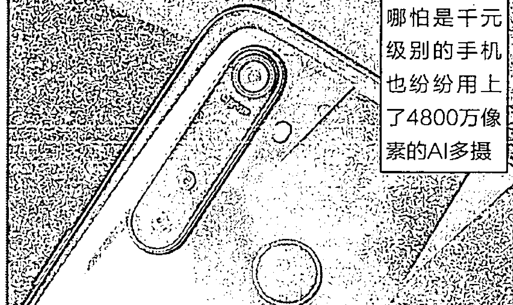

## 突破4000万像素关口

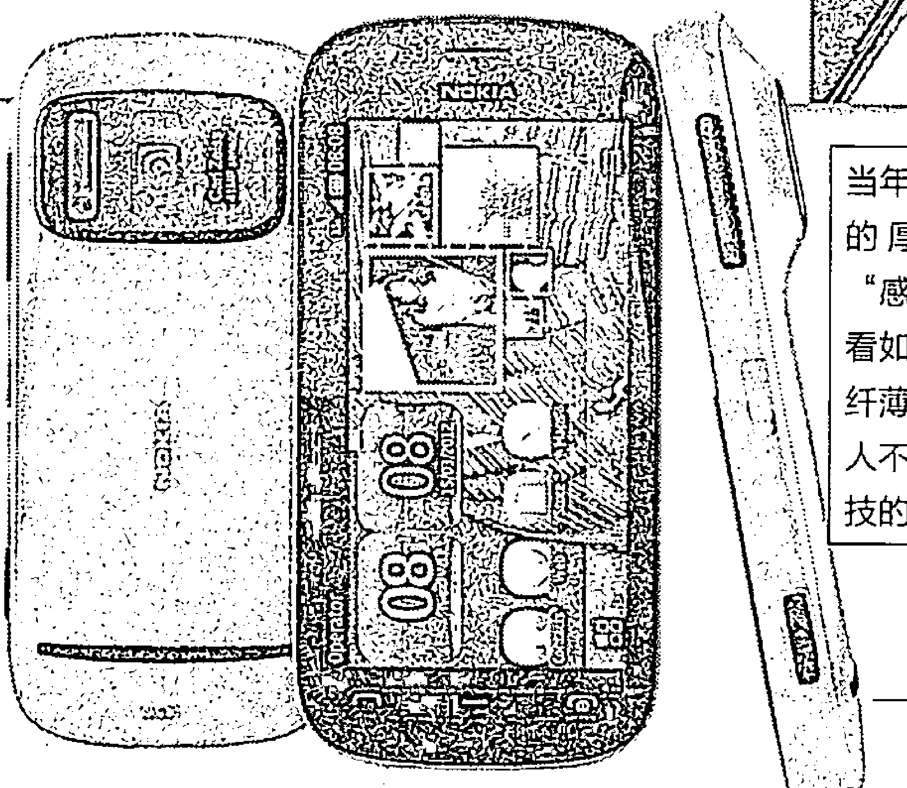

2012年，诺基亚808 PureView首次配备了高达4100万像素的卡尔蔡司镜头（图1），刷新了手机摄像头领域的像素纪录。可惜，在以Android和iOS系统为主的生态圈中，直到2018年初上市的华为P20 Pro，才再次实现了4000万像素的回归。步入2019年后，4800万像素逐渐成为智能手机圈的主流，上到顶级旗舰，下到千元机都纷纷列装了这种超高像素的摄像头（图2）。

# 特别话题

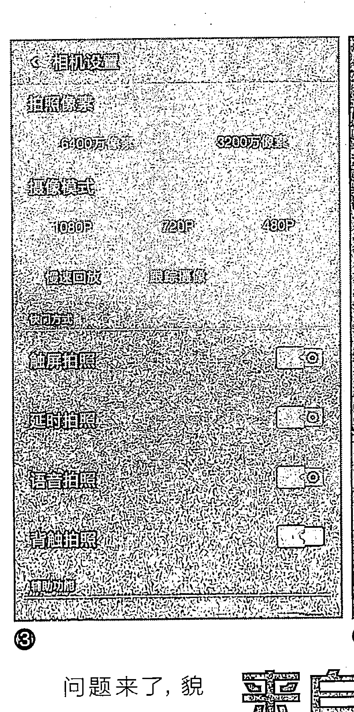

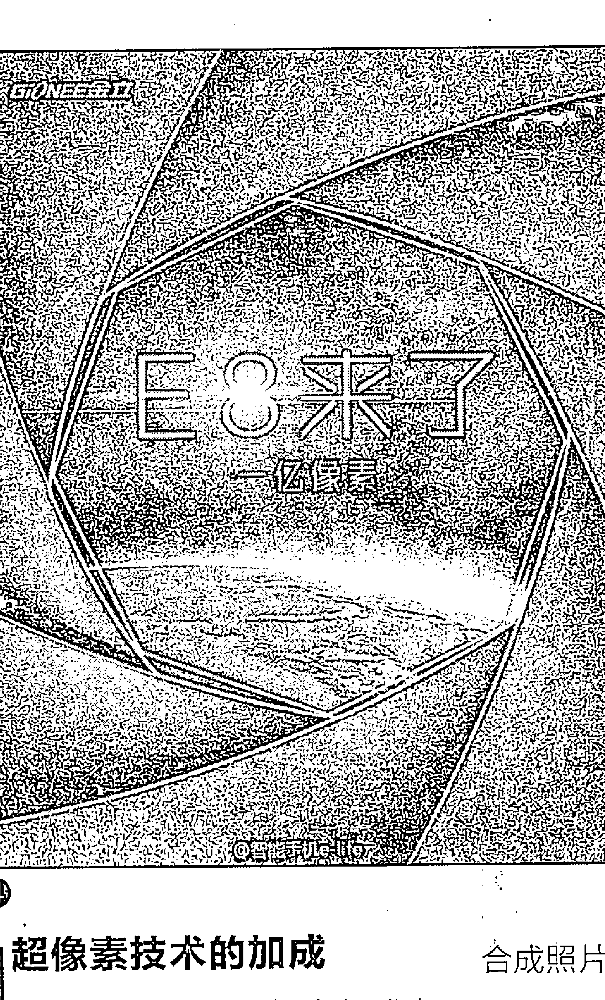

## 超像素技术的加成

问题来了，貌似早在2014年就有Android手机支持3200万像素、5000万像素和6400万像素拍照，2015年还有手机带来了1.2亿像素的拍摄能力，为什么多年后的新品在摄像头像素参数方面反而下降了？

在2014年前后，很多新品在拍照能力上都突破天际，明明标配的是一颗1300万像素、1600万像素或2400万像素的摄像头，却可以拍摄像素值数倍于这组数字的照片。比如，OPPO旗下手机利用了“超清画质模式”，让Find 7、R5可以进行5000万像素，N3和R7进行高达6400万像素的拍照体验（图3）。随后，主打拍照体验的金立E8更是通过“超像素模式”带来了一亿两千万像素即1.2亿像素的拍照能力（图4），其创下的拍照像素纪录至今还没有被人打破。

实际上，无论“超清画质模式”还是“超像素模式”，它们的基本原理都是相同的。

OPPO采用的超清画质算法是连续拍摄10张照片进行合成，金立的超像素算法则是采用5张连续拍摄的照片进行多帧合成，中间过程生成的照片不会保留到ROM（闪存）之中。在将多张照片进行合成的过程中，涉及到将每张照片中物体边缘、纹理细节最清晰的部分，通过“多帧超分辨率零噪声模式”等技术进行重建，让用户最终看到的只是一张超高像素的完美照片。

然而，这种通过软件手段将拍照分辨率“跃升”的能力存在很多先天不足，比如需要CPU、内存和闪存的处理速度足够快，合成照片的细节是否完美还取决于成像算法的优化。此外，超像素技术会显著提升照片容量，5000万像素的照片大小会从3MB左右一下猛增到8MB至20MB，1.2亿像素在复杂的场景下也有望突破50MB容量大关，从按下快门拍摄一张照片还需要等待5秒以上，并且期间拍照界面按钮都会变成灰色，不再响应其他操作，非常影响实际体验。

可惜，当年的手机无论是存储容量还是处理速度都无法完美驾驭这种超像素技术，而拍摄超高分辨率的照片本身也不是刚需功能，在“随手一拍就是大片”的理念下，这种华而不实的功能逐渐被后续的新品所抛弃，而智能手机们也转向了更具实际价值的AI场景的优化算法上（图5）。


## 超像素的逆向思维

就在手机总在试图拍摄更高分辨率的照片时，还有一种将像素由多变少的逆向思维也需要引起我们的重视。其中最具代表性的就是Lumia 1020的PureView超采样技术和HTC的UltraPixel超像素技术。

武装4100万像素摄像头的Lumia 1020在拍照时（图6），根据画幅尺寸可以同时拍摄一张3800万像素（4:3画幅）或3400万像素（16:9画幅）的照片，外加一张500万像素的照片。其中，主要用于社交分享的500万像素照片，在细节的表现力上可以秒杀当时一众同像素或更高像素的竞品，原因就是它通过“超采样”技术，将每7/8个像素合成为一个“超级像素”，相当于系统自动将4100万像素的图像“浓缩”至500万像素。如今4000万/4800万/6400万/1.08亿像素传感器主打的Quad Bayer阵列和四合一像素聚合技术，就与PureView超采样技术有着异曲同工之妙。

HTC的UltraPixel超像素技术特指一种特殊定制的传感器（图7），在竞品纷纷用上800万像素、1300万像素和1600万像素时，这款手机的摄像头却仅有408万像素，它的传感器尺寸为1/3.0英寸，但单个像素的感光面积却达到了2μm，远远高于同期手机常见的1.1μm像素尺寸，感光效率高出300%，翻译过来就是夜拍时的细节表现更完美。

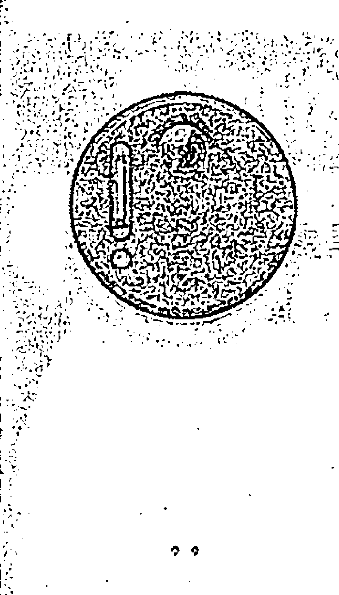


## 一亿像素时代来临

可惜，UltraPixel超像素相机的像素太低，并不利于营销，而且正常光线拍照和更细腻的分辨率才是市场的主流。因此，HTC很快也放弃了这种非主流的逆向思维方式。时至今日，已成主流的4800万像素传感器通过四合一像素聚合技术也能获得1.6μm的单个像素感光面积（图8），再加上“手持超级夜景”等拍照模式和AI算法的加持，夜拍表现也逐渐趋于完美（图9）。

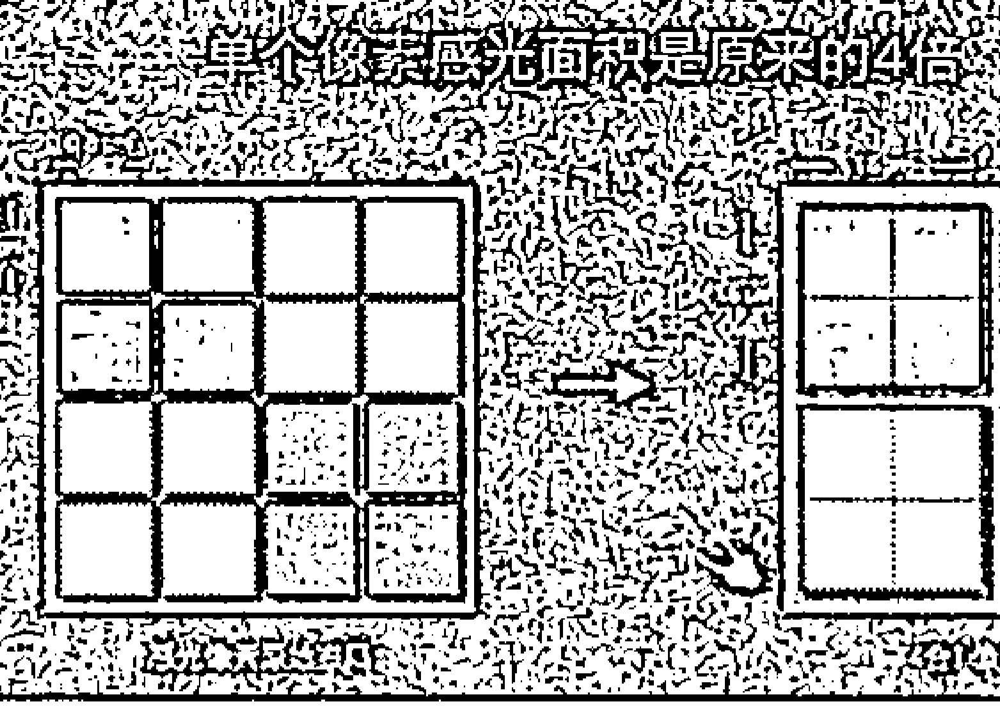


2019年8月初，小米在北京举行的未来影像技术沟通会中曝光了来自三星旗下，拥有1.08亿像素的传感器——ISOCELL Bright HMX（图10）。至此，智能手机终于用上了在物理层面真正破亿的摄像头，可以拍照分辨率高达12032×9024像素的照片。可以说，ISOCELL Bright HMX是迄今为止像素数量最高的手机传感器，没有之一。


## ISOCELL传感器的逆袭

过去提起手机领域的CMOS传感器，索尼旗下的IMX系列一直都是更高品质的代名词，而三星旗下的ISOCELL则始终屈居于后(图11)，属于稍逊一筹的存在。如今，三星的逆袭时间已到。


| 对比项 | 三星GM1 (Redmi Note 7) | 索尼IMX586 |
| :--- | :--- | :--- |
| 传感器尺寸 | 1/2" | 1/2" |
| 总像素 | 4800万 | 4800万 |
| 单像素尺寸 | 0.8μm (四合一) | 0.8μm (四合一) |
| 输出像素 | ① 1200万(四合一)(1.6μm) ② 全像素(0.8μm) | ① 1200万(四合一)(1.6μm) ② 4800万(0.8μm) |

## 4800万像素 索尼称王

智能手机专用的CMOS传感器主要来自索尼(IMX)、豪威(OV)以及三星(ISOCELL)，在4800万像素和更早的时代，索尼IMX系列的口碑最好。以主打4800万像素摄像头的Redmi Note 7为例，其标准版就选用了ISOCELL Bright GM1，而Redmi Note 7 Pro却用上了IMX586；黑鲨2采用ISOCELL Bright GM1，黑鲨2 Pro换成IMX586；vivo X27标准版用ISOCELL Bright GM1，高配版换成IMX586……类似的情况数不胜数，但从中我们不难看出，无论是在厂商还是用户眼中，索尼IMX586就是比ISOCELL Bright GM1“更香”(图12)。原因很简单，这两个传感器虽然都将Quad Bayer阵列扩大到了4×4，并且以2×2的方式将

RGB相邻排列，但由于底层的结构不同，三星GM1只能直出1200万像素的照片，4800万像素模式需要借助AI软件算法的形式实现，而索尼IMX586则支持4800万像素照片的直出，这就是它们之间的最大差异(图13)。和三星GM1通过AI软件算法输出4800万像素照片相比，索尼IMX586硬件直出4800万像素照片的速度更快。但是，IMX586在4800万像素模式下，单个像素面积只有0.8μm，这意味着只有光线充足的户外场景才能保证成像质量，在光线不足时强制使用该模式拍照会因单像素包含的信息过少而严重影响画质细节。

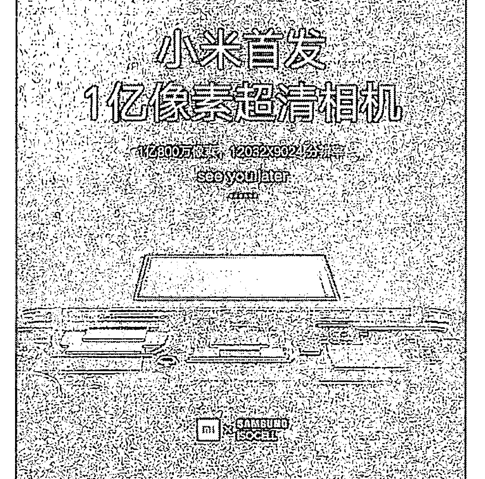

> 火速链接
如果你对索尼IMX586和三星ISOCELL Bright GM1的底层技术感兴趣，可参考本刊2019年第5期《4800像素看世界 浅析更高分辨率的手机摄像头》这篇文章。

ISOCELL Bright HMX是三星和小米联合研发，并由小米MIX4首发

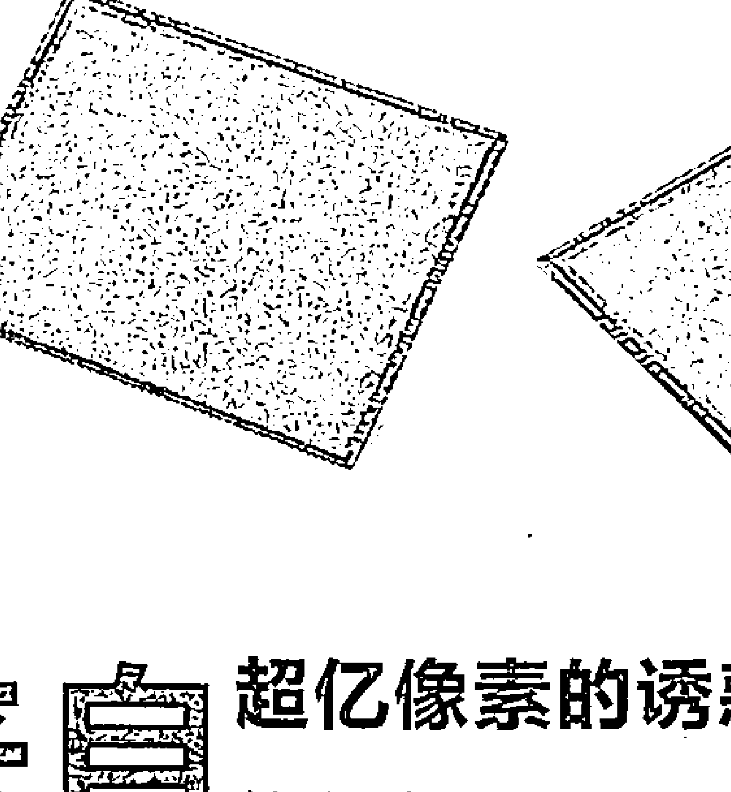

## 超亿像素的诱惑

就在索尼IMX最高像素还停留在4000万像素和4800万像素之际，三星却抢先一步带来了1.08亿像素的手机专用的CMOS传感器——ISOCELL Bright HMX(图14)，而它的具体型号又称“S5KHMX”。如果你想更加直观地了解三星最新ISOCELL传感器的型号和对应的规格，可以参考下表的汇总对比。

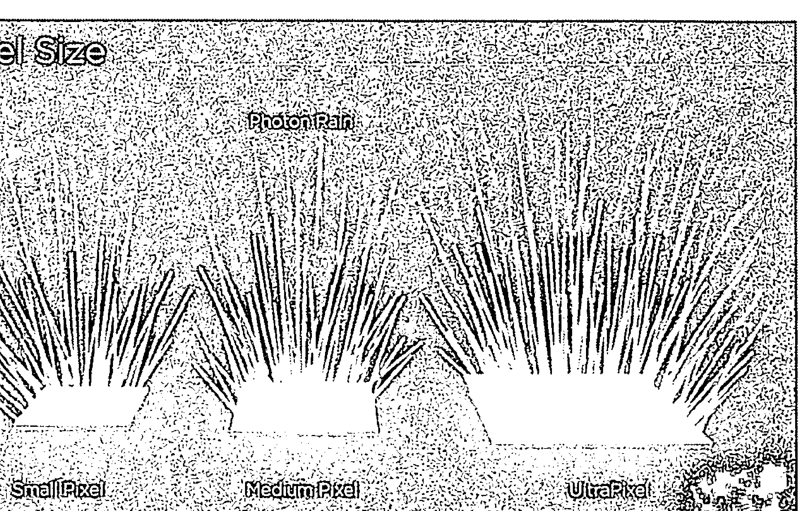

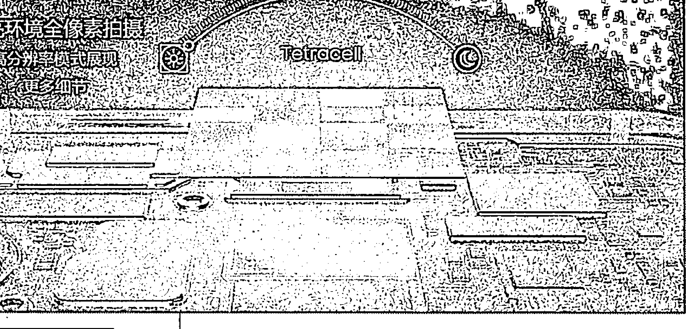

ISOCELL Bright HMX最大的特色，就是像素值达到了破天荒的一亿零八百万像素，像素数量比次一级的6400万像素传感器提高了1.6倍，是手机史上图像传感器行业的最高纪录。同时，这颗传感器的尺寸也达到1/1.33英寸，同样是以Android/iOS为代表的智能手机历史上的最大值。作为对比，索尼IMX586的传感器尺寸为1/2.0英寸，更高端的IMX650传感器(主要用于华为P30系列手机)尺寸也不过1/1.7英寸，ISOCELL Bright HMX这次将“底大一级压死人”的优势贯彻到底(图15)。

经常关注CFan的读者可能还记得，在手机圈中，保持传感器尺寸纪录的手机型号其实是诺基亚808 PureView，其传感器尺寸高达1/1.2英寸。但是，这款手机为了塞下这颗4100万像素的大底镜头，相机模组的厚度非常惊人，放在以纤薄为美的当下，这种设计简直“反人类”。ISOCELL Bright HMX的1/1.33英寸虽然没有打破808 PureView的纪录，但对相机模组的尺寸和厚度要求却大幅放低，可以完美嵌入7mm~10mm左右厚度的手机体内。

我们都知道，单位像素面积的大小决定了传感器的感光能力，单位像素面积越大，可以在相同时间内捕捉到更多的光(图16)，在暗光下拍照可以显著降低画面噪点。但是，单位像素面积过大，在白天光线很足时拍照却容易出现过曝现象，较小的单位像素面积反而可以在白天捕捉更多画面的细节。

ISOCELL Bright HMX与早期的GM1和IMX586一样，都面临着单位像素面积过小的尴尬，0.8μm远远低于传感器领域主流1.2μm~1.5μm的水准。此时，就轮到一项名为“Tetracell”(对应索尼的Quad-Bayer)的技术登场了。在光线较好的环境中，0.8μm的单位像素面积拍照效果极佳(图17)；弱光环境下拍照时，无论是三星GM1、

| 传感器型号 | 别称 | 像素值 | 分辨率 | 传感器尺寸 | 单像素面积 | 对焦技术 | 代表产品 |
|------------|------|--------|--------|------------|------------|----------|----------|
| ISOCELL Bright GM1 | S5KGM1 | 4800万 | 4032×3024像素 | 1/2.0英寸 | 0.8μm | PDAF | 魅族16Xs |
| ISOCELL Bright GM2 | S5KGM2 | 4800万 | 8000×6000像素 | 1/2.25英寸 | 等效1.6μm | Super-PD | 还未上市 |
| ISOCELL Bright GW1 | S5KGW1 | 6400万 | 9280×6944像素 | 1/1.72英寸 | 1.6μm | Super-PD | Redmi Note 8 Pro |
| ISOCELL Bright HMX | S5KHMX | 10800万 | 12032×9024像素 | 1/1.33英寸 | 1.6μm | Super-PD | 小米MIX4 |

## 还是6400万更实际

除了ISOCELL Bright HMX，三星还推出了一颗6400万像素的传感器——ISOCELL Bright GW1（图20），它可以拍摄9248×6936像素的照片，比4800万像素多获得近34%的光学信息。同时，这颗传感器的尺寸进一步提升到1/1.72英寸（图21），已经达到了索尼旗舰级IMX600和IMX650传感器的水准，结合四合一像素技术带来的等效1.8μm单位像素面积，其夜拍表现得以进一步提升。

GM2、GW1还是HMX，都可以利用Tetracell技术将四个相邻像素合并成一个等效1.6μm的大像素（图18），再结合智能WDR（宽动态范围）功能，后者在一次拍摄中可进行多次曝光，从而让亮区和暗区都呈现更出色的细节。

得益于更高的像素，ISOCELL Bright HMX可以进行分辨率为6K（6016×3384像素）、帧率达到30FPS，同时不影响视角（Field of view）的专业级视频拍摄。在海边等强光环境下，该传感器还能利用智能ISO技术自动修正亮度，提高色彩还原能力。

此外，ISOCELL Bright HMX还支持Dual Pixel和超级PD对焦技术，即使在弱光环境下也可以识别快速移动物体的距离，从而实现更快速、更准确的自动对焦。同时，3层堆叠的快速读出传感器（FRS）可高速捕捉全高清视频画面（图19）。

作为三星旗舰级的传感器，ISOCELL Bright HMX的成本肯定不低，而小米旗下的MIX4则有望成为它的首发机型。按照小米品牌的价格走势，MIX4的起价不会低于3000元，此次甚至可能直接突破3500元大关。这意味着，很多预算有限的用户都无法在第一时间获得来自超亿像素摄像头的拍照体验。

最关键的是，ISOCELL Bright GW1支持6400万像素照片的直出，并引入了很多更先进的技术（图22）。从三星官方的资料来看，GW1同样支持智能ISO技术，可根据光照环境智能调整相机状态，以实现最佳的光电信号转换。此外，它还采用了更新的材料代替像素间金属屏障的ISOCELL Plus技术，可实现更好的色彩保真，并将感光度提升15%。在拍摄全高清60FPS视频时，能实时处理并预览HDR（高动态范围图像）效果，让录像时也能看得清录得到。作为一款快速读出传感器，GW1还支持大量帧数的快速传输，它可以在4K模式下以60FPS录制视频，或在全高清制式下完成高达240FPS的录像任务。

令人欣喜的是，ISOCELL Bright GW1并没有成为众多新品用于“提价”的武器，反而成为进一步提升性能价格比的杀手锏。以Redmi Note 8 Pro为代表的新品已经将GW1打入到了1399元价位（图23），realme品牌旗下的高性价比新品也蓄势待发，这颗更高像素的传感器在年底前也许就会成为绝大多数1500元以上价位新品的标准装备。

总之，ISOCELL Bright GW1和HMX的诞生让智能手机摄像头有望进入新一轮的像素竞赛中，当索尼和豪威也杀入这片战场后，手机拍摄的照片将具备秒杀单反相机的分辨率。但是，这又将回到本文初始的问题：对手机而言，更高像素真的代表更好的成像质量吗？

| 1/1.7英寸 大底感光元件 | 9248 x 6936 超高分辨率 |
| :--- | :--- |

## 探讨更高像素的意义

CFan曾在2019年第5期《4800万像素看世界 浅析更高分辨率的手机摄像头》和第11期《从RGGB到RYYB 浅析手机镜头传感器的结构》等文章中对手机传感器进行过解读，更高的像素虽然可以提升画质，但还达不到决定画质的程度。在这个章节中，我们再来聊聊当像素值突破一亿大关后，对手机成像的新影响。

## 影响成像质量的因素

影响手机拍照性能的“核心参数”是CMOS传感器（涉及像素值、传感器尺寸、单个像素感光面积和对焦技术）、镜头玻璃、ISP性能、光圈大小和软硬结合的后期成像算法优化（图1）。可见，像素值仅仅是影响成像的因素之一。

以DxOMark手机相机排行榜单为例，截至2019年8月底，TOP10中最抢眼的手机分别来自三星和华为（图2），其中华为入榜的几款手机都是配备索尼IMX600/IMX650或IMX586传感器的机型，也就是高像素的代表；三星入榜的手机（S10和Note 10系列）武装的都是自家的S5K2L4传感器，刚上市不久的Galaxy Note 10+ 5G更是以113的分数位列榜首（图3）。

| SMARTPHONE DXOMARK | | |
| :--- | :--- | :--- |
| MOBILE | SUITE | |
| 113 | 99 | Samsung Galaxy Note 10+ 5G |
| 112 | 89 | Huawei P30 Pro |
| 112 | 97 | Samsung Galaxy S10 5G |
| 111 | | Honor 20 Pro |
| 111 | 86 | OnePlus 7 Pro |
| 109 | 75 | Huawei Mate 20 Pro |
| 109 | 72 | Huawei P20 Pro |
| 109 | 86 | Samsung Galaxy S10+ |
| 107 | | Xiaomi Mi 9 |
| 105 | 82 | Apple iPhone XS Max |

根据环境光线的强弱切换到不同的光圈模式，比如夜晚就以F1.5超大光圈运行来获取更多的光线。同时，S5K2L4的单位像素面积达到了1.4μm，只比通过四像素合一的IMX586和GM1等小0.2μm。当然，S10和Note 10系列拍照效果出色还离不开三星相机成像算法的加持，但这一切的一切，似乎都能说明一个问题——底大不一定就强，像素高的不一定好，最终还是要看相机模组和软件算法的综合技术（图4）。

除了三星，索尼传感器同样存在类似的问题。以IMX586为例，它除了1/2.0英寸大底和4800万超高像素以外，没有DRAM缓存，没有双核对焦，也不支持DTI像素隔离，综合性能远不如同期的IMX380（用于华为P20标准版等手机），至多是IMX363的水平。但是，超高像素毕竟是一个宣传上的引爆点，再加上高像素传感器带来了全新工作逻辑的加持，让它迅速将低像素的前辈们踢出局，成为2019年几乎所有中高端新品的标配。

### 小底 低像素也有好画质

问题来了，三星S5K2L4是一颗只有1200万像素的传感器，传感器尺寸也只有1/2.55英寸，属于“小底”+“低像素”的典型代表。然而，就是这么一颗看似不起眼的CMOS，却可以带来媲美4000万像素IMX650传感器的实力。

究其原因，是三星为S5K2L4额外搭配了F1.5/F2.4双光圈，可以根据环境光线的强弱切换到不同的光圈模式，比如夜晚就以F1.5超大光圈运行来获取更多的光线。同时，S5K2L4的单位像素面积达到了1.4μm，只比通过四像素合一的IMX586和GM1等小0.2μm。当然，S10和Note 10系列拍照效果出色还离不开三星相机成像算法的加持，但这一切的一切，似乎都能说明一个问题——底大不一定就强，像素高的不一定好，最终还是要看相机模组和软件算法的综合技术（图4）。

### 高像素 传感器的逻辑

凡是用过超高像素新款手机的用户不难发现一个问题，无论你手机的传感器型号是IMX586、IMX600、IMX650、GM1，还是刚刚上市的6400万像素GW1，默认的拍照模式都是1200万像素或1600万像素，标称的4000万像素、4800万像素和6400万像素都是一个可选的拍照模式，而且在超高清拍照模式下，变焦、美颜、人像等特殊功能都会失效，而相机界面也会提示仅适用于光线充足的环境（图5）。

原因很简单，这些传感器的单位像素面积过小，暗光下拍照的表现很难令人满意。因此，无论是最早的IMX586和GM1还是最新的ISOCELL Bright GW1和HMX，它们超高的像素单位，最终都要服务于四合一像素技术，在低位像素的默认模式下实现更好的细节表现。

实际上，四合一像素技术非常像诺基亚808 PureView和Lumia 1020时期的PureView超采样技术，将4800万/6400万/1.08亿像素的图像“浓缩”至1200万/1600万/2700万像素，可有效降低单像素的噪点，让画面显得更加纯净。换句话说，这些超高像素的传感器在最高像素下拍照只能保证留下更多的画面细节，但要想得到最佳的画质，或体验多摄联动和各种软件算法带来的拍照功能，就必须以四合一像素之后的单位进行拍照。

此外，像素越高，可以拍摄分辨率更高的照片（图6），在一张照片内保留更多的信息，能为相机软件提供更多后期处理的素材，从而充分发挥ISP单元和AI算法的潜力。

对分辨率为2340×1080像素的主流级手机屏幕来说，4800万像素、6400万像素摄像头所拍摄的照片分别相当于手机屏幕大小的19倍和25倍，1.08亿像素摄像头所拍的照片甚至可以在手机屏幕上放大43倍，超高的解析力带来了前所未有的画面精度，秒杀早前低像素传感器+超像素技术的多照片合成效果。

更高的解析力和画面细节的信息，还让超高像素摄像头拍摄的照片可以通过截幅的方式实现“变焦”的能力。以6400万像素的ISOCELL Bright GW1为例，其像素数量是主流1200万像素传感器的5倍之多，在2倍变焦时仍可提供1600万像素的图像，即使在5倍变焦后照片仍可达256万像素。当然，这种全靠裁切的手法在细节上可能还达不到真正长焦镜头的光学变焦效果，但也绝对属于“无损变焦”的范畴了（图7）。

这意味着什么？

在过去，多摄手机要想拍清楚远处的风景，必须搭配一颗长焦镜头。当6400万像素或1.08亿像素摄像头普及后，2X和3X长焦镜头将再无用武之地，可以省下来一个位置用于安置超微距镜头、支持5X光学变焦的潜望式长焦镜头、ToF镜头或第二颗主摄，让手机的拍照功能可以覆盖更多焦段，或实现更多的功能和更好的品质（图8）。

那么，更高像素的摄像头对变焦拍摄的增益能有多大？下面，我们就通过realme旗下两款分别配备4800万像素（IMX586）和6400万像素（ISOCELL Bright GW1）的新品，进行一番变焦拍摄的对比。两款手机分别在1X正常拍摄和5X无损变焦模式下进行拍照，可以明显看出4800万像素在5X时涂抹感比较严重（图9），而6400万像素在5X时对细节和层次的还原度更高（图10）。

由于更高的像素需要更大的传感器支撑，而更大的“底”结合四合一像素技术还能进一步提升夜拍潜力，所以6400万像素手机在超级夜景模式下对光晕的控制更好，照片显得更干净，噪点和细节表现同样更好（图11、图12）。

通过对比，我们可以提出一个结论——更高像素摄像头的出现，的确有利于提升智能手机的平均画质，并对软件后期带来更多的可能。但是，这并不代表它可以实现超越上代顶级传感器（如IMX650）的实力，至少ISOCELL Bright GW1还做不到，至于1.08亿像素的ISOCELL Bright HMX能否实现这个梦想，还得等时间来验证。

## 5镜头搭配蔡司认证

一部手机5颗摄像头，共同成一张照片。

Nokia 9 PureView，这款手机内置5个摄像头，它们都是来自索尼旗下的IMX386传感器。

## 高像素 倒逼硬件提速

前文我们提过，一张6400万像素的照片容量可达20MB，1.08亿像素的照片甚至可以逼近50MB，这些都对手机SoC集成的ISP图像处理器单元的计算能力、内存速度和带宽、NAND闪存的读取和写入速度提出了更高的要求。因此，你会发现，凡是搭配这些全新超高像素传感器的手机，都会选择高通骁龙7系或更高档的移动平台，闪存版本也从eMMC5.1全面过渡到了UFS2.1甚至UFS3.0。Redmi Note 8 Pro搭载的联发科Helio G90T，就主打“原生支持6400万像素摄像头直出”，使得从相机软件中按下快门到可以预览刚刚所拍摄图片的等待时间趋近于零。

## 多摄和单摄的未来探讨

目前智能手机的多摄阵列，已经从早期的黑白+彩色、主摄+景深升级到了主摄+超广角+长焦（还包括潜望式）+超级微距+TOF的任意组合，可以带来更丰富的拍照模式，AI算法也让多摄参与成像变成了现实，超过5X的无损变焦极具实际意义。

然而，摄像头越多，传感器越高端，整套相机模组的成本也就越高，对手机内部空间的占用问题也将更为严峻（图13）。以华为P30 Pro为例，通过拆机分析，它的三摄模组成本已经达到了56美元，约合人民币376元。当多摄模组遇到了潜望式长焦或升降式摄像头这种物理结构，对手机内部结构的优化就提出了更为苛刻的挑战（图14）。

像素传感器出现后，2X和3X长焦镜头的地位就已经岌岌可危了，而它们所提供的“大底”、四合一像素以及更加成熟的AI算法，也足以胜任不同光线的拍摄环境。

据悉，亚光公司正在开发潜望式的单镜头模块，它以GM非球面玻璃镜头为基础，只需单镜头就能实现6X到8X的光学变焦，光变能力比目前三摄手机的5X还要强悍。

谷歌Pixel系列就曾经发表过不同的看法，依靠单摄+优化HDR算法，其日间和夜间的拍照水平也能处于一流水准。理论上，通过更先进的传感器和镜头工艺，能在一颗摄像头上实现正常拍照、超微距、超长焦，并通过算法带来广角，似乎也是一套不错的解决方案。至少，当6400万像素和1.08亿像素传感器出现后，2X和3X长焦镜头的地位就已经岌岌可危了，而它们所提供的“大底”、四合一像素以及更加成熟的AI算法，也足以胜任不同光线的拍摄环境。

据悉，亚光公司正在开发潜望式的单镜头模块，它以GM非球面玻璃镜头为基础，只需单镜头就能实现6X到8X的光学变焦，光变能力比目前三摄手机的5X还要强悍。

如果未来真的出现“多合一”的全能型镜头，让手机重归“单摄”，并能同时实现多摄才能具备的拍照模式，无疑可以节省大量的内部空间，用来安置更大的电池，进一步降低厚度和重量，想想就非常美妙。只是，当消费者已经习惯“像素越高越好”和“摄像头越多越好”的消费逻辑之后，这种单摄还能吸引普通消费者的青睐吗？让我们拭目以待吧。

# 网络专家谈

### 近期家用网络的优化

相对于面临升级而广受关注的移动网络，大家网上冲浪的另一个重要基础——家庭网络的进化却少有人关注，其实细看这些年的入户网络服务与路由器、上网设备等产品就会发现，它们的变化并不比移动设备、移动网络小。在新的网络条件下，我们的家用网络是否还在固守着以前的成规，让人难以感觉到变化呢？这显然不符合现在网络应用和上网设备的需求，所以对家庭网络的优化已经势在必行。

对于网络的使用与优化，包括硬件方面的设备选择、布线规范和软件层面上的协议选择、网络设置等，其实是一个相当大且专业的话题。在本篇中，我们并不会涉及那些深入的技术，而是专门来说一说随着近期家庭网络能力、需求的提升，我们如何应对家用网络进行优化与整理，得到好用又易用的网络环境。

### 不要让网络输在起跑线上

入户网络服务，即用户选择的宽带速度和类型，是家庭上网能力的最重要决定因素。目前通过电话线上网的拨号方式已经濒临淘汰，ADSL局端设备正在逐渐撤除，仍然使用这一方式上网的用户，还是抓紧时间更改吧。

### 宽带提速为什么没感觉

宽带网线入户已是主流，对宽带用户来说，目前需要注意的有两点。首先是在宽带规格和相关硬件方面，近几年的网络服务商不断推动宽带提速（图1），而且在很多情况下，实际上是直接提速而不会通知用户的，其中更有50Mbps升级到100Mbps、100Mbps升级到200Mbps这样跨越设备支持能力的升级。在这种情况下，原来不足百兆或者百兆标准的入户调制解调器（即所谓的光猫、宽带猫）、路由器都可能成为新网络的瓶颈，需要换新。但与提速不会有明确提示一样，入户网速其实已经超过了用户正在使用的调制解调器这件事，服务商常常也是不会有明确通知的。

相对于可自行选购、参数公开、标注明确的路由器，调制解调器常常是服务商直接提供，也缺乏说明的，我们只能根据底部的型号贴纸（图2）查询具体信息，确定其接口速度。

要升级调制解调器的话，我们并非只能要求服务商提供，如果想要自带Wi-Fi或者更多接口的特殊产品，也可以在宽带服务商允许的情况下自行购置（图3）。需要注意的是，自行购置调制解调器必须了解宽带类型，例如光纤有GPON和EPON两种互不兼容的类型，需要选择不同型号的产品。在安装自选调制解调器时，还是应该要求宽带服务商派出服务人员，与局端设备进行配对设置，如需自行安装，也需要服务商提供LOID认证码。

### 宽带速率说明
1. 公众宽带产品的接入速率均指下行速率，具体上下行速率如下表：
| 产品速率 | 下行速率(bps) | 上行速率(bps) | 接入方式 |
| :--- | :--- | :--- | :--- |
| 300M | 300M | 30M | FTTH |
| 500M | 500M | 30M | FTTH |
| 600M | 600M | 30M | FTTH |

### 单宽带资费（北京联通）
| 宽带速率 | 7个月 | 12个月 | 24个月 | 36个月 |
| :--- | :--- | :--- | :--- | :--- |
| 300M | 888 | 1480 | 2664 | 3552 |
| 500M | 1088 | 1780 | 3204 | 4272 |
| 600M | 1188 | 1980 | 3564 | 4752 |

时可以降低花费。以北京联通地区为例，对一般用户来说，300Mbps的下行速度已经足够使用，相应的上行速度与更高速的宽带一样为30Mbps，使其在网络视频通话、文件分享等方面的表现与更高档次的宽带表现更接近（图4）。对被动升级到500Mbps宽带的用户来说，回到完全够用且更省钱（图5）的300Mbps宽带就是不错的选择了。

### 小知识：
光纤宽带目前有两种方式，分别是“Fiber To The Building”，即光纤入楼，简称FTTB，宽带会经由楼宇服务器分配给各家，通过网线连入用户家庭内。而光纤直接入户则为“Fiber To The Home”，简称FTTH。在相对短距离的传输上，普通网线完全可以达到数百Mbps的速度，同时入楼光纤则可承载数户甚至数十户用户的百Mbps级宽带入户数据，所以FTTB对目前的宽带入户已经足够了。

### 光纤那些事

网络速度升级到百Mbps以上后，光纤实际上是更好的传输方式，在宽带用户比较密集的区域，服务商一般会主动进行切换，但有些用户较少的地区，则可能需要用户去相关服务商的网点进行申请。笔者建议对百Mbps或更高宽带的用户来说，至少也应要求服务商提供光纤入楼，才能保证100Mbps或更高的入户宽带速度。

这里必须提醒大家注意的是，如果服务商提供了光纤入户的话，一定要注意千万不能直接装入已有的网线布线槽内，或者和网线一样紧贴墙角走线。因为光纤内部用来传输数据的光线是以折射的方式传播，过于曲折或挤压都可能造成光信号的大量损失，甚至直接导致光纤内部断裂。

光纤通过转弯部分传输信号是可行的，但在弯折程度较大的情况下，近乎垂直的角度会让光线从内部直接射出（图6），造成数据丢失、速度下降，甚至是断开网络，所以它的转弯半径必须足够大。此外光纤由特殊的玻璃制造，不像金属那样具有可延展性，柔韧性也比较一般，因此长时间大角度弯折还有可能造成其断裂。

## 路由器的误区

要想从更快的入户宽带中受益，一台出色的无线路由器也是必不可少的。在我们挑选和使用路由器的过程中，常常会有一些错误的概念，要想购买时不受骗，应用中更从容，就需要对它们有所了解。

## 天线多就是信号强吗？

家用路由器有个很重要的标准，就是信号强不强，或者也被通俗地说成“穿墙效果好不好”。在实际挑选的时候，这个问题最终常常会变成路由器的“天线多不多”。那么，真的是天线越多信号越强么？

现在路由器的多天线设计是802.11n标准引入的MIMO (Multi-input Multi-output，多输入输出) 技术导致的。它简单来说就是可以让多根天线实现同时接发信息，从而提升路由器的传输速率，因为当时每个天线的速度为150Mbps，所以主流的300M路由器就变成了双天线 (图7)。后来又出现了2.4G和5G两个频段，在当时的技术限制下，只能给每个频段配备专门的天线，所以路由器的天线数量一下子就翻倍成了4天线。之后路由器速度越来越高，除了提升天线发射速率外，也要依靠信号的并行能力，也就是更多的天线，所以路由器天线数量也就越来越多，最后发展成了“八爪鱼” (图8)。

不过，这些“八爪鱼”路由器的价格、外形就已经不太受用户欢迎了，以后再提速的话，难道要变成“刺猬”吗？于是厂商们开始将2.4G和5G信号发射整合到了一根天线里，这就是为什么现在的高端路由器很多又回到了4天线或者6天线 (图9)。

那么，天线多和信号强到底有没有关系呢？答案是，不光没关系，而且信号强度还可能和天线数量成反比。因为根据国家标准，路由器的发射总功率被限制在20dB (即100毫瓦)，这是路由器中的Wi-Fi控制芯片 (图10) 限制的，与天线技术无关，因此天线越多，每个天线分得的功率就减小。

**小提示**
一定要注意，路由器的5G频段是指用5GHz左右的频率传输信号，与移动网络的5G (5th Generation Wireless Systems，第五代无线系统) 技术完全不是一个概念。

由于路由器天线和设备天线通常是一对一（或者多对多）配对通信的，所以每个天线的功率减小，也就意味着对任何一个上网设备来说，可用的总功率都降低了，信号强度当然就显得低了。

那么整合天线中的天线数量其实并没有缩减，在信号强度方面是不是和分置天线一样呢？答案是否定的，因为整合天线要同时兼容两种信号，所以一般会有独立芯片控制，加上天线设计也更复杂，所以可以实现一些另类“玩法”。

> 小知识:
有些人认为路由器靠电磁波传输信号，一定会带来明显的辐射，对人的身体会产生不良影响，会在睡前、孕产期中关闭路由器。其实从现在的强制标准来看，路由器的辐射强度无论是绝对强度还是与地球上的各种自然辐射、其他家用电器和设备的辐射相比都不算强。
此外大家需要了解，电磁辐射与大家闻之变色的核辐射是完全不同的两回事，前者是一种波，最大的危害是波长与某些物质尺寸近似而产生谐振，出现升温等问题，只有波长恰好与水（微波炉原理）、细胞等人体内的重要物质尺寸类似，而且功率足够大，才能对人体健康产生影响；而后者则是高速高能的粒子，可以击毁和破坏DNA等物质，因此少量核辐射就能影响人体健康。

比如让信号定向传输，根据使用情况把更多信号集中在正使用的设备上（图11），而不是传统的向四面八方发射信号，造成功率浪费，所以从使用效果上看，信号强度是比分置天线更好的。

另外，路由器的体积有限，太多的天线也会互相干扰，比如同一个方向有两个或者更多设备，当然会连接不同的天线，如果恰好在传输路途上有其他天线发射信号，干扰就很明显了。另外，希望增强某个方向的信号时，我们会去调整天线方向，天线太多的话就很容易顶在一起，两个信号源紧挨在一起，干扰也是很明显的。

当然，天线少则信号更强指的是真正的整合天线，有些路由器天线少可能只是节约成本，而不是用了整合天线。这怎么分辨呢？有两点可以注意，一是整合两种信号的天线设计比较复杂，外形一般都不是圆柱体；二是整合天线需要空间来安装芯片甚至独立供电电路，所以整合天线或者尾部很大（图12），或者间距较大。

## 无线速度是虚标吗？

如今高端路由器的无线速度已经达到了数Gbps，远高于有线网络速度，但在实际使用中，我们却难以获得如此高的速度体验，更有100M有线网的传输速度高于300M无线网络这种常见的事情，难道这些路由器的无线网络速度是虚标吗？

其实造成这种情况的原因是大家对无线网络速度和实际运行方式的理解有误。一般来说，现在的路由器标称无线网络速度，是其最高可提供的“并行”总速度，而不是针对一个上网设备就可实现如此高的传输速率。例如某款宣称拥有5.3Gbps无线速率的路由器，

## 网络扩展最实际 AP和电力猫

由于无线信号主要以直线传播，而且是一种典型的电磁波，所以现代建筑中大量使用的高强度水泥、钢筋骨架、金属梁架和装饰等物质，对无线信号的屏蔽是非常明显的。即使尽量将路由器置于可直线或略微偏转以覆盖房间的位置，也免不了在房间的角落或者卫生间、厨房这样的小空间内出现信号盲区。

要覆盖这些信号盲区，笔者比较推荐的方式是使用无线AP（Access Point），而非寻找所谓穿墙能力更好的路由器。无线AP是一种功能单一、价格便宜的网络设备，主要功能就是作为一个无线发射/接收器。一般来说，在信号不好的房间内使用有线或无线网络连接一个AP（图14），就能获得覆盖整个房间的高强度无线信号了。

目前的AP有两种供电方式，一种是使用市电，需要外接电源，使用略显麻烦，但对路由器/交换机没有要求；另一种则是使用网线供电，即POE（Power Over Ethernet）模式，部署更方便，但需要交换机或者路由器支持这一供电方式。

除了购置AP之外，其实很多路由器也带有AP模式，可以作为AP使用。只需要在设置页面中将其运行状态改变为AP，然后通过有线方式连接已有的路由器即可(图15)。

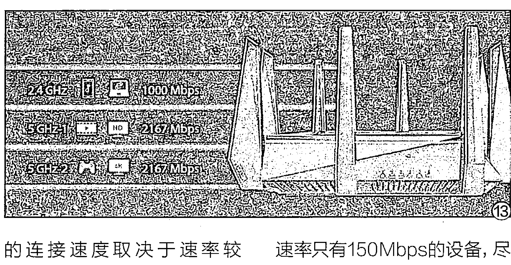
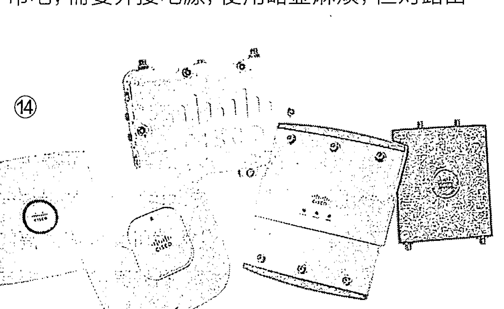
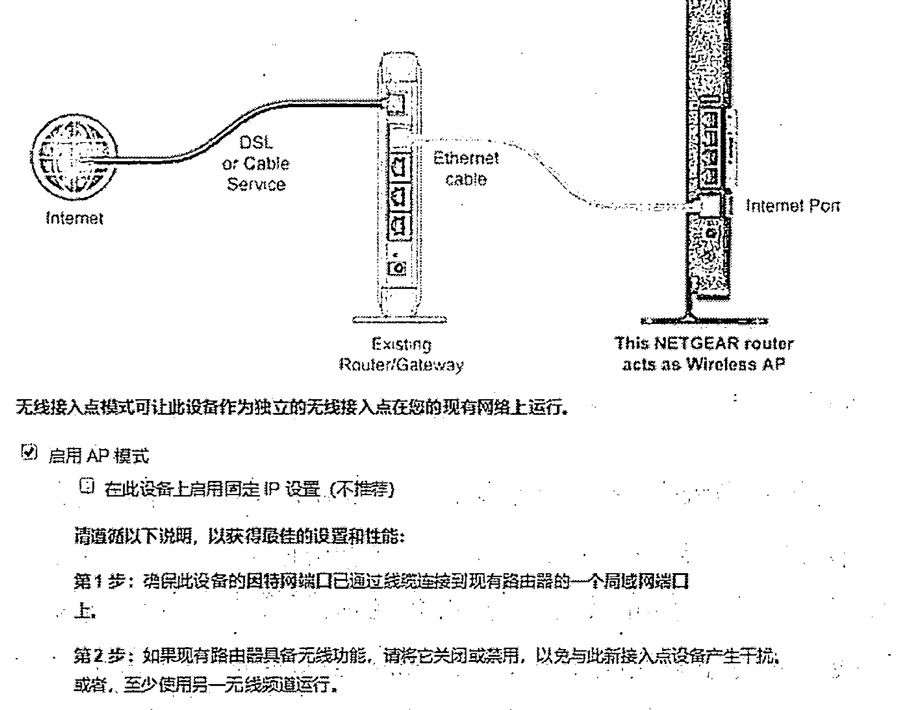
+   启用AP模式
在此设备上启用固定IP设置(不推荐)
请遵循以下说明，以获得最佳的设置和性能:
第1步: 确保此设备的因特网端口已通过线缆连接到现有路由器的一个局域网端口上。
第2步: 如果现有路由器具备无线功能，请将其关闭或禁用，以免与新接入点设备产生干扰。
完成后，单击“应用”继续。

目前还有一种更加易用的无线连接式扩展AP，一般被称为无线扩展器(图16)。它无需使用网线连接路由器，而是通过无线模式连接路由器，因此无需事先布线，但需要放置在路由器无线信号较好的地点，例如房间入口处、走廊中等。

电力猫则是一种小众但实用的网络扩展方式。它是在家中的供电线上，附加一个其他频率的信号进行网络传输，和电话线上网的原理差不多。在两个房间的市电插座上安装一对电力猫(图17)发送和接收信号，就可以把两个房间的网络连起来了。

小知识：

目前市场上有一些所谓的信号放大器或者信号放大方案，宣称可以增强无线网络的强度、扩展信号覆盖范围。其实这些产品或者仅仅是一种增强型天线，或者干脆就是类似AP方案的无线发射/接收器，而将其靠近路由器布置，效果当然不如直接部署到有信号盲区的房间中。

而且，因为路由器的发射总功率是被内置芯片控制的，因此增强型外部天线其实也只是提高了灵敏度，虽然会在信号强度数值上显得更高，但过于灵敏也会造成信号干扰增加，所以实际传输速度、可靠传输范围一般是不会有太大变化的。

用电力猫传输网络信号不像无线路由器那样容易被坚固的墙壁屏蔽，也不像AP需要提前布线，毕竟每个房间肯定都是有供电插座的。它自带Wi-Fi，可以很方便地让卧室和客厅、书房、卫生间等地方都信号满满。此外它一般还能提供一个有线接口，可以连接台式机、NAS等设备。

但是，电力猫的信号走的是供电线，大功率电器，特别是会起起停停的大功率电器，比如冰箱、空调、微波炉等对它的干扰很明显，所以最好使用独立的墙上插座(图18)，远离这些电器的插头。而且需要注意，电力猫只能用在一个家庭电路中，简单地说，就是一个电表控制下的供电电路中。

如果家里电器不多，还有较多富余的墙壁电源插座，特别是居住在跃层或自有楼房中的用户，因为网络布线麻烦，无线信号又覆盖不佳(地板对无线信号的屏蔽更明显)，就很适合使用电力猫进行网络扩展。

## 总结

其实对现代家庭网络来说，在扩展、利用和维护方面还有不少值得介绍的经验，例如使用NAS、路由器USB接口扩展、IP网络电视等方式充分利用高速的内外网络；使用最简单的命令在层级和设备越来越多的网络中快速确定故障点等。不过它们与家庭网络在近期内的变化关系不大，感兴趣的朋友们可以自行寻找资料了解，对更好地使用家庭网络也是很有帮助的。

# 透过IFA 2019看移动设备

策划|《电脑爱好者》编辑部

德国电子消费展（IFA）源于1924年，由德国通讯电子工业协会和柏林国际展览有限公司联合主办，与AWE、CES并称为全球三大展会。IFA不仅是全球家电生产商和贸易商展示新产品以及进行商贸和技术交流的盛会，还是欧洲批发商、采购商及家电零售业交流和采购的重要平台。2019年9月6日~11日，IFA 2019在柏林展览中心如期举行，在拥有近百年历史的IFA舞台中，中国企业的角色正逐渐由配角转换为主角，向世界展示其科技创新力和影响力。本期特别话题，就让我们将目光投向与智能手机和笔记本相关的新产品和新趋势吧。

扫一扫，更多精彩内容立现！

## 5G先锋 麒麟990初试啼声

对智能手机而言，它的性能是否强悍，发热和功耗表现、拍照摄影的效果以及是否支持5G网络，全都取决于SoC芯片。在本届IFA 2019展会中，华为最新的麒麟990系列就是最受瞩目的SoC新品。通过麒麟990，让我们仔细聊聊旗舰级SoC是怎样炼成的吧。

## 7nm工艺 DUV向EUV的进化

麒麟990系列包含5G版和4G版，两者在工艺、主频、AI和网络参数上存在较大的差异（图1）。其中，麒麟990 5G版最大的特色，就是全球首发来自台积电最新的7nm+EUV制程工艺。看到这里，估计不少朋友都会产生疑问——麒麟980、麒麟810、苹果A12和骁龙855等SoC不早就用上台积电的7nm工艺了吗？

实际上，上述SoC所用的7nm工艺都是基于DUV(深紫外光刻)技术打造，属于“第一代7nm”，而麒麟990 5G版采用的则是引入EUV(极紫外线光刻)技术的“第二代7nm”。据悉，EUV光刻设备的波长从DUV的193纳米缩短到了10纳米~14纳米，较之第一代7nm工艺可以带来1.8倍的晶体管密度提升，同等功耗水平下可以带来10%的性能增幅，或同性能下节省15%的功耗，这在半导体领域是非常大的突破(图3)。最终，麒麟990 5G版在一个指甲盖大小的芯片面积(200mm²)内就塞进了103亿个晶体管(图4)，在业内达到顶尖水平，位列世界第一。

**小提示**
Galaxy Note 10搭载的Exynos 9825移动处理器(图2)，才应该算是全球第一颗采用7nm EUV工艺打造的SoC，只是它来自三星自家的半导体工厂。据悉，高通今年底的骁龙865移动平台很可能会改由三星代工，此外英伟达等芯片企业也将转单三星，未来台积电和三星两大芯片代工厂将会在7nm+EUV这个工艺节点上开始展开激烈的竞争。

| 参数 | Kirin 990 5G | Kirin 990 |
| :--- | :--- | :--- |
| Chipset Process | 7nm+ EUV | 7nm |
| CPU | 2X Cortex-A76 Based @2.86GHz<br>2X Cortex-A76 Based @2.36GHz<br>4X Cortex-A55 @1.95GHz | 2X Cortex-A76 Based @2.86GHz<br>2X Cortex-A76 Based @2.09GHz<br>4X Cortex-A55 @1.86GHz |
| GPU | 16 Core Mali-G76 | 16 Core Mali-G76 |
| NPU | 2 Big-Core +1 Tiny-Core | 1 Big-Core +1 Tiny-Core |
| UFS | UFS 3.0, UFS 2.1 | UFS 3.0, UFS 2.1 |
| Modem | 2G/3G/4G/5G | 2G/3G/4G |

## 架构依旧 如何提升CPU/GPU的性能

制程工艺越先进，SoC就越容易在性能、发热和功耗之间取得平衡，有着向更高主频和更多功能发起冲击的“底气”。而SoC实际的性能几何，源于CPU和GPU的底层架构。

由于麒麟990系列立项较早，而ARM最新的Cortex-A77 CPU架构和Mali-G77 GPU架构在2019年5月的Computex 2019大展上才刚刚发布，最终导致二者“失之交臂”——麒麟990系列选用的CPU架构依旧是与麒麟980相同的Cortex-A76+Cortex-A55的组合(图5)，而GPU也停留在了Mali-G76时代(表1)。

**表1：麒麟990和其他顶级SoC参数对比**

| 参数对比 | 高通骁龙855 Plus | 三星Exynos 9825 | 海思麒麟980 | 海思麒麟990 4G | 海思麒麟990 5G |
| :--- | :--- | :--- | :--- | :--- | :--- |
| 制程工艺 | 台积电7nm | 三星7nm+EUV | 台积电7nm | 台积电7nm | 台积电7nm+EUV |
| 晶体管数量 | 超过60亿 | 不明 | 69亿 | 不明 | 103亿 |
| CPU架构 | 1×Kryo 485 (2.96GHz)<br>3×Kryo 485 (2.42GHz)<br>4×Kryo 485 (1.8GHz) | 2×Exynos M4<br>2×A75<br>4×A55 | 2×A76 (2.6GHz)<br>2×A76 (1.92GHz)<br>4×A55 (1.8GHz) | 2×A76 (2.86GHz)<br>2×A76 (2.09GHz)<br>4×A55 (1.86GHz) | 2×A76 (2.86GHz)<br>2×A76 (2.36GHz)<br>4×A55 (1.95GHz) |
| GPU型号 | Adreno 640 | Mali-G76MP12 | Mali-G76MP10 | Mali-G76MP16 | Mali-G76MP16 |
| 内存规格 | LPDDR4X | LPDDR4X | LPDDR4X | LPDDR4X | LPDDR4X |
| 网络标准 | 4G | 4G | 4G | 4G | 5G |
| 下行速率 | 2.0Gbps | 2Gbps | 1.4Gbps | 不明 | 2.3Gbps |
| AI | 第四代AI引擎 | NPU | 双核NPU | 单NPU大核+微核NPU | 双NPU大核+微核NPU |

得益于7nm+EUV工艺,让麒麟990 5G版在保持功耗不变的前提下,在主频设定方面有了更多的腾挪空间。具体来说,麒麟990系列性能级核心的主频从麒麟980时期的2.6GHz提升到了2.86GHz,中核和小核的主频也有明显的增加,只是麒麟990 5G版更加激进一些。换句话说,麒麟990系列在CPU性能上的改善完全来自于主频方面的增益,所以较之麒麟980、骁龙855/855 Plus这些同属Cortex-A76架构的SoC不会出现太大的变化。

> **火速链接**
如果你对ARM Cortex-A77架构和Mali-G77架构感兴趣,请参考本刊2019年第14期《新旗舰手机的动力之源 浅析ARM最新的CPU和GPU核心》这篇文章。

麒麟990系列的GPU与麒麟980、三星Exynos 9820/9825相同,都是ARM在2018年发布的Mali-G76。只是,麒麟990这次有着最新工艺的加持,给Mali-G76配备了高达16个计算核心,即Mali-G76MP16。作为对比,麒麟980集成的GPU为Mali-G76MP10,三星Exynos 9825也不过是Mali-G76MP12。

GPU性能数据也比较保守,相较麒麟980性能提升6%,能效提升20%。从麒麟980和骁龙855系列的3D性能对比来看(表2),麒麟990系列也很难实现反超,最多就是追平骁龙855,面对骁龙855 Plus和将在2020年初量产的骁龙865存在不小的压力。

从网上曝光的疑似麒麟990系列在GeekBench 4.4上的跑分成绩来看,其3842和11644的单核/多核成绩只是略高于高通骁龙855 Plus(图6),与苹果iPhone 11系列搭载的苹果A13处理器相比还有很大的差距(图7)。

需要注意的是,ARM Mali系列GPU核心越多,功耗和发热越高(图8),很少有可以“满血运行”的时候,它们的关系并非线性增长。因此,华为公布的麒麟990系列的GPU性能提升数据,应该是在确保稳定运行下的结果。

不过,当前热门的手机游戏更加看中软硬层面的联合优化,麒麟810和联发科Helio G90T这些中端SoC都能在《王者荣耀》和《和平精英》中跑出比骁龙855竞品更高且稳定的帧数,这种趋势的影响可见一斑。华为/荣耀手机特有的Kirin Gaming+优化增强技术和GPU Turbo技术,都可以辅助麒麟990系列在真实游戏中的表现,所以我们也不用太过悲观。

> **小提示**
为了更加有效地提升GPU能效,麒麟990 5G版芯片还支持Smart Cache分流技术,可显著提升GPU资源配置,带宽需求降低15%,DDR (Double Data Rate,双倍速率)功耗降低12%。

**表2: 现有旗舰级SoC GPU理论性能对比**

| 测试软件 | 测试项目 | 麒麟980 | 骁龙855 | 骁龙855 Plus |
| :--- | :--- | :--- | :--- | :--- |
| 3DMark 离屏测试 | Sling Shot Extreme | 4337 | 6313 | 6204 |
| | Extreme Vulkan | 4611 | 4427 | 5426 |
| GFXBench 离屏测试 | 赛车 | 28FPS | 42FPS | 47FPS |
| | 曼哈顿ES3.1 | 53FPS | 70FPS | 79FPS |
| | 曼哈顿ES3.0 | 85FPS | 100FPS | 111FPS |
| | 霸王龙ES2.0 | 135FPS | 166FPS | 185FPS |
| 测试手机 | | 荣耀V20 | 黑鲨2 | iQOO Pro |

## 达芬奇加持 AI性能再度飞跃

麒麟990系列在CPU和GPU上“不大”的变化，意味着它的综合性能也难有质的飞跃。为了应付来自2020年面世的旗舰SoC对手的挑战，麒麟990系列将更多的精力投入到了迎合未来趋势的功能优化层面。首先，就是已经无处不在的AI。

在SoC领域，华为是最早引入独立NPU单元用于端侧（本地）AI运算的SoC，从麒麟970的单核NPU、麒麟980的双核NPU再到麒麟810改用自研达芬奇架构的NPU，麒麟移动平台在AI运算性能上始终冠绝群雄。CFan曾在2019年第16期《中端新势力 麒麟810是否值得期待》一文中介绍过自研达芬奇架构NPU的特色，让定位中端的麒麟810在AI Benchmark就具备“屠榜”的实力，其AI性能比骁龙855 Plus还要强不少。

作为年度旗舰，麒麟990系列自然要对AI作进一步的强化，它集成的NPU同样隶属于达芬奇架构，而且还引入了“大核”(Big Core)和“微核”(Tiny Core)的概念，前者适用于负载更高的AI场景运算，而后者则更省电，比如在人脸识别场景下NPU微核的能效较大核NPU提升了整整24倍(图9)。

麒麟990 5G版采用了2个大核和1个微核，共计3颗NPU的组合；而麒麟990 4G版则配备了1个大核和1个微核，共计2颗NPU(图10)，它们都具备继续在各大AI测试软件中“屠榜”的实力，并能进一步提升端侧AI运算的效率。比如通过AI分析当前游戏场景对CPU和GPU资源的使用情况和功耗，智能调频以实现“最佳”的状态；在拍照时可以更迅速和准确地识别场景，甚至可以做到录制视频时的“实时抠图”（经过AI识别出人物，并对视频内的背景进行智能更换，而且还可能对视频内的人物进行删减或增加），让原本需要借助PC和专业软件才能进行的复杂编辑工作变得毫无难度（图11）。

此外，麒麟990 5G版的AI算力，甚至可以通过识别人脸就能判断出该人物目前的心率和呼吸等状态，只是这项功能除了需要调用NPU的AI算力，还需要全新ISP单元的配合。

## 全新ISP5.0 携手AI感知心率

麒麟990系列内置的ISP（Image Signal Processing, 图像信号处理）升级到了最新的ISP5.0，其吞吐率提升15%，能效提升15%，全面优化视频处理能力。ISP5.0的特色还在于引入了单反级BM3D图像降噪技术和双域联合视频降噪技术，可以让照片降噪能力提升30%，视频降噪能力提升20%，暗光环境下拍摄的视频更加清晰。

值得一提的是，麒麟990 5G版支持Face AR功能，其原理是将摄像头捕获的人脸图像数据转换为电信号传达给强劲的3核NPU模块，借助强悍的端侧AI深度学习能力对人脸进行建模、实时跟踪、表情捕获，甚至可以分析出背后的心率和呼吸率等健康数据（图12）。换句话说，以后监测心率不再需要运动手环，对着手机摄像头笑一笑就能瞬间达成了。

## 引领潮流 成就首款商用5G SoC

虽然5G手机早在8月份就已经陆续问世，但这些产品采用的都是骁龙855+骁龙X50、麒麟980+巴龙5000这种“外挂”基带（Modem，上网调制解调器）芯片的形式，整个SoC模组臃肿不堪，而且还会消耗更多的电力。麒麟990 5G版，是全球第一款可量产商用的、体积最小的5G SoC，相较于外挂基带方案可以节省更多主板空间和额外的功耗，可以让5G手机塞进更大的电池或实现更多的功能（图13）。

麒麟990 5G版集成的5G基带支持5G双模（SA/NSA组网），理论最高下行和上行速率分别为2.3Gbps和1.25Gbps。考虑到短期内5G网络存在基站不多信号弱、功耗较高、移动时5G信号不稳定等问题，麒麟990 5G版还引入了智能上行分流、BWP技术和自适应接收机下行速率优化技术来应对以上三大挑战。可惜，这颗芯片虽然也支持双卡双待，但依旧仅支持单卡5G，另一张SIM卡则只能处于4G网络状态。

总之，麒麟990 5G版是第一颗量产型的5G SoC，7nm+EUV工艺为其带来了更小的尺寸和更理想的功耗表现，达芬奇架构的大小核NPU矩阵也让端侧AI运算更有用武之地，搭配ISP5.0后可以打造出更完美的拍照手机。只是，没有对CPU和GPU架构进行升级的麒麟990系列能否在实际性能方面继续领跑2020年的旗舰手机市场，还得等实际测试一番后才能知晓。当你拿到本期杂志时，首款搭载麒麟990的Mate 30系列手机应该已经上市（图14），而CFan也会在近期带来麒麟990的真实性能解读，敬请期待吧。

- 除了Mate 30，荣耀Vera 30也会搭载麒麟990系列SoC，其售价会更实惠一些

> **火速链接**
有关5G网络的优势、SA/NSA组网的差异、骁龙855+骁龙X50和麒麟980+巴龙5000的组合方案谁更好等相关问题，感兴趣的朋友可以参考本刊2019年第15期《解锁未来 5G已来》特别话题报道。

## 全民狂欢 5G并非旗舰手机专属

麒麟990 5G版固然诱人，但由于它定位旗舰级，搭载它的手机也注定不会便宜。实际上，第一批上市的5G手机全都定位4000元左右起步的高端市场，作为普通消费者就没有机会尝鲜了吗？

## 高通：5G不再是旗舰专属

在IFA 2019展会中，高通带来了振奋人心的消息——该公司将从2019年Q4季度开始，逐步将5G基带整合到骁龙7系、骁龙8系和骁龙6系家族的全新SoC成员中（图15）。这意味着5G将不再是飘在云端的“皇帝”，而是每个普通消费者都能享受的大餐。

简单来说，高通旗下首款原生集成5G基带的SoC并非我们想象中的骁龙865，而是将在Q4季度商用的骁龙7系5G SoC（图16）。可惜，高通还未透露关于这颗芯片的详细参数，只知道它会采用最新的7nm工艺设计，支持SA/NSA组网和下一代AI Engine人工智能引擎，以及部分Snapdragon Elite Gaming游戏特性。作为对比，目前高通7系中最高端的骁龙730采用的是8nm工艺、Kryo 470 CPU架构和Adreno 618 GPU。

骁龙7系5G SoC的性能也许不会特别强，但它绝对是厂商支持率最高的，包括OPPO、realme、Redmi、vivo、摩托罗拉、HMD Global、LG电子在内的12家手机厂商与品牌都已经宣布会在Q4推出搭载这颗芯片的新品。现在Redmi和realme都在争取首发，以这两个品牌追求极致性价比的风格，骁龙7系5G SoC应该能将5G手机的价格拉入2500元左右甚至更低的价位。

按照惯例，今年12月高通会在夏威夷的骁龙峰会发布骁龙865（集成骁龙X55基带），相关的旗舰5G手机会在2020年2月陆续上市（图17）。而2020年下半年，高通还会推出集成5G基带的骁龙6系芯片，有望将5G手机的价格打入1500元甚至更低的价位。

## 三星：中高端5G SoC已蓄势待发

如果要问第一款直接集成5G基带的SoC是谁，答案并非前文介绍的麒麟990，而是三星于2019年9月4日发布的Exynos 980（图18）。需要注意的是，Exynos 980并非一颗定位旗舰级的SoC，它的制程工艺为三星自家的8nm，落后台积电最新的7nm+EUV两代（7nm和7nm+EUV）。

Exynos 980在CPU方面选用了ARM最新的2×Cortex A77大核（2.2GHz）和6×Cortex A55小核（1.8GHz）架构组成，比麒麟990还要高档，只是受制于较低的主频，其性能还达不到顶级的水准。Exynos 980的GPU部分为ARM上一代的Mali-G76MP5，落后于麒麟980集成的Mali-G76MP10，就更比不上麒麟990集成的 Mali-G76MP16了。

在网络性能方面，Exynos 980支持SA/NSA组网，在Sub 6GHz频段的5G网络下最快达到2.55Gbps，4G最高1Gbps，双模并行达到3.55Gbps。此外，这颗SoC可完美适配三星最新的一亿像素ISOCELL Bright HMX传感器（图19），NPU单元的AI性能较现有产品提升了2.7倍，堪称已知性能最强的中端SoC，在各项指标上都大幅超越了骁龙730G、麒麟810和联发科Helio G90T。

据悉，vivo很快就要推出搭载Exynos 980的5G手机，而这也是一个令人欣慰的开端——三星Exynos系列SoC长期以来仅供三星自家手机使用，在过去的几年里只被魅族旗下的少数手机“搭载”过。如果Exynos 980可以开放给更多手机厂商，势必会在中端5G手机领域掀起不小的波澜，让竞争变得更为激烈。

## 联发科：拉低旗舰5G SoC门槛

联发科的5G SoC发布时间更早（2019年5月Computex 2019期间），这颗芯片定位旗舰级，是能与麒麟990和骁龙865掰一掰手腕的存在（图20）。联发科5G SoC具体型号未定，它最大的特色就是集成Helio M70 5G调制解调器获得了5G联网的能力，支持SA/NSA组网，采用了ARM最新的Cortex-A77 CPU和Mali-G77 GPU，并配备全新的独立AI处理单元APU3.0。

按照惯例，联发科SoC的成本都会明显低于竞品同级别的芯片，所以当Redmi、realme和iQOO等品牌将其采用时，价格肯定会给我们带来惊喜，进一步拉低旗舰级5G手机的平均售价。

## 5G手机值得第一时间入手吗

现阶段三大运营商的4G SIM卡无需换卡就能直接开通5G网络服务。以“联通营业厅”APP中为例，我们能查看当前所处区域的5G信号覆盖情况，哪怕是北京三环内，5G信号也是比较分散的，很多区域都是5G覆盖的真空区（图21）。换句话说，你只有待在图中绿色圆圈的范围内才有5G信号，其他区域都会自动降到4G模式。

此外，在不同的5G信号覆盖区域，所能实现的5G联网速度也存在很大的差别。笔者曾使用5G手机在多个5G基站附近测速，最低的下载速率只有28Mbps（3.6MB/s），最高的下载速度却能达到876Mbps（109MB/s）（图22），前者的速度可能还不如4G，而后者则可秒杀有线宽带，下载一部10分钟的标清视频只需0.2秒，1GB的HD高清视频也只需10秒。

总之，虽然5G手机已经待命，但现阶段5G信号的覆盖范围却仅限于国内大城市的部分区域，如果你平时居住、上班和学习的地方恰好处于5G信号的覆盖区域，现在入手5G手机你能获得远胜于4G手机的联网体验。但是，如果你身边还没有开始建设5G信号基站，而且你换机的频率小于等于1年，那还是建议选择麒麟990 4G版这类最新的SoC更现实，现阶段还没有必要为普及度不高的5G付出太多额外的成本。

此外，根据4G时代各运营商的收尾策略看，5G套餐可能会通过“速度”划分套餐档位，最高档（价格自然也最贵）可以享受不限速，即远超宽带的5G网速联网；中档的5G网速会受限，但也会明显超过现有的4G网速；而最低档就是使用5G的信道继续享受4G的网速——换句话说，5G套餐的未来趋势就是你花的钱越多，可使用的网速越快。毕竟传统的宽带业务是电信运营商的基石，他们可不会轻易地为了5G舍掉的。

## 5G时代 UFS存储卡境遇堪忧

在千元级手机普及UFS2.1闪存、高端手机全面“搭载”UFS3.0闪存之际，存储卡在手机圈的位置就显得更为尴尬了。哪怕是闪迪顶级的至尊超极速（Extreme PRO）存储卡，其读取速度也不过170MB/s，连逐渐被入门级手机淘汰的eMMC5.1闪存都“打不过”（图1）。

实际上，三星早在2016年就发布了UFS标准的存储卡，它采用了全新的“鲨鱼鳍”设计（图2），背部设有两行金手指，兼容现有的MicroSD读卡器。在速度方面，UFS存储卡的读取速度可以突破500MB/s大关，媲美单通道的UFS2.1闪存。可惜，2年过去了，UFS存储卡却还一直停留在“PPT阶段”，眼看智能手机闪存的性能和容量不断攀升，人们对UFS存储卡的期待值也在逐年降低。

此次，UFS存储卡现身IFA 2019展会，并以实物的身份装在了海信T91（搭载骁龙845）身上，现场测试的持续读取速度和随机读取速度分别为510.82MB/s和183.33MB/s（图3），性能可以秒杀现有的任何Micro SD卡，也因此再度被无数玩家“围观”。那么，这是否意味着UFS存储卡很快就要与更多新款智能手机见面了呢？

答案是否定的，UFS存储卡最终的归宿，也许仅限于笔记本电脑和高速摄像机等专业影像设备。究其原因，一方面是当前高端手机都在朝着UFS3.0闪存转型，存储空间也多是128GB起步，无论是速度还是容量都“够用了”。至于中低端手机用户，UFS存储卡的售价也许相当于1/2部手机的成本，你觉得普通用户消费得起吗？

最关键的是，2020年将成为5G手机正式爆发的时间节点，未来绝大多数5G手机都能享受1Gbps（约128MB/s）的下载速度，届时云存储和云应用将迎来黄金发展时期，可以为手机节省更多的存储空间，用户的扩展需求也有望呈下降趋势。

作为UFS存储卡标准的推动者，三星最新的Galaxy Note 10和Galaxy S10系列旗舰手机都不支持UFS存储卡，现阶段只有Galaxy Book和星曜Pen Pro笔记本配备了UFS存储卡读卡器（图4）。如果2020年上市的Galaxy S11依旧不支持UFS存储卡扩展，那我们就不要再抱有幻想了，感觉手机容量不够用的同学还是踏踏实实购买Micro SD卡吧，量大还便宜。

# 特别话题

## 拒绝平庸 那些让人眼前一亮的手机

在IFA 2019展会中，华为、三星、MOTO、诺基亚、LG、索尼以及TCL等手机品牌都带来了多款手机新品，其中不乏让人眼前一亮的存在。

### 折叠屏旗舰: 迟来的王者

在IFA 2019中，华为余承东表示旗下首款折叠屏概念手机Mate X将于10月份正式发售，并同步升级到麒麟990系列SoC。与此同时，曾因折叠屏设计容易引发故障的三星Galaxy Fold也宣布完成了修复工作，并于9月中旬开展了小规模预售。和后续发布的vivo NEX 3、Mate 30 Pro这些采用“瀑布屏”设计的新品相比，折叠屏手机在设计形态上更具科技感和仪式感（图5），并有望成为2020年顶级旗舰手机的专利。

### 没有折叠屏: 副屏配件凑

折叠屏最大的问题就是成本高、良品率低，短期内难以成为市场的主流，但这并不妨碍普通手机寻求折叠屏体验的发展道路。继华硕ROG手机可通过专用的TwinView Dock副屏配件获得“折叠屏”体验之后（图6），LG也在IFA 2019上为最新发布的G8X ThinQ手机准备了专属配件LG Dual Screen，这个类似“保护壳”的配件自带6.4英寸屏幕和电池，支持360度无段转轴设计，将手机装入其中就变成了整体感较强的“折叠”手机了（图7），其在形态和体验上更趋近于中兴早前发布的AXON M，便携性较ROG手机的副屏配件好上很多。类似保护壳+电池背夹+副屏的专属外设能否成为未来的发展潮流？这还得看手机系统对双屏状态时显示和操作的优化而定，否则意义“真心”不大。

### 大视野好手感 “带鱼屏”继续参上

在年初的MWC 2019中，索尼发布了采用“带鱼屏”（21:9显示比例）屏幕的Xperia 1，这种更“瘦长”的屏幕在提升视野面积的同时缩减了宽度，可以带来更好的持握手感。在IFA 2019中，索尼带来了延续“带鱼屏”设计的Xperia 5（图8），采用6.1英寸屏幕的Xperia 5的机身宽度仅为68.3mm，比5.8英寸的iPhone XS还小。需要注意的是，Xperia 5屏幕的分辨率降到了2520×1080像素，但依旧支持HDR显示和索尼独家视觉引擎，骁龙855移动平台和后置三摄矩阵的旗舰级配置也没有缺席。目前除了索尼，MOTO P50也是引入“带鱼屏”设计的代表，而OPPO最新发布的Reno 2也将屏幕比例提升到了20:9。随着手机屏幕上下边框封装工艺的升级，19:9~19.5:9比例的屏幕也许很快就要淡出历史舞台。

## 无特色不参展 盘点其他品牌手机

能在IFA 2019露脸的手机都有些许过人之处。比如，三星Galaxy A90 5G版降低了该品牌5G手机的入手门槛；MOTO One Zoom带来了支持OIS光学防抖的AI四摄；TCL PLEX主打内置独立显示引擎的TCL Dotch显示屏；诺基亚一口气发布了5款新品(图9)，其中3款非智能机颇有昔日Nokia产品的韵味，800 Tough更是一款可以“砸核桃”的三防手机，支持IP68防水防尘，并通过了MIL-STD-810G军工级标准认证。

# 雅典娜领衔 笔记本不再传统

CFan曾在2019年第13期《10nm工艺+第十代酷睿 英特尔移动处理器能否“十全十美”》一文中解读过英特尔的“雅典娜计划”(Project Athena)，在本届IFA 2019中，英特尔带来了关于该创新计划的更多消息，很多参展的笔记本也不再是我们熟悉的样子。

### 雅典娜的圣斗士们

在IFA 2019期间，英特尔公布了第一批经过开放实验室验证的、符合雅典娜规划认证的笔记本，它们包括但不限于戴尔XPS 13二合一、Inspiron 14、Latitude 7400，联想Yoga C940、Yoga S940、Yoga S740、X1 Carbon，惠普EliteBook 1030 G4、EliteBook X360 1040、EliteBook 830等(图10)。当你拿到本期杂志时，这些经过认证的“雅典娜的圣斗士们”应该已经或即将上市了。

时，应该有更多相关新品已经上市销售了。
需要注意的是，“雅典娜”只是英特尔内部使用的代号，真正在市场上推广的名称和标识，则是“英特尔移动超能版笔记本电脑”，凡是符合该认证的笔记本新品，都将在“即时工作、性能和响应能力、智能性能、电池续航时间、连接以及外观规格”等六个方面有所建树的精品（图11）。

有趣的是，IFA 2019中英特尔并没有像过去重点宣传最新上市的第十代酷睿处理器有多么多么强，而是朝着聚焦用户的实际应用体验、系统级平台的角色变化，而雅典娜计划就是英特尔联合OEM厂商和上下游产业链联手打造更好用的笔记本平台。比如，为了在电池容量无法提升的前提下提升笔记本的续航时间，英特尔就联合夏普研发了只有1W的低功耗屏幕，并且未来还将在迭代过程中实现更窄边框设计，并降低成本。

以联想在IFA 2019发布的Yoga C940、Yoga S740为例（图12），它们引入了全新的待机模式，可像智能手机一样实现即时唤醒功能，在睡眠模式下也能接收邮件。此外，这些新品还支持亚马逊Alexa语音服务功能，通过红外摄像头，笔记本可在用户离开数秒后进行判断并立即退出设备，在视频通话时还可提供背景模糊功能，全面保障用户隐私。

宏碁Swift 5-14也是第一批符合雅典娜计划1.0的轻薄本，它的特色就是极致的轻薄——在采用14英寸屏幕、搭载第十代智能酷睿处理器（10nm版）和英伟达GeForce MX250独显的情况下依旧将重量做到了990g，号称全球最轻的14英寸笔记本（图13），续航时间也进一步提升到了12.5小时，充电30分钟即可提供长达4.5小时的使用时间。

总之，雅典娜计划的最终受益者是现有的“轻薄本”，她能让轻薄本在保持性感身材之余附加更多的生产力、更好的图形性能和人工智能，同时也会挑战更多领域，比如极致窄边框，比如双屏幕，又比如融入更多传感器和控制器。换句话说，今后想买更人性化的轻薄本，认准“英特尔移动超能版笔记本电脑”标志就够了。

### 游戏本可以变得更轻薄

游戏本的瘦身之旅始终没有停歇，在IFA 2019上就出现了三款极具代表性的减肥成功的游戏本代表。其中，雷蛇新一代Razer Blade 13最为轻薄，这款13.3英寸的游戏本搭载了10nm版的第十代酷睿处理器（图14），可选配4K分辨率的屏幕和GeForce GTX1650独显，但其重量却仅有1.4kg，几乎和不少同尺寸的轻薄本相同。

宏碁Predator Triton 500是一款15.6英寸游戏本(图15)，它的屏幕支持300Hz刷新率，搭载第九代酷睿处理器和GeForce RTX20系列独显，但其厚度和重量却仅有18mm和2kg，同样让同尺寸的轻薄本汗颜。华硕ROG Zephyrus S GX701则是一款17.3英寸且支持300Hz刷新率屏幕的巨屏游戏本(图16)，但18.7mm的厚度和2.7kg的体重依旧性感，让玩家在移动之余也能体验到酣畅淋漓的游戏动力。

### 设计师专用的移动装备

除了游戏本和轻薄本外，现在更多笔记本厂商都开始关注设计师群体，在本届IFA 2019中华硕和宏碁就分别带来了自家的设计师专用的笔记本产品。

其中，华硕带来的新品包括ProArt StudioBook One和ProArt StudioBook X。前者是一款拥有120Hz刷新率的15.6英寸4K分辨率屏幕的“设计本”(图17)，它搭载英特尔酷睿i9-9980HK处理器，配备Quadro RTX 6000专业显卡，采用超薄钛合金的先进热冷却解决方案。后者是一款屏占比高达92%的17英寸“设计本”，该机可选英特尔至强E-2276M处理器和Quadro RTX 5000专业显卡，配备ScreenPad 2.0触控板。

宏碁发布的“设计本”包括ConceptD 9 Pro和ConceptD 7 Pro。前者采用17.3英寸4K可翻转的触控屏幕(图18)，搭载第九代酷睿处理器和Quadro RTX 5000专业显卡，主打AI深度学习和工程模拟等工作，对功率、灵活性和交叉兼容性有很高要求的大型动画工作室也非常适用。后者是一款15.6英寸4K屏幕的产品，硬件配置和ConceptD 9 Pro相似，只是17.9mm的厚度和2.1kg的重量更加便携。

# 老机新理

## 台式机的优势

策划|《电脑爱好者》编辑部

扫一扫，更多精彩内容立现！

在以IBM PC为代表的首批个人电脑诞生后，在很长的一段时间里，它的形象曾经是非常“统一”的，显示器、机箱、键盘的组合，也就是标准的台式机形象一直影响到今天。例如在Windows 10操作系统中，“此电脑”的图标就仍然是台式机的典型样式。

近些年，笔记本电脑逐渐成为了新的主流电脑形态，从便携办公到电竞游戏，它似乎无所不能，无情地侵蚀着台式机的市场。但台式机市场的市场比重却在近期逐渐稳定了下来，其原因也很简单，那就是在很多方面，台式机的优势仍然无法动摇。

### 定制化

在产品强调个性化、应用模式越来越个人化的今天，定制化产品和应用模式越来越受到用户的欢迎，而在这方面，台式机的优势是毋庸置疑的。

- **DIY攒机**
对一般用户来说，DIY攒机就是极致的定制化电脑了。在DIY过程中，用户可以根据自己的需求、偏好、资金情况，甚至是一些可留用的设备，来自定义自己的电脑。这一点当然远强于笔记本电脑，比如大家在购买笔记本电脑时，就不太可能因为上一台笔记本电脑的键盘、触控板、硬盘、内存都还堪用，而要求商家提供无显示器、无硬盘、无内存条的型号以节约采购资金。

在全面的定制化方面，台式机除了配件组合更自由之外，外形的多姿多彩和“彻底”的个性化也是笔记本电脑难以企及的。仅以能直接看到的外部设备来说，机箱、显示器、键盘、鼠标就是任由用户组合的，更不要说这些产品本身的型号就极多，组合方式当然更是数不胜数。

> 相信很多用户在DIY攒机时都会将上一台电脑的硬盘、显示器等设备留用，更不要说键鼠等外设了

机用户可以轻易更换处理器和显卡，而大多数笔记本却同样无法做到。

即使在内存、硬盘等笔记本电脑一般都支持的升级项目上，可升级的幅度也有着巨大的差异。常见的主流笔记本电脑最多提供2个内存插槽，轻薄本甚至还会将一条或全部内存都固化在主板上。由于处理器的内存控制器不仅有总容量的限制，对每个插槽的容量也有限制，因此基于同一代处理器的笔记本电脑和常见台式机（一般采用4条内存插槽的主板）相比，最大内存容量也仅有一半。

至于硬盘容量，2.5英寸笔记本硬盘的尺寸与厚度，使其容量很难做到3.5英寸台式机硬盘的水平。目前市场上很容易买到10TB以上的台式机硬盘，但常见的笔记本硬盘容量仅有1TB，2TB笔记本硬盘的厚度就已经超过了很多笔记本电脑的可用空间，不太实用。再加上台式机通常可安装多块3.5英寸硬盘，但笔记本电脑一般只能安装一到两块2.5英寸硬盘，也很少能提供RAID模式，因此存储扩展能力、最高存储容量的差距都非常大。

### 配置升级

胜数。除此之外，现在还有了透明和开放式机箱，有了各种彩色配件和灯效，以及支持灯效同步技术的配件与灯带。

当然，在这个配件性能大都过剩的年代，对大多数台式机或笔记本电脑用户来说，新购是数年才会考虑一次的偶发事件，升级才是常态。在这方面，台式机的定制化能力同样优势明显。

例如在可升级项目上，显示器、键鼠恐怕是台式机电脑最容易升级的配件，却恰恰是笔记本电脑完全无法做到的。而在核心配置方面，需要大幅度的性能升级时，台式

此外还有稳定性方面的升级，台式机用户可以选择更强的处理器散热器甚至水冷散热器，为内存添加散热片，使用更强的电源等，让电脑在最大负载下的工作更稳定，或者让超频系统也稳定地工作。而笔记本电脑因为需要使用专门设计的散热系统，也没有空间添加散热片，所以一般无法进行此类升级。至于外部散热托架、抽风风扇等，虽然有一定的效果，却也难以和台式机的内部散热系统升级效果相比。

作为台式机的另类组成部分，目前的mini主机、一体机、品牌机等产品也同样开始重视定制化能力，除了可以在购买时更自由地选择配置外，很多型号也开放了限制，允许用户自行升级和配置。英特尔NUC等产品更是直接以准系统模式呈现，增加了用户定制化的程度。

在近期的定制化技术中，一体机即将成为新的热点。通过将整机分解为主机、屏幕、连接等部分，一体机也可以很容易地进行组合与升级。不过目前这一概念仍在推广阶段，只有一些厂商推出了实验性产品，价格和兼容性都不是很好，建议大家暂时观望。

### 多维扩展 按需升级

> 扩展能力成为了很多品牌机宣传的重点

- 1个3.5英寸硬盘位，可支持扩展到7200转2TB
- 1个M.2 PCIe SSD硬盘位，可支持扩展到512GB，秒速开机
- 2个内存插槽，支持双通道，搭载全新DDR4高频内存，可支持扩展至32GB
- 1个台式机光驱位，可以扩展台式机光驱
- 1个PCIe*16和2个PCIe*1插槽，随心升级，扩展无忧

### 更出色的互动体验

在用户和冷冰冰的电脑之间，需要用各种外设搭起交流互动的桥梁，其中更大更强的显示器、手感出色的键盘、高速稳定的鼠标同样也是台式机电脑的优势所在。

### 显示器

24英寸~27英寸显示器已经是目前台式机的主流配置，这显然比主流的笔记本电脑屏幕要大得多。无论是打游戏、做视频、绘图设计，抑或是看似简单的办公上网，更大的显示面积都会带来更好的体验。

此外，曲面屏、带鱼屏这种更大限度地考虑人体工程学的设计，因为体型的问题，很难出现在笔记本电脑上。而240Hz超高刷新率、防撕裂技术、超高分辨率等已经或逐渐在独立显示器中普及的技术，也因为耗电等问题，难以大规模在笔记本电脑中普及。

### ◎键鼠

在键盘方面，无论是目前主流的机械键盘还是高端的电容键盘，抑或是人体工学键盘，在手感或者简单地说就是使用舒适度方面均有着良好的表现。但常见的机械轴和电容轴、人工学设计的整体曲面形态、让敲击更舒适或激情的按键等，都需要一定的高度和较大的面积才能实现，这使得笔记本电脑几乎无法使用类似的设计。

客观来讲，笔记本电脑和台式机的指点装置没有真正的高下之分，目前常见的笔记本电脑触控板都已支持手势操控，在使用习惯后，很多桌面、办公等日常操作的效率甚至比鼠标还高。但触控板有个最大的短板，就是难以满足游戏操控的需求，这方面台式机通常采用的鼠标+大面积移动区域的配置当然要好得多。

需要注意的是，这些更常见于台式机的外设当然也可以配合笔记本电脑使用，不过在笔记本电脑已经配置了相应部件的情况下，再花钱购买这些外设是非常不划算的。另外一个很重要的事实是，笔记本电脑的连接能力也不是很适合这种使用模式，因为它们缺乏台式机强大的外接扩展能力。

### 强大的外接扩展能力

台式机相对于笔记本电脑的最大劣势当然就是明显更加庞大的身躯，它让一般的台式机完全谈不上便携能力，好在这也带来了一个优势，那就是可以很容易地布置大量接口。

一般台式机最主要的接口来自板卡自带的I/O（Input/Output，输入/输出）面板，例如主板和显卡上的各种外设、显示器接口。在相对充裕的空间内，台式机可以提供大量USB接口、7.1声道输出、光纤输出、多显示器接口等笔记本电脑难以容纳或者基本放弃的接口，对外设的连接能力当然也就远远胜出。

另外在这些板卡上其实还有更多可扩展出来的接口，例如主板上就通常会有板载USB、音频扩展针脚，高端产品还会有灯效同步、前置面板等扩展接口，并且有高速USB甚至是USB Type-C扩展针脚，都可以经由机箱或扩展面板、扩展挡板引出。同时主板上充裕的板卡插槽也可以安装扩展卡，将富余的板上数据通道转换为USB、IEEE1394、雷电3等外设接口。

一般台式机的外设连接能力远超常见笔记本电脑

### 散热与性能

相对庞大的体积、更多的开口、风扇扩展，以及金属外壳，为台式机带来了远超一般笔记本电脑的散热能力。

雷电3接口扩展卡

由于目前电脑的主要配件如处理器、GPU、内存、SSD等，在笔记本与台式平台上的架构已经统一，它们的频率、缓存等配置和能够发挥出的性能，很大程度上就来自于机体提供的散热能力。例如架构类似的处理器，在台式机平台上的TDP（热设计功耗，也就是正常使用时的最大发热量）一般为65W甚至更高，低端产品如酷睿i3也可以使用4个以上的核心、超线程、3GHz以上的基本频率和4GHz以上的最高频率；而笔记本处理器的TDP必须在45W以下，因此4个核心与4GHz左右的频率就已经是中端的酷睿i5级别产品了，同档次的性能差距可想而知。

在显卡方面，GTX 10系列的台式机与笔记本平台显卡频率、配置均非常相近，但实际测试就会发现，大部分笔记本电脑使用的独立显卡，与台式机平台的同型号显卡相比，游戏性能还是有一定差距的。这就是笔记本电脑中的“功率墙”、“温度墙”在作怪，在显卡未达到自身的极限，但超过了笔记本电脑的功率或温度“容忍”范围后，笔记本电脑会将显卡强制降频，使其无法发挥正常的水平。只有在一些散热效果很好的高端或大尺寸笔记本电脑中，我们才会见到真正发挥出全部能力的GTX 10系列移动独显。

从新的移动独显设置来看，不弱于台式机版本的移动独显也将成为历史，新的GTX 16、RTX 20系列移动独显，将整个图形子系统的功率设置得比台式机GPU的TDP还低，同时降低的当然还有频率，这样的移动独显性能自然不可能再与台式机显卡相抗衡了。

这里必须指出的是，笔记本平台的显卡、处理器用配置降低来换取低功耗、低发热量其实是两者相互影响的结果，因为笔记本电脑通常采用一体式散热系统，在有限的散热能力下，处理器发热较大，就需要显卡适当“让出”一部分发热量，反之亦然。前面提到的GTX 10系列笔记本独显之所以敢于使用台式机级别的设置，就与同时期的笔记本处理器功耗与发热量较低有关。

GTX 16、RTX 20系列的移动独显又回到了功率、频率双降低的老路上

尽量增强散热能力也是台式机电脑的发展方向，因此才有了近期的ATX 3.0、曾经的BTX等专为散热优化的主板和机箱结构，以及水冷散热等装备。这些技术与产品在为台式机配件提供更好散热能力的同时，实际上也拉大了台式机平台与笔记本平台的性能差距。

| 项目 | 英特尔®酷睿™i5-9300H 处理器 (8M 高速缓存, 高达 4.10 GHz) | 英特尔®酷睿™i3-9100 处理器 (6M 高速缓存, 高达 4.20 GHz) |
| :--- | :--- | :--- |
| 内核数 | 4 | 4 |
| 线程数 | 8 | 4 |
| 处理器基本频率 | 2.40 GHz | 3.70 GHz |
| 最大睿频频率 | 4.10 GHz | 4.20 GHz |
| 缓存 | 8 MB Intel® Smart Cache | 6 MB Intel® Smart Cache |
| 总线速度 | 8 GT/s | 8 GT/s |
| TDP | 45 W | 62 W |
| 备注 | 移动版酷睿i5和台式机酷睿i3的配置接近 | |

### 价格与能力

一般来讲，我们不太愿意直接用性价比来比较台式机与笔记本电脑，因为笔记本电脑还有便携性这一台式机得分基本为0的项目，同时台式机也有前面提到的更多接口等不涉及性能，但能大幅提升使用体验的优势。

所以大家一定要注意，下面的比较主要基于游戏、日常应用、专业软件的运行速度。这其实是比较“狭隘”的评比方式，在实际选择的时候，大家还是要考虑自己的实际需求。此外，其中的台式机价格基于DIY，并留出1000元或更多资金用于显示器、键鼠；笔记本电脑则基于家用和游戏本，不考虑定位特殊的轻薄型产品。

### 2000元-5000元 不分伯仲

在入门级价位段，类似价格的台式机（DIY）和笔记本电脑的性能差别不大。因为配件都比较便宜，台式机系统的分散配置反而浪费了成本，比如主板扩展插槽对入门级产品来说意义就不大，而入门级的显示器、键鼠等如果集成到一起，反而能节约成本。同时入门级和低端配件的功耗、发热量都较小，笔记本电脑的散热、供电系统可以轻松应对，在设计与相关配置方面的成本较低。

| 配件名称 | 型号 | 价格 |
| --- | --- | --- |
| 处理器 | 赛扬G4900 | 315元 |
| 主板 | 昂达H310S | 319元 |
| 内存 | 金士顿DDR4 2400 4GB | 159元 |
| 显卡 | 处理器自带 | 0元 |
| 散热器 | 盒装自带 | 0元 |
| 硬盘 | 金士顿A400 240GB | 249元 |
| 机箱电源 | 金河田机箱 3302/300W电源 | 175元 |
| 主机总价 |  | 1217元 |

### 5000元-7000元 台式机性价比略有优势

在逐渐考虑到性能的价位段，因为独立显卡、性能级处理器等配件的引入，笔记本电脑的限制开始出现，例如在5500元价位上，追求性能的笔记本电脑一般会配置酷睿i5处理器、GTX 1050/1650显卡、512GB SSD。这与同价位台式机（主机价格在4200元左右）非常类似，但因为前面提到的TDP等限制，所谓的台式机和笔记本电脑同档次硬件，性能是存在差异的。

| 配件名称 | 型号 | 价格 |
| --- | --- | --- |
| 处理器 | 酷睿i5-9400F套装 | 1679元 |
| 主板 | 华硕TUF B360M-PLUS GAMING S | 套内0元 |
| 内存 | 威刚XPG威龙系列 Z1 DDR3000 8GB | 279元 |
| 显卡 | 华硕DUAL-GTX1650-04G | 1199元 |
| 散热器 | 盒装自带 | 0元 |
| 硬盘 | 英睿达P1 500GB | 349元 |
| 电源 | Tt Smart RGB 500W | 229元 |
| 机箱 | Tt启航者S3 | 139元 |
| 主机总价 |  | 3874元 |

### 7000元以上 台式机性能优势明显

受到功耗、散热等限制，笔记本电脑要采用高性能硬件，付出的代价是远高于实际性能提升的，而台式机在这方面就要好得多。比如在价格近7500元的台式主机（主机价格6000元左右）中，已经可以使用酷睿i7/锐龙7处理器、GTX 1660显卡、16GB内存，而同价位的笔记本电脑则只能在酷睿i7与GTX 1660之间选择其一，性能差距更加明显，而且这一差距还会随着价格的提升越来越明显。

| 配件名称 | 型号 | 价格 |
| --- | --- | --- |
| 处理器 | 酷睿i7-9700套装 | 3049元 |
| 主板 | 华硕TUF B360M-PLUS GAMING | 套内0元 |
| 内存 | 威刚XPG威龙系列 Z1 DDR3000 8GB×2 | 529元 |
| 显卡 | 索泰GTX1660毁灭者 | 1529元 |
| 散热器 | 盒装自带 | 0元 |
| 硬盘 | 海康威视C2000 512GB | 489元 |
| 电源 | Tt额定Smart RGB 500W | 229元 |
| 机箱 | Tt启航者S3 | 139元 |
| 主机总价 |  | 5964元 |

## 总结

在本文提到的这些方面，台式机的表现都明显强于笔记本电脑，可见以最基本的架构配合最常见的配件，台式机仍然稳定地为用户提供着出色的能力。但台式机也没有故步自封，mini主机、一体机等模式丰富了应用能力和使用体验；个性化设计、高集成度产品则是向新一代用户伸出了橄榄枝。经过了50年的风雨，面对各种新产品的挑战，台式机依然老而弥坚，值得我们投以足够的关注。

# 碎屏险 能否成为手机屏幕的保护神

策划|《电脑爱好者》编辑部

在很多年轻用户眼中，手机在处理日常的联系、工作和娱乐之余，还扮演着彰显时尚、个性与品位的科技潮品的角色。因此，一款看着就与众不同的手机，哪怕价格昂贵也并非不可承受之重。第一批引入“折叠屏”概念的华为Mate X和三星Galaxy Fold、首发“瀑布屏”的vivo NEX 3、与保时捷联姻的华为Mate 30 RS、号称探索未来的小米MIX Alpha等产品就是此类手机的代表。然而，越是炫酷的手机，越依赖于全新的屏幕形态和相关技术，在提供更吸引眼球的设计之余，它们也面临着更加严峻的碎屏问题。为此，各种“碎屏险”便成为了很多手机用户眼中的“香饽饽”，用来对冲手机在日常使用中可能出现的潜在碎屏风险。但是，“碎屏险”真的靠谱吗？我们在选购此类服务时又该注意哪些问题呢？

## 震撼却又脆弱的“视界”

在2020年的钟声即将敲响之际，智能手机领域迎来了三种可能引领未来的潮流设计，它们都以更加极致的屏占比换取更加震撼的“视界”，都拥有让你“一眼就爱上它”的气质。

## 炫酷折叠屏

CFan曾在2019年第7期特别话题中的《噱头还是趋势 来自折叠屏的讨论》部分介绍过折叠屏手机的发展史，以柔派FlexPai、华为Mate X和三星Galaxy Fold为代表的折叠屏手机给我们留下了深刻的印象（图1），而TCL、OPPO、小米和联想等品牌的折叠屏手机也蓄势待发，它们都利用柔性OLED屏幕和全新的铰链技术让视野能瞬间增大100%，带来可媲美平板电脑的视野和操作体验。

“折叠屏”手机当前最大的问题就是强烈的“塑料感”——现有的玻璃技术还无法进行反复折弯，所以折叠屏手机们的屏幕都采用了塑料材质的面板，容易划伤且难以解决长时间折叠屏幕而出现折痕的问题（图2）。但是，塑料屏幕面板和柔性OLED屏幕的组合却还有一个隐藏的优势，那就是磕碰摔落时不容易碎屏（但如果受到尖锐物体冲击屏幕依旧可能会漏液），不会摔一下就得花大价钱去换屏。

## 惊艳瀑布屏

CFan曾在2019年第18期《手机进入3.5D时代 浅析全新的瀑布屏设计》这篇文章中介绍过“瀑布屏”的来龙去脉，其最大的特色就是让柔性OLED屏幕的两侧实现了接近90度的折弯（图3），从而可以完全覆盖手机左右两侧的中框，将屏占比参数提升到更加极致的水准。作为首发瀑布屏的代表，vivo NEX 3和华为Mate 30 Pro（官方称其为“环幕屏”），它们都借此进一步拓展了视野，让科技跃于掌上（图4）。

与三星Galaxy S/Note 系列的“3D曲面屏”相比，“瀑布屏”两侧弯曲的角度更大，与手掌接触的面积也更大。为了避免可能的误操作问题，手机厂商通常会屏蔽屏幕两侧的触控功能（仅保留调节音量的部分区域）。换句话说，“瀑布屏”手机两侧增加的视野暂时只能看而无法用。但由于屏幕表面的玻璃两侧没有了中框的保护，此类手机在摔落或（左右屏幕部分受到）磕碰时将承受更大的碎屏风险。

## 概念环绕屏

小米最新发布的MIX Alpha概念手机可以算是“瀑布屏”的延续，它让屏幕从机身两侧再度向背部延伸，相当于手机前后都被一整块屏幕给“包裹”了起来，仅保留了拥有容纳后置摄像头模块的边框部分，而小米官方也将这种设计形象地命名为“环绕屏”（图5）。和传统的前后双屏手机相比，MIX Alpha前后一体化的屏幕整体性更好且更加震撼，可以带来更多创意性的显示和操作方法（图6）。小米MIX Alpha的意义还在于攻克了玻璃贴合技术，整机的观感会比折叠屏的塑料感漂亮很多，而钛合金、精密陶瓷和积蓝宝石镜片材质的引入也让其显得更加高档。可惜，大面积的玻璃，注定小米MIX Alpha会更加脆弱，碎屏风险和换屏成本也有望打破智能手机的历史纪录。

> 起价不足千元的realme Q手机的屏占比都超过了90%

作为未来智能手机的演化方向，折叠屏、瀑布屏和环绕屏都有着“闪瞎眼”的气质，但它们也都面临着成本、良品率和更大的碎屏风险，短期内只能作为顶配手机的专利。实际上，如今哪怕是主流价位的手机也都在追求更高的屏占比（图7），边框宽度的不断缩窄也将进一步增加碎屏隐患。此时，我们又该如何规避这种风险呢？

## 物理层面的保护

对智能手机而言，降低其碎屏几率的最好方法就是配个保护壳（套），防划又防摔。问题来了，现在不少手机在包装内已经赠送TPU材质的保护壳（图8），我们还有必要为其额外付出开销吗？

## 正视保护壳的作用

在手机设计陷入同质化的阶段，各大品牌都喜欢通过纳米镀膜技术让后盖呈现出各种渐变或变幻的色彩，上演一出“以色诱人”的戏码（图9）。为了不让手机厂商的这番心思白费，消费者也喜欢不带保护壳或使用透明的保护壳，让手机后盖的颜色随时都能被外人所见，从而彰显个人不俗的品味。

然而，让手机“裸奔”是一件非常危险的事情，稍不注意就会在玻璃后盖或边框上留下无法消除的划痕，这是“完美主义者”所无法接受的。此外，厂商附赠的保护壳品质普遍一般，耐划性和防摔能力较差，唯一的优势就是免费不花钱。如果你个性比较随意，手机经常四处乱放且容易脱手摔落，更换一个保护壳还是非常有必要的，在某个不经意的危险时刻，也许它就能帮你省下数百到数千元的换屏费用呢。

> 小提示
无论你配备哪种保护壳，手机跌落时是否碎屏都需要“拼人品”。如果手机是屏幕先着地，而地面恰好有一个尖锐的石子顶到屏幕，那手机大概率都会碎屏。此外，地面的材质以及手机跌落的高度、速度、角度，都会影响最终的结果。更好的保护壳，都是最大限度提升手机在任意情况着地时的安全几率。此外，保护壳还要注意包边是否高于屏幕和背部摄像头的凸起，如果高于它们，平放在桌面时就不用担心会划伤屏幕和镜头。

## 防摔保护壳的选购

有关手机保护壳的选购，CFan在过去曾做过多次介绍，本文笔者只是希望大家可以更加关注保护壳的防摔性能。从材质来看，硅胶质地柔软、弹性极佳，在相同样式和厚度的保护壳中防摔能力最佳。

对于单纯塑料材质的硬壳，笔者的意见是不推荐。硬壳弹性很差，当手机与地面亲密接触时起不到太多缓冲作用，包边不深的硬壳还容易让手机弹出来而受到“二次伤害”。至于最主流和轻薄的TPU保护壳，建议选择四角配有气囊的产品（图10），让它们吸收手机边角落地的力道。

## 气囊防摔 全面保护

一些高端手机壳更喜欢采用高强度的塑料/玻璃硬壳做底（图11），再用硅胶或TPU材质包边的结构，并在硅胶四个边角的内层挖出“凹槽”作为吸收缓冲的“气囊”（图12）。如果你的预算比较充足，这类保护壳是最兼顾手感、防摔和散热能力的。此外，如果你不在意保护壳的臃肿，采用三防设计的保护壳最为令人安心（图13）。

硬底可起到更好的支撑作用，手机跌落时坚硬的后盖先承担一部分冲击力，然后才传导至软边。

## 想安心？快给“视界”上个“保险”

在智能手机的组成部分中，屏幕应该算是物料成本最贵，也是损坏率最高的零部件之一。对于经常“手抖”而总让手机“亲吻地面”的用户而言，为屏幕购买一道保险还是非常有必要的。

以下情况将无法提供免费维修服务，您仅需支付相应费用，即可以享受到小米官方授权的维修服务：

-   产品超出保修期；
-   机身串码超出保修期，且无有效维修凭证或维修凭证异常的（包括无有效购机凭证，凭证上的内容与产品实物标识不符或有涂改的）；
-   主机附属的机身铭贴如IMEI/MEID标签、入网标签损坏或丢失，防伪标损坏或私自更换，防水标变色等；
-   未经小米公司许可和授权，擅自拆卸、组装和改机（包括硬件或系统软件修改）；
-   未按使用说明书操作或连接非小米公司配件造成手机损坏或功能异常的；
-   因意外因素或人为原因（包括进水、跌落、摔坏、印制线路板以及功能器件损坏等）导致产品故障或损坏的；
-   使用中造成的铭铁接口以外的外光元器件脱焊、开裂、断裂、破损、烧蚀、腐蚀；
-   因不可抗力（如地震、火灾、雷击、电压不稳等）原因造成的产品故障或损坏的；
-   出现小米特定文件中《疑似非保修问题判定标准》中描述的非保情况；

## 官方售后：碎屏不保

虽然任何一款行货手机，都拥有至少一年的官方质保时间，但在没有购买类似AppleCare+等官方付费服务计划的情况下，因磕碰挤压而造成的屏幕碎裂问题并不在官方保修的范围内，都属于“保外服务”（图2）。换句话说，无论屏幕是内屏还是外屏碎裂，你都需要自掏腰包进行付费维修。

那么，在官方换屏的费用有多高呢？

## 官方换屏的成本分析

首先需要说明的是，官方售后中心在处理碎屏手机时，默认都是直接更换“总成屏”，即集成LCD/OLED屏幕、触控模块和外层保护玻璃的整套屏幕模组（图3），所以价格都不便宜（表1）。

从表1的数据来看，各大手机厂商对屏幕模组的定价都介于整机售价的24%~30%之间。以起价接近万元的iPhone 11 Pro Max为例，其屏幕模组成本高达2559元，足够购买一部全新的搭载骁龙855 Plus移动平台的旗舰级Android手机了。红米6A那170元的屏幕模组看似便宜，但请不要忘记这款手机的起价仅549元，在闲鱼购买一款9新无任何质量问题的二手红米6A也不过260元左右（图4），现在你还觉得它便宜吗？

此外，在官方售后换屏还会涉及到人工服务费用。

### 表1：不同价位手机代表换屏成本对比表
| 手机品牌 | 手机型号 | 官方起售价 | 屏幕模组成本 | 成本占比 | 人工费用 |
| :--- | :--- | :--- | :--- | :--- | :--- |
| 苹果 | iPhone 11 Pro Max | 9599元 | 2559元 | 26.6% | 视具体型号 |
| 华为 | Mate 30 Pro | 5799元 | 1499元 | 25.8% | 80元 |
| OPPO | Reno 2 | 2999元 | 720元 | 24.0% | 0元 |
| vivo | Z5 | 1498元 | 410元 | 27.3% | 0元 |
| Redmi | 红米6A | 549元 | 170元 | 30.9% | 40元 |

**服务说明：**
1、对于配件价格查询界面的费用提示，保修期内产品性能故障导致部件损坏或者软件异常，检测、更换部件或者系统维护，不收取任何费用；
2、保修期外的产品检测、系统维护免费，需要更换部件的，只收取部件费用，免收人工费；
3、以上内容为更换零部件的参考价，其他零部件价格请咨询vivo服务中心

| 荣耀20 PRO 全网通版 8GB+128GB (YAL-AL10) | 价格 |
| --- | --- |
| 屏幕组件 | ￥630 |

**收费说明**
1、以上内容为更换备件的参考价，其他备件价格请咨询OPPO客服中心。
2、对于保内机器不收取任何费用，对于保外机器维修仅收取备件费用，不收取人工费。
3、无论保内或保外维修，在OPPO客户服务中心进行检测、清洗、升级都不收取任何费用。
4、付费维修的坏料将退回公司进行专业环保处理，如您需要请向工作人员领取（优惠备件除外）。

| 服务内容 | 拆机简单维修 | 人工费 |
| --- | --- | --- |
| 手机维修项目 | 机械零件：拆机组件、屏幕组件、内置电池、TP组件、显示屏、听筒、扬声器、受话器、振动马达、前后摄像头、光线距离传感器、机身外壳、指纹模块、充电口/USB接口、耳机孔、SIM卡托、尾插、FPC、排线等 | 50元 |
| 手机维修项目 | 接口类：电池连接件、耳机连接件、IO连接件、SIM卡托、后壳卡扣、侧键、充电口、耳机孔、尾插 | 100元 |

**维修费用超标的因素**
一款手机屏幕碎了，官方换屏的标价可能只有500元，但经客服中心检验后可能却会收取800元甚至更高的维修费用。造成这个问题的最大因素，多是存在“手机屏幕破裂外的其他需维修项目”，比如手机受挤压碎屏且机身变形，想要更换屏幕需要连同中框甚至整个后盖一起更换，否则破碎的屏幕部分可能拆不下来或新换的屏幕装不进去。

**“服务日”活动**，趁着这个时间段维修手机可降低支付成本（图6）。

**谨慎选择第三方维修换屏**
由于手机碎屏不属于三包服务的范畴，而官方换屏的费用又特别高，因此不少用户会选择在“物美价廉”的第三方维修中心（手机店）更换屏幕（图9）。但是，这种维修渠道靠谱吗？
这个问题的答案取决于第三方维修中心的技术和良心。
在官方客服中心换屏虽然成本较高，但好处是更换的屏幕绝对是原装屏，而且拆机换屏后不会影响正常的保修，保修期内其他硬件出现非人为的故障依旧可以享受免费维修或更换。对支持IP67或更高等级防水的手机而言，也只有官方售后在拆机维修后才能保证防水功能依旧良好。

| 备件名称 | 参考价格 |
| :--- | :--- |
| 主板 | ￥2599 |
| 电池 | ￥99 |
| 屏幕组件 | ￥1499 |
| 前置摄像头 | ￥338 |
| 后盖 | ￥450 |
| 后置摄像头 | ￥999 |
| *以上价格仅为更换备件的建议价格（不含人工费） | |

选择第三方维修中心换屏最大的隐患，就是第三方机构的拆机将影响官方质保，防水功能也将失效，一旦手机日后出现其他质量问题，官方客服中心可以此为由而拒绝免费售后维修。因此，从长远的角度来看，笔者还是建议大家经由官方售后进行换屏服务。

此外，第三方维修中心之所以换屏的报价更低，是因为他们更换的屏幕大多并非“原装屏幕”，只是尺寸和分辨率相同的“兼容屏幕”，在色域、对比度和亮度等参数上较原装屏幕可能存在极大的差距，而且这种非原装屏幕还无法启动手机系统中提供的护眼模式、显示增强技术等特殊功能，会大幅降低“视界”的质量。对于只是外屏碎裂的手机，部分第三方维修中心可以提供只换外屏的服务，但在非无尘的维修环境中拆分屏幕面板和保护玻璃存在进灰和贴合不紧密的隐患。

总之，只有当碎屏的手机已经过保，或接近保修期时，笔者才建议大家考虑第三方维修中心。而且，大家可以先和维修中心谈好换屏的人工费用，然后自行在淘宝上购买对应手机型号的总成屏幕（视预算选择原装或非原装），再交给第三方维修中心更换，这样可以省下更多银子。

## 给手机屏幕“上保险”

考虑到手机屏幕易碎的特性，很久以前手机圈就开始流行名为“碎屏险”（碎屏保）的保险服务了。时至今日，碎屏险逐渐成为很多用户的“必选险种”，为手机屏幕的安全保驾护航。问题又来了，不同平台和渠道的“碎屏险”价格相差数倍，它们之间有什么差别？选谁更靠谱？

## 官方碎屏险

官方碎屏险，即手机厂商提供的碎屏险种服务（图11），由官方售后中心更换原装屏幕，换屏后不影响正常的质保，童叟无欺。很多人都觉得官方碎屏险价格可能很高，但实际上它们的价格还是非常合理的，绝大多数机型的碎屏险都在100元到200元之间（表2），哪怕是采用最新瀑布屏设计的vivo NEX 3和华为Mate 30 Pro的碎屏险也不过229元和299元（Mate 30 Pro含后盖），与屏幕真的不小心碎裂而产生的换屏开销相比，这笔投资还是非常划算的。

但是，如果你没能随手机一同在线上/线下平台购买官方碎屏险，想要临时补购时就要受到手机激活时间（手机开机联网即视为激活）的限制了（表3）。OPPO和vivo只能在手机激活后的3天内（图12），于线上（需要绑定个人账号和手机IMEI码）或线下（携带手机到品牌直营的专卖店，提供购买凭证）进行补购；小米手机可以在激活的3天内在线上补购，7天内于线下补购；华为/荣耀手机如果没能随手机一同购买碎屏险，就只能在手机激活后的60天内自己到线下专卖店进行补购了。

超过补购的时限——对不起，给多少钱也不给您补了！此时就只能选择其他碎屏险平台了。

以“华米OV”为代表手机品牌的官方碎屏险存在很多共性，比如一部手机只能购买一次碎屏险，使用后无法继续叠加，而且换屏后拆下来的碎屏部件将由官方统一回收。此外，碎屏险服务期内不针对除屏幕以外的部件进行保障，若手机造成非屏幕组件相关的其他功能性损坏，则由用户自行承担功能性修复的相关费用（图13）。

扩展阅读：
不一样的总成屏

对碎屏的手机而言，直接更换总成屏是最省事也是最有保证的维修方式。但是，除了官方客服可以提供全新的原装总成屏外，第三方维修中心提供的总成屏则存在多种来源。以iPhone手机为例，在淘宝上就主要以“国产屏”、“原后压”和“原拆机”3种总成屏为主（图10）。其中，“国产屏”就是非原装的总成屏（兼容屏幕），虽然可能全新，但显示质量往往不如原装屏幕；“原后压”指的是从回收的破旧屏幕上，将未受损的屏幕面板和破碎的保护玻璃分离，再在屏幕面板表面压上全新的玻璃面板。这种屏幕核心的显示面板和触控单元虽然都是原装，但品质却受压制过程中的胶水质量和工艺的影响，有可能存在灰尘和气泡的瑕疵；“原拆机”指的是从回收的二手手机上拆下来的未受损的总成屏，它们虽然属于原装，但却大多并非全新，对OLED屏幕而言可能存在一定程度的烧屏问题。

从不同总成屏的价格，不难感受手机维修背后的水有多深

碎屏(含后盖)服务宝1年
此服务商品不支持单独购买/和换货，此服务商品支持HUAWEI Mate30机型。

现价：￥159.20

由京东提供

温馨提示：此商品可在手机首次购机60天内激活，购买成功后服务自动开通。华为Mate30系列手机，购买后请到华为服务中心进行激活。激活后服务期内（1年），若您的手机屏幕（含后盖）意外损坏，可享受一次维修服务。购买后请在手机激活后尽快到华为服务中心进行绑定。

（二）下列的损失或费用，也均不属于本碎屏保障服务的范围：
1、除显示屏幕破裂外的其他需维修项，如需本公司提供维修服务，维修费用需您自行承担；特别说明地，若屏幕损坏非因意外导致本次服务不适用的，需要维修的，须由您付费维修屏幕以外的损坏部件；
2、因手机造成您或其他任何人员的人身伤害和/或财产损失和/或任何经济性利益的损失；
3、您发生的任何与本服务条款有关的诉讼、仲裁以及相关费用；

### 表2：小米旗下手机碎屏保和换屏+人工费用成本对比
| 手机型号 | 碎屏保费用 | 换屏+人工费用 |
| :--- | :--- | :--- |
| 红米6A | 39元 | 210元 |
| 小米8 青春版、小米Play、Redmi 7、红米6 Pro、红米Note 7、红米6、Redmi Note 8、小米CC9e、Redmi 7A | 59元 | 320元 |
| 小米CC9、小米9 SE、小米8 SE、小米Max 3、Redmi Note 7 Pro、Redmi K20、Redmi Note 8 Pro | 99元 | 470元 |
| 小米8、小米CC9美图定制版、Redmi K20 Pro尊享版、Redmi K20 Pro | 129元 | 510元 |
| 小米8 屏幕指纹版、小米MIX 3、小米9、小米9 Pro | 159元 | 790元 |
| 小米9 透明尊享版 | 199元 | 840元 |

### 表3：华米OV官方碎屏保对比
| 手机品牌 | 华为/荣耀 | 小米 | OPPO | vivo |
| :--- | :--- | :--- | :--- | :--- |
| 购买渠道 | 官方商城、线下专卖店；电商平台需要手动选择官方碎屏险服务（如果有） | 官方商城、线下专卖店；电商平台需要手动选择官方碎屏险服务（如果有） | 官方商城、线下专卖店；电商平台需要手动选择官方碎屏险服务（如果有） | 官方商城、线下专卖店；电商平台需要手动选择官方碎屏险服务（如果有） |
| 碎屏险费用 | 49元~599元 | 39元~199元 | 129元~179元 | 99元~229元 |
| 推荐购买方式 | 线上或线下平台，随手机一同购买 | 线上或线下平台，随手机一同购买 | 线上或线下平台，随手机一同购买 | 线上或线下平台，随手机一同购买 |
| 补购时间 | 60天内可以补购 | 线上3天内，线下7天内可以补购 | 3天内可以补购 | 3天内可以补购 |
| 补购渠道 | 线下渠道 | 线上、线下渠道均可 | 线上、线下渠道均可 | 线上、线下渠道均可 |
| 生效时间 | 购买之日起生效，保障期限为一年（可选半年） | 购买成功次日零时起生效，保障期限为一年 | 购买成功次日零时起生效，保障期限为一年 | 购买之日起生效，保障期限为一年 |
| 碎屏件处理 | 官方统一回收 | 官方统一回收 | 官方统一回收 | 官方统一回收 |
| 详细说明请扫码 | [二维码1] | [二维码2] | [二维码3] | [二维码4] |

### 手机配置选择与增值服务
| 选择颜色 | (幻彩蓝) | (幻彩紫) | (深空灰) | (透明版) |
| :--- | :--- | :--- | :--- | :--- |
| 选择版本 | 6GB+128GB | 8GB+128GB | 8GB+256GB | - |
| 购买方式 | 官方标配 | 18期免息 | - | - |
| 增值服务 | ☑ 全程保3年 ¥199 | □ 碎屏保2年 ¥149 | □ 京享无忧2 ¥199 | □ 碎屏保1年 ¥89 |
| 京东服务 | ☑ 数据救援 ¥39 | □ 碎屏保2年 ¥149 | □ 京享无忧2 ¥199 | - |
| 自由分期 | 不分期 | ¥947起×3 | - | - |
| 按钮 | [加入购物车] | - | - | - |
| 温馨提示 | ※本页/此价格/优惠说明 | ※此价格可使用京享乐券 | - | - |

后者位于京东无忧的附加购买选项中，价格要高于普通碎屏保，但依旧略低于手机厂商官方的碎屏险。

华为/荣耀旗下的部分型号手机没有单独的碎屏险，只能购买费用略高的“碎屏（含后盖）服务宝”（图14）。需要注意的是，当用户购买这种碎屏（含后盖）服务宝后，如果屏幕和后盖同时出现开裂、破碎，官方可以同时更换一次屏幕和后盖；如果屏幕或者后壳其中之一出现开裂、破碎，用户则只能享受更换一次屏幕或者更换一次后盖，屏幕、后盖不能分开两次进行维修！

总的来说，官方碎屏险服务条款清晰明了，基本不存在恶意刁难用户的行为，只要手机在正常使用过程中由于意外坠落、挤压、碰撞，造成手机屏幕组件破碎、产生裂纹，屏碎险有效期内这些厂家都能负责免费更换一次原装屏幕组件。所以当你想给手机屏幕上保险时，请优先考虑官方碎屏险。考虑到官方商城手机的售价普遍较高，大家可以在价格最低的第三方电商平台购买手机，收到货后的第一时间于线上/线下补购官方碎屏险，不要超过补购的时限。

## 电商碎屏险

除了手机厂商官方的碎屏险，还有一类平台销售的碎屏险也比较靠谱，它们就是以京东、苏宁易购和国美为代表的电商（自营平台）为代表提供的保险服务。和官方碎屏险相比，电商平台的碎屏保价格要更低一些，以京东为代表的平台甚至可以提供长达2年时间的碎屏险。

以小米9为例，官方1年期的碎屏保价格为159元，而京东提供的1年期碎屏保为89元，便宜了整整70元。需要注意的是，京东平台旗下的部分手机型号（注意不是全部！）可以选择两种碎屏保服务，一种是“普通碎屏保”，另一种则是“原厂物料维修的碎屏保”（图15）。其中，普通碎屏保是由京东金融保障服务官方旗舰店委托第三方服务商提供维修，不承诺使用原装屏幕，而且换屏后还会影响手机日后正常的官方保修服务（图16）；原厂物料维修的碎屏保则是由京东金融保障服务官方旗舰店委托由手机厂商官方授权的服务商维修，可以享受更换原装屏幕且不影响官方保修的特色（图17），基本和官方碎屏险相当，只是换屏需要走电商平台，流程耗时较长且需要自行承担一半的物流成本。

电商平台提供的碎屏险通常需要和手机捆绑购买，无法补购，而且生效时间并不统一，比如国美的碎屏保第二日零时（以商品发票日期为准）起生效，而京东的碎屏保需要等手机订单完成后的第8天后起才能生效（图18）。

和京东平台相似，苏宁易购平台提供的碎屏保，也包含普通的碎屏保和承诺使用原厂屏幕的原厂碎屏险（又称苏宁阳光包）（图19），如果你担心手机碎屏更换的新屏幕显示质量变差或影响日后的保修，那就请认准苏宁的原厂碎屏险再购买（图20）。国美的碎屏保隶属于“家安保”服务（图21），价格介于京东和苏宁之间，从官方介绍界面中并没有看到使用原厂屏幕的承诺，所以担心换屏品质和质保的用户需要谨慎选择。

> #### 保障概要
**图标：不慎坠落、碰撞、挤压**
**重要提示**
1. 本服务由京东金融保障服务官方旗舰店委托第三方服务商提供。
2. 本维修服务不承诺使用原厂部件，经我方修复后，可能会影响厂家标准保修。
3. 如您与维修商对于有关商品的故障认可不同，且双方无法达成一致，以厂家官方检测为准。
4. 若因密码锁定而导致维修商无法检测，则维修商有权不予提供维修服务。
5. 维修过程中，更换的故障零部件归我方所有。

> #### 保障概要
**图标：原厂部件、不慎坠落、碰撞、挤压**
1. 本服务由京东金融保障服务官方旗舰店委托第三方服务商提供。
2. 本服务为官方授权服务商维修，维修使用原厂部件。
3. 如您与维修商对于有关商品的故障认可不同，且双方无法达成一致，以原厂商官方检测为准。
4. 若因密码锁定而导致维修商无法检测，则维修商有权不予提供维修服务。
5. 维修过程中，更换的故障零部件归我方所有。

> 适用品类——京东商城在售的全新智能手机。
服务期间——自您购买的手机订单完成后第八日零时起生效，有效期1年。
服务区域——全国范围（不含港澳台）。
服务上限——服务费用上限为手机的发票金额，换屏一次服务即终止。
服务方式——寄修，须客户自行寄送至指定地址，快递寄送物流费用按照“谁寄谁付”原则，由您和我方各自承担。

# 特别话题

# 《电脑爱好者》·合订本

## 其他碎屏险

如果你的手机买来一段时间之后才想起要给它的屏幕上保险，无论是官方还是电商平台的碎屏险可能都无法补购，此时就只能在支付宝、微信、网银等APP中提供的碎屏险服务平台之间筛选了。

以支付宝平台的“众安手机保险”为例，对于不同型号的手机，1年期的碎屏险价格存在72元、142元和182元三个档位（图22）。和官方以及电商平台提供的碎屏险相比，其他碎屏险平台存在可能不支持当前手机型号投保（常见于挖孔屏）、投保后的生效时间可能长达1个月（为了防止已碎屏的手机用户临时购买骗保）（图23）、不承诺使用原厂屏幕且换屏后会影响日后官方保修等问题，这些都需要大家做到心里有数。

需要注意的是，很多不知名APP或手机店铺里推荐的碎屏险，可能只是由运营平台或私人卖家自己提供的服务，并不是真正意义上的保险，存在被服务提供方单方面终止合约的可能。早前很多媒体都报道过某些碎屏险运营平台因赔付率过高而终止向用户履约，手机碎屏用户最终只能获得已支付的碎屏险退费，而手机未碎屏用户的支出就直接打了水漂。

此外，很多碎屏险最终落地维修平台的技术水平有限，换屏后可能带来漏光、缝隙和进灰等问题。

### 什么是碎屏保险产品？

众安碎屏保是众安推出的针对手机用户的碎屏保障计划，如果您购买了碎屏保险，在您投保成功后的第30日生效，期限为一年，您可以在期内手机发生屏幕意外碎裂后享受保额内的一次免费换屏服务。

> **小提示**

无论官方、电商还是第三方平台的碎屏险，都仅适用于内外屏幕劈裂的问题，而不涉及屏幕内出现的花屏、横纹、漏液等显示故障（图24）。如果你的屏幕出现了上述问题，在保修期内，在确定非人为损坏的前提下一般都可以享受免费的官方维修。

——— 服务内容 ———

碎屏保服务——在服务期间内，产品正常使用过程中，因不慎坠落、碰撞、挤压等意外导致内外屏幕（不含后盖/后屏）破裂（不含因质量问题引起的花屏、黑屏和漏液），为您提供一次免费换屏服务。

> **了解意外保障服务**

除了碎屏以外，手机不慎进水、不小心摔伤或机身变形等也是常见的“安全事故”（图25），而这些问题通常不属于碎屏险的官方保修的范围。如果你希望自己的手机遭遇这些不测时也能“原地满血复活”，就需要考虑比碎屏险更进一步的意外保障服务了。苹果自家的Apple Care+应该算是意外保障服务的代表，如果手机遭受了已经没有维修价值的损坏，只需支付数百元的费用就能更换全新的iPhone手机。与其类似的还有小米手机意外保障服务，视手机型号费用在69元到299元不等。以299元的小米9 Pro为例，在该意外保障服务期间内，手机出现问题都能在指定的维修网点获得一次免费维修服务，如果该维修网点判定手机无法修复或完全无价值，则只需添加400元的工换手续费就能换一部全新的小米9 Pro，较之换本无疑更加划算得多。

坏的虽然只是外屏玻璃，而更换的屏幕则是二手的非原装屏幕，你那块原本完好的内屏面板则被商家回收单独销售赚取利润。

# 秋游必备十件数码装备出游乐趣加倍十倍

秋高气爽，正是出游好时节！

随着几场秋雨的到来，仿佛一夜之间进入了清爽的秋末好时节。天青云淡，许多人都开始准备一趟秋游之旅了吧。

如今手机已经成为绝大多数人必不可少的移动设备，它的功能也日趋强大，无论是通讯、娱乐、支付、影音记录等都不在话下。但受制于其体积和续航，它在很多方面比之专用设备仍旧稍逊一筹，虽然足以应付日常生活的需要，但要来一场长途旅行的话，不管你是想要有更好的影像记忆，还是更靠谱的专业健康监控、更流畅的语言交流等，专业向的数码产品才是更好的选择。

所以，笔者这里就整理了一些实用又有趣，而且相对实惠的数码产品，希望它们可以让你的秋游旅途更加有趣，让你的旅行更顺畅开心，更成为朋友圈里“最靓的仔”。

> 健康观念已经深入人心，也因此催生了不少运动辅助设备。它们不但可以记录每天的运动数据，更可以实时监测记录，科学规划运动量，对偏向于旅游健身或者要进行爬山等大运动量旅行的用户尤其重要。此外很多计步设备还具有心跳、血压、血氧等检测功能，对老年人、高原旅游等更是意义重大，甚至不可或缺。

## 小米手环4

不经意间，小米手环已经迭代至第4代，增加了许多用户朝思暮想的AMOLED大屏彩显（图1）。原有的心率监测、来电显示、消息提醒等功能也得到了更进一步的加强，更加入了支付宝扫码支付功能。NFC版还额外提供了交通卡和小爱同学功能，交通出行和智能家居能力得到了进一步拓展。相比其他友商的手环产品，小米仅需要一个小米运动APP即可掌控，免去了手机需安装大量应用的烦恼。如果只是运动记录，小米手环4是一个实惠的选择。

## Apple Watch

第五代Apple Watch是另一种腕上设备和生态的代表(图2)。

由于苹果生态有着极强的黏着力，如果使用iPhone或iMac作为主力设备，选择Apple Watch可以获得更流畅的体验。它独有的健身记录圆环通过简单有趣的方式，让用户了解活动、锻炼、站立三种时间分配,更加清楚直观(图3)。

之前的Apple Watch为求省电,会在用户垂下手臂的时候自动熄屏,点亮屏幕的方式要么是抬腕,要么是点击屏幕。而第五代苹果手表新加入的Always-On Display无需抬腕或者点亮屏幕即可查看信息,同时续航依然可以维持一贯的18个小时。

这款产品内置磁力计,可通过指南针APP提供方向、倾斜度、海拔高度、经纬度等信息。它还支持摔倒检测、心脏健康通知,LTE版更有全球紧急呼叫电话功能,加上不错的防水能力,使其特别适合野外“探险”类的旅程。

## 娱乐

虽然现在高铁、高速路网、航班等现代交通方式已经十分发达又便利,但大家在旅途之中仍少不了舟车劳顿。选择一些合适的电子产品可以帮助我们极大地减缓旅途疲劳,提高我们的秋游质量。

### Apple AirPods

很多人认为AirPods(图5)就是现在最好的分体式蓝牙耳机,所以即使Android手机不能享受iOS生态的便利,也会选择购买AirPods使用。

AirPods可以提供单次充电最长5小时的聆听时间或3小时的通话时间,不用时仅需放回盒内即可快速充电。如果使用苹果硬件生态,更可享受不同设备间无缝切换的体验。无论是声音延迟还是传输质量方面的表现,AirPods都将是旅途中的最佳伴侣。

### 索尼WF-SP700N

索尼在前不久推出了第三代“降噪豆”WF-1000XM3，不少人都疑惑为什么没有二代降噪豆产品，其实这是因为它并没有使用“标准”的型号名，而是叫SP700N（图6）。在索尼的规划中，第二代降噪豆是一款降噪防水运动耳机，特别适合准备上山下水的游客们。

SP700N采用蓝牙4.1技术，支持NFC一触即连，EXTRA BASS技术提供了强有力的低音效果，弧形撑架让耳机更贴合耳廓，电池耗尽后则只需放入充电盒中约15分钟即可获得约70分钟的聆听时间。

WF-SP700N具有IPX4级防泼溅功能，雨水汗水丝毫不惧。它还带有数字降噪技术，可消除常见噪音的干扰，在降噪开启的情况下，耳机一次充满电可聆听约3小时。很明显，如果需要考虑风雨阻碍或经历长时间的嘈杂车船旅程，那么SP700N是比AirPods更适合的选择。

### 暴风小魔投火版

这是暴风集团去年推出的迷你投影仪（图7），巴掌大小的体型十分迷你，重量只有360g，即使装进口袋也不是什么问题。

但在小巧的机身中，小魔投支持HDR10技术、DLP影院级技术、6层镧系玻璃镜片，并有着220流明的亮度和暴风影音独有的左眼引擎加持。

在三角支架的支持下，小魔投可以轻松地将画面投影到墙壁、幕布或天花板上，如果不方便接电源，小魔投还设计了一款拥有24000mAh电量的电池支架。有了小魔投，旅途休憩时就可以躺在床上甚至是车上舒舒服服地看电影了。

### 任天堂NINTENDO SWITCH

任天堂NINTENDO SWITCH（简称NS）游戏机一经推出就以其家用机、掌机一体化设计轰动了整个业界（图8）。如果说旅途中有什么产品可以消磨时间，NS绝对是一个极佳的选择。

作为一款合家欢式的游戏主机，NS的Joy-con手柄采用可拆设计，拆下后可分别交给两名玩家使用，一起游戏，更可同时连接4只Joy-con。它也有着非常多的合作、对抗游戏。一起出行的家人和朋友们可以在《超级马力欧：奥德赛》等游戏中合作通关，也可在《舞力全开》里“尬舞”比拼，如果想进行对战，那么《任天堂明星大乱斗特别版》也是个不错的选择。哪怕独身出行，相信NS独有的魅力也会为你拉近和陌生人的距离。

NS在不断进行着小改版，购买时应尽量选择新版型号，新版产品可提供5小时左右的续航时间，在一般的旅途中基本可以覆盖整个车程或航程了。

> 虽然手机已经可以满足大多数记录需求，但受制于便携性的桎梏，感光元件和镜头仍难以和专业级影像产品相比，因此成像质量和功能仍有不足。那么，就让我们通过一些更加专业、有趣的设备，在旅途中记录更加精彩的画面，过一把Vloger瘾吧。

## Insta360 Go

相较静态图片，视频可以更加生动地展示内容。以快手、抖音、微视为首的短视频应用如今已成为大众消磨碎片时间的最佳工具，微信、微博等社交平台也跟进改善视频展示方面的功能。值此秋游好时节，怎能少了短视频记录？Go Pro太大太贵？那么Insta360 Go（图9）就是一个不错的解决方案。

Insta360 Go专为短视频而生，可以轻松记录30/60秒视频内容，并且支持IPX4防水，裸机防泼溅，无惧风和雨。虽然机身小巧，但支持AI剪辑功能，可以一键创造第一视角超级大片。

它搭载了FlowState防抖技术，可以保证画面平稳顺滑，免去了额外购买云台稳定器的繁琐和高价。得益于其高稳定性，Insta360 Go可以拍摄移动延时视频，可用最高6倍速来拍摄斗转星移特效降格画面。不仅如此，Insta360 Go还支持100FPS慢动作记录，升格画面也不在话下。

由于特殊的镜头设计，Insta360 Go可以实现任意调整旋转角度的功能，无需用户使用昂贵的设备或特定手法。在它的帮助下，大家可以在旅途之中就与朋友分享独特的精彩。Insta360的高端型号ONE X价格与GoPro类似，但能力更强，可以拍摄5.7K全景视频、1800万像素全景照片、3K@100FPS慢动作等，拥有更强的编辑功能，还能自动隐藏标配自拍杆。

## 大疆灵眸运动相机

大疆灵眸运动相机（OSMO Action）有着和GoPro相似的外观和价格，最大的优势便是正反面均带有屏幕（图10），自拍用户也不用再锻炼盲拍能力了。它支持4K@60P及4K HDR记录，可进行8倍慢动作视频拍摄，最高支持120秒长曝光，有延时拍摄、间隔连拍等拍摄功能。在RockSteady超强增稳技术的支持下，OSMO Action的每一项功能都有着不输于GoPro的表现。

## 索尼黑卡RX 100M7

索尼α系列微单相机的独家技术也开始下放至其黑卡系列数码相机，使得新的黑卡RX 100M7（图11）有着强悍的性能表现。

黑卡RX 100M7采用1英寸高性能堆栈式CMOS传感器，在BIONZ X升级影像处理器的加持下，虽然机身小巧，但成像出色。它还将蔡司Vario-Sonnar 24mm-200mm镜头不可思议地隐藏在了小巧的机身中，虽然光圈略微下降为F2.8-F4.5，但适用范围得到了进一步提升，无论是拍摄风光、旅游、人像、动物都不在话下。借助于来自α系列微单相机的强悍对焦技术，黑卡RX 100M7不但拥有约0.02秒的高速对焦，更可实现实时追踪对焦和眼部对焦功能，可以让用户快速抓拍，留下最精彩的瞬间。

这款相机继承了上代新增的向上180°翻转屏，给用户自拍提供了极大的便利，同时改善了上代广受诟病的发热问题。它可以进行4K HDR (HLG) 录制和稳定的自动对焦，并新增麦克风接口，给Vloger用户带来了极大的方便。S-Log3和S-Log2图像配置文件给后期带来了更大的空间，间隔拍摄让用户想要延时摄影也不再是问题。

## 大疆灵眸手机云台3

手机仍然是很多人记录旅程的第一设备，那么有什么产品可以改善手机的拍摄记录体验呢？手持三轴稳定器是个不错的选择，大疆新推出的灵眸手机云台3 (OSMO MOBILE) 就是其中的代表产品 (图12)。三轴稳定器利用高精度无刷电机，可根据云台姿态进行实时调整补偿，实现无损画面防抖，让视频拍摄顺畅如行云流水。灵眸手机云台3仅重405克，采用了独家精心设计的云台倾角，更加符合人体工程学，长时间拍摄也不易疲劳。其折叠设计十分巧妙，仅需一次折叠即可完全收纳，并可快速切换待机和拍摄状态。

其对应APP提供了Story模式，用户可以使用专业摄影师制作的大量拍摄模板让云台按照设定的轨迹运动，只要动动手指，就能获得电影大片一般的拍摄效果，进一步提升了易用性。改进的配套编辑器则提供了各种风格的音乐曲库，并支持从流媒体服务中导入自己喜欢的乐曲，可以轻松编辑、快速分享。

## 骑行

比起在密不透风的汽车中驾驶，不少人更喜欢骑行，现在随处可见的共享单车更提供了这种便利。相较诗和远方，骑行途中享受到的山风和鸟鸣亦是一道美丽的风景。那么在骑行中有什么产品可以提升我们的体验呢？

### LIVALL智能骑行头盔

骑行途中必不可少的安全装备就是骑行头盔，对同时关注安全、娱乐和智能的数码玩家来说，LIVALL智能骑行头盔 (图13) 是个不错的选择。LIVALL智能骑行头盔曾荣获2018 IF设计奖、ISPO年度最佳产品奖。它采用了高质量EPS内壳和高强度ABS外壳，并内置嵌入式主控、音箱模组、调节器模组及动态灯光模组，不但可以保护用户的安全，更可通过LED光路设计实现自感应预警灯光，可以在暗光环境下自动打开，还可遥控切换左右转向灯，提醒后方车辆。此外，它内置的蓝牙模组和音箱模组还能直接拨打电话，如果和好友结伴同行，也可实现群组对讲功能。

## 山人DISCOVERY-PRO GPS智能码表

许多骑友都在车上安装了码表来查看车速，普通的码表功能单一，如果涉及导航还需要额外使用手机，这时候就不如直接购入一款内置GPS的智能码表——山人DISCOVERY-PRO GPS（图14）。

和户外运动设备大厂佳明的产品比起来，DISCOVERY-PRO的价格更实惠，能力却一点不逊色，它提供了速度、踏频、心率、海拔/坡度、里程、时间、卡路里、功率等数据的显示，支持市面上99%的ANT+/BLE外部设备，更配备符合德国StVZO 22 NO. 23标准的防眩目滑块式前灯照明系统，IP65级防护不惧风雨侵袭。

DISCOVERY-PRO界面规整、简洁，可连接最多7种不同协议的设备，附带的地磁式踏频传感器可以提升踩踏效率，有效地减少膝盖损伤，并可在山人运动APP提供详细的数据分析，帮助用户进行训练总结。连接山人运动APP后，其动态航向还可以提供500米内的距离及方向指示。

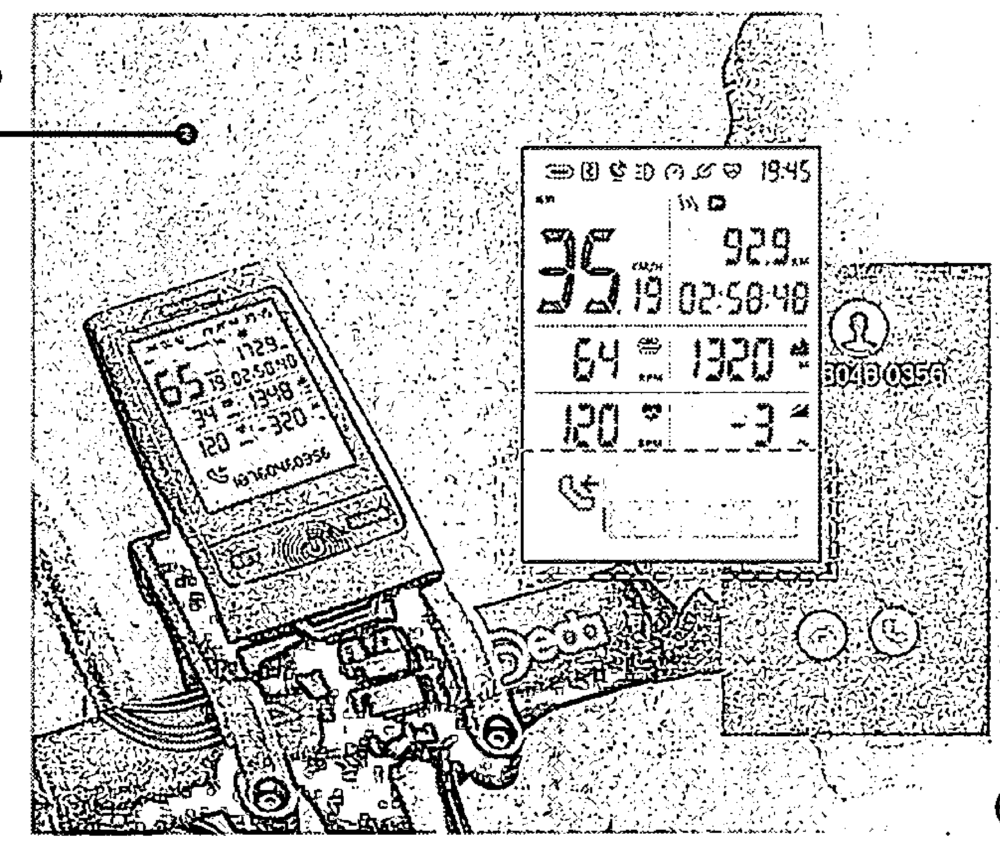

## 有道翻译蛋

有些朋友可能会考虑出国游玩。见识一些不一样的异域风光固然值得让人欣喜，但并不是每个人都有着出色的外语口语，交流就成了大问题。好在目前的数码翻译设备已经实用化，可以为我们解决这一问题了。

有道词典在国内翻译市场名列前茅，它采用有道神经网络翻译，支持中、英、日、韩、法、俄、西、葡、泰、印、意、德等27种语言。有道翻译蛋（图15）就是基于有道词典的硬件产品，体积仅有65克，但其功能却十分强大。它支持6小时持续使用，最长待机达到168小时，可以让手机得到彻底解放。

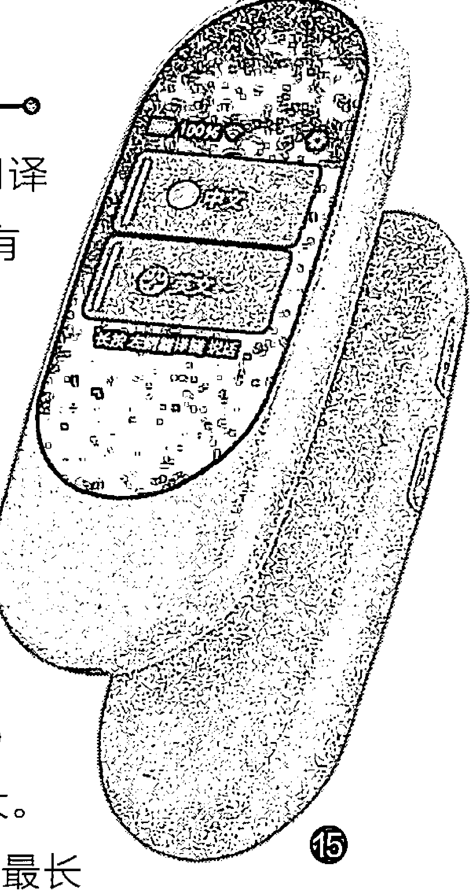

## 小爱老师

小米今年推出的新AI产品小爱老师（图16）是一款英语外教，也同时拥有强大的AI翻译功能。

这款产品内置以牛津词典为首的五大权威典籍，并搭配金山词霸、互动百科两大知识库，有着25万个英语词条和20万个汉语词条的权威词库作为坚实后盾。

在学习英语方面，小爱老师可以通过AI发现发音不标准的音标，更可对口语跟读进行评测打分，帮助用户锻炼一口流利的口语。而在翻译能力方面，小爱老师支持中、英、日、韩、德语离线翻译，34种语言在线翻译，可覆盖190多个国家和地区，让游客不再惧怕陌生的城市。其4G网络版还支持长达18小时的移动随身Wi-Fi功能，即使身在异国也不再惧怕断网的困扰。

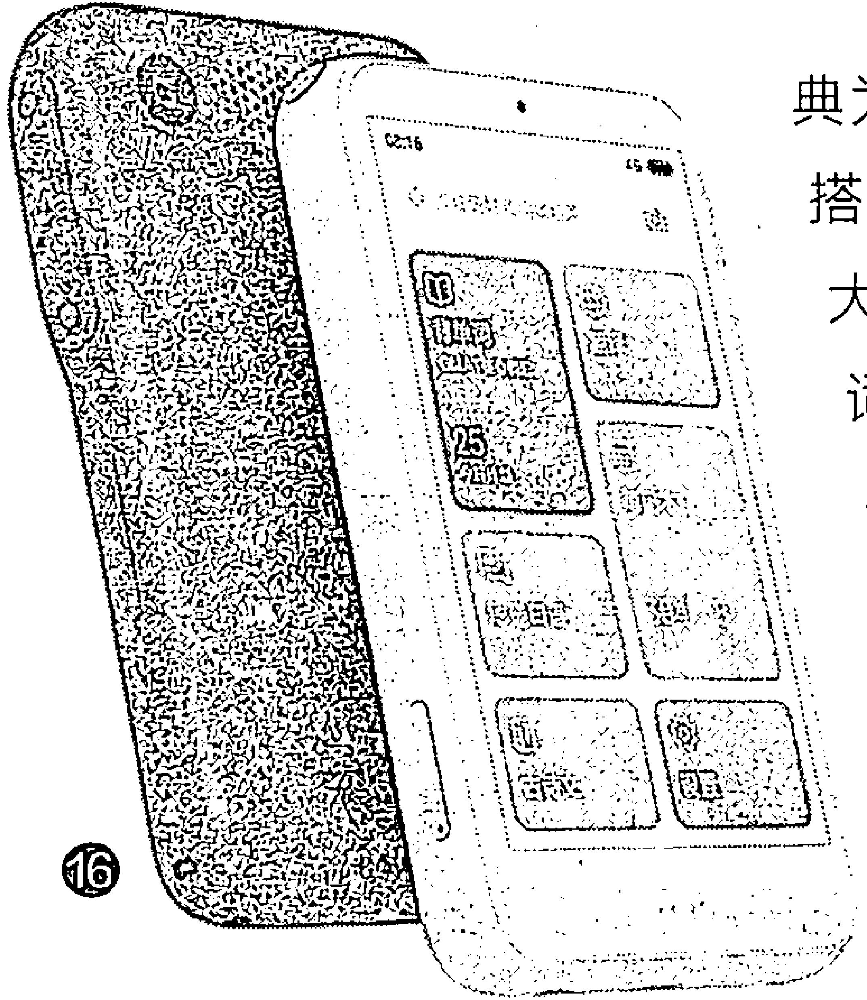


## 续航

> 在这个智能时代，设备没电或许是当代人最大的焦虑。应运而生的移动电源五花八门，如何选择一款适合自己的移动电源来提升设备续航是很多人面临的问题。

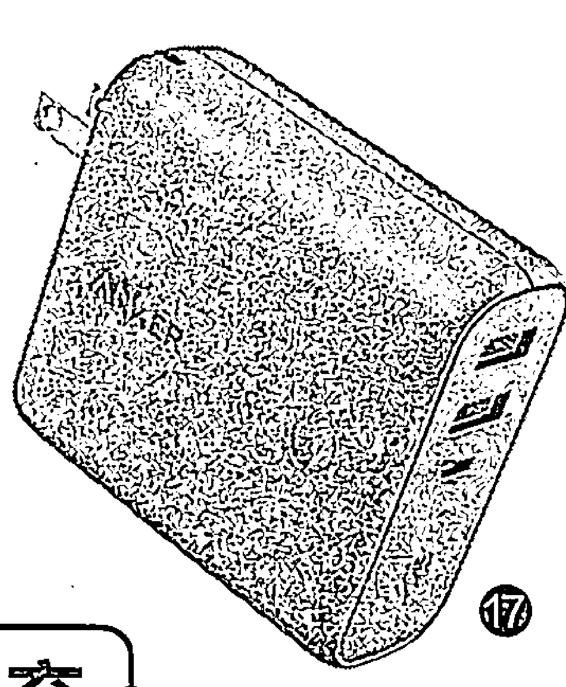

### 安克超级充

安克(Anker)一直是移动电源领域的金字招牌，产品质量十分出色。它的超级充(图17)产品将充电宝和充电器合二为一，在充电器状态下，Anker超级充可提供最大5V/2.1A的输出，双USB Type-A、单USB Type-C的接口可以满足用户多设备充电的需求，减少旅途中需要携带的充电器数量；移动电源模式下则拥有5000mAh的容量和5V/3A的充电输出能力。

Anker超级充提供了PowerIQ智能充和VoltageBoost压降补偿技术，不但可以为不同的设备智能匹配充电电流，更可以让电压始终维持在5V以上，保证足够的充电速度。

### 紫米QC快充10号

任天堂初代NS的续航时间曾经是个大问题，而市面上的很多移动电源又不能为它充电，好在我们找到了这款可以为NS提供电力的紫米(ZMI) QC快充10号移动电源(图18)。

紫米QC快充10号支持双向快充，45W输入最快3.8小时即可充满20000mAh款产品，使用18W充电器充电也仅需5.5小时。其USB Type-A口可以实现5V/2A、9V/2A、12V/1.5A输出，USB Type-C口更可实现40W输出。

其实不仅是NS，最高40W输出的紫米QC快充10号还兼容支持PD充电的笔记本设备，并为其提供USB HUB功能，拓展出两个USB2.0接口，不但可以接驳鼠标、键盘，更可以插入闪存盘读取文件。


## 总结

> 随着手机屏幕越来越大，为了保证便携性，从硬件配置到软件功能，再到电池容量，其实一直在进行妥协，因此它虽然拥有了近乎一切的功能，但也因此难以面面俱到。结合旅途需求选择一款合适的专业向数码产品不但能够提升秋游质量，还能解放被手机中烦躁推送占据的双眼，发现更多美好的景色，何乐而不为呢？


# 手机的进化之路

# 深入了解开发者选项

策划《电脑爱好者》编辑部

和iOS系统相比，Android具备开源的优势，在可玩性和普及性方面有着先天优势。当你买到Android手机之后，如果你一直都墨守成规使用厂商预设的系统功能，虽然可以获得最稳定的使用体验，但却可能失去了更多有趣的功能和玩法——在每一款Android手机系统的背后，都隐藏有“开发者模式”，而它也是让用户从“新手”向手机“玩家”转型的突破口之一。本期特别话题，就让我们简单聊一聊开发者模式那些事儿吧。


扫一扫，更多精彩内容立现！

## 初探开发者模式

Android是一套开放的系统，谷歌在研发伊始就给开发人员留了“后门”，也就是我们常说的“开发者模式”（对应Android系统的“开发者选项”，有些品牌还会译为“开发人员选项”，考虑到通用性，全文我们都以开发者选项为例）。

## 开发者模式的用途

在这里，开发人员可以调用更多的接口，对系统各项功能进行测试和故障排查（图1）。其中，最为核心的一项接口功能是“USB调试模式”，它可以让PC在Android设备中读取/写入数据，绕过系统安全机制进行各种高级操作，比如获取ROOT权限、删除系统预装程序、备份出系统目录下的数据（如微信聊天记录、本地游戏存档、各种加密数据）。


考虑到“开发者选项”中的部分功能会影响到系统稳定性，所以各品牌手机在出厂时都会选择将其屏蔽隐藏。如果用户想使用“开发者选项”中的部分功能，需要手动激活才能在系统设置中让其显现出来。

## 激活开发者模式

无论任何品牌的Android手机，在激活开发者模式时的思路和流程都是相似的（表1）——找到系统详细参数界面，连续点击7次~10次的系统版本号信息就能收到“您已处于开发者模式”的提示（图2），此时我们在系统的高级设置或其他设置界面中就能找到“开发者选项”功能的入口了（图3）。

表1：常见Android品牌手机激活开发者模式的方式

| 手机品牌 | 激活开发者模式的入口 |
| :--- | :--- |
| 华为/荣耀 | 设置→系统→关于手机，连续点击“版本号” |
| 小米/Redmi | 设置→我的设备→全部参数，连续点击“MIUI版本” |
| OPPO/realme | 设置→关于手机，连续点击“版本号” |
| vivo/iQOO | 设置→更多设置→关于手机，连续点击“软件版本号” |
| 一加 | 设置→关于手机，连续点击“版本号” |
| 努比亚 | 设置→关于手机，连续点击“版本号” |
| 魅族 | 设置→关于手机，连续点击“版本号” |
| 三星 | 设置→关于手机→软件信息，连续点击“编译编号” |
| 联想 | 设置→关于手机，连续点击“ZUI版本” |
| 黑鲨 | 设置→关于手机，连续点击“版本号” |
| 华硕ROG | 设置→关于手机→软件信息，连续点击“版本号” |

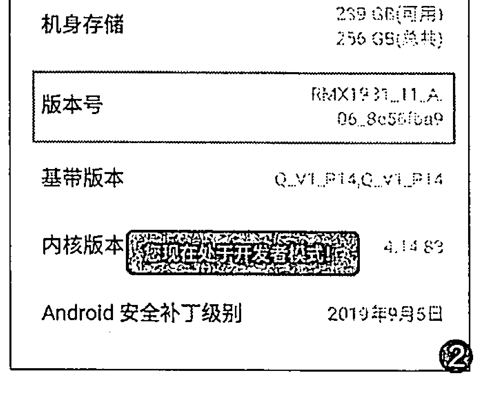

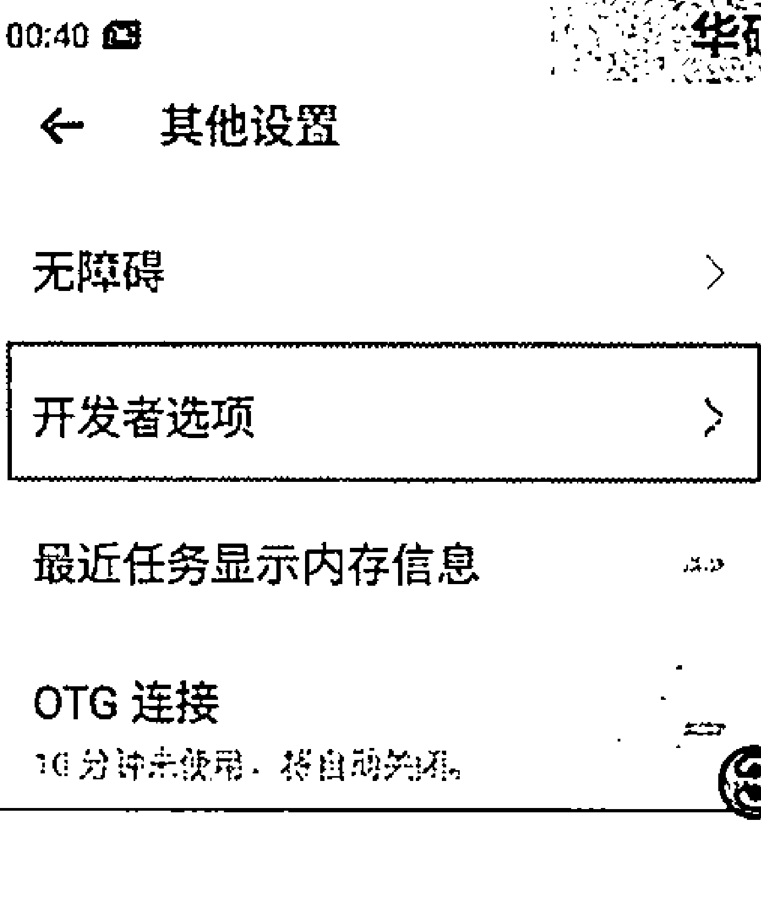

## 隐藏开发者模式

当系统激活开发者模式，开发者选项在系统设置界面中出现后，在默认状态下我们只能手动对其进行开关操作（图4）。如果你觉得开发者模式长期处于显示状态存在安全隐患，想将其继续隐藏，要么选择恢复出厂设置（所有数据都会消失），要么在设置中找到“应用管理→设置→存储”，通过“删除数据”方式恢复默认的设置内容（图5）。第二种方式虽然不会影响个人数据，但设置中曾连接过的Wi-Fi、息屏时间、铃声音量振动设置、指纹和人脸识别信息等都会被还原，需要重新进行设置。

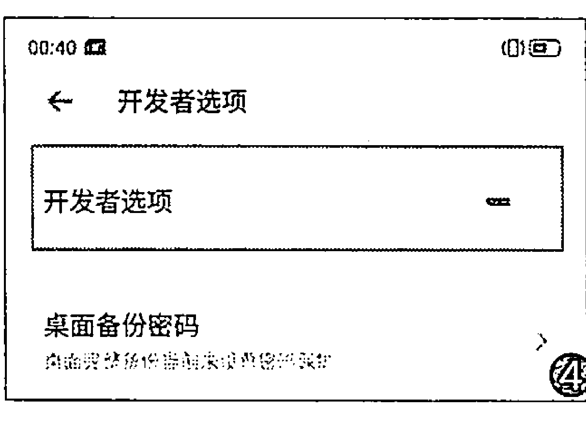

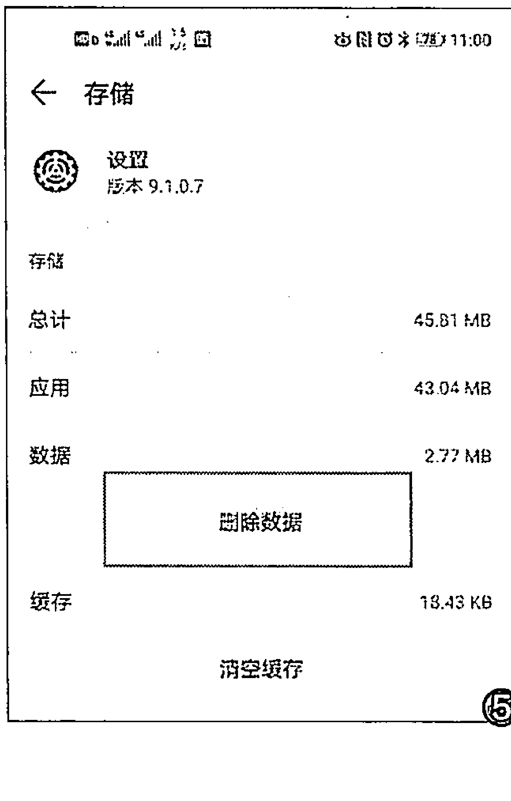

## Android的其他隐藏模式

除了开发者模式以外，Android系统手机其实还有3个隐藏模式（功能），它们分别为BootLoader、FastBoot和Recovery。其中，BootLoader常被玩家称为“BL锁”，它是操作系统内核运行之前运行的一段小程序，通过这段程序用户可以调用、修改操作系统的内核。更具体的原理大家无需费心查阅，只要知道当你想给手机刷入第三方ROM/Recovery、官方修改版的ROM或拯救非硬件故障导致的无法正常开机使用的手机，第一步就是要解BL锁。很遗憾，现在越来越多的Android厂商都不再允许用户自行解BL锁，因此刷机的难度越来越高，也越来越专业。

Fastboot即快速启动模式，它是用于和电脑进行通信的协议，通过USB线与电脑相连后，电脑端就能向处于Fastboot模式手机的系统分区中写入数据（通常为.img镜像格式文件）。看着很熟悉？没错，Fastboot模式就是所谓的“线刷”模式(图6)，通常是在手机关机状态同时长按电源和音量加键开机的方式进入。

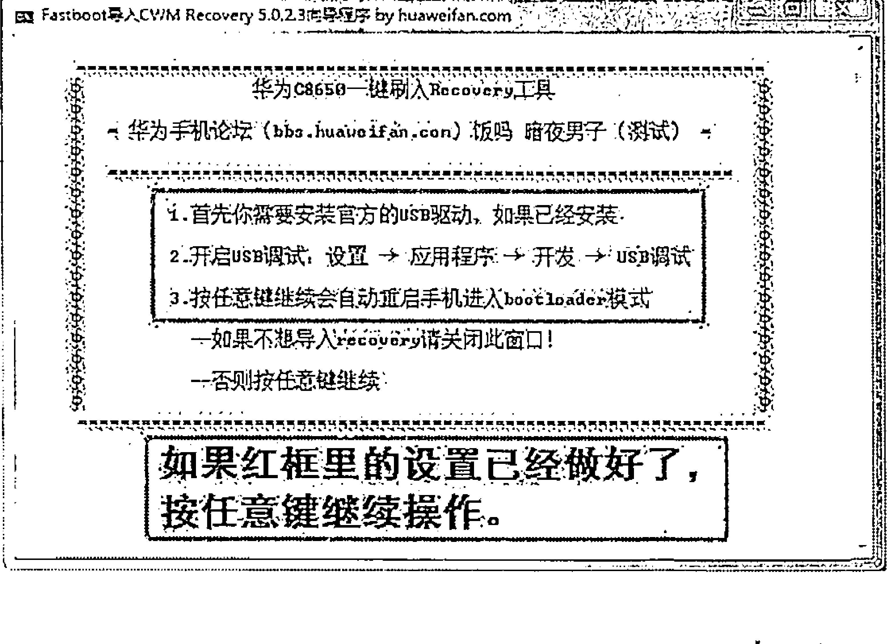

Recovery即恢复模式，它是处于系统底层的一套小型的管理系统，可以用于清除Cache和用户数据，或是刷入手机存储空间保存的update.zip升级文件进行刷机。没错，Recovery就是玩家常说的“卡刷”模式。想刷入第三方ROM，往往需要先刷第三方Recovery，后者可以提供比官方Recovery更丰富和高级的功能(图7)。

随着Android系统愈加成熟，OTA空中升级的方式越来越稳定，绝大多数普通用户都很难与上述3个模式打交道，只有需要刷机的专业玩家或维修人员才会经常用到。因此，我们只需做到简单了解即可。

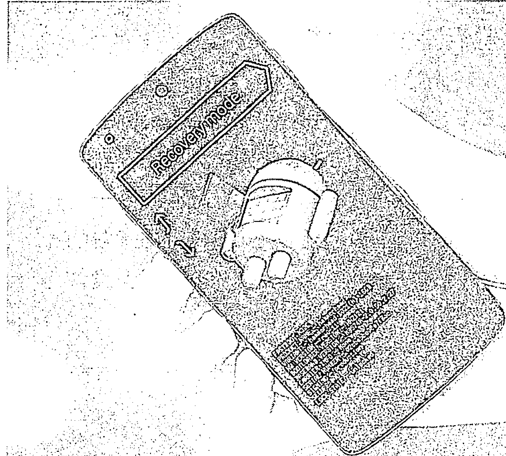

## 开发者选项功能详解

在各大手机品牌中，华为/荣耀旗下手机的开发者选项中集成的功能最丰富（包含常规功能、调试、网络、输入、绘图、硬件、媒体、监控、应用共计9大功能模块），所以本章节我们就以EMUI/Magic UI系统为例，详细了解其开发者选项中各个设置的功能和意义。

### 常规功能

手机厂商往往会将一些原本应该处于系统设置，但使用率不高的功能转移到开发者选项的常规功能列表中，这部分设置的开与关不会对系统稳定性造成影响。

#### 开发人员选项

控制开发者选项整体功能的开关，只有当这个勾选处于开启状态才能使用开发者选项中涉及的功能。当你激活开发者模式后，平时建议将其设定在关闭状态，可以最大限度避免可能的安全风险。

#### 内存

如今主流价位手机标配内存都是4GB起步，而顶级旗舰则可武装最高12GB的内存容量。那么，到底多大的内存才够我们“折腾”？在开发者选项→内存中，我们就能看到关于内存使用量的统计，它能以3小时、6小时、12小时和1天为单位（图1），查看你调用了多少APP和内存的平均使用量，点击“各应用使用的内存”还能看到APP在某个时间段内占用内存量的排行。

从笔者手机平均4GB左右的内存使用量来看，6GB起步的内存才算够用。当然，对于4GB内存的手机，其后台管理机制也会更加激进，它们会通过随时清理后台驻留的APP来调节可用剩余内存的冗余量，日常使用也很难出现卡顿和内存不够用的情况。只能说，内存容量越多，系统可调用内存的冗余越高，你就能在后台锁定更多常用的APP保证其时刻处于运行状态。

- 内存
- 提交错误报告
- 锁屏
- 桌面备份密码
- 保持唤醒状态
- 开启蓝牙HCI信息收集日志
- 正在运行的服务
- WebView实现
- 启用多进程WebView
- 自动系统更新
- 演示模式

| 项目 | 值 |
| --- | --- |
| 性能 | 正常 |
| 总内存 | 6.0 GB |
| 系统预留 | 509 MB |
| 平均使用量 | 54% |
| 平均可用值 | 3.43 GB |
| 各应用使用的内存 | 过去3小时内有55个应用使用了内存 |

#### 提交错误报告

当系统出现Bug或不稳定的现象时，可以通过该功能生成“互动式报告”和“完整报告”并将其提交给相关人员（图2），主要用于手机上市前测试人员的反馈，和普通消费者关系不大。如果你平时就已经启动了系统设置中的“用户体验改进计划”，那就更不用理会这个提交错误报告的功能了。

#### 锁屏

当关闭锁屏功能时（需要先输入锁屏密码进行验证），每次按下电源键就能直接进入系统。但是，关闭锁屏的同时，你此前添加的指纹、人脸识别信息都会被瞬间清空，银行等支付类APP使用指纹登录和指纹支付时都需要重新添加指纹和进行验证，如需必要千万不要选择关闭！

#### 桌面备份密码

如果你不希望自己手机的桌面信息随便被别人备份，可以通过这个选项对其加密。不过，随着指纹和人脸识别功能的引入，这个选项已经没有什么实际意义了。

#### 保持唤醒状态

打开该功能时，当手机处于充电状态时屏幕将始终处于亮屏状态，而无需我们进入显示设置中修改熄屏时间，适合炒股期货的盯盘、长时间追剧和看小说的用户。不过，考虑到OLED材质屏幕长时间显示相同画面存在烧屏的隐患，不建议OLED屏幕手机长期使用这项功能。

#### 开启蓝牙HCI信息收集日志

打开这项功能后，蓝牙设备与手机相连时发送的数据包都会被记录下来，主要用于开发人员进行测试和Bug的修复，普通用户可以无视之。

#### 正在运行的服务

我们可以将这个功能理解为Windows系统中的任务管理器（图3），在这里你能知道所有驻留后台的应用以及它们所衍生出的各项服务所占用内存的情况，点进某项服务后可随时强制关闭运行。

#### WebView实现

很多APP都内置了Web网页，而WebView实现的主要作用就是通过谷歌浏览器和相关服务加载网页，对普通用户而言基本无意义。

#### 启动多进程WebView

开启这项功能后可有效增加APP的运行内存，减少由WebView引起的内存泄露对主进程内存的占用，可有效避免主进程闪退的问题。但是，由于多进程WebView占用更多内存也容易触发系统回收机制，导致每次将APP切换到后台再调出时都会重新启动，所以同样不建议普通用户开启。

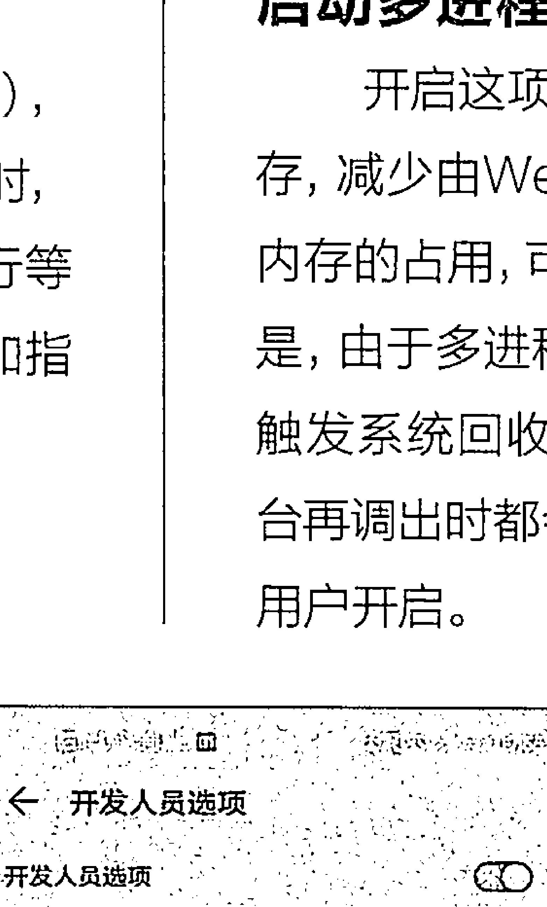

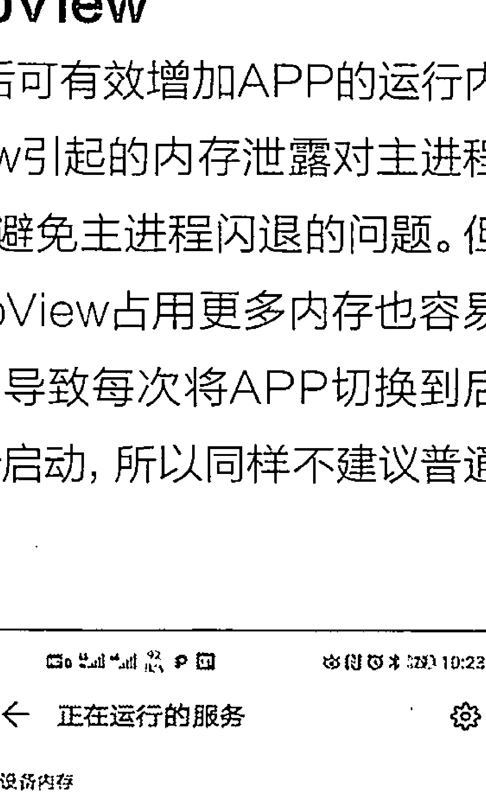

#### 自动系统更新

OEM厂商会不定期推出固件升级来提升性能和稳定性，又或是增加新功能修复Bug。但如果你是一个“念旧”的人，或是觉得当前系统版本非常好用，担心新固件出现费电或其他潜在的问题，关闭这项功能后系统就不会自动“偷偷”更新了。

#### 演示模式

打开演示模式后，系统会删除顶部状态栏内除了信号、时间、电池信息以外的其他通知和功能图标，电量也将始终显示在100%的状态（图4），以便我们做出更“干净”的截图，非常适合媒体评测时使用。

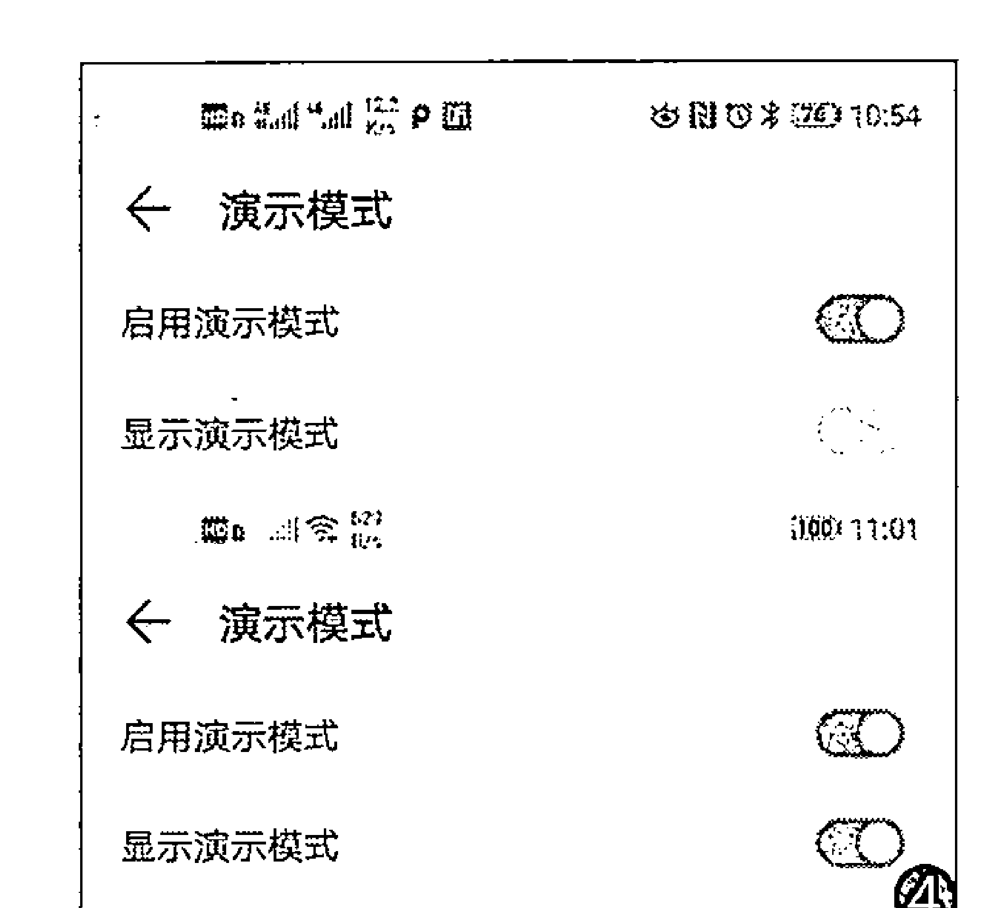

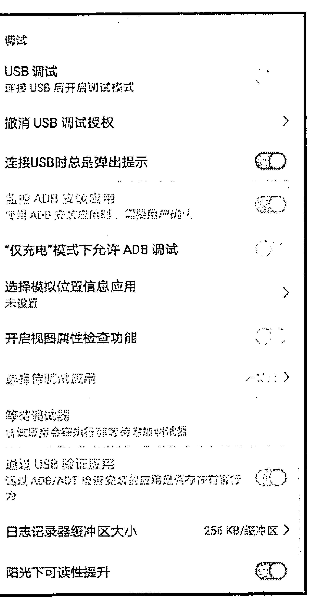

### 调试

调试的相关功能主要用于比较专业的玩家和开发者，普通用户与其接触最多的就是“USB调试模式”，打开它是手机通过PC进行高级操作的前提条件。

#### USB调试

开启USB调试功能后，手机在与PC相连时就能使用ADB命令进行系统级文件/程序的修改、写入和删除、清除锁屏密码等，很多刷机类软件也需要手机在开启该功能后才能正确识别出手机型号。站在安全的角度来看，除非必要，USB调试模式应该始终处于关闭状态。

#### 撤销USB调试授权

手机通过USB调试与PC互动前需要授权PC使用USB调试的权限（图5），如果你曾在朋友家、手机维修店、打印店等场合连接过PC且授权过USB调试权限，可以通过这项设置取消对这些PC的授权，下次连接时需要重新点击允许授权的确认按钮。

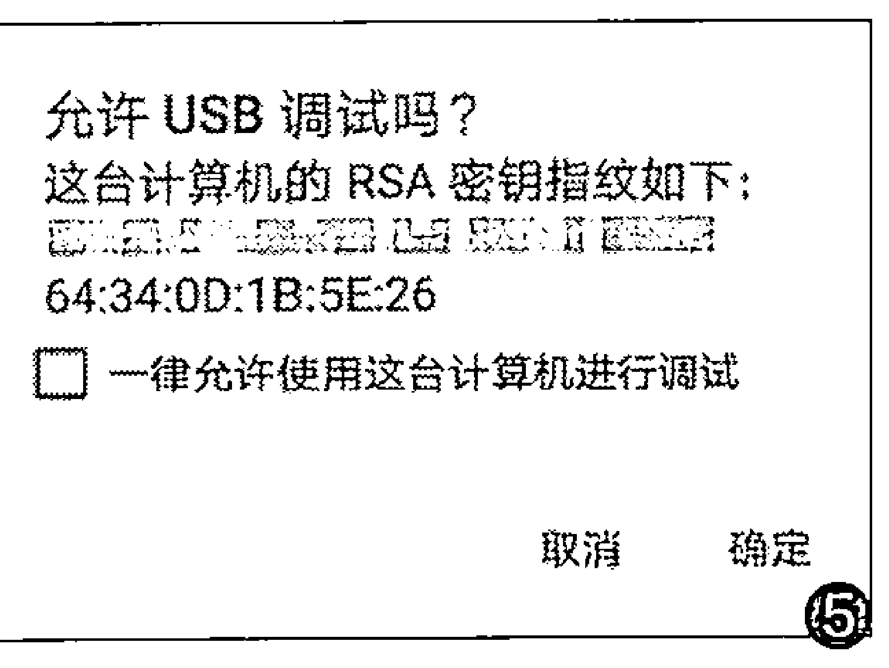

#### 连接USB时总是弹出提示

手机通过USB线与PC连接时总会弹出让你在仅充电、传输文件和传输照片等模式间选择的窗口（图6）。如果你不希望每次都看到这个窗口，将这项功能关闭即可，日后连接PC想修改USB连接模式时，可以通过下拉菜单找到相关通知的方式再进行选择。

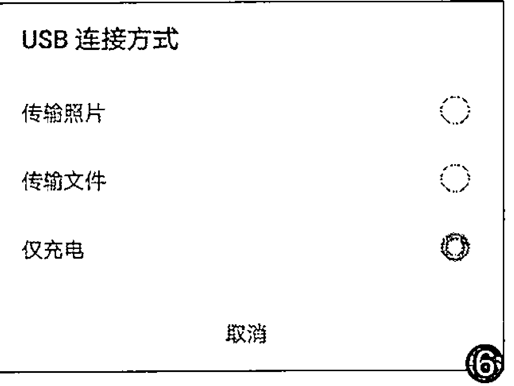

#### 监控ADB安装应用

在USB调试模式下，手机可以通过PC端的ADB命令安装任意第三方应用。如果你的手机经常与PC“互动”，打开这个选项可以降低PC端软件偷偷在手机里安装恶意应用的风险，只有经过你同意ADB命令才能成功安装应用。

#### “仅充电”模式下允许ADB调试

在打开这项功能时，手机与PC连接后无论处于哪种传输模式都能使用ADB命令。如果该功能关闭，在“仅充电”模式下连接PC会没有反应。

#### 选择模拟位置信息应用

类似于系统预装的“位置穿越”功能，但支持该功能的APP非常少，笔者手机里安装了数十个APP，但只有途牛在该项功能的列表中（图7），可见其并没有什么意义。很多第三方虚拟位置的APP都能实现类似功能，而且兼容更多APP。

#### 开启视觉属性检查功能

专业开发人员用于Android系统视图（存储在数据库中的查询的SQL语句）属性的检测，对普通用户而言没有任何意义，建议始终保持关闭状态。

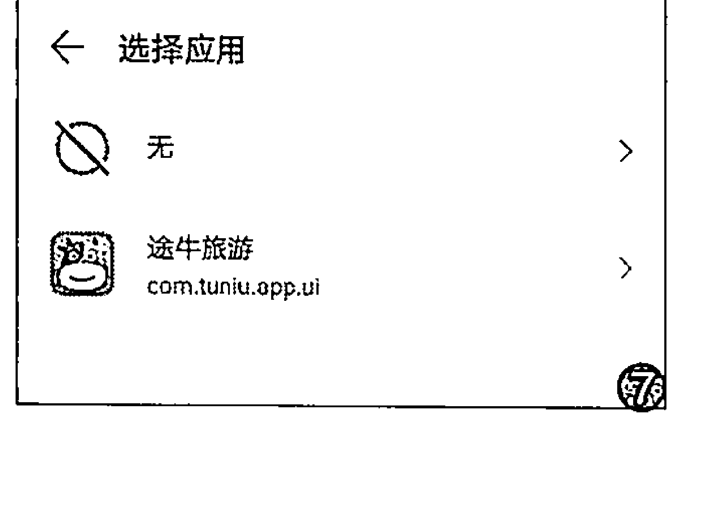

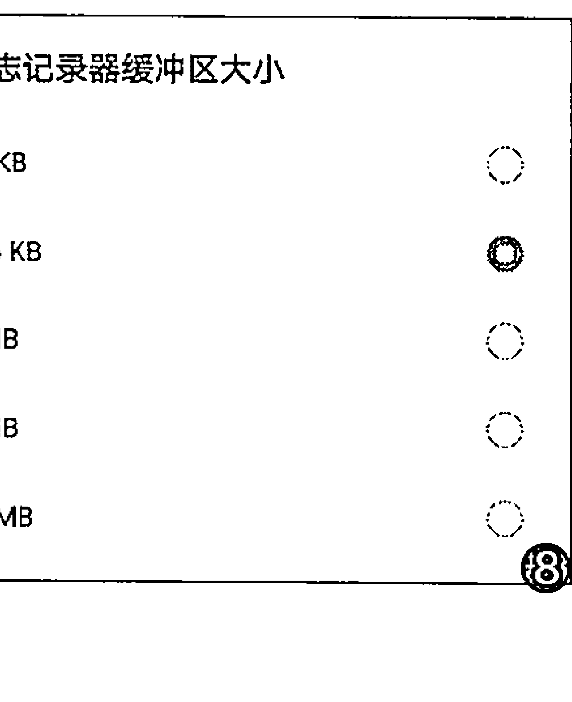

#### 选择待调试应用

用于PC端对手机内置APP进行调试的功能，厂商一般不会开放给个人用户，该选项默认处于灰色不可选的状态。

#### 等待调试器

在上面功能的基础上，调试应用会在执行前等待附加的调试器，同样处于不可选状态。

#### 通过USB验证应用

一种通过ADB安装软件时的安装机制，默认处于开启状态，打开USB调试功能后可以手动关闭，但建议保持在默认启动的状态。

#### 日志记录器缓冲区大小

该功能主要是用于给工程师反馈手机使用信息与记录便于分析问题，对普通用户无用，可将其设定在更小的64KB以节省空间（图8）。

#### 阳光下可读性提升

类似于对屏幕亮度的“超频”，在日光下进一步提升屏幕的最高亮度，以便用户在户外也能看清屏幕里的内容，只是在这个模式下色彩可能会出现偏色泛白的问题，是通过降低屏幕显示质量换取更清晰显示的功能。

### 网络

虽然名为网络，但在这个框架下的开发者功能却涉及到方方面面，但总体还是以有线/无线的连接和网络设置为主。

#### 开启WLAN详细日志功能

开启该功能后，系统会自动记录你所连接过的所有Wi-Fi热点的SSID（热点名称）和RSSI（信号强度），可为开发人员优化网络参数设置提供参考，对普通用户而言意义不大。

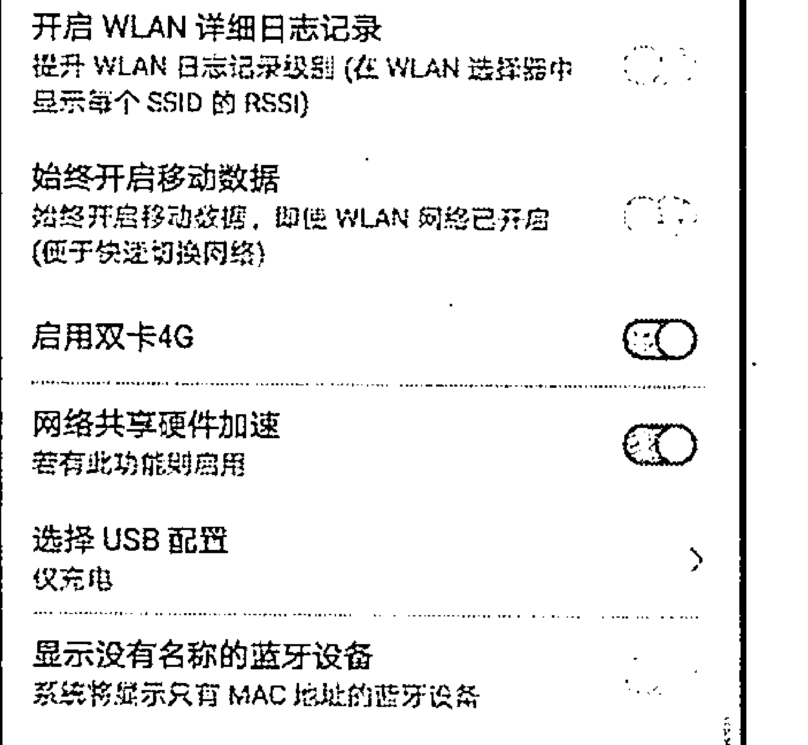

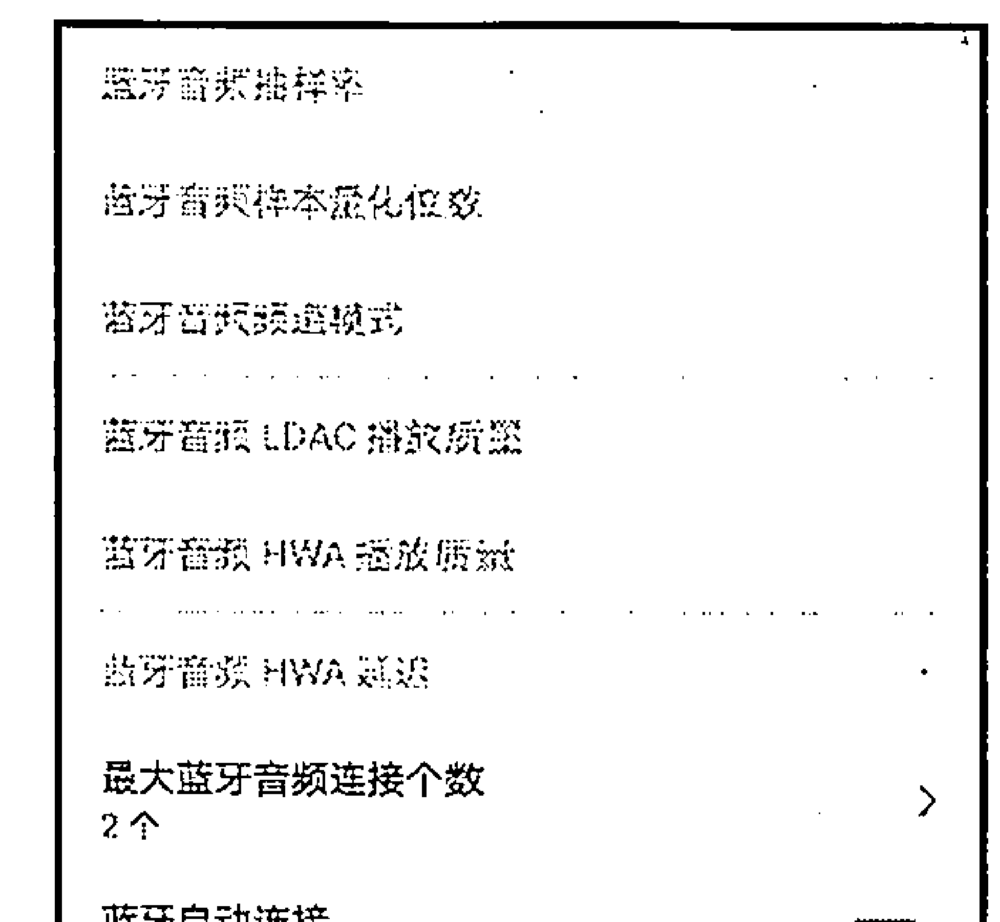## 始终开启移动数据

打开后，手机的4G网络将始终开启，当Wi-Fi信号不佳时可能会自动切换到4G网络，通过消耗流量换取更好的上网质量。如果你每月流量套餐总是不够用，请谨慎开启此类功能。

#### 启动双卡4G

如今新款Android的基带芯片都支持双卡双4G，并将其作为默认的网络参数设置。如果你觉得双4G存在费电的小缺陷，可以在这里选择将其关闭。

#### 网络共享硬件加速

在使用手机自建热点分享网络时，打开这个功能可以通过处理器、基带芯片和射频天线优化信号的强度和稳定性。如果你经常使用手机作为热点，建议该功能始终处于开启状态。

#### 选择USB配置

在这里可以自定义手机通过数据线与PC连接时默认的传输模式，指定最常用的模式后，每次连接手机就无须手动切换了（图9）。

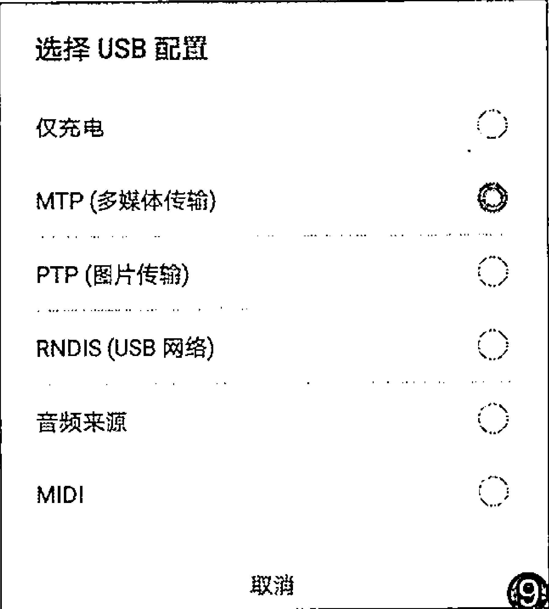

#### 显示没有名称的蓝牙设备

很多专业或私密的蓝牙设备默认是没有名称的，使用蓝牙搜索时根本看不到。开启这项功能后，就能搜到上述蓝牙设备的MAC地址，通过这个信息就能锁定需要连接的蓝牙设备。

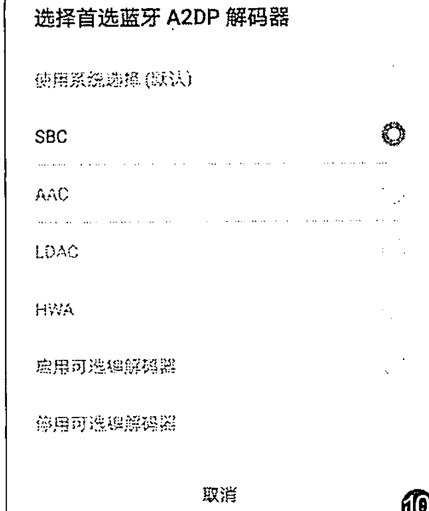

可以根据当前蓝牙耳机选择其所兼容的最好的解码器，从而确保最佳的音质表现。换句话说，蓝牙耳机越高端，可选的解码器种类越多（下同）。有些品牌手机的开发者选项中所有蓝牙解码器都处于可选状态，但只有蓝牙耳机自身支持对应的解码器才能获得应有的音质。

#### 启用默认铃声

当我们使用蓝牙耳机听歌时，如果遇到来电多是使用手机喇叭播放来电铃声（为了防止没有佩戴蓝牙耳机而错过重要通话）。开启这项功能后，来电时铃声就能通过蓝牙耳机播放出来了。

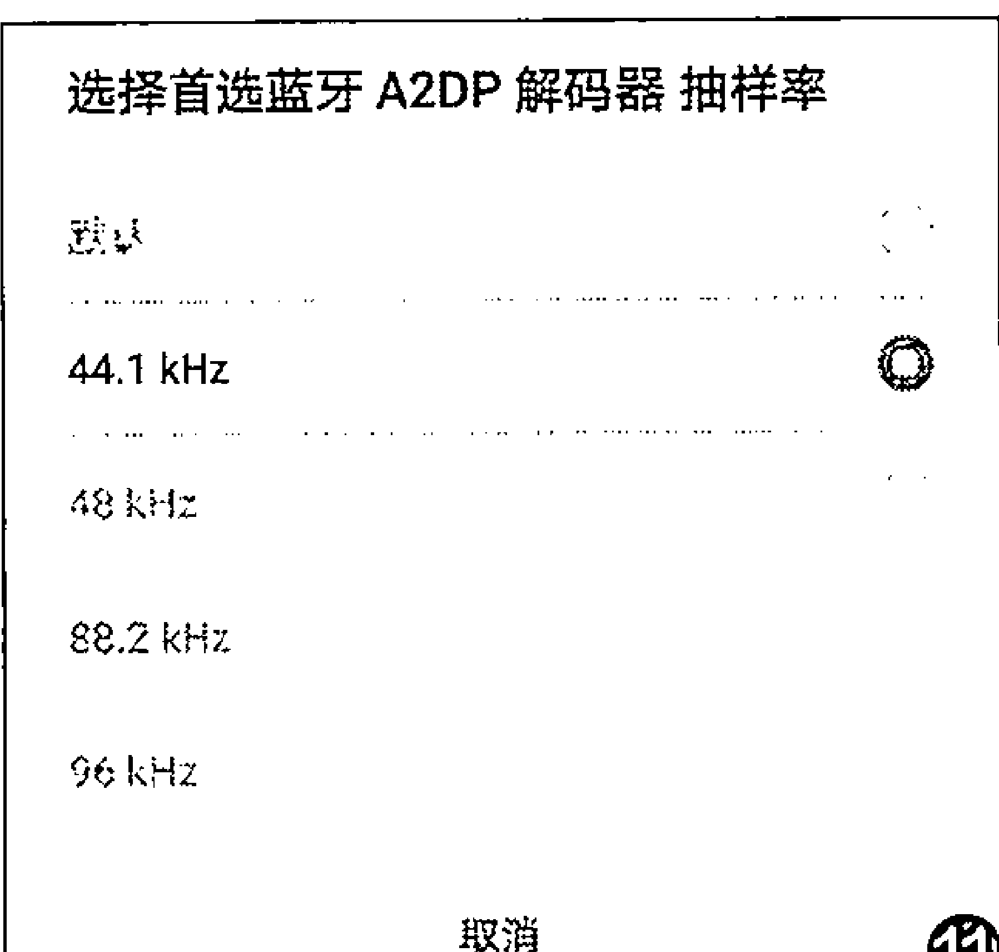

#### 蓝牙音频抽样率

理论上抽样率（采样率）越大音质越好，但如果你经常用蓝牙耳机听在线歌曲（流媒体），存在非整数倍src问题，支持aptX或LDAC的耳机需要手动将采样率设置在44.1kHz时才能确保最佳的音质（图11）。当然，如果你主要听本地歌曲，那就需要调高采样率了。

#### 蓝牙音频解码器

蓝牙解码器通常包含SBC、AAC、aptX、aptx HD和LDAC，音质依次提升（图10）。我们

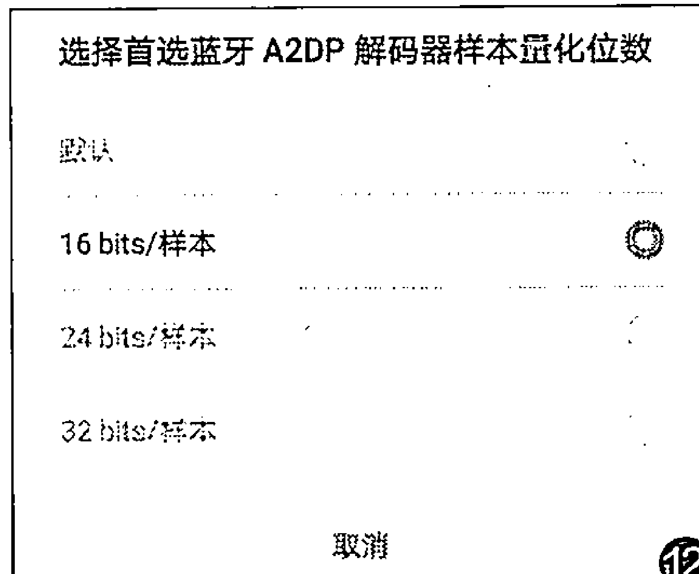

#### 蓝牙音频样本量化位数

这项设置参数的数值越高，音质越好（图12），只是它同样受制于当前连接的蓝牙耳机的品质，越高端可选的样本量化位数越高。

#### 蓝牙音频频道模式

如果不是单耳的会议用蓝牙耳机，想要好音质就请始终设定在立体声模式下吧。

#### 蓝牙音频LDAC播放质量

在连接高端LDAC蓝牙音频设备时才能修改LDAC播放质量，如果你注重音质，可选990kbps传码率传输的媒体音频流；如果周边无线设备太多干扰严重，则可设定为自动调节媒体音频流的传输速率，以达到最好的音质效果，但又不至于发生断连等现象。

#### 蓝牙音频HWA播放质量

HWA是华为主导的高清蓝牙传输协议，只有蓝牙音频外设支持HWA才能调节。

#### 蓝牙音频HWA延迟

只有蓝牙音频外设支持HWA才能调节，可达到降低延迟的效果。

#### 最大蓝牙音频连接个数

手机可以同时连接的蓝牙音频设备个数（图13），比如同时接驳1个蓝牙耳机、2个蓝牙音箱，好处是方便即时切换，省去了重新连接的麻烦，缺点是记混了声音会从错误的蓝牙音频设备上播放出来。所以大家可以根据家里的蓝牙设备数量和自身习惯加以选择。

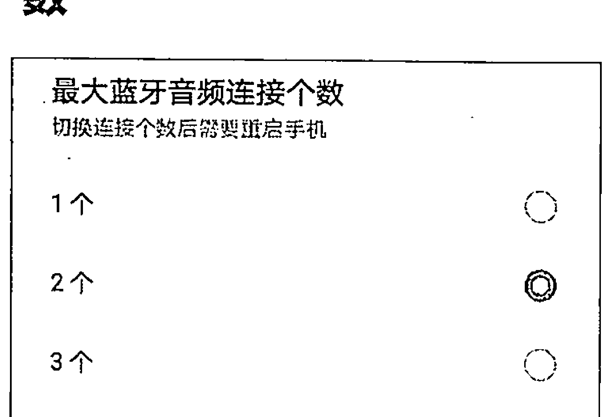

#### 蓝牙绝对音量

蓝牙耳机往往都有独立的音量调节按钮，当你打开这项功能后，蓝牙耳机自身的音量调节将失效，手机当前的音量就是蓝牙耳机的音量。

### 输入

开发者选项的输入功能主要用于演示之用，普通用户无需和它们打交道。

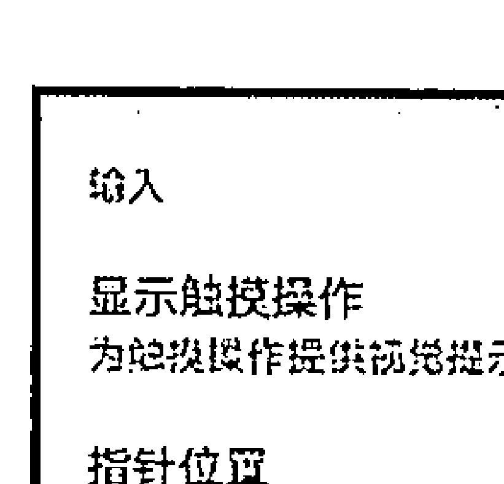

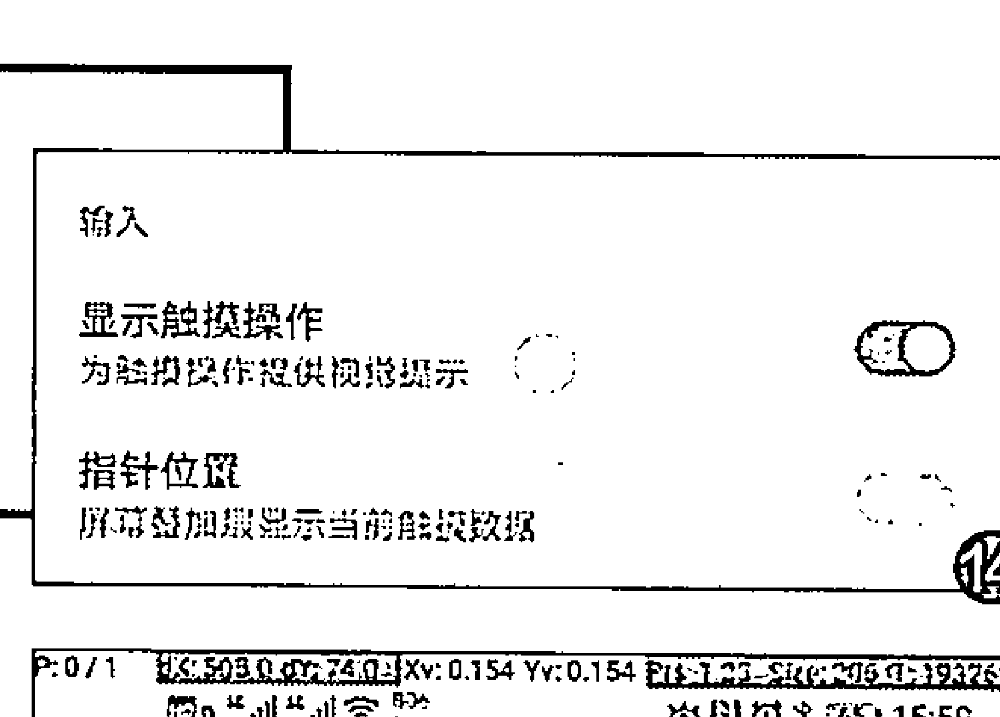

#### 显示触摸操作

打开这个功能后，当手指碰到屏幕时会出现类似鼠标指针的圆圈，利用它录制操作手机的视频时，可以让观看者看到更详细的操作过程，知道你每一步点击的都是什么位置（图14）。

#### 指针位置

这项功能可以记录手指每一次在屏幕上移动的X轴、Y轴和运动轨迹（图15），看起来比较杂乱，可以用于判断屏幕某一位置触控操作的灵敏度，或是否存在触控失灵的问题。打开该功能，手机操作的流畅度会明显降低，所以请谨慎开启。

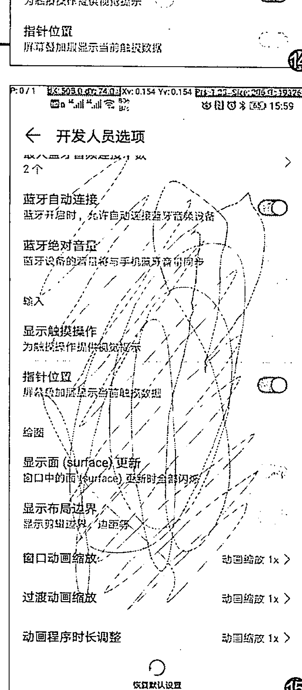

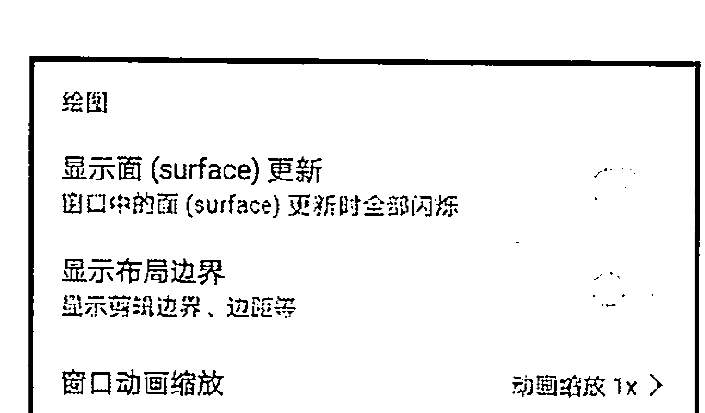

### 绘图

绘图主要收录了和Android系统相关的显示调节功能，其中有不少可以提升体验的设置选项。

#### 显示面(Surface)更新

打开这项功能后，屏幕画面每刷新一次就会出现一次粉色的闪屏，非常晃眼，普通用户千万不要开启。

#### 显示布局边界

该功能主要适用于应用开发者，开启后你将能看到任意APP和当前设置界面的底层布局，可用于查找Bug或是用于自己开发APP时的参考（图16）。普通用户还是不要打开为妙，看着杂乱，还会影响系统速度。


#### 窗口动画缩放

当我们打开某个APP，或APP打开新窗口时，都存在一个过渡的动画切换特效。在这里，我们可以修改这个窗口动画缩放的倍数，关闭动画可以带来秒开的体验，只是缺少了过渡可能存在一些唐突之感。建议将该选项设置在0.5X（图17），速度和动画效果可以兼顾，如果倍数过大就会出现慢动作的感觉。

-   过渡动画缩放
-   关闭动画
-   动画缩放 0.5x
-   动画缩放 1x
-   动画缩放 1.5x
-   动画缩放 2x
-   动画缩放 5x
-   动画缩放 10x

#### 过渡动画缩放

和上面的设置思路相同，建议设定在0.5X倍，以获得更流畅的感官体验。

#### 动画程序时长调整

和上面的设置思路相同，建议设定在0.5X倍，以获得更流畅的感官体验。

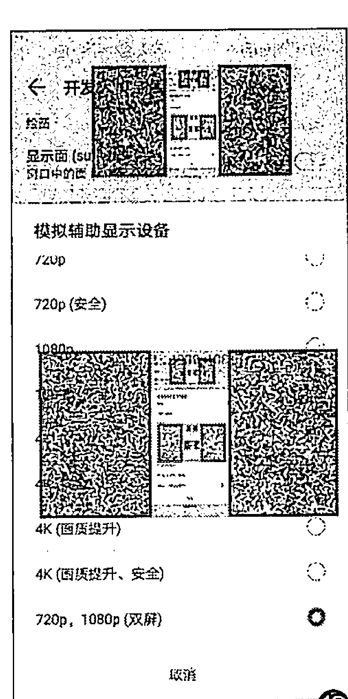

#### 模拟辅助显示设备

打开该功能可以在手机屏幕里出现1个或2个可自定义分辨率的镜像窗口（图18），没什么实际意义，体验和实用性远不如分屏功能，所以不建议大家尝试。

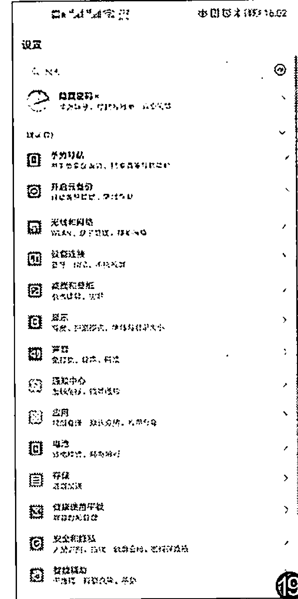

#### 最小宽度

在这里可以修改屏幕显示的DPI，数值越大，同屏可以显示的内容也就越多，文字也就变得越小（图19）。记住默认的DPI后，大家可以按照20为单位，逐渐调大或缩小，从而找到最适合屏幕实际大小和观赏习惯的DPI值。如果发现文字过大、过小或窗口图标被挤压导致显示混乱，修改回默认的数值即可。

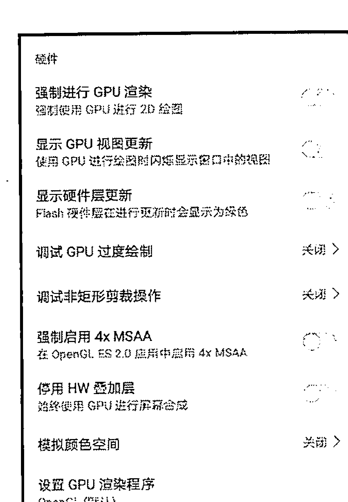

### 硬件

开发者模式中的硬件部分涉及到调用部分GPU性能和功能，有需要的玩家可以尝试开启体验。

#### 强制进行GPU渲染

开启这个功能后可以挖掘GPU的最大潜力，强制让其进行2D绘图，对手机的反应速度和性能有着一定的增益效果。但是，GPU的强制渲染会带来额外的耗电和潜在的兼容问题，不推荐长时间开启。

#### 显示GPU视图更新

该功能和前文提到的显示面（Surface）更新相似，只要画面内容出现变化就会不断地闪屏，普通用户请不要开启。

#### 显示硬件层更新

开启后，只要画面中涉及Flash硬件运行时屏幕就会变绿，主要用于开发人员的调试之用，普通用户同样不必理它。

#### 停用HW叠加层

开启这项功能后，GPU将强制接替CPU的工作，全程使用GPU进行图片叠加等操作。如果GPU足够强大，可以获得更流畅的画面，但如果GPU性能一般则存在卡顿的风险，而且相对更加耗电。综合来看，停用HW叠加层还是处于默认的关闭状态更加合理。

#### 调试GPU过度绘制

针对开发人员的调试功能，用于测试页面布局层次是否合理，处于默认的关闭状态即可。

#### 模拟颜色空间

对色盲或色弱的用户，在这里可以自定义颜色空间，在全色盲、绿色弱视、红色弱视或蓝色弱视间任意切换（图20），从而找到最适合自己的颜色模式。对普通用户而言，可以尝试全色盲模式，此时屏幕将以黑、白、灰三色显示，让手机瞬间变成‘电子墨水屏’，结合护眼模式看电子书时更舒服。

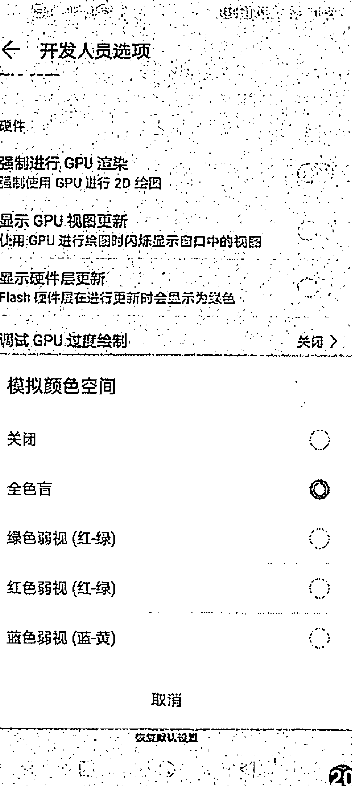

#### 调试非矩形裁剪操作

和上面的设置相同，都是开发人员才会用到的选项。

#### 强制启用4X MSAA

类似于PC游戏设置中的抗锯齿功能，打开它以后，手机在玩OpenGL ES2.0游戏时可看到更平滑的画面。当然，该设置也存在额外的耗电，而且非OpenGL ES2.0图形接口的游戏就无缘享受了。

#### 设置GPU渲染程序

谷歌在Android 8.0时代引入了全新的Skia GPU渲染引擎，只是它的兼容性和适用性还不够完美，所以建议不要修改这项设置，让系统以默认的OpenGL引擎渲染即可。


### 媒体

在媒体中只有‘关闭USB音频转接’一个选项，它的用途是切断USB接口连接音频外围设备的联系。比如，打开该功能后，使用USB音频线与音箱相连时，音箱将无法出声。因此，这个选项大家尽量不要碰，让它处于默认的未启动状态即可。

### 监控

开发者选项中的监控功能，都是方便开发人员检测和修复Bug的工具，而我们也能借助它们测试手机当前的稳定性和流畅度表现。

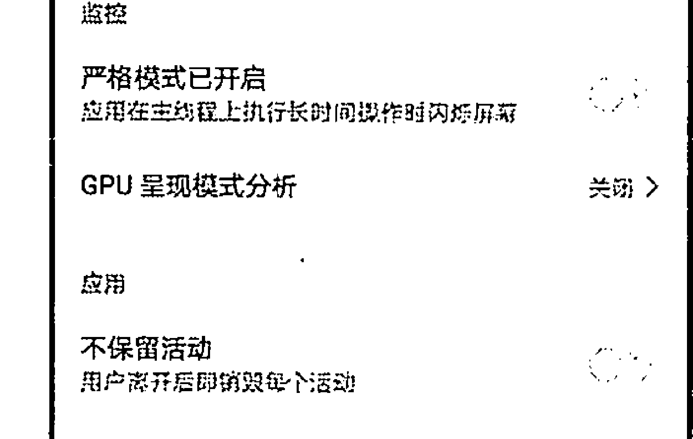

#### 严格模式已开启

严格模式又称StrictMode，它是用来检测程序中违例情况的开发者工具，最常见的场景就是检测主线程中本地磁盘和网络读写等耗时的操作。开启该功能后，只要当前运行的APP出现内存泄露、长时间的磁盘读取/写入和网络操作屏幕就会闪烁，将违例细节暴露给开发者以便优化与改善。

-   GPU呈现模式分析
-   不保留活动
-   后台进程限制

### GPU呈现模式分析

这个功能常被玩家称为判断手机系统卡顿与否的“玄学曲线”，将GPU呈现模式分析设定在“在屏幕上显示为条形图”后（图21），你就会发现手机屏幕上出现了无数道彩色的线条组成的波形图，从左到右动态显示。每一道垂直的线条代表一帧的渲染，随着需要渲染的帧数越来越多，我们也就可以观察到这段时间帧率的变化了。理论上讲，只要有多道竖线长时间超过了位于波形图上方绿色的标记线，就代表你看到的动画有丢帧现象产生（图22）。

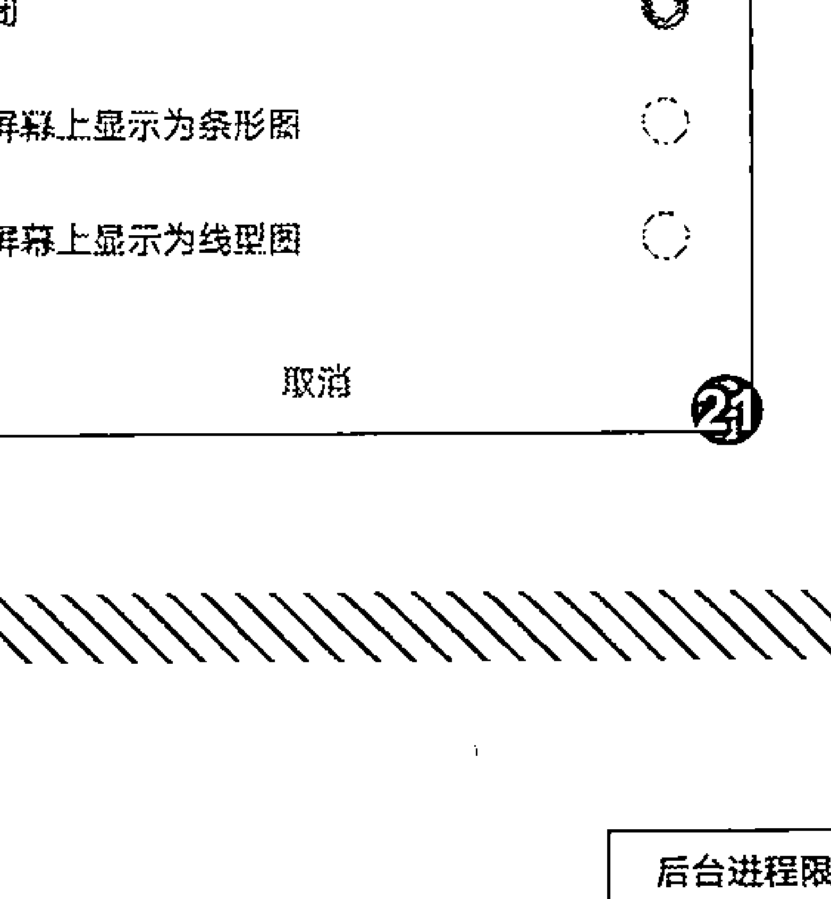

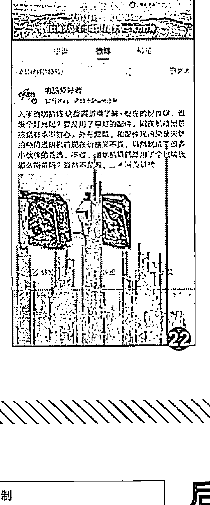

换句话说，GPU呈现模式分析存在的初衷就是帮助开发人员，通过多色线的变化对APP进行有针对性的优化。一套系统、一款应用，只有在运行的绝大多数时间都能保持彩色线条不越过标记线才算完美。

### 应用

开发者选项中的应用功能主要都是用于APP调度的机制，很多设置都与省电管理、后台管理等预设的功能相冲突，所以请谨慎尝试。

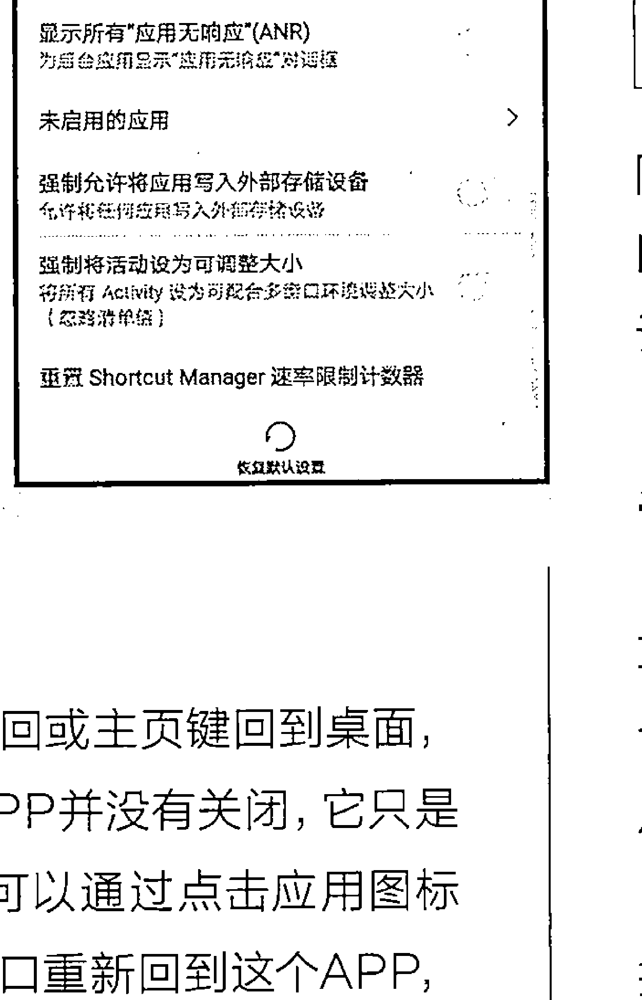

#### 不保留活动

当我们按下返回或主页键回到桌面，之前正在运行的APP并没有关闭，它只是被转入后台，我们可以通过点击应用图标或最近任务的小窗口重新回到这个APP，这种多任务处理的机制便于我们随时在多个应用间切换，从而大幅提高效率。当开启“不保留活动”功能后，所有转入后台的程序都会被自动查杀（切换时需要重新加载运行），哪怕你已经将其设定在后台清理程序的白名单中。换句话说，打开该选项时手机将进入“单任务”模式，可以最大限度起到省电的作用。

#### 后台进程限制


如今手机内存都是4GB起步，省电模块中也都集成了行之有效的后台管理机制，强制开启不保留活动实有浪费之嫌。此时，大家可以通过后台进程限制，指定后台最多可以同时运行多少程序（无限制、0~4个），较之上面的功能更加人性化和灵活一些（图23）。比如将微信和QQ添加到后台清理的白名单，再在后台进程限制中设置为2，这两个应用以外的APP只要转到后台就会被自动清理。

#### 显示所有“应用无响应”(ANR)

打开该功能后，当后台应用因省电机制或其他原因被查杀或崩溃时，系统就会弹出一个对话框，提示当前应用程序无响应，此时用户可以选择“等待”而让程序继续运行，也可以选择“强制关闭”。如果你不希望被无端打扰，这项功能最好处于关闭状态。

#### 未启用的应用

在这里你可以看到后台所有程序和服务的列表，并显示它们当前是否处于被打开的状态（图24）。不过，如今Android手机大都在安全中心中提供了和关联唤醒有关的设置，它要比开发者选项中的未启用的应用更加直观和好用。所以，这项功能基本可以无视。


#### 强制允许将应用写入外部存储设备

这项功能主要用于Android 5.0以前的老款手机，从Android 6以后的手机即便支持存储卡扩充，默认的应用安装路径也都是内置存储空间，存储卡只能保存拍摄的照片和下载/缓存的多媒体文件，开启这项功能也没有效果。

> 小提示
如果你不小心修改了开发者选项中的某个设置而出现系统问题，可以点击最下方的“恢复默认设置”，然后重启手机就能解决。

#### 强制将活动设为可调整大小

很多Android手机都支持分屏，但并非所有APP都支持这项功能。打开“强制将活动设为可调整大小”，绝大多数APP就都能兼容分屏功能了，只是部分游戏类APP在强制分屏时会出现黑屏或闪退问题。

#### 重置Shortcut Manager速率限制计数器

当APP转入后台时，其操作的频率是受限的，打开这个功能后重置这种显示，主要用于开发人员的调试，如果个人用户不小心点击重置了也没什么不好的影响。

## 其他品牌的特色功能

手机厂商可以根据需要，对开发者选项中默认的功能进行添加、隐藏或删除，或转移到标准的设置功能列表中。接下来，我们再来看看OPPO、vivo和小米品牌手机在开发者选项中还有哪些特色功能吧。


### OPPO手机

OPPO和realme品牌都预装了Color OS系统，在上一个章节介绍的开发者选项的基础上，还增加了以下几个特色功能（图1）：

#### OEM解锁

如果你想ROOT手机系统，只有打开这个选项后才能在开机时引导第三方加载程序（图2）。考虑到ROOT存在较大的安全风险且将失去质保，建议该功能始终保持关闭状态。


#### 图片颜色模式

可以使用sRGB色域标准显示图片，适用于屏幕素质更好的中高端手机。


#### 快捷设置开发者图块

Color OS将开发者选项中和图像相关的部分功能集中在了这里，同时还增加了切换输入法和杜比全景声的全局开关（图3），方便用户查找。

#### 显示通知渠道警告

Android平台有着统一的系统来帮助用户管理通知，打开该选项后，如果有APP出现绕过标准渠道发布通知时，在屏幕上就会显示警告，可以帮我们甄别不靠谱的应用。

#### 禁止权限监控

字面意思就是禁止和权限有关的监控行为。笔者在关闭该功能后，安装本地APP或非应用商店下载的APP时仍会弹出申请权限的警告，但从安全的角度来看还是不建议关闭这个功能。

> 小提示
相同品牌的手机，视型号不同开发者选项中的功能也存在差异。一般来说，越新越高端的机型，开发者选项中的功能越丰富。

### vivo手机

vivo和iQOO品牌都预装了Funtouch OS系统，其在开发者选项中存在以下几个特色功能(图4)：

#### 主动从WLAN网络切换到移动数据网络

开启这个选项后，当Wi-Fi信号不稳定或网速太慢时，系统将自动转由通过4G/5G移动数据流量上网。如果你每月的流量套餐有富余，建议打开这个选项，如果总是不够用则建议关闭。


#### 一律允许WLAN漫游扫描

如果你不希望手机在已经连接Wi-Fi时依旧无时无刻都在扫描所处环境中的新增无线热点而空耗电力，那就不要打开这个选项。

### 小米手机

小米和Redmi品牌都预装了MIUI系统，其在开发者选项中存在以下几个特色功能(图5)：

#### 设备解锁状态

查看手机是否处于解锁状态，如果你想要ROOT系统或(线)刷机，需要在这里绑定账号和设备，再通过MIUI官网申请解锁工具(图6)。


#### 强制启用GNSS测量结果全面跟踪

打开该功能后可以增强GPS信号，加快定位速度，经常导航(或所处区域搜星不佳)的用户可以选择开启，代价是会额外增加部分耗电。

#### 选择日志级别

日志级别越高，内含的信息量越丰富，可以帮助开发人员对错误进行定位和分析。但是，开启这个模式输出调试信息是以消耗额外系统资源为代价，普通用户可以选择OFF关闭状态。

#### Feature Flags

和信号栏图标有关的设置选项，如果你希望信号栏更干净，可以选择性地关闭其中的部分设置。


#### 启用WLAN Coverage扩展功能

如果你经常使用手机作为Wi-Fi热点给其他设备共享网络，可以开启这项功能增强信号，否则建议将其关闭。

#### 模拟“刘海屏”

可以让采用标准屏幕(如升降摄像头方案)的手机模拟“刘海屏”，而且刘海的位置也能定义(图7)。该功能主要是为了增加趣味性，没什么实际意义。


#### 一律显示崩溃对话框

当APP出现崩溃时会弹出提示的对话框。

#### 启用MIUI优化

MIUI系统特有的优化选项，建议开启以提升系统性能。

#### 高风险功能开启提醒

打开该选项后，当我们接入有风险的网站(如短信中附带的链接)、安装有风险的APP或是遇到其他高风险操作时都会弹出提示，建议开启。

# 新时代来临

## 攒机迎来新规划

策划《电脑爱好者》编辑部

21世纪的第二个十年即将过去，作为10年代的结尾，对电脑市场来说是不平凡的一年，从核心配件领域里AMD与英特尔处理器不断地逆袭与反击、持续一整年的光线追踪实用性争论与英特尔独显猜想、M.2 SSD大爆发，到周边配件市场中键盘新轴体大量涌现、超大屏显示器快速降价等，都对电脑的配置、形态，乃至应用模式和使用体验产生着重大的影响。其中相当一部分变化会毫无疑问地持续到明年，有些甚至在明年才会逐渐开始展现出其影响力。

在这样的情况下，很多用户对未来一年乃至新的年代中，电脑市场，特别是DIY市场到底会有如何的变化，就产生了极大的兴趣，毕竟这是关系到大家对电脑的期许和对攒机的规划。其实考虑到技术开发的周期，我们会发现，很多明年才能真正成熟的消费级电脑技术与产品，现在都已经露出了端倪，有些还展现过真身。所以，我们就已经可以对2020年的消费级电脑技术、产品、攒机方式等有一定的认识。

那么，在基于已有信息的基础上，让我们来尝试一下对明年的攒机市场进行一次预测吧。虽然不一定完全准确，但应该能对大家未来的攒机与使用有所帮助。

## 重点产品

要了解明年的电脑市场，就必须知道会有什么样的产品改变它。这里笔者就根据自己的理解，梳理一下对我们的读者影响力比较大的产品吧。

### 英特尔Xe独显

毫无疑问，目前对电脑应用、升级的最大推动力还是游戏娱乐，而对游戏影响最大的配件就是显卡，因此在英特尔宣布进入目前双强争霸的独显市场后，受到了很多用户的关注。

从目前得到的信息来看，英特尔对Xe的准备非常充足，在规格、技术方面也比较先进。在开发方面，英特尔吸引了很多有经验的显卡开发工程人员和管理人员，负责人更是成功组织开发了多款A卡的业界大拿级人物。同时英特尔也充分借鉴了自己在处理器、核显、数据中心等方面成熟和成功的经验，引入了微架构技术、软件技术等。

英特尔Xe GPU架构的具体特点仍然需要等待一段时间才会正式公布，不过目前Xe架构的一个重要特点已经被证实，那就是它将同时包括两个微架构，分别针对高性能和低功耗应用。

一些分析师认为这种设计其实是分别针对数据中心高性能计算和消费级游戏的，在消费级显卡中实际上仅开放了低功耗架构，但笔者认为这种可能性不大，毕竟消费级游戏对独立显卡的压力需求绝对不弱于数据中心。

在大家最关心的性能和特效支持方面，英特尔表示在电影工业上，它已经积累了大量的光线追踪处理经验和相关技术，这一表态似乎可以说Xe独显是支持光线追踪的，但如何实现仍然不明确。毕竟在服务器上处理视频的光线追踪特效时，是由软件提供基本架构，依靠集群的总算力进行处理，而且是进行精确的追踪计算，这与游戏的实际需求显然是不同的。从目前英特尔的能力来看，Xe显卡的光线追踪能力很可能会采用软件方式实现，由服务器进行相应的优化甚至前期处理。

在Xe独显的技术规划上，我们会发现很多与目前主流独显不同的设计，有些甚至是颠覆性的。对目前的独显两强来说，这样的设计是难以想象的，但掌握着底层软硬件规划能力的英特尔却有可能实现。为了提升其独显的可行性，英特尔还发布了相应的oneAPI，让开发者可以发挥Xe架构的最强性能。例如英特尔提供的光追渲染工具包，就可以在包括《坦克世界》在内的多款游戏上提供出色的光追性能支持，而代价就是必须使用进行了相应优化的程序文件、客户端。

在充分利用软硬件的底层控制能力后，英特尔甚至宣称其GPU可以在笔记本电脑、台式机，乃至未来能扩展到的各种平台上提供一致性的用户体验。这一表态似乎也说明了英特尔对显卡市场的巨大野心，除了再次兴起的云游戏之外，它也极有可能会借此向游戏主机、手机等平台发起一轮新的“进攻”。

至于价位方面，从之前英特尔在独显市场上的表现以及被其认可的想象图上看，Xe显卡，或者至少是其低端版产品的价位应该是主流偏低（图1），笔者预计其售价在1500元左右甚至更低。至于体型大得多的想象图（图2）是高端消费型号还是服务器加速卡，就不得而知了。

### 第十代酷睿与第四代锐龙

继续使用14nm工艺的第十代桌面版酷睿处理器并没有因此归于平庸，其规格反而会有少见的大规模变动。从目前测试软件数据库等途径得到的信息，它会在酷睿i3、i5中引入超线程技术（图3）。这样在主流处理器市场中，就会出现英特尔与AMD同档次处理器核心、线程数量基本持平的情况。与此同时，针对无核显产品的降价也使得英特尔第九代酷睿与AMD第三代锐龙同档次处理器的价格极为接近。

很明显，如果第十代酷睿的配置确实如目前情报一样，并继续提供廉价的无核显产品，将对第三代甚至第四代锐龙造成极大的压力。即使第四代锐龙能如预估的那样继续提升单核效率，也难免与第十代酷睿陷入苦战。

### AMD新架构显卡与英伟达的应对

目前AMD的新架构显卡已经有针对入门电竞市场的RX 5700系列和针对入门游戏市场的RX 5500（图4），但这显然还不够。从价位和应用能力上看，RX 5500系列价位应该在1000元~1500元，能力是让3A游戏在全高清分辨率下达到60FPS；RX 5700系列价位在2500元~3000元，能力是让3A游戏在2K分辨率下达到90FPS。这两个型号之间显然留下了售价2000元左右、游戏帧速为全高清分辨率90FPS/2K分辨率60FPS这样的价格和性能空白，笔者估计AMD至少会在这一档次提供RX 5600显卡，并将于2020年初供货。至于3000元以上价位，是推出使用目前架构的RX 5800还是在自身的光线追踪技术成熟后再用新核心来弥补，目前仍难以确定。

由于RX 5500的性价比对目前英伟达的入门级游戏显卡GTX 1650存在着非常切实的威胁，因此GTX 1650 Ti或GTX 1650 Super会随之推出，这基本上已经是非常确定的了。在推出时间上，英伟达在同架构上进行修改的“刀工”已经非常成熟，在一两个月内就能从计划变成商品，所以它极有可能会紧随RX 5500全面上市，成为2019年底或2020年初的主力入门级显卡。

此外，目前英伟达实用化的光线追踪显卡价格仍然非常高昂，还称不上进入主流市场，游戏厂商针对其优化、开发游戏的兴趣也受到了影响，这对英伟达的市场显然非常不利，因此其支持更高效的光线追踪，同时成本更低的新一代GPU很可能会很快出现，更新速度会高于前几代产品。

### QLC SSD与PLC SSD的实际定位

随着技术的成熟，QLC SSD应该会在2020年大量上市，它有望将SSD的容量价格比拉到机械硬盘的两倍以内。凭藉数倍的速度与亲民的TB级别产品，它必然会成为主力存储盘的新选择（图5）。至于容量更高的PLC SSD，在2020年仍然很难商品化，即使有部分样品，相信也和当年的QLC一样，因为产量限制等问题，不会表现出很好的容量价格比。

但是在实际选择和装机的时候一定要注意，QLC SSD的降速问题仍然没有得到完美的解决，而且可能是很难完全解决的，因此目前市场中的共识是在相当长的一段时间内，QLC并不会完全替代TLC SSD，后者在作为系统盘、程序盘等应用方式中比较“坚挺”的速度表现仍然无可替代，因此在2020年乃至未来数年内，高速TLC SSD系统盘配合大容量QLC/PLC SSD存储盘的方式，才是纯SSD平台的最常见配置方式。

### USB接口大更新

未来的一年很可能是USB接口变动最大的一年，USB、雷电等接口的新一代标准实际上出现了融合，统一的USB Type-C接口（图6）不再是笔记本电脑的专属，相信很多台式机也会增加这一模式的接口，为向后兼容新一代外设标准做好准备。

当然，接口的大更新也是一个过程，2020年应该只是设备考虑向后兼容、在电气结构上改变的一年，至于USB 4等新标准的普及，笔者认为还不在2020年，因此在装机时虽然应考虑这一问题，不必一定追求全USB Type-C配置。

### 键鼠的内外革新

说起机械键盘，其傻笨粗的外形和“大嗓门”的使用体验应该是很多人对它们的第一印象。高高的机械轴按键让整个键盘的高度难以降低，还带来了较长的键程，长时间使用会有一定的疲劳感。这让很多用户至今也无法接受机械键盘，同时也让一些已经离不开机械键盘的用户忍不住吐槽。

其实，这些老问题都来自那些大家耳熟能详的传统机械轴，比如棕轴、青轴、红轴等。而在近两年，很多新轴体被开发出来，相应的产品也不断地出现在市场上，经过了去年与今年的尝试后，相信在明年，这些新轴体就会大批量上市，开始改变用户对机械键盘的认识。

现在常见的新轴体其实主要可以分为三种：

- 静音轴：最好理解，比如Cherry的MX系列静音轴（图7），在轴芯部分加入了降低噪音的TPE（Thermoplastic elastomers, 热塑性弹性体）。它同样有棕、青等轴体，也和相应的普通轴手感一样，但大幅降低了敲击或者弹片声，在拥挤的办公室或者网吧里使用的时候，再也不怕影响到周围的人了。
- 矮轴：当然就是比较矮的机械轴。这里有两个“分支”，Cherry的MX Low Profile矮轴（图8）在改变体型的同时，键程也从4mm降至3.2mm，非常适合习惯了笔记本键盘的用户。而罗技的GL矮轴轴体更短（图9），但键程保持在4mm，手感更接近传统机械键盘，适合需要便携性，同时已经习惯了传统机械键盘感觉的用户。
- 快速轴：Cherry银轴（图10）是典型产品，它的触发行程只有1.2mm，比传统键轴的2mm小得多，总键程也减小了，因此段落感、声音都很小。如果习惯按到底的话，给人的感觉更像传统薄膜键盘；要是学会按一半触发的话，那其手感就更接近笔记本键盘。

很显然，这些新轴体的设计就是弥补传统机械轴的短板，相信会让大量因为某些原因被迫坚守薄膜键盘的用户改变初衷，并且让对机械键盘有所不满的用户重新认识手中的机械键盘。

至于鼠标方面，重量在70g以下的超轻量级产品是新的趋势（图11），在雷蛇等厂商的尝试后，玩家们突然发现原先认为不可兼容的轻量与高性能其实并不冲突。而在高分辨率显示屏的日益普及之下，需要高速甩动鼠标让光标/准星快速移动的玩家当然会非常欢迎这种产品。不过目前来看，超轻量设计还很难与无线连接同时兼顾，毕竟无线产品必需的电池对重量的影响是难以消除的，因此超轻手感带来的自由度提升还是受到了连线的明显限制。

### 稳步增长的配置

Steam最近公布了玩家硬件排行榜（图12），作为目前最大的游戏发售平台，这个统计非常有权威性，因此也会成为游戏开发者的硬件参考。这一排行榜不仅公布各种配置的市场占有率，而且也会公布其增长率，因此从也同样可以了解到未来的主流配置会是什么样的，其中有不少应该会成为明年的大热配置选择。

| 项目 | 最常用 | 百分比 | 变化 |
| :--- | :--- | :--- | :--- |
| OS Version | Windows 10 64 bit | 74.38% | +1.35% |
| System RAM | 8 GB | 37.15% | +0.36% |
| Intel CPU Speeds | 3.3 Ghz to 3.69 Ghz | 22.16% | +0.07% |
| Physical CPUs | 4 cpus | 51.53% | -1.27% |
| Video Card Description | NVIDIA GeForce GTX 1060 | 14.01% | -0.41% |
| VRAM | 4095 MB | 18.24% | +0.02% |
| Primary Display Resolution | 1920 x 1080 | 63.47% | +0.49% |
| Multi-Monitor Desktop Resolution | 3840 x 1080 | 74.76% | -0.24% |
| Microphones | Yes | 99.98% | +0.02% |
| Language | English | 39.65% | +1.72% |
| Free Hard Drive Space | 250 GB to 499 GB | 24.57% | +0.40% |
| Total Hard Drive Space | Above 1 TB | 50.85% | +0.60% |
| Network Speed | Unspecified | 99.99% | +0.02% |
| VR Headsets | Oculus Rift | 0.40% | 0.00% |
| Other Settings | SSE3 | 100.00% | 0.00% |

目前玩家使用的处理器中，4核产品占比达到一半以上，而高一级的配置已经不是传统的8核，而是锐龙5和近几代酷睿i5使用的6核（图13），且份额在快速上升，加上4核占有率的快速下降，使其有望在一两年内成为市场占有率接近甚至超越4核处理器的主流选择。

| 项目 | 百分比 | 变化 |
| :--- | :--- | :--- |
| 2 cpus | 24.97% | +0.03% |
| 3 cpus | 1.44% | -0.02% |
| 4 cpus | 51.53% | -1.27% |
| 5 cpus | 0.00% | -0.01% |
| 6 cpus | 17.14% | +0.84% |
| 7 cpus | 0.00% | 0.00% |
| 8 cpus | 3.96% | +0.39% |
| 10 cpus | 0.07% | -0.01% |

在内存方面，8GB和16GB的占比差不多，第三名竟然是高于16GB的配置（图14）。看来玩家们在内存上很舍得花钱。在这种情况下，以后的开发者设计游戏时可能会不再顾虑地消耗内存了，因此入门级玩家也应该保证8GB的内存容量，要玩3A游戏则应以16GB为起码的要求。

| 项目 | 百分比 | 变化 |
| :--- | :--- | :--- |
| 8 GB | 37.15% | +0.36% |
| 9 GB | 0.03% | 0.00% |
| 10 GB | 0.27% | 0.00% |
| 11 GB | 0.21% | 0.00% |
| 12 GB | 3.22% | -0.08% |
| 13 GB | 0.01% | 0.00% |
| 14 GB | 0.18% | +0.02% |
| 15 GB | 0.40% | -0.13% |
| 16 GB | 35.41% | +0.56% |
| More than 16 GB | 5.48% | +0.20% |

显卡的发展趋势则非常不明确，目前GTX 1000系列N卡，特别是定位接近的GTX 1060/1050 Ti/1050占有率最高。至于高一级的产品，RTX 2060/2070和GTX 1660系列都在快速增长，但占有率都在1.5%以下（图15），一旦出现性价比更出色的显卡，市场占有率就有可能快速超越这些显卡，成为最强势的下一代主流显卡。

| 项目 | 百分比 | 变化 |
| :--- | :--- | :--- |
| NVIDIA GeForce RTX 2060 | 1.48% | +0.25% |
| AMD Radeon RX 580 | 1.48% | +0.07% |
| NVIDIA GeForce RTX 2070 | 1.45% | +0.11% |
| NVIDIA GeForce GTX 960M | 1.32% | -0.07% |
| NVIDIA GeForce GTX 1070 Ti | 1.24% | -0.04% |
| NVIDIA GeForce GTX 1660 Ti | 1.13% | +0.24% |

再看显示器，现在1920×1080还是主流，市场中占有率达到了6成以上。目前2K规格的市场占有率和增长率都在4K的两倍以上（图16），应该是下一代主流显示器的首选，但因为增长速度缓慢，且1920×1080分辨率产品仍在增长，因此超高清分辨率距离成为主流还相当遥远。此外，目前的硬盘主流产品容量为1TB以上，但并没有更高档次的配置统计，这可能是考虑到对游戏体验来说，1TB以上硬盘已经足够。明年装机时，QLC SSD可能会让大家以较低的价格直接实现1TB SSD的配置，那么机械硬盘的地位就显得有些尴尬了。

| 分辨率 | 占比 | 增长 |
| --- | --- | --- |
| 1920 x 1080 | 63.47% | +0.49% |
| 2560 x 1080 | 1.07% | +0.01% |
| 2560 x 1440 | 4.98% | +0.10% |
| 3440 x 1440 | 0.62% | +0.01% |
| 3840 x 2160 | 1.78% | +0.04% |

# 特别话题

## 代表性配置

总体看来，明年的主流游戏配置实际上与今年相差不大，以目前的参考价格计算，总价约为3500元，这些配件目前的降价空间都已经不大，如无意外，明年的价格也基本持平，甚至可能因为内存价格的周期性波动和显卡退市缺货等原因而涨价，大家更应该关注的是同价位是否有更高性能的新产品出现。

| 配件 | 现有配置 | 价格 |
| :--- | :--- | :--- |
| CPU | 酷睿i3-9100F套装 | 1219元 |
| 主板 | 华擎B365M Pro4 | 套内0元 |
| 内存 | 金士顿DDR4 2400 8GB | 255元 |
| 显卡 | 索泰GTX1060 X-GAMING OC | 1399元 |
| 散热器 | 盒装自带 | 0元 |
| 硬盘 | 希捷2TB 256MB 7200RPM | 389元 |
| 电源 | 爱国者黑暗骑士550DK | 149元 |
| 机箱 | 爱国者嘉年华V2 | 109元 |
| 总价 | | 3520元 |

在不远的未来，当新一代产品以及更高配置成为21世纪20年代初期的代表性主流产品时，我们预计的配置应该如下表所示，这一配置应该能让游戏体验提升至新的层次。

| 配件 | 新配置 |
| :--- | :--- |
| CPU | 十代酷睿i5/三、四代锐龙5 |
| 主板 | 对应主板 |
| 内存 | DDR4 3200 16GB |
| 显卡 | 英伟达/AMD/英特尔光追显卡 |
| 散热器 | 盒装自带 |
| 硬盘 | 240GB TLC SSD<br>1TB QLC SSD |
| 电源 | 500W电源 |
| 机箱 | 支持新接口的新型机箱 |
| 键盘 | 新轴体机械键盘 |
| 鼠标 | 无线或超轻型游戏鼠标 |
| 显示器 | 2K分辨率27英寸以上显示器 |

至于价格，预计在明年其主机价格应该还在5000元甚至6000元左右，但在2021年左右就会进入更主流的价位，甚至可能快速达到目前主流配置的3500元左右。而包含键鼠、显示器的价格，也会从明年的7000元以上，在近年逐渐降至5000元左右。

## 总结

2020年的DIY市场应该会非常的精彩，足以成为新世代开始的标志。对钟情于DIY的用户来说，则有守旧或追新、平稳或激进等多种路径可选，也许大家的选择，也足以成为自己在新世纪的一次标志性回忆吧。

# 5G锋网迎新 理性分析5G套餐和手机
策划《电脑爱好者》编辑部

10月31日，在2019中国国际通信展中，中国移动、中国联通和中国电信三大运营商正式开启5G商用（图1），截至2019年底全国将开通13万个5G基站，这标志着我国5G通信服务真正进入了全民商用时代。目前，北京和上海是5G信号覆盖最多的城市，广州和杭州等城市也实现了5G网络的连片覆盖，接下来全国还有接近50个城市可尝鲜5G网络。那么，三大运营商首发的5G套餐谁更值？我们有必要现在就购买5G手机，而5G手机又有哪些好的选择呢？本期特别话题，就让我们理性分析一下5G套餐和手机的选购问题。


提起5G，大家的第一印象就是——快。作为拿来和5G对比的上一代通讯技术，4G自然就逐渐沦落成为“慢”的代名词。实际上，4G网络并没有我们想象的那般不堪，因为它的性能潜力从来就没有被真正挖掘出来过。

## 4G的理论和实际速率

对智能手机而言，影响其网络性能的核心硬件就是调制解调器（Modem，又称“基带”），以及与其配套的射频芯片和MIMO天线阵列。

与骁龙855搭配的骁龙X24调制解调器的功能，下行速度可达2Gbps。


等。在不考虑射频芯片和天线阵列的情况下，高通骁龙660和麒麟710这类入门级SoC集成的Modem就拥有Cat.12的网络性能，即600Mbps的理论下行速率（下载速度，约为75MB/s）。而像麒麟980、三星Exynos 9820和高通骁龙855这些旗舰级的4G SoC，它们集成的Modem均达到了Cat.2x级别，理论下行速度高达1.4Gbps/2.0Gbps（图2）！ Gbps这个单位看着很熟悉？


骁龙855手机开发板的极限网络性能已经超过了2Gbps。


没错，现有的最新款5G手机，在5G信号覆盖最好的地区，用SpeedTest测得的网速也不过800Mbps~1Gbps左右。换句话说，5G手机的实际网速还不如高端4G手机的理论速度（图3）。 SpeedTest是一款用于测试移动设备当前实际网速的APP，在其官网（http://www.speedtest.cn/）可以按照国家、地区和时间（月份），查询智能手机4G移动数据下行/上行的平均速率。据该网站的统计，2019年9月份，三大运营商4G移动数据平均的下行速率在30Mbps~40Mbps之间，平均的上行速率则在13Mbps~18Mbps之间（图4）。将视野放宽到以具体城市为单位，三大运营商的4G最高下行速率也不过80Mbps左右（图5），远远没有达到当前主流4G手机Modem Cat.12理论600Mbps的上限。 要知道，4G诞生之初就号称下行速率可达100Mbps（图6），近些年运营商主打的4G+更是以300Mbps的下行速率为最大卖点。如今5G都出来了，为啥4G手机的实际网速却如此“可怜”呢？

## 4G被“限速”的秘密

4G手机被限速的因素有很多，但大体可以归类到手机自身硬件以及运营商所提供的网络服务两个层面。手机自身硬件很好理解，相同的SoC也可能搭配不同的Modem，再结合射频芯片的档次和功率、MIMO天线阵列的规模，所能支持的理论最高上行/下行网络速率自然存在很大的差距。


运营商的网络服务也可被细分为软硬两个层面。硬件方面依托于基站（信号塔）（图7），如今一个独立的4G基站可以容纳约1200个用户，而每个基站所能提供的最大带宽是固定的，同时连接用户的数量越多，被平均分配的网速自然也就越低。随着2G/3G退网进程的加速，4G基站同时还得容纳原先的2G/3G用户入网，“僧多粥少”的现象也将进一步加剧。

软件方面主要体现在运营商的主动限速策略上。如果每一款4G手机都能获得600Mbps起步的理论下行速度，将现有的4G基站数量翻倍也不够大家平均分配的。因此，运营商会结合当地基站的布局、用户的数量对网速进行一定的限制，比如一款手机最高只能独享xxMbps的网速。同时，为了防止这个用户过多抢占公共资源，还会采取当月流量超过xxGB限速至不高于1Mbps、超过xxGB后进一步限速到128Kbps甚至直接断网。

据悉，中国移动、中国联通和中国电信截至2019年上半年的4G用户数量分别为7.34亿、2.39亿和2.66亿，且仍在缓慢增加中。随着5G时代的到来，现有的4G基站和新建的5G基站都会预留更多的资源确保5G手机的上网体验。在这个大环境下，如果绝大多数4G在网用户都在同时玩手游和刷抖音（图8），短时间的断流和延迟等问题也将接踵而来，在部分地区“4G越来越慢”的现象就是上述问题的集中体现。


总之，无论是旧款的4G手机，还是新兴的5G手机，它们都以集成更快的Modem为荣。但是，在现实中300Mbps就是运营商分配给4G+用户可用的峰值速率，1Gbps就是5G用户可用的峰值速率。因此，在挑选智能手机时我们可以稍微降低其Modem型号和理论网速的选购优先级（反正现实中也根本达不到），将更多的注意力放在SoC的3D性能、AI、拍照和更加实用的功能层面。


随着5G网络的商用，我们又将面临“辞旧迎新”的抉择——哪款5G手机最好？选择哪家运营商？什么价位的5G套餐最超值？下面，我们就将对这些问题进行分解。

## 5G运营后 4G怎么办

虽然5G已正式商用，但三大运营商都明确表示仍然会继续增加4G基站的数量，从而确保老用户的上网体验。只是，日后4G网络的最高网速将止步于300Mbps（4G+），没有进一步的提升空间。而且300Mbps只是理论速度，在绝大多数情况下4G网络实际能达到100Mbps就算顶破天了。

对于现有的4G用户而言，想体验5G无需换号换卡，只需买一款全新的5G手机，再通过运营商的APP（或短信的方式）选择任意5G套餐即可激活使用（图9）。当然，你也能在5G手机上继续使用4G套餐，只是未订购5G服务时其网速会被限制在300Mbps的4G+级别，无法发挥5G手机应有的网络性能。

## 三大运营商 5G套餐对比

和4G时代的惨烈搏杀不同，5G时代三大运营商大有握手联合之势（图10），在相关资费套餐定制的步调上保持一致，从而避免了恶性竞争，短期内很难出现因追求“性价比”而大批“倒戈”其他运营商的现象。

简单来说，中国移动将5G套餐分为5个档次，而中国联通和中国电信的5G套餐则都是分为7档，每个档次之间的流量、语音和网速方面的对比请参考表1~表7（数据来源：10月31日官方APP）。

| 说明 | 中国移动 | 中国联通 | 中国电信 |
| :--- | :--- | :--- | :--- |
| 资费 | 128元 | 129元 | 129元 |
| 网速 | 500Mbps | 500Mbps | 500Mbps |
| 流量 | 30GB | 30GB | 30GB |
| 超出部分 | 5元/1GB（15元内）<br>3元/1GB（15元后） | 3元/1GB | 3元/1GB |
| 语音 | 500分钟 | 500分钟 | 500分钟 |
| 超出部分 | 0.15元/分钟 | 0.15元/分钟 | 0.15元/分钟 |

| 说明 | 中国移动 | 中国联通 | 中国电信 |
| :--- | :--- | :--- | :--- |
| 资费 | —— | 159元 | 169元 |
| 网速 | —— | 500Mbps | 500Mbps |
| 流量 | —— | 40GB | 40GB |
| 超出部分 | —— | 3元/1GB | 3元/1GB |
| 语音 | —— | 500分钟 | 800分钟 |
| 超出部分 | —— | 0.15元/分钟 | 0.15元/分钟 |

| 说明 | 中国移动 | 中国联通 | 中国电信 |
| :--- | :--- | :--- | :--- |
| 资费 | 198元 | 199元 | 199元 |
| 网速 | 500Mbps | 500Mbps | 500Mbps |
| 流量 | 60GB | 60GB | 60GB |
| 超出部分 | 5元/1GB（15元内）<br>3元/1GB（15元后） | 3元/1GB | 3元/1GB |
| 语音 | 1000分钟 | 1000分钟 | 1000分钟 |
| 超出部分 | 0.15元/分钟 | 0.15元/分钟 | 0.15元/分钟 |

| 说明 | 中国移动 | 中国联通 | 中国电信 |
| :--- | :--- | :--- | :--- |
| 资费 | —— | 239元 | 239元 |
| 网速 | —— | 1Gbps | 1Gbps |
| 流量 | —— | 80GB | 80GB |
| 超出部分 | —— | 3元/1GB | 3元/1GB |
| 语音 | —— | 1000分钟 | 1000分钟 |
| 超出部分 | —— | 0.15元/分钟 | 0.15元/分钟 |


| 项目 | 中国移动 | 中国联通 | 中国电信 |
| :--- | :--- | :--- | :--- |
| 资费 | 298元 | 299元 | 299元 |
| 网速 | 1Gbps | 1Gbps | 1Gbps |
| 流量 | 100GB | 100GB | 100GB |
| 流量超出部分 | 5元/1GB（15元内）<br>3元/1GB（15元后） | 3元/1GB | 3元/1GB |
| 语音 | 1500分钟 | 1500分钟 | 1500分钟 |
| 语音超出部分 | 0.15元/分钟 | 0.15元/分钟 | 0.15元/分钟 |

| 项目 | 中国移动 | 中国联通 | 中国电信 |
| :--- | :--- | :--- | :--- |
| 资费 | 398元 | 399元 | 399元 |
| 网速 | 1Gbps | 1Gbps | 1Gbps |
| 流量 | 150GB | 150GB | 150GB |
| 流量超出部分 | 5元/1GB（15元内）<br>3元/1GB（15元后） | 3元/1GB | 3元/1GB |
| 语音 | 2000分钟 | 2000分钟 | 2000分钟 |
| 语音超出部分 | 0.15元/分钟 | 0.15元/分钟 | 0.15元/分钟 |

| 项目 | 中国移动 | 中国联通 | 中国电信 |
| :--- | :--- | :--- | :--- |
| 资费 | 598元 | 599元 | 599元 |
| 网速 | 1Gbps | 1Gbps | 1Gbps |
| 流量 | 300GB | 300GB | 300GB |
| 流量超出部分 | 5元/1GB（15元内）<br>3元/1GB（15元后） | 3元/1GB | 3元/1GB |
| 语音 | 3000分钟 | 3000分钟 | 3000分钟 |
| 语音超出部分 | 0.15元/分钟 | 0.15元/分钟 | 0.15元/分钟 |

总的来看，三大运营商的5G资费套餐就是一个字——贵，128元起的售价和30GB起的流量，让用惯了各种“王卡”和不限流量卡的用户非常不适应。

没办法，在5G商用的初期，5G信号只能集中覆盖热点区域，只能面向网络带宽要求较高、需求较大的用户群体，并提供技术更加先进、内容更加丰富的网络服务。因此，短期内指望5G资费可以降到当前4G的标准并不现实。但是，随着5G网络覆盖水平、网络承载能力的提升以及用户规模发展壮大，5G基站的建设和运营成本也将逐步摊薄，届时5G资费水平也会出现明显的下降。

跑题了，从现有的5G资费套餐设计，我们可以发现一个明显的变化——运营商首次采取了按上网速度定价的方式（图11）。

中国移动将5G划分为基础（300Mbps，未选择5G套餐的5G用户）、优享和极速三个网速档次，中国联通也将5G划分为了优享和极速。

## 5G网络服务权益如下：

| 网络权益 | 权益内容 | 网速 |
| :--- | :--- | :--- |
| 5G基础服务 | 可享受5G网络 | 300Mbps |
| 5G优享服务 | 可享受5G网络，以及繁忙地区优先接入保障 | 500Mbps |
| 5G极速服务 | 可享受5G网络，以及繁忙地区优先接入保障 | 1000Mbps |

## 5G畅玩包 5G套餐用户专享

超高清视频：前往咪咕视频APP “超高清专区” 享4K/8K超清观影体验。立即体验。

VR专享：前往咪咕视频APP “VR专区” 观看360度全景VR视频。立即体验。

24bit至臻音乐：前往咪咕音乐APP “24bit 至臻音质专区” 畅享千万级海量曲库，专业级的音乐品质。立即体验。

咪咕快游：前往咪咕快游APP 体验数千款精品游戏，享20小时游戏时长，专属绿色通道、云端游戏存档等特权。立即体验。

中国电信则分为黄金和白金两个级别，分别对应500Mbps（下载速度约为62.5MB/s）和1Gbps网速（125MB/s）。其中，500Mbps网速适用于199元或以下价位套餐，1Gbps网速适用于239元或更高价位套餐。换句话说，如果你想发挥5G网络的最大潜力，首先就要每月给手机充值至少239元！

为了推广5G，运营商还会附赠用户很多增值的权益。比如中国移动的5G用户就能专享咪咕视频、咪咕音乐和咪咕快游的畅玩包（图12），中国电信的5G用户也有相应的生态和应用权益（图13），虽然实用性不见得太高，但也聊胜于无。此外，中国移动针对不同时长的入网用户，还推出了八折或七折的6个月套餐费折扣（图14），可以进一步降低体验5G的门槛。因此，大家在办理5G套餐之前，一定要先咨询客服有没有类似的优惠活动。

| 权益分类 | 黄金会员 |
| :--- | :--- |
| 生态权益 | 爱奇艺视频、腾讯视频、优酷视频、QQ音乐、酷狗音乐、全民K歌会员权益任选1个体验1个月 |
| 应用权益 | 免流量、免会员费体验天翼云游戏、天翼云VR、天翼云盘、天翼云电脑（轻量版）5个应用中的2个 |
| 温馨提示 | 1. 活动有效期为在2019年12月31日前成功办理套餐<br>2. 所有生态权益可以合并体验不超过1个月<br>3. 更多应用可以咨询当地电信APP或营业厅 |

| 权益分类 | 白金会员 |
| :--- | :--- |
| 生态权益 | 芒果TV视频、腾讯视频、优酷视频、QQ音乐、酷狗音乐、全民K歌会员权益任选2个体验1个月 |
| 应用权益 | 免流量、免会员费体验天翼云游戏、天翼云VR、天翼云盘、天翼云电脑（轻量版）5个应用中的3个 |
| 温馨提示 | 1. 活动有效期为在2019年12月31日前成功办理套餐<br>2. 所有生态权益可以合并体验不超过2个月<br>3. 更多应用可以咨询当地电信APP或营业厅 |

对于家庭用户，中国移动还推出了“5G智享套餐家庭版”，其费用较个人版贵了41元~241元，但却可以附赠100兆~1000兆的光纤宽带，还能与家庭成员共享流量且互打电话免费（图15）。相信中国联通和中国电信日后也会推出类似的家庭套餐，届时大家也可以根据实际情况加以选择。


## 来自未来的预期

目前三大运营商发布的首批5G套餐只是初始套餐，回顾4G时期的初始套餐也都不便宜。随着网络逐步优化，明年5G套餐的门槛应该会进一步降低。但是，短期内5G套餐降低门槛的方式绝对不是单纯的降价和流量的暴增，而是采取多样化的“流量+速率”收费模式。

比如，针对预算有限的用户群体提供百元以内的低门槛限速（300Mbps）套餐；与视频内容商合作，5G用户付费购买视频节目，流量费则由电影提供方或视频APP支付；针对服务类别或按场景收费，如在封闭拥挤的体育馆看演唱会，只有付费用户才能保证稳定高速的5G连接服务等等。

> > **小提示**
>
> 从电信运营商首批公布的5G覆盖城市及官方对5G套餐的推广（用户办理套餐的难易程度）上看，中国移动对5G的重视程度远大于中国联通和中国电信。至于为什么，回想一下移动3G、4G时代被中国联通“吊打”的惨痛经历，就不难理解移动为何押宝5G了。反观联通、电信，在稳定的4G收益情况下，对5G的态度是非常暧昧的，多少有些赶鸭子上架，为了完成任务而去做与5G相关的工作。因此，如果你想第一时间体验5G的魅力，建议优先选择移动5G号码和套餐。此外，对于普通用户笔者不建议大家使用SpeedTest等APP测试5G速度，每一次测试均会耗费大量的流量，30GB起步的套餐流量真的禁不起“折腾”。

### 5G智享套餐家庭版

| 月费(元/月) | 流量(GB) | 语音(分钟) | 5G服务 | 速率服务 | 服务权益 | 业务权益 | 视频彩铃 | 来电显示 | 家庭宽带(MB) | 副卡数量(人) | 亲情网(人) | 套餐外流量 | 套餐外语音 |
| :--- | :--- | :--- | :--- | :--- | :--- | :--- | :--- | :--- | :--- | :--- | :--- | :--- | :--- |
| 169 | 30 | 500 | 5G优享服务 | 全球通银卡 | 热线优先接入服务 | 视频彩铃 | 来电显示 | 100 | 1 | 2 | 6折 | |
| 269 | 60 | 1000 | | 全球通银卡 | 热线优先接入服务 | 视频彩铃 | 来电显示 | 200 | 2 | 3 | 5折 | |
| 369 | 100 | 1500 | 5G极速服务 | 全球通金卡 | 延期待机服务 | 视频彩铃 | 来电显示 | 300 | 3 | 4 | 2折 | |
| 569 | 150 | 2000 | | 全球通白金卡 | | 视频彩铃 | 来电显示 | 500 | 4 | 5 | 0元购 | |
| 869 | 300 | 3000 | | 全球通钻卡 | | 视频彩铃 | 来电显示 | 1000 | 5 | 6 | 0元购 | |

套餐外流量：超出后5元1G，满15元后按照3元1G进行计费。
套餐外语音：0.15元/分钟。


## 关于5G的注意事项

三大运营商当前的5G套餐都主打500Mbps和1Gbps两个档位的速度，如果按图4中统计的全国移动数据平均网速40Mbps为标准，5G套餐可以享受到12.5倍~25倍于4G的下载速度。然而，在5G部署初期，5G信号的表现很容易出现忽高忽低的现象，有时下行速率可超过800Mbps，有时却低于100Mbps，这主要取决于当前的基站有没有其他5G手机和你“抢资源”。

无论如何，为了推广5G，在5G信号覆盖的区域内，各大运营商的策略都是先将网络资源优先配给5G手机，然后才是4G手机。因此，在绝大多数情况下，你会发现相同时间相同地点，5G手机的下行速率远远高于4G手机（图16）。

目前一集40分钟的高清版网剧大约为300MB左右。在理想状态下，使用4G网络下载（缓存）耗时约为48秒（按50Mbps计算），使用5G网络则只需2.4秒（按1Gbps计算）。按照这个速度，5G最低套餐的30GB容量只需240秒就能耗光，因此很多网友都担心“一夜跑掉一套房”的问题。

对于这样的担心，三大运营商都设置了“套外资费封顶”和“强制断网”的机制。其中，中国移动对于套餐外流量按照5元/1GB计算，满15元后按照3元/1GB进行计费，当套外流量费用达到500元后将停止上网功能，次月自动开通。如用户当月申请继续使用，则继续提供服务，按照套外资费标准计费。

中国联通和中国电信对于套餐外流量都按照3元/1GB计算，当月套餐外流量消费600元封顶且暂停当月上网服务，次月自动开通。如用户当月申请继续使用，则继续提供服务，按照套外资费标准计费（图17）。

此外，由于5G速度太快，意味着它会让我们付出更多的“容错成本”，比如你不小心在5G网络下点击了更新《王者荣耀》的按钮、点击了浏览器或APP弹窗广告下载了推广的游戏，在你刚反应过来之际可能就已经消耗了数GB的流量。

总之，现阶段5G只是速度更快，但同价位套餐的流量却没能与4G套餐拉开差距。因此，对5G手机用户而言，可以使用5G流量观看在线视频，但尽量不要使用5G缓存视频，也不要用5G下载更新大容量的游戏，一些消耗流量的任务还是应该留给Wi-Fi。5G只是让你的上网体验更顺畅，还没到可以随意挥霍流量资源的时候。


## 第一批覆盖5G的城市

和4G时代刚刚来临时一样，5G网络的基站建设和覆盖也有很长的路要走。目前，三大运营商首批开通5G的城市都是50个（表8），只有表中涉及到的城市才能在第一时间享受到5G服务。

| 运营商 | 中国移动 | 中国联通 | 中国电信 |
| :--- | :--- | :--- | :--- |
| 相同 | 北京、成都、大连、东莞、佛山、福州、广州、贵阳、哈尔滨、海口、杭州、合肥、呼和浩特、济南、嘉兴、昆明、兰州、柳州、南昌、南京、南宁、南阳、宁波、青岛、泉州、厦门、上海、深圳、沈阳、石家庄、苏州、太原、天津、温州、乌鲁木齐、无锡、武汉、西安、西宁、雄安、银川、鹰潭、长春、长沙、郑州、重庆 | 北京、成都、大连、东莞、佛山、福州、广州、贵阳、哈尔滨、海口、杭州、合肥、呼和浩特、济南、嘉兴、昆明、兰州、柳州、南昌、南京、南宁、南阳、宁波、青岛、泉州、厦门、上海、深圳、沈阳、石家庄、苏州、太原、天津、温州、乌鲁木齐、无锡、武汉、西安、西宁、雄安、银川、鹰潭、长春、长沙、郑州、重庆 | 北京、成都、大连、东莞、佛山、福州、广州、贵阳、哈尔滨、海口、杭州、合肥、呼和浩特、济南、嘉兴、昆明、兰州、柳州、南昌、南京、南宁、南阳、宁波、青岛、泉州、厦门、上海、深圳、沈阳、石家庄、苏州、太原、天津、温州、乌鲁木齐、无锡、武汉、西安、西宁、雄安、银川、鹰潭、长春、长沙、郑州、重庆 |
| 不同 | 晋城、琼海、芜湖、株洲 | 杭州、绍兴、中山、珠海 | 晋城、琼海、芜湖、株洲 |

*注：覆盖5G网络的城市还在陆续增加中，本表只包括10月31日运营商公布的首批名单*

需要注意的是，即便你身处首批开通5G服务的城市，也存在5G信号覆盖范围的限制。目前三大运营商都提供了快速查询身边5G信号覆盖范围的功能入口。其中，中国移动可通过下载“中国移动”APP，点击首页“5G服务→身边的5G”查看；中国联通需要下载“手机营业厅”APP，点击首页“我的→5G来了”查看；中国电信可以通过官方微信公众号“我的服务→5G覆盖体验区”查看（图18）。

其他城市的用户可以随时关注三大运营商官网的更新。如果不出意外，在2020年全国主要城市就都能享受到10倍于4G的移动上网服务了。

### 中国移动

应用市场下载【中国移动】APP


进入首页的【5G专区】->点击顶部【身边的5G】标签

### 中国联通

应用市场下载【手机营业厅】APP


进入【我的】->点击【5G来了】

### 中国电信

目前可拨打10000人工咨询查询 部分城市可在公众号中查询


以武汉为例

## 选购 买5G手机 你需要了解这些事儿


虽然5G套餐价格不便宜，5G网络覆盖暂时也仅限于50余个城市，但5G毕竟代表着未来，对预算宽裕、计划在近期购买新款手机的用户而言，支持5G的手机无疑可以列入首选名单。但是，在挑选第一批5G手机时，我们又该注意哪些问题呢？

### 芯片层面的较量

智能手机想要支持5G，就必须搭配5G基带，后者既可以由SoC直接集成（原生），也能选择SoC+外挂基带芯片的设计。相对而言，SoC集成基带的方案最经济且省电，而外挂基带的方案存在占用额外主板空间和更高功耗等问题。

目前，已知集成5G基带的SoC包括麒麟990 5G版（图1）、三星Exynos 980、高通骁龙865、新一代7系/6系 5G SoC、联发科MT6885和MT6873。

可惜，上述芯片只有麒麟990 5G版和三星Exynos 980刚刚实现了量产，其他芯片正式亮相的时间都要等到2020年以后（表1）。

已知可外挂5G基带的SoC则包括高通骁龙855系列、麒麟980和三星Exynos 990（还未量产），与它们搭配的5G基带分别为骁龙X50、巴龙5000和Exynos 5123（图2）。其中，骁龙X50基带的指标最逊，它仅支持NSA（非独立组网），而巴龙5000、Exynos 5123以及前面提及的5G SoC则都支持NSA和SA（独立组网）双模组网功能。


#### 扩展阅读：5G基带的性能

5G SoC基带之间的网络性能可能存在很大的差距（图3）。以三星5G SoC为例，Exynos 980仅支持Sub-6GHz单频段，其5G下行速率最高只有2.55Gbps。更高端的Exynos 990支持Sub-6GHz/mmWave 5G双频段，Sub-6GHz频段下载速度就达到了5.1Gbps，mmWave频段时下载速度更可高达7.35Gbps。当然，这些都是理论下载速率，而且在三大运营商纷纷将5G最高网速限制在1Gbps的情况下，5G基带的性能其实并没有太大的实际意义。因此，本文就不详细对比5G SoC之间有关基带的具体性能指标了。

表1：主流5G SoC参数对比

| 参数对比 | 骁龙855Plus | 麒麟980 | 麒麟990 5G | Exynos980 | Exynos990 |
|----------|-------------|---------|------------|-----------|-----------|
| 制程工艺 | 台积电7nm | 台积电7nm | 台积电7nm+EUV | 三星8nm | 三星7nm+EUV |
| CPU架构 | 1x Kryo 485<br>3x Kryo 485<br>4x Kryo 485 | 2×A76<br>2×A76<br>4×A55 | 2×A76<br>2×A76<br>4×A55 | 2×A77<br>6×A75 | 2×M5<br>2×A76<br>4×A55 |
| 最高主频 | 2.96GHz | 2.6GHz | 2.86GHz | 2.2GHz | 不明 |
| GPU型号 | Adreno 640 | Mali-G76MP10 | Mali-G76MP16 | Mali-G76MP5 | Mali-G77MP11 |
| 5G基带 | 骁龙X50（外挂） | 巴龙5000（外挂） | 集成 | 集成 | Exynos 5123（外挂） |
| 组网方式 | NSA | NSA/SA | NSA/SA | NSA/SA | NSA/SA |

#### 火速链接

关于5G网络的特性，CFan在过去曾做过多次报道，感兴趣的朋友可以通过手机扫码查看：


### 组网方式的异同

第一批上市的5G手机大都采用了高通骁龙855（包括骁龙855 Plus）+外挂骁龙X50基带设计，该方案最令人诟病之处就是不支持SA独立组网。简单来说，5G网络包含NSA和SA两种组网方式，2019年内三大运营商多以NSA组网为主，但从2020年开始SA将逐渐取代NSA成为市场主流（图4）。其中，NSA非独立组网在本质上就是对现有的4G基站加以改造优化，让其接入5G核心网从而获得支持5G网络的能力；SA独立组网则是“另起炉灶”，采用全新的5G基站接入5G核心网，虽然成本高昂，但却支持5G网络的三大核心优势——eMBB、uRLLC和mMTC。

具体来说，eMBB（增强移动宽带）可以让支持SA独立组网的手机使用mmWave（毫米波）频段，获得超过2Gbps的更极致网速；uRLLC（超可靠低时延通信）可将网络延迟降低到1毫秒，从而满足远程手术和无人驾驶等应用环境的最低下限；mMTC（海量物联网）才能真正发挥5G万物互联的属性（图5）。

换句话说，NSA组网下的5G只能算是4.5G，唯一的优势就是网速比4G+更快点而已。而SA组网下的5G才是真正的5G，是一扇“走向未知世界的大门”，它会将网络的边界，从连接人与人，拓展到万物互联，从而为各行各业都带来具有无限想象空间的全新业务场景。

好消息是，除了第一批采用骁龙855+X50方案组合的5G手机，其他5G手机都将支持NSA/SA双模组网功能，有关5G组网的争议也将到此为止。从体验的角度来看，如果你居住在一、二线城市，现在就购买支持SA独立组网的5G手机，也许很快你就能感受到它与NSA组网5G手机的差异。


### 第一批5G手机汇总

在本文截稿时（11月7日），在市面上可以买到的5G手机只有12款，价格从3698元~19999元不等。下面我们就来简单梳理一下这些产品。

#### 骁龙855（Plus）+X50阵营

采用这套方案的5G手机最多（图6），虽然它们不支持SA独立组网，但在综合性能上却是当前5G手机中最为强悍的。如果你看中游戏体验，在骁龙865新机上市前，此类5G手机还是首选（图7）。


代表产品：iQOO Pro 5G（3698元起）、小米9 Pro 5G（3799元起）、三星Galaxy A90 5G（3999元起）、中兴Axon 10 Pro 5G（4999元起）、vivo NEX3 5G（5698元起）、三星Galaxy Note 10+ 5G（7999元起）、小米MIX Alpha（19999元起）。


#### 麒麟980+巴龙5000阵营

这套组合只是海思5G SoC的过渡方案（图8），因此暂时只有华为Mate 20 X 5G一款代表成员。考虑到外挂基带设计更加耗电，而Mate 20 X 5G版的电池容量还有所缩小，以及麒麟990 5G新品的不断上市，笔者并不推荐大家考虑该平台的产品。

代表产品：华为Mate 20 X 5G（4999元起）

除了上述5G手机外，很快你还能看到搭载三星Exynos 980处理器的vivo 5G手机，以及搭载高通骁龙7系5G SoC的新品，它们的价格将锁定在2000元-3000元的更主流价位，适合预算有限的用户选择。


#### 麒麟990 5G阵营

麒麟990 5G应该算是目前最强的5G SoC（图9），它采用了最新的7nm+EUV工艺，以及更高的主频、更强的GPU和AI单元，再加上集成5G基带的特色，在体验上几乎没有短板。如果你觉得华为品牌的5G手机价格太贵，可以考虑即将上市的荣耀V30系列，入手门槛更低。


代表产品：华为Mate 30 5G（4999元起）
* 华为Mate 30 Pro 5G（6899元起）
* 华为Mate 30 RS保时捷设计（12999元起）

# 梦回吹角连营 电脑也有战场风

金戈铁马的战争游戏里，刺激紧张的战争电影中，包含了多少男儿的战场梦。可是回到现实之后，看看毫无个性的电脑、手机，真的感觉非常不给力。要是再碰上稳定性欠佳的产品，动不动来个卡顿、延迟，甚至死机的话，更是让人感觉满腔热血都一下子凉了，实在不痛快。

其实，如果有意的话，我们完全可以把手中的设备改造一番，让它们更好地承载我们的战场梦。

## 桌面风格派外设与装饰

在购买外设的时候关注风格，或者采用一些装饰物直接改造桌面上的机箱、显示器等，可以很容易地打造我们的桌面沙场，而且对外展示的效果也是最明显的，可以让所有看到爱机的朋友都感受到你的个性宣言。

### ● 特殊风格外设显个性

在桌面上最显眼的设备应该就是我们的机箱了，无论是造型、色彩、装饰，一款风格特别的机箱总是能让人一下子陷入联想中。是刀枪齐举的古代沙场、魔兽争雄的玄幻世界、枪弹横飞的现代战线，或者是光影纵横的未来空间……

对于一战、二战迷来说，安钛克的GX900机箱（图1）就是可以在游戏与影视之外，弥补现实状态下心情的一款产品。它的造型综合了弹药箱、吉普车、钢铁战车等元素的特征。而同系列的GX909机箱（图2）则在自身功能设计更现代的同时，在军事元素方面也更偏向于现代，例如顶部可调节的散热鳍片，就很像是现代枪支使用的皮卡汀尼导轨，而整体的细腻感觉也是现代武器的特征，即更加精细的做工和更人性化的设计。


喜欢科幻战场的朋友则可以考虑长城领航国度ZERO（图3）。这款产品独特的造型可以有很多种解释，比如其灯效配合造型，很像是科幻作品中的空间发动机甚至是离子炮，而透明的侧板又让人想起《第五元素》等作品中的手术舱或者冬眠仓等。

此外，对“太空歌剧”类作品感兴趣的朋友还可以考虑九州风神的TRISTELLAR SW（图4）、Quadstellar（图5），它们的造型更像是太空舱甚至是太空战舰。当它们趴在我们的桌面上，闪动着斑斓的灯效时，我们甚至会感觉自己正漂浮太空中，征程是星辰大海。虽然它们的价格不菲，但喜欢这种感觉的朋友肯定会觉得物有所值的。


除了DIY机箱之外，一些品牌机的主机造型也相当有看头，比如Alienware Aurora（图6）的机箱造型，就显然有“星球大战”系列中黑武士的头盔或者“异形”系列中外星怪物的影子，很适合喜欢这两个作品的朋友。

在机箱作品中还有一种不可忽视的个性化产品，即MOD作品（图7）。与之前作者自己制作、自娱自乐或者小范围流传不同，现在的MOD作品已经可以通过电商平台大规模发售。而在MOD作品中，基于战争游戏、影视等作品也非常多，这样的电脑能最大限度地满足用户的个性化展示需求。

购买MOD作品的时候必须注意几点，首先是它与大规模商业化生产的产品不同，大量的手工劳动难免出现一些偏差，很难保证每件作品都与购买时的展示作品完全一致；其次是这些产品常常需要在基础机箱甚至板卡上进行超过厂商容忍限度的修改，机箱和板卡厂商一般都会拒绝进行保修，而作者自身的保修能力也有限。


### ●装饰升级 更自由的展现

把用得好好的配件重新布置到新机箱里显然是个麻烦事，所以笔者并不建议大家在正常使用的情况下专门购买和升级到这些个性机箱。感兴趣的朋友完全可以先了解一下这些产品，在未来升级或装新机的时候再考虑购买使用。

已经有了用着顺手、看着顺眼的爱机的用户们，利用贴纸、手绘、摆件等装饰品来改造现有设备，就是更自由、更经济的选择了。

## 关注内涵 军规与加固产品

因为电脑不稳定造成的游戏卡顿、电影断续，甚至是死机，让我们看到了电脑脆弱的一面。作为沙场铁汉的装备，它怎么能这么脆弱呢？我们的解决办法就是使用更稳定，甚至是抗摔防水的加固型产品，而这些产品常常有一个共同的名称，那就是“军规”。

### ○ 何为军规

顾名思义，所谓的军规，就是符合军队使用要求的规范标准，例如IT数码产品常用的MIL-STD-810G军规标准。不过这些标准与常见的国标等标准不同，它们其实是非常宽泛的，MIL-STD-810G就是从最基本的高低温适应能力到防水、防振、防跌落损伤能力，再到更严格的防酸雾，乃至防爆炸、炮击振动和弹道冲击的能力都包括在内（图12）。

这么说来，符合这一标准的元件或者产品不是成了超人一般的存在吗？事实并非如此，这一标准并没有权威的认证机构，也不要求全部通过，只要经过商业检测机构测试，符合其中的部分标准，即可宣称是符合MIL-STD-810G军规标准了。

| 部分 | 测试名称 |
|---|---|
| 第2部分 | 低气压(高度)试验 500.4Low Pressure (Altitude) |
| 第3部分 | 高温试验 501.4High Temperature |
| 第4部分 | 低温试验 502.4Low Temperature |
| 第5部分 | 温度冲击试验 503.4Temperature Shock |
| 第7部分 | 太阳辐射试验 505.4Solar Radiation (Sunshine) |
| 第8部分 | 淋雨试验 506.4Rain |
| 第9部分 | 湿热试验 507.4Humidity |
| 第10部分 | 霉菌试验 508.5Fungus |
| 第11部分 | 盐雾试验 509.4Salt Fog |
| 第12部分 | 砂尘试验 510.4Sand and Dust |
| 第13部分 | 爆炸性大气试验 511.4Explosive Atmosphere |
| 第14部分 | 浸渍试验 512.4Immersion |
| 第15部分 | 加速度试验 513.5Acceleration |
| 第16部分 | 振动试验 514.5Vibration |
| 第17部分 | 噪声试验 515.5Acoustic Noise |
| 第18部分 | 冲击试验 516.5Shock |
| 第20部分 | 炮击振动试验 519.5Gunfire Vibration |
| 第21部分 | 风压试验 |
| 第22部分 | 积冰/冻雨试验 521.2Icing/Freezing Rain |
| 第23部分 | 倾斜和摇摆试验 |
| 第24部分 | 温度-湿度-振动-高度 520.2Temperature, Humidity, Vibration, and Altitude |
| 第25部分 | 振动-噪声-温度试验 523.2Vibro-Acoustic/Temperature |
| 第26部分 | 流体污染试验 504 Contamination by Fluids |
| 第27部分 | 爆炸分离冲击试验 517Pyroshock |
| 第28部分 | 酸性大气试验 518Acidic Atmosphere |
| 第29部分 | 弹道冲击试验 522Ballistic Shock |


### 军规元件 稳定运行

在一些比较“良心”的产品中，我们可以看到诸如三防标准符合MIL-STD-810G军规标准，或者抗振标准符合MIL-STD-810G军规标准等对产品特性的准确描述（图13）。但也有相当多的元件和产品并不会说明到底符合什么标准，它到底符合其中的哪条标准只能靠大家去猜了，比如只是符合气压（高度）试验标准的话，那么除了可以拿到高原、山峰上使用外，对一般用户其实就没有太大意义了。

微星、技嘉等厂商有时会在板卡上使用军规等级的元件，其中微星更是使用得非常普遍，且在宣传中相当突出，有军规二代（图14）、军规三代等说法。技嘉虽然没有着重宣传使用军规元件，但作为重视用料规格的品牌，也常常会表示其用料、设计是军规“级别”的。在最新一代产品的宣传中，我们已经很少能看到以军规元件作为宣传重点的板卡，但仍有军规产品在售，例如微星“军规四级标准”的Radeon RX 580 ARMOR MK2等。此外也有一些产品继承了它们坚固、稳定的特色，但不再以军规为主要卖点，而是更加隐晦地指明了其“血缘”。如同为微星旗下的“军火库”系列主板（图15），就采用固态电容、装甲加强插槽、大面积散热片等高稳定性、高抗干扰能力、高坚固程度的元件，在稳固性方面的表现与军规用料的前辈们相比毫不逊色。


### 军规加固 野外伙伴

除了元件之外，军规标准也可以用在设备整体之上，即所谓的加固甚至军用级设备，这些产品对磕碰、水泼、沙尘等有着异乎寻常的抵抗力。为了达到这个目标，这些产品通常相对庞大而沉重，且价格昂贵（图16）。同时为了尽量减小散热需求，尽量降低重量、减少开口、提升续航能力，它们的配置又大都比较低。虽然以一般用户的视角看，这些加固型产品的性价比实在不高，但对进行野外工作的用户来说却是很实用的。比如真正经常要亲赴沙场的军人朋友，或者是从事野外探测考察、维护维修、拍摄纪录等工作的朋友，牢固与稳定性是比性能更重要的需求。


相对于加固型甚至军用级产品，可以抵抗生活中常见的意外跌落、水尘侵袭的产品更适合一般用户，这些产品的价格更亲民一些，性能也更好，有些甚至可以提供同类产品中的顶级性能。例如LaCie Rugged系列加固硬盘中（图17），就有内置RAID模式双硬盘、使用雷电接口的高速大容量产品，在消费级移动硬盘中是性能数得上的强大产品。

相当亲民。而在屏幕色彩、触控能力、变形能力方面的“坚持”并没有破坏牢固性，反而大幅提升了特殊需求下的应用能力。例如在野外的颠簸、风沙等环境中，使用触控方式操作比敲击按键更方便，也更有利于防护。

当然，与加固型设备类似，因为有尽量减少散热开口、提升续航等需求，三防电脑、平板、手机等设备中，配置较低的产品更容易设计、生产，价格也就更划算一些。例如宏碁墨舞B118（图18），它采用了AMD A系列和英特尔赛扬等入门级处理器、高清分辨率屏幕（1366×768）等相对低端的配置，使其价格。


## 驰骋在梦中 游戏好装备

就像是很多粉丝喜欢“Cos”成自己喜欢的人物去影院观看喜欢的影片一样，其实宅在家中的电脑用户也很希望手中的“作战装备”能与自己喜欢的作品“合拍”，特别是对玩家来说，这种增加沉浸感的需求更为旺盛。具体来说，当然就是希望有一套从外形到操作体验都更加带感的游戏外设。

键鼠作为电脑玩家最常用的游戏操控外设，游戏定制产品其实一直都非常多。例如近期罗技为英雄联盟专门打造的G502典藏版鼠标（图19）等，提供各个游戏涂装，甚至专门优化设计的键盘产品也屡见不鲜。此外电竞显示器也有不少与游戏联合定制的，如AOC的AGON爱攻品牌与《魔兽争霸III：重制版》联合定制款显示器（图20），在背部带有各个种族的典型武器、特色背光等设计。

不过从外观和体验上看，大部分游戏定制款外设都有一个缺陷，那就是与现实有较大的差距，对比比较偏向于现实感的军迷玩家来说不够给力。其实对这些玩家来说，手柄摇杆常常有着更适合的设计。

以目前最流行的XBOX手柄为例，在精英版产品中，就有多款使用现实迷彩的产品，其中有的还使用了最近隐身飞机上的割裂式大块迷彩（图21）。


而更喜欢模拟空战类游戏的玩家就更简单了，无论是最常见的模拟中置飞行摇杆，还是适合模拟侧置摇杆的产品，都很容易买到。通用化的USB接口让摇杆、油门、脚舵可以灵活搭配，玩家能根据自己喜欢的手感、经济实力来搭配。由于在这飞行模拟三件套中，常被踏在脚下、最不起眼的脚舵其实最昂贵，所以一般来说我们都会直接使用摇杆的转动来代替其作用。此外，自行搭配摇杆与油门需要游戏支持，可能也需要自行调校，对玩家的使用经验、动手能力要求都较高，因此笔者推荐一般玩家选择摇杆+油门的套装产品。例如莱仕达(PXN)双翼二代（图22）、罗技(G)X52（图23）等。仅从一般功能上看，两者的外形设计和手感体验等都很相似，前者价格较为实惠，而后者实际上是游戏圈内非常出名的赛钛客X52猎鹰摇杆，兼容性出色，功能齐全，引入显示屏使其设置更方便，操作更直观，只是价格也要贵不少。


## 内外皆修美图主题不能忘

那么，我们可以从什么地方获取这些图片呢？对更偏向于游戏的玩家来说，最能保证图片质量的当然就是游戏的官方网站了，不管是主角、装备还是战场、地图，一般都能找到精美准确的大图。至于更偏向于纯军迷的朋友，也有两个非常稳定的官方网站值得关注。首先是中国军事图片中心(http://photo.81.cn/index.htm)，它是解放军报社官方网站下的图片栏目，有军营、兵器等多种大图。其图片内容相当丰富多彩，例如兵器图片部分中不仅有我国军队的经典和尖端武器，还有各国的海陆空武器美图，甚至是经典军事电影的图片等(图24)。其次是国防部官网的高清大图栏目(http://www.mod.gov.cn/pic/test.htm)，这里有更多的事件图片，也有不少装备、阅兵等适合做桌面的图片(图25)，质量绝对有保障。相对来讲，比较麻烦的是更喜欢影视、小说等作品的沙场迷们。在影视作品的宣传期过去之后，就很少会有官方大图等作品推出了；而小说更是极少会推出图形化的官方作品，插图也因为更明确的版权而极少会提供大图下载。希望能得到图片、主题等资料的话可以考虑关注这些作品的官方论坛、微博等，常常会有比官方网站更多的惊喜。


# 年度之选 笔记本选购指南
策划《电脑爱好者》编辑部


2020年的春节比往年来得都更早一些，而年底也是犒劳自己的最好时机。借此机会，选购一部新款笔记本，不仅能在春节长假期间陪我们驰骋游戏战场，也能进一步提高假期后的工作和学习效率，这无疑是比几顿大餐和其他休闲娱乐活动更理性的“投资方案”。那么，在2019年和2020年交替的时节中，笔记本市场有了哪些变化？我们如何才能挑选到一款最适合自己的产品呢？

## 体验至上 超低价位不要选

如果你的预算低于2000元，要么就不要选择笔记本，要么就不要对笔记本的体验抱有太高的要求，因为这个价位真的很难买到特别均衡的型号。为了日后的良好使用体验，首先就要遵循“不能将就”的选购策略，哪怕适当提高预算，也要谨慎挑选这一价位的产品。

## 谨记一分钱一分货

在笔记本领域，请谨记“一分钱一分货”。很多笔记本的配置相似，但价格可能却相差20%~50%，抛开屏占比、厚度、重量和配件档次（如屏幕、内存和硬盘的品牌与规格）不谈，价位较低的产品拿起来轻微晃动就会听到“嘎吱嘎吱”的声音，反复开合屏幕转轴也有种不结合的感觉——模具的精细化程度、机身内部框架的支撑强度、防摔抗震以及转轴按键的使用寿命，这些都是最容易因节省成本而牺牲的环节。

在超低价位（2000元以内）的笔记本市场，绝大多数产品都会选用全塑料的机身（图1），而且鲜有特别轻薄的选手，在视觉上普遍难以摆脱莫名的廉价感。

很多超低价位笔记本还在沿用数年前的模具，14英寸机型堪比很多15.6英寸轻薄本新品

虽然我们可以通过炫酷的“全身贴膜”提升这些笔记本的档次感（图2），平时放在桌面上不动也无需考虑它们的便携性，但每每遇到高负载的应用环境，糟糕的使用体验却是难以弥补的。

如果你喜欢笔记本的外观设计，可以考虑使用贴膜，让其看起来更美观。

## 老旧硬件的集散地

超低价位笔记本除了自身模具和工艺层面存在缺陷以外，在硬件方面也堪称老旧硬件的“集散地”。在主流价位笔记本正在45%或72% NTSC色域屏幕上取舍时，超低价位产品却大多还停留在1366×768像素分辨率阶段，少数得以提升到1080P（1920×1080像素）的屏幕也普遍以TN材质面板为主，可视角度糟糕得一塌糊涂。


在我们最关心的处理器环节，超低价位笔记本选用的型号多是以英特尔旗下的N3160、N3350、N4000、N4100、3867U和AMD旗下的E2-9000级别CPU为主，我们可以将它们理解为昔日“Atom”处理器的升级版。以英特尔在2019年Q1发布的赛扬3867U（14nm、15W TDP、2核心2线程、1.8GHz主频、集成HD610核芯显卡）为例（图3），这算是超低价位笔记本领域的顶配“心脏”，它应付日常的上网视频、文档表格编辑毫无压力，但游戏性能却非常中庸，流畅运行《Dota1》（魔兽3）等早期游戏也没啥问题，但对《英雄联盟》级别的3D游戏就只能在最低画质下才能“勉强”运行了。

超低价位笔记本在存储单元的搭配上也是能省则省，比如采用4GB内存+500GB机械硬盘或4GB+128GB固态硬盘的组合，至少极少数产品才能一步到位地选用8GB+双硬盘的配置，结合Atom级别性能的处理器，你还指望它们可以胜任多么复杂的应用场景吗？

总之，超低价位笔记本的适用人群非常“小众”。如果你家里已经有性能不错的台式机，购买笔记本只是希望可以临时外出携带，而且只是用于上网和轻办公，没有游戏方面的需求，还不想花费太多的预算，此时才能将其列入候选名单（图4），否则，就请敬而远之吧。


## 追求性价比 移动锐龙最超值

如果我们适当提高预算，在2000元~3000元价位的入门级笔记本领域有没有好选择？很遗憾，这一价位的笔记本和哪怕是相对完美也有着较远的距离。

## 定义“入门级”的标准

入门级笔记本（2000元~3000元）的标准是什么？每个人的答案可能都不尽相同，但足够的性能与更好的做工肯定是少不了的要素。好消息是，在这个价位中，至少我们已经可以看到很多“熟悉的面孔”了（图5）。


联想340C、小新潮7000、小新青春版、ThinkPad E480、华硕顽石畅玩版、惠普星14青春版和RedmiBook 14等热门轻薄本的“乞丐版”（最低配置版本）都在这个价位区间，这些产品都引入了窄边框元素，拥有时尚的外观和良好的便携性（图6）。但是，好卖相并不代表高性能，至少绝大多数入门级笔记本在性能上的表现依旧难以令人满意。


## 警惕“擦边球”

3000元的预算说多不多，说少也不能算少，因此很多消费者都希望可以买到物超所值的产品，很容易掉进过度宣传的泥沼之中。在京东商城中，笔者就发现了一款非常神奇的笔记本，它的品牌名称为“三皇”（XUEXING），乍一看还以为是“三星”，而笔记本具体的型号则为“小新14”，与联想旗下最知名的轻薄本系列同名（图7）。实际上，这种“擦边球”并非不可接受，但前提是产品必须靠谱。从三皇小新14的配置来看，14英寸全高清屏幕、八代酷睿i5-8250U、8GB内存和512GB SSD的配置不足3000元，性价比貌似不错，但是，从产品宣传页的描述来看，却存在多处虚假和过度宣传。比如，宣传页称三皇小新14（高配版）搭载的i7-8550U隶属于Whiskey Lake平台，并集成“锐炬”（Iris）核显（图8），可以流畅运行《英雄联盟》、《穿越火线》和《梦幻西游》等超过99%的主流游戏。


问题来了，英特尔第八代酷睿中的i5-8250U和i7-8550U都属于Kaby Lake Refresh平台，Whiskey Lake平台的代表应该是i5-8265U和i7-8565U。


8265U/i7-8565U。此外，这几款15W TDP酷睿处理器集成的核显型号为UHD620，并非宣传中提及的锐炬核显，其性能只能保证在低画质下流畅运行《英雄联盟》。一个品牌连最基本的宣传数据都存在疏漏，你还能指望它在品质和售后方面的表现吗？

类似的情况在拼多多平台上更是比比皆是，而且一个比一个吓人。比如这款“英特尔笔记本”，不足千元的售价竟然还能内置1000GB SSD（图9），宣传中的图片也非常精致。如果你相信了，下单收到货时肯定会惊掉下巴。

总之，无论你预算多少，在选购笔记本时都要远离那些不知名的品牌，而是应该从联想、惠普、戴尔、华硕、宏碁、苹果、雷神、机械革命、机械师、华为、小米、海尔、微星、三星、神舟等品牌旗下的产品之中筛选。


## 寻找同价位中的最强音

在电商平台中，第三方卖家可以随意给销售的笔记本“改名”，比如增加“2019版”、“增强版”等后缀，给人一种“这是新品”或“这款性能貌似更强”的错觉。然而，这种小伎俩的背后，隐藏的往往却是各种“不值”。对预算只有3000元左右的普通消费者，肯定不想钻入这类陷阱，并希望将每一分钱都花在刀刃上。

以联想小新潮7000-2019增强版、小新14青春版（2019锐龙平台）和小新14青春版（2019酷睿版）为例（图10），它们的售价相差不多，但在性能层面却存在着云泥之别。如果你轻信“增强版”的宣传，或是想当然地以为“价格越高性能肯定越好”，那就将与真正的“性能价格比”失之交臂。

| Processor | Average CPU Mark |
| :--- | :--- |
| Intel Core i7-8750H @ 2.20GHz | 12,405 |
| Intel Core i7-7700HQ @ 2.80GHz | 8,765 |
| Intel Core i7-6700HQ @ 2.60GHz | 8,127 |
| Intel Core i7-3630QM @ 2.40GHz | 7,581 |
| AMD Ryzen 5 2500U | 7,349 |
| Intel Core i5-3210M @ 2.50GHz | 3,823 |
| AMD A8-7410 APU | 2,748 |
| AMD A8-4500M APU | 2,669 |
| AMD A8-6410 APU | 2,575 |
| AMD A4-9125 | 2,031 |
| AMD E-450 APU | 766 |

这三款笔记本的模具几乎相同，主要配置都是8GB内存+256GB SSD，唯一的差异就是处理器的型号。其中，小新潮7000-2019增强版搭载了AMD A4-9125（双核），小新14青春锐龙版搭载了AMD锐龙5-3500U（四核），小新14青春酷睿版搭载了英特尔第八代酷睿i3-8145U（双核）。显而易见，AMD锐龙5-3500U处理器的性能最强，它的CPU性能和酷睿i5-8265U持平，集成的Radeon Vega 8 Graphics核显性能也仅次于英伟达旗下低功耗版的GeForce MX150，相当于免费附送了一块主流级别的“独显”。至于最便宜的AMD A4-9125处理器，看过它的性能后你还有购买的欲望吗（图11）？

这就是笔者想说的，当你已经筹集3000元的预算了，只需耐心等待（促销）或稍微再增添一点预算，就能获得性能上质的飞跃。现阶段这一价位上最具性能价格比的处理器平台就是AMD移动锐龙3000系列，只是暂时仅有RedmiBook 14锐龙版在首销和双11促销期间卖到过2999元，其他品牌只有搭载上一代移动锐龙5-2500U的老型号（如联想扬天V330锐龙版）低于3000元价位。


总的来说，AMD凭借移动锐龙平台打了一场漂亮的翻身仗，它不仅在入门级笔记本领域堪称无敌，哪怕上探到4000元左右的价位也极具竞争力（只限锐龙5-2500U或锐龙5-3500U，锐龙3系列实际体验一般）。

## 轻薄之选 十代酷睿正当时

当你拥有4000元或更多预算时，就能进入“海阔凭鱼跃，天高任鸟飞”的状态了——屏幕尺寸、色域表现、处理器平台和极致轻薄等特性任你筛选。但是，在主流价位（4000元~6000元）的轻薄本领域，不同品牌的产品之间很难在性能上拉开太大的差距，但更高的价位往往可以换来更好的卖相。

### 来自工艺上的差距

本章节涉及的主流价位笔记本泛指“轻薄本”，从2019年初诞生的新品都存在一个共性：引入了窄边框元素，从而实现了大幅瘦身，15.6英寸新品往往拥有媲美昔日14英寸老产品的身材。但细心的朋友不难发现一个问题，硬件配置相似的产品之间价差却可能超过50%（图1）。
配置相近代表性能相同，那有些产品凭什么能卖到更高的价格？
答案很简单，并非所有用户都追求性能，更高档的工艺、更轻薄的身材、更好的屏幕效果、概念化的设计、更豪华的散热模块都能成为厂商提价的理由。以图1中宏碁旗下的蜂鸟Fun和蜂鸟5为例，它们都采用了14英寸屏幕，搭载第十代酷睿i5处理器和英伟达GeForce MX250独显的组合，但后者却贵了将近3000元。究其原因，是因为蜂鸟5带来了不足1kg的极致轻盈（图2）、更高档的触控屏幕和可外接独立显卡的雷电3接口（表1），无论是看起来还是用起来都更显高档。

#### 表1：宏碁两款轻薄本差异对比
| 参数对比 | 宏碁蜂鸟Fun | 宏碁蜂鸟5 |
| :--- | :--- | :--- |
| 屏幕 | 14英寸IPS（45% NTSC色域） | 14英寸IPS（72% NTSC色域）<br>支持多点触控操作 |
| 主要配置 | i5-1035G1+8GB+512GB SSD+MX250 | i5-1035G1+8GB+512GB SSD+MX250 |
| 机身厚度 | 17.95mm | 14.9mm |
| 机身重量 | 1.5kg | 990g |
| USB Type-C | 仅支持USB3.1 Gen2数据传输 | 支持雷电3 |

由。以图1中宏碁旗下的蜂鸟Fun和蜂鸟5为例，它们都采用了14英寸屏幕，搭载第十代酷睿i5处理器和英伟达GeForce MX250独显的组合，但后者却贵了将近3000元。究其原因，是因为蜂鸟5带来了不足1kg的极致轻盈（图2）、更高档的触控屏幕和可外接独立显卡的雷电3接口（表1），无论是看起来还是用起来都更显高档。


实际上，更轻更薄，就是轻薄本可以越级挑战（价格）的资本。惠普星系列有星13、星14和星15可选，它们分别采用13.3英寸、14英寸和15.6英寸屏幕。其中13英寸的惠普星13没有独立显卡的选项，但它的价格却和武装独显的其他家族成员相似——经常背着笔记本外出的商务用户或女性朋友，大都倾心于可以帮肩膀减负的产品，哪怕它会牺牲部分娱乐性能。

此外，轻薄本的材质和工艺，同样可以影响到最终的价格。比如，都是引入了金属材质的轻薄本，有些只是A面顶盖覆盖了一层金属片，C面掌托和D面底盖仍是工程塑料；整机都是金属材质的笔记本，低价位产品多是将金属板压出机身框架，高价位产品则是将一整块金属通过CNC机床切割打磨出一体成型的机身框架（图3），显然后者拥有更高的强度；金属材质可以细分为铝合金、镁铝合金和镁合金等，镁合金可以在提供更高强度的同时进一步减轻重量，所以全镁合金打造的轻薄本堪称最顶级的工艺，防摔抗震耐挤压，但也会带来更高的成本。

因此，4000元轻薄本的性能与6000元甚至超过万元的轻薄本持平并不稀奇，这意味着预算有限的“实用主义者”无需勒紧裤腰带过日子，选择相同配置价格偏低的产品即可，日常办公和游戏体验几乎一致。当你预算充裕时，再从做工用料、极致轻薄、更高品质的屏幕间进行取舍。

问题来了，同价位的产品间我们怎么知道谁的性能更强？

### 关于性能的判定

95%的轻薄本都会选用7.5W（Y系列，无需风扇主动散热）或15W（U系列，需要搭配风扇才能稳定运行）的处理器平台，其性能的发挥受制于散热模块设计和BIOS中对温度墙和功耗墙的阈值设定。换句话说，更好的散热模块和更激进的功耗管理策略，可以让相同的处理器增加超过10%的额外性能，在玩游戏时可以最大限度避免因发热降频引起的卡顿风险（图4）。

目前主流价位轻薄本常用的移动处理器

- 双风扇、双热管或更粗的单热管对散热性能有着更好的增益效果

**表2：常见笔记本处理器性能参考**

| 品牌 | 代号 | 平台代号 | 特色 | 代表型号 | 综合性能 |
| :--- | :--- | :--- | :--- | :--- | :--- |
| 英特尔 | 第八代酷睿 | Kaby Lake Refresh | 14nm+工艺 | i5-8250U、i7-8550U | ★★★☆☆ (3.5) |
| 英特尔 | 第八代酷睿 | Whiskey Lake | 升级14nm++工艺 | i5-8265U、i7-8565U | ★★★★ (4) |
| 英特尔 | 第八代酷睿 | Coffee Lake | 45W TDP，游戏本专用 | i5-8300H、i7-8750H | ★★★★★★ (7) |
| 英特尔 | 第九代酷睿 | Coffee Lake Refresh | 主频较八代酷睿更高 | i5-9300H、i7-9750H | ★★★★★★★ (8) |
| 英特尔 | 第十代酷睿 | Comet Lake | 新增AI和英特尔动态调优技术 | i5-10210U、i7-10510U | ★★★★☆ (4.5) |
| 英特尔 | 第十代酷睿 | Ice Lake | 10nm工艺、Sunny Cove架构、Gen11核显、原生AI | i5-1035G1、i7-1065G7 | ★★★★★ (5) |
| AMD | 第一代锐龙 | 低功耗版 | Zen CPU和Vega GPU | 锐龙5-2500U、锐龙7-2700U | ★★★☆☆ (3.5) |
| AMD | 第二代锐龙 | 低功耗版 | 升级12nm工艺 | 锐龙5-3500U、锐龙7-3700U | ★★★★ (4) |
| AMD | 第二代锐龙 | 高性能版 | TDP从15W提升到35W | 锐龙5-3550H、锐龙7-3750H | ★★★★★★ (6) |

*采用移动版酷睿i9系列的笔记本为九星性能，搭载桌面版酷睿处理器的笔记本为十星性能*

平台主要包括英特尔第八代和第十代酷睿，以及AMD移动锐龙，笔者将它们以及游戏本专用处理器平台的性能做了汇总参考（表2）。其中，英特尔最新的第十代酷睿堪称轻薄本的梦幻装备，当它们与英伟达GeForce MX250独显结合后可以满足绝大多数用户日常的办公和娱乐所需。

需要注意的是，第十代酷睿包含14nm工艺的Comet Lake平台和10nm工艺的Ice Lake平台，前者凭借更高的睿频加速频率可以获得更好的CPU性能，后者则集成了更好的核显以及更理想的功耗表现，综合性能表现更优（图5）。

接下来再来看看显卡方面的较量。轻薄本专用的移动处理器内都集成有核显，但为了进一步提升游戏动力，绝大多数产品还会

> 火速链接
> 如果你想了解更多有关第十代酷睿平台的功能特性，请参考本刊2019年第18期《全新命名规则 第十代酷睿处理器前瞻》和第20期《混搭的艺术 浅析14nm版第十代酷睿》这两篇文章。

两种第十代酷睿平台的分辨方法，14nm后缀为U，10nm倒数第二位为G

**表3：常见笔记本显卡性能参考**

| 厂商 | 显卡型号 | 执行单元 | 所属平台 | 代表型号 | 性能等级 |
| :--- | :--- | :--- | :--- | :--- | :--- |
| 英特尔 | UHD620核显 | 24 | 第八代酷睿 | i5-8265U | ★（1） |
| | | | 第十代酷睿（14nm） | i5-10210U | |
| | UHD Graphics核显 | 32 | 第十代酷睿（10nm） | i5-1035G1 | ★★（1.5） |
| | Iris Plus核显 | 48 | 第十代酷睿（10nm） | i5-1035G4 | ★★★（2.5） |
| | Iris Plus核显 | 64 | 第十代酷睿（10nm） | i5-1035G7 | ★★★★（3） |
| AMD | Radeon Vega核显 | 8 | 锐龙5系列 | 锐龙5-3500U | ★★★（3） |
| | Radeon RX Vega核显 | 10 | 锐龙7系列 | 锐龙7-3700U | ★★★★（3.5） |

| 厂商 | 显卡型号 | 流处理器 | 核心架构 | 核心代号 | 性能等级 |
| :--- | :--- | :--- | :--- | :--- | :--- |
| AMD | Radeon 520 | 320 | GCN1.0 | - | ★★★（2.5） |
| | Radeon 530 | 384 | GCN3.0 | - | ★★★（3） |
| | Radeon RX540 | 512 | Polaris架构 | - | ★★★★（3.5） |
| 英伟达 | GeForce MX230 | 256 | Pascal架构 | GP108核心 | ★★★★（3.5） |
| | GeForce MX250 | 384 | Pascal架构 | GP108核心 | ★★★★★（4） |
| | GeForce GTX1050 3GB | 768 | Pascal架构 | GP107核心 | ★★★★★★（5） |
| | GeForce GTX1050Ti | 768 | Pascal架构 | GP107核心 | ★★★★★★☆（5.5） |
| | GeForce GTX1650 | 1024 | Turing架构 | TU117核心 | ★★★★★★★（6.5） |
| | GeForce GTX1660Ti | 1536 | Turing架构 | TU116核心 | ★★★★★★★★（7.5） |
| | GeForce GTX2060 | 1920 | Turing架构 | TU106核心 | ★★★★★★★★★（8） |
| | GeForce GTX2070 | 2304 | Turing架构 | TU104核心 | ★★★★★★★★★★（9） |
| | GeForce GTX2080 | 2944 | Turing架构 | TU104核心 | ★★★★★★★★★★★（10） |

额外搭配独立显卡，只是为了控制发热和功耗，轻薄本专用的独显TDP不能超过20W，所以无法享用类似GeForce GTX系列这种游戏本专用的型号，因此GeForce MX250就算是绝大多数轻薄本的“顶配”了。当然，市面上也不乏像小米笔记本Pro GTX版这类的轻薄本会携手更强的GeForce GTX1050独显，但其搭载的15W TDP处理器却成为了玩游戏时的短板，竞争力反而不如同价位主打轻薄的游戏本。

笔者将目前常见的笔记本核显和独立显卡进行了汇总（表3），如果你喜欢玩《英雄联盟》（最高画质）级别的游戏，需要显卡具备2.5星或更高的性能等级；如果你喜欢玩《GTA5》（中画质），需要显卡具备至少3.5星的性能等级；如果你喜欢玩《绝地求生》（中高画质），5星的性能等级是底线；如果你想驾驭更多3A游戏大作（高画质），则需要6.5星或更高的性能才能“Hold住”。

总之，主流价位的轻薄本是选购上最具“弹性”的领域，只要核心硬件（处理器和显卡）相同，散热设计不是太差，4000元和6000元的产品之间性能完全一致。这就好比都是550ml的纯净水，最便宜的品牌只卖0.5元一瓶，而有些品牌却能卖到8元以上，大家喝起来的味道和营养价值相同，只是后者的包装用料更奢华，品牌更响亮而已。

当然，笔记本之间的差距肯定不限于包装和品牌，更结实的机身用料、更轻薄的产品设计、更高速的NVMe SSD硬盘、更完美的屏幕表现、更丰富且高速的扩展接口（主要表现在USB Type-C接口的功能上，比如是否支持充电和PD视频输出，速度能否达到USB3.1 Gen2和能否支持雷电3），在实际使用中它们都能带来“物有所值”的体验，只是这些都需要我们付出更多的开销才能换取而已。

### 选购方面的建议

如果你就是看中了某款轻薄本的精致设计，但却苦于预算不足，则可以关注它有没有AMD锐龙版和英特尔酷睿版的区分。以联想小新Air14和华为MateBook13为例，它们的锐龙版（锐龙5-3500U）和酷睿版（酷睿i5）采用了相同的模具，价格分别相差1000元和1300元（图6）。我们不妨将它们的基本配置再结合表2、表3的性能参考做个汇总对比（表4），可以帮你快速进行取舍。

**表4：联想小新Air14和华为MateBook13双版本对比表**

| 平台版本 | 锐龙版 | 酷睿版* | 锐龙版 | 酷睿版 |
| :--- | :--- | :--- | :--- | :--- |
| 处理器 | 锐龙5-3500U | 酷睿i5-10210U | 锐龙5-3500U | 酷睿i5-8265U |
| 内存/硬盘 | 8GB/256GB SSD+1TB | 12GB/512GB SSD | 8GB/512GB SSD | 8GB/512GB SSD |
| 显卡 | Vega 8 | MX250 | Vega 8 | MX250 |
| 处理器性能 | ★★★★☆ | ★★★★☆ | ★★★★☆ | ★★★★☆ |
| 显卡性能 | ★★★☆☆ | ★★★★☆ | ★★★☆☆ | ★★★★☆ |
| 参考价格 | 3999元 | 4999元 | 4099元 | 5399元 |

*联想小新Air14酷睿版的屏幕为72% NTSC高色域，而锐龙版则为标准的45% NTSC色域*

联想小新Air14的锐龙版分别牺牲了☆(0.5星)的CPU性能和★(1星)的GPU性能，而华为MateBook 13锐龙版的GPU性能降了★(1星)。如果你不差钱，显然是选择酷睿版更好。但你若追求实用，这点性能损失和节省下来的千元成本相比就不算什么事儿了。

**表5：惠普星14系列三版本对比**

| 项目版本 | 星14青春锐龙版 | 星14青春版 | 星14标准版 |
| :--- | :--- | :--- | :--- |
| 处理器 | 锐龙5-3500U | 酷睿i5-10210U | 酷睿i5-1035G1 |
| 内存/硬盘 | 8GB/256GB SSD | 8GB/512GB SSD | 8GB/512GB SSD |
| 显卡 | Vega 8 | Radeon 530 | MX250 |
| 处理器性能 | ★★★★ | ★★★★☆ | ★★★★★ |
| 显卡性能 | ★★★ | ★★★ | ★★★★ |
| 参考价格 | 3999元 | 4599元 | 5299元 |

*星14青春版还存在集显版，售价不足4000元*

需要注意的是，有些品牌旗下的轻薄本，不同的硬件平台会采用不同的模具，核心硬件也存在差异，在按照上述方法对比时就需要考虑更多的因素了。以惠普星14系列为例，包含星14标准版、星14青春版和星14青春锐龙版(图7)，售价依次降低。从规格和性能对比来看，星14青春锐龙版的性能价格比最高，但星14青春版和标准版采用了不同的模具，后者工艺更精致，在机身右侧边框内还集成了指纹识别模块，用起来更显档次。因此，如果你追求的是品味生活，星14标准版能令你更愉悦(表5)。

#### 扩展阅读：

### 游戏战场 按需搭配最重要

在5000元以上的价位领域，是游戏本的“主战场”，如果你的笔记本平时多是放在家中或固定场合使用，选择游戏本可以获得远超同价位高端轻薄本的性能体验(图8)。游戏本可以划分为专业的“电竞游戏本”和“泛性能游戏本”，前者以更炫酷的外观设计、GTX1660Ti起步的独显、更豪华的散热模块设计为特性，足以胜任所有3A游戏大作的运行需求，只是售价普遍在万元起步，远离普通大众；而后者则以足够的性能和散热设计为特性，入手门槛更低。至于在第九代酷睿一统江湖时期游戏本的具体选购思路，感兴趣的朋友可参考本刊2019年第17期《准备出击 拿好你的移动电竞装备》特别话题内容。

### 小结

纵观2019年的笔记本市场，最明显的变化就是AMD终于可以对英特尔造成实质性的威胁了，移动锐龙平台在3000元~3500元价位几乎没有敌手，从而进一步提升了入门级笔记本的竞争力。在主流价位市场，第十代酷睿平台和GeForce MX250独显的组合最为均衡，这一典型配置的起价最低只有3999元，可以对移动锐龙平台竞品保持压制，而我们也能通过提高预算体验到在设计、便携和功能等方面更有建树的产品。在游戏本领域，2020年4月左右即将迎来第十代酷睿处理器(45W)的革新，届时的新品可以在性能上再上层楼。因此，对于关注游戏本却又不着急购买笔记本的用户，不妨等待十代酷睿游戏本上市后再出手。CF

# 那些神一样的魔改处理器历史

处理器魔改，是很多DIY玩家心中最有趣的事情之一。无论是破解超频还是破解支持，都让处理器可以突破厂商的预设限制，发挥出更大的功效。而这一切，要从1997年的Pentium MMX166说开去……

## 超频56%不是梦 英特尔Pentium MMX166来了

Pentium MMX166是一款极为经典的处理器（图1），它开启了多媒体指令集时代，也开启了大规模超频热潮。这款英特尔划时代的处理器最大的特点是加入了多媒体指令集，让娱乐性能突飞猛进。但是，在那个性能永远稀缺的时代，进一步提高运行效率才是根本。Pentium MMX166最大的优势是搭配英特尔430TX主板时，可以将前端总线频率从默认的66MHz提高到75MHz，甚至83MHz，搭配2.5倍频甚至3倍频。这是第一次大规模的“魔改”处理器，其超频幅度甚至可达56%之多。

后来很多使用威盛MVP3芯片组的主板更让MMX166“延寿”许久，那个时代很多玩家都是遵循着MX166超233MHz，然后升级到K6-2 300超450MHz的高性价比超频升级路线，MMX166无愧于一个时代的标志。

**小知识**

历史上普遍超频幅度最大的处理器是英特尔奔腾双核E2160，一般超频幅度可达92%，最低的是AMD的ThunderBird核心Althon（速龙）700，一般超频幅度只有12%。而最早可以大幅度超频的处理器是英特尔486DX2-40，超频幅度大约是65%左右，只不过年代久远，国人接触到的少之又少。

## 铅笔划线的‘开创者’—AMD Duron

用铅笔也能超频？当然能，实际上铅笔芯是以石墨为原料制造的，而石墨具备很好的导电性及耐热性，通过铅笔划线连接触点的方式可以导通触点间的电流，改变通过触点通断来设置处理器的基频等参数，成为一种超频手段。最著名的处理器划线破解，莫过于AMD在2000年推出的Duron(钻龙)处理器(图2)了。

## 解锁Athlon和Duron处理器

当时，AMD推出的Thunderbird核心Athlon处理器性能强劲，但是价格也相对比较贵，毕竟它是和Pentium 3较量的。为了应对市场中低端的需求，AMD随后发布了在这一核心Athlon基础上简化而来的Duron处理器。Duron非常便宜，但是因为频率较低，且缓存容量很小，性能远不如Thunderbird Athlon处理器。

不过值得注意的是，Duron和Athlon都使用了处理器表面的金桥来控制处理器的电压、频率，甚至缓存分配(图3)。出厂前为了区分二者，AMD使用激光将指定的金桥切断，从而生产不同规格的处理器。

这就给了用户‘可乘之机’，Duron上市不久就有人发现了这个金桥的秘密，通过2B铅笔划线的方式(2B铅笔石墨含量较高，导电性能好)，将原本已经断开的金桥通过划线留下的石墨导通，‘欺骗’处理器让其认为自己是其他型号产品，从而改变了处理器的规格，实现超频以及解锁被停用的二级缓存！绝大部分Duron经过划线导通金桥后，都可以轻松地从600MHz超频至900MHz，这巨大的性能提升让用户欣喜不已。

## 指甲油也能超频

Duron是中低端市场的超级神器，在中高端市场，图拉丁核心的Pentium 3则是当仁不让的王者，它性能强大功耗又低，深受消费者喜欢。而且图拉丁的超频能力也比较强大，配合破解电压让其一度成为好几年的超值之选，生命周期之长历史罕见。

图拉丁是英特尔2001年推出的第一款0.13μm (0.13微米，约合130纳米，现在最先进的处理器只有7纳米)工艺核心，虽然同期Pentium 4已经上市，但性能/功耗比低得‘令人发指’，并且当时Pentium 4御用的英特尔850芯片组一定要搭配昂贵的Rambus内存。

存，没几个用户买得起。所以英特尔继续在Pentium 3的基础上开发了图拉丁核心的处理器，性能甚至不输于Pentium 4。

图拉丁核心的电压是1.25V，但老主板都是1.5V电压，要想使用图拉丁的Pentium 3，要么更换主板，要么使用转接卡来实现对低电压的支持（那个时候电压调节不像今天这般容易）。在Socket 370接口的主板上，需要使用Socket 370转Socket370的转接卡来实现（电压模块在转接卡上）（图4），更老的Slot 1主板则通过转接卡叠叠乐（Socket 370-Socket370调电压转接卡+Socket370-SLOT 1转接卡）来支持图拉丁核心的Pentium 3处理器。不过无论哪一种方式都非常麻烦，甚至会影响散热器的安装。

不过慢慢的有人经过研究发现，通过屏蔽不同的针脚，图拉丁核心的Pentium 3处理器可以实现免转接卡直接使用（Slot1接口依然需要一个转接卡）（图5）！进一步研究发现，屏蔽特定的针脚，还能实现对总线频率的超频——100MHz前端总线的产品通过屏蔽两个针脚就能强制让其运行在133MHz总线下（图6）。而这一切，只需要使用指甲油涂抹到特定的针脚，让其绝缘屏蔽即可实现。

如此一来，超频后的图拉丁核心Pentium 3在配合PC133 SDRAM时，其性能甚至可与400MHz前端总线的Pentium 4+PC800 Rambus组合一较高下！即便到了2004年，图拉丁依然是市场上受到关注的处理器产品！百度贴吧里著名的“图吧（图拉丁吧）”，这个所谓的垃圾佬（专用二手超低价DIY电脑的用户）集散地就是以它命名的。

# 特别话题

AMD的Athlon处理器逐步演化到Athlon XP时，性能几乎可以和英特尔处理器平起平坐了。因为市场因素（也有性能因素），这一阶段有不少高端电脑采用了双处理器配置（比如高端游戏平台、高端商务用机、小型服务器等）。而公司毕竟是要赚钱的，AMD在推出Athlon XP时，为了更好地区隔市场，将单路产品命名为Athlon XP，双路产品命名为Athlon MP（图7），二者本质相同，但是因为金桥的连通差异，让前者不能使用在双处理器的主板上，面向高性能、高端应用、商务领域的后者当然就可以卖价更高。

等等，这个剧情是不是很熟悉？没错，这几乎就是当初Duron划线连接金桥的翻版，真不知道AMD是故意的还是无心之作。总之，万能的发烧友很快就找到了这之间的差异——只要导通L5金桥最后一组触点（图8），Athlon XP就可以立即化身Athlon MP了。不过AMD多多少少有些改变，新的AthlonXP基板变成了塑料，表面光滑，无法留住铅笔划出的石墨线，所以不能用铅笔划线的方式导通了，这次的方法是使用银漆笔来导通。而且更让人喜出望外的是，Athlon XP的L1、L3金桥是负责处理倍频的，L12则可以将外频提高到166MHz，只要你想，Athlon XP就可以通过银漆笔实现硬改大“变身”！

操作起来固然有些难度，不过这也挡不住DIY爱好者的跃跃欲试之情——毕竟划划线性能就能攀升，谁又能忍得住呢？

## 屏蔽触点 酷睿2的“新生”

酷睿2的推出让英特尔稳坐钓鱼台。从高价产品到低端入门，英特尔推出了完整的产品线供消费者选择。而且这一时期，英特尔也正式放弃了插针的插槽设计，改为LGA插槽（即针脚在处理器底座上，而非处理器上）（图9）。

随之而来的超频、破解方法当然也要改变，发烧友从指甲油涂抹针脚改成了贴上屏蔽胶布（现在已经改用高温胶布了）（图10）。通过屏蔽特定的触点，处理器可以提升前端总线频率实现超频。

如果你认为时下的AMD Ryzen（锐龙）处理器让英特尔难堪不已是AMD处理器的巅峰，那就大错特错了。英特尔在Pentium 4、Pentium D时代的错误才是耻辱性的，超标量流水线的低下执行效率，让英特尔的Pentium 4、Pentium D性能孱弱，功耗却因为超高频率大到让人难以接受。

为此，英特尔痛定思痛，摒弃了Pentium 4、Pentium D的构架设计，转而拾起了酷睿微构架，也正是因为此，英特尔走向了另一个10年的辉煌，直到这几年因为制程产能问题才又被AMD追回。要知道同一时期，AMD的几款核心构架设计都是十分失败的，甚至到了难以为继的时代。要不是Ryzen的横空出世，AMD真是岌岌可危了。

后来，LGA775插座的主板还多了一个选择，就是前几年非常流行的LGA771（服务器处理器专用接口）硬改LGA775规格，其本质也是使用屏蔽转接贴来实现（需要专用转接贴调换针脚定义）（图11），同时要修改BIOS，注入至强（Xeon）处理器的识别微代码。顺便提一句，差不多同一时期，AMD的多核心处理器也因为屏蔽问题，产生了各种开核教程，可谓百花齐放，只不过AMD当时的处理器性能太差了，即便开核性能也不够看。

## 硬核改造：4代移动变桌面

4代酷睿已经是很多年前的产物了，不过随着时间的推移，这两年突然冒出了一个全新的魔改方法——把4代移动版处理器魔改到桌面环境上！要知道移动处理器一般都是BGA封装的（芯片的一种封装形式），而桌面处理器都是LGA或者Socket接口的，物理形体都不一样。

然而就有专业的地下工厂通过自制方式，让BGA1364的4代移动酷睿处理器，通过加装顶盖、加焊基板的方式，改成了LGA1150的接口形态，从而实现了从移动端到桌面端的转移使用。比如最著名的酷睿i7 4980HQ处理器（图12），4核心8线程默认全核睿频3.8GHz，还支持超频，最高能超到4.5GHz以上，性能基本可以赶上8代i5处理器。而且老平台的主板、内存还都可以利用，总成本自然要低一些。另外，这颗处理器的核显是Iris Pro 6200，性能也十分出色，搭配双通道高频内存时性能可达到英伟达GTX 650的水准。

当然了，代价也是有的，这种俗称加脚处理器的产品比真正的桌面处理器要高0.x毫米，所以散热器也必须略加改造才能使用（图13）。另一个问题就是加脚处理器的稳定性不佳，毕竟是作坊式的地下工厂生产，很容易出现虚焊等问题。

## 100系列魔改：历史首次四代同堂

最后就是时下最神奇，也是英特尔历史上没有过的四代同堂——100系列芯片组通过魔改BIOS可以实现支持从第6代酷睿一直到第9代酷睿处理器的壮举！比如笔者目前使用的X86虚拟机系统，就是一款魔改BIOS后的H110芯片组主板+酷睿i7 8700T处理器组合（图14），而且从100系列芯片组开始也支持DDR4内存（部分主板还是使用DDR3内存插槽），性能和使用300系列芯片组的主板几无区别！

想让100系列芯片组支持第8、第9两代酷睿处理器，除了魔改BIOS之外（屏蔽ME FW管理引擎、注入第8、第9两代酷睿处理器的微代码），还需要根据不同品牌的主板屏蔽部分触点（图15）。

同时还要注意，毕竟新的酷睿处理器核心更多，供电要求比以往最多四核心的时代要更高一些，所以部分只采用了四相供电的100系列芯片组主板，从供电角度上看即便修改了BIOS、屏蔽触点（图16），也不能支持第8、第9代部分处理器（可以点亮但是不能运行，容易烧毁），这点必须重视起来（TDP不超过65W的处理器可以无视）。

其实历史上还有很多魔改处理器的事件，笔者在这里只挑选了最有代表性、最具影响力的修改方案供大家阅读。相信很多资深的DIY玩家看到本文时肯定是满满的回忆，说不定已经手痒，想拿出自己的旧作品欣赏甚至点亮一下了吧。新玩家们也可以通过本文了解到历史上这些最重要的魔改事件，也许前面还有更多的魔改正等待大家去发掘呢。

# 资源管理器“起死回生”有术 文波哥

我们在使用Windows 10文件资源管理器时，有时会出现停滞现象，点击任务栏上的文件资源管理器图标，无法操作。当文件资源管理器无法打开时，先别急于注销或重启，希望下面的几个办法能帮到你。

## 1 借助任务管理器强行重启

右键单击任务栏空白处，选择“任务管理器”选项，打开任务管理器（或按下Ctrl+Shift+Esc组合键快速打开任务管理器）。在任务管理器窗口中，若没有获得完整版界面，单击“详细信息”选项切换到完整版。在“进程”选项卡下，右键单击“Windows资源管理器”，然后单击“重新启动”选项，之后文件资源管理器就会重新启动了（图1）。

在任务管理器中重启文件资源管理器，还有另一种方法：打开任务管理器，在“常规”选项卡下，右键单击Windows资源管理器条目，然后单击“结束任务”选项，关闭文件资源管理器。接下来，单击任务管理器的“文件”菜单，然后单击“新建任务”选项，在“打开”框键入explorer.exe，点击“确定”即可（图2）。

## 2 使用命令提示符重启进程

按下Win+R组合键并运行CMD命令，打开命令提示符窗口。在命令提示符窗口中，分别执行如下两条命令，也可以达到关闭文件资源管理器并让它重启的目的（图3）。

首先执行如下命令，会关闭文件资源管理器：
```
taskkill /f /im explorer.exe
```

然后执行如下命令，会重启文件资源管理器：
```
start explorer.exe
```

## 3 通过PowerShell重新启动

右键单击“开始”按钮并选择启动Windows PowerShell。

在PowerShell窗口中，输入以下命令（图4）：
```
stop-process -name explorer -force
```

按回车键关闭命令窗口，随后会自动启动文件资源管理器。

小提示：为了便于日后可以更方便地使用上述命令，可用这两条命令编一个“重启资源管理器.bat”的批处理文件，以后只需一键执行，便可重启文件资源管理器。
编制方法：打开记事本，分行依次写入图3中所示的两条命令，将文件保存为“重启资源管理器.bat”即可。

# 不必再折腾 安全模式进驻启动菜单

本刊曾介绍过通过设置迂回进入Windows 8/10安全模式的多种方法，这些方法在操作时都存在一定的技巧或难度，使用时若没有记住具体方法，还得翻找或搜索，比较麻烦。其实，还有另一种方便之选，那就是将“安全模式”选项添加到系统的启动菜单中。这样，不用记忆，用到时选择一下就好了。

> 进入安全模式的方法，另请参见本刊2018年第12期文章《快入Windows 10安全模式另有办法》。

## 1 进入命令提示符（管理员）窗口

添加操作需要在管理员模式的命令提示符窗口中进行，因此需要首先启动该窗口。点击“开始”菜单并输入cmd，在随后出现的“最佳匹配”结果中，点击Command Prompt，然后在右侧窗口中点击“以管理员身份运行”（图1）。这样，便可以进入命令提示符（管理员）窗口。

## 2 添加安全模式菜单选项

进入管理员命令提示符窗口后，通过专用命令，为启动菜单添加安全模式选项。
在管理员命令提示符窗口中，键入并执行如下命令（图2）：
```
bcdedit /copy {current} /d "Safe Mode"
```
执行上述命令后，可以添加一个名为Safe Mode（安全模式）的选项到Windows的启动菜单中。

## 3 设定菜单顺序和显示时间

根据需要，我们可以调整系统启动菜单项目的显示顺序并设定延迟等待时间。
按下Win+R组合键，打开“运行”框。在运行框中键入msconfig命令后按回车键，打开“系统配置实用程序”对话框。点击“引导”选项卡，从列表中选择Safe Mode，并将“超时”设置为5秒。注意，可以输入介于0和30之间的值作为超时值。设置5秒意味着具有安全模式选项的引导选择菜单将显示5秒，然后，若不作出选择，会在正常模式下自动引导到Windows。如果觉得5秒间隔太短，可以将该值增加到更大。最后，单击“应用”按钮并确定（图3）。
设定好之后，重启电脑，就可以从启动菜单中选择Safe Mode，直接进入安全模式了。

如果使用的是Windows 8/8.1，在开始屏幕中键入cmd，然后按Ctrl+Shift+Enter组合键，即可进入命令提示符（管理员）窗口。

如果不再需要安全模式菜单项，可从启动菜单中删除该项目。首先按上述方法执行msconfig命令，打开系统配置实用程序。在该程序的“引导”选项卡下，选中系统列表中的Safe Mode选项，点击“删除”按钮。最后，依次点击“应用”按钮和“确定”按钮。需要强调的是，在单击“删除”按钮之前，一定要确认选择的是Safe Mode选项，如果错误地选择了其他选项，就会造成当前安装的Windows系统无法启动。

# Windows用户文件夹名称补全与修改 文|波哥

用邮件地址作为Windows 10网络账号时，系统会截取邮件地址的前5个字符作为系统用户文件夹名称，其余字符均被忽略（图1）。此外，若用中文名称作为系统用户文件夹名称，一些英文软件可能不识别。那么，如果希望用户文件夹名称为完整的邮箱名，或者英文软件也能识别用户文件夹名，该怎么办？

> 小提示：用邮箱账号作为网络账号登录Windows，可实现同一账号下微软拼音输入法自定义配置的自动同步，以及系统主题和其他一些个性化设置的网络同步和多机共享。

## 1 名称补全 改用本地账户登录

以完整的名称而不是残缺的名称作为用户文件夹名称，对日后路径的引用和分辨都能提供便利；反之，残缺的名称可能会给人莫名其妙的感觉。

Windows 10系统的账户，可以使用Microsoft账户邮箱和本地账户两种类型。相应地，生成的用户文件夹也不相同。若用相同的邮箱名分别作为网络账户或本地账户，则生成的用户文件夹会是两个不同的文件夹，前者为如上所述的前5个字母组成的文件夹，而后者则为完全的邮箱名字文件夹。因此，如果我们需要完整的用户名文件夹，在没有Windows网络账户功能需求的情况下，完全可以使用本地账户进行登录，这样所获得的用户文件夹就是完整的名称了（图2）。

## 2 解决兼容 修改用户文件夹名称

有时候，一些英文版的软件不支持中文的路径，所以运行中如果调用以中文命名的用户文件夹时，就会出现错误或问题。为此，我们可以通过“管理”程序进入修改用户名为英文。

右键单击资源管理器内的“此电脑”，然后选择“管理”菜单项；在随后开启的计算机管理窗口中，选择“系统工具→本地用户和组”。双击右侧窗格中的本地用户Administrator，将弹出的属性窗口中的“账户已禁用”前的√去掉，点击“确定”（图3）。

接着，注销当前Windows账户，以Administrator用户登录系统。登录系统之后，进入系统分区的“用户”文件夹，找到想要更改的用户名文件夹，右键单击并选择“重命名”，输入新的用户名。

接下来，运行REGEDIT命令，打开注册表编辑器。依次展开“HKEY_LOCAL_MACHINE\SOFTWARE\Microsoft\Windows NT\CurrentVersion\Profilelist”，在Profilelist下的长数字串文件夹对应系统中的用户，而文件夹中ProfileImagePath值是指向每个用户文件夹的地址。一个个点击查看，找到ProfileImagePath中存放的用户名，修改数值数据中的文件夹名称即可（图4）。

最后，在管理程序中禁用Administrator用户，重新用自己的网络账户登录即可。

# 容易被忽视的资源管理器实用技巧

**文|吕梁**

Windows文件资源管理器中隐藏着一些我们平时很少用但非常实用的操作小技巧，利用好它们，可以让我们少走弯路，或让工作效率有所提高。

> **小提示**
>
> 下列技巧，若未特别注明用于Windows 10，则同样适用于Windows 7或Windows 8/8.1。

## 1. 借用资源管理器快速打开网站

如果我们正在文件资源管理器中工作，忽然想起要访问一个自己熟悉的网站（例如访问 www.cfan.com.cn），是不是还得去启动网页浏览器，然后再访问该网站呢？
其实不需要，我们只需在文件资源管理器的地址栏内输入我们要访问的网络URL地址，回车后，便可以自动以系统当前默认的网络浏览器打开这个网站了（图1）。

## 2. 用快捷键代替菜单或工具按钮

如果我们双手搭在键盘上正在浏览文件，此时忽然觉得已经展开的资源管理器功能面板太占空间，希望关闭，是不是还需要离开键盘去拿鼠标点击菜单，关闭面板呢？其实也不需要，直接在键盘上按动Ctrl+F1组合键，功能面板就会自动收起了。该技巧在Windows 10或Windows 8/8.1中均有效。

有时，Windows资源管理器或一些Windows标准应用窗口出现问题，关闭按钮失效；或者一些窗口只设计了退出菜单命令而没有设置关闭按钮，这种情况下，我们还可以用Alt+F4组合键快速关闭当前窗口。此外，我们还可以直接双击窗口左上角的图标，这样也可以快速关闭当前窗口（图2）。

## 3. 旋转照片不用启动看图软件

如果有一幅照片方向颠倒了，需要扭转过来，是不是要去开启看图软件，然后使用其旋转功能呢？实际上，Windows 10中就暗含了旋转图片的按钮，我们只需选中图片，菜单栏就会多出一个“图片工具”选项卡，之后就可以选择“向左旋转”或“向右旋转”按钮了（图3）。根本不需要像Windows 7那样，开启照片查看器才能旋转。

## 4. 文件拖动的“升级版”操作

平时，我们使用的鼠标拖动操作，目的往往是用来移动目标的位置。其实，如果将拖动的方式稍作变化，就会延伸出不同效果的移动操作。

如果在拖动文件之前按下Ctrl键，那么移动文件的操作转变为复制文件，与我们选中文件后执行Ctrl+C、点击目标再执行Ctrl+V的效果等同。

如果在拖动文件之前按下Alt键，那么就可以在目标位置创建该文件的快捷方式，是不是比通过右键菜单，经过一次点击和两次选择才能建立快捷方式的操作要省事呢？

还有，如果在选中文件并拖动时，如果按下的是鼠标右键而不是左键，那么，就会出现一个选择菜单，在其中我们可以选择复制、移动或创建快捷方式等三种文件操作方式，这就等同于包括了上述三种拖动方式的结果（图4）。

# 主流Windows 都用“动态锁”

**文/波哥**

以蓝牙为媒介，将手机与Windows PC建立配对关联，当电脑检测到手机离开电脑附近时，自动锁定电脑，这就是Windows 10“动态锁”的实现原理。那么，Windows 10的动态锁具体如何使用？不具备动态锁的Windows 7或Windows 8/8.1系统，是否也可以使用动态锁功能呢？

> 如果对有效距离没有把握，或没有做过严格测试，离开电脑时最好使用手动的方法锁定电脑屏幕。

## 1 在Windows 10中使用动态锁

动态锁是Windows 10从1703版开始才提供的一项功能。当手机与电脑进行蓝牙配对并打开动态锁功能后，若配对手机超出蓝牙有效范围30秒时，Windows 10将自动锁定电脑。

要使用动态锁功能，首先在智能手机上打开蓝牙，然后在电脑上依次导航到“设置→设备→蓝牙和其他设备”，单击“添加蓝牙或其他设备”选项显示添加设备对话框(图1)。电脑找到蓝牙智能手机后，点击进行连接，以PIN码的形式进行配对。注意，如果是台式机，电脑要有蓝牙硬件组件才能支持该功能。

蓝牙配对成功后，在Windows 10中导航到“设置→应用→帐户→登录选项”。在“动态锁”区段，选中“允许Windows在你离开时自动锁定设备”选项(图2)。

之后，当手机移动到蓝牙有效范围之外时，动态锁就会发生作用。

这里需要特别注意的是，“离开电脑”有严格的条件限定。只有当离开的距离超过蓝牙所允许的上限(一般为10米，若中间有障碍物，可能会更短)，蓝牙设备失去与电脑的连接，电脑才能自动锁定。否则，若离开的距离太近，比如前往仅有三五米距离的卫生间或会议室，那么就别指望动态锁能够发挥作用了。若使用者误解了动态锁的作用范围，很可能会在自己不知情的情况下，泄露电脑中的隐私。

## 2 Windows 7或Windows 8/8.1也用动态锁

不同于Windows 10系统，Windows 7或Windows 8/8.1系统本身不带动态锁定功能，但我们可以通过一个免费的软件Blue Lock，为这些老系统“加装”动态锁定。

Blue Lock软件同样使用蓝牙，将电脑与手机进行配对并实时监控，当检测到用户离开电脑时自动锁定电脑。我们只需经过简单的设置，即可开始使用Blue Lock程序。

首先，在电脑上安装Blue Lock软件，启动Blue Lock后，选择通过蓝牙配对的手机，拖动滑块设定超时参数(Timeout)，保持软件处于运行状态中，之后，该软件就可以检测手机超出电脑的位置情况，并控制电脑执行自动锁定操作了(图3)。

# 另辟蹊径 启动 “服务管理”

**文|波哥**

使用Windows 10的“服务管理”可以解决不少系统问题。我们常使用开始菜单或“此电脑”的右键菜单调用“计算机管理”服务窗口，从中调用服务管理。但有时开始菜单或右键功能可能会出现问题，无法启动到服务窗口，在这种情况下，我们需要寻求能够启动服务窗口的其他办法。这里有5种解决途径，可供应急使用。

有几个方面的因素可能导致Windows服务出现问题：(1) 安装虚拟类驱动程序；(2) 安装/卸载带自启和系统级权限的应用软件；(3) 错误地使用第三方计划任务设置工具等。服务出现问题后，需要进入服务管理窗口进行解决。

## 以执行命令的方式管理服务

首先，我们可以利用services.msc命令来启动服务窗口。

按下Win+R组合键启动“运行”对话框，输入services.msc命令并回车运行，即可进入服务窗口（图1）。

我们还可以使用net命令来管理服务。使用时有两点需要注意：一是要在管理员命令提示符窗口中进行操作；二是要知悉要操作的目标服务的名称（包括服务名称和显示服务名称两种名称）。

要获知某个服务的上述两种名称，在服务窗口中右键单击某服务并选择“属性”，在属性窗口中可看到这两种服务名称。例如远程桌面服务的服务名称为“TermService”，显示名称为“Remote Desktop Services”（图2）。

获知服务名称之后，就可以在命令提示符窗口中用net命令对服务进行操作了。例如，要停止远程桌面服务，执行如下命令之一（图3）：

- net stop "TermService"
- net stop "Remote Desktop Services"

如果要开启远程桌面服务，执行如下命令之一：

- net start "TermService"
- net start "Remote Desktop Services"

注意，上述命令中的引号为半角双引号，若误输入为全角双引号，将无法获得正确的运行结果。

除了使用net命令外，我们还可以使用sc命令来更灵活地管理Windows服务。

如果要中断或停止服务，只需使用如下命令：

```
sc stop "服务名"
例如要停止脱机文件服务，执行如下命令即可(图4)：
sc stop "CscService"
```

如果要关闭或禁用服务，使用如下命令：

```
sc config "服务名" start=disabled
例如要禁用脱机文件服务，执行如下命令即可(图5)：
sc config "CscService" start=disabled
```

如果要启用某个服务，由于启用服务分3种情况，因此命令也分为3种，分别为：

```
sc config "服务名" start=demand
sc config "服务名" start=auto
sc config "服务名" start=delayed-auto
```
其中，demand代表手动类型，auto代表自动类型，delayed-auto代表延迟自动类型。

## 2 在窗口中迂回实现管理服务

除了使用命令外，从任务管理器中也可以管理服务。

首先，按下Ctrl+Shift+Esc组合键，启动任务管理器。在任务管理器窗口中，点击“服务”选项卡，然后在服务条目上单击鼠标右键。最后，在右键菜单中，按需选择开始、停止、重新启动服务，或点击“打开服务”进行更详细的查看和设置(图6)。

此外，我们还可以通过控制面板，进入服务管理窗口。

运行control命令，启动控制面板，在控制面板窗口中点击“管理工具”，在随后开启的文件资源管理器窗口的右侧窗格中，点击“服务”。

## 3 用注册表编辑器管理服务

若是上述操作途径因故失效，我们还可以使用注册表进行服务管理。

首先运行regedit命令，启动注册表编辑器。在注册表编辑器中，依次定位到“HKEY_LOCAL_MACHINE\SYSTEM\CurrentControlSet\Services”路径，在Services分支下，可见到各种服务的名称。点击需要管理的服务(例如TermService)，在右侧窗格中双击Start值，弹出数值数据设置窗口，在其中输入相应的值即可完成具体的服务控制设置(图7)。

具体输入的值与其功能的对应关系，请参见表格中的说明。

| 启动类型 | 对应的Start的数值数据及自动延时代码 |
| :--- | :--- |
| 手动 | Start的数值数据为3，延迟自动启动代码为0 |
| 自动 | Start的数值数据为2，延迟自动启动代码为0 |
| 自动（延迟启动） | Start的数值数据为2，延迟自动启动代码为1 |
| 禁用 | Start的数值数据为4，延迟自动启动代码为0 |

# 互不干涉 混用Chromium Edge

**文|吕梁**

以往，如果我们多人共用一个Edge浏览器上网，各自的使用习惯（如收藏的网址、自动记忆的内容、浏览历史等）会影响到其他人的使用体验。如果是同一个人用同一个Edge浏览器处理公司和个人的不同事务，上述信息也会掺杂在一起，很难做到公私分开。现在，如果我们改用新的Chromium内核的Edge浏览器，这一问题便可迎刃而解。

> **小提示**
> 微软同样也为Windows 7或Windows 8.1的用户开发了适合于在这些版本上运行的Chromium Edge。对于在Windows 7和Windows 8.1环境下使用Chromium Edge的用户来讲，此创建配置文件的方法同样也适用。

在Chromium内核的Edge浏览器中实现多人或多场景互不干涉的应用，要靠建立各自的配置文件（Profile）来实现。其原理是，为每个不同的使用者或不同应用场景设置不同的环境配置，使用时只需切换配置，即可与其他用户或其他场景相隔离。具体操作方法如下：

首先启动Microsoft Edge。单击页面右上角的“设置及其他”三点式按钮，从菜单中选择“设置”选项（图1）。在设置窗口左侧的列表中，点击“个人资料”，然后在页面的右上角，找到“添加配置文件”按钮并点击（图2）。

接下来，在添加配置文件对话框中，输入配置文件的名称，并选择用于配置文件的标识图像。最后点击“添加”按钮（图3）。

完成了上述配置之后，应用新的配置文件，就会以新的进程打开另一个Edge浏览器。它将拥有自己单独的设置、历史记录、Cookie、密码和书签等。于是，我们可以按照上述过程，根据自己的需要，创建更多的配置文件。

当我们需要变更配置时，只需在配置文件窗口中，点击所要启用的配置文件后的“管理”按钮，即可启用该配置。在需要修改某个配置文件时，点击该配置后面的“编辑”按钮进入编辑（图4）。

# 更改Windows 10内置沙盒的设置

Windows沙盒是最近添加到Windows 10中的最有用的安全功能，它基于Hyper-V技术，为用户开辟了一个独立的安全测试环境（图1）。但是，通过Windows 10的“设置”程序，无法直接更改Windows沙盒的具体配置（如启用或禁用虚拟化GPU、启用或禁用对沙盒的网络访问、在主机Windows 10安装和沙盒之间共享文件夹以及在登录时使用脚本执行操作等），必须使用配置文件（.wsb文件）才能更改这些设置。那么，怎样才能利用.wsb配置文件更改沙盒的设置呢？

> **小提示**
> 上述命令为最常用的配置命令，如果对Windows沙盒配置还有其他特别的需求，可参考Windows沙盒配置页面的解释（https://dwz.cn/5jWrRD0i）。

> **重要提示**
> 只有通过双击已创建的.wsb文件来启动沙盒，才会使新配置生效。如果通过“开始”菜单启动沙盒，沙盒将以默认设置启动，新编的配置无效。

## 1 配置文件的编辑技巧

要用配置文件控制沙盒操作，首先需要编辑一个配置文件。打开“记事本”程序，将配置代码输入到记事本中（配置代码在下面会提到）。存盘时为文件命名，在文件名末尾添加.wsb，与此同时，将“另存为”类型更改为“所有文件”，然后单击“保存”按钮（图2）。

文件保存后，双击.wsb文件，自动使用新设置启动沙盒程序（图3）。

## 2 配置文件的内容构成

有关配置文件的内容，主要是关键字和值的用法。

如果要禁用vGPU，用如下代码：

```
<Vgpu>disable</Vgpu>
```

禁用网络用如下代码：

```
<Networking>disable</Networking>
```

例：以下代码禁用沙盒中的vGPU和网络。

```
<Configuration>
    <Vgpu>Disable</Vgpu>
    <Networking>Disable</Networking>
</Configuration>
```

登录时执行脚本和调用文件用如下命令：

```
<LogonCommand>
    <Command>yourcommandhere</Command>
</LogonCommand>
```

具体使用时，将“yourcommandhere”替换为要在登录时调用的可执行文件或脚本的路径。

共享文件夹用如下代码：

```
<MappedFolder>
    <HostFolder>path to the host folder</HostFolder>
    <ReadOnly>value</ReadOnly>
</MappedFolder>
```

# 禁用无用服务 提高Windows 10游戏性能

**文/吕梁**

Windows 10系统在启动之后，就已经运行了大量预安装的基本服务，这些服务基本上源于一些系统内置的小程序。随着系统使用时间的推移，一些第三方软件也可能会在系统中添加自己的服务，以便其自身能够更快地启动。但是，过多的服务会使Windows 10变慢，通过禁用或关闭这些服务，可释放出额外的内存，提高系统性能。尤其对于玩游戏比较卡顿的用户，在开始游戏之前，禁用一些已经启动的服务是值得的。那么，哪些服务可以选择禁用呢？

> **小提示**
> 若个别有用的第三方服务因上述禁用，造成软件无法启动或运行，只需进入服务设置窗口，将其单独设为“启动”即可。

## 常规服务禁用法及可禁用的服务

对于一般的服务来说，我们只需启动服务窗口，通过右键菜单命令，启动配置窗口，将其禁用即可。以Phone Service (电话服务) 为例，禁用服务的一般过程如下：

首先，按下Win+S组合键，键入services，搜索结果中会出现services应用，即“服务”应用 (图1)。按下回车键之后，启动到“服务”窗口。在服务窗口中找到Phone Service服务并双击它，或者右键单击后选择“属性” (图2)。

接下来，在启动的服务属性窗口中，单击“启动类型”旁边的下拉列表，然后选择“禁用”。点击“停止”按钮，立即结束此服务。最后，依次单击“应用”和“确定”按钮保存调整结果 (图3)。

如果属于临时性禁用，在需要恢复时，首先在服务属性窗口中点击“启用”按钮，然后从“启动类型”列表中选择“自动”，应用并确定即可 (图4)。

除了上述电话服务外，还有其他一些可以禁用的基本服务。我们将其列于表中，大家可以根据自己的实际需要，选择是否禁用或哪些可以禁用 (见表)。具体禁用的操作方法类似于Phone Service服务的操作。

| 服务名称 | 服务含义 | 使用场合 |
| :--- | :--- | :--- |
| Print Spooler | 打印后台处理程序 | 没有打印机的人可以禁用该服务；有打印机但玩游戏的人，可暂时禁用 |
| Windows Insider Service | Windows内部预览版服务 | 没有此需求的用户，可将其关闭 |
| WalletService | 钱包服务 | 微软的支付工具涉及的服务，可直接关闭 |
| Fax | 传真服务 | 对个人用户来说基本上用不到 |
| Remote Desktop Configuration and Remote Desktop Services | 远程桌面配置和远程桌面服务 | Windows 10远程桌面实用程序，主要用于连接另一台PC。有远程连接需求的用户使用QQ一类的第三方软件即可 |
| Diagnostic Policy Service | 诊断策略服务 | 该服务会在后台保持活动状态，但有时这也会导致较高的CPU占用率，可禁用 |
| Downloaded Maps Manager | 下载的地图管理器 | 可直接关闭 |
| Windows Mobile Hotspot Service | Windows Mobile热点服务 | 那些经常使用移动热点的人需要保持这种状态。但是，当不需要此服务时，最好禁用它以提高游戏性能 |
| Windows Defender Firewall | Windows Defender防火墙 | 未使用第三方安全工具的前提下不建议禁用该服务。但如果电脑性能较差，可以在高负载时选择将其关闭 |
| Touch Keyboard and Handwriting Panel Service | 触摸键盘和手写面板服务 | 非触摸屏用户可直接禁用 |

## 2 关闭多余的第三方软件服务

在Windows 10中，一些第三方应用程序也有自己的服务。通常，这些服务为程序提供自动更新，例如AllJoyn Router Service路由器服务、更新Adobe应用程序的Adobe Acrobat更新服务等。它们消耗了大量的系统资源，但对于操作系统来说，它们都不是必需的。我们可以通过服务窗口，一一禁用正在运行的第三方应用程序的多余服务。也可以使用系统配置实用工具包含的一个选项，快速禁用所有第三方服务，更为方便。

按下Win+R组合键，启动“运行”对话框。在输入框中键入“msconfig”，然后单击“确定”按钮，打开系统配置实用程序（图5）。

在系统配置实用程序窗口中，单击“服务”选项卡。在窗口最下面的部分，勾选“隐藏所有Microsoft服务”复选框，点击“全部禁用”按钮。最后依次单击“应用”按钮和“确定”按钮（图6）。

随后，一个重新启动的对话窗口会出现。点击“重新启动”按钮重启系统，使设置生效。如果还有工作正在进行，可暂时点击“退出而不重新启动”，待工作完毕后重启系统（图7）。


我们还可以通过卸载后台运行中的磁贴应用，来达到关闭或禁用相应的服务，以节省系统资源占用的目的。卸载磁贴应用，可在Windows“设置”中方便地完成。

# 简单脚本 实现关机前自动任务

文|波哥

有时，我们需要电脑在启动之初就执行一个自动任务，比如自动提醒并控制孩子用电脑的时间。还有的时候，需要在关机前自动执行一些容易忘掉的任务，比如自动备份工作文件、自动清理临时文件等。通过使用简单的脚本，就能实现此类任务。

## 1 开机进入倒计时自动关机

实现开机自动运行倒计时任务，可先制作一个批处理程序，然后将该批处理程序添加到系统的自动启动列表中。比如，要实现开机后1小时自动关机，首先打开记事本，输入如下一行命令：

```
SHUTDOWN -S -T 3600
```

按下Ctrl+S保存文件，在“保存类型”框中选择“所有文件”，在文件名框中输入“倒计时一小时关机.BAT”，点击“保存”按钮(图1)。

这里的命令-S参数表示执行关机操作；-T参数表示指定关机时间，其后要跟具体时间，3600表示关机延时时间，单位是秒，要根据情况替换。

如果要指定在某个时点关机，例如要在22点关机，命令要写成：

```
AT 22:00 SHUTDOWN -S -F
```

接下来，要将这个批处理文件移动到系统的自启动文件夹，包括针对所有用户的自启动文件夹“C:\ProgramData\Microsoft\Windows\Start Menu\Programs\StartUp”，或当前用户的自启动文件夹“C:\Users\用户名\AppData\Roaming\Microsoft\Windows\Start Menu\Programs\Startup”（其中的“用户名”要用当前用户文件夹名代替）均可。

```
C:\ProgramData\Microsoft\Windows\Start Menu\Programs\StartUp
```

```
C:\Users\用户名\AppData\Roaming\Microsoft\Windows\Start Menu\Programs\Startup
```

重启电脑，就可以自动执行上述自动倒计时关机任务了。

> 小提示
其中的-F参数表示强行关闭一切程序，它将会消除一切影响关机的程序障碍。使用该参数可实现无人值守自动关机，但如果有其他重要的预定任务在执行中，也会一并关闭，可能会造成数据丢失，因此需要谨慎使用。


> 小提示
使用家庭版Windows 10的用户，可用本刊曾介绍过的方法先启用组策略编辑器功能（http://www.cfan.com.cn/2017/0510/128415.shtml）。


## 2 关机前自动运行预定任务

在专业版的Windows 10中，可以利用组策略编辑器，实现关机时自动运行指定的程序。比如，关机前要执行备份文件任务，在记事本中输入带/Y参数的COPY系列命令，将所需文件从一个文件夹拷贝到另一个地方，然后保存为.CMD类型。如果要执行自动清理临时文件的操作，那么在.CMD文件中要逐行写入DEL或RD命令，逐一删除不再需要的目录或文件。

```
COPY系列命令
```

```
DEL、RD命令
```

接下来，按下Win+R组合键运行GPEDIT.MSC，启动本地组策略编辑器，依次展开并定位到“计算机配置→Windows设置→脚本(启动/关机)”(图2)。双击右侧窗格中的“关机”项，在弹出的对话框中选择添加先前保存的.CMD文件，确定即可(图3)。

```
GPEDIT.MSC
```

# 用好Windows 10远程桌面控制

文|吕梁

想从位于远端的另一台终端控制自己的电脑吗？Windows 10专业版从1709版开始，便引入了内置的远程桌面连接实用程序，可实现对位于远程电脑里的所有文件、应用程序和网络资源的访问，就像在本电脑上操作一样。那么，如何正确使用该功能？

> > **小提示**
> 对于早期版本的Windows 10，必须从Windows应用商店下载远程桌面应用程序，才能具备远程访问的功能。


> > **火焰连接**
> 我们还可以使用第三方代理服务器或远程连接应用程序，进行远程桌面控制。可参阅本刊2019年第13期文章《穿透内网控制管理电脑》。


## 1 远程桌面控制的基本条件

在Windows 10电脑系统中直接使用远程桌面，要求Windows 10系统为专业版或企业版，并在本地和远程的电脑上启用远程桌面。要拥有对远程电脑的网络访问权限，在开始连接之前，先要查找并记下连接的电脑名称，并确保其所在系统的防火墙允许远程桌面连接。


## 2 远程桌面设置与控制操作

首先，在远程连接的目标电脑上，依次点击“开始→设置→系统”进入系统设置窗口，选择“远程桌面”（图1）。随后进入远程桌面设置窗口，打开“启用远程桌面”开关，添加可以连接到此电脑的用户，单击“选择可以远程访问这台电脑的用户”。在“如何连接此电脑”下，记下设备的名称，以便配置客户机时使用（图2）。

接下来，在控制端任务栏的搜索框中键入“远程桌面连接”，从搜索结果中选择“远程桌面连接”应用。在启动的“远程桌面连接”窗口中，输入要连接的电脑的名称，然后单击“连接”（图3）。

## 3 Windows 10家庭版如何操作

Windows 10家庭版自带远程功能，但不具有直接被远程控制功能，但是，我们可以通过RDP包装库实现此功能。下载并安装RDP Wrapper Library，安装后将可以启用远程桌面所需的组件（图4）。在Windows搜索框中键入Remote Desktop，可以看到RDP软件。启用后用此计算机名和密码便可实现被远程控制。注意，要在系统属性的“远程”选项卡中，开启“允许远程协助连接这台计算机”选项方可实现被控制。

# 解决CHKDSK只读模式问题

文|吕梁

CHKDSK磁盘检查实用程序是Windows操作系统的一个优秀功能，它可以有效地验证硬盘上保存的数据的完整性，有助于识别和修复可能损坏的数据，有效地预防电脑整体性能的下降。在使用CHKDSK命令进行磁盘检查时，如果出现“无法在只读模式下继续”的错误提示，可通过下面的办法来解决。

> 小提示
出现无法在只读模式下继续检查的原因，可能是另一个实用程序或程序正在使用或扫描驱动器，或者也可能是CHKDSK扫描的驱动器启用了写保护功能。


## 1 通过系统恢复程序运行CHKDSK

首先使用Windows安装介质启动操作系统。如果没有，可以从Microsoft网站下载媒体创建工具，然后用其下载并安装系统到USB闪存盘上启动。

启动操作系统后，选择“修复计算机”。一旦进入蓝色屏幕，请按照以下路径操作：“疑难解答→高级选项→命令提示符”。进入命令提示后，运行以下命令（图1）：

```
CHKDSK X: /R /F
```

注意：要用适当的磁盘符号替换命令中的“X”。

扫描完成后，执行EXIT命令，自动关闭窗口。然后重新启动电脑，检查错误是否消失。


> 小提示
使用命令行CHKDSK /F修复磁盘错误前，注意要关闭分区中的程序和文件，以便造成数据丢失。

## 2 设定系统启动时运行CHKDSK

在Windows 10任务栏搜索框中键入“命令提示符”。从结果中点击展开Command Prompt，然后选择“以管理员身份运行”。

启动管理员命令提示符窗口后，先输入盘符命令回车，转到指定分区，然后键入“CHKDSK /R”（无引号），按回车。这时可以看到如下消息：
“由于卷正被另一个进程使用，无法运行Chkdsk。是否计划下一次系统重新启动时检查此卷？(Y/N)”（图2）。

键入“Y”并回车，CHKDSK实用程序将在电脑下次启动时自动执行扫描。


## 3 通过注册表编辑器禁用写保护功能

CHKDSK无法扫描驱动器，也可能是因为驱动器的写保护功能已启用。首先检查该驱动器是否有硬件锁，如果存在防写入保护开关，将其关闭。

如果检查的驱动器为USB移动设备，需要用Windows注册表查看是否已更改锁定USB端口的设置。按下Win+R并运行REGEDIT，启动注册表编辑器。依次导航到路径“HKEY_LOCAL_MACHINE\SYSTEM\CurrentControlSet\Services\USBSTOR”，在右侧窗格中，双击Start，在输入框中键入3（图3）。退出注册表编辑器。

# 怎么办？更新后无法还原Windows 10

文|波哥

如果在安装Windows 10更新后遇到问题，我们可以使用系统还原功能将系统还原到之前的状态。但有时，当安装Windows 10更新后尝试还原系统时，会出现还原停止的错误，无法完成Windows还原过程。那么，遇到这种情况，该如何解决？


> 小提示
上述两种途径进入恢复环境的不同：第一种是系统反复重启失败后被动、自动进入的，而后一种方法是为避免问题发生而由用户主动操作进入。

## 1 现象描述

按照正常的情况，我们在电脑中安装Windows 10之后，先打开系统保护，然后创建名为“R1”的系统还原点。随后安装一个或多个Windows 10更新，完成更新安装后，将系统还原到“R1”还原点，应该可以正常进行（图1）。但是，还原过程中遇到意外停止并显示（0xC000021A）错误，系统无法还原到“R1”还原点。尝试重新启动系统，但无法返回到Windows桌面。

## 2 原因分析

当Windows 10在准备系统还原过程中使用的文件时，信息被保存到Windows注册表，并在电脑下一次启动时完成还原。在这种特殊情况下，Windows 10在还原之前会加载当前的驱动程序，如果加载驱动的过程中遇到驱动程序不匹配和停止错误，这时还原过程就会停止，并显示上述错误。


## 3 问题解决

### 恢复无法启动的系统

如果安装完系统更新后无法还原，需要进入Windows 10恢复环境来解决。在多次重新启动失败后，系统会自动加载恢复环境。选择“疑难解答→高级选项→启动设置→立即重新启动”。随后，会显示启动选项列表，按下F7键，选择“禁用驱动程序强制签名”（图2）。之后再进行还原，Windows应该能够恢复系统还原过程。

### 如何完全避免此问题

为了避免因上述问题而导致无法还原和正常启动，建议使用Windows 10恢复环境运行系统还原，而不是直接在Windows系统属性的还原设置窗口中进行还原。

按下Win+I组合键打开“设置”应用，依次进入“更新和安全→恢复”（图3），在“高级启动”下选择“立即重新启动”（图4）。当Windows重新启动时，选择“疑难解答→高级选项→系统还原”，按照说明选择系统还原点并还原系统。

# 锁定特定界面 保持个性显示

文|波哥

Windows 10背景的个性化，除了桌面背景外，还包括锁屏与登录界面背景、开始屏幕背景、主题颜色背景等。这些虽然在系统“设置”窗口中很容易更改，但另一方面也可能会带来麻烦——当你不希望由自己设定的这些背景图片被别人轻易修改时，别人的一个小动作却很可能会改变你的初衷。怎么办？借用组策略，设定防修改，就可以搞定这些烦心事。

> ## 火速链接
关于锁定桌面壁纸（含家庭版）的操作方法，参见本刊文章《壁纸锁定的4种方法》（http://www.cfan.com.cn/2017/1201/129854.shtml）。

## 1 锁屏与登录图片你别动

首先，按下 Win+R 组合键运行 GPEDIT.MSC 命令，启动本地组策略编辑器。在组策略编辑器窗口的左侧窗格中，依次导航至“计算机配置→管理模板→控制面板→个性化”（图1）。

在右侧窗格中，找到“强制显示特定的默认锁屏界面图像和登录图像”，双击这一选项，然后将配置选项选择为“已启用”，并在选项窗格的“锁屏图像路径”中输入锁屏和登录界面图片的路径和名称。如果希望锁屏界面更加干净整洁，可同时选中“关闭锁屏界面上的花絮、提示、技巧等”选项。最后点击“应用”按钮并确认（图2）。

接下来，还需要在组策略“个性化”窗格右侧，选中“阻止更改锁屏节目图像和登录图像”，双击该项并将其设置为“已启用”。这样就实现了锁屏与登录图像锁定防修改的目的。

## 2 锁定开始屏幕背景图片

如果希望强制特定图片作为开始屏幕背景并不允许修改，在组策略窗格中选中“强制特定开始屏幕背景”，双击该项并设置为“已启用”，与此同时，在背景ID框中选择背景图片序号，要选择非0值才能达到防修改的目的（图3）。ID值可使用当前可用的背景图片中的第1到20张。设好之后点击“应用”并确定即可。

## 3 强制锁定当前特定主题

我们还可以通过“个性化”组策略设置中的“强制特定背景和主题色”选项，指定“开始”的背景色和特定主题颜色。只需在“选项”窗格的“开始”背景色和主题色框中输入十六进制的 #RGB 颜色值，启用设置。这样就无法通过系统“设置”修改“开始”的背景色和主题色了（图4）。

# 打印机打印空白页的解决方案

文|吕梁

在Windows 10环境下，如果出现随机打印空白页的现象，原因可能来自多个方面，要针对具体情况逐个进行排查，这样才有助于问题的快速解决。


## 1 重新启动打印机

按下打印机电源按钮完全关闭打印机，从插座拔下打印机电源线，等待三分钟再重新插回，再次开启打印机打印。


> **小提示**
打印机进纸故障也可能引起空白页打印，打开机盖，检查纸张的厚度或光滑度是否合适。此外，通讯故障也可能会引起此问题，请重插电缆或更换电缆尝试。


## 2 解决墨盒的问题

检查打印机墨水或碳粉是否快用完，并重新安装到位。通过Windows 10打印机设置中的“喷嘴检查”和“打印头清洗”检查并清洁喷嘴，使墨水顺畅。

## 3 更新打印机驱动程序

到打印机官方网站，按打印机具体型号安装最新版的打印驱动程序。还可以使用驱动精灵、Auslogics Driver Updater等驱动管理工具，自动下载并安装打印驱动。

## 4 配置后台打印程序服务

打印空白页的另一个原因可能是后台打印程序文件损坏。在这种情况下，需要配置与打印机后台处理程序相关联的服务。

按下Win+R打开“运行”对话框，键入services.msc后单击“确定”。服务窗口打开后，滚动找到Print Spooler服务。双击此服务，单击“停止”，单击“确定”保存更改(图2)。

接下来，在文件资源管理器中，导航到 “C:\Windows\System32\spool\PRINTERS”文件夹，删除文件夹中的所有内容。

再次打开“服务”窗口，双击Print Spooler服务，然后单击“开始”，同时将启动类型设置为“自动”，单击“确定”。

## 5 使用打印机故障诊断程序

在打印机设置页面中，直接点击“运行疑难解答”链接，依据向导检查修复(图1)。

## 6 在具体软件中进行设置

由于文档隐含有自动换页符号，这些符号在显示时不可见，但打印时会自动执行换页操作，打印空白页。检查出现换页打印的前后段落或语句，看是否包含换页符号，将其删除即可。

纸张大小设置有误也可能会打印空白页。在打印操作开始前，从打印机设置或软件页面设置中调整纸张尺寸使之与实际所有纸张相符(图3)。

# 解决Windows 10的两个小问题

文|阿立

## 1 调整应用通知的显示时间

在Windows 10系统中出现了一类UWP的应用程序，它可以像我们常见的手机应用那样，在接收到信息后进行推送显示，而推送的方式就是在屏幕的右下角显示一个提示框。通常情况下这个提示框会持续5秒钟的时间，然后该提示信息就会被收入到系统的操作中心列表中，不过有些用户可能觉得这5秒钟的提示时间不太够，这时就有必要修改通知显示的时间设置了。

首先点击桌面左下角的开始按钮，在弹出的菜单里面点击左侧的“设置”按钮，这样就会弹出系统设置窗口。点击窗口中的“轻松使用”按钮，再在弹出的窗口中点击左侧的“显示”选项，即可在右侧窗口看到一个名为“通知的显示时间”的选项列表。点击这个列表后，在弹出的菜单中选择需要的显示时间即可，其中包括5秒、7秒、15秒、30秒、1分钟等选择（图1）。所有设置完成以后重新启动系统，以后就会按照新的设定时间来显示通知信息了。

通过设置窗口虽然可以修改显示时间，但是列表中毕竟只有6个候选选项，如果这些选项都不是你想要的，那么可以通过修改注册表来任意设定自己需要的时间。现在按下快捷键Win+R打开“运行”对话框，输入“regedit”并按回车键打开注册表编辑器，将左侧列表展开到[HKEY_CURRENT_USER\Control Panel\Accessibility]，在右侧窗口找到“MessageDuration”选项，双击该选项后在对话框中选择“十进制”选项，然后在其左侧的“数值数据”中输入一个需要的显示时间即可（图2）。需要注意的是，“数值数据”中的数据是按秒为单位的，如果用户要设置1分钟就需要在这里输入60。


## 2 用系统工具完成文件粉碎

有些时候出于对隐私的保护，我们会对要删除的文件进行粉碎操作，而通常完成这样的操作都是利用第三方软件来完成的。其实我们利用系统自带的命令，也可以很方便快捷地完成相关的操作。

我们首先在系统的搜索框中输入“cmd”，在弹出的搜索结果中点击鼠标右键，点击“以管理员身份运行”命令将其打开。现在假设我们输入“format G: /P:4”这行命令并回车，就表示在对G盘数据进行格式化处理以后，再使用垃圾数据对这个磁盘分区进行四次覆盖，从而避免通过恢复软件将删除的文件进行恢复。

千万要注意的是，上面是对整个分区格式化，删除的数据将再也找不回来，所以一定要慎用。更多的时候，我们并不需要对整个磁盘分区进行格式化操作，而只是对某一个文件夹目录进行粉碎操作，这时我们就需要更换另外一个命令。比如笔者刚刚删除了自己电脑中的D:\abc文件夹中的几个文件，那么再执行一下“cipher /w:D:\abc”命令，就可以对刚刚删除文件后留下的空间进行3次覆盖操作，这样被删除的文件就无法再进行恢复了（图3）。注意，无论哪种方法，彻底删除文件总是有风险，所以大家需谨慎操作。

# 完全“送走” Skype for Business

文/波哥


## 1 在Skype设置中禁用Skype自启动

在Skype中依次打开“设置→工具→选项”，进入下一步设置，选择“个性化”，然后取消选中“当我登录到Windows并在前台启动应用程序时自动启动应用程序”选项。

## 2 利用控制面板和注册表编辑器卸载

打开Skype for Business登录界面，选择“删除我的登录信息”按钮，清除Skype for Business账户的所有用户配置文件缓存，并在应用程序打开时禁用自动登录。关闭Skype for Business。

随后，像在电脑中卸载任何其他软件一样卸载Skype for Business。打开控制面板“程序和功能”窗口，选择“Skype for Business→卸载”。在最新版Windows 10的“开始”菜单中，右击Skype for Business并选择“卸载”，也可以完成卸载(图1)。

如果卸载之后，仍会弹出Skype的相关信息，打开注册表编辑器，点击“编辑→查找”菜单命令，搜索“Skype”，对找到的所有条目执行“删除”操作(图2)。

重新启动计算机，这样才可以完全删除Skype for Business。

## 3 借用Office部署工具的排除卸载法

若正常卸载出现问题，我们也可以借用Office部署工具，排除Office安装过程中对Skype for Business的安装，以达到卸载该软件的目的。

运行Office部署工具Microsoft Office Customization Tool，将工具附带的configuration.xml文件当前配置替换为以下内容：

```
<Configuration>
<Add SourcePath="C:\ODT2016" OfficeClientEdition="32">
<Product ID="O365ProPlusRetail">
<Language ID="en-us" />
<ExcludeApp ID="Lync" />
</Product>
</Add>
</Configuration>
```

在管理员命令提示符窗口中执行“cd c:\ODT2016”命令，进入保存Office部署工具目录的路径。

执行以下命令下载安装文件：

```
setup.exe /download configuration.xml
```

文件下载完毕后，用以下命令执行配置：

```
setup.exe /configure configuration.xml
```

配置完毕之后，除了Skype for Business之外，所有允许的Microsoft Office套件应用程序都将安装。

# “开始”和任务栏问题巧解决

文|吕梁

一般来说，Windows 10“开始”菜单和任务栏的使用和设置，通过鼠标左、右键点击和选择即可完成。但有时，开始菜单或任务栏可能会出现一些奇怪的现象，光凭正常的点击和选择操作无法解决问题。如果遇到这种情况，可以尝试通过组策略编辑器来解决。首先运行GPEDIT.MSC命令，启动组策略编辑器，依次导航到“本地计算机策略→用户配置→管理模板→开始菜单和任务栏”（图1）。当“开始”菜单或任务栏操作出现问题时，都将集中在这里完成设置或修改。

## 解决任务栏上出现的问题

### 让任务栏上应用商店不再消失

如果将应用商店固定到任务栏后，重启系统后又莫名其妙地消失了，可点击组策略编辑器内的“开始菜单和任务栏”分支，然后在右侧窗格中找到“不允许将Microsoft Store应用固定到任务栏”，双击该项，将选项设置为“未配置”或“已禁用”。

### 解锁后也无法设置任务栏属性

如果设置任务栏属性时显示一条信息，提示某个设置阻止了该操作，这时，只需在上述组策略设置窗口的右侧窗格中，找到“阻止更改任务栏和开始菜单设置”项，双击并将其设置为“未配置”或“已禁用”即可。

### 任务栏上相似任务无法分组

如果遇到任务栏上同类程序图标自动分组功能失效的情况，我们可以检查组策略“阻止在任务栏上对项目分组”一项的设置，将其改为“未配置”或“已禁用”即可。

### 无法在任务栏上自定义工具栏

通过自定义工具栏，我们可以在任务栏上设置属于自己的个性化工具组或菜单栏。如果遇到工具栏设置失效，甚至连“工具栏”命令也找不到了，这时，可检查组策略“不在任务栏显示任何自定义工具栏”选项设置，将其设置为“未配置”或“已禁用”。

### 任务栏无法自由停靠与调整大小

如果遇到任务栏解锁后自动贴靠和调整大小功能失灵，可通过组策略中的“阻止用户将任务栏移动到另一个屏幕停靠位置”和“阻止用户调整任务栏大小”两项设置进行检查，将它们均设置为“未配置”或“已禁用”（图2）。


## “开始”菜单怪问题巧解决

### 开始菜单中无法使用右键菜单

Windows 10开始菜单项目支持右键菜单操作，如果右键菜单功能失效，可通过组策略“在开始菜单中禁用上下文菜单”项目的设置，将其改为“未配置”或“已禁用”。

### 开始菜单的大小失调且无法调整

有时，我们可能会发现开始菜单与屏幕的比例失调，或者无法调整大小，这时，可将组策略编辑器的“将开始菜单强制为全屏大小或菜单大小”选项，设置为“未配置”或“已禁用”来解决。

### 右击“开始”菜单项目无法卸载程序

Windows 10中一般可以通过右键单击“开始”菜单中的程序项目，选择“卸载”删除应用程序。如果发现程序右键菜单中不出现“卸载”选项，可通过在组策略编辑器中检查“阻止用户从开始菜单中卸载应用程序”一项的设置，将其修改为“未配置”或“已禁用”，便可找回丢失的“卸载”选项。

# 修改文本光标 找回当前位置

文|波哥

有时，当我们在一篇很长的文档或演示文稿中工作时，因不小心滚动了鼠标而找不到当前的光标位置。这种情况主要是因默认的光标不起眼所致的寻找困难。这时，请不要轻易点击鼠标，否则就会使得原本的光标移位。然后按如下方法将文本光标修改得更显眼一些，便能轻松找回原始光标位置。


> **小提示**
> 如果使用Windows 10 Build 18945预览版，可以在Windows 10设置中禁用或启用文本光标指示器，它能够处理在长文本中定位文本光标的问题。

## 1 在Windows 10“设置”中修改

首先可以尝试通过Windows“设置”应用进行更改。依次点击“开始→设置”按钮，进入Windows设置窗口，然后选择“轻松使用”（图1）。在随后显示的“轻松使用”窗口中，单击左侧窗格中的“光标和指针大小”。在右侧窗格中，调整“键入时使光标更易于看到”下方的“更改光标粗细”滑块，这时左侧的演示框中会显示光标的实时状态，将光标值调整到更粗。同样，在这里我们还可以选择自己想要的鼠标光标和指针的大小和颜色（图2）。

最后关闭设置，到文档中再次滚动鼠标，寻找当前光标的位置。

## 2 利用注册表编辑器进行修改

如果Windows设置窗口出现问题，调节滑块不起作用，可尝试使用Windows注册表来进行更改。

首先，按下Win+R组合键打开“运行”对话框，键入“regedit”并回车，打开注册表编辑器（图3）。

在注册表编辑器窗口中，依次导航到“HKEY_CURRENT_USER\SOFTWARE\Microsoft\Windows NT\CurrentVersion\Accessibility”。在屏幕右侧的窗格中找到Configuration并双击，设置数值数据的值，其范围为1到5，其中1表示最低值，5表示最高值。设好之后，单击“确定”按钮保存更改（图4）。

最后，回到先前的文档中，滚动鼠标滚轮，便可以轻易发现原来的光标位置。

```
HKEY_CURRENT_USER\SOFTWARE\Microsoft\Windows NT\CurrentVersion\Accessibility
```

# 还原Windows 10路径环境变量

有时，我们在Windows 10的“运行”窗口中执行一些命令或运行一些程序，这时即便没有指定程序的具体路径，只输入程序的名称（如notepad.exe），便可以迅速调用成功。这是因为Windows默认的路径环境变量在发生作用，它会指引找到所需的程序。但是，有时因为手动操作或软件操作失误，不小心删除了路径环境变量，这样可能会造成下次启动后运行程序找不到路径的问题。那么，当路径环境变量丢失后，如何进行恢复呢？

首先，在发现路径环境变量丢失后，最好不要急于重启系统。这时，通过命令提示符窗口、PowerShell窗口、注册表等途径都有成功恢复的希望。当然，重启了系统，也有补救的办法。

## 用命令提示符或PowerShell恢复

如果在系统属性窗口“高级”选项卡下的“环境变量”窗口中，删除或修改了路径变量，可尝试通过在命令提示符窗口中运行以下命令获取路径环境变量（图1）：

```
echo %PATH%
```

此外，也可以到PowerShell窗口运行以下命令进行获取（图2）：

```
Get-ItemProperty -Path "HKCU:\Environment"
```

最后，将获得的路径环境变量值填入环境变量设置窗口的相应位置即可恢复。

## 利用用户配置备份文件恢复

如果有用户配置文件的备份或系统的备份，请在其中位于Users文件夹下的用户名子文件夹中找到名为NTUSER.DAT的文件（图3）。用记事本打开此文件，其中包含有旧路径的环境变量，查找PATH相关语句，便可获知路径环境变量。当然，这种方法依赖于有备份的前提条件。

> > 路径环境变量只是环境变量中的一种。关于环境变量及其创建和编辑的具体方法，请参见本刊2019年第16期的文章《彻底弄懂Windows 10环境变量》。

## 利用注册表编辑器获取路径

按下Win+R组合键打开“运行”框，输入regedit打开注册表编辑器。在注册表编辑器中，导航到“HKEY_CURRENT_USER\Environment”（图4）。Environment键下Path值所列出的便是路径环境变量。双击打开它并将路径全部复制到记事本中，之后便可以利用该路径值，到环境变量设置窗口中重新设置了。

如果在环境变量被误删后重启了系统，则注册表中的环境变量也可能会被清空。在这种情况下，在注册表中搜索名为Environment的项，并检查结果中出现的相关选项下是否尚包含路径环境变量。如果注册表中默认的路径环境变量被彻底清空，那么，可以到相同版本的Windows 10的注册表中，查找并复制默认路径环境变量值，进行恢复。


# Windows 10的隐藏小技巧

文|平淡

大家知道Windows 10包含各种丰富的功能，而且很多功能并没有显示在开始菜单或者控制面板中。下面让我们一起来看看Windows 10中有哪些不为一般用户所知的隐藏小技巧。

> > 小提示
> > 当某个程序自身设定了最小窗口的大小（比如一些翻译软件），并且该尺寸大小超过了半侧屏幕的宽度，那么以上方法是没有办法使其恰好填充半侧屏幕的。


## 1 晃动标题栏最小化其他程序窗口

作为一个多任务系统，我们经常同时启动多种程序，比如开启Word的同时打开浏览器查看新闻。不过在Windows中只允许一个焦点窗口，这样在桌面上开启的程序多了以后，会给我们查看和切换带来不便。对于Windows 10用户来说，现在如果只想在桌面显示某一个窗口，那么只要使用鼠标按住窗口标题栏晃动，其他的窗口程序就会自动最小化，再次晃动则可以恢复原样（图1）。

## 2 快速分屏

现在使用大屏幕的用户越来越多，为了方便在桌面同时查看多个程序的数据，我们可以用分屏的方式来显示它们。假设当前桌面有正在编辑的文档、作图程序以及翻译软件等多个窗口，现在我们用鼠标左键按住文档窗口标题栏不放，将其拖到屏幕最左侧（或右侧），放开鼠标后屏幕将自动进入“1-1”分屏状态，文档窗口自动占据半侧屏幕（左侧或右侧）。余下的多个窗口以缩略图的形式排列在另半侧屏幕中（图2），点击其中任意一个，该程序窗口就会自动放大并填满余下的半侧屏幕。当我们想要恢复的时候，随时在任意窗口上点选就可以自动取消分屏状态了。


## 3 玩玩Cortana隐藏游戏

Windows 10自带的Cortana可以方便我们进行语音输入和搜索，不过除此之外，它还隐藏了不少有趣的小游戏供我们消遣。比如在搜索框中输入“扔硬币”（或者直接语音输入），那么Cortana会在搜索列表中显示“扔硬币”游戏，点击之后，Cortana就会随机显示硬币正或反的结果（图3）。当然还可以输入“剪刀石头布”（Cortana会随机出剪刀、石头、布）、摇骰子（Cortana会随机出点数）等，玩玩其他的隐藏游戏。


# 迁移Wubi安装的Ubuntu至Windows 10

文|程来旺

CFan第11期中的《迁移通过Wubi安装的Ubuntu系统》一文，向广大电脑爱好者们分享了如何将Wubi安装好的Ubuntu系统迁移到Windows XP和Windows 7系统下的方法，但这一方法并不适用于Windows 10，我们需要另辟蹊径，借助grub-2.02-for-windows来实现Windows 10下的迁移。这个方法的一大好处就是，只要用户的Windows 10电脑硬盘足够大，就可以迁移任意多个Ubuntu系统，并且无需用户自己创建每个Ubuntu系统的引导文件Wubildr和Wubildr.mbr，以及无需修改每个Ubuntu系统内部的grub.cfg配置文件。


首先准备Wubi安装好的Ubuntu系统，拷贝复制“X:\ubuntu”文件夹到Windows 10电脑下的一个NTFS分区，用7-zip打开Ubuntu系统映像文件root.disk（图1），导出其中的“/boot/grub/grub.cfg”文件到一个文件夹中，然后找到grub.cfg配置文件中的Ubuntu启动菜单项（图2）。


下载并解压grub-2.02-for-windows.zip，以系统管理员身份打开command窗口，进入grub-2.02-for-windows文件夹，执行命令“grub-install.exe boot-directory=c: --target=i386-pc \.\PHYSICALDRIVE0”（图3）。此处三个参数分别为：“boot-directory=c:”表示grub安装于C盘。“--target=i386-pc”表示引导目标平台是i386-pc（也是默认目标平台，还有其他平台模式，比如i386-efi、x86_64-efi等等）。“\.\PHYSICALDRIVE0”表示电脑硬盘1的设备号，此设备号由Windows命令行中执行“wmic diskdrive list brief”获得，硬盘1是“\.\PHYSICALDRIVE0”，硬盘2是“\.\PHYSICALDRIVE1”，其他类推。以上安装完成后，此电脑启动管理开始由grub2负责。

现在我们来编辑grub-2.02-for-windows配置文件grub.cfg。使用Notepad++或者其他文本编辑工具在C盘grub文件夹下创建编辑grub.cfg文件，增加Windows 10和Ubuntu启动菜单项。Windows 10启动菜单项内容简单，设置C盘为根文件系统（硬盘1是hd0，主分区1是msdos1，主分区2是msdos2，扩展分区1是msdos5，扩展分区2是msdos6，其他类推），装载Windows 10系统的bootmgr文件，执行boot启动Windows 10。打开前面从root.disk中导出的Ubuntu系统内部grub.cfg文件，找到linux内核文件名和内存盘文件名（比如“Linux 3.13.0-62-lowlatency”和"initrd.img-3.13.0-62-lowlatency"，图2中的红色标示部分），参考图2中的Ubuntu启动菜单项，拷贝其中部分代码到正编辑的grub.cfg文件中，增加Ubuntu启动菜单项。grub.cfg文件的完整内容如表中所示（表1）。

表1: grub-2.02-for-windows配置文件grub.cfg内容

| 行号 | 代码 |
|------|------|
| 1 | set default="0" #默认启动win10 |
| 2 | set timeout=10 |
| 3 | menuentry '启动 windows10' {#windows10启动菜单项 |
| 4 | insmod ntfs |
| 5 | set root=(hd0,msdos1) |
| 6 | ntldr /bootmgr |
| 7 | boot |
| 8 | } |
| 9 | menuentry '启动 Ubuntu' {#Ubuntu启动菜单项 |
| 10 | insmod gzio |
| 11 | insmod ntfs |
| 12 | set root='hd1,msdos5' |
| 13 | loopback loop0 /ubuntu32/disks/root.disk |
| 14 | set root=(loop0) |
| 15 | linux /boot/vmlinuz-3.13.0-62-lowlatency root=UUID=0002954B0005018A loop=/ubuntu32/disks/root.disk rw rootflags-sync quiet splash |
| 16 | initrd /boot/initrd.img-3.13.0-62-lowlatency |
| 17 | } |

重新启动电脑，进入Windows 10（图4、图5）。

启动Ubuntu。迁移的电脑硬盘分区与原安装电脑根本不同，引导Ubuntu会出现uuid错误并进入initramfs系统。不过我们可以在grub引导界面键入“c”进入grub的命令行模式，执行三次ls命令（图6），得到分区号和uuid信息及Ubuntu系统映像文件主文件夹名并记住（图6中黄色标示的部分），按下“Esc”键回到grub引导界面启动Windows 10，在Windows 10系统中编辑前面创建的grub.cfg配置文件，修改分区号（表1第13行）、UUID（表1第16行）和root.disk文件全路径名称（表1第14行和第16行），再次启动电脑进入Ubuntu（图7）。

```
grub> ls
(hd0) (hd0,msdos5) (hd0,msdos1) (hd0,msdos1) (fd0)
grub> ls (hd0,msdos5)/
Partition hd0,msdos5: Filesystem type ntfs, UUID 0002954B0005018A - Partition start at 10496476.5KiB - Total size 52428800.5KiB
grub> ls (hd0,msdos1)/
$Recycle.Bin/ $Secure/ $Volume boot-err/ DND.ISO
grub-2.02-for-windows/ hanbosh/ hanbosh_learn/ System Volume Information/
That-TenPE_V3.0.iso tt/ ubuntu-12.10-desktop-amd64.iso ubuntu32/
```

最后我们说说多个Ubuntu迁移到Windows 10的问题。对于多个Ubuntu系统的迁移，只需将“X:\ubuntu”文件夹拷贝完成后（X:\ubuntu1、X:\ubuntu2……），编辑修改grub.cfg文件，增加启动菜单项即可（图8）。所有启动菜单项的格式内容一样，区别的是启动菜单项的名称（表1第10行），分区号（表1第13行）、UUID（表1第16行）、root.disk文件全路径名（表1第14行和第16行）、内核文件名和内存盘文件名（表1第16行和第17行）。

对于中文名称启动菜单项，grub-2.02-for-windows是支持的，编辑grub.cfg配置文件时，在启动菜单项名称前面（表1中第3行与第4行之间）插入相应的内容即可（表2）。

表2: grub-2.02-for-windows配置文件支持中文菜单部分内容

| 行号 | 代码 |
|------|------|
| 4 | #支持中文菜单 |
| 5 | insmod ntfs |
| 6 | insmod vbe |
| 7 | insmod font |
| 8 | set root='hd0,msdos1' |
| 9 | font="/grub/fonts/unicode.pf2" |
| 10 | if loadfont $font ; then |
| 11 | insmod gfxterm |
| 12 | set gfxmode=800*600 |
| 13 | set gfxpayload=keep |
| 14 | terminal_output gfxterm |
| 15 | fi |
| 16 | menuentry '启动 windows10' {#windows10启动菜单项 |

# 给Windows 10家庭版安装“沙盒”

文|吕梁

从Windows 10 1903 build 18305版开始，微软在Windows中正式引入了“沙盒”技术，可以让我们在不需要第三方软件的协助下，运行一些比较可疑的软件，以保证系统的安全。不过，这个功能只存在于专业版以上的Windows系统中，且默认并没有开启，需要进行一定的设置才能使用。而对于家庭版的Windows，更是连设置选项也无法找到。不过，我们可以通过一个脚本，为Windows 10家庭版添加并开启“沙盒”功能。

- 小提示
如果对批处理程序Sandbox Installer.bat中的代码的安全性不放心，下载该程序后请先不要急于双击运行，可先用记事本打开查看，确认不存在恶意代码后再运行。不熟悉代码的读者，可先将此代码用杀毒软件查杀一番，然后再行使用。

- 火速链接
关于第三方沙盒软件的介绍，请参阅本刊文章《巧用沙箱检测文件安全》（http://www.cfan.com.cn/2019/0515/132439.shtml）。

- 小提示
Windows沙盒尚有不足之处，例如，不适用于需要重新启动的软件的安装，因为重启后，软件先前安装或设定的东西将不再保留，无法完成接续安装。

- 扩展阅读
与添加沙盒功能程序相对应的，还有一个卸载沙盒功能的脚本程序sandbox-uninstaller.zip（下载地址：https://dwz.cn/ixjPez2T）。如果确认不再需要沙盒功能组件，可用此程序来卸载家庭版中的沙盒组件。此外，如果不想通过代码来添加沙盒功能，还可以使用第三方软件来实现类似的功能。

- 小提示
Windows 10运行沙盒，对电脑有一定的要求。首先，电脑必须是64位体系结构，支持虚拟化技术并在BIOS中开启了相应的选项，至少有4GB的内存和1GB的可用磁盘空间。因此，若不具备这些条件，就没必要尝试开启沙盒功能。

## 1 运行脚本 添加沙盒功能

首先，在运行脚本之前，建议备份系统，以备不测时恢复。

接下来，下载一个名为Sandbox Installer.zip的沙盒脚本程序（下载地址：https://dwz.cn/bmgR3CU6），下载之后解压到一个文件夹，然后右键单击其中的Sandbox Installer.bat批处理程序，并以管理员身份运行该程序（图1）。

## 2 开启设置 调用沙盒功能

添加沙盒功能之后，重新启动系统，就可以通过设置启用沙盒功能了。具体方法如下：

启动到“控制面板”窗口，选择“程序和功能”。接下来，在“程序和功能”窗口左侧栏内选择“启用或关闭Windows功能”。随后，在“Windows功能”选择窗口中，选中Windows沙盒选项并确定启用（图2）。

沙盒功能选项启用后，再一次重启系统，便可以在“开始”菜单中找到并调用Windows沙盒程序了。

# 查看Windows Defender脱机扫描结果

文|吕梁

有时，恶意软件可能隐藏在Windows的开机进程中，不用完全开机，就已经感染系统。针对某些运行时难以清除的恶意软件，Windows 10一般会自动在重启到桌面前进行脱机扫描查杀。脱机扫描结束后，电脑重新启动。如果未能自动执行开机查杀，在开机后使用Windows Defender查杀又无效，可尝试手动设置脱机扫描，以便在加载操作系统之前执行扫描和清除感染。那么，当执行完脱机扫描后，如何查看Windows Defender脱机扫描的结果呢？

- **小提示**
要开启Windows Defender脱机扫描，在安全中心“扫描选项”窗口中，选中“Windows Defender脱机版扫描”选项，重启系统（图1）。带毒开启该选项不会影响脱机查杀。

- **小提示**
扫描过程和扫描结果均产生log文件，只需查看其中的MPLog文件即可。

## 1 通过Windows安全应用查看

在Windows 10环境下，依次点击“开始→设置→更新和安全→Windows安全中心”，然后点击右侧窗格中的“病毒和威胁防护”。在新出现的窗口中，单击“当前威胁”分组下的“保护历史记录”链接，便可以查看到Windows Defender此前脱机扫描的结果（图2）。

## 2 通过Windows Defender的log文件查看

由于log日志文件保存在隐藏目录中，我们可以在“运行”框中输入所在路径，直达log文件的藏身所在（图3）：

```
C:\ProgramData\Microsoft\Windows Defender\Support
```

如果显示当前无权访问该文件夹的提示信息，点击“继续”获取访问授权，然后就可以进入Support文件夹，查看Windows Defender的log文件了（图4）。

## 3 使用Windows事件查看器查看

右键单击“开始”按钮，从控制菜单中选择“事件查看器”。在事件查看器的左侧窗格中，依次导航到“应用程序和服务日志→Microsoft→Windows→Windows Defender→Operational”，在这里，就可以看到运行脱机扫描后留下的日志（图5）。

# 使用命令 快速调用Windows Defender

文|波哥

我们通常用系统“设置”以点选方式调用Windows Defender。如果需要定制特定查杀计划任务，或者需要在软件或网页中调用执行查杀任务，那么，以命令方式来调用Windows Defender是最为方便的。以命令方式执行Windows Defender，所使用的程序是MpCmdRun.exe，该程序位于Windows Defender的安装目录中。MpCmdRun.exe程序的精华在于其所包含的丰富的运行参数，本文中我们将用到几个常用的参数。更多参数说明可直接运行如下命令来获取（图1）：

```
"%ProgramFiles%\Windows Defender\MpCmdRun.exe"
```

## 1 执行一次快速查杀

如果要对系统执行一次快速查杀，可以使用如下命令（图2）：

```
"%ProgramFiles%\Windows Defender\MpCmdRun.exe" -Scan -ScanType 1
```

上述命令中的-Scan参数表示开始扫描恶意软件，而“-ScanType 1”表示扫描类型为快速扫描。命令执行后，可看到窗口中显示Scan starting信息，程序在默默地执行快速扫描任务。扫描结束后，显示扫描结果并显示Scan finished完成信息。

## 2 执行全盘扫描查杀

与上一个案例类似，如果要调用全盘扫描而非快速扫描，只需将以上命令中的参数“-ScanType 1”修改为“-ScanType 2”即可。“-ScanType 2”表示全盘扫描，完整命令如下：

```
"%ProgramFiles%\Windows Defender\MpCmdRun.exe" -Scan -ScanType 2
```

## 3 建立检查升级的快捷方式

如果需要检查Windows Defender定义更新，只需如下一行命令即可实现（图3）：

```
"%ProgramFiles%\Windows Defender\MpCmdRun.exe" -signatureupdate
```

其中的参数“-signatureupdate”表示检查新的定义更新。

## 4 实现在软件或网页中调用

要在软件或网页中调用上述命令时，可直接使用编程语言或网页编辑软件自带的函数。例如，C++中可用system()函数或popen()函数调用，网页中可使用JSP脚本中的runtime.exec()函数进行调用，只需将上述命令写入具体的函数中即可。

# 全面解决Windows 10搜索问题

Windows 10系统自带文件搜索引擎，但有时会出现搜索失效的情况，例如搜索根本不起作用，或者明明文件存在却搜索不到，抑或搜到的文件是失效的链接或已经删除了的文件等。那么，如何解决这些问题呢？

解决搜索不到的问题，以及重建索引的方法，请参阅本刊文章《索引已建 搜索不到为哪般》（http://www.cfan.com.cn/2014/0902/110505.shtml）和《搜索不到电脑中的文件？3步重建系统索引》（http://www.cfan.com.cn/2016/1018/127498.shtml）。

如果出现“无法加载，因为在此系统上禁用了运行脚本”的错误消息，在管理员权限的PowerShell窗口中，执行“Set-ExecutionPolicy -ExecutionPolicy Unrestricted”命令即可解除禁用。

## 1 完全搜不到？开启搜索服务

如果搜索功能不起作用，首先需要检查Windows搜索服务的有效性。按下Win+R组合键启动“运行”对话框，输入services.msc命令并执行。在打开的“服务”窗口中，找到并双击Windows Search项，在属性配置窗口中，将“服务状态”设置为“启动”状态，将启动类型指定为“自动”或“自动（延迟启动）”（图1）。

## 2 部分搜不到或结果文件无效

由于在默认情况下，搜索引擎只会为“开始”菜单、用户文件夹和OneDrive文件（仅脱机文件）等位置编制文件索引。因此，依靠该搜索引擎默认的设置可能无法搜索到本来存在于电脑中的某些文件。这时，需要添加更多的搜索源。此外，如果搜索到的文件是无效的链接，或者搜索到的文件已经被删除，那说明使用的索引文件已经过期，需要重新建立搜索索引。

## 3 搜索杂症 使用内置疑难解答

首先启动控制面板，在左侧窗格中点击“查看全部”，然后从“解决计算机问题”列表中找到“搜索和索引”，点击此项启动搜索和索引疑难问题解答向导，按照向导的提示，一步步回答问题，直至解决问题（图2）。

## 4 通过脚本重置Windows搜索

如果上面提到的解决方案没有修复搜索，那么只能重置Windows搜索。我们可以运行微软提供的Powershell专用脚本来重置搜索。首先下载WindowsSearchReset.ZIP.zip文件（下载地址：https://dwz.cn/0RzUT0CH），解压获取WindowsSearchReset.ps1文件，然后右键单击该脚本文件并选择“使用PowerShell运行”选项；运行该脚本并重置Windows 10搜索（图3）。

# 取消系统账号重置时的问答验证

文|波哥

微软为Windows 10的本地账户增加了另一个安全保护措施，那就是按照自己设置的几个安全问题进行验证。当我们需要重新设置账户时，也需要输入这些安全问答，匹配之后才能重设。对于自家使用的电脑来说，这显然比较麻烦。为了让账号重置更快捷，我们可以通过组策略编辑器、注册表编辑器或者PowerShell脚本等方法，来禁用上述安全问题验证。

## 1 利用组策略解除验证

如果我们当前正在使用的系统是Windows 10专业版、教育版或企业版，可以通过组策略编辑器来解除对安全问题的验证。

首先按下Win+R组合键，开启“运行”对话框，输入并执行GPEDIT.MSC命令，启动本地组策略编辑器（图1）。

在组策略编辑器中，依次定位到“计算机配置→管理模板→Windows组件→凭据用户界面”（图2）。

在“凭据用户界面”分支的右侧窗格中，双击“阻止对本地账户使用安全性问题”，并将单选按钮设置为“已启用”（图3）。

启用此策略设置后，将关闭安全问题。退出组策略编辑器，然后重新启动计算机，更改便会生效。

## 2 编辑注册表阻止验证

如果我们使用的是Windows 10家庭版，该版本没有直接调用组策略的功能，这时，我们可以借助于注册表编辑器来完成阻止验证的修改操作。

首先，在“运行”对话框中输入REGEDIT并回车，启动注册表编辑器（图4）。在注册表编辑器窗口中，依次导航并定位到“HKEY_LOCAL_MACHINE\SOFTWARE\Policies\Microsoft\Windows\System”（图5）。

接下来，右键单击System分支右侧窗格的空白处，然后依次单击“新建→DWORD（32位）值”（图6）。

将新创建的DWORD（32位）值的名称设置为NoLocalPasswordResetQuestions。双击新创建的NoLocalPasswordResetQuestions，并将其数值数据设置为1，这表示将禁用安全问题。如果将其值设置为0，又将启用安全问题（图7）。

退出注册表编辑器，然后重新启动系统，上述更改便会生效。

# 使用PowerShell专用脚本方案

除了上面的办法外，我们还可以通过简单地运行一个PowerShell专用脚本程序来禁用安全问答提示。

首先从GitHub存储库下载一个名为“Update-AllUsersQA.ps1”的文件（下载地址：https://dwz.cn/beFs2n4t），然后使用管理员权限打开PowerShell窗口。接下来，在PowerShell窗口中，使用CD命令进入存放“Update-AllUsersQA.ps1”文件的目录（这里假设为“D:\TEMP”），然后输入以下命令以禁用安全问答提示（图8）：
```
Update-AllUsersQA
```
在此之后，如果尝试在有关界面中设置安全问题，则会收到一条消息，提示该功能已被禁用。

> 小提示
> 若要再次启用安全问题，需要使用另一个参数“-answer”运行上述脚本程序。命令格式如下：
> ```
> Update-AllUsersQA -answer YourSecretAnswer
> ```
> 注意，此处需要使用自己选择的答案替换命令中的YourSecretAnswer。例如，本例如图所示答案为“PILIPALALA”（图9）。完成后，该字符串将被设置为所有问题的答案。之后，便可以到相应的安全设置网页窗口中输入问题的答案了。

# 用PowerShell命令显示磁盘信息

虽然我们可以通过Windows磁盘管理程序查看关于磁盘的一些基本信息，但如果要更深入地了解磁盘的参数信息，磁盘管理器恐怕就不够用了。这时，我们可以通过使用一些简单的PowerShell命令，快速查看所有磁盘的各种参数。

```
Get-WmiObject -Class Win32_logicaldisk
```

```
Get-WmiObject -Class Win32_logicaldisk -Filter "DriveType =3"
```

不习惯于以命令方式操作的用户，可以通过第三方程序（如Crystal Disk Info、Hard Disk Validator、Disk Checkup或DiskBoss等软件）来完成图形界面下的磁盘信息显示。

```
wmic diskdrive get Name,Model,SerialNumber,Size,Status
```

## 显示磁盘的一般信息

首先，右键单击“开始”按钮并选择PowerShell选项，启动到PowerShell控制台，然后输入如下命令：

```
Get-WmiObject -Class Win32_logicaldisk
```

该命令可查看本机连接的磁盘的基本信息。返回的信息包括：驱动器号和类型、总大小和可用空间（字节）以及卷名（图1）。

我们也可以使用筛选器参数 “-Filter "DriveType =n"” 仅显示选定的驱动器类型，例如：

```
Get-WmiObject -Class Win32_logicaldisk -Filter "DriveType =3"
```

上面的这条命令仅显示本地驱动器的信息（图2）。

参数格式中的n为驱动类型，实际使用要使用数字代码替代：

| 代码 | 描述 |
|---|---|
| 0 | Unknown (未知) |
| 1 | No Root Directory (没有根目录) |
| 2 | Removable Disk (可移动磁盘) |
| 3 | Local Disk (本地磁盘) |
| 4 | Network Drive (网络驱动器) |
| 5 | Compact Disc (光盘) |
| 6 | Ram Disk (RAM磁盘) |

## 灵活显示磁盘属性信息

利用“wmic diskdrive get”命令，我们可以更加灵活地检索磁盘的属性信息。这条核心命令的后面需要跟一个或多个属性参数（参数间以半角逗号分隔），其中包括如下基本参数：

`Name, Model, SerialNumber, Size, Status`：分别返回名称、型号、序列号、总大小（以字节为单位）以及所有连接磁盘的状态等信息（图3）。

此外，可检索的其他属性参数还包括：`InstallDate`（安装日期）、`InterfaceType`（接口类型）、`FirmWareRevision`（固件版本）、`DefaultBlockSize`（默认块大小）、`CompressionMethod`（压缩方法）、`Capabilities`（容量）、`Availability`（效率）、`LastErrorCode`（最后错误代码）或`PowerManagementCapabilities`（电源管理能力）等。

我们只需在上述基本命令的基础上，添加或替换属性参数，即可创建自定义的磁盘属性显示命令。

# 多种方法主动调用内存诊断程序

Windows 10内存诊断程序一般都是被动运行的。当系统运行期间出现内存错误，Windows将自动识别错误并弹出内存诊断对话框要求选择（图1）。其实，除了系统自动要求执行这一检测外，平时，我们也可以用多种方法主动调用内存检测程序。那么，如何实现主动调用呢？

小提示：在早期的Windows 10版本中，可通过“开始”菜单中的Windows附件或系统工具组，找到“管理工具”，启动内存检测工具。

## 1 用同一命令在不同窗口中调用

首先可以使用“运行”对话框。按下Win+R组合键启动运行框，输入`mdsched`命令并回车，这样便可以调出内存检查工具。习惯于使用命令提示符或PowerShell的用户，可在管理员权限的命令提示符窗口或PowerShell窗口中执行上述命令（图2）。

## 2 通过系统搜索功能实现调用

点击任务栏上的搜索按钮，然后输入“mdsched”，在自动匹配结果中，点击选择“Memory Diagnostic Tools”或“Windows内存诊断”，即可开启内存检测程序（图3）。实际上，当输入到前两个字母`md`时，在众多搜索结果中就已经出现“Memory Diagnostic Tools”选项可选。

## 3 通过系统设置或控制面板调用

在Windows“设置”应用中，我们很难通过点选找到内存检测工具。这时，可以在其搜索框中输入“内存”关键词，在智能自动匹配结果中，选择“诊断计算机的内存问题”一项，即可启动内存检测程序（图4）。另外，我们还可以通过控制面板来调用内存检测程序。先通过“开始”菜单或搜索按钮搜索“控制面板”，进入控制面板窗口后，切换到小图标视图，点击选择“管理工具”，然后在管理工具列表窗口中双击“Windows 内存诊断”，启动内存检测程序（图5）。最后需要说明，无论是自动调用还是手动调用，内存检测程序在当前系统环境下均不能立即执行，只能通过选择“立即重启”或“下次启动”，在系统重启后方能执行。

# 不走寻常路 Windows 10操作更高效出色

文|吕梁

在Windows 10中进行一些日常操作时，每次按常用习惯按部就班地进行操作，看似很自然，其实效率往往不高，效果也不一定最出色。有时，通过采用一些不同寻常的操作方式，更能提高效率，或取得更出色的效果。

## 1 设置默认标签 高效访问任务管理器

当我们打开任务管理器时，默认显示“进程”选项卡，若自己常用其他选项卡（如“启动”选项卡），每次需要点一下才能进入。其实，我们可以通过任务管理器的“选项”菜单，选择“设置默认选项卡→启动”命令，将“启动”选项卡设置为其默认显示，这样每次使用就可以省去一次点击（图1）。

## 2 快速访问资源 打开文件夹更高效

在连续从事一项固定工作时，我们总希望能一启动电脑便立刻看到上次工作的文件夹，不必开启资源管理器再找文件夹。其实，只需在“文件夹选项”窗口中，选中“登录时还原上一个文件夹窗口”即可实现（图2）。

## 3 从开始菜单快速访问“个人文件夹”

Windows的“个人文件夹”保存有与当前用户相关的各种文件和配置，平时我们是通过先打开资源管理器，再点击用户文件夹，然后打开个人文件夹的。其实，如果经常使用其中的资料，可通过“设置→个性化→开始”，点击“选择哪些文件夹显示在开始菜单上”，然后将“个人文件夹”开关打开（图3）。这样，点击“开始”菜单，便可以访问“个人文件夹”了。

## 4 自主配色 使用自定义桌面颜色方案

Windows 10默认的界面颜色风格为浅色或深色两种，如果要使桌面颜色更能反映个人的喜好，或者追求一种动态颜色效果，可用自定义颜色：
依次点击“设置→个性化→颜色→自定义”，在Windows色板中选取自定义颜色，或者从背景自动选取一种主题色，同时将桌面设为动态显示图片，这样可以让主题颜色自动随桌面变换（图4）。

## 5 借助屏幕保护 实现任意时间内自动锁屏

自动锁屏一般默认为1分钟，我们可以借助于屏幕保护锁屏密码，设定任意时间的自动锁屏。在“设置”窗口中搜索“屏幕保护”，然后选择“更改屏幕保护程序”。在屏幕保护设置窗口中，选择一种屏保程序，设定等待时间，同时选中“在恢复时显示登录屏幕”选项即可（图5）。

# 插上网线 无线适配器自动节能

我们常常习惯于在不同的场所选择 Wi-Fi或网线连接使用笔记本，在不用 Wi-Fi的场合，也不会刻意关闭无线网络适配器，而Windows 10默认也不会自动关闭无线网络适配器。如果想更节省电力，除了手动关闭无线网络适配器外，我们还可以通过设置或者借助第三方软件，让无线网络适配器在插上网线时自动切换到关闭或节能状态。

> 小提示：需要注意的是，不同品牌及制式的无线网卡，其“高级”选项卡“属性”列表中的内容会有所不同，但一般都会有节能或自动禁用相关选项。如果适配器中有“有线连接时禁用”（Disable Upon Wired Connect）选项，将其设置为“启用”，可以达到自动禁用无线适配器以节能的目的。如果使用的无线适配器是外接USB无线网卡，可设置“未用状态下的选择性挂起”（Selective Suspend）以及“挂起超时”（Selective Suspend idle timeout）两项，这样在不用该网卡时，同样可以达到暂时挂起以省电的目的。

## 1 在Windows 10中手动设置

右键单击系统托盘中的网络图标，打开“网络和Internet”设置窗口，点击“状态”选项。在网络状态窗口中，点击“更改适配器选项”（图1）。接下来，在网络连接窗口中，右键点击WLAN连接，选择“属性”，随后会打开WLAN属性对话窗口（图2）。
在WLAN属性对话窗口中，点击“网络”选项卡下的“配置”按钮，打开无线网络适配器的属性对话框。切换到无线网络适配器属性窗口的“高级”选项卡，在“属性”部分列表中，查找“WoWLAN断开连接时睡眠”选项。选择该条目，从右侧的“值”下拉列表中将其值由默认的“已禁用”改为“已启用”（图3）。由于使用默认的“已禁用”设置，会使即便不用WLAN时无线适配器仍处于耗电状态，因此当将此设置改为自动睡眠，便达到了节能的目的；而当适配器收到特定的唤醒指令后，将从睡眠状态自动唤醒。设置为启用后，每当将网线连接到电脑时，由于优先使用以太网连接，WLAN连接自动断开，Windows 10便会自动将Wi-Fi适配器切换到睡眠状态。

## 2 使用第三方软件进行设置

除了手动设置之外，我们还可以使用BridgeChecker软件，实现以太网可用时的Wi-Fi适配器自动关闭功能。
在安装BridgeChecker软件时，会弹出4个选项，中间两个选项即表示是否在连接网线时自动断开无线，是否在断开网线时自动连接无线（图4）。安装之后，只要软件处于自动运行中，即可实现上述自动功能。

# 连删带压缩 为系统腾出更多空间

文|波哥

有时，在使用电脑的过程中，会出现系统分区空间不足的现象。这时，如果用普通优化工具清理垃圾并卸载一些不用的软件，不久后仍出现空间不足的现象，可以尝试用多种压缩的方法，为系统分区找回更多的可用空间。

> 小提示
> 若需要关闭系统压缩状态，执行 `compact /compactos:never` 命令即可。

## 1 使用系统压缩程序compact.exe

我们首先可以使用系统自带的文件压缩程序 compact.exe。该程序位于系统的 “Windows\system32” 文件夹下，专门用来显示或改变NTFS分区上的文件的压缩状况。利用该程序对系统分区中的任意文件进行压缩处理后，原来的文件名不会有任何改变，在当今配置越来越高的电脑上使用，感觉不到明显的变化（有的老电脑或许会感觉稍慢），而文件体积却可以大大缩小。我们既可以用该程序对系统分区中的文件夹或文件进行压缩，也可以对整个系统分区进行压缩处理。

```
compact /C /S:C:\Users
```

除了对特定的文件夹进行压缩外，我们还可以对整个系统分区进行压缩。在压缩前，可以先用下面的命令查询一下当前系统的压缩状态，如果已经处于压缩状态，就没有必要再执行压缩了（图2）：

```
compact /compactos:query
```

若查询后系统分区处于未压缩状态，可执行如下命令对整个系统分区进行压缩：

```
compact /compactos:always
```

> 扩展阅读
> 如果要了解关于 compact.exe程序参数的具体含义，需在compact之后带上一个“/?” 参数（注意参数不加引号，前面有个半角空格，参数符号均为半角），运行此带参数的命令，可获得所有参数的使用说明（图3）。

## 2 使用NTFS文件夹属性压缩

我们还可以通过文件夹的“属性”窗口，对NTFS系统分区中的文件夹执行压缩。具体操作方法：右键单击系统分区中的任意文件夹，选择“属性”；在文件夹属性窗口中，点击“常规”选项卡中的“高级”按钮；在高级属性对话框中，选中“压缩或加密属性”分组下的“压缩内容以便节省磁盘空间”选项，确定即可（图4）。

> **小提示**
> 当系统分区出现空间紧张时，首先进行垃圾文件的清理并有选择性地关闭一些功能。包括：清理临时文件和缓存、清理系统日志文件、减少虚拟内存占用的空间、关闭还原功能并清理还原点文件、关闭休眠功能、删除不常用的程序和组件等。另外，可以采用文件搬家，包括用户文件夹和软件文件夹转移（可通过系统设置或第三方软件实现）。

> **知识扩展**
> 我们还可以采取给系统分区扩容的办法“借用”空间，此方法需要通过工具来进行，借用其他分区的空间，操作具有一定的危险性，弄不好会使得系统分区遭到破坏，造成系统无法启动和数据丢失的惨剧，故需谨慎从事。一般不建议使用此法。

## 3 用第三方工具压缩系统文件

如果觉得上面的操作命令比较复杂和不便记忆，或者觉得通过属性来一一设置文件夹也稍显麻烦，那么，还可以借助于一个第三方软件Advanced Uninstaller PRO中包含的Live File Compression组件，压缩分区或指定的文件夹。

首先启动Advanced Uninstaller PRO软件，点击左侧项目栏中的File and Registry Tools，然后点击右侧一栏中的Live File Compression (图5)。

随后，在出现的添加窗口中，通过Add file、Add folder、Add drive等按钮，逐一添加要压缩的文件、文件夹或分区，添加完毕后点击Next按钮。

之后，软件便开始对选定的分区或文件夹执行一次性批量压缩。压缩完毕后，给出压缩报告，显示压缩的文件数、压缩前和压缩后的容量、总压缩量等内容。

> **火速追击**
> 有关清理系统的一些其他常用工具，可参阅本刊文章《Windows 10运行更高效》(http://www.cfan.com.cn/2017/0510/128425.shtml)。

## 4 用第三方DISM++工具清理系统

在使用一些系统清理工具和上述压缩方法对系统分区进行处理之后，也许还有更多的空间能够找回。因为一般清理工具的清理可能会有遗漏，这时我们可以利用“DISM++”工具作进一步的空间回收处理。运行该软件后，先在菜单栏下方的工具栏中选择当前需要处理的系统（如果有多个系统，会在这里显示），然后在“常用工具”下点击“空间回收”，勾选右侧的所有内容，执行扫描后点击“清理”按钮，即可获得尽可能多的空间 (图6)。

# 深入用好Windows 10输入设置 文/吕梁

使用Windows 10，光靠点击鼠标远远不够，我们使用键盘的时间可能会更多，复杂程度也更深。就效率而言，键盘使用技能对输入的影响要比鼠标更大。为了提高输入效率，Windows 10在键盘输入设置方面有了很大的改善和提高。下面就让我们进入Windows 10输入设置，一探有关高级输入设置方面的技巧。

首先，点击“开始”按钮并单击“设置”，进入Windows设置窗口。在设置列表中，点选“设备”项进入设备选择窗口，然后点击“输入”项，开启输入设置界面（图1）。

## 1 AI助力 让输入更快更准

在操作Windows 10的过程中，AI智能服务会记忆并判断输入的内容并给出提示。“硬件键盘”AI功能会在我们键入时显示文本建议，并自动更正输入的拼写错误。如果系统安装了多语言包，智能AI会自动判断识别我们键入所使用的语言，并显示文本建议。为了让这两项AI功能可以自动发挥作用，需要开启“硬件键盘”和“多语言文本建议”输入开关（图2）。

如果已经开启硬件键盘和多语言文本建议开关，使用过一段时间之后，点击“键入见解”文字链接，会显示相关的AI键入最新统计数据。本图为未开启统计时的数据，所以都为0，在显示的5个人工智能项目下方，我们可以看到人工智能可以帮助我们完成的具体输入项目的说明信息（图3）。

此外，为所用语言开启“建议和自动更正”（SwiftKey）选项，可以提高文本检查自动更正的准确性。

上述设置项目是Windows 10系统自带的AI功能，并不只针对某种具体输入法，原则上对所有的输入环境均有效。但硬件键盘文本建议在某些语言或某些第三方输入法中可能无法使用。对于我们日常使用的文本来说，如果使用英文较多，开启这一选项最能提高效率。

> 在汉语输入过程中，若键盘AI辅助效果不明显，还可以充分利用微软拼音输入法或第三方输入法自带的智能功能，这样更能提高输入效率。

## 2 改变键盘焦点 让输入环境更清晰

我们可以通过设置光标和指针的样式，让键盘输入焦点更加显而易见，从而提高效率。在“输入”设置窗口中，点击“更多键盘设置”下的“使键盘焦点显示更清晰”链接，进入光标和指针设置页面。其中，指针的大小可通过滑块来改变；指针的颜色从4个图标示例中进行选择；通过滑块改变光标的粗细，可让输入光标更易于被看到。

如果使用触摸屏进行输入操作，可以通过加强显示设置，让触摸操作更显而易见。打开“更改触摸屏回应”开关，这样在触摸屏幕时，可以显示触摸点周围的可视反馈信息。如果要加强显示，选中“使触摸点的可视反馈颜色更深，文本更大”复选框即可（图4）。

### 光标和指针

使指针、光标和触摸点更易于查看。

#### 更改指针大小和颜色

#### 更改指针大小

#### 更改指针颜色

#### 键入时使光标更易于看到

#### 更改光标粗细

#### 更改触摸回应

在我触摸屏幕时显示触摸点周围的可视反馈

### 高级键盘设置

#### 替代默认输入法

如果你想使用与语言列表中当前不同的输入法，请在下方选择。

#### 切换输入法

- 允许我为每个应用窗口使用不同的输入法
- 使用桌面语言栏（如果可用）

语言栏选项

输入语言热键

#### 表情符号面板

#### 语言栏

- 悬浮于桌面上（F）
- 停靠于任务栏（D）
- 隐藏（H）

- 非活动时，以透明状态显示语言栏（N）
- 在任务栏中显示其他语言栏图标（I）
- 在语言栏上显示文本标签（E）

#### 文本服务和输入语言

#### 要关闭 Caps Lock

- 按 CAPS LOCK 键（L）
- 按 SHIFT 键（F）

#### 输入语言的热键

| 操作 | 按键顺序（K） |
| :--- | :--- |
| 在输入语言之间 | 左 Alt+Shift |
| 切换到中文（简体， 中国） - 中文（简体） - 百度输入法 | Ctrl+Shift+0 |

#### 切换到中文（简体， 中国） - 微软拼音

### 小提示

#### 解除语言栏设置的种种困惑

不少用户常常为找不到输入语言栏而发愁，或者为语言栏的停靠不能听自己指挥而烦恼。其实，只要找到“语言栏”选项卡，这些问题就迎刃而解。点击“文本服务和输入语言”窗口中的“语言栏”选项卡，然后在“悬浮于桌面上”、“停靠于任务栏”和“隐藏”三者之间进行选择，即可自由控制语言栏有无和停靠。语言栏还可以在非活动状态下显示为透明状态，选中“非活动时，以透明状态显示语言栏”复选框即可。此外，通过选择相应的选项，还可以在任务栏上显示其他语言栏图标，或在语言栏上显示文本标签信息（图7）。

#### 不同的应用 使用不同的输入法

如果我们在Windows 10中安装有不同的输入法，而在不同的应用窗口中，我们希望使用不同输入法的输入特性，这时，可以在“输入”设置窗口中点击“更多键盘设置”下的“高级键盘设置”链接，然后在“切换输入法”分组下，选择“允许我为每个应用窗口使用不同的输入法”复选框（图5）。这样，就可以为不同的窗口指定不同的输入法，切换到相应的窗口后自动使用指定的输入法，而不是统统沿用一种输入法。

#### 定制属于自己的个性化输入热键

如果安装有多种输入语言或输入法，我们可以为每一种输入语言或输入法指定一个独立的输入热键，以便于个性化调用。在“高级键盘设置”窗口中，点击“输入语言热键”链接，在弹出的“文本服务和输入语言”设置窗口的“高级键设置”选项卡下，选中要设置的输入法，然后点击“更改按键顺序”按钮，在弹出的热键对话框中指定热键组合（图6）。在输入过程中，切换大小写也是常事。默认情况下，Caps Lock键是切换大小写的开关，而Shift键只是临时切换。如果需要，我们还可以将Shift键定义为大小写开关，而这在“高级键设置”选项卡下选择“按Shift键”选项即可实现。

# 找回PanDownload隐藏的下载通道 文/阿立

很多人都喜欢用百度网盘来存储和分享文件，但是对于普通用户来说百度网盘的使用会遇到很多限制，于是就有人提供了突破限制的方法，PanDownload便是其中的一种。不过之前我们在使用这一工具时，会发现有很多的下载通道可以选择，而现在默认情况下却只有两个可选。下面就让我们去找回PanDownload那些被隐藏的下载通道。

## 修改发送请求的UA信息

如果用户使用的是火狐浏览器，那么首先通过它的应用商店安装一款名为“Header Editor”的扩展，该扩展的功能就是对浏览器发送的请求进行相应的修改。功能扩展安装完成以后点击工具栏中的Header Editor图标，在弹出的菜单中选择“管理”命令进入管理页面。接下来点击管理页面右下角的加号按钮，这样就可以创建一个相应的规则。

首先在“名称”输入框里面自定义一个名称，笔者这里设定为“Pandownload UA 修改”。接着在“规则类型”和“匹配类型”里面，分别选择“修改请求头”和“正则表达式”，然后在“匹配规则”输入框里面设定为“^https?://.*\.(baiduwp|baidupcs|pandownload)\.com.*”。接下来在“执行类型”里面选择“常规”，并分别在“头名称”和“头内容”里面输入“user-agent”和“Opera/9.80 (Windows NT 6.0) Presto/2.12.388 Version/12.14”，最后点击“保存”按钮完成这条规则的创建（图1）。

> **小提示**
> 如果用户感觉修改相关浏览器的参数太麻烦，也可以直接将自己的浏览器换成Opera，但一定要注意，必须使用Opera 12.xx版本，通过它直接下载同样可以解决上述问题。

以后当我们访问PanDownload的时候，这个功能扩展就会发送一个虚假的浏览器UA信息，将浏览器伪装成Opera 12.14的浏览器，我们就可以在网页中看到被隐藏的其他下载通道了。点击通道中含有“推荐”字样的链接后，即可快速地对该文件进行下载操作（图2）。

## 修改浏览器的UA信息

如果用户使用的是谷歌浏览器，或者是在Chromium基础上开发的浏览器，那么需要通过它们的应用商店来安装一款名为“User-Agent Switcher for Chrome”的功能扩展。安装完成以后我们首先打开PanDownload的页面，接着点击工具栏中的扩展图标，在弹出的菜单中选择“Opera”中的“Opera 12.14”命令。这样当前的页面就会自动进行刷新操作，当刷新完成以后我们就能看到被隐藏的下载通道了（图3）。

# 玩转PDF阅读提取一体化

我们在阅读电子书的时候，有时需要对电子书进行一些简单的编辑，比如写些读书笔记、添加标注、提取书中的知识点等。不过现在的电子书大多是PDF格式，一般不能直接编辑，但如果我们使用ABBYY FineReader（以下简称为AF）来阅读PDF，那么上述问题就可以轻松解决了。

启动AF后点击“打开PDF文件”，打开某一PDF文件后就可以看到程序提供了备注、添加横线等工具，我们只要选择相应的工具即可在PDF文件中添加各种注释，而且添加的注释会在右侧窗格详细显示（图1）。

AF还可以直接对PDF中的文字和图片进行编辑。在任意页面右击，再从右键菜单中选择“编辑文字和图片”即可进入编辑模式，此时可以对PDF的文字或图片进行编辑，比如选择文件复制到记事本，或者直接在PDF中对文字进行增删（图2）。

对于编辑过的文档可以将其另存为PDF或者其他格式（如Excel、Word文档），方便我们后续进行更多的编辑。比如我们将PDF另存为Docx文档，那么就可以在Word中打开并编辑它，这算得上是PDF转DOC的另类方法了（图3）。

不过AF并不是对所有PDF文件都可以进行上述编辑，对于一些纸质文档，如报纸、杂志的扫描件，它就无法直接进行编辑。对于这类文档，我们可以使用AF的OCR扫描功能进行文字内容的提取。同上在AF中打开扫描PDF文档，点击“识别→识别并在OCR编辑器中校验”，这样会自动打开AF的OCR扫描，左侧窗格是原文，右侧则是扫描识别后的文档。对于识别的结果可以直接进行编辑，OCR识别后可以直接保存为Word文档，方便我们后续的编辑整理（图4）。

> 小提示
> 除了使用AF识别和扫描外，对于不方便安装软件的用户，还可以直接使用https://www.onlineocr.net/提供的在线扫描功能。打开上述页面后上传需要识别的PDF文件，接着选择识别语言和需要转换的文件类型，点击“Convert”进行转换，转换后可以下载到本地使用（图5）。

# 分割合并优化 改善文件访问体验 文/童乐安

大文件的臃肿、小文件的零散、大文件夹访问速度的缓慢，这些都会影响到我们对文件操作的体验。通过相应的工具软件，对文件进行必要的分割或合并处理，或者对大文件夹进行必要的整理优化，可以提高文件使用的效率，改善使用文件的体验。

## 1. 大小不成问题 分割合并改善体验

对于一些容量比较大的文件，如果担心在传输或网络共享的过程中受到限制，我们可以用切割的办法，将其分割为若干较小的文件，然后再进行传输或共享。我们可以用一个Alternate Splitter软件来完成。相对于普通压缩软件的分卷压缩功能，该软件具有压缩前的结果预览功能，有助于超前预测规划。

首先，我们来分割一个大文件。假设有一个4GB出头的大视频文件，在网络传输过程中，要求每次的最大文件不能超过100MB，我们需要将该文件自动分割为100MB大小的文件。启动Alternate Splitter软件，点击右侧的Add按钮，添加要分割的视频文件。在软件窗口下方的Split-part size框中，输入102400，即表示100MB。点击Browse按钮，指定存放分割目标文件的路径。最后，点击Split按钮，开始分割文件（图1）。

同样，如果是一些碎小而分散的文件，若是管理起来比较繁琐，我们同样可以用Alternate Splitter软件，将它们按照一定的类别或次序进行合并处理。例如，将一个音乐专辑中的单曲合并为一个专辑大文件。首先，点击Add按钮添加单曲音乐文件，文件添加之后，如果顺序不合适，可在列表中选中文件，然后用Up和Down两个按钮来调整文件的顺序，多余的文件则可以用Remove按钮进行移除。接下来，点击Browse按钮，在Destination file目标文件框中指定最终目标文件的路径和名称。最后，点击Merge按钮进行合并（图3）。

> 小提示
> 在执行分割操作之前，可点击Preview按钮，在分割预览窗口中查看文件被分割的情况介绍，包括子文件的大小和数量、文件名编号等（图2）。

> 小提示
> 按下Save as按钮或Ctrl+S组合键（或通过“File→Save as”菜单命令），可将当前的分割或合并方案保存为.aspf方案文件，以便在必要时用Open命令调出（图4）。

## 2. 文件打开速度慢 可以优化文件夹

在使用机械硬盘的电脑时，有时我们会遇到这种情况：在资源管理器中访问某个大文件或文件夹的时候，打开速度非常慢，而其他文件夹却不存在这种情况。这一般是因为文件存储不连续，磁盘碎片多造成的。遇到这种情况，可使用WinContig软件，有针对性地对访问变慢的文件或文件夹进行整理。

WinContig是一个不用安装就能直接运行的免费绿色软件，支持“快速”和“精确”两种不同的整理方法（图5）。快速方法适合于像使用Windows碎片整理工具那样，定期对硬盘进行碎片整理。精确方法适合于对个别文件或文件夹的整理。

在需要整理一个大文件或文件夹时，首先点击工具栏上的“添加”按钮，选择添加文件夹或文件（也可以按下Ctrl+D添加文件夹，Ctrl+O添加文件）。然后，通过“动作”菜单，选择“分析”命令进行碎片分析，或直接点击“整理”命令进行碎片分析和整理（图6）。

当我们需要从多个目录或文件中消除碎片时，可以根据实际需要为这些任务指定整理的优先级别。在任务列表中选中要整理的文件或文件夹，点击“选项→设置优先级”，为整理项目指定整理的优先级别（从“低”到“高”共5个级别）（图7）。

如果经常工作于某些固定的文件夹下，需要对某些固定的文件夹或文件进行碎片整理，可以在整理方案确定之后，点击“保存配置文件”按钮，将方案保存为.wcp格式的配置文件。这样，在以后需要调用方案时，点击“加载配置文件”快速调用即可。

某些系统优化工具中集成的磁盘碎片整理工具，也具有文件夹的整理功能。例如，Glary Utilities系统优化套件中的磁盘碎片整理组件，工具栏中就有“整理文件夹”按钮，可直接选择文件夹进行单独整理（图8）。

# 轻松搞定PDF页面删除与旋转 文/阿楠

Windows 10自身只能应对PDF文档的阅读，如果PDF文档中存在多余的页面需要删除，或其中有颠倒的页面需要转正并保存，Windows 10本身就无能为力了。这时，我们可以借助于一些第三方软件或网络在线服务来解决。

## 1. 删除PDF文档中多余的页面

虽然能够在线删除PDF多余页面的网络在线服务很多，但出于安全考虑，许多时候我们还是不愿意这么做。这时，我们可以使用PDF Shaper Free这个免费软件来处理PDF文档中的多余页面。

首先，下载并安装PDF Shaper Free软件。注意，安装过程中可能会让选择安装第三方软件，这时要一概选择拒绝或取消。取消选项后，安装会继续进行。

接下来，运行PDF Shaper软件。单击“删除页面”按钮，打开“删除页面”对话框（图1）。单击“添加”，通过浏览选择要从中删除页面的PDF文件，然后打开该文件（图2）。添加文件后，切换到“选项”选项卡，选择要删除的页码范围，然后单击“处理”图标进行页面处理（图3）。

之后，软件会要求输入新PDF文件的名称，输入文件名，然后单击“保存”按钮。这样，新生成的PDF文件便剔除了已删除的页面。由于整个处理过程不会编辑原始文件，所以尽可以放心大胆地选择页码进行操作。

## 2. 多种方法实现PDF页面旋转

对于部分PDF文档中存在的需要旋转才能正常阅读的页面，虽然Edge网络浏览器均允许我们旋转PDF文件页面进行阅读，但旋转后的PDF文件仅可以查看，不能保存新方向，关闭PDF文件时会恢复旧方向，下次阅读时依然会如此麻烦。而Windows 10中的文件资源管理器允许快速旋转照片，但遗憾的是不支持旋转PDF文件。因此，我们同样也必须借助于第三方软件或在线服务来旋转和保存。

# 软网生活
《电脑爱好者》合订本


> 小提示
如果合并设置选择为2IN1或4IN1，则处理过程不仅包含旋转操作，还包含二合一或四合一页面合并。若仅选择1IN1，则处理过程仅为旋转，而不包括合并。


> 小提示
由于在线处理涉及到上传PDF文件的过程，因此，如果自己的PDF文件内容需要保密，请尽量避免采用这种方法，以免泄露隐私。


首先，我们仍然可使用上面介绍的PDF Shaper Free软件。启动PDF Shaper Free后，点击“旋转页面”图标，打开旋转页面窗口。在该窗口中，单击“添加”按钮，选择要旋转的页面所在的PDF文件（图4）。

选择PDF文件后，切换到“选项”选项卡。在这里，根据需要，选择“旋转所有页面”或“旋转页面范围”。如果选择“旋转页面范围”选项，则必须在框中指定页面或页码范围，以半角逗号或半角减号分隔或连接页码。同时，还必须指定旋转的角度（90度、180度或270度）。参数设置好之后，点击“处理”按钮，然后键入新PDF文件的名称，单击“保存”按钮保存包含旋转页面的PDF文件（图5）。

第二种方法是使用PDFMate Free PDF Merger旋转和保存PDF。使用此软件，不但可以永久旋转PDF文件并保存方向，还可以设置导出版面的大小，与此同时，还可以根据需要对页面进行二合一或四合一合并处理。

下载、安装并运行PDFMate Free PDF Merger。点击“添加文件”按钮添加PDF文件，选择旋转的方向为“纵向”或“横向”，设置导出版面大小，选择合并方法为1IN1，指定导出路径和导出文件名。最后，点击右下角的“创建”按钮进行页面旋转和新文件创建（图6）。

最后，不借助于第三方软件，我们还可以直接以在线处理的方式来旋转页面。能够在线旋转PDF的网络服务有很多，比如比较有名的Rotatepdf.net服务（图7）以及Soda PDF服务（图8），均可以实现此功能。使用时，只需上传需要处理的PDF文件到远程服务器，选择旋转角度和其他参数进行处理即可。

# 玩转Windows 10多设备间的内容分享
文|俞木发

平时我们经常需要在电脑、手机、平板之间传输数据，传统的方法是使用闪存盘来回拔插传输数据，或者使用QQ、微信等传输。不过前者受移动存储硬件的限制，而后者则受文件大小及网络等因素的限制。其实对于Windows 10系统来说，文件的传输还有更多的方法。

## Windows 10电脑与电脑之间就近共享文件
如果你的Windows 10是1803之后的版本，那么利用内置的“就近共享”功能，就可以像苹果的AirDrop一样，通过蓝牙或Wi-Fi直连，无需网络即可共享传输文件。这里我们以蓝牙共享为例，首先需要开启笔记本的蓝牙功能，接着点击“开始→设置”，在打开的设置窗口中切换到左侧窗格的“体验共享”，将右侧窗格的“就近共享”和“跨设备共享”设置为开启。为了方便查看接收的文件，还可以将接收文件的保存位置设置到桌面上（图1）。

完成上述设置后，不需要有网络支持，我们就可以在两台笔记本之间传输文件了。首先在笔记本A上选中需要传输的文件，然后右击它选择“共享”，在打开的共享窗口中将会自动查找共享的设备（图2）。

这时同样设置了“就近共享”的笔记本B，就会出现在上述的共享窗口中，选择后会自动将传输文件的请求发送到笔记本B上。此时笔记本B的屏幕右下角将会弹出收到文件的通知，按提示点击“保存并打开”或“保存”，即可将共享的文件传输到笔记本B上了（图3）。

## Windows 10电脑与平板之间就近分享网址
有时我们在笔记本电脑上看到的网页内容，想要发到平板上观看，可能会因为网址太长而分享不便。但如果它们都使用的是Windows 10系统的话，就可以快速地就近分享了。

首先在笔记本电脑上启动Edge，打开需要共享的页面，接着点击右上角的“共享此页面”按钮，在打开的共享窗口中同样会自动查找共享的设备（图4）。

选择共享的Windows 10平板设备后，在Windows 10平板右下角会弹出接收共享网址的提示，按提示点击“打开”，这样在Windows 10平板上就可以自动打开共享的页面了（图5）。


> **小提示**
对于笔记本电脑中的多媒体文件，如图片、音乐、视频等，就按普通的文件进行操作，选择文件发起共享后，再选择共享设备接收就可以了。


⑤ 就近共享网址


⑥ 选择接收蓝牙设备


手机蓝牙传输文件 ⑦


传输文件 ⑧


⑨ iPhone上传输文件

## Windows 10电脑与Android手机的文件分享
默认情况下Windows 10的就近共享需要Windows 10 1803及以上版本的支持，而且当前只能在都安装Windows 10的设备之间实现。不过我们从上面的操作可以看到，就近共享实际上是借助蓝牙实现传输，因此如果要实现更多文件和设备的共享，我们还可以直接通过系统内置的蓝牙组件实现文件共享。

比如现在需要在Windows 10电脑和Android手机之间进行文件传输，首先将电脑和手机的蓝牙都开启，然后在Windows 10电脑上选中需要传输的文件，并选择“发送到→蓝牙设备”，接着在打开的蓝牙传输窗口中选择需要接收的手机（图6）。

按提示依次点击“下一步”，这样在手机上会收到电脑发送文件的提示，在手机上按提示扫描蓝牙设备并完成配对，在手机上就可以接收电脑发送过来的文件了。

同样的，如果需要将手机上的文件传输到电脑上，也可以通过蓝牙实现。这里以华为荣耀10手机为例，在手机文件管理器选中需要传输的文件，点击“分享”，接着在下方的共享工具里选择“蓝牙”，成功地和电脑蓝牙连接后即可实现文件的传输（图7）。

## 通过Feem实现多设备间的文件共享
上述介绍的是通过蓝牙完成文件的就近传输，如果你的设备没有蓝牙，那么还可以通过网络实现文件的共享。比如对于经常需要在Windows 10、苹果笔记本、苹果手机和Android手机之间进行文件传输，那么借助Feem即可轻松实现。这里以Windows 10和iPhone的文件传输为例。

首先在电脑和iPhone上分别安装Feem客户端，客户端启动后会扫描所有连接在同一局域网的设备并自动连接。在电脑上启动Feem会自动连接上已经安装Feem的iPhone，按提示将需要传输的文件拖到对话窗口中即可（图8）。

这样在iPhone中就可以看到要接收的文件了，按提示将其保存在手机中，或者直接打开即可。同样可以直接在iPhone上点击“Send file”，选择需要共享的文件、网址等，直接传输到电脑上即可（图9）。

# Unixbench测测你的Android手机
Unixbench是测试Unix/Linux系统基准性能的经典工具，而Android手机系统都是基于Linux内核的，所以自然也可以使用该工具测试。本文以华为手机为例，介绍这一工具的使用方法。

## Unixbench概述
Unixbench主要由一个控制与数据处理程序和四类测试程序所构成。四类测试分别是系统性能测试（Unix/Linux）、2D图形性能测试、3D图形性能测试和其他非索引值测试（如编译测试）。
笔者认为四类测试中有较大参考价值的是系统性能测试，它包含了基础运算能力、浮点运算、系统调用Execl吞吐量、管道吞吐量、文件的读写速度、多进程处理能力、Shell命令的并发性能、系统调用开销等测试。系统测试中各个测试获得的测试结果（Score）和一个基准值进行比较计算，得到一个索引值（Index），所有测试程序的索引值结合在一起形成一个测试分数值（System Benchmarks Index Score），该值的大小代表被测机器性能的优劣。
在多核系统的机器上，Unixbench默认测试两次，即串行模式下执行一次，然后按机器总核数创建进程数，并发模式再执行一次，最后得出两个测试分数值：代表系统性能值和系统并发性能值。

## Unixbench测试的特点和原理
Unixbench测试中，控制与数据处理程序是Perl程序，测试程序是C程序。它的每项测试所使用的方法基本相同，就是统计一定时间内执行某个操作的次数（Count）。它的系统测试分12项性能测试，有5项测试执行10遍并且定时10秒，7项测试执行3遍并且定时30秒或60秒。执行10遍的测试结果Count按大小排序去掉数值小的三个，执行3遍的测试结果Count按大小排序去掉数值最小的那一个。
Unixbench计算每个测试项的Score值和Index值，是为了缩小数据的绝对数值，方便计算和科学计算，根据每项测试的Timebase和实际运行Time，通过对Count数求对数、求和、求平均再指数求值，Index通过新Score除以基线Score获得：


```
if (timebase >0)
{
Score= exp((Σi=1^7 (log(counti) - log(time1/timebase)))/7) (1)
或者
Score= exp((Σi=1^2 (log(counti) - log(time1/timebase)))/2) (2)
} else
{
Score= exp((Σi=1^7 (log(counti)))/7) (1)
或者
Score= exp((Σi=1^2 (log(counti)))/2) (2)
}
Index=Score/Baseline *10
总的Index值
(Index Score)=exp((Σi=1^12 (log (Scorei/Baseline)))/12)*10
N核(多核系统机器总计N个核)指标计算就是在每遍测试时并发N个执行,获得的N个Count值先合并求和,其他步骤计算方法一样。
```

## 如何使用Unixbench进行测试
对于Linux电脑的测试方法，首先下载Unixbench包，解压后修改Makefile注释图形测试，在Unbench5.1.2文件夹下执行(./Run)即可（图1）。

对于华为手机的测试方法，以Mate7和畅享5S等可以ROOT的手机为例，下载Linux for arm的系统镜像文件，拷贝到手机，然后通过adbShell工具以ROOT身份执行Chroot命令安装镜像，像Linux电脑一样下载并解压Unixbench包，然后执行(./Run)即可（图2）。

对于Mate20等没有ROOT的手机，可以在手机上安装模拟终端，并在可以安装Linux for arm系统镜像文件的ROOT手机上和有交叉编译的电脑上将Unixbench系统测试程序静态编译好，然后将其拷贝到手机模拟终端Home目录中，通过Shell实现Unixbench系统测试主控Run程序的测试功能，执行12个项的系统测试并记录测试结果，将测试结果拷贝到电脑进行数据处理，再按Unixbench计算方法计算每个测试项的Score值和Index值，并且获得最终手机性能指标值（System Benchmarks Index Score）（图3）。

## Unixbench测试结果展示比较
下面的列表中，列出了华为几款手机与联想L410笔记本Unixbench系统测试（不包括并发性能测试）12个测试项的Index值和总性能指标值（Index Score）。对于手机与手机、手机与电脑的差别，有兴趣的读者可以细细品味，动手能力强的可以自己测试自己的电脑和手机。文中介绍的Unixbench测试手段和方法同样适合于其他开源Linux测试工具的编译执行，会编程的读者朋友更可以在Andorid手机上执行自己的测试程序。

| System Benchmarks Test | 联想L410笔记本 (i686 Linux -- 3.13.0) | 华为mate20 (aarch64 Linux -- 4.9.148) | 华为mate7 (armv71 Linux -- 3.10.86) | 华为畅享5s (aarch64 Linux -- 3.10.65) |
| :--- | :--- | :--- | :--- | :--- |
| Dhrystone2 using register variables | 1328.5 | 2460 | 1043.1 | 535.0 |
| Double-Precision Whetstone | 534.2 | 839 | 264.6 | 203.8 |
| Exec1 Throughput | 437.3 | 2215 | 171.3 | 80.6 |
| File Copy 1024 bufsize 2000 maxblocks | 1057.3 | 599 | 236.0 | 562.5 |
| File Copy 256 bufsize 500 maxblocks | 782.0 | 390 | 156.3 | 434.3 |
| File Copy 4096 bufsize 8000 maxblocks | 1640.9 | 1020 | 504.5 | 875.1 |
| Pipe Throughput | 611.1 | 280 | 113.0 | 345.7 |
| Pipe-based Context Switching | 118.3 | 178 | 70.7 | 91.4 |
| Process Creation | 619.8 | 588 | 169.8 | 264.2 |
| Shell Scripts (1 concurrent) | 1330.7 | 139 | 423.1 | 630.8 |
| Shell Scripts (8 concurrent) | 1697.3 | 357 | 1130.5 | 2079.7 |
| System Call Overhead | 1194.2 | 168 | 219.6 | 658.4 |
| **System Benchmarks Index Score** | **780.2** | **503.6** | **266.0** | **393.0** |

# 搜索可以更加得心应手
文|剑侠

无论是在电脑中还是在网络上，搜索都是最常使用的一个操作，通过它可以快速查找到我们需要的信息。不过要想完成搜索操作，我们首先得选择称手好用的搜索工具，但是并不是所有的用户都精通此道，所以今天我们就针对电脑和网络两种不同的情况，给大家推荐两种不同的搜索方案。

## 文件的常规搜索
文件搜索是Windows操作系统自带的一个功能，但是也是被诟病最多的功能之一。为了快速解决文件查找的问题，很多用户不得不选用第三方工具来完成，而SearchMyFiles就是非常不错的一个选择。

我们首先从SearchMyFiles的官方网站（www.nirsoft.net）下载这款工具的最新版本以及对应的中文语言包。下载完成后进行解压，将获取的语言文件复制粘贴到程序所在的文件夹里面。接下来我们直接运行这款搜索工具，它会自动弹出一个“搜索选项”的对话框。如果没有弹出这个对话框的话，那么可以点击工具栏中的“搜索选项”按钮。

通常我们都是通过文件名搜索文件的，所以我们首先在对话框的“搜索模式”列表中选择“标准搜索”项。接着点击“文件夹”后面的“浏览”按钮，在弹出的列表中选择要进行文件搜索的分区。虽然每一次我们只能添加一个分区，但是我们可以重复相关的操作，这样就可以将整个硬盘的所有分区添加到列表中，从而方便用户对所有分区中的文件进行搜索查找（图1）。

接下来在“文件通配符”输入框中设置搜索的关键词，设置完成后点击下面的“开始搜索”按钮，工具就会将搜索到的文件显示到主界面的列表当中（图2）。不过这里需要特别强调一个小的技巧，就是在输入的关键词后面一定要加一个星号“*”。如果不加这个星号的话，那么这个搜索工具只会对和关键词完全相同的文件进行匹配。如果添加了星号，那么就会对所有和该关键词相关的文件都进行匹配。

## 重复文件的快速搜索
除了进行最常见的文件名搜索以外，我们可能还会进行一些其他形式的搜索，比如对重复的文件进行搜索操作。虽然利用Everything这款工具也能完成相关的操作，但是它需要添加大量的参数才能完成，这对于普通用户来说就比较麻烦。现在利用SearchMyFiles，就可以在图形化界面中完成多种不同要求的搜索查找。

比如我们想对名称相同但是内容不相同的重复文件进行查找，那么就在“搜索模式”中选择“重复文件名搜索”项。如果想对内容相同但是文件名称不同的重复文件进行查找，那么就在“搜索模式”中选择“重复内容搜索”项。不过这里需要注意的是，搜索重复内容需要对文件内容进行比对，所以如果硬盘中的文件比较多，那么整个搜索的速度会比较慢，需要用户耐心地等待（图3）。

> 小提示：由于现在我们硬盘中的文件都比较多，所以可以充分利用文件大小、属性、时间等参数的设置，这样就能大大缩小文件搜索的范围和时间。


小提示：在进行重复文件搜索的时候，我们也可以设置其他相关的参数信息，这样就能让搜索的结果更加准确。

文件进行搜索，那么就在列表中选择“重复文件搜索”项。完成设置以后点击“开始搜索”按钮，就可以按照用户的要求进行搜索。

搜索出的所有重复文件，都会按照分组的方式显示在主界面列表中，并且通过不同的颜色对它们进行分组（图3）。通过列表我们可以了解到文件的名称、存放目录、修改时间等各种参数信息，从而可以选择保留哪些文件。接下来在需要删除的文件上点击鼠标右键，在菜单中选择“删除”命令就可以将重复的文件删除了。

小提示：对于搜索到的重要文字以及图片，我们可以通过鼠标选中后点击鼠标右键，在弹出的菜单中选择“收集”命令，就可以将其添加到“收集列表”中。以后我们只需要点击操作界面左侧中的“收集列表”选项，就可以查看到我们收集的各种信息了。

# 多个搜索引擎中任意切换

我们在网络中查找资料的时候，最常使用的就是百度这类综合类的搜索引擎，但是由于这类搜索引擎汇集了很多内容，因此我们在寻找自己需要的结果时，需要花费大量的时间和精力，于是网络中就出现了很多垂直类的搜索引擎。不过在多个搜索引擎之间切换也显得非常麻烦，好在现在利用“Mr.Otter”这款工具就可以完美地解决这个问题。

首先通过浏览器打开“Mr.Otter”的官方网站（http://xirocket.com/mrotter），下载它的最新版本进行安装使用。这款软件集成了200多个垂直类的搜索引擎，用户只需要在左上角的搜索框中输入需要的关键词，然后按照分类选择要使用的搜索引擎，就可以在操作界面的右侧快速显示出查找到的相关内容（图4）。

对于搜索出来的重要内容，我们可以通过多种方式对其进行保存。比如点击工具栏中的“输出到PDF文件”按钮，这样就可以将当前的搜索结果保存为一个PDF文件。另外如果当时没有时间对搜索结果进行认真的查看，那么可以点击“稍后阅读”按钮。当有时间阅读时，点击操作界面左侧工具栏中的“稍后阅读”选项，在列表中就可以查看添加到其中的内容（图5）。

# 自定义添加搜索引擎

虽然“Mr.Otter”自带有200多个不同的搜索引擎，但是如果其中没有用户常用的搜索引擎，那么我们还可以通过自定义的方式进行添加。首先点击操作界面左上角的“添加站点”按钮，在弹出对话框的“站点显示名称”中输入搜索引擎的名称。接着在“站点查询地址”中输入该搜索引擎对应的链接地址。需要提醒大家的是，一定要使用“%keywords”替代搜索引擎的关键词（图6）。然后在右侧“所选分组”中选择该搜索引擎所在的分类，最后点击“保存”按钮就可以完成该搜索引擎的自定义设置。以后我们只需要输入需要的关键词，就能快速地在自己常用的搜索引擎中完成操作了。

# PandaOCR在手 文本翻译和软件汉化不愁

文|剑侠

随着互联网的快速发展，我们越来越多地接触到各种外语资料和软件，为了更好地使用这些资源，就要对这些资源进行翻译以及对软件进行汉化。本文就给大家介绍一个外语翻译的多面手——PandaOCR ( https://github.com/miaomiaosoft/PandaOCR/releases )，它的最大特色就是将文字识别和在线翻译功能结合到了一起。

## 设定软件需要的引擎信息

启动PandaOCR，然后在“常规设置”中根据自己的使用习惯分别设置在使用文字识别、在线翻译、文字朗读等功能时所喜欢的引擎，可以选择的引擎包括搜狗、腾讯、百度、有道等。另外对于识别出的文字信息，可以在列表中选择“朗读译文”、“朗读识别”、“朗读两者”等等，设置完成以后点击“保存设置”按钮进行保存。

- 搜狗
- 腾讯
- 百度
- 有道

如果在网上发现的资料还没有下载，那么我们可以直接点击鼠标右键对其进行复制操作，接着点击软件界面中的“剪切识别”按钮，这样软件就会将系统剪贴板中的内容加载，并上传到服务器中进行识别和翻译。

当然并不是所有的资料都是图片格式的，还有很多是以PDF格式甚至EXE等其他格式发布的。遇到这样的情况我们传统的方法是将它们转换成图片格式，不过现在直接点击PandaOCR界面中的“截图识别”按钮，或者按下快捷键F4，就可以调用软件自带的截图功能，通过鼠标框选需要识别的信息区域，然后将截取的图片上传到服务器中进行操作即可。

## 各种信息的识别翻译

网上的资料是以不同的格式存在的，如果资料是以图片的形式发布，那么点击PandaOCR上方的“图片识别”按钮，在弹出的对话框中对要识别的图片进行选择，选择完成后就可以加载到软件的操作界面中。在界面的左侧我们可以对选择的图片进行预览，接下来软件就会将图片上传到指定的文字识别引擎中。当文字信息内容识别完成后，将会自动反馈到软件的“识别文本区”，与此同时自动将识别出的内容进行翻译，并且将翻译的结果显示到“翻译文本区”（图1）。

## 快速汉化软件界面

我们经常在网上看到一些简单实用的小工具，但是很多工具的操作界面都是英文信息，对国内一些用户来说多少有些麻烦，好在PandaOCR还具有软件汉化的功能，很好地解决了这个问题。

首先运行要进行翻译的工具和PandaOCR，接着分别将它们置于系统桌面的两侧，避免两个工具的窗口出现重叠的情况。然后以鼠标按住PandaOCR窗口中的“汉化”按钮不松开，通过鼠标拖拽的方式将它移动到要进行翻译的工具窗口上。这时PandaOCR首先会对该窗口进行框选，接下来对窗口中的文字内容进行识别和翻译，翻译完成后会将原来的英文信息替换成翻译后的中文信息（图2）。这样工具界面就完成了简单的“汉化”操作了，从而方便我们对外语软件的使用。

| N7 | 16nm | 16nm | 7nm | TSMC vs Intel |
| :--- | :--- | :--- | :--- | :--- |
| FinFET | 22nm | 14nm | 10nm | Intel vs TSMC |

| 接口名称 | URL |
| :--- | :--- |
| 搜狗OCR | http://deepi.sogou.com/ |
| 腾讯OCR | https://ai.qq.com/ |
| 百度OCR | https://cloud.baidu.com/ |
| 有道OCR | http://ai.youdao.com/ |
| 搜狗翻译 | http://deepi.sogou.com/ |
| 腾讯翻译 | https://cloud.tencent.com/ |
| 百度翻译 | http://api.fanyi.baidu.com/ |
| 有道翻译 | http://ai.youdao.com/ |

> 小提示
如果用户没有记住系统分配的ID和KEY信息，可以在控制台页面点击刚刚创建的应用名称，然后在弹出的页面中点击左侧的“应用信息”，这样就可以看到对应的ID和KEY信息。如果用户需要使用其他互联网厂商提供的免费接口，可以通过图中的链接地址进行申请（图5）。

> 小提示
★其实网上有很多类似的小工具，只不过功能上有所差异而已，但是都是通过互联网厂商免费的接口来进行操作的。如果用户对其他某一款工具比较满意，那么也可以按照类似的方法进行ID和KEY信息的替换，从而避免因为流量超出而导致的无法运行的情况。
★虽然用户可以从不同的互联网厂商申请接口ID，但是工具的每一个功能只能同时使用一个接口的ID。不过用户可以随时通过修改配置文件的方式，来对使用的接口ID进行修改。

## 申请自己的ID和KEY

PandaOCR作者使用的是向互联网厂商申请的免费接口，然后供广大网友使用，由于免费接口所提供的流量有限，所以在众人使用同一个接口ID的情况下就会出现流量超出的情况，最终造成该工具无法使用。其实用户可以自己向互联网厂商申请属于个人的ID，它和软件作者所申请的ID的性质是一样的，但因为自己的ID不会像PandaOCR那样对外公开，仅个人使用，所以就不会出现流量超出的情况了。

下面我们以腾讯OCR的申请步骤为例，来看看如何免费获取自己的ID和KEY信息。

首先打开“腾讯AI开放平台”的官方首页(https://ai.qq.com/)，接着点击网页右上角的“控制台”按钮，利用自己的QQ账号进行登录。如果是第一次登录这个网站，网站会要求用户填写自己的相关信息。填写完成以后点击“应用管理”选项菜单中的“创建应用”命令，在弹出的网页里面按照提示分别设置“应用名称”、“应用类型”、“应用平台”、“应用描述”等信息（图3）。然后点击“创建”按钮，在弹出的页面中就可以看到系统分配给自己的ID和KEY信息了（图4）。

## 修改工具的相关信息

现在我们拥有了属于自己的ID和KEY信息，就可以对PandaOCR默认的信息进行修改。我们首先在PandaOCR的安装目录中找到配置文件CONFIG.ini，接着用文本编辑器打开它。接下来找到配置文件中的“数据配置”区域，将“腾讯OCR版本”的参数修改为“1”。然后在下方分别找到“腾讯OCRID”和“腾讯OCRKEY”两个参数，将其中的内容分别修改为我们刚刚获取的ID和KEY信息即可（图6）。修改完成以后保存退出，再重新启动运行PandaOCR，就可以利用自己申请的信息来进行操作了。

# 文件轻松拆分 一键独立合并

文/董乐安

本刊此前介绍过一个文件拆分合并工具Alternate Splitter，拆分后的文件还需要用该软件来合并，合并操作具有软件依赖性。若能将合并操作与软件脱钩，实现自动合并，则更便于使用。为此，我们可以利用另一个软件Puran Splitter，以BAT批处理或EXE两种合并方式，轻松拆分和独立合并文件。

## 1. 以批处理方式拆分与合并

我们介绍的第一种方法是以批处理方式进行大文件的拆分和合并。首先启动Puran Splitter软件，选择Spliter选项以拆分文件，点击Select File按钮选择要拆分的文件，然后点击Output Folder按钮确定输出文件的目录。接下来选择拆分的子文件的大小和单位。最后，选择拆分类型为Create batch joiner file，这时，窗口右下角进度条上方就会显示最后可被拆分出的子文件数量，点击Split Now按钮执行拆分操作（图1）。

> Puran Splitter软件对家庭用户完全免费使用，它属于Puran Utilities系列软件中的一个，我们可以下载它的独立运行版，也可以安装Puran Utilities并从中调用。Puran Utilities系列软件以短小实用、拆分组合灵活见长。

文件拆分结束后，在目标目录中我们可以看到包含一个BAT批处理程序或若干拆分子文件在内的文件列表。将这些文件一并拷贝或传输到目标位置，执行其中的BAT文件，即可自动合并这些子文件为原文件了（图2）。

> 有关Alternate Splitter软件的详细情况，请参阅本刊第19期文章《分割合并优化改善文件访问体验》。

> 如果批处理文件不慎丢失，无法合并文件，也没关系，我们可以利用该软件的合并文件功能进行合并处理。只需选择Joiner选项，选择01号子文件，选好目标目录，点击Join Now按钮即可完成合并（图3）。

> 与常用压缩软件的分卷压缩相比，该软件的操作更加简单明了，且有BAT和EXE两种格式可选，更加灵活。

## 2. 以EXE自动方式拆分与合并

我们还可以通过EXE自动拆分和自动合并方式进行文件拆分和合并处理。与上述方法相比，只需在拆分时将拆分方式选择为Create exe joiner file，然后执行拆分即可。

拆分出的文件中，有一个EXE自动执行文件，还有一个ps00扩展名的文件，以及一系列ps数字扩展名的子文件。其中ps00文件的内容为其余子文件的列表文件。如果要直接独立合并操作，只需将这些文件复制到同一目录下，然后执行其中的EXE文件即可（图4）。

同样，若EXE文件甚至ps00号文件丢失，仍可以通过本软件调用01号文件进行合并。

# 电脑音频 录制要领 随手转换

有时，我们需要录制电脑内部播放的声音，或需要录制来自麦克风、外接播放设备的声音；还有的时候，我们需要将一些现有的音频文件转换为某种特定的格式。若是单靠Windows自带的录音软件，显然会力不从心。那么，就让我们试试这个Alternate Quick Audio免费软件吧！它可以满足上述我们对音频录制和转换的需求。

## 1. 录制MP3或其他格式的音频

启动Alternate Quick Audio软件后，直接点击Record按钮，就可以录制正在播放的音频文件了（图1）。

> 小提示
为了便于音频格式转换操作，在安装Alternate Quick Audio的过程中，需选中Create desktop icon for converter或Create a Quick Launch icon for converter复选框，这样就可以直接从桌面或任务栏图标启动转换程序。

默认录制的音源来自于Windows录音设置。我们可以将音源设置为直接从系统录制音频流，不仅可以录制各种音/视频播放器播放的声音，还可以将音源设置为麦克风或连接到电脑上的录音机、DVD或CD机等。

## 2. 从视频文件中提取音频

利用Alternate Quick Audio，还可以从视频文件中提取音频。首先在软件中打开MP4、MPG或FLV等任意一种本软件支持的视频文件，然后下达另存文件的命令，与此同时，将输出格式选择为我们需要的目标音频格式，存盘即可获得所需格式的音频文件。

按下录音按钮后录制的音频文件默认为wav格式，文件名由Audio后接日期和时间数字串组成。如果我们希望将录音文件保存为其他音频格式，只需点击“File→Save as”命令，即可选择所需的格式，可选格式包括MP3、OGG、WMA等近20种常见格式（图2）。

## 3. 实现多种音频格式的转换

如果我们对当前使用的音频文件的格式有特别要求，例如某些播放器不支持某个格式的音频文件播放，那么，我们可以通过Alternate Quick Audio软件，将音频文件转换为其可以支持的格式。

> 小提示
软件默认的采样比特率为192bps，如果考虑到存储空间或清晰度，需要更小或更大的采样率，请通过Options窗口或转换设置窗口的Bitrate选项，对采样比特率进行设置。

点击Converer按钮，启动音频转换设置窗口。点击Add按钮，添加要转换的音频文件；从Target format列表中选择目标文件格式；在Target folder框中，通过Browse按钮指定目标输出文件夹；最后，点击Conver files按钮，完成文件的转换（图3）。

# 不用任务计划程序 轻松计划定时任务

文|董乐安

虽然使用Windows的任务计划程序也能完成各种自动定时任务，但使用该程序编制计划任务的过程比较繁琐。其实，不用Windows的任务计划程序，用一个小软件Puran Shutdown Timer，就能够轻松控制执行系统定时任务，例如按时执行电源管理、打开特定文件、打开特定网页等任务。

## 1. 定时执行关闭任务

平时我们在电源管理菜单中，只能执行诸如关机、重启、睡眠、休眠、注销、锁定等实时的控制任务。如果要安排这些任务的定时计划，我们可以用Puran Shutdown Timer软件来完成。

以自动关机为例，假设我们出门在外，计算机一直在执行某项任务，我们希望在某月某日几点几分，电脑能自动关机。这时，只需在软件中选择Shutdown选项，然后在定时窗格的第2行，设置日期和时间。最后，点击Add Schedule按钮，即可完成自动任务的编制（图1）。

如果指定的自动关闭条件不是时间，而是依据某个软件的运行情况来决定，则可以这样设置：在Shutdown选项页面中，选择When the process，在该行指定监视的程序名称以及该程序发生作用的条件（例如停止运行），最后点击Add Schedule按钮完成定制。这样，当软件检测到指定的程序停止运行后，马上下令关闭电脑（图2）。

同样，如果要设置定时关机、定时重启、定时睡眠、定时休眠、定时注销、定时锁定系统等任务，只需在软件左侧栏内选择相应的项目，然后在右侧窗格中进行设置即可。

小提示
Puran Shutdown Timer是Puran Utilities的成员软件之一。若不需要其他功能，也可仅下载前者，而不必下载安装Puran Utilities套件再选择调用。

## 2. 定时打开指定程序

以上介绍的是定时关闭方面的内容，若是我们需要定时打开某个程序，例如在30分钟后自动开启微信PC版，可选择Open File选项，然后选择时间参数为After 30min，点击Add Schedule按钮，从“打开”对话框中指定要执行的程序为“微信”，点击“打开”按钮，完成任务计划，等时间一到，任务即会自动执行（图3）。

## 3. 定时访问指定网页

如果要实现定时上网浏览，可选择Open Webpage选项，设定具体时点，然后点击Add Schedule按钮，指定一个网页地址，点击OK确定之后，时间一到，就会自动打开指定的网页（图4）。

# 自主定制 随心所欲清理磁盘文件

文|阿楠

磁盘清理实质上是对磁盘中的各种无用文件进行清理，许多系统优化或磁盘清理软件，均是按其自身的设定自动查找和清理垃圾文件的。如果我们希望能够以一种更加自主和个性化的方式来清理磁盘文件，借助于Alternate Directory软件来处理是个不错的主意。

Alternate Directory有一套默认的搜寻“标准”，按照这一模式来清理磁盘或文件夹，既方便又安全，可以快速完成磁盘文件的清理。启动软件，如果要清理分区，从驱动器列表中选择分区卷标；若是要清理所有磁盘，点选“所有磁盘”选项。最后点击“清理磁盘”按钮，进行扫描并清理即可。如果仅点击“诊断”按钮，则只扫描不清理，清理操作将需要用户确认来完成（图1）。


上述清理是按软件默认的“标准”清理选项进行的。在“标准”选项中，软件指定了一些特定的文件扩展名作为自动清理的对象。如果需要提高清理标准，可点击“选项”，然后选择“高级”或“关键”按钮。相对于上述安全的“标准”模式，“高级”模式提供的扩展名更多，但删除不慎，有可能会影响个别应用程序的正常使用，因此要慎重对待。而“关键”模式提供的删除选项更多，一般来说，只有当磁盘空间不够用时，才不得已使用它（图2）。


如果上述模式都不能满足要求，我们还可以使用自定义的方式来编辑方案。点击“编辑”按钮，启动编辑文件类型对话框，在文件扩展名列表中，添加或删除文件类型（图3）。

要使用“标准”之外的方案（即上述高级、关键、自定义方案），只需在“选项”窗口中，将需要使用的方案设置为“默认”即可。


> 小提示
为保险起见，建议在选项列表中选中“显示删除对话框”，这样可以避免删除有用文件。此外，若选中“删除到回收站”选项，可以给挽回被删文件留个机会。

为了确保需要删除的文件夹被彻底清理，同时确保需要保留的文件夹不被清理掉，我们还可以采用“排除”和“包含”的方法。在“选项”窗口中，选择“排除下列文件夹”选项，点击“添加”按钮添加不需要扫描和清理的文件夹；选择“彻底清除以下文件夹”选项，点击“添加”按钮添加需要彻底清理的文件夹。

> 小技巧
如果某个文件夹被锁，无法删除，可以尝试将文件夹添加到上述彻底清除选项中，然后进行清理，Alternate Directory可以强制性地删除文件夹。

# 免费同步文件 安心合并文件夹

文|阿楠

有时，我们需要在两个文件夹之间进行文件同步操作，以便完成文件备份或更新任务。如果使用手动拷贝的方式来同步或更新文件，不但效率比较低，还可能因误操作造成文件遗漏或旧文件覆盖新文件的情况。若利用FreeFileSync免费同步软件进行操作，就可以避免这类问题的发生。

## 1. 比较文件夹中的文件

首先启动FreeFileSync软件，将要比较的两个文件夹分别拖放到右侧窗格的两个“拖放”框中，然后点击工具栏上的“比较”按钮。这时，右侧双窗格中会分别显示两个文件夹中不同的文件。点击窗口下方的等号按钮，则会显示文件夹中相同的文件(图1)。


用“程序→另存为批处理”命令，可将同步任务保存为批处理，该批处理可作为任务计划自动调用，这样便可以实现文件夹的按时自动同步。

## 2. 按需执行文件同步

在比较结果显示之后，如果要将不同的文件全部同步到另一侧文件夹，点击“同步”按钮即可。

若某个文件夹中的某个文件不需要同步，可将光标移到该文件旁的加号按钮上，直至看到减号按钮出现，点击该按钮排除此文件(图2)。按此方法，依次将不需要参与同步的所有文件排除出去。最后点击“同步”按钮进行同步。


> **小提示**

FreeFileSync支持多组同步同时作业，若要添加更多组同步文件夹，点击“拖放”框左侧的绿色加号按钮即可。


## 3. 同步的个性化设置

默认情况下，软件是按照文件的时间和大小进行比较的。但有的文件虽然文件名、时间、大小均相同，但其内容可能不同。为避免这种情况下遗漏重复文件，我们可以设定为按文件内容进行同步。只需点击工具栏的“比较设置”按钮，选择比较方式为“文件内容”即可(图3)。

在进行文件同步时，一些系统文件或临时文件等，没有同步的必要，因此，可以将这些文件设置过滤条件。点击工具栏上的红色“过滤”按钮，在窗口中设定过滤条件，排除不必要的文件以提高效率。

同步操作默认为双向同步。有时，我们需要执行的是以备份为目的的单向同步(即镜像同步)。这时，需要在同步前点击工具栏右侧的“同步设置”按钮，将同步设置为“镜像”(图4)，然后再执行文件比较和单向同步操作。


# 懒人懒设计 在线图片傻瓜编辑器

文|小白在齐鲁

现在我们拍完照片之后一般都要进行美化处理，所以“美图秀秀”之类一键美化的傻瓜软件非常多。不过如果因为某些特殊情况，比如出差换用他人电脑不方便安装美化软件，这时只要你能上网，通过浏览器就可以在线进行图片的傻瓜式处理，非常方便。

## 一键完成图片美化

通过浏览器打开“懒设计”的首页（https://www.fotor.com.cn），接着点击网页中的“开始设计”按钮（图1），在弹出的编辑窗口中点击上方的“照片编辑”命令，就可以切换到图像编辑页面。接着根据网页中的提示点击工具栏中的“打开”按钮，在弹出的菜单中选择“本地硬盘”，选择要进行编辑的图片。选择完成后图片将自动上传，接下来通过网页左侧的工具命令就可以编辑当前图片了。

很多人之所以喜欢“美图秀秀”之类的傻瓜软件，主要是因为它拥有“一键美化”的功能，而“懒设计”同样带有类似的功能，我们只需要点击“基础”选项中的“一键美化”按钮，它就可以对上传的图片进行美化操作。美化操作完成以后，会在该命令上打一个对钩，这时便可以在编辑窗口中查看美化后的效果（图2）。

如果用户无法分辨前后的效果，那么可以点击下方的“对比”按钮，通过连续地按下和松开该按钮，就可以对原图以及美化后的效果进行对比。另外点击下方工具栏中的“放大画布”按钮，可以对当前的图片进行放大，从而能更加详细地查看美化后的效果。如果用户对美化后的效果不满意，还可以点击上方工具栏的“原图”按钮，这样就可以一键还原到图片的原始状态。


## 手动完成图片编辑

若对一键美化的效果不满意，那么还可以点击左侧的“特效”以及“美颜”按钮，利用其中的功能对图片进行手动编辑。比如我们想让图片看上去有一种怀旧的效果，那么就点击“特效”选项中的“怀旧色彩”，在弹出的列表中可以看见多种不同的怀旧样式，选择一个后该样式将被立即套用，通过对“强度”滑杆进行调节，还可以对该样式的强度进行调整（图3）。

> > **小提示**
如果用户在编辑的过程中由于某些事情需要离开，在关闭浏览器时该服务会弹出一个警示框。如果想放弃之前的编辑效果，直接点击“离开”按钮即可。如果想保存已编辑的效果，首先点击“取消”按钮，再点击工具栏中的“快照”按钮，将当前编辑的内容保存到云相册里面。以后只需要点击左侧的“云相册”按钮，就可以快速调出未处理完的图片以便继续之前的工作了。

当所有的编辑操作完成以后，点击上方工具栏中的“保存”按钮，在弹出的对话框中分别设置保存文件的名称、格式和图片质量，最后点击“下载”，将编辑好的图片下载保存即可（图4）。

# 在线制图 知识管理好帮手

文|俞木发

平时我们都会在网上收集各种有用的资料，对于一些比较复杂的知识点，为了方便后续查看和记忆，我们经常使用流程图的方式进行整理。现在借助一些网站提供的免费在线制图服务，我们可以轻松地制作出各种专业的流程图。

## 简单拖曳制作在线流程图——Gliffy

Gliffy (https://go.gliffy.com/go/html5/launch) 是一个可以免费使用的在线制图服务，它提供流程图各种常见的组件，我们只要简单地拖曳即可完成流程图的制作。

打开上述网址后使用自己的邮箱注册一个免费账户，成功登录后就可以使用在线制图服务了。Gliffy主界面是一个带标尺的在线画板，左侧的工具面板包含了流程图所需的各种组件，将相应的组件拖到右侧的面板，并添加上合适的说明文字即可。

比如现在需要制作一个UEFI启动流程图，我们可以先在网上找到相关的知识介绍，接着利用Windows 10的Edge浏览器的“添加备注”功能制作草图。启动Edge浏览器后打开UEFI启动流程知识介绍页面，点击右上角的“添加备注”功能激活组件。切换到“荧光笔”组件，并选择醒目的红色标注（图1）。

现在根据网页文字的介绍，拖动鼠标绘制出UEFI启动流程图，绘制完成后点击“保存”，将其保存在收藏夹中（图2）。

在浏览器的新标签页中打开上述草图页面，接着根据草图的结构，按提示把Gliffy左侧面板相应的流程图组件拖到右侧画布上，并添加上文字图解，即可完成流程图的制作（图3）。

完成流程图的制作后，还可以点击主题按钮，在弹出的选择主题面板中，快速更换自己需要的颜色主题，最后点击“File→Export”，将流程图导出为PNG图片。


> 小提示
如果你使用的是其他浏览器，当需要制作草图时也可以利用对应的插件完成。比如Chrome浏览器用户可以借助Chrome Canvas插件，360浏览器可以在“工具→管理拓展”下载涂鸦插件，火狐浏览器则可以借助自带的截图组件，将网页内容截图后进行涂鸦编辑等。


> 小提示
切换到左侧的“More shapes”项，这里内置更多流程图所需的组件。当然对于动手能力强的朋友，也可以直接利用自己头脑中的草图手动绘制各种复杂的流程图。

> 小提示
Lucidchart同样支持团队协作和在线保存，我们可以利用它进行更多复杂流程图的制作，只要随时登录自己的Lucidchart账号，在文档中选中需要共享的文档，然后点击“Share”，输入协作者的邮箱发送邀请即可（图8）。

## 拿来就用的可视化流程图——Lucidchart

保存在本地。当然也可以直接截图或者在线保存，因为这是在线服务，我们可以在任意地方对制作好的流程图进行访问。

Gliffy还支持团队协作，完成流程图的制作后点击“My team”，然后输入团队的E-mail地址，这样会将邀请发送给团队成员，团队成员收到邀请后登录Gliffy，即可对共享的图表进行编辑和修改了（图4）。

Gliffy的制作需要用户有一定的动手能力，如果你是一名新手，那么可以直接利用Lucidchart (https://www.lucidchart.com) 在线模板服务，它不仅提供很多流程图的工具，而且内置了很多行业模板，在模板的基础上稍加修改即可完成自己的流程图制作。

打开上述网址后使用注册的账户登录，接着点击“+Document”，在打开的页面中就可以按照自己的需要选择网站预置的模板了。比如现在需要制作一张小学数学知识思维导图，那么切换到“Mind Map”项，在右侧面板中选择一款自己喜欢的思维导图模板（图5）。

选择合适的模板后点击“Create document”，在打开的页面中就可以看到思维导图的模板内容了，现在按照自己的实际需要对其进行增减即可。

当然，为了更好地制作思维导图，同样建议先使用Edge进行手绘，然后再按照手绘图的结构参照进行修改。文字的修改需要选中文本框的内容后输入自己所需的文字，然后对中文字体选择“Liberation Sans”字体，这时才能完整地显示出来。

思维导图线的增减则只要选中相应的线条，接着在右键菜单中选择复制、删除等操作即可（图6）。

完成思维导图的修改后点击“File→Export”，在打开的窗口中设置好导出的格式和图像品质等参数，点击“Download”下载，按提示将制作好的图片下载到本地后就可以使用了（图7）。

# 继续用好RSS的网络订阅

文|阿立

几年前非常流行RSS订阅服务，随着网络的高速发展，它逐渐被其他的网络服务所代替。实际上RSS订阅可以接收服务商主动推送的内容，对许多用户来说还是很有用的。想要继续享受RSS服务的用户，可以试试本文的方法，更好地进行相关内容的订阅操作。

## 自动获取RSS订阅源地址

由于众多RSS服务商纷纷关闭，因此很多网站也取消了RSS订阅服务的地址，这样就给使用这项服务的用户带来了很多不便。现在我们只需要给浏览器安装一个名为 RSSHub Radar的功能扩展，就可以很方便地查找到网页的RSS订阅地址。

首先通过浏览器打开RSSHub Radar功能扩展的官方网站（https://github.com/DIYgod/RSSHub-Radar），下载这个功能扩展的安装包文件以后，通过将其拖放到“扩展程序”设置页面的方式，将其安装到谷歌浏览器中（或者其他在Chromium内核基础上开发的浏览器），安装完成以后可以在浏览器的工具栏中看见它的图标。

以后当我们通过浏览器打开一个网页后，该功能扩展就会自动对网页的RSS订阅服务地址进行分析，一旦发现订阅服务地址的信息，就会在功能扩展图标上通过数字的方式显示。接下来我们点击该功能扩展图标，在弹出的列表中就能看到所有分析出的订阅服务地址，从中找到需要的订阅地址后，点击其后的“复制”按钮，将其复制到系统的剪切板里面（图1）。最后再将其添加到自己常用的阅读器订阅栏中，就可以随时阅读到最新的订阅信息了。


> 小提示
为了避免过多地浪费手机流量，建议用户在“Modify article text”列表中选择“Remove text and only show the title”选项。

## 通过邮箱接收RSS订阅信息

以前很多用户都喜欢利用专门的RSS阅读器来接收订阅的信息，其实电子邮箱作为我们最常使用的服务，利用它就可以完全替代阅读器的功能。

通过浏览器打开RSSMailer这项服务的网站（https://rssmailer.app），注册一个账号后登录该服务的后台页面，点击页面中的“Add first feed”按钮，在弹出的对话框中根据提示创建一个订阅服务（图2）。

首先在“Website url”输入框里面设置网页的链接地址，接着点击后面的“Find RSS feed”按钮，通过它就可以自动分析出该地址的标题名称、RSS订阅服务地址以及这个订阅服务所采用的方式。用户可以在“Modify article text”列表里面，根据个人的需要选择在电子邮箱中全部显示订阅内容，或者选择只显示信息标题以及链接信息（图3）。无论用户选择哪一种方式，在设置完成后都可以在窗口右侧进行预览。设置完毕，最后点击“ADD”按钮，就可以完成这条信息的订阅了。以后只要有新的信息发布，就会自动推送到注册的电子邮箱里面。

# 巧用AI完成繁琐的工作

文/剑侠

我们日常工作中经常会遇到各种各样的问题，有些问题看似简单，可一旦解决起来却非常麻烦。幸运的是，现在我们利用云计算平台，再加上主流的AI技术，就可以从繁琐的工作中解脱出来了。

## 小图快速转成清晰大图

我们在办公的时候，经常会从网上寻找一些图片作为素材，但由于有些图片的分辨率很小，所以就需要将它们进行放大处理。一般我们通过常用的方法放大图片后，常会出现模糊或者明显的马赛克现象。遇到这种情况，我们不妨试试“AI Img Enlarger”云服务。

通过浏览器打开这个云服务的主页（http://imglarger.com），在弹出的网页中点击“SELECT FILES”按钮，在弹出的对话框里面选择要进行处理的图片。图片选择完毕，将会在网页下方弹出提示框，其中不仅可以对选中的图片进行预览，还可以设置图片的各项参数（图1）。


> 小提示
对于普通的免费用户来说，转换的文档只能保存七个小时，超过七个小时就会被服务器自动删除，这种情况下用户只能重新上传文档进行转换。

## PPT文档快速转成HTML5

很多商务活动中要用到PPT文档进行演示，但有时会出现非常尴尬的情况，就是会场的设备中没有安装相关的软件，于是造成PPT文档无法播放。下面的方法，可以让我们将PPT文档转换成HTML5格式，这样只要电脑上装有浏览器就可以正常播放。

首先打开“PP匠”的主页（http://ppj.io），根据提示注册该服务的账号，接着登录到它的操作页面，现在点击页面中的“开始上传”按钮，在弹出的页面中点击“选择上传”按钮，然后在弹出的对话框中选择要进行转换的PPT文档（图3）。


当文档上传到云端服务器以后，将自动开始进行文档的转换，这时网页会显示一个大致的转换时间，我们可以利用这段时间忙其他的工作，但是千万不要将当前的页面关闭。当文档转换完成以后，我们可以看到一个二维码以及网页链接等信息（图4）。


通过二维码可以在手机等移动终端进行播放，而将下方的网页链接进行复制后，我们就能直接在电脑浏览器中进行查看了。

# Word文档批量转为PDF
> 文|阿立

我们日常工作中经常接触的文档有Word和PDF两大类，不过有时因为工作需求要对这两种文档进行格式转换。虽然微软Office和金山WPS都可以将Word文档转换成PDF文档，但是它们每次只能完成一个文档的转换，一旦遇到众多的文档需要转换时，一个个地操作显然太过繁琐，这时我们就需要借助第三方工具来批量进行了。

## 借用Office接口进行转换

我们首先创建一个新的文件夹，将要转换的Word文档全部复制到里面。接下来从网上下载一款名为Office2PDF (https://github.com/evgo2017/Office2PDF)的小工具，将它复制到刚刚新建的文件夹中。这款小工具实际上是利用了Office办公软件的接口，通过它来完成文档的批量转换。

以上设置完毕，利用管理员权限运行该工具，这时会弹出一个命令提示符窗口，要求用户“输入目标路径”，由于我们就是对当前路径中的文档进行转换，因此按照提示直接按下回车键即可（图1）。这时小工具就会对当前文件夹中的所有Word文档进行搜索，搜索完成后开始转换操作，并且将生成的PDF文档存放到该文件夹的“PDF”子文件夹中。


> 小提示
> ★ Office办公软件从2010版本开始才具有PDF文档的转换功能，如果用户使用的Office软件版本太老，将无法通过该工具完成批量转换的操作。
> ★ 该工具不仅可以对Word文档进行转换，也可以对PPT以及Excel文档进行转换，如果发现当前文件夹里面有其他格式的文档，该工具会自动跳过。


## 利用第三方工具完成转换

由于Office2PDF利用了Office办公软件的接口，因此如果系统里面没有安装Office办公软件，那么将无法使用该工具，这时我们不妨试试“万彩办公大师”。
首先打开万彩办公大师的官方首页 (http://www.wOfficebox.com)，点击左侧列表中的“格式转换工具集”，接下来在右侧窗口点击“全能文档转换工具”选项中的“开始使用”按钮，这时将会连接到服务器并下载相关的功能模块（图2）。

下载完成以后，在弹出的操作界面中点击工具栏中的“添加”按钮，在弹出的对话框中选择要进行转换的Word文档。除此之外，我们也可以像刚才一样，将要转换的文档集中到一个文件夹里面，接着点击“添加”按钮旁的小三角图标，在弹出的菜单中选择“输入目录”命令，然后选择存放Word文档的文件夹。无论用户使用的是哪一种模式，在设置完成以后文档都会被添加到操作界面的列表中，最后点击“转换”按钮就可以完成文档的批量转换操作了（图3）。

# 换个客户端高效管理百度网盘
> 文|阿立

百度网盘是现在国内用户选择最多的云存储服务之一，但是对于免费用户来说，百度方面进行了大量的使用限制，而且官方的客户端使用起来也不方便。所以我们可以考虑更换第三方的客户端软件，来对自己的百度网盘文件进行相应的管理。

## 通过BaiduPCS-Web登录百度网盘

首先从网上下载BaiduPCS-Web安装文件包(https://github.com/liuzhuoling2011/baidupcs-web)，解压以后将获得一个可执行文件，将其复制到某一个磁盘分区的根目录下面。利用管理员权限运行该可执行文件，就会弹出一个命令符提示窗口，同时调用系统默认的网页浏览器打开一个管理页面。注意，在进行百度网盘管理操作的过程中，一定不要关闭命令提示符窗口。


> 小提示：无论用户使用何种浏览器，只要在地址栏输入“http://localhost:5299”并按回车键，都可以跳转到上述的管理操作页面（图1）。

在操作页面中根据提示输入自己的百度账号和密码，为了更好地保证用户的使用安全，当用户点击“登录”按钮以后该服务会向捆绑的电子邮箱或者手机发送一个验证码，正确输入验证码即可登录到自己的百度网盘页面了。

## 换一种方式也能登录

如果出于安全考虑不想通过输入账号密码的方式登录，我们还可以使用BDUSS方式登录，BDUSS类似于我们常说的浏览器Cookie信息。首先打开谷歌浏览器进入百度搜索的首页，点击“登录”按钮完成登录操作。接着在地址栏中点击网址前面的锁头按钮，在弹出的对话框中点击Cookie选项。
接下来在弹出的对话框中就可以看到百度的网址了，将网址前面的小三角展开，再展开Cookie选项前面的小三角，这样就能看到一个名为BDUSS的选项（图2）。点击它以后将“内容”区域的文字信息全部复制，这样我们就成功地获取了该BDUSS信息。返回到BaiduPCS-Web的操作页面，点击“BDUSS登录”链接后将复制的信息粘贴过来，即可完成登录操作。

## 管理下载操作一应俱全

BaiduPCS-Web的管理页面和我们常见的百度网盘页面非常相似，在列表中首先可以看到所有存储的文件信息。通过鼠标勾选上要管理的文件后，利用工具栏中的复制、剪切、删除等按钮，就可以对这些文件进行相关的管理操作。如果用户网盘里面存储的文件比较多，那么在工具栏的搜索框中输入文件名称的关键词，就可以很快在文件列表中筛选出对应的文件（图3）。

如果用户要想进行文件的下载，在勾选该文件以后点击工具栏中的“下载”按钮即可。点击管理页面上方的“上传下载管理”链接，在新的页面中我们可以看到文件的下载信息，包括文件的下载速度、已经下载的数据大小、预计需要的时间等等（图4）。在每一个下载任务的名称后，我们都可以通过相应的按钮来对当前下载的任务进行暂停或删除等操作。

# 以不变应万变 代理助力过滤网页广告
> 文|剑侠

随着谷歌浏览器的不断升级，许多相关的浏览器广告过滤插件受到影响，更有一些插件的广告过滤功能干脆失效，使得众多上网用户重新面临各种各样网页广告的骚扰。本文我们将通过代理软件和广告过滤插件相结合的方式，解决这一麻烦。

## 设置广告过滤软件地址

使用代理技术过滤广告最大的特点，就是只要网页浏览器拥有代理功能，就可以很方便地完成广告的过滤。但是为了使用广告过滤软件而将系统的代理功能激活，就会影响到其他网络软件的使用，所以我们这里借助Netch这款代理软件，配合“保护伞”这款广告过滤软件（https://github.com/NetchX/Netch/releases），来解决这一难题。


> > 小提示：由于每个广告过滤软件使用的端口不一样，因此用户在“端口”设置中，需要根据自己使用的广告过滤软件进行修改。

下载运行Netch后，双击系统托盘中的软件图标打开它的主界面，然后点击“服务器”菜单中的“添加Socks5服务器”命令，由于“保护伞”使用的代理服务地址和端口分别是“127.0.0.1”和“1080”，所以我们根据提示分别设置备注、地址、端口等内容。这里的备注设置为“广告过滤”，地址和端口分别设置为“127.0.0.1”和“1080”，而用户名和密码留空即可（图1）。设置完成以后点击“保存”按钮，将以上信息保存。

## 添加网页浏览器的模式

由于Netch默认是为网络游戏开发的，因此它自带的操作模式也是针对网络游戏而设置，现在我们需要根据自己的使用情况来添加新的模式。点击“模式”菜单中的“创建进程模式”命令，在弹出的对话框中同样首先设置一个备注信息。接下来点击“扫描”按钮，在弹出的对话框中选择网页浏览器所在的文件夹目录，这样该功能就可以对该文件夹中的可执行文件进行扫描，扫描到以后会自动添加到对话框的列表中。如果用户安装有多款浏览器，可以再次点击“扫描”按钮进行添加，最后点击“保存”按钮完成配置（图2）。


现在在Netch主界面的“服务器”和“模式”列表中，分别选择我们刚刚设置的服务器和模式的备注信息（图3）。接下来点击“启动”按钮，代理软件就开始在系统后台进行工作了，并且会自动连接到广告过滤软件的地址。然后我们再打开网页浏览器，并且按照自己的习惯访问网站，就会发现大量的广告都被成功地过滤了。


> > 火速连接：更多网页广告过滤的方法，请参阅本刊2019年第18期《谷歌浏览器过滤广告的后备计划》。

# 对号入座 一样的录屏不一样的方法
> 文|俞木发

我们在录制屏幕操作时可能有不同的需求，比如为了录制Excel操作教程需要设定为GIF格式以减小体积，为了和好友分享游戏需要录制游戏的画面为MP4视频等。针对这些不同的录屏需求，有很多免费又好用的屏幕录制软件供我们选择。

## 游戏画面录制——OBS Studio

对于很多游戏玩家来说，他们经常需要录制游戏操作来和好友共享或者教学。对于游戏画面的录制，OBS Studio（以下简称为OBS）是个较好的选择，它不仅可以录制全屏模式运行的游戏，而且还可以录制60FPS（甚至更高）的视频画面。

启动OBS后会自动弹出配置向导，这里可以设置录屏的快捷键、保存视频位置、分辨率和录制帧数等，按照自己的实际需要进行设置即可。

接下来启动需要录制的游戏，然后返回OBS主界面，在“来源”下点击“+→游戏捕获”，在弹出的窗口中选择当前正在运行的游戏窗口（图1）。

切换到“控件→开始录制”，在出现的录制选择范围中，按提示选中整个游戏画面，即可开始录制游戏画面了（图2）。

录制的视频会自动保存在“C:\\Users\\当前用户\\Videos”下，默认为FLV格式（可以在输出中设置为其他格式）。现在我们只要将这些视频发布到网络，或者直接将其传输给好友共享播放即可（图3）。


除了本文介绍的两款软件外，还有一款名为ShareX的软件也很不错，它可以快速录制教程视频，详情可参考本刊2019年第19期《四位一体 请个多功能影像处理者》一文。


## 在线录制——APOWERSOFT

上述介绍的方法需要安装软件才能完成录制，在一些办公电脑上我们可能不方便安装软件，对于这类用户可以使用APOWERSOFT提供的在线录制服务。打开https://dwz.cn/scrW6nQX，点击“Start recording”（首次使用需要安装一个小巧的启动器），成功启动录制操作后，在当前屏幕上会出现一个选择录制菜单，点击“REC”选择录制对象，比如可以录制无法下载的在线视频、微信聊天等（图4）。


完成录制后点击“停止”会自动预览录制的视频，网站允许将录制的视频转换为MP4、WMV、AVI、FLV等格式，按提示将其下载到本地保存即可。


因为这是在线录制服务，我们只要将上述网址添加到收藏夹，以后在任意联机的电脑上就都可以使用了（图5）。

# LOGO制作 在线操作更轻松
> 文|童乐安

LOGO设计制作是创建公司、组织项目或活动时经常会遇到的任务。虽然用Photoshop等图形处理软件进行设计会显得更加专业，但此类软件对使用技能的要求相应也较高。如果利用专门的在线LOGO创建服务来制作LOGO，会更加方便。

## 1.人工智能 LOGO生成自动化

对于美术设计功底不深的普通人来说，借助于网络人工智能技术来制作LOGO，是最方便的。

首先，访问LOGOSC服务网站(https://www.logosc.cn/)。进入页面后，点击“开始智能设计”按钮(图1)。先按要求填写LOGO名称，输入一句话描述品牌，输入品牌口号，点击“智能生成”按钮，便可自动生成一组LOGO图标 (图2)。用微信扫码登录或免费注册登录，就可以使用这些LOGO了。


## 2.更多干预 LOGO设计半自动

如果觉得智能生成LOGO，用户主动参与太少，那么，还可以采用半自动的LOGO在线设计服务“钙网UUGAI.COM”，免费设计和制作LOGO。

首先登录钙网UUGAI.COM服务页面(http://www.uugai.com/)，输入LOGO名称，点击“开始设计”。接下来选择主字体、副字体，选择LOGO模板 (图3)。随后，该服务会自动给出许多设计样本供选择。其间，我们可以改变图案、转换标识样式，还可以更改大字或小字的颜色、更换文字内容等。最后，点击“生成LOGO下载”按钮或“图标打包下载”按钮，可以获取生成的图标。

如果不满足于上述人工智能或半自动化的设计，对LOGO设计有更高的要求，希望能以更专业的角度去设计原创的LOGO，而自己又没有能力去实现这一想法，那么，可利用一个高端的LOGO设计制作平台——“LOGO大师”(http://www.logodashi.com/)，该服务平台上有许多专业的标志设计师，可提供一手原创的专业设计服务。我们只需通过邀请大师、发布需求和定金托管等3个步骤，即可完成LOGO的制作过程 (图4)。

# Windows 10主题明暗模式任意变
> 文|阿楠

灵活定义Windows主题，能够营造相对舒适的桌面视觉环境，满足用户个性化的视觉需求。虽然Windows 10的“设置”应用可以设定“夜间模式”的定时自动开关，但对于主题颜色深浅的选择，只能深入到“设置→个性化→颜色”，通过手动切换进行，操作不便，选择单一（图1）。若使用Auto Dark Mode软件，便可以方便地实现Windows主题的自定义和自动定时切换。

首先，运行Auto Dark Mode软件，选择软件上方的“自动主题切换”复选框，选择了该项之后，下面的选项才可以操作。深色或浅色主题（软件中称“黑暗模式”或“白色主题”），可针对“应用”、“系统”和“Edge”三者分别设置，每种均可选择“跟随系统主题”、“黑暗”或“白色”三种主题之一。在“系统”一栏下，选中“突出任务栏颜色”，可将主题颜色应用于任务栏上（图2）。


要实现主题明暗或桌面背景的自动切换，需分别为二类主题指定一个开始时间。在“自定义开始时间”一栏下，填写“亮”和“黑暗”主题的开始时间，然后点击“应用”按钮使设置生效。如果选择了“使用位置服务”，那么软件会根据用户所在的地理位置日出日落时间，确定自动开启明暗模式的时间。注意，使用该选项需要在系统中开启位置服务。

根据所选主题风格的不同，桌面背景可分别配置不同的背景图片。点击软件中部的“配置桌面背景”按钮，进入“配置桌面背景”窗口，然后在白色主题壁纸和黑暗模式壁纸两个窗格中进行背景的设置。点击“使用当前背景”，使用当前桌面背景图片；如果要另选图片，则点击“选择文件”，分别选取不同的图片匹配两种不同风格的主题（图3）。


上述自动开启主题的时间，是以系统任务计划的方式在后台自动发生作用的。如果要使用12小时制，可点击软件右下角的“设置”按钮，然后选中“12小时格式”。之后，自定义时间便会以am和pm来标示上午或下午的时间段（图4）。


# 文件排排队 挖出空间侵占者
> 文|董乐安

电脑用久了，闲杂文件会侵占宝贵的磁盘空间，尤其是一些较大的临时文件和文件夹。如果能够借助于专用的第三方工具软件，对磁盘空间进行分析，找出无用的大文件，清理之后便可以腾出有效的磁盘空间。

## 1. 树状目录 排序找出大文件

首先，我们可以使用一个TreeSize Free免费软件，该软件以树状排序的方式显示文件搜索的结果。
启动TreeSize Free，点击Home或Scan菜单下的Select Directory下拉列表，选择要扫描的驱动器，随后软件会自动扫描该驱动器中的文件夹和文件，以多级目录树的形式显示文件的结构组成，并以列表的形式显示文件夹或文件的大小、文件夹数量、子文件夹的数量、占用百分比等。点击Size一列，按文件夹或文件大小进行排序（图1）。
在列表中选择一个目标大文件夹，点击左侧的折叠小箭头按钮展开到下一级文件夹，或者点击工具栏上的Open Location按钮，用文件资源管理器打开此文件夹，对其中确定不再使用的文件进行删除处理（图2）。

如果仅仅是要分析和扫描某个文件夹，而不是全盘分析整个驱动器，则只需点击“文件→Select Directory”，然后指定文件夹进行扫描分析即可（图3）。
为了便于使用，我们可以选择Options菜单下的Show TreeSize in Explorer's context menu选项，将该软件的命令添加到资源管理器的右键菜单中调用。此外，选中Always start this application as administrator选项，可以始终让该软件以管理员模式运行，以便可以获取对受限文件夹的访问权限（图4）。
因扫描只是读取文件列表而不修改文件，因此，访问受限文件夹也不会遇到问题。


小提示
TreeSize Free甚至可以扫描智能手机和移动设备，只要将此类设备接入电脑并能够显示出其盘符即可。此外，还可以扫描网络驱动器和本地同步云共享文件夹。

火速关注
除了多余的大文件夹或大文件外，大量的重复文件也会侵占磁盘空间。本刊第8期文章《不容重复 冗余文件 “杀无赦”》，讲述了通过清理重复文件腾出磁盘空间的方法。


小提示
Files Inspector软件还有一个附加功能，通过对图片的压缩评估和压缩处理，变相地腾出磁盘空间。只需在图片文件夹上点击Details按钮，进入压缩窗口即可进行压缩。压缩是在基本不损失图片质量的情况下进行的，平均可使照片所占的空间减少10%（图8）。


限文件夹也是安全的。
为了提高文件搜索和排序的效率，我们还可以利用过滤器，对希望包含或不包含的文件类型进行自定义。点击Options菜单下的Filter按钮，然后选择Action动作类型，Include表示包含某类文件，Exclude表示排除某类文件（图5）。利用这一特性，我们可以指定某些类别的文件，如临时文件，并用此来清理磁盘。

## 2. 分类显示 确定目标更快速

如果觉得仅以文件目录树列表的形式显示效率不高，我们还可以使用一个Files Inspector软件，以文件分类的形式来分析和处理磁盘文件，借助于高级分析工具评估文件，能按类快速找到大文件并删除不需要的文件。
启动Files Inspector，软件会自动对系统中存在驱动器进行一次扫描和分析，然后以分类文件和磁盘结构两套标准列出分析结果。比如，如果我们希望处理图片文件，则点击

Picture类别，进入查看和处理。若是希望通过磁盘文件目录结构来切入，则点击类似于C:这样的驱动器图标进行处理（图6）。
当进入到一个类别的媒体文件列表后，可以根据显示的容量和文件是否有用等情况，确定是否删除该文件或文件夹，点击后面的垃圾桶图标就可以方便地执行删除。如果处理的是文件夹，点击前面的文件夹图标，可启动资源管理器，进入到该文件夹窗口进行文件的挑选或删除操作（图7）。

# VX Search 搜索本地文件更贴心 文|吕梁

由于Windows 10内置的文件搜索功能不尽如人意，因此许多人会选择安装第三方文件搜索工具。在众多的第三方文件搜索工具中，除了我们常见的Everything外，还有一个VX Search软件值得一用，它的主要特色在于功能的多样化和强大的可定制性。

## 1. 文件定制搜索 功能灵活多样

要进行灵活的搜索，首先需要配置搜索方案。点击Search按钮，弹出搜索方案配置窗口，在这里我们可以选择希望搜索的目标位置，运行一个或多个查询，还可以设置许多规则、动作和搜索限制（图1）。

首先选择搜索项目参数。搜索选项包括按文件名或扩展名、文件大小、文件日期、文本字符串或十六进制代码、JPEG标记等。它们可以组合在一起使用，例如搜索扩展名为.JPG、名称中有“假期”且大小至少为1MB的文件（图2）。

接下来指定搜索位置。搜索支持单个和多个位置。单击位置列表框中的加号按钮添加新的位置，可以添加单个文件夹、多个文件夹、所有磁盘分区，甚至网络共享文件夹或服务器文件夹（图3）。

在此基础上，我们还可以进行一些高级设置。点击搜索配置窗口中的Options按钮，在列出的5个设置项中，可使用Exclude选项，在搜索条件中添加排除某些目录的规则；通过Advanced选项，可更改搜索的线程数；利用General选项，更改搜索和显示结果的最大数目；利用Actions选项，添加自定义的动作（支持命令和正则表达式操作）（图4）。

定制结束后，点击Search按钮开始搜索。

## 2. 文件搜索结果 灵活选择利用

在按照搜索条件执行搜索之后，VX Search列出所有匹配的文件和文件夹。默认情况下，每个结果都会列出其名称、路径、大小和修改日期，但我们可以通过点击View工具按钮，添加更多列或删除一些列来更改显示项目（图5）。

在搜索结果窗口左下角的两个统计窗格中，自动给出了搜索位置和统计概述，其中包括显示所选位置的目录和文件总数、总空间、搜索结果文件占用的磁盘空间、


> VX Search针对于家庭或个人用户免费，每次搜索限制为500000个文件。对于一般用户来说，这个数目可能已经够用，但对于某些含有大量文件的特殊场合，搜索可能会超限。这时，只能缩小范围，分片完成搜索。该程序提供32位和64位版本，与从Windows XP开始的所有Windows版本兼容。

## 3. 内置搜索向导 自定方案保存

如果要详细了解搜索结果中的某个文件，双击此文件可打开详细视图，从中我们可以看到有关该文件的所有相关属性。此外，还可以从下方找到用默认应用程序或其他程序打开该文件的选项，或者打开它所在目录的按钮（图6）。右键单击结果列表中的文件，可以显示其他操作，例如复制、移动或删除选定的文件，以及执行压缩之后再移动或复制文件（图7）。

VX Search程序的另一个有用的功能是搜索向导，它提供了许多可用的搜索配置文件，我们可以在不进行配置的情况下，点击Wizard按钮，立即运行某种既定配置。例如，从向导菜单中，查找在过去一周内创建或修改的所有文件、一年内未访问的文件，搜索很久以前使用过的大文件、隐藏文件或具有长文件名的文件等（图9）。此外，我们可以将自己定制的搜索条件保存为配置文件，以便在不进行任何配置的情况下直接运行它们。

# 视频文件变身屏幕保护程序

文|童乐安

Windows 10内置的屏保程序默认不支持对视频文件的演示。如果我们需要以视频文件作为屏保的原始素材，可通过第三方软件来制作屏幕保护程序，制作之后或者通过Install程序安装带有视频调用功能的屏保，或者直接运行生成的EXE文件安装含有视频的屏保。

## 1. 制作视频调用式屏保程序

首先，我们可以使用一个名为Video Screensaver Maker的小程序制作屏保程序，并由制作的屏保程序直接调用视频来演示。

启动Video Screensaver Maker，先给要制作的屏保起一个文件名，这个名称将是我们可以通过Windows屏幕保护程序列表看到并选择的屏保文件之一。点击Next Step按钮进入下一步（图1）。

在接下来的窗口中，点击Add Video File按钮添加用来制作屏保的视频文件，可支持的视频文件类型包括AVI、MPEG、WMV等常用格式，可以添加多个文件，这些文件既可以是同一种类型，也可以是几种文件混合成为一组，制作的屏保程序将随机播放这些视频文件（图2）。

点击Create Screensaver按钮之后，可根据自身的需求，输入一句文字说明和一个自动链接网址，这一链接随屏保生成并附着在屏保页面上，可以用来作为产品或其他宣传之用。若不需要这一步，只需将两个输入框留空即可。最后，点击Create Screensaver按钮，完成屏保的制作（图3）。

屏保制作完成后，软件给出生成的屏保文件的路径和所有文件的列表。如果要安装该屏保，只需进入给定的目录，然后运行Install.exe文件即可（图4）。之后，打开Windows控制面板，进入屏幕保护设置页面，就会看到上述MyScreensaver.scr屏保程序。注意：视频文件也要一并拷贝，MyScreensaver.scr要调用视频文件，不能脱离视频文件独立工作。


## 2. 可独立安装运行的EXE屏保

上述.SCR屏保程序需要通过Install.exe安装程序安装运行，且不能脱离视频文件而单独运行。如果要创建能够独立安装运行的视频屏保程序，我们可以使用InstantStorm软件，它可以将视频文件转换为可以独立运行的EXE安装程序。这样，在不同的电脑上使用，只需分享生成的EXE文件即可。

首先需要准备好视频原材料。在这种方法中，要求视频文件格式为FLV或SWF视频格式。因此，如果手头上的视频文件格式不是FLV或SWF格式，需要先使用格式工厂或SuperVideo一类的视频转换工具，将视频文件进行转换(图5)。

随后，安装并运行InstantStorm软件。启动InstantStorm软件后，欢迎界面提供三种选择：点击第一个按钮可创建一个空白工程，点击中间按钮可通过向导模式创建一个工程，点击第三个按钮则是打开工程文件。这里我们点击第一个按钮，打开一个空白文件，手动创建视频屏保程序(图6)。

首先，在General选项卡下，输入屏保的标题名称。然后点击Advanced选项卡，点击两个Open按钮，分别设定屏保的对话框组件和事件响应参数，在Screensaver icon框中指定屏保的图标(图7)。

接下来，切换到Installer选项卡，点击Open按钮，指定屏幕保护安装程序的具体参数和选项。如果要在开始菜单或桌面创建程序快捷方式，还要选中图中的两个复选框(图8)。

最后，点击Files选项卡，添加制作屏保所需的视频文件。然后点击并切换到Publish选项卡，选择Create screensaver installer，创建EXE屏保安装程序(图9)。


> **小提示**
如果要将该屏幕保护程序备份到移动设备上或打包另存，只需将上述默认的输出目录Temp_Inv文件夹拷贝出来，或将该文件夹进行压缩备份即可。

> **小提示**
如果选择的是Create standalone SCR file选项，则生成的是独立的SCR屏幕保护文件，需要手动拷贝到系统屏保所在的目录中才能发挥作用。

# 另辟蹊径 电脑控制Android手机

文|俞木发

相比Android手机来说，电脑上的软件要丰富得多，操作起来也更高效。所以当需要在手机上执行一些重复性的操作时，我们不妨借助电脑来完成，显然可以大大提高效率。Scrcpy即可达到这样的效果，它让我们在电脑上也能轻松控制手机上的各种操作。

## 安装Scrcpy

Scrcpy支持USB和无线连接，不过Android版本需要在5.0以上。首先在桌面上点击“设置→系统→关于手机”查看，确保这里显示的Android版本是在5.0以上即可（图1）。

接着在手机上开启USB调试，这里以华为荣耀10为例。进入“关于手机”页面，然后在上述窗口的“版本号”上连续点击7次，屏幕会提示进入开发者模式。接着返回系统界面，点击“开发人员选项→开启USB调试”即可。其他手机请参考各自的说明书开启USB调试（图2）。

接下来到https://github.com/Genymobile/scrcpy/releases下载Scrcpy命令行程序，并将其解

压到“D:\USB”备用。因为USB调试模式需要正确安装手机ADB驱动才可以识别，所以这里以管理员身份启动命令提示符，输入“d:\usb\adb devices”，确认在屏幕上可以正确显示类似“VBJ4C18511005388 device”的提示，表明ADB驱动已经成功安装。否则，建议到http://apkinstaller.com/drivers/下载与自己手机适配的ADB驱动程序（图3）。

## 使用Scrcpy GUI

对于不习惯使用命令行的用户来说，可以到https://dwz.cn/zGNqUjWF（提取码：8d1h）下载Scrcpy GUI，为它安装一个图形操作界面。

启动Scrcpy GUI后，默认情况下它会自动检测到


USB连接的手机，切换到“镜像管理”，在下方连接列表选中需要控制的手机，点击“打开选中的镜像”(图4)。

这样在当前电脑桌面就会显示连接手机的界面，我们可以通过鼠标来完成手机屏幕的操作(图5)。

## 电脑上控制手机操作

连接成功后，我们就可以利用电脑软件来完成手机上的操作了，比如在电脑上制作手机游戏的录屏操作。

返回Scrcpy GUI主界面，切换到“镜像配置”，将“镜像录屏”设置为开启状态，同时勾选“录屏时打开镜像”。现在只要在手机上开启游戏即可在电脑上进行录屏操作了。

除了操作方便外，这一方法还不会占用手机资源。如果要停止录屏，在电脑桌面将手机界面关闭即可，视频默认保存在当前桌面，视频格式为MKV(图6)。

当然我们利用Scrcpy还可以做更多的事，比如使用电脑的截图工具截取手机上无法截取的图片(如关机菜单图片)(图7)，使用录屏的操作将手机上的视频等录制下来，通过无线连接手机然后在电脑上高效玩手机游戏，借助远程桌面实现对Android手机的远程操作等等。

如果你觉得USB线缆的连接不方便，Scrcpy还支持无线连接。首先确保电脑和手机连接在同一个局域网内，接着进入手机的“设置→系统→关于手机→状态消息→IP地址”，在这里记住手机的IP地址(图8)。

在这里记住手机的IP地址(图8)。

返回Scrcpy GUI主界面，切换到“镜像管理”，在“设备无线局域网IP地址”下面输入“IP地址:5555”，点击“开启无线连接”，成功连接后就可以拔下数据线，其他操作同USB连接。

## Scrcpy的命令行操作

对于喜欢命令行方式的用户来说，直接在命令提示符下输入“d:\usb\Scrcpy.exe”，即可将手机屏幕投射到电脑桌面。如果需要录屏，则在命令提示符中输入“scrcpy -r file.mp4”（关闭手机窗口停止录制），录制的视频为MP4文件，可以直接在手机上播放(图9)。

# 图片打开不模糊

文|阿立

图片是我们办公中最常用到的一种素材，而这种素材的使用必须保证其清晰度，如果图片模糊就无法使用。但是我们在图片的编辑过程中，往往会发现各种图片模糊的情况，这就需要我们根据不同的情况进行处理，使其变得更为清晰。

## 修复模糊的图片

如果用户下载的图片是因为过度压缩造成的，那么可以利用PixFix这项在线服务（https://pixfix.com/），对相应的图片进行修复操作。这项服务的处理过程大部分是通过浏览器的JavaScript进行，所以速度非常快。

首先在PixFix主页点击右上角语言列表中的“简体中文”，将操作界面切换到熟悉的简体中文状态（图1）。接着选择本地需要处理的图片文件，通过鼠标将其拖拽到网页中的虚线框内释放，PixFix将会自动识别出图片的大小、格式、解析度等相关信息。接下来PixFix会对图片进行自动处理，完成后点击“下载”按钮进行保存（图2）。

打开处理后的图片，我们就会发现它比以前变得更加清楚了。如果觉得处理效果不理想，那么还可以点击列表后的“编辑”按钮，在弹出的页面中根据上传图片的类型选择“像素清理模式”，比如上传的图片是普通图片就选择“图形”选项，如果是数码设备拍摄的照片就选择“照片”这个选项。

接下来对“平滑水平”选项进行调整，PixFix默认设定的是中间值5，可以逐渐将数值调高，这样就可以获取到更显著的修复效果（图3）。不过这里需要提醒大家的是，数值越大也就越有可能出现图像变形的情况，因此建议大家一边调整一边对窗口右侧的图像进行预览，最终达到图片清晰度和图片质量都可以接受的平衡点。最后点击“下载”按钮，就可以将处理后的图片下载到硬盘中保存了。

## 点阵图转换成矢量图

有的图片出现模糊情况并不是过度压缩造成的，而主要在于过度放大，这也是点阵图最大的一个弱点。为了解决这一问题，一个可行的方法就是将点阵图转换成矢量图，这可以利用Online Image Vectorizer（以下简称为Vectorizer）这款在线服务来解决。

首先打开Vectorizer首页（https://www.


小提示
Vectorizer最大只能上传1MB的图片，如果用户想要处理更大的图片，可以选择Vector Magic（https://vectormagic.com/），不过这项服务是需要收费的。


## 超广角摄影

高的手机 高的手机

> 火速链接
本刊2019年第8期的《图片放大不求人》一文中，介绍了另外一款图片放大工具Bigjpg，有兴趣的朋友也可以参考。

vectorizer.io)，点击“Image Vectorizer”区域中的“Upload image”按钮，在弹出的对话框中选择要进行转换的图片文件（图4）。如果这个文件选择按钮无法点击，那么需要点击上面的“Accept cookies”按钮，确认该服务可以使用浏览器Cookies。

当图片上传到服务器以后，Vectorizer会自动对图片进行分析，然后开始进行转换。转换完成以后可以看到预览效果，点击工具栏中的放大按钮对图片的局部区域进行放大，即可查看到处理后的图片细节信息。如果没有问题的话，直接点击页面中的“Download”按钮，就可以下载保存处理完成后的图片了。

如果用户对于自动处理的效果不甚满意，那么还可以点击预览窗口下方的“Advanced Options”按钮，在弹出的区域里面可以根据自己的需要进行设定，设置的参数包括Max Colors、Grouping、Order、Color Groups等。用户每设定完一个参数后，就可以在预览窗口的右侧看到最新的转换效果。通过对每一个参数的细致修改，最终获得自己满意的效果（图5）。如果用户实在不知道该怎么设定，那么也可以在“Presets”列表中选择一个已有的方案。当所有的参数设定完成以后，点击蓝色的“Download”按钮，就可以获取到自己满意的矢量图了。

## 寻找下载优秀矢量图

矢量图具有放大后不会失真等优点，所以我们在寻找图片素材的时候，也可以寻找一些免费且优秀的矢量图素材。

Illustration Gallery就是一个网站（https://gallery.manypixels.co），打开它之后直接在搜索框里面输入关键词，就可以搜索到与其相关的矢量图素材（图6）。因为该网站不支持中文关键词的搜索，所以我们可以按照类别的方式进行搜索，效率会更高。

首先点击网页右上角的“Categories”链接，在弹出的页面中可以看到很多子类别。根据需要点击相应的子类别以后，就可以显示出对应素材的缩略图。从中找到自己喜欢的矢量图素材后点击缩略图链接，在弹出的对话框里面点击“Download SVG for your project”按钮，就可以完成该素材的下载了（图7）。

由于该网站会在每个星期定时更新一批新的素材，如果用户想要在第一时间了解到更新内容的话，那么可以在网站首页的上方留下自己的电子邮箱地址，点击“Subscribe”按钮就可以完成信息通知的订阅了。

# 自动检查并关闭内存可疑进程

文|惠香

黑客通过使用RunPE进程、劫持合法进程来逃避防病毒软件的检测。通过使用RunPE Detector软件，我们可以对藏匿在系统内存中的恶意进程进行检测，发现之后可将其关闭，以防止其进一步感染系统。

首先，运行RunPE Detector软件。软件运行后，英文欢迎界面会给出该软件的简要介绍。点击“Scan Now”按钮，随即会对当前Windows系统的内存进行扫描检查（图1）。在扫描过程中，会将扫描出的可疑进程以列表的形式进行显示。检查报告内容主要包括进程名（Process Name）、进程ID（Process ID）、进程优先级别（Level）、所属程序路径（Image Path）等项目（图2）。


检查结束后，在RunPE Detector进程列表的右上方，会有一个类似药丸状的图标亮起，点击这个图标，即可立即将检查到的进程从内存中清理掉（图3）。如果在进程列表中有用户自己可以确认的安全进程，不打算清理，可将该进程前面的勾选去掉，然后再执行清理。清理完毕后，会给出清理成功的提示（图4）。


> **小提示**
> 上述软件只能结束内存中运行的可疑进程，并不能清除与之相关联的程序。如果要对相关的可疑程序进行处理，可按照软件进程列表所指明的程序路径，对相应的程序进行卸载或删除处理。此外，对于使用Windows 10系统的用户来说，可通过“Windows 安全中心”的“病毒和威胁防护”窗口，点击“管理设置”链接，保证开启“实时保护”、“云提供的保护”、“自动提交样本”等开关，以利于发现病毒和恶意软件后及时自动清除（图5）。如果使用的是Windows 7或Windows 8系统，请安装可靠的第三方杀毒软件进行处理。


# 让启动项与服务管理更专业

文|童乐安

在Windows 10的任务管理器中，我们就能够进行启动项和服务这两个项目的基本管理。但是，在使用过程中，还会遇到一些要求不能满足的情况。为此，我们可以利用Puran Utilities中的两个专业管理工具，更加深入地管理这两个系统项目。

## 1. 启动项的深入管理

如果需要对系统启动项目进行更深入细致的管理，首先双击Puran Utilities主窗口中的Startup Manager图标，开启启动项管理程序（图1），便可以在该窗口中对各种启动项做一些不同寻常的管理工作。


> > 小提示
> 如果有不明的启动项存在，可在选中该项之后，点击Get Program Info按钮，上网获取程序的解释信息。

大家知道，启动项中如果存在未经数字签名验证的程序，将是很危险的一件事。为了检查启动项中的程序是否经过了数字签名验证，在启动项列表中点击要验证的程序，然后点击Verify Digital Signature按钮，如果显示签名验证OK的信息，则表示程序是安全的（图2）。

> > 火速链接
> Puran Utilities实用工具有很多，本刊2019年第19期《文件轻松拆分 一键独立合并》一文，曾介绍过以两种方式轻松拆分和合并文件的Puran Splitter软件。

若是需要定位到系统自启动文件夹进行启动项快捷方式的添加或删除操作，点击Open Startup Folder按钮，可打开系统自启动文件夹，一般为“C:\Users\<当前用户名>\AppData\Roaming\Microsoft\Windows\Start Menu\Programs\Startup”；点击Non Local Startup Folder按钮，可打开另一处启动文件夹，一般为“C:\ProgramData\Microsoft\Windows\Start Menu\Programs\Startup”。

启动列表中如果有需要禁用的自启动项目，选择这些项目之后，点击Apply按钮即可。若某个项目需要列入系统任务计划列表，可点击Scheduled Tasks按钮进行设置。

## 2. 系统服务的深入管理

服务的管理可通过双击Service Manager图标进入。启动该程序时，软件首先要扫描系统中当前运行的所有服务并列出。

同样，我们可以在窗口中对某项服务进行数字验证，或者对不明服务直接进行网上信息查询。如果需要处理第三方服务，首先选择Hide all Microsoft services选项，将微软Windows内置的服务统统隐藏，之后再行处理。如果需要暂停或开启某些服务，在服务前的方框中打钩，然后点击Apply按钮。如果希望完全停止某些服务，选中服务之后，点击Stop Service按钮即可（图3）。


# 指定时间 自动清理桌面项目

文|童乐安

每一个电脑用户都希望自己的Windows桌面更加整洁有序，虽然我们可以通过手动转移暂时不需要的桌面快捷方式、文件和文件夹，但操作起来比较麻烦。若是借助于一个桌面清理小程序Desktop Cleaner，便能够更好地组织桌面，定时自动“收纳”桌面上暂不需要的项目。

首先，下载并安装Desktop Cleaner。软件运行后，任务栏的托盘区域将显示一个扫帚状的Desktop Cleaner程序图标。右键单击该图标，可通过菜单命令控制软件，其中包括进行软件设置（Settings）、查看日志（Show Log）、打开清理文件夹（Open Cleanup Folder）、立即清理桌面（Cleanup Now）选项等（图1）。


在用Desktop Cleaner软件清理桌面之前，需要先进行必要的设置。双击系统托盘程序图标或选择上述Settings菜单选项，启动软件设置窗口，在窗口中可以进行软件的设置（图2）。


首先进行基本设置。点击Basic Settings选项卡，在Files to exclude框中，指定清理时要保留的文件类型，例如我们确定要保留桌面上的快捷方式，而其他类型的文件均在可能被清理的范围，则输入“*.lnk”，表示排除对文件快捷方式的清理。我们也可以根据自身的情况，设置为其他不想清除的文件类型。这里需要注意，桌面上被清理掉的文件，并非真正删除了，而是被转移到了一个特定的位置，这个位置由Path to move to框中给定的路径所决定。在下面的时间框中，指定多长时间没有操作便转移桌面文件，例如5天不使用就自动清理，则设置为120小时。如果目标文件夹中已经存在与桌面文件同名的文件，可选择处理方式（覆盖、改名或不移除）。选中左下角的Auto Clean选项，启动自动清理事件。


点击Advanced Settings选项卡，进入高级设置窗口。在高级设置窗口中，我们可以指定软件自动检查桌面文件的时间周期、查看软件日志文件所用的编辑器、文件浏览器等（图3）。

设置完毕后，点击OK按钮，软件将进入桌面文件监视和自动清理的后台服务。如果设定时间内桌面上的文件项目未被动用过，那么它将被自动转移到预定的目标文件夹中。如此一来，我们就只能在桌面上看到最近使用过的项目。

如果想访问最近没有使用过而被藏起的项目，右键单击系统托盘的软件图标，然后选择Open Cleanup Folder，即可自动打开此前定义的转移文件夹，找到这些文件。

# 动态监视文件变化

文|吕梁

如果想要知道一个文件夹中文件的变化情况，我们是不是需要人工对文件列表的记录进行逐一对比呢？其实不用，使用一个Windows File Tools软件，即可轻松监视文件夹中文件的变化情况。

当我们需要监视某个文件夹中文件的变动情况时，首先启动Windows File Tools软件，点击Options按钮进行设置（图1）。


> > **小提示**
> 只有保持监视软件处于运行状态，监视才能发挥作用。软件会自动刷新并显示文件或文件夹的变化情况。最小化监视窗口不会影响监视效果。需要查看时，只需激活窗口即可。最小化持续监视时，文件变动不会有提示，但文件的变动都会以时间为线索记录在信息窗口中，因此我们只需记住上一时点，再次开启监视窗口后，即可查看到文件变化情况的记录。

首先需要进行设置的是要监视的路径。点击Paths to Monitor右侧的+号按钮，添加监视的文件夹，可同时添加多个文件夹（图2）。若沿用默认设置No items（无项目设置），表示监视所有文件的变动。


> > **小提示**
> 本软件还支持对网络共享文件夹的监视。为便于操作，可先将共享文件夹映射为一个盘符。

注意，路径上方的Events to Monitor列表是选择监视条件列表，这是一个多选窗口，可以同时选择多个条件。要监视新建的文件，选择File Creation选项；监视新建的文件夹，选择Folder Creation选项；监视删除的文件，选择Files Deletion；监视删除的文件夹，选择Folder Deletion；监视属性改变的文件或文件夹，选择Attributes Has Changed；监视文件名有变化的文件，选择Rename Files；监视被改名的文件夹，选择Rename Folder；监视更新的文件，选择Update File；监视更新的文件夹，选择Update Folder。

监视条件设置完之后，点击Start按钮开始监视。之后，事件窗口中会显示文件的变化情况（图3）。如果要将文件变化的记录导出到文件中，点击右上角的三横图标，在菜单中选择Export To File，便可输出记录文件（图4）。


# 解决Snagit 2019无法升级的问题

文|阿楠

作为一款优秀的屏幕截图软件，Snagit 2019的升级比较频繁。然而，有些用户发现Snagit无法升级到最新版本，当自动升级程序检查并执行升级时，每次都显示错误，或者“检查更新”窗口始终处于更新状态，反复如此，无法完成正常升级。那么，这个问题该如何解决呢？

首先，要完全退出先前运行中的Snagit抓图程序或Snagit编辑器程序。为此，需先右键单击任务栏空白处并选择启动任务管理器，在任务管理器窗口的进程列表中，查找是否还存在Snagit相关进程，若还有这样的进程存在，用右键菜单命令将其结束（图1）。


> **小提示**
如果上述方法仍未能解决升级问题，请使用Advanced Uninstaller PRO卸载工具，完全卸载已安装的Snagit软件及其组件，然后下载最新版的Snagit安装程序，重新安装。但需要注意，强力完全卸载和重新安装软件后，原先在软件中进行的个性化设定随之也会被清除，需要重新对其进行设置。

接下来，打开资源管理器，在文件夹选项中去除对隐藏文件夹的显示限制，然后点击进入当前Windows系统分区，并依次点击进入此目录“\ProgramData\TechSmith\Updater”。进入到Updater升级文件夹之后，我们需要将其中的所有文件和文件夹均删除掉（图2）。如果难以删除，请进入Windows安全模式删除，或使用文件强力删除工具进行删除。

> **小提示**
简单地退出Snagit或其编辑程序，可能还会有相关的服务、帮助或升级等进程遗留在后台，因此需要通过任务管理器完全清理。


最后，通过“开始”菜单TechSmith程序组或Snagit 2019桌面快捷方式，启动Snagit 2019（图3）。在Snagit的程序主面板上，点击Help菜单，然后点击Check for Updates命令项，完成软件的更新（图4）。

> **小技巧**
不修改隐藏文件夹属性，直接进入Updater文件夹的方法是，在“运行”对话框中执行“%PROGRAMDATA%\TechSmith\Updater\”。

# 让Windows更新控制更加自由

Windows自带的更新程序不够人性化，用户对更新选择的自由度不高。利用ABC-Update软件管理Windows更新，可按需选择更新内容，避免被强制更新不必要的组件。

首先启动ABC-Update软件，点击右下角的This system按钮，将当前正在使用的Windows系统加入到Targets列表中（图1）。

> 小提示
ABC-Update与从Windows XP开始的所有Windows版本兼容。它需要系统中安装有Microsoft .NET Framework 2.0 或.NET Framework 4.5以上的组件，并且要求Microsoft自动更新服务当前处于未禁用状态。


要自动安装Windows升级包，首先在Basics分组框中选择Update source类型为MS Update。Action动作选项选择为Install，并选择结束动作之后的电源管理自动操作，其中睡眠选择Sleep，重启选择Reboot，休眠选择Hibernate，关机选择Shutdown，无动作选择Nothing。如果在Action选项中选择List Missing，会列出尚未安装的所有Windows可用更新。

接着，在 Update Selection分组框的Categories列表中选择更新的项目，含安全更新（Security Updates）、应用更新（Application）、服务更新（ServicePacks）、功能更新（FeaturePacks）等，在Update Type中选择软件（Software）或驱动（Driver）类型（图2）。


如果需要按照升级包的KB编号来搜索更新，在KB Article框中输入KB编号即可。


如果要马上运行更新，点击Schedule按钮，选中Run immediately复选框，然后点击Run Now按钮即可（图3）。

若是要指定计划运行时段，让更新自动按时进行，则先取消对Run immediately复选框的选择，再指定开始时间和终止时间，最后点击Schedule按钮，让计划生效（图4）。之后，系统便可以按照用户设定的条件，执行自动升级了。

# 在线批量添加图片水印

文|阿立

> 小提示

对于免费使用的普通用户来说，该云服务在添加完水印后还会添加一个“Protected with Watermarkly”的水印标识，不过该水印标识非常小，并不容易被发现。如果用户不太喜欢该水印标识，可以注册一个账号并进行付费，生成的图片将会移除该标识。

很多时候出于宣传以及版权等原因，我们需要在图片上添加上水印。当需要添加水印的图片很少的时候，操作起来倒也简单，可如果想要给多个图片添加水印时，重复性的操作就很费时间了。不过现在随着云技术的不断发展，我们可以不借助于专业的图片编辑软件，在线就可以完成图片水印的批量添加，简单又快捷。

## 添加待处理的图片到列表

打开在线服务Watermarkly (https://watermarkly.com)，点击页面右上角的“Run Watermarkly”链接，在弹出的页面中将需要添加水印的图片添加到其中。如果用户使用的浏览器版本比较新，那么直接在资源管理器中选中图片，然后利用鼠标将其拖拽到网页中释放即可完成添加。如果用户使用的浏览器版本比较老，那么首先点击网页上方的“Add Images”按钮，在弹出的菜单中选择“From my computer”命令，在随后弹出的对话框中选择要处理的图片文件即可。

添加的图片会以缩略图的方式显示在网页的列表中，在此用户可以再一次确认这些图片是否要添加水印。如果添加的图片有问题，那么将鼠标移动到缩略图的右上角，点击弹出的删除按钮即可将其删除。如果还有其他要添加的图片，再一次点击“Add Images”按钮进行操作即可（图1）。在确认添加的图片没有问题之后，点击页面右上角的“Next Step”按钮，进入到下一步的操作页面。


## 设置水印的处理方式

在页面的上方可以看到两个操作按钮，通过它们可以分别添加水印文字或水印图片。比如我们要想添加文字水印的话，那么就点击“Add Text”按钮，在弹出对话框的“Text”输入框里面，输入水印的文字信息。接下来再分别设置水印内容的字体、颜色以及大小等，再在下方分别设置水印的样式、密度以及亮度等（图2）。所有的操作都可以通过网页正中的图片来实时展现出效果，如果没有问题的话，那么点击页面右上角的按钮。如果要添加图片水印的话，点击“Add Logo”按钮后选择“From my computer”命令，在弹出的对话框中选择要作为水印的图片即可。

接下来在弹出的对话框中就可以对输出图片的属性进行设置了，在默认情况下该云服务已经选中了它认为最优的属性选项。如果用户觉得不满意的话，那么可以根据自己的需要分别设置图片的“Jpeg Quality”等选项（图3）。最后点击“Watermark Images”按钮，就可以开始对列表中的图片进行水印的添加操作。当水印批量添加完成后，将会弹出一个新的对话框，其中显示出每一张图片的链接，点击每一个链接就可以将处理后的图片下载下来了。如果直接点击“Download All”按钮，则可以将所有处理的图片压缩打包，然后进行一次性的下载（图4）。

> 火热连转

本刊2019年第15期《只需几步 批量添加图片水印》一文中，介绍了在线添加水印服务的Batch Watermark，比较而言，Batch Watermark主要着重于批量操作，水印设置参数相对较少，而Watermarkly除了批量操作外，还可以智能设置水印的位置（提供自动方式），并可以手动调整水印的图像质量等，让水印更美观。

# 保护隐私 注册别怕垃圾信

文|剑侠

网上的不少服务在注册时需要提供邮箱，如果用自己的工作邮箱注册，很容易泄露个人隐私，甚至成为垃圾邮件骚扰的目标。如果重新注册一个邮箱，过程又很繁琐。这种情况下，我们不妨试试一次性邮箱服务，既便捷又能有效防止垃圾邮件，更好地保护我们的隐私。

## 一次性邮箱拦截垃圾邮件

TempMail.altmails (https://tempmail.altmails.com) 在线提供一次性邮箱服务，打开它以后在网页正中就可以看到该服务分配给用户的一次性邮箱地址，点击地址后面的白色按钮就可以将这个地址复制到系统的剪切板中。如果用户觉得生成的邮箱地址不满意，那么可以点击后面的绿色按钮，这样就可以随机重新生成另外一个一次性的邮箱地址(图1)。


> 小提示

除了网页管理外，“Burner Emails”还提供浏览器功能扩展，安装后我们随时可以点击工具栏上该扩展的图标，即可在弹出的对话框中快速开启或关闭邮件转发功能，或者直接将不需要的临时邮箱删除。

在保留当前一次性邮箱服务页面的情况下，我们新建一个浏览器标签，登录到要申请网络账号的页面中，然后通过刚刚创建的邮箱地址进行注册，注册完成后通常网络服务会发送一封确认邮件，其中包括需确认的链接等相关信息。现在返回到一次性邮箱服务的页面，就可以看到该邮箱接收到的电子邮箱信息了，打开注册网站发来的邮件，点击其中的确认链接完成注册就可以了(图2)。当我们要想彻底放弃该一次性邮箱的时候，只需要关闭当前的浏览器即可，这样刚刚注册的网站以后所发送的所有邮件，都将彻底与我们无关。


## 利用中转服务拦截垃圾邮件

虽然一次性邮箱可以解决垃圾邮件的问题，但是与此同时一些正规的邮件也从此不能再接收，如果要想同时兼顾这两个问题，那么我们可以考虑具有中转服务的临时邮箱。

首先打开 “Burner Emails” 的主页 (https://burnermail.io)，点击页面右上角的链接进行注册。和其他网络服务不同的是，这里注册的时候需要提供两个电子邮箱地址，第一个用于该网络服务的注册，第二个则用于接收该服务中转的电子邮箱信息。


接下来进入该服务的管理后台，点击页面中的 “Generate burner” 按钮，在弹出的菜单里面选择 “tryninja.io” 命令，这时在下方列表中就可以创建一个临时邮箱地址。按照同样的方式我们可以最多创建五个临时邮箱，用于不同网络服务的注册操作(图3)。在生成的临时邮箱地址上点击，就可以将其复制到系统的剪切板里面。现在我们就可以用该地址进行其他网络服务的注册操作了，而其他服务发送的验证邮件将会经过 “Burner Emails” 转发到我们的真实电子邮箱中。

当我们不想使用某个临时邮箱时，点击该邮箱地址后面的绿色按钮，这样对应的中转服务将暂时关闭，从而达到了拦截相关电子邮件的效果。如果以后又想接收该网络服务的电子邮件，只需要将该功能重新激活即可。如果用户想彻底放弃这个临时电子邮箱，那么只需要点击地址后面的删除按钮，就可以将该临时邮箱地址彻底从服务中删除掉了。

# 微信小程序远程管理电脑

文|阿立

现在的微信小程序越来越流行，其功能也越来越丰富了。今天笔者要给大家介绍的一款实用的客户端软件“HiPC移动助手”（以下简称HiPC），就是通过微信小程序的合作，达到用手机控制电脑的目的。

> 小提示

如果想将电脑客户端以及小程序进行解绑，那么首先打开客户端的界面，点击左上方的按钮，在弹出的菜单中选择“一键解绑”命令即可。

## 电脑和小程序的捆绑

首先打开HiPC的官方网站https://hipc.cn，下载并安装它的最新客户端程序，安装完成后将弹出一个对话框（图1），用手机微信扫描其中的HiPC二维码，在微信中安装相应的小程序。小程序安装完成后会调用当前用户的微信头像等权限，点击“允许”，即可将电脑的客户端与这个微信小程序进行捆绑。如果用户拥有多台电脑的话，可以按照类似的方法进行捆绑。


## 远程控制系统的关闭

接下来在小程序的列表中，可以看到所有捆绑的电脑名称，点击其中任意一个电脑名称后，在新的列表中就可以看到“我的电脑”、“个性化”、“文件管理”、“应用管理”等标签。通过“我的电脑”标签可以看到当前电脑正在运行的状态，以及该电脑的处理器、内存、系统等信息（图2）。点击“我的电脑”旁边的三角按钮，在弹出的标签中，就可以对该电脑进行关机、重启、锁定、睡眠等相关的操作了。

## 对远程电脑进行美化

HiPC不具备专业远程管理软件的实时监控功能，不过我们可以通过截图的方法对远程桌面进行相应的了解。点击其中的“个性化”标签，在弹出的标签中点击“我的桌面→截屏”按钮，即可对远程电脑的桌面进行截取。截取出来的图片是以缩略图形式显示，点击它以后可以看到桌面的原始大小，这样就可以更加详细地看到远程电脑桌面上的信息了（图3）。

除此以外，在“个性化”标签中还可以看到有大量的壁纸，从中选择一个壁纸后点击右下角的“设为电脑壁纸”，这时会弹出一个询问对话框，点击“设置”，该壁纸就会上传到远程电脑上，并自动设置为桌面，从而达到美化的目的。

## 文件的上传以及下载

对于所有的远程管理软件来说，文件管理是其中重要的一项功能。我们在“文件管理”标签中可以看到远程电脑所有的磁盘盘符，点击每个盘符后即可进行文件管理（图4）。

点击某个文件后的“分享”按钮，将会弹出一个对话框，点击其中的“分享给微信好友→自己”，即可在微信中选择要进行文件分享的对象。当对方接收到这个文件的链接后，点击链接就可以下载该文件了。当然我们也可以选中某一文件夹，再点击右下角的加号按钮，这时在弹出的菜单中就可以选择“微信文件”、“上传图片”、“上传视频”等命令，即可在手机的图库里面选择要上传的文件，从而使得文件很方便地上传到远程电脑的文件夹中。

# 创建不可见的机密“磁盘”

文|童乐安

如果有机密文件不得不保存在电脑中，创建一个隐秘的虚拟磁盘是行之有效的办法。我们可以用Secret Disk软件来创建一个不可见的机密“磁盘”，将需要保密的文件资料存放在其中，平时别人是看不到这个磁盘的，而当我们自己要访问这个磁盘中的文件时，只需通过密码即可让隐秘磁盘现出原形。

## 1. 软件的基本设置

首先，安装并运行Secret Disk软件。软件首次运行时，需要设定4位数的PIN码作为软件的保护密码（图1）。该PIN码是进入本软件的保护密码，而非进入加密盘的密码，后者我们将在稍后的操作中另行设置。PIN码设置好之后，进入软件的主界面，点击窗格左侧栏内的Settings按钮，进行一些基本的设置。如果希望当密码或PIN码输入错误时锁定电脑，选择第1个选项；如果要关闭启动软件时的PIN码输入请求，选择第2个选项；如果软件启动后让程序图标驻留系统托盘，选择第3个选项（下面的两个子选项是屏保启动或系统锁定后隐藏磁盘图标以及弹出菜单的选项）；如果希望密码输入错误时显示警示信息，当登录到Windows账户时，通知用户是否有人试图访问加密磁盘，选择第4个选项；第5个选项是显示软件已用的近似空间的开关（图2）。


> Secret Disk与Windows 7到Windows 10的系统完全兼容。该软件的免费版最大只能创建2GB的虚拟磁盘。


## 2. 虚拟盘定义与密码设置

点击软件主界面右侧窗格中的虚拟磁盘图标（图3）。随后进入下一个设置窗口，在Choose disk letter and description下的列表框中，指定一个盘符，并在后面的输入框中输入虚拟盘的名称或描述。点击下方的链接Set new password，设置加密盘的访问密码（不同于上述软件PIN码）。

## 3. 保密磁盘的使用

软件设置好之后，点击软件界面中的Open disk按钮，即可打开保密磁盘，此时资源管理器中会出现刚才设定的盘符，随后我们可以像平时操作其他磁盘那样，在该磁盘中进行各类文件操作。操作完成后，点击Close disk按钮，软件会弹出窗口，显示Disk has been closed and invisible，表示磁盘已经关闭并隐藏，盘符随即从资源管理器中消失（图4）。

# 快速比较相似文件找不同

文|一页

在我们平时的工作中，有时某个文件经过多次修改后，可能又想找回旧版中的某些内容，但两个版本的文件中可能有许多相似的内容，要想找出其中细微改动过的地方反而很麻烦。遇到这样的情况，我们无需费力地进行人工比对，只需通过Windows下的一些文件比较工具，就可以轻松达到目的。

## Office中的文件比较

我们平时办公常用的Office套件（本文以2016版为例）就提供了强大的比较工具，不过其中不同的应用软件，其比较功能的使用略有不同。以Word为例，软件启动进入主界面之后，切换到“审阅”选项卡，点击工具栏上的“比较→比较”，在打开的对话框中，分别设置原稿和需要比较的修改稿。点击“更多”可以展开这个对话框，其中可以对比较项目进行多种设置，比如可以设置将表格、页眉、脚注、格式等内容加入到比较项中（图1）。

点击“确定”返回主界面，此时Word界面一分为四：中间是比较的文档，以红色直线标示改动内容的具体位置，左侧显示所有改动过的内容，右侧上下两格则分别显示原稿和修改稿相同位置的内容，方便我们比较。这几个文档都是联动的，一个文档滚动，另外两个文档也随之改变。点击左侧显示的任意改动内容，Word就会自动定位到文章中对应的位置。


## PowerPoint的比较功能和Word略有不同

切换到“审阅”选项卡后，点击工具栏上的“比较”按钮，直接弹出对话框要求选取与当前项目进行比较的其他文档，而且只提供“合并”选项（图3）。点击“合并”后返回主界面，通过工具栏上的“上一条”、“下一条”即可逐项查阅，确认两个PPT文档中有哪些幻灯片被修改过，以及当前选中的幻灯片上具体的修改项目（图4）。点击幻灯片略图即表示确认修改的。


> 小提示

点击工具栏上方“更改”栏中的“上一条”和“下一条”，则可以进行顺序查阅，并可以通过“接受”和“拒绝”来确定是否保留修改内容，非常方便（图2）。

# 轻量级比较工具Diffnity

> 小提示

Diffnity的特色功能就是，当进行比较的文档是某种程序代码的时候，它将会按照该程序代码的语法，对代码中的不同内容以不同的色彩进行显示，从而方便我们在比较文档的同时进行代码纠错。目前Diffnity已内置对很多代码格式的支持，如HTML、XML、JS、CSS、PY、Java、JavaScript、C&C++、ASP等等，并且我们还可以通过插件进行自行扩展（图6）。


Diffnity对HTML代码文件的对比

从http://www.truehumandesign.se/s_diffnity.php下载Diffnity的安装文件DiffnityInstaller.exe（注意文件名，以免误下载网站上的广告软件），安装后启动，可以看到Diffnity的主界面是左右两个大窗口，分别用来显示原文件及需要比较的文件（图5）。

两个文档中内容不一致的地方，将会以蓝色高亮的形式显示出来。Diffnity主要提供比较功能，不像Office那样可以自动合并，所以我们修改某个文件，不会影响到另一个文件的内容，最后分别进行保存即可。

和Diffnity相似的软件还有很多，比如WinMerge、UltraCompare等等，它们的主要功能都是进行文件的比较，在此基础之上各软件又都有自己的特色，比如WinMerge的新版本中除了文本比较外还提供了图片文件比较等功能，UltraCompare则提供系统注册表的比较，为注册表的修改提供方便等等。大家可以根据自己的特殊需要进行选择。

# Focusky让演示更出彩

文|平淡

不少人在求职的时候，为了更好地进行个人展示，往往会制作一些能够体现自己工作能力的PPT演示。为了在演示中彰显个性，有时就需要添加一些酷炫效果，但是在PowerPoint中可能要大费周章。此时不必着急，通过免费的Focusky，我们可以轻松、高效地完成特殊效果的制作，让演示更加生动有趣。

我们首先从http://www.focusky.com.cn下载安装Focusky，启动后进入软件主界面，在右侧模板列表中展开“工作总结→多彩立体工作述职报告”，应用该模板后就可以快速生成一份工作总结模板。


可以看到Focusky的使用和PowerPoint极为类似，定位到模板的每个元素上都可以按自己的需要进行更改，选中文字，按提示输入自己报告的文本标题即可（图1）。


除了简单的修改外，我们还可以添加其他元素，比如可以在目录页为文字添加动画交互效果。点击“添加交互”，操作对象选择“01”文本，触发对象选择“工作回顾”文本，触发行为选择“播放动画”，这样在点击文本后就可以出现相应的动画，让自己的总结报告更有动感（图2）。当然我们还可以对图片、文字、字体等进行更多的个性修改，具体操作和上述过程相似，只要简单点击几下鼠标即可。

模板修改完成后，点击菜单命令“文件→输出”，即可根据不同的需要输出为不同格式的文档。比如想把演示报告发给主考官审阅，我们可以通过微信发送，在输出模式中选择“输出到云：分享到微信”，如此生成的报告将上传到Focusky服务器，输出完毕会获得一个网址，将此网址发给主考官，他们在微信中就可以直接进行浏览了（图3）。


Focusky本身并不支持PPT/PPTX格式，这就意味着它所制作的文档无法直接在PowerPoint中修改，不过这并不影响它在任意的设备上进行演示。比如对于需要在电脑上进行展示的报告，我们可以选择输出格式为EXE，然后在任何展示的Windows电脑上直接双击播放就行了，无需安装任何额外的软件（图4）。除此之外，Focusky还支持Flash网页、HTML5网页、PDF、MacAPP等多种文档格式，让演示在不同的平台设备上都“畅通无阻”。

## 在线快速视频编辑

文|剑侠

笔者有个朋友结婚，我用手机帮他录制了不少婚礼现场的图片及视频素材，准备给他们制作一份特别的视频礼物。不过素材比较零乱，需要进行后期处理，而笔者的电脑上又没来得及安装专业的视频软件，于是决定利用FlexClip云服务在线进行编辑。

首先访问FlexClip的官方网站(https://www.flexclip.com)，按提示注册账号并登录后，点击项目页面中的“Create new”按钮，在弹出的窗口中可以看到大量的模板。


> 小提示
> 该云服务只允许普通用户创建最多15个视频编辑的项目，如果用户想要创建更多的视频编辑项目，可以通过付费升级到高级会员的方式来操作。

笔者选择了“Happy wedding wishes”模板，点击模板中的“Edit”按钮进入编辑页面，整个模板中的素材会按照播放时间的顺序，在网页下方的时间轴中依次显示。最简单的编辑方法，就是将其中的素材替换成我们自己的素材即可。比如这个模板中的第一个素材是一张图片，点击该素材后，在编辑窗口点击工具栏中的箭头按钮，在弹出的对话框中选择替换的图片素材，当该素材上传完成并替换后，利用鼠标对其进行位置移动等调整(图1)。视频素材的操作过程与此类似。

> 小提示
> 在视频编辑的过程中如果有事需要离开，那么首先点击“Save”按钮对已完成的步骤进行保存。以后当我们有时间的时候，在打开的云服务主页列表中就可以看到之前加工过的视频，点击视频缩略图中的“Edit”按钮，就可以切换到编辑页面继续进行加工操作了。除此之外，点击缩略图右上角的按钮后，在弹出的菜单中我们可以对该视频进行重命名、复制、删除等相关操作，从而对列表中的视频项目进行有效的管理。


OK按钮返回到编辑页面，在网页左侧的“Text”栏中寻找自己喜欢的样式并进行双击，这样就可以将其添加到编辑窗口中，再对其中的祝福语内容进行修改(图2)。

当我们最终完成视频文件的加工后，点击时间轴最左侧的播放按钮进行预览，如果没有问题的话，点击编辑页面最上方的“Save”按钮进行保存。保存完成后点击“Export video”按钮，在弹出的对话框中我们可以选择视频导出的分辨率规格，不过对于免费用户来说，只能导出480P这种规格的视频。选中它以后点击下面的“Export video”按钮，开始对各种素材进行组合，组合完成后会自动进行文件的下载(图3)。

这个模板除了图片和视频外，画面中还有相应的祝福语。双击祝福语，在弹出的对话框中将内容修改为自己的祝福语即可。如果用户对默认的文字样式不满意，可以点击祝福语后面的删除按钮。

当素材替换完成以后可以点击编辑窗口右下角的时间栏，在弹出的菜单中可以对该素材播放的时间进行修改。然后点击编辑窗口左下角的播放按钮进行预览，如果没有问题的话，就可以按照类似的方法对其他素材一一进行编辑修改。

# 自定软件窗口背景色保护眼睛

文|剑侠

办公一族每天对着电脑屏幕，时间一长眼睛就会感觉到干涩疼痛，为了缓解这一症状，网上出现了不少以护眼为名义的小工具，它们的“护眼模式”大致有两种方法，一种是减少屏幕的蓝光，还有一种就是将软件窗口的背景调整为更加舒服的颜色（常见的是浅绿色）。对窗口背景色的调整，其实无需软件，我们通过修改系统注册表就能做到。

## 获取颜色代码进行设置

我们首先打开系统里面自带的图画程序，接着点击工具栏中的“编辑颜色”按钮，在弹出的对话框中可以看到很多的颜色选择。我们既可以在“基本颜色”中选取已有的绿色，也可以根据自己的需要在右侧点击自己认为更合适的颜色。选择完成以后可以在对话框的右下角看到“红”、“绿”、“蓝”三个选项，这三个选项中对应的数值正好构成了该颜色的颜色代码，将它们记录下来备用（图1）。


按快捷键 Win+R 打开运行框，输入“regedit”并按回车键打开注册表编辑器，在左侧展开[HKEY_CURRENT_USER\Control Panel\Colors]，接着在右侧窗口里面找到“Window”项，双击打开此项，看到的是默认的白色的数值。将默认数值删除，修改为我们刚刚记录下的那三个数值即可。需要提醒大家的是，每一个颜色数值之间，需要用空格进行间隔（图2）。


## 颜色代码转换后再修改

接下来还有一个数值需要进行修改，但是这个选项中的数值是十六进制的，而非我们刚刚使用的十进制数值。所以先在浏览器中打开 https://www.sioe.cn/yingyong 链接，点击网页中的“颜色码转换器”，在新的页面中分别将刚刚记录下来的三个数值输入到“RGB颜色值转换成十六进制颜色码”对应的框中，最后点击下面的“转换”按钮即可得到十六进制的颜色代码（图3）。


接下来返回注册表编辑器，将左侧列表展开到[HKEY_LOCAL_MACHINE\SOFTWARE\Microsoft\Windows\CurrentVersion\Themes\DefaultColors\Standard]，接着在右侧窗口里面同样找到“Window”项，双击打开此项，将默认的数值删除后，把上面刚刚转换的颜色代码填入其中，点击“确定”。设置完毕，我们需要重新启动电脑，接下来当我们打开文本编辑器等应用软件时，就会发现它们的背景颜色变成了我们设定的颜色了（图4）。


> 小提示
> ★ 修改注册表的方法只能对软件窗口的背景颜色进行修改，而不能对软件程序的标题栏等信息进行修改。如果用户要想对软件程序的标题栏进行修改，那么首先打开系统的设置窗口，点击“个性化”按钮中的“颜色”选项，然后选择需要的颜色，并勾选下面的“标题栏和窗口边框”选项即可。
> ★ 有些软件自带更换背景颜色的功能，如果用户更改了它的默认设置，那么必须首先退回到原来的默认设置，不然我们刚刚的设置就无法成功地显示。

# 远程输入 电脑上打字到手机

文|俞木发

我们都知道在电脑上输入要比手机快，这样要在手机上输入比较多的文字时，其实可以借助一些软件在电脑上快速打字，并自动传输到手机中，从而弥补手机打字的不便。

## 云剪贴板——复制粘贴快速输入文本

特色：电脑和手机无需在同一网络，只要联网即可使用。

由于手机输入大量文本不方便，现在借助QQ拼音输入法的云剪贴板可以实现用电脑复制、手机粘贴的方法输入大量文本。首先在电脑和Android手机上都安装QQ拼音输入法，并且使用同一QQ账号登录。返回手机界面，将QQ输入法作为默认输入法，这样在手机上需要输入大量文本时，只要先在电脑上将需要输入的文本复制，切换到QQ输入法后输入“vv”激活剪贴板，勾选下方的“开启剪贴板收集”，在“剪贴板”中选中需要传输到手机上的文本，点击“云上传”（图1）。返回到手机输入文本框，在QQ输入法面板上点击用户图标选择“输入编辑→剪贴板→云剪贴板”，选中需要粘贴的内容即可复制到手机上（图2）。


## WhatsInput——直接隔空输入文本

特色：电脑和手机需在同一网络，电脑端借助浏览器可以同步输入到手机。

如果想在手机上直接输入大量的文本，那么可以借助WhatsInput输入法来实现。首先到https://share.weiyun.com/56B0hTm下载所需的软件，成功安装后启动APP，点击“Input method setting”，进入输入法设置，在打开的窗口中将“WhatsInput”输入法设置为“开启”（图3）。返回APP主界面，点击“Change to WhatsInput”，将手机的默认输入法设置为“WhatsInput”。以后在手机上需要输入大量文字的时候，我们只要切换到输入界面，此时在屏幕上就会出现“WhatsInput输入法”，同时在下方会出现类似http://192.168.11.182的地址提示，按提示记住这个地址并在电脑浏览器中打开，这样我们就可以在电脑上输入文字了（图4）。在电脑上输入的文字会同步出现在手机屏幕上。如此一来，对于一些需要在手机上输入大量文字的APP，如手机上的WPS、记事本等，我们只要在电脑上输入就可以自动同步到手机上（图5）。因为在电脑浏览器中WhatsInput文本输入框也支持文字的复制和粘贴，因此我们同样可以将WhatsInput作为电脑、手机的云剪贴板使用，只要在电脑上将大量的文本复制后粘贴在浏览器的文本框中，文字同步传输到手机后再保存即可。


# DownThemAll! 各种资源一键下载

文|平淡

现在网上的一些资源下载网页，要么包含了不少广告链接需要我们具备“火眼金睛”仔细分辨，要么就是在同一网页中包含多种类型的资源需要一一单独下载。遇到这两种情况，都可以借助DownThemAll!4来轻松解决，让自己真正想要的资源一键下载。最新版的DownThemAll!4推出了针对Chrome、Opera、Firefox的下载增强插件，下面就以火狐浏览器为例来看看它的特色下载功能。

启动火狐浏览器后打开https://addons.mozilla.org/zh-CN/firefox/addon/downthemall/，点击“添加到firefox”即可完成插件的安装。接下来不管任何时候，只要我们在浏览器里右击某链接，即可调用该插件进行下载了（图1）。

DownThemAll!4可以自动侦测网页内的链接，这样对于网页上所有有用资源可以实现一键下载。比如很多开发者在github.com下载Linux源码文件时，经常需要将作者打包好的各种压缩包（包括ZIP、RAR、GZ）全部下载到本地，此时只要在火狐中打开下载页面，接着右击选择“DownThemAll!4→DownThemAll!”，在打开的插件窗口切换到“链接”，在筛选器中勾选“压缩文件”，网页内所有压缩包就会被自动选中，点击“下载”即可（图2）。


> **小提示**
>
> DownThemAll!4还支持一键下载多媒体文件。首先在筛选器中设置好下载媒体文件的类型，然后在包含多媒体文件的页面，比如播放视频的窗口，直接右击选择“DownThemAll!4→一键下载媒体文件”就可以啦。不过需要注意的是，对于版权视频请勿轻易下载到本机（图4）。


当然我们也可以根据自己的实际情况编辑筛选器，比如在上述页面需要将所有平台程序（需要增加EXE、DEB、DMG文件类型）都下载。在上述窗口点击右下角的设置按钮，打开设置窗口后切换到“筛选器”，点击“新建”，建立一个“全平台文件”筛选器，在表达式中输入“/\.(?:z(?:ip|[0-9]{2})|r(?:ar|[0-9]{2})|jar|bz2|gz|tar|rpm|7z(?:ip)?|lzma|xz)|deb|dmg|exe$/i”，每种文件类型使用“|”隔开，可以使用通配符（图3）。

以后我们在github.com下载页面选择上述新建的筛选器，就可以自动将全平台程序全部下载到本地了。

# 自己动手解决Windows 10字体故障

文|俞木发

为了与众不同，不少人喜欢在自己的电脑中安装使用个性化字体。不过字体是系统底层组件，操作过程中如果出现误删或者损坏字体，就有可能引发系统或一些应用程序使用异常。那么Windows 10系统如果遭遇字体故障，我们该怎么解决呢？

## 一键恢复解除字体显示故障

当我们遇到系统字体故障，比如使用第三方主题导致字体显示错误时，可以重置字体组件，快速恢复到系统原来的默认字体。在Windows 10中，依次打开“控制面板→外观和个性化→字体”，点击“更改字体设置”，接着在打开的窗口中点击“还原默认字体设置”，即可将系统字体恢复到初始状态（图1）。


> **小提示**
>
> 微软雅黑从Windows Vista开始就作为Windows中的默认字体（Windows XP的默认字体是宋体），它包括Msyh.ttc（雅黑常规字体，主要用在资源管理器的菜单、开始菜单等系统UI上）、Msyhbd.ttc（雅黑粗体）和Msyhl.ttc（雅黑细体）。Msyhl.ttc常用在开发中，比如很多APP中的菜单文字使用的是它。了解这些系统字体的设定后，我们只要在注册表中修改对应的键值，就可以恢复系统默认字体了。
>
> Windows 10默认的字体实际上是由注册表中的相关键值确定的，如果执行上述操作后故障依旧，那么原因可能是第三方程序更改了注册表。这时以管理员身份启动注册表编辑器，依次展开[HKEY_LOCAL_MACHINE\SOFTWARE\Microsoft\Windows NT\CurrentVersion\Fonts]，找到右侧的“Microsoft YaHei & Microsoft YaHei UI (TrueType)”，打开后将“数值数据”值更改为默认的“Msyh.ttc”。接下来再将“Microsoft YaHei Bold & Microsoft YaHei UI Bold(TrueType)”更改为默认的“Msyhbd.ttc”，以及将“Microsoft YaHei Light & Microsoft YaHei UI Light (TrueType)”更改为默认的“Msyhl.ttc”，重启后即可恢复默认设置了（图2）。


## 命令行快速恢复注册字体

默认情况下，我们下载字体文件后，右键点击选择“安装”就可以完成特定字体的安装。不过在安装一些带有Bug的应用程序时，可能会遇到字体无法注册的故障。

当遇到上述情况，我们可以借助FontReg.exe命令行进行修复。首先到https://www.rizonesoft.com/download/6033/下载该命令行软件，将其解压到D盘根目录(D:\)。接着根据自己的系统类型（32还是64位）选择相应的命令，这里我们以64位系统为例。以管理员身份启动命令提示符，输入执行“D:\FontReg_x64.exe”，该命令就会将系统中没有注册的字体全部自动注册了，非常快捷（图3）。

```
D:\FontReg_x64.exe
```

# 不写加框 快速移除PDF密码

文|吕梁

为了保护文档内容，有时我们会给自己的PDF文档加上密码。但是，如果在使用过程中这些文稿不再需要密码保护了，每次打开时仍要输入密码就比较繁琐。此外，若忘掉了密码，需要清除密码后才能打开文件。如果遇到上述情况，我们可用如下方法快速移除文档中的密码。

## 1. “打印到PDF”删除PDF密码

先用自己当前惯用的方法打开PDF文档，当要求输入PDF文档密码时，输入密码打开此文件。然后按下Ctrl+P组合键，显示打印对话框。从打印机列表中选择“Microsoft Print to PDF”，单击“打印”按钮，选择保存PDF的位置，然后点击“保存”按钮，这样保存下来的PDF文档便不再带有密码（图1）。最后，删除受密码保护的PDF源文件即可。

如果使用的是Windows 7或Windows 8，请参考下面的方法之一来移除PDF文档的密码。


> **小提示**
>
> 此方法对于处理不幸被忘掉密码的PDF文档比较有用。我们只提倡将上述工具用作处理自己拥有权限的PDF文档，请勿用在其他非法用途。

## 2. 利用常用浏览器删除PDF密码

如果正在使用的是Chrome浏览器或Windows 10自带的Microsoft Edge, 也可直接用浏览器删除PDF的密码保护。在浏览器中打开PDF文档, 输入文档密码, 然后在文件的任意位置单击鼠标右键, 选择“另存为”选项, 选择保存PDF文件的位置, 然后点击“保存”按钮, 即可获得不带密码保护的PDF文档（图2）。


## 3. 使用第三方PDF密码删除工具

首选的工具是4dots系列软件中的PDF Password Remover Tool。安装时选中Integrate into Windows Explorer选项, 可将软件选项集成到资源管理器右键菜单中以方便调用。也可以拖动PDF文档到软件窗口, 然后点击Remove Passwords按钮清除密码。此软件可批量处理文件夹中的PDF文档（图3）。此外, 我们还可以使用PDF Technologies的软件Free PDF Password Remover, 在Open PDF file中指定源文件, 在Save PDF file中指定目标路径和文件名, 点击Convert按钮, 即可转换出不带密码的PDF（图4）。

## 分析磁盘文件 生成分析报告

文|南溪

Windows 10仅提供了简单的磁盘文件分类和统计功能，无法满足我们对文件系统更为深入细致的分析和管理需求。为了进一步了解磁盘空间的使用情况，我们可以借助于第三方磁盘文件分析工具Disk Savvy，在对磁盘使用情况进行分析的同时，按需生成细致生动的磁盘文件分析报告。

首先，启动Disk Savvy软件并添加分析目标。单击软件左侧窗格中Input栏内的+号按钮，添加要分析的分区或目录，可添加多个分区或目录，分区与目录可以混合添加。此外，还可以添加网络共享目录、服务器和NAS设备目录等（图1）。


> 小提示：Disk Savvy免费版提供基本的磁盘文件分析统计功能。另外还有专业版、旗舰版、服务器版、企业版等，均为收费版本，可提供不同级别的服务器和企业存储系统的分析服务。

> 火速任务：本刊在第21期《VX Search搜索本地文件更贴心》文章中还曾介绍过Flexense旗下的另一个软件VX Search，它们具有统一的设计和操作风格。


目标添加完毕后，点击工具栏上的第一个按钮Analyze，开始分析目标位置的文件情况。经过分析之后，会以不同形式的三种窗口列出分析结果。其中右侧上方是以文件或文件夹占用空间的大小或百分比，从大到小显示排序；右侧下方窗口，默认是以文件扩展名类别的形式排序显示，同样也以占用空间从大到小显示。而左侧下方的统计窗格则显示本次统计结果，包括目录数、文件数、空间占用量、统计时间、统计效率等（图2）。


右下方窗格的文件分类统计方法是可定制的。点击类别下拉框的三角按钮，可以选择文件分类的标准，如按照文件大小、文件建立和修改或访问的时间或日期、文件属性、用户名等进行分类统计（图3）。

统计完成后，可以输出文件统计分析报告。点击“Command→Save Analysis Report”命令，在弹出的报告输出定制框中，选择报告输出的文件格式和文件名，点击Save按钮保存报告。在文件格式（Format）中，可以选择HTML、PDF、Excel、TXT、CSV等格式（图4）。


如果希望以更加直观的图表形式生成报告，点击工具栏上的Charts按钮，然后在下拉菜单中选择分析报告图表的类型，就可以获得以饼图形式显示的统计报告（图5）。


# 快速制作个性化的社交网络头像

文|阿立

现在网络上有各式各样的社交平台，为了和其他用户进行有效的区别，一个个性化的头像图标是不可或缺的。但是通常情况下很多用户只是很随意地上传一张图片，就将其设定为自己的头像图标，看上去非常平淡，毫无个性可言。其实我们只需利用一些非常简单的云服务，就可以设计出个性化的头像图标。

## 制作俏皮卡通人物头像

很多人喜欢选择卡通类型的图标，这样看上去不但个性化而且更加可爱，这通过“Personas by Draftbit” (https://personas.draftbit.com/) 就可以轻松实现。打开该服务的网页之后，可以看到上面已经给出一个默认的头像模板，如果对给出的模板不满意，可以点击“Randomize”按钮，从而更换另外一个头像模板。


接下来按照网页中的提示以及自己的需要，分别对头像的皮肤、头发、身材、背景等一系列参数进行修改。比如我们要想将背景设定为绿色，那么就在“BACKGROUND”区域里面选择绿色的颜色框。如果想对模板中的头发进行修改，那么就通过鼠标点击“HAIR”选项两头的按钮，从而在不同的发型和样式中进行选择。我这里就选择了一个带有旅游帽的样式，并且为这个旅游帽设定了红色(图1)。当所有的参数设置完成后，点击下面的“Download Avatar”按钮，就可以下载制作完成的卡通头像了。

## 其他头像风格也能快速制作

当然并不是所有的用户都对卡通类型的头像感兴趣，比如有些人就喜欢使用一些风景或者个人的自拍照作为头像。如何将这些照片转换成个性化的头像呢？这里我们可以试试“Circular Profile Picture” (https://www.timelinecoverbanner.com)。进入它的主页后，点击页面中的“OPEN PROFILE MAKER”按钮，在弹出的页面中点击“OPEN WEB APP”，这样就进入到头像的制作页面中。由于所有的操作都是在浏览器中完成的，因此我们既可以在电脑中操作，也可以在手机中操作。

我们首先点击操作界面左上角的相机按钮，在弹出的页面中点击工具栏中的相机按钮，即可从磁盘中选择要进行编辑的照片文件。接下来当照片文件加载到网页中以后，通过鼠标可以对照片文件进行移动，从而选取照片中需要保留的部分。滑动下方的滑板，可以对当前框选的部分进行拉大或者缩小等操作，然后点击右上角的对钩按钮进行下一步的操作(图2)。

这时我们可以看到该云服务为我们提供了细框、粗框以及覆盖等三种渐变模式，用户可以根据自己的需要进行选择。如果用户对渐变模式的颜色感到不满意的话，那么可以点击旁边的魔术棒按钮，每点击一次，云服务就会自动更改一次渐变的颜色，直至达到自己满意的效果为止(图3)。最后点击下面的“DOWNLOAD”按钮，就可以下载一个500×500像素大小的头像文件了。

# Photoshop巧作无缝连接对称图

文|梦寻

我们在平面设计作品中，经常能看到许多精美的对称图，它们表面看起来极为复杂，但实际上其构成要素却非常简单，只需要赋予它们一个巧妙的结构，就可以让观众既感觉到对称的美，又惊叹于其“天衣无缝”的连接效果。下面就让我们运用Photoshop自带的各种工具，巧妙快速地制作出无缝连接的对称图。

有些对称图案，初看上去是简单图形的重复，可仔细看的时候却很难分辨整个图是从什么地方分割的。比如下图看似是几个圆形简单的排列，但如果硬性将其中某个圆分割出去的话，就会对其他的圆形造成破坏（图1）。


这种无缝连接的对称图，可以在Photoshop中轻松制作。


首先启动Photoshop（本文以CS5为例），新建一个宽度和高度皆为700像素、分辨率为300像素/英寸的图形。接着点击菜单命令“编辑→首选项→参考线、网格和切片”，在打开的对话框中，将网格线间隔设置为100像素（大小可根据自己的需要设定）（图2）。


> 小提示
为了精确控制圆形选区的大小，可以先任意画一个圆形选区，然后点击菜单命令“选择→变换选区”，此时即可对圆形选区进行精准的调整了。

点击“确定”返回主界面，然后按快捷键Ctrl+’（英文引号）显示网格线，再确定“视图→锁定参考线”菜单项为选中状态，这样方便后续的操作。接下来选中圆形选取工具，按Shift键不放画出一个正圆形选区，大小恰好占4×4个方格，并填充上黑色。移动圆形选区，使其与黑色圆形有一个方格长度的交叉（图3），此时再按Ctrl+Shift+I键进行反选，并按Del键进行删除，即可得到一个椭圆形（图4）。


通过图层复制的方法再复制出三个椭圆形，并以四个网格线为界分别将它们移到上、左、右的位置，其中左右两个椭圆，可以在按Ctrl+T键后对它们进行旋转操作，使之成为垂直状态（图5）。

接下来的操作就很简单了，在上面由椭圆构成的圆形中心再绘制一个正方形，使得它们看起来像铜钱。现在将这个“铜钱”一并复制出三份，重叠排列，让每个邻接的圆有一边完全重合，即可得到前文所示的无缝连接图案了。

# 共享更轻松 打造免费文件共享管理器

文|平淡

日常工作中少不了需要和同事、客户共享文档，常规的方法是借助网盘来进行，不过大部分网盘对免费用户有着诸多限制，这给共享带来不便。其实我们可以绕过网盘，借助一些免费软件打造更方便实用的文件共享管理器。

## 随时随地共享——Sync在线服务

如果你的电脑不方便安装软件，或者经常需要在不同的地点共享文件，那么可以借助Sync提供的免费服务来实现。首先登录https://www.sync.com/?_m=v4v，按提示注册一个免费Sync账户（免费账户有1GB存储空间），接着进入网络控制面板，点击“Upload”上传需要共享的文件。当需要将文件共享给其他用户时，点击文件后方的“Share as link”（创建共享链接）即会生成一个外链（图1）。

按提示将外链网址发送给好友，他们收到链接后只要在浏览器中打开，然后点击网页中的“Download”即可下载到本地（图2）。可以看到Sync和常见网盘的共享方式不同，它的使用更为简单、便捷，比如它不要求共享的用户注册Sync，可以直接打开外链下载。而其他一些网盘，下载也被强制要求注册账户，非常不便。

当然Sync也支持下载客户端到本地使用，本地客户端支持自动同步、选择性同步、历史版本回溯等功能，具体使用和常见的网盘类似。另外Sync也支持iPhone、Android等常见的移动设备，以iPhone为例，在苹果商店下载APP后启动，使用上述注册的Sync账号成功登录后，可以看到其中的文件，在这里同样可以快速生成共享链接（图3）。

## 更强大的共享——使用Bitrix24打造共享服务器

Sync的使用虽然简单，不过功能比较简单，如果对共享有更高的要求，那么我们还可以借助Bitrix24打造功能更强大的共享服务器。


Bitrix24同样支持在线使用，登录https://www.bitrix24.net并注册一个新用户（免费用户可以获得5GB存储空间），成功登录后点击左上角的“菜单→Bitrix24.drive”切换到云盘，点击“添加→文件”，即可上传共享的文件。还可以点击“添加→MS office Line”，连接到微软Office网站新建在线Office文档（图4）。如果需要共享文件，在云盘中选中需要共享的文件，点击“菜单→获取公共链接”，然后将链接发送给好友，好友打开链接后即可下载共享文件。

Bitrix24也支持本地客户端的使用，下载并启动Bitrix24客户端后登录，切换到“云盘”图标即可在下方看到保存在网盘中的文件，同时网盘会开始自动同步操作（图5）。

Bitrix24本地目录的默认路径是 “C:\Users\当前用户\Documents\Bitrix24”，在此可以打开文件进行在线/离线编辑，离线编辑后会在网络正常的时候自动同步到服务器（图6）。

没有安装（或者不方便安装）客户端的朋友，还可以将网盘目录直接映射到资源管理器中使用。打开资源管理器，在右侧面板选中“网络”，右击选择“映射网络驱动器”。在打开的窗口中，在文件夹后面的文本框中输入https://b24-qlpfcf.bitrix24.cn/company/personal/user/1/disk/path/，即个人云盘的网络地址（图7）。

点击“完成”，按屏幕提示输入Bitrix24账号和密码，同时勾选“记住我的网络凭据”。这样在资源管理器中就可以看到一个新增的网络驱动器，打开即可看到保存在网盘中的文件。

以后需要共享文件时，将文件直接拖到这个网络驱动器中，然后在网盘中生成共享链接给好友即可（图8）。

Bitrix24同样支持iPhone、Android等常见移动设备。在这些设备上安装相应的APP后可以执行上面介绍的上传、共享操作。

此外对于安全性要求较高的用户，Bitrix24还支持直接部署到公司的云服务器或者本地服务器上（自定义部署套件需要购买）。到https://www.bitrix24.com/prices/self-hosted.php，根据自己的需要下载托管套件，然后根据网站提供的技术文档进行部署，这样共享文件（包含Bitrix24其他聊天、插件功能）是保存在自己的服务器中，安全性相对来说就有了更多的保障。


# 网易见外工作台助成就办公多面手

办公室文员每天都有很多琐碎的工作，比如将领导的讲话整理成文，或者将某一篇文章进行英汉互译等等。这些工作看似简单，但是操作起来却并不那么容易，往往需要花费大量的时间。不过现在有了网易通过AI技术开发出来的“网易见外工作台”，可以极大地减轻我们的工作负担。

## 会议内容同步显示

当我们举办一个会议的时候，通常有领导发言的环节，为了让所有人更清楚地明白领导发言的内容，需要将发言内容同步投影到大屏幕上面。以前很多人都是将发言稿的内容准备好，然后进行实时显示操作，而AI技术让一切变得更加简单。

我们首先打开网易见外工作台（https://jianwAI.netease.com），在弹出的对话框中输入自己的网易账号登录，登录成功后点击右上方的“新建项目”按钮，在弹出的项目列表中点击“会议同传”。接下来根据提示设置“项目名称”、“你的语言”、“字幕类型”等选项。当所有的选项设置完成后，点击下面的“开始”按钮，就可以进入到这个项目的操作界面了（图1）。

点击项目操作界面下方的麦克风按钮，这时浏览器会弹出一个提示框询问用户是否允许使用麦克风，点击“允许”按钮后对着麦克风开始说话。这时网易见外工作台的AI技术就可以对输入的语音进行分析，并且将识别出的内容显示到操作界面中（图2）。通过点击操作界面下方的数字按钮，在弹出的列表中可以对显示的文字大小进行调整，从而方便现场的用户更好地观看。

当领导的讲话完成以后，点击“结束”按钮，这时会弹出一个确认窗口，点击确认按钮后，在网易见外工作台的主界面中就可以看到我们刚刚完成的项目。现在点击这个项目的名称，在弹出的界面中可以看到左右两栏（图3）。接着点击界面下方的播放按钮，就可以对领导的讲话进行播放，从而方便我们对识别出的内容进行校对和整理。由于在领导的讲话中往往会出现不少的语气词，因此我们可以点击“语气词过滤”按钮，将文本中的语气词进行快速过滤。当整理完成以后点击“导出”按钮，就可以将领导的讲话保存为Word文档并进行下载了。


*   网易见外工作台是一个收费项目，但是允许每个用户每天免费使用两个小时，因此用户在创建完任务后，可以退出当前的操作平台，让云服务在后台自动进行相关的处理，从而更好地节约免费使用时间。
*   我们在创建上述任务的时候，可以在“字幕类型”列表中选择“中英字幕”选项，这样平台在识别出中文信息以后，就会自动将其翻译成英文信息，并且在操作界面上分别通过上下两个部分来显示中英文。但是由于现在自动翻译功能对于专业性较强的词汇翻译的错误率偏高，因此用户可以根据会议的实际情况来考虑是否打开这个功能。

> 小提示
如果信息的载体是视频文件，那么就点击项目列表中的“视频翻译”选项，按照类似的操作将视频文件上传，就可以对视频中的内容进行识别和翻译。不过这个平台只支持MP4视频格式，如果用户获取的是其他格式的视频文件，那么首先需要进行文件格式的转换。


## 英文信息快速翻译

现在国外经常发布一些先进的技术和产品，而我们需要尽快将相关的资料翻译成中文以备参考。虽然现在网上已经存在各种各样的翻译软件，但是它们往往会对翻译的文字数量进行限定，而现在利用这个平台就能很方便地完成整篇文档的翻译操作。

我们首先将文档内容复制下来，然后在平台中同样新建一个项目，在项目列表中选择“文档翻译”项，点击打开它，在弹出的网页中粘贴要进行翻译的内容。接着在“翻译语言”列表中选择“英译中”选项，最后点击“提交”按钮开始翻译操作（图4）。接下来返回到平台的主界面中，这时我们可以看到一个新的项目图标，点击它以后就可以看到翻译后的内容了，如果没有问题，将其导出保存即可（图5）。

## 音频文件识别翻译

在内容的发布形式上，除了常见的文本信息外还有很多其他的形式，比如图片、PDF文件、视频、音频等等。以前遇到这类情况，我们首先需要完成信息的采集，接下来才可以进行内容的翻译操作，而现在利用AI技术就可以一键完成相关的操作。

如果信息的载体是音频文件，那么我们点击项目列表中的“语音翻译”选项，在弹出的页面中首先创建一个项目名称，然后点击“添加音频”按钮，在弹出的对话框中选择要进行翻译的音频资料。接着在“翻译语言”列表中选择“英译中”选项，在“出稿类型”列表中选择“文本”选项。最后点击“提交”按钮，平台就可以开始识别和翻译（图6）。

整个操作需要一定的时间，因为平台需要将音频文件中的音频进行识别，然后再将识别出的内容进行翻译操作。所以我们可以利用这段时间继续其他的工作，过一会当我们重新进入到平台的主界面时，就可以看到我们创建的音频翻译项目了。在左右两栏分别显示的是识别出的英文信息以及翻译后的中文信息，用户可以对这些信息进行校对和检查，如果没有问题，再导出保存到本地硬盘中（图7）。

## 图片文字准确识别

有时我们需要将图片或者PDF中的内容提取出来再进行编辑，这样就需要用到文字识别技术，网易见外工作台即可轻松胜任。

首先点击项目列表中的“图片翻译”选项，在弹出的网页中点击“上传图片”按钮，然后选择要进行识别的图片文件，上传完成后，识别出的文字信息将显示在网页右侧的列表中。虽然这个功能声称只能识别中文信息，但是我们测试后发现英文信息也能准确地识别和显示。但是要想将英文信息翻译成中文信息，还是只能借助于前面介绍过的“文档翻译”功能。

# Vensim绘制多类型模型图

文|起风了

Vensim是一款通用的系统仿真软件，它不仅能够建立系统模型，而且在绘制图形方面功能也很强大，可以协助办公一族绘制不同类型的系统模型图，甚至还可以用来绘制思维导图等其他类型的图形。

Vensim的最新版本为8.04，可以从https://vensim.com下载，安装过程中可以选择“Install PLE for academic, public research or personal use...”项，表示软件将用于学术研究、公共研究或个人使用（不得用于商业用途），从而得到免费使用许可。

## 因果关系图

我们首先尝试制作一个因果关系图。启动Vensim后点击工具栏上的“New Model (新建模型)”按钮，在打开的模型设置窗口中直接点击“OK”，返回主界面后会发现上方多出一行绘图工具栏。
点选绘图工具栏上的“Variable (变量)”按钮（或者按快捷键3——非小键盘），然后点击文档中间位置，在弹出的文本框中输入“小鸡”并按回车键。右击刚刚输入的文字，将会弹出选项对话框，在“Face”中可以选择想要的字体，在“Size”中设置字体的大小，另外还可以设置字体的颜色和风格等，最后点击“OK”返回。

接下来在左侧点击，输入“鸡蛋”，同上方法设置好字体。然后点选绘图工具栏上的“Arrow (箭头)”按钮（快捷键5），先在“鸡蛋”上点击，再将光标移到“小鸡”上点击，拖出一条箭头线后，拖动线段中间的锚点，一个有着弧线箭头的因果链就完成了。用同样的方法，从“小鸡”到“鸡蛋”再引出一条因果链，即可形成一个完整的回路了（图1）。

鸡蛋多孵出的小鸡就多，所以这是一条正因果链，用“+”号表示，称之为极性。右击箭头或线条中间的锚点，在弹出的对话框中，设置线条的粗细和颜色后，再在“Polarity (极性)”中选中“+”号，并在下方选中“Outside (外侧)”，然后点击“OK”确定即可（图2）。

“鸡生蛋，蛋生鸡”是一个正反馈，接下来我们就给它添加一个正反馈标志。点选绘图工具栏上的“Comment (注释)”按钮（快捷键9），再在因果关系回路图的中心位置点击，从弹出的对话框中，选中。

> 小提示
如果事件A导致了事件B，我们就说A和B之间有因果关系，比如因为有了蛋所以能孵出小鸡，前者为因后者为果。当在图中用一条箭头线将蛋和鸡连接起来时，就构成了一条因果链。反之，有了鸡又可以再下出蛋来，这又是一条因果链，两条因果链形成了因果关系回路。


“Loop Clkwise(顺时针循环)”项，并在下方的“Image(图像)”中选中“+”号，即可添加正反馈标志（图3）。最后我们再加入“老鹰”变量，老鹰的出现将使小鸡的数量减少，所以这是一个负反馈，它的绘制方法与上面相似，此处不再赘述。掌握了以上方法，基本上我们就可以绘制出任意超极复杂的因果关系图了（图4）。

## 存量流量图

除了因果关系图外，Vensim还可以进一步绘制存量流量图，从而体现出更多的模型细节（图5）。对上图中的符号进行分解，可以看到除了上文已经介绍过的变量和因果链箭头外，还有表示存量的方框图，表示流量的双线箭头，表示阀门的沙漏图标，以及表示源或漏（模型边界之外的存量）的云图标。点选绘图工具栏上的“Level（水平）”按钮（快捷键4），再在文档空白处点击，输入变量名称后按回车键，即可得到一个带方框的存量图，拖动其右下角的锚点可任意调整大小。接着点选“Rate（速率）”按钮（快捷键6），然后在左侧空白处点击，再在存量图标上点击，输入变量名称后即可快速绘制出表示输入的双线箭头。如果先点击存量图标后再在外侧空白处点击，则会得到表示输出的双线箭头。如果想要绘制双线双向箭头，可以右击双线单箭头一侧的锚点，再在弹出的对话框中勾选“Arrowhead（箭头）”项即可（图6）。

## 非系统模型的图形绘制

除了能够制作以上系统模型图外，我们还可以用Vensim快速制作思维导图、工作流程图等（这类图形其实也可以称为模型图）。这里以思维导图为例，首先点选“Level”按钮绘制一个存量方框，然后右击它，从弹出的对话框中选中“Circle（圆形）”项，并设置好字体的大小和风格，确定后返回，即可得到思维导图的“根”。接着通过“Variable”输入五个文字变量，并分别从根开始绘制导向这五个变图的箭头线（分枝），同样通过右键设置它们的颜色、大小等。用同样的方法，为每个变量再绘制下一级的分枝，如此反复，直到完成思维导图的制作。看起来还不错吧（图7）？

# 不用请家教 英文写作不用愁

文|俞木发

说到英文写作不少人都会头痛不已，毕竟大多数的人英语基础不好，想要写出一篇流畅的英语作文肯定有难度。假如因为生活、工作的需要，必须要和国外友人或同事进行文字沟通，这时该怎么办呢？完全不用担心，现在可以借助一些在线的英文写作辅助网站和软件，即使你的英语再差也能写出符合规范的文章。

## 寻找写作的热点主题——Alltop

撰写文章首先要确定写作的主题，最好能够和当下的热点相结合。国内话题我们可以通过百度、知乎来查找，而要查找能够引起国外网友关注的热点，则可以借助和这些功能相似的国外网站进行查找，比如热点话题可以使用Quora.com（类似国内的知乎网站），新闻热点可以使用Yahoo.com（网页右侧边栏会显示实时热点）等。而Alltop (https://alltop.com) 则更是热点集大成者，它实时汇总了各大资讯网站的热门新闻和信息。该网站汇聚各类信息，并且分门别类整理好，我们只要切换到相应的标签即可看到各种新闻信息（图1）。

## 生成和分析标题——Portent

定好写作主题后，我们还需要为文章确定一个题目，好的题目往往可以起到“画龙点睛”的作用。Portent (https://www.portent.com/tools/title-maker) 作为一个简易的免费内容营销工具，它就可以通过我们简单输入的关键字，为我们想出独特的、可分享性高的英文标题。比如我们通过上一步搜索确定写作主题为“环保”（Environmental Protection），那么打开Portent并输入关键词，网站会立刻生成个性的标题。如果对当前标题不满意，可以随时点击刷新按钮重新生成，而且对于已生成的每一个标题，网站还会对每个词组进行点评。比如下列生成的标题中，使用“6 Ways”，网站会提示这里题目使用数字更容易引起人们的好奇，文章容易获得点击（图2）。

当然这个题目仅作为参考，最终我们还是要根据自己掌握的实际素材和自己擅长的知识去确定。比如上述例子，我们可以使用家装与环保作为主题切入；题目可以最终定为“五个家居装修中的环保误区”（5 Mistakes Of Home Decoration About Environmental Protection）。


## 收集素材——维基百科

写作总是需要各种各样的素材，特别涉及到一些专业术语，对于这些素材可以借助维基百科提供素材服务。维基百科是类似百度百科的一个知识分享网站，对于专业术语解释我们可以直接进行引用。比如在撰写上述环保文章时经常要介绍“甲醛”（Formaldehyde），现在只要打开https://http://wikipedia.moesalih.com，输入“Formaldehyde”进行搜索，即可在打开的页面中看到关于该词语的详细英文解释（图3）。

对于素材的提取，这里建议使用浏览器的翻译插件，并且在翻译时选择“中英文对照”，这样方便我们根据中文的意思进行相关素材的提取（图4）。


## 翻译英文——百度翻译

完成上述准备工作后，现在就可以正式开始写作了。当然对于英语比较差的朋友，使用收集到的素材，然后借助中文来写作是个不错的方法。在完成文章的撰写后，文章的翻译则可以借助百度翻译来完成，只要将文章复制粘贴到网页编辑框中即可。可以看出百度翻译结果已经相当不错了，比如文中第一条使用的是逗号，翻译后会自动转为英文句号，而且其他中文标点会自动转换（图5）。


## 检查错误——1Checker

因为上述文章只是百度机器翻译的结果，一些语句、语态可能会有问题。现在还可以借助1checker（http://www.1checker.com/OnlineChecker）进行免费的在线检测。

登录1Checker网站并将上述翻译后的英文内容粘贴到文本框中，点击“检查”，这样1Checker会自动对文章进行语法、单词的检测，同时给出建议，并且对其其中的错误使用不同的颜色进行标注，蓝色的是润色建议（建议使用更为合适的语法或语态），红色则表示错误。比如本例中的“ The more environmental protection materials are used……” 网站就检测到“ The more”冠词使用错误，应该使用“More”，网站会在下方提示错误的原因，点击右侧边栏中的按钮替换即可修复（图6）。


如上所述，我们通过各个网站提供的在线工具，就可以完成英语文章的主题、标题、素材、翻译、检查等任务了，即使你的英语再差也可以写出好文章来。

# 绝代双骄 Flex和Grid联手网页设计

文|一帆

网页设计过程中，一般都是先划定好区域，然后再往里面填充内容细节，这个划定区域的过程便是布局（图1）。网页布局的传统方法是使用框架或表格，不过今天我们要介绍的，则是更高端的网页布局工具Flex和Grid。

## 什么是Flex和Grid

首先需要解释一下什么是CSS，它是英文Cascading Style Sheets的缩写，译作层叠样式表，顾名思义，CSS主要就是为了解决HTML网页元素如何显示的问题（格式化）。

CSS将网页中的所有元素都当作一个个相对独立的小区域，有边框、背景、边距、浮动等等多种属性，称之为容器，CSS布局的关键便是如何排列这些容器。Flex和Grid则是CSS中比较特别的两个容器，它们可以容纳其他的子项目容器，为布局网页提供方便。至于这两者之间的区别，一般来说，Flex是一维布局（一行或一列），而Grid则是二维布局（多行多列），这导致它们在布局网页时常应用于不同的场景（图2）。

## Flex弹性布局网页

Flex容器是Flexible Box（弹性布局）的缩写，默认情况下它存在两个轴：主轴（main axis）及交叉轴（cross axis）。主轴为水平方向，交叉轴为垂直方向，它们都有起始和结束的位置（图3），以作为Flex容器内其他子容器重新排列的参考。

我们可以将任意容器指定为Flex布局，方法很简单，将该容器的显示属性设置为flex或inline-flex即可。比如在下面这个网页中，我们可以将浏览器窗口任意拉窄（图4），或者拉宽（图5），其中的文本框将自动跟随窗口进行弹性调整。

这一网页的源代码其实非常简单，其中标题使用的是HTML标签<header>，三篇文章内容分别用了三个<article>标签，而<article>标签则用<section>标签包装了起来。所有奥妙就在下面的三行代码中：

```
section {
  display: flex;
}
```


> CSS样式表代码，既可以放在单独的外部文件中供HTML调用，也可以嵌入到HTML网页内部。

## Grid二维布局网页

这几行代码重新定义了 `<section>`标签的显示属性，“display: flex;”即为赋予它Flex弹性布局的特点。将这几行代码放置在CSS样式表中，即可生效了。

Flex容器适用于小规模的布局，而对于较为复杂的布局，可能选用Grid更为方便。下面我们假设有一个三行两列的网页布局（图6），看看如何通过Grid方法快速创建。

同样我们需要调用Grid，代码很简单，首先自定义一个用于布局的类（注意类名wrapper前面有个小句点），然后再通过“display: grid;”赋予这个类以Grid显示特性。接下来的几个以“grid-”开头的属性设置则用来规划具体的网格。

“grid-gap”用来设置行距与列距，本例为20px（单位像素，下同）。如果希望行距和列矩不等，可以通过“grid-row-gap”和“grid-column-gap”分别进行设置（row为行，column为列）。

“grid-template-columns”用来设置网格的列数，本例中分为两列。列宽既可以设置为固定的值（如“20px 60px”），也可以设置为弹性值（随容器的调整而自动伸缩）。弹性值的单位是“fr”，它前面的数字表示该列占整个列宽的比例，比如本例中，“1fr 3fr”表示列宽共分成4分（1+3），左侧占1/4，右侧占3/4。

```
.wrapper {
  display: grid;
  grid-gap: 20px;
  grid-template-columns: 1fr 3fr;
  grid-template-areas:
    "header header"
    "sidebar content"
    "footer footer";
}
```

同样的，上述代码存放在CSS样式表中，接下来在HTML网页代码中对其进行调用，这主要通过<div>标签中的class="wrapper"来完成：

```
<div class="wrapper">
  <header>Header</header>
  <article>
    <h1>Welcome</h1>
  </article>
  <aside><ul><li>Sidebar</li></ul></aside>
  <footer>Footer</footer>
</div>
```

其他的如<header>是定义题头的，<article>定义文章块，<h1>定义标题，<footer>定义页脚，而<aside><ul><li>则是定义列表的，这些都是普通的HTML标签。

通过这一方法制作出来的网页，有着清晰的二维布局，而且内容框同样也可以随着浏览器窗口的变化而自动调整大小，方便访问者的浏览。

# 保密！ 给文件夹上个密码锁

文|阿楠

虽然Windows系统包含BitLocker驱动器加密功能，但并不提供直接给单个文件夹添加密码保护的功能。为了将秘密文件保存到电脑中，但又不被别人发现，或者即便是存放文件的文件夹被发现了，打开它也需要密码，我们可以利用一个免费软件SecretFolder，对其实施加密保护。

> 小提示
SecretFolder界面简单，很容易上手，与从Windows XP到Windows 10的系统兼容，支持FAT、FAT32、NTFS和EXFAT文件系统，对保护文件夹和文件的数量或大小没有限制。在安装SecretFolder的过程中，会自动禁用Windows的索引服务（图1）。


首次运行软件时，软件要求设置其访问密码。此外，还可以设定一个用于密码恢复的邮箱地址，以便在忘记密码之后，可以通过收到的邮件恢复密码（图2）。

当需要加密文件夹时，单击“添加”按钮添加要保护的文件夹，也可以将文件夹拖放到软件窗口，首次加入的文件夹会自动锁定保护。这时，在资源管理器中已经可以看到，文件夹中的文件及其子文件夹已经被隐藏，父文件夹仍可见但已成为“空”文件夹。退出软件后，我们即便是开启系统的显示隐藏文件功能，也无法将这些文件显示出来。


> 小提示
如果关闭SecretFolder后文件夹仍可以显示，点击软件的“首选项”按钮，选择“应用程序终止后，隐藏文件夹”选项即可（图3）。

如果要解锁受保护的文件夹，需要再次运行SecretFolder软件，输入密码，选择要解锁的文件夹，然后单击“解锁”按钮（图4）。

特别警示：关闭SecretFolder程序后，它不会自动锁定软件窗口中刚用过的加密文件夹。也就是说，如果对一个受保护的文件夹进行了解锁和访问，然后关闭了SecretFolder，程序将不会自动锁定该文件夹。这时，只有在软件窗口中再次单击“锁定”按钮才能锁定。

SecretFolder具有“保护卸载”功能，需要输入密码才能卸载此软件。即便是使用一些流行的软件卸载工具，也无法在没有密码的情况下卸载SecretFolder。

> 火速连接
通过命令的方式，也可以创建密码保护的文件夹。请参阅本刊文章《免第三方 创建Windows密码保护文件夹》（http://www.cfan.com.cn/2019/0220/131965.shtml）。

# Windows 10隐私全掌控

文|阿楠

从Windows 7以来，微软在其Windows中均设计有搜集用户体验的探测式程序，而且许多功能默认是开启的。这样，也就为用户隐私埋下了说不清道不明的隐患。如果我们使用一个专门为Windows隐私优化而设计的软件Windows Privacy Tweaker，便可以查明并堵住各方面的隐私漏洞。同时，该软件还具有隐私回滚功能，优化之后还可以反悔。

> **小提示**

需要注意的是，该程序只是针对Windows系统本身的隐私选项进行优化，这意味着它无法消除来自第三方应用程序的潜在隐私和安全威胁。若要针对第三方应用进行安全防护，需要选择相应的安全防护软件。

运行Windows Privacy Tweaker软件之后，首先会显示功能简介页面，点击上部视窗图标右侧的箭头按钮可进入软件(图1)。


之后，软件会自动扫描系统中存在的可发送隐私信息的项目。扫描结束后，窗口中会显示三类项目，其中Microsoft Windows Registry分支下列出的涉及“注册表”的隐私项目；Microsoft Task Scheduler分支下列出的涉及“任务计划程序”的隐私项目；Microsoft Services分支下列出的涉及“服务”的隐私项目(图2)。


为避免优化操作的闪失，在优化操作开始之前，点击软件左上角控制菜单中的Create Restore Point项，创建系统还原点(图3)。


还原点创建之后，就可以选择隐私项目进行优化了。每个优化选项会以红、黄、绿三种颜色来标示。其中红色显示不安全的项目，只需点击它们前面的选择框，即可将其列为禁用项目。当然，我们也可以禁用其他没有标红的隐私项目。当所有要优化的选项选好之后，点击右下角的Fix All按钮，即可开始自动优化。注意，在窗口的Description一栏中，有关于相应项目的内容描述，可以以此来决定是否需要优化当前项目。


如果对某些隐私选项设定禁用后又想反悔了，那么，可以在窗口列表中选择这些项目，然后点击Unfix All按钮实现隐私项目回滚(图4)。注意，这里的回滚并非是指以系统还原回滚，只是本软件恢复它之前被禁用的隐私项目。

# DupScout处理重复文件的“利器”

文|阿楠

虽然一些系统优化工具中也带有查找重复文件的功能，但功能过于单一，缺乏可定制性。为此，我们可以利用一个更加得心应手的工具DupScout来处理重复文件。DupScout与本刊第23期文章《分析磁盘文件 生成分析报告》中介绍的Disk Savvy软件出自同一公司，具有统一的风格界面。

首先安装DupScout软件。首次运行该软件时，会弹出一个初始化配置窗口，提示是否选择处理系统文件、处理目录连接点、显示目录和文件扫描错误等。若不需要判断这些项目，可在取消选择后，点击Save按钮进入软件界面（图1）。


## 2. 处理重复文件

当搜索操作结束之后，窗口右侧上方窗格将显示重复文件的列表，Duplicates一栏下会显示每个文件重复的数量，这时就可以对这些重复文件进行处理了。

直接在文件上点击右键，然后从右键菜单中选择操作命令：若要直接删除所有重复文件，选择Delete All Duplicate Files；如果要将重复文件统统移动到另一个目标位置，选择Move Duplicate Files to Directory命令；还可以将重复文件进行压缩保存，只需选择Compress Duplicate Files或Compress and Move to Directory命令，即可实现压缩或压缩后移动操作（图4）。


## 1. 找出重复文件

在查找重复文件之前，需要先确定目标范围。点击软件左侧窗格中部Input框右侧的加号按钮，从菜单中选择目标类型，其中包括单个目录、多个目录、电脑中所有硬盘驱动器、网络共享文件夹、服务器或NAS设备、联网的所有服务器等（图2）。


按需选好目标之后，点击工具栏上的Duplicates按钮，启动搜索配置文件窗口。若按照默认配置搜索，则直接点击Search按钮即可（图3）。

如果要按自己的要求指定搜索条件，点击Options按钮，选择搜索条件进行搜索。按照基本的搜索条件进行搜索，也许会漏掉一些重复文件，例如文件名不同但内容相同的文件，因此按照内容比较更靠谱。为此，只需在高级选项中选中Search Files Containing HEX Pattern，启动十六进制的文件内容比较搜索选项，然后进行搜索比对即可。

## 3. 生成重复文件报告

有时，我们还需要对重复文件的情况进行复核或信息备份，这时最好能有一份报告文件。点击软件“Command→Save Report”命令，在随后出现的报告窗口中，可选择生成HTML、PDF、TXT、Excel CSV或XML等不同格式的报告文件。

# 文件丢失 恢复超简单

文|惠香

虽然大家都知道数据备份的重要性，但经常备份数据的用户还是占少数。因此，数据恢复工具才变得如此的多样化。不过，当我们遇到数据丢失的情况，急需恢复工具时，上网走一遭可能才会发现，许多数据恢复软件需要花钱注册才能正常使用。这时，不妨试试EASEUS Data Recovery Wizard Free这一免费软件。

> 本刊2019年第4期《移动存储 丢失数据恢复易》文章中，还曾介绍过用mmCard Recovery软件恢复移动存储设备数据的方法。

首先，选择原数据存储的位置。如果明确地知道丢失的文件原来存储的位置，例如在桌面、回收站或某个文件夹中，通过“指定一个位置”列表中的3个选项进行定位；若只是大概知道文件在某个分区中，则只需点击该分区图标即可（图1）。


接下来，点击窗口右下角的“扫描”按钮，开始搜索丢失的文件。此处我们选择了恢复“D:\TEMP”文件夹下被删除的文件，在进行扫描的过程中，软件会逐步列出被删除的文件（图2）。


> 如果要实现文件恢复更精准快速，可以设定过滤条件。点击工具栏上的“过滤器”菜单，选择图片、文档、视频、音频或邮件，简单指定过滤类型；也可以点击“高级过滤”，按文件状态、文件类型、修改时间、文件大小或文件首字母，设定更为苛刻的过滤条件（图4）。


在软件搜索结束并列出被删文件之后，恢复前我们可以对文件进行预览。在列表中点选要预览的文件，然后点击工具栏中的眼睛状预览图标（或者用右键菜单“预览”命令），即可开启文件预览窗口。如果文件不可预览，软件还会给出不可预览的原因。我们可以根据预览情况，决定是否选择恢复该文件（图3）。

最后，选中所有要恢复的文件，点击“恢复”按钮进行恢复。

> Data Recovery Wizard Free不仅支持对Windows的Fat32和NTFS格式磁盘文件的恢复，还可以在Windows下恢复Linux系统分区中的文件，支持EXT2和EXT3文件系统。因此如果你在使用Ubuntu系统时丢失了文件，可以借助于Windows下的这个软件来恢复。

# 阻止文件恢复的利器

文|童乐安

清理了回收站，别人仍有可能看到你以前用过的文件，各种各样的恢复工具可以挖出曾经的隐私。不过，用Prevent Restore软件处理一下，就不用担心隐私泄露了。

首先启动Prevent Restore，然后在磁盘列表中选择要处理的磁盘（图1）。

> 小提示
Prevent Restore可以安全擦除USB闪存、SSD、记忆棒等可移动磁盘中已删除的文件。在工作时，该程序会将信息填充到每个簇的末尾，以保证数据无法被恢复。Prevent Restore的基本版是免费的。


接着，选择安全删除数据的方法。如果要以空字符替换删除，可选择Space选项；如果要以随机字符替换删除，可选择Random characters选项；如果要以随机数字替换删除，则选择Random digits选项。此外，还可以选择来自美国或俄罗斯的高级安全替换算法（图2）。


接下来需要定义几个特殊区域的隐私选项。如果要清除文件分配表中已删除的文件记录，需选中Clean unused records in the file table；如果要用随机数据覆盖磁盘所有的空闲空间，选中Overwrite free disk space（图3）。


点击Continue按钮继续，会弹出高级设置窗口，在这里我们可以清除可能包含在Windows分页文件中的隐私信息。选中“Delete content of paging file”选项，即可删除Windows虚拟内存分页文件中包含的个人信息缓存，如用户名和密码。该选项被选中后，每次关机时，会先执行删除操作，因此关机速度会较平常要慢。此外，若选择“Improve stability, less speed”，则会以降低处理速度换取操作的稳定性（图4）。

上述设置完成后，点击Continue继续执行下一步操作，最后便进入到数据替换的工作过程，等待完成替换。此外，还可以设置完成后自动关机。

# 轻而易举 重置Windows 10功能

文|阿楠

当Windows 10的个别功能出现问题时，我们往往通过系统疑难解答或修改注册表的办法来解决，但如此解决要么步骤相对繁琐，要么操作上有一定的难度。其实，借助于一个第三方免费绿色软件FixWin 10 for Windows 10，便能更快地解决问题。

## 1. 检查系统完整性重置基础功能

系统文件以及系统内置应用，是系统正常运行的基础保障。为了验证这些功能的完整性并对发现的问题进行自动修复，我们可以在软件主界面的Welcome页点击System File Checker Utility，启用SFC命令，自动检查系统文件的完整性并修复发现的问题。然后进一步点击Repair Windows System Image项，启动DISM命令，自动完成对受损的系统组件的修复。

接下来，再对系统内置应用进行检查和修复。点击Welcome页右侧的Re-Register Store Apps，会自动调用相应的PowerShell命令，完成对系统内置应用的重新注册和修复。

## 2. 系统主要功能模块的重置修复

Windows 10中还有一些我们常用的系统工具，例如任务管理器、命令提示符、注册表编辑器、系统还原、系统搜索、设备管理器、安全中心、隐私设置等。如果这些功能出现问题无法使用，可点击System Tools选项，选择并一键修复。比如，安全中心出现问题无法使用，则点击Reset Windows Security Settings to Defaults后的Fix按钮，重置安全中心(图2)。开始菜单、应用商店、重置应用、OneDrive、Wi-Fi模块、Windows更新、Windows沙盒等系统功能模块，也是我们日常使用最频繁的主要功能。如果其中的某个模块出现问题，只需点击软件左侧窗格的“Windows 10”选项，然后从右侧窗格中选择对应的项目，点击Fix按钮即可进行修复或功能重置。


小提示 为便于在系统出现问题时恢复，修复前可先点击软件主界面的Create Restore Point选项，建立系统还原点(图1)。


小提示 如果对列表中某个修复项的含义或用法不了解，可点击该项目右侧的问号按钮，获取使用帮助。


小提示 对于未尽的其他问题，可通过Troubleshooters或Additional Fixes选项页面选择修复。

## 3. 网络浏览器与资源管理器的重置

网络浏览器与资源管理器是我们使用最频繁的系统工具。如果在上网过程中遇到涉及DNS缓存、TCP/IP协议、连接等方面的问题，可点击Internet & Connectivity项，选择相应的问题进行修复。例如，别的软件可以上网，但IE不能上网，则点击Reset Internet Explorer To Default Configuration后的Fix，对IE进行重置修复(图3)。使用文件资源管理器遇到无法解决的问题，可点击软件左侧的File Explorer选择修复。

# 利用软件实现变声效果

文|童乐安

有时，为了在敏感的情况下保护自己的身份隐私，或者只是为了好玩，表现自己与众不同的一面，我们希望通过某种手段，能够让自己的声音听起来与以往有所不同。其实，只需借助于一些小软件，改变音频信号参数，便可以轻易实现上述需求。

首先，我们可以使用一个名为Voxal Voice Changer的软件来实现变声效果。该软件作为家庭用户使用是免费的。

## 1. 基本变声效果的选择与套用

启动Voxal Voice Changer软件后，首先点击Options按钮，选择所要使用的录音设备（Recording Device）和播放设备（Playback Device）（图1）。

接下来，在软件左侧窗格的音效模板选择栏内，选择内置的变声效果，其中包含有男声、女声、机器人声、外星人声以及各种奇怪的声音效果等。选择了一种效果之后，点击工具栏上的Preview按钮，对着麦克风说话，随后点击Listen按钮，即可听到所选模板的声音效果（图2）。若是希望用所选择的音效录制一段语音，只需点击工具栏上红色的Record按钮，对着麦克风发声，即可生成所选效果的音效语音。如果要播放录制的语音，点击软件工具栏上的Recordings按钮即可。

如果对生成的声音效果不满意，需要修改，只需点击上述试听窗口中的Edit按钮进行编辑即可。我们也可以通过File菜单的Import Voice命令，加载已有的声音文件并使用Edit按钮进行编辑（图3）。

## 2. 自定义个性化效果的特效声音

声效模板库中虽然已经提供了很多声效，但我们仍然可以按照自己的意愿，创建更多属于自己的声音效果。

在Voice选项卡下点击绿色加号New按钮，然后...


> 小提示
通过多次选择并应用不同的声音效果模板，还可以叠加使用各种不同的音效，为自己的声音赋予无限的可能。


> 小提示
在使用该技术时，请注意要遵守当地的法律。

> 小提示 为常用效果设定快捷调用键
对于那些经常使用的特殊声效，可以为其设定快速调用组合键：点击工具栏上的Options按钮，然后点击Voice Hotkey选项卡，从列表中依次选择一个声效，然后为其设定一个组合快捷键即可（图5）。

为新创建的声音特效命名，例如命名为ABC。接下来，在弹出的Edit ABC Voice声音效果编辑窗口左侧，选择需要的基本声音效果，点击Add Effect按钮添加，然后在右侧窗格中调整音效参数或从Presets列表选择预设方案，就可以创建属于自己的音效。自定义的音效会出现在软件左侧窗格的Custom类别下（图4），以后要调用时，直接从中点选即可。

## 3. 在软件或游戏中使用变声效果

我们不但可以在上述软件中直接录制变声的音频，甚至还可以在各种使用音频的软件（如聊天软件、游戏等）中获得变声效果。使用时，只需先启动此变声软件，再开启聊天软件或游戏，之后在聊天工具或游戏中发出的声音将会应用设定的声音效果。如果发现未能实现变声，只需在保持变声软件开启的情况下，先关闭聊天软件或游戏，然后再重新开启它们，最后再行测试。

## 4. 特殊情况下的麦克风与特效控制

有时，我们需要在使用过程中暂时关掉麦克风，这时，只需点击软件的Tools选项卡，然后点击工具栏上的Mute按钮，就可以让麦克风“哑声”。如果要在软件中暂时中止对声音特效的应用，点击Bypass按钮即可恢复软件中的正常声音效果。如果需要再次打开麦克风或继续应用特殊声效，只需再次分别点击上述两个按钮即可。

## 5. 噪声的处理与处理后文件的保存

声音中夹杂着的噪声会严重影响声音的表现效果。我们可以利用Voxal Voice Changer检测并消除噪音和声音失真，让声音变得更加清晰。点击Process File按钮，添加一个声音文件；然后点击Reduce Noise按钮，通过拖动滑块，调节几个噪声参数，点击Apply按钮；接下来，点击Preview File按钮试听处理效果；如果对效果满意，通过“File→Save as”命令，将处理后的声音保存为一个新的文件（图6）。

能够实现变声效果的软件还有很多，如：All-in-One Voice Changer可以实现实时聊天过程中在多种特效声音之间进行切换，还可以添加配音并进行一些有趣的更改；Virtual Personality +软件可以使声音听起来像某个名人，因为它带有一个声音数据库，里面有许多名人的声音；Fake Voice软件则简便易用，通过调节滑块即可获得异类音效；而Voice Master软件可以在不偏离原来的声音的情况下细微地改变声音。

# 管理Windows 10还原点

文|童乐安

创建系统还原点是Windows 10操作系统的一个方便功能，通过将Windows还原到以前的状态，可以快速修复或解决系统方面的问题。但是，Windows 10仍然不提供管理默认还原点以及按计划创建还原点的设置；此外，如果建立的还原点比较多，除了占用磁盘空间外，手动删除也比较棘手。为此，我们可以借助于第三方还原点管理软件Restore Point Creator来解决问题。

## 1. 轻轻松松创建还原点

首先启动Restore Point Creator软件，启动时会弹出对话框提示目前已不再提供技术支持。不过，这不影响软件的正常使用，选中选项并关闭该窗口即可正常进入软件。

创建还原点的操作要比系统自带的功能简单，在需要创建一个还原点时，只需点击软件窗口右上角的Create System Checkpoint按钮，即可完成自动创建（图1）。

如果弹出红色警示窗口，显示创建还原点时出错，请到Windows 10系统属性窗口的“系统保护”选项卡下，点击“配置”按钮，然后选择“启用系统保护”，开启系统还原功能（图2）。

## 2. 按照计划自动创建还原点

有时，我们希望在某个特定的时刻自动创建一个系统还原点，这种情况下可使用软件提供的还原点计划创建功能。首先点击“System Restore Point Utilities→Schedule Creation of System Restore Point”菜单命令，启动Task Scheduler还原点计划创建窗口（图3）。

在Task Scheduler窗口中，选择Settings项目，可以将程序配置为按每天（Daily）、每周（Weekly）或指定时间周期（Every）自动创建新的还原点。如果希望在每次登录到Windows账户时，若发现没有还原点，便自动创建一个还原点，可选择任务计划窗口上部的第二个复选框（图4）。此外，窗口下部有许多设置，可以配置自动删除旧的还原点的计划。


> 小提示

Restore Point Creator与32位和64位版本的Windows 10完全兼容。在Restore Point Creator官方开发人员页面中，可下载该软件的安装版和绿色便携版，但使用其便携版创建还原点所用的时间会比通常要长一些。


## 3. 管理还原点及其所占空间

我们可以利用Restore Point Creator软件，删除不再使用的还原点，释放出更多的磁盘空间。首先在软件中选择要删除的还原点，然后点击软件窗口右下角的Delete Selected Restore Point按钮，或用右键菜单命令进行删除（图5）。如果要删除的还原点比较多，可以先按创建日期或天数进行排序，然后选择时间区段进行删除。

我们还可以用该软件方便地管理系统还原点所占的存储空间。点选System Restore Point Utilities菜单下的Disk Space Usage命令，可以查看所有还原点使用的磁盘空间。继续点击Manage System Restore Storage Space按钮，可重新设定系统还原点所占的硬盘空间（图6）。

如果在系统出现问题后要恢复到某个还原点，只需选择该还原点，然后点击Restore to Selected Restore Point按钮还原系统；或者点击Restore to Selected Restore Point in Safe Mode按钮，以安全模式还原系统。上述操作也可以通过右键菜单来完成（图7）。

最后，如果希望快速访问Restore Point Creator，我们可以将该程序添加到“此电脑”的右键菜单中。要实现这一便捷功能，只需单击软件的“Program Options/Settings”菜单，然后选择“Enable My Computer Right-Click Option”命令即可（图8）。

# 视频去水印有高招

有时我们将自己拍摄的视频发布到网站后，可能没有在本地保留备份，等到需要这些视频的原始素材时，再重新从网站下载回来，这时就会发现下载的视频已经被加上了水印。下面的方法教大家如何去掉这些视频水印，给自己留下一个干净的备份。

## 视频下载无水印——兔二工具

兔二 (https://www.tool2.cn/) 是一款免费在线工具集，它在线提供很多多媒体工具，可以让我们直接下载抖音、快手、微博等短视频并自动去除水印。比如现在需要下载自己在快手上拍摄的视频，首先在手机上启动快手APP，然后在个人中心里找到自己拍摄的视频作品，打开后点击上方的“分享”按钮，在弹出的窗口中选择“复制链接”，接着将链接传输到电脑微信或QQ上（图1）。
接下来打开电脑浏览器，登录上述网站后切换到“媒体工具”，点击右侧的“快手”进入下载页面，将上述获得的链接粘贴到下载框，点击“开始获取”。接着在“获取成功”下载列表中，右击视频链接选择“目标另存为”即可（图2）。
下载后打开播放，可以看到通过上述方法下载的视频和直接在快手APP下载的视频不同，前者视频没有快手Logo水印，更方便我们保存在本地使用（图3）。其他视频网站如抖音、头条、微博等，下载方法类似，只要先获取视频地址，然后在此解析下载就可以了。

## 暴力去水印——Easy Video Logo Remover

如果你的视频不在上述支持网站中，那么还可以借助Easy Video Logo Remover（以下简称为EVLR）去除水印。在电脑上启动程序后导入需要处理的视频，接着拖动时间进度条，查看水印的位置，点击小视频画面，在打开的窗口中使用鼠标选择水印区域。区域的选择尽量精准，如果视


手机上也能去水印——视频去水印

现在手机的功能越来越强大，而且很多视频都是保存在手机上，利用“视频去水印”APP可以在手机上直接执行去水印操作。这个APP既支持解析视频地址(支持快手、抖音等常见短视频平台)，也支持使用覆盖方法去除水印。我们以Android手机为例，在手机上启动APP后点击“提取视频无水印”，接着在打开的页面中，同上粘贴视频链接地址，点击“提取视频”，APP就会对视频的地址进行解析(图7)。

成功解析后会自动进行下载(使用网络流量的用户一定要注意流量的损耗，以免超出了自己的流量套餐)，这样提取的视频是没有水印的。下载到的视频在“个人中心→我的视频”中，对应的存储位置是“内部存储/removelogo/video”，大家可以直接打开观看。

如果你需要提取的视频无法借助APP进行解析，那么可以直接使用它来去除水印(水印的去除是借助遮挡模糊方法实现的)。在APP主界面点击“抹除水印”，接着导入需要处理的视频，然后将白色的框选范围移动到水印的位置(如果水印是在指定时间出现，则还需设定抹除水印的时间范围，比如快手Logo在不同时间出现在左右下角)，点击“消除水印”(图8)。

APP将会对选中的水印区域进行处理，播放处理后的视频可以看到，在原来水印的位置会变得模糊，从而达到去除水印的效果。


> 小提示 使用PPT去除水印
如果一些水印只是位于视频的边角位置，并且对其裁剪后不会影响视频画面，那么还可以借助PPT来进行水印的裁剪。在PPT中插入需要裁剪的视频，选中视频后切换到“视频工具→格式→裁剪”，然后将水印位置区域裁剪，最后将PPT导出为视频格式即可(图9)。


# 拒绝入侵——虚拟沙盘保护Windows 10

文|阿木

当前网络安全的形势并不乐观，网上浏览时中招网页木马、试用软件带来各种捆绑软件等，总是让人防不胜防。现在可以借助免费、开源的沙盘软件——Sandboxie来更好地保护Windows 10不受外来侵害。

Sandboxie通过在当前系统下虚拟出一个环境，然后将指定的程序运行在这个虚拟环境下，从而实现对系统的隔离保护。软件内置常见的保护模式，它的使用非常简单。比如要以沙盘模式启动电脑中的程序，点击“开始→Sandboxie开始菜单”，这样就会出现Sandboxie自带的开始菜单（图1）。


只要是从Sandboxie开始菜单中启动的应用程序，即可处于沙盘保护模式下。比如在Excel中“启用宏”是个比较危险的操作，此时可以使用沙盘模式启动Excel，然后在其中启用宏来运行包含宏的文档，这样既可以运行宏，又可以让宏仅仅运行在保护模式中。处于保护模式下运行的程序，在程序窗口会出现黄色外框提示（图2）。


因为此时Excel是处于虚拟沙盘中运行，文件默认保存在沙盘模式。如果需要将这里的文件保存到正常系统环境中，可以在Sandboxie中点击“沙盘→DefaultBox→浏览保存的内容”查看，然后根据自己的需要选择是否需要保存即可（图3）。


> > **小提示**
>
> 对于1903及以上版本的Windows 10，系统已内置类似沙盒保护组件，不过该组件的使用需要先在BIOS中开启CPU的虚拟化支持，而且它是通过建立快照的模式实现保护，比较耗费系统资源。而Sandboxie则支持Windows 7到Windows 10系统，占用资源更少，更方便普通用户使用。

有时我们可能需要同时运行多个需要保护的应用程序，这时可以通过Sandboxie创建多个沙盘，并在不同的沙盘中运行指定程序。

启动“Sandboxie Control”，点击“沙盘→创建新沙盘”，按实际需要创建沙盘即可。比如在“浏览器沙盘”中启动浏览器上网（这样可以很好地保护上网安全），在“邮件沙盘”中启动邮件客户端（可以有效地隔离邮件带来的病毒），在“软件沙盘”中测试危险软件（关闭软件窗口即可实现隔离）等等（图4）。


不过需要提醒大家的是，Sandboxie可以很好地保护我们的系统安全，但它并非是万能的。比如你使用沙盘模式启动IE去浏览钓鱼网站，如果输入真正的账号信息，那么依然可能会被钓鱼！因为Sandboxie主要是在关闭程序后清除所有的操作结果，而对信息输入这类人为过程操作它是没办法控制的，还需要我们自己提高警惕。

# “风之影”助力网页内容管理更有效

文/阿立

风之影浏览器是一款基于Chromium内核的网页浏览器，它不仅拥有谷歌浏览器一样的浏览速度，而且还在其基础上开发出一些特色功能，允许用户对浏览的网页内容进行有效的管理。

## 启用自带的广告过滤

对于大部分网页来说，其中的广告是一项常见内容，也是让大多数用户非常烦恼的内容。以前要想去除这些广告，需要安装不同的广告过滤扩展，而风之影浏览器的特色之一，就是它自带广告过滤功能。如此一来，即使是谷歌对广告过滤扩展进行了相应的限制，也不会影响到这款浏览器的广告过滤操作。

从https://www.slimjet.com下载安装风之影浏览器，第一次运行时它会弹出“广告拦截器”对话框，询问用户是否对广告进行拦截操作，我们只需点击“是”按钮即可完成对该功能的激活。以后当我们打开任意一个网页时，就可以对其中的广告内容自动进行过滤了（图1）。

如果用户对浏览器默认的广告过滤效果不满意的话，还可以点击浏览器右上方的“自定义及控制 slimjet”按钮，在弹出的菜单中选择“广告拦截器→广告拦截器设置”命令，再在弹出


> 小提示
以上操作也可能“误伤”到正规的网页元素，所以我们需要根据实际情况进行判断，进行有选择性的操作。


出的对话框中就可以看到很多工具栏按钮。从左侧列表中找到“内容设置”选项，将其拖拽到右侧列表中，最后点击“完成”按钮，就可以将“内容设置”添加到工具栏中（图3）。


以后当我们加载一个网页后，点击该功能按钮，在弹出的对话框中即可看到“在当前域内显示图片”、“在当前域内启用JS脚本”等命令，这样就可以很方便地对图片、脚本、插件等内容进行控制管理。比如现在某些网页会被植入恶意脚本，并通过这些脚本实现挂马、钓鱼、挖矿等恶意操作，那么当我们将“在当前域内启用JS脚本”命令关闭后，就可以阻止当前网站中所有的脚本运行，从而杜绝恶意脚本的运行（图4）。


的对话框中找到“添加你自己的过滤器”选项，分别设置规则的名称以及相应的链接地址（图2），点击“添加”按钮创建出新的规则，从而更好地过滤广告。

## 对网页内容进行限制

除了各种各样的广告外，网页里面常常还包含一些与主要内容无关的其他元素，比如图片、脚本、插件、动画等。这些元素不一定干扰主要内容的阅读，但是多了之后往往会影响浏览速度。限制这类元素的加载，能有效地提高网页打开的速度。

点击风之影浏览器工具栏上的小三角形按钮，在弹出的菜单中选择“定义工具栏”命令，接着在弹

除了上面所介绍的内容，我们在“定义工具栏”对话框中还可以看到代理、屏幕录像机、天气等其他自带功能，限于篇幅这里就不再一一进行介绍了，大家可以自己多多尝试。

# 自己动手排版图书、纪念册

文/一页

一说起设计排版，许多人就会想到Adobe InDesign之类的商业软件，不过这类软件一般价格不菲，这对于那些非商业性设计、出版的单位，有点得不偿失。其实对于普通用户来说，如果只是偶尔设计排版一个宣传纪念册什么的，那么使用开源的Scribus就足够应付了。

## 简单获取Scribus

Scribus适用于多个操作系统，它一般有两种版本。一种是稳定版，当前为1.4.x系列，可从https://www.scribus.net/downloads/stable-branch处下载。另一种是开发版，当前为1.5.x系列，这一系列版本包括许多全新的功能，不过它的稳定性没有保障，有兴趣的朋友可以从https://www.scribus.net/downloads/unstable-branch处下载。本文使用的是稳定版，它内置中文包，将自动加载中文界面。

果，最后点击“确认”。

Scribus将页面中的元素称为对象，模板打开后会发现里面已经预置了多个对象。点击某个对象后，会显示一个红色边框将其围绕，如果边框四周有锚点，拖动锚点可以重新调整对象的大小及位置。如果没有显示锚点，则表示这一对象已被锁定，对象的大小和位置将不可调整。如果一定要改变它，可以右击该对象，在右键菜单中取消对“锁定”的勾选即可(图2)。

## 快速排版三折页小册子

启动Scribus后，点击“文件→从模板新建”打开新建文档窗口，切换到“从模板新建”选项卡，然后从左侧选中“小册子”，在右侧选择一款模板(本例选择的是“3Fold Waves Style”)，从说明中可以看到该模板的大致状态，比如页面尺寸，颜色模式等等(图1)。另外还可以点击右侧的“预览”按钮，浏览该模板的大致效果。

双击文字对象，即可进入编辑状态，此时输入自己的内容进行替换即可(也可以通过复制粘贴导入文字)。不过本例中预置对象的字体为英文，输入汉字将不显示，此时可以右击文字对象，从右键菜单中选择“编辑文本”(快捷键Ctrl+T)，在打开的文本编辑器中即可随意输入中文了。选中输入的文字，再设置一款中文字体即可。需要注意的是，这里的中文字体将显示为英文名称，比如微软雅黑显示名称为Microsoft YaHei，宋体显示为SimSun等。设置好字体后，点击工具栏上的“更

① 选择新建文档模板

② 解锁被锁定的对象

③ 更新文本框字体

在这一对话框中可以制作任意多边形 ④


### 小提示

Scribus提供了多种模板，按自己的需要选取模板后，通过简单的替换等操作，就可以快速排版出自己想要的图书（Books）、商业卡（Business Cards）、时事新闻（Newsletters）等内容。


## Scribus快速应用图像特效

无论是图书还是小册子，几乎都需要图文配合，为了让图片具有视觉冲击力，我们往往要对图片进行一些特殊处理，这在Scribus中往往要比Photoshop还方便。下面我们就来快速制作一个异形图片特效。
点击工具栏上五边形图标旁边的按钮，选择打开多边形的属性对话框。首先将多边形的角（Corners）设置为5，再勾选“Apply Factor”项，然后分别拖动“Factor”和“Curvature”滑钮，调整出五角星图形（图4）。
设置好多边形属性后，在页面上绘制出一个五角星，再右击五角星，选择“Convert to→Image Frame”，即可将它转换为图形框架（图5）。再次右击此图形，选择“Get Image”，导入一张图片，我们就会发现图片已内嵌于五角星中了，不过只显示出局部。此时再次右击图形，选择“Adjust Image to Frame”或“Adjust Frame to Image”，就可以让两者吻合了。我们还可以为嵌入的图像应用特效，右击图形，选择“Image Effects”，即可快速设置了（图6）。


## 轻松制作图文绕排页面

图书、画册中图文绕排是极为常见的现象，而在Scribus中制作这样的页面效果是非常简单的。
以上面制作的五角星图形为基础，接下来再插入一个文本框，并导入文字内容。然后将五角星和文本重叠在一起，并确保五角星在最上层。
现在右击五角星，选择“Properties”打开属性对话框（或按F2键），再点击展开“Shape”条，并选择“Use Frame Shape”项，就可以看到文字沿着五角星的边缘绕排了，效果还不错吧（图7）？
在整个使用Scribus的过程中，我们会发现它和Adobe InDesign的使用方法非常相似，只要会用InDesign，就可以轻松使用Scribus，只不过——它是免费的。

## 利用文本框巧做创意图表

文|马震安

说起文本框，也许一般人会认为它只是用来插入文字，再简单不过了。其实，这样的认识未免有些肤浅，如果把文本框潜在的能力挖掘出来，定会让幻灯片大放异彩。接下来，我们就一同来学习如何利用文本框制作创意图表，我们先做一个用环形圆点表示占用百分比的例子，然后再看文本框的更多扩展功能。

首先，新建一个空白幻灯片，设置好所需要的背景色。插入一个文本框，输入若干圆点符号（如100个），设置字体为“AbeeZee”，字号为60磅；将圆点设置为某一种指定的颜色（如黑色），再根据需要将部分圆点设置成其他颜色（如绿色）。例如，数据是33%，可以将前33个圆点设置成绿色（图1）。

接下来，选中文本框，切换到“形状格式”选项卡，点击“文本效果→转换→圆”，将文本框的样式进行转换；调整文本框的大小，使这些圆点首尾相接（图2）。

最后，再利用文本框输入所需要的具体数据及提示，对数据及提示进行必要的样式设置。这样，利用文本框制作的创意图表就完成了（图3）。

### 应用扩展：

其实，利用文本框进行这类图表的制作还可以有更多的创意，比如把文本框中的圆点换成竖线，把一大一小的圆形文本框进行叠加，居中对齐，再添加产品Logo及所需要的标识，这样，就能制作出另一种风格截然不同的创意图表（图4）。


另外，文本框除了能制作上述创意图表外，还可以制作图片的“墨迹”效果。首先，利用文本框插入一个英文状态下的逗号，将此逗号的字体设置为“abys”（若电脑中无此字体，可以下载安装），字号设置为800磅（当然可以根据需要自行调整）；再插入一个比逗号略大的矩形，将文本框、矩形全部选定，点击“形状格式→合并形状→相交”，这样就变成了一个墨迹的形状；右击此形状，选择“设置形状格式”，形状填充选择所需要的图片，无线条。这样带有墨迹的效果图就制作完成了。CF

# 内外兼施 轻松制作WPS动态效果

文|马震安

为了让幻灯片的演示效果更加出色，我们常常会在制作过程中使用一些动态效果的数字或图片。如果用PowerPoint制作这样的效果，至少需要十几分钟；但若改用简洁实用的国产办公软件WPS Office 2019，在保证效果的同时，操作会非常简单，无论是用其内置的动画功能，还是借助于简易的外部插件，都能够更快速地制作出富有创意的动态效果。

首先，需要下载并安装最新版本的WPS Office 2019。启动WPS Office 2019，新建一个PPTX空白幻灯片，利用文本框输入所需要的数字，设置好字体的大小、颜色等；选定文本框，切换到“动画”选项卡，选择“动态数字”动画效果。这样，在播放时，数字就会出现从小到大动态显示的效果（图1）。


也许你会觉得这种效果虽然方便，但效果比较简单。为了能够更加详细地进行设置，可以安装“PA口袋动画”插件，利用这个插件中的“数字动画”进行设置，有更多的项目可供选择，比如可以选择倒计时、计时器、区间递增、区间递减等动画效果。而且，这些效果的套用也不费事，基本都是一键就能搞定（图2）。


### 应用扩展：

除了上述功用外，最新的WPS 2019对于图片的展示效果又有了新的功能，比如图片的轮播。

新建幻灯片，插入所需要进行轮播的图片，将图片全部选定，切换到“图片工具”选项卡，点击“多图轮播”，在出现的窗口根据需要选定所要的效果，点击“套用闪图”即可实现图片的轮播（图3）。


对于“PA口袋动画”插件，除了上述技巧外，在WPS 2019的日常办公应用中用处还很多，比如图片的创意裁剪，只需要在幻灯片中插入所需要的图片，切换到“PA口袋动画”选项卡，点击“创意裁剪”，在出现的窗口中选择所需要的图形，即可完成对插入图片的创意裁剪（图4）。


# Excel文档打开一片空白怎么办

Excel是制作数据表格、图表使用最频繁的软件。除了从“文件”菜单选择打开表格文件外，我们最常用的打开表格文件的方法，是双击一个现有的Excel表格文件。但是，有时候我们会发现，双击一个Excel表格文件之后，屏幕上出现的是一片空白，没有任何内容。这是什么原因引起的？又该如何解决呢？

发生上述现象的原因，可能是由于在系统进行安全升级时，个别升级补丁影响了某些类型的文件在Excel中的打开方式所致，某些升级程序防止用户打开与程序的受保护视图功能不兼容的文件，因此，当我们双击某个Excel文件时，Excel不会打开工作簿，只显示一个空白屏幕。此外，还可能是因为某些选项被关闭或禁用，或者设置不当所致。若遇到上述情况，可以尝试用如下一些办法来解决。

## 1. 禁用忽略DDE功能

由于动态数据交换（DDE）功能设置不当，Excel可能无法正确打开表格文件。一般来说，当我们双击一个文件时，DDE应该向程序发送一条消息，指示它打开工作簿，但它却没有这么做，于是故障发生了。在这种情况下，我们必须取消选中忽略DDE功能来解决问题。具体操作如下：

打开Excel，点击“文件”菜单，然后点击“选项”（图1）。打开“选项”窗口之后，点击左侧菜单栏中的“高级”选项；向下滚动右侧窗格，直至看到“常规”分组部分；确保“忽略使用动态数据交换（DDE）的其他应用程序”选项旁边的框处于未选中状态（图2）。单击“确定”并关闭Excel。最后，双击要打开的Excel表格文件，检查错误是否已解决。

## 2. 在Excel中重置文件关联

此问题的另一个解决方案，是将Excel文件关联恢复到其默认设置。

首先，搜索并打开控制面板。单击“程序”，然后选择“默认程序”。在接下来的窗口中，选择“设置默认值”，将Excel设置为能打开表格的默认应用程序，重置Excel上的文件关联，使其不再显示为空（图3）。在接下来弹出的“默认应用”窗口中，选择“按应用设置默认值”，从默认程序列表中选择Excel，点击“管理”；然后从Excel文件类型列表中选择要设置的文件类型，在“选择应用”列表中点击，将应用选择为Excel（图4）。


## 3. 修复Microsoft Office

我们也可以选择用修复Microsoft Office程序的办法来解决。启动控制面板，选择“程序”，然后单击“卸载程序”。向下滚动直至找到Microsoft Office，单击它，然后从菜单中选择“更改”（图5）。在弹出的对话框中，单击“联机修复”，然后选择“修复”，通过更改Microsoft Office的安装以修复Excel的问题（图6）。完成该过程后，重新启动计算机。


## 4. 关闭加载项

Excel和COM加载项可能会阻止程序正确打开文件，因此，必须逐个禁用这些加载项。这样做可以让我们确定问题的起因。
启动Excel，点击“文件→选项”菜单命令，从选项窗口中选择“加载项”；在右侧窗格底部的“管理”部分，从下拉列表中选择COM加载项，点击“转到”按钮；如果有可用的加载项，请取消选择其中一个，单击“确定”（图7）。
最后，双击要打开的文件并检查错误是否已修复。如果问题仍然存在，重复这些步骤，取消选择其他外接程序，一个接一个地试验，直到找到出问题的程序。


## 5. 禁用硬件图形加速

有时硬件图形加速功能会导致Excel冻结或崩溃。这也可能是双击.xls文件时只显示空白屏幕的原因。建议按照以下说明禁用此功能：
打开Excel，点击“文件→选项”命令打开选项设置窗口。点选左侧栏菜单并选择“高级”，向下滚动右侧窗格到“显示”部分，确保选中“禁用硬件图形加速”选择框。单击“确定”，然后关闭Excel（图8）。

# 医冶Word首选默认字体“健忘症”

文|惠香

有时，在Word版本进行升级之后，系统不会记得我们先前设置的默认字体了。那么，如何在Word中设置和保留首选的默认字体呢？

## 1. 重设模板 修复首选字体

如果Word不记得默认字体设置了，我们可以采用重置模板的办法。首先，转到“C:\Users\用户名\AppData\Roaming\Microsoft\Templates”文件夹（请将“用户名”换为当前用户名），双击Normal.dotm（图1）。


打开Normal.dotm文件后，我们将看到一个空白模板。在该模板中，我们可以对包括字体在内的所有格式进行更改（图2）。完成更改后，单击“文件”选项卡，然后选择“保存”。这样，在空白模板中所作的所有更改，将出现在以后创建的任何Word新文档中。


如果在模板文件夹中看不到Normal.dotm文件，需要创建一个这样的文件。首先在与Normal.dotm完全相同的位置检查是否有任何类似名称的文件（如Normal1.dotm），如果有，请删除它们。现在，只需在相同位置创建一个新的Word文件Normal.dotm，然后按上述方案设置文字和格式即可。

> 小提示：请注意，新建的模板中不应包含任何文本。


## 2. 两种方法 修改默认字体

除了可以在模板中重新设定默认字体外，我们还可以在Word界面中，用如下两种方法自定义默认字体。

首先，可以利用“设计”菜单定义默认字体。点击“设计”菜单下的“字体”下拉列表，然后选择“自定义字体”。在新建主题字体对话框中，分别选择西文字体和中文字体的标题字体和正文字体，并给自定义的字体方案起名，点击“保存”按钮（图3）。最后返回到“设计”选项卡下，点击“设为默认值”。这样，以后新建的空白Word文档，默认输入时就会使用自定义的字体了。

另一种设置方法是利用“字体”属性对话框。点击“开始”选项卡，接着点击“字体”功能组右下角的小箭头按钮，在弹出的字体属性设置对话框中，选择中文字体和西文字体的类别，然后点击窗口左下角的“设置为默认值”按钮，最后点击“确定”按钮即可（图4）。

# 改头换面 玩转Excel数据转换

文|平淡

日常工作中，我们经常要对Excel中的数据进行转置，比如原来横排的数据要按领导的要求转为竖排等。对于这些常见的数据转置，我们可以根据不同的要求借助Excel自带的工具快速完成。

如果只是简单的行列转置，比如要将下表原来的数据排序更换为右侧排列形式，此时利用“选择性粘贴”工具即可完成（图1）。


全选A1:C5单元格中的数据并复制，然后定位到E1单元格并选择“选择性粘贴”，在打开的窗口中勾选“运算”下方的“转置”，即可快速完成上述数据的转置（图2）。

当然，如果需要转换的数据或者工作表较多，我们还可以借助TRANSPOSE函数快速完成。比如上例是要将数据转置为三行五列的形式，选中A8:E10单元格作为转置区域，接着在A8单元格中输入公式“=TRANSPOSE(A1:C5)”，然后按下Ctrl+Shift+Enter组合键输入数组公式转置即可（图3）。


如果需要转置的格式有更多的要求，比如需要将示例的数据转换为下图所示的格式，我们还可以借助“数据透视表”的方式进行更多自定义的转置（图4）。


按下Alt+D+P组合键启动“数据透视表和数据透视图向导”，在步骤1中选择“多重合并计算数据区域”，接着在步骤2中选择A2:C6单元格区域，在步骤3中选择“新建工作表”保存透视工作表，这样在新建表中就可以看到所建立的透视表了。

在右侧数据透视表字段，将“列”的字段拖到“行”的下方，接着对行按照“求和值”进行排序。继续切换到“数据透视表工具→设计”菜单，将“分类汇总”设置为“不显示分类汇总”，将“报表布局”设置为“以表格的形式显示”。可以看到通过上述的设置后，原来的数据就转换为示例中的显示形式了。当然我们还可以通过对透视表字段的筛选、排序等生成更多的形式。最后选中显示的表格数据复制保存，即可完成转置了（图5）。


# Power BI协助数据分析可视化

文/平淡

日常工作中，我们常常借助可视化图表来对数据进行分析，比如在制作销售目标数据时，经常引入KPI指标查看销售目标的完成度。下面我们就来介绍如何使用微软的Power BI Desktop（以下简称PB）制作可视化KPI图表，这一软件可以到https://www.microsoft.com/zh-CN/download/details.aspx?id=58494下载。

## 注册Power BI Desktop账户

使用PB首先需要注册一个账户，不过PB账户注册只能用企业邮箱，对我们常见的QQ、163等免费个人邮箱则不支持。对于没有企业邮箱的用户，建议使用阿里云“钉钉APP”的“钉邮”来接收PB的注册邮件。
在手机上启动钉钉后，按提示注册一个用户并加入自己的公司群组，然后在“钉钉APP”的搜索框中输入“钉邮”，进入该组件后点击右上角的“设置”，在这里记住你的“钉邮”账号（图1）。

## 用Excel统计KPI样本数据

PB账户注册完毕，就可以准备销售样本数据了，因为本例制作的是KPI可视化图表，因此我们需要先按照公司考核标准制作KPI指标。
首先假设公司KPI的考核标准是：当月完成目标销售额的105%为合格，标记为“100”；小于100%则为不合格，标记为“0”；其他则标记为“90”。
然后在Excel中，借助IF函数来完成KPI标记，定位到F2单元格，输入公式“=IF(E2>=1.05,100,IF(E2<1,0,90))”，这样即可在KPI指标处显示对应的数字标记（图2）。


```
=IF(E2>=1.05,100,IF(E2<1,0,90))
```


## 在Power BI Desktop中完成数据可视化

完成数据的统计后，启动PB，按提示点击“登录”链接到PB主页，使用上述的“钉邮”账号接收邮件里的注册验证码（邮件会略有延迟，请耐心等待）完成注册。
成功登录PB后点击“获取数据→Excel”，选择上述准备好的Excel的销售数据文件，按提示点击“加载”将数据文件加载到PB中（图3）。
这里我们以“Power KPI”为例。在PB主窗口右侧可视化插件中点击“导入自定义视觉对象→应用商店导入”，再在打开的窗口中下载“Power KPI”并导入。

返回PB主窗口，点击可视化列表中的“Power KPI”，可以看到在右侧窗格会生成一个可视化的折线模板（图4）。

接着按提示依次将右侧窗格的字段列表“月份”拖到可视化的“Aris”字段下方，将“计划销售”、“实际销售”、“去年同期”拖到“Values”字段下方，这样即可快速生成三个销售数据的折线报表了。通过折线比较可以很清楚地看到每个月销售的完成情况，比如6月份实际销售（蓝色线）在计划销售（红色线）上，表示销售超过计划数字（图5）。

在左侧面板中切换到“数据”，选中“完成率”，将其数据类型和格式分别设置为“小数”和“百分比”，同上选中“KPI指标”，数据类型和格式设置为“整数”（图6）。

返回PB主界面，将右侧窗格字段下的“完成率”拖到“KPI indication Value”下，将“KPI指标”拖到“KPI indication Index”下，这样就基本完成KPI图表的制作了（图7）。


## 美化数据报表

我们可以根据自己的实际需要对报表进行美化，比如可以将三个销售数据的折线颜色进行区分。切换到右侧面板可视化下方的“格式”，找到“Line”选项并展开，依次将“计划销售”设置为蓝色，“去年销售”设置为“黑色”，“实际销售”设置为“红色”，其他还可以对线条的大小、样式等进行设置。这样通过颜色就可以很方便地看到每个月份三个数据的比较了（图8）。

同上继续切换到“KPI indication”并展开，这里是对KPI指标数值的展示进行设置，比如将图标尺寸设置为20磅，选中KPI1，将其Value的值设置为“100”（表示完成率大于等于105%，考核合格，具体请参考原始数据中KPI考核指标显示的数值），它的形状是用蓝色的“⊙”表示。用同样的方法，依次设置KPI2、KPI3的显示形状和Value的值为90、0（图9）。

## 查看更多的KPI数据

上述图表默认只显示最后一个月的数值，为了方便自己查看，我们还可以添加一个月份切片器。

在可视化组件中点击“切片器”，按提示将“月份”字段拖到切片器字段，这样拖动切片器就可以很清楚地看到每个月的KPI指标完成情况了。每个月KPI会根据考核情况的不同，显示不同的形状、数值和颜色，比如蓝色“⊙”（数值大于等于1.05）表示考核合格（图10）。

当然PB还有更强大的数据编辑、分析和整理功能，大家不妨自行下载测试。

# 创建演示文稿的5种免费在线服务

说起创建幻灯片演示文稿，我们首先会想到微软的PowerPoint或金山的WPS。其实，如果电脑中正好没有安装这些办公软件，我们还可以选择专用的演示文稿网络服务来创建演示文稿。

## 1. 来自微软的在线演示制作服务

首先，我们可以选择使用的是Web版本的MS Office。虽然Web版本的Office没有桌面版本那么多的选项，但常用任务也基本够用。

进入主页后（https://www.office.com/），从程序列表中点击PowerPoint按钮，启动到演示制作界面（图1）。

在线版的PowerPoint带有许多模板，点击“更多主题”查找自己需要的模板。或者点击“新建空白演示文稿”按钮，在空白模板上尽情发挥。具体的创建操作与桌面版大同小异。

PPT制作好之后，会被自动保存到OneDrive网盘中。如果需要下载到本地，在OneDrive中设置同步或直接下载即可。

这个在线工具最大的好处是，可以在同一个窗口中与任何人共享演示文稿。

## 2. 可创建动画演示文稿的服务

Zoho Show是一个可以创建普通演示文稿和动画演示文稿的在线服务。首先访问该服务的主页（https://www.zoho.com/show/）（图2）。首次使用，我们可以选择不注册，但若需要保存文稿，需要点击“立即注册”，注册新用户并登录使用。

登录之后，便可以创建自己的在线演示文稿。该在线服务附带一些基本的选项，如主题选择、图像、表格、文本、形状、图表、媒体文件插入等按钮，我们可以用这些工具方便地创建自己的演示文稿。同时，它还支持动作设置，有多种动画和切换效果可以选择，这样我们就可以根据自己的喜好，创建动画演示文稿了。

在注册登录的情况下使用，Zoho Show将会自动同步文档到Zoho Docs，这样我们可以轻松实现共享与协作任务。Zoho Docs对免费用户提供5GB的存储空间，如果是做几个简单的演示，这一容量也足够用了。


**小提示**

可以将Dropbox账户连接到OffiPPT，将演示文稿保存在Dropbox中。

## 3. 一键进入快速创建演示文稿

如果要快速创建简单的演示文稿，可以使用OffiPPT Online在线服务。首先访问OffiPPT Online网站（https://www.offidocs.com/index.php/create-ppt-online），点击Enter按钮进入，即可开始创建（图3）。虽然OffiPPT Online不像上面介绍的其他在线工具那样提供很多选项，但是，我们可以在OffiPPT Online的帮助下创建一个基本的实用演示文稿。OffiPPT Online用户界面整洁，基本的创建工具和菜单命令一应俱全，我们可以从中找到许多有用的功能，例如在演示文稿中插入表格、图像等（图4）。此外，还可以下载PPT和PPTX格式的演示文稿。

## 4. 漂亮模板轻松制作抢眼演示文稿

如果想用漂亮的模板制作一个专业外观的PowerPoint演示文稿，Visme是最好的选择之一。首先访问Visme制作主页（https://www.visme.co/make-infographics/），点击Get started或Create your infographic按钮开始创建（图5）。首次使用需要免费注册用户，然后再用注册的账户登录。登录之后，开始创建新PPT演示文稿。我们既可以输入新内容，也可以插入图像形状、音频、饼图或外部内容。该服务的用户界面风格与其他在线工具的用户界面截然不同，创建过程中，有许多漂亮的模板可供套用（图6）。

## 5. 轻松创建专业的商务演示文稿

Prezi是另一个免费的在线演示文稿制作服务网站。如果我们工作中需要更实用的专业演示文稿，而不是常规的简易幻灯片，可以使用该服务来制作。由于Prezi拥有非常专业的外观和许多商务类模板，所以我们甚至也可以将其作为产品展示、财务报表演示文稿的创建工具。首先访问Prezi的主页（https://prezi.com/），点击Get started按钮进入创建（图7）。创建演示文稿时，我们可以使用自定义模板，插入图像、形状、视频或绘制线条等，还可以套用其中的一些商业、教育模板。创建的演示文稿可以直接从定制界面中与任何人共享。

# WPS Office 2019 疑难问题自我解决

文/波哥

WPS Office 2019办公套件高度集成、易于使用，但在使用过程中，可能会遇到一些问题，如：文档格式兼容问题，文档备份与恢复问题，组件、插件及启动问题，弹出广告问题等。其实，这些问题依靠WPS本身就能解决。

## 1. 出错出乱 修复或重置能搞定

解决上述WPS Office 2019问题，需要依靠WPS软件的配置工具。在Windows 10环境下，从“开始”菜单的WPS Office程序列表，可选择启动该配置工具。

在正常使用的过程中，如果出现WPS程序无法启动或界面错乱的情况，先启动配置工具，点击“开始修复”按钮进行修复（图1）。之后，WPS Office将被设置到默认可用状态。

如果是插件、组件或工具栏出现问题，点击“高级”按钮，然后在“重置修复”选项卡下，按需选择“重置插件”、“重新注册组件”、“重置工具栏”等按钮进行重置。


## 2. 安静作业 屏蔽WPS热点与广告

在默认情况下，WPS Office可能会给用户发送一些热点的新闻或广告信息。我们只需在WPS配置工具中点击“高级”，在“其他选项”页面下，取消对“订阅WPS热点”和“接受广告推送”的选择，即可屏蔽这些信息（图2）。


## 3. 兼容并蓄 文档打开保存任我行

如果已经习惯于MS Office的操作习惯和文档格式，通过WPS高级配置窗口的“兼容设置”选项卡，选中“WPS Office兼容第三方系统和软件”，然后按需选择与Microsoft Office 2003、2007或2010兼容，就可以直接打开或保存相应版本的MS Office文档（图3）。


## 4. 安全为上 清理备份文件要留神

为安全起见，WPS Office自动在特定目录中保存了足够的备份文档。有时因空间紧张，我们需要对备份文档进行清理，但里边可能包含一些有用的备份。这时，可在“备份清理”页面中，有针对性地选择备份文件，或分别点击蓝色文字链接，选择确认无用的备份文件进行清理（图4）。


# 大表览无忧 用好Excel拆分屏

文/惠香

在一个Excel大型电子表格中，如果要比较相距较远的两个部位的数据，滚动操作会相当麻烦。若是能用好Excel数据表格的拆分屏显示功能，不同部位的数据比较就会变得异常轻松。

## 1. 拆分屏功能的意义及基本操作

Excel “拆分屏显示” 功能实际上是为大表对比显示时，避免远距离滚动的需求而设计的，它的基本原理是在一个屏幕上划分出两块甚至四块区域，同时显示同一个表的不同部分内容，达到快速对比的目的。

在进行Excel拆分屏显示时，首先打开要对比显示的数据表，然后选择适当的拆分部位，点击 “视图” 选项卡，从菜单中选择 “拆分” (图1)。根据选择位置的不同，拆分结果会有四象限屏幕，以及垂直或水平拆分屏幕之别。


> 小技巧：如果已经执行了四象限拆分，要变为双窗格拆分方式，则只需双击水平或垂直的窗格分界线，拆分窗格将变为2个。

## 2. 用好四象限分屏操作

如果要实现四象限分屏操作，首先点击A1单元格，点击 “视图” 选项卡，然后点击 “拆分” 选项，这样表格会被自动分为四个工作表。这四个表其实是当前工作表的相同副本，具有同一个文件名和相同的内容，其中任何一个窗格中的内容变动都会影响到其他窗格的内容，但每个窗格的显示位置是独立的，也就是说调整一个窗格的显示位置，其余窗格的位置将保持不变。

通过单击并拖动任何窗格的侧边或分界线，都可以调整窗格的尺寸，相邻的窗格将会联动进行调整。在需要比较表格的不同位置内容时，将一个窗格中的内容调整到需要参考的位置，然后再点击切换到另外的窗格，滚动到需要参考的位置。之后，可以在任意一个窗格中需要编辑的位置进行修改 (图2)。

## 3. 垂直分屏或水平分屏操作

如果需要对比的部分不需要有那么多，仅参考一个副本位置就够，那么，可以将屏幕分成两半。根据自我喜好，可以创建垂直或水平拆分。

创建水平拆分的方法是：点选A列并点击A1以外的任何单元格，单击选择 “视图→拆分” 选项，在所选单元格的行上方自动创建水平拆分窗格。例如，选择A8单元格，拆分将在第7行和第8行之间进行 (图3)。

同理，创建垂直拆分也非常简单：点选第1行，从除A列以外的任何列中选择一个单元格进行点击，单击 “视图→拆分” 选项。


## 4. 移除拆分 恢复单一表格显示

如果要移除拆分窗格，恢复单一表格显示，只需再次点击 “视图→拆分” 选项即可。

此外，我们也可以通过将窗口分隔栏拖到窗口边缘来禁用拆分，还可以通过逐一 双击窗格分界线，快速将窗口恢复为单一表格显示。


# 动静结合 制作PPT动态文字

文/平淡

文字是PPT中不可缺少的元素，不过一般都是使用文本框输入静态文字，而现在我们借助PowerPoint自带的组件可实现动态文字的输入，让自己的PPT更有个性。下面我们就演示在PowerPoint（本文以2016版为例）中如何制作动态“火热的青春”PPT封面。

## 视频加文字——打造动态文字

我们知道PowerPoint支持直接插入视频并播放，因此只要制作一个透明文字并叠加在视频上面即可实现文字动态化。

首先准备一段火焰燃烧视频作为动态素材，在PPT中点击“插入→视频→PC上的视频”，导入视频后切换到“视频工具→播放→剪辑视频”，按提示选择视频起始点，一般只要选取5秒~10秒左右的视频片段即可（图1）。

完成视频的剪辑后切换到“视频工具→格式→裁剪”，将视频上的Logo、对白等无关的内容裁剪掉。接下来新建一个幻灯片，点击“插入→形状→矩形”，插入一个矩形并调整其大小，使其和幻灯片背景一致，同时填充合适的颜色，将其作为幻灯片的背景（可以直接填充自己准备的背景图片）。同上继续插入一个文本框并输入“火热的青春”，并将插入矩形和文本框的轮廓全部设置为“无”。依次选中插入的矩形和文本框，点击“绘图工具→合并形状→剪除”，获得透明文字（图2）。

将上述裁剪好的视频移动到文字上面，右击选择“置于底层→置于底层”，同时调整视频的大小和位置，使得视频画面正好放置在上述文字的下面，点击“预览”，可以看到视频画面会在透明文字的下方播放（图3）。

如果要实现视频一直播放，选中视频后点击“视频工具→播放”，将“开始”参数设置为“自动”，同时勾选“循环播放，直到停止”。这样在播放幻灯片的时候，只要切换到该张幻灯片，上述的文字就会自动变为动态文字，文字下面是一直在播放的视频画面（图4）。

## GIF加文字——静态文字变动态

上面的方法虽然能让我们选择不同的动态效果，但因为还需要对视频进行编辑，操作起来比较麻烦。如果只是需要简单的动态效果展示，那么借助动态GIF图片即可快速实现。

首先准备一张火焰效果的GIF图片备用，接着新建幻灯片并插入上述字样的文本框，右击文本框选择“设置形状和格式”，在右侧窗格切换到“形状选项→填充→图片或纹理填充→文件”，选择上述准备好的GIF图片填充，并将透明度设置为100%（图5）。

继续切换到“文本选项→文本填充→图片或纹理填充→文件”，同样选择上述准备好的GIF图片填充，并将透明度设置为0%。

此外为了获得更好的动态效果，还可以切换到效果选项，调节文本样式，比如添加阴影、边框、倒影等（图6）。

完成上述操作后切换到幻灯片播放，这样在播放幻灯片的时候就可以看到文字变成熊熊燃烧的动态效果。如果需要更换其他动态效果，那么只要更换其他GIF图片进行重新填充即可（图7）。

通过上述的操作我们实现了每个文字里面都是熊熊火焰的动态显示，为了增强文字的动态效果，还可以为其添加动画效果。

这里建议对每个汉字依次设置动画效果。在上述文本框中仅保留“火”字，然后按住Ctrl键依次复制4个文本框并将文字更改为“热”、“的”、“青”、“春”（这样无需再填充GIF图，5个汉字的动态效果是一致的）。选中“火”字，点击“动画→弹跳”，为其添加一个动画。继续点击“动画刷”，依次为其他文字添加统一动画效果（图8）。以上设置完毕，播放的时候就会出现弹跳的动态文字，依次出现上述汉字，并且每个汉字里面都是动态燃烧的火焰（图9）。

> 小提示：由于在PPT中默认无法对GIF图片进行编辑，所以如果需要对GIF图片进行裁剪，可以在PPT中插入一个矩形，然后使用GIF图片进行填充，这样就可以进行裁剪了，最后将图片另存为GIF保存即可。

# 不走寻常路 同一单元格的求和有高招

文/俞木发

日常工作中，很多新手经常会在同一个单元格中输入多个数据，比如公司后勤员工在记账时为了省事，同一品类多次购买的数据就输在一个单元格里，这样的输入给后续数据的排序和求和带来很大的不便（图1）。我们应该怎么快速整理这些数据并实现求和呢？下面就给大家介绍一些便捷的方法。

## 数据分离——分列法

上面示例中的数据都是使用“+”号隔开的，因此要计算单元格的和，我们可以将数据先使用分列的方式分离。因为B列最多有三个数据，所以需要在B列之后插入新的C列和D列。接着选中B列数据，点击菜单栏中的“数据→分列”，在“分隔符号”里勾选“其他”，输入“+”，按照向导提示完成数据分列（图2）。

可以看到完成分列后，原来B列单元格的数据会自动分离到C列、D列中。现在在F2单元格中输入公式“=SUM(B2+C2+D2)*E2”（不含外侧引号，下同），即可完成数据统计了（图3）。

## 数据转换——替换法

数据分列需要数据都使用统一的符号进行隔离，但如果数据中有不同的分隔符号，比如上述数据中买了8公斤苹果后又由于质量问题退了3公斤，数据是类似“2+6-3”的形式，对于类似的数据就无法分列了，此时可以使用数据转换的方法实现求和。

在原始工作表中定位到E2单元格，输入公式“=”&B2”（使用连字符将“=”和B2的数据连接在一起），下拉后在E2单元格中就可以将原来的数据转换为“=3+6+9”的形式（图4）。

现在选中E列的数据复制，启动记事本，将复制的数据粘贴到记事本中，然后再将记事本的数据重新粘贴到F列就可以自动完成求和了。这里通过记事本将原来公式的数据转换为类似“=2+6-3”的表达式，粘贴到Excel中之后就可以自动完成运算（图5）。


> 小提示
实际数据中可能还会有使用“、”及“，”方式隔开数据，如果是多种格式混杂在一起，请先使用查找替换工具，将个别符号替换为统一符号后再进行分列。


## 自定义公式——直接求和

通过对原始数据分析可以看到，单元格的数据实际上就是一个表达式，上述方法需要多次复制粘贴才能完成数据的转换。实际上对于类似表达式的计算，我们还可以借助Excel的自定义公式直接完成运算。

点击菜单栏中的“公式→定义名称”，在弹出的窗口中将名称更改为“单元格求和”，引用位置输入“=EVALUATE(Sheet1!B2)”，这里通过自定义名称，使用EVALUATE函数对表达式返回计算结果(图6)。

这样我们就在Excel中定义了一个名为“单元格求和”的自定义公式，这个公式实际上是将原来的格式转换为“=1+2+3”的形式来实现

单元格的求和。现在定位到E2单元格，点击“用于公式→单元格求和”，此时在E2单元格中将会出现“=单元格求和”，按下回车键后完成求和，接着将公式下拉即可完成所有B列单元格的求和(图7)。

从上述操作可以看到，自定义公式可以方便我们对单元格里的表达式进行操作。利用这个方法还可以完成很多类似的操作，比如在Excel中收集到了小学数学四则运算题，现在需要求其答案。由于Excel中乘除符号是“*”和“/”，因此需要先将原来题目中的“×”、“÷”使用查找替换法进行替换，复制A列数据到B列，接着定位到B列，使用查找替换工具替换其中的乘和除符号(图8)。

同上点击“公式→定义名称”，设置一个名为“四则运算”的自定义函数(引用位置为“=EVALUATE(Sheet2!B2)”)，定位到C2单元格，点击“用于公式→四则运算”，然后下拉填充即可快速获得答案(图9)。

最后，为了方便小学生识别原来的乘除运算符号并做成等式模样，可以选中B列，右击选择“隐藏”，继续在B列后插入一列并填充“=”号，将其全选复制并粘贴到记事本中(再使用替换方法将“Tab”键替换为无)。这样既可以保留原来的运算符号，又可以完成自动运算(图10)。


## 不用 Office 免费设计工作流程图

虽然目前的主流办公软件 MS Office 或 WPS Office 均支持流程图制作，但由于制作过程比较复杂，拼合操作较为繁琐，且需要电脑中安装有此类软件，因此对于偶尔制作一个简单流程图的用户来说，较为不便。为了能够更加快速方便地制作各类流程图，其实我们还可以选择用第三方的服务或软件来制作。

### 1 多种设备  做专业流程图

如果我们经常使用 iPAD、Android 手机或 Windows 电脑、平板等设备，那么，使用 Grapholite 服务是创建流程图的一个好选择。该流程图创建服务，可适用于上述各种流行的平台。

首先，访问 Grapholite 的主页 (https://grapholite.com/)，在 Grapholite 主页当中，点击 START DRAWING NOW 按钮（图1）。


接下来，根据所用平台的不同，下载并安装适当的接口程序，打开程序后便能开始制作任务（图2）。


启动 Grapholite 界面，点击 New 按钮，从流程图模板中选择一种类型，然后开始制作。Grapholite 模板中包含有维恩图、UML 图、思维图、站点图、组织图、线框图和其他复杂的结构图模板（图3）。在设计制作过程中，我们可以利用该工具提供的内置形状和图表，以专业的方式创建图表。


虽然免费版无法直接将文件保存到网上或本地，但是，我们可以通过软件的导出命令 “File→Export”，将设计的流程图以 PNG 图片格式保存，以便利用。

### 2 团队协作  边设计边沟通

如果我们需要协作设计流程图，且在设计过程中需要及时沟通，那么，Wireflow 服务便是一种好的选择。

首先，登录 Wireflow 在线服务页面 (https://wireflow.co/)，点击 Start Designing 按钮开始设计过程（图4）。利用 Wireflow 提供的许多内置模板，只需简单拖放，即可创建漂亮的图表。设计时也可以使用各种图形和绘制工具，创建复杂的图表。以注册用户登录，将协作者加入到好友列表，就可以实现设计过程中的在线沟通，让流程图的合作设计更高效。


> 本刊还曾在文章《不装软件 云端制作流程图》中介绍过另外两款流程图制作的在线工具（http://www.cfan.com.cn/2019/0325/132149.shtml）。

# 禁止Office窗口自动最大化显示

文|吕梁

在Windows 10中按下Win+M组合键，可以快速将Word应用所打开的多个文档窗口最小化。但是，当我们双击另一个Word文档图标打开一个新窗口时，已最小化的所有Word窗口都会自动切换到最大化模式（图1）。此问题因Word程序的启动模式引起，利用注册表编辑器，可以禁止这种情况的发生。

首先，按下Win+R组合键打开“运行”对话框，输入REGEDIT并点击“确定”，打开注册表编辑器（图2）。

> 为避免修改出现意外，便于恢复系统，可先在注册表编辑器中执行“文件→导出”菜单命令，选择导出范围为“全部”，保存注册表备份（图3）。

接下来开始修改。在注册表窗口的左侧窗格中，依次导航到以下路径“HKEY_CLASSES_ROOT\Word.Document.12\shell\Open\command”。双击右侧窗格中的“（默认）”项，可以看到“（默认）”字符串值的“数值数据”为“C:\Program Files (x86)\Microsoft Office\Root\Office16\WINWORD.EXE" /n "%1" /o "%u"（图4）。

这时，我们需要在这一数值数据的后边添加“/q”开关，使之成为这样的命令（图5）：

```
"C:\Program Files (x86)\Microsoft Office\Root\Office16\WINWORD.EXE" /q /n "%1" /o "%u"
```

点击“确定”，退出注册表编辑器并重启电脑。

完成上述修改之后，Word多窗口自动最大化的问题便不会再发生了。其他Office组件的修改方法与Word类似。


> 在Windows 10中，用Excel、PowerPoint和其他Microsoft Office应用开启多个文档窗口后，也会发生同样的情况。


# 用好“名称框” 选择快速风

位于Excel表格上方公式框左侧的输入框是“名称框”，我们一般用它来指定某单元格或单元格区域的别名。平时人们一般很少使用名称框。其实，名称框在确定表格内容范围时，也有其独特而广泛的用途，用好它，可以大大提高表格内容的选择效率。

## 1:快速到达指定的单元格或区域

如果要将光标快速转到特定的单元格，只需在名称框中键入单元格的地址即可。例如，要到达D1899单元格，在“名称”框中键入D1899，该单元格就会处于活动状态。

如果要选择特定的单元格区域，也可以使用名称框。例如，要选择从C8到E13的范围，则可以在“名称”框中键入C8:E13并按回车。这时，即使光标是在很远的位置，执行此操作后，也会立即到达并选定Excel名称框中指定的C8:E13区域范围（图1）。

上述技巧可以避免远距离定位时的反复滚动操作。

## 2:选择连续或不连续的单元格或范围

在选择单元格时使用Ctrl和Shift，可实现类似于选择连续或不连续文件或文本的效果。

例如，当前活动单元格是B8，在“名称”框中键入C10，按住Shift键并按下回车键，可以看到B8:C10范围被自动选中。如果将按下Shift键换为按下Ctrl键，我们会看到，只有B8和C10两个单元格被选中（图2）。

如果需要人工挑选多个不连续的单元格，可将单元格以逗号分隔。比如，在“名称”框中键入B4,E7,G8，然后按回车键，B4、E7、G8这三个单元格都会被选中。请注意，使用逗号时其间不能有任何空格，且逗号为半角符号（图3）。


如果要选择不连续的单元格区域，也可以使用这一技巧。例如，在“名称”框中键入B4:C7,E4:G7，然后按回车键，可以看到选择了B4到C7和E4到G7两个特定范围（图4）。


如果希望将另一个选区快速添加到已选的一个区域，先选择一个区域，例如工作表中的A2:D4，然后在“名称”框中键入E8:H12。现在，按住键盘上的Ctrl键并按回车键，我们会看到E8到H12的范围也被选择，追加到了已选区域当中（图5）。试试看，如果按下的是Shift键，会有什么发生？

> 小提示：在工作表上选择一个单元格或区域，在“名称”框中输入名称，然后按回车键即可为所选范围指定别名。“名称”会使公式调用区域更容易，如果要在公式中选择某范围，只需从“名称”框中选择名称即可。

> 小提示：如果要选择将当前光标所在处的列，还可以在“名称”框中键入C，然后按回车键；如果要选择活动单元格所在的整行，在“名称”框中键入R，然后按下回车键即可（图8）。

## 3 整行、整列及行列交叉区域的选择

使用名称框可快速选择整行或整列。在“名称”框中键入3:3，将看到第3行被选中。输入3:6，则选择了第3行到第6行。如果输入B:B，则表示选择B列；输入B:F，则表示选择B列到F列。记住字母是指列，数字是指行。同样，我们可以使用名称框选择多个特定的行。键入2:6,10:14并按回车键，可以看到选择了第2行到第6行和第10行到第14行。同理，也可以选择特定的多列。


如果希望一次性选择特定的整行和整列，例如第7行和第G列，在“名称”框中键入G:G,7:7，然后按回车键，即会看到整个G列和整个7行都已被选中。同样，键入C:E,6:8并按回车键，可以看到，C到E列和6到8行一起被选中（图6）。

我们还可以根据在“名称”框中提到的行和列的交叉点来标识区域。例如，在“名称”框中键入C:E 8:13，然后按回车键，会看到C8到E13的交叉区域被选中（图7）。这对于自动寻找两个数据区域的交集比较有用。与上一个技巧的区别是，一个用逗号，一个用空格。


## 4 取消所选区域并返回活动单元格

在工作表上选择了一个区域之后，如果在“名称”框中键入RC并按回车键，会看到光标会返回到此前的活动单元格，所选的选区被自动取消。

# Excel协助 生产流程不冲突 文|平淡

因为Excel自带日程表和函数，所以我们经常在Excel中制作一些和日期有关的流程表，不过只是简单地写上日期，这样并不能很好地规避流程中的日期冲突，其实借助Excel的函数和条件格式等工具，我们可以制作出更为科学的流程图表。比如某公司有三个加工中心，分别可以加工不同部门的零件，生产部制定生产流程表后，需要检查每个流程在选择不同加工中心后，加工任务会不会冲突，如果发生冲突，则需要提示冲突原因，并且重新选择加工中心或者生产时间以避免冲突（图1）。

从上面的案例可以看到，不同产品在选择每个加工中心后都有一个生产时间，如果同一个加工中心在加工不同产品的时候发生时间重叠，这样就会导致冲突。对于冲突的检查，我们可以借助比较前后任务的结束时间和开始时间进行检查。在上述案例中，任务1和任务2都使用“加工中心1”，任务1结束时间是2019/11/7，但是任务2的开始时间是2019/11/6，因此两个任务会出现冲突。要实现上述效果只要解决下面三个问题即可：

- 1.每个加工中心对应的任务号
- 2.每个和加工中心对应任务的开始和结束时间
- 3.根据是否冲突添加文字提示和颜色提醒

首先是提取任务号，任务号的提取可以借助LOOKUP函数来完成。定位到H2单元格中，输入函数“=IF(F2="",NA(),LOOKUP(D2,IF($F$1:F1=F2,$D$1:D1,NA()),$A$1:A1))”。这是一个IF嵌套数组函数，它使用LOOKUP函数进行任务号的提取，任务号是通过F列选择的加工中心号码提取。完成函数的输入后按下Ctrl+Shift+回车键完成数组函数的输入，这样下拉就可以提取到符合要求（时间冲突）的任务号了（图2）。

接着根据任务号提取任务的开始和结束时间，定位到J2单元格，输入函数“=VLOOKUP(H2,$A$2:$E$6,4,0)”。这一函数的意思是在A2:E6区间查找开始时间值，值在查找区域的第4列（D列），查找到的开始任务的时间填充到H列对应的单元格中。这样下拉公式后如果出现冲突的任务号，这个任务的开始时间会自动提取（图3）。

继续在K2单元格中输入公式“=VLOOKUP(H2,$A$2:$E$6,5,0)”用来提取对应任务的结束时间。定位到I2单元格，输入公式“=IF(K2>=D2,TRUE,"")”。这里使用IF函数对时间的比较值进行判断，如果K2单元格（即上一个任务的结束时间）大于D2单元格（即比较任务的开始时间），那么就显示为TRUE，表示有时间冲突。比如任务1的结束时间是2019/11/7，就大于任务2的开始时间2019/11/6，所以该任务就有冲突。这里注意比较的是同一个加工中心的任务，冲突的I3单元格显示为TRUE（图4）。


## ⑤ 字符连接


## ⑥ 查看冲突任务


## ⑧ 显示冲突任务


对于显示为TRUE的任务，可以使用“&”（连字符）来自定义显示的冲突提醒字符。在实例中提醒字符为“冲突！有加工任务-任务1:一车间,涡轮”，可以看到提醒文本的格式是：“冲突！有加工任务-”+“H列的提取的任务号”+“任务号对应的B、C列对应的内容”，因此提醒字符可以使用固定字符+H+B+C列的格式组合。定位到L2单元格，输入公式“="冲突!有加工任务-"&H2&":"&VLOOKUP(H2,$A$2:$E$6,2,0)&","&VLOOKUP(H2,$A$2:$E$6,3,0)”，这里B、C列的内容使用VLOOKUP函数进行提取，同时使用“&”字符进行连接（图5）。

```
="冲突!有加工任务-"&H2&":"&VLOOKUP(H2,$A$2:$E$6,2,0)&","&VLOOKUP(H2,$A$2:$E$6,3,0)
```

定位到G2单元格，输入公式“=IF(I2=TRUE,L2,"")”，表示当I2单元格显示为TRUE时（表示任务时间有冲突），那么G2单元格就显示L2单元格的内容（即上述设置的提醒文本）。这样对于冲突的任务在G列就可以正常显示出上述的提示文本，方便我们快速查看是哪项任务和当前任务冲突，并且冲突任务实际加工产品也可以一目了然地看出来（图6）。

```
=IF(I2=TRUE,L2,"")
```

当然如果冲突的任务很多，我们还可以借助条件格式进行醒目提醒。选择“A2:D6”区域，点击“开始→条件格式→文本包含”，选择单元格包含文本“冲突！”，单元格颜色就填充为“黄色”（图7）。

这样当我们在流程表中检查出了冲突的任务，提醒单元格就会出现上述提醒文本，并且自动激活条件格式，这些任务的单元格会自动填充为黄色。此时可以通过选择不同的加工中心（可以在F列添加一个加工中心下拉列表进行选择）或者调整起始时间进行调整，为了方便查看还可以将其他无关的复制列全部隐藏（图8）。

当然这里我们只是以生产流程为例，大家可以举一反三将它运用在多个会议室的安排、一个主持人在多场会议的主持任务等场合中。

# 透视效果文字让PPT图文合一

文|平淡

在PPT中为了更好地体现某些内容，我们往往会在图片上添加相应的说明文字，不过简单地叠加文字并不会有太好的效果。为了增强视觉冲击力，我们可以为叠加文字增加一些特效。下面的例子，就是借助PowerPoint（本文以2016版为例）制作具有透视效果的文字，让它融入图片中浑然一体。

## 梯形转换：平面文字变透视

本例中，我们首先找到一张公路照片，将公路起始位置作为起点。按提示将照片插入到新建PPT后点击“插入→文本框”，并在文本框中输入“起点”，字体设置为黑体。接着点击“字体颜色→取色器”，使用取色器将字体颜色设置为和公路中间的黄色分界线一致（图1）。

选中文本框中的文字，点击“绘图工具→文本效果→转换→正梯形”，将文本效果转换为梯形，同时调整梯形文字的大小和高度，使得文字横跨在分界线的中央，这样文字就可以和图片融合在一起了（图2）。

准备自己需要的主题照片并插入PPT，在岩壁上插入文本框并输入“攀登”，设置好相应的字体和字号。右击文本框选择“设置形状和格式”，切换到“文本选项→文本效果→三维选项”，预置选项根据岩石方向选择“离轴2 左”，然后对X、Y、Z轴参数进行调整，使得文字效果是贴在岩壁上（图3）。

完成上述设置后，在背景上插入一个矩形蒙版，最后在图片上插入文字主题。这样表达人生不断攀登的主题是不是比简单的文字更有冲击力（图4）？

## 三维旋转：文字透视任意调整

## 浮雕效果：文字图片合一

如果需要在斜坡、倾斜物等物体上制作透视效果，梯形转换无法调整文字的角度导致透视效果不佳，此时可以使用文本三维旋转效果来制作。比如需要制作一个人生就是不断攀登的主题，那么可以准备一张攀登的照片，然后在陡峭的岩壁上制作透视效果文字。


> 小提示
通过文字的三维设置可以轻松地对文字的角度进行调整，如果背景图片坡度参差不齐，我们可以为每个字插入一个文本框，然后根据背景对每个字分别进行三维参数的调整。

如果需要将文字和背景图片完全融合在一起，那么利用“浮雕效果”可以实现这种融合效果。比如需要制作一张励志PPT的封面，我们就可以将励志文字制作成浮雕效果。

新建一张PPT，在PPT空白处右击并选择“设置背景格式”，在右侧窗格中切换到“填充→图片或纹理填充→栎木”，将背景填充为栎木颜色。接着插入一个文本框，并在其中输入“有志者事竟成”励志语句（图5）。

右击文本框选择“设置形状和格式”，在右侧窗格选择“文本格式→文本填充→图片或纹理填充→栎木”，将文字填充也设置为栎木颜色（图6）。

接下来切换到“文本选项→效果选项→三维格式”中，顶部棱台效果选择“角度”，并将其宽度设置为“3.5磅”，高度设置为“4磅”，材料设置为“亚光”。继续切换到阴影效果，设置合适的透明度和大小等参数，这样即可完成浮雕效果的制作，可以看到其中的文字和背景很好地融合在一起了（图7）。

当然，如果背景的颜色比较杂乱，即使文字和背景使用同一颜色，填充效果仍然不佳，此时可以制作透明文字实现浮雕效果。首先准备背景图片，然后在其上插入文本框并输入“有志者事竟成”，调节文字的大小和移动文字的位置，记下文字的参考位置，比如本例文字是在第八块砖块位置线下方（图8）。

依次选中文字和背景图片，点击“绘图工具→格式→合并形状→相交”，这样就得到使用背景图片填充的透明文字了（图9）。

新建幻灯片并插入上述背景图片，复制上述获得的相关图片，并将其移动到原来的位置（即第八块砖块位置线下方）。操作同上，切换到“设置图片格式→效果选项”，将其透明度设置为0，三维格式顶部棱台效果选择“角度”就可以啦（图10）。

# 从幻灯片中删除幻灯片编号

文|吕梁

幻灯片编号提供了一种简便易行的内容导航方式，它能够让我们轻松地定位到PowerPoint演示文稿的特定页面，尤其是当我们需要打印幻灯片时，作为编号的页码对打印后的资料整理很有帮助，可以有效地避免页面错乱情况的发生。但就演示画面本身来说，我们不一定都需要这些幻灯片编号，因为对于有些唯美画面，若添加了页码，反而会变得不够清爽美观（图1）。那么，如何才能去掉幻灯片的编号，同时又使得幻灯片之间保持应有的关联呢？

## 1.从所有幻灯片中删除页码

如果需要删除PowerPoint讲义中的幻灯片编号，首先启动Office PowerPoint，打开包含幻灯片编号的演示文稿。点击“插入”选项卡，然后点击“文本”分组下拉列表，在该分组列表中找到“幻灯片编号”选项并点击（图2）。

随后，会自动打开“页眉和页脚”对话框。在该对话框中，点选“幻灯片”选项卡，取消对“幻灯片编号”选项的选择，最后点击“全部应用”（图3）。

## 2.删除标题幻灯片中的页码

标题幻灯片的编号并非如标题名称本身那样必要，由于它是演示文稿的开始，一般为封面内容，所以没有必要加一个编号。因此，从标题幻灯片中删除幻灯片编号将是更加完美的选择。

如果需要从标题幻灯片中删除幻灯片编号，按如上所述的操作步骤，打开“页眉和页脚”对话框。在该对话窗口的底部，选中“标题幻灯片中不显示”选项。如果是对所有标题幻灯片进行此更改，点击“全部应用”按钮；否则，若只更改当前标题幻灯片，则只需针对当前幻灯片，点击“应用”按钮即可（图4）。

如果只希望从单个幻灯片中删除数字编号，只需在演示文稿中选择要删除编号的单一幻灯片，然后点击“应用”按钮即可。

如果需要将标题幻灯片中的所有编号均去除，而其他幻灯片中的编号均保留，需将“幻灯片编号”复选框和“标题幻灯片中不显示”复选框同时选中，然后点击“全部应用”按钮。

# 快速列出所有日期列表

文|波哥

如果我们正在创建一个数据表，需要在其中使用按日期排列的数据列表，在这种情况下，如果逐一输入列表日期，效率会很低。若能借助于Excel提供的自动填充和函数功能，自动填充日期序列，效率会大大提升，这样日期再多也不怕了。如下两种方法可以实现日期序列的自动生成。

## 1. 使用填充柄创建连续日期列表

在填充数据时，Excel有一个填充柄，它同样适合于日期的填充。虽然它不能直接创建两个给定日期之间的日期列表，但借助此工具创建连续日期也非常容易。

首先，在日期列的第一个单元格（如A2）中输入起始日期，然后单击单元格外部的任意位置，再次单击单元格，激活填充柄（即右下角的小方块变得可见）（图1）。点击并下拉填充柄（或者双击填充柄小方块），便可以在Excel中创建连续日期列表。若所创列表不足截止日期，则继续用同样的方法下拉创建后续部分；若已经超出截止日期，则只需将超出部分删除即可（图2）。

## 2. 使用公式创建所有日期列表

如果一定要精确、自动地获取两个日期间的日期列表，那么使用公式是比较稳妥的解决办法。

首先，需要计算一个时间差，也就是两个日期之间相差的天数，计算时间差为的是求得该预留多少空格。假设我们将开始日期输入到了B2单元格，结束日期输入到了C2单元格，然后在D2单元格中输入公式“=DATEDIF(B3,C3,"d")”，这样便可以在D2单元格中自动计算出填充时间差（图3）。

接下来，从表格的开始日期开始，按求得的时间差，为预留日期留出n-1个空格（假设n为计算所得的时间差），留空之后填入结束日期。本例为追求简单明了，以开始日期2018年3月4日到结束日期2018年3月8日为例说明。

随后，选中中间区域的空白日期单元格，然后输入如下公式：=IF(B$2+ROW(B1)<B$6,TEXT(B$2+ROW(B1),"e/mm/dd"),"")

公式输入结束后，按下键盘的Ctrl+回车键，这样中间的空白区域就会自动填充所有日期（图4）。

实际计算时，只需对上述公式中的起始和终止单元格变量，按照起止单元格位置作相应的修改，即可达到通用的目的。

# 用好效率型表格高级技巧

文|童乐安

当表格中的数据很多时，在一张表上用传统的方法进行工作比较麻烦。借助于一些高级的操作小技巧，可让麻烦的操作流程转化为简单而有趣的动作，从而在一定程度上提高数据的处理效率。

## 1.用监视窗口监视单元格

在处理一个很长的工作表时，我们很不容易判断某单元格值的变化是如何影响到其他单元格的。如果单元格的计算依赖于处于屏幕上某个位置的不可见单元格的值，那么情况会更加复杂，我们总不能在每次改变单元格的值之后，都拉上拉下滚动表格，查看其他值的变化吧？如果依靠监视窗口，便可以帮助我们高效地观察依赖于单元格的值的变化。

首先，在Excel中打开一个工作簿，选择要监视的单元格，然后在“公式”选项卡下选择“监视窗口”。随后，将自动打开“监视窗口”对话框，点击“添加监视”（图1）。

在随后出现的“添加监视点”对话框中，单击“添加”按钮添加要监视的单元格（图2）。

之后，当更改表格数据时，“监视窗口”将显示从属单元格值的更改情况。监视窗口一直会在工作表上浮动，我们还可以调整其大小，甚至还可以观看其他工作表上的单元格的数据变动情况（图3）。

## 2.大数字的简明化表示方法

如果我们只需要大体上查看数据的趋势，例如某公司各部门2018年平均工资为多少，2019年总工资支出为多少。如果在单元格里放很长的数字，看起来就比较杂乱（图4）。因此，将它们格式化并以简化的方式显示出来，例如，用“k”来表示千，这样看起来就简明扼要了。

要达到这一效果，只需选择单元格区域范围，然后右键单击选定区域并选择“设定单元格格式”。在设置单元格格式窗口中，将数字分类选择为“自定义”，然后在类型对话框中输入“###,"k"”，点击“确定”（图5）。随后我们还可以用同样的方式格式化图表中显示的轴。选择要格式化的轴，然后执行上述过程即可。

|    | A     | B       | C |
|----|-------|---------|---|
| 1  | 2018  | 2019    |   |
| 2  | 12345 | 1532456 |   |
| 3  | 22348 | 2532450 |   |
| 4  | 32351 | 3532444 |   |
| 5  | 42354 | 4532438 |   |
| 6  | 52357 | 5532432 |   |
| 7  | 62360 | 6532426 |   |
| 8  | 72363 | 7532420 |   |
| 9  | 82366 | 8532414 |   |
| 10 | 92369 | 9532408 |   |
| 11 | 102372| 10532402|   |
| 12 | 112375| 11532396|   |
| 13 | 122378| 12532390|   |
| 14 | 132381| 13532384|   |
| 15 | 142384| 14532378|   |
| 16 |       |         |   |

## 3.选定数据正确套用表格样式

为了快速美化表格，我们可以将一些常见的表格样式应用到选定的表格数据。首先，选择要为其添加表格格式的数据，然后依次单击“开始”选项卡下的“样式→套用表格格式”。选择所需的表格类型之后，选中“表包含标题”，然后单击“确定”，将表格样式应用到Excel数据中(图7)。

但是，在上述套用结果中，我们可以看到筛选器被添加到每列的上方，如果希望去掉它们，保持选定的范围，单击“转换为区域”。然后Excel会询问“是否将表转换为普通区域？”，单击“是”，筛选器便会被自动删除(图8)。

## 4.从已有数据创建自定义列表

在Excel表格中，从下拉列表中选择值总比手动输入值更容易。通过在Excel中创建自定义数据输入列表，可以节省输入时间。为此，首先在含有要生成列表的一列中，选择要生成下拉列表的单元格位置。在“数据”选项卡下，单击“数据验证→数据验证”，打开“数据验证”对话框，从“允许”下拉列表中选择“序列”。在“来源”框中指定包含最初键入的值的范围，然后单击“确定”(图9)。

之后，单击添加了数据验证的单元格，将显示下拉箭头，单击该箭头，就会显示所定义的列表，从中选择需要的项目即可完成输入。

# 依葫芦画瓢 PPT快速绘制透视立体图

文|俞木发

在财经类杂志或网站上，我们经常看到很多精美的立体图标或图表，这些元素可以对数据进行更形象地表达。这类图标或图表大多是通过专业软件制作的，而现在借助常用的办公软件PowerPoint（本文以2016版为例），我们同样可以制作出类似效果的立体图。

## 多边形绘制——临摹立体图

要想让一个图形具有立体效果，就需要让它符合“近大远小”、“近高远矮”等等的透视规律，这对于缺少绘画基础的一般用户而言有些难度，而一个较好的替代方案，就是在已有图形上进行临摹和改造。

一些APP宣传文档中，经常使用Windows 10开始菜单徽标作为系统标识。对于这些形状比较规整、整张图片是由直线条图形组成的透视图，我们可以利用PowerPoint的多边形绘制工具来进行“临摹”，这样将图片变为“形状”，大家就可以在PPT中自由发挥了。

首先使用截图或者拍照的方法将示例图片导入幻灯片，并将图片设置大一些方便我们“临摹”。接着点击“插入→形状→任意多边形”，依次根据示例图片的轮廓进行多边形的绘制。为了和原图区分，建议将形状轮廓设置得粗些，填充颜色也设置为其他颜色，同时设置形状为适当的透明度，方便将绘制线条和原图吻合（图1）。

因为透视图本身就是不规则的图形，如果绘制后的多边形与示例的图形有差异，可以选中多边形，右击选择“编辑顶点”，然后通过顶点的编辑，使得绘制的多边形可以和原来的图片轮廓完全吻合（图2）。

操作同上，继续绘制剩余区域的图形，完成图形的绘制后依次选中插入的四个多边形，点击“绘图工具→格式→组合→组合”，将其组合在一起后拖到右侧。接着点击“绘图→形状填充→取色器”，选择原来图片的颜色进行填充。最后再对绘制好的图形的轮廓、阴影、发光等参数进行设置，这样一个具备透视效果的Windows 10开始菜单徽标就绘制完成了（图3）。

因为这是我们使用任意多边形工具手绘的图形，因此可以对其大小、形状、颜色、阴影等进行任意加工。使用类似的方法我们还可以制作出很多立体透视图，只要使用多边形工具绘制（如果原图中包含圆形、弧形等不规则形状，还可以通过插入自由曲线进行组合），并将“临摹”形状和原图吻合即可。比如一些矩形和不规则四边形组成的立体透视组合图表，通过上述方法就可以很轻松地绘制出来（图4）。

## 图形组合——布尔运算+三维设置绘制立体图

形状绘制的方法比较适合使用线条组成的立体透视图，如果图片包含其他不规则形状，那么就可以再结合布尔运算和三维参数的方法来生成更复杂的立体透视图。比如下面示例的立体透视图，它就是由几个扇形区域组合而成的立体饼图（图5）。

先点击“插入→形状→圆”，按住Shift键插入一个圆，为了方便图形的选择建议开启背景参考线。继续插入两个三角形，并将三角形的顶点在圆心重合，调整三角形的大小，使用三角形的边来分隔圆形区域。依次选中圆形、两个三角形，点击“绘图工具→格式→合并形状→拆分”（图6）。

完成形状的拆分后，可以看到三角形将圆拆分为几个扇形部分，现在将其他无关的形状移出来并删除。接着选中其中一个形状，右击选择“设置形状和格式”，在“形状选项→填充与线条处”中，使用蓝色渐变进行填充，同时勾选“与形状一起旋转”。切换到线条选项中，在这里设置轮廓的颜色，建议和上述填充颜色一致（图7）。

切换到“三维格式”，将深度值设置为“40磅”。深度是三维立体的厚度，如果要让每个扇形区域高低错落地排列，那么可以为不同的形状设置不同的深度值。继续切换到“三维旋转”，将X轴设置为40度，Y轴设置为320度，Z轴设置为60度。这里三维旋转参数设置效果是让三维形状可以以最佳的角度进行立体排列，因此实际数值需要大家根据具体形状进行设置，这里的数值仅供参考（图8）。

操作同上，继续设置其他扇形区域的颜色填充和三维格式参数，使得每块区域最终以最佳的角度排列在一起。最后对各个形状进行微调，并在其上添加上说明文字，一幅三维立体图表就制作完成了（图9）。

# 消除Word排版时不起眼的小烦恼

文|吕梁

在Word排版或图文处理过程中，有时会遇到一些看似很简单的小问题，例如自动出现的空白页、下划线、背景色、小箭头，还有图片显示不全、输入信息被覆盖、快捷键不起作用等，这些问题如果不能及时快速地解决，遇到后琢磨半天不得其解，也很影响整体的工作效率。

## 1. 满页表格后出现一个消不掉的空白页

有时，在Word中制作了一个撑满版面的表格后，下一页自动出现一个空白页，无论如何也删不掉。这一般是底部框线挤占了表格最后的段落标志，引起自动在下一页换行所致。解决的办法有如下几种：

- 增加页面的上下边距，让表格之外有足够的空间容纳段落符号；
- 通过指定行和列的高度，适当缩小表格总宽度和高度，给最后的段落符号腾出空间（图1）；
- 在多余的空白页中，减小段落行距设置，如设置为1磅，这样会使得空白页中的段落符号缩回到上一页（图2）。

## 2. 输入文字时自动出现多余的下划线

如果在Word文档中的某些文字下面有蓝色或红色的下划线、波浪线，怎么删也删不掉，该怎么办呢？

其实，这些线条一般不是编辑者加上去的，而是Word软件自动加入的。这是Word自动拼写检查功能发生作用的结果。如果确认这些带线条的拼写或语法没有问题，希望去掉这些线条，只需依次点击“文件→选项”，在Word选项对话框中选择“校对”，找到“在Word中更正拼写和语法时”，将其下方的5个选项的勾选均去掉，点击“确定”即可（图3）。

## 3. 复制网页文字带来多余的背景色

如果在复制网络上的文字到Word中时，连同底色也一并复制了过来，这时，可首先尝试通过在Word选中文字后，点击“字体”底色按钮，选择底色为“无颜色”来解决。

若通过“字体”底色设置取消底色无效，选中出现问题的文字段落，然后依次点击“开始→段落→底纹”，选择底纹为“无颜色”，这样就会很快去掉文字底色（图4）。

> 小提示：也可以通过键盘上的Ins键切换改写与插入状态。

## 4. 去掉文本之间多余的下方向竖箭头

有时候，我们在引用一些资料后发现，Word文档中的一些语句末，出现与自然段换行符不同的箭头。一般回车结束的自然段为弯曲的箭头符号，而现在看到的却是笔直向下的箭头。这些下箭头符号其实是“软回车”，我们只需按下Ctrl+H组合键打开查找替换对话框，在“查找内容”框中输入“^l”，在“替换为”框中输入“^p”，然后点击“全部替换”按钮将其成批替换即可（图5）。

以上出现的这些情况都有一个共同特点，那就是我们本不需要它们，不希望它们出现，它们却不请自到，给我们增添了操作上的烦恼。与此相反，还有一些情况是我们本希望出现的东西，却没有按我们的意愿出现，或只出现了一小部分，甚至是来了这个又少了那个，影响到原有的内容。现在就让我们看一些这方面的案例。

## 5. 图片插入之后不能完全显示全貌

本想在文章中插入一张图片，但插入图片后发现，只能显示图片的一部分内容。这一般是因为行距设置不当所致。我们平时写作时，一般行距设置为二三十磅，但一张图片的高度远远会大于这个值。因此，我们只需选中图片，按下Ctrl+1组合键，将图片所在的段落行距设置为“单倍行距”，即可让图片恢复正常显示（图6）。

## 6. 输入新内容后自动擦除了原有内容

输入的内容覆盖掉原有的内容，一般是无意中动了编辑模式所致。Word的编辑模式一般默认为“插入”模式，新输入内容之后，其后面的内容会自动往后挪移。如果不小心将编辑模式从“插入”状态改成“改写”模式，这时再输入内容就会自动擦除原有的内容。

因此，只需点击Word软件状态栏上的“改写”开关，编辑模式就会回到“插入”模式（图7）。

## 7. 原本方便的拖放复制操作失去作用

在Word文档中，对于近距离的编辑操作来说，如果采用选择后用鼠标直接拖放复制或移动，要比反复使用Ctrl+C或Ctrl+V以及菜单命令的方式要更方便快捷。但是，有时我们会发现鼠标拖放操作可能不起作用了，本该有的功能却消失了，如何找回呢？

在“文件”菜单中点击“选项”命令，然后点击“高级→编辑选项”，选中“允许拖放式文字编辑”复选框，然后确定，即可恢复文字拖放编辑功能（图8）。

# 抄袭快速检查 剽窃立即现形
文|童乐安

最让教师们和学者们失望和痛恨的，莫过于学生或作者的论文出现抄袭的现象。虽然有经验的教师或专家可以花时间发现文章的抄袭行为，但要从浩如烟海的资料中搜索和比对，很劳心费力。若借助于一些专门的检查工具，就会解放教师们或专家们的时间，从而可以去干更多有意义的事情。

## 1. 用Word反抄袭插件进行检查
首先，我们可以使用Word反抄袭插件Copyleaks Plagiarism Checker，快速检查文章是否存在抄袭他人作品的嫌疑。Copyleaks Plagiarism Checker是一个免费的多语言Word插件，它使用复杂的内容跟踪算法评估内容的原创性，该外挂程序允许访问基于云和API的内容验证服务。

在使用此插件之前，首先需要进行安装。打开Word，依次点击“插入→加载项”，然后再点击“获取加载项”图标（图1）。

在Office加载项搜索窗口中，输入“Copyleaks Plagiarism Checker”并进行搜索，找到后点击“添加”按钮，一个Scan图标将被添加到“引用”选项卡（图2）。

之后，若要验证文章的内容是否存在抄袭嫌疑，只需在Word中打开该文章，选择要检查的段落，然后单击“Scan”按钮即可开始检查。如果要检查整篇文章，选中整个文档之后再执行此操作（图3）。


## 2. 利用在线检查工具进行检查
除了使用Word插件外，我们还可以使用多种在线抄袭检查工具，对文章进行相似性对比检查。

首先，我们可以使用Grammarly的Plagiarism Checker服务。访问该服务的首页（https://www.grammarly.com/plagiarism-checker），在文本框中粘贴要检查的内容，或者点击Upload a file按钮上传一个要检查的文档，然后点击Scan for plagiarism按钮开始检查（图5）。

检查结束后，如果发现疑似剽窃内容以及写作方面的问题，会自动给出提示（图6）。如果检查没有发现剽窃行为或写作方面的问题，会给出“Your text is free of...”的提示。


小提示：该服务必须在注册并登录之后才能使用。我们可以使用自己的邮箱来注册新的用户账号（图4）。


Grammarly's plagiarism checker detects plagiarism in your text and checks for other writing issues.

最让教师失望是学生论文的抄袭行为，最让学者痛恨的同样也是作者的论文抄袭行为。虽然有经验的老师或专家可以花时间发现他的学生是否存在抄袭行为，但从浩如烟海的资料来源中如搜索或比对，也是一个很劳心费力的事情。如果能够利用一些专门的工具来帮助检查，就会为老师或专家解放出更多的时间去干一些有意义的事情。

“Your text is free of writing issues”的提示，说明文章没有被检查出问题（图7）。


Sign up now and correct your errors

Get more features with a Grammarly account:
- Access to Grammarly's online editor and Microsoft add-ins
- Customizable personal dictionary
- Weekly reports to help you track your writing progress

Copyleaks For Education

Protect your published articles, thesis papers, assignments and more with Copyleaks for Education. Here you can upload content in various formats to scan for plagiarism. Click Add New for an immediate scan and comprehensive results.


> > **小提示**
> 目前许多大学要求论文用中英文两种语言提交，Grammarly抄袭检查工具对英文文章的检查特别有效。英汉混合型文章虽也可以检查，但检查结果偏重于对其中英文的检查。

此外，我们还可以选择NoPlag在线检查服务（https://noplga.com/），该服务的免费账户每天可以检查20篇文章，文章长度限制为800字。若不注册而免费试用，每天可检查5篇500字以内的文章。因此，若是临时使用，也可以将文章拆分后进行检查。如果觉得800字太短，另外还有一个Plagiarism Checker服务（https://www.plagiarism-checker.me/），能免费检查1500字之内的文章。

如果要检查一个博客或网站是不是有抄袭行为，可以用另外一个专用的检查服务CopyLeaks（https://copyleaks.com/）。只需点击“Add New→URL”，然后将博客或网页的地址复制到输入框中执行检查即可（图8）。CopyLeaks使用云计算工具在数万亿的网页中进行快速比对，该服务支持对所有语言的检查。

我们平时也可以利用搜索引擎来检查文章的抄袭行为。简单地选择文章中的一些关键性语句，然后在搜索引擎中进行搜索，也能发现一些文章中有抄袭嫌疑的蛛丝马迹。

## 3. 安装专用软件进行抄袭检查
我们还可以购买和使用专用的抄袭检查软件，如Plagiarism Checker X 2019、Plagramme Plagiarism Checker等。这些软件在进行数据比对时，也需要联网运行，但它们所包含的功能更加强大、限制更少，所以适合在经常需要进行大量检查的情况下选用。

# 拒绝出错 制作Excel多级联动下拉列表
文|平淡

一眨眼年底又要到了，每年街道办都要进行一些统计。一个街道经常管辖着许多社区，每个社区又包含多个小区，数据录入时就需要输入社区、小区的名称。由于没有准备规范的数据名称，对于同一小区，不同的统计员会录入不同的名称，比如下表中的“燕沙·后（东润枫景）”小区，有人记成“燕沙”，有人则记成“东润枫景”（图1）。这样就给后期的汇总、归类带来极大的不便，现在我们可以借助Excel（本文以2016版为例）的函数打造多级联动菜单，用户只需选择性地输入即可，从而确保数据字段名称的统一性。

从上面的数据可以看到，这里主要有三级地址，分别是“街道办”、“社区”和“小区”，每个上级分别包含不同数目的下级，要实现数据选择性的输入，我们就要将不同级别的数据分别对应。比如在选择罗星街道香梨社区时，选择的列表就是B列的内容，效果和我们平常网购时选择地址类似。

首先建立一级数据，这里的一级数据是街道办名称。新建一个工作表，按提示在单元格F2及F3处输入街道办的名称，接着定位到A2单元格，点击“数据→数据验证”，在“允许”项选择“序列”，在来源处选择“=$F$2:$F$3”，将A2单元格下拉进行填充（图2）。

这样A列数据的输入只能从F2:F3单元格中进行选择，这是一级菜单的内容。如果要添加其他内容，只要在序列中增加内容即可（图3）。

接下来对二级菜单进行设置，这里的二级菜单对应的是各个社区。因为每个街道办管辖的是不同的社区，这样二级菜单就要和相应的一级菜单对应。二级菜单的设定可以使用INDIRECT函数进行动态引用。

定位到单元格G5和H5，分别输入“罗星街道办”和“角美街道办”，为了方便引用，这里输入的名称一定要和一级菜单名称一致。选中G2:H5区域，切换到菜单栏点击“公式→名称管理器→根据所选内容创建”，在弹出的窗口中勾选“首行”，分别创建名为“罗星街道办”和“角美街道办”的两个新名称（图4）。

这里需要注意的是，因为每个一级菜单（街道办）包含的下级菜单数目可能不同，比如上述例子中，罗星街道办管辖社区是3个，另一个街道办则只有2个，这样我们还需要在名称管理器中进行设置。打开名称管理器，选中“角美街道办”，将引用位置更改为“=Sheet2!$H$3:$H$4”，因为它的上一级角美街道办只管辖两个社区（图5）。

定位到 B2 单元格，同上打开数据验证设置，“允许”项选择“序列”，在来源处输入“=INDIRECT($A2)”，这里B2单元格的输入使用INDIRECT函数进行引用（图6）。

在INDIRECT函数中，这里“($A2)”表示的是对行的相对引用。表示在B2单元格的输入是引用A2的内容，这样在A2（一级菜单）选择不同的内容时，B2的序列会显现对应的二级菜单的内容，从而实现动态引用，按提示下拉填充（图7）。

三级菜单的设置类似，先在I2:M2单元格依次输入“香梨社区、角砾社区、黄双社区、黄山社区、合和社区”，然后同上根据内容创建名称，在数据验证中的来源处输入“=INDIRECT($B2)”，这样C2单元格的输入使用INDIRECT函数动态引用B2的内容进行输入。现在我们在B2选择不同的社区，C2会同步显示对应社区下的小区名称（图8）。

以后在输入统计表名称的时候，数据录入只能在下拉列表中选择预置好的标准数据，从而有效地确保了数据的统一。为了表格的简洁，还可以选中F1:M18数据，右击选择“隐藏”将其隐藏，或者直接在另一个工作表中输入预先准备的数据，并将工作表设置为“只读”、“隐藏”，这样可以更方便数据的录入操作（图9）。同理，四级、五级（甚至更多级）菜单的设置可依照上述方法进行，对于需要动态引用上一级菜单的输入，只要先根据上一级菜单的内容建立对应的名称，最后再使用INDIRECT进行引用即可。

# 用好Excel 2019新函数 为办公提速

大家知道Excel函数可以极大地提高我们的工作效率，而在Excel 2019中又新增了多个函数，下面就让我们一起来看看这些新函数有什么功能。

## 判断多条件——IFS函数和SWITCH函数
当我们借助IF函数对多个数据进行条件判断的时候，往往需要嵌套多个IF函数，这样函数写起来较为复杂，而且不容易理解。比如老师们在判断学生成绩的好坏时要用优、良、中、不及格等来表示，常规方法是通过“`=IF(A1>=90,"优",IF(A1>=80,"良",IF(A1>=60,"中","不及格")))`”来进行判断（图1）。 Excel 2019新增的IFS函数就简单多了，它的格式是“IFS(条件1, 结果1, [条件2], [结果2], …[条件127], [结果127])”。因此对于上述多个条件的判断，现在只要在C2单元格中输入函数“`=IFS(B2<60,"不及格",B2<80,"中",B2<90,"良",B2>=90,"优")`”，即可完成判断了（图2）。 当然在实际工作中还有很多类似的多条件判断，比如服装型号是由S、M、L、XL、XXL表示从小到大，为了方便顾客识别，现在需要在原来的型号后面自动添加备注，表示各自的中文型号（图3）。

对于这种固定名称的多条件判断，借助新增的SWITCH函数可以快速实现。在B2单元格输入函数“`=SWITCH(MID(A2,FIND("/",A2)+1,FIND("-",A2)-1-FIND("/",A2)),"S","小号(S)","M","中号(M)","L","大号(L)","XL","大号(+)","XXL","大号(++)","XXXL","大号(+++)")`”，然后向下填充即可（图4）。

> > **小提示**
> SWITCH函数可以将多个表达式并列进行判断，在示例中可以看到要在B列自动进行判断，这里涉及S→XXL五个条件，而且需要从品名中间提取对应型号并添加中文说明。因此这里先使用MID函数提取型号字符中“/”和“-”之间的字符（即类似S、L字符），字符提取则通过嵌套的Find函数实现，后面"S","小号(S)"则表示并列多条件，实际内容根据备注要求填写。

## 数据串联更简单——TEXTJOIN函数
在日常操作中，由于统计的需要，我们常常需要将多个数据整合在一起。比如在年段成绩统计的时候，作为段长经常要将每个班级优秀分数段人数统计出来，并且需要将这些名单汇聚在一起，方便老师们统计宣读，效果类似下列的表格（图5）。 从示例数据可以看到，这里首先条件是筛选80分（含）以上的同学，同时还要根据班级进行分列，最后使用“、”将他们汇总在一个单元格中。常规的方法是先使用VLOOKUP函数提取人名，再使用COUNTIF对范围内的数据统计，最后使用“&”连字符进行连接，操作起来非常繁琐。现在借助TEXTJOIN函数嵌套IF函数可以很快求出答案。
定位到E2单元格，输入公式“=TEXTJOIN(",",TRUE,IF(($B$2:$B$10=D2)*($C$2:$C$10)>=80,$A$2:$A$10,""))”，输入完成后按Ctrl+Shift+Enter键确认输入，可以看到函数会自动将每个班级符合要求的同学列出，并且使用“、”进行分割，下拉函数可以完成其他班级数据的统计（图6）。

> > 第一个参数“、”表示联合字符的连接符号，第二个参数“TRUE”表示忽略空值，第三参数则是嵌套的IF函数。其第一参数“($B$2:$B$10=D2)”表示当D2单元格条件在B2:B10存在时（即属于一班同学），同时使用“($C$2:$C$10)>=80”进行判断，如果分数符合条件，那么姓名就显示在E2单元格（否则显示为空），最后使用“、”联合在一个单元格中。

## 极值求取再高效——MAXIFS/MINIFS函数
日常工作中经常要对数据求满足一定条件的最大值或最小值，但是之前的版本并没有直接函数可以求取。比如公司为了提高技术员的待遇，现在需要在工资表中找出职称为“助理工程师”、工资最低的员工，看看助工最低工资，以便进行调整。对于这类条件极值求取，之前大多使用MIN嵌套IF函数进行求取，操作比较复杂，现在利用MINIFS函数可以快速获取。定位到D2单元格，输入公式“=MINIFS(C2:C8,B2:B8,"助理工程师")”，表示在工资列中，按照职称为助理工程师条件在B列中查找，并显示出最小值。如果要求最大值，则将MINIFS更换为MAXIFS即可（图7）。

示例表格：

| 品名 | 型号 |
|------|------|
| 23568/S-01 | 小号(S) |
| 23569/L-05 | 大号(L) |
| 23569/M-L-06 | 中号(M) |
| 23569/L-07 | 大号(L) |
| 23569/XL-08 | 大号(+) |
| 23569/XXL-09 | 大号(++) |

SWITCH函数多条件判断：

| 姓名 | 职称 | 薪资 | 助工最低工资为 |
|------|------|------|----------------|
| 张三 | 助理工程师 | 5000 | 4960 |
| 李四 | 高级工程师 | 8550 | |
| 王五 | 普通员工 | 3500 | |
| 赵六 | 助理工程师 | 5200 | |
| 江七 | 助理工程师 | 4960 | |
| 林八 | 高工 | 8800 | |
| 林九 | 中级工程师 | 6800 | |

MINIFS求极值：

| 姓名 | 班级 | 分数 | 80分以上同学 |
|------|------|------|--------------|
| 张三 | 一班 | 80 | 张三、林九 |
| 李四 | 二班 | 55 | |
| 王五 | 一班 | 69 | |
| 赵六 | 五班 | 36 | |
| 江七 | 三班 | 64 | |
| 林八 | 四班 | 75 | 林八 |
| 林九 | 一班 | 91 | |## 打造模板库 文档管理有条理
文|马震安

办公时有些文档经常会被我们重复使用，比如个人简历、请假单、计划书、合同等等，很多人喜欢将文件到处乱存乱放，时间一长，文件一多，当再使用相同的文件时，就完全不记得此刻要用的文件放到哪里了。其实，我们可以建立自己的模板库，对文档进行分类存放，当打开Word时，就能直接点击进去即刻使用。那么，这样的模板库是如何实现的呢？下面以在Word 2013中的操作为例加以说明。

首先，在本地电脑的某个磁盘分区中建立名为“模板”的文件夹，然后在它里面再分门别类地创建几个文件夹，如建立名为“个人简历”、“计划书”的文件夹；打开“模板”文件夹这个层级，在窗口上面的地址栏点击，选中其中的地址路径（如“E:\模板”），进行复制；打开Word文档，点击“文件→选项”，在弹出窗口的左侧一栏中点击“保存”一项，在右侧窗格的“默认个人模板位置”处粘贴刚才复制的地址，点击“确定”（图1）。


> **小提示**
>
> 如果没有“开发工具”选项卡，可点击“文件→选项”，在弹出的窗口中点击“自定义功能区”，在窗口右侧勾选“开发工具”就可以了。

接下来，我们找到常用的一些文件，作为模板或范本，存放在对应的文件夹中。如打开一份常用的个人简历文件，删除里面填写的内容，只留下需要存在的固定内容与格式，点击“文件→另存为”，在弹出的窗口中选择好存放位置（即先前建立的“个人简历”文件夹），文件类型处选择“Word模板.dotx”（图2）。


这样，当打开Word时，点击“文件→新建”，在窗口中选择“个人”，然后点击相应类别的文件夹，选择相应的模板后，在开启的新建文档窗口中输入所需要的内容就可以了（图3）。


> **扩展阅读**
>
> 如果常用的文档带有日期和时间输入需求，不妨在模板中插入一个日期选择器。将光标定位在模板中需要插入日期的位置，选择“开发工具”选项卡，点击“控件→日期选取器控件”。这样，对于使用该模板新建的文档，若需要输入日期，我们只需从选择器中选择一个日期，就能够快速进行日期的输入，更加方便（图4）。


# 进度百分比圆环图表巧美化
文/马震安

在利用Excel自动生成的百分比圆环图表示进度时，若不加以修饰，就会显得单调、乏味，但如果对其填充色加以改变，再加上阴影效果后，生成的圆环图就会显示高大上了（图1）。接下来，我们看看这样的图表是如何制作的。

首先，选中A1:C2数据区域，切换到“插入”选项卡，点击“饼图→圆环图”，插入一个环形图；选中整个图表区域，切换到“图表工具→格式”选项卡，在大小处高度设置为5厘米，宽度设置为4厘米；修改一下标题文字内容，然后将图表中的标题、图例字体可以设置一个好看点的字体，如“微软雅黑”。选中圆环图，点击“形状效果→阴影→外部→右下斜偏移”，给图表加上阴影效果；在图表区空白处右击，选择“设置图表区域格式”，在“图表选项→填充与线条”选项卡中，将背景颜色设为“纯色填充”，在颜色处选择“白色，背景 1，深色5%”，也就是稍微带点灰色（图2）。


选中整个图表，复制，粘贴出4份（当然可根据需要确定）；右击第二个图表，选择“选择数据”，在弹出窗口的“图例项”处选中“A部”，点击“编辑”，在弹出的新窗口“系列名称”处选择“A3”，系列值处选择“B3:C3”，后面的依此类推；按住Ctrl键，同时选中5组图表，切换到“格式”选项卡，点击“对齐→垂直居中”，让其在一条线上对齐，再点击“对齐→横向分布”，让5组图表均匀地横排。


接下来设置颜色，可以按照自己的喜好上色，每一组图表换上不同的颜色，这样效果会好些。圆环中未完成部分的颜色，可以设置成完成颜色的浅色；标题颜色可根据圆环颜色来定（图3）。

最后，为每个图表插入标签，主要是输入完成百分比数据。插入一个文本框，设置其填充色为“无填充”，线条为“无线条”，左右上下边距均设置为0厘米；选中文本框，在公式编辑栏输入“=$B$2”，设置好字体、字体大小及颜色，将其拖放到A部图表中，与图表对齐；复制这个文本框，粘贴出4份，在公式编辑栏修改成相应的值，将这4个文本框分别与相应的图表对齐，选中第1个文本框，双击格式刷，分别刷其他文本框。这样，美化版的圆环图就制作成功了（图4）。

# 用活立方体PPT文档更出彩
文|俞木发

在PPT中插入立方体形状可以增加PPT的美感，比如常见的立体图表许多就是由立方体变形构建的，另外它也可以作为装饰元素来使用。下面就让我们来看看，如何用活立方体，为你的PPT文档增光添彩。

## 插入可编辑内置立方体——打造立体图表

在PowerPoint的系列版本中，我们都可以直接通过插入图表的方法制作立体柱状图，但是其中的柱状体是受表格数据限制的，调整起来十分不便(图1)。

而在PowerPoint 2010及以上的版本中，我们则可以直接通过“插入→形状→基本形状→立方体”获得立方体。这样插入的立方体更方便我们打造更为酷炫的立体图表。

首先启动PowerPoint 2019(本例在2010及以上版本中也适用)，在PPT中插入和图表中对应数量的立方体，接着将插入形状调整到和原来数据中的立体柱状图大小和间距都一致。全选插入的立方体，将其复制到新建幻灯片中，这样我们就得到一个可以任意编辑的立体图表了(图2)。

因为这是我们自己插入的形状，所以可以根据自己的需要进行更多的美化操作。比如在PPT中我们只是粗略地展示数据的上升趋势，此时就可以任意调整单个立方体的高度(以前的插入图表法无法自由调整高度，只能通过调整数据实现)。接下来在其中插入一条自由曲线和原点，作为图表数据的上升标记，同时为立方体添加“浮入”动画，并使用动画刷功能快速为其他立方体添加同一效果。这样的报表展示，更具有立体感了(图3)。

## 自己动手制作立方体——使用立方体装饰文字

上述方法很简单，不过在实际使用中仍然有诸多不足，因为插入的立方体是一个整体，如果我们需要为不同的立面填充不同的颜色，或者调整某个面的大小，这种插入的立方体就无法实现了。比如快手2019年的跨年广告，在页面中使用了立方体作为宣传文字的载体，它的侧立面


和正面比例是不同的，如果直接插入立方体，很难调整到这样的尺寸（图4）。

大家通过观察可以发现，上述立方体实际上是由两个菱形和一个长方形组合而成的，因此我们通过插入上述两个图形进行组合即可。而且因为这样的立方体是由不同形状组成，我们可以分别对每个立面进行个性设置。

首先在PowerPoint 2019中（本例在2010及以上版本中也适用），点击“插入→形状→任意多边形”，然后在快手原图的棱形面上进行“描摹”，同时通过“编辑顶点”的方法，使得插入的形状和原图完全吻合。继续插入一个矩形，然后将三个形状组合在一起，这样就完成了一个立方体的制作（图5）。

同上完成其他形状的临摹，并最终组合在一起，就可以将其作为文字装饰载体发布了。使用同样的方法可以自制更多规格的立方体，并且每个形状都可以独立进行填充（图6）。

## 借力画图直接插入3D立方体——打造立体宣传彩页

上述插入的立方体严格意义上只是局部立方体，因为后方不可视部分是不存在的。如果要插入真正的3D立方体形状，我们还可以借助Windows 10自带的“画图3D”来实现，它生成的立方体还可以通过“贴图”的方式美化每一个立面，从而打造出更酷炫的效果。

下面的例子是在不同的立面上填充电影画面，打造一个立体宣传彩页PPT。

启动画图3D后切换到“3D形状”，选中其中的立方体，在画布上使用鼠标即可划出一个立方体形状，同时还可以通过3D旋转得到各种角度。将立方体旋转到正面位置，切换到“贴纸→添加贴纸”，然后准备几部影片的宣传画面上传到贴纸目录，并将其依次贴到立方体的每个立面。画图3D中贴纸效果是可以自然过渡到相邻立面的（图7）。

完成贴纸操作后将立方体旋转到一定的角度，使得我们可以同时看到贴纸影片，并把这个作为影片宣传的PPT素材（图8）。

点击“文件→另存为”，直接另存为3D模型。返回PowerPoint 2019，选择插入上一步中制作的3D模型。为了加强效果，还可以为插入的立方体添加“旋转式由远到近”动画效果，最后配上宣传文字。这样的3D宣传PPT是不是很酷（图9）？

需要注意的是，插入画图3D的方法仅适用于PowerPoint 2019，如果我们使用的是旧版本，则只能先在画图3D中将立方体导出为图片，然后在PPT中选择插入图片即可。


# PPT制作四步流程图
文|一帆

无论是生活还是工作中，解决问题总是由小到大、由简单到复杂，往往会分成四步走：首先确定自己当前的位置（理解问题），其次确定最终想要去的地方（确定目标），接着开始具体执行（实施计划），最后完成时检查执行的效果（验证结果）。本文就让我们以图形的方式，在PPT中形象地展示这四步流程（4-Step Process）。

## 有向四步流程图

这里我们所说的有向图，是指带有箭头指示方向的图形。我们首先看看本例的最终效果（图1），其主要难点是制作带有缺口的圆形，因为通过普通方法进行合并或拆分，最终虽然能得到一个“豁口”的圆形，但却是自动封闭的，所以制作过程中需要附加其他一些处理。

首先在PowerPoint中（本文以2016版为例），将圆形设置为无填充颜色，并加粗轮廓线。接下来绘制一个高度与圆形将要开的缺口大小相近的矩形，将两个图形叠加到一起，通过“格式”中的“合并形状→剪除”命令，将其整合成凹圆形。

接下来是本例制作的关键。右击凹圆形，选择“编辑顶点”，此时图形上将显示多个黑色锚点。右击凹形上的锚点，选择“开放路径”，即可将原本封闭的图形断开（图2）。

右击凹形上的锚点，选择“删除顶点”，即可删除一条线。将剩下来的两条直线，一条向左延伸，一条水平拖放到圆形外侧，并绘制一条单箭头线与其重合，一条带缺口的圆形基本形就完成了（图3）。在此基础之上添加序号和图标，然后再复制出三份并作相应的修改，最后添加其他内容，就可以得到前文所示的PPT效果了。

## 曲线式四步流程图

接下来我们再制作一个曲线前进式的四步流程图，同样先来看一下最终效果（图4）。这个图形的基本形其实是一个半圆，我们可以用两个弧形进行拼接。首先绘制正方形，


> **小提示**
>
> 本例之所以要用弧形拼出半圆，是因为如果用图形组合切割的方法实现，将会出现多余的封闭线。而按照上一例删除顶点，则半圆又会变形。

然后绘制一个正“弧形”（要点是绘制时按住Shift键不放），使弧形的两个顶点对应正方形上的两个锚点（图5）。接下来复制该弧形并进行水平翻转，将两个弧形组合在一起，就完成一个开环的半圆了。复制两份开环半圆，一个设置为白色虚线，一个变成加粗黑色，合并到一起，本例中关键的基本形就制作完成了（图6）。

最后将开环半圆复制出几份，拼接到一起形成一条曲线，并为曲线添加箭头，然后添加其他相关的内容与装饰，就可以得到前文所示的效果了。

## 阶梯式四步流程图

现在我们再来制作一个“拾阶而上”效果的四步流程图。这一图形看起来挺复杂，而实际上就是圆形和直线组合而成的（图7）。

首先画一个正圆形，设置为无填充色，以及较粗的轮廓线，另外再为其设置阴影效果以增强立体感。接下来直接绘制两条直线，线宽与圆形轮廓线相等，同样设置阴影效果，并放置到圆形的下方，排列好之后即可完成基本形了（图8）。

接下来就很简单了，将基本形多复制出几份，由低到高排列好之后，再添加适当的图形装饰及内容就可以了。

## 列表式四步流程图

四步流程图的核心是将复杂的任务简单化，而不是制作复杂的图形，比如很简单的一个列表，有时就可以清晰地表达出我们的想法（图9）。

上面的图例，首先导入一张图片放置在上方作为背景，接着简单绘制几个圆形并填充不同的颜色，然后在其中标上序号，最后再填充相应的流程内容，就快速完成了。它看起来虽然很朴实，但是却也非常实用。

# 不用Excel也能制作精美图表
文|剑侠

为了更好地对一些数据进行解读，或者更好地表达自己的想法，我们经常会在工作报告或者其他文档中加入图表。制作图表最常见的方法是使用Excel、PowerPoint等专业软件，如果当前系统没有安装这类软件，那么我们不妨借助于在线云服务来实现。

## 选择需要的图表模板

打开Charts Factory云服务的主页(https://chartsfactory.com)，该服务不需要注册，也不需要用户上传表格文件，立刻就能上手进行图表的制作。接下来点击网页中的“Make a Chart”按钮，在弹出的新页面中可以看到一个图表模板，点击模板右侧的“Edit Chart”选项，就可以在该模板的基础上进行制作了。

如果用户对弹出的模板类型不满意，那么可以点击网页上方的“Examples”选项，在弹出的页面中就可以看到八个不同的模板类型（图1）。将鼠标移到自己喜欢的模板类型上，点击其中的“Edit Chart”按钮跳转到该模板的详细页面，再点击页面右侧的“Edit Chart”按钮就可以开始制作操作了（图2）。


> **小提示**
>
> Charts Factory云服务不仅可以在电脑中进行操作，也可以在手机等其他终端设备中进行编辑操作。


## 添加对应的数据信息

现在只需要在弹出的侧边框中，将关于该图表的属性以及参数进行设置，就可以很方便地完成图表的创建。首先在“Title”输入框中设置图表名称，接下来在“Label”输入框中设置图表的图示信息，在“Color”输入框中设置图表所用的颜色。用户可以采用两种方式来进行颜色的设置，首先就是在输入框中设置颜色对应的代码，或者点击后面的颜色框，在弹出的对话框中根据自己的需要进行设置选择。

接下来就是输入图表中的数据信息。我们首先在“Name”中输入一个名称，接着在“Value”中输入对应的数据。设置完了以后点击下面的“Add row”按钮，云服务就会自动弹出第二个数据输入框位置。以此类推，我们就可以将每一个数据进行完整的输入（图3）。当数据输入完成以后对它们进行认真的检查与核实，如果没有问题的话就点击下面的“Generate”按钮，这样就会返回到该模板的介绍页面，从而在网页中显示出图表的预览效果（图4）。

## 选择多种方式分享

现在点击图表预览图右侧的“Save as Image”按钮，就可以将图表转换成图片文件，然后保存到本地硬盘中。除此以外，也可以点击右侧的“Create a Share Link”按钮，这时会生成一个图表的分享链接，将该链接复制下来后，既可以插入到网站、博客等相关平台，也可以很方便地分享给其他用户进行浏览查看。


# 如何防止APP被误删
文|镜花水月

在手机的使用过程中，最尴尬的事情就是不小心长按桌面某个图标，错选成了卸载。以微信为代表的APP一旦误删，相关的聊天记录也会被一并删除，如果没能提前备份会非常麻烦。那么，有什么方法可以防止APP被误删呢？

APP误删经常会出现在家里的老人和孩子身上，而我们在注意力不集中时也会偶尔出现误操作的现象——原本是想给桌面某个APP图标挪个位置却错选成了卸载。想避免此类“惨案”的发生，我们可以通过两个思路加以设置。

## 锁定桌面布局

以华为、荣耀和小米为代表的手机品牌，双手捏合屏幕就能看到“桌面设置”选项(图1)，点击进入可以看到一个名为“锁定布局”的功能(图2)。

将它打开后，桌面的APP图标位置就会被锁定，不允许移动位置，自然也就无法通过长按图标的方式卸载(图3)。

## 为程序“上锁”

以OPPO为代表的手机品牌，在桌面设置中并没有提供类似“锁定布局”的功能。此时，我们可以利用类似“应用锁”的功能曲线实现防止APP被误删的功能。

以OPPO手机为例，在“设置→安全”可以看到“应用加密”的选项(图4)，首次使用需要设定隐私密码(可以关联指纹，但不建议关联面部识别，防止看一眼就解锁)，接下来将涉及到隐私的、担心误删丢失重要数据的APP都添加到应用加密的列表中(图5)，今后在不小心长按这些APP选择删除时就会弹出不可卸载的提示信息(图6)。

> **除了这两个方案以外，我们还能通过安装第三方桌面实现“锁定布局”的功能。此外，还有很多手机系统内置“儿童模式”或“访客功能”，担心程序被“熊孩子”误删可以将手机设定在这些模式时再交给他们使用。**


# 内存够不够 自己算一算
文|镜花水月

如今哪怕是千元价位的Android手机标配的内存都达到了4GB，中高端型号则可选6GB、8GB和12GB。问题来了，我们有必要挑选更大容量内存的版本吗？如何查看自己的手机平时运行程序时对内存的消耗情况呢？

少数品牌在系统设置中会直接提供内存运行情况的选项，而更多品牌则会将其隐藏在“开发者选项”中。以荣耀20 Pro为例，依次进入“设置→系统→关于手机”，连续点击“Magic UI版本”就能激活开发者模式。进入“开发者选项→内存”（图1），就能根据时间节点查看内存的使用情况了（图2）。这款手机内置8GB内存，1天内平均内存使用量约为50%，这意味着4GB内存的手机在相同的使用强度下将会明显不够用。


> > 小提示
>
> Android系统和手机厂商研发的省电机制，会大幅降低转入后台APP对内存的占用量，比如微信在挂起状态下内存消耗不足100MB。但是，在预算充裕、价位相近时，挑选内存容量更大的手机准没错。

# 善用手机的网络叠加功能
文|镜花水月

随着双路Wi-Fi技术在中高端手机领域普及，越来越多的品牌都带来了多网络叠加的技术，比如华为/荣耀手机的“Link Turbo”技术、OPPO手机的“智能网络加速”技术。下面，我们就以iQOO Pro的“智能多网络加速”技术为例，对此类功能进行简单介绍。

进入系统的WLAN设置，就能看到名为“智能网络加速”的选项（图1），里面包含“双WLAN加速”和“数据网络加速”两个核心功能（图2），将前者打开后再进入“扩展WLAN”界面，我们可以让手机接入第二个Wi-Fi热点（可以是同一个路由器生成的2.4GHz和5GHz热点，也可以是两个路由器生成的不同热点），可以享受双Wi-Fi热点加速的体验（图3）。打开“数据网络加速”功能后，我们可以赋予指定APP同时使用WLAN和4G网络的能力（图4）。将支付宝、微信和常玩的游戏添加到加速列表中，当系统检测到WLAN网速不够时（比如你正在使用WLAN下载视频），会自动让这些APP使用移动数据网络联网，而无需和正在使用WLAN的其他APP及任务抢资源。


# 告别PC 用手机完成各种GIF动画编辑
文/镜花水月

和视频相比，GIF动图具备容量小、易传播的优势，因此深受很多年轻用户的欢迎。问题来了，过去我们想要制作GIF、将视频转换为GIF或想把GIF图片压缩时，往往都需要借助PC才能完成。那么，当身边没有PC时，如何直接在Android手机上完成上述复杂的操作呢？

随着智能手机硬件规格的不断提升，通过APP在手机端就能完成以往只有PC才能进行的复杂GIF编辑工作。在这里笔者向大家推荐“GIF豆豆GIF制作”（下文简称“GIF豆豆”，各大品牌手机的应用商店均可下载），该APP就提供了丰富的GIF编辑功能（图1）。

很多GIF相机拍摄的GIF图片都有时间限制，比如最长2秒，想拍摄某段影像时需要连续拍摄多张GIF图片，在社交软件中分享时很麻烦。此时，利用GIF豆豆中的“制作GIF”功能，选中多张GIF图片点击“开始制作”按钮（图2），就能轻松实现GIF图片的拼接工作（图3），在编辑界面中我们还能添加文字、贴纸（图4），并通过输出设置设定合成GIF图片的分辨率、比例和色彩等信息（图5）。

如果你想将视频转换为GIF，利用GIF豆豆中的“视频转GIF”功能即可实现，转换前我们可以设定开始和结束的时间（图6）。如果视频转GIF生成的动图容量太大，我们还能借助GIF豆豆中的“压缩GIF”功能进行“瘦身”，通过修改分辨率大小和百分比帧数，可以将10MB的GIF压缩到1MB以内（图7），只是压缩率越高图片质量越差。


此外，这款APP还支持“GIF拼图”，可以将多段GIF图片合成在一张图片内显示（图8），可以输出更有趣的照片。总之，目前在应用商店中类似GIF豆豆的APP还有很多，通过它们就能让手机处理很多以往只有PC才能胜任的复杂图片编辑工作，大家还不赶紧来试试？

# 微信卡不卡 自己来测试
文|镜花水月

如今很多新款手机都主打“XX AI引擎”，无论是玩游戏还是日常操作都能获得更为流畅和稳定的体验。然而，就以我们最常使用的微信APP为例，这些所谓的“AI引擎”能起到多大效果？这个答案只有自己亲自测试后才能知晓。

微信更新到7.0.7版本之后，新增了很多实用的功能，其中一项全新的“性能检测工具”就能满足我们的上述需求。只是该功能隐藏得比较深，需要我们花费一番精力才能找到它。

在微信顶部的搜索框中输入“微信修复工具”（图1），进入微信修复工具界面后，再点击最底部的“性能检测工具”（图2）。在性能检测工具界面中，我们只需启动“FPS浮窗”和“卡顿阈值调节”两项功能（图3），微信界面中就会出现一个浮窗面板，上方会显示一个60.00FPS的文字，下方则是两道绿色和橙色的线条。


当我们在微信中进行操作，比如看新闻、刷朋友圈，浮窗面板上会出现不规则的由绿色、橙色和红色组成的横向条纹，它们就代表当前操作所取得的实时帧率（图4）。其中，绿色线条代表50FPS~60FPS，表示非常流畅；黄色线条代表30FPS~50FPS，表示比较一般；而红色线条则代表低于30FPS，意味着出现了卡顿。


如果浮窗面板挡住了视野，只需按住它就能随意将其拖动到其他位置。如果不需要了，点击浮窗就能回到微信修复工具界面，可以随时将其关闭。总之，有了这个小工具，我们就能方便地比对不同手机在微信中进行相同操作时的性能表现了。

微信最近的版本升级中还带来了很多实用的功能，比如在微信小游戏中，点击右上角的更多按钮，在弹出的窗口中就能找到“未成年人成长保护”（图5），点进去选择“一键禁玩”就能防止小孩沉迷于游戏（图6），合理地给孩子规定玩游戏的时间了。


> 小提示 微信修复工具的真实名称为“Matrix”，它是微信团队开发的一个主要用于性能监控的开源项目，其中有一些功能还处于未开放状态。

# 锁屏时显示微信通知
文|镜花水月

每天我们都会收到无数的微信消息，如果每次听到提示音就解锁屏幕进入微信查看，太耗费精力和电力，特别是碰到某个微信群发来的不重要消息（或广告）时更是腻味。此时，通过锁屏界面预览微信通知就是最佳解决方案，它能帮我们判断当前的消息是否值得解锁查看。

锁屏显示通知消息很多人都在用，但相信不少朋友都遇到过锁屏界面无法显示微信（或其他APP）通知内容的问题。解决方法很简单，以华为/荣耀手机为例，依次进入“设置→通知中心→锁屏通知”，并将其设定为“显示所有通知”（图1）。

接下来在应用列表中找到微信（或其他无法显示锁屏通知内容的APP）（图2），进入微信后将允许通知的开关全部打开，特别要留意锁屏通知的选项要处于显示状态（图3）。最后，我们还需进入“设置→安全和隐私→人脸识别”，将“智能显示锁屏通知”的功能关闭（图4），否则在人脸解锁前锁屏界面是不会出现通知消息内容的。


# 利用语音拨打电话
文|镜花水月

当我们身处厨房做家务时，满手油污并不适合在手机屏幕上直接操作。如果此时需要拨打电话或接听电话，该怎么操作呢？

如今智能手机都支持语音控制来电去电，恰好可以解决我们上述的需求，但具体的执行思路则有两种。以华为/荣耀手机为例，在“设置→智能辅助→语音控制”中，只需选中“来电语音控制”功能（图1），在双手不方便操作时来电就能通过说“接听电话”或“挂断电话”接听或拒接了。

如果你需要主动拨打电话，可以开启“熄屏快呼”功能（图2），手机在熄屏时长按音量减，等手机震动一下后说出你要拨打的联系人或电话号码，系统就能自动拨出电话而无需触控屏幕。

以OPPO手机为例，其系统内并没有集成类似来电语音控制的功能，所以就只能借助Breeno语音助手（其他品牌手机都有相似的语音服务）实现了。开启语音助手后（图3），想拨打电话时只需先用预设的关键词唤醒语音服务，然后说出你想要拨打的电话即可（图4）。来电时，也能直接通过语音控制接听或拒接，和前面一种方式相比存在需要耗费更多系统资源和电量的问题。


# 批量保存微信内的图片和文件
文|镜花水月

如今微信已经成为了串联我们娱乐和工作的纽带，每天都会收到无数的聊天记录，其中不乏一些重要的图片和文件。问题来了，如何才能快速找到这些重要文件并将它们保存备份？

由于微信功能太多，相关的联系人和群聊也太多，我们很难时刻关注所有好友/群聊中发来的图片和文件内容。在某个时间点突然想起来，点击聊天记录中的某些图片/文件时，却总弹出“文件已过期”的提示，如果这个文件非常重要，无疑会欲哭无泪。

问题是，手动点击每一个聊天和群聊，一个一个点开图片的原图、文件并选择“保存在本地”的操作太过繁琐。所以，常见的批量保存方式是进入某个聊天（或群聊）界面，点击右上角的“…”，选择聊天信息中的“查找聊天记录”。

但是，这个方法也有局限性，首先就是图片和文件不能同时查看，需要分类查阅。其次就是操作流程比较多，如果你需要从大量群聊中下载文件，反复操作也会非常麻烦。如果你经常被这个问题困扰，可考虑通过一个名为“聊天文件快速保存”的小程序加以解决。它有以下优点：

- 速度最快
- 数量最多
- 格式最多

在微信中搜索并打开这个小程序（图4），首次运行会弹出权限申请，选择允许即可。点击主界面的“去保存”按钮就能进入聊天列表（图5），点击任意聊天内容就能看到该记录中所有涉及的图片、视频和文件列表（图6），在这里我们可以批量选择，并直接下载原图，而该小程序默认的保存路径为“内部存储/Tencent/MicroMsg/WeiXin”（图7）。

每隔几天就用上面的方法检索并保存微信聊天中的文件，是不是非常省事，而且再也不必担心重要文件过期了？


# 用QQ实现文件快传

当需要在两部手机之间互传数据时，你会想到什么方法？用微信发送有容量限制，用QQ发送消耗流量，用Wi-Fi直连需要两部手机同时装有类似“茄子快传”一类的APP。那么，就没有更简单高效的传输方式了吗？

答案自然是有的，而且非常简单。QQ应该是每个用户手机必装的APP，除了通过聊天窗口使用流量发送文件，QQ软件自身其实也提供了类似“茄子快传”的文件分享功能。

点击QQ窗口左上角的头像，在个人设置界面中选择“我的文件”（图1），再点击我的文件界面右上角带双向箭头的文件夹图标，选择“面对面快传”（图2）。

在需要分享文件的手机端选择“发”（图3），然后通过QQ内置的文件管理器选中手机存储空间需要分享的文件，便会进入等待连接的界面（图4）。与此同时，在需要接收文件的手机端选择“收”，就能搜索到分享的手机，点击它系统就能自动建立并接入对方分享的无线热点，实现免流量的高速数据传输。


# 交通一卡通开卡有讲究

如今很多中高端手机都支持NFC功能，各品牌预装的钱包类APP中也能添加交通卡、银行卡或门禁卡等功能。今后在添加交通卡时，你需要认准一个标识，它能帮你在外地出差时节省很多的麻烦呢。

我们都知道，很多省份或城市都有自己的市政交通系统，比如北京的一卡通以及岭南通、羊城通等等。如果你经常在多个城市之间往返，难道要在手机上开通所有城市的交通卡？哪怕你不差钱，但手机的NFC功能所支持的开卡数量也存在上限。

实际上，在我们选择开卡的界面中，列出的交通卡是分为两个类别的。其中一个是“城市一卡通”，比如武汉通、羊城通、深圳通等等，它们仅支持本城市交通乘车刷卡，到了外地就无法使用（图1）。另一个则是“交通联合卡”，其特色是在卡片表面印有“交通联合”的图标（图2），凡是印有这个图案的交通卡，可以在全国200多个城市内互刷，实现一张卡片走遍全国的既定目标。


> 小提示
使用NFC在激活虚拟交通卡前会显示安全须知，有些手机品牌采用的是与第三方合作的方式进行全国范围内的公交服务，存在第三方支付公司出现问题的隐患，需要大家在使用前仔细阅读。

以华为/荣耀手机为例，在钱包APP的开卡界面中就已经给两种交通卡做好了分类（图3），如果你经常出差，选择任意“交通联合”的卡片即可，而不是必须选择本地的一卡通。

# 如何监测腾讯系游戏帧数
文|镜花水月

过去，CFan曾向大家介绍过使用“GameBench”和“KFMARK”监测游戏实时帧数的方法，但这两款APP都需要开启USB调试模式且连接PC激活才能使用，非常麻烦。对于腾讯旗下的游戏，其实官方就提供了简单易用的帧数测试软件。

“腾讯手游加速”（下载地址：https://jiasu.qq.com/mobile/jiasu/）是腾讯官方出品的辅助APP，运行时点击中间的加号可以添加45款国内和9款海外游戏（图1），我们可以将最常玩的3款游戏添加到首页图标，方便我们随时切换和启动游戏（图2）。

这款APP最主要的功能其实是用于网络加速，根据当前的网络环境可以在基站VIP模式、节能模式和电竞模式间切换（图3），该应用也能通过自动建立VPN实现降低延迟和提升网速的功能。点击腾讯手游加速底部的“游戏测试”，在测试界面点击右上角的“启动测试”按钮，可以对当前网络进行测试，看看4G和Wi-Fi哪个信号更好、更稳定（图4）。

本文的目的是监测游戏实时帧数，想实现这个功能，需要通过腾讯手游加速启动指定游戏（以《王者荣耀》为例），玩完游戏后我们可以通过下拉信号栏或多任务切换的方式返回到腾讯手游加速，点击底部的“对局数据”可看到所玩游戏的记录列表（图5），点进去就能看到这一局游戏的网络延迟和实时帧数的汇总和走势图（图6），无需ROOT系统，也无需PC的帮忙，是不是更方便呢？

小提示
为了保证腾讯手游加速能始终在后台运行，建议将其添加到内存清理的白名单列表。

# 让手机QQ界面更清爽

文|镜花水月

手机QQ是比微信资格更老的聊天软件，其中集成的功能不胜枚举。但如果你平时主要使用微信，QQ繁杂的功能反而会成为一种负担，浪费不必要的流量，还会影响常规功能的切换。那么，如何让手机QQ更清爽呢？

在手机QQ主界面，点击右上角的用户头像（图1），在弹出来的界面中点击最下方的“设置”按钮（图2），接下来再进入设置界面中的“通用”功能（图3），在弹出来的新界面中激活“简洁模式”即可（图4）。


在简洁模式下，QQ内的很多功能都会被屏蔽，比如个性化字体、壁纸、背景、主题等模块，此时我们还能进一步在“设置→辅助功能”中关闭表情推荐、快速怼图、文字特效等不常用的功能，可以让QQ的界面简洁性和反应速度媲美微信。


# 巧用华为/荣耀手机的维修模式

文|镜花水月

当手机出现碎屏、USB接口故障等硬件问题时，都需要我们拿手机到售后维修中心进行检测和换件。然而，每个人的手机中都存在或多或少的隐私数据，为了维修和检测就恢复出厂设置太过麻烦，那如何防止手机维修期间个人数据的泄露问题呢？

对于华为/荣耀品牌的手机，运行系统预装的“服务”APP，在“快捷服务→更多”中可以看到“维修模式”（图1），这个模式就可以解决上面提到的隐私安全问题。

在“维修模式”界面，系统会提示我们先进行数据备份，可以将手机数据备份到存储卡，不支持存储卡的手机可以通过OTG线外接闪存盘，或者连接数据线备份到PC中（需要在PC上安装相应的软件）（图2）。

有些维修项目需要更换主板或是对系统进行深度调试，可能会清除个人数据，所以提前备份还是很有必要的。

点击“维修模式”界面的“开启”按钮（图3），系统重启后会自动进入一个类似访客模式的主界面，这是一套纯洁的新系统，看不到任何个人数据，这样就不怕被维修人员窥探隐私了。等手机维修后，只需重新运行“服务”APP，就能一键关闭“维修模式”，无需重启就能换回正常的系统界面。


# 一键备份手机QQ聊天记录

文/镜花水月

在过去的很长一段时间，手机QQ的聊天记录只能通过“漫游”的形式保存，所以QQ用户非常羡慕微信用户特有的“聊天记录备份与迁移”功能。好消息是，如今最新版的手机QQ（8.1.8）终于引入了类似的功能，可以让我们再也不用担心聊天记录丢失的问题了。

依次进入手机QQ的“设置→通用→聊天记录备份与迁移”（图1），就能看到和微信相同的备份界面，我们可以选择将聊天记录备份到其他手机或者PC上（图2）。其中，“迁移聊天记录到另一台设备”需要两台手机处于相同的Wi-Fi环境，我们可以手动选择需要迁移的聊天记录，也可以根据时间段进行检索，还能选择是否仅迁移文字消息（图3）。

“备份聊天记录到电脑”也需要手机和PC处于相同的Wi-Fi环境，且PC端必须安装9.19或更新版本的QQ，不支持和TIM客户端间的迁移。点击手机QQ界面内的“打开电脑授权”（图4），电脑QQ中就会弹出一个“聊天记录备份”窗口，此时我们可以选择备份路径，而备份所需的时间取决于当前网络质量和备份数据的大小。


# PC通过手机USB共享网络

文/镜花水月

如今新款的Android手机都支持无线热点共享，让PC通过Wi-Fi接入手机热点，使用4G/5G流量上网。问题来了，对于没有内置无线网卡的台式电脑，或无线网卡出现故障的笔记本，又该如何“借道”手机实现上网的目标呢？

市面上绝大多数Android手机都隐藏了一个非常实用的功能，那就是通过USB线，让PC通过“有线”的形式共享手机流量上网，非常适用于没有无线网卡的PC。我们可以在手机设置界面顶部的搜索栏搜索“USB”，就会看到一个名为“USB共享网络”的选项（图1）。需要注意的是，在搜索该功能之前请先用USB线将手机与PC相连，否则搜索时是看不到“USB共享网络”这个选项的（图2）。

点击该选项，在弹出来的界面启动“USB共享网络”功能（图3），此时PC上会弹出检索到新网络的提示（图4），根据个人隐私需求点击“是”或“否”，就能让PC使用手机流量上网了。


# 用小程序订阅喜欢的网站内容

文|天涯衰草

网络中存在着大量有意思的内容，以往我们需要通过多种APP携手才能对全部内容进行关注。然而，手机安装的APP越多越会影响手机运行的流畅性，此时我们不妨考虑通过其他办法来解决这个棘手的问题。

在微信中搜索并安装一款名为“Resser”的小程序。安装完成以后会自动跳转到小程序的“个人中心”，点击其中的头像按钮后，授权该小程序可以使用自己的微信信息。接下来点击工具栏中的“发现”按钮，我们在其中可以看到很多知名的网站名称，点击下面的加号按钮就可以对这些内容进行关注（图1）。此外，该小程序还允许用户自定义关注知乎、百度贴吧、B站以及微博中的相关内容。比如我想关注火狐浏览器的百度贴吧，那就点击页面下方的“管理我的订阅”按钮，在弹出的“我的订阅”列表中，点击右下角的加号按钮，然后根据提示分别输入名称、订阅地址等信息，最后点击“保存”按钮就可以完成订阅（图2）。今后，我们只需点击工具栏中的“首页”按钮，就可以查看到所有订阅服务推送的信息，点击文章右下角的按钮还可以对它进行关注、分享等一系列的操作。如果当时没有时间阅读的话，点击内容简介右下角的“稍后阅读”按钮（图3），以后点击工具栏中“我的”按钮，在列表中就可以看到关注以及稍后阅读的内容。


# 利用微信完成银行卡的转账操作

文|天涯衰草

> 小提示：微信向银行卡转账需要收取千分之一的手续费。

微信好友间可以使用红包或者转账功能，但对于非微信好友，要想转账通常就只能通过手机银行的APP来完成。最近，微信对相关功能进行了升级，在微信中也能在非好友间完成银行转账的操作。

点击微信右上角的加号按钮，在弹出的菜单中选择“收付款”命令。接着在弹出的界面中点击最下方的“向银行卡或手机号转账”命令，这样我们就可以看到微信为我们提供了两种不同的转账方式（图1）。需要注意的是，要想通过手机号进行转款操作，需要对方点击界面最下方的“手机号收款设置”命令，在弹出的界面中将“允许通过手机号向我转账”选项激活（图2）。接下来点击“向手机号转账”按钮，在弹出的界面中依次输入对方的手机号码以及转账金额。为了保证转账操作的准确无误，在手机号码后还会出现“验证姓名”的链接，点击它以后就可以核对收款人的姓名。如果所有的设置都没有问题，点击“转账”按钮就可以马上将款项转到对方的微信钱包里面。如果选择的是“向银行卡转账”按钮，根据提示依次输入对方银行卡的姓名、银行卡号、银行名称等信息，以及转账的金额，这样就可以将款项转到对方的银行卡账户中（图3）。


# 办公文档的快速合并

Q: 文档合并是日常办公中经常遇到的一个问题，常见的合并软件只能对纯文本文件进行合并，遇到WPS或Word文档就有些无所适从。对于这种格式如何才能快速地进行合并操作？

A: 点击WPS Office中的“特色应用”标签，选择工具栏中的“拆分合并器”，在弹出的对话框中选择“合并文档”选项，然后将要合并的文档添加到对话框中，点击“下一步”按钮后再设置合并文档的名称以及输出目录，就可以完成文档的合并操作。


通过该功能也可以完成Word文档的拆分操作。

# 复制表格时保持原样不变

Q: 在Excel中复制粘贴表格数据后经常发现，虽然数据完整地粘贴过去了，但是表格的样式往往和以前的有所差异。如何在复制表格数据的同时，保证表格的形态不发生变化？

A: 首先按照以前的操作步骤在Excel中进行数据的复制粘贴操作，粘贴完成后会在数据的右下角看到一个“粘贴选项”按钮，点击它以后，在弹出的菜单中选择“保留源列宽”选项，就可以保证表格的样式不发生改变。

# 按表格数据的小数点对齐

Q: 在进行表格编辑的时候，经常需要对数据进行对齐操作，但是常见的软件只能进行左对齐、右对齐、居中对齐等操作。请问能不能按照数据小数点的位置进行对齐操作？

A: 在Word中通过鼠标选中数据所在的单元格列表，在列表对应的标识上进行双击，就可以看到一个名为“制表位”的对话框。在对话框的“对齐方式”中选择“小数点对齐”，就可以完成所需要的对齐操作。


# 一次选中相同格式的内容

Q: 在Word中完成一篇文章的撰写后，需要根据不同的内容进行排版，就会涉及到不同的格式，而有时会发现某些格式的排版存在错误。如何选取这些相同格式的内容，以方便进行批量修改？

A: 在Word中通过鼠标选中一段错误格式的内容，点击“开始”标签中的“选择”按钮，在弹出的菜单中选择“选择格式相似的文本”命令，这样就可以一键将同样格式的内容选中，从而方便对这些错误格式进行批量修改。

# 用Word修改证件照的背景色

Q: 在拍摄证件照片的时候，为了突出人物的效果，往往背景都是单一的颜色，可是有时背景颜色不符合要求，需要对颜色进行修改。如何快速地对背景颜色进行修改？

A: 将证件照插入到Word软件中，点击“格式”标签中的“删除背景”命令，将当前的背景色进行删除。在图片上点击鼠标右键，选择“设置图片格式”命令，在弹出的侧边栏中选择“纯色填充”选项，然后重新设置一个需要的背景色即可。


# 聊天时快速完成各种图形输入

Q: 平时聊天都是通过文字完成的，但是有时为了烘托气氛往往会发送一些图片或者表情包。如果暂时手里没有这些东西，利用输入法能不能快速完成一些图形的输入操作？

A: 其实利用Windows 10系统自带的输入法，就可以完成诸如动物、物体、天体、时间、国家、星座等一系列图形的输入。比如输入“long”，就可以在候选框中看见一个绿色的龙的图形。


# 将鼠标指针变成指挥棒

Q: 上课时经常需要使用PPT进行操作，但是在默认情况下系统的鼠标指针比较小，不方便学生进行观察。如何能将鼠标变大，最好变成指挥棒那样的形态？

A: 下载运行PointerStick这款小工具，在弹出的操作界面中分别设置鼠标指针的大小、透明度、图像等信息。点击“显示教鞭”按钮，就可以看到一个放大的类似于指挥棒的鼠标指针。


# 监测文件被什么程序读写过

Q: 现在很多软件程序都有一些流氓属性，它们经常会在系统后台悄悄地读取一些文件。通过什么方法可以快速了解到，哪些文件被哪些程序读写过？

A: 下载运行FileActivityWatch这款工具，运行后它就可以实时监控当前系统中正在读写的所有文件，并且通过列表的形式给出文件的名称、读写进程的名称、进程PID等相关信息。另外通过不同的颜色，对文件读写的状态进行区分。

> 如果对读写的进程文件不了解，可以将它上传到安全网站进行检测。


# 将CMD和PowerShell合二为一

Q: 在Windows 10系统中包括CMD和PowerShell两种不同的命令行功能，由于不同的功能使用的命令不完全相同，因此经常需要在不同的命令行功能中进行操作。如何才能将两个命令行功能合二为一？

A: 如果安装的是Windows 10 1903或以后的版本，首先打开系统自带的应用商店，在搜索框中输入关键词“Windows Terminal”进行搜索。安装完成以后，就可以在该工具中同时使用CMD和PowerShell两个命令行，这样操作起来就会更加方便。


# 新电脑玩游戏时提示错误

Q: 最近组装了一台全新的电脑，安装完系统后开始玩游戏，结果出现了“无法启动此程序，因为计算机中丢失PhysXLoader.dll”这样的错误提示。请问应该怎么解决？

A: 这是由于游戏使用了“PhysX”物理加速技术，而系统中又没有安装相应的驱动造成的。只需要登录到NVIDIA的官方网站，找到“NVIDIA PhysX系统软件”进行下载安装就能解决。

# 为火狐浏览器添加翻译功能

文/老万

Q: 现在很多浏览器都带有翻译功能，遇到外文网页时可以帮助用户进行翻译操作。但是我使用的火狐浏览器没有这个功能，如何为它添加上相应的功能?

A: 其实火狐浏览器自带有翻译功能，但是要想激活这个功能操作比较繁琐。因此还是建议大家到应用商店安装一款名为“To Google Translate”的扩展，以后只需要选中要翻译的内容，点击鼠标右键后选择菜单中的“翻译”命令就可以进行翻译操作。


建议用户在扩展的设置窗口中，将“Domain”选项修改为“China”，这样可以使得翻译速度更快。

# 不让Iceweasel自动进行升级

Q: 我平时上网用的是第三方编译的火狐浏览器Iceweasel，以前这款浏览器都用得好好的，但是这段时间在升级到新版本以后，老是发现它会在后台自动升级，每次升级又出现错误。如何避免该浏览器在后台自动升级?

A: 进入到Iceweasel的安装目录，在其中找到一个名为portable.ini的配置文件。用文本编辑器打开这个文件后，找到其中的Update参数，将参数内容修改为0就可以禁止升级。

```
ini
[General]
Portable=1
EnableWhiteList=0
PortableDataPath=../Profiles
CreateCrashDump=0
ProcessAffinityMask=
Bosskey=
ProxyExe=
DisableScan=0
OnTabs=0
Update=0
DisDedicate=1
```

# 谷歌浏览器如何自动清除上网信息

Q: 现在很多国产浏览器都有一个功能，就是在关闭浏览器的时候自动对上网信息进行清除。而我现在主要还是使用谷歌浏览器，如何让谷歌浏览器也拥有类似的功能?

A: 如果使用的是谷歌浏览器，可以在网上搜索“History Eraser”这个功能扩展，并将它添加到浏览器中。打开该扩展的配置窗口，在其中选中要自动清除的选项，这样在关闭浏览器时就可以自动进行清除。

# uTools怎么进行插件的安装

Q: 我现在使用uTools这款效率工具，利用这款工具自带的功能可以进行插件的安装，从而对这款工具的功能进行拓展。而我发现这款工具的论坛中还有很多网友分享的插件，对这些插件如何进行安装操作?

A: 将下载的插件文件进行复制，点击快捷键“Alt+Space”调出操作框，在弹出的菜单中点击“安装uTools插件”命令，在弹出的窗口中根据向导就可以完成插件的安装操作。


# 快速直观查看磁盘空间占用

Q: 最近一段时间不知道怎么回事，我的硬盘中的个别分区老是显示红灯，所以我想知道到底是哪些文件占据了磁盘空间。通过什么方法可以快速直观地将磁盘文件的占用情况显示出来?

A: 遇到这样的问题首先会想到SpaceSniffer这款小工具，运行它以后，在弹出的对话框中选择要检测的磁盘分区名称，软件就会对该分区中的所有文件进行扫描，并且通过图表的形式直观地将每一个文件的大小显示出来。

# 将网页链接的地址变得更长

Q: 以前为了更方便地传递某个网页链接的地址，我们往往会想方设法将网页链接的长度缩短，但是经过处理后的网页链接往往不会引起他人的注意。于是有人想反其道而行之，将默认的地址变长。如何才能做到呢？

A: 通过浏览器打开 “make my link longer” 这个网站 (https://make-my-link-longer.glitch.me/)，在网页的 “type your link here:” 输入网页链接地址，最后点击 “make it looooooooong” 按钮就可以实现这个要求。

# 浏览器中直接实现番茄时钟操作

Q: 番茄时钟是一种有效的时间管理方法，可以提高用户的工作和学习效率。通常情况下都需要在电脑中安装相关的软件，不安装软件能不能实现相关的操作？

A: 通过浏览器打开Pomofocus这项服务 (https://pomofocus.io/)，点击网页上方的 “Setting” 按钮，在弹出的对话框中设置计时器的时间，最后点击 “Start” 按钮就可以开始操作。


# 避免迅雷极速版强行升级

文|老万

Q: 由于迅雷极速版非常简洁，我长期以来都是使用这个版本，但是最近迅雷公司通过后台技术强行要求用户升级到新版本，而新版本并不是很好用。如何才能避免这样的情况发生？

A: 进入迅雷极速版安装目录下的Data目录，在其中查找ThunderPush这个子文件夹，找到以后将其删除并重新创建一个同名的文件夹。接着进入到该文件夹的属性窗口，勾选上 “只读” 选项就可以杜绝升级操作。


或者在属性窗口的 “安全” 标签中，点击 “编辑” 按钮，将 “完全控制” 的 “拒绝” 勾选上。


# 利用二维码快速分享网页链接

Q: 现在主流的网站页面中都有不同的分享方式，可以很方便地将网页分享到手机中。而一些个人网站或者其他网站并没有这些分享功能，如何快速地将网页链接分享到手机中？

A: 通过浏览器打开Zipl.ink这个网站，在弹出的网页中将其中的绿色链接拖拽到浏览器的书签栏。以后打开某一个网页链接想进行分享时，只需要点击书签栏中的这个按钮，就可以马上生成一个二维码图片。


纪念人类登月50年：致敬永不灭的探索精神 新浪网

# 为网页定制所需的浏览器外壳

Q: 在手机中有一个服务，就是为当前的截图添加上不同的手机外壳，从而使得图片看上去更加真实。在电脑中能不能完成类似的操作，也为截取的图片添加上各种各样的外壳？

A: 打开 “BrowserFrame” 这个在线服务 (https://browserframe.com/)，在网页左侧的列表中选择浏览器以及操作系统的样式，然后在窗口右侧输入要截取图片的网址链接，点击访问按钮后就可以生成需要的图片。

# 彻底删除重要的磁盘文件信息
文|老万

Q: 由于公司是做技术开发的，所以最害怕的就是信息资料的泄露，为了避免这样的情况，除了要求对重要的文件进行加密以外，还需要对过时的文件进行彻底删除。不使用安全软件，如何进行文件的彻底删除？

A: 其实类似的安全小工具有很多，比如“Blank And Secure”这款小工具就不错。运行后将要删除的文件添加到窗口中，点击“删除”按钮，就可以彻底进行删除。如果要删除的文件比较大或者比较多，建议点击“删除+”按钮进行操作。


为了避免他人通过软件进行数据恢复，可以点击“重写”按钮，然后选择更多的次数。

> 傻博士有话说

# 利用PE可否进行文件的删除

Q: 最近利用PE盘对系统进行一些维护，删除了其中一些不需要的文件，但是重启以后发现系统磁盘的可用空间并没有发生变化。难道通过PE盘无法对磁盘文件进行删除吗？

A: PE的操作和在系统中的操作一样，删除文件后并不会马上将文件进行删除，而是将它们存放在系统的回收站里面。所以只能将回收站进行清空，才可以看到可用空间的增加。

# 更改命令提示符的字体颜色

Q: 命令提示符是系统中最常用的一个功能，通常情况下它都是以黑底白字来显示的。有什么方法能够对字体的颜色进行更改，以更适应用户的视觉要求？

A: 在命令提示符窗口输入“help color”命令并回车，就可以看到字体修改操作命令的执行方法。按照提示输入“color 色彩代码”命令，就可以对字体的颜色进行修改操作。

```
C:\Users\newan>help color
设置默认的控制台前景和背景颜色。
COLOR [attr]
attr 指定控制台输出的颜色属性。
颜色属性由两个十六进制数字指定 -- 第一个对应于背景，第二个对应于前景。每个数字可以为以下任何值:
0 = 黑色       8 = 灰色
1 = 蓝色       9 = 淡蓝色
2 = 绿色       A = 淡绿色
3 = 浅绿色     B = 淡浅绿色
4 = 红色       C = 淡红色
5 = 紫色       D = 淡紫色
6 = 黄色       E = 淡黄色
7 = 白色       F = 亮白色
如果没有指定任何参数，此命令会将颜色还原到 CMD.EXE 启动时的颜色，这个值来自当前控制台窗口、/T 命令行开关或 DefaultColor 注册表值。
如果尝试使用相同的前景和背景颜色来执行 COLOR 命令，COLOR 命令会将 ERRORLEVEL 设置为 1。
```

# 将命令提示符的结果输出到剪贴板

Q: 在使用命令提示符执行命令时，通常结果都会直接显示在窗口中，如果需要对结果进行操作，首先需要选中复制。如何能快速地将输出的结果粘贴到系统的剪贴板中？

A: 假设需要将ipconfig命令输出到剪贴板，在命令提示符窗口中输入“ipconfig | clip”命令即可。如果想将其他的命令结果输出到剪贴板，将ipconfig命令替换成其他的命令即可。

# UWP应用更新出错的解决方法

Q: Microsoft Store是Windows 10系统中自带的应用商店，通过它可以下载很多不错的UWP应用，而这些应用也会定时进行版本的升级，可是我经常遇到在升级版本时出现卡顿的情况。如何完成新版本的升级操作？

A: 在系统左下角的开始按钮上点击鼠标右键，在弹出的菜单中选择“应用和功能”命令，在弹出的列表中找到更新出错的应用并将它卸载，然后进入到应用商店重新进行搜索安装就行了。


# 实时监控手机核心的工作状态

Q: 现在手机处理器往往都是八核的配置，但是在工作的时候并不是八个核都同时工作，它们会根据不同的工作任务来进行操作。如何实时监控处理器核心的工作状态？

A: 下载安装一款名为“Perfmon+”的应用，安装完成后根据应用的提示赋予它悬浮窗口的权限。以后在进行手机操作时，通过手机桌面上的悬浮框，就可以实时了解到处理器每一个核心的频率以及当前的温度和内存占用等相关情况。

# 利用微信悬浮框实时查看股票信息

Q: 由于股票波动比较大，需要实时对股票走势进行关注，但是Android系统只能同时显示一个窗口，而我们又需要同时处理其他的事情。如何才能兼顾股票浏览和其他事情的操作？


A: 在微信中关注“腾讯微证券”这个公众号，在其中添加自己要关注的股票代码。点击股票代码进入到该股票的交易页面，然后点击右上角的“更多”按钮，在弹出的菜单中选择“浮窗”命令，就可以实时关注股票走势。

# 同时使用两个地图导航应用
文|老万

Q: 现在国内的导航市场中，主要被百度和高德两个服务商占据，而不同的用户会支持不同的厂商。除了同时安装两个应用以外，能不能在同一个软件中同时使用两个地图导航服务？


A: BMAP是一款第三方的地图应用，其最大的特色就是同时集合了百度和高德的地图资源。打开它以后就可以像传统的地图导航应用那样，点击左下角的按钮进行定位后，再进行导航、实时路况显示、实时公交等相关操作。

> > 该应用默认使用的是百度地图的资源，可以在“设置”中切换成高德地图的资源。

# 手机输入法实现智能联想操作

Q: 在电脑中进行输入时，很多输入法都可以进行智能联想操作，在输入一个词汇后，软件会自动提示一些相关的词汇。在手机输入法中能不能实现相关的操作？


A: 最新版本的百度输入法增加了一个“智能预测”的功能，它可以根据用户已经输入的上半句内容，推荐给用户想要输出的后半部分内容，从而快速地完成整句话的输入操作。而且预测结果可以直接上屏，并不需要用户进行相关的选择。

# 利用小米扫一扫功能解决诸多问题

Q: 很多手机应用都可以利用自带的扫一扫功能来帮助用户解决很多的问题，比如进行花卉的识别、单词的翻译以及文字的扫描等等，但是要使用这些服务需要安装各种不同的手机应用。在一个应用中能不能解决这些问题？

A: 如果使用的是小米出的手机，可以点击桌面的“系统工具”，然后点击其中的“扫一扫”按钮。利用这个功能可以实现植物识别、翻译、扫码、扫题、名片、扫文档等一系列的操作。

# IE浏览器保存网页的指定区域
文|老万

Q: 之前看到本刊的一篇文章介绍了一个谷歌浏览器扩展，可以对网页的指定区域进行保存，但是家里有一台配置较老的电脑，用的还是Windows XP操作系统。使用IE浏览器能不能实现类似的效果？

A: 下载安装“网页加强另存工具”这个插件（http://cn.wizbrother.com），在网页中选中要保存的部分后点击鼠标右键，选择菜单中的“SaveAs Plus（Selection）”命令，就可以对指定的区域进行保存操作。


# 星愿浏览器修改为便携版

Q: 平时喜欢看漫画，所以使用的是星愿浏览器，这款浏览器和其他浏览器一样，都是将数据保存到系统盘的目录中。如何将它修改为便携版，从而将数据存放在程序所在的目录中？

A: 进入到浏览器的安装目录，在其中找到tsconfig.ini这个配置文件，用文本编辑器打开它以后，在其中添加“portable=1”这行代码进行保存。将存放数据的文件夹移动到程序的安装目录中，就完成了便携版的制作。

```
[inst]
site=https://www.twinkstar.com
pn=official
target=x86
portable=1
```

# 新版Edge自动清除上网记录

Q: 微软在Chromium的基础上开发了全新的Edge浏览器，国内很多浏览器也是在它的基础上开发的，而国内这些浏览器都有自动清除上网记录的功能。微软的新版Edge浏览器有没有类似的功能？

A: 打开新版Edge浏览器的设置窗口，点击左侧列表中的“隐私和服务”选项，在右侧窗口中就可以看到“选择每次关闭浏览器时要清除的内容”选项，点击它以后，将需要在关闭浏览器时自动清除的选项激活即可。


# 删除开始菜单中的垃圾快捷方式

Q: 电脑中安装的是微软的Office办公软件，最近我发现在系统的开始菜单中出现了很多多余的Office组件快捷方式命令，这些命令实际上根本没有任何的作用，而且连图标都无法正常显示。如何将这些快捷方式的命令删除？

A: 在无用的快捷方式上点击鼠标右键，在弹出的菜单中选择“更多”中的“打开文件位置”命令，然后在弹出的窗口中勾选无用的快捷方式，将其删除就可以了。

# userChromeES扩展怎么用

Q: 在火狐浏览器中除了可以使用油猴脚本以外，还可以使用一种特殊的UC脚本，但是要使用这个脚本需要安装专门的扩展，而我安装了userChromeES这款扩展以后发现脚本还是无法使用。请问应该如何解决？

A: 要想使用这个功能扩展，首先需要将脚本上传到支持WebDAV服务的网盘中，然后打开扩展的参数设置窗口，将获取的WebDAV地址复制粘贴到其中才能使用。

# 利用标签管理好Github内容

Q: Github是一个流行的代码托管服务，很多程序员都把自己的代码存放在其中，与此同时，不少程序员也可以通过别人的分享代码来进行学习。如何才能更好地对自己关心的代码进行管理？

A: 通过浏览器访问https://voblet.com/github并为浏览器安装一个功能扩展，以后打开Github页面的时候，利用这个扩展就可以为自己关心的项目添加标签或者书签，从而对它们进行快速有效的管理。

# 加快网页的加载速度

Q: 虽然现在家里的带宽越来越大，但是有时在打开一些网页时，还是觉得网页的加载速度特别慢。通过什么方法可以提升网页的加载速度？

A: 如果使用的是谷歌浏览器，或者在Chromium基础上开发的浏览器，可以安装一款名为“FasterChrome”的扩展。这款扩展的功能就是在用户将鼠标移动到某个链接上时，开始自动在后台对网页内容进行加载，这样用户点击打开该链接时就会感觉变快了。

# 摆脱选择障碍直接进行配色

Q: 在进行各种各样的宣传时，颜色的选配就显得非常重要，因为如果随便使用不合适的颜色，反而会让宣传内容显得不伦不类。如何能有效地帮助用户，给出颜色匹配的相关建议？

A: 打开“Eva Colors”这项服务（https://colors.eva.design/），在“Brand Color”中选择主体的颜色，在“Semantic Colors”中就会给出四个不同的配色建议。如果对给出的建议不满意，可以点击该选项后的刷新按钮，它会给出其他新的建议。

# 推荐一个简洁的搜索引擎
文|老万


Q: 虽然现在有百度、必应、360搜索、搜狗等不少的搜索引擎，但是每一个都有不少的问题，比如有的广告就非常让人反感。有没有一款简洁纯粹的搜索引擎推荐呢？

A: 最近网上新出了一款名为“多吉搜索”的搜索引擎（https://www.dogedoge.com/），可以访问它试一试。这款搜索引擎不仅干净、好用、无广告，而且自称非常注重用户的隐私，不会追踪收集用户的相关数据。


# 让网页链接地址变得更短

Q: 每一个网站的网页链接地址都有它的规则，有的时候地址显得非常长，在传输的时候就比较麻烦，就需要将网页链接地址进行缩短，而现在很多相关的服务限制比较多。如何将网页地址尽可能地缩短？

A: 通过浏览器打开“Zero Width Shortener”服务的网页（https://zws.im/），在弹出的输入框中粘贴上要转换的网页链接地址，然后点击“Shorten”按钮进行转换操作，转换完成后的地址信息会直接粘贴到系统的剪贴板中。


# PPT字体不能正常显示的解决
文|老万

Q: 在制作PPT文档的时候，为了加强制作的效果往往会使用一些其他的字体，可是在其他的电脑中进行播放时，由于没有安装相关的字体，显示的效果就会不尽如人意。如何才能很好地解决这个问题？

A: 如果方便，只需要在对方的电脑中安装相应的字体就行。如果不方便安装，在制作PPT文档的时候，首先在PowerPoint中通过全选的方式将当前页面的所有元素选中并复制，然后点击鼠标右键并选择粘贴选项中的“粘贴图片”，这样就会将所有的元素保存到一张图片中进行显示。


通过一款名为“OneKey Lite”的Office插件，也可以快速完成一键截图的相关操作。

# 批量新建PPT文档的新页面

Q: 在制作PPT文档的时候，有时需要在其中插入新的页面，而这样的操作通常都是通过鼠标右键中的“新建幻灯片”来完成的。除此之外还有没有更加快速的解决方法？

A: 在PowerPoint中打开要处理的PPT文档，利用鼠标在左侧的幻灯片导航栏中点击要插入新页面的位置，然后按下回车键，就可以快速新建一个新的页面。如果多次按下回车键，就可以批量创建多个新页面。


# 加总运算时忽视错误数据

Q: 在Excel中制作表格时，经常需要用到数据加总的计算，在进行这个操作时，函数会对数据的正确性进行判断，如果判断出数据属于非法数据就无法进行操作。请问如何忽视错误数据？

A: 可以使用SUM函数添加IFERROR这个参数，比如“SUM(IFERROR(C2:C8,0))”这行代码，就表示对C2到C8这几个单元格的数据进行汇总。如果发现错误数据，自动将其设置为0。

# 快速将单元格多行数据拆分

Q: 在Excel中制作表格的时候，有时一个单元格会出现多行数据，在编辑完成后可能又需要将多行数据分别拆分到不同的单元格中。如何才能快速地实现相关的拆分操作？

A: 将单元格中的数据进行复制，粘贴到Word文档中，然后打开“查找和替换”对话框，在“查找内容”输入框中输入“^l”，在“替换为”输入框中输入“^p”。替换完成后再将数据复制粘贴到Excel中，就可以实现快速的拆分操作。


# PDF文件内容的查找和替换

Q: PDF是一种非常常见的文档格式，由于这种文档格式非常特殊，通过常见的软件无法进行编辑操作。有什么方法能对其中的关键字进行查找和替换？

A: 下载安装“PDF Replacer”这款工具，点击工具栏中的按钮添加要进行编辑的PDF文件，在下方分别设置要查找和替换的内容，最后点击“现在开始”按钮，就可以对文档内容进行查找和替换操作。

# 利用云闪付管理多张银行卡

Q: 现在每个银行都在推广他们的手机客户端，但是安装多个客户端就会造成手机系统的卡顿，不安装客户端又无法对银行卡的流水进行查询。有没有相关的方法可以解决？

A: 安装一个银联的“云闪付”客户端，将相关的银行卡进行捆绑，点击下方的“卡管理”按钮，就可以看到捆绑的所有银行卡。选择其中的一张，就可以弹出这张银行卡的余额，以及最近一段时间的流水信息。


# 单手完成屏幕截图

Q: 平时经常需要对手机屏幕进行截取，但是无论是快捷键还是其他的方法，都需要双手协作才能完成。对于我所使用的小米手机来说，能不能通过单手来完成截图操作？

A: 打开小米手机的设置窗口，点击列表中的“更多设置”选项，在新的列表中选择“悬浮球”选项并激活它。以后只需要单手点击这个悬浮框，在弹出的菜单中就可以完成截图操作。

# 替换快图的手机浏览应用

Q: 之前一直使用的是快图这款图片浏览应用，由于这款应用现在不再进行开发了，所以想更换一款类似的应用，可否推荐一下？我的要求比较低，只需要浏览速度快，方便管理就可以。

A: 不久之前谷歌在Google Photos的基础上，推出了一个精简版“Gallery Go”（https://www.lanzous.com/i58bsda）。这个版本最大的特点就是去掉了和云服务相关的功能，这样作为一个本地图片浏览应用来说完全可以满足上述需求。


# 利用支付宝进行慈善捐助
文|老万

Q: 经常通过网络看到某些人在进行慈善捐助，我虽然是一个普通的老百姓，但是也想尽一些绵薄之力。通过什么方式可以进行相关的慈善活动？

A: 其实通过支付宝客户端就可以进行很多类似的操作。比如点击工具栏中的“我的”按钮，在支付宝会员中点击“领积分”按钮，这样在列表中就可以看到“开通行走”选项，打开它以后就能通过每天行走来获取积分，进而将积分转换成捐款进行捐助。


> 在支付宝的“蚂蚁庄园”里面，也可以进行其他类似的捐助。

# 一键去除照片的Exif隐私信息

Q: 现在用手机拍照片已经变得越来越容易，但是照片中的Exif信息往往会泄露很多个人隐私，因此在分享之前最好将这些内容清除。在手机中如何快速地将这些信息删除？

A: 可以安装“Photo Metadata Remover”这款应用，安装后点击窗口中的“Choose photos”按钮，在手机图库中选择要去除信息的照片文件。添加完成后就可以进行自动清除操作，然后保存到指定的目录中。

# 系统某些更新无法安装

文/老万

Q: 个人非常注意网络安全，所以会定时对系统的补丁进行安装修复，但是最近在给Windows 10系统安装补丁时，发现有些补丁无法进行安装。这是怎么回事呢？

A: 可以试着将补丁的编号放到搜索引擎中进行查找，了解是否因为微软的补丁出现了问题，而将其进行回收造成无法下载等情况。如果不是补丁程序自身有问题，可以登录https://dwz.cn/naovZFaz，搜索补丁编号，通过手动的方式来下载和安装。


在搜索链接中一定要看清系统的版本，不然后下载的补丁将无法进行安装操作。


# 查看系统自带的密钥信息

Q: 最近购买了一台全新的笔记本电脑，电脑自带微软最新的操作系统。请问通过什么方法可以获取到系统自带的密钥信息？

A: 从网上下载“Product Key Explorer”这款小工具，在弹出的操作界面中点击“查看产品密钥”按钮，该工具就可以对当前系统中的密钥进行扫描，稍等片刻就可以在列表中依次进行显示。


# 升级补丁后CPU占用率飙升

Q: 最近在升级完微软的系统补丁后，发现不仅系统的CPU占有率飙升，而且任务栏中的搜索功能也出现无法响应的情况。请问遇到这样的问题该如何有效地解决？

A: 打开注册表编辑器，将左侧列表展开到HKEY_CURRENT_USER\Software\Microsoft\Windows\CurrentVersion\Search，在右侧窗口中找到“BingSearchEnabled”，将“数值数据”设置为1即可。

# 更方便地管理虚拟磁盘文件

Q: 在测试操作中，虽然系统自带的磁盘管理功能可以对这个文件进行加载和管理，但是操作起来非常繁琐。有没有更加方便快捷的加载管理方法？

A: 下载运行“VHD For Context Menu”这款小工具，它允许用户将加载管理命令添加到鼠标右键，或者右键中的“发送到”菜单中。根据自己的需要进行勾选后，点击“安装”按钮就可以完成添加，以后通过右键就可以更方便地进行虚拟磁盘文件的管理操作。


# AMD芯片组的电源计划

Q: AMD针对最新的Windows 10 1903版本开发了全新的芯片组驱动程序，据说这个驱动程序在安装完成后，会在系统的电源计划中添加一个专门的电源计划，从而对硬件进行有效的优化控制，但是我在电源计划中没有发现相关的选项。请问该如何解决这个问题？

A: 在资源管理器窗口中打开“C:\Program Files (x86)\AMD\Chipset_IODrivers\RyzenPPKG Driver”目录，利用管理员权限打开“AMDPPMSettings.exe”这个文件，成功运行以后就可以在电源计划中看到一个名为Ryzen的电源计划内容。

# 在线快速完成图片的裁剪

文/老万

Q: 在网上发布一些图片时，运营商会要求按照一定的规格进行设定，这样就涉及到对图片的裁剪操作。通过软件完成这些操作难免比较复杂，如何利用网络快速完成图片的裁剪操作？

A: 通过浏览器打开“Promo”这项服务（https://promo.com/），点击页面菜单中的“Image Resizer”命令，在弹出的页面中点击“Browse”按钮，选择要裁剪的图片，然后设置需要的图片规格，点击“Download”按钮就能下载裁剪后的图片。


为了保证裁剪后的图片不失真，建议勾选“Lock Aspect Ratio”这个选项。

# 制作类似于课程表的任务清单

Q: 每天都需要处理很多事情，为了避免忘掉要完成的事务，一般会制作相应的任务清单。传统的清单都是通过列表的方式来设计的，能不能制作出一个像学校课程表那样的清单？

A: 通过浏览器访问http://suo.im/5eLG2V，这是网友制作的一个Evernote模板。打开链接后点击右上角的“保存副本至Evernote”按钮，将其保存到自己的Evernote软件中，然后就可以利用这个模板来制作自己的计划清单。


# 无需注册就能用的网络硬盘

Q: 现在除了百度网盘以外，没有什么可选的网络硬盘，而百度网盘的限制很多，使用起来也不方便。有哪些不用注册就能使用的网络硬盘？

A: 可以考虑Ge.tt这个老牌的网络硬盘。打开这个网络硬盘的网页后，点击其中的虚线区域，在弹出的对话框中选择要上传的文件，选中后就可以立即进行上传，并且获得对应的分享链接。


# 将Wi-Fi信息制作成二维码

Q: 亲朋好友到家里做客，首先问的就是Wi-Fi的连接密码，每次都说不但麻烦，而且操作也非常繁琐。如何将Wi-Fi信息制作成二维码，通过扫描就可以直接进行连接？

A: 打开“pure JS WiFi QR Code Generator”这项服务（https://qifi.org/），在“SSID”中设置Wi-Fi的名称，在“Encryption”中选择Wi-Fi的加密方式，在“Key”中设置Wi-Fi的密码，最后点击“Generate”按钮就可以生成一个二维码图像。

# 提升uTorrent的下载速度

Q: 现在我使用的下载软件是uTorrent，经常发现这个软件在下载的时候没有一点速度，但是其他人却没有遇到这样的问题。如何才能提升这款软件的下载速度？

A: 打开https://github.com/ngosang/trackerslist这个网址，点击其中的trackers_all.txt链接，在弹出的网页中将其内容复制下来。在下载软件中打开种子文件的属性窗口，将刚刚复制的内容粘贴到tracker输入框中即可。

# 在网页的中英文之间添加空格

文/老万

Q: 为了方便网友更好地阅读网页，有些编辑在制作网页时会在中英文之间添加上空格符号，但是并不是所有的网页都这样做了。通过什么方法可以自动在中英文之间添加空格符号？

A: 首先访问https://github.com/vinta/pangu.js安装一款名为“为什么你们就是不能加个空格呢？”的功能扩展，安装完成后点击功能扩展的图标，在弹出的对话框中点击“网页载入后自动帮我加上空格”按钮，这样就可以解决这个问题。


这款功能扩展现支持火狐浏览器，也支持在Chromium基础上开发的浏览器。


# 自动删除网页链接的跟踪内容

Q: 很多网页链接都会包括一段跟踪内容，通过它就可以获取大量的用户信息。出于保护个人隐私的需要，我想将这些跟踪内容删除，如何才可以做到？

A: 如果使用的是火狐浏览器，可以安装“Neat URL”这款功能扩展来解决。如果使用的是谷歌浏览器或其他浏览器，则可以通过“链接地址洗白白”的油猴脚本或者小书签来解决。

# 专门用来看漫画的阅读器

Q: 闲暇之余喜欢看一些漫画打发时间，通常情况下都是利用一些专业的看图软件来操作的，虽然可以使用，但是总觉得不是很方便。有没有专门看漫画的阅读器呢？

A: ComicsViewer就是一款专门为看漫画而开发的阅读器，运行它以后点击工具栏中的“打开”按钮，选择漫画文件后就可以开始阅读。而且该阅读器除了支持常见的图片格式以外，还支持常见的压缩格式，这样无需解压就能很方便地进行漫画的浏览。


# 强制所有网页进入Dark模式

Q: 尽管很多网页浏览器都支持Dark模式，但是并不代表访问的每一个网页都支持该模式，这就会遇到一个很麻烦的问题，就是有的网页支持，有的网页不支持，这样给眼睛的刺激反而更大。如何强制所有网页都支持该模式？

A: 谷歌浏览器在它的最新测试版中推出了一个功能可以满足此要求，不过还是需要在地址栏输入“chrome://flags”并按下回车键，在网页的搜索框中输入关键词“Force Dark Mode for Web contents”，查找到这个选项后点击列表中的“Enabled”选项。

# 恢复Chrome 76隐藏的标记

Q: 谷歌浏览器76版本发布以后，其最大的一个特色就是默认对浏览器地址栏中的https和www标记进行隐藏，这样会给用户对网络安全的判断带来很大的麻烦。如何恢复这些隐藏的标记？

A: 在地址栏输入“chrome://flags”并按下回车键，在网页的搜索框中输入关键词“Omnibox UI Hide Steady-State URL Trivial Subdomains”，查找到这个选项后点击列表中的“Disabled”选项，就可以恢复浏览器隐藏的标记。


# 在PPT中创建文字的弧形效果

Q: 在制作PPT的时候，为了更好地吸引大家的注意，需要添加各种各样的文字效果。想请问一下傻博士，如何添加具有弧形效果的文字？

A: 点击“插入”标签中的“艺术字”按钮，在弹出的菜单中选择一个文本效果，根据提示输入相关的内容。选中刚刚输入的内容，点击“格式”标签中的“文本效果”按钮，在弹出的菜单中选择“转换”，根据自己的需要选择一个弧形效果即可。


# 一键完成表格行列位置转换

文/老万

Q: 收到相关单位发送的多个表格文件，发现里面行和列的数据内容正好相反，需要将行和列的位置互换，虽然通过软件可以实现，但是操作的步骤比较多。通过什么方法可以一键完成?

A: 打开Quicker的官方网站，点击右上方的“动作库”链接，在搜索框输入“一键行列转置”并回车，找到后将命令动作添加到工具中。在列表中选中要转换的数据，点击工具列表中的“一键行列转置”命令，就可以一键完成转换操作。


“动作库”中还有很多和Office办公软件相关的动作，可以根据需要进行选择添加。

# 将带有字符编号的文字分段

Q: 经常从网上复制一些信息粘贴到Word的编辑器中，发现含有编号的信息都混成了一段，看上去非常难看。如何将有编号的内容进行分段?

A: 打开Word的“查找和替换”对话框，点击下面的“更多”按钮，勾选上“使用通配符”选项。在“查找内容”输入框中输入“([0-9]{1,2})”，在“替换为”中输入“^p\1”，最后点击“全部替换”按钮，就可以一次性进行分段操作。

# 快速制作书籍的目录线

Q: 每本书都会有一个目录，每个目录后面都会通过目录线指引用对应的页码。在制作目录的时候，如何快速地添加上对应的目录线?

A: 在Word中编辑并选中目录的内容，在目录线终止的标尺位置上进行双击，在弹出的对话框中选择“引导符”中的“2 ……(2)”这一项。将光标定位到每一个目录项的后面，按下键盘中的Tab键就可以完成目录线的制作。


# 根据内容自动调整表格大小

Q: 在Word中插入一个表格后，输入的内容被检测到超过单元格的边框时，就会自动进行换行操作。不想让它进行换行操作时，如何让其自动调整表格的大小?

A: 首先选中这个表格，点击窗口中的“布局”标签，然后点击“自动调整”按钮，在弹出的菜单中选择“根据内容自动调整表格”选项，这样就能方便地实现这个要求。

# 实时关注黄金的相关走势

文/老万

Q: 由于各种各样的原因，现在黄金成为很多人的投资选择，这样就需要实时关注黄金的价格。通过什么方法才能进一步了解国际市场黄金走势的价格？

A: 其实很多财经类的APP中，都可以查到黄金的相关信息。比如打开“新浪财经”，点击下方工具栏中的“自选”按钮，通过搜索功能查找“黄金”关键词。在搜索结果中选择“纽约黄金”，就能看到黄金的走势情况。


傻博士有话说
不过由于时差的关系，我们看到的都是前一天的收盘价格。

# 利用截图一键导入歌单内容

Q: 以前我都是利用酷狗来听音乐的，但是最近想改用网易云音乐，就需要将以前的歌单导入到新的应用中。通过什么方法才能快速地完成歌单的转移？

A: 首先对酷狗的歌单界面进行截图，然后打开网易云音乐的应用界面，点击上方的“我的”标签，在弹出的界面中点击“截图导入歌单”按钮。根据提示上传刚才的截图，就可以通过文字识别的方式来导入歌单。


# 只对聊天中的表情包进行清理

Q: 虽然很多手机系统都自带有垃圾清理的功能，但是往往它会将所有的图片缓存进行清理，而这些图片缓存除了大部分无用的表情包以外，也有一些有用的内容。如何只对表情包进行处理？

A: 下载安装谷歌推出的“文件极客”这款应用，打开以后它就可以对系统中的各种文件进行扫描，其中就有“表情包”这一项分类。点击“表情包”下面的“选择释放空间”按钮，就可以只对表情包的内容进行清理。


# 查询在淘宝上花了多少钱

Q: 现在物流非常方便，很多东西都是通过网购来获取，而其中最主要的就是在淘宝上购买。通过什么方式能够查询到自己在淘宝上花了多少钱？

A: 打开淘宝客户端，在搜索框中输入“淘宝人生”这个关键词并搜索，在得到的结果中会进入一个游戏的页面，点击页面右侧的“成就”按钮，就可以看到自己这么多年在淘宝消费的金额以及下单数量。

# 关闭魅蓝自带应用的推送功能

Q: 家里长辈使用的是魅蓝手机，现在这个手机自带的应用每天都会推送大量的信息，这样就给长辈的使用带来了很多麻烦。如何关闭这些相应的推送信息？

A: 以“魅族视频”为例，打开它以后点击工具栏中的“我的”按钮，在列表中点击“设置”命令，将“允许展示开屏广告”和“精选内容推送”两个选项关闭，就可以屏蔽掉相关的推送内容。

# 把手机变成金属探测器

Q: 母亲经常用针线缝补旧衣服，有时在拿针的时候会不小心掉在地上，寻找起来很不方便。利用手机能不能快速地帮助寻找呢？

A: 可以安装一款名为“MetalDetector”的应用（https://github.com/yeliheng/MetalDetector），这款应用主要是利用手机自带的磁传感器来对金属进行探测。当手机背面检测到金属时，就会通过振动的方式告知用户，这样就大大缩小了寻找的范围。


# 持续不间断的白噪音播放

文/老万

Q: 有时环境太安静或者太吵闹，都会影响到我们的工作和生活，想专注地工作很困难，这时就需要通过一些白噪音来帮助自己更好地进行工作。有什么方法可以实现连续不断的白噪音播放？

A: 安装运行“A SOFT MURMUR”这款应用，该应用集中了风声、雨声、雷声、海浪等多种白噪音的效果。可以根据需要激活一种或者多种效果，然后点击“播放”按钮开始进行不间断的播放操作。


这项服务的官方网站也可以进行网页版的操作（https://asoftmurmur.com/）。这样在电脑前也可以利用白噪音安心地工作。

# 一加手机的壁纸更换

Q: 一加手机的系统以简洁著称，因此看上去很多常见的功能都没有，比如我就没有找到壁纸更换的功能。请问它有没有这个功能？如果有，应该如何操作？

A: 在系统桌面上长按就会看到一个“壁纸”按钮，点击它以后就可以在列表中看到系统自带的多张壁纸。如果不满意，可以点击“本地图片”或者“Shot on OnePlus”按钮，从本地的手机图库或者网络中下载相应的壁纸进行安装。

# 双击桌面激活手机状态

Q: 家里的老人有一款智能手机，用的时间比较久了，旁边的电源键不太灵活，操作起来比较麻烦。之前看到新出的有些手机可以通过双击桌面来激活手机状态，在旧手机上能不能完成相应的操作？

A: 下载运行“Double Tap”这款应用，根据应用向导激活所需的权限。在应用的主界面中打开“主屏幕”选项，点击“个性化”选项后对感应的时间进行设定，设置完成以后就可以通过双击来激活手机状态。

# 调整花呗的还款日期

Q: 我在支付宝或者淘宝中通常都是通过花呗来进行付款操作的，以前每个月的8号是花呗的还款日期，最近听说支付宝允许用户调整还款日期。请问如何进行调整操作？

A: 点击支付宝客户端的“我的”按钮，在弹出的功能列表中找到“花呗”选项，点击它以后选择下面的“我的”按钮，选择列表中的“还款日设置”命令，就可以选择每月15日或者每月20日进行还款。


# 直接在PPT中对图片进行虚化

文/老万

Q: 在制作PPT的时候会用到大量的图片文件，但是直接使用图片有的时候觉得不太好，所以需要对这些图片进行相关的处理。能不能直接在PPT软件中对图片进行虚化处理？

A: 在PPT中插入对应的图片，点击“格式”标签中的“艺术效果”按钮，在弹出的菜单中选择“艺术效果选项”命令，然后在弹出的侧边栏中找到“艺术效果”中的“虚化”选项，设置一个虚化数值就可以完成虚化处理。


# 为表格预留需要的空白区域

Q: 在制作表格的时候，为了预留大量的空白区域，往往会连续敲击很多次回车键，但是其他同事在填写表格时会发现一个问题，就是当内容填写完成后，还需要删除这些预留的回车符号。如何可以更好地解决这个问题？

A: 其实根本不需要按大量的回车键，只需要将鼠标移动到表格下方的边框，当鼠标变成上下两个箭头时，通过拖拽鼠标的方式，就可以将预留的区域进行放大。

# 在Word中设置下拉菜单选项

Q: 为了让单位的同事规范地填写表格，有的时候需要设定一个下拉菜单的选项，然后在菜单中设置可以选择的项目，比如在“学历”选项中设置中学、大学、大专等。如何才可以在Word中设置类似的下拉菜单选项？

A: 在Word的“开发工具”标签中，点击“下拉列表内容控件”按钮，点击标签中的“属性”按钮，在弹出的对话框下方点击“添加”按钮，就可以设置所需要的每个选项的内容。


# 将不同评级的内容快速分隔

Q: 公司每生产一批商品时，都会对产品进行等级评定，并且将结果输入到表格中。为了方便大家对不同的评级进行观看，我想将不同评级的内容进行分隔，请问如何才能快速地做到？

A: 将商品的评级输入为一列，将这一列内容错位粘贴到旁边，按快捷键“Ctrl+G”，在弹出的对话框中点击“定位条件”按钮，选择“行内容差异单元格”选项后就可以看到多个标识。在标识上点击鼠标右键，选择“插入”后选择“整行”，就可以在不同的评级之间插入一个空行。

# 自定义修改PPT的主题字体

Q: 在制作PPT的时候，往往需要输入少量的文字，由于软件默认的宋体效果非常差，所以常常需要对文字的字体进行修改，但是一个一个地修改又非常麻烦。有没有什么快速解决的方法？

A: 点击PowerPoint软件的“设计”标签，选择“变体”中的“字体”选项，在子菜单中选择“自定义字体”命令。在弹出的对话框中，根据需要分别设置西文和中文的标题字体和正文字体，这样在制作PPT的时候就可以统一使用设置好的字体。


# 获取路由器的管理地址

Q: 最近由于下载速度比较慢，想对路由器的默认配置进行修改，但是路由器的说明书都找不到了，因此不知道它的管理地址是多少。如何能快速地获取到相关的信息？

A: 从网上下载“Router Default Password”这款工具，运行后点击操作界面上方的链接，就可以自动调用浏览器打开路由器的管理页面。在工具的列表中，还可以查看到该路由器默认的登录账号和密码，输入后就能快速地登录到后台管理页面。


# 登录密码老是出现错误

Q: 最近刚刚将Windows 10系统升级到最新的版本，在登录系统输入密码的时候，连续出现密码输入错误的提示，但是以前都没有出现过这样的问题。应该如何解决这个问题？

A: Windows 10系统有时会出现桌面加载较慢的情况，这时输入密码就会出现所遇到的这个问题。因此建议用户在输入密码后，点击输入框后面的眼睛按钮来显示出密码以方便查看。如果输入还是有问题，建议切换到微软拼音进行输入。

# 在任务管理器查看显卡的温度

文|老万

Q: 现在已经到了寒冷的冬季，不知道为什么我的电脑温度依然很高，常常需要借助于第三方工具来查看硬件的温度，而我发现其中最反常的是显卡的温度。利用系统自带的功能可否查看到显卡的温度？

A: 首先将系统升级到Windows 10 18963以后的版本，然后在系统任务栏上点击鼠标右键，选择菜单中的“任务管理器”命令，在弹出的窗口中选择“性能”标签，点击GPU选项后就可以查看到显卡的温度。


# 快速进行UAC的管理操作

Q: 现在的微软系统都有一个UAC的功能，但是无论是开启、关闭或管理这个功能，都需要经过很多的步骤才可以打开控制界面。有没有什么快速进入该功能控制界面的方法？

A: 在Windows 10系统左下角的搜索框中输入UAC这个关键词，在弹出的菜单中点击“更改用户账户控制设置”命令，就可以非常方便地打开该功能的控制界面。

# 一键完成处理器的超频

Q: 我使用的是英特尔的处理器，经常听周围的朋友说处理器可以超频，但是我的动手能力很差，无法完成相关的操作。有没有比较傻瓜化的一键超频方式？

A: 英特尔官方不久之前刚刚推出了一款名为“EasyOC一键超频工具”的工具（http://www.hulaq.com/easyoc/），下载安装以后只需要点击操作界面中的“一键超频”按钮，就可以快速地完成超频操作。不过该工具只支持没有锁频的英特尔处理器。


# 估算自己以后的养老金数目

文|老万

Q: 按照国家的规定我们每个月都需要交纳一定的养老保险，这样在退休后就可以获得一定数额的养老金，很多人在根据自己交纳的养老保险来估算自己以后可能拿到的养老金数目。有没有比较权威的计算方法？

A: 最近人社部发布了一个“国家社会保险公共服务平台”的网站（http://si.12333.gov.cn/），打开它以后点击“养老金测算”这一项，然后根据要求分别设置“自己的年龄”、“预计退休年龄”、“实际缴费年限”等，就可以对自己的养老金进行测算。


> 傻博士有话说 这个测算的结果只是一个估算，并不能代表最终实际的养老金数量。

# 检测短地址链接是否安全

Q: 为了方便用户发送一些比较冗长的网页链接地址，现在网络中有不少的短地址服务，但是有些人利用短地址的功能来传播一些含有恶意代码的网页链接。如何检测收到的短地址链接是否安全？

A: 通过浏览器打开“RevealURL”这项服务（https://revealurl.xyz/），在弹出的网页输入框中粘贴上短地址的信息，然后按下面的“Reveal”按钮，就可以将短地址进行还原。与此同时，该服务就会对还原链接的安全性进行检测。


# 自动拦截浏览器的网站显示通知

Q: 无论是谷歌浏览器还是火狐浏览器，在访问一些网站的时候都会弹出一个显示通知的对话框，要求用户根据需要进行设置，但是这样设置起来还是很麻烦。有没有简单快捷的解决方法？

A: 如果使用的是基于Chromium开发的网页浏览器，只需要通过其应用商店安装一款名为“Block Website Notification Requests”的功能扩展，安装完成后不需要进行任何设置，该扩展就可以帮助用户将所有的显示通知进行拦截。

# 将文本信息转换成语音文件

Q: 最近需要看大量的技术资料，每天都看得头昏脑胀。有没有什么方法将文本信息转换成语音信息，放到电脑或者手机里进行收听？

A: 其实这样的服务网络中就有一些。比如打开百度的相关服务（https://developer.baidu.com/vcast），根据提示输入文本的标题和内容，然后选择语音的模式和速度，点击按钮就可以进行转换操作。


# 防止电脑微信消息被撤回

Q: 除了手机客户端以外，我们也经常在电脑中使用微信，但是有时网友在发送了消息后会对消息进行撤回操作，以至于我们无法看到发送的信息。如何防止微信消息在电脑客户端被撤回？

A: 下载运行“PC版微信防撤回补丁”这款开源的小工具（https://github.com/huiyadanli/RevokeMsgPatcher），在操作界面中设置微信客户端的安装路径，点击后面的按钮就可以对微信程序进行设置，设置完成后就可以在微信客户端看到被撤回的所有消息。

# 在新版Edge中增强跟踪保护

Q: 大家对个人隐私越来越重视，所以有的浏览器就增加了跟踪保护的功能，但微软的Edge浏览器是基于Chromium开发的，所以在这个方面并不是做得很好。如何增强它的跟踪保护功能？

A: 其实Edge浏览器默认有类似的功能，在地址栏输入“edge://flags/”并按下回车键，点击右上角的菜单按钮并选择“查找”命令，在弹出的搜索框中输入关键词“Edge tracking prevention”，查找到这个选项后点击列表中的“Enabled”选项。打开浏览器的设置窗口，在“隐私和服务”中将“跟踪保护”调整为“严格”。


# 应该选择32位还是64位的软件

Q: 我使用的是Windows 10 64位的操作系统，但是现在很多的软件程序包括32位和64位两个版本。到底是应该选择哪个版本作为自己平常使用的软件程序？

A: 如果使用的是64位的操作系统，那么自然首先应该选择64位的软件程序，这样可以更好地提升软件的性能。但是有一些软件需要通过插件等方式来扩展功能，而插件往往只有32位的版本，这样就只能安装32位的版本来兼顾插件的使用。

# 让火狐浏览器拥有超级拖拽功能

文|老万

Q: 很多浏览器都有一个超级拖拽的功能，通过它可以很方便地将网页链接打开。而我平时使用的火狐浏览器没有这样的功能，如何为它添加上相关的功能？

A: 通过火狐浏览器的应用商店安装一款名为“smartUp Gestures”的功能扩展，安装完成以后会弹出它的设置窗口，选中其中的“超级拖拽”选项。以后只需要把鼠标移动到某一个链接上，通过拖拽的方式就可以在新标签页上打开它。


该功能扩展也支持谷歌浏览器的操作。

# 谷歌浏览器实现标签壁纸的更换

Q: 很多用户为了让谷歌浏览器更加与众不同，都会通过扩展的方式让它能在标签页中显示各种不同的壁纸。通过软件自带的功能可否实现相关的功能？

A: 在谷歌浏览器78.0.3879.0或者更高版本中，在地址栏输入“Chrome://Flags”并按下回车键，在网页的搜索框中输入关键词“NTP customization menu version 2”和“Chrome Colors menu”并激活。点击“自定义”按钮，在弹出的对话框中就可以看到很多壁纸主题，选择一个并点击“每日刷新”选项，就可以每天自动更换一个壁纸。


# 保持当前的缩放状态和位置

Q: 前段时间拍了几十张高清的照片，由于内容基本相同但对焦设置不同，需要从中选出细节最佳的那张，但是通过普通的看图软件查看时，在切换到下一张时会自动恢复到默认的缩放状态和位置。如何才能保持之前的缩放状态和位置？

A: 下载运行IrfanView这款看图软件，在第一张图片中调整缩放状态和位置，然后点击“查看”菜单，选择菜单中的“锁定缩放”以及“保持当前滚动条位置”选项，就可以解决这个难题。

# 文档内容设置成等高的两栏样式

文|老万

Q: 编辑完一篇Word文档后，领导要求按照类似于杂志那样的风格，将内容设置成两栏等高的显示样式。我以前没有进行过类似的操作，请问傻博士如何完成相关的设置？

A: 首先在Word中从文档的第一个字选取到文档的最后一个字，点击“布局”菜单中的“栏”按钮，在弹出的菜单中选择“两栏”命令，就可以完成所需要的样式设定。


千万不要使用软件自带的“全选”命令，因为点击这个命令后会将段落的标记符号选中，这样就无法完成相应的分栏操作。

# 转换成PDF文件时出现失真

Q: 现在的Word软件可以直接转换成PDF文件，我都是通过这款软件来操作，但是今天在进行转换操作时出现了PDF失真的情况，看上去非常模糊。如何解决这个问题？

A: 在进行转换操作时，首先点击下面的“更多选项”命令，在弹出的对话框中点击“选项”按钮，将“符合PDF/A”选项的对钩去除，然后再进行转换操作，就不会出现失真的情况。


# 将表格中的最大数字进行筛选

Q: 每个月都需要制作一个报表，将每天的手机销售量进行汇总，然后从中选择销售量最大的那一天，并对当天值班的成员进行奖励。如何从表格中快速筛选出最大的数值？

A: 在Excel中点击上面的“插入函数”按钮，在弹出的对话框中搜索“LARGE”函数。找到这个函数以后，在弹出的对话框中，根据提示在第一个输入框中设置表格数值所在的区域，在KEY中设置为1，就可以筛选出最大的那一个数值。


# 数学公式中上下标数字的输入

Q: 在编辑数学或者化学公式的时候，经常会在公式的上方或者下方输入一个数字，但是正常输入的数字无法满足要求。如何才能完成标准的公式数字输入？

A: 在公式中输入英文的部分，当要进行数字上标时，首先点击“开始”按钮中的“上标”按钮，再输入对应的数字即可。当然也可以通过快捷键Ctrl+Shift+“=”来进行上标的操作，通过快捷键Ctrl+“=”来进行下标的操作。

# 快速在PPT中创建等间距的图案

Q: 在制作PPT的时候，各种各样的图案是不可或缺的，为了PPT看上去更加美观，需要将各个图案之间的距离设置为一个值。如何才能完成这样的操作？

A: 在PPT中设置好一个需要的图案，按住Ctrl键，通过鼠标将其进行拖拽操作，拖拽到自己满意的间距后松开鼠标，按下F4键，就可以不断地创建新的等距离的图案。

# 使用PowerTool工具时系统蓝屏

Q: 电脑使用的是最新的Windows 10系统，在使用PowerTool这款工具的时候，出现了操作系统蓝屏的情况。有什么方法可以解决相关的问题？

A: 在使用这类软件时出现系统蓝屏往往有两个原因，一个是软件自带的驱动和系统不兼容，另外就是和其他的安全软件不兼容。要想解决这个问题，可以考虑改用PC Hunter等其他的同类软件，或者先将系统中安装的杀毒软件卸载，然后再运行这款软件试一试。

# 任务栏的搜索功能变成独立应用

Q: 虽然从Windows 10系统发布开始，就在系统的任务栏中添加了一个搜索框，但是这个搜索框只能嵌入在任务栏中，操作起来很不方便。能不能将它变成一个独立使用的应用？

A: 将注册表定位到HKEY_CURRENT_USER\Software\Microsoft\Windows\CurrentVersion\Search，在右侧窗口选择右键菜单“新建”中的“DWORD(32位)值”，重命名为ImmersiveSearch，将“数值数据”修改为1，就能解决这个问题。


# 在命令提示符窗口快速定位

文|老万

Q: 有的时候需要在命令提示符窗口中操作，如果想定位到某一个文件夹目录，而该文件夹目录的路径又比较长，操作起来就非常困难。有没有简单快捷的解决方法？


A: 打开资源管理器窗口，在窗口中进入要访问的文件夹目录，将地址栏中的信息全部删除，输入cmd并按下回车键。这样就可以打开命令提示符窗口，并且自动定位到对应的文件夹目录。

按照类似的操作输入PowerShell并回车，就可以在窗口中自动定位到对应的文件夹目录。

> > 傻博士有话说

# 让资源管理器界面回到老样式

Q: 微软从Windows 8系统开始，在资源管理器中就采用了Ribbon的样式。本人不太喜欢这个样式，请问通过什么方法可以回到以前资源管理器的老样式？

A: 下载运行“Ribbon Disabler”这款小工具，点击操作界面中的“Disable Ribbon Explorer”按钮，根据提示重新启动操作系统，就可以看到资源管理器回到了以前的样式。而点击“Enable Ribbon Explorer”按钮，又可以回到新的样式。


# Steam游戏下载完成后自动关机

Q: 平时喜欢通过Steam来玩游戏，但是这个平台上的游戏体积都比较大，经常需要很长的时间才能下载完成。如何在下载完成后自动对系统进行关机？

A: 从网上下载“SteamShutdown”这款工具，运行以后它会自动隐藏到系统托盘中。在系统托盘的图标上点击鼠标右键，选择菜单中的“Complete all downloads”选项，再选择“Modes”中的“Shutdown”，就可以在下载完成后自动关机。

# 关闭谷歌浏览器的翻译提醒

Q: 通过谷歌浏览器打开一个外文网页时，它就会自动弹出一个翻译对话框，询问用户是否对当前页面进行翻译。本人有一定的外语基础，无需使用该功能，请问怎样将该功能关闭？

A: 打开谷歌浏览器的设置页面，在页面上方的搜索框中输入“翻译”这个关键词，在搜索结果中点击“语言”选项的下拉菜单，找到“询问是否翻译非您所用语言的网页”选项后将其关闭，就可以彻底将翻译提示对话框关闭。


# 两种模式磁性链接的转换

Q: 很多文件都是通过磁性链接的方式来进行分享的，而现在的磁性链接分为32位和40位两种模式，可是老版本的下载软件不支持32位这种模式。通过什么方法可以实现磁性链接的转换？

A: 下载运行“32位磁力链-40位磁力链转换工具”（https://www.lanzous.com/i5qomqd），将要转换的磁性链接粘贴到“将32位磁力链base32值”中，点击“点击转换”按钮，就可以快速地完成转换操作。


# 谷歌浏览器新建标签也有黑暗模式

Q: 最近微软的Edge浏览器在新建标签页中引入了黑暗模式，而新版的浏览器是基于Chromium内核的。在谷歌浏览器中能不能实现相关的功能？

A: 在谷歌浏览器的地址栏输入“chrome://flags”并按下回车键，在网页的搜索框中输入关键词“Force Dark Mode for Web Contents”，找到该选项以后，在后面的列表中选择“Enabled with selective inversion of non-image elements”这一项即可。


# 记录自己鼠标的使用情况

Q: 前段时间鼠标出现了问题，不得已换了一个新鼠标。我想了解鼠标每天的使用情况，看看这个鼠标到底能用多长时间？

A: 可以下载“键鼠计数器”这款小工具，运行以后它会自动缩小到系统托盘。按照平常的习惯进行鼠标的操作，操作一段时间后点击系统托盘中的工具图标，就可以看到它统计的鼠标使用情况。

# 在新版Edge中添加收藏夹按钮

Q: 在系统自带的Edge浏览器中可以看到一个收藏夹按钮，点击它就能很方便地对所收藏的内容进行管理和分享。在新内核的Edge浏览器中，如何实现相应的功能？

A: 微软正在逐渐将旧版本Edge浏览器中的功能移植到新版本的Edge浏览器中。要想提前使用这个功能，在地址栏输入“edge://flags/”并按下回车键，再搜索“Edge Collections”这个关键词，查找到以后点击列表中的“Enabled”选项。

# 记录在每一个网页中所花的时间

Q: 平时使用的是360极速浏览器，通过它每天需要处理大量的电子邮件。我想询问一下，通过什么方式可以记录我在处理电子邮件时所花的时间？

A: 通过浏览器的应用商店搜索并安装一款名为“Page Timer”的功能扩展，安装完成以后按照正常的方式进行电子邮件的处理，当处理完成后点击扩展图标，就可以看到你在每一个网页停留的时间。


# 免费高品质的艺术插图下载

Q: 《电脑爱好者》虽然曾经介绍过很多可以免费下载的图库，但是这些图库提供的往往都是照片类的图片。有没有提供免费且高品质艺术插图的图库？

A: “Mixkit Art”就是这样的一类图库（https://mixkit.co/art/），通过浏览器打开该网站后就可以看到它推荐的插图。也可以按照分类来寻找自己需要的插图，找到以后点击插图的缩略图，点击右下角的按钮就能下载和免费使用。


# 方便获取网站的路由节点

Q: 通过浏览器登录每一个网站时，发送出的数据包都会经过不同的网络节点，最终达到网站所在的服务器，但是在经过某些节点时可能会出现问题。怎样了解问题到底出在哪一个节点上？

A: 下载“TraceRouteOK”这款工具，在工具界面的输入框中输入要查询的网站域名，按下回车键，它就会将数据包访问的每一个节点地址依次显示在列表中。如果没有到达服务器就在某一个节点停了下来，说明该节点的传输有问题。


> 也可以在系统中打开命令提示符窗口，输入“tracert 域名 > C:\tracert.txt”命令来查看节点的情况。

# 可以使用的双声道白噪音

Q: 由于工作的环境比较嘈杂，需要利用白噪音来集中精力工作，但是常见的白噪音网站提供的都是单声道的白噪音，戴耳机就不太适用。有没有提供双声道白噪音的网站？

A: 通过浏览器打开Spaces.fm这个网址，在弹出的网页中就可以看到三个白噪音，从中选择之后打开它，就可以听到双声道的白噪音。另外通过网页右上角的按钮，可以查看到更多的白噪音。

# 在电子邮件中插入倒计时图片

Q: 为了提示对方某一件事非常重要，我想在发送的电子邮件中插入一个倒计时的信息。通过什么方式可以完成这样的操作？

A: 通过浏览器打开“Email Taco”这个网站（https://emailtaco.com/），根据网站中的提示设置倒计时的日期和时间。设置完成以后就可以在下方看到一个倒计时的GIF图片，将图片链接复制下来再插入到电子邮件中，就可以起到提示对方的作用。

# 系统搜索时屏蔽必应搜索结果

文/老万

Q: 在使用Windows 10系统搜索功能时，不仅可以对本地硬盘进行查找，也会同时显示出必应搜索的结果。如何对必应的搜索结果进行屏蔽，而只显示本地硬盘的搜索结果？
A: 打开注册表编辑器，将左侧列表展开到 HKEY_CURRENT_USER\Software\Microsoft\Windows\CurrentVersion\Search，在右侧窗口找到“BingSearchEnabled”和“CortanaConsent”，将“数值数据”设置为0即可。


如果没有找到这两个项目，在右侧窗口中点击鼠标右键，选择“新建”中的“DWORD（32位）值”命令创建即可。

# 按下电源键直接关机

Q: 通常我们都是通过系统的开始菜单来进行关机，如果直接按下电源键关机则可能造成电脑的损坏。通过什么方法可以直接按下电源键进行系统的关闭？
A: 点击控制面板中的“电源选项”按钮，在弹出的对话框中点击左侧的“选择电源按钮的功能”选项，然后在新弹出的窗口中选择“按电源按钮时”设置为“关机”，这样就可以直接进行关机操作了。


# NVIDIA如何启用超低延迟模式

Q: NVIDIA显卡最近针对游戏玩家发布了一个“超低延迟模式”，但是这个模式在默认状态下并没有激活。请问该如何激活这个模式？
A: 打开NVIDIA控制面板，在左侧列表中选择“管理3D设置”选项，在右侧窗口中选择“全局设置”标签，在设置列表中找到“Low Latency Mode”，并将其设置为“On”即可激活。

# 获取最新版本的Hosts信息

Q: Hosts文件有很多的作用，其中一个就是进行域名解析的操作，有的网友利用该功能对网页中的广告进行拦截，但是要想完成这样的操作需要定时对这个文件进行更新。从哪里可以获取到最新的文件信息？
A: 这里提供几个Hosts文件源的链接，Yhosts（https://dwz.cn/8cLwMVsY）、NeoHosts（https://hosts.nfz.moe/full/hosts）、大圣净化（https://dwz.cn/CQVd8WB）等等。

# 在系统中优先使用IPv4协议

Q: 虽然各个运营商已经开始慢慢普及IPv6，很多常见的网络服务还是主要使用IPv4协议，而主要的操作系统都是优先使用IPv6协议。如何让系统优先使用IPv4协议？
A: 从微软的官方下载一个策略文件（https://dwz.cn/nNQPmy9e），下载完成后直接双击该策略文件，根据提示一步步进行安装操作并重新启动系统，就可以优先使用IPv4。


# 查看某只股票外资购买的数量

文/老万

> Q: 每天都可以从不同的媒体上看到外资购买A股股票的相关信息。通过什么方法可以详细地查看到每支股票每一个交易日外资买卖的详细情况？
A: 可以安装“东方财富股票”，点击工具栏中的“自选”按钮，通过搜索来添加自己关注的股票。点击该股票名称，在弹出的窗口中选择“盘口”选项，在下方就可以看到“沪（深）股通持股比例”，该选项就代表外资持股的比例。


# 继续使用带壳截图的功能

Q: 虽然每一款手机都有屏幕截图的功能，但有时会用到带壳截图的操作，虽然利用“带壳截图”这款应用可以完成类似的操作，但是现在这款应用已经不更新了。请问有没有类似的应用可以替代它？
A: “Snapmod”这款应用就可以完成相应的操作。首先准备一张手机屏幕的截图，打开该应用以后点击屏幕中的按钮，选择所需要壳的手机型号，在图库中选择刚刚准备好的截图内容，就可以将壳与截图完美地结合。


# 一键换机功能为何无法使用

Q: 最近买了一个小米手机，想把旧手机的数据转移到新手机上，按照它的提示安装了相应的换机应用，但是在转换的过程中老是出现断流的问题。请问该如何解决这样的问题？
A: 包括小米手机在内的很多手机，其自带的一键转换功能都是通过自身热点来完成的，所以家里的路由器热点可能会对数据传输造成干扰。可以考虑将家里的路由器电源关掉，或者打开手机设置中的Wi-Fi列表，将家里路由器的密码信息清除后再操作。


# 判断手机是否支持北斗导航

Q: 除了常见的GPS导航系统以外，北斗导航也有很多宣传，但是迄今为止也不知道自己的手机是否可以使用北斗导航。通过什么方法可以进行判断？
A: 给手机安装一款名为“北斗伴”的应用，打开它以后点击工具栏中的“卫星”按钮，它就会开始接收GPS、北斗等导航卫星的信号，并且将接收到的卫星信号数量显示在下方。如果可以接收到北斗导航卫星的信号，就说明你的手机支持北斗导航。

# 查询中国联通的5G信号

Q: 现在5G手机的发布越来越多，我也想更换一部5G手机，但是不知道我家周围的联通5G信号怎么样。请问通过什么方法可以进行相关的查询？
A: 打开中国联通的客户端应用，点击工具栏中的“服务”按钮，在弹出的界面中点击左侧的“创新”命令，就可以看到一个5G的标志，点击它以后就可以查询到当前位置周围的5G信号。

# 删除播放器中多余的语言包

文/老万

Q: 平时使用的是MPC-BE播放器，该播放器自带了多个不同的语言包，现在只想保留简体中文的语言包，将其他多余的语言包删除。如何找到简体中文的语言包？
A: 在MPC-BE播放器的安装目录中，有一个名为Lang的文件夹，其中就包含了所有的语言包。首先运行这款播放器，将所有的语言包删除。这时会弹出一个对话框，点击“取消”按钮，就会保留正在使用的简体中文语言包，而将其他多余的语言包删除。


> 傻博士有话说

# 移动软件目录解决系统盘不足

Q: 我购买的笔记本电脑在系统盘安装了很多的软件程序，在更新系统时会出现系统空间不足的情况，所以我想将安装的软件目录移动到其他磁盘分区的目录，但是又不想卸载后重新安装软件。请问有没有更加方便的解决方法？
A: 运行“FolderMove文件、文件夹链接式移动”这款小工具，根据窗口的提示分别设置软件程序原来的安装目录以及准备移动到的新目录，点击“移动并设置符号链接”按钮，就可以完成这个要求。


# 新版Edge如何拦截恶意文件

Q: 现在已经开始逐步通过新版本的Edge浏览器，取代资源占用较多的谷歌浏览器。我的电脑系统没有安装安全软件，所以想请问一下该浏览器有没有拦截恶意文件的功能？
A: 在地址栏输入“edge://flags/”并按下回车键，搜索“PUA”这个关键词，查找到以后点击列表中的“Enabled”选项。打开浏览器的设置窗口，激活“隐私和服务”中的“Block potentially unwanted apps”选项即可。

# 将IPIP数据库转换为纯真格式

Q: 很多网络软件都可以显示IP地址对应的地址信息，而这一切都依托于IP地址数据库的支持，IPIP的数据库准确性比较高，但是很多软件程序依然使用的是纯真数据库的格式。如何将IPIP数据库转换成纯真数据库的格式？
A: 从网上下载“ipip_to_qqwry”这款小工具，并从网上下载最新版本的IPIP数据库，将它和小工具存放到同一个文件夹目录中。运行该小工具，就可以自动将IPIP的数据库转换成纯真格式的数据库。

# Adguard桌面版无法过滤广告

Q: 平时使用的是Adguard这个广告过滤软件，最近将它升级到最新的版本以后发现，在使用网络代理的情况下该软件无法进行网页广告的过滤。如何解决这样的问题？
A: 打开Adguard软件的设置窗口，在弹出的窗口中点击左侧列表中的“常规设置”选项，在右侧窗口中点击最下方的“高级设置”按钮，在弹出的对话框中选择“Filter localhost”选项并进行保存，就可以解决所遇到的问题。


# 为浏览器添加媒体嗅探功能

Q: 傲游浏览器自带有一个嗅探功能，通过它可以对网页中的多媒体内容进行嗅探，而其他常见的浏览器却没有这个功能。通过什么方法可以添加上相应的功能？
A: 首先为Chromium内核的浏览器下载安装一个名为“猫抓”的功能扩展 (https://github.com/xifangczy/cat-catch/releases)，以后打开拥有多媒体内容的网页时，该扩展就会对网页中的多媒体内容进行嗅探，并且将嗅探的数据显示到扩展图标中。

# 检测无线网络的使用情况

Q: 很多用户的手机都安装有无线网络分享的服务，所以自己的无线网络密码就可能被分享出去。通过什么方法可以对自己无线网络的连接情况进行实时的查看？
A: 下载运行“Wireless Network Watcher”这款小工具 (http://www.nirsoft.net)，运行以后在列表中就可以显示出当前所有连接到该无线网络的设备。其中在“设备信息”中可以看到路由器和本地电脑，除此以外就是连接到路由器的网络设备。


# 为Unsplash提供过滤效果

Q: Unsplash是一款知名的素材库，通过它可以寻找到自己喜欢的素材或者壁纸，但是该数据库的内容众多，通过关键词查找往往会收到很多的内容。有没有什么方法可以对搜索结果进行进一步的过滤设置？
A: 打开自己常用浏览器的应用商店，搜索并安装一款名为“Splash search”的功能扩展。打开Unsplash素材库的页面，就可以在页面中发现多了两个过滤的选项，通过它们就可以对搜索结果的尺寸大小以及明暗颜色进行过滤。

# 可以购买到4K效果的素材库

Q: 今年国庆阅兵，中央电视台采用了4K的拍摄技术，使得画面看上去非常清晰。在网络中有没有4K视频的素材库，可以供用户进行购买和下载？
A: 打开https://www.shutterstock.com搜索引擎的“影片”栏目，在搜索引擎中输入“4K”这个关键词。在搜索结果的页面中，就可以看到视频的预览缩略图，在其中找到自己喜欢的视频，点击缩略图就可以进行视频的购买和下载。


# 一次分享多个文件给对方下载

文/老万

Q: 虽然网络中有很多网盘可以选择，但是这些网盘很多时候只能一次传输一个文件。有没有什么网盘可以一次传递多个文件，而不需要压缩成一个文件进行传递？
A: Upload.express就是这样一个云存储服务，点击网页中的按钮以后，在弹出的对话框中选择要发送的文件，选中后点击对话框中的“Upload”按钮，这些文件就会上传到云端服务器，之后就可以通过电子邮件或者网络链接的方式发送给对方。


对于普通的免费用户来说，该服务最多只能保存七天上传的文件。


# 利用Word制作透明背景的签名

文/老万

Q: 工作的时候有时需要发送自己的签名信息给对方，但是不知道应该如何制作相关的签名。请教通过什么方法可以制作背景透明的签名信息？
A: 首先在纸上写下自己的签名，把它拍摄下来发送到电脑中。在Word中插入该图片，选中后点击“格式”标签中的“颜色”按钮，在弹出的菜单中选择“设置透明色”，然后在图片的空白区域点击一下，就可以制作出自己的透明签名。


# 在WPS中为PPT设置背景图

Q: 以前使用微软的办公软件来制作PPT文档，但最近单位要求改用WPS Office来操作，今天就遇到了一个难题。请问如何在WPS中为PPT文件添加一个背景图？
A: 在WPS演示里创建一个PPT文档，在列表的空白幻灯片上点击鼠标右键，选择菜单中的“设置背景格式”命令，然后在弹出的对话框中选择“图片或纹理填充”，在“图片填充”列表中选择“本地文件”，选择一个作为背景的图片即可。


# 快速提取PSD图片中的素材

Q: Photoshop是很多人使用的图像编辑软件，许多经过它编辑的图像，其中的素材也可以应用到其他地方。请问怎样将其中的素材提取出来？
A: 如果这个素材在Photoshop中有单独的图层，选中这个图层并点击鼠标右键，选择菜单中的“快速导出为PNG”命令就可以导出。如果没有单独的图层，可以用选择工具将素材的部分进行选中，然后将其变成一个独立的图层再进行导出即可。

# 批量将HEIC转换为JPEG格式

Q: 苹果公司现在将所有拍摄的照片都自动保存为HEIC的格式，这种格式在电脑上的认知度比较低，需要安装各种插件才能进行识别和读取。如何将其批量地转换为大家熟悉的JPEG格式？
A: 下载运行“iMazing HEIC转换器”，从苹果设备或者电脑磁盘选中要进行转换的图片文件，利用鼠标将其拖拽到软件窗口的界面上释放，该软件就会自动完成图片文件的批量转换操作。


# 不对隐藏的内容进行求和

Q: 在制作Excel表格文件的时候，经常需要对数据进行求和操作，有时为了进行不同内容的计算，会对表格中的一些内容进行隐藏，但是在使用SUM函数进行求和操作时，仍然会把隐藏的内容进行计算。如何避免这样的情况发生？
A: 遇到这种情况，只需要使用Excel软件中的SUBTOTAL函数，就可以只对显示的内容进行计算。首先打开这个函数的设置窗口，在第一个输入框中输入109，在第二个输入框中设置要求和的表格范围，这样就可以计算出不包括隐藏内容的数据。

# 微信发送语音时转换为文字

Q: 大家在发送微信时喜欢发送语音信息，可是对方有时并不方便收听语音信息。如何在发送语音信息时，快速将其转换成文字信息，从而方便对方进行查看？
A: 在微信中按住语音按钮说话，说话完毕将手指向上滑动，这时就会看到一个“转文字”的按钮，选择它就开始自动将语音转换成文字，并且将结果显示出来。如果没有问题就能立即发送，有问题则经过修改后再发送。

# 电信用户如何查看5G覆盖率

Q: 之前看到杂志上介绍5G覆盖率的相关技巧，但是该技巧针对的是联通用户。我使用的是电信的手机卡，如何可以查看到5G信号的覆盖率？
A: 对于所有三大运营商的用户来说，只需要使用最新的“百度地图”应用，就可以查看到相应的5G信号覆盖率。首先在“百度地图”的搜索框中输入5G，这时就会弹出“电信5G覆盖”这样的提示。根据自己使用的运营商进行点击，就可以查看到周围的5G覆盖范围。


# 手机充电完成后通知用户

文/老万

Q: 虽然现在手机使用的都是锂电池，但是专家还是告诉我们不要过度给手机充电，因此在充电完成后应该及时拔掉电源。通过什么方法可以在充电完成后第一时间通知用户？
A: 下载运行“Full Battery Charge Alarm”这款应用，运行后点击操作界面中的“ENABLE ALARM”按钮，然后点击对话框中的OK按钮。设置完成以后，当手机充电完成，就可以通过铃声或者振动的方式来提醒用户拔掉电源。


# 在手机中直接进行搜索操作

Q: 在使用手机的时候，也会和在电脑上一样，需要通过搜索来完成一些操作，而要搜索就必须打开相应的搜索网站。如何能在手机桌面上直接完成相关的搜索操作？
A: 下载运行“搜索Lite”这款应用，安装完成后根据自己的需要添加搜索样式的小部件到桌面上。以后只需要在桌面的搜索框中输入内容，选择要搜索的网站，就可以快速地进行搜索操作。


# 集分宝为何不能自动扣除

Q: 通过淘宝的一淘应用，可以在购物后得到一定的返利，而这种返利是以集分宝的形式存在的。以前使用支付宝的时候都可以自动地抵消集分宝，但是最近发现不行了。请问应该如何解决？
A: 打开支付宝的设置窗口，点击列表中的“支付设置”选项，在弹出的窗口中点击“扣费顺序”，将“优先使用集分宝”选项激活，然后将下面的“账户余额”调整到第一顺位即可。


# 时尚实惠的较量：Redmi K20 VS 荣耀9X

如今骁龙730、联发科Helio G90和麒麟810正在上演千元级手机领域的“三强争霸”，而在搭载这些SoC的产品中，Redmi K20和荣耀9X的知名度和影响力都不小，它们的综合实力不逊于2000元价位的老将，但售价却一个比一个便宜。那么，它们之间谁更超值？

## 产品形态的对比

Redmi K20和荣耀9X在设计理念上有相同也有冲突。Redmi K20采用了升降式（前置）摄像头，从而将屏占比参数提升到了极高的水平。在AMOLED材质屏幕的帮助下，这款产品还带来了屏幕指纹识别功能（图1），前后没有多余开孔的设计显得更加简洁时尚。

荣耀9X虽然也选用了升降式（前置）摄像头，但该产品却没有引入屏幕识别技术，因此并没能搭配OLED材质的屏幕。此外，为了不破坏后盖的整体感，荣耀9X选择了和荣耀20系列相同的侧边指纹设计方案，将电源键和指纹识别合二为一（图2），拿起手机就能随手亮屏。

得益于AMOLED屏幕高色域和高对比度的优势，Redmi K20在显示效果方面非常出色。荣耀9X的侧边指纹在识别率和解锁速度方面则明显优于当下的屏幕指纹方案，实际体验更加理想。

Redmi K20后盖的颜色可选冰川蓝、火焰红和碳纤黑，荣耀9X则提供了幻夜黑、魅海蓝和魅焰红三种配色，它们的共性是引入了更复杂的镀膜工艺，后盖在光线照耀下呈现的并非是常见的渐变色，而是更加炫酷的动感火焰（Redmi K20）和律动X型菱钻微纹理（荣耀9X），在一众竞品中有着更高的辨识度。


| 参数对比 | Redmi K20 | 荣耀9X |
| :--- | :--- | :--- |
| 屏幕 | 6.39英寸AMOLED (2340×1080像素) | 6.59英寸 (2340×1080像素) |
| 处理器 | 高通骁龙730 | 麒麟810 |
| 内存/存储 | 6GB/64GB (不支持存储卡) | 6GB/64GB (支持存储卡) |
| 前摄像头 | 2000万像素 | 1600万像素 |
| 后置摄像头 | 4800万+800万+1300万像素 | 4800万+200万像素 |
| 尺寸 | 156.7mm×74.3mm×8.8mm | 163.1mm×77.2mm×8.8mm |
| 电池/重量 | 4000mAh/191g | 4000mAh/206g |
| 参考价格 | 1699元 | 1599元 |

# 核心硬件的差异

Redmi K20搭载了高通最新的骁龙730移动平台，较千元级手机常见的骁龙710进一步强化了CPU和GPU性能。荣耀9X武装了海思最新的麒麟810移动平台，有关这颗SoC的特色CFan曾在2019年第16期《中端新势力 麒麟810是否值得期待》一文中作过解读，我们只需知道麒麟810无论是CPU、GPU还是AI性能都领先骁龙730即可（见表）。

好消息是，Redmi K20和荣耀9X在配备最新处理器的同时，还全都标配UFS2.1闪存，其读取速度可以秒杀昔日主流价位手机常用的eMMC5.1闪存；在程序的加载和系统的反应速度方面可以起到明显的增益效果。可惜，Redmi K20并不支持存储卡扩充，如果你觉得64GB空间不够用，128GB版本的售价就已高达1999元。

## 麒麟810和骁龙730性能对比

| 测试软件 | 测试项目 | 麒麟810 | 骁龙730 |
| --- | --- | --- | --- |
| 安兔兔 | 总分 | 237437 | 216867 |
| 鲁大师 | 总分 | 278181 | 253501 |
| Geek Bench 4 | 单核 | 2825 | 2544 |
|  | 多核 | 7830 | 6987 |
| 3DMark Extreme | Slingshot | 2421 | 2183 |
|  | Vulkan | 2506 | 2007 |
| AI Benchmark | 总分 | 33863 | 14025 |
| 评测手机 | - | 荣耀9X | 红米K20 |

两款手机都内置4000mAh电池，可以提供非常出色的续航表现。需要注意的是，Redmi K20支持18W快充，而荣耀9X的充电功率却只有10W，在充电耗时方面处于下风。

# 相机模组的对决

Redmi K20和荣耀9X都采用了升降式的前置摄像头，只是Redmi K20的像素值更高，它们都支持AI美颜，自拍体验都是同价位手机中的佼佼者。两款产品在后置摄像头的搭配上拉开了差距，虽然它们的后置主摄都是索尼IMX582（和IMX586相比降低了拍摄4K分辨率视频的帧率，不支持3-HDR，成像水准都在一个档次），但Redmi K20却额外搭配了800万像素的长焦镜头和1300万像素的超广角镜头（图3），2X变焦成像更清晰，还可以记录更大的场景。

荣耀9X为IMX582主摄准备了200万像素的景深镜头搭档（图4），可以实现硬件级的背景虚化效果，可惜对画质和拍照模式没有太多帮助。两款手机现在都支持手持超级夜景功能，但荣耀9X主摄支持更高的ISO，在光线不足的环境下可以拍出更亮的照片。换句话说，Redmi K20日常拍照表现更佳，荣耀9X夜间拍照则更具水准。

Redmi K20上市时间较早，为了给Redmi Note 8系列让位，该系列手机即将迎来新一轮的调价窗口。当你拿到本期杂志时，也许128GB版本的K20价格会有惊喜。相对来说，Redmi K20有着更快的充电速度，拍照模式更丰富，NFC功能也没有缺席（图5），属于同价位最均衡的手机之一。
荣耀9X的优势在于搭载的麒麟810性能更强，高ISO的主摄可以记录更亮的夜间照片，而且入手门槛更低。如何选择，就得看你的具体需求和预算情况了。CF

# 游戏本的低中之龟
## 机械革命X3

## 战神GX7-CT5DS

在英伟达新一代独立显卡中，GTX1660Ti是能在1080P+顶级画质驾驭所有大型3D游戏的底线，也因此成为了游戏玩家眼中的香饽饽。机械革命X3和战神GX7-CT5DS，是7000元价位少数武装GTX1660Ti且还拥有17.3英寸震撼视界的存在，能让你以相对较低的开销获得媲美高端台式电脑的游戏体验。那么，它们之间谁更适合你？

# 来自“心脏”的差异

机械革命X3和战神GX7-CT5DS都搭载了英特尔第九代酷睿处理器平台，但它们的“心脏”来源却有着本质上的差异。其中，机械革命X3搭载了酷睿i7-9750H，这是一颗45W TDP的移动版处理器。战神GX7-CT5D搭载的i5-9400则是一颗桌面版处理器，虽然它拥有更高的65W TDP和默认主频，且同样采用6核心设计，但由于桌面版酷睿i5不支持超线程技术，在高速缓存和睿频加速频率方面却有所降低（见表）。

| 参数对比 | 机械革命X3 | 神舟战神GX7-CT5DS |
| --- | --- | --- |
| 屏幕 | 17.3英寸 (72% NTSC) | 17.3英寸 (120Hz电竞屏) |
| 处理器 | 移动酷睿i7-9750H | 桌面酷睿i5-9400 |
| 内存/硬盘 | 8GB/512GB SSD | 16GB/512GB SSD |
| 显卡 | GTX1660Ti | GTX1660Ti |
| 接口 | 读卡器、USB3.0×2、<br>USB2.0、USB Type-C、<br>HDMI、miniDP×2、<br>RJ45、音频接口 | 读卡器、USB3.0×2、<br>USB2.0、USB Type-C、<br>HDMI、miniDP×2、<br>RJ45、音频接口 |
| 参考价格 | 6999元 | 7099元 |

就运算性能而言，桌面版的i5-9400和移动版的i7-9750H处于伯仲之间，前者单核性能更强，后者多核性能更理想，它们都足以保证GTX1660Ti保持满血输出，不会拖GPU性能的后腿。好消息是，由于战神GX7-CT5D的处理器接口为标准的LGA1151（图1），理论上可以由用户自行替换升级，即将原装的i5-9400替换为i7-9700。

## i5-9400和i7-9750H参数对比

| 参数型号 | i5-9400 | i7-9750H |
| --- | --- | --- |
| 隶属平台 | 桌面版 | 移动版 |
| 制程工艺 | 14nm++ | 14nm++ |
| 核心/线程 | 6C/6T | 6C/12T |
| 基础频率 | 2.9GHz | 2.6GHz |
| 加速频率 | 4.1GHz | 4.6GHz |
| 高速缓存 | 9MB | 12MB |
| TDP功耗 | 65W | 45W |
| 核芯显卡 | UHD630 | UHD630 |

但是，战神GX7-CT5D针对处理器部分的散热模组谈不上太过豪华，标配的180W功率的电源适配器冗余不多，升级到i7-9700可能无法100%发挥它的全部性能，还需要涂抹更高品质的硅脂。在游戏的过程中建议搭配散热底座辅助，否则会有一定几率出现过热降频的问题。

# 便携和扩展能力的比拼

由于战神GX7-CT5D采用了可以替换升级的桌面版处理器，所以它需要更多的空间去安置LGA1151插槽，而这也就导致了这款产品在厚度和重量上明显超标，在便携性方面无法和边框更窄且采用更紧凑主板布局的机械革命X3抗衡。

当然，对有着17.3英寸超大屏幕的游戏本而言，它的工作场合相对固定，对“移动”的需求并不强烈，所以我们也没有必要太过苛求产品的便携属性。如果你需要经常背着游戏本外出打游戏，2.0kg的15.6英寸游戏本才是王道。

虽然机械革命X3和战神GX7-CT5DS的三围和处理器存在较大的差异，但它们在内外的扩展能力上却基本一致。在周边接口方面，两款游戏本都配有SD读卡器，提供了2个miniDP和1个HDMI接口（图2），最多可以同时接驳三款显示器，最新USB Type-C标准的接口也没有缺席。在内部接口方面，两款游戏本都配备2个内存插槽、2个M.2 SSD插槽和1个2.5英寸硬盘扩展位（图3），可以升级到最高2条内存和3块硬盘，扩展潜力不逊于迷你型的台式电脑。

和机械革命X3升级硬件需要拆下整个底盖不同（图4），战神GX7-CT5DS的升级难度非常低，它的电池可以拆卸，拧下5颗螺丝就能拆下扩展挡板，直接对处理器、内存和硬盘进行升级。只是，如果需要对显卡部分的风扇进行清灰，还是需要拆下整个后盖，此时的难度就要高于机械革命X3了。

# 其他细节上的对比

机械革命X3和战神GX7-CT5DS都采用了17.3英寸超大屏幕，IPS材质赋予了它们超过170度的可视角。其中，机械革命X3的屏幕支持72% NTSC高色域，而战神GX7-CT5DS屏幕的刷新率则达到了120Hz，色域为92% sRGB，就显示素质而言还是后者略占优势。

战神GX7-CT5DS的机身较宽大，所以其键盘四周的空间略显空旷，电源键位于键盘上方正中的位置（图5），键盘背光可以进行单区多色调节。机械革命X3在电源键旁边增加了一个快捷键，可以直接在办公/游戏/狂飙模式间切换（图6）。此外，这款产品的键盘支持四分区的背光颜色调节，在视觉上可以呈现更炫酷的效果。

> 作为市面上最便宜的GTX1660Ti独显游戏本，机械革命X3和战神GX7-CT5DS都有着震撼的视野和强悍的性能动力。如果你不打算给家里添置台式机，它们都能满足复杂的办公和娱乐场景需求。相对来说，机械革命X3的便携性更好、颜值更高，适合有一定携本外出需求的用户考虑。战神GX7-CT5DS则有着标配内存更大、可替换处理器的优势，适合有一定DIY情结的玩家选择。

# 静音电脑

很多朋友在家里玩电脑的时候或多或少都会有被电脑噪声干扰的情况，除了自己正在使用的电脑之外，在办公室中、服务器旁，那些不时轰然而起或者持续不断的噪声同样让人煎熬。那么如何解决电脑噪声的问题，还给自己一个安静的使用环境呢？今天我们就来一起找一找那些能让电脑安静下来的配置和“小帮手”们吧。

## 噪声因何而起

想要降低电脑工作时产生的噪声，我们需要先找到噪声是哪里来的。其实大部分的电脑噪声都来自于电脑内的各种散热风扇，风扇转动时带动周围空气振动，风扇气流打在散热片上，都会产生噪声，特别是在气流的运动方向上，噪声更加明显。另外作为高速运转的机械设备，风扇自身也会产生噪声。例如有些风扇的制造水平较低，转动时扇叶不平稳，轴体就会不断摇摆，撞击边框；如果封闭性不好，则会在长时间使用后让一些灰尘杂物进入转轴内，转动时因为摩擦出现明显的噪声。在风扇下方的轴承更是噪声集中的部位，质量不好的滚珠轴承或含油轴承会很快因为滚珠不均匀或油量不足而出现摩擦噪声，即使是质量较好的产品，一般也只有数万小时的寿命，用上一两年就可能出问题。此外，如果风扇和散热片上的灰尘过多，影响了正常运转和散热，也会加大噪声。还有一种不太常见但更危险的噪声，是有连线触碰到风扇发出的声音；这种情况下很容易将连线打坏，造成短路或断路故障。这种噪声与风扇自身产生的低频嗡嗡声有一定的区别，一旦听到必须马上处理。

除风扇外，电脑内还有一个零件容易产生噪声，就是传统的机械硬盘。其内部的盘片和风扇一样，在工作时是围绕轴承转动的，盘片上方还有几乎紧贴着的磁头读写数据。它的盘片和风扇一样，在工作过程中难免会产生低频振动噪声，而工作中的磁头在收放、移动，甚至偶尔碰到盘片时又会发出各种清脆的响声。

## 如何降噪

既然知道了噪声是从哪里来的，我们就可以针对噪声源进行降噪处理。降低噪声的方式有两种，一种是通过改造、微调来降低噪声，这种方法成本较低，而且适用性广。另一种方法就是使用被动散热、SSD等设备来一步到位，彻底去除噪声，不过成本较高，更适合新购电脑的用户根据情况进行专门的配置安排。

### 改造微调

参考市面上的静音机箱设计，我们可以尽可能减少机箱开口，让声音都留在机箱内，然后在机箱内加入大量的吸音棉，就可以有效地降低噪声。当然要注意不能将机箱完全封闭，还是要利用设计合理的风道，用较少的开口形成有效的进出风。

一般来说，可以考虑充分利用机箱风扇，将其部署在最佳的散热空气进出位置，然后将无风扇的散热孔封堵上。对处理器和显卡、机箱、电源风扇，有条件的可以将其更换为静音产品。另外也可以在风扇与散热片的接触位置、风扇的固定螺丝位置等处加入一些橡胶垫片。这些垫片也可以用在机械硬盘的固定螺丝下，降低其产生的振动和噪声。

吸音棉不是棉花，而是一种化纤制品。

### 一步到位 无噪声配置

其实电脑中的噪声，全部来自它没有完全淘汰的机械结构配件，能不能像手机、平板电脑那样，打造一个没有机械运动部件，完全无噪声的配置呢？答案当然是可以的，不过我们摒弃这些机械结构后，必须特别关注因此造成的散热方式变化，也就是被动散热能力。

所谓的被动散热就是只依靠自然气流来散热，不再使用风扇。同样的发热量和散热片配置下，被动散热的性能当然远低于使用风扇的主动散热系统，所以我们首先要尽量选择发热量小的配件，其次则是选择散热能力更强的散热片，还要充分利用机箱结构。其中主要配件如处理器和显卡，它们通常会以TDP（热设计功耗）来表示自己的发热量。

目前可选的低TDP处理器包括54W、51W的英特尔奔腾、赛扬处理器；专为低发热量设计的英特尔酷睿T系列、AMD的锐龙/速龙GE/E系列TDP更是只有35W~45W。相比适合办公的奔腾与做HTPC与软路由的赛扬，速龙GE更适合多种需求的家庭用户。

在散热片的选择上，笔者不建议大家使用比较昂贵的专用被动散热片，它们常常是为了65W甚至更高TDP的主流处理器一般都会明确标出自己的TDP数据。

| 特性 | 英特尔® 酷睿™ i5-9600 处理器 | 英特尔® 酷睿™ i5-9600KF 处理器 | 英特尔® 酷睿™ i5-9600K 处理器 | 英特尔® 酷睿™ i5-9600T 处理器 |
|------|-----------------------------|-------------------------------|-------------------------------|-------------------------------|
| 核心数 | 6 | 6 | 6 | 6 |
| 线程数 | 6 | 6 | 6 | 6 |
| 处理器基础频率 | 3.10 GHz | 3.70 GHz | 3.70 GHz | 2.30 GHz |
| 最大睿频频率 | 4.60 GHz | 4.60 GHz | 4.60 GHz | 3.90 GHz |
| 缓存 | 9 MB Intel® Smart Cache | 9 MB Intel® Smart Cache | 9 MB Intel® Smart Cache | 9 MB Intel® Smart Cache |
| 总线速度 | 8 GT/s DMI3 | 8 GT/s DMI3 | 8 GT/s DMI3 | 8 GT/s DMI3 |
| TDP | 65 W | 95 W | 95 W | 35 W |
| 可配置的 TDP-down 频率 | | | | 1.80 GHz |
| 可配置的 TDP-down | | | | 25 W |

> 关于相对静音的系统、风扇，可以参考本刊2019年第1期的《宁静致远低噪声系统》和2019年第9期的《让处理器更冷静 静音高效风扇》。

处理而设计。对低TDP处理器来说，只要选择百元级别的处理器散热器，直接取下风扇部分，一般就可以作为被动散热片使用了。例如以TDP 54W的奔腾G4560搭配去除风扇的九州风神玄冰400，就可以获得桌面工作时35℃、满负载时55℃（室温28℃）的效果，而且性能与使用风扇散热没有区别，TDP仅有35W的处理器使用这种方式散热当然更没有问题。

相比处理器，全静音显卡和电源都是自配被动散热器的。因为主流显卡的TDP普遍较高，所以目前市面上较新的被动散热显卡只有英伟达GT 1030与AMD RX 460两种，性能比较低，如果对3D性能要求并不高，那么锐龙GE中的Vega显示核心，甚至英特尔核芯显卡也就够用了。对3D性能有一定要求的用户则可选择中端游戏显卡，自行更换为被动散热片，以达到完全静音的效果。一般来说，使用单6Pin供电的显卡更换为被动散热鳍片都没有太大问题，不过这些散热片一般都体积庞大，对机箱内的空间有一定的要求。

电源市场上则恰恰相反，被动散热产品主要集中在中高端，大家不用考虑其性能，反倒要考虑自己的经济承受能力。

最后，使用全被动散热的配件虽然可以做到完全静音，但是在使用的过程中机箱内热量堆积的问题是无法回避的。要做到真正的完全被动散热，电脑就需要放到家里凉爽通风的地方或置于空调直吹范围内，并选择全开放/半开放式机箱来增加空气自然流通的效果。

完全无风扇的设计不仅安静，灰尘累积也较少、较慢，使用更稳定，长时间使用后只需简单吸尘或吹风即可清洁，非常适合追求稳定的办公电脑、极少维护的小型服务器等设备。

## 安静使用 外设也重要

如果在摒除了电脑噪声后，还希望整个使用环境都越安静越好，那么安静的外设产品也是必不可少的。市面上有很多静音键盘可供选择，大部分产品都是薄膜键盘，天生就有低噪声的优点。如果是喜欢机械键盘的用户，可以选择静音轴键盘，或者自行购买键盘轴垫圈进行改造。而目前的静音鼠标则更加实惠，大部分办公鼠标以及相当一部分游戏鼠标都采用了按键静音设计。如果需要极致静音的话，还有一些触控型的键鼠产品，可以实现完全无声操控。

# PCB层数
## 实用还是噱头

文/青岚

无论是主板还是显卡，抑或是内存，只要涉及到电路板，我们就会在一些不太显眼的角落看到X层PCB这样的说法，更有一些厂商会特别宣传其电路板拥有双倍铜一类的设计。但这些所谓的PCB层数和特殊设计到底有什么意义？恐怕很多人就不太了解了。


## 何为PCB板

PCB的全称为Printed Circuit Board（印制电路板），顾名思义，是一种以类似印刷的方式制造的电路板，它是目前电脑内所有配件都不可或缺的组成部分，甚至可以说现在的芯片就是超级精细化的PCB，而其制造工艺也是PCB制造工艺的进化版本。

所谓的PCB实际上就是将实体化的线路（图1）变成了固定在基板上的金属走线，大大缩小了体积，也提升了生产效率、运行效率。

在电脑中，常见的PCB都是由几层树脂材料粘合在一起的，内部和表面带有金属走线。最基础的PCB板分为四层（图2），最上和最下的两层是信号层，最主要的电路和元件均位于此层，中间两层则是接地层和电源层。将接地和电源层放在中间，这样便于对信号线作出修正，也是一种屏蔽干扰的手段。

这里我们必须了解一下PCB上的金属线路是怎样制造的，每块没有处理的PCB板表面上都是涂满了铜或其他导电金属（图3）。在其上画出线路，要先通过印刷等手段，在需要保留金属线路的地方涂上保护剂，然后腐蚀掉未涂抹保护剂的地方，再洗掉保护剂，就形成了可用线路。

之后再根据需要开孔、安装元件、焊接等（图4），就形成了我们常见的电路板或者电脑配件的样子。

在常见的PCB板规格上，有一个很有趣的指标，就是1盎司铜，这并不是真正的重量单位，而是表示PCB板上的铜金属厚度。技嘉曾经大力宣传的2盎司铜设计其实就是采用了加厚一倍的铜涂层，因此最终形成的线路更厚实，截面积也就更大，可以降低电阻、提升散热能力，技嘉的“超耐久”系列板卡就以此技术为基础。当然，这一技术目前也被很多其他厂商所使用，成为了很多追求稳定的电路板必备特征。


## 多层PCB

前面已经提到，电脑中的主要配件PCB至少是4层的，不过在很多情况下，我们使用的实际上是6层甚至更多层数的PCB。这到底是为什么？是否层数越多越好呢？它们在功能、外观等方面又有什么区别呢？

### 为什么要增加PCB层数

在多于4层的PCB中，每一层都带有铜涂层(图5)，也就是可以进行电路布线的，而一块PCB板一般来说只需要一个接地层和电源层，那么多出的金属涂层当然就可以让设计师进行功能性电路的设计，也就可以在同样面积下设计出更加复杂的多层线路。


不过从设计的角度来说，使用更多层数有时是一种无奈的选择，当需要的线路过于复杂，已经无法通过1层、4层两个线路面来很好地布置时，设计人员的办法常常就是增加层数(图6)。

不过这里要指出一点，有时一个普通设计师不得不通过增加层数来排布的线路，是有可能被资深设计师以更少的层数来实现的，更简洁的电路还可能因为线路延迟低而有着更好的性能。所以层数多并不能代表产品设计得好，或者档次高，但成本高却几乎是一定的。

### 多层PCB的优势

那么，为什么还会出现多层PCB设计呢？第一个原因还是线路过于复杂，必须使用更多的层数才能满足电路的布线需求，这一点在大型电路板上表现可能并不明显，反而在一些小尺寸PCB，如内存电路板上表现更加明显。

其次是线路的承载能力，例如在功耗较大的情况下，电流过于集中可能影响线路寿命、造成干扰、影响稳定性，必须使用更多线路乃至层数进行分离；与之相关的是线路的散热需求，同样是通过比较稀疏的多层布线方式或更多线路的分担，来降低高负载时的PCB温度。

### 多层PCB的特征

对一些资深的DIYer来说，能看出是几层PCB板曾经是一种非常值得骄傲的技能。在老式PCB中，多层PCB的厚度常常会明显高于最普通的4层PCB，而且侧面切口能看出不同的分层结构(图7)，PCB板上的一些未贯通“盲孔”也能说明它是多层PCB。

但目前这些验证方式基本已经失效了，现代制造工艺已经可以将6层、8层乃至更多层数的PCB压制得与4层PCB厚度一致，虽然理论上说，从PCB的切面图上还是能“数出”层数，但因为压制得很薄，分层已经变得非常细密，实际只有高倍放大的情况下才能数出层数(图8)，仅靠肉眼已经很难直接分辨了。


## 典型的多层PCB产品

了解了PCB层数的基本概念之后，让我们来通过产品体验一下多层PCB的能力吧。

### 威刚XPG Z1 DDR4内存

在频率高、面积小的内存PCB板上使用多层设计是很常见的情况，目前的高频DDR4内存就普遍采用这一设计。例如威刚XPG Z1就使用了10层电路板，这款内存同时还采用了双倍铜PCB板，配合大面积散热器，以满足高频运行的需求。


### 华硕X570系列主板

华硕最新的X570主板全系列采用了6层甚至更多层数的PCB设计。作为设计经验丰富，经常可以用相对更低的成本提供更好能力的华硕主板，这种情况并不多见。根据华硕工程师的介绍，此次不惜工本的原因是高端第三代锐龙大幅提升的核心数量，更大的电流和更高的频率使得6层PCB板成为了冷静、稳定运行的刚需。从实际测试来看，华硕X570系列主板在同等条件下，运行温度确实比很多其他品牌同等级主板更低。


### 高端RTX公版显卡

作为核心部件、线路复杂度、功耗密度都高于主板的显卡PCB，早就进入了多层PCB时代。例如新的RTX系列高端公版显卡就采用了10层PCB，以满足超高集成度的GPU、超高频显存以及300W级别超高功率的需求。


> 虽然随着消费者越来越理智，直接鼓吹产品的PCB层数，用来标榜能力的电脑配件其实已经不多了，但是也并没有消失。在读过本文之后，相信大家会对PCB层数的真正意义有了一些基本的了解，再碰上类似的宣传时，一定可以更加理性地进行判断了。

# 台式机的替代者之争
## 雷神新911耀武
## 机械师T90 Plus

对游戏发烧友而言，17.3英寸游戏本堪称最佳的“台式机替代者”，它们拥有震撼的视野，在第九代酷睿和GTX16系列独显的加持下，也足以驾驭绝大多数3A游戏大作。作为不足7000元的巨屏游戏本代表，雷神新911耀武青春版和机械师T90 Plus TB1谁更适合你？

### 来自“视界”的差异

作为“巨屏笔记本”，雷神新911耀武青春版(下文统称雷神新911)和机械师T90 Plus TB1(下文统称机械师T90 Plus)的屏幕还是存在细微差异的。其中，雷神新911的屏幕尺寸为非常小众的16.6英寸，视野面积较传统的15.6英寸游戏本提升了14%。由于该产品采用了6mm微边框设计，雷神新911的身材比17.3英寸游戏本略小一些，便携性相对更好。值得一提的是，雷神新911的屏幕刷新率达到了144Hz（图1），也就是我们常说的“电竞屏”，不仅拥有72% NTSC的高色域，玩游戏时也能最大限度避免残影和画面撕裂的问题。

| 参数对比 | 雷神新911耀武青春版 | 机械师T90 Plus TB1 |
| :--- | :--- | :--- |
| 屏幕 | 16.6英寸(144Hz电竞屏) | 17.3英寸(72% NTSC) |
| 处理器 | 第九代酷睿i5-9300H | 第九代酷睿i7-9750H |
| 内存/硬盘 | 8GB/512GB | 8GB/256GB SSD+1TB |
| 显卡 | GeForce GTX1650 | GeForce GTX1650 |
| 接口 | 读卡器、USB3.1 Gen1×3、USB Type-C 3.1 Gen2、HDMI、miniDP、音频接口 | 读卡器、USB3.1 Gen1×2、USB2.0、USB Type-C、miniDP×2、HDMI、RJ45、音频接口 |
| 电池/重量 | 54.67Wh/2.5kg | 46.74Wh/2.5kg |
| 参考价格 | 6599元 | 6999元 |

机械师T90 Plus的屏幕为标准的17.3英寸，屏幕面积为825平方毫米，较15.6英寸屏幕提升了23%，视野面积比16.6英寸还要大一圈。这款产品的屏幕默认为60Hz刷新率和72% NTSC的色域，额外加399元可以升级到144Hz电竞屏。如果你经常关注游戏本市场，不难发现T90 Plus看着会非常眼熟，机械革命X3、X8Ti Plus、X9Ti R、火影X9 PLUS等产品用的也是这套来自同方国际的模具，只是T90 Plus在A面的颜色和线条搭配上更立体且更具质感（图2）。


### 硬件配置的对决

为了满足不同预算玩家的需要，雷神新911耀武处理器可选i5-9300H和i7-9750H，显卡可选GTX1650、GTX1660Ti和RTX2060，本文涉及的青春版属于该家族中的“低配版”，6599元的报价性价比很高。这款产品标配8GB内存以及512GB PCIe SSD，辅以GTX1650独显，属于游戏本中的“中流砥柱”——只要你不外接2K或更高分辨率的显示器，在1080P+中高画质下可以做到所有游戏通吃。


机械师T90 Plus在显卡方面可选GTX1650或GTX1660Ti，但由于全系列都搭载了i7-9750H处理器，所以它的入手门槛更高，本文涉及的“低配版”售价也要6999元。和雷神新911耀武青春版相比，T90 Plus TB1采用了256GB PCIe SSD和1TB HDD双硬盘的组合，在磁盘速度和容量上取得了平衡。

两款游戏本都采用了RGB四区背光键盘（图3），在昏暗的灯光中可以呈现个性非常的“光污染”环境，有助于提升游戏氛围。机械师T90 Plus在电源键旁边配备了独立的状态切换按钮（图4），可以一键在Office、Game和Turbo模式间切换，分别对应不同的指示灯，可实现CPU和GPU的动态超频，匹配游戏场景和设计创作的不同需求。


雷神新911耀武在控制中心软件中可以在节能模式、影音办公、游戏模式和狂暴模式之间切换，通过不同的TDP功耗限制和风扇转速让CPU/GPU运行在不同的标准上，协调不同使用场景中系统资源的发挥。值得一提的是，雷神新911耀武采用了“独显直连输出”设计，它默认屏蔽了集成显卡，由独显直接输出信号，可最大限度地发挥独立显卡的威力。

### 扩展升级能力的比拼

在机身外部接口方面，机械师T90 Plus拥有2个视频输出接口，可同时接驳更多的显示设备。而雷神新911耀武则武装了USB3.1 Gen2标准的Type-C接口，传输速度是USB3.1 Gen1的2倍。如果你经常用超高速的闪存盘或移动硬盘，后者可以加速数据传输的效率。在内部扩展接口方面，两款游戏本都配备了2个内存插槽，机械师T90 Plus最多可以同时安装2个M.2 SSD和1个2.5英寸硬盘，比雷神新911耀武多了一个M.2插槽的扩展位(图5)。


在散热设计方面，机械师T90 Plus采用了双风扇双热管和四组散热出风口的设计（GTX1660Ti高配版会增加额外的热管），超长的热管和更大面积的鳍片，对散热有着更好的增益效果。雷神新911耀武采用了双风扇三热管设计，其中负责CPU散热的热管直径达到了10mm，散热效果也是非常不错的(图6)。


> 作为大屏游戏本的代表，雷神新911耀武青春版的优势是起价更低、屏幕素质更好，小众的16.6英寸屏幕设计更具辨识度。而机械师T90 Plus的特色则是升级潜力更出色，标配i7处理器的运算性能更强悍，只是入手门槛更高。如何抉择，就得看你的钱包情况和具体需求了。CF

# 爆款的对决
## 荣耀20s 对 Redmi Note 8 Pro

最近一段时期，很多厂商都强化了主流价位手机新品的软硬规格，让它们在绝大多数应用环境下的体验都不逊于高端甚至旗舰手机。而荣耀20s和Redmi Note 8 Pro就是此类产品的代表，它们除了性能更强外还格外加强了影像实力。那么，这两款新品中谁更适合你？


| 参数对比 | 荣耀20s | Redmi Note 8 Pro |
| :--- | :--- | :--- |
| 屏幕 | 6.26英寸 (2340×1080像素) | 6.53英寸 (2340×1080像素) |
| 处理器 | 麒麟810 | 联发科Helio G90T |
| 内存/存储 | 6GB/128GB | 6GB/128GB |
| 前置摄像头 | 3200万像素 | 2000万像素 |
| 后置摄像头 | 4800万+800万+200像素 | 6400万+800万+200万+200像素 |
| 尺寸 | 154.25mm×73.97mm×7.87mm | 161.35mm×76.4mm×8.79mm |
| 电池/重量 | 3750mAh/172g | 4500mAh/199g |
| 参考价格 | 1899元 | 1599元 |

### 设计上的对比

荣耀20s和Redmi Note 8 Pro在设计上的主要差异源于屏幕形态，荣耀20s选用“挖孔屏”方案，而Redmi Note 8 Pro则是更主流的水滴屏设计，两种风格各有优劣。由于荣耀20s的屏幕尺寸和电池更小，所以它拥有更为轻盈的身材，女生长时间持握也不会感到太大的压力。Redmi Note 8 Pro此次提供了贝母白、冰翠绿和电光灰三种配色，渐变色的3D曲面后盖握感出色且颇具动感。荣耀20s可选蝶羽黑、蝶羽蓝和蝶羽白三种配色，后壳内引入了灵动自若的蝶羽纹理，在光线的照耀下宛若蝴蝶在掌心中张开翅膀，翩跹起舞。相对而言，荣耀20s的蝶羽光效更具辨识度。由于定位的原因，两款手机都没有采用AMOLED屏幕和屏下指纹识别技术，荣耀20s将侧边电源键与传统的背部指纹键合二为一（图1），使得指纹识别键更隐蔽。Redmi Note 8 Pro则将指纹识别模块集成在后置摄像头的模组内（图2），同样达到了一定的隐藏效果，没有破坏玻璃后盖的整体性。


### 性能上的对决

荣耀20s搭载了麒麟810，Redmi Note 8 Pro内置的则是联发科最新的Helio G90T，有关这两款处理器的特性和性能对比，CFan曾在上期《为游戏而生 浅析联发科Helio G系列手机芯片平台》一文中作过介绍。Helio G90T是联发科的中端逆袭之作，其性能可秒杀骁龙710，领先骁龙730，但和麒麟810相比还是稍逊一筹(图3)。


两款手机都内置LPDDR4X内存和UFS2.1闪存，在主流价位手机中算是较高的水准。Redmi Note 8 Pro屏幕的色域标准为84% NTSC，而荣耀20s的屏幕则具备96%的NTSC色域，就色彩显示效果而言后者占优。Redmi Note 8 Pro虽然相对厚重一些，但却配备了超大的4500mAh电池，18W快充也符合主流水准，续航表现非常出色。荣耀20s的电池容量相对小一些，但却支持10V/2A的20W快充，充电效率要更快一些。

### 影像上的差异

作为主流价位的新秀，荣耀20s和Redmi Note 8 Pro都非常注重影像拍摄性能。其中，荣耀20s此次主要强化了前置镜头的拍摄能力，不仅像素值达到了3200万像素且支持像素四合一技术(1.6µm)，还将AIS人像超级夜景技术应用于前置，从而基本解决了夜景自拍模糊、画质不清、画面黑暗、人景两难全的行业难题(图4)。


Redmi Note 8 Pro此次强化的是后置镜头，首发三星最新的ISOCELL Bright GW1，6400万像素辅以更大尺寸的1/1.72英寸传感器，在拍照方面更具底蕴。此外，这款手机除了同样配备超广角和超级微距镜头外，还搭配有第四颗人像景深镜头，在主摄像规格和摄像头的数量上领先于荣耀20s。

### 其他特色功能之争

荣耀20s支持GPU Turbo 3.0和方舟编译器，同时还支持双卡双VoLTE功能。Redmi Note 8 Pro的特色相对较多，它支持红外遥控、全功能NFC(图5)，内置热管辅助散热(图6)，保留了耳机插口且支持存储卡扩充，在功能上几乎不存在短板。此外，Redmi Note 8 Pro还提供了4GB+64GB的低配版，售价仅1399元，可进一步降低入手门槛。


作为主流价位的爆款手机代表，荣耀20s和Redmi Note 8 Pro都提供了较为强悍的性能动力，可以带来越级挑战的游戏体验。荣耀20s的优势在于更时尚的蝶羽纹理光效、支持AIS人像超级夜景技术的前置摄像头让夜间自拍更加趋于完美。Redmi Note 8 Pro的特色则在于首发6400万像素摄像头、红外和NFC功能无一缺席，适合有更多需求且预算有限的用户。

# 机箱架构新尝试

文葬月

大家在装机的时候考虑最多的配件、在各大讨论区里热度最高的配件，有主板、显卡、CPU这所谓的“三大件”，和内存、硬盘等很多的可能性，但最为大家所忽视的配件，却一定是机箱。除了机箱相对较低的价格之外，“万年不变”的架构也是大家懒得讨论的原因之一，似乎只要选好尺寸，其他的问题就不大了。

其实机箱的作用还是很重要的，它要防尘、支撑并保护电脑的其他硬件，并且需要为所有的机箱内配件安排合理的安装位置与散热通道，这种安排就是所谓的机箱架构设计。一个好的机箱架构要空间布局得体、走线有序、风道设计科学，能够最大化的从机箱布局与结构上优化电脑的安装过程、应用能力和散热性能。

在机箱架构方面，其实各路厂商们已经做出了不少尝试，有的在经典规则下进行了逆向思维，有的在机箱封闭的方向找到了突破口，甚至有不少厂商完全重新设计了机箱的结构。在选购机箱时，不妨在尺寸之外也关注一下它的架构，也许能让电脑的外观、使用体验甚至性能都有所提升呢。

## ATX架构 老而弥坚

1995年英特尔公司制定了主板及电源结构标准ATX（Advanced Technology Extended），与之配合的机箱架构设计就被称为ATX机箱。它的布局是主板位于中央，显卡位于主板下半部分，CPU位于主板上半部分，硬盘前置于机箱前半部分，电源则上置于机箱后半部分。其结构看似紧凑，但内部的空气流向却不合理，因为冷空气下降而热空气上升，ATX机箱从前部抽入冷风，从后方上部，特别是通过电源排出。这就导致显卡和CPU产生的高温空气直接被电源风扇吸入，加上电源本身产生的热量，会让其始终处于高温环境，长时间高负载使用时，如果电源本身质量不过硬的话很容易出问题。

目前的主流机箱是基于ATX机箱架构的改良版，被称为ATX 2.0架构或开放式ATX架构，它也衍生出了我们目前见到的各种尺寸机箱，如MATX、ITX、中塔、全塔等。其布局改良了不少，其中最主要的是去掉了已不再重要的光驱与硬盘架，硬盘仓变为封闭式且改为下置，机箱前半部的空间更宽敞的同时空气流动性更强，更易于散热。

此外，ATX机箱中电源吃热风的设计在ATX 2.0架构中完全得到了改善，它将电源置于机箱的下后部，且有独立的电源仓笼，使电源与机箱主板的空间互相隔开，不仅不再吃热风，也减少（注意是减少并不是根除）了电源产生的“二手热量”对其他硬件的影响。这样的设计可以让电源与主板享受两个且彼此相对独立的风路，电源从机箱底部吸进冷风并从后底部排出，主板、显卡与CPU则可享受到从机箱前部吸入的冷风，并从机箱后半部分的上边和机箱后顶部排出热空气，虽然显卡和CPU的热风依然会互相叠加，但至少不会和电源起冲突了。当然，将越来越重的电源下置，也有利于机箱的整体稳定性。

而在这里不得不提的是，除了经典的ATX系架构之外，英特尔还在2003年提出过一种名为BTX（Balanced Technology Extended）的机箱架构。它将机箱左侧的开启面板改到了右侧，I/O接口等也换到了与ATX相反的位置上。BTX的散热风路为完全平行方向，即前进后出，而且CPU被置于机箱前半部分，更靠近机箱的进风口，可以迎来大量的外界冷空气，对CPU的散热更有利。但遗憾的是，BTX机箱架构由于种种原因没有取代ATX流行开来，仅有部分厂商象征性地做出了产品，最终英特尔不得不彻底将其抛弃，不得不说是一种遗憾，但它还是为其他机箱厂商的架构设计提供了参考。

> > **火速猩猩**
>
> 关于机箱尺寸的选择，大家可以参考本刊第18期《尺寸不是唯一 机箱规格中的细节》一文。

## 来自机箱厂商们的新尝试

除了上面介绍的ATX和ATX 2.0架构机箱设计之外，机箱厂商们也进行了自己的设计尝试。由于无力影响主板设计，所以这些设计一般都兼容各种ATX标准主板、电源，主要以ATX和ATX 2.0架构为基础，可能也会部分参考BTX架构进行改良与创新。下面我们就来简单盘点一下其中最常见的设计和产品，希望为亲爱的读者们在开阔视野的同时，也能为今后的选购起到一定的指导作用。

- RTX

经典的ATX架构机箱设计将散热压力大量推给了上后部的电源，那么把ATX架构机箱直接翻转180°，这样电源不就在下边了吗？这样的设计早期被称为“倒置38度设计”，也就是RTX（Reversed Technology Extended）架构。它将电源置于底部，冷风从机箱底部吸入，主要从后部、其次从上方排出热量，CPU依然位于中央部分，由于颠倒了ATX架构，所以原本置于CPU下部的显卡在RTX架构中位于CPU的上部。尽管RTX架构让电源无需遭受显卡与CPU“二手热量”的坑害，但少量电源产生的“二手热量”却会首先影响CPU，而后再混杂着CPU产生的“二手热量”一同涌向显卡——“二手热量”的问题在RTX架构中并没有被根治，只是受害者从电源变成了显卡。

RTX架构只是将ATX架构翻转而已，有点像是另一个版本的ATX 2.0架构，所以在设计、制造上所花费的额外资源其实并不多，而且也没有太多的额外配件加入，更是直接使用主流的主板、电源产品，购置成本较低。其典型产品为至睿暗影崛起RS300，价格不高，外观时尚，机箱正面与顶部均设计了较大面积的风口，如果不观看内部，会以为它是一台标准的ATX 2.0架构机箱。

### ATX 3.0

如果说RTX是ATX翻转180度，那么ATX 3.0就是把ATX 2.0翻转90度。机箱布局翻转90度其实就意味着主板也翻转了90度，带着主板上的硬件也一并翻转过来，于是就成就了显卡竖置的结构，让显卡的正面正好处于机箱内的风道上，其风扇迎来了风路的正面冷气流，让显卡的散热效果大大提升。由于主板翻转90度，I/O接口全都位于机箱顶部，在一般的布置方式下，安装外设也变得更方便了。ATX 3.0架构的缺点也是明显的，由于显卡完全挡住了风路，CPU享受不到整体风道的辅助散热，只能依靠机箱后面的风扇吹散热量；此外，显卡插槽的受力方向发生改变，显卡挡板也承受了更大的拉力，并非宣传中的大幅减少了显卡受力。ATX 3.0的架构设计更注重显卡的散热，所以非常适合常用显卡工作的用户，比如游戏玩家、超频玩家等。其结构也更适合使用透明侧板和小配件小手办等进行装饰，能够让电脑主机更加个性，也更具韵味。

### 元五金

所谓元五金是游戏悍将在ATX与ATX 2.0的基础上进行了一些小修改的机箱架构，它引入了一块名为“次元壁”的空间。这个空间内可以选择安装发光水路，或者两个SSD，又或者一个240水冷排，同时线缆也可以固定在次元壁后面，让出机箱风道空间以便显卡、CPU等发热大户更好地散热。游戏悍将镜·X次元机箱采用的就是所谓的元五金架构设计，其三面玻璃的设计可充分满足追求酷炫灯效的用户需求，正面配有三个风扇，进风的同时支持加装水冷配件，底座加高以增大电源的进风空间，使散热能力大大提升。

### 三角机箱

顾名思义，三角机箱的外观类似一个三角形，内部的结构当然也与传统机箱截然不同。其主板位于机箱后上部，电源位于机箱的下部并配有侧边风扇单独散热，上部及后部也均设置有风扇。此外，主板、风扇与机箱正面之间的位置留有充足的散热和风路空间，也为水冷配件留下了足够的余地。三角机箱外形奇特，散热能力和空间布局其实比传统机箱更强，所以深受高端用户的青睐。这些产品大部分价格较高，但也有如玩嘉的游戏水冷三角兽机箱这样能让主流用户接受的产品，它选用6mm钢化玻璃配合3mm铝板，可加装两枚360冷排，科技感十足的外形配合上RGB灯效，花销不高但足够酷炫。

### 开放式机箱

机箱的设计都要注重散热，可它毕竟是半封闭式的空间，影响散热能力。于是也有厂商顺着这个思路进行机箱架构的设计，干脆把机箱空间完全开放好了——这就是开放式机箱。开放式机箱的结构各家不同，但统一的思路与特征就是将机箱内部空间充分与外部空间联通，如迎广D-Frame Mini开放式机箱就是一个钢管搭建起来的机箱架子，除了机箱的两个侧边可以加装隔离用玻璃外，主体完全敞开在空气中。

Tt Core P3开放式机箱外形较大，可支持ATX主板，但设计同样简约，主板悬挂在机箱架上，电源位于下方，除了透明侧板和架子之外，机箱全部开放，但可以支持加装风扇与水冷配件，整个结构看着就非常清凉。

尽管这种开放式机箱的架构设计思路完全放飞了自我，将机箱散热功能发挥到了极致，但其缺点也是非常明显的，那就是几乎完全放弃了保护和防尘能力。此外它们虽然非常精简，但价格却比封闭式机箱更昂贵，所以大都只是展会宠儿或者MOD玩家的基础架构，不太适合普通用户。

### 异形机箱

还有其他很多在外形上突破传统设计的机箱，机箱内部的结构布局也是各有特色。如果这一类中的每一种设计都单独起名的话恐怕就要乱成一锅粥了，所以我们就将它们统称为异形机箱吧。

其中比较常见的一种是某些机箱出于保持厚度或展示显卡的目的，设计了显卡与主板并行的安装方式，可通过板卡或引线将PCIe × 16显卡插槽引导至侧面。为了保证显卡散热，这一方式通常用在开放或半开放机箱中，让显卡风扇可以直接从外部吸气。

此外还有玩嘉旗下的大咖、小咖系列异形机箱采用半开放式设计，散热更好；霖咔的小骨伽征服者则以开放式设计加上浓浓少女粉的外观吸引个性化需求的用户；电竞定制限量纪念款的宁美国度的信仰之眼机箱外观酷炫，全开放式设计让机箱与外部空气完全融合，完全不用担心散热问题，但价格也高到离谱。

# 锐龙之争

## 15W和35W处理器差多少

为了迎合轻薄本和游戏本的定位，英特尔和AMD的移动处理器产品线都同时提供了低功耗版和高性能版。两个版本的基础参数看着差不多，为何它们在实测性能上总存在差异？而高性能版较低功耗版又能有多少性能提升呢？本文，我们就来看看AMD两个版本的移动处理器之间的对决。

### 移动处理器分类

以AMD最新的移动锐龙处理器为例，它们被细分为15W TDP的低功耗版（如锐龙5 3500U），以及35W TDP的高性能版（如锐龙5 3550H），分别对应U系列和H系列。而英特尔移动版酷睿处理器则拥有9W TDP（如i5-10210Y）、15W/28W TDP（如i5-10510U）和45W TDP（如i7-9750H）四个版本，分别对应Y系列、U系列和H系列。

除了采用10nm工艺的Ice Lake第十代酷睿平台比较特殊以外，无论是英特尔还是AMD，其同期的低功耗版和高性能版处理器大多会选用相同的制程工艺与核心架构，而它们之间的性能，就完全受制于TDP功耗、主频和具体笔记本型号的散热设计了。

### AMD移动锐龙之别

AMD移动锐龙3000系列是其中最具代表性的家族，因为该家族的低功耗版和高性能版之间，除了TDP不同以外，其他影响性能的参数却一模一样。比如，锐龙7 3750H和锐龙7 3700U都是4核心8线程，基础频率都是2.3GHz，最高主频都可达4.0GHz，它们集成的核显均为10个CU单元的Radeon RX Vega 10，显卡频率也完全相同。

然而，通过实际测试我们不难发现，无论是CPU性能还是集成的GPU核显性能，锐龙7 3750H都有着秒杀锐龙7 3700U的表现。

讲道理，两颗参数一模一样的处理器，它们的性能不是应该基本一致吗？

**表1: AMD移动锐龙3000系列规格对比**

| 参数对比 | 锐龙7 3750H | 锐龙7 3700U | 锐龙5 3550H | 锐龙5 3500U |
| :--- | :--- | :--- | :--- | :--- |
| 制程工艺 | 12nm | 12nm | 12nm | 12nm |
| TDP功耗 | 35W | 15W | 35W | 15W |
| 核心/线程 | 4C/8T | 4C/8T | 4C/8T | 4C/8T |
| 基础频率 | 2.3GHz | 2.3GHz | 2.1GHz | 2.1GHz |
| 加速频率 | 4.0GHz | 4.0GHz | 3.7GHz | 3.7GHz |
| GPU核心 | 10CU (640) | 10CU (640) | 8CU (512) | 8CU (512) |
| GPU频率 | 1.4GHz | 1.4GHz | 1.2GHz | 1.2GHz |

**表2: AMD移动锐龙7系列CPU对比**

| 测试软件 | 测试项目 | 锐龙7 3750H | 锐龙7 3700U |
| :--- | :--- | :--- | :--- |
| 鲁大师 | 总成绩 | 260329 | 205964 |
| 国际象棋 | 每秒千步 | 13841 | 11908 |
| CPU-Z | 单核 | 438 | 359 |
| CPU-Z | 多核 | 2320 | 2016 |
| CineBench R15 | 单核 | 151 | 148 |
| CineBench R15 | 多核 | 770 | 679 |
| CineBench R20 | 单核 | 388 | 339 |
| CineBench R20 | 多核 | 1703 | 1344 |

没办法，TDP在很大程度上是比核心数量和主频更加至关重要的指标，我们可以将它理解为公路上的行车道，TDP越高就代表相同参数的汽车（处理器）可以跑在交规（核心架构）允许内的更高速车道内。移动锐龙3000系列中35W TDP的版本可以运行在限速35公里的“快车道”，15W TDP的版本则仅能运行在限速15公里的“慢车道”。

**表3：AMD移动锐龙7系列GPU对比**

| 环境说明 | — | 双通道内存 | 低功耗版 | 双通道内存 |
| :--- | :--- | :--- | :--- | :--- |
| **3DMark11** | P档 | 1825 | 3503 | 4111 | 4720 |
| **3DMark** | Fire Strike | 1231 | 2852 | 2581 | 2967 |
| | Sky Diver | 4308 | 8980 | 8179 | 9837 |
| | Cloud Gate | 9773 | 18349 | 18378 | 21040 |

### TDP背后的秘密

TDP的全称是“Thermal Design Power”（热设计功耗），很多人都会将它和CPU运行时的最大功率画上等号，而它所代表的真正含义，其实是用来描述CPU热量释放的指标，散热器或笔记本厂商会根据这个指标用于散热设计的参考。TDP越高，对用于散热的散热片、热管和风扇等模块的要求也就越高。

荣耀MagicBook锐龙版和荣耀MagicBook Pro锐龙版分别搭载了15W和35W TDP的AMD锐龙3000系列处理器，两款笔记本在散热模块的设计上也存在较大的差异。

其中，MagicBook锐龙版采用的是单风扇双热管，而MagicBook Pro锐龙版则改用双风扇双热管，风扇内的叶片还采用了仿鲨鱼鳍设计，风量较普通风扇提高了20%。

举个更直观的例子，在运行FurMark和AIDA64的极限拷机测试中，锐龙R7 3750H需要达到3GHz的主频才算达标，而锐龙R7 3700U则只需超过2.0GHz就算及格，不同的预期自然会带来不同的性能，而这接近1.0GHz主频所带来的增益，就是性能级处理器的先天优势。

因此，我们可以理解为MagicBook Pro锐龙版用改进后的散热模块，迎合了35W TDP对散热环境需求的变化。

也正是因为高性能版移动处理器必须搭配更豪华的散热模块设计，才让OEM厂商可以为它们设定更加宽松的温度墙和功耗墙阈值，在我们上网、看视频、做设计、玩游戏时，只要CPU的功率和温度没有达到这个阈值，CPU就能始终运行在更高的即时主频上，从而释放更强大的性能动力。如果OEM厂商对散热有信心，还能进一步调高功率和温度的上限，很多英特尔平台的游戏本，在游戏或狂暴模式下可以让处理器长时间稳定在60W的功率上。

> 有关AMD移动锐龙3000系列性能的对比就此告一段落，从锐龙7 3750H和锐龙7 3700U的差异我们不难得出一个结论：游戏本能在性能上秒杀轻薄本并非没有原因，更高TDP的处理器、更豪华的散热模块和温度/功耗墙冗余量，就是它们有机会和台式电脑掰手腕的本钱。

# 5G普及先锋

## iQOO Pro 5G

## 小米9 Pro 5G


2019年可谓“5G元年”，虽然5G信号覆盖范围还存在不小的真空区，但对预算充裕的用户而言，现在就入手5G手机也不失为一个“先人一步”的选择。作为当前最实惠的旗舰级5G手机代表，iQOO Pro 5G和小米9 Pro 5G谁更适合你？


| 参数对比 | iQOO Pro 5G | 小米9 Pro 5G |
| :--- | :--- | :--- |
| 屏幕 | 6.41英寸AMOLED (2340×1080像素) | 6.39英寸AMOLED (2340×1080像素) |
| 处理器 | 高通骁龙855 Plus | 高通骁龙855 Plus |
| 内存/存储 | 8GB/128GB | 8GB/128GB |
| 前置镜头 | 1200万像素 | 2000万像素 |
| 后置镜头 | 4800万+1300万+200万像素 | 4800万+1600万+1200万像素 |
| 尺寸 | 158.7mm×75.7mm×9.3mm | 157.21mm×74.64mm×8.54mm |
| 电池 | 4500mAh (44W有线快充) | 4000mAh (40W有线/30W无线快充) |
| 重量 | 217g | 196g |
| NFC功能 | 支持 | 支持 |
| 参考价格 | 3798元 | 3699元 |

## 延续经典设计

iQOO Pro 5G和小米9 Pro 5G都是延续经典的产品。其中，iQOO Pro 5G在设计方面和iQOO相似，都是更成熟的水滴屏设计，金属边框两侧被“挖出”了一道超跑腰线，左侧边框添加了独立的AI按键，右侧边框配有Monster Touch压感按键（图1），将《和平精英》等游戏中的瞄准和射击功能映射到这些压感按键上，可以帮你快速精准地射杀敌人，让你每天晚上都能加餐吃鸡。此外，iQOO Pro 5G背部的LED炫彩灯可以在通知提醒、音乐启动、呼叫AI服务、插线充电等场景闪动不同风格和颜色的光芒，非常炫酷。


小米9 Pro 5G继承了小米9的设计语言，时尚水滴屏和全曲面玻璃机身时尚动感，全新的梦之白配色版本引入了PICASUS纳米分层技术，可以呈现出彩虹般的色彩变幻。和iQOO Pro 5G相比，小米9 Pro 5G外在设计的亮点不多，没有3.5mm耳机孔也是它的另一个遗憾。

两款手机都采用了AMOLED材质的屏幕，小米9 Pro 5G屏幕的色域标准为NTSC 103.8%，iQOO Pro 5G屏幕的色域则为100% DCI-P3，实际表现在伯仲之间。它们同时还配备了屏幕指纹识别模块（图2），前置摄像头也支持人脸解锁，在体验上差异不大。

需要注意的是，为了缓解5G网络的耗电问题，两款手机都增大了电池容量，也因此带来了厚度和重量的增加。iQOO Pro 5G较iQOO厚了0.79mm，重了21g；小米9 Pro 5G较小米9厚了0.84mm，重了23g。

## 来自内部的变化

作为5G旗舰，iQOO Pro 5G和小米9 Pro 5G都将处理器升级到了高通骁龙855 Plus，并通过外挂骁龙X55基带芯片的方式获得了5G联网能力，主卡支持三大运营商的5G网络，但副卡则只能4G驻网。此外，两款手机还将闪存从UFS2.1升级到了UFS3.0，在读取速度上堪比PC领域的PCIe SSD。为了让游戏可以更稳定地运行，它们都内置较大面积的液冷均热板（图3），在长时间游戏的过程中可以避免CPU过热降频而引起的卡顿现象。

iQOO Pro 5G和小米9 Pro 5G都支持4D振感，只是小米9 Pro 5G版内置了一个定制的横向线性马达（图4），可以带来更加丰富立体的振感体验，在《穿越火线：枪战之王》中近身、远战、狙击等不同场景和武器均有不同的触感反馈，在打字、变焦、调节闹钟等操作时也有不一样的振感。此外，这款产品不仅延续了备受好评的无线充电模块，而且还将无线充电的功率从20W提升到了30W，70分钟左右就能充满全部电力，堪比很多品牌手机的有线快充。


## 影像层面的对比

iQOO Pro 5G和小米9 Pro 5G都配备了后置AI三摄矩阵（图5），它们的主摄都是4800万像素，只是传感器型号分别为索尼IMX582和IMX586，后者支持4K视频的拍摄帧率。在辅摄的搭配上，iQOO Pro 5G也没有小米9 Pro 5G豪华，它缺少了独立的长焦镜头（图6），在进行2X变焦时是利用对主摄照片剪裁的形式实现，细节表现上稍逊一筹。

## 配置版本的选择

iQOO Pro 5G版提供了8GB+128GB（3798元）、8GB+256GB（3998元）、12GB+128GB（4098元）和12GB+256GB（4498元）四个版本，其中8GB+128GB性价比最高。小米9 Pro 5G同样可选8GB+128GB（3699元）、8GB+256GB（3799元）、12GB+128GB（4099元）和12GB+256GB（4299元），其中8GB+256GB版本性价比最高，比价格相似的iQOO Pro 5G增加了额外的128GB存储空间。需要注意的是，iQOO Pro还同时提供了4G版，除了不支持5G以外也取消了液冷均热板设计，但起价则低至3198元，入手门槛更低。


> 作为第一批低于4000元价位的5G手机，iQOO Pro 5G和小米9 Pro 5G都具备旗舰级的性能表现，超大的电池和更大功率的快速充电技术也带来了更好的续航表现。相对而言，拥有呼吸灯和Monster Touch压感按键设计的iQOO Pro 5G更加适合游戏玩家，全新的“Monster模式”也能带来更具沉浸式的游戏环境；而小米9 Pro 5G则凭借更好的摄像头组合和无线充电功能，可以满足喜欢拍照和不喜欢线缆束缚的用户选择。

# 升级不忘老朋友 存储设备的再利用

文|刘宋

在之前的很长一段时间里，即使经过了多次升级，机箱里的一种设备总是稳稳地安居其中，甚至都不会挪个地方，那就是硬盘。进入TB时代后，硬盘的容量、速度发展速度都慢了下来，即使存储空间不够，增加一块硬盘就好，老硬盘似乎也不显过时，就留下来吧。然而这种情况在近期终于出现了变化，SSD的降价、M.2 SSD的爆发，以及很多人观念的转变，例如转向mini机箱、笔记本电脑等，就使得多块机械硬盘，甚至机械硬盘本身，都被摒除在升级后的系统之外。另外还有容量不足或使用低速USB的闪存盘、移动硬盘等存储设备，它们同样因为技术的进步而被淘汰。这些容量其实还相当可观的存储设备，真的就无用了吗？答案当然是否定的。


## 硬盘

在之前的类似文章中，我们最常见到的提议就是使用硬盘盒，把这些硬盘变成移动硬盘设备，但现在我们遇到的情况已经不同，电脑样式的改变（图1）会造成多块硬盘同时被淘汰的情况。为每一块硬盘配置硬盘盒吗？这样不仅成本较高，而且使用也颇为不便，比如太多的硬盘盒容易搞混文件的备份位置，甚至不知道每个硬盘盒内是哪一块硬盘，而同时安装进行检索的话又需要占用太多的USB接口，3.5英寸硬盘盒还需要使用额外的电源接口，使用颇为不便。所以，今天我们就来看一看更简便好用的多盘管理方式。

## 硬盘底座、硬盘柜

硬盘底座是一种比较廉价但相当实用的硬盘外接方式，它一般同时兼容3.5英寸和2.5英寸的SATA硬盘，只需要使用一个USB接口和一个电源接口。硬盘底座可以很方便地快速插拔/切换硬盘，让我们在多个硬盘间切换使用，有一些更附带了读卡器、多个USB接口等，成为综合性的外接存储平台（图2）。而且它直接使用裸盘，可以看到商标型号等，便于我们标注、管理内容，而且只需要在系统中卸载硬盘，再关闭底座电源就可以插拔更换硬盘，比每一次都要重新连接USB接口、插拔电源插头的硬盘盒要方便得多。

根据目前的实际情况，在选择硬盘底座的时候至少需要使用USB 3.0 (5Gbps) 标准，在价格相近的情况下，USB 3.1 (10Gbps) 和USB Type-C型接口当然更好。较高的传输速度不仅能满足常见机械硬盘最高200MB/s左右的传输率，即使用来连接较老型号的SATA SSD (传输速度一般在300MB/s以上) 也没问题。以奥睿科6218US3为例 (图3)，这款产品采用USB 3.0接口，可安装2.5英寸和3.5英寸硬盘，一次只能安装一块硬盘，其价格与一般的移动硬盘盒类似，但使用灵活度显然远远胜出。

而USB Type-C则在目前轻薄型笔记本电脑上快速普及，很多电脑已将其作为唯一的外设接口模式，如果是从传统电脑换装这些轻薄型笔记本电脑的话，使用USB Type-C接口硬盘底座才能更好地利用换下的硬盘。这些用户可以考虑YottaMaster的K100-C3硬盘底座 (图4)，它的性能、使用方式与奥睿科6218US3类似，但外形更加小巧圆润，而且底座本身和连接电脑的接口均为USB Type-C模式，不分正反面，使用更方便，与超轻薄笔记本的配合更好。这款产品的价格略高，达到了百元左右。


此外目前市场上还有一种硬盘底座与硬盘盒的结合产物，即硬盘柜。这些产品从低端的双盘位到5盘位甚至更多，价格一般在100元~150元/盘位。其中双盘位产品其实与常见的硬盘底座很相似，只是略微加宽，可以同时容纳两块硬盘。但需要注意的是，这种多盘位硬盘底座并不是简单的增加接口，它们一般内置RAID (磁盘阵列) 功能，可将两块或多块硬盘的容量合为一体，同时提升读写能力。例如YottaMaster的K200U3-C (图5) 每个接口支持到10TB硬盘，拥有高达20TB的总容量管理能力，且读写速度达到了400MB/s和200MB/s以上 (默认RAID模式)，这都已经超过了目前的消费级硬盘的上限，而它的价格也超过了常见单盘位硬盘底座价格的两倍。


> 小提示
在这些多盘位解决方案中，我们特别强调单盘位价格，这是衡量方案是否值得选择的重要因素，而且通过这一参数，我们也发现家用NAS并非利用旧硬盘的好选择。一般的NAS价格会达到数百元/盘位，且盘位越多，每盘位价格还呈上涨趋势，所以对淘汰百GB级别硬盘或者硬盘数量较多的用户，笔者并不建议使用这一方式来利用旧硬盘。

## 家庭服务器

硬盘柜太贵，NAS不划算，硬盘底座只能利用单独的硬盘，仍然有些不方便，有没有更合理的利用方式呢？如果大家升级后的剩余配件可以方便地组成一套可用系统，那么不妨把它们也一起利用上，自行组装一台大容量、多盘位的家庭存储服务器吧。

当然，希望‘消化’多块硬盘的家庭存储服务器方案就不能追求小巧了。笔者建议大家留用准备和硬盘一起淘汰的中塔机箱，至少应保证有4个3.5英寸和多个2.5英寸硬盘安装位。如果需要另购机箱，那就得考虑到新型机箱的主流设计方案通常是追求紧凑、高散热能力等，恰恰牺牲了硬盘安装位置，所以需要关注一些设计较老的型号，比如酷冷至尊毁灭者经典U3升级版（图7）等。

在Windows存储服务器（其实就是自己的老平台）中，我们可以使用RAID模式将多个硬盘合并为一个大分区，便于使用。但要注意，在RAID模式中，单盘崩溃可能会造成所有数据难以挽回的损失，因此笔者建议大家一定要首先使用HDTune对各个硬盘进行一次全面检测，将素质不好的硬盘（图8）单独分区，仅使用素质较好的硬盘组成RAID。

将一般的电脑转换为家庭存储服务器还需要进行一些额外的设置，比如网络设置要更符合随时调用的需求，尽量使用更安静的散热配置，使用更省电安静的电源方案等。


## 移动存储设备

32GB的闪存盘和500GB以下的移动硬盘在很多人手中还有留存，这些移动存储设备正处于用之不足、弃之可惜的节点上，例如32GB闪存盘的容量仅相当于目前很多人手机容量的一半、1/4甚至更少，用来备份手机中的照片和视频可能都显得不足，更不要说是电脑中的关键文件了。而500GB以下的移动硬盘，如320GB容量则只能保存非常有限的几部游戏和大片，也难以完全备份电脑中最重要的Windows、Program Files、My Document等几个文件夹的内容。

对于这些设备，目前最好的解决方案之一是作为移动操作系统使用，即Windows To Go功能（以下简称WTG）。

微软官方的WTG功能其实已经出现了很久，可以使用系统自带的功能将整个可运行的Windows装入闪存盘或移动硬盘（图9），随插随用，还可以拿到其他电脑甚至苹果电脑上使用。

在实际制作的过程中，大家会发现这个功能并没有想象中那么方便。很多符合其要求的闪存盘和移动硬盘并不能被正常制作为WTG设备，而是会被挑三拣四，屡屡报错（图10、图11）。

因此，笔者更建议使用第三方软件——Windows To Go辅助制作工具。只要移动设备符合WTG的基本需求，就可以通过Windows ISO镜像文件制作WTG设备了（图12）。

Windows To Go辅助制作工具提供了多种WTG模式，传统方式当然就是最容易理解的标准Windows系统，优点是读取快、兼容性好，但写入速度较慢，而且某些程序不能安装到闪存盘上。而“VHD(X)”选项显然是借助了虚拟机功能，因此写入速度较快，各种软件均可安装。但虚拟机对Windows版本有要求，Windows 7以上才能使用VHD，Windows 8以上才能用VHDX，而且实际使用中需要调用虚拟机功能，所以载入略慢一些。此外考虑到Windows对分区的兼容性，Windows 7及以下版本还需要勾选“UEFI+MBR”。

所谓的WTG其实是一种从移动存储盘启动的技术，并非仅针对Windows操作系统，所以我们还可以在移动存储盘上安装并使用Ubuntu等操作系统，既能感受不一样的操作体验和特色应用，又完全不会对电脑硬盘上的原有数据造成任何影响。


> **小提示**
如果两个Windows版本不是特别相近的话，笔者不建议将它们安装在同一硬盘的不同分区上。例如Windows XP和Windows 10，它们对分区表、磁盘格式都有着不同的要求，稍有不慎就会出现启动选择项丢失、分区表错误的情况，很可能两个操作系统都会报废，同时拖着整个硬盘上的各种数据“陪葬”。因此WTG功能对使用mini电脑、笔记本电脑、难以安装多硬盘又希望使用多系统的用户就显得更加实用了。


# 不一样的视觉诱惑

## 努比亚Z20

## 一加手机7T

随着高通骁龙855 Plus移动平台的普及，旗舰手机的性能得以进一步提升。然而，在绝大多数应用环境中，性能的改善往往并不直观，来自显示方面的升级才更具诱惑力。努比亚Z20和一加手机7T就是近期在“视界”方面颇有建树的3000元价位新品，它们之间谁更适合你？


| 参数对比 | 努比亚Z20 | 一加手机7T |
| :--- | :--- | :--- |
| 屏幕 | 6.42英寸AMOLED (2340×1080像素) / 5.1英寸AMOLED (1520×720像素) | 6.55英寸AMOLED (2400×1080像素) |
| 处理器 | 高通骁龙855 Plus | 高通骁龙855 Plus |
| 内存/存储 | 6GB/128GB UFS2.1 | 8GB/128GB UFS3.0 |
| 前置摄像头 | 无 | 1600万像素 |
| 后置摄像头 | 4800万+1600万+800万像素 | 4800万+1600万+1200万像素 |
| 尺寸 | 158.63mm×75.26mm×9mm | 160.94mm×74.44mm×8.13mm |
| 电池/重量 | 4000mAh (27W) / 186g | 3800mAh (30W) / 190g |
| 参考价格 | 3199元起 | 2999元起 |

无论处于正反、无论你是左手还是右手持握手机，都能使用拇指解锁，更好地照顾了前后双屏体验的一致性。

## 不一样的“视界”诱惑

努比亚Z20和一加手机7T都是拥有特殊“视界”的代表，只是两款手机在呈现的方式上存在差异。其中，努比亚Z20延续了前辈努比亚X的前后双屏设计，被6.42英寸和5.1英寸（副屏）两块AMOLED屏幕“包裹”，从而进一步拓展了视野并带来了更多趣味玩法。比如，利用熄屏显示功能，副屏平时可以显示文字、图案的屏保和灯效来彰显个性；在玩游戏时副屏可以模拟触控按键；超级护眼模式可以让副屏更加适合电子书的阅读；将支付和常用的功能置于副屏的快捷操作界面可以进一步提升操作效率（图1）。

此外，努比亚Z20此次还在机身两侧都放置了一个集成指纹识别的电源按键，手机当

一加手机7T的屏幕采用了少见的20:9显示比例，除了拥有HDR10+显示标准和1000流明的亮度以外，刷新率也达到了90Hz，官方将其称为“流体屏”（图2）。为了挖掘更高屏幕刷新率的优势，一加手机7T对屏幕感知触控和屏幕绘制过程都作了重新修订，进一步缩短了每个滑动操作的响应时间，看起来画面更流畅，用起来感觉更跟手。

目前，一加手机7T已经为QQ飞车适配了90Hz模式，而和平精英、王牌战士、堡垒前线、量子特攻、穿越火线、笑傲江湖等游戏也已经或即将开放90Hz模式，未来一加手机7T在玩这些游戏时会比其他60Hz屏幕的手机更爽快。

## 设计和细节上的对比

努比亚Z20独特的双屏设计，让它可以完全放弃前置摄像头，将手机正面的屏占比推向了极致。当用户需要自拍时，可以脸对副屏，利用后置4800万像素的AI三摄进行拍照，在体验上和普通手机相同，而后置摄像头的素质却远非传统的前置摄像头可比。此外，这款手机的后置三摄采用了横向排列，两侧还配有两颗闪光灯（分别为双色温闪光灯和用于自拍的柔光灯）（图3），结合副屏的AOD显示功能，辨识度极高。此外，该产品还引入了全新的压力边框设计，只需轻轻一握（或者长握）（图4），即可自定义启动超级截屏、小牛语音、打开手电筒等快捷操作，熟悉使用后可明显提高使用效率。

一加手机7T采用了成熟的“水滴屏”设计，通过压缩边框获得了较高的屏占比。该产品配备了双扬声器，外放时也可带来更好的立体声音效，Haptic振动马达的加盟在日常解锁、拍照打字、枪战游戏模拟射击时有更细腻的振感。一加手机7T将后置三摄和闪光灯都集中在圆形的相机模组装饰块中（图5），方与圆融为一体的同时，也带来了充满对称的和谐之美。

## 性能和影像方面的差异

努比亚Z20和一加手机7T都搭载了高通骁龙855 Plus（图6），在性能上处于Android手机阵营的第一流水准，短期内还没有它们跑不流畅的游戏。需要注意的是，一加手机7T内置的闪存为最新的UFS3.0标准，读取速度最高1500MB/s，而努比亚Z20的闪存则还停留在UFS2.1阶段，读取速度在800MB/s左右。此外，一加手机7T还支持NFC功能，可以模拟公交和门禁卡。可惜，两款手机都没能保留3.5mm耳机孔，想听音乐只能使用蓝牙，或USB Type-C接口的耳机（或使用转换插头）。

努比亚Z20的后置三摄分别为索尼4800万像素主摄（支持OIS光学防抖）、1600万像素超广角摄像头和800万像素长焦摄像头，一加手机7T的后置三摄则由索尼4800万像素主摄（支持OIS光学防抖）、1600万像素超广角摄像头和1200万像素长焦摄像头构成，镜头的硬件素质基本一致，差异主要体现在相机软件算法层面。

作为新一代旗舰手机代表，努比亚Z20和一加手机7T都具备一流的性能和拍照体验。努比亚Z20通过软硬件的优化，让双屏不再是噱头，赋予了副屏更多使用功能和生态系统；而一加手机7T特色的90Hz刷新率流体屏则更加符合未来的发展潮流，而且起价更低。至于两款手机如何取舍，就得看你的预算和对两种设计形态的喜好情况了。

# DIY PSSD & 品牌PSSD

随着消费者对高速存储需求的增加，PSSD（移动固态硬盘）逐渐走进了大众的视野，这种以SSD作为存储介质的移动硬盘，有着数倍于闪存盘的读写性能，可以在短时间内完成大量数据的中转。问题来了，PSSD既有品牌定制，也能DIY组装，两种类别的产品谁更适合你？

## 品牌PSSD的代表

在品牌PSSD中，三星、西数、闪迪、希捷、东芝、金士顿等传统硬盘厂商旗下的产品通常具备更好的品质保证（采用原厂颗粒），但价格也位于第一梯队，主流500GB容量的型号普遍要600元以上。其中，三星T5、西数My Passport SSD和闪迪至尊超极速应该是最知名的代表（图1），它们普遍拥有更具辨识度的外观设计，部分产品还支持高等级的防尘防水，不小心掉进水池也能“保命”。如果你的预算有限，也可以考虑雷克沙、海康威视、惠普、朗科等品牌旗下的PSSD，它们的价格较一线品牌要便宜20%~40%，同样具备较好的做工设计，质保时间也多是3年起步且只换不修。

## DIY PSSD的代表

DIY PSSD其实就是“硬盘盒+SSD”。其中，硬盘盒可选以2.5英寸硬盘为存储介质的版本，以及以M.2 SSD为存储介质的型号，前者和传统移动硬盘大小相同，价格实惠，而后者则只比M.2 SSD大一圈（图2），更轻、更薄，便携性更好。考虑到PSSD的特色就应该是更快更便携，所以本文我们只涉及采用M.2 SSD的品类。比较知名的M.2 SSD硬盘盒厂商有奥睿科、绿联、飚王、优越者和佳翼等，视硬盘盒接口和传输协议的不同，其售价覆盖50元~200元区间，而当前单500GB SSD硬盘的价格大概是300元起，和硬盘盒的“打包价”最低可以控制在400元以内，性价比相对高一些。

## 品牌与DIY的异同

从本质上来说，品牌PSSD和DIY PSSD都是由“硬盘盒+SSD”构成，只是品牌PSSD的外壳大都采用了定制化的设计，内部PCB主板的布局会根据SSD的类型加以优化，比如闪迪至尊超极速PSSD为了适应独特的外形而定制了L型的主板（图3）。

| 参数对比 | 品牌PSSD | DIY PSSD |
| --- | --- | --- |
| 容量 | 256GB-1TB | 视个人需求 |
| 工艺 | 很好 | 一般 |
| 辨识度 | 高 | 低 |
| 安全性 | 较好 | 一般 |
| 拆开升级 | 很难 | 容易 |
| 保修 | 3年-5年 | 视硬盘盒与SSD型号 |
| 售价(500GB) | 450元-700元 | 400元起 |

## 哪种PSSD更超值

理论上，DIY PSSD的成本相对更低。但实际情况却是，品牌PSSD在促销时价格往往更具诱惑力。以海康威视512GB的PSSD为例，在京东促销时最低仅售399元，这个价格比自行DIY PSSD的成本还要低。如果你非要选择由一线品牌高端的M.2 SSD和硬盘盒打造PSSD，总成本也很容易超过三星、西数等品牌PSSD（同容量）。

实际上，对绝大多数普通消费者而言，品牌PSSD其实才是最好的选择，哪怕是非一线品牌旗下的产品也享受3年起步只换不修的质保服务。移动硬盘的低使用率注定它很难在质保期内用完SSD的写入寿命，所以对SSD自身的寿命要求谈不上太过苛刻。

DIY PSSD其实最适合经常升级硬件的DIY用户，当你升级更大容量的全新SSD后，给淘汰下来的旧SSD配个硬盘盒，打造临时的PSSD才是它的典型使用环境。换句话说，DIY PSSD最适合先有SSD，再组成PSSD的用户。

此外，如果你对PSSD的性能和品质要求极为苛刻，也适合选择DIY PSSD的方式，比如由西数SN750黑盘或三星970 EVO Plus为存储介质打造的PSSD，肯定要比同价位的品牌PSSD性能更好。

此外，很多品牌PSSD的外观设计虽然和常见的M.2硬盘盒相似，但它们普遍不是通过螺丝固定（图4），而是通过大量胶水贴合，这意味着此类品牌PSSD并不支持拆解，我们无法看到其内部采用SSD的品牌、型号和品质，如果自行暴力拆解则会失去质保。

DIY PSSD的硬盘盒更加注重通用性，外壳和主板可以轻松分离（通常使用螺丝固定），便于用户随时拆装内部的SSD（图5），各品牌间产品的外观设计和内部结构基本相同，差异只在于材质（塑料或金属，透明或特殊颜色），以及固定SSD的方法和拆装的难易度（图6）。

## 速度和功能的对比

最新款的品牌PSSD几乎都采用SATA通道的M.2 SSD作为存储介质，并采用了最新的USB Type-C 3.1 Gen2接口，读取速度可以超过500MB/s大关。一些高端型号的品牌PSSD则会采用PCIe通道和NVMe协议的M.2 SSD作为存储介质，读取速度则可超过800MB/s，我们可以在产品的介绍界面看到它们有关速度方面的指标（图7）。此外，品牌PSSD通常会内置数据安全加密软件，免去了用户自行下载，用起来更贴心。

DIY PSSD的速度取决于用户的预算和需求，采用SATA通道的M.2 SSD硬盘盒价格在60元到100元之间，而PCIe通道的M.2 SSD硬盘盒则普遍要100元~200元，相同容量的M.2 SSD，SATA和PCIe通道版本型号的价差多在50元~100元。换句话说，打造速度超过800MB/s的PSSD，需要我们多付出100元左右的成本。如果你想尽可能降低DIY PSSD的成本，那就只能挑选非一线品牌的M.2 SSD，无论是性能、可靠性还是质保方面都会出现一定程度的缩水。

如果最高读取速度在350MB/s左右，代表PSSD的接口为USB3.1 Gen1，高于500MB/s肯定就是USB3.1 Gen2，超过800MB/s代表内部的SSD必然是PCIe通道版本。

# 锐龙新秀之争：RedmiBook 14 & 联想小新Pro

在英特尔逐渐完成第十代酷睿平台布局之际，武装AMD移动锐龙平台的笔记本也越来越多，其中RedmiBook 14和联想小新Pro的锐龙版就是新品中的代表。两款产品在设计价格上差异较大，我们该如何选择？

| 参数对比 | RedmiBook 14锐龙版 | 联想小新Pro锐龙版 |
| :--- | :--- | :--- |
| 屏幕 | 14英寸 (1920×1080像素) | 13.3英寸 (2560×1600像素, 100% sRGB色域) |
| 处理器 | AMD锐龙5-3500U | AMD锐龙5-3550H |
| 内存/硬盘 | 8GB/512GB | 8GB/512GB |
| 显卡 | AMD Radeon Vega 8 | AMD Radeon Vega 8 |
| 接口 | USB3.0×2、USB2.0、HDMI、音频接口 | USB3.0、全功能USB Type-C×2、音频接口 |
| 厚度 | 17.95mm | 15.95mm |
| 电池/重量 | 46Wh/1.5kg | 56Wh/1.28kg |
| 参考价格 | 3699元 | 4358元 |

## 不同的锐龙之芯

虽然RedmiBook 14和联想小新Pro都选用了移动锐龙平台，但它们所搭载的处理器却分别为15W低功耗版（后缀为U）和35W的高性能版（后缀为H），两个版本在核心架构和主频等参数上完全一致，但35W版可以长时间稳定在更高的频率上，在性能上较15W版有着10%~30%的增益效果（图1）。如果用更直观的语言描述，AMD锐龙5-3550H的性能甚至可以超越AMD锐龙7-3700U。因此，如果你更注重性能，联想小新Pro锐龙版的表现会更加出色。

为了让笔记本适用于更多使用环境，两款笔记本都能通过“Fn+快捷键”的方式在性能（野兽）模式和节能（静音）模式间切换（图2），游戏办公两相宜。在散热方面，RedmiBook 14锐龙版采用了单风扇单热管的散热模块设计，风扇尺寸较大，“镇压”15W锐龙的热情毫无压力。联想小新Pro为了缓解35W的热情，采用了双风扇双热管的散热模块，同样可以让处理器保持满血的输出状态。

## 来自屏幕的差异

由于RedmiBook 14和联想小新Pro分别采用14英寸和13.3英寸的屏幕，所以就便携性而言后者占据明显的优势，1.28kg的体重和15.95mm的厚度显得更加轻盈，长途外出使用可以帮助肩膀减轻更多负担。当然，RedmiBook 14的表现也不差，1.5kg的重量符合14英寸轻薄本的主流水准。

就屏幕的素质而言，联想小新Pro的表现更加优异，它不仅有着2560×1600像素的2.5K分辨率，色域也达到了100% sRGB标准，无需外接显示也能获得趋近完美的显示效果（图3），对从事设计类工作的用户有着更大的吸引力。RedmiBook 14的屏幕虽然也有IPS广视角的加持，但45% NTSC色域标准就只能说是“够用”，色彩表现落后一级台阶。

值得一提的是，联想小新Pro屏幕表面覆盖有一层9H莫氏硬度的玻璃盖板，可以对屏幕起到更好的保护效果，但同时也带来了一定的反光问题，哪怕玻璃盖板涂有防眩光的涂层也无法达到“雾面屏”的体验，算是鱼和熊掌不可兼得吧。

## 细节上的对比

RedmiBook 14采用了全金属机身，做工在同价位轻薄本中处于较高的水准，专业级DTS音效也能带来良好的三维立体声场。此外，RedmiBook 14继承了小米笔记本特色的Modern Standby瞬间唤醒功能，使用小米手环3、小米手环3 NFC版和黑加手环的用户，在掀开屏幕的瞬间就能完成解锁操作。可惜，受制于定位，RedmiBook 14并没有配备摄像头，视频会议的用户需要外接USB接口的摄像头，没有背光键盘也是这款产品的一大遗憾。

RedmiBook 14此次带来了非常实用的小米智慧互联（MiShare），我们可以将其理解为Apple AirDrop或HUAWEI Share，兼容小米、OPPO和vivo等品牌手机，无需网络就能进行快速的文件传输和分享（图4）。

## 扩展能力的对决

在外部接口方面，RedmiBook 14和联想小新Pro都没有配备读卡器，而RedmiBook 14甚至连USB Type-C接口都没有（图5），联想小新Pro则配有2个全功能型的USB Type-C，支持充电和视频输出功能，可以接驳更多种类的外设（图6）。在内部接口方面，两款笔记本都只配有1个M.2插槽，最多可安装1块M.2 SSD，想升级硬盘就意味着老硬盘的“下岗”。

联想小新Pro采用了板载内存颗粒的设计，在容量上无法升级。RedmiBook 14采用4GB板载内存颗粒和1个标准内存插槽的设计，有需求的用户可以更换更大容量的内存条，组成8GB+4GB或16GB+4GB的非对称双通道模式。

联想小新Pro同样采用了金属材质打造，对屏幕边框的压缩也更加极致，不仅有着更高的屏占比，支持DC调光和莱茵低蓝光认证也具备更好的护眼效果。这款产品并没有配备指纹识别模块，但却在摄像头旁加入了红外镜头，可以使用人脸识别功能瞬间解锁。联想小新Pro的键盘支持三段背光的调节，将电源键“藏在”位于机身右侧的边框内，也能远离误触睡眠关机的尴尬。

> 作为全新上市的锐龙笔记本代表，联想小新Pro拥有更精致便携的设计、35W TDP版本的处理器和100% sRGB色域的屏幕，可以带来更完美的性能和视觉体验。RedmiBook 14的优势是价格更实惠，虽然在性能和显示效果上有所折扣，但却换来了1000元左右的折扣，更加适合预算有限的用户选择。

# 入门级骁龙855旗舰之争：魅族16T 与 iQOO Neo 855版

骁龙855可谓2019年最热门的“旗舰之芯”，可惜搭载这颗芯片的手机并不便宜，将很多预算有限的用户拒之门外。2019年底，终于有新品打破了2000元“魔咒”，让旗舰性能的手机再度回归1xxx元价位市场，而魅族16T和iQOO Neo 855版就是此类产品的代表，它们之间谁更适合你？

| 参数对比 | 魅族16T | iQOO Neo 855版 |
| --- | --- | --- |
| 屏幕 | 6.5英寸AMOLED (2232×1080像素) | 6.38英寸AMOLED (2340×1080像素) |
| 处理器 | 高通骁龙855 | 高通骁龙855 |
| 内存/存储 | 6GB/128GB UFS3.0 | 6GB/64GB UFS2.1 |
| 前置摄像头 | 1600万像素 | 1600万像素 |
| 后置摄像头 | 1200万+800万+500万像素 | 1200万+800万+200万像素 |
| 尺寸 | 159.63mm×78.2mm×8.3mm | 159.53mm×75.23mm×8.13mm |
| 电池/重量 | 4500mAh (18W) /183g | 4500mAh (33W) /198.5g |
| 参考价格 | 1999元 | 1998元 |

## 设计上的差异

魅族16T延续了家族前辈特色的“极边对称全面屏”，并没有采用更流行的异形全面屏设计方案，在Android手机圈中具有极高的辨识度。这款产品提供了鲸跃蓝、湖光绿、日光橙三种配色版本，可以呈现炫酷的极光特效（图1）。可惜，受制于产品定位，魅族16T的后盖材质并非玻璃，而是3D曲面的塑料，虽然质感有所下降，但也同时降低了产品的重量，而且还不存在后盖磕碰易碎裂的隐患，算是褒贬参半吧。

iQOO Neo 855版的外观设计与骁龙845版的iQOO Neo相同，都是经典的“水滴屏”双面玻璃设计，可选电光紫、冰岛极光和碳纤黑三种配色版本（图2），前两种主打炫酷光效，而碳纤黑则内含更具质感的碳纤维纹理。由于iQOO Neo 855版的屏幕稍小，所以它的机身宽度比魅族16T更窄，但双面玻璃的设计却增加了重量，接近200g的体重存在一定的压手感。

## 配置上的对决

魅族16T和iQOO Neo 855版最大的卖点，就是搭载了高通骁龙855，和最新的骁龙855 Plus相比，骁龙855只是主频和理论跑分成绩略低一点点，但在实际使用和游戏上的体验却几乎没有差异。魅族16T提供了6GB+128GB（1999元）、8GB+128GB（2299元）和8GB+256GB（2499元）三个版本，UFS3.0闪存和OneMind 3.5智能优化引擎可以带来更极速的响应和流畅体验。iQOO Neo 855版可选6GB+64GB（1998元）、6GB+128GB（2298元）、8GB+128GB（2498元）和8GB+256GB（2698元）四个版本，其中64GB低配版的闪存为UFS2.1，128GB和256GB版为UFS3.0。

[content]

6GB+128GB版本的闪存才是UFS3.0。因此，如果你追求更快的速度，需要一步到位挑选6GB+128GB或更高配置的型号。

两款手机的屏幕素质都很不错，而且都采用了最新的屏幕指纹识别技术，并保留了3.5mm耳机接口。魅族16T在配置上的优势在于内置双立体声扬声器和线性振动马达（图3），在外放音量/音效和游戏震感还原上表现更好。iQOO Neo 855版的优势则在于采用了超级液冷系统，内置由热管组成的十层散热结构，在长时间玩游戏时的温控表现更好。魅族16T和iQOO Neo 855版都内置了超大的4500mAh电池，拥有非常出色的续航潜力。在充电效率方面，魅族16T支持18W快充，而iQOO Neo 855版的快充功率则可达33W（图4），后者可以在更短的时间内“原地满血复活”。


# 影像上的对比

魅族16T和iQOO Neo 855版都配备了1600万像素的前置摄像头，支持人脸识别和AI人像美颜等功能，魅族16T通过后续的固件更新还能带来自拍超级夜景。两款手机的后置摄像头都位于后盖左上角，且采用了竖行排列的三摄阵列，差异是魅族16T将闪光灯放在了镜头模组下方（图5），而iQOO Neo 855版则将其与镜头放在了同一个模组内，整体性更好。

为了和魅族16s、iQOO Pro等自家品牌旗下更高端手机拉开差距，两款新品都没有选用最流行的4800万或6400万像素的主摄。其中，魅族16s的主摄型号为1200万像素的索尼IMX362传感器，并辅以800万像素的超广角和500万像素的人像镜头。iQOO Neo 855版的主摄型号为1200万像素的索尼IMX363传感器，辅以800万像素的超广角和200万像素的人像镜头（图6）。就主摄的素质而言，IMX363略优于IMX362，这意味着iQOO Neo 855版拥有更好的拍照潜力。

# 超广角AI三摄

108°（开启广角矫正后的度数）超大广角，把眼睛看到的统统收录进镜头，广阔视野不留缺憾。


> 作为最新上市的骁龙855手机，魅族16T和iQOO Neo 855版都拥有极具诱惑力的售价，4500mAh超大电池也无需考虑来自续航上的压力。相对而言，6GB+128GB版本魅族16T更具性能价格比，iQOO Neo 855版则更适合追求更短充电时间的玩家。如果你需要NFC功能，现阶段还可以考虑降到2000元价位附近的Redmi K20 Pro这些骁龙855老将。CF

# 桌面与移动的较量

## 戴尔灵越AIO 5491


> 戴尔灵越AIO 5491

## 联想AIO逸-24ICB

一体电脑是介于笔记本和台式机之间的存在，它拥有更为震撼的视野以及简约时尚的设计，可以更好地融入家居环境，让桌面变得更加整洁。作为一体电脑领域的新品代表，戴尔灵越AIO 5491和联想AIO逸-24ICB分别选用了最新的移动和桌面处理器平台，它们之间谁更适合你？


> 联想AIO逸-24ICB

| 参数对比 | 戴尔灵越AIO 5491 | 联想AIO逸-24ICB |
| :--- | :--- | :--- |
| 屏幕 | 23.8英寸(1080P) | 23.8英寸(1080P) |
| 处理器 | 酷睿i5-10210U(移动版) | 酷睿i5-9400T(桌面版) |
| 内存/硬盘 | 8GB/512GB SSD | 8GB/512GB SSD |
| 显卡 | 英伟达GeForce MX110 | AMD Radeon R530 |
| 接口 | 读卡器、USB3.1 Gen1×2、USB2.0、USB Type-C 3.1 Gen2、HDMI输入、HDMI输出、RJ45、音频接口 | 读卡器、USB3.1 Gen2×2、USB2.0×2、HDMI输出、RJ45、音频接口 |
| 其他 | 三年保修，配无线键鼠套装 | 三年保修，配无线键鼠套装 |
| 参考价格 | 4999元 | 4799元 |

## 设计上的差异

戴尔灵越AIO 5491和联想AIO逸-24ICB都采用了23.8英寸屏幕，可选白色和黑色，沉稳与灵动并存。这两款产品引入了微边框设计，左、上、右三侧边框的宽度只有2mm，在视觉上实现了“几乎没有边框”的感官体验。两款一体电脑在设计上的差异主要体现在支架和底座上，戴尔灵越AIO 5491采用了对称的支字型底座，前后间隙刚好可以用于收纳标配的无线键盘（图1），屏幕还能向后进行一定角度的倾斜。这款产品的悬浮式音箱置于屏幕下方，表面的菱形装饰花纹十分立体醒目。为了提升屏占比，灵越AIO 5491在屏幕上边框内隐藏了弹出式摄像头（图2），按一下就能自动弹出，非常富有科技感。


> （图2），按一下就能自动弹出，非常富有科技感。

联想AIO逸-24ICB采用了在一体电脑领域少见的不对称式设计的支架，全钢支架和镀锌钢骨架的底座可以确保整机的持久稳定性（图3），屏幕可以在-5°到25°的角度间进行调节，整体设计非常具有现代感。需要注意的是，这款产品似乎没有标配摄像头，如果你有视频聊天的需求，可能需要自配USB接口的外置摄像头。


## 配置上的对比

两款一体电脑都采用了时下最新的硬件平台。其中，戴尔灵越AIO 5491选用了英特尔针对笔记本定制的第十代酷睿处理器（14nm工艺设计的Comet Lake平台），本文涉及的型号搭载的是i5-10210U，这是一颗4核心8线程15W TDP的低功耗处理器，默认主频为1.6GHz，最大睿频加速频率为4.2GHz。同时，该产品还标配8GB内存和512GB SSD，以及英伟达GeForce MX110独立显卡。

联想AIO逸-24ICB采用了英特尔针对台式机定制的第九代酷睿处理器，本文涉及的型号搭载的是i5-9400T，这是一颗6核心6线程35W的处理器，默认主频为1.8GHz，最大睿频加速频率为3.4GHz。虽然i5-9400T的最高主频没有i5-10210U高，但凭借更多物理核心和更高TDP的优势，在性能上占有一定的优势。这款一体电脑同样标配8GB内存和512GB SSD，只是独立显卡换成了AMD Radeon R530，它与GeForce MX110都属于入门级的独显，性能可以驾驭《英雄联盟》和《守望先锋》级别的主流3D网游，但在面对《绝地求生》一类的3D大作时会“压力山大”，需要将画质调到最低才能勉强运行。

换句话说，戴尔灵越AIO 5491和联想AIO逸-24ICB都不太适合玩游戏，适用于日常的办公和轻娱乐应用环境。

## 扩展和升级潜力

戴尔灵越AIO 5491将电源和显示器模式按键放在了屏幕底侧，其他接口全部位于机身背面，亮点在于USB Type-C支持3.1 Gen2的高速（10Gbps），还额外增加了HDMI输入接口（图4），这意味着灵越AIO 5491平时可以外接笔记本、Switch和PS4等，作为其他设备的“显示器”。作为对比，联想AIO逸-24ICB只有一组HDMI输出接口，可以外接更大尺寸的液晶电视。同时，这款一体电脑没有配备USB Type-C接口，但却提供了2组标准的USB3.1 Gen 2接口，其中一组和读卡器位于屏幕侧面，使用起来更加方便。

两款产品都内置2个内存插槽、1个M.2 SSD插槽和1个2.5英寸硬盘扩展位，升级潜力相同。好消息是，联想AIO逸-24ICB的2.5英寸硬盘扩展仓位于机身底部（图5），可以免工具进行快速插拔，无论是存储空间扩展还是大容量数据携带都能轻松实现。对戴尔灵越AIO 5491来说，如果想升级硬盘，就需要拆下整个后盖才能实现（图6），对普通消费者而言难度较高。


> 一体电脑最大的特色就是兼顾了设计、视野和空间占用的问题，性能反而不是它们的强项。如果你有5000元的预算，想要玩游戏，还是建议选择DIY攒机或选择游戏本，本文涉及的两款产品并不适合3A游戏大作。相对而言，联想AIO逸-24ICB的CPU性能更强，拆装硬盘更方便，价格更便宜，适合追求性价比的用户。而戴尔灵越AIO 5491则拥有额外的HDMI输入接口，如果你身边存在需要外接显示器的设备，这款一体电脑可能更适合你。

# 5G前的狂欢

## 超值4G旗舰手机盘点

虽然5G手机已经上市，但它们的价格+5G套餐的综合成本很高，哪怕2020年出现了更实惠的5G手机，此类产品的性能却很难超越现有的4G旗舰。对5G不是刚需又追求性能的用户而言，现阶段超值4G旗舰也许更加值得选择。


## 5G普及尚需时日


在上期特别话题中，CFan介绍了三大运营商的5G套餐和5G手机新品的情况，结论就是——贵。随着三星Exynos 980、高通新7系和联发科旗下的中端5G SoC的批量上市，5G手机才有望入驻3000元以内的主流价位市场。但是，这些中端5G SoC的性能，却很难与骁龙855和麒麟980这些旗舰级4G SoC比肩。此外，如果你所居住的城市或地区还没有5G信号覆盖，短期内也没有必要刻意挑选5G手机新品。

## 4G旗舰刚刚好

随着搭载麒麟990、骁龙865和Exynos 990移动平台的新品陆续问世，昔日的4G旗舰们也即将进入全面调价的阶段，原先2999元的顶级悍将也许只需1999元就能抱回家。和最新上市的搭载骁龙730G、麒麟810和联发科Helio G90的同价位新品相比，搭载骁龙855和麒麟980的“老将”们可能存在屏幕指纹识别技术版本较老、没能用上最新的摄像头传感器等缺陷，但就做工和性能而言却有着先天优势（见表），往往可以带来更舒服和爽快的使用体验。

### 中高端SoC理论性能对比

| 测试软件 | 测试项目 | 麒麟810 | Helio G90T | 骁龙730G | 骁龙855 | 麒麟980 |
| :--- | :--- | :--- | :--- | :--- | :--- | :--- |
| 安兔兔V8 | 总分 | 290860 | 283042 | 246500 | 462788 | 374586 |
| 鲁大师V9 | 总分 | 265090 | 232942 | 253501 | 378728 | 340664 |
| Geek Bench 4 | 单核 | 2837 | 2576 | 2539 | 3546 | 3317 |
| Geek Bench 4 | 多核 | 7867 | 7724 | 7002 | 11438 | 9992 |
| 3DMark Extreme | Slingshot | 2530 | 2379 | 2579 | 6269 | 4302 |
| 3DMark Extreme | Vulkan | 2533 | 2453 | 2259 | 4977 | 4296 |
| 评测手机 | - | 荣耀9X Pro | 红米Note8 Pro | OPPO Reno2 | iQOO Neo 855版 | 荣耀20 |

## 魅族16s


- 屏幕：6.2英寸AMOLED（2232×1080像素）
- 处理器：高通骁龙855
- 内存/存储：6GB/128GB UFS2.1
- 前摄像头：2000万像素
- 后摄像头：4800万+2000万像素
- 体积：151.9mm×73.4mm×7.6mm
- 电池/重量：3600mAh（24W）/165g

刚刚上市不久的魅族16T起价虽然较低，还拥有更大容量的电池，但主摄参数的缩水和NFC功能的缺失还是让不少用户感到遗憾。如果你更注重于体验，已经降至2400元左右的魅族16s也许更适合你。这款产品的重量只有165g，属于最轻盈的旗舰手机之一，在提供更好持握手感的同时，24W快充、横向线性马达、全功能NFC、IMX586传感器和OIS四轴光学防抖功能也是它的加分项。

## iQOO标准版

- 屏幕：6.41英寸AMOLED（2340×1080像素）
- 处理器：高通骁龙855
- 内存/存储：6GB/128GB UFS2.1
- 前摄像头：1200万像素
- 后摄像头：1200万+1300万+200万像素
- 体积：157.69mm×75.2mm×8.51mm
- 电池/重量：4000mAh（22.5W）/196g

如果你注重预算，起价不足2000元的iQOO Neo 855版系列更具竞争力，但如果你对工艺和功能更为看重，年初上市的iQOO标准版表现得更趋完美。这款产品的背部融合了炫酷的Monster Halo灯效，机身侧面配备了Monster Touch压感按键，NFC功能和液冷散热也都是旗舰手机的标配，高配版本还支持44W超快闪充技术。


## 联想Z6 Pro

- 屏幕：6.39英寸AMOLED（2340×1080像素）
- 处理器：高通骁龙855
- 内存/存储：8GB/128GB UFS2.1
- 前摄像头：3200万像素
- 后摄像头：4800万+1600万+800万+200万像素
- 体积：157.5mm×74.85mm×8.65mm
- 电池/重量：4000mAh（27W）/185g

和其他骁龙855手机相比，联想Z6 Pro最大的特色是配备了一颗夜景视频专用镜头，这颗镜头拥有2.9μm超大单位像素面积，支持80dB动态范围与TOF零感光急速对焦，极大地提升了这款手机的夜拍能力。作为上市已大半年的“老将”，Z6 Pro的售价也已经降到了2000元出头，非常适合注重性能和夜晚拍摄视频的用户选择。

## 一加7

- 屏幕：6.41英寸AMOLED（2340×1080像素）
- 处理器：高通骁龙855
- 内存/存储：8GB/256GB UFS3.0
- 前摄像头：1600万像素
- 后摄像头：4800万+500万像素
- 体积：157.7mm×74.8mm×8.2mm
- 电池/重量：3700mAh（20W）/182g

一加7是第一批引入UFS3.0闪存的旗舰手机之一，256GB的容量也堪称“海量”，足以满足影音游戏爱好者的存储需求。和最新上市的一加7T相比，一加7缺少了90Hz刷新率的流体屏和长焦、超广角摄像头，充电功率也有所降低，但它的价格却也降到了2699元起，较同配置的一加7T便宜了600元，性价比更加出色一些。


## Redmi K20 Pro尊享版

- 屏幕：6.39英寸AMOLED（2340×1080像素）
- 处理器：高通骁龙855 Plus
- 内存/存储：8GB/256GB UFS2.1
- 前摄像头：2000万像素
- 后摄像头：4800万+1300万+800万像素
- 体积：156.7mm×74.3mm×8.8mm
- 电池/重量：4000mAh（27W）/191g

Redmi K20 Pro尊享版最大的变化，就是将处理器换成了主频更高的骁龙855 Plus，同时还标配27W功率的充电头，无论是性能还是续航都有所改进。这款产品主打升降式摄像头带来的超高屏占比设计，以及融合广角和长焦镜头的三摄矩阵，双频GPS导航和NFC功能也没有缺席。如果你预算有限，还可以考虑骁龙855版本的Redmi K20 Pro，如今它的起价只有2000元出头，入手门槛更低。

## 小米9

- 屏幕：6.39英寸AMOLED（2340×1080像素）
- 处理器：高通骁龙855
- 内存/存储：8GB/128GB UFS2.1
- 前摄像头：2000万像素
- 后摄像头：4800万+1300万+800万像素
- 体积：157.5mm×74.67mm×7.61mm
- 电池/重量：3300mAh（27W）/173g

作为第一批上市的骁龙855手机，小米9没能用上UFS3.0闪存，内置的电池容量也只有3300mAh，性能和续航在同类旗舰中并不占便宜。但是，这款产品却有着更轻盈的身材和更好的持握手感，同时还支持20W无线充电，再结合降至2399元的起价，依旧有着不错的竞争潜力。如果你喜欢无线充电的自由，小米9也是同价位少有的支持该功能的手机之一。


## realme X2 Pro

- 屏幕：6.5英寸AMOLED（2400×1080像素，90Hz）
- 处理器：高通骁龙855 Plus
- 内存/存储：8GB/128GB UFS3.0
- 前摄像头：1600万像素
- 后摄像头：6400万+1300万+800万像素
- 体积：161mm×75.7mm×8.7mm
- 电池/重量：4000mAh（50W）/199g

realme X2 Pro是目前最便宜的配备90Hz刷新率流体屏的Android手机，它同时还集骁龙855 Plus、UFS3.0闪存、VC液冷散热、6400万像素主摄、50W超级闪充、立体声双扬声器和NFC功能于一身，是一款几乎没有短板的全能旗舰。需要注意的是，6GB+64GB的realme X2 Pro低配版内置的闪存为UFS2.1，考虑到这款产品不支持存储卡扩充，建议一步到位选择128GB或更高容量的型号。


## 华为Mate 20

- 屏幕：6.53英寸（2244×1080像素）
- 处理器：麒麟980
- 内存/存储：6GB/64GB UFS2.1
- 前摄像头：2400万像素
- 后摄像头：1200万+1600万+800万像素
- 体积：158.2mm×77.2mm×8.3mm
- 电池/重量：4000mAh（22.5W）/188g

随着Mate 30系列的上市，华为上代旗舰Mate 20的售价也终于跌破了3000元大关，虽然该产品主摄像素较低，但在徕卡三摄模块的加持下拍照表现依旧非常优异，LCD屏幕也不存在OLED烧屏和暗光下屏闪的隐患，沿用传统的后置电容式指纹模块的它属于“实用派”的代表。如果你不追求潮流科技和最强性能，更加注重品质，这款产品可以列入候选名单。

## OPPO Reno Ace

- 屏幕：6.5英寸AMOLED（2400×1080像素，90Hz）
- 处理器：高通骁龙855 Plus
- 内存/存储：8GB/128GB UFS3.0
- 前摄像头：1600万像素
- 后摄像头：4800万+1300万+800万+200万像素
- 体积：161mm×75.7mm×8.7mm
- 电池/重量：4000mAh（65W）/200g

OPPO Reno Ace也是目前最便宜的采用90Hz刷新率流体屏的旗舰级手机之一，除了屏幕它还主打高达65W的SuperVOOC2.0快充技术，只需30分钟就能充满全部的4000mAh电池，由VC均热板组成的冰炭恒冷散热系统也能让骁龙855 Plus长时间满血运行。超清视频防抖、立体声双扬声器和NFC等功能的加盟，让Reno Ace成为了水桶型的旗舰代表。


## 荣耀20

- 屏幕：6.26英寸（2340×1080像素）
- 处理器：麒麟980
- 内存/存储：8GB/128GB UFS2.1
- 前摄像头：3200万像素
- 后摄像头：4800万+1600万+200万像素
- 体积：154.25mm×73.97mm×7.87 mm
- 电池/重量：3750mAh（22.5W）/174g


荣耀20是麒麟980手机阵营中最具性价比的型号，它的起价虽然较荣耀V20略高一些，但却配备了AI三摄模块，侧面指纹识别的设计也兼顾了美观和实用性。和其他配备4800万像素IMX586传感器的竞品相比，荣耀20主摄支持更高的ISO，在暗光下可以拍出更清晰的画面细节，174g的体重也能降低长时间持握时的压手感。

# 手机笔记本能兼顾


如今越来越多的中高端轻薄本都开始采用USB Type-C作为充电接口，且支持USB PD充电协议。这意味着，笔记本、智能手机、平板电脑和任天堂Switch等移动设备的充电头终于可以混用了。那么，作为时下最小巧USB PD充电头的代表，紫米HA712和ThinkPlus C65谁更适合你？

| 参数对比 | 紫米HA712 | ThinkPlus C65 |
|----------|-----------|---------------|
| 输出接口 | USB Type-C | USB Type-C |
| 输入参数 | 100-240V~50/60Hz | 100-240V~47/63Hz |
| 输出参数 | 5V/3A、9V/3A、12V/3A、15V/3A、20V/3.25A | 5V/3A、9V/3A、12V/3A、15V/3A、20V/3.25A |
| 快充协议 | PD3.0、PD2.0、QC3.0、QC2.0、AFC、FCP、Apple 2.4A | PD3.0、PD2.0、QC3.0、QC2.0 |
| 体积 | 50mm×50mm×28mm | 60mm×50mm×26.6mm |
| 重量 | 96g | 125g |
| 参考价格 | 149元 | 199元 |

## USB PD协议的优势

USB PD是目前普及度最高、充电功率范围最广的“全能型”充电协议(图1)，绝大多数新款智能手机、平板电脑、轻薄本和以Switch为代表的移动设备都支持这项技术。因此，如果你经常携带上述多款设备外出，只需携带一个USB PD充电头就能兼顾所有设备充电。

以小米9为例，其标配充电头支持27W功率，在使用支持USB PD协议的第三方充电头时输入功率约为18W，虽然有所降低但依旧属于“快充”的范畴。USB PD充电头建议选择45W或65W版本，前者可以为（搭载15W TDP


处理器）集显轻薄本充电，后者则可“喂饱”独显轻薄本（15W TDP处理器+MX250级别显卡）。如果你正在使用或计划购买独显轻薄本，建议一步到位选择65W的版本（图2）。

## 小巧方能更便携

在很多人的潜意识中，达到65W功率的USB PD充电头都是“傻大个”，以MacBook原装的61W充电器为例，其大小几乎可以覆盖整个手掌，外出时不易携带。紫米HA712和ThinkPlus C65最大的特色，就是拥有同类产品中最为苗条的身材。其中，紫米HA712的表面积只有50mm×50mm，较MacBook充电器缩小了50%（图3），而ThinkPlus C65较HA712略长10mm，重了29g，但也属于非常轻盈的代表。


C65的插脚都采用了可折叠式设计，机身线材可分离，方便日常收纳与携带。两款充电头的壳体材质都是塑料，表面呈现哑光与亮面两种不同的质感，紫米HA712的亮面占据了一多半的空间，而ThinkPlus C65的哑光面只限边角区域，各有味道。在颜色方面，紫米HA712暂时只有黑色可选，ThinkPlus C65则提供了红色和黑色两种版本，前者无疑更加适合女性用户使用（图4）。

# 重点在于快充协议

对USB PD充电头而言，输出参数和兼容的快充协议同等重要。紫米HA712和ThinkPlus C65在输出参数方面完全相同，支持5V/3A、9V/3A、12V/3A、15V/3A、20V/3.25A五个大的档位，最高可实现65W的输出功率，可供独显轻薄本快速充电之需。

但是，两款产品在兼容的快充协议方面就拉开差距了。其中，ThinkPlus C65支持PD2.0/3.0、QC2.0/3.0（高通方案）（图5），而紫米HA712则在它的基础上增加了AFC（三星手机）、FCP（华为/荣耀手机）、Apple 2.4A（苹果手机）充电协议（图6）。举个例子，对早期不支持PD协议的华为/荣耀手机，使用ThinkPlus C65时只能以标准的5V/2A（10W）充电，而使用紫米HA712却能触发FCP的18W快充，因此它的适用面更广。

| 特性 | 详情 |
| :--- | :--- |
| 输入特性 | 电压：100~240Vac 频率：47~63Hz |
| 输出特性 | 输出电压：+5~+20V 输出电流：0~3.25A |
| 快充协议 | PD3.0、PD2.0、QC3.0、QC2.0 |
| 能效 | 符合 DoE VI（六级能效）和 CoC V5 Tier2 规范 |

# 留意充电线的功能

市面上有很多USB PD充电头都不带充电线，需要用户自行购买。本文涉及的紫米HA712和ThinkPlus C65都附赠充电线，只是充电线的长度分别为1.5米和1.8米，更长的线缆可以应对更多的使用环境。

在挑选USB PD充电头时，我们还需要留心附赠充电线的功能，部分产品附赠的线缆只能充电而无法传输数据，如果你出差时经常需要用手机连接电脑，还需要额外再带一根数据线。以ThinkPlus C65附赠的充电线为例，其内置E-Marker芯片，电力传输能力最高可达20V/5A，但数据传输能力却停留在USB2.0的水准上。如果你随身还带着移动硬盘，还需要准备一根支持USB3.0或USB3.1 Gen2的数据线。


> 在USB PD充电协议逐渐普及之际，USB PD充电头的‘地位’也逐渐攀升，可以兼容更多移动设备使用就是它的先天优势。就紫米HA712和ThinkPlus C65来说，它们都是同类产品中最为迷你的存在，而且并没有以牺牲电气性能为代价。至于如何取舍，就看同一时间内哪款产品的售价更低了。CF

# 入户宽带再升级
## 千兆有线路由不能少

随着运营商将入户宽带的主流带宽调至百兆以上，一些服役了很久的路由器因为采用的是百兆有线接口，速度已经低于入户带宽，因此成为了网络中的瓶颈。对普通的宽带用户来说，曾经高高在上的千兆有线接口第一次成为了家庭网络的刚需，对它们的了解势在必行。

# 必须明确 带宽那点事

在讨论千兆有线接口及相应的路由器之前，我们必须先明确一些概念，例如网络带宽、网络速度、路由器带宽等。比如网络带宽的含义，所谓的百兆、千兆就是100M、1000M，这点大家非常明确，但要问它的具体含义，可能很多人就会有错误的概念了，特别是很容易与数据传输速度混淆。

## ◎ 带宽与传输速度

无论是网络宽带服务商还是路由器厂商，一般都会采用bps (bits per second, 每秒比特数) 作为带宽的基本单位 (图1)。比特 (bit) 是最小的数据单位，二进制的0、1就分别是一个比特，只看独立的比特是没有意义的。在电脑中，真正可以具有意义的字节 (Byte) 是由8个比特组成的，所以一般我们会用Bps (Bytes per second, 每秒字节数) 来表示数据传输速度。因此，我们通常所说的下载速度等数据传输速度与带宽的数值是1:8的关系，即百兆宽带的最高下载速度为12.5MBps、千兆的最高传输速度为125Mbps。考虑到习惯用法，本文的表造除了特别标注外，均采用bps为单位。

那么，是不是宽带的数字/8就是我们可以获得的传输速度呢？也不尽然，这里有两个问题。首先是很多宽带采用非对称的上下行带宽。例如300M的宽带，有可能上行速度只有30M，那么上传文件时的最高速度就只有下载时的1/10。这一点与大家选择的宽带服务有关，我们这里就不进行讨论了。

另外一点则与宽带、路由器等所有的网络带宽标注都有关系。在实际的网络运行中，数据流不可能保持平稳精确，所以其中必须包括一些校验数据以保证数据传输的准确性，这就占用了一部分带宽；而同时又有可能因为网络中各个节点的缓存包含我们需要的数据，出现一些爆发性的高速数据流。此外，还有一些宽带服务商可能会为了尽量保证实际到户的网络速度表现，提升用户的满意度，因此略微提升局端带宽，例如标注300M的宽带，实际为用户提供310M甚至更大的带宽。

因此在实际使用中，我们获得的网络速度并不是很精确，比如百兆宽带的下载速度一般是低于12.5Mbps的，但高于这一速度的情况也可能频繁出现。另外，考虑到目前的宽带服务速度增长非常迅速，百兆级宽带很可能会很快提升至数百兆，所以我们建议百兆宽带的用户最好也考虑使用拥有千兆有线接口的路由器，以充分体验目前和未来的宽带速度。


下载速度为12.5MBps、千兆的最高传输速度为125Mbps。

# 路由器的带宽

目前的家用路由器有三种带宽，即无线带宽、有线(Lan)带宽和外部网(Wan)带宽。本文介绍的主要是针对高速宽带服务的路由器选择，也就是直连路由器的外部网接口Wan带宽问题。当然，外部连接带宽达到千兆级别时，内部网络带宽也应该达到千兆以上，才能充分利用其能力(图2)，因此在无线、有线方面，至少应该有一项达到千兆级别。

在这里我们还必须考虑千兆级无线宽带是否能得到充分利用，也就是目前拥有的无线上网设备的能力和数量；有线带宽是否能得到充分利用，也就是台式机、NAS等设备是否拥有千兆网络接口。

另外，目前的部分高端路由器已经开始提供万兆(10Gbps)有线接口(图3)，考虑到现在宽带的高速发展，我们是否应该未雨绸缪，购买这些产品，为将来超千兆的入户宽带做准备呢？笔者认为目前还没有必要，首先是这些产品的价格相对于主流路由器仍然偏高；其次是它们的万兆接口更多的是为配合其强大的Wi-Fi带宽，甚至是同样达到10Gbps级别的Wi-Fi 6无线技术而准备的，与外部网络的高带宽接入没有太大关系。最后则是考虑

> 火速链接
关于路由器的无线带宽，可以参考本刊2019年第19期的《网络重整理 聊聊家用网络的优化》。

到这些产品大部分是以传统网线模式提供的万兆接口，需要额外购买成本高昂的超六类、七类网线(图4)才能实现万兆连接，而且目前来看，万兆有线网络普及时转为使用光纤作为连线方式的可能性也很大，这都使得万兆接口目前的实用意义、使用成本和未来发展潜力存在一定的问题。


# 市场现状

在目前的市场中，千兆有线网络接口已经不再是高端路由器的独有特征，价格较低的产品已经降至一百多元，但同时也有价格较为高昂的产品。它们到底有什么不同？除了适应高带宽入户网络这一基本能力外，又有着怎样的特色呢？

# TP-LINK WDR7660

- Wan接口：1000M
- Lan接口：1000M×3
- 无线带宽：1900M (2.4GHz: 600M, 5GHz: 1300M)

这是TP-Link双频千兆路由器的主力产品，外形和布局相当独特，有点太空飞船的感觉。WDR7660的价格比较实惠，但基本功能和性能完全可以满足一般家庭的需要。它支持波束成型技术，可以对高速无线上网设备的方向增强能量；2.4G/5G频段的SSID合一功能可以根据上网设备的实际位置和需求，自动切换为最适合的无线频段。


## 华为WS5200 四核增强版

- Wan接口+Lan接口: 1000M×4 (混插)
- 无线带宽: 1200M (2.4GHz+5GHz)

外形独特的华为WS5200设计感十足，扁平的机身与可折叠天线，让它能够变身成超薄的饼状结构，安放到一些特殊的地点，或者方便地随身携带。WS5200四核增强版采用有线接口盲插设计，增强了使用方便性，可以根据实际位置选择任一接口连接外部网络或内部网线。此外它还支持华为智能家居，可通过HiLink进行一键配对。其内置的四核处理器以及独立芯片智能天线具有灵活的无线连接能力，能够提供独立无干扰的游戏通道，支持SSID双频合一。


## 小米路由器pro

小米的新一代路由器也采用全千兆有线设计，无线带宽则接近高端产品的水平。它的外形丰满，比常见路由器要显眼得多，好在全金属壳体和低调的配色让它比较容易融入现代家装之中。其尾部接口中还包括了1个USB 3.0接口，可以连接USB存储等外设，实现更丰富的网络功能。


- Wan接口: 1000M
- Lan接口: 1000M×3
- 无线带宽: 2533M (2.4GHz+5GHz)


## 腾达AC11

- Wan接口: 1000M
- Lan接口: 1000M×3
- 无线带宽: 1200M (2.4GHz+5GHz)

腾达AC11外形威猛，它针对穿墙需求，特别增加了一个2.4GHz天线，配合6dBi高增益天线、Beamforming+信号定向增强技术，可以加强信号强度和穿墙绕射能力。这款产品还支持SSID双频合一功能、宽带密码便捷迁移功能、APP管理功能、WPS快捷加密连接等，是一款设计很有特色、价格实惠、方便易用的产品。